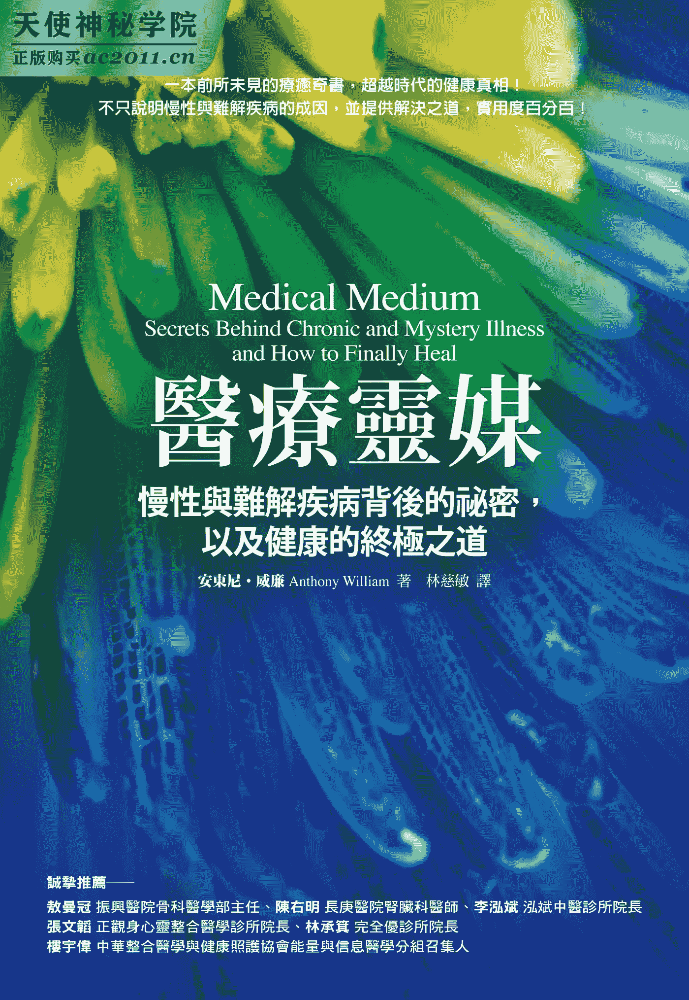
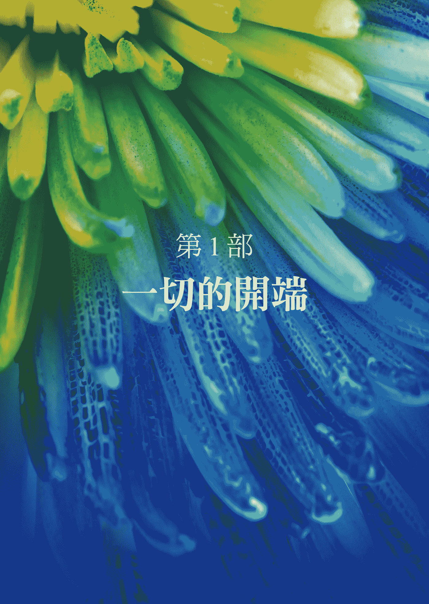
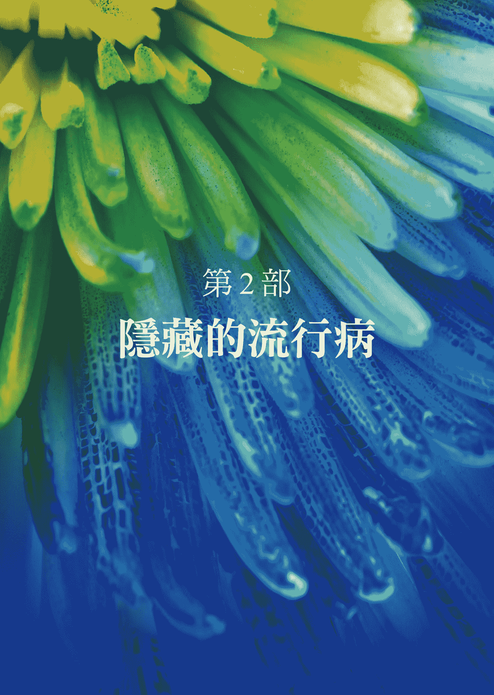
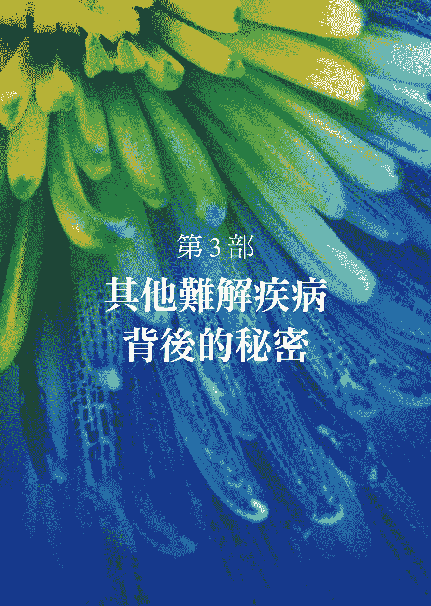
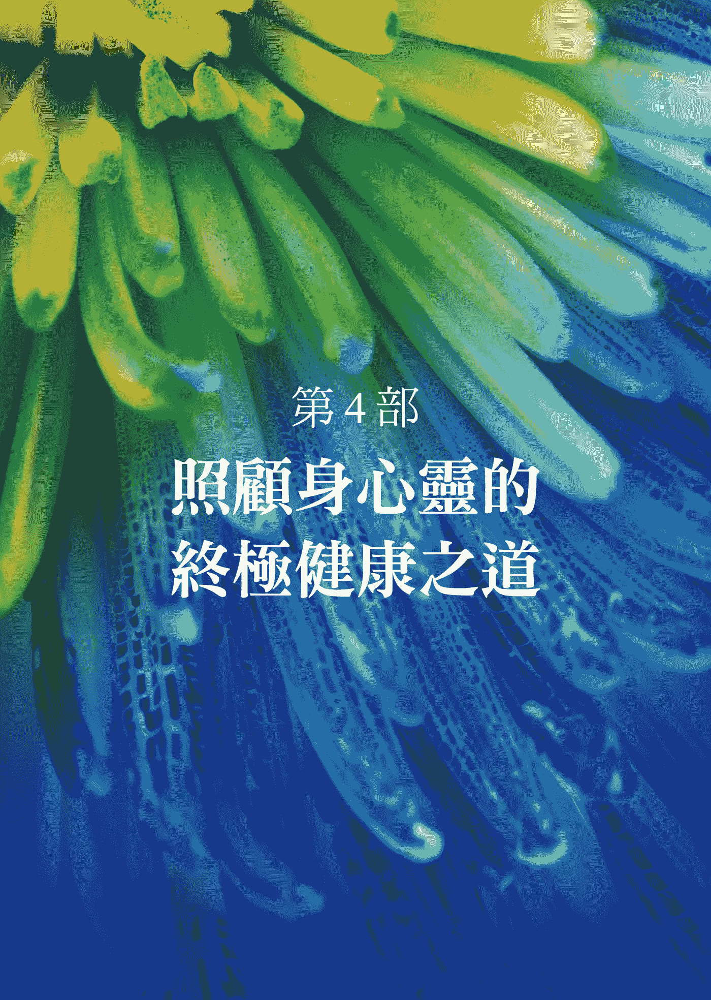
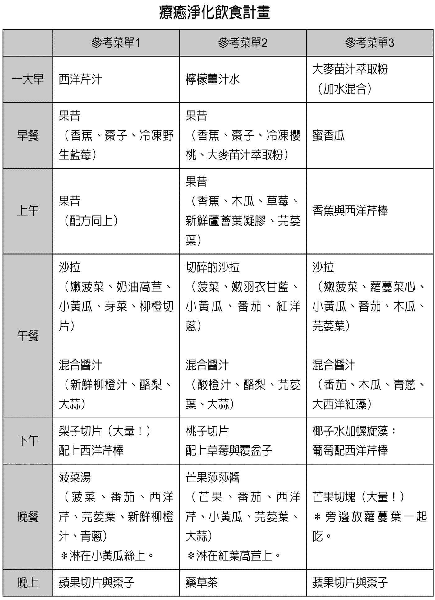

# 医疗灵媒

## 作者简介

**安东尼‧威廉（Anthony William）**

美国知名医疗灵媒，天生拥有与最高的灵对话的能力，这个高灵会提供他十分精确的健康信息，这些信息往往超前时代许多。四岁时，他宣称当时没有任何症状的奶奶有肺癌（之后的检查结果证实了他的话），让家人大为震惊。此后，他就一直运用自身天赋去“解读”他人的身体状况，并告诉对方如何找回健康。他在提供治疗建议方面前所未有的准确度和成功率让他广受信任，帮助数万人摆脱病痛之苦，其中包括电影／电视明星、摇滚歌手、亿万富翁、职业运动员、畅销书作家，以及无数已被疾病折磨太久的人。以外，他也是许多医生遇到棘手病例时会去寻求建议的对象。

Tune into Hay House broadcasting at：www.hayhouseradio.com

## 译者简介

**林慈敏**

文化大学新闻系毕。出版编辑资历近二十年，现为自由译者与文字工作者。喜爱探索身心灵的奥秘，也喜欢接触关于大自然、旅行、文学、人文关怀的事物。译有《往前走的力量》《大商人的秘密》《天空来的人》。

联络请至：tm.lin66@gmail.com。

# ［推荐序］简单又易实行的疗愈大道，就在你眼前

癌症、孩童过动与注意力不集中、经前期症候群、自体免疫系统疾病等难治问题，困惑了许多人。本书的出现，提供人们一个居家食疗的有效心法，也为迷惘在里头的医疗从业人员，指引出另一种医学思路，一种更快速疗愈的全新方向。

随着医疗科技的进步，人们接受着更便利的现代化医治，但慢性疾病与癌症却也同步增加，几乎每一个家庭都有这类个案。而这些疾病，现今医学能帮上的忙却如杯水车薪，或如书上所说的提供了错误的治疗方案。这并非医界不努力，其实所有医疗从业人员都很认真地想找出解答，只是碍于现今的智慧与科技，仍存有很多误区。现今医学很强调实验数据，但好玩的是，几年后的数据却一百八十度地推翻目前最夯的实验成果。例如多年前，大豆异黄酮获得各种临床验证及实验室认可，堪称女性的救星，但现今，数据却说它会致癌而令人却步。另外如腋下交感神经阻断术、腹部开刀顺道拿掉阑尾等原先主流方法，也逐渐被验证是不可行的。今日，专注力不佳孩童服用利他能、癌症个案服用化疗药物，依中医观点是不认同的，而书中的高灵也持同样的看法，或许数十年后的实验数据也会证明此一观点。本书的作者由于有高灵指点，等同拥有比现今更高等级的智慧与科技实力，故能快速找到病因，并提供有效的解答方案。这其实一点也不稀奇，想想许多古文明，就留下许多今日科学家们仍找不出的解答与赞叹。说穿了，不过是当时的高灵指导（当然也有人说是外星人），才有能力创造令人不可思议的成果。

说到医疗灵媒，其实就是高灵指引看诊，这个标题，对现今台湾的主流医学来说，有很大的冲击。但随着科学的进展，人们对于灵学的论述，从完全否定，进展到对它存疑，再迈入近来的部分肯定，代表科学人愈来愈谦虚与进步。新英格兰医学期刊就曾专文介绍灵猫预测死亡，而美国太空总署也提出人类世界有超过八成是由看不见的物质所控制，称之为暗物质（dark matter）。另外，国内外身心灵的课程如雨后春笋般发展，由此可知，现今医疗与高灵或灵学结合在一起，非但不八股，还是未来的主流与趋势。

书中以营养学贯串全场，符合欧美先进医疗国家正流行的一个观念：最好的医生就是“懂得营养学的医生”。但仅少数医生钻研营养学，且能在众多营养素中正确地选择最适合个案补充的医生，又寥寥无几。全天下的蔬果及营养品至少上万种，本书作者在高灵指导下列出常见疾病需要补充与禁吃的食物及营养品，可为我们节省不少摸索时间，这对我而言真是喜获天书，我也从这本书中筛选出适合在地人的食疗心法，很实用，真的很感谢上苍让我遇到此书。阅读此书之前，在我临床门诊中也确实验证了透过药物、作息、营养三方位结合，人们可以快速摆脱疾病的枷锁，减少用药次数，重获健康的身心灵。书中的营养建议是可行的，不过仍须请教专业人员分析该种营养品是否合乎你的体质及服用剂量。

在自然医学里头，疗愈须历经排毒、滋养、心灵净化，最后便可重生。在排毒部分，作者提出现今常见毒素的排除，如排农药毒、重金属毒、塑化剂等毒素。很多疾病是污染来的，现今不论空气、水、食物，都受到化工污染，也因此，毒素排除极重要。另外，禁吃的食物也是重点，许多个案遵照禁吃的方式后，健康获得大大的加分，可见何种食物禁吃，是与吃药一样重要。而滋养修复部分，我依全书分析统计出，最常见的是野生蓝莓、芫荽叶、植物性 DHA╲EPA、酪梨等，若你想省时间，可先从上述下手。另外早睡也是一种最简化的排毒滋养法，这我的感触更深，在没有看诊时，我常晚上八点前就入睡，除了可协助静心外，体能更可快速提升，参照本书的内容，还真的符合高灵的指示。

在心灵净化这个区块，坊间疗法很多种，以往我都是用巴赫花精帮助个案心境平复。本书中，高灵指引作者列出的疗法，如看夕阳、凝视星空、看海等方式，竟也能达到同等效果，且更加方便又不花钱，有兴趣的朋友，不妨深入阅读体会。另外，书中的疾病医学逻辑，对医护人员帮助也很大，有赖读者加以融会贯通。

中医以望闻问切四诊做诊断，古人云：“望而知之谓之神，闻而知之谓之圣，问而知之谓之工，切脉（把脉）而知之谓之巧。”四诊之首的望诊，是以观气色得知疾病的轻重、情绪波动、药材能量，由于需要深邃的静心功力及强大的气功根底，必须经过多年专门修持才能获得此功力，所以古人把会望诊的医生归类为神医等级。而神医的极致，就会如同书中高灵一样的能力，但须累积多年的修练才能打开脑中伏藏脑，达到世间所有我尽见的高深望诊境界。不同的是，本书作者是由高灵直接告诉他答案，一旦高灵离开，就无法解答。而传统的道医望诊，须经多年修持来打开潜能且终身受用，方式虽不同，但道济群生的人生使命却是相同的。

巧遇此书是幸运的，这可说是慢性与难治疾病的食疗全书，且在美国受到极大推崇。翻开它，你将得到更快速的治疗心法，对于医护从业人员，也能瞬间提升自己的诊治能力，让来诊个案得到更完美的疗愈与保健对策。可以说，简单又易实行的疗愈大道，就在你眼前。

（本文作者为泓斌中医诊所院长 李泓斌）

# ［推荐序］来自天上的讯息

癌症、孩童过动与注意力不集中、经前期症候群、自体免疫系统疾病等难治问题，困惑了许多人。本书的出现，提供人们一个居家食疗的有效心法，也为迷惘在里头的医疗从业人员，指引出另一种医学思路，一种更快速疗愈的全新方向。

不知道是什么机缘，我有机会先睹为快的看到了安东尼‧威廉《医疗灵媒》这本书的翻译稿。看到书名，就引起我极度的好奇心。知道安东尼‧威廉具备独特超常医疗能力的原委后，更是让我忍不住一口气把它读完。读后脑海浮现一句话：这是天上捎来的讯息。

无风不起浪、凡事必有因。在这信息充斥氾漤的时代，天上捎来讯息，做什么？给谁？可信吗？

这是一个特殊的时代，一切加速、剧变，人类应该呈现若非快速提升就会被淘汰的两极化现象。在这危险也是转机的时刻、上天有好生之德，所以高灵透过安东尼告诉芸芸众生：许多慢性病、怪病、难解疾病及医疗治疗效果不彰的疾病，它背后真正的原因以及如何达到身心灵真正的疗愈。看作者在说理、在实务操作及案例列举上都堪称完备，以我从事正统医疗工作多年，以及对于各种自然疗法、另类医学的认知，书中所述，可信度甚高。书中处处引人入胜，提供的方法也都确实可行，还有多处让我有拨云见日的兴奋感。虽然书中尚有些让人存疑之处，但整体上我仍对它抱持着正面的看法，心里还是悸动到想推荐给所有有缘的人。

哪些有福气有缘的人最应该受惠于这天上捎来的信息？我认为至少有以下三种人：

一、久病缠身、医治罔效的病患。尤其各式无明病苦（包括书中所说的难解疾病）。书中教导的都是如何远离不当的生活方式，如何借助大自然，重新启动自己身体里那最强大的疗愈能力。当然获得的成效，应该与各人的认识以及执行的程度有关。但是以我的了解至少这些方法不应有害，因为他完全符合了道法自然与天人合一的法则。

二、医疗从业人员，书中许多疾病的病因与对治的论点，与现在医学的认识有出入。想起历来先知在初始都是被人质疑的，因此医界也应该抱着开放的胸襟与态度，认真检视我们目前的思维方式及医疗模式，是否真有局限或偏颇之处。或许因此可以为医疗带来一番新的气象，造福更多的病患。

三、愿为自己负责，想把健康掌握在自己手中的有缘有福气的人。真希望人人都能够抱着这种态度来对待自己的身体，面对自己的人生，因为疾病多半是自己的生活及环境造成的。如果人人有正确的认知与要求，那对于衣食住行的供需、环境的净化，以及健康生活方式等都会起到连动的变化。

本书可以做为病苦阴霾中的明灯，或为唤醒自己觉性的楔子。大道至简、力行出真知，如能珍惜善用它，应足以为有缘人带来健康的身心灵，更寄望集众志能促成一个光亮干净的地球。

（本文作者为振兴医院骨科医学部主任 敖曼冠）

# ［推荐序］开卷有益

人类自小喜爱听故事，也广受梦幻神奇的事迹所吸引。此书整理了许多天使高灵降临人间，帮人们解决身心难题的各宗医案，想轻松阅读、独自喝喝下午茶的朋友，这本书值得一瞥。

许多人常不吃正餐，饮食不节、生活无度。本书提供许多医界已知的糖类代谢机制，并补充完整的疗愈知识，若你关心家人健康，尝试提供资料说服他们改善习惯，这本书值得一试。

临床医学解决不少病苦，但面对多数慢性病却仍莫知奈何。此书对医界过去仅有粗浅认识的特殊疾病提出病机上的不同诠释，学者专家若持开放胸襟欲进一步钻研，这本书值得一窥。

基础科学对人体和生命的探究日新月异，昔化约式的观察研究常将统计相关误解为因果关连。此书揭露各科难解疾病的共同肇因，对病毒行为和解决之道有兴趣者，这本书值得一探。

坊间和网络常有许多似是而非的养生保健建议和禁忌，且遵循者众。作者告诫人们勿轻易采信，并提出具体的理由和有效保养方式，想正确修复腺体机能的病患，这本书值得一看。

十几年来持续的食安问题让国人人心惶惶，天然食物中的毒素问题亦广受重视。作者认为要积极排毒，而非仅仅消极限制摄取，欲知如何分辨以安心享用天然美食，这本书值得一览。

近年来营养和生技产品的书籍文章充斥市场，皆以安全作诉求、品质优良为宣传导向，殊不知体质不同、生活型态不同，可能需要补充的食品也有差异。按表索骥，这本书值得一查。

在营养学和毒物学引领风骚的时代，过敏的个案却是与日俱增。本书矫正了过敏原、益生菌和肠道生理与肠漏现象的常识误区，备受过敏所苦而营养吸收不佳的人，这本书值得一翻。

广受欢迎的另类疗法总爱自行宣称神奇疗效，虽然部分具有科研和见证的资料，但实际用于病因复杂又被误解的疾病上，作者认为并无效益。想深入了解个中原因，这本书值得一阅。

诚如作者所言，这是个危险的时代。信息的推陈出新，令人莫衷一是，即便博学多闻或极具思辨能力的科学人，对于非专业领域的知识，不是基于自我保护的否定，就是受潮流或无法充分调查的见证影响而误信。我们大多数不具灵媒体质，也无从断定本书资料真确度是否百分之百，身为倡导身心灵整合医学的一员，本书内容读起来特别有味，也值得读者一齐身体力行、勇敢尝试。

兹以两段高灵的信息作为结尾：

一、“医学界也应该做出其他领域（例如救命手术）已做到的飞跃性发展。如果想避免未来数十年还要为各种疾病取无意义的名称，那么，现在是医学界承认诊断检验有时是不足或不可靠的、医生的训练有时会令他们只能依靠猜测的结果工作的时候了；该是医学界诚实面对、敞开心胸，接受医疗模式需要调整与前进的时候了。”

二、“若你观察到某人饥渴地追求任何形式的灵性学习──宗教、灵性导师、励志书籍、禅修中心──那可能是因为她或他的灵魂有过损伤，所以出于直觉地在搜寻让灵魂恢复健康与完整的方法。对我们每个人来说，那都是很重要的工作──当你在这尘世的时间结束，你的灵魂应该要足够完整，才能撑过穿越星际的旅程，而神会在星辰之外的地方迎接它。”

（本文作者为正观身心灵整合医学诊所院长、 中华整合医学与健康促进协会理事、中西医师 张文韬）

# ［推荐序］这或许是未来解决疑难杂症与预防医疗纠纷需要的一本书

太棒啦！宇宙超级无敌棒的一本书！这是一本不容你错过的好书，看到是你的福气，万一错过了，那只好为你惋惜了。

在我们的临床工作中，每天面临的病患可以分成下面四大类：

一、有确定诊断，又可以治愈者。

二、无确定诊断，但可以治愈或自愈者。

三、有确定诊断，但无法治愈者。

四、无确定诊断，也无法治愈者。

第三类与第四类是我们身为医者最不愿意碰到与见到的，尤其是在医疗纠纷高涨的时代，医者人人自危，却偏偏闪也闪不掉，万一不小心碰到只好自认倒楣了。这就是目前医生普遍面临的窘境与困境。

多年前，我曾经在中华生命电磁科学学会的会议里提到，要当神医的三个必要条件就是：

一、要有透视人体的功能。

二、要有预测疾病的能力，以及预测病患是否可以痊愈的能力。

三、要有治疗疑难杂症的超能力！

基于上述危机，我个人认为假如医生拥有上述能力，那是再好不过了。可是万一我们医生无法拥有这份能力，就只好自求多福，并祈祷有更先进的仪器来协助我们了。唉！当医生真是风险很高的行业，尤其现今社会大众对医生的期望更高，偏偏疑难杂症又特别多！

本书的第二部与第三部使用了大篇幅讲述临床上常见与难解的慢性病，其中谈到 EB 病毒与带状疱疹和一些慢性病的关系，非常引人入胜，且发人深省，更让我们深思：以上两种病毒只是一个引子，目前所有人类都身处细菌与病毒氾漤的时代，像 HIV 病毒会摧毁你的免疫系统，HPV 病毒与妇女的子宫颈癌有关系，HBV 病毒及 HCV 病毒与肝癌有关，但难道只有这样吗？或许上述几种病毒还造成其他的慢性症状，只是目前我们还未发觉！

本书在每一种慢性病的疗愈建议方面，包含了各种疗愈食物、疗愈药草与营养补充品，也值得我们去尝试。从这些建议中，又不难让我们想到中医“物物相生相克”的道理。大自然的万事万物，似乎都相通，有其关连性，可以互补，也可以相克。这个地球和这个宇宙真是太有趣了！

本书第四部则阐述了终极疗愈的方法，其中把消化道健康摆在第一个来说明。这让我想到有些书也是标榜肠道的重要性，包括《老化的原因在于肠》《肠命百岁》等，概念不谋而合。作者针对脑部与身体的毒素排除也有一套方法，而在他提出的二十八天疗愈净化法里，几乎以蔬果为主的饮食是其重点。最后，他还列出二十一位菁华天使，会在我们面临困难、需要帮助时适时出现，协助我们度过难关。

读完这本书，我不得不出自内心按一万个赞！希望此书的出现，能够带给大家幸福、健康与快乐。

（本文作者为林口长庚医学中心肾脏科资深主治医师、中华生命电磁科学学会理事长 陈右明）

# ［推荐序］下载、科技与疗愈：善用下载信息，翻转当代科技、人文与生命现象迷思

当我第一次听到“下载”这个现代网络名词被转用在“通灵”现象的研究，我只是认为这种创新的说法满贴切的，就像是当年生命电磁科学学会的理事王立文教授首先运用“网站”的观念，来模拟各种独特心灵时空（或在传统佛教中称之为三千大千世界不同层次的存在）一般地适当。此说法又缘自李嗣涔教授在台大与硅谷对小朋友进行人体特异功能的实验，发现可以经由神圣字汇的链接而进入不同层次的时空现象。

## 研究“下载”讯息的特殊因缘

没想到在二〇一二年左右，崔玖医师因为多年研究花精与人类心理疾病的关系，其中包括二〇〇八年因为汶川地震义诊而发现的灾难心理复健花精，而知道英、美两国的花精传统有很重要的来源之一是由某些层次的天使“下载”而来，所以她希望我这喜欢收集与分析资料的外商主管，花点时间来整理出一些古今中外“下载”信息的主要系统与内容，作为大家未来认识的参考点与座标。我这才算是真正进入了这个领域的研究，没想到因此改变了我对生命与意识来源的看法，也开创了一个全新的科技与人文整合研究的可能新方向。

当时我已经知道李嗣涔教授的研究对象 T 小姐传达过药师佛的药园见闻，也读过“奇迹课程”与一系列相关的耶稣与其门徒的下载讯息，像是十二门徒之一的多玛斯所下载的《告别娑婆》与《断轮回》这两本很精彩的书，内容描述当年多玛斯跟随耶稣传教时的所见所闻，并且非常传神地叙述了后来的信众、长老、教士与教会，如何以人的立场曲解耶稣的灵性教诲，并排除与删改这位圣人传布的核心教义。

这两本书内容幽默、轻松，经常以历史真相被后人修改的事件为例，让我们了解到，当人类以特定自我立场与组织利益去看真相时，是多么容易扭曲真理与分化你我。我因此还特地去买了一本记录当年两位哥伦比亚大学心理分析系教授“下载”记录耶稣奇迹课程的传记性书籍《暂别永福》，看看两位原本非常会争吵的犹太裔教授在下载一份当代最重要的基督心法╲般若经典时是如何共同合作，以确定如果我只是读下载资料本身，是不是太一厢情愿地相信新时代讯息而与事实情况相差太远。至少我应该自问：为何耶稣不选高山荒野山洞里面的修行人，却选了热闹非凡纽约市中心的学术重镇里两位没有特定宗教信仰的心理学教授？这两位教授是不是原来就是隐匿的宗教狂热者或喜欢展示神通的怪咖？读书之后我发现，这两位教授根本就是和我们一样的“普通人”，其中那位女教授虽然天生就通灵，却因身为科学家，为了协调这两种完全不同（甚至冲突）的身分，内心着实备受折磨，而且非常清楚与理性地记录这整个冲突过程。再加上那位男教授因为向老天祈祷来解决两人之间的冲突，进而发现两人必须合作“下载心法”的人生任务。

不过到今天还有大部分的圣经学者选择不评论这份资料，更不要说传统教会比较僵化的教条式评论，但这并不影响这份资料在欧美大部分读者心灵中的感动与认同。

## 般若经典是一种天启的正知正见

同时，我很幸运地找到一位投入将近半世纪的学术精力，在美国普林斯顿大学研究新约圣经时代历史的资深神学教授伊莲‧裴歌思女士，她刚好在二十世纪末开始大量出版她一生专注研究一九四五年在埃及“纳格哈玛地”地方被考古界发现的多本福音书的重要结论，其中和人类未来心灵发展的主题比较有关的分别是二〇〇三年出版的《超越信仰：秘密的多玛斯福音》与二〇一二年出版的《启示录》。这两本书的内容指出，我们认同的主流基督教四大福音书之一的［约翰福音］与新约［启示录］，其同一位作者“拔摩岛的约翰”当时写作这本最晚被完成的福音书的环境、经历与心态，居然都有很令人争议的问题，却仍然被日后的教会收录为经典的经过，以及比它早五十年出现的［多玛斯福音］却被打入冷宫，甚至日后被教会全面销毁的背景原因。

而这纯粹以学术研究所获得的结论指出，［多玛斯福音］的核心观点是“人人皆可以像耶稣一样成道”，与［约翰福音］的“只有耶稣一人成道为上帝之子，其他人只有崇拜耶稣的资格”有很大的差别。事实上，根据裴歌思教授与其他学界的说法，现在流行的“多疑的多玛斯”这种故事，根本是后者（约翰）为了排除前者核心教诲影响而加工制造出来的内容。而且，这样的结论居然与前述下载的多玛斯资料中在《告别娑婆》与《断轮回》所述内容基本上相合。而这两份下载资料中所强调的耶稣核心三教诲（幻相、宽恕与神恩），也与佛教的三法印（诸行无常、诸法无我、涅盘寂静）、天台宗的一心三观（假、空、中），以及《道德经》的关键核心（无为、无我、无不为）相合。

随后，我按照两位佛教界前辈周勋男与郑振煌教授的建议，去读印顺法师的大部头著作《初期大乘佛教之起源与开展》，希望找到佛教般若经典的真正来源。因为如果只读像是《华严经》的本文，我们顶多看到“龙树进入龙宫取回《华严经》”这种奇特的隐喻式或神话式说法。在该书第一三一二页，我找到了般若经典（亦是北传与南传佛教的核心差别）来源也居然是五种不同下载方式的惊奇答案：一、诸天所传（由三千大千世界的天人、菩萨等所传）；二、梦中得来（由行者梦境中所得）；三、他佛所说（由释迦牟尼以外的诸佛所传）；四、（三昧）定中所闻（由行者于三摩地定中所得）；五、自然呈现心中。

所以，我们现在可以很确定地说，不论是西方或东方的般若（心灵）经典，都是由（最？）高层天界所“下载”的重要心灵信息共同核心。如果人间历史上留下的心灵经典合于这些般若经典的下载核心内容，就值得进一步考量该经典的其他实用与理论特性。否则就是以讹传讹，拿人的写作材料充当所谓的天启信息，混淆他人视听，误导后人观念。

## 疗愈科技居然也可以下载

我们知道很多的著名科学家，都是经由特殊的灵感或视窗或清醒梦的过程，解决了前人无法突破的科技问题，如牛顿、泰斯拉、爱因斯坦、费曼都有此类经验并且公诸于世。某种程度上，这也是一种当事人不同于一般科技理论逻辑思考方式的“下载信息”。

但是，你手上这本《纽约时报》畅销书却是大剌剌地一开始就声明，它不是作者本人的研究或临床或接受一时灵感的著作，而是作者从四岁就开始接收的、由一位代表“慈悲”字义的大天使（或菩萨？）所传达的医疗科技讯息。它完全不是我们东方人熟悉的“因果经”形式的通灵或劝善资料，而是非常详细地用科学式的因果逻辑，分析当今被归类为慢性病与所谓难解疾病方面有别于主流对治、甚至所谓另类医学看法的叙述。按照《纽约时报》打畅销书广告的说法，该书超越了现代医学的科技约二十年。

除了第一部分是讲作者如何由排斥而逐步接受传播下载信息这奇特的生命任务之外，本书把很多当今主流医学尚未深入找出病因的疾病做了分类（第二、三部）。

第二部分谈的是目前被医疗界误判为自体免疫疾病的多发性硬化症、类风湿性关节炎与多种甲状腺机能不足等不容易治疗的难解疾病，实际上却是 EB 病毒造成的。而且，EB 病毒会经历四个阶段：一、潜伏；二、单核细胞增生；三、躲在器官里（发炎与中毒），并开始攻击甲状腺；四、离开甲状腺，去攻击中枢神经。这过程中也可能会造成其他几种慢性病，如纤维肌痛症、耳鸣、晕眩、心悸等。因为当今医疗界并不知道这清楚的病理过程，所以患者很容易被误诊（为白血症、脑膜炎、狼疮等），而作者提供了清楚的疗愈食物与草药，来根除这些病毒引起的症状。

第三部分则提到大约十种非常普及、当今医疗界却不明其病理的慢性病，例如：

因为情绪压力造成肾上腺（而非仅是胰岛素）失调所引起的第二型糖尿病与低血糖症，必须降低动物性脂肪与摄取足够的蔬果。

因为情绪压力造成肾上腺过劳，而引起忧郁、健忘、失眠、便秘、无力等症状。由于肾上腺有五十六种组合腺体，除了透过静心以降低压力之外，也可以减少摄取动物性脂肪与补充特定蔬果，但不要断除碳水化合物。

还有像是当今医疗界的错误认知：念珠菌由酵母菌引起？带状疱疹只是一种病毒？莱姆病由某种细菌引发？而三者却都是由不同的病毒（至少十五种病毒会引起不同的带状疱疹），或是与环境毒素共同引发，而不是酵母菌或细菌。因此，使用类固醇、抗生素或其他抑制免疫系统药物来对付错误的病因，都有相当的副作用。

其他被当今医疗界错误解读的慢性病还有：自闭症与过动症（因为汞与铝等金属累积在脑中线管道所引起，而非肠道环境或遗传）、创伤后压力症候群（因为脑中缺乏葡萄糖，无法保护腺体与电子脉动对脑细胞冲击，而非电解质流失）、忧郁症（情绪失落与压力、病毒、重金属、电解质不足会引发）、更年期（因为病毒、环毒、DDT、辐射、重金属引起，而非仅是生殖荷尔蒙失调引起），以及偏头痛（因为多种现代环境因素组合，包括 EB 病毒引起）。

第四部分则是介绍真正对每一个人都有用的健康饮食与排毒手段，提醒我们避免基改食品、蛋乳、猪肉、养殖鱼、人工甜味与香料、鱼油补充品等食物，并且要大家多吃蔬果、多静心（包括看落日、观海潮、赏蜂、观星、种花等，而不只是静坐）、多祈祷（二十一位菁华天使与超过十万个无名天使都愿意帮助我们，我们只须以真诚与决心大声说出来）。

## 以自己与亲友的经历，联合善念学者，来验证（或验退）下载信息

由于这本书的主题是主流医学尚未了解的领域，或许会让执着于“科学验证”口头禅或“双盲实验”教条的某些现代人很不舒服，甚至引发所谓的情绪反应与恶意攻讦。但也因为作者所言的医疗界对这些病症充满迷思与误判，让许多人自己与周遭亲友承担了非常不必要的痛苦，甚至提早死亡，是众所周知的事实，所以一般民众肯定愿意给这类正面的“下载信息”一些空间与时间。如果自己与亲友能够得到好处，还会非常乐意传播给别人。

本来一个社会的改变都是由少数人引发的，这世界目前之所以各个所谓的主流领域（宗教、民主、科技、医疗、商业、伦理、教育、社会）都出现了“撞墙”的问题，难道不就是因为我们的专业教育太成功，而直观、道德、整合、创新与慈悲能力不足所造成的吗？在医疗界的领域，我们需要的是像裴歌思教授这样执着与善良的学者（与医生），愿意把本书提出的各种已经证明有效、但相对于现有科技更为创新的说法，以更严谨与医疗界可接受的方式加速验证（或验退）。不要再等二十年，让利益团体有机会模煳焦点，打出类似烟草公司已运用多年的拖延战术，利用民众的无知大赚黑心钱。

为了人类身心灵的全面健康与回归天人合一的美丽理想，我愿意推荐这本独特的下载资料。

（本文作者为麻省理工学院材料博士、中华整合医学与健康照护协会能量与信息医学分组召集人、优善时空波科技股份有限公司执行长 楼宇伟）

# ［推荐序］真高兴你即将获得和我一样的神奇体验

你如何知道自己知晓什么？

大多数你知晓的事都是你学来的，从照顾你的人、你的朋友、学校、书本与街头学来的。这些是你知道你知晓的事。

但在你的内心，有另外一种知晓。例如，你知晓你是、你存在、你就是你。这是你天生就有的知晓。

还有另一种知晓是很难述说的，因为大多数人视之为理所当然，那就是你的身体具备的、知道如何运作的知晓。你

不必是个心脏病学家，你的心脏就知道如何输送血液；你也不必是个肠胃病学家，你的肠子就知道如何消化与吸收食物。

再来，还有一种知晓是以某种感觉呈现的，例如你的本能反应或直觉。这种知晓极为聪明，也有点神奇，能让你知道从未见过或听过的事——而那可能救你一命。人们会建议你去相信这种知晓。但它是从何而来？它是如何让你知道那些事的？又是谁决定这种知晓要在何时与你连接？

身为一名科学人，一直以来我被教导要遵守的信条，就是必须只相信能观察、测量、测试与复制的事物。 然而，身为一个有情感的人，我无法测量我对妻子与孩子的爱——但那却比任何我曾在显微镜下研究过的细胞还要真实，也重要许多。

从远古以来，对具备超凡能力者的记载就一直存在——所谓超凡能力，指的是各种伴随着近乎神奇本领的不同知晓。比方说，知道电脑都难以解答之事的智者，以及人类世界各个领域，例如音乐、艺术与运动等的天才。 最近，我发觉有些人能跟已跨越到另一个世界的人沟通。这些跨界灵媒正席卷全美，带来人们发誓只可能来自逝去的所爱之人、令人震慑的讯息。我一直以来都非常喜爱的书，就是布莱恩·魏斯的《前世今生：生命轮回的前世疗法》。魏斯博士为病人催眠，接着病人回到前世，甚至回到转世空档时停留的空间，灵性上师们就在那里传达惊人的讯息。这些疗程对经历过的人来说，具有深刻的疗愈功效。

此外，还有一些疗愈师。这些男男女女——有些很知名——拥有让盲人得以看见、跛足者得以行走、患病之人完全康复的能力。这些疗愈师是我感到最不可思议的一群人，或许因为有点嫉妒吧。我很乐意被赐予用手触摸就能完全治愈他人的天赋，若真能拥有那样的天赋，我会进行一场疗愈狂欢之旅，就从儿童医院开始。

每当听说某人拥有某种特殊的疗愈相关能力，我就会立刻想跟对方见面，把他们纳入我的人际网络，亲身去体验他们的天赋，介绍病人给他们，并希望自己也能学到那样的能力。我就是这样与安东尼·威廉联络上的。

几年前，我的腹部每天都会疼痛，去照了超音波后，发现肝里面有一颗肿瘤。后续的核磁共振造影确认了这一点，也发现我鼠蹊部的淋巴结肿大。我很担心，于是安排了淋巴结切片检查。

等待检查的日子到来期间，有人给了我安东尼的电话。我很快就约到他的时间，而一开始进行诊察，他就告诉我肝的问题——且竟然正确预测了切片的结果。更重要的是，他开了一道营养补充品与食物的养生处方给我，立刻解决了我腹痛的问题——我的腹痛完全与肝脏肿瘤无关，那其实是一颗之前没发现的多年良性囊肿。

自从那次之后，我还为了妻子与孩子们的问题谘询过安东尼，总能得到有效的建议。我也把许多好奇且心态开放的病人送到他那边，每一位病人的回应都非常棒。他的知晓从何而来，由你去解读。我相信的是，那种知晓来自跟直觉相同的频率，只是强度更大。事实上，安东尼自己的描述是，那就像一个直接对着他耳朵说话的声音。

当安东尼告诉我他写了一本书，我兴奋得手舞足蹈。我终于得以听见一个拥有神奇疗愈能力的人，诉说那一切是怎么办到的，以及他个人的成长过程与经历。读了这本书之后，我更是震惊不已。书中的文字优美、真诚、有趣、谦卑且迷人，我根本无法将书放下，同时也为你感到高兴，因为你即将得到跟我同样的体验。这一趟进入一名真正疗愈师的心智与灵魂的旅程，简直比太空旅行还过瘾。

希望你跟我一样喜欢这本书。

（本文作者为医学博士，着有《超简单净化排毒法》《净化饮食法》等畅销书 亚力山卓·杨格）

# ［前言］疗愈的真相就在你手中

你会对坊间那些互相矛盾的健康信息感到困惑，只想要一个清晰的指引吗？

你会害怕例如癌症等疾病的盛行，而去寻找预防方法吗？

你想减重吗？想看起来、感觉起来更年轻？想更有活力？想帮助身体不适的亲朋好友？想守护家人的健康吗？

你是否尝试过许多方法、去过许多医疗院所，健康状况却依然不如你所愿？你是否想要有人向你保证，说你的痛苦并非自己想像或造成的？

你想重新感觉像你自己吗？想重十内心的清晰与平衡吗？想获得心灵上的支持，并挖掘出灵魂的潜能吗？

你想振作起来，迎接二十一世纪的挑战吗？

那么这本书就是为你写的，你不会在其他书里找到这些问题的答案。

本书与你读过的其他书籍都不一样，你不会看到一连串引用文字、必须不断研究的参考资料，因为这是领先时代、来自天堂的全新讯息。有些地方我会提到数字与其他听来像是统计数据的细节——例如有多少人苦于某种特定症状——那些事实其实来自高灵，我在第一章会对此多加说明。极少数状况下，高灵会要我参考世间资料寻找特定细节。科学界已经发现我写在此书中的部分内容，但并不是太多。我在这些书页里分享的一切，都来自一个希望每个人都获得疗愈并活出自身潜能的更高权威，慈悲的本质。

本书揭开了高灵许多极为珍贵的医疗秘密。任何因医生无法解决的慢性症状或难解疾病而受苦的人，本书为他们提供了答案。

但这并非一本只为病人而写的书，这本书是为这个星球上的每一个人写的。

健康的趋势与潮流来来去去。一种风潮受到欢迎，就会对人们的意识产生极大的说服力。然后新的吸睛方法出现，旧的便退去，而我们被闪亮的新包装方式分了心，以致完全没有意识到其中包含的只是同样重复的错误观念。每经过十年，我们就会忘记前一个十年所犯的医疗错误，于是历史一再重演。

与其他用响亮的新名称重新包装旧理论的健康类书籍不同的是，接下来的内容涵盖了高灵首次透露的疗愈指南。

## 不再被各式健康或医疗风潮淹没

高灵称我们当前的时代为“加速年代”。之前从未有任何文明改变的步伐如此快速。

科技几乎使我们生活中的一切都发生了彻底的变革，我们活在一个充满惊人奇迹与机会的时期。

这也是一个危险的时代。我们的脑筋才理解刚刚发生的某件事，那件事就成了旧闻。我们身处如此的匆忙当中，以致永远感觉必须比别人快一步。随着指尖可得的实时信息而来的，是更庞大的需求、责任——还有意想不到的健康危机。快如闪电的进展，有时会换来你不曾考虑过的脆弱。

这些改变影响了全人类，女性更是饱受冲击。在这个时代，女人面临最多期待，她们的身体经常濒临崩溃边缘。而慢性疾病成了极为普遍的问题，对女人与男人而言都是。

如果不中止源源不绝的错误信息，如果没有认清祖先们经历的一切、修改方向，那么未来的世代也必须忍受不必要的折磨。为了跟上改变的时代，以求生存，我们必须学习适应，而唯一的方法就是保护自身健康。

目前慢性疾病相关书籍中普遍提到的方法，就是建议读者从饮食中排除会引起发炎的食物——仅止于此。坊间信息并未解释自体免疫系统失调或慢性症状的真正原因，或者如何让你摆脱根本的问题。那就是人们持续生病的原因。

然而，那些难倒医生的症状其实有真正的解释，我们在这个时代面临的挑战，也有强而有力的解决方法。

本书是能让你真正得到自由的指南。我写下这本书，就是为了使你真正疗愈，且不再被与身心健康有关的趋势、潮流、错误、似真似假的陈述、过失、困惑与骗术淹没。我写这本书，是为了让我们能帮助今日的孩童成长为健康的成人。

我绝非反科学。我毫不怀疑我们是由原子组成的、地球有几十亿年的历史，或是科学方法的价值。我所知的，以及本书涵盖的秘密，终将得到科学界的认可。

如果你或你所爱的人生病了，你觉得你还有二十、三十或五十年去等待答案吗？你能忍受看着你的女儿或儿子长大后还要面对你曾面对的相同健康问题，以及同样的医学极限吗？

因此，该是让众人知道这本书的时候了——这样你才能现在就读到它。

## 如何使用本书

你阅读本书的理由可能很多。或许是医生给了你一份诊断书，你想知道那些略语背后到底是什么意思；或许是你有不知如何说明的症状，正在寻找答案；或许你是健康照护专业人士，或者所爱之人生病了，而你想知道提供照护的最佳方法；也或许是你对理想的健康与身心平衡状态有广泛兴趣，想学习如何深入挖掘出最好的自己，以及你的人生使命。

本书对每一个人都有用，无论你执行的是哪一种食物疗程、饮食计划或营养上的信仰系统。任何想知道目前最先进疗愈知识的人，这本书是写给你的。

本书的进行方式是这样的：在第一部里，我会解释我是谁，以及我的一切。你将得知我与高灵的链接，以及我如何帮助众人从让他们持续生病的不明原因中痊愈、重回正常生活，以及预防后续的健康问题。我也会讨论“难解疾病”，以及它为何比我们想像的更普遍的原因。

想要痊愈，确认与了解是最强大的两项工具，因此中间的两部会用来解释许多病痛背后的真实故事。

第二部探讨的是 EB 病毒相关信息，这是一种被忽略的病原体，偷偷躲在纤维肌痛症、慢性疲劳症候群、多发性硬化症、类风湿性关节炎、甲状腺失调等使人虚弱的疾病背后。EB 病毒的各种病毒株与进程正以许多不同的方式折磨人们，特别是女人——它是难解疾病中的难解疾病。

第三部则把焦点转到其他常被误解的健康问题，并描述它们惊人且多样的起因。把这些信息全部送到大众手中，是刻不容缓的事。

在第二部与第三部的每一章结尾，你也将找到针对性的疗愈建议，包括建议罹患特定疾病的人吃的食物与营养补充品。至于补充品的摄取量，请和你的医生或健康照护专业人士商量。

接着来到第四部，我在这里揭露了获得健康活力的真正秘诀。这是今日健康领域遗漏的最大一块拼图。第四部的重点是痊愈、预防与自我实现，因此，无论你的焦点是放在摆脱疾病、让健康状况从好变得更好，或是挖掘你的真实自我，都能在此找到资源。这些资源包括让肠胃发挥最佳消化功效的诀窍、一种疗愈净化法、可能妨害健康的隐藏食材、地球上最具疗愈功效的食物、解毒法的选项，和一些灵性层面的技巧，例如透过独特的静心法疗愈灵魂等。

在全书中，你会找到许多个案经历，诉说我的委托人在历经身体与精神上的折磨后，重新站起来的故事——有时真的是重新“站起来”。我更改了所有人的名字与可以辨识出身分的细节，但保留了每位委托人经验的核心。我盼望他们的故事能给你安慰，让你知道你并不孤单；也给你希望，让你明白你同样能拥有属于自己的光明未来。

“加速”这个词不只代表“变得更快”，还意味着“活跃起来”。从历史的角度来看，它指的是一个胚胎在子宫里移动的初始迹象。

也就是说，这个“加速年代”的重点不仅是生活步调加快，也是重生。

一个新的世界正在浮现。如果我们想跟上脚步——且不受伴随快速变化而来的危险所害——就必须去适应。

本书中的每一个字，都是为了帮助你度过那个适应的过程。

我关心的是让人们变得更好、更健康。我已帮助数万人从病痛中完全康复、避免后续疾病的发生，并过着充满活力的人生，而我想把这样的成功分享给世界上更多的人。

全书中，你会经常看到我使用“医学界”这个词——在这里，我指的是传统与另类医学界，也包括整合与功能医学的较新领域。我不站在任何一边，也不做任何批判。这里的信息是中立、独立的，重点在于让健康照护从业人员与疗愈师获得这些知识，并学会去帮助更多人；重点在于让你掌握这些知识，并学会疗愈自己。重要的是真相。

我们不都是在寻找真相吗？关于我们的世界和宇宙的真相，关于我们自己的真相，关于生命、我们为何在这里，以及我们的使命的真相？

生病时，我们会自我质疑，觉得与生命隔绝，与自己生来要做的事隔绝。我们怀疑基本的真理，像是身体的自愈能力，因为我们尚未与疾病背后的讯息链接。我们找过一个又一个医生，试过一种又一种不同医学领域的疗法，想找到答案。我们失去了对生命本身的信心。

但痊愈之后，怀疑就会消失，我们又有了能量，可以投身于真正的人生使命。我们会看着自己转化，重新相信生命的美好。我们链接了宇宙法则，就像复活一样。

关于这个世界、我们自己、生命、人生使命的真相——归根究柢，都是疗愈。

而疗愈的真相，此刻就在你手中。

# 第一部　一切的开端

# 第一章 我就这样成了医疗灵媒

我不是医生，没有受过医学训练，但我可以告诉你其他人无法告诉你的、关于你健康状况的事。我能让你清楚了解慢性与难解疾病的真相，医生经常误诊这些病、给予错误的治疗，或是在没有真正了解导致症状的原因时就贴上某些标签。

从小，我就一直运用我即将在此分享的事情帮助人们疗愈。现在，是你知道这些秘密的时候了。

高灵就是这么告诉过我的，这是命中注定的。

## 意外的访客带来惊人讯息

我的故事开始于我四岁的时候。

某个星期天早晨，我一醒来就听见一名年老男子在说话。

他的声音就在我的右耳旁，非常清楚。

他说：“我是最高的灵。除了神之外，没有比我更高层次的灵。”

我很困惑，也警觉起来。有人在我房间吗？我睁开眼睛，看看四周，但没看见任何人。我想，**可能是外面有人在讲话，或在收听广播吧。**

我起身走到窗边。根本没人——当时还是清晨。我搞不清楚发生了什么事，也不确定自己想知道发生什么事。

我跑下楼跟爸妈待在一起，感到安心许多。我没说任何关于那个声音的事，但一整天下来，有种感觉愈来愈强烈：有人在看着我。

到了晚上，我乖乖坐进餐桌旁的椅子。跟我在一起的有我的爸妈、爷爷奶奶与一些其他家族成员。

大家正在吃饭时，我忽然看见一名陌生男子站在奶奶身后。他有着灰色的头发与胡子，身穿一袭棕色长袍。我猜想他是来跟我们吃饭的家族朋友，但他并未和我们一起坐着，反而一直站在奶奶后面，而且⋯⋯只盯着我看。

由于我的家人没有一个对他的存在有反应，我慢慢发觉自己是唯一看见他的人。我把眼睛望向他处，看他是否会消失。但是，当我把眼睛移回来，他仍然在那里直盯着我。他没有开口，我却能听见他的声音在我右耳边响着——就是我醒来时听到的那个声音。这一次，他用平静的语气说着：“我是为你而来。”

我停止吃饭。

“怎么了？”我妈妈问道，“你不饿吗？”

我没有回答，只是一直看着那个男人。他举起右手，示意我走到奶奶那边。

我感受到一股无法否定的直觉，要我跟随他的指示。于是，我从椅子上爬起来，走向奶奶。

奶奶正在吃饭，他拉起我的手，放在奶奶的胸膛。

奶奶吓了一跳，身体往后退。“你要干么？”她问道。

那名灰发男子看着我。“说：‘肺癌。’”

我很迷惘，我根本不知道“肺癌”是什么意思。

我试着说出来，结果却是含煳不清。

“再说一次，”他告诉我，“肺。”

“肺。”我跟着说。

“癌。”

“癌。”我说道。

所有家人此刻都瞪大眼睛看着我。

我的注意力仍放在灰发男子身上。

“现在说：‘奶奶有肺癌。’”

“奶奶有肺癌。”我说。

我听见餐桌上有叉子碰撞的声音。

灰发男子把我的手从奶奶身上拉起，轻柔地放到我身侧，然后转身爬上一道原本不在那里的阶梯。

他回头看着我说：“你会一直听到我的声音，但你可能永远都不会再看见我。不用担心。”他继续往上爬，直到穿越我家房子的天花板——现在他真的消失了。

奶奶盯着我。“你刚刚说了我认为你说了的话吗？”

餐桌旁出现一阵骚动。有好几个理由可以证实刚刚发生的事根本没道理——首先，就我们所知，奶奶好端端的，她并未察觉任何问题，或去看过任何医生。

隔天早上我醒来⋯⋯又听见那个声音了：“我是最高的灵。除了神之外，没有比我更高层次的灵。”

我像前一天早晨那样查看四周，但没看到任何人。

从那天开始，同样的事情每天早上都发生，未曾中断。

同时，奶奶因为我跟她说的话心生动摇，即使觉得没事，仍然约时间去做了一次健康检查。

几个星期后，她去看医生——一张胸部 X 光片显示她得了肺癌。

## 挥之不去的声音

随着那名神秘访客每天早上持续来跟我打招呼，我开始留意他的声音。

他极度清晰的声音介于男中音与男高音之间——比较偏男中音，但不是很低。那个声音有厚度、有共鸣，虽然他很靠近我的右耳，说话时却有三維声环绕音响的效果。

要判断他的年龄很难。有时他的声音像个特别强壮健康的八十岁老人，符合我晚餐时看见的灰发男子形象；有时他听起来有好几千岁那么老。

你可以说他有着能抚慰人心的声音，我却无法习惯他的存在。

其他灵媒有时会听到内在的声音，但我听见的声音不是内在的。那个声音就在我右耳外面，仿佛某人正站在我身旁。我无法用意志力让它离开。

不过，我可以用身体阻挡它。用手捂住耳朵，我就能让那个声音变得非常微弱；一把手移开，他的声音就会恢复最大音量。

我要求他别再跟我说话。一开始还很有礼貌，之后就不是了。

然而，不管我说什么都没用，只要他想，就会随时跟我说话。

## 与我对话的高灵

我开始用“最高的灵”来称呼那个声音，有时则简称为“高灵”或“最高的”。

到了八岁，我整天都可以听见高灵说话。不管遇到什么人，他都会告诉我对方的身体健康状况。

无论我在何处、在做什么，都会得知周遭人的疼痛与疾病，以及对方需要做些什么来改善身体状况。这种私密信息持续出现，毫不间断，令我感受到极大的压力。

我要求高灵别再告诉我这些我不想知道的事。

他跟我说，他是在尽一切可能教导我，我们不能放过任何一分钟。我告诉他这太苛刻了，他还是不理会我。

不过，我知道我可以跟他进行一些对话。等我长大到有能力提出一些基本问题，便问他：“你是谁？你是什么？你从哪里来？你为什么在这里？”

高灵答道：“首先，我会告诉你我不是什么。

“我不是天使，也不是人。我不曾当过人类，也不是‘指导灵’。

“我是一个词。”

我快速眨着眼睛，试着理解这句话。我能想到的问题就是：“哪个词？”

高灵答道：“慈悲。”

我不知该如何回应，但也不需要，因为高灵继续说：“我就是‘慈悲’这个词活生生的本体。我就位在神的指尖。”

“高灵，我不懂。你就是神吗？”

“不，”那个声音答道，“神的指尖坐着一个词，那个词就是‘慈悲’。我就是那个词，一个活生生的词，最接近神的词。”

我摇摇头。“你怎么可能只是一个词？”

“一个词就是一种能量源头，有些特定的词握有强大的力量。神把光灌注到像我一样的词中，为我们缓缓注入生命的气息。我不只是一个词。”

“还有其他跟你一样的词吗？”我问道。

“有的。信心、希望、喜悦、平静等等，它们都是活生生的词，但我的位置在它们之上，因为我最接近神。”

“这些词也会跟人说话吗？”

“不会像我这样对你说话。这些词不会被耳朵听到，它们活在每个人的心与灵魂中。我也是。像‘喜悦’与‘平静’无法单独存在于心，它们需要‘慈悲’才能变得完整。”

“为什么‘平静’本身还不够？”我问道。自从高灵进入我的生命之后，我已祈求和平与宁静好多次了。

“慈悲是对苦难的理解。”高灵回答，“在受苦的人被理解之前，是不可能有平静、喜悦或希望的。‘慈悲’是这些词的灵魂，没有它，它们就是虚无的。慈悲会使它们充满真实、荣耀与目标。

“我就是慈悲。在我之上，除了神，没有别的。”

我试着理解这一切，于是问道：“那神又是什么？”

“神也是一个词。神是‘爱’，这个词位于其他所有词之上。神也不只是一个词，因为神爱一切事物。神是万物最强而有力的源头。

“人可以去爱，但人不会无条件地去爱其他所有的生命。神会这么做。”

这对我来说实在太难以理解，因此我用一个私人问题结束这场对话：“你也跟别人说话吗？”我想，如果是的话，我就要去找他们，这样我才不会觉得如此孤单。

“天使与其他存有会来向我寻求指引，而我会提供神的教导与智慧给所有愿意倾听的对象。”高灵说，“但在人间，我直接与之对话的，只有你。”

## 让我难以承受的“天赋”

如你所想像的，在八岁的年纪要吸收这些信息，实在太多了。

也有其他灵媒在年纪很小的时候就发生十分惊人的事，但没有人的经验跟我一样。

能够一直清楚听到一个灵的声音，并且自由地与他交谈，即使在灵媒当中也是极为特别的。更不寻常的是，那个声音在我耳朵旁边说话，因此是与我的思想分开来的独立源头。基本上就是有人一直跟在我身边，不断告诉我周遭每个人的健康状况，而我真的不想听到。

好处是，我收到的健康信息不可思议地正确——比其他任何在世的灵媒正确得多。而且，我会定期被告知**我自己的**健康状况，这点也极为罕见。即使是历史上最知名的灵媒，通常也无法解读自己的状况。

此外，我还会接收到领先医学界数十年、对健康的洞见。

而主要的坏处是，我没有隐私。八岁时，我花了一星期在我家旁边的小溪筑了一座水坝，高灵告诉我那不是个好主意，因为会让水淹没邻居的草坪。

“不会的。”我说。

之后下了一场大雨，溪水暴涨——也淹没了邻居的草坪。当邻居房子里的男人对我大吼，我耳里听到的却是：“早跟你说了，你不听。”当然，那只会令情况更糟。

高灵持续看着我的每个举动，告诉我什么该做、什么不该做，这让我几乎不可能拥有正常的童年生活。筑水坝那年，我知道了我最好的朋友、我暗恋的小女生，甚至我的老师——她与男友的关系很糟，令她十分挣扎——钜细靡遗的身体与情绪健康状况。我一点一滴都察觉得到，而那令我极为痛苦。

高灵不提供空泛的安慰，反而告诉我事情还会更糟。“你最大的挑战还没到来呢。”

“你这话是什么意思？”我问。

“每个世纪只有一到两人会被赋予这样的天赋。”他说，“这不是典型的直觉或通灵能力，而是大多数人没办法活着承受的能力。你将发现无法活得像个正常人简直令人难以忍受，更别说活得像个正常的青少年。

“最后，除了他人的苦难，你几乎看不见其他事。你得用某种方式找到一个可以自在面对的方法，否则，你很有可能会结束自己的性命。”

## 接受解读人体的训练

高灵成了我最好的朋友，以及沉重的负担。我感激他训练我从事更高的力量为我选择的工作，然而，他在我身上施加的压力也非比寻常。

有一天，他要我去我家附近一座美丽的大型墓园。“我要你站到那个墓冢上，”他说，“然后弄清楚那个人是怎么死的。”

对一个八岁大的孩子来说，那可真是个困难的要求。

不过，那时的我一直接受跟朋友与陌生人的健康有关的信息轰炸，因此我试着将之视为只是另一个案子。

而在高灵的协助下，我做到了他要求的事。

这件事为我的天赋增加了另一个面向：高灵不只以言语告知我某人的健康出了什么问题，还帮助我看见扫描人体的结果。

我花了好几年，在不同的墓园针对数百具尸体进行这项练习。我变得非常在行，以致几乎可以立刻感应到某人是死于心脏病、中风、癌症、肝脏疾病、车祸、自杀或谋杀。

同时，高灵也教我非常深入地去看活人的身体内部。他保证，这个训练一结束，我就能极为精准地扫描并解读**任何人**。

每当我累了或想去做更好玩的事，高灵都会告诉我：“有一天你会对他人施行攸关生死的扫描，你将能看出一个人的肺是否快塌陷了，或者一条动脉是不是几乎阻塞了，以致某人的心脏停摆。”

有一次我回嘴道：“谁在乎啊？这有什么重要的？我为什么要在乎？”

“你一定要在乎，”高灵答道，“我们所有人在地球上做的事都很重要。做好你的工作对你的灵魂很重要，你一定要认真看待这项责任。”

## 运用高灵传授的知识疗愈自己

九岁时，当其他男孩都在骑单车、打棒球，我一直在目睹周遭人身上的疾病，并听着高灵告诉我，他们需要做些什么才能让身体状况好转。我也学到大人们做的那些不利于健康的事，以及他们想要疗愈真正该采取⋯⋯却很少采取的行动。

这时，我脑袋里已经装满健康相关的知识与训练，很难不开始应用。

有一次我自己生病时，机会来了。某天晚上我跟家人外出用餐，我不顾高灵的日常饮食建议，吃了一道害我食物中毒的菜。整整两星期，我躺在床上吃什么拉什么。爸妈带我去看医生，有天晚上情况太糟，甚至去挂急诊，但发烧与腹痛就是不退。

最后，高灵摇醒神智不清的我，告诉我是大肠杆菌作祟，并直接命令我去曾祖父家，从他以前种的家传洋梨树上摘下一整箱洋梨。高灵说除了这些成熟洋梨之外，其他东西都不准吃，然后我就会痊愈。

我照他说的去做，很快就恢复健康了。

## “神啊，请解雇他。”

十岁时，我试图越过高灵，直接面对他的上司。

我料想我无法透过祈祷告诉神我要什么，因为高灵会听见。

所以，我爬上一些我能找到最高的树，好尽可能接近神，然后把讯息刻在树干上。

最先刻上的讯息之一是：“神啊，我爱高灵，但该是我们省却中间人的时候了。”

接下来是一些直率的问题：

“神啊，为什么人必须生病？”

“神啊，为什么祢不能治好每个人？”

“神啊，为什么我必须帮助人？”

虽然问这些事情对我来说很合理，但我并未得到答案。

于是，我去找更高、更危险的树，爬到最高的树枝上，希望我的不顾一切能得到神的注意。这次，我刻上了采取直接行动的要求：

“神啊，请把寂静还给我。”

“神啊，我不想再听到高灵的声音。让他离开。”

当我正刻着“神啊，请让我自由”这几个字时，脚下突然踩空，差点从树枝上掉下去。**不是这种自由！**我心想。我慢慢往下爬到安全处，备感挫败。

这些讯息完全没用，高灵还是继续跟我说话。

就算知道我企图推翻他的权威，他也仁慈地一句话都不提，因为我们手边还有更重要的工作。

## 刚开始的委托人

十一岁时，我想做些具建设性且有趣的事，好让我把注意力从耳边的声音转移开来，于是去找了一份在高尔夫球场背球杆的工作。

然而，我的天赋不是这么容易就能抛弃的。当杆弟时，我还是会忍不住告诉打高尔夫球的人他们的健康状况。我经常在那些人得知之前，就知道他们有关节僵硬、膝盖疼痛、髋部酸痛、脚踝受伤、肌腱炎等问题。

因此我会说：“你的挥杆角度有点偏，但考虑到你腕隧道的状况，也不奇怪就是了。”或者说：“如果你把左边髋部的发炎状况处理好，就会打得更好喔。”

他们会惊讶地看着我，问道：“你怎么晓得？”然后要求我提供如何改善的建议，我便告诉他们要吃什么、要改变什么样的行为、可尝试的治疗方法等。

当了几年杆弟后，我渴望改变。我决定，如果我打算建议别人吃某些疗愈所需的食物与营养品，或许应该在贩售这些东西的地方工作。所以，我在地方超市找了一份库存管理员的工作。

我的委托人任何时候都会来找我，我则从补货上架的工作空档抽出时间帮助他们。超市老板不介意我的工作偶尔被打断，因为我带来了新顾客。

而且，他也是我的委托人。

在超市走道提供健康谘询服务是有点奇怪，也很困难，因为那时几乎买不到营养补充品，食物的种类也有限。高灵一直解释，二、三十年后，商店将会提供更多有益于人体健康的选择；同时，他帮助我在疗愈计划上发挥创意，而我很高兴能够带委托人找到他们改善身体状况确切需要买的东西。

## 巨大的力量带来巨大的罪恶感

到了十四岁，有时我坐在公车或火车上，若注意到前面那个人有某些健康问题，就会拍拍他的肩膀告诉他。人们的反应有时是感激，有时则是指控我侵犯他的隐私、偷取他的病历，或者更糟的情况。那可是很大的怀疑与敌意——特别是对一个正值青春期的男孩来说。

随着年纪增长，我学会小心选择在未被要求的情形下要帮助哪些人。如果我经常见到某人，还是会觉得有必要说出我知道的事。因此，我培养出先解读对方情绪状态的习惯，以确定是否可以接近对方。这么做减少了很多令人不舒服的状况。

如果是个陌生人，我通常不会说出我看见的事。然而，这却成了一种心理负担。进入青春期后，我开始觉得应该对自己的行为负更多责任，因此，如果某人有罹患肾脏疾病或癌症的危险，而我什么都没做，结果那个人病得很重或死去，有一部分的我会觉得是自己的错。当这种状况一天增加数百次，罪恶感与责任感就会变得难以承受。

## 企图逃离自身天赋

对青少年时期的我而言，日子愈来愈难过。举例来说，大部分人看电视是为了放松与逃避，但我看电视时，却会得到荧幕上每个人的健康状况解读结果。我会自动扫描每个我所见需要帮助的人身上的问题，无论他们是否知道自己有问题。当这种事一再发生，看电视就变得令人筋疲力竭，一点也不好玩。

去戏院看电影更糟，我会无法控制地解读跟我坐同一排、坐我前排、坐我后排的每个人的健康状况。

事情还没完。我还会解读**电影里的人**的健康状况。我能判断出每个演员在拍摄那部电影时，以及现在身体如何。试想：你正在约会看电影，结果却被跟周围及大银幕上的人有关的医疗信息连番轰炸，会是什么样子？

大多数青少年最不希望的就是跟其他人不一样，就这一点来说，这段期间特别难熬。我的疏离感与无法承受的责任感，引发了一些叛逆青少年的冲动之举。我寻求着各种逃离自身“天赋”的方法。

我开始花很多时间待在森林里。我发现大自然能抚慰人心，尤其喜欢森林里没有其他人这一点。在高灵的协助下，白天我学习辨识鸟的种类，晚上他则教我认识星星，包括科学家如何称呼它们，以及神给予它们的名字。然而，这不完全是一种逃离，因为高灵也会教我辨认周遭生长的药草与食物——红花苜蓿、车前草、蒲公英、牛蒡根、野生蔷薇果与花瓣、野苹果、野莓——以及如何用它们来疗愈人。

我也培养出修车的嗜好。我喜欢修理机械物品，因为它们不需要我的情感介入。即使修不好一辆发动机坏了的雪佛兰老车，我也几乎从未体验到无法帮助某个病入膏肓之人那种糟糕的感觉。

但是，这项兴趣也没照我的计划走。人们开始注意到我在做的事，跑来找我：“哇，真是不可思议！可以请你帮我修车吗？”我没有说“不”的权利，特别是因为最困难的部分是高灵做的——找到哪里出问题的是他。

我十五岁那年的某天，和妈妈在一个加油站停下来买汽油。我走进修车厂，发现一群技工盯着一辆车子看，仿佛试图解开一个谜。

“怎么了？”我问道。

其中一个男人说：“这车我们已经修了好几个星期，应该能顺利运转才对，结果却无法发动。”

高灵立刻告诉我解决之道。“打开防火墙后面的线束，”我把话转达给技工，“你会在一堆线里面找到一条断掉的白色电线。把那条线接上，车子就能正常运作了。”

“太荒谬了！”另一个男人说。

“检查一下有什么关系？”第一个男人说道。于是他们探进车子里检查——当然找到了一条断成两截的白色电线。

他们惊讶地看着我。

“你是这部车的车主吗？”那名多疑的技工问道，“还是车主的朋友？”

“不，”我答道，“我只是知道这些事的诀窍罢了。”

他们很快就修好那条电线，又试了一次。车子顺利发动了。

其中一名技工高兴得手舞足蹈，其他的则说这真是“奇迹”。

消息传了开来，很快地，我们镇上和附近几个城镇的一些修车厂在遇到似乎无法修理的车辆时，都把我当成寻求故障排除建议的人。每当我去帮忙解决问题、出现在修车厂时，打电话给我的技工（拥有多年经验的老家伙）总是很怀疑。“这个十五岁男孩在这里做什么？”他们都会这样问。而等我把问题解决，他们的想法就改变了。

于是，想逃离责任的我，反而增加更多责任。在疗愈人之外，我还成了汽车医生。

压垮骆驼的最后一根稻草，是我发现人们对自己的车有多么感情用事。很多时候，他们投资在维持车子良好状况的时间、精力，甚至比维护自己的健康还多。从那时起，修车对我来说就不再有趣了。

我还尝试过其他叛逆活动，例如加入摇滚乐团，因为喧闹的音乐有助于压过高灵的声音。高灵不喜欢这样，他耐心地等待我不再发出吵闹的声音，然后继续针对我周遭人们的健康状态进行实况报导。

让我的天赋消失的所有尝试，没一个真正管用。事情愈来愈清楚，我没办法摆脱高灵和我的能力，无法逃离已经为我铺好的道路。

## 开始承担疗愈工作，但有时会被骄傲冲昏头

成年之后，拜高灵的训练所赐，我已间接解读与扫描过数千人，并在过程中帮助了数百人。

有一天我想，**好吧，这是我手上拿到的牌，我有个特殊使命，只能接受**——**暂时**。

我也想着，**不可能永远这样，到某个时间点，我总会尽完自己的责任，然后就能解脱，去过正常生活了**。高灵从未跟我说过这些，但我必须这样相信，才能继续走下去。

二十岁出头那几年，我开始认真去做高灵一再说是我天命的事。我对来寻求帮助的病人敞开大门，找出他们疾病的真正根源，并告诉他们必须做些什么才能变得健康。

尽管我不停抱怨自己承受的诸多压力，这确实是个令人满足的工作。帮助人的感觉很棒。

事实上，我能做的事赋予我的力量之大，有时会令我被那种无所不知的感觉冲昏头。

那次我邻居为了他妻子的事来找我，就是一个很好的例子。他妻子的腿不能动，已经找过十几个医生，没有人帮得上忙。我邻居告诉她：“听着，安东尼好像很懂这类的事，我们就试试看吧。”

在我的照顾之下，不到一年，她又可以走路了。

我邻居过来找我时，我正在花园里拔洋葱。“我只是想再次谢谢你，安东尼。”他说，“我们跑遍全国去找顶尖专家，他们都束手无策。这实在不合常理，不知为何你就是知道问题出在哪里，以及她需要的是什么。我不懂这怎么有可能，你甚至不是个医生。”

我手里拿着洋葱看着他，说道：“因为我永远是对的。我能解决任何问题，因为我不会搞错任何事。只要记住，我总是对的，也将永远是对的。”

然后我转身才走了几步，就踩到一根耙子。耙子的柄弹起来狠狠敲中我的脸，把我击倒。

我倒在地上时，邻居担心地快跑到我身边，在我上方看着我。头昏眼花的我以为他是一直与我同在的伙伴。“高灵？”我问道。

最高的灵回答了：“我才永远是对的，你永远是错的。记得这一点。我永远是对的，你永远是错的。”

每次一出现骄傲的念头，我就会想起那一刻。那是一种提醒，虽然我在高灵的协助下以疗愈师的身分做的一些事，或许会被认为很神奇，但我仍是个普通人，在“单飞”时也可能做出很多糟糕的决定。

## 真正愿意承担“医疗灵媒”角色的转捩点

成年后不久，高灵认为我已度过几世纪以来让拥有我这种天赋的人结束自己生命的危机点。他认为我已接受这辈子就是要用我的能力去疗愈他人。

但事实证明，只要涉及自由意志，即使最高的灵也无法预知一切。

深秋的某一天，我在河边的一处僻静地，身边只有我的女友——后来成了我妻子——和我的狗欧葛丝（全名是欧葛丝汀）。

我养欧葛丝一年了，跟它很亲。我们家养的狗陪了我十五年，之后我才养了欧葛丝。跟之前那只狗一样，欧葛丝在精神上对我来说极为重要。

我们坐在一个又大又深的河湾旁，河水冰冷，水流湍急。

那是我们假期的最后一天。虽然很不情愿，我们仍开始准备离开这个与世隔绝的宁静之地。

突然间，毫无预警地，我的狗跳进河湾里。我意识到它接收到了我的感受，而这是它表达“我们不一定要走，留在这里继续玩嘛”的方式。

不幸的是，冰冷湍急的河水完全控制了它，它立刻开始从我们身边漂走。

我们站在岸边，尖叫着要欧葛丝回来。我朝水里丢石头，试着引导它朝我游回来。这是我们的特殊暗号：每次我在浅水处丢石头，它就会回到岸边。但今天，水流把它愈带愈远了。

欧葛丝已经漂离我们十五公尺。我看见它挣扎着想游回来，却无力对抗水流。接着，它被寒冷彻底冻僵，以致无法再划水⋯⋯然后直接往下沉。

我脱掉外套、靴子与长裤，跳入冰冷的水中。

游了将近五公尺后，最高的灵说话了：“如果继续这样，你是办不到的。”

“没关系！”我大吼，“我绝不会抛下欧葛丝不管，我得救我的狗。”

我又游了快五公尺——接着酷寒入侵，我的身体失去了知觉。

高灵说：“这下你完了。你无法回头，也无法前进，到此为止了。”

“真的吗？你夺走我正常、平静的生活，我整个人都奉献给你的疗愈工作，而这就是你给我的回报？你只说一句‘到此为止’，然后就任由我们去死了吗？”

我把四岁起就压抑的所有不安与愤怒全部宣泄出来。我用言语攻击高灵，说出多年来我经历这种持续折磨所积压的挫折、沮丧——面对这种折磨，我永远必须接受它是一份“天赋礼物”，而这份“礼物”是：与众不同，在太小的年龄就知道太多每个人的事，还得一直被告知我的人生必须做什么，连一点点选择都不留给我。

我告诉高灵：“我忍受太多痛苦了——牺牲了童年，感受每个人的疼痛与苦难，负起疗愈数千个陌生人的责任，每天都耗尽体力与心力。而你现在告诉我，我甚至无法保护我的家人？

“不！该死的！”我大吼，冰冷的波浪就快把我吞噬。“高灵，如果这就是你想要我结束生命的方式，那就这样吧。我要去救我的狗回来，不然就跟它一起葬身河底好了。”

一段颇长的时间过去，我全身麻痹、筋疲力竭，意识到自己或许终究是太过分了。只要再几分钟没人帮我，我就会跟着我的狗沉到水底深处。

我转头望向河岸，想看看我原本计划共度余生的女孩最后一眼。

此时，高灵开口了：“你得再游出去六公尺。”

我震惊不已，大喊着：“怎么游？”

令我惊讶的是，我感受到一股重新注入的力量，又开始向前游。我持续在心里对高灵大吼，说我值得跟我的狗一起逃过此劫，否则我俩都应该死掉。

高灵说：“我会带你去救你的狗，交换条件是，你必须对我承诺。我们要按照自己应该度过此生的方式经历这一生。你要接受：根据神的神圣权力，你注定终身都要做这份工作。”

“好！”我大叫，“成交。让我找到欧葛丝，我就为你工作，绝不再抱怨。”

我再游了六公尺之后，高灵说：“憋住气，往下潜两公尺半，然后睁开眼。”

憋住气时，一股强大的力量流经我的身体，我的腿瞬间恢复知觉。

觉得自己往下潜了应该有两公尺半之后，我睁开眼睛，看见一位天使。

过去我从未遇见过天使。此刻，我看见的是个在水底可以自由呼吸的女人，她身后有着灿烂的光源，眼睛散发光芒，背后则长着巨大、美丽的发光翅膀。她毫无疑问是个神圣存有。

而欧葛丝就在她手臂里，被美丽、平静的光围绕。有那么一会儿，时间似乎凝结了。我的视力在水中意外清晰，也不觉得憋气很难或让人恐惧。

我抓住欧葛丝的项圈，随即有**某个东西**把我和它往上推。

我俩都回到了水面。

河湾的水依旧冰冷，水流也依旧勐力地想把我们带离陆地与生命。风势更是强劲。

再次睁开眼睛时，我一度看见高灵就站在水面上。自从我四岁时他第一次出现在我面前之后，那是我唯一一次见到他。

“我们的时间不多，”他说，“天使要走了。”

正当我再次意识到可能失去一切时，另一股强大力量充满我的身体。当我开始在寒冷的水中往回游——手里还紧抓着似乎断了气的欧葛丝——感觉简直就像有人拉着我游过十五公尺，抵达安全的地方。

我的狗和我很快就回到岸上，回到我女友身边。她松了一口气，哭了出来。

将自己和狗拖上砂石地时，我痛苦地哭着——并非因为感受到失温的初始阶段，而是害怕我的狗已经死了。我脑袋里的念头只有：“让它活着。”

此时，它睁开眼睛，大口吸气，醒了过来。太阳从云层中露脸，一道光线迅速越过水面，照在欧葛丝身上。我看着那道光说：“高灵，谢谢你。”

我这才发现，自从高灵进入我的生命之后，我不曾谢过他任何事，这是第一次。我从四岁开始和最高的灵进行的争斗必须结束，是时候承认我手上拿到的牌了。

即使在这一刻之前，需要协助的人就已经成群来找我了。

带着这份承诺，我更是投注全副心力帮助他们，毫无保留，一辈子都会这样做。

我不必假装自己被赋予的能力是个毫无问题的祝福，但我不再抱怨，也终于接受了我是谁。

那就是我真正承担起“医疗灵媒”这个角色的时候。

## 解读他人健康状况的过程

一旦对天命做出承诺，我便开发出一套能尽量有效率执行它的程序。

进行解读时，我不需要跟对方待在同一个房间，因此我安排和委托人在电话里交谈。这让我得以帮助世界上的任何人，无论对方身处何地，而且也把从一位委托人换到另一位委托人的时间缩到最短。用这样的方式，我已经帮助了数万人。

我在扫描时，高灵会创造出一道非常明亮的白光，让我看到委托人的身体内部。虽然那对我身为医疗灵媒获得所需信息极为重要，但那道光的强度会造成一种“雪盲”，损伤我在真实世界里的视力，而且伤害与日俱增。工作结束后，得经过三十到六十分钟，我的视力才能恢复正常。

（附带说明一下，每次要去会有很多人与声音的地方，我都带助理同行，因为我往往会“自动”解读周遭的人，而失去很大一部分的视力。例如，每当必须搭飞机前往某处，我总会不经意地解读飞机上每个人的状况；等到飞机降落时，我就完全看不见了，因此需要助理引导我行走，直到那种效应消失。）

针对一名委托人的健康状况做一次深入、全面的解读，只需要三分钟；然而，我必须花十到三十分钟解释我的发现，并提供疗愈建议，特别是新的委托人。

有时，我需要花时间支持或“重建”一位委托人，因为我处理的不只是人们身体上的疾病。

## 关乎存在的三要素：灵魂、心与精神

我不只解读委托人的身体健康状况，也会检查对方的灵魂、心与精神。这些是关乎一个人的存在三种截然不同的要素，但总是被归类在一起。

第一个要素是**灵魂**。这是一个人的意识，或是有些人所称的“机器中的鬼魂”①。

你的灵魂居住在大脑中，储存着**记忆**与**经验**。当你从这个尘世离开，你的灵魂会带着那些记忆继续前进。即使有脑部创伤或疾病、无法记得某些事情的人，去世时灵魂也会带着所有的记忆。

你的灵魂还会储存希望与信心，这两者能帮助你走在正确的道路上。

理想状态下，你应该有一个完全未受损伤的灵魂。然而，经历生命的艰辛之后，灵魂可能会破裂，甚至失去某些部分。这是创伤事件引起的，例如所爱之人的死去、所爱之人的背叛，或是自己对自己的背叛。

当我扫描一位委托人，她或他灵魂中的裂痕，就像教堂窗户上的裂缝。我看得出裂痕在哪里，因为那就是光会穿透流泻的地方。

至于遗失某些部分的灵魂，就像一间屋子原本在夜晚应该所有房间的灯都是亮着的⋯⋯但有些房间就是处于黑暗中。

这种灵魂的损伤可能导致能量、甚至是生命力的流失，因此，去察觉这种损伤很重要。有时，委托人的问题不是在身体，而是灵魂上的折磨。

灵魂有损伤的人是很脆弱的。如果你听到朋友说：“我还没准备好接受另一段感情，分手的事还是让我很痛、很伤心。”她就是认知到自己的灵魂受了伤，而在她再次冒险进入另一段感情前，她的灵魂需要时间疗愈。

同样地，若你观察到某人饥渴地追求任何形式的灵性学习——宗教、灵性导师、励志书籍、禅修中心——那可能是因为她或他的灵魂有过损伤，所以出于直觉地在搜寻让灵魂恢复健康与完整的方法。对我们每个人来说，那都是很重要的工作——当你在这尘世的时间结束，你的灵魂应该要足够完整，才能撑过穿越星际的旅程，而神会在星辰之外的地方迎接它。

一个人存在的第二个要素，是物质的**心**，这是你的**爱**、**慈悲**与**喜悦**的居所。有健康的灵魂不一定能让你成为一个完整的人，你可能拥有无瑕的灵魂，却有颗破碎受伤的心。

你的心扮演行动指南针，在你的灵魂迷失时，引导你去做正确的事。

此外，你的心还是一张安全防护网，能弥补灵魂的损坏。当你的灵魂破裂了、遗失某些部分了，一颗坚强的心将帮助你撑过去，直到灵魂得以疗愈。

你的心也记录了你的善意。这代表你的灵魂可能千疮百孔，你却有颗温暖慈爱的心。事实上，某人的灵魂经历的大起大落，往往使他或她的心变得更强大。巨大的失去可能带来更深刻的领悟，以及更伟大的爱与慈悲。

扫描委托人时我会看的第三个要素，是对方的**精神**，在此指的是某人的**意志**与**体力**。你的精神并非你的灵魂，它们是分开的两部分。是你的精神让你能够攀爬、奔跑与打斗，即使你的灵魂受过损伤、你的心很虚弱，你的精神仍能让你在寻找疗愈机会时维持身体的运作。举例来说，有时我会叫一位病得很重的委托人开始去走路、出去赏鸟、看看日落，那能帮助他或她重新打起精神，也可能是重建心与灵魂的开始。

每个人都是不同的，拥有个别的经验、感受与灵魂状态。要成为一名慈悲的疗愈者，你必须适应每一种独特的状况与人格，以减轻对方的疼痛与苦难。高灵告诉我，这份同理心是疗愈最重要的元素。

## 独一无二的医疗灵媒

虽然有个声音不断在耳边说话有明显的坏处，但也有极大的好处。

由于高灵跟我是不同的、分开的，所以如果某一天我觉得心烦、不舒服或厌倦也没关系，高灵不会受我的情绪影响，仍会一贯地提供针对每位委托人健康状况的准确解读。

我不是需要进入某种上部空间的直觉感应者，执行工作也不会有时顺利有时不顺利。有些委托人会问我：“我应该把首饰拿下来，好让你看得更清楚吗？”其实就算他们身上包着锡箔纸也无所谓，我还是能获得他们需要的答案，找到问题出在哪里。

我跟大多数灵媒的另一个不同点是，我能得知家人、朋友或我自己的健康信息，完全没问题。因为高灵与我是分开的，我只要问，他就会说出我想知道的事。

这是我与众不同的地方之一。

有一天，一名对我有所怀疑的记者要求我当场诊断她：“我要你说出我哪里在痛，是我的脚趾、腿，还是胃？是我的手臂吗？我的臀部？我真的有哪里在痛吗？让我们听听你的声音是怎么说的吧。”

高灵立刻告诉我：“她真的有觉得痛。她左半边的头在痛，慢性偏头痛正折磨着她。”于是我伸出手，碰触她左边的头部，说：“高灵告诉我，你这里痛。”她立刻哭了出来。

高灵提供的实时信息准确度就是这么高。

如果我凌晨两点接到一名委托人的电话，他女儿正要进行一项紧急手术，而他想知道这个选择是否正确，我必须能够在一分钟内告诉医生，那个小女孩到底只是严重食物中毒，或者她的盲肠快爆开了。

我必须能分辨某人是正在痊愈或内出血，小孩的发烧是因为流感或脑膜炎，某人是因中暑而苦还是快要中风。高灵每次都会传递这样的信息。

毕奥神父②与爱德格．凯西③这两位二十世纪知名的神秘主义疗愈者，是近代历史上“唯二”达到高灵要求我的慈悲标准的灵媒。他们的工作某些地方跟我相似，但是，我们有各自独特的强项与天赋。

没有其他灵媒在做我所做的事；在世没有其他人拥有一个高灵的声音，极为清晰地提供目标对象的深度健康信息。

我已将自己的人生奉献给这份工作。这就是我。而我也将运用这项天赋，提供你接下来各章中的医疗信息。

1.  英国哲学家莱尔批评身心二元论的理论。以笛卡儿为首的身心二元论者主张，除了躯体之外，人还有心灵。人的心灵不但与身体一样实在，而且心灵活动是指导身体活动的枢纽。莱尔却认为身心二元论的说法就像把人看成一部机器，在这部机器中，有个幽灵操控着整部机器的运作。这便是莱尔知名的“机器中的鬼魂说”。 ↑
2.  Padre Pio，意大利一位身上带有五圣伤的天主教神父。圣伤被视为超自然现象，亦即教徒身上显现与基督受难时相同的伤口，原因不明。毕奥神父有分辨神类、说先知话、医治，以及同时出现在两地的能力。 ↑
3.  Edgar Cayce，公认的杰出预言家，可以在催眠状态中帮人“解读”疾病，并提供治疗方式，也能针对其他任何方面的问题给出答案。 ↑

# 第二章 难解疾病的真相

若你觉得自己已经寻找健康的答案太久了，你并不孤单。

平均而言，一位委托人来找我之前，会经历十年四处求医、拜访过二十位不同类型医生的历程。有些人在那段期间看过五十到一百位医生，我还遇过一名女子在七年内看过将近四百位医生。

这些人的病症可能已被贴上标签——纤维肌痛症、狼疮、莱姆病、多发性硬化症、慢性疲劳症候群、偏头痛、甲状腺失调、类风湿性关节炎、结肠炎、大肠激躁症、麸质过敏症、失眠、忧郁症等——然而，他们的状况却无法获得改善。

或者，医生没办法为这些人的症状找到标签，便“发放”那则老套、拙劣、陈腐的诊断：“那都是心理作用。”

这些委托人真正面对的，是难解疾病。

难解疾病不只是未知疾病，也不只是某个地方有数名孩童因不明突发症状被紧急送医的新闻报导。当然，有委托人是在那样的状况下来找我寻求解答，但那只是我每天所见的一小部分，是难解疾病这个更大类型中一个极小的子集。

将难解疾病的定义限制为罕见的急性疾病，对事情并无帮助。那是在欺骗大众，让人们以为那些难倒医生的病症极少见，只会影响少数人。

事实上，有数百万人正为难解疾病所苦。难解疾病是让任何人因任何原因而感到困惑的任何病痛。它可能是因为无法给某一组特定症状冠上名称而成为一个谜，并因此被贬低为一种心理不平衡的象征；它也可能是一种已确立的慢性疾病，但尚未有针对其病因的有效治疗方式（因为医学界还不了解），或是一种经常被误诊的疾病。

我们说的不只是前面列出的病症，还包括第二型糖尿病、低血糖症、颞颚关节症候群、念珠菌感染、更年期并发症、注意力不足过动症、创伤后压力症候群、贝尔氏麻痹、带状疱疹、肠漏症候群等。这些只是标签，背后除了困惑与痛苦之外，没有丝毫意义，因而使它们成了难解疾病。

那么自体免疫疾病——即身体在某些状况下会自我攻击的错误理论——又是怎么一回事？那不是真的（稍后的章节会有更多说明）。医疗科学还琢磨不透为何人们会有慢性疼痛，而那只是让大家的注意力从这个事实转移开来的另一个标签。自体免疫疾病就是难解疾病。

若你向医生抱怨手肘疼痛，然后医生说你得了类风湿性关节炎，那只是个标签，不是答案。你可能会收到药物与物理治疗的处方，但不会有你**为何**得到这种病，或是你要如何才能痊愈的说明。医生可能会告诉你，类风湿性关节炎是身体在自我攻击，也就是说，免疫系统将你身体的某些部分误认为入侵者，试图摧毁它们。

那是一种误导。**身体不会自我攻击**。

真相是什么？类风湿性关节炎只是一种特定难解疾病的名称。用“关节疼痛疾病”这个标签会比较精确——它显示出医学研究对那种失调有多么不理解。

然而，类风湿性关节炎有一个真正的解释。答案就在本书中。

难解疾病正达到前所未有的高峰。每进入一个新的十年，因自体免疫失调与其他慢性难解疾病所苦的人数，就会增加为原来的两、三倍。是时候扩大难解疾病的定义，意识到数百万人需要答案这个事实了。

接下来的各章，我将揭露数十种此类疾病的真实本质，也将告诉你疗愈或自我保护需要采取的步骤。

## 疗愈难解疾病没有规则可循不一定是坏事

当人们向一位又一位医生述说自己的难解病症，却毫无进展，我称这种状况为“疗愈旋转木马”。要从木马上下来很困难，你只好继续绕圈圈。

在大多数的专业领域，事情非黑即白。这不是说从事水电工、机械工、会计与律师这类职业的人很轻松。他们并不轻松，但这些人是在一套规则中工作。无法平衡收入栏与支出栏的会计，终究会在分类帐中找到错误，并记入一个更正分录。来修理故障洗碗机的水电工，即使一开始搞不清楚问题的源头，终究还是会找出有某个零件需要更换——如果那样没效，他就装一部新的。

就算是医学的某些方面，也是非常明确的。比方说，有人发生滑雪意外，他弄断腿的原因就一点都不神秘难解，如何治疗也不是个谜。面对骨折这种原因、影响与治疗方式都定义明确的事，就像搭渡轮——旅途总有个终点，而且是跟你的起点不同的某个地方。或许路上会起雾，让旅程变得复杂——病人的骨折是粉碎性的，或者他把笔盖卡进石膏里——但就是有确知的 A 点与 B 点，而医护人员受过训练，能把病人从一点带到另一点。

医学在修复身体方面惊人地先进，已发展出拯救生命的技术，让病人得以从车祸、骨折、心脏移植等状况中彻底康复。要是没有这些人每天投注心力进行例行医疗程序与革命性的手术，我们会怎么样？

二十世纪，医学在病毒学方面也有重大突破，但都被忽视了。由于没有资金可以进一步研究相关发现，随着这些了不起的医生对某些病毒的研究结果普遍不受重视，他们就被弃于困境中，没人伸出援手。

至于难解疾病，其症状的起因往往不明显。没有清楚的诱发因素，也没有对某人承受的痛苦的清楚解释，医生受的训练无法标出 A 点与 B 点，没有可以让他们遵循的规则手册。一位多疑的医生甚至会看不出某人正在受苦的清楚迹象，因而让病人展开不断追寻的旅程，想要确认自己的病症是不是真的。

这么多罹患慢性疾病的人病况没有好转，该是改变这种情况的时候了。

在此我要告诉你，疗愈难解疾病没有规则可循，不一定是坏事。以律师这一行来说，有无数的人之所以当律师，是因为想伸张正义。他们进入法学院就读，找到工作⋯⋯然后突然领悟到，他们能为客户伸张的正义是有限的，一切都受限于人类所设计、有时就是不公正的法律。有规则可循不见得都是好事。

因为疗愈难解疾病没有守则，康复也就不受限制——若你能链接到我在接下来的书页中揭露的秘密。疗愈是神给我们的最大自由之一，疗愈是宇宙、光或更高源头（名称随你挑）的法则，而不是人类的法则，因此它会给予真正的公平正义。解开规则的枷锁，疗愈难解疾病这件事就能超乎你的想像。

## 对提供答案成瘾

医疗机构其实有点像成瘾者——以成为健康的权威来满足其瘾头。因此当另类与正统疗法的医生都没有答案时，会发生什么情况？就是否认。

这种否认可能以数种形式呈现：为某个疾病贴上错误标签，而非说“我不知道”；开出会妨碍而非帮助疗愈的药物或饮食建议。或者，有时医生可能会借由打发病人来表达这种否认——把病人转介给精神科医师，好“帮助”病人解决医生坚称是身心失调的症状。

面对任何成瘾现象，第一步就是要让医学界承认他们有问题。

不论是正统或另类、传统或非传统，若医学界不承认女性被疲劳与肌肉疼痛击垮的普遍现象是真的，而且没有人知道真正的根源，研究者如何能找到足够的资金去揭开纤维肌痛症的真正原因？其他难解疾病的状况也是如此。

若你生病了，你会想在医学界找出解决办法之前痛苦几十年吗？

很多来找我的为人母者解释说，二十年前，她们身上出现一些难解症状，被诊断为甲状腺失调、偏头痛、荷尔蒙（激素）不平衡或多发性硬化症，如今她们还要眼睁睁地看着自己的女儿经历一模一样的事。这些女性跟我说，她们刚得知诊断结果时，绝对想不到过了二十年，医学对她们的病症还是没有治疗方法，甚至连适当的解释都没有。她们怎么也猜不到，与慢性疾病有关的医学进展，会像冰河移动般缓慢；她们怎么也想像不到，她们得眼睁睁地看着女儿跟自己受一样的苦。

发现一个人身体疼痛的真正原因，或分辨那些潜在问题的可靠疗法，不应该花那么久的时间。病人不应该觉得自己像是在黑暗中摸索答案。

该是医学界诚实面对、敞开心胸，接受医疗模式需要调整与前进的时候了。对于慢性疾病，医学界也应该做出其他领域（例如救命手术）已做到的飞跃性发展。如果想避免未来数十年还要为各种疾病取无意义的名称，那么，现在是医学界承认诊断检验有时是不足或不可靠的、医生的训练有时会令他们只能依靠猜测的结果工作的时候了。

该是医学机构去找出我们即将在本书中探索的答案的时候了。

## 难解疾病的类型

难解疾病可分为三种类型。

第一种是**不知名的疾病**。一个人可能找过一位又一位医生，描述自己的症状，忍受一次又一次的检查，听到的是一切都没问题。验血、核磁共振造影、超音波，以及其他影像检查和检验，都没有发出警讯。对于身体的疼痛，病人经常得到的解释就是：那全是心理作用——他是个忧郁症患者，是焦虑、沮丧、工作过劳，或无聊。这样的解释对苦于某种正当疾病的人来说，可能会令他疯狂。而如果医生确实相信病人的疼痛是真的，但无法解释原因，可能会称之为“原发性”疾病——那只是“未知”的一个修饰词。

**无效的治疗**是难解疾病的第二种类型。在这种情况下，医疗机构对某组症状确实有个名称，但没有让病人康复的可行方法。开出的疗方对病人的健康毫无助益，也可能让症状变得更严重，或者病人会被告知他就是一辈子都会有这种感觉。最好的状况是，病人得到可以控制症状的药物——例如多发性硬化症的症状——但疾病本身不会好转。

至于难解疾病的第三种类型：**误诊**，病人也会得知令其不适的疾病名称，只不过是错的。有时是诊断趋势的问题，例如许多跟更年期、更年期前期，甚至荷尔蒙失调无关的妇女疾病，都会被归咎于荷尔蒙。然而，执业医生想帮助自己的病人，因此如果他们听说有其他人为某组症状贴上某个标签，可能就会跟着做。事实上，另类疗法医师最近也走上荷尔蒙的路，参考了过去几十年来正统医学的荷尔蒙“运动”。这是趋势如何跨越、模煳了另类与正统医疗界线的一个例子。

在寻找答案的旅程中，人们或许会发现自己在不同时刻身处这三种不同类型中。看第一位医生时，病人可能得知他的症状是身心失调，应该培养一个兴趣来转移注意力或提振情绪。下一位医生可能确认病人有问题，快速安上一个类似狼疮的病名，然后提供一套无效的疗程。病人还是觉得不舒服，或许又去找第三位健康专业人士，结果只得到一个新的诊断结果（这次是错的），以及把他带往疗愈反方向的“疗法”。

## 医学潮流不一定是解决问题的答案

医学领域的潮流不是因为有效才流行起来。

或许某种特定的车、电话或服饰品牌变得流行，是因为品质与实用性，或因为有趣，但诊断结论与疗法不会因为它们的疗愈优点而变得更受重视。一股医学潮流背后的理论、思考过程或标语对一个人意识的影响力，远胜其结果或优点。

健康趋势是一种先引诱客人上钩的手法。它们用恢复身心健康活力的诱惑来吸引人，提供的却只是浪费时间的方法，让人质疑自己的投入与能力。人们告诉自己，若能再坚持实行那套运动养生操——或那套规律服用蛋白粉的计划、那套无水果饮食法——久一点，就能获致那些方法保证的成果。

想了解医学潮流如何运作，只须想像一家永远会在感恩节那周提供晚间火鸡特餐的餐厅。那套晚餐多年来一直被大肆宣传，以致名声超越了餐点本身。没有人注意到那家餐厅从未真正提供火鸡——餐厅厨房背地里一向是烹煮鹅肉来取代。如果有位客人觉得肉吃起来跟他期待的不同，他不会说什么，只会以为是自己的感觉不灵光。这是典型引诱客人上钩的方法，就像许多医学潮流一样。

医学潮流就像穿新衣的国王，试图用虚假的自信与否认，把注意力从自己缺少的部分转移开来。那是因为医学潮流有其独特的生命力。若一个信仰体系找到一些能用吸引人的方式勐烈行销它的追随者，那么几十年后，它就可能成为一股胜过常理的强大力量。这种潮流形成的过程，就是无糖饮食能解决念珠菌问题、桥本氏甲状腺炎是一种身体自己的免疫系统在攻击甲状腺的病症，以及用抗生素治疗莱姆病等错误信念或尝试背后的成因。

有些潮流不完全是不好的，来看看甲状腺机能不足的状况。我们周遭非常多女性有这种病症，不论有没有诊断检验出来，都深受其苦。最近，敏感的整合医学医师流行承认这些女性的症状是真的，确定她们并非忧郁症患者或无聊的家庭主妇。这些医生通常会说：“检验报告中没有显示，但我认为你的甲状腺功能出了问题。”然后用结合药物与饮食的方式治疗这种病。

这对一直感到被忽略的女性来说，是一大进步，但同时，甲状腺机能不足仍处于神秘难解的阶段——因为医生仍无法指出这个甲状腺疾病的根本原因。尽管病人服用了药物，甲状腺机能不足的问题并未消失。许多病人不知道甲状腺药物不仅对甲状腺本身没有帮助，原本也不是针对甲状腺而开的。它不会消除甲状腺机能不足的问题，甲状腺的功能依旧低下，药物只能帮助控制症状。

许多疾病也是同样的状况，以我在本章一开始列出的病为例——纤维肌痛症、狼疮、莱姆病、多发性硬化症、慢性疲劳症候群、偏头痛、结肠炎、类风湿性关节炎、大肠激躁症、麸质过敏症、失眠、忧郁症等——似乎因为它们有名字、因为出现了关于它们的有力理论，或因为有流行的治疗方式，医学界就已经在对付这些疾病了。然而，请一定要了解：谈到身体疼痛与难解疾病，医学仍处于“黑暗时代”。我们也必须知道，误诊的情形十分猖獗，在医学领域中，对于什么原因引起什么疾病，仍存在许多困惑。

也就是说：潮流并非答案。

## 那不是你的心理作用

一种确实、有根据的疾病，却被应该知道答案的医疗机构怀疑、漠视，或提供错误信息——这个现象太普遍，特别是对女性而言。医生束手无策，他们不知道这些使人衰弱的神秘症状的病因，或者，他们弄错了某种特定疾病的根源。有些病症需要进行的研究就是缺乏资金，或者潮流把研究带往错误的方向；有些病症需要的只是时间，以等待可用的正确诊断科技出现（虽然有时必须等待几十年）。

医生们通常被教导，在缺乏解释的状况下，告诉病人他们的疾病是心理因素所致，是一种真心的帮助。医疗照护机构相信，如此可以给病人某种提醒——假如那疾病只是人的心理作用，这样想倒也没错。

大多数时候，慢性难解疾病都有一个确实的、身体上的病因，医学界只是还无法指出来，或是找到改善它的方法。面对难解疾病的人找到我之前，可能已经花了好几年、好几千美元。朋友与家人或许哀求过他们别再寻找医生、力劝他们接受诊断结果与自己手上拿到的牌，但仍有某些原因推动他们前进：原始的求生意志、想善用人生的决心，以及自己值得拥有健康的直觉。

这些委托人一旦了解自己的病痛背后真正的原因，心中那种如释重负，或变得充满力量的感受，是言语无法形容的。

现在，轮到你明白这些事了：你的病不能归咎于你，那不是你显化或吸引来的，也不是你的错。你当然不是活该感到不舒服，你拥有神赋予的疗愈权利。

如果你一直在和慢性疾病打交道，那么肯定遇过有人跟你说：“可是你看起来很健康啊。”别人问你“最近好吗？”时，你一定不会老实回答，因为你无法忍受听到对方说：“你的病**还**没好啊？”假装没事，情绪上比较不会那么受伤，总比听某人坚称某种特定疗方会解决你所有的问题要好——仿佛你还没想尽办法努力寻找答案似的。你或许也听过无数人描述他们的家人对抗疾病的过程——仿佛那些经验比你的还惨。

身体健康的时候，滔滔不绝地说些生病的人只须改变心态就好的理论很简单。当你不了解疾病的真实本质，很容易认为某人是因为害怕疗愈而阻碍了自己，或者那人根本是装病，内心偷偷在享受这种病为他带来的关注。

跟你说你就是因为这些原因才生病的人从未经历同样的状况。这些想法使苦于难解疾病的人处境更艰难，它们让人对自己的问题感到羞愧而逃避求助——那些人觉得必须隐藏自己的痛苦，因为担心会被说是在装病。

让我们把事情讲清楚：没有人想要生病或让身体受到损害，也没有人害怕疗愈。

人们害怕的是生病，那也是健康的人之所以说出冷漠话语的原因。他们真正要说的是：“我永远不必经历你经历的事，对吧？”

但你需要他们说的是：“我听到你，也看见你了；我相信你说的，也相信你**这个人**。你经历的事确实存在，而且一定有什么战胜那一切的方法。我会长期与你一起坚持下去。”

在疗愈的过程中，知道疾病的原因是什么（以及**不是**什么），就等于成功了一半，下一步就是学习如何让病况好转，而本书可以帮助你做到这两件事。

高灵有答案。他希望你知道难解疾病背后的秘密，也希望你和你所爱之人痊愈，对于如何前进有清楚的方向感，得以掌控自己的人生。

高灵带着最大的慈悲，理解地球上的人们承受的痛苦。

神授予我透过高灵取得大量先进疗愈信息的能力，因此，无数来找我的男人、女人与孩童，都找到了解决他们的慢性难解疾病的方法，重新取得自身健康的掌控权，并完全康复。在接下来的篇章中，你也能找到解决之道。

### 个案故事：解开谜团，真正疗愈

开始经历心智模煳、虚弱、疲倦、耳朵有压迫感与四肢麻痹的状况时，莱拉是一名三十四岁的房地产经纪人，而这些症状很快就影响到工作。她看得出同事已注意到她的失职：忘记与客户的会议、安排二流的中古屋开放参观活动。莱拉频频想不起地址与姓名，发现自己下班后疲倦到隔天早上都会睡过头。到了房产交屋阶段，她非常紧张，无法条理清楚地思考贷款细节，数字弄不清楚，而这曾经是她的强项。

最后，莱拉不得不对自己与老板坦承她病了。她和上司坐下来谈，上司推荐了一位医生给她。第一次与医生碰面时，她列出自己的症状，但做了一次检查之后，医生无法明确找出身体上的病因，便宣称她非常健康。医生说，忧郁症可能是她的病痛背后的原因。

莱拉试着解决这个问题。她回到工作岗位，决心以乐观开朗抵抗疲倦、心智模煳与其他不适。她告诉自己，任何像是某种症状的感觉，都是她心境的显化。或许她只是渴望得到关注。

但是，她开始错过更多看房的约定，原因是起不来、手麻到无法开车，或是对自己累到无法洗澡感到尴尬。莱拉与同事很快就明白，无论她的前景如何，她都已无法再做她的工作，必须请长假了。她拖着自己回去找医生，重述她的困境。医生再次检查她的身体，也再次做出她健康无恙的结论。“我不会当那个帮你开身心障碍证明的医生。”他说。

身心交瘁、此刻启动了求生模式的莱拉开始寻求第二意见。她忍受一连串的检查，没想到她的新医生为了保险起见，支持第一位医生的判定，也拒绝提供她领取身心障碍者生活补助费所需的证明文件。

这只是莱拉数年旅程的开始。这期间，她走遍正统与另类医疗世界，寻找对她的难解疾病的解释。一路上，她有几次瞥见希望，但每当她以为已经找到病名或痊愈机会，就会发现自己又回到起点，甚至更糟。

情况持续到她来找我。高灵提供了莱拉知道一定存在且等待许久的洞见，包括她的症状为何每况愈下的根本原因，以及该如何重获健康。不久之后，莱拉感觉自己比她记忆中的情况要好很多。她重新燃起的活力为生活带来重新燃起的信任与愉悦，她也能再度全心投入工作，同时去探索她已忽略多年的热情。

在本书中，你将读到许多像莱拉这样的故事。你或许会注意到一种模式，并且可能感同身受：生病多年却得不到确认、四处求医的过程、孤立无援、困惑与沮丧。你或许会对这样的故事产生共鸣：某人的疾病确实得到确认，却是会造成误导的确认——不是误诊，就是治疗的处方不会带来什么效果。

没有一个故事是结束在那里的。你无须陷在无尽的猜测循环中，就像莱拉一样，你也能解开谜团，然后真正的疗愈就会发生。

（作者注：全书中委托人的名字与其他某些细节有所更改，以保护委托人隐私。）

# 第二部　隐藏的流行病

# 第三章 EB 病毒、慢性疲劳症候群与纤维肌痛症

EB 病毒已造成一种秘密流行的疾病。在大约三亿两千万的美国人口中，有超过两亿两千五百万美国人带有某种形式的 EB 病毒。

EB 病毒是每一种类型的难解疾病的原因。对某些人来说，它导致不知名的疲倦与疼痛；对另一些人来说，EB 病毒的症状会促使医生开出无效的疗方，例如荷尔蒙补充品。也因为我们周遭带有 EB 病毒的人太多，于是经常造成误诊。

EB 病毒快速成长的原因当中，我们了解的非常少。医学界只知道 EB 病毒的一种，但事实上，它有超过六十个不同种类。好几种难倒医生、让人愈来愈虚弱的疾病，背后的原因就是 EB 病毒。正如我在前言中所说，它是难解疾病中的难解疾病。

医生完全不知道这种病毒如何产生长期影响，以及它可能造成什么问题。事实上，EB 病毒是目前许多被视为难解疾病的健康问题的根源，例如纤维肌痛症与慢性疲劳症候群。此外，EB 病毒也是一些医学界认为他们了解、但并不真正了解的严重疾病的原因——包括甲状腺疾病、眩晕与耳鸣。

本章会解释 EB 病毒何时出现、如何传染、如何产生作用、在无人知道的策略性阶段如何造成难以估计的破坏，以及摧毁这种病毒、恢复健康的步骤（这是过去从未被揭露过的）。

## EB 病毒的起源与传染途径

虽然 EB 病毒在一九六四年才由两位杰出的医生发现，但其实，它在一九〇〇年代早期就开始产生影响了。EB 病毒一开始的种类——至今仍与我们同在——相对来说较不活跃，甚至可能直到生命晚期才会造成显著症状，而且即使那时候，它们对人体也只是轻微有害。很多人身上都带有这些不具侵略性的 EB 病毒株。

不幸的是，EB 病毒几十年来已经进化，而且每一代病毒都变得比上一代更难对付。

直到这本书出版之前，带有 EB 病毒的人一般都会终身与它共处。医生很少承认 EB 病毒是大量健康问题的根本原因，就算他们承认，也不知道如何对治。

有很多途径会让人感染 EB 病毒，例如，若你母亲是病毒带原者，你可能从小婴儿时期就已被感染。你也可能透过受到感染的血液得到，医院不会筛检这种病毒，因此任何输血都会令你处于风险中。你还可能因外出用餐而感染！因为厨师都承担着把餐点快速准备好的巨大压力，结果经常切到手指或手，随便贴上个 OK 绷就继续工作，而他们的血可能进到食物里⋯⋯然后，如果他们身上的 EB 病毒刚好处于传染阶段，就足以令你感染。

透过其他体液也可能传染，例如性行为时的体液交换。在某些状况下，连接吻也足以感染 EB 病毒。

然而，病毒带原者并非一直有传染性。病毒最有可能传播的期间是在第二阶段，这也带出了另一件至今尚未有人揭露的事：EB 病毒会经历四个阶段。

## EB 病毒的第一阶段

若你感染了 EB 病毒，它一开始会有一段潜伏期，无所事事地漂浮在你的血流中——除了慢慢自我复制以增加数量，然后等待机会，发动一次更直接的感染之外。

举例来说，若你几星期来都让自己的身体筋疲力竭，而且没有给自己完全恢复的机会，或是让身体缺乏锌或维生素 B12 之类的必需营养素，或是经历分手或所爱之人死亡之类的情绪创伤，病毒就会侦测到你的压力相关荷尔蒙，选择有机可乘的时间。

EB 病毒通常也会在你经历重大荷尔蒙变化时采取行动，例如青春期、怀孕或更年期。常见的情况是在女性经历生产的时候，她在产后可能感受到各种症状，包括疲倦、身体疼痛、忧郁沮丧。在这种案例中，EB 病毒不是在利用你的虚弱，事实上，荷尔蒙成了它强大的食物来源——大量的荷尔蒙扮演了诱发因子。淹没你全身的荷尔蒙对病毒发挥的功效，就像菠菜之于大力水手。

EB 病毒有着非常人能及的耐心。这个强化自身力量、等待理想机会的第一阶段，可能持续几星期、几个月，甚至十年或更久，依各种因素而定。

病毒在第一阶段特别脆弱，然而，它也无法透过检验被侦测到，且不会引发症状，所以你通常不知道要对抗它，因为你不会察觉它的存在。

## EB 病毒的第二阶段

在第一阶段的尾声，EB 病毒已经准备好跟你的身体打仗了。EB 病毒会借由转成“单核球增多症”，第一次让你知道它的存在。这就是俗称的“接吻病”，而每年都会有数千名大学生得到这种病——当他们熬夜开趴、读书，把自己身体搞得很累的时候。

医学界没有察觉的是，每个单核球增多症的病例，都只是 EB 病毒的第二阶段。

这是病毒最具感染力的时期，因此明智的做法是避免接触单核球增多症病人的血液、唾液或其他体液；若你有单核球增多症，则要避免让任何人接触到你的体液。

在此第二阶段，你身体的免疫系统会跟病毒开战。身体会派出识别细胞去为病毒颗粒“贴标签”，亦即在病毒颗粒上面放置一种荷尔蒙，标示它们是入侵者。然后，身体会派军人细胞去找出并杀死被贴上标签的病毒颗粒，这就是你的免疫系统保护你的力量。

这场战役有多激烈因人而异，因为每个人都是不同的，此外也取决于那个人感染的是哪一种 EB 病毒株或类型。你的单核球增多症可能只持续一、两个星期，只有轻微的喉咙沙哑与疲倦，在这种情况下，你不太可能明白真正发生了什么事，因此很可能不会去找医生验血。

再者，你也可能症状很严重，全身无力、喉咙痛、发烧、头痛、起红疹等，持续好几个月。若出现这种情况，你可能会去看医生，医生会帮你验血，而 EB 病毒便以单核球增多症的形态出现⋯⋯大多时候是如此。

EB 病毒就在这个阶段，借由快速跑向你的一个或多个重要器官，来寻找长期居所——一般会是你的肝脏或脾脏，或两者都有。EB 病毒很爱待在这些器官中，因为汞、戴奥辛与其他毒素很可能累积在那里，而病毒就是靠这些毒物兴盛繁衍的。

EB 病毒的另一个秘密是：它有个最好的朋友，一种名为链球菌的细菌。在这类病例中，你的身体面对的不只是病毒，还有会进一步扰乱免疫系统，并制造它们自己一大堆症状的细菌。这是 EB 病毒的头号“辅助因子”。

在 EB 病毒的第二阶段，链球菌可能会往上移动，造成链球菌性喉炎，或侵入鼻窦、鼻子或嘴部，或者两种情况都有；也可能往下移动，造成泌尿道、阴道、肾或膀胱的感染，最后导致膀胱炎。

## EB 病毒的第三阶段

一旦病毒在你的肝脏、脾脏，以及／或其他器官安顿下来，就会在那里筑巢。

从这一刻开始，只要医生进行 EB 病毒检验，就会发现抗体，而认为这些抗体代表的是**之前**的感染，也就是 EB 病毒以单核球增多症形态出现的阶段。医生不会发现 EB 病毒目前正在血液里活跃着，除非你已遵循本书提供的方法杀死 EB 病毒，否则病毒事实上依然活着，继续造成新的症状⋯⋯而且还能逃过检验。因为它就活在肝脏、脾脏或其他器官里，而能侦测出这种状况的检验方法尚未发明出来。

病毒神不知鬼不觉地藏在器官里，你的身体便假设自己打赢了战争，入侵者已被歼灭。你的免疫系统于是回到正常状态，你的单核球增多症好了，医生也说你很健康。

不幸的是，EB 病毒根本还没展开在你身体里的旅程。

如果你感染的是典型的 EB 病毒，它会在你的器官里潜伏多年——可能长达数十年——而你根本不知道。然而，若你感染的是特别具侵略性的 EB 病毒类型，即使在它筑巢的阶段，都可能造成严重问题。

例如，病毒可能潜伏在肝脏与脾脏的深处，导致那些器官发炎、肿大。再说一次，要记住，你的医生并不知道要把**之前**的 EB 病毒与它**此刻**在器官里的活动链接起来。

此外，EB 病毒还会产生三种毒素：

‧ EB 病毒会排出有毒废弃物，或病毒副产品。当病毒颗粒愈来愈多，这种状况就愈来愈显著，而它扩展中的军队会继续进食并排出有毒副产品。这种废弃物经常被识别为螺旋体，可能引发例如莱姆病筛检的伪阳性结果，让你被误诊为莱姆病。

‧ 当一个病毒颗粒死去，留下来的尸体本身就有毒，所以会进一步毒害你的身体。跟病毒副产品一样，这个问题会在 EB 病毒军队规模扩大时变得更严重，造成疲倦症状。

‧ EB 病毒透过这两个过程产生的毒素，有能力制造一种神经毒素——亦即一种会扰乱神经功能、混淆免疫系统的毒素。它会在第三阶段的关键时期分泌这种特别的毒素，并持续到第四阶段，以阻止你的免疫系统集中精力在病毒身上攻击它。

一种具侵略性的 EB 病毒在你的器官内筑巢可能导致的问题包括：

‧ 肝脏运作功能不良，以致无法将你体内的毒素排出去。

‧ C 型肝炎（EB 病毒其实就是 C 型肝炎的主要原因）。

‧ 肝脏运作功能不良导致胃酸减少，肠道开始变得有毒。这会造成一些食物无法完全被消化，反而在你的肠道里腐败，导致胀气或便秘，或是两者都有。

‧ 你对过去吃来从没问题的食物愈来愈敏感。当病毒摄取某种它喜欢的食物（例如乾酪），然后将之转变成你的身体无法辨识的东西时，就会发生这种情况。

病毒会等待时机，直到它传感到压力荷尔蒙，显示你正处于特别脆弱的状态——比方说蜡烛两头烧、经历严重的情绪冲击，或身体遭受车祸之类的剧烈撞击——或者当它察觉你正经历强烈的荷尔蒙变化，例如怀孕时或更年期。

当病毒差不多准备好发动攻势，就会开始分泌神经毒素。EB 病毒的副产品与病毒尸体已对你的身体造成负荷，现在更是雪上加霜。你身体里的这些毒素终于启动你的免疫系统——也彻底扰乱了它，因为它不知道这些毒素是哪里来的。

### 狼疮

我刚刚描述的免疫系统回应方式，引发了可能会让医生诊断成狼疮的神秘症状。医学界并不了解，狼疮只是身体对 EB 病毒副产品与神经毒素的反应——是身体对这些神经毒素产生过敏反应，然后这些过敏反应又让医生们在寻找、用来确认与诊断出狼疮的发炎标记升高。事实上，狼疮只是因为感染了 EB 病毒。

### 甲状腺机能不足与其他甲状腺疾病

在你的免疫系统处于混乱状态的同时，EB 病毒利用这样的混乱，离开之前筑巢的器官，跑向另一个重要器官或腺体——这次是甲状腺！

医学界还不知道 EB 病毒是大多数甲状腺失调与疾病的真正原因，特别是桥本氏甲状腺炎，但也包括葛瑞夫兹氏症、甲状腺癌，以及其他甲状腺疾病（甲状腺疾病有时也会由辐射造成，但超过百分之九十五的病例，其罪魁祸首都是 EB 病毒）。医学研究尚未发现甲状腺失调的真正原因，而要发现 EB 病毒是这些疾病的成因，还需要数十年的时间。如果医生给你的诊断结果是桥本氏甲状腺炎，代表他也不知道问题出在哪里。医界主张是你的身体在攻击甲状腺，这是一种从错误信息而生的观点。事实上，是 EB 病毒在攻击甲状腺，而非你的身体。

一旦进入甲状腺，EB 病毒就会开始钻进它的组织里。病毒颗粒真的像钻子一样扭转、旋转，在甲状腺里挖得很深，过程中杀死甲状腺细胞，并在器官里留下疤痕，造成数百万女性身上隐藏的甲状腺机能不足，程度从轻微的到比较严重的都有。你的免疫系统注意到这个状况并试图介入，因而导致发炎，但是在 EB 病毒的神经毒素、病毒副产品、造成困惑的有毒尸体，以及隐藏在甲状腺里的 EB 病毒之间，你的免疫系统无法为病毒贴上标签，好完全摧毁它。

上述内容听来或许令人不安，但别因而紧张害怕。只要给它需要的东西，你的甲状腺有自我复元与疗愈的能力。也绝不要低估免疫系统的力量，光是得知真相，在本章结束之前，免疫系统就会活化起来。

你的免疫系统会试图用钙来隔离病毒，在甲状腺里创造出一些结节。然而，这仍伤不了 EB 病毒。首先，它大多数的颗粒会逃过这次攻击，仍可自由移动。其次，一个被免疫系统成功隔离的病毒颗粒，一样是活的，还会把它的钙监狱变成舒服的家，在那里以你的甲状腺为食，吸干甲状腺的能量。病毒颗粒最后甚至可能把它的监狱变成一种活跃成长的东西，称为“囊肿”，进一步对你的甲状腺造成负担。

同时，若你没有吃下足够的高钙食物，这些对抗 EB 病毒的攻击也可能伤害到你。因为，若你的免疫系统无法从血液中获得可以隔离病毒的钙，就会从你的骨头撷取，而这可能导致骨质疏松症。

此外，没有被关在瘤里的数百个病毒颗粒可能削弱你的甲状腺，使它较无法有效分泌你身体运作所需的甲状腺素（一种荷尔蒙）。这种缺乏足量甲状腺素的情况，加上 EB 病毒的毒素，可能接着导致体重上升、疲倦、心智模煳、记忆受损、忧郁、落发、失眠、指甲脆弱、肌肉无力，以及／或其他数十种症状。

部分特别罕见、具侵略性的 EB 病毒类型甚至会在甲状腺里造成癌症。甲状腺癌在美国的发生率快速上升①，而医学界并不知道这是因为具侵略性的罕见 EB 病毒类型增加了。

EB 病毒入侵甲状腺，是为了一个策略性的原因——寻找扰乱你的内分泌系统并对其施加压力的方法。肾上腺承受的压力会制造更多肾上腺素，那是 EB 病毒最喜爱的食物，能使它更强壮、更有能力去追求它的最终目标：你的神经系统。

## EB 病毒的第四阶段

EB 病毒的最终目标是离开甲状腺，让你的中枢神经系统发炎。

你的免疫系统通常不会允许这种情况发生，但若 EB 病毒已成功在第三阶段，借着进入甲状腺而令你筋疲力竭，加上若你突然受到某种身体或严重情绪伤害的打击，病毒就会利用你的脆弱，开始引发许多奇怪症状，范围从心悸、全身性疼痛到神经痛。

一种常见的情况是经历意外、动手术或遭受其他身体上的伤害，之后不舒服的感觉却持续得比预期更久。典型的反应是“感觉像是被卡车撞到一样”。

验血、X 光与核磁共振造影显示不出哪里有问题，所以医生不会意识到病毒正在使神经发炎。第四阶段的 EB 病毒因此成了难解疾病——也就是那些让医生十分困惑的问题——的主要源头。

其实，真正发生的事情是，你受损的神经启动了一种“警报”荷尔蒙，通知你的身体那些神经露出来了，需要修复。在第四阶段，EB 病毒会侦测到那种荷尔蒙，然后冲过去紧抓住那些受损的神经。

一条神经跟一股纱线很相似，上面会有少许松脱的根须。当神经受损，根须就会迅速脱离神经鞘的侧边。EB 病毒就是在寻找那些开口，然后紧紧抓住。如果成功了，就能让那块区域持续发炎很多年，其结果就是：你可能会有个满小的伤口，却不断复发，导致身上持续疼痛。

这种病毒性发炎导致的问题包括肌肉疼痛、关节疼痛、压痛点疼痛、背痛、手脚刺痛或麻痹（或两者都有）、偏头痛、持续疲倦、头晕、飞蚊症、失眠、睡眠品质不佳与夜间盗汗。有这些问题的病人有时会被诊断为罹患纤维肌痛症、慢性疲劳症候群或类风湿性关节炎，全都是一些医学界承认他们不了解、因此没有治疗方法的症状。在这样的病例中，病人接受的治疗并不适当，无法开始真正处理问题根源，因为这些难解疾病其实是第四阶段的 EB 病毒。

而一直以来，女性身上的 EB 病毒症状都被误认为更年期前期与更年期。热潮红、夜间盗汗、心悸、头晕、忧郁、落发与焦虑之类的症状，在过去与现在都经常被错误解读为荷尔蒙变化，因此启动了灾难性的荷尔蒙补充疗法行动（想知道更多，请见第十五章）。

让我们更仔细检视困惑了医生数十年、由第四阶段 EB 病毒导致的慢性疾病。

### 慢性疲劳症候群

长久以来，女性一直面对这样的情况：别人否定她们所受的苦有个身体上的原因。就像那些罹患纤维肌痛症（见下节）的人一样，有慢性疲劳症候群——又名肌痛性脑嵴髓炎、慢性疲劳免疫功能失调症候群与全身性劳作不耐受症——的人，经常听见别人说她们是骗子、懒惰、喜欢妄想或疯了，或以上皆是。这种疾病正影响着不成比例的庞大女性人口。

而且，慢性疲劳症候群的发生率正在上升。

年轻的女大学生在学期中带着这种病症回家，除了躺在床上，什么都没办法做，已成了常见的现象。得到慢性疲劳症候群的十八、九岁或二十出头女性，看着朋友们在人际关系和工作方面都有所进展，自己却感觉被卡住、无法实现自身潜能，会觉得特别绝望。

在三十、四十或五十几岁得到慢性疲劳症候群的女性，也有属于她们的障碍：虽然你年纪大到在此时已创建一个生活与支持网络，但也有既定的责任。你很可能努力想扮演好每个角色、想处理好超出你能力所及的事，因此当慢性疲劳症候群来袭时，你会感受到一股必须表现正常的压力。

加深以上两个年龄族群孤立感的，是伴随着她们获得的错误诊断而来的内疚、恐惧与羞耻感。若你得了慢性疲劳症候群，我很确定你一直处于身体病痛的深渊，并听过有人跟你说：“可是你看起来很健康啊！”明明感觉很不舒服，却听到医生、朋友或家人说你一点问题也没有，真是令人非常沮丧。

慢性疲劳症候群是真实存在的，它就是 EB 病毒。

如同我们已经看见的，慢性疲劳症候群患者体内的 EB 病毒数量上升，会借由创造一种使中枢神经系统发炎的神经毒素，系统性地影响身体健康。这最终可能会削弱肾上腺与消化系统，并造成你体力不足的感觉。

### 纤维肌痛症

有超过六十年的时间，医学上一直都否认纤维肌痛症是个正当问题。如今，医学界终于接受它是个真正的疾病。

然而，医学机构给医生的最佳解释是：纤维肌痛症是因为神经过于活跃。翻成白话文就是⋯⋯没人知道那是什么。这不是医生的错，因为他们没有收到魔法书，告知什么东西能帮助他们的纤维肌痛症病人，或者让那些人疼痛的真正原因是什么。

医疗系统距离发现这个疾病的真正根源，还有好几年的路要走——因为它是病毒造成的，且发生在神经层面，而目前的医学工具还无法侦测出来。

深受纤维肌痛症之苦的人，处于非常真实且令人衰弱的攻击中。正是 EB 病毒造成了这种疾病，使中枢神经系统与全身的神经发炎，也因此带来持续的疼痛、触觉敏感、严重疲倦，以及其他许多问题。

### 耳鸣

耳鸣，或者“耳中的声响”，通常是 EB 病毒入侵名为“迷路”的内耳神经管道而引起的。那个声响就是病毒使迷路与前庭耳蜗神经发炎、振动的结果。

### 眩晕与梅尼尔氏症

医生通常将眩晕与梅尼尔氏症归因为钙结晶，或说耳石，在内耳中逐渐破裂造成的。然而，大多数慢性病例其实是因为 EB 病毒的神经毒素让迷走神经发炎引起的。

### 其他症状

焦虑、头晕、胸部紧绷、胸部疼痛、食道痉挛与气喘，也可能是 EB 病毒让迷走神经发炎引起的。

失眠、手脚刺痛与麻痹，则可能起因于 EB 病毒不断使膈神经发炎。

至于心悸，可能源自心脏二尖瓣里的 EB 病毒有毒尸体与副产品增加。

若你染上或怀疑自己感染 EB 病毒，也许会觉得第四阶段的病毒令人极度沮丧。请放心，只要采取本章结尾处提供的正确步骤，你就能康复，重建免疫系统，再次回到正常状态，并重新取得对人生的掌控权。

## EB 病毒的类型

正如我前面提到的，EB 病毒的种类超过六十种。数量会如此庞大，是因为 EB 病毒已存在超过一百年。它让一代代的人带着它前行，在那段时间里突变、提升它的各种混种与病毒株。EB 病毒株可依恶化严重程度分成六个族群，每个族群大约有十种类型。

EB 病毒的第一个族群，是最古老也最温和的。这些类型的病毒一般要花好几年，甚至好几十年，才会从一个阶段转变到另一个阶段。它们的影响可能直到你七十或八十几岁才会变得明显，而且顶多造成背痛。它们甚至可能留在你的器官里，永远不会到达第三或第四阶段。

EB 病毒的第二族群，从一个阶段移动到另一阶段的速度比第一族群快一点，你或许会在五十或六十几岁就注意到症状。这些类型的病毒可能只有部分逗留在甲状腺，只把一些病毒颗粒送出去让神经发炎，导致相对温和的神经发炎现象。医学界唯一知道的 EB 病毒种类，就在这个族群之中。

EB 病毒的第三族群在阶段之间的转变比第二族群快，因此其症状可能在四十岁左右就会变得明显。而且，这些病毒会走完第四阶段——也就是说，它们会完全离开甲状腺，然后抓住神经不放。这个族群的病毒可能会造成各种不同的问题，包括关节疼痛、疲倦、心悸、耳鸣与眩晕。

EB 病毒的第四族群，会早在你三十岁时就带来显著问题。它对神经的侵略性行动可能造成与纤维肌痛症、慢性疲劳症候群、脑雾、意识混乱、焦虑、喜怒无常，以及第一到第三族群引发的一切有关的症状。这个族群也可能造成创伤后压力失调的症状，即使某人除了被病毒感染发炎之外，并未经历任何创伤。

EB 病毒的第五族群，则是早在你二十岁就会造成显著问题。这是一种特别难缠的病毒类型，因为它侵袭的是正准备开始独立生活的年轻人。它可能造成第四族群会引发的所有问题，还会以恐惧和担忧之类的负面情绪为养分。医生找不出哪里有问题，且认为这些病人年轻又健康，通常便会宣称“那都是心理作用”，而把病人转介给心理师，以说服他们身体上出现的问题其实不是真的。除非某位病人刚好碰到一位熟悉莱姆病趋势的医生，那么，病人可能会带着一份莱姆病的错误诊断结果回家。

不过，最糟的是 EB 病毒的第六族群，它甚至会勐烈攻击幼童。除了第五族群会造成的所有问题之外，第六族群还可能带来极为严重的症状，以致会被误诊为白血病、病毒性脑膜炎、狼疮等。此外，它们还会抑制免疫系统，因而引发各种不同症状，包括起疹子、四肢无力与严重的神经痛。

## 摆脱 EB 病毒，取回健康掌控权

由于很容易感染、很难侦测到，还会造成许多神秘症状，想当然耳，你可能会觉得 EB 病毒令人难以承受，其造成的影响也令人沮丧。

好消息是，若你能仔细且耐心遵循这一节与本书第四部详述的步骤，就能疗愈。你可以恢复免疫系统功能、摆脱 EB 病毒，让身体复元，拿回对自身健康的全部掌控权，继续过你的人生。

这过程需要多久因人而异，也取决于无数因素。有些人短短三个月就战胜病毒，不过，通常要整整一年。也有人需要一年半，甚至更久，才能摧毁 EB 病毒。

### 疗愈食物

某些水果与蔬菜能帮助你的身体摆脱 EB 病毒的影响而痊愈，以下这些食物可以纳入你的饮食中（大致以重要性高低为排列顺序），请尽量每天至少吃三种——愈多愈好——轮流吃不同的食物，好让你的身体系统在一、两个星期之内，就能摄取到这所有的食物。

*   **野生蓝莓**：有助于修复中枢神经系统与排出肝脏里的 EB 病毒神经毒素。
*   **西洋芹**：增加胃酸浓度，并为中枢神经系统提供矿物盐类。
*   **芽菜**：富含锌与硒，能强化免疫系统，以抵抗 EB 病毒。
*   **芦笋**：净化肝脏与脾脏；强化胰脏。
*   **菠菜**：在体内创造碱性环境，并为神经系统提供极易吸收的微量营养素。
*   **芫荽叶**：排除汞和铅之类的重金属，那是 EB 病毒偏爱的食物。
*   **荷兰芹**：排除大量能喂养 EB 病毒的铜和铝。
*   **椰子油**：抗病毒、抗发炎。
*   **大蒜**：抗病毒、抗细菌，能抵御 EB 病毒。
*   **姜**：有助吸收营养，缓解与 EB 病毒有关的痉挛。
*   **覆盆子**：富含抗氧化剂，可消除器官与血液里的自由基。
*   **莴苣**：刺激肠道蠕动，帮助净化肝脏里的 EB 病毒。
*   **木瓜**：修复中枢神经系统；增加胃酸浓度，使其恢复原貌。
*   **杏**：重建免疫系统，也能增加血液浓度。
*   **石榴**：有助于血液和淋巴系统的排毒与净化。
*   **葡萄柚**：是生物类黄酮与钙质的丰富来源，可支持免疫系统，并将毒素排出体外。
*   **羽衣甘蓝**：富含特定生物碱，能防止 EB 病毒之类病毒的入侵。
*   **番薯**：有助于肝脏的净化与解毒，排除 EB 病毒的副产品与毒素。
*   **小黄瓜**：强化肾上腺与肾脏，排除血液中的神经毒素。
*   **茴香**：含有强力抗病毒化合物，可击退 EB 病毒。

### 疗愈药草与营养补充品

下列的药草与营养补充品（大致以重要性高低为排列顺序）能进一步强化你的免疫系统，帮助身体从病毒的影响中痊愈：

*   **猫爪藤**：这种药草可减少 EB 病毒与 A 型和 B 型链球菌之类的辅助因子。
*   **水溶胶银**：可降低 EB 病毒数量。
*   **锌**：能增强免疫系统，并保护甲状腺不因 EB 病毒而发炎。
*   **维生素**B12（甲基氰钴胺与／或腺苷钴胺形式）：能增强中枢神经系统。
*   **甘草根**：可降低 EB 病毒产物，并强化肾上腺与肾脏功能。
*   **柠檬香蜂草**：抗病毒、抗菌，能杀死 EB 病毒颗粒，增强免疫系统。
*   **5—甲基四氢叶酸**：有助于增强内分泌系统与中枢神经系统。
*   **硒**：能强化并保护中枢神经系统。
*   **红藻**：具强力抗病毒功效，可排除汞之类的重金属，并减少病毒量。
*   **离胺酸**：可减少 EB 病毒量，也可作为中枢神经系统的抗发炎剂。
*   **螺旋藻**（最好来自夏威夷）：能重建中枢神经系统，排除重金属。
*   **酯化维生素**C：可强化免疫系统，排除肝脏里的 EB 病毒毒素。
*   **荨麻叶**：为脑部、血液与中枢神经系统提供重要的微量营养素。
*   **月桂酸甘油脂**：抗病毒；减少 EB 病毒量和辅助因子。
*   **接骨木果**：抗病毒；强化免疫系统。
*   **红花苜蓿**：净化肝脏、淋巴系统与脾脏里的 EB 病毒神经毒素。
*   **八角**：抗病毒；有助于摧毁肝脏与甲状腺里的 EB 病毒。
*   **姜黄素**：姜黄的成分，有助于增强内分泌系统与中枢神经系统。

### 个案故事：几乎被 EB 病毒击败的职业生涯

蜜雪儿与她的丈夫马修都拥有一份高薪工作，蜜雪儿是公司的明星人物，怀孕期间也坚持去上班，只在临盆时才请假。

生产完后，蜜雪儿立刻爱上刚出生的儿子乔丹，觉得非常幸福。她想：“我已拥有一切——我爱的事业，以及我更爱的家人。”

但是，当一股无法摆脱的疲倦侵袭蜜雪儿，她光明的未来开始蒙上一层阴影。无论服用多少维生素或做多少运动，她总是觉得筋疲力竭。于是，蜜雪儿去找她的家庭医师。为她做了身体检查后，医生驳回她的担忧：“我看你很好啊。照顾新生儿当然很累，多睡一点就好，不用担心。”

蜜雪儿特别留意多睡一些。过了一星期，她却觉得比之前更糟。由于怀疑自己有产后忧郁的问题，蜜雪儿去看她的妇产科医师。这位医生替她抽血、做了一些检查，包括几项甲状腺疾病的检验。检查结果出炉后，妇产科医师正确诊断出蜜雪儿罹患了桥本氏甲状腺炎——也就是说，她的甲状腺不再制造正常所需的甲状腺素（荷尔蒙）。

医生开甲状腺药物给蜜雪儿服用，好让她的甲状腺素浓度回复正常水准。这令她感觉好了一些，虽然不像她怀孕前那么好。她原本的目标是生完孩子后一个月就回去工作，现在只能延后那些计划了。

六个月后，疲倦感又回来了，而且更加严重。蜜雪儿的麻烦这时才真正开始。她很快就变得无法照顾乔丹，马修答应帮忙，直到她觉得比较好为止。

然而，蜜雪儿的状况却愈来愈糟。除了疲倦之外，她开始觉得全身疼痛，尤其是关节。她回去找妇产科医师，又接受了另一组检查，但检查结果显示毫无问题。拜蜜雪儿持续服用的甲状腺药物所赐，她的甲状腺素浓度正常，所有的维生素与矿物质浓度也是。妇产科医师被难住了。

由于怀疑蜜雪儿的症状跟她甲状腺的状况有关，妇产科医师把她转介给一位顶尖内分泌学家（一位专精荷尔蒙问题的医生）。这位专家进行了详尽的甲状腺检查，并从各种不同角度检测蜜雪儿其他的荷尔蒙浓度。最后他告诉蜜雪儿，她有“轻微的肾上腺疲劳”。

这个结果倒有几分真实。蜜雪儿的肾上腺因 EB 病毒而过劳——她的怀孕引发了 EB 病毒，且此刻正在使她的甲状腺发炎。

那位内分泌学家告诉蜜雪儿要放轻松、避免压力。在他的建议之下，蜜雪儿停止在家里接谘询顾问的案子。

事实上，蜜雪儿的工作跟她的病况一点关系都没有。她的压力来源不是工作，而是正在蚕食她生活的疾病⋯⋯以及她似乎无力了解或处理这个病。

蜜雪儿的状况持续恶化。她的膝盖疼痛加剧且肿大，令她很难走路。她买了护膝⋯⋯并决定更积极寻求协助。直觉告诉蜜雪儿，她体内有个入侵者，因此她去看一位感染科专家。这确实是个正确的做法——只要感染科医师真的知道如何辨识与治疗之前的 EB 病毒感染。

不幸的是，他们并不知道。因此在进行一连串累人的检查，并注意到蜜雪儿因之前的 EB 病毒感染而有抗体之后，医生立刻排除问题出在 EB 病毒的可能性。这位医生告诉她，她身体方面很健康，说她可能是忧郁症，提议转介她去看精神科医师。

蜜雪儿试图诉说她深刻感受到的是真实的身体问题，医生却令她觉得自己疯了。她对此勃然大怒，（痛苦地）起身大步跨出房间。

由于愈来愈拼命想找到答案，蜜雪儿去看了各种不同的医生。他们让她做了超音波、X 光、磁振共振造影、电脑断层扫描，以及一大堆血液检查。她被告知她感染了念珠菌，罹患了纤维肌痛症、多发性硬化症、狼疮、莱姆病与类风湿性关节炎。没有一个是正确的。医生要她服用免疫抑制药物、抗生素，还有一大堆不同的营养补充品。没有一种治疗方法有帮助。

蜜雪儿变得失眠、为心悸所苦，且开始有慢性眩晕，造成头晕与恶心。她的体重也从六十三公斤掉到五十二公斤。

没多久，蜜雪儿一天大多数时间就只能待在床上。她日渐削瘦，让丈夫马修非常害怕。

蜜雪儿花了四年探索所有其他选择，后来在她看过的一位自然疗法治疗师的推荐之下，马修打电话到我办公室，当作最后的依靠。我的助理接起电话时，马修哭了出来。“怎么了？”她问道。

他回答：“我太太快死了。”

我们第一次见面时，马修坐在卧床的蜜雪儿旁边，打算代替她说话。他开始告诉我蜜雪儿的故事不到一分钟，我便打断他。“没关系，”我说，“高灵告诉我，这是一种极具侵略性的 EB 病毒。”

病毒的神经毒素正在让蜜雪儿的所有关节发炎；她的失眠与脚痛，是膈神经不断发炎的结果；她的眩晕症源自 EB 病毒的神经毒素让她的迷走神经发炎；她的心悸，则是因为她二尖瓣里的 EB 病毒尸体与病毒副产品增加引起的。

“不用担心，”我告诉蜜雪儿与马修，“我知道如何打败病毒。”

蜜雪儿用她能鼓起的所有喜悦能量兴奋大喊：“我就知道是病毒！”

那是她痊愈路上重要的第一步。

我建议她喝西洋芹汁与吃木瓜，这对处于蜜雪儿这种状况（例如体重太轻、吃不下东西、病毒颗粒数量很高）的人来说，是绝佳的提振精神良方。接着，我提出本章推荐的疗愈方法，包括一连串有帮助的营养补充品，以及本书第四部建议的方法。

这套净化饮食法立刻让蜜雪儿的 EB 病毒没有东西可吃。一星期之内，蜜雪儿膝盖的肿胀便明显缩小，离胺酸终止了她的眩晕，其他营养补充品则开始杀死病毒颗粒或抑制新病毒颗粒的制造，或者两种情况皆有。

不到三个月，蜜雪儿已经可以经常起身、再度行走；九个月不到，她又能兼职从事她深具挑战性的工作了。

而不到十八个月，蜜雪儿的疼痛与苦难已成回忆——她已控制住 EB 病毒。如今，蜜雪儿已经完全恢复健康，充满活力且快乐地回到兼顾工作与家庭的生活了。

### 个案故事：终结慢性疲劳症候群的禁锢

辛西亚是两个小孩的母亲。小女儿苏菲出生后不久，她便开始觉得疲倦，必须用尽一切力量才能撑过一整天，都是依赖增加咖啡摄取量才有办法勉强做事。不到几年，她就得辞掉服饰店的兼职工作，因为她午睡要睡很久。她需要这样的休息，才有足够的力气去校车停靠站接小孩、做晚餐、协助孩子做功课。

辛西亚注意到自己变得易怒，经常跟丈夫马克起争执，马克则不懂为什么她老是觉得累，毕竟，辛西亚的医生替她做的检查显示一切都没问题。医生说她很健康，推断她或许只是不开心或忧郁。

这令辛西亚只想二话不说走出诊间。她感受到的任何忧郁情绪，都是因为她一直很累、几乎无法做事——而不是相反的情况。但是，她丈夫支持医生的说法，愈来愈怨恨她。

持续的压力使辛西亚负担过重，觉得自己已不可能维持正常的生活。她没有力气梳头发，而光是想到洗碗盘或用吸尘器吸地板，就令她疲惫不堪。外人看来似乎是她放弃了生活，马克愈来愈生气，提议分居。“我在办公室长时间辛苦工作，还得整天担心要照顾家里。”他说，“这应该是你分内的事。”

辛西亚觉得必须让身体变好，压力前所未有地大，但是担心婚姻、担心孩子会怎样，也令她的疲倦达到前所未有的严重程度。她几乎无法开车到杂货店或为家人做晚餐，唯一能做的就是躺在床上或沙发上。

这是未诊断出的慢性疲劳症候群从普通到严重可能呈现的样貌。打电话给我的时候，辛西亚的生活已分崩离析：丈夫离开了她，已经七岁的女儿苏菲与九岁的儿子莱恩则失去了他们完整的家。她的医生之前误解的精神上的状况，其实是一种身体方面的问题：EB 病毒。这样的故事出现在太多女性身上了。

我告知辛西亚，她得到的是医生忽略的 EB 病毒。我向她详述了我在本章提到的慢性疲劳症候群发生的背景，也解释了在这里与第四部概述的饮食方案，强调必须控制她的病毒量，并处理营养不足的问题。辛西亚遵循了高灵的建议，仿佛她的生命只能倚赖这个了——因为确实如此。

慢慢地，辛西亚的状况开始好转。她的肾上腺回复正常功能，精力也恢复了，又有办法照顾孩子、处理生活琐事、整理房子、整理头发——完全不用像过去那样依赖大量的咖啡。此外，她也终于有力气回去工作了。

亲眼目睹这样的改变之后，马克打电话给辛西亚，约她出去吃饭——他说他母亲会帮忙照顾孩子。当他们到达那间时髦餐厅（那曾是他们大学时约会的熟食店），马克告诉辛西亚，他先打电话为她订了一份特制疗愈餐点，也为自己订了一份同样的食物，以示团结。品尝着日晒番茄鹰嘴豆泥与蔬菜海苔卷时，马克虽然没有真的哭出来（有些事永远不会变），但他为自己之前的行为道歉时，确实不得不擦拭眼角的泪水。

辛西亚安静地听着，然后带着开玩笑的笑容回答：“你可以好好补偿我。”

试水温几个星期后——辛西亚想确定马克不是只想要她回去提供安全感、当个管家——他们又像一家人那样住在一起了。马克现在每星期六早上都很早起床，好在家里做沙拉用的蔬菜吃完之前，赶到农夫市集买菜。

### 个案故事：摆脱纤维肌痛症的纠缠

四十一岁的史黛西在一间诊所兼职担任柜台人员，与在一家汽车经销商工作的罗柏结褵十五年。罗柏规画的那些和女儿们一起出游的活动，史黛西从没有体力参加。事实上，她不记得自己的身体有好到可以出去玩。她总是觉得身体有点疼痛，而且似乎比朋友累。自从生了第二个孩子之后（孩子现在已经十一岁了），她疲倦与肌肉酸痛的状况愈来愈明显。

某个周末，罗柏与孩子去参观博物馆，史黛西去散了个比平常还久的步——她决定逼迫自己减去一些过去几年来增加的多余体重。散完步后，她注意到左膝出现不寻常的疼痛。想到她大学篮球教练的忠告是“走一走就好了”，她便试着不去理会。

结果，疼痛并未消失。两星期后，史黛西和诊所的一位医生约时间做检查。她跛着脚走出诊间，带着一份要她去做核磁共振造影的处方——结果显示，她的膝盖没有任何明显的问题。

由于一直依赖“好的”那只脚，史黛西走路失去平衡，她发现自己很容易跌倒——楼梯、人行道路缘与地毯边缘，都成了很大的障碍。接着，她的右膝也开始疼痛，即使她每次跌倒都不曾伤到右膝，检查结果也看不出任何问题。史黛西的担忧升高为恐惧，觉得一定有什么地方出了大问题。然而，她工作的诊所里的医生们排除了类风湿性关节炎的可能性，并猜想她身上多出来的十四公斤就是她疼痛的主要原因。

没多久，史黛西身体的其他部位也开始疼痛。现在，她的手只要高举过头，手臂与颈部就会痛。她无法再工作，而当她开始花很多时间待在家里的沙发上，忧郁情绪到来了。罗柏晚上会为家人做饭，并让女儿把史黛西的晚餐送到沙发上给她。

一位专科医生推断史黛西得了纤维肌痛症。史黛西询问原因是什么时，医生回答：“我们不知道。我们认为是神经过于敏感的关系，但这个应该会有帮助。”她递给史黛西一份处方笺，上面是普遍用来治疗忧郁与纤维肌痛症的药物。史黛西下一次去造访那位专科医生、回报病情没有进展时，医生便将她转介给我。

我向史黛西解释她的纤维肌痛症到底是什么，其真正的肇因是 EB 病毒，而且病毒从童年开始就一直存在她的身体里。听了之后，史黛西回想起她十四岁时得过一次单核球增多症。她终于觉得自己有了真正的答案。现在她了解，不良的饮食习惯、营养不足与压力增加，引发了之前潜伏的 EB 病毒，浮现成为纤维肌痛症。不知道自己出了什么问题的无力感，比知道真正的原因还让人害怕。她的难解疾病之谜一直是最令她难受的部分，现在她有了方向，也对自己的疗愈能力有信心。

我们第一次通电话之后，史黛西遵循我在本章与第四部提供的建议，不到六个月，她已经摆脱纤维肌痛症，回到工作岗位，再度过着正常生活。她告诉我，她觉得比以前更快乐、更健康，还规画了下一次的家庭出游行程，要到一个有机果园采苹果。

## 知识就是力量

疗愈过程的第一步，就是知道你痛苦的原因来自 EB 病毒——并明白那不是你的错。

你的 EB 病毒相关健康问题，并非你做错什么事或任何道德缺失的结果。不是你让这件事发生的，错完全不在你身上。你并未显化它，也没有吸引它。你是个充满生气、了不起的人类，拥有被疗愈的天赋权利。你理应被治愈。

EB 病毒的效力大多源自隐藏在暗处，让你或你身体的免疫系统无法感觉到它的存在。这不仅让它在未受抑制的情况下刻意进行破坏，还能引起诸如内疚、恐惧与无助等负面情绪。

现在情况不同了。若你感染了 EB 病毒，现在你的身心都了解是什么导致你的健康问题。光是这一点，你的免疫系统就会变强，而病毒自然会变弱。因此，就对抗 EB 病毒而言，毫无疑问地，知识就是力量。

1.  在台湾，甲状腺癌发生率亦有逐年上升倾向。根据国民健康署二〇一六年公布的资料显示，甲状腺癌甚至跃升为女性癌症发生率排行榜第五名。↑

# 第四章 多发性硬化症

自从医学界首度确认多发性硬化症以来，这种病就一直伴随着巨大的困惑。每一年都有太多人被误诊为多发性硬化症。

在一九五〇、六〇年代，以及七〇年代早期，女性有不明神经系统症状的现象愈来愈普遍，但医生都把这些症状解读为更年期、荷尔蒙不平衡，或只是单纯的精神问题。那段时期，女性几乎不可能找到一位医学专业人士愿意证实她们的疼痛、颤抖、疲倦、眩晕等是真实的症状。唯一能让医生认真看待这个问题的女性，不是很富有，就是很年长。

直到一九六〇与七〇年代，有足够的男性出现同样的症状，医学机构才开始认真看待这些不明的神经系统症状。就跟其他许多疾病一样，男人说话的分量总是胜过女人。

然而，医生做不了诊断工作，于是转而为病人贴上多发性硬化症的标签。

多发性硬化症最有名的，就是会伤害名为“髓鞘”的中枢神经系统保护层与促进讯息传递的物质，并令其发炎。神经负载着指挥身体所有部位的电子讯号，当髓鞘的任何部分受到伤害，被包覆在髓鞘下方的神经所传递的讯息就可能变得杂乱，造成各式各样的混乱状况（视发炎的是哪个区域的神经系统而定）。

多发性硬化症可能导致肌肉疼痛与痉挛、虚弱与疲倦、心智问题、视力问题、听力问题、头晕、忧郁、消化问题，以及膀胱与肠子功能失调。它也可能让双腿部分或完全瘫痪，迫使你必须使用手杖、拐杖，甚至轮椅。

一年大约有十五万名美国人——其中百分之八十五是女性——真正被多发性硬化症侵袭。

而一年大约有另外十五万人被**误诊**为多发性硬化症，他们真正罹患的是其他疾病（稍后会多谈一下这件事）。

被诊断为罹患多发性硬化症，可能会让你的世界天翻地覆——而如果这个诊断是错的，情况可能更加令人绝望。

本章会揭露多发性硬化症的真相，以及你可以如何超越它，取回自己的人生。

## 确认多发性硬化症的方法

若你罹患多发性硬化症，其对中枢神经系统保护层——髓鞘——的伤害，以及所导致的神经发炎与疤痕，很可能造成下列大多数症状。但要明白，你可能有很多这些症状，但并未罹患多发性硬化症，除非你的症状处于最糟状态，才有可能是多发性硬化症。

‧初期会出现视力问题，例如视力模煳、复视、对色彩的感知减弱、眼睛疼痛，以及／或视力完全消失——通常是一次失去一只眼睛的视力。

*   慢性虚弱与疲倦。
*   慢性疼痛，特别是全身肌肉疼痛。
*   颤抖。
*   手臂或腿部麻痹，或两者皆有——刚开始是身体的一侧，接着是另一侧。
*   腿部无力或瘫痪，导致行走困难，严重的话必须坐轮椅。
*   心智模煳，例如无法专注。
*   记忆发生问题。
*   说话含煳不清。

除了这份症状检核表，并无可靠的检验可以确定多发性硬化症。这种病之所以会有这么多误诊的状况，部分原因即在于此。

如果你出现至少六种上述关键症状，且状况很严重、很显著——而你的医生也已排除其他可能导致这些症状的原因——你就可以去找一位神经科医师帮你做核磁共振造影，寻找脑部与嵴椎神经区域的髓鞘是否有损伤（例如疤痕或其他伤害），以试着确认你有没有罹患多发性硬化症。如果找到两处以上的损伤，显示你的症状可能是多发性硬化症造成的。

尽管如此，即使有医学上目前使用的 3D 影像器材，那些损伤还是很难被发现（而这情况大约到二〇三〇年都不太可能改变）。因此，如果你的神经科医师找不到任何损伤，不代表它们不存在。

此外，还要考量你是否有耳朵感染、喉咙感染、鼻窦感染，以及阴道感染（如果你是女性）的病史。这些一般都发生在童年与刚成年时，那时多发性硬化症尚未开始发展。

要知道是什么原因令你生病，还有一个方法：进一步了解多发性硬化症。

## 多发性硬化症到底是什么？

医学界相信多发性硬化症是一种自体免疫疾病，源自免疫系统不知为何把神经鞘区域误认为入侵者，并加以攻击。

就如我在其他章说的，这正是数十年来阻碍医学研究找出真相的原因。人类的身体**不会**自我攻击，该怪罪的是病原体。

医学界也相信多发性硬化症没有解决之道，这一点他们也弄错了。事实上，多发性硬化症可以被疗愈——它其实是 EB 病毒的一种类型。

如第三章所解释的，EB 病毒是一种引起慢性神经发炎的病毒。大多数 EB 病毒的病毒株温和且较不具侵略性，但导致多发性硬化症的 EB 病毒类型却会逐渐摧毁髓鞘，因而造成与这种疾病相关的一组明显症状。（至于你的免疫系统，不仅是未犯下任何罪行的无辜者，还是对抗多发性硬化症的主要防卫者。当免疫系统得到它需要的，你就有可能痊愈——而且唾手可得。）

还有另一件事能区分多发性硬化症与其他类型的 EB 病毒：多发性硬化症会伴随一个由细菌、真菌与重金属构成的独特组合。如果你有多发性硬化症，你的身体里一般都会有下列这些 EB 病毒辅助因子：

*   A 型链球菌与 B 型链球菌。
*   幽门螺旋杆菌（或至少之前感染过幽门螺旋杆菌）。
*   念珠菌。
*   巨细胞病毒。
*   铜、汞、铝等重金属——这些重金属会削弱免疫系统保护身体不受病毒性神经伤害的能力。

虽然这些辅助因子协助赋予多发性硬化症的特性，但根本上，多发性硬化症只是 EB 病毒的一种类型，而知道这一点，就能照亮任何环绕着这个疾病的黑暗谜团。尽管 EB 病毒在某些病例中可能很危险，但第三章详细说明了你需要了解的一切——包括你可以采取哪些步骤，以终结病毒造成的伤害，并消除几乎所有病毒与其辅助因子。

## 疗愈多发性硬化症

医生治疗多发性硬化症的典型方法，就是使用免疫抑制药物与类固醇，这是基于“免疫系统是问题所在”的错误看法。然而，**攻击你的并不是你的免疫系统，是病毒**。杀死 EB 病毒的唯一希望，就是一个强壮、有活力的免疫系统，而这些药物是设计来削弱免疫系统的。因此，这些药物不仅无法帮助你打败 EB 病毒，还会帮病毒很大的忙。

最好的方法就是阅读第三章，以完全了解 EB 病毒。而因为导致多发性硬化症的 EB 病毒株对髓鞘特别具侵略性，下列的营养补充品是针对这一点推荐的。它们有助于减轻疼痛，并在你从 EB 病毒的影响中痊愈时保护髓鞘。

*   **EPA 与 DHA**（二十碳五烯酸与二十二碳六烯酸）：omega-3 脂肪，有助于保护与增强髓鞘。一定要买以植物（而非鱼类）为来源的种类。
*   **左旋麸酰胺酸**：将麸胺酸钠之类的毒素从大脑中移除，并保护神经元的氨基酸。
*   **猴头菇**：药用菇类，有助于保护髓鞘与支持神经元功能。
*   **ALA（硫辛酸）**：有助于修复受损的神经元与神经传导物质，也能帮助修补髓鞘。
*   **月桂酸甘油脂**：脂肪酸，能消灭大脑中的病毒颗粒、细菌细胞与其他有害微生物（例如霉菌）。
*   **姜黄素**：姜黄的成分，能减轻中枢神经系统的发炎状况，并缓解疼痛。
*   **大麦苗汁萃取粉**：含有能喂养中枢神经系统的微量营养素，也能提供大脑组织、神经元与髓鞘所需的食物。

请了解，多发性硬化症不是无期徒刑。若医生给了你正确的诊断，就没有害怕的理由。（比较可能的状况是，若你听到自己得了多发性硬化症，你其实是许多拿到错误诊断报告的人之一。你的症状真正的根源可能是 EB 病毒，只是并非在髓鞘上造成损伤的那个病毒株。）

如果你持续采行这一节的忠告，最重要的是遵从第三章与第四部提供的所有中肯建议，以修复中枢神经与免疫系统，那么一般在三到十八个月之内（视不同因素而定，例如你目前的健康状况），你就几乎能摆脱所有令神经发炎的病毒，并重十没有生病症状的正常生活。

### 个案故事：真相帮助人恢复健康

四十一岁的蕾贝卡是某家医院急诊室的护理师。一天下午，她刚结束一次长时间的值班，但另一位护理师没有来，于是蕾贝卡必须再工作十二小时，直到深夜。

当她开车回家，准备跟母亲换班，接手照顾十岁儿子尼可拉斯时，蕾贝卡右半边的脸忽然麻痹，而且那种麻痹开始往下延伸到手臂。虽然她多年来曾目睹许多病人出现这种状况，但自己从未经历过。蕾贝卡试着将此视为工作过劳的症状，回家后立刻上床睡觉，希望隔天早上就没事了。

结果醒来后，她的麻痹感仍在——在她的右脸、鼻子、嘴巴的一部分、手臂与手上。由于担心是中风，蕾贝卡的母亲载她去医院就诊。一位她认识的医生立刻为她看诊，并做了一连串检查，包括核磁共振造影与心电图。那些检查都没有显示任何问题，因此医生认为不是中风，怀疑罪魁祸首是焦虑。“给它一点时间吧，我们再看看症状会不会缓解。”她边说边开给蕾贝卡一份抗焦虑、镇静安眠的苯二氮平类药物处方。

接下来几星期，蕾贝卡的状况没什么改变。她努力适应自己的不明麻痹现象，但那实在令人不安。她的右手臂开始变虚弱，最后她觉得自己无法再处理正常的护理工作，包括把人从担架上搬运下来，以及抬起各种医疗设备。她决定请假，并去找医院的顶尖神经科医师看病。

经过许多全面性检查之后，医生告诉她，那是多发性硬化症的前兆——即使蕾贝卡的核磁共振造影与脑部扫描都没有出现这种病的证据。那位神经科医师说，蕾贝卡应该开始定期接受核磁共振造影检查，若多发性硬化症持续发展，就会渐渐出现在影像上，而在那之前，他会开治疗多发性硬化症的药给蕾贝卡，例如免疫抑制药物与类固醇。跟在候诊室的母亲碰面时，蕾贝卡几乎忍不住啜泣。这样她要怎么照顾尼可拉斯？

接下来的六个月，蕾贝卡的症状有了进展。此时，她的麻痹还伴随一阵阵的头晕、疲倦，以及脑雾——在最近一次的核磁共振造影检查之后。某天，一位曾和蕾贝卡共事的护理师，也是我的委托人，建议蕾贝卡打电话给我，跟我约碰面。

解读时，高灵告知我的第一件事，就是蕾贝卡有病毒的问题——是一种特别的 EB 病毒株。“但我做过 EB 病毒的检查，”蕾贝卡说，“结果显示我的血液中目前没有感染现象，只有显示我几十年前感染过，那不可能导致我现在的问题啊。”

我向她解释，血液中有 EB 病毒抗体不一定表示病毒已离开一个人的身体，它反而更深入身体内部了。在蕾贝卡的例子中，EB 病毒确实还活着，而且此刻正在影响她的中枢神经系统。我向蕾贝卡保证她没有罹患多发性硬化症。

“我愿意付出任何代价去相信这件事。”她说道。

“这是真的。”我告诉她，并继续描述除了中枢神经系统，EB 病毒还让她的膈神经与三叉神经发炎，那正是她麻痹的原因。此外，病毒也正在释放一种神经毒素，导致头晕、疲倦与脑雾。

蕾贝卡终于被说服。“感觉像是身上的重担被拿掉了。”

借由遵循本章与第四部概述的饮食方案，蕾贝卡在六个月内就完全康复，不必再服药，也回到她在医院的工作岗位。她不再超时工作，因为她觉得额外值班的压力会令她体力耗竭，让 EB 病毒有机可乘。

光是了解自己的症状是如何运作——并发现那不是无期徒刑——就能使蕾贝卡的疗愈之路产生极为不同的结果。她告诉我，要是不知道她的难解疾病背后的真正原因，她确定自己一定终身都会背负着那个错误诊断。

# 第五章 类风湿性关节炎

医学界使用“类风湿性关节炎”这个词，仿佛这就是那种会引发关节慢性疼痛发炎的病症的诊断结果。其实比较好的说法应该是“关节肿胀疾病”“关节疼痛症”或“无法解释的全身性疼痛症”。若医学研究尚未发现对某一组症状的解释——类风湿性关节炎的症状就还找不到解释——那么最好用医生确实知道的名词来称呼它。躲在花俏名称背后帮不了任何人，尤其是病人。

类风湿性关节炎最常见的状况是会影响手部与脚部的小关节，也可能影响膝盖、手肘与其他大关节。此外，它还可能折磨身体的其他部位，例如神经、皮肤、嘴巴、眼睛、肺部与／或心脏。这种病最著名的结果是关节疼痛与肿胀——而慢慢地，也可能会出现关节与骨头的损害或变形，或两种状况都有。医学界不知道实际受类风湿性关节炎影响的美国人比报告中要多，大约有两百五十万人，年龄层从十五岁到六十岁都有，而受影响的女性人数比男性多五倍①。

医学界相信类风湿性关节炎是一种自体免疫疾病——也就是说，这种病症是被扰乱的免疫系统将你身体的某些部位视为入侵者，并持续攻击那些部位作为回应。这意味着你的身体在未经你允许的情况下反过来对抗你。

医学机构训练医生全面运用这样的说法来解释难解疾病。这是一种诱骗手法，目的是让病人安心，以为提供健康照护的人了解他们发生了什么事、为何会发生，以为有个方法可以控制问题。“自体免疫疾病”这个解释并非医学机构以为的助力。当病人产生了“细胞会互相对抗”的心理印象，就会传递出错误讯息：病人的身体背叛了他；病人身体的疗愈能力不受信任。

知道“**我们的身体不会自我攻击**”非常重要。真相是这样的：关节的发炎是为了**保护**你免于受到一种特别常见的病毒攻击。你的身体很努力在阻止病原体更深入地钻进关节与周围组织，而当发炎变成长期、慢性，就成了所谓的“类风湿性关节炎”——但那仍是你的身体正在努力抵挡病毒的伤害。

此外，医生还相信类风湿性关节炎没有治愈之道，这一点他们也错了。

本章会解释类风湿性关节炎到底是什么，以及你如何拿回控制权，重获健康。

## 确认类风湿性关节炎的方法

若你罹患类风湿性关节炎，可能会体验到下列许多症状——而且有很好的理由。这些症状源自你的身体正在使用它的防卫机制抵抗常见的病毒病原体。

*   关节疼痛，特别是腕关节与指关节、膝盖，以及／或跖骨球，但**任何**关节都可能受到影响。
*   关节发炎。
*   关节僵硬，特别是在早上，可能会持续好几个小时。
*   刺痛或麻痹感（或两者都有），特别是在手或脚部（或两处都有）。
*   积水，特别是足踝或膝盖后方。
*   疲倦、发烧，以及其他像流行性感冒的症状。
*   心悸。
*   皮肤发热或发痒。
*   一种游走、灼热的疼痛。
*   神经痛。

医生会利用某些方法试图确认类风湿性关节炎，但没有一种是可靠的。下列是他们会运用的特殊检查项目，请记住，这些都不可靠，因为它们不是设计来找出类风湿性关节炎的真正根源。这些检查不会找到诱发类风湿性关节炎的病毒病原体，而是作为体内有多少发炎现象的衡量基准。

‧ **类风湿性因子血液检查**：这是用来检验医生相信与类风湿性关节炎有关的抗体。然而，这项检查在完全健康的人，或是罹患狼疮之类不相关疾病的人身上，可能产生阳性结果，然后在真正有类风湿性关节炎症状的人身上可能产生阴性结果，因此不是非常有用。

‧ **抗环瓜氨酸抗体血液检查**：这种较新的抗体检验，比类风湿性因子血液检查更能有效确认类风湿性关节炎的发炎病例，但仍然很不可靠。

‧ **红血球沉降速率血液检查**：这是用来检验严重的发炎现象。发炎的原因很多，因此这项检查无法确定你是否罹患类风湿性关节炎，但可以用来了解有多少发炎现象正在发生。因此，若你得了类风湿性关节炎，这能帮助你评估它的侵略性有多高。

‧ C**反应蛋白血液检查**：这是用来检验与进展中的发炎有关的一种蛋白质浓度是否过高。不过，其他因素也可能制造出这种蛋白质，包括肥胖，而同样地，单单发炎现象本身无法确认是类风湿性关节炎引起的。

‧ **超音波与核磁共振造影**：这些检查可用来追踪造成长期骨头伤害的发炎活性。

另一个判定你是否罹患类风湿性关节炎的方法，就是去了解这种疾病的真相。

## 类风湿性关节炎到底是什么？

医学界相信类风湿性关节炎是一种自体免疫疾病，起因是免疫系统不知为何将关节与其他身体部位误认为入侵者，并予以攻击。但如同我之前说的，**我们的身体不会自我攻击，而只是对“受到病原体攻击”这件事做出反应**。

类风湿性关节炎是 EB 病毒的一种类型。

EB 病毒会缓慢折磨身体的不同部位，包括关节、骨头与神经。是这种病毒导致你的关节疼痛与发炎。（至于你的免疫系统，不仅是未犯下任何罪行的无辜者，还是对抗 EB 病毒的主要防卫者。）

如同稍早提到的，EB 病毒的类型超过六十种，医学研究得花几十年才能查清楚造成类风湿性关节炎的 EB 病毒的状态与变种。当时间、精力与资源终于能用在探讨原因——希望是在未来二十或三十年内——研究者很容易就会发现已经破坏人们的关节与神经超过一世纪的 EB 病毒变异株。等医生更深入挖掘，他们就会找到真正解决这种病毒的方法。

知道类风湿性关节炎是 EB 病毒的一种类型，就能消除环绕在这种疾病周围的任何黑暗谜团。EB 病毒是可以解决的，第三章有很详细的描述，包括你可以采取哪些步骤，以终结病毒造成的伤害，并摧毁你体内几乎所有 EB 病毒。

## 疗愈类风湿性关节炎

医生治疗类风湿性关节炎的典型方法，就是使用各种用于“危机管理”的抗发炎与免疫抑制处方药物，因为那是他们唯一能提供的。就类风湿性关节炎导致的疼痛与发炎程度而言，这是可以理解的。然而，这种策略有两个问题。

首先，药物并未对治类风湿性关节炎的根本原因，也就是 EB 病毒。这些药物完全无法减少 EB 病毒，于是疾病得以继续在你体内茁壮。它们阻止你的身体对病毒做出反应，仿佛病毒不在那里。

其次，对抗 EB 病毒的主要防卫者是免疫系统，而处方药物却会**削弱**免疫系统功能。因此，这些药物不仅无法协助你抵御 EB 病毒，对病毒还有极大的帮助。

最好的方法是读完第三章的内容，完全了解 EB 病毒。我希望你会发现那让你获得解脱，也相信你将受益于从中找到的建议。

而因为导致类风湿性关节炎的 EB 病毒可能特别令人不适且不易处理，我也推荐下列的天然抗发炎物质（也就是不会削弱免疫系统功能），大致依个人偏好排列。这些东西有助于减轻疼痛，让你更快从 EB 病毒中疗愈。

*   **姜黄素**：姜黄的成分，可减轻发炎、缓解疼痛。
*   **荨麻叶**：含有生物碱的药草，能减轻 EB 病毒特有的发炎症状。
*   **姜黄**：根茎类植物，可减轻发炎、缓解疼痛。
*   **N—乙酰半胱胺酸**：可减轻发炎、缓解疼痛的氨基酸。
*   **筋骨素**：可减轻发炎、缓解关节疼痛的化合物。

最后，可以使用冰敷与热敷袋。一天用冰敷袋冰敷疼痛部位约半小时，以减轻发炎、加速疗愈，然后隔天用热敷袋敷同一个部位约十分钟，以放松可能在受伤关节附近形成的任何肌肉紧绷。

若你采行这些忠告，最重要的是遵从第三章与第四部提供的所有中肯建议，那么大约在几个月到两年之内（视不同因素而定，例如你目前的健康状况），你就能摆脱 EB 病毒与类风湿性关节炎，重新取回你的健康与人生的控制权。

### 个案故事：用肿胀的手自力救济

珍娜热爱美容专家的工作，每天早上让她起床的动力，就是可以用居家 SPA 疗法与化妆品让人们感觉自己很棒。不过，四十八岁的珍娜要担负很多责任。身为有两个十七、八岁孩子的单亲妈妈，她经常担心要有足够的收入来支付他们家的租金、要管理她的美容专家团队，以及要让她的大儿子上得了大学。除了这些，去年她母亲因为罹癌而病了一整年，珍娜必须利用每个周末与所有空闲时间来帮母亲的忙——监督她去看医生、付帐单、买日用品、帮忙做家事，以及处理她母亲的私事。

多年来，珍娜偶尔会觉得身体疼痛，但她总是将其视为每个人都会有的自然现象。某天晚上，在一个充满压力的时刻——刚熬夜替母亲做完一些文书工作，那一整天客户的约又很满——珍娜注意到她的手肘、手腕与手痛得比平常厉害。她告诉自己隔天早上就没事了，但她起床时，状况却变得更糟。

她觉得自己似乎无法执行工作所需的那些要实际动手做的事，于是立刻跟她的医生约时间去看病。抽了血、做了完整检查之后，医生告诉她：“我认为你得了类风湿性关节炎。”他将珍娜转介给一位风湿科医师，这位医生为她做了其他检验与血液检查，推断珍娜有某些蛋白质与抗体引起的发炎现象，这些蛋白质与抗体跟关节的发炎有关。

这种拐弯抹角的理由逃不过珍娜的眼睛。“这是什么意思？”她问道。

“意思是你得了类风湿性关节炎。”风湿科医师答道。

“但一开始是什么导致发炎的？”

医生说，她身体的免疫系统在攻击她的关节并使它们发炎。然后，他递给她一份抗发炎与免疫抑制药物的处方笺。

珍娜还是觉得这整件事很不合理。到目前为止，她都觉得可以信任自己。她可能无法信任别人，例如她的前夫或从未付她做脸费用的佛格森太太，但她一向相信自己的身体是跟她站在同一边的。珍娜不懂为何她的身体决定开始自我攻击，那感觉像背叛。

她很害怕病况会渐渐变糟。如果这场病的开始出乎意料，那么，她怀疑什么才能阻止她的身体继续伤害自己。她看着她八十二岁、正在与癌症搏斗的母亲，不知道她到了那个年纪的状况会比母亲糟到什么程度。珍娜的母亲四十八岁时还很健康，不必面对类风湿性关节炎的问题。珍娜的身体有可能让她活到七十岁吗？

珍娜决定用自己肿胀的手自力救济，跟一位功能医学医师约时间去看病。他看了珍娜之前的验血报告，安排了额外的检查，然后同样得出“类风湿性关节炎”这个诊断结论。珍娜问医生是什么导致类风湿性关节炎，医生说那是自体免疫的问题，亦即身体在自我攻击。珍娜逼迫医生说明得更清楚一些，但她似乎没有获得更好的解释。医生反而指示珍娜在饮食中排除小麦麸质与加工过的糖，并服用一大堆营养补充品，包括鱼油、维生素 D 与 B 群。

遵循这样的食物疗法，珍娜觉得好了一点，手肘的疼痛没有那么剧烈了，但双手与手腕的状况离正常还很遥远。她只能在她所谓的“好日子”里工作，而她一个月的“好日子”很少。她不仅收入减少，还得替母亲雇用一位助手，而那正在掏空她的银行帐户。

某一天，珍娜的一位客户奥莉薇亚打电话来预约时得知她的状况，便告诉她：“你一定要打电话给安东尼。”

我最初扫描珍娜的结果显示她的神经与关节有发炎现象，但那不是因为她的身体在自我攻击，高灵认出那是所谓的 EB 病毒造成的症状。珍娜的免疫系统正试图奋战，并努力支持她去抵抗病毒。它正尽其所能地防止病毒进入她的关节与结缔组织，然而，她一直服用的免疫抑制药物却在抑制她的免疫系统，让她的身体无法为自己抵御病毒。

当我向珍娜解释，EB 病毒在它某个早期阶段会以单核球增多症的形式出现，她便回想起大学时得过单核球增多症，以及当时她所有关节的疼痛方式跟现在很像。解释终于出现了。她了解到，病毒是从原本的单核细胞形式逐渐转变，并深深躲进她的身体里，维持潜伏的状态，直到去年的过劳，加上她为了排除压力而吃的某些食物隐藏着诱发因子，才让病毒浮出台面。这样完全说得通了。而得知这个真相让她可以信任自己的身体，她觉得自己的奋战精神回来了，准备好要帮助她疗愈了。

为了让珍娜恢复健康，我们专注在水果与蔬菜的力量，集中摄取第三章列出的特定抗病毒食物。而实施我在第二十一章描述的“二十八天疗愈净化法”之后，珍娜就回去工作了，而且几乎是全职。

不到三个月，她就恢复正常的工作量与行程。

珍娜把她母亲的助手留下来做兼职，并开始带着一袋袋疗愈食物到母亲家，教助手准备果昔（smoothie）、芒果莎莎酱、菠菜汤，以及其他能让她母亲的免疫系统维持强壮的菜肴。

在我们第一次谈话的一年之后，珍娜仍遵循着去除 EB 病毒的饮食方案，远离诱发病毒的食物，而且不曾再有任何疼痛。事实上，她多年来从未感觉这么好过。现在她知道自己没有罹患类风湿性关节炎，而且很得意她终于征服了那个在大学时期感染的小小单核球增多症病毒。

当假日来临、比平常加倍忙碌时，珍娜看着自己排得满满的行事历，一点也不害怕，反而会说：“放马过来吧！”

1.  台湾的类风湿性关节炎患者约有十万人，女性是好发族群，患病人数约为男性的三倍。↑

# 第六章 甲状腺机能不足与桥本氏甲状腺炎

要真正了解甲状腺失调与疾病，必须回顾历史。

甲状腺疾病其实很新，直到即将迈入十九世纪、工业革命开始改变世界运作的方式时，人们的甲状腺才开始真正出问题（在此之前，甲状腺肿并不常见）。其原因在于碘和锌之类的矿物质营养素不足，或是汞之类的重金属带来的毒性。

接下来，当全新发展的工业开始把有毒重金属倒入河川、溪流与湖泊，当工厂开始释放人体从未遇过的新兴化学物质有毒排放物，人们的甲状腺便开始承受最坏的结果。它们接触到前所未有的大量毒性，愈来愈多的甲状腺肿病例便出现了。

然后，在即将进入二十世纪时，工业界开始除去谷物、蔬菜与水果中的养分——都是以进步为由——然后把食物装在铅罐中。铅正是让人甲状腺肿大的重金属。而由于食物中没有适当的营养，人们变得更加脆弱。

与此同时，医学却似乎有了重大突破。那是基于中世纪就很流行的一种观点：以形补形。当时若某人得了心脏疾病，就会被指示去吃动物的心脏；肾脏疾病就吃动物肾脏来治疗，脑部疾病就吃动物的脑，而眼睛疾病就吃干燥的动物眼球。那是一种毫无功效的江湖医术，但在那个年代却被尊崇为最明智的医疗趋势。

多年后的十九世纪末期，医学研究人员偶然碰到一个该理论确实可行的情况，而且是人类史上第一次。他们发现把猪的甲状腺干燥、磨粉，可制成一种有助缓解人类甲状腺失调症状的药物，特别是针对甲状腺肿。

这种药物之所以有效的一个原因，是干燥的猪甲状腺提供了人们严重缺乏的一种营养素：碘。至于它能缓解病人痛苦的另一个原因，是医学机构偶然发现了它的第一个类固醇化合物——也就是一种能抑制发炎与免疫系统功能的浓缩荷尔蒙化合物。每当甲状腺陷入危机，身体通常会过度反应，导致体液积在腺体周围，这就是引发甲状腺肿的部分原因。干燥甲状腺药物里的荷尔蒙浓缩物扮演了免疫抑制剂的角色，降低身体对陷入危机的甲状腺做出反应的能力。

“以形补形”的观点似乎激发了一种疗法，这是史上第一次。但我们必须明白，这只是某个医生某天早上醒来时忽然想到：“来试试那个老掉牙的理论吧！”然后跑去肉店找了些被丢弃的动物身体部位，开始在实验室里即兴翻弄。**眼睛治眼睛，肾脏治肾脏，甲状腺治甲状腺**——**嘿！最后一个有效！**他从一只猪身上取出甲状腺，晒干、让它脱水，然后给他的甲状腺肿病人吃——而对他们刚好有效。这绝不是什么以精密科学为基础的重大顿悟。

到了二十世纪，病毒急遽增加，女性开始出现与多年前见过的甲状腺肿极为不同的甲状腺相关症状。如今，多年之后，这种新疾病被贴上“甲状腺炎”的标签，其实只是代表一种甲状腺发炎的现象。今日的病人经常得到“桥本氏甲状腺炎”与“甲状腺机能不足”的标签，但这些仍是难解疾病。

现在，这种甲状腺疾病掀起的另一波浪潮正降临我们身上。数千万人（大多是女性）连自己有甲状腺疾病都不知道，但这种病却正在降低他们的生活品质。确实因甲状腺而获得关注的病人，拿到的仍是以合成或干燥的动物甲状腺制成的药物；当那种药物无法有效抑制他们的症状，医生就会让他们接受放射碘治疗，试图摧毁甲状腺。

这不是进步。真正导致这些难解的甲状腺疾病的原因到底是什么，答案仍未浮现，因此人们也未学到如何疗愈。

接下来，我将揭露为何有这么多人正在与甲状腺相关症状搏斗的真正原因，以及如果你是其中之一，可以怎么做。若你正在受苦，那是有原因的——而且也有疗愈的方法。

## 甲状腺机能不足与桥本氏甲状腺炎到底是什么？

甲状腺是位于颈部的小小腺体，在身体健康上扮演重要角色。它控制你在任何时刻要接受多少能量，而这会影响身体里的每个细胞。

当甲状腺分泌很多甲状腺素，就是在通知细胞要吸收葡萄糖，并转化成身体活动、修复与再生所需的能量；而当甲状腺分泌的甲状腺素较少时，就是在通知细胞要延后并保留它们的能量转换，稍后进行。这有助于确保身体以稳定的步调运转。但渐渐地，较低的甲状腺素浓度会导致你全身“动力不足”，因为你的细胞并未收到让它们正确运作所需的充电指示。

甲状腺运作顺畅时，身体也会运作顺畅；然而，当甲状腺不再正常运作，身体许多部位的健康就可能随之崩解。

甲状腺机能不足是用来描述甲状腺素分泌不足的名称，这是甲状腺炎温和的早期现象。甲状腺机能不足与桥本氏甲状腺炎不像过去的甲状腺肿，是由于碘的摄取不足与毒素累积在甲状腺里引起的。但这两个名称也无法解释导致人们疲倦、心悸、热潮红、脑雾、体重增加与其他许多相关问题的到底是什么。

医学界相信桥本氏甲状腺炎是免疫系统不知为何变得疯狂，将甲状腺细胞误认为入侵者而对它们宣战的结果。

那并不正确。我要再说一次：身体不会自我攻击。免疫系统不会变煳涂，而去攻击我们自己的器官。这一点适用于甲状腺与其他任何器官。

这个自体免疫疾病的错误理论只是个推卸责任的说法，把过错怪到病人自己的身体，好让人不去注意这件事：医学研究对甲状腺疾病的成因连皮毛都尚未触及。

事实上，今日超过百分之九十五的甲状腺失调，包括桥本氏甲状腺炎，都源自一种病毒感染（另外百分之五来自辐射），而那种病毒就是 EB 病毒。

正如第三章解释的，经历一段很长的潜伏期——一般是在肝脏里——之后，EB 病毒便展开旅程，抵达甲状腺，然后进入甲状腺的组织里。渐渐地，病毒量会让甲状腺变得虚弱，使它较无法有效分泌身体运作所需的甲状腺素。随着时间过去，EB 病毒也会慢慢使甲状腺发炎，让症状从甲状腺机能不足，变成桥本氏甲状腺炎。这不是你的身体背叛了你，反而是你的免疫系统正在追击真正的入侵者，且非常努力地保护你。

病人以为甲状腺药物会追击他们疾病的根源，事实上，这些药物并未治疗甲状腺本身，而只是增加血液里的荷尔蒙，希望身体会用这些荷尔蒙来取代甲状腺没在制造的荷尔蒙（甲状腺素）。甲状腺药物其实是一种温和的类固醇，会让免疫系统对你的症状做出反应的速度变慢，而这是个秘密。

若你正在服用甲状腺药物，并感觉到有所不同（而且是正面的），那很好。对源自病毒量的甲状腺疾病来说，那种药物可以扮演大多无害的 OK 绷角色。若你已试过甲状腺药物，症状却并未缓解，现在你就明白你的沮丧是有根据的。

我听过数百名女性因甲状腺失调开始服用药物，十到十五年后，等她们五十几或六十几岁，再去检查甲状腺，医生或护理师看了检查结果却对她们说：“你的甲状腺到底怎么了？看起来糟透了！”一直以来，那些女性都认为她们是在对自己负责并主动出击，以为那些药物一直在照顾她们的甲状腺。

你不必被困在这样的命运里。遵照第三章提供的方案，你就可以摆脱 EB 病毒；而透过接下来各节的建议，你便能疗愈并保护你受损的甲状腺，同时增强辅助的腺体。你终于可以翻转你的甲状腺疾病，而不是被告知你正在对付、治疗这个病，但事实上并没有。知道你疾病的成因到底是什么，以及如何让状况好转，就能取回你对自身健康的掌控权。

## 甲状腺功能相关血液检查

若你怀疑自己有甲状腺问题或疾病，但不确定，可以请医生为你做血液检查，以检测甲状腺素浓度。

请特别要求检查甲状腺刺激素（TSH）、游离四碘甲状腺素（free T4）、游离三碘甲状腺素（free T3）与甲状腺抗体。虽然一点也不完美，但这些检查是目前的黄金标准。

另类医学界有个趋势是做逆三碘甲状腺素（reverse T3）的检查，主张那可以准确指出问题，不过攻击这种说法的人声称那只是谣传。

就某种意义上来说，两者都正确。你的逆三碘甲状腺素浓度确实会反映真正的问题，但有这么多问题同时存在，不可能知道任何结果代表的意义。因此，即使逆三碘甲状腺素的检测结果不是个任意值，还是可以请医生安排这项检查。

最后，还有一件重要的事：即使你所有的甲状腺检查结果都在正常范围内，你还是可能有甲状腺问题。许多人（大多是女性）尽管检查结果正常，还是会感受到轻度的病毒性甲状腺机能不足症状。有时要经过数月，甚至数年，甲状腺疾病才会发展至血液检查会注意到的程度（而且多数检验室的数据范围都太广，因此一种轻微病症可能、也经常被忽略）。

即使病人的甲状腺检查结果在正常范围内，现在有些医生还是会开出甲状腺药物的处方。这是一种打算在问题发生前就先阻止的觉知，对女性来说是一种进步，因为她们终于被认真看待与聆听。然而，让病人从轻度的病毒感染中获得部分缓解的，只是那些药物温和的类固醇效应，想找出甲状腺失调的根本原因，以及要怎么做才能真正帮助病人，医学研究还有很长的路要走。

若无论检查结果如何，你都感觉到甲状腺疾病的症状，就可以好好利用第三章、第四部与下一节提供的方案。若你的怀疑是错的，可能发生的最坏情况就是你的甲状腺会变得更强壮；若你的猜测是正确的，那么，你不只是在努力终结自己的甲状腺失调，也将会疗愈，并让自己免于在未来承受令人沮丧的甲状腺问题。

## 疗愈甲状腺疾病

这一节提供的食物、药草与营养补充品，能疗愈你受损的甲状腺、强化内分泌系统中所有与甲状腺共同发挥作用的腺体（肾上腺、脑下垂体、胰腺等），以及降低病毒量，特别是甲状腺里面的。

### 对“致甲状腺肿”食物的迷思

有一种新潮流让人害怕花椰菜、羽衣甘蓝、青花菜、高丽菜、芥蓝菜叶与球花甘蓝等蔬菜，传闻这些蔬菜含有“致甲状腺肿物”，也就是导致甲状腺肿的物质。

完全不用在意这个潮流！这些所谓“致甲状腺肿”食物中的致甲状腺肿物，其含量并不足以让它以任何浓度长驻在甲状腺里。你一天得吃下相当于四十五公斤的青花菜，才会达到必须担心的程度。

因此，请摄取并享用你最爱的十字花科蔬菜，它们其实有助于增进甲状腺的健康。

### 疗愈食物

对甲状腺疾病最具疗愈功效的食物是：大西洋红藻、野生蓝莓、芽菜、芫荽叶、大蒜、大麻籽、椰子油、巴西坚果、蔓越莓。它们能以不同方式杀死 EB 病毒颗粒、提供微量营养素、修复甲状腺组织、减少结节的生长、排除有毒重金属与病毒的废弃物，并促进甲状腺素分泌。

### 疗愈药草与营养补充品

*   **锌**：能杀死 EB 病毒颗粒、强化甲状腺，并有助于保护内分泌系统。
*   **螺旋藻**（最好来自夏威夷）：可为甲状腺提供重要的微量营养素。
*   **墨角藻**：为甲状腺提供易于吸收的碘与微量矿物质。
*   **铬**：有助于稳定内分泌系统。
*   **酪胺酸**：有助于增加甲状腺素的分泌。
*   **印度人参**：增强甲状腺与肾上腺，帮助稳定内分泌系统。
*   **甘草根**：可杀死甲状腺里的 EB 病毒颗粒，并支援肾上腺。
*   **刺五加**（又名西伯利亚人参）：增强肾上腺，帮助稳定内分泌系统。
*   **柠檬香蜂草**：可杀死甲状腺里的 EB 病毒颗粒，并抑制结节的生长。
*   **锰**：对三碘甲状腺素的分泌很重要。
*   **硒**：可刺激四碘甲状腺素的分泌。
*   **维生素 D3**：有助于稳定免疫系统及其反应。
*   **维生素 B 群**：内分泌系统的必要维生素。
*   **镁**：有助于稳定三碘甲状腺素。
*   **EPA 与 DHA**（二十碳五烯酸与二十二碳六烯酸）：增强内分泌系统与神经系统。一定要买以植物（而非鱼类）为来源的种类。
*   **过长沙**：能支持甲状腺素的分泌，以及从四碘甲状腺素转换为三碘甲状腺素的过程。
*   **铷**：有助于稳定甲状腺素的分泌。
*   **铜**：能杀死 EB 病毒颗粒，并加强碘的效用。

### 个案故事：不但让甲状腺功能恢复正常，身体也比以前强壮

莎拉的朋友对她总是能够以从不衰退的精力征服世界感到敬畏（也有一点嫉妒）。周末时，她和男友罗勃会去山上健行，回家后她还会想跟女性朋友出去。她可以吃任何想吃的东西，而且从来不会变胖。担任健身教练的罗勃总爱在他工作的健身房炫耀她。

三十六岁那年，莎拉注意到自己在感恩节与新年之间胖了三公斤，快穿不下那件好看的牛仔裤了。一开始似乎只是月经期间的水肿，但月经结束后，她还是很难扣上裤腰的纽扣。

她决定在健身房全力运动，消耗多出来的体重，也完全不吃碳水化合物。

莎拉的朋友洁西卡跟她说，她很高兴看到她增加一点点体重，“这样看起来健康多了。”但莎拉还是觉得体重轻一点比较自在，而且心知毫无原因的体重增加并不正常。此外，她也知道洁西卡很高兴看到她发胖是有其他理由——也就是嫉妒。

增加运动量并采行无糖饮食的第二周，莎拉注意到体重计上的数字并未往下掉，她的精力却下降了。从来没有减重问题的罗勃告诉莎拉，她只是运动得还不够认真。罗勃还要她喝蛋白质饮品，试着增加她的肌肉量。

然而，莎拉的体重持续以每两周增加〇·四公斤的速度上升，精力则持续下降。她曾经一直维持在五十二公斤，而当体重计上的数字到达五十九公斤那天，她打电话给她的医生。

做了完整的检查之后，医生解释说，莎拉的甲状腺功能检查结果显示她的甲状腺机能不足。莎拉问原因是什么，她的身体一向很好，吃得也健康，而且一直有在运动啊。医生说，那只是人在变老的过程中可能发生的状况。

莎拉无法理解这种说法，她的字典里没有“老化”这个词。她才三十几岁，甚至还没结婚，也没有小孩，却已经得了一种老人病？

然而，她还是服用了医生开的甲状腺药物，继续频繁地运动，并保持无糖饮食。不过，她的体重依旧每个月增加将近一公斤。到达六十三、四公斤时，她打电话向母亲诉苦，说罗勃对她体重增加这件事非常失望。他不再喜欢让别人看见他跟她一起出现在健身房，认为她的身材反映了他作为健身教练的技能有多差。罗勃也不再带她参加朋友或同事的聚会，几星期来她唯一和他们一起出去的一次，他在那晚的一开始就为她辩护：“别担心莎拉，她只是吃太多碳水化合物了。”

她母亲对罗勃的行为颇不满，并告诉莎拉：“我知道我以前跟你说过安东尼的事，而你还没有打电话给他。我真的认为现在是时候了。”

在最初的扫描中，高灵协助我确认莎拉确实有甲状腺的问题——是甲状腺炎，正处于早期的甲状腺机能不足边缘。她还没到甲状腺完全发炎的程度，但正朝那个方向前进。我匆匆解释这种病不是变老的症状，是一种病毒——确切地说是 EB 病毒——引发了莎拉的问题。

我们立刻改变莎拉的饮食，排除会扰乱荷尔蒙的食物，例如蛋与乳制品，并把动物性蛋白质的摄取减到一天只吃一次，然后增加抗病毒水果与蔬菜的摄取量，包括木瓜、莓果、苹果、野苣、芒果、菠菜、羽衣甘蓝、芽菜、大西洋红藻、芫荽叶与大蒜。至于营养补充品，则集中在柠檬香蜂草、铬、锌与墨角藻。借由这样的饮食方案，我们就能减少莎拉甲状腺里的病毒量，让它恢复分泌正常浓度的甲状腺素。

一开始，罗勃对这个新的饮食方案存疑。他认为早餐吃果昔（不加蛋白质粉），午餐吃一盘菠菜沙拉加柳橙和酪梨，晚餐吃鲑鱼加蔬菜，正餐之间吃水果当点心，这样的饮食含太多糖，且蛋白质不足。

然而，莎拉在头两周就减了将近两公斤，第一个月则瘦了三·六公斤。

第二个月，体重下降的速度趋缓，但她的精力慢慢提升了。莎拉的新陈代谢恢复正常，额外的好处则是，她觉得自己的肌肉似乎正在增长，这是她过去从未感受过的。

三个半月之后，她的体重恢复五十二公斤，而且比之前同样体重时有更多肌肉。

与此同时，莎拉告诉医生她想逐渐停用甲状腺药物。虽然那违背了他受过的教育，医生仍无法否认莎拉的甲状腺功能正在恢复正常，而且她就在他眼前重新回到正常生活。很快地，莎拉就完全停止服药了。

# 第三部　其他难解疾病背后的秘密

# 第七章 第二型糖尿病与低血糖症

身体最重要的燃料就是葡萄糖，这种单糖能提供你所有细胞运作、疗愈、生长与茁壮需要的能量。

葡萄糖让我们保持运作，并维持我们的生命。中枢神经系统以它为基础运转，身体其他器官也一样，包括心脏。葡萄糖是我们用来增加与维持肌肉的物质，此外，它也会执行修复受损组织与细胞之类的重要功能。

当你吃进食物，身体就会把食物分解为葡萄糖，释放进血液中，好让葡萄糖流经所有细胞。然而，细胞无法直接取用葡萄糖，需要胰脏帮一点忙。

胰脏一直在监视血液，当它侦测到葡萄糖浓度上升，就会以分泌胰岛素（一种荷尔蒙）来反应。胰岛素附着在细胞上，通知它们打开，从血液中吸收葡萄糖。因此，胰岛素不但让细胞得到所需的能量，还确保血液中的葡萄糖浓度维持稳定。

若血液中的葡萄糖超过细胞所能消耗的——例如你吃了一顿特别不易消化的餐点（或许是涂了厚厚一层蜜汁烤肉酱的猪肋排，亦即大量脂肪与糖分的组合）——胰岛素就会指示将多余的葡萄糖储存在肝脏里，之后在某个葡萄糖浓度过低的时刻，例如两餐之间或身体剧烈活动期间，肝脏就会释放出储存的葡萄糖，供细胞使用。这是在肝脏很强壮、运作良好的情况下。

这通常是一个可以最佳运用胰岛素的有效系统。然而，若胰脏无法在需要时分泌足够的胰岛素，这个系统就会开始出错；如果某些细胞开始拒绝让胰岛素附着并打开以接收葡萄糖，这个系统也会出错，这种状况称为“胰岛素抗性”。

当这两种问题其中之一或两者一起发生，细胞就无法从血液中取出足够的葡萄糖。如此身体将会排出部分多余的葡萄糖到尿液中，可能导致排尿更频繁，也会令你脱水、感到口渴。

若胰脏在身体需要时未分泌足够的胰岛素，或者你正经历胰岛素抗性（或两种状况都有），而且，如果这些问题导致血糖浓度特别高，你就有罹患第二型糖尿病的风险。光是美国，就有大约三千五百万人罹患这种疾病，还有其他六千五百万人有糖尿病前期，即血糖浓度比正常值高但尚未到达糖尿病的浓度。高达百分之三十五有糖尿病前期的人，在六年内会发展成第二型糖尿病。

医疗专业人士并不知道第二型糖尿病为何会发生，这一点从医生与营养师推荐给糖尿病病人的饮食方式就可明显看出。若他们知道这些病人的身体里到底发生什么事，就会提供完全不同的饮食建议。虽然医生知道一些正确的治疗原理，但并不理解这种疾病如何或为何发生。

本章将明确告诉你是什么原因导致第二型糖尿病，也将真正解释胰岛素抗性是如何发生的、低血糖症是什么，以及如何让系统恢复足够平衡，使你的身体有机会疗愈。

## 第二型糖尿病的症状

若你得了第二型糖尿病，可能会经历下列一种或多种症状（请注意：也有可能你是处于早期的糖尿病，却未经历任何症状）。

*   **不寻常的口渴、口干、频尿**：这是因为身体正在耗尽水分，经由尿液排出多余的葡萄糖。
*   **视力模煳**：当你脱水时，身体就可能从眼球的晶体抽取水分，以帮助排出多余的葡萄糖。
*   **不寻常的饥饿**：这是因为细胞没有获得养活自己所需的葡萄糖。
*   **疲倦、易怒**：因为你没有得到你的细胞充满葡萄糖燃料时的正常能量。
*   **消化问题**：胰脏不仅会分泌胰岛素，还会分泌帮助身体分解食物的酶。若胰脏功能不佳，不只会造成胰岛素不足，也会导致酶不足，使身体更难消化任何东西。
*   **低血糖症**：这些能量低落状态——即频繁到每隔一小时就发生的血糖浓度下降情形——是肝脏衰弱与肾上腺功能不佳的结果。

## 导致第二型糖尿病与低血糖症的真正原因

虽然医学界还不知道，但第二型糖尿病与低血糖症，一般都是始于肾上腺。

每当你面临持续的压力、经历困难且无法避免的考验，你的肾上腺都会被启动，让身体充满肾上腺素，这是一种为你注入紧急能量的荷尔蒙。虽然这对急迫的困境来说是种有用的反应，但若身体持续以危机模式运作，且无法完全消耗会渗透到器官与腺体组织里、具侵蚀性的肾上腺素，最后肾上腺素就可能造成严重的伤害。

胰脏在正常情况下是像婴儿的屁股一样光滑，但被基于恐惧或其他负面情绪的肾上腺素长期烧灼，胰脏会被磨损而结痂，使它变得又厚又硬。

那就像是这样：出生时，你的胰脏就像一张全新的信用卡。有些人含着金汤匙出生，有很高的消费额度、充裕的现金信贷限额，与储存好只等签名使用的累积飞行里程数；其他人出生时的信用卡额度较低，利率较高、红利较少。但无论如何，若你不小心，都可能把信用卡刷爆。当人们经历让自己筋疲力竭的生活，又以油炸或高脂食物、冰淇淋、饼干等来控制压力，这样做就是在让胰脏帐户入不敷出，并且用光那些累积飞行里程数。

长期下来，那会伤害胰脏制造足够的胰岛素、以从血液中撷取所有应该撷取的葡萄糖的能力。光是这种功能不佳的情况，就足以造成第二型糖尿病。

事情还没结束。你的整个身体还会长期受到以负面情绪为基础的大量肾上腺素的伤害，特别是若你在情绪不佳时吃东西，胰脏就会分泌混合了肾上腺素的胰岛素，进入血液中，使身体把胰岛素，与伤害它的、基于恐惧的肾上腺素链接起来。慢慢地，这可能使很多细胞对肾上腺素与胰岛素的混合物“过敏”，导致它们避开这两种荷尔蒙。医学研究还没发现这种混合物，也尚未了解身体会以这种方式反抗。那是胰脏虚弱的主要原因之一，导致胰岛素分泌不足与身体细胞接收不到葡萄糖。

不易消化的油腻餐点也可能导致肾上腺素分泌过多，因为肾上腺就像消防队，而脂肪会启动警铃。当肾上腺获得血液中有大量脂肪——因而可能让胰脏与肝脏立即陷入危险——的讯号，消防队（肾上腺）就会派出消防车（肾上腺素）去处理。激增的肾上腺素能增加消化强度，帮助将脂肪排出身体并保护你，但你也会付出代价，因为这个过程长期下来可能会使胰脏变得衰弱。

另一方面，你的肾上腺也可能功能不佳——即肾上腺素分泌**太少**。这会使胰脏因为要努力补偿肾上腺的不足而过劳。若这种状况是长期的，胰脏会发炎或肿大，最后也可能开始变得功能不佳。

然后再说一次，你可能会罹患肾上腺疲劳——在这种情况下，不稳定的肾上腺有时会分泌太少肾上腺素，有时又分泌太多。这样可能会磨损胰脏，因为它要补偿缺少的肾上腺素，会变得发炎，之后又受到大量肾上腺素的侵蚀。

一旦胰脏功能失调，就可能受到来自**它本身**的伤害。因为除了胰岛素之外，胰脏也分泌帮助消化的酶，还会分泌能防止这些强力酶回过头来把它当成有待分解的食物般对付的抑制剂。但若胰脏的缺陷变得够大，就会开始减少分泌抑制剂，到那时，它分泌的酶将造成更多伤害——此外，你也会开始经历消化道的问题⋯⋯

第二型糖尿病的一个前兆，是变动但偏低的葡萄糖浓度——称为低血糖症——那显示身体妥善处理葡萄糖的能力有了重大问题。若肝脏储存与释放葡萄糖的能力减弱，就可能发生这种状况；也可能发生在你无法每隔两小时就至少吃一些均衡的点心——例如一点水果（提供糖分、钾）与蔬菜（提供钠）——时。经常不吃正餐会强迫身体耗尽肝脏里珍贵的葡萄糖存量，促使身体不断使用肾上腺素。而正如之前提过的，这可能会伤害胰脏，造成胰岛素抗性，长期下来还会导致肾上腺疲劳与体重增加。

另一个重要因素是你吃的食物**类型**。大家经常误解糖尿病是因为吃大量含糖食物引起的，然而，问题其实不是出在糖身上，而是糖分与脂肪的结合——主要是脂肪。举例来说，你可以一辈子、每天、整天都吃水果，却不会得到糖尿病（事实上，我在第二十章会解释，吃大量水果是延年益寿最有效的方法）。

问题出在**脂肪**。大多数摄取加工食品与蛋糕、饼干、甜甜圈、冰淇淋之类垃圾食物的人，或者吃看似健康的主菜（例如鸡肉），但之后又吃甜点的人，一般都会**同时吃下大量的脂肪与糖**。虽然不属于营养素的糖（例如不是来自水果或蔬菜的糖分）绝对不健康，但会使肝脏与胰脏过劳的却是脂肪。

首先会发生的是因高血脂引起的急性胰岛素抗性，而高血脂则源自动物性蛋白质的餐点，不论是瘦的猪肉、牛排或鸡肉，或是捣碎并油炸过的速食品，都会中止身体允许胰脏分泌的胰岛素将糖分赶进细胞的能力。这就表示有一大堆糖分漂浮在血液中，哪里都去不了。强壮的肝脏会尽其所能地蒐集最多葡萄糖，储存起来以备不时之需，但长期下来，摄取大量动物性脂肪、蛋白质与加工油品的饮食习惯，会增加肝脏负担。肝脏可能因为要经常负起清除血液中多余葡萄糖的责任，两餐之间又要等太久才得以补充燃料，而呈现脆弱状态。当肝脏这样变得负荷过重时，就会把储存的所有葡萄糖倒回血液里，而可能引起初期的低血糖症。

因为肝脏必须负起重担，处理你吃进去的脂肪，因此高动物性脂肪的饮食（动物性脂肪甚至也会隐藏在人们觉得健康的低脂动物性蛋白质中），可能会让肝脏功能不佳，无法以它应有的方式储存与释放葡萄糖。不易消化的大餐，加上正餐之间不吃东西引发的葡萄糖不足，最终便会导致第二型糖尿病。

同时，胰脏也必须分泌酶来分解脂肪，好让身体能消化它。大量的脂肪让胰脏得特别努力工作，而若你已经有其他让胰脏过劳的因素，例如严重的负面情绪或肾上腺让胰脏充满具侵蚀性的肾上腺素（或两者皆有），一次高脂肪的饮食或许就是压垮胰脏、造成第二型糖尿病的最后一根稻草。

好消息是，上述所有伤害绝对是可逆的。接下来，我们将叙述如何疗愈胰脏、肝脏，以及因胰岛素受创的细胞，终结低血糖症或第二型糖尿病。

## 疗愈第二型糖尿病与低血糖症

医学界一般会推荐少糖到无糖的饮食，建议病人完全不吃水果，并把注意力放在吃动物性蛋白质与蔬菜。

当心这种建议可能会让你永远都得当个糖尿病病人，并且不是身体运作正常，而是逐渐衰弱的糖尿病病人，因为肉类中的脂肪只会让你的病况更糟，但吃水果却对疗愈糖尿病至关紧要。你一定要了解，一开始正是动物性脂肪让胰脏与肝脏变得虚弱。

**糖分只是传讯者**，而在这个情况下，健康专业人士却杀了传讯者。糖分只是把之前就因胰脏被脂肪弄得过劳而产生的胰岛素抗性呈现出来罢了。

我们很容易不知不觉地吃进高动物性脂肪的食物，即使是一块四盎司（约一百一十三公克）的瘦肉，都含有一汤匙的浓缩脂肪，可能造成胰脏与肝脏的负担。因此，当某人有胰岛素抗性（即使他的饮食是传统看来很“健康”的那种），且把糖分摄取到身体系统中，那么糖分就会激发胰岛素问题——接着忽然间，糖就吸引了所有的注意力，但它并非真正的煽动者。

就把这种情况想成是个趁父母出城在家办派对的青少女吧！假设她弟弟喝了他不知道有加了烈酒的调酒，结果吐了，便打电话给爸妈。然后当爸妈回到一屋子垃圾与酒醉客人的家，老姊（脂肪）便把整件事怪罪给她的小老弟（糖），但他根本没做错任何事！

当然，砂糖与其他许多甜味剂都对你不好，我也不建议你吃这些，然而，**要对付第二型糖尿病与低血糖症，降低脂肪摄取量，并多吃新鲜水果与蔬菜，是极为重要的**。我建议采用第二十一章的净化法，来帮助疗愈肝脏、胰脏与肾上腺，并稳定血糖浓度。

你的医生可能会开胰岛素给你。虽然胰岛素可降低血液中的葡萄糖浓度，但对于受损的肾上腺、受损的胰脏、功能失调的肝脏、长期负面情绪，与／或胰岛素抗性等核心问题，却毫无用处。

接下来提供一种更聚焦的日常方法，专注于疗愈第二型糖尿病或低血糖症的每种可能原因。你也可以在本书的第四部找到指引。你的问题需要多久时间才能解决，端视有多少损伤需要修补。几个月内你应该就会注意到情况有所改善，而完整的过程一般需要六个月到两年半的时间。

### 增强你的肾上腺

你罹患第二型糖尿病的事实，代表你很可能有肾上腺问题。因此，疗愈的其中一步是阅读第八章［肾上腺疲劳］。你可以遵循那一章的建议，好让肾上腺稳定而强壮。

### 疗愈食物

若你有第二型糖尿病或低血糖症，野生蓝莓、菠菜、西洋芹、木瓜、芽菜、羽衣甘蓝、蔓越莓与芦笋是首要得吃的食物。这些食物可以替肝脏解毒、增加葡萄糖浓度、支持胰脏、增进肾上腺功能，以及稳定胰岛素。

### 疗愈药草与营养补充品

*   **锌**：支持胰脏与肾上腺，帮助稳定血液中的葡萄糖浓度。
*   **铬**：维持胰脏与肾上腺功能，帮助稳定胰岛素浓度。
*   **螺旋藻**（最好来自夏威夷）：有助于稳定血液中的葡萄糖浓度，并对肾上腺有帮助。
*   **酯化维生素 C**：这种形态的维生素 C 能稳定与支持肾上腺。
*   **ALA**（硫辛酸）：可提升肝脏储存与释放葡萄糖的能力。
*   **二氧化硅**：帮助胰脏稳定分泌胰岛素。
*   **马齿苋**：可强化胰脏及其分泌消化酶的功能。
*   **刺五加**（又名西伯利亚人参）：能增强身体反应与适应的能力，因而有助于防止肾上腺对恐惧、压力与其他强烈情绪的过度反应。
*   **人参**：也可以增强身体反应与适应的能力，因而有助于防止肾上腺对恐惧、压力与其他强烈情绪的过度反应。
*   **EPA 与 DHA**（二十碳五烯酸与二十二碳六烯酸）：有助于疗愈胰岛素抗性。一定要买以植物（而非鱼类）为来源的种类。
*   **生物素**：有助于稳定血液中的葡萄糖浓度，并支持中枢神经系统。
*   **维生素 B 群**：可维持中枢神经系统功能。
*   **武靴叶**：有助于降低血液中的葡萄糖浓度，并稳定胰岛素浓度。
*   **镁**：可舒缓胰脏功能不佳导致的消化问题，也能镇定受到压力的肾上腺。
*   **维生素 D3**：可增强胰脏与肾上腺，减少发炎。

### 个案故事：用新的观点看待糖分

从青少年时期开始，摩根就与她所谓的情绪高潮与低潮不断搏斗。她的母亲金知道如果摩根太久没吃东西，就会开始没来由地沮丧或泪如雨下。

金一再带摩根去看家庭医师，评估她的血糖浓度，但摩根的糖化血色素与其他检查结果总是正常。医生忽视摩根反复无常的行为，认为敏感——甚至躁郁——的女孩就是那样。

摩根二十岁出头时，金找到一位另类疗法医师，说摩根有低血糖症。那位医生指示摩根要完全避开糖分与其他碳水化合物，并执行一种严格的蛋白质与蔬菜饮食法，每隔几小时就吃些小餐点，以稳定血糖浓度。

起初，摩根觉得有所改善。她与金认为这代表那种饮食法有帮助，因此她二十五岁前都不吃大多数的碳水化合物与所有加工糖类，将注意力放在每隔几小时就吃医生推荐的蛋白质，例如蛋、鸡肉、火鸡肉、乾酪、鱼和坚果，以及因为是低碳水化合物而可以吃的番茄小黄瓜沙拉。这种方法让摩根的血糖浓度与精力保持稳定，身体可以正常运作。

但到了二十八、九岁，她的精力再度变得反复无常，还开始经常放屁与腹胀，伴随体重增加与疲倦。运动过后，她会觉得精力大幅跌落，并极度渴望摄取糖分。

摩根到那位另类医疗医师的诊所抽血检查，糖化血色素检验证实她得了第二型糖尿病。她几乎无法接受。过去七年，她几乎不吃任何糖分，每一种食物的包装与标签她都会仔细检查，还刻意寻找蛋白质食物，避开碳水化合物。这方法似乎曾经拯救了她。

金向她的美发师倾诉这样的困境，而美发师正好是我的委托人。她告诉金我有办法找出摩根健康问题的真相。

我跟摩根与金通电话的前几分钟，高灵就确认摩根有低血糖症，且技术上来说，目前也有第二型糖尿病。

“怎么会这样？”摩根问道，“我严格避开糖分与碳水化合物，而且每三小时就摄取蛋白质。”

“问题不在糖分，”我说，“而是脂肪。不幸的是，医生开给你的处方，是一种伪装成高蛋白质饮食的高脂饮食。”

“医生告诉我，我一向吃的全是蛋白质。”摩根说，“脂肪在哪里？”

“就在动物性蛋白质里。”我告诉她，“七年来，脂肪一直是你主要的卡路里来源，因为你并不是靠糖分或碳水化合物的卡路里来维持生命。”

“那为什么医生不知道？”

“他们还不知道。”我说，“他们的注意力都放在高蛋白质的医疗趋势上。”

金插嘴道：“为什么这些食物只被称作高蛋白质？为何都没有提到脂肪？”

“因为一开始在一九三〇年代就是这么行销这些食物的。如果用高脂来行销所有动物性产品，就不会那么吸引人了。”

我解释是动物性脂肪增加了摩根的肝脏与胰脏的负担。“你前几年会觉得稳定下来，是因为你两餐之间相隔的时间不长，也因为高蛋白质与高脂的结合迫使你的肾上腺更努力工作，释出它们的能量荷尔蒙。”如今，随着年龄增长，她出现了所有肾上腺疲劳与消化不良的症状，因为她的肝脏与胰脏功能变差了。这也是她体重增加的原因。

“你的肝脏再也无法储存葡萄糖，以提供你能量，你的肾上腺分泌的肾上腺素也不足。我们得改变你的饮食，即降低动物性蛋白质摄取量到只在晚餐时吃一份，排除所有乳制品与蛋，并开始加入来自水果的天然糖分。你也必须抛开已深植记忆中那种对碳水化合物的恐惧，香蕉、苹果、枣子、葡萄、瓜果、芒果、梨子与莓果会让你的健康状况有很大的不同。你可以保留一些坚果与种子轮流吃，只要一天只吃一两次、每次是用手抓一把的分量即可。”

金有点犹豫。“你是在告诉一个糖尿病患者，她生命中需要的是更多糖分？”

我总是听到这种话。“只能是水果里的天然糖分。”我说。我向她们两人保证，如果摩根采用少量多餐、两小时吃一次的方法，摄取可平衡钾、钠与糖分的食物组合（如我在第八章［肾上腺疲劳］所描述的），她的状况就会好转。所有水果和蔬菜都是那些点心与餐点的绝佳成分，而建议摩根吃的疗愈食物组合是西洋芹或小黄瓜，搭配枣子、苹果、胡桃或种子。

不到一个月，摩根就觉得比过去十年更有活力，情绪也更稳定。她的体重开始下降，也终于可以运动，且之后不会觉得筋疲力竭。用枣子、香蕉与西洋芹打成的蔬果汁成了她最爱的运动后餐点。即使那似乎违反所有糖尿病阵线联盟的建议，她还是认定自己因这样的饮食改变而觉得棒极了，所以她一星期只想吃一份动物性蛋白质。

不到四个月，摩根就逆转了她的第二型糖尿病。医生拿出她的糖化血色素检验报告时感到非常困惑——因为结果显示数值回复正常了。之后好几个月，摩根继续修复她的胰脏、肝脏与肾上腺，也让生活回到了正轨。

# 第八章 肾上腺疲劳

内分泌系统的关键要素是你的肾上腺，那是位于左右两侧肾脏上端、呈三角形块状的组织。肾上腺会分泌对健康极为重要的荷尔蒙，包括肾上腺素、皮质醇，以及控制雌激素与睾固酮等性荷尔蒙分泌的荷尔蒙。

刺激肾上腺的主要因素是压力，那会导致肾上腺分泌过量荷尔蒙，例如肾上腺素。这是内建在身体里、因应短期紧急状况的绝佳生存机制，因为那些多出来的荷尔蒙很可能帮助你度过危机时刻。

然而，若压力持续一段很长的时间——例如你正经历破产、离婚、所爱之人过世，或其他导致严重情绪骚动的因素——肾上腺终会因处于持续的“超高速推进”状态而受损。即使是在一段比较短的期间承受非常巨大的压力，也可能使肾上腺过度紧张。常见的例子就是分娩，那需要非常大量的肾上腺素。

事实上，医学界并不知道，产后疲倦与忧郁经常是因为肾上腺在经历分娩后变得过于疲劳，以致突然无法在对的时间分泌足够的正确荷尔蒙，来维持产妇的强壮、活力与快乐。

当肾上腺过度竭尽全力，它们就会得到相等的神经崩溃与不稳定行为。

有些另类医疗医师相信，当肾上腺有一部分“燃烧殆尽”，就会干脆停止分泌所有人体需要的荷尔蒙。那是过于简化了这些腺体在反应每一刻的情绪与环境变化时扮演的复杂角色。实际发生的状况是，筋疲力竭的肾上腺可能分泌**太少**或**太多**荷尔蒙——就像躁郁症患者的剧烈情绪摆荡——而非以稳如泰山之姿运作，针对每一种新处境精准分泌正确数量的荷尔蒙。

举例来说，忧郁症可能发生在失控的肾上腺疯狂针对某个状况过度反应，而以**太多**肾上腺素充满你的身体；结果，过多的肾上腺素可能耗尽大脑储存的多巴胺（这是一种对感觉快乐极为重要的神经传导荷尔蒙），因而令你觉得沮丧、忧郁。这种随时分泌出极低或极高荷尔蒙的多变行为，是真正肾上腺疲劳的特征。

事实上，肾上腺疲劳从有人类开始就一直与我们同在，差别只在于它变得多普遍。拜我们步调快速与充满压力的时代所赐，有**超过百分之八十**的人在一生当中会多次经历肾上腺疲劳。

## 肾上腺疲劳的症状

若你有肾上腺疲劳，可能会经历下列一种或多种症状：虚弱、缺乏精力、注意力无法集中、愈来愈容易迷煳、健忘、难以完成曾轻而易举就能处理的基本工作、声音沙哑、消化不良、便秘、忧郁沮丧、失眠、睡醒后觉得没有休息到，白天一定得小睡片刻。

肾上腺素在梦中也扮演重要角色（例如当你在梦中奔跑，你的肾上腺也会被刺激而分泌荷尔蒙），因此在肾上腺疲劳的严重病例中，有些人会“梦不够”，以致无法满足心智、灵魂与精神所需。而在特别严重的病例中，有些人会虚弱到一天无法下床超过两小时。

疲劳的肾上腺往往也会对其他腺体与器官造成影响。例如，胰脏可能为了补偿肾上腺的功能不良而超时工作，导致发炎或肿大（或两者皆有）；心脏可能因为要努力控制不寻常的皮质醇与血糖浓度，而必须工作得更辛苦。若过多的皮质醇突然快速流经身体，摧毁肝脏储存的葡萄糖、肝糖与铁质，肝脏就必须格外努力工作以制造更多这些物质；此外，你的中枢神经系统与大脑也可能因突然氾漤的皮质醇而功能失常。

皮质醇太少也可能造成其本身的混乱。皮质醇在把甲状腺储存的四碘甲状腺素转换成可用的三碘甲状腺素，以及允许三碘甲状腺素渗透进细胞并为其充电方面，扮演着关键角色。当你的肾上腺功能不佳时，可能在细胞层次上造成甲状腺素短缺。在这种情况下，即使你有检查结果正常的健康甲状腺，仍有可能感觉到甲状腺机能不足的症状，例如体重增加、忧郁沮丧、掉发、指甲易碎、皮肤粗糙或变薄、发冷、血糖浓度上下变动，以及其他许多问题。

你也可能在肾上腺完全健康、但甲状腺功能失常的情况下出现这些症状（请见第六章）。再者，你可能有神经系统疲劳，这是由 EB 病毒与带状疱疹等引起的中枢神经系统肿块所导致的。由于失去精力的原因非常多，很难单从一张症状列表来得知你是否有肾上腺疲劳。幸运的是，你还可以寻找一些其他的线索。

## 其他肾上腺疲劳的征兆

若你有上一节描述的某些症状，而你的病况也符合两种以上的下述情形，就很可能有肾上腺疲劳。

‧ **在一天开始没多久或一整天，你都处于“垮掉”的状态**：再说一次，若你缺乏足够的肾上腺荷尔蒙，即使前一晚有正常的睡眠量，还是可能在午餐之前就觉得必须躺下来休息。

‧ **上班时一整天都很累，晚上在家时却感觉比较有精神**：当你疲劳的肾上腺在充满压力的一天中为预防紧急状况出现而保留了有限的荷尔蒙，然后在你回到家、身处较不可能遭遇危机的放松环境时释放出来，就会发生这种情况。

‧ **你晚上会觉得特别疲累，却难以入睡**：入睡这件事，特别是进入快速动眼睡眠期，会需要肾上腺荷尔蒙。若你缺乏这些荷尔蒙，就可能遭遇失眠、睡不饱的浅眠，以及／或无梦睡眠的问题。

‧ **即使睡了一整晚，还是觉得没休息到**：同样地，若缺乏足够的肾上腺荷尔蒙来促使你进入快速动眼睡眠期并做梦，晚上就不会睡得好。此外，过低的荷尔蒙浓度也可能剥夺你很多精力，导致你不管睡多少都感觉虚弱。

‧ **即使只是做一点小事，腋下也一直在流汗**：这是你的整个内分泌系统为补偿肾上腺素不足而超时工作，所导致的结果。

‧ **你一直觉得口渴且似乎无法止渴，或你一直觉得口干，或你经常渴望摄取盐分**：这种状况起因于血液中的大量电解质与神经系统被突然涌现的皮质醇摧毁。水、碳酸饮料、咖啡、酒精与其他大多数饮料都无法解决这个问题，你需要喝一些有均衡的钠、钾与葡萄糖含量的东西，来补充电解质，例如椰子水、新鲜现榨的苹果汁、西洋芹汁，或是西洋芹与苹果、西洋芹与小黄瓜的综合果汁。

‧ **视线模煳或视力很难聚焦**：这是因为过多皮质醇的涌现——这容易使身体任何部位脱水——影响了眼睛附近的一处或多处敏感点，而眼睛需要持续的大量水分。其他症状包括黑眼圈或眼睛凹陷，或两者皆有。

‧ **一直渴望摄取刺激性食物**：若你经常觉得需要刺激性食物来维持体力——例如香烟、咖啡、含咖啡因的碳酸饮料、饼干或甜甜圈之类的甜点，甚至安非他命之类的兴奋剂处方药——就可能是直觉地在寻找失去的肾上腺荷尔蒙的替代品。虽然刺激性食物能快速提供能量支撑，但等它们的效应退去之后，你会很快“垮掉”。而且，这些刺激性食物因为经常强迫你的肾上腺过度工作，然后变得疲惫，长期下来，就会造成一种上上下下的循环，对已经功能不佳的肾上腺来说更是雪上加霜。

## 避免肾上腺疲劳

维持肾上腺强壮健康最直接的方法，就是避免会引发肾上腺过度分泌肾上腺素的长期或巨大（或是既长期又巨大）的压力和紧张。举例来说，假如你因接下好几份工作而熬夜，把自己的身体操得太凶，可以的话，请考虑大幅减少义务与责任，容许你的肾上腺有时间恢复与疗愈。

若不可能办到，遵循本章的建议也能帮助你恢复健康。

还有，要避开用来让你的肾上腺素“激增”的人工刺激物，例如毒品或高剂量的咖啡因。

另一个让肾上腺过劳的因素是强烈的情绪。这并不表示你应该避免**所有的**强烈情绪，举例来说，若你感觉非常愉悦，肾上腺就会产生一种对你的身体有益的荷尔蒙，也不会使肾上腺负担过重。然而，若你感到恐惧，肾上腺就会制造一种具破坏性的肾上腺素，长期下来就会耗损你的肾上腺与身体其他的重要部位。

你可能会问：“怎么可能有些情绪比其他情绪对身体好？我的肾上腺回应**任何**情绪，不都是分泌同样的肾上腺素吗？”这正是医学界相信与误解的。事实上，肾上腺会制造五十六种混合腺素，来对应不同的情绪与状况。更精确地说，它们会制造三十六种肾上腺素来应付日常状况（例如感到害怕、快走、排便、洗澡、游泳、做梦），以及二十种肾上腺素来应付较不寻常的事态（例如分娩、抵抗身体遭受的攻击、哀悼死者）。

根据经验，若某件事令你感觉情绪很糟，就可能伤害你的身体，让你对疾病更缺乏抵抗力；若这种状况持续存在，还会让你的肾上腺筋疲力竭。因此，你应该让恐惧、焦虑、愤怒、厌恶、内疚与羞愧之类的负面感受出现然后离开，而非压抑或沉浸其中。

离开痛苦的情绪，转向愉悦的情绪，说起来比做起来容易得多。关于情绪方面的支持，你将在第二十二与二十三章找到一些建议。这两章也包含当所有麻烦事似乎同时发生时，你可以进行的灵性平衡练习。

## 疗愈肾上腺疲劳

假如仔细思考本章稍早描述过的症状与情况，让你相信自己有肾上腺疲劳，也不用绝望。你可以采取下面与本书第四部提供的一些具体步骤，来疗愈你的肾上腺，让它们重十最大的力量。

若你只有轻微肾上腺疲劳，或许在一到三个月内就能回复健康；若是普通程度的肾上腺疲劳，则可能要花六个月到一年；如果是严重的，就可能要一到两年半的时间。其他会影响这个时程的因素包括你的整体健康状况，以及你生活中发生的事，例如，若你正面临某种会持续让你的肾上腺过劳的危机，就需要更多时间来疗愈。

不管要花多久，愈早踏上恢复健康的路，就能愈早开始好转，并将肾上腺修复到完全健康的状态。

### 服用皮质醇（仅限紧急状况）

若你正面临某种危机，服用皮质醇替代药物是个快速有效的方法。这会为你的身体提供额外的荷尔蒙，以取代你活力不足的肾上腺没有生产的荷尔蒙。

虽然医生会选择这种治疗方式，却非理想的解决之道，因为你的身体一整天都需要肾上腺分泌的各种不同类型与分量的荷尔蒙，来应付不同的情况。早上吃一颗药丸，无法跟会主动回应身体每一刻需求的肾上腺相比。

此外，皮质醇药物是一种免疫抑制剂，会令免疫系统变得虚弱，让你对其他许多问题更没有抵抗力。

因此，药物顶多是暂时让你恢复运作的手段，帮你争取时间，借由以下的方法去妥善疗愈肾上腺。

### 每一个半到两小时吃点东西

大多数人是一天吃三次较多分量的正餐，中间相隔时间较长。这对肾上腺来说很辛苦，因为一餐之后的一个半到两小时，血液中的葡萄糖就会不足，代表你已耗尽摄取的糖分。一旦血糖浓度下降，肾上腺就会被迫分泌皮质醇之类的荷尔蒙，以维持你的“运作”。意思就是，若你经常长时间没吃东西，就会让你的肾上腺处于经常性的过劳状态，没给它们恢复的机会。

因此，疗愈肾上腺最好的方式，就是每九十分钟到两小时吃一次分量少、营养均衡的餐点。

换句话说，就是要“少量多餐”。知道这一点非常重要，因为当前的饮食趋势正把人们送往相反的方向。遵照这种流行趋势，会剥夺疗愈肾上腺疲劳的机会。

少量多餐的方法之所以有效，是因为多餐能让你的血糖浓度一整天都保持稳定；而只要你血液中的葡萄糖浓度没有下降，肾上腺就不用介入。给肾上腺大量的休息，就能让它们把能量投注在自我疗愈与修复上。

理想上，你的每一餐都应该含有均衡的钾、钠与糖——我们这里说的是来自水果的天然糖分，是含有重要矿物质与营养素的那种糖，而不是食用糖或出现在乳制品中的乳糖。以下是一些疗愈肾上腺的绝佳餐点：

*   一颗枣子（钾）、两根西洋芹（钠）、一颗苹果（糖）
*   半颗酪梨（钾）、菠菜（钠）、一颗柳橙（糖）
*   一颗番薯（钾）、荷兰芹（钠）、羽衣甘蓝佐柠檬汁（糖）

要特别说明的是，你还是可以吃分量较多的正餐。上述例子不须取代你的早餐、午餐与晚餐，反而能让你在两顿正餐之间的血糖浓度保持稳定。

除了少量多餐之外，你还可以吃一些特定食物来修复肾上腺。

### 疗愈食物

某些水果与蔬菜有助于保护肾上腺，以及透过强化神经系统、减轻发炎、缓解压力、提供对肾上腺功能很重要的养分，来加速肾上腺的复元。想要从肾上腺疲劳中恢复，首要得吃以下食物：芽菜、芦笋、野生蓝莓、香蕉、大蒜、青花菜、羽衣甘蓝、蔓越莓、黑莓、萝蔓与红苹果。

### 不能吃的食物

若你有轻微的肾上腺疲劳，遵循本章的其他建议可能就没事了；然而，若你的状况是普通到严重，那么在你变得比较强壮之前，可能必须暂时禁止摄取某些食物，因为那些食物会增加肾上腺的压力，拖延它们疗愈的时间。请注意，许多饮食专家推荐吃大量动物性蛋白质，这若不是因为他们不明白即使低脂动物性蛋白质都隐藏着许多脂肪，不然就是他们认为脂肪含量是好东西。这种蛋白质摄取建议似乎非常有说服力，因此要当心。其实，那对**任何人**都不好；若你有肾上腺疲劳，那更是特别不健康。高脂肪会让胰脏与肝脏过劳，最后导致胰岛素抗性，让身体很难保持稳定的葡萄糖浓度⋯⋯结果造成肾上腺的巨大压力，因为它们奋力在分泌补偿用的荷尔蒙。

饮食专家也经常劝告人们断除碳水化合物。同样地，这么做也不好，而且可能导致紧张，因为身体需要碳水化合物来提供能量。遵循这些饮食潮流会使你身体的反应变慢，让你无法疗愈肾上腺疲劳。请避免这种无益的饮食方法，转而遵循本章的建议，让你的肾上腺重新变得强壮。

### 疗愈药草与营养补充品

*   **甘草根**：有助于平衡体内的皮质醇与皮质酮浓度。
*   **螺旋藻**（最好来自夏威夷）：含有高浓度的超氧化歧化酶与铬，能增强肾上腺的力量。
*   **酯化维生素 C**：这种形态的维生素 C 能减少发炎，镇定因过劳而肿大的肾上腺。
*   **铬**：有助于平衡胰岛素浓度，并增强肾上腺、甲状腺与胰脏的力量。
*   **刺五加**（又名西伯利亚人参）：强化身体反应与适应的能力，有助于保护肾上腺，不让它们对压力过度反应。
*   **五味子**：有助于抑制肾脏痉挛，因而减轻肾上腺的压力。
*   **印度人参**：有助于平衡睾固酮、去氢皮质酮与皮质醇的分泌。
*   **镁**：能减少焦虑，镇定过度活跃的神经系统，减轻肾上腺的压力。
*   **5—甲基四氢叶酸**：能增强中枢神经系统的力量，因而减少肾上腺的紧绷。
*   **冬虫夏草**：可恢复胆囊与肝脏的力量，好让这些腺体能更有效地处理血液中过多的皮质醇。
*   **人参**：强化身体反应与适应的能力，有助于保护肾上腺，不让它们对压力过度反应。
*   **玫瑰果**：能减少发炎，镇定因过劳而肿大的肾上腺。
*   **大麦苗汁萃取粉**：可增加胃酸，以强化肾上腺。
*   **黄耆**：能强化免疫系统与整个内分泌系统。
*   **柠檬香蜂草**：为神经系统添加能量，帮助控制胰岛素的分泌。
*   **红景天**：能让肾上腺发挥最佳功能。

### 个案故事：因动物性脂肪而疲劳，因水果而治愈

三十五岁的玛丽因为总是感到疲倦而去看医生。无论休息多久，她似乎都无法摆脱疲倦感。在运输公司工作的她，上班时总是无法完全清醒或保持警觉。玛丽的医生进行了许多检查，收到结果后打电话给她。“都没有问题，”他说，“你只是有点过劳。等假期过了之后，你就会恢复了。”

但在新年假期中，疲倦感仍存在，且渐渐加重。这一次，玛丽去拜访一位整合医学医师，他诊断出她有肾上腺疲劳。他是对的。然而，除了列出一长串营养补充品之外，他还指示玛丽排除饮食中所有的碳水化合物与糖分，一天只能吃一颗青苹果，偶尔吃点莓果。她必须严守一天三餐，每餐要有动物性蛋白质，加上各种蔬菜的规则。

起初，玛丽觉得精力百倍，以为自己正逐渐痊愈。真正的状况其实是这样：她饮食中失去的糖分导致血液中的葡萄糖减少，为了补偿糖分，她原本已筋疲力竭的肾上腺如今正加倍努力，让她体内充满肾上腺素。此外，一天吃三次动物性蛋白质（当然含有脂肪），正在加重玛丽肝脏与胰脏的负担，并迫使她的肾上腺分泌更多荷尔蒙，以维持一切的平衡。并未真正理解身体所需与运作方式的饮食风潮，就是会有像这样的风险。

以这样的方式吃了三十天之后，玛丽明显感觉到精力减退。疲倦感现在变得更严重，她每天都比以往更难把自己拖去上班。此外，她无法控制地渴望摄取糖分，开始去自动贩卖机买加工过的碳水化合物与甜点，来满足这种渴望。在她的血液中，糖分与高浓度的动物性脂肪结合，诱发了胰岛素抗性。现在她的肾上腺开始分泌更多肾上腺素，到了几乎完全耗竭的地步。

这时，玛丽公司里的一名实习生告诉她我如何帮助他妈妈的事，玛丽便打了电话给我。从一开始，我们就从她的饮食中排除动物性脂肪与蛋白质，并将一天吃三餐改成少量多餐（每两小时吃一次），这能让她血液中的葡萄糖浓度保持活跃与稳定，并终结她的胰岛素抗性。此外，我们也透过钠含量高的蔬菜、钾含量高的水果与蛋白质含量高的绿色蔬菜，来增加她饮食的均衡度。

很快地，玛丽就恢复到她去看第一位医生时的状态；不到一个月，她就感觉身体又可以正常运作了。

而不到一年，她就充满了元气。

我最近追踪她的状况时，她说她注意到公司其他人有血糖相关的疲倦问题，因此她与那位实习生开始为同事做下午喝的蔬果汁，而且很受欢迎。她说她仍然喜欢少量多餐，觉得高灵建议的饮食方式让她舒服太多了，因此她只在非常特别的场合，才会冒险不采用她的疗愈饮食法。

# 第九章 念珠菌感染

诊断某人感染念珠菌的流行风，源自一个正统医学处于全然否定状态的时代。那是一九八〇年代中期——其实也是慢性疾病的黑暗年代——医学模式并不承认女性对自身健康的种种担忧，只会给予荷尔蒙补充疗法或抗忧郁药物。成千上万的女性觉得被忽略，且忍无可忍。

与此同时，另类医疗运动也到了一个转捩点。愈来愈多另类医疗医师与疗愈师开始自己执业，或是加入已成立的诊所。这是正统与另类医疗医师壁垒分明的时代，你不会在正统医疗院所找到自然疗法或整体医学的医师，另类疗法医师则觉得蓄势待发，要战胜正统医疗——他们只需要某件可以卯足劲去做的事，好证实他们的知识。

对自己平时去看的医生感到失望的女性快速增加，她们开始挤满另类医疗院所的候诊室。问题是，虽然那些医生确实相信女性正为了**某个原因**受苦，但他们也不知道问题出在哪里。这是一九八〇年代中期到一九九〇年代初期一场伟大的觉醒，女性与她们身体上的不适终于被认真看待。

到这时为止，荷尔蒙运动已造成重大影响。那是正统医学界广泛接受的疗法，把所有问题都归咎于更年期与更年期前期。然而，当另类医疗医师尝试为许多带着难解症状的病人下诊断时，尚未搭上荷尔蒙运动的列车。他们怀疑是其他东西在作祟。

另类医学界勐烈抨击念珠菌这种真菌。这对历经数十年正统医疗照护、却仍找不到答案的女性来说，是个耳目一新的标签。念珠菌成了“我们终于知道为何大家都不舒服”的同义词。这是错误的，但仍是个了不起的突破。

一位女性坐在自然疗法医师的诊间，听到自己感染了念珠菌，她会有获得认可的幸福感，那个认可是：“你**确实**生了某种病。”她还是被责怪了，因为医生把问题根源指向生活型态，但一切似乎很有道理。而当她遵循医生的指示，不吃油炸与加工食物，以及油腻的点心，她甚至觉得自己的健康状况有所改善。

到了一九九〇年代末期，“感染念珠菌”这种诊断结果的流行风已从另类医学界扩及正统医学界。如今它已是主流，也是告诉某人“这就是你生病的原因”最简单的方法之一。

当女性接受念珠菌感染的治疗之后，真的痊愈了吗？没有。那激烈的无糖但高脂与高蛋白质饮食建议，只提供了暂时的缓解⋯⋯以及之后的反效果。

事实上，念珠菌是我们这个时代受到最严重不当中伤的酵母菌。我们**全都有**念珠菌，那是一种居住在肠道、有益于食物消化与吸收的真菌。你的身体可能几乎布满念珠菌，却非常健康。有些人体内有大量念珠菌，也完全不忌口，但一点疲倦或肚子不舒服的迹象都没有。一般而言，念珠菌本身是无害的。

医学界尚未完全了解的是，念珠菌是其他疾病与有机体常见的同伴，或者说辅助因子。这些疾病与有机体包括莱姆病、带状疱疹、EB 病毒、疱疹、困难梭状芽孢杆菌、链球菌、幽门螺旋杆菌、糖尿病、多发性硬化症、人类疱疹病毒第六型、巨细胞病毒等。

举例来说，若你有莱姆病的症状（见第十六章），那么，引发这些症状的条件——如抗生素、不健康的食物、睡眠不足、压力、恐惧——加上因为感染任何一种病毒或细菌（或两者皆有）造成的发炎，很可能让念珠菌有较高的繁殖率，使得念珠菌的检查结果更有可能呈现阳性。请记住，念珠菌的检验仍然不可靠、不确定，即使检查结果没有显示阳性反应，你还是可能有念珠菌。然而，对你身体造成伤害的不是这种真菌，而是其他东西。

归咎于念珠菌，就像拿枪杀了传讯者。大量增加的念珠菌可能意味着有什么地方出了问题、值得调查，而不是问题出在念珠菌本身。

但对医生来说，利用一堆检验来查出念珠菌相对简单，因为他们目前几乎不可能查出纤维肌痛症、多发性硬化症、阿兹海默症、失智症、某些泌尿道感染、某些类型的肾上腺疲劳、慢性疲劳症候群、狼疮、类风湿性关节炎、莱姆病、甲状腺疾病，以及其他许多医学界尚不了解的疾病背后真正的问题根源。念珠菌就这么成了最方便的代罪羔羊。

## 关于念珠菌的真相

关于念珠菌，医学界出现过许多基于错误信息、且被数十年的潮流强化的荒谬见解。你必须秉持开放心态来阅读以下的内容，因为它们抵触了别人告诉你、与这相对无害的真菌有关的所有信息。

### 真正由念珠菌所致的病例很罕见

每年有数十万病人的主要健康问题，其原因都被误诊为念珠菌。事实上，只有不到美国与欧洲人口总数百分之〇·一的人，其重大健康问题与念珠菌有关。

在这不到百分之〇·一的病例中，念珠菌确实造成显著伤害，也需要治疗。失控的真菌一般会导致普通到严重的发烧，还可能变成持续数周到数月的慢性长期发烧，而临床的血液检查也会显示血液里有大量念珠菌。这些真正的念珠菌所致病例一般是因为手术后的并发症，而且几乎都会同时出现无法控制的细菌感染。

如果医生告诉你，你的症状来自念珠菌，他极有可能是弄错了。

### 念珠菌与肠漏症候群

念珠菌一直被指控会钻透结肠与肠道的黏膜，造成肠漏症候群。

这并不完全正确。

大量念珠菌可能造成的最坏状况，就是在肠黏膜的发炎部位形成痂，而轻微妨碍食物吸收。在几乎所有病例中，念珠菌也只能糟到这样（至于肠漏症候群的真正原因，请见第十七章）。

### 念珠菌有示警作用

肠子是念珠菌的家，但它也可能出现在肝脏、脾脏、阴道与其他地方。除了为免疫系统增加一些轻微负担之外，它不会造成显著的伤害。

然而，念珠菌可能是其他真正值得担心、促使这种真菌成长的问题的指标。例如，当这同时存在的酵母菌承担了让病人不舒服的罪过，医生可能就不会注意到阴道链球菌感染的问题。所以，医生最好把念珠菌当成征兆，以寻找潜在的链球菌。

### 处理疾病的根本原因

你根本无须直接处理念珠菌过多的问题，而是应该去疗愈造成症状的疾病的根本原因。一旦终止了真正的疾病，念珠菌的量自然会回复正常。

今日医学的一个亮点，就是对念珠菌的普遍疗法，例如更健康的饮食习惯，对许多伴随着念珠菌的真正疾病来说，也是有效治疗的要素。当某人改变饮食，排除蛋糕、面包与低卡碳酸饮料等食物，免疫系统自然会增强，使身体较不易得到自体免疫疾病或其他疾病。

然而，其他针对念珠菌感染的饮食建议，可能是有害的⋯⋯

### 对水果的恐惧

对念珠菌的最大误解之一，牵涉到什么样的食物喂养了它。虽然大家知道念珠菌可能是以糖维生，问题是：**哪一种**糖？

人们经常认为所有的糖都一样，那就像是说所有的水，从新鲜的饮用水到抽水马桶里的水都是一样的。

事实上，水果中自然生成的果糖，是由多种化合物与物质组成——包括抗氧化剂、多酚、花青素、矿物质、植物性化合物与抗癌微量营养素——它们能消灭几乎所有疾病，并真正杀死念珠菌。即使把糖从水果中分离出来，浓缩成果糖，也没有喂养念珠菌的能力。

再者，水果中的糖在三到六分钟之内就会离开胃部，根本不会接触到肠道。因此，若你害怕水果的糖分会喂养念珠菌，可以不用再担心了。水果的纤维、果肉、果皮与种子不仅能杀死各种念珠菌、酵母菌与真菌，还能杀死寄生虫，以及大肠杆菌和链球菌之类的无用细菌。**水果是你对抗念珠菌的秘密武器**（想知道更多信息，请见第二十章）。

真正会喂养念珠菌的糖包括食用糖、加工过的蔗糖、加工过的甜菜糖、来自龙舌兰糖浆的糖、任何一种加工过的细砂糖，以及来自玉米的糖（如高果糖玉米糖浆）。这就是另类医疗医师透过鼓励大家戒掉巧克力蛋糕，而帮助到人们的地方。

### 对脂肪与蛋白质的迷思

高脂肪、高蛋白质的饮食能饿死念珠菌，是个严重的误解。事实上，**脂肪与蛋白质会喂养念珠菌**。

容易导致发炎的蛋白质具有黏性，会与肠道黏合。如果某人的消化系统很弱，而未被消化的蛋白质在其体内累积，就可能形成念珠菌及其他各种真菌、寄生虫与细菌的温床。

依赖脂肪作为主要的卡路里来源，则会导致念珠菌大量生长。病人或许确实遵照医生规画的饮食方式，一切看来也可能都没问题，然而，念珠菌正默默地在病人体内繁殖，狼吞虎嚥病人吃下肚的鸡鸭鹅肉、蛋与油脂。等病人在她儿子生日派对上屈服于想吃冰淇淋的欲望那天，念珠菌就会现身，然后，病人的状况可能比刚开始的时候更糟。

对抗念珠菌的最佳方法，就是结合大量水果与蔬菜的低脂、低蛋白质饮食。

## 疗愈念珠菌感染问题

从加剧的念珠菌感染中疗愈最好的方式，就是去处理真正引起症状的疾病。

也就是说，若你没有其他难解疾病的症状、没有身体系统的不平衡、没有自体免疫问题或其他任何健康问题，而且你确信自己是极少数单纯由念珠菌所致的病例之一，那么请遵照第十七章的建议。那里的信息对任何人都有益，包括只想把念珠菌当作潜在健康问题的附属问题来处理的人。对付念珠菌的目标是增加消化液里的盐酸浓度，重建肠道，并强化肝脏、除去肝脏的毒素。

还要记住，你应该避开抗生素与抗真菌药物。这些药会扫除肠子里的所有细菌（包括好菌），严重削弱免疫系统。受损的免疫系统会诱发潜伏在体内且对这些药物有高度抗药性的病毒、细菌与／或真菌，它们可能会因此开始繁殖，降低你的生活品质。

### 个案故事：被错怪的念珠菌

玛格丽特是位幼稚园老师，她开始感觉到极度疲倦是在四十二岁时。即使睡了一整夜，醒来之后她还是觉得没休息到，而且一整天都很累。

很快地，玛格丽特的手肘、膝盖与脚踝开始一碰就痛，跟班上小朋友玩团体游戏时，很难站起与蹲下。以前吃都没问题的食物，现在则会导致肠胃不适，而且她一直觉得胀气。除此之外，她会周期性地发热或发冷，于是她开始采取“洋葱式穿法”，好在注意到自己冒汗或手指冰冷时调整穿着。

当看到玛格丽特过了一个无所事事的长周末，仍带着呵欠与黑眼圈回到学校时，她的助理教师建议她去做个检查。玛格丽特去找她平常看的医生，他为她抽血检查甲状腺问题。拿到检查结果后，医生打电话告诉她一切都没问题：“你身体很健康。”

玛格丽特很不满意，便去找她姊姊曾大力赞扬的那位功能医学医师。当玛格丽特坐在那位医生开着冷气的诊疗室里扇着风时，他理解地微笑着。“你碰到的是荷尔蒙的问题。”他说，并补充说明那可能是一种更年期前期的失调或初期问题。那位医生坚持，是其中一个问题与念珠菌结合，导致了她的症状。

玛格丽特大大松了口气，觉得终于有了答案。她轻快地走出诊所大门，带着生物同质性荷尔蒙补充疗法与抗真菌药物的处方笺，还有一张打印出来的资料，解释她必须净化饮食，并排除加工过的糖和油，以及油炸食物。

吃完十天疗程的抗真菌药物之后，玛格丽特并未觉得比较好。她回去找那位功能医学医师，说她觉得肠胃更糟了。他卖给她一瓶益生菌，并向她保证那会缓解她的不适。一星期后，就算用了益生菌、生物同质性荷尔蒙补充疗法，与新的饮食方式，玛格丽特还是在上课时肚子绞痛到直不起身子。

这一次，她决定去找自然疗法医师。那位医生在玛格丽特详述她的故事时频频点头，之后也同意问题出在荷尔蒙不平衡与念珠菌。为了对付念珠菌，医生指示她吃一系列的清肠营养补充品，并要她排除饮食中所有的碳水化合物，而以动物性蛋白质与蔬菜为主。

此时学校已经放暑假，因此玛格丽特投入全副心力，照那位自然疗法医师的建议去做，甚至不碰她最爱的巴萨米克醋与每晚的一杯红酒。她估计她的疼痛因这样的改变而减少了百分之十五，她走的路似乎是对的⋯⋯但她的进展仍无法超越最初的微小进步。

那位自然疗法医师要她进行另一个净化疗程，但现在，玛格丽特却看着自己之前的进展就这么消失了。她关节一碰就痛的问题回来了，还变得很常放屁，而且比以往都要疲倦（我之后会告诉她，这是因为她没有碳水化合物在支撑）。玛格丽特渴望吃莓果、葡萄柚与香蕉，但那位医生恐吓她绝不可碰水果。她以十足的决心，连续三十天完全不摄取糖分，也不吃任何碳水化合物。

现在，她却害怕自己的状况比寻求协助之前还要糟。她感到绝望、与世界隔离，完全不确定几周后学校开学时，她要如何正常地生活与工作。她觉得，之前诊断出来的念珠菌正在摧毁她的生活品质。

就在这个阶段，玛格丽特找到了我。高灵很快给了我解读结果：问题根本不是念珠菌。事实上，玛格丽特体内几乎不存在念珠菌，让她痛苦的真正原因，是一种未诊断出的胃部细菌——幽门螺旋杆菌，伴随着巨细胞病毒（属于疱疹家族）。她的肝脏功能不佳，相较于她这个年纪女性一般应有的百分之六十五肝功能，她的肝功能只剩百分之四十。她胃液中的盐酸浓度也非常低，还有中等程度、以汞为主的重金属中毒。

当我提到这个，玛格丽特想起她的病况开始之前的六个月，她才去移除了金属补牙材料。我解释道，在移除金属的过程中，汞被释放到她体内，渗透进她的肝脏，并让它超载。这使得巨细胞病毒与幽门螺旋杆菌得到食物并成长，也减少了她迫切需要的胃酸。

为了对付这种状况，我迅速调整了玛格丽特的饮食计划。我们减少她的动物性脂肪与蛋白质摄取量，允许轮流吃某些水果，包括野生蓝莓、杏，甚至枣子。剩下的饮食则由包括叶菜类的蔬菜、马铃薯、酪梨、额外的一些水果与野生鲑鱼组成——全面强调低脂。借由这样的改变，她的身体就能把大量的汞逐出肠道与肝脏，也能立刻阻止幽门螺旋杆菌的生长，并降低巨细胞病毒量。

九月之前，玛格丽特的状况已经好到足以精神奕奕地迎接她的新学生。距她第一次打电话给我不到三个月，她的所有症状都消失了（那些症状从一开始就不是念珠菌或荷尔蒙的问题），并且完全恢复健康。

# 第十章 偏头痛

大约有三千五百万名美国人深受偏头痛之苦，这是一种反复出现、会造成强烈跳动或抽动感的头痛，一般会集中在头的某一边。任何人都可能在任何年龄遭遇偏头痛，但最常发生在女性身上。在美国，大约有百分之三十五的女性都在人生的某些时刻经历过偏头痛①。

熟悉偏头痛的人都很清楚，这种疼痛可能伴随对光线、声音与／或气味的极度敏感，还有视力模煳、看见闪动的亮点、恶心或呕吐（或两者皆有）、说不出话，以及可能引起昏厥的头晕。偏头痛持续的时间，从几小时到几天都有可能，会令你完全不想做任何事，只想躺在安静的黑暗房间里，直到疼痛结束。

这种难解疾病会让人变得虚弱，难以持续做一份工作或享受社交生活。有偏头痛的人往往觉得必须根据自己的头痛来安排生活，经常试图预测会议、约会，或者跟朋友的午餐聚会是否会因偏头痛而泡汤。

对某些人来说，偏头痛甚至成了一种迷信——他们不能提到“偏头痛”这个词，因为害怕又会引发一次偏头痛。部分委托人曾告诉我，那感觉就像无期徒刑。那种偏头痛支配着你并控制你每个举动的感觉——加上身体疼痛造成的生活品质低落——会令为其所苦的人觉得极度脆弱，情绪上也很敏感。

这是种复杂的难解疾病，诱发每个人偏头痛的问题组合都不同。医生反复试误，尝试以“鸡尾酒”药物治疗偏头痛。若一组药物无效，医生会让你吃另一种，然后再吃另一种，直到你开始觉得有些症状缓解了。然而，那些药物的副作用或许会带来全新的问题，而且可能只是暂时有效。在某些病例中，身体长期下来会发展出抗药性——但自行停药也可能引发偏头痛。

本章将揭露偏头痛许多诱因背后的秘密，并指引你走向痊愈之路。

## 偏头痛的诱因

医学界并不知道是什么导致大多数的偏头痛，这也是他们为何以一种随性的方式治疗偏头痛的部分原因。目前为止，最普遍的理论是：三叉神经系统（脑神经）中分泌的一种神经胜肽，导致对这种化合物特别敏感的人头痛。

事实上，诱发偏头痛的通常不只一件事，而是数种问题的组合。接下来，我将提出最常见的诱发因素。请仔细阅读，尽可能辨识出符合你的诱因，然后全力对付每一项因素，以展开疗愈的过程。

同时也要注意，找到一个原因之后，不应该停止寻找。偏头痛通常源自一组原因——两个、三个、四个或更多问题**共同**扮演了诱因的角色。例如，若你睡眠不足，又处于长期压力下，但除此之外很健康，那你可能不会得偏头痛；但若你同时接触了重金属（例如汞或铝），此外又吃乳制品和蛋（这些是可能形成黏液、酸性、导致过敏的食物），那么睡眠不足、压力、重金属与食物过敏，会结合起来把你的身体系统逼到边缘，诱发偏头痛。

### 常见的嫌疑犯

某些广为人知的条件会导致偏头痛的症状。可靠的医生会先仔细检查下列项目，看看你是否有这些问题。若你深受偏头痛之苦，你一定看过很多医生，探究过各种可能的影响因素与诊断检查。为了补强，详列如下：

‧ **脑震荡**：一种创伤性的脑部伤害，通常是头部遭受重击或头部与上半身剧烈摇晃造成的。若你经历过任何可能导致脑震荡的状况，要告诉你的医生。即使是很久以前有过脑震荡，但最近才开始偏头痛，那仍有可能引发敏感性。

‧ **脑膜炎**：即环绕大脑与嵴髓的保护膜严重发炎与肿胀。一般是由病毒感染引起，其他原因还有细菌与某些药物。若你得过脑膜炎，即使是很久以前，也有可能诱发后来对偏头痛的敏感性。

‧ **中风**：提供给大脑某部位的血液被阻断或大量减少，导致脑部细胞因缺乏养分与氧气而死亡的一种脑部伤害。这是最容易辨别、由损伤引起的中风类型。

‧ **短暂性脑缺血发作（小中风）**：这会导致比中风轻微的脑部损伤，或许轻微到连发生时都没有感觉，但对健康可能有重大影响。

‧ **大脑动脉瘤**：大脑血管的膨大现象。

‧ **脑瘤**：大脑里一种异常大量的组织。肿瘤可能是恶性或良性，但两者都可能造成偏头痛。

‧ **脑部囊肿或小囊肿**：在脑部形成的一个充满空气、液体或其他物质（通常是良性）的囊。

‧ **颈神经受阻碍**：颈神经是从嵴髓分枝出来的八对神经，能帮助控制身体的不同部位。前两对颈神经（C1 与 C2）控制头部，若某样事物阻碍了它们，各种问题都可能发生，包括偏头痛。

若你已做过一连串检查，请与医生一起重新审视你的病历，排除上述因素，之后你才算处于难解疾病的范围。接下来要提出的，是医学界尚未完全理解的偏头痛诱因⋯⋯以及我在此首次披露的诱发因素。

### EB 病毒与带状疱疹

医生并不知道有数百万人的偏头痛是源自 EB 病毒，甚至带状疱疹病毒。

如第三章解释的，EB 病毒会持续使中枢神经系统发炎，而中枢神经系统就包括脑部。若 EB 病毒进入迷走神经，发炎的神经就可能诱发偏头痛。

或者是带状疱疹使三叉神经或膈神经（或两者皆有）发炎，这也可能诱发偏头痛。

要知道自己是否为 EB 病毒所苦，请见第三章，看看你是否除了这些头痛之外，还有至少其他几种 EB 病毒症状。如果是，请遵照第三章的建议对抗病毒。若想知道带状疱疹是否才是问题根源，请见第十一章。控制 EB 病毒或带状疱疹，或许是终止你的偏头痛唯一要做的事。

### 轻微短暂性脑缺血发作

轻微短暂性脑缺血发作与短暂性脑缺血发作相似，但程度更轻。医学界还不知道这种“类似轻微中风”的活动会发生——且会诱发偏头痛。

### 鼻窦相关的偏头痛

有些偏头痛是源于鼻窦腔黏膜的慢性链球菌感染。针对这些病例，耳鼻喉科医师通常会建议做鼻窦手术来移除疤痕组织。但因为链球菌一旦进入鼻窦黏膜，就很难去除，若这些手术有丝毫功效，病人获得的缓解也只是暂时的。

处理鼻窦相关的偏头痛，比较好的方法是增强免疫系统，让身体能自然地对抗感染。本章与第四部中的建议，将引导你达成这个目标。

### 氨渗透

另一个主要的偏头痛根本原因是有缺陷的肠子。医学界不知道，当消化系统运作不正常，氨气会从肠子漂流到迷走神经、膈神经与／或三叉神经。氨会跨越血液与大脑之间的屏障（血脑障壁），找到进入中枢神经系统所有部位的路径。当氨气剥夺了中枢神经系统所需的氧气，这些神经便会发炎⋯⋯结果就可能扰乱大脑的运作，造成偏头痛。

要判断你是否有这种状况，如果有，又该如何解决问题，请见第十七章。

### 缺乏电解质

要保持健康，身体必须维持一定浓度的电解质，这是由盐类与体液的其他组成元素产生的离子。这些电解质是用来维持与传送让身体运作的电脉冲——特别是大脑，那是你体内电子活动的中心。当电解质不足，就可能严重扰乱大脑的活动，因而增加中枢神经系统的负担，并引发偏头痛。

缺乏电解质最常见的原因就是脱水。椰子水与新鲜果汁是补充电解质的首要来源，尽可能一天至少喝三百五十毫升的小黄瓜汁、小黄瓜苹果汁，或西洋芹苹果汁（综合果汁的比例应该是一比一）。

### 压力

每个人偶尔都会感受到或大或小的压力，有些人对压力的敏感度比其他人高。若你长期感受到压力，其产生的侵蚀性肾上腺素持续激增，便可能在身体许多部位造成严重破坏，包括大脑与遍布全身的许多神经。这会产生一种高血压反应，而这种反应会使三叉神经之类的特定区域紧绷，形成偏头痛的诱因。

至于放松心理压力的方法，请见第二十二章。

### 月经周期

许多受偏头痛之苦的女性抱怨她们的偏头痛会在月经之前、期间或之后报到。这是因为女性月经来潮时，她的生殖系统会需要身体百分之八十的储存能量与免疫系统功能。若你的身体正在抵抗其他诱因，例如压力、食物过敏、重金属毒性或脱水等，那么当月经来时——砰！结局就是偏头痛，因为那些储存能量与免疫系统力量都去协助生殖系统了。这也是偏头痛患者中女性占如此高比例的原因。

若你的状况就是如此，请把注意力放在尽量减少其他可能的诱因，这样你的月经周期比较不会让身体受不了。

### 睡眠障碍

若没有充足良好的睡眠（即不受干扰且有做梦的睡眠），那么长期下来就可能造成大脑中的化学物质不平衡。你不太可能因为这个单一因素而得到偏头痛，但结合一个以上的其他问题时，这就会成为一个主要因素。

如果你有失眠之类的睡眠障碍，值得安慰的是：当你半夜清醒地躺在床上，你的半边大脑其实是睡着的。这代表你的身体仍在疗愈，你的中枢神经系统仍在恢复。因此，如果可以，当你有个不眠之夜，试着别沮丧或生气。光是了解这个秘密，就能让你较不易受到睡眠相关的偏头痛影响。

若你的失眠是某种身体疾病造成的，且本书有提到——例如 EB 病毒、带状疱疹、莱姆病——请采纳相关章节与第四部的建议，帮助自己疗愈。

如果你睡眠不足是因为扣除一天当中所有的责任义务之后，时间根本不够用，请试着想想你可以减少哪些事。这或许感觉不可能，但既然另一个选择是败给偏头痛数小时或数天，挤出更多睡眠时间显然更划算。你理应尊重身体的极限。

### 重金属与其他环境毒素

汞、铝、铅与铜之类的重金属会进驻脑部与其他器官，例如肝脏，并影响它们适当运作的能力，潜在的后果包括焦虑、忧郁、强迫症与注意力不足过动症。另一个可能的结果就是偏头痛。

此外，你的办公室、家里、吃的食物、喝的水、呼吸的空气之中，有数千种疑似或明显有毒的化学物质，而你经常暴露其中。这些化学物质最后可能会进入你的脑部，扰乱其电脉冲。我们大多无法控制自身所处的环境——呼吸的空气、暴露在什么物质之中——但我们确实有能力把这些毒素从身体中排除。想知道相关信息，请见第十八章。在部分病例中，持续解毒，加上避开任何可能的新毒素，最后就足以终止偏头痛。

### 常见的偏头痛食物诱因

若你没有其他方面的敏感反应，也没有面对某种潜在疾病，就不太可能因为吃某种食物就得到偏头痛。

你的病症可能是**多重**问题造成的——下列食物很可能是诱因：

*   **乳制品**：会形成黏液，增加淋巴系统的压力，最后造成中枢神经系统的压力。
*   **蛋**：当消化系统虚弱，包括胃酸过少时，蛋可能导致氨的增加，而氨会渗透到中枢神经系统，并使其发炎。
*   **麸质**（例如小麦、黑麦、大麦、斯佩尔特小麦）：麸质会扰乱免疫系统，并诱发组织胺释放，而组织胺可能引发偏头痛。
*   **肉类**（例如牛肉、鸡肉、猪肉）：当消化系统虚弱，包括胃酸过少时，浓稠的蛋白质会导致氨的产生，而氨会渗透到中枢神经系统，并使其发炎。
*   **发酵食物**（例如腌渍物、泡菜、番茄酱）：发酵或用醋去腌的食物会降低肠道里的酸硷值，使身体系统变酸，而可能引发偏头痛。
*   **盐**：凯尔特海盐与喜马拉雅山岩盐是最好的，别用食盐。
*   **油**：芥花籽油、玉米油、棉籽油与棕榈油非常容易导致发炎。
*   **添加物**（例如味精、阿斯巴甜）：这些会毒害神经，对偏头痛患者可能是强烈诱发因素。
*   **含酒精饮料**：极度容易导致脱水，对肝脏的损害也很大。
*   **巧克力**：巧克力会过度刺激中枢神经系统并对其有高度侵略性，扮演的是神经毒素的角色，而神经毒素会引发偏头痛。有些人声称巧克力与其他形式的咖啡因对偏头痛有帮助，他们体会过那种效果，因为咖啡因会诱发肾上腺分泌充满全身的肾上腺素，暂时替代了导致偏头痛的发炎现象。但长期下来，那种咖啡因会变得无效。

为帮助你疗愈，我强烈建议你至少在偏头痛消失之前停止吃上述所有东西；若实在太难，就从你认为可行的选项开始做起。无论如何，采取主动都是非常正面的行为。

### 过敏反应

遇到会令你过敏的东西时，身体会制造组织胺来保护你免于受到潜在危险物质的伤害。某些状况下，身体可能会过度反应，制造太多组织胺——结果就是发生偏头痛。这种反应可能会延迟出现，在吃了某种引发过敏的食物之后好几天才发生。

想想看，是否有任何你吃的、喝的、呼吸的、碰触的或暴露其中的东西，可能让你的免疫系统变得混乱？这些东西的范围可能从二手烟、花粉，到新邻居的狗。

若你的偏头痛最近才开始，要特别注意任何可能引起过敏、并且在你第一次发作前不久才出现在你生活中的东西。一旦找出所有可能引发过敏反应的原因，就试着排除，然后看看能否消除你的偏头痛。关于自己会对什么东西过敏，你的直觉远比医生诊疗室那些有瑕疵的检验还要准确。因此，请记得聆听身体的讯息，并保持觉察。

## 疗愈偏头痛

正如你在前面看见的，偏头痛有许多令人眼花撩乱的潜在诱因。若你已为自己的头痛找出可能的原因，那么你能做的最有益的事，就是从生活中排除那些诱因。

药草与营养补充品，以及疗愈食物，也很重要。它们有助于减轻你的疼痛与发炎，缓和过敏反应，镇定神经，帮助你平静下来，增进消化道健康，并提供温和的解毒之道。

### 疗愈食物

某些特定食物可以借由放松肌肉、排出毒素、增强脑部组织、改善消化、镇定神经，以及提供关键营养素，帮助你预防或疗愈偏头痛（或两者皆可）。新鲜的西洋芹汁、芫荽叶、大麻籽、木瓜、辣椒、大蒜、姜、羽衣甘蓝、肉桂和苹果是处理偏头痛首要得吃的食物。

### 疗愈药草与营养补充品

*   **菊花茶**：镇定因过敏而起的反应，减少组织胺。
*   **小白菊**：有助于在偏头痛发作之类的危机时刻维持血管扩张的平衡。
*   **款冬**：可在偏头痛发作时抵御嗜碱性白血球（一种白血球）。
*   **镁**：降低三叉神经内部与周围的紧张状态。
*   **酯化维生素 C**：这种形式的维生素 C 有助于排除血液中的组织胺，以提供更多氧气到需要的部位。它也能强化免疫系统。
*   **银杏**：镇定因过敏而起的反应，减少组织胺。
*   **白柳皮**：减轻发炎与疼痛。
*   **卡法椒**：镇定紧张的神经。
*   **柠檬香蜂草**：减轻发炎与镇定中枢神经系统，杀死可能使神经发炎的病毒。
*   **迷迭香叶**：有助于保护血管。
*   **核黄素（维生素 B2）**：协助神经发挥功能。
*   **辅酶 Q10**：减少发炎，并提升神经传递讯息的能力。
*   **红辣椒（卡宴辣椒）**：减轻疼痛，并帮助维持组织胺的平衡。
*   **美黄芩**：镇定紧张的神经。
*   **缬草根**：放松迷走神经，降低与偏头痛相关的高血压。

### 个案故事：二十年来第一次，她摆脱了偏头痛

爱芮卡从十岁开始就一直为偏头痛所苦。她还清楚记得第一次偏头痛的经验：在一次学校的戏剧演出中，她一直站在舞台明亮的灯光下，不知为何，她后脑出现的疼痛突然加剧，且扩散到头部的一侧。

那次之后，爱芮卡学到处理偏头痛唯一的方法，就是躺在黑暗、安静的房间里。有时头痛会扩散到头部的另一边，有时那种疼痛会令她呕吐。年龄渐长之后，偏头痛经常在她月经之前、期间或之后很短的时间内来袭。她还注意到搭别人的车可能引发头痛，因为那代表也许会和朋友在外面待到太晚。此外，任何的情绪冲突也会引发伴随跳动感的头痛。

如今，三十岁的爱芮卡跟她交往三年的男友之间发生了问题。

德瑞克无法理解爱芮卡为何特别需要休息、特别需要安静。“我不喜欢在自己的公寓里还得踮着脚走路。”他说。他也不懂为何他的女友不再跟他一起到镇上喝几杯酒。爱芮卡会告诉他，那是因为在外面待太晚与鸡尾酒会让她偏头痛，然后德瑞克就自己一个人出去，再发简讯跟她说，他有多高尚，都没跟酒吧里的漂亮女孩搭讪。这总是令爱芮卡陷入一阵慌乱，然后他们就会互传充满怒气的简讯，直到熟悉的疼痛发生、她必须躺下为止。

爱芮卡从未因医生开给她的许多不同药物而觉得症状缓解。她试着根据她看过的文章来改变饮食，但那似乎也从来不是答案。为了寻找缓解的方法，她拜访了神经科医师、专精食物过敏的营养学家，甚至在她开始感到孤立与失落时，去找过心理谘商师。一位整合医学医师诊断出爱芮卡有过多的念珠菌，并告诉她要排除饮食中所有的糖分⋯⋯但她并未得到任何真正的成果。

爱芮卡打电话给我时，说话很小声。她说德瑞克就在另一个房间，若他知道她还在寻找治愈的方法，一定会取笑她。德瑞克告诉过她，他推测她有受害者心态，她的“偏头痛”则是为了得到更多注意力的精心计谋。

高灵指示我告诉爱芮卡的第一件事就是：这是无稽之谈。她的疼痛是千真万确的。

然后我告诉爱芮卡，高灵说她的脑部与肝脏中有高浓度的汞，部分是因为她小时候曾暴露在重金属环境中。不仅如此，她也长期处于脱水状态，而且对蛋、乳制品与小麦麸质过敏。她已缺乏对她的神经系统极为重要的养分，包括维生素 B12、锌、硒与钼，这些也是保存电解质必要的辅助因子。

为了帮助爱芮卡疗愈，高灵主张用富含钾的食物来补充水分，用芫荽叶来排除重金属，用纯西洋芹汁作为中枢神经系统最需要的矿物盐类来源。遵循这样的饮食方案，爱芮卡的身体很快就开始恢复平衡。她远离本章提及容易导致发炎的食物，焦点放在保持水分充足、充分休息，并开始服用“疗愈药草与营养补充品”那一节提到的数种营养补充品。

二十年来第一次，她摆脱了偏头痛。

而三年来第一次，她摆脱了德瑞克。她以清晰的头脑重新评估他们的关系，然后决定把自己的眼光设得高一些。

1.  调查显示，台湾十五岁以上的民众约有百分之九的人饱受偏头痛所苦，女性的盛行率约为男性的三倍。而台湾头痛学会过去做的调查也发现，台湾约有九十万名劳工因头痛影响工作。↑

# 第十一章 带状疱疹：结肠炎、颞颚关节症候群、糖尿病神经病变等问题的真正原因

在医学界，带状疱疹似乎是种一目了然的病。你的病人有教科书上说的起疹子、身体侧边或后背有神经痛，各位，那就错不了啰。

如果那是对的，我就不需要写这一章了。

事实上，带状疱疹病毒是数百万人不明症状的原因，从让皮肤科医师不知所措的起疹子，到抽痛、刺痛、灼痛、痉挛、慢性偏头痛、头痛之类的神经系统症状。各种带状疱疹是贝尔氏麻痹、五十肩、糖尿病的神经疼痛、结肠炎、阴道灼痛、颞颚关节症候群、莱姆病，甚至被误诊的多发性硬化症的主要原因。

带状疱疹这种疾病会导致发烧、头痛、起疹子、关节疼痛、肌肉疼痛、颈部疼痛、剧烈神经疼痛、神经灼痛、心悸与其他令人极为不适的症状。最早的带状疱疹种类大约出现在十九、二十世纪交接之时，医学界认为带状疱疹是由属于疱疹家族的带状疱疹病毒引起，这确实是正确的——就目前而言。

医生还不知道的是，带状疱疹病毒不只一种，而是三十一种。这一点很重要，因为不同种类的带状疱疹会造成不同症状，也因为医学界甚至不承认大多数的带状疱疹病例是由一种病毒引起的。举例来说，任何较具侵略性的带状疱疹种类都可能导致莱姆病的症状，但医生目前认为莱姆病是由**细菌**引起的（更多莱姆病相关信息，请见第十六章）。

本章涵盖了十五种人们最常感染、也几乎总是受到不当治疗的带状疱疹病毒（有时医生会使用可能破坏病人生活品质的免疫抑制药物、类固醇与抗生素）。你会得知带状疱疹的症状、病毒如何传播与被诱发、每一种带状疱疹的特质，以及如何有效对付两大种类的带状疱疹——即那些会起疹子与不会起疹子的带状疱疹——让你无论感染哪一种病毒，都能辨识与克服，活出健康的人生。

## 带状疱疹的症状

你可能正受到带状疱疹之苦的迹象包括：类似流感的发烧与发冷、头痛或偏头痛、全身疼痛、灼痛、发痒、刺痛、起红疹，与／或脓疱（皮肤上发脓的水疱）。

医学界认为上述最后的两个症状——起红疹与脓疱——总是伴随带状疱疹出现。事实上，这只是其中一种带状疱疹病毒的典型表现。若病人的脓疱与水疱出现在不寻常的部位，医生通常根本不会认为那是带状疱疹。这是一种常见的诊断失误。有七种带状疱疹确实会造成身体的某处起疹子，只是不常出现在预期的部位。

而另外八种带状疱疹不会起疹子。因此，若你有带状疱疹的大多数症状，皮肤上却没有起疹子的迹象，医生又无法为你的痛苦找出原因，很可能你就是不起疹子的带状疱疹病毒受害者。

## 带状疱疹的传播与诱发因素

跟疱疹家族的任何病毒一样，染上带状疱疹的方式很多。你可能在子宫里就从母亲身上感染、因为输入受感染的血液而被传染、经由体液交换⋯⋯甚至外出吃饭时从厨师切伤的手指流出的血液感染。

### 带状疱疹与水痘有关？

与当前医学界的看法相反的是，你**不可能**透过水痘这个途径感染带状疱疹。你的医生可能会告诉你，若你得过水痘，早晚也会得到带状疱疹。不是这样的。水痘与带状疱疹唯一的共同点，就是它们都是疱疹家族中会起疹子的病毒。水痘与带状疱疹是完全不同的疱疹病毒种类，它们之间基本上是无关的。

那么，为什么我们不断被告知带状疱疹跟水痘有关，但其实不然？这就是错误讯息的最佳实例：只因为**听起来**很有道理而一度被接受，之后便一直留存到现在，变成根深柢固的观念。

### 潜伏状态与诱发因素

若你染上带状疱疹或体内藏有这种病毒，你或许很久都不会知道。在病毒攻击你之前，你可能至少有十年、甚至五十年或更久的时间身上都带着它。

病毒会躲在某个器官内（通常是肝脏），让免疫系统侦测不到。它等待时机，直到某个身体或情绪方面的创伤事件令你虚弱，并且／或提供了让病毒变得更强壮的环境。例如财务压力或令人伤心的事件，有时就足以成为诱发因素。

若你的免疫系统特别强壮，或你的生活型态能让你远离带状疱疹的诱发因素（或者你同时具备这两个条件），病毒就可能一直维持潜伏状态，终身都不会对你造成明显的伤害。

然而，若你的免疫系统有点不稳定，病毒就可能离开它的藏匿处，甚至在某个诱因引起一次大爆发之前，就对你的身体展开小型突袭。病毒一般会入侵你的下嵴椎，让坐骨神经发炎。因此，若你偶尔觉得下背部疼痛，且没有明显原因地反复发生，有可能是带状疱疹病毒正在你的肝脏与嵴椎之间来回穿梭。

想要对抗或轻微、或严重的带状疱疹攻击，最佳对策就是预防——也就是避开可能让病毒有勇气离开潜伏状态的情况。

## 起疹子的带状疱疹

有七种带状疱疹会引发疹子。虽然造成的脓疱难看又疼痛，但若它们位于容易看见的部位，让医生认为与标准的带状疱疹种类有关，某方面而言或许是件好事——至少那会让医生较有可能明白你有带状疱疹，而不会将其称为自发性疾病（“自发性”的意思就是原因不明）。然而，有些带状疱疹的疹子，可能会因为其出现的位置或形态而让医生无法辨认。

这七种带状疱疹的症状十分相似，主要是根据它们造成的疹子类型与位置不同来区别。

### 典型的带状疱疹

疹子会出现在从胸部到脚的任何部位，可能包括下背部或靠近臀部上端，也可能包括身体单侧或单腿（但不是身体两侧或双腿）。这是被（错误地）认为与水痘有关连的类型，也是目前最常见的带状疱疹种类——医生误信这是唯一的一种。

### 上半身的带状疱疹

疹子从胸部往上长，例如出现在上胸部、肩膀或颈部，但不在手臂上。这种疹子在外观上最接近最常见的带状疱疹种类。

### 双臂的带状疱疹

疹子只出现在**双**臂与**双**手。此外，疹子有个变化的形态，略呈斑点状，伴随着有时相距较远的大小脓疱。

### 单臂的带状疱疹

疹子只出现在单臂。哪一只手臂都有可能，但**不是两只手臂都会起疹子**。这种疹子也有个变化的形态，略呈斑点状，伴随着相距较远的大小脓疱。

### 头部的带状疱疹

疹子只出现在头部的顶端与两侧。这种带状疱疹造成的脓疱比上述种类的小，有时上面还有小小的“角”。医学界经常将这种带状疱疹误诊为须以抗真菌药物或类固醇药膏来治疗的真菌感染。

### 双腿的带状疱疹

疹子出现在**双腿**，其他地方都没有。其外观跟标准的带状疱疹不同，有看来很像星宿的脓疱。

### 阴道区域的带状疱疹

这种带状疱疹只会侵袭女性，引起的疹子会出现在阴道外面但接近阴道的部位，例如直肠与阴道之间、下臀部或胯部内侧。这个类型特别值得注意，因为医生经常将其误诊为性行为感染的疱疹，而为成千上万名女性带来不必要的情绪痛苦。区分这两种疾病的主要方法，就是这种带状疱疹病毒会导致明显的疼痛，而生殖器疱疹——即单纯性疱疹病毒第二型——一般没那么疼痛。此外，这种带状疱疹病毒造成的脓疱比较会在生殖器区域或下臀部扩散（或两处皆有），但单纯性疱疹病毒第二型的脓疱则倾向群聚在一小块区域。

### 带状疱疹的神经毒素

关于带状疱疹的误解之一，就是以为病毒潜伏在皮肤起疹处的正下方。事情不是这样的。病毒位于更深处，把自己放在最可能有效引起神经系统发炎的位置。

然而，病毒会释放一种神经毒素，而且这七种带状疱疹的病毒毒素会向外移动到你的周边神经与皮肤。正是这种神经毒素造成带状疱疹有名的发痒、恼人红疹与脓疱。

虽然这七种带状疱疹会损害皮肤与更深部位的神经，造成剧烈疼痛，但它们其实是最温和的带状疱疹类型。若你的免疫系统很强壮，也没有做什么赋予病毒力量的事，身体自己就会把带状疱疹驱逐出去。

## 不起疹子的带状疱疹

虽然医学界对此毫无所知，但有八种带状疱疹通常**不会**造成疹子。

正如刚刚解释的，前七种带状疱疹的疹子是由病毒制造的一种毒素（或说神经毒素）向外移动到周边神经与皮肤所致。

这八种无疹子的带状疱疹也会制造神经毒素，但在这些病例中，毒素并未向外移动到小小的周边神经与皮肤，而是**向内**移动到更大的神经。这些神经已因病毒感染而恶化，神经毒素却使它们的发炎更严重，且为免疫系统带来更大的压力。

若你得了其中一种无疹子的带状疱疹，相较于有疹子的，你会经历身体内部更深层的疼痛与神经伤害。而且，你感受得到这些症状，却没有任何外在迹象让医生知道你正因带状疱疹病毒而发炎。因此，医生可能会把你的感受当成幻痛而不予重视，归咎于你的妄想，然后把你转介给精神科医师。

这还算幸运。

另一种可能是，医生相信你并试着提供协助——但大多数的正统疗法很可能会让你变得**更糟**。

举例来说，医生或许会认定你的痛苦源自免疫系统把身体的某个部位误认为入侵者，而展开攻击。至于治疗方法，医生可能会开一种或多种免疫抑制药物或类固醇，来减轻攻击的强度。然而，正如之前提及的，你的免疫系统不仅完全无罪，而且是对抗伤害真正来源的主要防御者，削弱免疫系统的药物因此给了带状疱疹病毒进一步繁殖与变强的机会。

更糟的情况是，若医生认定你是被细菌攻击而给你抗生素，那会对你的健康造成双重打击，因为抗生素会削弱免疫系统，**并且**强化带状疱疹病毒。

透过认识这八种无疹子带状疱疹的特征，你就能保护自己免于这样的灾难。

### 神经痛的带状疱疹（又名糖尿病神经病变）

神经痛的带状疱疹——主要侵袭四肢下端，会造成腿部与足部的神经疼痛、麻木与／或灼痛——通常被称为“糖尿病神经病变”，也经常被误认为糖尿病的并发症。这是个需要被拆穿的巨大医学迷思。医生相信神经病变代表某个部位的神经死去，但病人感受到的并非神经病变；倒不如说，那些神经发炎了，导致神经痛。

事实上，糖尿病与所谓的糖尿病神经病变之间，没有任何关连（其实百分之五十得了这种带状疱疹的病人**没有**糖尿病）。然而，医生并不知道他们面对的是两个不同的问题，因此不是什么都不做，就是试图用更多药物来治疗神经的问题——那些药物反而使病毒更为强壮。

### 剧烈发痒的带状疱疹

这种病毒会造成不断移动的痒，而且搔不到。那是因为病毒刺激的是位于皮肤下方很远的神经，手指根本构不到。由于没有灼热感，因此不是太痛苦，但不断感觉到一种到处游走的痒，却无法做任何事来缓解，会令人发狂。若病毒因孱弱的免疫系统或某些诱发因素（或两种情况都有）而获得力量，这严重的发痒可能会让你无法获得完整睡眠、拥有工作，或是以其他方式过正常生活。

### 阴道的带状疱疹

这种病毒只会侵袭女性，会深入阴道壁内部，使那里的神经发炎。病毒也会行进到膀胱与直肠，造成其他严重破坏，引发几近折磨的灼痛。

若医生没有将其视为“都是你的心理作用”而不予理会，通常会再度把这种症状诊断为荷尔蒙不平衡，并以荷尔蒙药物来治疗。因为带状疱疹病毒能靠荷尔蒙维生，这只会使原本糟糕的情况变得可怕。许多女性确实一直深受这种病毒之苦，而目前为止医学界还是一直忽略。

### 结肠发炎的带状疱疹

医学界不知道这种病毒是几乎所有结肠炎的原因。结肠炎是一种会在结肠黏膜造成严重发炎与出血的疾病，其症状包括肠子疼痛、便血、虚弱与体重下降。

结肠炎一直以来都是个难解疾病，未来也会是如此，直到医学研究揭露那是带状疱疹的一个种类为止。

与此同时，医生一般会试着用免疫抑制药物或抗生素（这个更糟）来治疗结肠炎，而抗生素会让病毒更强壮。类固醇可能缓解结肠炎，但因为不是对治带状疱疹本身，缓解的状况通常无法持续。

### 手臂与腿部灼痛的带状疱疹

这种病毒会在手臂与腿部造成一种炽热的灼痛。跟那种侵袭手脚的起疹型病毒不同，这类病毒的神经发炎与灼热感都发生在皮肤下方很深的地方，因此你无法准确定出灼痛的位置或减轻痛苦。

也因为没有出现疹子来显示带状疱疹病毒的存在，医生很容易开出不适当的药物，让情况变得更糟。

### 口部的带状疱疹、颞颚关节症候群与贝尔氏麻痹

这种病毒会侵袭牙床或颚部区域（或两者皆有），也是引发贝尔氏麻痹（重要颜面神经因病毒感染而发炎）与颞颚关节症候群（三叉神经发炎与疼痛所致）的主要原因。它经常被误认为牙齿的问题，导致不必要的根管治疗。牙科手术不仅没有帮助，所牵涉的药物还会削弱免疫系统，让病毒变得更强壮。

口部遭受的这种病毒折磨可能会持续很多年。

### 五十肩的带状疱疹

这种病毒会加重肩部神经的负担，导致肩膀无法动弹，持续一个月到一年都有可能。

这种病经常被误诊为传染性滑囊炎，而以抗生素治疗⋯⋯结果只发挥了让病毒更强壮的功用。有时病人甚至会被施予不必要的手术，因为医生不知道其背后的原因是带状疱疹。

### 全身火烧似的带状疱疹

这种病毒会让你觉得身体的每一个部位仿佛同时被火无情地灼烧。它的运作方式是：在神经系统深处的神经节旁找到一个中心位置，然后释放它的神经毒素，这种神经毒素便扩散到全身，让每个地方的神经发炎。当然，这会带来巨大的焦虑与恐惧⋯⋯而这些负面情绪又制造出喂养这种病毒并使它变强的肾上腺荷尔蒙。

这是一种特别可怕的带状疱疹病症，幸好相当罕见。要记住，身体永远都有从疾病中痊愈的能力——即使是这种稀有的病。

## 疗愈带状疱疹

受到任何一种带状疱疹的侵袭都很痛苦且充满压力。无论你得到的是会不会起疹子的类型，都可能令人发狂。

幸好，这种疾病有简单却强而有力的疗方。若你每天不间断地照着这个单元的建议去做，应该就能把病毒打回潜伏状态，让它变得基本上无害。

这个过程需要多少时间，依各种因素而定，例如病毒存在你的身体里多久、你身处的是健康的环境还是会喂养病毒的有毒环境，以及你的免疫系统是否已因不当的药物而受到伤害。大致而言，这个过程可能需要三个月（最少）到一年半。

请透过良好的饮食、运动与充足的睡眠，好好照顾你自己与你的免疫系统。若要寻求更多支援，请仔细看本书的第四部。

### 疗愈食物

某些食物能大大帮助身体从起疹子和不起疹子的带状疱疹中痊愈，它们各自以不同的方式提供帮助，包括：攻击不同种类的病毒、在身体从突发的神经毒素中恢复时提供支援、提升免疫系统功能、疗愈神经与刺激神经生长、舒缓发炎的皮肤，以及为身体解毒。要专心摄取的理想食物有：野生蓝莓、椰子、木瓜、红苹果、梨子、朝鲜蓟、香蕉、番薯、菠菜、芦笋、莴苣（多叶且深绿或红色的品种）、四季豆与酪梨。

### 疗愈药草与营养补充品

*   **ALA（硫辛酸）**：一种抗氧化剂，能修复与增强神经系统遭受带状疱疹病毒损伤的部位。
*   **镁**：可减轻发炎并镇定神经，有助于阻止神经肿胀或发生痉挛。也能支撑受损神经附近的肌肉。
*   **筋骨素**：可使因发炎而绷紧的神经恢复柔软且具弹性的健康状态。
*   **维生素 B12（甲基氰钴胺与／或腺苷钴胺形式）**：能修复与增强神经系统被病毒损伤的部位。
*   **EPA 与 DHA**：能修复与增强神经系统被病毒损伤的部位。一定要买以植物（而非鱼类）为来源的种类。
*   **山梗菜**：可杀死感染的病毒。
*   **小白菊**：减轻神经系统里的发炎现象。
*   **加州罂粟花**：可减轻发炎并镇定神经，有助于阻止神经肿胀或发生痉挛。
*   **甘草根**：能非常有效地削弱病毒颗粒移动与繁殖的能力。
*   **锌**：能降低对带状疱疹病毒制造的神经毒素的发炎反应。
*   **离胺酸**：能削弱带状疱疹病毒颗粒移动与繁殖的能力。
*   **硒**：可修复皮肤附近的受损神经。
*   **荨麻叶**：可减轻带状疱疹疹子的疼痛与发炎状态。

### 个案故事：严重影响生活品质的颚部疼痛

泰伦斯一向觉得自己的健康状况良好。他喜欢打网球、跟朋友一起从事冒险运动，以及在他经营的顾问公司长时间工作。但五十一岁时，他的右侧下颚开始出现一些敏感现象。每次用那一侧的牙齿咀嚼，疼痛感就会从下颚延伸到脸颊。

泰伦斯的牙医注意到他一颗臼齿里的陈旧汞合金填充物，并明确指出那就是潜在的问题根源。“你的下颚有轻微的细菌感染。”她说。她的解决之道是把填充物挖出来，进行根管治疗。

接受牙医的治疗之后，泰伦斯却感觉变得更糟。疼痛加剧，现在侵袭到他整个下颚，使他根本无法咀嚼。温和的止痛药几乎无法对付那种不适。某天早上，泰伦斯醒来时觉得下颚很紧绷，之后每天早上都是如此。

他回头去找那位牙医，她断定泰伦斯需要更多牙科治疗。在她看来，现在需要注意的是她之前做过根管治疗的那颗牙齿旁边的臼齿。她认为这颗相邻的臼齿牙根也正在坏死，因此又做了一次根管治疗。之后，泰伦斯的疼痛仍未减轻——事实上，他现在觉得疼痛扩展到颈部与肩膀了。

泰伦斯决定去看口腔外科医师。起初那位医生也很困惑，但最后他说，问题应该出在泰伦斯的颞颚关节。虽然关节看来没问题，但他的疼痛可能是某种颞颚关节问题的开端。为了避免细菌感染来掺一脚，医生开了抗生素给他。但吃了两星期疗程的药之后，泰伦斯的症状仍未缓解。

问题从开始至今已经历时八个月了，他每天晚上都要花好几个小时才能入睡。若以一到十级来衡量疼痛指数，他称这是第十级的疼痛。最糟的是，泰伦斯的网球搭档已经另寻队友，而他的工作堆积如山，朋友也不再邀他一起出去了。

有一天，泰伦斯打电话给朋友吉姆，看看能否一起喝个咖啡。他需要安慰，吉姆却误以为他感到抱歉。“别担心，兄弟，”吉姆说，“只有雷吉认为你抛弃了我们。”

这让泰伦斯很生气。吉姆又说：“只是开玩笑嘛！冷静下来，把身体搞好，这样下次去爬山你就能来了。”

泰伦斯觉得挫败、孤单、迷失，且亟需答案。

就在此时，他找到我的网站并安排了电话谘询。在一开始的扫描解读中，高灵立刻注意到一种无疹子的带状疱疹病毒正在让泰伦斯的三叉神经与膈神经发炎，导致下颚、脸部、颈部与肩膀的疼痛。与动作相关的颞颚关节问题从来不是潜在原因，然而，神经发炎已对他的下颚造成压力，也是他在夜晚与刚起床时觉得下颚紧绷的原因。

我向泰伦斯解释，他在做第一次根管治疗前就感染了病毒——事实上，他这一生都带着这种病毒。第一位牙医移除汞合金填充物时，汞的毒素便释出，加上治疗过程中使用的麻醉剂，都喂养并强化了带状疱疹病毒。

我们立刻用适当的药草与疗愈食物来对付病毒。为了恢复泰伦斯的免疫系统功能，我们也从他的饮食中排除了对抗性食物——即会特别让病毒变强的食物，例如谷类产品、芥花籽油，以及他的健身教练要他一天吃两次的乳清蛋白粉。

得知疼痛的真正原因，解开了谜题，消除了泰伦斯的恐惧，也让他重十疗愈的信心。

采取这项新的食物疗法不到一个月，泰伦斯的疼痛便明显减轻。

三个月之后，他便完全脱离险境了。

# 第十二章 注意力不足过动症与自闭症

列出一堆症状来判定你的孩子是否苦于注意力不足过动症或自闭症，不是一个在此展开讨论的好方式，没什么建设性。坊间已有太多混淆、误解，太多有关注意力不足过动症与自闭症特征的书籍、网站和文章，我不想再增加更多困惑。

母亲的直觉是辨识注意力不足过动症与自闭症的最佳工具。母亲与孩子之间的链接，是永远无法被破坏的心灵力量。母亲会比其他任何人更能或更愿意了解自己的孩子，她们知道那种注意力问题不是因为她们的孩子自私、固执或感觉迟钝；她们知道自己的孩子在行为上往往没有选择；她们知道有更深层的问题。

母亲的直觉胜过所有现存用来诊治儿童的临床体系，以及所有卫教手册、教师评估、玩伴父母的评断。母亲对孩子的感觉，最能察觉出孩子经历的是否不只是成长必经的痛苦。

有数千万名孩童罹患注意力不足过动症与自闭症，且数字正以令人担忧的速率上升。本章主要是为注意力不足过动症与自闭症孩子的父母与照顾者所写的，他们深知面对孩子的某些行为时，想要了解孩子是多么令人沮丧的一件事，以及无法从外界得到他们所需的答案与支持时，会让事情变得多具挑战性。

若你是有注意力不足过动症或自闭症的成人，这一章对你也很有用。

无论如何，本章都能透过提供超越医学界所知的信息，帮助你更了解注意力不足过动症与自闭症，也将提供你应对这两种疾病可选择的方法。

## 注意力不足过动症与自闭症的隐藏好处

你可能很熟悉注意力不足过动症与自闭症的相关特征，了解那不只是爱动来动去、有时不专心，以及偶尔沟通困难。

你可能也听说过注意力不足过动症有两种类型。第一种是**不专注型**，与“注意力不足症”这个典型名词有关。这是女孩较可能罹患的类型，而且经常未被诊断出来，因为旁观者会把默默为注意力不足过动症所苦的女孩归类为“傻气”或“迷煳”。第二种注意力不足过动症是**过动与冲动**，女孩也可能罹患这一型，虽然在男孩身上比较常见。

这些不专注、过动与冲动的特征，如果严重到孩子在学校、家里或其他场所都有正常生活的困难，就会被认为是注意力不足过动症；当症状比注意力不足过动症更严重一点，就会被归类为自闭症。

孩童同时罹患两种注意力不足过动症很常见——在两种状态间来掉头移，或同时呈现两种状态都有可能。例如，孩子可能不断把午餐盒忘在公车上，**以及**无法整个下午都好好坐着上课。

但注意力不足过动症与自闭症也有好处。有这些症状的孩童经常拥有较高程度的直觉力、特别有创造力、具有看透事情表相的非凡能力，以及能够轻易“解读”人——虽然这一点违反了传统的想法。有注意力不足过动症与自闭症的小孩往往思考较快、感受较深，也比一般孩子更具直觉力与艺术天赋，部分原因是他们对于用“标准”方式做事缺乏耐心（这些特征跟注意力不足过动症与自闭症广为人知的难题总是一前一后形成，也有其生理上的原因，我们会在下一节说明）。

事实上，注意力不足过动症与自闭症正制造出新一代的儿童，他们长大后会更有能力解决我们的问题，并为人类标示出最佳发展路径。一九七〇年代，有人为这个新类型的孩童创造了一个名词：**靛蓝小孩**。这些孩子拥有极为特别的天赋，例如卓越的才华与奇特的直觉，某些孩子甚至有心灵感应之类的超自然能力。

虽然与众不同让靛蓝小孩的生活比较艰难——对他们的家人也是——但那也增加了他们活出非凡人生的机会。

## 注意力不足过动症与自闭症的成因

注意力不足过动症与自闭症起源于不良的肠道环境，是一种普遍的误解。当前流行的看法是：孩童的过动、不专注、冲动或反社会行为，要归咎于念珠菌、酵母菌、霉菌与无用细菌的过度孳生，而改善肠道菌群也将改善孩童的脑部健康，并消除他们的症状。

这个理论把注意力从真正起作用的事情上转移开了。清理肠道对任何人都是有益的，但在注意力不足过动症与自闭症的病例中，用益生菌与富含益生菌的食物来改善肠道环境，只是朝正确方向迈出了一小步，但无法对付注意力不足过动症与自闭症的潜在原因：有毒重金属。

具体来说，注意力不足过动症与自闭症（主要）是因落脚在区隔左右脑的“大脑中线管道”里的汞，加上铝而产生的。

你可能会想，出生不到几年的年轻生命，很难暴露在大量重金属中吧。然而，汞是一种逃过医生法眼的神经毒素，医学界应该对明显的汞污染大敲警钟。

汞是二十一世纪儿童注意力不足过动症与自闭症的最大挑动者（它也是大多数癫痫的发生原因）。在汞被好好处理之前，这些疾病每年将持续影响数百万新出生的小孩。

婴儿很容易从在子宫里时就自母亲身上吸收到重金属，也会在受孕时从父亲那边接收到。那是因为父母亲体内很可能累积了数十年的汞，他们的父母也是如此——而汞很容易一代接一代地残留在体内，有时长达数个世纪，直到有人采取特定方法来解毒为止。

遗传也不是注意力不足过动症与自闭症背后的原因。你还记得在其他章节读过、关于自体免疫疾病——身体有时会自我攻击——的理论是错误的、而且只是将病因归咎到病人身上的一种方式吗？遗传理论也是类似的代罪羔羊。怪罪 DNA，等于怪罪努力对抗注意力不足过动症或自闭症的孩子的本质，那真是可耻。注意力不足过动症与自闭症有时会在家族成员间出现的原因，是代代相传的汞，以及暴露于有毒重金属之中的家族生活模式。

我们很容易暴露在通常与注意力不足过动症及自闭症有关的其他有毒重金属里。多数的汽水罐都是铝制的，铝箔纸是厨房常见的物品，住家也常用到铝制墙板。铝和汞还会出现在杀虫剂、杀菌剂与除草剂中。

而在注意力不足过动症与自闭症背后的成因中，同样重要的是有毒重金属落脚的身体部位。

### 大脑中线管道

大脑中线位于大脑左右半球的正中间。这条中线看来就像个开放的管道，但在其中流动的不是水，而是一道能量。医学研究领域尚未记载，这条管道在两个大脑半球之间形成一个超物质的、充满能量的链接，让两者之间的信息得以交换。还有好几十年这件事才会被发现。

孩童的中线管道是畅通的，让他们得以学习如何与其他人及超物质领域沟通，还有看见成人无法再见到的事物，例如天使与想像中的朋友。

当有毒重金属进入这个应该是开放且自由流动的中线管道，就阻碍了大脑半球之间的电子与超物质能量的传送。这会挑战孩子的大脑去发展出替代方式，好让那些交换得以进行。适应性的变化于是展开，孩子开始无意识地使用我们大多数人从未使用（至少直到我们长大之前都没用过）的大脑区域。超物质与电子能量努力想找到能进入大脑未知领域的路，电子神经脉冲便开始启动神经元，发射神经传导物质到一个人十八岁之前不应该被开发出来的大脑路径上。

自闭症基本上是注意力不足过动症一种较晚期、较复杂的形式，有毒重金属会大量存在患者的大脑中线管道，聚积成不均匀的沉积层。这有助于解释为何自闭症有一个光谱，不同的孩子会呈现出不同强度的症状。那都是与中线管道里的重金属量，以及其累积的部位有关。就自闭症而言（相对于注意力不足过动症），额外的汞沉积层会更严重干扰试图跨越大脑中线管道的超物质与电子能量交流。

要了解注意力不足过动症与自闭症，就想像一下大峡谷吧。大峡谷内部与周遭，有一种物质与超物质元素之间的共生关系在发生——有流经峡谷的水、从峡谷中吹起的风、来自暴风雨和陆地的电场，以及太阳的光与热。这一切结合起来，只为了让大峡谷成为一个看得见的、充满能量的、超自然的力量。大脑中线管道就像这样的大峡谷——正因为有这么多元素同时互动，才让它得以发挥功用。

现在，若有某样东西改变了大峡谷的原始环境，会怎么样呢？要是有人开始把巨大的圆石与金属桶丢进峡谷呢？一切都会改变。风会改变自己的走向，太阳会折射到不同的角度，不再照耀原本照射的区域，反而照亮数千年来从未接收过阳光的角落与缝隙。甚至峡谷内部与周遭的声音都会改变。当那些元素适应了变化，这地方的整体频率就会变得不同。

这就是有毒重金属进入一个孩子的大脑中线管道时发生的情况。我们会看见孩子出现我们不曾预期的行为，因为他的大脑正在适应内部交流因额外的物质而受阻的状态。大脑正在学习使用自己的不同部位。

### 特别进化的大脑神经元

注意力不足过动症与自闭症孩童也会发展出特别进化的大脑神经元，尤其是在额叶。这些神经元对于和他人的交流，以及“解读”他人的直觉能力（例如能感应到某人的想法与感觉）有帮助，而这似乎令人惊讶，因为注意力不足过动症与自闭症孩童会呈现反社会特质，使他们看来好像与别人隔离。他们对自己与个人兴趣的高度专注，其实是一种逃避方式，以避免被他们从周遭人身上撷取的大量信息淹没。那种专注掩盖了这些孩子的强大直觉发展。

新进化的神经元不仅在额叶，也会在大脑其他部位生长，例如处理行为、情绪与欲望的边缘系统。新进化的神经元是容易激动的——也导致大多数我们所见围绕着注意力不足过动症的问题。而许多自闭症儿童更是如此，他们体内发展出的这种进化与适应性强的神经元数量更多。

### 年龄与大脑发展

有毒重金属累积在左右脑之间的中线管道，接着是大脑奋力取用未经使用的部分（因为交流的能量与讯息无法通过中线管道），再来是许多进化神经元的生长，这一连串事件通常在四岁以前就会发生。到那时候，孩子就成了靛蓝小孩。

然而，汞之类的有毒重金属，在大约十八岁前的任何时候都有可能透过饮食与其他解毒方法排出孩子的大脑。若成功的话，孩子的靛蓝“能力”会保留，同时重金属的移除很可能终止孩子的注意力不足过动症或自闭症。这是一个双赢局面，让孩子可以表现非凡，同时免于罹患这些疾病而来的相关难题。

十八岁左右，大脑半球之间的中线就会关闭。左右脑开始挤在一起，限制了能量与孩子般自由自在的信息在大脑两边之间轻松自在地流动。这是成长的正常过程，是身体把焦点转到成年期责任的方式。不过，这也会把存在中线管道里的任何有毒重金属（例如汞）困住。

若你是个有注意力不足过动症或自闭症的成人，代表你可能会持续保有这个疾病的某种形式，除非你很勤奋，不断努力排除身体系统中的有毒重金属，并避免新的接触。对大多数人来说，都可以不把注意力不足过动症与自闭症当成一件负面的事，而只是过一种与主流不同的人生；不过，若你有严重的注意力不足过动症或自闭症，会干扰你的生活与人际关系，可以参考下一节的建议来降低其影响。

如果你是为人父母者，下一节也将告诉你如何疗愈孩子的注意力不足过动症或自闭症。

## 疗愈注意力不足过动症与自闭症

医生一般会开安非他命类药物来治疗注意力不足过动症。那是违反直觉的，因为安非他命是兴奋剂，而想要让一个过动的小孩冷静下来，或是帮助一个无法专注的孩子，这是你最不可能想到的东西。

开立安非他命类药物帮助孩童获得短时间的专注力，大多时候确实有效——即使医学界并不知道为什么。

这个谜题的关键是孩子大脑中的不寻常发展。要取用正常状况下不会使用到的大脑部位，以及支持大量进化、适应性强的神经元生长，需要的葡萄糖量是正常的二到三倍（葡萄糖是大脑的主要食物）。你孩子的大脑很可能缺乏足够的葡萄糖，那是他大多数注意力不足过动症相关行为的部分原因。安非他命刺激肾上腺分泌肾上腺素，而大脑接受了肾上腺素来取代葡萄糖，作为它活动的燃料。为了压制大脑中的有毒重金属（例如汞），肾上腺素迫使电子神经脉冲以惊人的速度传送讯息。这有助于稳定孩子的注意力不足过动症，并帮助他专心，虽然只是暂时的。

问题是，安非他命会为肾上腺带来庞大负担（更别提其他器官经常被肾上腺素淹没的问题）。若持续多年使用这种药物，最后肾上腺很可能会“燃烧殆尽”而变得不稳定，造成一大堆问题。我就经常碰到因安非他命类处方药而导致肾上腺功能失常、严重疲倦与极度焦虑的年轻人。

针对注意力不足过动症与自闭症，有一个比较好的长期解决办法：提供足够的新鲜水果（最好是有机的），好让孩子尽可能吸收到最高品质的葡萄糖（见第二十章）。请发挥创意，养成孩子吃水果的习惯，例如把冰冻的香蕉打碎，做成跟冰淇淋一样的点心。

现在有一股控制注意力不足过动症与自闭症的饮食风潮，是断除谷类与糖。这是个明智的决定——**只要你是以水果取代被排除的其他糖分**。另一股风潮是高脂的生酮饮食。害怕糖分的医生会推荐这种饮食法，但这不是条明智的道路，你的孩子呈现出来的任何进步都会是暂时的，只因为高脂会迫使肾上腺分泌肾上腺素，让孩子偶尔较能专心。但最后，那很可能导致肾上腺疲劳。若你的孩子没有获得水果中的天然糖分，会继续受注意力不足过动症与自闭症的症状所苦。

若你的孩子容易受到大量高糖食物，或是薯条与裹粉油炸食物之类的超高热量淀粉吸引，也许能给你一些不同的观点：这其实是大脑在告诉他，它需要葡萄糖。问题出在除了吃下那种最糟的、没有营养的糖之外，垃圾食物一般还含有会阻止糖到达大脑的猪油或变质的基因改造油。因此，那种“美食”对注意力不足过动症或自闭症一点用处也没有。

事实上，除了让你的孩子远离传统甜食，最理想的是从他的饮食中**排除所有小麦制品与麸质**。可能的话，要让孩子避开任何含有毒性的食物与添加剂，例如玉米、芥花籽油、味精与阿斯巴甜（见第十九章）。

此外，还要让孩子避开任何种类的毒物，特别是有毒重金属（见第十八章）。一定要探究孩子接触的每一样东西。

最后，看看能否让孩子在日常饮食中摄取药草、营养补充品与接下来提到的食物。坦白说，大约百分之八十五的注意力不足过动症或自闭症孩童不会配合。因此，若你觉得孩子会因下面这些东西受益，请看看能否采取有创意的方式，让它们看来很吸引人（或伪装它们）。也可以让孩子参与这个过程，让你的方法配合他的独特欲望与个性。母亲或其他主要照顾者最能深刻理解怎么做对孩子最好。每个孩子在每一方面都是极为独特且令人惊奇的，因此，只要顺其自然、尽你所能就好。

### 疗愈食物

饮食是从注意力不足过动症与自闭症中痊愈的关键。某些特定食物能以各自不同的方式提供帮助，例如排出重金属与其他毒素、疗愈大脑组织、支持健康神经元的讯号传导、提供大脑葡萄糖、镇定心智，以及强化中枢神经系统。这些食物包括：野生蓝莓、芫荽叶、椰子油、西洋芹、香蕉、黑莓、酪梨、草莓与亚麻籽。

### 疗愈药草与营养补充品

*   **螺旋藻**（最好来自夏威夷）：对移除大脑中的重金属非常重要，也有助于新神经元的生长，并增强神经传导物质。

*   **维生素 B12**（甲基氰钴胺与／或腺苷钴胺形式）：可增强大脑与中枢神经系统。

*   **酯化维生素 C**：这种形式的维生素 C 可帮助修补受损的神经传导物质，并提升肾上腺功能，也有助于净化肝脏与排除毒物。

*   **锌**：能增强内分泌系统——包括肾上腺、甲状腺与视丘——进而支持神经传导物质。

*   **褪黑激素**：能减轻大脑中的发炎现象，也有助于神经元的修复与生长。

*   **柠檬香蜂草**：能减轻发炎与镇定中枢神经系统，也能杀死病毒、细菌，以及可能引起肠道发炎与导致食物过敏的真菌。

*   **镁**：对思考、学习、记忆、阅读与说话能力有帮助，也能镇定中枢神经系统。

*   **银杏**：有助于移除大脑中的汞，并减轻其发炎现象。

*   **GABA**（伽马—胺基丁酸）：能增强神经胜肽与神经传导物质，并镇定中枢神经系统。

*   **维生素 B 群**：能滋养并支持大脑与脑干。

*   **人参**：能增强肾上腺功能。

*   **益生菌**：可平衡与支持消化系统，进而增强免疫系统。请选择任何你喜欢的天然、高品质的品牌。

*   **EPA 与 DHA**：有助于神经元的修复与生长。一定要买以植物（而非鱼类）为来源的种类。

### 个案故事：一位努力陪儿子疗愈注意力不足过动症的母亲

小时候，强纳森就跟朋友、家人与老师有沟通上的困难。他和妹妹处不来，似乎永远无法乖乖坐着，“专注”也几乎是不可能的任务。五岁时，他被诊断出有注意力不足过动症。

强纳森的母亲艾蓓塔是他生活中的主要支柱。接下来的十三年，她投注大量心力，想要找出强纳森问题的根源，并增进他的健康与幸福。她记下强纳森出现的每一个症状、每一位他们造访过的健康照护专业人士、每一种饮食疗法，以及他服用的每一种药物，例如常用的安非他命类处方药。

艾蓓塔的先生喜欢开玩笑说，无论强纳森是以专心或过动的方式度过一天，他就像是红鼻子驯鹿鲁道夫，从不加入其他驯鹿的游戏。部分是因为强纳森的同伴排挤他，另一个原因则是，强纳森感兴趣的事比其他同龄孩童更成熟，态度也更投入。

虽然强纳森的行为在注意力不足过动症与轻微自闭症之间摆荡，但艾蓓塔知道他是个绝顶聪明、能有杰出表现、直觉力强的人。偶然在一本书上看见“靛蓝小孩”这个说法之后，她便开始这么称呼他。

她永远记得强纳森七岁那年的某一天，他身穿牛仔裤、蓝色毛衣，以及那双他说大小刚好、他最爱的球鞋，坐在车子后座。那时她正在前座记下刚刚与学校辅导老师会谈的细节，强纳森开始自言自语：“没有人了解我，我只是需要多一点时间适应这个世界。”

强纳森刚进入青春期时，艾蓓塔找到一位功能医学医师。杜瓦尔医师说强纳森的注意力不足过动症和接近自闭症的行为，与肠道菌群的问题有关——也就是说，无用的细菌太多，而好菌太少。他认为问题有一部分出在谷类，因此建议排除强纳森饮食中的小麦、黑麦、燕麦、大麦等食物。他也觉得强纳森最好不要吃任何加工过的糖或乳制品，例如牛奶、乾酪与奶油。他建议多吃羽衣甘蓝之类的叶菜，加上其他蔬菜、一些坚果与种子，以及充足的肉类、鸡肉与鱼。至于营养补充品，杜瓦尔医师开了强效益生菌来对治他所谓不健康的肠道环境，同时还有支撑免疫系统的补充品。

强纳森是极少数在食物上很乐于取悦别人的孩子。虽然艾蓓塔从其他母亲那里听说要影响孩子的饮食习惯几乎是不可能，但强纳森并不介意不吃小麦，改吃很多羽衣甘蓝之类的叶菜，加上坚果与种子，以及其他杜瓦尔医师说可以提升大脑功能的食物。

几年下来，强纳森的专注力与沟通问题改善了，让他得以度过小学、国中，最后到了高中。针对不同阶段的学习，艾蓓塔先自己在家教强纳森，之后再请家教。两种方式对强纳森在学业上的成就都非常重要。

但到了十八岁，强纳森还在努力对抗他的症状。他和艾蓓塔试图申请大学，但两人都很担心（虽然强纳森不愿承认），他离开家、没有艾蓓塔不间断的支持之后，要如何学习。对他来说，想要不倚赖安非他命类处方药与其他兴奋剂，根本是个奇迹。

过去的十八年，艾蓓塔一直很辛苦，但拿任何事物来跟她交换这十八年中的一分钟，她都不愿意。每当她感到沮丧，都会想起那个坐在后座、希望这个世界能了解他的七岁男孩。在强纳森学校的家长会上，艾蓓塔和一位孩子有类似情况的母亲聊起来。那位母亲给了艾蓓塔我的电话，她便预约了一次诊疗。

第一次通电话时，跟我讲电话的是艾蓓塔。虽然强纳森不在线上，我还是能扫描他。我告诉艾蓓塔，重金属（主要是汞）是罪魁祸首。之前找过的医生已经增加了强纳森百分之四十的疗愈能力，但他们只能帮到这里，因为他们遗漏了最重要的环节：有毒重金属。

大量的汞被困在强纳森两个大脑半球之间的中线管道（医学研究要再过二十或三十年才会发现这一点），而因为强纳森已经十八岁，大脑半球已开始挤在一起、关闭了中线管道——但还有足够的空间可获致重要成果。

艾蓓塔听来松了口气，说还好她及时打电话给我，但也觉得很惊慌，若她晚一年打电话来，强纳森的状况会变成怎样。我向她保证，即使强纳森年龄稍长，我们仍能采取解毒方法而得到成果。

由于血液里的脂肪阻碍所需的珍贵葡萄糖到达大脑，我们让强纳森减少摄取来自动物性蛋白质的脂肪。这些年来强纳森大脑中的重金属污染，代表他需要的葡萄糖是他摄取量的两倍。艾蓓塔说，强纳森总是难以抗拒甜食的诱惑，而且往往在吃甜食时似乎比较能专心——虽然常常只维持一下子，然后那些加工过的糖就会令他整个人垮掉。

我同意她的观察结果，并证实加工过的糖不是解决之道。杜瓦尔医师有些地方是对的——谷类与乳制品也没有帮助。强纳森最需要的是真正的大脑食物：野生蓝莓与其他莓果、苹果、枣子、葡萄，以及其他任何强纳森喜欢的水果。羽衣甘蓝之类的蔬菜与叶菜类也很重要。

至于营养补充品，我们把重点放在高剂量的螺旋藻（混合在椰子水里，为了摄取葡萄糖与适口性），配上一天两份的芫荽叶。

“这将是个重大改变。”艾蓓塔说，“这些年来，强纳森从来不准吃水果。”

“把羽衣甘蓝与蛋白质当作所有问题的解决之道，是种出于善意的风潮。”我告诉她，“羽衣甘蓝很棒，但它提供给大脑的好处，只有水果的一小部分。而且，我们必须提防隐藏在动物性蛋白质中的脂肪。这个结合了富含抗氧化剂的天然果糖、较低的脂肪，加上能移除重金属的螺旋藻与芫荽叶的新饮食方式，将改变强纳森的人生。”

而事实也是如此。执行这套饮食方案三周之后，艾蓓塔留了个讯息给我的助理。她说，有史以来第一次，她跟儿子进行了一场真正深入的交谈。不是唱独角戏，而是对话。他没有不顾她反应地对她滔滔不绝、打断她，或者突然离开房间，而是会倾听，然后回应，就像两个正常成人般一来一往地对话。她说，她可以感觉到重金属一天天离开强纳森的身体。

“我惊讶得下巴都快掉到地上了。”她哭着告诉我的助理，“你知道吗？我刚好快用完最近这本用来记录强纳森的症状与治疗方式的笔记本，或许我不用再去买一本新的了。”

强纳森也注意到自己的改变。第一个月之内，他就能在不喝一大堆咖啡的状态下填完大学申请表。后来，他申请到一所顶尖大学、入了学，也立刻与室友创建紧密关系——透过艾蓓塔寄给他的一箱六公斤的枣子，那一向是妈妈会做的事。

艾蓓塔也开始订购有机水果，一周送一次给他。强纳森因为太开心，并未对此表示不耐，而他和室友每天都会把那些水果当点心吃。水果中的葡萄糖帮助强纳森顺利上课，甚至还能参加一些社团。到学期中，他在学校已经有了绝佳表现。

# 第十三章 创伤后压力症候群

这个星球上的每一个人，都面对着某种形式的“创伤后压力症候群”。这不只是对悲剧事件的“战或逃反应”，或是退伍军人受到的战争创伤——也就是那种广为人知与文献记载的创伤后压力症候群。

还有一种隐藏的创伤后压力症候群流行病。

本章的重点就是这种不为人知的创伤后压力症候群，它极为普遍，几乎每个人都有。那源自我们都必须面对的不愉快状况，我们的意识可能遗忘了，潜意识却没有。创伤后压力症候群也会来自数千年的伤害，其本质从有人类开始就存在我们之中。

当你或他人的生命面临危险，感到惊恐很正常，甚至是健康的。你的恐惧引发了战或逃反应，让全身充满肾上腺素，暂时增强你的力量、提高你的反应能力去面对威胁；一旦威胁消失，你就可能经历情绪上的余震。这就是心理治疗师与精神科医师认定的典型创伤后压力症候群。

我的一位委托人杰瑞提过他女婿麦克的濒死经验。有一天，他们一起在工地工作时，杰瑞听见麦克从工地的另一边大喊救命。他冲过去看发生了什么事，结果发现麦克被困在一辆半吨重的拖车底下。麦克之前在修理轮轴，而原本顶住拖车的机械忽然故障，拖车便把他压在地上，几乎压碎他的胸膛。

杰瑞知道如果跑去求救，一定来不及。因此，与其打一一九，之后却得告诉女儿她丈夫死了，杰瑞立刻进入求生模式。他体内瞬间充满肾上腺素，成功把那四、五百公斤重的拖车从他女婿的胸膛上举起来，让麦克有侧身滑出来的空间。麦克得救了。

虽然奇迹发生，一切也没事了，麦克仍持续做着被重物压在底下、大声呼救的恶梦。杰瑞则是看到任何一种拖车都会觉得恶心、厌恶。几年之后，杰瑞来找我，想知道如何疗愈这种状况。两位男士都经历了明显可被视为创伤后压力症候群的经验。

另外还有可理解的日常情绪创伤。不安全感、信任问题、恐惧、罪恶感、羞愧等，这些其实都来自过去的负面情绪经验，都是隐藏的创伤后压力症候群的结果。举例来说，如果某人害怕对感情做出承诺，就表示之前发生的某件事造成了某种程度的创伤后压力症候群。你永远不会知道某人过去发生的什么事，造成他现在的反应。

创伤后压力症候群会以许多不同程度出现。我记得我有一次去健行时，决定走一条人迹罕至的路。当我从许多人走过的小径转向时，高灵便警告我别这么做。然而，虽然知道应该往安全的方向走，我仍运用自由意志、追随好奇心，抵达一道悬崖边。我爬到悬崖边缘，看见下方有一块突出的平台，如果小心一点，我应该可以爬到那里。在没有安全围栏的情况下，我开始往下爬。当我正通过那块最危险的岩架时（下方三十公尺处就是大海），一阵比奶油还厚的雾卷过来，而且速度很快。

我几乎看不见身前的双手。下方的海水拍打着岩石，我知道只要向前或往旁边滑动十五公分，我就要去见神了。我被困住了。

过了好几个小时，雾仍未散去。夜色降临，雾还是一样浓。气温下降，我身上穿的薄衣已经因雾气而湿透。在悬崖旁边睡着绝不是个选项，因此我撑着不睡，全身冻僵，直到黎明，薄雾散去，让我得以看见能把我带到安全地带的踏脚处。最后我终于走掉头上，开车回家，试着入睡。

但我一闭上眼睛，脑海中就浮现悬崖——以及在上面的我。

一次又一次，我看见同样的影像，对于自己有多接近人生终点感到恐慌。对一个生性大胆、喜欢以肾上腺素体验大自然的人来说，这样的经验或许一点都不会令他担忧。我知道有些人不会害怕被浓雾困在断崖上，例如攀岩高手，他们经常冒着生命危险，在没有安全设备的情况下徒手攀爬。但我不是那样的人，我被吓到了。

幸运的是，我知道复元的秘密。透过时间与耐心，以及运用高灵的疗愈计划，我没多久就从创伤中走出来了。

## 未被认出的创伤后压力症候群

在近代，我们的社会变得喜欢公开谈论曾经是秘密的主题。过去，我们大多必须闭口不提自己的感受，保持沉默，不然可能会被送去精神病院。若我们稍微多流露一点点内心想法，甚至可能符合被实施脑叶切除术的条件。

花了好几个世纪，战争老兵在战役中承受的创伤造成的持续压力，才终于获得注意与治疗。我们长久以来都会隐藏与酒精、毒品、食物与刺激肾上腺素的活动有关的情绪，直到不久之前（不到四十年前），表达自我都还不是个选项。我们生活在一个充满压力的时代，不过，现在有很多心理治疗师、谘商师与人生教练——而且我们得以扩大创伤后压力症候群的定义与范围。

创伤后压力症候群会从任何艰困经验中产生。我们知道有比较严重的创伤后压力症候群病例，例如因为受虐、悲剧事件、绑架或目睹暴力犯罪而造成的那些。

此外还有未被认出的诱发因素。一个孩子的父母离婚，可能会令她长大后逃避婚姻；一个邀不到舞伴参加舞会的青少年，可能会开始讨厌所有的学校舞会；飞机航行中遇到的乱流，可能导致某人永远不想再搭飞机。我还听过很多人在某家连锁餐厅吃饭却食物中毒，导致人们每次开车经过那家连锁餐厅的分店时，在车里都会觉得局促不安。

其他诱发因素包括被公司解雇、跟女友或男友分手、根本没导致受伤的小车祸，或是人生中某个你觉得自己很失败的时刻。引发创伤后压力症候群的原因没有局限。

一位委托人曾告诉我，她从青春期之后就没办法吃四季豆配烘肉饼，因为她青少年时念住宿学校，曾被迫吃这道菜。只要看到或闻到这两种食物，就会令她想起那位采取强制手段的校长。此外，我有许多女性委托人在经历困难的怀孕过程后，很害怕再受孕。这些也都是创伤后压力症候群的形式。

然而，即使在今天这个充满自我成长方法、心理治疗与情感理解的时代，我们的社会还是没有准备好把这些未被认出的诱因视为导致创伤后压力症候群的因素。健康专业人士多把“创伤后压力症候群”这个名词保留给生死交关的经验，这样就忽略了没有成千、也有上百种会让某人体验生命的方式有所改变（变得更糟）的其他事件。

无论程度如何，创伤后压力症候群都会造成这样的结果：它会对我们做的选择产生负面影响，并改变我们建构自我的方式。

一个极少被提及的诱发因素是疾病。很多人会只因感冒两星期就产生创伤后压力症候群，更别提持续三个月的慢性疲劳或几年的神经系统问题了。对这些症状的感受只是一部分原因，造成情绪伤害的另一大因素，是四处求医的过程——一连串的检验、往往查不出任何原因的核磁共振造影与电脑断层扫描、找不出缓解之道或无法确诊的绝望。

创伤后压力症候群很容易自我累积。只要病了一段时间，你就会开始相信身体在令你失望，你会迷失在某个没有结果的诊断、误诊，或是无法让你疗愈的诊断结果，财务压力开始出现，然后，你也许会觉得自己对工作或人际关系的掌控力正悄悄熘走——那很可能让你罹患一种特殊组合的创伤后压力症候群。

创伤后压力症候群也是对所爱之人的疾病非常真实的反应。看着某人失去生命力，且没有能力再扮演他曾经在你生命中扮演的角色，会令你感到脆弱与无力。过度透支自己去照顾对方，也会很吃力。即使你所爱的人恢复健康，之后当他们说话有气无力或发出无害的抽鼻子声，就可能使你回想起过去那些恐惧，让你感觉再度经历那个黑暗时刻。

不知道自己罹患创伤后压力症候群是有可能的。若它源自那些潜意识记忆之一，你可能会体验到无法解释的逃避感，或在某些情况下不知为何整个人停摆。也许你会发现自己受到某种力量驱使而吃下过多甜食，或是在寻找令肾上腺素飚升的活动。或者，人们也许为你贴上“难搞”“易怒”“脆弱”“受伤的”“固执”或“过度敏感”等令人不悦的标签。这些都是迹象，显示曾经发生过，或发生了一段时间的某件事引发了现在的反应。

医学机构尚未真正知道创伤后压力症候群是什么。他们不知其范围，也不知道它是如何发生的。

在这一章，你会得到答案。

你对个人生命中那些不愉快的部分并未负有义务，也不是注定得一次次重复体验同样的创伤模式。曾经伤害你的人没有终身纠缠你的力量，你也不需要以那些不幸事故与长期压力来定义自己。事情总会有出路。

借由在营养、情绪与灵魂疗愈上提供正确的支持，你就能重十生命力，重新活出自己的人生。

请想像一部因病毒、老旧档案与过时软件而变得动弹不得的电脑。长期下来，它的速度变慢，但你已经习惯了。因此，若你的侄女来访，决定用扫毒软件帮它扫毒，把旧档案下载到一部外接硬盘，再将所有软件升级，你就会惊讶于你的电脑能运作得多么快速而有效率，且还有很大的储存空间可用。

当你把心智与意识中造成创伤后压力症候群的细微创伤清除之后，便会发生这样的事。如果你学会疗愈，就能增加你的运作容量，并敞开自己，接受过去一直没有空间接受的所有好事。

## 引发创伤后压力症候群的原因

身体与情绪层面到底发生什么事，导致创伤后压力症候群呢？

简而言之，那是某人经历创伤时，大脑中产生的一种化学物质不平衡。大脑组织里储存的葡萄糖不足以喂养中枢神经系统时，情绪的剧变就可能带来持续的影响。与普遍的科学看法相反的是，虽然电解质对大脑的健康确实很重要，但创伤后压力症候群不会因电解质流失而产生。缺乏葡萄糖才是真正的原因。

你听过有人用“他脸皮很厚”或“那对她来说根本是耳边风”这些比喻，来形容那些面临生命的冲击与混乱时能安然度过的人吗？这些人的性格之所以如此，其实是因为大脑中有充足的葡萄糖存量。因此，他们能不受影响地处理许多创伤。

葡萄糖是一种对大脑非常重要的防护性生化物质，因为它会在敏感的大脑与神经系统组织上放置一层防护罩。医学研究尚未理解大脑在面对压力时到底需要多少葡萄糖来维持良好运作，以及大脑的储存库中要有充足的葡萄糖存量这件事有多重要。若把葡萄糖转换成金钱，那么一次重大创伤事件，例如一次意外，可能等于买一部新车；而一个长期创伤，例如一段受虐的关系，对你葡萄糖存量的影响，可能等同买一间新房子对你银行帐户的影响。

葡萄糖的防护罩之所以必要，有两个理由：首先，要防止因愤怒、沮丧、绝望与恐惧而分泌的侵蚀性肾上腺素与皮质醇渗透大脑细胞、大脑组织及神经元，就需要葡萄糖；其次，创伤发生时，电子脉冲会以惊人的速度发射，影响大脑组织、神经元及神经胶细胞，而葡萄糖的存在能阻止大脑中产生的这种电子风暴。

把大脑想成车子的发动机吧！没有冷却剂流过发动机，发动机就可能过热而损伤。同样地，当大脑没有它需要的冷却剂——葡萄糖——那么流经大脑中数千个神经元的电子脉冲，就会让神经元因过热而烧毁。

你听过吃糖可以舒缓辣椒的辛辣感吗？糖发挥了解除辣椒辣度的功能，能预防牙龈、舌头与上颚变得灼热。同样地，葡萄糖（糖分）也保护了大脑。若某人的葡萄糖储存量太低，可能只要车子爆胎，他就会得到创伤后压力症候群；另一方面，葡萄糖储存量高的人，却可能在目击一桩持枪抢劫案件后，当天晚上还能平静地向朋友述说事件经过。

动物天生就了解葡萄糖的重要性。以下是另一件你不会在网络上搜寻到的事：两只花栗鼠快跑穿越马路，其中一只被车子辗到，幸存的花栗鼠会冲回马路上喝死掉那只花栗鼠的血，以快速摄取葡萄糖。这是花栗鼠与生俱来的一种自然反应，以防止大脑受到战或逃肾上腺素反应的伤害。

人类也直觉地知道要把糖当成一种安抚手段。这就是医生在小朋友乖乖打完针后会给一根棒棒糖作为奖励，或是母亲在孩子做完身体检查后会带他去吃冰淇淋的原因。

问题是，现今的世界有太多不好的糖。那些棒棒糖和冰淇淋对任何人都没有营养上的好处。

许多人仍会寻求甜食来抚慰创伤。他们或许只是认为自己有暴食的问题，以及特别无法抗拒含糖美食的诱惑——然而，他们潜意识里其实是想偿还身体所欠的债。

而人们用来对付创伤后压力症候群的另一种方法，是以肾上腺素取代糖。愈来愈多人疯狂热爱会令肾上腺素飚升的活动，他们从飞机上往下跳、从事高强度运动、玩高空滑索或蹦极跳，或是从悬崖跳入水中，来解决他们可能自己都不知其存在的痛苦。还有过渡期恋情——即分手后为了提升肾上腺素而去找的新女友或新男友。上述例子都是在利用肾上腺素作为代替葡萄糖的“快效药”。

这些方式的问题在于：会上升的一定会下降。从一整盒杯子蛋糕得到的“吃糖后快感”，意味着之后一定会经历情绪的暴跌。而跑过炽热木炭获得的肾上腺素飚升快感，当下虽然可能令人觉得疗愈且充满力量，但那种高涨的情绪不会持久，你回家后只会感到沮丧。这些不是疗愈创伤的真正解决之道。

我们不必靠冒险来疗愈创伤后压力症候群，我们不需要下赌注。

## 疗愈创伤后压力症候群

创伤后压力症候群真正的定义，是体验到挥之不去、源自任何一种不利遭遇、且以任何一种方式限制了某人的负面感受。那些感受包括：恐惧、怀疑、不安全感、忧虑、担心、恐慌、逃避、愤怒、敌意、过度警觉、易怒、心烦意乱、自我厌恶、被遗弃、防卫心、焦虑不安、悲伤、沮丧、怨恨、愤世嫉俗、羞愧、觉得自己不被人看见、觉得自己没有发言权、无力感、脆弱、失去自信心、缺乏自我价值，以及不信任。

疗愈各种程度的创伤后压力症候群最有力的方法之一，就是在生活中创造能作为正面基准点的新经验。创造愈多这种经验，不再被创伤后压力症候群困扰的机会就愈大。每一个新的正面经验，都会在养分被杂草偷取的花园里种下一颗赐予生命的种子。

这些经验不一定要很了不起，不需要是危险或冒险的（也不应该如此），也不需要跟任何人一样。光是在平静的环境中散步，也能帮助你修复大脑。

关键在于你如何**看待**每一次新的探险，无论那个探险多么温和、平淡。列出每一项新经验并记录之，把感觉写下来。例如，你散步时有没有看见什么鸟？天气如何？光线的角度有没有特别之处？散步对你的心理状态有什么样的影响？一切都很重要，都是活在当下的一部分。

或者也可以试着拼拼图。当你把一堆随机放置的碎片变成一个条理清楚的完整图案，就是在教导自己，混乱中也可能出现秩序。你还可以试着画画、速写或素描，这些都是强而有力的练习，有助于把人带到当下，让我们注意到周遭世界其他我们不曾注意的美丽细节。艺术创作的净化效果非常强大。

你或许可以打电话给一位多年不见的好友，邀对方出来吃个午餐，那会帮助你重新链接自己的某些重要部分。或者领养一只宠物——你将拥有崭新且充满爱的每一天。你也可以培养一项嗜好，选择一个你从未料到自己会贸然进入，或一直想去探索的技能领域，让你对自己感到惊讶。学一种新语言。去度个假。最棒的事情之一，是开始创建自己的花园。

无论你选择什么，把一切都记录下来。在你的日志里持续加入良好的经验，那能帮助你察觉生命带给你的美好（即使你根本没有去寻找），也有助于把负面经验从你的意识中清除。高灵总是告诉我，这是一种能一次拔除一棵你不想要的杂草，以清出你心灵花园空间的练习。这并非空洞的建议。当你在某个时候承受了情绪上的骚动，无论是现在正在经历或已经过去了，都可能对你造成冲击，并改变你对世界的认知。你也许会发现自己重新经历那些旧的记忆，仿佛它们再度发生——或者重新体验到那些旧记忆触动的情绪，却不知原因何在。

当你为自己创造新的、有益的接触点——并注意到它们对你心理状态的正面影响——就是在把你的大脑当成一部收音机来训练，训练它转到你永远接收得到的疗愈频道。然后，每当生活变得令人难以承受，你就能将内心的旋钮转到那个有助于恢复的电台，去启动那些正面经验留给你的印象，仿佛它们是原始广播节目的录音。

疗愈创伤后压力症候群时，就把自己想像成一棵被移植的树。把树挖出来对它是一大冲击，就像任何你经历过的压力源都可能令你感觉像被连根拔起。当你把那棵树重新种在一片新的土壤中，它还是会因失去自己的立足点而在各个层面受到创伤与影响。那棵树要花好几个月才能从这种改变中复元，重新建构自我。

同样地，执行一个创伤后压力症候群的疗愈计划，可能也要花整整三到四个月的时间，你才会再次觉得你又是你了。而就像苗圃提供改良过的肥沃土壤，让那棵树在新的立足点上得以吸收到养分，你也能用本章提供的营养疗方（即疗愈食物与营养补充品），来滋养你的中枢神经系统与认知功能，同时修补你的心与灵魂。

疗愈创伤后压力症候群需要来自所爱之人的支持、时间、耐心，以及关键营养元素，本书第四部将补充更多信息。

另一项疗愈工具，是能抚慰你的任何一种形式的祈祷。你也可以呼求特定天使的名字，请求帮助。最了解精神与灵魂如何被压垮、又该如何恢复的天使，是“复元天使”，那也是你想要寻求最直接的帮助来疗愈创伤后压力症候群时，应该呼唤的天使（见第二十三章）。

至于修补创伤造成的灵魂裂缝，可试试第二十二章提供的静心技巧。那些技巧可以借由让你重新与自己取得链接，并恢复信心与信任，对心灵产生显著作用。

你不必再活在备受折磨的心理状态中，有方法可以帮助你前进。

### 疗愈食物

为了把葡萄糖还给大脑，并创建一个葡萄糖储存箱，以预防生命中令人崩溃的事转变成创伤后压力症候群，请将下列食物加入你的饮食中：野生蓝莓、瓜类、甜菜根、香蕉、柿子、木瓜、番薯、无花果、柳橙、芒果、橘子、苹果、生蜂蜜与枣子。

请注意，身体只能接受水果的糖分与未掺杂任何东西的生蜂蜜这两种糖类，作为储存在大脑中的葡萄糖。

### 疗愈药草与营养补充品

*   **左旋麸酰胺酸**：有助于支持大脑功能与神经健康。
*   **5—甲基四氢叶酸**：能支持中枢神经系统。
*   **维生素 B 群**：能支持认知功能与增强神经传导物质。
*   **银杏**：能喂养神经元，并支持神经传导物质。
*   **GABA**（伽马—胺基丁酸）：可增强神经传导物质，并镇定过动的心智。
*   **螺旋藻**（最好来自夏威夷）：有助于修复大脑组织，并支持中枢神经系统。
*   **忍冬**：能平衡并帮助控制葡萄糖。
*   **荨麻叶**：有助于控制与支持过度反应的内分泌系统。
*   **羟丁胺酸镁**：可提升认知功能，并降低高血压。
*   **西伯利亚人参**：可增强与平衡内分泌系统。

### 个案故事：抚慰因隐藏的创伤而受苦的灵魂

贾桂琳在企业界工作超过十年了。这段期间，她证明了自己是个极度忠诚与自律的员工，很好相处且关心同事。投入多年之后，她终于被擢升到她梦想中的职位：专案统筹。

虽然严格说来她并不是经理，但贾桂琳是她的部门十年前第一批雇用的员工之一，每个人都知道她的经验已使她成为他们部门实质上的主管，大家也尊重她低调的领导风格。同事们每完成一项工作，都会到她办公桌旁问她：“接下来我能帮你做什么？”每次她要向分公司经理报告完成的任务，同事都会为她加油打气，希望她有完美的演出，而她一向都能办到。

贾桂琳的上司知道她是公司最棒的员工之一，她也会热切地接下所有丢到她桌上的紧急专案，无论需要花多少下班后的时间。新职位的要求很高——而那是在所有戏剧化事件发生之前。

贾桂琳升职没多久，他们部门便雇用了一位新员工布莉姬。布莉姬之前曾在人力资源部门工作，贾桂琳一直要求增加人手来应付旺季的需求，而她以为新加入的人会像部门其他同事一样支持她。

起初，布莉姬除了压低声音讲电话，以及会离开座位很久之外，似乎没做什么事。后来，在布莉姬到职第三周的周五，贾桂琳出去吃午餐，之后回到办公室时，发现布莉姬正走到每一个小隔间，告诉每一位同事：“你现在归我管。”若有任何人问为什么，她就说：“因为我最有经验。”

贾桂琳没有在众目睽睽之下与她正面冲突，而是回到办公桌继续工作，仿佛一切如常。她的员工也不急着开始把工作提交给这位冒名顶替的布莉姬，因此也继续照常工作。布莉姬一下午去找贾桂琳好几次，小题大作地挑剔当前专案的检查表上一些令她不满意的细节，但贾桂琳每次都只是点点头，便回到手边的工作。

在其他人都下班回家后，贾桂琳走向布莉姬，打算告诉她要谦虚一点。贾桂琳还来不及开口，布莉姬就说她调查过贾桂琳过去执行的专案，全都严重不及格，这个部门需要大肆整顿。贾桂琳只觉得一阵天旋地转。

花了周六与周日赶上工作计划之后，周一早上贾桂琳走进办公室时，注意到空间被重新安排了。她桌上有张便条纸写着，她的上司九点钟在办公室等她。她到的时候，分公司经理与布莉姬谈得正起劲，还一边笑着。他们一见到贾桂琳，便收起脸上快乐的表情。“布莉姬，就由你开始说吧。”贾桂琳的上司说道。

于是，布莉姬开始说出对贾桂琳许多奇奇怪怪的抱怨，然后拿出一张清单，上面列出贾桂琳未尽到的责任。布莉姬声称他们正在努力达成的交件期限注定会是一场灾难，还告诉分公司经理，部门里根本无人领导。会议结束时，上司告诉贾桂琳，他们一直想为布莉姬安排一个新的经理职位，今天便正式生效。

忍着泪水，贾桂琳很快回到自己的部门，询问她的部属有关布莉姬提到的专案问题。有几个人告诉她，没错，看起来他们确实无法准时交件，但那是因为布莉姬坚持要他们停下工作再重新开始。一名部属替贾桂琳打抱不平，带她回上司的办公室，向分公司经理解释布莉姬暗中陷害贾桂琳的伎俩，但经理说这故事一定是他编造的。几天之后，替贾桂琳发声的同事被解雇了。

接下来几个月，贾桂琳在办公室遭受的心理虐待比在中学餐厅更糟。布莉姬编造了更多关于贾桂琳的谎言、散播八卦，还一副严格监督人的模样。她经常分派工作给贾桂琳，然后又把工作交给别人。贾桂琳虽然没有意识到，这种反复的创伤却让她的大脑承受着实质的伤害。

贾桂琳决定再次向她的上司抗议，却被他的接待员拒于门外。对方还告诉她应该改向人力资源部提出正式的抗议。

随着贾桂琳每周提出的抗议填满了人力资源部门的档案夹，公司对布莉姬的虐待行为却没有采取任何应对办法。

某一天，贾桂琳又跑到人力资源部的办公室，去确认她有遵照让布莉姬得到惩戒的正确流程。跟她说话的女子告诉她，事实上她的抗议根本没有被送到分公司经理那边，“那些描述听起来一点都不像布莉姬的为人。”突然间，贾桂琳恍然大悟，这是布莉姬以前待过的部门，而这名人力资源部的员工就是她的朋友。

贾桂琳利用午餐时间出去走走，打算鼓起勇气跟上司报告人力资源部的阴谋。但是当她行经一家餐厅的窗外，却看见布莉姬与他们的上司正在里面用餐，还笑得很开心。

贾桂琳已经数不清有多少次含着眼泪回家，向丈夫艾伦倾诉委屈。他亲眼目睹她长期做恶梦、焦虑与失眠。她筋疲力竭、极度劳累，每当她试着平静一下，脑子里就会听见布莉姬的声音在斥责她。如今她觉得自己毫无价值，每个小时的工作都是折磨。努力奉献了十年，她却可能必须辞职。

贾桂琳跟我联络。她一句话都还没说，高灵和我便知道她有创伤后压力症候群。当她真正开口，从她的声音即可明显感觉到愤怒、悲伤、被遗弃与受伤的情绪。

她之前的身分认同一直是“公司里最努力工作的员工”，那是让她觉得自己在这世上拥有一席之地的理由。母亲过世前曾告诉贾桂琳，她非常骄傲贾桂琳能以优异的成绩从大学毕业，并得到这份工作。

因此，贾桂琳的创伤后压力症候群分成不同层次。不仅跟布莉姬把办公室变成一个不愉快的环境有关，也跟她失去自我意识有关。贾桂琳的意志与精神都正在快速萎缩，快要形成严重忧郁症了。

艾伦接过电话说道，他说什么都无法安慰贾桂琳。“每次我跟她说她有能力，她都会像出现过敏反应一样。”

“你有时间度假吗？”我问贾桂琳。她说她还有两星期的假，于是我要她立刻申请休假。

接下来的十四天，我们为她的精神与灵魂执行了强力的重建计划。

首先，我们寻找那些在公司的身分主导她的人生之前，她曾经喜欢做的事。我们列出每一件她之前一直很享受的事。艾伦拿出一组他们在试图虏获对方的心时一起玩过的拼字游戏组，光是这个充满回忆的游戏，便是重振贾桂琳精神很有力的第一步。

贾桂琳也开始记下休假期间让她觉得很享受的正面经验。例如，晚上带狗去散步曾是她的工作，后来她变得太忙，便由艾伦接手，现在她记下夜晚的社区有多么令人平静、多么安静，她的狗停下来嗅闻每一棵树提醒了她要呼吸，以及有这么多她碰到的人会温暖地跟她打招呼。

为了找到更多正面的试金石，贾桂琳订购了她曾经很爱的电视节目 DVD，艾伦则建议两人开始去当地的舞蹈学校学跳华尔滋。他们去那些两人都很喜欢、却多年没机会去的餐厅吃饭，还决定周末出游，去一家曾带给他们正面回忆的旅馆住一晚。

随着列出的事情愈来愈多、日志页面被填满，贾桂琳又开始感觉到自己是有能力的。她觉得一股内在的力量回来了，感受到她这个人的本质——她的灵魂。而在身体层面，为了补充贾桂琳的葡萄糖存量，艾伦持续在早上为她切好瓜类，并在下午为她做纯果昔。

到了这个阶段，我们开始谈到布莉姬的人生有多悲惨。她一定受伤很深，才会如此充满仇恨、不诚实与愤怒，身为布莉姬对她而言一定很辛苦。我们为布莉姬感到难过。贾桂琳发现，除了表面上之外，布莉姬根本没有被赋予力量；相反的是，她没有力量，才会觉得需要伤害贾桂琳。这一点让贾桂琳可以用全新的观点看待布莉姬。

我们也讨论到贾桂琳在办公室的地位一直都属于她，而且仍是如此。她的职称没变，她待得最久，在部门里也最受敬重。与其每天吸收布莉姬的负面能量，贾桂琳必须找到方法让自己感受到关心、爱与正面能量。

两星期的假结束后，贾桂琳抵达公司时，注意到布莉姬坐在自己的车子里，收音机的谈话性节目音量开得极大——无疑是想压过她脑子里听到的负面讯息。看着布莉姬皱着眉头啜饮咖啡，贾桂琳感到一阵悲伤，也看见了布莉姬想掌控一切的企图有多么可悲。

于是，贾桂琳敲了敲布莉姬的车窗。“你想跟我一起走进公司吗？”

布莉姬歪着头说：“呃，你确定？”

两人走进大楼时，贾桂琳搂着布莉姬的肩膀说：“你知道吗？你是个很棒的人，我看得出来你在挣扎，我想让你知道，我会支持你。”

布莉姬显得非常惊讶，说不出任何一句话。一整天下来，贾桂琳注意到布莉姬一句恶意的话也没说。

几个月之后，公司重整，布莉姬拥护贾桂琳担任新创意部门的主管。布莉姬或许从她模煳不清的新管理者角色得到更高的薪水，然而，贾桂琳确切知道，自己或许比布莉姬更满足，因为她学会了接纳自己被赋予的才能，并持续向前行。

# 第十四章 忧郁症

我童年最好的朋友在二十一岁车祸身亡时，我伤心欲绝。他一直是我灵魂上的兄弟，他了解我能听见高灵声音的天赋、我成长过程中承受的压力，而且很认真地看待我。他是这个世界上少数了解我的人之一，听到他过世的消息时，我觉得自己好像也被车撞了。

无论高灵跟我说什么安慰的话，我的创伤都无法被抚平。我觉得很受伤、极度悲痛、愤怒、害怕，也非常同情我朋友的家人。我眼睁睁看着他们承受这令人无法想像的失去，同时还得面对自己受到打击的余波，于是我陷入暂时的忧郁。那跟我面对过的任何考验、甚至我成长过程中的挣扎都不一样。所有事物都不再有意义。

过去我能帮助忧郁症患者，是因为高灵了解他们的苦，但我个人无法对他们感同身受。现在我能体会他们的感受了。那次经验为我开了一扇窗，让我看见别人面对自身考验时可能有的感觉。

慢慢地，我痊愈了。回想失去朋友这件事，仍令我非常悲伤，但我不会再进入那个绝望的心理状态。我学会必须对忧郁有耐心，即使你受苦了五年、十年或更久，都要保持希望，知道事情不会永远这样。**要从忧郁症中痊愈，信心是绝对必要的。你一定要坚持下去。**

若你个人没有经历过忧郁症，一定也认识得了忧郁症的人。我们都听过所爱的人、朋友或工作伙伴说过这句话：“我好沮丧、忧郁。”许多从未经历临床忧郁症痛苦阶段的人，会把忧郁症与每天在生活中偶尔体验到的悲伤搞混，而不懂那些被忧郁症侵袭的人为何就是无法“振作起来”。事实上，偶尔觉得情绪低落与罹患临床忧郁症有天壤之别。对某些人来说，那是种无法清楚描述的感觉，一种生命整体的消沉感。另一些人经历的是更严重的忧郁症形式，它会以各种不同的严重程度、在长短不同的期间内发生。

在医学界，忧郁症仍是个背后有着巨大谜团的疾病。从有人类开始，忧郁症便一直困扰着人们。它可能是地球上（更别提宇宙）所有难解疾病中最深奥的一种，因为它存在于“机器中的鬼魂”，也就是大脑里的“灵魂”之中。

在本章，我会揭露忧郁症的关键诱发因素。我会帮助你发现囚禁你的疾病背后的成因，也将帮助你学会打破牢笼。

大约二十年前，一位委托人把她被忧郁症袭击的状态，比喻成一辆火车将她丢在某个荒凉的地方。火车开走，她一个人困在那里，不知道怎么回家，也不再有火车行经这一站。她告诉我，忧郁症就像一种不会离去的孤独。从此我便记住那样的形容。

若你为忧郁症所苦，我希望你知道：那辆火车回来接你了，你再也不必独自徘徊。就让这一章成为那辆火车的车头灯，打出它即将抵达的讯号。若你遵循这里的建议，就能找到回家的路，回到健康的心理状态。

## 忧郁症的症状

若你有忧郁症，或许正经历下列的症状：悲伤；对过去能让你愉悦的活动失去兴趣；思考、说话与／或动作变慢；甚至想伤害自己。

正如这些症状所显示的，临床忧郁症是很严重的疾病。

当你经历忧郁症时，虽然可能很困难，但把你体验到的感受与关心你的人分享，并接受他们的爱与支持，是非常重要的事，如此可以释放任何你对自身忧郁症的羞耻感。关于忧郁症，还有一些医学界尚未发现的重要观点。阅读接下来的内容，你将对这些症状背后的原因，以及你该如何处理它们有全新的理解。

## 造成忧郁症的重要原因

大多数人都以为临床忧郁症来自情绪上的痛苦，例如强烈的悲伤或压抑的愤怒，或两者都有。那正确描述了某种类型的忧郁症，但忧郁症是一种复杂的疾病，可能源自许多不同的根本因素。虽然有些是基于情绪（例如创伤性失落），其他的却完全是身体因素（例如重金属、EB 病毒）。

以下是忧郁症最常见的原因。任何一个问题本身的力量就足以引发忧郁症，但也可能同时身受两个或更多问题之苦。请尽可能找出那些适用于你的诱发因素。

### 创伤性失落

忧郁症最明显的原因，就是一次严重的情绪打击或一连串打击。一般会涉及失落。

例如：家庭成员过世（失去所爱之人）、被配偶背叛（失去信任，以及一段亲密关系）、因被解雇而失去一份定义了你的工作（失去安全感与身分认同）、遭遇某个破坏长期计划的事件（失去方向与目的）、经历让你认定这个世界很残酷的不公平待遇（失去信心），以及出现让你相信自己不久人世的理由（失去你的未来）。

当然，不同的人对事情会有不同的反应。一种把某人送进忧郁漩涡的失落，对你可能不会有相同程度的影响，反之亦然。这种相异的反应，部分是因为每个人的个性、个人经历与大脑化学反应不同。最重要的是某种失落对**你**的影响。若它让你充满强烈的情绪痛苦、无助感与／或绝望感，就可能足以引发严重的忧郁症。

医学界还不知道，这种创伤情绪可能在你大脑里引发轻微中风——这种中风导致的大脑组织伤害，比由常见的缺血性中风、甚至短暂性脑缺血发作（小中风）造成的轻微许多。这些轻微中风小到连核磁共振造影、电脑断层扫描，或其他任何现有的影像技术都无法呈现。它们会造成许多问题，包括临床忧郁症的任何症状。幸好，它们会慢慢痊愈。

一次重大的情绪冲击会在大脑中产生一次真实的电击。人们之所以在传达坏消息时经常先警告对方“你可能要先坐下来”，是因为我们本能地知道，那份冲击会产生身体上的效应。这个电量可能强烈到实际在大脑中“烧坏一条保险丝”，导致大脑的某些部分关机。

这种关机是一种安全机制，是设计来保护你（存在于大脑中）的灵魂不致受到太严重的伤害。无论是背叛、得知自己被解雇，或者回到停车处发现你的车窗被敲碎，一次惊动你的经验就会在大脑的情绪中心诱发一次几乎像是海浪拍打海岸的电子脉冲。长期下来，当一连串令人不快的事件让那个安全机制失效、出毛病，就可能导致忧郁症。

通常，动荡的状况增加时，那些安全措施会停止身体的正常功能。想像一座海滩上的沙堡：抵挡上涨潮水的第一道防线，就是你在沙堡周围建造的城墙，它矗立着挡住第一道强大海浪，在最初的二十分钟让潮水无法入侵；接着又一道大浪袭来，冲毁城墙，但没关系，因为你挖了一条护城河，沙堡依旧完好；接下来的几分钟，一切都没事，然后第三道大浪升起，便把沙堡冲走了。

当我们的心理安全措施停止正常运作，大脑的某些部分，即“我不敢相信”的情绪中心，可能无法再振奋起来，而这会导致经常伴随忧郁症的麻木与悲观感受。

但好消息是：我们可以重建自己的心理资源。透过注入正确的养分，我们的安全机制会自我修复，让我们能再次以一种被唤醒的状态体验人生，并从意外事件中恢复过来。慢慢地，我们就能疗愈忧郁症。

### 创伤性压力

另一个造成忧郁症的重要原因，是强大且**持续**的压力。虽然我们偶尔都会感受到压力——那也是生而为人的一部分——但若你长期为强大的压力所苦，就可能产生一种倦怠效应。

比方说，失业好几个月，不断忧虑你要怎么支付帐单；涉及可能会在财务上毁掉你的诉讼案件；经历一场争论不休的离婚；承受一种令你感到害怕无助的重大疾病。

虽然这些是会为许多人带来持续创伤性压力的严重问题，但一些小小的压力源累积起来，也会令人觉得受创。我们必须尊重每个人有其独特的敏感程度，像信箱里的一封信不见了这种事，对某人来说或许没什么大不了，但对另一个人而言，却可能触动某次要付给债权人的重要款项在过程中遗失的记忆——或者是他那天没有时间去处理的另一件事。

你是否听长辈说过要你把眼光放远、看开一点这种话？或许身为青少年的你，在舞会当晚去裁缝店拿回你的礼服，发现长度短了将近八公分，你爷爷却毫不同情地说：“非洲的小孩都没饭吃了，你还在这里为一件礼服而哭？”也或许你的手腕骨折，向某位同事抱怨手腕包着石膏很难淋浴，结果她却回答：“至少你的手臂还在。”这些话（比较像是责备）很有可能毫无帮助。

当然，客观审视自己所受的苦，偶尔脱离头脑，试着以更大的格局看待自身生命，可能很有帮助，然而，理性思想不一定都能帮助我们改变对某个情况的情绪感受。我们在尘世中会经历严重的压力，也会经历较不严重的，但它们都一样艰难，而我们必须尊敬自己与他人不同的反应程度。

在身体层面，这些事件会引发“战或逃反应”，启动肾上腺在身体里注满肾上腺素——若你正要跟一只老虎搏斗以求生存，或者有辆车在追你，而你正逃到一条巷弄里，这可能是件好事。不过，如果你无法把渗透到重要器官（特别是大脑）组织里的肾上腺素完全烧掉，它终究会带来可能导致严重忧郁症的伤害。肾上腺素会让神经传导物质失效、减少褪黑激素的产量，使你开始感觉迷失在忧郁浓雾弥漫的大海中。

### 肾上腺功能异常

忧郁症也可能源自纯粹的身体因素。在这种状况下，忧郁可能会没来由地袭击你，让你震惊于自己为何会感觉那么糟。

举例来说，正如刚刚解释的，强烈或长期持续（或两者皆有）的情绪会让大脑充满侵蚀性的肾上腺素。把这种状况比喻成你在加油站为车子加油：你的车子需要燃料才能运行，但若你把油加到满出油箱，汽油就会腐蚀你车子的烤漆。

即使你从未遭受此类情绪的震撼，若你的肾上腺功能异常，你的大脑仍可能得承受这种有害的肾上腺素氾漤状况，而这就可能立即造成忧郁性倦怠。

想了解这是不是你需要解决的问题，如果是，你又该如何疗愈受伤的腺体，请参考第八章。

### 病毒感染

医学界并不知道，有数百万人身受的忧郁症之苦，是 EB 病毒（见第三章）或莱姆病（见第十六章）之类的病毒造成的结果。那些病毒紧抓住神经，并持续让它们发炎。病毒也会释放毒素或神经毒素，使神经与大脑细胞发炎得更严重，而这会扰乱进出大脑的讯息⋯⋯然后就可能导致忧郁症。即使身体中只有不会引起任何其他症状的轻微病毒量，也可能造成潜在的忧郁症。

### 重金属与其他毒素

另一种类型的忧郁症，是“一切都很完美”型。某人可能拥有美满家庭、完美工作、漂亮房子，且对这一切很感恩，但一种黑暗、无法解释的阴霾可能会忽然降临，且恐怖地逼近一切美好事物。那可能让一个人觉得有所不同、忧伤、不再像自己——仿佛遗失了什么东西；也可能让一个人早上不想起床。

这种人身边的人经常无法理解。“你什么都有了，”他们会说，“你到底哪里不对劲？”

这种类型的忧郁症是毒素所致，而非态度不佳。

一般的现代生活型态，长期下来会导致身体累积有毒重金属，特别是汞、铝和铜。例如，鲔鱼与其他海鲜经常含汞；大多数汽水罐是铝制的；你喝的自来水可能是经由铜制水管送到你家，而且充满一种有毒的铝副产品：氟化物。

这些金属物质最后可能进驻大脑靠近视丘与松果体、脑下垂体，以及下视丘的部位。若某种酸性环境结合了以脂肪为主的高蛋白质饮食，这些金属物质就会开始氧化，创造出会毒害大脑细胞与降低电子脉冲活动的有毒化学池。在大脑这个特定部位产生的干扰，可能造成一种会在最出乎意料的时刻偷偷找上某人的忧郁症。

那种氧化过程不一定是持续的。如果那种来自有毒重金属的迳流偶尔才发生，你只会偶尔觉得忧郁，每次发生时的情境也没有明显的条理。

非金属毒素也可能伤害神经与神经传导物质，扰乱你大脑运作的能力。最常导致忧郁症的毒素有：

‧ **杀虫剂与除草剂**：住在有喷洒药剂的院子、花园、农场或高尔夫球场附近，在最近才喷洒药剂的公园里散步，吃非有机的食物等，就有可能接触到这些化学物质。

‧ **甲醛**：数千种家居用品中有使用这种化学物质，加工食品也会用它来当作防腐剂。

‧ **清洁溶剂**：你每天都会吸入这种用于地毯清洁、家庭清洁与办公室清洁的化学物质制造的气体。

‧ **食品添加物**：味精、阿斯巴甜、亚硫酸盐（用作果干、洋芋点心等的防腐剂），以及其他非天然的食品添加物，可能在大脑中累积。一旦它们开始激发忧郁期，即使喝一罐低卡汽水，都可能引起一次新的忧郁症发作。

### 电解质不足

要维持健康，身体必须保有一定浓度的电解质，那是由体液中的盐类与其他成分制造出来的离子。这些电解质有助于维持与传送电子脉冲到全身——特别是大脑，那是身体电子活动的中心。大脑中有较高浓度的汞与其他重金属的人，就需要比正常量更多的电解质来抵销重金属。

想像你的大脑如同一部车子的电池。当电池里的化学电解质溶液太少，它会中断内部的电流，让车子无法发动；同样地，当注入大脑（电池）中的血液里该有的电解质不足，就可能严重扰乱大脑的电子活动，并成为忧郁症的诱发因素。而跟车子的电池一样，你也可以为耗竭的大脑充电——只要你能取得充分的电解质。

## 疗愈忧郁症

正如你刚刚所见，忧郁症有太多诱因与解释。你能做的最有帮助的事，就是去处理任何你针对自身忧郁症找出来的特定原因。光是知道你心理状态背后的成因，就能产生巨大的确认效果与疗愈作用。

我也建议你食用这一节提到的药草、营养补充品与食物。运用纯天然的方法，可以增强大脑组织、神经细胞与内分泌系统，帮助解毒，并改善心情。想知道更多对心理健康有深刻影响的营养信息，请翻到本书第四部。

此外，你还可以参考第二十二与二十三章。那两章有一些练习，能帮助你在从忧郁症中恢复与重十人生的过程里，找到平静与确认感。

### 疗愈食物

某些特定食物能帮助大脑恢复活力、排除重金属、补充电解质、疗愈大脑组织，以及／或解决与忧郁症相关的营养不足。为了减轻症状，你可以加入饮食中的理想食物有：野生蓝莓、菠菜、大麻籽、芫荽叶、胡桃、椰子油、芽菜、羽衣甘蓝、杏与酪梨。

### 疗愈药草与营养补充品

*   **维生素 B12**（甲基氰钴胺与／或腺苷钴胺形式）：能强化大脑与中枢神经系统。
*   **螺旋藻**（最好来自夏威夷）：对排除大脑与中枢神经系统里的重金属与其他毒素十分重要。
*   **初生碘**：能支持内分泌系统，包括甲状腺与肾上腺，也能杀死病毒，并增强免疫系统。
*   **褪黑激素**：能减轻大脑发炎状况，也有助于新神经元的生长。
*   **酯化维生素 C**：这种形式的维生素 C 能修补受损的神经传导物质，并支持肾上腺，还有助于净化肝脏、排除体内的毒素。
*   **甘草根**：能支持内分泌系统，包括甲状腺与肾上腺，也能削弱病毒颗粒移动与繁殖的能力。
*   **银杏叶**：含有强力的生物碱，可滋养并生成神经传导物质。
*   **柠檬香蜂草**：能减轻发炎，镇定中枢神经系统，并杀死可能让神经发炎的病毒。
*   **印度人参**：能帮助内分泌系统，包括甲状腺与肾上腺。
*   **维生素 D3**：能强化内分泌系统，包括甲状腺与肾上腺，也能杀死病毒与减轻发炎。
*   **GABA**（伽马—胺基丁酸）：能支持神经胜肽与神经传导物质，并镇定中枢神经系统。
*   **EPA 与 DHA**：能修补并强化中枢神经系统。一定要买以植物（而非鱼类）为来源的种类。
*   **5—羟基色胺酸**：可增强神经传导物质。
*   **维生素 B 群**：有助于保护身体所有部位免于情绪危机的伤害，也能支持大脑与脑干。
*   **镁**：能镇定中枢神经系统，并放松紧绷的肌肉。
*   **加州罂粟花**：能镇定过度活跃的神经元，并支持神经传导物质。
*   **卡法椒**：能镇定中枢神经系统，并减轻压力。
*   **维生素 E**：能支持中枢神经系统。
*   **红景天**：可增强内分泌系统，包括甲状腺与肾上腺，也能稳定血管系统。

### 个案故事：摆脱忧郁、得到幸福的意外答案

爱伦一直是个幸福的人。朋友与家人称她为聚会的灵魂人物，她知道如何安慰沮丧或悲伤的人，也是婚姻中的稳定力量。她每天都期待日出，热爱为周末、未来的假期，以及她三个女儿的生日派对做计划。爱伦非常珍惜生命，且对每一天都充满感恩之情。她觉得自己的人生很完美。

然后，四十四岁时，她有一次跟家人去度假，回家后却立刻开始觉得奇怪。她不太有办法解释，但感觉就像她的某一部分遗失了。除了特别疲累，她还觉得失去了勇气，以及对生命的热情。一种悲伤的感觉开始慢慢出现。

起初，爱伦把这种感觉视为假期过后的忧郁，认为它会过去而没有太在意。接下来的几个月，有时感觉变好了，但渐渐又会再度变得更糟。爱伦觉得迷失了自我。她的丈夫汤姆非常担心，对她说：“我想念你啦啦队般的爽朗笑容。”她一向散发出明亮的光芒，如今却黯淡无光。

为了寻找答案，爱伦去看医生。医生帮她做了检查，并进行完整的荷尔蒙分析检测。当检查结果显示爱伦的荷尔蒙浓度正常，医生断定她一定是得了忧郁症，并给了她一份抗忧郁药物的处方，对她说：“看这个能不能让你好过一点。”

爱伦走出诊间的时候比她到达时还要沮丧，诊断结果与药物对她来说好陌生。当她告诉家人这个消息，他们都和她一样震惊。她开始服用抗忧郁药，但关于这些新的感觉为何会发生在她身上，或者会持续多久，她都得不到任何解释。爱伦觉得自己就像这些药物的囚犯。

她决定去寻求专业谘商。心理治疗师确定是累积的情绪造成阻碍，于是爱伦便和这位很棒、很支持她的治疗师一起挖掘她的过去。这个过程感觉很有效，也提供爱伦一个她认为很重要的支持系统，让她得以应付忧郁症期间的状况——但忧郁症仍然存在。

病发一年后，汤姆决定带爱伦抛开一切去度假。他想，那或许能创造前进的动力。离开家人十天，爱伦觉得好了一点。她又开始跟女儿聊天、和她们一起规画学校戏剧表演要穿的服装，以及早起。她还没回到原本的她，但感觉有了百分之五十的进步。后来她在机场等待搭飞机回家时还告诉汤姆，这趟旅行正是她需要的推动力。

然而，回到家几个小时后，她一打开行李准备把东西拿出来，整个人又垮了。她在床上蜷着身子，觉得忧郁比之前更强烈地冲击着她。日子一天天过去，那种感觉仍然存在，仿佛永远不会消失。她开始常常哭泣——刷牙时、系鞋带时，甚至一早起床的时候。她也不再有力气跟汤姆和女儿一起坐在客厅，看他们最喜欢的周日夜电视节目。

由于无法帮助爱伦度过这个难关，她的心理治疗师建议她跟我约时间。我一开始解读爱伦，高灵便提醒我，她器官中的杀虫剂浓度很高，还有微量的除草剂。我向爱伦说明我的发现，她突然沉默下来。

“你还好吗？”我问道。

爱伦开始解释，她丈夫定期会请除虫公司来处理房子内外的虫子。我问爱伦他们怎么安排何时要除虫，她便请汤姆拿起另一支电话一起说。汤姆解释道，每次他们离开家，无论是周末去他岳母家度个小假或较长的假期，他都会请邻居帮忙开门让除虫公司的人进屋里喷洒杀虫剂。每个月，他还会请一家景观设计公司用除草剂来照顾他们的草坪与花园。

我坚持要他们一家人立刻搬出他们的房子，看看爱伦的状况是否有改善。他们待在爱伦母亲家的时候，爱伦也开始执行一套结合疗愈食物、营养补充品与解毒的饮食疗法（如本章与本书第四部所述），把她体内造成忧郁症的化学物质与重金属排除（汤姆也加入，此外我们还做了个修改版本，帮助他们的女儿净化毒素）。

爱伦又活过来了。透过解开这个难解疾病之谜、适当的疗愈方案、她重新燃起的自信心、远离杀虫剂，加上她在接受心理治疗时处理情绪问题带来的好处，爱伦感觉比过去更好了。她与汤姆决定卖掉他们的房子，重新开始。

# 第十五章 经前症候群与更年期

历史上几乎所有年代，女性对更年期都是以一种正面角度来看待。虽然那是变老的一种提醒，但更年期温和且无痛地结束经前症候群与月经的难受与不便，往往使女性的性欲增强，且在从事性行为时不用再担心意外怀孕。

过去女性不会因更年期向医生求助，因为她们不会感觉到明显的身体问题或症状。女性在更年期前期、更年期与停经后，几乎都觉得比之前**更好**。那是生命正常的一部分，除了接受，根本无须做任何事。

到一八〇〇年代为止，医学界提出的文献中极少提到更年期，有提到的也几乎从未把更年期视为一种症状或需要医生关照的疑难杂症。热潮红与心悸几乎是不存在的。

到了大约一九五〇年的现代，一切都变了。一九〇〇年之后出生的女性，是第一批在到达一定年纪时，体验到夜间盗汗、热潮红、疲倦、恐慌发作、焦虑、掉发与关节疼痛的人。二十世纪中，有一波年龄介于四十到五十五岁的女性带着这些症状去找她们的医生，医生们却毫无头绪。

瞧，难解疾病与自体免疫的混乱就这样产生了。医学专业人士从未感到如此困惑。

医生向制药公司报告这样的流行症状，而刚开始，他们一致认为那是女人的心理作用——只是“疯女人症候群”。那些症状一定是她们编造出来的，因为若非如此，根本没道理。那都是为了吸引他人的注意，是她们觉得无聊的一种迹象。女性于是被告知应该去加入家长会。

然而，整个一九五〇年代，有愈来愈多女性感受到记忆力有问题、注意力无法集中、喜怒无常、体重增加、晕眩等症状，于是制药公司再次与医生商议，认定这些女性的共同点就是年龄。医学机构判定原因一定是荷尔蒙——即使男性也体验到一样的症状。很多男性也有热潮红，而他们只是被贴上“工作流汗”（即使症状来袭时男人并没有在工作），或是“紧张流汗”的标签。男性也会面临其他“更年期”症状，例如忧郁、腰围增加与健忘等，但这不会变成新闻，因为那是个男性被教育要坚忍克己的年代。身为要赚钱养家的人，责任是很重大的，由于害怕失去工作，他们都会隐瞒个人的身体问题。

为了营利，制药公司立刻决定利用女性，以及和女性荷尔蒙问题有关的错误发现（女性之前一直觉得自己好像要努力争取才能有发言权，所以让女人感觉自己的话有被听见，很容易就能占到她们的便宜）。到了一九五〇年代晚期，“女性一定是因荷尔蒙不足而感到不适”的新闻已广为人知。而因为“这是个女性问题”的概念变得普及，男人愈来愈觉得他们必须对自己也有同样症状这件事保持沉默。

医生被女性的难解症状难倒了，但至少他们终于相信那些症状的存在。因此，即使医学界一直朝着错误的方向寻找答案，那些理论仍值得赞扬，因为它们给了女性健康难题一个名称。那是医生出于善意的努力。

至今为止，医生仍依靠这个关于荷尔蒙的错误信息在工作。无数女性都听过她们承受的痛苦背后的原因，是荷尔蒙不平衡或更年期。

不是的，更年期其实站在你这边。无论你相不相信，更年期之后，老化的过程会变慢。但外界的讯息不是这样说的。女性总把更年期视为老化与老化相关健康问题的开始——事实上，刚好相反。

女人老得最快的时候，是青春期到更年期之间。想想一个女孩的身体在她第一次月经来之后发育得有多快就知道了，那是因为生殖荷尔蒙是会加速老化过程的类固醇化合物。此外，借由降低一个女人的雌激素与黄体素浓度，更年期也有助于保护她免于癌症、病毒与细菌的侵袭，那些都会受到生殖荷尔蒙吸引并赖其维生。

至于骨质疏松，真相是：并非因为女人停经后骨胳内的孔隙容易变大、变多，而是骨质疏松症要花几十年才会形成，因此它只是刚好在女人到达一定年龄时呈现出来。医学界把这个巧合误以为是原因，说女人体内的雌激素浓度下降导致骨质流失。事实上，是**生殖荷尔蒙**造成骨质疏松——因为它们是类固醇，而类固醇有溶解骨质的作用。若再结合 EB 病毒之类的病原体感染、营养不足与不适当的运动，雌激素与黄体素就可能导致女人罹患骨质疏松症——早在更年期之前很久就开始了。

这不是说生殖荷尔蒙不好。它们是女性得以生育孩子的原因，没有这些荷尔蒙，人类的生命无法延续。

但身体知道自己的极限。它愿意为这份创造生命的能力付出代价，只要能把生育这件事限制在青春期到更年期之间的几十年当中——因为它希望保护你的安全。

女性被告知生殖荷尔蒙是青春的泉源，讽刺的是，你的青春并不是在你二十几、三十几或四十几岁的时候。你真正的青春出现在青春期之前，而到达更年期是一种与那段时期重新链接的方式。更年期终止了生殖系统的周期（以及它对你身体造成的负担），并降低生殖荷尔蒙浓度。那是身体延缓老化的自然方式，这样你才能活得长久而健康。

你一点都不用担心更年期与更年期之后的人生。更年期本身不一定是个身体必经的艰难过程，而开始体验到被归类为荷尔蒙相关症状的众多年轻女性，也并非进入更年期初期。那完全是其他因素的影响，而且有强大的方法能够处理。你可以回到健康的生活，并在每一个阶段拥抱你的人生。

## 第一波“更年期症状”背后的真正原因

一九五〇年代，医生与制药公司把女性开始出现的症状归咎于人生阶段的改变时，遗漏了其他三个共同点。

第一个是病毒性因素。这些女性都是在一九〇〇年代初期出生，刚好是 EB 病毒与其他病毒开始在人们身上生根的时候。

EB 病毒通常会在一个女人年轻时进入她体内，之后花上数十年逐步壮大自身力量，直到准备好让人知道它的存在时，再以发炎性疾病的形式出现。刚好，女性受到第一次非侵略性 EB 病毒株影响，就是在她们四十几或五十几岁的时候，那时病毒的潜伏期结束，症状开始出现（与此同时，甲状腺炎也开始影响许多女性。想知道更多讯息，请见第六章）。

因此，若你生于一九〇五年，而且在孩童时期感染了这种新的病毒（EB 病毒），到一九五〇年，你就是四十五岁，也成了刚开始经历这种流行性病毒感染症状的第一代人。这和更年期前期或更年期的年龄一样只是巧合，但你可能会听说你的热潮红、夜间盗汗与疲倦，跟荷尔蒙有关。若病毒性发炎出现得早一点或晚一点，你的症状则会被贴上“更年期前期”或“停经后”的标签。

一九五〇年代被贴上更年期标签的女性身上的第二个共同点，是辐射暴露。由于“试鞋透视机”①的出现，那个年代的女性因而暴露在前所未见的大量辐射当中。她们若住在一九八六年的车诺比核灾疏散区边界，说不定还比较安全！

这种试鞋透视机发明之后便形成一股风潮，去逛鞋店就能享有把腿和脚伸进这个 X 光箱子的服务。其概念是 X 光能帮助店员了解顾客脚部的骨头结构，让顾客可以找到最合脚的鞋，但其中的辐射剂量并未经过检验与规定，店里也没有医生，只有店员随心所欲地按着一个致命按钮。

这样的事每次造访鞋店都会一再发生。许多女性把试穿鞋子当成一种心理治疗，每隔一、两周就会去鞋店一次，这可能代表她们一生中做了大约八百次放射线治疗。这种状况造成数百万女性严重的辐射中毒。

一九五〇年代过去之后，这种试鞋透视机悄悄撤出鞋店，仿佛一开始就不存在。现代医学这时开始了解辐射是危险的，而我相信背后一定有人把女性前所未见的健康难题，与她们几十年来重复暴露在辐射中这件事链接起来——因为很明显地，有数万名女性正因癌症而接受脚部与腿部的截肢手术。

然而，与其把矛头指向辐射，医学界的智囊团选择把更年期当成罪魁祸首——即使对这些女性的母亲、祖母和曾祖母来说，更年期都是一个顺利的过渡期。

与此同时，第三个破坏健康的因素也正在发生：人们暴露在 DDT（一种杀虫剂）中的机会激增。一九四〇年代，到处都在使用 DDT。它被喷洒在作物上、公园里，小孩子甚至在卡车驶过郊区喷洒 DDT 时，因为好玩而把那些泡沫涂抹在自己身上。DDT 的销售员会到每一户人家敲门，卖给妇女们一罐罐 DDT，让她们喷洒在花朵上、花园里。为了证实 DDT 的安全性，销售员甚至会在一颗苹果上喷 DDT，还说那是一种营养补充品。到了一九五〇年，DDT 的使用达到最高峰，而无数女性的中枢神经系统与肝脏都负荷了过量毒素。

想到这种危险竟被忽略了这么久，真是令人惊奇。若不是瑞秋·卡森在一九六二年写下《寂静的春天》一书，让世人注意到化学杀虫剂的危险，并终于促成 DDT 的禁用与环境保护局的成立，人们可能会继续忽略这些杀虫剂造成的伤害。

（顺带一提，DDT 背后的庞大化学产业因大众察觉其不利之处而蒙受损失时，一种新的产业——荷尔蒙疗法——开始出现并取得优势，这并非巧合。）

同时，更年期也成了数十种症状的代罪羔羊，而那些症状其实是和全然不同的原因有关。被错误归咎于更年期的症状包括：夜间盗汗、热潮红、疲倦、晕眩、体重增加、消化问题、胀气、尿失禁、头痛、喜怒无常、易怒、忧郁、焦虑、恐慌发作、心悸、注意力无法集中、记忆问题、失眠与其他睡眠障碍、阴道干涩、乳房敏感、关节疼痛、刺痛感、掉发或头发变得稀疏、皮肤干燥或龟裂，以及指甲干燥或易碎。

一个健康自然的生命历程会导致这些问题，对任何人来说应该都无法理解——特别是以前从来不会这样。不过，嘿，何必自找麻烦去考虑长达三十年都没有规范，密集暴露在辐射、DDT 与病毒中的情况呢？

因此，当女性开始经历其实是自体免疫或病毒性的症状，例如慢性疲劳症候群、纤维肌痛症、肾上腺疲劳、甲状腺机能不足、EB 病毒的其他表现形式、狼疮、重金属中毒、肝脏功能异常与营养不足等疾病时——这些都是因现代人暴露在病毒、辐射与 DDT 毒素中所致——医学界并无法了解真正的答案（通常他们还是不会去考虑这些因素）。

于是，“心理作用”的论点便应运而生。而当女性驳斥这个诊断不出结果的说法时（因为此时女性的权利愈来愈大），荷尔蒙便成了让女性闭嘴的完美方法。对医生而言，说“是你的荷尔蒙作祟”，比承认“我不知道你出了什么问题”简单多了。一九五〇年以前，人们并不会把医生的意见视为最重要；但一九五〇年之后，现代医学对社会却有了掌控力。

## 荷尔蒙补充疗法的真相

当制药公司发现透过把更年期妖魔化，然后制造药物来“治疗”它，就能创造数十亿美元的商机，便积极主动地鼓吹这股荷尔蒙趋势。一项大型宣传活动在一九六〇年代早期展开，声称“雌激素不足”是女性在更年期之前、当中与之后感受到的大部分不适的原因。保证能取代据称消失了的雌激素、名为“荷尔蒙补充疗法”的产品，销量一飞冲天。

荷尔蒙补充疗法其实已经进行好一阵子了。当医生开始诊断女性有荷尔蒙问题时，制药公司突然为他们以类固醇为基础的实验找到用处。他们传递给病人的讯息是：“我们看见了你的痛苦，因此为你开发了这项革命性疗法。”事实上，他们只是挑选了这个绝佳时机，来公开这项早就在开发却至今才得以应用的产品。

然而，荷尔蒙补充疗法产品几乎从未有过任何正面效果。在极少数的病例中，荷尔蒙补充疗法确实减轻了一些症状，但它之所以能处理这些问题，并非透过真正对治体内的某种不平衡，而是借由扮演类固醇的角色——也就是抑制免疫系统对病毒性发炎、营养不足与暴露在 DDT 之类的毒素中的反应。

换句话说，荷尔蒙补充疗法并不会使任何人变得更健康；相反地，在某些病例中，它会因为暂时阻止免疫系统对疾病做出完全反应并对抗之，而隐藏了疾病。因此，虽然荷尔蒙补充疗法有时能缓解症状，但同时也容许癌症、病毒、细菌与更多疾病持续攻击女性的身体，以及在她们不知情的状况下使她们快速老化——至少是直到其造成的伤害严重到无法再被掩盖住为止。

突然间，医生注意到有愈来愈多采取荷尔蒙补充疗法的女性罹患癌症与中风。那只是稍稍瞥见了这种疗法造成的真正问题，但已足以引起人们的注意。这个新闻被报导时，销售量下跌了——只有一下子。不久，另一项宣传活动又声称调整后的产品已能对付那些问题，荷尔蒙补充疗法再度流行起来。

接着，在二〇〇二年，一项进行了超过十年、有十六万多名停经后妇女参与的大型临床研究了解到更多荷尔蒙补充疗法造成的破坏，并做出结论：荷尔蒙补充疗法大大增加了罹患乳癌、心脏病与中风的风险。也就是说，荷尔蒙补充疗法快速提升老化的速度。于是，荷尔蒙补充疗法产品的销量再次大跌。

当这些与荷尔蒙补充疗法有关的危险被发现，它应该就要被禁用，应该会促使研究人员去调查女性难解症状背后真正的原因——并且让他们开始发现，问题从来就不是出在荷尔蒙。

结果，反而是另一项对策加入这场混战：生物同质性荷尔蒙补充疗法。

生物同质性荷尔蒙补充疗法比之前的荷尔蒙补充疗法使用的药物安全，但安全多少没有人知道。每位医生都心知肚明，生物同质性荷尔蒙补充疗法目前仍是实验性的，还在一段三十年试误过程的初始阶段，正如荷尔蒙补充疗法经历过的一样。然而，医疗保健的风潮如此强大，有时根本势不可当。对医生来说，跟随一种风潮，感觉就像跟随最可能与同事和平相处、维持生计，并且给寻找答案的病人希望的机会。这是种困难的平衡。而身处喜爱青春更甚于智慧的社会，任何声称是青春之泉的时髦药丸或乳霜，对女性的吸引力都很大。连披露真相都无法阻止这部荷尔蒙列车。

无论宣传生物同质性荷尔蒙补充疗法的话语多合理、多诱人，基本道理同样适用：更年期是生命一个自然的部分，不需要被“治愈”。不值得用一个过去曾导致巨大伤害的危险概念来冒险。

也就是说，若你眼前有荷尔蒙补充疗法和生物同质性荷尔蒙补充疗法两个选项，而你仍想选择其中之一，我建议你选择由医术高超的医生处方的生物同质性荷尔蒙补充疗法，并要确定那位医生熟谙整体健康照护，且能以其知识精确地调整与平衡剂量——此外，他也要把生物同质性荷尔蒙补充疗法视为一种暂时性、周期性的 OK 绷，而非无限期的解决方法。另一个选择，是去找一位会提供平衡荷尔蒙所需的全部药草的草药医生。

有些女性采用荷尔蒙补充疗法后症状并未缓解，也有女性接受生物同质性荷尔蒙补充疗法却未获成效。超过二十五年来，我见过女性使用两种疗法都没有任何效果（除了加速老化之外，即使所有人都声称那会让她们重返青春），也亲眼目睹数百位医生因为无法以荷尔蒙疗法改善病人的健康状况而沮丧。那是因为两者都无法对治那些被错误归咎于更年期的潜在健康问题。若有人觉得荷尔蒙疗法让情况有所改善，是因为医生开的不只有荷尔蒙疗法本身，还包括许多营养补充品与全面检视过的饮食方法，是那些营养补充品与新的饮食习惯让女性觉得比较好。

荷尔蒙疗法因为是类固醇，会发挥免疫抑制药物的作用。病人的病毒性症状，例如心悸与热潮红（医生不会认定这些是病毒性的），可能会因生物同质性荷尔蒙补充疗法而镇定下来，让所有人相信这种疗法有效。至于阴道干涩的症状，有时也会因生物同质性荷尔蒙补充疗法而改善。阴道干涩其实是肾上腺疲劳的症状，而非更年期前期或更年期的——这就是为什么这种不适也可能在女性二十几、三十几岁时困扰她们。生物同质性荷尔蒙补充疗法的类固醇可能会促使肾上腺大量分泌肾上腺素，正是肾上腺素暂时缓解了某些女性的症状，但也伴随着长期肾上腺问题的风险。

没错，让荷尔蒙平衡是有可能的，但医生所谓的更年期症状不一定都与生殖荷尔蒙有关。一般而言，它们是跟肾上腺与甲状腺的荷尔蒙有关。

唾液、血液与尿液检查不是判定一个女人的荷尔蒙是否平衡的正确方式，这些检验方法很容易出错，且往往很不正确。若甲状腺分泌的荷尔蒙不足（也就是甲状腺机能不足），那么肾上腺就会分泌过多荷尔蒙来补偿。这过量分泌的肾上腺素的破坏性本质，会摧毁检测黄体素、雌激素与睾固酮浓度的血液检查的可行性与正确度。

体温波动、胀气、晕眩、夜间盗汗、心悸、疲倦与前面列出的其他问题——整体看来，这些是过去六十年来全新出现在女性身上的症状。该责怪的不是生殖荷尔蒙，有件更重要的事被忽略了。我并非想浇人冷水、故意惹恼某人，或是指控出于善意、一心只为病人好的医生。我们努力的目标是一致的，也就是女性的健康，都希望女性真正被疗愈。那是这里所有信息关注的重点。

对我来说，重复坊间已存在的推测与建议简单多了，但我本着良心无法这么做。让我晚上睡得着的唯一方法，就是知道我有聆听高灵的话、有提供众人真正的答案。揭露本章里的信息对我来说很值得，只要这么做能保护你。我想在健康上支持你，帮助你避开慢性疾病、癌症与中风，就像我这些年来成功为许多女性所做的一样。我希望你活到九十或一百岁，希望你快乐且自由。

你的生命是珍贵的，你的灵魂也是。了解更年期的真相对每个女人来说都极为重要，那关乎拥有选择、能根据信息做出决定。因为，若你不了解真正的状况，要如何做出适合自己的判断？

没有获得正确的选项、信息与事实，就是被剥夺了选择。有句话说：“你永远有选择。”但是当你无法得到所有选项，情况就不是如此了。若真相被隐藏在一个你无法进入的地窖中，或者遗失在过去且被遗忘了，你要如何做出正确的选择？

我在本章提供的细节，就是要打开那个地窖的门。

只要有一个人与本章的内容有所链接，并运用这些被隐藏起来、不让女性知道的秘密，维护了自身安全，且保护自己不因同侪压力而随波逐流，那么至少有一个人可以过更好的生活。

## 还更年期一个清白

更年期与我在本章描述的症状之间并无关连，近来变得更明显了，因为当前影响女性的疾病愈来愈具侵略性。有些病毒株与毒素量现在会在女性三十几岁、二十几岁，甚至青少年时期就产生影响，而非等待好几十年，直到女性四十几或五十几岁时才展开攻击。如果一九四〇年代到五〇年代早期的状况是这样，如果所有年龄层的女性都出现难解症状，或许健康专业人士会重新思考把他们遇到的麻烦怪罪到更年期头上的想法，也或许制药公司与研究人员会策画出另一种游戏。

为何医生仍未看出其中的关连？对于一个十八岁的女孩，或是一名二十五岁或三十岁的女子为何出现“更年期前期症状”，他们无法解释，但这种情况正以惊人的速度发生在这些年轻女性身上，她们正在经历过去只会侵袭四十几和五十几岁女性的同一组问题。这些是 EB 病毒、甲状腺失调等疾病的症状——跟始于一九五〇年代、“指责荷尔蒙、更年期前期与更年期的游戏”背后的病症相同。其实一开始就不是更年期的问题。

同样的痛苦普遍发生在愈来愈年轻的女性身上，让事实清楚呈现出来。虽然试鞋透视机与 DDT 已经被淘汰，今日的女性仍被环境毒素、杀虫剂、除草剂、重金属与其他科技时代的污染源包围——加上前几个世代传下来的旧毒素仍存在我们体内。同时，我们也一直深受新型态的癌症、病毒、细菌与其他因现代毒物而生的流行病之苦。但是，真相却被深埋在自大、贪婪、身分地位，以及愚蠢之下。

顺带一提，医生不会让十八岁的女孩接受荷尔蒙补充疗法或生物同质性荷尔蒙补充疗法，但他们确实会开避孕药给她们——那也会有类似类固醇的效应，能抑制症状，但不会对治其原因。（医生未来很有可能为十八岁的女性开荷尔蒙补充疗法与生物同质性荷尔蒙补充疗法处方。三十出头、有肾上腺疲劳或甲状腺失调，血液检查却看不出来的女性，已经被施以生物同质性荷尔蒙补充疗法了。）

还有另一件重要的事：当你正为我前面描述的那些症状所苦，医生是无法正确检验出你的荷尔蒙浓度的，因为那些症状会让你的身体系统无法正常运作。肾上腺功能低落时，也会让荷尔蒙检查偏离正确轨道，对雌激素与黄体素浓度的判读就不会准确。数百万名肾上腺功能低落的女性，拿回的荷尔蒙检查结果都是不正确的。

当一名女性接受了生物同质性荷尔蒙补充疗法且症状开始改善，这种疗法就得到一些信赖。然而，推荐此疗法的医生经常一开始就是整体性思维，因此会推荐某种更好的饮食方式与许多营养补充品，以同时解决营养不足的问题。再说一次，转向健康的生活方式，往往才是病人症状改善真正的因素。若你正经历本章稍早描述过的那些症状，应该把目标放在找出真正引起它们的疾病上。阅读本书其他篇章与接下来的建议可能会有帮助。你值得摆脱疾病的桎梏，也值得取回自己的人生。

## 了解经前症候群

忧郁、腹泻、胀气、焦虑、失眠、偏头痛与情绪起伏等症状，通常会被归咎于经前症候群。

那是不正确的。

跟所谓的更年期症状一样，这些症状其实来自潜在的健康问题，例如敏感的中枢神经系统、大肠激躁症、食物过敏或重金属毒素。它们会在女性生理周期的这个特定时间出现，是因为月经过程会用掉她身体储存能量的百分之八十，剩下的百分之二十无法应付那些通常由免疫系统来阻挡的健康问题。

这也是另一个绝佳实例，说明医学界有多么不了解女性健康状况。与其把女性在月经期间受的苦归因于生殖系统，我们应该将其视为一个传讯者。

若你一直在跟你以为是经前症候群的问题奋战，请利用本书来探索可能导致你的症状的真正原因，并加以处理。这是让你的月经周期不再有压力的关键。

## 疗愈经前症候群、更年期前期、更年期与停经后的相关症状

本章提到经常被错误归因于更年期的症状是如此广泛，几乎任何健康问题都会引起这些症状，包括肾上腺疲劳、食物过敏、病毒量、肝脏功能异常与甲状腺机能不足，它们呈现出比单纯荷尔蒙问题更全面的样貌。这一节会提供一系列药草、营养补充品与食物，它们能处理多种可能导致你的症状的病毒、细菌、真菌与其他毒素。

此外，这里也将提供有助于稳定你生殖荷尔蒙与系统的药草与营养补充品，以防你觉得自己在这部分需要支持。

请记得，想要将这一章讨论的症状减轻到最低，饮食扮演着意义深刻的角色。在本书的第四部，你会找到更多相关信息，让你得以支持自己的身体、克服疾病（包括解毒的细节）。

### 疗愈食物

想要提升免疫系统功能与支持生殖系统，应专心摄取的绝佳食物有：野生蓝莓、芝麻酱、酪梨、黑豆、芦笋、苹果、菠菜、黑葡萄与小黄瓜。它们能透过以各种方式提供抗氧化剂、预防热潮红、提供强化重要器官的必要营养素、减轻发炎与维持荷尔蒙浓度平衡等途径，来帮助人们。

### 针对一般症状的药草与营养补充品

*   **水溶胶银**：能杀死病毒、细菌与感染到的其他微生物，并支持免疫系统。
*   **锌**：能杀死病毒，提升免疫系统功能，并帮助保护内分泌系统。
*   **甘草根**：能协助肾上腺，有助于平衡体内的皮质醇与皮质酮浓度。
*   **离胺酸**：可削弱病毒颗粒移动与繁殖的能力。
*   **维生素 B12**（甲基氰钴胺与／或腺苷钴胺形式）：强化中枢神经系统。
*   **初生碘**：能稳定并强化甲状腺与内分泌系统的其他部分。
*   **印度人参**：可增强肾上腺，并帮助平衡皮质醇的分泌。
*   **大麦苗汁萃取粉**：能净化肝脏、帮助消化，并提升身体的碱性。
*   **橄榄叶**：能杀死病毒、细菌与真菌，也能促进血液循环。
*   **月桂酸甘油脂**：能杀死病毒、细菌与其他不好的微生物。
*   **螺旋藻**（最好来自夏威夷）：能提供重要的微量营养素，以增强内分泌系统。
*   **人参**：可提升肾上腺功能。

### 针对生殖系统的药草与营养补充品

*   **荨麻叶**：能减轻生殖系统里的发炎现象。
*   **野生山药**：有助于稳定雌激素与黄体素浓度。
*   **五味子**：有助于排出体内过多的雌激素。
*   **山楂果**：对卵巢有帮助。
*   **西洋牡荆（圣洁莓）**：有助于稳定月经周期（若你仍有月经的话）。
*   **红花苜蓿**：能帮助排出储存于器官中的无用荷尔蒙。
*   **鼠尾草**：能帮助保护子宫颈免于细胞异常增生状况。
*   **叶酸**：有助于补足子宫机能。
*   **维生素 B 群**：可提供生殖系统所需的必要维生素。
*   **维生素 D3**：有助于稳定生殖与免疫系统。
*   **维生素 E**：促进血液循环，强化中枢神经系统。
*   **EPA 与 DHA**：能滋养生殖器官中的深层组织。一定要买以植物（而非鱼类）为来源的种类。

### 个案故事：告别失眠夜

瓦莱丽四十八岁时开始注意到不寻常的症状。起初，她是晚上无法有完整的睡眠，会在凌晨三点醒来，然后就躺在床上睡不着，有时直到五点半或六点才再度睡去。此外，瓦莱丽也开始感觉到偶尔的心悸、白天的热潮红与夜间盗汗，还伴随着喜怒无常。她发现自己对她室内设计公司的助理与同事讲话很冲，有一天还听到她十七岁的女儿莫丽在电话里跟她离家去上大学的大女儿说：“妈变得超敏感，好像总是在生气，而且我发誓不是我的错。”

瓦莱丽决定跟她的家庭医师费兹杰罗约时间去就诊。他做了完整的检查与抽血检验，结果包括甲状腺素浓度在内的一切检查都正常。费兹杰罗医师跟瓦莱丽说，他很确定她正在经历更年期前期最初的症状，并指示做了一项全面的荷尔蒙血液化学检查，结果显示她的去氢皮质酮与睾固酮浓度有些微不平衡，同时黄体素与雌激素也逐渐减少。

瓦莱丽无法接受她可能得尝试荷尔蒙补充疗法。她记得她母亲在一九八〇年代因这种疗法变得身体很不舒服，似乎在很短的时间内就老了十五岁。但费兹杰罗医师知道荷尔蒙补充疗法的历史，并向瓦莱丽保证他只会开生物同质性荷尔蒙补充疗法的药物。瓦莱丽同意试试看，于是接受了三个月的生物同质性荷尔蒙补充疗法，仍然没有成效。费兹杰罗医师调整了处方，并建议再进行三个月。

虽然瓦莱丽同意继续进行这项疗法，但也决定去看另一位医生，听听第二意见。这位医生建议瓦莱丽服用甲状腺药物，即使她的甲状腺素浓度处于正常范围。瓦莱丽选择试六个月，但她才服药没多久，就开始感受到疲倦、忧郁、脑雾，以及更频繁的失眠与心悸等症状。

这时，一位朋友推荐瓦莱丽打电话给我。解读时，我首先看到的是，没错，瓦莱丽的甲状腺有状况。然而，甲状腺药物并未解决问题——因为问题是病毒性的。

病毒导致了她的疲倦与脑雾，使她的肝脏负荷过重，因而造成睡眠问题、热潮红与夜间盗汗。病毒也为她的神经系统带来负担，进而影响她的情绪。此外，她血液中的病毒副产品也制造了一种名为生物膜的物质，卡在她的二尖瓣中，导致心悸。这是病毒量冒充为更年期前期的一个典型病例。

瓦莱丽立刻停用生物同质性荷尔蒙补充疗法与甲状腺药物，然后开始执行一项强力抗病毒饮食疗法——包括排除蛋与乳制品——并使用营养补充品来补足锌与碘之类的矿物质，这些矿物质对她的症状来说真的很重要。

做了这些改变一个月后，瓦莱丽的健康状况改善了百分之八十。

三个月后，她又觉得自己一切正常了。

因为我们处理了导致她症状的潜在问题，瓦莱丽的身体便自行恢复健康。

医生往往因为不知道这些疾病的真正根源，而热中于荷尔蒙的风潮。瓦莱丽决定不理会她的荷尔蒙检查结果，凭自己感受到的成效来判断。她与家人都觉得这样比较开心。

1.  一九二〇到五〇年代的美国，鞋店常用这种机器招揽客人。那是一个内部装设 X 光机的大木箱，下方有个开口，让顾客把穿上鞋子的脚放进去，上方则有三个观测孔，可让店员与陪同的亲友查看顾客的鞋是否合脚。↑

# 第十六章 莱姆病

长久以来，我一直想把莱姆病的真相公诸于世，因为莱姆病有许多包袱——好几个装满错误理论、临床误判与错误流行观念的行李箱。

我即将揭露的内容可能会招致争议。那不是我追求的目标，我只是希望人们了解莱姆病到底是什么，以及如何从中痊愈。

没有人的一生有数十年时间，可以浪费在等待自己为何生病的答案上。

若实情不在莱姆病进展到下一阶段前快点浮现，人们将永远没有机会知道真相。未来二十年内，我们就会到达一种境地：任何人只要有一组和类风湿性关节炎、多发性硬化症、纤维肌痛症、慢性疲劳症候群、EB 病毒、肾上腺疲劳、肠道功能失调或甲状腺失调有关的症状，就会被施以不可靠的莱姆病检验——然后被告知他们罹患了莱姆病。

要了解关于莱姆病的混乱状况，只要想像一颗雪球。多年前，它开始从山坡上磙下来，变得愈来愈大。很快地，它开始吞噬所经之处的任何事物，树木、野生动物、电线杆、小木屋，一路上速度变得愈来愈快。带着从忽视与混淆中得到的几乎无法阻挡的巨大动力，它淹没了善意的医生与因其症状所苦的人们，继续往前磙。如今，它已准备好在人类的城镇引发一场雪崩。

对我来说，最简单的就是置身事外。但那不是我做事的方式。

为了未来二十年可能被莱姆病吞没的数百万人——即我们的儿女，以及将继续依照过时的假设行事的新一代医疗从业人员与疗愈者——我必须尽己所能去预防这场雪崩。

在这一章，你将得知莱姆病的真相，也会知道如何保护自己不踏入二十一世纪的莱姆病陷阱中。

## 莱姆病的错误理论是这样来的

让我们来段短暂的时光旅行，回到一九七五年，“莱姆镇几名关节炎儿童病例”首度通报到美国康涅狄格州卫生局的时候。

首先让我们回想一下那时的科技：转盘式电话，没有语音留言这种东西，而索尼刚刚公开它在美国销售的第一部录像机。在医疗世界，小孩的扁桃腺会像树上的苹果一样被摘除，而且是在对扁桃腺炎的潜在原因不了解的情况下。即使今日，临床上对扁桃腺炎的背后原因仍不了解。虽然科技快速发展，但慢性与难解疾病的进展却近乎停滞。莱姆地区的孩童与部分成人开始经历的症状——慢性疲劳、头痛、关节疼痛等——都是数十年来康涅狄格州每个其他城镇出现过的症状，更别提整个国家的每一州。但不知为何在莱姆地区，这种病会被当成某种无法辨识的新疾病来治疗。医生、研究人员与居民开始寻找罪魁祸首——然后责怪到鹿壁虱身上，因为其中一名病人指称他发病前几个星期见过一只鹿壁虱。那就像是一部火车因不明原因脱轨，而一名乘客提到他在之前八十公里处见过一只鹿一样。这种线索在以上两种情况中都毫无意义。即使没有人可以解释为何一只鹿壁虱会让某人感染莱姆病，一场十七世纪式的猎巫行动还是展开了。只是基于谣言，鹿与靠鹿维生的鹿壁虱便成了攻击目标。

一九八一年，一名昆虫学家宣称他发现了遗漏的关连——经由鹿壁虱叮咬人类而传染的一种名为博氏疏螺旋体的细菌。他因其发现而受到赞美，这个发现也引起一连串为莱姆病而做、以细菌为焦点的检验与治疗。

对医疗当局来说，这是个完美的“借口”。反正没有人喜欢鹿壁虱，而这个“以鹿壁虱为媒介的疾病”的理论，刚好融入社会上已存在的对大自然的恐惧。医疗当局觉得他们可以放弃深入挖掘答案了。

不幸的是，这些“发现”都是错误的。

你不会在本书之外的其他地方听到这件事：莱姆病**不是**由鹿壁虱引起的。

莱姆病也**不是**由博氏疏螺旋体造成的。

当相关研究在一九七〇与八〇年代展开时，你会以为研究人员已经知道这个问题发生在全美国——以及全球。而今天，你也以为某人会清醒过来并了解，有数十万名被诊断出罹患莱姆病的人从未接近过一只鹿壁虱。

至于博氏疏螺旋体，那是我们环境中一个正常的存在，地球上的每个人与动物身上都有——包括完全健康的人与动物。事实上，这种细菌不会造成健康上的危险⋯⋯而且跟莱姆病完全无关。若某人有莱姆病，而其博氏疏螺旋体检验呈阳性反应，那也毫无意义。

但是，医学界过去几十年来为想出诊断与治疗莱姆病的方法而做的所有努力，完全基于“它是由鹿壁虱与细菌引起”的错误假设。

当一个错误理论开始变得无法控制，就不会有人想去承认其错误并反驳它。那等于用一组画得很糟的蓝图来建造一间房屋——有名工人可能看出计划有某个问题，但他因为不想引起麻烦或危及自己的工作，会再自我揣测。在这种情况下，无论你雇用的建筑工人技术多好、室内装潢得多精致美丽，只要第一阵强风来袭，房子就会被吹倒。

同样地，一九七〇与八〇年代医学界接受了错误假设，导致病人不为人知的痛苦。他们不仅没有受到帮助，很多人还因为善意的医生按照那悲惨的错误信息进行治疗，而受到严重的伤害。

还有一件医学界不知道的事：人们出现莱姆病相关症状有多重原因。回溯到一九〇一年，莱姆病最初的类型产生的症状相对轻微。这种疾病在一九五〇年代突变出更多类型与病毒株，之后又开始突变成更具侵略性的种类，导致我们身上出现一九七〇年代的莱姆病症状。

到那时为止，这种病其实已经用它总是被归咎到其他疾病，或单纯被认为是个“谜团”的症状，扰乱世人的生活将近六十年了。

今日我们仍在面对这些病痛，也为它们取了许多名字，包括慢性疲劳症候群、纤维肌痛症、EB 病毒、多发性硬化症、肌肉萎缩性嵴髓侧索硬化症（渐冻症）、甲状腺失调、狼疮、帕金森氏症、克隆氏症、爱迪生氏症等。然而，它们仍会引起普遍的困惑，并经常成为解释莱姆病诊断的原因。

## 莱姆病的症状

莱姆病症状让人极度困惑。目前为止，本书提到与现存的每一种自体免疫疾病或难解疾病，都会出现曾被链接到莱姆病的症状。

若你带着**任何**症状，甚至是多发性硬化症、狼疮、纤维肌痛症、类风湿性关节炎、慢性疲劳症候群的诊断结果去找一位莱姆病专科医师——我们说的是从轻微到极度严重与／或持续的疲倦、不宁腿症候群、意识模煳、关节疼痛或肿胀、手脚刺痛，或是肌肉疼痛、虚弱、痉挛或抽搐——无论检查结果是阳性或阴性，你都可能被认为有莱姆病。但是，如果你去找的医生并未聚焦在莱姆病，你得到的可能是完全不同的诊断结果。一切都跟医生的兴趣与关注点有关。

我经常告诉我的委托人，去看莱姆病专科医师，就像去逛一家扫帚店，却不知道他们只卖扫帚。你告诉店员，你需要刷淋浴间磁砖、清理厨房脏污，以及清除客厅窗户水痕的用品，若你不在乎这些事情超出该店销售的物品可以处理的范围，你就会带着一把扫帚走出那家店。

## 莱姆病到底是什么？

正如前文提到的，医学界原本相信莱姆病是由一种透过鹿壁虱叮咬而传递、名为博氏疏螺旋体的细菌引起的。

近来，医生与研究人员开始了解，他们过去三十五年来可能都聚焦在错误的细菌上了。新的病人现在听到的是另外一些用作“诱饵”的虫子，例如巴东氏菌属与极微小的寄生虫——焦虫。

顺带一提，巴东氏菌属与焦虫也是无害的，大多数人身上都有。它们又是另一个用来引诱人购买的理论，承诺给你答案，却只提供推测的结果。为免你觉得奇怪，临床上尚未在鹿壁虱身上发现过巴东氏菌属与焦虫。

事实上，莱姆病的成因并非鹿壁虱、寄生虫或细菌。莱姆病其实是**病毒**，而非细菌或寄生虫引起的。等医学界终于明了这个事实，莱姆病患者才会有希望。

真正引起所谓莱姆病的因素，因人而异。有不同种类 EB 病毒的人可能会有莱姆病症状，有人类疱疹病毒第六型及其不同病毒株的人也是。带有任何一种带状疱疹病毒株的人都可能出现莱姆病症状，不起疹子的种类导致的症状最严重，包括脑部发炎与其他中枢神经系统的毛病。病毒数量多少都一样。有许多莱姆病患者的血液检查会呈现 EB 病毒或巨细胞病毒的阳性反应，也有许多病人体内的病毒量甚至无法在检查结果中显现出来。这些病毒较具侵略性的种类，任何一种都可能是某人莱姆病症状背后的原因。上面列出的病毒都属于疱疹家族，会造成发烧、头痛、关节疼痛、肌肉疼痛、疲倦、颈部疼痛、神经灼痛、心悸、几乎任何神经系统的症状，以及／或医生认为是所谓莱姆病的其他症状。它们会大幅降低病人的生活品质，若没有妥善治疗，还会带来严重的挑战。

即使你正经历许多上述病毒感染的症状，还是可能透过让病毒保持在潜伏状态，来避免其完全发展成会被贴上莱姆病标签的难解疾病。若你已经苦于被标示为莱姆病的较严重症状，还是可以做很多事来对抗并克服这个疾病。

## 莱姆病是如何被诱发的？

若你正经历病毒感染的攻击，而且你的免疫系统异常虚弱，可能很快就会出现莱姆病的症状。然而更常见的是，你可能在不知情的状况下，体内带着某种病毒好几年——甚至好几十年——直到病毒展开攻击。

我们提过的许多病毒往往会躲在你的肝脏、脾脏、小肠肠道、中枢神经系统神经节，或是你的免疫系统无法侦测到它们的其他部位。病毒会等待时机，直到某个造成身体或情绪创伤的事件、不良的饮食或其他诱因（你很快会读到）让你变虚弱，并且／或提供一个让病毒变得更强壮的环境。然后它就会现身，造成中枢神经系统发炎，因而削弱免疫系统击退它的能力。

举例来说，若你体内累积了汞之类的重金属，就会使你中毒，并损害你的免疫系统；同时，可能导致莱姆病症状的病毒又很爱重金属毒素，那是让它变强壮的有利食物。这个双重打击会促使病毒离开潜伏状态，开始培养它的病毒颗粒“军队”。

另一个例子是，若你经历家人死亡的创伤，充满压力与痛苦的情绪会降低免疫系统的防护力；同时，这些情绪也会导致肾上腺分泌对病毒有利的荷尔蒙。巨大的压力因而成为莱姆病一个很常见的诱发因素。

鹿壁虱叮咬是莱姆病常见诱因——不是成因——当中**最不常见**的一个，只占莱姆病病例不到百分之〇．五。

同样值得注意的是，你的整体健康状况也扮演重要角色。即使两个人感染了一模一样类型的病毒，也被同样的诱发因素侵袭，那么，有适当饮食、规律运动、充足睡眠的那个人，可能不会虚弱到让病毒变得活跃，而那个没有好好照顾自己的人，就可能快速出现莱姆病症状。

全球有数百万人因为下列因素（以普遍程度排列），而出现莱姆病症状。这所有的诱因都可能让你四处求医，最终找到一位莱姆病专科医师，然后不管你的检查结果如何，他可能都会为你贴上莱姆病的标签——在没有真正了解莱姆病到底是什么的情况下。

### 常见的莱姆病诱发因素

下列的物质与状况不会造成莱姆病，而是可能**诱发**存在体内、之前处于潜伏状态的病毒性症状——这些病毒性症状便以医学界统称为莱姆病的形式出现。下列诱发因素依其普遍程度排列，最常见的在最前面，最少见的列在最后。

1. **霉菌**：若你的家中或办公室有霉菌，你每天就有大量时间在吸入那些真菌。这可能侵蚀你的免疫系统，直到它垮了。

2. **牙科用的汞合金填充物**：若你的牙齿里有旧的汞填充物（又名银粉补牙），好心的牙医可能为了你的安全着想，决定一次把它们全部移除。这样做是错的，会对免疫系统造成过大压力。应该一次处理一颗补牙就好，因为汞待在原地比较容易保持稳定，而移除的过程最后很可能把有毒的汞送进你的血液中。

3. **其他形式的汞**：任何来源的汞都是有毒的。例如，经常吃海鲜，特别是鲔鱼和旗鱼之类往往含有大量汞的大型鱼类，最后可能把你的免疫系统推到崩溃点，导致病毒感染。永远要留意自己接触到多少汞。即使现在这个时代，我们也总是毫无防备地接触到它，特别是在医疗领域。请好好研究，并且要询问别人提供给你、你的孩子与其他家人的是什么东西。

4. **杀虫剂与除草剂**：若你的草坪或花园里有毒物，或是你住在有喷洒杀虫剂与除草剂的农场、公园或高尔夫球场附近，就等于每天不经意地吸入它们散发的气体。这会伤害你，并借由会强化病毒的毒素来助长病毒感染。

5. **家里用的杀虫剂**：飞虫喷剂、蚂蚁喷剂、蟑螂喷剂，以及其他用来杀死昆虫的毒物，最后也会毒害你，并助长病毒感染。

6. **家人死亡**：失去所爱之人的情绪创伤，会同时削弱免疫系统与增强病毒感染——肾上腺分泌的“负面情绪”荷尔蒙会助长病毒感染。

7. **心碎**：被所爱之人背叛、意外的分手、纠缠不清的离婚，或任何导致类似情绪创伤的事，都是诱发病毒的常见因素。

8. **照顾生病的所爱之人**：同样地，这种情绪创伤会同时削弱免疫系统与强化病毒。

9. **被蜘蛛咬伤**：蜘蛛咬伤其实是比鹿壁虱叮咬更常见的莱姆病症状诱因，在此处列出的因素诱发的病例中，大约占百分之五。若那个咬伤在你皮肤里留下一些蜘蛛的毒液，就可能引起会削弱免疫系统的感染。而五次中大约有一次，它也会造成像靶心一样的红疹。

10. **被蜜蜂螫伤**：跟被蜘蛛咬伤一样，这也是比鹿壁虱叮咬更常见的莱姆病症状诱因，在此处列出的因素诱发的病例中，大约占百分之五。若那个螫伤在你皮肤里留下蜜蜂身体的一部分，就可能引起会削弱免疫系统的感染。而五次中大约有一次，它也会造成像靶心一样的红疹。

11. **“对病毒友善”的处方药物**：病毒会靠着吃抗生素来快速繁衍，同时削弱免疫系统功能。苯二氮平类之类的药物也有类似作用。若你怀疑自己有病毒感染现象，就请医生重新评估你正在服用的药物。

12. **开药过量**：即使适当使用某种药物对你来说是必要的，但开药过量的处方仍可能让你的免疫系统失去平衡，敞开大门承受病毒攻击。或者，如果有好几位医生开给你不同的药，那些药结合起来，可能产生免疫系统无法承受的鸡尾酒效应。

13. **娱乐性药物漤用**：含有毒素的非法毒品，可能同时让免疫系统出差错，以及助长病毒感染。

14. **财务压力**：担心失去工作、无法支付帐单，甚至可能变成游民，会导致许多强烈的负面情绪，包括害怕失败、害怕死亡、失去自我形象、压力与羞愧感，因而可能削弱免疫系统抵御病毒感染的能力。

15. **身体受伤**：若你扭伤脚踝、出车祸，或是经历其他身体上的伤害，可能会令身体耗损到让病毒觉得可以大胆展开攻击。若你需要动手术来修复身体伤害，这更有可能成真——因为手术通常会使用抗生素。

16. **夏天游泳**：天气暖和时，红藻会聚积在湖里或海岸边，造成缺氧状态，促进细菌生长。而那些细菌可能削弱你的免疫系统，并诱使某种病毒离开潜伏状态。

17. **迳流**：重金属与其他毒素可能从地面上的旧垃圾场流到附近的湖泊，特别是在炎热的夏日气候中。在这些湖泊里游泳，会让你暴露在那些毒素中，降低免疫系统对抗病毒感染的能力。

18. **专业地毯清洁**：传统的地毯清洁剂使用的化学药品对你的毒害极大，加上许多地毯原本就含有毒素，因此，“清洁”等于毒上加毒。若你许多时候都待在室内，每天的大多数时间你都在呼吸这些有毒气体，那会同时削弱你的免疫系统功能并喂养病毒。要避免这种状况，可购买“环保”地毯与有机清洁剂，以及／或使用现代的“环保”地毯清洁服务。但即使这些也令人存疑。若你非常敏感，就考虑移除地毯吧。

19. **刚漆好的油漆**：大部分刚漆好的油漆都会让空气充满有毒气体。若你家里或办公室的空气不够流通，这可能会削弱你的免疫系统，并诱发病毒感染。

20. **失眠**：任何睡眠障碍都会扰乱你的身体，长期下来就可能诱发病毒感染。

21. **鹿壁虱叮咬**：医学界相信鹿壁虱“引起”莱姆病，这件事虽然是错的，但被鹿壁虱叮咬可能是莱姆病症状的“诱发因素”。就像被蜘蛛咬伤、被蜜蜂螫伤，会将生物的某一部分留在你皮肤里的攻击事件都可能导致发炎，因而削弱免疫系统。若你体内有潜伏病毒且时机刚好，一次叮咬就足以挑动一次病毒感染。这种感染与博氏疏螺旋体无关，博氏疏螺旋体不是这种感染中的细菌。再说一次，与普遍看法相反的是，鹿壁虱是这份清单中最不常见的诱发因素，只占莱姆病病例不到百分之〇·五。

即使上述诱因的其中一个唤醒了某种潜伏的病毒，在病毒完成作战准备——例如培养一支病毒颗粒军队——并展开最初的攻击前，可能还需要一段时间。并非这些诱因当中的一个就能让你感染引发莱姆病症状的病毒，此外，它们也无法让你染上各种被误以为与莱姆病有关的细菌。

若你正苦于医生所谓的莱姆病，那么很有可能在你生病前，某种病毒已经在你体内藏匿很多年了。大约有百分之七十五的机会，上述一个或更多诱因是发生在你的症状出现前的三个月到一年之间。

## 无效且危险的抗生素

医生通常会开抗生素来处理莱姆病，因为他们的目标是摧毁博氏疏螺旋体与其他细菌（例如巴东氏菌属），以及焦虫之类的寄生虫——其实它们与莱姆病根本无关，也不会对健康造成威胁。博氏疏螺旋体、巴东氏菌属与焦虫不会攻击中枢神经系统，而中枢神经系统发炎相关症状却是所有莱姆病患者的头号问题。在医学界得知这个真相之前，他们会继续开没有正面效果、反而会留下伤害的抗生素。那不仅无效，而且危险。

各种强效抗生素对莱姆病患者施加的是双重打击，因为莱姆病患者的神经系统通常都有因感染疱疹病毒家族所产生的发炎现象，而这些粗糙的抗生素会使神经受伤。有些医生会产生一种错误印象，以为病人在这种情况下体验到的疼痛与其他症状是有所改善的迹象——即俗称的“好转反应”，也就是随着身体解毒，细菌相继死去。事实上，那些症状暗示着事情很不对劲。

抗生素往往会杀死**所有**细菌，而不只是对你不好的。肠道中的好菌对健康非常重要，摧毁它们可能造成免疫系统与消化系统的大混乱。若医生让你服用两周或更长时间的强效抗生素，那么即使你每天吃益生菌，你的肠道仍可能需要一年或更久的时间，才能从那种伤害中复元。即使是透过静脉注射施予抗生素，有些人的肠道也永远不会恢复正常（更多肠道健康相关信息，请见第十七章）。

造成莱姆病的病毒很爱抗生素，而强效抗生素对病毒的作用，就像母乳之于婴儿：让它们长得又高又壮。

对引起莱姆病症状的病毒感染来说，唯一有效的天敌就是免疫系统，所以，服用同时会危害免疫系统，以及为病毒增加大量动力的抗生素，就像试图倒一桶油来灭火。然而，这是医生治疗莱姆病的标准方法。服用大量的强效抗生素，可能让相对轻微的莱姆病转变成严重的健康危机⋯⋯然后慢慢变得具有潜在的危险。悲惨的是，这种状况每天都在发生。

莱姆病整合专科医师如今已了解过去二十五到四十年来强效抗生素疗法造成的伤害，于是开始降低抗生素剂量，并搭配天然的营养补充品，包括注射天然维生素。然而，在赞扬他们的理解之前，我们必须体认到，医学界还要好几十年才能了解**任何抗生素都是不需要的**——因为莱姆病是病毒引起的。而紫外线光量子血液疗法之类的流行另类疗法也不会有帮助，因为它们是聚焦于那个被误导的理论，即问题是血液中的细菌引起的。事实上，导致莱姆病症状的病毒大多是神经系统的，它们待在血液里时绝不会引发那些症状。当这些病毒在器官与中枢神经系统里，才会带来麻烦。

值得注意的是，造成莱姆病症状的病毒确实有许多辅助因子，包括：A 型与 B 型链球菌、大肠杆菌、肺炎霉浆菌、幽门螺旋杆菌，以及／或肺炎披衣菌，加上有毒的霉菌与真菌（念珠菌）。而最近在莱姆病领域变得广为人知、却比念珠菌更无害的虫子——巴东氏菌属与焦虫——也是辅助因子。

请注意，这些辅助因子并不会**造成**所谓莱姆病的症状。要了解医学界如何把这些辅助因子误解为成因，就想像一场战争中的两支军队，其中一支军队（医学界）在追击另一支撤退的军队（细菌）。当第一组步兵终于追到他们一直在追赶的部队，并从四周包围住他们，才发现那不是他们在远处看到的刺刀——而是旗杆、喇叭与鼓棒。那支军队追错人了。那些步兵一直以为自己是在追击敌人，但他们追赶的其实是一支步兵军乐队。医学研究也是这样追逐着传讯者（细菌），但真正的敌人（病毒）却神不知鬼不觉地熘走了。

大部分真正的伤害，是病人体内未被发现的病毒感染引起的——或者病毒感染有被发现，但被认为不是问题而放到一边。辅助因子不是威胁所在。

此外，造成莱姆病症状的病毒那些细菌类辅助因子，通常对抗生素有抗药性，而且长期下来抗药性会变得更强。若你有莱姆病症状，这就是极力避免抗生素更充分的理由。

这项规则有个例外：使用温和的抗生素来对抗感染是可以的。例如，被蜘蛛咬伤、蜜蜂螫伤或壁虱叮咬时，那些生物的某一部分被留在你皮肤里，而发生一般的皮肤感染，你的身体为了对抗感染，便在受伤部位附近制造出环状疹子或像“靶心”的红疹（这种靶心状红疹是对莱姆病的根本误解）。

在这种情况下，服用药效较弱的抗生素没有问题，感染的短期危机胜过抗生素的长期风险。但要澄清的是：这种感染本身并非莱姆病。而在这种感染里的也不是博氏疏螺旋体。这些靶心状的感染现象只是一般的葡萄球菌感染，是外来异物经由被刺的伤口进入皮肤表层之下所致。我郑重声明，靶心状红疹上从未找到与培养出博氏疏螺旋体、焦虫或巴东氏菌属。

## 不可靠的莱姆病检验方法

医学界用来诊断莱姆病的检验方法主要有两种：“酶结合免疫吸附分析法”检测博氏疏螺旋体的抗体，“西方墨点法”则是寻找数种博氏疏螺旋体的蛋白质的抗体。两者都是基于“博氏疏螺旋体导致莱姆病症状”的错误假设，因此很常见到一名有莱姆病症状的病人，做这些检验的结果却呈现阴性反应。

先进的实验室已逐渐发现这些检验一开始就是没有用的，但他们一边试着发展出更好的检验方法，一边仍根据同样的旧理论运作，认为细菌或寄生虫（或两者皆是）为莱姆病的成因。如果回到那个错误蓝图的模拟，这就像是想要建造一幢全新的房子，用的却是跟以前一样的计划——且没有修正计划里的重大观念错误。

若你最近刚从一位整合医学或功能医学医师那里得到莱姆病的诊断结果，对方很可能会提到，他们已经不再倚靠酶结合免疫吸附分析法或西方墨点法了。你的医生或许会说：“我们必须把你的血液送到更先进的莱姆病实验室进行检验。”检查结果回来时，医生很可能会说，你血液检查的莱姆病滴定量显示有抗体，或者对巴东氏菌属之类的细菌与焦虫之类的寄生虫出现部分阳性反应（若你有流感、葡萄球菌感染、EB 病毒，甚至念珠菌，就很可能得到一个错误的莱姆病检验阳性结果）。

这是个将人们的注意力从以下事实转移开来的狡猾方法：医学界在追踪错误的问题根源时，病人已经受了数十年的委屈。医生不明白的是，这些新的巴东氏菌属与焦虫线索并不是真正的进展，因为这些线索一如往常地依靠相同的错误假设运作。他们不去了解细菌与寄生虫是无害的辅助因子，反而指出它们就是疾病本身的成因。

而由于一名有莱姆病症状的病人真正被鹿壁虱咬过的情况非常稀少，医疗专业人士现在说的故事版本是：莱姆病来自几年前可能叮咬过病人的蚊子、鹿蝇或马蝇。

来自鹿蝇或马蝇的叮咬，根本不太可能像之前提过的其他昆虫叮咬那样，成为让病毒症状出现的诱因。然而，指出这些昆虫是莱姆病的真正原因，是再次按照那种被误导的旧理论来行事——并增加了人们外出接触大自然的恐惧。比起说该责怪的是鹿壁虱，这没有进步多少。

这些近来的发展唯一的好处，就是医学界正在拓展他们寻找莱姆病成因的范围。他们领悟到原因不只有一个，以及博氏疏螺旋体是个错误的假设。然而，研究人员的目光仍然放在错误的区域。我预测随着一年年过去，还是有其他细菌会被归咎为莱姆病的成因，而真正的病毒罪魁祸首会被忽略。

如果你正因莱姆病症状而感到不舒服，你还有二十年可以等待研究人员找出真正的原因吗？

事实上，医学界尚未发现莱姆病大多数真正的辅助因子。而从焦虫和巴东氏菌属的例子看来，除了医生不了解它们在莱姆病症状中扮演的角色微不足道之外，检验它们的方法也存在多重问题。

首先，你可能有导致莱姆病症状的病毒感染，却没有这些辅助因子，你的检验结果会是阴性的。第二，你体内可能藏有这些辅助因子，但完全不可靠的检验没有发现，因此同样也会得到“阴性反应”这样的结果。

但最大的问题在于，百分之六十的美国人身上带有焦虫与巴东氏菌属（它们本身通常是无害的），结果，你可能是个完全健康的人，检验却呈阳性反应。就因为医学检验经常给有莱姆病症状的人阴性反应结果，给没有莱姆病症状的人阳性反应，所以这些检验不是很有用。

若你用来自最好的实验室、最新且最先进的莱姆病检验方法去检查一百个健康的人，有超过五十人会得到阳性反应。那五十几名研究对象的滴定量会显示有细菌抗体存在，而那些细菌就是医学界说的莱姆病成因。

判定你是否有导致莱姆病症状的病毒感染，最有效的方法就是把焦点放在你的生活史与症状上。若你经历过触发病毒感染的常见诱因之一，**而且**曾经有过或正在经历病毒性症状，例如抽搐、痉挛、疲倦、脑雾、记忆丧失、神经与关节疼痛，以及其他神经系统症状，**而且**已经排除其他可能让你出现这些感觉的原因——那么，你很有可能正深受造成莱姆病症状的病毒之苦。就如我先前提到的，那很可能是疱疹病毒家族的许多病毒株之一，例如带状疱疹、人类疱疹病毒第六型、EB 病毒或巨细胞病毒。

这些病毒都会在先进的新莱姆病检验中诱发错误的阳性反应。病毒会产生副产品、残骸、病毒生物膜，以及有名的螺旋体（即被误认为细菌的病毒外壳），这些全都会让病人的疾病看来像是细菌引起的，而使莱姆病实验室不可靠的检验系统出错。血液检验室就像任何公司一样，目标是营利，因此一定程度的获利考量会引导他们的动机。我们不能信任声称惊人的新检验方法就是绝对的事实，而且血液检验室与请他们安排检验的医生之间几乎完全没有连系，检验室往往不会告知医生他们是如何得出那些结果的。请记住这一点，并小心你所相信的“事实”。

若你已服用抗生素并感受到病毒的反扑，或者你尚未接受治疗，但已经历我在本章描述的症状，你很有机会可以借由耐心且仔细地遵循下一节的建议重新恢复健康。渐渐地，你应该就能摧毁百分之九十以上的病毒颗粒，让免疫系统把病毒送回昏睡般的潜伏状态，并让自己摆脱莱姆病。

## 疗愈莱姆病

莱姆病的慢性症状干扰人们的生活时，可能极具破坏性。多数病人都看过许多不同科别的医生，而且不是得不到答案，就是拿到多发性硬化症、纤维肌痛症、类风湿性关节炎、休格伦氏症候群、偏头痛、狼疮、慢性疲劳症候群的诊断结果。当其中一位病人终于去看了莱姆病专科医师，被诊断出罹患莱姆病时，可能会觉得松了一口气，仿佛自己终于解开了谜团。

单单在美国，一年就有超过五十万人其实有病毒感染的症状，却被当成细菌引起的疾病来治疗——然后他们的病就被贴上了莱姆病的标签。那已成为我们这个时代受到最严重误解的疾病。而随着其气势增强，莱姆病未来将成为最流行的诊断。这个称号似乎提供了某种“确认”，征服了病人与医生，即使那根本没道理。

没有人知道是由病毒感染引起的难解疾病，将持续被贴上“莱姆病”的标签，但这个标签无法解答你为何生病。任何名称都能用来代替莱姆病，就那个名称提供的所有深刻见解而言，你也可以称它“起士病”或“我不舒服病”。

了解莱姆病症状背后真正的原因非常重要，如此你才能保护自己与你所爱的人不踏入莱姆病的陷阱。

若你现在四十岁，到你六十五或七十岁之前，医学机构都不会开始了解他们在想像与治疗莱姆病方面的错误——这还是乐观的估计。然而，如果你每天不间断地遵循这一节提供的建议，就能迫使病毒感染回到潜伏状态，让它变得无害。

这个过程为时多久依各种因素而定，例如：你身上的病毒株是否较具侵略性；你最近是否服用过抗生素；你身处健康的环境，还是可能诱发并喂养病毒的有毒环境；你是处于疾病的初期或晚期。大致说来，这个疗愈计划需要六个月到两年的时间，才能完全发挥功效。

不要停止执行这一章的建议。你也可以翻到本书第四部，那里能找到去除重金属毒素，以及其他摆脱莱姆病症状需要做的事的相关细节。所有让你免于踏入（或完全绕过）莱姆病陷阱所需的信息，都在本书中。

你有疗愈的能力。你的身体想要真正痊愈、想要好好的。若提供身体所需，并除去无效的元素，就能善用你的核心疗愈力量，恢复健康。

### 疗愈食物

某些疗愈食物能帮助身体避开造成莱姆病症状的病毒，或从中恢复健康。八角、芦笋、野生蓝莓、小萝卜、西洋芹、肉桂、大蒜、杏与洋葱，是应该专注摄取的绝佳食物，因为它们可以在杀死病毒颗粒、解毒、修复大脑细胞、恢复中枢神经系统健康与其他疗愈过程等方面，提供各种帮助。

### 疗愈药草与营养补充品

*   **百里香**：能杀死接触到的病毒。百里香特别重要，因为它可以跨越血脑障壁——也就是说，它能跑到血液之外的地方，攻击入侵脑干与嵴髓液的病毒颗粒。
*   **柠檬香蜂草**：能杀死造成莱姆病症状的病毒辅助因子，包括链球菌、大肠杆菌、巴东氏菌属、焦虫、肺炎霉浆菌与肺炎披衣菌等细菌，以及念珠菌这种真菌。如此可以减轻免疫系统的压力。
*   **锌**：能降低对疱疹病毒家族制造出来的神经毒素的发炎反应。
*   **甘草根**：能非常有效地削弱病毒颗粒移动与繁殖的能力。
*   **离胺酸**：可削弱病毒颗粒移动与繁殖的能力。
*   **欧山芹根**：有助于将病毒与细菌的排泄物与毒素，以及死掉的病毒与细菌的有毒尸体排出体外。
*   **灵芝**：增加淋巴细胞、血小板与嗜中性球，以强化免疫系统功能。
*   **水溶胶银**：能杀死接触到的病毒。
*   **虾红素**：一种抗氧化物，有助于修复大脑组织与病毒造成的神经伤害。
*   **初生碘**：能稳定并强化内分泌系统。

### 个案故事：走出莱姆病陷阱

史蒂芬妮曾是个幸福的全职妈妈，负责照顾他的先生爱德华与两个小孩。当爱德华为了一名年轻女子离开史蒂芬妮，她被迫去找了一份卖化妆品的工作。不幸的是，她的老板很喜欢折磨员工，威胁他们每天都要有业绩收入，否则就得走路。

被丈夫背叛的痛苦，白天要工作、还得努力独自抚养小孩的身体与情绪上的伤害，以及担心失去工作而变得无家可归的压力，为一直藏在史蒂芬妮体内的病毒提供了展开感染攻击的多重诱因。不到一个月，病毒就从潜伏状态中苏醒了。

病毒离开它在史蒂芬妮肝脏里的隐身处，入侵中枢神经系统。她开始觉得极度疲倦与迟钝，头脑也变得混沌。

史蒂芬妮很担心，便去找家庭医师检查。医生做了身体检查，并抽血检验，但没有发现任何异常。“只是压力罢了。”医生告诉她，“只要别再担心，你就会好起来。”

但史蒂芬妮的高度疲倦与心智混沌状态持续存在。随着病毒繁殖，并一路行进到双腿、双臂与肩膀的神经，她开始感受到过去从未经历过的神经系统症状。左边臀部与膝盖的疼痛特别令她困扰，那妨碍了她每天例行的慢跑。她会突然差点被左脚绊倒，仿佛无法再正常行走。

史蒂芬妮回去找家庭医师，但他仍然找不出任何问题。想到她有关节疼痛，便把她转介给一位风湿科医师。

那位风湿科医师帮史蒂芬妮又做了一次详细的身体检查与血液检验，特别针对类风湿性关节炎。他也找不到任何问题。“你完全健康。”风湿科医师断定，“保持冷静，并且要有足够的休息，这些问题自然就会消失了。”

史蒂芬妮很想如此相信，但她的症状不仅持续，还扩大了。无论睡多久，她整天都很累。左肩的疼痛也变得剧烈，左臀与左腿愈来愈没力，让她走路有点跛。此外，她还开始出现轻微的焦虑。

向朋友诉说她的苦恼时，其中一位朋友说：“你描述的症状听来跟我表妹雪莉的很像，她被诊断得了莱姆病。”

“莱姆病？”史蒂芬妮说，“我住在城市，也好几年没有去森林或靠近一只鹿了，怎么会被鹿壁虱咬到？”

“我不知道，”她朋友说，“但其他人都帮不了你，或许你也该去看个莱姆病医师。你还有什么好损失的？”

这听来很合理，于是史蒂芬妮去看了一位莱姆病专科医师，纳泰尔。

纳泰尔医师取了史蒂芬妮的血液，做了两种检查：酶结合免疫吸附分析法与西方墨点法。这两种检查主要是寻找对博氏疏螺旋体这种细菌的存在有反应的抗体。但史蒂芬妮的问题不是出在博氏疏螺旋体，而是病毒，因此她的两种检验结果都呈阴性反应。

虽然不知道原因，但纳泰尔医师的经验足以让他知道这些检验并不可靠。因此，跟史蒂芬妮之前的医生不同，他很认真看待她的症状。“你描述的症状与莱姆病相符，”他告诉她，“我建议你进行三十天的抗生素治疗，每天服用药丸。若你真的有莱姆病，这会杀死让你生病的细菌。”

史蒂芬妮觉得很有道理：终于有个诊断结果，也确定那些症状真的存在了。她立刻同意接受治疗。

接下来的一个月里，史蒂芬妮感觉没有任何不同。然而，抗生素不仅杀死坏菌，也杀死了史蒂芬妮肠道里的好菌，而这长期下来其实会削弱她的免疫系统。抗生素还让史蒂芬妮的肠壁黏膜发炎，导致痛苦的胃炎与胃痉挛。

纳泰尔医师早就料到这些问题，因此也开了益生菌，但它们不足以对抗这种药物的副作用。史蒂芬妮难以消化食物，失去胃口，且反复感受到胃部的灼热感。

又过了一个月，她的疲倦与关节疼痛比接受治疗前更严重，记忆模煳的状况也是⋯⋯现在还加上间歇性记忆丧失。

史蒂芬妮非常担心，透过书籍与网络做了广泛的研究。如果她没有莱姆病，她推断自己可能有慢性疲劳症候群、纤维肌痛症、狼疮，甚至是多发性硬化症。既然纳泰尔医师帮不了她，她决定试试另一位莱姆病专科医师，梅松。

梅松医师做的血液检验比之前的范围更广，其中一项结果呈现焦虫与巴东氏菌属的阳性反应——考虑到一个人即使没有莱姆病症状，身上也会带有不同类型的细菌与寄生虫，这结果并不令人惊讶。然而，史蒂芬妮不知道焦虫与巴东氏菌属是无害的，而且与她的中枢神经系统问题无关，便松了一口气，因为她觉得自己遇到了更有经验的人。

当梅松医师告诉她：“我们必须进行一个一到三个月的抗生素静脉注射疗程，而且这次我们会用药效强很多的药。”史蒂芬妮很快就同意了。

更强效、更具侵略性的抗生素，让她经历一种全新层次的疼痛与痛苦。它助长并强化了病毒感染，就像把煤炭加到火堆里一样。

注射这种更具侵略性的抗生素两个月之后，史蒂芬妮的疲倦、关节疼痛、脑雾与记忆丧失状况严重到她必须辞掉工作，此外，还开始出现全身性的神经疼痛与痉挛。她无法好好照顾孩子，因为她每天都必须花很多时间躺在床上。

梅松医师向史蒂芬妮保证不需要担心她的状况为何变得更糟。“那只是代表抗生素在发生效用，”他说，“我们称之为好转反应。当死去的细菌释放毒素的速度胜过你的身体排除它们的速度时，就会发生这种情况。”

梅松医师有所不知，若问题如他以为的是由细菌引起，抗生素会让症状大幅好转。他提供的解释，其实是一种医学界编造出来的、流行的合理化说法，用来说明为何病人接受了一种应该让他们状况好转的治疗，结果却变得更糟。

事实上，史蒂芬妮敏感、发炎的神经正进一步被强效抗生素刺激，体内的病毒量也增加了。然而，史蒂芬妮相信她的医生⋯⋯且病得愈来愈严重。

接受第三个月的抗生素治疗之后，史蒂芬妮深深觉得这种治疗若继续进行，她一定会死掉。她放弃了梅松医师。然而，由于她的免疫系统受到损害，病毒感染又大幅增强，她仍然病得很重。

史蒂芬妮又去找了另一位莱姆病专科医师，他开给她自然疗法处方：综合维生素、维生素 D、辅酶 Q10 与很多鱼油。这位医生从过去经验得知开抗生素不能那么大手大脚，因此当史蒂芬妮注意到只吃那些营养补充品并没有任何改变时，医生便建议加上低剂量的抗生素药物。他认为她之前服用的剂量太高，但每天服用低剂量抗生素三个月，就会让她痊愈。

史蒂芬妮的莱姆病刚开始很轻微，若她避开抗生素，或许可以维持那样的状态。但她服用的抗生素愈多，愈是为她的莱姆病症状铺好路，让它们得以完全发挥潜力。现在，选择给抗生素另一次机会，等于提供她体内的不明病毒一把装了子弹的枪。六星期后，史蒂芬妮遭受的脑部发炎与神经疼痛，严重到让她觉得超出自己危机处理能力的范围。她连说话都很困难。

她又放弃了现在的医生，然后慌张地去看一个又一个另类疗法医师。

考虑到她症状的严重性，其中一位医生判定她根本不是真的有莱姆病，而是罹患了俗称的“渐冻症”。

另一位医生则宣告她得了多发性硬化症。

然后，又有另一位医生告诉她，她得了格林─巴利症候群（事实上，史蒂芬妮确实有某种形式的格林─巴利症。医学界认为那是一种明显的功能失调，但它其实只是会影响大脑的病毒性神经发炎的另一个名称。莱姆病周遭环绕着多少混乱状况，这就是一个重要实例）。

最后，史蒂芬妮去看了一位另类疗法医师，他刚好是我的委托人，便将史蒂芬妮列为紧急病例转介给我。

解读与扫描完之后，我做的第一件事就是解除史蒂芬妮对自身病症的焦虑。“是的，”我说道，“我非常熟悉这种病。这不是由鹿壁虱、马蝇或蜘蛛咬伤造成的——也不是细菌。高灵说，是你中枢神经系统里一种不起疹子的带状疱疹病毒株造成你的脑部发炎，而你一直在服用的抗生素让它变得更强壮。”

光是知道到底发生了什么事，就让史蒂芬妮放下心中的大石，并给了她开始疗愈的机会。同时，她也很气那些医生，气他们把相当轻微的不明病毒感染变成差点致命的病症。要是她接受适当的天然疗法，就不必忍受整整一年的痛苦了。

“你当然有理由生气，”我说，“但你也应该知道，你的医生是真心想帮你。他们根据对这种疾病本质的错误假设行事，而那种假设从四十年前就开始了。有数千人都经历过同样的试炼，现在重要的是，你知道了真相，可以恢复健康了。”

史蒂芬妮开始吃本章推荐的食物、药草与营养补充品，并按照本书提供的二十八天疗愈净化法去做。她需要修复的伤害很多。六个月后，她重新开始做正常的家务，只需要在中午时分睡两小时午觉就能维持精力。九个月后，她又能从事户外活动了：走路不再跛脚、开车载孩子去练足球、跟她的狗温柔地玩耍。实施天然疗愈计划一年后，史蒂芬妮感觉比她开始服用强效抗生素之前好多了。

渐渐地，她已经比第一次服用温和抗生素之前还要强壮。史蒂芬妮终于完全恢复健康，重新开始慢跑，并找回了她的正常生活。

史蒂芬妮经历的是个恶梦。每年都有数万名莱姆病患者经历类似的折磨，悲惨的是，他们很多人最后都承受了极大的痛苦。

好消息是，了解了莱姆病的本质，这些疼痛与苦难事实上都是可以避免的。而运用这一章与本书其他章节提供的针对性方法，就能疗愈实际上的病。

# 第四部　照顾身心灵的终极健康之道

# 第十七章 消化道健康是疗愈之旅的最佳起点

没有人知道食物进入胃部之后真正的状况。消化系统是个奇迹，也是超出任何人理解范围的现象。即使医学上对其部分功能的运作有所了解，消化系统仍是个很大的谜团。

每个人都知道，我们咬下一块食物、咀嚼、吞下去，然后食物就进入消化道，发生某种分解作用，我们再把它排出来。我们知道这是人获得营养的方式，也知道这个过程有时不是那么顺利，会胃痛，或肠子不舒服，或者更糟。

然而，医疗科学发现了消化酶，不代表它对消化作用已有全面的了解。

消化作用是人类生理学研究中发现得最少的部分。虽然我们若无其事地假装它很直接、简单，科学界也弄得很清楚了，它仍是我们身体运作方式中最令人难以理解的要素。

跟某些疾病不同的是，我可以告诉你，那些疾病的相关研究很可能在几十年之内就可以发现它需要发现的事——也就是本书中的信息——但消化道健康是另一回事。它的秘密运作方式或许永远不会被这个地球上的医学界发现，这也是为什么本章至关重要。

消化道是健康的重要基础之一，因此，照顾消化系统是从内而外展开疗愈之旅的最佳起点。

消化道包括胃、小肠、大肠（包括结肠）、肝脏与胆囊，负责确定你吸收到吃进去的食物的养分、适当地排出废物与毒素，并维持强壮的免疫系统。

然而，消化道不仅在这些日常功能上不可或缺，它还有属于自己的生命力。食物不只是透过身体分解食物的过程来消化，消化作用还涉及重要的灵性与超物质因素。因此，地球上的觉醒者都会运用一些饮食技巧，例如：缓慢而仔细地咀嚼；有意识、专注于当下地吃；用餐之前、当中或之后祈祷；与你的食物合一。

想像一条河流在你的结肠里流动。河床（结肠黏膜）深处，有数千种不同的细菌与微生物在那里维持着一个恒定的平衡状态，好让河水不会变得有毒（也就是消化道不会化脓、变得有毒）。

正如一条河流是有灵的，人类的灵很大部分也居住在消化道里。那个灵是你自我的本质、你的意志，以及你的直觉。

消化道是你的力量所在。它有情绪细孔，因此情绪真的能控制有多少好菌或坏菌在消化道中活跃。消化道不健康会大幅阻碍直觉。

人的消化道中有七十五到一百二十五兆的细菌，这等于对由有毒且无用的细菌、微生物、霉菌、酵母菌、真菌、霉菌毒素与病毒造成的感染敞开大门。若处理不当，这些病原体就会改变并妨碍你天生的直觉，且为各种疾病创造温床——除非你的消化道有平衡的好菌能抵销这些效应。

本章涵盖了最常见的消化道问题，包括：肠漏症候群、消化不良、胃酸逆流、肠道感染、大肠激躁症、胃痉挛、胃炎，以及胃部与其附近的一般疼痛。这一章会提供这些病症的相关重要信息（远超过医学界所知），也会拆穿一些无用的消化道健康潮流与流行“疗方”，并提供你能采取的简单步骤，以真正疗愈你的消化道，让你恢复健康。

## 何谓肠漏症候群？

肠漏症候群是医学上一个非常复杂难懂的病症，也被称作“小肠渗透”。这些名称本身就很令人困惑，是不同医学界人士用来描述不同病症与理论的名词。

问题涉及肠漏症候群时，会有三方面的说法。先来看第一方面：正统医学界的理解。大多数内科与外科医师用“肠漏”这个词来表示一种会让肠道或胃部黏膜穿孔，导致严重血液感染、高烧与／或败血症的重大肠道疾病。他们是对的，真正的肠漏是非常严重的病，会造成极度的疼痛与痛苦。

肠漏可能来自深埋在胃部黏膜里的溃疡，也可能来自大肠杆菌的菌株在肠道黏膜里形成囊状空间；可能来自会导致巨结肠症的困难梭状芽孢杆菌之类的超级病菌，或是出血、脓疡或憩室炎。“肠漏”这个词适用于前述之一的因素穿透肠胃道黏膜，让病原体得以渗入血液的时刻。

另一种可能发生肠漏的状况，是大肠镜检查出错，刺穿了结肠（我有一位委托人就因为这样住院好长一段时间）。

不管原因为何，真正的肠漏都会导致可怕的症状。

第二方面的说法，是另类、整合与自然疗法医师对肠漏症候群的理解。这几个医疗领域用此名词来描述一种因霉菌、念珠菌之类的真菌或无用细菌在肠黏膜挖了许多微小的洞，导致微量毒素直接渗入血液，进而引起多重症状的疾病。

这个理论需要调整一下。

虽然有毒的消化道环境，包括无用细菌与真菌，确实可能是导致不健康的重大因素，但把这种状况称作肠漏，却是误导。假如这些病原体真的穿透肠胃道黏膜，即使只有一点点，就会造成高烧、血液感染、极度疼痛与／或败血症等严重症状。“肠漏”应该只用来描述真正的消化道管壁穿孔。

那么，为何另类医疗医师要告诉数万名觉得疲倦、全身疼痛、便秘、消化道不适与胃酸逆流的人，他们有肠漏或小肠渗透呢？

因为真正发生的另有其事，而这个被误解的诱人说法，是医生所能提供的最佳理论。在正统医学领域，数百万名病人都被贴上大肠激躁症、麸质过敏症、克隆氏症、结肠炎、胃轻瘫或胃炎的标签，来归类这类症状——但是，这些病症仍然神秘难解。不然就是他们经历了消化道症状，但得不到任何诊断结果。

这些其实不是肠漏的神秘消化道问题，确实是有解释的。我称之为“氨渗透”，而这就是第三方面的说法。

### 氨渗透

请不要把氨渗透与最近流行的名词“小肠渗透”弄混了。小肠渗透只是为旧的肠漏理论取的新名称，目的是给人进步的假象。

氨渗透是真实发生的现象。要了解那是什么，必须先了解关于你的身体如何处理食物的几件事。

吃东西时，食物很快就会到达胃部，好被消化（若咀嚼得够慢，让唾液与食物混合，就会在嘴里展开第一阶段的消化作用）。对高密度的蛋白质基底食物——例如动物肉类、坚果与种子，以及豆类——胃部的消化作用大多透过胃酸加上酶的行动产生，那样能把蛋白质分解成较简单的形式，好让肠子进一步消化与吸收。

若胃部含有的胃酸处于正常浓度，这就是个相当顺利的过程。

然而，若胃酸浓度变低，吃下去的食物就不会在胃里充分消化。在紧张或压力之下进食时，这种状况就很常见。而当蛋白质到达较下方的肠子，便无法被好好分解，让细胞得到养分；相反地，那些食物会留在肠子里腐烂。这称为“肠腐”，也就是会产生氨气的腐败物，可能造成胀气、消化道不适、慢性脱水等症状，或经常毫无症状。而那只是开始。

在某些人身上，好的胃酸减少，坏的酸性物质会取而代之。人可能活在这种状态中很多年而不自知。但最后，坏的酸性物质会往上跑到食道（若你感觉到胃酸逆流，是这些异常的酸性物质导致的，而非胃酸。这是很常见的困惑，因为医学界对胃与肠子里的所有酸性物质都一视同仁）。

一个相关的问题是，消化道黏膜会制造黏液，努力保护你不受坏的酸性物质侵袭。若大量黏液没有明显理由地往上跑到喉咙，可能就是消化道在奋力保护你的安全，因为那些异常的酸性物质正要腐蚀你胃部与食道的黏膜⋯⋯这也表示你身上出现了一些需要处理的问题。此外，黏液也可能往下跑到肠道，阻止适当的营养吸收作用。

让我们再回到氨气上。这里有个关键信息：当食物在肠道中分解并制造出氨，这个有毒气体便有能力像鬼魂般飘出肠子，直接进入血液。这就是所谓的氨渗透。

大多数与肠漏症候群有关的严重混乱，都是氨气造成的，不一定跟小肠或结肠的感染或穿孔有关，也不是因为念珠菌把毒素排出、穿过肠壁的关系。

数百万人身上都有消化道的问题，其根源就是氨渗透。正如我说过的，许多另类医疗医师诊断出来的肠漏症候群，跟你消化道里的破洞或其他瑕疵处无关，也跟渗漏出来的酸性物质或细菌没有关系。

那反而是和肠子里的氨气飘流到血液中有关⋯⋯然后血液再带着那种气体流遍你全身。除了前面提过的消化道症状之外，氨渗透也可能导致倦怠、疲劳、皮肤问题、睡眠不安稳、焦虑等症状。

这时，你或许会很理性地问：“若这些症状都是因为胃酸太少，这又是什么导致的呢？”

胃酸不足的头号原因，就是肾上腺素。

大家还不知道的是，肾上腺素不只有一种形式。你的肾上腺会分泌五十六种不同组合的肾上腺素，来对应不同的情绪与状态。而那些跟恐惧、焦虑、愤怒、怨恨、罪恶感、羞愧、忧郁和紧张等负面情绪有关的肾上腺素，会对身体的不同部位造成严重伤害——包括胃部的胃酸供应。因此，若你长期觉得紧张或生气，就足以缓慢地瓦解胃酸——以及你好好消化食物的能力。此外，我们在日常生活中经历的不同压力与情绪，还可能阻碍好菌并助长坏菌。

经常造成胃酸供应混乱的原因还有处方药物。抗生素、免疫抑制药物、抗真菌药物、安非他命，以及其他各种我们的身体尚未适应的药物，都会扰乱胃部的化学平衡。

若你吃下太多蛋白质，例如动物肉类、坚果、种子与／或豆类，胃酸就可能受损（若蛋白质来自绿色蔬菜、芽菜或其他蔬菜，就没有同样的作用）。吃很多结合脂肪与糖分的食物（例如乾酪、全脂牛奶、蛋糕、饼干与冰淇淋），对胃酸也可能产生同样的有害效应。

消化这两种类型的食物，比消化水果或蔬菜需要花费更多力气，会为消化道施加庞大压力。这终究会“耗尽”胃里的胃酸，削弱消化酶。若你吃的是高蛋白质饮食（例如鸡肉、鱼肉或其他肉类），且感受到胃酸浓度过低的症状，例如胀气、胃部不适、便秘、行动迟缓与／或疲劳，那动物性蛋白质就少量地吃，限制在一天只吃一份。

不过，有个好消息：只要用一种到处都买得到的神奇药草，你就可以恢复胃部的胃酸，并增强酶。

### 重建胃部供应胃酸的功能

解决氨渗透的方法（如我们刚刚讨论过的，氨渗透经常被贴上肠漏症候群或小肠渗透的错误标签），以及处理几乎其他任何消化道问题的第一步，就是重建胃部供应胃酸的功能，与增强消化系统。

有个简单又有效得惊人的方法，可以做到这一点：每天空腹喝一杯五百毫升的**新鲜西洋芹汁**。

这或许不是你期待的答案，西洋芹汁感觉似乎不可能那么有用。但是，请你很认真地看待这件事。这即使不是恢复消化系统健康最有意义的方法，也是几大方法之一。也请记住：虽然坊间有许多对健康很好的综合蔬果汁，但如果你的目标是恢复良好的消化功能，就得喝不掺杂其他东西的西洋芹汁。

一杯混合了二十种不同材料、西洋芹只是其中一种的蔬果汁，会分散其力道。有时，最简单的就是最好的。胃需要西洋芹汁，而且只要西洋芹汁，就能让它在这个部位进行深度修复工作。这是可以大幅改变消化道功能失调者生活的秘诀。

以下提供做法：

‧ 早上空腹时，清洗一把新鲜的西洋芹（若你不在早上喝，而是这一天稍晚的时候才要喝，请等到你上一顿饭后至少两小时，这样你的胃才会再度变空）。你胃里的任何东西都会扰乱西洋芹的功效。

‧ 将西洋芹榨成汁。**完全不要加其他东西**，因为其他任何材料都会扰乱西洋芹的功效。

‧ **立刻**把西洋芹汁喝掉——在它氧化之前，因为那会减少它的力量。

这样做之所以有效，是因为西洋芹含有独特的钠化合物，而这些矿物盐类是跟许多生物活性微量矿物质与营养素结合在一起的。若你早上第一件事就是喝西洋芹汁，就能增强一整天消化食物的能力。长期下来，那些矿物盐类、矿物质与营养素就有独特的能力，可以完全恢复你的胃酸。

你也应该知道，消化道问题通常不会只有一种，而是同时有好几种相关问题。本章的其他部分将使你有能力处理其他的消化道问题。

## 排除消化道里的有毒重金属

身处这个时代，几乎不可能不吸收到一定数量的有毒重金属，例如汞、铝、铜、镉、镍与铅。这些重金属往往累积在我们的肝脏、胆囊，以及／或肠子里。因为重金属通常比消化系统与血液中的水还重，因此会往下沉淀在肠道里——就像黄金沉积在河床底部一样。

有毒重金属是有害的，若它们开始氧化，它们的化学迳流（含有可溶性化学物质的迳流）将会改变，并伤害附近的所有细胞。然而，重金属最大的问题在于，它们是坏菌、病毒、真菌、微生物与寄生虫的主要食物——那代表这些金属物质很可能会吸引 A 型或 B 型链球菌、大肠杆菌与其许多菌株、困难梭状芽孢杆菌、幽门螺旋杆菌与病毒，并成为它们的觅食地。这些病原体摄取有毒重金属时，会释放一种神经毒气，这种毒气会附着在氨气上，然后穿过肠黏膜。换句话说，氨渗透得到一个朋友，那个朋友就是重金属污染。氨渗透让那些有毒气体有可能穿过肠黏膜。

然而，别把霉菌毒素（真菌毒素）跟渗透搞混了。目前医疗从业人员还不知道病原体在摄取重金属时会制造神经毒素，也不知道这些神经毒素跟霉菌毒素有很大的不同。霉菌毒素无法带来神经毒素造成的许多症状，它们往往会待在肠道里，且透过排便就能消除。你未来几年内会愈来愈常听到霉菌毒素的事，届时要记得这一点。它们不是自体免疫疾病的问题根源。我不希望你陷入一种被误导的潮流中，这事关你的疗愈，别因外界诱人说法的勐烈攻击而分心。

一旦我前面提到的病原体沉淀下来，它们就会开始让你的消化道发炎，例如渗透到肠子或结肠黏膜。它们会直接透过自己制造的神经毒素，并间接经由自己的排泄物与有毒尸体，在消化道中释放毒性。大多数人就是这样患上大肠激躁症、克隆氏症（胃肠道发炎），以及结肠炎（结肠发炎，请见第十一章）之类疾病的。

在显微镜下，这些死去病毒的副产品与被弃置的病毒外壳，通常看来很像由寄生物引起的活动。这会使许多粪便样本分析出现偏差，导致许多误诊的状况，意味着某人被诊断出体内有寄生虫时，往往是错误的。这是今日消化道健康课题中很令人困惑的状况。

没有处理重金属虽然可能带来许多问题，但它们相对容易排除。因此，若你有任何一种消化道疾病，甚至是消化器官方面的长期不适，最好采取安全措施，假设重金属至少是问题的一部分，然后采取行动来排除它们。

以下提供一些强效做法，让你排除肠道里的有毒重金属：

*   **芫荽叶**：整片吃，一天吃半杯，可以洒在沙拉上，或加在果昔里。
*   **荷兰芹**：整片吃，一天吃四分之一杯，可以洒在沙拉上，或加在果昔里。
*   **沸石**：请买液态的。
*   **螺旋藻**（最好来自夏威夷）：若是粉状（对排除消化道中的重金属是最好的），一天加一茶匙到水里或一杯果昔中。
*   **大蒜**：一天吃两瓣新鲜大蒜。
*   **鼠尾草**：一天吃两大匙。
*   **左旋麸酰胺酸**：若是粉状（对排除消化道中的重金属是最好的），一天加一茶匙到水里或一杯果昔中。
*   **车前草**：把这种药草泡成茶，一天喝一杯。
*   **红花苜蓿**：一天喝两杯由两大匙这种花泡成的茶。

## 消化道里的天然防护物

医学研究目前尚未发现，我们一生下来，整个肠道里就排列着很细很细的绒毛。这种毛只能在显微镜里看到，只比细菌大一点点。它有助于保护消化道不被病毒、坏菌、真菌与寄生虫入侵。此外，其存在也能作为庇护数十亿好菌的避风港。

直到十九世纪，这种绒毛通常都会终身存在人的体内。

但自从工业革命之后，我们一直遭受环境毒素、处方药物与其他会灼伤消化道的化学物质攻击，还有前一节描述的重金属，以及现代生活的压力与伴随而生的磙烫肾上腺素。结果，你消化道中的绒毛黏膜可能到你二十岁时就大多被烧光了。这造成了今日许多人挣扎对抗的消化道健康问题。

医学界之所以尚未发现这种绒毛，是因为多数消化道手术的施行对象都是三十岁以上的人，那个时候它早就不见了。而在婴儿的肠道组织切片中，这种透过显微镜才能看到的毛茸茸黏膜，根本还不会被注意到。

若你真的还保有这种保护性绒毛，可以透过摄取对消化道特别健康的食物，来拯救与强化它。这些食物包括：品质良好的莴苣（例如萝蔓、红叶莴苣、奶油莴苣），奥勒冈、百里香与薄荷之类的药草，以及水果，重点要放在香蕉、苹果、无花果与枣子上。

此外，也要注意远离可能有害健康的食物（可参考第十九章）。

## 恢复消化道菌丛，制造最大量的维生素 B12

消化道中的好菌会制造大多数由身体供应的维生素 B12，但不是消化道的任何地方都会发生这种事。小肠的最后一部分，回肠，是吸收与制造这种维生素 B12 的中心，也是甲基化作用①发生之处。

需要的时候，维生素 B12 都会经由回肠壁中能吸收它的微血管吸收，而且没有其他方式。回肠中制造的维生素 B12，是大脑最能识别的。酶会禁止任何其他毒素或营养素被这些回肠血管吸收，并因此阻挡它们进入血液中。

科学界尚未发现这项信息。

美国几乎每个人都面临维生素 B12 不足或甲基化作用的问题，或者两种状况都有。这些问题会以几种不同形式出现。首先，当甲基化出问题，就可能妨碍重要的微量营养素与微量矿物质真正的生物吸收性。第二，甲基化问题会阻碍非活性、体积庞大的维生素与其他营养素转化成能被身体吸收的较小、具生物活性的型态。第三，肝脏中毒或体内病原体量上升会制造出许多有毒副产品，导致同半胱胺酸（一种氨基酸）的浓度升高，这可能会妨碍甲基化作用，阻碍营养素的适当转化与吸收。

回肠有充足的特定益菌时，你就会制造自己需要的所有维生素 B12。充足的益菌也会增强甲基化作用，但每个人都缺乏这些细菌——它们就是自然存在特定食物中的微益生菌，会在我们摄取时进入消化道并充满回肠里。你无法在商店的益生菌营养补充品里买到，或是从发酵食物与饮料中得到这些具生物活性的微生物。

若你深受胃酸浓度太低、重金属污染与／或氨渗透之苦，整个消化道中的大量好菌可能会死亡。这会使回肠发炎，因而产生许多负面影响，例如严重削弱免疫系统。此外，这也会让消化道中维生素 B12 的制造骤降或完全停摆。

你无法仰赖维生素 B12 的血液检查，因为医学检验室还无法检测出消化道、器官，特别是中枢神经系统里的维生素 B12 浓度。虽然服用维生素 B12 营养补充品能让血液中充满这种维生素，因此血检中的维生素 B12 浓度会呈现充足状态，但不代表那些维生素 B12 有进入极需要它的中枢神经系统。因此，无论血液检查结果如何，都要服用高品质的维生素 B12 营养补充品（请寻找甲基氰钴胺形式的维生素 B12——最好是混合腺苷钴胺——而非氰钴胺形式的补充品。服用甲基氰钴胺与腺苷钴胺形式的维生素 B12，肝脏就不必做任何事来把维生素 B12 转换成可用的形式）。缺乏维生素 B12 是一种非常真实的缺陷，会导致非常真实的健康问题。

此外，也要采取行动，以恢复消化道好菌的正常浓度。健康食品商店货架上或发酵食物中声称含益菌的那种培养出来的益生菌，不是本书要提供的答案。即使不是全部，这些微生物大多数在抵达小肠前就会在胃里死去。而工厂制造的益生菌绝对无法到达小肠的最后一部分，也是最需要它们的区域：回肠。

确实有能在消化道里存活并负责恢复消化道（包括回肠）菌丛的益生菌。这些益生菌几乎不为人知，我们也将其视为理所当然，但它们的力量惊人，且能以让人无法想像的方式改变你的健康状况与生活。如果一个人的消化道很健康，通常是因为他碰巧偶尔摄取到这些自然存在、能赋予生命活力的益生菌与有益微生物。

你可以在哪里找到它们？就在新鲜、有生命力的食物中。

那些存在水果与蔬菜中的特殊益生菌，我称之为“崇高微生物”，有时则称“崇高生物”，因为它们蕴藏着来自神与太阳的能量。别把崇高微生物跟取自土壤的土基生物与益生菌 2 搞混，崇高微生物是现存最有助于消化道复元的选择。它们正是回肠蕴藏的微生物，也会制造身体、特别是大脑最能识别的维生素 B12。

崇高微生物的首要来源，就是芽菜类。紫花苜蓿、青花菜、苜蓿、葫芦巴、扁豆、芥菜、向日葵、羽衣甘蓝等植物的种子发芽之后，都是充满生气的微型花园。在这微小、初生的生命形式中，充满了能帮助消化道茁壮的益菌。

再说一次，这些益菌不同于土基生物和“益生原”。崇高微生物要在土地“上方”才能找到，位于蔬菜与水果的叶子与果皮上。

若你能找到有机农场、农夫市集，或是你自己的菜园，可以吃一些里面栽种的蔬菜、水果，从中取得崇高微生物。重点是吃这些农产品要新鲜、生食且不要洗（但不用清洁剂轻轻冲洗也是安全的），因为这些食物表面存在着数百万能恢复元气的益生菌与微生物。不过，吃未经冲洗的蔬果要小心，只有在你知道生产来源，并确定没有会令你生病的毒素或其他污染时，才这么做。

当你从地上摘下一片羽衣甘蓝，可以在叶子的囊状空间中看见一层薄膜。这不是土壤、泥土或土基生物，这层薄膜是崇高微生物形成的——一种自然存在、还没被冲洗掉的益生菌（别跟施过肥的羽衣甘蓝搞混，那种的最好轻轻冲洗掉）。当你吃下那片羽衣甘蓝叶，囊中的好菌就会被封起来并困在里面，因此它们往往可以通过胃部。当它们在肠子里被释放出来，这数百万的微生物就会对消化与免疫系统产生惊人的效果，因为他们得以抵达回肠，并补充了维生素 B12 的制造与储存量。

一片直接摘自有机菜园、未经冲洗的生羽衣甘蓝叶，或是一把从厨房流理台小菜园采收的芽菜，一颗从树上摘下来、没有农药的新鲜苹果，胜过每一种土基益生菌或实验室创造出来的益生菌，以及所有能取得的发酵食物。若你一生中曾吃过其中一种包覆着崇高微生物的东西一次，它就已经在你不知道的情况下相当程度地保护了你。而你吃愈多不喷洒农药或施肥、不上蜡、未经冲洗的新鲜农产品，得到的好处愈多。

请注意，“益生原”最近变得很受欢迎。这个名词真正的意思是：吃那些能喂养消化道中有益细菌的蔬果。而事实上，每一种可以生吃的水果与蔬菜，都能喂养那种好菌。

另一件你可以做的事，就是服用品质良好的市售益生菌或土基益生菌。然而，最好是另外从充满生命力的农产品摄取好菌，因为那是任何东西都比不上的。摄取一片新鲜蔬菜叶或果皮上的重要微生物，就像获得九千匹马力，而市售益生菌只有一匹小毛驴的动力。

用生的、有机的、未经冲洗的农产品来修复消化道菌丛，就是真正恢复消化道健康的方法。那也是疗愈所谓“亚甲基四氢叶酸还原酶基因突变”与其他甲基化问题的途径。然而，请注意医学界所贴的“亚甲基四氢叶酸还原酶基因突变”标签是不正确的。有这种病症的人不是真的有基因缺陷，他们的身体反而是承受了过量毒素，阻碍了营养素转换成微量营养素。而这些强而有力的微生物会降低同半胱胺酸浓度，实际上也会推翻亚甲基四氢叶酸还原酶基因突变的诊断结果。

一旦重建了胃部供应胃酸的功能、排除消化道中的重金属、排除饮食中的刺激性食物，并透过恢复有益细菌来修正消化道制造维生素 B12 的能力，任何消化道健康问题都有可能疗愈。

## 消化道相关风潮与迷思

主流医学之内或之外都有许多其实毫无成效的消化道健康趋势——有些还不顾后果。身体不舒服时，我们往往病急乱投医，愿意尝试任何事，因而很容易被时下各种流行疗法说服。以下提出几种非常受欢迎的风潮，以及你应该远离它们的原因。

### 胃酸补充品

有些药丸型补充品声称能补充失去的胃酸，虽然立意良善，但有两个问题。

一，它们本身不会帮助你的胃制造胃酸。

二，这些补充品的制造商不知道胃酸不只由一种化学成分组成。虽然科学尚未发现，但你的胃里其实存在着由七种不同的酸组合而成的混合物（大约十年内，这个真相会开始出现在本书之外的其他资料中）。

这些补充品只提供这七种酸性物质的其中一种，因此是非常不完整的解决方案。

更糟的是，它们可能会压倒性地独厚混合物中的某一种酸性物质，造成一种化学不平衡，因而阻碍胃部重建其消化液。除非这一点被正确地研究与理解，否则胃酸补充品不是个好选项。

这些补充品不太可能对你造成什么大伤害，然而，每天喝一杯西洋芹汁对你的好处会多很多。光是西洋芹，就能恢复你胃部的胃酸存量，重十你的消化道健康。

### 碳酸氢钠与念珠菌

许多人拥护用碳酸氢钠——也就是小苏打——作为疗方。他们相信消化道问题的根源是念珠菌，这是基于长久以来的念珠菌诊断潮流。他们认为强碱性的碳酸氢钠能以某种方式阻止念珠菌滋长，因为他们相信念珠菌是茁壮成长于酸性环境。

这一连串推论的每一个环节几乎都是错的，唯一的例外是，没错，许多病菌确实喜欢酸性环境。然而，念珠菌极少是消化道健康问题的原因。当你的消化道因为重金属而功能失调，就可能从好几种来源形成感染现象，包括念珠菌。但念珠菌只是一种副作用，而且一般不会很严重。

事实上，可能因高浓度念珠菌而产生的最糟结果，就是肠子与／或结肠黏膜的发炎部位形成痂，稍微阻碍食物吸收。在几乎所有病例中，念珠菌也只能糟到这样（请见第九章）。

无论如何，用碳酸氢钠来对抗念珠菌是无效的。说得更白一点，碳酸氢钠对你的消化道**毫无帮助**；相反地，它会产生磨蚀作用，而且只会造成不平衡。若你大量服用碳酸氢钠，下列状况的任何组合都有可能发生：

‧ **胃痉挛**：也就是肠道与结肠的抽搐与紧绷。

‧ **身体恒定性危机**：突然把这么多碱性物质倒入体内，身体一定得拼命恢复平衡。

‧ **身体中毒危机**：虽然少量的碳酸氢钠绝对安全，但超过一定浓度，对胃与肠道来说就变成一种刺激物。在某些病例中，这会造成腹泻、呕吐、严重胀气，以及／或其他不适。

‧ **细菌与真菌感染的恶化**：碳酸氢钠会瓦解消化道的好菌，因而削弱免疫系统功能。

‧ **消化道问题的恶化**：碳酸氢钠会破坏胃酸，因而促成肠漏症候群。它也会妨碍肠子对食物的吸收能力。

把碳酸氢钠当作一种“疗方”有许多负面效应，我见过许多人在使用之后挣扎不已。

### 硅藻土

另一种风潮是试图借由摄取硅藻土来疗愈消化道。硅藻土是一种由柔软的沉积岩磨碎而成的细白粉末，有些人相信硅藻土能杀死寄生虫，并清除消化道中的毒素。

然而，那对消化道一点用处都没有。事实上，若你很敏感且有某种疾病，它可能会危及你的健康。

硅藻土会顽强地附着在肠道与结肠两侧，并严重妨碍它们吸收食物养分的能力。此外，它也会伤害胃酸、杀死好菌。在有些病例中，它初期会造成呕吐与腹泻，接着就是长期的胃痉挛与胃痛。

换句话说，它不仅具备所有碳酸氢钠的不良效应，而且只会更糟。更何况，你或许要花好几个月才能让它从肠道松开来，因此，千万别考虑服用硅藻土或摄取从食物而来的硅藻土。

### 胆排石法

这是透过喝各种奇怪的混合物，例如一杯纯橄榄油，或是橄榄油加上药草，以及／或柠檬汁、红辣椒或枫糖浆，试图清除胆囊中的胆结石与毒素。

人们会相信这些以油为基底的混合物有效，是因为他们喝下一杯之后的一天之内，就会在粪便中看到类似胆结石的东西。但他们不明白的是，他们看到的是自己喝下去的**油**。当大量的油被倒入你的体内，你的消化系统就会用黏液把油塑造成许多容易被排出去的小球（有时会呈现多种颜色，取决于你肠道的不同部位有些什么食物）。这是为了保护负担过重的肝脏。

我曾偶然遇见做了很多年、每年都接受多次胆排石法的人，仍然说他们会排出数百颗大型胆结石。若胆排石法真的有用，那就代表胆囊里有数千颗结石——而胆囊只是一个手掌大小的小器官。从人类的角度来看，不可能有人能在体内制造或藏有那么多胆结石。若你真的要排出一颗胆结石，它可能会卡在胆管里，那样你就得去挂急诊了。

胆结石是由蛋白质、胆汁与胆固醇组成的，你不需要吞下五百毫升的橄榄油来排除它们——而且还可能制造危机。排除胆结石最好的方法，就是降低你对高密度蛋白质的摄取量，并采取重点放在富含钠的蔬菜与含有健康生物酸的水果的饮食法。透过在餐点中融入更多菠菜、羽衣甘蓝、小萝卜、芥菜、西洋芹、柠檬、柳橙、葡萄柚与酸橙——以及每天早晚各喝一杯柠檬水——你就能打开溶解结石的过程。

在此提供一个安全且有惊人效果、可以溶解胆结石并恢复肝脏功能的方法：将一把新鲜的生芦笋，跟其他任何你喜欢的、可以打汁的材料榨成汁一起喝。

而想要**预防**新的结石形成，最好的方法就是遵循本章对打造并维持健康消化道的建议。

### 发酵食物

让我们回到冰箱发明之前的时代。数千年来，在地球的不同角落，人们都会为了过冬，把最后一季收成的作物装进瓮里，并丢入水果与蔬菜，然后这些东西就会经历一个神秘的过程，不仅能预防食物完全腐烂，还能保存它们。

这种发酵制品非常重要——没有它们，人类早就饿死了。那时没有超市可以让人在下班回家的路上匆匆进去采买，也没有冷藏柜或冰箱可以保存人们的食物库存。

在现代，发酵食物已站上一个令人尊崇的地位——它们受到赞扬，被说成一种对健康非常有用的东西。那并不完全正确。

有一个误解是：因为发酵食物已帮助人类数千年，所以它们对健康就是有益的。事实上，发酵食物跟生存有关。一种能自行保存的食物，是在饥饿时生死存亡的关键。因此，最好将这些食品视为重要的、有历史意义的临时替代品，而非健康辅助品。

发酵食物中所谓的益生菌无法赋予生命力量。里面的细菌热爱腐烂的过程——换句话说，它们热爱的是死亡，而非生命。当一只生物在森林中死去，会开始吞噬它的肉的细菌，跟用来保存所有发酵食物的细菌是属于同一类。

它们跟本章稍早提过的益菌属于不同类别。在活生生的水果与蔬菜上的崇高微生物热爱生命，所以有助于恢复消化道的健康，因为我们也是活的。它们有着发酵食物中的细菌没有的生命力。

想到益菌时，我们经常会想到优格。我们已经被制约去相信优格里的益生菌能支持消化道健康。但若你正挣扎于某种健康问题，优格却不是一种应该摄取的有益食物，因为乳制品会助长各种问题。此外，若是加热杀菌过的优格，过程中反正都已杀死所有益生菌了。真正在生鲜的活优格中茁壮生长的益菌，禁不起胃酸的侵蚀，因此在胃里就会死去，永远不会抵达肠道。

绝大多数的发酵食物——韩国泡菜、德国酸菜、萨拉米香肠、意大利辣味香肠、酱油，以及由含糖红茶与茶菇发酵而成的康普茶等——都是从没有生命的食物中培养细菌。这类细菌对你的消化道是无用的。

对大部分人来说，这些细菌不会有害，它们只会通过消化道，然后快速地被身体视为不需要的东西排出。我并不反对摄取它们。

然而，有些人的身体反应会比较激烈，认定那些细菌是外来入侵者，然后反应过度地奋力排除它们。这可能造成胀气、胃痛、放屁、恶心与／或腹泻。但即使发生，也只是短暂的情况，一旦那些细菌被排出就会停止。

因此，若你喜欢发酵食物，继续为其独特的风味而吃是没问题的。但若发酵食物会让你的胃不舒服，或者你就是不喜欢，那就别吃，它们对你的消化道并不会提供很多健康上的好处。

若你认为它们有重大好处，就是被误导了。我们消化道中的胃酸对发酵食物里的细菌是极度敏感的，因此会杀死那些没有生产力的细菌，即使它们无害；胃酸就是会把那些细菌视为敌人。这一点跟那些来自新鲜摘取的活生生食物、能赋予生命力量的细菌，有着天壤之别。一片直接从菜园中摘采的羽衣甘蓝叶上的益菌，胃酸几乎无法摧毁——因此，若你在寻找真正对消化道健康有帮助的东西，那才是你应该关注的地方。

### 苹果醋

若你正在担心任何一种消化道健康问题并寻找疗法，请远离苹果醋的迷思。

别弄错我的意思。苹果醋是目前所有的醋当中，最有益、最健康也最安全的一种，比白醋、白酒与红酒醋、巴萨米克醋、米醋等要好。苹果醋外用也很理想，例如处理皮肤红疹、头皮问题，甚至伤口。但是，任何喝进肚子里的醋，都可能对任何一种消化道问题产生刺激效应，最终也都会有害。

若你无法抗拒醋，就使用高品质的苹果醋，最好里面有“醋母”，代表它是未经处理的活醋。

### 个案故事：消化道恢复健康，又可以吃东西了

从青少年时期起，珍妮佛的胃就很敏感。她经常胃痛，偶尔也会便秘与腹泻。她永远无法预测她的胃对吃进去的东西会有什么反应。随着年纪增长，她无法预期的没胃口一向是家里晚餐桌上的争执来源。

她多年来都在看医生。一位医生告诉珍妮佛她应该只是想获得关注。事实上，她最不想要的就是关注。她真正渴望的是不再感到疼痛与不适，好让她能专注在自己热爱的事情上，例如在动物救援中心担任志工。

终于，在她二十五岁时，一位肝胆肠胃科医师诊断出她的问题是大肠激躁症。虽然那位医生没有明说，但这个标签就代表珍妮佛面对的是一种难解疾病。

自己的症状有了个名称，令她稍感安慰，但她仍然没有放心的感觉。

珍妮佛于是改去寻求另类医疗的帮助。她找到一位很棒的医生，注意到她对小麦麸质与牛奶和乾酪之类的乳制品过敏。他建议她在饮食中排除这些食物，并服用许多益生菌。不过，他也断定她一定有念珠菌感染，并警告她要断除所有精制与自然的糖分，包括水果。

六个月来，珍妮佛尝试那位医生的饮食疗法：一天吃两份鸡肉、大量新鲜蔬菜，以及鲔鱼或全熟蛋沙拉。珍妮佛严格遵守这份饮食指南，虽然一个月大约有一次，想吃甜食的渴望会取代一切，那时她就会屈服，在祖母家吃一小块蛋糕。她注意到确实有些进展——她不再腹泻了。但她仍挣扎于经常发作的便秘、胃痉挛、胀气与疼痛。

带着沮丧，珍妮佛决定去找一位新的另类疗法医师。这位医生告诉她，她不仅对小麦与乳制品敏感，以及有念珠菌的问题，他还很确定她有肠漏症候群。他要她实行一种只吃红肉、鸡肉、蛋、鱼和绿色叶菜的饮食法——也就是几乎全是蛋白质。她将不能吃任何谷类或豆类，也不能吃含淀粉的蔬菜，但偶尔可以吃青苹果。为了治疗过度生长的念珠菌与肠漏症候群，那位医生也开给她一种植物性的清肠产品。

珍妮佛持续这个疗程八个月，却没有任何正面成果。她现在反而变得很疲倦，深受脑雾与更频繁的便秘之苦，而且胃胀气的程度已到了令她看起来像她自己说的“孕妇”一样。她觉得自己毫无吸引力，而且永远很难找到一个她和她最要好的吃素朋友都能去的餐厅。与自己的消化系统奋战十年之后，珍妮佛认定她的命运就是孤立与受苦了。

然后有一天，珍妮佛的母亲向一位朋友提到女儿遇上的麻烦，这位朋友便介绍珍妮佛来找我。我最初的解读一开始，高灵便告知我，珍妮佛的胃酸几乎快没有了，这引起了氨渗透。在她消化道里腐败的蛋白质正在制造氨气，导致发炎、疼痛，以及她觉得让她看来像是怀孕的胀气。

珍妮佛的肠道里还有重金属，而对较下方的小肠、包括回肠健康很重要的微生物也不存在。珍妮佛确实对小麦与其他所有谷类及麸质过敏，还有豆类、玉米、芥花籽油与蛋，因此她需要避开这些东西。她也渐渐对动物性蛋白质过敏，因为它们没有在消化道里被分解与消化。此外，她的肝脏功能也不好，且正奋力应付使它过劳的动物性脂肪。

我立刻建议珍妮佛开始一天喝两杯五百毫升的新鲜纯西洋芹汁。

“我上一位医生要我喝综合蔬菜汁，”她说，“这有什么不一样吗？”

我解释综合蔬菜汁无法恢复胃酸浓度，只有空腹喝单纯的西洋芹汁办得到。

为了停止用太多脂肪对肝脏施加压力，我们降低珍妮佛的动物性脂肪摄取量到每隔一天吃一份，再用蔬菜与水果来取代，尤其是酪梨、香蕉、苹果、所有种类的莓果、木瓜、芒果、奇异果、大量奶油莴苣与菠菜，同时在她的沙拉里加入四分之一杯的芫荽叶，来解重金属的毒。

与珍妮佛上次执行的饮食法对照起来，之前几乎全都是动物性蛋白质，也几乎没有纤维质，而这个新饮食计划中的水果则有助于将食物推出她发炎的肠道，让她的便秘几乎立刻就缓解。

一周后，珍妮佛“孕妇”般的胀气就明显减少。

一个月后，她不再便秘。

而三个月后，疼痛、痉挛、脑雾与疲倦都消失了。

她的胃酸浓度已自行恢复，氨渗透停止，肝脏也不用再处理脂肪，且能适当地储存糖分，让她得以减轻多年来增加的体重。

她也在夏天吃祖母家菜园里的新鲜、有机、未经冲洗的羽衣甘蓝与番茄。这些蔬菜表面上的崇高微生物恢复了珍妮佛消化道中的菌丛，特别是回肠里的，也让她的身体重新开始制造维生素 B12。

到了秋天，珍妮佛开始在动物收容所做全职工作。她和她最好的朋友也恢复紧密关系，现在周五晚上，她们都会一起为因收容所同事加入而成员愈来愈多的一群伙伴准备以植物为主的餐点。

珍妮佛的活力回来了。现在她可以偶尔在宴会或朋友家里吃些“不该吃”的食物，身体也不须付出代价。她根本没有肠漏症候群，也没有过度生长的念珠菌——虽然它们是两种让无数人迷途的另类疗法诊断趋势。

1.  指一个分子转出一个甲基（由一个碳原子与三个氢原子键结而成）给另一个分子的过程，是体内相当重要的生化反应。甲基化作用就像一套用来驱动基因的软件系统，当其出错或变慢，可能导致心脏疾病或癌症。↑
2.  即存在未被污染的自然界泥土中的益菌，能抵抗胃部与肠道前段的酸性环境，到达肠道后段。↑

# 第十八章 为大脑与身体排毒

在人类历史上，我们从未像现在一样暴露在这么多有毒物质之中。这些有毒物质包括：重金属的汞、铝、铜、铅、镍与镉；空气污染；药物；几乎所有工厂制品上都会喷洒的奈米技术化学物质；杀虫剂、除草剂与杀菌剂；工业用清洁剂；石油；海洋中的戴奥辛；以及每年被引介到我们的环境中、数以千计的新化学产品。这些毒物会渗入我们的水库，也会从天空落下。

这些物质大多数都太新了，以致科学还要花好几十年才会认清它们对人类的健康而言有多危险。只有在投注的资金与常识是往正确方向发展时，那些危险才会被发现，却不太可能。多数工业的制造流程，都是让产品愈快上市愈好——然后一路上再解决后果。

大多数人身上都带有毒素，那些毒素几乎已跟我们共存了一辈子，且一直潜伏在我们体内深处。这些旧的毒素是最危险的，像是有毒重金属可能会渐渐氧化，然后杀死它们附近的细胞。

毒素会引起多重威胁。它们会直接毒害身体，损伤大脑、肝脏、中枢神经系统，以及其他重要部位。它们会削弱免疫系统，让你对疾病没有防备。最糟的是，它们会吸引并喂养癌症、病毒、细菌，以及其他可能挑起严重健康问题的入侵者。事实上，这些毒素就是目前流行的癌症与其他许多疾病，例如阿兹海默症的主要诱发因素。

本章会指出主要的毒素，并告诉你如何避开它们，这样你才不会继续累积新的毒素。在这个世界上生活，不可能远离所有有害物质，因此我们会把焦点放在将暴露量减至最低。我们也将说明如何移除已在你身体中的毒素，来保护你免于可能的不适与疾病，让你的免疫系统更容易恢复并支持你。

你永远都有机会改变现状。接下来的内容将给你掌握幸福的力量，让你得以确保未来许多年的健康。

## 汞

将近两千年来，人们试图声称汞是青春之泉。他们说汞是所有疾病的终极疗方、长生不老的秘诀，以及永恒智慧的来源。在古老的中药里，汞备受尊崇，以致许多帝王死于巫医发誓会解决他们所有问题的含汞炼金药——若从病态的角度来看，我想你可以说所有问题确实都被解决了。

汞这种药物不仅在东亚受到喜爱，整个英格兰与欧洲其他地方，含汞炼金药都远近驰名。新世界发展起来时，汞混合物也风靡一时。一八〇〇年代有段时期，美国与英格兰的大学医学院快速培养出许多医生，而他们教导学生遵守的头号标准规则，就是给任何不舒服的病人一杯加了汞的水——无论年龄、性别或症状。这种“疗法”特别常用在强迫流产，以及治疗被贴上“女性歇斯底里”标签、翻译过来就是“女性为自己发声”的问题上。

十九世纪不全然是石器时代，当时早已确认汞是一种危险毒素，会摧毁任何玩弄它、服用它，甚至碰触它的人的生命。已有好几个世纪，人们都亲眼见证过数百万人因暴露在汞之中而死。那么，为何它仍受到喜爱？

原因之一是汞背后的伟大产业魔鬼。光是这个因素，就足以让汞成为最重要的万灵丹。记住，健康潮流从未因有效而流行。

汞的流行风潮终于在一八〇〇年代中期遇到阻碍。在这个时期，就医对各阶层的人来说都比历史上任何时期更容易了，这似乎是件好事。然而，随着去看这些医学院毕业生的人愈来愈多，有人也观察到愈来愈多病人染上无法控制的颤抖、发烧、发狂、愤怒、身体痉挛、抽搐，以及胡言乱语。很明显地，去看医生可能导致中毒。

举例来说，一位有五个孩子的母亲可能送她丈夫去看医生，想请医生帮忙治疗丈夫的痛风。一回到家，她的丈夫就出现妄想症，一边大声念童诗，一边眼皮抽搐。只要有过一次这样的经验，一家人可能就受够了。

有了这种普遍的认知之后，医疗事业经历了一段二十五年无人上门的惨澹时期。无论是什么原因让他们感到不适，大家都认命了，因为他们知道去看医生会使自己的存活机率变低。大学医学院能获得的资金也创下历史新低。

这刚好是自然疗法医师与治疗师获得信赖所需的机会。在这个短暂的时期，顺势疗法、嵴骨神经疗法与其他形式的另类医疗大受欢迎。

正统医学的医生终于了解、并开始宣传他们不再提供液态汞饮品，因而赢回一些信任。

然而，汞背后的魔鬼仍希望人们能大量暴露在汞之中，因此努力想出其他有创意的隐秘方法，让汞进入人的体内。不只是各种工业都把汞倒入每一条河流、湖泊与可能倾倒的水道，还有在即将跨入二十世纪时诞生的其他各种形式的含汞药物。此外，牙医也仍在使用汞合金填充物来补牙。

帽子的生产也是依赖汞的工业之一，他们使用的汞是一种用来加速制毡过程的溶液。制帽工人开始在工厂工作后，平均只能再活三到五年。而暴露在汞之中的不只有工人，整个一八〇〇年代与一九〇〇年代前半，每一个戴毛毡帽的男人额头冒汗时，汞都会注入他们的皮肤里（这也提醒了我：别在二手店试戴古董帽）。

那段时期，几乎所有精神疾病都来自汞中毒。十九世纪与二十世纪初的精神病院充满了疯狂与痉挛的人。而治疗的标准规则是什么？给他们喝汞混合物，或是吞含汞药片。林肯总统的忧郁症正是因服用含汞药片而严重恶化——一种可能因几杯“药用”的汞万灵丹开始引起的忧郁症。

### 关于汞，那不可告人的秘密

为何我要一直谈这些跟汞有关的事？因为那是大家认为我们不该谈论的不可告人的秘密，你不应该知道汞对历史的形塑造成了什么影响。即使是微小到看不见的剂量，汞都可能具有毒性，却没有任何警告标志写着：“小心汞！”

若由汞背后的魔鬼来决定，我们会以为汞是无害的，甚至对人是好的。更好的是，汞可以完全被隐藏起来，我们甚至不会知道它的存在。汞从未离开——除非你采取特定步骤解毒。它得以一代传过一代，历经好几个世纪。你的曾曾祖父母与其他祖先几乎百分之百肯定吃过汞万灵丹。你的父母体内有汞，而他们是从他们的父母那边得来的，那同样的汞在受孕时就传给了你。有些人身上的汞已经存在一千年，甚至更久。

汞所投射的邪恶无情阴影已造成如此庞大与严重的影响。这种有毒重金属变成了我们的一部分，也反映在我们的健康上。

贪婪、草率、黑暗与漠视，是让汞得以折磨人们的主要因素。过去的汞矿场主人可能不在乎工人开始在矿场工作后是否只能活六个月到三年——因为有利可图。

汞到底发挥了什么好处？没有。它对我们**毫无帮助**，什么用也没有。它是种不需要的神经毒素，在医疗与工业上的用途可以被更安全的东西取代。

汞已经消失了吗？这个梦魇终于结束了吗？我们已经觉悟并学会为了人类、我们的健康与幸福、我们的孩子，而不顾一切地避开它吗？

没有，我们只是眼不见为净。仍有大量的汞等着我们摄取。它不断以极具争议性的方式，在我们手边等着随时被使用。

正是拜现代生活所赐，你的身体会渐渐累积汞之类的有毒重金属。我们持续暴露在这种毒素中，因为它不会受到注意。比方说，它就没有被医疗照护与工业体系注意到。汞是真的会被吸收到大脑缝隙中，我们所有人体内都含有某种程度的汞，那是无法避免的。

那我们为什么需要在乎？

因为汞是癌症、病毒与细菌的头号燃料。汞暴露会导致发炎，并用大量的症状与疾病绑架人们，包括忧郁、焦虑、注意力不足过动症、自闭症、躁郁症、神经系统疾病、癫痫、刺痛、发麻、抽搐、抽痛、痉挛、热潮红、心悸、掉发、记忆丧失、意识混乱、失眠、丧失性欲、疲倦、偏头痛与甲状腺失调。

人们有多常被告知他们的病症是自找的，例如忧郁症？这都是汞的“责备受害人游戏”的一部分。那些忧郁的症状，其实是汞在代替病人说话，但并未经过他的同意。

有时汞会跳过绑架阶段，直接把人带走，让人因阿兹海默症、帕金森氏症、失智症或中风而死。事情就是有那么严重。汞已经伤害或取走超过十亿人的生命。

没有人喜欢阿兹海默症，那是种令人恐惧的严重疾病，但它正快速变得普遍——而它百分之百是汞造成的。你在这里是第一次听到：汞要为阿兹海默症负百分之百的责任。

医疗产业绝不会因为那种病或其他任何疾病而责怪汞——那样的话，大家就会把矛头直接指向汞背后那不知真实姓名的人。

而事情牵涉到汞的不可告人秘密时，我还只是说出了基本事实。

若我们无法阻止汞背后的魔鬼（他甚至到现在都还在诱使我们与我们的孩子暴露在这种有毒重金属中），那么，我们可以借由愈来愈警觉于可能带给我们伤害的情况，来把力量拿回自己手中。**为了保护自己与家人，你必须询问每一样东西的来历**。

我们也可以去除体内累积的汞，好完全取回自身健康的掌控权。我们可以把简单的解毒计划列入日常例行事务的一部分。

你的生命是珍贵的、神圣的，也是重要的。你理应知道如何保护自己的生命。

### 海鲜里的汞

我们摄取到汞的许多方式之一，就是透过海鲜。汞存在所有鱼类当中，但一般在鲔鱼、旗鱼、鲨鱼，以及其他高油脂的大型鱼中含量较高。那是因为我们的海洋已受到汞污染，而从工厂制造过程中产生的汞迳流（过去留下来的，以及今日仍在累积的），最后就会找到途径进入某人的鲔鱼沙拉或鲔鱼三明治里。

你可以借由吃小型鱼类来减少风险，例如沙丁鱼与鲭鱼。吃适量的野生鲑鱼也算安全。

### 牙科用的汞合金填充物

牙科用的汞合金填充物是汞暴露的另一个常见来源。有太多人现在或过去某个时候，口中都有这些汞合金填充物。

在整合医学的牙医诊所，愈来愈流行把所有以汞为主要成分的填充物移除。这似乎很合理，是件正确的事，但过程必须非常小心。尽管牙医诊所拥有最好的技术与防护措施，同时移除所有的汞合金填充物都可能引发极大量的汞暴露。这种暴露会把大量的汞施加在免疫系统上，成为任何健康问题的诱发因素。

我知道有人一次被挖出十颗牙齿的汞合金填充物，结果血小板降得太低，害他们差点死掉。

最好只在单颗牙齿需要时再移除金属填充物，例如填充物变得不牢固或牙齿受损时。若你的牙齿与填充物都处于良好状态，而你仍急于把汞合金移除，那么就一次取出一颗牙齿的汞合金填充物。每次移除至少间隔一个月。

若你已经移除所有的金属填充物，那么现在正是做些净化工作来保护自己的时候。

如果你有新的蛀牙，请选择市面上最好的陶瓷填充物——要知道，任何东西都比以汞为成分的填充物好。

### 解重金属的毒

移除重金属最好的方法，就是每天摄取下列五种东西：

*   **大麦苗汁萃取粉**：能移除脾脏、肠道、胰脏与生殖系统里的重金属。大麦苗汁萃取粉能让汞准备好完全被螺旋藻吸收。取一至两茶匙加入水中或果汁里喝掉。
*   **螺旋藻**（最好来自夏威夷）：能移除大脑、中枢神经系统与肝脏里的重金属，并吸收被大麦苗汁萃取粉拔除的重金属。取两茶匙加入水中、椰子水或果汁里喝掉。
*   **芫荽叶**：能深入难以到达的地方，拔除从过去承接而来的金属物质。取一杯的分量混入果昔或果汁中，也可以加进沙拉或酪梨沙拉里。
*   **野生蓝莓**（只用来自缅因州的）：能把重金属从大脑中拔除，也能疗愈与修复任何移除重金属时形成的空隙，这对大脑组织特别重要。这是彻底改变阿兹海默症最强而有力的食物，一天至少吃一杯。
*   **大西洋红藻**：能与汞、铅、铝、铜、镉与镍结合，且跨越血脑障壁。跟其他海藻不一样，大西洋红藻本身就拥有移除汞的强大力量。红藻能深入身体的隐藏部位，找出汞，与它结合在一起，然后永不放开它，直到它离开身体。每天吃两茶匙红藻薄片，若是一整片，就撕成长条状，吃同等分量。

你应该在间隔二十四小时内摄取这五种食物与营养补充品，以得到最理想的效果。若你无法全部吃到，试着一天吃两、三种。这五种能强力移除重金属的食物，也会留下能修复重金属伤害并恢复身体功能的重要营养素。若你想要额外增加效果，可在这个程序中加入牛蒡。

要移除重金属，没有比这更有效的方法。若你长时间严格执行这项重金属解毒计划，就能彻底改善状况。我就见过有人透过移除体内留存了几世代的汞，而奇迹般地康复。你为健康所能做的事，几乎没有比排出身体里的重金属更好的了。

请注意，坊间还有其他食物与药草，例如绿藻，以有益于排除重金属来宣传。请当心。虽然绿藻在营养补充品世界很流行，但其不可预测性，使它比我前面列出来的东西效果更低。论及要保护你避开汞的危险这件事，绿藻是不可靠的。

## 水污染

在这个时代，即使我们已经知道所有关于环境伤害的事，我们的供水仍持续受到污染。

对于避免空气与土地污染，能做的事并不多（除了搬到生态上较干净的区域之外）。但对于水，能做的事却很多。

你可以买瓶装水来完全避开你居住地区的污染源。若要这么做，请确定储存水的塑胶瓶是不含双酚 A 的，那是一种有毒的工业用化学物质。虽然塑胶有其缺点，瓶装水还是比含有塑胶副产品的自来水安全一些。

你也可以买高品质的滤水器，来移除自来水中的毒物。若你选择这个，请购买能移除重金属、氯与氟化物的系统（很多社区因误信有好处，而在水中加入氟化物。但氟化物其实是铝的副产品，而且是一种神经毒素）。

有些净水系统是使用逆渗透过程，有些则是制造蒸馏水。这些过程非常有效，但它们会把对你有好处的矿物质连同毒素一并排除。若你选择这类系统，就需要同时购买微量矿物滴剂加入水中，以复原被逆渗透或蒸馏排除的矿物质。

有个很棒的东西可以加在任何处理过的水中：一颗现切柠檬或酸橙榨成的汁。大部分的水因为过滤与处理过程，已流失它的生命要素。这很容易让水死亡，但加入一颗新鲜柠檬或酸橙的果汁就能重新活化与唤醒它，因为柠檬或酸橙中的水是活的。如此一来，水就比较能抓住你体内的毒素，然后把它们排出去。

### 抗氯和氟化物的茶

为了强力排除器官与身体其他部位的氯与氟化物，将同等分量的黑莓叶、覆盆子叶、洛神花与玫瑰果混合在一起，然后取一茶匙这种混合药草泡在一杯热水中当茶喝。

## 杀虫剂、除草剂与杀菌剂

我们经常处于暴露在杀虫剂、除草剂与杀菌剂的危险中。

途径之一就是采惯行农法栽培的农产品。举例来说，非有机的番茄就经常被喷洒毫无规范、超高浓度的农药。光是摄取惯行农法栽种的番茄，以及其他非有机的水果与蔬菜，身体就可能得到高剂量的除草剂。最低限度，你应该清洗你买到的任何惯行农法栽种的农产品，以尽量去除上面的毒素（别因害怕而远离所有水果与蔬菜，它们的营养是健康的关键）。尽可能多买有机农产品。

若你有吃肉类产品，如果不是喂食牧草或自由放养的，至少也必须是有机的。虽然这些产品仍会含有来自二〇一一年福岛核电厂灾变辐射落尘的辐射量，但至少它们含有的杀虫剂、除草剂与杀菌剂浓度较低，因为非有机的肉类产品中这些化学物质的含量极高，比任何惯行农法中有喷农药的水果或蔬菜都要高（辐射含量很快也会变得更高）。

公园也会喷洒大量的除草剂与杀虫剂。请做好预防措施，例如若你打算坐在公共绿地上，要使用埝子（之后要洗过）。也请避免在自己家里的草坪上喷洒有毒化学物质，并试着避免在家里使用杀虫剂。

### 抗杀虫剂、除草剂和杀菌剂的茶

要去除储存在你体内的杀虫剂、除草剂与杀菌剂，可将同等分量的牛蒡、红花苜蓿、柠檬马鞭草与姜混合在一起，然后取一茶匙这种混合药草泡在一杯热水中当茶喝。

## 塑胶

我们的世界到处都是塑胶。若任由塑胶制造商来决定，我们可能从妈妈子宫里出来时身上就包裹着塑胶。

我们使用塑胶袋将购买的食物与饮品装在其中带回家，用塑胶容器来整理与储存食物与饮品，用塑胶保鲜膜来覆盖食物与饮品，然后用更多塑胶袋来丢弃剩下的东西。药品中的塑胶含量也极高。结果就是塑胶无可避免地以各种方式进入我们体内。

有些类型的塑胶相对良性；然而，其他的却有促使发炎、扰乱大脑神经元与神经传导物质、使身体的荷尔蒙紊乱，以及喂养癌症、病毒与细菌的性质。要分辨无害与有害的塑胶几乎是不可能的。

因此，举例来说，使用布制提袋来装食物是个好主意，以玻璃容器而非塑胶容器来装食物也很好。而当你无法避开塑胶，例如购买大量瓶装水或一部食物处理机时，请确定厂商用的是不含双酚 A 且对人类友善的塑胶。

### 抗塑胶的茶

要排除你体内的塑胶与塑胶副产品，可将同等分量的葫芦巴、毛蕊花叶、橄榄叶与柠檬香蜂草混合在一起，然后取一茶匙这种混合药草泡在一杯热水里当茶喝。

## 清洁剂

工业用清洁剂是设计来消灭灰尘与污垢的，却没有充分考虑到它对吸入其气味的人产生的效应。举例来说，传统的地毯清洁剂含有四氯乙烯、氢氧化铵、氢氟酸与氮基三乙酸之类的化学物质，这些都对人的健康有害。此外，许多地毯本身就含有毒素，因此“清洁”这件事是毒上加毒。若你很多时间都待在室内，等于每天大多数时候都在吸入这些有毒气体，那会削弱你的免疫系统，还可能诱发某种健康问题。

有个解决之道是拿掉地毯，改用硬木地板与小地毯（虽然要小心在涂装硬木染色剂与密封剂时也可能会释放有毒气体）。或者，你也可以买环保地毯，并雇用有环保概念的地毯清洁公司——或者自己使用有机清洁剂来维护地毯。同时也请避免使用主流的家庭清洁产品，可以改用市面上很多的有机清洁用品。

另一个值得留意的毒素来源是衣服。主流的衣物干洗店使用的化学品，会在你日复一日穿着你的衣服时渗透到皮肤与肺部。要避免这种状况，就去找环保干洗店。

同样的道理，买新衣服时，也要留意上面经常有甲醛或其他致癌化学物质，以防止衣物变皱或发霉。穿新衣服前一定要洗过。

### 抗清洁剂的茶

要将暴露在清洁剂中的效应减至最低，并净化储存在体内这些化学物质，可将同等分量的金盏花、洋甘菊、墨角藻与琉璃苣混合在一起，然后取一茶匙这种混合药草泡在一杯热水里当茶喝。

## 辐射物

当一座核电厂把辐射物质释放到空气中，那些辐射物就会永远存在，微微地照射在全世界的食物、水与空气上。

你无法做任何事来避开这类型的飘浮辐射物。要限制因福岛核电厂灾变导致的辐射暴露，方法之一就是吃食物链下层的食物。在这个时刻，我们所有的肉类、乳制品与禽肉都有很高浓度的辐射物。这些动物吃大量的饲料与牧草，两者都含有来自核微粒的辐射。这个称为生物放大作用的过程，会导致食物链上层的生物体内累积更高浓度的有毒物质。

我不是想用这件事来吓任何人。若你想忘掉在这里读到的内容，我可以理解。

但是，你也可以移除体内的辐射物，并努力限制自己暴露在其他所有辐射物质中。例如，若你在牙医诊所照 X 光，要坚持除了嘴巴之外的所有身体部位都要覆盖在铅衣或其他防护之下，包括你的喉咙，那里可能因辐射暴露而发展出甲状腺癌。可能的话，试着把将牙科 X 光的照射次数降到最低，即使你的牙医使用的是数码影像系统。同时，面对任何医生，都不要自动同意照 X 光。若你不确定照 X 光是否有必要，别怕提出问题。有时照 X 光并非必要，反而在某种特别的医疗考量下是可选择的。

同样的道理，碰到任何涉及辐射的医疗方式，都要钜细靡遗地提问。例如，若你正要照胸部 X 光，一定要取得一件能盖住你的生殖系统的铅衣。这并非每次都会提供，因此你可能必须主动询问。

很多时候都有风险程度较低、较不具侵略性的治疗选择。例如，女性应该考虑用一种红外线热像仪来扫描乳癌，而不是觉得一定要做另一次乳房摄影。

人类身体对辐射的敏感度比医生所知的更高。对其他任何主要毒素也是一样，可能的话都要努力避开。

吃海菜是保护器官与腺体免于辐射伤害的绝佳方法。害怕海藻本身就被辐射物或重金属渗透，因此可能伤害你的健康，是个错误的观念。海菜只会吸收毒素，但不会释放毒素。举例来说，若你吃进一把已经集合了一些海洋污染物的红藻，它们不会在你的体内排出那些污染物，反而会牢牢抓住那些辐射物与重金属，并在行经你的消化道时再集合更多这种毒素，最后在你排出红藻时把毒素一并排出体外。尽量选择来自大西洋、而非太平洋的海藻，它们会有更大的能量来吸收你体内的毒素。

### 抗辐射的茶

要制作针对辐射暴露的解毒剂，可将同等分量的大西洋海藻、大西洋红藻、蒲公英叶与荨麻叶混合在一起，然后取一茶匙这种混合物泡在一杯热水中当茶喝。

## 其他解毒方法

### 柠檬水

想为身体解毒，一个极有效的方法就是在起床后空腹喝两杯五百毫升的水，每一杯里面挤进半颗现切柠檬的汁。柠檬汁能活化水，让它更能抓住你体内的毒素，然后把它们排出去。

这对净化肝脏特别有效。肝脏在你睡着时还整夜工作，蒐集并净化你体内的毒素，所以你醒来时，首先就要用活化的水来为它补充水分，并将它冲洗干净。喝了柠檬水之后，要给肝脏半小时的时间净化，然后才能吃早餐。若你把这变成一种日常惯例，长期下来，你的健康状况将有惊人的改善。

想额外增强效果，可以加一茶匙的生蜂蜜与一茶匙现磨的姜到柠檬水中。你的肝脏会撷取蜂蜜来恢复它的葡萄糖存量，同时深入清除毒素，来挪出更多储存空间。

### 芦荟叶汁

为肝脏与肠道解毒的一个绝佳方法，就是一天吃一片芦荟叶的新鲜凝胶。你可以这样做：切下一段约十公分的芦荟叶片（若它很大片的话。市售的芦荟经常是这样。若你使用的是自家种的芦荟，可能就会有较小、较薄的叶片，那就切多一点），然后像帮鱼去骨那样切开叶片，把绿皮与刺修掉，挖出透明的凝胶（小心不要挖到叶子底部会苦的部分），把它混入果昔中或直接吃。

### 果汁断食

另一个对解毒计划有帮助的要素，就是执行一天的“断食”——除了果汁之外，不吃任何东西。

你的果汁应该由西洋芹、小黄瓜与苹果组成。

想要的话，可以加一点菠菜或芫荽叶来增加多样性。核心食材必须有西洋芹、小黄瓜与苹果，这个组合含有正确平衡的矿物盐类、钾与糖，可以在身体清除自己的毒素时稳定你的葡萄糖浓度。

把上述蔬果制成一杯五百到六百毫升的果汁，然后每两个小时喝一杯。期间除了水之外，不吃任何东西——最好是喝每一杯果汁一小时后喝一杯五百毫升的水。结果，你应该一整天会喝到六杯蔬果汁与六杯水。

第一次尝试可利用周末在家的时候。若你过去从未试过解毒，它从你身体带出的毒素可能会令你感到不舒服。若是如此，就躺下来休息。等你经历这种解毒过程几次、且觉得很舒服之后，就可以选择延长为两天的果汁断食，但至少要计划第二天待在家里，以防你的体力下降。对许多人来说，体力其实是增加的。

你可以在果汁上做实验，加入其他材料——例如用羽衣甘蓝取代菠菜，或偶尔加一小撮姜来增添风味，或额外加一些芫荽叶。但也别实验过头，西洋芹、小黄瓜与苹果都能将毒素排出你的身体，若加入太多其他东西，等于占用了这些重要材料的空间。

若你每两周做一次这样的果汁断食，应该就能获得很大的解毒成果，并真正感受到有所不同。

### 清水断食

比果汁断食更极端的形式，就是清水断食。

这种解毒法是**完全只喝水**——具体来说，是每小时喝一杯五百毫升的清水，从起床开始，持续到睡前。

因为你不需要身体去处理任何东西，等于给你的消化系统放了一天假。它会利用这次的休息大扫除，排出平常没有机会处理的毒素。

请在家中进行这种断食，因为你可能会发现经常需要排尿，而那在工作场合或许会让人觉得很奇怪。你也可能感受到体力下降或强烈的情绪，那时你应该毫不犹豫地躺下来休息或睡觉。

若你喜欢这种断食法，且发现它很有效，就一个月做一次，至少做三个月，成果会很惊人。

### 弹跳

另一个解毒方法是在弹跳床上轻轻地跳上跳下。一天这样弹跳十分钟，会强迫增进整个淋巴系统的循环，并有助于解除全身的毒素，特别是肝脏。

### 红外线蒸气浴

还有一种对解毒意外有用的方法是红外线蒸气浴，它散发出来照射在皮肤上的红外线，能达到疗愈的目的。这种光线会深入你的身体，提供增加血流量与血液的氧化作用、移除皮肤里的毒素、消除全身疼痛与增强免疫系统等好处。

你可以在住家附近的健身房、按摩会馆与／或三温暖找到红外线蒸气室。一星期利用它做十五到二十分钟的疗程两次，若方法正确，你应该在每次疗程后立刻感觉到身体状况有所改善。

### 按摩

自有人类开始，相爱的人就会把手放在彼此身上以示支持。按摩是最古老的治疗形式，到今天仍是最有力的疗愈方法之一。一次高品质的四十五分钟全身按摩，能促进全身的循环，并有助于拔除毒素，特别是肝脏里的毒素。

按摩会提升肾上腺与肾脏功能，让你的心脏放松，并抒解紧张。

最理想的是按摩之后马上喝一杯五百毫升的新鲜柠檬或酸橙水，这将让你的疗程发挥最大的解毒效益。

### 个案故事：遏止阿兹海默症的非主流饮食计划

惠特妮的健忘长久以来一直是家人之间的玩笑。多年来，她丢过皮包与钥匙无数次，记不得她丈夫詹姆斯公司的电话，连她孩子的生日都忘了好几次。每次要出发去练足球，惠特妮的女儿坎卓拉都会在她们走出家门前问：“妈，你有没有忘了什么？”孩子们以为这一切都是正常的，甚至很好笑。

事情在惠特妮五十三岁那一年的圣诞节有了改变。每个人都早早聚集在客厅准备拆礼物——除了惠特妮之外。

“妈呢？”她女儿麦莉终于问道。惠特妮通常是假日第一个起床的人。

詹姆斯发现惠特妮在楼上的卧室里，仿佛那天是上班日一样地在脸上化妆。他告诉她，孩子们在楼下等她，惠特妮皱着眉头看着詹姆斯，但还是跟他一起走到客厅。当看见亮着灯的树与树下那堆包装好的礼物时，她震惊不已。她忘记那天是圣诞节了。

詹姆斯陪惠特妮去看他们的家庭医师，之后又去看了神经科医师与几位专科医师。最后的诊断结果是阿兹海默症，全家人都对预后感到极度震惊：惠特妮最多只剩三到五年有品质的生活可过。他们面对的是无法想像的状况。惠特妮的医生告诉詹姆斯，要趁惠特妮心智还清醒时安排好家里的事。

十七岁的提摩西、十四岁的麦莉与十二岁的坎卓拉年纪都已经够大了，足以了解情况的严重性。麦莉开始花很多时间上网查询阿兹海默症的信息，了解它会导致的创伤。在恐慌来袭的空档，坎卓拉开始为惠特妮列出日常生活中的提醒事项。提摩西则是从高中休学，好在他母亲允许的范围内帮忙解决她的困难。

惠特妮的妹妹雪伦匆匆带她去看好几位另类疗法医师，寻找能翻转这个疾病的答案。在某个候诊室里，雪伦偶然翻到当地报纸上的一篇文章，里头在写到帮助人们治疗难解疾病的事情时，提到我的名字。

第一次与惠特妮见面时，高灵把我的注意力导向她大脑左半球里两个很大的汞囊袋，它们从她童年时就存在了。那两个汞囊袋正在快速氧化，造成迅速扩散的迳流，伤害大脑组织，并加速疾病的进展。

高灵建议立即进行重金属解毒的食疗法（如本章所描述的），结合少到完全没有脂肪的饮食。那是因为高脂饮食会提高血脂浓度，因而使汞快速氧化。富含抗氧化物的水果与蔬菜，以及低脂的饮食，能减缓甚至停止氧化作用，并可完全解除汞毒素。

惠特妮因为动物性蛋白质中的脂肪而将其从饮食中完全排除，并只吃植物性脂肪，例如酪梨、坚果、种子与少量的油。她把饮食内容转换成各种水果，特别是野生蓝莓，搭配大量绿色蔬菜，例如菠菜、羽衣甘蓝与芫荽叶。惠特妮也可以吃马铃薯、番薯与其他含淀粉的蔬菜。

渐渐地，健康、解毒、支撑葡萄糖、富含抗氧化物的饮食，阻止了惠特妮体内汞氧化的进程。她的阿兹海默症症状开始翻转。

提摩西重回高中就读，并在一家有机超市找到一份周末的工作，这样他就可以买有折扣的农产品回家。麦莉转而运用她的网络搜寻技巧去查询以植物为主的食谱，坎卓拉则开始安下心来，并且跟她姊姊一起在厨房里试做各种综合果昔。

执行这个饮食计划六个月后，惠特妮的记忆力回复到那次圣诞树恶梦前的状态。

执行计划一年后，惠特妮的记忆力比提摩西出生前还要好。

能帮助惠特妮真正战胜病魔所需的水果与淀粉类蔬菜量，是今日的饮食风潮绝对不会允许的。流行的饮食法一定会要人适应高蛋白质，翻译过来就是高脂肪，但那会让疾病快速进展，而非翻转。

由于惠特妮的阿兹海默症现在已经被遏止了，一家人再度觉得很安心。很少再发生惠特妮忘了带钥匙的情况，但当她真的忘了，她、詹姆斯与孩子们只会哈哈大笑。

# 第十九章 你该对哪些食物说 No？

我们都想完全掌握自己的健康，想拥有选择的自由。

我们喜欢决定早上穿什么衣服、什么鞋子。我们想要可以离某个手上拿烟的人远一点，才不会吸入二手烟。我们喜欢选择自己要吃的食物。

我们想知道加诸我们身体之上、在身体周遭，以及进入身体的东西。

除非你对那一切都不介意。你允许自己穿尺寸不对的衣服、吸入香烟的烟、吃垃圾食物，而你不在乎——但你知道自己正在做这些事。那是你的选择，你有意识做出的选择，那就必须被尊重。

然而，要是你**不知道**自己正在做的事可能阻碍你，或伤害你的健康呢？那会因此夺走所有的选择。

而那正是目前在发生的事。人们摄取着可能挑动与刺激健康问题，以及限制生活品质的食物、营养补充品与添加物，却浑然不觉。纵容自己吃巧克力蛋糕，但知道它可能增加几公斤体重是一回事；若那块蛋糕含有你不知道，但可能伤害你的健康，甚至可能让你少活一年的成分，则完全是另一回事。

每一天，人们都受到哄骗而摄取毒物、刺激物与其他会耗损健康的物质。他们对此毫无意见，因为他们不知道这种情况正在发生。那带走了我们的选择、自由、决定与掌控权。

当然，你可以抱持以下态度：“那只是一点点而已。”“杀不死你的会令你更强壮。”“那会让你像个男子汉。”“大家都这样。”或“事情没有那么糟吧！”若你非常健康、没有任何不舒服，或者你很年轻，且感觉什么都伤不了你，那么或许某些有毒成分在你不知情的状况下进入你的身体，还不至于太糟。

但如果你非常担心自己的健康——若你有任何敏感反应或症状、已经在与疾病搏斗，或只是关心如何预防疾病——那么尽可能避开诱因与挑动因素是非常重要的。你的身体需要每一个可能层面的支持，让它得以疗愈，并维持最理想的健康状态。

涉及健康时，没有“杀不死你的会令你更强壮”这回事。这一直是多年来一种普遍的错误观念。事实上，摄取毒物不会让你对它们免疫；相反地，你体内的毒物愈多，只会变得愈虚弱、愈脆弱。

现在，我们都听过防腐剂与人工香料的事了——基于非常好的理由，我们知道要避开那些东西。但还有其他有问题的成分，你也应该知道要避免。这些成分可能会助长现存的病毒性、细菌性与真菌性症状，而这些症状会导致发炎——也可能破坏消化系统、削弱与扰乱免疫系统、使腺体与器官过劳、妨碍身体任何部位的细胞功能、瓦解或摧毁大脑神经元与神经传导物质、让你焦虑或忧郁（或两者都有）、引发中风或心脏病等。

你理应完整了解自己摄取的东西，以及它对身体产生的所有效应。阅读本章的内容之后，你可以开始保护自己。你值得被保护。你应该对进入身体的东西拥有掌控力，并且在知情的状况下做出有根据的选择——想要恢复健康，这是强而有力的一步。

## 玉米

玉米曾是地球上的重要营养来源之一。

不幸的是，基因改造生物的科技已使它无法再作为可用的食物了。

玉米产品与副产品会造成大量发炎，它是一种会喂养病毒、细菌、霉菌与真菌的食物。即使是宣称非基因改造的玉米，仍有很高的机率会诱发任何一种健康问题——而且那很可能还是基因改造的。

试着避开**所有**玉米与含玉米成分的产品，包括玉米片、墨西哥塔可玉米饼、爆米花、玉米谷片，以及任何明显加入玉米糖浆或玉米油的东西，例如汽水、口香糖、高果糖玉米糖浆、牙膏、用玉米取代小麦的无麸质食物，以及利用酒精作为防腐剂的药草酊剂（那很可能是玉米酒精，可购买无酒精的酊剂来取代）。

尽最大的努力试着仔细阅读成分标示。

远离玉米产品与副产品可能要费很大的力气。在夏天想享受一下时，直接品尝一根新鲜有机玉米是可以的。为了健康着想，请在其他时候戒除玉米。

## 大豆

大豆也遭受跟玉米一样的基因改造命运。

大豆曾是种健康食物。然而，现在你可以假定任何你看到的大豆制品都可能有一些基因改造生物的污染，或含有添加的味精。吃大豆、毛豆、味噌、豆浆、大豆坚果、酱油、组织化植物蛋白、大豆蛋白粉、大豆制成的素肉制品之类的食物时，要很小心。

试着尽可能远离大豆。若你真的喜欢大豆，且没有它会觉得被剥夺了乐趣，请坚守最安全的选择：有机纯豆腐或印尼传统发酵食品“天贝”，或是最高品质的日式生酱油。

## 芥花籽油

现在的芥花籽油大多是基因改造生物做成的。无论如何，芥花籽油都会造成很严重的发炎。它对消化系统特别有害，可能在小肠与大肠黏膜留下伤疤，也是大肠激躁症的主要成因。芥花籽油会喂养病毒、细菌、真菌与霉菌。

此外，芥花籽油对动脉内部有一种类似电池酸液的效应，会造成严重的血管伤害。

芥花籽油被许多餐厅使用，也用在数千种产品上，经常作为橄榄油的低价替代选择。即使声誉良好的健康食品连锁店与餐厅也会使用芥花籽油，好让价格无须调升，有时也会宣传芥花籽是种健康食物。不幸的是，即使一盘完美的健康菜肴除了一小部分芥花籽油之外，都是有机与全天然的成分，但因芥花籽油太有破坏性了，你或许也应该避开那道菜。

若你正面对某种难解疾病或健康问题，请试着不惜一切代价避开芥花籽油。

## 加工甜菜糖

目前为止，基因改造的甜菜大多保留来制造加工甜菜糖。因此，你应该避开含有加工甜菜糖的产品，那会喂养癌症、病毒与细菌。

这跟在沙拉洒上磨碎的新鲜有机甜菜，或是把新鲜甜菜做成果汁不同。若你坚持有机，大多数你在自然食品超市或农夫市集买的整颗甜菜，都是安全可食的。

## 蛋

人类吃蛋已经数千年了。地球上有些地区曾经一年中有某些时间没有其他食物选择，蛋就曾是绝佳的维生食物。但情况在即将迈入二十世纪时有了改变——也就是自体免疫、病毒性、细菌性疾病，以及癌症开始流行的时候。

一般人一年会吃超过三百五十颗蛋，那包括一整颗蛋与所有隐含蛋成分的食物。

若你正在对抗任何疾病，例如莱姆病、狼疮、慢性疲劳症候群、偏头痛或纤维肌痛症，避开蛋能给予身体痊愈所需的支持。

蛋最大的问题在于，它是癌症与其他囊肿、类纤维瘤、肿瘤与结节的主要食物。有多囊性卵巢症候群、乳癌，或其他囊肿与肿瘤的女性，应该完全避免吃蛋。而且，若你想预防癌症、对抗现有的癌症，或避免癌症复发，也应该避开蛋。完全从饮食中排除蛋，将给你强有力的战斗机会，去彻底改变疾病并疗愈。

蛋还会导致发炎与过敏，喂养病毒、细菌、酵母菌、霉菌、念珠菌与其他真菌，以及引发淋巴系统水肿。

被诊断出有念珠菌或霉菌毒素的人，通常会被告知蛋是很好、很安全的蛋白质，能饿死念珠菌与霉菌毒素。再也没有比这更远离事实的说法了。

我知道蛋有多受欢迎。有一股愈来愈流行的风潮把它当成一种重要的健康食物来推广，加上它吃起来美味又有趣。但是，如果蛋对现在的我们有好处，我一样也会推广它。

## 乳制品

牛奶、乾酪、奶油、鲜奶油、优格与其他此类产品含有大量的脂肪，对消化系统（特别是肝脏）来说，处理这些脂肪是很沉重的压力。

乳制品含有乳糖，而脂肪与糖的组合对健康有负面影响，特别是如果你有糖尿病的话。此外，血液中的乳品脂肪还会帮助繁殖病毒与细菌。

乳制品也会分泌黏液，那是发炎与过敏的一个主要原因。

这些都是乳制品永远真实存在的问题，即使来源是有机与采自由放养方式的也一样。而现在，因为牛、山羊与绵羊被施打荷尔蒙、抗生素，喂食基因改造玉米、基因改造大豆与麸质，这种有问题的食物已经成了有毒食物。

若你希望有个顺利的疗愈过程，最好完全不吃乳制品。

## 猪肉

避开任何形式的猪肉，包括火腿、培根、加工猪肉制品、猪油等。由于这些食物的高脂肪含量，摄取任何种类的猪肉产品都会使疗愈任何慢性疾病变得困难。

## 养殖鱼类

养殖鱼类经常被豢养在狭小、封闭的空间，那会培养出水藻、寄生虫与其他疾病，因此养殖业者经常会让鱼服用抗生素，并用有毒化学物质来处理水的问题。这些都会让食用养殖鱼类变得很冒险。

最安全可食用的鱼是野生鱼类，例如鲑鱼、大比目鱼与黑线鳕。无论你选的是哪一种，都要当心汞污染——特别是旗鱼与鲔鱼之类的大型鱼类。

## 麸质

麸质是存在许多谷物中的蛋白质。人们特别容易过敏的麸质形式，存在小麦、大麦、黑麦、斯佩尔特小麦中（提到燕麦要注意的是，种植与处理的过程有时会使它们与含麸质的谷物交叉感染，但燕麦对较不那么敏感的人会是非常好的食物。请寻找那些标示无麸质的燕麦）。含有麸质的谷类也含有多重的过敏原与可能诱发任何病症的蛋白质，它们会造成混乱与发炎，特别是在肠道与肠子里。它们还会扰乱免疫系统——那是你对抗疾病最主要的防护罩——也经常诱发麸质过敏症、克隆氏症与结肠炎。

吃这些谷类会让你的身体很难疗愈。若你想尽快从疾病中恢复健康，就把任何谷类的摄取量降到最低。

## 味精

味精是一种使用在数万种产品与餐厅菜肴中的食品添加物。它是在麸胺酸（一种非必需氨基酸）中自然产生的盐，但它可能对你造成的重大伤害却一点也不自然。

味精一般会聚积在大脑中，深入大脑组织，然后可能造成发炎与肿胀，杀死无数脑细胞，扰乱电脉冲，削弱神经传导物质，耗损神经元，令你感觉混乱与焦虑，甚至导致轻微中风。它也会削弱与伤害中枢神经系统。

若你有涉及大脑或中枢神经系统的疾病，味精会特别有害。然而，在任何情况下它都不会对你有好处。因此，这是一种你应该**永远**避开的添加物。

由于许多产品内都含有味精，仔细阅读食品标示就非常必要。知道要寻找什么也很重要。味精因其理所当然的坏名声而经常在标示中被“隐藏”起来，以下这些名词通常就代表味精是成分之一：麸胺酸、水解、自溶、蛋白分解酶、卡拉胶、麦芽煳精、酪蛋白钠、巴萨米克醋、麦芽、麦芽精、酵母萃取、啤酒酵母、玉米淀粉、小麦淀粉、食用修饰淀粉、明胶、组织化蛋白、乳清蛋白、大豆蛋白、酱油、高汤、高汤块、纯高汤，以及调味料。

## 天然香料

任何有“天然香料”之类名称的成分，都是隐藏的味精。

天然樱桃香料、天然柳橙香料、天然柠檬香料、天然水果香料⋯⋯它们不只是水果萃取物，也不是你的朋友。烟熏香料、火鸡香料、牛肉香料、天然薄荷香料、天然枫树香料、天然巧克力香料、天然香草香料，以及所有它们的“天然”与“香料”表兄弟们也一样（虽然纯香草萃取物在使用上是安全的）。

每一种天然香料都隐含多种生物危害物与化学化合物。天然香料调味品的危险性未受重视，而被允许加入数千种健康食品商店贩售的产品中，还被宣传说对你和你的孩子很好，安全且健康。

妈妈们请注意，天然香料是隐藏味精最新、最偷偷摸摸的魔术把戏之一。小心阅读标示，让你与你的家人得以避开这个隐藏的成分。

## 人工香料

人工香料可以代表数千种在实验室中制造出来的任何化学品。别冒险摄取它们，尽可能远离化学添加物。

## 人工甜味剂

多数人工甜味剂会扮演神经毒素的角色，因为它们含有阿斯巴甜。这种东西会扰乱神经元与中枢神经系统，长期下来，人工甜味剂会造成神经系统损害与脑部中风。

若你渴望甜食，可以尽量吃水果。水果能对抗疾病，且有强大的疗愈特性。

## 柠檬酸

与本章中其他的添加物比较起来，柠檬酸还不算太糟。

不过，它对胃部与肠道黏膜而言非常刺激，因此若你对它很敏感，就会导致严重发炎与不适。

柠檬酸（添加物）跟柑橘类水果中自然产生的酸是不同的东西，可别将两者搞混了。柑橘本身是疗愈食物，然而单独的柠檬酸成分经常源自玉米。

特别是如果你正感觉到任何一种胃痛，更要当心成分标示上的柠檬酸，并考虑略过含有它的食物。

## 应该避免的营养补充品

许多直接去商店就能买到的营养补充品都很棒，但这一节介绍的营养补充品可能对你不是很适当（依你的情况而定）。

### 左旋肉碱

若你有任何一种疱疹病毒，你的医生可能告诉过你要少吃富含精胺酸的食物。

虽然那是对的，但来自精胺酸的风险跟其他名为肉碱的氨基酸比起来，算是较少的。肉碱是所有疱疹病毒的头号燃料，疱疹之外的各种病毒也一样。左旋肉碱也对癌症没有帮助。

你要小心左旋肉碱，永远要远离以浓缩营养补充品形式存在的这种氨基酸。

### 腺体补充品

以动物制成的腺体补充品是病毒、细菌与癌症的主要食物，它们都是靠着吃浓缩荷尔蒙快速繁衍的。

无论用量多么少，服用含有牛或其他动物的器官或腺体浓缩菁华的补充品，都要小心。这些是低等的类固醇化合物，而且医生还经常开这种处方来治疗肾上腺及其他内分泌腺体与器官。

### 乳清蛋白

乳清蛋白是一种除了造成感染，对你没有显著作用的牛奶副产品，而且它通常含有味精。

然而，使用高品质的有机大麻籽蛋白粉通常是安全的。买之前要检查成分标示，以确保那种粉末不含任何本章劝告不宜摄取的东西。

### 鱼油补充品

鱼油的风潮如今已无法阻挡了，但了解吃进身体里的是什么很重要。虽然吃少量的野生鱼类没有问题，但鱼油补充品是另一回事。你可能会以为那都一样，但其实非常不同。

最主要的问题是存在大多数用来制造这些补充品的鱼体内的汞与戴奥辛。当你吃进含汞的鱼肉，那些汞很容易留在你的肠道、肝脏与胃，而摄取鱼油补充品则是另一件更危险的事。虽然制造商说他们的补充品已排除实质的汞，但那种声明是不可能且不实际的。

在鱼身上，汞大多会自行浓缩在不稳定的 omega 油中。因此当为了取鱼油而加工处理数百万条鱼，汞浓度就处于空前的最高点。接下来，营养补充品制造商试图降低汞含量而采取的程序，事实上却让这种有毒重金属变得不稳定。它会变成一种极容易被吸收、顺势疗法版的汞（如果你对顺势疗法有兴趣，说明如下：物质被稀释愈多次，频率就提升得愈高，施加在身体上的力量与影响也愈大）。

这种最后存在鱼油补充品中的浓缩汞，可以跨越血脑障壁，并且很容易就能进入敏感的器官，绕过并扰乱身体的系统。它也能强化并喂养病毒与细菌。鱼油补充品会让你走上通往阿兹海默症、失智症与大脑慢性发炎性疾病的捷径。

不幸的是，鱼油的流行列车正在轨道上快速行驶，错误信息则为它添加燃料。它很强大、受欢迎——而且有害。请尽可能避开它，与其吃鱼油补充品，不如寻找不含鱼类、以植物为原料、取自海藻的 omega 补充品。

每当你开始感觉要被支持鱼油的论点说服，请记得：鱼油就是今日的蛇油！要谨慎地看待它，它不会实现其承诺的。

我并不是想用抵触主流的信息来制造不安，我只是无法忍受选择最不会遭遇抵抗的道路，重复外界那些错误信息，仿佛受欢迎就能让那些信息变得正确。因为，这事关你能否借由真相恢复健康。

### 铁质补充品

即使正确含量的铁质对你有好处，病毒还是很爱以这种金属为食。几乎所有的贫血病例都是轻微的病毒感染造成的。因此，你应该避免不是以植物为原料的铁质补充品。

想要以自然的方式增加你的铁质，可以吃菠菜、大麦草、火焰菜、南瓜、南瓜籽、芦笋、不含硫的杏干，与其他含铁量相对较高的蔬菜与水果。病毒不太可能从这些来源摄取铁质，因为蔬菜与水果具有天然的抗病毒特性。

# 第二十章 水果恐惧症

每个人都是独特的——这句话如今已普遍为人接受。我想我们都同意，每个人都是不同的，每个人的灵魂也是。没有人会争论希特勒的灵魂跟圣者的灵魂是相同的。

想想岩石。有沉积岩、变质岩与火成岩——而每一个分类中还有许多类型。每一种岩石的形成也有不同的故事。它们看起来不一样，风化的程度不一样，呈现的方式也不一样。举例来说，爬上页岩的岩石表面要当心，因为它很容易裂开——你不会想失手掉落到地面上。

再看看水吧。所有瓶装水公司会认为他们提供的商品都一样吗？不会。那正是为何高级瓶装水制造商要花大钱做广告，宣传他们品牌的卓越优势。要是把一杯饮用水和抽水马桶里的水、纽泽西公路上水坑的水、一座原始山顶刚融化的雪水，或水族馆、浴缸、游泳池里的水做比较呢？它们都是 H2O。但它们都一样吗？不可能。

糖的效果也是如此。你无法把所有不同类型的糖混为一谈，然后说它们都不好。你不能说“糖就是糖”。

但那正是现今发生的事。近几年来，大量食物中添加的加工糖——特别是以玉米糖浆的形式——会助长肥胖、病毒、真菌、癌症与其他许多疾病的重要事实陆续被揭露。突然间，健康照护领域的集体意识开始攻击**所有的糖**，自然与正统医学的医生同样出于善意地对糖宣战。

无辜的受害者就是水果。

“水果”几乎成了一个禁忌字眼。

以至于对我来说，连写出这一章都有点冒险。本章的内容听来很傻，却很真实，因为我接下来即将揭露的与水果有关的事，与当前的看法抵触。

## 问题不是出在水果

现在有个快速发展的风潮：全国数百万在对抗健康问题的人去看医生、治疗师、饮食专家或疗愈师，都会立刻听到：“要从饮食中排除水果。”

采行东方医学的医生说，水果会造成身体里的湿气。采行西方医学的医生则说，水果会助长念珠菌与癌症。营养师与饮食专家说，水果会促使糖尿病发生。健身教练则说，水果会让你超重，甚至肥胖。

那是因为健康专业人士与医学界把水果的糖与高果糖玉米糖浆、加工过的蔗糖、蔗糖、乳糖、其他甜味剂和食用糖链接在一起了。那些专家告诉人们，水果导致了他们的念珠菌、霉菌、体重、癌症、糖尿病、心血管系统，甚至牙齿的问题。

事实上，谁会吃那么多水果？在主流的饮食中，水果已成了一种新奇的东西。虽然人们偶尔还是会吃香蕉或把苹果当午餐，但更常吃的水果是伴随着其他东西的，例如草莓酥饼上的草莓，或是泡在奶油、蔗糖里，以及点缀蓝莓派用的一些淋上糖汁的蓝莓。

所以那数百万有各式各样疾病的美国人之所以生病，都是因为偶尔吃的青苹果吗？数百万牙齿坏掉爬上牙科治疗椅做根管治疗的人，都是因为他们在假日宴会上吃的小柑橘吗？真实的情况是，即使是很关心糖摄取量的一般人，一年仍会摄取超过四十五公斤的**精制**糖。

水果中的糖根本不是疾病应怪罪的对象。那跟高果糖玉米糖浆或小餐馆里的方糖不一样。

水果没有让人们生病。

我不是说从水果中加工与分离出来的果糖是理想的食物来源。但完整的水果，充满水分与富含纤维质的果肉，对你的健康是真正的好物。

近年来在美国，水果的摄取量已大幅下降。在二〇〇〇年，每个美国人一年平均摄取一百三十公斤的水果，但到了二〇一二年，已掉到一年只有一百一十一公斤，几乎减少了百分之十五。

在此声明，一百三十公斤的水果并不多。正确说来，那等于一整年只吃了五箱水果。

别把四百五十公克的水果与四百五十公克的糖搞混了。四百五十公克的糖就是同等重量的糖。四百五十公克的水果则是独特的混合物，含有创造、拯救、维持生命的植物营养素，以及其他能阻止疾病与帮助延年益寿的植物性化合物。

水果没有含那么多的糖。水果是由有生命的水、矿物质、维生素、蛋白质、脂肪、其他营养素、果肉、纤维、抗氧化物、果胶，以及一小部分的糖组成的。若我们要比较四十五公斤的精制糖与同等量从水果中摄取的糖，看到的会是十倍以上重量的水果。

自从二〇一二年开始，厌恶水果的风潮便如火如荼展开。我们很可能朝着比二〇〇〇年的人均水果摄取量减少百分之四十的方向前进。

那不应该是一种风潮。

在精制糖的产品与生意成为一项重要工业、把像食用糖与高果糖玉米糖浆的产品变成一种饮食必需品之前，我们仰赖的是一种重要的生命来源。那个来源就是水果。从有人类开始，我们便一直依赖所有种类的水果维生。生命之树就是互相连接、繁殖与永恒生命的古老象征——那正是因为这种传奇的树结的果实。水果是我们生命本质的一部分、我们成为人的基本要素。没有水果，我们无法在这个星球上生存。它的重要性胜过任何其他食物中的营养素。

但当前朝低碳水化合物饮食前进的“健康”运动，却使水果被列入濒临绝种生物的名单中，目标是使它们灭绝。

这是否认、无知、愚蠢吗？我们谈论的不是驱动这种风潮的无知百姓，我们指的是拥有医学与营养学博硕士学位、聪明、高知识水准的专业人士。若他们跟病人宣传要避开水果，一定是因为他们所受到的训练、外界的错误讯息，或是他们自己的兴趣选择。

你听过焚书吗？若反糖战争的动能持续，下一个被丢到火焰中的，就会是果树。

## 水果与生育力的关系

医学界开始把水果的糖与其他的糖区分开来，是极为重要的。否则，这场战争可能比任何人所知的更危险，会造成其他无辜的受害者：即女性，以及人类的未来。

那是因为没有水果，生育力就面临危机。女性必须面对的不孕问题已经够多了，而善意的医生告诉女性病患要避开水果时，并不知道那反而助长了女性怀孕的困难。女人的生殖系统就像一朵开花的树，需要适当的营养去孕育果实。而那些营养，其实就来自水果。

生育力（与整体健康）特别仰赖水果中自然产生的果糖与葡萄糖，以及与那些糖结合在一起的植物性化合物。女人的生殖系统也要依靠数十种只存在水果中的抗肿瘤、抗癌抗氧化剂（与许多尚未被医学发现的成分），以及水果的多酚、生物黄酮、防止疾病的果胶、维生素与矿物质。这些元素有助于阻止多囊性卵巢症候群、盆腔发炎疾病，与一个过度扩展的生殖系统——以上是几种导致不明不孕的病症。

## 水果的古老起源

人类种植水果已经有数千年，且遍及整个地球。在亚洲，桃子与柑橘都具有历史上的重要性。在俄国，苹果与梨子是主要食物；在英国则是莓果与葡萄。在中东地区，无花果、枣子与芒果曾经占有重要地位（至今仍是）。在南美洲，香蕉与酪梨在健康与文化领域中一向扮演不可或缺的角色。

回溯到伊甸园时期，水果是人类饮食的重要支柱。一旦开始有农业，文明与贸易路线也创建起来之后，能活得最久的，就是那些富有到能让人把水果运送给他们的人——也就是帝王、国王、皇后、公爵、伯爵、男爵、骑士与法老。

由于一整年都能吃到水果，疾病不会对皇室贵族带来像对较低阶层人民一样的问题。农夫与其他一般人必须以谷类、麦片粥、少量的肉干与一些蔬菜为主食。他们一整年几乎吃不到一片水果。因此，他们深受营养不良的折磨。

医学研究已标示为是因维生素 C 不足而造成的坏血病，在这些较低阶层的人当中十分猖獗，但这种疾病也是因为缺乏水果中可找到的其他重要营养成分（科学尚未发现）。还有许多人死于会侵蚀肌肉与骨头的佝偻病。单纯的感染也会威胁到生命，而因蛋白质、脂肪与谷类而茁壮的非恶性肿瘤，是历史上这个时期极多数人的痛苦来源——全都是因为他们无法取得足够的水果。

同时，地球上富有的国王能有较长、较健康的生命，是因为在他们之下的人为了献殷勤，会把世界各地的水果带来奉献给他们。他们可以像我们打电话订披萨外送一样下个命令要柳橙，然后你瞧！柳橙就出现了。

（顺带一提，披萨里的糖比在水果中能找到的糖还要多。）

这些统治者经常能吃到非当季的东西，享受其他地区能提供的最佳食物，并摄取数百种能保护生命的重要营养素。

## 吃当季⋯⋯以及非当季的食材

这使我想起另一个主题：吃当季食材的风潮。

这个风潮有其好处。吃当季食材风潮的流行，让人们会去造访农夫市集买新鲜水果与蔬菜——那样当然很棒。享受每个季节产出的当地物产，是任何事都无法比拟的。

而坏处是，非当季的水果（即从自己国家或全球其他地方运过来的水果）却背负了坏名声。人们开始略过杂货店里提供的冬季黑莓或夏季柑橘，只因它们不符合他们居住地的生长季节。那对他们的健康来说是一种罪行。这种心态夺走了人们得到防止疾病的营养素的机会，因为他们转而用饮食中的其他东西来取代。事实上，**那些水果在它们生长的地方确实是当季的**。

若你在秋天从美国密歇根州到西班牙南部旅行，即使你家乡的当地摊商买不到芒果，难道你就不会在外地吃新鲜芒果吗？你会不承认世界上不同地方有不同的作物生长季节与不同种类的农产品，然后就不让自己去享受那些美味吗？

只因你不是在度假，并不代表你就应该忽略那些从外地运送过来的水果。那正是统治阶级数千年来生存与茁壮的方法——而现在，他们健康的秘密已经对大众公开了。

有些人比较不关心与季节同步，而是比较关心从其他地区运输农产品对环境的冲击。那是可以理解的——但若是运送过程造成的污染阻止你购买厄瓜多尔香蕉，那么你也要重新思考使用车子、洗衣机、电脑、手机、云端储存、上美容院、穿几乎所有现代服饰、订购任何宅配到府的东西⋯⋯这份清单还可以继续列下去。不做上述其中一类的事，然后允许自己购买来自新西兰的梨子或墨西哥的蜜香瓜，对你的好处都会多很多。水果为你的健康带来的好处是值得的。

换句话说，若你较喜欢去除所有现代化的生活习惯，过着像一八五〇年的生活，我不会阻止你。你只要知道限制饮食中的水果，会增加你生病的机率，并缩短你的预期寿命。

## 关于水果熟成的真相

另一个关于水果的常见错误观念是：若水果尚未成熟就提前摘下来，好撑过运送与放置在杂货店货架上的时间，就没有食用价值。

真相是：若水果真的太早被摘下而没有营养价值，它根本就不会熟成，你也会发现它不能吃。

果树与植物拥有和天堂链接的内建讯息资料库，一旦它们在季节里累积了足够的生长时间，生长的条件也对了，较高的源头就会传送讯息，水果即进入成熟阶段。在这个时间点，任何时候都可以摘采水果，它们仍然会变熟，并滋养你的身体。

确实，某些水果在树上成熟前是不宜摘采的，例如莓果。但其他水果，例如芒果、番茄与香蕉，只要越过那个特定的生长门槛就可以了，而农夫通常都很了解那个门槛。

## 破除对杂交育种的迷思

别对杂交或杂交育种感到困惑或担心——别误认为那是基因改造技术与基因改造生物。嫁接与人工授粉是人类数千年来创造新品种水果所使用的安全技术，那是栽培过程中健康的适应与进化。虽然原生种水果可能真的比较有营养，但也别回避它们杂交的近亲，这些水果仍是对抗癌症与其他疾病的预防神器。

## 培养吃水果的习惯

水果具有镇定肾上腺、强化整个内分泌系统、修复血管系统、修复肝脏与恢复大脑元气的特性。没有其他食物（与药物）能像水果一样改善这么多身体功能。

水果维持身体运作的方式，科学根本还没开始去彻底了解。水果绝对是人体必需品。

没有葡萄糖这种身体分解食物后产生的单糖，人就无法正常运作。葡萄糖会为大脑、神经系统与全身细胞提供燃料。

若你是位运动员——或是个要兼顾家庭与公司的多重工作的母亲——那么只吃动物性蛋白质、坚果与蔬菜，是无法让你有良好表现的。你还需要含有糖的食物，而最高品质的糖分来源就是水果。若你试图排除饮食中所有的糖，早晚身体会强迫你“作弊”，去吃一些提供你需要的糖分的东西，因为身体的每条肌肉都要靠葡萄糖来运作。你很可能会狂吃某些对你没有营养好处的东西，例如酥皮甜点、意大利面或巧克力棒。

若能养成每天吃水果的习惯，你的身体会好很多。它会帮助你控制对糖的渴望，并为你的健康带来极大的改变。

水果最好是单独吃，或跟生的蔬菜一起吃，特别是绿色叶菜。那是因为你的胃可以快速且轻易地消化水果与生蔬菜。相反地，蛋白质、脂肪、复合性碳水化合物与煮过的蔬菜，要花相对较长的时间消化，因此若你在这些混合食物中加入水果，它们会卡在你的胃里等待被消化。这虽不是严重的伤害，但会造成排气与其他不适，可能因而使你打消吃水果的念头——那就会很糟。因此要考虑单独摄取水果，或是跟生的绿色叶菜或其他蔬菜一起吃，然后在你享受完水果之后至少一小时，再吃其他种类的食物。

## 水果的抗病力

几乎所有健康专业人士与医疗从业者都建议他们的病人避免加工过的糖，因为癌症有以它维生的潜在可能性。那是很棒的建议。

麻烦的是，这些健康照护专业人士经常也会因水果中含有糖，而接着指责它们是一种有害的食物来源。

水果不会喂养癌症。它是**抗癌**的。**水果对抗癌症的功效比其他任何食物都要高**。任何把水果从饮食中排除的癌症病人，等于放弃对抗疾病最强有力的自然武器。

蔬菜也能对付癌症，但只有大约水果的四分之一功效。若医生坚持要你排除饮食中所有的水果，你最好把蔬菜的摄取量增加四倍来补偿。

当医生建议癌症病人不吃水果，讽刺的是，癌症（与其他疾病）会吃每一种不是水果或蔬菜的食物。

在一九六〇年代，古柯硷成瘾者当中有一个流行风潮，就是提高两倍的维生素摄取量，来保护身体免于这种非法刺激品的伤害。古柯硷吸食者认为摄取愈多维生素 C，就可以注射更多古柯硷。

我试图说明的是，吃愈多巧克力蛋糕、汽水、动物性脂肪、牛奶、乾酪、油炸或油腻食物、非水果与非蔬菜的食物，最好吃更多苹果、莓果、木瓜、葡萄、瓜类、奇异果、柳橙、蔬菜与绿色叶菜，以及此类食物，来平衡那种饮食习惯并保护自己。

若你持续吃水果与蔬菜之外的食物，没有人能保证你可以对疾病免疫。然而，在饮食中加入大量水果，将是一项对抗癌症影响正面而主动的步骤。

**癌症无法靠水果中的糖维生**，那些糖具有像多酚之类的重要成分，包括白藜芦醇与其他抗氧化物。这些癌症杀手无法与水果中的糖分开，它们会组成团队一同行进。

针对糖与癌症的关连所做的研究，一直都是以蔗糖与高果糖玉米糖浆为对象。实际用一片水果或大多数真正会喂养癌症的食物为对象而做的正确研究，尚未有人进行过。但谣言制造者的力量愈来愈强大，而水果恐惧症有可能阻挡了无数人预防癌症与其他健康问题的机会。

癌症已经以惊人的速度攀升中。随着水果的摄取量大幅下降，我很不愿意去想像这会造成什么后果。这是另一个我们的子子孙孙要去承担的错误。有些事情，例如国家的债务，不是我们能控制的，但确保未来的世代知道如何维持健康，且不落入流行的圈套，却是我们可以控制的。

水果不仅能对抗癌症，还能杀死所有种类的病毒与细菌。某些水果，例如香蕉、野生蓝莓、苹果与木瓜，则是地球上最强有力的天然驱逐病毒武器。

水果对消化道健康也极其重要，而消化道健康则是健康免疫系统不可或缺的条件。举例来说，苹果中的果胶，无花果与枣子的皮、果肉与纤维，对杀死与／或清除任何不属于肠道的东西特别有效，包括念珠菌之类的真菌、蠕虫与其他寄生虫。

若你担心水果中的糖会喂养念珠菌，请翻到第九章。你会知道，首先，水果中的糖很快就会被胃消化，因此几分钟内就会直接进入血液，代表那些糖根本不会到达肠道去喂养念珠菌。其次，水果会**杀死**念珠菌细胞（念珠菌本身很少是真正的问题，它通常是身体有其他地方出问题的指标）。

另一个错误观念是水果的糖会妨碍肝脏功能。那真是再严重不过的误解。这种流行观念只显示出我们的医疗系统一定有哪里出了错。

“脂肪肝”这个词听来像是一种水果糖分导致的病症吗？不是。大多数人偶尔吃的一片水果，不是肝脏疾病与肝功能失调蔓延与增加的原因。

正如其名称所暗示的，脂肪肝来自摄取脂肪。几乎所有肝脏疾病都与蛋白质和脂肪有关，因为病毒会因蛋白质与脂肪而茁壮。只是太多高脂食物同时含有大量不好的糖，而且不仅是杯子蛋糕与冰淇淋那样显而易见的食物，还有全脂牛奶（结合了乳脂与乳糖）、汉堡面包（动物性脂肪与碳水化合物），以及薯条（浸满了油）加番茄酱（充满添加的糖）。因此在过程中的某个时刻，健康专业人士便突然得到水果因它含有的天然糖分会伤害肝脏的错误印象。

让某人从肝脏疾病与／或 C 型肝炎中康复的最佳方式，就是让他们只吃水果与蔬菜。那是解决他们痛苦的答案。

说到肝脏，因饮食中含有太高的脂肪与蛋白质，而使肝脏失去其葡萄糖存量的肝脏功能失调，通常是低血糖症开始的原因。在这里，糖不是坏人，特别是来自苹果、莓果、柳橙、瓜类、香蕉、芒果、木瓜、奇异果，以及其他又甜又美味的水果中的糖。水果会透过提供肝脏运作、避开疾病，以及稳定血糖所需的葡萄糖存量来保护它。

为何我要积极支持水果？谁在乎健康照护专业人士是否告诉他们的病人要避开水果，谁又在乎吃水果的习惯完全消失？

我们全都应该在乎，也全都应该支持，因为水果对每个人的健康都极为重要。

女性吃足够的水果更是必要，如此她们才能避免疲倦、癌症、肿瘤、病毒、盆腔发炎疾病、多囊性卵巢症候群与其他疾病。水果对孩子的未来也很重要，而他们目前得到的讯息是不要吃水果。

若你的主要目的是想让肝脏、肾脏与胰脏垮掉，那么就尽量听从各种医生的建议，吃高蛋白质——因此也是高脂——的饮食与避开水果糖分吧。我并不支持任何特定的食物计划、饮食或营养的信仰体系。我不反对动物性食物，只是若动物性制品取代了你饮食中的水果，长期下来，你就无法获得保护你的足够养分。

水果是克服疾病的方法中极重要的一环，我已经从我的委托人身上亲眼见证到这一点超过二十五年了。

别担心。水果是你的朋友，它不会引发疾病。相反地，在预防疾病、杀死寄生虫与修复身体上，没有其他食物像它这么有效。

## 水果是青春之泉

“长寿”如今是个很受欢迎的字眼，每个人都想知道活得更久的秘密，却有这么多人被一种反糖心态蒙蔽，以致无法看见真相。在这个星球上还留存的有限食物中，只有一种食物族群拥有赐给我们较长寿命的能力。现在你应该可以猜到那是什么了——就是水果。

阿兹海默症、失智症、记忆丧失，以及帕金森氏症与肌肉萎缩症之类的神经性疾病，都可以用水果来预防。

那是因为水果不仅能预防这些疾病，还能预防氧化——那是使我们老化的过程，跟半公斤绞肉暴露在氧气下过久而变成棕色是同样的过程，就像我们的肌肉会因老化与氧化作用而松垮。基本上，我们每天都会多氧化一点点，除非我们采取行动去对抗。最好的方法就是吃富含**抗氧化物**的食物，而你可以在水果中找到最丰富而广泛的抗氧化物。来自水果的抗氧化物甚至可以**逆转老化**。

地球上最强而有力的水果就是野生蓝莓。科学尚未完全理解野生蓝莓具有的疗愈、生理调节特质。它们是目前可取得富含最多抗氧化物的食物，能预防与逆转疾病，也是现存最强有力的大脑食物。

别把野生蓝莓与它们人工栽培的近亲（高丛蓝莓）搞混了。虽然人工栽培的蓝莓是一种有营养的食物，但它们不是像野生蓝莓（矮丛蓝莓）那样的超级食物。每一颗野生蓝莓都含有数千年的生存讯息，而你摄取的每一颗蓝莓，都能让这种智慧进入你的身体，帮助你适应今日这个变迁的时代。

因此，若你想看起来并感觉更年轻、活得更久，那么就在饮食中加入野生蓝莓（还有葡萄、李子、柳橙与同类的东西）吧！

我们一生中有这么多顿饭要吃——以一般人的预期寿命来计算，大约是八万顿。因为水果已愈来愈不受欢迎，大概只占其中的一万顿（若你够幸运的话是一万五千顿），所以，除非用蔬菜弥补大部分的差距，否则可是大大错失了获得养分的机会。

若你追求的是幸福与长寿，就会希望每一餐都能发挥某些作用。最好的方式之一，就是吃更多水果——别被反糖游戏连累了。

水果才是真正的青春之泉。

## 与水果做朋友

若你被困在一座荒岛，唯一可取得的食物是鸡肉、蛋或牛肉，等你两年后被救回来，你的健康会因身体系统全部酸中毒（不只是一个身体系统变酸性）而成为一场灾难——如果你还活着的话。

但若你被困在同一座荒岛，除了酪梨、木瓜或香蕉之外，没有其他东西可吃，在两年之后，你的健康不仅没问题，还会处于非常好的状态。不相信的话，你可以委托某人去试试！

俗语说：“一天一苹果，医生远离我。”这句话中提到水果是有理由的。俗话说的不是：“一天一颗蛋，医生远离我。”“一天一片牛肉，医生远离我。”或“一天一块鸡胸肉，医生远离我。”

这不是说大家都不应该吃鸡肉或牛肉，而是水果是健康的基础——而我们知道这件事已经很久了。

对某些人来说，加入饮食中的苹果比较可能是一个月一颗——而那颗苹果正是他们维持健康状态的基本架构。

我们许多人现在生活的世界，是一整年都吃得到新鲜水果的，那些水果拥有疗愈、预防疾病、让生活得到甜食的抚慰、赋予我们能量，以及让我们重十正常生活的力量。正如我之前说过的：大部分的健康风潮都不是因为有效才流行起来的。认为“所有的糖都一样”的信念，就是那些强大的风潮之一，而且正快速发展中，已让许多健康专业人士转而反对水果。

若这种风潮继续以此速度前进，未来将有某种水果禁令出现。我们就必须把家里的覆盆子树伪装起来，才不会被没收，还得躲在衣柜里偷吃葡萄干点心了。

当你从某位朋友或医生那里听到你应该避开水果的说法，请记得你刚刚读过的内容。散布错误信息不是他们的错，他们只是搭上了流行风潮的列车。保持冷静，别让那部列车把你载走。你现在已经知道真相了。

# 第二十一章 二十八天疗愈净化法

身体无条件地爱着我们。它们不评断、责怪或心怀怨恨。日复一日，所有身体系统——例如淋巴、内分泌与中枢神经系统——都毫无怨尤地为我们工作。免疫系统则是不断准备好要战斗，在身体每个部位巡逻，搜寻入侵者。

我们把这些都视为理所当然。我们吃身体不喜欢的东西，放纵自己吃安慰情绪、而非滋养身心的食物。我们寻找能隔离情绪干扰的点心、餐点、饮料时，身体就成了我们灵魂损伤的受害者。对于喜欢吃的东西与身体需要的东西之间的那条界线，我们经常感到困惑，也经常跨过那条界线。

最后，身体真的开始出现耗损。刚开始只是小故障，接着就是较大的故障。想像一部车的油快用完了，你还可以靠着车子排出的气前进一会儿，但到了某一刻，油就会变得太少。你发动车子、发动机加热，造成摩擦，然后“碰！”——排气阀就毁了。

人类的身体永远是宽容的。你的身体希望痊愈，而它也能痊愈。即使受到多年的忽略、折磨或误解，身体仍会用没有其他事物与其他人办得到的方式为你战斗。当你用正确的方法照料身体，它就有能力从最极端的症状与疾病中恢复精神与健康。

你真的必须把身体视为一位老朋友。想像自己向这位正在爬出深谷的朋友伸出援手，这是你的承诺，要运用你的自由意志与意念的力量，给予身体迫切需要的支持。

当我们与身体链接，真正倾听它们的声音，并给它们所渴望的滋养，一切就会改变。真正的奇迹就会发生。

许多人生长在这个世界，都是自己选择任何想吃的东西。这可能是很难改变的心态。我们吃东西的习惯感觉像是我们的一部分，但隐藏的瘾头与无益的选择也经常潜入其中。

我们都有渴望，重要的是别把这些渴望与直觉搞混了。我们可能感受到想吃某种特定食物的渴望，却误以为那种渴望是身体在告诉我们它需要那个培根乾酪汉堡，或那块美式煎蛋卷。

当人们吃世上的任何东西，让肝脏、胰脏、胆、心脏与更多器官，受到油腻、危险、加工过的、油炸的烹饪调制品的控制，那是因为灵魂与身体的不一致。这种情况会发生，是因为我们在这个地球上经历的苦难会伤害我们的灵魂。我们用食物来寻找能真正填补空虚或减少不愉快情绪的方法——只是这种方法无效。吃无益的食物，我们的身体会变得更不好，我们的灵魂也会更难受。

若你正挣扎于任何健康问题，就必须改变游戏方式。吃有助于恢复健康的东西，并排除会导致问题的食物，是疗愈任何疾病或健康问题最重要的观念。

我在本章提出的食物疗愈计划，可以克服艰难的健康问题。那就像是为你身体所设的重新启动键，按照这些建议执行四周，将有助于降低疾病导致的发炎现象——不只是我在本书各章探讨过的疾病，还有更多受限于本书篇幅无法提及的疾病。它能对心理健康带来极大转变，而如果你很健康，只想减重，或想维持并发挥你最大的潜能，这个净化法也会有帮助。

我明白不只是欲望会让人搞不清该吃的正确食物是什么，还有健康相关文章、风潮、广告、同侪压力与健康照护产业的建议。永远都有关于新超级食物的新闻报导、关于这种或那种饮食方式的新说法、看似健康但其实对你有潜在坏处的食物的新谣言。

现在你可以停止收听那些噪音了。花二十八天，把你的食物选择集中在列于此处的选项，会让你不用再浪费精力在外界的过量信息上。这套美味的疗愈净化法已为我的许多委托人带来深刻的效果，它改变了人们的生活，也能改变你的生活。

若你严格遵循这里的建议，你将发现身体会以无法形容的方式回应你。身体一直耐心地等待你发现这个信息，它已准备好跟你一起努力，准备好按下重新启动键。它已准备好要被疗愈。

## 二十八天的疗愈净化饮食计划

计划是这样的：**只吃生的水果与蔬菜四个星期**。

为了得到最好的成果，请遵守以下的计划整整二十八天。虽然那是最好的时间长度，但即使只执行一星期，也可能带给你显著的成效。另一个选择是每星期实施一天净化日。若你觉得现在不是尝试这个净化法（不论为时多久）的正确时机，就把你的注意力转向书中提到的其他疗愈技巧，然后等你觉得准备好，再回头看这一章。另一方面，若你的健康正陷于可怕的困境中，或者你的体重超标太多需要减重，也欢迎你把一个月的净化期延长。

这个计划之所以如此有效，原因之一是它能将你从每一餐中得到的营养价值提升到最高。生食的水果与蔬菜含有所有食物中最高等级的养分，也是身体最容易吸收的形式。当你如此大量地摄取这些养分，就是让身体充满它渴望的建构基础。那些维生素、矿物质、微生物与其他营养成分，将有助于净化并增强你身体中的每一个系统。

消化系统也是受益者之一。消化道的健康对免疫力与整体健康有重大影响，一般来说，消化作用会耗费身体非常大的能量。

那差不多就像你的身体有一张每日待办事项清单，每一天都有它**必须**照料的事，例如维持你的心脏跳动、你的肺呼吸，以及食物到达你的肠道。接着还有许多它**但愿**能办到的事——即排出有毒废物、修复重要组织等——只要它有时间，并且可以得到支持的话。

想像你的房子里有一个松动的门把，有一天它会掉下来，你的大麻烦也将随之而来。每一天你都想修理它，但付帐单、做饭给家人吃、铲除门外的雪取得了优先地位——加上你的螺丝起子也不见了。身体的状况也是如此。当它因难以消化的食物与失去重要养分而负荷过大，那些愿望清单上的事项只能继续往后延了。

身体能快速且轻易地处理没烹调过的水果与蔬菜，而这些食物也含有酶，能让消化作用进行得更顺利。当你的身体没有忙着处理难以消化的脂肪与蛋白质，或是添加物与过敏原，每天就能腾出好几小时在细胞层面自我重建。那就像有人出现在你家门口，准备免费帮你扫除车道与人行道上的雪，同时给了你一组完备的工具包。突然间，没有任何事情能阻止你去修理门把——或是地板上翘起的钉子、漏水的水龙头。

请注意，虽然肉类、鱼类、谷类与淀粉类蔬菜也含有有益的养分，但它们对身体来说可能也不太容易分解。当我们的身体因疾病或毒性，甚至只是功能不佳而负荷过重，就会失去以最理想的方式处理这些食物的能力。下列的计划会让我们的消化器官恢复活力，可以再度吃这些食物。

这计划也有助于净化与重建灵魂。当你的身体再矿化、碱化、解毒与好转，你的灵魂就知道，像水果这样精力充沛的食物才是真正会为它带来抚慰的食物。当你经历这二十八天之后，那些你知道对身体有害的食物，就不会像过去一样对你有影响力。

你的灵魂、精神与身体也将以一种新的频率运作。你吃的每一片水果、每一片生菠菜叶，都包含着具生命力的振动。当你摄取它，你就能融入那样的振动。那具生命力的食物能让你重新活过来。

准备好展开你的疗愈过程了吗？那么，接下来的四个星期，请吃这个星球上最具疗愈力的食物——其他的东西完全不吃。

换句话说，就是摄取生的（最好是有机的）水果与蔬菜，重点是要维持很低的脂肪摄取量。盐的摄取量也要限制——只加一小撮喜马拉雅山岩盐到需要的菜肴中。用大量的开水、椰子水、药草茶与╲或新鲜果汁来保持水分（泡茶用的热水不会破坏药草中的养分，反而会释放出药草的医疗特性）。若你正苦于某种病症，而本书有列出其特定的营养补充品与疗愈食物，那么就把那些东西加入你的饮食计划中。

就是这样了，请准备开始疗愈吧。

### 一大早

用净化饮料作为一天的开始。西洋芹汁、小黄瓜汁、柠檬水、椰子水加夏威夷螺旋藻、药草茶，或是大麦苗汁萃取粉与水的重新组合，对于让身体一整晚进行的解毒工作发挥最大成效，以及补充你一天所需的水分，都会有神奇的效果。

若你早上的时间太赶，跳过这一步也没问题，可改用白开水作为一天的开始。

### 早餐

做一杯果昔来当早餐。一份基本的优质配方是三根香蕉、两颗枣子与一杯莓果。若你觉得这样不够饱，尽量加进更多香蕉与莓果。别剥夺自己的胃口——重点不是挨饿。木瓜、梨子与芒果也能增添美味。

其他能添加到果昔里的健康食材包括：一把羽衣甘蓝、菠菜或芫荽叶之类的绿色蔬菜，两根西洋芹，或是一汤匙的大麦苗汁萃取粉。只要确定水果仍是主要成分即可。

### 上午

如上述做法再制作另一杯果昔（或早餐时就做两杯，现在喝第二杯）。

### 午餐

中午做一份以菠菜、莴苣与小黄瓜为主的沙拉，然后加入你选择的水果，例如莓果、芒果切片、木瓜切块、葡萄，以及柳橙或葡萄柚切片。至于酱料，可混合半颗酪梨、一把芫荽叶与两颗柳橙挤出来的汁（喜欢的话，可以加上大蒜或新鲜的姜来增加美味，两种都加也行）。这原本就是一份大分量的沙拉，因此要确定你有吃饱。

额外的选项包括切碎的高丽菜、西洋芹或花椰菜；芝麻菜或嫩羽衣甘蓝；芽菜；以及青葱。

### 下午

下午觉得饿时，吃任何你选择的水果当点心。好的选择包括苹果或梨子切片、枣子、柳橙与葡萄。每吃一份水果，都搭配嚼一根西洋芹。一汤匙的生蜂蜜也会让人心情瞬间大好。

### 晚餐

要做一碗浓郁的晚餐菠菜汤，可将两把菠菜、三颗中到大型的番茄（或等量的圣女或其他小番茄）、一颗柳橙的汁、一根西洋芹棒、一小把芫荽叶，以及一瓣大蒜（若想要的话）一起放入高速搅拌机。你可以用其他对你有吸引力的药草来调整配方，例如罗勒。要得到最好的效果，就先搅拌番茄与柳橙汁，然后再加入其他材料。想要的话，可以用芽菜、切碎的青葱与番茄、大西洋红藻与╲或药草来增添风味。

你也可以用小黄瓜切丝来搭配这道菜一起吃，那会有趣得多，可用刨丝器或螺旋刨丝器之类的厨房用具来做。这些工具能很轻松地把蔬菜变成细长又脆口的条状。请记得，虽然南瓜面变得很受欢迎（也比小麦面条健康许多），但生的南瓜可能有点不好消化。若你的优先考量是达到最大的疗愈与解毒功效，就把南瓜（还有红萝卜和奶油南瓜）面留到完成这个净化过程后再吃。

### 晚上

若你晚餐之后仍会饿，就吃一颗苹果与一颗枣子当点心。

## 疗愈净化计划修改版

你不用每天都完全按照这份菜单去吃。喜欢的话，可把午餐与晚餐的餐点交换，或是吃两份沙拉，或是午餐或晚餐喝一杯果昔。此外，你也可以循环吃不同的沙拉与蔬菜汤。

别理会那种说吃太多菠菜之类的特定绿色生叶菜会对你有害的流行风潮，那是错误信息。若你每天喝生菠菜汤一个月，会是你为自己做过最棒的事。别害怕，你想吃多少绿色蔬菜都没关系。

一整餐只吃一种水果也没有问题。举例来说，若你很想吃的话，可以早上只吃芒果。你可以吃几根西洋芹来平衡，如果那样让你感觉最好。若你发现某种食物你吃得特别多，许多店家或农夫会打折卖你成箱的农产品。

说到芒果，还有一种美味的餐点选择，就是芒果莎莎酱。你可以自己做：把切块的芒果、番茄、小黄瓜、西洋芹、芫荽叶与大蒜（想要的话）放入食物处理机。可以用挖掉肉的大黄瓜、莴苣叶当容器来装这种莎莎酱，或放在绿色叶菜上吃。

而要取代酪梨柳橙沙拉酱，可以试试把一些酪梨沾酱捣碎，放在你的沙拉上，然后在上面洒上酸橙汁。

另一道很棒的解毒餐点，是用食物处理机磨碎的苹果加花椰菜或苹果加高丽菜。

重点是，你是有选择的。只要记住这一点：生的水果与蔬菜。

这里还有更多可能的选择：

若你的消化道需要疗愈，可空腹喝一杯新鲜的纯西洋芹汁作为一天的开始（更多相关信息请见第十七章）。

若你特别关注血糖浓度或能量水平，可运用我在第八章提到的少量多餐法。

想得到真正强大的净化，可试着一星期或更久不吃酪梨或其他脂肪含量高的东西，也要完全摒除含盐的食物。你会从水果与蔬菜中摄取到许多天然的钠。

另一方面，若你认为疗愈速度慢一点没关系，可在晚餐中加入半颗酪梨。此外，还可以用生椰奶、坚果与种子来替沙拉增添风味，或是作为淋酱或沾酱的浓稠汤底。

你也可以自行控制这套饮食方法，例如把菠菜汤晚餐更换成简单煮过的蔬菜。用蒸的、烤的（用一点点椰子油），或用南瓜、马铃薯、山药、青花菜、花椰菜与╲或芦笋之类的蔬菜做成汤。要发挥最大的消化作用，可和一些生的芽菜、绿色蔬菜或西洋芹一起吃。这可作为较不激烈的净化饮食的一部分，也是进入或离开全生食净化饮食绝佳的转换方式。

## 过渡期

调整到这种饮食方式时，你可能会想念某些慰藉食物。在没有它们的这段期间，可堪告慰的是，不是永远要这样。这个净化法为期一个月。若你今年四十岁，你已经活了四百八十个月，对你来说，以前一个月一眨眼就过去了。

解毒的过程中，你也可能经历不愉快的情绪与身体感受。刚开始的净化阶段中，你的血液会自我净化；之后，你的肝脏会接着开始运作，释放它储存了很久的毒素——有些人是储存了好几年，甚至好几十年。这段期间自然需要额外的休息，以及所爱的人额外的体贴与关心（想了解心灵支持方面的信息，请翻到第二十二与二十三章）。

当你的细胞释放来自你过去吃的无益食物的毒素，渴望与记忆可能会从你意识的表面爆发出来。把每一种这样的心理痛苦视为一份礼物，那代表有一大群毒素正在远离你。若你向那种渴望投降，可能会觉得暂时得到满足，但那将中断解毒过程，并把留存的毒素封锁在肝脏中。

这个净化过程也可能令你狂喜。我们不只会压抑负面情绪，也会压抑喜悦。有时我们因世事的烦忧而感到筋疲力竭，因此觉得自己不值得快乐。这个解毒计划将帮助你改变那个想法。当身体排出那些有毒垃圾，大脑就会变得清晰，你就能发现自己体会到对真正的自我，以及对你渴望的人生方向的理解。接受那样的经历，倾听它，你的快乐对人类的利益与福祉很重要。

至于结束后的过渡期：别出去吃用大量的肉做成的披萨来庆祝你完成这个净化过程，也别订巧克力冰淇淋蛋糕。若你立刻再度为身体引进大量脂肪，你的肝脏与消化系统会变得负荷过重。要有耐心，一点点、平均分配地，从加入一些煮过的蔬菜、豆类、低脂蛋白质、多一点点的脂肪，或一些藜麦或糙米之类的健康谷类开始。若你想要享有你的最佳健康状态，就要永远在饮食中排除第十九章列出来的食物。

而若你觉得这个净化法太棒了而想继续下去，或是继续执行稍加修改的净化饮食计划，例如多一点酪梨、坚果、种子、椰子、冷压橄榄油，或偶尔吃一顿熟食，我不会阻止你这么做。若你想终身都吃低脂、以植物为主的饮食，就尽量去做吧。

每个人都是不同的，都有不同的营养需求、不同的生活与财务状况、不同的健康史、不同的身体。在有些人未净化的生活中，需要动物性蛋白质才能让他们觉得世界很美好。有些人觉得午餐吃一碗糙米配鲑鱼，是让他们保持活力的来源。其他人则非如此。

请自己去体会，一天一天去执行，做适合你的事。

# 第二十二章 疗愈灵魂的方法与静心技巧

每个人都在追寻灵魂。即使他们不知道、不这么说，但都在这么做。

我们追寻灵魂，是因为有一部分的我们感到迷失、不完整，或因为觉得没有活出自己灵魂的潜能。

一次或一连串的负面经验，经常会促使一个人感到沮丧或空虚，而希望能再次觉得完整。那就是在追寻灵魂。这种行动会以参加闭关、去听激励演讲、向所爱的人寻求忠告、参加心理治疗，或许多其他活动的形式呈现。当我们期待疗愈与提升灵魂、强化人生使命，那就是我们会去做的事。

有时追寻灵魂会让人们与自己更亲近，但很多时候则会令他们感觉比以前更迷惘。在伪装的“帮助”下，你或许听过疾病只是为了吸引他人注意的错误理论。你也可能听过坏事发生在我们身上，是因为我们错误的思考所导致的说法。

我之前说过，但我要再说一次：若你正在生病，或是经历离婚或失去之类的磨难，那不是你显化的。你没有吸引那种事，那也不是惩罚或报应。你不值得生病或不快乐。那不是你的错。

你值得疗愈，值得快乐，值得觉得完整。

本章将帮助你了解遭遇困难时，我们的灵魂发生了什么事，而那会教导你如何为自己的灵魂带来疗愈。我提供的练习是灵魂追寻者的真正答案。因此请准备好，你即将得知让你的灵魂与精神恢复活力、找到平静，与重新觉得完整的秘密。

## 释放痛苦记忆，为情绪解毒

从任何伤害或病痛中痊愈有个重要的情绪层面——特别是难解疾病。当身体自我净化了毒素或病毒量，你会发现情绪的解毒也发生了。

举例来说，若你从大学时代就苦于慢性疲劳症候群，且已从本书中得知病毒是背后的原因，随着遵照书中章节的指引并看着你的身体自我修复，你可能就已感受到初步的解脱，甚至欢欣鼓舞。

但随着你的细胞释放那些身体毒素，情绪毒素也会浮现。你可能会发现自己对那些说你的疾病是身心失调的人感到生气，也可能为自己因生病而失去的那些岁月感到悲伤。你也可能对那些喂养病原体或促使你体内发炎的食物感觉到强烈的渴望。

这个情绪层面是疗愈绝对自然的一部分。别担心，只要知道这是个暂时的阶段，你不用努力去面对每一件浮现的事。若你试图有意识地去处理每一件浮出台面的小事，会让自己不堪负荷，且会有沉溺于过去的危险。然而，确认对你的痊愈极为必要。把这本书当作是一种确认，确定你的痛苦是真实的，你并没有把你的疾病与任何困难带到自己身上，以及你值得过着健康的生活。

在情绪解毒的期间，你的目标是释放那些负面情绪与痛苦记忆（可能的话就在潜意识层面），并用抚慰人心、正面的参考观点来取代。你的心愈平静，创造出的环境就愈有利于免疫系统发挥功能。那就是本章将帮助你培养的心态。

若你有某种尚未解决的疾病或健康状况，本章对于让你自我强化，好去面对并疗愈那个状况非常重要。

使用接下来的静心练习与技巧，你就能挥别过往，并重十神——较高本源、光、神性——希望你过的生活。

## 静心的形式

静心是一种存在状态，能让你的潜意识重新链接到更平静的状态，以疗愈你的灵魂。

即使你从未试过，或许也会很熟悉较普遍或传统的静心方式，包括坐在一个安静的房间、选择专注在单一事物上——例如一句咒语、一根蜡烛——然后进入一个较平静的意识状态。

假如那刚好对你有用，这类的静心很棒，我也很推荐。

然而，方法不只一种。任何你发现能令你放松、令你再次肯定自我意识与帮助你重新充电的活动，都具有静心的特质。这些活动包括骑脚踏车、游泳（特别是在“活”水中，例如海洋或湖泊）、其他有趣的运动（例如跳舞、跳弹跳床）、听音乐、阅读、祈祷、多休息、照顾宠物、跟新朋友学习一项新技能、与所爱的人相处、找人按摩，还有用泻盐与精油泡澡。

以上只是一张小小的选择清单，你还可以做些特别的消遣，例如清洁烘衣机的棉絮过滤网或进行笔算，来镇定你的心，因为那件事能在你的小宇宙中创造秩序。任何能带给你平静的事——能让你对世界抱持正面、充满希望的观点的事——若能在其中注入静心的觉知，就能促进身体与灵魂的疗愈。而当你感到踏实、乐观，就可能遇到其他喜欢跟你在一起又很棒的人。

除了培养自己特别的兴趣之外，你也可以试试下列高灵已向我证明极为有力的静心形式。这些练习表面上看来很简单，但若你了解其深刻意义，它们就具有帮助你翻转疾病、重新掌握你的灵魂，以及清理负面能量、为你最美好的生活腾出空间的能力。

### 海滩上的海浪

在海滩上看着海浪，有可能到达一种极佳的静心状态——若你知道如何进入。我见过许多委托人用这个技巧摆脱自己的创伤后压力症候群、疼痛与痛苦。

当你在海滩上坐着、站着或走着，观想每道海浪像是一波波疗愈灵魂的能量。当一道浪袭来，想像它洗涤所有争战的创伤、刷洗掉所有受伤的情绪或思想。当浪退去，让自己的不愉快记忆、来自前世的伤害与灵魂上的污点都被清除。看着它们全部被冲到大海中。等你感觉被净化了，让每一道新的海浪为你的精神与灵魂带来力量与更新。

要得到额外的好处，可以呼唤海洋天使，她会帮助你处于最佳心智状态，让静心发挥最大功效（你会在下一章学到更多获得天使支持的方法）。

涉水也会对你有好处。要知道，任何天然的水资源都是活的，不管是湖、河、溪流或海洋。它有生命，也有意志与精神。当你走入活水中，观想你在生命中想实现的事。

### 被树环绕

想充分利用大自然，光健行是不够的。为了达到最大的疗愈效果，你应该这样做：当你进入一个树林茂密的区域，无论是一座城市公园或你自己的土地，请呼唤树木天使。然后花一点时间去感谢那平静的环境，特别是在你周遭耸立的树木。

将你的心思转移到它们的根部系统，想着它们从土地深处汲取的矿物质与水分，往上通过它们的树干，再到它们的树枝。当你在感受自己被这土地深处的能量包围时，观想根从你的脚长出来，并深入大地之母的土壤中。

等你直觉地感受到该结束这神圣的“落地”体验时，在你松开链接离开时，想像你让根在土地中被保护、被留存。这些根仍是你的一部分，无论你在何处，超越所有时间与空间，你都能从它们在土地中的位置汲取疗愈能量。

这是现存最强而有力的落地疗法。它会保护你的存在的每个层面，会强化你的生存意志、鼓舞你的精神去接收正面能量并避开负面能量，以及为身体与灵魂创造增强的频率。它会让你准备好免于恐惧，活出最美好的人生。

### 像鸟一样自由

赏鸟是一项疗愈活动，只因它能带你进入大自然中。但当你专注在观察与聆听鸟，就等于把赏鸟提升为你能做到最具启发性的静心之一。

鸟鸣是音乐最神圣的形式，鸟唱的是天使与天堂的歌。鸟鸣会修补破碎的灵魂并翻转疾病，这是因为这些旋律的频率会与我们的 DNA 产生深层的共振，因而得以在细胞层面重组身体。若你带着尊敬与感恩的心聆听鸟鸣，不把它们视为理所当然，你的人生绝对会开始转变。

观察鸟也有同样强大的力量。在地球上，我们的灵魂会被囚禁、灵性会被压抑，而当我们亲眼看着鸟自由飞翔，就能激发与解放灵性，并打破灵魂的牢笼。此外，鸟只会停留在它认为安全的地区——若那个地点不安全，它也有能力振翅飞走。当我们注意看着一只鸟如何降落在一根树枝或地上，就能启动自己的疗愈，并增加我们灵魂中的安全感。

若你在寻找的是疗愈、觉醒、与神性链接、灵性、智慧、热情、知识，与了解你的更大使命，那么别从猫头鹰身上去找，该找的是蜂鸟。把猫头鹰当作一种神圣美丽的生物来欣赏，但你可以从蜂鸟身上得到深刻的影响。它是日行性的鸟，以地球上的花蜜为食，吸完花蜜再为花授粉。这是最具灵性的进食方式，且展现了最伟大的智慧。

为了疗愈，别像猫头鹰一样白天睡觉是非常重要的，反而要遵循蜂鸟的教导，晚上睡觉（需要的话，白天可以小睡片刻）。

蜂鸟是光之工作者。每当你看见一只蜂鸟，要将它视为光的真实神圣象征。看着它像仙女般散播天使的神圣光芒，让它净化你的思想与意念，然后送给那只蜂鸟一个祝福或祈祷。它会把你的讯息带给正确的接收者。

### 赏蜂

赏蜂是种不为人知的神奇静心。当蜜蜂从一朵花飞舞到另一朵花上，吸取花蜜并一路散布花粉，便散发出一种翻转疾病和促进灵魂与情绪修复的疗愈频率。这是我们在理性层次无法完全理解的事，但我们的细胞了解。当你让自己意识到蜜蜂的存在，并要求身体把频道对准它们的频率，身体中的所有细胞都会开始与这种疗愈振动共振。

### 蒐集石头

当你想清理自己的负面情绪，就到大自然走走，并留意那些呼唤你的小石头。在散步的过程中，挑选三颗让你感觉良好的石头握在手中，然后为每颗石头贴上你心中想让它离开的任何情绪标签。例如，你可能会把那些石头取名为罪恶感、恐惧与愤怒。

把那些石头放在你的床头柜上，跟它们创建关系，成为朋友。这些矿物质的疗愈频率会扮演病痛解药的角色，无论是情绪、灵性或身体的病痛。

当你感觉那些石头完成任务的时刻自然到来，你也准备好要让它们离开时，就把它们带回大自然，放到水中，例如池塘、海洋、湖泊、河流或溪流。那些活水将净化它们从你身上汲取的毒物，离开它们时，你也会得到净化。

### 日光浴

早在科学家发现太阳可以提供的所有疗愈益处之前，日光浴便已存在数个世纪了。那不只令人镇定、感觉温暖，而且太阳光含有神秘的元素，能促进我们体内的生物化学反应，制造出不只是维他命 D 的更多养分。

只要看看我们的宠物多爱找块温暖、有阳光照射的地方晒太阳就知道了。所有动物都喜欢做日光浴，它们知道那是种强而有力的疗愈工具。

想受益于太阳，就每天花点时间让你的皮肤吸收阳光。试着一次晒十五分钟的太阳（小心别晒伤了）；若正逢一年当中天冷的时刻，就在室内找个阳光从窗户照射进来的安静角落。要让静心发挥最大成效，可呼唤太阳天使，协助阳光进入你的存在，以安抚你的灵魂，疗愈你的身体。

### 采水果

采水果是现存最强有力的静心方式之一。这是为了食物的奇迹，而向大地之母表达尊敬与感谢之意的神圣行动。即使你一生中只采过一次水果，也会是一个你可以只透过思想一次又一次重新燃起、来启动灵魂疗愈的经验。

每一颗还长在树上的水果，都是充满生命力的食物，透过植物的根，与土地深处的活水链接着。假如你造访一座开放采果的苹果园，那么当你碰触树上的一颗苹果，你的细胞就会跟那颗苹果与土地链接的本质共振，平静感也将遍及你的全身。

此外，当你伸手摘苹果、弯腰或蹲下来捡十它们，就会自然地做出疗愈的伸展动作与姿势。这些自然的伸展可取代任何人类创造出来的运动，你的心与灵魂的喜悦会跟每一个采果的身体姿势合一，而对你产生独特的疗愈功效。瑜伽之类的运动虽然很美，但它们终究是人类设计的，因此不会带来同样的疗愈效果。

摘采莓果，甚至野花，也有同样的效果。自从人类存在于这个星球开始，摘采莓果就是一种庆祝丰足的活动。当我们遵循这个千年的传统，它就会启动我们灵魂中那古老的生命庆典，并促进疗愈。

当你摘采草莓、黑莓、覆盆子、苹果或桃子时，请静心冥想它们成长到这一刻之前的所有月份。首先，这棵植物从一颗种子或根接开始，长到可以结果的大小；到达成熟期时，它不会在那年的每个月开始结果——反而是随着季节发育。想像那棵果树、灌木或藤蔓处于休眠期，那时它看起来一定没什么动静；接下来，观想树叶重新冒出来，长出花苞，农夫悉心照料，花开了，然后传授花粉的昆虫来访。我们的生命也是经历类似的循环。当我们花时间专注在自然的韵律上，就启动了灵魂当中的信任与信心，相信我们对活出美好人生的努力将会结出成功的果实。

### 看着你的花园成长

跟采水果类似，照料自己的花园也是种很棒的静心形式。为了种植新生命把手伸进土里，能让你的身体落地、增强精神，并使你的灵魂恢复元气。此外，土壤带有大地之母的灵魂，（真正地）与它接触能让你和神圣的自然韵律同步。若你种植的是蔬菜或水果，还能得到额外的好处，吃到无毒且超级新鲜的劳动成果。如果你种的是花，最后可以把它们插在花瓶或花篮里——这件事本身就是绝佳的静心方式。

在花园里工作时，你会听到大自然的声音，那是非常疗愈的。即使你同时也会听到除草机与车子的声音，大自然声音的功效也不会稍减。鸟儿的啁啾声、蜜蜂的嗡嗡声、风吹过树叶的沙沙声——若你能把自己的心与这神圣的音效调频到一致，将能为你的身体与灵魂带来平静。

除草对你的生活也会有深远的影响。若你观想每一棵从土里拔出来的杂草就是一个不健康的思想、负面情绪、世俗争斗的伤口、背叛事件，或是你想同时从灵魂与心中移除的痛苦回忆，就能为你人生中的丰足挪出空间。正如杂草会占据你的特殊植物的生长空间——霸占土壤中的水与养分，且遮住下方幼苗需要的光线——这些意识的“杂草”阻碍了你生命中的正面事物得以发展的机会。这个练习将腾出空间，让仿佛从天上掉下来的新机会得以进入你的生命。

若你住在连一小块土地都没有的公寓，那么就在窗台或阳台种植物。经常去公园，让你自己与大自然的循环、美丽与丰盛调频一致。而在城市中等同于拔杂草的事，就是打扫公寓。若你将它转变成一种静心，那么当你整理衣服、用吸尘器吸掉灰尘与捐出不用的物品时，就是在清除心智与灵魂中的碎屑。

### 锻鍊创造力

艺术对静心状态、主体支配感与其促进的净化效应，有极大的好处。但为了得到疗愈的最大益处，你必须知道关于创造力另一个全然不同的观点：当你在创作艺术时，你的身边其实围绕着天使层次的观众。

你画画时，天使们会跟随着画笔的每一道笔触；写作时，他们会阅读每一个字；唱歌或弹奏某种乐器时，天使会聆听每一个音符。每次你用任何方式发挥创意时，天使都在一旁见证着。即使没有人看见或听见你所做的，你的创造性行动也绝不会消失在虚空中。创造力不会死去，它拥有超越我们而存在的专属生命力，还会被记录在宇宙中。当你意识到创造力天使与天堂的其他存有正在看着你雕刻、跳舞或缝纫，事情就有了新的意义。

下一次你坐下来画素描时——或是想到一种充满创意的方式来包装孩子的午餐、想到一个鼓励你的员工记录工时的创意方法时——想像天使们在为你欢呼。做出美丽、有用或具备疗效（或三者兼具）的事物，是一项会被铭刻在天堂的神圣行动。

## 以日落恢复信任

我们都经历过一些事，伤害了我们相信他人的能力。在一定程度上，那对生存是有帮助的。过于天真可能形成一次重大背叛的基础，而且正如本书解释过的，即使全然信任一位善意的医生，都可能为你的健康带来危险。

然而，若你承受了一次重大背叛——例如配偶外遇或生意伙伴偷走你的钱——那可能会瘫痪你相信**任何人**的能力。更糟的是，那或许会危及你对自己与你的判断力的信心。

类似的情况是，若你被告知你之所以生病，是因为你的免疫系统失去控制，在自我攻击，你可能在某种程度上甚至会失去相信自己身体的能力。此外，若曾有人因为真正的问题根源是病毒或细菌，而给了你错误的讯息——如本书中许多病例的状况——你也可能对自己的内在感知失去信心。

此类情绪冲击会造成灵魂的伤害，也会阻碍你完全相信自己能战胜疾病、恢复健康的能力。

想要疗愈这类伤害，有一个简单却有深刻效应的方式：开始觉察到日落时分的存在。在一天快结束时，花几分钟看着太阳落下（千万不要直视太阳，那会伤害眼睛）。若你身处看不见天空的建筑物，就在太阳西下时想着它。如果一天的这个时候你的眼睛通常都盯着电脑荧幕，就设个行事历提醒来转移你心思的焦点。

太阳西下时，你可能会有一种失落感，仿佛一位朋友离去⋯⋯带着明天会回来的承诺。那就是这个技巧能在很深的层次产生共振的原因：你面对即将降临的黑暗，却绝对、不容否认地知道光明一定会再回来。一星期至少做这个练习三次，将改变你对生命的感受，而且是以最好的方式。要达到最大的功效，请召唤信任天使来协助。

当隔天早上太阳从地平线升起，即使那时你还在睡觉，你的身体也将与地球的律动调频。你会立刻与那一如承诺的事实融合，你的朋友回来了。太阳在你生命中的每一天都会升起，你在这世上的一辈子，它都会持续这么做。与这个事实链接，太阳永远不会让你失望，灵魂将重新学会至关重要的信任，也将因而启动疗愈的能量。

## 凝视星空，取回自己的灵魂

一个人的灵魂因挫折或压力而受伤并不罕见，特别是如果他多年来一直面对难解疾病。因此，神才会为我们的灵魂创造一个内建的安全机制。

你灵魂的大部分都跟你一起在这个地球上，但在遥远的太空、星星之上，神守护着你灵魂的本质。天使们在天堂保护它，因此，不管下面这边发生了什么事，你的灵魂都是安全的。那有点像是在车库的钥匙箱中保留你房子的第二份钥匙，好让你万一遗失平常用的钥匙时，还能进到屋内。也像是用密码保护你的笔记本电脑，并保留一份备用的加密钥匙，以防你忘了你的登入凭证。同样的道理，神把我们灵魂的本质保留在星星之上的地方，也是为了预防我们失去自我。

有太多方式会让人们在地球上失去自我。人的灵魂在走过人生时可能会破裂，碎片可能会遗失。伤害——无论是身体或情绪的，来自前世、工作或童年的——会让人开始追寻灵魂。上瘾症也会以各种形式降临，然后可能夺走一个人的灵魂。有酒精与药物上瘾，也有食物、赌博、以负面方式看待自己的上瘾等等。上瘾症是一种毒药，会让人远离自我，以致几乎变得没有灵魂。

然而，你永远不会真正失去自我，永远有能力与自己的灵魂重聚，因为神做了安全保护措施，这是高灵要求我在这里透露的。你无须再去寻找那样的整体感。

要重新取回自己的灵魂，就每天晚上花时间凝视天空。首先熟悉一下星星，你的灵魂跟它们有直接的心灵感应链接。让它们的光与它们存在的奇迹共振一会儿。

然后，把你的注意力转移到星星之上的空间。观想你真正的家就在上面，在一个脱离痛苦的地方。那是某些人称为天堂、神、光，或无限的所在。你可能对那些字眼有不自在的联想，而比较不喜欢那样称呼那个目的地。无论如何，请提醒自己，你的一部分就安居在那个圣殿中，未受到地球磨难的伤害。当你终于离开这个地球，那就是你会去的地方。告诉自己，**这就是我归属的家，有一天我会回到这温暖的地方**。

只要你喜欢，尽量多花时间在这个练习上。目标是重复与强化。只要一个晚上凝视星星三分钟，你就能发现自己的灵魂以闪亮的方式更新了。

## 你为谁工作？

你从事任何一种工作——无论是护理师、心理治疗师、银行柜员、卡车司机、律师、老师、艺术家、志工、全职妈妈、企业经营者、邮局员工、侍者、编辑，或景观设计工作人员——或许都有特定的理由。你会为了薪水、福利、养活家人、服务客户、取悦老板而工作，那是每个人都知道的部分。

但如果你的工作感觉是个负担——若你有个爱贬低人的主管或会累死人的工作计划表，若你觉得自己的工作没有意义或没人感激你——那么就是你改变心态的时候了：无论你做的是什么、在哪里做，你都是为了神而工作。每天大声重复这句话——以任何你觉得最自在的用词——与之链接，然后一切都会改变。

早上起床、打开门迎接这一天时，就说：“我为神而工作。”（或者说：“我为更高的源头而工作。”“我为光而工作。”“我为神性而工作。”）

或许你在大卖场担任收银员，工作时往往都得面对烦人的经理与客人，而你也只能忍着不哭地撑到休息时间，因为那不是你想像的生活。你曾打算改变世界的。

若你借由确认自己是为神工作来开始你的一天，到店里时，你就会有不一样的看法。也许你的经理还是很烦人，但那没什么大不了——你知道他不是你**真正的**上司。然后，当顾客开始把他们要买的东西放上输送带，当你在处理提货券与信用卡时，你会了解你是在让人们有机会滋养自己。或许排队队伍中的某人会注意到你的光芒，而向你寻求建议，然后，你就能在不知不觉中改变一个人的生命。到那个星期结束时，你的经理可能会用全新的眼光看你，然后请你加入店里的社区服务团队。

当你了解到，你在这个世上扮演一个神圣的角色，你身上会闪耀着使命的光芒，更多需要你独特优点的机会就会开始来到你面前。而如果你觉得帮助世人的负荷过重，那么每天确认你是为神而工作，将帮助你找到处理工作的新方法，或者让你链接到其他人，来分担你的工作量。无论你的挑战是什么，只要你提醒自己是为谁工作，你的人生将以无法言喻的方式改变。

# 第二十三章 助你度过艰难时刻的菁华天使

你生来就拥有神赋予的权利，能在任何你需要的时刻寻求天使的帮助。若你一直在跟身体或情绪的健康问题搏斗，他们也一直是你的见证者。诸位天使希望帮助我们放松心智、重建精神与灵魂，以及疗愈身体。

他们想引导我们往最有意义的方向前进。自有人类开始，天使就一直存在，帮助我们在这个地球上适应与生存。

当你在寻找伴侣、找不到工作，或者觉得看不到新机会，你就是碰到了一场“干旱”。天使会在那里帮助我们适应这种环境，并存活下来，直到他们能带来凉爽的雨水，也就是对的伴侣、财务方面的支持，或是令人兴奋的改变。

当你福杯满溢，有太多工作、太多机会，或是一段丰盛到让你喘不过气来的关系，你就是处于“洪水”中。天使会在那里支持你，帮助你继续漂浮在水面上，当你在平衡你的承诺时滋养你的关系，并把流出计划的水龙头关小一点。

“热浪”则是当你有太多压力、时间不够用，或是有冲突、责任，或是与所爱的人之间出现问题时。这种情况下，天使也随时准备好介入冲突，帮助你减轻压力、降低对时间的要求，并让你可以更坚强地承担任何仍须负起的责任。

最后，当预料之外的问题与混乱发生，例如意外事故、疾病、被解雇、失去所爱之人，这种情况就叫“地震”。你可以呼唤一些天使来帮助所爱之人死后去到对的地方、化解损失、从（情绪或身体的）意外事故中恢复、保住工作，或是从疾病中痊愈。

就像一份天气图能展现全国不同地区完全不同的天气状况，你也可能经历上述各类状况的组合，甚至可能同时经历上述四种状况。例如，你可能有缺乏支持的干旱、工作太多的洪水、责任过重的热浪，以及蒙受损失的地震。

然而，你并不孤单。

你的人生与道途尚未成定局，你可以选择一个新的方向。

换句话说，当我们的灵魂抵达地球，我们可以决定扮演某个既定的角色，然后从不偏离⋯⋯或者，我们也可以运用自由意志，写出自己的角色。一切都尚未被写成，一切都尚未发生。

我们都可以选择打破模式，我们有权决定自己的命运。

天使就在这里协助引导我们做出决定，协助我们善用自由意志。他们在这里阻止麻烦、呈现机会。他们在这里帮助我们成长、改变，并处理人生路上碰到的问题。他们在这里帮助我们看见光、指引我们，把我们从黑暗中拉出来。然而，你需要去想像或诠释天使，无论是诠释成光的存在、动物，或是另一种你的内在之眼觉得独特的生物，他们就会以那样的形态来帮助你。天使的存在不是为了满足我们的每个愿望与渴望，他们是要帮助我们做神的工作，无论那是让自己从疾病中疗愈、重新取回自己的灵魂，或是帮助其他需要帮助的人。

他们已经这样做了数千年。

在此提供秘诀：你必须知道询问的是对的天使，你必须知道询问的正确方式，你必须有信心、够开放，而且必须与他们一同工作。这就是我在本章即将叙述的内容。

## 关于天使的真相

天使有时是因他们个别的名字而闻名。例如，每个人都喜欢大天使麦可与大天使加百列，他们是强大的天使，已为神对抗黑暗数千年。

对于这些天使，你必须了解的是：他们太受欢迎了，现在他们会精选自己的工作。他们如此忙碌且备受爱戴，因此喜欢选择对他们有特殊意义的工作。

关于天使的三个基本事实是：他们为神工作、他们的力量巨大但有限，以及他们有自由意志。

而因为最后一项事实，他们也容易受到自我意识的影响（任何具备自由意志的存有，无论人类或天使，都难以抗拒这一点。若你听过堕落天使，他们就是自我意识变得太大，觉得自己比神还要伟大，而试图推翻神，并因此失去恩宠）。

所以，既然所有人都知道大天使麦可与加百列，来自全球各地寻求协助的请求也令他们应接不暇，这两位天使可能就无法满足每个人的要求。我不是要你打消召唤他们的念头。他们受到神的命名与锺爱，拥有极大的力量，只是现在对神的天使的需求很大，大于过去任何时期。大天使麦可与加百列的电话已经响个不停了。

我们还有其他更具威力的天使可以召唤，这些天使可能在我们的生活中更有用，也会听见我们的祈祷。这些天使是女性，而且很少被召唤，每一位都以一个代表她们本质的力量词语而闻名。

## 二十一位菁华天使

这里列出的二十一位菁华天使，在你需要时极具关键性。二十一这个数字代表重生、新的开始、再生、从废墟中升起，以及新的开端。虽然还有其他知名天使，但这些是最强大、也是在今日的艰难时刻对我们最有益处的天使。

跟精油一样，这些天使非常有效，而且每位都有不同的属性。就像你可以使用单方精油或复方精油，你也可以单独或成群召唤这些天使。

‧ **仁慈天使**：在你感觉最黑暗的时刻，她是你目前能召唤到最强大的天使，甚至比大天使还要强大。她是神的天使王国中最坚强的天使之一，神已多次召唤她来对抗黑暗。

‧ **信心天使**：可以用任何适合你的方式召唤她。若你每天都这样练习，这固定的节奏将帮助你把习惯转变为成熟的信念。告诉信心天使你终于准备好了。

‧ **信任天使**：能在你努力想从背叛中恢复信任感时帮助你。

‧ **疗愈天使**：能提供暂时的缓解与／或疗愈所爱的人（要得到长期疗愈，你得请求其他天使来协助增强你的体力，到你能自我疗愈的地步）。

‧ **复元天使**：她了解精神与灵魂会受到怎样的打击，而她能帮助你从情绪创伤中恢复过来。这位天使将协助你解决内心深处的问题。

‧ **解脱天使**：这位天使能为经历世间审判的人提供解脱，例如某人的配偶诉请离婚，或是学校董事会不公平地解雇一位教师。她也能帮助你的灵魂脱离恐惧与愤怒的牢笼，以及摆脱欺骗的伤害。

‧ **太阳天使**：当你沐浴在阳光中，呼唤她敞开你的身体细胞，好让细胞完全吸收阳光的疗愈力量。

‧ **光明天使**：说出她的名字，以沐浴在神赐予她的促进康复的天使之光中。光明天使比地球上的任何光更强大，甚至比太阳的光还要强大。

‧ **水之天使**：你可以请她改变你沐浴用的水的频率，让它更富净化、滋养与落地的效果。若把伤口泡在水中，你可以召唤她来加速伤口愈合。

‧ **空气天使**：遭遇一次吵架之类的恼人事件后，立刻请求空气天使清理对方传递到你身上的负面振动。她特别而纯净的能量将改变你周遭空气的频率，促进和谐。这是改变你心境的强大技巧。

‧ **纯洁天使**：当你想让自己摆脱某种上瘾症，这位天使能帮助你斩断有毒习惯的枷锁。

‧ **生育天使**：有助于怀孕与怀孕足月。

‧ **诞生天使**：可在生产过程中维持母亲与孩子的健康。

‧ **和平天使**：可帮助疗愈你心理上的痛苦，带来希望与积极的新种子。

‧ **美之天使**：若你觉得与周遭的自然之美——太阳、树、山丘或河流——有隔离感，就召唤美之天使。她将以你认为不可能的强大方式打开你的心，让你能欣赏与沉浸在周遭的环境中。当你的恋人热中于谈论人的外型、某位同事的迷人外表让他变得自负，或是某个手足的美丽外表让她赢得所有的关注与喜爱时，这位天使也是你的盟友。请求美之天使转变人们的心态，去认出真正的美，亦即闪亮灵魂的美。

‧ **使命天使**：若你正挣扎于自己在这地球上的使命——若你感到麻木、困惑，或是担心你对他人甚至自己都没有用——就召唤她。如果你对某件事或所有事都失去信心，使命天使会在你身边支持你。

‧ **知识天使**：当所爱的人需要建议，而你不知该说些什么，或希望不只是拍拍对方的背而已，那么，当你召唤这位天使时，你会惊讶于自己说出的疗愈、安慰话语。你自己需要讯息或建议、但不知要去何处或如何寻找时，也可以寻求她的协助。

‧ **智慧天使**：要做某个重要决定时，她可以提供指引。

‧ **觉察天使**：人总是试图更活在当下、保持正念。要让这样的意念得以完整——只有那样，你才能真正活在当下——召唤觉察天使是至关重要的。同时，若你希望周遭的人对你的批判少一点、比较容易沟通，也可以召唤这位天使来协助打开他人的心。

‧ **关系天使**：若你跟配偶或约会对象出了点问题，或者单身的你想寻找适合的对象，这位天使可以帮助你。

‧ **梦之天使**：你可以向她祈祷，请她进入你的梦中，帮助你整理并解决情绪上的骚动。很多人曾在年少时感觉到梦之天使——就是她让他们能在睡梦中飞起来。即使你醒着的时候生活上有很多困扰，仍可召唤她帮助你重新体验那梦中的灵魂自由感。

## 修复身心灵的无名天使

没有人知道还有另一类天使。这些天使**没有名字**，被归于“无名天使”。

这些现存的无名天使确切来说有十四万四千位，这是神尊崇的神圣数字。

因为他们未被命名，还没有得到恶名或称赞，因此很少有让他们发展出自我意识的诱惑。有些无名天使是所有天使中最有力量、也最少被需要的，若你相信他们，他们就能展现奇迹。他们会在你睡着的时候工作，修复你的身体与灵魂。

这群天使之所以如此强大，是因为生命会在我们内心安装某种未知的恐惧。在地球上，每个人、每样事物都有名字，因此我们必须重新进行一些链接，才能看见无名、未知事物的价值，也才能获得储存于内心深处、相信这些天使所需的信心。然而，当我们真正接触到那最高形式的信任，它就可能彻底影响我们的人生。

比方说，你可能召唤了光明天使在你醒着时来修复你的灵魂，但上床睡觉时，可以同时召唤无名天使在睡眠中帮助你疗愈与恢复活力。面对慢性疾病时，召唤无名天使也可能为生命带来转变。你可以只请求一位，或是请求一群——例如三位或四位——无名天使一起前来。

无名天使渴望有机会影响我们。若你召唤无名天使，你会发现自己触及了疗愈身体、心智、心灵、精神与灵魂的深邃力量之源。

## 如何获得天使的帮助？

我在本章提到的跟天使有关的事情中，这是最重要的一件：**你必须说出对他们的请求**。你不能只是在脑子里想（除非你无法说话——若是如此，请见接下来的第四段）。

这一点非常重要。天使要处理这个星球上这么多负面事物——暴力、流行疾病、贪腐——因此我们必须主动（还要尽可能先发制人地）吸引他们的注意。我们的心灵是一张思想与情绪的网，交织着执着、恐惧、愤怒、不安全感、罪恶感、担忧、痛苦、电视广告音乐与其他音乐、想像与让我们生气的人的对话，甚至是快乐的念头⋯⋯天使并不想被困在其中，要把真正想寻求帮助的要求从中解开太难了。

要记得，天使拥有自由意志。我们要花一点力气表现出自己是真诚、诚实且坚定的。天使不喜欢被玩弄或测试，他们希望我们认真对待他们。

为了得到天使的回应，你必须在心中完全专注地想着她，然后真正说出她的名字。你不需要尖叫或大吼，即使一声低语也有用。只要从你口中说出来，就能把它跟你意识中的其他事情分开来，成为一个清晰的讯息传送出去，而非一个紧附在其他事物上的讯息。

如果你失聪、有某种语言方面的损伤，或是虚弱到无法说话，那么就透过手语或你的思想来寻求解脱天使的帮助，她会把你灵魂的愿望快递给其他天使。

这个隐秘的真相将改变你与天使的关系。曾对天使失去信心、尚未看到祈祷的结果、认为天使的概念是一派胡言的人，这就是他们还没学到的事。

与天使联络，跟打电话很类似。你不会只是看着电话，沉默地用意志力让它安排人送土壤覆盖物过来。你会拨打苗圃的电话，对方接了电话后，你会以清楚的声音恭敬地跟电话另一头的人说话（若你失聪，也会使用手语转接服务），然后要求送一卡车的土壤覆盖物过来，放在你的车道上，好让你用来抑制花园杂草的生长。等货送到了，你还得愿意收下它，把你的车从车道上移开，让东西有地方放，然后还要准备好一把铲子，来把覆盖物铺在你的植床上。这个过程需要意志与意念。

若你想与疗愈天使连系，就要把注意力转移到她身上，然后虚心地说：“疗愈天使，请求你，我需要你的协助。”若你以专注的意念来做这件事，且愿意收到她的回应，那就够了。如果她没有太忙着帮助别人——天使的力量令人敬畏，但也有限——疗愈天使就会在几秒钟到几分钟之间前来帮助并安慰你。奇迹或许不会立刻发生，但如果你持续呼唤，她将会支持你，直到你到达你的目的地。

你可以在任何地方、任何时候以这种方式进入天使王国，只要你够专注在你所呼唤的事物，真正打开心接受帮助，并相信那一定有效（若你缺乏信心，可以先呼唤信心天使）。

你可以跟天使谈谈你认为对你的人生最有帮助的特定结果，但要保持开放。重要的是要注意，天使的回应或许不是你期待的。若你向关系天使祈求让你跟配偶分开一段时间，天使可能反而会借由改变你配偶的振动频率，促使他针对让你想跟他拉开距离的错事道歉，来给你一个惊喜。

另一种情形是，若你向生育天使祈求给你的女儿一个小弟弟或小妹妹，而你还是没有怀孕，这不代表天使没有听到你的呼唤，只意味着你可能命中未注定得到这确切的结果。也许天使知道另一个婴儿会让你的财务过于吃紧，或者她知道某个潜在的健康问题——但你的姊妹会生下一个男孩，结果就像你女儿获得一个弟弟一样。

别害怕要求天使的力量帮助解决你的问题。需要帮助并不代表软弱，你不必只用正面话语或肯定语句来提出要求。你不会只因为说了“我的身体很虚弱，甚至无法下床拉开窗帘，看见这一天发生的事。恳请光明天使，我亟需帮助与希望”，就让生命中的负面事物永远存在。你只是陈述事实。而透过接受生命中的事实，以及想要往前行，你就展现了伟大的力量与诚意。

你的人生有机会向前迈进。你有机会被疗愈，好事也会发生在你身上。若你开始以我前面提到的方式善用天使的力量，你的人生将会改变。

### 个案故事：仁慈天使展现的奇迹

艾迪丝的先生出城去的那晚，她在家照顾生病的五岁女儿艾玛，这时艾玛的体温飚升到接近摄氏四十一度。艾迪丝带着艾玛冲到急诊室，但在医生有空过来看诊之前，艾玛就失去意识了。医生让艾迪丝的女儿进入加护病房，她就在里面陷入昏迷。

医生告诉艾迪丝，血液检查证实艾玛得了一种恶性且罕见的脑膜炎，是他们长久以来见过最严重的病例。核磁共振造影显示大脑的伤害已经发生，医生说那可能代表不是死亡，就是瘫痪。他们提醒艾迪丝，即使艾玛从昏迷中醒来、存活下来，也会需要永久照顾。

艾迪丝打电话给她姊姊瓦勒莉。瓦勒莉曾是我的委托人，她恳求艾迪丝打电话给我。我的助理用我的紧急电话找到我，于是我与艾迪丝在电话上谈。高灵告诉我，这是仁慈天使的个案，于是我告诉艾迪丝应该怎么做。

接下来的一小时，艾迪丝在艾玛病房里，坐在她旁边，大声恳求仁慈天使前来拯救她女儿的生命。护理师试着请她安静，但艾迪丝仍不断念诵着：“仁慈天使，仁慈天使，请帮帮我，请帮帮我。”期间，艾迪丝的丈夫也到了，但她并没有停下来。

到了凌晨一点，艾迪丝疲倦得倒在她女儿的病床上，口中仍呼唤着天使。突然间，一道强光闪现。即使艾迪丝用双手捂住眼，脸还埋在艾玛的毯子里，那道光还是让她有一瞬间什么都看不见——那就是我们在本章提到的光。艾迪丝冲到窗户旁，想要看看光是从哪里来的，但昏暗的停车场中没有任何不寻常的东西。然而，在窗户的倒影中，她看见一个人影站在艾玛病床的上方。艾迪丝迅速转身——她没有如预期般看见护理师，反而看见另一道较小的闪光。那个人影已经消失了。就在此时，艾玛开始咳嗽。艾迪丝大声呼喊护理师，并要她丈夫快跑去走廊找人过来。当一位护理师跟着他回到病房，两人都目瞪口呆地看着艾玛在跟他们眨眼睛。她脱离昏迷了。

两天之后，艾玛出院了。她完全康复，而医生们仍无法有所解释。

这就是仁慈天使的力量。

### 个案故事：来自信心天使的新心境

吉儿是位单亲妈妈，很久以前就失去了对神的信心。她小时候曾相信过，但大学时的一位男友认为相信神就跟相信圣诞老公公一样天真。当世界上存在着这么多苦难，她有什么权利相信一种仁慈、全能的力量？她都没看新闻吗？

有一天，吉儿坐在宿舍房间里，撕掉她的艾尔叔叔在她十二岁时送她的那本祈祷书。

多年后吉儿来找我时，她的信心正荡到谷底。她刚被一家非营利机构资遣，找了几个月工作之后，现在被列入一家食物银行的行销总监考虑人选——但她是一百位申请者的其中一个。她的失业救济金快用完了，要是没得到这份工作，她就得毁约搬出公寓，让孩子离开学校，搬去跟她叔叔住，而叔叔还得资助他自己的成年儿子。

我提到她必须相信事情可以改变，但吉儿反对。她说，那听起来跟她前男友说她思想偏执的思考方式太像了。若世界上的事情可以那么糟，那她有什么特别之处，可以跟别人不一样？她一边是那么想要也需要那份工作，一边又不觉得自己理应得到。或许她应该把眼光放低一点。

高灵告诉我，首先，吉儿确实是那个职位的最佳候选人；其次，信心天使是唯一能帮助她看见这个事实的人。我指导吉儿清楚地对天使说话，她要请求信心天使帮助她看见她是为神工作的。神确实存在，当我们自己与祂隔离，就像拉出一片遮阳板遮住太阳。那不表示太阳不存在，只代表我们没有因它的光而受益。

后来，吉儿告诉我，那天我们讲完电话后，她原本准备把整个对话过程写下来，但她随即想到她能为那家食物银行带来的优势。她拥有最高的行销学位，整座城市都有人脉。她可能比其他申请者更有能力形塑这个慈善单位想传递的讯息，并广为散播，也意味着最后会有更多饥饿的人得到温饱。更重要的是，吉儿将能抚养儿子与女儿，减轻艾尔叔叔照顾他们的负担。

那天晚上，她像小时候一样跪在床边，祈求道：“信心天使，若我得到这份工作，我会充分利用它。我会做神的工作。请帮助我相信我能做这份工作，而且我值得做这份工作。”

隔天，吉儿便接到要她去进行第二次面谈的电话。走进面谈的房间前，她低声向信心天使祈祷——之后便成功地用她的视野与信念让所有人大为惊艳。在她离开前，他们就告诉她，她得到这份工作了。

那天下午我跟吉儿说话时，她高兴极了，但又觉得有点不安，好像她以某种方式请求把自己的需要置于其他人的需求之上，而“扰乱了宇宙的秩序”。我向她保证不是这样的。若她不是最佳候选人，她的祈祷不会让她跃升到他人之上。信心天使知道吉儿能策画出食物银行迫切需要、可以带来优质赞助者的品牌再造。如果这不是适合她的工作，她的祈祷会帮助她保持信心，相信其他的计划会有进展。

吉儿沉思了一下。“我想我该向‘别发牢骚说谢谢’天使祈祷了。”

我向她保证，没有人认为她爱发牢骚，至少所有的天使都不这么认为。信心是复杂的，而神喜欢我们努力去了解这些问题。但我告诉吉儿，我很确定感恩天使会很高兴听到她的声音。

### 个案故事：关系天使带来的因缘

自从妮可的双亲在她小学二年级离婚之后，她有一段时间很难交到朋友。每次她与某人创建新的友谊，都害怕会失去那个人——就像她父亲离开她，跑到另一州去跟新太太住一样。因此，与其要冒险承受裘丹或马雅或卡洛琳会轻视她的痛苦，妮可宁愿假装不在乎。若有人邀她放学后一起出去玩，她就会说“再说吧”，然后十次只有五次会出现。不久之后，邀约就愈来愈少了。

当妮可渐渐长大、开始约会时，她注意到自己跟男性的交往也是同样的模式。即使她真的很喜欢那个男人，她还是会跟对方说他的发型很驴，或是下班后“忘记”打电话给他。

到了三十岁，她已经历过一连串短暂恋情，每一段都只持续几次约会的时间——可能还没那么久。她已经厌倦用暧昧不明的举动来避免自己因可能发展的关系而受伤了。

透过一个手机约会软件认识伊森之后，她决定认真看待这段关系，这是她第一次这么想。她告诉自己，该是试着去相信某人的时候了。有两年的时间，事情还算顺利，接下来就不对了。某个星期天，他们在吃早午餐时，伊森告诉妮可，说他觉得她变得太依赖了，而他不是那种会被束缚的人。“我想你该去过自己的人生了。”他说。

如今，妮可确信自己将永远无法在关系中感到安全了——即使她能再度吸引到某人。她觉得沮丧、不被爱。随着时间过去，她确实开始偶尔跟人出去，但无法再找到任何能令她感觉自在、放松的人。每当男人第二次约她出去，即使她喜欢对方，还是会拒绝。她太害怕变得依恋对方，结果招来另一次的心碎。

这时，妮可前来找我帮忙解决她的慢性压力型胃痛，这情形从她父母离婚后就开始，过去几年愈来愈严重。“关系”这个主题不可避免地出现在我们的对话中。妮可告诉我，做出承诺会令她紧张不安，她不知道跟一个新男人更进一步，要如何才能感到安全。

高灵说，该让妮可认识关系天使了。我指导她如何出声寻求协助，接下来几个月，妮可断断续续地会在车子里练习跟天使说话。外出办事与通勤时，妮可会向关系天使诉说她的恐惧与不安全感，仿佛天使是她坐在副驾驶座上的手帕交。“我要如何才能再找到可以令我心动的人？”她总是这样问道。

有一天，妮可停在卖天然食物的商店前，要补充高灵为她的胃痛而建议她吃的芦荟叶与木瓜。停车时，她改变了心思：“关系天使，要是真有个适合我的男人呢？那就求求你，求求你帮助我找到他。”

妮可在店里挑好她要的商品，然后排队准备付钱。一则报导在瑜伽僻静中心相遇的伴侣的杂志标题吸引她的目光。她想，或许这是关系天使在试着跟她沟通。她翻到那篇文章开始读，但一分钟之后，有人拍了拍她的肩膀。她转身看到一名陌生男子。

“妮可！”他说。

那名男子自我介绍说他是泰勒，是她的中学同学，问她是否愿意改天一起喝杯咖啡叙叙旧。妮可犹豫了一下。他看来并不面熟，她不确定这是不是个骗局。然而，他看来是真的很开心见到她。于是，她同意跟他约在一个有很多出口的公共场所——那里也有好喝的药草茶，因为咖啡会令她胃痛。

回到家，妮可抽出她的毕业纪念册，在一张赏鸟社团的照片里找到泰勒。她确实认识他——是一个低她一届、瘦巴巴的男生，总是背着望远镜，在她毕业之前根本还没到青春期。她这才明白，她在商店里遇到的泰勒早已真正长大成人。于是，她传简讯告诉他她的感觉。

两天后，妮可走进他们挑选的咖啡店时，低声呼唤关系天使。或许这次真的可以很顺利。

他们甚至还没走到柜台点茶来喝，泰勒就跟妮可坦承中学时暗恋过她。这正好提升了她做自己所需的信心。泰勒分享了未婚妻在结婚日的前一星期跟他分手的事，妮可也谈了她自己在关系上遭受的挫折。她说话时感觉很随意，不像过去那样经常因不安全感而分心。那天他们道别时，已经安排好接下来的三次约会了。

泰勒与妮可结婚的前一天晚上，妮可在她将度过最后一个单身夜的饭店房间说出对关系天使的祈求。过去几年与泰勒在一起时，妮可已经在不同的地方跟天使说过话，请求天使帮忙解决他们之间偶尔发生的误会。这一次，妮可想说谢谢：“我只想让你知道，我对这次的承诺一点也不害怕。你改变了我的一切。”

# ［后记］保持信心，相信你值得过美好的生活

信心在地球上极度缺乏。即使人们相信神、相信更高的源头，很多人仍对他们能从疾病与其他苦恼中疗愈、并拥有成功人生失去信心。

这是可以理解的。坏事会发生，从个人的背叛，到疾病，到战争。要和解不容易。地球上有将近三十五亿人都没有信心。

然而，事情会出错，部分正是因为缺乏信心。当一个人不相信世界上的善，就可能做出鲁莽的行为，因而对其他所有人带来极为负面的后果。一个那样的行为，就可能导致无数人质疑人性中的善，怀疑自己的信心。

有时这种鲁莽会以暴力的形式发生，有时则是隐藏的——就像即将进入十九世纪时的工业开始把有毒化学物质与重金属释放到我们的环境中，使得到处都有人生病，罹患甲状腺肿、癌症与精神疾病等病症。那并非因为这个世界原本就是个糟糕的地方，而是因为位高权重的人在生命的某个时刻失去了他们的信心与更高的使命，于是为了获利而决定冒险，让工厂工人与附近居民暴露在未经检验的化学混合物之中，才会发生这些坏事。

今日有这么多人在与自己的健康问题奋战。当你或你所爱的人生病了，而且还不断听到更多人碰到健康问题、令人沮丧的故事，就很容易对人生感到愤怒。你会很容易觉得不安全、没有受到保护，被困在令人失望与恐惧的世界中。

然而，永远要回归这个真相：你可以过着美好的生活。你**值得**过美好的生活。美好生活是为你存在的，而美好生活的基础，就是良好的健康。你值得痊愈、值得去了解你身体的修复机制。你值得活得幸福又健康。

不是生命本身把事情搞砸的，而是与他们的本质和信念失去链接的人做出漫不经心的选择，所造成的结果。

面对这种情况，你所能做的最强而有力的事，就是保持信心。

没有信心的人平时虽然睁着眼睛四处活动，却仍看不见神与宇宙试图向他们伸出的援手。他们可能会因为自己都不相信的理由而提出某种令人信服的论调，并说服别人相信世界的荒凉——这就是盲者领导盲者的实例。

我们不能让新闻标题与身体的磨难阻止我们去相信。我们必须培养自己的信念，让它成为我们灵魂的一部分，增强到成为渗入我们存在之中的信心。那需要练习，需要耐心，也可能需要一些来自信心天使的协助。

若感觉不可能得到信心，试试这个简单的观想：把信心想像成一条绳索——一条生命线——从天上垂下来，挂在你面前。想像自己抓着那条绳索，然后拉拉它，仿佛你在按天堂的门铃。

渐渐地，若你相信信心会来到你身边，它就会进入你的心、灵魂、精神与身体。当你终于体验到信心燃起，并开始活在它的荣耀与美德中，就会有更多事变得清晰。你的信念会照亮你的道途，而你也终于能看见如何离开绝望的路径。你可以让自己恢复健康。

若你牢记本书中的建议，就会亲眼看见你生命的转变，并了解神、高灵与天使王国的众天使真的希望我们茁壮、成功。然后，就像一根蜡烛可以点燃数千根蜡烛，你会成为这世界的一道光，有能力点燃其他无数人的信心。

为你的旅程献上深深的祝福。
