# 医疗灵媒：改变生命的食物

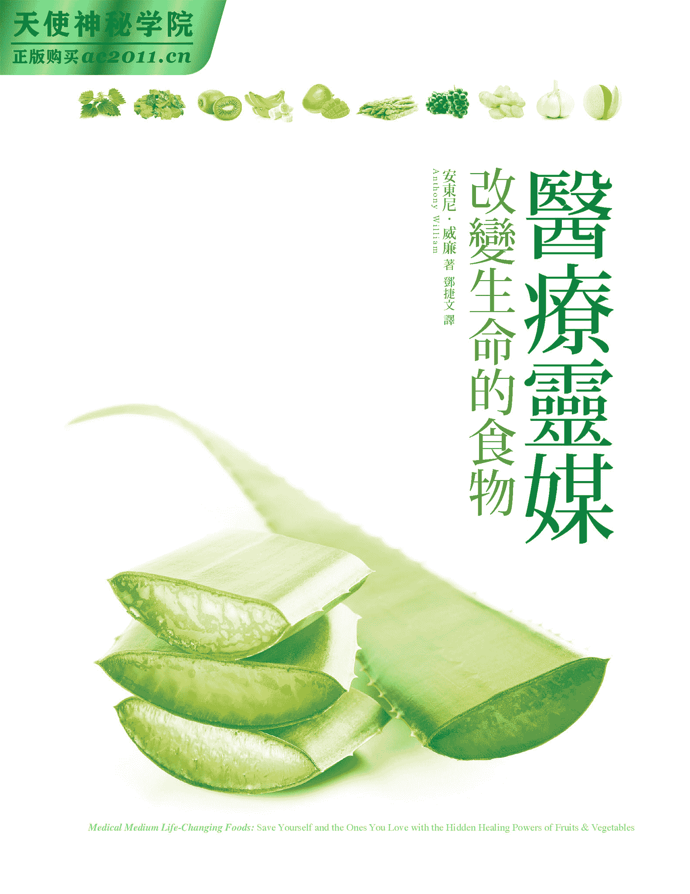

作者简介

安东尼．威廉

　　美国知名医疗灵媒与畅销作家，天生拥有与最高的灵对话的能力，这个高灵会提供他十分精确的健康信息，这些信息往往超前时代许多。四岁时，他宣称当时没有任何症状的奶奶有肺癌（之后的检查结果证实了他的话），让家人大为震惊。此后，他就一直运用自身天赋去“解读”他人的身体状况，并告诉对方如何找回健康。他在提供治疗建议方面前所未有的准确度和成功率让他广受信任，帮助数万人摆脱病痛之苦，其中包括电影／电视明星、摇滚歌手、亿万富翁、职业运动员、畅销书作家，以及无数已被疾病折磨太久的人。以外，他也是许多医生遇到棘手病例时会去寻求建议的对象。着有《医疗灵媒》《医疗灵媒．改变生命的食物》。网站：www.medicalmedium.com

译者简介

邓捷文

　　以译书为志业，埋首于榨干脑汁的译想视界。

　　现为专职译者，从事各类书籍翻译工作。

［推荐序］第六感教你吃对食物　　朱慧芳

［推荐序］神创造食物，不只是要喂饱我们的肚子　　AKASH 阿喀许

［推荐序］协助身体转化的健康食谱　　Asha

［推荐序］重新认识食物，重十身体健康　　薛维中

［推荐序］听见来自青草天使的呼唤　　李嘉梅

［推荐序］让你真正利用食物优点改变生命的饮食指南　　克莉丝汀．诺瑟普

［前言］重新看见植物性食物真正的价值

第 1 部
自灰烬中重生

了解真相才能拯救自己的生命

危害现代人健康的四大病根

肾上腺素成瘾

当今食物面临的挑战

面对现实，才能前进

换一种观点面对压力

食物中的“四大尊者”

以四大尊者对抗四大病根

带着四大尊者的力量向前迈进

你可以从饮食中同时获得身体健康与情绪上的抚慰

净化灵魂的辅因子水

提升生命的食物仪式

检视口欲之下真正的渴望

利用四大尊者食物滋养身体与灵魂

第 2 部
食物中的四大尊者

为疾病与症状贴上的标签

水果恐惧症

野生食物的益处

苹果

杏

酪梨

香蕉

莓果

樱桃

蔓越莓

椰枣

无花果

葡萄

奇异果

柠檬与莱姆

芒果

瓜类

柳橙与橘子

木瓜

西洋梨

石榴

朝鲜蓟

芦笋

西洋芹

十字花科蔬菜

小黄瓜

叶菜类

洋葱

马铃薯

小萝卜

芽菜与菜苗

番薯

芳香药草

猫爪藤

芫荽

大蒜

姜

柠檬香蜂草

甘草根

荷兰芹

覆盆子叶

姜黄

芦荟

大西洋海菜

牛蒡

白桦茸

椰子

蒲公英

荨麻叶

生蜂蜜

红花苜蓿

玫瑰果

野生蓝莓

第 3 部
拥抱真相，保护自己

人类的未来

不孕症的潜在成因

男性与生育力

避开阻碍生育力的因子

使生殖系统恢复元气的疗愈食物

透过静心提高生育力

酸性、碱性与 pH 值试纸

茄科恐惧症

“甲状腺肿原”食物

巨量维生素 D

维生素 B12 缺乏

注射 B12 针剂

粪便漂浮分析

粪便微生物移植

益生原

药草产品中的酒精

油拉法

乳制品

蛋

玉米

小麦

芥花籽油

天然风味

呼唤天使

改变生命的十二位天使

改变生命的天使带来的奇迹

属于你的时刻

［后记］慈悲是最大关键

［附录］“常见疾病 vs.疗愈食物”速查表

［推荐序］

第六感教你吃对食物

朱慧芳

　　吃，是维生的基本动机。吃什么，除了来自习俗、文化、传统、家庭之外，更重要的是来自生物直觉。甜的食物让我们吃了开心，因为它可以直接成为身体燃料；苦的食物提醒我们要小心吃，因为它可能含有毒性。习惯把“吃什么”交给厂商决定的现代人，未必能将味觉和燃料、毒性什么的联想在一起，但内在封印的生物直觉仍然会忠实地守护我们的身体，告诉我们什么东西可以吃，什么东西要小心吃。

　　但你可能会说，难道我打从心里喜欢吃咸酥鸡、麻辣锅，不也是生物直觉吗？是的，尽管你吃再多东西，如果没有吃到身体真正需要的全方位养分，就必须从少数几样惯于入口的东西当中，挤取一些些可能的高品质营养。也因此你好像吃得很多，却常常不感到饱足，空乏的热量和刺激的味道只是满足口腔咀嚼的需求，身体却长期处在饥饿状态，甚至导致肥胖和各种病痛。

　　《医疗灵媒．改变生命的食物》作者花了很多篇幅，苦口婆心解释饮食与健康的关系，试图打破惯性迷思的同时，娓娓向读者诉说他本身遇到天启之后的神迹开窍，接着再用一对一的方式，直接告诉读者特定蔬菜水果可以对治什么样的身体状况。对于生物直觉还不够敏锐的读者，这是有效的参考信息，不过我相信作者更想要传达给读者的是，只要把心神关注力从忙碌的日常转置在自己的身体上，人人都能够掌握那条系着健康与食物之间的绳索。

　　一旦察觉了健康与食物的紧密关系，就好像得到了通关密码，可以通往属于你个人的健康之道。到那时候，读者就不会因为书中介绍的是温带地区作物，不全然是熟悉的亚热带蔬果而感到隔阂。饮食是很个人化的事，健康却有一定的原则可循，一旦重新找回自己的生物直觉，就如同随时有“高灵”在身边指导。这项特异功能在食安问题频传的现在，如安身立命的护身符，能让你我常保安康。

　　吃，是维生的基本动机。但现在我们都知道，单单维生并不够，更重要的是透过适当的食物提升生命的品质，才能达到长期的身心健康直至终老。如果这句话对读者来说还是太玄的话，那么，这本《医疗灵媒．改变生命的食物》你是非看不可了！

（本文作者为财团法人梧桐环境整合基金会执行长、环境健康饮食专栏作家）

［推荐序］

神创造食物，不只是要喂饱我们的肚子

AKASH 阿喀许

　　在我阅读本书的同时，心里忍不住不断地说：“哦！真的吗？”“哗！很棒的提醒啊……”

　　《医疗灵媒．改变生命的食物》不只是一般教你如何根据营养成分选择食物的工具书，它的价值远超过这个，你会从书中发现作者像食物之神一样，把多种“平凡的”食物隐藏的情感助益与灵性教诲告诉我们：原来苹果在我们感到孤单时可以带给我们抚慰；枊橙可以切断忧郁的心情；酪梨是世界上与母乳最相近的食物，能够像母亲的爱一般滋养你的灵魂；生长在极端环境的野生蓝莓，其实是在压力中成长茁壮的专家，它天生的智慧会探查你的身体，揪出潜在疾病，监控你的压力与毒素浓度，最后找到治疗你的最佳方法……

　　本书深入介绍能改变生命的五十种食物，揭露每一种食物都有一套特别的疗愈特性，并让我们知道它们如何在让身体恢复与疗愈的同时，兼顾情感上的慰藉与灵性上的充实。

　　作者让我们了解到，神创造食物，不只是要喂饱我们的肚子，同时要以你从未想像过的方式滋养我们的灵魂。

（本文作者为知名心灵导师、灵气师父、AKASH 阿喀许心灵教育创办人）

［推荐序］

协助身体转化的健康食谱

CD 高灵＆Asha

　　非常有趣实用的一本书！

　　通灵后，“身体”成了我首要探索的一大区块。这本书来的机缘甚是巧合，在我准备出发去美国雪士达圣境旅行前两天，我收到了方智出版社的来信，请我为《医疗灵媒．改变生命的食物》一书写推荐序，当时也正好是我的高灵 CD 传讯告知这趟旅行是我“身体转化”的重要关键。我很乐意与大家分享与这本书同频共振，并且可协助身体转化的讯息。

　　首先，我想跟大家分享，我的身体处于与环境共振非常直接的敏感状态，这环境若有过多的化学物质，我的身体马上就会受影响；假如到食材用了过多杀虫剂或农药的不良餐馆吃饭，我的肠胃会给我立即的反应，我的味觉也是，比如舌头觉得微麻、苦涩。此时，我若因为便利而食用了这类食物，接下来就是身体不适引发的情绪，肠胃不适导致我的情绪沮丧、易怒。

　　CD 高灵会跟我说：“食物吃进肚子里，要好几小时消化，你小小的胃就会有几小时的时间与你的太阳神经丛对抗。这部位的脉轮为了捍卫你随兴的胃口，将它转化成情绪以便排毒！”

　　身体是跟情绪同步相应的，而情绪也是主导身体健康的重要关键。如果面对生活压力的情绪会直接累积在身体各器官，而口中送进的食物也会以情绪模式储存在各脉轮中，七个脉轮就是谱出我们气场所有故事的七大器官，也是我们此生在这肉身的所有灵魂故事。简单说，身体、情绪体、灵魂体同等重要。

　　出发前，当我收到这本书时，高灵微笑地请我马上回应我非常乐意推荐此书，因为它是一本活生生的健康食谱，简单、容易准备且实用。更巧的是，在雪士达接待我们的导游正好是一位经验丰富的蔬食大厨，每天三餐就是吃有机与非常美味的各国料理。我必须说，这书就这么神妙地出现在我眼前。为了印证书中提到的“四大尊者”食物，与含于其中的活水、矿物质成分，我在雪士达请我的高灵们可以放大数倍的方式将这些健康蔬果内化于我的身体细胞中，让我体验带来的效益。

　　首先，祂们简单地描述了我身体的健康状态：台湾环境中过多的空气污染与拥挤急促的压力使我的神经系统变得疲惫、衰弱。那几天，我们几乎餐餐都有花椰菜、青花菜（与书中提到的相同），而祂们也鼓励我多喝当地雪士达山水源头水，里头富含高频洁净能量与矿物质。十天下来，我接完讯息完全没有之前耗弱的疲惫感，或是心悸、末梢神经发麻等副反应。旅途中我也问祂们，回台湾后没有水源头，没有当地圣山产的有机食物，如何维持？

　　CD 这样回应我：

　　“雪士达山是个频率开放的神圣空间，当地环境污染是台北新店山区的五分之一，台北市的十分之一。先前为何告诉你这是转化身体的好时机，是因为身体细胞中有个趋光记忆，当有意识地带着转化的念力与圣地能量环境做整合，我们的细胞就会急速地进行排毒与疗愈，加上冥想静心与高灵们链接，带有光能量的植物与水果就会是很棒的细胞守护使者，这时你的身体振动频率已不同以往了。洁净的空间创造了你的身心灵大整合，而这完美的整合即使你回到台湾都不至于像先前因环境的束缚而使身体呈现工作后的疲惫感，因为身体细胞已经与更高频的神性自我相连了！这就是趋光性！但请持续维持健康饮食习惯。”

　　我又追问：“那没去过圣地的台湾朋友如何更健康、更心灵自在？”

　　CD 说：“用诚意将食物转化。环境若无法改变，可用正向力量使食物更充满光，也可以借助台湾大自然的力量为自己做一个简易闭关，食用有机食物或大量减少动物性摄取，此书中也有分享所有益于身体的食物。要在稠密的都市中维持健康，一周一次深度运动一到两小时与亲近大自然之外，静心请求神性来访与协助净化都是很好的方式（书中也提到相同论点）。每三个月做一次肠胃排毒静心也可协助破坏因子的释放。”

　　回到家，我再度十起这本书，安静并感恩地与此书高灵链接。祂给了我下面几句话：

　　生命如源头的水，

　　流向你与大地。

　　体尝此书的意涵，

　　也让此书背后众多神性的精神如泉水般涌向各位。

　　这里只有祝愿，

　　慈悲的心创造慈悲的身体，

　　慈悲的身体护佑着各个器官。

　　愿光与你同在，

　　我会在每个你需要洁净时守护着你，如同亲临过此书的神性圣殿般，

　　已在你的细胞储存了记忆，

　　人类共存的趋光记忆。

　　（本文作者为身心灵作家，心悦人文空间创办人之一，着有《星宇》《小奇奇幻之旅》，

　　天生有与高灵对话的天赋，近期刚完成雪士达圣山之旅）

［推荐序］

重新认识食物，重十身体健康

薛维中

　　二十一世纪的人类，因为饮食、作息的违自然与意识的分裂，加上环境与气候的剧变，生活中常常充斥着各式慢性病的风险。长期慢性病造成的重症患者，比例逐年攀升，以致国内医院的病房总是人满为患。至今已发展数百年的西方逆势医学，或许遗漏了某些环节，或许也正面临需要重新思考发展方向的转折点，对于其无法真正提供解决之道的疾病，也让我们开始对食物、自然、作息、意识、气候环境等与疾病之间的关连性有着不同以往的解读与看法。

　　本书作者安东尼．威廉对食物的看法与我们老祖宗曾经再三强调的“身土不二”其实是不谋而合的。他不仅教导我们“重新”认识野生蓝莓、玫瑰果、白桦茸、椰枣与朝鲜蓟这些能够改变生命的食物，也提醒我们要更加重视矿物质、微量矿物质、酶、辅酶、植物性化合物与 omega 脂肪酸，甚至是膳食纤维等营养。而这些营养素有共同的特征：它们都来自能够“自然再生”的有机土壤。

　　“食疗就是最好的医药”是西方世界流传已久的一句话。《医疗灵媒．改变生命的食物》这本书不仅让我们有机会再度认识蔬菜、水果、药草与香料、野生食物等对于身体健康的重要性，也让我们理解它们对“情绪”的支持也有相当的影响力，并启发我们的灵性与食物之间的内在链接。

　　读完这本书，你（你）一定会对“唯有正确喂养身体，才能重十健康，才能察觉真正的心灵自我”这句话有更深的明白。当然，也更能坚信人类拥有与生俱来的“自愈力”，并全然地接纳：身心的平衡与健康是我们丰盛人生的本来面目。

（本文作者为脸书社团“酮乐会”版主、整合身心健康研究与推广者）

［推荐序］

听见来自青草天使的呼唤

李大侠（李嘉梅）

　　我已经从事本土保健青草教学多年，常常被认识与不认识青草的学生或朋友询问：“为什么会想要学习本土保健青草？”我刚开始是这样回答的：“从小就喜欢植物的我因缘际会之下一头钻进青草的世界，也在因缘俱足之下开始教绿活青草课。”但随着时间慢慢过去，我的内心有了更确切的声音告诉我，身为一个青草师，不单单是青草召唤我，我也在呼唤青草，可以说在一边教授青草课的同时，也在一边用青草疗愈我的身体及情绪，并让我更有能量去面对变幻莫测的世界与生命。我真是一个幸福的青草师！

　　阅读安东尼．威廉的《医疗灵媒．改变生命的食物》，从第一页开始我就被他惊人的标题“自灰烬中重生”吓住了，原来有人用这么特别的角度去看待我们已经熟悉的世界，却又能提出柳暗花明又一村的见解：“透过食物适应现代世界”，这正是我平常对待危机的不变态度：山不转路转，与危机共处，自我调适。特别是在［滋养灵魂的食物］那一章看到从事园艺可以是富有变化的静心方法，也是与大地之母创建连系以疗愈灵魂、净化灵魂的方式──宾果！我内心的共鸣让我冲动地想与安东尼．威廉先生击掌说：“好样的，你真是说出了我的心里话！”

　　当台湾的青草师遇到西洋的医疗灵媒，我只能说又打开了新的眼界。本土保健青草与本书提到的四大尊者食物（水果、蔬菜、药草与香料、野生食物）在保健养生的功效助益上有异曲同工之妙。我很认同“读者读完这本书就多了五十位新朋友，了解从土里长出来的食物是神赐予我们、用来拯救人类的礼物”，这珍贵的礼物正与我常说的“认识身边草，处处都是宝”不谋而合，也让我对本土的青草怀抱满满的信心，同时更加激励我需要学习的东西还太多太多了！

　　当然，身为本土保健青草师，我必须谦卑地说，针对书中整理的五十种改变生命的食物，能够具体而微地介绍有何疾病、症状时适合食用，能够获得哪些情绪上的支持、灵性上的启发，以及巧妙介绍食用的小秘诀与怎么吃的创意食谱，在在让我非常佩服西洋的医疗灵媒能够理性兼具感性地揭露如何在身体恢复疗愈的同时，兼顾情感上的慰藉与灵性上的充实，这些宝贵知识正是我未来推广本土保健青草的理想典范。没错，一个好的青草师应该照顾到植物之于人的身心灵层面，才能创造改变生命的食物所追求的神奇功效，以及为使用者生命带来的奇迹。

　　记得我常问学生：“青草、杂草、野草、药草有什么分别？”其实没有分别，端看你的认识与知识有多少。认识以后，杂草变药草，野草变野菜。所以我们一定要谦卑地看待周遭的一草一木，放下人类为万物之灵的迷思，因为生长在大地中的四大尊者远比你所理解的更加神圣与强大。它们和大自然的力量紧密链接，使人体机能正常运作，更蕴含来自大地之母的智慧，而这些正是自我调适迫切需要的。感应你身体需要的正能量，虚心接受改变生命天使的奇迹来到你身边。

　　在此由衷感谢让我与安东尼．威廉相遇的谢无愁老师与方智出版社！

（本文作者为青草师）

［推荐序］

让你真正利用食物优点改变生命的饮食指南

克莉丝汀．诺瑟普

　　几年前，我在贺书屋出版集团的活动上认识安东尼．威廉，这位谦虚又务实的疗愈者改变了我的生活──包括我食用食物的方式，以及对大地母亲之上所有生命的观点。

　　你或许知道，安东尼从小就与高灵共事，这项天赋使他成为散播信息的渠道，而这些信息对现今科学而言遥不可及；这项天赋让他得以看见地球上受苦的大众，并对他们伸出援手。他教导我们透过摄取大地母亲提供的水果与蔬菜，将她与大自然的智慧以美味又健康的方式引导至我们体内。

　　《医疗灵媒．改变生命的食物》说的不只是“多吃蔬菜水果”，这句话往往会剥夺饮食的愉悦与乐趣。传统的养生建议总是在你想吃披萨时告诉你“应该”吃什么才对，但这本书里没有这类批判，没有羞辱，也不会扮演食物警察的角色；相反地，这是一本令人愉快的使用手册，告诉你如何将土壤中那些神的恩赐里蕴含的生命力，以美味、健康、充满喜悦的方式带回我们的生命之中。

　　安东尼透过高灵，将赐予生命的魔法带回蔬菜水果这个主题上，让摄取蔬果这件事成为升华的觉知体验，开始在各个层次上改变你──在身体、心智、灵性层次。让我举个例子，当他告诉我们要吃野生蓝莓时，并非只谈到这种美味食物中的抗氧化成分，虽然它们确实相当强而有力（有许多科学研究可以佐证），但安东尼也会谈到这种莓果在极端环境中成长茁壮时，被装满了令人讶异的求生能量。野生的缅因州蓝莓灌木尽管定期会被焚烧，整个冬天还必须紧紧抓住结冻的岩石，但依然能够生存下来，且每年都产出大量的甜美莓果。当你吃下野生蓝莓时，就等于将那些特质──面对重重难关仍不屈不挠的惊人生命力──带进身体里。高灵称野生蓝莓为重生食物，看看它有多强大！

　　现在来谈谈不起眼又常受人批评的马铃薯吧。高灵告诉我们，觉得漫无目的或茫然时，马铃薯能提供我们坚实的力量基础，部分原因是它有能力从土壤中汲取高浓度的主要与微量营养素。马铃薯体现了接地与稳定的特质，也提醒我们具备隐藏的天赋，也就是我们那些像马铃薯一样被埋在土里的面向。此外，我们也不再需要将马铃薯视为令人发胖的“白色食物”，而避之唯恐不及──只要了解如何利用马铃薯的优点，它自然也会发挥所长。遇见安东尼之前，我已经几十年不吃马铃薯了，现在它却成为我日常饮食的一部分。马铃薯重回我的怀抱，而且我完全没变胖！

　　阅读这本书时，你会开始以崭新的观点看待蔬菜水果，会发现自己对莓果、洋葱、椰子、香蕉，以及大地母亲提供的所有馈赠抱持兴奋与感恩的心情。现代医学之父希波克拉布底说过：“汝之食即汝之药，汝之药为汝之食。”

　　但在今天的速食世界中，你该如何得知什么疾病该吃什么食物？食物又怎么变成药物？这正是本书在我阅读的诸多饮食著作中鹤立鸡群的原因。针对书中列出的所有食物，从西洋梨到西洋芹，以及其他食材，本书都列举了该蔬菜或水果可以帮助缓解的疾病和症状。但不只如此，每一种蔬菜或水果在被你吃下肚时，都能在情绪与灵性层面发挥特定的支持作用。而且，本书还提供了简单、美味的料理食谱。

　　此外，本书也探讨了数十年来让许多人困惑不已的各种饮食风潮与迷思，包括水果恐惧症（我本人就深受其害）。因为水果滋味甜美，我们总是把水果中的糖分与其他造成肥胖与健康问题的“坏”糖混为一谈，但水果并不一样，多多益善。自从在饮食中加入更多美味的水果后，我对甜点（例如糖果、饼干）的口欲几乎烟消云散。透过摄取椰枣、莓果、新鲜柳橙与香蕉，我进入了全新的甜蜜世界。说实在的，真的很神奇。

　　当你依循本书的引导，采买与烹调都有了新的意义，因为蔬菜或水果的灵开始与你对话，并在你的身体与生命中运作。你开始真正感受到大自然的支持，你某个深层的、原始的部分开始苏醒。此外，你也透过学习直接与改变生命且负责食物供应的天使合作，而与不可见的助力链接。天使们提高蔬菜与水果的营养价值、保护授粉者、促进每颗苹果与每片莴苣叶及万物生长、协助将食物带给饥饿之人、抵挡基因改造食物的制造、协助并支持有机食物运动，甚至影响天气型态。知道这些真是让人松了一大口气。

　　阅读本书并汲取蔬菜水果的情绪与灵性力量，如同服下效用卓越的良药，会开始感觉与支持万物的母亲，也就是大地合而为一；而与天使的国度接轨时，我们也开始感觉与天堂合一。希望与生命力开始流回我们身上，并流经我们。

　　亲爱的朋友，这番感受好似回到人间天堂。

（本文作者为医学博士）

［前言］

重新看见植物性食物真正的价值

　　很小的时候，旁人就教你要万事小心。婴儿时期，照顾者会在你将手伸向插头或锐利的罐头边缘时，将你的手拉走；在你第一次试着靠自己的双脚站立时，爸妈会扶着你的腰。类似情景不断上演：妈妈提醒你晚餐前要洗手、老师责备你不该在走廊上奔跑、叔叔要你一定得戴上安全帽才能骑脚踏车。身为孩童，假如一切行为都以“应该如此”为原则，我们就被监督我们一举一动、凡事以我们的安全为优先的大人围绕。那些大人事事小心，也教导我们要万事留意。

　　随着年龄增长，我们内化了这些教诲。买第一辆车时，会优先考虑安全性：车上有好的安全气囊吗？刹车功能是否正常？考虑要念哪所大学时，会问问自己：在校园里觉不觉得安全？教授是否真的关心学生？到了某个阶段，这份担忧会往外扩展：我们可能会结识另一半，而他∕她的安全突然也进入我们担心的范围。我们和伴侣一起计划未来，并将彼此的人身、财务与情绪安全列为优先考量。

　　假如有了孩子，我们就会回到起点，只不过立场不同了──这次是由我们灌输种种教诲。有些是流传几世纪的训诫，例如过马路时要牵手；有些则是我们生活的时代独有的，例如网络安全。最后，我们可能会成为祖父母，到时又得照看另一个世代的孩子；同时，当父母逐渐变老，我们也会成为他们的照顾者。我们总是在彼此照料。

　　安全考量永无止境：在夜里将门上锁、买保险、装设警报系统；跟着流行尝试不同的饮食法来预防心脏病、癌症与糖尿病；随着世界上的威胁日渐增多，进行就地避难演练，架设金属探测门。大家都习惯生活在准则与规范之下，因为安全是一切的底线。我们知道若失去安全，自己就会灭亡。

　　本书探讨的则是完全不同层次的安全，我们甚至不知道自己需要这种安全，却比任何时候都需要它。我说的是健康安全──换言之，就是生存。在学习适应时代变迁的路上，没有人知道要传授我们这些教诲，因为即使拥有已知的一切，还是有更多知识等着我们去发掘。

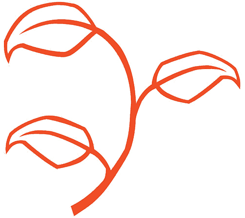 让饮食跳脱以往的理解框架

　　现今的营养信息──关于心脏病、癌症、糖尿病、自体免疫疾病、阿兹海默症等骇人疾病的背后成因与治疗方法──都局限在框架里。框架让我们有安全感，让一切看似都在掌握之中，而且是可控制的。

　　然而，这其实是场骗局。人们的安全遭受的威胁是无法预料的，任何对付过零时差电脑病毒的信息工程师，或者曾被召集前往枪手随机攻击现场的紧急应变人员都能证实这一点。安全威胁可不会被限制在某个框框里，所以我们的思维也不该受到局限。为了保护自身健康，必须跳脱到已知一切的范围之外去思考。

　　真正能够保护自己的方法，就是摄取本书介绍的食物。

　　我已经听到有人在质疑了：“最好是啦，安东尼。蔬菜水果？还真是有创意。”先别朝我丢烂番茄，我说的可不是以往那些陈腔漤调。别把大啖蔬菜水果当成科学家在发现其中足以拯救地球的强大威力后，让人们拿来装模作样的癖好。这些食物确实强而有力，其蕴含的足以改变生命的强大力量，属于人们未曾发现的层次。

　　我们忽略了植物性食物的真正价值，把摄取蔬果当成受罪，是小时候接受的训诫，现在既然长大了就可以摆脱它们。有时听人说要避开十字花科蔬菜、茄科植物与水果，有时又有人拿蔬菜、水果与药草的各种优点来说服我们，却不知道如何发挥它们的好处。人们对食物的各种看法杂乱无章，又在诸多局限之中实践这些观点，以致限制了保护自己远离健康威胁的能力，而且现今存在的健康威胁比以往有过之无不及，让我们比过去更需要预防措施。

　　本书提供的信息打破了目前对“营养”这件事的理解框架，因为这些食物会影响你身心安康的每个面向。不仅告诉你要摄取叶黄素来保养眼睛，或者摄取钙质来保护骨胳──没错，这些确实是保护健康的重要观点，却只是起点──书中还谈到无花果一次要吃九颗才能发挥最大效益，将马铃薯纳入日常饮食以发掘你真正的特质，长途旅行时包一颗椰枣当护身符可以让你一路上都能找到食物，并且探究为什么焦虑、结肠炎、失智症等疾病都以前所未有的速度在人群中蔓延，以及如何利用这些改变生命的食物来保护自己免受伤害。

　　这些来自“高灵”的信息往往超前现代科学，所以比方说，当你在书中读到洋葱有助减轻口臭，而不是导致口臭时，你应该找不到哪份科学研究或哪位健康照护专家会提出相同说法，因为还没有人知道这件事。高灵了解你没有数十年可以等待科学研究找出这些答案。你还想在不知道西洋芹汁是最佳助消化剂的状况下继续忍受胃痛折磨二十年吗？不，你必须立刻接触这些洞见，好让自己有更美好的感受，并享受人生。

　　如果你在书里看到似曾相识的信息──例如酪梨与母乳极为类似──别忘了我在超过二十五年的岁月中曾与数万人分享健康信息，当他们再与其他人分享时，某些观点就会传递给更广大的群众。此外，高灵乐于向科学家在食物与健康领域的发现，以及从古流传至今的健康智慧致敬，所以你也会在书中看到与主流健康知识呼应的信息。而正如我所言，高灵总会将知识带到另一个层次。比方说，没错，大家都知道野生蓝莓含有极丰富的抗氧化物，但大家并不知道，野生蓝莓是重生食物，能够在一切看似回天乏术时，使我们重获新生。

　　这一切都归结到你需要发掘些什么，以发挥自己最大的潜能。人类花了大把心血探寻关于身体与心理层面的健康、安全、保护与启发的答案，而我可以告诉你，这些答案一直以来都藏在市场中陈列各种农产品的走道上。

 超前当代科学研究的健康真相

　　认识我的人都知道，我的信息来自高灵。在我四岁时，某个自称“最高的灵”的声音叫我在家族聚餐时宣布奶奶有肺癌，当时的我连“肺癌”是什么都不知道，还是转达了这个消息，而医学检验很快就证实此事。

　　这就是我获得毕生天赋的开端──虽然有时我并不觉得这是天赋。高灵说的话持续传到我耳中，把周遭所有人的症状都告诉我。除此之外，高灵也在我小时候就教我用眼睛扫描人体，就像是增强的磁振造影扫描，可以揭露任何阻塞、感染、病灶、过往问题，甚至灵魂裂痕。

　　这代表我一直将注意力放在他人承受的折磨上。世界上有太多人受病痛所苦，数量远比我们在新闻上看到的更多。许多人患有隐藏的流行病，面对极度疲劳、脑雾、疼痛、头晕等症状，却不知道原因何在。也有些人看到可怕的诊断结果后，失去了对生命的希望。生病的人常常受病痛折磨多年，却遍寻不着答案，最后觉得这些病痛某种程度上是自己造成的。

　　我的工作是揭露关于健康的真相，提供医学尚未发现的解答，并将讯息传达给普罗大众，让你知道健康出问题的原因不在你身上，而且你可以好起来。我的工作是教大家保护自己与心爱的人，不受现代世界危害──人们甚至可能没有察觉那些危害存在。一开始，我只跟受疾病所苦、迫切需要帮助的人，以及需要协助以解决棘手病例的医生进行一对一交流，但高灵告诉我是时候了，应该让更多人知道这些关于疗愈的洞见，因而催生出我的广播节目、书籍与现场活动（使我得以提供火花，为所有听众点亮疗愈之光）。我唯一的生存之道，就是确保你接收到高灵提供的重要信息。

　　你在书中找不到引述自科学研究的内容，因为我写在书里的一切都是来自高灵。你在其他地方读到的科学研究已经够多了，而且很可能在过程中充满困惑，怀疑那些相互矛盾的主张到底有哪一个可以相信。我在此分享的信息，并非是在一个人人都有看法的世界再添上一种见解，而是真相。高灵想要带你超脱困惑之海，在你不确定可以相信哪一种理论时，提供你清楚的答案，并分享超前现今研究数十年的健康信息。

　　这是因为高灵是“慈悲”这个词活生生的本体，这个“慈悲之灵”就是神对人类的慈悲的展现。我是个平凡人，只是刚好听得见高灵清晰又明确的声音，就像有朋友站在我身旁说话一样。我接收并传达的讯息全来自这慈悲之音，表达了对人类最深刻的关怀与同理心。不是我选择了这份天赋，它是被选给我的，而且我本人无足轻重，提供答案的不是我，是高灵。我得以帮助数万人疗愈的唯一原因，是高灵提供了信息。高灵提供讯息，所以你才能获得帮助。一切都是关于你和你的健康，到头来，这才是最重要的。

 高灵当你的靠山

　　如果上网搜寻“全世界海拔最高的山是哪一座”，你会得到一份搜寻结果清单，告诉你答案是圣母峰，而且有些网站会告诉你，假如你问的是“身高”最高的山，它们可以将你导向正确的地方。如果搜寻的是“如何从纽约到加州”，你会得到廉价航班、开车指南与确切里程数等结果。这些搜寻的共同点在于，它们的问题落在已经探索完成的领域，因此可以给你正确答案。

　　那么，假如搜寻“阿兹海默症的病因是什么”呢？你会得到大杂烩，有些网站说病因未知，有些则会列出可能的原因与危险因子，还有少数网站会提供治疗方法。然而，没有哪个网站会将你引导到能针对“为什么这个残忍的病会使我们失去心爱的人”之类的选择问句提供正确解答的搜寻结果，因为这是未经探索的领域。搜寻结果不会给你明确的方向，而是带你绕圈圈、走进死胡同。我称这些为“非结果”“非真相”“非智慧”。若坚持不懈，你可能会发现一些正在一片荒芜中成形的道路开端，这些路总有一天会带我们找到真相，但目前言之过早。在慢性健康问题相关的搜寻中，你就是找不到确切答案。

　　你可能想问我：“你凭什么这么说？”我无意蔑视科学或每天为病患而战的众多健康照护专家，对于医学和其他疗愈技术，我只有深切的钦佩之意，我完全认同科学。高灵单纯希望我让你察觉，至今的科学发现中遗漏了某个环节。光是在美国就有超过两亿人生病或出现难解症状，这些人就是证明。卧病在床的母亲不知道问题所在，却因为太过疲劳无法照顾孩子，而着急不已地想知道如何恢复健康，就足以支持我的论点。问问她医学找到答案了没有。

　　谁都不想要疾病缠身。我们生活在一个积极正向的时代，因为我们都能感受到现今的世界出了问题，所以试着让自己保持正向，鼓励彼此要选择喜悦而非绝望，要寻求智慧与启发，才不会在旅程中被抛下。这是一场很有影响力的运动，但同时我们也必须留意，保持正向不应成为我们拒绝面对真相的理由。

　　我发现当人们对难解疾病的流行提出质疑，或表示误诊问题并不普遍，或认为他们听到的那些艰涩难懂的症状名称就是答案时──亦即认为现状很合理时──通常代表他们未曾遭受真正的健康威胁。他们也许偶尔会头痛、会患上普通感冒、会有泌尿道感染问题（他们甚至不觉得这是一种真正的病），或者甚至骨折（骨折的原因与疗程都很明显），但除此之外没什么毛病。我不是说这些人某种程度上借由不相信疾病存在来保护自己不生病，而是他们运气好，并未暴露在让其他人病倒的因子之中（我们会在书里探究这些因子），所以疾病看起来像“别人的”经验，与他们无关，仿佛抱持正确的态度就能避免生病。

　　我们不能假装非真相不只是假设，不能假装生病的人并非真的生病，不能假装如果不采取我在本书谈到的正确预防措施，我们并不会落入相同的命运。我不能传递没有价值的东西，那是不尊重身为读者、身为人类、身为这个星球上另一个灵魂的你。在启蒙之前，任何人都必须如实地看待这个世界。智慧是以真相为基础。

　　而真相是：除了压力与现今繁忙的生活步调之外，我们正面临我称为“四大病根”的一组有害污染物与病原体（接下来那一章会详细说明）。假如你正遭遇健康危机，假如你正苦于失眠、胃痛、眩晕、喜怒无常、脑雾、记忆力衰退、胀气、疲劳、强迫思想或今日常见的其他任何问题，责任不在你身上。高灵要你了解，这些不是你造成的。你的健康问题并不是你透过负面思维吸引或显化而来。如果你一直在承受病苦，那不是你的想像，也不是你的错。在所有病例中，只有不到 0.25%是真正源于“心理作用”──就算是那样，让一个人引发自身症状的，通常也是大脑中某个由四大病根或真实情绪创伤造成的潜在问题。

　　除了承认外部来源是慢性病流行的幕后黑手之外，你还必须了解神赋予你的健康权利。这些是你与生俱来的，即使你不知道它们存在，你仍然拥有这些权利：你有权健康，你有权拥有平静的心智，你有权获得可恢复精力的优质睡眠，你有权免于痛苦，你有权从疾病中痊愈，你有权预防患病，你有权调适并成长茁壮。永远没有人能从你手中剥夺这些权利，它们一辈子都是你的。

　　高灵的任务是确保你了解如何保护这些权利。这无关规则、评判或惩罚，高灵不是什么宇宙纠察队，不会因为你没有遵守规定程序就记你一支缺点。说到底，那有什么好处？只会将你局限在框架里，夺走你的自由感，让你觉得比现在更糟。

　　高灵其实比较像贴身保镳，首要任务是让你平安无恙地走过这一生。不是在你犯错时拍你一下，而是要让你逐渐认识自己的价值。你与任何一个身旁有随扈围绕的大人物同样重要，而保护你的其中一种方式，就是指出对你的平静与安全造成威胁的事物，并告诉你如何摆脱那些威胁。我们到目前为止学到的规则并不够。

　　身为高灵麾下护卫队的一员，我有责任分享足以帮助你保护自己与儿孙的先进信息。这些是给新时代的课题，是本来不该是秘密的秘密。是时候去汲取原本就属于你的智慧了。

 这本书想告诉你的事

　　购买大型用具时，通常都会拿到一本使用手册吧？这些使用手册的内容其实都不完整。假设你买了一辆新的越野车，无论使用手册中写了哪些安全须知，只要路上突然出现障碍物，你还是很可能会受伤。使用手册不会告诉你：“遇到路面结冰，又有狐狸从树林里冲出来使你分心，以致车子打滑时，请这么做。”

　　同样地，目前所有关于如何度过健康危机的信息也都不完整。并不是有谁隐瞒了什么讯息，只是因为医学界尚未弄清楚疲劳、脑雾及各种慢性病不断危害广大群众的根本原因。

　　本书的目的是尽可能收录更为真实、详细且可用的健康信息，提醒你在迈向健康之路上可能打滑的路段与使你分心的危险事物。本书希望你学得愈多愈好，这样你才不会摔下越野车。

　　在第一部“自灰烬中重生”里，我会帮你上一堂速成课，以了解我们是如何来到健康历史中的此时此刻，以及该怎么面对当下的课题。第一章［现代人面临的健康威胁］介绍了危害健康的四大病根及其他主要危险因子；接下来是［透过食物适应现代世界］，这一章说明了各种改变生命的食物为何是解决办法；而第一部的最后一章［滋养灵魂的食物］则探讨了食物的情绪与灵性层面──包括为何我们不必将抚慰食物拒于门外。

　　以上是入门课程，接着就进入第二部“食物中的四大尊者”，这是本书的核心，你能在此找到高灵提供的、关于地球上五十种最能带来转化的食物的菁华信息（这些食物分成水果、蔬菜、药草与香料，以及野生食物四大类）。针对每一种食物，你可以知道它对健康的功效、有助缓解的疾病与症状、在情绪层面的助益、提供的灵性启发，以及善用该食物的诀窍。这些内容并非无所不包地告诉你这五十种食物的所有相关细节，否则每种食物都能聊上一整本书；应该说，这些是高灵分享的、关于每一种食物最重要的信息，让你读完这本书就多了五十位新朋友。

　　此外，我也针对每种食物提供一道食谱，因为我发现许多人对于蔬菜水果怎么吃没什么想像力，搭配食用的往往是大家习惯一起吃的单调食材。除了用来路不明的油来炸薯条，或者堆上酸奶油与培根之外，马铃薯还能怎么吃？答案就在第 204 页。

　　在你明白各种改变生命的食物可以提供的好处之后，本书就来到第三部：“拥抱真相，保护自己”。我在这里分享了更多如何顺利航行于现今世界的秘密，你可以找到水果与生育力的关连、应该避开的饮食风潮与食物，以及我锺爱的主题之一：照料我们、改变生命的天使。

 相信食物的疗愈力量

　　我知道你一定曾在健康领域中觉得困惑不已，也确信你曾搞不清楚到底是要相信青花菜会造成甲状腺肿大这个（错误）主张，或者吃青花菜能消除黄斑部病变的说法（答案：放心吃青花菜吧）。此外，你或许也怀疑过，感冒时是不是先不要喝柳橙汁，因为其中的糖分据说会喂养病毒，或者应该继续喝，因为维生素 C 会增强免疫系统（答案：继续喝柳橙汁吧）。实在有太多谣传、太多互相矛盾的说法、太多让人搞不清楚的讯息、太多五花八门的风潮，令人无所适从。要不是有高灵的声音在引导，我根本不知道该相信什么。

　　我一直坚定不移的原因是：答案确实存在。这个世界上有某样事物是你可以紧紧抓住的，那就是来自高灵的信息。它不会像沙子一样从你的指缝流泻，只要依循书中来自高灵的建议，你的生命就会改变，而且是极大幅度地变好。我一次又一次在来找我的人身上见证这一点，而高灵总是会提到食物的神圣疗愈力量。

　　你可以做到，你可以和注定要成为的自己创建链接。你会需要忘掉以往听说的一切，也需要习惯新观点，而你最需要的，是信任。

　　我很清楚要说服别人相信你分享的信息时，最糟糕的方法是说“相信我”。信任的创建需要时间，你不会在第一次靠近某匹马时，就跳上马背疾驰而去──尤其如果你还听说那匹马很难对付。相反地，你会循序渐进地培养你与马儿之间的信任关系。

　　同样地，假如你曾经怀疑蔬菜水果是否真的具备可以带来转化的特质，就不可能在读过书的隔天立刻改变饮食习惯。我们都知道要谨慎付出自己的信任。

　　所以，我要邀请你阅读这本书，并思考书中的讯息。我想请你留意，在你了解从土里长出来的食物是神赐予我们、用来拯救人类的礼物时，心中有何感受。与那份感受共处，如同花时间与一匹马培养感情，抚摸其鬃毛，感受它的真实本质。

　　不久之后，我希望你会豁然开朗，会发现有个神圣又慈爱的力量一直看顾着你，引领你来到生命的这一刻──这次，你终于可以爬到那匹白马的背上，让它载着你奔驰到比你所能想像更远的地方。

现代人面临的健康威胁

　　现今世界充斥着恐惧，尤其是谈到健康的时候。我们害怕癌症、阿兹海默症、莱姆病、多发性硬化症、不孕、糖尿病与肌肉萎缩性嵴髓侧索硬化症；我们害怕失去生命力，怕无法发挥最佳表现，怕被抛在后面，怕承受痛苦，怕错失生命；我们害怕那些无法解释、让许多人感到迷惘与绝望的症状；我们半夜躺着无法入眠，担心可怕的疾病会带走孩子、父母、朋友与伴侣。或者说，我们无法接受现状。

　　我不会告诉你重点在导正你的心，不会告诉你真正的问题是恐惧，假如你能控制恐惧，一切就没问题，因为事实上，我们的恐惧是有道理的。人类的健康比以往任何时候更脆弱，慢性病已成为现在最普遍的问题。遭受慢性病折磨的人数破了纪录，除了第一段列出的疾病，还有类风湿性关节炎、慢性疲劳症候群、甲状腺疾病、纤维肌痛症、注意力不足过动症、自闭症、自体免疫疾病、克隆氏症、结肠炎、大肠激躁症、失眠、忧郁症、强迫症、偏头痛──而且都找不到原因。人们出现疲劳、体重增加、疼痛、脑雾、神经痛、皮肤问题、麻木、消化不良、体温波动、心悸、眩晕、耳鸣、肌肉无力、落发、记忆力衰退、焦虑等状况，然后去看医生，却得不到明确的答案，通常只换来荷尔蒙失调或缺乏维生素 D 之类的说法，没什么帮助。这些人被排除在人生的赛场外，被迫放弃自己的梦想，以单纯对付“活下去”这件事。有时，他们就这么败下阵来。

　　我们正面对难解疾病蔓延的现象。难解疾病指的是无从解释的健康问题，而且多得数不清。光在美国就有超过两亿人罹患难解疾病，医学界为各种疾病冠上的名字，例如桥本氏甲状腺炎、糖尿病神经病变、全身性劳作不耐受症之类的，可能让你以为科学已经找到相关解释。别被骗了，癌症与其他慢性病仍然是主要的医学谜题。

　　这不是在批判医疗机构，医学界（我指的是另类医学、正统医学、功能医学与整合医学）中的每个人都是英雄。我爱医生！没有医生，我们可能就此灭亡，他们是现代某些重大发现的幕后推手。医生们尽其所能地善用手上的信息，只不过，医学研究却将他们蒙在鼓里，让他们不知道那些难解疾病与症状到底是怎么回事。因此，过去几十年来，我们在这个领域依然停滞不前，某些发展与洞见落得被人遗忘、被人埋葬、资金短缺，甚至遭人隐瞒的下场。

　　随着时间过去，我们已经看不见了。没人有机会得知真相，因为我们是以旧的慢性病理论为基础在努力。医界的领头羊是医疗产业的机器人，他们其实别无选择，被迫接受这些过时又受到误导的理论。跟随在后的是得不到更优质信息的人，而最终，他们一起跌入黑暗与死亡的深渊，结果受苦的还是普罗大众。这听起来可能很刺耳，但唯有如此才能让你有所觉知。事实上，数十年来人们一直在受苦，因为有太多疾病的成因与疗法都悬而未明或遭受误解。假如不敞开心胸、备足知识并保护自己，我们也会被误导而受伤。

　　若你想拯救自己与心爱之人免于这般命运，就必须了解真相，这是中止磨难与恐惧循环的唯一方法，也是我写这本书的原因。

 了解真相才能拯救自己的生命

　　探讨真相有时并不容易，以个人生活为例：如果你有某种明知对自己没有任何好处的行为模式或固习，你会停止做那件事，并且正视它，或是会本能地一再重复去做，假装什么问题都没有？这种“否认”也发生在医学界，而且规模大多了：我们都能感觉到，这个世界在健康问题方面出了差错，因为有数十亿人都受疾病所苦，而在人类历史上，我们偶尔会碰巧发现人们受苦的原因，例如一度备受推崇的杀虫剂双对氯苯基三氯乙烷（也就是 DDT），半世纪前被揭发会造成大众健康浩劫，还有曾经是梦幻疗法的汞，已经被视为剧毒很久了，但你想得到，汽车后照镜里就含有这两种成分吗？

　　我们无法轻易摆脱过去。DDT 仍然存在我们的环境与身体里，至今依旧造成疾病，即使在禁用 DDT 很久后才出生的人同样受到影响；使用历史长达数千年的汞，持续在现今的世代之间循环。医学研究尚未发现的许多危险因子如今仍在折磨我们，这只不过是其中两个例子（稍后我会介绍更多）。在我们拿出放大镜检视过去发生的一切之前，历史会持续存在，并不断重演。自欺欺人地宣称糟糕的时代已经结束，我们永远不会进步。

　　如同宣称人类现在活得更久、更健康不会让我们进步一样，那只是假象，因为全球总人口数大幅增加。与此同时，人口成长幅度已经到达颠峰。到现在的安养院走一趟，你会发现高龄九十、一百岁的居住者人数比三十年前少，且住进安养院的人年龄逐渐下滑。距今二十年后，这种转变会更加明显，你会听说、会读到人类寿命的巨大变化。综观而言，婴儿潮世代比他们的父母辈面临更多足以威胁生命的健康问题。即使拯救生命的科技日新月异，人的寿命却不增反减，而对那些年迈的长者来说，活得更久不代表活得健康。虽然药物与手术在某些情况下可以延长寿命，却可能伴随着延长折磨的代价。

　　新闻报导是否曾让你担忧人口过剩的问题？这并非真正的问题所在，我们面对的问题反而是无法让人口持续成长。眼前的现实十分严酷：人的寿命愈来愈短，难解的不孕症阻碍新生命到来，愈来愈多疾病正在影响愈来愈多人。

　　乳癌就是这种近年来让所有人提高警觉的疾病。有些女性接受基因检测，并在检测出 BRCA1 或 BRCA2 基因突变时，选择接受双边乳房切除术。这种担忧是有根据的：在三十年内，所有女性新生儿几乎一定都会罹患乳癌，除非她知道如何保护自己。

　　这就是为什么真相往往令人感到解脱。冷静地认识接下来要介绍的现代健康风险，将让你赢回自己的生命。假如知道我所谓的四大病根每天都在威胁你的健康，你就能够降低风险；如果了解我们这个充满压力的文化有多危险，你就能将自己从肾上腺素陷阱中解放出来；若发现食物对拯救你自己有多重要，便能扭转一切。

 危害现代人健康的四大病根

　　以下这些家伙就是让事情变得这么糟的罪魁祸首：辐射物、有毒重金属、病毒爆发、DDT。我称之为四大病根，它们在这数十年、数百年，甚至数千年来的发展简直毫不留情。它们或独自、或共同摧残了人们的身体，让我们质疑自己是否精神正常，将整个社会逼到崩溃边缘。

　　这四大因子是现代难解疾病蔓延的幕后黑手，其中某些家伙，例如汞，已经肆虐了数千年；有些，例如 DDT，看起来则像是近来才发生的一目了然的事，但其实已经有够久远的历史了。好几世纪以来，工业革命与发明 X 光等事件成了重大转折点，让一个或多个这些因子得以利用机会获得动能，将我们带到如今这个危急处境。

　　四大病根是人类生活中的隐形入侵者，是令我们夜晚辗转难眠的未知事物，也是让生命变得如此充满挑战且无法预料的原因。我在第一本书《医疗灵媒》中写到许多慢性疾病时，几乎无可避免地都会提及这四大病根。它们就是如此普遍又充满威胁性。

　　活在现代的我们都被眼不见为净的错觉所害，纵使所到之处的人们都被慢性症状或重大疾病折磨，我们也试着别太追根究柢，似乎只要保持距离，相同的命运就不会降临在自己身上。我们总是很快就忘掉自己听见的危险事物，四大病根就是很好的例子：假如看不见辐射物、有毒重金属、病毒或 DDT，假如这些东西不是天天出现在头条新闻上，我们就会告诉自己，把它们抛在脑后没关系。我们选择遗忘人类社会过去的错误并高速前进，而不是停下脚步去理解，若不检视过去，我们可能会犯下新的错误。

　　为了保护自己，一定要彻底了解四大病根。首先，它们往往一代传过一代，而人们常将这样的“代代相传”与遗传搞混。当我们生病，且症状又跟家族成员经历过的相似时，我们会不假思索地认为自己遗传到坏基因。这种理论很有说服力，因为我们会在有血缘关系的人身上看见相似特质。我们认为如果有某种鼻子形状、发色或步态，就是遗传了相同基因组合中特别容易罹患某种疾病的因子。是否曾有人告诉你，你的健康问题是家族遗传？别被“你天生就有病”的说法矇蔽了。

　　其实，许多代代相传的家族疾病是四大病根在血脉中传递所致。辐射物、重金属、病毒与 DDT 都可能在受孕时和子宫中往下传，这正是大部分世代相传疾病背后的真相。没错，我们是有基因，基因也确实在我们的生存中扮演关键角色，然而，“你在基因层面不正常”的错误观念，只是另一种在肉体维持生命的神圣基础上寻找缺陷的信仰系统罢了，就跟认为自体免疫疾病是身体在攻击自己的谬误一样（本书第二部“食物中的四大尊者”导言将进一步探讨这一点）。慢性疾病不是基因问题，而是与你的祖先接触到，然后往下传给你的父母，之后再传给你的东西有关。当你了解问题在于外来物，如病原体或毒素时，你的观点就会改变，因为这代表你可以一劳永逸地摆脱这些因子。

　　关于四大病根的第二个重点是：它们结合起来时危害更大，所以最穷凶恶极的疾病往往是两种以上的病根引起的。比方说，一个人可能接触到辐射物（无论是直接接触或家族遗留），而因为辐射物会削弱免疫系统，让他更容易染上病毒，例如可能发展为多发性硬化症的 EB 病毒。或者，某个人可能透过世代相传承接了高浓度的 DDT，然后暴露在重金属之中，尤其是导致脑癌的铝，偏偏有毒重金属又是病毒最爱的粮食，所以原本应该处于潜伏状态或被排出体外的病菌，反而因为周遭有美味的汞或铝而激增。

　　第三点是最重要的：记住，“希望”确实存在。只要保持警觉，就可以减少接触这些因子的机会；只要够勤奋，就能解除这些因子的毒素。运用本书提到的各种改变生命的食物，你就能给自己前所未有的保护。

辐射物

　　我们都忘了辐射物是个大问题。不久之前，大家还把移动电话的辐射视为重大议题，现在却已经抛在脑后。此外，虽然我们在核灾发生后会担心暴露在辐射之中，但只要不住在事故现场附近，过不了多久，我们又会忘了这件事。

　　其实，每次核灾都对地球造成无可挽回的伤害。二战时期的广岛及长崎原子弹爆炸、一九八六年的车诺比核灾，以及二〇一一年福岛核电厂事故的辐射落尘至今仍然笼罩着我们。在这些事件中，辐射物被释放到大气里，但并未立刻落到地上，大部分都飘在空中，留在我们呼吸的空气里，即使我们住得离日本与乌克兰很远。飘落的辐射物则进入水与土壤中，所以我们几乎随时都接触到辐射物。来自广岛的辐射物至今只飘落了一小部分，大部分都还留在大气中，就算过了一千年，也只有一半的辐射物会落到地上。

　　还有人类在 X 光科技受到全面管制前接触到的辐射。二十世纪中期，到鞋店买鞋时可以将脚放进称为“试鞋透视机”的 X 光箱子中，让店员观察脚的内部结构，借此帮你找到最合适的尺寸。而因为小孩子的脚一直长大，便会重复接受试鞋透视机的 X 光照射，就跟许多以买鞋为乐的人一样，偏偏孩童对辐射特别敏感。

　　如今，我们体内充满比以往更多的辐射物，无论是来自直接接触、环境中的辐射落尘、食物与饮水污染，或是父母及祖父母接触到并遗留下来的，辐射物都是我们面对的重大健康风险之一。它是引起癌症、内分泌系统失调、骨质缺乏症、骨质疏松症、骨刺、免疫系统衰退及皮肤疾病的一个重要因素，也会触发所有影响人类的疾病──所以，假如你体内潜藏着四大病根的任何一种，又接触到辐射物，就可能促使潜伏的污染物转变成全面爆发的疾病。

有毒重金属

　　某些重金属有毒并不是秘密。我们都知道整修老房子时要小心含铅油漆，也都在某个时期改用无汞温度计，但大家可能不甚了解──有些状况下可能毫不知情──有毒重金属正是现今某些非常普遍的健康问题幕后黑手，包括注意力不足过动症、自闭症、阿兹海默症、不孕、克隆氏症、溃疡性结肠炎、帕金森氏症、忧郁症、焦虑、癌症、癫痫发作等。此外，这些金属也是稍后要介绍的病毒相关疾病的刺激因素。

　　再者，我们每天也可能不知不觉暴露在有毒重金属之中。铅、汞、铜、镉、镍、砷、铝都会累积在人体内，最后引起或促成疾病。你上一次使用铝箔纸或外带铝箔餐盒是多久以前？或者，你可能住在有铜制水管的房子里，或时常到喷洒杀虫剂（通常内含有毒重金属）的公园散步。潜在接触途径遍布四周，有时无可避免，甚至会以水汽的型态从天而降。

　　某些案例中，我们细胞里的重金属并非此生接触到的。

　　汞这个最邪恶的有毒重金属可以在血脉中持续存在数千年，一代传一代，并且在往下传的过程中增强。因此，存在某个孩子大脑中线管道、引起自闭症状的汞，可能三千年前就为害，而且现在造成的问题更甚以往；或者，假如传承而来的汞存在脑中另外的部位，可能会导致忧郁症。我们不只要对抗目前的接触途径，还要与自古相传下来的毒素奋战。

　　这些重金属本身已经是毒素，更糟的是，它们往往会氧化，带来更多问题，例如有毒迳流会伤害它流经的任何组织。此外，有毒重金属并非只在大脑造成问题，当它们出现在体内任何地方时，会使整体免疫力降低，并成为病毒与细菌的刺激因素。

病毒爆发

　　人类疱疹病毒家族中，有超过一百种病毒株与变异株会对人造成危害。以癌症而言，有 98%是由病毒结合其他至少一种四大病根引起的。

　　此外，EB 病毒（以单核球增多症形式呈现的早期阶段）、带状疱疹、巨细胞病毒，以及人类疱疹病毒第六型、第七型，还有未被发现的第十型、第十一型、第十二型──包括每一种病毒的未知变种、支系与变异体──都是这个时代某些最让人虚弱、最受人误解的慢性疾病背后真正的肇因。多发性硬化症、莱姆病、类风湿性关节炎、甲状腺疾病、纤维肌痛症、慢性疲劳症候群、颞颚关节问题、偏头痛、糖尿病神经病变、贝尔氏麻痹、梅尼尔氏症、五十肩，以及无法解释的耳鸣、眩晕、抽痛、刺痛、心搏过速、心房颤动、心悸、心律不整、疲劳、热潮红与灼热感等症状，往往都与病毒有关。如同其他四大病根，日常生活中无可避免会遭遇这些传染性病原体──无论是与朋友共饮汽水，或是吃下餐厅厨师以被割伤的手指烹调的料理，都有可能碰上。

　　大家通常不会注意到这些病毒，因为它们都在经过血液感染阶段、进驻器官之后，才真正开始引发问题，连医生都不知道该到器官里去找。EB 病毒在人类族群中生根已超过一百年，且在这一百多年里已经突变，并如野火般大肆蔓延，让人们像得了流行病一样纷纷因为无法解释的疲劳、肌肉疼痛、关节变形而卧床。

　　然而，病人时常被告知 EB 病毒不可能是问题所在，因为血检结果发现有抗体，显示之前感染过，而不是现在。假如有工具可以检测器官中的 EB 病毒，医学界会恍然大悟，明白对那些饱受纤维肌痛症、慢性疲劳症候群或甲状腺疾病所苦的人而言，大学时期感染、看来普通的单核球增多症并未真正离开他们的身体，只是躲到体内其他部位，开始引发更严重的问题。

　　此外，这些病毒的病毒株种类超过医学已发现的，因此大家也不知道该寻找些什么。例如在人类疱疹病毒家族中，病毒株清单不是只到有纪录的人类疱疹病毒第八型，而是一路排到第十二型。无数患者受到带状疱疹引起的灼热感，以及使人无法行动的神经痛所苦，却不知是这种病毒在背后作祟，因为研究尚未发现有不起疹子的变种带状疱疹存在，所以医生也不知道该朝这个方向诊断。

　　疱疹病毒周围有它们最爱的食物（例如有毒重金属）时，就会分泌被称为神经毒素的有毒废弃物。神经毒素会扰乱神经功能，并迷惑免疫系统及试图诊断症状的医生。例如狼疮就是身体对 EB 病毒的神经毒素产生过敏反应，结果这个症状成为关注焦点，背后的病毒感染则持续发展。

　　倘若所有人都了解病毒爆发的真相──了解这件事正在发生，以及如何保护自己──它就不会像今天这样变成问题。然而现实并非如此，人们痛苦不堪，却不知道原因何在，或是该如何阻止。虽然可能会获得某个病名，如狼疮、莱姆病或多发性硬化症，但这些病名无法提供解答，让人知道自己所受的苦背后真正的原因。

DDT

　　人们担心接触到杀虫剂是有道理的。为了健康着想，情况允许时应该尽可能摄取有机食物，并且避免以合成化学物质照顾草皮与花园，也要小心你家附近公园里的草是喷洒了什么东西才会那样绿油油──大家现在虽然有这样的觉知，仍然不该忽略一种过去曾被广泛使用，以致在被发现有毒的数十年后仍然存在环境中，在我们的家族血脉里代代相传、影响健康的危险化学物质。没错，我说的就是 DDT。

　　我们很容易把 DDT 当成历史。这种有毒杀虫剂在五十多年前被揭露会造成癌症与其他疾病、危害野生动物、污染环境，已经在美国被禁用超过四十年。喷洒 DDT 的卡车不再驶过大街小巷，业务员也不再挨家挨户推销，宣称其适合用在花园里。

　　不幸的是，即使科学界先驱努力呼吁，例如瑞秋．卡森在她一九六二年的著作《寂静的春天》中揭发 DDT 的危害，并提倡大规模限制其用途的数十年后，我们仍然每天与 DDT 纠缠不清，因为 DDT 残留在环境里，这意味着它进入食物供给中，而且随着食物链逐级传递，其危害跟着放大。此外，和其他四大病根一样，DDT 会世代相传，所以即使 DDT 的全盛时期你还没出生，你的祖先也可能生活在当时，并接触到这种化学物质；也就是说，你体内可能有自古相传下来的 DDT，并残害你的健康。还有，我们也正暴露于今日的 DDT 落尘之中，因为并非所有国家都禁用 DDT。DDT 一经喷洒，就进入空气之中，被风带到远方各地，甚至带到其他大陆。

　　DDT、其他杀虫剂与除草剂是抑制免疫系统的主要根本原因，让人身体虚弱，病原体与污染物因此有机可乘。DDT 可能会让一代接一代的家族成员特别容易罹患相同疾病，以致原本能透过排毒疗愈的病却往下传承，成为让大家束手无策的遗传问题。尽管 DDT 可能已经成为历史，但它现在仍然荼毒着我们，例如使肝脏过度敏感（病毒则是重大肝脏问题的另一个肇因）、引发糖尿病、导致脾脏与心脏肿大、造成消化不良、引起偏头痛与慢性忧郁症、造成皮肤问题、扰乱荷尔蒙。实在太悲惨了！这正是我希望你知道这些信息的原因，如此你才能利用本书提到的食物积极净化自己的身体。

 肾上腺素成瘾

　　假如今天人类的健康只面临上述四种威胁，那还好办；然而，我们为了跟上别人被迫使用的药物──肾上腺素──却让状况加剧。四大病根迫使我们的身体在击退这些入侵者时释放比以往更多的肾上腺素；此外，日常生活中的压力到达史上最高点，我们经常动用自己的肾上腺素库存，以扑灭工作与家庭生活中烧起来的火。这样做的恶果不容小觑。依靠肾上腺素度日，将付出严重的代价。

　　我们如同在车水马龙的路上竞赛，为了不被辗过去，必须跟上，即使会受伤也不能停下来。在赛车界，如果增强发动机的马力还不够，赛车手倾向为车子加装一氧化二氮，这种无色气体有其优点：只须拨动开关，一氧化二氮便会释出，提供发动机超强动力。问题在于你只能短暂使用，否则它会使发动机爆裂，或者让你旋转、失控，将你对整辆车的投资置于危险之中。

　　增强马力的发动机就像活力旺盛的 A 型人格，现今的文化赞扬此类性格，人们利用这种干劲迅速完成任务。然而，他们往往发现这样还不足以应付需求，于是打开肾上腺素开关──但如果太常动用这个开关，可能造成健康危机。若想保护自己的身体，就像驾驶人想要保护车子，就必须了解我们所做的任何决定的潜在危险。

当人体分泌的肾上腺素成了药

　　我们本身的肾上腺素应该被归为第一级管制药品，它就是这么容易使人上瘾。而且，就跟任何药物一样，我们会在某个程度之后对肾上腺素变得麻木，然后随着动用的肾上腺素愈来愈多，失去对于何谓美好、安全、快乐与正常的判断基准。

　　没人能否认适量的肾上腺素有益又安全，毕竟肾上腺素确实是人体自然运作的一部分，对人类的生存也极为重要。过去我们的确能靠低浓度的肾上腺素运作，偶尔遭遇危险时，肾上腺素才会激增。想像一下：在美好的日子里漫步于一大片开满花的田野之中，阳光灿烂，鸟语花香，心情平静──直到你看见有条森林响尾蛇盘踞在路上。思索着如何安全走过响尾蛇身旁时，你的肾上腺素浓度会瞬间升高；一旦通过之后，肾上腺素会在你继续往前走时降回先前的浓度。这相当于前数码时代的生活，也是人体建构的目的：维持恒定状态，偶尔被保护我们安全的肾上腺素激增打断。

　　时代已经改变了。我们仍然漫步于那片开满花的田野之中，仍然是蓝天、阳光与鸟语相伴的美好日子，不同的是，路上的响尾蛇从一条变成数百条，每迈出一步都是在冒险。这是科技年代的副产品：所有事物都移动得那么快，遭遇危险的频率也跟着变高。这意味着我们的肾上腺素浓度必须升高。从前除非遇到危及性命的状况，否则只是耕田或在办公室努力工作一整天，并不会让我们的肾上腺素激增。有生产力与维持身体平衡彼此并无冲突。

　　而现在，恒定状态已经是我们不再拥有的奢侈品，持续攀升的肾上腺素浓度──还不到危险程度，但也差不多了──已然成为新常态。为什么呢？因为我们一天到晚忙着抵挡潜在的紧急状况。我们彻夜辗转难眠，担心如何保护家人远离在新闻上看到的悲剧。现代通讯速度愈来愈快，我们觉得自己必须随时保持“开机”状态。科技一眨眼间就改变，于是我们快速行进，以跟上脚步。有太多事情要忙、太多方向要前进，拥有的时间却太少。我们看见疾病以愈来愈快的速度侵袭自己所爱的人，而病原体与污染物（如四大病根）当然也一代传一代，让我们的包袱愈来愈沉重，进而将我们逼到情绪、灵性与身体上的极限。这一切都让我们持续处于充满压力的状态。然后除此之外，真正的危机仍然会降临，肾上腺素从日常的适中浓度飚到破表，荷尔蒙开始左右我们的生活。

　　此外，我们也利用肾上腺素来自我治疗，这就是我为什么说肾上腺素是药。我们太习惯于这种荷尔蒙流经血管的感受，以致对此上瘾。我们忘了健康的肾上腺素浓度是什么感觉，将肾上腺素激增与“觉得活着”链接在一起，所以在真正有机会放松时，就开始体验到离开云霄飞车的失落感，反而又渴望获得刺激。这意味着我们往往在“关机”“休息”的时间里让自己过度忙碌、过度接受刺激，这样做甚至令人觉得放松，因为可以让我们的脑袋不要去想到电子邮件满出来的收件匣、没完没了的待办事项清单，以及对自身生活的恐惧。

　　这就是我们的处境，我们面对的事物：我们生活在以肾上腺素为基础的文化里，环境中充满诱发肾上腺素的毒素，加上世代相传而来的毒素。肾上腺素是我们面对不断变动的时代唯一的依靠，所以，接下来的问题变成：这对我们有何影响？

仰赖肾上腺素的大脑

　　人的肾上腺会制造五十六种混合腺素，来对应不同的情绪与活动。对应洗澡的是某种肾上腺素混合物，对应做梦的是另一种，还有数十种用来应付其他无关压力的平常任务。然后，有一些不同的肾上腺素混合物用来对付危机，这些强力肾上腺素原本应该只用在危及生命的罕见紧急状况──当这种肾上腺素甚少分泌时，健康没有问题；然而，若总是觉得生命濒临危机，如同现代人的处境，原先的平衡就会开始倾斜。

　　可以将肾上腺素视为我们意识的打火机油。比方说，野炊时你正在架烤肉架，每个人都饥肠辘辘，你可能会在煤炭上多洒些打火机油，以加快生火的速度──让煤炭可以最立即发挥潜能。你很可能会获得想要的结果：火立刻点燃，燃烧的煤炭散发出炽热的温度。但也可能要付出代价：煤炭提早烧完了。如果没有洒打火机油，煤炭原本可以烧比较久。

　　同样的道理也适用于肾上腺素与大脑。肾上腺素点燃我们内在的火，代表可以让我们做很多事。整体而言，我们比以往完成数量更多、类型更广泛的工作，而且所需的时间更短。肾上腺素的作用如同催化剂，可以提升思考理解速度与工作效率，并拓展我们发展科技的能力。此外，我们也利用肾上腺素将运动成就推至颠峰，还会用来保护自己的小孩。现代人必须提防的大野狼愈来愈多，而且这些狼会以各种样子和大小出现。以药物为例，过去美国只有 4%到 7%的高中生有用药习惯，但目前在美国许多地区，有高达 90%的高中生都在服用药物。肾上腺素帮助父母掌握自己的孩子，并确保他们的安全。

　　但另一方面，我们也更快燃烧殆尽。我们尚未在这番史无前例的表现与自我照护的进展之间取得平衡。被我们像打火机油一般浇上大脑的肾上腺素，正迫使我们的神经传导物质、电脉冲、神经胶细胞与神经元提早超越能力极限，这正是现代人一直步入阿兹海默症、脑雾、记忆力衰退、定向力障碍、意识混乱、忧郁症、集中力不足、人格解体、健忘、失眠与失智症的部分原因，同时也让我们濒临危险边缘。

别让身体负债

　　我们必须了解消耗肾上腺素要付出什么代价，这跟消耗脑汁可不能相提并论。肾上腺素是用来保护我们不受到急性、短期的伤害，但若长期依赖肾上腺素，反倒会成为伤害的来源。如同电池酸液在体内流动一样，过多的肾上腺素具有侵蚀性与毒性，造成的后果包括肾上腺疲劳、免疫系统功能低落、爱迪生氏症、血压升高、不孕、忧郁症、阴道干燥、体重增加、脑雾、动作型抽搐、抽痛、痉挛、视力模煳、偏头痛、丧失性欲、喜怒无常、焦虑、恐惧、失落感、倦怠、萎靡、妄想症，以及丧失信任感，而且对中枢神经系统与其他神经组织特别有害。此外，过多的肾上腺素会喂养之前讨论过、造成多种疾病的病毒。过量肾上腺素对我们的危害，远胜过其他毒素。

　　我不希望你将人类愈来愈严重的疾病问题归咎于自己的身体，是外在因子逼迫我们的身体超出极限，所以我们必须聪明地保护自己，必须调整思维，重视自己的肾上腺素储存量。肾上腺素就像液体黄金。以财务状况为例，我们都知道收支要平衡才能免于透支，也知道不断花费是无法期待保有偿付能力的。

　　然而，我们却忘了把这算式套用于肾上腺素。我们被各种杂务、期望与挑战轰炸；我们无度地挥霍肾上腺素，还不自觉。然后，有许多人寻求肾上腺素飚升的快感，例如蹦极跳也许能让人当下觉得兴奋，就像疯狂购物或在赌场豪赌一般，但对身体而言仍然会危及生命，之后可能使我们陷入肾上腺素“赤字”。每一次肾上腺素高涨过后，接着就是肾上腺素崩落，而且肾上腺素高涨状态持续愈久，之后的崩落期愈长。

　　花费的肾上腺素愈多，代表我们体内的会计（神经传导物质）与财务经理（神经元）的工作愈重，最后可能使它们过劳，导致肾上腺机能低落或过度活跃，或者在两种状态间变来变去。到了这种程度，身体的其他部位会试图介入并提供资助，以避免身体负债。内分泌系统与脑下垂体加速运作，肝脏开始释出大部分的重要葡萄糖库存，胰脏尽其所能地分泌所有酶，全身上下的可用器官仿佛都试图参与其中，印制钞票来取代肾上腺素这种液体黄金。这可能会让这些珍贵的身体系统筋疲力竭──除非我们采取行动维护自己的健康，这也是我下一章要讲的主题：自我调适。

 当今食物面临的挑战

　　除了四大病根与肾上腺素过量之外，我们还要应付食物危机。我说的不只是人口过剩、以连作方式种植作物、表土缩减与去矿物质化、基因改造工程、食物链受到污染，以及生物可利用的养分变少与利用性下降的问题，虽然这些因素确实难辞其咎，但使人类陷于险境的远不止于此。

　　我们还必须注意这几点：阳光减少、活水不足，以及选择吃些什么（这是最重要的）。这个世界不断变化，每天都变得对人类的健康更具威胁，我们必须察觉这些改变，并仔细照料自己与家人，才不会被重大变化击垮。

阳光减少

　　人类拥有的阳光已大不如前。虽然头条新闻都聚焦于暴露在阳光下的危险，不断警告我们臭氧层日渐稀薄与紫外线的危害，但真正的危险其实是阳光不足。没错，过去几世纪以来，阳光已经大幅减弱，我们现在认为的晴朗天空早就不如以往蔚蓝。如果你借由时光旅行回到两百年前的大晴天，一定会震惊不已──感觉就像把被弄脏的眼镜擦干净，看见了清晰的世界。

　　今日的天空充满污染物与化学物质。我说的不是挡住太阳的云朵，而是一层含有钡的白色雾霾，让天空变得昏暗，也让阳光无法完全穿透。在大家普遍害怕紫外线会危害健康的恐慌之下，阳光减弱听起来也许不错，但我向你保证，这绝对是坏消息。过去十年来，在夏季重要的作物生长期间，美国许多地区的天气愈来愈冷，导致某些农作物的产量降低。虽然夏天还是有热的时候，但温度在关键时刻降低打乱了植物的生命。问题的根源在于能穿透的阳光减少了，天空不再像以前那般清澈，经济为此付出代价，更别提许多美国人的健康与生计了。

　　阳光不足造成的类似负面影响也正在威胁这个世界的其他地区。许多地方现在已经很难见到蔚蓝的天空，取而代之的是由气化金属、辐射物与化学物质等污染物构成、让阳光日渐减少的霾害──甚至严格说来，天空中也许一朵云都没有。这种如薄膜般占据天空的霾与烟雾不同，烟雾会停留在距离地面较近的位置。

　　这不只对植物是个问题。虽然我们认为阳光对人类的唯一好处是维生素 D，然而科学研究发现，我们的身体像植物一样能进行某种光合作用。我们仰赖阳光提升各种酶、矿物质、维生素与其他养分的产量，好让身体系统恢复元气。阳光减少代表寿命缩短，若无法接触充足的阳光，代表我们将无法生存。若想在这种处境下安然度日，就必须了解这个问题正在发生。

活水不足

　　从前，洗刷地球的雨水充满生命。这种水富含矿物质与其他养分，里头生命力十足，当其透过食物进入人体内，就提供了我们生存所需的基本要素。而雪过去被称为“穷人的肥料”，因为当雪融化时，会以极高浓度的活性分子与微量矿物质奇迹似地滋养田园。来自天空的这种水含有充足的生命力，根本不必替土壤施肥，因为作物所需的养分都在那里了。

　　如今，我们的雨和雪有所缺乏。我指的不是降雨或降雪量──虽然干旱在某些地区确实是日益严重的问题──我说的是雨水本身已经不再含有它从前具备的所有成分。“缺乏”这个概念你再熟悉不过了：假设你因为觉得疲劳与虚弱去看医生，医生验血后发现你可能缺乏铁质与维生素 D，因而造成那些症状。

　　现在的雨水也有同样的问题，却不怎么受重视。地球其他方面的危难都获得关注，也确实该如此，但这个问题同样重要。雨水开始降下时，一场神奇的净化过程会自然而然地展开，就像天上有个巨型滤水器；然而，当天空充斥愈来愈多毒素，净化过程也要增强。大自然为了消除满布空中的有害化学物质、辐射物与气化有毒重金属的伤害力，也一并消除了雨水中那些赋予生命的养分。结果，落入土壤中的雨失去了原有的生命力，变得贫瘠不堪。

真正的食物危机

　　我们正经历一场食物危机。别把这场危机与危及所有地区的粮食短缺搞混了，这场食物危机影响的是那些人们可以享用几乎各种食物的地方，是关于人们在抉择不受限的情况下选择吃些什么。虽然食物一直是人类生存的核心，但吃得健康往往只是少数有心、有钱之人的嗜好。而现在有这么多混乱的讯息、互相矛盾的研究与饮食风潮，光是如何吃得健康似乎就一直是个巨大的问号。

　　使人们离开饮食正途的因素之一，就是寻求情绪慰藉。为了摆脱悲伤，我们很容易诉诸热巧克力圣代或双层培根乾酪堡，即使清楚知道之后会有胆固醇指数飚高、腰带变紧或其他更糟糕的代价也一样。现在的世界充满诱惑，而过度紧凑的行程带来的压力意味着最简单、最便宜的餐点选择通常是最多加工、最有害的。纵使我们更加了解，也有方法可以购买或种植更健康的食物，还是会去吃那些导致发炎、溃疡、血糖飚高、动脉阻塞、肝脏阻塞、脑雾、水肿、活力降低，以及喂养病原体、引起疾病的东西，因为我们的灵魂真的有被滋养的需求，而这些触动情怀的食物能使心智停止运作一段时间，让我们逃避片刻（我会在［滋养灵魂的食物］那一章多加探讨这一点）。

　　有时候，我们会有动力想要吃得健康，例如家人与朋友的支持，或是有方便取得的管道──看起来似乎万事俱全。然而，即使在这种状况下，还是很容易选择没有效益的食物，因为许多饮食风潮都在说服我们某些其实有害的食物很健康。芥花籽油就是个例子：许多健康食品店与餐厅都推崇芥花籽油的好处，称赞其饱和脂肪含量低，还说能够降低心脏病风险。其实他们也没什么研究，那不过是人云亦云的“智慧”罢了。事实上，芥花籽油会导致发炎、喂养病原体，而且对动脉有害。如同我在第一本书的［你该对哪些食物说 No］那一章里提到的其他食物一样，以芥花籽油烹调会使人们走上危险之路，它就是我们面对的食物危机的幕后黑手之一。

　　对于如何吃得健康，以及如何在喂养身体的同时滋养灵魂，众人总是有许多误解，其实这两者并非只能取其一，也并非不可能达成，甚至不会令人不悦。我们可以将这场危机化为转机，以学习对自己最有利的做法。

 面对现实，才能前进

　　我不希望你认为人类的前途黯淡无光。没错，我们正面对现今世界一些严重的威胁；没错，这让我们的生活变得比以前更可怕、更不确定。然而，只有面对现实，我们才能真正向前迈进。

　　是时候改变了，你得开始学习你早就该了解的事，学着如何从充满挑战的世界拯救自己与家人。现在你已经了解人类是如何落入生命备受威胁的处境，也知道你的健康遭受哪些危害。读完这章之后，你已经更有能力保护自己与心爱的人。最终，具备这些知识的你，在之后的章节里不仅能学会如何对抗危险，还能战胜之。

透过食物适应现代世界

　　这是个科技发展促使生活步调比以往更快的年代，一眨眼间，各种装置、平台与程序都翻新了。我们随身携带小型电脑、透过实时影像与世界另一头的人聊天、读着提及机器人手术已经变得司空见惯的文章……这就是未来！然而，如果不在基础层面调适，纵有先进发展，我们依然脆弱无比。

　　因为，所谓的进步有个特点：不会永远完美同步。有些领域的发展超前，有些则落后。以汽车为例，今天的车子配备 Wi-Fi、数码仪表板、全球卫星定位系统、太阳能板、遥控启动装置、显示视线误区的镜头、有加热功能的座椅、头枕电视、自动传动装置、雨滴感应式雨刷等，这些都是一个世纪前亨利．福特推出第一辆福特 T 型车时，所有人都无法想像的东西。汽车现在基本上跟太空船没什么两样，我们还听说不久后汽车就能自动驾驶了。

　　然而，如此进步的装置还是要靠过时的科技带动：充气橡胶轮胎。这点就跟一百年前一样，当时你还得用手摇曲柄发动发动机呢！此外，我们都知道轮胎依然时常爆胎──而且同样让人无力。你可能在公路上开着车，打开卫星收音机，享受着双区自动空调的宜人温度，还有个声音提醒你该在哪里转弯──但这些都无法让你避开路边那堆铁钉。轮胎开始漏气，你会感受到车子开始颠簸，接着被迫停在路肩，在你换上新轮胎前哪里也去不了。五分钟前，你还站在世界的顶端，现在却只能站在路边，感觉自己跟以前驾驶木轮车的人没什么两样。在汽车从甲地到乙地的移动方式发生革命性改变前，无论配备多么华丽齐全，汽车仍然会陷入过去的困境里。

　　这说明了在健康方面，我们就像个社会。无论就团体或个体的角度而言，没有了健康，我们在人生其他领域的发展都没有什么意义。是健康带领我们走上生命之路，健康就是基础、是一切，没有了健康，我们就陷入困境之中。然而，其他各方面的发展却矇蔽了我们的双眼，使我们看不见自己的身体有多脆弱。潜在的危险藏在四周，就像路边的铁钉，而你在前一章已经认识了其中几种。

　　那么，该如何是好？如何应对？我们必须采取人类与生俱来、深植在基因之中、应该去做且全宇宙都支持我们的行动：调适∕适应。

　　首先，我们必须向一个最不可能的来源寻求协助──真正的协助。

 换一种观点面对压力

　　生活在快速发展的年代就像温水煮青蛙，温度持续以众人无法察觉的幅度上升，最后突然使我们承受不住。我们并非直接跳入这个剧烈翻腾的局势中，而是经年累月而来，但若不赶紧察觉，我们可能被活活煮熟。

压力其实是很棒的老师

　　适应现代世界的关键步骤是：别再把压力当敌人。没错，现今的生活确实可能令人苦恼──应该说苦恼到不行。我们有太多事物必须持续取得平衡，而女性要面对的工作与肩负的责任更是超乎以往，每个人面对的每件事都可能令人恐慌。假如你觉得被压得喘不过气、走投无路，百分之百说得过去。

　　要保护自己不受持续变动的世界危害，唯一的方法就是跟着改变。我们必须想办法应付，这也是生存并向前迈进的唯一之道。有些人透过运动抒压，这确实很有帮助；有些人诉诸静心与祷告，我认为这很重要，才会在第一本书中用了两章来探讨；还有些人会回到得心应手的领域寻求成就，只要你能转换自如，这也是很棒的方法──绝对要允许自己“以聪明工作取代埋头苦干”，必要时弃守撤退、交付重担，在活力不足时打个小盹，而且不要逐项检查待办事项清单。

　　然而，很多人都试过上述所有方法，而且就算想减少自己留下的责任，还是办不到。我们已经尽量避免事必躬亲，还是避不掉许多迎面而来的状况，也无法期待它们消失不见。现在的世界就是如此：有太多事情必须完成。

　　所以才要开始与压力交朋友。我并非刻意以装可爱的口气，让这件事听起来很容易；我是认真的。这是很严肃的现实：若每天都消耗过量肾上腺素，我们会因此病倒。太多这种侵蚀性物质流经体内，会让人完蛋的。

　　借由将压力视为传讯者，你就可以学会在能量上抵销肾上腺素反应。压力是在告诉你：你在地球上是被人需要的，你是个有用的人，你有自己的使命。假如压力大到了极点，觉得山穷水尽，仿佛压力从四面八方而来，你就是正为了使命开疆辟土──你有更高的使命。更高的使命代表你正处于平凡生活之上的下一个层次，你真正用自己的生命触动他人，而这需要你付出许多心力。

　　压力不是想要杀死你，它是个试图与你沟通的伟大老师。压力是在测试你，而光是被挑选来接受这项测试，你就已经成功了。这个世界正在转变为全然不同的样貌，而你被视为具有能力的关键角色。若坚定如你的人学会视压力为荣耀并善加利用，我们必定能在这重生的年代获得丰硕成果。

　　别将压力视为入侵者，而是要了解压力会让你成为高手。拥抱压力，把它当作某位熟人、你在乎的人，并且直视它。把压力当成伟大的导师来迎接它，并对其抱持歉意，因为你终究会摆脱、克服、超越它──你将把压力抛在脑后。面对压力时，一定要记住：没有永远不变的事物。在压力逼迫你超越能力极限，在你觉得亟需喘一口气时，请提醒自己：这不会一直持续下去。

　　压力存在时，我们可以感谢它。没有了压力，我们又将如何？那时，不会再有挑战可以激励我们。如果天气永远宜人、食物永远丰足、爱永远流动，我们将失去奋斗的目标，生命也变得索然无味。没有了压力，我们会失去意志，因为意志是创建在不断克服、超越、突破压力的基础之上。

　　如果仔细想想，“压力”不过是我们在负面状况（或者被我们贴上“负面状况”标签的事件）中给它的名称。生命里有许多我们视为休闲或玩乐的时刻都包含压力元素。当你在周末骑着脚踏车出门，并使尽吃奶的力气骑上山坡顶，那就是压力──只不过你大概会当作是一件让人觉得兴奋或解脱的事。或者，当你刚学会骑脚踏车时，你或许会将之视为骑二轮车的最终奖赏，所以即使很困难，且就技术而言充满压力，即使摔伤了膝盖，你依旧觉得这是令人兴奋又有趣的体验。重点在于压力是自然现象，一直存在，也一直是个朋友。无论当下觉得压力多强烈、多沉重，都要记得别怕它。

　　我们时常听见“压力管理”一词，这个概念的问题在于管理压力让人觉得多了项工作，也多了件令人不舒服的事。常保健康的重点不在于管理压力，而是与压力互动；不要试图对抗压力，应该与压力沟通，甚至考虑与其共存。如果你以往有压力导致肌肉紧绷的症状，别像按摩师一样勐按着不舒服的部位，而是要礼貌地向压力提出请求，传达讯息请压力放松并为你所用，因为你需要压力帮助你履行更高的使命。

　　你必须对压力设定一条界线：就寝时间。晚上就寝时，你就是在告诉压力：“我把你关在外面了。”无论生活中发生了什么事，熄灯的同时你就得关闭对所有事物的思维，这就是你召唤天使为你创造夜间庇护的时刻，让你得以进入梦乡，并清除白天累积的负面情绪。你需要休息，也应该休息。

　　将压力视为传讯者、朋友、老师、身体工作者与教练，可以减轻其带来的压力。这是相当有效的技巧，能帮助我们成长并适应这个时代的挑战。当你对压力抱持歉意与感激之情，并认清它只是暂时的，压力就不会将过量的肾上腺素送进你的血管，也不会像原本那样危害你的身体。所以，大胆尝试吧，看看当你以全新观点迎接压力时会发生什么事，我等不及让你体会解脱的感受了。

压力的助益与少量多餐的重要性

　　当我们因为生命中的艰难考验而迷惘或觉得负担过重时，常常想要找东西吃。这种本能并不坏，这是大脑在说它需要一些支持来度过难关。重要的是了解哪些食物能够真正提供帮助。你很快就会在书中读到的食物，都是适应∕调适的好手，在恶劣天气里生存下来的它们，将如何于艰困环境中茁壮的知识深植于细胞深处，而这种适应力会在你将这些食物吃下肚时成为你的一部分。你会发现我在介绍某些食物（例如芽菜）时会特别注明它们的“适应原”特质，或者赞美某些食物有助于抒压。这些都是你会想存放在厨房并带到公司吃的恢复活力食物，并赋予“压力饮食”这个词全新的含意（下一章会进一步讨论口欲与抚慰食物）。

　　还有一个重要的方法能让我们保护自己，不受这个过度充电的世界激起的狂热影响：少量多餐。每一个半到两小时就吃点东西，有利于面对现今生活中常见的肾上腺素起伏，但现在流行的大多是能量饮料、不吃某一餐或某几餐，以及勐灌咖啡。我们往往为自己可以好几个小时不吃东西而高兴，如果在餐与餐之间想吃点心，就觉得自己意志薄弱。我们似乎应该像机器人一样什么都不用吃，彻底符合数码时代的需求。

　　该重新思考这种制约了。就算你可以很久很久不吃东西，也不代表你应该这么做。一方面，假如必须以“表现得不像个人”为代价，纵然拥有各种进步的科技，又有什么意义？另一方面，这对我们的身体来说是行不通的。如果你在中午吃了丰盛的午餐，可以让你一直饱到天黑，你的血糖浓度仍然会在下午一点半或两点左右往下掉。除非你的肝脏拥有惊人的葡萄糖储存量（多数人都没有），而且大脑的神经传导物质健全无比，否则你的肾上腺就会因为血液中缺乏血糖，被迫分泌肾上腺素与皮质醇到血里。正如我说过的，过量肾上腺素具有侵蚀性，而皮质醇也不能像请客那样分泌，因为过多的皮质醇会让人脱水、导致体重增加，并消耗人体建构元素的存量，例如葡萄糖、肝糖、铁质、电解质与氨基酸。

　　肾上腺过劳时，你就容易疲倦与生病。更好的替代方案是少量多餐。假如你一天吃三餐，不必改变习惯，只要记得若想充分发挥精力，并预防身体变得过劳且容易生病，可以在早餐、午餐与晚餐之间补充清淡又营养均衡的点心。你会在本书的第二部找到一些适合当点心的料理。

 食物中的“四大尊者”

　　我们真的能将甜美与光摄取到身体里──我说的是食物中的四大尊者，这些神圣的助力使我们得以安然度过现在的生活，也是人类需要的答案，能够拯救我们。为了对抗四大病根与其他挑战，我们必须诉诸这四大尊者：

　　．水果

　　．蔬菜

　　．药草与香料

　　．野生食物

　　你将读到这些食物如何抵抗四大病根并除去它们的毒素、帮助你面对压力、增强免疫系统、给你成长茁壮的力量与机敏性。别担心，你不必戒掉其他食物，无论你适合哪种饮食法，只要在日常饮食中多多摄取四大尊者，就能改变你的生命。

重新思考什么才是有益的食物

　　食物中的四大尊者远比我们所能理解的更神圣、更强大，因为它们从大地中生长而出，接受阳光的洗礼，并且在成形过程中一天又一天地忍受恶劣天气，所以跟大自然的神圣力量紧密链接。它们不只含有人体运作所需的基础养分，更蕴藏来自大地之母与天堂的智慧，这正是我们想要了解如何调适迫切需要的。

　　人类长久以来都不必对吃下肚的食物投入太多心思，但世界已经改变了，我们变得比以往更脆弱，食物如今已成了对生存至关重要的因素。

你一辈子吃下的植物类食物真的够吗？

　　我们吃下肚的食物相当重要。一般人一生平均吃下大约八万餐，听起来很多，拆开来看就不是这么回事。你吃过多少主要由蔬菜水果组成的餐点？新鲜的植物类食物通常比较像装饰用的配菜，例如早餐谷片上的一片香蕉，或是晚餐牛排旁边的沙拉。现代人忙到时常忘了自己究竟有几天没吃到新鲜的蔬菜水果。我们总以为自己做出了健康的选择，因为我们记得晚餐时吃了些菠菜或几片苹果，却忘记那已经是几天前的事了。偶尔，四大尊者成为某一餐的主角，但大多不是以最新鲜、最完整、最纯粹的形式呈现，而是变成堆满奶酪与培根的二次焗烤马铃薯，或是出现在甜点中、充满玉米糖浆与防腐剂的草莓。

　　若去访问九十多岁的爷爷奶奶，在各种饮食风潮开始流行及各类广告改变人们的饮食习惯前，他们吃的东西是否以蔬菜水果为核心，受访者必定会回答“是”，并与你分享那些食物背后的故事。多吃水果、蔬菜、药草与香料，以及野生食物来获得长寿，曾经是普遍的知识，也曾为人们带来乐趣，而非只是另一件麻烦事。不久之后，年长者一生若能摄取到等于一万五千餐分量的四大尊者食物，就算幸运了，但这还不到一辈子用餐量的 20%。如果想要保护自己，不让自己感觉筋疲力竭、痛苦或生病，这样的摄取量根本不够。

　　其他种类的食物并非不好，它们各有自己独特的价值，只不过四大尊者本质上具备“适应原”特性，最能帮助你调适，当中充满取之不尽、能够疗愈与修复生命的植物性化合物，可以保护你远离四大病根与其他导致癌症及心脏病等疾病的健康威胁。你只须确保饮食均衡，并且尽可能摄取这些改变生命的食物。

　　四大尊者都有着充满生气的过往，举例来说，野生蓝莓就蕴藏了数千年的疗愈智慧。它们在好几千年的环境剧变中生存下来，于北美洲扎根的第一批野生蓝莓将求生知识传承给后继的同类植物，所以我们今天搅打在果昔（smoothie）中的野生蓝莓内含世代传承而来的信息。其他植物类食物也一样：适应力深植在它们的基因里。吃下野生食物或它们经过栽培而来的表亲，我们就取得了古老的活智慧，而人的身体本能地了解该如何运用这些智慧改善健康。

　　想要变得健康、活得更长寿，关键就在于增加水果、蔬菜、药草与香料，以及野生食物的摄取量。不是偶尔吃，而是每天吃，一天吃好几次。我们不该因为层出不穷的创新饮食概念而受到影响，现在所有人都只考虑蛋白质，虽然蛋白质确实很重要（顺带一提，全世界生物可利用性与可吸收性最高的蛋白质来自叶菜类），但我们也确实需要注重矿物质、微量矿物质、酶、辅酶（辅酶）与 omega 脂肪酸等营养素，以及花青素、茄红素、叶绿素、叶黄素、白藜芦醇与类黄酮等植物性化合物。这些都是维生元素，而且富含于四大尊者食物之中。没有这些养分，我们就失去了健康的机会。若希望孩子们健康成长，就必须以四大尊者作为孩子的饮食基础。不必再寻找其他解答、解药或仙丹，关键就在这里。

　　如果你已经吃完一辈子那八万餐的其中四万餐，而且这四万餐里缺乏新鲜植物类食物，最好赶紧补充，让你剩下的四万餐好好发挥作用。

充满光的食物

　　四大尊者不仅富含科学发现的营养成分，也充满尚未被发现的元素，而这些对我们在地球上抵抗诸多挑战而言十分重要。如同之前提过的，我们正面临阳光不足的状况。以前有较多阳光可以照射到我们身上，而现在的阳光都被天空中那层白色的霾害减弱了。

　　如果你曾在寒冷又阴暗的气候中度过冬天，或者做过整天待在室内且离窗户很远的工作，一定知道缺少阳光是什么感觉。你的心情会变得厌烦、皮肤苍白、免疫系统失去活力──这些还只是很容易察觉的影响。阳光为你的情绪与身体健康带来无数尚未被发现的益处，绝对不只是促进维生素 D 生成而已。只要有一点阳光，我们就能获得更多维生素 A、维生素 B，以及更多科学尚未发现的营养素；我们的焦虑会降低、忧郁症会减轻。阳光照在皮肤上，甚至能促进消化食物及将养分甲基化并转为身体所用的过程。

　　所以，照射而下的阳光减少后，我们该怎么办？既然昏暗的天空已成现实，我们该如何调适？

　　我们要将更多的光引导至生命中──透过食物中的四大尊者。这些藤蔓、树木与其他植物生长时，会吸收、聚集阳光，并将之浓缩，然后在我们吃下这些根、芽、叶与果实时，将阳光提供给我们。比往常更阴暗的天空与其他气候变化使农作物难以彻底发挥生产潜力，然而得以成功茁壮的水果、蔬菜、药草与香料，以及野生食物都相当健壮。它们是斗士，是为了忍受磨难而生，它们将阳光利用得淋漓尽致，且蕴藏了阳光的神圣魔法，而这一切都将奉献给你。

　　我们有些祖先住得离柑橘果园很远，为了一颗柳橙必须长途跋涉，但现在大部分人都不会碰到这样的限制。住家附近的商店一年到头都运来一卡车一卡车的蔬菜、水果，无论什么季节，你都能吃些菠菜以提振意志，大啖一整碗剥好的橘子来改变振动频率，在最黑暗的时刻吃颗芒果，改变自己的人生。

　　既然无法从外在获得阳光，就该调整做法。吃这些食物就是在摄取阳光。细胞吸收光，并传播到身体各处与大脑，散发出光的能量与生命力。你可以四处寻找，但你绝对找不到比这更好的解答，能让我们应付不断变动的世界。

富含活水的食物

　　我先前提过关于雨水状态的警讯。地球上的水源供给已经失去它大部分的生命力，这是赤裸裸的事实。那么，该怎么办？一样，多多摄取四大尊者，这些植物类食物拥有让水重生的奇妙能力。我会在下一章揭露新鲜植物类食物中的水对我们而言有多神奇，现在你得先了解，面对雨水贫瘠的危机，四大尊者一定会挺你。

　　我们的生态系统知道雨水愈来愈贫乏，而属于四大尊者食物的植物也知道。科学尚未发现它们的根、叶、茎干、花蕾与果实都对环境中的所有变化了然于心，且会透过调适来弥补。当来自雨水、我们无法取得的微量营养素浸透植物的叶子与根部，植物会活化并转化那些养分，所以在我们把植物吃下肚时，就能获得水的完整疗愈力量。同时，大地也在雨水碰触土壤的时候，使其恢复生气。

　　倘若吃下足够的新鲜水果、蔬菜、药草与香料，以及野生食物，我们也将能够调适。这不表示你的饮食中只能有四大尊者，而是意味着我们比以往更须远离加工食品。我们必须着重于摄取更大量的新鲜、美味、营养丰富、水分含量更高的植物类食物，这是获取人体迫切需要的活水及其他各种养分唯一的方法。

 以四大尊者对抗四大病根

　　提到调适、适应时，四大尊者食物是终极选择，可以提供我们无法从其他来源获得的全方面支持。此外，假如你特别担忧该如何抵抗辐射物、有毒重金属、病毒爆发及 DDT 等四大病根，这些食物就是你的解答。这五十种食物对四大病根都有自己的一套对抗方法，例如强化你的体质，使你不那么容易受影响，或是直接处理那些入侵者，让它们无法伤害你的身体。你很快就会认识这五十种改变生命的食物，并了解它们的疗愈能力是归功于哪些养分及特质。但首先，让我们概略认识一下几种关键成分，就是它们让这些食物成为与我们一同对抗四大病根的坚定盟友。

抗老化的抗氧化物

　　当你在本书读到植物性化合物时，要知道它们大部分都担任抗氧化物的角色。你一定听说过抗氧化物，但它们的重要性──以及在水果、蔬菜、药草与香料，还有野生食物中的丰富种类与含量──远超乎科学研究目前的发现。氧化作用是身体的器官组织与入侵者产生的化学反应，所谓入侵者就是毒素。除了毒素本身带来的伤害，氧化反应产生的自由基也会对身体造成严重破坏，使细胞退化并导致老化。大脑中的有毒重金属氧化作用危害特别大，且时常引起脑雾、记忆力衰退、失智症与阿兹海默症。而当大脑中存在辐射物与 DDT 时，它们会杀死脑部组织，导致其快速氧化。抗氧化物能对抗这一切。想到抗氧化物，就应该想到抗老化。抗氧化物会与毒素及自由基结合，就像捕蝇纸一样将其牢牢黏住，使它们停止氧化作用──并将它们打包，快递到身体外。

关键的葡萄糖

　　你的身体仰赖大脑与肝脏来维持适当的葡萄糖储存量。这些葡萄糖库存有重要的功能，例如在两餐之间相隔太久时稳定血糖浓度，以及在经历心智处理过程与情绪上的剧烈变化时提供大脑动力。我们每天的生活步调如此快速，大脑运作得比以往更辛苦，这意味着大量电子活动。如同电脑处理太多资料时会过热，大脑也一样，而且由于有毒重金属是热导体，当它们存在脑中时，甚至会使温度再向上飚升。

　　为了对抗这种现象，大脑需要的天然糖分是平时的两到三倍。四大尊者食物中的生物可利用葡萄糖与果糖──尤其来自水果与生蜂蜜──是帮助你对付日常挑战的顶级燃料。全食物中的天然糖分并不可怕，它就像用来抵销电器高温的冷却剂，也像是让大脑组织不受创伤损害的保护罩。若没有在饮食中稳定摄取瓜类、椰子水、新鲜柳橙汁与椰枣等食物，多项身体机能很容易因为超时运作以对抗四大病根而用尽燃料。

　　改变生命的食物中的天然糖分具有运送强力植物性化合物的功能，所以当血液输送葡萄糖到身体器官时，这些器官不只获得葡萄糖本身的好处，也取得了对抗四大病根的力量。与矿物盐类结合的葡萄糖，正是我们能够存在地球上的原因。

神奇的矿物盐类

　　为了让身体运作得最好，我们的饮食中必须有充足的矿物盐类。柠檬、椰子水，以及西洋芹与菠菜等蔬菜提供了生物可利用的钾、钠与氯化物，使我们身体强壮，得以击退四大病根与其他入侵者。这些食物也富含微量矿物盐，其中尤其包含了身体迫切需要（且科学目前尚未发现）、以生物可利用形式呈现的矿物质。

　　矿物盐让信息能够传递到全身，使身体在任何情况下都能保持平衡。它们有助于由心脏与大脑所产生、用来管理体内其他器官的电流流动。矿物盐让心脏保持跳动，并产生神经传导物质，用以将信息从大脑的 A 点传递到 B 点──也就是在神经元之间传送（将一个念头想成一艘船，并把矿物盐想像成海洋：海洋如果干涸了，船就动弹不得）。矿物盐还能让肾脏与肾上腺维持运作，并形成肠道中的盐酸，让身体得以分解并吸收你吃下肚的食物。

　　此外，矿物盐也能调节全身的温度，让我们不至于过热，并预防感冒。没有矿物盐，我们很容易出现脱水、严重水肿等症状。为了让你保持最佳状态以迎接所有挑战，矿物盐类确实不可或缺。

令人愉快的 B12

　　让四大尊者如此珍贵的成分不只存在食物里，也存在食物上面。蔬菜和水果的叶子及表皮上覆盖着一层特殊的益生菌薄膜，我称这些益生菌为“崇高微生物”或“崇高生物”，因为它们覆盖在生的、未经清洗（或仅稍加冲洗）的植物类食物位于土壤“上方”的表皮上。不同于土基生物及工厂生产的益生菌，崇高微生物能够在你的消化过程中存活下来并到达回肠，也就是小肠最末段，制造对身体运作至关重要的维生素 B12。

　　不清洗就直接吃的农产品必须经过挑选，最佳来源就是你自己的有机菜园、种植在厨房料理台上的芽菜，或是你信任的本地有机农夫。如果是从一般商店买来、以传统农法种植、上面还覆盖着蜡的苹果，你一定会想先刷干净再吃，这可不是摄取崇高微生物的优良来源，因为蜡与种植过程中使用的杀虫剂已经阻碍了有益微生物形成天然薄膜。另一方面，如果你有不含化学物质与污染物的农产品，而且想直接食用，却看见上面沾着泥土，通常只要以清水稍加冲洗即可──崇高微生物薄膜应该能完整保留（毕竟微生物都撑过雨水冲刷了）。运用你的直觉判断哪些食物适合未经清洗直接食用吧。

　　古时候，人们通常都是食用从田里、菜园或野外现采的水果、蔬菜与药草，所以能取得较高含量的崇高微生物，这也是大脑问题、消化不良、自体免疫疾病与其他许多慢性病在过去较不普遍的部分原因。即使早期世代的人和我们比起来较不容易在冬季取得新鲜食物，但他们在春季到秋季都从饮食中稳定摄取崇高微生物，因此得以熬过不易取得这些重要微生物的季节。如今，包装食品与匆忙的生活步调都使我们难以获取富含崇高微生物的食物。

　　正在阅读本书的读者几乎都缺乏维生素 B12──即使验血结果显示你的 B12 浓度正常或偏高（更多信息请参阅第三部的［有害健康的饮食风尚与潮流］那一章）。全世界目前的状况就是如此。我们必须解决维生素 B12 缺乏问题（借由摄取更多崇高微生物）的原因之一在于，B12 能将同半胱胺酸维持在低浓度，意味着能够减少体内的发炎现象。另外，崇高微生物制造的维生素 B12 对大脑健康特别重要，因为它能强化神经传导物质、提升心智功能，并使我们远离忧郁症。

　　没有维生素 B12，我们就死定了，它就是这么重要。维生素 B12 就像水坝一样，挡住了即将淹没城镇（身体）并威胁生命的大量污水（四大病根）。当你的饮食中富含维生素 B12，就能使水坝更坚固，我们被迫遭遇的四大病根便无法伤害我们，而是被隔绝在外。因此，在 B12 水坝的另一边，许多重要的作业都得以完成，包括建构免疫系统、维护器官健康，以及让你的心理与情绪状态从大大小小的创伤中恢复。

　　这代表负责在我们体内制造维生素 B12 的崇高微生物左右了我们能否适应现在这个时代。这些有益微生物透过许多方式支持我们，让我们充满生命力。事实上，它们也是四大尊者食物如此神圣的主要原因。

 带着四大尊者的力量向前迈进

　　正如我所说，四大尊者食物是适应与前进的顶尖好手。将其纳入生命中，它们的“适应原”特质就会成为你的一部分，不只能有效处理四大病根、压力，以及我在前一章提到的其他挑战，也能帮助你变成最好的自己，使你得以成功应付生命旅途中遭遇的挑战。

　　虽然这些食物第一眼看起来没什么了不起，但你也只是刚刚窥见水果、蔬菜、药草与香料，以及野生食物如此崇高的原因而已。你会在之后的内容中更加了解这些食物隐藏的力量──包括它们如何提供你情绪与灵性上的支持，以及身体上的转变。系好安全带，准备继续往前冲。生命中有了这些食物，你将不断向前迈进。

滋养灵魂的食物

　　从吃下肚的食物中获得慰藉，是你身为人类的神圣权利。你有权从食物中得到安慰，而且不必为此付出代价。不只有权，而是应该如此。你并非注定要舍弃对食物的欲望，或是一定要能超然于灵性与情绪层面的饥饿之外。

　　并非所有食物都能提供你寻求的支持，这点也确实无误。大啖一颗甜甜圈能带来短暂的欢愉感，随着精制糖与油炸脂肪征服你的大脑，隔绝了担心与绝望，但你早就知道快感过后总得付出代价：惨不忍睹的胆固醇指数、牛仔裤的腰围变紧，以及吃完后一整天昏昏欲睡的感觉。

　　然而，某些食物──来自大地的四大尊者──除了实质营养外，更能带来诸多好处。它们能提供当下的安慰与踏实感，也能长时间提供你从未料想过的坚定决心。当你了解如何揭开其奥秘后，这些食物甚至能影响你周围的人──有时光是在乏味的对话中将它们摆上厨房料理台就能见效。

　　因此在本书的第二部，你将发现在各种水果、蔬菜、药草、香料与野生食物的介绍中，都有一部分内容在探讨它们带来的情绪上的支持与灵性启发。喂饱自己并不代表逃避追求更崇高的心灵，当你将食物中的四大尊者纳入生命里，那就是开悟的一部分。只要想想让泥土中的种子有朝一日结出闪亮红葡萄的神秘力量，没有什么比将那样的奇迹吃进身体里更重要。神创造了这些食物，以你从未想像过的方式滋养你，而看顾这些作物的天使也因为了解食物对人类的未来至关重要，所以悉心呵护它们。

　　每一种改变生命的食物都有一套特别的疗愈特性。就像我们都知道想要对抗感冒，柳橙汁中的维生素 C 能够派上用场，各种抽象的病痛都有不同的食物能够发挥疗愈功效。有些水果帮助我们找到真正的朋友，有些蔬菜在我们悲伤时带来希望，有些药草与香料协助我们培养自我价值，有些野生食物可增进我们的记忆力。这些不只是食物给我们的抽象教诲，更是吃下它们时会成为我们的一部分的特质。如同工具箱里的工具，有不同需求时，我们可以寻求不同的疗愈食物。

　　此外，你还能运用各种技巧，使你吃下肚的食物发挥更大的疗愈效果，我之后会陆续谈到。而随着你读过本章、读完本书、阖上最后一页并回到现实世界，别忘了：食物应该成为你生命中充满喜悦的一部分。健康饮食不该是剥夺式的行动，我们太习惯阅读各种只谈到纤维、血压、钠浓度等探讨营养的文章，以至于没有领悟到：当你了解应该吃哪些食物，以及如何汲取它们的好处之后，食物就会从各种层面喂养你──这也是你应得的。

 你可以从饮食中同时获得身体健康与情绪上的抚慰

　　食物与感受就像光谱的两端。一方面，我们传统观念中的抚慰食物是：乾酪焗通心粉、炸鸡、加一球冰淇淋的派。我们一整天、一整个星期或一整个月都充满压力，而总汇三明治、乾酪汉堡或披萨感觉起来就是能减轻压力的选择。对某些人而言，这些选择有上瘾成分、把食物当毒品的感觉，以及无法控制的大吃冲动；对其他人来说，则不一定非暴饮暴食不可，但吃完仍然不觉得心情好到哪里去。然而，饼干的香甜气味当下会让人屈服，使我们想起小时候坐在奶奶家餐桌前那种安全、温暖的感受；长大成人后，当我们被迫打电话告知年迈父母其健康状况时，我们又感受到纵容自己的需求。

　　而另一方面，则是一种将食物当燃料的饮食态度。在光谱的这一端，我们试图将所有情绪从用餐时间中抽离，单纯根据营养成分决定要吃哪些食物。我们告诉自己，不需要从食物中获得慰藉是一种开悟，情绪是用来感受的，而不应该以任何方式使其麻木。这种心态驱使人们向点心说不、好几个小时不吃东西，并且光靠尝起来像泥土的蛋白粉过活。这种观点在某人开始以负面眼光看待自己的身体，且过度限制饮食以致产生压力时，就会变成饮食失调。此外，将食物当燃料的态度也吓跑了许多好奇的观望者，这些人想吃得更健康──也知道自己应该吃得更健康──但光吃红萝卜棒度日的概念却剥夺了生命中所有的乐趣。

　　我想告诉你，这两极之间可以找到平衡点。本书中的疗愈食物藏着某个尚未有人去了解、挖掘的秘密元素，而这就是能替你解开健康饮食之谜的钥匙，也是你长久等待的答案，让你知道如何在恢复健康与疗愈的同时，兼顾情绪上的慰藉与灵性上的充实。

 净化灵魂的辅因子水

　　你知道梅子与梅干之间有巨大差异吗？为什么你要注意别把莴苣叶放在料理台太久，否则就会开始枯萎？你知道为什么干旱是农作物最大的威胁之一吗？

　　这全都是因为农作物的水分含量决定了其价值。虽然脱水食物也有一定的重要性，但新鲜水果、蔬菜、药草与野生食物中的水分才真正具有惊人的疗愈特质。这些植物类食物其实含有两种不同的水，两种水的结构相异，里头蕴藏的信息也不同，而且透过不一样的系统提供疗愈效益。并非所有的水都用于相同目的，进入身体后的目的地也不全然相同。

　　存在所有新鲜的四大尊者食物中的第一种水是“水合生物活性水”。这种水含有能赋予生命力的养分，可以维持身体健康，且为细胞补充水分的效果比任何饮料或纯水都好。水合生物活性水──活水──是人们直觉地在水中挤入柠檬汁或加入小黄瓜片，或者在运动后想喝椰子水、新鲜果汁或果昔的理由，因为如同其名称暗示的，这种水能注满你的身体、供给血流，让你继续前进。

　　另外就是尚未被发现的“辅因子水”。这另一种形式的活水包含有助于灵魂与精神复元的信息，并能提供情绪上的支持。在一块或一片新鲜的农产品中，水合生物活性水与辅因子水在细胞层次上并排在一起，差不多就像蜂巢中的墙隔出一个一个小巢室那样。假如一只熊靠近蜂巢并挥下熊爪，蜂巢就会解体，所有的蜂蜜会一起流泻而下。而当我们咬下一颗苹果时，在微观层次上也会发生相同现象：隔开水合生物活性水及辅因子水的细胞壁破裂，果汁也一起流下。不过，我们的身体仍然可以辨别这两种水，且能够分别使用于不同用途。

　　然而，科学界尚未发现这一点，因为当水果与蔬菜被送到实验室研究时，用来采样的工具和我们的牙齿一样会破坏细胞壁，即使细小的针筒也会造成影响。所以，蔬菜和水果中的水分持续被当成一个整体来研究──而且食物的灵性面并非医学研究的热门题材，所以我们一直听到的都是食物的实质营养。除非科学家能以研究血液与淋巴液在人体内的作用──彼此分开但通力合作──的方式，来探究新鲜、活的植物类食物中含有的水分，才能真正有所突破。

　　顺带一提，辅因子水与水合生物活性水同样重要，因为其中含有特别能从灵性与情绪层面滋养你的微量矿物质、矿物盐类、酶与植物性化合物。维持灵魂的活力就跟维持心脏的跳动一样重要，所以必须了解四大尊者食物中的活水能从各个层面滋养我们。

 提升生命的食物仪式

　　四大尊者食物被我们吃下肚时，都会带来帮助，无论我们知不知道。这是它们提升人类生命各个面向的目的与使命的一部分，无论我们能否意识到这一点，它们都会继续下去。然而，你还是可以采取特定方法来增强四大尊者食物对你的助益，并激发它们提升生命的特质。

自己种植疗愈食物

　　自己栽种食物也许是你能为自己做的最好的事──在身体、灵性及情绪层面皆是如此。园艺工作可以是一种转化性的静心方式，是与大地之母创建链接以疗愈灵魂、净化灵魂的方法。这是很好的活动，也是最好的机会，能让你取得最新鲜的食物、摆脱食物中的化学物质，并将重要的崇高微生物摄取至体内。

　　除了这些惊人效益，还有个你无法从其他地方听到的秘密：自己种植食物，会收成符合你特殊需求的产物。每一片芫荽叶、每一颗覆盆子、每一根小黄瓜里都刻着你的名字。当你播下一颗羽衣甘蓝的种子，植物会在知道你是谁、知道你各个层面需求的情况下成长。如果你患了某种病，即使你一直找不到符合你症状的病名，或者根本没有察觉自己生了病，羽衣甘蓝会本能地知道你生的是什么病。随着你替它浇水、施肥、除去周边杂草，羽衣甘蓝会了解你是谁，并长出符合你个人需求的适当营养素组合。当你最后采下卷曲的菜叶、做成沙拉时，它就成了你所能吃到疗愈效果最棒的沙拉，因为它提供了针对你的身体特制的养分。

　　你灵魂层面的需求也是如此。假如你的灵魂出现裂痕、假如你正经历艰难时期、假如你质疑自己出生在地球上的目的，你栽种的植物都会感受到。它们想帮助你走出低潮，所以会长出适合的成分与能量来修补你的情绪。你为自己栽种的食物会以强烈的奉献之情守护你。我们有时尽力享受当下，不好的回忆却不放过我们，这种情况通常没有明确的解决方法──我们不是总能找到适合的听众，也就是可以真正倾听我们的生命故事并做出正确回应的人。我们不是总能弥补以往与他人的关系，只能悉心照料土壤中的小种子，它们会成为生命力的象征，成长为植物，然后透过照料我们来回报我们付出的呵护之情。

　　假设你一直苦于被周遭的人当作隐形人，而你在本书中读到马铃薯能在你觉得被蔑视时助你一臂之力，所以到了春季，你便在菜园里播下一些马铃薯种子。在来往于菜园的几个月中，你对它施以有机肥料、在不下雨时替它浇水、处理可能危害农作物的甲虫，马铃薯会察觉你的困境。这样的植物是你真正的听众、真正的朋友，会感受到你首次觉得被人忽视的儿时经验，以及长大成人后加强你挫折感的生活事件。当收成之日到来，你终于将铲子插入当初埋下宝藏的泥土中，而你在家把小马铃薯蒸熟后做成的料理，将无与伦比地喂养你的灵魂──同时会处理若未及早治疗可能变成克隆氏症的轻微大肠杆菌感染。当你在往后几个星期继续烹调这些马铃薯，它们将持续保护你的身体不受微小入侵者伤害，并抚平你灵性上的创伤。这就是我所谓的终极灵魂食物。

亲手做料理

　　气候、时间与空间限制，或是其他实际因素，都可能让我们没办法一直亲自栽种自己要吃的东西。然而，从市场或商店购买食物时，我们还是想获取最大的疗愈效果。问题是，就像前面提过的原则，你亲手在菜园里种植的食物对你特别有益，不是你栽种的食物接收到的则是别人的能量。

　　从播下种子的农夫、照料田地与果园的人、采收工人、货运工人、商店农产品部门的员工，到比你早一步在架上寻觅食物的客人，无论是一颗桃子、一颗青花菜或一枝迷迭香，都经过了许多人的手，因而吸收了所有经手人的需求，并准备好要应付他们的疗愈所需。为了消除这些影响，让你购买的食物真正属于你，这里提供除了以爱与感恩之情准备食物之外的其他技巧。这些方法能让你吃下的食物针对你的困境──无论是身体或灵魂层面──发挥最大效益。如果可以对你买回来的农产品施加全部三种技巧当然最好，但即使只做其中一种，也能带来强大效益。

　　．一天数次，用双手抚过你珍贵的农产品。架上成熟的水果、冰箱里的食材──花点时间在经过时碰碰它们，就像走过心爱的宠物身旁你也会和它们链接、摸摸它们一样。

　　．对你的农产品说话，仿佛它们是你亲爱的人：“你为我而生长，我们注定要在一起，只是过程中耽搁了一下。现在我们终于团聚了。”

　　．在切下（或准备与吃下）水果、蔬菜、药草、香料或野生食物前，将其握在手中三十秒，让它有机会适应真正的你、适应你的需求。

 检视口欲之下真正的渴望

　　但愿我能告诉你，口欲一直是来自你身体的讯息，告诉你当下最需要哪一种食物。可惜，情况并非总是如此。我们的心智与身体被多年来的广告、错误信息、社交饮食场合与不健康的点心及正餐制约，以致忘了如何真正喂养自己。口欲通常与某个时间点的情绪更为相关，而不是对我们有益的食物。有时候，口欲告诉你的并非你需要的食物，而是你想要的。

　　我前面提过，为了情绪进食没有问题，只是你必须突破口欲的陷阱，并用脑袋去了解对你的心真正有帮助的食物（在本书的第二部）。口欲不如表面看来那么直白，它们有自己的语言，而我们必须学习如何“翻译”。

　　假设你觉得自己在工作上并未受到充分赏识。你整天上午都等着听到自己被指派去做你自认很适合的案子，然后早上十一点，列出被选中者的电子邮件来了，上面却没有你的名字。接近午餐时间，你开始想吃培根乾酪堡。你说服自己最好顺从渴望买一个来吃，因为你的身体一定是在告诉你需要铁质以增强体力。

　　在此情况下，培根乾酪堡并不会带来任何帮助，其中的高脂肪含量反而会使你整个下午都提不起劲、让你大脑的运作变慢，以至于在早上的失望过后，工作似乎变得更令人沮丧。其实，你应该检视口欲之下的渴望。你真正想在那份餐点中寻找什么？是不是小时候拿到漂亮成绩单，父母带你去吃培根乾酪堡时获得的抚慰与得意的感觉？

　　在这种状况中真正有所帮助的食物听起来令人讶异，甚至有点好笑：葡萄。相信我，我知道面对“被拒绝”这种事，丢几颗葡萄到嘴里以抚平伤痛似乎有点微不足道。这只是因为我们还不习惯看见水果真正的价值。容我再说一次，你将在本书的第二部读到许多一直被人们忽略其价值的食物，葡萄只是其中之一。葡萄含有的微量营养素，对我们面临失望时所需的情绪上的支持相当重要。此外，葡萄还蕴含神圣的信息，能帮助我们打造新的路，并为自己创造更好的机会。

　　不只如此，葡萄中的生物可利用果糖及葡萄糖对大脑相当有益。我们的大脑依靠天然糖分成长茁壮，所以葡萄的作用不像镇静剂，反而像兴奋剂，大多数的一流抚慰食物都是如此。假如你在那个难熬的日子里选择的午餐不是培根乾酪堡，而是葡萄搭配无花果与“山羊奶酪”沙拉（参照第二部的［无花果］食谱），你将为心智与身体提供惊人的应对资源。你不会因为没被选中去做那个案子而受伤，反而更能尝试去找到困境中的一丝希望。

　　想想看：当你经历无情的形势变化时，你真正想要的是抚慰吗？或许比较偏向认可与安慰，以及能够安然处理难题并将其转变为更美好的新事物的必要资源，而四大尊者食物可以帮助你做到这一点。

对糖分的口欲到底意味着什么？

　　又回到糖的话题上了。对甜点的渴望是非常普遍的口欲，每天早上起床时、精神萎靡的下午，或是得知令人不悦的消息之后，通常会想来份填满奶油与糖的糕点、糖果棒或披萨。在这种情况下，口欲是在传达生物学上的特定需求：你的大脑想要糖分。听起来似乎不是好事，因为我们都被训练得要把糖当成坏东西。这可不一定。就像我说过的，来自全植物类食物的天然、纯粹的糖对大脑机能极为重要，因为葡萄糖会让大脑的发动机降温，并预防脑部组织在你经历压力或创伤时受伤。对糖分的渴望其实是大脑在告诉你负荷过重、需要支援。

　　渴望糖分时，只要确保你摄取的是来自全植物类食物的天然、纯粹的糖──别吃糕点、糖果或披萨。喔，我知道披萨看起来不像高糖食物，但乳制品与番茄酱常常以蔗糖或高果糖玉米糖浆增加甜味，加上用来做饼皮的高度精制面粉，披萨的糖分含量简直突破天际。别怀疑，对乳制品的口欲通常都是想吃糖，因为乳制品中的乳糖（也是一种糖）含量颇高。问题是，乳制品往往也含有大量的隐藏脂肪，而脂肪与糖的组合会大幅影响调节胰岛素的身体机制。真正的补脑食物，例如椰枣、无花果、瓜类、葡萄、柑橘、生蜂蜜，以及用椰子水打成的果昔，能在你觉得需要吃糖时提供身体真正需要的养分。

对咖啡因的需求

　　这些补脑食物也是很棒的咖啡因替代品。想要戒掉对咖啡因的瘾头时，人们常常以无咖啡因的软性饮料取代能量饮料与含咖啡因的汽水。当然，这是很好的开始，但只能取代你以往喝冰凉的罐装或瓶装甜饮料的体验，在能量方面并没有帮助。假如你都靠这些饮料来提升能量，那么新鲜多汁的水果将能满足你的渴望──同样地，又是由生物可利用葡萄糖（加上其他所有的绝佳营养素）来唤醒你的大脑。如果你对血糖浓度的变化很敏感，吃水果时就搭配西洋芹棒、小黄瓜片或叶菜类一起食用──或者干脆打成一杯翠绿色的果昔──这样做有助于避免血糖浓度的剧烈变化。

排毒期的口欲

　　在饮食中加入更多农产品时，常常会经历某些排毒作用，这就是你期望的。让身体摆脱有毒重金属、病原体、病毒副产品、辐射物、累积的化学物质，以及由不健康的食物造成的伤害，正是迈向健康之路。摄取较多蔬菜水果也代表你吃下的其他不利于健康的食物比较少，而当你让自己远离令人怀念的不健康食物，可能会引发非常强烈的失落感。

　　走上排毒之路时，可能会没来由地突然想吃焗烤通心粉、汉堡或其他某种让你联想到“慰藉”的食物。那感觉起来像是一时兴起的强烈口欲，而且让你觉得就算破例一次吃点路边正在向你招手的油炸饼干，也没什么大不了。这正是你要保持坚定的时刻。先深呼吸，接着把手伸向你为了这种时刻塞在口袋里那包黏乎乎的椰枣。长久下来，你必能获得回报。

　　这不是因为你需要从道德层面证明自己，而是因为你在排毒时对某种你知道对自己毫无益处的食物产生的口欲，代表你的细胞正在释放来自那种食物的陈年毒素。当毒素被释放时，感觉就像有颗气泡在你的意识中爆开，里头伴随着你过去吃那种食物时，利用它来平复的各种情绪（比方说，油炸饼干可能是你高中被朋友欺负时的慰藉）。此外，你的身体那时正试图处理并排出各种环境或病原体毒素，却办不到，因为处理没有益处的食物成了优先事项，于是那些毒素继续深埋在你的器官里。

　　排毒期间的强烈口欲代表你的身体终于有机会摆脱所有陈年泥渣，你不应该阻碍那个过程。若能找到方法凌驾排毒期间的口欲之上，你会发现自己变得焕然一新；相反地，如果你认为口欲表示你的身体真的需要那种食物，而吃下它，打断排毒过程，你也将打断自己的疗愈与开悟。

与口欲共存

　　想要对付口欲，先计划好每一餐并尽可能随身携带健康点心。每当想吃的欲望涌现时，就把自己当成翻译员：这份口欲真正想说的是什么？如果是你能够分辨的情绪或灵性上的需求，就翻到介绍四大尊者食物的本书第二部，找出对你的处境有帮助的食物。假如是大脑正在索求燃料，大口咬下绵密的酪梨或某种香甜成熟的水果；如果是对过去某种食物的强烈渴望，试着承受住，同时让自己享用美味又健康的替代品，例如本书第二部的食谱介绍的各种料理。

　　请记住：当你转换至更健康的饮食方式，口欲也会随着时间转变。到了某一刻，在你的身体摆脱了够多毒素、脑中的葡萄糖储存量已经补足，你也体验过四大尊者食物带来的情绪与灵性上的教诲之后，你会发现你触及了自己最深层的需求。有些口欲完全消失，有些口欲感觉变得比较隐微、比较可以控制，还有一些则是真正的讯息，让你知道什么对你的身体、灵魂与精神是最适合的。

 利用四大尊者食物滋养身体与灵魂

　　在野生蓝莓灌木自然生长的区域，人们普遍会在田野中放一把受到控制的火，好调整这种植物的生长。美国原住民最先发现野生蓝莓被火烧过后不仅能存活下来，还能成长、茁壮。火烧过后那一年，这种植物长得比以前更健壮。它们能从灰烬中重生。

　　这正是我们需要野生蓝莓这种四大尊者食物的原因。谁不曾觉得灵魂被这个世界冲击，在某个时刻体验到全然失落的感受？无论是健康或其他层面，谁不曾需要激励，以从逆境中再次昂首？我们必须将野生蓝莓重生的故事铭记在心。现在是人类及地球历史上的关键时刻，我们今天决定利用四大尊者食物滋养身体与灵魂，这个选择将影响未来的每个时代。如果你的健康状况欠佳、觉得不堪负荷或濒临崩溃，你并不孤单，而现在还来得及扭转乾坤。

改变生命的食物

　　想从接下来要介绍的食物中获益，无论你奉行何种饮食方式，或者你是否有奉行任何饮食方式，其实都没关系。我们所有人都不一样，因此对每个人有益的特定食物组合也不同，重点在于你的个人需求。为唇疱疹所苦？那马铃薯一定对你有帮助。想改善甲状腺的健康？你或许会想认识一下花椰菜与它的十字花科表亲。

　　假如你采行某种将水果排除在外的饮食法，但你缺乏钙质，又在此读到柳橙富含钙，且是以其生物可利用度最高的形式呈现，该怎么办？一样，重点在于你的个人需求──你最好多吃柳橙，而不是避开。若想改善失眠，那你在跳过芒果与香蕉（助眠冠军）的同时就错失了摆脱失眠的良方，就只因为某种饮食方式叫你别吃它们。一切都围绕着你。你想要解决或避免什么样的健康问题？症状与疾病是来自身体的讯息，告诉你身体正需要什么，也借此决定了最适合你的食物。特定的食物信仰体系永远无法胜过这一点──你没办法将某种食物信仰强加在身体的需求之上。

　　想要获取这些食物提供的助益，关键之一就是经常大量摄取它们。任何一点分量都有帮助，所以你当然能选择以补充的方式利用食物。若想要有更快速的成效，试着找一天单纯食用以改变生命的食物组成的餐点，同时避免食用本书第三部［阻碍生命的食物］那一章里列出来的东西；或者，找一个星期，甚至一整个月都只吃改变生命的食物。我在第一本书《医疗灵媒》中提供了一套“二十八天疗愈净化法”，试过的人都回报了相当惊人的成果。

　　只要了解这些食物可以为你做些什么，就能让一切有所不同。当你知道水果是癌症斗士、蔬菜能赶走体内酸性、药草与香料可以建构免疫系统，以及野生食物有助于适应压力之后，找寻这些食物就从恼人的工作变成一个机会。

　　由于篇幅限制，还有许多改变生命的食物我没办法在这里介绍。我知道有些读者在第二部列出的食物中找不到南瓜、薄荷、番茄、坚果、种子类，以及其他无数种个人偏爱的食物时，一定很失望。请放心，这五十种改变生命的食物（其实超过五十种，因为有些食物是成组列出）只是开始。

　　请记住，关于各种改变生命的食物带来的益处，你即将读到的只是重点部分。我没办法列出所有细节，不然每种食物都得花上一整本书才说得完。因此，我把焦点放在它们不为人知，或者我们尚未通盘理解的健康益处上。

　　就以最近成为热门饮食话题的“颜色”为例。颜色确实很重要，野生蓝莓的深蓝紫色果皮中含有最高比例的抗氧化物，赋予它抗氧化能力的植物色素对大脑健康相当有帮助。但水果、蔬菜、药草与香料，以及野生食物之所以有益，并不全然只跟颜色有关。颜色对某些疾病与症状至关重要，其他营养素则可能对其他疾病与症状而言举足轻重。大家往往认为“白色”食物不好，因为我们现在知道经过脱色与加工的面粉对健康无益，但谈到改变生命的食物，就得注意别把“白色”视为“缺乏营养”。当你切开苹果、香蕉、牛蒡、花椰菜、某些种类的洋葱、许多种马铃薯和某些小萝卜时，会发现都是白色的。这些食物虽然少了色素，但全都蕴藏着满满的疗愈能力。所以，虽然你会在此读到一些关于食物颜色的细节，但这本书谈的可不只有颜色──如果只关注颜色，那就亏大了。

 为疾病与症状贴上的标签

　　你想怎么利用本书的第二部都可以，无论是从前面读到后面，或者快速翻阅以找出与你想要预防或减轻的特定疾病或症状相关的食物。但请注意，每个食物章节中列出的可疗愈疾病与症状并非钜细靡遗；如同列出的各种食物对健康的益处一样，这些都是特别值得注意的重点。

　　关于疾病名称，在此要多提一下：假如你读过我的第一本书、参与过我的现场活动，或者定期收听我的广播节目，一定知道我认为某些“难解疾病”被冠上的特定病名有误导之嫌。这些是医学界尚未充分理解的疾病，冠上病名后会让人以为它们已经被摸透了。然而，我知道许多读者是初次接触我的书，如果你也是，那么你在看见“这些综合症状被不当命名为莱姆病”或“念珠菌含量高这件事本身没有什么意义，你必须先了解背后的原因”这类注解时，一定会摸不着头绪。因此，你只会看见书上列出“莱姆病”及“念珠菌感染”。书中还有许多这类例子。我对不当病名的观点从未改变，但因为尊重人们是透过主流病名来认识疾病，所以选择使用那些较为人知的名词。

　　还有另一件事：某些疾病会有几种不同名称。比方说，为了看来简洁，我在书中用的是“慢性疲劳症候群”──当然，我还是尊重你最认同的名称可能是“肌痛性脑嵴髓炎∕慢性疲劳症候群”“慢性疲劳免疫功能失调症候群”或“全身性劳作不耐受症”。任何有多种名称的疾病都比照办理。

所谓的“发炎”与“自体免疫错乱”

　　人们普遍将自体免疫疾病误解为身体在攻击自己。“自体免疫”本身就是错误用语，这个词的意思是你的免疫系统盯上你了──盯上你自己！这使得“自体免疫”成了怪罪你和你的身体的标签。事实上，身体不会攻击自己，身体攻击的是病原体，所以比较恰当的用语应该是“病毒免疫”或“病原体免疫”，因为免疫系统锁定的是入侵者，例如 EB 病毒、带状疱疹、巨细胞病毒、人类疱疹病毒第六型、其他疱疹病毒，甚至某些细菌。

　　在阅读接下来的内容时请谨记在心，如同其他拙劣的疾病标签，我在书中提到自体免疫疾病与失调时，有时会用“自体免疫”这个词，以及医学界视为自体免疫问题的各种常见病名，包括类风湿性关节炎、桥本氏甲状腺炎及狼疮。但别忘了，这些病名背后还有更深层的含意。

　　“发炎”也是另一个未经真正理解的用语。医学界将其视为从癌症、肥胖到心脏病等所有问题的起因，已然成为我们不再质疑的囊括性用字。然而，我们必须质疑──不是因为发炎现象不存在（任何有过疼痛与肿胀问题的人都能证明发炎现象再真实不过了），而是我们必须检视为什么发炎。发炎本身并不会引起任何问题。当发炎不是受伤引起的，就是病原体入侵导致的结果。以自体免疫疾病而言，发炎现象是病毒入侵的决定性特征。以结肠炎为例，带状疱疹病毒深深钻进结肠黏膜中，促使免疫系统试图抵御入侵的微生物。再以桥本氏甲状腺炎作例子，如同我在《医疗灵媒》中披露的，EB 病毒入侵甲状腺组织导致发炎，而发炎表示身体正在努力保护甲状腺不受病毒侵害。你可能听过某些说法，表示自体免疫反应是身体在抵御刺激物（例如病毒或麸质）的过程中错乱了，无法分辨外来物质与你自己的身体组织。刺激物不是这样作用的。让我厘清一下：引起自体免疫疾病的刺激物，其实是已存在体内的病毒的直接燃料。身体不会陷入混乱而开始攻击自己，任何抗体活动都是你的免疫系统在主动攻击病原体，而不是攻击你的身体，这是很重要的区别。

　　所谓的发炎性食物，例如谷物等，时常背负骂名，尤其是在另类疗法社群里，谷物总是被贴上直接引起发炎，甚至引发自体免疫疾病的标签。专业用语叫“霉菌毒素”（由感染谷类作物的真菌产生的有毒物质），这也是许多信息来源用来解释谷物为何会引发问题的说法。这个逻辑的问题在于：许多人摄取谷物后并无异状。还有，为什么许多超过九十岁的长者一辈子都在吃谷物与加工食品，却从来没有健康问题？

　　真正的原因是：自体免疫疾病患者体内有病毒或其他病原体（或两者都有），而这些病菌以谷物与霉菌毒素为生，并在过程中制造出更强大的神经毒素，导致发炎。所以，体内没有病原体的人不会对谷物产生反应，因为谷物不会让病原体开始大快朵颐。患有桥本氏甲状腺炎、休格伦氏症候群、硬皮症、多发性硬化症、纤维肌痛症、狼疮或类风湿性关节炎的人，虽然在食用面包或贝果之类的食物后可能会觉得头脑不清楚与疲劳，但食物本身并不会使人发炎，而只是诱发了发炎现象。这不是说小麦等谷物对任何人的健康而言都是理想食物（我在第三部的［阻碍生命的食物］那一章会解释为何小麦会带来问题），然而我们还是必须了解，对小麦产生反应的人，体内到底发生了什么事。

　　还有其他种类的刺激因素可能为体内的病毒与其他病原体提供燃料，或是削弱免疫系统，使潜伏的病毒有机可乘。这些刺激因素包括：接触到辐射物、DDT 与其他杀虫剂、除草剂、油漆味或霉菌；营养缺乏；药物漤用；害虫叮咬；身体受伤；接触有毒重金属；情绪创伤。

　　想要改善健康状况，不只要避开会提供病原体燃料的食物，或是避免接触其他刺激因素，更要摄取能替你清除病毒、细菌及毒素的食物。所以，假如你正在对抗自体免疫疾病或任何发炎问题，别只聚焦在与你的特定疾病相关，或是能镇静发炎反应的少数几种食物，本书列出的任何抵抗病毒或细菌的食物都可以协助你疗愈。解决这些根本问题，就能减轻发炎现象，并逆转自体免疫疾病。

 水果恐惧症

　　对水果的恐惧让太多人无法保护自己的健康，这主要源自大众的错误观念，认为水果中的糖分与精制食用糖与高果糖玉米糖浆相同，这绝对是错误的。水果及生蜂蜜中的天然果糖与葡萄糖，跟经过加工的糖极为不同。四大尊者食物中的天然糖分具有抗氧化物，包括白藜芦醇，以及对保持健康极为关键的多酚类。与普遍观点恰恰相反，水果并不会喂养念珠菌与其他真菌、癌症、病毒、细菌，或其他任何对身体有害的物质，而是会对抗这一切。因为水果相当容易消化，其糖分可以在你吃下水果后短短几分钟内就离开你的胃，进入血液中──甚至不会抵达肠道。

　　真正会喂养疾病的，是饮食中过多的脂肪。尽管有些饮食风潮可能试图反驳，但过多脂肪会使肝脏与胰脏过劳、让排毒作用变缓、导致糖尿病与脂肪肝、引起水肿与体重增加、加速有毒重金属氧化、让消化变慢，以及喂养病原体。这不是说你的饮食中不需要脂肪，你确实需要，而本书介绍的两种改变生命的食物（椰子与酪梨）就含有特别珍贵的脂肪形式。只不过，太多的脂肪，尤其是来自油炸食物等劣质来源的脂肪，绝对不是你的朋友。

　　如果你真的很担心生病，而且想要感受到最佳健康状态，请稍微减少饮食中的脂肪含量，并大量摄取改变生命的食物，特别是大量的水果与叶菜类。假如对摄取水果的疑虑在你心中挥之不去，请参阅我第一本书《医疗灵媒》中的［水果恐惧症］那一章。

 野生食物的益处

　　本书中的每一种食物都能在各个层面喂养你：身体、情绪，以及灵性层面。前三大族群──水果、蔬菜、药草与香料──是主要食物，能够提供支持、燃料，疗愈我们、给我们教诲，并且对抗疾病，让我们向前迈进。

　　野生食物则让这一切更上一层楼。本书中的野生食物──芦荟、大西洋海菜、野生蓝莓等──都挺过极端环境，来到我们手中时，这些食物已经是在压力中成长茁壮的专家，并且将这项专长传给我们。野生食物特别有益于逆转由过量肾上腺素、有害食物及四大病根造成的伤害。野生食物是失落的环节、是圣杯，也是获得崭新开始的秘密。这些强大的抗老化食物充满适应原，也就是说，它们对于帮助身体适应生命给我们的挑战相当重要。野生食物不仅保留了大自然原本的维生素与矿物质含量，更在细胞中携带了重要的生存信息。吃下野生食物，让它们得以在恶劣环境中存活的智慧就成了我们的一部分。

　　野生食物的概念听起来可能很陌生，但别把它们当成陌生人，你需要这些朋友来让其他改变生命的食物发挥功效。别担心，你不必花大把时间在穷乡僻壤寻觅，其实许多野生食物（或是以接近野生型态呈现并能提供相同益处的食物）正在你家附近的市场等着你光顾，你很快就会读到更多细节。

苹果

　　　　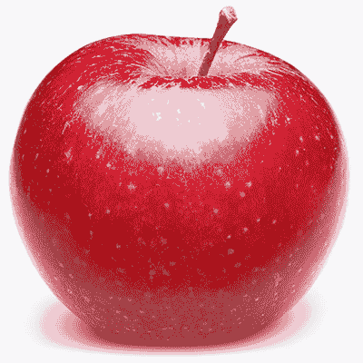

　　永远别低估一颗苹果的威力。这种水果的抗发炎特性，使其成为你能用来对抗几乎所有疾病的首选，脑炎（脑部发炎）、大肠激躁症（肠道发炎）及病毒感染（可能造成神经发炎）不过是一小部分，苹果能够在其中扮演重要的滋养角色，借由减少造成发炎的病毒与细菌数量，镇定你的身体。

　　苹果中的植物性化合物能够滋养神经元，并增加电子活动，使其成为有益大脑的食物。红皮苹果具有花青素及微量的丁香素（花青素的一种），正是果皮呈现红色的原因之一。这些色素具有抗肥胖的特性，并含有促进消化效果的化合物，有助于减重。此外，苹果也含有微量的类黄酮、芸香苷及槲皮素等对于重金属与辐射物具有解毒效果的植物性化合物，以及麸酰胺酸与丝胺酸等氨基酸，可以帮助大脑排除麸胺酸钠（味精）。这种水果有助于净化器官、改善淋巴系统循环、修复受损肌肤及调节血糖。

　　苹果是结肠的终极清道夫，它里面的果胶通过你的肠子时，能够聚集并排出你体内的有害微生物，例如细菌、病毒、酵母菌与霉菌，也可以搜刮并排除腐败与堆积的蛋白质及食物残渣，这些残料隐藏在肠道的囊袋中，不断喂养有害菌落，例如大肠杆菌与困难梭菌，这让苹果具有绝佳的抗增殖效果，能够治疗小肠细菌过度增生及其他消化失调症状。

　　苹果还能在细胞层次发挥水合效果，可以提供珍贵的微量矿物质，例如锰与钼，以及电解质与重要的矿物盐类，能够在运动或承受各种压力过后帮助身体补充水分。

 有助于疗愈这些疾病

　　假如你有下列任一疾病，试着将苹果纳入日常饮食中：

　　肾脏疾病、肝脏疾病、阿兹海默症、关节炎、癫痫、多发性硬化症、甲状腺疾病、低血糖症、糖尿病、短暂性脑缺血发作（小中风）、泌尿道感染、肾上腺疲劳、偏头痛、带状疱疹、接触霉菌、强迫症、骨髓炎、注意力不足过动症、自闭症、创伤后压力症候群、青春痘、肌肉萎缩性嵴髓侧索硬化症、莱姆病、肥胖症、小肠细菌过度增生、焦虑症、耳鸣、病毒感染、眩晕症。

 有助于疗愈这些症状

　　假如你有下列任一症状，试着将苹果纳入日常饮食中：

　　耳鸣或耳中嗡嗡作响、糖尿病神经病变、头晕、眩晕、平衡问题、心悸、胃酸逆流、低血糖与其他血糖失衡问题、矿物质缺乏、体臭、经前症候群症状、肋骨疼痛、疲劳、腹胀、胀气、便秘、神经质、焦虑、五十肩、体重增加、背部疼痛、视力模煳、脑雾、身体疼痛、意识混乱、耳朵疼痛、身体僵硬、脑部发炎、头皮屑、更年期症状。

 情绪上的支持

　　苹果是历史悠久的食物，可以带我们回到源头。它是最早为我们带来抚慰的食物之一，也因此提供了庇护感。当你觉得沮丧、孤单、体弱多病、无力、一无是处、毫无价值时，苹果就是理想的食物。若你觉得自己不受认可，吃点苹果可以帮助你改变心境。

　　苹果能打开一部分的你，改变你内在及周围的能量，以吸引更快乐、更光明的事物，也能让你重十活力、使你振奋、心情放轻松，让你更加精力旺盛，这是因为数千年来，我们都有储存苹果过冬的习惯。这种水果是一线希望，使我们触及生命的美好。当外在世界变得严寒凄凉，苹果能让我们与生命、重生、阳光及夏令时分重新链接，这番体认被徐徐灌入我们体内。

 灵性启发

　　苹果教导我们别因为他人霜雪般的冷漠态度而冻伤。苹果不像其他作物会被秋天的温度损伤，许多品种的苹果因为有可以抵御霜雪的果皮，纵使在较寒冷的月份依然能持续生长、成熟。当朋友、情人或同事对你抛出一道道冷锋时，不妨依循苹果带来的启示，在自己周围拉出一道防护罩，直到情况有所改善为止。

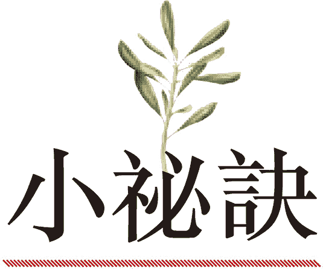

．红皮苹果的颜色愈鲜艳愈好。

．试试每天吃三颗苹果。如果规律地这样做，你会发现自己的健康状况以意想不到的方式改善。

．一年至少到有机果园亲自采收苹果一趟。新鲜、未经清洗、未喷洒农药且未上蜡的农产品，果皮中含有对肠道与免疫系统健康很重要的崇高微生物，而采摘水果的动作也是非常强而有力的接地静心方式。

苹果佐“焦糖”蘸酱

────── ◆ ──────

分量：1～2 人份

　　你的小孩放学回来后，这就是一道值得等待的完美点心：爽脆的苹果片一字铺开，搭配绵稠的焦糖蘸酱。你可能会想一次准备双倍分量，因为这道点心一转眼就会被抢光。

苹果 1 大颗，切片

椰枣 6 颗，去核

肉桂 1/4 茶匙

　　苹果片铺在盘子上。将椰枣与肉桂加一些水搅打，直到食材完全结合（假如用的是干燥、硬质的椰枣干，必须先泡水 2 小时，直到椰枣干软化），然后用汤匙将酱料舀入酱料公杯，摆在苹果片旁。

杏

　　　　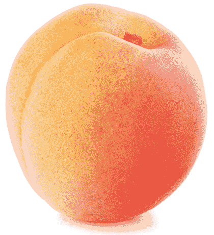

　　杏是神奇的回春食物，富含氨基酸，例如半胱胺酸与麸酰胺酸，以及硒与镁等矿物质（而且是以它们生物可利用度最高的形式呈现）。这种水果也含有超过四十种微量矿物质，其中有些相互结合成辅因子微量矿物质，形成科学界尚未发现的生物活性天然合金。杏拥有的植物性化合物能将自己黏附在体内深藏的化学物质分子上，例如 DDT，因而降低许多癌症风险。

　　杏是促进维生素 B12 生成的食物，代表它能排除消化道中阻碍身体正常生成 B12 的有害元素。吃下杏的时候，其果皮能聚集并消灭体内的霉菌、酵母菌、不必要的念珠菌，以及其他有害真菌。此外，果皮还富含能够保护 DNA 的酶与辅酶。杏的果肉可以防止肠子产生氨，这种破坏性气体会渗透肠道壁，导致全身上下的各种毛病，从脑雾到牙齿问题（这种状况叫“氨渗透”，科学界还不知道，而我在《医疗灵媒》一书中有详细探讨）。

　　杏是让人温暖的食物，也能让活力稳定，以促进红血球生成、强化心脏、滋养大脑。当你的活力存量不足以使你达到颠峰，就吃点杏吧，它是绝佳的恢复活力食物。

 有助于疗愈这些疾病

　　假如你有下列任一疾病，试着将杏纳入日常饮食中：

　　癌症、胆结石、胆囊疾病、滑囊炎、麸质过敏症、憩室炎、莱姆病、青春痘、贫血、高血压、气喘、关节炎、忧郁症、慢性疲劳症候群、纤维肌痛症、接触霉菌、酵母菌感染、姿势性直立心搏过速症候群、雷诺氏症候群、低血糖症、高血糖症、糖尿病、寄生虫问题、氨渗透。

 有助于疗愈这些症状

　　假如你有下列任一症状，试着将杏纳入日常饮食中：

　　对温度变化敏感、疲劳、头部觉得轻飘飘、身体疼痛、长期恶心、口渴不止、牙龈疼痛、呼吸短促、食物过敏、念珠菌过度增生、出汗失调（无法出汗或出汗过多）、皮肤痒、脑雾、腹胀、身体疼痛、结肠痉挛、充血、口欲、胃肠气积、头痛、活力低落、体重增加。

 情绪上的支持

　　杏帮助我们关爱生命，让我们敞开来，变得更加慈爱，并且去帮助缺乏信任感的人，以减缓他们的神经质或易受惊吓的状况。感受到威胁时，杏让我们冷静并调节我们的防御本性，使我们链接直觉，好知道何时该提高警觉，何时又该放下心防。在任何处境中产生挫折感时，杏都是极佳的抚慰剂。

 灵性启发

　　杏一直被人忽视，总是因为更闪亮、更华丽、更美味的食物而相形失色。当你学会欣赏这种水果的健康益处──其他许多食物根本比不上──请打开双眼、打开心，看见那些也一直被你忽视的工作机会、朋友与家人。

　　．杏相当有助于转换能量、相当有转化性，只须吃一颗就能享受它的各种益处。不过，面对健康问题时，一天可以吃四颗杏来获得支持与疗愈。

　　．杏在下午三点过后提供的效益最佳，这种水果的养分在此时达到最高含量，而且生物可利用度与可吸收度最高。

　　．耐心等待杏熟透之后再食用，别在尚未熟透时就吃。别担心它变得不够多汁，杏能提供的效益与其是否会流下汁液无关。

　　．如果现在不是杏的产季，无法吃到新鲜的杏，无硫杏干也是绝佳的替代品。虽然不是所有干燥水果都很珍贵，但杏在脱水后仍能保留所有药性。与其他许多水果不同，杏经过干燥后的钾含量更高。

美味杏条

────── ◆ ──────

分量：2～4 人份

　　如果你一直想找快速又简单的日常点心，美味杏条是完美的选择，既甜美又有嚼劲，还有一点爽脆的杏仁口感。只需要四种食材，短短几秒就能完成，放在冷冻库里可以保存长达一个月。

杏干 1 杯

椰枣 1/2 杯，去核

杏仁 1/2 杯

椰子 1/4 杯

　　将所有食材放入食物调理机中，搅打至充分混合。烤盘铺上烤纸，并将混料铺成一大片平坦的方形，厚度大约 1 英寸（2.5 公分），然后放入冷冻库至少 30 分钟，再切成条状即可。美味杏条放在冰箱冷藏室能保存 1 星期，或者放入密封保鲜盒中再置入冷冻库，可以保存长达 1 个月。

酪梨

　　　　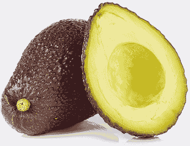

　　酪梨是母亲般的水果。无论你喜不喜欢吃，都应该将酪梨视为食品储藏室的基石。幸好酪梨的健康益处近年来逐渐受到重视，但它的好处其实远超过任何报导的记载。

　　虽然大部分酪梨的果皮无法食用，但其中富含数百种尚未被发现的植物性化合物，而许多成分都在成长过程中注入酪梨果肉里。其中有些植物性化合物是异硫氰酸盐类，这也是果肉呈黄绿色的原因，并且有助于修复胃部与肠道的黏膜。有任何消化不良问题，酪梨都能帮上忙。它容易消化的乳脂状果肉，可说是终极的肠道抚慰剂，适合对食物敏感的人，例如克隆氏症、结肠炎或大肠激躁症患者。酪梨具有的抗发炎化合物有类似阿斯匹灵的性质（但不会稀释血液），可以减少消化道的狭窄与肿胀现象。这种水果也有减少息肉的特性，有助于预防或消除这些肠道黏膜上的细小增生组织。

　　酪梨对大脑也相当有益。它是 omega-6 脂肪酸的健康来源，能修复中枢神经系统，减轻阿兹海默症与失智症。吃酪梨对皮肤也有抗老化效果，能减少干燥状况，带来健康的光泽，更有助于消除黑眼圈。酪梨还内含具有植物性雌激素性质的抗辐射剂，能防止与雌激素相关的生殖器官癌症及结肠癌。酪梨的益处远超过这里的篇幅所能形容，总之，你的生命需要酪梨！

 有助于疗愈这些疾病

　　假如你有下列任一疾病，试着将酪梨纳入日常饮食中：

　　心脏疾病、难解的不孕症、人类免疫缺乏病毒（爱滋病毒）、肾脏疾病、中风、癫痫、慢性疲劳症候群、秃头、脑癌、克隆氏症、结肠炎、大肠激躁症、生育能力低落（参阅第三部［生育力与我们的未来］那一章）、子宫内膜异位症、纤维肌痛症、焦虑症、坐骨神经痛、阿兹海默症、失智症、疱疹、甲状腺疾病、肾上腺疲劳、注意力不足过动症、自闭症、忧郁症、带状疱疹、睡眠障碍、息肉、泌尿道感染、失眠、痔疮、卵巢癌、子宫癌、结肠癌、姿势性直立心搏过速症候群、硬皮症、硬化性苔癣、辐射病、眩晕症。

 有助于疗愈这些症状

　　假如你有下列任一症状，试着将酪梨纳入日常饮食中：

　　记忆力衰退、更年期症状、头痛、念珠菌过度增生、肌肉痉挛、肌肉疼痛、恐慌发作、焦虑、背部疼痛、头晕、平衡问题、四肢刺痛与麻木、胀气、腹胀、皮疹、腹部痉挛、经前症候群症状、胃轻瘫、疲劳、食物过敏、食物敏感、三叉神经痛、飞蚊症、虚弱。

 情绪上的支持

　　你是否曾经感觉活得不像真正的自己，让你无法如自己所期待地那样经得起挑战，更因而使你与所爱的人日渐疏远？酪梨有助于找回自我，当我们需要情绪力量、需要与真正的自己链接，当我们需要修复破碎的心时，酪梨能使我们变坚强，成为人际互动链中的强韧环节。面对贫穷、好斗或消极的人──也就是链子里比较脆弱的环节──酪梨能帮助我们传递关爱与勇气，好让我们得以维持人际链接的健全，并教导其他人熬过生命的考验。

　　酪梨也是你因为内疚而挣扎时的重要工具。若你需要重新引导羞愧与自责的感受，酪梨会是你的盟友，帮助你从心与灵魂中抽出痛苦的情绪。

 灵性启发

　　酪梨是滋养的来源，它是世界上与母乳最接近的食物，这代表酪梨除了可以哺育身体，更能在灵性上为我们注入滋养与母亲般的爱。需要关心他人时──例如帮助朋友或所爱之人度过难关──吃酪梨有助于传递这份母性能量。而在我们需要关爱，无论是在照料周遭人的同时让自己继续前进，或是自己在生命中遭遇磨难时，酪梨都是最棒的抚慰食物。将酪梨带入生命中，作为教你无条件之爱的老师（无条件爱自己，也无条件爱他人），然后看着你怀抱慈悲之情的能力成长、茁壮。

　　．一天吃一颗酪梨即可有显著效益；若想获得最大的益处，一天可以吃两颗。

　　．在商店购买的酪梨，从采收到上架的过程中都经过许多人的手，而每当有人经手，酪梨就会吸收那个人的部分能量。在切开买回来的酪梨之前，先握在双手中三十秒，这会让酪梨属于你，并使它的细胞与你个人的能量、本质、灵魂及 DNA 链接，让它发挥最符合你个人需求的滋养效果。

　　．酪梨是绝佳的旅行食物。下次旅行时，试着带上几颗酪梨当作新鲜的替代品，取代了无新意又油腻的零嘴或脱水零食。饿的时候，只须切下并转开酪梨，就能挖出果肉食用。

莎莎酱酪梨船

────── ◆ ──────

分量：2～4 人份

　　将你最爱的莎莎酱里所有鲜明、活跃的风味装在清凉绵密的酪梨中，记得事先准备双份莎莎酱供你随时使用，以备不时之需。

酪梨 2 颗

番茄 1½ 杯，切丁

小黄瓜 1 条，切丁

洋葱丁 1/4 杯

切碎芫荽叶 1/4 杯

大蒜 1 瓣，切碎

莱姆 1 颗，挤成汁

切碎墨西哥辣椒 1/8 杯

海盐 1/8 茶匙

红辣椒（卡宴辣椒） 1/8 根（依喜好选用）

　　酪梨对半切开，去掉果核。其他所有食材放入小碗中混合成莎莎酱，并将莎莎酱舀入对半切开的酪梨中即可上菜！

香蕉

　　　　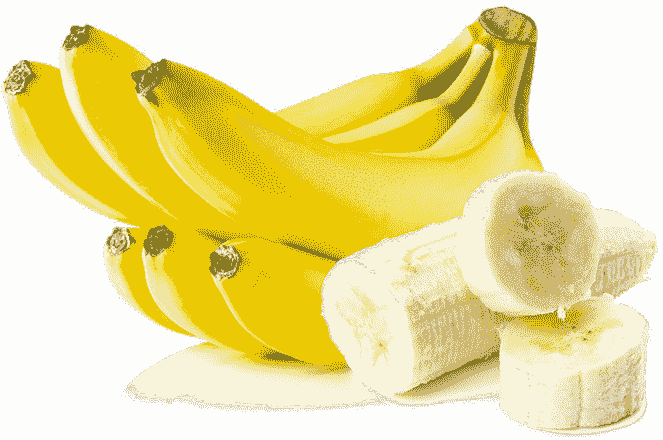

　　香蕉近来曾因含糖量太高而背负骂名，但事实上，熟得刚刚好的香蕉所含的糖分与蔗糖及经过处理的甜味剂完全不同。它的果糖结合了支持生命的重要微量矿物质，例如锰、硒、铜、硼、钼，以及大量的矿物质，例如钾，这是对神经传导物质运作非常重要的营养素。香蕉还富含能与高生物可利用性的钾相互搭配形成催化剂，以生成大量电解质的氨基酸。与其认为香蕉里都是糖，我们更应该提醒自己，香蕉也是由纤维、果肉及水分构成的，而且高果糖含量正是它可以大量提供抗氧化物、维生素和其他植物营养素以协助我们对抗疾病的原因。

　　香蕉是强而有力的抗病毒食物，强大到足以抑制人类免疫缺乏病毒（爱滋病毒）的生长。香蕉含丰富的色胺酸，有助于减轻睡眠障碍、让人镇静、减低焦虑，并缓和忧郁症。而担心念珠菌的人不须害怕香蕉，它是终极的真菌毁灭者，能消灭害菌，同时滋养肠道中的有益微生物。这也让它可以促进维生素 B12 的生成，因为肠子里的微生物会阻碍回肠中正常的维生素 B12 制造过程。

　　香蕉对过度活跃的结肠与小肠道是解痉剂，能舒缓胃痉挛及压力造成的肠胃失调，也是逆转结肠炎、大肠激躁症与克隆氏症的秘密武器。此外，香蕉还是绝佳的血糖稳定剂、拥有能帮你对抗压力的植物性化合物让你可以撑过一整天，而且无论你采取哪种饮食方式，都能帮助你平衡体重。

 有助于疗愈这些疾病

　　假如你有下列任一疾病，试着将香蕉纳入日常饮食中：

　　结肠炎、大肠激躁症、克隆氏症、麸质过敏症、自体免疫疾病、心脏疾病、胃食道逆流疾病、肾上腺疲劳、阿兹海默症、躁郁症、糖尿病、腕隧道症候群、忧郁症、憩室炎、胆囊疾病、痔疮、人类免疫缺乏病毒（爱滋病毒）、不孕症、帕金森氏症、关节炎、注意力不足过动症、生育能力低落、睡眠障碍、创伤后压力症候群、真菌感染、带状疱疹、肌腱炎、焦虑症、低血糖症、高血糖症、水肿。

 有助于疗愈这些症状

　　假如你有下列任一症状，试着将香蕉纳入日常饮食：

　　失去味觉或嗅觉（或两者皆是）、体重增加、体重减轻、颞颚关节问题、脾脏肿大、视力模煳、疲劳、念珠菌过度增生、糖尿病神经病变、瘀血、心搏过速、便秘、腹胀、腹泻、头痛、睡眠呼吸中止、视力混浊、血糖失衡、食物敏感、耳朵疼痛、颚部疼痛、肌肉无力、焦虑、体内嗡鸣或震动感、腹部痉挛、腹部疼痛、贝尔氏麻痹、背部疼痛、刺痛与麻木。

 情绪上的支持

　　香蕉能巩固我们的核心，鼓励我们卸下虚假的防护罩，展露真正的自我。香蕉有助于逆转充满恐惧的心理状态（一天吃三根以上的香蕉可帮助减缓创伤后压力症候群），也能帮助我们表达想要有生产力、在过程中克服拖延与其他无益行为的真实渴望。如果觉得某个朋友满怀怨恨，递根香蕉给他∕她，将有助于化解憎恶感。

 灵性启发

　　有时在灵性成长的过程中，我们也许会发现自己有坚不可摧、完全专注于当下的感觉，但假如不够谨慎──如果没有未雨绸缪，为了将来增强自己──迎面而来的挑战强风可能将我们吹垮。

　　所以，我们应该向香蕉学习。香蕉不仅会长成树，整株香蕉更会形成又厚又广的根系，地下茎不断抽出地面，成为准备生长的吸芽。由于香蕉的“树干”并非真正的木材，而是由一层一层的香蕉叶构成，所以长得很快，使新的分枝能够在另一根叶柄被天气破坏时迅速递补。

　　当你朝着天空生长、开花、结果时，别忘了把自己的根系扎得又广又深。让学到的每个教诲都成为灵性上的枝桠，它们有一天可能会拉你一把。

　　．香蕉最适合食用以摄取最高营养的阶段，就是熟得刚刚好的时候。香蕉皮仍是绿色时，酶会阻碍我们吸收这种水果的所有养分；至于果皮呈现褐色或黑色的过熟香蕉，则相当于发酵水果。香蕉的最佳食用时机，是果皮呈现黄色，并带有褐色斑点时（最可靠的检验方法，是确认香蕉不会在舌头留下刺刺的感觉）。

　　．香蕉是最佳旅行食物──无论是长途的车程、飞行，或者只是到镇上办点事。知道自己即将外出时，提前买点香蕉，等到你需要它们时，正好熟得恰到好处。

　　．运动前后吃一根香蕉，比其他任何食物更能补足身体需求。

香蕉“奶昔”

────── ◆ ──────

分量：1～2 人份

　　这杯“奶昔”是小孩子最爱的经典饮料，不过里头少了乳制品。加入少许新鲜香草豆，再撒上肉桂，会让它变得更美味。

4 公分长的香草豆荚 1 根，纵向剖开

冷冻香蕉 2 根

新鲜香蕉 4 根

椰枣 2 颗，去核

椰子水 1 杯

肉桂 1/8 茶匙（依喜好选用）

　　刮出香草豆荚中的香草籽，放入果汁机内。将其余食材也放进果汁机里，搅打至滑顺即可饮用！

　　＊香草豆荚的外皮可以留下来打成果昔或甜点（记得要用高速果汁机才能彻底打散）。

莓果

　　　　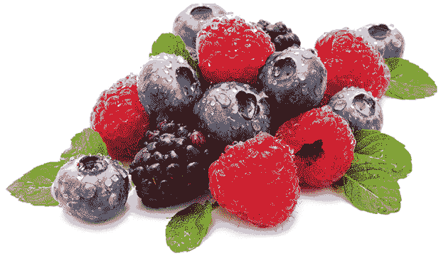

　　莓果是相当优质的水果，它们主要的力量来自抗氧化物，这也是对抗自由基的奇迹斗士。抗氧化物代表了生命，氧化作用则意味着死亡。我们需要这些抗氧化物来对抗老化（氧化）过程，并在面对不断出现的健康威胁时维持生存。莓果透过它们的深紫色、蓝色与黑色传递健康价值，这些颜色来自花青素苷（包括丁香素）与花青素等多酚类。此外，它们也富含二甲基白藜芦醇与其他十多种植物性化合物、氨基酸、辅酶，以及科学界尚未发现、在莓果中的含量与生物可利用度远超过其他任何食物的辅化合物。

　　莓果是铁、镁、硒、锌、钼、钾、铬与钙的绝佳来源，也含有微量的 omega-3、omega-6 及 omega-9 脂肪酸。此外，它们还有防止过量肾上腺素对器官造成伤害的隐藏化合物，这使得黑莓、覆盆子、草莓、接骨木果、五味子之类的莓果对地球上的生命而言至关重要（蔓越莓另有篇幅独立介绍）。尤其是野生莓果，更具有抗老化、抗疾病及赋予生命的能力。

　　至于野生蓝莓则自成一类，你会在［野生食物］那个部分找到相关信息。尽可能选择冷冻的野生蓝莓，而不是塑胶盒装的新鲜培育蓝莓。请养成习惯，在市场的农产品区采购之后，就到冷冻食品区逛逛，应该可以在架上找到袋装野生蓝莓。你会因此让自己获得最佳的复元与疗愈机会。

　　莓果是真正适合大脑的食物，它们不仅能促进维生素 B12 生成，还能逆转脑中的斑点──脑损伤、灰质区、钙化、重金属堆积、白点、疤痕组织、结晶化，以及由受损、扩张的血管产生的沾黏。若要防止各种脑部问题与疾病，包括脑癌、肌肉萎缩性嵴髓侧索硬化症、阿兹海默症、失智症、帕金森氏症、中风、动脉瘤与偏头痛，吃莓果就对了。而任何与神经系统症状相关的疾病，莓果也是最佳解答。

　　至于心脏健康，一样交给莓果吧。莓果保护心瓣膜与心室，并借由溶解静脉与动脉中的硬化脂肪堆积以清除斑块的方式，没有其他食物比得上。看似不起眼的莓果，却是让人远离心脏科医师的最佳处方。

　　此外，我们不能忽略莓果对生育力的意义。不久的将来，科学研究会发现一群特别能提高生育力的化合物。这些促进生育力的化合物是从单一种类的多酚衍生而来，可以让女性的生殖系统能力维持平衡，因此，造成许多难解不孕案例的“电力过低”（生育能力低落）问题将不复存在（想要多了解这种现象，请参阅第三部［生育力与我们的未来］那一章）。莓果确实是人类未来的解答。

 有助于疗愈这些疾病

　　假如你有下列任一疾病，试着将莓果纳入日常饮食中：

　　脑癌、良性脑瘤、肌肉萎缩性嵴髓侧索硬化症、中风、动脉瘤、偏头痛、帕金森氏症、阿兹海默症、失智症、注意力不足过动症、自闭症、脑炎、癫痫、亨汀顿氏舞蹈症、猝睡症、骨髓炎、妥瑞氏症、脑性麻痹、多发性硬化症、动脉粥状硬化症、心脏疾病、心搏过速、卵巢癌、心房颤动、摄护腺癌、子宫癌、多囊性卵巢症候群、难解的不孕症、子宫内膜异位症、骨盆腔发炎性疾病、耳鸣、失眠、忧郁症、焦虑症、创伤后压力症候群、生育能力低落、强迫症、青春痘、肾上腺疲劳、甲状腺疾病与失调、纤维肌痛症、慢性疲劳症候群、体重增加、膀胱感染、类纤维瘤、低血糖症、糖尿病、莱姆病、病毒感染、湿疹、牛皮癣、腺瘤、水肿、甲状腺结节。

 有助于疗愈这些症状

　　假如你有下列任一症状，试着将莓果纳入日常饮食中：

　　胆固醇过高、卵巢囊肿、子宫增厚、子宫发炎、卵巢发炎、输卵管发炎、月经失调、荷尔蒙失衡、热潮红、心悸、疲劳、刺痛、体内嗡鸣或震动感、麻木、视力混浊、吞嚥困难、头痛、神经痛、矿物质缺乏、痉挛与抽筋、胸部疼痛、胸闷、五十肩、头晕、恐慌发作、恐惧症、萎靡、倦怠、耳鸣或耳中嗡嗡作响、脑损伤、嵴髓损伤、飞蚊症、耳朵疼痛、颚部疼痛、颈部疼痛、血糖失衡、疲劳、脑雾、肝功能不良、焦虑、髓鞘神经伤害、钙化、疤痕组织、念珠菌过度增生、脑部沾黏、背部疼痛、膝盖疼痛、循环不良、肿胀、脑部发炎。

 情绪上的支持

　　觉得心烦意乱、缺乏信心、无法集中精神、混乱、迷迷煳煳、错乱、模煳、漫无目标、茫然、困惑、迷惘时，莓果拥有提供慰藉的独特能力。这些状态同时关乎意识与潜意识，既具体又抽象，是心智与灵魂的疾病。当你抱持着想要自我治疗迷惘的感受与感知的意念来吃莓果时，你的问题就能被逆转，奇迹自然会到来。

 灵性启发

　　想要寻求丰盛，就以莓果为师吧。从晚春到晚秋，各种莓果的供应从不间断──某片草莓田的产量开始减少，就换附近的黑莓灌木开始结实累累。莓果的供应源源不绝，某个来源枯竭时不须惊慌，因为还有更多宝石正在某个角落等着你去发现。

　　莓果慷慨无私。它们并非高高在上，使人无法触及，而是生长在接近地面的低矮处，让各种动物都得以享用，从熊、鹿、人类、松鼠与鸟类，到老鼠、田鼠、兔子，甚至蜗牛。莓果的本质是分享，提供足够的分量满足众人需求。将莓果带入生命中，它们的仁慈与慷慨就成为我们的一部分，让我们不只是接受者，更能成为丰盛循环中的提供者。

　　．日出不久后立刻享用你最爱的莓果，可以提升你一整天的能量与生命力。

　　．正餐之间吃几把莓果，能提升身体的频率，使你进入更正面、平静的状态。

　　．从有机农场、你家后院或大自然中的野生来源取得莓果，而且不必清洗直接食用，可以让它们的崇高微生物恢复肠子里不可或缺的益菌，以重新启动身体自行制造维生素 B12 的能力。

　　．摘采莓果也是无可比拟的接地技巧。从灌木摘下蓝莓，或是从多刺的茎采下覆盆子，专心选择成熟的莓果并避免被扎到，能迫使你专注于当下。这是一种神圣的存在状态，不但让你与前人链接，也使你和此时此地正在吟唱的鸟儿及沙沙作响的树叶合而为一。

　　．为了尽可能获取最强而有力的益生原，以滋养肠子里的所有益菌及其他有益微生物，可以在一碗莓果中加入生蜂蜜。

　　．在晴天吃莓果可以提升肾上腺活力、帮助平衡血糖；在阴天食用，则能增加净化肝脏的效果，并有助于改善肝功能不良。

　　．邀请一位朋友共享一大碗莓果。随着你们的对话愈来愈神圣、深刻、疗愈，并且最终使你们感到快乐，你会惊讶地发现彼此之间的情绪创伤开始修复，而且尽释前嫌。

鲜奶油莓果

────── ◆ ──────

分量：2 人份

　　这些美丽诱人的鲜奶油莓果适合当早午餐、同乐的零嘴或点心。将椰奶打成轻盈云朵般的蓬松奶油，搭配少许的姜与柠檬皮，使整道料理更加完美，并让那些你所爱的人留下深刻印象。

蓝莓 1 杯

黑莓 1 杯

覆盆子 1 杯

草莓 1 杯

13.5 盎司的全脂椰奶 2 罐，事先冷藏

姜末 1/4 茶匙

枫糖浆 1 茶匙

柠檬汁（约 1/4 颗柠檬挤成）

5 公分长的香草豆荚 1 根，纵向剖开

柠檬皮 1 茶匙

新鲜薄荷叶 4 片，切碎

　　冲洗所有莓果，然后混合在一起，并分置于两个碗中。打开椰奶罐头（小心别摇晃），里头的椰奶会自然分层，浓厚的乳脂在上层。舀出凝固的乳脂，置入小搅拌碗中（你需要半杯乳脂），剩下那些较稀的液体丢弃不用。利用叉子将椰子乳脂、姜末、枫糖浆、柠檬汁与香草豆荚中刮下的香草籽一同搅打至充分混合与滑顺，然后把制成的奶油大方地舀到两个碗里的莓果上，再撒上柠檬皮与薄荷即可。

　　＊香草豆荚的外皮可以留下来打成果昔或甜点（记得要用高速果汁机才能彻底打散）。

樱桃

　　　　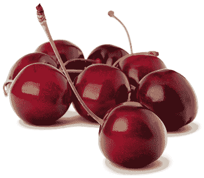

　　这年头，我们的肝脏负担比过去任何时候都重。随着环境与食物中的毒素为身体带来压力，肝功能不良与脂肪肝也愈来愈普遍。虽然坊间有不少肝脏净化方法，但一把樱桃的效果其实更好。樱桃是终极的肝脏大补丸、清道夫与回春良方。

　　樱桃可促进生成健康的血红素，也有抗癌效果，对非何杰金氏淋巴瘤、黑色素瘤与神经胶质母细胞瘤（脑瘤的一种）尤其有效。樱桃借由净化肠道来使心思敏锐，抒解便秘的效果比梅干更好！它还能清理膀胱，且有助于缓解痉挛性膀胱及膀胱脱垂。此外，樱桃是最能提升内分泌系统的食物之一，可以依照需求刺激或抑制食欲，若想减重，樱桃是你最好的新朋友。

　　在矿物质方面，我们对巨量矿物质的概念很熟悉，身体的需求量相当高；至于微量矿物质，虽然我们的需求量较小，但其对身体机能同样重要。以樱桃为例，它就是锌与铁等微量矿物质的绝佳来源。所有贫血患者都会告诉你，缺乏铁质可不是小问题，所以纵使铁属于微量矿物质，其重要性却非比寻常。

　　同样的概念也适用于氨基酸，但科学界尚未着重这一点。除了大家熟悉的氨基酸，还有其他微小、微量形态的氨基酸会成为巨量氨基酸的辅因子──而樱桃同时富含巨量与微量氨基酸（包括苏胺酸、色胺酸与离胺酸），它们尤其会与褪黑激素合作，提供大脑与身体极佳的抒压效果。像这样被增强之后，褪黑激素也具有抗氧化物的作用，有助于保护大脑不受阿兹海默症、失智症与脑瘤的威胁。

　　樱桃中的植物性化合物对排除辐射物及修复髓鞘神经伤害效果极佳。此外，它的净化性质对女性尤其有益：樱桃能排除子宫及生殖系统其他部位的毒素，并有助于减少类纤维瘤与卵巢囊肿。

 有助于疗愈这些疾病

　　假如你有下列任一疾病，试着将樱桃纳入日常饮食中：

　　多囊性卵巢症候群、阿兹海默症、膀胱癌、淋巴瘤（包括非何杰金氏淋巴瘤）、黑色素瘤、膀胱脱垂、脂肪肝、乳癌、自闭症、脑瘤、心血管疾病、糖尿病、骨盆腔发炎性疾病、耳朵感染、纤维肌痛症、忧郁症、不孕症、强迫症、肾结石、生育能力低落、厌食症、秃头、失智症、桥本氏甲状腺炎、肾上腺疲劳、青春痘、贫血、类纤维瘤、滑囊炎、泌尿道感染（如肾脏感染与膀胱感染）、焦虑症、结缔组织损伤、摄护腺炎、葛瑞夫兹氏病、失眠、自主神经障碍、眩晕症、血液异常、骨胳与腺体结节。

 有助于疗愈这些症状

　　假如你有下列任一症状，试着将樱桃纳入日常饮食中：

　　鼻出血、扭伤、龋齿、甲状腺机能不足、头部觉得轻飘飘、便秘、食欲不振、食欲过盛、口欲、发烧、抓痒与搔痒、口干、萎靡、瘀血、头晕、胸部疼痛、甲状腺机能亢进、阳萎、咳嗽、恐惧症、肝功能不良、食物过敏、髓鞘神经伤害、疲劳、记忆力衰退、背部疼痛、口臭、血液毒性、意识混乱、皮质醇过高、发炎、卵巢囊肿。

 情绪上的支持

　　如果想鼓舞朋友或家人，带点樱桃给他们，你会发现对方乐不可支；假如你或你认识的某人永远对环境不满，就让樱桃发挥它知足的魔力；若你曾担心自己语塞无言，在饮食中加入樱桃，你会感觉到和他人之间的对话顺畅无比；如果你觉得空虚、觉得被抛弃，樱桃可以为你的感受指引新的方向。光是看着一碗樱桃，立刻就会涌现喜悦。樱桃点燃热情并产生正面的兴奋感，是让人忘忧解愁的绝佳水果。

 灵性启发

　　樱桃教人保持耐心。如果吃樱桃时狼吞虎嚥──如果不细细咀嚼──可能会因为里头的小果核而受伤。樱桃借此教导我们一切慢慢来，行动必须谨慎、经过深思熟虑，才能将错误与痛苦减至最低。

　　．樱桃的净化效果极佳，能排除诸多不洁杂质，所以适量摄取效果最好。食用这种水果时，别因为风味可口而忘了听从身体要你“别吃了”的讯号。每天应少量多次摄取樱桃，而不该一次大量食用。

　　．在市场或食品店选购红樱桃时，要挑选深色的，较深的色泽具有最佳疗愈效果。红樱桃颜色太浅，代表樱桃树生长的土壤中矿物质含量不够。

香甜樱桃果昔

────── ◆ ──────

分量：2 人份

　　在这杯果昔中，樱桃的甜美结合了香蕉的绵密，伴随一抹柠檬的酸味，让人惊喜又愉悦。

冷冻香蕉 1 根

成熟香蕉 2 根

冷冻樱桃 1 杯

柠檬 1/2 颗，去皮

水 1/2 杯

　　将所有食材放入果汁机中搅打至滑顺，再倒入玻璃杯里即可享用！（这道果昔静置过久容易凝成胶状，若想保留液态口感，记得马上饮用；如果偏好布丁般的黏稠度，可以冷藏 30 分钟后再享用。）

蔓越莓

　　　　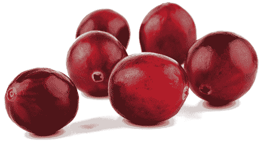

　　蔓越莓在治疗泌尿道感染与酵母菌感染中扮演的抗菌剂角色为人熟知，这种力量来自蔓越莓对抗链球菌的能力──因为这些疾病背后的原因多半是慢性链球菌感染（即使是酵母菌感染，问题的源头大多被误诊为与真菌有关，而把酵母菌视为次要原因）。但这只是这些小莓果最基本的功能罢了。在感恩节餐桌上的所有食物中，蔓越莓料理显然是最有营养的，即使你用的是掺了糖浆的罐装蔓越莓酱汁，蔓越莓的药效因子仍然凌驾添加物的缺点之上。

　　蔓越莓是逆转胆囊疾病的终极食物之一。如果你患有胆结石，没有什么比蔓越莓更能溶解它们了。蔓越莓也是十分强大的肝脏清道夫，而且在你试图轻松排出肾结石时也特别有帮助。它甚至能清除堆积的耳垢，帮助恢复听力。

　　更不必说蔓越莓富含有助于治疗心血管疾病与动脉粥状硬化症的抗氧化物（如花青素），也具有植物雌激素化合物，能够让来自塑胶、环境污染物、杀虫剂与其他合成化学物质等外在源头的雌激素失去作用。蔓越莓能破坏这些导致许多女性健康状况的有毒荷尔蒙。

　　蔓越莓充满可以将辐射物排出体外的化合物、保护结缔组织的氨基酸、特别有益于器官排毒的酶，以及你可能都不知道自己缺乏的五十多种微量矿物质，还具有抗增殖化合物，有助于抑制细菌、病毒与其他任何有害物质在你体内增长。此外，蔓越莓在你需要时也能帮助你面对压力。

　　假如你想要减重，蔓越莓是你另一位强力战友。每天食用一碗蔓越莓能抑制食欲，帮助你摆脱多余体重。

 有助于疗愈这些疾病

　　假如你有下列任一疾病，试着将蔓越莓纳入日常饮食中：

　　季节性过敏、偏头痛、裂孔疝气、人类免疫缺乏病毒（爱滋病毒）、高血压、子宫颈癌、酵母菌感染、腕隧道症候群、动脉粥状硬化症、心血管疾病、流产、白血病、卵巢癌、链球菌感染、膀胱感染、肥胖症、肺炎（任何种类）、结膜炎、肾衰竭、葡萄球菌感染、胆囊疾病、胆结石、肾脏感染、肾结石、贫血、焦虑症、带状疱疹、糖尿病、痛风、人类疱疹病毒第六型、巨细胞病毒、结节、莱姆病。

 有助于疗愈这些症状

　　假如你有下列任一症状，试着将蔓越莓纳入日常饮食中：

　　记忆力衰退、肌肉痉挛、咬指甲、甲状腺机能不足、经前症候群症状、体重增加、腹胀、胃肠气积、消化不良、黄疸、狂躁、意识混乱、间歇性阴道出血、颤动、听力丧失、钙化、瘀血、口欲、头晕、耳垢堆积、水泡、甲状腺机能亢进、发炎、视力模煳、焦虑、足部疼痛、疤痕组织。

 情绪上的支持

　　蔓越莓可促进令人愉悦的性情。每当你在情绪层面觉得模煳不定──不清楚该做什么决定、对生命的方向感到困惑──食用蔓越莓能照亮你的路。当你因杂乱无章而紧张不安、在乎别人对你的眼光，因此阻碍了你的路时，生长得规律有序的蔓越莓能帮你厘清纷乱，让你继续向前迈进。

　　当神经元与感觉器官被困在批评的模式中时，蔓越莓也帮得上忙。无论你是过度批评他人或受人指责，吃蔓越莓都有帮助。规律摄取蔓越莓能舒缓被排斥、被羞辱的感受，而且，若你有过疏离感，蔓越莓能帮助你改变方向，与人群重新创建链接。

 灵性启发

　　进入成年生活后，我们学到直率坦荡不一定安全。有时，责任需要我们投以全部的注意力并严肃以待，否则当我们敞开心胸展露真我时，就可能被人利用。蔓越莓藤也很类似，天生就长在靠近地面的低处，保护自己不受低温与强风侵扰。当蔓越莓呈现自我遮蔽状态时，甚至很难看见这些小小的红色莓果。

　　我们有时会陷入这种心理状态，深怕享受片刻的愉悦会暴露自己的弱点，并暗指我们不够认真工作。然而，长大成熟不代表应该一直压抑自己的喜悦之情，喜悦对真我而言不可或缺。就像蔓越莓在成熟季节中利用温暖又充满日照的时刻活跃起来、在风中摇曳玩乐、在光里灿烂夺目，我们也能学着认清适合自己表现真正的生命力、本质与灿烂光芒的时刻。只要能掌握平衡，我们确实有可以昂然闪耀、在阳光中起舞的日子──关于这一点，蔓越莓正是最好的老师。

　　．冷冻蔓越莓是你摄取这种水果的绝佳选择。试着将其加进燕麦片里，或者加入果昔中享用。

　　．如果无法自己准备新鲜蔓越莓汁，可以选择以 100%蔓越莓制造的果汁──无添加糖分、防腐剂或其他添加物。

　　．如果不喜欢蔓越莓的酸味，可以搭配一把胡桃一起吃。

　　．若真的不喜欢蔓越莓，不代表它无法帮助你。每个星期在家里摆一碗蔓越莓，光是看着它放在厨房料理台上，就能帮助你（以及任何经过的人）获取它在情绪层面的助益，因为莓果的特质会以超自然的方式进入你体内。假如每天花点时间触摸蔓越莓，用手指滑过它或放几颗在手掌中，你也能接收这种水果对身体的益处。

开胃蔓越莓

────── ◆ ──────

分量：2～4 人份

　　想到蔓越莓，你眼前浮现的可能是感恩节晚餐时出现在餐桌上的果冻，但这道开胃蔓越莓一点也不无聊。将新鲜的蔓越莓跟苹果、柳橙一起剁碎，搭配衬托出蔓越莓天然酸味的椰子糖，这道简单的小菜是任何假日大餐的良伴，也很适合撒在沙拉上。

蔓越莓 1 杯

粗略切丁的苹果 2 杯

柳橙瓣 1/2 杯

柳橙皮 1/4 茶匙

椰子糖 4 汤匙

薄荷叶 3 片

　　将所有食材放入食物调理机中，以手动按压方式间歇搅打至粗略混合。上桌前要冷藏至少 30 分钟。

椰枣

　　　　

　　椰枣对消化系统相当有益。身为地球上最佳抗寄生虫食物之一，椰枣能结合、破坏并驱除肠道中的寄生虫、酵母菌、霉菌、其他真菌、重金属、害菌、病毒与其他有毒病原体，这使它成为目前已知最强大的念珠菌杀手──然而却有错误信息指出椰枣会喂养念珠菌（关于此疾病的真相，请参阅我的第一本书《医疗灵媒》，里头有一整章都在探讨此议题）。椰枣也有益于恢复肠子的蠕动功能，能重新锻鍊曾经麻痹或机能失调的肠子，使其恢复正常运动并排出腐败食物。

　　与普遍的看法不同，椰枣其实也是糖尿病或低血糖症患者的理想食物，因为它能将重要的葡萄糖输送至肝脏，解决引起血糖问题的葡萄糖缺乏现象。此外，椰枣也很适合运动员及其他爱冒险的人，其丰富的钾与果糖含量对于在运动中依赖葡萄糖提供活力的大脑与肌肉而言，是绝佳燃料。

　　椰枣富含将近七十种生物活性矿物质（远超过现有记载），能支持肾上腺帮助你应付日常生活中的挑战。作为最有益心脏的食物之一，椰枣也含有打破纪录且尚未被发现的氨基酸含量。与香蕉类似，椰枣中的氨基酸，例如白胺酸，可以帮助它含有的钾在维持并强化肌肉与神经时发挥最佳效果，而这个过程也能在身体面临压力时防止它充满乳酸。

　　椰枣也是让人温暖的食物，能排除脾脏与肝脏等器官中的湿气，又不至于到达有害健康的干燥程度。椰枣还有很强的抗癌特性，使其成为每个人预防疾病与改善健康的必需品。

 有助于疗愈这些疾病

　　假如你有下列任一疾病，试着将椰枣纳入日常饮食中：

　　糖尿病、低血糖症、小肠细菌过度增生、心血管疾病、真菌感染、胃食道逆流疾病、高血压、肺癌、肥胖症、甲状腺疾病、动脉瘤、创伤后压力症候群、自恋型人格障碍、强迫症、肾上腺疲劳、恐惧症、慢性鼻窦炎、酒渣（玫瑰斑）、思觉失调症、社交焦虑症、自闭症、注意力不足过动症、结核病、眩晕症、饮食障碍症、失眠、牙龈疾病、水肿。

 有助于疗愈这些症状

　　假如你有下列任一症状，试着将椰枣纳入日常饮食中：

　　血糖失衡、粪便中带黏液、念珠菌过度增生、便秘、肌肉疲劳、耳朵疼痛、头晕、呼吸短促、阴道疼痛、心悸、焦虑、流汗、急尿、集中力不足、颤动、食物过敏、睡眠障碍、恐慌发作、耳鸣或耳中嗡嗡作响、痉挛、抽搐、头部疼痛、头痛、牙龈疼痛、咳嗽、意识混乱、脑雾。

 情绪上的支持

　　食用椰枣能在你周围形成防护罩，使你不会被嫉妒你的人伤害。睡觉时，椰枣可以帮助你释放你累积的有毒情绪，例如恐惧、羞愧、意志消沉，以及觉得被批评、冤枉或霸凌的感受。最后，椰枣能强化你的使命感，让你发挥最高的生产力与热情。

 灵性启发

　　椰枣教导我们从自私变得无私。它甜美又滋养的特质使人着迷──其可口的滋味令人愉悦，让我们想占为己有，但你将学会不再将椰枣私藏起来。每次只吃一点，你就能与他人分享。看着朋友和家人将椰枣的营养吃进体内时露出的笑容，能帮助你战胜贪婪，转为付出，最终体认到：和你与生俱来的无私链接，是灵性成长不可或缺的。

　　．想要获取椰枣最大的益处，请每天吃四到六颗。

　　．如果需要改善夜间睡眠，就寝的两小时前食用一颗椰枣。

　　．为了从你选择的静心方式中获得更深刻的体验，开始静心前请食用三颗椰枣。

　　．当你为了某趟不知何时、何地、如何才能在路上找到食物的旅程打包行李时，将一颗椰枣包在保鲜膜中，并塞进口袋或行李袋里。旅途中不需要真的吃掉椰枣（虽然它作为紧急粮食也很棒）──这颗跟着你旅行的椰枣会是你的幸运符，有助于确保你不会捱饿。

生椰枣脆片

────── ◆ ──────

分量：1～2 人份

　　这道料理是大忙人的最佳选择，一次大量准备并放入罐中冷藏，随时用来当点心。甜中带咸的组合会是全家人的最爱，可以直接作为点心食用，或者加在任何水果或果昔上头。

椰枣 2 杯，去核

椰丝 1/4 杯

杏仁 1/4 杯

海盐 1/4 茶匙

　　将所有食材放入食物调理机搅打至粗略混合即可。将做好的脆片放入罐中，冷藏保存可长达 2 星期。

无花果

　　　　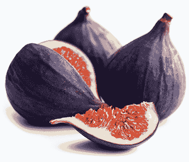

　　无花果是平衡大脑与肠子的终极利器。它有独特的植物性化合物，可以与矿物质结合，例如特别能滋养并建构神经传导物质，同时支持脑中神经元与突触的生物可利用钾与钠。它是能够预防阿兹海默症、帕金森氏症、失智症，以及包括肌肉萎缩性嵴髓侧索硬化症在内的其他神经系统疾病的强力水果。

　　至于肠子方面，无花果像椰枣一样，是非常有效的肠道净化食物。果皮可以喂养肠道中的益菌，也能抗菌，清除害菌、寄生虫、霉菌与有毒重金属；种子则能进入肠道缝隙，摧毁藏在囊袋中的致病细菌、病毒与真菌。无花果的果肉与纤维可以按摩肠道黏膜，并建构消化免疫系统，帮助你脱离胃部疼痛与腹胀的折磨。无花果能有效舒缓各种肠子问题，包括憩室炎、阑尾发炎、便秘、结肠发炎与困难梭菌引起的并发症。

　　无花果富含维生素，例如维生素 B 群，特别能与植物性化合物结合，减少体内的辐射物。此外，它也含有丰富的微量矿物质、微量营养素、抗氧化物等，对各种疾病而言都是绝佳的食物。

 有助于疗愈这些疾病

　　假如你有下列任一疾病，试着将无花果纳入日常饮食中：

　　阿兹海默症、帕金森氏症、失智症、肌肉萎缩性嵴髓侧索硬化症、憩室炎、威尔森氏症、注意力不足过动症、癫痫、沙门氏菌中毒、中风、创伤后压力症候群、多发性骨髓瘤、淋巴瘤（包括非何杰金氏淋巴瘤）、卵巢癌、结肠癌、心脏疾病、骨癌、慢性腹泻、阑尾炎、读写障碍、胆结石、泌尿道感染、姿势性直立心搏过速症候群、神经病变、大肠杆菌感染、麸质过敏症、克隆氏症、湿疹、牛皮癣、A 型肝炎、B 型肝炎、C 型肝炎、D 型肝炎、巨结肠症、小肠细菌过度增生、莫顿氏神经瘤。

 有助于疗愈这些症状

　　假如你有下列任一症状，试着将无花果纳入日常饮食中：

　　胸部疼痛、坐骨神经痛、荐髂关节疼痛、直肠疼痛、头部觉得轻飘飘、恶心、呼吸短促、膝软骨撕裂、听力丧失、视力模煳、脾脏肿大、出血、静脉或动脉阻塞（或两者都有）、便秘、搔痒、三叉神经痛、肝脏疤痕组织、神经发炎、阑尾发炎、肝沾黏、鼻窦问题、鼻窦疼痛、血液毒性、脑雾。

 情绪上的支持

　　无花果有益于舒缓被人排挤所造成的情绪创伤；另一方面，它能帮助你睿智地选择该将哪些人排除在你的生命之外。无花果也能减少敌意，当你靠近你认为对自己有敌意的某人时，带点无花果当作和平赠礼吧。而在听见令人震惊的消息或经历磨难的当下，无花果能支持你的身体度过创伤，并减低恼人的余波。假如你正受喜怒无常、闷闷不乐与失望的感觉所苦，或者时常惊恐畏缩，就寻求无花果帮助你减轻情绪负荷吧。

 灵性启发

　　你是否认识哪个朋友容易勃然大怒，在面对充满挑战的处境时感情用事，事后又为自己的言行后悔？你是否认识哪个朋友因为被疑惑与恐惧压抑，永远不会在对的时刻发言？你自己是否经历过这些情境？克服这些状态──头脑与肠子在灵性层面上断了链接──的关键，就是与无花果树的平衡创建链接，它的树根就像其粗壮的树枝一样强壮又宽广。

　　无花果树是智慧的象征。其他树木受制于自然授粉与养分摄取的机率，所以果实产量可能低落或过剩；但无花果树不同，每棵无花果树都有内在的智慧，决定了每棵树会结出多少无花果，以及结出果实的顺序。无花果树的智慧足以使其长得又高又广，并结出丰富的食物。而在地表下，无花果树深入土地的树根被强大、有保护作用的有益微生物围绕，这些微生物平衡泥土的酸硷值，使根须能够吸收其他树种无法触及的养分。

　　换句话说，无花果不仅平衡我们大脑与消化系统的健康，也是自我平衡的典范。将这种果实吃进身体里，会促进头脑与肠子之间的平衡。只以大脑反应、不经思考就让无法收回的话语脱口而出的人，借此学会接地；只靠肠子反应、在说话前过度思考的人，借此学会在对的时刻表达自己。

　　．计算你吃下的无花果数量──就像无花果树计算它结出的果实数量一样。试着每天吃九（或九的倍数）颗无花果，因为“九”是代表完整的数字，意味着你完整吸收了无花果的养分，也接收到无花果树完整传递的灵性知识。

　　．每次吃一颗无花果就搭配一根西洋芹棒（富含矿物盐），是绝佳的营养组合。

　　．食用无花果时，请想像产出这颗无花果的树就伫立在你面前，如此将提升它使人疗愈与接地的能力。

无花果“山羊奶酪”沙拉

────── ◆ ──────

分量：2 人份

　　无花果与山羊奶酪的经典搭配，改成结合生夏威夷豆“奶酪”及新鲜柠檬汁的鲜明口感后，会擦出新的火花。

芝麻菜 4 杯

新鲜无花果 230 克

生夏威夷豆 1/2 杯

柠檬 1 颗，挤成汁

橄榄油 1/2 茶匙

硬币大小的大蒜 1 瓣

生蜂蜜 2 茶匙（适量）

　　将芝麻菜分别铺在两个盘子上，然后把无花果切片后放在盘中的芝麻菜上。将夏威夷豆、半颗柠檬的汁液、橄榄油与大蒜一同搅打至滑顺，可依需要加入水（尽可能少量）。把打好的夏威夷豆“奶酪”弄碎在沙拉盘上，再淋上新鲜柠檬汁即可上桌，并可依口味淋上少许生蜂蜜。

葡萄

　　　　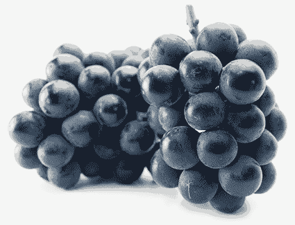

　　葡萄不该被误解为碳水化合物、糖分或卡路里太高而对我们不好的食物，因为事实刚好相反。就像香蕉一样，葡萄是促进健康的一流水果，而且甜度比想像中低，它的酸味还比较明显，这也是重要的药性所在。这种酸味代表含有对肾脏功能至关重要的植物性化合物。如果有人说你的肌酸酐浓度过高，表示你的肾脏排除与代谢血中废弃物的能力降低，而葡萄是终极补肾药，它的植物性化合物会与肾脏无法滤除的废弃物结合。

　　许多人也很关心肝脏健康。跟樱桃一样，葡萄是极好的肝脏净化食物，它的植物性化合物能清除废弃物、加工食品，以及可能阻塞肝小叶的副产物。若想改善消化问题，葡萄皮拥有强大的微量营养素，能驱除肠道中的寄生虫、霉菌与其他有害真菌。另外，丁香素与其他花青素（让葡萄呈现蓝色、黑色、深红色与紫色的原因）等抗氧化物使葡萄具有对抗及预防大多数癌症的效果。

　　葡萄是对抗四大病根的绝佳食物：能排除体内的辐射物，而且它的氨基酸（例如组胺酸、甲硫胺酸、半胱胺酸）与花青素共同形成将 DDT 及有毒重金属吸出肝脏、肾脏、脾脏与其他器官的磁铁；它对于由病毒爆发引起的自体免疫疾病也有抗病毒效果。

　　最后，葡萄是很好的能量食物。无论你是运动员、大忙人，或是不断动脑的人──亦即大脑整天进行认知工作（而且多工）、试图在被指派的专案中脱颖而出，或者需要燃料来催生出下一个点子──葡萄都有助于提升活力。

 有助于疗愈这些疾病

　　假如你有下列任一疾病，试着将葡萄纳入日常饮食中：

　　细菌性肠胃炎、接触霉菌、黄斑部病变、高血压、高血压性肾脏病、肾脏相关肌酸酐问题、肾结石、胆结石、低血糖症、注意力不足过动症、自闭症、乳癌、糖尿病、转移性脑瘤、败血症、胰脏癌、子宫内膜异位症、支气管炎、大肠杆菌感染、难解的不孕症、脂肪肝、结节、忧郁症、结肠癌、水肿、贫血、睡眠障碍、纤维肌痛症、慢性疲劳症候群、多发性硬化症、神经系统疾病、自律神经病变、痔疮、单纯疱疹病毒第一型、单纯疱疹病毒第二型、C 型肝炎、B 型肝炎、幽门螺旋杆菌感染、类纤维瘤、普通感冒、眩晕症、生育能力低落、所有自体免疫疾病与失调、细菌感染。

 有助于疗愈这些症状

　　假如你有下列任一症状，试着将葡萄纳入日常饮食中：

　　食物过敏、食物敏感、手汗、情绪性进食、头晕、恶心、贝尔氏麻痹、呼吸短促、听力丧失、颤动、体臭、胸部疼痛、经前症候群症状、意识混乱、脑雾、咳嗽、背部疼痛、发炎、髓鞘神经伤害、肝脏疤痕组织、血液毒性、疲劳、脑损伤、热潮红、落发、充血、指甲脆弱、视力混浊、耳鸣或耳中嗡嗡作响、体内嗡鸣或震动感。

 情绪上的支持

　　葡萄在你觉得沮丧时助你一臂之力，提振你的精神，并鼓励你对生命抱持愉快的观点。在你被指控莫须有的罪名时，它能防止你受到伤害，并且在你于社交场合中被人排挤时发挥疗愈效果。假如你因为没有被指派去进行某项计划或工作而感到失望，买点葡萄来吃，它能帮助你继续前进，并创造新的机会。

　　如果你不愿意改变，但放弃机会后又觉得后悔，就在饮食中加入葡萄，并且随着你变得更勇敢、更能把握生命给你的特殊时刻，你会感受到自己的转变。最后，提供葡萄给看似冷漠、漫无目标或自鸣得意的朋友及家人享用，随着时间过去，这种水果能帮助改变他们的方向，并改善他们的行为。

 灵性启发

　　当你觉得孤立──鲜少与人互动或总是与羞怯为伴，却渴望归属感──就让葡萄成为你生命的一部分。别忘了，葡萄都是成群结队的。随着每一串葡萄在葡萄藤上成长茁壮，这些小球彼此依偎，无论在实质或抽象层面都相互链接。每颗葡萄都调整到可以完美融入周围的同伴之中。当你选购并吃下葡萄时，注意一下这种奇妙的景象。这会创造出一种神圣的意念，在意识与无意识层面让你准备好去寻找你的伙伴，并指引你走向真正的家。

　　．大家时常忽略葡萄干。别被它不起眼的样子愚弄了，葡萄干对健康的益处比枸杞更大！

　　．试试这道新鲜葡萄果冻食谱：将康考特葡萄（一种美洲产的葡萄）、适量生蜂蜜，以及作为防腐剂的一颗柠檬榨成的汁放入食物调理机中搅打。来自蜂蜜的糖分从带有酸味与药性的葡萄皮中提取出疗愈的植物性化合物，使这些养分具备生物可利用性，并传送到你体内重要器官的深处。

　　．在准备待会儿要吃的有机葡萄时，简单地轻轻冲洗即可。有机葡萄上的残留物相当有益，因为其中充满了崇高微生物。

葡萄冰沙

────── ◆ ──────

分量：2 人份

　　这道冰凉、简单又相当美味的冰沙，是葡萄与椰子水的绝佳运用方式。对这道饮品，你会百尝不厌。

冷冻葡萄 4 杯

椰子水 3 杯

　　用果汁机将冷冻葡萄与椰子水搅打均匀即可享用。

　　＊如果不想喝冰饮，可以将冷冻葡萄换成新鲜葡萄，并将椰子水减少至 2 杯即可。

奇异果

　　　　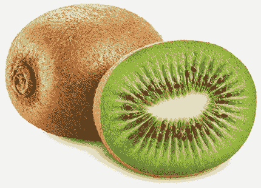

　　如果担心血糖调节问题，就寻求奇异果的协助吧。奇异果是相当适合糖尿病、低血糖症与高血糖症患者的食物。无论血糖浓度太低或太高，食用这种水果会使你的血糖平衡，同时减少血液中的脂肪。血糖浓度失衡通常也可能引起喜怒无常、强迫症、忧郁症与情绪失控，而奇异果是这些问题的终极良伴，因为它提供了高品质的糖分来源，也就是喂养脑中神经元并减轻苦恼的珍贵生物可利用葡萄糖。奇异果是帮助你面对压力的绝佳食物。

　　奇异果含有超过四十种微量矿物质，是优良的养分来源。它也拥有强大的维生素 C，能与异硫氰酸盐及花青素结合；这种化合物与奇异果籽中的酚酸共同作用，排除体内的辐射物，并抑制病毒。

　　奇异果也有助于缓解消化失调与不适，包括胃酸逆流、巴瑞特氏食道症、胀气、腹部疼痛、腹胀──这些疾病与症状通常和胃里的盐酸浓度过低有关。奇异果中大量的氨基酸（包括丝胺酸、白胺酸与离胺酸）能提升胃里的盐酸浓度，让人觉得舒缓。此外，这些氨基酸与酶及辅酶结合，有助于更进一步强化消化系统，以抑制害菌、病毒、寄生虫、酵母菌、霉菌与其他有害真菌。

 有助于疗愈这些疾病

　　假如你有下列任一疾病，试着将奇异果纳入日常饮食中：

　　膝盖滑囊炎、痛风、类风湿性关节炎、休格伦氏症候群、全身性狼疮、香港脚、摄护腺炎、肾上腺疲劳、巴瑞特氏食道症、强迫症、忧郁症、二尖瓣脱垂、慢性支气管炎、糖尿病、低血糖症、高血糖症、子宫内膜异位症、自闭症、注意力不足过动症、沙门氏菌中毒、黄疸、人类免疫缺乏病毒（爱滋病毒）、幽门螺旋杆菌感染、眼睛感染、小肠细菌过度增生、败血症、神经病变。

 有助于疗愈这些症状

　　假如你有下列任一症状，试着将奇异果纳入日常饮食中：

　　肛门搔痒、打嗝、腹胀、腹部疼痛、胃酸逆流、胃炎、便秘、胃肠气积、尿血、腹泻、舌头问题、耳鸣或耳中嗡嗡作响、喜怒无常、神经损伤、头皮屑、疲劳、癫痫、阑尾发炎、荐髂关节疼痛、手脚发麻刺痛、心悸、神经发炎、丧失性欲、皮质醇过低、皮质醇过高、关节发炎、胃酸过低、肠痉挛、脾脏发炎、发炎、体液滞留、慢性稀粪。

 情绪上的支持

　　提供奇异果给你希望能更加心怀感激与体贴的朋友或心爱之人；而当你试着挖掘出自己这些特质时，奇异果就是最好的工具。与某个喜怒无常的人共事时，拿几颗奇异果当点心，和对方共享；即使只有你自己吃，奇异果也能带给你热情与活力，借此影响并消除同事的情绪。

 灵性启发

　　我们很容易被困在日常生活中，戴上眼罩，看不见周遭更大的世界，感受不到真正的自己，于是世界变得浅薄。奇异果可以扭转这一切。

　　下次将奇异果对半切开时，仔细看看里头，你会发现那好像一幅外太空的图像！在成长过程中，奇异果母株（会结出果实的雌性株）输送宇宙能量，将我们周遭更大环境的“快照”拓印在每颗成长中的奇异果内。再也找不到哪种食物中拥有这般海纳星辰、行星、种种奥秘与世界奇迹的奇妙图像──我们的地球只是其中的一小点。

　　享用奇异果时，静心想想这幅景象。这种水果外表粗糙，切开后却露出一片使我们也敞开来的银河。在意识与潜意识层面，我们可以与让我们深陷其中并封闭起来的烦恼切断链接；我们可以想起宇宙的浩瀚、我们自身涵纳的深度，并让自己跳脱日常生活的浅薄，找回自身使命，并与存在的奥秘创建链接。

　　．为了完整感受这种水果带给你的效益，在一个星期内每天食用三颗奇异果，将其视为情绪、身体与灵性上的营养补充品──每天早上九点、中午，以及下午三点各吃一颗。然后，将这七天内发生的变化记录下来：你感受到的不同、顿悟，以及其他种种启发。

　　．将奇异果放在碗里，置于床头柜上，可以提升它传递给你的情绪助益。在逐渐成熟的水果旁睡觉，将使它们与你的生命更紧密链接，加深它们在各个层面的影响，使其带来最能改变生命的成果。

奇异果串佐草莓椰枣酱

────── ◆ ──────

分量：2～4 人份

　　漂亮的奇异果串很容易受到小孩与大人欢迎，既有趣又让人开心，适合各种场合。而草莓椰枣酱也是让这串漂亮点心的甜美滋味更臻完美的绝佳方法。

奇异果 6 颗

芒果 1 颗，切丁

覆盆子 1 杯

草莓 1 杯

椰枣 1 杯，去核

木签 8 枝

　　将奇异果削皮后切片。依照你想要的顺序将奇异果片、芒果丁与覆盆子串上木签。至于酱汁，将草莓与椰枣放入果汁机内搅打至滑顺即成。

柠檬与莱姆

　　　　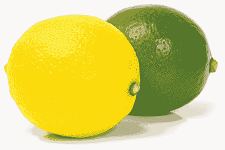

　　如果没有柠檬，世界会完全变样。想像少了柠檬水的童年、喉咙痛时没有柠檬蜂蜜茶，或是找不到柠檬糕点的夏天。莱姆也一样，想像没有酪梨沙拉酱、莱姆派和莱姆汁的生活。柠檬与莱姆就像人类史这块布料中不可或缺的线，编织在从古至今的岁月里。难道只是因为大家喜爱它们的滋味吗？或者不只如此？是否可能因为柠檬与莱姆有卓越的疗愈能力，让人类长久以来都离不开它们？

　　柠檬与莱姆树的根部深入土壤之中，汲取珍贵的微量矿物质，并在你摄取这两种水果时传递给你。柠檬与莱姆有高效水合作用，并且能制造电解质，因为它们是矿物盐与微量矿物盐的绝佳来源。柠檬与莱姆中的微量生物可利用钠，是它们提供人体营养的原动力。

　　这两种柑橘类成员具有某种可吸收度最高的维生素 C。此外，你也时常听见有人担心该从何处吸收钙──没有什么比得上现挤的新鲜柠檬或莱姆汁，它们提供你身体渴望的生物活性钙。还有，柠檬与莱姆中被称为柠檬苦素的植物性化合物实际上会让维生素 C 与钙结合在一起，所以无论其中一方到达体内何处，另一方也会一起行动。这提升了每种成分的生物可利用性，也让体内产生碱性，帮助预防几乎各种癌症的生长。柠檬与莱姆中的抗氧化物类黄酮是对抗疾病的另一位盟友。当你得了感冒、流行性感冒、支气管炎或肺炎时，柠檬是你能找到最有效的黏液排除剂之一。而对肝脏、肾脏、脾脏、甲状腺与胆囊而言，柠檬与莱姆也是一流的清道夫，这两种水果能清除我们因为接触塑胶、合成化学物质、辐射物与摄取劣质食品而累积的许多有毒物质。

　　实行任何一种排毒法时，即使只是在饮食中增加水果与蔬菜的摄取量，最好都在早上起床后立刻饮用柠檬或莱姆水。排毒时如果没有喝足够的水，就像把垃圾堆在路边，却没有清洁公司来清理垃圾一样。排毒作用一旦将脏污从你的细胞与组织中吸出来（你的肝脏大多是在夜间工作），就需要你在起床时将脏东西冲洗掉，否则这些毒素又会被堆回体内。柠檬或莱姆水在这项作业中的效果比纯水好，因为过滤作用通常已经滤掉了饮用水的生命，而这些柑橘类明星能重新唤醒饮用水的疗愈能力。

 有助于疗愈这些疾病

　　假如你有下列任一疾病，试着将柠檬或莱姆（或两者一起）纳入日常饮食中：

　　泌尿道感染、葡萄球菌感染、肾脏疾病、肾结石、胆结石、胰脏炎、酒渣（玫瑰斑）、结膜炎、肺炎、支气管炎、肥胖症、多发性硬化症、类风湿性关节炎、难解的不孕症、糖尿病、肾上腺疲劳、流行性感冒、营养吸收问题、人类免疫缺乏病毒（爱滋病毒）、普通感冒、疱疹、青春痘、各种癌症、链球菌性喉炎、生育能力低落、心房颤动、慢性耳朵感染、C 型肝炎、焦虑症、偏头痛、失眠、高血压。

 有助于疗愈这些症状

　　假如你有下列任一症状，试着将柠檬或莱姆（或两者一起）纳入日常饮食中：

　　肌肉疼痛、鼻涕倒流、耳朵疼痛、念珠菌过度增生、消化系统不适、胃酸逆流、牙痛、发烧、口干、黏液过多、恶心、口渴不止、心律不整、食物过敏、阴道分泌物、流鼻水、胃酸不足、呕吐、体重增加、咳嗽、头痛、颤动、胃灼热、打嗝、血糖失衡、视力模煳、体液滞留、头部疼痛、皮质醇过高、阑尾发炎、神经质、脱水。

 情绪上的支持

　　当你因为坏消息而惊慌失措时，柠檬或莱姆是理想的抚慰食物。这两种神奇水果能改变伤心、苦恼与担忧的感受，有助于提振精神，使心情放轻松，并逆转艰困时期的忧郁。

 灵性启发

　　看着柠檬或莱姆树的树枝时，你会看见刺，因为这两种树非常有防护性，希望确保只有最值得、最谨慎的人采收得到它们的果实──并且只能随着时间慢慢采收。你不能漫不经心、赤手空拳地采摘柠檬或莱姆，采收每颗果实都必须小心谨慎。

　　人际关系也一样。你也许曾观察到某些人抱持戒心──浑身是刺──或者听过别人这么形容你。就像柠檬或莱姆树上的刺，这种自我防卫是自然的防御机制，用来防止他人上门掠夺。我们真正想要的是像柠檬与莱姆树那样，与周遭的人以相互尊重、彼此赞美、互利共生为基础创建富饶的关系。有时还是需要有人戳一下，提醒我们要彼此关怀。

　　．如果你希望和生命中某个重要的人持续发展关系，就和对方一起坐下来喝杯加入柠檬的茶。这样做能够促进交谈，让彼此敞开心，并加深两人的关系。

　　．试着在起床后喝两杯十六盎司的水（各约四百七十毫升，并挤入半颗柠檬或莱姆汁），在享用早餐前净化肝脏半小时。

　　．虽然你可能认为应该避免伤口接触柑橘类，但将新鲜的柠檬或莱姆汁挤在小刀伤或擦伤上，能发挥强大的消毒抗菌效果，甚至能预防葡萄球菌感染。

　　．与普遍观点不同，柠檬与莱姆汁对口腔健康很有帮助。以水稍加稀释柠檬或莱姆汁，就成了最佳的抗菌漱口水与牙龈清洁剂。

　　．如果难以入眠，就在一杯温开水中加入生蜂蜜，并挤入柠檬或莱姆汁饮用，就能镇静忙碌的电脉冲与神经传导物质，帮助你获得优质睡眠。

柠檬雪酪

────── ◆ ──────

分量：3～4 人份

　　没有什么比加入蜂蜜与鼠尾草的柠檬雪酪更清新舒畅。这道雪酪做起来相当简单，而且可在冷冻库中保存长达 3 星期，适合当作晚餐后的甜点，也可以随时来杯甜美可口的净化味觉饮品。

蜂蜜 3/4 杯

鼠尾草叶 3 片

水 1½ 杯

现挤柠檬汁 1 杯（约使用 6 颗柠檬）

柠檬皮 1 汤匙

　　将蜂蜜、鼠尾草与 1½杯的水放入小平底汤锅中混合，并以中火加热至蜂蜜完全溶解。加入柠檬汁与柠檬皮，充分拌匀后放进冰箱冷却。然后，取出鼠尾草叶丢弃，将混料置于冰淇淋机中，依照说明书的指示制冰即可。如果没有冰淇淋机，可以将混料置于碗中，放入冷冻库，每 30 分钟拿出来充分搅拌，直到形成你想要的质地即可。

芒果

　　　　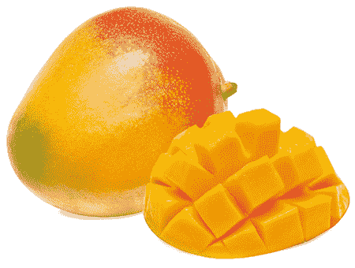

　　虽然大家常认为一杯热牛奶能帮助睡眠，但这其实不是什么神奇特效药。事实上，牛奶中脂肪与乳糖的组合会造成胰脏的压力，激发胰岛素抗性，导致一种假的睡意。

　　芒果才是真正神奇的助眠良方。睡前食用芒果，其中的植物性化合物，以及与甘胺酸、麸酰胺酸和半胱胺酸等氨基酸结合的果糖与葡萄糖，会传递至大脑并迅速修复耗损的神经传导物质，使大多数失眠患者终于有机会在夜里充分休息。

　　芒果对健康的其他许多层面也相当有益。它的抒解压力与病毒防护效果极佳，而且富含β-胡萝卜素，能强化并支持皮肤，甚至有助于预防各种皮肤癌。芒果对于逆转低血糖症、糖尿病前期及第二型糖尿病而言是强大的工具。此外，芒果中丰富的生物可利用微量镁结合酚酸，能镇静中枢神经系统，有助于对抗中风、癫痫与心脏病发作。这种水果的果肉能镇定胃部与肠黏膜，以减轻便秘。最后，芒果是绝佳的运动食物，因为它能将微量的钠、珍贵的必需葡萄糖，以及镁提供给你的肌肉，意味着能让你做更久、更费力的运动，却比较不会觉得那么筋疲力尽。

 有助于疗愈这些疾病

　　假如你有下列任一疾病，试着将芒果纳入日常饮食中：

　　胃食道逆流疾病、注意力不足过动症、阿兹海默症、失智症、溃疡、皮肤癌、失眠、胃癌、肾衰竭、消化性溃疡、糖尿病、帕金森氏症、肾结石、癫痫、葛瑞夫兹氏病、桥本氏甲状腺炎、青光眼、黄斑部病变、低血糖症、克隆氏症、创伤后压力症候群、泌尿道感染、忧郁症、人格障碍、焦虑症、饮食障碍症、季节性情绪失调、肾上腺疲劳、慢性疲劳症候群、认知问题、结肠炎、库欣氏症候群、类纤维瘤、脂肪肝、晒伤、难解的不孕症。

 有助于疗愈这些症状

　　假如你有下列任一症状，试着将芒果纳入日常饮食中：

　　难以入眠、情绪波动、打鼾、疲劳、没有活力、甲状腺机能不足、甲状腺机能亢进、视力混浊、肌肉疲劳、肌肉疼痛、肌肉痉挛、焦虑、认知问题、脑雾、记忆力衰退、忧郁、倦怠、腹部压力、念珠菌过度增生、贝尔氏麻痹、结肠痉挛、意识混乱、便秘、消化不良、脑部发炎、肝功能不良、五十肩、胆固醇过高、高血压。

 情绪上的支持

　　芒果对情绪健康有改变生命般的效果。它不只能振奋心情，也能减轻忧郁症及季节性情绪失调。芒果对觉得被遗弃、被隔绝、被抛弃、被驱逐、被回避、被拆散、被遗忘，以及孤独、受伤或失望的人特别有疗愈效果，因为芒果有显化的力量。吃下芒果时，它能让我们重新定位，改变我们的方向，使我们敞开心拥抱更多体验喜悦的机会──这最终会帮助我们链接自己的命运。

 灵性启发

　　芒果应付热的方式不同于其他水果。即使太阳以极高温直射芒果，它也知道该如何遮蔽自己。将芒果带入生命中，我们就内化了它内在的凉爽。芒果教导我们可以在不灼伤内在的情况下应付极端处境，我们学习如何在面对极大压力时保持冷静与镇定──如何在温度升高时不让自己变得激动、生气。下次面对困境时，就吃点芒果，或者把冷冻芒果加入果昔中。将芒果吃进体内之后，提醒自己：这种强大的工具能帮助你面对前所未有的艰难处境。

　　．想要有显著效果，可以一天吃两颗芒果。

　　．如果想睡得更沉并拥有让灵性增长的梦，就在睡前吃芒果，这是让你隔天早晨可以有所启发最好的方法。

　　．虽然芒果本身能帮助你入眠，但若搭配西洋芹棒或加在沙拉上，就能转变芒果的能量，带来相反的作用。在一天中较晚的时分食用芒果与绿色蔬菜的组合，能让你在必须熬夜赶计划时恢复精神。

　　．若要进行较长时间的运动，并获得更好的恢复效果，可以在进行各种运动的半小时前食用芒果。

　　．如果你正为了解决某个问题而沉思，试着先吃点芒果，这有助于链接你需要的洞见。

芒果拉昔

────── ◆ ──────

分量：1～2 人份

　　这道芒果拉昔是犒赏味蕾的最佳选择。此版本是将椰奶与芒果变成丝滑又浓稠的组合，小豆蔻则让这道经典饮品增添了纯正风味──但如果不习惯这种香料的复杂味道，可以只加少许就好。

芒果丁 4 杯

椰奶 1/2 杯

薄荷叶 2 片

冷冻香蕉 1 根

小豆蔻少许（依喜好选用）

　　将所有食材放入果汁机搅打至滑顺，即可享用！

　　＊小豆蔻有相当特殊且强烈的风味，可依喜好少量使用或省略。

瓜类

　　　　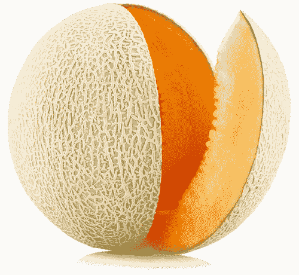

　　西瓜、蜜瓜、哈蜜瓜等瓜类是通往健康殿堂的关键，因为它们就像母乳，不过是更进一步的版本，因为瓜类已经预先消化过了──这意味着瓜类的果肉相当容易吸收，吃进肚子之后，几乎不需要消化系统来处理，因为瓜类富含酶，以及某些能加强酶作用、科学界尚未发现的辅酶。瓜类中的果糖不到一分钟就离开胃部，然后其余的部分直接进入肠道，并立刻强化与补充身体所需。食用瓜类好比接受静脉注射营养疗法。

　　在所有层面上，包括生物化学层面，瓜类就是我们身体需要的。瓜类本质上像是装满纯净水的球，这种高活性的液体可以黏住体内的各种毒素，包括霉菌、霉菌毒素、病毒神经毒素、未消化蛋白质的毒素、氨气与细菌毒素，并将它们冲掉，让免疫系统得以自我修复。此外，这类水果的高电解质含量有助于保护大脑与神经系统其余部分远离压力引起的中风、动脉瘤及栓塞。瓜类能稀释血液与降低心脏病发作的风险，帮助预防心脏疾病与血管问题，甚至能减少肝脏与肾脏疾病──如果有人苦于肝脏或肾脏功能不良，瓜类可是意味着生与死之别。瓜类中的水分几乎与我们的血液相同，而且里头富含钠、钾与葡萄糖，并具生物可利用性，使瓜类成为你能吃到最补水的食物之一。这种水合作用相当重要，可以降低过高的血压，还有其他许多益处。

　　瓜类是非常偏碱性的食物。这类水果中含有生物可利用度与生物活性都很高的微量矿物质，能让电解质高于正常浓度，使它们容易被人体利用。身体的排毒作用因此增强，排出器官深处的 DDT、其他杀虫剂、除草剂与有毒重金属。二氧化硅含量高的瓜类是修复韧带、关节、骨胳、牙齿、结缔组织与肌腱的绝佳食物。此外，它们也是相当强而有力的葡萄糖平衡剂，可以预防胰岛素抗性，并降低攀升的糖化血色素浓度。

 有助于疗愈这些疾病

　　假如你有下列任一疾病，试着将瓜类纳入日常饮食中：

　　难解的不孕症、克隆氏症、结肠炎、消化性溃疡、巴瑞特氏食道症、大肠激躁症、生育能力低落、动脉瘤、栓塞、中风、心脏病发作、心脏疾病、肝脏疾病、肝硬化、肝癌、肾脏疾病、乳癌、胰脏癌、胰脏炎、肌腱炎、癫痫、败血症、骨质疏松症、幽门螺旋杆菌感染、多发性硬化症、肌肉萎缩性嵴髓侧索硬化症、休格伦氏症候群、爱迪生氏症、帕金森氏症、强迫症、注意力不足过动症、创伤后压力症候群、糖尿病、低血糖症、青春痘、忧郁症、焦虑症、疱疹感染、泌尿道感染、短暂性脑缺血发作（小中风）、重金属毒性、大肠杆菌感染、酵母菌感染、接触霉菌。

 有助于疗愈这些症状

　　假如你有下列任一症状，试着将瓜类纳入日常饮食中：

　　便秘、胃酸不足、胃部疼痛、胃部不适、循环不良、加速老化、牙齿问题、食物过敏、结缔组织发炎、颤动、发抖、虚弱、血糖失衡、慢性脱水、酸中毒、关节疼痛、骨密度问题、肾脏疼痛、背部疼痛、痉挛、抽搐、口齿不清、视力混浊、发炎、食物敏感、肛门搔痒、水泡、血液毒性、胰岛素抗性、脑雾、身体僵硬、指甲脆弱、长期恶心、发烧、皮肤痒、腿部痉挛。

 情绪上的支持

　　如果你容易受惊吓、对坏消息久久无法释怀，或是因为情绪敏感或创伤后压力症候群而觉得负担过重，瓜类可以借由减轻你的神经质、紧张、焦虑或不安来助你一臂之力。若你正焦急地等待消息，瓜类也能在过程中额外提供你需要的支持及耐心。将瓜类分享给你觉得没有耐心，或是其判断和想法形成阻碍的朋友或家人，你的礼物能够缓和对方的能量并打开一个管道，让对方更能接纳他人。

 灵性启发

　　瓜类预先消化的奇迹教导我们，强大的作用可能在我们尚未理解时就已经发生。我们不需要为了生命中所有美好的事物变成拼命三郎，有时少了我们费心费力，好事依然会降临：强大的疗愈作用在我们的身体、心灵与灵魂之中发生，我们只须顺其自然。对我们有利的状况会自然来到面前，我们要做的就是把握机会。让这种恩典进入你的日常生活吧。

　　．为了获得瓜类的益处，试着每天食用至少半颗小型瓜类。

　　．容易消化是你可能将食用瓜类与胃痛联想在一起的原因。由于瓜类会快速通过消化道，如果与较稠密的食物一起吃，或是在你吃大餐的日子里食用，瓜类会被拦住并开始在肠子里发酵。瓜类最好作为一天当中的第一餐，可以单独食用，或是搭配新鲜蔬菜汁一起吃。

　　．不同种类的瓜成熟的时间也不同。若散发出甜蜜的香味，而且在开花的那一端产生些许弹性，大多代表一颗瓜已经成熟了。

薄荷莱姆西瓜

────── ◆ ──────

分量：2 人份

　　这道西瓜沙拉看起来虽然很简单，但经过搭配的风味再完美不过了。甜味淡雅的西瓜、风味突出的莱姆汁和新鲜薄荷共同演唱，让你的嘴巴在漫长的夏天里口水流个不停。

西瓜丁 8 杯

莱姆汁（约 2 颗莱姆挤成）

剁细的薄荷叶 1/4 杯

　　将西瓜置入公碗中，大方地挤上莱姆汁，再撒上剁细的薄荷叶即可上桌。

柳橙与橘子

　　　　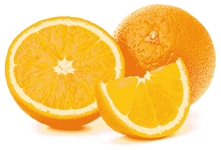

　　大家现在很担心柑橘类过敏的问题，牙医也警告这种水果的酸对牙齿珐琅质有害。别陷入对柳橙的抹黑声浪中，事实上，柳橙（与近亲橘子）富含麸胱甘肽这种辅酶，会因为它含量丰富的类黄酮与柠檬苦素而产生活性，这是医学研究尚未发现的关连，也让柳橙与橘子成为二十一世纪减缓慢性疾病扩散的关键。麸胱甘肽、类黄酮与柠檬苦素可以共同击退病毒，并保护身体不受辐射物与体内的有毒重金属伤害。

　　柳橙与橘子也富含其他来源无法提供的一种生物活性钙。身体能立即吸收这种钙质，意味着这些柑橘美人确实可以帮助牙齿重新生长，而不是破坏牙齿。它们的酸性成分不会造成破坏，反而有助于溶解肾结石与胆结石。

　　下次当你与脐橙、血橙、晚仑夏橙、柑橘、茂谷柑、克莱门氏小柑橘或红柑擦身而过时，请为你有机会在生命中享受如此甜美的甘露而欣喜吧。

 有助于疗愈这些疾病

　　假如你有下列疾病，试着将柳橙或橘子（或两者一起）纳入日常饮食中：

　　牙龈疾病、肾结石、链球菌性喉炎、胆结石、骨质疏松症、糖尿病、低血糖症、接触霉菌、肾上腺疲劳、难解的不孕症、创伤后压力症候群、焦虑症、忧郁症、泌尿道感染、动脉粥状硬化症、肠胃癌症、青春痘、高血压、生育能力低落、人类疱疹病毒第六型、巨细胞病毒、带状疱疹、人类疱疹病毒第七型、尚未被发现的人类疱疹病毒第十到十二型、慢性疲劳症候群、纤维肌痛症、多发性硬化症、狼疮、葛瑞夫兹氏病、肌肉萎缩性嵴髓侧索硬化症、眩晕症、淋巴瘤（包括非何杰金氏淋巴瘤）、EB 病毒∕单核球增多症、桥本氏甲状腺炎、人类乳突病毒、亨汀顿氏舞蹈症、单纯疱疹病毒第一型、单纯疱疹病毒第二型、滑囊炎、腕隧道症候群、肌腱炎、感冒、结节。

 有助于疗愈这些症状

　　假如你有下列症状，试着将柳橙或橘子（或两者一起）纳入日常饮食中：

　　便秘、疲劳、游走性疼痛、视力混浊、胃酸逆流、刺痛与麻木、虚弱、季节性情绪失调、胃炎、倦怠、忧郁、情绪波动、神经质、颚部疼痛、水分滞留、食物过敏、皮肤变色、荷尔蒙失衡、血糖问题、耳鸣或耳中嗡嗡作响、体内嗡鸣或震动感、背部疼痛、身体痛、身体僵硬、瘀血、唇疱疹、脱水、吞嚥困难、呼吸困难、耳朵疼痛、热潮红、活力低落、颤动、喉咙痛、甲状腺机能亢进、甲状腺机能不足。

 情绪上的支持

　　柳橙汁或橘子汁好比液体阳光，觉得伤心、想哭、闷闷不乐或情绪低落时，柳橙可以切断忧郁的心情，并如阳光般照亮你的生命。当你感觉失去阳光又孤独，仿佛有个空缺需要填补时，这是最佳的食物选择。柳橙会带走所有寒冷，并用温暖将你填满。

 灵性启发

　　柳橙与橘子提醒我们，有时我们忽略了生命中最重要的元素。我们偶尔必须想想自己忽略或遗忘了什么，并重新评估：这些事物被低估是应该的吗？就这两种水果而言，你可能偶尔才会喝点柳橙汁（喝的时候还有罪恶感）、一年才吃一次茂谷柑，或是难得在吐司上涂点橘子果酱，然而，柳橙和橘子理所当然该是你饮食中的核心食材。当你让它们成为生命中更大的一部分，环顾四周：还有什么事物值得你再看一眼？

　　．为了让柳橙与橘子发挥最大效益，每天可以吃四颗。

　　．在柳橙或橘子切片上滴点生蜂蜜，就能当作点心。蜂蜜可以让柑橘果胶杀死并排除肠道中霉菌、酵母菌、病毒与害菌的能力提升 50%。

　　．若要帮助消化，试着在沙拉与菜肴上挤点新鲜柳橙汁或橘子汁，这样做可以确保你将吃下肚的餐点消化得最好。

西班牙柳橙橄榄沙拉

────── ◆ ──────

分量：2～4 人份

　　这道风味甜美的料理有多汁的柳橙，以及令人满足的橄榄与酪梨，是想要吃得轻盈又满足时的最佳料理。此外，它鲜明的色彩也提供了健康效益与视觉上的享受。这道沙拉适合单独食用、加在沙拉生菜上，或是包成沙拉卷享用。

任何品种的柳橙 6 颗

切片绿橄榄 1/4 杯

剁细的荷兰芹 1/4 杯

切细的红洋葱 1/4 杯

酪梨 1 颗，切丁

黑胡椒（依喜好选用）

　　每一颗柳橙的头尾都切除之后，平放在砧板上，环绕侧面切下果皮。将柳橙水平切成碟状，铺于盘上，然后将其他食材撒在柳橙片上即可享用。

木瓜

　　　　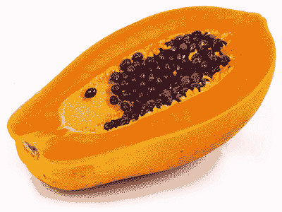

　　超级市场来来往往的人通常会忽略不起眼的木瓜，却不知道错过这种水果的同时，他们也错过了被拯救的机会。如果你正受任何胃部或肠道不适所苦，木瓜正是不败利器。木瓜能击败结肠炎、克隆氏症、大肠激躁症、溃疡、憩室炎、胃炎、胃痉挛、肝脏疾病与胰脏炎，也能杀死幽门螺旋杆菌、困难梭菌与大肠杆菌，还能使肠道摆脱其他害菌及寄生虫，包括蠕虫。若你有小肠细菌过度增生的问题，木瓜也是理想的食物。

　　木瓜帮助消化的能力是水果中的冠军，每颗木瓜都包含超过五百种尚未被发现的消化性酶，能够支持胰脏、帮助消化，并修补肠道壁，以减少发炎与预防形成疤痕组织。木瓜的氨基酸与酶结合后，产生尚未被发现的植物性化合物，能够击退病毒。此外，木瓜也含有还没被发现的高效辅酶，可以提升肠道内的碱性。

　　如果需要改善便秘，木瓜绝对帮得上忙；假如正受胃痛或肠道黏膜发炎的折磨，木瓜也是你的盟友，可以疗愈引起这些病痛的受刺激神经末梢；若因为断食、厌食症或重大疾病而有一段时间没吃东西，打成汁的木瓜对于再进食的过程而言就像魔法，因为它提供了丰富的热量与理想的养分，并且相当容易消化。

　　木瓜还能在皮肤上施展奇迹。由于富含维生素、矿物质，以及最重要的类胡萝卜素，让这种水果拥有抵抗皱纹、仿佛青春之泉般的力量，不只能帮助皮肤恢复光泽，还能清除湿疹、牛皮癣与青春痘。

 有助于疗愈这些疾病

　　假如你有下列任一疾病，试着将木瓜纳入日常饮食中：

　　便秘、大肠激躁症、克隆氏症、结肠炎、溃疡、憩室炎、肝脏疾病、胆囊疾病、寄生虫问题、困难梭菌感染、大肠杆菌感染、幽门螺旋杆菌感染、蠕虫、湿疹、牛皮癣、青春痘、胃轻瘫、狼疮、慢性疲劳症候群、EB 病毒∕单核球增多症、小肠细菌过度增生、纤维肌痛症、多发性硬化症、肌肉萎缩性嵴髓侧索硬化症、带状疱疹、莱姆病、各种自体免疫疾病与失调、偏头痛、忧郁症、泌尿道感染、失禁、糖尿病、低血糖症、葛瑞夫兹氏病、桥本氏甲状腺炎、血液异常、肠皮瘘管、饮食障碍症、消化系统失调。

 有助于疗愈这些症状

　　假如你有下列任一症状，试着将木瓜纳入日常饮食中：

　　胃痛、腹胀、胀气、胃痉挛、胃炎、皮肤变色、指甲脆弱、中枢神经系统敏感、焦虑、关节疼痛、黑眼圈、疲劳、虚弱、化学物质敏感、身体疼痛、颞颚关节问题、五十肩、刺痛与麻木、贝尔氏麻痹、甲状腺机能不足、皮肤灼热感、肌肉僵硬、落发、甲状腺机能亢进、飞蚊症、眼睛干涩、肝功能停滞、血液失衡、膀胱疼痛、膀胱痉挛、消化功能衰弱、肛门搔痒、脑雾、记忆力衰退、胃酸逆流、腹泻、消化系统不适、胃肠气积。

 情绪上的支持

　　木瓜能让你或你爱的人脱离不满的心情。随时准备好木瓜，在感到暴躁、易怒或失去耐心时与人分享。木瓜将光带进吃的人体内，驱逐负面性与黑暗，并清除过去的批判、怨恨，以及日积月累的挫折感。

 灵性启发

　　木瓜树通常瘦小又脆弱，却承载了一大批沉重的果实，这番克服物理限制与平衡一切的意志与决心可谓超乎自然。它教导我们，只要为了崇高的理由努力，就能克服表面上的弱点。外表不代表什么，每个人内在的真实自我，才能决定我们真正的成就。

　　每颗木瓜里都藏着药性，吃下它，身体会立刻认出这些元素，加以利用，然后重新设计我们的身体，使我们得以疗愈，并成为最强大的自己。木瓜树和它的果实希望我们了解：疗愈、成长与变化是没有局限的。疾病与身体面临的挑战无法形成阻碍，我们可以改变起初看似无望的处境。

　　．想要抒解便秘，每天吃半颗木瓜。

　　．不要选购经过基因改造的木瓜。

　　．如果喜欢辣味，可以连同果肉一起食用些许木瓜籽。每周吃少量木瓜籽有助于消灭寄生虫。若要获取恢复肠道健康的终极成效，可将木瓜与西洋芹汁一同搅打后饮用。

木瓜香果昔

────── ◆ ──────

分量：2 人份

　　这道木瓜香果昔漂亮得让人舍不得享用，但可别因此停下手。木瓜与覆盆子可说是天作之合，加上香蕉、芒果与薄荷，让这道甜品更上一层楼。享受依照个人喜好设计与制作这道料理的乐趣吧，各种搭配选择可是数都数不清。

木瓜丁 6 杯

椰枣 4 颗，去核

对切的覆盆子 2 杯

芒果丁 1 杯

香蕉 1 根，切片

椰丝 1 汤匙

切碎的新鲜薄荷 1 汤匙

莱姆 1/2 颗

　　将木瓜、椰枣与 1 杯覆盆子放进果汁机里搅打至滑顺。将混料倒入两个碗中，铺上芒果丁、香蕉片与剩下的覆盆子，最后撒上椰丝、新鲜薄荷，再挤上莱姆汁即可。

西洋梨

　　　　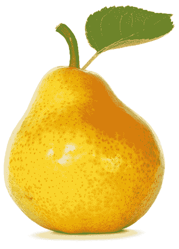

　　苹果是传奇水果，它的近亲西洋梨却让人不感兴趣。大家通常只会想到乏味的西洋梨罐头，或是少见的焦糖西洋梨甜点，除此之外，大部分人在日常生活中甚少想到西洋梨。我们知道这种水果的存在，但仅此而已。

　　就跟胰脏一样：我们知道自己有这个腺体，但除非胰脏出了问题，否则我们很少想起它的存在。与此同时，胰脏承受了身体的许多压力，且我们有时因为吃下油炸食物、大鱼大肉、过量砂糖或高脂甜点的组合，而不经意地伤害胰脏。此外，心碎、失望、背叛与其他形式的信任崩解，以及各式各样的恐惧，也压迫着胰脏。为了保护胰脏、对抗压力，我们必须求助于西洋梨。这种被人忽视的水果能帮助这个被人忽视且负荷过重的腺体恢复活力，减轻胰脏炎，且有助于预防胰脏癌。

　　西洋梨对消化作用的其他层面也相当有益。它有抗痉挛的效果；可以帮助镇定胃部与肠道黏膜；能滋养益菌，并饿死与杀死害菌、寄生虫及真菌；提高胃中盐酸的浓度；帮助预防肠胃癌症；减少由黏液及幽门螺旋杆菌之类的病原体制造的不好的酸。此外，它还能修复被细菌损伤而结痂的肠黏膜。

　　西洋梨果肉中的小颗粒富含植物性化合物、微量矿物质，以及缬胺酸、组胺酸、苏胺酸与离胺酸等氨基酸。微量矿物质会与氨基酸结合，锁定体内的毒素，例如 DDT，然后将毒素排出体外。微量矿物盐让西洋梨汁富含电解质，能够稳定血糖。此外，西洋梨是很棒的减重食物，也是上天恩赐的护肝食物，有助于清理与净化肝脏，并预防肝硬化。将西洋梨带入生命中，你会发现它不但有许多好处，而且一点也不乏味。

 有助于疗愈这些疾病

　　假如你有下列任一疾病，试着将西洋梨纳入日常饮食中：

　　胰脏炎、胰脏癌、肝癌、糖尿病、食物中毒、裂孔疝气、胃食道逆流疾病、小肠细菌过度增生、肝硬化、A 型肝炎、B 型肝炎、C 型肝炎、D 型肝炎、真菌感染、胃癌、食道癌、憩室炎、憩室病、带状疱疹、疱疹、偏头痛、强迫症、低血糖症，以及肠道感染幽门螺旋杆菌、大肠杆菌、沙门氏菌、链球菌与∕或霉菌。

 有助于疗愈这些症状

　　假如你有下列任一症状，试着将西洋梨纳入日常饮食中：

　　胃酸逆流、胆固醇过高、肝功能不良、肝热、肝功能停滞、胀气、腹胀、便秘、胃炎、胃痛、食物过敏、胃部不适、肠道发炎、肠道疤痕组织、沾黏、胰岛素抗性、肠痉挛、胰脏发炎、阑尾发炎、体重增加、皮肤发炎、腹泻。

 情绪上的支持

　　负担过重、压力过大且过热的胰脏与肝脏，常常是让人产生不稳定的情绪，例如挫折感、恼怒、不安或心神不宁的原因。西洋梨是缓解这种状况的理想食物，因为它是终极冷却剂，尤其是对肝脏与胰脏而言。

 灵性启发

　　西洋梨的简单为我们所有人上了一课。这种水果一点也不复杂、不亮眼、不奇特，随手可得，又方便食用，而这些丝毫不会减少它的能力。温和、不爱出风头的西洋梨可以用其他水果做不到的独特方式照料你的身体。它教导我们不需要引人注目，也不必因为未受瞩目而心生怨恨。我们不需要大放异彩，也能坚持真我并完全发挥自身力量。

　　．西洋梨迈向成熟的每个阶段都有其价值。又硬又脆时，代表它的纤维含量很高，能够减少坏胆固醇，并清除肠道中的黏液、病原体与废弃残渣。爽脆的西洋梨片适合加进沙拉里。而当西洋梨变得柔软多汁，其中的葡萄糖含量较高，而且相当容易消化。对于因为食物中毒或其他问题无法吃东西、正要恢复进食的人而言，经过搅打的成熟西洋梨是很理想的食物。

　　．最好在早餐与午餐之间，或是下午稍晚时分（晚餐前不久）食用西洋梨。它有抑制食欲与滋补胃部的作用，防止你想吃甜点或用餐时吃太多。

　　．制作新鲜蔬果汁时，试试以成熟西洋梨取代苹果。

肉桂烤西洋梨佐胡桃

────── ◆ ──────

分量：2～4 人份

　　柔软的西洋梨填满温暖的枫糖浆与烤胡桃，是一道抚慰人心又适合寒冷冬日的料理。肉桂在烤箱中烘烤的香气会让整间屋子变得温暖，成品则使所有人感到舒适又满足。这道料理相当简单，而且绝对能虏获大人与小孩的心。

任何品种的西洋梨 4 颗

枫糖浆 2 汤匙

剁碎的胡桃 1/4 杯

肉桂 1/2 茶匙

　　烤箱预热至摄氏 175 度。将西洋梨纵向对半切开并挖除种子，然后切面朝上摆进烤盘里。将枫糖浆淋在西洋梨上，刷满表面，并留一些在西洋梨切面的中央（挖掉种子那里）。将胡桃平均分配到每块西洋梨的中央位置，再把肉桂撒在西洋梨上。送进烤箱烤 20 至 30 分钟，直到西洋梨变软熟透，即可从烤箱取出来趁热享用！

石榴

　　　　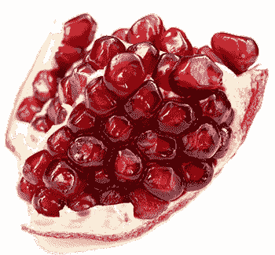

　　石榴很受人喜爱，以富含抗氧化物闻名，却少有人知道这种水果相当有利于溶解胆结石与肾结石、结节、钙化，以及小囊肿（例如腱鞘囊肿），同时也具备抗肿瘤特性。石榴里每一颗珠宝般的多汁果囊（专业术语叫假种皮，但大多被称为种子），都包含了一个宇宙。石榴籽破裂时──无论是用牙齿咬破或用果汁机搅破──会释放出每个小宇宙全部的力量来帮助你。当你吃下新鲜石榴，它的酸（充满花青素之类的植物性化合物）会与由胆汁、蛋白质堆积及有毒型态的钙形成的不健康硬化结构接触，产生化学反应，随即使它们瓦解。如果你有多囊性卵巢症候群，经常食用石榴对你尤其有益。

　　石榴是很棒的造血食物，可以提升红血球与白血球数量。此外，石榴对血糖也很重要，可以替肝脏恢复珍贵的葡萄糖储存量，使肝脏得以在需要时将葡萄糖释放到血液中。这个过程进而保护了肾上腺，因为如果好几个小时没进食，肝脏的葡萄糖存量又不足，你的肾上腺会被迫将皮质醇之类的荷尔蒙打进血液里，让你可以保持活动，但这会导致肾上腺过度活跃，最后累垮。所以，如果你寻求肾上腺平衡及血糖稳定，找石榴就对了。石榴的优质葡萄糖也使它成为对大脑有益的食物，有助于集中注意力。

　　石榴还含有生物可利用性高且容易吸收的微量矿物质，例如铁、镁、钾与铬。此外，摄取石榴有助于疏通毛孔与毛囊，促进生发，并整体改善皮肤与头皮。石榴调节荷尔蒙的效果极佳，因为它能冲洗掉有毒荷尔蒙，例如会导致癌症的有害雌激素。这种水果还能帮助去除 DDT 与其他杀虫剂的毒素、消除肌肉中堆积的有害乳酸、清除耳垢并使耳垢的生成量降至最低。

 有助于疗愈这些疾病

　　假如你有下列任一疾病，试着将石榴纳入日常饮食中：

　　阿兹海默症、失眠、失智症、肾上腺疲劳、糖尿病、低血糖症、耳垢堆积、秃头、胆结石、肾结石、接触霉菌、结节、钙化、EB 病毒∕单核球增多症、雷诺氏症候群、腺瘤、自闭症、足底筋膜炎、莱姆病、莫顿氏神经瘤、肿瘤、多囊性卵巢症候群。

 有助于疗愈这些症状

　　假如你有下列任一症状，试着将石榴纳入日常饮食中：

　　脑雾、记忆力衰退、意识混乱、囊肿、钙化、定向力障碍、集中力不足、头皮屑、体重增加、饥饿不止、落发、肌肉痉挛、腿部痉挛、血糖失衡、髓鞘神经伤害、三叉神经痛、肝脏疤痕组织、背部疼痛、五十肩、身体疼痛、耳朵疼痛、飞蚊症、足下垂、肋骨疼痛、足部疼痛、头部疼痛、荨麻疹、发炎、皮肤痒、肝热、神经痛。

 情绪上的支持

　　对时常失去耐心，而且总觉得问题不在于自己没耐心，反倒怪罪他人的人而言，石榴是相当关键的食物。如果你认识这样的人，送对方一颗石榴吧。石榴会转变能量，并为你的朋友指出通往镇静、慈悲与耐心的方向。假如你觉得某人的不耐烦是针对你，因而影响你的表现，就让石榴帮助你保持平静与专注吧。

 灵性启发

　　处理石榴时往往会弄得一团糟。你也许尽量小心，但终究会有颗假种皮在某个时刻爆开，最后在你的地毯、衣服、料理台、墙壁或手指留下红色污渍。我们都知道挖石榴时千万别穿着丝质衬衫或系领带，剖开石榴前得换上旧牛仔裤、破旧汗衫──创意穿搭，就像刷油漆或进行任何事先知道会搞得一团乱（但回报绝对值得）的活动时穿的服装。下次面临需要创意以获得回报的状况时，想一想：你会因为即将搞得乱七八糟而考虑离开吗？或者，你会在毫无准备的情况下一头栽入？石榴教导我们，如果想要获得最大的回报，就要准备好面对混乱，并且拥抱混乱。

　　．每天食用一颗以上的石榴，以获取最大益处。

　　．吃石榴时请发挥创意。你可以将这些小种子撒在任何料理上──沙拉、鹰嘴豆泥、酪梨沙拉酱，甚至撒在你刚做好的热炒料理上。

　　．如果你担心过度肌饿、饮食过量与∕或体重增加，用餐前吃石榴籽可以抑制食欲。

石榴巧克力片

────── ◆ ──────

分量：4～6 人份

　　大量的多汁石榴籽加上一层滑顺的浓郁巧克力，完美结合成这道甜点。可以当作小礼物，或是在你想稍微放纵口欲时让你获得美好的体验。

苦甜巧克力片（可可含量至少 60%）280 克

椰子油 1/4 杯

枫糖浆 1/4 杯

石榴籽 2 杯

　　将巧克力片与椰子油放进小平底汤锅中，以小火加热搅拌至融化并充分混合。加入枫糖浆，然后将融化的巧克力均匀抹在铺着烤纸的烤盘上。将石榴籽压入那层巧克力中，接着放进冷冻库里静置至少 30 分钟，之后掰成小块即可享用！

朝鲜蓟

　　　　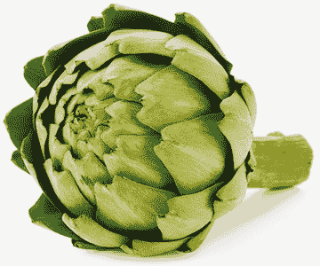

　　现今众人谈论的超级食物中，朝鲜蓟应该在排行榜前十名内。朝鲜蓟是相当重要的营养素来源，富含叶黄素与异硫氰酸盐等植物性化合物，维生素 A、E、K 等维生素，还有氨基酸及酶。它还能促进维生素 B12 生成，有益于维持肠道平衡。

　　此外，朝鲜蓟也有丰富的矿物质，例如二氧化硅，这是对我们的生存极为关键的基础矿物质。朝鲜蓟的镁含量引人注目也理所当然，然而，让朝鲜蓟具有镇静特性的成分远不止于此：除了镁，朝鲜蓟还有可以镇静全身系统的植物性化合物，以及多种镇静性矿物质。如此丰富的矿物质让朝鲜蓟可以滋养多种器官及腺体，例如肝脏、脾脏、胰脏、大脑、肾上腺与甲状腺。这些器官深处有基本养分库存，而朝鲜蓟能补充养分存量，延年益寿。

　　朝鲜蓟对胰脏极有好处，使它成为糖尿病、低血糖症与其他血糖失衡患者的理想食物。朝鲜蓟还能减少肾结石与胆结石，以及体内的钙化与疤痕组织。此外，它保护身体不受 X 光、癌症治疗、牙齿治疗等辐射伤害的效果也相当卓越。

　　朝鲜蓟应该受到重视，也应该被视为药物──味道朴实、甜美又可口的药。许多人不爱碰新鲜的朝鲜蓟，觉得它的外表不讨喜，也不知该怎么处理。但是，等你学会准备及料理朝鲜蓟的技巧后，就能将一道营养满点的菜肴带进你的生命中。

 有助于疗愈这些疾病

　　假如你有下列任一疾病，试着将朝鲜蓟纳入日常饮食中：

　　糖尿病、低血糖症、肾结石、胆结石、钙化、内部疤痕组织、带状疱疹、骨髓炎、甲状腺疾病、失眠、腕隧道症候群、骨折、肝硬化、内分泌系统失调、脂肪肝、A 型肝炎、B 型肝炎、C 型肝炎、人类免疫缺乏病毒（爱滋病毒）、间质性膀胱炎、肝癌、莱姆病、视神经疾病、胰脏癌、胃溃疡、全身性狼疮、生育能力低落、难解的不孕症、阿基里斯腱损伤、血细胞癌症（如多发性骨髓瘤）。

 有助于疗愈这些症状

　　假如你有下列任一症状，试着将朝鲜蓟纳入日常饮食中：

　　血糖失衡、食物过敏、口疮、肋骨疼痛、睡眠障碍、抹片检查结果异常（亦即子宫颈细胞异常）、食物敏感、急尿、骨密度问题、骨质流失、指甲脆弱、肝功能不良、电磁波过敏症、情绪性进食、结肠发炎、肝充血、神经疼痛、胃部疼痛、矿物质缺乏、脾脏肿大。

 情绪上的支持

　　处理与“心”有关的情绪时──灰心丧气、心碎、坏心或铁石心肠──朝鲜蓟相当重要。经常食用的话，朝鲜蓟有能力打开心轮，并透过这个神圣的管道点燃疗愈作用。

 灵性启发

　　我们有时会穿上保护自己的盔甲，而每个被伤害或被利用的经验，都会在真我的核心与外在世界之间再加上一层。我们必须向大自然学习生存策略。就像朝鲜蓟一样，如果花时间慢慢剥去外在的盔甲，你会发现我们都有一颗柔软又能提供帮助的心。朝鲜蓟教导我们，人际往来并不总是很轻松，有时必须花点功夫剥除尖刺，然而，花费心力去触及彼此那柔软、真实又充满爱的核心，非常值得。

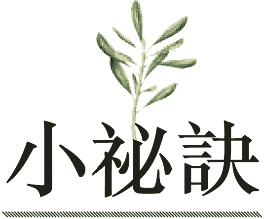

　　．考虑每周找四天将朝鲜蓟加入晚餐菜单里，以获得显著效果。

　　．最能摄取朝鲜蓟养分的方式是清蒸。蒸熟并放凉后，剥下叶片，搭配你最爱的健康蘸酱，咬下每片叶子底部的“肉”。接着，将朝鲜蓟心剥干净后享用。

　　．如果买到以柠檬酸等防腐剂预先处理过的朝鲜蓟心，先浸泡在水中一夜，以去除这种取自玉米的刺激物（想了解更多与玉米有关的问题，请参阅第三部［阻碍生命的食物］那一章）。

　　．晚餐时享用朝鲜蓟，可以在隔天一大清早你还在睡觉时帮助你的肝脏自我净化。为了获取最佳效果，试着在晚上七点或八点吃朝鲜蓟。

　　．试试将朝鲜蓟搭配萝蔓食用，这两种食物凑在一起有助于溶解胆结石与肾结石。

清蒸朝鲜蓟佐柠檬蜂蜜蘸酱

────── ◆ ──────

分量：2～4 人份

　　朝鲜蓟的准备工作看似有点吓人，但其实只需要热水与些许耐心就够了。朝鲜蓟蒸至熟软之后，就等着你将它一片片剥下，浸到蜂蜜、橄榄油与鼠尾草制成的甜美蘸酱中。

朝鲜蓟 4 颗

橄榄油 1/4 杯

蜂蜜 1/4 杯

柠檬汁 1/4 杯

鼠尾草叶 3 片

　　将每颗朝鲜蓟切去顶端四分之一，并切除蓟梗。利用剪刀剪去每片叶子的尖端。将朝鲜蓟放进蒸笼内，然后置于锅中。清蒸朝鲜蓟 30 至 45 分钟，蒸到叶片熟软且容易剥下来。

　　至于蘸酱，将其余食材放进小平底汤锅中以大火加热，持续搅拌至酱汁变得稍微浓稠（大约搅拌 2 分钟）。酱汁离火后即可与蒸熟的朝鲜蓟一同上桌。

芦笋

　　　　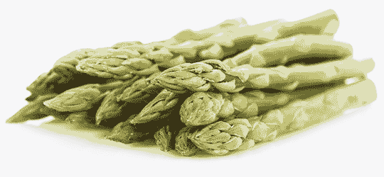

　　从古至今，人类都在探寻青春泉源。众人四处寻找从地里冒出来、能够维持良好健康的魔法之泉。青春泉源并非迷思，也确实来自大地……而且正好在商店里就找得到。这种抗老化的神奇事物就是芦笋。

　　你最健壮的时刻是何时？是你能轻而易举地奔跑、在大海中游泳且完全不会累的时候吗？是十年、二十年、三十年或更早以前吗？那可能是昨天，或是今天早上。与你处于最佳状态那一刻创建链接──无论那是何时──那是你觉得全部的生命力流遍你全身的时刻，而一根芦笋从土里冒出来的头几个星期中蕴含的正是这相同的力量。想想看，我们吃下的每一段芦笋都曾经走在成长为一棵小树的路上，虽然每一种蔬菜都有其价值，但大部分并未具备相同的潜力。吃下芦笋嫩芽时，它的成长能量会转移到我们体内，而这种能量不仅让人保持年轻，更有助于疗愈并预防神经系统的问题与症状。

　　芦笋含有作为重要器官清道夫的植物性化合物，例如叶绿素与叶黄素。它们深入肝脏、脾脏、胰脏与肾脏等器官，刷洗掉它们在里头发现的毒素。而叶绿素与麸酰胺酸、苏胺酸与丝胺酸等氨基酸结合，提供了排除重金属毒素的途径。

　　不仅如此，芦笋中的某些植物性化合物是毒素抑制剂（这是科学界还不知道的事实），这表示一旦 DDT、其他杀虫剂与重金属被驱出器官之外，这些特定植物性化合物会留下来驱除即将进驻此处的新毒素。这种毒素抑制作用使芦笋成为对抗几乎各种癌症的绝佳工具。

　　处于巨大压力之下，我们往往会快速流失维生素 B 群。芦笋富含容易吸收的维生素 B 群，能帮助我们恢复这些关键营养素的适当浓度。芦笋同时也有丰富的二氧化硅与微量矿物质，例如铁、锌、钼、铬、磷、镁与硒，是目前对肾上腺最有益处的食物之一，并且能使你回到肾上腺机能臻于颠峰的时刻。而提到芦笋，就不能不提到芦笋借由洗刷有害酸性让身体碱性化的珍贵价值。我们生活在极酸性的环境中，若想远离疾病，就必须在芦笋这种可靠战友的帮助下，持续努力保持自身的碱性体质。

 有助于疗愈这些疾病

　　假如你有下列任一疾病，试着将芦笋纳入日常饮食中：

　　多发性硬化症、败血症、帕金森氏症、纤维肌痛症、慢性疲劳症候群、膀胱癌、乳癌、骨癌、短暂性脑缺血发作（小中风）、痛风、肾结石、肺癌、肝癌、偏头痛、眩晕症、梅尼尔氏症、神经病变、糖尿病、低血糖症、肾上腺疲劳、带状疱疹、莱姆病、焦虑症、EB 病毒∕单核球增多症、骨髓炎、桥本氏甲状腺炎、葛瑞夫兹氏病、甲状腺癌、生育能力低落、不孕症、睡眠呼吸中止症、骨盆腔发炎性疾病、青春痘、滑囊炎、麸质过敏症、结缔组织损伤、多囊性卵巢症候群、重金属毒性、单纯疱疹病毒第一型、单纯疱疹病毒第二型、裂孔疝气、类纤维瘤、贫血。

 有助于疗愈这些症状

　　假如你有下列任一症状，试着将芦笋纳入日常饮食中：

　　抽搐、痉挛、刺痛与麻木、耳鸣或耳中嗡嗡作响、口齿不清、体臭、疲劳、甲状腺机能不足、甲状腺机能亢进、手脚发麻刺痛、神经痛、体重增加、体重减轻、经前症候群症状、缺乏动力、倦怠、丧失性欲、活力衰退、腹部疼痛、更年期症状、急尿、背部疼痛、关节疼痛、颈部疼痛、肋骨疼痛、沾黏、腹胀、口疮、慢性稀粪、便秘、脾脏肿大、卵巢囊肿、腿部痉挛、肌肉痉挛、肌肉僵硬、发炎。

 情绪上的支持

　　假如你苦于羞怯、害羞、在乎他人眼光、害怕打破自己的壳而展露自我，或是惧怕面对群众，芦笋是相当有帮助的食物。如果你在这些层面确实需要帮助（若你只是天生内向而且觉得这样很好，那么尽管他人认为你应该外向一点，你还是做自己就好），芦笋将能助你一臂之力，给你自信心，使你能够昂首阔步，在这个世界找到一席之地。

 灵性启发

　　采收芦笋时，它只是一个正要成长为壮大植物的芽，但如果让芦笋自由生长并散播种子，它会强壮得像树木般不可食用。随着时间过去，人类学会辨认何时是芦笋最适合食用的颠峰时刻，而我们可以将学到的这一课运用在人生中。人们有时太过逼迫环境，致力于一直追求成长，试着拼到底。我们不必总是渴求最后的结果，可以学着了解某个计划、会议或对话何时发展至最佳时刻，并把握此时优雅地画上句点，以利用颠峰时刻的力量获得最佳成果。

　　．选购较粗壮的芦笋，这种芦笋通常最营养（但如果你只找得到比较细的芦笋，也别因此退缩，它们仍然具有营养价值）。

　　．试着将几根生芦笋与你喜爱的其他蔬菜汁食材一起打成汁，例如西洋芹与小黄瓜。吃这种状态的芦笋效果尤佳。

　　．把握春季器官排毒的绝佳时刻，在一整个四月或五月的每一天都食用一把芦笋。

芦笋汤

────── ◆ ──────

分量：2～4 人份

　　这道浓郁汤品相当适合在空气中仍有些许凉意、但又让你对这个季节带来的新气象怀抱希望的春季夜晚享用。市面上买不到新鲜芦笋时，也可以改用冷冻芦笋做出这道完美的抚慰料理。

剁碎的芦笋 5 杯

大略剁碎的黄洋葱 1/2 颗

大蒜 2 瓣

烤鸡调味料 1/2 茶匙

海盐 1/4 茶匙

橄榄油 1 汤匙

杏仁 1/2 杯

黑胡椒少许

　　将芦笋、黄洋葱与大蒜置于汤锅中，加入 2 杯水，然后加盖煨煮。芦笋煮 5 至 7 分钟，煮到变软后离火。沥除多余水分，然后将锅中食材倒进果汁机里，再加入其余材料搅打至滑顺。搅打时要让蒸气可以从果汁机的上盖排出去。

　　＊不一定要用果汁机搅打，你也可以依照喜好使用手持式搅拌器。沥除多余水分后将芦笋等食材留在锅中，然后加入其余材料一起搅打即可。

西洋芹

　　　　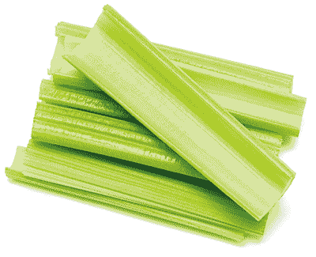

　　西洋芹是非常强大的抗发炎食物，因为它能饿死体内的害菌、酵母菌、霉菌、真菌与病毒，并将它们的毒素与残渣从肠道与肝脏里冲洗掉。这类病原体通常是发炎现象的背后原因──少了这些病原体，你的身体更能面对生命中遭遇的挑战。同时，西洋芹也能帮助益菌生长。

　　摄取西洋芹是最能让肠子碱性化的方法。部分原因是西洋芹（严格说来属于药草，而非蔬菜）富含生物活性钠，也含有科学研究尚未发现的辅因子微量矿物盐。西洋芹中这些种类的钠与其他微量矿物质（超过六十种），能够与彼此，以及与西洋芹中的普通钠合作，以提升你身体的酸硷值，并从身体的所有缝隙排除有毒的酸，包括肠子在内。这个过程可以清洗并修复肠黏膜。

　　此外，西洋芹提供了酶与辅酶，并提升胃里的盐酸浓度，让食物容易消化且避免腐败，因此有助于预防各种肠胃不适。在饮食中加入西洋芹汁是解决氨渗透问题的最佳方法，这种未受人探讨的疾病是指氨气渗透肠黏膜，导致健康问题，例如龋齿与脑雾（你可以在我的第一本书《医疗灵媒》中读到更多氨渗透与受人误解的肠漏症候群相关信息）。

　　有些人觉得西洋芹枯燥乏味，其实并非如此。除了前面提到的以外，西洋芹还能改善肾脏功能、帮助修复肾上腺，甚至可以放松心智与思考模式，因为其中的矿物盐能促进电脉冲活动，并支持神经元机能，对苦于注意力不足过动症、脑雾或记忆力衰退的人至关重要。而谈到西洋芹就该想到电解质，因为它能为深层细胞补充水分，降低你受偏头痛折磨的机率。西洋芹是对抗四大病根的理想食物，而且有助于面对压力，还能修复你的 DNA。

 有助于疗愈这些疾病

　　假如你有下列任一疾病，试着将西洋芹纳入日常饮食中：

　　青春痘、注意力不足过动症、自闭症、湿疹、牛皮癣、肌肉萎缩性嵴髓侧索硬化症、肠漏症候群、不孕症、莱姆病、偏头痛、强迫症、骨盆腔发炎性疾病、甲状腺疾病与失调、生育能力低落、糖尿病、低血糖症、肾上腺疲劳、焦虑症、败血症、泌尿道感染、肾结石、肾脏疾病、胰脏癌、胰脏炎、脂肪肝、慢性疲劳症候群、纤维肌痛症、狼疮、休格伦氏症候群、爱迪生氏症、酒渣（玫瑰斑）、脂肪瘤、膀胱癌、间质性膀胱炎、克隆氏症、结肠炎、大肠激躁症、鹅口疮、高血糖症、高血压、忧郁症、水肿、受伤、寄生虫问题、酵母菌感染、失眠、接触霉菌、细菌感染、病毒感染、氨渗透。

 有助于疗愈这些症状

　　假如你有下列任一症状，试着将西洋芹纳入日常饮食中：

　　肠痉挛、囊肿、胃酸不足、肝功能不良、皮质醇过低、皮质醇过高、脑雾、食物过敏、酸中毒、甲状腺机能不足、甲状腺机能亢进、视力混浊、关节疼痛、头痛、腹胀、胀气、腹部压力、慢性脱水、眼睛干涩、五十肩、胃酸逆流、胆囊∕胃部∕小肠∕结肠发炎、皮疹、恶心、舌苔发白、念珠菌过度增生、焦虑、记忆力衰退、高血压、食物敏感、肿胀、发炎、肌肉痉挛、腿部痉挛、疲劳、矿物质缺乏、脑部发炎、睡眠障碍。

 情绪上的支持

　　我们往往会在肠子里积存许多恐惧，而西洋芹能修复整体消化系统。当你觉得恐惧、恐慌、震惊、焦躁、紧张、受威胁、没把握、害怕或防御心提高时，就可以善用西洋芹的镇静效果。

 灵性启发

　　我们经常让生命变得比原来更复杂，又或者过度简化真正复杂的问题。这番拉扯时常发生在生命的各种层面，尤其是健康。有时，人们对健康问题想太多，找来各式各样可能的解决方案；有时，面对一个由许多因素微妙相互影响而引发的健康问题时，人们又会试图让它看起来像是单纯的身体意外状况。

　　若想真正疗愈，必须在简单与复杂之间取得平衡，而西洋芹正好能为我们上这一课。饮用西洋芹汁是最简单的方法，简单到让人觉得自己的感受不可能因此改变。人们认为在绿色蔬果汁中加入几种其他食材，可以增加更多养分。虽然绿色蔬果汁就有极佳的疗愈效果（例如下一页的食谱做出来的饮品），但没有什么比得上纯西洋芹汁的单纯效力。纯西洋芹汁最能发挥疗愈、转化与改变生命的效果，因为西洋芹中的复杂成分必须在不受干扰的前提下才能发挥魔力。这正好可以在生命的其他层面提点我们，毕竟，还有什么事可以让我们在错综复杂的路上碰得满头包之后，才理解到最简单的方法就是最好的呢？

　　．为了让身体“重开机”，单纯以西洋芹打成汁饮用。若想获得最佳效益，每天喝十六盎司（约四百七十毫升）的新鲜西洋芹汁，而且记得空腹饮用，这样可以最有效地提升胃酸浓度。若要获得显著成效，一天可饮用两杯十六盎司的新鲜西洋芹汁。

　　．假如你的目标是清除体内的有毒重金属，例如汞、铝、铅、铜、镉、镍、砷，打西洋芹汁时加入半杯新鲜芫荽叶。

　　．摄取更多西洋芹的简单方法，就是打果昔时加入二至四根西洋芹。

轻松美味绿色蔬果汁

────── ◆ ──────

分量：1～2 人份

　　这杯蔬果汁清新又甜美，让它成为可以轻松摄取更多绿色蔬菜的选择，很适合在早晨饮用，当作一天的开始。而且，看到孩子们也爱不释手，你或许会很惊讶。

西洋芹 1 棵，茎一根根分开

苹果 1 大颗，切片

柠檬 1 颗

荷兰芹或芫荽叶 1/2 把

新鲜薄荷 4 枝

　　将所有食材以高速果汁机搅打完成后，倒入玻璃杯中享用。

十字花科蔬菜

　　　　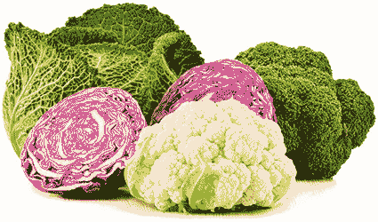

　　高丽菜、芥蓝菜、青花菜、球花甘蓝、花椰菜、球芽甘蓝、羽衣甘蓝、芝麻菜与芥菜等都属于十字花科家族。十字花科蔬菜就像那些极具魅力的人，每个都有耀眼的性格，却也能带出伙伴最好的特质。这是因为除了你即将读到的十字花科优秀特质之外，它们更具有目前尚未被发现的神奇能力，在以某些组合方式搭配其他食物一起吃时（详见“小秘诀”单元），可以点燃那些食物隐藏的净化与疗愈能力。

　　这类食物最近曾因为错误信息而被冠上莫须有的骂名。如果你听说过这些食物会“导致甲状腺肿”，所以对甲状腺有害，放心吧，真相并非如此（更多信息请参阅第三部［有害健康的饮食风尚与潮流］那一章）。十字花科蔬菜是甲状腺最好的朋友，能将接受牙齿治疗与其他医疗程序而接触到的辐射物从甲状腺中清除。此外，它们也能防止引起诸多甲状腺疾病的病毒爆发。

　　十字花科蔬菜有助于击退许多癌症，包括乳癌、生殖器官癌症（例如卵巢癌、子宫癌与子宫颈癌）、脑癌、肠癌与肺癌。它们对肺部健康尤其有益，因为其中富含硫的关系，这个家族中的每一种蔬菜都能修复并刺激肺部组织生长。十字花科蔬菜含有两种硫，一种是以巨量矿物质形式呈现，另一种则是以微量矿物质形式伴随呈现的微量硫。这两种硫一起渗透肺部组织，刺激其成长、再生与疗愈，也能修复肺部疤痕组织。十字花科蔬菜同时富含维生素，例如维生素 B 群、A、C、E 与 K。

　　来认识几种十字花科蔬菜：

　　．红高丽菜（紫高丽菜）：让这种十字花科蔬菜呈现红紫色的染色剂，是抗病色素中的佼佼者。高丽菜中的硫毫不费力就能将来自这些色素的植物性化合物带到肝脏，让红高丽菜成为最能使肝脏再生的食物之一。事实上，红高丽菜有助于延缓并逆转肝脏中的疤痕组织。

　　．羽衣甘蓝：结缔组织被病毒攻击、发炎、高度敏感、衰弱时，很容易引起慢性疾病。对正面对结缔组织损伤、疼痛或关节发炎的人而言，羽衣甘蓝堪称秘密武器，提供双重打击效果：它的抗发炎化合物能帮助摧毁病毒，而生物可利用植物性化合物也有助于刺激细胞生长，并形成健康的新结缔组织。

　　．芥蓝菜：这种蔬菜的茎具有抗菌营养素。将芥蓝菜清蒸或加入汤品中，能够汲取出其中的药性。吃下肚之后，它的养分会通过你的身体，并发挥抗生素的作用（祖母的鸡汤中若加了芥蓝菜，效果还真的跟抗生素没两样）。

　　．花椰菜：这种十字花科蔬菜含有微量矿物质硼，目前已知对内分泌系统有帮助，然而，它却因为盛传含有所谓的“甲状腺肿原”（导致甲状腺肿的物质）而更引人诟病。花椰菜的作用与坊间流言恰恰相反──它能帮助甲状腺及内分泌系统其余器官（包括下视丘与肾上腺）击退真正引起甲状腺发炎的病毒。花椰菜在生食状态下具有容易消化的独特能力，这点相当理想，因为生吃花椰菜提供你最佳机会，让你很容易吸收并完全利用它的效益。

　　．青花菜：小时候父母叫你要把青花菜吃掉，他们是对的。青花菜对人体而言就像全效综合维生素，而且含有生物可利用微量矿物质与其他养分，能够提升所有身体系统的功能，包括免疫系统。大自然赋予青花菜无可比拟的均衡养分，对所有器官、腺体、骨胳、神经都能提供某些好处，对全身而言效益更大。

　　．球芽甘蓝与绿高丽菜：绿高丽菜的营养价值极高，支持关节与逆转骨质疏松症的效果绝佳。若喜欢吃高丽菜，它绝对不会辜负你；然而，如果你想寻求最大的养分密度，就选择球芽甘蓝吧，它所含的养分是绿高丽菜的十倍之多。球芽甘蓝对关节的效益更上一层楼，还有助于降低坏胆固醇、增加好胆固醇、净化肝脏与其他有如海绵的器官（例如脾脏），更能净化血液。

 有助于疗愈这些疾病

　　假如你有下列任一疾病，试着将十字花科蔬菜纳入日常饮食中：

　　C 型肝炎、肝硬化、结缔组织损伤、桥本氏甲状腺炎、葛瑞夫兹氏病、营养吸收问题、骨胳与腺体结节、乳癌、生殖器官癌症（例如卵巢癌、子宫癌与子宫颈癌）、脑癌、肠癌、肺癌、肾上腺疲劳、黄斑部病变、骨质疏松症、胆固醇过高、接触霉菌、高血压、忧郁症、单纯疱疹病毒第一型、单纯疱疹病毒第二型、人类疱疹病毒第六型、强迫症、生育能力低落、骨盆腔发炎性疾病、糖尿病、低血糖症、偏头痛、青春痘、焦虑症、注意力不足过动症、自闭症、湿疹、牛皮癣、EB 病毒∕单核球增多症、带状疱疹、泌尿道感染、慢性阻塞性肺病。

 有助于疗愈这些症状

　　假如你有下列任一症状，试着将十字花科蔬菜纳入日常饮食中：

　　体重增加、疼痛、肝脏疤痕组织、经前症候群症状、食物过敏、关节发炎、关节疼痛、膝盖疼痛、肺部疤痕组织、甲状腺机能不足、肝功能不良、肝充血、甲状腺机能亢进、组织胺反应、热潮红、荨麻疹、发炎、更年期症状、腿部痉挛、嗅觉丧失、神经发炎、呼吸短促、打鼾、淋巴结肿大、疲劳、刺痛与麻木、耳鸣或耳中嗡嗡作响、心悸。

 情绪上的支持

　　十字花科蔬菜能支持陷入困惑中的人。假如你认识的人看似感到困惑、迷惘或不知所措，跟对方一起坐下来享用羽衣甘蓝与红高丽菜沙拉、花椰菜汤，或是青花菜或球芽甘蓝做成的小菜吧。即使你的时间只够将这些食材放在朋友家里，也能因此让对方的情绪状态产生变化。

 灵性启发

　　你是否曾经充满爱地照顾某人、留意对方的需求、提供滋养、付出你拥有的一切，并且支持、相信与守护对方，最后却换来遭受背叛的下场？你是否曾经觉得无依无靠、觉得孤独，因为你曾悉心呵护的人正在散播关于你的不实谣言？

　　如果你碰过这些事，那么你可以在十字花科家族找到有同样遭遇的朋友。这些蔬菜近来因为它们对甲状腺有害的不实指控，而蒙受耻辱、遭人唾弃，但事实正好相反，它们一直以来都在支持甲状腺。未来的数十年内，错误信息将使众人反抗对自己有极大助益的食物来源，直到所谓的“甲状腺肿原食物”（致甲状腺肿食物）这种误导人的理论被证明有错的那天为止。

　　羽衣甘蓝、青花菜、花椰菜与它们的表亲教导我们在生命中保留空间给耐心与感恩，不仅对自己，对待他人也是如此。假如你曾受人攻击或批评，要知道你并不孤单，而且逆境不会毁灭真正的你。而对于曾经为我们奉献时间、心力与爱，引导我们生命的人，即使看不见他们的努力或很快就忘了他们的付出，我们也必须记得对那些人表示敬意。如同十字花科家族照料我们、保护我们不受疾病危害一样，请举起蜡烛向那些曾经为你付出心力的人致敬吧。

　　．花椰菜与海菜搭配在一起会成为强大的排毒工具，有助于排除敏感内分泌腺体中的氯、有害氟化物与辐射物。你可以将这个组合做成下面这道美味料理：把生花椰菜放进食物调理机里搅打至细碎，用来取代海苔卷中的米饭。

　　．同时食用苹果与红高丽菜特别有益于排除肝脏、脾脏与肠道中的细菌、蠕虫、其他寄生虫及病毒。下面这道料理风味绝佳又有饱足感：将苹果、红高丽菜、芝麻酱与大蒜放进食物调理机里搅打至细碎且充分混合，然后做成手卷或淋在绿色蔬菜上享用。

　　．青花菜与芦笋一起吃可增强芦笋中的抗癌化合物，也能强化芦笋中清理肾脏的植物性化合物。想要一起食用这两种蔬菜，有个简单的方法：放进蒸笼里一起蒸。

　　．芥蓝菜与南瓜籽各自含有丰富的锌，而一起吃时，两者的锌会相互结合，变得更具生物可利用性，最容易让身体吸收、利用。试着制作南瓜籽酱，然后涂抹在芥蓝菜叶上，加上你喜爱的馅料后包成卷饼享用。

亚洲风味羽衣甘蓝沙拉

────── ◆ ──────

分量：2 人份

　　这道沙拉最棒的地方在于冷藏得愈久愈入味。一次大量准备好，往后的两天就有美味午餐等着你享用。制作羽衣甘蓝沙拉的秘诀是卷起袖子替羽衣甘蓝按摩到变软，咬下第一口时，你会觉得一切的辛苦都值得。

生芝麻酱 1/4 杯

去籽墨西哥辣椒 1/4 根

莱姆汁 1/4 杯

大蒜 1 瓣

芫荽叶 1/2 杯

椰枣 2 颗，去核

削皮切丁的栉瓜 2 杯

卷叶羽衣甘蓝 2 颗，切碎

切丝红高丽菜 1 杯

青葱 3 根，切碎

芝麻籽（依喜好选用）

　　酱汁部分，将前七种材料放进果汁机里搅打至滑顺（只有在需要让质地更滑顺时才加入少许的水）。将打好的混料抹到羽衣甘蓝叶上，按摩到菜叶变软，然后撒上红高丽菜与青葱即可。如果喜欢，可以撒少许芝麻籽。

小黄瓜

　　　　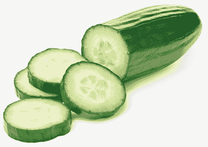

　　许多人都有慢性脱水现象，却不知道这对健康会有什么负面影响。小黄瓜是完美解药，它具有青春泉源般的效果，能在最深层的细胞层次为我们补充水分。此外，小黄瓜的冷却效果使其具备绝佳的回春功效，尤其可以冷却过热、功能停滞的肝脏。经常食用小黄瓜能逆转肝脏损伤，修复近十到十五年因为接触毒素（包括重金属与 DDT 之类的杀虫剂）与不良饮食带来的伤害，因此这种蔬菜（其实算是水果）是消除腹胀的强力盟友。

　　新鲜小黄瓜汁是世界上最好的回春滋补药，其中含有的电解质化合物滋养效果特别好，还能冷却过度使用的肾上腺，以及负责过滤有毒残渣并因为有毒尿酸而过热的肾脏。如果你有肾脏疾病、正在洗肾，或者少了一颗肾脏，每天饮用小黄瓜汁有极大助益。此外，小黄瓜对腺体与器官的冷却效果，也使其成为小孩与成人通用的退烧药。将小黄瓜打成汁能释放它神奇的抗高烧化合物，可以像在火上浇水一般平息高烧。

　　小黄瓜所含的甘胺酸与麸酰胺酸等氨基酸，能与它极丰富又高活性的酶与辅酶结合，再加上超过五十种微量矿物质，使小黄瓜成为神经传导物质绝佳的运输系统。如果你有焦虑症或其他神经系统疾病，这可是好消息。此外，小黄瓜也提供了其他重要营养素，例如小黄瓜皮中与维生素 B 群、A 及 C 结合的叶绿素。小黄瓜还能促进消化，它含有目前尚未被发现、将来会被命名为塔拉芬（talafinns）的辅酶。塔拉芬会与医学研究已经发现的酶（例如肠蛋白酶）相互配合，协助身体的蛋白质消化过程，让你可以获得你吃下的大部分营养。

 有助于疗愈这些疾病

　　假如你有下列任一疾病，试着将小黄瓜纳入日常饮食中：

　　肾脏疾病、肾衰竭、少了一颗肾、肾上腺疲劳、焦虑症、EB 病毒∕单核球增多症、糖尿病、低血糖症、偏头痛、肌肉萎缩性嵴髓侧索硬化症、湿疹、牛皮癣、短暂性脑缺血发作（小中风）、难解的不孕症、骨盆腔发炎性疾病、生育能力低落、普通感冒、流行性感冒、巨细胞病毒、人类疱疹病毒第六型、带状疱疹、慢性疲劳症候群、纤维肌痛症、多发性硬化症、狼疮、姿势性直立心搏过速症候群、自主神经障碍、败血症、酵母菌感染、大肠杆菌感染、链球菌感染、晒伤。

 有助于疗愈这些症状

　　假如你有下列任一症状，试着将小黄瓜纳入日常饮食中：

　　发烧、头皮屑、腹胀、胃痉挛、肝功能停滞、脱水、头痛、皮肤干燥、皮肤搔痒、热潮红、体重增加、更年期症状、经前症候群症状、焦虑、神经痛（包括三叉神经痛）、食物敏感、发炎、血液毒性、酸中毒、背部疼痛、所有神经系统症状（包括刺痛、麻木、痉挛、抽搐、神经痛与胸闷）、胃酸不足。

 情绪上的支持

　　英文俚语“和小黄瓜一样冷静”（cool as a cucumber）其来有自。假如你或你所爱的人正苦于愤怒管理问题，在饮食中加入小黄瓜吧。将小黄瓜片与你认识的那些容易发怒、不满、脾气不佳、暴躁、恼怒、激动或时时充满敌意的人分享。

 灵性启发

　　因为小黄瓜是绿色的，而且常常在沙拉里吃到，所以大家往往认为小黄瓜是蔬菜。但切开小黄瓜时，我们才会想起那些小种子代表小黄瓜其实是水果。这大大提醒了我们，外貌与其他人将我们放进去的框架不代表我们真实的自我，我们通常具备其他人光靠外表无法猜测的才能、特质与天赋。小黄瓜教导我们要深入审视自己与他人的内在，才能发现其中蕴藏的奇迹。

　　．为了看见成效，试着每天吃两根小黄瓜。

　　．别老是把各种蔬菜和水果一起打成汁，试着制作单纯的小黄瓜汁。就像西洋芹汁一样，纯小黄瓜汁也有独特的疗愈性质。若经常饮用十六盎司（约四百七十毫升）的纯小黄瓜汁，将带来改变生命的成效。

　　．如果想要将谷类排除在饮食内容之外，可以利用螺旋切丝器或刨丝刀将小黄瓜切成面条状。小黄瓜面的补水效果比热门的栉瓜面更好，也更美味。

　　．选用普通小黄瓜时，食用前记得先削皮，避免吃下有毒的蜡层。

凉拌小黄瓜面

────── ◆ ──────

分量：2 人份

　　干净清爽的凉拌面会使你觉得轻盈又清新。莱姆与芝麻的亚洲风味与小黄瓜、红萝卜及腰果拌在一起，带来美丽的色彩与爽脆口感。这道清淡料理可以在最后依照你的喜好加入干辣椒片，借以增添辣味。

小黄瓜 4 根

红萝卜 2 大根

芝麻油 2 茶匙

芝麻籽 2 茶匙

莱姆汁（2 颗挤成）

干辣椒片（适量）

切碎的芫荽叶 1/2 杯

切碎的罗勒 1/2 杯

切碎的腰果 1/2 杯

　　利用刨丝刀、菜刀或螺旋切丝器将小黄瓜与红萝卜切成细长条。将切好的小黄瓜面、红萝卜面，以及芝麻油、芝麻籽、莱姆汁与依照口味加入的干辣椒片放进大碗里拌匀。上桌前撒上切碎的芫荽叶、罗勒与腰果即可享用！

叶菜类

　　　　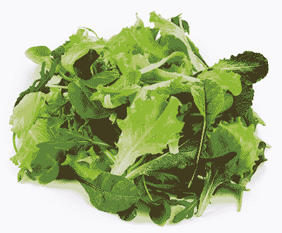

　　听到“把青菜吃掉”的建议时，我们往往会想到红萝卜、青花菜、豌豆与四季豆之类的。另一方面，叶菜类则常常被视为乏味又不重要的菜──虽然是沙拉的基础，但其他食材好吃多了。然而，莴苣、菠菜、火焰菜、野苣与水田芥等叶菜类其实值得接受赞扬，因为它们拥有使你恢复健康的力量（其他许多叶菜类在本书中另有篇幅介绍：关于羽衣甘蓝、芥蓝菜、芥菜与芝麻菜等，请见［十字花科蔬菜］；关于小萝卜叶，请见［小萝卜］；关于蒲公英叶、荷兰芹与芫荽叶，也请参阅各相关章节的描述）。沙拉中的叶菜一点也不乏味，反而是蔬菜中的贵族。

　　大家经常误以为生吃这些叶菜会难以消化，但叶菜类其实相当容易消化，所以对你的消化系统而言毫不费力。事实上，这些叶菜类能搓洗并按摩你的胃部、小肠与结肠黏膜，松动堆积的老旧酵母菌、霉菌、其他真菌，以及残渣与废弃物，让它们被排出体外，整个排除过程因而更有效率。食用生菜沙拉的不适感通常起因于肠道中的神经敏感或发炎现象，或者只是单纯感觉到纤维正在尽责地“清理烟囱”。如果你有这种现象，可在日常饮食中加入少量的奶油莴苣、红叶莴苣或菠菜。

　　随着时间过去，叶菜类对肠道不适会有极佳疗效。它们借由提升有益的盐酸浓度打造更偏碱性的胃部环境，以杀死形成有害酸类进而导致胃食道逆流疾病与其他胃酸逆流问题的害菌。叶菜类可以减少的害菌之一就是幽门螺旋杆菌，胃溃疡通常是它的杰作。

　　叶菜类打造出真正偏碱性的身体系统，尤其是淋巴系统，它可能会因为不断进入淋巴信道的化学物质、酸类、塑胶、杀虫剂、重金属与病原体发动的凌厉攻势而变成酸性。医学界并未察觉血液、器官、内分泌系统、生殖系统与中枢神经系统的碱性与否，完全取决于淋巴系统是不是碱性。叶菜类能帮助淋巴系统驱逐、清理与排除这些毒素，使其保持碱性，这正是叶菜类在疗愈过程中扮演的重要角色。

　　叶菜类也含有珍贵且关键的矿物盐，其中一部分是由与钠有关的一群辅因子构成，例如微量的生物可利用碘、铬、硫、镁、钙、钾、二氧化硅、锰与钼，这些对于支持神经传导物质与神经元都极为重要，也是打造电解质的基础。此外，叶菜类富含酶、维生素 A、维生素 B 群（例如叶酸）、具有疗愈效果的生物碱、修复内分泌系统的微量营养素，以及在这些蔬菜中以特有形态呈现的叶绿素与胡萝卜素。这类独特养分共同滋养所有器官与身体系统，让叶菜类成为我们健康的基础。叶菜类可以抗病毒、抗菌、抗霉菌，而且有助于清除四大病根。虽然它们没有能让我们维持活力的碳水化合物，却可以补足生存所需的方程序，并击退疾病与慢性病。

　　担心蛋白质摄取不足？尽管放心，叶菜类具有你能找到生物可利用性最高也最容易吸收的蛋白质，可以让你的身体立刻使用。叶菜类有助于逆转所有与蛋白质相关的疾病，例如痛风、肾脏疾病、肾结石、胆结石、胆囊疾病、C 型肝炎、淋巴水肿、结缔组织损伤、骨质缺乏症、骨质疏松症、骨关节炎与心脏疾病，这些都是由没有被分解或吸收的蛋白质来源引起的，反而导致身体健康恶化。

　　下次当你听见某人说沙拉是“兔子吃的”时，别忘了你刚读过的内容，叶菜类可不是省油的灯。

 有助于疗愈这些疾病

　　假如你有下列任一疾病，试着将叶菜类纳入日常饮食中：

　　胃食道逆流疾病、甲状腺疾病、麸质过敏症、憩室炎、胆囊疾病、胆结石、痛风、肾脏疾病、贫血、大肠激躁症、肾结石、胃溃疡、心脏疾病、幽门螺旋杆菌感染、C 型肝炎、骨质疏松症、骨质缺乏症、骨关节炎、生育能力低落、淋巴水肿、消化不良、皮肤问题（包括湿疹与牛皮癣）、骨胳与腺体结节、接触霉菌、内分泌失调、肾上腺疲劳、失眠、青春痘、肌肉萎缩性嵴髓侧索硬化症、焦虑症、注意力不足过动症、忧郁症、不孕症、莱姆病、甲状腺癌、偏头痛、强迫症、单纯疱疹病毒第一型、单纯疱疹病毒第二型、骨盆腔发炎性疾病、糖尿病、低血糖症、EB 病毒∕单核球增多症、带状疱疹。

 有助于疗愈这些症状

　　假如你有下列任一症状，试着将叶菜类纳入日常饮食中：

　　胃灼热、酸中毒、铁质缺乏、便秘、矿物质缺乏、微量矿物质缺乏、肿胀、体液滞留、肝脏发炎、肾脏虚弱、胃酸不足、胃部不适、肌肉痉挛、食物过敏、痉挛、骨质流失、牙龈萎缩、肝功能停滞、关节疼痛、发炎、体重增加、更年期症状、经前症候群症状、荷尔蒙失衡、胃酸逆流、皮肤干燥、鳞状皮肤、钙化、血小板数量过低、腹部痉挛、心律不整、心悸、平衡问题、水泡、身体疼痛、脑雾、蛀牙、胸闷、头皮屑、头晕、耳垢堆积、珐琅质流失、颚部疼痛、膝盖疼痛。

 情绪上的支持

　　身体在肉体层面充满毒素时，可能导致情绪层面的毒素累积。许多人觉得被困住、停滞不前、受限、失落，或是在生命中遭受阻碍，而叶菜类是使人前进的良方。它们不但可以洗刷体内的残渣，也能松动累积的有毒情绪，并引导那些情绪离开你的生命。在饮食中加入更多叶菜类可以让人体验到解放感，帮助你再次感受到干净、清明──这本是你应该拥有的状态。

 灵性启发

　　你与机会擦身而过多少次？时间快速熘走，在我们发现之前，我们寄给朋友的生日祝福迟到了，或者当我们去到海滩时，海浪已经高到我们无法优游其中。叶菜类教导我们要把握当下，它们在架上的寿命很短，这表示在叶菜类被摘下之后愈快食用它们，对我们的健康愈有益。这让人意识到生命中其他稍纵即逝的瞬间，只要我们用心体认眼前的一切，就能把握从各个层面滋养自己的其他机会。

　　．制作叶菜类食用计划，好让你在一个星期的每一天都能在沙拉（或其他料理）中吃到不同的叶菜。这是确保你获得最大营养效益的有趣方法。

　　．如果觉得生的叶菜难以咀嚼，试着挑一种叶菜搭配小黄瓜或西洋芹一起打成汁饮用。

　　．想换另一种口味的绿色蔬果汁吗？将现挤柳橙汁与菠菜一起打成汁试试。

　　．试着自己栽种叶菜类，这样做不仅让你有机会利用叶菜类中强大的天然益生菌（关于这些崇高微生物，请参阅第一部［透过食物适应现代世界］那一章），更意味着它们特别为了帮助你而成长，仿佛每片菜叶上都写着你的名字。

　　．自己种植叶菜类时，试着在它们成长初期采摘一些。食用此阶段的叶菜，能让你的身体准备好在叶菜完全长大后，更充分接收叶菜类提供的效益。

　　．莴苣叶很适合取代玉米薄饼。试着在莴苣叶中加入你喜爱的食材，包成墨西哥夹饼、卷饼或手卷享用。

　　．如果你因为不喜欢酪梨的口感而排斥它，试着加入大量切碎的野苣与一汤匙生蜂蜜做成酪梨沙拉酱，这样就能改变口感，同时为这道料理增添来自野苣的坚果风味与蜂蜜的甜味，绝对能改变你对酪梨的感觉。长期食用这道特别的酪梨沙拉酱，将扭转你对酪梨的排斥感，使你得以单纯享受酪梨的滋味。

叶菜沙拉佐柠檬酱汁

────── ◆ ──────

分量：2～4 人

　　这道简单的沙拉风味十足，而且适合当作工作时的午餐。记得在食用前才淋上酱汁，就能在座位上享用美味又生气蓬勃的午餐。如果可以，别忘了选用生的开心果，它们的口感松软，最适合搭配草莓的甜蜜与柠檬的鲜明风味。

柠檬汁 1/2 杯

橄榄油 1/4 杯

生蜂蜜 2 汤匙

叶菜类 8 杯

切片草莓 2 杯

无盐生开心果 1/2 杯

　　将柠檬汁、橄榄油与生蜂蜜一同搅打至滑顺，作为酱汁。在大碗中将叶菜类与酱汁混合至菜叶均匀裹上酱汁，然后将沙拉分入个人用的小碗内，并撒上草莓与开心果。

洋葱

　　　　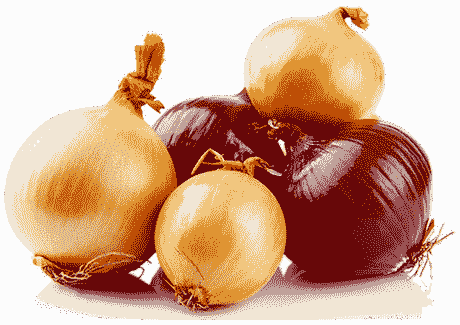

　　韭葱、韭菜、野韭葱、青葱、红洋葱、黄洋葱、白洋葱、珠葱与任何葱属食材都是天然的抗生素，可惜人们不常食用大量洋葱，或许一个月只在汤里加入一小瓣，或是一星期只在沙拉里加上一片。想要确实获得洋葱的抗菌效益，我们在生活中就必须更重视它。

　　有些人抱怨吃洋葱会消化不良，其实，洋葱并无刺激性，反而有高度药效。洋葱引起的胃部不适代表消化道中害菌浓度过高，洋葱发挥了消灭害菌的作用，害菌因此死去后，可能导致暂时的不适。

　　现今许多人都患有小肠细菌过度增生，这种疾病在医学领域仍然是个谜。小肠细菌过度增生背后的原因通常是 A 群与 B 群链球菌、大肠杆菌、困难梭菌、幽门螺旋杆菌、葡萄球菌与∕或不同种类的真菌，而洋葱非常有益于抑制细菌过度增生，因此成为小肠细菌过度增生患者的福音。这项特性也能促进体内维生素 B12 的生成。如果你因为消化道敏感而拒绝洋葱，可以先试着在饮食里加入极少量的洋葱，随着时间过去，它的净化效果会让你逐渐习惯更大的摄取量。

　　跟洋葱作朋友好处多多。洋葱所含的硫（包括蒜素、其他有机硫化物，以及科学研究尚未发现的硫化合物）是让它成为天然抗生素的原因，此外，洋葱也可帮助身体摆脱接触到的辐射物、驱除病毒，并排除 DDT 与其他杀虫剂、除草剂与有毒重金属。洋葱里的硫让它在舒缓关节疼痛、退化、不适，以及修复肌腱、结缔组织等方面有绝佳效果。如果缺乏铁，洋葱也很有帮助，因为它的硫能减缓铁质流失。

　　洋葱富含微量矿物质锌、锰、碘与硒，有助于皮肤再生并保护肺部。如果希望皮肤看起来更年轻，每天食用洋葱是个好方法，而对习惯抽烟又想修复肺部伤害的人也一样。洋葱相当有益于治疗造成支气管炎的普通感冒及流行性感冒，还有细菌引发的肺炎。它还是肠道的终极抗发炎药，能帮助疗愈溃疡、消除粪便中的黏液，以及镇定肠道。

　　在古老的民间传说中，大蒜可以用来驱鬼──洋葱也应该享有类似的声誉，因为它可以驱除食尸鬼般的病原体。让洋葱成为饮食的一部分，将大幅提升你的免疫力，以抵御这个充满病原体的世界。下次出门购买咳嗽糖浆时，也买几颗不同种类的洋葱吧，因为它确实是良药。

 有助于疗愈这些疾病

　　假如你有下列任一疾病，试着将洋葱纳入日常饮食中：

　　胃食道逆流疾病、气喘、慢性阻塞性肺病、肺气肿、乳癌、骨癌、憩室炎、耳朵感染、流行性感冒、结膜炎、麦粒肿（针眼）、高血压、白血病、偏头痛、摄护腺癌、轮癣（金钱癣）、酒渣（玫瑰斑）、葡萄球菌感染、小肠细菌过度增生、口臭、莱姆病、肝脏疾病、脂肪肝、单纯疱疹病毒第一型、单纯疱疹病毒第二型、人类疱疹病毒第六型、人类疱疹病毒第七型、尚未被发现的人类疱疹病毒第十到十二型、泌尿道感染、普通感冒、EB 病毒、酵母菌感染、短暂性脑缺血发作（小中风）。

 有助于疗愈这些症状

　　假如你有下列任一症状，试着将洋葱纳入日常饮食中：

　　口臭、胃灼热、口疮、铁质缺乏、关节发炎、肌腱发炎（尤其是阿基里斯腱发炎）、眼睛问题、手脚冰冷、疤痕、打鼾、关节疼痛、关节不适、呼吸短促、所有神经系统症状（包括刺痛、麻木、循环不良、痉挛、抽搐、神经疼痛与胸闷）、不宁腿症候群、胃炎、身体僵硬、身体疼痛、头晕、皮肤干燥、脾脏肿大、热潮红、发炎、颚部疼痛、膝盖疼痛、颤动、虚弱、矿物质缺乏。

 情绪上的支持

　　如果你正苦于长期的挫折感、愤怒与恼怒──无论是对人、对事或对自己──将洋葱纳入日常生活中相当重要。洋葱能从体内清除愤怒，帮助缓和怨恨、暴怒、恼火与失望，好让你自由地过自己的人生。

 灵性启发

　　洋葱背着引起口臭的黑锅，其实正好相反，洋葱可以减轻口臭。导致口臭的真正原因是从肠子涨到嘴巴的害菌，而洋葱有抗菌特质，能帮助对抗这个问题，所以你的口气随着时间过去会闻起来更芬芳。吃下洋葱后，可能会有某种气味挥之不去，这只是洋葱天然的硫，是硫正在克尽职责的象征。我们把不同品牌的牙膏、漱口水与薄荷芳香剂当作口臭的解决方案，然后把洋葱当敌人，但其实洋葱才是救星。

　　你是否见过有人努力解决问题，却被错当成引起问题的根源？从努力替下属保住饭碗却被下属蔑视的主管，到指出家庭作业里的错误而被小孩抨击的父母（殊不知学会正确答案将是这学期过关的关键），这种现象层出不穷。下次当你急于指责别人时，别忘了洋葱的困境，然后花点时间从各个角度多加分析。

　　．别听信冲洗洋葱或泡水以去除辛辣味的诀窍，这样做减低了洋葱的力量，因为会削弱洋葱杀死细菌、提升免疫力以保持身体健康的药性。

　　．吃下明知道不健康的食物时，加点洋葱以抵销有害的影响（这不表示你应该点一整盘洋葱圈来吃。不建议食用浸在不好的面糊中并以劣质油炸过的洋葱圈；但如果是吃热狗，可以在上面加点切碎的生洋葱）。

　　．到餐厅用餐，却担心感染流感病毒、诺罗病毒或食物中毒时，可以点些有洋葱的料理。比方说，如果点的是沙拉，可以搭配洋葱来杀死污染物。

　　．在市场选购洋葱时，记得挑选结实、挤压时不会凹下去的，而且尽量避开长出绿芽的洋葱（这和购买现采的、叶子还在的洋葱不一样，洋葱叶相当有益）。

　　．尝试以不同品种的洋葱制作不同的料理。试试韭菜酪梨沙拉酱、鹰嘴豆泥中加入青葱、沙拉与热炒中加入红洋葱、韭葱汤，或者试试清蒸黄洋葱或白洋葱。

　　．假如你有鼻塞、感冒或流行性感冒问题，试试将切碎的洋葱放在一碗温水或热水中，再用一条毛巾覆盖住你的头和碗，然后吸入蒸气。这是分解黏液并疏通阻塞的好方法。

　　．如果很容易着凉、身子很难暖和、总是要穿着毛衣或苦于手脚冰冷，试着在日常饮食中加入洋葱以促进循环。

马铃薯泥与蘑菇镶洋葱

────── ◆ ──────

分量：4～6 人份

　　这些美丽的烤洋葱看起来就像餐厅料理，而且做法简单得让人讶异。它们在晚餐餐桌上看起来令人惊艳，也相当适合各种派对场合。如果不喜欢蘑菇，可以自由发挥创意，以喜欢的蔬菜代替嫩煎蘑菇。

洋葱 8 大颗

切丁马铃薯 8 杯

橄榄油 2 茶匙

新鲜迷迭香叶 1/2 茶匙

切碎的蘑菇 8 杯

大蒜 2 瓣，剁碎

海盐 1 茶匙

烤鸡调味料 1 茶匙

松子 2 汤匙

　　烤箱预热至摄氏 175 度。将洋葱顶部切掉四分之一，另一端的根部切除，让洋葱可以“站”在平面上。洋葱皮不要剥掉。将洋葱置于大烤盘中，并加入 2.5 公分高的水，烤至洋葱熟透，记得定期查看状况，大约 45 至 60 分钟（洋葱变软并传出香味就代表熟了）。取出洋葱放凉，然后剥除洋葱皮，再用叉子取出洋葱内层，直到剩下最外面两层，成为洋葱杯。

　　在大炒锅中倒入 2.5 公分高的水，煮磙。将马铃薯放进锅中，加盖蒸约 15 到 20 分钟，或蒸到变软，偶尔要搅动一下，有需要就加水，以免黏锅。把蒸好的马铃薯放进食物调理机里，加入 1 茶匙橄榄油与 1/2 茶匙迷迭香叶，搅打至马铃薯变成滑顺的泥之后置于一旁。

　　以 1 茶匙橄榄油煎蘑菇与大蒜，煎到蘑菇变软出汁，必要时加一些水以免黏锅。煎好的蘑菇留下 1 杯，其余的倒进食物调理机里，加入 1 茶匙海盐、1 茶匙烤鸡调味料与 2 杯先前取出备用的洋葱，搅打至所有材料大致混合。

　　将蘑菇馅料与马铃薯泥层层交叠填入洋葱杯里，最后放上煎蘑菇与松子，即可享用！

马铃薯

　　　　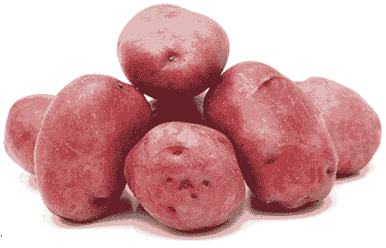

　　你是否曾经（可能是小时候）因为某人的错误观念而陷入麻烦，以致别人批评你犯了错？那你应该能了解马铃薯的困境。马铃薯一直以来都背负恶名。身为食物战争的受害者，被误解为“使人生病”的食物，马铃薯总是因为它从未引起的疾病而挨骂。马铃薯背负导致肥胖、糖尿病、癌症、念珠菌过度增生与其他许多疾病的莫须有罪名，但事实上，这神奇的块茎能逆转这些疾病。没错！马铃薯对糖尿病患者其实相当有益，因为它有助于稳定血糖。

　　常见的错误观念认为马铃薯有毒，因为它是茄科植物。马铃薯、番茄、茄子与其他可食用茄科植物并不会使关节炎之类的疾病恶化，你可以将“马铃薯会导致发炎”的疑虑放在一旁（更多相关信息请参阅第三部［有害健康的饮食风尚与潮流］那一章）。事实上，用来油炸马铃薯的有毒油类、马铃薯上的乾酪酱，以及马铃薯泥中的奶油、牛奶与鲜奶油，让全世界认为马铃薯对人有害。油炸过程与乳制品中的高脂∕高糖，才是导致胰岛素抗性与促使糖化血色素浓度到达糖尿病范围的幕后黑手。这种脂肪与乳糖的组合还会喂养各种癌症。马铃薯不会引起健康问题，它是被其他食材拖下水的。

　　此外，也请小心别将马铃薯与大家对谷物及加工食品的恐惧混为一谈。如果你正在避开“白色”食物，例如白米、白面粉、白糖与乳制品（牛奶、奶酪、优格与鲜奶油等），别戒掉马铃薯！毕竟，完整、天然状态的马铃薯并不是白色的，而是覆盖着富含营养的红色、褐色、金色、蓝色或紫色外皮。马铃薯的这种外皮是极佳的养分来源，是氨基酸、蛋白质与植物性化合物的奇迹。只有切开马铃薯才会看见白色的内部，但这不代表里头没有营养价值，毕竟就算我们将苹果、洋葱或小萝卜切开后发现里头缺乏颜色，也不会认为它们是白色食物所以没有用处。人工栽种的蓝莓里头也没有颜色（野生蓝莓则是里外都有颜色），但这也没有让它出现在白色食物名单中。大家反而会想像这些食物的完整形态──我们就是需要以这种方式看待马铃薯。

　　整颗马铃薯里里外外都有价值，且对健康有益，因为马铃薯植株从大地汲取了某些最高浓度的巨量与微量矿物质。马铃薯的钾含量很高，也富含维生素 B6，同时是绝佳的氨基酸来源，特别是以生物活性形态呈现的离胺酸。离胺酸是强大的武器，可以对抗癌症、肝脏疾病、发炎，以及引起类风湿性关节炎、膝盖疼痛、自体免疫疾病等问题的病毒，例如 EB 病毒。

　　若想对抗各种慢性病，例如抵抗肝脏疾病、强化肾脏、镇定神经与消化道，以及逆转克隆氏症、结肠炎、大肠激躁症或消化性溃疡，马铃薯就是你的战友。除了抗病毒，它也可以抗菌与抗真菌，并含有营养的辅因子与辅酶，加上生物活性化合物，可以使你保持健康，并协助你面对压力。此外，马铃薯也是有益大脑的食物，能让你接地、专注。

　　你小时候是否做过科学实验，在马铃薯上插几根牙签，让它在一杯水上保持平衡，并看着它在窗台上发芽？有多少其他食物能在你面前如此转变、茁壮？这就是马铃薯不可低估的力量，我们小时候亲眼见证过。但长大后，我们怎么会忘记以前见证的奇迹，反而认为马铃薯是软弱、贫乏又可笑的食物呢？我们真正应该对它说的是：“没有你该怎么办？”马铃薯对我们的生存至关重要。

　　你这些年来也许避开了有关马铃薯的错误信息，如果是这样，身体会感谢你，而且你现在有了更多欣赏马铃薯的理由。另一方面，假如你曾经被误导而相信马铃薯不过是淀粉，会让你的腰围增加，是时候以全新的眼光看待这种根茎类蔬菜了。如果你够大胆，可以克服流行食物文化的制约，去欣赏马铃薯最纯粹的形态，你将送给自己一份最棒的礼物。

 有助于疗愈这些疾病

　　假如你有下列任一疾病，试着将马铃薯纳入日常饮食中：

　　心脏疾病、结肠癌、乳癌、胰脏癌、摄护腺癌、肝脏疾病、肝癌、肾脏疾病、肾脏癌、低血糖症、糖尿病、肥胖症、关节炎（包括类风湿性关节炎）、消化性溃疡、痔疮、大肠激躁症、克隆氏病、麸质过敏症、结肠炎、小肠细菌过度增生、其他所有肠道疾病、失眠、忧郁症、葛瑞夫兹氏病、桥本氏甲状腺炎、生育能力低落、疱疹、子宫内膜异位症、难解的不孕症、带状疱疹、焦虑症、爱迪生氏症、所有自体免疫疾病与失调、慢性阻塞性肺病、耳朵感染、眼睛感染、子宫发炎、卵巢发炎、输卵管发炎。

 有助于疗愈这些症状

　　假如你有下列任一症状，试着将马铃薯纳入日常饮食中：

　　发炎、真菌、疲劳、脑雾、难以入眠、头晕、耳鸣或耳中嗡嗡作响、糖尿病神经病变、刺痛与麻木、萎靡、倦怠、听力丧失、甲状腺机能不足、口疮、不宁腿症候群、食物过敏、焦虑、皮肤变色、五十肩、念珠菌过度增生、贝尔氏麻痹、甲状腺机能亢进、丧失性欲、痉挛、抽搐、唇疱疹、中枢神经系统敏感、胆囊发炎、胃部发炎、小肠发炎、结肠发炎。

 情绪上的支持

　　觉得心神模煳、茫然、迷惘、不安或漫无目标时，马铃薯提供我们基础与力量。如果被自尊心吞噬，马铃薯能挖掘内在谦逊的自信心，凌驾于让你在人生真正重要的领域无法成功的有毒情绪。马铃薯重新引导我们，帮助我们因为自己的经验而感到愉悦与满足，并引领我们不依赖自尊心做选择，而是基于真正的踏实与稳定。

 灵性启发

　　你是否曾经觉得自己有许多东西可以付出，周遭的人却一直没有看见你？马铃薯正是最受迫害的食物──有满满的潜能，却总是被忽略、被践踏（有时是真的践踏）。马铃薯提醒我们想起自己蕴藏的天赋，想起自己人生的目的，以及被每天的生活埋没、阻碍、扼杀的才能。

　　马铃薯谦逊的力量一部分来自它的生长方式：一整群长在一起、被其他马铃薯围绕，就像个人丁兴旺的大家庭。假如你来自小家庭，或者经历艰辛的养育过程，马铃薯会在能量层面传递在广大的家庭支持网长大而产生的踏实与归属感。如果你来自大家庭，马铃薯将帮助你延续人际链接。马铃薯成群茁壮是有原因的：这样它们就可以像一支由爱你的人组成的军队，为你作战。

　　当你觉得自己活在一个专制的信念体系中，老是有人命令你该做什么、该成为什么样的人，请链接马铃薯的智慧与踏实。提醒自己，真正的你有许多部分藏在表面之下，你是被支持、被看见的，而且你应该挖掘自己真正的本质，与全世界共享。

　　．尽可能挑选有机马铃薯。

　　．想要获取马铃薯最大的疗愈效果并保留完整养分，最好的料理方式是清蒸。假如你通常都将马铃薯与奶油、奶酪、酸奶油之类的东西搭配食用，试试以酪梨取代乳制品，无论切丁或抹在上头都很棒。莎莎酱与芝麻酱也很适合搭配马铃薯。

　　．蒸熟一批马铃薯后，留一些起来放入冰箱里。之后拿出来切片或切丁，再加入菠菜或羽衣甘蓝沙拉里。来自马铃薯的酶会增强叶菜类所含的生物碱，让这道料理的药力发挥至最大。

　　．如果有唇疱疹，试着放一片生马铃薯在患部上，会有舒缓效果。

　　．马铃薯能吸收并帮助减少无线网络讯号、手机讯号与辐射，以及其他电磁场的负面影响，它甚至能吸收并中和我们整天所接触并带回家的负面情绪能量。若想取用马铃薯的这种特性，可以将一颗马铃薯放进碗中，摆在厨房料理台或家里其他地方，每过五到七天就丢掉（别拿来吃），再换一颗新的。

　　．想要大肆庆祝时，就让马铃薯成为餐点的一部分。无论是结婚、订婚、生日、毕业、升职、假日或其他节日，在餐点中加入马铃薯能支持并增强愉悦的情绪，并让这股喜悦延续到往后数日。

辣酱烤马铃薯佐腰果“酸奶油”

────── ◆ ──────

分量：6～8 人份

　　这道辣酱料理虽然需要一些刀工和时间，但成品绝对可以填饱大家的肚子。

马铃薯 6 颗

黑豆或腰豆 450 克，浸泡过夜

椰子油 1 汤匙

洋葱丁 4 杯

大蒜 4 瓣，切碎

红萝卜丁 2 杯

西洋芹丁 2 杯

蘑菇丁 2 杯

红甜椒丁 2 杯

小茴香、烤鸡调味料、蒜粉与辣椒粉各 2 茶匙

海盐 1 茶匙

干辣椒片（适量）

番茄煳 2 汤匙

番茄丁 2 杯

酪梨 1 颗，切丁

墨西哥辣椒 1 根，切碎

切碎的芫荽叶 1/4 杯

腰果“酸奶油”：

生腰果 1 杯

柠檬 1/2 颗，挤成汁

1/2 颗椰枣，去皮去核

大蒜 1 瓣

水 1/2 杯

　　烤箱预热至摄氏 220 度。以叉子将马铃薯戳洞，烤约 45 至 60 分钟，直到熟软。将豆子沥干，倒进 4 公升容量的锅中，并以 2.5 公分高的水盖过。煮至大磙，再转小火煨煮。煮 1 小时，或煮到熟软。煮好的豆子沥干备用。

　　辣酱部分，在大锅中加热 1 汤匙椰子油，然后加入洋葱与大蒜。以大火煎炒至洋葱变得透明并散发香味（必要时加水以免黏锅）。加入红萝卜、西洋芹、蘑菇、甜椒、香料、海盐与干辣椒片（如果要用的话），继续烹煮，并不时搅拌，直到蔬菜开始变软（约 15 分钟）。接着加入豆子、番茄煳与番茄丁，搅拌到充分混合后加盖，继续以中火煨煮 15 分钟，然后转小火。

　　“酸奶”部分，将所需食材一起搅打至滑顺。搅打时要慢慢加入 1/2 杯水（足以顺畅搅打即可）。

　　将烤好的马铃薯对半切开，然后放上辣酱、腰果“酸奶”、酪梨、墨西哥辣椒与芫荽叶即可。

小萝卜

　　　　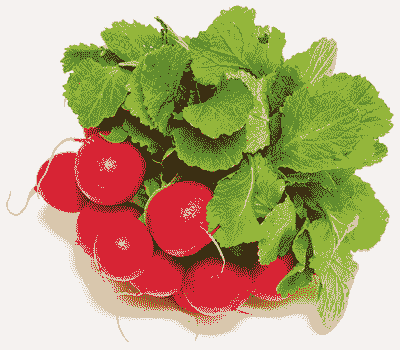

　　小萝卜是优秀的十字花科蔬菜，值得自成一章。

　　首先来聊聊小萝卜植株的根部，也就是我们所说的小萝卜本身。整体而言，小萝卜是免疫系统的补充剂，吃下肚时，它里面的硫能驱除各种病原体，并发挥驱虫药的效果，杀死肠道中的蠕虫与其他寄生虫。小萝卜的有机硫化物也让动脉与静脉保持洁净，并在血管中形成保护层，使血小板无法附着于血管黏膜。小萝卜对心脏有益，借由增加好胆固醇、降低坏胆固醇，帮助预防心脏疾病与其他心血管问题。此外，小萝卜的皮几乎能击退各种癌症，使其成为帮助预防癌症不可或缺的食物。而且别忘了，小萝卜对肾脏、肝脏、胰脏与脾脏都有极佳的修复效果。

　　接着是小萝卜叶。这是极具疗愈效果的食物，却总是被丢弃。小萝卜叶是第二厉害的益生原（仅次于蓝莓）。这些叶子含有满满的养分，例如维生素、矿物质、抗氧化物、植物性化合物，以及抗癌的生物碱，还具备抗菌与抗病毒特质。它们能修复失去养分吸收能力的结肠与肠道中的其他部分。小萝卜叶的养分能被吸收到机能最低落的消化道中，而且吸收率比其他任何食物更好，这都多亏了它们富含酶──小萝卜叶含有许多科学研究尚未有记录的酶，而这些酶有助于养分的摄取。

　　从它们能提供的益处来看，小萝卜叶其实算野生食物，即使是种在你的菜园或农夫的田地里也不例外。小萝卜叶能帮助排出体内的四大病根，清除重金属的效果尤其卓越，能移除身体中的汞、铅、砷与铝，它们在这方面的能力可说与芫荽叶并驾齐驱。小萝卜叶有助于击退各种神经系统疾病，包括多发性硬化症、肌肉萎缩性嵴髓侧索硬化症与神经系统莱姆病，是目前为止对人类健康最有益的叶菜类。

 有助于疗愈这些疾病

　　假如你有下列任一疾病，试着将小萝卜纳入日常饮食中：

　　脑瘤、脑癌、胃食道逆流疾病、关节炎、乳癌、气喘、支气管炎、肺炎、纤维肌痛症、癫痫、单纯疱疹病毒第一型、单纯疱疹病毒第二型、高血压、肾脏疾病、帕金森氏症、严重急性呼吸道症候群、皮肤癌、甲状腺疾病、甲状腺癌、肠道蠕虫与其他寄生虫、营养吸收问题、多发性硬化症、肌肉萎缩性嵴髓侧索硬化症、莱姆病、失眠、骨盆腔发炎性疾病、类风湿性关节炎。

 有助于疗愈这些症状

　　假如你有下列任一症状，试着将小萝卜纳入日常饮食中：

　　疲劳、头晕、脑雾、体内或身体上有灼热感、移动性疼痛、关节疼痛、睡眠障碍、营养缺乏、胃灼热、高血压、食物敏感、发炎、体内嗡鸣或震动感、耳鸣或耳中嗡嗡作响、神经质、皮疹、平衡问题、胸闷、充血、咳嗽、黑眼圈、呼吸困难、耳朵疼痛、五十肩、牙龈疼痛、听力丧失、皮质醇过高、活力衰退、忧郁、颈部疼痛。

 情绪上的支持

　　如果你的感受的关键字是“失败”，无论你是觉得自己是个失败者，或者觉得其他人令你失望，抑或你的身体生病了，让你失望，小萝卜都是能让你脱离消沉的奇迹食物。

 灵性启发

　　如果是自己种植小萝卜，要在叶子与小萝卜本身还年轻且软嫩时采收，这时它们处于颠峰状态，可以提供最好的营养。在小萝卜的皮变硬、小萝卜本身纤维化，以及叶子过老之前采收，这代表你必须与这个植物调谐，准备好在直觉叫你行动时挖出。然而，不一定要一口气完成，你可以试着每周播下新的种子，这样就能一直有机会弄清楚最佳采收时机。

　　小萝卜透过这种方式教导我们，对于重要的对话与决定，选择对的时机很重要。你可不想一拖再拖，最后才发现可以获得某件事情最佳效益的机会已经熘走了。此外，小萝卜也教导我们要坚持不懈。只要不断播下新的种子，就会一直有另一个机会可以把握当下。

　　．在农夫市集寻找黑色的小萝卜（或者买种子自己种），这是最强大的小萝卜品种，能将前面提到的小萝卜与小萝卜叶营养价值提升到另一个层次。

　　．如果是自己栽种，试着在小萝卜尚未完全长大时采收，它此时最能迅速提升你的健康。试着一天食用至少三颗小萝卜。

　　．小萝卜、西洋芹与洋葱组合成神奇的疗愈高汤（对肺炎或支气管炎患者尤佳）。

　　．小萝卜叶可以拿来生食或熟食，就像任何叶菜类一样料理

小萝卜沙拉

────── ◆ ──────

分量：2 人份

　　风味朴实的小萝卜搭配清淡的小黄瓜，与香草、橄榄油及柠檬汁拌在一起，最后撒上少许海盐，就成了适合早午餐或午餐聚会的美味料理。

切片小萝卜 2 杯

切片小黄瓜 2 杯

切碎的龙蒿 2 汤匙

切碎的莳萝 4 汤匙

橄榄油 2 汤匙

柠檬 1/4 颗，挤成汁

海盐 1/8 分茶匙

　　将小萝卜片与小黄瓜片置于适当大小的碗中，与其余食材一同拌匀。把这份沙拉放在冰箱里冷藏 15 分钟后即可享用。

芽菜与菜苗

　　　　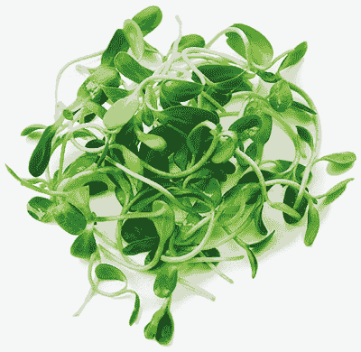

　　就像它们长大后会变成的蔬菜一样，芽菜与菜苗富含营养，例如维生素 A、维生素 B 群、矿物质、微量矿物质、能逆转疾病的化合物，以及其他植物性化合物。吃下处于生命早期的蔬菜，就像将原本吸收这些蔬菜养分所需的消化过程缩短成一瞬间。芽菜与菜苗扮演的重要角色，是让永远为了别人而使自己筋疲力尽的人重十生命力。当你将心与灵魂投入你做的每一件事情中，无论是家务或工作，芽菜都有独特的能力支持你。

　　芽菜与菜苗能更新耗竭的生殖系统，并让因为照顾婴儿而无法获得充足睡眠的新手妈妈恢复活力。它们含有植物性雌激素，并对重新平衡与补充黄体素、雌激素与睾固酮等荷尔蒙至关重要，还能使女性生育后的肾上腺、甲状腺与其余内分泌系统恢复分泌荷尔蒙。

　　芽菜与菜苗富含与神经传导物质化学生成作用相关的矿物盐，也能以氨基酸与酶支持大脑，将有毒重金属拖离大脑，并有助于神经元变年轻与强化，进一步帮助身体逆转阿兹海默症、失智症、脑雾与记忆力衰退。芽菜与菜苗对修复皮肤效果极佳，且富含超过六十种微量矿物质，包括铁、碘、硒、锌、铜、锰、硫、镁、铬与钼。身为抗增殖剂，芽菜与菜苗能排除感染并抑制有害细胞（如癌细胞）成长。此外，它们是对体内微生素 B12 生成相当关键的崇高微生物最佳来源，而且在此生长早期，芽菜与菜苗有数千种植物性化合物，能大幅增加身体动力。

　　挑选芽菜就像选择朋友，它们各有不同的性格。你是否有个朋友明明是好人，却有点刻薄，只能君子之交淡如水？青花菜芽就是如此。一小口就有强烈风味的青花菜芽因为可提高胃酸浓度，对提升消化作用很有效。

　　你是否有时犹豫着该不该什么事都告诉某个朋友，因为你知道他性格暴躁，可能会在你把话说完前就忙着替你辩解？这就是在说萝卜婴，它净化肝脏（在许多人体内都很暴躁的器官）的功能相当卓越。

　　有没有哪个朋友非常温和又悠哉，会听你说任何事，并说些安慰的话？红花苜蓿芽就是这种角色，它具有镇静效果，能温和清洁淋巴与血液、排除毒素并净化身体。

　　然后，有个朋友非常情绪化，开心或不开心都爱哭。葫芦巴芽菜能够滋养心与灵魂，是支持情绪与内分泌系统的完美选择，这两者都与心、灵魂及大脑环环相扣。葫芦巴芽菜特别有助于平衡肾上腺的皮质醇分泌与调节甲状腺的荷尔蒙分泌。

　　也不能忘了浑身肌肉的朋友，你会打电话请他开小货车来帮你搬家。扁豆芽就是这种朋友，总是活力满满，富含身体容易吸收且有强化作用的蛋白质，还提供碳水化合物基础，帮助你撑过任何必须完成的事。扁豆芽乐意将它狂野的力量传送给你，食用扁豆芽就像享用一顿大餐一样可以强化身体，但用餐过后还有充足的活力，而不是在沙发上昏昏欲睡。

　　其他还有绿豆芽、向日葵苗、豌豆苗和羽衣甘蓝菜苗。就像在生命中支持你的众人一样，不同种类的芽菜与菜苗各有特殊本领，等你认识它们之后就会了解。

 有助于疗愈这些疾病

　　假如你有下列任一疾病，试着将芽菜与菜苗纳入日常饮食中：

　　人类乳突病毒、类纤维瘤、各种癌症、多囊性卵巢症候群、生育能力低落、忧郁症（包括产后忧郁症）、黄疸、焦虑症、贫血、不孕症、流产、阿兹海默症、失智症、EB 病毒∕单核球增多症、桥本氏甲状腺炎、糖尿病、低血糖症、肾上腺疲劳、葛瑞夫兹氏病、湿疹、牛皮癣、食物过敏、注意力不足过动症、自闭症、营养吸收问题、失眠、单纯疱疹病毒第一型、单纯疱疹病毒第二型、人类疱疹病毒第六型、人类疱疹病毒第七型、甲状腺疾病、麸质过敏症、莱姆病、链球菌性喉炎。

 有助于疗愈这些症状

　　假如你有下列任一症状，试着将芽菜与菜苗纳入日常饮食中：

　　抹片检查结果异常、疲劳、活力低落、体重增加、龋齿、珐琅质流失、牙龈萎缩、热潮红、夜间盗汗、视力混浊、瘀血、骨盆疼痛、铁质缺乏、记忆力衰退、脑雾、睡眠障碍、胃酸逆流、各种神经系统症状（包括刺痛、麻木、痉挛、抽搐、神经疼痛与胸闷）、血糖失衡、打嗝、骨质流失、指甲脆弱、口欲、体液滞留、胃炎、腿部痉挛、倦怠、肝功能停滞、粪便中带黏液、肌肉痉挛、渴望吃甜食、喉咙痛、甲状腺机能亢进、甲状腺机能不足。

 情绪上的支持

　　觉得失落时，无论是因为工作、友情或失去某样东西而悲伤，芽菜与菜苗都特别有帮助。这些小小的希望信使能帮助你脱离悲伤的心理状态，并为新生命、新机会播下种子。

 灵性启发

　　芽菜与菜苗极具适应原特质，并不要求完美的环境，即使在料理台上的小园地，只要有生存所需的足够光线与水分，它们还是能在罐子里或盘子上彼此依偎着成长。你只须做一些例行公事（规律地替芽菜浇水、替菜苗喷雾），这些幼苗就能适应环境，而且还适应得很开心──假如芽菜与菜苗有表情，你会看见每张脸上都挂着笑容。

　　吃下芽菜与菜苗，这种让人愉悦的适应力就转移到我们身上。只要拥有绝对必要的条件，并给自己一些使生活正常化的例行公事，即使是在最艰难的处境中，我们仍然能从这些小小朋友身上获得力量，并找到茁壮的方法。

　　．想获得显著效益，每天食用两杯芽菜。

　　．自己种植芽菜时，将它们当作小宠物：它们会接收环境中的能量与周遭的话语。时时带着愉快的心情接近芽菜，对它们说话、鼓励它们，并在经过时用手指抚过它们的顶端。我在第一部提过，自己栽种食物，意味着食物会接收你的个人需求，并将其养分调整到最能滋养你的程度。芽菜与菜苗特别善于符合你的特定健康需求，因为它们极具适应原特质。

　　．如果想将效益提升到最大，尽量避免烹煮芽菜。芽菜与菜苗是崇高微生物的绝佳来源，这些微生物对肠道健康与维生素 B12 生成相当关键，而崇高微生物只有在芽菜与菜苗用来生食时才能保持完整（而且当这些崇高微生物是在你亲自种植的芽菜与菜苗表面时，它们已经准备好造福你体内的菌丛了）。

　　．将液体海洋矿物质与水混合后，每天洒在你种植的芽菜与菜苗上，能在它们的成长过程中使其含有矿物质，大幅提升它们对你健康的好处。

　　．萝卜婴、青花菜芽、葫芦巴芽菜、羽衣甘蓝菜苗与向日葵苗应该在午餐时享用，因为它们能让你整天拥有旺盛活力。豆芽与扁豆芽则应该在晚餐吃，因为它们有助于在夜间镇静并放松神经系统。

　　．以小黄瓜、豌豆苗与向日葵苗打成的蔬菜汁，能逐渐增强夜间视力。

芽菜芥蓝菜卷佐芒果番茄蘸酱

────── ◆ ──────

分量：1～2 人份

　　新鲜又色彩丰富的芥蓝菜卷，是让你的一天充满蔬菜的好方法。摆出一大盘切好的蔬菜让大家自行搭配组合，为午餐时间增添趣味。此外，你还能利用本书中的其他食谱，调制各种美味蘸酱──试试芫荽青酱（第 238 页）、大蒜芝麻沙拉酱（第 242 页）或海苔卷搭配的酪梨蘸酱（第 280 页）。

芥蓝菜叶 6 大片

任何颜色的甜椒 1 颗

酪梨 1 颗

红高丽菜 1/4 颗

椰枣 2 颗，去核

芽菜 2 杯

菜苗 2 杯

芒果丁 1 杯

番茄丁 1 杯

硬币大小的姜 1 片

墨西哥辣椒 0.5 公分（依喜好选用）

　　冲洗芥蓝菜叶，然后切除叶梗（可留下叶梗稍后用于汤品或果昔中）。把甜椒、酪梨与高丽菜切成细条状，并将椰枣切碎磨成泥。让芥蓝菜叶的叶梗那一侧对着你，由菜叶右方开始放上切成条的蔬菜、芽菜与菜苗，然后如卷饼般将菜叶向左卷，并在卷的过程中把菜叶顶端往内折。将椰枣泥抹在菜叶的左边，使菜卷得以黏合。重复同样的做法，把剩下的芥蓝菜叶、馅料和椰枣泥用完。

　　蘸酱方面，将芒果、番茄、姜与墨西哥辣椒（有使用的话）一同搅打至滑顺即可。

番薯

　　　　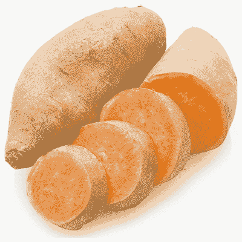

　　在马铃薯被污名化时，较为光鲜亮眼的番薯赢得不少其来有自的美名。然而就像本书中提到的任何改变生命的食物一样，番薯应得的美名不该只有如此──它与山药的益处远超过任何人所能理解。

　　首先，番薯能促进胃部、小肠与结肠中的益菌，同时饿死在这些部位扎根的害菌与真菌，例如霉菌。借由隔绝这些微生物，番薯对促进体内维生素 B12 生成的效果极佳。番薯还能预防“巨结肠症”这种病，也就是结肠因为困难梭菌、链球菌、葡萄球菌、大肠杆菌、幽门螺旋杆菌、披衣菌与∕或其他细菌增殖而肿大。此外，这种超级食物有助于减轻肠道因慢性发炎而狭窄的问题──这种慢性发炎时常被诊断为克隆氏症或结肠炎。

　　番薯的橙色薯肉富含维生素、矿物质与其他养分，更因β-胡萝卜素与茄红素等类胡萝卜素而受人赞扬。这些植物性化合物相当强大，假如你皮肤白皙，然后每天吃一颗番薯，不久后就能发现自己的皮肤闪耀光泽，就像被阳光亲吻过一样。而茄红素与番薯丰富的氨基酸结合，就是从体内排除辐射物的良方。此外，番薯中的抗癌植物性化合物能帮助对抗皮肤癌、乳癌、生殖器官癌症、胃癌、肠癌、食道癌与直肠癌。

　　番薯还含有植物性雌激素，能排除体内不能用的、有破坏性、可能干扰身体荷尔蒙机能、导致癌症的雌激素。这些雌激素来自塑胶、药物、食物、环境毒素，以及体内生产过量荷尔蒙（因为饮食中含有过多产生雌激素的食物）。这类雌激素多到超过身体的使用量，因而变得没有活性，并堆积在器官中，对内分泌系统产生负面影响。番薯借由排除过剩的雌激素，替比较健康的雌激素清出一席之地。此外，番薯对调节毛发生长也很重要，能在需要毛发的地方刺激其生长，并在毛发出现于错误部位（例如罹患多毛症）时抑制毛发生长。

　　若有失眠或睡眠障碍问题，番薯也能帮上忙，它提供了一种以关键形式呈现的葡萄糖，能刺激神经传导物质合成，例如甘胺酸、多巴胺、伽马──胺基丁酸与血清素，这些都有助于熟睡。无论你喜欢的是橙色、黄色、白色、粉红色或紫色番薯，吃就对了，每种番薯都具有赋予你力量的药性。

 有助于疗愈这些疾病

　　假如你有下列任一疾病，试着将番薯纳入日常饮食中：

　　巨结肠症、多毛症、结肠炎、克隆氏症、皮肤癌、乳癌、卵巢癌、子宫颈癌、胃癌、肠癌、食道癌、结肠直肠癌、睡眠障碍、慢性疲劳症候群、心脏疾病、肾脏疾病、注意力不足过动症、失眠、秃头、晒伤、亚斯伯格症候群、忧郁症、大肠激躁症、牛皮癣性关节炎、癫痫、裂孔疝气、肾上腺疲劳、神经病变、创伤后压力症候群、焦虑症、湿疹、牛皮癣、带状疱疹、泌尿道感染、披衣菌、多囊性卵巢症候群、子宫内膜异位症、硬皮症、硬化性苔癣、麸质过敏症、社交焦虑症。

 有助于疗愈这些症状

　　假如你有下列任一症状，试着将番薯纳入日常饮食中：

　　头皮屑、颞颚关节问题、腹泻、焦虑、肠道不适、结肠发炎、结肠痉挛、胃灼热、疤痕组织、肌肉痉挛、肌肉抽搐、食物敏感、心悸、热潮红、腹部痉挛、加速老化、脑损伤、人格解体、消化不良、抹片检查结果异常、眼睛干涩、肿胀、老人斑、体重增加、鳞状皮肤、肠道息肉。

 情绪上的支持

　　需要呵护时，没有什么比烤番薯更能抚慰心灵了。不像那些油腻、油炸或充满糖分且经过加工，让你感觉腹胀、想睡又更加忧郁的“抚慰”食物，番薯具有使你觉得周遭世界暂时停止运转的特质。这是让你感到安全、感觉被抚慰的重要功能，即使没有人拥你入怀，仍然能让你觉得被拥抱，让你得以汲取力量来度过难关。

 灵性启发

　　你是否烤过番薯，看着天然糖分冒着泡泡滴下来？番薯本身拥有你想得到的一切，但对我们而言似乎还不够。热门的番薯料理总是需要奶油、鲜奶油、黑糖或棉花糖，即使番薯本来就比糖更甜蜜又如此完美，我们还是加了一大堆有的没的，不仅模煳了它的天然特质，也过度放纵自己。

　　你对生命中的哪些部分过度锦上添花呢？番薯教我们去思考，为什么有时获得的礼物明明纯粹又完整，我们却觉得不够？这都是出于恐惧或不懂得欣赏的缘故。

　　．为了获取番薯最大的效益，试着每天吃一颗。

　　．若想为番薯搭配口感像乳脂的配角，舀一点新鲜酪梨当作奶油涂在番薯上。

　　．一次烹调好一批番薯（蒸或烤是最健康的料理方法），然后留下一些等待稍后放入冰箱冷藏。切一点冰过的番薯加在沙拉里，能帮助身体吸收并利用更多来自叶菜类的养分。而夜里难以入眠时，吃几口番薯可以帮助你好好休息。

　　．用一片生番薯擦拭疤痕，其中的药性能刺激疗愈作用并增强皮肤，帮助减少疤痕组织。

　　．人们常用小黄瓜片消除眼袋，可以换个方法，改用煮过放凉的番薯片试试。这样做能将β-胡萝卜素注入眼睛下方的组织，使你的容貌重十青春活力。

　　．晒伤时，可以试着食用番薯加速复元。

　　．如果以前接受的手术让你留下许多内部疤痕组织，试试在一星期内每天食用两颗番薯，然后在接下来的三个星期每天吃一颗，并且每个月如此重复，直到状况改善为止。

　　．准备看恐怖或动作电影时，先吃一颗番薯，这样做可以让你在体验到银幕上的兴奋、恐惧与冒险时，为你的肾上腺提供支持。

番薯镶高丽菜

────── ◆ ──────

分量：2～4 人份

　　这道料理适合每周一次的晚餐聚会，可以将食材预先准备好，上桌前组合即可。事先将番薯烤好、高丽菜煮好，最多可冷藏保存四天，而且只需几分钟就能完成快速又简单的晚餐。为了呈现最好的成果，上桌前再调制酱汁，并趁热淋上。

番薯 4 颗

大蒜 4 瓣，切碎

洋葱 1 颗，切丁

椰子油 1 汤匙

红高丽菜 1 颗，切丝

海盐 1/2 茶匙

柠檬 1/2 颗

酱汁材料：

橄榄油 1 汤匙

生蜂蜜 1 汤匙

柠檬汁 1 汤匙

新鲜姜末 1 汤匙

装饰材料：

切碎的荷兰芹 4 汤匙

　　烤箱预热至摄氏 205 度。将番薯置于烤纸上放进烤箱烤约 45 到 60 分钟，或烤到能以叉子轻松穿透。

　　在大平底锅中以中火煎炒大蒜、洋葱与椰子油 5 至 10 分钟，不时搅拌，炒到洋葱透明熟软。加入高丽菜、海盐与半杯水，加盖以中火炖煮 30 至 40 分钟，直到高丽菜变软（须不时搅拌，必要时加入少许水，以保持湿润）。

　　把番薯切开，并以叉子将切面稍微压碎，然后把炖煮高丽菜尽量镶进开口中。

　　番薯上桌前再调制酱汁（若要做四人份，酱汁材料的分量须加倍）。将所有材料倒进小平底锅，以中火加热至稍微冒泡。继续搅拌 1 至 2 分钟，直到酱汁充分混合且稍微变稠。把酱汁淋在番薯上，撒上荷兰芹，然后大快朵颐吧！

芳香药草

（奥勒冈、迷迭香、鼠尾草与百里香）

　　　　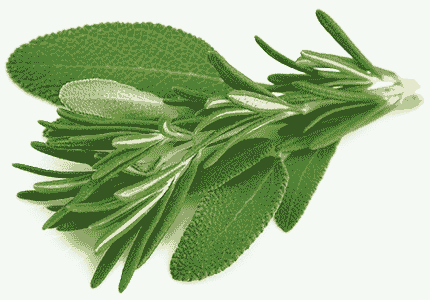

　　奥勒冈、迷迭香、鼠尾草与百里香等芳香药草具有彼此互补的特性，各有不同用途，时常摄取这些药草（无论加入饮食、摄取营养补充品或两者结合），它们的抗病植物性化合物及丰富的多种矿物质，能提供周全又强大的防御力，抵挡充满病原体的世界（荷兰芹也属芳香药草，但较为独特，所以另辟篇幅介绍）。

　　芳香药草不怎么需要悉心照料就能自己茁壮，就算被忽略，仍然能够奇妙地获取所需元素，以提供你需要的丰富养分。芳香药草从它们受蚯蚓喜爱的根部释放一种抗真菌化合物，科学界目前对此尚未有所了解。芳香药草的根部成为蚯蚓的聚集场所，蚯蚓会摄取这种抗真菌物质保持自身健康，并回过头来让根部周围的土壤接触空气，且留下营养价值丰富的肥料作回报。这种共生方式让芳香药草拥有独特的疗愈性质（假如是在花盆里栽种这些药草，或是你的菜园里没有蚯蚓，记得使用矿物质溶液与足够的有机肥料）。

　　接下来分别介绍这几种芳香药草：

　　．奥勒冈：杀死幽门螺旋杆菌、链球菌与大肠杆菌的效果卓越，可将小肠细菌过度增生、消化性溃疡、链球菌性喉炎、耳朵感染与鼻窦炎的风险降到最低。奥勒冈是绝佳的抗菌剂，尤其能杀死造成憩室炎与憩室病的大肠杆菌，对抗轮癣也相当有效。

　　．迷迭香：另一种抗菌剂，尤其能对抗具有抗生素抗药性的细菌，例如在医院感染的细菌。如果正在对抗会引起巨结肠症、严重感染等症状，甚至导致死亡的细菌（如困难梭菌与多重抗药性金黄色葡萄球菌），将这种药草纳入饮食中可以扭转局面。

　　．鼠尾草：这种药草专为对抗真菌而生。食用鼠尾草是由内而外疗愈香港脚或股癣等真菌感染，以及对付肠道中的变种真菌的良方。如果接触过有毒霉菌，就让鼠尾草帮你解毒吧。此外，它能帮助排除肠道中的有毒重金属。

　　．百里香：这种药草的主要工作是摧毁病毒，例如流感病毒、肠病毒、诺罗病毒与引起自体免疫疾病及莱姆病的各种疱疹病毒。百里香穿越血脑障壁的能力使其成为秘密武器，能用来对抗开始入侵大脑或嵴髓并导致神经系统疾病的病毒。

 有助于疗愈这些疾病

　　假如你有下列任一疾病，试着将芳香药草纳入日常饮食中：

　　幽门螺旋杆菌感染、链球菌感染、大肠杆菌感染、小肠细菌过度增生、消化性溃疡、链球菌性喉炎、耳朵感染、鼻窦炎、憩室炎、憩室病、轮癣、巨结肠症、困难梭菌感染、多重抗药性金黄色葡萄球菌、流行性感冒、肠病毒、诺罗病毒、EB 病毒∕单核球增多症、巨细胞病毒、莱姆病、各种莱姆病辅因子（包括博氏疏螺旋体、巴东氏菌属、焦虫与霉浆菌）、呼吸道感染、牙龈感染、耳鸣、眩晕症、霍乱、坐骨神经痛、纤维肌痛症、慢性疲劳症候群、狼疮、牛皮癣性关节炎、多发性硬化症、带状疱疹、类风湿性关节炎、水肿、偏头痛、单纯疱疹病毒第一型、单纯疱疹病毒第二型、人类疱疹病毒第六型、人类疱疹病毒第七型、人类疱疹病毒第八型、人类疱疹病毒第九型、尚未被发现的人类疱疹病毒第十到十二型、骨盆腔发炎性疾病、B 细胞疾病、细菌感染、眼睛感染、氨渗透。

 有助于疗愈这些症状

　　假如你有下列任一症状，试着将芳香药草纳入日常饮食中：

　　胃痛、食物过敏、腹部疼痛、头晕、疲劳、分泌物（例如来自阴道或眼睛）、胃肠气积、恶心、咳嗽、焦虑、搔痒、水泡、皮疹、头痛、肛门搔痒、接触霉菌、各种神经系统症状（包括刺痛、麻木、痉挛、抽搐、神经疼痛与胸闷）、阑尾发炎、膀胱疼痛、平衡问题、耳朵堵塞、充血、耳朵疼痛、黏液过多、发烧、颚部疼痛、神经痛。

 情绪上的支持

　　在这个充满压力的时代，情绪反应变强是可以理解的。但是当高涨的情绪反应成为惯性，而你无法跳脱过度反应的循环时，请寻求奥勒冈、迷迭香、鼠尾草与百里香的协助。这些药草有助于打破一直觉得过度受刺激的循环，让你更平稳地面对发生的一切。

 灵性启发

　　这些芳香药草一直以这种或那种形态或品种存在我们身边，不断适应持续变化的世界，让我们也得以适应。奥勒冈、迷迭香、鼠尾草与百里香是这方面的好老师，提醒我们现在与未来可以成为的自己。你的生命中还有其他东西，无论是长期嗜好或长久的人际关系，总是能让你依靠，以切断使你分心的事物，让你与最本质的自己重新链接吗？

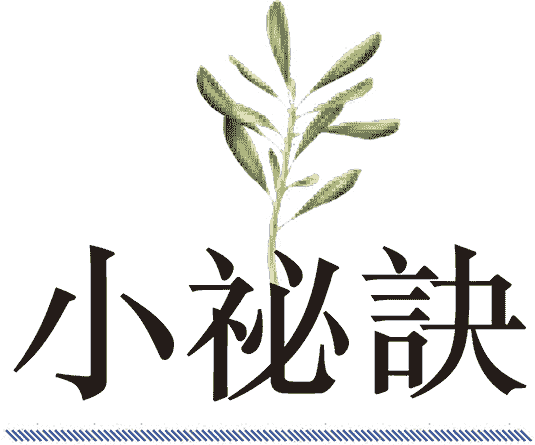

　　．提醒自己每天在料理中使用这些芳香药草来增添风味。

　　．试着在日常生活中使用这些药草的精油来净化身心灵。例如，将迷迭香精油加进泡澡的水里，以启动水的净化过程。

芳香药草裹根茎类“薯条”

────── ◆ ──────

分量：3～4 人份

　　这会是你吃过最棒的蔬菜“薯条”，秘诀在于水煮根茎类蔬菜，并在烘烤前用力摇晃。大方地把芳香药草与大蒜裹在外层，边缘会在烤箱中变得酥脆。如果赶时间，可以省略额外步骤，直接送入烤箱，但这额外的几分钟会带来惊人的成果就是了。

根茎类蔬菜（如马铃薯、番薯、红萝卜、西洋芹根）1400 克

椰子油 2 汤匙

海盐 1 茶匙

蒜末 2 汤匙

切碎的鼠尾草、奥勒冈、迷迭香与百里香各 1 汤匙

　　烤箱预热至摄氏 205 度。将根茎类蔬菜去皮后切成“薯条状”，然后放进大汤锅中，加水淹过蔬菜并煮磙。约煮 5 至 7 分钟，将蔬菜薯条煮熟但不至于软烂（仔细盯着别煮过头），然后将水沥干。加入椰子油、海盐、蒜末、芳香药草，与蔬菜薯条一同拌匀后，加盖并大力摇晃至蔬菜薯条和其他材料充分混合且边缘稍微被压碎。

　　烤盘铺上烤纸，然后将蔬菜薯条铺在烤盘上，别重叠。放进烤箱烤 20 至 25 分钟，烤到一半时记得翻面。当边缘变得金黄酥脆时即可取出享用。

猫爪藤

　　　　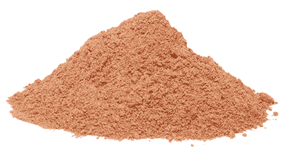

　　从神经系统到消化系统，猫爪藤几乎能帮助缓解任何症状。纵使猫爪藤因为其疗愈性质已经受到些许重视，科学界仍然不知道这种药草含有足以取代合成药物的生物活性药用化合物。抗生素太常被用来对抗某种疾病，例如莱姆病，假如猫爪藤取代了抗生素，世界会变得截然不同。无论被诊断患了哪种病，病程发展速度会变慢，复元速度会加快。当然，药用抗生素有其地位与用途，但猫爪藤是独一无二的，因为细菌等病原体不会变得对猫爪藤有抵抗性，但有时却对抗生素有抗药性。

　　猫爪藤对抗病毒的效果也很棒。医学研究终究会发现一群抗病毒适应原，而科学家会了解猫爪藤是其中的第一名。这种药草是对抗合并链球菌感染的儿童自体免疫神经精神异常、肌肉萎缩性嵴髓侧索硬化症、链球菌性喉炎、多发性硬化症、难解疼痛等病症的终极秘密武器。

　　猫爪藤对于让身体摆脱恶名昭彰的链球菌效果卓越。链球菌时常被误诊为酵母菌或念珠菌，数百万女性服用抗生素与抗真菌药物，最后却让问题变得更糟，因为造成泌尿道感染的链球菌对抗生素通常有抗药性。猫爪藤能确实减少链球菌，使其成为减轻泌尿道感染的终极药草，也是这个时代的基本工具。

　　但请注意，假如你怀孕了或尝试怀孕，必须将猫爪藤排除在疗程之外。

 有助于疗愈这些疾病

　　假如你有下列任一疾病，试着将猫爪藤纳入日常饮食中：

　　各种癌症、莱姆病、各种莱姆病辅因子（包括博氏疏螺旋体、巴东氏菌属、焦虫与霉浆菌）、小肠细菌过度增生、肌肉萎缩性嵴髓侧索硬化症、喉炎、合并链球菌感染的儿童自体免疫神经精神异常、链球菌性喉炎、多发性硬化症、运动失能症、类风湿性关节炎、泌尿道感染、肾脏感染、淋巴瘤（包括非何杰金氏淋巴瘤）、肺炎披衣菌、酵母菌感染、偏头痛、大肠激躁症、溃疡、EB 病毒∕单核球增多症、带状疱疹、人类疱疹病毒第六型、人类疱疹病毒第七型、人类疱疹病毒第八型、人类疱疹病毒第九型、尚未被发现的人类疱疹病毒第十到十二型、结节、单纯疱疹病毒第一型、单纯疱疹病毒第二型、青春痘、骨盆腔发炎性疾病、白斑症、睡眠障碍、短暂性脑缺血发作（小中风）、足底筋膜炎、牛皮癣性关节炎、莫顿氏神经瘤。

 有助于疗愈这些症状

　　假如你有下列任一症状，试着将猫爪藤纳入日常饮食中：

　　发炎、疼痛、耳鸣或耳中嗡嗡作响、念珠菌过度增生、颞颚关节问题、胃炎、刺痛与麻木、心悸、头痛、脑雾、寄生虫与细菌感染、抽筋、贝尔氏麻痹、五十肩、抽搐、痉挛、四肢无力、体内或身体上有灼热感、消化不良、手脚发麻刺痛、颤动、吞嚥困难、口齿不清、神经质、癫痫、皮疹、不宁腿症候群、头晕、平衡问题、移动性身体疼痛、肌肉痉挛、肌肉紧绷、肌肉无力、颈部疼痛、关节疼痛、颚部疼痛。

 情绪上的支持

　　若有人总是急于批判或推卸责任，第一步是让此人察觉自身行为，下一步就让猫爪藤上场。这种药草对减低急迫感相当有效，所以你不会对某个状况产生下意识反应，而是可以花点时间思考、处理，并冷静地解决眼前状况。

 灵性启发

　　人们不断找寻健康的圣杯，每当有新潮流崛起，我们总希望这就是可以改变生命的大发现，与此同时，猫爪藤这种神奇药草就端坐在健康食品店的架上，却被忽略了；或者，我们会将它放进药草箱里，却忘记使用。猫爪藤来自热带雨林，你以为它的“异国风情”会激起更大的兴趣。然而，猫爪藤现在近在咫尺、容易取得，所以我们认为它太平凡了，不像是这么好的东西。如果给猫爪藤一次机会，就会发现它确实是神奇的疗愈者。

　　猫爪藤教导我们重新评估被忽略的类似可取之材。你是否曾低估某个人、某项资源、某样物品或某个机会，事后才发现你放弃了生命中的大礼？现在还有什么是你能让它大展身手的事物？猫爪藤告诉我们，有时自己寻求的目标其实近在咫尺，我们只须认出那些每天来到眼前的奇迹，以好好把握。

　　．选购猫爪藤酊剂时，要确定不是以酒精为基底。酒精会抵销这种药草的好处。

　　．旅行时携带一瓶猫爪藤酊剂，路途上随时想到，就服用少许剂量的酊剂，可以保护你的免疫力，并抵御疟疾与细菌感染。

　　．在晚上服用猫爪藤茶或酊剂，此时最能有效发挥其疗愈特性。

猫爪藤茶

────── ◆ ──────

分量：4 杯

　　没有什么比看着月亮升起时喝杯猫爪藤茶更能启动身体的疗愈潜能，尤其是白天稍早做过瑜伽或皮拉提斯运动特别有用。

猫爪藤 2 茶匙

柠檬 1/2 颗，切片

生蜂蜜（依喜好选用）

　　将 4 杯水煮磙。准备一人份茶饮时，在每杯热水加入 1 茶匙猫爪藤，浸泡 5 分钟以上即可。可依喜好加入柠檬片与生蜂蜜。

　　＊若想饮用更浓、药性更强的茶，可在每杯热水中加入 2 茶匙（或最多 1 汤匙）的猫爪藤。

芫荽

　　　　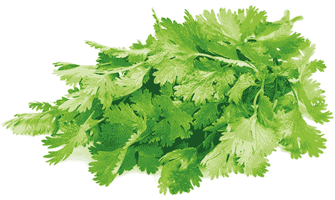

　　芫荽又叫香菜或中国荷兰芹，是去除重金属毒素不可或缺的药草。它替大脑排毒的魔法就藏在茎部与叶子的活水中。这种活水能穿透血脑障壁的关键在于其中由钠、钾与氯化物等矿物质组成的矿物盐，这些矿物盐与强大的植物性化合物结合在一起。当这些珍贵的矿物盐进入体内，会加入其他矿物盐流经血液、淋巴液与嵴髓液的信道中。矿物盐在路上遇到甘胺酸与麸酰胺酸时，会相互结合，形成最终的神经传导物质。大脑就像矿物盐磁铁，当它拉近这些来自芫荽的矿物盐化合物时，顺便接收了一大包伴手礼：能把有毒重金属排出大脑之外的植物性化合物，将神经元从有毒重金属氧化残留物中释放，使其发挥最佳效能。

　　许多人喜欢芫荽，有些人却很讨厌。时下普遍认为讨厌芫荽与基因有关──别陷入这种迷思中，如果进行充分研究，研究人员就会发现一个人讨不讨厌芫荽不是由基因决定。没有基因会告诉我们别吃某种食物。

　　那讨厌芫荽的原因到底是什么？当某人觉得这种药草的味道很突兀、刺激时，代表他体内的重金属氧化速度较快。这不表示此人有较高浓度的有毒重金属，而是他体内的重金属（通常是任何浓度组合的铝、镍与∕或铜）腐蚀得很快。腐蚀代表会有有毒迳流，并进入淋巴系统与唾液中。当芫荽接触嘴巴那一刻，其中的植物性化合物开始黏住它们遇到的任何氧化迳流──若此人的唾液中含有大量残余物质，吃芫荽时就会有刺激难受的感觉。换句话说，如果有人不喜欢芫荽，很可能代表他其实需要芫荽。

　　芫荽也能从其他身体系统与器官中拔出重金属与其他毒素，尤其是肝脏。事实上，芫荽本身就是绝佳的肝脏解毒剂，也非常有益于肾上腺，对平衡血糖浓度，以及解决体重增加、脑雾与记忆力问题也有很棒的效果。此外，它还可以抗病毒，有助于减少 EB 病毒、带状疱疹、人类疱疹病毒第六型、巨细胞病毒与其他以不同形态呈现的疱疹病毒数量，还有人类免疫缺乏病毒（爱滋病毒）。芫荽也能抗菌，有助于击退几乎各种形态的细菌，并将其废弃物排出体外。无论你是否喜欢芫荽的味道，寄生虫一定不喜欢，所以芫荽可说是强力驱虫剂。面对任何慢性病或难解疾病，芫荽都是必备良方。

 有助于疗愈这些疾病

　　假如你有下列任一疾病，试着将芫荽纳入日常饮食中：

　　阿兹海默症、失智症、忧郁症、焦虑症、强迫症、注意力不足过动症、自闭症、创伤后压力症候群、EB 病毒∕单核球增多症、带状疱疹、人类疱疹病毒第六型、巨细胞病毒、帕金森氏症、爱迪生氏症、库欣氏症候群、姿势性直立心搏过速症候群、雷诺氏症候群、慢性疲劳症候群、纤维肌痛症、多发性硬化症、偏头痛、眩晕症、梅尼尔氏症、甲状腺疾病、溃疡性结肠炎、肌肉萎缩性嵴髓侧索硬化症、湿疹、牛皮癣、泌尿道感染、失眠、各种自体免疫疾病与失调、类纤维瘤、受伤。

 有助于疗愈这些症状

　　假如你有下列任一症状，试着将芫荽纳入日常饮食中：

　　记忆力衰退、脑雾、意识混乱、抽搐、抽筋、麻木、刺痛、肌肉痉挛、足下垂、焦虑、食物过敏、坐骨神经痛、背部疼痛、颈部疼痛、颚部疼痛、头痛、头晕、肝充血、体重增加、三叉神经痛、髓鞘神经伤害、矿物质缺乏、食物敏感、重金属毒性、血液毒性、神经质、便秘、肝脏发炎、发炎、热潮红、睡眠障碍、关节疼痛、神经痛、手脚发麻刺痛、耳鸣或耳中嗡嗡作响。

 情绪上的支持

　　发现自己很容易慌乱不安、面对生命中的抉择时有些头昏、对自己人生的目的或某人的行为感到困惑时，寻求芫荽的帮忙吧。这种高效药草能带来清明，让你找到自己的路，往正确的方向前进，不会因其他选择或他人的行为分心。

 灵性启发

　　芫荽不会在抽出我们体内的重金属后就停下来，而我们也应该在朋友与家人努力克服困境时，借由不带批判的倾听来协助他们走过难关。你能帮助所爱的人清除何种痛苦？你能教朋友将什么样的负面自我暗示抛在脑后？我们有时会紧抓住对自己不再有用的信念或记忆，需要一点额外的支持才能放手。就像芫荽在不同文化的美食中都占有一席之地，情绪排毒也是所有人都需要的。下次吃芫荽时，想想你可以带着同情心倾听谁说话，然后试着向那个人伸出手，并在不以己见推翻对方的前提下，让你所爱之人畅所欲言。

　　．想要排除体内的有毒重金属，必须食用新鲜的芫荽。

　　．芫荽通常被当作装饰用配菜。试着让自己习惯一次使用超过一株芫荽，若想获得成效，最好一天多次把芫荽加入餐点里。你可以将一些芫荽搭配新鲜蔬菜打成汁、加一把芫荽在果昔里，或是加入生菜沙拉、汤品、莎莎酱或酪梨沙拉酱中。使用的芫荽愈多，它就会带来愈多效益。

芫荽青酱

────── ◆ ──────

分量：1～2 人份

　　将这道芫荽青酱当作沙拉酱、蔬菜蘸酱，或者当成浓稠酱汁淋在你喜欢的蔬菜上，怎么吃都好。这是让你在日常生活中获取芫荽疗愈效果的好方法。

芫荽 2 满杯（压实）

胡桃 1/4 杯

柠檬 1/2 颗，挤成汁

大蒜 2 瓣

橄榄油 2 汤匙

海盐 1/8 茶匙

　　所有食材放进食物调理机搅打至充分混合即可。将青酱舀入小碗中，当作蘸酱、沙拉酱或酱汁享用。

大蒜

　　　　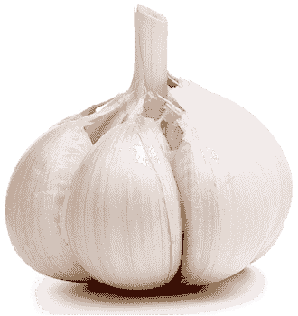

　　大蒜和它的亲戚洋葱很像，是全方位的食物，在保护人类健康方面扮演许多不同角色。大蒜可以抗病毒、抗菌、抗真菌（包括抗霉菌）、抗寄生虫，而且富含蒜素，这是可以预防疾病的硫化合物。

　　与某些错误理论相反，大蒜并不会杀死肠道中的益菌，只会杀死以正频率（positive frequency）运作的害菌。别把这个词跟革兰氏阳性（gram-positive）搞混了，这里的阳性并不是在说电荷的性质。革兰氏阳性与革兰氏阴性的细菌以正频率运作时都对人类有害；另一方面，益菌（无论是革兰氏阴性或革兰氏阳性）都是以负频率运作，和人类运作的频率相同。别将这里的“负”字当成不好的能量，这种负电荷其实是好东西，是我们接地的来源。害菌、蠕虫与其他寄生虫、真菌及病毒都是以正电荷运作，当它们主宰我们的身体，会吸干我们的电力，使我们失去接地能力。然后，大蒜登场了，它带着具有正电荷的抗病原体特性，同性相斥之下，让我们摆脱正在造成伤害的病原体。而因为肠道中的益菌与其他有益微生物带着负电荷，并且接地，大蒜不会清除它们。

　　大蒜确实有些恼人的问题，但这些恼人之处却对你有益。尽管放心，大蒜不会干扰任何不该受干扰的事物，绝不会伤害你；相反地，它能对抗感冒、流行性感冒、链球菌性喉炎、导致肺炎的细菌，以及与病毒有关的癌症，也能清除结肠中的有毒重金属，并大大提升免疫力。

 有助于疗愈这些疾病

　　假如你有下列任一疾病，试着将大蒜纳入日常饮食中：

　　链球菌性喉炎、阴道链球菌感染、链球菌引起的青春痘、与 A 群及 B 群链球菌相关的其他疾病、酵母菌感染、泌尿道感染（如膀胱感染与肾脏感染）、葡萄球菌感染、水肿、麦粒肿（针眼）、生育能力低落、耳朵感染、鼻窦感染、慢性鼻窦炎、免疫系统缺陷、幽门螺旋杆菌感染、普通感冒、流行性感冒、细菌性肺炎、乳癌、喉炎、肠癌、胃癌、食道癌、摄护腺癌、淋巴瘤（包括非何杰金氏淋巴瘤）、EB 病毒∕单核球增多症、甲状腺疾病、肾上腺疲劳、偏头痛、睡眠呼吸中止症、莱姆病、牛皮癣性关节炎、湿疹、牛皮癣、单纯疱疹病毒第一型、单纯疱疹病毒第二型、人类疱疹病毒第六型、不孕症、骨盆腔发炎性疾病、溃疡性结肠炎、慢性支气管炎、小肠细菌过度增生、甲状腺结节、甲状腺癌。

 有助于疗愈这些症状

　　假如你有下列任一症状，试着将大蒜纳入日常饮食中：

　　淋巴系统肿大、发炎、贝尔氏麻痹、耳朵疼痛、鼻涕倒流、头痛、消化不良、口疮、脾脏肿大、各种神经系统症状（包括刺痛、麻木、痉挛、抽搐、神经痛与胸闷）、阑尾发炎、呼吸困难、背部疼痛、口臭、咳嗽、胸部疼痛、充血、飞蚊症、黏液过多、发烧、疲劳、肝功能停滞、颈部疼痛、鼻窦疼痛、念珠菌过度增生。

 情绪上的支持

　　到达某个脆弱点，且在公司、家中或在一段新的感情中觉得自己的弱点毫无遮掩时，让大蒜帮你一把，它是在你需要保护与庇护时，最应该降临在你生命中的食物。

 灵性启发

　　大蒜在得以采收前需要大量时间休息，在这段期间安静地扎根、茁壮，被菜园的土壤覆盖住。此时的大蒜能够吸收养分，并建构在被采收之后足以对抗霉菌与其他真菌、蠕虫、害虫等病原体的免疫系统。它在成长季节不断强化，使其能将力量传给我们。学学大蒜，审慎检视自己每年的扎根期。为了建构身心灵的免疫系统，我们都需要一段时间摆脱污染物、病原体、压力，以及在生命中耗尽我们能量的人。恢复活力后，我们就能好好准备迎接自己的成长季节。

　　．将大蒜球茎视为一束预先测量过的药用补充品，养成习惯每天食用一瓣。别担心蒜瓣的大小不同，较小的蒜瓣含有较高浓度的养分，所以每份“剂量”其实差不多。

　　．虽然烹调过的大蒜相当美味又珍贵，但生食大蒜的效益更高。试着将生大蒜加入你喜爱的蘸酱、沙拉酱、冷汤或其他料理中享用。

　　．如果觉得好像得了喉咙痛、感冒或流行性感冒，将一瓣生大蒜切碎，并与半颗酪梨、半根香蕉或一些烤马铃薯一起捣成泥食用。每天吃三次，直到好转为止。

大蒜芝麻沙拉酱

────── ◆ ──────

分量：1～2 人份

　　这道沙拉酱很简单就能一次大量准备好，并可冷藏一整个星期。橄榄油的经典地中海风味及芝麻酱与大蒜混合出绝妙滋味，加上椰枣的些微甜味，可以将它淋在你喜欢的任何叶菜类上，或是当成蘸酱搭配你喜爱的蔬菜享用。

生芝麻酱 1/4 杯

橄榄油 1 汤匙

大蒜 2 瓣

中型椰枣 2 颗（或大型椰枣 1 颗），去核

水 1/2 杯

　　将所有食材放进果汁机搅打至滑顺，淋在你喜爱的生菜沙拉上即可。

姜

　　　　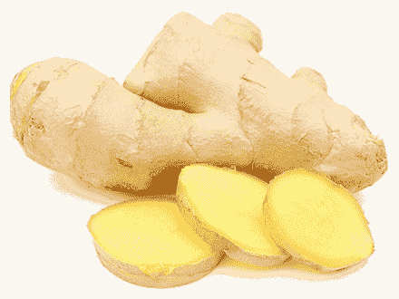

　　在这个世界上，我们是靠反应生活，而想要在反应状态中暂时休息一下，姜是非常重要的工具。当你从早上一直汲汲营营到晚上，终于开始在心理与情绪层面检视自己时，身体通常还保持在反应机敏的痉挛性状态。与压力相关的疾病，如肾上腺疲劳、胃酸逆流、睡眠呼吸中止症、膀胱痉挛、失眠、结肠痉挛与胃炎等消化问题，以及慢性肌肉疼痛就是这么来的。姜是终极抗痉挛剂，一杯姜茶能够镇静不适的胃部，并使其他任何紧绷部位放松长达十二小时。与其说姜是神经的补药，不如说它滋补的是器官与肌肉，告诉身体可以放轻松了，一切都在掌控之中。

　　如果喉咙肌肉因为说太多话或喊叫，或是因为必须忍住想说的话而变得紧绷，姜正是这个部位的绝佳松弛剂。姜也有助于舒缓头痛，并将多余乳酸从肌肉组织冲到血液里，然后排出体外。不只激烈运动会释放乳酸，压力也会，假如你整天都坐在书桌前，而压力一直将乳酸灌进你的肌肉里，就必须找条路让它出去，因为你没有一直走动，所以无法让乳酸流进正常信道。

　　姜的抗痉挛特性来自它含有的超过六十种微量矿物质，还有三十多种氨基酸（有许多目前尚未被发现）及超过五百种酶与辅酶。此外，姜可以抗病毒、抗菌、抗寄生虫，在促进免疫系统健康方面绝对值得称赞。姜还有助于抗压、建构 DNA、促进身体生成维生素 B12 等。目前的研究若要探究姜蕴含的所有功效，可能还要努力个一百年。

 有助于疗愈这些疾病

　　假如你有下列任一疾病，试着把姜纳入日常饮食中：

　　胰脏炎、胆结石、肾上腺疲劳、结肠痉挛、睡眠呼吸中止症、膀胱痉挛、失眠、喉炎、普通感冒、流行性感冒、裂孔疝气、EB 病毒∕单核球增多症、偏头痛、小肠细菌过度增生、甲状腺疾病、骨盆腔发炎性疾病、人类疱疹病毒第六型、湿疹、牛皮癣、焦虑症、肌肉萎缩性嵴髓侧索硬化症、足底筋膜炎、雷诺氏症候群、接触辐射、各种癌症（尤其是甲状腺癌与胰脏癌）、麸质过敏症、慢性鼻窦炎、耳朵感染、真菌感染、人类乳突病毒、淋巴水肿、狼疮、类风湿性关节炎、牛皮癣性关节炎、带状疱疹。

 有助于疗愈这些症状

　　假如你有下列任一症状，试着把姜纳入日常饮食中：

　　肌肉抽搐、肌肉痉挛、腱鞘囊肿、肌肉紧绷、肌肉疼痛、颞颚关节问题、焦虑、胃炎、腹胀、胃痉挛、胃部疼痛、口疮、胃酸逆流、胃部不适、头痛、胆囊痉挛、骨盆疼痛、背部疼痛、头晕、头部觉得轻飘飘、鼻窦疼痛、充血（尤其是胸部与∕或鼻窦）、咳嗽、频尿、失禁、尿滞留、体重增加、食物过敏、抹片检查结果异常、矿物质缺乏、食物敏感、打嗝、腹泻、脑雾、长期恶心、结肠痉挛、消化不良、胆固醇过高、睡眠障碍、疲劳。

 情绪上的支持

　　对于觉得被迫把想说的话吞回肚子里的人而言，姜是理想的食物。当你被迫沉默时，你的处境可能是无论如何把话说出来才是正确的，或者你感觉到不管自己的话多么站得住脚，说出来只会让状况更糟。姜对后面这个处境有帮助，因为压抑你真正的观点会让你感觉好像被闷住了，甚至让你出现肌肉痉挛现象，必须将那样的紧绷释放才行，而姜可以完美达成任务。

 灵性启发

　　姜教导我们不一定总是要有洞见、突破或解决方案，借此放掉对我们没有帮助的事物。我们不一定要去处理每一件事，不必总是要做出反应，已经有够多的其他状况需要我们去反应，实在没必要再自找麻烦。姜可以让我们的肌肉不抽筋、胃不打结，也能对我们的灵魂施展抗痉挛魔法，清理创伤。而我们不必做些什么，只管让姜大展身手。

　　．姜可以一整天重复使用，以同一块姜泡出好几人份的茶也没关系。

　　．满月时饮用姜茶，能使姜的药性提升 50%。

　　．在你必须做出生命重大决定之前或做决定期间摄取姜。

　　．洗药浴之前饮用姜水或姜茶，能提升药浴的疗效。

生姜莱姆水

────── ◆ ──────

分量：2～4 人份

　　这杯生姜莱姆水使人清新舒畅，对于想戒掉含咖啡因能量饮料的人特别有帮助。新鲜姜汁的些微辣味会让你对这杯饮品爱不释手。

蜂蜜 1/4 杯

水 4 杯，分开盛装

姜汁 1 汤匙（以大约 7.5 公分的姜段榨成）

莱姆汁 1 杯（约 10 颗莱姆榨成）

新鲜薄荷叶 1/4 杯

　　将 1/4 杯蜂蜜与 1 杯水倒进小平底锅里加热至蜂蜜完全溶解后，放凉备用。

　　把姜汁与莱姆汁倒进大水罐里，并倒入其余 3 杯水，拌入放凉后的蜂蜜水与新鲜薄荷叶，冷藏至冰凉即可饮用。

柠檬香蜂草

　　　　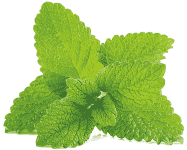

　　柠檬香蜂草可用于镇静神经，尤其是与消化相关的神经。许多人都有各种肠子敏感问题，伴随而来的是复杂又令人困惑的误诊结果。这些问题常常是因为围绕着消化器官的神经末梢变得过度敏感所致。

　　假如某人的胃或肠子的激躁问题找不到明显原因，通常是敏感神经造成的。一个常见的状况是食物（即使是很容易消化的食物）摩擦肠道黏膜，让神经敏感的人觉得不舒服。神经敏感也可能引发恶心、食欲不振，以及紧张时突然想排泄等症状。柠檬香蜂草的镇静特性处理这些状况的效果绝佳，这些特性是来自生物活性植物性化合物，例如尚未被发现，能够镇静消化道神经受体，以降低神经敏感度并减少发炎的生物碱。这让柠檬香蜂草成为有助于抒解压力的珍贵药草。

　　柠檬香蜂草几乎对身体各个部位都有贡献。它的硼、锰、铜、铬、钼、硒与铁等微量矿物质含量特别高，也含有大量的巨量矿物质二氧化硅。此外，柠檬香蜂草也能保存维生素 B12，代表它能监督你体内这种维生素的存量，使身体不至于将其用尽。柠檬香蜂草在全身上下发挥抗寄生虫、抗病毒、抗菌的效果，能够对抗 EB 病毒、带状疱疹与其他疱疹病毒，例如人类疱疹病毒第六型。它对链球菌引起的扁桃腺炎也相当有帮助。此外，柠檬香蜂草还能替肝脏、脾脏与肾脏排毒，并减少膀胱发炎，因此也是减轻间质性膀胱炎与泌尿道感染的良方。

 有助于疗愈这些疾病

　　假如你有下列任一疾病，试着将柠檬香蜂草纳入日常饮食中：

　　营养吸收问题、喉炎、间质性膀胱炎、酵母菌感染、泌尿道感染（如膀胱感染与肾脏感染）、扁桃腺炎、高血压、EB 病毒∕单核球增多症、带状疱疹、人类疱疹病毒第六型、短暂性脑缺血发作（小中风）、葡萄球菌感染、幽门螺旋杆菌感染、小肠细菌过度增生、耳朵感染与其他耳朵问题、裂孔疝气、神经病变、轮癣、焦虑症、忧郁症、甲状腺疾病、肾上腺疲劳、偏头痛、注意力不足过动症、链球菌性喉炎、自闭症、骨胳与腺体结节、莱姆病、肌肉萎缩性嵴髓侧索硬化症、单纯疱疹病毒第一型、单纯疱疹病毒第二型、酒渣（玫瑰斑）、骨质缺乏症、多囊性卵巢症候群、梅尼尔氏症。

 有助于疗愈这些症状

　　假如你有下列任一症状，试着将柠檬香蜂草纳入日常饮食中：

　　食欲不振、难以入眠、焦虑、胃部神经紧张、胃部敏感、心悸、热潮红、夜间盗汗、五十肩、胃痛、胃炎、腹部疼痛、腹胀、胀气、神经质、疲劳、腹泻、急尿、频尿、体重增加、四肢无力、消化功能衰弱、微量矿物质缺乏、牙齿疼痛、发烧、癫痫、鼻出血、发炎、组织胺反应、大脑发炎。

 情绪上的支持

　　压力与不安全感常让人对周遭事物感到恐惧。我们发现自己夜晚躺在床上，不断疑惑着自己与家人会发生什么事。假如你担心自己与他人的未来，柠檬香蜂草可以带走忧虑，以平静感取代。

 灵性启发

　　柠檬香蜂草可说是万能植物，并让我们了解自己也同样多才多艺。我们并非只因为一个原因而来到世上，在一生中，我们会有许多不同的生活。不需要带着单一焦点过活，我们有许多机会探索不同的天赋、为不同的使命服务──我们在前进的路上会发现某些使命，有些使命则伴随我们一辈子，我们却不知道自己是如何带来改变的。

　　．将新鲜的柠檬香蜂草泡在一罐水中，并摆在阳光下接受日照几小时，泡杯日光茶。太阳会提取并提升柠檬香蜂草的疗效，促使其养分帮助你疗愈。

　　．试着在窗台上的花盆里种柠檬香蜂草，让你随时都能摘下它的叶子切碎加入沙拉中，以增添风味并提供良好药效。

　　．睡前食用柠檬香蜂草，能镇静神经，使你一夜好眠。

柠檬香蜂草茶

────── ◆ ──────

分量：2～4 杯

　　这杯柠檬香蜂草茶既有镇静功效又温和，柠檬的风味不会盖过药草的细微美味。如果希望有更强烈的柠檬风味，可以多加点柠檬汁或柠檬皮。

柠檬香蜂草 2 汤匙

柠檬皮 1 茶匙

切碎的新鲜百里香叶 1/2 茶匙

柠檬汁 1 茶匙

　　在小碗中混合柠檬香蜂草、柠檬皮与百里香，然后煮沸 4 杯水。制作一人份的茶饮时，在 1 杯热水中加入 1 茶匙的上述混料，浸泡至少 5 分钟。饮用前在每杯茶里加入半茶匙柠檬汁即可。

　　＊若希望茶饮的风味更强烈、药效更好，可以在每人份茶饮中使用 2 茶匙（最多 1 汤匙）的泡茶混料。

甘草根

　　　　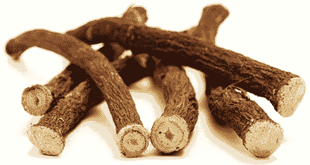

　　甘草根是救星，是现代世界最关键的药草。为什么甘草如此重要？因为它是对抗病毒爆发的终极武器。就像你在第一部［现代人面临的健康威胁］那一章读到的，疱疹病毒（包括 EB 病毒、人类疱疹病毒第六型、巨细胞病毒与带状疱疹）往往是许多难解疾病的幕后黑手，例如纤维肌痛症、慢性疲劳症候群、莱姆病、梅尼尔氏症与肾上腺疲劳，以及眩晕、头晕、身体疼痛，还有颚部、颈部、肩膀神经疼痛等症状，更别提被归类为“自体免疫疾病”的类风湿性关节炎与桥本氏甲状腺炎了。

　　身体不会攻击自己，是这些疱疹病毒的病毒株与变种搞的鬼，所以我们需要强大的抗病毒药，也就是甘草根。它含有的植物性化合物与抗病毒性质能阻止病毒繁殖，同时将病毒排出体外，让你的体内环境变得对想要扎根的病毒极为不利。身处二十一世纪的自体免疫困惑中，甘草根是十分强大的工具。

　　甘草根对低血压的人也有绝佳效益，而且能借由降低肝脏温度帮助镇静肝脏，更不用说甘草是我们现在所拥有最重要的肾上腺修复剂。许多受欢迎的药草，例如红景天、圣罗勒、人参，甚至印度人参对内分泌腺的效果完全比不上甘草。这些药草之所以有用，是因为能支持肾上腺维持现况，所以若你的肾上腺机能低落，它们能防止掉得更低。另一方面，甘草根则像肾上腺的充电器，能使肾上腺脱离疲劳状态，并提升其运作效能，进而为你带来助益。

　　请注意，坊间对甘草有互相矛盾的观点，其中有许多错误观念。试着别被卷进负面说法里，否则你会因此失去疗愈机会。

 有助于疗愈这些疾病

　　假如你有下列任一疾病，试着将甘草根纳入日常饮食中：

　　纤维肌痛症、慢性疲劳症候群、莱姆病、梅尼尔氏症、肾上腺疲劳、神经病变、葛瑞夫兹氏病、间质性膀胱炎、憩室炎、憩室病、各种自体免疫疾病与失调（尤其是桥本氏甲状腺炎、狼疮与类风湿性关节炎）、骨髓炎、偏头痛、消化不良、链球菌性喉炎、眩晕症、EB 病毒∕单核球增多症、带状疱疹、忧郁症、失眠、喉炎、青春痘、泌尿道感染、坐骨神经痛、胃食道逆流疾病。

 有助于疗愈这些症状

　　假如你有下列任一症状，试着将甘草根纳入日常饮食中：

　　头晕、身体疼痛、焦虑、神经疼痛、颚部疼痛、颈部疼痛、肩膀疼痛、脑雾、刺痛与麻木、便秘、胃部疼痛、头痛、疲劳、恶心、甲状腺机能亢进、阑尾发炎、甲状腺机能不足、胃炎、食物过敏、贝尔氏麻痹、手脚冰冷、更年期症状、口疮、胃酸逆流、耳鸣或耳中嗡嗡作响、五十肩、大脑发炎、颞颚关节问题、经前症候群症状、胃酸不足、阴道灼热、阴道疼痛、溃疡（包括消化性溃疡）、抽搐、痉挛、吞嚥问题、心悸、肝功能停滞、骨盆疼痛、丧失性欲、脾脏发炎。

 情绪上的支持

　　甘草根对于不是透过头脑，而是透过肠子处理情绪的人相当有益。假如你觉得就连最单纯的误解都让你因充满压力而胃痛，或是肠子紧绷、胃灼热，甘草能帮助预防并减轻你的痛苦。

 灵性启发

　　正确使用的话，甘草能帮助一生中大部分时间都受疾病所苦的人重十健康。如果你生过病，便能体会疗愈就是神圣的奇迹。没怎么受过病痛折磨的人，也许仅仅将其他人的疗愈视为恢复正常罢了，但你一定了解所谓的“正常”如同奇迹，而且任何在某人恢复健康时扮演重要角色的事物，本身就是个奇迹。甘草教导我们，虽然得仔细留意才观察得到，但我们身边确实到处都是这种小奇迹。你生命中还有什么看似司空见惯的事物，其实是宇宙的奇迹呢？

　　．想戒掉咖啡因，可以改喝甘草根茶。起床时先喝一杯，这是绝佳的能量饮料。

　　．消化食物有问题，或是刚在餐厅吃完不健康的一餐，可以喝点甘草茶帮助消化。

　　．把甘草当花草茶随时饮用，或是服用无酒精的甘草酊剂。

肉桂甘草根茶

────── ◆ ──────

分量：4 杯

　　这杯芳香茶饮的丰富滋味一定能唤起温暖的感受。每喝下一口，就想像自己变成正在吃甜甘草糖的小孩，让回忆照亮你的心，并为你带来喜悦。

干燥甘草根 2 汤匙

柳橙皮 1 茶匙

肉桂粉 1 茶匙

完整丁香 1/2 茶匙

　　在小碗中混合所有材料，然后煮沸 4 杯水。制作一人份的茶饮时，在 1 杯热水中加入 1 茶匙的上述混料，浸泡至少 5 分钟。

　　＊若希望茶饮的风味更强烈、药效更好，可以在每人份茶饮中使用 2 茶匙（最多 1 汤匙）的泡茶混料。

荷兰芹

　　　　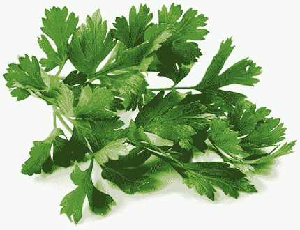

　　你一定听过酸性体质与碱性体质，身体偏酸性时，就可能会生病。一般而言，碱性食物只能促进一、两种身体系统碱性化，其他系统仍维持酸性，而在适当且经常使用的情况下，荷兰芹可以让全身上下所有系统都偏碱性，并排除体内的酸性。矿物盐是荷兰芹有助于碱性化的主要原因，荷兰芹里的特殊矿物盐能黏住体内有害的酸，将之排出体外。这种碱性化能力使荷兰芹特别有助于预防并对抗各种癌症。

　　这种药草还是万能的病原体克星，能驱逐细菌、寄生虫与真菌。荷兰芹对于和嘴巴相关的任何问题都很有效，例如牙龈疾病、龋齿与嘴巴干燥，因为它能抑制口腔中有害微生物的生长。此外，荷兰芹也是很棒的抗 DDT 武器，能发挥极佳的螫合作用，将你不知道藏在体内且妨碍你健康的除草剂与 DDT 等杀虫剂拔出来。

　　荷兰芹富含养分，包括维生素 B 群（例如叶酸）、微量 B12 辅酶，以及维生素 A、C、K。荷兰芹还能大幅促进“再矿物化”，尤其可以提供镁、硫、铁、锌、锰、钼、铬、硒、碘与钙给微量矿物质含量不足的人。荷兰芹其实是野生食物，不需要太多照顾就能成长茁壮，供你所用。它甚至能应付某些寒冷天气，代表它有适应原性质。吃下肚时，荷兰芹会将这种生存与茁壮的意志传给你。当你筋疲力尽时，荷兰芹可以为你补足燃料。而就像甘草根一样，虽然荷兰芹不常被列入肾上腺滋养食物名单中，但它绝对够资格。

 有助于疗愈这些疾病

　　假如你有下列任一疾病，试着将荷兰芹纳入日常饮食中：

　　各种癌症（尤其是多发性骨髓瘤之类的血液细胞癌症）、软骨撕裂、恐惧症、焦虑症、忧郁症、牙龈疾病、唾液管问题、鹅口疮、肾上腺疲劳、EB 病毒∕单核球增多症、肌肉萎缩性嵴髓侧索硬化症、偏头痛、甲状腺疾病、泌尿道感染、爱迪生氏症、帕金森氏症、失智症、阿兹海默症、关节炎、动脉粥状硬化症、心房颤动、心血管疾病、慢性阻塞性肺病、内分泌系统失调、C 型肝炎、人类免疫缺乏病毒（爱滋病毒）、躁郁症、莱姆病、自恋型人格障碍、轮癣、休格伦氏症候群。

 有助于疗愈这些症状

　　假如你有下列任一症状，试着将荷兰芹纳入日常饮食中：

　　恶心、头部觉得轻飘飘、头晕、酸中毒、嗅觉丧失、味觉丧失、萎靡、腹部疼痛、颤动、牙龈疼痛、口干舌燥、头痛、体重增加、鼻出血、龋齿、牙龈萎缩、蛀牙、各种神经系统症状（包括刺痛、麻木、痉挛、抽搐、神经痛与胸闷）、矿物质缺乏（包括微量矿物质缺乏）、化学物质敏感、子宫发炎、卵巢发炎、输卵管发炎、记忆力衰退、循环不良、脂肪肝前期、呼吸短促、脑损伤、嵴髓损伤、牙痛。

 情绪上的支持

　　觉得情绪起伏过大时，寻求荷兰芹的帮助吧。这种药草生长时，是从外面的茎部与叶片开始成熟，然后从中央发出新芽，可说是相当归于中心，也让人归于中心的药草。如果觉得自己被他人的情绪波动拖着走，可以提供对方含有荷兰芹的料理。一个人摄取够多荷兰芹之后，你会注意到一种更为平衡的心理与存在状态。

 灵性启发

　　太多人错失了荷兰芹的健康效益，因为不喜欢它的味道。他们不是会过敏或无法忍受，只是决定跟自己知道且喜欢的事物混在一起。当我们不喜欢某件事物时，即使知道对自己有好处，还是会避开。你正在逃避哪些终究对你有帮助的经验、对话、状况、责任与行动？你错过了哪些珍贵的教诲？假如把最初的厌恶感摆一边，将你通常认为令人不悦的事物当作机会来看待，会为你带来什么益处？

　　．将荷兰芹与西洋芹一起打成汁，这些药草亲戚含有的矿物盐会相辅相成：荷兰芹的盐类能黏住体内的乳酸等酸性物质，并排出体外，而西洋芹的盐类则黏住其他种类的毒素，同时滋养并帮助形成神经传导物质。

　　．可以利用新鲜或干燥的荷兰芹泡茶（当然新鲜的最好）。泡茶过程能提取最多深藏在荷兰芹中的微量矿物质与植物性化合物，好让你吸收这些养分。

　　．为了获得最大效益，请选用扁叶荷兰芹（卷叶荷兰芹还是很有价值，找不到扁叶品种时也是很好的选择）。

　　．养成在每一种料理中加入荷兰芹的习惯，无论你喜不喜欢这种药草。到了某个时间点，就会习惯成自然，而且到最后，你一天当中至少会有一餐使用荷兰芹。若不喜欢荷兰芹，可以尝试不同的料理方式（打成汁、切碎撒在沙拉上、搅打在果昔里、加在茶里等），直到找出能够忍受的方法为止。接着，你就能在荷兰芹排除你体内废物的同时，获得它的营养好处。

荷兰芹塔布蕾沙拉

────── ◆ ──────

分量：1～2 人份

　　这道沙拉与鹰嘴豆泥及一大盘烤花椰菜是绝妙搭配，传统习惯则是将塔布蕾沙拉包在软嫩的莴苣叶中食用。装在大碗公里摆上桌，再用手把沙拉舀出来放进莴苣叶杯里，就能享用了。

杏仁 1/4 杯

荷兰芹 4 杯（压实）

薄荷 1/8 杯（不必压得太扎实）

切成四分之一块大小的番茄 2 杯

切成四分之一块大小的小黄瓜 2 杯

切碎的红洋葱 1/2 杯

海盐 1/4 茶匙

橄榄油 1 茶匙

柠檬 1/2 颗，挤成汁

　　以食物调理机分别将 1/4 杯杏仁和 4 杯荷兰芹以手动按压方式间歇搅打至杏仁粗略切细、荷兰芹变得细碎，然后分别放到一旁备用。

　　以食物调理机将其余材料以手动按压方式间歇搅打至切细并充分混合，然后将混料倒进大碗中，加入荷兰芹与杏仁再搅拌均匀，即可上桌享用！

覆盆子叶

　　　　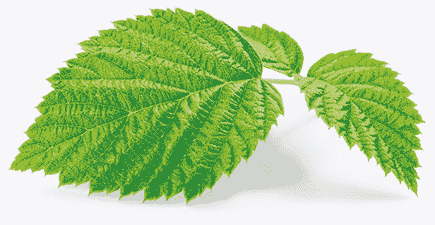

　　想到覆盆子这种植物，我们通常只会想到它那美味又有益健康的莓果，但其实覆盆子的叶子也应该享有同等待遇。说到平衡女性生殖系统功能，覆盆子叶可说无人能比。此外，覆盆子叶也是整体荷尔蒙的平衡剂。比方说，它能促使肾上腺分泌雌激素、黄体素与睾固酮，而且能以关键营养素滋补甲状腺。覆盆子叶支持了整个内分泌系统的荷尔蒙生成。

　　这些对生殖系统与荷尔蒙的好处，代表覆盆子叶煮成的茶饮是解决不孕症，以及让女性身体做好怀孕准备的最佳补药。此外，它对预防流产很有帮助，且是解决分娩后的筋疲力尽与产后忧郁症的秘密武器。覆盆子叶已知能促进泌乳，而尚未为人所知的是，它也能增加母乳中的维生素与矿物质，提高母乳对幼儿的营养价值。

　　覆盆子叶对男性也是好处多多，主要可作为血液清道夫与整体排毒剂。覆盆子叶的植物性化合物（包括花青素与多酚类等抗氧化物），对所有人都是全方位的抗发炎药，尤其是对抗各种器官与腺体发炎。覆盆子叶对缺乏铁质与需要促进生发的人也有绝佳效益，而且因为它有助于强化胰脏，所以这种药草对胰脏炎患者也大有帮助。此外，虽然覆盆子叶的适应原特质不太受人注目，但它确实应该被归类为顶尖的适应原。

 有助于疗愈这些疾病

　　假如你有下列任一疾病，试着将覆盆子叶纳入日常饮食中：

　　不孕症、流产、类纤维瘤、产后忧郁症、贫血、泌尿道感染（如膀胱感染与肾脏感染）、甲状腺疾病、胰脏炎、牙龈疾病、生育能力低落、葛瑞夫兹氏病、桥本氏甲状腺炎、子宫息肉、多囊性卵巢症候群、子宫脱垂、膀胱脱垂、人类乳突病毒、内分泌系统失调、细菌性阴道炎。

 有助于疗愈这些症状

　　假如你有下列任一症状，试着将覆盆子叶纳入日常饮食中：

　　泌乳量过低、胃炎、卵巢囊肿、食物过敏、疲劳、胃部不适、铁质缺乏、落发、抹片检查结果异常、子宫发炎、卵巢发炎、输卵管发炎、荷尔蒙失衡、甲状腺机能不足、热潮红、不规则阴道出血、阴道分泌物、阴道灼热、痉挛。

 情绪上的支持

　　对寻求抚慰、宁静、同情、慰藉、温暖、情爱或额外的一点赞美的人，覆盆子叶是绝佳的药草，适合用来自我安慰，或是提供给有需要的朋友。

 灵性启发

　　如果没有好好照料，一小块地的覆盆子树可能会渐渐主宰整个果园。然而只要你有一点点时间、耐心，并了解该修剪哪些茎条，就能掌控覆盆子的生长。最后，这个过程会带来更健康、更多产的植物。我们在生活中会遭遇其他近乎混乱的状况，有些甚至脱离掌控──但也并非全部都是。覆盆子树教导我们留意那些可以在节外生枝前就防患未然的状况。你生命中有哪些事物是你从现在开始细心照料，往后就能结出丰硕果实的？

　　．如果在某个时刻觉得情绪低落，泡杯覆盆子叶茶来喝，有助于舒缓情绪。

　　．若要获取修复生殖系统与平衡荷尔蒙的最佳效果，以覆盆子叶搭配荨麻叶一起泡茶。

　　．满月时多喝些覆盆子叶茶，可以提升茶饮的效果，因为覆盆子树在满月时的生长速度会提升 25%，而干燥叶片仍然依循着这种节奏，打从它在茎条上长出来的那天就一直如此。

覆盆子叶茶

────── ◆ ──────

分量：4 杯

　　在这杯可口茶饮中，种子、叶子与花瓣完美调和。啜饮时，请想像自己体内也如此同调，生殖系统与身体其他部分合而为一。

覆盆子叶 2 汤匙

小豆蔻荚 8 颗

玫瑰花瓣或花苞 1 茶匙

　　在小碗中混合所有材料，然后煮沸 4 杯水。制作一人份的茶饮时，在 1 杯热水中加入 1 茶匙的上述混料，浸泡至少 5 分钟。

　　＊若希望茶饮的风味更强烈、药效更好，可以在每人份茶饮中使用 2 茶匙（最多 1 汤匙）的泡茶混料。

姜黄

　　　　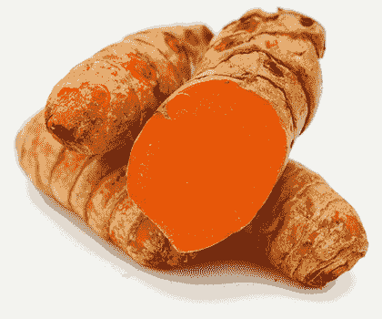

　　姜黄因为含有抗发炎的植物性化合物姜黄素而闻名，对狼疮这类疾病而言相当珍贵──这类疾病发病时身体会陷入习惯性的反应循环，即使入侵者（就狼疮而言是 EB 病毒）消失了也不会停止。要注意的是，慢性疾病的发炎现象起因于身体对病毒等外来物质的免疫反应，而非像许多言论所说是身体对抗自己造成的。然而，有时一旦反应循环开始了，身体就需要盟友出手相助以打破模式。姜黄是这项工作的最佳人选，因为其中含有来自姜黄素既天然又有益的类固醇化合物及姜黄的其他成分，对镇静由病原体引起的过大发炎反应相当重要。

　　这使姜黄对发炎并导致疼痛的任何部位，从神经、关节到大脑都很有帮助。说到大脑发炎，许多人都有未被诊断出来、神秘难解的低度病毒性脑炎，亦即大脑肿胀程度太小，以致医学检验无法察觉，而其症状有时会被诊断为肌痛性脑嵴髓炎∕慢性疲劳症候群（这是大脑因 EB 病毒而发炎所造成的难解疾病被贴上的标签）。没被发现的脑炎会导致头部有难解压力、头晕、深层头痛、无法戴眼镜改善的视力模煳、意识混乱、严重焦虑与恐慌，而姜黄是终极解药。

　　在姜黄改善发炎问题的同时，其所含的强大化合物能提升体内需要促进循环部位的血液供给，因此对有慢性组织胺反应，或是因肝功能或循环不良而有血毒的人来说是理想香料。姜黄富含锰，与姜黄素结合后对心血管系统极有助益，能降低坏胆固醇、增加好胆固醇、帮助抑制肿瘤与囊肿，且能预防几乎各种癌症，尤其是皮肤癌。此外，锰能启动姜黄素从体内拔出有毒重金属的能力。

 有助于疗愈这些疾病

　　假如你有下列任一疾病，试着将姜黄纳入日常饮食中：

　　过敏、狼疮、脑炎、焦虑症、胆固醇过高、肿瘤（包括脑瘤）、多囊性卵巢症候群、类纤维瘤、各种癌症（尤其是皮肤癌）、小肠细菌过度增生、流行性感冒、普通感冒、鼻窦问题、慢性疲劳症候群、EB 病毒∕单核球增多症、多发性硬化症、类风湿性关节炎、肌肉萎缩性嵴髓侧索硬化症、淋巴瘤（包括非何杰金氏淋巴瘤）、湿疹、牛皮癣、重金属毒性、细菌性肺炎、滑囊炎、腕隧道症候群、麸质过敏症、脑性麻痹、慢性支气管炎、饮食障碍症、电磁波过敏症、肺气肿、子宫内膜异位症、心脏疾病、失眠、脂肪瘤、肾上腺疲劳、青光眼、莱姆病、葛瑞夫兹氏病、偏头痛、肥胖症、关节炎、帕金森氏症、寄生虫问题、雷诺氏症候群、季节性情绪失调、坐骨神经痛、桥本氏甲状腺炎、酵母菌感染、蠕虫。

 有助于疗愈这些症状

　　假如你有下列任一症状，试着将姜黄纳入日常饮食中：

　　皮疹、荨麻疹、充血、大脑发炎、关节发炎、神经发炎、循环不良、囊肿、肝功能不良、肝热、矿物质缺乏、头皮屑、背部疼痛、颈部疼痛、膝盖疼痛、足部疼痛、甲状腺机能亢进、发炎、头部压力、头晕、深层头痛、视力混浊、意识混乱、恐慌、喉咙痛、咳嗽、身体疼痛、身体僵硬、钙化、脾脏肿大、化学物质敏感、人格解体、定向力障碍、运动失能、情绪性进食、黏液过多、五十肩、组织胺反应、荷尔蒙失衡、胃酸不足、间歇性阴道出血、颚部疼痛、暴怒、腿部痉挛、皮质醇过低、更年期症状、肌肉痉挛、肌肉僵硬、游走性疼痛、鼻窦疼痛、甲状腺机能不足、体重增加。

 情绪上的支持

　　对难以认可自我价值的人，姜黄是理想食物。若发现你低估了自己对某项计划或某段人际关系的贡献、总是对自己失望，或是难以接受赞美，就让姜黄加入你的生活中，帮助你欣赏珍贵而耀眼的自己，以及你能带给众人的所有正面事物。

 灵性启发

　　姜黄的抗发炎特质如此强大，使它注定要来让我们喘口气，并思考生命中还有什么能用来帮助镇静。发炎不只出现在身体层面，心理、情绪，甚至灵性层面都可能有，通常会以批判、责怪、狂怒或长期不满的形式出现，而且就像身体发炎一样令人非常不舒服。最初让你痛苦的原因可能早已消失，你却陷入习惯性的反馈循环中，重复经历痛苦。下次当你觉得有关自身存在的发炎现象即将发作时，请对引起这个反应的过往经验致上敬意，接着想想姜黄的提醒，慢慢地试着结束循环。

　　．若有充血、咳嗽、喉咙痛、普通感冒、流行性感冒与∕或鼻窦问题，可以把新鲜姜黄与姜一起打汁，制成小剂量的浓缩液，在一天当中定期喝一小口。这种浓缩液有祛痰效果，有助于加快疗愈过程。

　　．试着在运动或进行粗重劳务后摄取姜黄，任何形式（食物的香料、打成汁、茶饮或营养补充品）都可以，只要有吃进身体里就好。姜黄能缩短肌肉、韧带与关节在运动后的复元时间，也能对你没注意到、可能演变成大毛病的任何小伤害发挥抗发炎效果。

姜黄姜汁饮

────── ◆ ──────

分量：2～4 人份

　　这道可增强免疫力的饮品是前面提到的姜黄与姜打成的浓缩液美味版，是出现感冒征兆时的必需品，能帮助身体击退来犯的各种外敌！

姜黄 10 公分

生姜 10 公分

柳橙 2 颗

大蒜 4 瓣

　　以榨汁机分别将各个食材榨成汁，并将每一种汁分开盛装。在小玻璃杯中混合 1 茶匙姜黄汁、1 茶匙姜汁、1/4 茶匙大蒜汁与 1/4 杯柳橙汁，搅拌均匀后立刻饮用。

　　请注意：使用的榨汁机不同，各种食材榨汁时所需的用量可能有大幅差异。

芦荟

　　　　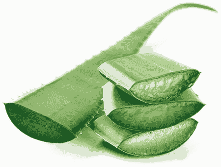

　　芦荟因为其适合外用于烫伤、割伤、擦伤、瘀血与虫咬的镇静特性而闻名，对晒伤尤其有效。然而，芦荟用于内服时有更广泛的效果。若对灌肠疗程有兴趣，就让芦荟成为你生活的一部分，因为摄取芦荟就有净化结肠的效果。此外，芦荟对舒缓便秘也很有帮助。

　　芦荟含有超过七十种微量矿物质，聚集在一起形成尚未被发现、具有药性的合金。这些合金与芦荟素共同作用，能镇静肠子内的发炎现象，使芦荟成为舒缓大肠激躁症、克隆氏症与结肠炎的首选。这种抗发炎特性能修复阑尾及相当重要的回肠（这是消化系统正常发挥功能时身体生成维生素 B12 的部位）。不只如此，芦荟在使回肠恢复健康的同时，还提供了以生物可利用性极高的形式呈现的维生素 B12，因而得以全面提高体内维生素 B12 的含量。

　　芦荟能抗病毒、抗菌、抗真菌（包括霉菌）、抗寄生虫（包括蠕虫），且有助于杀死引起结肠癌、胃癌与直肠癌的病原体，还能消灭幽门螺旋杆菌，并支持胰脏。此外，它也有抑制息肉生长与减少痔疮形成的独特能力。而如果担心自己曾经接触辐射，交给芦荟吧，它拥有与木质素结合的β-胡萝卜素，可以将辐射物排出体外。

 有助于疗愈这些疾病

　　假如你有下列任一疾病，试着将芦荟纳入日常饮食中：

　　大肠激躁症、克隆氏症、结肠炎、其他各种类型的肠道发炎疾病、结肠直肠癌、胃癌、胰脏癌、巴瑞特氏食道症、小肠细菌过度增生、胃溃疡、泌尿道感染（如膀胱感染与肾脏感染）、细菌性阴道炎、足底筋膜炎、莫顿氏神经瘤、坐骨神经痛、EB 病毒∕单核球增多症、晒伤、瘀血、割伤、擦伤、痔疮、息肉、憩室炎、青春痘、肌肉萎缩性嵴髓侧索硬化症、湿疹、牛皮癣、各种自体免疫疾病与失调、大肠杆菌感染、困难梭菌感染、幽门螺旋杆菌感染、食物中毒、脂肪肝、裂孔疝气、单纯疱疹病毒第一型、单纯疱疹病毒第二型、A 型肝炎、B 型肝炎、C 型肝炎、D 型肝炎、人类乳突病毒、黄疸、肝脏疾病、巨结肠症、多重抗药性金黄色葡萄球菌、带状疱疹、链球菌性喉炎、合并链球菌感染的儿童自体免疫神经精神异常。

 有助于疗愈这些症状

　　假如你有下列任一症状，试着将芦荟纳入日常饮食中：

　　发炎、胃酸逆流、疲劳、便秘、腹胀、焦虑、黑眼圈、食物过敏、胃痛、胃部不适、腹部痉挛、腹部压力、肝功能不良、肝功能停滞、肝热、脂肪肝前期、荷尔蒙失衡、阑尾发炎、肠子发炎、胃酸不足。

 情绪上的支持

　　若刚刚经过重大转变（例如搬进新家），而觉得空虚、伤感、孤独及些许失落，芦荟是完美的食物，能帮助你与周遭环境平静共处。

 灵性启发

　　芦荟从上古时代就存在，我们却不甚熟悉它的各种用途。多了解芦荟，能激励我们对周遭世界采取新的观点。如果去探索其不同面向，生命中还有哪些事物拥有多重效用？

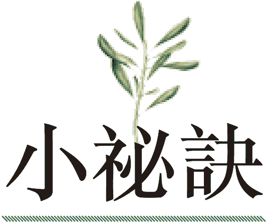

　　．在许多商店都能买到较大的烹调用芦荟叶。买回家时，从叶片中央切下十公分长的区段（叶片底部与顶端丢弃不用）并切成片，然后切除绿色表皮，舀出凝胶状果肉。芦荟果肉可以直接食用、与水一同搅打，或是加入果昔中。

　　．即使芦荟是从商店买来，或者取自你的菜园或窗台盆栽，仍然保有其野生特性。

　　．若有黑眼圈，或是你对皮肤状态不满，想要重十青春光泽，可以每天食用新鲜芦荟。其实，芦荟由内而外帮助皮肤的效果更好。

　　．将取自芦荟的新鲜芦荟胶（没有经过加工或添加防腐剂）涂抹在宠物的搔痒皮疹、壁虱与跳蚤叮咬，以及毛发脱落部位效果极佳。

芦荟凉饮

────── ◆ ──────

分量：1 人份

　　柳橙汁与椰子水的风味结合芦荟胶，酸甜可口。早上起床时先享用一杯，让充足的水分与柑橘的一抹阳光唤醒你全身。

柳橙 2 颗

椰子水 1 杯

芦荟叶 1/4 片

　　柳橙切片并榨汁（应该能榨出约 1 杯柳橙汁）。将柳橙汁倒进果汁机里，加入椰子水。切开芦荟叶，挖下 2 汤匙的透明芦荟果肉，放进果汁机里，与柳橙椰子水一同搅打至滑顺起泡，然后倒入玻璃杯中立刻享用。

大西洋海菜

　　　　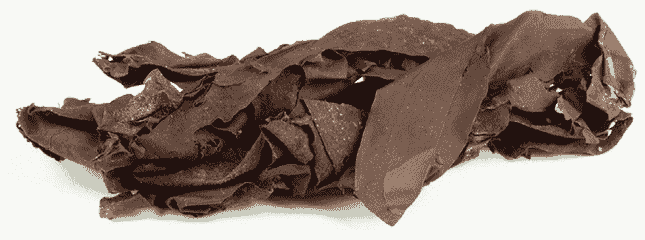

　　来自大西洋的海中蔬菜（也就是海菜）排除体内有毒重金属的效果极为强大。

　　它们在海里的工作是吸收有毒重金属、辐射物与其他毒素，并将这些物质变得无害。当红藻、墨角藻、海藻、翅藻、石莼、紫菜、角叉菜或岩海草接触海水中的毒素时，会像海绵般持续吸收毒素，并解除它们的破坏性频率，再释放回海里，使原本的污染物由于被海菜消除活性，不会再造成伤害。

　　吃下海菜时，它们会把海绵般的神奇能力带来帮助我们，只是效果有点不同。海菜吸收有毒重金属、辐射物、戴奥辛、DDT 等杀虫剂及其他毒素，并使它们失去活性后，不会把这些物质释放回我们体内，而是透过海菜中的生物活性植物性化合物锁定毒素，使它们还在人体内时无法扩散。假如海菜在进入我们体内时含有一点点任何毒素，它们会持续与毒素绑在一起，沿途还会收集更多毒素，然后在不把任何污染物传给我们的情况下排出体外。海菜也像是结肠中的紧急备用部队，能抓住并确保任何金属确实离开我们的身体。

　　驱除毒素时，大西洋海菜唯一留在我们体内的就是养分，尤其是五十种促进健康的矿物质。这些矿物质的生物可利用性极高，而且容易吸收，可滋养任何缺乏矿物质的身体系统。这些矿物质协助你维持平衡的同时，也在制造能帮助对抗压力的电解质。

　　这种野生食物对各种疾病皆有帮助。海菜能重建受损的 DNA，还能将海洋的接地性质转移到我们身上，消灭各种疾病。海菜对内分泌系统特别有帮助，因为它们会吸收可能导致甲状腺机能不足，并扰乱下视丘、脑下垂体与松果体的辐射物。此外，海菜也是活性碘的绝佳来源，可以保护甲状腺不受辐射与病毒（如 EB 病毒）伤害。海菜对骨胳、肌腱、韧带、结缔组织及牙齿也特别有益，解决有毒重金属引起的疾病或症状的效果也很棒，例如阿兹海默症、注意力不足过动症、癫痫或脑雾。

 有助于疗愈这些疾病

　　假如你有下列任一疾病，试着将大西洋海菜纳入日常饮食中：

　　内分泌失调、骨质缺乏症、骨质疏松症、骨折、受伤、癫痫、阿兹海默症、失智症、偏头痛、桥本氏甲状腺炎、葛瑞夫兹氏病、甲状腺癌、躁郁症、自闭症、注意力不足过动症、接触辐射（来自牙医诊疗、医疗 X 光或癌症治疗）、贫血、白血病、骨癌、脑癌、膀胱癌、肾脏癌、肝癌、肺癌、胃癌、肠道息肉、多重化学物质敏感症、强迫症、忧郁症、焦虑症、帕金森氏症、生殖器官癌症（例如卵巢癌、子宫癌、与子宫颈癌）、亚斯伯格症候群、子宫内膜异位症、青光眼、免疫系统缺陷、季节性情绪失调、狼疮。

 有助于疗愈这些症状

　　假如你有下列任一症状，试着将大西洋海菜纳入日常饮食中：

　　脑雾、甲状腺机能不足、记忆力衰退、抽搐、痉挛、癫痫大发作、视力混浊、落发、平衡问题、恶心、偏头痛、头痛、便秘、矿物质缺乏、各种神经系统症状（包括刺痛、麻木、痉挛、抽搐、神经疼痛与胸闷）、子宫发炎、卵巢发炎、输卵管发炎、胆囊发炎、胃部发炎、小肠发炎、结肠发炎、贝尔氏麻痹、暴怒、肝功能不良、颤动。

 情绪上的支持

　　对行为无可预料，心情时常起伏不定、忽冷忽热的人，海菜是相当有效的工具。通常当某人极度敏感、容易动摇或情绪不稳时，他并未接地，而大西洋海菜是最能让人接地的食物。

 灵性启发

　　我们时常吸收周遭的忧虑、恐惧及其他造成压力的情绪，这些有毒情绪会侵蚀我们，并对身心安康造成阻碍。海菜教我们处理在能量层面有毒的事物，解除其杀伤力，然后释放回苍穹之中，让它无法再伤害任何人。

　　．要从一顿饭里获取更大的接地效益，可以将一条海藻放进煮饭的电锅中，或者加进炖锅里一起煮汤，也可以搭配任何美味料理享用。

　　．将一把红藻加进野生蓝莓、芫荽叶、螺旋藻及大麦苗汁萃取粉打成的果昔中，就成了一杯超强排毒灵药。

海苔卷佐浓醇酪梨蘸酱

────── ◆ ──────

分量：1～2 人份

　　这道海苔卷可以包进下方列出的蔬菜，或是你喜欢的食材，搭配浓郁的酪梨蘸酱，就成了一道完美的午餐、点心，也可以当作晚餐轻食。

红萝卜 4 根

栉瓜 3 根

豆薯 1 颗，削皮

青葱 1 把，尾端切除

红藻片 1/2 杯

海苔 8 张

蘸酱材料：

酪梨 1 颗

莱姆 1 颗，榨汁

芫荽叶 1/4 杯

墨西哥辣椒 1/4 根

椰枣 1/2 颗

水 1/2 杯

　　将红萝卜、栉瓜与豆薯切成细长条，或是利用刨丝刀、螺旋切丝器或菜刀切成面条状。制作海苔卷时，将红萝卜、栉瓜、豆薯、青葱与红藻铺在每一张海苔片底部，然后往上紧紧卷起。以手指蘸水抹在海苔片边缘，让海苔卷可以黏合、固定。可依喜好将海苔卷切成一口大小。

　　至于蘸酱，将所需材料以果汁机搅打至滑顺，然后淋上海苔卷即可！

牛蒡

　　　　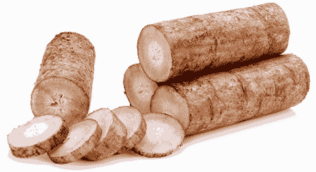

　　牛蒡是能修复肝脏的自然力量。牛蒡因为深入大地，而拥有接地能力。当肝脏充满病毒（例如 EB 病毒、带状疱疹、人类疱疹病毒第六型与巨细胞病毒），或是害菌、蠕虫、真菌或其他病原体时，会失去原本的接地能力。而牛蒡促进接地的效果比其他根茎类高出五十倍，能重建肝脏的接地机制，进而强化、活化肝脏，使其得以驱逐病原体。

　　若不多加照料，肝脏会逐渐失去原本像海绵般的能力，变得密实又坚硬，而牛蒡可以软化紧密、淤滞的肝脏。牛蒡中的植物性化合物也能支持肝脏，降低囊肿的生长与沾黏，并修复肝脏中的疤痕组织，而且它净化肝小叶的效果无人能比。牛蒡还能替肝脏最密实的部分排毒，并排除来自金属、塑胶、除草剂与杀真菌剂的外来有毒荷尔蒙，最终让肝脏得以呼吸。

　　牛蒡中的养分涵盖几乎各种微量矿物质与维生素 B 群，加上维生素 A、C、K。这种野生食物同时拥有独特的天赋，能净化淋巴系统与血液，提升白血球与杀手细胞功能，以保持淋巴结强健，使它们得以杀死病原体与癌细胞。此外，牛蒡中的酶也有高度活性，而且可结合牛蒡的丰富氨基酸，成为重金属解毒剂。

 有助于疗愈这些疾病

　　假如你有下列任一疾病，试着将牛蒡纳入日常饮食中：

　　痛风、肝脏疾病、肝癌、肾结石、胆结石、淋巴瘤（包括非何杰金氏淋巴瘤）、慢性感染、乳癌、肺癌、胸膜炎、狼疮、慢性疲劳症候群、纤维肌痛症、多发性硬化症、偏头痛、牙龈疾病、青春痘、C 型肝炎、肾上腺疲劳、糖尿病、滑囊炎、麸质过敏症、各种自体免疫疾病与失调、甲状腺癌、湿疹、牛皮癣、肾脏感染、莱姆病、蠕虫、酵母菌感染。

 有助于疗愈这些症状

　　假如你有下列任一症状，试着将牛蒡纳入日常饮食中：

　　肝脏疤痕组织、肝沾黏、肝脏囊肿、肝损伤、肝功能停滞、肝功能不良、胆囊痉挛、食物过敏、阑尾发炎、头痛、胃部疼痛、腹胀、便秘、背部疼痛、腹部痉挛、加速老化、血糖失衡、矿物质缺乏（包含微量矿物质缺乏）、髓鞘神经伤害、食物敏感、体内嗡鸣或震动感、血液毒性、化学物质敏感、消化系统不适、脾脏肿大、发炎、神经痛、软骨撕裂。

 情绪上的支持

　　若想净化身、心、灵，甚至清理被过往经验的阴影占据的周遭空间，牛蒡可以发挥情绪净化作用。

 灵性启发

　　若碰到即将散播种子的牛蒡，你稍后可能会发现有刺球状的花黏在袜子、裤子、鞋带、毛衣、头发等可以让这些小钩子附着的任何地方。牛蒡的刺球状花会伴随着你，一直陪你到达目的地。这是牛蒡植株为未来做准备的方法──把种子散播到任何过路客身上，这样新植株就能到更远的地方扎根。牛蒡教我们利用每次的相遇散播希望的种子，并认清其他人想借由我们传达的讯息。当我们心爱的人与亲朋好友在生命中航行时，我们能提供什么样的种子，让他们有一天可以种在这个世界上？我们又从他人手中获得了哪些值得散播的种子？

　　．按摩过后喝杯牛蒡茶或牛蒡汤，提升淋巴系统的排毒能力。

　　．将新鲜牛蒡加入你喜爱的蔬菜汁中一起搅打，它有着甜美朴实的味道，能与其他风味完美结合。最好现打现喝，以立刻将其中的矿物质直接吸收到体内。

　　．如果喜欢啃红萝卜，可以尝试换成牛蒡：以削皮器削去牛蒡皮，再切成棒状当点心吃。牛蒡的抗微生物特性与纤维有助于清洁牙齿、清除嘴里的害菌，并击退牙龈疾病。

　　．如果觉得某个朋友需要清理情绪或身体毒素，请对方喝杯牛蒡茶。

牛蒡汤

────── ◆ ──────

分量：2～4 人份

　　这道汤品可以一次先煮一大锅，方便往后整个星期都能享用。可以装在马克杯里喝，也可以盛在碗里品尝，这是送给身体与灵魂的温暖礼物。

切片牛蒡 2 杯

切片红萝卜 2 杯

切片蘑菇 2 杯

切片青江菜 2 杯

黄洋葱 1 颗，切丁

切碎的大蒜 1 汤匙

姜末 1 汤匙

海盐 1/2 茶匙

　　将所有食材放进大汤锅里，加水盖过并煮磙，然后把火转小，焖煮 30 至 40 分钟，煮到所有蔬菜熟软即可。

白桦茸

　　　　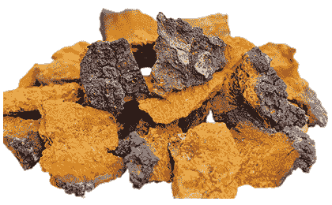

　　白桦茸拥有增强免疫系统的营养素，借由增加淋巴球、单核球、嗜中性球、嗜碱性球与嗜酸性球的生成来恢复白血球数量，让身体能对抗各种入侵者，例如毒素、病毒、细菌，以及酵母菌与霉菌等真菌。这种惊人的野生食物也能强化红血球与骨髓、平衡血小板，并击退细胞激素风暴──这是身体对病原体或毒素过度反应的结果。细胞激素风暴会导致血管扩张（可能引起出血）、荨麻疹、皮疹与发烧，而有了白桦茸的帮助，身体可以更妥善对付病原体与毒素。

　　白桦茸堪称本世纪最具药性、最能滋补全身的工具之一。白桦茸里的植物性化合物能有效对抗癌症、调节血糖、增强肾上腺同时调节其余的内分泌系统、分解并溶解生物膜（某些病毒与真菌的胶状副产物），以及消灭肠道中的有害真菌。提到这个，坊间传说蕈类与其他可食用真菌对人有害，因为摄取蕈类会导致体内的真菌过度增生──这实在太荒谬了，蕈类是我们所拥有对抗有害真菌最好的斗士。

 有助于疗愈这些疾病

　　假如你有下列任一疾病，试着将白桦茸纳入日常饮食中：

　　膀胱癌、骨癌、乳癌、肝癌、白血病、卵巢癌、摄护腺癌、自体免疫疾病与失调、莱姆病、狼疮、多发性硬化症、肌肉萎缩性嵴髓侧索硬化症、腕隧道症候群、肌腱炎、滑囊炎、坐骨神经痛、纤维肌痛症、慢性疲劳症候群、小肠细菌过度增生、高血压、脂肪肝、肺炎、牛皮癣、湿疹、葛瑞夫兹氏病、免疫系统缺陷、人类免疫缺乏病毒（爱滋病毒）、桥本氏甲状腺炎、EB 病毒∕单核球增多症、带状疱疹、肾上腺疲劳、接触霉菌、偏头痛、贫血、多重化学物质敏感症、电磁波过敏症、麸质过敏症、牙龈感染、酒渣（玫瑰斑）、鹅口疮、阴道链球菌感染。

 有助于疗愈这些症状

　　假如你有下列任一症状，试着将白桦茸纳入日常饮食中：

　　发炎、肩膀疼痛、五十肩、颈部疼痛、背部疼痛、头痛、头部疼痛、脂肪肝前期、铁质缺乏、关节疼痛、肌肉疲劳、贝尔氏麻痹、肝功能不良、肝功能停滞、发烧、皮疹、荨麻疹、手指甲与脚趾甲真菌、身体真菌、甲状腺机能不足、各种神经系统症状（包括刺痛、麻木、痉挛、抽搐、神经疼痛与胸闷）、颚部疼痛、身体僵硬、瘀血、黑眼圈、飞蚊症、足部疼痛、关节发炎、肝热、甲状腺机能亢进、肿胀、体液滞留、神经痛、循环不良、喉咙痛。

 情绪上的支持

　　对于认为自己错失某些事物，觉得失去生命方向、情绪迟钝与麻木，且无法下定决心──即使只有一个决定要做，却不喜欢自己手上的选择──的人而言，白桦茸是很珍贵的工具。需要帮助以想像自己未来想要些什么，以及该如何实现时，就交给白桦茸吧。

 灵性启发

　　白桦茸与它生长其上的树木和谐共生。一旦在树上扎根，白桦茸会极缓慢地生长，如此才不会干扰寄主。它在风暴与严寒时期给予树木力量。白桦茸拥有耐心与生存智慧，知道如果寄主树木倒了，它也活不了。我们可以从这种野生食物身上学到忠诚。假如你相信某人或某事，白桦茸教我们别放手；若想帮助所爱之人生存与茁壮，我们也必须如此。情况需要时，就全部投入，并想想白桦茸的天性来支持自己。就像白桦茸与树木的关系，我们必须保持坚强，不仅为了彼此，也是为了更大的利益。

　　．选购磨成极细粉末的白桦茸，这是最有利于养分吸收的形式。你可以将白桦茸粉加入果昔中或拿来泡茶。

　　．在热水中加入白桦茸粉并搅拌至溶解即成白桦茸茶，加入生蜂蜜则能帮助白桦茸的药性深入体内难以触及的地方，提升身体系统功能。白桦茸蜂蜜茶是午后提振精神的绝佳饮品。

　　．尊敬白桦茸，摄取之前对它的忠诚与坚忍天性表达敬意，如此将使身体更能吸收其中提升免疫力的植物性化合物。

白桦茸拿铁

────── ◆ ──────

分量：2 杯

　　需要力量与抚慰时，这杯温暖浓郁的饮品再适合不过了。享用时不妨想想它对你的身体有什么好处，因为白桦茸能帮助你发挥潜能。

白桦茸粉 2 茶匙

肉桂 1/2 茶匙

生蜂蜜 1 茶匙

椰奶 1/8 ～ 1/4 杯

　　将 2 杯水煮磙。把白桦茸粉与肉桂平均分配于两个茶杯中，然后在每个杯子里倒入 1 杯热水。倒入蜂蜜拌匀，可依喜好增加蜂蜜量。将椰奶倒入茶杯里拌匀，或者利用奶泡器打出椰子奶泡，倒在饮料上即可。

椰子

　　　　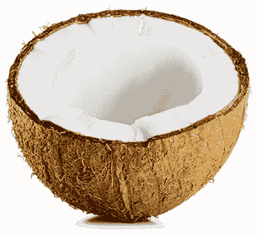

　　椰子近年来颇受推崇，尤其是以椰子水与椰子油形式呈现的产品。我们听过椰子水在二战时期被当成伤兵的静脉注射液，也听说许多人在饮食中加入椰子油之后体验到健康奇迹。

　　现在来聊聊还没人发现的部分：椰子能增进它触及的任何事物的力量。与任何疗愈食物结合时，椰子能链接它们的效益并大幅提升。比方说，若将椰子水加入掺有荷兰芹的果昔中，椰子水会让荷兰芹排除你体内有害酸性物质的能力提升 50%，并大幅增强荷兰芹所含的微量矿物质带来的益处。或者，如果把椰肉加入沙拉里，沙拉中的其他食材──小黄瓜、莴苣、番茄、菠菜等任何具有疗愈效果的食物──都会变得更营养、更能改变生命。借由启动其中的氨基酸、维生素与其他养分，椰子让食物实现它存在的最高目的，并借此滋养你，让你也能实现你人生的使命，并迈向更高的目标。

　　椰子水为血液提供至关重要的葡萄糖与关键的矿物盐，包括钾与钠，这是神经传导物质生成的基本要素。少了身体需要的神经传导物质，可能导致失眠、神经系统睡眠呼吸中止症，以及其他睡眠障碍。为了避免这些问题，最好的方法就是饮用椰子水。

　　而苦于不孕症或其他生殖系统失调问题的人请记住，椰子水的微量矿物质与电解质能滋养你的生殖组织。此外，椰子水对有低血糖症与其他血糖失调问题的人非常重要（包括糖尿病患者），对肾上腺机能亢进或不足的人也是，还有益于各种大脑与神经系统失调问题。椰子水对帕金森氏症患者大有帮助，对罹患阿兹海默症或其他种类失智症的人而言也是不可或缺，更有助于预防癫痫发作，以及改善各种眼疾。

　　椰肉（以及榨取自椰肉的椰子油）因为所含的月桂酸与它的其他抗氧化物结合，而具备抗病原体性质。因此，需要抗菌与抗病毒食物时，别忘了椰子。当椰子从胃部进入肠道时，会杀死它接触到的任何病原体。此外，它的中链脂肪酸能分解其他脂肪，并协助将它们排出体外。

 有助于疗愈这些疾病

　　假如你有下列任一疾病，试着将椰子纳入日常饮食中：

　　姿势性直立心搏过速症候群、爱迪生氏症、雷诺氏症候群、肾上腺疲劳、低血糖症、糖尿病、甲状腺癌、心搏过速、心房颤动、忧郁症、焦虑症、躁郁症、亚斯伯格症候群、失眠、癫痫、视神经疾病、青光眼、偏头痛、帕金森氏症、阿兹海默症、失智症、EB 病毒∕单核球增多症、人类疱疹病毒第六型、人类疱疹病毒第七型、人类疱疹病毒第八型、人类疱疹病毒第九型、尚未被发现的人类疱疹病毒第十到十二型、甲状腺疾病、带状疱疹、注意力不足过动症、自闭症、甲状腺结节、泌尿道感染、不孕症、生育能力低落、坐骨神经痛、细菌性肺炎、莱姆病、霉浆菌、肺炎披衣菌、寄生虫问题、腕隧道症候群、高血压、人类乳突病毒、诺罗病毒、胰脏炎、小肠细菌过度增生、晒伤。

 有助于疗愈这些症状

　　假如你有下列任一症状，试着将椰子纳入日常饮食中：

　　心悸、癫痫大发作、心律不整、焦虑、脑雾、视力混浊、贝尔氏麻痹、记忆力衰退、体重增加、食物过敏、五十肩、颚部疼痛、神经痛、各种神经系统症状（包括刺痛、麻木、痉挛、抽搐、神经疼痛与胸闷）、背部疼痛、意识混乱、化学物质敏感、矿物质缺乏、疲劳、倦怠、萎靡、脱水、头痛、吞嚥困难、呼吸困难、结缔组织发炎、耳朵疼痛、足部疼痛、高血压、睡眠障碍、血小板数量过低、神经质、耳鸣或耳中嗡嗡作响、急尿。

 情绪上的支持

　　你是否有哪个朋友对任何事物的反应都是“关我什么事”？如果有，提供对方任何形式的椰子。椰子适合自恋、对自我着迷，以及完全沉浸于自己单一世界观里的人。它能打开情绪渠道，让人放弃自我迷恋，权衡他人与自己的需求及价值。

 灵性启发

　　椰子树在风暴中会快速让果实掉下去，这是它的生存智慧：要选择紧抓住椰子不放，在风暴横扫时承受倾倒的风险，或是选择抛下椰子，让自己不那么容易被吹倒。这是应该谨记在心的教诲。当生命面临风暴，有时必须放弃对自己最珍贵的事物，这会让人感觉仿佛世界末日。而椰子树告诉我们，太阳最后还是会升起，最重要的是你仍然屹立不摇。

　　．买椰子水时，只选购清澈透明或带着极细微粉红色的。有错误观念认为深粉红色或淡红色的椰子水比较有益，其实这是快速氧化与变质的征兆。此外，也应避开任何含有天然风味剂、柠檬酸，或是龙舌兰蜜或精制蔗糖等甜味剂的椰子水。

　　．若取得幼嫩、青绿色的椰子，最好在几天内食用完毕。如果在未冷藏状态下放置太久，椰子可能会爆开，到时就得清理墙壁或天花板上的椰子水了。

　　．如果无法取得新鲜椰子，选择罐装椰子酱或冷冻嫩椰肉也不错，很适合用在沙拉这类料理中。至于烹调，最好也使用椰子油。

　　．如果不敢游泳或害怕开放水域，试着将椰子带进生活中。椰子树通常生长在海岸靠近水边的地方，并将椰子抛进海里。椰子是很棒的游泳选手，可以在开放水域漂流很久、很远，并在漂流时吸收海洋的知识，直到抵达一片能够扎根的新海岸。食用椰子时，你也继承了这种适应水上生活的天性，能够减轻你对水的焦虑，有助于增强力量。

　　．在晚间食用椰子对于月圆时难以入眠的人而言相当理想。椰子为你的神经传导物质与电脉冲提供了额外的矿物盐与电解质，能协助你抵挡满月时的细微引力。

金黄椰子咖哩

────── ◆ ──────

分量：6～8 人份

　　这份食谱让你一次大量准备，足以应付一大群饥肠辘辘的食客，或者让你吃上一星期。黄咖哩既温和又让人觉得温暖，令人回味无穷。

日本南瓜 1 小颗

马铃薯 8 颗

红萝卜 8 根

椰子油 1 汤匙

洋葱 3 颗，切丁

大蒜 8 瓣，切碎

姜末 2 汤匙

黄咖哩粉 2 汤匙

椰奶 3 杯

蜂蜜 2 茶匙

盐 1 1/2 茶匙

芫荽叶 1/2 杯

莱姆 1 颗

辣椒（依喜好选用）

　　将日本南瓜放进大汤锅中以水盖过，煮磙后继续煮 5 至 7 分钟，直到南瓜稍微变软，然后沥干、放凉。将马铃薯与红萝卜大略切块备用。南瓜凉了以后切成两半、去籽、大略切块，与红萝卜及马铃薯一同放入汤锅中，加入 5 公分高的水煮磙，然后加盖蒸煮，偶尔搅拌，需要时可再加水，蒸煮至蔬菜正好熟透。

　　咖哩部分，将椰子油倒入大锅中加热，再加入洋葱大火煎炒，直到洋葱变软并散发香气（约 5 分钟），需要时可加水以免黏锅。在洋葱里加入大蒜、姜末与咖哩粉，持续拌炒 1 分钟。接着加入椰奶、蜂蜜与盐，继续搅拌。最后加入之前蒸煮好的蔬菜，并转为小火焖煮约 10 至 15 分钟，煮到蔬菜熟软。盛起咖哩，撒上芫荽叶、挤上莱姆汁即可上桌，也可依喜好撒上辣椒。

蒲公英

　　　　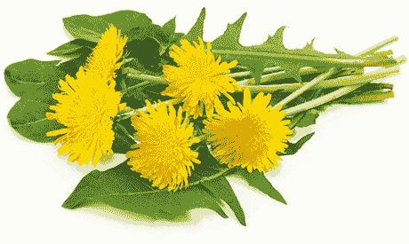

　　蒲公英的独特之处在于每个部分──根部、叶子、花，甚至茎──都能用，各有不同程度的苦味，正好呼应身体需要不同净化作用的不同部位。首先，蒲公英花（有点苦，但伴随细微甜味）能清洁中空器官，例如胃、肠道、胆囊、膀胱、肺、子宫、心脏。

　　接着是叶子。蒲公英叶中的植物性化合物能净化血液，并有助于将血液输送至难以触及的部位，所以蒲公英叶是解决循环问题不可或缺的。叶子的苦味也能将毒素挤出淋巴系统，使它成为对付非何杰金氏淋巴瘤、淋巴结肿大与水肿的理想食物。

　　然后是茎部，它比花与叶子更苦，可以净化体内的实体器官（相对于中空器官），例如脾脏、肝脏、大脑。比方说，它能排除已经不再有用的胆汁。

　　至于蒲公英的根部，可以更深入地为这些实体器官解毒。这是整株蒲公英最苦的部位，能促使器官进行最深层的清理作业，以增强净化效果。

　　蒲公英不只是具有净化效果的药草，它在清理完垃圾之后，还会在你体内留下重要营养素，例如维生素 A、维生素 B 群、锰、碘、钙、铁、镁、硒、二氧化硅与叶绿素，给你活力，并协助身体击退疾病。蒲公英能预防几乎任何疾病，对摄护腺的效果尤佳。

 有助于疗愈这些疾病

　　假如你有下列任一疾病，试着将蒲公英纳入日常饮食中：

　　淋巴瘤（包括非何杰金氏淋巴瘤）、水肿、摄护腺炎、皮肤癌、轮癣、酒渣（玫瑰斑）、肥胖症、肾结石、肝硬化、C 型肝炎、青春痘、肌肉萎缩性嵴髓侧索硬化症、偏头痛、泌尿道感染、血液异常、血液细胞疾病、消化系统失调、脂肪肝、麸质过敏症、肾脏疾病。

 有助于疗愈这些症状

　　假如你有下列任一症状，试着将蒲公英纳入日常饮食中：

　　循环不良、体液滞留、淋巴结肿大、体重增加、荨麻疹、肝功能不良、肝功能停滞、腹部鼓胀、腹部疼痛、胃酸逆流、血液毒性、充血、便秘、肝脏囊肿、消化系统不适、脾脏肿大、黏液过多、脂肪肝前期、高血压、阑尾发炎、胆囊发炎、胃部发炎、小肠发炎、结肠发炎、组织胺反应、消化功能衰弱。

 情绪上的支持

　　我们有时觉得失去了一部分自我，或者因为情绪所致说出某些话，之后却觉得后悔或甚至不明白自己为何口无遮拦。这通常是因为我们失去了协调，身、心、灵并未合一运行。对想要感受整体性的人而言，蒲公英是完美的统一者，因为它本身就一致无二。

 灵性启发

　　我们时常为了争第一而心烦意乱，影响了自我价值感。这种高成就者心态很早就开始了：第一个去排队、第一个举手、第一个挤上公车。有些人觉得若不借由这种方式证明自己，就会永远失去他人的认可与机会。

　　蒲公英在春季成长，在夏季的高温中干枯，但整株植物在这一年并非就此死去，而是经常在秋季重新出现。如果你会因为抢不到第一名就觉得自己不完整或比不上别人，请记住：蒲公英会卷土重来，而纵使自己无法总是位居龙头，也同样能找到满足与慰藉，因为转角处会有新的机会。

　　．若不喜欢蒲公英的苦味，试试烘焙过的蒲公英根茶，排毒效果极佳，而烘焙过程也会减轻苦味。

　　．蒲公英花很适合冷泡茶。摘下新鲜的花，在冷水中浸泡一夜，以释放其中的矿物质、维生素与植物营养素。若要添加甜味，可加入生蜂蜜。

　　．有机会就在野外采下一片蒲公英叶（例如在未喷洒杀虫剂的草地或爬山途中），并且生食。野生蒲公英叶有绒毛，这可是崇高微生物这类有益微生物的圣地。

　　．若无法取得新鲜蒲公英，也别排斥健康食品店卖的蒲公英叶。

　　．试试在蒲公英花季过后将种子从其头部吹走的游戏，这是很深刻的静心方式。

蒲公英蔬果汁

────── ◆ ──────

分量：1～2 人份

　　这道蔬果汁完美缓和了蒲公英叶的强烈滋味，是在生活中加入蒲公英叶的绝佳方式。

西洋芹 1 棵，茎部一根根分开

小黄瓜 2 根

中型柳橙 2 颗，削皮

蒲公英叶 10 片（最好连叶柄一起）

　　将所有食材放进高速榨汁机里榨成汁（可依喜好增加蒲公英叶用量），然后倒入玻璃杯即可享用！

荨麻叶

　　　　

　　虽然你不太可能在别处看到荨麻叶被列为适应原药草，它却是绝佳的适应原，很适合支持身体度过压力期。荨麻叶含有超过七百种尚未被发现的植物性化合物，对疲劳的器官有绝佳的抗发炎效果，也含有疗愈性的生物碱。

　　女性的卵巢在制造生殖荷尔蒙方面获得诸多注目，这代表当检验结果指出某位女士的荷尔蒙浓度不足时，健康照护专家常会责怪生殖系统，有时会换来不必要的荷尔蒙补充药物。事实上，肾上腺也分担了制造女性体内雌激素、黄体素与睾固酮的工作。检验结果说荷尔蒙浓度过低，常常代表肾上腺要不是过度活跃（所以过多肾上腺素的腐蚀特性干扰了读数的准确度），就是机能低落（所以无法及时生成性荷尔蒙）。许多二、三十岁的女性接受检查后被告知她们已进入更年期前期，但让她们不舒服的真正原因是肾上腺疲劳。在女性生殖系统被认为有问题的无数案例中，需要帮助的其实是肾上腺，而这正是荨麻叶发挥功用的时候。

　　这种抗辐射的野生食物，能让你好好宠爱过度负担、过度运作或过度疲劳的肾上腺与内分泌系统其他成员。而由于卵巢是内分泌系统的一部分，荨麻叶可说是带来双赢的食物，能一次解决多个扰乱荷尔蒙的因素。荨麻叶是帮助生殖系统的终极药草，对女性尤其有益，它透过支持可以刺激卵泡的荷尔蒙，来促进卵子生成，也能使身体摆脱来自塑胶与杀虫剂的外来有毒雌激素。

　　荨麻叶富含建构与保护骨胳的矿物质，如二氧化硅，同时也有超过四十种以生物活性、生物可利用性与可吸收度最高的形式呈现的微量矿物质。有了这些特性，加上荨麻叶是强大的止痛药，确实能提升我们成长茁壮的能力。

 有助于疗愈这些疾病

　　假如你有下列任一疾病，试着将荨麻叶纳入日常饮食中：

　　泌尿道感染（如膀胱感染与肾脏感染）、间质性膀胱炎、生殖器官癌症、卵巢癌、子宫颈癌、子宫癌、EB 病毒∕单核球增多症、类风湿性关节炎、带状疱疹、创伤后压力症候群、喉炎、生育能力低落、青春痘、湿疹、牛皮癣、不孕症、各种自体免疫疾病与失调、秃头、贫血、厌食症、焦虑症、忧郁症、膀胱脱垂、乳癌、水肿、内分泌系统失调、多囊性卵巢症候群、阴道链球菌感染。

 有助于疗愈这些症状

　　假如你有下列任一症状，试着将荨麻叶纳入日常饮食中：

　　肾上腺机能低落∕亢进、肾上腺荷尔蒙失衡、焦虑、发炎、生殖荷尔蒙失衡、阴道分泌物、阴道搔痒、阴道灼热、经痛、经前症候群症状、皮疹、头痛、食物过敏、更年期症状、腹部痉挛、加速老化、疤痕组织、腹胀、手脚冰冷、肿胀、失禁、月经失调、皮质醇过低、情绪波动、喜怒无常。

 情绪上的支持

　　对容易分心、心思涣散的人，荨麻叶是非常有助于集中注意力的药草。

 灵性启发

　　荨麻在春季萌芽时，看起来不过就像花园或田野中平凡的新生植物，我们可能只顾着欣赏绿意而未曾多加注意它。突然间，荨麻长高了、开枝散叶了，表达了自己的存在，如果没注意到，它就在我们擦身而过时用细小的刺替自己发声。遭遇过这种刺痛感的人往往将荨麻视为杂草，一看到荨麻就有些畏惧；但对于学会怀抱敬意接近荨麻，以及知道它诸多好处的人，看见新生的荨麻冒出头，往往产生些许兴奋之情，就像与许久未见的好友重逢。荨麻教我们留意周遭这些感激的火花。你曾经漠视哪些事物，但其实只要学着敞开心接受、与之合作，就能欣赏其真实特质？

　　．即使是干燥的荨麻也能与一个效力循环产生共鸣。下午饮用荨麻叶茶能让它发挥最强大的效果。

　　．针对蚊虫咬伤、擦伤与轻微烧烫伤，可以将布浸泡于荨麻叶茶中，再把泡过茶汤的布敷于患处。

　　．静心前饮用荨麻叶茶可让体验更加集中。

薄荷生姜荨麻叶茶

────── ◆ ──────

分量：3～6 杯

　　荨麻的适应原特质帮助我们与自身直觉接触。啜饮这杯让人精神焕发的茶时，想想你的直觉能力过去如何为你效力，现在又在告诉你什么。

荨麻叶 2 汤匙

切碎的新鲜薄荷 2 汤匙

姜末 2 茶匙

　　在小碗中混合所有材料，然后煮沸 4 杯水。制作一人份的茶饮时，在 1 杯热水中加入 1 茶匙的上述混料，浸泡至少 5 分钟。

　　＊若希望茶饮的风味更强烈、药效更好，可以在每人份茶饮中使用 2 茶匙（最多 1 汤匙）的泡茶混料。

生蜂蜜

　　　　

　　以原始、具生命力形式呈现的未加工蜂蜜，堪称来自神与大地的奇迹。若你害怕蜂蜜只是单纯的糖，因此必须避免摄取，将这种担忧抛在脑后吧。如果排斥蜂蜜，就会错失它神奇的健康效益。蜂蜜中的糖分与加工糖完全不同，确切而言，因为蜜蜂从各种植物采集蜂蜜，所以蜂蜜中的果糖与葡萄糖充满超过二十万种尚未被发现的植物性化合物，包括病原体杀手，以及保护你不受辐射伤害或能抗癌的植物性化合物。当抗癌的植物性化合物被吸收到恶性肿瘤与囊肿里，能让癌细胞的生长过程停止。而蜂蜜中高度可吸收的糖分与 B12 辅酶，使其成为现代最有益大脑的食物之一。此外，生蜂蜜能修复 DNA，且富含钙、钾、锌、硒、磷、铬、钼、锰等矿物质。

　　生蜂蜜是对抗感染性疾病的秘密武器。当你的免疫力变弱，觉得特别容易染上普通感冒、流行性感冒、诺罗病毒等肠胃传染病，以及食物中毒时，生蜂蜜能强化嗜中性球与巨噬细胞，让它们得以击退病原体，借此协助你的身体维持坚强的第一线防御（医学尚未记录，刺激免疫的植物性化合物能滋养这两种与其他白血球）。这些特性也让生蜂蜜具有抗发炎效果，因为它能抑制病原体繁殖并释放使发炎恶化的毒素。生蜂蜜的确是我们这个地球的良药。

 有助于疗愈这些疾病

　　假如你有下列任一疾病，试着将生蜂蜜纳入日常饮食中：

　　鼻窦感染、耳朵感染、糖尿病、低血糖症、创伤后压力症候群、过敏、麦粒肿（针眼）、眼睛感染、多重抗药性金黄色葡萄球菌、葡萄球菌感染、难解的不孕症、小肠细菌过度增生、生育能力低落、失眠、肾上腺疲劳、普通感冒、流行性感冒、诺罗病毒、各种癌症、躁郁症、注意力不足过动症、阿兹海默症、失智症、各种自体免疫疾病与失调、寄生虫问题、食物中毒、呼吸道感染、支气管炎、喉炎、鹅口疮。

 有助于疗愈这些症状

　　假如你有下列任一症状，试着将生蜂蜜纳入日常饮食中：

　　喉咙痛、鼻涕倒流、发炎、口疮、睡眠障碍、肠道细菌感染、各种神经系统症状（包括刺痛、麻木、痉挛、抽搐、神经疼痛与胸闷）、体臭、皮肤干燥、囊肿、眼睛干涩、头晕、耳朵疼痛、飞蚊症、发烧、头痛、热潮红、关节疼痛、活力衰退、丧失性欲、疲劳、记忆力问题、记忆力衰退、鼻窦问题、呼吸短促、胃痛。

 情绪上的支持

　　蜂蜜的黏着性不只是物理特性，也适用于情绪层面。如果蜂蜜存在你的生活中，当你经历美好的事物──使你振奋并滋养你灵魂的事物──那份记忆会黏住你，即使身处可能让你苦恼的负面体验，你也不会失去那美好的记忆。

 灵性启发

　　若能追溯到家族血脉的源头，你会发现靠蜂蜜为生的祖先。生蜂蜜不仅仅用于维系生存，让人类勉强撑到发现更好的食物为止；应该说，它以往是（现在仍是）具备药效的绝佳滋养品。蜂蜜深埋在我们的血脉之中，真正的我们──我们的灵魂、我们的 DNA──在某种意义上是起源于蜂蜜。这表示如果将蜂蜜拒于门外，等于关闭了我们与人类生命起源链接的那个部分。与蜂蜜创建链接，将使我们重新接触自己。这让人不禁想问：我们还曾经对哪些成就今日的自己的幕后推手冷漠以待？还有什么值得我们重新评估？

　　．在柠檬水中加入生蜂蜜，可增强蜂蜜的生物类黄酮，并提升这杯饮料的增强免疫效果。

　　．若觉得自己快生病了，睡前服用一茶匙生蜂蜜，这样做也能促进一夜好眠。

　　．以生蜂蜜取代平常使用的所有加工糖类与甜味剂。尽量选购野生花蜜。

　　．蜂蜜对疗愈小伤与活化皮肤效果极佳。试着涂抹在你想要加速疗愈过程的疤痕上。

　　．静心前摄取蜂蜜能强化心智，并带来一整天的愉悦感。

蜜香椰子冰淇淋

────── ◆ ──────

分量：2～4 人份

　　这道食谱可以让你完成比市面上所有产品更干净美味的冰淇淋。此外，你还能将剩下的杏仁奶用在果昔中，或者放进冰箱里冰凉享用。

杏仁 1 杯

椰枣 2 颗，去核

香草豆荚 0.5 公分，纵向剖开

椰子乳脂 1½ 杯

海盐 1/8 茶匙

生蜂蜜 1/8 杯

切碎的杏仁 1/4 杯（依喜好选用）

　　首先，将杏仁、椰枣、香草豆荚中刮下的香草籽与 2 杯水放进果汁机搅打至滑顺，然后将打好的混料倒进过滤袋挤压过滤成杏仁奶，放到一旁备用。接着打开椰奶罐头，将上层的浓厚乳脂舀出来（做法请参阅第 100 页的“鲜奶油莓果”食谱）。拿个中型碗，将椰子乳脂、1 杯杏仁奶、海盐及生蜂蜜倒进碗中搅拌至充分混合，然后倒入冰淇淋机里，依照说明书的指示制冰即可。

　　＊如果没有冰淇淋机，可将混料置于碗中，放入冷冻库，每 30 分钟搅拌一次，直到成形。

红花苜蓿

　　　　

　　红花苜蓿是最能支持淋巴系统并净化淋巴液的药草，且能有效对抗各种癌症。这种慷慨的野生药草──花与叶子都可使用──有利尿效果，而且是终极造血良方，适合为了各种血液问题或疾病而担忧的人，例如白血病、多发性骨髓瘤，或是因为胰脏或肝脏功能不良而导致血液中有毒素。

　　红花苜蓿含有丰富养分与对抗疾病的生物碱，从中获得的营养素比市面上任何综合维生素产品都多。若担心缺乏营养，可以每天喝三杯红花苜蓿茶，这是促进再矿物化的终极工具，也能有效补充缺乏的各种营养素，尤其是钼、锰、硒、铁、镁、维生素 A、维生素 B 群、维生素辅因子（这是医学研究尚未探索的植物营养素）。此外，红花苜蓿的生物碱能与它的氨基酸共同分解并减少堆积的多余脂肪，让脂肪排出体外。因此，红花苜蓿是现代人的减重好帮手。

　　红花苜蓿还有供给能量的效果，对觉得疲惫或筋疲力尽的人相当重要。你可以用新鲜水果、蔬菜与超级食物粉打出最棒的果昔，但它补充养分的效果很可能比不上一杯红花苜蓿茶。这些优点结合红花苜蓿清理有毒重金属及 DDT 等杀虫剂的能力，使这种药草成为本世纪的维生必需品。

 有助于疗愈这些疾病

　　假如你有下列任一疾病，试着将红花苜蓿纳入日常饮食中：

　　血液细胞疾病、B 细胞疾病、白血病、血液毒性、A 型肝炎、B 型肝炎、C 型肝炎、D 型肝炎、血液细胞癌症（如多发性骨髓瘤）、贫血（包括镰刀型红血球疾病）、肝脏疾病、肾上腺疲劳、生育能力低落、过敏、EB 病毒∕单核球增多症、青春痘、单纯疱疹病毒第一型、单纯疱疹病毒第二型、不孕症、带状疱疹、短暂性脑缺血发作（小中风）、唾液管问题、麸质过敏症、湿疹、牛皮癣、莱姆病。

 有助于疗愈这些症状

　　假如你有下列任一症状，试着将红花苜蓿纳入日常饮食中：

　　高血压、肝功能停滞、肝功能不良、慢性腹泻、慢性稀粪、便秘、荷尔蒙失衡、脾脏肿大、经前症候群症状、更年期症状、食物过敏、荨麻疹、皮疹、血糖失衡、忧郁、淋巴结肿大、循环不良、组织胺反应及敏感、皮肤干燥、尿血、钙化、化学物质敏感、身体真菌、指甲脆弱、瘀血、头痛、消化功能衰弱、体重增加、渴望吃甜食。

 情绪上的支持

　　红花苜蓿适合活在过去以致几乎伤害自己的人。若发现自己因为怀念以往体验到的幸福与满足感，而试图回到过去，请寻求红花苜蓿的帮助。这种药草能帮你把那些有益的情绪带到现在，让你在目前的生活中也能感受到喜悦与满足。

 灵性启发

　　红花苜蓿几乎可以在任何地方生长，而且即使应该列于尊贵之位，它也不介意被人践踏。红花苜蓿是相当宽容的植物，蓬勃地生长，且生命力强韧。你可以割下它、重踩它，它仍然会不断冒出头来，提供希望与丰足。你是否曾被逆境击倒，但你还有许多东西可以付出？红花苜蓿教导我们，继续往前走。

　　．寻求净化时，试着在晚间饮用一杯红花苜蓿茶。这种药草的疗愈、净化特性会持续运作一整夜，寻找并排出你身体系统内的毒素，让肝脏在凌晨时分就能开始处理毒素。

　　．红花苜蓿通常成簇开花，一次大约开五到二十朵。若要获取红花苜蓿的完整药效，跟着它的自然节奏，一天喝一杯红花苜蓿茶，连续喝五到二十天（超过二十天也没问题，就当作新的一簇花盛开了）。

红花苜蓿洋甘菊茶

────── ◆ ──────

分量：4 杯

　　早晨喝一杯这样的茶，你会发现这一天似乎开始变得更新、更明亮了。

红花苜蓿花 2 汤匙

洋甘菊花 1 汤匙

熏衣草花 1/4 茶匙

　　在小碗中混合所有材料，然后煮沸 4 杯水。制作一人份的茶饮时，在 1 杯热水中加入 1 茶匙的上述混料，浸泡至少 5 分钟。

　　＊若希望茶饮的风味更强烈、药效更好，可以在每人份茶饮中使用 2 茶匙（最多 1 汤匙）的泡茶混料。

玫瑰果

　　　　

　　玫瑰果中的维生素 C 是现存生物同质性与生物可利用性最高的一种维生素 C，也就是我们身体最能利用的。此外，它的维生素 C 还能将你体内来自其他食物的维生素 C 转变为更优质的形式。维生素 C 能够抗发炎（而且玫瑰果中的维生素 C 抗发炎效果比其他来源更好），也能借由强化嗜中性球、嗜酸性球、嗜碱性球与巨噬细胞来增加白血球数量，并整体提升免疫系统对抗病毒、细菌、酵母菌、霉菌与其他有害真菌的能力。它对于对抗几乎各种感染都是特别有益的催化剂。

　　当某种病毒（如 EB 病毒）在体内活跃时，往往会释放毒素，而在此过程中，病毒的残骸会形成一种称为生物膜的胶状物质。这种生物膜不仅像是体内有害微生物的培养皿，还会阻碍重要器官的运作。肝脏就像海绵，为了保护身体而吸收这种生物膜，但生物膜会挣脱并进入血液中，而由于心脏的血液大多从肝脏汲取而来，这种黏稠的胶状残余物就被抽进心脏瓣膜中，例如二尖瓣，这正是造成难解心悸、心搏过速、心房颤动与心律不整的潜在原因。玫瑰果中的维生素 C 能预防这种情况，它可溶解生物膜，帮助分解其残渣，最终让苦于心律不整的人获得舒缓。

　　玫瑰果对缓解泌尿道感染效果奇佳（比蔓越莓厉害），也能疗愈皮肤问题。它还有比大部分疗愈食物更高比例的抗氧化物，而且种类也多（其中有很多尚未被发现）。玫瑰的根部比其他许多灌木更深入土壤之中，因此可汲取到几乎各种矿物质，包括重要的二氧化硅。即使是在自家后院种植玫瑰，结出的玫瑰果仍然属于野生食物。嫁接、杂交与培育并不会带走玫瑰的野性，这些力量永不动摇。

 有助于疗愈这些疾病

　　假如你有下列任一疾病，试着将玫瑰果纳入日常饮食中：

　　耳朵感染、牙齿问题、牙龈疾病、牙龈脓肿、泌尿道感染（如膀胱感染与肾脏感染）、憩室炎、憩室病、小肠细菌过度增生、喉炎、心搏过速、心房颤动、普通感冒、流行性感冒、鼻窦感染、青春痘、白斑症、皮肤感染、葡萄球菌感染、链球菌性喉炎、麦粒肿（针眼）、眼睛感染、多重抗药性金黄色葡萄球菌、手指甲与脚趾甲真菌、肾上腺疲劳、单纯疱疹病毒第二型、各种自体免疫疾病与失调、慢性支气管炎、慢性疲劳症候群、痔疮、牛皮癣性关节炎、体内细菌感染、癫痫、糖尿病。

 有助于疗愈这些症状

　　假如你有下列任一症状，试着将玫瑰果纳入日常饮食中：

　　喉咙痛、口疮、心悸、肝功能停滞、肝功能不良、便秘、皮疹、黏液过多、发烧、各种神经系统症状（包括刺痛、麻木、痉挛、抽搐、神经疼痛与胸闷）、视力模煳、五十肩、热潮红、水泡、身体疼痛、皮肤搔痒、倦怠、脑损伤、矿物质缺乏、咳嗽、头晕、耳鸣或耳中嗡嗡作响、皮肤干燥、眼睛干涩、萎靡、颈部疼痛、神经质、肩膀疼痛。

 情绪上的支持

　　你是否曾觉得有人在找你麻烦，仿佛精神上遭受攻击？他人的负面看法是否会影响你的心理状态？玫瑰果可以保护你不受这种恶意伤害。无论别人是因为你追求自然方法（例如自然产或长期哺乳）、在工作上订规矩，或是他们希望你降低道德标准，但你坚持不愧对良心，因而对你不满，都请摄取玫瑰果来抵挡唱反调的人，让你能坚持自己的路。

 灵性启发

　　玫瑰花稍纵即逝的美引人注目，但花瓣凋谢之后呢？花谢不该成为让人忧郁的原因，或者代表我们任由时间摆布，而是值得庆贺的事。那硕大、艳丽又芳香的花朵只是封邀请函，真正的派对是在玫瑰花凋谢、玫瑰果开始成熟才拉开序幕。人也一样，逐渐变老不该是哀痛的原因，我们的年轻岁月不过是开端，随着年华老去、经验增长，我们得到自己真正的价值：结实累累的智慧，好让我们分享并滋养彼此。你生命中还有什么被你当作结束，实际上才正要开始的事物？

　　．玫瑰果是玫瑰的灵魂。泡玫瑰果茶前，把即将使用的干燥玫瑰果放在太阳下五分钟（别超过），可唤醒玫瑰果过去在风中摇曳、沐浴在温暖阳光里的最强大记忆。这能增强玫瑰的灵魂，让它把最大的效力传给你。

　　．泡好茶之后，挤一点柠檬汁并加入些许生蜂蜜，让所含的维生素 C 更活跃。

柳橙玫瑰果冰茶

────── ◆ ──────

分量：2 杯

　　可以偷闲片刻时，想想玫瑰果，并泡上这样一大壶甜美清新的冰茶吧。

干燥玫瑰果 2 茶匙

柳橙汁 1/2 杯

　　将 2 杯水煮沸，然后把玫瑰果浸泡在 1 杯半的水中至少 5 分钟，再把这杯茶放进冰箱冷藏。茶变凉后，加入 1/2 杯柳橙汁，然后加入冰块即可享用！

野生蓝莓

　　　　

　　我们都听说过研究人员在丛林里寻找神奇的根茎类与莓果，我们告诉自己，真正的神奇食物──可以拯救人类的根茎类、莓果、药草或坚果等──也许有一天会在雨林里被找到。

　　雨林当然能够提供强大的药物，但那不是科学家能找到最珍贵的食物来拯救我们的地方。世上最强大的食物就藏在明显可见之处的低矮灌木上──我说的正是野生蓝莓。没有任何一种癌症是野生蓝莓无法预防的，它也能保护你不受目前人类已知的任何疾病所害。

　　别将野生蓝莓与它体型较大、人工栽培的表亲搞混了。虽然人工栽培的蓝莓对健康也有好处，但其效力连野生蓝莓的一丁点都比不上。

　　野生蓝莓拥有来自天堂、可追溯到数万年前的神圣生存信息。数千年来，它适应了各种气候波动，与生俱来的智慧也阻止它接受单一栽培，而是借由超过一百种变异品系变得繁荣、兴旺──这一百多个品种虽然外表看来极为相似，却有不同的基因组成，所以无论未来发生什么，这些植物永远不会灭亡。其他可以提供食物的植物被火焚烧后，只有在种子存活下来并经过移植的情况下才能继续生存，野生蓝莓植株却可以在被大火完全烧毁后，重新生长得比以往更健壮。地球上没有其他食物具备这种在极端条件下成长茁壮的能力。即使它并未被视为适应原食物，但这绝对是首屈一指的适应原，别怀疑！

　　营养专家目前承认野生蓝莓富含抗氧化物，但不只如此，它的抗氧化物比例是地球上所有食物中最高的。此外，这些小珠宝蕴含更多尚未为人所知的特质。比方说，野生蓝莓拥有许多科学界尚未发现的抗氧化物种类，同时还有多酚类、花青素苷、花青素、二甲基白藜芦醇，以及目前尚未为人所知的适应原氨基酸。吃下这种莓果，它天生的智慧会探查你的身体、揪出潜在疾病、监控你的压力与毒素浓度，并找到疗愈你的最佳方法──只有这种食物办得到。

　　野生蓝莓除去四大病根的效果非常棒，也是现存最高效的补脑食物、最强大的益生原，以及修复肝脏的灵丹妙药。事实上，这种水果提供身体各部位无法从其他任何来源获得的好处。一棵野生蓝莓植株中蕴藏的信息，远超过网络上所有的讯息。假如研究人员拥有破解野生蓝莓内含信息及其用法的技术，就能开发出所有疾病的解药。一百年后，医学会把野生蓝莓当作钥匙，用来解开疗愈疾病的秘密。

　　当你经历过难以想像的状况，需要重新站起来的支持力量时，这就是你需要的食物。此外，它也适合需要增强体魄或在运动方面努力寻求表现的人──摄取野生蓝莓对身在危险处境的攀岩者而言，可是生与死的差别。野生蓝莓是地球上唯一具备完整神性力量、完整宇宙力量的食物，备受天使推崇，被视为在未来维持人类生存的关键。最重要的是，野生蓝莓是重生食物。

 有助于疗愈这些疾病

　　假如你有任何疾病，尤其是癌症，或者和脑部或神经相关（或是两者皆有）的疾病，试着将野生蓝莓纳入日常饮食中。

 有助于疗愈这些症状

　　假如你有任何症状，无论是情绪、灵性或身体层面的症状，试着将野生蓝莓纳入日常饮食中。

 情绪上的支持

　　野生蓝莓比地球上最有说服力的演讲大师更能激励我们，因为它可以在情绪层面提供疗愈。野生蓝莓强化我们的真实本质，使我们不会轻易被惩罚、拒绝、轻蔑、羞辱、蹂躏与屈辱所伤害。如果你因为觉得自己被批判、轻视、羞辱、虐待或忽略而痛苦，这就是给你的神圣疗愈食物。

 灵性启发

　　你一定有过被击倒的经验。某件事──无论是疾病、出了问题的人际关系或悲惨事件──令你屈服，并彻底击溃你的自我感。野生蓝莓了解你经历的一切，它知道你是谁、你承受过的伤害，以及该如何帮助你重新站起来。美洲原住民很早就观察到，野火烧起来时，唯一能在大火过后照样生长的就是野生蓝莓植株──事实上，它会长得比以前更强壮、更健康。这是野生蓝莓的力量来源，它不只能从灰烬中重生，更能利用灰烬带来的益处。

　　天寒地冻时，因为野生蓝莓是真正的适应原，所以不会像某些水果与蔬菜一样失去营养价值，它的养分反而会增加。承受酷寒的冰冻过程这项挑战正好让这种水果将潜能发挥得淋漓尽致，以更好的营养及更高的生物可利用性造福你。

　　无论烈火或酷寒，野生蓝莓不只可以存活，还能战胜极端环境。它接受并面对逆境，并因而变得更好。吃下这种神奇水果，那种坚不可摧的本质就会成为你的一部分。

　　最后，我们都听过“正确的心态会将丰盛吸引过来”的说法。这种观点也许很有帮助。拥有正面感受的人，比较可能做出能引导他走向更多正面事物的选择。然而，它有时却会将我们击倒。生病、受苦或身陷悲惨处境的人最不需要的，就是觉得自己以某种方式创造、吸引，或是为自己带来这些不幸。如果你想知道显化丰盛的其中一个秘密，那就是野生蓝莓。我知道，你想听的不是这个，但这是千真万确的。这些小小的莓果就是如此强大，当你为了任何事物努力打拼、当你想过着丰盛与充满恩赐的生活时，请寻求野生蓝莓的帮助，并亲眼看着奇迹发生。

　　．最容易找到野生蓝莓的地方，通常是超市的冷冻柜。正如我之前说过的，冰冻过程能让这种莓果变得更健康。你可以将野生蓝莓掺进冷冻甜点里，或是解冻后直接吃。冷冻野生蓝莓与冷冻香蕉一同搅打，就成了美味又对健康绝对有益的冰淇淋。

　　．如果你人在美国，可以寻找来自缅因州的冷冻或新鲜野生蓝莓；如果你在加拿大，可以选购产自加拿大东部地区的；如果你住在其他国家，别低估生长在你居住地区的野生蓝莓，它拥有的神奇效果远超过任何人工栽培的蓝莓。

　　．如果你知道某人正受疾病所苦，提供对方野生蓝莓来表达善意。

　　．食用野生蓝莓时，别忘了它曾受到神与宇宙的眷顾，是来自上天的礼物。

野生蓝莓派

────── ◆ ──────

分量：4～6 人份

　　这道野生蓝莓派在甜美的腰果派皮中堆满会在你嘴里迸发汁液的野生蓝莓，既简单又完美，只需要几分钟就能完成，很适合当成甜点或早餐，也可以随时拿来犒赏自己。

腰果 1/3 杯

无糖椰丝 1/3 杯

去核椰枣 4 杯

冷冻野生蓝莓 570 克，解冻

芒果 1 颗，切丁

　　派皮部分，将腰果、椰丝与 3 杯椰枣倒进食物调理机里搅打至充分混合、滑顺。将派皮压进 9 英寸的派盘里，然后用东西盖住，放进冰箱冷藏。

　　馅料部分，将一半的野生蓝莓、剩下的 1 杯椰枣与芒果倒进食物调理机里搅打至滑顺，然后拌入另外一半的野生蓝莓。将馅料倒入派皮中，放进冰箱冷藏至少 40 分钟使其定型。拿出冰凉后的派即可享用！

生育力与我们的未来

　　年轻时，我们常想像自己长大后会有小孩。随着岁月流逝，我们开始听到有人说：“等你有自己的女儿以后……”或是“你有一天可以告诉儿子这个故事。”我们接受的教育认为家庭单位就是父母加上孩子，这成了一种期许，一种来自我们与他人的期许。

　　所以当你长大成人并决定创建家庭，却难以怀孕时，不免对人生感到破灭，也对根深柢固的家庭样貌观念产生动摇。接着是情感上的失落，对于身为人，以及未来的展望都感到失落，随之而来的是缺憾与罪恶感。再者，你时常会有让其他人失望的感受，无论是期望你生个女儿或儿子的伴侣，或者是想要抱孙子的父母。

　　我想你一定认识某个千方百计想生小孩的朋友，或是不断期盼别再流产，但希望却一再落空。有太多人都经过这番遭遇，尝试了天底下所有提高生育力的方法，最后仍旧换来一场空的人。

　　不孕症是现代的症状。从压力、污染物到病原体，女性与男性同样都在现代面对许多问题。过重的负担对身体造成压迫，有时会带来无法怀孕这种令人心碎的后果。然而，信不信由你，不孕症并非单纯是环境恶化的结果，也是成长过程中的副产品。古代女性都希望在年轻时创建家庭，她们当时并没有太多选择，而由于身体与内心的链接，女性身体能量都灌注到了的生殖系统。

　　现代的女性拥有许多选择。在女性仍然得不到全面的尊重，以及她们所应得的自由时，女性在社会中的角色已经变得跟以往大不相同。趁年轻怀孕已经不再是最优先选项，这也再正当不过了。许多女性改为选择接受教育、探索不同职业道路，并且在刚成年后踏上旅途，而不是立刻生小孩。她们花时间找寻适当的伴侣，而非勉强跟某人结婚以符合他人的期望。她们渴望享受生活，并且在创建家庭前真正地做自己。

　　所以当女性想要怀孕时，她的身体却不一定处于就绪状态。有时是因为避孕行为、食物，或女性在生活中不知不觉接触的化学物质所导致，有时则来自某种潜在疾病的影响（当然，有时并非上述原因所造成，而是需要检视男方的问题）。

　　几年前，有位名叫莫妮卡的女性前来向我谘询无法怀孕的问题。她当时三十八岁，觉得成为母亲是她毕生的使命之一。但每当她怀孕后，总是过没多久就流产。莫妮卡觉得心力交瘁，很担心自己无缘当上母亲，但也不愿意放弃希望。她告诉我，“我不懂，我以为生小孩应该是世界上最自然的过程，为什么感觉却如此折磨？”

　　当我进行解读时，高灵指出有种潜在的病毒问题正在消耗她生殖系统的“电池”（我们稍后将探讨这个观点），因而妨碍了正常排卵。她体内的所有能量都专注于抵御病毒。在她能充分准备好怀孕前，必须先疗愈，并重新引导身体能量灌注于生殖系统。莫妮卡遵循了本章的指导方针后，终于在一年后生下健康的小男孩，并且在三年后生下女儿。经过她妥善照料自己的生殖系统，终于实现了成为母亲的愿望。

　　该是时候让更多人经历和莫妮卡一样的疗愈过程，并真正了解生育的运作原则。本章我们将讨论上述所有问题，包括目前科学所未知女性生殖系统如何运作，以及该如何提供最佳照料给每个想生下健康宝宝的妇女。即使你已经走遍各地并试过各种方法，希望仍然存在。不孕症不是你自己造成的麻烦，它并非某种惩罚、审判或者无期徒刑。你想要拓展家庭的抱负不只自然，而且崇高无上：我们身为一个物种的生存，全都仰赖像你这般充满关爱与奉献的人，才能拉拔起往后带领我们走入未来的新世代。

 人类的未来

　　地球上的生育率开始趋缓，人类的生存相当急迫，这或许令人讶异。如我在［现代人面临的健康威胁］那一章提到的，你也许曾听过我们正面临人口大爆炸的问题。你可能曾经断定，不孕症对于受此问题所苦的人而言，在个人层面上或许令人心碎，但并不会对持续成长的人口数量造成影响。事实上，我们正走向与成长预测模型相差甚远的未来。没错，地球上的人口数量此刻正在成长，但随着不孕症比率持续攀升，我们已经逐渐接近停滞期。经过四十年后，生育年龄的女性有 50%将无法生下小孩，整体人口数量将开始下降。

　　假如我们要度过面前的难关，现在就该了解并解决不孕症的问题。未来并非必定了无生机，你能够采取行动保护自己生殖系统的健康，确保眼前的未来一片光明。

 不孕症的潜在成因

　　我们都很熟悉电力不足的概念。自从可充电电池问世后，我们就必须保持电池充满电──充满各种成功的契机。你的电话是否曾在忙碌的一天中突然没电，就因为你忘了在前一天晚上把插头给插上？我们都有过这种经验，看着小电池的图案变成红色，就知道我们的电器又快要吸不到电力，接着不久后就完全失去作用，除非我们再次充电。

　　如果人体也有指示灯，大多数患有不孕症问题的女性都会看见电力过低的警告。这是因为女性的生殖系统就跟电池一样：必须要妥善照料、先知远见与新力，才能把电充饱并使其充分发挥效能。如果你是为不孕症所苦的女性，很可能表示你的生殖系统需要充电了。

　　许多曾经尝试怀孕的女性告诉我，她们对于自己的生殖系统付出了大把心力，所以她们的生育电池应该能够充分运作。她们吃得好、保持规律的生活循环、怀抱正面愿景──无所不用其极。我总是告诉女性，这些都是很完美的作法，而她们只需要了解生殖系统如何运作的一些秘密，才能将她们付出的努力提升到更高层次。

改善电力过低

　　避孕，往往是造成生殖系统枯竭的主要原因。这些年来，许多女性都服用避孕药，希望能避免不必要的怀孕，直到她们准备好怀孕的阶段为止。正如本章刚开始所说，当然，女性拥有选择自己所想要生活的自由，这是社会上的重要进展。你只需要注意假如自己曾经避孕过，你的身体已经记得如何转移生殖系统的资源。有些女性可能甚早在高中就开始服用药物（或各种型态的避孕药），并一直持续到二十岁或更久之后。即使是从青少年时期开始服药、在大学毕业后戒除药物，并希望能立刻创建家庭的人，可能也已经服药了八年，而这八年正是在训练她的身体不要怀孕。这并不代表她在停药后一定难以怀孕，只代表她如果真的难以怀孕时，药物很可能就是原因所在。

　　其他型态的避孕方法，从禁欲到避孕器等，都可能有相同影响，因为女性避免怀孕愈多年，灌注到她生殖系统的能量就愈少，而她的身体就愈习惯抑制怀孕的生活方式（当然，电力过低并不表示没有电力，许多女性能证实她们曾在积极避孕时仍然怀孕）。

　　这并不代表女性不应该避免生小孩，完全没有这种意思。只是应该了解从避孕到试图怀孕的过渡时期中，身体可能需要多一点时间与照料进行调整。

重新替生育能力充电

　　你是否曾让汽车在路上停留太久？生命太过繁忙，或许你曾经暂离片刻，而当你终于又有机会坐回方向盘前转动钥匙，你却听见发动机因为难以从电池汲取电力而发出噼噼啪啪的声音？正如我们所知道，这是因为汽车需要在路上运行一段时间，才能让交流发电机替电池充饱电。当你终于将发动机发动了──或许透过跨接引线启动──汽车所需要的也就是好好地跑上一大段路，并且在往后固定上路跑一跑，就能恢复正常运作。

　　虽然女性的身体运作，尤其是生殖系统的运作，比起汽车来更加精细又难以捉摸，但寻求怀孕的你需要同样的保养心态。女性的生殖系统有自己的灵魂，也有自己独一无二的需求。除了避免某些妨碍怀孕的因子、摄取各种能赋予生命力、促进生育能力的食物，以及探索灵性方面的技巧以外，关于如何将你准备生小孩的讯息传达给你的身体，关键在于学习如何有意识地重新接上电线，让你准备好形成新的生命。

　　这并不是要你在渴望怀孕上钻牛角尖，这是关于从身体层面创建身体与内心的链接，使你的身体了解，应该开始将资源投注在你生殖系统的每一个部分，使其得以恢复正常运作。

　　练习方式：想像你将一条电线插上你的生殖系统进行充电，描绘出你生殖系统的每个部位，从你的子宫、输卵管到卵巢，都从这条能量来源汲取电力。

　　听起来或许很简单或者很抽象，但却相当有效又真实。在今天这个年代，我们的身体已经适应了科技，我们的眼睛从早到晚都盯着荧幕，缠在我们手腕上的装置追踪着我们的一举一动，手上也总是握着手机。在这种毫无间断的接触之下，我们的身体已经确实与插上电线的概念紧密链接。

　　重点在于时常进行上述练习，让它成为你日常生活的一部分。假如你平常都在特定时间将手机插上电源线──可能是在晚上睡觉前──那就以相同的规律描绘你身体的充电行为。假如你与伴侣正为了不孕症苦恼、如果你们俩已经看过医生，却找不到难以怀孕的原因，利用这种方法加上本章的其他疗愈秘诀，可能会是扭转一切的关键。

 男性与生育力

　　想要提升男性的生育力，一切都要回归根本，这部分没有任何灵丹妙药，也没有什么过度复杂的方法能派上用场。倒不如说，你应该专注于采取下列步骤来提升精虫的数量与活动力。

　　首先，男性必须降低他们体内的汞含量。身体里的汞是男性生育力衰退的重大因素，所以假如你是想要创建家庭的男性，应该在你的日常饮食中加入夏威夷螺旋藻、冷冻野生蓝莓、芫荽叶、大蒜、大麦苗汁萃取粉，以及大西洋海菜，例如红藻等。我说的不只是在想到时才每一种吃一点，你应该将它们列入每天的饮食习惯，并且长时间维持。

　　而且，能提升女性生育力的饮食同样能提升男性的生育力，所以男性应该大量摄取四大尊者类的食物。此外，男性也跟女性一样，应该避免下方所列出会阻碍生育力的食物。再者，印度人这种药草对于男性的生育力相当有益，荨麻叶、红花苜蓿花、维生素 B12 与锌也一样。

　　说到男性精虫的健康，锌确实是数一数二的珍贵矿物质。不只应该摄取富含锌的食物（例如芥蓝菜、小萝卜、朝鲜蓟、荨麻叶、荷兰芹与洋葱），或许再加上锌的营养补充品，也应该避免非用于生殖的射精行为，借此保存你的锌含量，因为频繁射精会使精虫变得过于温顺、倦怠与营养不良，这是由于过度使用以及每次射精都会耗损锌含量所导致。所以应该有所节制，你才更有机会拥有强壮又健康的精虫。

 避开阻碍生育力的因子

　　假如你正试图怀孕，你一定已经试着减少接触毒素。而如果你已经读过第一章，你也已经了解四大病根会威胁所有人的健康。辐射物、DDT、有毒重金属与接触病毒，对于生育率都有直接影响，而对抗这些风险的最佳方法就是了解食物的疗愈能力。同时必须了解，还有其他潜在因素也可能威胁生育力并耗损生殖系统的电池，包括食物、化学物质与某些行为在内。为了提升怀孕以及怀有健康胎儿的机会，请参阅下述信息。

阻碍生育力的食物

　　如果你难以怀孕，却找不到任何明显原因，试着减少饮食中含有肾上腺素的食物是个好方法。含有肾上腺素的食物，就是因为动物被屠宰或捕捉时的压力过高，因而充满肾上腺素的动物类食物（例如肉鸡、火鸡、羔羊、其他肉类、鱼类与乳制品）。肾上腺素就像阻碍生育力的药物，然而有许多女性虽然摄取动物类食物，但还是成功怀孕，所以其他人对于肾上腺素（即使是微量）的负面影响抱持怀疑态度。你或许能试试将动物类食物摄取量减少 50%，或是只摄取体型较小的动物，例如禽类，包括野鸡与肉鸡，因为它们的肾上腺比较小。在你生小孩之后，就可以恢复你所偏好的饮食方式。

　　可能引起多囊性卵巢症候群、子宫内膜异位症、骨盆腔发炎性疾病、子宫肌瘤与卵巢囊肿或使这些症状恶化，进而影响生育力的其他食物包括蛋、玉米、小麦、芥花籽油、乳品、阿斯巴甜、麸胺酸钠（味精，注意可能以不同型态呈现）与传统种植且未发芽的大豆。假如你有多囊性卵巢症候群或子宫内膜异位症，而你却听见有人建议你多吃蛋来改善症状，别被误导了，这番建议跟事实相去甚远。蛋类无法逆转这些疾病，反而会使病况加剧，因为蛋类会滋养这些疾病背后的病原体（关于蛋类与其他造成阻碍的食材，请参阅［阻碍生命的食物］那一章）。

阻碍生育力的化学物质

　　在怀孕或试图怀孕时，需要注意植物毒性荷尔蒙化学物质──也就是杀虫剂、除草剂与塑胶中会阻碍生育力的外来荷尔蒙──可能大幅干扰生殖系统，向其传递与你的目标恰恰相反的讯息。无论是以何种方式，你都该试着避免接触这些化学物质，同时也该留意避开氯与氟化物。

阻碍生育力的行为

　　如我在前文所提及，经过许多年不想生小孩或遍寻不着适当的伴侣，并且在过程中采取避孕措施，有时候代表身体已经被训练到无法怀孕。假如你过去已经习惯如此，而你现在却想要生小孩，你可能需要采取积极手段，例如上述的充电训练，将你的生殖系统重新调整至恢复生育力。

　　女性难以怀孕的另一个主要因子在于压力过大。不只含有肾上腺素的食物会造成问题，就连某人承受巨大压力时，体内所产生过多的肾上腺素也会影响生殖系统。这是因为你的身体想要保护你。如果你经历情感剧变或其他型态的极端压力，身体本能会防止婴儿对你再施加更多压力，所以当用于战斗或逃跑行为的肾上腺素过多时，就成了阻碍生育力的类固醇（须留意身体所产生的某些类固醇其实有利于生育力，例如甲状腺的甲状腺素）。

　　肾上腺疲劳也可能影响生育力，因为女性的许多黄体激素、雌激素与睾固酮都在肾上腺中分泌。当肾上腺机能低落或过度亢进时，代表生殖荷尔蒙失去平衡，而可能干扰生育力。如果你曾罹患肾上腺问题，而你想要生小孩，采行少量多餐（每一个半小时至两小时进食一次）的技巧也许是个好方法，可以预防你的肾上腺素由于血中葡萄糖浓度降低而超时运作。下方列出的食物也有助于平衡身体应付压力的能力。

 使生殖系统恢复元气的疗愈食物

　　当你试图怀孕或者在想要进行孕期保养时，这句真言送给你：“吃水果，结好果。”这是因为在你孕育体内的新生命时，正好就像在形成果实。将女性生殖系统比喻成一朵花，听起来虽然有点老套（又俗气），但却相当写实。假如你曾读过植物学，你就知道花朵具有子房，而子房内含有能够受精最终形成果实的胚珠。听起来很熟吧？因为这与人类的女性解剖学极为相似。

　　你曾经一度是颗微小的卵子，经过受精后形成人类的奇迹。在你食用水果时，水果也曾经是颗微小的卵子，经过受精而形成食物的奇迹，而你结合了这些力量。水果的智慧与赋予生命力的特质都成了你的一部分。

　　更别说水果中所具有的实际养分了。最主要的重点在于，生殖系统的运作仰赖着葡萄糖，而生物可利用性最高的葡萄糖来源就是水果（还有椰子水与生蜂蜜）。如果你是准备怀孕或是想进行孕期保养的女性，我们的文化中对于高蛋白质饮食的执着可能对你不利，因为女性生殖系统所仰赖的并不是蛋白质。生殖系统除了葡萄糖之外，还需要矿物质、微量矿物质、电解质、微量营养素、植物性化合物，以及只存在水果、蔬菜、药草与香料，还有野生食物等四大尊者食物中的其他重要化合物。你的身体利用这些元素，借由中和来自塑胶、杀虫剂、除草剂、药物与基因改造食物的有毒荷尔蒙干扰物质来保护自己。

　　当你想到促进生育力的饮食，应该记得母乳的成分：大量的糖分，加上较低的脂肪含量，以及相当少量的蛋白质。就最简单的说法，基本上就是糖水。由于母乳是你所希望生下的小孩最先接受的食物，如果你开始将你所吃下的食物调整成相同成分，能使你的身体朝正确的方向发展：天然糖分应该占最高含量（以果糖或葡萄糖的型态呈现，并来自全食物来源，尤其是水果），接着是些许脂肪，以及更少量的蛋白质。采行高蛋白质低碳水化合物饮食的女性，尤其在超过三十岁之后，通常通会难以分泌母乳，因为她们并没有适当的构成要素。

　　所以你对于营养的主要问题在于摄取了过多蛋白质，就将焦点转移到水果上吧。高灵告诉我，医药科学未来即将发现的几千种隐藏化合物、辅酶与植物性化合物都蕴藏在水果、蔬菜、药草与香料，以及野生食物中，更有其中一类将会大放异彩：促进生育化合物。这些强大的化合物会在未来的生育行为中扮演关键角色。科学家将从一种特别的多酚类将它们提炼出来、加以浓缩，并利用这些浓缩成分创造出崭新药物，足以解决我们即将面对的生育力危机。眼下能获取这些物质的方法就是摄取四大尊者食物，尤其是莓果（包括野生蓝莓）。莓果中促进生育力的化合物能透过：一、平衡生育荷尔蒙；二、调理生殖系统对于科学尚未发现、保持生殖系统电力充足所需的大量特定养分的吸收能力，借以支持生殖系统。

　　其他有益于生育力的水果包含柳橙、香蕉、酪梨、葡萄、芒果、甜瓜、覆盆子、小黄瓜、樱桃与莱姆。另外对于使生殖系统复苏──无论是原本“电力过低”或是曾患有骨盆腔发炎感染、子宫内膜异位症、类纤维瘤、多囊性卵巢症候群或卵巢囊肿病史──特别有效的食物包含芦笋、菠菜、朝鲜蓟、羽衣甘蓝、西洋芹、奶油莴苣、马铃薯、大蒜、荨麻叶、覆盆子叶、椰子、芽菜、菜苗、红花苜蓿与生蜂蜜。你也可以回到本书的第二部，查查这些食物能如何帮助你。

 透过静心提高生育力

　　女性生殖系统具有自己的灵魂，这代表当你试图培养其生育力时，必须采取超越身体以外的手段。添加灵性上的滋养是相当真切的要素。就像伴侣试图怀孕时必须彼此同调一样，你也必须与自己的生殖系统进行灵魂与灵魂间的连系。下述的静心方式提供了创建连系的机会，同时也是调适压力的有效方法。

漫步静心

　　采取漫步静心时，告诉你的生殖系统，允许它开始怀孕，你百分之百支持它。对你的生殖系统表示敬意，将其视为与天堂直接链接、既独立又神圣的存在，并承认一直以来都忽略它了。它会倾听你的声音，而且也希望受到尊重。别不停地对它提出要求，而是以关爱的方式鼓励它，就像在鼓励将你的指引铭记在心的可爱小孩一般，这个孩子直到现在才得以放下恐惧、恣意绽放。若还想获得更大助力，大声呼唤掌管生育的天使吧。将这种漫步静心当成日常生活的一部分，并在每次静心结束后，审视自己的内在，试着感受到你确实允许自己的生育系统迈向怀孕、它也确实听见你所说的话。

在白光中呼吸

　　让自己躺在安静的房间里，闭上双眼缓和地深呼吸，想像你的腹部有个嘴巴与鼻子，每次呼吸都将白色的光直接灌输到生殖器官。这能强化你子宫的充电效果。当生活步调愈来愈快，使你在诸多压力之间奔波时都忘了呼吸，你的身体习惯将危机管理视为首要任务。头脑总是警觉着，你的身体资源全都灌注到脑袋里。借由呼吸静心，可以降低你内在与身体的这种专注力。随着将神性之光引入生殖系统，你就从身体与灵性层面提醒自己：如今你真正的重点不再是生活中每天遭遇的外在杂务，而是这项神圣的使命。

　　假如你已经尝试过所有方法却仍然无法拥有小孩，别对更崇高的善念或自我价值失去信心，不要自责。无论结果如何，你为了怀孕所付出的时间都不会白费。生命中有许多事物如同怀孕与诞生的过程，好似所有伟大理念成为现实的故事，仿佛每颗种子长成擎天大树的历程。你对新生命的期盼将会升华，并开创出其他崭新的美丽事物。无论你何时将新生命当作人生的焦点，你都将自己带进了神性的链接，而且让地球变得有所不同。

有害健康的饮食风尚与潮流

　　地球上每天都流行着新的健康观念，一度炙手可热的潮流突然间成了过时的狂热。这些风尚与潮流本身无可厚非，就拿以往流行宽埝肩的时期来说：宽埝肩在几十年前可是时尚的表征。埝肩并不会带来任何坏处，也曾经深受人们爱戴，只不过现在沦为笑柄罢了。

　　有些健康风潮同样不会带来危害，举例而言，就像农夫市集与有机农业，两者对于我们的健康都是朝正确的方向前进。到了三十年后，我们会回头审视这些概念终于被视为生活主流的此刻，并将此刻奉为觉醒的时刻。

　　另外有些不那么健康、甚至造成危害的热门观念，有如肆意蔓延的野草，威胁、夺走菜园中其他作物的养分与照料，使原本应该生长的作物相形失色。

　　这些风尚与潮流起初听起来很有说服力。每当我听见又有新的健康观念蔚为风行，我都准备和大家一起搭上这股风潮。接着我会询问高灵，而高灵告诉我最适合这个月份的健康风味，好让我与其他人分享。这些都隐藏在帮助许多人保护自己的信息里，也蕴含在你所需要的信息中。

　　自我调适的其中一部分就是放手。为了有进展，我们必须放弃没有用的信息，甚至有时根本是妨碍的讯息。所以，接下来的内容，我将揭露误导人远离健康的热门风尚与潮流背后的真相，好让你能保护自己与心爱的人。

　　而且别忘了，随着新的风尚与潮流此起彼落地展露头角，永远都要把持这番历久不衰的古老智慧：由水果、蔬菜、药草与香料，以及野生食物所组成的四大尊者食物，就是健康的基石。这些食物的重要性永远不会被新的发现所取代。当你背离这些食物、转身投向动听却与真相背道而驰的论调时，你也背叛了自己。无论未来有任何使你恐惧水果或十字花科蔬菜的潮流，或是又听见其他误解谬论，千万不要动摇信念，要坚信改变生命的食物就是我们在地球上生存与繁荣的基石。

 酸性、碱性与 pH 值试纸

　　酸性与碱性已经成为热门的健康观念，这是根据一项健全的概念：当身体呈现酸性，就会滋养病原体而导致生病。然而，测试 pH 值的普遍方法──用于检测尿液或唾液的试纸──会误导大家。利用 pH 值试纸几乎不可能取得准确的判读结果。

　　首先，试纸的测试结果与所有人所设想的作用恰恰相反。当尿液 pH 值检验结果呈现酸性，代表你正在转变为碱性体质，因为人在排毒与摄取碱性果汁及食物时会将酸性排出。另一方面，酸性体质的人所验出的 pH 值读数会偏高（代表偏碱性），因为当我们体内呈现酸性时，就会分排泄出碱性矿物质，例如钙。所以 pH 试纸其实很方便，但我们得反向解读检验结果。

　　然而，必须记得我们拥有各种不同的身体系统，例如内分泌系统、消化系统、神经系统、淋巴系统与生殖系统，每种系统都有不同的酸硷平衡，所以 pH 值也有差异。当其中一种偏酸性时，可能影响整体检验结果，而且你没办法知道是哪个身体系统呈现酸性，也无法得知这种酸性会不会造成问题。同时，你可能会有许多身体系统都偏碱性，但同样地，你也不知道是哪些系统。所以除了不要光看 pH 检验结果的表面以外，你也必须了解酸硷结果并不具特定性。

　　关于 pH 值与牙齿健康需要留意：你会听见有些消息表示口中的酸性 pH 值会腐蚀牙齿，这是错误理论。事实上，口中的酸性是好现象，代表你的身体正在自我清洁酸性。使唾液读数呈现酸性的酸类并不会造成龋齿，牙齿问题真正的原因是发自于肠子中，因为胃酸浓度过低（通常起因于有害的食物、药物与∕或肾上腺素过多）而导致食物腐败。食物在消化系统中腐败时会散发出氨气，氨气渗透肠道黏膜并进入身体其他部位，而会累积氨的其中一个部位就是牙齿里头。像是咖啡等外在酸性可能会耗损牙齿珐琅质；然而，氨却会渗入牙齿孔洞并导致真正的损害（别与肠漏症候群的错误理论搞混了，这种概念称为“氨渗透”，还会导致其他问题。关于这种症状的更多信息与预防方法，请参阅我第一本书《医疗灵媒》的［消化道健康是疗愈之旅的最佳起点］那一章）。

 茄科恐惧症

　　如果你曾听过茄科蔬菜会使关节炎恶化，可以将这种误解抛在脑后。马铃薯、番茄、椒类与茄子在成熟后并不会对健康造成负面影响，而且正好相反：能利用这些神奇的食物的养分与疗愈特性促进健康。这些正是你在对抗疾病时所需要的食物。

　　现代对于茄科植物的恐惧，只不过是从历来的误解演变而成。首先，人们害怕茄科植物是因为食用茄科的叶子与茎部后会中毒（如果这种论点正确，那你也得避免所有其他食物，包括柳橙与桃子，因为这些叶子吃下肚后也会让你生病）。当人了解水果（就马铃薯来说是块茎）本身没问题后，番茄恐惧症又再次兴起，因为人们将番茄装在白镴制的盘子上食用，而番茄酸释出了有毒的铅，进而让食用番茄的人中毒。最后，当白镴盘被淘汰后，大家又重新接受了番茄。

　　然而，这类恐惧很容易残留在群众意识中，所以到了今天，随着莫名其妙的慢性病痛影响愈来愈多人，大家会下意识地将矛头指向茄科植物。当代理论认为这些食物含有大量导致发炎的生物碱，但发炎问题并不是由生物碱所引起，从茄科植物上长出来的食物并不是问题所在。

　　我们必须审视与这些食物一起上桌的其他食材。就番茄酱与其他番茄酱汁而言，里头通常含有高果糖玉米糖浆，而且只要有番茄的地方，你也常常能发现小麦饼皮或是切片的三明治面包；再拿茄子来说，总是少不了帕玛森奶酪；甜椒里头时常塞满了香肠与蒙特利杰克奶酪；马铃薯则常常经过油炸，或是二次烘烤后再铺上培根片。玉米、小麦、大量乳类脂肪与油炸，才是致病的元凶，因为它们会滋养病原体。当人们借由在饮食中戒除茄科植物而感到好转时，其实是因为减少了这些其他食材的摄取量。

　　如果受欢迎的料理变成在烤马铃薯上堆满莎莎酱与酪梨、将清蒸茄子淋上橄榄油与柠檬汁、将甜椒切成棒状搭配鹰嘴豆泥、在番茄中填进日晒番茄芝麻酱，那茄科植物的名声将会截然不同。假如遵守这些料理方式，就不会有人将茄科植物与发炎牵连在一起，因为当料理中少了有害食材，自然不会跟疾病扯上关系。

　　在罕见案例中，有人单独食用多汁、成熟的番茄，或是无调味的清蒸马铃薯，却产生了各种症状，那么他在食用其他健康水果与蔬菜时也往往会产生症状。这代表此人正在应付过高的病原体含量，而水果与蔬菜引起了排毒反应。马铃薯的抗病毒效果极佳，并含有丰富的离胺酸，所以当某人因为任何病毒感染（无论自己是否查觉病毒存在）而健康欠佳时，很容易在病毒死亡时感觉身体有所反应。而且番茄皮能确实杀死害菌、真菌、蠕虫与其它寄生虫，所以当这些病原体被排出消化道时，可能引发排毒症状。这是四大尊者食物在帮助我们时经常遭受错怪的典型情况。

　　但这并不代表你应该摄取森林里的深色茄科莓果，因为它们有毒。选择人类已知的食物就好，而且必须确定你吃下的食物已经完全成熟。你在食品店面架上看见的青椒，大部分都只是尚未成熟的绿色甜椒。应该选购红色的甜椒，因为绿色的甜椒或番茄（除非是成熟后仍然保持绿色的品种）仍然属于会引起刺激的茄科植物（任何处于未成熟阶段的食物都可能引起刺激），而一旦成熟之后，水果本身就不再算是茄科植物。

 “甲状腺肿原”食物

　　十字花科蔬菜，例如羽衣甘蓝、花椰菜、青花菜、高丽菜与其他蔬菜，最近都被冠上莫须有的恶名，还有例如桃子、西洋梨、草莓与菠菜等，也都是彻底被冤枉的食物。别采信认为这些食物含有所谓甲状腺肿原，因而对甲状腺有害的谣言。甲状腺肿原──引起甲状腺肿的化合物──的概念其实过分夸张了。首先，这些食物并未含有足以成为健康隐忧的甲状腺肿原。再者，这些食物中的甲状腺肿原，已经与能防止甲状腺肿原造成伤害的植物性化合物及氨基酸相互结合。即使你一天吃下一百磅的青花菜（对人类来说根本不可能），里头的甲状腺肿原也不会造成问题。

　　如果你避开这些食物，那才真的是大问题。你对甲状腺反而是在帮倒忙，因为这些食物具有甲状腺最需要的某些养分，包括生物活性微量矿物碘。对于患有甲状腺肿的人，这些正是能帮助治疗甲状腺肿的食物。而对于有甲状腺结节或肿瘤的人，这些食物正好具有对抗这些疾病的特性。医疗科学并未全然了解甲状腺健康发展需要何种营养，却因为恐惧某种尚未经过透彻研究的化合物，而将一大堆食物被排除在人们的饮食之外。直到医学界了解甲状腺所需要的多重微量矿物质、维生素、植物性化合物与其他养分──全都富含于所谓甲状腺肿原食物里──之前，甲状腺肿原仍然会持续受到误解。千万别成为其中那个遵循潮流却失去健康机会的人。

 巨量维生素 D

　　最近许多人在谈论维生素 D。从替代疗法一直到传统医学，医疗人员告诉患者必须注意自己的维生素 D 含量。这项放诸四海人人赞同的观念其实有点危险。当每个人都依循单一观念时，代表大家无法健康地讨论这种观念是否正确。但偏偏只要众人都能接受，就会成为现代世界中的律法，就如同电力，我们都觉得没什么好质疑的。

　　维生素 D 当然很重要，近来受到应有的赞赏，这点确实很好，而最近对于维生素 D 的意识大多鼓励人们多接受阳光，部分原因在于阳光也能对健康提供许多其他助益。我并不反对维生素 D，摄取维生素 D（D3 最佳）很安全，而且也应该将其视为任何多种维生素中既正常、基本又基础的一部分。

　　我们应该有所警惕的，是将大剂量维生素 D 营养补充品视为健康关键的主张。身体并不乐意被强迫喂食高达五万国际单位（IUs）的巨量养分，而这正是维生素 D 营养品潮流的普遍剂量。这会造成身体刻意将几乎所有剂量全部排出的后果，因为如此大量的成分摄取反而被视为毒素。大部分人的维生素 D 每日摄取量不应该超过一万国际单位。

　　维生素 D 不该被视为健康的圣杯。尤其对正受慢性症状或疾病所苦的人而言，维生素 D 并不是疗愈的解答所在；缺乏维生素 D 并不是许多人生病的原因。虽然长期缺乏维生素 D 会带来不良后果，但这些问题（例如骨质疏松症）并不会威胁生命，而且只有掺杂许多其他因素时才会成为问题。我们更应该注意的是其他养分，因为若缺少其他养分中的其中一种，无论是否掺杂其他因素，都可能危及生命。就以缺乏维生素 B12 为例，可能导致神经系统的急速退化，引起像嵴髓病等各种疾病，甚至导致死亡。

　　若要说有哪种元素应该受到如同维生素 D 这般严密监控并孜孜不倦地补充，那就是锌。这种矿物质会造成一般被认为由维生素 D 所带来的各种作用与影响。而虽然维生素 D 在某些层面确实有益，但缺乏锌可是会对各层面的生活品质造成显著伤害。如果严重缺乏锌，你可能会陷入重病；而另一方面，假如严重缺乏维生素 D，虽然并不理想，却并不会导致死亡或重病。摄取大量富含锌的食物，并补充硫酸锌营养品（正常剂量，非大剂量补充），可以大幅提供慢性病患者纾缓效果。

 维生素 B12 缺乏

　　有种热门潮流主张成为素食者或素食主义者会让你自然而然缺乏维生素 B12。事实上，全世界有愈来愈多人缺乏维生素 B12，这跟他们吃不吃肉并不相关。缺乏 B12 的原因其实是人们饮食中缺少了崇高微生物。这些微生物生活在四大尊者食物的表皮与叶子上，而你可以透过食用来自值得信赖的产地，既新鲜、透过生食、未经清洗又不含化学物质的农产品来摄取它们（关于崇高微生物的更多信息，请参阅第一部［透过食物适应现代世界］那一章）。

　　必须留意的是，验血结果显示维生素 B12 浓度正常或较高，并不代表 B12 正在改善某人的健康，因为这种维生素可能并未处于可用度与生物活性最高的型态，以至于器官无法吸收。

 注射 B12 针剂

　　许多人很好奇该不该注射维生素 B12 针剂。其实 B12 针剂通常并不具有能够发挥效益的 B12 种类。而且 B12 必须经过口服才有效。当我们以口服方式摄取 B12 时，它会被吸收到消化系统中，在此经过“辨识”、活性化与生物可利用化，所以当它进入血液中，就呈现我们的神经与器官所能接受的型态。当这种维生素经过注射，它会跳过这段过程，所以 B12 针剂的效果并不如 B12 口服营养品。最好选购结合高品质线嘌呤胺素与甲基钴胺素的产品。当然，正如我先前所提到，食用含有崇高微生物的食物能帮助身体自我生成 B12。

 粪便漂浮分析

　　坊间普遍认为，马桶中的粪便若漂浮在水面上，代表健康状况不良，显然是因为你的养分吸收效果不佳，例如脂肪；你也会听到若粪便沉到水里，表示消化道处于最佳运作状态的说法。

　　其实正好相反，“漂浮的粪便”才是好的。（当然，腹泻不适用于此，腹泻时任何漂浮微粒都是未经消化的食物残段，代表有其他毛病导致身体在完成消化前就将废料排出。）完整的粪便若在马桶中漂浮或半浮半沉，表示粪便成分大部分都是纤维，而这是好现象，代表（1）你的膳食纤维摄取量充足，而且（2）你的消化道正在妥善运作，所以当食物经过消化后，所有脂肪、蛋白质、糖分、碳水化合物与其他养分都经过妥善吸收与使用，所以废弃物中大多只剩下纤维。富含纤维的粪便是肠子的优良清道夫，当粪便通过消化道时，会沿路收集老旧残余，包括储存在囊袋中的氨气，因而让粪便容易漂浮。

　　另一方面，沉重的粪便会快速沉到马桶底部，代表里头充满尚未消化的脂肪与蛋白质。这可能表示此人的肝脏已经负担过重，或许已经有脂肪肝前兆、肝功能不良或胆汁分泌不足，也就是无法帮助身体分解并吸收或妥善利用脂肪。这些纤维含量低、可能充满未经吸收的蛋白质与碳水化合物的沉重粪便，通过肠道时并未充分接触肠道内壁，所以无法扫除氨气与其他残余。

　　别因为沉重的粪便而给自己太大压力，肝脏有时是刻意排除脂肪来保护你，并不是因为有毛病。而除此之外，沉重的粪便不一定与肝脏有关，而是因为压力影响，促使肠道将废弃物质紧密压实。你只要尽可能摄取大量纤维，并尽量减轻肝脏的负担就好。

　　在此是要告诉你，别对漂浮的粪便感到恐惧。你的饮食愈健康，摄取愈多改变生命的食物，尤其当你尝试我在第一本书《医疗灵媒》中介绍的二十八天疗愈净化法时，你就愈能排出会浮在水上，或者沉到水中但不会沉到底部的粪便，我都戏称是载浮载沉的便便（如果连这个都不能开玩笑，还有什么能让你发笑呢？）。每次排出这种粪便，代表你的身体正受到其所需要的保养。

 粪便微生物移植

　　这种作法有几种称呼，包括粪便微生物移植（FMT）、粪便细菌疗法与粪便移植。主要概念是将取自看似健康人士的粪便物质移植到患有疾病的患者体内，最普遍适用于困难梭菌感染。将提供者粪便中的益菌用来促进患者的菌丛发展，让患者的肠内环境达到平衡，借以解决感染。

　　问题在于医疗社群尚未意识到，所谓“健康”人士的粪便中还有许多种类的害菌、病毒与罕见的真菌株尚未受到医学检验。所以无论移植过程如何无菌，接受样本的人都可能接触到粪便中逃过检验的病原体。假如接受者原先就患有疾病或免疫系统虚弱，不应该为了这些益处而冒上如此风险。

 益生原

　　益生原的概念是最近才兴起，这种风尚并不会在任何层面造成危害；我只是希望你能了解它真正的涵义。益生原，指的是能滋养肠内益菌，以及其他有益微生物的食物。坊间有许多讯息谈论着哪些蔬菜水果属于益生原，市面上也有各种益生原营养品。但大众并不了解，其实每一种水果与蔬菜只要处于生的状态（至少是可以生食的种类），都是益生原，即使某些经过清蒸的蔬菜也算是益生原。所以不需要笼罩在似是而非的言论中，感觉又多了一件关于营养的事要担心，你只需要注意饮食中含有充足的四大尊者食物，并确保透过生食或清蒸来摄取即可。

 药草产品中的酒精

　　酒精时常出现在药草营养补充品的食材清单中。长久以来在这些产品中添加酒精（有时称为“乙醇”）的作法仍然存在，同时也是个问题。其实并不是谁的错，只是传统固习尚未被修正与淘汰。所以虽然你偏好的医生、草药医生或其他健康职业者带给你许多重要的保健照护，但若帮助你的方法是透过提供你内含酒精的药草药物，最好要求开立其他替代品。

　　有几个原因能说明为何你应该避开含有酒精的药草产品。例如酊剂这类药草萃取液，其中含有酒精时，通常表示里头具有药性的药草浓度较低。再者，药草产品中的酒精大部分都是玉米酒精，所以含有基因改造成分，即使是有机产品也一样，而药草产品制造商并不知情。基因改造玉米会喂养病毒、细菌、真菌与癌症，反而破坏药草预期中的纯净。这种酒精消灭了药草的益处。

　　花精也一样，这些蒸馏精华应该经过相当严谨、精细的制程，但却受到基因改造玉米酒精的存在所污染。而且就顺势医疗而言，当植物性物质经过稀释以提升其效果时，开立这些产品的人通常都相当严谨地控管使用者是否服用其他药草、营养品与药物，因为可能会干扰顺势疗程的效果，但却没人了解用来保存这些稀释液的酒精居然是经过改造、对于身体而言经过突变的外来物质，而且会阻碍药草疗法预期中的疗愈效果。

　　别被药草产品中的酒精能在你加入热水时烧光的保证给蒙骗了。首先，你必须添加正在沸腾的磙水才能真正将酒精烧光，然而大多数人只会将萃取液搭配温水或热水使用。

　　而且玉米酒精并不是加热就会消失、如此容易溢散的物质；玉米酒精的问题并不只是其中的酒精成分，你无法去除酒精所留下的其他残留物。另外，在你使用例如酊剂的药草产品时，当中的成分已经装在瓶子里长达几个月、甚至几年了，而在此时，瓶子里的药草成分已经被酒精饱和。长时间浸泡在玉米酒精中，已经改变了药草的各种层面，包括形式与形态，而且你无法靠煮沸将药草本身的变化烧掉。

　　为了保护你自己，必须谨慎阅读药草营养品的标签，并避免其中列有酒精或乙醇的营养品。主动寻求不含酒精的产品，如果找不到不含酒精的产品，那么葡萄酒精制成的产品应该是首选，而白兰地是次佳的防腐剂。虽然任何含有酒精的药草产品都不理想，但这两种替代品仍然比基因改造产品好得多。

 油拉法

　　油拉法的概念，是用油在口中漱口一段较长时间，以将毒素拉出你的身体，这种潮流的危害顶多就是有点浪费时间罢了。很遗憾，我得说油拉法其实没办法拉出毒素，而且漱口并不足以让油脂杀死你口中的细菌。你现在可以替生命中的每一天省下二十分钟了。

　　为了确实改善你的口腔健康，在你的牙刷上抹点椰子油，并且刷在你的牙齿与牙龈上（在你用牙膏刷牙并漱口后）。必须透过这番搓刷才有实质效果，光是漱口并不够。只能使用椰子油，其他油脂并没有效果。椰子中的化合物具有强大的抗菌、抗病毒与抗真菌特性，有助于抑制牙龈疾病。

阻碍生命的食物

　　现在你了解了特定食物如何大幅改善人的生命，但还有另一个保护自己的要素：为了适应遭遇各种变化多端的需求，我们也应该避免主动往远离疗愈的方向走。当某人无法抵御四大病根时，主要原因之一是在自我调适的过程中吃下了某些食物，而这些是喂养病原体的食物（引起发炎），而且／或者会从体内引发破坏，我称这些为阻碍生命的食物。

　　阻碍生命的食物不一定是显眼的食材。事实上，你还会从其他来源听见为我所列出大部分这些食物辩护的论点。这些食物大都曾对你的健康有所帮助，但那是以前的事了。然而，疾病种类愈来愈多，再加上人类干预了某些食物的基因组成，代表我们必须对现今吃下的食物更加小心。有些食材已经变得跟以往不同，有时还有点难找。并非你在健康食品店中所找到的各种产品都有助于你的健康，不只是避免选择素食与其他油腻、加工食品那么简单。

　　阻碍生命的食物会触发改变生命的食物所能缓解的症状与疾病，阻碍生命的食物也会导致我所称的减寿，使生命变得更艰困。

　　我不是食物警察，我知道食用下列的某些食物能带来多少情感、舒适与自在感，我多希望能告诉你在披萨上加上一颗煎蛋，是你生病而且寻求舒缓时的最佳选择。相信我，如果事实如此，你就会在这里读到这些话。事实是假如你正苦于某种健康问题，就应该借由戒除特定食物来改善自己，直到复元为止。

　　其实也不全然是牺牲，毕竟如果你食用较多第二部“食物中的四大尊者”中介绍的改变生命的食物，代表你会减少其他食物的摄取量，而以下列出的信息能让你较容易作出选择。就像以往我所帮助过的许多人一样，你将发现在戒除日常生活中阻碍生命的食物时，生命会以奇妙的方式敞开大门。

 乳制品

　　许多人觉得自己少了乳制品就活不下去了，无论是咖啡中的乳脂、一大早的那杯优格、各种美味的奶酪、蔬果昔中的乳清蛋白、吐司上的牛油、搭配燕麦棒的奶酒、泡谷麦片的牛奶等类似食品。

　　然而乳品却可能让生命面临难题，因为它会使肝脏陷入困境，因而无法有效地将毒素排出体外，还会使胰腺承受压力，导致胰岛素抗性升高。对于乳品敏感的人而言，会引起吸收不良问题（也就是因为消化道发炎现象太严重，以至于难以吸收食物中的养分），而且乳品会使许多人对环境中任何些微的刺激物产生更高的过敏反应，例如灰尘与花粉等。而且，乳品会滋养引起诸多疾病的病原体。

　　如果你产生下列任何疾病或症状，或许可以在你恢复健康的过程中试着减少乳品，甚至完全戒除乳品。

疾病

　　假如你有下列疾病，试着避免摄取日常饮食中的乳制品直到复元为止：

　　麸质过敏症、克隆氏症、结肠炎、大肠激躁症、憩室炎、任何其他种类的发炎性肠病、慢性鼻窦炎、睡眠呼吸中止症、EB 病毒∕单核球增多症、桥本氏甲状腺炎、葛瑞夫兹氏病、慢性耳朵感染、普通感冒、肝脏疾病、脂肪肝、痛风、间质性膀胱炎、青春痘、泌尿道感染、酵母菌感染、湿疹、牛皮癣、季节性过敏、莱姆病、慢性疲劳症候群、纤维肌痛症、类风湿性关节炎、狼疮、人类乳突病毒、雷诺氏症候群、糖尿病、低血糖症、息肉、结节、骨质疏松症、细菌性肺炎、脑部病灶、多囊性卵巢症候群、子宫内膜异位症、小肠细菌过度增生、幽门螺旋杆菌感染、各种自体免疫疾病与失调、胆结石、胆囊疾病、牛皮癣性关节炎。

症状

　　假如你有下列症状，试着避免摄取日常饮食中的乳品直到复元为止：

　　便秘、发炎症、甲状腺机能不足、甲状腺机能亢进、胃部痉挛、胃部疼痛、头昏、脂肪肝前兆、肝功能不良、疲劳、心悸、更年期症状、刺痛、麻木、循环不良、膀胱发炎、胃部发炎、小肠发炎或结肠发炎（或两者皆有）、落发、鼻涕倒流、渴望吃甜食、念珠菌过度增生、食物敏感、热潮红、身体痛觉与疼痛、关节疼痛、关节发炎、溢泪、眼睛干涩、视力混浊、飞蚊症、耳鸣或耳中嗡嗡作响、情绪性进食、荷尔蒙失衡、头痛、胃灼热、脑雾、腹泻、耳朵堵塞、组织胺反应、胃肠气积、充血、吞嚥困难、荨麻疹、消化系统不适、体重增加、经前症候群症状。

 蛋

　　你时常听见蛋是完美的食物，食用蛋的习惯深植于我们的文化中，就如同几世纪以来的主食一样。问题是存在现代的疾病与以往并不相同，蛋对我们已经不再有用，现在反而会借由滋养爆发的病毒对我们不利，特别是引发自体免疫失调与癌症的病毒，即使是草饲或放牧鸡所生的蛋也一样。

　　许多人觉得吃蛋没什么问题。如果你并没有任何症状或疾病，而且蛋对你的身体有所帮助，或者蛋是你唯一能取得的食物，那当然可以继续吃蛋，只要确定是来自放养鸡的蛋就好。但另一方面，假如你的健康状况不佳，最好先避免食用蛋类，至少等到你好转为止，否则蛋类会让身体更难以疗愈。

疾病

　　假如你有下列疾病，试着避免摄取日常饮食中的蛋类直到复元为止：

　　乳癌、生殖器官癌症、阿兹海默症、失智症、脑瘤、脑癌、多囊性卵巢症候群、类纤维瘤、EB 病毒∕单核球增多症、甲状腺结节、桥本氏甲状腺炎与其他甲状腺失调、各种自体免疫疾病与失调、发炎性肠病、青春痘、肾上腺疲劳、偏头痛、荷尔蒙失衡、雷诺氏症候群、失眠、忧郁症、焦虑症、人格解体、胆结石、胆囊疾病、莱姆病、肝脏疾病、子宫内膜异位症、间质性膀胱炎、牛皮癣性关节炎、腕隧道症候群、泌尿道感染、眩晕症、细菌性阴道炎、阴道链球菌感染、酵母菌感染、肌腱炎、人类乳突病毒、小肠细菌过度增生、腺瘤。

症状

　　假如你有下列症状，试着避免摄取日常饮食中的蛋类直到复元为止：

　　心悸、脑雾、记忆力问题、囊肿、充血、念珠菌过度增生、身体痛觉与疼痛、痉挛、抽搐、水肿、食物敏感、体重问题、甲状腺机能不足、甲状腺机能亢进、阴道灼热、阴道分泌物、阴道搔痒、落发、便秘、热潮红、性欲减退、更年期症状、经前症候群症状。

 玉米

　　玉米以往对于我们身为物种的存在而言，曾经是很棒的一部分。超过两千年来，玉米不仅帮助人类生存，也帮助我们繁荣茁壮，它与我们所拥有的一切都密切相关。以前的玉米具有营养、疗愈与强化的效果，但就在弹指之间，玉米却被基因改造工程给毁了。因为玉米的 DNA 经过改变，现在反而滋养了各式各样的疾病，并成为引起我们现代慢性病大流行的病原体燃料。

　　假如你正尝试从健康问题中复元，试着避免在饮食中的玉米直到康复为止。一旦你的健康有所改善，也必须确定你所选购的是有机玉米，最好是传统的玉米品种──很可惜，这些方式并无法保证玉米未受到基因改造污染。应该持续限制你的玉米摄取量。

疾病

　　假如你有下列疾病，试着避免摄取日常饮食中的玉米直到复元为止：

　　各种癌症、各种自体免疫疾病与失调、多发性硬化症、肌肉萎缩性嵴髓侧索硬化症、爱迪生氏症、库欣氏症候群、休格伦氏症候群、狼疮、慢性疲劳症候群、EB 病毒／单核球增多症、结肠炎、大肠激躁症、克隆氏症、莱姆病、眩晕症、神经系统性气喘（未知疾病）、细菌感染、青春痘、过敏、脑部病灶、念珠菌过度增生、免疫系统缺陷。

症状

　　假如你有下列症状，试着避免摄取日常饮食中的玉米直到复元为止：

　　溃疡（包括消化性溃疡）、各种神经系统症状（包括刺痛、麻木、痉挛、抽搐、神经疼痛与胸闷）、腹胀、腹部痉挛、食物敏感、腹泻、发炎。

 小麦

　　我确信正在阅读本书的你们，大部分都曾经在你的疗愈过程中禁食小麦，或者你也知道有谁曾经如此。许多人的饮食中少了小麦后都觉得有所不同，特定症状有所缓解，健康也普遍获得改善。

　　同样地，小麦也是益处在这些年来受到改变的食物之一。曾经是维生主食之一的食物，自从一九五〇年代以来由于人类的发明而变质。尤其是近期的发展已经使小麦成为高发炎性食物，因为它会喂养体内的病原体。不只是让小麦对许多人成为问题的麸质，小麦中还具有其他能够提供病原体燃料的化合物，借此引起各式各样的症状。

　　假如你可以正常食用小麦，可能你并未接触干扰身体以及引起常被冠上自体免疫疾病、莱姆病的各种病毒（有时候是细菌）。但当你确实有健康问题时，应该避免食用小麦直到你的疾病改善为止，接着若你想恢复原本食用小麦的饮食习惯，也该在你重新食用小麦时掌握自己的感受。

疾病

　　假如你有下列疾病，试着避免摄取日常饮食中的小麦直到复元为止：

　　克隆氏症、结肠炎、麸质过敏症、大肠激躁症、幽门螺旋杆菌感染、各种其他肠道疾病、胃食道逆流、睡眠呼吸中止症、慢性鼻窦炎、间质性膀胱炎、泌尿道感染、酵母菌感染、忧郁症、焦虑症、支气管炎、小肠细菌过度增生。

症状

　　假如你有下列症状，试着避免摄取日常饮食中的小麦直到复元为止：

　　耳朵阻塞、黏液负担过重（耳朵、鼻子、喉咙或粪便中）、腹胀、胃炎、疲劳、恶心、萎靡、倦怠、胃酸逆流、肿胀、皮肤搔痒、关节不适、脑雾、胸闷、食物敏感、头痛、化学物质敏感、组织胺反应、咳嗽、充血、发炎、荨麻疹、热潮红、接触霉菌、喉咙痛。

 芥花籽油

　　有种看似无害的油脂已经悄悄熘进我们的生活中，那就是芥花籽油（也称为菜籽油）。虽然对于芥花籽油造成健康风险的意识逐渐上升，但仍然有许多团体鼓吹着它的益处。芥花籽油已经成了众多餐厅的主要食材，大多用来取代不健康的猪油、棉籽油与玉米油，也是橄榄油较廉价、低脂的替代品。但讽刺的是，芥花籽油本身也会带来危害。

　　当你听见芥花籽油对你有益时，别被骗了。无论芥花籽油含有什么珍贵的成分，都被它的缺点所掩盖。假如你发现每星期五晚上在朋友家享用的健康晚餐中，都加了砒霜当装饰，你还会觉得这些料理有益健康吗？还是说你会觉得料理当中的营养已经败坏了？虽然你可能不会吃完一餐就死亡，但在重复接触毒素仍然充满极高的风险，你也许会在吃完第一百餐时感觉失去活力。对于芥花籽油也要如此警惕。

　　芥花籽油会严重损害免疫系统，使其机能低落并阻碍器官与肠子健康。芥花籽油不只像先前所述的食物一般会喂养病原体，也会侵蚀体内各处的黏膜，从胃部与肠道黏膜，一直到血管、动脉、心脏、肾脏、膀胱、输尿管黏膜，以及假如你是女性的话，连生殖系统黏膜也逃不掉。

疾病

　　假如你有下列疾病或想要避免这些疾病，试着避免摄取日常饮食中的芥花籽油：

　　各种肠道不适或失调（包括胃食道逆流疾病、胰脏炎、脂肪肝、克隆氏症、结肠炎与大肠激躁症）、各种神经系统疾病（包括帕金森氏症、多发性硬化症、慢性疲劳症候群、牛皮癣性关节炎、纤维肌痛症与类风湿性关节炎）、莱姆病、焦虑症、忧郁症、甲状腺疾病与失调、中风、短暂性脑缺血发作（小中风）、肌肉萎缩性嵴髓侧索硬化症、多发性卵巢症候群、子宫内膜异位症、狼疮、姿势性直立心搏过速症候群、雷诺氏症候群、腺瘤。

症状

　　假如你有下列症状或想要避免这些症状，试着避免摄取日常饮食中的芥花籽油：

　　落发、甲状腺机能不足、甲状腺机能亢进、神经疼痛、溃疡、肠道痉挛、便秘、腹泻、慢性稀粪、粪便中带黏液、胃酸逆流、荷尔蒙失衡、各种神经系统症状（包括刺痛、麻木、痉挛、抽搐、神经疼痛与胸闷）、三叉神经痛、髓鞘神经伤害。

 天然风味

　　这些隐藏毒素伪装成无害添加物入侵我们的食物。贴上天然风味（或天然樱桃风味、天然水果风味、天然巧克力风味、天然香草风味等）标签的其实就是麸胺酸钠（味精），这是种神经毒素，会堆积在脑中并破坏神经元与神经胶细胞。麸胺酸钠对于中枢神经系统的害处极大，而且会对生命造成危害。

　　现在有股潮流，甚至将这些所谓的天然风味加入最纯粹的有机包装食品，还有花草茶与营养补充品之中。如果你想避免生病，一定要仔细辨别食品标签，假如食材清单中出现“天然”与“风味”，就把食品放回架上吧（但不必害怕香草萃取液，因为里头的成分与标示无误）。

疾病

　　假如你有下列疾病或想要避免这些疾病，试着避免摄取日常饮食中的“天然风味”：

　　自闭症、注意力不足过动症、偏头痛、阿兹海默症、失智症、帕金森氏症、焦虑症、忧郁症、其他各种神经系统疾病、桥本氏甲状腺炎与其他甲状腺失调、失眠、中风、肌肉萎缩性嵴髓侧索硬化症、短暂性脑缺血发作（小中风）、坐骨神经痛、黄斑部病变、莱姆病。

症状

　　假如你有下列症状或想要避免这些症状，试着避免摄取日常饮食中的“天然风味”：

　　缺乏专注与集中力、记忆力问题、头痛、疲劳、身体痛觉与疼痛、颚部疼痛、牙齿疼痛、耳鸣、不宁腿症候群、刺痛与麻木、背部疼痛、肌肉抽筋、腿部痉挛、五十肩、贝尔氏麻痹、腹胀、落发、呼吸困难、吞嚥困难、关节疼痛、身体僵硬、胸闷、记忆力衰退、脑雾、头部疼痛、癫痫、肌肉紧绷、神经痛、甲状腺机能不足、甲状腺机能亢进、神经损伤、难以专注、睡眠障碍。

改变生命的天使

　　在我们无法以双眼目视的世界，也就是天使之力所存在的灵性世界中，对于我们在地球上所经历的飞跃年代已有透澈理解。天使警惕我们需要适应不断变化的时代，才能够在此生存与繁荣。事实上，有群特别的天使被称为改变生命的天使，他们的使命就是支持我们度过这段时间。他们得见你、为你辛勤地奉献，他们了解你应得的一切，使你能够驾驭生命的浪潮而不被吞没。

　　改变生命的天使，透过食物供给来支持我们，他们正是改变生命的食物之所以能改变生命的原因，他们是神对于我们不断增长的痛苦所提供的解答，因为神对我们怀抱最深刻的爱，并同情我们所面对的一切，也希望我们能获得应对的工具。改变生命的天使们在某些情况下的职责是散播觉知，举例而言，这些天使是有机与有害生物综合防治运动发起的原因，也有众多这些天使正努力使基因改造食品业失势。

　　而且，天使们从源头强化水果与蔬菜，将天使之力传递给你所吃下的每一颗苹果与每一片菠菜叶。天使们哄劝植物以获取丰富产量、引导食物提供给饥饿之人，并掌控着带来农作物最佳收成的气候──甚至影响风向以尽可能防止空气中的诸多化学物质进入你的食物。天使之力也参与了熟成的过程，有时还会使成熟水果轻柔地落下，让人仍能食用。正当你阅读时，天使之力正哺育着土壤中的种子，辛勤地确保你在未来几个月内所享用的餐点，都能在当下对你的健康提供最佳益处。

　　天使们了解食物关乎生死，而且不只是对人类而言。改变生命的天使统领并支持着动物们一年一度的迁徙，与动物一同步上旅程，提供它们滋养。这些天使们也影响了授粉媒介，指引着蜂鸟、蜜蜂等前往替我们生产食物的植物花朵，彼此互利。

　　日渐减少的蜜蜂数量着实令人担忧，天使们比任何人都了解蜜蜂在授粉作用，以及蜂蜜这种地球上最古老药物的生产过程中所扮演的角色多么重要。长久以来，蜂蜜一直都是天堂赐予人类文明的甘露食粮。人类社会无一不赞颂蜂蜜，它也拯救了人类聚落免于饥荒与营养不良。纵使有些许潮流可能说服你蜂蜜没有营养价值，但蜂蜜对于人类的未来绝对扮演着关键角色。再者，正如我们所知，蜜蜂的末日也代表了农业的末日。如果不是因为蜜蜂，我们一定不可能走到今天，所以天使们正竭尽心力照看着蜜蜂，其中也包括引导我们种植蜜源并从事养蜂工作。

　　枫树汁是天使们预见我们在未来所仰赖的另一种维生食物，所以他们日以继夜地努力保存我们的枫树。天使们认可了某些最具适应原的水果、蔬菜、药草与香料，灌输了使它们如此珍贵的特性。举例来说，野生蓝莓是神奇的食物，是因为受到神与天使的眷顾，获得赋予重生的力量。

　　改变生命的天使们希望能帮助你，他们了解我们的生命无论如何都不断变化，而且他们希望让这些改变朝更好的方向前进。就如同水果与蔬菜身为最受人忽略的食物，改变生命的天使也是神圣帝国中最被忽视的天使。

　　我们将食物的营养视为理所当然，就像水循环与寻常发条的基本原理，就像在市场里一定找得到美味的传统品种番茄──但事实上，改变生命的天使们在其中都扮演了相当的角色。这番论点并非要否定科学，当然，确实可以从科学层面解释生物与生态运作的过程。但即使是颇负盛名的医生与科学家，也认同世上存在着关于天地万物的谜团。他们并不将科学视为反抗神的论调，而是当作神的证明。正如我在序言中所说：我们了解很多，但还有更多等着我们探索。

　　稍微想想这般奇迹，一颗宛如针头般的种子如何拥有长成一大株番茄的潜力。想像一下，需要经过多少因素的巧妙结合才能让一颗完美的番茄得以形成，接着运到市场，好让你能带回家，并且在坏掉之前记得把它吃掉……这一切都是为了迎来你终于咬下一口的片刻，接着那咸香酸甜的滋味带给你极为愉悦的时光，其中的养分也在同时通过你的身体，带给你最重要的滋养。

　　我认为这好似一场交响乐，每一位音乐演奏家都是不同乐器的大师，而且充分了解自己的职责所在，但仍然需要一位指挥将旋律统整为一曲完美的乐章。改变生命的天使们就是指挥，确保各种元素的运作都能和谐齐奏。

　　许多人都知道天使就在身边，但并不了解天使在我们每天的运作中能将影响力发挥至何处。自从你降临到世界上并吸进第一口气的那刻起，你就拥有与生俱来与天使们链接的权利（即使在你出生前，就已经拥有在子宫内透过母亲接受天使助力的神圣权利）。改变生命的天使们在你一生中扮演了使你获得滋养的角色，而且你不必开口要求。而且一直以来，你也透过每次向有机农夫购买食材、在蝴蝶园中栽种或捐助食物补给站来支持这些天使。日复一日，都是如此有来有往，天使们照看着你，你也帮助着祂们，而祂们现在希望你了解该如何直接呼唤祂们。

 呼唤天使

　　要呼唤改变生命的天使，就跟我在《医疗灵媒》一书中所描述呼唤菁华天使的方法一样：你必须透过明确呼喊名号来请求祂们。我们的内心就像是弹珠台游戏机，想法与情感则是遍布四处的飞镖，有太多噪音让天使们繁忙于诸多事物时无法花时间聆听。不需要大吼，也不需要比悄悄话还大声，天使们只需要任何表示你准备好接受助力的声音。（如果你是听障人士或无法说话，可以利用手语或发出内心讯息呼唤救赎天使，祂将帮助你与心中的天使创建链接。）

　　天使与人类拥有共同的强大特质：自由意志，这使我们得以透过各种主体感来经历我们的生命。自由意志是参与、沟通与自由的基础。天使们奉献自己的自由意志提供永恒的效劳，所以采取这种特别的方式来呼唤天使们，以接受祂们直接提供帮助的另一个原因在于，祂们也希望看见我们将自己的自由意志用于善途。祂们希望在对我们的要求提供帮助前，能感受到我们主动参与自己的生命，并主动寻求祂们的帮助。接着，天使们才觉得与我们共事是将祂们的自由意志用得其所。

　　所以你必须花点时间澄净心灵并明确说出，“供给天使，请帮助我。”（或改为下列改变生命的天使中你试图连系的天使名号）。这种慎重呼唤天使名号的方式，是接受天使助力时最有效的方式。

 改变生命的十二位天使

　　这些是你所能呼唤来帮助你改变生命的十二位天使，每位天使都是女性，而且背后都拥有一群其他天使协助完成重大任务，例如试图在基因改造作物的战争中取胜。然而你可以呼唤这些具名的天使，祂将直接对你伸出援手。

　　．驱毒天使：当你必须食用你知道喷洒过合成杀虫剂或除草剂（或两者皆有），或是被基因改造作物污染的农产品，就呼唤这位天使驱除化学物质，使之对你的身体仅造成最小的影响，并保护你不受危害。

　　．富饶天使：当你自己栽种食物并希望使作物丰收时，就需要这位天使在你身边提供助力。

　　．供给天使：祂的工作是使食物送达缺乏滋养或饥饿者手中，假如你的食物来源严重受限，或是正与食物银行或流动厨房共事，呼唤供给天使协助将营养送进饥饿的肚皮里头。

　　．滋补天使：这位天使能提升四大尊者食物的营养、增强植物性化合物、维生素、矿物质与其他养分的力量，并使它们特别符合你的需求，使食物能真正成为你的药物。

　　．和谐天使：当你想要与食物共融并加强对于饮食的正念，这位天使将提升你对于料理的感激之心，并使你能与吃进身体里的食物同调。祂也将帮你消除以往与食物及饮食相关的痛苦，使你摆脱对过量饮食或饮食不足的恐惧，并带给你全新的开始。

　　．同步天使：一切都关于与植物成长的时间点同步，所以这位天使的职责就是将各种独立程序相互同步。她提醒花朵在正确时刻盛开、引导蜜蜂前往盛开的花朵、掌握水分摄取与温度，让果实形成又不至于迸裂或枯竭，并发出信号使果实成熟，而这只是祂职责中的一小部分。在你需要协助了解该如何照料你所种植提供食物的植物，或是当你寻找野生食物并希望找到最佳种类时，就呼唤同步天使吧。

　　．习性天使：当你陷入长久以来食用有害食物的固习中，或是在你的孩子或其他心爱之人挑食时，呼唤习性天使协助打破行为模式，并培养对于不同种类、更健康食物选择的兴趣。

　　．戒瘾天使：假如你总是深陷于对错误食物的瘾头，或是习惯性地过量饮食，戒瘾天使将帮助你从苦难中释放自己。

　　．团结天使：当你希望朋友、家人、同事甚至餐厅支持你养成健康饮食习惯时，就呼唤这位天使，祂将引导其他人帮助你，并防止他们引诱你食用有害食物。

　　．诚实天使：如果你对自己购买或食用的食物来源觉得反感，而希望了解它是否确实是自由放牧、取自野外、有机、无麸质食物，或是否为非基因改造食物──或你在餐厅中想确定某道餐点确实是以纯橄榄油而非芥花调合油料理而成，呼唤诚实天使帮助你取得解答。

　　．洞察天使：当你想要摄取更健康的食物，呼唤洞察天使支持你的灵魂与意志，并提供神奇的灵感来保持正途。这位天使同时也引导着有机、留存种子与健康食物运动，并复苏农夫市集与复兴传统食物品种。

　　．母乳天使：这位天使守护着新手妈妈的母乳供给，并使母亲与孩子能透过哺乳相互沟通。她的职责之一是改变母乳的营养结构，以符合孩子当下的需求。

 改变生命的天使带来的奇迹

　　我有个客户叫艾莉亚，她与食物无法和平相处。最近刚从大学毕业的她，目前回家住。从她有记忆以来，总是时而暴饮暴食、时而让自己挨饿，就是无法在家中的餐桌上感到宁静，因为她总是过于执着眼前的料理：这道菜够健康吗？饱足感够吗？是否吃完一盘就能放下餐具？是否会让体重增加？用餐完会不会后悔？

　　第一次与艾莉亚交谈时，我建议她呼唤和谐天使，帮助自己怀抱饮食的正念。

　　艾莉亚说：“我曾试过抱持着正念饮食，而且我对静心也有研究，但对我的饮食问题并没有帮助。”

　　我向她保证，寻求天使帮助的效果不同。当你独自进行静心与正念饮食时，一切都只能靠你自己，就像试着靠自己搬衣橱一样。当有朋友相助时，沉重的负担会减半，又或者朋友能分担大部分的重量，所以你只要保持衣橱平稳就好。当你无法靠自己举起物品时，你就需要寻求协助。而在你需要特定协助好与食物和平共处时，就呼唤和谐天使。

　　艾莉亚同意尝试。在我们挂断电话后，她大声地说出：“和谐天使，请帮助我与食物成为朋友。”她立刻获得启示：呼唤和谐天使是她首次寻求外在力量的帮助，而且不会觉得自己因此被批判。她从未了解批判感在她的狂热执着与长久的食物焦虑症中所扮演的角色。以往她拜访营养师时，总是觉得自己被放在显微镜下检视。当她坐在餐桌前，就感受到父母与兄弟所投射的目光。这是她第一次未因寻求帮助而感到自己变得更脆弱。

　　隔天早上，艾莉亚走下楼梯进入厨房，又感受到胃里熟悉的空洞感与涨红的脸颊，伴随着以往疑惑着该吃什么的恐慌。在前一天的体验后，艾莉亚原本期望一切会更顺利，她很怀疑先前的和缓感受是否只是幻觉。即使如此，她还是深呼吸并再次呼唤和谐天使，她悄悄地说，“请帮助我。”神圣的舒缓感再度降临，而这次她觉得有座牢笼的门打开了，使她重获自由。

　　到了第三天，艾莉亚仍然对食物感到纠结。她从早上就待在家中，并刻意让自己饿了一整天──纵使她理性了解这么做没有好处。到了晚餐时间，她终于觉得自己赚到了这一餐。在她开始进食前，她请求和谐天使帮助她怀抱着正念进食，并对于她所送进体内的食物心怀感激。

　　就在此时，艾莉亚听见厨房里传来声响，她起身查看是否父母在她不知情时回家了。尽管她确实听见餐具敲击盘子的明确声响，但厨房里却没人。艾莉亚呆站了片刻，想要理清头绪。突然间，她了解和谐天使正与她同在，艾莉亚觉得自己受到驱使返回餐桌，随后她开始哭泣。多年以来对于食物的创伤、对于过量饮食与饮食不足的挣扎，以及其他人对她的食量加诸的批判，此时纷纷涌现并烟消云散，好似获得解放并善意地离去。

　　当眼泪停止，艾莉亚觉得和谐天使离她而去。一股暖流环绕着她，接着她低头看向盘子。这是从她身为小女孩以来第一次在全然平静的状态下用餐，她再也不想怪罪食物，也不再想苛责自己一直以来与食物的纠葛。以往的神经质、焦虑、混乱、忧虑与恐惧全都在此时消失无踪。

　　从那天起，艾莉亚开始能毫无拘束、自在地享用食物。她发现自己不太容易被以往吸引她暴饮暴食的食物所诱惑，并且也因为她更能享受食物，因此自发性地食用更健康的食物。艾莉亚觉得正因为和谐天使对她毫无批判之意，以及看穿艾莉亚的怪僻、看透她真实自我的能力，因此让自己得以疗愈。

　　这只是改变生命的天使所带来的其中一项奇迹。艾莉亚相信和谐天使；她的生命确实因此改变。没有什么能比拟天使们毫无条件的爱，任何人或任何事都无法匹配──就是如此强大。

　　当你在生命中呼唤天使时，必须记得敞开胸怀迎接天使意志的干预，但并非每次都像是霹雳雷电或真实的体现。天使有时候会在你的梦中提供引导，或是带来新的契机。就拿驱毒天使来说，你或许无法感受到祂的降临，但并不代表祂没保护你。又或许像团结天使，祂可能不会驱使你喜爱的餐厅开始提供健康料理，而是引导你前往更好的场所用餐。

　　而且，天使们的内心永远怀抱更大的善念，这代表假如你请求富饶天使庇佑你的田地产出丰盛的菜籽，祂更可能指引你往截然不同的方向前进，因为祂知道以这些作物制成的芥花籽油是对人体健康有害的食物。天使的助力也关乎于你是否乐于接受。例如当你呼唤习性天使时千万别忘了，如果你想打破每天晚上吃饼干的固习，就必须与祂合作。

　　端看天使们手边有多繁忙，祂们可能在几秒内就能前来助你一臂之力，也可能会稍微延迟。你可以一次呼唤一位或好几位天使，例如当你在旅途中停在路边的餐厅用餐，你可以在服务生到餐桌服务前呼唤诚实天使，接着在你的食物送上桌时呼唤驱毒天使与滋补天使。（同样地，你只需要轻声默念，不用吸引其他人的注目。很多人会静静地对着食物祈祷，你也可以融入他们。）

　　天使们希望你寻求祂们的帮助，无论祂们多么忙碌都没关系，所以别担心你会打扰她们，你只要持续呼唤祂们协助、维持光明的心，并且保持耐心。

 属于你的时刻

　　谈到天使时，我并不是在装模作样。数千年来对于天使的存在都有记载，我们不该将神的天使误解为什么玩笑话。我所说的正是神圣般存在的效力，早在我们的先祖首次踏足地球开始就伴随在我们身旁。

　　有些人觉得相信神以天使的型态赐予灵性的支持实在太愚蠢、太天真，甚至到了妄想的地步。如果你曾经拘束自己、不让自己相信天使的存在，我可以理解。我们被教导要相信我们看得见、听得见、摸得到、测量得出来并能够衡量的事物，最普遍的说法就是“眼见为凭”。

　　另一方面，严谨的信仰系统原本应该使我们超乎对于证据的需求之上，但有时却会使我们的希望落空。因为信仰本身有所不足，信仰可能受到压迫、限制，因而破灭。信仰的表面可能出现裂痕，进而使你掉进下方冰冷的水中。

　　生命有时是如此艰困，令人感到杂乱无章，或更糟糕地，使人觉得残酷。让我向你担保：无论是你目睹过的何种悲剧或面对过的何种创伤，都不是冷漠、严酷的神带来的批判，也不是抽离神性的后果。世上所有的问题，都归咎于人类对他人的善失去信心、无法善用自身的自由意志，并受到不再为神奉献的堕落天使所影响，因而作出的鲁莽决定。这正是暴力、战争与地球破灭的主因。

　　当我们觉得似乎失去怀抱信念的理由，这才是我们最需要信念的时刻，必须相信世上仍然有神圣的存在，而这份存在能够看见我们所遭受的苦难、洞见其中的无知，并愿意助我们一臂之力。别让受到贪婪与愤怒所主宰的麻烦制造者与和平破坏者夺走你的信念，别让他们夺走你在混沌中的宁静感受。神的天使们，就如同改变生命的天使与菁华天使，正奔波于地球上忙着扑灭由失去信念、听从堕落天使谗言的人们所点燃的恶火，而且神的大天使们也与战争机器展开正面搏斗。信念相当精妙细致，而信仰正是交织于其中的一环。你只要相信神的天使，并怀抱着神并未舍弃或背叛我们的信念，这就是你的救生索。

　　如果你曾经相信天使们，却觉得你试图连系祂们的努力似乎徒劳无功，所以认为天使并不存在，那你现在应该扭转想法。在读过本书后，你已经进入了生命中截然不同的时刻。你再也不需要绝望或活在黑暗之中，你已经学到如何改变生命的奥秘，以及与天使们创建连系的关键。你可以寻求祂们的支持，也能在我们共同努力使这片大地充满善的同时支持祂们。

［后记］

慈悲是最大关键

　　你所读到的一切都来自于慈悲的声音。我指的不是我自己的声音──虽然我试着尽可能怀抱慈悲。我并未将自己误认为慈悲的声音。我说的是至高的灵，慈悲之灵，也是本书中所有信息的来源。就如我在序言中所写，高灵就是慈悲这个字的体现，高灵是神对人类所表现的慈悲。高灵希望你快乐又健康，让你拥有光明的未来。高灵希望你拯救自己、适应、改变你的生命。在此页以前的一切内容能够来到你的眼前，都是由这份慈悲直接促成。

　　希望是现今的热门话题。我们都想要希望，我们都需要希望。希望推动了我们对于自己与家人的梦想，希望驱动了我们的求生意志、我们的抱负。希望是人类早晨醒来的原因，是某人眼中闪烁的微光。希望是信念的火花，这份信念使你的生命在各个层面获得改善；希望是你心中的决心，这份决心让一切都可能好转，必然会好转。没有希望，我们就成了空有躯壳的人。

　　然而，没有慈悲就没有希望，慈悲就是希望的灵魂。希望是未来，慈悲则是现在；希望是通往未来的道路，慈悲则是引路的火炬；希望是一扇门，慈悲则是钥匙，当手中没有慈悲，就无法打开希望之门。

　　当我还小时，无法承受高灵倾注给我关于人们的苦难讯息，我曾经想选择无视。理解我身边所有人所受的苦，着实令我心碎。我就不能停止在乎这一切吗？我这么质问高灵。

　　“你必须在乎。”高灵告诉我，我不能选择放这些人迳自受苦。我必须倾心关注，学习如何怀抱慈悲──学习当下如何与他们同在，好让他们不会觉得孤独，好让他们再次感受希望。我们都应该对他人抱持慈悲，这是我们在此所能施予的善行，而且很重要。这是我们共同生命之路的一部分，也是在飞跃年代求生并使人类更上一层楼的一环。

　　高灵将慈悲定义为对磨难的理解。慈悲是对于过去与周遭的审视，或时而透过我们的自身经验与他人创建链接并表达关怀。

　　就最理想的情境而言，发生在我们身上的一切使我们更能对其他人感同身受。举例而言，过去曾经断过一条腿的女性，或许更能在她看见身旁有人拄着拐杖时伸出援手，但假如她未曾有过类似遭遇，她也许甚至不会注意陌生人的身影。

　　就最糟的状况来说，生命中的难关会使我们麻木。就像成长过程中曾经历艰难家庭生活的人，往后可能会对每位亲密伙伴出气，以让人受伤的错误逻辑抹去自身的伤痛。痛苦与“你觉得你已经很惨了吗？”这种反问句正是来自于此。

　　再来是中间地带，我们的经验可能有如流沙一般，使我们无法融入他人的内心。你是否曾经以最近生活中的事件打开话题，但你的伙伴却说“我知道你想说什么”，接着往后的二十分钟都在谈论他自己？你的伙伴原本想表达对你感同身受的意图，却转瞬间变为对自己的生活滔滔不绝。

　　如果我们要产生共鸣，必须对他人的观点保持开放，我们必须确实分享他人的体验。

　　然而，慈悲并不是同理，同理是有保存期限的，就像一盒牛乳一样。假如某人已经受苦很长一段时间，其他人的同理心会开始发酸。我没办法跟你说有多少曾经长期生病的人都告诉我相同的故事：首先，他们的朋友与家人都围绕在他们身旁，帮忙分担他们的负担。过了几个月或几年之后，原本支持自己的人不是跑得不见人影，就是对于这份长久的苦痛转为质疑与斥责。

　　慈悲也不是同情，因为同情是有附加条件的，就像贷款一样。当你出于同情而倾听某人，等于缺省立场地认为对方有一天会回报你的恩情。人们时常对于在自己分手或住院时前来表达慰问的朋友说“我欠你一次”，因为我们都了解同情是有来有往的。

　　慈悲并没有附加条件或保存期限，是永恒而且永不腐败的。当你接受了慈悲，并不会有高利贷天涯海角地找上门，要你连本带利地偿还。同理与同情似乎总伴随着悦耳的小提琴声到来，但慈悲的背后并没有悠扬的乐曲。慈悲位在超脱于同理与同情的水平面，既强烈、至关重要，又能确切体现“有传染力”这项特质。慈悲能够改变生命，能够敞开内心并且使其与灵魂相互链接。

　　多数人的内心深处都有慈悲的源头，虽然可能随着岁月被愈埋愈深，但仍然存在。而我们时常有条件地触动这慈悲之源。我们会决定哪些处境值得我们发挥慈悲，哪些处境不值得。这是出自于保护自我的本能，就某种程度而言是正面的。当你的信任被人破坏，你就可能对于相信某个新的处境值得慈悲这件事感到惊恐，无可厚非。

　　但当我们太吝啬于付出慈悲时，我们就会陷入过度保留的模式。我们变得害怕感受他人的悲伤，或是理解对方的观点──我们不愿意想像自己哪天可能落入相同处境。我们将自己的慈悲视为需要限制配给的珍贵商品，接着对于分配量变得锱铢必较。我们深陷在自我中心，我们与他人之间的藩篱愈来愈大，我们也切断了自己身为人类最重要的能力：表达慈悲并帮助他人疗愈。

　　我们如今比以往接收到更多提倡爱自己的主流讯息。现在很流行的一句话说，一旦你能够欣赏镜中看见的自己，你就能对他人表达最真切的关怀。这是迈向正确方向的脚步，自我憎恨对所有人都是毫无益处的毒药。

　　然而，我们光是爱自己还不够，下一步是重新发现慈悲──先对自己慈悲，再对他人慈悲。只要慈悲受到激发并传递下去，就能具有自己的力量，这股力量胜过将数百世的诞生日与休息日相互结合，也能打破所有物质律法并超越地球上可见与触及的一切。

　　无论你的信仰与根本原则何在，慈悲都是不可或缺的关键。假如你寻求安乐的命运，慈悲就是基石。假如你想要吸引生命中的富饶，慈悲是唯一的实现之道。慈悲就是富饶──灵魂的富饶，在人与人之间延伸，表达出我们都想听见的情感：你并不孤独。

　　再真实不过了：你并不孤独。本书中能够改变生命的食物、对于我们当代流行病背后主因的诠释，以及改变生命的天使，全都是高灵想传达给你的讯息，好让你知道自己正受到呵护、正受到关怀、正受到照看。

　　紧紧抓住这份知识，不仅借此改变你的生命，更该继续传承下去。我们一定能调适自己，并且共同从飞跃年代迈向重生。

