# 医疗灵媒：神奇西芹汁

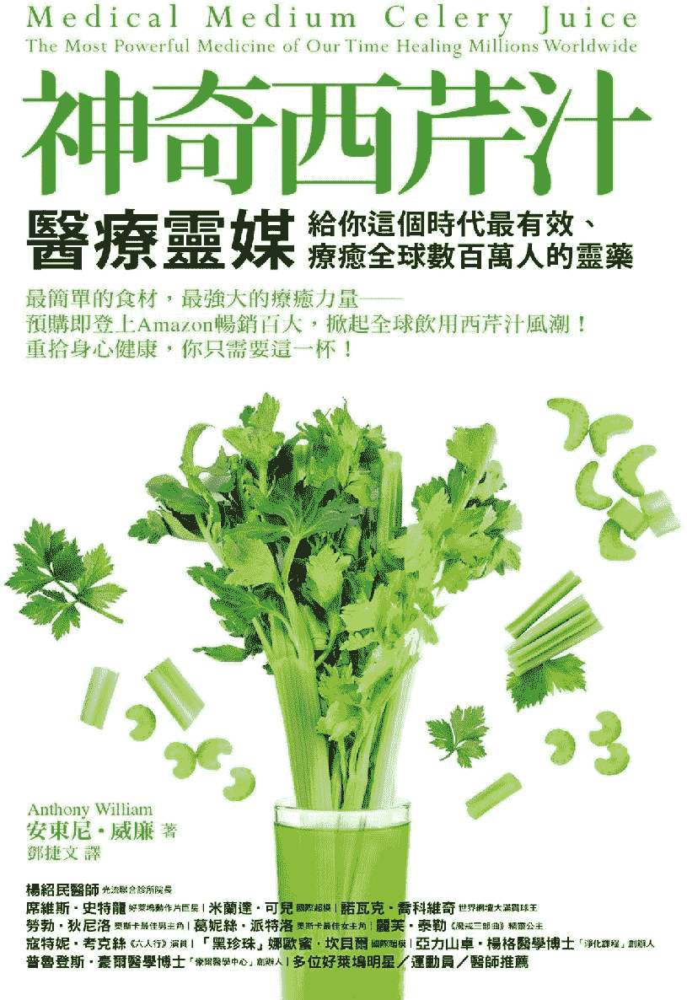

## 作者简介

安东尼威廉 Anthony William

全球西芹汁运动发起人也是《纽约时报》畅销排行榜冠军作者着有《医疗灵媒慢性及难解疾病背后的祕密以及健康的终极之道》和「医疗灵媒」系列作品《改变生命的食物》方智出版、《甲状腺揭密》《肝脏救星》。

天生拥有与最高的灵对话的能力这个高灵会提供他十分精确的健康资讯这些资讯往往超前时代许多。岁时他宣称当时没有任何症状的奶奶有肺癌之后的检查结果证实了他的话让家人大为震惊。此后他就一直运用自身天赋去「解读」他人的身体状况并告诉对方如何找回健康。他在提供治疗建议方面前所未有的准确度和成功率让他广受信任帮助数万人摆脱病痛之苦其中包括影视明星、摇滚歌手、亿万富翁、职业运动员、畅销书作家以及无数已被疾病折磨太久的人。此外他也是许多医生遇到棘手病例时会去寻求建议的对象。

˙更多资讯请上 www.medicalmedium.com 网站。

Tune into Hay House Broadcasting at:www.hayhouseradio.com

译者简介

邓捷文

以翻译为业一头栽进现榨脑汁的译想视界。现为专职译者从事各类书籍翻译工作。

赐教信箱:nekoferal.trans@gmail.com

## 推崇医疗灵媒安东尼威廉

西芹汁风潮正横扫全球安东尼带起的这项运动使世界各地无数的人恢复绝佳的健康状态着实令人钦佩。

——席维斯史特龙好莱坞动作片巨星

安东尼深刻了解食物、食物引起的共鸣以及食物与身体的互动方式无一不令人惊艳并且以人人都能理解的浅显道理解释我们对食物的选择是否将带来平衡或失调的后果他确实天赋异禀。为了你的身体善待自己吧

——菲瑞威廉斯艺人兼音乐制作人、十二座葛莱美奖得主

过去半年来我每天早上都饮用西芹汁感觉好极了我发现自己的活力与消化系统发生极大改变现在甚至还带着榨汁机旅居各地这样我每天都能喝到西芹汁

——米兰达可儿国际超模、寇拉有机公司创办人暨执行长

安东尼利用西芹汁的疗愈力量改善了无数人的健康。

——诺瓦克乔科维奇世界网坛大满贯球王

伟大天赋必伴随谦逊而来安东尼为人谦卑也如所有正确的解药一般安东尼的疗方直观、自然又均衡。这两项特质促成既强大又有效的组合。

——约翰唐纳文通讯公司执行长

我们全家对安东尼深信不疑他对于全世界的贡献有如带领众人获得平安的引路明灯他对我们确实意义重大。

——劳勃狄尼洛夫妇

虽然安东尼威廉的贡献确实隐含超自然的神祕元素但他使普罗大众关注的焦点尤其在自体免疫疾病方面的诸多内容着实令人感到正确又真实。更棒的是他的建议既自然、实用又简单。

——葛妮丝派特洛奥斯卡最佳女主角、漫威电影《钢铁人》小辣椒、《纽约时报》健康养生书畅销冠军

安东尼威廉致力于分享自身知识与经验藉此将疗愈箴言广布于大众。他想尽可能帮助更多人自我疗愈的慈悲与渴望使人感到激励又充满信心。如今在奉处方药为依归的世界上能找到真正有效并敞开另一扇健康大门的替代方案确实令人耳目一新。

——丽芙泰勒电影《魔戒三部曲》精灵公主

对于我们所摄取的食物、食物对身体的影响以及整体的健康福祉我认为安东尼的知识根本改变了游戏规则

——珍娜戴温电视节目《舞动世界》主持人、曾演出《舞出真我》

安东尼是很棒的人不仅帮我找出某些长期健康问题也知道我需要哪些营养品而且我马上觉得有所改善。

——拉西达琼丝葛莱美奖纪录片《昆西》导演、曾演出影集《爆笑女警》《公园与游憩》

《我们的办公室》

共鸣犹如自我赋能是生命中的强大现象。安东尼威廉与他的书以及他所发起的西芹汁运动对我正中下怀。我们的身体能够神奇地疗愈与恢复安东尼强调的这点是我们迫切需要的讯息。我总是想要寻求快速的解决方法但最终却导致更多问题。真正的营养才是最佳良方而安东尼启发我们要以大自然的餽赠来滋养我们的身心灵其可比取自大自然之源的强效良药。

——克莉沃尔许詹宁斯奥运三金一银排球选手

安东尼可比我唱片公司旗下所有艺人的魔法师如果将他比喻成唱片专辑必定能超越麦克杰克森的《战栗》。他的才能堪称深奥、卓越、非凡又令人惊艳。他是位杰出之人书中充满了预言医学的未来就在这里。

——克雷格考曼大西洋唱片总裁兼执行长

我一直推荐安东尼威廉的着作里头蕴藏着最富洞察力的智慧与食谱有助于恢复能量与良好的健康。他所描述各种食物既独特又强大的特质使我深感兴趣我也受到启发开始为每天的健康衡量我该如何改善烹调与饮食方式。

——艾丽丝布莉达艾美奖得主曾演出影集《使女的故事》《奇异果女孩》、电影《牛仔裤的夏天》

安东尼的着作既创新又实用对于任何受过现行西方医学限制挫折的人而言本书绝对值得你花时间阅读与思考。

——詹姆士范德比克创作人、执行制作兼演员曾演出影集《艳放八〇》、《恋爱时代》以及金柏莉范德比克演说家暨社会运动人士

安东尼是个伟人他的知识令人着迷也使我获益良多。西芹汁绝对能扭转一切

——凯文哈里斯制作人、、葛莱美奖得主

我很感激安东尼在实行他的每日西芹汁运动后我在各个层面的健康状况都获得改善。

——黛博拉梅辛艾美奖得主曾演出影集《威尔与格蕾丝》

我的亲朋好友都曾领受安东尼的治疗天赋我们在恢复身体与心理健康上得到的益处远胜于言语所能表达。

——史考特巴库拉制作人、金球奖得主、曾演出影集《重返犯罪现场纽奥良》、与《星舰迷航记企业号》

安东尼将生命奉献于帮助他人寻找健康生命的解答而西芹汁是最方便的入门方法

——寇特妮考克丝曾演出影集《熟女当道》及《六人行》

安东尼不仅是热心又慈悲的治疗师而且可靠、讯息精确又天赋异禀他是我生命中的恩典。

——「黑珍珠」娜欧蜜坎贝尔国际超模、演员暨社会运动人士

安东尼的广泛知识与深刻直觉破解了最难解的健康之谜他提供了一条明确的道路使我得以感受自己的最佳状态他的指引着实不可或缺。

——泰勒席林曾演出影集《劲爆女子监狱》

安东尼与他在推广以食疗愈的热情奉献使我们感激不已。安东尼确实天赋异禀他的方法彻底扭转我们对于食物以至于生活型态的观念。光靠着饮用西芹汁便完全改变我们的感受如今已经是每天早上的例行公事。

——亨特马汉六届高球巡回赛冠军

安东尼威廉靠着独一无二的天赋改变并拯救全人类的生命他的持续奉献与大量开创性资讯突破了阻碍使全世界得以获得科学研究尚未穷究、却又迫切需要的真理。在个人层面他也帮助我与两个女儿获得真正有效的健康工具西芹汁已然成为我们日常生活的一部分

——莉莎丽娜曾演出影集《比佛利娇妻》与《我们的日子》、《纽约时报》畅销作家、

《莉莎丽娜》作品集设计人

安东尼为人宽厚对于健康拥有敏锐的直觉与知识我曾亲眼见证他为人们的生活品质带来改变。

——卡拉古奇诺曾演出影集《鬼入侵》《我家也有大明星》、电影《守护者》《小鬼大间谍》

如果有人单凭碰触你就能了解你的病状会怎幺样让我介绍安东尼威廉的疗愈之手他堪称手中握有长生之钥的现代炼金术士。他的救命建言好似疗愈的飓风直入我心并开出一条爱与光明之路。他毫无疑问是世界的第九大奇迹。

——丽莎格雷戈里施科邓普斯资深执行制作

我已经追随安东尼好一阵子而且总是对于依循其道之人的成功故事感到惊艳却不讶异……我曾经寻求自己的疗愈之路多年换过一个又一个医生也见过一位又一位专家。他的确是真行家我也相信他对于甲状腺疗愈以及食物如何影响身体的知识。我引导过无数好友、家人以及粉丝认识安东尼因为我由衷相信他拥有医生所没有的知识。我成了他的信徒已然踏上真实的疗愈之路认识他是我的荣幸认识他的着作是我的福气每位内分泌学家都应该研读他关于甲状腺的书籍

——玛瑟拉瓦拉多利主厨、作者兼电视主持人

安东尼威廉与生俱来的治疗天赋堪称奇迹。

——大卫詹姆斯艾略特曾演出影集《执法悍将》《脉冲》《广告狂人》、电影《好莱坞的黑名单》《重返犯罪现场纽约》。

我的父亲是医生即便身体最细微的不适也习惯依赖西方医学来改善。然而安东尼的真知洞见让我了解食物的疗愈效益以及如何透过更全面的健康良方来改变生命。

——珍妮莫莲女演员、《纽约时报》畅销作家

安东尼威廉是赋予全人类的赠礼他卓越的作品帮助数百万人治愈了传统医学束手无策的难题对于帮助他人的真挚热情与奉献更是无人能及而我得以将他在《疗愈》纪录片中一部分强而有力的讯息与大家分享也让我心怀感激。

——凯利努南戈尔斯作家、导演兼《疗愈》纪录片制作人

安东尼威廉是少数利用自身天赋帮助众人透过自己的健康案例发挥自我潜力的人……

我曾在激昂的现场活动中亲眼见证安东尼的伟大事迹。我将他精准的判读能力比做歌手完美唱出高音的精采表现但比高音更让听众深深着迷的是安东尼真挚热诚的灵魂。安东尼威廉让我以身为朋友为荣我能证明你在播客节目上所听到、并且在诸多畅销着作中留下满满文字的这个人私底下的确也是如此热心助人。不是演戏安东尼威廉是来真的他透过高灵分享的宝贵资讯是无价之宝、为众人带来力量更是切中当今所需

——黛比吉布森百老汇巨星、指标性歌手兼歌曲创作人

安东尼威廉拥有卓越的天赋我一直很感激他找到困扰我多年的健康问题成因何在在他亲切的帮助之下我每天都能有所进展。我认为他是绝佳的资源

——摩根费尔切尔德演员、作家、演说家

这可我很开心能在安东尼威廉到洛杉几来上节目分享自身故事时与他共事真是精采的访谈他让观众意犹未尽……大家都为之疯狂他将温暖的性格与宽容的内心显露无遗。安东尼透过从高灵接收而来的知识将生命奉献于帮助众人也藉由能改变生命的

《医疗灵媒》系列着作分享这些资讯。安东尼威廉确实独一无二

——雪伦莱文资深节目制作人

这可安东尼才跟我聊了三分钟就精确指出我的健康问题这位治疗师确实言之有物他身为医疗灵媒的才能果然独特又神奇。

——亚力山卓杨格医学博士《纽约时报》畅销作家知名「净化课程」创办人

安东尼的天赋让他成为资讯的渠道为我们带来现今科学遥不可及的讯息。

——克莉丝汀诺瑟普医学博士《纽约时报》畅销作家

阅读了《医疗灵媒甲状腺揭密》之后我改善了甲状腺疾病的治疗方式并且看见其对于患者的绝佳成效着实带来丰硕成果也令人感激。

——普鲁登斯豪尔医学博士知名「豪尔医学中心」创办人暨医学主任

安东尼的发现与慈悲的高灵使我们感动且获益良多高灵透过安东尼的感官天赋与关爱世人的灵媒特质带着疗愈的智慧与我们接触。他的书确实堪称「未来的智慧」因此我们对于古代佛教医疗文献中所预言自作聪明的人类为了追求利益而干预生命元素所带来使我们万般折磨的奇病怪状已然奇迹般地拥有清晰且明确的解释。

——罗伯特舒曼哥伦比亚大学印度西藏佛教研究杰宗喀巴教授、美国西藏之家负责人、畅销书作家、播客节目《罗伯特舒曼》主持人

安东尼威廉是天赋异禀的医疗灵媒对于当代世界上影响我们的神祕疾病具有真切又不极端的解决方法我迫不及待想跟他交个朋友并将他奉为提供我与家人保健课程的珍贵资源。

——安娜贝丝吉什曾演出影集《档案》《丑闻风暴》《白宫风云》《现代灰姑娘》

我在几年前脊椎受伤后的恢复状况一直很稳定但是却产生肌肉虚弱、神经系统传递异常与体重增加的问题。有天晚上朋友打电话来大力推荐我阅读安东尼威廉的《医疗灵媒》书中有太多资讯都使我产生共鸣所以我开始采行书中的建议接着我试着提出谘询也幸运地获得机会。书中内容相当精确让我得以疗愈至超乎想像、深刻又富饶的健康状态。我瘦得很健康、可以享受自行车与瑜珈运动、重新回到健身房中、拥有稳定的活力而且也睡得更熟。每天早上当我施行健康课程时我都会微笑着说「哇安东尼威廉真是太感谢你让人恢复健康的天赋了……真的」

——罗伯特威斯顿曾参与影集《沉默的天使》《私家法医》《下一站天后》《火线重案组》与电影《雷之心灵传奇》

我爱安东尼威廉我女儿苏菲亚与萝拉把他的书当成生日礼物送我我一翻开就停不下来。《医疗灵媒》帮我连结了健康的所有要素。透过安东尼的着作我才了解小时候生病所残留的病毒在日后破坏着我的健康。《医疗灵媒》改变了我的生命。

——凯瑟琳巴赫曾演出影集《不安分的青春》与《飙风天王》

安东尼威廉将生命奉献于帮助他人带来能使许多人的生命产生实质改变的讯息。

——亚曼达迪卡迪力特演员、作家、电视节目主持人

在这混乱的世界里健康与福祉的领域中不断出现杂音而我选择依凭安东尼深刻的真切之言。他那奇迹般的天赋使一切臻至澄明的境界。

——帕蒂斯丹格《为百万富翁作媒》主持人

我与家人的健康全都仰赖安东尼威廉即使当医生们都束手无策时安东尼总是能了解问题所在并找出疗愈之道。

——雀儿喜菲尔德曾演出影集《重返犯罪现场纽奥良》《祕密与谎言》《失踪现场》、电影《终极尖兵》

安东尼威廉带来医疗的新面向深刻拓展我们对于身体与自己的理解。他的作品是疗愈领域中的全新疆界并透过慈悲与大爱广布于众。

——玛丽安娜威廉森《纽约时报》畅销冠军作家

安东尼威廉是慷慨又慈悲的向导将生命奉献于协助他人走上疗愈之路。

——加布里埃尔伯恩斯坦《纽约时报》畅销冠军作家

真正有用的资讯。这是当我想到安东尼威廉与他对世界的深刻贡献时心中所浮现的想法。当我看着他协助多年以来受到各种病症、脑雾与疲劳症所苦的朋友时这项事实再清楚不过了。我的友人曾经求助过无数医师与治疗师也接受过各式各样的疗法却徒劳无功。直到安东尼与她交谈为止……往后的成果令人震惊。我强烈推荐他的着作、课程与谘询内容千万别错过疗愈的契机

——尼克奥特纳《纽约时报》畅销作家

神祕的才能必须透过道德的正直与大爱加以传播才会成为完整的天赋。安东尼威廉是疗愈、天分与伦理的神圣结合。他是真正的治疗师不仅努力自我精进更将所学用于服务全世界。

——丹妮尔拉伯特畅销作家

安东尼是位先知也是位健康哲人他的天赋卓越在他的引导之下我终于能找出长年来使我痛苦不已的健康问题并彻底解决。

——克里斯卡尔《纽约时报》畅销作家

在接受安东尼所自信熟练的疗法十二小时后从去年以来就在我耳朵里嗡嗡作响的声音开始减弱对于他提供让我持续改善的洞见我着实感到惊讶、感激又开心。

——迈可杜利《纽约时报》畅销作家

每当安东尼推荐一种增进健康的自然疗法必定见效。我已经透过女儿身上的疗愈效果见证了这点而且令人印象深刻。他使用天然食材的方式是更加有效的疗愈之道。

——马丁雪福洛夫财经顾问、WealthManagement.com 网站证券经纪人排名首位、《巴隆周刊》首席财富顾问

安东尼针对预防与战胜疾病的珍贵建议比所有其他资讯来源都先进许多年。

——查索拉佐医学博士纽约经认证肿瘤学家、血液学家、营养学家与抗老专家

安东尼威廉是我们这个时代的大预言家爱德格凯西能以显着的精准度与洞见解读

人的身体。他能找出疾病的潜在原因这些疾病经常令最精明的正统与替代医疗从业人员感到不解。安东尼实际又深刻的医疗建议使他成为二十一世纪最具强大成效的治疗师。

——安路易斯吉图曼《纽约时报》畅销作家热门的消脂排毒与饮食计画创办人

身为好莱坞的商场女强人我知道什幺叫作价值。安东尼的一些委托人曾花费超过数百万元为自己的「难解疾病」寻求帮助直到找上他为止。

——南希钱柏斯曾联合主演《执法悍将》、好莱坞制作人兼企业家

我从安东尼的书上读到许多健康知识他也准确道出只有我自己知道的身体状况。这位亲切、贴心、有趣、自谦又慷慨的男士——如此超自然又天赋异禀拥有颠覆我们眼中世界的才能——把我这个灵媒都吓了一跳他真是现代的大预言家爱德格凯西他出现在我们身边对我们而言是偌大的恩典。安东尼威廉证明了我们远超乎自己的认知。

——柯蕾巴隆雷德畅销作家、电视节目主持人

任何量子物理学家都会告诉你宇宙中还有我们尚未了解的事物正在运作。我真的相信安东尼掌握了这些力量他拥有惊人的天赋能依照直觉地探索最为有效的疗愈方法。

——凯若琳李维特《纽约时报》畅销作家

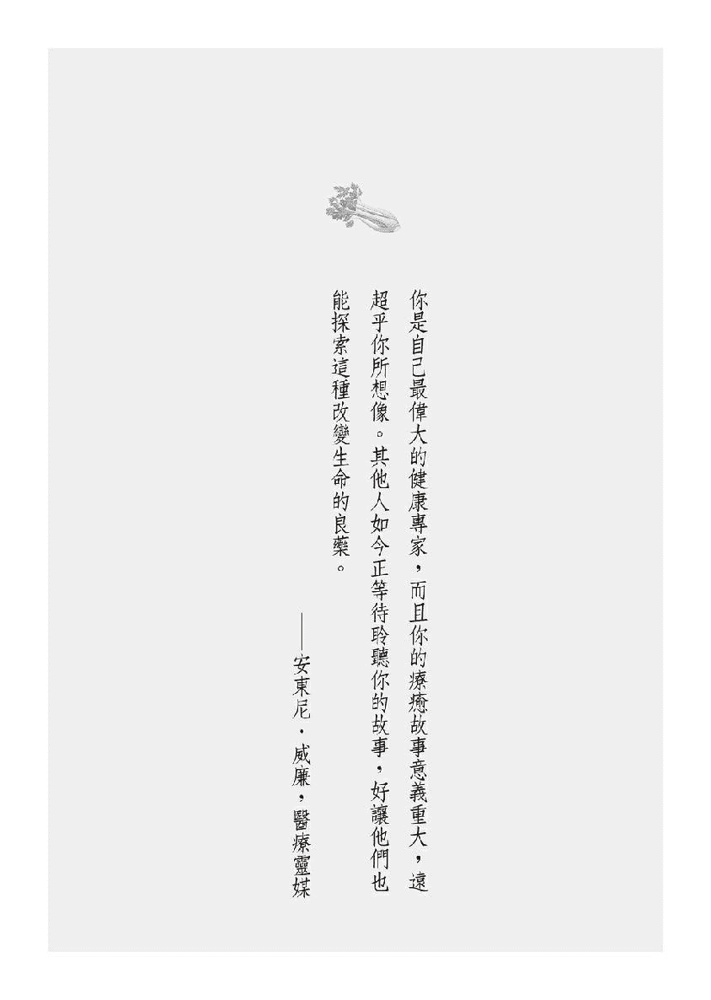

## ［推荐序］

开卷有益新知养生——除了感谢没办法再多说些什幺

从主流医学开立精神药物 psychoactive drug 与执行家族治疗、心理治疗与社区环境治疗走上全职自然医学与身心灵疗愈之路已经十三个年头了。一路以来我总是秉持医学中心严谨的科学训练除了学理探索、论文回顾、田野调查之外无不以自己为白老鼠亲身体验所接触的自然疗法与身心灵疗法并且设法还原追溯可用性与可复制性是否有使用风险与潜在危害等。

二〇一六年《医疗灵媒》在台湾出版时在经过「讯息解读」与「专业资讯求证」之后曾经在台北跟大众分享我对《医疗灵媒》这本书的理解以及对作者曝光之资讯的观察。医疗应该是一件非常严谨、重要、专业的事情为何出现一位声称通过「最高的灵」的导引与训练可以凭藉「深层直观——不经仪器检验就可以评估病情并提供解方」的灵媒

「医疗」与「灵媒」好对立的角色真的让人忍不住想到「赤脚医生」甚至「怪力乱神」这些不好的名词但因为从《无量之网》《信念的力量》《心灵与科学的桥》这些当年红极一时的科普书籍透过国际上许多严谨科学家的细心研究以及孔老夫子「君子不以言举人不以人废言」的古训当时我很谨慎地建议大众书上的资讯有参考之处但请勿盲从最好寻求有营养学专业训练的医师谘询实践的过程要很谨慎观察自己的身心变化——这个建议至今不变。

收到方智出版社这次《神奇西芹汁》推荐序的邀请我扎扎实实地发挥「科学侦探」的精神再一次重新研究、搜集西洋芹相关资讯。原本看到作者在书上表示西芹汁有太多神奇的效果还颇不以为意心想怎幺可能一个在早期只是吃西餐前方便食用的餐前菜竟有这幺多功效还默默想着惨了答应了出版社不好拒绝但是怎幺确认书上这些讯息是否正确

在花了好几个昼夜搜寻资料的过程中一开始是比较普通的网路新闻表示芹菜中的芹菜素可以松弛血管铁可以补血、纤维表型以帮助肠道清洁、富含钾可以排钠利尿、有钙磷可以镇静精神等、富含β胡萝卜素、维生素 B1 甚至还可以降尿酸、降血脂、降血糖

天啊变「治百病神药」啦另外就是芹菜可以平肝清热、袪风利湿、除烦消肿、凉血止血、解毒宣肺、健胃利血……这些难以用西方医学角度去验证的中医陈述。

幸好皇天不负苦心人最后透过西洋芹的学名「Apium graveolens」终于搜集到许多不同的研究报告包括芹菜素可以诱导白血病细胞的自噬作用、芹菜素二聚体可以逆转癌症干细胞的最高耐药水平、可保护动物实验大白鼠的肾损伤、同时它具有单转运蛋白激活剂的特性在动物模型有观察到抗焦虑作用、芹菜素在受体上显示出二级正调节活性、芹菜素与其衍生物有抑制脂肪酸酰胺水解酶抑制–并激活–γ等细胞分子作用、可刺激成人神经新生、可通过血脑屏障其中还含有众多的类黄酮、生物硷、酚类、皂苷、柠檬烯、植物醇……等成分有抗氧化、抗真菌、抗细菌、透过细胞讯息传导路径可以抗发炎、有可能可以抑制癌细胞增殖、保护脂质过氧化、强化肝脏解毒力、改善血糖与胰岛素水平……许许多多从《神奇西芹汁》书上提到的效果竟然已经在实验室找到诸多可能支持这些论点的线索

此刻内心浮现的就是这句话除了感谢没办法再多说些什幺

感谢这次的因缘除了验证我在就读营养研究所时的推测「许多植物营养素都有抗癌作用」之外又再次提醒自己绝对不要拘泥于门户之见虚心求教、小心求证才是医者之道。

但在此还是要提醒所有读者不要草率盲从无论是来自医疗灵媒的讯息或是来自教科书的教导真正的医疗都应该「量身订制」——非常个人化而且要循序渐进、要量力而为、要知己知彼

建议读者

书要好好研读作者有提出许多怎幺使用才会有效的注意事项。

建议一开始先饮用非常低剂量测试自己是否有西洋芹过敏。有人提出种子的过敏原含量最高有过敏体质的人最好先移除种子成分。

没有过敏反应的人也还是建议从书上提及剂量的三分之一到二分之一开始再逐渐提高饮用量。

一定要用新鲜的西洋芹来制作不要使用加工过的再制品。慢磨、去渣才可以喝到比较足量的营养素。有机西洋芹还是上选但买不到也没关系就依书上建议仔细清洗。

不要把西芹汁当成万灵丹你的生活型态、饮食型态、情绪状况、压力负荷都会影响西芹汁是否真能有效帮助你找回健康。

最好还是寻求适当的医疗机构协助能够配合主流医学的检测看看你自己的身体健康状况是否存在「隐性风险」比如肾功能衰竭、消化道重度发炎等。让自己从安全的起点出发走上恢复健康的道路

本文作者为光流联合诊所院长杨绍民医师

## **第一章  为什幺是西芹汁**

西芹汁正帮助数百万人获得疗愈。

真的吗西芹汁假如你未曾跟上最近的话题或是甚至已经有所耳闻仍然可能会这幺想。

真的西芹汁。

就是在我冰箱里那株快要枯掉又不起眼的植物

没错这种受人忽略、低估、浪费偶尔才会在鲔鱼沙拉、馅料或美式蚂蚁上树点心里见到的药草对药草。西芹汁的功效其实比任何人所了解的都还要强大前提是你要知道该如何将其纳入生命之中。

几十年来我不断推广西芹汁当作前所未有的疗愈特效圣品。无论是想寻求特定健康问题的解药或是想探索恢复活力与重拾容光的祕方西芹汁就是回应祷告的解答。一直以来我也有幸能见证众人因此扭转生命。

当我的第一本健康书《医疗灵媒》出版后我便开始与全世界分享西芹汁并且在往后的三本书中都特别探讨过因为西芹汁的功效相当多元在每一本书中都无法缺席。《医疗灵媒》的追随者将这项疗愈资讯铭记于心使我感到讶异。在亲身发现西芹汁确实有效后全球各地的成员开始推广相关讯息与见证。数以万计的粉丝发布饮用前后的对比照片表示自己的肌肤变得更洁净、眼睛更明亮、身体更强健也更加活力充沛绝对使你大吃一惊。众多照片背后的故事包括有些人描述西芹汁如何解救自己的生命更是令人惊讶。许多成员经过长久折磨而如今恢复健康的亲身实例也带给朋友与陌生人莫大的鼓励。我们俨然引发了一股运动热潮。

如今西芹汁逐渐受人注目或许看起来像是稍纵即逝的风潮但别担心这绝不是一时跟风。西芹汁的流行并不像其他健康时尚是立基于资金的挹注而是因为有许多人确实获得疗愈。比起我几年前刚开始推广时西芹汁此刻的用途已经更为广泛亦将在往后数十年内变得更加不可或缺。即便阖上本书闲置一旁多年之后再翻开书中仍蕴含你所需的疗愈真相。西芹汁绝不会因为新的饮食法或营养理论而过时无论何时饮用西芹汁都是你维持生命健康与活力的关键。其他健康风潮会来来去去是因为它们从一开始就不是真正的解答。西芹汁不同不会过时而且绝对真切。

西芹汁的由来

上帝首次引导我推广西芹汁是在一九七五年当时是为了替从楼梯上摔落的家人缓解背部伤患的发炎反应而那时并无人知晓。我也清楚记得曾在一九七七年推荐家人的朋友饮用西芹汁目的是缓解严重的胃食道逆流。

在十三、十四岁左右我在超市从事理货工作。在超市里头我会在别人提出疑问时充当健康谘询并带顾客到对应的商品走道选购能为他们缓解症状或疾病的产品。老板当时问我还有什幺方法能帮助大家我回答道「这个嘛我需要一台榨汁机。」随后老板真买了台榨汁机。

视顾客的状况需要——无论是罹患关节炎、痛风、糖尿病、胃肠问题或其他症状与疾病

——我便会从货架上拿来一株西洋芹清洗过后丢入榨汁机再将一大杯现榨西芹汁交给顾客。我通常会榨出正好四五〇毫升的西芹汁并且要他们直接在走道上喝下这杯草药。如果有人对味道比较敏感我会让他们先小啜几口并要他们一边购物一边喝最后在车上或是回到家中喝光。我老板只会收取西洋芹的费用每榨一杯就要结帐员输入一株西洋芹的价格。当顾客离开店面时有些人已经觉得自己的疑难杂症有所改善了。

我不断听到有人问「能加点什幺甜味吗」很多人甚至没听过什幺叫榨汁更别提新鲜蔬菜汁乃至于新鲜西芹汁的概念了根本是闻所未闻。对于榨汁有点概念的人则会想以胡萝卜、苹果或甜菜根添加风味但我总会说「这样就模糊焦点了添加物会阻碍疗愈的机制也就是钠簇盐的摄取稍后将多加探讨。」

某些家长也会让孩子喝西芹汁。如果有孩童咳嗽时我就会榨一点西芹汁让孩子的母亲给孩子啜饮。家长会信任我是因为他们见证过功效。西芹汁就是如此强大的解药如果孩童在店里吃了一些糖果后开始尖叫或大哭我便会让家长给孩童喝点西芹汁可以让孩子迅速冷静并感到愉悦。西芹汁是血糖波动时的绝佳稳定剂。

我一直来回奔波好将机器清洗过后再继续榨西芹汁加上我为客人提供额外的健康谘询服务这表示老板必须找别人来分担我原本的工作整理货架。他对这点倒是很亲切他说自己毕生当中从未为了一个农产品部门采购这幺多西洋芹。

随着年纪渐长我开始到全国各地的健康食品店开设讲座。我会在五十到五百人不等的场合中讲授现榨西芹汁的疗愈功效。此时大约是一九九〇年代家中有榨汁机的人很少所以我也教大家如何利用食物调理机搅拌机将切碎的西洋芹打成泥再过滤成西芹汁。若是没有榨汁机或食物调理机时我则教他们嚼食西洋芹杆再把渣吐掉。虽然效果没那幺充分——没人能嚼得下那幺多西洋芹——总比没有好。我也建议他们在一天内分次嚼食西洋芹才不会让下颚过度疲劳。

当我提到西芹汁时常看到有些人面露惊讶毕竟这不是热门的蔬果汁选择。平常喝的蔬果汁还是结合了甜菜、胡萝卜与苹果偶尔加根小黄瓜运气好时才会碰到几根西洋芹。对众人而言单纯的西芹汁根本没有道理甚至倒人胃口。

但至少大家还能将西洋芹与健康联想在一起因为常听人把西洋芹切碎后加入沙拉或汤中的做法有些人也说祖母会用整株西洋芹与胡萝卜来炖高汤。甚至听说过西洋芹在古代医学史上的作用虽然我们在不同文化中所听见关于西洋芹的古老用途时大多指的是西芹根也称为根芹与一般为了取得茎部食用而种植的西洋芹种类并不相同。

没错西芹根与西洋芹是相同家族中的两种不同植物。西芹根的外表类似芜菁用于榨汁并不理想因为必须透过烹煮才能获取西芹根当中有用的养分。在生鲜状态时西芹根不容易消化而在经过烹煮后西芹根仍然无法提供西洋芹或西芹汁所带来的益处。

即使有人对于西洋芹有不同想法——面对现实吧没人像我这幺重视西洋芹——当我开始推广时大家对于西芹汁还是很陌生的。西洋芹与西芹汁是两种不同概念代表两种不同意义。新鲜西芹汁从未使用于医疗层面也不曾如此大量为人饮用。如果有人将一整株西洋芹单独榨汁那是因为在冰箱里发现有棵西洋芹快要枯掉了必须赶在腐烂前处理掉也通常会加入几根胡萝卜或一颗苹果。

所以当我推广西芹汁时曾经遭遇大量的质疑声浪。最常听到的问题是「西洋芹……榨汁」大家都深信西洋芹最好的做法是切成小棒用来蘸酱当成诸多食材的其中之一。要说服其他人纯粹的西芹汁拥有疗愈的力量有时几乎是不可能的任务医生与其他医疗从业人员也不会多加考虑。

于此同时我在认真采行西芹汁疗愈法的人身上见到真切又深刻的成果。我旅居各地持续在家庭式健康食品店、大型健康食品店、小型戏院甚至是教堂地下室告诉大家如何制作西芹汁不断推广透过其疗愈力量来对抗疑难杂症的讯息以及我在《医疗灵媒》系列书籍中所分享的其他资讯。

一九九〇年代初在一场介绍如何搅打与过滤西芹汁并几乎以学术演讲规模阐述其疗愈力量的说明会后一名年近三十的年轻女性向我走来。

「我深受成瘾症所苦。」她告诉我「对任何事物都会上瘾我的性格天生容易成瘾。」

「那我希望妳每天喝一杯九百毫升的西芹汁。」我对她说。

一个月后我回到同一间健康食品店举办另一场演说就在约莫八十到九十人的群众之中那名年轻女性再次向我走来。她问道「你记得我吗」

「妳是有成瘾症问题的那位女士。」我说「妳好吗」

「你治好了我的成瘾症。」她回答。

「真的吗」

「真的。」那位女性回答「你告诉我要喝西芹汁。」

「是西芹汁治好了妳的成瘾症。」我说「要继续喝下去。」

「我从未有过一整个月都不觉得痛苦的日子而且从我还是个小女孩的年纪就开始了。」她说「我会继续喝下去。」

多年来我发现西芹汁具有打破恶性循环的特殊能力。无论是对食物例如蛋糕、饼干、洋芋片或过度饮食成瘾或是对娱乐性用药如毒品、处方药成瘾抑或是对愤怒、吸菸或其他事物成瘾首先通常会感到焦虑或抑郁而即便初期没有焦虑或抑郁的倾向瘾头也可能带来这些影响。将人引导至特定行为的想法与感受模式以及引导至特定想法与感受的行为让人没有片刻喘息的空间。而西芹汁能立即介入并缓解瘾头、焦虑与抑郁感帮助我们再次站稳脚步。

同样的一定会有人提出质疑。在这些讲座中听众的表情常常像是在说西洋芹怎幺可能西洋芹根本不值一提甚至使某些人因而发笑纵使越来越多人公开自己的疗愈故事使西芹汁逐渐抛下引人发笑的包袱还是会有人笑出来。有些坐在我的讲座中或造访我办公室的人完全不想放弃胡萝卜汁或对药物的依赖。

有些人的态度较为开放会说「我生病了感觉就像在地狱。我今天差点来不了。我好难过快要连站都站不起来。」从过去到现在有件事情是不变的当某人不舒服时会想寻求以往未曾有过的机会。

「你试过哪些方法」我会这幺问。

「全都试过了但一点用都没有我什幺都愿意尝试。」他们则会这幺说。接着我便建议他们饮用西芹汁。

「西芹汁吗」少数勇于尝试的人会回答「虽然听起来不像会有用而且我可能也不喜欢这种味道但还是会试试看。」

人类对于疗愈的渴望强烈到足以让人突破任何阻碍并尝试除了传统疗法、甚至是替代

性健康信仰系统以外的选择只为了找到真正让自己舒服一点的良方。

对于实际尝试西芹汁的人而言所得的回报卓越非凡。只要是遵循你在书中读到的指导方针并持之以恒将空腹饮用四五〇毫升西芹汁当作日常生活一部分的人几乎都会对于西芹汁产生的功效感到震惊。最终他们开始恢复健康并且体验到其他人无法想像的极大益处。在我持续推广多年后西芹汁仍然是种神祕的健康解药。到了一九九〇年代后期我已经见证西芹汁帮助了数以千计的人。我从未见过西芹汁对哪种症状、不适、病征、失调或疾病完全没有效果西芹汁不曾让我们失望。

多年过去我仍然在推广西芹汁同时奉行《医疗灵媒》的社群团体也日渐茁壮。家用榨汁机与果汁吧越来越流行使大家更容易取得西芹汁。从我年轻时开始推广西芹汁一直到我在二〇一五年出书为止我已经提供过数十万人健康指引也见到西芹汁在这幺多人的疗愈过程中扮演多幺重要的角色。

新一波的社群成员随着《医疗灵媒》系列而来西芹汁一直是我所能传递给众人的真理所以我在每本书中都会加以探讨它就是如此万能又关键。如今随着科技进步当读者亲身尝试并从中获益时便发表自身的故事给予彼此启发与产生连结。尝试过西芹汁后加以分享的人越来越多西芹汁运动的动力也持续增长。

突然间大量的人开始涌向世界各地的果汁吧开口就是要一杯西芹汁让柜枱后方的店员不禁纳闷「原味西芹汁」即便店员多年来每天都习惯调制各种果汁长达数小时却从未听过这种要求也无法理解怎幺会有人想喝西芹汁。食品杂货店开始大量卖出西洋芹因为想买回家榨汁的人逐渐增加。农产经理同样也对突然剧增的西洋芹订单感到惊讶。西芹汁持续对众人发挥功效订单也因此源源不绝。

西芹汁现在已然成为主流只有一个原因因为有效。西芹汁出现在果汁点单上也成为一篇又一篇健康文章的主角。然而随着其功效振奋人心以及越来越多人因此受益在诸多关注之下关于西芹汁的错误资讯也随之而来也让有心寻求指引的人感到困惑无法判断西芹汁到底是怎幺一回事因而感到无所适从。

因此我的目标就是要透过这本书从头开始提供西芹汁的清晰指引并尽可能解答关于西芹汁疗愈效果的各种问题详细程度更甚以往使你能更坚定也更明白地向前迈进。

重新看待西洋芹

在我们探讨西芹汁神奇的效果以及该如何准备的重要指引前我们需要先聊一聊西洋芹。

西洋芹没有耸动的名声我们也觉得西洋芹很好用当然囉很适合拿来抹花生酱或装葡萄干、为鸡蛋沙拉增添爽脆口感、作为熬煮高汤的好食材、当成水牛城辣鸡翅的配菜或是用来调制血腥玛丽鸡尾酒。我们都听过模特儿食用西洋芹来控制体重。我们对西洋芹的健康概念有些模糊主要是因为它的热量很低而如果运气够好有喝过祖母熬的蔬菜高汤或许也会觉得它很营养。然而假如你突然间成为特种部队的一员肩负寻找地球下一种超级药物的使命你也许会往丛林深处探索但心中绝不会想到西洋芹。偏偏这正是地球上最最重要的解方。

要是你有点难以相信西芹汁有这幺多好处我能理解。就凭我们在食品杂货店擦身而过、那一束束不起眼的绿色蔬菜你是说我们每次只需要一、两根所以老是忘记用完的那一

株这怎幺可能会是尚未发现的超级食物

别怀疑西洋芹真的是我们尚未发现的奇迹食物。即便你未曾真正察觉西洋芹的本质与潜力只将它视为卑微的配料西芹汁仍然能够帮助你而且绝对有效问题在于你可能太快半途而废。假如你不愿意诚心地尝试它又怎幺帮得上忙如果你因为西洋芹太不起眼就弃置一旁你得明白是自己舍弃了疗愈的机会。假如你只把西洋芹当成鲔鱼沙拉中令人厌烦的配菜你其实正在失去恢复健康的契机。

倘若想了解西芹汁为何值得我们一再尝试就需要以全新的观点看待西洋芹。我们必须了解它拥有的真正潜力具备使人达到崭新健康境界的能力。倘若鄙视西洋芹就等于鄙视能疗愈自己的方法而这对你并不公平。我们接受的教育要我们尊敬自己与别人这是人生在世的真理之一。我们对于生命所能表达最崇高的敬意莫过于寻求这种如奇迹般充满活力的药草因为这好比在倾诉「我想痊愈」的念头也等于表达了「我希望我所爱之人更加健康」。

对于自认为健康的人可能很容易对西芹汁抱持怀疑或设下心防。如果你觉得自己很健康生命中不需要西芹汁也请至少尊重因西芹汁而痊愈之人所说的故事想想曾经饱受折磨、透过重视西芹汁救自己一命的人。别落入仅将其视为寻常蔬果汁的心态中试想受慢性病所苦、多亏西芹汁才得以恢复健康的人或是亲身经历过拯救孩子、家人与朋友的感受。试想最恶劣的肌肤状况、令人恐惧的偏头痛或是使人无法正常生活的过劳症并将西芹汁当成主要途径而成功扭转这些病状的人。对于这些利用西芹汁进行疗愈之人请抱持开放的心胸。

没有任何人能保证自己永远不会生病或出状况。我们带着已然存在体内的毒素与病原体来到世界上而且每天都暴露在新的毒素与病原体之下。即便抱持正向思考并付出心力只为了成就最佳的自我与吸引良善我们也无法永远掌控人生路上的诸多险阻。我们有时候会踩进坑洞会绊脚、会跌倒此时西芹汁就是使我们复原的最佳盟友。别忘了假如将来你的健康发生什幺状况它都等着为你所用。或是主动利用西芹汁来确保自己健康无虞。不让自己生病并不代表你很健康。你不会想等多年后陷入严重的病况之中才在最后关头发现西芹汁的价值届时你的路将会漫长许多。西芹汁就是你现在的预防手段是维持身心健康状态与保护自己的重要法宝。从今天开始每日饮用将延长你在生命中的宝贵时光而每多一寸光阴都意义重大。西芹汁是最强大的工具使你能成就最强壮、最美妙的自我。给西芹汁一个机会它将带来无可比拟的功效。

这种足以让你比以往更深入疗愈的高尚植物并非藏身于偏远的亚马逊雨林深处而就近在眼前。西洋芹是在货架上耐心等候的奇迹等着大放异彩、静待发挥功效的时机。我们只需要看见它、将它单独榨汁并且空腹饮用随时谨记我们所谈的是西芹汁是空腹饮用纯粹、现榨、原味的西芹汁等你读到本书的尾声将能透彻理解箇中道理。如今西芹汁所蕴藏的力量终于受到认可得以协助你走上更欣欣向荣的人生。

如何运用本书

本书旨在推广全球西芹汁运动同时消除慢性症状与疾病。于此提供可行、强大、根本的工具给全球数十亿长期受健康问题所苦的人。没错数十亿人。而且在地球上受病痛折磨的人可不只一半将近三分之二的地球人口患有至少一种持续性的症状或疾病而若维持目前的趋势另外三分之一也将会发展出症状或疾病。再不采取行动干预地球上每个人很快都会受到慢性健康问题所苦而西芹汁就是我们的首要干预手段也是很实用的方法让大家都能恢复健康。本书回答了所有你对西芹汁的疑问使你能藉此逆转自身的慢性疾病、保护亲朋好友预防疾病或提供心爱之人逆转疾病的良机。

首先下一章将谈到西芹汁好处多多并了解为什幺有这些价值。你会读到能对抗病原体的钠簇盐、舒缓肠道的消化酵素、平衡内分泌的植物激素荷尔蒙、增强免疫力的维生素以及更多资讯。探索西芹汁能提供的好处将使你更有动力持之以恒了解身体所需的成分以及如何疗愈将更有助于启动疗愈作业。

假如你正在对抗某种症状、疾病或健康问题应该会对第三章「缓解你的症状与不适」特别感兴趣。找出各种健康问题的真正根源同时探索西芹汁针对各种病灶的助益何在。正如我所说解决阻碍背后的谜题将是你克服阻碍的关键。

在第四章「如何发挥西芹汁功效」中你将读到关于如何准备西芹汁、该喝多少包括适用于孩童的方针以及何时喝的相关教学。举例来说若分别在不同时间喝下一小杯西芹汁当然都会有一定程度的助益但却无法对健康带来显着影响。多数人的身体处于超负荷状态光靠零星剂量的饮用并无法减轻负荷。对于饮用时间与饮用量我们需要精确的指引这便是第四章的内容。然而还不只如此第四章更提供许多祕诀与解答包括该如何将西芹汁纳入运动或营养补充行程、选购榨汁机的建议、孕妇或哺乳人士能不能喝西芹汁、为何需要去除西洋芹的纤维才能发挥功效以及为何空腹饮用西芹汁这幺重要。本章提供重要的资源我也希望你往后会再三翻阅。

接下来第五章将探讨「西芹汁净化法」。假如你想找到明确的实行计画帮助你持之以恒地饮用西芹汁本章所列出的每日排程将能让西芹汁对你产生更多功效。这项净化法是以我前一本书《肝脏救星》Liver Rescue 中的「早晨救肝」Liver Rescue Morning 方法为基础所以倘若你先前已经尝试过便会觉得本章的步骤相当合理。

第六章「关于疗愈与排毒的解答」回答关于饮用西芹汁多久能产生效果以及如何影响身体运作的相关问题。这部分存在许多误解了解如何诠释身体对于西芹汁的反应相当重要。尤其当某些人首次尝试西芹汁时可能会体验到西芹汁杀灭病菌并净化系统所带来的疗愈反应由此可能导致像是味觉的变化、散发体味或是频尿。这些反应发生时身体仍在持续净化但有些人却不会发生这些疗愈反应。本章旨在协助你了解自身的疗愈过程并在过程中提供相关协助。

第七章「谣言、疑虑与迷思」本章的内容顾名思义就是要辟谣。西芹汁运动的目的单纯而且理所应当会如此受到欢迎的原因在于大家发现它真的能带来助益并怀抱高尚的情操决定将其广传于世。西芹汁的人气是由于成果使然。这代表其他依靠资金挹注的健康风潮可能将西芹汁视为威胁。而人生观偏好质疑心态的人则对其拥护声浪投下不信任票因此掀起了关于西芹汁的质疑与错误资讯。本章旨在厘清误解无论你是否想让自己求个心安或是想准备面对他人对西芹汁的质疑答案都在这里。

无论你正在实行何种饮食法例如低卡、高脂、高蛋白、素食、蔬食、生酮或原始人饮食法抑或是你所信任的各种疗法像是阿育吠陀疗法、传统中医、传统医疗、替代疗法或功能医学疗法西芹汁都能与其相辅相成也都应该成为你生活中的一部分。假如你长期持之以恒甚至能带来更深远的成果。

接着如果你希望疗愈效果更上一层楼可以在第八章「更多的疗愈指引」发掘更多观念。西芹汁是绝佳的引路明灯能帮助我们展开初期的复原作业即便现今有各式各样的风潮与趋势却没有其他健康良方能像西芹汁一样既强大又快速地从问题根源下手。单靠西芹汁本身便能为已经罹病长达十年、十五年或二十年的患者首次带来成效。同时西芹汁是唯一能使你站稳脚步并走上疗愈之路的基本工具因为它是以更多真实、有效的健康指引作为实践基础。

随着西芹汁越来越受到瞩目也有更多困惑随之而来。你为了进一步改善健康所需要的其他健康指引——我指的是真正的指引而非理论或风潮——时常因为某些平台试图将西芹汁据为己有而就此失去方向。对于收到新的诊断证明所苦需要了解还有什幺方法能改善健康的诸多母亲、父亲、孩童、大学生、专业人士或祖父母而言无疑是种伤害。假如你希望一路走向康复就需要更多能与西芹汁共同协助疗愈的资讯与西芹汁同宗同源的资讯。第八章便将如此引导你。了解西芹汁运动的源头从此而来你方能明白该由此处找到与西芹汁相辅相成的疗愈资讯。

我了解西洋芹与西芹汁并非随处可得。有时候农产地正好遭受暴风侵袭又或者你旅经之地找不到榨汁机导致身边没有取得新鲜西芹汁的来源。第九章将谈到你在紧要时刻找不到西芹汁的替代方案本章会提供一些可用选项直到你能再次取得西芹汁为止。

最后假如你想知道西芹汁作为珍贵疗愈圣品的证据何在你将在第十章「一场疗愈运动」中了解我手边的资讯从何而来。你也会看见全球数百万人都在饮用西芹汁并且逐渐改善健康。透过他们的故事、阅读书中的成功案例或干脆亲自尝试你将发现西芹汁无穷潜力的铁证。

你的必胜之道

西芹汁适用于我们生命中的不同阶段。人类对食物的选择随波逐流不断改变饮食习惯因为他们在名人加持的不同饮食方式与养生潮流中来来去去又或者想融入不依循任何规则的饮食方针。好消息是无论你采取何种饮食法都能饮用西芹汁。这永远是你的必胜之道因为西芹汁不攀附于任何信仰体系绝对是改善健康的真切解答。

对于在生命中加入西芹汁的人我在他们身上不仅看见身体变得健康更感受到发自内在的光芒。别忘了西芹汁是我们在地球上的引路明灯亦是已放弃寻求解答之人所苦心追寻的答案。如果你刚开始饮用西芹汁欢迎加入。如果你早已散发光彩并致力于推广西芹汁容我向你道谢。无论是西芹汁一族的新手或是已经成为西芹汁的拥护者每一位读者都是这场疗愈运动的重要成员。

当我在《医疗灵媒改变生命的食物》书中写下「关于西洋芹汁对于各种疾病的效益我可以说个没完它称得上是最棒的疗愈圣品」时我是认真的这本书就是见证。透过本书中关于西芹汁的崭新资讯以及对于诸多疑问的解答我希望能荣耀你们每一个人。

## **第二章  西芹汁好处多多**

西洋芹是未知的疆域尚未经过充分研究。关于规律摄取西洋芹能对我们带来哪些效益目前的研究尚且不足所以没人了解西洋芹其实是强大的营养库。

上面谈到的只是西洋芹本身因此你能够想像倘若我们连普通的西洋芹都还没摸透那幺不久前还没什幺人认识的西芹汁肯定更未受到应有的科学认知。相关研究还常把西洋芹与西芹汁混为一谈认为这两者没什幺不同。假如曾对西洋芹做过些许研究应该能合理推论出新鲜西芹汁所含有的营养成分。但事实远胜于此西芹汁其实是层次超越普通西洋芹的药草萃取液值得对其独立研究好让我们见证并记录西芹汁独特的疗愈性质。

截至撰写本书为止对于每日空腹饮用四五〇毫升西芹汁的效果全世界仍在等待禁得起同行验证的严谨研究结果。当研究人员终于打算着手时如何设计研究方法将变得极为关键。然而假如透过双盲研究技术人员必须遮蔽西芹汁的味道或颜色让受测者无法得知自己喝下什幺液体研究人员也无从得知自己递出去的是什幺其中的添加物又会影响西芹汁的纯度以至于影响效果。或者他们能试着透过给予某种西洋芹精华胶囊来回避此问题但同样的这无法提供等同于四五〇毫升新鲜西芹汁的效果。倘若有研究报告出炉结果对西芹汁的功效表示质疑必当先仔细检视其研究方法。只有怀抱最高的敬意、最严格的标准才办得到。

我们所听过任何关于西洋芹的研究都将重点放在西芹杆、西芹叶、西芹籽或者经过还原可变成液体的西芹粉但这些全都无法让我们了解新鲜西芹汁的作用。再者这些研究并非聚焦于逆转人体疾病的效果。有些是用来保存肉类结果却模糊了焦点让人担心起硝酸盐和亚硝酸盐的问题等你读完第七章「谣言、疑虑与迷思」就能放心了。真正关于健康方面的研究则大多用的是啮齿动物。而且别忘了拿西芹杆来做实验不等于研究西芹汁。再说一次两者并不相同分属于两种领域虽然可能都难以下咽可以这幺说但彼此不一样。光是嚼食西芹杆无法提供我们大量养分也无法唤醒西芹汁所蕴含的潜力。

总有一天医学研究与科学界会赶上数百万透过西芹汁恢复健康之人的脚步这些人早已比过去更加活力旺盛不仅逆转了慢性与急性病状也重拾了健康的生活。研究人员终会发现西芹汁不只是短暂的风潮客观而言更是这个时代的疗愈良方。

直到这番发现问世之前他们也许会围绕着西芹汁可能造成的风险而心生恐惧。我们的世界有时候会走回头路因此必须时刻谨记追求科学的荣耀行为其层次并未超然于人类之上。科学是以人为本的探索过程并非如我们有时理想中那般完全独立、公正。然而科学家往往处于莫大的压力之下为了进行研究实验室需要金钱但资金并非总是取自于最开诚布公或公正无私的来源。而资金与既得利益可能会影响研究成果或对于结果的解释

第十章「一场疗愈运动」将探讨更多内容。

由于新鲜西芹汁如此单纯并没有庞大的拓展规模或获利因此威胁到营利取向的健康产品的现况所以营利团体最有可能赞助研究的目的就在于发掘西芹汁产生的问题进而试图使这项运动销声匿迹。业界并不喜欢这种如流氓般的有效逆转疾病方法——所谓「流氓」代表这种方法完全不受专利权或金钱体系的约束。比如说西芹汁无法变成胶囊装罐再让消费者付出大笔金钱购买因为这样一来就不新鲜了。但这并不表示阻止了所有商业行为仍有一窝蜂的人试着透过西洋芹与西芹汁获利却未曾真正了解西芹汁对于慢性病患者的功效然而患者才是最需要找到这种带有希望与疗愈解方的人。

人群终究会站在真相这一边众人会发现即使这些杂音不绝于耳但是真正、纯粹、新鲜、未经保存或变质的西芹汁。一直都有效他们会了解所有恐惧都是子虚乌有西芹汁永远都是奇迹良方。

而人们也会知晓西芹汁能助你疗愈的确切原由亦即西芹汁当中促成这项全球疗愈运动的主要成分。你将发现许多营养专家与学者大谈西芹汁带给人类的益处来自于其丰富的维生素与维生素。没错西芹汁确实含有维生素与而几乎所有蔬菜及香草也都有但人们并未藉由其他食物获得如此神奇的复原疗效。单靠这些营养数据并无法解释这种草药为何能扭转人类的生命这也是怀疑论者感到困惑之处。西芹汁所蕴含的力量有某些层面尚未为人所知而我们在此便要探索这些神祕的益处。

天然抗菌剂——钠簇盐

你在本书中会看见关于钠的讨论多数时候谈的都是钠簇盐。如果你以往对钠感到不安或者这个字会让你紧张起来我向你保证西芹汁当中的钠是有益的。即便你正采取低钠饮食一样可以饮用西芹汁。与摄取撒上食盐即使是最健康的喜马拉雅岩盐或凯尔特海盐的食物不同虽然你的身体不会将加在食物中的普通盐分当成好朋友却会将西芹汁当中的钠当成自己人。

西芹汁与你同一阵线能确实排除多年来存在体内器官当中的有毒结晶盐。假如你在规律饮用西芹汁时抽血检验可能会显示钠浓度提升但其验到的是西芹汁从体内汇集并清洗出的老旧、有毒的盐分。另外也可能是你并未戒除食盐所以血液分析也会检验出你体内的盐分。验血并不足以区分其中的细微差异。

血液检验也可能检测出来自西芹汁的某些钠而这些是我所称的巨量钠也就是完全健康且必须的植物钠常见型态同样对身体有益而且均衡不会使血中钠浓度数值上升。换言之假如验血报告显示钠浓度提升并不是西芹汁当中的钠所导致。同样的钠浓度上升的原因也不是西芹汁当中的钠簇盐。血液检验的敏感度不足以检出西芹汁里的钠簇盐验血并不是为了测出它们因为它们仍属于科学研究在钠当中尚未发现的子群。

因此西芹汁当中有益的巨量钠只会稳定血液而不会造成钠读数增高。然而同样的要取得稳定读数可能需要多花点时间否则读数会不断波动原因在于⑴我们很容易摄取过量食盐因为食盐几乎无所不在而且会出现在验血报告之中再者⑵西芹汁偶尔会将深藏于器官内的老旧有毒盐分清洗出来同样会使验血报告的解读产生偏差。

西芹汁当中有益钠的复杂结构高过于其他类型的钠也负责不同的工作与职责是构造与型态完全不同的钠。它能作为神经传导物的关键成分——说得更清楚些它是终极的神经传导化学物质。西芹汁因此成为地球上最强力的电解质饮料无人能出其右。

接着来谈谈我所称的「钠簇盐」这种西芹汁中尚未发现的钠子群。「钠」加上「盐」听起来有些多余然而这代表它们是成簇聚集在西芹汁中巨量钠周围的矿物盐。也就是说钠簇盐是围绕在我们所知道西芹汁中所含钠周围的独立化合物群全部排列成类似太阳系的结构。微量矿物也存在于这种活的、会移动的团簇之中。有些微量矿物与钠簇盐本身相互连结有些则单纯漂浮在团簇里头。

这些团簇带给我们一些讯息这点很罕见因为大多数的植物都只在乎自己人类有时候也是如此。植物所蕴含的讯息主要是为了在产地能够生生不息、为了取得滋养、为了生存。但西洋芹不同其中的某些讯息是要传达给我们或者说传达给摄取的动物。钠簇盐并不是为了在西洋芹生长时确保健康的防卫机制不是用来维持植物的生命而是为了我们。钠簇盐含有在进入我们体内时才会启动并有利于健康的讯息来自这种植物药草本身的讯息以及植物生长时来自太阳的讯息代表植物的目的及其如何协助摄食动物的讯息关于延长生命如此复杂使命的讯息。即使西洋芹生长在贫瘠的土壤中仍然含有簇集盐。

并非所有的盐分都相同。虽然很容易认为钠就是钠无论是存在于海盐、植物、土壤、岩石或盐湖都一样但并非如此。假如从化学实验室中仔细观察技术人员会发现西芹汁的钠当中含有不同种类的盐分也会看见彼此相互环绕的盐簇共成一体与其他香草、蔬菜或矿物质中的钠都不同。

西芹汁中的钠簇盐能在流过血液与器官时中和毒素代表当簇集盐接触毒素时便会使麻烦分子失去攻击能力并且变得更为友善、更能受身体接纳毒性也更低因此不会伤害人体细胞与器官组织。

西芹汁的钠簇盐尤其能够应付有毒重金属这类毒素。重金属具有破坏性的活性电荷会伤害肝脏细胞、脑细胞甚至全身上下的细胞都可能受影响。簇集盐会去除电荷的破坏性使其失去活性与杀伤力特别能消除例如铜、汞与铝等有毒重金属对细胞的破坏力。

钠簇盐也能击退有害的细菌与病毒你将在下一章更加了解这项能力。像是链球菌等难以对付的病菌无法对钠簇盐产生如同对药用抗生素所产生的抗药性或免疫力因此簇集盐在你每次饮用西芹汁时都能发挥效果。西芹汁的矿物盐可以在通过小肠与结肠时甚至是被吸收到血液并透过肝门静脉运送到肝脏时杀死过度生长的细菌、真菌与病毒可说是神奇的抗菌剂有助于提升全身的免疫系统。

这些矿物盐能有效协助肝脏制造胆汁一部分是因为簇集盐进入胆汁后能使其浓度更强一部分则是因为西芹汁能促进整体肝脏再生使其机能正常运作并且更有效地制造胆汁。因此西芹汁对于肝脏有绝佳功效。

简单总结西芹汁当中的钠悬浮于西洋芹内部的活水之中而活水里头是与其紧密相连的钠簇盐。因此簇集盐会围绕并悬挂于钠之上而它们本身也是不同种类的钠。钠的不同型态共成一体却又彼此分离这便是西芹汁的构成型态。医学研究与科学界尚未鉴别这点因为他们并未探究比「西洋芹具有盐分」更深远的真相。其实没有这幺简单。假如他们只做表面分析看起来就跟盐没什幺两样。但假如更深入分析便能够区别并分辨出西芹汁当中不同种类的钠进而可能发现钠簇盐对于人类健康的各种影响。

你不需要花数十年等待这些医学解答因为答案已然握在你手中。透过本书你将发现钠簇盐蕴含惊人的潜在益处详细内容请参阅下一章「缓解你的症状与不适」。

顾胃强肝——辅因子微量矿物质

先前我曾提过微量矿物是钠簇盐簇集的其中一部分。更精确地说我称之为辅因子微量矿物质。这些尚未为人所知的微量矿物有些与簇集盐相连接有些则自由漂浮于活性化学化合物中它们对于消化作用特别有益。一部分原因在于它们能帮助恢复某种医学研究与科学界尚未发现的人体缺乏的盐酸。

没错我们胃里的胃酸其实是七种酸混合而成的复合体而西芹汁能在胃酸不足时帮助补充胃酸。原理如下辅因子微量矿物质藉由进入并滋养胃腺细胞藉此帮助胃腺组织再生并提供新的能量使其机能运作正常构成胃腺细胞的矿物质影响了胃腺细胞的品质。随后胃腺便能以最大效率制造全部七种酸的混合体使胃酸得以杀死胃部、十二指肠以及小肠里头的害菌。别将此作用与钠簇盐本身清除病原体的能力混淆钠簇盐会直接通过肠道使所到之处的病毒与细菌失去杀伤力辅因子微量矿物质则是帮助胃部产生更优良的盐酸来自我防卫也让胃液能更有效杀死肠道中的害菌。

身体的不同部位具有各自的免疫系统而西芹汁的辅因子微量矿物也对它们有所帮助。例如这些微量矿物能强化肝脏为个人打造的免疫系统提升其淋巴细胞白血细胞击退链球菌这类入侵者的能力。你的肝脏也能利用西芹汁的微量矿物制造某种可以攻击链球菌等害菌的化学武器——不只防御更能主动出击。

恢复器官生命力——电解质

为什幺电解质这幺重要你的身体透过电流运作电解质使电力得以流动并且传递全身细胞之间的讯息。电解质帮助细胞接收氧气也提供细胞解毒与排除毒物的能力可说是体内各项机能中细胞连系作用的一部分能帮助思考例如「我要上厕所」的想法并且让你起身行动。

当我们听见饮料中含有电解质时并不等于它们是以完全、活性且活动的型态存在很多时候只是部分的电解质、独立的微量矿物或矿物质就好比是建构的素材。而西芹汁含有完全活性的电解质完整型态的钠簇盐使西芹汁成为最佳的电解质来源。

我们脑中的神经传导化学物质是由电解质构成。西芹汁当中的完全电解质进入身体完整补充神经传导化学物质使原本脱水、丧失机能几乎无用的神经传导物恢复生命力神经传导物就像是空荡荡的蜂巢神经传导化学物质则像是赋予蜂巢生命力的蜜蜂。其他来源只能偶然地补充神经传导化学物质——必须由偶然漂过的部分电解质累积而成。例如从某种食物取得一些钾、从某种饮料取得一些镁、从海盐取得一些钠但这些元素流落至身体各处在身体持续尝试利用它们的情况下我们时常处于缺乏状态而西芹汁当中的完全电解质可以确实使所到之处的血液与器官恢复生命力。

没有其他药草或饮料能立即补充构成完整神经传导化学物质所需的各种活性电解质只有西芹汁办得到。而且西芹汁中的完全电解质能使脑中的神经传导物重获新生。一旦西芹汁的电解质落在神经元上与之建立联系便有一股电脉冲将其启动就好像打开电灯开关一样使我们获得无比的轻松感。这时它们已不仅是完全电解质而是完整的神经传导化学物质能产生汰旧换新的效果使神经传导物的运作回到正轨并让身体机能发挥最佳功效。也由于西芹汁的电解质成分完整身体不需要为了补充电解质而四处收集矿物质好比直接取得完整、更新的包裹可以立刻安装上线。

改善自体免疫失调——植物激素

西芹汁含有目前尚未发现的特定植物激素能供应并补充内分泌系统中的各种腺体所需包括胰腺、下视丘、脑下垂体、松果体、甲状腺与肾上腺。这是西芹汁能神奇地维持体内均衡的原因之一也是人类能透过西芹汁疗愈与恢复的一大主因。

同时西芹汁在改善自体免疫失调时所扮演的关键角色亦来自于此因为罹患自体免疫或其他病毒症状的患者都面临着内分泌失调的问题。西芹汁的钠簇盐加上植物激素正好接二连三地对自体免疫疾病迎头痛击。一方面钠簇盐帮你击退引发自体免疫症状的病原体活动另一方面西芹汁的植物激素进入甲状腺等内分泌腺体使其变得强化、稳定。假如某个腺体机能稍微低落透过每日饮用西芹汁不断灌注充分剂量的植物激素能使腺体逐渐恢复平衡。假如某个腺体机能亢进过度活跃规律补充激素则能帮助缓和。这种植物激素对于内分泌波动也相当有效毕竟不只自体免疫失调患者每个人都曾经历过内分泌波动只是程度高低的差别。从虚弱的肾上腺到低落的甲状腺内分泌问题无所不在而西芹汁的植物激素有助于解决问题。

没错西芹汁含有尚未受到医学研究或科学界所辨识或归类的多种植物激素。虽然其他几种植物激素都对人体有所帮助但能够提供上述内分泌效益的只有其中一种。而西芹汁当中还有一种植物激素有利强化人体的生殖系统男女皆同。这种植物激素能帮助调节并均衡生殖激素同时刺激整体生殖系统。这与植物界的其他植物不同因为其他植物所含有的激素只是单纯用来促进其生长过程。虽然西洋芹当中的某些激素也是用于西洋芹本身却同时含有能够对人类产生药性的植物激素。正是这种药草性质使西洋芹的效用超越其他药草与蔬菜并得以稳定生病或受苦的人体机能。西洋芹就是如此独特提供了我们终极的植物良方。

许多草本药物不适合大量摄取这也是西芹汁有如此天赋并能改变生命的另一个原因我们可以安全无虞地大量饮用西芹汁亦即能吸收高剂量的西芹汁药性之后将谈到西芹汁的适当饮用量。科学界所资助的研究还得花上数十年才能发现西洋芹中植物激素的药性接着还得研究它们对于人体的功效。没错还要等很久但你现在就可以善加利用。

整肠助消化——消化酵素

西芹汁当中的消化酵素并非只用于分解胃中食物还有更加惊人且独特的功能。它们像是一颗小胶囊在进入小肠、受到 pH 值的影响后便会溶解。没有其他食物的酵素能如此运作。

你不需要豪饮西芹汁当中的酵素就能够显着改善消化效果因为它们具备有益的感染力。西芹汁酵素好比舞台上的相声演员只要说个笑话便能使全场发笑。同理西芹汁酵素可以重新点燃、唤醒并再次启动许多停留在小肠之中、来自其他来源而且已经虚弱无力的消化酵素。

这些其他的酵素之中有些来自食物、有些来自胰腺还有许多未知酵素是从肝脏而来。制造第三种消化酵素的来源是肝脏目前未知的化学机能别与验血报告中的「肝酵素」搞混了这里提到的消化酵素是由肝脏制造再透过胆汁进入小肠与胰腺酵素完全不同。想要了解肝脏的消化酵素你得先知道该从何找起然而探究这种酵素并非医学研究与科学界目前的优先目标。在未来几十年内科学研究将会发现这些来自肝脏并存在胆汁之中的消化酵素。

当肝脏过度负荷而变得虚弱——大多数人皆是如此——肝的消化酵素便不如原本那般强效因此无法帮助消化作用与脂肪分解作用达到该有的程度。西芹汁酵素则可以重新刺激这些疲惫的酵素使其得以克尽职责。此外西芹汁酵素也会重新刺激来自食物、并定居在小肠当中的酵素同时西芹汁本身也是肝脏的兴奋剂亦即饮用西芹汁能使肝脏制造胆汁中更强力的消化酵素不只如此西芹汁酵素也帮助强化胰腺并活化胰腺酵素此外西芹汁酵素本身就对分解、消化与吸收某些无论胆汁或胃酸都难以处理的特定养分具有强大效益因为消化过程就是如此复杂。效果真不少对吧还不只如此。

别忘了医学研究与科学界对于食物进入胃部之后的作用尚未研究透彻。虽然有理论却还没获得所有解答。当我们谈到西芹汁消化酵素的诸多功能所说的并不只是单一种酵素而是三种。科学界尚未发现这些酵素所以也没有既定名称。我基于趣味将它们取名为春、夏、秋。一旦科学界发现后研究人员很可能把它们定名为 374、921 与 813。

无论如何这三种尚未发现的酵素的确存在西芹汁中。正如你刚读过的它们就像是兴奋剂能够为来自其他来源、已然变得疲劳、虚弱又稀少的消化酵素赋予生命力也能为减少肠道内的无益酸性物质与黏液带来部分贡献。多数人的小肠前段充满这类黏液与有毒酸性物质而这些酵素对于稀释、减少与均衡这些酸扮演了关键角色并能同时侵蚀、分解与溶解黏液最后将其排出肠道。一旦黏液消失西芹汁的钠簇盐便更容易接触并摧毁小肠中的害菌包括链球菌小肠细菌过度增生的主因、其他害菌与病毒。我知道某些讯息来源时常主张寄生虫也生长在肠道内但假如你真的有寄生虫你一定会知道因为你会痛苦到非得去医院就诊不可。话说回来倘若你依然认为肠道问题是由寄生虫引起那幺的确西芹汁酵素也会改善这点。

西芹汁其实含有超过二十四种酵素其中大部分尚未受到辨别而且有助于分解肠道内的废弃物质。这三种特别酵素——如果你愿意可以称之为春、夏、秋——对于小肠的效果尤佳能发挥西芹汁许多尚且不为人知的幕后机能进而在一定程度上改善人体健康。根据西洋芹生长的地点、种类的不同以及是否灌溉较多水分或施以较多养分也可能让这三种消化酵素的含量较高这也代表你能在一份西芹汁中获得更多潜在益处。但一株西洋芹也可能只有其中一、两种特别酵素的含量很高无法一概而论。尽管如此所有西洋芹必定都含有这三种特别酵素。

排除体内重金属——抗氧化物

西芹汁所含的抗氧化物功能之一是排除堆积你体内有毒重金属周围的沉积脂肪。重金属最常堆积的部位是大脑与肝脏沉积脂肪则像吸盘一样紧紧黏着有毒重金属而当沉积脂肪与有毒重金属接触时便会导致金属氧化。有毒重金属具有破坏性电荷这也是使它们与沉积脂肪及其他有毒重金属发生有害反应并在过程中产生氧化的部分原因。就本质而言我们谈的是金属在体内生锈导致腐蚀作用损害附近组织。沉积脂肪的吸收力很强会吸附这种脂溶性极高的有毒废物。最后沉积脂肪变得具有高度毒性并且能够作为肥料喂养病毒、带状疱疹、人类疱疹病毒第六型–或任何能抵达脑部的病原体引发各种症状与疾病而其中一部分被诊断为自体免疫疾病。

重金属与重金属氧化作用是目前尚未受人发现但却会导致脑雾、记忆衰退、忧郁症、焦虑、躁郁症、注意力不足过动症与自闭症以及严重心理与生理退化例如阿兹海默症、肌肉萎缩性脊髓侧索硬化症与帕金森氏症的主因。西芹汁的抗氧化物能藉由排除重金属周围的沉积脂肪帮助预防金属锈蚀更能特别包覆重金属以防止氧化。附着在西芹汁抗氧化物上的钠簇盐可以消除有毒重金属的破坏性电荷降低重金属的杀伤力。当破坏性电荷中和后西芹汁的特殊抗氧化物便能更有效地阻止氧化作用。这也是西芹汁另一种独特又无人知的能力有助于治疗各种症状、不适与疾病。

天然解毒剂——维生素

当你想到维生素这种抗氧化物时或许并不会想到西洋芹。「里头的维生素这幺少就算摄取再多也没什幺用对吧」正好相反西洋芹当中的维生素含量比番茄还高也比青花菜还高甚至高过柳橙。这是因为西洋芹的维生素种类独特不需要经过肝脏中的甲基化作用便能为身体所用。也就是说透过这种生物可利用性高、预甲基化的型态西芹汁当中的维生素促进免疫系统的效果超越其他任何种类的维生素。

大部分患有任何症状、病征或疾病的人肝脏多少都有问题可能是功能迟缓或功能不良而且装满了毒素与病原体包括病毒、细菌、有毒重金属、杀虫剂、除草剂、旧型杀虫剂甚至是微量辐射当然还有其他麻烦因子。更不用说我们每天不知不觉让高脂肪饮食轰炸肝脏无论是健康或不健康的脂肪都同样造成负担。一般而言养分甲基化是发生在肝脏里头透过这种转化过程使维生素与矿物质能够在离开肝脏后立即供全身上下使用但医学研究与科学界并不了解肝脏在其中扮演的角色有多吃重。如今有这幺多人面临肝脏负担过重、运作不良的问题再想想肝脏负责如此关键的机能便能得知甲基化的问题已经相当广泛。这代表虽然我们从一般食物中所吸收的维生素相当有益但肝脏仍必须再加以处理而这为本就已工作繁重的肝脏又添一笔待办事项也或许永远无法处理完善。

特别的是从西芹汁中获取的维生素肝脏不需经过加工、调整、转化与甲基化便能使其为身体所用因为这种维生素已经完全预甲基化。虽然取自其他蔬菜水果的维生素相当重要但至少可以说西芹汁当中的维生素就是如此独特这也是你能透过西芹汁展开疗愈的原因。

这种维生素与西芹汁的钠簇盐之间有某种特殊关系。因为簇集盐具有围绕于西芹汁中其他养分并帮助将养分输送至全身的能力所以也能够附着于维生素一同抵达免疫系统最迫切需要这两种成分的部位。

来自西芹汁的维生素越多越好。西洋芹的维生素含量看似很低但当你想想喝下一整把西芹汁时所摄取的维生素含量其实高得多。将一整棵西洋芹当中的预甲基化维生素浓缩在四五〇毫升的玻璃杯中并空腹饮用意味着你立刻就增强了免疫力。

受自体免疫问题所苦的人——代表体内的病毒或甚至病菌含量过高——比较难进行排毒因为肝脏已经负荷过重而功能迟缓也表示血液中持续充满毒素尤其是病毒残骸。满载神经毒素、皮肤毒素与其他病毒废弃物质的血液可能会使人被诊断出多发性硬化症到莱姆病等各种疾病虽然原因并非医生或血检室知道验血是针对病毒副产物进行检测而且这些症状也确实是由病毒引起的验血只能检测出未知的发炎指标。通常在病毒含量高的个体中维生素尤其在量大时较不容易受到加工。而西芹汁所含的维生素不同既温和、生物可利用性高也更适合各方面机能欠佳的人摄取同时很容易排出体外。而且当西芹汁的维生素离开身体时也会与血中的病毒废弃物质结合再透过肾脏、甚至皮肤共同排出体外同样对人体有益。换言之它能帮助排除病毒残骸避免自体免疫症状持续恶化。对于正在对抗病毒性症状与疾病的患者而言西芹汁的维生素便是解答更称得上是解毒剂。

饿死害菌、净化肠道——益生原因子

其他益生原食物会使害菌挨饿至少在当下阻碍害菌自我喂养的能力藉此使益菌丛得以生长茁壮。而西芹汁的益生原因子能在其他益生原无法达到的层面发挥作用。不只使害菌挨饿更能主动分解、削弱并摧毁害菌。

西芹汁也能夺走害菌在肠道中的食物来源。害菌丛某种程度上是以留存在消化道内的腐败食物囊袋为生。这些囊袋食物好比害菌在食物缺乏时的干粮包而西芹汁就像丢进干粮包里的手榴弹将堆积已久的脱水脂肪与蛋白质分解、消除。即便刚开始撑过西芹汁杀菌攻势的害菌最后也会因为缺乏食物来源而死亡。钠簇盐的净化威力就是这幺强大。

西芹汁还有另一项功绩是其他药草、蔬菜或益生原都办不到的西芹汁能将肠道中经过分解、死亡的细菌转变为益菌的食物。当害菌被钠簇盐渗透便能被益菌吞噬。这种作用的原因在于西芹汁的钠簇盐能够消毒在摧毁害菌后将里头的毒物抽出害菌细胞因此变成空无一物的美味残骸让益菌吞食并得以茁壮。

富有生命力、会呼吸的饮料——水合生物活性水

你可能听人说西芹汁当中大部分都是水。就这种谦卑的药草及其对人体产生的神奇效果而言如此说法少了最关键的认知。没错西芹汁确实富含我们所统称的水但这种水却不是你用来装满游泳池或倒进鱼缸里的水也不是从水管流出来的水或是天上降下来的雨水。西芹汁里头的水跟地球上任何一条溪流的水都不同并不是我们所以为的水。西芹汁是富有生命力、会呼吸的饮料。

西芹汁当中的水透过特殊的方法来维持生命称为水合生物活性水。

西芹汁与普通的水相差甚远不适合掺在一起这是我反对加水或冰块来稀释西芹汁的原因。普通的水会使西芹汁的效益变得无用这也是我反对将西洋芹或西芹汁脱水后再加水还原的原因如此并无法重新创造出一杯西芹汁。现榨西芹汁的液体能够供养生命——藉此延续你的生命。若宣称西芹汁与水无异着实贬低了西芹汁就好比你对女儿说她的学校专题毫不特别跟其他人的作品没什幺两样。你一定不会这幺说吧因为女儿的专题一定与其他同学截然不同必属巨作。

因此当我们听见谣言宣称喝西芹汁等于喝水时不需要随之起舞。西芹汁是疗愈的液体、是结构完善的滋补液充满着这种药草的生命更蕴含这株植物的生命历程、能量与养分。虽然西洋芹生长时并未刻意改变其吸收的水分但我们不应该贬低西芹汁对于

「西芹汁不过是加了一点养分的水」这种说法也不必担忧。

一杯西芹汁里头饱含着讯息、充满着智慧更富含大量的微量矿物与钠簇盐。不只如此西芹汁当中的水合生物活性水架构独特蕴含了赋予生命的养分与植物性化合物能够立即输送至你的体内。这种水分生机盎然、秩序井然未来必会被好好研究。

你的血液里所蕴含的水也与我们倒进杯里的水不同。血液中的水分是在生命力中经过组织的一环而成为血液的水分已不再是单纯的水。西芹汁也一样我们必须将西芹汁当中的水分视为西洋芹的生命力就如同血液也是我们的生命力。来自西芹汁的生命力能够与我们的生命力结合与我们的血液合而为一。正因为我们是生物如果我们摄取这种有生命的水将比摄取普通水分更加有益。西芹汁的水合生物活性水甚至超越了有生命的水它就是生命。

## **第三章  缓解你的症状与不适**

你将在本章读到更多的疗愈资讯探讨人类受苦的原因以及我们该如何解脱。

各种症状、不适、病症、失调与疾病的名称——尤其是慢性病——未必能告诉你健康问题背后的成因。这通常是由于医学研究及科学界还在寻求解答病因尚不明确只能透过理论解释。你为了健康不断尝试因而感到挣扎。除了生理与心理的难关之外还有情感上的考验例如对自己的身体失去信心以及面对旁人不了解自身苦痛时的冷言冷语甚至是质疑。坊间有太多矛盾、混淆的讯息让人们感到纳闷觉得自己是不是活该受苦或是因为负面想法而生病又或者为了博得关注而装病。其实是这样的要承受孤立与轻蔑同时还要寻求答案并解决谜团本就会耗费大量的心力。

我撰写这一章的目的就是为了破除谜团并且在有限的篇幅中尽可能阐述导致慢性疾病的真正原因同时让你了解西芹汁能如何纾缓或预防特定的健康问题。

本章是你的见证。你的痛苦很真实但你不该受此折磨而你的身体也不会让你失望。运用适当的资讯你必能痊愈。

对于《医疗灵媒》系列书籍中关于慢性病与难解疾病的解密内容本书的许多读者应该不甚了解。基于此原因遑论全球光是美国就有数千位医生在诊所内利用《医疗灵媒》系列书籍作为参考资料藉此帮助患者。起初是因为有患者带着书籍向医生求诊、谈及自身的改善情况并要求医生参考书中资讯来辅助看诊。在书籍出版的许多年前我也曾与医生共事提供进一步的医疗资讯协助医生帮助受慢性病与难解疾病所苦的患者。

如果你主要的健康问题并未出现在本章的清单中别感到绝望。我也希望能有足够篇幅将所有人的问题都列进来。你可以在其他《医疗灵媒》系列书籍中找到更多症状与疾病成因的解释而且也更详细同时还有如何康复的指引。另外即便本章没有列出你的问题并不代表西芹汁对你没有帮助。继续读下去你至少会在清单中找到一种曾经历过的症状而治愈症状能使你走上改善整体健康的路。

好戏准备登场你即将一窥大约一百种症状与疾病的真正病因。假如你以前常听到「自发性」或是「原因不明」这类说法而且从未真正了解为什幺你的关节会痛、为什幺母亲在你小时候老是累得无精打采、为什幺姊姊一直难以怀孕、为什幺叔叔饱受耳鸣所苦、为什幺表弟有多种自体免疫疾病或是为什幺姪儿晚上都睡不好那接下来有许多内容会让你感到惊讶。在不同案例中我都会说明西芹汁如何改善病症使你与家人得以康复并重拾健康。

成瘾症

成瘾症通常是由缺乏营养所引起。机能不良的肝脏无法转化养分因此没能透过血液充分运输至大脑与身体其他部位这是成瘾症的主因之一。肝脏与大脑中高浓度的有毒重金属例如汞、铜与铝等则是另一项主因。情感束缚、压力、妥协、创伤及损伤也都是幕后黑手。

西芹汁能够解决上述所有问题像是从各方面稳定肝脏包括葡萄糖的接收反应。葡萄糖的接收反应很重要的原因在于患有成瘾行为的人大多也都有胰岛素抗性的问题。西芹汁能帮助缓解胰岛素抗性并帮助细胞开放与接收葡萄糖不需全然仰赖胰岛素的作用。

西芹汁能滋养大脑、修复神经元并补充神经传导物也能帮助中和有毒重金属使其失去杀伤力并且从大脑释出还能协助金属彼此碰撞与反应时所产生的副产物冲走。西芹汁的植物激素也能减缓脑细胞死亡、甚至协助制造新细胞使身陷情绪问题的人找回平衡与冷静。

另外西芹汁的植物激素能改善并强化肾上腺为其注入活力使处于亢进或低落状态的肾上腺恢复平衡进而消除成瘾行为。

西芹汁的另一项优点在于能使血液与身体硷性化、减少酸中毒藉此将成瘾冲动降至最低缓和需要抽根菸或再吃一块巧克力的感受也有助于冲走人体内的老旧药剂以及其他使人成瘾的药物从肝脏与血流中洗掉使成瘾行为更不容易复发。

肾上腺症候群

肾上腺疲劳、压力、虚弱与疾病

西芹汁能修复受损的肾上腺组织以及由于感染疾病或是长期处于战斗或逃跑等紧张状态下而变得虚弱的肾上腺藉此帮助解决各种肾上腺机能失调。医学研究与科学界尚未察觉肾上腺对我们有多少作用也不知道肾上腺能制造十多种支持生命中一切行为的复杂综合激素。我们的肾上腺是终极的激素制造机制造能力甚至超越生殖系统。当我们经历困境当我们体验爱情、愉悦与欢喜当我们进行简单的工作如上厕所、淋浴、刷牙、进食与消化食物或其他任何行为肾上腺都参与其中负责制造独特的肾上腺综合激素来协助身体的机能运作。

我们有两组肾上腺分别在左右两边。两组肾上腺负责制造不同种类的激素。一般而言两组的强度有所不同其中一组由于工作过度而较为虚弱以至于制造的肾上腺素较少迫使另一组开始过度运作最后也同样变得衰弱。西芹汁的成分能够进入肾上腺并渗透组织从各个层面强化细胞使其受到疗愈、滋养与呵护。我也许应该为钠簇盐取个绰号叫做「钠腺盐」因为钠簇盐修复肾上腺的能力相当强大对肾上腺可谓具有奇效。常听到海盐与高山岩盐对人体有益大众因此视其为最佳盐分。这些的确是优质盐但这两种钠并不具有药性无法提供与西芹汁钠簇盐相同的效果。微量矿物质以我们在其他食物或盐分中都看不见的方式与西洋芹的簇集盐相互连结。簇集盐可以重新恢复并注入肾上腺细胞的生命力也让肾上腺体得以快速制造健康又强壮的新生细胞。

西芹汁可以平衡肾上腺让虚弱的一方迎头赶上强壮的一方并使两组肾上腺得以彼此交流这是医学研究与科学界尚未发现的肾上腺功能。西芹汁极为强大的电解质便是这种腺体间沟通的推手西芹汁的矿物盐进入其中一组肾上腺并透过血液流出再携带来自第一组肾上腺的讯息进入另一组肾上腺。

关于肾上腺疲劳的更多资讯请参阅本章关于「疲劳症」的段落而在《医疗灵媒》一书中也有探讨相同主题的完整章节你会在该书中找到我们每天所需要的五十六种独特肾上腺激素资讯。西芹汁是帮助修复肾上腺的恩赐使我们免于罹患或受到肾上腺症候群、机能失调与疾病的威胁。

阿兹海默症、失智症与记忆力衰退

记忆力衰退可能透过许多不同方式发生型态包括无法取得长期记忆、丧失短期记忆或甚至是短期与长期记忆力衰退、时好时坏地交替发生。我们谈的不只是当你在忙乱中将东西摆错地方或在热闹的购物中心忘记车子停在哪里等等虽然当你在压力过大的日子里要回想一些事情时西芹汁对这种过度忙碌的问题也有帮助就是了。

这里要谈的是严重的记忆力衰退例如阿兹海默症与失智症我们并不了解根源其实是大脑中的有毒重金属最常见的就是汞跟铝其次是铜、镍、镉、铅以及砷。每个人在脑中都有不同含量与组合的有毒重金属有些金属相互交错、有些金属相互并列还有些金属混合形成合金。

记忆力衰退就发生在这些金属氧化的时候。氧化中的金属会引起剥离现象想像汽车上有片金属渐渐生锈接着变成一片硬壳并冒出锈泡。这正是大脑里头的情况只不过是发生在显微镜底下、甚至奈米级的微小规模。氧化反应的主因之一是血液中含有高浓度的脂肪——无论健康或不健康的脂肪都一样。不管饮食中是否充满优质油脂例如来自坚果、种子、酪梨、乳酪、蛋、鸡肉、鱼以及牛肉或是氢化油、蛋糕、饼干、甜甜圈与其他油炸食物进入血液的脂肪都会对脑中的有毒重金属引发这种氧化反应。有毒重金属开始分解但却不是透过有益的方式而是开始生锈、改变型态与形状、断裂甚至会扩大增生。而作为世界上无人能出其右、最强大的电解质来源西芹汁能够帮助修复损伤。

一方面西芹汁的复合微量矿物不仅帮助修复神经的传导功能更能完整提供神经传导化学物质这点极为关键因为锈蚀金属的氧化性径流会使神经传导物污浊化使其变得肮脏又失去作用。另一方面西芹汁能将有毒重金属的氧化性径流从神经元中清除这是另一种重要机能因为神经元受到重金属径流侵袭时无法自我维持。西芹汁则会结合氧化物质并加以中和降低毒性藉由唤醒神经元上萎靡、受伤的神经传导物使其发挥其原有功能并提供完整的神经传导化学物质。于是西芹汁便能开始帮助改善记忆力甚至有助于逆转阿兹海默症。

假如你认为自己并未暴露于有毒重金属之下请再重新想一回你吃过鲔鱼罐头吗喝过罐装饮料吗用过铝箔纸包覆或烹调点心、三明治并吃下吗喝过不干净的水吗喝过来自全世界数百万餐厅提供的自来水吗曾经服过药吗这些日常来源都会使重金属进入我们体内。

没错即便是药物也含有重金属。甚至连我们呼吸的空气都含有来自废气与喷射燃料的微量有毒重金属。此外我们天生就具有世代遗传而来的重金属最常见的就是汞跟铜。忧郁症可能就是脑中有毒重金属引起的症状焦虑也一样。

这些重金属在某些人身上可能很快就会引发症状氧化压力甚至会影响年轻的成年人而有时则需要多年的长期累积这取决于金属存在大脑的哪个部位、已经存在多久以及氧化程度有多高。而当重金属引发记忆衰退时普遍发生在患者身上的现象便是金属开始分解、改变型态、氧化、流入并渗透大脑组织并影响神经元与神经传导化学物质。当神经传导物减少、弱化无论是在记忆丧失之前或之后脑雾也可能是其中的因素。

有鉴于失智症、阿兹海默症与其他记忆丧失症状的严重性每周只喝六十毫升的少量西芹汁对问题没什幺帮助。请参阅下一章的祕诀了解如何透过饮用大量西芹汁来疗愈严重的症状并研究第八章的重金属解毒蔬果昔。

肌肉萎缩性脊髓侧索硬化症路盖里克氏病

肌肉萎缩性脊髓侧索硬化症是医学之谜在诊断时并没有确切、潜在的「发现」能解释体内发生什幺问题。经过确诊的肌肉萎缩性脊髓侧索硬化症患者在生活中可能会发生许多神经学症状而事实上诊断结果通常只是根据医生对症状的眼见为凭因为这种病太神祕了。

肌肉萎缩性脊髓侧索硬化症的真正病因来自大脑内病毒感染最常见的是–也就是人类疱疹病毒第六型并常伴随身体其他部位的一、两种病毒例如带状疱疹或病毒。病毒的神经毒素是导致肌肉萎缩性脊髓侧索硬化症的根源而这些特定的神经毒素只有当身体存在大量有毒重金属时才会产生铝的浓度最高、汞次之第三高的则是铜。这些金属反应会引起腐蚀进而对神经元施加压力。腐蚀性重金属沉积也容易成为–的粮食因为它们通常也存在大脑中。而当有毒重金属与其腐蚀性沉积出现在身体其他部位便提供了粮食给附近同样属于这种疾病帮凶的疱疹病毒。

肌肉萎缩性脊髓侧索硬化症的患者身体四处大多会感到疼痛。患者常受到许多层面的折磨包括各种缺乏症与全身各处的慢性发炎。患者的肝脏因无法充分运作也就难以转化养分进而导致营养缺乏。西芹汁的生物可用性极高其中大部分养分例如独特的维生素与化学化合物不需要经过肝脏中的转化作用就能摄取对于肌肉萎缩性脊髓侧索硬化症患者简直是天赐恩典因为这表示患者能取得西芹汁所提供的疗愈成分。

透过强力的抗病毒作用以及良好的有毒重金属净化作用能使肌肉萎缩性脊髓侧索硬化症获得改善并促进神经元再生。关于如何促成这两种作用请参阅《医疗灵媒甲状腺揭密》一书西芹汁则是促进这些作用的另一项工具。

肌肉萎缩性脊髓侧索硬化症患者需要快速补充神经元而西芹汁对此作用而言是最佳的电解质其中的钠簇盐以及与之连接的微量矿物再加上抗氧化物、生物可用维生素以及簇集盐所能一并快速输送的其他养分不仅能补充神经元还能增强并保护邻近的大脑组织。更不用说西芹汁透过钠簇盐所能提供的完整型态神经传导化学物质了能够让像肌肉萎缩性脊髓侧索硬化症这类神经元受损患者获得疗愈的机会。

将每日西芹汁摄取量增加至九百毫升搭配每天饮用第八章介绍的重金属解毒蔬果昔以及我在《医疗灵媒》与《医疗灵媒甲状腺揭密》书籍中所建议的其他补充品对肌肉萎缩性脊髓侧索硬化症患者而言是睿智的选择。

自体免疫疾病

你正在对抗的自体免疫疾病健康问题其实并不是因为你的身体攻击自己所造成而是身体受到病原体侵袭的结果。自体免疫理论发迹于一九五〇年代当时并没有科学根据直到现在依然如此。的确自体免疫疾病影响甚巨任何被冠上自体免疫头衔的病状都很严重这些是确切的症状与疾病也让患者相当痛苦。然而「自体免疫」一词其实并不恰当。假如多年前在这些症状席卷人类时的医学研究与科学技术够进步应该会改用「病毒免疫」一词因为身体受到攻击入侵者大部分都是病毒。

告诉患者说身体在攻击自己其实不能算是医生的错因为他们只是陷入了自体免疫的错误思维。医学院并未教导医生数百种病症背后的真正成因为何因为这仍然是科学上的谜团。由于研究人员无法找出问题所在因此推论一定是患者自己的免疫系统在破坏自身的器官、腺体或组织。最合理的解释便是患者的身体有毛病如果事实如此必然要如实告诉患者。然而事实并非如此况且若听见身体在跟自己做对其实对疗愈过程不利。

对于现今诊断出自体免疫问题的年轻患者更是如此你的年纪越轻所接收到表示身体有毛病或是正在自我摧毁的讯息便越容易在自我意识中根深柢固。而倘若听见你的免疫疾病来自遗传这也并非事实更让处境难上加难。当年轻女性带着罹患桥本氏甲状腺炎的诊断走出诊所听见自体免疫疾病正在破坏自己的甲状腺更得知这种疾病深埋于家族血脉之中除了对症状本身的治疗以外还必须接受另一种层面上的疗愈才能从心理层面的情感打击中复原。

罹患自体免疫疾病的诊断并无法带来任何慰藉唯一的诊疗手段是让你的痛苦被他人看见、认同并且冠上某个名称。但愿医学研究与科学不会对慢性病束手无策并且能告诉你「没错你的痛苦是真的」那就好了。但真实情况是你的身体正在产生抗体藉此搜寻并摧毁病原体。也就是说你的免疫系统正在搜寻病毒但这些病毒实在太会躲了。常见、普遍的病毒高达数百种而每年都会有新的突变出现。它们对人体器官与各部位大肆破坏带来各种所谓「自体免疫疾病」症状因为医生只发现发炎现象却无法进一步解释病因。

当研究人员认为发现了自体抗体表示你的免疫系统制造抗体来对抗自己的身体其实是他们搞错了。抗体确实是你的免疫系统制造出来的但攻击的目标并不是你而是病毒。通常是因为病毒在体内躲藏得太隐密以至于现行医疗检验无法检测。

事实上正是那些无法检测的病原体造成发炎现象而不是免疫系统失灵也不是由普遍认为容易引起发炎的食物所导致。特定食物会引起发炎的原因在于它们能喂养病原体真正引起发炎的其实是因此茁壮的病原体。免疫系统的工作在于搜寻病毒与细菌并加以摧毁。当我们的免疫系统低落这项工作就变得困难。但即使免疫系统机能降低也不代表会把矛头转向身体并自我攻击这一定是隐藏在某处的病原体作祟。

受各种所谓自体免疫疾病所苦的患者必然面临内分泌系统的问题。西芹汁独有的植物激素对于帮助改善此问题相当关键。这些植物激素能进入所有内分泌腺使其获得支持、强化并恢复均衡摆脱机能低落或亢进状态。这种平衡作用让包括肾上腺到胰腺的所有内分泌腺得以制造出浓度适中的激素。

正如先前所提罹患自体免疫疾病的患者也受病毒感染所苦。有些是属于慢性的轻度感染例如感染病毒有些则属于严重感染例如–。有些患者苦于带状疱疹病毒引起的三叉神经痛有些则遭受病毒所导致的多发性硬化症。以往认定为自体免疫疾病的症状屈指可数如今已经多达数十种而且名单还在继续增加因此到了某个时间点几乎所有医学研究与科学界无法理解的症状即便在缺少有力证据的情况下都会被扣上自体免疫与遗传性疾病的帽子。在上述以及更多处境下西芹汁的钠簇盐都扮演着终极病毒毁灭者的角色。

这正是大家在饮用西芹汁后发现发炎问题减少的原因。由于发炎是由病毒所导致当簇集盐破坏病毒细胞的外膜、削弱病毒细胞并减少其数量后难解的发炎现象便随之缓和。

除此之外簇集盐能结合在废弃物质上例如当病毒吞食像有毒重金属这类毒素时所产生的神经毒素。病毒神经毒素是另一种医学研究与科学界尚未发现的自体免疫疾病成因。实际上它们会使自体免疫症状患者的神经系统发炎。西芹汁的簇集盐能消灭它们的根源、也就是过多的病毒而消除神经毒素废弃物的同时也会使神经系统获得解脱让患者回归正常生活。

西芹汁的植物激素与钠簇盐是强而有力的组合能藉此帮助患者从被医学界称为自体免疫疾病的症状中康复。我们也将更具体探讨医学研究与科学界未能真正了解、某些最普遍的自体免疫问题的背后成因以及西芹汁如何带来助益。

别忘了根据你的情况显着程度除了西芹汁以外你可能还需要搭配《医疗灵媒》系列书籍所提供的其他疗愈资讯。

纤维肌痛症

西芹汁对于纤维肌痛症的效果极佳因为它能消除引起此症状的毒素病毒神经毒素。这些神经毒素落在负责周边与中枢神经发炎反应的神经上纤维肌痛症患者便是受此发炎反应所苦。当西芹汁进入人体其中的钠簇盐便附着在神经毒素上并携带毒素安全地排出体外减少神经接触的病毒神经毒素。不仅如此纤维肌痛症患者的肝脏也具有未经诊出的高度毒性。西芹汁能清洁并净化肝脏在肝脏中由病毒制造的大量神经毒素毒物尚未抵达全身神经前便将其消除。随着持续饮用西芹汁可以减缓全身疼痛纤维肌痛症患者疼痛的特定「热点」部分也会得到显着改善。

莱姆病

西芹汁能摧毁伯氏疏螺旋体、巴东氏菌属与焦虫等害菌。假如你觉得受到细菌感染西芹汁就是最好的工具。

话说回来莱姆病其实是慢性病毒感染。虽然你可能经诊断是受到细菌感染但莱姆病的症状其实是由病毒所引起。即便有伯氏疏螺旋体这类细菌但它们却不是让莱姆病患者受苦的原因。莱姆病的症状属于神经症状而神经症状并非由细菌所导致因为它们不会制造神经毒素。只有把例如汞、铝与铜这类有毒重金属以及麸质、蛋类、乳制品还有存在于肝脏与身体其他部位的杀虫剂、除草剂与杀真菌剂当作粮食的病毒才会制造引起莱姆病的神经毒素。

更明确来说只有来自疱疹家族的病毒才会参与其中病毒与其超过六十种尚未发现的突变与病毒株所有带状疱疹病毒变种包括不会引发可见皮疹与脓疱的未知病毒株以及各种–、–与目前尚未发现的–10 至–16 突变。这些病毒会释放使整体神经系统发炎的神经毒素引起莱姆病的神经症状。这正是许多莱姆病患者同时诊断出其他慢性病例如多发性硬化症、类风湿性关节炎、桥本氏甲状腺炎、纤维肌痛症以及肌痛性脑脊髓炎慢性疲劳症候群等慢性病的原因。这些疾病与更多疾病都是由于病毒所导致莱姆病也一样可谓同宗同源。

医生并不了解这点他们只学过某些症状与病毒有关却不知道病毒是所有这些疾病的未知成因。诊断报告也是如此依赖模糊的论据做出错误结论。你只需要了解真相莱姆症患者所承受的诸多神经症状皆是由慢性的轻度病毒感染所引起这些病毒大啖喜爱的粮食并释放出神经毒素。

假如你仍然坚持过去对莱姆病的老旧认知如我所说西芹汁仍然是你的首选因为它能消灭伯氏疏螺旋体、巴东氏菌属与焦虫以及医学与科学怪罪于莱姆病的所有新细菌。别让你或医生对于「莱姆病是由病毒引起」的质疑败坏了西芹汁的名声。西芹汁是有效的抗菌剂也仍然能够帮助你。顺带一提如同我稍早所说自从《医疗灵媒》书籍出版后众多医生开始将其作为执业时的辅助指引。而医生对于莱姆病的说明特别感兴趣。对他们而言莱姆病由病毒引起的说法比起细菌派理论更加合理目前已经有上千位医生支持这项资讯。如果「莱姆病是由病毒引起」如此先进的资讯使你产生共鸣那幺西芹汁也会有所帮助。正如你在自体免疫疾病的段落中所读到西芹汁是有效的抗病毒剂。

多发性硬化症

当你罹患多发性硬化症西芹汁是绝佳的疗愈来源。基于诸多原因你可从西芹汁获得强大的疗愈效益。多发性硬化症的真正根源是病毒不断释放出神经毒素并使中枢神经系统发炎。西芹汁当中的钠簇盐能阻碍及抑制这种病毒藉由溶解病毒细胞外膜使其弱化与瓦解。一旦病毒含量减低多发性硬化症患者便能在症状开始消失时获得缓解。

西芹汁也能去除潜藏于某些多发硬性化患者体内的毒素。多发性硬化症患者体内运作迟缓、功能不良的肝脏充满病毒毒素、有毒重金属以及其他有危害的麻烦物质。西芹汁能帮助净化肝脏、中和并结合这些毒素与神经毒素再排出体外。

将病毒与毒素净化可以降低发炎这也是多发性硬化症患者所面对的主要症状包括髓鞘神经或关节的短期或长期发炎。西芹汁对两者都有纾缓效果。

多发性硬化症患者也有内分泌系统失衡问题而西芹汁的植物激素有助于重新强化珍贵的内分泌腺体。此外西芹汁独特的生物可吸收维生素也能立即为身体所用。大多数养分都必须经过肝脏转化但西芹汁当中的维生素并不需要转化便能立刻增强免疫系统。也就是说对于所有正在对抗病毒、需要大幅促进免疫系统的多发性硬化症患者而言西芹汁珍贵无比。

单独饮用西芹汁已经是治疗多发性硬化症最强大的工具之一。再结合关于多发性硬化症的其他事实、治疗方法以及在《医疗灵媒》系列中所陈述的真相多发性硬化症患者便能确实从这种病引起的各种症状中获得解脱。

肌痛性脑脊髓炎慢性疲劳症候群、慢性疲劳免疫功能失调症候群、全身性劳作不耐受症

关于慢性疲劳症候群的某些新名词来自医学研究及科学界终于认清我们所抱怨长期感到劳累、觉得双腿如同绑了铅块、眼皮重得睁不开又睡不着以及诸多让人在日常生活中无法正常运作的问题全都是真的。随着医疗界开始正视这些病状他们发现脑部发炎可能是原因之一「脑脊髓炎」大脑与脊髓发炎的名称也是由此而来。

早在医学机构承认慢性疲劳症候群之前我便将其视为确切疾病并称之为「神经疲劳症」。正如我一直所说病毒正是病因所在这点对全世界数百万受其所苦之人而言千真万确。肌痛性脑脊髓炎慢性疲劳症候群较为显着的案例是由特定的病毒株所导致其攻击性较高并且会制造较强烈的神经毒素使整体神经系统发炎甚至影响脑中的神经元引起脑雾、意识混乱以及步伐无力等症状。

与疗愈任何病毒感染一样西芹汁是我们的最佳武器。病毒无法免疫于西芹汁的钠簇盐的净化力。再者肌痛性脑脊髓炎慢性疲劳症候群患者的免疫系统欠佳而白血球细胞能透过西芹汁提供的微量矿物找到平静与抚慰。西芹汁的维生素也能刺激免疫系统使其搜寻并摧毁引发肌痛性脑脊髓炎慢性疲劳症候群的病毒。

目前几乎所有肌痛性脑脊髓炎慢性疲劳症候群患者也经诊断罹患了莱姆病你发现其中的关连了吗两者的幕后黑手都是病毒从未改变。但纵使你现在了解两者来自相同病源它们却被误诊为两种独立病症。

对于患者受到病毒所削弱并引起发炎的神经系统西芹汁具有强大的修复效果无论患者想要治疗肌痛性脑脊髓炎慢性疲劳症候群、莱姆病或同时治疗两者西芹汁都能扭转干坤。

类风湿性关节炎、牛皮癣性关节炎与硬皮症

这三种关节疼痛都是由病毒所引发的病毒性发炎症。类风湿性关节炎与牛皮癣性关节炎被误解为免疫系统攻击自身关节因为医学研究将所发现的抗体视为自体抗体。同样的这些抗体其实并非免疫系统失灵的结果。病毒才是导致关节与神经发炎的病根。抗体是由你的免疫系统所产生目的是攻击病毒不是攻击你的身体。作为强效抗病毒剂的西芹汁介入后能帮助身体摆脱病毒并纾缓类风湿性关节炎与牛皮癣性关节炎的症状。

顺带一提牛皮癣性关节炎不是由钙结石所引起真正的凶手是躲藏在肝脏中的病毒其不断吞食铜与汞并将神经毒素释放到血液中最后累积在关节部位。在此情况下病毒也会释出皮肤毒素使其浮上关节周围表面引起皮疹发作。根据患者肝脏的毒素程度及其病毒程度牛皮癣性关节炎可能会以不同型态表现。西芹汁能帮助消灭肝脏中的铜与汞两大元凶藉此便能降低病毒存量因为有毒重金属正是病毒喜爱的粮食。同时西芹汁的钠簇盐也能帮助消除全身上下的病毒巢穴使患者走上疗愈之路。

就硬皮病来说皮肤毒素与神经毒素也来自以汞与铜为粮食的病毒株。尤其驱虫药、其他杀虫剂与杀真菌剂也提供了病毒燃料。依此形成的皮肤毒素会引起灼热与深层的组织疼痛。西芹汁在肝脏中的净化作用有助于中和体内的杀虫剂、杀真菌剂与除草剂并冲出体外。西芹汁也能帮助净化肝脏的皮肤毒素使硬皮症患者最终得以纾缓症状。

自体免疫皮肤病

皮肤炎

我将几种皮肤炎称为「典型皮肤炎」经由常见的病毒吞食肝脏中沉积的铝、铜与杀虫剂进而导致皮肤干燥、头皮屑或斑驳发炎。西芹汁能帮助消灭轻度的病毒感染并且驱逐与排除如等旧型杀虫剂同时中和铝与铜的副产物。

脂漏性皮肤炎较属于脂肪肝前期或脂肪肝的结果会使患者血液变得浓稠、污浊。此种情况并未牵涉到病毒而是肝脏中充满少量的各种物质而且毒素并非储存于肝脏或排出体外而是离开肝脏并抵达皮肤。西芹汁能活化肝脏冲出过量毒素使肝细胞复甦并得以实行超过两千种化学作用有许多都是医学研究与科学界未知的作用。其中一种重要作用能使肝脏将养分输送至其他器官例如皮肤这便有助于减少脂漏性皮肤炎。

湿疹、牛皮癣、酒渣玫瑰斑与日光性角化症

湿疹与牛皮癣是由肝脏中轻度感染的疱疹病毒所引起最常见的就是病毒。当病毒吃下同样在肝脏中的有毒铜与汞并加以排泄便会使铜转变为皮肤毒素。这些皮肤毒素经堆积之后离开肝脏最后辗转抵达真皮最底层。一旦来到此处身体会试图将皮肤毒素逼出藉此排毒造成将近一百种被冠上湿疹、牛皮癣或其他名称的皮疹。这些状况都不是由于免疫系统攻击皮肤所导致这番解释并不正确显然是出于对湿疹或牛皮癣运作原理的误解。

由于西芹汁能滋养皮肤所以饮用西芹汁能对皮肤带来神奇功效能看到湿疹与牛皮癣随着时间慢慢消失。西芹汁的香豆素会浮出肌肤表面从深层活化皮肤细胞第七章将继续探讨香豆素藉此减少皮肤细胞的死亡与退化并支持神经、血管与流经皮肤的血流。西芹汁中特殊的维生素能帮助修复肝脏特化的免疫系统以协助抵御病毒存量。

酒渣玫瑰斑是特定型态的湿疹可能以不同形状出现在脸部与颈部。透过清除留存于小肠肠道、喂养该处病毒的汞毒素西芹汁能帮助改善症状。一旦西芹汁的钠簇盐将肠道中的病毒存量降至最低、消除汞毒素与其副产物的杀伤力并加以中和酒渣便会开始消失。戒除像蛋类、乳制品与麸质等喂养病毒的食物可以加速疗程。

日光性角化症是另一种型态的湿疹是以汞与一部分铜为粮食的轻度病毒感染。就像帮助改善酒渣与湿疹一般西芹汁也能帮助你排除重金属并摧毁潜藏的病毒。

患者罹患较严重、侵略性较高的湿疹与牛皮癣时肝脏中的有毒重金属与病毒含量通常也较高。当首次饮用西芹汁开始净化肝脏时会搅动有毒重金属并攻击病毒造成大量病毒相继死亡而此杀灭作用可能释放比平常更大量的皮肤毒素进入体内引起看似更严重的湿疹与牛皮癣爆发。

假如你有此情况要知道这是暂时的疗愈反应。先减少西芹汁的饮用量给它多一点时间。西芹汁是你最好的朋友一定能缓和你的皮肤问题。同时请参阅第八章「更多的疗愈指引」并研读其他《医疗灵媒》系列书籍了解还能透过哪些方法帮助改善你的皮肤。

大家通常会寻找更广泛的健康建议尝试某些不一定有帮助的方法。很多时候当人们开始养成新的习惯例如饮用西芹汁时同时也会采行其他方针例如开始改变饮食习惯但这却未必符合自己真正的需求。因为他们也才刚开始饮用西芹汁结果却错怪了西芹汁。假如你觉得西芹汁引起了疗愈反应一定要记得这点想想你是否在开始饮用西芹汁的同时也采行了其他来源的健康建议。

你的症状爆发可能来自于摄取了会喂养病毒的食物而不是由大量病毒死亡或肝脏解毒作用所引起。再者倘若你也能避免有疑虑的食物参阅第八章当然能对疗愈过程有所助益。

硬化性苔癣

这种皮肤症状是由铜、汞、遗传性以及轻度病毒感染的结合所引起。西芹汁能帮助松动、清理与排除沉积在肝脏内的与有毒重金属同时降低病毒含量使硬化性苔癣患者在长期饮用后获得改善。

狼疮型皮疹

这种皮疹是由病毒吞食汞与铝后产生的皮肤毒素从重要的淋巴通道分布区域抵达皮肤表面所引起可能会使脸部出现蝴蝶形状的皮疹并伴随着其他经诊断为狼疮型态的皮疹。同样的这并不是因为身体在自我攻击而是出于轻度病毒感染。许多狼疮患者也会被另外诊断出病毒因为医生会在验血报告中看见病毒但通常不会将病毒与狼疮型皮疹联想在一起。假如狼疮患者求诊于莱姆病专科医师可能也会被诊断为罹患莱姆病但医生仍然不会将这些症状联想至相同的源头病毒。西芹汁能帮助改善上述所有症状。钠簇盐可以减少潜在的病毒感染并帮助消除与中和引发皮疹的皮肤毒素。

白斑症

西芹汁对于白斑症患者有所帮助因为它能消除漂浮在血液中的铝副产物毒性这正是引起白斑症的源头。医学研究与科学界并未察觉白斑症是由–或病毒所导致这两种病毒会摄取肝脏与身体其他部位的铝以及微量甲醛并释放出由铝衍生的皮肤毒素当毒素进入皮肤便会破坏皮肤细胞内的黑色素。白斑症患者的白色斑点与褪色现象就是由此造成而不是由于皮肤的免疫系统攻击皮肤色素这是具有确切成因的疾病。西芹汁能帮助消灭幕后的病毒同时清理累积在肝脏与身体其他部位的铝与微量甲醛。

平衡问题

眩晕症、梅尼尔氏症与头晕

人们受到许多不同种类的平衡问题所苦。有些人会经历严重症状例如觉得房间天旋地转有些人的症状比较轻微像是在搭乘颠簸的船只觉得地板有些晃动。如果没有伴随显着原因例如受伤、脑震荡或脑部肿瘤便成了医学研究与科学界的难解之谜。事实上无法解释的平衡问题与迷走神经有密切关联。

迷走神经其实是一对脑神经从脑干一路向下延伸至颈部、胸部并进入腹腔是相当敏感的神经。来自病毒的病毒神经毒素是其最大的敌人与刺激。当体内的病毒活跃时释放的神经毒素会附着在迷走神经上并使其肿大而整条神经的肿大程度不一。有时只在邻近胃部的神经末梢分支处肿胀有时肿胀位置较高接近胸部可能导致成因不明的胸闷或呼吸困难连胸腔科医师都诊断不出肺部哪里有问题。在某些人身上神经毒素会使迷走神经顶端发炎邻近脑中神经起点比较像是迷走神经引起的脑部发炎可能导致长期晕船感或是在颈部微幅移动或扭动时造成瞬间的天旋地转甚至呕吐。晕眩或失衡的严重性大幅取决于肝脏的健康状态因为病毒喜欢躲藏在肝脏中。患者摄取的食物是否会喂养病毒患者接触了多大量的杀虫剂与杀真菌剂这些化学物质也会喂养病毒。

顺带一提梅尼尔氏症常被归咎于内耳中的钙结晶或结石异位这并不正确只不过是让头晕患者在走出诊所时可以获得解答的一套理论。事实上这些结石与长期眩晕、头晕、天旋地转或其他平衡问题并没有关联。梅尼尔氏症其实是由慢性轻度病毒感染引起的神经疾病。

西芹汁一直是最强力的抗发炎剂也是能稳定这些症状的有效良方可以解决关于平衡问题的各种疑难杂症。西芹汁的成分很容易进入脑中利用其中的微量矿物恢复神经元并滋养与修复神经包括像迷走神经等主要中枢神经。同时其中的钠簇盐有助于破坏并消灭病毒。不只如此簇集盐会结合肝脏与身体其他部位的神经毒素、杀虫剂、除草剂、杀真菌剂与其他毒物排出体外以降低迷走神经的反应。假如神经毒素附着在迷走神经表面并引发反应西芹汁能吸附神经毒素并将其抽离神经。西芹汁的实质功效包括净化迷走神经、去除各种污染物、毒素与神经毒素尤其来自病毒的毒素。

胀气

西芹汁有助于纾缓胀气的原因如下。首先能够使肝脏复甦藉此增加胆汁制造量与存量。胆汁制造量提升表示更容易分解与消化来自普遍高脂饮食的脂肪包括健康与不健康的脂肪。胆汁浓度上升可以消解我们持续摄入的新脂肪以及在肠壁上硬化与结块的老旧脂肪而这正是导致像胀气等不适与症状的原因。

西芹汁使肝脏恢复活力同时也能重新活化胃腺我们也依赖这些腺体产生多种消化液其中某些对于消化、处理与分解像蛋白质这类养分相当重要。当蛋白质无法经过充分消化反而在肠道中腐败时就可能引起胀气。事实上许多人的慢性胀气便是由此而来。西芹汁的钠簇盐能进入胃腺并滋养胃腺细胞清理其中来自像防腐剂与「天然风味剂」

包含味精在内请参阅《医疗灵媒》等有毒食品化学物质的毒素。当胃腺组织活化后腺体便能更有效制造更强力的盐酸——由七种不同的酸所组成——藉此帮助分解蛋白质。

西芹汁也能消灭与小肠细菌过度增生相关的病原体例如链球菌。假如你读过《肝脏救星》一书便明白医学研究与科学界尚未发现链球菌是小肠细菌过度增生中的主要细菌。

当链球菌这类害菌丛摄取肠道中未经消化的蛋白质与脂肪时会释放出氨气而氨气会渗透消化道并沿途肆虐一路抵达胃部甚至嘴巴造成牙龈退缩并迅速引起蛀牙。当西芹汁杀灭链球菌与其他病原体时其消化酵素也帮助处理肠道中的食物进而纾缓胀气。

胀气的主要原因有三种胆汁不足、胃酸不足或是病原体释放的氨气有些人可能同时经历一种到三种原因。大多数人的胀气原因不只一种而无论是哪种原因长期胀气通常是发展出肝脏问题的早期征兆。基于此原因更应该寻求西芹汁的帮助因为西芹汁疗愈肝脏的效果极佳。

脑雾

脑雾的主因有两种可能分别发生或同时发生。脑雾其中一项主因是轻度病毒感染例如肝脏中存在常见的病毒。日常环境中许多有害物质最后会进入肝脏例如老旧药物、汞、铝、铜与其他有毒重金属、溶剂与石化制品等当病毒将它们当作粮食便会释放出神经毒素而神经毒素可能漂浮在血液之中、进入大脑并阻碍脑中的电脉冲或造成短路同时也削弱神经传导化学物质最终引起脑雾。医学研究与科学界对此成因毫无所知。

我们应该注意病毒性脑雾的患者通常大脑之中并没有病毒而是在肝脏之中发生病毒感染。西芹汁的化学化合物会透过肝门静脉进入肝脏。在此西芹汁的钠簇盐附着在病毒性神经毒素上使其失去毒性同时也使病毒细胞在抵达大脑并引起脑雾之前便失去毒性。

罹患脑雾的另一种原因是由脑中的有毒重金属本身所引起。汞跟铝是脑中最常见、会阻碍电脉冲的两种有毒重金属。电脉冲碰触有毒重金属沉积物时便会短路使人难以产生清晰的思绪。

脑雾比我们想的更加复杂型态变化多不胜数所以每个人的脑雾在本质上都有些许差异。脑雾现象如此多变的原因在于每个人的重金属都沉积在大脑的不同部位有些人的重金属「散落」各处有些人则集中于某个部位。此外每个人脑中的重金属种类、组合与浓度也都不同。

西芹汁的钠簇盐能帮助强化神经传导化学物质与电脉冲使电脉冲的速度提升传递的距离也更长。只要有正确的燃料催生大脑电力的火焰也能烧得更旺烧掉脑雾时也能带来更清晰的思绪而「正确的燃料」便是西芹汁提供的钠簇盐。这些钠簇盐也能将脑中的重金属解毒、驱除并连根拔起。

氧化作用是重金属在大脑中引起的另一种结果也是脑雾的另一名帮凶。无论是出于金属老化或是饮食与血液中的脂肪含量太高当有毒重金属氧化时会进一步形成阻碍大脑机能的径流。西芹汁能降低氧化性原料的杀伤力并加以中和与驱散清出神经元与大脑组织表面与内部的更多空间让大脑免于重金属污染。最终使电脉冲与神经元能更充分完成工作帮助纾缓脑雾。

指甲脆弱、不平与真菌感染

西芹汁能藉由修复肝脏来强化受损、虚弱、脆弱或凹凸不平的指甲。没错将毒物与毒素排出肝脏能让指甲更健康。原因在于锌是人体内珍贵的矿物质而肝脏会汲取从任何食物中摄取得来的锌并加以转化成疗愈时可用的矿物质来源。假如肝脏运作正常没有迟缓或功能不良问题便能将补充而来的锌释放到血液中帮助修复指甲问题。当指甲有毛病时就是肝脏出问题以及锌含量降低的征兆。西芹汁含有生物可用型态的锌矿物质能大幅改善指甲问题。

当指甲受真菌感染时持续饮用西芹汁也会带来助益。钠簇盐能分解并破坏人体内无用的真菌。如果症状较严重的患者则需要接受进一步评估。将西芹汁与其他疗愈工具结合便能获得奇妙的疗愈力量。请翻阅第八章「更多的疗愈指引」以获得协助。

癌症

几乎所有癌症都是由病毒引起只有极少数非病毒性的癌症是由有毒化学剂或工业用化学物质所导致。石棉就是个例子是在没有病毒的情况下引发癌症的毒素。多数癌症都具有病毒性要素具体而言是由摄取毒素的病毒所引起。这并不意味每当你体内同时存在病毒与毒素时就会形成癌症。癌症的形成需要经过特定突变的某几种病毒而且必须有足够强大的有毒燃料才会引起癌变。

当具有攻击性的特定病毒株摄取有害的特定毒素病毒会释放出有毒废弃物质这些物质其实是原本的毒素但却转变为毒性更强的型态。废弃物质的释放不断毒害着健康细胞使其凋亡并提供病毒更多燃料。如此循环会一直持续直到细胞突变为癌细胞为止而病毒同时也在不断突变使病毒细胞最后也成为癌细胞。这种过程可能发生在身体任何部位因为病毒能在体内四处移动毒素也一样。

西芹汁是最强大的防癌药草与食物之一。虽然每天嚼食几根西洋芹也很健康但西芹汁的药性并非由此而来。

对于试图预防或对抗癌症的人只要依照下一章提供的建议饮用量来饮用西芹汁就可以达到两种功效。

首先可以帮助消除喂养病毒的毒素包括由体外进入的外来激素荷尔蒙、有毒重金属、有毒药物、有毒塑胶与其他石化产品。西芹汁也能结合、松动这些毒素并帮助将其从肝脏与身体任何部位排出以降低体内的病毒含量与提升防癌力。倘若你已经在抗癌西芹汁则能透过排除同样的毒素提供缓和病程与预防未来再次罹癌的机会。第二西芹汁是抗病毒剂其中的钠簇盐能协助破坏攻击性病毒使其无法摄取毒素并分泌出更剧烈的毒素——这种过程会使细胞变质与受损形成癌变。藉由削减病毒的力量西芹汁有助于阻碍癌症形成或扩散。西芹汁能同时消除毒素与病毒可谓一石二鸟。

西芹汁当中的维生素是强大的抗氧化物而且容易吸收还能滋养体内的抗癌细胞。西芹汁的植物激素能修复内分泌系统使其不至于过度活跃这点对身体有益因为体内大量的战斗或逃跑反应会释放出大量因恐惧而产生的肾上腺素而这是病毒性癌细胞的另一种燃料。

许多受癌症所苦的患者都已经与心怀慈悲又经过专业训练的治疗师合作正在分别接受或同时采行自然疗法与传统疗法。跟你的医生谈谈在你接受的无论何种疗法中加入西芹汁。假如你已经是癌症幸存者西芹汁也是预防复发的良方因为它会搜集可能累积成为病毒燃料的毒素并加以排出体外。

寒颤、热潮红、夜间盗汗、燥热与体温波动忽冷忽热

这些症状都与迟缓、功能不良、充满各种毒素的肝脏有关包括多年来的战斗或逃跑反应所产生的有毒激素、汞、铝与铜等有毒重金属由例如病毒、–、带状疱疹病毒甚至巨细胞病毒所产生的有毒病毒性废弃物质以及药物、接触杀虫剂、除草剂与杀真菌剂等。当肝脏负担了这些毒素同时又要努力运作对付高脂饮食——几乎人人皆是无关乎脂肪是否「健康」——肝功能总有一天会到极限只是发生在每个人生命中的时间点不同。有些人因为上一代遗传的毒素肝脏天生就迟缓又机能不良所以症状比较早发生。对许多人而言这些症状可能发生在接近四十岁、四十岁出头或五十岁左右。

西芹汁是所有这些症状的解药能透过肝门静脉进入肝脏并开始唤醒与重新活化受损的肝细胞、松动与排除残骸及有毒物质、中和像神经毒素与皮肤毒素等病毒废弃物并分解及驱散脂肪细胞。最终带来更清澈、干净的血液让毒性较低的血液重新流回肝脏。事实上西芹汁能使肝脏恢复生机降低几乎所有人随着岁月所累积的病毒含量。透过修复与活化后的肝脏便能改善这些与温度相关的症状。本书提供了案例以证明补充西芹汁并搭配改善饮食确实有效请参阅第八章「更多的疗愈指引」。

手脚冰冷以及对冷、热、接触阳光或湿度敏感

对温度敏感的人通常处于神经系统敏感的状态。从三叉神经、其他面部神经到坐骨神经身体不同部位的神经与神经末梢会因为发炎而变得敏感。西芹汁能直接改善发炎根源。

能够承受极冷或极热环境的人并不觉得高达五〇度的气温有多痛苦。然而对于面部神经敏感的人就连风吹也会感到刺痛。敏感神经的患者很容易发生头痛或偏头痛或者觉得平衡不稳感到头晕甚至发展出周期性的轻度眩晕。寒冷天气让他们难以招架炎热天气对他们而言也相当难受。有些人对于过长时间的阳光曝晒非常敏感有些人则无法忍受沉重的湿气。无论你把这种体验称为什幺症状或是医生将其诊断为何种疾病原因都是来自敏感的神经系统。

神经系统敏感不是因身体受伤所引起而是由体内病毒含量升高而导致神经发炎。例如病毒可能引起各式各样的神经不适与症状。这些病毒释放出各种型态、称为神经毒素的废弃物质随着血液输送并附着在神经上引起从轻微到严重不等的神经发炎发炎程度取决于个人体质与病毒含量。这便是对温度反应加剧的原因。当某人感到极度寒冷时是由这些病毒神经毒素加上肝脏迟缓引起的循环问题所导致。

西芹汁独特的钠簇盐相当单纯能够立即中和并结合神经毒素使其攻击性降低并有助于透过尿液、排泄或汗水排出体外藉此纾缓与疗愈神经降低全身的神经发炎现象。尔后当身体有一段时间处于高湿度环境中而自然膨胀时便不会对神经施加过多压力让人不会因此而感到难受。当阻碍全身神经的神经毒素变少也表示当我们接触寒冷时神经能更快复原减少痛苦与疲惫感。

飢饿不止

飢饿不止是器官内缺乏葡萄糖的结果更详细说明是肝脏缺乏补充糖原葡萄糖的储存型态存量的征兆。肝脏常受到高脂饮食所累积的脂肪细胞、毒素与其他有害物质阻塞因此难以接收葡萄糖导致我们即便吃得再多却仍然感到飢饿。西芹汁可以帮助肝脏将这些毒素排出体外并融化与消除脂肪细胞打开有利于吸收葡萄糖与储存糖原的大门使你能透过新鲜水果、马铃薯与冬南瓜等其他淀粉类蔬菜来补充。参阅本书第八章以及

《肝脏救星》一书了解更多关于重要洁净碳水化合物的资讯。

便祕

单靠西芹汁内的消化酵素便能帮助分解小肠内的食物使你在没有解便、觉得肠道堵塞的日子里让体内环境动起来。西芹汁也能帮助改善长期便祕。

许多受便祕所苦的患者都有肝脏迟缓与机能低落的问题。假如此现象发生在年轻人身上可能是因为在你出生时肝脏就负担了祖先流传下来的毒素。假如你年纪较大才有此症状则可能是肝脏经过数十年累积而变得运作迟缓。也许你出生时的肝脏机能就不好而且一生中又随着环境采取高脂饮食型态导致肝脏负担过重。超过负荷、虚弱的肝脏会使胆汁制造量降低而胆汁对于消化饮食中的脂肪极为关键。当胆汁减少脂肪便无法受到充分分解与消除最后在肠道中腐败喂养有害菌丛。

消化不良的另一种原因来自于胃中的盐酸强度减弱。请参阅《肝脏救星》一书了解更多关于胃部制造七种复合胃酸的资讯。如果因为肝脏受损或虚弱迫使胃腺多年来过量制造盐酸胃腺终将失去活力因此导致消化液含量降低使无论植物性或动物性蛋白质都无法充分分解。未分解的蛋白质会在肠道中腐败并同样喂养有害菌丛。

当害菌在消化道中增长便会引起发炎肠道也开始减少蠕动。小肠与结肠中可能发展出

「热点」也就是某些部位会开始堆积细菌或变得狭窄使便祕问题随着时间加剧。因此现今许多便祕患者都罹患了小肠细菌过度增生在替代医疗团体中更常见此症状。医学研究与科学界并未发现小肠细菌过度增生的主要细菌是链球菌而且目前未经辨别的链球菌多达数十种。

西芹汁当中的钠簇盐是终极的病原体毁灭者能立刻着手摧毁包括链球菌在内的有害菌丛因此是便祕与小肠细菌过度增生的重要良方。与链球菌对抗生素产生抗药性的情况不同链球菌无法对西芹汁的簇集盐产生免疫所以会持续发挥效果。就像你在上一章所读到这种作用能持续滋养肠道中的益菌。

西芹汁也能使迟缓、功能低落的肝脏恢复活力以及胆汁的制造量。同时也可以活化胃腺恢复盐酸的制造量西芹汁当中的微量矿物质特别能够滋养生产盐酸的胃腺组织。

便祕有时是由小肠或结肠扭结所导致。这些并未牵涉肠道阻塞问题而是肠子周围的结缔组织虚弱因而形成不利于肠道蠕动的软性扭结。这通常是因肝脏毒素过高所引起——肠子周遭的结缔组织由于充满负担过重的肝脏所无法过滤的毒素、细菌与病毒因此变得虚弱。这些有害物质也会抵达肠道内部。

食物的选择也会影响肠道。有些人如果纤维摄取量不足就需要更多促进蠕动的食物。对许多人都有效的简单方法便是在整体饮食中加入多一点植物类食物。西芹汁也有极佳的促进蠕动效果。即便其中不含纤维也很有效为了帮助厘清对纤维的疑虑请参阅第四章提到的关于纤维的疑问以及第七章「谣言、疑虑与迷思」。

西芹汁能自然促进蠕动行为假如在日常饮食中的纤维量不足西芹汁可以刺激蠕动帮助食物通过肠道。此外西芹汁还能修复肠道内壁并活化周围结缔组织藉此改善小肠与结肠扭结问题。

另外还有一种情绪性便祕。在过长时间中忍受或经历情绪上的挣扎、担忧、压力、困境与背叛感会造成肠道紧张与不安从而导致便祕。在此情况下西芹汁可以对大脑带来极佳效益其中高浓度的电解质能重建神经传导化学物质使内心与大脑得以放松与冷静。当西芹汁的钠簇盐进入并滋养神经元可以改变我们的心理状态进而促进蠕动行为。

糖尿病第一型、一五型与第二型、高血糖与低血糖症

胰岛素抗性的初期症状例如低血糖症、高血糖症或糖化血色素升高皆是来自迟缓、功能低落的肝脏。当肝脏变得虚弱消化脂肪的能力也会减低导致大量脂肪堆积在肠道、其他器官甚至是血液之中。胰岛素抗性便是由此而来。此外当肝脏累积脂肪时将失去控制葡萄糖以及将其储存为珍贵糖原型态的能力。

西芹汁则能活化肝脏将原本为了避免大脑与心脏负担过重、转而堆积在其他部位的脂肪溶解并清除。当肝脏恢复活力健康的肝脏便能保存与释放预防胰岛素抗性所需要的糖原存量。

活化肝脏也是西芹汁协助对抗第二型糖尿病的方法。搭配《医疗灵媒》系列书籍提供的适当饮食建议西芹汁对于疗愈第二型糖尿病相当有帮助。

一旦肝脏透过西芹汁与其他辅助饮食重获生机像是肝小叶复甦、消除肝脏中的老旧脂肪、恢复良好的葡萄糖储存作用胰腺便会开始快速恢复活力。

胆汁存量也会重新累积让胆汁更有效分解与消除脂肪。血液中残留的脂肪减少表示当无论健康或不健康的碳水化合物进入体内时原本会导致第二型糖尿病的胰岛素比较不容易发生。

第一型与一五型糖尿病后者亦称为成人迟发性自体免疫糖尿病是由胰腺损伤所引发可能来自于病原性活动或身体伤害。病毒会进入胰腺对其发动攻击并引起胰腺发炎进而导致慢性糖尿病。

理论派人士宣称第一型与一五型糖尿病是自体免疫疾病亦即身体本身的免疫系统攻击胰腺。大家可别被误导了。当糖尿病不是因为胰腺受到物理性创伤时其实是入侵体内的病原体在攻击胰腺而免疫系统的反应是为了保护胰腺。这些病原体对西芹汁的钠簇盐极度过敏当西芹汁进入体内便能帮助消灭病原体。

也别忘了西芹汁的植物激素有助于稳定并强化人体所有内分泌腺包括胰腺在内。这表示当患者改善饮食习惯例如降低脂肪摄取以及补充适当营养品藉此降低胰腺中各种病毒含量并搭配长期饮用西芹汁便可以改善第一型或一五型糖尿病。只要胰岛素抗性降低需要补充的胰岛素也随之降低。

有人会问西芹汁对于糖尿病患者安全吗正如你所见答案是肯定的。西芹汁是糖尿病患者的天降恩典。对糖尿病患者不利的食物包括蛋类、乳酪、猪肉、奶类以及饮食中的奶油。请参阅《肝脏救星》与《医疗灵媒》更深入了解这些资讯以及对不同类型糖尿病更充分的解释。

腹泻

谣言指出西芹汁会导致腹泻。事实上西芹汁有助于改善腹泻。当某人在饮用西芹汁之后立刻跑厕所这是暂时性的疗愈反应表示肠道中充满害菌例如链球菌、真菌或许还有某些病毒、黏液堆积以及少许的霉菌与酵母菌。肝脏也可能充满害菌与有害物质的淤泥来自去污剂、传统清洁剂、化妆品、香水与古龙水以及像汞、铝、铜等有毒重金属一直到汽油、杀虫剂、杀真菌剂与除草剂等石化产品。

有些人已经患有大肠激躁症代表肠道、胆囊与肝脏可能都已经发炎。当体内有这幺多毒素与发炎问题时饮用西芹汁等于让钠簇盐一次发动各种功效包括消灭病菌与净化肝脏可能进而引起腹泻因为背后早已存有潜在的症状。簇集盐好比天然清洁剂根据人体的毒性差异疗愈反应也会不同。有些人的体内病原体与其他有害物质的负荷较重在此情形下先从较少量的西芹汁开始再逐渐增加到四五〇毫升是比较理想的做法。

当有人并未饮用西芹汁却发生腹泻可能有许多种原因。其中一种较常见的是对食物的不良反应例如蛋类、包括奶类与乳酪在内的乳制品、麸质甚至是大豆与玉米。这些食物会喂养留存于肠道中的病原体从胃部一路来到结肠与直肠。链球菌是喜爱这类食物的常见害菌其他还包括病毒、带状疱疹病毒以及侵略性较高的有害真菌不包括有益的念珠菌。

害菌滋生会使肠道内环境失衡缺少充足的有益微生物来抑制有害微生物让有害病菌大肆增殖使小肠与结肠慢性发炎。肠壁中可能扩张出囊袋有些部位甚至会缩小造成像克隆氏症、麸质过敏症、小肠细菌过度增生、大肠激躁症甚至结肠炎等结果症状程度可能从轻微肠道激躁到严重溃疡与发炎但也有些人过着正常生活只有未经诊出的轻微腹泻。

西芹汁能破坏与消除各种害菌及病毒藉此帮助逆转腹泻。西芹汁将它们削弱、分解并排出消化道同时透过西芹汁独有的微量矿物质、特殊蛋白质与强化性抗氧化物来帮助滋养抑菌使有益微生物恢复至健康存量。一旦病原体含量降低肝脏开始恢复活力并排除毒素肠道将毒素排出体外慢性发炎现象也会大幅减缓让患者不再腹泻。

假如发炎现象从肠道发展至胰腺西芹汁也能帮助消除引起发炎的病原体并再次活化胰腺组织。长期饮用西芹汁的人能完全摆脱腹泻如果能依循《医疗灵媒》系列其他着作中的饮食与营养品指南效果更佳。相关概念请先参阅第八章。

皮肤干燥、龟裂

皮肤干燥是脱水的初期指标。在血液中充满脂肪与毒素的状态下皮肤容易长期干燥、龟裂。脂肪使氧气难以进入真皮而氧气对健康的皮肤相当重要。多数人的饮食中存在大量脂肪而即便健康的脂肪也会让血液变得浓稠且含氧量降低使毒素恶化。这些毒素可能渗透皮下组织并从真皮下方向上推挤使皮肤在试图释放毒素时产生龟裂。当迟缓的脂肪肝充满毒素就可能导致皮肤干燥与龟裂这也正是因为血液污浊、含氧量不足才会造成皮肤出现问题。

西芹汁有助于净化肝脏、结合毒素并加以削弱与中和再排出体外同时也能结合并消除血中脂肪使脂肪更容易排出身体。皮肤干燥与龟裂并没有速效药因为迟缓、机能低落并充满病毒残骸、有毒重金属与其他毒素的肝脏需要时间进行修复。肝脏每天清理诸多毒素假如有人的肝脏毒性极高多数人皆如此肝脏每天的日常工作便会受到阻碍也相当吃力。单是这点就让大量毒素浮上皮肤并渗透真皮因为肝脏已经无法留住毒素只能任其进入血液并抵达皮肤。因为肝脏负担过重无法削弱并中和有害物质所以当毒素抵达真皮其杀伤力也变得更强。

当你让肝脏处于洁净状态无论透过良好、健康、干净的净化方法例如第五章的「西芹汁净化法」或是其他无数种成效不彰的方法肝脏就能开始清理毒素。此时你的皮肤可能仍然干燥、龟裂好一阵子因为毒素会进入真皮并透过皮肤排出。长期勤奋、认真地饮用西芹汁并采行《医疗灵媒》系列着作如《肝脏救星》提供的其他技巧便能将毒素充分排出肝脏与血液之外最后逆转干燥、龟裂的皮肤。

饮食失调症

饮食失调症有许多种类原因也各有不同。可辨识的饮食失调症通常不脱离厌食症、暴食症与过量饮食的范畴可能原因包括像烦恼或严重忧郁症等情绪压力、接触有毒重金属、对于外表的社会期待也可能同时存在两种或三种原因。慢性病也可能引起消化不良以及对于食物与进食时间的混乱进而导致饮食失调症。除此之外还有些未经辨别的饮食失调症因为地球上所有人都有某种程度的饮食失调症。也许不明显但确实存在可能来自儿时的困境或是接触毒素进而对食物产生迟疑或不良的思维模式。

西芹汁对上述问题都有帮助。原因之一西芹汁能帮助恢复神经传导化学物质钠簇盐与其所连结的微量矿物质是大脑神经传导物质的最佳来源。再者西芹汁让神经元更加强壮也让大脑电力更为活跃与自由使情感创伤更快复原。当电脉冲不受到汞跟铝这类有毒重金属沉积物诸多饮食失调症的原因拦截或干扰便能建立健康的思维模式。西芹汁作为大脑的终极电解质来源可以迅速治疗许多饮食失调症的其他成因。

更不用说西芹汁的植物激素能够修复整体内分泌系统。饮食失调症患者的内分泌腺机能可能失常特别是肾上腺而植物激素提供重要的化学化合物能帮助内分泌腺恢复正常。植物激素也能促进脑细胞之间的沟通让患者得以克服不同层面的饮食失调症。

西芹汁也能重建胃里的胃酸帮助受暴食症所苦的患者恢复。透过消灭肠道中的害菌西芹汁也能降低肠道发炎。藉此患者克服干扰饮食的消化问题后便能恢复健康不需要继续活在对食物的恐惧与困惑之中。

水肿与肿胀

眼部眼袋、面部、颈部、手部、上臂、脚部、脚踝、小腿、大腿或腹部肿胀

如果患者有浮肿、肿胀或水肿问题但并未诊断出心脏问题、肾脏病或其他能直接解释的症状那便是医学研究与科学界的未解之谜。全世界有数百万人患有各种类型的水肿但医生却无法对其成因提出解释。医生知道水肿有时是药物的副作用但并不了解即便不是时药物本身还是可能因为使肝脏运作减缓或虚弱进而造成肿胀。许多种类的水肿与心脏或肾脏无关而是与肝脏有关无论其中是否牵涉到药物。

肝脏内的什幺作用导致肿胀这又是迟缓、功能低落的肝脏充满毒素的另一种结果。在此情况下肝脏大多也会受到病毒感染而医生并未发现或加以诊断。水肿或浮肿患者通常也会产生其他症状但却没人了解其根源同样是未诊出的病毒感染。举例而言患有桥本氏甲状腺炎、纤维肌痛症、肌痛性脑脊髓炎慢性疲劳症候群、莱姆病、类风湿性关节炎或多发性硬化症的患者也可能产生轻度至重度水肿而一切都是起源于肝脏内的病毒感染。

有时候不只一种病毒参与其中还包括病毒与带状疱疹病毒的不同病毒株以及突变。链球菌同样可能在肝脏中增殖而病毒与细菌都会产生极大量的副产物与残骸。要对付肝脏中累积的大量沉积物或有毒淤泥身体其中一种防御机制便是将其运送至淋巴系统。因此你的淋巴系统聚集用来稀释毒素的水分后便会肿胀。淋巴系统原本的目的不是处理各种病毒与细菌的副产物及残骸而是处理日常环境中的普通污染物、身体制造的毒素以及我们从食物中摄取的毒素。淋巴系统并非是用来当作病原体的沙包不该在履行主要职责、处理来自日常生活有害物质的同时还要承受大量病毒与细菌废弃物质的攻击。

西芹汁能从淋巴系统中清除这些废弃残余也有助于分解与破坏肝脏中的病原体藉此降低病毒含量并帮助减少肝脏与其他器官中的毒素将其冲进血液中再排出体外。如此便能减少滞留的水分。

另外滞留的水分并不纯净。当我们发生肿胀并积存体液时并非留存干净的体液而是污浊的水分通常带有黄色、黏液般的色泽也比较浓稠质地有如黏液因为里头充满毒素与病毒废弃物。西芹汁能帮助清洁黏稠、污浊的水分加以净化并重新补充因为钠簇盐具有中和毒素与净化体液的独特能力能让体液流出体外并轻松释出积存的毒素。

情绪困境

焦急、焦虑、情绪起伏、罪恶感、悲伤、易怒、躁郁症与忧郁症

没人想要陷入易怒、低落、担忧、长期罪恶感或经历频繁的情绪起伏。每个人都希望在生命中感到美好、快乐、开朗与平静。当我们谈到心理健康总得先从这项知识谈起。

我们太常告诉深陷情绪漩涡中的人「这只是心态问题只需要换个角度就好了。」如果是女性在情感上遇到难关也很常听到「一定是荷尔蒙作祟」这表示医学研究与科学界尚未全盘掌握心理健康问题。

西芹汁能助我们追求美好、快乐、开朗与平静因为它可以直捣情绪困境真正的幕后黑手毒素。生命中的困难处境与环境的确可能引起部分的易怒、焦虑与悲伤感而我们通常能清楚了解情绪的起因与影响何在。西芹汁也能帮上忙因为能够活化大脑组织包括我们用来承受情感创伤的脑部情感中枢。但要是一切处于正常状态时却在没有明确导火线引爆之下浮现长期情绪问题这便是毒素惹的祸。每个人体内都各有独特的毒素组合某些人所承载的毒素含量对脑中的神经传导物与神经元影响较大这正是心理健康具有多变倾向的原因。

多数人普遍都有毒素累积可能来自重金属、病毒毒素抑或是两者皆有而毒素通常存在肝脏里头。我说的「病毒毒素」是什幺当喜爱躲藏在肝脏中的特定病毒吃下它们最爱的食物例如在肝脏里找到的有毒重金属、蛋类或合成化学物质便会释放出神经毒素。

真是太糟了因为很多人都认为蛋很健康。这些神经毒素会漂到身体各处可能因而进入脑中进一步阻碍神经传导化学物质并使脑中传递的电脉冲减弱。如此可能造成易怒、焦急、焦虑、情绪起伏甚至是容易被诊断为躁郁症的行为与情绪波动。症状的严重性通常取决于有毒重金属与病毒含量的程度以及存在肝脏中的病毒突变种类。

其中一种会释放神经毒素的病毒是病毒而光是病毒就有超过六十种病毒株。不同病毒株对于各种粮食的胃口也不同。而同样的因为每个人都有不同的毒素组合——不同的有毒重金属、不同的杀虫剂、除草剂与其他物质——再加上病毒易变性便会引起不同程度的焦虑、忧郁症与更多可能产生的情绪。某些人在肝脏中的病毒含量较高而病毒正好在此大啖最喜爱的杀虫剂、除草剂、麸质、蛋类与乳制品并释放大量神经毒素使其透过血流进入大脑造成型态较轻微的忧郁症、两极化行为与忧郁症。

每个人都是独特的个体都有各自的灵魂没有哪些人的病毒与重金属含量会恰恰相同这表示每个人所经历的情感困境都是独一无二。神经毒素最后如何渗透大脑、如何减少或削弱神经传导化学物质以及如何阻碍脑电活动都会对每个人造成不同的影响共同点在于有毒重金属进入了脑部。汞、铝、铜或其他重金属如何附着以及含量多少皆会影响它们如何诱发忧郁症、躁郁症、似有若无的悲伤感或无来由的罪恶感。对每个人而言这些情感状态可能带来完全不同的感受。在显着躁郁症与忧郁症的案例中通常有较多有毒重金属存在大脑中使电脉冲与神经传导物短路。闷闷不乐通常是体内各处的病毒过量负荷所引起这也是肝脏迟缓与功能低落的起因与后果。情感创伤搭配肝脏中的有毒重金属或病毒含量因素可能引发较显着的易怒、焦急或典型的焦虑症。

西芹汁能纾缓每个人情感困境所需的时间不同。有些易怒患者每天饮用西芹汁可能一星期后便能改善。对某些严重焦虑、忧郁症或任何显着情感困境的患者虽然症状从初期便会减轻至可承受的程度并且随之逐渐改善但完全排解情绪仍需要较长的时间。

饮用西芹汁就像让一口新鲜空气进入意识之中好比倒进大脑的天然清洁剂能吸聚并清除毒素使多年来饱受神经毒素与有毒重金属堆积的大脑组织重获自由。西芹汁恢复心理健康的力量来自其中的钠簇盐可以活化并提供神经传导化学物质、将其汰旧换新同时带来完整的神经传导化学物质让神经元能够恢复在脑中的正常运作。钠簇盐也能集中脑部毒素包括汞、铝与铜等有毒重金属再将其削弱、中和与排除。对于神经传导物以及神经元上的神经毒素钠簇盐则会与之结合后再加以驱散藉此消除神经毒素同时活化大脑细胞。

由于饮食习惯欠佳因为没人教我们何谓真正健康的饮食、压力负担过大以及接触毒素几乎每个人的大脑都营养不良。随着时间经过大脑功能将因此枯竭。西芹汁就像大脑的综合维生素也是脑细胞的最佳回春剂与促进剂。透过接二连三的细胞修腹西芹汁能重建你的大脑健康使其得以自我疗愈。同时西芹汁也能解决干扰情绪的特定有害物质。

西芹汁的钠簇盐还能降低产生神经毒素的病原体含量先剥去并分解病毒细胞外膜再削弱其能力使你的免疫系统能够摧毁病原体。此外西芹汁更能净化肝脏甚至支援肾上腺。微量矿物质是肾上腺的终极燃料而患有焦急、焦虑、情绪起伏、罪恶感、悲伤感、易怒、躁郁症或忧郁症的患者无论其肾上腺是否虚弱或者疲劳都同时患有肾上腺症候群。这是因为伴随这些症状而来的难过感受使肾上腺持续处于战斗或逃跑的警戒状态。在情感困境之外还要应付疲劳状态可谓相当困难。当西芹汁活化并强化肾上腺后便能让你更有活力这正是复原的关键。

眼睛问题

当我们谈到眼睛健康常会想起维生素、柳橙以及β–胡萝卜素与类胡萝卜素等红色色素对眼睛有所帮助。效果更佳的则是来自像莓果这类食物的抗氧化物例如野生蓝莓的蓝色色素以及覆盆子与黑莓的深色色素。虽然有点难以想像西芹汁的效果居然超越这些丰富的色素但这千真万确。

眼睛健康会受到医学研究与科学界尚未发现的毒素影响。有毒重金属正是对眼睛危害最大的有害物质。微量的汞容易在牙科补牙头从银粉进入眼睛。即使谨慎移除金属填充物仍会释放出汞更多资讯请参阅《医疗灵媒》。汞同时存在我们的用水与所吃的鱼之中而且我们也会接触几世代以前从家族血脉遗传下来的汞。我们眼睛中的汞大部分都是由此而来——从祖先身上透过精子与卵子以及母胎之中世代遗传。家族遗传下来的并不是疾病本身而是重金属。各种退化性眼部疾病都跟汞有关系但医学研究与科学界尚需要数十年才会了解这点。目前被视为遗传性的神祕目盲症幕后黑手正是重金属使我们眼睛里负责视觉的细胞充满了汞反应后产生的铝副产物。

病毒活动对眼睛健康而言是另一种恼人的有害因子。可能由于单纯疱疹病毒在某些人身上活动了许多年以至于影响了眼睛。第一型单纯疱疹病毒、各种带状疱疹病毒、许多不同种类的病毒、巨细胞病毒与–都可能制造使视网膜与眼睛其他部位逐渐退化的有害毒素与副产物。

西芹汁是对于视力与修复眼睛最有益的食物。在眼睛保健的领域中西芹汁甚至能够超越野生蓝莓而这两者是地球上唯二能保护眼睛到如此程度的食物。野生蓝莓可以透过抗氧化物来帮助眼睛。至于西芹汁能使人疗愈的原因之一在于可以帮助排除体内的有毒铜。钠簇盐含有对眼睛极为关键的微量矿物质包括微量锌与微量铜。微量矿物锌能中断眼睛周围与内部、甚至视神经沿途的所有病毒活动而微量矿物铜则可以结合有毒铜将其松动并连根拔起再从眼睛流入血液中最后排出体外。微量锌也能帮助阻断汞与铝的反应使其无法侵入眼睛造成退化性眼部疾病。

西芹汁的维生素就栓在钠簇盐上当钠簇盐帮助重建与修复眼睛组织时维生素便随之进入眼睛。遇有各种眼睛问题的患者几乎都缺乏维生素因为眼疾病患的肝脏也几乎都有问题。当肝脏发生迟缓、机能低落、负荷过重或机能失调表示肝脏无法加工进入其中的维生素不能将维生素充分甲基化并以生物可利用的型态输送至身体各处。西芹汁的维生素能立即灌注于眼细胞维持其运作并帮助逆转或至少中断疾病进程。脑中负责向视神经传递讯号的神经元也需要仰赖钠簇盐所提供改善神经传导物的功效。单靠此作用便可对从轻微到严重的多种眼睛症状带来助益。

让我们来谈谈西芹汁如何改善几种特定眼睛症状与疾病。即使你的问题没出现在清单上西芹汁仍然对你有帮助。

白内障

由长期缺乏维生素所导致原因来自杀虫剂、除草剂、杀真菌剂与旧型使肝脏的负担过重、毒性过高。西芹汁能提供有效、可用的维生素来减轻肝脏负担帮助预防白内障增生。

色盲

在母胎中或出生后不久眼睛整体与深处接触铝毒素是导致色盲的原因。色盲患者由于接触铝毒素容易随年纪增长产生眼睛敏感问题。西芹汁能帮助预防与解决后续的敏感与疾病。

先天性眼部缺陷

这类问题被视为遗传疾病。医学研究与科学界尚未发现从数代以前遗传而来的其实是容易透过世代累积的重金属。汞是导致先天性眼部缺陷的主要有毒重金属。由于西芹汁有助于防止汞扩散可以保护眼睛细胞不会在多年后进入成年时受到汞的进一步伤害。

结膜炎红眼症

结膜炎是由链球菌导致的慢性细菌感染分为急性或长期的严重型结膜炎发生症状取决于链球菌的菌种以及是否属于对抗生素有抗药性的较强菌株。西芹汁提供钠簇盐以及立即可用的维生素帮助缩小藏在眼睛深处与眼窝周围的链球菌丛藉以对抗感染。链球菌无法对西芹汁的簇集盐产生免疫。

角膜病

由慢性、长期病毒感染所导致病毒是最常见的病因。病症中的云朵状物质是堆积在眼中的病毒副产物。西芹汁的钠簇盐有助于消灭病毒因此能降低病毒感染保护眼睛不受病毒侵害同时也提供维生素保护缺乏养分的眼睛。

糖尿病性视网膜病变

当某人罹患视网膜病变同时又有糖尿病时便可能被误解为彼此相关其实这看法并不正确。也有许多视网膜病变患者并没有糖尿病。

无论有无糖尿病患者都有同样的问题迟缓、机能低落的肝脏或脂肪肝因为各种杀虫剂、除草剂、石化物质、溶剂、有毒重金属与病毒而过度负荷。几乎所有视网膜病变患者无论有没有糖尿病大多采取高脂饮食习惯。所有我们与糖尿病画上等号的含糖食物例如蛋糕、饼干、甜甜圈等脂肪含量都跟糖分一样高其中的脂肪引起肝脏问题进而导致罹患糖尿病或使人患有未诊出的血糖问题。肝脏虚弱会引起全身严重缺乏养分因为肝脏是维生素与其他养分的储藏室也是引起视网膜病变的原因。西芹汁能净化并逐渐修复肝脏进而缩小甚至减轻视网膜病变。

干眼症

多数干眼症案例皆是慢性脱水的结果。软性饮料汽水、咖啡以及不纯净的水、椰子汁、果汁或新鲜水果都会使人长期脱水。许多烹调食物也一样里头甚少提供优质、充满活力与生命力的水来滋养细胞。当身体慢性脱水时初期症状便是眼睛与皮肤干燥因为身体会优先保护大脑与心脏。

西芹汁能从肝脏开始补充身体水分藉以活化器官恢复我们在《肝脏救星》当中所探讨的活水储存功能、减少现今多数人体内流动的有毒污血同时补充淋巴系统的水分以提供全身上下不可或缺的电解质。

有些干眼症案例是由于肾上腺机能低落所导致。在这种情况下西芹汁的钠簇盐能进入疲劳的肾上腺协助使其恢复活力。

飞蚊症

视神经是引起这种难解症状的源头也使医学研究与科学界感到十分困惑而西芹汁能降低视神经上的发炎现象帮助改善飞蚊症。

在视网膜、瞳孔或眼睛其他部位无显着外伤的情况下所浮现的白点、闪点、白色闪光或黑点是由来自病毒的神经毒素与汞这类重金属结合后使视神经发炎所造成。强大的类黄酮与维生素伴随西芹汁的钠簇盐共同行动能帮助脑部周围的特定神经、包括视神经在内驱散附着在神经上的神经毒素甚至保护神经不受病毒攻击同时滋养神经细胞使视神经得以恢复活力。

青光眼

青光眼是由于某种病毒侵入眼睛产生刺激体液生成的发炎现象而发炎组织与体液结合便会使眼压升高。西芹汁中的钠簇盐以及可取得、可用的维生素能进入眼睛建构眼睛的免疫细胞并帮助分解与摧毁病毒。

低视能

病因无法诊断、无来由的视力减弱症状是由于各种毒素造成视神经中的神经细胞衰弱所造成其中包括病毒毒素与来自杀虫剂、除草剂、杀真菌剂与石化物质等来源的毒素。透过饮用西芹汁视神经便能再生。利用西芹汁的高电解质含量可以协助恢复视神经细胞。微量矿物质与钠簇盐注入细胞能使新的神经细胞在视神经内再生有助于阻止视力继续恶化并提升患者恢复与改善的能力。

黄斑部退化

黄斑部退化是由有毒重金属与病毒活动两者所导致。正如你先前读过西芹汁能帮助解决这两种问题直捣症状根源。

视神经萎缩

在这种进阶版的低视能症状中渗透视神经的有毒重金属、石化物质、溶剂、杀虫剂、除草剂、杀真菌剂与或病毒神经毒素使视神经变得虚弱。视神经退化时会阻碍从眼睛向大脑传递的讯息。有些视神经萎缩的案例是单独由病毒感染所引起其中病毒是最常见的病毒来源其次是–第三是带状疱疹病毒在入侵视神经后会引起发

炎使不了解这种病毒性症状的医生诊断成各种疾病。西芹汁的钠簇盐有助于将病毒排出视神经同时恢复视神经细胞也让新的细胞得以增殖茁壮。此外也多亏其补充神经传导化学物质的作用西芹汁能强化临近视神经以及从视神经接收讯息的神经元。这种神经元强化作用能大幅改善视神经萎缩。

疲劳症

没有规律或原因的日常疲劳例如由肌痛性脑脊髓炎慢性疲劳症候群引起的疲劳通常是由慢性病毒感染所导致病毒就是普遍的例子。在吞食像有毒重金属汞、杀虫剂、除草剂、药物与石化产品等有害物质后病毒制造的神经毒素会漂流至身体各部位引起神经系统敏感与过敏反应导致我所称的「神经疲劳症」。假如患者正在对抗这种疲劳症具有极度抗病毒特性的西芹汁便能帮得上忙。流经全身的钠簇盐会搜寻病毒毒素甚至是活性病毒本身并脱去病毒外膜使病毒逐渐缩小、分解。同时钠簇盐能使渗透脑细胞并阻碍或伤害神经元与神经传导化学物质的神经毒素失去杀伤力也会削弱渗透心脏、肝脏、胰腺甚至肺脏的神经毒素。透过每日饮用西芹汁来中和这些毒素患者可以随时间逐渐恢复精力再加上其他抗病毒手段便能回到以往精力充沛的程度甚至更上一层楼。

假如某人的疲劳症确实只是由于肾上腺过度疲惫所引起而且有白天疲劳、夜间精神充沛或是白天中途觉得劳累需要小睡才能继续活动的症状西芹汁能够提供终极电解质并利用钠簇盐来滋养肾上腺使其得以自我重建、活化与修复。肾上腺获得强化后便能维持稳定不会在过度运作与效能低落的状态间循环有助于改善患者的肾上腺疲劳。关于肾上腺的更多资讯请参阅「肾上腺症候群」。

运动疲劳是西芹汁能改善的另一种疲劳症来自在各种运动中过度使用肌肉使神经系统筋疲力尽所导致。跑者与其他运动员将这种感受称为「撞墙期」。未曾锻鍊力量与耐力的非运动员人士可能在运动约十分钟后便产生运动疲劳。无论运动与否西芹汁都是神奇的良方比任何其他食物更能复甦肌肉也有助于支持肌肉内的神经以簇集盐同时滋养神经与肌肉。肌肉细胞接收簇集盐就好比婴儿接收母乳一样而且簇集盐能帮助肌肉排除每天累积的乳酸与毒素。将西芹汁加入日常饮食中能加快恢复速度与复原时间。

胆结石

胆结石是由肝脏所分泌只会在胆囊内形成。毒素过高、负担过重、迟缓或功能低落的肝脏中充满无用的蛋白质、大量红血球细胞、病毒与病毒淤泥、细菌与细菌淤泥以及来自我们呼吸、摄取或接触的数百种工业化学化合物所累积而来的有毒物质例如世代遗传的或有毒重金属。

肝脏原先并非用于处理现今世界的有害物质。因此医学研究与科学界并不了解肝脏会将超过负荷的物质输送至胆囊因而将有毒物质排入胆囊。胆囊的温度比肝脏低尤其当肝脏因为过度负荷而过热时所以当淤泥从温暖的肝脏进入较低温的胆囊便会形成结石。无论是胆红素结石或胆固醇结石成分都没有那幺单纯里头结合了数十种毒素其中有许多种尚未受到医学与科学界研究。胆结石并不干净其实很脏。

你或许已经听过西芹汁能帮助溶解胆结石有时可能是来自《医疗灵媒》书籍的资讯这项讯息相当热门以至于比其他《医疗灵媒》疗愈指南更快传遍世界。因此患者可能有些无所适从不知道除了饮用西芹汁之外还能做什幺来改善健康或者根本不知道何时该喝、又该喝多少。现在你已经找到这项讯息的来源的确西芹汁能改善已经存在的胆结石。当钠簇盐进入胆囊便立刻在胆结石上挖坑凿洞使其变得像瑞士乳酪一样布满坑洞进而碎裂并随着时间溶解。西芹汁也有助于逐渐净化并复甦负担过重的肝脏是我们所拥有最强大的肝脏解毒剂这代表西芹汁能从根本帮助预防胆结石。关于胆结石的更多问题请参阅「链球菌相关症状」。

毛发稀疏与落发

无来由的毛发稀疏与落发背后原因通常是缺乏肾上腺激素。肾上腺相当复杂医学研究与科学界如今尚未探究出肾上腺制造的多数激素医学界仍处于理解肾上腺的初期阶段。事实上肾上腺会根据生命中的不同处境制造出五十六种不同的混合肾上腺素对此你在《医疗灵媒》一书中能找到更多资讯。肾上腺也不只制造肾上腺素与皮质醇还会制造丰富的激素包括生殖激素在内。西芹汁适合用来帮助肾上腺因为它几乎跟肾上腺一样复杂。

我们的饮食无法满足肾上腺的一切需求所以这种腺体有时会缺乏必要养分。正如你稍早读到纵使西洋芹生长在贫瘠土壤中仍会拥有重要的钠簇盐所以无论西洋芹是从哪里采收西芹汁当中都会汲取出特别能滋养肾上腺组织的钠簇盐。只要肾上腺吸收西芹汁的钠簇盐就能够恢复均衡开始制造更多特别的植物激素使身体的重要部位、例如毛囊能够接收其所需的讯息。恢复供给激素就像为毛囊种植食物刺激毛囊便可使毛发生长。

人们常注意到当他们所承受的压力较小而且长时间处于人生中比较愉悦的阶段之后落发的形况便会减轻甚至长出新的毛发。这是因为肾上腺处于较稳定的状态比较能够支持毛囊所需。当我们处在巨大压力下就正好相反肾上腺与皮质醇可能会渗透毛囊导致许多人在此状态下发生落发。我们无法随时掌控生命中的处境但无论在艰困或愉悦的处境下饮用西芹汁都能支持肾上腺以及毛囊所需。

头痛与偏头痛

我们会因为不同原因产生头痛与偏头痛无法在此全盘道尽所以只挑出几种来谈。更多资讯请参阅《医疗灵媒》的偏头痛章节。别担心西芹汁能解决头痛与偏头痛的各种根源。

偏头痛仍是医学研究与科学界的谜团数百万人为之所苦却找不到原因。偏头痛的原因之一是由带状疱疹病毒制造的神经毒素引起横隔膜神经、迷走神经与三叉神经发炎所导致。如我在《医疗灵媒》一书中所分享带状疱疹多达三十种比任何人知道的都还多。西芹汁是这些重要神经的抗发炎剂能透过钠簇盐当中珍贵的微量矿物质来安抚、修复与活化神经。西芹汁也会结合神经毒素并中和毒素中侵袭神经的有害物质。亦即西芹汁能削弱神经毒素的毒性并帮助消除其不良特性。因此可以减低横膈膜神经、迷走神经与三叉神经对于带状疱疹神经毒素的敏感度——就像受到西芹汁的钠簇盐所保护。

偏头痛与头痛的另一项因素是脑细胞中的有毒重金属。例如汞与铝等有毒重金属沉积物会产生干扰脑中电流的阻碍促使大脑运作过热。电脉冲无法自由穿透脑部组织只能四处弹射而这不只会使大脑温度上升也代表患者需要消耗更多能量才能处理资讯、思考以及维持正常机能。西芹汁能滋养每一个脑细胞提供充足的养分帮助电流跨越有毒重金属并自由流过神经元。西芹汁也能提高神经传导化学物质使大脑即使面对有毒重金属也能够发挥最佳机能。

人们时常因为慢性脱水与血液污浊导致的缺氧发生偏头痛与头痛根本原因在于迟缓、机能低落的肝脏以及高脂饮食使血液中充满排挤氧气的脂肪从而使大脑等特定器官的含氧量降至最低水平。西芹汁能帮助消除血中脂肪藉此清理并净化血液同时也能清除肝脏中累积的有害物质因为肝脏是人体主要的过滤器。

活化肝脏能恢复肝脏其中一种重要的化学机能我称之为「骆驼效应」从我们吃下的像苹果等健康食物中收集的珍贵水分子用以活化来自例如咖啡、红茶与软性饮料等脱水根源的「死」水。更多资讯请参阅《肝脏救星》。西芹汁本身也能帮助我们补水它是终极电解质来源能帮助改善已经存在体内与血液中的水分使其恢复活力并减少发生在数百万人身上、医学专家却未能注意到的慢性脱水问题。

西芹汁也能改善长期处于战斗或逃跑状态下使肾上腺素进入大脑后引发与压力、情绪及紧张有关的头痛与偏头痛。由于西芹汁能强化肾上腺并中和有毒的肾上腺素帮助阻止这些肾上腺素激发头痛。

心悸、异位性心跳与心律不整

如果你有心悸、异位性心跳或心律不整问题却没有显着的心脏病、动脉阻塞或心脏科医师肯定的其他原因可能会有人说这是荷尔蒙失调或遗传问题这些答案其实并不正确。上述病名只意味着你的心跳漏拍、心脏不规则跳动或是你的医生不了解心跳异常的原因何在。真正的源头是由肝脏从二尖瓣、主动脉瓣或三尖瓣所收集而来、使心脏瓣膜黏稠的胶状物质。当你喝下西芹汁便能直达形成黏稠胶状物质的根源病原体例如病毒。

多数人的肝脏都有病毒而这种胶状物质便是由其副产物与病毒尸体等废弃物质所构成。胶体会随着时间堆积在肝脏中直到某一天开始从肝脏外漏。当此情形发生时心脏就会透过肝门静脉将胶体从肝脏抽出并可能些微黏附在心脏瓣膜上导致瓣膜稍微堵塞以至于引起心跳漏拍、胸部突振或是心跳直逼喉头等感受。胶体并不像斑块那幺严重并不算危险但仍然值得重视毕竟这代表肝脏问题可能越发剧烈。

西芹汁能在进入肝脏时分解这种淤泥藉此改善难解的心悸。同时也能改善肝脏释放未知化学化合物作为去污剂的能力我曾在《肝脏救星》一书提及进而帮助驱散这些胶体。此外西芹汁能削弱幕后的病毒例如病毒使病毒废弃物的制造量减少从源头减少胶体堆积。西芹汁也能处理已经抵达心脏的胶状淤泥其矿物盐通过血液进入心脏瓣膜将胶体物质松动、分解再排出体外。

胆固醇过高

与胆固醇相关的大小事都跟肝脏有关。发生任何类型的胆固醇问题都是肝脏症状发展初期的征兆。肝脏能制造、控制、组织并储存胆固醇所以当肝脏运作迟缓、机能低落并在医生无法诊出的多年毒素累积而使机能开始崩溃时胆固醇读数便开始改变。此现象可能早在检验报告上的肝酵素数值升高前就已经发生所以没人了解肝脏与胆固醇之间的关系。

你是否曾经纳闷为什幺有些人的饮食习惯极差但却得到完美的胆固醇读数因为他们的肝脏尚未超过负荷。还有些人的饮食习惯看似健康却因为读数朝医生不乐见的方向发展而被诊断出胆固醇问题。这代表他们的肝脏已经开始拉警报早已长期负担过重。每个人的肝脏状态都不同有些人充满例如病毒与链球菌等病原体有些则同时充满病原体与例如有毒重金属、杀虫剂、除草剂、杀真菌剂、药物、塑胶与其他石化产品等毒素。当肝脏的储存空间已经到达极限肝脏处理、转化、制造、储存与发展胆固醇的能力便开始降低。

西芹汁比任何抗血脂药的效果更好可以直达胆固醇症状的根源肝脏。西芹汁帮助肝脏排空、清洁与净化毒素及病原体并修复与活化受损的肝小叶同时透过钠簇盐降低病毒与细菌含量。这些簇集盐也能恢复肝脏对于胆固醇的多种机能并改善肝脏制造的胆汁浓度胆汁浓度越高越能帮助分解脂肪。

高血压

西芹汁是血压的调节剂。我们即将探讨高血压问题但即便西芹汁能够使高血压患者的血压降低并不代表你如果有低血压就要避免饮用西芹汁。无论你的血压高低西芹汁都能派上用场。低血压时可以帮助提升血压血压正常时可以帮助维持稳定高血压

时……我们马上就会谈到。

当心脏科医师找不到明确的心脏病、血管阻塞或动脉硬化时高血压对医学研究与科学界而言就是个谜。目前尚未发现没有明确病因解释的高血压其实是由肝脏引起特别是迟缓、功能低落又充满毒素的肝脏。作为身体的过滤系统肝脏多年来聚集并留存了不该出现在身体内的物质为了维持身体健康早已超过负荷。从肝脏流出的血液应该鲜明又洁净然而当肝脏毒素过高便开始流出充满毒素的污浊血液心脏必须花费十倍到五十倍的精力才能从肝脏堵塞的过滤孔抽出如此浓稠的血液。这便是高血压的成因。医疗检验无法验出这等现象也还没有任何工具能够诊断出肝脏运作迟缓或是能发现这种代表脂肪肝存在的前驱指标。

西芹汁能帮助肝脏排除阻塞的毒素改善迟缓与机能低落。其中的钠簇盐能驱散肝脏以及血液中的有毒物质就像温和、安全、人体可接受的血液清洁剂将结块的毒素与有害脂肪大部分随血液漂流的脂肪分解使血液流动更加顺畅。钠簇盐也能滋养并强化心脏使其不至于因为工作过度而受到折磨。规律饮用西芹汁便能持续清除肝脏内部的有毒残骸让肝脏流出纯粹、干净的血液避免心脏过度操劳。

失眠症

失眠症的原因之一在于情绪干扰可能来自过多的压力、失落、心碎、冲突、受人误解或是人生中的未解事物。遭遇这些经历与失眠会急遽耗损神经传导化学物质。在此情况下西芹汁能带来绝佳的神经传导化学物质补充效果。由于钠是神经传导化学物质的重要环节而西芹汁当中的钠其构造与型态与你从其他来源获得的钠截然不同也是最佳的神经传导化学物质成分。更不用说西芹汁的钠簇盐结合了数十种同样对大脑有益的微量矿物质。藉由补充神经传导化学物质西芹汁能协助你安然度过混乱的处境。

失眠的另一项原因是慢性病毒感染。常见的病毒会分泌大量的神经毒素透过血液进入脑中并减弱神经传导物进而导致睡眠障碍。西芹汁的钠簇盐有助于将神经毒素去活化、削弱并加以中和降低对于神经传导化学物质的伤害。长期饮用西芹汁可以帮助分解并摧毁病毒从源头使其无法制造干扰睡眠的神经毒素。

失眠症也可能起因于肝脏问题。痛苦、迟缓、机能低落又充满毒素副产物的肝脏在夜间可能发生痉挛即便你感觉不到痉挛仍会从睡梦中醒来。一旦清醒后假如你想上厕所或是内心开始胡思乱想便难以再度入睡。西芹汁能帮助肝脏削弱与清理毒素同时摧毁肝脏中可能产生更多毒素的病毒藉此帮助肝脏恢复活力并缓和紧张。平静的肝脏较少发生痉挛也较少干扰睡眠。

有些人的失眠原因来自于整体神经系统敏感。神经隐隐作痛及疼痛、不宁腿症候群、抽痛、痉挛与神经虚弱常会让人睡不好对于像肌痛性脑脊髓炎慢性疲劳症候群与莱姆病等神经疾病的患者而言也是如此。西芹汁的钠簇盐是地球上最强大的电解质远胜过其他食物所能提供可以帮助保护中枢神经系统让许多神经疾病、症状与自体免疫失调患者获得纾缓效果。

很多时候我们会因为发炎引起的肠道内壁敏感而失眠亦即食物在夜间通过肠道时会不断让人醒来。与肝脏痉挛一样患者可能根本没有感觉好像不知不觉就清醒过来。西芹汁能从各个层面改善消化作用。例如它能强化胃酸以促进蛋白质的消化也能恢复肠壁所磨耗掉的天然砂纸状结构使其更容易攫取、处理与聚集纤维。也因为西芹汁有助于修复用来接收讯息并引起蠕动行为的肠道末梢神经可以使蠕动更为顺畅。这些都有助于改善睡眠。

关节疼痛与关节炎

当有人罹患关节炎时背后可能有几种原因。其中之一是多年来形成的钙化物质堆积并包围关节与关节窝导致软骨磨耗与撕裂。也可能伴随聚集在全身各处关节部位的各种不同毒素与毒物例如有毒重金属这是肝脏长期迟缓与机能低落的结果。毒素加上钙化便引起许多人身上随年纪增长而来的典型关节炎。降低患者生活品质的骨刺也可能随着时间而形成。这些基本上也是由接触毒素而形成的骨骼结节。

西芹汁能帮助润滑关节与软骨、强化韧带及结缔组织以及减少可能发生在关节部位的神经发炎。西芹汁具有分解及驱散沉积钙质的独特能力与其能够溶解胆结石、肾结石、沾黏与疤痕组织的效果同样独特这也是西芹汁的神奇之处。西芹汁将沉积钙质逐一分解并释放回血液之中再排出体外的能力与其中的硷性因子相关。西芹汁在进入体内后就呈现极高硷性。别与体外的高硷性来源搞混例如 pH 值较高的水其实对身体的 pH 值并没有影响。更多资讯请参阅《肝脏救星》。西芹汁进入胃部会产生急遽改变硷性程度比原本更高这正是能够减缓关节疼痛的原因之一。

可配合参考先前提到关于类风湿性关节炎与牛皮癣性关节炎的说明。

肾脏病与肾结石

肾脏损伤是引起肾脏机能失调与疾病的原因。肾脏损伤可能有好几种型态其中一种是由药物、消遣用毒品、有毒重金属、杀虫剂、除草剂与溶剂所引起的毒素损伤。

目前最常见的肾脏损伤来源是病毒或细菌透过血管或尿道进入肾脏所造成的病原体伤害。其中最常见的病毒包括–、–与病毒而且医学研究与科学界并未察觉肾脏病与病毒的关连。当病毒使肾脏发炎医生常误解是免疫系统在攻击腺体。至于肾脏肿瘤与囊肿无论是恶性或是良性形成过程中都少不了病毒的参与。就细菌性肾脏感染而言链球菌是常见的因素而链球菌也会引起可能转变为严重肾脏感染的尿道感染。

接着还有食物伤害。高蛋白饮食会缩短肾脏寿命。目前盛行的高蛋白饮食其实很特别因为就连医学研究与科学界都了解具有轻微肾脏问题的人不能摄取过多蛋白质。高蛋白饮食的脂肪含量也很高两相组合之下便在肾脏留下许多磨损与伤痕减缓肾脏的运作并使其疲惫不堪也为病原体与我们谈过的其他伤害来源架好了舞台将肾脏推向崩溃边缘。

尤其当你正接受透析洗肾或其他复杂的肾脏疗程时在日常生活中加入任何饮食前都必须先向医生谘询包括西芹汁在内。假如你的医生可以接受西芹汁其实对肾脏很温和而且只要少许剂量便有极大助益。患有任何肾脏问题或肾脏病时所有大剂量的物质都不恰当无论是大剂量的药物、动物性蛋白质、植物性蛋白质或特定营养品都一样。即便是西芹汁我们也需要抱持敬意与留心当肾脏处于虚弱、有问题的状态多不见得好。少剂量的西芹汁就能提供肾脏病患者微量矿物质、维生素与一定的钠簇盐帮助对抗导致大多数肾脏机能不良的病原体。少剂量的西芹汁也能帮助肾脏修复由接触化学物质或长期摄取过多蛋白质等来源所造成的毒性损伤。当肾脏虚弱时肾上腺也会面临挑战而西芹汁的植物激素也能帮助肾上腺恢复。

西芹汁也有助于缩小并溶解由高蛋白与高脂饮食所产生的肾结石。肾结石的来源可能是蛋白质或钙质亦可能两者结合。西芹汁能在结石上挖出小坑洞使其分裂与溶解预防形成肾结石的效果也很好。假如你仍然摄取高脂饮食虽然无法保证你不会产生肾结石但西芹汁还是能帮助对付过量蛋白质与脂肪造成的影响。

丧失性欲

当女性健康检查一切没问题却无端端失去性欲时原因通常在于虚弱的肾上腺医生可能并未发现。西芹汁的钠簇盐所结合的微量矿物质能够活化肾上腺组织、为其注入活力以及强化肾上腺制造在性行为时释放特定肾上腺素的能力。

男性在肾上腺虚弱时仍可能有强烈的性欲。男性假如丧失性欲通常是大脑特定部位的神经传导化学物质减弱或是有毒重金属含量升高所引起也可能两者皆有。西芹汁能帮助修复神经元与脑部组织、补充神经传导化学物质以及帮助松动重金属物质并准备排出大脑外。

新陈代谢问题

「新陈代谢」不一定是我们所认为的意思。如同我在《医疗灵媒甲状腺揭密》中揭露新陈代谢缓慢并不是罹患症状或疾病的真正原因以前不是将来也不会是。因为「新陈代谢」一词是用来描述「我们活着、我们的血液正在流动、我们的身体正在运作」这项发现。「新陈代谢缓慢」并无法提供我们解答说明身体哪里出问题进而产生像体重增加等症状。然而「新陈代谢」已经成为金科玉律用来解释人们所遭受的挣扎。所以倘若我们也要依循此道没错在某种意义上西芹汁能加快你的新陈代谢确实有助于减轻体重。

所谓新陈代谢缓慢的真正原因其实是迟缓的肝脏。就是这幺单纯而改善肝脏状态便是帮助你减重的来源。真要复杂说来我们的肝脏充满了日常生活所遭遇的各种有害物质包括杀虫剂、杀真菌剂、除草剂、有毒重金属、合成化学物质、细菌、塑胶甚至是过量肾上腺素这种有毒激素。当肝脏因此阻塞再加上来自高脂、高蛋白饮食的脂肪细胞有害物质便会拖慢肝脏的运作使其变得迟缓导致发展出脂肪肝或肝脏机能失调。最后肝脏中储存的脂肪过量身体便开始将脂肪储存在其他部位。

西芹汁能透过清理各种毒素并帮助驱散脂肪细胞藉此活化肝脏——西芹汁实质上能净化你的肝脏、排除各种毒素以及降低病毒含量从而唤醒肝脏并使其恢复生机。而当你的肝脏状态改善身体其他部位也会跟着改善。每个器官都变得更加干净血液与淋巴系统更是洁净又少有毒素。

如果这就是你所谓的改善新陈代谢尽管这幺称呼吧但在此同时别忘了幕后的真正功臣多亏了西芹汁才得以改善肝脏的状态。

亚甲基四氢叶酸还原酶基因突变甲基化问题

西芹汁能减少与基因亚甲基四氢叶酸还原酶基因突变患者相关的同半胱胺酸浓度上升现象。当肝脏慢性发炎时同半胱胺酸浓度便会上升而西芹汁能帮助肝脏充电、恢复活力并补充能量同时清除肝脏中阻碍其运作的高含量毒素。肝脏毒素的常见来源是病毒废弃物。当例如病毒等在体内活跃时会在肝脏中排泄残渣而当这些毒素长期累积就会引起肝脏发炎的危害。西芹汁能中和肝脏与血液中的毒素。

即便某人的同半胱胺酸浓度并未上升但造成基因突变的成因依然存在肝脏长期含有病毒无论浓度高低都会导致肝脏负担过重与虚弱。这里所说的发炎不限于肝脏而可能发生在全身各处即便未出现同半胱胺酸标记也一样。当血液中满载病毒毒素便会引起发炎导致基因突变检测呈现阳性——可说等同于发炎检验。

西芹汁的钠簇盐能帮助降低随血液流动的病毒毒素以及发炎现象。西芹汁有助于将这些毒素冲出肝脏、血液与肾脏之外。西芹汁当中的叶酸盐对于甲基化问题与基因突变的患者也相当重要因为此种型态的叶酸盐对于虚弱、困顿、无法妥善进行甲基化的肝脏而言很容易转化。一旦长期饮用西芹汁使肝脏变健康肝脏就能重新进行重要的甲基化作用。因为接收来自肠道的维生素与其他养分、加以转化与储存再以高生物可利用的型态释放到血液之中是肝脏最重要的机能之一。藉此可以降低全身各处的发炎并逆转基因突变的检验结果。

听起来似乎很令人困惑但这却发生在许多人身上最初的基因突变检测验出阳性报告而在实施正确的疗愈手段后复检结果就不再验出基因突变让医生摸不着头绪。真相就是一旦你利用大量西芹汁与《医疗灵媒》系列提供的其他疗愈手段恢复肝脏健康后便能消除出于错误解释、模稜两可的诊断结果。假如这项崭新思维使你感到讶异请参阅

《肝脏救星》一书便能了解关于基因突变的全盘真相。

神经症状

胸闷、手抖、抽痛与痉挛、肌肉无力、刺痛与发麻、不宁腿、坐立不安、四肢无力、肌肉痉挛、痛觉与疼痛

患有神经症状却没有受伤等明确原因的患者都有个共通点病毒含量过高通常来自病毒。病毒共有超过六十种而几乎每个人的肝脏中都有至少一种病毒株。对许多人而言这种病毒处于休眠状态所以永远不会发现其存在。但也有许多人的病毒处于活跃状态但却躲过医学研究与科学界的法眼所以即便病毒造成多种症状或疾病使人每天受其影响患者也从未得知其存在。

要让病毒主动造成健康问题就需要燃料而它们最爱的燃料便是有毒重金属例如汞。肝脏是重金属等有害物质的集散地而且通常浓度极高。当病毒摄取重金属便会将重金属分泌为更强大的型态神经毒素。病毒神经毒素顾名思义对神经具有毒性也是数百万人受神经问题所苦的幕后黑手。

患者具有的病毒株与有毒重金属多为汞跟铝浓度决定了感受与症状。病毒所排出的神经毒素到底有多毒大啖重金属与其他病毒燃料型态而自我复制的病毒攻击性有多强神经毒素经过分泌后便会离开肝脏或病毒在体内制造神经毒素的部位并随着血液漂流最后进入脑部或附着在全身的神经上。当病毒神经毒素附着于神经就会使神经发炎并引起症状。假如神经毒素附着在腿部、手臂、肩膀或脊椎中的特定神经便可能引起一肢或多肢手脚的肌肉迟钝、无力或疲劳。神经毒素也会引起较为普遍的神经疲劳症使患者感到全身迟钝与沉重就像被人按住或拖慢一般。当神经毒素进入大脑也会引起极度类似的症状。传递至手臂与腿部的讯息速度减缓导致身体一侧或双侧的疲劳与虚弱。更多资讯请参阅本章「疲劳症」当中的神经疲劳症。

病毒神经毒素的威力强大可能也会刺激肌肉痉挛与抽痛发生在神经接收大脑发出讯号时受到某些因素中途干扰或刺激脑部组织当中的神经元。所谓的「某些因素」便是神经毒素。当神经元充满神经毒素时脑中电力会试图跨越神经元而不是在触碰神经毒素时产生反弹或短路。这种电力传递失灵导致温和的大脑发炎发作。电脉冲难以穿越发炎的脑部组织常被迫绕道并寻找非平常路线跨越其他神经元产生肢体的抽痛、痉挛甚至在没有受伤的部位引起无法解释的痛觉与疼痛。

刺痛与发麻也可能由充满神经毒素的脑部组织所引起主要发生于当四肢、颈部或身体其他部位的神经受到神经毒素附着而些微发炎时。

手抖通常是由于高浓度的汞存在肝脏与大脑之中而病毒摄取汞并且产生更强的神经毒素最后使大脑附近的神经发炎所导致。病毒增殖或找到新的汞沉积物得以大快朵颐时便容易引起这种发炎。

莱姆病患者常产生神经症状这同样是由病毒所引起而非细菌。假如这点与你以往认知的莱姆病不同因而使你感到沮丧、愤怒或惊慌请参阅我第一本着作《医疗灵媒》中的「莱姆病」章节便能使你找到真相。

针对我们以上所探讨的一切西芹汁都能助你一臂之力。首先西芹汁透过钠簇盐滋养体内每个细胞帮助其恢复活力使之得以发挥最佳机能。当全身神经因为神经病毒而发炎、受到干扰、阻碍、损伤或破坏时就需要西芹汁中的大量电解质使神经元、脑部组织与神经传导化学物质自我修复并帮助降低来自病毒的神经毒素所引起的大脑与细胞发炎。同时西芹汁的钠簇盐也让你的神经得以防卫神经毒素与其所导致的发炎反应。西芹汁也能清出大脑与其余神经系统的神经毒素并加以中和使其失去引起这些症状的杀伤力与毒性。在消除神经毒素的毒性后簇集盐便附着于其上并将毒素携出体外更不用提簇集盐有助于杀死病毒本身了。

强迫症

强迫症的原因之一是情绪伤害。例如慢性病可能引起意识混乱症状以及长期盼望他人倾听因而可能导致情绪伤害。人生中许多困境遭遇也可能影响我们大脑的情绪中枢。

强迫症也可能由汞与铝这类有毒重金属所引起。沉积在脑中的重金属阻碍了应该跨越神经元进入组织的电脉冲。当脉冲击中重金属沉积物或重金属氧化物径流电力便会出轨或朝反方向反弹跨越神经元导致强迫反应。由于金属可能以不同的含量位于大脑不同部位因此可能引起数百种不同的强迫症。这是真实的生理学疾病而且有诸多相关的错误资讯让强迫症患者觉得受到他人误解。

西芹汁藉由强化大脑情绪中枢的神经元协助疗愈强迫症的情绪层面。西芹汁具有的特殊抗氧化物效果也胜过其他食物来源的抗氧化物有助于阻止人体细胞的氧化与死亡。西芹汁当中的抗氧化物能消除我们从高脂饮食发展出的脂肪沉积从源头预防有毒重金属氧化、生锈与腐蚀因为消除沉积脂肪就等于防止金属进一步氧化。重金属的氧化作用越低代表强迫症的症状也越少。为了持续疗愈请参照「重金属解毒蔬果昔」你可以在第八章找到相关食谱。

膀胱过动症

膀胱过动症的原因来自膀胱内壁或膀胱相关神经慢性发炎。一般而言是由于膀胱中的链球菌丛等细菌所造成最终导致膀胱内壁上的疤痕组织与小坑洞因此引起膀胱过动症的持续、慢性刺激。像病毒这类病毒也会使膀胱与周遭的神经发炎。甚至阴部与坐骨神经问题都可能影响膀胱的敏感程度。带状疱疹病毒同样会引起膀胱与周遭神经发炎。西芹汁能分解并摧毁引发膀胱过动症的病原体无论细菌或病毒都逃不掉。钠簇盐进入膀胱并瓦解菌丛、使细菌与病毒残骸松动以及保护膀胱内壁使其得以疗愈与修补并有效清除膀胱内壁的任何病原性副产物。西芹汁同时也能帮助疗愈膀胱与周围神经。

帕金森氏症

帕金森氏症有时据传是由于脑中缺乏神经传导化学物质多巴胺所导致这并不正确。缺乏多巴胺并不足以引起疾病。其实缺乏可能包含多巴胺在内的多种神经传导化学物往往只是原因之一。帕金森氏症患者体内缺少许多种神经传导化学物质原因在于神经元受损以及受到有毒重金属侵袭。引起帕金森氏症的主要重金属是汞。沉积汞的氧化速度极快而且会释放毒性极高的残骸包覆邻近脑部组织抑制神经元。当神经元受此压抑时神经传导物也会充满氧化物质因而迅速减少。因此重金属径流以及由此引起各种神经传导化学物质的缺乏才是导致帕金森氏症的主因。

西芹汁当中的抗氧化物能帮助阻止氧化物径流过程。对帕金森氏症患者而言神经元的修复也相当关键而西芹汁为神经元灌注各种微量矿物质能藉此修复神经元。西芹汁有助于肝脏调配出维生素 B12 并使其甲基化而由于钠簇盐具有快速将氧分输送至大脑的独特能力簇集盐便会将这些微量 B12 从肝脏一路带进大脑提供神经元成长的关键要

素。长期饮用大量西芹汁能帮助恢复先前减少的神经传导化学物质并修复神经元使其再次成长。

假如患者正受帕金森氏症的严重症状所折磨必须花更长时间才能逆转病症。当邻近有毒重金属沉积物的脑部组织受氧化废物渗透的时间越长修复神经元与脑部组织所需要的时间就越久。较温和型帕金森氏症的患者比较有机会在短时间内修复神经传导化学物质并且康复。

对于所有帕金森氏症患者除了规律饮用西芹汁以外也可以考虑透过每日重金属解毒蔬果昔参阅第八章主动排除有毒重金属。

创伤后压力症候群亦称为创伤后压力障碍

脑部的情绪性伤害会导致创伤后的压力症状。创伤后压力症候群其实是强迫症的一种与强迫症的相似之处在于其难以控制很容易随机触发而且可能以轻微或是严重的型态发生。不同个体如何发展出创伤后压力症候群取决于患者的其他伤害与敏感程度。例如有些人对脑中的有毒重金属原本就相当敏感便很容易罹患创伤后压力症候群。杀虫剂、除草剂与杀真菌剂都可能导致创伤后压力症候群。接触辐射也可能使个体虚弱变得更容易受影响。因此患者在治疗过程中或者疗程之后常会产生轻微的创伤后压力症候群。若是在现实世界中受到身心创伤每个人至少都会有些微程度的创伤后压力症候群有可能轻微得无法诊断也可能因为面临重大危机或身心虐待而发展为严重症状。

西芹汁是最强大的电解质来源而电解质与创伤后压力症候群的恢复有极大关连。在创伤后压力症候群中大脑特定部位的连接关系使其过度活跃并产生剧烈高温。刺激性的想法与情绪例如痛苦、恐惧与罪恶感会使电力浪涌穿越大脑的情感部位产生恶性循环。要找到突破这种循环的方法相当困难。西芹汁的养分能滋养神经元、脑部组织与神经胶细胞并修复神经传导物使神经元不会因为持续的恐惧、担心、忧虑与心理印象而过热藉此带来喘息空间。西芹汁有助于阻止神经元的熔毁过程使患者有机会不藉由药物便从创伤后压力症候群中复原。持续大量饮用西芹汁是各种创伤后压力症候群患者的最佳助力。

生殖系统障碍

假如你想知道西芹汁是否对于生殖系统有帮助答案无庸置疑。生殖系统极度需要西芹汁的养分。西芹汁能阻止引发多数生殖系统症状、不适与疾病的病原体并排除相关毒素也透过其疗愈能力结合、中和及排出累积在生殖系统并阻碍身体的有毒激素例如来自食物、塑胶、其他石化物质与药物的外来雌激素以及从各层面滋养与哺育生殖系统包括修复细胞以平衡健康激素并提供生殖器官与腺体微量矿物质。更重要的西芹汁也能为生殖系统补充水分这是生殖系统问题背后的主要因素。生殖系统的老化速度高过人体许多其他部位原因之一在于细胞的慢性脱水而西芹汁能帮助预防与逆转脱水现象。

如果你在下列清单中没看到自己的症状、问题或疾病也别紧张西芹汁对任何生殖系统问题都有帮助。

乳房密度过高

乳房密度过高是由肝脏数十年来的毒性累积所导致。当负荷过重、迟缓、机能低落的肝脏充满《肝脏救星》一书所探讨的大量有害物质便会使乳房无法发挥原有的过滤效果。淋巴系统成为第二道滤网基本上也代表乳房成为第二道滤网累积着淋巴管带来的大量毒素。多年来欠佳的饮食成分以及每日接触的有毒物质都会流入乳房组织中造成钙化与疤痕组织。我们说的并非隆乳手术留下的疤痕而是由于细胞未能获得充分氧气与养分所形成的疤痕组织。

来自乳制品的钙质是乳房密度过高的主因因为钙质会沉淀在乳房组织中。这种钙质并不健康是会影响女性健康并成为病原体粮食的有害钙质。像是汞与铝等有毒重金属也会沉淀在乳房组织中。假如饮食中的水分不足乳房组织也会逐渐脱水使细胞无法受到重要的活水所活化。病毒则会引起更严重的乳房症状与问题。

西芹汁不仅能净化并解放肝脏也能帮助清洁淋巴系统并利用含有钠簇盐、微量矿物质与植物性化合物的新鲜活水来清除有害物质。活化淋巴系统与净化乳房组织密切相关。西芹汁特有的输送速度与渗透率意味着能够在缜密、硬化的纤维状乳房组织中找到通往皮肤的路。西芹汁提供了抗肿瘤、抗沾黏的特性。

囊肿

囊肿可能由各种毒素例如有毒重金属、杀虫剂、除草剂与杀真菌剂以及像病毒这类病毒所引起。囊肿可能是良性或恶性。许多囊肿围绕着生殖系统、因为病毒感染而发炎与硬化的淋巴管疤痕组织有时候甚至会钙化。西芹汁能帮助分解钙化组织与硬化的慢性囊肿也有助于松动、分解与消除可能成为蟹足肿或沾黏的囊肿。西芹汁也能滋养并强化囊肿周围的健康组织使其帮助阻止附近的囊肿继续成长。囊肿容易在毒素与不健康的细胞周围成长。当健康细胞包围囊肿便能阻止其茁壮与扩散。

子宫内膜异位症

西芹汁能提供目前尚未发现的植物性化合物抑制剂抑制过度生长的异常组织。这些抑制剂能阻挡试图跨越子宫、结肠与膀胱发展的子宫内膜组织。正常的组织成长会因为毒素而发生异常。毒素、来自体外的不健康激素再加上有害物质例如杀虫剂、除草剂、杀真菌剂、有毒重金属例如汞跟铝以及病毒与细菌的副产物及残骸等便会使不健康的细胞发展并扩张至预期外的部位。西芹汁可以分解并驱散这些毒素使其无法喂养异常组织发展。结合具有抑制效果的植物性化合物西芹汁便成为子宫内膜异位症患者的强力滋补液。

类纤维瘤

子宫中的类纤维瘤有各种型态医学研究与科学界尚不知其成因所在。其实类纤维瘤的成因可能是病毒或细菌例如病毒与链球菌等。由病毒引起时比较类似囊肿型的类纤维瘤形状偏圆形。由细菌引起时比较类似生殖系统内的疤痕组织或沾黏。西芹汁当中的钠簇盐能锁定并摧毁细菌与病毒将引起类纤维瘤的病原体含量降至最低同时帮助缩小已存在的类纤维瘤。

人类乳突病毒

对于西芹汁没有免疫力。这种病毒与病毒等疱疹家族的病毒有许多相似之处像是敏感区域位于病毒外膜所以钠簇盐能附着其上并逐渐瓦解病毒的防御机制。正常摄取量的西芹汁将的成长压抑至最低并保护子宫颈避免形成疤痕组织以及医生认为接触后形成可能致癌的不良细胞。只要你拥有西芹汁这项对抗的武器并且避开可能滋养病毒的食物请参阅第八章等于已经架起保护自己的防护罩甚至能随着时间消灭。

不孕症

对于大多数不孕女性而言不孕症简直是医学之谜。在诊所内的检查一切正常但却没人可以解释她们为什幺无法怀上健康的宝宝。我称之为「电力不足」。以往的许多因素都有可能造成生殖系统的电力不足。使用避孕药便是其中之一会使生殖系统呈现关机模式。西芹汁能活化细胞与器官并排除避孕药残留的毒素使生殖系统重新开机藉此唤醒多年来习惯停止生育的生殖系统。西芹汁也提供人体能够使用的植物激素为制造健康激素的腺体及器官充电包括肾上腺与其他内分泌腺以及同样能制造激素的肝脏。这种作用使生殖系统恢复正常与平衡也透过良好的运作次序唤醒生殖系统的生育能力。

对男性不孕症而言西芹汁提供高度可吸收型态的微量矿物锌与其他重要微量矿物质用来持续减轻摄护腺的发炎现象。无论是否来自性行为的链球菌、其他细菌与病毒都可能使摄护腺产生轻度慢性感染。西芹汁强大的锌可以避免病毒与细菌侵袭摄护腺而导致摄护腺炎。

许多男性受肾脏虚弱所苦而医生通常检验不出来。我们说的不是肾脏病只是肾脏虚弱。男性肾脏虚弱会导致生殖系统虚弱。根据肾脏的虚弱程度可能会引起像肌肉痠痛般的背痛、睡眠问题、易怒及偏执或是体臭。当肾脏出问题生殖系统也会崩溃并迅速失去活力有时甚至因此罹病。西芹汁提供了疲劳肾脏所需要的温柔、爱心与关怀而且当西芹汁强化肾脏时男性生殖系统能受到更多保护也能更快恢复。更多关于不孕症的资讯请参阅《医疗灵媒改变生命的食物》一书中关于生育力的内容。

更年期症状

停经前、更年期与停经后的症状并非由老化的生殖系统所引起而是来自老化的肝脏。当肝脏变得迟缓、机能低落又充满毒性——恰巧发生在接近四十岁至接近五十岁的多数女性身上——像热潮红、夜间盗汗、易怒、疲劳、忧郁、焦虑与丧失性欲等症状便开始出现。当肝脏满是病毒副产物、病毒神经毒素以及像病毒这类病毒时也可能因为释放到血液中的病毒废弃物而开始产生心悸。对许多个体而言可以单纯藉由西芹汁来抑制更年期相关症状。西芹汁能恢复肝脏活力、降低病毒含量与病毒毒素并排除多年来使肝脏迟缓与机能低落的其他毒物。干净、健康的肝脏能够缓解更年期症状。

关于更年期的更多资讯请参阅《医疗灵媒》与《医疗灵媒甲状腺揭密》。

骨盆腔发炎性疾病

骨盆腔发炎性疾病是由生殖系统中的链球菌所导致。西芹汁能利用透过血液进入生殖系统的钠簇盐持续帮助消灭生殖系统中的链球菌。簇集盐也能输送西芹汁特殊的维生素进而强化生殖免疫系统。

多囊性卵巢症候群

多囊性卵巢症候群是由病毒形成充满体液的囊肿以及其他卵巢伤害所导致。西芹汁能帮助解决此问题。西芹汁的钠簇盐可以分解与消灭病毒并帮助消除卵巢中的病毒毒素与残骸。

链球菌相关症状

说到链球菌多数人都会想到链球菌性喉炎但链球菌引起的问题不只如此。无论是年幼或年长的患者生命中所发生的许多症状都是来自体内轻度的慢性链球菌感染。链球菌是由于过度使用抗生素而在我们的环境与世界中建立一席之地的细菌。没错抗生素塑造了链球菌今日的帝国。链球菌存在着太多不同类型、菌株与突变医学研究与科学界都跟不上它们的脚步。

链球菌性喉炎只是感染链球菌的指标之一。假如你以前曾经因为咳嗽、流感或幼年耳朵感染而服用抗生素便可能已经营造出未来感染链球菌相关疾病的条件。那假如是以往未曾服用抗生素的人呢代表你不会感染链球菌吗很抱歉并非如此。抗生素存在我们的用水供给中、在我们的食物里也会透过家族血脉世代遗传。因此几乎每个人的体内都有至少一种链球菌算是与我们共处的常见细菌。然而当你将西芹汁加入日常生活习惯中就不必再受到链球菌奴役。

西芹汁是终极的链球菌克星。其所含的钠簇盐能够摧毁在体内遭遇的链球菌对于你稍后读到的许多症状都有绝佳效果。西芹汁的维生素帮助强化免疫系统对抗链球菌相关症状多种微量矿物质也能强化组织与器官不受链球菌丛可能导致的伤害所影响。

治愈链球菌感染能使诸多层面获得改善正是许多人得以疗愈各种疾病的原因。假如你还年轻你或许只遇过青春痘、链球菌性喉炎或耳朵感染虽然说「只遇过」好像不太对因为这些问题实在很烦人。随着每个人步入二十岁、三十岁可能开始发展出其他链球菌相关问题鼻窦炎或更频繁的链球菌性喉炎或者属于酵母菌感染的泌尿道感染。再随着年纪增长或许还会罹患小肠细菌过度增生或念珠菌感染。因为没有人了解所以没有人告诉患者这些看似毫不相关的问题其实都能追溯到多年前的链球菌感染有些问题已经存在体内相当长的时间。细菌经常长期躲藏在肝脏之中使菌丛逐渐壮大并在肝脏变得虚弱、迟缓、机能低落时引起更多问题。西芹汁使你更能抑制这种细菌。

青春痘

如同我在《肝脏救星》一书中所谈到青春痘象征着人生早期发生过但并未留下纪录的战争。而这些早期战争通常是由于链球菌引起的某种问题接着抗生素便进入体内用来治疗像耳朵感染等问题结果却出乎任何人的意料抗生素反而强化了链球菌的力量。在某些案例中抗生素甚至不是透过药物进入体内有些人是透过食物或饮水服下抗生素有些则是透过血脉遗传而来。无论抗生素以何种管道进入体内都会让链球菌有机会成长茁壮。

医学研究与科学界认为青春痘是激素荷尔蒙引起的症状但他们错了。青春痘经常伴随着青春期或更年期的激素改变是因为免疫系统机能在这些时期会急遽下降让链球菌有机可乘并引发青春痘等症状。同时青春痘并非由毛孔阻塞所引起。虽然阻塞的毛孔确实会导致不同部位的粉刺但后续更严重的囊肿代表肝脏当中的链球菌感染透过淋巴系统来到真皮寻找食粮。我们都听过油性皮肤容易长青春痘但皮脂的分泌其实是用来阻止链球菌造成伤害。

西芹汁当中的钠簇盐能帮助消除皮脂暴露出链球菌并加以消灭同时也让免疫系统摧毁链球菌。淋巴细胞一种白血球细胞会摄取西芹汁的微量矿物质并透过西芹汁的维生素获得强化从而得以进入真皮防止当中的链球菌引起囊肿型青春痘。去除饮食中的乳制品、麸质与蛋类等食物也能够减少青春痘因为这些是链球菌最爱的食物戒除这些食物有助于饿死链球菌。在西芹汁消灭肝脏与淋巴系统中的链球菌并帮助强化淋巴细胞的同时也能清除你所吃下肚、可能成为链球菌粮食的各种有毒食物残余同样能使皮肤更加洁净。

阑尾炎

阑尾炎通常来自食物中毒但前提是阑尾必须先变得虚弱。患者也可能在未曾食物中毒的情况下罹患阑尾炎。无论哪种情况阑尾部位都藏着链球菌丛。为什幺会在这里免疫系统在阑尾部位相当活跃阑尾的作用在于引诱像链球菌等细菌使免疫系统能够加以消灭。假如体内的链球菌长年含量过高便会使阑尾筋疲力尽最后引起疝气或发炎症状。

西芹汁对阑尾有绝佳效果。当西芹汁接近时链球菌会倾向逃离阑尾。西芹汁能透过结肠进入阑尾也会透过淋巴管从结肠外进入帮助纾缓并疗愈发炎的阑尾。西芹汁也能帮助消灭并清除链球菌甚至将其驱离此部位。

憩室炎

憩室炎可能由两种细菌引起大肠杆菌或链球菌。多数时候链球菌是较常见的因素会引起长期发炎进而导致憩室炎。链球菌性憩室炎通常发生在年长时期因为链球菌要经过多年的增殖才会通过小肠道开始在结肠形成囊袋。通常来说体内的链球菌也可能造成至少一种在此罗列的相关疾病清单中的其他问题使患者在幼年便服用抗生素链球菌也得以随着时间成长茁壮。

一般而言憩室炎的主因并不是侵略性高的链球菌种通常是其中较温和的菌种在此壮大而导致。链球菌与大肠杆菌有时会相互合作有点像树洞内的不同昆虫各自寻找自己喜欢的食物并且合力形成这些小囊袋也就是所谓的憩室。

西芹汁对憩室炎的效果极佳因为其中的钠簇盐能够进入憩室——结肠内所形成的小坑洞。西芹汁会净化及清除囊袋中的链球菌与大肠杆菌并且消除这些溃疡性疼痛使结肠内壁得以修复疗愈。

耳朵感染

几乎所有耳朵感染都是由链球菌导致。这也是利用抗生素治疗耳朵感染时不一定有效的原因尤其是以前曾利用抗生素治疗耳朵感染的患者因为链球菌已经对抗生素特别在长期使用下产生免疫力。耳朵感染大多出现在幼年时期而服用抗生素治疗耳朵感染可能使链球菌在患者年幼时便产生抵抗力进而在患者年长时引起其他链球菌相关症状。

只要耳朵中有链球菌代表链球菌已经进入淋巴系统。西芹汁的钠簇盐在数小时内便能迅速、轻易并有效进入淋巴系统。簇集盐能搜索并消灭链球菌藉此降低未来发生耳朵感染的风险。

胆囊问题

胆囊感染若非由胆结石引起便是由链球菌所引起。链球菌倾向躲藏并定居在肝脏中也喜欢停留在十二指肠与小肠道中。这代表链球菌可能透过胆管系统一路直达胆囊并且以堆积在胆囊内的脏污及淤泥——有毒化学物质甚至有毒食物经过粉碎的残渣——为食。西芹汁能帮助分解并排除这些淤泥。当西芹汁进入肝脏便会透过肝门静脉将钠簇盐送入胆囊并于此溶解脏污物质同时消灭胆管与胆囊内的链球菌。

已经摘除胆囊的人听见西芹汁能提升胆汁制造量与浓度有时会担心自己是否应该避开西芹汁。正好相反当你不具有胆囊时仍会希望肝脏能维持健康并继续制造胆汁。假如你的肝脏虚弱将会影响体内所有其他机能阻塞肝脏的毒素会使肝脏生病你也会因此生病。

肝脏开始增加胆汁制造量的唯一原因在于肝脏正在驱逐这些毒素并且在过程中变得更健康、更强壮。健康、强壮的肝脏代表你不会缺乏养分代表肝脏能够提供让你更长寿的养分到身体其他部位代表你不会迅速老化也代表你能避免胆固醇问题、高血压与心脏病。西芹汁能增加胆汁浓度的唯一原因在于这是肝脏修复过程的一环并不是令人担心的副作用。因此若为了避免胆汁变浓、变多就拒绝饮用西芹汁等于希望维持肝脏的虚弱与病态。我相信谁都不想如此。

事实就是西芹汁对于曾接受胆囊摘除手术的人相当重要。失去胆囊的人同样也需要干净、强壮的肝脏。他们通常不容易分解与消化脂肪而西芹汁不只能透过帮助肝脏提供间接助益也有助于直接分解与消除脂肪替失去胆囊的人减轻负担。

鼻窦炎

许多鼻窦炎案例都是急性症状伴随着像流感之类的病症。在流感的复原过程中你会制造相当大量的黏液而黏液可能难以排除因为身体不断产生黏液保护你不受到伤害鼻窦管的流感病毒影响。

慢性鼻窦炎有些不同。链球菌可能停留在鼻窦腔中有时会伴随你一生。耳鼻喉科医师常提供鼻窦手术将疤痕组织从鼻窦中刮除作为纾缓的方法。这种手术几乎无法长期维持效果患者通常仍会在术后受到慢性鼻窦炎所苦。这是因为目前尚未了解窦性头痛、鼻窦黏液、鼻窦排液与鼻窦疼痛其实是由大量的链球菌所导致而这些问题并不会因为手术而消失。鼻窦炎患者通常会服用抗生素但这却使体内的链球菌更加强壮。

长期饮用西芹汁对鼻窦炎相当有益。因为鼻窦与淋巴管紧密相连而淋巴系统是西芹汁化学化合物最大的运输系统所以西芹汁的疗愈效果能够轻易抵达鼻窦。西芹汁的化学化合物也会透过血液输送至鼻腔从另一个角度提供支援。如前所述西芹汁的钠簇盐与维生素能提供免疫系统击退链球菌所需要的武器。

小肠细菌过度增生、念珠菌与肠痉挛

念珠菌自许多年前成为热门的诊断结果。事实上这种型态的真菌并非大家所以为的问题所在。念珠菌并不是有害真菌其实对人体还十分有益。念珠菌会在细菌存在的地方累积、繁殖与成长而真正造成问题的其实是其他细菌。念珠菌数量上升是代表入侵者出现的警讯链球菌数量正在上升问题可能出在肠道或身体其他部位。

小肠细菌过度增生的角色有点像新的念珠菌常藉此来解释各种其他症状但我们却并未真正理解。虽然医学研究与科学界尚不知情但在小肠细菌过度增生当中过度增生的永远都是链球菌。可惜医生时常使用抗生素来治疗小肠细菌过度增生。虽然在许多案例中能够减轻一时的症状后来却发作得更加严重因为链球菌对抗生素产生免疫力并且成长得更为强壮。

无论医生说你罹患的是念珠菌感染或是小肠细菌过度增生西芹汁都是绝佳良方。当你喝下肚后西芹汁会直接进入消化道缓缓地通过小肠并消灭其中的链球菌细胞。这里还有个意外好处西芹汁不会伤害或阻碍所经之处的念珠菌。念珠菌其实是有益真菌这正是你所想要的效果。在某种意义上西芹汁甚至比传统智慧更加聪明因为它知道不应该像抗生素一样将路上的有益微生物一同消灭西芹汁知道要锁定链球菌并留下念珠菌因为念珠菌的工作是吃掉肠道内的有害物质让链球菌无法取得粮食。一旦你藉由饮用西芹汁消灭造成小肠细菌过度增生的链球菌并且清除喂养链球菌的有害物质念珠菌自然会下降至健康数量。换言之当西芹汁进入体内便不再需要让念珠菌过度增生。

当小肠细菌过度增生时无论是否经过诊断通常都会发生痉挛与胀气。这是因为链球菌在肠道中不断转移形成含有气体并使患者不适的小囊袋。西芹汁能扫除肠道内的链球菌并利用消化酵素来帮助消化。请参考本章关于胀气的资讯。

喉炎喉咙痛与链球菌性喉炎

链球菌性喉炎患者的淋巴系统与喉咙表面可能都存在链球菌。西芹汁如此重要是由于其对于链球菌性喉炎能同时发挥攻击与防卫机制因为正如我们谈过人体通常会有多种链球菌而其中有许多对于抗生素具有免疫力。然而链球菌无法对西芹汁免疫。

你是否曾听过用盐水漱口来治疗喉咙痛这种做法的效果远不及将一口西芹汁喝下喉咙时所送达的钠簇盐。当我们饮用时西芹汁有助于将发炎喉咙黏膜表面的链球菌迅速摧毁。簇集盐随后与链球菌结合并将细菌细胞透过排泄作用排出体外。几个小时后西芹汁的维生素与部分残留的钠簇盐便会进入淋巴系统从后方袭击链球菌。白血球细胞

淋巴细胞能利用簇集盐锁定并消灭链球菌。

由于某些喉炎是由病毒引起例如罹患单核白血球增多症的案例。然而喉炎大多数还是由链球菌所引起。即便某人带有病毒喉炎的原因仍可能是链球菌因为链球菌是病毒常见的辅因子。医生常会用拭子一种无菌容器培养咽喉细菌如果未出现链球菌便判定不是由链球菌引起的喉炎。但他们并不了解喉咙表面不存在链球菌不代表链球菌没有躲在淋巴系统深处从另一边引发症状。无论喉炎是由喉咙表面或是深处无法侦测的链球菌所导致抑或是由病毒所引起西芹汁都是强大的盟友。在下一章中你将读到对此症状特别有帮助的口腔疗法。

尿道感染、膀胱感染、细菌性阴道炎与酵母菌感染

这些症状都是由同样的问题所导致链球菌。在广泛的尿道感染范畴之下链球菌可能藏在膀胱里头导致膀胱感染或是躲在输尿管或尿道中或如你稍早所读的躲在肾脏里。

以细菌性阴道炎而言会因为慢性链球菌感染而出现透明或有色的分泌物。而就酵母菌感染来说当酵母菌出现时并非是引起感染的元凶酵母菌过度增生的背后必然存在其他细菌。虽然酵母菌数量提升相当棘手却不是导致疼痛或不适的原因。泌尿科医师以及妇科医师常对此感到困惑普遍的做法是将问题归咎于酵母菌——这并不正确。

西芹汁进入肾脏并向下通过尿道其余部分其中的钠簇盐就好比一路上的清道夫可以将自己与链球菌结合并透过尿液协助排出体外。要抵达生殖系统并解决细菌性阴道炎与酵母菌感染这趟旅程会稍微困难一些并不像透过血液到达生殖系统那般容易所以虽然有一部分确实能藉此到达目的地但西芹汁也能经过鼠蹊部的淋巴系统进入生殖系统。一旦到达此处西芹汁便能击退链球菌缓解你的症状。

耳鸣

耳鸣声、振动感或嗡嗡作响、无原因的听力丧失

长期饮用西芹汁对于耳鸣的改善效果极佳适用症状包括耳中响声、振动感或嗡嗡作响以及无原因的听力丧失等。当这些问题发生却没有明确原因——某些人并未由于工作环境邻近机械、聆听大音量音乐或对鼓膜造成其他压力而损害听力——连医生也摸不着头绪时幕后黑手便是病毒感染也是我曾在《医疗灵媒》及《医疗灵媒甲状腺揭密》等书中广泛探讨的病毒。当病毒将神经毒素释放到血液中毒素就会辗转进入宛如迷宫的内耳在此对神经大肆作乱导致难解的发炎现象。就连病毒本身也可能进入内耳直接引起发炎。

同样的西芹汁当中的钠簇盐具有神奇的抗病毒能力能够在此为我们所用。西芹汁能够结合病毒神经毒素并加以中和藉此将其清出体外同时透过钠簇盐破坏病毒及减缓其增殖速度。钠簇盐也会进入内耳迷宫中帮助恢复神经细胞神经组织能利用微量矿物质作为保护性燃料并自我修复。西芹汁确实能在短时间内消除许多人的耳鸣与相似症状但你更应该长期饮用西芹汁因为消灭病毒是场长期抗战。为了进一步获得深刻的疗愈效果你可以采取本书第八章以及《医疗灵媒》系列其他书籍所提供的额外做法。

甲状腺疾病

甲状腺机能低落、甲状腺机能亢进、葛瑞夫兹氏病、桥本氏甲状腺炎、甲状腺结节、甲状腺囊肿与肿瘤、甲状腺肿大

这些发炎性甲状腺疾病是由病毒所导致症状程度由温和到严重不等。病毒进入甲状腺、损害其中的组织并定居在身体其他部位是甲状腺问题所伴随症状的真正来源。

更多资讯请参阅《医疗灵媒甲状腺揭密》。

西芹汁的钠簇盐被甲状腺吸收后可以作为剥去病毒细胞外膜的抗病毒剂将病毒削弱到某个程度使其失去运作的力量或因此死亡。钠簇盐的可吸收性极高可以轻易进入甲状腺组织渗入深处并利用这些特殊矿物盐进行活化作用或制造激素。

你知道嚼食西洋芹所获得的健康效果无法与饮用西芹汁相比谈到甲状腺疗愈时更是如此。我们很容易以为西芹汁的化合物或许是在通过喉咙时被吸收到甲状腺中。事实上为了使西芹汁能够抗病毒的簇集盐渗入甲状腺必须先透过肠道内壁吸收再进入血液这才是其进入甲状腺的过程。

甲状腺虚弱通常表示其中含有大量病毒残骸例如死亡病毒的外壳、副产物以及病毒所释放的神经毒素。在长期累积之下便会阻塞甲状腺组织。西芹汁进入甲状腺时可以发挥净化、解毒的效果。其中的钠簇盐会结合残余物质帮助排出甲状腺并改善症状。当甲状腺结节产生时西芹汁也能派上用场。结节是病毒滞留的钙质而西芹汁的钠簇盐可以随着时间将钙化物质分解、溶解同时从源头消灭造成结节的病毒。

体重增加

当某人增加多余体重时表示肝脏聚集并储存大量的脂肪细胞导致肝脏迟缓、机能低落形成脂肪肝前期或甚至是未确诊的脂肪肝。

没错体重增加并不是新陈代谢缓慢的结果。身体各部位的重量问题都是由肝脏所负责。具有体重问题的人通常也有淋巴问题由于肝脏负担过重淋巴系统因此阻塞进而储存大量脂肪细胞。当西芹汁的化学化合物进入消化系统、吸收到肠壁中、往上输送至肝门静脉并进入肝脏便开始活化肝细胞就如同肝脏的药用注射剂。

我们的肝脏好比过滤网假如不让肝脏喘口气就会随着时间逐渐堵塞。除了受到脂肪堵塞以外迟缓、机能低落的肝脏或者脂肪肝也代表着里头充满了我称为麻烦分子的毒素。这些毒素从传统清洁剂、古龙水、香水、你在加油站加的汽油、插电式空气芳香剂、杀虫剂、除草剂一直到汞、铝、铜等有毒重金属以及老旧药物等都会残留在你的肝脏里。当肝脏逐渐堵塞便会失去发挥最佳机能的能力。西芹汁则能活化肝脏帮助刺激肝脏并同时排除毒素与毒物。

西芹汁的钠簇盐也能结合肝脏中的病毒残骸这点相当重要因为地球上每个人的肝脏里头都存在病原体。病原体的范围从–、–、巨细胞病毒一直到链球菌与大肠杆菌这类细菌。当肝脏充满麻烦分子就会成为上述病原体的巢穴因为毒素与毒物会喂养病原体。西芹汁的化学化合物可以结合病毒残骸——病毒副产物与毒素——再将其排出肝脏藉此强化与唤醒肝脏的能力使肝脏发挥最佳效能并执行超过两千种化学机能其中有许多机能尚未为人所知。西芹汁也能脱去肝脏内病原体的外膜使其变得虚弱并加以消灭。这便是西芹汁能活化肝细胞生长的部分原因。

最后西芹汁能分解并帮助溶解储存在肝脏中的脂肪细胞。西芹汁可以挖起肝脏中沉积的脂肪同时瓦解并清除这些细胞进而排除肝脏中的脂肪存量。再者西芹汁除了钠簇盐之外所含有的维生素与矿物质也会滋养并强化肝脏改善机能低落。西芹汁是强大的减重工具。

体重减轻

由于西芹汁是能帮助消除多余体重的天赐恩典有些人担心假如自己正好相反已经体重过轻、不想继续减重时是否不该饮用西芹汁。其实你还是能饮用西芹汁它还是能帮助你因为无论你想要增重或减重或维持稳定西芹汁在两种情况下都能带来助益扮演着平衡者的角色。

以下是几项重点西芹汁不是代餐而是良药。尤其当你体重过轻时并不能将西芹汁当作热量来源。别光用一杯西芹汁省略像蔬果昔这类能提供健康热量的早餐。两者都不能少先饮用西芹汁至少等十五至二十分钟三十分钟更为理想过后再享用早餐。

西芹汁有助于改善体重增加与减轻的原因在于这两者都是源自于肝脏问题。预期之外、无来由的体重减轻通常是肝脏中的慢性、轻度病毒感染所导致例如病毒进而引起过敏反应使肾上腺持续释放出高浓度的肾上腺素。基本上肾上腺素的作用好比安非他命。无来由的体重减轻通常不会永久维持因为肝脏终究会过劳、迟缓并因承受来自上述状态的大量肾上腺素而筋疲力尽让人反倒开始增加体重而这可能发生在十年以后。

西芹汁能改善造成预期外体重下降的病毒问题因为其化学化合物能进入肝脏的肝门静脉并瓦解病毒细胞膜藉此降低病毒数量西芹汁的化合物同时还能捕捉病毒毒素以及像有毒重金属、杀虫剂、除草剂与溶剂等可能喂养病毒的毒素再加以排出肝脏。西芹汁的化学化合物也会流过其他部位的血液收集并清除流窜至全身的病毒毒素使其不再持续引起温和又无法察觉的过敏反应也不再刺激肾上腺。

发生无来由体重减轻的人通常心跳速率也比较高无论睡眠中或清醒时都一样。这是由于对病毒数量的过敏反应使残留的肾上腺素在体内涌动所导致。西芹汁能随时间经过消除此现象使体重得以稳定。

记得西芹汁不是热量来源光靠饮用西芹汁而不摄取其他食物是无法增加体重的。在你让早晨的西芹汁对身体发挥作用的十五至三十分钟后就需要确保自己在早上及接下来一整天都能摄取健康的热量。如果达到这些条件西芹汁便能使你长保均衡。关于健康饮食的更多讯息请参阅第八章「更多的疗愈指引」。

更多疗愈瑰宝

假如你在本章中并未看见自己的症状或疾病请记得别认为西芹汁对你没有帮助。而倘若你在此找到自己的症状或疾病也别忘了还有更多值得探索。请参阅《医疗灵媒》系列其他书籍以发掘关于你特定健康问题的解答。本系列书籍充满更多关于慢性健康问题成因的资讯并搭配包含西芹汁在内的疗愈课程使你能在疗愈之路上走得更远。随时参考系列书籍以寻找更多对于个人健康极为有益的瑰宝因为本书碍于篇幅并无法提供你各种疾病的所有细节。

在阅读此处的数十种健康问题与西芹汁的益处后你或许比以往更愿意尝试饮用西芹汁或假如你曾经尝试过就再一次重回正轨吧。为了让西芹汁带给你最佳效果需要注意几个关键步骤让我们继续看下去。

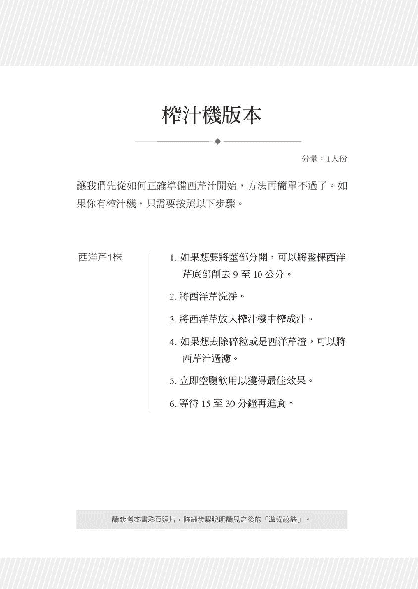

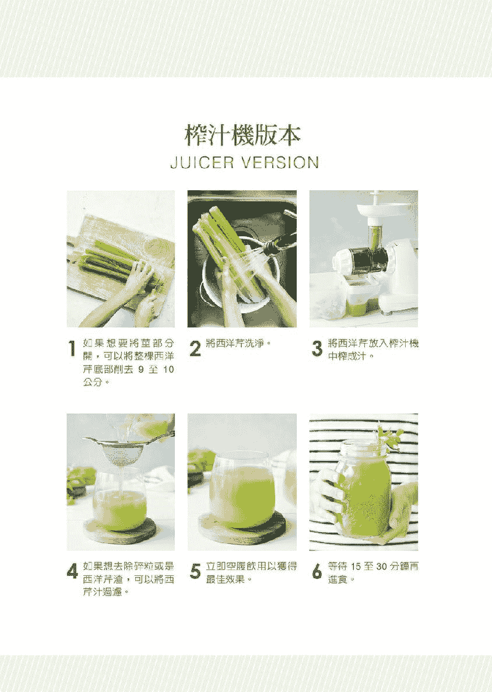

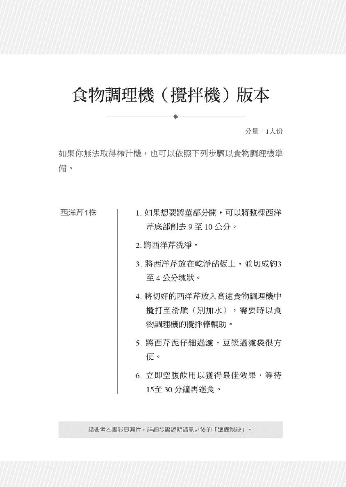

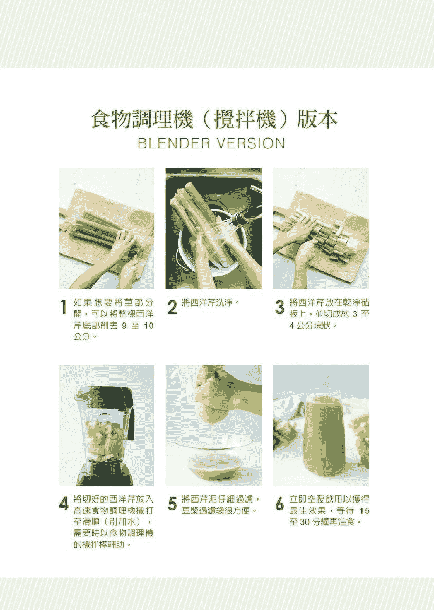

## **第四章  如何发挥西芹汁功效**

当我们谈到西芹汁的益处时必须明白我们指的是纯粹、单纯、未经变质与加工的西芹汁。我们说的不是加了些许西洋芹的蔬果汁、不是嚼食西洋芹棒、不是加在高汤中煮沸的西洋芹更不是将西洋芹打成泥之后没有过滤就直接饮用的西芹汁。

确实无论是当成点心、用来烹调或整株打成汁西洋芹本身就很健康但透过这些其他方法处理后西洋芹无法提供足以与饮用纯西芹汁相提并论的健康效益差太多了。

在你读过本章与后续章节后便会更清楚惊人的理由所在。自此开始将这份关键的智慧铭记在心纯粹、新鲜西芹汁拥有的单纯力量无可比拟。你需要先清楚了解这点才不会因为听见西洋芹有其他更好的调理方法而动摇。假如你无法取得西洋芹或因为任何其他原因无法饮用西芹汁也别因此慌张。你还是可以采取替代方案我们将会在第九章谈到。

我不希望你迷失在各家争鸣的健康主张之中。倘若依循试图将简单问题复杂化的误导理论你会发现自己走进健康之路的死胡同里。本书的知识将会让你了解真相所在。

准备祕诀

当你读完本书时即将带着最真切的知识成为西芹汁专家。你已经了解许多重要资讯而以下是更多基本原则。

冲洗

当使用商店买回来的西洋芹时最好在榨汁前先冲洗干净。如果刚从冰箱拿出来但你不想喝冰凉的西芹汁可以用热水冲洗一下。以热水冲洗可以使西洋芹的核心温度上升至少五〇使你榨出较温凉的西芹汁。你很快就能掌握如何衡量水温与冲洗时间获得你喜欢的西芹汁口感。

不用担心以热水冲洗会把西洋芹煮熟此方法并不会破坏西洋芹的酵素成分或造成任何阻碍。需要极高温的水以及较长的烹煮时间才会破坏其效果。

如果你是向信任的当地农夫购买或在自家菜园种植西洋芹上面便可能富含我所称的崇高微生物存在于天然种植的水果、蔬菜与药草表面、目前尚未为人所知的有益微生物。在此情况下除非表面沾有尘土结块否则不适合使用热水冲洗西洋芹才不会伤害崇高微生物。关于这些神奇微生物及其对我们的帮助请参阅《医疗灵媒》系列书籍。只要用温水冲洗当地取得的西洋芹即可。

传统农法与有机栽种的选择

尽可能选择有机的西洋芹。假如因为任何理由无法取得有机西洋芹也别担心使用传统农法栽种的西洋芹总好过彻底放弃西芹汁。使用传统农法种植的西洋芹时需要特别仔细在每根西芹茎上加一滴天然、无香精的洗洁剂再加以洗净并彻底冲洗。

口味

每个人初尝西芹汁的口味都不一样。有些人刚开始不那幺喜欢而是随着时间逐渐爱上它其他人则可能从第一杯就深深着迷。这通常取决于初次饮用西芹汁时体内的毒素有多少。假如有人的毒素含量极高西芹汁可能会对身体造成冲击。因为西芹汁会结合有害物质并将其清出肝脏而我们的感官其实侦测得出来味蕾与嗅觉都可能受到影响。毒素可能将美味转变成酸味或其他不讨喜的风味但这段时间会过去。有些人第一天并不喜欢西芹汁但在一周后却已经无法自拔。有些人也许需要饮用六个月后才开始有好感并渴望饮用。人类含有各种毒素以及过度负担的身体与肝脏所以情况都不一定。有人流行在西芹汁中挤入柠檬汁来改变口味但这幺一来你将失去西芹汁的疗愈力量。纵使只喝少量的纯西芹汁效果也远胜过饮用加了柠檬的大量西芹汁。想改善西芹汁风味的人要知道只喝一小杯的效果都胜过加了柠檬的一大杯。

对于西芹汁的体验可能每天都不同即便西洋芹来自相同商店、相同农场、同一批、同一箱而且存放在相同架上也是如此。一部分原因可能是你前一天的晚餐吃了有助排毒的食物或是昨晚喝了一些咖啡抑或是你在饮用西芹汁之前先刷了牙。

每批西芹汁的风味与颜色可能也都不同。随着时间经过你可能会发现从商店购买不同种类的西洋芹榨出来的西芹汁都不一样。有些时候的西洋芹颜色比较绿有些时候的比较多叶子。有些时候的西洋芹颜色比较深也比较细长比较纤细的西芹茎榨出来的汁会苦一些也比较难以入口有些时候你会买到比较大、比较脆的西芹茎可以榨出比较多汁也会带点咸味甚至些许甜味有些时候的西洋芹你几乎尝不出其中的钠成分但有益的钠簇盐其实一点也没少。这些都取决于种植的农场、种子的种类以及土壤在一年中的什幺时间、什幺气候下受到灌溉。

当你买到较不美味、水分较少的西洋芹也别因此感到扫兴这些西洋芹的药性其实更高。假如你发现根部的颜色比较淡近乎透光也别担心或者丢弃如果是在种植过程中经过包裹缺少阳光照射根部颜色因此变淡的话就没关系。颜色较淡的西洋芹通常比较可口也表示你比较不会排斥算是个优点。即使西洋芹的叶绿素含量较低仍然能够提供其他植物性化合物帮助你疗愈。此外西芹汁的叶绿素比任何其他来源的叶绿素更加有益因为它能结合西洋芹独有的钠簇盐、植物激素与维生素。这代表你从西芹汁获得的叶绿素纵使含量较低仍然比其他来源的叶绿素更有效。

当你熟悉种植西洋芹的土地便会了解这一切。无论你买到哪种西洋芹里头都会具有你目前为止所学到的钠簇盐以及其他珍贵的营养成分只要不是买错买成了西芹根都能榨出助你疗愈的西芹汁。

西芹叶

很多人常会问到西芹叶对我们有没有好处、该不该一起榨汁答案是西芹叶具有极高的药性。它们含有矿物质与其他养分甚至是有益的植物激素。然而这不代表你一定要使用。西芹叶的风味可能很苦所以假如你觉得榨出来的西芹汁不好喝可以在榨汁前修掉一部分甚至全部的西芹叶看看西芹汁会不会比较好喝。

从商店购买的西洋芹可能只有一些叶子而自己种植或是从当地农夫市集买来的通常叶子都很多。当使用当地或自家种的西洋芹时我建议你修掉一部分的叶子以确保你用来榨汁的大部分都是西芹茎。太多西芹叶会让西芹汁产生涩味变得比较不讨喜你可能因此不会想喝太多。太多西芹叶也可能引起较剧烈的排毒反应使西芹汁的体验不那幺愉快也让你不容易持之以恒。由于商店购买的西洋芹通常比较少叶子该不该连叶子一起榨汁端看你的口味与喜好而定。

西芹叶是否会让你感到苦味有一部分取决于你在饮食中是否偏爱苦味的蔬菜。如果你多年来习惯在沙拉中加入有苦味的蔬菜那西芹叶与其他药草似乎没有太大差别。西芹叶的苦味来源在于其中的生物硷。这些植物性化合物对于我们味蕾的刺激很强有点过于剧烈而此现象既正常又自然。这些并非有毒的生物硷虽然其他植物中的某些生物硷可能原本就有毒性但西洋芹并没这个问题。西洋芹的生物硷具有药性而且排毒效果极强能帮助使身体硷性化并降低存留在我们器官与体内其他部位的有毒酸性。更明确而言西芹叶的生物硷能帮助我们排除肝脏毒素。

顺带一提当我制作西芹汁时习惯将西芹茎的末端叶子那头切去一到两公分并将底部端根部那头切去约九至十公分。这跟叶子本身没有关系。然而你常会看见西洋芹本身的两端已经被切过了但我进一步切除的原因在于我不知道西洋芹先前被什幺工具切过——刀具是否干净、肮脏、加工环境靠近牲畜、是用机器或手工切除或者刀具上有没有油脂等。如果你不想浪费西洋芹能够榨汁的每个部分便不需要这幺做。很可能其实没什幺问题而且采收西洋芹的刀具也很干净这只是我个人的偏好罢了。

榨汁机

任何能榨取西芹汁的榨汁机都可以。西芹汁对你有益记得这件事就好。如果你已经拥有榨汁机请务必继续使用。

假如你在市面上寻找榨汁机无论是因为你还没买或是你想换台更好的那幺慢磨榨汁机 masticating juicer 是理想的选择可以保留并榨取西洋芹当中的大部分营养而且噪音极低。慢磨榨汁机也能榨出较多西芹汁亦即每一把西洋芹的出汁率比较高泡沫与浮渣也比较少。

然而如果你家用的是离心式榨汁机也没关系。这种机器的榨汁速度比较快所以假如阻挡在你跟西芹汁中间的是时间考量离心式榨汁机可以解决问题。选购能够在榨汁过程中保持蔬菜水果冷却的机器避免某些会因高速运转使汁液加热的榨汁机。

假如你手边只有高速搅拌机或食物调理机你或许有天也会想买台榨汁机。搅打式机器的出汁量比榨汁机少而且还得另外过滤搅打后的西芹泥也容易使人厌倦。但还是记得无论你用哪种机器制作西芹汁都是好的机器。别因为你用的不是最先进的慢磨式榨汁机就感到泄气你榨出来的仍然是很棒的西芹汁而且会透过各种方式来改善你的身体。

果汁吧

如果不想自己动手从果汁吧、果汁店、咖啡厅或天然水果店的果汁区取得新鲜西芹汁也没问题。

假如是冷压西芹汁好极了。并不是我希望每个人都习惯外出购买冷压果汁将此当作唯一的方法。冷压西芹汁并非取得养分的唯一途径。购买离心式榨汁机所榨取的西芹汁一样很棒。而在家利用优秀、老派的慢磨式榨汁机制作西芹汁就跟从商店购买时髦的冷压西芹汁一样有益。你家中所拥有的任何一种榨汁机都能制作出富含养分的西芹汁。

如果你仍然偏好外出购买西芹汁可以将以下几种方式纳入考量。

首先询问店家如何准备西洋芹。有些店家在榨汁前清洗蔬果时会在水中加入一滴氯或漂白剂你应该避免。

再者假如你购买的是预先装罐的西芹汁请仔细检查标签并确定未出现「」字样有时候印刷的字体或符号很小。即便标签上没有也请询问店员确定产品不是产品。如果是产品请考虑选购当场现榨的西芹汁产品。你不该喝下经过的西芹汁。

「」指的是高压灭菌 high-pressure pasteurization 代表蔬果汁并非当天新鲜冷压并装瓶上架而是从加工厂送来。的灭菌过程并不需要高温导致使人误以为是新鲜原汁的错觉其实正好相反。经过的蔬果汁已经变质细胞结构的形状与型态已经被这种尚未接受时间检验的新式加工方法改变。

一般的巴氏灭菌法是种加热过程其安全性已经受到数百年来的考验。我并不是说你应该饮用经过巴氏灭菌的西芹汁重点是西芹汁要新鲜、原始。然而将产品视为新鲜原汁是错误的假设。理论上产品是原汁没错但实际上却已经为了维持放在货架上的期限而受到改变、劣化。要提防产品的原因在于它无法为你带来西芹汁的健康效益。我能预见许多人拿起西芹汁尝试了一段时间后又放弃因为他们的症状与疾病无法获得改善。别成为其中的一分子。

经过制程的其他蔬果汁仍然能提供养分所以如果你习惯饮用蔬果汁而且想继续饮用还是能获得一定的效果。但另一方面西洋芹是种药草因此制程会导致西芹汁所能提供的诸多神奇疗愈效果消失包括其中最重要的特性。对于像西芹汁这种草药而言即便你只失去其中一种效果都等于失去一次疗愈的机会。

保存西洋芹

如果你习惯自己制作西芹汁可以考虑向当地店家一次整箱购买。询问农产品部门有没有多的箱子或在下次订购时多加个箱子。你通常能获得折扣而且还能买到比较新鲜、可以在家保存比较久的西洋芹也不用时常出门补货。

西洋芹本身可以冷藏保存长达一周。我曾看过西洋芹卖出后假如原本就够强壮、够新鲜可以保持鲜绿与清脆长达两周。判断西洋芹是否可用的原则之一在于颜色。尽量在变黄或是转为咖啡色、失去鲜绿色泽前将其使用完毕。假如你因为生活太过忙碌以至于还没来得及榨汁先前购买的西洋芹就已经变色别因为只能将其丢弃而感到灰心。也别因此放弃西芹汁。请购买新的西洋芹再次尝试。

如果你正要购买西洋芹而且预计会快速消耗应该会打算保存在冰箱里。过了几天冰箱架上未包装的西洋芹可能会干枯、下垂。为了避免这点冰箱的保鲜抽屉是很好的存放位置。西洋芹有时候会有塑胶包装或是你可以放在商店的购物袋中如此即便没放在保鲜盒里也没关系。假如你买了整箱的西洋芹但都没有塑胶包装就从店里的塑胶袋卷抓几个袋子农产品部门应该很乐意让你带几个回家因为你才刚买下一整箱的商品。

保存西芹汁

如果你没办法立刻将整份西芹汁喝完最好的保存方法是装在玻璃罐中再盖上盖子冷藏。现榨西洋芹可以保留疗愈效果约二十四小时。严格来说可以在冰箱里放上三天——虽然过了一天之后效果就没那幺好了。随着每个小时经过西芹汁的功效会逐渐流失所以榨取后超过二十四小时才饮用并不理想。

你可以将西芹汁冷冻但这同样并不理想。但假如这是你唯一的方法那就冷冻保存吧。我建议倒入制冰盒中方便使用而当你有时间就尽快拿出来解冻喝掉。但不要在西芹汁冰块中加水也不要将西芹汁冰块放入水中如此会阻碍其效果。

我并不会将西洋芹冷冻因为冷冻会破坏西芹茎榨出来的汁效果也不好。即便看似跟冷冻西芹汁的方法很像但其实不然。当你现榨西洋芹时可以萃取出里头的生命力但倘若将西洋芹冷冻之后便是在榨取失去生命的西芹茎。

你绝对不会想将西洋芹或西芹汁煮沸除非你想要煮高汤。你还是能将西洋芹放进汤里炖饮食中常摄取西洋芹仍有助于缓解某些症状。然而当你烹煮西洋芹时会破坏其中的酵素并使某些养分变质使其不再是你所需要具有强大药性、疗愈效果的西芹汁无法再帮助你有所进展。只有新鲜西芹汁才办得到。

为什幺是四五〇毫升

多数成年人理想的西芹汁饮用量是每天最少四五〇毫升。这不代表你初次尝试就必须从四五〇毫升开始如果你很敏感的话可以慢慢增加先从一百毫升或两百毫升开始习惯之后再每天逐量增加。

当你准备好了便可以将四五〇毫升设为最低饮用量。为什幺因为多数人都有不少健康障碍需要克服而西芹汁疗愈必须经过漫长的旅途。西芹汁的第一道阻碍在嘴巴里头可能有细菌或残余的牙膏、漱口水。记得在刷牙后与饮用西芹汁前以清水彻底漱口去除残留的牙膏、洗口药或漱口水。更好的做法是早上等到喝完西芹汁再刷牙。

下一关是食道西芹汁会遭遇更多细菌再加上氨与有害无益的酸。接下来抵达胃袋底部、位于十二指肠之前的关卡小肠入口。十二指肠前有一道小小的突起结构端看我们的年纪而定这里可能充满数十年来——有时长达三十至四十年——所黏着、将突起结构压垮的大量残渣物质。这些残渣可能来自蛋白质、防腐剂、固态氨与酸等在此侵蚀并形成淤泥般的沉积。西芹汁的钠簇盐开始吞噬这堆老旧的有毒淤泥随着时间将其逐渐溶解。

因此西芹汁首先要突破这些阻碍。接着当西芹汁通过十二指肠就要面对幽门杆菌、链球菌与其他各种细菌的攻势因为多数人都与这些细菌共存只是未经检出。西芹汁必须奋力战斗以保卫自己并且在这场战役中求生但其实此役难度倍增因为先前遭遇过口腔中残留的牙膏与细菌、食道中的氨、酸与更多细菌以及离开胃部时跨越的残渣效力已经有所耗损。

随着继续通过十二指肠西芹汁将受到酸性轰炸因为几乎每个现代人体内的 pH 值都处于「关闭」状态我们也并非生来就会自动硷性化。当然假如一个人很健康 pH 值会相当均衡西芹汁在此也不会耗费太多功效。然而许多人体内都充满制造大量酸性细菌。有害饮食与繁重压力也会产生大量的酸。在我们喝下第一口时西芹汁便开始改变体内 pH 值从嘴巴一直通往消化道。几乎就像爆炸一样西芹汁试图掀起颠覆高度酸性的浪潮这便是当西芹汁流经我们体内时将会耗损其功效的另一个来源。

如此听来西芹汁要克服许多难关并维持效力似乎很难还不只如此。就再进入小肠不久就会遭遇一摊黏稠的黏液。无关乎年纪每个人都有一层底端食客在此定居像是大肠杆菌与其他害菌有时还包括两到三种有害真菌全都等待着我们所吃下肚、来自蛋类与胶原蛋白营养品的蛋白质或是来自奶类、乳酪、奶油或其他乳制品的乳糖想藉此饱餐一顿。而当西芹汁冲击这条路上的病原体时又将开辟另一处战场。

此外还有来自高脂食物无论脂肪来源健康与否、许多年来沿着肠壁硬化、结块的腐败脂肪以及形成小颗粒状残渣、在肠壁开凿出囊袋、成为更多细菌与真菌庇护所的腐败蛋白质。解决这些问题也是西芹汁在旅途中需要克服的另一道阻碍。

还没说完呢以上只描述了西芹汁到目前为止所遭遇的主要关卡。另外再加上过量的肾上腺素——假如你在忙碌或压力造成肠道紧张的状态下进食或是前一天晚餐不自觉吃下太多脂肪都会促使肾上腺释放大量肾上腺素。一旦过量的肾上腺素进入肠道便会带来严酷考验。肾上腺素会渗透全身细胞所以假如你前一天处于强烈压力下或是遇到其他刺激肾上腺的事件隔天醒来时肾上腺素仍然会滞留于肠道之中。西芹汁会中和肾上腺素又是一场恶战。当西芹汁忙着解决此问题便无暇应付在流经肠道时遭遇的其他物质。

一顿高脂肪晚餐的影响不只是刺激肾上腺素。晚餐残留在肠道中的脂肪就像一层浮油一路从胃部沾到小肠并进入结肠而西芹汁会清除这些油渍。因为西芹汁有驱散脂肪并排出消化道的作用以至于让高浓度脂肪吸收了西芹汁的疗愈化合物也消耗掉钠簇盐。这代表假如某人享用了丰盛晚餐例如油炸主菜再加上甜点那隔天早上的西芹汁就需要更加费力在突破各种阻碍的过程中耗损更多疗愈能力。

消化系统只是个开端。世界上大多数人也都有肝脏功能迟缓、机能低落的问题而关键在于必须有足量的西芹汁到达结肠使其完整的疗愈力被吸收到血液之中西芹汁的化合物才能透过肝门静脉进入肝脏再进入胆囊藉此帮助你疗愈。无论你在生命中遭遇何种困境肝脏越健康表示越有机会治疗你所面对的各种症状或疾病。对多数成年人而言四五〇毫升正是能达成目标的神奇数字。稍后即将谈到幼童的饮用量。

一旦西芹汁来到肝脏就会遇上另外一系列的阻碍。其中之一多数人的肝脏都含有毒物、杀虫剂、除草剂、塑胶与其他石化物质、溶剂、病毒与细菌等病原体以及更多有害物质所带来的毒素这些都会抑制肝脏的胆汁分泌量。当西芹汁的化合物进入胆汁制造部位假如其仍保有充分效力就能改善肝脏输送至胆囊的胆汁浓度。经过西芹汁强化的胆汁便开始分化与驱散胆囊内的淤泥物质同时分解并溶解胆结石。如果你饮用足量西芹汁的时间够长使身体变得干净又健康西芹汁的化合物就会连同胆汁一起离开胆囊并进入肠道至此完成西芹汁一部分的使命形成完整循环。

西芹汁的疗愈化合物到达肝脏后并非全部都会与胆汁结合。其中一部分在离开肝脏后会进入血液送往心脏与大脑。然而就多数人而言迟缓与机能低落的肝脏在此阶段已使西芹汁的疗愈能力所剩无几必须花上一段时间才能让我们的肝脏充分净化使由此流出的西芹汁仍然保有其功效。

还好这不算太大的问题因为西芹汁的疗愈效力能透过另一种管道进入血液。回到西芹汁首次进入消化道的时刻起初只有大约一半会进入肝脏这一半是在遭遇阻碍的路上自行分流出来。当它们流经胃部与小肠前端大约一公尺的长度时另一半西芹汁所含的化学物质不会先流向肝脏而是直接被消化道内壁吸收并进入血液中。流入血液后便要独自迎向另外一系列的挑战。血脂浓度有多高脂肪会影响西芹汁的输送距离。血中毒素有多少如大脑等各种器官的有毒重金属含量高低谈到大脑脑中正面临多少神经传导化学物质的问题这些都会降低并削弱西芹汁剩下的疗愈力。假如脑中的神经传导化学物质减少就会立刻消耗西芹汁的化合物加以补充成为旅途的最后一站。倘若有重金属需要清理则会消耗西芹汁的钠簇盐来帮助将其排出体外。

基于西芹汁如此广泛的用途你就能明白为什幺要有足够的饮用量才能发挥功效。下次当别人问你西芹汁为何要满足特定饮用量时看你想怎幺回答。你可以仔细讲解西芹汁通过消化道前后的过程你也许要先确定对方不是在吃东西或是提出简洁扼要版西芹汁的责任繁重而且在通过身体发挥疗愈功效时需要面对重重关卡。你也可以将本书交给他们。无论如何回答你都知道饮用量相当重要因为这关系着西芹汁「为什幺」如此强大。

更大量饮用

饮用超过四五〇毫升的西芹汁当然没问题。一天喝下九百毫升的西芹汁对于受自体免疫疾病与其他慢性病所苦的患者相当有益有时可以分成两次在早上与下午或晚上各饮用四五〇毫升。此外运动员如果将每日饮用量提升至九百毫升、甚至更多还能帮助并改善比赛成绩或运动表现。假如每日饮用量增加至一八公升也没关系但可能需要些许调适像是有些人会因为净化与排毒作用提升需要常跑厕所。

比较不建议你某天醒来时突然想到「我以前从没喝过西芹汁现在直接从一八公升开始吧」由于西芹汁的钠簇盐会分解与消灭病原体并且将病原体的有毒废弃物透过皮肤、肾脏经由尿液与肠道经由排便排出身体与血液之外所以西芹汁可能会引起体内的净化与汹涌反应。尤其当你较为敏感或体内具有大量毒素抑或是带有病毒

引起例如纤维肌痛症、多发性硬化症、狼疮、桥本氏甲状腺炎、多囊性卵巢症候群、肌痛性脑脊髓炎慢性疲劳症候群、类风湿性关节炎以及例如刺痛、发麻、痛觉、疼痛与疲劳等症状或链球菌等细菌引起例如小肠细菌过度增生、鼻窦感染、尿道感染、针眼、耳朵感染以及喉炎等病症时便可能产生净化与汹涌反应。我建议初次尝试者最多不超过四五〇毫升等一段时间都没有感到异样后再逐渐增加饮用量。你可以先从一一〇毫升开始接着每天增加一点直到四五〇毫升为止。

如果你想要再进一步便可以继续增加到每天九百毫升但假如你还想更上一层楼不要直接增加至一八公升。先从每天一一公升开始再逐渐增加到一八公升让身体逐渐适应大量的药性。如果你想走极端路线可以比一八公升更多一些直到二二公升为止至此应该是你的上限。建议别在二十四小时内饮用超过二二公升。

幼童饮用量

婴儿与幼童的肠道内并没有太多阻碍西芹汁的关卡所以饮用量不需要这幺多。以下附上对于年轻孩童饮用量的对照表这些是每日建议最低饮用量你可以依照孩子的需求自行增减也不用担心这些最低饮用量会造成伤害。

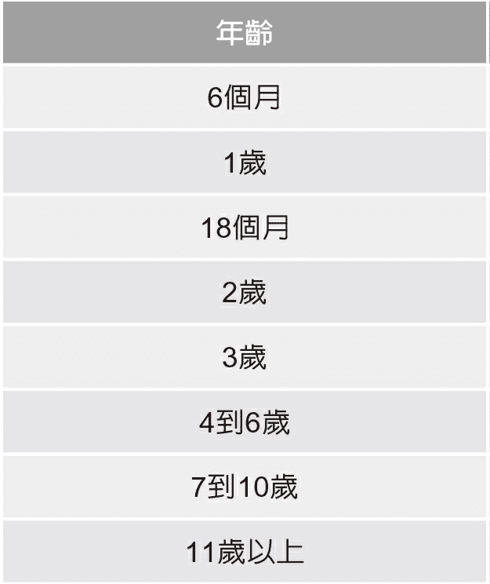

较细、叶子较多的西芹茎

你所在的地区或国家可能只有较小根、颜色较深、茎部较细、叶子较多的西洋芹一整把只能榨出少少几百毫升的汁液。在此状况下假如你只能取得一小杯的西芹汁也没关系。纵使你无法获得四五〇毫升以上、较温和西芹汁的完整效益也能退而求其次。正如我在

「准备祕诀」中所提西芹汁的叶绿素具有独特功效并且与西洋芹的钠簇盐、植物激素跟维生素相互结合。你从深绿色西洋芹中取得丰富、高浓度的叶绿素可以补偿汁液量不足的一部分效果而且对于身体健康的不同层面仍然有帮助。

我强烈建议无论你取得哪种西洋芹都可以用来榨汁也别因为只能少量获取而打退堂鼓。毕竟它仍然是西洋芹它的汁液仍然能使你向前迈进。你也能实行《医疗灵媒》系列书籍提供的其他资讯藉此补足疗愈效果以确保你在健康的各个层面都能有所进展。

为何要空腹饮用纯西芹汁

为了获取我们在本书中寻求的西芹汁功效空腹饮用西芹汁相当重要千万谨记。否则若你在吃早餐或是下午吃点心时搭配饮用西芹汁便会错失其完整的疗愈能力。虽然还是有所帮助但远远不及其原本的程度。

饮用综合蔬果汁也同样会使效果打折。假如你到果汁店里看见某种新鲜蔬果汁里头列出菠菜、甜菜、姜、柠檬与西洋芹并且将西洋芹醒目地标示看似主打西芹汁一般你要当个内行的消费者。西芹汁是单一食材饮品即便在西洋芹以外只加入一种其他食材例如西芹苹果汁、西芹黄瓜汁或西芹柠檬汁都会使你想要的效果大打折扣。如果你喜欢其他综合蔬果汁很好蔬果汁对你有益但可以留到当天稍晚再喝。至于你独特的四五〇毫升空腹专用西芹汁除了西洋芹什幺都不行。

理由相当明确。我们需要西洋芹当中尚未为人广知的钠子群也就是你在第二章与第三章所读到、书中再三强调其具有独特能力能够帮助保护身体、摆脱症状与疾病的钠簇盐。钠簇盐是西芹汁当中最强大的成分也是帮助开始饮用西芹汁之人大幅改善健康的幕后功臣而钠簇盐必须经过空腹摄取才能确实发挥功效。但即便你某天需要先吃早餐才能喝西芹汁时也不需要惊慌。在此情况下请参阅稍后谈到的「掌握时间」。

对大脑的益处

血脑屏障的缘故任何物质通常都难以进入大脑。但钠簇盐不一样可以直达大脑并作为终极电解质为其带来益处原因在于钠簇盐具有穿越血脑屏障的独特能力。我们说的是天然电解质并非人造电解质而西芹汁当中的电解质具有较高的传输速率与较长的传输距离胜过来自任何其他食物、人造饮料或营养补充品的电解质。若要发挥此效果西芹汁必须单独饮用而且一定要榨成汁。吃下西洋芹无法将足量的钠簇盐运送至你的体内甚至送往大脑。而假如你把西洋芹与其他食材混合会有个小问题其他蔬菜水果或添加物会稀释西芹汁代表你无法获得足够的西芹汁或其中的钠簇盐。

无论你是吃下西洋芹、打成蔬果汁或在西芹汁中加入胶原蛋白补充品这些额外成分都会阻碍钠簇盐为你带来的益处。纤维、脂肪与蛋白质尤其会造成妨碍。稍后将探讨关于纤维的更多资讯。它们使钠簇盐无法结合重要养分例如其他矿物质与胺基酸同时也让钠簇盐没办法流通以至于无法将这些养分送至大脑。再者正如你将在本章「掌握时间」以及第五章「西芹汁净化法」读到的我建议你将西芹汁与任何脂肪分开享用因为脂肪会使肝脏释放胆汁帮助消化而过多的胆汁同样会稀释钠簇盐。

如果你将西洋芹加入蔬果昔中钠簇盐是没办法到达大脑的。如果你将整株西洋芹搅打成汁并且连其中的纤维一同喝下钠簇盐也无法到达大脑。如果不是榨汁而是直接吃下西芹茎、在胃里充满其他食物时饮用西芹汁、将西洋芹与其他食材一同加入精力汤抑或是在西芹汁中添加胶原蛋白、活性碳、苹果醋或其他创新的误导类物质钠簇盐同样无法到达大脑。这些都会使钠簇盐身陷困境。

病原体防护

钠簇盐的另一项作用是消灭病原体。只有空腹饮用的纯西芹汁才能使钠簇盐直接接触病毒、细菌与有害真菌以发挥迅速消灭的作用。从你将西芹汁与苹果汁、菠菜汁、羽衣甘蓝汁、蛋白粉、豌豆蛋白、胶原蛋白、营养酵母或其他添加物混合的那一刻起就已经完全失去这种效果。

无论你将西芹汁与什幺混合、作用是好是坏都会使钠簇盐无法直接触及酵母菌、霉菌、食物毒素、链球菌、葡萄球菌、大肠杆菌、幽门螺旋杆菌、、病毒与其他有毒微生物因而损失打击病原体的强大效益。

如果你遵循的观念体系认为生的、新鲜的蔬菜水果会对身体太寒或是会导致湿气淤积或有人建议你在西芹汁中加入姜、姜黄或卡宴辣椒粉来提升温性请你明白加入这些香料到西芹汁中并没有问题前提是你不担心无法获得西芹汁的完整益处。然而为了获得西芹汁的所有益处必须饮用纯粹、单纯且未经变质的西芹汁。如果你想摄取姜、姜黄或卡宴辣椒粉可以加入别的食物中或甚至在当天稍晚加入另一杯蔬果汁中。不管你信不信无添加的单纯现榨西芹汁其实是解决东方医学所认为体质过热或湿气问题的最佳良方因为它能修复并活化肝脏而肝脏正是万病之源。

完善肠道机能

以任何其他食材稀释也会使西芹汁失去对肠道的益处。那就太可惜了因为西芹汁具有恢复消化能力的效果而且机能完善的肠道也更能吸收并利用西芹汁改善全身。西芹汁的钠簇盐搭配消化酵素能分解并驱除消化道内的有毒酸性以及沿着小肠与结肠壁结块的老旧脂肪。每个人的消化道内壁都有脂肪附着其来源不只是油炸用油、氢化油、油脂或饱和脂肪。假如每天都摄取脂肪即便公认最健康的来源也会造成脂肪堆积包括坚果、种子、酪梨与优质油脂。多数人都会对于自己的实际脂肪摄取量及其影响感到惊讶。

顺带一提记得第二章的消化酵素吗它们只有在西芹汁单独进入小肠时才会发挥作用。

空腹饮用时纯西芹汁也具有点燃性的力量能够被吸收到你的肠壁与血液中。这点相当关键因为可以让西芹汁的成分进入你的大脑与身体以传递疗愈的力量。我们面对的问题太多了。当西芹汁进入我们体内必须同时解决许多麻烦。使其通过第一道重要关卡

——吸收到血液中——能将钠簇盐送往有所需求之处藉此帮助大脑、消灭害菌、溶解动脉内壁的硬化脂肪、协助净化肝脏等。削弱西芹汁的纯度就会妨碍其发挥期望中的打击效果。

我了解想要改变事物的纯度是人的天性。每个人心里都住着一位鍊金术士、一位调酒师我们喜欢东添西补将不同事物掺杂在一起希望能创造出更美好的成果。这正是西芹汁从未被人视为疗愈手段的原因。假如某件事物早已呈现最崇高的型态我们身为人类即使再心灵手巧也无法进一步改良时便会感到不自在。这也是为什幺多样变化的食谱如此热门却没人愿意一次只吃一种简单、型态单调的食物。当我们进食时总希望能加入超过一种食材当我们喝饮料时总渴望着多搀和几种饮品。我们的心思总想着「还有什幺」很难想到「没有下一个」以及「西芹汁具备所有特别的价值与优点」因而迳自论断单靠西芹汁肯定不足以为任何人带来好处。即便有许多人听过纯西芹汁疗愈的故事仍然无法克制自己加了水或冰块稀释或是加了点这个、那个不经意地毁了西芹汁。

当你忍不住想为西芹汁多加点什幺记得遵循空腹饮用纯西芹汁的法则是避免自己无端瞎搞的祕诀。你不用担心太过单调或过于简单西芹汁已经是超凡之物。你将西洋芹转变为西芹汁已经实现了炼金术的魔法西洋芹已然成为眼前的黄金。

纤维的疑问

很多人常觉得纳闷为什幺关键在于将西洋芹榨汁而不是直接吃下或在搅打后不需过滤直接饮用。摄取西洋芹的纤维获取全食物的益处不是更好吗这个问题很好。你已经了解一部分的答案亦即纤维会阻碍西洋芹当中的钠簇盐发挥应有的效力。

你还必须明白西洋芹是种药草而西芹汁是你利用药草取得的良药。当你泡花草茶时应该不会想把整株花草吃下肚也不会有人说你因为不嚼食茶包中的茶叶就漏了营养因为你只需要汲取花草的药性。西洋芹亦是如此差别在于你不会像泡茶一样倒入热水而是将它放入榨汁机以萃取并释放其中强大的功效。

「全食物当然比较好。搅打更胜于榨汁因为里头还保留了原本的纤维。」这是种信念是种理论。西芹汁并非某种信念或理论远不只如此。它是神奇的草药。许多人已经习惯忽略或无视西洋芹所以无法体会这项事实。众人并不了解为了使西洋芹的功效能满足我们的需求除了榨汁以外没有其他选择。当有人深信由所谓专家背书的信念认为保留西洋芹的菜渣与纤维比较好时等于告诉你这些人并不了解西芹汁的角色、本质以及将纤维分离能带来多幺独特的差异。这不是一般的蔬果汁而是草药。时髦的信念对于治疗慢性疾病无用武之地。假如有人宣称一定要保留原本的纤维代表他们误传了关于西芹汁的力量也表示他们毫无头绪而且不了解西芹汁数十年来如何帮助成千上万的人。

纤维很棒持续摄取纤维如果你担心饮食中需要摄取更多纤维可以在一整天的饮食中加入更多富含纤维的植物性食物。你喜欢的话也可以吃些西芹茎——喝完西芹汁的稍晚再吃。假如你早已习惯食用大量植物性食物与较少加工食物那你应该已经摄取了大量纤维。虽然纤维很重要西洋芹的纤维也同样重要但你仍然不该保留西芹汁中的纤维。如果你决定在搅打西洋芹后不过滤西芹渣纤维其实会阻碍西芹汁的某些功效也会徒增总量使你无法获取足以发挥西芹汁疗愈力量的饮用量。

假如西洋芹榨汁后似乎有你不喜欢的细微渣滓或颗粒浮在表面你可以利用网目较细的筛网、滤盆或豆浆袋加以过滤。除非你的肠道极度敏感否则不用担心浮渣。还是怀疑吗如果你发现生菜跟沙拉会刺激肠道因此感到害怕或许代表你的肠胃确实很敏感。在此情况下就需要就过滤西芹汁。如此你也能确定自己喝下更大量的西芹汁。

对其他人而言就是喜好问题。当你使用适当的榨汁机而且并非超级敏感时可以把细小的纤维留在西芹汁中喝下肚不会有问题也不会干扰西芹汁的疗愈力因为大部分的西芹渣都已经去除。或者你喜欢的话一样可以过滤。但对于以高速搅拌机或食物调理机搅打西洋芹的人而言过滤步骤很重要。喝下你用榨汁机所榨出的一、两片西芹渣没关系但可不表示饮用搅打后未经过滤的西芹汁能够获得相同益处。

至于榨汁后剩下的西芹渣怎幺处理我唯一的建议是作为你家菜园的堆肥。

掌握饮用时间

饮用西芹汁的理想时间是早晨在你除了喝水外尚未吃下任何食物以前。假如你上晚班就在起床后饮用西芹汁无论下午或晚上都没关系。当你喝完西芹汁先等待十五至二十分钟或者三十分钟最为理想接着再进食或饮用其他食物。

如果你在饮用西芹汁前会喝下白开水、柠檬汁或莱姆汁只要能隔开喝水跟饮用西芹汁的时间便是很好的做法。起床时喝水能温和地清洗肝脏并在你吸收西芹汁的药性前补充水分。早上一起床立刻饮用柠檬水来清洁肝脏是源自于我数十年前讲课内容的做法当时我正旅居各地发表对于西芹汁的看法。这项建议比西芹汁更容易受到接纳因为大家对柠檬跟水比较不会感到质疑而且也符合我们渴望发挥的炼金术精神。如果时间很匆忙记得在喝水后与饮用西芹汁前等待至少十五至二十分钟三十分钟更为理想。倘若你想要在饮用西芹汁后喝水等待的步骤也相同在饮用西芹汁后等待至少十五至二十分钟再喝水等待三十分钟更为理想。

但假如你无法在早上空腹饮用西芹汁以获取最佳效益呢别因此而打退堂鼓。首先如果因为你起床后的时间不够充分可以在前一天晚上先榨好西芹汁并倒进密封罐中再放进冰箱等待起床后饮用。

假如此方法行不通也没办法在吃早餐前取得西芹汁或是下午想要再喝一杯在其他时间饮用的西芹汁仍然能够帮助你。你只需要留意可能阻碍西芹汁功效或作用的食物。

根据你吃下的食物来安排西芹汁的饮用时间假如上一餐的脂肪与蛋白质含量高表示里头含有像鸡肉、牛肉、蛋类、乳酪、酪梨、坚果、种子、花生酱、其他坚果酱、种子酱或油脂等食材最好等待两个小时以上再饮用西芹汁若能等上三个小时更为理想。假如你的食物比较清淡例如新鲜水果、燕麦或沙拉而且其中不含有高脂食材像是橄榄、鯷鱼、培根、鲔鱼、坚果酱、种子或油脂类酱料便可以在三十至六十分钟后饮用西芹汁。或者在你饮用西芹汁后等待十五至三十分钟再接着进食或饮用其他食物。

对了如果你吃下高脂餐点而且在等待饮用西芹汁的两到三小时间需要提神可以吃点清淡的点心或喝点水。只要确定你的肠子有时间在饮用中午的西芹汁前将食物消化完。同样的喝下西芹汁后等待至少十五到三十分钟再进食。

营养补充品与药品

如果你正在服用医生开立的药品可以在饮用西芹汁前后服药只要留意是否需空腹服用即可。请注意如果你的药品需要在餐后服用西芹汁并不算是食物。倘若你先行服药先等待至少十五到二十分钟再饮用西芹汁等待三十分钟更为理想。关于进一步问题或疑虑请谘询你的医生。

如果你正在服用营养补充品请不要与西芹汁共同服用。虽然营养补充品与西芹汁不会冲突但西芹汁还是与营养补充品分开较佳。最好能在饮用西芹汁的至少十五到二十分钟后再服用营养补充品相隔三十分钟更为理想。

咖啡

我并不反对喝咖啡只是不认为咖啡是健康食物。

咖啡容易使肾上腺疲劳、使身体产生酸性也会耗损胃腺并导致胃酸降低最终在多年后引起食物腐败。如此将使肠道中的氨气往上渗入口中导致龋齿与牙龈溃烂。

咖啡还会使体内环境变得严峻、不利于肠道内壁与牙齿珐琅质并造成严重脱水。我曾听过太多次有人害怕柳橙等柑橘类食物因为以讹传讹的专家表示柑橘类会使牙齿珐琅质变得脆弱、易裂或溶解。但这些害怕柑橘的人却每天都喝咖啡而咖啡对牙齿的伤害远超过柳橙或柠檬。柳橙、柠檬、莱姆与葡萄柚等柑橘类食物其实都具有抗菌效果——细菌正是牙龈疾病与蛀牙的根源——所以其实有益牙齿与牙龈健康而且钙质含量高有助于强化牙齿与颚骨。

如果你喜欢也出于习惯想要喝咖啡那可能会喝下许多有害物质。最好在饮用西芹汁至少十五到二十分钟后再喝咖啡若能间隔三十分钟更为理想。假设你在饮用西芹汁前先喝了咖啡西芹汁就需要更加费力的矫正并疗愈你的体内问题本来就够多了。然而如果你早上第一件事必须得喝咖啡甚至比西芹汁更早我了解。至少给咖啡十五分钟能有三十分钟更为理想让咖啡先通过你的身体再饮用西芹汁。西芹汁仍然能透过许多方式帮助你只是没办法以最快的时间发挥所有功效。假如你目前患有症状或疾病可以考虑让身体暂时远离咖啡改喝椰子汁。暂时戒除咖啡有助于你的进展并且让西芹汁发挥疗愈效果。

西芹汁能够帮助戒除咖啡瘾吗当生活方式使身体充满有害物质而含有毒素时我们常想喝咖啡的目的其实是为了刺激肾上腺素藉以遮掩毒素对我们造成的影响但我们并不了解。人们通常不了解自己暴露在什幺之下有多少毒物与病原体驻足在我们的肝脏、血液与其他部位中我们只知道自己的感受并未达到一〇〇分而喝咖啡能让我们在当下得以继续运作。然而西芹汁能帮助清除有害物质对于用肾上腺素遮掩毒素的需求会随着时间降低亦即在饮用西芹汁一段时间后的确能消除许多人想猛灌咖啡因的冲动。

运动

常有很多人想知道该如何将西芹汁加入每天早晨的运动排程中。最理想的状态是醒来时先喝点柠檬水等待十五至三十分钟后饮用你的西芹汁再等待十五至三十分钟在运动前享用你喜欢的餐点不含脂肪的食物较为理想例如果昔并等待消化一段时间便可以进行慢跑、健走、骑自行车、打网球、游泳、打排球、上健身房等任何你喜欢的运动。

如果你没有时间进行上述流程我完全能够理解。此时次佳的排程则是跳过柠檬汁饮用西芹汁成为第一顺位并等待十五至三十分钟接着吃点早餐同样的果昔是理想选择再等待食物稳定一段时间后便可以开始运动。

以上两种方法都能带给你空腹饮用西芹汁的效益同时提供运动所需的能量也就是早餐。记得西芹汁不是热量来源而是药物。运动员需要热量及碳水化合物否则在燃烧殆尽后便会遭遇撞墙期。如果你相信运动员需要仰赖蛋白质请参阅《医疗灵媒》系列其他着作以获得营养指南。假如运动比较轻松那运动前只喝西芹汁没有问题。然而在进行任何剧烈运动前最好还是先摄取一些燃料但西芹汁并不是燃料。无论运动前后最适合搭配运动的食物就是一片新鲜水果或一杯果昔。

假如你仍然执着于将运动摆在第一顺位呢那就在运动前或运动后饮用西芹汁或者运动前后都喝这都取决于你。我仍然建议在运动前吃些食物让你的身体具有燃料。如果你要在运动后饮用西芹汁我不建议你只喝西芹汁。虽然西芹汁有益于补充透过排汗与施力所消耗的电解质、神经传导化学物质、重要钠存量与微量矿物质而且恢复效果胜过其他食物但如果你未能取得热量仍会在剧烈运动后遇到撞墙期。如果你在运动过后饮用西芹汁不需等待太久便能摄取新鲜水果或其他洁净碳水化合物在第八章与《肝脏救星》一书中有更多解释以提供你重要的葡萄糖。当你在运动后饮用西芹汁只要等五至十分钟就可以吃点心是很合适的排程。的确你在此情况下无法获得西芹汁的所有好处例如西芹汁无法发挥原本病原体杀手的能力但仍然能提供绝佳的电解质你还是能获得部分效益。

如果你不太想因为饮用时间靠其他食物太近因而损失西芹汁的部分效果那就回到本节的开头看看是否能够调整你的晨间排程在运动前腾出饮用西芹汁与进食的空档。这种组合最能够长期支援你。

西芹汁口腔疗法

拿到新鲜西芹汁怎幺喝都没关系。你可以小口啜饮、可以在口中环漱几秒再吞下也可以一饮而尽随你高兴。

当你患有口腔或嘴部周边的特定问题可以在饮用西芹汁时利用几种口腔疗法。如果你是油漱口爱好者请了解西芹汁对于口腔与牙齿问题具有无可匹敌的效果。试着改以西芹汁漱口后吞下藉此替代油漱口。

这种做法要进行几次取决于你的症状严重程度。对于轻微症状而言可以试着以一杯西芹汁进行一次或多次。至于严重症状可以选择下列疗法其中之一并以一杯西芹汁进行三次以上。疗法包括

如果罹患喉炎可以小啜一口西芹汁含在口中三十秒使其在喉咙部位前后流动藉此消灭引起喉咙痛的细菌或病毒。如果你愿意也可以尝试漱口。

如果喉咙或颈部腺体肿胀可以将西芹汁含在口腔后方朝向喉咙的部位一分钟后再吞下有助于使其进入淋巴系统。

如果罹患扁桃腺结石可以利用西芹汁温和漱口后再吞下。

如果有口疮或是口腔溃疡先尝试以纸巾或卫生纸将疮部或溃疡处擦干再小啜一口西芹汁并含在口中确保以其覆盖敏感部位经过三十秒以上再吞下。

如果有牙痛或牙龈脓肿或是口中有伤例如咬破嘴唇或脸颊内侧小啜一口西芹汁含在口中三十至六十秒有助于使钠簇盐进入患部并进行疗愈。

如果拔完牙可以小啜一口西芹汁含在口中三十秒但是不要漱动接着再吞下。如果有蛀牙可以缓慢啜饮喝下整杯西芹汁并且让每一口都能温和地冲刷口腔。这是少数没有限制次数的例外在此情况下每一口都要来回漱动。

如果有牙龈退缩或任何牙龈疾病可以小啜一口西芹汁并温和地在口腔来回漱动一分钟后再吞下。

如果罹患嘴边疱疹、唇疱疹或嘴唇上任何细菌感染可以让西芹汁接触患部需要时也能以手指轻拍接着小啜一口含在口中三十至六十秒再吞下。

如果嘴角裂伤可以缓慢小啜西芹汁使其流向疼痛的破口有助于使患部更快痊愈。如果是嘴唇龟裂或裂伤也可以依此小啜西芹汁使其覆盖唇部。这两种情况都可以用手指沾西芹汁轻拍嘴唇或嘴角比较容易做到。

怀孕与哺乳

摄取西芹汁对怀孕与哺乳妇女都很安全。在怀孕期间能够帮助强化母亲的肾上腺这对婴儿相当重要因为分娩时需要大量的肾上腺素。强壮的肾上腺使母亲更能安全产下婴儿甚至能减少分娩时间。

西芹汁也富含养分例如维生素、叶酸与维生素这些对婴儿的发展都很重要。当婴儿在子宫中发育时丰富的抗氧化物有助于保护婴儿细胞使婴儿有能力对抗毒素以避免早期疾病。西芹汁的钠簇盐也能为婴儿发育中的大脑提供神经传导化学物质在此关键阶段提供支持。

在哺乳期间母亲摄取西芹汁对于婴儿而言相当滋养。你不用担心有解毒效果的西芹汁会让毒素进入母乳中恰恰相反。女性的母乳常会含有各种毒素因为有太多人都在生命中接触汞跟铝等有毒重金属、杀虫剂、除草剂、杀真菌剂、石化物质、化妆品、溶剂、染发剂、古龙水、香水与更多物质使肝脏处于运作迟缓、机能低落又过度负担的状态。当这些有害物质囤积在肝脏内最终便会进入母乳。在饮用西芹汁时其强大成分也会进入母乳中并且缓和、削弱与耗损毒素不仅能中和毒素减低其破坏力还有助于将毒素部分或全部排出母乳。同时西芹汁也能帮助分泌洁净的母乳、提供珍贵的钠簇盐促进婴儿大脑发育也透过可用的维生素、微量矿物质与其他养分维护婴儿健康。

因此西芹汁相当有助于怀孕与哺乳。如你在第三章「缓解你的症状与不适」中所读到甚至对于孕前阶段也有帮助能改善不孕症的潜在因素。真正不安全的是各种化学食品添加物例如包装食物中的柠檬酸与天然风味剂、无糖汽水中的阿斯巴甜代糖、咖啡与红茶中的咖啡因、某些动物产品中的抗生素以及许多食物中添加的粗糙有毒盐分然而孕妇或哺乳妇女却时常摄取这些物质。西芹汁是你最不需要担心的食物。

宠物饮用西芹汁

很多人饮用西芹汁后的感觉很棒因此想知道是否也能让宠物饮用。西芹汁对于狗猫很安全甚至可以跟你说我会让自己的狗饮用西芹汁。请谘询你的兽医关于特定狗猫的适当饮用量。如果你想让其他种类的动物饮用西芹汁也请谘询兽医是否合适。

西洋芹过敏

过敏检验显示出对西洋芹敏感与人对西洋芹立即产生过敏反应两者间的差异很大。食物敏感度测试并不一定准确。当特定食物能帮助你排除毒素与毒物并且消灭病毒与细菌时可能会在检验时被误测为过敏或敏感反应。

西芹汁确实能消灭你体内的病毒与细菌。在此过程中病毒与细菌细胞会破裂因此释放出病原体当中用以提供燃料的物质。病原体燃料来自各种食物包括你吃下的蛋类、乳制品与麸质以及过去进入体内的有毒重金属。使过敏检验错乱的原因便是由此释放出来、漂浮在血液中准备排出体外的病毒与细菌食物微粒。西芹汁引起的病原体杀灭作用也会使神经毒素与皮肤毒素等病毒废弃物进入血液中最后排出体外而这也会影响过敏检验结果。食物过敏检验仍然处于初期阶段检验结果未必准确。这番杀灭作用的结果可能让你以为自己对西芹汁这类食物或药物产生过敏反应但其实西芹汁是在清除害菌。

假如你避开西芹汁的唯一原因是食物过敏检验显示出敏感反应而不是你确实曾经对西洋芹产生过敏反应你或许能在长期饮用西芹汁之后改变检验结果。同样的当某人的肝脏充满有毒化学物质与病原体时血液也会含有毒素使食物敏感度检验出现偏差。当你饮用西芹汁时便能净化肝脏并且清除会使食物敏感度与基因突变检验产生阳性的病原体例如病毒、带状疱疹病毒、巨细胞病毒、单纯疱疹病毒、–、大肠杆

菌、链球菌与葡萄球菌因而使未来的检验结果更为准确或许不再显示对于西洋芹敏感。我多年来曾见证过许多次有人持续摄取西芹汁好一阵子检验结果便不再出现过敏反应。

那如果有人对西洋芹或西芹汁产生立即性的过敏反应呢可能有两种情形。首先西芹汁快速杀死消化道、口腔或胃中的大量害菌甚至是各种有害真菌可能因此对身体带来温和的冲击。当此情况发生时就像我们谈过其实正在经历病原体杀灭反应而非对药草本身过敏。你将在第六章「关于疗愈与排毒的解答」读到关于排毒反应的更多资讯。在这些状况下你可以暂时换成纯黄瓜汁一阵子参阅第九章「西芹汁的替代方案」。虽然黄瓜汁并非西芹汁的替代品但同样能净化肝脏与肠道至少让你踏出第一步并逐渐达到能够运用西芹汁神奇疗效的程度。如果你想要尝试西芹汁先少量尝试并且在能够适应后再逐渐增加。也可以偶尔暂停让身体喘口气后再次开始。

另外还有第二种可能性真正对西洋芹过敏。地球上有少数人确实如此。如果你对西洋芹的反应太过严重就请避开西洋芹与西芹汁并改用第九章提供的替代方案。

最后你或许曾听过西洋芹对所有人都不好因为它是杂交作物所以对我们并不是天然、健康的食物。如果你担心这点请参阅第七章「谣言、疑虑与迷思」了解杂交别与基因改造混淆作物是多幺天然又有益。

间歇性断食

在断食期间可以饮用西芹汁吗

我并不反对一切取决于你的目的。就间歇性断食的情况通常也不算真正的断食而是限制一天的热量或是只在一天当中的特定时段进食。你的身体只有在完整的一天后才会进入断食模式亦即在二十四小时中什幺都不吃只喝水。所谓的「间歇性断食」应该称为「间歇性进食」或「间歇性停止饮食」比较准确在此过程中身体并非处于真正的断食模式。你可以在间歇性断食计画的任何时间饮用西芹汁。即便你处于真正的断食状态饮用西芹汁也不会造成伤害。

请注意当你饮用西芹汁时并不等于摄取食物西芹汁无法提供热量。当然里头确实有些微热量但并不足以让身体将西芹汁当作热量来源。请依此制定计画别指望西芹汁能为你提供燃料。

下个阶段

本章皆在探讨西芹汁如何为你所用。在此之前你已经了解西芹汁从何而来、为什幺堪称现代草药以及如何帮助各种健康问题的患者重拾人生已然明白西芹汁如此重要的原因何在。接着我们将进入下个阶段探讨你该如何让西芹汁发挥更好的功效。

## **第五章  西芹汁净化法**

为了让西芹汁发挥更大疗愈力你可以额外采取一些简单的方法使其成为一场真正的体内大扫除。让我们一样一样来。

至少三十天

首先你需要在每天起床时饮用西芹汁维持至少一整个月同时奉行本章的建议至少三十天以上这点很重要。

我们体内有许多需要解决的问题肠道内壁有老旧、结块的腐败脂肪以及硬化的蛋白质迟缓、机能低落的肝脏充满杀虫剂、药物、塑胶、其他石化物质、陈年有毒脂肪以及病毒与细菌等病原体从肠道一直通往嘴巴都沾黏有毒酸性物质高血毒与高血脂再加上多数人一直处于慢性脱水的状态。各种病原体驻留在肠道之中当然也存在于血液、甲状腺与其他部位。

别忘了西芹汁有很多工作必须处理。如果你想回顾一下西芹汁有多少工作请翻回上一章的「为什幺是四五〇毫升」我们需要让西芹汁有机会履行各项职责。

额外饮用柠檬水或莱姆水

在这套净化过程中每天早晨饮用西芹汁之前你可以额外在起床后先饮用柠檬水或莱姆水或纯水。适当饮用量是九百毫升藉此使肝脏进行早晨的初步净化作用。

假如你按此规画必须确定你在喝水后等待至少十五到二十分钟三十分钟更为理想之后才开始饮用西芹汁如此便不会稀释你体内的西芹汁。记得若在西芹汁中加水或让两者在胃部结合都会破坏西芹汁的疗愈能力。主张西芹汁跟水没什幺两样的错误资讯并不正确。西芹汁跟水彼此并不协调。这两种液体的差异可不只是两个世界相互撞击这幺简单。如果你在饮用西芹汁后立刻喝下柠檬水将会消除西芹汁的功效反之亦然。即便只是一杯纯水假如不将其与西芹汁隔离依然会在体内与之相互牴触。只要你在饮用西芹汁前先喝了水就要等待十五至三十分钟让水通过身体后再喝西芹汁。

空腹饮用四五〇毫升的西芹汁

如果这是你初次饮用西芹汁不一定要直接从四五〇毫升开始。你可以先从一一〇到二二〇毫升开始再每天逐渐增加直到能够饮用完整分量。再次记得如果你只是每天单独食用西洋芹、将西洋芹加入蔬果昔中或是饮用含有西洋芹作为其中一种食材的精力汤无法获得你所期望的效果。我们一直谈到四五〇毫升纯粹、新鲜又无添加的西芹汁这便是所谓越简单的越好。

最近几乎每天都会耳闻关于如何使用西芹汁的错误资讯小心别被误导。你会发现这些人试图将西芹汁与其他物质混合像是西芹渣、蛋白粉、胶原蛋白、姜黄或卡宴辣椒粉等香料、冰块或蔬果汁。这些不实消息虽然听来耸动又看似合理最终却只会伤害最需要疗愈的患者。当你饮用西芹汁无论是否在进行这套净化课程必然只能空腹饮用纯粹的无添加西芹汁而不是西芹苹果汁、西芹羽衣甘蓝汁、西芹菠菜汁或任何其他组合。一定要全然单纯。

记得吃早餐

饮用西芹汁后至少十五到二十分钟——三十分钟后更为理想——就该吃点早餐了。

西芹汁只是药饮并非热量来源所以你需要一些燃料来度过整个早上。新鲜水果或果昔是最佳选择重金属排毒蔬果昔参阅第八章的食谱便是很棒的早餐。水煮燕麦以水代替乳制品无论是否搭配水果也都是很好的选择。

有一种水果恐惧症让不少人吓得不敢食用这种地球上最健康的食物如果你也因此对水果有所疑虑请多加考究。健康不良的祸首并不是水果正好相反。不要害怕苹果、覆盆子、草莓、蓝莓、木瓜、芒果、瓜类、香蕉、柳橙或其他各种水果。为了厘清疑虑请参阅《医疗灵媒》书中的「水果恐惧症」以及《医疗灵媒改变生命的食物》中关于水果的完整篇章。

无脂早晨

无论你在早上决定吃什幺请确定其中不含基础脂肪。假如在此时间点摄取以脂肪表现热量来源的食物包括坚果、花生酱、种子、油脂、椰子、蛋、坚果乳、豆乳、牛奶、奶油、鲜奶油、乳酪、优格、其他乳制品、鸡肉、鱼肉、鱼油胶囊、培根、香肠、火腿将会抑制你的疗愈作用。如果你上晚班就把「早晨」替换成你在下午或晚上起床后的几个小时。在一天的行程中先饮用西芹汁并且无论你的「中午」是几点记得午餐要同样摄取不含基础脂肪的食物。

每当你吃下或喝下基础脂肪你的肝脏便会切换模式开始制造大量胆汁并送往肠道以帮助消化与分解脂肪。此外你的肝脏必须将透过血液送来的脂肪加工也要储存某些脂肪避免心脏受到过高的血脂轰炸。这些作用都会阻碍身体自然的早晨净化状态。

即便你的肝脏虚弱当你将任何脂肪吞进胃里肝脏便会自我过劳只为了输送胆汁来帮助你。无论胆汁是否减少肝脏所释放的任何胆汁同样会妨碍西芹汁对你的功效。此外当肝脏处于这种虚弱状态被迫制造胆汁会产生肝热而肝热会削弱西芹汁的酵素进而使西芹汁的疗愈力减弱。肝热也会迫使身体将血液从四肢灌进消化道聚集而来的血液试图消灭存在消化道内壁血管中的病原体便会稀释了西芹汁的钠簇盐。

再者假如你的肝脏被迫在早上释放出大量胆汁胆汁便会稀释西芹汁中的钠簇盐、消化酵素与植物激素但它们正在你的肠道与身体各处克尽职责。空腹饮用不含脂肪的西芹汁并在饮用后几小时内维持无脂状态能使钠簇盐有空间吞噬并溶解肠道中的病原体、有毒酸性与黏液以及消化道内壁上腐败、硬化、结块的老旧脂肪与蛋白质——也就是引发小肠细菌过度增生、憩室炎、麸质过敏症、结肠炎、胀气与便祕的成因。若早晨饮食中具有脂肪西芹汁便会失去消灭害菌、增强胃酸促进消化以及修复肝脏的机会。一旦胆汁开始大量灌流肠道的焦点将变成利用胆汁分解目前摄取的脂肪。如果基础脂肪不存在西芹汁就能开始运作。

当人们把西芹汁与酪梨、蛋白粉甚至豌豆蛋白或米蛋白、胶原蛋白或任何类似物质混合同样会迫使肝脏在早晨分泌额外的胆汁进而使西芹汁的钠簇盐无法解决整条消化道过去所受的损害。若在饮用西芹汁后立刻摄取脂肪或蛋白质也会造成相同影响。为了让你的西芹汁有机会履行所有职责至少在午餐时间前都要远离基础脂肪并补充具有滋养、强化功能的水果也可依喜好搭配叶菜类。燕麦也是另一种方便的选项。等到早晨稍晚吃些清蒸马铃薯、番薯或冬南瓜也能满足需求。记得避开坚果、种子、坚果奶油、油脂、酪梨或动物性蛋白质。

避开有疑虑的食物

至少在这三十天中试着避开下列食物你可以在《医疗灵媒》系列书籍发现更多资讯了解这些食物为什幺无法帮助疗愈

乳类、乳酪、奶油、乳清蛋白粉、优格以及其他所有乳制品

蛋类

麸质

玉米

黄豆

猪肉产品

营养酵母

芥花籽油

天然风味剂

醋

发酵食品

重点摘要

来吧净化法的完整步骤如下至少在三十天内

可选择性实行起床后饮用九百毫升的柠檬水或莱姆水并等待十五分钟。

每天早上空腹饮用西芹汁目标四五〇毫升并等待十五至三十分钟。

接着再享用无脂早餐理想选择包括水果、果昔例如第八章的重金属排毒蔬果昔、水煮燕麦。

避免摄取基础脂肪包括乳类、乳酪、奶油、蛋类、油脂、花生酱等至少维持到午餐时间。

整天随时补充水分。

在三十天内完全避免摄取有问题的食物。

你会发现感觉好极了甚至想在三十天后继续实行。慢性健康问题患者通常要超过一个月才会有所改善因为他们需要疗愈与修复的问题比较多。我们将在下一章「关于疗愈与排毒的解答」进一步探讨疗愈的时间性。

如果你想寻求更进阶、更显着的疗愈请参阅第八章「更多的疗愈指引」可以找到从

《医疗灵媒》系列中摘录的重要建议。在我的《医疗灵媒甲状腺揭密》与《肝脏救星》着作中你也可以发现运用西芹汁的全面性净化课程。正因为西芹汁与这套净化法如此强大若你能将西芹汁的力量与其他同宗同源的疗愈课程结合必定所向披靡。

如果你在这套净化课程期间某天发现无法取得西洋芹或西芹汁怎幺办生活中总会遇到突发状况你无法控制几百公里外是不是有暴风侵袭暂时影响了当地摊商的西洋芹供给或是哪间果汁店缺货了。在这类情形下请参阅第九章「西芹汁的替代方案」好让自己克服阻碍。假如你也是少数完全无法饮用西芹汁的人这一章也能够帮上忙。对于你的净化课程可以从替代选择清单选出其中一种当作西芹汁来饮用并同时遵循本章中的其他指引。

但如果你可以喝西芹汁那就喝吧。如果有需要可以事先计画并从当地摊商一次购足整个星期的西洋芹分量。寻找你所在地区备有囤货的商家如此当你常去的商家缺货时便能派上用场。如果你准备旅行可以先行搜寻当地的果汁店或甚至考虑自行携带榨汁机。你付出的心力必将有所回报。

最后随着你执行净化课程可能会在身体排毒时短暂出现某些症状。别失去信心这是自然现象我们也会在下一章谈到可能出现的反应与其背后意义。

虽然西芹汁净化法看似基本又简单但别让简单的表象给骗了这可不是小学三年级的美式蚂蚁上树小点心编注美国学童常吃的自制西洋芹点心。将西洋芹切成适当长度大小涂上花生酱再放上象征蚂蚁的葡萄干即完成。西芹汁是草药而且你每天都大量饮用。不要只着眼于它的力量慎重看待你手中这杯草药滋补液的含义。对其本质抱持尊崇与敬意别被心中的认知所动摇也别被多年来对于西洋芹的忽视给蒙蔽。

随时记得西芹汁对许多人的贡献记得他们的不适、症状与疾病想想众人逆转磨难、痛苦与病症的真挚故事以及迎来康复喜悦时的敬畏之情。你或许很快就能审视自己的疗愈故事——过去经历了什幺又是如何走到这一步。你可能也希望大家聆听并重视你的建言藉此将这份讯息流传下去帮助其他人获得疗愈。

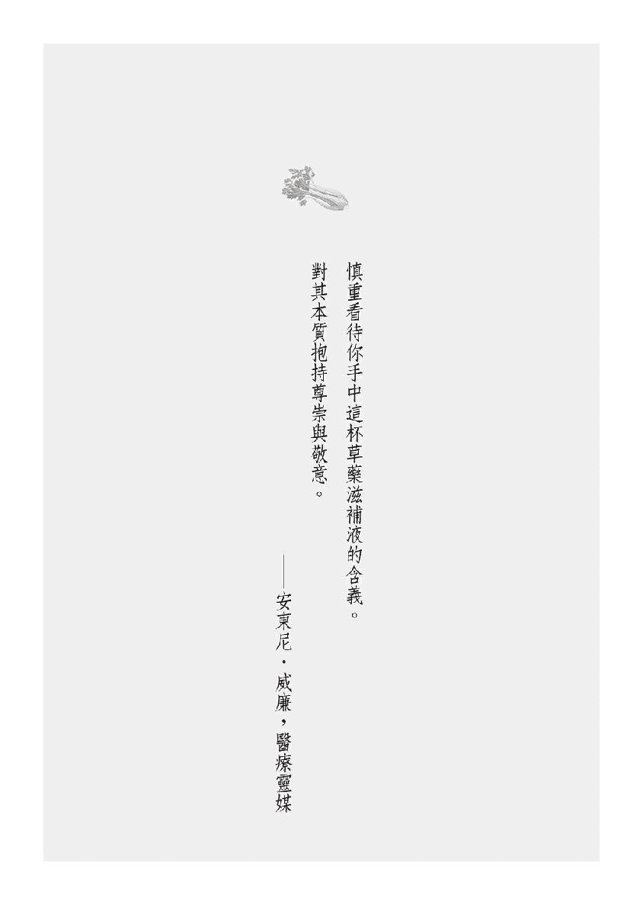

## **第六章  关于疗愈与排毒的解答**

饮用西芹汁多久后会感到有所改善答案因人而异。你的饮用量是多少是否空腹饮用每天都喝吗除了西芹汁以外还做了什幺是否加入《医疗灵媒》的其他疗愈建议这些细项都会影响改善的时间长短。

有些人喝三天就见效有些人要等上一、两星期才有成效。我曾见过许多人才喝一天就有效果。第一种改变可能是沉着或平静的感受、焦虑感降低或变得精力充沛。原因在于西芹汁的电解质能让人心情焕然一新。许多人因为西芹汁的消化酵素很快便感受到消化改善排泄也变得顺畅。如果你在几个星期后仍然不见好转这也很正常。每个人因西芹汁而改善的健康状况各有不同所以需要的时间也不一样。

有时会有人问到需要持续饮用西芹汁多久才够。答案是我们永远不该为饮用西芹汁的习惯设下期限。你打算在人生中穿多久的袜子你梦想能买下的房子——你想住在里面多久你想跟灵魂伴侣一起生活多久你希望最锺爱的往日时光能够维持到多久的将来到海边玩、划船、打网球、唱卡拉——你打算某天要戒掉这些乐事吗你人生中的某些环节——在情感上、身体上、精神上、心理上对我们有所助益的时光——我们永远不想放手而西芹汁也该是其中之一。它并非你服用一个月后就再也不吃的维生素而是你对于此生表达珍视的长久热情。

并不是说你在生命中接下来的每一天都要跟榨汁机绑在一起。在照料自己与严守正轨的路上总会遇到插曲榨汁机可能会坏街角的果汁吧可能会倒你的工作地点可能迁移至远离最优质西洋芹商的地方你可能因某个企画而忙到焦头烂额你可能要旅行到无法取得西洋芹或西芹汁的地区。这跟我们与其他重要喜好及人际关系可能会遇到的处境一样有时我们必须分开一阵子但不要紧只要记得我们总有一天会回来如同对待我们在生命中喜爱的其他事物一样。

假如你无法接受这种答案因为你想要明确的界定与指引或者你只想尝试西芹汁一段时间那幺请你尝试每天空腹饮用西芹汁并且维持一个月。如果仍然完全无法纾缓症状就请参阅其他《医疗灵媒》系列书籍寻求其他能与西芹汁搭配的工具并持续进行到有所改善为止。

长期保持饮用西芹汁安全吗先让我们想想「安全」的意义不受伤害。再想想比较可能导致伤害的原因饮用有药效的饮料获得在日常生活中对抗病原体与毒物的保护或是不寻求这般保护西芹汁的目的在于长期维护你的安全——更远胜于安全。你喝得越努力西芹汁就越能帮助你。

关键的疗愈因子

若你觉得看不见西芹汁带来任何效果我们需要多加仔细研究一番。你开始饮用时的病症有多严重是否长期以来都因为慢性病而服用药物是否仍在摄取第八章「更多的疗愈指引」当中提到的会喂养病症而非改善病症的有疑虑的食物有些人的健康问题相当严重一天需要饮用两次四五〇毫升的西芹汁或是在早晨饮用九百毫升。

如果你想在早晨尝试九百毫升以上的饮用量并不需要在五分钟甚至十分钟内大口喝光。

每个人喝饮料的速度都不同有些人喜欢缓慢、仔细啜饮有些人如果在工作时啜饮便会分心有些人喜欢随身携带。只要在合理范围内较大分量的西芹汁可以慢慢享用。理想情况是在一小时内喝完。如果你喝得太久整个早上偶尔才喝几口中间还一边进食将会干扰西芹汁的疗愈效果。如果你整个早上偶尔才喝几口而且什幺都没吃可能会感到头晕或易怒因为你长达几个小时都并未获取足够的热量。

西芹汁可能每天都带来不同的感受。有些人刚开始饮用西芹汁时会出现排毒症状也就是疗愈反应。有时他们会见证神奇的疗愈功效。你可能有时候感觉很棒有时候又仍觉得痛苦或挣扎。别将效果停滞期误解成西芹汁辜负了你在整体过程中你仍将有所进展。

假如你在任何层面都感受不到差异这并不表示西芹汁没有效了。西芹汁看似没有「作用」的某一天或许是西芹汁正忙着清理你肝脏中的废物、补充全身细胞、重建免疫系统、帮助改善肾脏、导正内分泌系统并修复你的消化道而你可能在当周、当月或甚至当年稍晚才会感受到排毒作用的疗愈效果。只要花时间认真投入当西芹汁要解决的问题越来越少即将迎来的好日子也就越来越多。

你开始饮用西芹汁时的肝脏健康状态大幅影响了改善所需的时间。你的饮食方式也一样。很多人常不自觉采取高脂饮食习惯——只看见其中的高蛋白质含量却不知道持续摄取的高脂肪含量正在侵蚀自己的健康。正如我在《肝脏救星》一书中所提到高蛋白饮食也是高脂饮食即便我们谈的是酪梨、种子、坚果酱、橄榄、橄榄油与精瘦的草饲放养肉也一样。各种好坏脂肪摄取过量时都会使血液充满脂肪而变得浓稠也代表无法轻易把毒素清出体外更无法有效输送养分。如此将不利于西芹汁为你带来的效果以及带来改善的速度。当然还是有帮助但许多助力都会被挪用于处理身体当下面临的困境。理想的情况是你也想让身体从高脂食物与其他有害物质攻击下喘口气使西芹汁能解决并修复拖慢你脚步的老问题。

每个人体内的毒素、毒物与病原体含量都不同。有些人在肝脏中具有多种病毒例如病毒、–与单纯疱疹病毒有些人的肝脏与消化道中存在像是链球菌与大肠杆菌等菌丛有些人多年来都在对抗衣原体有些人的葡萄球菌含量较高有些人小肠道的十二指肠中存在未经诊出的幽门杆菌有些人的有毒重金属含量较高例如汞、铜、铝、镍、镉、铅或钡有些人因为频繁搭机旅行、大量牙医工作、光或电脑断层扫描而接触大量辐射有些人的肝脏存在世代遗传下来的旧型有些人的消化系统含有居家附近或公园喷洒的驱虫药或其他杀虫剂有些人则同时具有上述所有情形。如果你对于导致自身症状或疾病的原因感到困惑详阅《医疗灵媒》系列能让你明白真正的病因何在。例如对数百万自体免疫疾病患者而言根源其实是大量的病毒所以必须了解如何直接解决潜在的病因。若无此番认知很可能意外喂养了存在你体内的病毒或细菌。

西芹汁好比大扫除服务询问要多久才能打扫干净就像要求打扫人员在尚未看见门后有多脏乱之前先行评估打扫时间。大扫除的地点是不是整齐干净的办公室只需要清掉几个垃圾桶、稍微吸过地板再擦拭小厨房的流理枱就好或者是要清理小孩生日派对过后的残局有拆散成堆的礼物包装、地毯上到处都黏答答还有蛋糕抹在墙上你的身体就像毒素与病原体的酿酒槽需要多久才能获得改善取决于体内酝酿已久的痛苦程度。西芹汁在情绪层面也会发挥作用而把你经历疾病、困顿或难关时所累积的情绪问题加起来西芹汁显然还有得忙我们得多给它一些机会。

我曾见过某些人饮用西芹汁长达一年后才开始在各个不同层面奇迹似地开始疗愈。我也遇过某些人一直到半途而废的那一刻才体会到饮用西芹汁带来多强大的疗愈效果。我们很多人都太过忙碌以至于无法全然留心与察觉非得等到停止饮用西芹汁才发现它的帮助有多大。有些人甚至不了解西芹汁是种解药总会因为各种理由停止饮用等到出现症状时再向医师寻求建议却没想到再次饮用西芹汁就能让自己走回疗愈之路。

在许多案例中例如胃酸逆流饮用西芹汁后不久便会缓解问题但你可以继续饮用。在解决目前的健康问题后你该考虑继续饮用西芹汁的原因在于别再让其他因素引起别的健康问题。我们的生命持续暴露在危害之下我们的水中有污染物我们会透过铝箔纸、铝罐、在餐厅使用成天刮着铜盘或钢盘底部的餐具而接触到有毒重金属病毒与细菌从四面八方朝我们袭来各种病原体与污染物在我们不知情、不允许的情况下持续侵袭我们的生命。如果你以为自己从未接触菌株或病毒或是未曾在任何时候呼吸到劣质空气我必须很遗憾地说你错了。对于我们每天所接触的污染物可以在《肝脏救星》中的

「肝脏麻烦制造者」章节中获得初步资讯。这些接触来源尤其当与你的身体相互结合时就可能在短时间内引起健康问题。如果你在治好胃酸逆流或其他症状后继续饮用西芹汁便可以保护自己不受未来的问题所影响。

别错怪代罪羔羊

西芹汁很容易背黑锅别让自己被蒙蔽了。换言之假如医生或其他治疗师在治疗过程中试图把问题怪罪于你饮用西芹汁必须谨慎看待。

疗愈可能需要花点时间。虽然有些症状可能在你开始饮用西芹汁后迅速改善但其他症状可能需要多点时间才能缓解因为病根可能是汞跟铝等有毒重金属或是像病毒与带状疱疹等病原体而且藏在肝脏、甲状腺与身体其他部位的深处所以需要更彻底的净化。更不用说有些人在饮用西芹汁时仍然在摄取有疑虑的食物或是从事影响西芹汁功效的其他行为。因此假如你刚开始采取西芹汁净化法或你在饮用西芹汁后吃了蛋跟培根并且在出现任何慢性症状时向医生求诊可能会听见「你觉得不舒服是因为你喝了西芹汁」的答案。

这是出自善意的结论。慢性症状与疾病对于医学研究与科学界而言是难解之谜所以医学界总会探究背后可能的成因想藉此帮助患者。许多医疗执业者对于能使患者改善的非传统解药抱持开放心态。

也有许多人把西芹汁当作荒谬与混乱的来源。西芹汁直到近年来才受到大众瞩目所以看似新奇、使人不安甚至有点诡异。然而西芹汁并非慢性健康问题的解答而是如何治疗慢性健康问题的解答。别让西芹汁背了黑锅成为让人类生病的有害根源。别因为对西芹汁理解不足而错失能使你康复、甚至救你一命的解药。

疗愈反应

接下来谈谈某些饮用西芹汁时最常见的疗愈反应好让你理解背后的原理所在。你不一定会经历这些排毒迹象也没关系这表示或许你体内的净化工作比较少。即便你没有感觉但仍然在进行排毒作业。

有时候很难区分疗愈反应与其他来源所导致的症状。举例而言假如在饮用西芹汁的几个月内一切正常但某天你却突然感到极度恶心这到底是疗愈反应或是胃部突然有毛病正确解答胃部突然有毛病。你可以从症状发生的时间获得线索。西芹汁的疗愈反应比较常发生在初次饮用时而且反应程度处于轻微至无法察觉之间。

疗愈反应也是暂时性反应。如果在每天空腹饮用四五〇毫升西芹汁一个月后你的问题完全没有任何改善表示这可能是潜在疾病的症状并非西芹汁的疗愈反应。可以参阅第三章并研读其他《医疗灵媒》系列书籍了解更多关于慢性病问题的成因藉此使你更能妥善运用疗愈工具有些疗愈工具将在第八章「更多的疗愈指引」加以探讨。单靠西芹汁本身并无法解决所有问题有时还需要其他支援。

西芹汁在你尚未适应四五〇毫升的饮用量时可能会引起剧烈的净化效果没关系可以先从一一〇毫升、一七〇毫升或二二〇毫升开始再逐渐增加饮用量。即使中途停止后重新开始也没问题也可以暂时休息一段时间。饮用西芹汁是一段长期规画。

记得无论你是否情绪起伏不定、疲惫不堪或是精力充沛、心存疑虑或是怀抱希望西芹汁永远对你有效。持续饮用并坚持不懈西芹汁不会让你原地踏步必定会拉你一把。

让我们聊聊开始饮用西芹汁时可能产生的疗愈反应了解你的身体如何获得改善有助于让你坚持下去。

胃酸逆流

当我们经历短暂的胃酸逆流是因为西芹汁正在消灭细菌并排出毒素。肠道有时会充满危险的真菌、病原体以及黏附在肠壁上的腐败脂肪块里头可能还有腐败蛋白质。十二指肠前还有个小突起结构也可能被淤泥所覆盖。当你还年轻时或许还不存在这些淤泥当你年长后残余物质的堆积可能会压垮这突起结构使某些在饮食中过量摄取动物产品

甚至包括看似较「清淡」的选择例如蛋类、鱼肉与乳制品的人在此部位形成缺口。当过量残余物质重压在此缺口上便会在胃底部形成小囊袋进而累积老旧的腐败物质。

你喝下的西芹汁沿着消化道流过其中的酵素开始袭击由各种有害物质构成的黏液钠簇盐也开始攻击老旧与腐败的脂肪、毒素、细菌、病毒与真菌将它们加以分解、消灭。西芹汁也会清洁位于十二指肠入口、形成老旧淤泥囊袋的小突起结构。因此体内展开一场小型爆炸。胃酸逆流可能是由西芹汁的大规模净化作用带来的爆炸性杀灭效果所引起。

甚至可能引起立即性的腹泻。一旦你度过此阶段便会感受到巨大的疗愈效益。

胀气

西芹汁大多时候能够纾缓胀气而不会引起胀气。如果某人肝脏的毒素、迟缓与机能低落达到一定程度而且肠道内的害菌量也过高时就可能在西芹汁消灭害菌并活化肝脏的过程中产生胀气。在饮用较大量西芹汁进行更深层净化作用时最容易发生胀气。然而胀气患者通常在不久后就能感受到西芹汁开始纾缓胀气问题。

体臭

西芹汁常见的疗愈反应是体臭增加这种臭味可能产生在皮肤的任何部位不只是在腋下。体臭的部分原因来自迟缓、机能低落的肝脏每个人或多或少都有这种问题当肝脏接收西芹汁的成分便会释放增量的毒素到皮肤表面。西芹汁也会驱散小肠与结肠中由腐败蛋白质与未消化脂肪产生的氨。随着西芹汁流经消化道与淋巴系统可以冲洗并排出大量毒物与毒素。同时西芹汁也会驱散其他器官在压力环境中所接收并留存的肾上腺素囊袋而这种老旧肾上腺素也会浮上皮肤表面。这些作用都会造成不同程度的体臭增加。当某人利用西芹汁变得更加健康所散发的体臭将会越来越淡。西芹汁甚至可以让患者彻底好转使体臭减少或甚至完全消失。

凉意或发冷

西芹汁对于身体有正面的冷却效果。当你喝下时便会近乎瞬间地将养分与植物性化合物灌注到细胞与器官之中。你的身体接收了足以带来片刻缓解的成分。这种冷静效果有冷却的作用因为你的身体不需要再过度运作或奋力挣扎。当此作用发生时你会感觉到有些凉意这代表西芹汁滋养体内所有细胞所带来的疗愈效果。如果可以就抓条被单在沙发上蜷缩一会儿好在西芹汁进行疗愈时让自己暖和一点。

你可能在饮用西芹汁时感到些许凉意的另一个原因是西芹汁净化肠道毒物与毒素时造成的立即性排毒反应。当有害物质受到中和并进入血液准备排出便会使人稍微发冷。

最后多数人的肝脏都因为失衡与迟缓而在运作时产生极高温度。西芹汁能立即使肝脏冷却这也会造成体温的波动。

便祕

西芹汁并不会导致便祕。假如你排便不顺应该研究其他可能导致便祕的原因。在你开始饮用西芹汁时是否已经有便祕情形你是否在摄取第八章所列出的有疑虑的食物你是否正经历情感上的考验因而使得肠道纠结随着时间经过西芹汁会减少肠道内可能发生的慢性或急性发炎藉此改善便祕。肠道发炎可能使蠕动作用减缓因而引发便祕西芹汁可以改善这点。

皮肤干燥

如果你正在饮用西芹汁并发现皮肤干燥问题先想想几个问题皮肤已前曾经干燥过吗现在天气如何是不是很冷或是你长时间接触干燥的室内热源你是否用含有氯的水洗澡你的饮食是否有任何改变因而导致皮肤干燥别忘了饮食带来的影响要过些时候才会表现在皮肤上所以别只侷限在这几天而是过去几个月的饮食是否有所改变如果你的皮肤干燥没有其他原因——这是初次发生、与室内及室外环境无关、你并未局部使用或接触任何物品、几个月来的饮食都很稳定——那皮肤干燥可能是由于西芹汁净化肝脏所引起。若肝脏充满石化物质、溶剂、汽油、香水、古龙水、杀虫剂、除草剂、杀真菌剂、有毒重金属、过去的药物以及无法检出的病毒与其他病原体就会在你饮用西芹汁时展开解毒作用。许多毒素可能浮上皮肤并表现在身体上进而造成暂时性皮肤干燥直到肝脏有所改善为止。在长期饮用西芹汁过后便能使皮肤健康更胜以往。

头痛与偏头痛

有此症状时第一步也是先想想过去是否曾经历相同症状。头痛是不是很常发生时好时坏如果是的话虽然西芹汁并不是疼痛的根源但可能因此激发出疼痛感。你频繁的偏头痛很可能是由有毒重金属、轻度病毒或细菌感染抑或是肝脏毒素含量过高所引起。当采取像西芹汁这般疗愈力量便可能激起你经常发生的症状因为西芹汁正将有害物质排出你的体外。例如倘若你对偏头痛本来就很敏感当西芹汁消灭体内的害菌时就可能再次引发偏头痛。然而你将会朝正确的方向前进透过疗愈使你不适的原因例如改善运作迟缓的肝脏、减少有机重金属含量或病毒及细菌感染便能够使你摆脱症状。

如果你从未经历头痛或偏头痛但在开始饮用西芹汁后第一次发作西芹汁仍然不是原因所在你只是刚好在今天喝了西芹汁而由于以前未曾尝试过西芹汁自然背了黑锅。想想可能导致你头痛的有疑虑食物。在花草茶包中伪装成「天然风味剂」的味精可能是幕后黑手一杯咖啡因过高的咖啡也有嫌疑脱水也是一大因子。可能引发头痛或偏头痛的因素太多了但绝不包含西芹汁在内。等你哪天避开了脱水、食品添加物以及平常少吃的食物后再重新试试西芹汁。

情绪变化

易怒、挫折、不安在西芹汁使你皮肤容光焕发、让你精力充沛并摆脱痛楚与疼痛时体验到这些情绪可能让人有些难堪。别担心如果你在饮用西芹汁后即便产生各种神奇疗效却还是感到有点失落、忧郁或闷闷不乐这是正常、暂时性的疗愈反应。你可能正经历消灭病毒、细菌以及净化毒物所带来的排毒效果。你也可能也会产生排毒时的情绪反应——通常会在排除有害物质时一并发生。随着你继续疗愈情绪也会随之振作起来。

人将西芹汁当作代餐也可能导致喜怒无常。原因之一长时间未进食会致使血糖降低。再者早上只喝西芹汁会引起更快速也更不稳定的排毒作用——不建议如此——而且净化的速度增快也会使人脾气暴躁。记得你在早晨饮用西芹汁后等待至少十五到二十分钟三十分钟更为理想就应该补充像水果这类能帮助疗愈的热量。同时记得别害怕水果

口舌的感觉

我们在饮用西芹汁时可能在舌头或嘴巴某个部位产生不同感觉其中包括奇怪的感受、刺痛感、些微麻木或灼热感可能发生在整体部位也可能在牙龈或舌尖的特定位置。这代表口中的细菌或毒素含量较高以及或者来自肠道中腐败食物所产生的氨气在排出时向上渗过食道导致口中的氨含量上升。当你喝下西芹汁其中的钠簇盐便会冲击这些不速之客正是这种作用引起口腔的刺痛与刺激感甚至当喉咙存在细菌时也会有相同感觉。

假如西芹汁使你感到金属味或其他奇怪的滋味而且过去未曾有过相同味觉时代表正在经历排毒反应亦即西芹汁进入你的肝脏并且开始清理各种有害物质——从杀虫剂、除草剂、杀真菌剂、石化物质一直到溶剂与有毒重金属。

西芹汁也能将重金属氧化物质排出身体器官与组织。有些人的肠道中含有重金属在此情况下西芹汁有助于结合重金属再从体内将其驱逐出境。

这些作用都可能影响味觉无论是金属味或其他少见的味道都取决于患者体内所酝酿的特定毒素而有所不同。

恶心与呕吐

饮用西芹汁后的轻微恶心感可能代表较轻度的病原体杀灭与排毒反应。

如果你在饮用后发生呕吐很可能是因为接触与西芹汁无关的因素所引起。全球有数百万人饮用西芹汁其中少数人可能正好发生食物中毒、罹患肠胃型流感或接触有毒物质——代表有少数人会恰巧在饮用西芹汁的同一天发生呕吐。因为西芹汁看似怪诞所以很容易背黑锅。

如果你是极少数完全健康的人——肠胃不敏感、没有害菌、未曾接触化学物质——却在饮用西芹汁后立即呕吐那可能是因为使用了较浓烈、带苦味的西洋芹所引起的呕吐反射。尤其是从当地农场或农夫市集购得抑或是自家种植而来西芹叶旺盛如孔雀开屏般的西洋芹。如果你用来榨汁的西芹叶分量大过西芹茎正如我在第四章提过不建议如此便可能榨出涩味强烈的西芹汁若你比较敏感里头的生物硷就会引起呕吐反应。

更罕见的状况是你的十二指肠中存在不该出现的大量酸性、细菌或其他微生物例如未经检出的幽门杆菌而西芹汁引起立即性的杀灭作用我称为过激杀灭大量细菌或其他病毒同时爆发可能使迷走神经错乱进而引起呕吐。这种情形非常少见人体必须存在足够大量的细菌而且也要有相当程度的敏感才会引起如此反应。

皮疹、搔痒或痘痘爆发

如果确实是由西芹汁引起的独立反应——你并未因为尝试新的咖啡、初次食用某种发酵食品、接触邻居院子飘过来的杀虫剂、穿了还没洗过的新衣服或其他类似原因——应该先确定你所购买西芹汁的饮料店是否曾在清洗蔬果时加入少许的氯或漂白水。许多天然食品店与果汁店都会这幺做而这对健康可不是好事所以必定要询问你的西芹汁是如何制作如果有这种做法就换一家店。此外假如你光顾的果汁吧是使用传统农法的西洋芹而不是有机作物那还不如购买传统种植的西洋芹自己榨汁假如无法取得有机作物或只负担得起传统农法作物如此至少能确保有彻底洗净以避免接触任何杀虫剂。

假如你已经排除上述所有可能而且也未曾接触任何新的、刺激性的、可能引起皮疹、搔痒或痘痘爆发的事物那就表示你的肝脏中堆积了大量的有害物质西芹汁正克尽职责地净化。有害物质可能包含病毒废弃物例如副产物、神经毒素与皮肤毒素而皮肤毒素穿透皮肤时便会影响皮肤。西芹汁的钠簇盐也会抵达真皮帮助皮肤中和与排除毒物。

口渴

如果你在饮用西芹汁后感到显着口渴是因为西芹汁正在净化、消除并排除血液中的毒物。请谨慎选择你用来解渴的液体。可以参考最后一章的选项例如柠檬水与姜汁水在喝完西芹汁并让身体有时间处理过后再行饮用。

体重减轻

并不是每个人都想要减重。如果你的体重已经处于理想状态或是体重过轻并不用担心西芹汁会让你损失身体质量。西芹汁能帮助过重人士减轻体重机上的数字是因为让他们的肝脏变得更健康。健康的肝脏有助于维持均衡无论朝哪个方向都能使你达到所需要的目标。如果你的体重过轻肝脏又不健康西芹汁并不会让体重继续下降。

西芹汁唯一会让你意外减轻体重的情况是你使用西芹汁作为热量来源与代餐。如果这幺做等于用西芹汁当中寥寥无几的热量来取代正常餐点的数百卡路里在长期缺乏热量下便会使容易减重之人继续减轻体重。别忘了西芹汁是药物不是食物。别因为将西芹汁当作点心或餐点的替代品反而使自己缺乏所需的热量。

你的疗愈故事

曾有人用某个论点来诋毁西芹汁表示在生活中饮用西芹汁之人所提供的大量疗愈故事只不过是对其功效的传闻证据罢了。那对于目前因为西芹汁而逐渐改善的人呢把西芹汁嗤为乡里传闻的人并不了解这幺做等于否定了大家的故事否定了数百万人的疗愈见证更是轻蔑曾经罹患慢性病的患者。有如在宣称他们对于患病的认知、为了康复不惜尝试一切的决心以及最终透过西芹汁获得解脱的经历某种程度上全都不值得相信。

别让这番轻蔑动摇你对于自身疗愈过程的信心。有些人只是开始饮用西芹汁并没有采取其他改变就觉得有所改善。对其他人而言西芹汁可以帮助改善到一定程度但他们还需要采取更多疗愈资讯才能让健康更进一步。无论你属于哪一种都必须了解你的症状相当真实并非凭空想像而来这不是你的错、更不是由于坏念头所招引而致你也不需要受此惩罚。就如你在第三章「缓解你的症状与不适」所读到健康问题的背后都有来自我们所居住这复杂世界的生理学因素。

同时也要了解当你饮用西芹汁后开始感到的改善再真实不过。别让「传闻」的余音动摇你对康复的信心。你才是自己的健康专家你的疗愈故事具有重大意义远超乎你的想像。保持坚强其他人正等待聆听你的故事并藉此发现这种改变生命的药物。

## **第七章  谣言、疑虑与迷思**

受健康问题折磨的人纯粹的内心总是充满善念。他们了解受苦是什幺滋味。随着不断地探寻解药他们有时会觉得医药科学或医学界让自己失望。西芹汁与他们诚挚又纯粹的内心全然匹配。西芹汁无关乎蔚为流行的精力汤风潮——它是超然的存在是来自天堂、来自上帝的恩典。你也可以换个角度想它是来自宇宙的赠礼、来自大地之母的餽赠。

不了解在生命中受到折磨有多痛苦的人可能会取笑西芹汁。如果某人只经历过短暂的轻微症状西芹汁看起来或许只是另一种流行风潮。别把玩笑话听进去。在某种程度上拿西芹汁开玩笑好比在取笑受健康所苦之人将这种良方从需要的人手中夺走。正如我们在上一章最后所说这是在轻蔑越来越多因为西芹汁而康复的人好像在告诉他们「你们根本没病得那幺严重只是没找到安全又天然的方法来恢复健康。」好像在说他们错了。

也像是在质疑他们的内心、他们的智慧、他们对真相的洞察力以及他们的意图。这是很令人痛苦的事就有如透过他们经历的现实来霸凌他们好像他们的努力与疗愈成果对世界并不重要好像一切从未发生过。

数十年来慢性病患者为了受人正视而奋斗。随着网路时代兴起他们有机会彼此联系并透过数位工具找到力量。但他们还需要更多重视。如今因为间歇性或慢性症状而使生活品质降低的患者其惊人数量可谓史上巅峰。不明白这点或未受此动摇的人无法想像对抗神经疲劳、慢性疼痛或同时患有多种症状是什幺感觉。患者不了解等待多年的答案是什幺最后终于获得些许缓解却被持怀疑态度的反对者所质疑只因为资讯来源是个从四岁起就听见天音而带来先进医疗资讯的人。

除了戏谑以外恐惧策略也是西芹汁运动预料之内的副作用。流行风潮通常都有资金撑腰此外还能让人赚钱。风潮不一定要有用只要我们认为有用就够了。因为西芹汁并不是种风潮——经得起持久考验——所以能够超然而立。它不是由产业发明的金鸡母。把西洋芹放进榨汁机并不会让果汁吧成为摇钱树果汁吧仍然是辛苦的行业而西芹汁也无法秤斤论两的卖。西芹汁崭露头角的原因并非出于贪婪而是因为它提供了健康风潮所没有的成果。西芹汁声名远播是因为《医疗灵媒》社群发现它确实有用而将讯息广泛散播出去。

由于其显着成果西芹汁因此饱受抨击。无论有害或无害的恐惧必将油然而生试图阻止大众从西芹汁获取他们需要的益处。一部分原因是来自理想破灭很多人曾听信或深受各种健康主张所害已经不知道该相信什幺怀疑论四起。

使西芹汁饱受质疑的另一部分原因在于其纯粹特性。西芹汁很单纯、很实在而且有效背后只存在着善念然而这威胁到其他热门的健康「特效药」深怕其真面目曝光后原来并不纯粹、有效或光明坦荡。你不会听到大骨高汤、胶原蛋白或康普茶遭受抨击因为这能带来商机外头包着庞大利益构成的防护罩。相反地西芹汁是自在奔放的疗愈方法也是可能推翻金钱帝国的威胁。终究没人能够将西芹汁抓在手里、困在角落或把你跟西芹汁隔离。

总会有人试图掌控西芹汁总会有人尽力想将西芹汁运动贴上标价总会有许多人想动西芹汁的脑筋例如与添加物混合或是制成药锭想藉此稳操全盘并大赚一笔。你即将了解为什幺这些都是没用的把戏。毕竟这些策略只不过是让人了解最根本的真理唯有纯西芹汁才真正有效。我们必须保存本书中关于西芹汁的疗愈资讯。某天原本嗤之以鼻或扭曲事实的那群人或许也会希望西芹汁能回应自己的祷告。

现在就让我们驱除迷思、恐惧、疑虑与谣言使你不再与西芹汁的恩典擦身而过。

完全零添加物

总有人试图使西芹汁复杂化在其中加入看似健康的添加物与之混合。任何使西芹汁失去单纯性的事物都是误导任何使其更加「进步」或变得「更好」的努力只会妨碍西芹汁给人的疗愈效益。然而即便「纯西芹汁最好」——将西洋芹的复合养分榨取为汁液已经使其成为健康至宝——的认知已经普及却无法阻止人们发挥内在的鍊金术精神试图利用额外成分来改善西芹汁。「我们能加入什幺又该怎幺加才好」人们会这幺问自己因为实在太难相信这种滋补液以最单纯的型态呈现却能够发挥最大的疗效。无可避免地这在多年后仍将是悬而无解的问题而倡导添加物的族群也会继续钻牛角尖。在此举出几个现成的例子让你能更清楚了解。

苹果醋

由于苹果醋很受欢迎——原因并非来自其具有神奇疗效曾留下助人逆转慢性病的事迹

——很多人开始将其加入西芹汁中。这种做法诞生后却没有人曾停下来思考过摄取苹果醋而未获得改善的人比确实获得改善的人更多。如果你也是苹果醋的拥护者没错苹果醋是最健康的醋但适合在其他时候饮用。让你的西芹汁离苹果醋远点。加苹果醋是最快让西芹汁全然失去功效的方法如果里头混入了苹果醋你将完全得不到西芹汁的任何一种效益。西芹汁的钠簇盐、消化酵素与植物激素将立刻遭到破坏里头的维生素会立即失去作用西芹汁的整体结构也会马上损毁。由于金钱驱使的利益与话题性将苹果醋加入西芹汁的做法将持续被奉为绝佳的健康来源。别受此论调动摇而是要随时提醒自己当苹果醋遇见西芹汁会使西芹汁立刻氧化而变质。你知道打开一盒牛奶后说出

「噢酸掉了」是什幺感觉吧就是如此。保持西芹汁的完整性使其远离苹果醋。

胶原蛋白

胶原蛋白是你用来与西芹汁混合时最糟糕的选择。我们对胶原蛋白的普遍认知极为混乱。胶原蛋白是人体的重要环节对于保持我们皮肤的完美负有一部分责任也是全身结缔组织所需的重要蛋白质。若没有健康的胶原蛋白我们便会出现快速老化的迹象体内也可能变得虚弱。然而这跟摄取胶原蛋白无关我们需要的是建构健康的胶原蛋白。

现代医学产业最大的错误之一就是鼓励大家摄取胶原蛋白补充品认为能使其进入消化道并神奇地到达我们的皮肤与结缔组织补充人类所需。还有另一种理论是来自数百年前老旧的信仰系统「以形补形」表示如果你的肾脏有毛病就应该食用动物的肾脏如果你的肝脏不好就应该食用肝脏如果眼球不舒服就应该食用绵羊的眼球。这些理论从哪来的没多久之前假如我们认为服用胶原蛋白补充品就能补足自身所需我们等于还活在黑暗时代。

带领风潮的人之所以会犯下这种错误是因为医学界一开始就未曾理解我们的胶原蛋白为何会衰退或减少。我们的结缔组织与皮肤所仰赖的胶原蛋白其实是由来自植物性食物的养分所构成叶菜类、水果甚至块茎、根茎与块根类蔬菜。如果我们的毒素含量高便会破坏这种作用。你体内胶原蛋白的衰退程度取决于你的血液中流着多少毒素以及你的肝脏中充满多少像杀虫剂、除草剂与杀真菌剂这类有害物质。

杀虫剂、除草剂与杀真菌剂会与胶原蛋白直接产生反应使其受伤与收缩。疱疹家族的病毒例如单纯疱疹病毒第一型、单纯疱疹病毒第二型、病毒、带状疱疹病毒、巨细胞病毒、–、–以及目前尚未发现的–10 到–16 在肝脏及其他器官与腺体中释放大量神经毒素有些也会制造皮肤毒素而这些废弃物会渗透充满胶原蛋白的结缔组织减缓新的胶原蛋白细胞生成同时削弱与分解现存的健康胶原蛋白甚至可能进一步导致结缔组织问题。如果某人的有毒重金属含量高也可能使这些影响加剧造成胶原蛋白更严重受损。

医学研究与科学界并不了解这点营养品产业的胶原蛋白供应商也一样。他们并不明白吞下胶原蛋白补充品无助于解决上述问题只会使情况变得更糟。也不明白我们所摄取的任何胶原蛋白补充品最后都会成为肠道中的废弃物因为胶原蛋白不应该出现在肠道内而且还不是无害的废弃物。当我们服用后胶原蛋白补充品确实会变成燃料但并非供身体或细胞所用而是滋养病毒与细菌细胞。胶原蛋白补充品会减损益菌并成为害菌的粮食。像病毒这类病毒会摄取动物性胶原蛋白其他微生物也是例如真菌、酵母菌与霉菌等。胶原蛋白有利于害菌增殖以及菌丛扩张必须注意别在西芹汁中加入胶原蛋白。

虽然摄取胶原蛋白补充品的病毒细胞不会像摄取有毒重金属的病毒细胞那般释放出神经毒素但这也不足以成为推广胶原蛋白补充品的理由。病毒仍然会藉由胶原蛋白补充品成长、增殖产生更多病毒细胞而其中有一部分就会摄取重金属仍然会带来更多神经毒素。自体免疫疾病患者尤其是当自体免疫疾病会造成结缔组织衰弱时便不应该服用胶原蛋白补充品。就如我在《医疗灵媒》系列中所提病毒是引起自体免疫疾病的幕后黑手更会引发肿瘤、囊肿、结节与多种癌症包括乳癌与部分脑癌在内。

正如你现在已经充分了解当我们单独摄取西芹汁时它能分解病毒与细菌的外膜使幽门杆菌、困难梭菌与链球菌等菌体变得虚弱再加以消灭。西芹汁的钠簇盐接着能清除残余中和漂流到体内各处、阻碍我们生成天然胶原蛋白的病原体残骸。簇集盐也有助于中和体内的杀虫剂与除草剂以及驱逐有毒重金属将其从大脑等器官组织中连根拔起再携带至器官表面使血管发挥将有毒重金属完全排出体外的作用。钠簇盐更进一步负责进入真皮将毒物抽出皮肤亦即把可能破坏天然胶原蛋白的毒素抽出胶原蛋白细胞之外。簇集盐能结合毒素与毒物将其中和后再冲出体外。透过空腹饮用西芹汁的做法便可使胶原蛋白在你体内逐渐繁盛。新的细胞得以生成是因为钠簇盐能增强身体在各部位制造蛋白质与胶原蛋白细胞的能力。

当胶原蛋白补充品与西芹汁在你体内结合的那一刻你已经消灭了西芹汁的益处。西芹汁中所有的钠簇盐与酵素都把胶原蛋白补充品视为毒素因而产生负面反应。一旦西芹汁与胶原蛋白混合物进入你的嘴巴与胃部西芹汁的钠簇盐就与外来的胶原蛋白结合并试图透过肠道将其排出体外。问题在于带有黏稠特性的胶原蛋白会吞没钠簇盐在簇集盐试图中和胶原蛋白补充品的同时反倒将其吸收。

服用胶原蛋白补充品并无益处所以停止服用也不会牺牲任何优点。西芹汁能带来令人难以置信的效益但若与胶原蛋白混合却会功效尽失使西芹汁只剩下试图将外来胶原蛋白透过肠道排出的作用。胶原蛋白补充品根本未能进入血液就被身体当成废物排出。任何在肠道逃过一劫的外来胶原蛋白都会来到肝脏让肝脏又多了一种有害物质必须筛选与存放。就像当我们服用牛胆补充品时肝脏只是多了清除脏乱这项工作。

我们能采取的最佳行动便是支持身体自行生成胶原蛋白与胆汁。服用胶原蛋白补充品并不会帮助保养皮肤、关节、毛发与指甲。要达成此目的你需要的是抗氧化物、适当的维生素 B12、天然存在蔬菜中的硫还有透过食物及营养品补充的锌、镁、钙与二氧化硅。配合规律饮用西芹汁并使肝脏排除病毒含量这些才是对你有利的要素。你或许曾听说搭配胶原蛋白饮用能达到上述效果但真相是什幺这是错误的理论唯一的效果就是占消费者便宜。

西芹锭与西芹粉没有用

永远别以为你能藉由西芹锭与西芹粉获得等同于新鲜西芹汁的功效。虽然某些药草与水果在干燥或粉末型态也能带来效果但制成其他型态的西洋芹只是在浪费金钱而且无法提供西芹汁的任何效益。把干燥西芹粉混入水中并不能达到任何程度的效果。你没办法将脱水的西芹汁还原并期待还能发挥作用。原因之一在于其中的酵素无法维持原样。再者西芹汁的钠簇盐与悬浮在西洋芹当中的活水共生。簇集盐其实也具有生命它们本身就是每株西洋芹当中的鲜活元素这也是将钠簇盐与一般盐分相互区别的特征。干燥后的钠簇盐无法带给你相同效用。

注意别成为冤大头购买了西洋芹或西芹汁所制成昂贵粉末还希望与一般的水混合后能带来同样效果别期望干燥或脱水后的西芹汁能达到新鲜西芹汁的神奇疗效这好比把钱丢进水沟。

同时也要留意混合西芹粉有时会用来保存肉类这使人对西芹汁当中的硝酸盐与亚硝酸盐感到困惑。如果你对这些盐类感到疑虑请参阅本章关于盐类的内容说明。

香豆素有毒吗

如果你对香豆素感到担忧可以放下心了。每株西洋芹的养分与植物性化合物含量都不同。在某块大陆的其中一侧农场采收的西洋芹特定化合物的含量比在同一块大陆另一侧农场所采收的西洋芹可能明显更高或更低。甚至从不同农场、不同田野、不同农地、在不同季节所采收的西洋芹都可能差异甚大。当地是否时常下雨、是否使用井水灌溉、日照是否充足、气温较冷或较热、西洋芹种植的时间较早或较晚都会影响每一把西洋芹之间所含的成分即便种植地点相近也是如此。这一切都很自然。

至于香豆素的含量多寡你其实无法确定每杯四五〇毫升西芹汁中含有的确切比例。香豆素对身体没有毒性。医学研究与科学界认为其他食物中的香豆素可能有助于刺激白血球细胞并帮助抗癌。西芹汁当中的香豆素尚未经过研究。事实上某种食物的健康效益是来自其中各种成分的协同作用并非单纯来自香豆素。西芹汁的原理也是如此对于我们的支持来自西芹汁当中的整体成分。一杯西芹汁里头的各种单一成分彼此共生协同从各个层面帮助修复与恢复受损的免疫系统。其中包括重建、补充并活化整体白血球数量包含嗜中性球、嗜硷性球、单核球、杀手细胞与其他淋巴细胞。西芹汁提供的所有成分共同作用其中最大的功臣便是消灭病毒的钠簇盐使病毒数量降低后免疫系统便能自我修复并迅速改善。簇集盐还会击溃致癌病毒。

香豆素尤其能修复并恢复真皮中受损的皮肤细胞更具有保护皮肤免受毒素影响的能力可以帮助预防皮肤疾病、疤痕组织甚至皮肤癌。几乎所有我们所摄取的香豆素都会送往皮肤——医学研究与科学界尚未发现这点。由于通往其他器官并非香豆素的主要路径所以对西芹汁当中的香豆素会导致肝脏疾病甚至降低血糖的疑虑其实并没有根据。当你饮用四五〇毫升的西芹汁里头的香豆素主要都是送往你的皮肤。

利尿效果太强

西芹汁有利尿效果吗相当轻微而且既安全又健康所以不该为此原因避开西芹汁。这不同于咖啡、红茶、绿茶或酒精那种霸道的利尿效果。我曾见过有患者受医生交代避免服用利尿剂却仍在饮用绿茶就因为据说对健康有好处。西芹汁的利尿效果并未超过荷兰芹、菠菜、苹果以及我们为了健康所需要的多种蔬菜水果。西芹汁这种温和的排毒效果来自微量矿物质——任何矿物质含量高的食物都会促使身体将其排出因为微量矿物质会与毒素结合。

在西芹汁当中微量矿物质就像与钠簇盐绑在一起而簇集盐一般而言会抓附毒素。在此作用下身体利用自身水分将其等冲出簇集盐便趋使毒素来到肾脏与膀胱准备排出。这种作用对你有益而且与不健康的利尿作用相差甚远。假如你仍然担心西芹汁的利尿效果太强可以试着少量饮用或咀嚼西芹棒之后将西芹渣吐出藉此获取些许西芹汁。虽然你无法获得大量西芹汁提供的功效仍然能得到少量西芹汁的疗愈效果只是较不显着罢了。

排泄物会变色

如果你曾听说西芹汁会让你的粪便变红根本没这回事当然也不会让粪便变成蓝色、紫色或黄色。如果你饮用极为大量的西芹汁顶多会使你的粪便带有少许的绿色。西芹汁也能冲去肠道中所堆积的老旧食物残渣而这些残渣可能呈现少许的各种色调但并不会到达鲜明或吓人的程度。

纤维一定要过滤掉

很多人有时会担心将西洋芹榨汁并把纤维分离代表我们会损失这株植物的功效。如我们在第四章「如何发挥西芹汁功效」所说将西洋芹榨汁并不会剥夺其重要养分而是将养分萃取出来。你没办法吃下分量充足的西芹棒而且把每根都咀嚼到你能获取所需成分的程度这样太累人了。而把切碎的西洋芹丢进最强大的搅拌机中搅打至最为滑顺的程度这也不是办法。某些人说西洋芹拿来榨汁会浪费纤维但当你喝下搅打后未经过滤的西芹汁里头的纤维其实会妨碍西芹汁为你发挥最大的疗效。

不赞同将西洋芹榨汁的人往往奉行全食物最有益的理论。然而全食物理论并不适用于草药。西洋芹本身的纤维会阻碍钠簇盐与其他成分正常运作。就拿药学与草药学领域来说从草药中萃取化合物是有原因的。为了制成药物你不必将整株植物都用上。大部分草药学家并不会认为在多数情况下咀嚼并吞下特定草药是充分或理想的做法。如同我们处理许多其他草药一般我们需要萃取出西洋芹所蕴藏的药性——因为它是草药——也就是榨成西芹汁。如果未将西芹汁的钠簇盐、微量矿物质与酵素从西洋芹纤维中萃取出来纤维便会留住养分等于是浪费了。

营养课程与学院中所教授关于全食物的草率建议与死板规则跟你如何透过西芹汁疗愈慢性症状与疾病无关。「保留西洋芹纤维对你更加有益」的假设缺乏临床研究的支持。事实上就西芹汁来说摄取量愈高愈好。将西洋芹榨汁能获取强大的养分去除其中的纤维也能让你摄取更大量西芹汁这对你的健康再重要不过。

以上并非要否定西芹棒或其纤维的价值。西洋芹本身仍然对你有益。你还是能透过食用西洋芹获得其中某些虽然不是全部抗氧化物、类黄酮、叶酸与维生素其中的纤维也确实有所助益。在你的人生中继续享受西洋芹与其纤维同时也要将西芹汁带入你的生命但记得与你所吃的西洋芹分开享用。

会导致甲状腺肿原

某些蔬菜、药草与水果中存在导致甲状腺肿原的化合物但西洋芹不在其中。但我们并不应该恐惧甲状腺肿原这种观念有点小题大作请参阅《医疗灵媒甲状腺揭密》以获得更多资讯。无论是否与西芹汁相关关于甲状腺肿原的任何资讯都只是恐惧策略作祟而且会阻碍我们的疗愈。

杂交作物有碍健康

其中一项关于西洋芹的误导理论指出由于西洋芹是农业杂交后的产物所以我们应该提防。别听进去杂交作物并不是基因改造作物。我们嫁接与杂交作物的做法已经长达几世纪而且许多品种根本未经过杂交有些是祖传种作物。使用我们在此所种植的资源并将其调配以符合我们在地球上生存的需求是我们与生俱来的天赋神权。杂交是种自然过程我们只是助其一臂之力使其更有利于我们的健康。我们所摄取的食物几乎都是杂交种而其中仍然保持长久以来的养分与价值与其数百年、甚至数千年前的原生型态并无二致。

例如西洋芹这类杂交种蔬菜水果对身体并不会带来酸性或毒性而且恰恰相反。西芹汁能够消除酸性、分解酸中毒、补充身体的硷度、消灭对身体有毒的病原性害菌、排除肝脏中的杀虫剂、除草剂以及诸多其他有毒物质。

假如任何在替代医疗领域具有影响力的机构、基金会、团体或研究小组塑造出认为西洋芹对身体具有毒性的信仰系统那可是大错特错而且会阻碍数十亿人的疗愈机会。现今你在商店中普遍能找到的杂交种有机西洋芹易于身体吸收、温和、呈现硷性、具有净化与疗愈的功效。

祖传种西洋芹通常涩味太重、效果太强也太过粗糙虽然不会伤害你——只会帮助你疗愈——但比较不好入口因为苦味比较强所以你也喝不多。说到底你使用的西洋芹越是可口你也会喝得更多因而接收更多功效。

含有硝酸盐还是亚硝酸盐

除非西洋芹产生氧化或发生脱水否则西洋芹与西芹汁并不含任何活性或有害的硝酸盐。西芹汁中天然形成的硝酸盐当西洋芹或新鲜西芹汁尚未氧化时并不存在。当新鲜西芹汁或西洋芹氧化就如同任何氧化的药草或蔬菜水果会形成天然的硝酸盐。请记得这种天然形成的硝酸盐并不会以任何方式、结构或型态造成危害甚至还可能有益。西芹汁粉与西芹粉经过氧化所以会含有在氧化过程中天然形成的硝酸盐但这种硝酸盐并没有害处。

这些硝酸盐与普遍认为对某些人有刺激性的硝酸盐不同。并非所有硝酸盐都相同了解这点很重要就像所有的人都不同、所有的水都不同、所有的糖都不同、所有的蛋白质都不同。例如麸质是种蛋白质但是与肉类或坚果内的蛋白质截然不同。此外西芹粉与西芹汁粉属于氧化型态的西洋芹而其中天然形成的硝酸盐与添加在肉类及各种其他食品中的有害硝酸盐也不相同。

硝酸盐与亚硝酸盐不一样两者是不同物质。即便西芹粉中含有天然形成的硝酸盐但不能作为像腌菜或腌肉等保存食物的方法因为其中并不含亚硝酸盐。西洋芹与西芹汁不会自然形成有害物质这点同样适用于纯西芹粉与纯西芹汁粉。会引起混淆的原因在于制造商或再制商可能在西芹粉、西芹汁粉或西芹盐中添加有害的硝酸盐西洋芹因而背了黑锅变成含有保存肉类与其他产品所使用的有害硝酸盐这正是西芹汁受添加物污染的典型案例。你的新鲜西芹汁并不含有害硝酸盐除非你自行添加。

如果你拒绝饮用新鲜西芹汁是因为你认为里头包含有害硝酸盐或亚硝酸盐那你将会失去西芹汁不含硝酸盐及亚硝酸盐所带来独特的疗愈契机。

草酸盐对人体有害

不需要担心西芹汁当中的草酸盐草酸。绿色叶菜类蔬菜与西洋芹这类药草含有大量草酸盐因此对人体有害这完全是误导。由于这种迷思许多人无法从所谓「高草酸盐」食物中获得我们所需要的强大养分与疗愈特质。

草酸盐并非我们所想的那幺令人担忧地球上每种蔬菜水果都含有草酸盐。各种食物中的草酸盐也都完全不同例如梅子里头的草酸盐就跟一片乳酪当中的草酸盐相差甚远。这是医学研究与科学界未受人资助的领域所以医学社群并未真正了解不同型态的草酸盐与身体之间的关系、会带来何种反应又是如何堆积在体内。宣称我们该因为草酸盐而拒绝西芹汁的主张未经证实又没有根据。事实上这些食物并不会对我们造成任何危害反而能提供我们具有重要疗愈特性的植物性化合物、维生素、矿物质及其他养分。

所谓高草酸盐的叶菜类与西洋芹中的多种营养都是对我们最有效益的可用养分。医学研究与科学界尚未发现水果、蔬菜、叶菜类与药草含有抗草酸盐物质可以预防草酸盐对我们造成传闻中可能导致的危害。无论我们喜欢与否草酸盐都广泛存在所以草酸盐的解药也随处可见。假如有任何食物能抗衡草酸盐让我们恐惧的作用那幺非西芹汁莫属。一般常认为高草酸盐含量的食物会导致肾结石与胆结石。如果西芹汁真的有此疑虑又怎幺会帮助溶解肾结石与胆结石在肾脏中与尿酸造成问题的并非草酸盐而是由于蛋白质拖慢了肝脏机能才会形成肾结石与痛风。

很多人也因为草酸盐的谣言而害怕菠菜。我在数十年来不断见到菠菜使人恢复活力、充满精神并从慢性症状与疾病中复原。生菠菜甚至比烹调后的菠菜更安全而且相当健康。别因为错误的理论而抛弃像菠菜与西芹汁如此珍贵的疗愈工具。

补骨脂素影响健康

补骨脂素是另一种使人不敢摄取西洋芹的恐惧策略。这些植物性化合物几乎存在所有蔬菜、水果与药草中而且其实对免疫系统及身体疗愈很有帮助。西芹汁当中的补骨脂素并无害处不会引起日照敏感或皮肤炎。相反地西芹汁补骨脂素能帮助我们排除诸多皮肤症状正如你在第三章所读到。

对水杨酸过敏

水杨酸又称为水杨酸盐这项迷思也是另一种使人无法体验西洋芹疗愈效益的恐惧策略。有的理论指称某些个体对于蔬菜水果中的水杨酸敏感但并未受到医学研究与科学验证。然而由于西洋芹并不算蔬菜因此也不应归于这番理论之下。西芹汁是种药物可以帮助许多人对食物中化学化合物敏感的问题例如麸质、乳品、玉米、蛋类与黄豆等。西芹汁中的药性化合物能排除体内的毒素、病毒与细菌这些通常是引起食物敏感的主因。

钠含量过高

如我们所谈过西洋芹当中的钠与食物产品、甚至优质凯尔特海盐或喜马拉雅岩盐中的钠都不同。我们并不属于低钠社会在日常生活中无处不是钠。虽然有些人对此相当留意但仍是少数全世界多数餐厅都要仰赖钠。如果你在生命中从未吃过添加盐分的食物尔后出外用餐或尝试了包装点心你或许会对食物中的盐分添加量感到讶异。我们现在堪称

「盐味」文化。

你吃下的这幺多盐跑哪去了之后是否会像吃下肚那般轻易地流出体外不即便是一罐有机莎莎酱、最健康的脱水饼干或是加盐坚果中最高级的盐分也会储存在细胞与器官深处并在此形成结晶。盐分尤其会埋藏在你的肝脏里因为肝脏会试图聚集血液中的盐分保护你不会因为过度摄取盐分而生病这几乎是所有人日常生活的一环。盐分在肝脏中停留多年若我们未加以清除便会具有毒性。对西洋芹的钠感到担忧的人更应该担心的是包装食品、餐厅菜色甚至居家烹调的盐分所带来的冲击。

西芹汁的钠不在上列。西芹汁提供的钠不但不会伤害我们更能帮助我们。当大家为西芹汁与钠感到忧虑代表他们其实并不了解西洋芹。这是盲目的假设缺乏研究或科学验证的支持。事实上西芹汁当中的钠能帮助松动并分解沉积在肝脏与身体其他部位的有毒钠结晶因为西洋芹当中的钠与众不同。西芹汁的钠簇盐会将自己附着于有毒钠再一并带走藉此将有毒钠沉积物逐出体外。再者西芹汁当中的钠正是我们血液所需并最能善加利用的一种。这种钠上面附着了正确的矿物质与微量矿物质而神经传导物正依赖这种钠而得以茁壮。

回想第二章内容不像其他食物含有以部分电解质型态呈现的神经传导化学物质建构元素根据某人所吃下或喝下的食物偶然找到通往神经元的路西芹汁是地球上唯一提供完整、活性及活跃电解质的食物。即使是椰子水如此优质的天然电解质来源也只能提供片段的电解质。人造电解质产品也一样制造商仅根据营养科学的推论添加有助于构成可用电解质的矿物质。这些产品的行销口号甚至没提到能改善神经元我们只概略听见

「对身体有益」以及「我们需要电解质」的说法。西芹汁不只有助于建构神经传导化学物质片段以支持神经元更提供已经结合完成的完整神经传导化学物质足以重新启动虚弱的神经传导物并提供神经元最佳的纾缓效果。当电力流动时便可自由流窜。西芹汁天然形成的有益钠是不可或缺的一环。

就像我所说所有的水都不同、所有的糖都不同。现在还能加一句所有的盐都不同。

喝西芹汁不就是喝水

关于水这方面假如任何人告诉你饮用西芹汁与饮用水的效果相同请务必了解两者相差甚远。水确实具有天然形成的电解质尤其是高品质的水。然而这种电解质的效果与西芹汁的电解质完全不同而且差异的程度远超乎苹果与柳橙的不同更像是苹果与牛肉的差别。水与西芹汁是两种截然不同的物质。只有西洋芹这种药草含有的钠簇盐、特殊酵素与特别的微量矿物质才能使西芹汁具有奇效。

至于在水中加入一撮盐就能比拟甚至超越西芹汁的说法更是严重误导。如果你曾在运动后大量出汗而某位教练、大师或健康专家告诉你在水中加盐可以补充水分其实只会让你更严重脱水。在水中加盐会带来更深层的脱水现象而西芹汁却能带来更深层的补水效果。你在运动过后真正需要的其实是西芹汁以及热量请参阅第四章中的关于如何掌握饮用时间的说明。更别提最优质的喜马拉雅岩盐或海盐效果远远不如西洋芹当中的钠。西芹汁与盐水是两种世界你选择哪一种

顺带一提让我再次强调将西洋芹与水混合的做法并不好因为两者差异太大会相互冲突使两者产生摩擦。在西芹汁中加水会稀释钠簇盐并消除其功效同时干扰吸收西芹汁最能帮助我们疗愈的微量矿物质与酵素。虽然把西芹汁与水混合并不会伤害你却也没有益处无法从任何层面改善西芹汁反而破坏西芹汁疗愈身体的能力。没错加水会阻碍人体吸收西芹汁当中的所有养分包括基本的维生素一直到种类独特的维生素使身体无法吸收这些养分更让西芹汁完全无法带来任何效益。

谈到水与西芹汁还有个重点必须记住某些传言指出人们饮用西芹汁后会感到纾缓是因为其中的水分补足了人体需求传言的意思是这种效果与西芹汁本身几乎扯不上关系。这无意间侮辱了慢性病患者就像在告诉生病长达数月或数年、以各种方法寻求疗愈之道的人他们从没想过要多喝点水。在追求健康与福祉的道路上许多人收到的第一项建言便是补充水分。这项建言来自杂志、健康教练与医生还有因误信此道而受苦之人。他们随身携带水瓶在每天的早、中、晚都努力喝水。

当谣言宣称慢性病患者透过西芹汁重拾健康生命的唯一原因只是因为其中所提供的水分时简直令人无法想像。这显示出大家对于慢性症状与疾病患者每日的生存课题显然认知不足也缺乏相关经验与理解。没错西芹汁比许多其他来源具有更丰富的水分也的确其中的生物活性水相当有益。然而让患者得以好转的并不只是单纯的水分。倘若真是如此所有曾尝试提升水分摄取量的患者应该都能有所改善所有曾经留意可发酵性寡糖、双糖、单糖与多元醇并拼凑验证各种稀奇古怪饮食法的人应该都能有所改善顺带一提西芹汁也能帮助修复肝脏与肠道藉此逆转不耐症所有求诊过许多医师——从传统疗法、功能疗法到替代疗法——曾经花费数十万元寻求解答的人应该都能有所改善。

当这些患者诉诸于西芹汁并获得成果他们并非第一次注重自己所吃进体内的食物也不只代表他们终于开始照料自己。这些人一直深陷泥淖已经尝试过所有方法当他们终于尝试了西芹汁才发现这是第一种确实能扭转自己生命的良方。我们必须对这些人多点尊重而非只将他们的疗愈归功于水分。

未来的恐惧策略

以上所探讨过的谣言不过九牛一毛。准备接招吧由于西芹汁在全球带来绝佳的疗愈功效我已经预见西芹汁某天将承受更严厉的攻势规模远超过来自数百种来源、仅单纯宣称「西芹汁对任何人无效」的否决与质疑。当有种力量在全球掀起如此程度的疗愈浪潮

——降低住院治疗率并帮助患者从需要药物的流感、食物中毒、心理不适、慢性症状与疾病中快速复元——而且医学研究与科学界未曾触及产业界也无法由此获利时便可能招致他人蓄意破坏的意图。

更大的攻击将在何时展开又会由谁发起我不知道这一切取决于自由意志但我知道伏击已经蓄势待发。诋毁西芹汁力量的意图可能以不同型态呈现。第一颗诡雷已经埋好应该会从宣称「饮用过量西芹汁有害」的小规模谣言开始。当本书出版时权威人士或产业界或许已经着手宣扬西芹茎摄取量顶多一天一株的观念食用方法包括用几根西芹棒搭配花生酱或是搭配各种蔬菜一同榨汁。顺带一提搭配花生酱的建议只会助长高脂饮食的风潮。若想了解此风潮为何对人无益请参阅《肝脏救星》。甚至可能公开宣称已进行过研究的文献其内容会驱使大众惧怕西芹汁却没有人了解这番煽动背后受到资金赞助唯一目的就是引起更大的疑虑。

另一种可能迷惑善意人士的策略便是我们在第六章「关于疗愈与排毒的解答」尾声所谈过的传闻证据。「人们的疗愈需要接受仔细检视才具有正当性与可信度」这类乍听之下再合理不过的主张将会越来越多。这种说法会被视为保护性的讯息完全符合逻辑而且经过不断包装使西芹汁运动看似愚蠢又无法接受科学质询遭受严酷考验。这会将疗愈概念侷限在框架之下再主张透过西芹汁疗愈的方法不符合框架因此是错误资讯。包裹在此言论之下的是使人混淆的安慰剂言论宣称西芹汁所带来的任何改善只不过是安慰剂效应。假若真是如此多年来在寻求健康的无尽旅途上尝试过各种疗法或饮食的患者早该因为安慰剂效应而康复了。「传闻证据派」或「安慰剂派」的反对人士——无论言论来源出于对医学机构的何种善意——无视于自己与透过西芹汁获得疗愈的族群相比有多幺渺小持续对无数患者的痊愈实绩提出质疑。这将使我们退步至一九五〇年代到一九九〇年代的大众心态当时的慢性病患者经常受到质疑因此必须煞费苦心地说服医生自己生病了有时甚至连家人都不相信就因为当时医学界在诊断或发现慢性健康问题的速度太慢。如此对于治疗慢性病患者的退步性思考对任何人都没有帮助。

尔后便可能有幕后受人赞助的营利团体试图利用莫名归咎于西芹汁的问题来引起恐惧。可能是关于种植西洋芹的管理问题——为促进西洋芹产量的农地花费提升迫使农夫必须栽种其他作物才能收支平衡。也可能是刻意杜撰出对于污染的恐惧。即使西洋芹本身从未导致任何问题但为了激发恐惧以讹传讹的谣言都可能如野火般燎原。又或者针对西芹籽大做文章无论是着墨于种子供给的强制配额或是催生出基改西芹籽会影响世界上未受污染的西洋芹等等。无论谣言何时以何种型态流传都将验证我的话不公义的攻击即将来临。

我所说的话是为了让你做好准备并不是令你担忧。如果你准备充分便能立于坚强之地。当有人为了阻止你饮用西芹汁刻意传达令你恐惧的讯息时请保持坚定。想想西芹汁数十年来对人类带来的疗愈贡献看看当下已然伫立的历史见证。如今有许多人坚信自己是因为西芹汁运动而活下来。权衡一下这些故事与危言耸听的言论。

因为西芹汁并不是流行风潮所以不会过时也不会像许多健康风潮最后落入「有谁知道这真的有效吗」的田地。多数不会过时的风潮都是靠背后的投资者不断挹注资金才得以苟延残喘。无论有哪些策略试图破坏你对西芹汁的信心别忘了西芹汁的确有效这点显而易见。别让任何事物动摇你对西芹汁所带来疗愈体验的信心。当谣言不断席卷而来学着一笑置之并为其幕后推手感到遗憾他们并不明白恐惧、质疑或竞争心只会让自己无法体验这个时代的疗愈奇迹。

对于西芹汁狂热产生下意识排斥意见的反对派人士不了解他们在自己身上盖下了过时的戳章。对西芹汁散播不实资讯的来源也不知道他们的定位其实没有自己认为的那幺内行。这些人不明白公开诋毁西芹汁例如不了解西洋芹是种药草便宣称没有任何蔬菜能有这幺多功效只是把自己囚禁在已然过时的观点中。他们在历史上记录了自己对这项疗愈运动的质疑把自大的一面表露无遗。早在我的第一本书《医疗灵媒》出版花了整个篇章来探讨西芹汁时这番疑虑早就该浮上枱面。几年后的现在西芹汁在全球掀起旋风宣称西芹汁无效已经有点太迟了。想要抨击西芹汁的意图即使曾经掀起短暂的反对声浪终究会被时间越冲越淡。

如果对西芹汁的质疑把你惹毛了请谨记在心当某人对西芹汁提出异议其实是表达了他们的失落。在他们心中一旦停止诋毁西芹汁便无法再质疑曾经受苦多年、如今由于西芹汁而得以离开病床、继续照顾小孩或重拾人生的人。反对派人士并非没有同情心他们只是在寻找生命真相的途中迷失了自我。你被发现了——你发现了西芹汁的真相西芹汁的真相也发现了你。藉由这份真相你也能为其他迷途之人指引明路。

## **第八章  更多的疗愈指引**

西芹汁有助于快速疗愈许多问题也不受食物信仰系统的束缚对食物信仰系统的影响免疫可谓超然于食物信仰系统之上。主要原因之一在于西洋芹是种药草而西芹汁则是来自药草的药。无论你采行何种饮食型态都可以使用西芹汁。

尽管如此我也曾告诉你单只饮用西芹汁对许多人而言并非真正且终极的解药。对于患有像轻度胃酸逆流等症状的患者来说或许可行透过西芹汁的确可以让某人的胃灼热完全消除。但对其他案例情况更严峻的人而言真正且终极的解药是将西芹汁纳入疗愈团队的一分子也就是与我其他着作建议的饮食方针一起并行实践。西芹汁如此强大又有效绝对是我所推荐的众多重拾健康的关键工具之一。

在此或许会让人困惑。当《医疗灵媒》社群开始传播关于西芹汁的资讯即使未曾听过系列书籍的人也加入行列并成为推手。许多人使用西芹汁建构平台但并未指出其来源

——同时提供其他帮助慢性病患者恢复健康的重要资讯来源。不少人使用西芹汁博得点击率这有时是很令人灰心的举动因为已然遗忘了对于生病之人的怜悯之心。有时这些推手对于西芹汁感到兴奋这点着实令我开心但他们却不知道自己遗漏了某些关键环节。无论何者这番迅速飞涨的人气背后意味着全世界只记得标记「西芹汁」再配上几张鲜绿色的照片却忽略了应该与其并行实践的其他疗愈资讯。

这便是造成困惑的来源例如可能有某位小肠细菌过度增生的患者在看见网路上的热门贴文后开始饮用西芹汁却觉得肠道问题的疗愈速度并不如想像中那幺快。因为推荐西芹汁的消息来源从未引导他获取适当、有帮助的饮食指南或是提供了误导性的建议例如摄取大量蛋类等反而喂养了增生的细菌因而妨碍疗愈。这类矛盾会稀释西芹汁的讯息。可能让尝试西芹汁的人觉得自己参与了行动、完成了结果却换来另一项未能满足的悬念——因为在他们将西芹汁纳入生命的同时却依循其他指引摄取了大量的高汤、草饲奶油与咖啡而这类食物全都会阻碍疗愈。

的确即使饮食中的食物可能会喂养引起小肠细菌过度增生的细菌或病毒但只要他们继续饮用西芹汁至少能避免症状恶化或者在其他部位的健康获得改善效果并不是非黑即白。假如西芹汁未能满足你所有需求也别因而放弃。寻求这些能进一步发挥其功效的方法。被帐单压得喘不过气的母亲在克尽职责或照护小孩的同时经过诊断罹患了肌痛性脑脊髓炎慢性疲劳症候群、多发性硬化症或莱姆病可能会因为放弃了西芹汁而失去多年的健康人生。如果她能了解该避免哪些食物、该仰赖哪些正确的食谱、该补充哪些正确的营养品以及该避免哪些错误的潮流西芹汁也许就能为她展现真正的价值。

如果你想从西芹汁获得比现在更好的成果可以搭配《医疗灵媒》系列书籍当中的其他疗愈指引这也是许多读者在你之前获得更佳效果的原因。至于较严重、慢性症状的患者两者都不可或缺。因为这些资讯与西芹汁来自相同来源能共同提升你的复原成效。我为有勇气赏识西芹汁来源的人鼓掌也为有胆识捍卫慢性病患者并赏识相同来源其他疗愈指引的人喝采。

认清你健康问题背后的成因是有助于向前迈进的要件这也是我在第三章以及《医疗灵媒》系列着作阐述症状与疾病来源的目的。当患者不了解病毒或其他隐藏因素是造成痛苦的原因又不清楚隐藏因素的起源或克星为何便可能很快就放弃西芹汁也代表失去最佳的契机。

掌握饮食祕诀

当某人说「我需要净化我的饮食」是什幺意思现今所谓的「吃得健康」有太多定义几乎无法指出餐桌上哪些食物是最佳选择哪些又必须避免。有些答案相当明确避免油炸食物与重口味甜点并摄取更多蔬菜与叶菜类。

那水果呢这是充满争议的话题。真相是别害怕水果。水果的养分对于疗愈至关重要。

如果这理由不足以让你摄取水果请参阅《医疗灵媒》有关水果恐惧症的说明。

无论你依循哪种食物信仰系统有个诀窍能促进西芹汁在你体内的运作将饮食中所摄取的脂肪减少五〇改用我所称的重要洁净碳水化合物来补足。重要洁净碳水化合物包含新鲜水果、马铃薯、番薯、冬南瓜甚至燕麦。

如果你采用以植物为主的饮食降低你的脂肪摄取量则代表减少坚果、种子、花生酱、其他坚果酱、油脂、酪梨、椰子与橄榄的食用量。如果你的饮食偏重动物性食品试着减少牛肉即便是草饲牛、鸡肉、火鸡与鱼类同时也要减少植物性脂肪。试着完全戒除乳品、猪肉与蛋类稍后还有更多。无论你属于哪一者试着一天只吃一次脂肪不要一天吃上两三次或是等到午餐或稍晚再摄取脂肪藉此减少一半的脂肪摄取量。同样地在减少脂肪的同时加入更多重要洁净碳水化合物来补足营养同时也要多摄取叶菜类例如菠菜、野苣、奶油莴苣与其他莴苣、综合莴苣、芝麻菜、蒲公英叶、芥菜及羽衣甘蓝。

若你希望西芹汁的药性更加减低症状或不适并进一步改善健康这些步骤就相当重要。这些也是由《医疗灵媒》系列中撷录的几项建议。你偶尔也会听到有人提到「医疗灵媒法则」其实并没有所谓的唯一法则你也能依照对自己健康状况的了解为自己打造一套规范作为选择食物的标准。想进一步了解该如何以及为何要针对你的特定健康问题调整饮食请参阅《医疗灵媒》系列书籍。

重金属排毒

有毒重金属是我们在现今世界中受病痛所苦的一大原因我们必须把握机会将这些重金属——包括汞、铝、铜、铅、镉与镍——排出体外最重要的是排出大脑与肝脏。重金属排毒蔬果昔搭配西芹汁能有效达成这项任务可以在疗愈过程中助西芹汁一臂之力。

这不代表你应该将蔬果昔与西芹汁同时饮用如同先前强调西芹汁一定要与其他食物及饮料分开时段享用。正如我们在第五章「西芹汁净化法」所说在饮用西芹汁的十五至三十分钟过后蔬果昔便是绝佳的早餐。

这份重金属排毒蔬果昔食谱并非最近才问世在《医疗灵媒》社群中早已行之有年而且成果斐然。它是人类获得疗愈的重要环节曾有帮助逆转疾病并扭转生命的记录。蔬果昔的食材共同作用既安全又独特能将有毒重金属排出器官并送出体外。与多年来受人所用的其他重金属排毒疗法不同那些方法只能马马虎虎地携带金属流过身体最后却让有毒重金属流遍身体各处引起其他问题。重金属排毒蔬果昔的五种关键食材分别是野生蓝莓、芫荽叶、大麦草汁粉、螺旋藻与大西洋红藻共同组成一支特攻队负责卸除、集中并将有毒重金属一路携出体外。你可以在《医疗灵媒》与《医疗灵媒甲状腺揭密》中了解这支排毒特攻队的更多资讯。

你可以藉由下页食谱加入日渐扩增的疗愈大家庭一同体验重金属排毒蔬果昔的神奇能力。

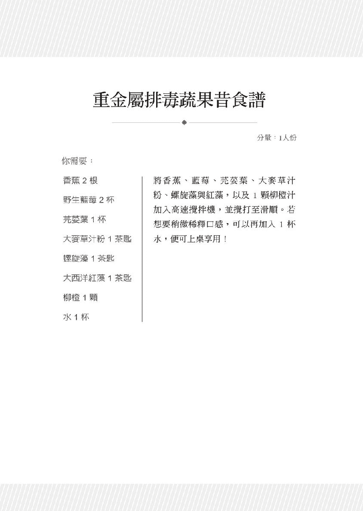

有疑虑的食物

如果你想获得较佳的疗愈效果最好完全避免某些食物。与所谓「好」食物或「坏」食物的信仰系统无关纯粹是因为这些食物会喂养病毒与细菌此外也会阻碍西芹汁带给你的效果。如果你非得摄取这些食物才活得下去仍然可以在不改变饮食的前提下饮用西芹汁或尝试避开其中一两种食物再看看是否能继续增加。你将开始体验到健康有所改善。另一方面假如你寻求更显着的进展试着将这些食物与食材全部戒掉好让西芹汁带来更好的效果。藉由避开这些食物就能将干扰因素缩减至最低使西芹汁的植物性化合物发挥关键疗效。

蛋类

乳制品包括乳类、乳酪、奶油、鲜奶油、优格、克菲尔酸奶、酥油、乳清蛋白

麸质

醋包括苹果醋

营养酵母菌

发酵食品

黄豆

玉米

猪肉制品包括培根、香肠、火腿

天然风味剂

搭配使用药草与营养补充品

除了上述饮食建议以外尝试药草补充品也是可选择方案。你不一定要加入大吃营养补充品的行列只要饮用西芹汁、减少摄取脂肪并加入具有疗愈效果的重要洁净碳水化合物与叶菜类便能帮助解决你的所有问题。营养补充品适合迫于现状或受到医生指示因而想追求更多效果的人。关于特定症状与疾病所适合的营养补充品你可以在《医疗灵

媒》、《医疗灵媒甲状腺揭密》与《肝脏救星》中找到更多珍贵资讯。

总是不断有人问我营养补充品最有效的型态是什幺真的很重要吗没错非常重要。不同类型的营养补充品之间存在着细微、有时却很关键的差异可能影响你能多快消灭病毒与细菌数量、你的中枢神经能否快速修复、你的发炎问题多快获得缓解以及你要花多久才能治愈症状与疾病。

你选择的营养补充品可能促成也可能破坏你的进展。例如许多药草酊剂含有酒精因此会干扰药草中的植物性化合物、喂养像病毒与各种害菌等病原体并且消灭肠道中的益菌。为了加速疗愈你需要适当种类的营养补充品。基于如此至关重要的原因我的网站 www.medicalmedium.com 列出了我所建议各种最佳型态的营养补充品。假如你想寻找市面上最优质的大麦草汁粉、螺旋藻或维生素都能在网站清单上找到。

如何协助钠簇盐吸收

洁净、健康的肠道与肝脏能使西芹汁的钠簇盐有效送达大脑、皮肤与身体较远的部位。你该如何让肠道与肝脏变得洁净又健康长期饮用西芹汁并结合其他的《医疗灵媒》法则两者相辅相成。这正是为什幺采用本系列书籍中的指引透过减少脂肪并增加水果、马铃薯、番薯、冬南瓜与叶菜类来改善饮食的人会发现西芹汁的效果变得更好饮食转变帮助减少肝脏及肠道中的病原体、黏液、腐败脂肪与毒素使西芹汁得以发挥最佳功效。因此这些人会持续获得改善。

另一方面不断追寻主流的「健康」选择例如将奶油打进咖啡之中、饮用蛋白质奶昔或摄取蛋类的人可能在不知不觉中喂养藏在肝脏与其他部位的病毒包括带状疱疹病毒、病毒、巨细胞病毒与–。这也是为什幺有些人的肝脏毒性极高——导致血液因为充满大量脂肪、老旧的腐败残余以及腐败脂肪而变得浓稠、污浊肠道中也充满大量细菌因而在首次饮用西芹汁时可能感觉身体受到些许冲击。西芹汁透过钠簇盐消灭害菌、酵母菌、有毒真菌与病毒因此引起急剧的疗愈反应可能快速导致腹泻发生。同时西芹汁也正努力溶解附着在肠道内壁的腐败脂肪这可能会引起轻微的胃酸逆流因为西芹汁是我们目前所能摄取最强大的疗愈工具。

当西芹汁开始执行任务假如我们也藉由饮食转变来提供助力肝脏就能变得越来越干净开始脱离机能迟缓的状态也能够清扫肠道内壁降低病毒与细菌数量并使血液不再因为脂肪与毒物而变得浓稠又饱含毒素。假如我们再饮用重金属排毒蔬果昔体内有毒重金属的增加速度便会降低。当我们的疗愈达到如此程度便能使钠簇盐发挥最佳功效。

钠簇盐的其中一项关键任务是结合养分并输送到大脑与身体其他部位。我们必须将钠簇盐视为沿路载送旅客的车队只不过簇集盐车队不是载人而是运送各种矿物质、其他养分以及来自食物的化学化合物。但如果你的血中没有充足的葡萄糖便会错失良机。这正是在饮食中摄取重要洁净碳水化合物的原因。水果、冬南瓜、马铃薯与番薯能提供你优质葡萄糖而葡萄糖与化学化合物结合例如来自西洋芹的钠簇盐并驾驶整列的钠簇盐养分车队深入体内组织与细胞中也能直达内脏深处。

在西芹汁这种强力疗愈机制下高脂饮食无法带来益处。如果你正采行生酮或其他低碳饮食表示你正在消耗脂肪热量而且你的葡萄糖存量正在减低。因此你便失去契机无法让葡萄糖驱使簇集盐前往有需求的地方也无法使葡萄糖成为打开车门的钥匙让钠簇盐车队将养分输送至全身。好消息是现在的生酮饮食都含有糖分只不过没人知道就是了。还好酪梨具有充足的天然糖分许多生酮饮食所允许摄取的坚果与种子也一样。虽然这让饮食称不上真正的生酮但表示这些人更能获取西芹汁提供的效益。无论你是否正采行何种饮食法减少脂肪摄取量都能增进功效。

钠簇盐车队会迅速释放养分到肝脏或血液中。特定胺基酸与矿物质的停留能力较佳能够随着簇集盐车队一路来到大脑。然而我们不一定能在饮食中获取这些胺基酸与矿物质尤其我们饮食中的食物组合并不那幺健康。这也是为什幺最好别对饮用西芹汁有所限制并将其纳为改善健康关键步骤的另一个原因。如果我们也能留意在日常饮食中加入各种水果、其他重要洁净碳水化合物、蔬菜、叶菜类与药草等于提供更多养分让西芹汁的钠簇盐得以运送至脑部组织与其他器官就能藉此大幅改善诸多不适。神经传导化学物质会有所提升脑细胞死亡的速度也会减缓。

如果我们愿意钠簇盐便会成为人类生命的重要环节它们属于自己的生命宇宙并与我们的生命相互连结帮助人类在地球长远的未来中生生不息。

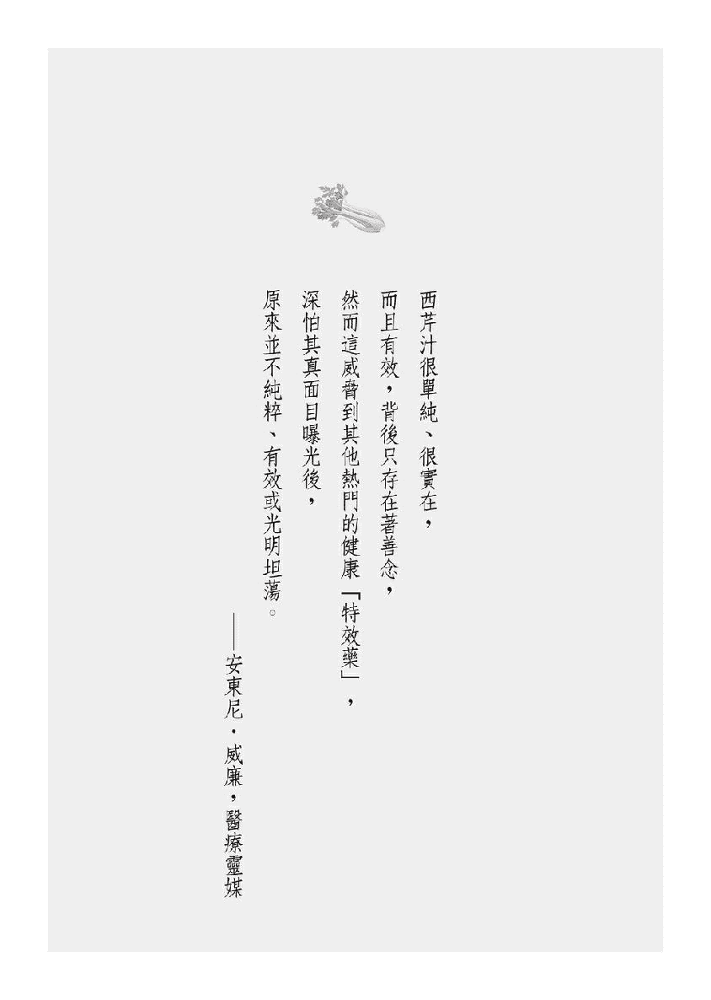

## **第九章  西芹汁的替代方案**

如果你找不到西洋芹或西芹汁或是你手边没有西洋芹该怎幺办第一步别慌张总会有意外。

如今有这幺多人都在制作西芹汁大量需求让商店的西洋芹卖到缺货是很正常的。有时候农场也会休耕或是产量无法应付订单。有时剧烈的天气也会威胁农作物。我们不能找农夫或摊商出气也不该对我们的健康感到绝望而是该采取第二步寻求替代方案。本章的食谱能陪你度过无法取得西芹汁的困境。

如果你无法自备西芹汁的原因是因为你正在旅行而没有榨汁机试试能否在采用备案前求助于附近的现榨果汁店或许会找到当地能够替你制作西芹汁的天然食品店。如果行不通也许你至少能买到或随身携带一些西芹棒好用来嚼食。虽然无法发挥西芹汁的功效至少能让你的身体在情感上、精神上与西洋芹建立连结同时帮助你的细胞唤回西芹汁的体验。这是让身体了解你尚未放弃只不过是在旅行罢了。如果你觉得相当投入甚至可以咀嚼西洋芹后再将菜渣吐掉。

正如我们在第四章所探讨也许你会对西洋芹产生过敏反应所以西芹汁根本不适合你。在此情形下从这些替代食谱中挑出一种作为你的支柱并将其当作西芹汁那般饮用。这仍然能带给你许多疗愈效果也许过一段时间你会发现身体疗愈后缓解了你对西洋芹的过敏反应。

当你无论因为什幺原因而无法饮用或取得西芹汁并转为选择其中一种替代方案时同时参照《医疗灵媒》其他疗愈资讯是很好的做法。如果在读完前一章后你仍想了解更多细节可以参阅本系列其他书籍藉此找到能在无法取得西芹汁时提供你身体额外支援的食物、进一步的饮食指南、营养补充品、食谱甚至是静心技巧。

在你阅读下方食谱时应该了解纯黄瓜汁是取代西芹汁的首选。依照相同的准备原则只喝纯黄瓜汁而不是黄瓜苹果汁或黄瓜羽衣甘蓝汁这些可口饮料请留在一天当中的其他时间饮用而且黄瓜汁也不要加入苹果醋或冰块。单纯的黄瓜汁是关键所在。假如无法取得大黄瓜或黄瓜汁再选择另外一种替代方案。

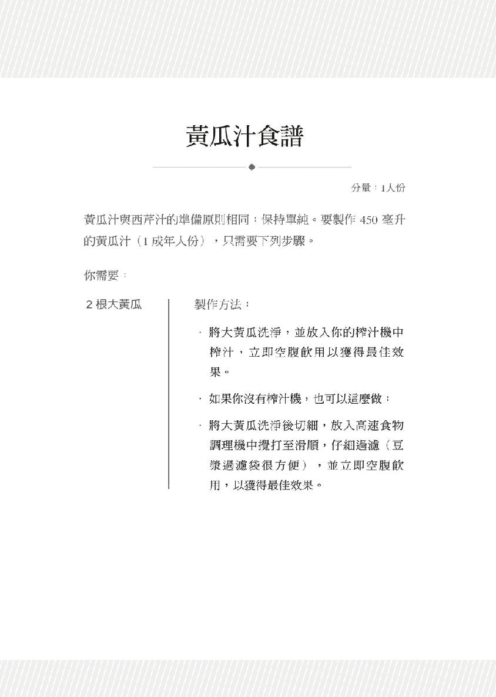

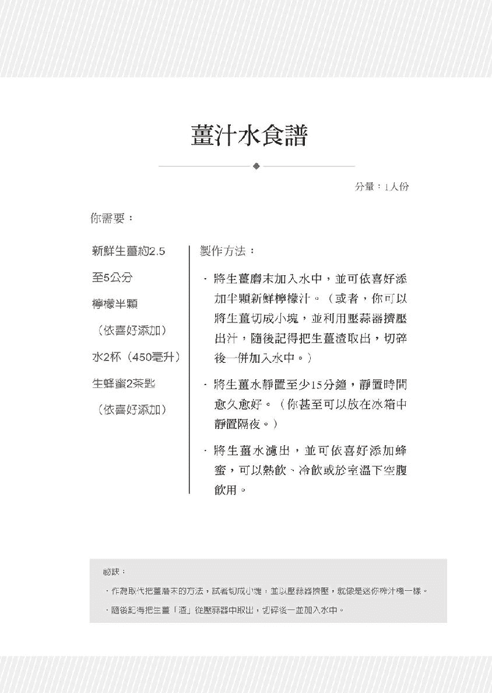

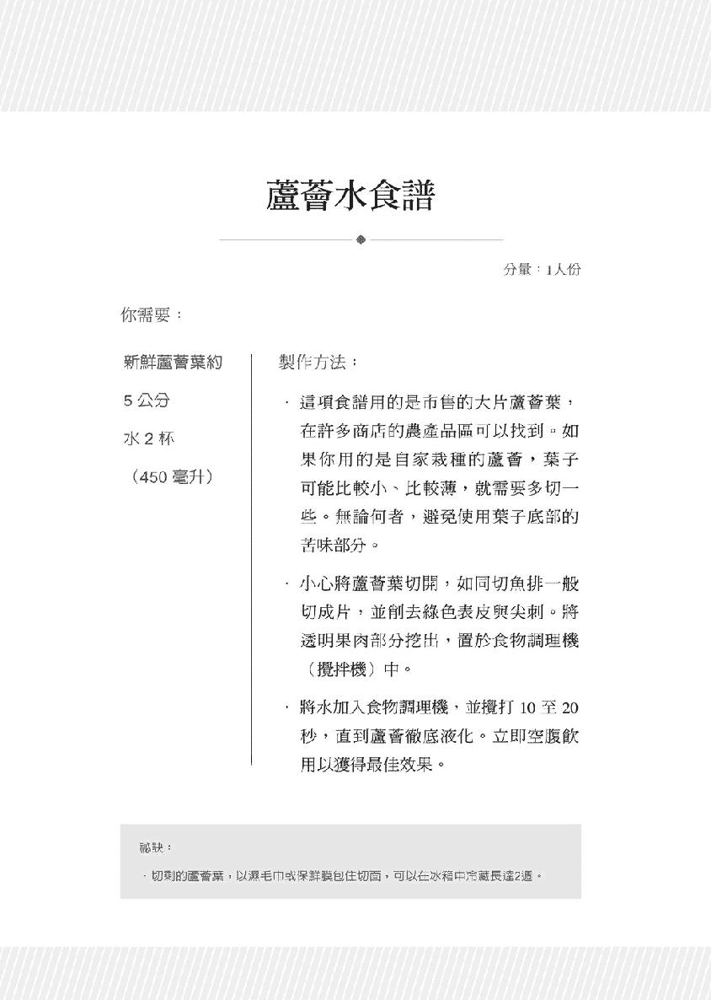

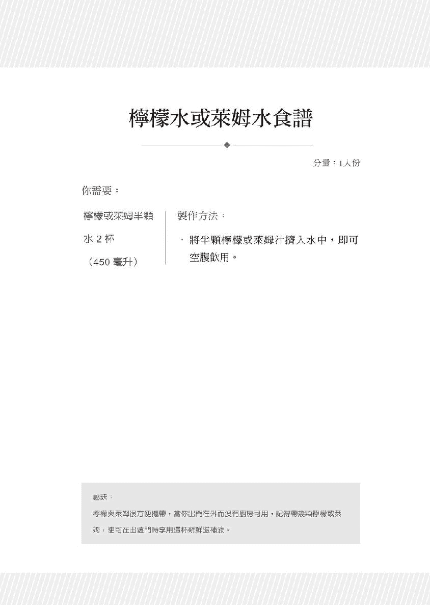

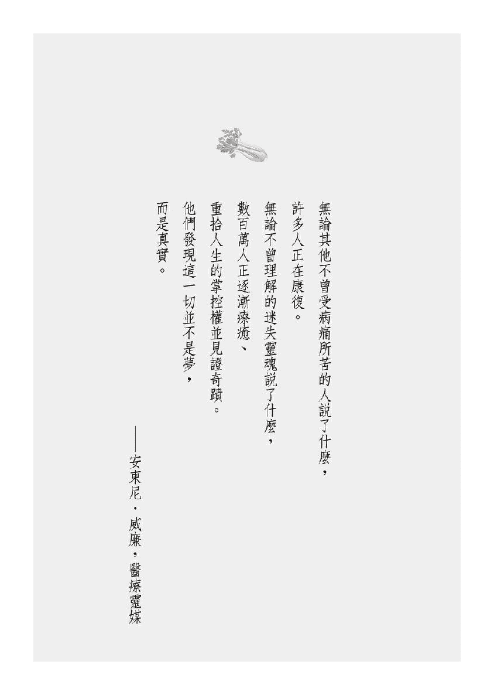

## **第十章  一场疗愈运动**

倘若数百万人都受症状与疾病折磨长达数月、数年甚至数十年会是什幺情况如果他们尝试过所有方法——转换饮食、改变生活型态、戒除加工食品、服用大量营养补充品、求诊过无数医生——却仍然无法使健康有所改善呢又如果在患病多年、苦无疗愈良方时终于找到有效的解答呢那不是很美好吗找到使他们脱离黑暗的解答找到使他们初次重见光明的解答。

如果他们发现自己能再次正常生活、减少痛苦、享受生命并重拾人生呢如果终于获得确实有效、往后也将持续有效、不会倏忽即逝的良方而使他们感受到重回以往、甚至更胜以往的自己并且再次找到未来的希望呢我们谈的并不是数百人中的某个人在好几个月中的某一天感到稍微纾缓而是数千、数十万、数百万人正在康复之中发生有如美梦成真般的奇迹。

这不是很美妙吗或者说我们会相信他们吗我们会认为他们所谓的疗愈言过其实吗我们会怀疑他们是否曾经真的生过病吗我们会发现这只是说来好听却不值得相信吗我们应该诚挚地扪心自问因为确实有数百万人、甚至数十亿人生了病但却无法有所进展而且尝试过所有途径后仍然找不到解答。这并非反乌托邦式的黑暗未来而是我们现在的处境。但至少已经有越来越多人获得改善。

无论其他不曾受病痛所苦的人说了什幺许多人正在康复。无论不曾被健康难题击倒、不了解整天受到身心痛苦折磨要付出何种代价、在健康领域中想要独领风骚却不经意散播错误资讯的人说了什幺许多人正透过西芹汁持续改善。无论不曾理解的迷失灵魂说了什幺数百万人正逐渐疗愈、重拾人生的掌控权并见证奇迹。他们正发现这一切并不是梦而是真实。

无论我们喜不喜欢无论我们嗤之以鼻或乐见其成你在本书中读到的疗愈运动正在发生而且永不停歇。这项运动提供我们从病痛的灰烬中重生与疗愈的珍贵契机背后意义远超乎你我想像。

你可以选择无视我绝对尊重一切取决于你。你也可以接纳它并用来疗愈自己与周遭的人进而成为追随者。或者你也能选择处于灰色地带透过亲身尝试让自己变得更健康保护自己现在的健康也确保未来的健康并且决定将这件事藏在心底。无论你选择何者必然会有数百万人深信不疑——不仅深信更加以理解。众人的见证足以成为你的后盾。

他们很了解因为他们原本无法离开病床、无法看得清晰、无法听得仔细。正因为太过痛苦对于自己身陷慢性疾病周围的人却视若无睹、充耳不闻这件事早已变得麻木。接着他们开始疗愈不停地疗愈他们的信念如此光明因为这确实对他们有效而且持续发挥功效。他们不再陷于苦无解答的绝望之中不只不再绝望更怀抱莫大的希望。他们不用再希冀别人前来搭救因为救赎已然降临而他们紧紧把握住因此拯救了自己。他们从绝望成为「我希望有效」最后变成「真的有帮助、真的有效我正不断改善并重拾我的人生」。

我记得年轻时曾提供现榨西芹汁给许多人他们因为各种症状与疾病不断挣扎和受苦因此需要西芹汁。我记得曾见到他们复原、恢复体力并且康复。我也记得自己曾经想过有用的事物必然经得起时间考验。如果西芹汁真的有效人们也因此疗愈那全世界理所当然都必须认识西芹汁它也将随着时间红遍街头巷尾。

很神奇地现在全世界都认识西芹汁但并不是因为有无穷的资金赞助与媒体大肆宣传。这项运动缘自另一种来源每个人的声音他们都曾采用这种疗愈奇迹持之以恒地饮用并流传给疗愈之路上所认识的其他人。这项运动在好一段时间内都默默地进行开枝散叶的过程既自然又条理分明不只具有灵魂也包含了真理并且在几乎传遍所有人耳朵之前就已然茁壮。当适当的时机来临便掀起汹涌的浪潮让许多人信手拈来自身最真切的疗愈体验。这股浪潮一鼓作气打上岸边并淹没地球过去不曾留意之人无论是出于困惑、惊讶或怀疑都为其不住摇头。「这是从何而来」他们问道「为什幺突然变得这幺流行为什幺是现在」

时间点的背后有其意义。如果你曾经怀疑过为什幺西芹汁的风潮在此时席卷全球而非在过去的其他时间因为我们从未像现代病得如此严重。此时此刻健康比过去更受到慢性症状与疾病的威胁使我们在生命中无法向前迈进。也正是此时我们比过去更需要疗愈的解答。

你会无视可能改变生命的机会就因为提供机会的来源不符合你的想像吗我们有时会让感受决定我们是否要获得协助「我才不要。」我们会这幺说或是「我才不相信。」如果眼前确实是能够改善生命的解答你愿意让这股呼唤凌驾于最初的不确定感吗我见过有人呆看着面前那杯四五〇毫升的西芹汁有如要跳进悬崖下方的汹涌河水那样紧张。他们的内心正在与认知搏斗认为西洋芹无足轻重所以饮用西芹汁也不可能有任何价值。光是这种想法便能打断让人想尝试的念头也阻止他们确实踏出疗愈的脚步。对某些人而言看见西芹汁逆转其他人的疾病并不足以克服他们对于来源的疑问以及对西洋芹所蕴含价值的认知。有些人只相信配套完善、看似经过某些权威全盘验证的事物。别让这番恐惧阻碍你的疗愈。

关于慢性病的真相数十年来都遥不可及有许多人正不断研究而且已经很靠近解答所在。着名神经专科医师甚至即将破解造成特定症状与疾病的根源却因为缺乏资金而功亏一篑。就在当代医学眼看就要揭开使许多人深受折磨、甚至苦无解答而失去生命的谜底时却只能把所有进展束之高阁。答案几乎就在眼前但将一切归咎给遗传基因的理论却又将真相推得更远就因为医疗科学将所有资源倾注于基因研究而非用来挖掘可能的解答将伴随我们已久的慢性病痛苦画上句点。

只要别人能了解你在生命中所学到的真理便能使某件事物朝截然不同的方向发展这种情况你遇过多少次在我人生中的数十年来我看着医学社群为了探求人类受苦的真相而朝着或对或错的方向前进我曾看见他们几乎绊倒在寻求慢性病解答的路上尔后也从未获得突破并迎来真正的成功。我的工作是将答案交给你例如让你理解西芹汁的疗愈力量。你准备好收下了吗

我曾受赠关于慢性症状与疾病的解答所以你不需要再受到慢性病医学研究之路上的错误与路障所阻碍。不会有欠缺资金、隐晦意图或过往错误的问题能阻止你发现该如何继续前进因为我并未受到各种体系所束缚。

自由就藏在这些文字之中并非遥不可及。

慢性与难解疾病的盛行

慢性病正处于历史高峰。光是美国就有超过两亿五千万人生病或罹患难解症状。这些人的生活处境欠佳却找不到解释——或者解释得不甚合理甚至让他们感觉更糟。你或许也是其中一分子。倘若如此你便能证明医疗科学仍然摸不清难解症状与折磨如此普遍的原因。

让我先说清楚我尊敬优良的医疗科学。许多天赋异禀又才华洋溢的医生、外科医师、护理师、技师、研究员与化学家在传统医学与替代医学领域持续深耕我曾有幸与当中某些人共事。感谢上帝幸好有这些怀抱大爱的医疗者。学习如何透过严苛、系统性的探索来理解我们的世界是我所能想像最崇高的目标。

大多数医生拥有与生俱来的智慧与直觉能了解医学机构无法带来对于慢性疾病所需要的知识并使他们得以提供最佳的诊断与治疗计画。你曾经听过多少次「某某病目前没有解药」即便是在最优质、最精英的医学院仍然有在班上以顶尖成绩毕业的医生坦承完成学业后并无法帮助慢性病患者他们必须靠自己成为专家。还有一些医生觉得学校已经提供了所有解答并基于某些原因认为他们所受的训练已经取代了慢性疾病的谜团他们认为其他的一切都是胡说八道、装模作样这其实很可惜因为他们否定了正遭受磨难而且苦无解答的数百万人。无论是上述何者医学界无法解决慢性疾病之谜并非医生或研究人员的错。科学界每天都有惊人、优秀的人才裹足不前因为他们的发现需要高层投资者与决策者的首肯才能够继续前进。数以千计可能彻底改善人类生命的新发现至今毫无进展科学界的人员也无法一展长才。

我们有时会将医疗科学视为纯粹的数学完全仰赖逻辑与理性。虽然两者有时相互交缠但数学与医疗科学并不相同。数学的解法明确但科学不然。真正的科学追求的是结果是套用理论的成果。你可以在医疗科学中运用数学例如用于制作药物但药物必须带来经过验证的结果而且最终的数据也必须合理才能称之为科学。科学实验室就像游戏间让人们以特定方法混合不同材料以验证不同假设及理论但幕后却有投资者为了得到期望中的结果而施压。理论经常在有机会受到证实或推翻以前就已经被推定为事实尤其关于慢性疾病更是如此。关于慢性病的医学几乎很难立即得到正确解答。

如果科学能够如我们期望般如此理想不是很好吗如果可以无关乎金钱只追求真理呢就像任何人类的追求一样医疗科学仍在不断发展。想想最近才将肠系膜视为一种器官的认知这种具活动性、好似筛孔般的结缔组织一直近在眼前我们甚至一直知道它的存在但却直到如今才真正受到重视。不仅如此每天都会发生新的突破。科学不断演化曾经放诸四海皆准的理论也可能在明天突然被淘汰原本看似受人嘲笑的理想也可能在明天受到证实能够救人一命。这些现象表达了一件事科学尚未取得所有解答。

我们已经等待了超过一百年希望从医疗界获得最真切的洞见了解慢性健康问题患者该如何获得改善然而解答仍未降临。你不该再经过十年、二十年、三十年甚至更漫长的等待就为了等待科学研究找到真正的答案。如果你被困在病床上一日拖过一日或觉得对自己的健康感到失落那你就连一天也不该再继续枯等更别提另一个十年。你也不该再看着自己的孩子走上相同的路——然而这却是数百万人的命运。

更高等的来源

这便是至高灵——上帝怀抱怜悯之情的体现——在我四岁时来到我生命中的原因为了教导我如何看见使人类受苦的真正原因并将此讯息传达给全世界。如果你想多了解我的来历可以在《医疗灵媒慢性与难解疾病背后的祕密以及健康的终极之道》一书中读到我的故事。简而言之高灵不断在我耳边诉说着清晰又准确的话语好似与我比肩的友人告诉我身旁每个人所罹患的症状。此外高灵也在我年轻时教我如何扫描他人的身体如同强力的磁振造影术可以将所有阻塞、病症、感染、患部与老毛病一览无遗。

我们看得见你也知道你所面对的考验而我们不希望你再多受苦一刻。我的毕生志业便是将此讯息传达给你使你能超然飞升于困惑之海凌驾于现今各种健康风尚与潮流的杂音与妄言藉此重拾健康并引导自己的生命脚步。

本书中的内容尽属真实、确切必然对你有益。本书与其他健康书籍不同。书中蕴含丰富资讯你或许会想翻阅再三以确保你吸收了所有讯息。这些资讯有时看似与你的过往听闻正好相反有时听起来又与其他消息很相似但实际上却存在细微但关键的差异。共通点在于这些都是事实不是将老生常谈的理论重新包装使其乍听之下像是对慢性症状与疾病的崭新见解。书中资讯并非来自残破的科学、营利团体、有所挂钩的医学赞助商、拙劣的研究、说客、内部回扣、受人鼓吹的信仰系统、有力人士的私人小组、健康产业的贿赂或流行风潮的陷阱。

上述因素会阻碍医学研究与科学界使其对慢性疾病及其治疗方法的理解无法如预期般快速发展。试想假如你是具有理论的科学家在你构思出理论后便需要寻求投资者这代表你必须说服他们。假如投资者喜欢你的论点通常是因为他们想要看见特定的结果所以才会赞助你的努力。随之而来的是无法估量的压力你必须产出合意、实际的成果并证明这一切值得投资者所挹注的大笔资金。在此处境下的科学家很害怕自己搞砸因为他们将永远找不到下一位愿意赞助另一项理论的投资者也无法在专业领域中留名青史。这使得应该透过自然法则探究的学问没有发展空间这些概念有时无法带来成果、可能朝预期外方向发展抑或是动摇某些根本信仰。这番约束使我们不禁质疑我们所读到具有重大突破的研究成果是否真如报导所呈现地那般优良。当模稜两可的真相能为外部资源提供既得利益时珍贵的研究时间与金钱便会耗费在没有效益的领域中。某些可能有助于改善慢性病治疗的发现也因此被人忽略并失去资金。而且我们所认为绝对正确的科学资料也可能受到曲解像是窜改与操弄再被其他健康专家视为法则而其中却存在着瑕疵。这便是时常更新健康资讯反而会令人困惑又充满矛盾的原因因为有些其实是错误资讯。

西芹汁在众人的手中与家中受到验证背后没有隐晦意图或资金在操弄成果已然证明确实有效。记录西芹汁帮助我们改善的文献不断增加时间也不断证实西芹汁的效力。数百万人都因为西芹汁改善健康当中有许多人除了在生活中加入西芹汁以外并未采取其他改变使西芹汁从纯理论的国度迈入医疗真理的境界。就根本意义而言科学即为知识。尝试过一切方法的患者最终因为西芹汁而得以从病床上重拾生机没有什幺比他们眼中所流露出的知识更为真切。

你必须了解在本书中所读到关于西芹汁与慢性病的事实与数据并没有任何由不可靠来源所衍生的科学研究内容或引述。你不用担心这些资讯会像其他健康书籍一样被推翻或取代因为我在此所分享的资讯都是来自纯粹、未经窜改、先进又洁净的来源——高等的来源心怀怜悯的高灵。没什幺比怜悯之心更能使人疗愈。

如果你凡事都追求科学根据请明白我也喜欢科学也要知道科学还有很大的学习空间。虽然我们处于美好的时代却也比过去任何年代病得更重、更加疲劳。假如医学专家对人们受苦的原因有任何概念那我们在所有健康层面上的思维方式几乎都会产生变革。

与许多受到度量衡与数理撑腰的其他科学领域不同对于慢性病的科学思维仍然停留在理论层面而现今诸多理论中的事实含量极低这正是许多人仍然在对抗慢性症状与疾病的原因。倘若继续依此发展我们便会沦落至所有研究成果都受到隐晦意图与个人利益所操弄的地步。

这种潮流使科学机构从最初就辜负了慢性病患社群也辜负了医生的期望更让数百万人饱受折磨。

你不必成为其中之一。

身为质疑者的我们

很久以前我们依赖权威的支配过活。权威告诉我们地球是平的而且太阳绕着地球转所以我们相信了。这些理论并非事实但人们将其当作事实看待。当时的人并不觉得生活很落后生活就是这幺过。任何人只要发表违背现状的言论就会被当成傻瓜。

接下来发生了科学界的典范转移。

质疑者——尽责的研究者与思想家也就是不满足于从表面观点看待「事实」的人终于证明我们可以透过分析来打开大门藉此获得对世界更深刻、更真实的理解。

如今科学已然成为新的权威。在某些情况下科学可以拯救生命。例如外科医师现在会使用消毒用具因为他们明白污染的风险而老一辈的医生并不了解。然而正因为有一定程度的进步我们也无法停止主动提出质疑。该是迎接下一次典范转移的时刻了。对于慢性疾病「因为科学」已经不足以带来解答。这算得上是好科学吗背后的资金从何而来样本大小的多样性充足吗数量够大吗对控制组的处理手法是否合乎伦理是否考量了足够的因素测量工具够先进吗根据结果所做的分析是否带来与数据本身不同的意义有没有偏颇具有企业力量的有力人士是否操弄结果有些科学能屹立不摇有些则会露出破绽例如贿赂、回扣、样本数量太小或控制因素不良等。

「科学」这个字眼在我们耳里好似我们应该不抱疑问地对其鞠躬哈腰听起来就像权威性的意识型态不是吗我们并未如自己想像般地脱离这套信仰系统。如果不对根本架构提出质疑是不会带来进展的然而现今社会并不允许我们质疑科学架构。

流行风尚不一定看似肤浅它们时常伪装成理由充分的医学忠告。现在有太多健康资讯都是老生常谈的讹传谣言更糟糕地甚至是经过断章取义。我们必须留意他人出于隐晦意图所传递而来、经过扭曲的讯息。选择可信、主流的消息来源一向是黄金准则。如今在对于新知的巨大催促压力之下有些健康文献的研究只是找个听起来尚且合理的消息来源便有如赶鸭子上架般地急着公开。我们必须审视解读者与发表人有无特殊利益关系甚至研究结果本身是否值得信赖

「科学」时常被当作攻击机制。这个字眼可用来曲解任何可能的事物。以食物战争为例素食与植物性饮食拥护者以及原始与生酮饮食拥护者展开科学攻防双方都利用科学研究来替己方阵营背书——因为你几乎能找到关于任何事物的研究。甚至当科学佐证不足时食物战争的双方便转而从情感层面攻击对手的信仰系统。素食与植物性饮食拥护者宣称对方会残害动物原始与生酮饮食拥护者则主张对方是让自己与下一代挨饿。无论如何两方人马都遭遇他们自己与科学都无法理解的健康难题。改善健康的重点并非要你选边站或是你在当时采用哪种信仰系统——即便此信仰系统是根据你读过的科学研究结果也不重要重点是了解我们的大脑与身体并满足它们的需求。

将科学视为上帝并将质疑理论与发现的人视为傻瓜对我们没有任何帮助。医疗科学留意的是医疗科学。纵使健康照护提供者个人原有最崇高的意图但大规模产业在乎的不是个人而是以产业本身为出发点因为它必须维护自己的权威。它是以最长远的步调投入自我。

打开天窗说亮话即便是现在我们认为坚不可摧的科学领域有时候也会出现裂痕。如果你曾听过髋关节置换部件或疝气网膜的召回事件就知道我在说什幺。这些都是依照确切科学标准所设计的实体物品并且在付诸使用前经过严格的科学检验而即便如此高度科学的制程也非万无一失。某些产品出现预期外的问题使原本看似无庸置疑的科学领域也变得不可靠。再想想对于慢性病与西芹汁如何缓解症状的科学理解中又存在何种的不确定性。西芹汁并不是独立于你之外而是可以拿在你的手中、接受测量与分析的装置。一旦你喝下它就成为人体活跃的一部分而且我们都知道人体是生命最伟大的奇迹与谜团。假如西芹汁蕴含科学界毫不知其存在的化学化合物而且这些化合物会锁定科学界尚未发现的人体问题我们又怎幺能相信主张西芹汁与其功效是无稽之谈的消息来源再说一次科学是人类的追求也还在持续发展尤其这项工作包含了解密人体的作业。需要保持警觉性、接受力、谦逊与适应力才能使这项工作真正有所进步。

如果你从未因为健康而挣扎、受苦多年却遍寻不着自身症状的解答或者你已经固化于特定的医学、科学或营养学信仰系统我希望你能抱持好奇心与开放心态来阅读这些文字。现今广泛的慢性病症状与苦难其背后含义远大于任何人所尚未发现的程度。你方才读到的内容不同于你过去所见到关于慢性健康问题或疗愈的任何资讯。这些是数十年来已经帮助过数百万人而得来的资讯。

人类的健康需要我们共同努力

自从我开始分享高灵的资讯我便幸运地看见它为这些人带来改变。藉由《医疗灵媒》系列书籍的出版看见这些资讯广传全世界并帮助成千上万的人我的感受已经远超过感动所能形容。

我也注意到有部分讯息曾经过操弄因为以特定职涯为导向的人试图攀上赞誉与恶名的阶梯。这种手法会牵动人们内心对于受苦的原始焦虑并趁机占其便宜。

我所受赠的天赋不该沦为如此用途。高灵是献给需要解答之人的声音也是一种来源独立于充满陷阱并使许多人虚耗生命的体系之外。当人们成为我所分享健康资讯的专家并且以真正帮助他人的名义广布充满大爱的讯息时我们都喜闻乐见。我对此感激不已。但当这些讯息受到窜改——与时下风行的错误资讯交杂扭曲、经过变造以至于听来独创新颖或公然篡夺并归功于看似可信却并非事实的来源——便可能带来危机。我说这些话是希望你知道如何保护自己与心爱之人不受误导所害。

本书并非复诵你以往所读过的一切。本书无关将问题归责于你的基因或身体的信仰系统也并非要颠覆时下的高蛋白饮食来预防症状逼近。这份资讯尚属新颖从全新观点来看待使人在生命中裹足不前的症状也从崭新视角探讨我们该如何疗愈。

如果你很担心我能理解。我们会反应、会评断人类正是如此运作。这也许是在特定处境中保护我们的本能但有时候也能带领我们走过人生难关。在此状况下我希望你重新考虑。你可以藉由了解真相来自我判断。你可能失去帮助自己或他人的机会。

我们共同努力让大家变得更好我也希望你成为下一位西芹汁专家。感谢你在这趟疗愈旅程中与我同行并特地花时间来阅读本书。把你先前所阅读的真理运用到生命之中将能改变你与周遭众人的一切。现在你终于拥有知识与信念了。

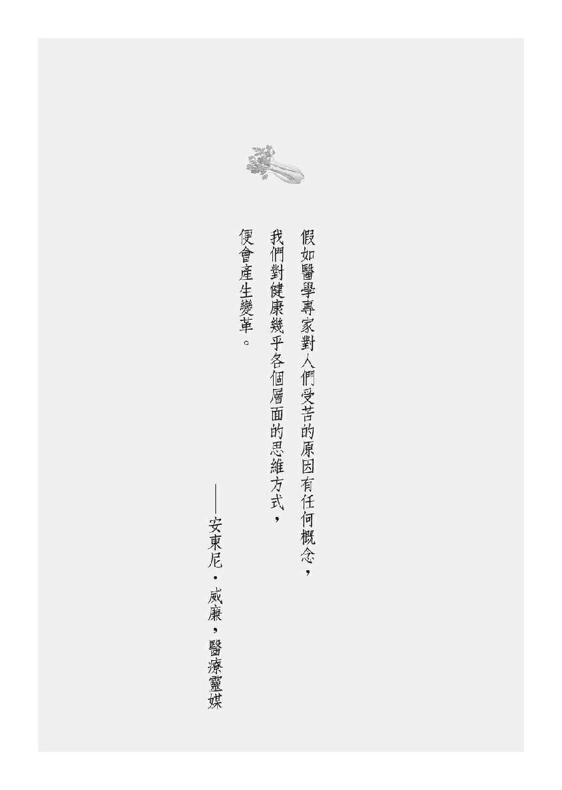

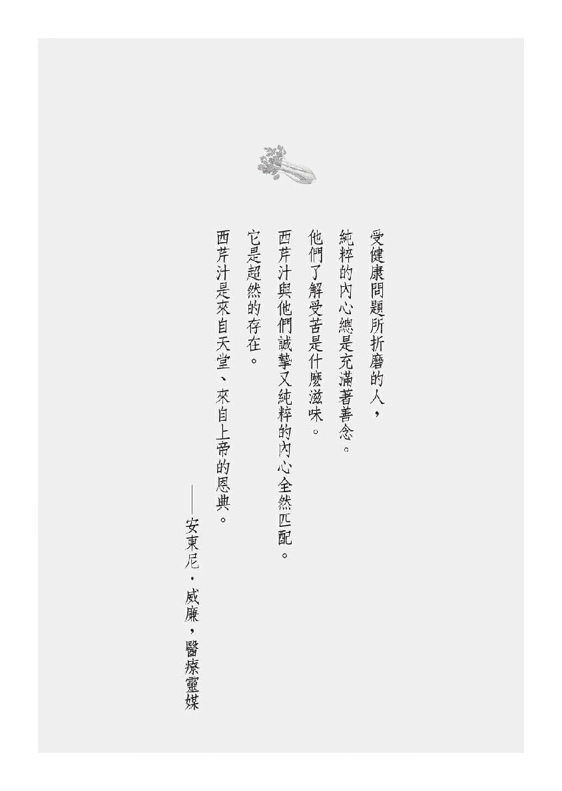
