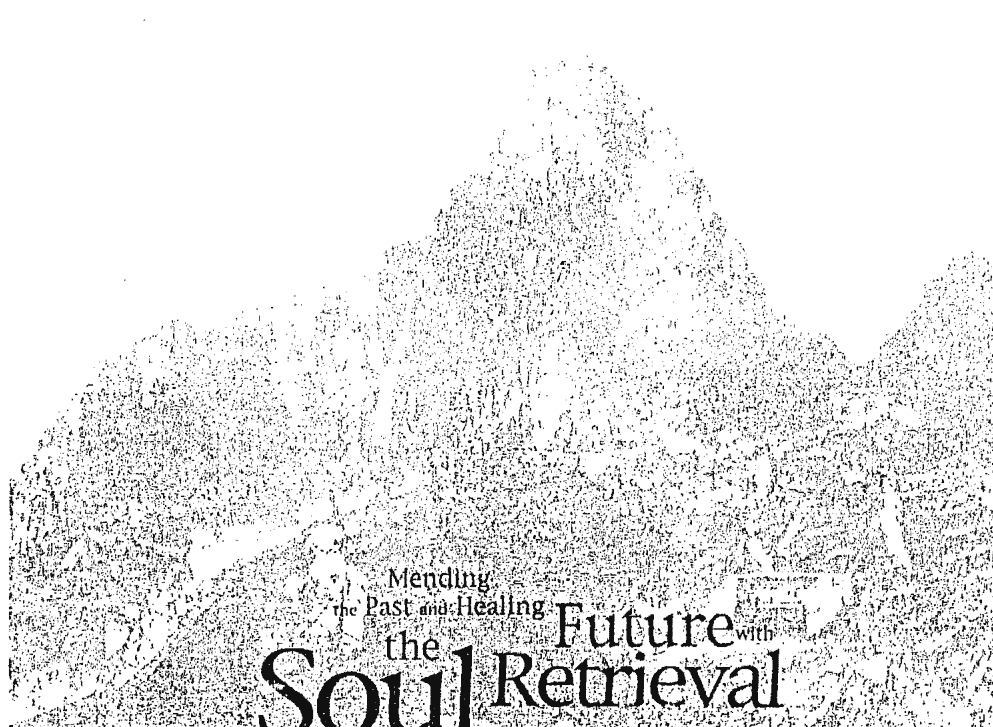
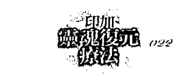
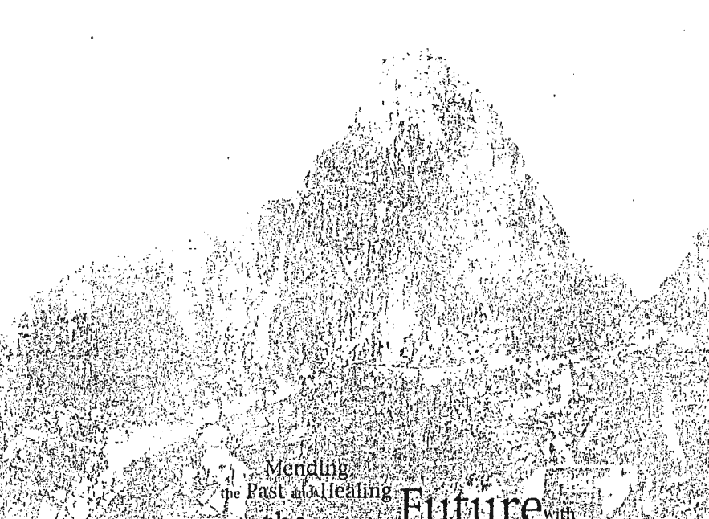
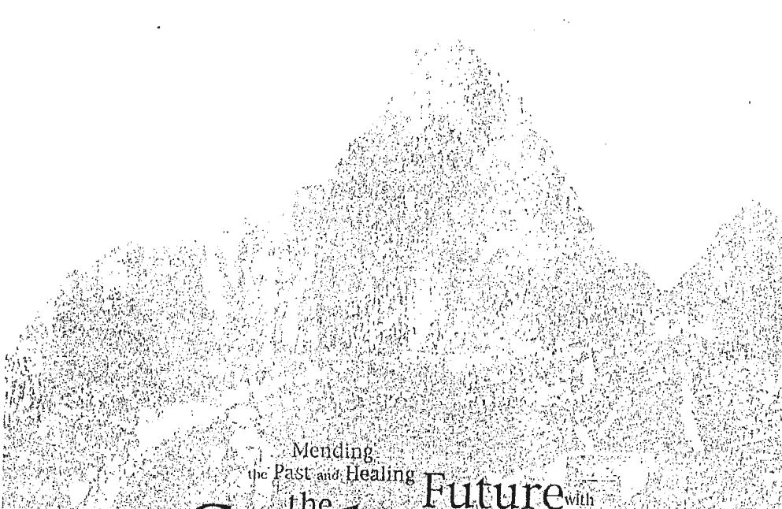

# Mending the Past and Healing the Future with Soul Retrieval

# 印加靈魂復元療法

跨越時間之河
修復生命·改造未來

《印加能量療法》作者維洛多博士充滿宇宙大智慧的最新力作
引導我們探索靈魂的深度與廣度、邀遊個人的命運之海

阿貝托·維洛多博士（Alberto Villoldo, Ph.D.）著 許桂綿 譯

# St. Royal College

# 天使神秘学院

- 专业占卜预测机构
- 神秘学培训机构
- 水晶能量研究中心
- 神秘学资料库
- 官方微信：strcdts
- 微信公众平台：strc2011
- 读书交流QQ群：
  占星塔罗占卜师交流群：814594478（加入密码：PDF）
  神秘学其他综合群：659338717（加入密码：PDF）

微信号：strcdts

天使神秘学院

天使神秘学院 院长QQ：715104687

微信公众平台：strc2011

# 制作说明：

本书由《天使神秘学院》出重金从台湾购入的原版书籍扫描制作完成。为达到最好阅读效果，特地把原版书全部切开后，再经由专业扫描设备高精度扫描完成，并经过一张张的PS后期处理最终成书，其间花费大量的人力、物力以及时间，只为能给大家提供经济并优质的神秘学学习资料而努力。

本学院强力谴责某些机构和个人，把本学院花心血制作完成的电子书籍，包装后直接放在自家淘宝网上低价倾销的行为，以谋取不劳而获的经济利益。如果长此以往最终将无人愿意再为大家花心思制作电子书，那以后可能大家再无新书可读。

为让大家以后能够读到更多的好书，也为了本学院的良性发展。本学院恳请大家尽量做到如下几点：

- 一、尽量在本学院的网站购买电子书籍。
- 二、请勿用技术手段把电子书内的水印及加密去掉。
- 三、在收到电子书后小范围传阅即可，千万不要公开传播，更别挂到淘宝网上低价销售。

同时为答谢广大支持者，学院电子书将做如下调整：

- 一、学院会把一些早已收回制作成本的电子书折价销售。
- 二、最新制作的电子书籍会开放打印功能，大家购买后有条件的可自行打印成书。

天使神秘学院
2019年1月

# Mending the Past and Healing the Future with Soul Retrieval

# 印加 靈魂復元 療法

跨越時間之河 修復生命·改造未來

阿貝托·維洛多博士 (Alberto Villoldo) 著 許桂綿 譯

# 献辞

献给我的母亲：伊莲娜·维洛多，
她启示了我爱的方法。
也献给狼女（La Loba）。

译注： 根据美国西南部印第安人的传说，狼女居住在隐蔽的沙漠地带，专门蒐集狼的骨骸。她将所获骨骸拼接成狼的骨架，一旦完成一匹狼的身形，她于是开始唱歌。随着歌声愈来愈激昂，那骨架渐渐长出肉来，尾巴翘起，并且有了气息。她张开眼睛，一跃而起，朝峡谷深处奔去。在疾奔的途上，或许因为疾行之故，或许受到阳光或月光的照耀，刹那间，她变成了一名女郎，狂笑着朝地平线彼端奔去。 因而，若一个沙漠的旅人，在夕阳西下的时刻迷途，那么幸运之神将降临，因为狼女将庇护他，指示给他一样东西——一样有关「灵魂」的东西。

# 推薦語

維洛多為我們展現了一個令人倍感敬畏的視野，描述了古代巫士的世界觀，同時以現代量子物理學的理論加以舉證。他以豐富的文筆訴說有趣的故事，讓我們一窺宇宙神奇的運作。然而這一切遠超出筆墨的敘述 —— 這是一條通往個人福祉和療癒的道路，是作者提供給每個人，可以實際採納而作為靈魂實現的途徑。

> —— 弗烈德・吳倫夫 (Fred Alan Wolf) 美國布克獎得主
《悠遊時間的長河》、《老鷹之路》、《靈性宇宙》等書作者

作者阿貝托本身就是一種神奇的組合，同時擁有敞開的心和細密的思考，陳述了：(一) 原始部落治療者的深奧教誨；(二) 對現代科學的了解；(三) 以令人著迷和實用的方式來與讀者分享智慧。讀者可運用本書革除舊時的創傷，喚醒內在的愉悅和天賦，兩者都是世界最珍貴的禮物。

> —— 布魯克・伊格爾 (Brooke Eagle)

阿貝托·維洛多對於古代知識及部落智慧的演繹和解讀，幾乎無人能出其右。更且，他本身就是這些慧悟的化身。

維洛多為大家展現了一個找回失落靈魂的方法，這個方法攸關生命，要人不僅只是活著，且活出生命力。他引導出一條清澈的道路，去看見每個人內在的山水，在此處，療癒和進化即將發生。

> ——凱薩琳·英格藍（Catherine Ingram） 《活出熱情》、《追隨甘地的足跡》作者

> ——珊德拉·英格曼（Sandra Ingerman） 《靈魂復歸》、《大地之藥》作者

《最後的魅舞》、《水牛女之歌》作者

# 推薦序

# 穿越不同世界的旅者

清晨，雨以雷霆萬鈞之勢宣告著春天的來臨，仔細地整理行囊，穿上雨具，踏上睽違已久的古道，潺潺的雨水沿著山徑緩緩流下，眼前一片令人驚嘆的綠，樹梢的嫩葉和飄落一地的花朵隨著風雨，拂去山徑上的足跡，四周滿布著一種寧靜而神聖的氣氛，偶爾停下腳步，迷霧中古老而巨大的檜木和悄然乍現的群山，尊貴而剛毅地疊立在面前，清脆的鳥鳴總是不經意地在每個轉彎處等候，時而明晰，時而幽遠，彷彿穿梭在所有的記憶之間，我們靜靜地聆聽生命的苦澀與甘美。有一個世界，在那兒人們隨著一種叫做趨勢、潮流或宿命的觀念而流浪，他們沒有固定的居所，生活由大量的資訊、知識、事件和痛苦以及娛樂堆砌而成。在那兒，物質更迭與毀壞的速度，快過流星越過天際，失落與沒有時間是大家共同的特質，解脫成了最大的願望，那是我們習以為常卻不常活在其中的世界。另有一個世界，充滿了記憶、故事、傳奇、神話與神秘未知，吸引了無數的英雄、先知、科學家、哲學家、探險家以及尋索者來探訪，帶回一段又一段引人入勝的歷程。在那兒，時間如幽靈一般，不斷隨著不同的歷程展現其多樣的面貌，這是我們心嚮往之的世界，在那兒，時間與空間仍未誕生，言語無法描述與形容，是一切已知與未知的源頭，那是我們永遠無法得知卻可以去經驗的世界，薩滿們是這些世界之間的旅者。在時空遊歷的旅程中，架起一座座跨越虛幻與真實的彩虹橋。那是一個酷熱的日子，高溫把腦袋中所有的智慧都融化了，跟著老師阿貝托博士與我們的納瓦荷（Navajo）嚮導，在亞歷桑那州的Canyon de Chelly 進行一趟學習之旅，紮營在一處峽谷的谷地，四周被高聳入雲的紅色砂岩所環繞，天空藍得如此不真實，舉目四望，被曬得焦黃的灌叢之間，夾雜著數棵綠意盎然的樹，偶有馬群奔馳而過，宛如置身幻境之中，黃昏，突如其來的沙暴把僅存的一些文明外衣全數帶走，夜裡，群星伴隨著仍行走在这片土地的祖靈守護著我們，安歇在大地的懷抱裡，漫步在Anasazi及納瓦荷的遺址之間，我們跨出時間與歷史之外，去經驗那創造的奧祕與生命的簡樸，在大地無盡的深遠之中，我們尋回靈魂深處原初的悸動。

靈魂的畛域一向被認為是神秘的、虛無飄渺的，多半不是避而不談，不然就是過於玄秘。

阿貝托博士是我們公認的 Kamayoks（擅長說故事的人），他總是以風趣、清晰又發人深省的方式，將薩滿巫士的教導引介到這一日益零碎的世界中，期盼重新建立正確的關係並帶來療癒，本書正是這一精神與努力的再一次展現，也是薩滿療癒傳承最重要的支柱之一。

根據薩滿的教導與傳述，療癒的歷程始於襤下自己的過去，繼之以步出死亡與暴力的陰影之外，尋回和平堅定的力量，然後獲取伴隨自身的獸物（Power Animal）——與生命神髓結合的直覺原形能量，一同進行時空遊歷，尋回失落的靈魂殘片與療癒地圖，我們進一步得以擷取自身的命運並將之展現於未來，有如書中提及帕西法爾的聖杯歷險故事一般，靈魂對於時間的覺知是不同於大腦的，在靈魂復歸的過程中我們學會跨出時間之外，體認到時間因著所處空間或世界的不同而展現出線性、同時性、可逆性、循環性等多重面貌，並認出其交會處，薩滿們稱之為「神聖時間」，靈魂在此經驗到自身的完整與澄淨，並在此影響過去與召喚未來。

本書分為三大部份，第一部份著眼於宿命與命運的解析與認知，用隱喻的方式說明無時間感（Timeless）與非局域性（Nonlocality），另外也帶領讀者綜覽靈魂的四個畛域，相應於我們生命經驗中的知識、智慧、痛苦與恩典，最後並練習開啟神聖空間及做時空遊歷。在這個部分，讀者可感受到生命的召喚，並為接下來的歷程做準備。第二部分則詳述下部世界及靈魂的四個畛域，即現代心理學所說的潛意識與集體潛意識，為我們進一步的探索提供了一份詳盡的指引，尤其關於靈魂契約的部分更有許多洞見。第三部分引導我們成為自己命運的領航者，遊歷上部世界，即現代心理學關於超意識的部分，尋回療癒的藍圖，讓意識的演化近乎立即的以具體的形式展現，不著痕跡地夢出我們想望的未來。阿貝托博士以用心態切的態度，引導我們探案靈魂的深度與廣度，讓我們和一切存在的事物得以用原初的方式互動，付出我們的愛並帶著療癒的力量返回，這樣的心意就是薩滿賢者（Laika）之心吧。

銀色的月光灑滿灰白的大地，晶瑩剔透的水晶輝映著夜空，繁星點點隨風忽隱忽現，遠處不時傳來深沉的冰河爆裂聲，聖山SalKantay巨大的身影在火光的背後舞動，Don Pasqual 爽朗的笑聲和Don Francisco 樸拙的笛聲送走刺骨的寒風，過去的魅影在石塊之間低語與安息，靈魂之中流動著的卻是生命狂野的呼喚。

恩師阿貝托博士的力作，再度透過許桂綿小姐流暢而詳實的譯筆與讀者見面，在此表達由衷的謝意與敬意，也期許它給讀者帶來更多療癒的面向，誠摯地向您推薦這本難得一見的好書。

最後，引用紀伯倫的格言集《沙與沫》中的吉光片羽與您分享：

> > 就在昨天，我還以為自己只是碎屑一片，在生命的蒼穹中毫無韻律地顫抖，如今我卻明白，我就是那蒼穹，整個生命是我懷中富有節奏而悸動的碎片。

# 祝福我們共同偉大的旅程！

- 李育青 Apuchin（飛翔的山或禿鷹）
- 開業牙醫師
- 白井靈氣治療師、印加薩滿
- 前生態關懷者協會理事長

# 前言

這本書是我二十五年來傾力研究、跟隨若干美洲傳統部落的巫士學習的成果。在安地斯山脈的高山上及亞馬遜叢林裡所經歷的儀式，莫不與古老的傳統息息相關，且需要數個月的準備。個人對於美洲大陸治療習俗的探索，一直以來都由一位印加長老安東尼歐先生所引導。我跟隨這位知名治療者的一路探險，都已記錄在先前的著作《印加能量療法》（Shaman, Healer, Sage）（生命潛能出版），《四風之舞》（Dance of the Four Winds），《日之島》（Island of the Sun）中。

本書所提到的「靈魂復元」技巧，是我的新嘗試，企圖把至今仍在南北美洲部落實行的古老治療方法，以現代人的語彙加以詮釋、解讀，以便賦予一個符合當代社會價值的意義。在美國各地某些西班牙和原住民社群裡，當兒童遭受驚嚇，會被帶到一個特別的地點，以迎回因受到驚嚇而失去的靈魂；我採納此一習俗，並將其置於一個現代科學的架構裡解讀。

至於擷取命運的技巧，則是連最原始的部落也逸失了，不過我算是非常幸運，花了許多年時間師從當地的「Laika」（印加族人對能觀見者之稱呼，本書後文將以「治療者」稱之），因而得以從他們身上學習。請讀者謹記，我在本書中即將分享的各種技巧，皆具備非凡之力量和影響力，只能秉持最堅定的道德和正直來使用。事實上，巫士們接受冗長的訓練，其中有一大半的時間是在培養高尚的道德情操，這份情操奠基於對萬物生命最深的敬畏。只有在那時，這些技巧才得臻完善，並用來治療他人。

把個人身體和心理健康的的大事，交給一個僅受過一個禮拜能量治療訓練的人來解決，此舉保險嗎？面對只上了短期治療技巧課程的人，這的確是件令人迷惑的事。如果你覺得內心有股召喚要運用這些治療的技術，請務必向品德正直、有智慧，其知識足以協助你發展個人心靈及精神力量的人來學習。

我個人對巫術的學習，一直以來被自己期望「完整」的渴望所引導。為療癒自我靈魂傷口，我學習去愛自己和別人。我沿著受傷治療者的途徑，努力轉化深埋內心的哀傷、苦痛、憤怒、羞愧，使其成為源源不絕的力量和慈悲心。在我所主持的「發光能量治療學校」中，每一個學生都踏上了自我治療的探索之路：轉化靈魂的傷口成為無窮的力量和智慧。學生們學習到，這是他們稍後所能給予受治療者最偉大的禮物之一：一個在自我治療的旅程當中發現力量和智慧的機會。

# 前言

當然，我不是第一個引介美洲古老治療技術的人，人類學者瑪格莉特·米德（Margaret Mead）首先敞開了這扇門，而引發許多人相繼追隨。我的好友和同事珊德拉·英格曼（Sandra Ingerman）所著《靈魂復歸》（Soul Retrieval）則是引起外界注意古老治療技術之力與美的第一本書，並提供給我們一套實用的指引來療癒自己。還有一些人也努力於此，包括漢克·魏索曼（Hank Wesselman）、約翰·柏金斯（John Perkins）也搭起了這座橋，讓許多人能夠跨越文明與原始社會的鴻溝，進入部落民族的神話體系，一探其深遠的精神傳承。

最後我想表白的是，本書所描述的治療方法，是我自己對古老治療技術的綜合整理，我並非為我的老師、印加人，或者美洲原住民巫師來發聲。雖然我獲得了跟隨印加最精湛的巫醫學習的機會，但目的不在提出一套對印加傳統的解釋。本書所提到的靈魂復元治療和命運的擷取，皆本於我在接受巫師訓練時所學，我將為一切所述負責。

——阿貝托·維洛多

# 推荐语

> > 推荐序——穿越不同世界的旅者 李育青 I

# 前言 VI

# 导读 001

# 第一部 预备你个人的灵魂复元

# 第一章 命运的架构 015

# 第二章 转化宿命为命运 029

# 第三章 探索灵魂的地图 051

# 第二部 下部世界

# 第四章 灵魂的创伤区 081

# 第三部 上部世界

- 第五章 靈魂契約區 105
- 第六章 恩典的區室 135
- 第七章 寶藏的區室 153
- 第八章 象徵力量的獸物 173
- 第九章 遊歷命運 197
- 第十章 犧牲內在的聖牛 217
- 第十一章 遊歷未來，擷取自我命運 231
- 第十二章 蜕變——新軀體的產生 257
- 後記 279
- 感謝 281

# 導讀

我進入醫學人類學的領域，著迷於人類心理的研究。一九八〇年代那數年，我花了幾百小時在解剖實驗室中，嘗試為潛伏在大腦中那一團灰色物質內的「意識」找到一些明顯的證據。我為「心理」能夠創造出「身心症」的龐大力量感到眩惑不已，正是這一份著迷，把我一路帶向心理學，然後是醫學人類學的領域。

我繼而想，與其費力從大腦數百萬的突觸上找到一個科學的解答，不如採取一個截然不同的途徑，來了解人類的意識。於是我從一個最簡單的理論出發，既然人的心理作用可以製造出身心症這個「疾病」，那麼它理應也能用同樣的方式製造出「健康」。我啟程找尋一些專家，希望這些專家對於人類如何運用龐大的心理力量去治療自身，進而轉化身體，能給與我一些洞見。

根據我在人類學上的研究獲悉，南美洲有些原始部落的巫師能夠施行一些神奇的療法，不僅可以在當事人面前施行，還可以從遠離之處治療。我決定旅遊至當地一窺究竟，帶著一顆科學的頭腦，敞開心來迎接可能的發現。我買了一把上好的獵刀、一雙穩健的健走鞋，啟程從舊金山州立大學的實驗室出發，這趟旅程把我帶到亞馬遜狂放的叢林，最後又領我到達位於秘魯安地斯山區、住在海拔數千英尺之高山村落的巫師住處。

我是第一個與這些智慧傳承的保存者進行廣泛接觸的人類學者，當地人稱他們為「Laika」。他們生活在僅存的印加社群之中，與外界鮮少接觸，其知識和教誨因而未受到傳教士和其他西方白人的影響。最重要的是，治療者們仍舊實行祖數千年來所施行的治療技術，這些技術由老師傳給學生，一代代在巫醫這一行業裡流傳。

在拜訪的初期，每一村落的巫師大多不願意與我分享其傳承——一個西方白人，並且又是個陌生人，但最後我終於獲取他們的信任。在早期的幾次遊歷當中，我觀察到村子裡許多小孩染上了文明病，包括腸胃失調，小嬰兒患有此一症狀的情形尤其普遍。因為當地的藥草和療法似乎對這種疾病發揮不了療效，我於是帶來一些藥物來治療當地的小朋友。一段時間後，村民們開始視我為某一類的治療師，繼而引我去見「他們的」治療師，透過他們，我又遇見更多的治療師。

安東尼歐·莫拉里（Antonio Morales）任教於庫斯科大學，並且也是個純正的印加人，成為我最主要的指導者。我跟隨他遍遊了安地斯高山各村落，在幾處神聖的地點和古寺中冥想。除此之外，我還跟隨幾位高地女巫士學習，她們教導我獸物的力量，並且向我顯示，如何把自我的意識融入美洲豹或一隻兀鷹的意識之中。雖然我接受了西方科學的訓練，但儘量學著敞開內心的視野。我發現到通往下部世界（代表個人過去）、上部世界（代表未來）的地圖，以及靈魂復元和命運擷取的技巧，這些正是你在本書中即將學習到的治療方法。

# 世界的區分

治療者將人類的集體潛意識區分成三部分：下部、中間、上部世界。這三個世界不是指實際具體的地方，而是指原型、能量的畛域。就如知名的榮格分析家朱恩·辛格（June Singer）所寫：

> > 「集體潛意識的奧妙在於它們全都在那裡，所有的傳說、人類的歷史，連同其未驅除的妖魔鬼怪還有溫和的聖者，他們的神秘、他們的智慧，通通與我們每一個人在一起——在一個大宇宙中包含著一個小宇宙，探索這個世界比起探索外太空的挑戰性大得多。」

我們所居住的世界——工作和維持家計的世界——就是中間世界；上部世界是不可見的命運及大靈的畛域；下部世界——保存每一個人歷史紀錄的地方——則是靈魂的畛域。在中間世界裡，我們覺知到時間是線性的——明天總是在今天之後到來，因而我們絕難想像人可以遊歷過去和未來。但透過運用時空遊歷的技巧，我們可以拜訪上部世界及下部世界，正是在這裡，時間如同同一個迴路，悄悄不斷向過去和未來蠕行。

本害中，我將教導你如何遊歷至上部世界，找尋符合自己最高福祉的命運，以便在此生中實現自我的意義和目的。然而你也將遊歷下部世界，這一儲藏個人兒時及前世生活情景的畛域，找回失散的靈魂。這些靈魂殘片會以個體的形式呈現：譬如一個受驚嚇的七歲小孩、一位苦惱的母親，甚至是一個嚴厲的工頭。你將認識到他們身上的故事，療癒其傷口，寫下新的契約，讓他們解脫長久以來的包袱，然後迎回這些療癒後的靈魂殘片，將他們帶回現實。此外，你也會在下部世界裡發現到自己隱藏的天賦，當你回到中間世界後，將在現實生活中發揮出來。最後，你會從下部世界迎回一隻有力獸物，這隻獸物將引導你重新與內在本能的直覺連繫起來。

# 下部世界的四個區室

下部世界是最初的伊甸園，根據基督徒的傳說，人類從這裡被驅逐出境。它是埋藏在土地裡的天堂，任何人可以在任何時候返回其中，個人所失去的靈魂殘片仍安全地躲在此處，並且依舊完好如初。此一畛域分成四個區室，每一區室皆包含了部分靈魂歷史的紀錄。

- 1. 首先是創傷區，個人會在此處發現自己的原始傷口，正是此一傷口導致某一部分的靈魂飛散、逃離了，進而使個人的命運之路也跟著逸出常軌，變得曲折起來。在這裡，你的重點不在尋找最近一次傷口故事的顯現，譬如最近剛結束的一份關係或者剛遇上的人際危機，而是尋找它的根源。它可能是某一件兒時發生的事件，甚至可能是你在母親子宮中發生的意外，但最常的狀況是個人前世的經驗。

每一個人都有原始傷口，它一再以各種不同的偽裝重演，因而成為生命中不斷出現的主題，這主題可能是內心的欠缺感、失去、缺少愛、背叛、遺棄等等。

- 2. 第二個為靈魂契約區，你會在此處發掘到生前所做的靈魂約定。許多約定的內容竟是可怕的責任義務，那是個人在生前所同意的事項，對於這個約定，你完全記不得。大部分的約定都是在原始傷口發生的當時，因為恐懼和壓力而在不得已的情形下所定下的，當事人不曾覺察到它的存在。在此一區室裡，你可以重新協商契約的內容，改變當中宿命般宣判一輩子重複不斷受苦的可怕措詞。

- 3. 第三個是恩典區，個人可以在這裡找到療癒後的靈魂殘片，它已經準備好跟隨你返回，帶著它所有的生命力。這一份恩典即是驅使你走向生命的燃料，那將帶來愉悅和天賦。

有時當我在為客戶做治療時，會發現她的生命力已經變成一小簇火光，幾乎就要消失了。那一小簇閃爍不定的火焰是不足以溫暖靈魂的。這種情形通常發生在那些患有長期的慢性疲勞、焦慮和憂鬱的人身上。藉由迎回失去的靈魂殘片，他們將能回復到自然的優雅和活力，重新燃起對生命的熱情。

4. 第四個是寶藏區，一般人普遍傾向於收穫最接近表面的賞賜，因為這足以維繫一份充裕而正常的生活。然而我們必須更往深層探索，好獲得深埋在地底下最珍貴的寶藏。如同鑽石，最大的寶藏往往需要極大的努力才得以挖掘出土。當我為一個弄不清自己志向的人施行靈魂復元術時，我就會到他的寶藏區室裡，協助他迎回尚未表達的創造力或藝術天賦。正是在此處，在潛意識的最底層，他可以找到熱力的泉源，讓他從此活得更完整（我還會為他迎回一隻有力獸物，幫助他回復本能的直覺）。

在以上每一個區室裡，你會在自我「人生的圖書館」裡讀到一些書，找到自己深埋的傷口、契約、祝福和天賦的才能。

## 遊歷過去和未來

我將教導你迎回失去的靈魂殘片，回復靈魂原始的澄淨和明亮。透過時空遊歷（journeying）的方法，你將在一團透亮的發光母質中逡巡、穿梭，那遍在的光使得時間區分出過去、現在和未來。時空遊歷是一種意識狀態，你藉由引導式的冥想及獨特的呼吸練習進入。時空遊歷允許你再度拜訪過去，以修復久遠以前發生的事件，並旅行至未來找尋自己期待的命運，為了自己，也為心愛的人。

量子物理學已經證實，過去和未來以一種非因果性但有意義的方式連結。在亞馬遜，我學到如何將這些物理學的發現應用在自己的生活裡。譬如，我的出版商假設，你現在所看到的成書是我完成十二章寫作的結果。但我卻以不同的方式看待這一過程：在我著手寫作之前，我循著自己的命運線追蹤，發現到其中一條命運包含了這本書的完成。因為我能夠遊歷至未來，我明白自己寫作的動作被一股拉力催促著向前、被完成的著作所引導。換句話說，事實上是它自己在寫自己，因為手稿一路上被已出版的書所引導。遊歷讓我掙脫了時間線性流動的牢籠，讓我能夠找尋一條遠大於以自己過去的歷史草擬和定義出來的命運。

命運追蹤的技巧至今仍在世界各地的部落社會裡實行，這些部落視大自然為一振動的能量場。譬如，澳洲原住民認為世界是由「歌詞」所創造出來的，或說是由無數看不見的小徑構成，這些小徑代表祖先們行過之路，他們一邊步行，一邊吟唱，而將這個世界唱了出來。

一八七〇年代的美國，印第安的奧色治族（Osage）沿著相似的命運線追蹤，以獲知該在哪一地點重新安置部落；其酋長後來選擇了奧克拉荷馬東部一個區域落腳。他們是在追蹤過全族最高福祉的命運之後，才這麼做的。故事這麼流傳，土地告訴了族人，說它會永遠照顧他們。事實上，奧色治族在一九二〇年代石油奇蹟那段期間，成為全世界最富有的人，感謝在他們土地上發現的豐富石油礦藏。直至今日，奧色治族仍舊與美國幾個最大的石油供應商維持著契約關係。

本書裡你將學習到，在修復過去的創傷之後，還能透過追蹤未來最高福祉的命運，療癒未來。就如同奧色治族的故事一樣，你會發現到最適合你居住的地點、找到對你最有意義的工作，以及一份能帶來最大滿足的關係。

## 療癒的藝術

過去二十年，我已經幫數百個人施行了靈魂復元術的治療，我漸漸了解，深層的療癒可以在數天、數週內達成，而不必費時數月甚至數年。這便是我一直以来尋找的智慧 —— 一份對人類「心理」的了解，它超越肉體，成為承載意識的媒介，並且是個人健康和命運實況的創造者。在亞馬遜和安地斯山前後花了二十多年研究之後，我採納了這古老的技巧，將它變成可以實際應用的方法，用來修補個人的過去、療癒未來。為了解釋這些技巧，我提出了解剖學、生理學、生物學、物理學的理論，使其符合當代科學的架構。每一年，在我所創立的「四風協會」裡，數百名學生學習如何運用這些技巧來療癒自己和他人。究竟何謂療癒未來呢？療癒（healing），正如你所見，不同於治療（curing）。雖然療癒時常伴隨著某一治療，但單單治療鮮少會引發療癒。舉例而言，許多人認識一些接受過冠狀動脈繞道手術或者切除腫瘤的人，但這些人尚未療癒其毒素蔓延的關係或改變飲食習慣，結果，他們的病狀在數月或數年之後又復發了。我們或許還認識一些人，他們接受了數年的心理治療，卻仍找不到一份健康的關係，或平息對父母的忿恨。但也可能聽過某些人說：「我的癌症救了我一命。」因為癌細胞讓他重新省思全部的生活，從飲食到關係甚至到事業。

可以說，治療是藥物的工作，它的目的在解除症狀，而療癒是一種維繫健康生活的技藝，藉由排除受苦或疾病的因，來創造一個有意義的命運。我們在這裡所說的便是療癒的技藝。

西方的醫學專注於治療身體，心理學則投注於解決心理問題——但療癒所服事的卻是靈魂和精神。治療者認為，實體世界存在於心理境界之中，心理境界又存在於靈魂領域之中，靈魂又被精神所包圍。精神是宇宙萬物賴以顯現的源頭：它就是純然的光。

正如原始部落的觀見者能覺知到能量和精神的不可見世界，治療者明白，宇宙中的一切都是光構成的，光繼而賦予一切形體而創造出物質。在某些物體裡，光被緊緊地束縛在一起，如樹和石頭，然而在某些物體，如河水和陽光，光則呈現出流體的狀態。今天，科學研究已經證實，當我們直觀一件物體的最深處，你所看見的不過是振動和光。

所以，藉由在靈魂和精神層次下功夫，我們可以帶來其他每一層次的改變，包括身體和心理，至於在精神的層次上做改變，則能轉化世界。

## 如何運用本書？

讀者應注意的是，對於靈魂復元這件事，絕不可輕率為之（事實上，我再三叮嚀我的學生，在尚未接受足夠的訓練、嫻熟其中的技巧之前，絕不可輕意幫任何人進行靈魂復元）。本書中提到的技巧將協助你進行自我治療，但一開始你可能覺得有些心慌意亂，因為已經遺忘或壓抑那導致靈魂失去的深層傷口。然而，透過靈魂復元術，你將能夠使自己的靈魂重新整合起來。

本書描述的過程是相當實際可行的。在每一章裡，都有幾節引導式的冥想，引導你立即將時空遊歷的概念運用在生活裡。愈常練習，技巧會愈趨成熟，於是你將更為有效地療癒自己，並追蹤自我的命運。我明白，要讀懂當中遊歷的練習確實有些困難，有些練習稍微長了些，甚至還要閉起眼睛，記得當中每一個步驟。建議你，將每一練習讀出，用錄音機錄下，如此可在準備好遊歷時，將其播放出來即可。

第一步得先了解，大腦和靈魂對於「時間」的體會是如何不同，而全身上上下下分佈的「脈輪」（能量中心）又是如何被原始傷口所影響，這一些將在第一章裡詳細介紹。

現在就開始吧！

## 第一部

# 預備你個人的靈魂復元

# 第1章 命运的架构

挥别了大学实验室之后，我进入迷雾森森的亚马逊丛林。三亿年来，这块南美土地上，植物生趣盎然、恣意繁衍，各类藤蔓、蕨类横生竖行，树木往往有二十层楼高。昨天我在一根断落的树枝上歇脚，而今那折断处又已长出绿色的黏滑物。我早就快变成一具活动的实验生物。明天即将抵达伊格那休先生住的小村。他是此地知名的治疗者（hatun Leika），是个真正的大师，精通人往生后的旅程，这附近的居民对他既爱又怕。人们说，他可以追踪你的命运，如同猎人在森林裡追蹤鹿一般。这个星球其实只有一种生命形式，牠具备丰富的幽默感。不管DNA最后显示的结果是蛙、猿、豹、人类、兰花、鸟，甚至肚皮呈粉红色的海豚，却在从亚马逊河上升至六千哩的高山上演化成淡水鱼，如果巫师们早知道，所谓生命形式皆起源于双螺旋体，他们肯定会称牠为一种「上帝」。

> > ——阿贝托，日誌

## 印加能量光疗法 010

全世界的原住民族群皆有一個共同信仰，他們認為，人、一切有生命的物體都具備能量中心，他們稱之為「脈輪」（chakra）——旋轉的光輪，能量在這裡被吸收、釋放，並與自然界的能量進行交換。沿著人體的脊柱由上而下分布七個脈輪，每一脈輪形如漏斗，開口處伸出皮膚表面一到兩吋，狹窄的底部則連接脊椎。透過這些能量中心，因而接收到外在世界的印象。譬如，透過心輪，你覺察到他人的愛；透過腹部的脈輪，覺察到性能量、恐懼和危機；透過前額上脈輪的作用，獲得洞見。藉由身體上各脈輪的作用，人可以跨越自身肉體的界限，和宇宙間的光與精神銜接。在這七個能量中心的外圍，環繞一圈發光的能量場（aura）（第十二章中將有進一步探討）。當人處於健康的狀態，每一能量中心會與彩虹七彩當中的一個顏色共振，使你的能量場閃閃發光，輝映著七彩的光芒。當一個人在某種程度上失去靈魂，能量中心會反映出這樣的狀況：每一脈輪包含了各種痛苦事件的記憶，這些痛苦將你緊緊綑綁在命運的因果輪迴裡。各種不同類型的傷害會影響不同的脈輪，當一個人受了傷，便失去活力的泉源，失去生命所需的燃料，變得意氣消沈，槁木死灰，與此能量中心相關連的情感、情緒也變得混濁不清，身體四周的能量場於是暗淡許多。後續的章節裡，你將學習到如何透過「靈魂復元」的程序，在適當的脈輪上恢復、重拾活力的泉源。踏上一段追溯的旅程，找到使靈魂受傷的源頭，因而找回生命力，迎接那一部分失去的靈魂重新返回，回到你受傷的脈輪內。

## 脈輪

現在，首先讓我們熟悉身體的每一能量中心，先從下半部的脈輪開始（我已在先前的另一本書《印加能量療法》當中，詳細介紹了身體所有的脈輪系統，所以在這裡僅提供簡要的介紹）。

## 下部（土地）脈輪

- 1. 海底輪：位於脊柱的基部，是通向大地之母和女性能量的通道。靈魂失去發生在第一脈輪的人，常感到孤單無倚靠，心裏同一個孤兒般，不容易相信他人，常轉而在物質上尋求安全感。若能夠療癒此一能量中心，所有心中的不足感和欠缺感將逐漸消失

- 2. 臍輪：位於肚臍眼下方四個手指的部位，作用在活化腎上腺的功能，是熱情、性和早年對自我之意識棲住的地方。也是人們「面對問題或逃避問題（當面臨壓力）」之行為模式寄居之所，它會啟動腎上腺素的製造，在遇到危險時，使人提高警覺、加速動作。當靈魂的失去發生在第二脈輪，此一面對或逃避的反應必然經常啟動。（許多前世的故事亦多藏在第一和第二脈輪內）。

譬如，一位前來尋求能量治療的艾咪小姐，五十年來一直深受腎上腺素過度分泌的影響，起因於小時候一次騎單車時被汽車撞倒的經驗。雖然她未在意外中受傷，但那一幕被撞倒在地、幾乎滾入輪下、汽車緊急煞車的記憶，卻始終縈繞不去。結果在艾咪的心靈裡，有一部分仍長期陷在意外裡，從未離開過，所以她非常害怕外出，對於到底該面對或逃避感到軟弱無力。 透過靈魂復元的過程，她能夠找回失去的靈魂，再度相信世界是一個安全的處所。 讀者可以看到，當療癒第二脈輪後，人將不會再活在恐懼之中，所居住的世界不再是個充滿威脅的地方。

- 3. 太陽神經叢：影響一個人如何向世界表達自己。若此脈輪作用健全、活力旺盛，他可以很自然地表現出天生的性格；若此脈輪出現靈魂的失去，便很容易出現悲傷或羞愧感，或者變成另一個極端——過度自我膨脹。他會不清楚自己究竟是何人，只要在此處治療靈魂的失去，家庭和個人的關係會變得更為穩固，對自我的認識和界定也會比較清晰。

- 4. 心輪：位於胸腔的中央，這裡是分享和經驗愛的部位。當靈魂的失去發生在此處，很容易讓人分不清何者為真愛、何者為迷戀；並且很有可能是迷戀上自己。當心脈輪療癒之後，將能夠真正經驗到無私的愛和寬恕。心脈輪是整個脈輪系統的軸心，因此每當我得不到明確的指示，疑惑究竟所失去的哪一部分靈魂該回到哪一脈輪上，我就會把它帶回心脈輪，其療癒能量最後將自然聚合在最需要的脈輪上。

## 上部（天空）脈輪

- 5. 喉輪：位於喉嚨的凹陷處，是靈性的中心，賦予人以非言語的力量溝通。當靈魂的失去發生在此，容易出現睡眠失調的情形，害怕說出來或被聽到，或者可能出現體重失調，並且無法分辨別人是真誠或虛偽。如果這一脈輪受傷，在忠於自己這件事上，也會遭遇困難。療癒此一脈輪後，將真正踏入自我力量的範圍，找回內在的聲音，做出清晰而真實的溝通。

- 6. 第三隻眼：位於前額中央，透過它的作用，我們可以獲悉個人與上蒼（造物主）是合而為一、不可分割的道理；並且能自在地表達內在的神性，同時能在他人身上看到神性。當靈魂的失去發生在此，他會變得過度理智，和自己內在的感覺失去連繫，也就是不知自己的感覺。療癒之後，便能經驗靈性上的真實，不再覺得與神性是分離的。

- 7. 頂輪：位於頭頂，作用如同同一扇門，透過這裡可以通往上蒼，如同根脈輪是掌管進入土地之門。當靈魂的失去發生在此，一個人會感受到巨大的孤寂，而療癒之後，則可以活力充沛地遊走在時間和空間的次元，與天地合為一體（只有在我們療癒自身身上所有七個脈輪之後，方能協助他人踏上療癒的旅程，找回失去的靈魂）。

- 8. 靈魂脈輪：迴旋在人的頭頂上方，如同光芒四射的太陽。人們或多或少都見過這樣的表達，譬如基督頭頂上方的金色光暈，以及圍繞在佛陀周圍的光環。靈魂伸出發光整個宇宙的母體，像一塊發光的柵網，遍佈四處，傳遞能量和訊息從宇宙的一端到另一。

- 9. 精神體脈輪：棲住在發光能量場之外，位於宇宙萬物的中心，與無限連接，這是口走出、復元。相同的人生事件、相同的人際關係；和前世的境遇雷同，目的就是為了讓他嘗試從這個傷癡，它會在每把新造的椅子上（即肉體）顯現出來，使一個人不斷遇上類似的家庭、相——再建構一個就行了。如果碰巧靈魂的失落藏在這個脈輪裡，這就像一個設計上的環因為他很清楚自己隨時都可以再造一把。第八脈輪在肉體死去時也不會覺得損失了什麼就如木匠製作了一把木椅，之後把它丟入火爐裡當柴燒，他不會感覺到有所損失，脈輪為你選擇了生身父母，連同相隨而來的家庭環境和情勢。度轉世成肉身。它會製造出另一具軀體，正如它已經在好幾世裡重複做的事一樣。第八脈會擴大變成一個發光球體，將其他脈輪包裹起來，經過一段時間的懺罪和淨化後，再如何循著能量的線束步步追蹤，我稱它們為「時光線索」，以療癒過去、影響未來。的地方，這些線束也延伸進入個人的歷史和命運。在後續的章節裡，讀者們將慢慢學習到的線束，將我們與河流和森林連結在一起，並且連結到我們出生的地點以及現在居住的治療者發現，此一脈輪是建構我們肉體結構的偉大建築師。當人死亡之後，第八脈。

## 時間之外

端。治療者能夠感應此柵網，並與之互動，他們運用「時空遊歷」的技巧來「積極想像世界，以引導它實現」，有意識地參與地球生命的進化。將注意力貫注於第九脈輪，可以允許我們遊歷至過往，修補過去的創傷，並旅行到未來，去攫取自我的命運。

請記住，除非已療癒自身的創傷，修復了從第一到第七脈輪的靈魂失落，否則你是無法接近靈魂脈輪和精神體脈輪的，其後我們將不再用個人過去的歷史來認定自己，而只以精神體來界定自己。

> 對於我們這些物理學家而言，過去、現在、未來的區別只是一個幻影，雖然這幻影非常頑固。—— 愛因斯坦

對大部分的人而言，時間是由滴答滴答的時鐘、月曆、個人過去的歷史及未來的計畫所定義的。你可能從小就被教導相信「光陰似箭，歲月如梭」，意即時光無法逆轉，它總是不斷從過去流向現在，如同一片葉子，一旦掉落河水，便無可避免要向下流去。心理學者總是要探頭追溯一個人的兒時情景，以找到現下遭遇的源頭，醫生則是查閱個人和家庭醫療紀錄，以找到疾病的起源……這一切對我們而言不過是常識，如果你視人生為因果法則所掌控的話。科學界已稱此為「因果律」，這條律法要說的是，過去的事件總是溢出，繼而影響現在。

對治療者而言，時間則是在明日和昨日之間迂迴前進，如同似無意朝海流去，然而在河水底層深處，卻有一股暗流不斷回頭向河源處沖刷，並且向未來的無限前進。雖然多數人滿足於隨波逐流，但聰明人卻學到如何穿梭於這股時間的暗流裡，來導正過去已經發生的事件，並影響未來。換句話說，你可以實際地望向未來，以找尋現下某一問題的答案。它們同步而意外地交織共構，引導你走向解決之道。

你將學習到如何運用「時空遊歷」(journeying)，讓自己從線性的時間及因果律上跳脫，邀請未來引導你。當你遊歷時，時間停止了——只有「超越時間以外的永恆當下」，這是天地萬物的母質，而且，今日不再是肇因於昨日。時空遊歷帶領你跨出時間的鐐銬，到達萬事萬物同時發生的狀態。

在治療者的保護及監督下，我學習到如何運用時空遊歷，進入「時間不存在的永恆「當下」以療癒那「過去的故事永遠留存在我體內」的態度。透過訓練和練習，攝取命運（未來）來建構當下的生活，會和你已習慣的模式——把過去的片段加以組合成今日的生活樣貌——一樣簡單。你可以遊歷至未來可能的命運裡，找一個自己偏好的命運模式，將它安裝進自己現下的生活。

『時空遊歷』可以讓人掙脫因果業障的循環，你可以活著，一隻腳踩在時空無限的精神裡，另一隻腳踩在現實的物質世界裡。這麼做時，你會發現兩個領域事實上建構在同一基礎上，而過去與未來的分野也不過是個幻影。

## 潑灑的牛奶回返瓶中

一個人之所以經驗不到時間是同時向前及向後流動，或說這樣的內在能力無法彰顯，其實是被一項事實所遮蔽，打個比方，因為尚未經驗到潑灑了的牛奶從地板上回流到盛裝的杯子，它的理由是「熵」（entropy）原理。熵源自熱力學（thermodynamics）第二定律，指的是，失序或混亂總是會隨時間增加（讀者不需念哈佛大學來了解這番道理，只需要有小孩就行了）。這種朝向混亂失序的傾向或動作，在我們四周比比皆是——譬如房子經久需要修理、時鐘愈來愈緩慢——所以杯中的牛奶很容易從井然有序在杯中的狀態，變成灑在地上的脫序狀態；方向是從過去到未來，而不是反過來。事物朝向混亂脫序似乎是無可避免的，宇宙似乎也正緩慢而淒冷地死去。然而，生命體卻違背第二定律：生命向來傾向於尋求秩序、美麗、和諧及複雜度，它討厭混沌。有機體聚合合成細胞，細胞堆疊成組織，組織再進一步結合成器官，最後形成各種不同形式的生命體，包括人類、老鷹等等。儘管宇宙中的無生物持續瓦解，生命卻持續建構起來，形成自然界種類繁多的花朵、橡樹、鯨豚。這些年來跟隨亞馬遜治療者學習，我經驗到時空遊歷如何帶領人使用大腦的某些特殊區域，而使人擺脫第二定律的限制，物理學稱此過程為「非局域性」(nonlocality)。

## 非局域性

量子物理學所解釋的道理是，當你朝反方向送出兩粒光子，然後用偏光鏡抓住其中一個，它會立刻影響另一粒光子，顯示時間或距離並不介入其間，也就是時間和距離並不形成它們的阻礙，這就是「非局域性」，或說是一種能夠跨越距離和時間的阻隔，而足以影響事件的能力。

非局域性有兩特征：（一）、當中不需要其他的能量或力量來促其發生——只需要刻意去造成，或者强烈的愿望使它發生；(二)、當中不存在時間或距離——也就是，從現在至過去或從現在至未來之間，沒有訊息往返。影響事件的能力並不因為時間和距離而縮減；換句話說，並沒有所謂現在相對於當時，相對的，每一事件都是同時發生。

在量子的層次上證明非局域性的原理，是近來科學上的一大突破，然而治療者卻老早知曉，相隔遙遠的事件是如何彼此相關連的。對大部分的人而言，與此最近似的經驗就是祈禱，這是每個人都熟悉的經驗（不論我們是否真的這麼做）。至少有二十三個嚴密的科學研究，記錄並證實了祈禱的力量能夠在遠距離之外有效治療一個人，還有一些針對植物的研究也是真的：有人發現，祈禱也能使綠豆抽長新芽的速度變快。現在這些再也無法用心理學的角度和寬心效果來解釋了——畢竟，人是不可能誘拐得了綠豆的心，好讓它長快一點，或者抵抗疾病的侵害。

既然我們已了解，祈禱足以影響遙遠的事件，在遠距之外達到治療的效果，那麼對於已經發生的事件，我們的力量又如何呢？《英國醫學期刊》（British Journal of Medicine）曾刊載一項研究，討論了某項實驗的結果，這是有關溯及既往的祈禱。研究者以電腦調閱出五千名患有血管疾病的病人十年來的醫療紀錄，並隨機分成兩組。一組由人們加以祈禱，另一組則否，之后研究者檢查其醫療紀錄，發現那些被祈禱的病人有住院時間較短暫、發燒期較短的情形，即便祈禱是在他們出院後十年才發生的。顯然病人都因為時間非局域性的特質，而接受到祈禱所帶來的好處。祈禱所發生的時間，事實上與疾病發生的時間是相同的，因為在「時間之外的現在」（Timeless Now），每一件事都是同時發生的。非局域性也解釋了很多我們覺得「玄之又玄」的現象，事實上只是自然的現象。舉個例子，一八九八年的小說《徒勞無功》（Futility），作者摩根·羅勃森（Morgan Robertson）在書中描述了一艘虛構的船，名為泰坦號（Titan），它號稱不會毀壞，卻在一次四月天的航行，撞上冰山而沈沒。這本著作完成於鐵達尼號正式出航前十四年。故事當中對輪船的細節描述得至為詳細，虛構的船和事件與十四年後鐵達尼號船難事件的相似性，超乎尋常地雷同：兩艘船皆為雙桅，具有三個推進器，並且都標榜是不沈的船——但最教人不寒而慄的是，各自都有三千名乘客的負載量，而且都沒有足夠的救生艇，兩者都在四月天裡經歷了與冰山的致命撞擊。這是純粹的巧合嗎？或者是小說的作者無意間遊歷到未來，看見了真實鐵達尼號的可能命運？量子力學的實驗已經證實，宇宙萬物之間可能以一種人們無法察覺的方式彼此相互連結，其連結的層次包括了我們的意識和意向（念力），我們可以確定，宇宙間每一件事都在一團發光的母質上相互連結，當中沒有距離，沒有過去，也沒有未來。

時空遊歷是一項古老的技巧，可以讓念力與宇宙間看不見的能量互動，每個人都是這能量的一部分。透過時空遊歷，我才明白，原來可以擺脫一種老把自身看成傷痕累累、擁有無數痛苦的過去的認定。我發掘到自己的命運，它們一直以來都是伸手可及而不體現。

接下來的章節裡，讀者將學習如何治癒過去的創傷、改變自我的命運。你將發現一張古老的地圖，依循這張地圖，逐一探索靈魂的四個區室，幾個描述英雄旅程的古老神話將一步步引導你。首先，我們必須先辨別何謂命運（destiny）、何謂宿命（fate）。

### 第2章 轉化宿命為命運

我發現，最終，科學只是自然界的一種隱喻，而不是自然本身。它是取代舊有天地神祇之神話的隱喻。人們不再想辦法安撫雷公或風神——而是解釋低氣壓鋒面如何導致熱帶暴風，然而在這過程中，卻失落了創世時期的神話與浪漫。我們一知道蜜蜂為何被花朵吸引後，就忘了嗅聞玫瑰的芳香、欣賞園中的百合……

今早我抵達伊格納休先生的家，就循著那條兩呎寬的小徑。在這裡，草木滋長得漫無節制，交纏而潮溼。他住在小村裡，更恰當地說，是一個大家族，聚居在上帝之母河邊。我問了一個小男孩，他告訴我，村莊名叫「地獄」。圍繞四周的樹棵棵都像城市的辦公大樓一樣高，這裡簡直就是巨人的天地。鸚鵡在空中盤旋，河水在身後潺潺流過……對我而言，這裡看起來就像天堂一般。我來的地方才是地獄，在那裡，鋼筋水泥已經取代了自然。

「地獄！」那是因為這些鳥的緣故，」伊格納休後來告訴我，「牠們不斷嘎嘎大聲啼叫，像傳教士一樣。
—— 阿貝托，日誌

雖然這兩個詞時常被交互使用，但宿命（在東方傳統裡解釋為因果輪迴）與命運（宇宙法則）卻有相當顯著的不同。宿命是一套路線，事先已由家庭、個人的歷史、基因和情緒傷口所決定。當我們談及一個國家的命運，時常帶著一種無可避免的語氣。有時我們聽到有關兩人的相遇，或是一段關係的結束，然後說「那似乎是注定的」。在很多原始文化裡，有兩種疾病是由治療者指認的：其一是來自上帝，其二是來自人。雖然這兩種疾病可能出現相同的症狀，但如果疾病被視為來自上帝，那麼治療者便無技可施，只能幫忙減輕疼痛。

換句話說，宿命是預先決定且似乎是無法避免的一連串事件，發生在我們身上，讓人躲不掉，彷彿早就埋伏在人生的每一處轉角，伺機而動。譬如，我們離開了配偶，然後與另一人陷入同樣的關係裡。宿命也是致命的，事實上，它與另一詞「命數」（fatality）是同樣的道理。

命運，則是一個生命的目的和召喚，它是可以加以探索和實現的。早期希臘人相信，宿命由線紡成，一旦被織進一匹布中，便無法再改變。另一方面，他們卻將命運視為一種力量或能量，可以介入其間，改變這塊命數之布的織法。我相信，沒有了神聖的介入，命運也能發生，但它需要個人能夠對自己過去的創傷產生意識和警覺，並回應個人天賦的召喚，然後方能在人生中確認自己的方向。

命運可以讓人超越宿命的擺布，擺脫負面情緒的干擾和基因裡既定的程式佈局。有意識地進入自己的命運中，可以擺脫遺傳上的乳癌因子或心臟疾病，甚至甩開那導致你不斷再婚，卻只是一再重複選擇不適合伴侶的一貫情緒反應。命運可以讓人去運籌，而不是讓你在上面絆倒。當你進入自己的命運，可以有意識地參個人的成長。

生物學家和治療者對於進化有不同的理解。生物學家認為，進化只存在代與代之間，也就是說，我們的小孩或許比我們更聰明、更健康，但是要在自己這一代改變，可能為時已晚。科學家以為，基因是無法改變的，每一個人都注定會承襲前面世代所傳下的特徵和傾向，所以如果某個基因的錯誤在家族間流傳，你的小孩則躲不過同樣的宿命：你從母親身上承襲而來的乳癌因子只等待時機去顯現出來，而父親遺傳給你的心臟問題也會在一定時間裡跳出來。治療者的想法便不同了，他們認為，進化在本身這一代就能夠發生，所以你可以一層層解開自身的基因密碼，重新編排DNA，改變原本基因我相信，我們可以改變自身的宿命，如此我們的小孩將承傳那些自己在此生中療癒後的特徵；透過時空遊歷，我們將行走在療癒的道路上，以不同的方式老去；在這條道路上，我們避開了祖先遺傳的疾病，也避免了兒時創傷的再一次上演。時空遊歷可以引導我們生長出新的軀體，它不僅因應過去而生，也為一萬年後的自己而生。

#### 帕西法爾的聖杯探險

十二世紀時，圓桌武士帕西法爾（Parsifal）啟程尋找聖杯的故事，解釋了每個人都可以踏上這樣的旅程，去探索、尋找自己的聖杯，既而轉化宿命成為自己的命運。由於這個傳奇故事在歷史上具有相當的影響力，且歷久不衰，我選擇用它來幫助讀者們了解自我命運的探索。

故事一開始時，帕西法爾原是個備受保護的年輕男孩，他的母親名叫「心痛」，已經因一場戰役失去丈夫和兩個兒子，她擔憂帕西法爾會步上他們的後塵，成為一名騎士，最後又戰死在沙場上，因而決定在森林裡將他撫養長大，遠離俗世的一切。「心痛」決定用生命來護衛她的兒子。一天早晨，當帕西法爾在林間玩耍時，遇上五個騎士，他們身著耀眼的盔甲，手執長槍，看起來非常威武。情不自禁地，帕西法爾已被他們多采多姿的冒險生活深深吸引。他著迷於這些雄赳赳的武士及他們的裝扮，一心嚮往，當下就下定決心要離開家，也成為一名武士。驚惶至極的母親哀求著他別離開她，但帕西法爾心意已決，決定前往亞瑟王的宮廷裡，加入他的圓桌武士陣營。年輕的他接受了母親淚水的祝福，穿上一件手織的粗衣裳。母親告訴他，必須尊敬每一位純潔的女性，而且不應該好奇或問任何的問題。帶著這些禮物和訓示，帕西法爾終於啟程，踏上成為騎士的探險之路，去實現他的命運。當男孩抵達亞瑟王的皇宮，身穿母親織的粗布衣，請求成為騎士時，宮裡的人莫不嘲笑起這位鄉下小夥子，但帕西法爾不放棄其堅持，直到最後被允許成為國王的聽眾。宮中的眾多成員當中，有一名可愛的少女，六年來皆不曾笑或微笑過，傳奇故事這麼寫著，她只有在宮中出現世上最佳的武士後，才會綻放笑容。當她第一眼見到帕西法爾，突然之間欣喜地笑了起來，宮中每個人為之震驚。這名男孩究竟為何人，竟能做到其他人所做不到的事？難道這看起來愚昧無知、從未接受試驗的帕西法爾，真的是那眾人期待的最佳武士嗎？

國王告訴他，要成為圓桌武士之前，首先必須挑戰紅色武士並打敗他。紅色武士是王國內最令人害怕的武士。他還告訴年輕男孩，他可以獲得紅色武士的戰馬和盔甲，如果能夠成功打敗他的話。於是帕西法爾挑戰了勇猛無敵的紅色武士，儘管毫無經驗，竟趁一次幸運的一擊，刺死了紅色武士。挑戰勝利之後，帕西法爾在母親所織的粗布衣之外，套上敵人的盔甲——亞瑟王終於正式宣布他成為圓桌武士。

帕西法爾的下一個任務是尋找聖杯，將它歸還給亞瑟王。一名年老的智者古納蒙（Gournamond）告訴年輕男孩幾個有用的建議，希望能在他尋找的過程裡引導他。古納蒙非常嚴肅地告訴他，一旦帕西法爾到達聖杯所在的城堡，並且來到了聖者的遺骨旁，他必須問以下的問題：「請問聖杯的主人是誰？」

在啟程踏上武士的探險之前，帕西法爾決定回去探望母親，告訴她自己的成就，但就在抵達家門口時得知，母親已因為自己的離開，傷痛而死。被強烈的罪惡感嚙咬，帕西法爾帶著哀痛繼續旅程。不久他遇到一位名叫「白花」的美麗少女，她的城堡正陷入敵人的包圍。她懇求帕西法爾解救，於是他突入重圍，英勇地擊敗了入侵者，幫助白花贏回王國。戰爭結束後，他和白花在城堡中共度了純潔的一夜，翌日清晨，便啟程繼續聖杯的徵途。一天，當他正尋找夜裡休憩的地方，帕西法爾遇上幾名農夫，他們告訴他，此去三十哩將不會有任何人家。但不久後他卻遇上一名漁翁，獨自在湖上的小舟裡釣魚。釣翁邀請帕西法爾到位在附近的家中過夜，並且還指點他方向，隔天早晨送他上路。讓年輕武士大感驚訝的是，這名漁翁的家原來就是傳說中的聖杯城堡。帕西法爾渡過護城河後，發現置身於一座如夢似幻的華麗皇宮，宮中有四百名武士和少女圍繞在漁翁國王身邊，漁翁國王卻痛苦地躺在轎上，因為大腿上有一久未痊癒的傷口。傷口是很早以前就發生的，卻讓他痛苦至今。帕西法爾這才發現，原來這名他誤以為只是漁翁的男子，其實正是國王。一場盛大的宴會開始了，宴會上漁翁國王給了帕西法爾一把劍。此外，為了娛樂眾人，聖杯被帶上來，在眾人間傳遞，每個人捧著它啜飲一口，然後被允諾一個願望，除了帕西法爾和國王以外。他們無法啜飲聖杯，除非自己的傷口已經獲得痊癒。晚宴上，帕西法爾自始至終只默默坐著，謹守母親的訓示，不問任何問題。宮中每一個人都熱切望著他，因為他們已經等候這樣一個人很久了，他們期望看到預言實現——傳說這麼寫著，有一天，一名純潔的年輕人將出現在城堡裡，並且問了「有關聖杯的問題」，於是聖杯的力量釋放出來，最後療癒了他們的國王。但帕西法爾卻不發一語。隔天早晨，他發現城堡空無一人，他則轉身繼續他的旅程；劍縛在腰側，聖杯城堡消失在身後。其後幾年，他仍努力追求一連串的武士功績——屠殺巨龍、征服敵國武士、解救純真少女，盡心盡力，只為實現一切亞瑟王的耳朵裡。亞瑟王請大臣將這名英勇武士帶回宮中。一場盛宴和比武競賽為了他的歸來和榮耀而展開，帕西法爾被授予最高榮譽，獲得所有武士的敬重。然而，就在慶祝盛會的高潮，一名老太婆卻出現了。她當著大家的面，接連舉出帕西法爾的諸多罪狀、錯誤和不當行為，其中最大的錯誤就是，在他有機會時，卻沒能開口提出那有關聖杯的問題。帕西法爾被老太婆當眾挑釁和羞辱，因而再度啟程尋找聖杯。不過旅途上，他仍只是一再遇到更多戰事、更多阻撓。就在他逐漸邁入人生的秋季，有一天，他終於遇到一群朝聖者，他們指責他竟在耶穌受難的日子穿著盜甲，那是一年當中最神聖的日子之一。他們領他來見森林裡隱居的一名長者，這名長者，和老太婆當帕西法爾脫下盔甲，連同穿在身上多年的粗布衣後，這名隱士終於領他來到聖杯城堡。如今，就在他探險之旅的最末幾年，他終於再度被賦予另一一次機會來證明自己，而這是他所有任務當中最重要的一項。 帕西法爾終於又找到了城堡，他走上前去，開口問出這神奇的問題：「請問聖杯的主人是誰？」終於，眾人高聲歡呼。聖杯被大夥傳遞著，漁翁國王終於能夠啜飲聖杯，並獲得痊癒。

#### 帕西法爾故事的啟示

這個神話其實告訴我們，為了改造自己的人生，掙脫凡事已被掌控的宿命，到達另一條能夠完全實現自我命運的道路，你需要的是什麼。在故事一開始，「心痛」熱淚盈眶地為兒子穿上親手織的衣服，送他上路，還告誡他，切勿問任何問題，而且要尊敬純潔的少女。然後她死去了，她的死變成一道衝不破的戒律，成為任何一個負責任的「好男孩」一生最頑強可怕的夢魘——如果他離開母親，尋求獨立，那麼她就會因為沒有他而死去。那粗布衣代表的是帕西法爾祖先的詛咒，是生身母親的傷口，拉扯著他使他無法長大、真正地成熟。只要他穿著粗布衣，他和母親之間的關係就被凍結在不成熟、相互依賴的層次。更且，因為母親告誡他別問問題，他因而沒能問出那關鍵的聖杯問題。當他故意緘口不語時，正錯失了一扇非常重大的機會之窗，這個機會在他年輕時賦予了他，要他進入自己的命運之中。結果他花了一輩子的時間，才又再度找回了這扇窗。

同樣的，我們之間許多人也在人生的早期被賦予一嚐聖杯的機會——黃金般的機會，它們以一個適合婚配的人選或是一個極佳事業選擇的形式出現（舉例而言）——但當時我們都未採取行動。然後許多年過去了，直到我們又重新踏入自我的命運之路，回應內心的召喚。

地球上很多文化，譬如霍比印第安族（Hopi）、凱爾特族（Celtic）、非洲下撒哈拉的烏魯巴族（Yoruba），當族中的男孩到達青春期時，會被教導擁抱土地，作為永恆的母親，同時敬上天為永恆的父親。他學習到，自己將在外面的世界裡尋找自己的位置——生育他的父母不再能提供他所需要的一切。這樣的儀式和概念在現代文明社會裡已然蕩然無存，相反的，我們尋求一輩子庇護小孩遠離真實世界。我們可以在人類文化裡找到有關慶祝人生階段完成的儀式，譬如成年禮、堅信禮（confirmation）、十八歲生日的老慶祝等等，原本的含意就是要引領小孩進入成年期、邁向獨立……而今，卻都喪失了原本的意義，成了以歡樂和贈送禮物為目的的浮誇派對。

很多人從未切斷和父母之間的依賴情緒，所以花許多年為自己的問題責怪母親，或者跑回家依賴雙親來解決事情。就像帕西法爾的故事，我們也經常被母親的圍裙帶緊緊綁綁，一直無法向外踏出，來積極療癒自我的傷口——或許就如同帕西法爾，我們也必須脫去身上的粗布衣，方能在世界裡找到自己。

某些人的出現，彷彿在暗地裡秘密地將我們按縛在宿命的軌道裡。譬如，當帕西法爾遇到了白花——她的名字正是純潔的最高象徵——她成了他一輩子的激勵，驅使他去保衛純潔、為正義而戰。由於遵守母親的告誡，帕西法爾從未真正完成、實現他對白花的愛，他下意識不讓自己去誘惑她或被她誘惑，他們唯一的一晚卻未發生親密關係，而他再也不會有第二次了。

顯然，如果白花是一個真實的女人，這樣的「關係」會像是一齣荒謬的卡通，過於理想化到悲慘的地步。你能想像一個人終其一生只為追求一個純然純潔的女人嗎？心中渴盼一個女人，但願望只是和她共度一個純潔的夜晚？事實是，沒有一個有血有肉、活生生的女人比得上一個只存在想像世界的完全典範！

這正是為何了解白花就如卡爾·榮格所說的阿尼瑪（anima）——存在男性心裡的內在女性人格——這一點的重要了。阿尼瑪是拉丁語「靈魂」的意思，當一個人恢復靈魂的完整，遵循「內在女性」的指引，便能衝破祖先的詛咒，不再重現上一代的苦痛和疾病。

希臘人稱此靈魂的面向為一個人的「daimon」，即「守護神」或「守護天使」。守護天使會引導我們走過人生，只要我們懂得去重視她，保持對她的真誠。如果一個男人始終忠於內在指引，他最後當能成長、成熟——若是他始終排斥這股內在女性的聲音，他會轉而從外在世界的實際形體上去找尋她的存在，與一個理想化的女性形象結婚，而不是一個真實的女人。他可能換了一個又一個的女人，潛意識裡想要為他內在的女性找尋一個具體的肉身，並且不斷要求伴侶符合他心裡對一個女人應該要如何的幻想。同樣的，如果一個女人沈迷於物質美的誘惑，她將永遠找不到內在女性性格的美。

帕西法爾的故事提醒我們，要對自己內在的守護神保持真誠不見得是件易事，這是為何老太婆會在眾人面前出現：為了凸顯男子隱藏在閃亮盔甲下個性的瑕疵。老太婆（hag 或 crone, crone 源自希臘語chronos，意為時間)代表的就是守護天使，她不斷出現，為的是要引起注意。此一形象在很多神話、民間傳說和傳奇裡經常出現，她代表的是真理的傳聲筒，總是告訴神話裡的英雄人物他所不喜歡聽的事，顯示給他他所忽略的靈魂。在我們的生活裡，老太婆以一種令人不悅的「事件關卡」，或某個意義重大的人生經驗的形式出現，譬如一份重要關係的切斷；工作上遭到解僱；遭遇疾病、危機或離婚，或者失去原本生活裡至為重要的東西。

在帕西法爾的故事裡，老太婆出現的目的是為了向英雄顯示，雖然他擁有武士的人格和卓越功績，內在卻是不健康的——他已經失去了靈魂，為了追尋外在自我，不惜犧牲內在守護天使的聲音。在故事的結尾，他一身眩目的盔甲反成了一所物質成就堆砌的牢獄，他在裡面迷失了。他沒有愛、沒有人性的愉快，他終究還是在尋找聖杯——一場具備所有意義的探險——途中跌倒了。

當老太婆當眾羞辱帕西法爾，揭穿其內在黑暗的角落，而不是彰顯他的光榮事蹟，他崩潰了，他所珍視的一切被視為一場滑稽鬧劇。在如此不堪和無地自容的局面下，他被迫重新衡量自己人生的目的，去問這樣一個問題：「我人生的目的是為何？」這是帕西法爾的轉捩點，在這關鍵的時刻，他被驅使返回征途，去探索自己的人生。

儘管如此，帕西法爾仍舊只知道繼續做一貫所做的事：披上盔甲，回到戰馬上，只是現在，武士的功績對他而言已不再具有意義。他明白雖然內心期望更有意義的事，卻還是被套牢在宿命的轉輪上，繼續扮演父親傳下來的角色，身穿母親織的衣服。

宴會上出現的老太婆是神聖的女性，代表了靈魂，她後來化身為年老的智者。多年來承受被忽視的待遇，她因而再度現身，喚醒帕西法爾去正視一件事：他充其量只是在人生裡做做樣子，缺少真正的喜悅，並且不知道如何去修正這種狀況。這是為何那些虔誠的朝聖者發現、然後指責他，為何在基督徒視為神聖的日子裡，還穿戴戰爭用的盔甲。於是他們領他來到森林深處——另一個女性的象徵。年邁的隱士送他上路，一路讓他找到聖杯城堡，在那兒，他終將找回自己的聲音，開口問：『聖杯的主人是誰？』

帕西法爾終於被允諾另一次機會，掙脫他與武士之劍生死與共的宿命，也就是其父親和兄長一輩子的宿命。如今他終於能忠於自己的靈魂。聖杯城堡是一道隱喻，代表的是回到自己的命運之途上，它一直都在那裡等候帕西法爾。帕西法爾所要做的只是做好準備來迎接。當他最後向內看自己，發現到聖杯城堡以及聖杯不過就在角落，隨時等候他去擁抱。

我們從這個故事學習到一課，雖然宿命似乎是難以閃躲的，聖杯城堡（我們的命運）卻一直在人生的彎處等待著。人的一生必定有某些時候，我們發現自己情不自禁問這樣的問題：「我人生的目的是什麼呢？」「我何時才能結束眼前的戰爭？」「我何時才能放下手上的劍？」

帕西法爾的故事時常被引用來啟發人生的探索，當我們在人生的途上不斷跌跌撞撞，為了真正實現自我，最後必然要面臨一個關卡，即將一切交給一個比自身力量更強大的勢力——是神也好、是人生的召喚也罷，或是另一形式的聖杯。在後面的章節裡，我們將嘗試運用「上帝的腦」，啟程踏上這樣的探索。

## 大脑的四个区位

亞瑟王的傳說，之所以如此深深烙印在我們的集體想像裡，是因為它描述了一個與真實人生頗為相似的旅程，令人不得不去聯想到，真實世界裡，每一個人也都得踏上這樣的命運探索之旅。當然，我們可以透過多年（甚至好幾世）曲折的人生，一步一步接近、解開自己的命運，但我們也能運用時空遊歷的過程和技巧，用較短的時間，一遊神聖領域、如神話的境界，來發現自我的命運。

對治療者而言，時空遊歷並不是想像力的練習——它是非常真實的。當然，這對現代文明社會的居民而言，非常難以理解，因為在這裡，一切都受到規則、規範的限制。我們將事物分成兩類，一類為遵循一套可預測的規則（譬如物理學上的所有定義），另一類為想像、虛構的事。治療者卻認為每件事都是出於想像，不論我們知覺到的為何，都只是內在世界的反映，這個世界真正完美映照出我們靈魂的現況。我們所認為的想像世界，年長的觀看者卻認為，它們就如物質世界一般，是真實且可觸及的。為了能夠碰觸想像世界，我們必須進入特殊的意識狀態，這樣的狀態和我們每日尋常的意識狀態是很不同的。這些狀態是神秘家、僧侶、聖者、瑜伽行者們早已修練出來的狀態；是治療者和佛陀所達到的「靜寂」（quiet mind）境界。這種上升的意識使我們進入一個如上帝的腦支配的狀態。雖然大腦並不製造出意識——比較精確的描述應是，意識製造出大腦，作為一個接受的媒介，來感知或知覺意識本身。大腦中有些區域，當我們進入特定的意識狀態時，會變得非常活躍。舉例來說，當我們生氣時，大腦中有一個區域會發亮，而當我們覺得愉快、覺得充滿了愛或進入冥想的喜悅時，另一個區域則變得活躍。這是因為人類的腦又分成四個區位，各自發展不同的進化階段，每一區位分別掌管人性不同的面向。

-   1. 原始、爬蟲類的腦。這部分的腦當中滿載各種人體的生物功能，譬如呼吸的控制、體溫的調節及其他身體自動控制系統。對它而言，命運等同於生命的保存和延續，它對時間的感愛是非常生物性的，進食和交配是它唯一在乎的事。這部分的腦在數百萬年前就已經發展完成，包含了延髓及小腦的部分。

-   2. 較複雜及情緒化的邊緣系統（limbic brain）則掌管家庭和文化層面。在解剖上，它像一個棒球手套一般，包圍著爬蟲類的腦。這部分的功能是，透過包容個體的利益、成就部落族群的整體福祉，而把組成社會系統的各個纖維肌理統合起來。宗教和律法都是邊緣系統的產物，事實上，十戒當中的五戒——禁止殺戮、竊盜、通姦、說謊、嫉妒——就是為了控制此一區域的衝動而衍生出來的。我喜歡用「猴子的腦」來比喻這個部位，因為它出於本能的程式可歸因於「四個F」——恐懼、進食、打鬥和交配。

如果一個人兒時受到創傷，此一部位的腦會促使他囤積物質，將陌生人視為敵人，製造大規模毀滅性武器、飲食過度、對所有性伴侶一視同仁、活在未知的恐懼中。這裡是迷信和原始信仰發生的地方，只有在感覺安全、感覺害怕及感覺到慾望的時刻，它才意識到時間的存在。當命運正在運作時，邊緣系統此時就坐在駕駛座上——在這裡，命運的機制因為當事人對安全感從不停止的渴求而被抑制。好幾千年來，巫士們發現，時空游历的技巧可以使人凌驾边缘系统的四个主要程式，因而摆脱恐惧、愤怒、欠缺感和欲望。

-   3. 新皮层（neocortex），首次在十万年前出现，这是人脑进化在量上的一次大跳跃；约经过十代的演进，人脑的尺寸增加为原来的两倍。所有高等哺乳动物的脑都有这一新皮层组织，它是「科学家的脑」。由于这里正是发明时间单位的部位，因此它总是依据时间来过活。

新皮层也是最个人主义的，事业家和探险家最发达的部位就是这里。因为它的发展，引发工业革命的兴起、生存空间的竞逐、宪法和人权法案的制订。对这一部位的脑而言，命运是有关如何让自己突出于众人之上。许多仍由战士和酋长掌管的部落族群，往往对我们追求民主的渴望觉得难以理解，那是因为他们的一切思想仍由大脑的边缘系统所主导，因而重视群體的规范胜过个人自由意志的追求。

-   4. 最后是「前额叶皮质」（prefrontal cortex），或是「上帝一般的脑」，此一组织为人类、鲸豚所共有，其硬体在所有高等哺乳动物身上都存在。它位于头部前额的位置，略高于眉毛。事实上，尼安德塔人的一大特征就是眉毛非常低，原因就是他们欠缺此一脑部组织。

## 第2章 转化宿命为命运

### 觉醒

請讀者想像一下，許多研究顯示，前額葉皮質在人們進行神秘和靈性經驗時顯得特別活躍。佛教的僧侶在進入與萬物合一的狀態時，神經的活動幾乎成了此部位唯一的活動：冥想也被發現能引發此一部位電子活動產生劇烈的變化。「如上帝一般的腦」超越個體性，尋求的是與宇宙萬物合一的境界，它能夠調節猴子的腦所呈現出的過度突擊性和恐懼的衝動。對上帝的腦而言，時間是流動的，它向前及向後流動，如同在夢裡。

猴子的腦帶領人進入第一次的覺醒，那是發生在當你明白了自己必死的命運（通常都在三十或四十多歲的年齡）時。動物大部分都能警覺到死亡的存在，但顯然都不知道自己即將死。同樣的，稚齡小孩知道，有時候死亡會降臨在寵物、朋友或親戚身上，但他們不知道自己有一天也會面臨同樣的命運；他們不知道死是一件永恆、必然的事。猴子的腦活在死亡的恐懼中。

第二次的重大覺醒則發生在，當你了解到自身超越俗世的特質時——永生不死、無限的自我，這是上帝之腦的功勞。上帝的腦明白，意識是不死的，這部分的腦促使我們自在過活，不受恐懼的擺布。聰明的科學家、藝術家、巫士、神秘學家已經磨光自身的能力，來執行最優秀的任務。在從一次時空遊歷的旅程中歸來後，詩人柯立芝（Samuel Taylor Coleridge）在他的筆記上快速記下詩作「忽必烈汗」（Kubla Khan）的最後定稿。據說，莫札特也曾經在腦海裡聽完一整首交響曲後，瘋狂飛速地將音符抄錄下來。也是這一部分的腦驅使帕西法爾啟程尋找聖杯城堡，去發現誰是聖杯的主人。

### 從神話旅程反照自我

帕西法爾的神話要告訴我們的是，我們只有在為神聖服務時才能療癒自己。這是上帝的腦的任務，它已經跨越出自我的、個人的欲望。當帕西法爾終於開口問及有關聖杯的問題，然後將自己奉獻給它，漁翁國王、武士和宮廷中的少女因而獲得痊癒。我們從故事裡發現，即便自己急欲踏出宿命的掌控，卻不一定總能夠找到通往命運的道路。正如帕西法爾的人生，通往命運的道路必定有好幾個階段，且不是每一個階段都是舒服而容易的。你可能會被引至陰暗的角落，逼迫你不得不去凝視老太婆的眼睛，重新整合自己內在缺了一角的靈魂。你將探索自己的過去，從前世到兒時的經驗。透過療癒破碎的靈魂，探索那將你緊緊細綁在祖先或基因之束縛的契約，才能重新找回內在失落的女性性格（守護天使），同時學習到如何完整地經驗自己的人生。

在後續的章節裡，讀者將掌握到如何進入如上帝般運作之腦的技巧，進入獨特的意識狀態。我們即將運用的方法——時空遊歷，數千年來早已為治療者所使用。這些功夫精湛的治療者遵循著「沒有途徑的途徑」，同樣的，你也將循自己獨特的道路一步步往前推進，突破自己宿命的牽制。我們將把神經科學家所用的語言，轉換成治療者所用的語言，來描述通往「下部世界」（過去）和「上部世界」（未來）的旅程，但現在，讓我們先更為熟悉我們即將一探究竟的——靈魂。

## 第3章 探索靈魂的地圖

從日出時分，老先生就開始調製那一瓶改變意識的藥。一個小時後，太陽正式沈入地平線，消失在雨林的綠色天蓬下。我們兩人手上都握著一瓶用「艾亞華絲卡」（ayahusaca）調配成的苦味液體，艾亞華絲卡就是傳說中死亡的藤蔓。

亞馬遜的治療者認為，要遊歷下部和上部世界（即西方人所說的「潛意識」和「超意識」），首先要能夠走出時間的範疇。死亡的藤蔓可以幫助你做到這點，它會顯示，你身上的每一處都已經死亡，如同老太婆所做的。殘忍無情的老太婆把隱藏在你心底的每一件事都指出來——每一分恐懼、每一項做過的判斷。然後巫士會用力將它們扭出來，連根拔起，那些東西早已根繞絲纏體內每一個細胞……他們稱為「拔除死亡因子」。

在雨林裡，人們對這部分的認識是，一旦拔除了那些棲住在身上已久的死亡因子，從此你就不不再受它的要脅，因為往後，「生命」才是你的主宰。死亡總是在時間的架構裡盯住它的獵物，亦步亦趨，悄悄跟隨，它在每一分、每一秒的盡頭等待著。只要能走出時間，死亡就看不見你。

叢林的夜晚仍舊悸動，白天裡規律得令人發悶的鳴叫，此刻已退場，上場的是數百萬昆蟲的混聲鳴唱。在黑暗的某處，一串低沈的回音正嗡嗡配合這樣的節奏，我向四周望去，老先生的身影背對著潟湖上的月光。他的低聲吟唱融入叢林的韻律，我辨別不出他吟唱的字句，但聽得出他的詞隨著他轉身面向四個不同的方向，變換了四次。

『今晚，我們將把死亡從你身上拔出來。』他告訴我。

> —— 阿貝托，日誌

好多時候，心理學一直在探究靈魂，首先從心理的角度，最後探索到大腦。由於找不到證據來證明它的存在，心理學家放棄了，把探索靈魂的任務留給藝術家和詩人。

『靈魂』是人們指稱自己身上這一最精要的部分最佳的字眼，它似乎在我們出生之前就已經存在，又在我們死亡後恆久延續。對治療大師而言，第八脈輪就是靈魂，當中保存了每一次轉世成肉身的記憶，也隱含了未來我們可能如何改變的訊息。

巫醫指這一部分如同一顆種子，只要加以適當培養，就可以成長、表現。如同一粒橡實，當中隱藏了橡樹成長茁壯的記憶，但仍需要發芽的過程，才能真正長成一棵大樹。沒有成長的過程，橡實仍不過只是粒硬果子，包含了未使用的潛能。種子若只是放著，不加照料，不是腐爛、乾縮，就只是維持原樣，無法達到最極致的表現。

每個人出生都背負一個重大承諾，靈魂之旅就是去探索、實現這份承諾，如同我的導師所告訴我的：「我們在此，不僅是要種出玉米，還要孕育心中的上帝。」在本書裡，我們將使用時空遊歷的方法來培育心中的種子，使其生根、發芽、茁壯，讓心中的神性得以開花結果。當種子被棄置不顧，便只能結出苦澀的果實，若加以細心照料，則能夠為自己和他人結出甜美豐碩的果實。

有一個古老的切羅基（Cherokee）傳說，一個人告訴他的孫子：「我心中有兩匹狼在打鬥，其中一隻是憤怒和仇恨，另一隻是慷慨與仁慈。」男孩問：「那爺爺，誰會贏呢？」老先生回答：「我所餵養的那隻。」

> > 一切生命的源頭

心理學上所說的「潛意識」，治療大師則用「下部世界」來稱呼，下部世界即豐沃、潮溼、女性的土地，這裡是每個人潛能的種子旅行的出發點，它們即將邁向意識層面的覺醒。

很多神話裡，女性通常以三種面貌出現：少女、母親、老太婆。此三個角色其實是單一原型的不同面向，單一原型指的就是「偉大之母」。隱喻上，偉大之母住在土地的深處，這裡是賦予萬物生命的源頭，事實上，她就是土地的擬人化。印加人稱呼她為「帕恰媽媽」，我們從那裡出生，最終亦將回歸她的懷抱。在我們神話裡，我們也讀過，人來自於塵土，並將「回歸於塵土」。

美洲原住民文化相信，所有生命皆源自下部世界，當靈魂的某部分因故破碎、脫離，便會返回大地之母黑暗的子宮裡，靈魂上因而留下殘缺的空白。人們試盡各種方法來填補這個空白，意圖消弭傷痛。下部世界是孕育生命的源頭，我們可以遊歷其間，找到傷痛的起源，並邁向新生。

西方文明根植於猶太—基督教傳統及希臘羅馬神話，它們視下部世界為埋葬死者的地方，並將大地深處比喻為地獄之所在，是個布滿烈焰的恐怖地域，並且相信人們將在那兒接受懲罰，遭受苛刻的考驗和折磨。他們不將大地視為生命起始之處，而是懷抱祖先的遺像，緬懷生物上血脈相連的親屬。在西方社會的想法裡，我們不是土地的孩子——我們是人類的孩子。

由於美洲原住民對大自然母親的崇敬，因而當白人傳教士第一次告訴他們：「天堂在上，地獄在下。」時，他們一臉迷惑。大地之母、萬物的起源，竟被描述成水深火熱的地方，靈魂將在此遭受嚴刑拷打，以彌補人們犯下的罪過。原住民無法理解這種論調，在他們的想法裡，土地是寬厚、溫暖的地方，人們可以到此探索遊歷，找回新生，重拾心中那一顆種子。

遊歷下部世界，有時你會發現一個七歲大的靈魂，她逃到那裡躲起來，因為無法忍受被耀武揚威的大孩子欺負的痛苦；或者一顆在前世裡因遭受火刑而遺落的種子。下部世界是偉大母親的肚腹，溫柔、寬大，可以庇護破碎的靈魂，直到他們準備好被安全帶回中間的現實世界。

下部世界所象徵的晦暗，是我們隱藏自己所不願再見到的秘密事件之處。舉個例子，我時常遇到一些兒時曾遭遇虐待的案例，在心理學上，我們會看到這些經驗如何被壓抑、如何被深埋在意識底下，然後，透過心理治療，我們嘗試將其挖掘出來，仔細了解一番。然而，連榮格都發現，人們對人類心靈（靈魂）的了解實在有限，他說：

> 受到個人推理和實用智慧的影響……個人心中原型的形象決定了一個人的宿命。

當一個小孩遭受虐待或受到嚴重創傷，他靈魂的一部分會剝離，返回到大地之母原型的領域裡尋求庇護，那是他的生身母親所無法提供的。這部分的靈魂也是生命能量的一部分，因為已經逃離，所以無法參與成長的過程；它缺席了。

當我遇上這樣的人，我可以辨別得出，在他成熟的外表下，有一塊靈魂早已在年紀輕輕時就已喪失不見。譬如，一個四十歲的中年人與其配偶爭吵，他的行為和情緒回到一個十二歲男孩的反應。難以忽視的，那原始的靈魂創傷正發生在那個年紀，阻礙了這人後來的成長。我會幫助他找回那部分失去的靈魂，重新向他介紹他心理的這一面向，引導他踏上療癒的旅程。這個任務需要我的客戶能記憶起那一特定的事件——經常是一個他已遺忘許久的事。當他再「看到」那事件，可能是前世裡如何死去或如何受苦，或是這輩子的某一創傷，巨大的療癒力便上路了。

布萊恩·魏斯（Brian Weiss）博士，一名前世的研究者和作者，已經記錄了上百個案例，這些案主都因為在前世迴溯的療程裡，「看到」自己某一前世的某些事件，而釋放掉身體和情緒的不快症狀。

我所知道的是，雖然觀看這些痛苦事件具有很大的轉化力量，卻只是療癒過程的第一步——你還必須誘使靈魂願意返回，撕毀不再對你有用的古老靈魂契約，重寫一份，最後找到通往未來命運的道路，將它儲存在現下的靈魂程式裡。

雖然我接受了西方心理學的訓練，也從亞馬遜的治療大師身上學習到當地人的傳統，我發現，單單一次的靈魂復元療程，可以完成原本用心理治療方法需要多年時間才能達成的工作。這是為了恢復我們對生命的真誠和信任，必須重新協商，毀掉荒廢無用的靈魂契約，丟棄畫地自限的信念，這些都會在靈魂復元的旅程之中發生。此外，

靈魂的語言和西方心理治療、諮商所使用的語彙是很不一樣的，靈魂的探索時常借用豐富的影像、神話、原型和神秘學的想像，充滿了詩和神奇，所訴諸的是人的直覺和愛；

另一方面，遺棄、恐懼、不安全感、兒時創傷——這些心理學語彙卻僅屬於知識的範疇。我深信，當人們只有這些詞彙來描述該提經驗時，想當然必是遭遇了靈魂的失去，因為靈魂真正的語言已經逸失。

在我成立的「四風協會」裡，學生都接受了非常專業的訓練，以便幫助他人演練靈魂復元的過程；這是一門非常細緻的藝術。譬如其中一名學生克萊兒，便已能夠運用時空遊歷的技巧，來幫助家人度過母親臨終的那段時刻。她的母親安妮因為血栓（接受化療的結果）而住院，當時她已出現腎衰竭而連帶引發休克。以下是克萊兒的敘述：

子。她變得很暴躁、狀況百出、疲倦，也不想見來探望她的人。我覺得她的狀況已經相當不樂觀，而她心裡對死亡仍有非常大的恐懼。在進行時空遊歷時，我的目標是希望找到她所失去的那部分靈魂，那遺失的一部分或許可以為她帶來活下去的希望，讓她重拾勇氣為自己的健康而戰。遊歷的過程裡，我遇見一個美麗的身影，全身散發白色光芒——我的心此刻盈滿從她身上發散出來的愛與美。我將這身影帶回，將她吹進母親的心脈輪裡（她此刻正熟睡）。大約十五分鐘後，母親睜開眼睛，她的眼神充滿了愛，定定地看著我，她的注視不禁讓我也濕了眼眶，我當時覺得，時間似乎停止了。她的身子發光！能量從她全身溢出、閃爍，那情景真教人停止呼吸。我哥哥掛斷手上的電話，說她看起來好美。幾秒鐘過後，我們仍驚異地彼此相視，然後慢慢地，她又闔上眼睛，睡著了。我覺得確實做到了需要做的事，不管最後她的健康狀況如何。醫生後來走進來告訴我們，他們已經盡力了，於是拔掉母親身上的腎臟支持器。當醫生這麼做時，我很冷靜，並感謝他為母親做的一切。母親的每一個孩子、孫子、外甥、外甥女，還有她的兄弟姊妹都來看她。每次有人走進來，她就會醒過來，慈愛地凝視他，告訴他她有多愛他以及他多麼好，然後便又睡著。房間裡每個人都因她關愛的表達而深深感動，小孩子的感受最為深刻，他們說：「她握著我的手，告訴我她愛我，還告訴我我多麼特別。」

母親從來都不是那麼善於表達的，所以她的這種方式讓每個人都非常驚訝，她一直不相信自己的死亡已經迫近，但此刻的她卻顯得毫無畏懼，而只有愛。那天傍晚，她安詳過世了。

這次的靈魂之旅將母親失落的那部分靈魂帶回來，一旦這部分重新進入她的靈魂之中，終於能使她擺脫過去，毫無畏懼地表達她的愛。

每個人都可能遭遇靈魂的失落，一旦將它找回，巨大的改變就可能發生。

### 在意識深海裡尋覓

隱藏在下部世界龐大無意識領域的，就是信任、關愛、純真的女性性格，這是我們自己身上的一部分，我們時常不是遺棄了它，就是被兒時的衝突或前世的創傷所影響，而硬生生被剝奪了。為了維持表面的完整，它逃開了——留下受傷的自我繼續面對往後的人生。

為了找回失去的部分，使靈魂復元，必須在靈魂的深海裡找尋，那裡是我們從未去過的地方。如果只是在岸邊垂釣，深層的療癒是不會發生的，岸邊只是我們處理每天俗務的地方。

當我們在靈魂的領域裡遇見它，在此地，心理學工具完全派不上用場。心理學就像一名釣翁，他在釣鉤上裝上魚餌，在岸邊使勁拋竿，不管什麼東西咬上意識的甲板，便照單全收。我們必須學習跳進深海，循海流進入下部世界，去探索奧秘，再把漁獲帶上岸來。

我們在深海裡找到的東西很可能是不平靜的，說不定還令人相當惶恐。

我們可以這麼想，人總是想面對這些靈魂殘片，但當自己終於這麼做時，恐懼卻時常浮現，企圖恫嚇它們，結果它們感到害怕而萌生退意。在心理學上，我們被教導去分析自己身上的這些部分，然而在靈魂復元的過程裡，我們既不將它剖開來研究，也不否定它，反而是加以認可及治療，迎接靈魂殘片返回自己的整體。

當然，這不是件容易的事，再一次重新安排生命的秩序，往往會帶來意想不到的巨大變動，將你的世界整個倒轉過來。你可能會告訴自己：『我現在沒辦法面對這樣的轉變，我太忙了，明天、下個禮拜或明年再來處理吧。』

『好吧，只要謹記，直到那些人終於找上我，要我幫他們進行靈魂復元，他們已經疾病纏身或罹患情緒上的憂鬱，因為其靈魂殘片一直不斷要求被認可及返回。

關鍵在於，必須在生命失速墜落之前，找回自己失去的靈魂。你可以透過時空遊歷的方法探索下部世界，到靈魂的領域裡去遇見靈魂。治療大師把這些失落的靈魂殘片視為可以對話的個體，可加以治療、拯救。譬如，一個人本性中殘忍的部分，可以被看成一個披著斗篷的邪惡之人，至於弱點的部分則可以視為飽受驚嚇的小女孩。

現在，如果你在孩提時期就遭遇靈魂的失落，那麼你即將迎接回來的小女孩並不會自己長大，你必須幫助她成長、讓她在安全的氛圍裡重新茁壯、成熟。你必須照顧她、給她養分、在生活裡挪出空間來容納她的存在。有時，當我在協助案主解決問題時，這位小姐說她希望活得更有意義，希望生命裡有更多的愛，可是她的時間表裡，並沒有多餘的時間。

如果當事人能夠細心照料這片曾經失落的靈魂，她的成長會是非常快速的，個人的生活也會出現明顯改變。這正是為何當案主來找我，要求我為他們做靈魂復元治療時，我會問他們：「你確定此刻有充裕的時間，並且對於你所要求的事願意作出承諾？因為，不論所找到的靈魂殘片為何，改變必定是非常巨大的，那失去的部分一經找回，必定會跟隨你回家，它將迫使你重新安排生活的優先次序。」

但千萬別以此來欺騙自己，以為靈魂復元是生命這塊大版圖上所欠缺的最後一塊，只要找到這塊，所有問題便都解決了——往往，其結果適得其反。正如一位朋友所告訴我的：「療癒反而成了我生命的大劫難。」找回失去的靈魂，反而毀損了他先前建立起脆弱而不健全的平衡……但是，卻也開啟了一條全新的道路，通向更完整的生活。

## 標記下部世界的里程座標

如同一個旅人，在啟程踏上長程旅行之前，必先詳讀地圖，以確知該往哪一方向前進，並在地圖上標記出目的地。在進行第一次時空遊歷之前，你要先行熟悉下部世界的方位。請記住，讀者雖然可以將下部世界視為一個想像中的世界，完全迥異於真實世界，但治療者對真實世界與想像世界的經驗，卻是同樣「真實」。對他們而言，念頭、夢境、想像，就和物質世界一樣，是絕對真實的。在巫師的眼裡，並沒有什麼超自然世界——一切都是自然，只有可見和不可見的領域。不可見的領域可以透過夢境或想像來探訪；它們就和真實世界一樣，可以繪記成地圖來加以認識。熟悉下部世界地圖的過程，就和圖書館的導覽非常近似，透過簡要的導覽，你將知道到哪裡去尋找期刊、文學類圖書、參考書等等。我們被告知每一類書籍所在的位置，

但只有在開始一排排去瀏覽、一本本去翻閱，方能實際知曉哪一區域所涵蓋的深度及廣度。慢慢地，我們發現到古老的稀世之作，一處可以讓人棲身、靜靜閱讀的僻靜角落，或者發現到那記錄著遠方國度之訊息的廣大蒐藏。透過遊歷，我們將探觸自身存在之「活生生的圖書館」，它包含了過去、現在及可能的未來當中，一切的山水、領域、經驗。但不同於真實的圖書館，知識和經驗皆安安穩穩收錄在一冊冊的書頁裡，整整齊齊排放在書架上；自身生命的版圖卻是神秘奧妙、變幻莫測，而且是經驗的。進行時空遊歷時，你將如同巫師一般，慢慢標識出未知的隱蔽角落：田野、小徑、裂隙，找到通往下部世界之山脈、森林的入口，一路上，你將描繪山水的輪廓，將其標記在自我的地圖裡——你開始認識這當中的地形，發現到其中的秘密，所以當你稍後再度返回，來迎接失去的靈魂、療癒自我的命運時，你才能找到來時路。正如你能找到一張加州地圖，上面的標示主題為高速公路和街道，你也可以找到這樣的地圖，上面所繪的是健行步道或候鳥飛行的路徑，也就是說，雖然描述的地域主體是相同的，但所描畫的地圖卻可以是非常不一樣的；同樣的地形地貌可以有很多不同的描繪方法。我們即將研究的地圖，將靈魂分成四個區室，如同我們的心臟也分成四個心室一般。

## 進入地下世界

在進行時空遊歷時，大腦會進入如夢般的意識境界，在這境界當中，你將拜訪靈魂的四個區室，發掘到當中的知識、智慧、痛苦、寶藏（這一部分將在第二部詳述）。過去多年，我跟隨眾多巫士修習，依循他們畫下的古老地圖探險，進而創造出讀者們即將在本書中使用的版本；除此之外，我也探索過就現代人眼光看來是全新路徑的區域。重要的一點是，請記得，地圖不是地形本身；一張來自夏威夷的明信片，並不會在寒冬裡溫暖你。這張地圖只是一個工具，讓你得以探索自己過去的山水。

時空遊歷將帶領你進入一個強而有力的領域。為了能夠安全前進，在開始旅程之前，必須先開啟神聖空間。

在傳統文化裡，巫士會由他的助手保護著，在他進行遊歷時，助手會留守在身邊，用祈禱來保護巫士。助手守住神聖空間，使得治療師的軀體不致在他暫時離開去遊歷時遭遇危險。開啟神聖空間也可以讓人安全進入潛意識的領域，然而請注意，靈魂復元是一個非常深的過程，可能勾起潛藏在意識底下被壓抑許久的記憶（這正是為何除非你已接受專業的訓練，否則絕對不要嘗試去幫助別人，這一點是非常重要的）。

## 守門人

在古老的文化裡，神聖空間時常和廟宇及儀式所舉行的地點相關，譬如馬丘比丘，或是位於提奧提華康（Teotihuacan）古代陶鐵民族（Toltec）所遺留下來的金字塔遺址等。美洲原住民時常建造「基瓦」（kiva），作為舉辦神聖儀式的地點，這些獨特的建築往往呈圓形結構，建造於地底下，族人必須從搭蓋在地面上的屋頂進入，沿著木造階梯下降至內部。圓形結構裡有一個升火的灶，還有通風用的洞孔，地上還掘一個小洞。這個小洞稱為「席巴卜」（sipapu），是通往下部世界的入口——連接下部世界的通道，接受過適當訓練及已通過特定儀式者方能由此進入。若基瓦廢棄不用，席巴卜將關閉，以保護入口的安全。雖然這些是所謂神聖之地，但神聖空間是可以在任何一個地方創造出來的，只要透過祈禱的力量。在即將展開第一次遊歷的同時，你將認識傳統的祝禱詞，來開啟屬於自己的神聖空間，然後你會遇見守門人。現代人的下部世界是一處揉和了所有人性歡樂和痛苦的地方，如果巫士在開始時空遊歷之前未採取適當的措施，他很容易鋌而走險，冒著被守門人拒絕的風險，或者更糟，被居住在祖先之畛域的餓鬼所侵犯。他很可能被有毒能量侵入，無意中將它們帶回到中間的現實世界。所以尊重下部世界的規則及所有在下部世界遇見的個體，是非常重要的，並且記得，在離開時要關閉身後的門。

進行遊歷時，必須想像自己發光的軀體下沉，進入下部世界，在那兒你將遇到靈魂畛域的守門人。這是一個想像中的人物，他守衛在無意識領域之出入口，是一個原型，在各個文化裡有著各種不同的名稱。

早期希臘神話裡有一個叫「查融」（Charon）的船夫，他專門搭載靈魂渡過死亡之河——守誓河（Styx），還有那隻有著三顆頭的兇猛地獄犬賽伯魯司（Cerberus）。印度教密宗信仰裡，兇惡的神瑪哈卡拉（Mahakala）則是這個出入口的守衛者。在印加傳統裡，這名守門人名叫「華斯卡」（Huascar），意為「召集一切的人」，符號上，他被描繪成一條繩索或藤蔓，以連接下部和中間世界。守門人可以是男性或女性，或者兩者皆是，有時以男人的形象出現，有時則以女人的形象現身。

遊歷下部世界時，你將呼喚守門人，請求他的入境許可並尋求指引。他是生命與死亡的主宰、四季的維繫者，負責召喚世界的重生。他是發光的原型，將一路護衛你，在你遊歷靈魂四個區室的這段期間，提供你所需的資訊。

## 第3章 探索靈魂的地圖

當然你可以請求自己所熟悉的神祇來提供指引，但與一位不熟悉的守門人合作有很多好處，其一，與他相遇，不會有任何額外的心理或宗教包袱；由於對他不抱持任何期望，因此不會受到先入為主的觀念阻礙。況且沒有他的祝福，你也無法進入下部世界，就算你執意這麼做，也可能會在裡面絆住。守門人既准許你進入，也能允許你離開；反之亦然。不過，儘管守門人的重要性不可小覷，他仍沒有權力改變你的旅程；只有你擁有這權力。

第一次進行時空遊歷時，你將明白自己可以造訪一座神聖花園，那是位於大地之母寬廣肚腹裡的個人伊甸園。當你這麼做，便重建起與偉大母親及與女性之間的連結。

你將想像自己進入地底，旅行至這座神聖花園，沐浴在陽光下，周圍空氣飄溢甜美的花香，小河幽幽環繞。你可以時常拜訪這座個人的伊甸園，任何時候，只要你想療癒自己、重新出發時，都可以這麼做。你會在這裡遇見守門人，他會在你的聖杯探索旅途上引導你。

無論如何，你得先學會開啟神聖空間，演練「輕微死亡」呼吸練習，旅遊至你的伊甸園（注意，請詳讀這幾個練習的細節數次，然後才著手演練）。

### 練習：創造神聖空間

找一個舒服、不受打擾的地點，坐在柔軟舒適的椅子上，拉上窗簾，拔掉電話。點一盞蠟燭，放首輕柔的冥想音樂，在創造神聖空間時，你將開啟那一扇位於中間現實世界、奧妙之下部世界和上部世界之間的大門。透過祈禱，你可以在地球上任一地點創造神聖空間，並且從這裡開始你的遊歷和探險。

首先，你必須召喚構成宇宙的四大原則，它們將會保護你，將你置於與萬物之間妥當的關係上。古人認知到，所有有關宇宙初開的詩作，都以四個方位的四個字母作開頭寫成的；生物學上則是AGTC這四個字母，它們代表組成DNA的四種主要蛋白質 — 生命的密碼（物理學者所認知的四大原則，指的是引力、電磁力及兩類核作用力 — 弱作用力、強作用力）。科學家只能夠描述這些字母，巫士卻能夠用它們寫下詩句，他們稱呼這四大主要特質為：「蛇」、「美洲豹」、「蜂鳥」、「老鷹」。

當我們從神聖空間上連結這四股力量，我們於是受到保護，宇宙之四大原則也會回應我們。這是我們與大靈之間的協議；當我們召喚，大靈即回應。

為敞開神聖空間，請放鬆眼神的注視（或閉上雙眼），雙手在胸前合十成祈禱姿勢，呼喚這四大原則進入神聖空間，並請它們守護你，在接下來的時間裡，這四大原則會守護你，讓你安全地進行神聖空間的探險。

## 第3章 探索靈魂的地圖

勢。雙手向上延伸，同時用力凝聚心中的意念，劃過前額，最後停留在頭部上方，仍舊合十。將雙手上舉至第八脈輪，那兒是你的靈魂，用雙手擴展這發光的小太陽，儘量向外展開，至能夠包圍整個身體。手臂向外張開到身側。然後兩手置於膝上，體驗一下自己所創造出來的這一「靈魂充滿」的空間。向四方召喚：南方、西方、北方、東方，再向天地召喚，請求它們協助你、守護你。每一想像中的方位境界都由一種原型的獸類掌管：在南方，我們召喚蛇，牠代表了知識、性能量及大自然的療癒力。在西方——太陽落下之處，我們召喚美洲豹，牠象徵轉化、蛻變和新生，相關於生命和死亡。在北方，我們召喚蜂鳥，牠象徵進行長途旅行所需要的力量和勇氣，踏上為進化與成長所奔赴的史詩般旅程。向東方，我們召喚老鷹，牠象徵超越俗世的潛力。在我們上方，我們召喚上蒼及延續我們生命的太陽，在腳底下，我們召喚大地，那代表無限創造力的女性力量。底下是我用以開啟神聖空間的祝禱詞，歡迎各位讀者也多加採用（當你愈來愈常進時空遊歷，也可以創造出自己的祝禱詞）：

### ## 給南方的風——

偉大的蛇，
用你發光的身軀環繞我們，
教我們褪下過去，如你蛻去沈舊的皮，
教我們在土地上輕巧行走。
教我們美妙的方式。

### ## 給西方的風——

美洲豹母親，
守護我們療癒的圍地。
教我們以祥和的方式，生活得無懈可擊，
為我們顯示死後的道路。

### ## 給北方的風——

蜂鳥、所有祖母、祖父，
一切古老的，
來到我們營火邊溫暖你們的雙手，
在風中向我們低語。
我們崇敬你，因為你們在我們之前來到，
而你們又將在我們和子子孫孫之後來到。

### ## 給東方的風——

偉大的鷹，
從太陽升起之處飛過來吧！
將我們庇護在你的羽翼下。
為我們顯示原本只能在夢中相見的壯麗山巒，
教我們與偉大的靈並肩飛翔。

### ## 大地之母——

我祈禱，為著療癒你所有的子孫，
那石頭、那植物，
四隻腳的、兩隻腳的、爬行的，
披著鱗片、毛皮和羽毛的，
所有的親族。
太陽之父、月之祖母、星辰的國度——
偉大之靈，人們呼喚千千萬萬個名諱，
而你卻不可以名諱呼喚。
感謝你帶我們來此，
讓我們歡唱生命之歌。

—— 開啟神聖空間的祈禱詞

### 練習：輕微死亡呼吸法

呼吸練習是許多靈學傳統的中心，因為可喚醒「上帝的腦」，幫助我們進入高層次的意識狀態。派坦加利（Patanjali）——瑜伽經的作者曾寫道，透過對「呼吸控制」（pranayama）的呼吸練習，「那遮蔽內在之光的薄紗將被摧毀」。這裡我們將採用一種叫做「輕微死亡」的呼吸練習——如同真正死亡時的情景。在這個練習裡，你將拋開自我意識，體驗到與大靈之間海洋般的交融。輕微死亡呼吸法會促使意識狀態升高，這是進行時空遊歷時所需要的狀態（請記得，此練習要在你所創造的神聖空間裡進行）。

舒服的坐姿。雙手平放膝上，慢慢閉起眼睛，或柔和注視前方地面某個點。慢慢吸氣數到七，吸足氣後屏住呼吸，同樣數七拍，然後呼氣，以七拍的速度一口氣呼出，直到覺得肺部已無空氣，最後再數七拍，屏住呼吸。

重複這個過程七次。

雖然這練習看起來十足簡單，但「輕微死亡呼吸法」確實可以讓人拋開方向感，感覺整個人輕飄飄的。此一輕飄飄的感覺正是知覺狀態改變的入口，所以請全力以赴數完每七個拍子。我發現，這個練習和進入深度冥想時所達到的意識狀態同樣有力——能喚醒「上帝的腦」，釋放出遊歷時間之外的能力。

一旦完成這個練習，請繼續往前進，探索下部世界的地圖。

### 練習：重返伊甸園

遊歷將帶我們回到神話中的伊甸園，回到母親的懷抱。自從人類被逐出伊甸園的說法後，從此就和母親分離了。這是一趟重要的旅程，因為即使不是在基督教家庭長大（基督教家庭從小就灌輸小孩亞當夏娃的故事），卻也受到這一概念的影響，說我們已離開了天堂，不能再回來——除非找到那把神奇的鑰匙，譬如變得美麗、變得富有等等。這是一趟甜美的返家之旅，回到偉大母親的懷裡，她從未離開我們，並且永遠不離開。

這張探索、遊歷的地圖在每一文化裡皆不同，只是其在原住民部落裡世代相傳，卻可追溯到非常久遠的年代。某些文化，例如尤魯巴（Yoruba）部族，族人會想像自己循著大樹的根系，下降至泥土深處，進入大地之母的子宮；居住在北極地帶的部族則想像自己潛入深海；雨林裡的巫師則想像自己潛入亞馬遜河深處。這是一趟與大地之精神、神聖的女性性格重新連結的旅程。

想像自己發光的軀體進入地底，感覺到豐沃、潮濕的土壤，大樹下盤根錯結的根系，以及包裹在泥土中的碎石。繼續下降，穿過岩床，愈來愈深，直到發現一條地下溪流。在小溪裡躺下，感覺鵝卵石在背上的壓力；想像沁涼清澈的河水流過你，洗去所有憂慮、疲憊，或任何你願去之而後快的能量，如此方不致帶著它們進入靈魂的畛域。

當你準備好，讓河水帶領你深入大地之腹中，直到來到一處綠草如茵的花園。你看到一片綠草、一泓清泉及一處森林。在草地上找一塊大石坐下，傾聽林間的蟲鳴鳥叫。請記得，你可以在任何時候造訪花園，只要想療癒自己、重新出發時，都可以這麼做。這裡是偉大母親孕育生命的子宮；是你個人的伊甸園。

> 「你，擁有數千個名諱，生命與死亡的主宰。」 注視守門人的眼，繼續說道：「四季的守護者，請准許我進入你的領土，為我顯示我的伊甸園美景。」

守門人會以各種不同的形式出現在面前——他可能是我們至親的先祖、宗教中的人物或類似天使的形象。讓他引導你進入樹叢、繁茂的花園和牧草地，遇見在那兒棲住的所有動物。享受花園的美好，與河水、樹木、峽谷對話，大自然將會回應你。

一旦探索了個人的伊甸園，造訪了當中的河水、森林、峽谷，找到來時路，回到方才進入的岸邊，潛入水中，讓河水再把你帶回先前休憩的地方。放鬆自己，讓河水洗滌全身，準備返回現實世界。

現在準備回返之旅，穿過岩床、大樹下盤根錯結的根系、繞過大石頭，穿越豐沃、潮濕的土壤。回到房間自己的身體裡。深吸一口氣，睜開雙眼，感覺全身舒暢，如同新生。你體會到一股不曾有過的歸屬感，優雅地行走在土地上，那是因為你發現自己從未離開過伊甸園。

### ## 練習：關閉神聖空間

藉由關閉神聖空間來結束旅程，關閉通往下部和上部世界的通道。

雙手在胸前合十成祈禱姿勢。向兩側展開雙手，儘量向外伸展，再從側邊向上伸展，直到雙掌在頭頂上方合十。雙手沿身體的中心線慢慢下滑，到達心的部位，回到祈禱姿勢。

再一次吟誦先前介紹的祈禱詞，向四個方位和天地召喚，只是這次，感謝並釋放每一方位的守護動物，然後關閉神聖空間。

## 第3章 探索靈魂的地圖

現在，一切已就緒，可以準備開始靈魂復元的療程了。本書第二部將協助你熟悉下部世界的每個區域，現在就開始吧！

## 第二部

## 下部世界

> > Mending the Past and Healing the Future with Soul Retrieval

## 第4章 靈魂的創傷區

接受了多年治療之後，我以為自己已經探索了所有兒時的創傷，然而事實卻是，我只不過在上面撒鹽巴罷了，好讓自己真的感覺到些什麼。昨晚，我終於通過了「艾亞華絲卡」儀式，雖然只是及格邊緣。老先生不斷告訴我，關於死亡最有趣的一件事是，每個人都在那之後又活了過來。我感覺我的腦整個晚上彷彿陷在那木質地板的裂縫裡，當我看著自己的身軀漸漸腐壞，皮膚一片片剝落，直到剩下骨頭——白色的，閃著光——以及那顆腦，陷在木質地板裡。然後我所能看見的，只剩下那一具骷髏殘骸，和一些人的形影，我辨認得出來，那是古希臘時的自己、在龐貝城的自己，還有在美國內戰時期的自己。每一個不同的人——事實上都是我自己，不是被矛、槍刺穿，就是被子彈射穿、被刺刀砍死，棄置在那兒等候死神的召喚——千千萬萬個死。
「這些是所有住在你身體裡的故事，」老先生今天早上告訴我，「只有在明白> 自己每一次如何生、如何死之後，才能將棲住在身體裡的死亡拔除。」

——阿貝托，日誌

傳統上，我們將這些故事視為所謂的「原罪」，聖經中所記載有關亞當夏娃的故事，更加精確描述出我們的「原始傷口」。根據舊約創世紀的記載，上帝給了地球上第一個男人和女人一個天堂，那就是伊甸園。他們可以在這裡做任何想做的事，只有一個例外：不准吃某一棵樹（知識之樹）上的果子。有一天，蛇引誘夏娃偷嚐一口，接著夏娃又慫恿亞當也咬一口。

一旦他們屈從於引誘，偷嚐禁果，這第一代人類於是被逐出了伊甸園，作為違背上主旨意的懲罰。他們原本完美的世界被取回了，繼之被罰以遭受無數的苦難，夏娃會在生產時加倍承受苦楚，那是一個女人一生中最難忘的體驗，亞當則被迫在貧瘠的土地上做苦工。雖然伊甸園裡有無數豐美的植物、果實和動物，但如今只有荊棘和蒺藜才為他們生長。當亞當和夏娃失去了伊甸園，他們的世界變成了荊棘叢生、充滿敵意的地方……

正如我們所知，他們「從恩典裡跌了出來」。

透過責備夏娃——她，是用亞當的一根肋骨創造出來的——女性於是被賦予次等地位。此一影響巨大的猶太基督寓言，教導人們一個觀念：我們被逐出伊甸園，全是女人的錯。夏娃才是那該被責備的人，因為是她製造出那傷口，使得所有人都受苦；她是那原始傷口之母。伊甸園和夏娃代表了我們文化裡神聖女性性格的失落，無論這樣的失落是反映在社會對女性普遍的不尊重上，還是對大地之母的污衊，都是身為人類的我們的集體性靈魂失去。一旦我們視女性為毒蛇猛獸，便只能生活在神性淪喪的世界裡，結果也只能相信，只有物質是最主要的，而不是靈性。事實上，「物質」（matter）這個字源自於拉丁語根「mater」，意為「母親」；在對神聖女性性格的曲解下，於是逐漸相信，所有物質是母性的，它們會照料我們。人們普遍失去內在的女性性格，是人類所共同承受之最深而原始的傷口。心理學家將原始傷口解釋為，兒童在青少年時期所失去的純真，那是每一個小孩在邁向成人階段時，所必經的普遍而必要的過程。親愛的母親再也無法透過一吻解除傷痛，小孩必須要「離開」花園，轉變為自立的成年人。此一經驗可以被視為個人恩寵的失去，情况无异于亚当和夏娃所遭受的待遇。

然而悲哀的是，很多小孩却深为这样的伤痛所苦，这个伤痛就是，在他们尚未成熟到足以理解苦痛的年纪，就遭受了痛苦。他无法将这经验转化并解释为：一道对自己必须长大的提醒或召唤，反而被这经验刺痛成一道深刻的伤口，最后导致灵魂的失去。对于小孩而言，他所能理解的只是，这个世界是痛苦的，他不再安全。

举个例子，当一个七岁小孩目睹母亲在一次车祸意外后被担架抬走，她不了解，这是为了母亲的利益所做的处置——她以为，坏人要把母亲永远带走了。这样的创伤会导致她从此陷在七岁小孩所出现的情绪反应上，往后当她长大成人，又遇上亲爱的人被从自己身边带走，她会再度陷入情绪的泥泞，出现像小女孩般的反应；她会继续寻找爹地的形象（如政府、配偶或上帝）来为她修补环境。

原始伤口不一定肇始于一个真实事件，正如人们失去伊甸园并不是一个历史事实；更恰当的说，它只是事情透过小孩的眼被认知的方式。在伤害造成的当时，一个小孩所能理解的层次只是，她害怕极了，这世界变成一个危险的地方。此认知非常不合理性，却非常有力，事实上，这很有可能就是为何我们会克制不住地陷入沮丧，停留在一份互相折磨的关系里，或继续在一个剥夺创造力的工作岗位上徘徊不去的原因。我们觉得被逐出了伊甸園，於是花一輩子時間，試圖撫平那從恩典中跌落後所遭受的痛苦。

人們也可能受到祖先世代傳下的傷痛所苦，譬如歷史上的大屠殺，或是經濟大蕭條、革命年代的悲慘境遇等等。不論原因為何，我們都從受傷先祖們身上承傳了一些信念，並且引以為自己的信念，關於富裕、貧困、成功、失敗、安全、性、親密關係等等課題，都很可能來自這些祖先的傷口。當這一類世代承續的靈魂失落傳下來時，難怪孩童也會遭遇某些議題的折磨，即使在他們身上並不曾真正發生過；結果是，他們仍舊受到絕望和自我批判之苦。

相同的道理，我們也可能從前世經驗裡帶著個人的傷口來到這一世，或許過去曾經有一世困在冰雪中凍死，或者因故被逐出自己的村落，或失去某一至親的親人，這些都是未完成的心理——精神驅力，使我們在這一輩子又重新創造出類似的情境。它們事先把我們放在這獨特的「宿命」經驗上，情形就與兒時創傷對人們的影響非常近似。

我們可以透過回顧帕西法爾的故事，來理解祖先傷口是怎麼一回事，以及它如何招引、驅使一個人的命運。讀者應記得，他的母親「心痛」失去了丈夫和兩個兒子，因而這一次她特別規範小男孩，為的就是害怕再次失去她僅剩的唯一兒子。她從不希望他成為一名武士，遭受和父親兄長相同的命運，但看看帕西法爾做了什麼，他最後還是成了一名武士——所以他的母親乞求他穿上自己親手織的粗布衣，要他一路上絕不問問題，並且尊重每一位純潔的少女，這對年輕男孩來說，似乎不是個多糟的交換。他答應「心痛」，為了報答他所獲得的自由，他願意照她的話規範自己的行為——然而她的每一要求卻都妨礙了帕西法爾啟程找尋聖杯及體會真愛。

漁翁國王本身可以被視為帕西法爾內在傷口的外在表徵：他住在如夢似幻的城堡中，是聖杯的擁有者，但卻不能啜飲聖杯，原因是，在他的鼠蹊部位有一個嚴重的傷口；這位國王對性的興趣受傷了，使得他無法經驗愛的歡愉。只有在帕西法爾開口問出「聖杯的主人是誰」時，這個詛咒才得以破除，國王方能夠療癒——直到那一刻體現之前，國王雖擁有的物質的奢華，卻仍被拒於自己的伊甸園之外。

我們都知道，人們往往花一輩子時間，辛辛苦苦只為獲得物質所帶來的安逸——一幢房屋、高階主管的職位，或其他外在富裕的表徵——到頭來，當他們真正得到原本以為自己想要的一切時，卻發現這當中根本不存在任何價值和意義。跌落這樣的危機裡，於是他們離婚，尋求另一個他們認為可以使自己快樂的新伴侶；或者突然辭掉工作，或者繼續買更昂貴、足以代表其地位表徵的東西，更甚者，深陷物質濫用的泥淖而無法自拔。生活在高度物質享受的文化中，人們在此間只以各種代表成功的象徵來衡量彼此，許多人就像這位受傷的漁翁國王一樣，無能體驗歡樂，被禁絕從代表生命的聖杯中啜飲甘露。

帕西法爾神話所要啟發眾人的是：唯一藏有真正價值的東西——那把通往神聖與歡愉之內在聖殿的鑰匙——就是使自己的人生成為一趟靈性之旅，驅使自己踏上內在探索的旅程。

## 伊甸園的回憶

正如每個人身上都帶有一個令自身日夜苦惱的傷口，我們腦中還藏有一個伊甸園的記憶，使得我們日夜渴盼重返它的懷抱。那記憶中的伊甸園或許是母親替我們拉上被子的手，又或許是兒時的家、年輕時的戀人，或是某一段特別無憂無慮的日子。可以說，我們在人生的前半段試圖拋開年少的天真，又用餘下的人生試圖把它找回來。這不總是一件容易的事——畢竟，帕西法爾花了一輩子的時間，才又再度找到聖杯城堡。

許多案主多年來致力於追求自己的聖杯，但他們所做的不過是漫無目的的在自己的孩子、工作、婚姻、失敗、成功之間忙碌、遊走。他們花許多年做心理治療，試著了解上一次的傷痛是怎麼一回事，卻不去治療那第一次的傷口。他們總是想告訴我最近一次使他們痛苦的事件——我總是解釋，那很可能是他原始傷口的第二十七個版本，正是這原始傷口造成其日後信念和行為模式的形成，而發現在所面臨的困擾。這才是我們要去修補的傷口，而不是後來的第二十七個。事實上，在我們全部的人生裡，可能只有幾個主要、特定的療癒主題，而每一個都源自於原始傷口，其餘的身體或心理上的苦痛，無論多麼折磨人，都只是以不同的敘事形式來演繹、展示相同的主題。它們都源自同一故事腳本，當我們逐漸了解這個主題，便可以擁抱它，打破其一貫的陰謀，然後由自己來撰寫自己的故事。如果我們持續反覆重演這些傷痛，最後它將會傳給我們的孩子。亞馬遜的治療大師把這樣的狀況看成一種世代詛咒，那只有透過療癒自己才能破解。當我們這麼做時，會引發漣漪效應，不斷在時間軸上向前向後延伸，為後輩的孩子和過往的祖先帶來寬恕和解脫。只有在自己仍被過去牢牢綁的狀態下，才會受苦，不過治療大師認為，祖先也同時在受苦，直到我們不再責怪他們，並療癒他們傳下的傷口。透過時空遊歷，我們將能辨認出原始傷口，重寫祖先的契約，療癒自己，調整航向，朝向自我實現的命運。於是我們再度體驗到活在伊甸園的滋味，終於褪掉那層迷霧，因為這層迷霧，使我們認不清原來自己從未離開伊甸園。

相對於猶太基督信仰認為人類誕生於一個完美世界，而後又被驅逐出境；巫師的神話則說，人類的完美天性一直都是純潔無瑕的。事實上，其他信仰系統皆不同意猶太基督文化所教誨的人類被逐出伊甸園的說法，譬如澳洲原住民、非洲下撒哈拉地區的部落、美洲原住民、居住於巴西雨林地區的部落，以及太平洋諸島民等等。所有這些民族皆認為自己還是住在伊甸園裡，仍時常與河流、樹木、上帝對話。事實上，原住民神話所闡釋的精神是，人類被創造出來是要來服務、奉獻，成為這座美好花園的服事者。

正當這些民族致力於與大自然和諧共存（並且數千年來身體力行），源起於西方的文明思想卻把大自然視為一道反勢力、一個對抗者，因而加以掠奪、蹂躪，或者將其視為天然資源，而肆無忌憚地加以消耗。顯然，我們認為一切植物、動物都是為了服務和餵哺人類——世界上所有食物都屬人類所有。因而數千年來，我們理所當然掠奪大自然：歐洲的大片森林已被砍伐殆盡，並且還竭盡所能到處鑽油井；而以色列，這被全世界三大宗教威認為地球上最神聖的地區，其河流污染的程度同樣令人髮指。

當一個神話破滅，如同西方人目前的狀況，必須有新的神話代之而起。今天我們正尋找新的永續性模式，讓生活更具生態意識。我相信，在我們踏上療癒傷口的旅程、試圖找回所失去的一切時，這些新的模式將顯現出來。

## 發掘你的原始傷口

要修補過去，首先必須進入靈魂裡覓藏創傷區，發掘原始傷口的故事——關於它如何發生、加害者是誰、什麼時候發生，以及故事以何種方式棲住在身體裡。這一區室內包含的訊息，暗示了個人現下所顯現之傷害性情緒反應及健康模式的最原始肇因。由於相關於此事件的記憶時常被壓抑，所以當當事人再次目睹事件發生的經過，往往能有鬆一口氣的感覺。不過，單單遊歷這區室並不會使人療癒——療癒的效果會在稍後發生。

在本章裡，讀者首先會認識到當初造成靈魂失去的根源及置身的情境，這是通往療癒的第一步。

在創傷區裡，你會發現一齣戲，戲中顯示了一個住在你身體裡的故事，因為這個故事，進而編出你現在所置身的現實環境。這些故事或許並非真實，但所顯示的情緒卻是真實的。它們如同潛藏的既定公式，被大腦邊緣系統一次又一次重複播放。記得，大腦的無意識底層是以夢境和神話的語彙來表達的，也就是說，你在創傷區所發現到的，或許不是實際發生的事，但卻是你記憶的方式，這個記憶於是定義出你目前生活的情節和劇碼。故事的細節只在其透露出原始傷口所製造出來的情緒基調時，才顯得有意義——故事本身並不具價值（正如稍後讀者將了解，你不等於你的故事，或者說你的歷史）。但你能夠與故事當中的人物對話，以便瞭解這個深藏在自己心理結構底層的主題。稍早我曾提到，過去事件的記憶可能令當事人極度痛苦，各因於他當時的認知。譬如，我有一個案主常有被遺棄之感，因為在她十八個月大時，有一次父母為了暫時從她長期腹痛的壓力下逃脫一陣子，而將她留給祖父母照顧一星期，結果在她小小靈魂裡，卻以為媽咪和爹地從此不再回來，此一認知傷她至深。深受「創傷後壓力症候群」苦惱的人，終其一生常在心裡重演創傷當時的情緒記憶，即便當事人所經驗的戰爭已為時久遠，或者創傷發生當時的情緒掙扎和肉體折磨已經不再。這是因為「時間軸線」在大腦的邊緣系統裡是不存在的，所以單單一個現實生活所遭逢的尋常困境，就足以引發一整串的壓力記憶。這些記憶在大腦神經細胞突搭起的高速傳輸路上來往傳遞，使得過往情緒再度復活。這正是為何當我們遊歷創傷區時，所要做的只是當一個旁觀者，而非再一次參與其中。受創情緒復活總是比事件本身更具殺傷力，這種情形等於強迫當事人在不明所以、缺乏具體事件作基礎的狀況下，重複經驗痛苦的情緒。

有時，持續引發受創情緒的事件，實際上來自前世的遭遇。我的一名學生莎莉，當她遊歷至靈魂的創傷區室時，發現一位遭受火刑的年輕姑娘。這位姑娘操著一口模糊的蓋爾語，呼喊著自己是無辜的，說她深愛上帝。莎莉將此景象解釋為她的某一前世，那時的她被懷疑施行巫術而遭到控告。當莎莉再次看到事件經過之後，如釋重負。她終於理解，自己為何總是害怕家人和朋友知道她對治療和靈性探索的興趣，這種恐懼甚至到達非理性的程度。除此之外，這也解釋了她對火的懼怕。她的丈夫喜歡冬天時坐在壁爐旁，而她只能停留在他身旁一會兒，然後心跳加速地趕緊離開。

在靈魂復元的過程裡，我們可以改變對原始受創事件的認知方式，進而改變所有往後的情緒和生理反應模式——藉由實際改變腦中的神經傳導線路，誘發快樂的感覺，而非痛苦。如此，當我們投入靈魂復元的工作時，我們希望它的好處是發生在精神、靈魂、心理和身體層次，而不單單期望它只帶來理智上的領悟、洞見。我們要的是發自核心心的徹底轉化，包括信念、行為及整個神經生理作用（經過靈魂復元治療之後，莎莉能夠敞開心來和家人討論她對能量治療的興趣，甚至開始享受和丈夫同坐在火爐邊的溫馨時光——雖然她仍對火戒慎恐懼）。

## 我的原始傷口

以下是我自己的故事，或許可以讓讀者對靈魂復元的內涵有更深一層的領會。

我出生於古巴，十歲時，古巴發生了一次革命，戰爭爆發，但無人知曉敵人究竟是誰，因為大家都說同樣的語言，穿著也大致相同。

有一天，我父親給了我一把點四五口徑手槍，然後教我使用的方法。他要我坐在門口，開始對我解釋：

> 「當我走了以後，你是家中唯一的男人，你必須保護媽媽、姊姊和祖母，如果有人闖進來，就從這門口射出去！」

一連好幾個星期，我坐在門邊，側耳傾聽數個巷道外的槍砲聲響，直到三個民兵來到我們家。一開始他們在門上敲了幾下，發現無人回應後，開始踹踢。

我在心裡自問：「我應該舉槍從這裡射出去，還是等他們進到裡面來？」然後我做了任一個十歲小孩會做的事：把槍放下，走到窗邊，其中一個人從玻璃窗外看見我，他看到一個神情懼怕的小男孩，然後他轉身告訴另外兩人：「走吧，這裡沒有人，我們走吧。」

打從那天後，我失去了童年，那連續幾個星期坐在門邊等候死亡的經驗，讓我快速長大，我忘記了怎樣扮演一名小孩，反而變成一個非常嚴肅的小男人。我也變得對陌生人非常害怕，時常作惡夢，夢到有人闖進屋裡來，把所有最親愛的人都帶走。透過時空遊歷，我能夠回到當時，重訪那名與死亡難題面對面的十歲小男孩。在「恩典區」（第六章）裡，我把小阿貝托迎接回來，告訴他一切都會沒事，我會照顧他，而且他永遠不用背負關乎整個家族存續的沉重包袱。當我在三十出頭時，恢復了十歲的自我，我兒時的快樂又回來了。我終於拋開長久以來的嚴肅性格及對陌生人的不信任，不再把每件事看作如生死一般困難。我的行為不再受生死存亡模式的驅使，開始懂得去體驗生活的歡樂。

## 透過時空遊歷轉化

進行時空遊歷時，我挖掘出十歲時的故事，連同其他幾個當時不能充分理解的事。我辨認出在戰爭場景下一名年輕人的倉惶身影；情形似乎是，我好幾次重演了相似的事件，一世又一世，我也發現到，熟悉的主題反覆出現：不信任老師、身不由主傷害愛我的人，而每次喜歡上一個人，就覺得一定要赴湯蹈火、奉獻生命去保衛等等。在成長的路上，我憎恨父親令我變成這樣的性格。

美洲原住民神話總是說，每個人身上都有一部分棲住在上帝的懷抱裡，而上帝的某部分也躲藏在我們心中。當人們遭遇靈魂的失去，便覺得自己遠離了上帝，換句話說，失去上帝的恩寵。當我療癒了靈魂的失落後，這才恍然大悟，我前世的許多存在，根本就是杵在拿著一把槍坐在門口的心理狀態；我持續不斷認同這樣的角色，世世重演古老的故事腳本，忘記了自己真實的本性及內在與神靈的連結。所以在原始傷口尚未傳給子孫或下一世的自己之前，趕緊修復失落的靈魂，是非常重要的事。

靈魂復元的過程，讓我停止將自己與十歲那時的經驗等同看待，透過遊歷靈魂的創傷區，我發現為何小男孩無法放下手中的槍把，學習信任生命和他人（稍後在恩典區一章中，這小男孩必須學習信任我，而我則必須學習如何排除心中的恐懼）。

我有一名學生貝瑞，是電影裡的特技演員，雖然他在一次童年的意外中失去一隻手臂，卻仍熱愛在安全和控制良好的環境下演出高難度的危險動作，以下是他對自己時空遊歷的描述：

我潛入河流的盡頭，下探水底，遇見守門人，一個高個、像太平洋島民模樣的人物，有著一雙大的棕色眼睛。他從容邀請我進入。令我訝異的是，我竟遇見一條和人一般大小的熱狗，戴著太陽眼鏡！我很好奇這符號代表什麼意義，但所有接收到的訊息不外乎「要冷靜、要放鬆」，彷彿我長久以來一直無法放鬆、冷靜似的。

我睜開眼睛，突然之間，一切變得明朗起來：我當時九歲，鄰家的小孩們常聚集在街角的熱狗攤旁戲耍。有一天下午，我正騎著單車在停車場裡閒晃，突然被一輛疾駛而過、不知從哪兒冒出來的汽車撞倒。

我從單車上彈出，雖然傷得不重，但身上有一部分重要的能量從此離開了，我從一個非常慵懶的小孩變成一個神經緊繃的人。我失去很多朋友，直到今天，大多數時間仍是孤獨一人。我每日的生活主題不外乎預測下一件事會是什麼——試圖偵測周邊的動靜，以避開下一部車子。結果，我總是想太多，對每一件事過度分析。

幾個月後，貝瑞開始認清心底那老是在避免情緒受傷的模式，縱然他不害怕特技工作帶來的肉體痛楚。他開始願意在個人關係上冒較大程度的風險，並且發現，真正的特技不在於攝影機前演出，而是在心中的舞台——未架設安全網的狀態下——扮演自己。

## 故事和影子

現在，你幾乎就要準備好遊歷自身靈魂的創傷區了，這個過程只在寧靜平和的處所發生——愈能在當下生活中找到平靜，愈能從這趟旅程獲得更澄澈透明的領悟。一旦找到原始傷口，深藏在心理機制深處的能量就能釋放出來，正如我「看到」十歲的我坐在門口、戒慎恐懼聆聽屋外革命的動靜時，在我身上發生的事。這些記憶早已被壓進意識底層，意識上早已忘記這件事，直到經過了靈魂復元治療後，我父親才證實，這些事的確發生過，而後我對此事的記憶才逐漸浮上來。直到那時我才明白，長久以來內心深處那股說不上來的感覺是什麼，原來那是一種難以言喻的孤獨無助。根據多年從事治療工作的經驗，我發現，只有在發掘原始傷口之後，真正的領悟才有可能跟隨而來。在西方，有太多人出現我稱為「早熟之評估」的毛病——我們很容易太快為某件事情貼上標籤、將它分類、試著去了解它，但愈是這麼做，愈是欺瞞了深層的轉化。在遊歷過程裡所發掘到的原始傷口，會以故事的形式向你顯現。在進入創傷區後，你可能看到一个复杂的情节在眼前上演：人们相对嘶吼、某人将手伸入熊熊火焰，另一人在背景中尖叫，一名老妇人正俯首编织……等等。过程的奇妙之处在于，你可以趋前询问这些人：「这里发生什么事？这到底是怎么样的故事？」他们会显示原始伤口在你身上栖住的模样，虽然或许无法精确描述事情真正发生的故事。

你所发现的事件也可能是完全不熟悉的，譬如遇见自己流浪的灵魂残片，他们看来如此疏离、放逐，要承认那原是自己的一部分，的确非常痛苦。这些被你拒于门外的自己的影子，通常被投射在别人身上，这就是为什么你会激烈谴责他人，原因就是，你在他他人身上看到了自己；那部分的特质正是你所不喜欢的。这就是为何当你在下部世界遇上自己的影子（连同他所遭遇的创伤）时，会觉得陌生的缘故。

在我早期的游历经验里，有一次，我记得到一个穿着披肩的人影正鞭打一名年轻男孩，我以为那男孩是我失去的灵魂，但当我问他，他却告诉我，那穿着披肩的暗影才是我要疗愈的对象。我记得那时我认为这是一场错误，以为这一定是别人的故事，因为我向来瞧不起欺凌弱小的恶霸，而同情受害者。但游历之后却发現，这名恶霸欺负的是我。那是我的影子，我身上所拥有的一部分，并且是我疗愈的部分。

请记得，每个人身上或多或少隐藏了这些影子，即便泰瑞莎修女也是。有一次她被問及，為何到加爾各答幫助當地人，她回答，因為她在自己身上看到希特勒。正如原始傷口可能是祖先傳下的，這些影子或不被承認的靈魂殘片，也可能以集體的方式表達。譬如，德國曾在上個世紀二〇年代遭遇經濟不景氣，但境內的猶太社區卻反過來呈現生氣勃勃的景象，並且在音樂、科學、哲學上多所進展。在那段經濟蕭條的時期裡，納粹將自身的遲滯（他們的影子）投射到猶太人身上，進而無所不用其極地想消滅他們。過程中，納粹喪失人性，那恰巧是人們喪失靈魂時所可能做出的事。我們也可能將自身正面的部分投射到他人身上，換句話說，那個影子可以是我們自己所希望擁有的特質——更閃亮、更美麗、更聰明、更有力量的自己（這是我們在追隨名人的文化社會裡時常做的事）。作家瑪麗安·威廉森（Marianne Williamson）曾經闡述，人們對自我內在光明特質的恐懼。她說：

> 「最令人們驚駭的，反而是自身內在光明的部分，而不是黑暗的部分。」

她要說的是，人們有必要學習攜帶內心發光的特質，感受它不為自己所熟悉的力量和能量。假使沒辦法這麼做，就會將這理想的形象投射到他人身上，不論他是一個老師或精神導師，都迫使我們無法接近去了。這是為何一名巫師——就如心理學家或精神科醫師一樣，必須先經歷自己的療癒之後，才能為他人分析、治療，如此才不致陷入將自己

## 練習：遊歷靈魂的創傷區

> 準備展開此一旅程，首先敞開神聖空間：採舒服的坐姿，放鬆眼神的注視（或閉上雙眼），雙手在胸前合十成祈禱的姿勢。為本次遊歷在心中創造適當意念，然後雙手沿身體中心線向上划，經過前額，最後雙掌到達頭頂上方。將雙手上舉至第八脈輪，那兒是你的靈魂，用雙手擴展這發光的小太陽，儘量向外展開至包圍整個身體。手臂向外張開到身側，如同孔雀開屏。最後兩手置於膝上。

的影子投射到他人身上的危險。

在靈魂復元的旅程中，我們將學習照亮自己的影子，以重申這一部分為自己所有。

踏上旅程之後，我鼓勵你信任此一過程，並記起我們正要離開理性和邏輯所規範的秩序領域，進入神秘和直覺的領域。

向四方召喚：南方的蛇、西方的美洲豹、北方的蜂鳥、東方的鷹，再向天地召喚。演練一遍輕微死亡呼吸法（吸氣與呼氣各七拍，屏住呼吸七拍），接著遊歷至下部世界自我的伊甸園。

想像自己發光的軀體進入地底，感覺到豐沃、潮濕的土壤，大樹下盤根錯節的

## 第4章 靈魂的創傷區

根系，和包裹在泥土中的碎石。繼續下降，穿過岩床，愈來愈深，直到發現一條地下溪流。在小溪裡躺下，感覺鵝卵石在背上的壓力；想像沁涼清澈的河水流過你，為這次的旅程而徹底淨化。讓河水帶領你深入大地的腹中，直到來到一處綠草茵茵的神祕花園。

站起身子，望望四周，你正進入一座花園，眼前有一片美麗的綠草地。想像自己已被一片花海環繞，附近森林裡的小鳥啁啾鳴唱。走向一塊大石坐下，享受身旁清新的綠意。請記得，你可以在任何時候造訪花園，凡是想要療癒自己、重新出發時，都可以這麼做。

> 「為何要我讓你進入此地，這裡只有死去的人才可以進來？」

呼喚守門人——生命與死亡的主宰；下部世界的看守者，那接受祖先的靈魂、將他們帶回大地之母懷抱的人，陳述你遊歷創傷區的意願。守門人可能會問：

> 「如果他這麼說，那麼請留心他的話，守門人的職責就是保持下部世界的和諧，他非常清楚，此刻進入對你是否安全。」

你必須陳述自己希望被顯示原始傷口的意願，否則你不會被允許進入。守門人可能會說：「今天不是探險的好日子。」

當他允許你進入，你必須請求他引導你。在你的一側，是一座山丘，當中有一條小徑通向一個洞穴，請求守門人帶你進入洞穴，進入你創傷區，你來此的目的是為了目睹棲住在自己身上的原始傷口，那是關乎你能否療癒的關鍵。

詢問你的身心，要它形成一個影像，那正是洞穴裡所藏的東西，然後踏入這創傷的區室，發覺到這裡正上演一齣戲。你走上舞台，夾在眾多其他演員之間，那些人你可能認得，也可能不認得。望向區室的後方：那裡有火嗎？那站在陰影底下的人是誰？書架上積了灰塵的東西是什麼？望望自己，探索一下。如果你視覺化的能力不強，試著找找其他足以引導你的感官，譬如觸覺或嗅覺，甚至只是一種直覺，感覺到什麼事正在發生。這可能比較困難，但同時也比較有效率，因為你不會被視覺活動所干擾而分心。

那受傷的自我可能是一個小男孩或小女孩、一個嬰兒、一名老者，甚至是一個與自己不同性別的你。這些靈魂殘片是你的各個不同面向，詢問受傷的自己：「你是誰？」「你何時離開了身體？」「你為何離開？」

請記得，那受傷的自己並非你要迎回的靈魂殘片，你要帶回的是療癒後的自我，你將在「恩典區」裡遇見他。

現在，準備離開創傷區，循著相同路徑回到方才進入的地方。向生死的主宰者告別，說：「感謝你讓我進入你的畛域，到達只有往生者可以進入的地方。」

回到方才進入的岸邊，潛入水中，讓河水再把你帶回先前休憩的地方。放鬆自己，讓河水洗去不屬於中間現實世界的能量。準備回返之旅，穿過岩床、大樹下盤根錯節的根系、繞過大石，穿越豐沃、潮濕的土壤，回到房間裡。伸展四肢，搓搓雙手，搓搓臉頰，睜開雙眼，完完全全回到自己的身體。關閉神聖空間。

在靈魂復元的旅程中，我們將學習照亮自己的影子，以重申這一部分為自己所有。

踏上旅程之後，我鼓勵你信任此一過程，並記起我們正要離開理性和邏輯所規範的秩序領域，進入神秘和直覺的領域。

向四方召喚：南方的蛇、西方的美洲豹、北方的蜂鳥、東方的鷹，再向天地召喚。演練一遍輕微死亡呼吸法（吸氣與呼氣各七拍，屏住呼吸七拍），接著遊歷至下部世界自我的伊甸園。

想像自己發光的軀體進入地底，感覺到豐沃、潮濕的土壤，大樹下盤根錯節的根系，和包裹在泥土中的碎石。繼續下降，穿過岩床，愈來愈深，直到發現一條地下溪流。在小溪裡躺下，感覺鵝卵石在背上的壓力；想像沁涼清澈的河水流過你，為這次的旅程而徹底淨化。讓河水帶領你深入大地的腹中，直到來到一處綠草茵茵的神祕花園。

站起身子，望望四周，你正進入一座花園，眼前有一片美麗的綠草地。想像自己已被一片花海環繞，附近森林裡的小鳥啁啾鳴唱。走向一塊大石坐下，享受身旁清新的綠意。請記得，你可以在任何時候造訪花園，凡是想要療癒自己、重新出發時，都可以這麼做。

> 「為何要我讓你進入此地，這裡只有死去的人才可以進來？」

呼喚守門人——生命與死亡的主宰；下部世界的看守者，那接受祖先的靈魂、將他們帶回大地之母懷抱的人，陳述你遊歷創傷區的意願。守門人可能會問：

> 「如果他這麼說，那麼請留心他的話，守門人的職責就是保持下部世界的和諧，他非常清楚，此刻進入對你是否安全。」

你必須陳述自己希望被顯示原始傷口的意願，否則你不會被允許進入。守門人可能會說：「今天不是探險的好日子。」

當他允許你進入，你必須請求他引導你。在你的一側，是一座山丘，當中有一條小徑通向一個洞穴，請求守門人帶你進入洞穴，進入你創傷區，你來此的目的是為了目睹棲住在自己身上的原始傷口，那是關乎你能否療癒的關鍵。

詢問你的身心，要它形成一個影像，那正是洞穴裡所藏的東西，然後踏入這創傷的區室，發覺到這裡正上演一齣戲。你走上舞台，夾在眾多其他演員之間，那些人你可能認得，也可能不認得。望向區室的後方：那裡有火嗎？那站在陰影底下的人是誰？書架上積了灰塵的東西是什麼？望望自己，探索一下。如果你視覺化的能力不強，試著找找其他足以引導你的感官，譬如觸覺或嗅覺，甚至只是一種直覺，感覺到什麼事正在發生。這可能比較困難，但同時也比較有效率，因為你不會被視覺活動所干擾而分心。

那受傷的自我可能是一個小男孩或小女孩、一個嬰兒、一名老者，甚至是一個與自己不同性別的你。這些靈魂殘片是你的各個不同面向，詢問受傷的自己：「你是誰？」「你何時離開了身體？」「你為何離開？」

請記得，那受傷的自己並非你要迎回的靈魂殘片，你要帶回的是療癒後的自我，你將在「恩典區」裡遇見他。

現在，準備離開創傷區，循著相同路徑回到方才進入的地方。向生死的主宰者告別，說：「感謝你讓我進入你的畛域，到達只有往生者可以進入的地方。」

回到方才進入的岸邊，潛入水中，讓河水再把你帶回先前休憩的地方。放鬆自己，讓河水洗去不屬於中間現實世界的能量。準備回返之旅，穿過岩床、大樹下盤根錯節的根系、繞過大石，穿越豐沃、潮濕的土壤，回到房間裡。伸展四肢，搓搓雙手，搓搓臉頰，睜開雙眼，完完全全回到自己的身體。關閉神聖空間。

### 練習：與受傷自我的紙上對話

進行時空遊歷時，你遇到一些有關自己原始傷口的故事。在以下的練習裡，你將參與一場日記對話，與創傷區裡發現的主角一問一答。你問他問題，以確定原始傷口的性質，同時詢問他，為了達成療癒，需要做些什麼改變。

書寫日記的過程可以喚醒內心深處有力的療癒力量，你可以聽見療癒的聲音從心底呼喚你，這聲音早已埋藏許久而不被聽見。請記得，直到聲音被發現的那一刻前，靈魂碎片都一直處於休眠的狀態，一旦被發現後，它便可以引導你邁向復元之路。

你可以在紙上開啟與靈魂殘片的對話。找一個舒適的地方，打開日記本，準備一隻筆，開啟神聖空間。一切就緒後，在空白頁上畫條中線，在一邊列出所有想問的問題，另一邊，則是靈魂殘片對問題的回答。首先問一些簡單的問題，譬如：「你是誰？」請允許充裕的時間讓內在聲音充分浮現，可能的話，繼續讓過程持續下去。請求靈魂殘片透露傷口的故事，你必須知道故事的梗概，以便療癒自己。同時請問他，他需要什麼才能療癒——你該如何做來表示尊重與保護。問他：「我如何才能讓你感到安全？」「你能教導我什麼呢？」「而我又該放掉什麼？」等等。記錄完對話之後，關閉神聖空間。此過程所需的時間可能數分鐘、數個小時，甚至分成數次才完成。現在，你已熟悉了受傷自我的一切，到了再次遊歷的時候了——這一次，我們將探索靈魂契約區。在那裡，你將發現過去曾寫下的靈魂協定，並學習到如何重新協商契約的內容。

## 第5章 靈魂契約區

我之所以旅行至秘魯，為的是一嚐「艾亞華絲卡」的滋味，體驗死亡的境界。
明天我即將返回叢林，返回我的花園。
八萬年前，人類甫獲一顆會思考的大腦：一部能夠推理的機器，從此，把人與大自然遠遠隔開。經過一次量上的大跳躍，人類的腦容量幾乎增加一倍，於是我们能夠估算、推理、思考，從此，自然的創造之手與人類的創造之手結合。
旅館房間裡，床頭櫃抽屜中擺放了一本基甸聖經。「於是上帝耶和華繼續說道：『看，人類已經變得和我們非常相似了，知道何者是善，何者為惡，而现在他恐怕又要伸出手來，摘取生命樹的果子吃，就永遠活著。』於是，耶和華上帝便打發他出伊甸園外，去耕耘土地，他原本正是從土而出的。』
我返回我的花園，伸出手，吃下長生不死的果實……

> ——阿貝托，日誌

「於是從那天起，他們過著幸福快樂的日子。」這句話是我們在童話故事裡時常聽到的結語，然而萬一故事的結局並不完滿——譬如，我們未遇到王子，或者在一連幾次親吻之後，他又變回一隻青蛙……等等——那麼「從那天起」便成為一個詛咒了。「從那天起，她不再綻放笑容」或者「他不信任」，是我們在遊歷靈魂契約區時可能發現的協定。

「靈魂契約」是我們為度過某項危機所進入的協定，藉此來擺脫痛苦的情勢，因為眼前可能沒有更好的解決辦法。它們是「猴子的腦」的產物，這部分的腦願意做任何妥協，以換取一份安全感。靈魂契約所採取的形式，可能包括一個對自己的承諾（「從那天起，我決定要賺很多錢，好讓大家尊敬我」），或者對父母的承諾（「我將盡最大努力，來使父親高興」）。不論與我們簽下這份協定的人是誰，都會驅使我們不斷重複受創，那個創傷就是你在創傷區裡所發現的傷害。

常常，這些誓言都是在默許的情況下形成的，在缺乏討論的情形下默默被遵守（甚至在意識裡）了數年。雖然它們在傷害造成的當時幫助當事人度過難關，在看來不安全的環境裡創造出一份安全感，它們卻繼續促成內在各種自我設限想法的形成，包括對於富有、親密、愛、成功等等的信念；換句話說，一份靈魂契約可以衍生出無數自我設限的信念。

雖然要看到自己身上靈魂契約顯示的結果通常很困難，我們卻很容易看到他人身上一份不當的靈魂契約所招致的後果。譬如你一定看過不快樂的年輕人，事事受父親的驅使，要他在運動項目上表現超強，或者一名年輕、笨拙的演員，背後卻有一個控制慾極強的母親，她強力主導一切，以使自己的女兒躍升為大明星。像這樣的例子，都是在靈魂契約裡許下一生為取悅父母而活，卻犧牲自己與生俱來之天職的承諾。

## 為何簽下靈魂契約？

你或許納悶，為何我們會答應這樣一份具殺傷力的契約？我們可以再度回顧猶太基督信仰的創世紀神話，從中找尋一些線索。亞當和夏娃在偷嚐禁果之後被逐出了伊甸園，從那一刻起，他們的靈魂契約便對他們下了咒語：夏娃必須一輩子服從男人，而亞當必須終身勞苦。亞當、夏娃和他們的子孫則受到契約的約束，必須活在伊甸園之外，無法享受世界的美好，也無法體驗花園甜美的果實。所以，他們的命運就這樣被契約緊緊鑄住了，以至於我們都連帶受到了影響。

想像，如果亞當和夏娃稍微緩一緩，與上帝協商一份更好的交換條件，這份契約會有多麼不同。與上帝協商？不可能吧！所以呢，第一代人類只好帶著羞愧，走出伊甸園外，覆蓋著赤裸的身子，因為這是他們所想得到的最好辦法。

這正是所有靈魂契約發生時的狀況：它們是當下最好的辦法，因為當時的我們陷在羞愧的情勢中，感到非常無力，似乎協商是不可能的。在本章中，我們將學習到，如何重新協商每一份靈魂契約，包括與上帝之間的那一份。現在是探索責任義務的時候了，這份義務早在人們原始傷口發生的當時就已啟動至今。我們必須挖掘出他們說了什麼、我們被規定要履行什麼樣的條款，以及必須付出什麼樣的代價，以換取他們提供的安全。讀者必須知道，在完成這項工作之後，你仍將受到靈魂契約的束縛，但那會是一份讓我們活得更有創造力和力量的契約。

## 不良契約的後果

一份不良的契約將阻撓一個人真正的發展。如果你記得，帕西法爾離開母親時，母親要求他穿上親手織的粗布衣，一路上不問問題，並且尊敬所有的純潔少女。然而這一契約卻使得帕西法爾在其年輕歲月裡，喪失了分享聖杯榮耀的機會，也阻礙了他追求與靈魂伴侶白花之間進一步的成熟的愛。如果他能允許自己對白花的愛開花結果，他們唯一的一晚將不會僅此而已……然而若這麼做，必將背叛其對母親的誓言。 我們沒辦法量測靈魂誓約對一個人生的衝擊，因為每一個人是如此為現下緊迫的事務奔忙——帕西法爾或許會同意任何提議，只要能讓他離開母親的身邊。我們絕對想像不到，這條條件的代價如此龐大；事實上，我們很少會注意到契約的代價，直到那代價高到幾近使自己癱瘓無力。譬如，帕西法爾直到老太婆當眾羞辱他時，才開始想到這一點，即便是那時，他也尚未意識到是什麼扯住他的後腿，讓他沒辦法實現自我的人生。 他只知道自已失落了什麼，但所能做的還是跟以前一樣——直到那份秘密契約向他顯示出來。
當帕西法爾在森林裡遇見隱居的老者，老者問他：「你為何在神聖的日子裡，還穿著盔甲、佩著劍呢？」直到此刻，帕西法爾終於被迫面對自已，從而打破詛咒。而聖杯城堡此時再度出現也絕非湊巧：當帕西法爾二度進入聖杯城堡，問出那問題：「聖杯的主人是誰？」那聖杯於是向他顯露力量，他終於走出宿命的牢籠。
正如帕西法爾，許多人也被套牢在「戰士狀態」底下，在中年時期花上可觀的時間為契約制訂的條款不斷努力——追求世俗的成就與成功，直到面臨了健康危機、失業或關係亮起紅燈時，才被迫問自己：「我為何這麼做？」但在在此之前，誓言裡所定義的角色是我們唯一知道的（譬如亞當只知道耕種土地，直到汗流滿面，而帕西法爾只知不斷爭戰）。
所以，即便我們在問了「為何要這麼做」之後，仍需花上多年時間，才得以充分明白那靈魂契約到底寫了些什麼，才知道該如何去改寫。真正的改變必須等到我們檢視原先的責任義務，以新的想法取代舊的信念後，才可能發生，而屆時人生才會出現轉變，漸漸顯現出意義來。

### 賽姬的神話

帕西法爾的神話，常被用來討論一個男人在其人生歷程中所必經的道路，而希臘神話中賽姬與邱比特的故事，則是被用來檢視女性意識的覺醒。這個故事正好闡釋了許多女性所面臨的靈魂契約的原型。

賽姬是一名國王的三個女兒中年紀最輕且最可愛的一個。她的美貌和溫柔在王國內被視為傳奇一般傳誦著，人們漸漸開始仰慕少女，如同尊敬神一般。這可激怒了艾芙羅黛蒂（維納斯）這位象徵美與愛的女神，於是她密謀傷害賽姬，要所有男人都裹足於對她的追求。當國王發現，竟沒有人請求與賽姬締結婚姻時，他求助於神諭，這神諭恰巧由艾芙羅黛蒂所掌管。神諭宣告，這名年輕的公主將下嫁死神，為實現這一預言，她的父親於是將賽姬綑綁在一塊大石上，她將被全世界最可怕的怪物踩踏至死。

賽姬代表的是我們內心年輕而純真的女性部分，這一部分深深威脅著由艾芙羅黛蒂所代表的舊式傳統。賽姬渴盼自由及愛，但艾芙羅黛蒂卻要她綑綁在岩石上，永遠遠背負過去所有世代女性的包袱。這是一個有關女性傷口的世界性神話，此傷口一代傳一代——譬如，在非洲割禮仍盛行的地區，是由部落中最年長的女性為族裡年輕少女執行可怕的儀式。

回到故事的脈絡，艾芙羅黛蒂相當於帕西法爾的母親，後者用靈魂契約來約束兒子，使得他無法實現自己的人生；艾芙羅黛蒂則是派遣自己的兒子丘比特，用他的箭射穿美麗少女，以點燃她對死神的熱情。但丘比特卻深深為賽姬的美貌著迷，他一不小心被自己的箭刺傷了，從此為賽姬神魂顛倒。透過朋友風神的幫助，丘比特將少女引誘到山頂的洞穴，就像許多年輕女性的遭遇一樣，她們的父親對女兒婚姻的願望，是一項比死亡更糟的宿命——於是，與其被宣告不幸，她們乾脆與誓言解救她們脫離父母獨裁統治的第一個男人出走。
賽姬與邱比特的結合是一項極大的喜悅，但邱比特卻要賽姬答應他：她絕不可以看他，或問他任何問題，這無異於一個丈夫要求太太不可以詢問自己的工作行程，或者他的週末高爾夫球邀約永遠優先於家庭的需求。
有一段時間，賽姬倒挺樂於這樣的安排——她的每一個夜晚總是溢滿了愛，她在白天裡儘管大吃大喝，享受如女神般的待遇。但是，她天堂般的日子畢竟又要結束。在賽姬的花園裡隱藏了一股蛇的誘惑能量，這股能量的化身就是她的兩個姊姊。她們到賽姬奢華的山洞裡來拜訪，對於她的享樂，兩位姊姊心生妒火，因而決定破壞她所擁有的一切。姊姊們開始打擊賽姬的信心：她們告訴她，她的愛人一定是某個討人厭的怪物，醜陋至極，否則，為何要賽姬答應這麼奇怪的約定？她們說服她準備一盞油燈和一把利刃，藏在房間裡，好在半夜時分用油燈照亮丈夫的臉，必要時，則一刀刺進他的咽喉。
賽姬聽信了姊姊的話，把利刃和油燈藏好，等待時機的到來。一天晚上，在與情人歡愛之後，她起身到床前，拿出預先藏好的油燈和利刃，將燈火移近熟睡丈夫的臉龐，賽姬簡直驚呆了，那哪是什麼怪物呢，眼前正是全世界最俊俏的愛神邱比特啊！由於第一次親眼目睹愛神毫無遮掩的光彩，賽姬這一驚非同小可，因而不慎絆倒，讓他的一支箭給刺穿，她於是深深愛上他。就在此時，一滴油滴滴落到丈夫的肩膀上，一陣灼痛驚醒睡夢中人。邱比特看見愛人站在床前，手中還拿著一把利刃，大為震驚，於是一躍而起，頭也不回地奔回母親艾芙羅黛蒂的居處。 心碎的賽姬哀求眾神將她的邱比特帶回來，但即便是他們，也不敢和艾芙羅黛蒂帶作對。他們告訴她，唯一能幫助她的人就是艾芙羅黛蒂，賽姬雖然不想為任何事去請求滿腹妒意的女神，但也知道自己再也沒有別的選擇。

### 賽姬的救贖之路

到目前為止，賽姬已經歷了兩次靈魂的失落：第一次是被父親出賣（並且未受到母親的保護），接著又被心愛的邱比特拋棄。賽姬造訪艾芙羅黛蒂，正象徵她前往靈魂的創傷區遊歷的旅程，以面對自己一連串災難的源頭。在這裡，她將被賦予一連串任務，漸漸引導她捐棄從前自我設限的想法——這些想法使她一直以來扮演毫無招架能力、處處受苦的弱女子角色——而蛻變為一個有力量而優雅的女性。

艾芙黛蒂指派賽姬四項不可能的任務，她應允，只要賽姬能夠完成這四項任務，就可以與邱比特團圓。然而這些任務是如此艱巨、可怕，逼使賽姬好幾次企圖自我了結。雖然如此，少女仍堅持改寫自己的靈魂契約——她渴盼發掘自己真正的本質，因為只有在知識之光的照耀下，她才能體驗到真愛。

有關第一項任務，她必須在日落前把一籠混雜的種子完成分類，否則就必須接受死神的懲罰（任務本身事實上不及無法完成任務可能遭受的懲罰重要，因為我們知道，精神上是否能安然度過，完全視自己能否完成任務而定）。一列螞蟻大軍前來幫忙，她們幫助她節省了許多時間，挑揀出大部分的種子。

第二項任務則是渡河到彼岸，從對岸原野上放牧的強壯公羊身上，蒐集一把黃金羊毛。蘆葦告訴了她，別與兇猛的公羊正面對峙，而要等到薄暮時分，再從蘆葦桿上面蒐集所要的羊毛。一旦賽姬完成了第二項彷彿不可能的任務之後，艾芙黛蒂又指派給她更恐怖的工作：她必須用死亡之河——守誓河（River Styx）的水，填滿一個水晶高腳杯。對於這項任務，她恐懼極了，覺得再也不能負荷，認真思索是否要了結自己的性命。所幸就在那時，一隻老鷹出現——牠用爪子攫取了高腳杯，飛到河上，盛了水，帶回給賽姬。

## 第5章 靈魂契約區

第四項任務是最困難的一項：女神遞給賽姬一個盒子，要她帶著它前往地下世界，請求女神伯瑟芬（Persephone）把自己的「美貌」裝一點進去，然後帶回來交給她。賽姬一想到必須前往死亡的領地，便心驚膽顫。就在她思忖著是否能完成任務的絕望時刻，她接受了一座神秘高塔的指示。高塔屹立在土地之上，代表了宇宙的大靈，這座見識一切而全知的高塔指示她，在踏上旅程之前需做好細心的準備，同時謹慎遵從他的每一道指示。

高塔告訴賽姬，她所要進入的世界由一頭兇猛的三頭狗賽伯督司所看守，牠就站在地下世界的入口，阻擋所有除了亡故者以外的人進入。走過重重大門之後，就是被無數飢餓靈魂佔據的地下世界，每一個皆渴望救贖。少女被告知，必須攜帶兩枚硬幣及兩個大麥蛋糕前往，並且一路上要對每一個前來要求幫忙的靈魂說不。

之前的每一項任務，都是為賽姬此次的考驗做的精神準備和安撫，她明白自己有大自然作盟友，它們在必要時會提供協助；除此之外，她還受到高塔的保護。但現在她必須旅行至地下世界——這裡正是我們遊歷、去遇見和找回失落自我的地方——以便找回她的內在美，伯瑟芬的美貌正象徵此一內在美。

在前往地下世界的途中，賽姬首先遇到一名跛腳男子，騎著一隻瘦弱的驢子，驢背上還馱著一捆木柴。當幾支木柴掉落地面時，賽姬有一股衝動想彎下腰去幫忙撿拾，隨即想到自己不可以幫助任何人，便繼續往前進。當她抵達守誓河，賽姬付了一枚硬幣給船夫。正當過河的當頭，一名將要溺水的男子呼喊著向她求救，但她拒絕了他。抵達河對岸後，賽姬發現自己已抵達了冥王海地士（Hades）的領土。在那裡，她遇見三名老太婆，她們正在一架織布機上編織命運的絞繩。她們也要求她幫忙，但再一次，她拒絕了她們，並且趕緊快速通過。

賽姬已經明白，沒有任何一件事可以絆住她、阻撓她達成自己原先預訂的目標（同樣的，在我們遊歷下部世界時，一路上也可能遇到無數失落的靈魂，但我們必須保持對自我意願的忠誠）。很快地，她遇見了地獄犬賽伯魯司——海地士領土的看守者，她向牠丟擲一塊大麥蛋糕，正當牠的三顆頭爭相搶奪蛋糕時，她趁隙溜了。

賽姬終於抵達伯瑟芬所居住的殿堂，遵從高塔的指示，她只在地面上接受一頓簡單的招待，拒絕盛大宴席的邀請——這正是賽姬所真正需要的（同理，當我們旅行至下部世界時，可能被提供各種影像、印象、感覺、故事，但你需要接受的，僅僅是那能夠提供最重要而基本訊息的一個）。伯瑟芬欣喜地為賽姬的盒子裝上一些，少女於是啟程踏上返家之旅。然而在她離開地下世界之前，卻仍舊抵擋不住偷窺盒中之物的誘惑——就在這麼做時，一陣致命的睡意襲來，她昏倒在地（你瞧，下部世界的禮物是不能打開的——或說解開——直到回返現實世界，否則就像賽姬一樣，會昏睡過去，或變得毫無知覺，因而無法解讀禮物之真義）。

眼見自己心愛的人身陷險境，邱比特火速趕來營救，他掃開賽姬眼裡的睡意，送她上路。當賽姬把盒子獻給艾芙羅黛蒂，邱比特請求父王宙斯協助，他答應讓賽姬一飲不朽之泉，於是她得以成為女神，邱比特和賽姬終於如願結合。

為他是她的救世主，畢竟，還有什麼比自己的親生父親把自己綁在大石上，等待怪物來賽姬的際遇顯示，每一個人為履行靈魂契約上的條款，得付出多昂貴的代價。當邱比特趕來營救賽姬，以挽救她脫離與死神的婚約，賽姬不顧一切答應他任何請求，只因

## 第5章 靈魂契約區

### 賽姬的啟示

為何不直接邀請邱比特出來共進晚餐？再一次，她又與某人簽下盲目的誓約，只因她視圖尋找另一個邱比特來拯救自己，如此只有重複這樣的惡性循環。譬如，賽姬為失去丈夫而心碎，於是不假思索與艾芙羅黛蒂簽下新的契約，以挽救婚姻，卻非直接向邱比特表明心意。她答應執行不可能的任務，因為她視艾芙羅黛蒂為那一把通往救贖的鑰匙。

如果我們能維持無意識地服從這份靈魂約定多久呢？不論這個天堂多麼完美，遲早，意識會從心底浮現上來，就如賽姬抵擋不住偷看丈夫的想望一般；人們對「知」的需求，會一步步逼使他面對自己和約定之間的衝突。然而當賽姬知道了之後，也只能費力打破約定，從此踏上一段艱辛的旅程，執行不可能的任務，以便找尋真正能自我實現的未來。

許多女性朋友經常允許自己忘卻與生俱來的力量和智慧，只為取悅丈夫或家人，不使他們失望。

在天堂裡。為了能這麼做，她只好讓自己保持無意識的狀態。現實社會裡也可以發現，蹂躪更可怕呢？賽姬於是進入這樣一份契約，要她履行愛丈夫卻不知丈夫為何人的約定。她不能求證他的身分，也不能質疑他的話語，她讓他掌控彼此關係的一切，以便活

那個人為所有問題的答案。賽姬的故事告訴我們，有關勇氣與決心對成功的重要性。直到她渡過死亡之河（那代表著最後界線），甘冒死亡的危險，才最終獲得對他人的需求說不的勇氣，而開始挑戰自己靈魂契約的內容。

有一件事必須改變，第一個必須改變的就是賽姬自己。當她改變，整個世界隨之改變。故事的結局是，她終於褪下生而為人必死的宿命，蛻變為女神。

### 重新協商靈魂契約

許多宗教皆認可改寫靈魂契約的必要性。猶太教有所謂的「贖罪日」，在這一天，每個人不僅要彌補過去一年曾犯下的罪惡，也要將自己從一份經過極大努力卻無法正確實現的義務裡解放出來。基督教的懺悔式也是一種本於誠心的重新協商，其過程大約是這麼進行的：

> 我承認自己曾犯下罪行，但我該如何做才能改寫這一份把我永久打入地獄的契約呢？

這種宗教形式的贖罪，在於其仰賴一個外在的神或其代理人來執行寬恕，然而透過時空遊歷，我們可以直接改寫自己的靈魂契約。我們可以篩選出何者才是生命中重要而

有意義的事，而剔除不必要的事，就如賽姬在分類種子時所面臨的抉擇一樣。過程中，還能發現到珍貴的黃金羊毛，將其織進新生命的架構裡，然後在進入下部世界之前，啜飲少數人有機會嚐到的神聖之水，重新拾回內在的美與力量。

雖然，對個人靈魂契約的覺醒，是朝向轉化的第一步，但個人不必等待危機出現，才要下定決心改變——我們最好在世界整個倒轉過來之前，便提早重新協商一份較符合本身利益的條款。通常守門人會在過程中協助我們，我的學生丹尼就有過這樣的經驗：

我的靈魂契約區室看來像一座大型圖書館：牆面上排滿了書，一名服務人員拿下一本上頭寫了我名字的書。我找到一張桌子坐下，打開來開始閱讀。起初，書頁裡似乎列舉出我此生的所有個性、特質。靠近底端的部分則寫著：「她或他，年紀較大、聲音較大，並宣稱較聰明者，將支配一切力量。」這話對我而言感覺非常熟悉，因為我的兄長們在我小時候就掌握所有權力。接著守門人以一種關愛而堅定的語氣鼓勵我，繼續向前進，最後，他們給了我一個大圖章，上面刻了「無效」兩個字，於是我使勁地，把圖章重重蓋在這份契約上。

當我們改變這份靈魂契約的內容，生命的許多面向就會跟著改變。我們將必須重新協商各種人際間關係的條款，對此，某些人可能不太高興，因為他們早已習慣我們受傷或呈現出工作狂的樣子；我們改變之後，他們反而覺得我們讓他們失望了，或者拋棄他們。我們得運用最佳的協商技巧，來重寫這些副條款。

### 繼承的靈魂契約

正如我們從祖先身上承襲了若干心理創傷一樣，我們也承襲了許許多多他們的靈魂契約。譬如經歷過大屠殺的生還者，其子孫往往罹患重度憂鬱，此一情形通常與其祖先的契約直接相關，因為這份契約阻礙了他們對世界的信任與希望。經濟上的恐懼和物質上的不足感，也可能一代傳一代，譬如家庭中某成員曾經歷經濟大蕭條的苦難；此外，一個被丈夫遺棄的母親，則可能導致小孩一輩子對男人不信任。

在以上的例子裡，只要契約內容持續有效，這一代的人便得繼續賠上一輩子時間，來還清債務，並且是在毫不知情的情況下。即便聖經也提到過這一類代代相傳的契約，

說道，父親的罪過得透過其子孫七代來償還。

在此，我想分享一個我們家庭的例子，說明祖先契約的承傳。我哥哥四十七歲時，
被診斷出大腦長了一顆惡性瘤。我帶他去見一名治療大師，他說：「我在你的發光能量
場上施了一些力量，三天後，你的頭部側邊會開始排水，別照任何X光，十天內別去干
擾大腦的排水。」三天後，正如時鐘一般準確，我哥的頭部一側出現一個極微細的洞孔
（他的頭已因接受化療而全禿了），開始流出黃色的液體，沒人知道那是什麼。

我父親一向都是懷疑論者，對此大感困惑，他很恐慌，堅持要醫生為他做核磁造
影，觀察到底發生什麼事。我請求他們等候一段時間再做，即便醫生都說：「再等一個
禮拜吧——這不會傷害你的，藥物對你再也起不了任何作用。」

雖然我哥已經用上各種西方醫療的方法，但我父親的擔憂最終還是勝出。他依父親
的要求做了核磁掃描，就在這麼做時，腦部的排水停止，兩個禮拜後，我哥便過世了。

在此重大時刻，我的哥哥確實必須做一個抉擇，重新評估他的靈魂契約，上面寫
著：「如果我違背父親的意思，他就不再愛我了。」即便他當時非常無力，也沒有氣力
這麼做，雖然他一輩子竭盡所能要打破他的誓言而未果。結果是，他用他的性命來維護
契約的完整，因為他不願違背父親、使他失望——對我哥哥而言，接受死亡似乎比改變

信仰來得容易。

我百般不情願接受他最後的選擇，盡我所能協助他，但總覺得事情不該這麼結束。重寫或撕毀一份靈魂契約，是一種自我解放的力量，允許我們另外發展出一套開放性的信念系統，引導我們擬定新的人生走向和新的協定；或許還可能因為這樣的過程而救了自己。

### 一位母親的承諾

我的一個案主波妮，出乎意料接到自己女兒的電話，她們已經有好幾年不曾聯絡了：她說醫生在她的胸部發現硬塊，幫她安排做進一步的切片檢查。女兒一反往常，希望母親陪她前往。波妮打電話告訴我，自從和女兒談話以後，她克制不住地淚流滿面，「並不是因為悲傷；我不知道是怎麼回事。」她說。因為她必須在星期一陪女兒做檢查，緊接著又有一整天繁忙的工作會議，她覺得自己快要情緒決堤，很害怕沒辦法同時做好兩件事。我在那個週一之前的禮拜六與她會面，帶她做了一趟時空遊歷。在創傷區裡，她發現自己是一個中世紀的母親，獨自一人帶著兩個小嬰兒住在鄉間的茅屋裡。此時，有匪徒闖進屋來，大肆破壞屋樑，她們嚇壞了。母親和嬰孩被落下的屋樑困在裡面，她心裡明白，她們是無法逃脫了。時值酷寒的冬日，太陽就快落下，母親知道她們就快凍死。她內心掙扎極了，但仍不住向孩子們保證：「一切會沒事的，媽咪在這裡。」

在靈魂契約區裡，波妮發現自己祈求上蒼，在她死之前先把孩子帶走，如此她們才能一直聽到母親的安慰。此一靈魂契約（「讓孩子比我先走」）已歷經好幾個世紀，直到如今仍發揮效力。這是一份措辭極為駭人的契約，具有非常可怕的結果——然而在危急的關頭上，我們也只能這麼做。

波妮的古老契約正影響她此刻對女兒切片檢查的反應。在靈魂復元的過程裡，她能夠重新協商契約的內容，改變當中的語彙，譬如改成「讓我的小孩明白，他們的母親將永遠在身旁給與安慰。」

我的當事人一旦獲悉造成她悲傷的原始事件，情緒便不再這般振盪了，她明白自己一直以來不斷拒女兒於千里之外，是因為無法承受她有一天會失去她。幾天後，檢查的結果顯示，女兒胸部的腫塊是良性的，而波妮和女兒的關係也開始好轉。

在這個例子裡，我們可以看到一份靈魂契約如何從一世延續到另一世，並且如何因應危急的情勢而生。在下一個例子裡，我們將看到，這一世的靈魂契約同樣可以重寫。

### 當煙霧消散……

當我遇見琳達時，她不但是一個成功的企業講師，還是一個小有成就的攝影家，她被診斷罹患乳癌，正接受化療。在她的創傷區裡，我們發現一個受到驚嚇而忿忿不平的三歲小孩，當我試著接近她，她哭著跑開，說道，她不相信任何人，因為所有的人都離開她了。琳達認出這名小孩，她解釋：『就某方面來說，我在三歲時就被完全拋棄了。我母親生我之後，因為產後憂鬱症而住進醫院，整整數月的時間不在我身邊，緊接著在我十八個月大時，我父親被殺身亡，母親和我只好搬到外公外婆家。在我很小的時候，就看見外婆為了點燃爐子上的火，差點把自己也燒了。在那之後，我心裡便認定外婆是不安全的：……不過外公倒是很細心、強壯。他在我心裡有一段很美好的回憶。好幾次他把我抱起來，從一堵高牆上的長方形洞孔向外窺探。我可以看到牆的另一端是一座神秘花園，長滿了奇花異草。他還蒐集了一些歌和小詩，編成小冊子給我，到現在我都還留著。在我三歲時，有一次他沈沈睡去，從此便長眠不醒了，從那時起，我靈魂的一部分也離開了我。』

琳達繼續說道：「我的靈魂契約是，永遠躲在影子底下，我下定決心凡事靠自己，自己創造、自己找樂子，盡量別去碰觸外面的世界。」

當我們進入靈魂契約區時，琳達看見一個古老的懸崖，上面烙印著石刻，石刻部分被黑色煙霧遮蓋，這層煙霧使她不能看到上面的訊息，除非她準備好能夠接受石刻上的字。於是她請求煙霧消散，當煙霧真的消散時，她看見石刻上刻的是「是」這個字。

「那是我的新契約。」琳達現在明白了。她被請求對生命、對周遭世界給予她的機會說「是」。

「突然之間，那一刻變得異常認真起來，因為我知道這是一個精神的誓約，我被要求宣誓。」她說，「如果我再不說「是」，機會便可能永遠不再來。一旦這麼做，便最好全力以赴，我感覺得到，那會是一個重大的決定。我很害怕，但也感覺受到祝福——於是我說了「是」。

如你所見，這些契約總是要人付出昂貴的代價。在我哥哥的例子裡，它索取了他的性命；在波妮的例子裡，她與女兒疏遠了數年，而且生命裡也一直欠缺重要的愛情關係。不過，就在波妮進行靈魂復元治療後一年，我便為她和新任丈夫主持了婚禮。琳達則在重新協商契約內容、開始對生命說「是」後，健康情形和創造力出現極大的反轉，

如今她的癌症症狀已大為減輕，並且在她的領域裡盡情發揮自己。

### 練習：遊歷靈魂契約區

同前，展開旅程之前，首先敞開神聖空間：採舒服的坐姿，放鬆眼神的注視（或閉上雙眼），雙手在胸前合十成祈禱姿勢。集中意念，準備進入靈魂契約區。雙手上舉至第八脈輪，向外擴展這發光的小太陽，儘量向外展開，至包圍整個身體。向四方召喚，再向天地召喚，開啟神聖空間。演練一遍輕微死亡呼吸法（吸氣與呼氣各七拍，屏住呼吸七拍），接著遊歷至下部世界自我的伊甸園。

當遇到守門人時，陳述你遊歷靈魂契約區的意願。他會引你從花園走到靈魂契約區。當你抵達時，尋找一下自己，和你所遇到的人物對話，問問題：「站在火焰旁的人是誰？坐在搖椅上的人是誰？發生在我周圍的場景到底是個什麼樣的故事？那些角色是誰？」

你可能會遇到那一開始進入契約約定的年歲的你，他或她接著向你解釋，你所應允的內容是什麼，或者你可能遇到前世的自己，甚至發現一份祖先的契約，和那一位首先協商契約內容的人。對任何遇上的人詢問以下的問題：「你在板子上應允的內容是什麼，或者你可能遇到前世的自己，甚至發現一份祖先的契約，和那一位首先協商契約內容的人。對任何遇上的人詢問以下的問題：「你在板子上應允的內容是什麼，

寫些什麼？「你在筆記本裡寫些什麼？」「你對自己不斷重複些什麼話語？」記得，每一份契約都向你保證某一件事（安全、愛、解脫），以換取另一件事（即所付的代價）。你付出了什麼代價，又獲得了什麼作為報償？這真的值得嗎？問所遇見的人，「你真正想要的是什麼？」「什麼能帶給你平靜、舒適、安全？」「如果可以向上蒼要求任一件事，那會是什麼事？」研究一下契約內容所使用的語言，如果需要協助，可以請問守門人，請他為你解釋，他是無所不知的。接著提議一份更符合你期待的方案，別放棄嘗試，直到達成新的協定，這份協定是正面、積極、肯定人生的。離開之前，向區室裡所有的人解釋這份新契約，藉此等於把新契約安裝在自己的無意識底層，如此它便可以立即生效。告訴每一個所遇見的人：「你再也不需要執行舊契約裡擬定的條款，那一份不再有效，那已經夠了，如今你已經獲得平靜，現在是新契約上場的時候。」務必確定這齣戲中所有人物都知曉新契約的擬定；從前的戲碼、情節已經告終，再一次向他們重申新靈魂契約的內容，使他們徹徹底底獲知及理解。現在，準備離開靈魂契約區室。向生死的主宰者、下部世界的看守者告別，告

### 練習：在日記裡重新協商靈魂契約

靈魂的第二區室透露了一個人在原始傷口發生當時所進入的契約協定，而方才你已請求在那兒遇見的人物，向你解釋契約協定的細節。現在你可以運用記日記的方法來重新協商契約，以達成更符合自己期待的條款，如此舊條款將不再在每天的現實生活裡限制你的每一項行動和思考。

記日記的過程會喚醒內在強而有力的療癒力量，那是失落的靈魂殘片的聲音，它正尋求與你建立一份新而肯定人生的協定。準備好日記本和筆，找一處舒適的所在，敞開神聖空間。

然後，在空白頁上畫一條中線，在線的一側，列出所有想問的問題；另一側，寫下靈魂殘片為尋求建立新的人生契約所給予的答案。先從簡單的問題開始發問，譬如「你是誰？」「你如何來到這裡幫助我？」「你真正想祈求什麼呢？」把心裡浮現的對話記錄

訴他：『感謝你讓我進入你的畛域，到達只有往生者可以進入的地方。』循著原來的路徑回到現實世界。回到房裡，伸展四肢，搓搓雙手，搓搓臉頰，睜開雙眼，完完全全回到自己的身體。關閉神聖空間，結束旅程。

在紙上——透過它，你將進一步建立新契約的條款。給自己充裕的時間，讓完整的對話顯現：

> 波妮：你為何哭泣？
> 女人：是煙，我看不到我的嬰兒……
> 波妮：他們在哪裡？
> 女人：在瓦礫堆下。我聽得見比較小的嬰兒在哭……上帝啊，祢為何這麼對我？讓他們在我之前死去，如此親愛的小寶貝才聽得見我的聲音，知道我一直與他們在一起。
> 波妮：這真的是你想對上蒼提出的請求嗎？你難道不是要小寶貝們知道，他們的媽咪永遠都會在身邊，而且永遠愛他們？
> 女人：我不想讓他們孤單地死去。
> 波妮：試試看說出「上帝，請讓我的寶貝們知道，我會一直陪伴他們，而我愛他們。」這是不是你真正的意思？
> 女人：是的，那是我所要的。讓寶貝們知道，當他們需要媽咪時，她永遠都會在他們身邊。

波妮：親愛的，請平靜下來，現在你可以回家了，你的寶貝們會非常平安的。

下面則是琳達在嘗試擬定新契約時，與一個外公的形象所進行的對話：

琳達：你在哪裡？
外公：我一直在你身邊和你的心裡面。
琳達：我很抱歉一直沒注意到你。我以為你是那個活生生、摸得到、聽得到的外公，他在很早以前就離開我了。那我該如何認出你呢？
外公：我現在正在這裡，而我早在你外公出生之前就已經在這兒了。你在道路盡頭的那棵樹裡曾見到我，在暴風雨來臨時，你也感覺到我。你也聽見過我，那是一隻貓頭鷹，在夜晚時分。你在土地上感覺到我，我就在傳說裡和在你之前的
所有人心裡。一旦你開始用心觀看，就看得到我。
琳達：那真是美麗——謝謝你。我現在需要你的力量、你的保護。我嘗試長大，整合內在的熱情、智慧，但是它太巨大了，我小小的自我感到非常害怕且脆弱不安。
外公：我看得到這些部分，它就和植物的種子正要從土裡冒出頭來一樣珍貴。是的，你是脆弱的，但植物是活的、深深扎根、受到保護，由大靈的雨水澆灌。

琳達的新契約給了她一項工作，即「協助他人看見花園」。她的新契約明白指出，她的療癒與他人的療癒密切相關。

外公：每天在你冥想時，就來找我，我們將交談，我碰得到你，你將感覺到我的臂彎，我會把你抱起來從牆上的洞孔向外探，你會看見牆另一側的花園。有一天你會住在那裡，但首先你得完成你的工作，把其他人抱起來靠近牆上的洞孔，讓他們也可以看見花園的存在。

琳達：當我需要庇護時，如何才能找到你？

### 練習：在日記上與上蒼對話

我們也可以與上蒼重新協商祖先的靈魂協定——畢竟，我們為何要同意一份由古老的祖先代表我們所訂下的契約？我們可以在舊約聖經裡面找到很多與上帝重新協商契約的例子。譬如在所多瑪（Sodom）與蛾摩拉（Gomorrah）的故事裡，上帝對亞伯拉罕說：「我將摧毀這兩座城市，因為這裡的人不再遵守我的教誨。」亞伯拉罕問上帝：

「如果我可以找到五十個正義之士，你是否能赦免這兩座城市？」「上帝說：「可以。」

過了些時候，亞伯拉罕回來，他問上帝：「如果我只找到四十五個正義之士呢？」「上帝說：「可以。」祂可以赦免這些城市。亞伯拉罕問：「如果我只找到十個正義之士呢？」

上帝又再一次答應，祂會赦免這兩座城市。這便是亞伯拉罕協商的結局。

當天使們來到所多瑪，卻發現只有一個正義之士羅得（Lot），於是催促他趕緊帶著家人趁城市尚未被摧毀前逃走。我們永遠不知道，如果亞伯拉罕請求上帝，允諾只要他找到一個正義之士就赦免城市，結果會如何。甚且，在協商契約時，亞伯拉罕或許也可以對上帝說：「赦免我的人民吧，因為我就是一個正義之士。」

試試這個與上帝的對話，找出此一祖先的契約是如何被擯出花園之外，被判承受一輩子的罪惡和痛苦，以及該如何才能讓結果有所不同。首先，敞開神聖空間，在日記本的空白頁上畫一條中線，在左側寫下所有問題，右側則寫下上帝對問題的回答。

首先請問上帝：「那時發生了什麼事？」「夏娃做了什麼？」「那隻蛇究竟是誰？」「亞當又做了什麼？」「我的那一部分活在羞愧裡？」「在我心裡，哪一部分在受苦？」

「不論我從哪個方向望去，我都看見祢，身體的每一個細胞也感覺到祢的存在：祢會經過我身邊嗎？」

## 第6章 恩典的區室

我父親死於五十歲，雖然他到七十六歲才真正離世……他又死了一次，那一次奪走所有人的精神，幾乎把我們的生命給毀了。我對自己發誓，一定要有個不同的死亡。我深知一個人在四風的旅程中可能獲得的力量，不僅來自所獲得的知識、精神的顯現、所感覺到的責任、成為大地照顧者的技巧；它也需要一種對各種生命的獲得。有一個能量體，人將從南方獲得。有一個自然體，即以太體，人將從西方獲得。那是美洲豹。有一個靈體，那是擁有星辰壽命之體，它存在於北方，是古老大師之體，神秘的，是宇宙的智慧。還有一個，我想，是在東方的因果體。是行動之前的念頭，早在事實之前已經存在。那是造物的準則，是老鷹之體。 於是我我這裡，明瞭必須繼續我的旅程。前方尚有新的問題亟待解答，有新的經驗等待被奉上…… ——阿貝托，日誌

當一個人置身於恩典之中，便能夠完完全全為生命驅動，中國人稱此為「一股被喚醒的氣」，或者說得更白一些，即早晨醒來將我們驅離床鋪的動力，正是這股動力促使人們克服人生的重重阻礙。然而，一旦我們從恩典中跌出，此後每天迎接我們的，就變成一堆堆的雜務瑣事，每日的生活被理解成沈重的包袱。

縱使靈魂尋求活在恩典之中，我們通常只在缺少時，才意識到它的存在。譬如，當生命力因為一場不當的婚姻關係或工作狀況耗竭時，或者當我們被迫迎合他人的期望而妥協，犧牲了心中真正的夢想時，到了那一刻，人們便轉而仰賴任何可能帶來「快感」的物質，迷戀它們所帶來的高亢情緒而上癮。

## 幸福恩典與快樂之不同

大多數的人混淆了「恩典」（或稱「幸福」）與「快樂」的概念，前者的含意深邃、具轉化力，後者較為偶然、瞬間即逝。西方文明裡，我們受到能營造快樂感的周遭狀況所左右，它其實與我們內心的幸福感相距甚遠，大部分的人是如此著迷於能導致快樂的事物或情況，以致不能了解，為何有些人可以因為一些「簡單」的理由而感到滿足，那些人食僅足以溫飽，住不過能夠遮風蔽雨，他們的快樂建築在親人的健康上。

研究顯示，那些努力只求下一餐溫飽的人，其愉悅感與那些能供給自己基本需求者相較，差別十分顯著，但能供給自己基本需求者與那些極度富有的人相較，其快樂的差別則十分微小。當然，昂貴的汽車或時髦的穿著的確能帶來暫時的快樂，但人很快便習慣以為常，很快再度陷入欲望的烈焰中。引用赫胥黎的話，昨日欲望的高峰將成為今日渴求的墊腳石。

正如中醫理論看待一名肥胖患者，將他們視為瀕臨餓死邊緣的人，他們拼命以食物填補身體深處的無底洞，我們也可以將有強迫性消費習慣的人，視為瘋狂購買某種解藥，以填補心靈或精神上無法滿足的空虛。由於欠缺內在的平靜，這些人不斷在人生的進程中失足跌倒，從未真正活在當下，試著以過多的物質來安撫不快的感覺，無度地揮霍金錢、過度飲食、不斷更換性伴侶，或者工作過度。有些人甚至踏上物質濫用的不歸路，那些禁藥只提供短暫飄飄欲仙的快感，然後很快消失，之後讓使用者感覺更為空虛、無助。

人們以各種麻醉品尋求精神上的亢奮，一旦倚賴的習慣建立，亢奮感便被一種傷害力強大的剝奪感所取代。難怪人們會稱上癮為「如一隻猴子在背上跳」：當人們遵從猴子的腦行事，屈服於恐懼、進食、打鬥和求偶的本能行事，活著便成為一種為求生存而不得不進行的戰鬥，於是是要活在恩典、幸福之中當然是不可能的。這兩者顯然互斥。

在恩典中，人自由得如同「野地裡的百合」，什麼也不需求，或者說「行走在死亡之影的幽谷中，不再對邪惡有所恐懼」……而短暫的快樂是無法帶來如此心境的。最終，還有什麼比嬰兒的笑容更讓人活在恩典之中呢？嬰兒不必努力尋求快樂，亦不必擁抱悲傷，他們只是存在，那便是恩典和幸福了。

失去恩典將導致恐懼，人會不由自主踏入生存模式的驅動範疇裡。當一個人感覺生存受到威脅，便會製造出「B 計畫」。譬如，在我兒子出生前的兩個星期，我一度驚慌失措。『我這輩子從沒做過父親，我不知道該如何做！』我對自己大聲吼叫，『儘管我在亞馬遜叢林裡如魚得水，但是做一個父親，我卻是一無所知！』

我只要想到自己餘下的人生得開著一輛廂型車，載著我的兒子四處遊逛，變成一個十足的足球老爸，便心驚肉跳，因為我從來只是個探險家。所以我告訴自己：『好吧，如果這行不通，我永遠都可以回到雨林裡去。』這就是我的B 計畫，一個逃脫的計畫，以便我隨時可以躲進去，而不需全程參與家庭生活。我一明白自己在做什麼時，便關閉了這項陰謀，將B 計畫焚毀。我開始全心全意製作A 計畫，這是唯一認可的計畫。事實上，在我兒子一出生後，有兩年的時間，我是兒子的主要照顧者，因為他的母親到醫學院進修去了。

毀掉B 計畫——一個恐懼的計畫——促使人從浪費龐大心理能量以求逃避的心態裡釋放出來，從而將能量投注於A 計畫上。正如其聽起來一般簡單，這是重返恩典的基本要求，因為恩典與恐懼並不能在同一計畫裡共存。

### 漁翁國王與恩典

在帕西法爾的神話裡，我們遇見一位受傷漁翁國王的角色，他是一個被隔絕於恩典之外的典型例子。角色一開始，他住在聖杯城堡裡，躺在擔架上，因為鼠蹊部位的傷口而痛苦哀嚎，然而整座宮廷卻正熱熱鬧鬧大肆慶祝——包括武士們及宮廷少女享受宴席間的美食，笙歌舞蹈，輪流啜飲聖杯。是的，漁翁國王住在足可療癒他的優渥環境裡，卻無法真正參與（這正是一個人失去恩典時的處境：儘管周圍美景環繞，卻無能辨識或享用它）。反之，國王卻必須受苦，等待一個機會，屆時一個天真的年輕人如帕西法爾，將偶然進到城堡內，開口提出那足以療癒的問題：「請問聖杯的主人是誰？」 漁翁國王代表的是受傷的自我，每個人終其一生都在心裡背負著這一部分，我們看得見周遭的歡樂和美景，卻禁絕自己參與其中。當帕西法爾逐漸衰老，他也一步步邁向漁翁國王的後塵——仍操武士舊業，卻得不到任何歡愉。曾經在年輕的心裡燃燒的赤焰已經暗淡，如今徒然在城郊漫無目的的遊蕩，忘記了自己是在等待聖杯城堡的重現。疲憊不堪，並且不再天真，卻仍舊把時間花在一直以來所做的事上——拯救少女、解救圍城脫困，直到被要求卸下身上的盔甲。當他最終重新發現了聖杯城堡，問出那關鍵的問題，帕西法爾和漁翁國王兩人才同時獲得療癒，得以接取聖杯帶來的恩典。為何除了帕西法爾之外，聖杯從未被亞瑟王的任一武士所發現？因為它從未存在於真實世界中——它只存在看不見的聖杯城堡裡，一個所有文化傳承所曾描述的，無法經由尋找來發現的地方……卻能夠為有心尋找者所發掘。換句話說，我們必須啟程踏上探索之旅，找尋那對我們而言探觸得到的幸福，否則這項任務將傳給我們的下一代。你瞧，帕西法爾和漁翁國王兩者正反映我們的性格：如果帕西法爾從未發現聖杯，他即變成漁翁國王，期盼某人來解救他。我總是將此視為母親傳給女兒或父親傳給兒子的傷口：父母從未能夠療癒或解救其內在的帕西法爾，所以他或她將傷口傳下去，期盼下一代能夠療癒這個傷痛，使所有祖先們得獲痊癒。最終，每一個靈魂的失去都是從自身的神性脫離；拋下自然的自我、活在恩典中的自我而去；此一部分並不透露其真貌，直到我們願意面對自己的傷口、抬起勇氣重寫處處限制的靈魂契約，開始英雄朝向療癒的旅程。我們想像恩典如同某種神聖的狀態，人們只要透過正確的冥想或默誦適當的祈禱詞，便可以進入。然而這當中沒有寫著「恩典，由此路」的路標，它不會清楚為你指示一條路徑。仔細審視自我的原始傷口，如先前的遊歷過程中所做的，可以為我們提供若干洞見：我的許多當事人在終於理解其對火、高度或密閉空間的恐懼，原來是起因於前世的某一經驗時，都豁然開朗、如釋重負。但深層的療癒需要我們跨越此一洞見，重新協商一份契約，如此方能真正療癒失落的靈魂。

帕西法爾在重新找到聖杯城堡之前，人生之路波濤起伏；賽姬則是經歷了內心天真的失去、戰勝四項不可能的任務後，才得以發現內在之美的性格，支持她從一個孩子氣的新娘蛻變為一位穩重的女神。不踏上這英雄般的旅程，是無法拾回恩典和幸福的；為了這麼做，我們必須遊歷至恩典的區室，找回那一塊失落的靈魂殘片，它們一直都留存在恩典區之中，這裡正是我們找到療癒後的自我之處，它一直被保存在和諧的狀態之下。我們將恢復的也就是我們即將帶著返回伊甸園的，誕生於智慧，它讓我們再度機靈地信任、清明地去愛及真誠地過活。

### 麗莎的英雄旅程

第一次遇見麗莎，她四十五歲，正與某類頑抗的白血病奮戰，白血病起因於遺傳上的染色體破壞。她驚懼於疾病的嚴重性，特地每三個月從洛杉磯飛到休士頓，做定期的疾病監測。

當我們為她做靈魂復元治療時，麗莎和我發現，她的創傷區一片晦暗。暗影之中，我們發現到一座女人的雕像，心口處插著一把刀，無論我們如何詢問，她絕不開口回應。當我們進入靈魂契約區，一塊黑板上寫著這樣的字眼：「我寧可死，也不願擁抱著失落苟活。」我們繼續旅程，進入恩典區，在那裡發現一個年輕女孩，正坐在地板上玩拋接子遊戲，她對我們微微一笑後，繼續玩遊戲。就在得知其癌細胞的診斷後不久，麗莎開始向阿姨問起自己小時候的情景，這才發掘到自己過去一段悲慘絕倫的故事。當麗莎十九個月大時，她的父親手刃母親致死，接著還在麗莎和當時四歲的哥哥胸前各刺了一刀。隔天，警察發現，兩個小孩流著血躺在已被刺死的母親身旁，他們的父親則在幾天後也被發現自殺身亡。四十五年來，麗莎意識上完全不記得這個事件，她對自己的父母如何亡故一無所知，即使她和哥哥的胸前各自有一道傷疤。一直以來，她撫養他們兄妹長大的阿姨和姨丈為父母，並且接受自己親身父母的過去是一段深不可觸的秘密，是不可以討論的；她甚至相信，自己胸口右側底下的傷疤其實是胎記。很明顯的，麗莎完全以否認的態度看待此事件。她身上所發生的事，對一個小孩來說過於駭人而難以理解——即便對一個大人而言，那也是太驚世駭俗的事。

直到我們共同為她做靈魂復元治療，那傷口才迫使自己向麗莎顯示。那晚，麗莎感覺到胸口一陣刀刺的痛楚而醒來——一股有史以來從未經驗過的極度痛苦。看見那座胸口插著刀的雕像，勾起她傷痛的回憶，進而喚醒肉體上的痛苦，而不願意回到創傷的區室，因為害怕自己會被傷痛淹沒（即便靈魂契約區似乎太戲劇化也過分具威脅性）。麗莎看到了自己的原始傷口，她的身體藏著對痛苦的記憶……她明白，自己的靈魂契約與胸前的傷口緊密相關。此一兒時情境後來甚至出現類似的象徵性重演，這個重演即接受化療的過程；化學藥物需經由導管注入，院方因而而在她心臟上方開一處洞孔，銜接一條導管，導管就貼附在其心臟旁。

物理學上有一項稱作「關鍵點分析」的理論，主要闡述，做工必須以最少的氣力獲致最大的效果。為達此目的，我知道我們必須經驗正面的生命力，而此生命力正是我們在重訪創傷區之前，在恩典區裡所發現的那名玩拋接子遊戲的女孩所流露出來的。

進行靈魂復元術之後，我即刻要麗莎用想像力玩拋接子遊戲。首先抓取一、二，然後是三個接子，以此類推，催促她抓取愈來愈多的接子，直到抓取地板上所有十二個接子。隨著遊戲愈來愈複雜，她努力想像遊戲的進行，但對麗莎而言，拋接子實在是個完美的遊戲，它亟需技巧、嫻熟度和專注，完全不需大腦的推理。隨著遊戲的複雜度增加，平時對掌控的需求就得擺在一邊。最後一輪，當她抓取了所有想像中的接子，麗莎臉上綻放了得意的笑容。

幾個月之後，麗莎回到休士頓做定期檢查，發現她的白血病症狀已在減輕之中。它後來並未再復發。

遊戲之後，我們重新遊歷創傷區，面對那座緘口不語的雕像。雖然如今她已知悉所有的故事，麗莎仍不明白這座雕像為何在這裡。她所僅知的是，她對於其存在感到非常無力。我請她握住刀子，用力從胸口拔出。突然間，她的手臂動了起來，她瞭解到，自己可以將刀子拔出，因為那把刀子至今仍象徵性並有力地嵌入在她的心坎裡。

此一練習協助麗莎實現了她年輕、未受傷的靈魂部分，她伸出雙手，迎接洋溢著恩典喜悅的小女孩回到她的心輪上，感覺到孩童活躍的能量注入全身上下。這個遊戲也讓她瞭解，自己擁有完全的技巧和本能來玩拋接子——而人生也將會是如此。

## 迎接失落的靈魂

為麗莎進行靈魂復元治療時，我在重返創傷區之前拜訪了恩典區，這是普遍的步驟，當某人受到嚴重的創傷——譬 如麗莎的遭遇——我都會這麼做。我知道她亟需堅強的勇氣來面對此一困難的情勢，而像這樣的個案裡，拜訪恩典區數次是很重要的，以向麗莎失去的靈魂殘片保證，它的主人已準備好迎接它回去。一旦她迎回脆弱的靈魂，卻不細心照料、提供給它安全的環境，它將再一次自我放逐，因為主人沒辦法歡迎它回來，將它融進自己的世界裡。

正如你在麗莎的故事裡所看到的，在下部世界所目睹的狀況可能令人非常沮喪。在四風協會裡，我常訓練學生演練靈魂復元的治療法，每次都再三強調，他們必須嫺熟技巧之後，才能幫助別人施行。非常重要的一件事是，迎接失落的靈魂殘片回來的過程，必須保持一貫人格的正直和專注，而當你代表某人做時空遊歷時，這點尤其重要——這是一個非常複雜的過程，需要嚴謹把關。

你能想像，對一隻狼而言，為了狼群裡一名受傷的成員，從幾英里外帶回一隻美味的兔子，是何等困難嗎？！將其銜在嘴裡，卻不吞進自己肚中？同樣的，靈魂殘片是能量中細膩而濃厚的部分，對實行者而言是極具誘惑力的，他們可以盜用它來治療自己，而不去治療真正的當事人。一個未獲得療癒的指引者，有可能會將自己的影子投射在那原本應該去治療的人身上。

請記住，在進入恩典區迎接失落的靈魂殘片時，必須讓自己重新熟悉那一靈魂部分，並且保護它（讀者將在本章末尾，透過日記的練習學到適當的作法）。單單找到原始傷口並不能創造恩典，也不能重新協商靈魂契約——必須迎回失落的靈魂，將其能量和情緒注入脈輪系統內，如此它才能知會全身的神經生理作用和大腦，只有這樣才能讓自己再度經驗到安全感與幸福。

拜訪恩典區室之後，你不能期盼突然跳躍入恩典幸福之中，從此以後過著幸福快樂的日子。恩典只是一趟英雄的旅程，從本區室開始，並且起始於能量的層次，然後慢慢透過脈輪系統的運作，被吸收進入體內。幸運的是，靈魂殘片會指引你一路完成必須進行的任務，以便最後成功地將她迎回——她終於能回到家。

### 練習：遊歷恩典區

準備展開此一旅程，首先敞開神聖空間。採舒服的坐姿，放鬆眼神的注視（或閉上雙眼），雙手在胸前合十成祈禱姿勢。雙手上舉至第八脈輪，向外擴展這發光的小太陽，儘量向外展開，至包圍整個身體。演練一遍輕微死亡呼吸法，接着遊歷至下部世界。

在遇到守門人時，陳述你的意願，請求遇見自我，它至今仍保持完整，且籠罩在恩典之中。當你遇見它時，詢問：「你是誰？」「你為我帶來什麼禮物？」「你如何信任？」「你如何玩這遊戲？」「我該如何照顧你、保護你？」「我應該改變哪一部分，才能讓你留在我身邊？」

詢問此一靈魂殘片，它是否準備與你回家。有時它會開出一列清單，要你完成後才答應和你回家。譬如，它可能問：「我為什麼要跟你回家？」然後指出你沒有時間找回天真、歡樂和遊戲。有時它會要你一個禮拜後再來，要你在這段時間先回去清除生命中的某段關係，開給你一個似乎不可能的任務，如同賽姬被指派的任務。通常它會舉出一列有待改變的信念、態度、行為，希望你先完成這些改變，以便踏上這英雄的旅程。

接着，伸展雙手，邀請靈魂殘片進入你的身體，透過本能的引導，經由身上任一脈輪進入。用雙掌接納它，將它帶到脈輪處。如果你不確定它屬於哪一脈輪，就帶它到胸前的心輪上。作一次深呼吸，感覺失落的那一部分，其精華正慢慢填充、滲透全身上下每一細胞，其力量和恩典充滿其間。再做一次深呼吸，明白自己將不再被分離，最後關閉神聖空間。

### 練習：自我的宣告

構想一段個人的祈禱詞，對過程的進行非常有幫助，藉此再一次宣告自己將以神聖而充滿趣味的態度走過人生，欣賞、玩味一路上周遭的美景，並肯定自己在美景之中的位置。下面的祈禱詞是根據納瓦霍族傳統的詩篇改編而成，是我在平時所使用的咒音（mantra），以便向我的世界宣告、維持自我的恩典。我很是高興能與讀者分享：

- 美在我跟前，
- 美在我身後，
- 美環繞我四周，
- 我被美所圍繞，
- 我亦行走 in 美之中。

此個人的祈禱詞重新宣告了獲得療癒後的自我被賦予的才能與恩典，再也沒有比祈禱詞更強而有力的宣告了，尤其當它專屬於你個人，並且發自內心。

當你正構思自己的祈禱詞時，要確定那是一份正面的宣告，它不可以是一項要求或對某類改變的請求，相對的，它是一份肯定人生、讚美人生的表達，是一項滋養恩典、找回幸福的工具。定期覆誦祈禱詞，如同為一株植物澆水。一旦找回了恩典，還必須珍惜它，隨時灌溉它，如此才能促使你向前進，帶給你真正的喜樂與寧靜。

另一關祈禱詞，你可以在早晨醒來時以及一天中的任何時刻誦唸：

大地之母、上天之父，
感謝帶來周遭的愛與美，
但願我為自己、也為每一位所接觸的人帶來祥和，
但願我為自己、也為每一位所眼見的人帶來歡樂。
我行走在美、喜樂與祥和之中。

開啟神聖空間，從容吟誦自己的祈禱，將它寫下來，握在胸前。
完成之後，關閉神聖空間。

### 練習：與剛迎回的靈魂殘片在日記中對話

此日記對話將使你更了解那曾經失去的靈魂殘片，幫助你將它融入自己的生活裡。

你會發現進行對話練習之後，你的靈魂殘片會開始在夢中拜訪你，或在冥想時出現。

如先前的每一次練習，首先敞開神聖空間。然後在日記的空白頁上畫一中線，在左邊，寫下所有問題，右邊則讓靈魂殘片來回答。

你的問題包括：

- 「我該如何保護你？」
- 「你為我帶來什麼樣的課題和啟示？」
- 「我該如何確保你的世界的安全？」
- 「我如何崇敬你？」
- 「你為我帶來什麼禮物？」

讓對話自然流露、顯現——切勿匆忙。

完成之後，關閉神聖空間。

## 第7章 寶藏的區室

> 每個人似乎都以為我是一位人類學家，然而在我心裡，我知道我是一個詩人。
> —— 阿貝托，日誌

要不是比莉·郝樂迪學著用她宏亮、足以震懾靈魂的嗓音，錄下她對抗種族主義的一連串奮鬥，又或者安妮·法蘭克不是用詳密的日記，記錄下躲避納粹迫害的悲慘遭遇，她們的苦難或許早已使其崩潰—— 整個世界也早因這巨大的失落而荒蕪。幸好，這兩名女子都運用與生俱來的天賦，克服了困頓、艱難的生活情勢，將自己送往自我命運的道途。

正如這兩例所呈現的不平凡，每一個人都也都具備這樣的天賦，這份天賦即是我們從地下部世界帶來的寶藏，會一路引導我們走向自我的命運。不幸的是，許多人從未意識到自己所隱藏的能力，因為已經深陷家庭、工作、生活局勢三方面所形成的既定生活型態裡，而早已麻木無知覺。我們已搭上「人生的火車」，從此羈附在上面，不管這班列車是不是駛向自己期待的目的地。我們留在車上，只因為已找到一個座位，想到要重新扛起行李，在下一站換另一班車，似乎太麻煩了些。譬如，我們在大學裡都參加過性向測驗，藉此發掘自我的天賦。假設測驗的結果顯示，你有醫學方面的天賦，但你從裡至外只想設計飛機。輔導員卻根據性向測驗的結果，引導你進入醫藥學院，最後，你每天數著藥丸子，眼睛卻不斷望向天空。如此，我們失落了內心深處的召喚。現在，當安妮·法蘭克內心的想望，是藉由她的筆成為一個說書人，你的渴望則可能是教學、協助他人療癒、照料土地、栽種食物，或者只是成為一個最擅長洗窗戶的人。在本章裡，我們將遊歷至寶藏區，找回可以讓你表達出內心召喚的工具——若徒有召喚，卻缺乏工具，就如賽車手沒有法拉利一般徒然。坦白說，再也沒有一個人天生擁有音樂、詩、科學的天賦，卻未加以發揮而更令人氣餒的，再也沒有一個人滿口說著如何想要成為一名藝術家，卻拒絕學習任何技藝，來協助他完成夢想更令人厭煩。

## 第7章 寶藏的區室

## 療癒的禮物

你所迎回的靈魂殘片會竭盡所能搜尋它需要的工具，以完成回歸後的任務和目的。事實上，這些工具如同「療癒的禮物」，蘊含了顯現新的人生表達的強大力量。它們能促使你搭上嶄新的列車，駛向新的目的地。

這些工具擁有許多形狀和形式。它們其實是一種隱喻，你的禮物可能是一隻畫筆，或簡單到只是一顆石頭、一粒米。這些「療癒的禮物」向來不只是表面上所呈現出來的而已，它實質上還具有神話的神祕特質，必須由當事人自己去發現。譬如，你在寶藏區所發現的一支筆，不只代表一支書寫的工具，還能召喚出你內在詩人的特質。

然而，你不能期待這些工具只是坐在那裡等著你，像珠寶店裡的鑽戒。鑽戒之所以珍貴，無非是人類花費極大的努力才將其從大地中萃取出來。我們因寶石的美而加以珍惜，也因為獲取之不易而珍藏——其價值源自其稀有及所存在環境之獨特。

如同挖掘鑽石，你必須進入寶藏區室的深處遊歷，才能找到價值非凡的工具。它們將是你潛意識的禮物，而不是像螺絲起子或鉗子這類應付日常工作的工具。換句話說，它不是你用來簽支票的筆，而是寫作詩篇的鵝毛筆，是神祕家、賢者、藝術家、科學家所仰賴的器具。現在，雖然我們鼓勵你由大處著眼，但實際上，往往愈簡單的工具愈佳：人們買了大型休旅車後，最終忘了如何使用雙腿，直到虛弱得支撐不了長距離的步行；愈是嚮往功能齊全的戶外烤肉器具，愈是忘了該如何在野外生火；愈仰賴昂貴的手提電腦寫小說，愈是忘記紙和筆這些根本的工具。然後我們還忘了，神話和傳說中總是描述英雄如何以最基本的工具（卻是最適合他們的工具），克服了不可思議的阻礙。

## 大衛之簡易又有效的工具

聖經中大衛與歌利亞（David and Goliath）的故事（舊約撒母耳記上）告訴我們，一個年輕牧羊人如何以一支彈弓改變了西方文明的走向。

身為家中八個兄弟中最年輕的一員，大衛與家人住在伯利恆（以色列的城市），當時的以色列國王為掃羅（Saul）。年輕人為父親看顧羊群，晨昏都與羊在一起，以防掠食者入侵。有一次他殺死一頭獅子，它正要偷走一隻綿羊；又一次，他殺了一隻正要銜走羊羔的熊。兩次，他所使用的工具都是彈弓。每天，他坐在營火前度過漫長的夜晚，一邊看守熟睡的羊群，一邊彈奏豎琴，還唱著自己所作有關上帝的歌曲。

與此同時，大衛的三個哥哥正在國王的軍隊裡擔任士兵，他們正身陷與非利士人（Philistines）的酣戰之中。非利士營中有許多身形魁梧的巨人，其中最為兇猛可怕的就是歌利亞，他身高超過九呎，孔武有力。一連四十天，這個巨大的身影就在非利士陣營所駐紮的山邊懸崖上徘徊，還對著山谷對面的以色列國王掃羅大聲呼叫：「你們挑選一個人出來，與我戰鬥。」他喊道：「他若能把我殺死，我就作你們的僕人；我若勝了他，將他殺死，你們就作我們的僕人，服事我們。」歌利亞的挑戰讓掃羅王的眾士兵們心驚膽戰，竟沒有人敢上前與他戰鬥。

有一天，大衛的父親正要把一堆麵包、麥子、乳酪放進一個麻袋裡，要他帶到戰場上給他的三個哥哥，好讓他們補充些營養。當大衛抵達營中，他聽到歌利亞正從山谷對面喊話過來，士兵們各個面色如土。他們知道自己所配備的武器根本不足以保護他們，但另一方面，大衛卻相信上帝站在他這一邊。於是他走向國王掃羅跟前，自願到前方挑戰歌利亞。

國王對大衛的提議感到懷疑，他看見眼前站著的人，不過是名年輕的牧羊人，穿著羊毛衫，從未接受過軍事訓練。他告訴年輕人，他懷疑他可能不會有一絲一毫戰勝巨人的機會，若是大衛被打敗了，王國所要冒的風險可是非常巨大的。

大衛回答：「我向來幫我父親看守羊群，當一隻獅子過來從我的羊群裡銜走羔羊時，我追趕牠，不但從猛獸口中救回小羊，還殺死牠。上帝救我脫離獅子的爪，也必救我脫離這非利士人的手。」

掃羅發現，大衛的確不像其他的人，於是給了牧羊人自己的鎧甲和頭盔——傳統的戰士配備。但鎧甲對大衛來說太重了，他把它脫下，逕自帶著彈弓前去。當經過山谷中的小溪流時，他停下來撿了五顆平滑的石頭，放入袋中，然後爬上山坡往非利士的陣營去。當歌利亞看見大衛——未穿戴盔甲，且只帶了一支彈弓，於是大聲向他咆哮：「我難道是隻狗，你竟帶著棍子要來與我戰鬥？！」

大衛很快在心中默禱之後，掏出一粒石子，以彈弓彈出，那粒石子飛射入空中，擊中巨人的前額，石子進入額內，他仆倒，面伏於地。大衛飛快跑上前去，將巨人的刀從鞘中拔出，然後割下歌利亞的頭。非利士的士兵們看到自己的勇士死了，大為震驚，全都倉惶而逃。國王掃羅的軍隊於是群起追趕，附近村鎮的居民也吶喊起來，手舞足蹈，因為大衛的勝利而高唱凱旋之歌。不久，掃羅國王駕崩之後，大衛便繼任為以色列王。

## 找到自己的彈弓

大衛與歌利亞的故事說明了，當一個人以適當的工具回應內心的召喚，他會發生什麼事，即便那工具只是一支簡單的彈弓。縱使大家都看輕他，認為大衛不過是個牧羊人，他內心卻深知自己是真正的國王。為了使自己步向自我命運的途徑，他必須運用自已的工具，而不是掃羅王或其他士兵的工具。換作他人，可能沒辦法用一支彈弓擊倒歌利亞，但大衛卻可以，因為這工具正適合他。同樣的，只要我們愈往深處探索、遊歷，便一定能找到那最適合我們的工具。

正如大衛，在我們一生之中，最適合的工具往往就在眼前，然而自己卻必須成長到足以注意到它的價值，然後才能正確使用它。在帕西法爾的神話裡，他若想改變自己的宿命和人生，事實上所需要的就是他的聲音，藉由他的嘴表達出來。他所要做的只是認可內在的力量，學習運用它來提出關鍵的聖杯問題。但事情正好相反，帕西法爾成人之後，卻成為一個強壯、沈默而只有行動的人，他沒有能力為世界的神奇和美發聲。他深仰賴劍和盔甲，因為這正是父兄所揮舞的工具——一般武士的工具。機會不斷從他身邊溜走，因為他沒能用自己的聲音為自己發言。他錯失一段可能的愛情，因為沒有問白花：「我是不是你所等待的那個人呢？」在他年紀尚輕時，就找到了聖杯城堡，卻無能問出問題，引領他通往自我的命運。帕西法爾錯失了這些足以實現自我的寶貴機會，卻儘管躲在自己的盔甲下，直到最終把聲音放在對的用途上，此時聖杯的力量才向他釋放出來。

賽姬也運用了極簡單的工具來完成四項艱難的任務：

- 讓螞蟻來替她分類混雜一起的種子；
- 讓蘆葦來幫助她蒐集金羊毛；
- 讓老鷹來為她盛取守誓河的水；
- 用硬幣和大麥蛋糕來幫助她進出冥府。

但就如帕西法爾，或許對賽姬而言，最重要的工具也正是她新發展的能力，亦即向內心的召喚說是，並對使她分心的事物說不，譬如拒絕河中溺水之人及織著命運之布的三名老婦的求助。對他人說「不」，其實對每個人而言都是非常關鍵的；因為這趟旅程此時此刻的目的是為了自己，而不是為了任何一個向你求助的人。

帕西法爾和賽姬的故事顯示，我們被賦予的工具當中蘊含特殊的意涵，所以在使用時必須非常謹慎，只能在特定的任務上使用它。如果帕西法爾只在鏡中面對自己說話，那麼這句話便發揮不了價值。如果賽姬吃了大麥蛋糕而不是拿去餵地獄犬賽伯魯司，或者用錢幣買了東西，她將無法在這趟探索之旅中找到內在的美。如果大衛不是使用彈弓，他將仍舊只是一名牧羊人，掃羅國王必定會被打敗，年輕人也就不會成為國王了。

## 找尋創意的工具

一旦找到自我的聲音或彈弓，我們便踏上命運的道路……但這表示不再需要與巨人對抗。工具並非神奇的魔杖，不能點石成金，它只是某種能夠讓人面對困難情勢的東西。正如以色列國王掃羅和他的軍隊，當他們內在的情感資源已經不足，又欠缺正面的能量與鼓舞，便只能困在原地，動彈不得。一支像彈弓這樣的簡單工具，便足夠促使我們改變世界的走向。

正如大衛的故事，風險非常巨大，情勢非常危急，代價也超乎尋常。當一個人能運用深埋的寶藏來回應內心的召喚，其結果將不亞於奇蹟顯現：從平凡的牧羊人一躍而為內在自我的國王。

探索之旅所發現的工具可能改變你的一生，促使你實現內心的召喚。譬如，當我的個案莎莉進入寶藏區時，她發現到一支金筆對她說話。它說，獲得它是有條件的，即第一個撿起這支筆的人將再也不會放下。莎莉很疑惑，因為她一直以來便夢想成為一名作家，只是從未找到時間寫作。她必須操持家務，還得協助丈夫的事業，並且還是全職的治療師。

在金筆的旁邊，莎莉還發現一座沙漏，她把兩件禮物同時帶回來。接下來的數個禮拜，她手裡握著沙漏，嘗試理解它隱藏的意義。當她發現，自己可以將它反轉過來，讓沙朝另一方向回流，她豁然開朗了，原來她是能力找出時間的，時間完全掌控在自己手裡。結果，她開始縮短工作時間，提起她的金筆寫作，這支筆於是源源不絕寫出她內在的故事。真如她在遊歷時被告知的，從那一刻起，她便不曾把筆放下。莎莉已經完成第一本故事，而此刻正著手第二本。

創意的工具一旦發揮極致的潛力，甚至可以成為救贖的工具。當二十世紀墨西哥女畫家芙烈達·卡蘿，在一場車禍意外中受重創，唯一給與她力量活下去的，就是盡情揮灑藝術天分。她曾經被迫面臨抉擇——創作或死亡。她的許多畫作生動描繪出所經歷的肉體痛苦和折磨，這些痛苦的例證更加證明了卡蘿無窮熱情的生命力。

另一個例子，足以說明簡單的禮物卻潛藏無窮之轉化力，就是二○○二年電影《鋼琴師》所描述之波蘭籍鋼琴師華迪洛．史匹曼（Wladyslaw Szpilman）的一生。電影根據音樂家真人實事改編，史匹曼透過不斷演奏鋼琴，才度過那段納粹在華沙的恐怖占領。音樂在他面臨殘酷際遇時，不斷支撐著他，滋養其靈魂。

## 由想像步向實際

我們在寶藏區所發現之無形的內在工具，有時不太容易辨認出來，更遑論加以運用。你需要一些思索，才能明白這工具的使用方法，探索出它在自己生命中的意義。譬如，我早年有一次拜訪亞馬遜，一名巫士在為我做靈魂復元術之後，給了我一個手掌大小的雪螺，作為禮物。到現在為止，我一直視為寶物加以珍藏，但當時，卻花了數月時間才真正了解它對我的意義。

巫士告訴我：「讓它對你說話，找到它的療癒力為何。」於是我將雪螺帶在身上，欣賞它的美，只要朝洞口吹氣，便能聽到它獨特的聲音。我把雪螺挪近耳邊——我聽不到海的聲音，但發現它確實能放大每一個聽到的聲響。直到此刻，我方才了解本身課題的一部分：我必須更加仔細傾聽內心的呼喚。我發現，我的召喚必須與召喚他人有關。

多年以後我才了解到，在很多傳統社會裡，雪螺所發出的聲音是對祈禱者的呼喚，而我那一部分的召喚是要協助他人找到他們的天賦（禮物），也就是成為一名治療者或說是現代巫士。一旦了解雪螺是召喚的工具，我也體悟到，它原本即是某一動物所建造的房子；這動物行走在水底下，把房子馱在背上。我發現，在很大程度上，那確實是我當時所做的事：穿梭在安地斯山區，背著可移動的房子——帳篷。我背上馱著一個大背包，正如雪螺，裡面塞滿了各種各樣野外生活的器具，提供一種安全感和保護。有時我不免問自己，在一萬四千呎高的山區，是否真的需要這麼大的殼，馱在背上，就如那動物一般。

於是我開始想像，究竟背上這一大袋背包，和我活在世界上所需要的、能夠帶來舒適感和安全感的東西之間，有什麼等同或不等同之處呢？雪螺向我顯示了何謂輕便的旅行，事實上，在心中記得每一個心愛的人，才是我真正的家。這支雪螺至今仍是我珍視的工具，畢竟它之所以成為工具，不是因為它肇始之先的用途，而在於後來人們如何應用它。

找到自身工具之後，必須想出一個法子，將它從一個符號轉化成有實際用途的工具。為協助此一過程，我往往會給當事人一項物品，那代表我在他的寶藏區室裡所發現的東西，正如那位巫士給我一顆雪螺作為禮物一樣。透過這個方式，我把想像中的工具變成一個現實生活的實際物體。我喜歡找到一個可以確實使用、攜帶、遞送、冥想、持握、運用的東西，如此一來，它就會在日常生活裡真正發揮影響力。

## 羅拉的療癒之刃

我可能會給他一顆石頭，或者要他們找一個碗，告訴他：「這支碗將盛裝你的藥——你想在裡面放什麼呢？不妨做做實驗，放一些水和花在裡面，或試試擺個蠟燭！一支空的碗又如何呢？你如何成為一個空的容器，好讓大靈進駐？你該如何為美酒準備一支杯子？」——持掌握工具的實際演練，將協助訊息展現。

羅拉是某大學計畫的指導教授，她發現自己已陷在工作上的政治角力之中，非常苦惱。她來找我，希望能找到一個不同的途徑來解救自己。

我們一塊做時空遊歷時，我在她的寶藏區裡發現一把黃金打造的刀，躺在桌上。我將此一象徵符號帶回來，將它吹入第三脈輪（這是為某一靈魂部分、工具或具有力量之獸物注入禮物的傳統方式）。下一章裡將詳細討論象徵力量之獸物。之後，我請她找到一把儀式上使用的刀具，羅拉照做了，帶來一把美麗的刀，刀柄上還鑲有土耳其石。接下來的六個月，不管她走到哪兒，都佩戴著刀。

冥想的時候，她用此刀象徵性地切斷有毒性、具殺傷力的人際關係、工作場合中的權謀，以及她為自己設定的種種限制。我請她用刀謹慎地在全身上下筆劃，深思而象徵性地切斷將她捆綁的能量線絲。我希望她解脫那一團糾結的線，這一團纏繞不清的線把她捆綁在過去，和幾乎令她窒息的關係上。這些冥想也教她「磨利」識別力，以便能作出更佳的決定。同時，她還學到必須謹慎使用此一辨別的工具，別把它當作對付他人的武器，並且在揮灑力量（其工具）時特別小心。

我還為羅拉帶回一隻蜘蛛，作為送給她的有力獸物。我將蜘蛛吹進她的第二脈輪，但羅拉和我皆不知這獸物的意義為何。我所不明白的是，羅拉那時正罹患一種嚴重的肺病，稱為肉狀瘤病（sarcoidosis），對任何治療都沒有反應。她的醫生勸她接受肺部移植手術，這個主意令她非常害怕，不只因為手術的複雜性，也因為她是一對雙胞胎女兒的母親，女兒那時才七歲。

羅拉幾年前曾被一隻毒蜘蛛咬傷左手，咬傷的部位腫起，生出許多膿，但傷口復元之後，她便不再理睬它。雖然她早先未在這上面作過聯想，但現在她了解到，自從那次被咬傷後，奇怪的肺病才出現，讓她變得病弱不堪。

對此有力的獸物進行冥想後，羅拉掌握到蜘蛛之吻與其陷在「網」中兩者之間的關連。一旦她開始切斷生命中各種糾纏，其身體系統於是能夠清除導致其疾病的毒素。結果，此一有力獸物教給了她一課：任何東西都可能陷在蜘蛛網裡，除了蜘蛛自己。

羅拉的肺功能逐漸趨於正常，她現在能參加我們每年所舉辦的探索之旅，和我旅行至秘魯，在一萬四千呎高的山區紮營，完全沒問題。顯然，身體上的療癒也帶來相當大情緒和精神上的鼓舞。

## 你的工具是什麼？

現在是遊歷下部世界最後一個區——寶藏區——的時候了，你將在這裡找到自己的工具，也就是神話故事裡的彈弓，戰勝「冷漠」與「拒絕」這一對反抗改變的孿生巨獸。你將請求一個深藏的工具，讓你帶回來，某一可以在日常生活裡加以運用的東西。它可能是一個帶來創造力的工具，像莎莉的筆；也可能是一項療癒的工具，如羅拉的刀；又或者是一個能協助你成長或發現自身目的的工具——但請記得，正如寶石總是藏在地底深處，需要極大的努力方能挖掘出土，你的工具也是如此。要收穫這些深埋的寶藏並不容易。你必須堅持下去，就算別人在你身上看不到這個禮物，或說：「你是作家！哦，你一定是在開玩笑，你不過是個母親。」你也要不為所動。然後加以研磨、淬煉，如同工匠在製作珠寶時費力琢磨，最後才將寶石的精華呈現出來。找到工具之後，將它從下部世界帶回現實世界，讓一個象徵性的潛力、可能性變成具體的行動和表現。如同大衛以一支彈弓挑戰並戰勝歌利亞，賽姬用錢幣和蛋糕進出冥府，帕西法爾用聲音換取療癒力。你的工具是一帖神聖的藥，即將驅使你發揮創造力，展現與生俱來的天賦。

準備遊歷之前，先在心中創造正確的意念：敞開心接受這工具所顯示的禮物，連同其帶來的挑戰和需求。

### 練習：遊歷寶藏區

準備展開此一旅程，首先敞開神聖空間。採舒服的坐姿，放鬆眼神的注視（或閉上雙眼），雙手在胸前合十成祈禱姿勢。演練一遍輕微死亡呼吸法，接著遊歷至下部世界自我的伊甸園。

在遇到守門人時，陳述你的意願，請求找尋自己的神聖工具，並請守門人帶領你進入寶藏區室。進入時，請求被賜予一項工具，使你可以運用它來表達天賦。

如從前一樣，和在區室裡所遇見的形象展開對話，無論他是一個人、一張桌子、一個高腳杯。問他們問題，以判斷出工具的性質，以及它應該如何被使用。

當我遊歷至此區時，總喜歡想像它是一個有許多配備的地方，譬如屋內有著書架、樹櫃、壁爐，中央還有一張桌子。我知道，當事人所需要的工具就會在桌上。但有時桌上空無一物，這時我便得探頭到架上擺放的陳年舊物，或打開大皮箱來翻找，它們可能就藏在裡面。在房間四周探尋一遍（也可以請守門人給予指示或建議）。當你找到了那一個工具，握住它，你該用它來做什麼呢？它能教導你什麼呢？獲得這療癒之物後，開始啟程返回。感謝守門人，潛進水中，回到房間、自己的身體裡。手中握著工具，握在手掌心。透過本能的引導，帶它到任一脈輪上，如果不確定它屬於哪一脈輪，就帶它到胸前的心輪上。請記得這是一個能量的禮物——深吸一口氣，感覺其能量和力量正充滿全身上下每一個細胞。關閉神聖空間。

### 練習：在家中發掘此物

在家中找到一件和在寶藏區室裡找到的工具相似的物品。別到外面去買一個！記得，我們的工具經常是遠在天邊，近在眼前。在自己的衣櫃、抽屜裡找一找，直到發現一項最接近的東西。冥想時帶著它，將它握在手中，由它指示及引導，細細深思其代表意義。

### 練習：與工具在日記上對話

從下部世界帶回工具之後，這個日記練習可以協助讀者更加明白它在自己生命中的角色。

首先敞開神聖空間，打開日記本，在空白頁上畫一中線，在左邊，為這件工具寫下一些問題；右邊，則記錄它的回答。

你的問題可以包括：
- 「我該如何使用你最為恰當？」
- 「我該如何把你帶進日常生活？」
- 「我該怎麼做，好讓你變得切合實際？」
- 「我是否該放棄什麼過時的工具，好從此和你一同工作？」
- 「有沒有什麼工具是我不再需要的？」
- 「你將以何種方式激發我的創造力？」
- 「你將以何種方式成為療癒我的工具？」

讓對話自然、從容地展現——別心急。

完成後，關閉神聖空間。下一章，讀者將學習到如何獲得一隻屬於自己的有力獸物，這隻蘊含獨特力量的獸物，即將教導你注意自己本能的直覺。

## 第8章 象徵力量的獸物

我移動，且呼吸。

我穿梭著，踩過層層被壓平而濕滑的樹葉。藤蔓垂在半空，赭紅、鵝黃、深綠，如今全被月光洗成灰白。我的頭懸在地面上。快一點，我喘著氣。地面在我經過時，在手腳的肉趾下輕輕陷下去。它們快速移動，正與胸中的震動同步。呼出的氣溫熱濕潤，我的心跳得飛快，還能穿透叢林糾結的濕氣嗅到自己的氣味。

叢林中有一處空地，此刻我正坐在這。翹著腳坐著，全身赤裸，被月光一照，濕得發亮。我的頭甩回原位，喉嚨鎖緊，喉頭突出。手臂甩回身側，手搭在地面上，掌心向上。

我在叢林邊緣看著自己。除了呼吸，靜止不動。在我身後，叢林不曾有一刻停止。我飛速移動，輕巧如影，沿著空地四周圍捕我的獵物。無聲無息，更為接近。

我們一同呼吸，我的頭向前傾，下顎抵住胸。我抬起頭，睜大眼睛，注視黃色的貓眼，我的眼，動物的眼。我吸進半口氣，伸出手朝叢林野貓的臉抓去。

> ——阿貝托，日誌

當你對動物說話，牠們就會和你對話，然後你們將認識彼此。如果你不和牠們說話，便無法了解牠們，對於你不了的東西，於是心生恐懼。當一個人恐懼了，毀滅於是到來。

> ——泰德·安德魯斯 (Ted Andrews) - 摘自《動物之語》(Animal Speak)

海豚之所以吸引人類，因為牠展現出快樂、自由自在的氣質。我們感覺和牠之間有一股連繫，牠們也回過來從海裡探出頭向人類致意，如同大自然派來的使者——聰慧、靈巧，展現出如特技般的身段，與海船肩並肩共游，以奇特的叫聲呼喚。古希臘人視海豚為神聖的使者，將其神化為海的象徵。從海豚身上，我們學到許多事，包括如何放鬆、享受生活，以及深呼吸……不過牠們只是眾多可供學習的動物之一。即便是最小、最尋常的動物，都可能是聰明的指導者。譬如，我們總是把老鼠和其他齧齒類動物看成是有害的，但和其他動物一樣，我們也要把「獸類的本質」考慮進去。體型小、數量豐的鼠類，是大自然的存活者，他們能擠進狹窄的縫隙，悠遊於地下世界，儲存食物，而雌鼠每年可生下三到四胎，以繁衍其族類。某些非洲部落甚至視老鼠為傳遞訊息至地下世界的差使，象徵與祖先連繫的有力媒介。事實上，人類從遠古時期即表達出對大自然的崇敬，例如以動物形象為圖騰、視其為某些道德理想的象徵等等。地球上各種動物常被用來表達各種含意，如獅子代表統治者的力量，羔羊代表上帝之純潔，蛇與老鷹代表宇宙的神聖法則。古代托爾特克（Toltecs）民族和其他中南美印第安社會，皆崇拜有羽翼的蛇「奎札可托」（Quetzalcoatl），牠是掌管風和天空的神，並且為其子民的守護者。希臘神話裡，梅杜莎（Medusa）的頭皮纏繞蜷曲的蛇，象徵其卓越的女性智慧（據說，任何男人只要瞥她一眼，就會變成一顆石頭），而英雄赫丘力士則總是身披獅子皮，據說這能帶給他獅子般獸性的狡獪、力量，及所向無敵的霸主地位。聖經故事也常常引用動物來闡述，譬如所羅門王被比喻為「猶太之獅」（lion of Judea），耶穌被稱為「上帝羔羊」（lamb of God）。印度社會把牛視為聖物，甚至還有動物被尊為神，譬如哈努曼（Hanuman）為猴神，甘尼許（Ganesh）為象神。黃道十二宮也以許多動物作為其符號，中國農曆則每年都有其代表的動物。

文化上對動物表現出強烈的認同，以致整個文明皆援引他們作為符號。例如，孔武有力之獅代表勇氣，長久以來即代表英格蘭；勤奮不懈的蜜蜂象徵不朽及再生，同時受到查理曼大帝和拿破崙的青睞，獲選為法國的代表。

或許最被普遍採用的動物象徵就是老鷹了，世界各地且不論古今文化都喜歡用牠來象徵自己的族群，其形象早已與希臘人、埃及人、蘇美人、希泰人（Hittites）、羅馬人連結，他們用牠來象徵自己王國或帝國的強大。禿鷹更是被選來作為美國的代表，象徵力量和愛好自由。

### 西方世界的動物原型

生活在西方文化社會的人，時常表現出唯「人類」獨尊的高傲心態，彷彿大自然全臣服在我們的意志之下——畢竟，根據聖經的記載，人類是被賜予了地球上所有的動物。然而，即便至今，地球上最原始的部落卻仍與動物和諧共處。譬如美洲原住民社會，當地的治療者明白自己是所有生命的照料者，他們努力與大自然和諧共存，還保留了與自然溝通的儀式。美洲原住民有許多傳統的舞蹈是根據動物的動作編成的，譬如蛇舞、老鷹之舞、馴鹿之舞等等。在這些舞蹈當中，舞者會穿上獸皮，以體現此獸的精神，使他們在狩獵或探索時移動得更為輕盈。藉由召喚動物的精神，他們體現其精髓；透過穿戴其皮毛或羽毛，以獲得其力量。當奧色治（Osage）印第安的舞者戴上水牛頭飾，意謂請求許可，以取水牛的性命，同時希望這隻動物來年能獲新生。奧色治族人並不希望水牛根絕，相反的，他們敬重並讚賞牠的力量。他們明白，自己被這些力大無比的野獸踐踏至死的可能性，其實與族人成功獵取牠們的可能性一樣高。藉由對大自然的敬重，將自己視為大自然循環中的一份子，並了解本身在其中的位置和角色，奧色治人僅僅獲取所需，由於這樣的節制與尊重，因而其食物資源得以年年獲得新生。再也沒有比十八、十九世紀、白人抵達今日美國境內後出現的行為更大的諷刺與對比了；他們大肆殺害水牛來獲取利益，甚至當成娛樂，大規模屠殺了上百萬隻的牲畜，最後導致此一生物的滅絕，進而加速許多原住民部落因此一生活型態告終而無法延續。

在現代社會裡，因為商業掛帥的風氣，動物形象常被用作廣告的內容，或作為企業識別系統的標誌，因為人們本能上非常能夠呼應每一種動物特質所蘊含的意義。譬如一提到捷豹 (Jaguar)，人們便很快聯想到某一型款的跑車，代表迅速、敏捷、優先，正如動物本身一直以來就是叢林裡最迅捷且受到敬畏的猛獸。道奇最暢銷的卡車取名為 Ram，因為就像它所代表的動物，在崎嶇的岩地上仍能保持迅捷移動的身手。

除了廣告上引用動物形象，大多數人早已失去對大部分動物的連結，除了一些最居家的寵物以外。和野生動物的唯一接觸，只剩下在電視節目上觀賞，或者到動物園看看柵欄中的獸物而已。所以在本章，我們將旅行至下部世界，獲取一股獨特的力量，這股力量代表靈魂本能之處最自然、未經破壞的狀態。

### 療者的四種精神獸物

如同許多美洲原住民，治療者因為與動物世界緊密連結，因而時常以一種動物作為其同名物，藉此尋求與動物能量連結，以具現其力量。對這些治療者而言，有四種原型獸物特別重要：蛇、美洲豹、老鷹（或兀鷹）、蜂鳥。如果你記得的話，我們在開啟神聖空間時，會召喚此四種獸物，他們正代表宇宙生命的四大原則。

讓我們一一深入探索這四大原型的內涵。

#### 1. 蛇

蛇象徵知識、性和自然的療癒力，牠是世界各地族群普遍採用的原型。當摩西率領以色列人橫度沙漠，隨身攜帶的就是象徵智慧的蛇杖；在伊甸園裡，蛇引誘夏娃偷嚐知識樹的禁果；在東方，蛇象徵純淨的亢達里尼能量，盤繞在脊柱的基部，透過各脈輪向上身傳導；而代表醫師符號的權杖（caduceus，源自古希臘），上面也有雙蛇盤繞。蛇總是讓人聯想到智慧與療癒，代表一種根本的生命力，尋求與萬物合一及創造。蛇同時也是多產的象徵。在自然界，多產是與女性能量相關的創造原則，畢竟，身體內每一細胞皆尋求分裂、繁殖。當我們全神貫注於蛇能量的聚集，便是召喚大自然女性的創造力，以點燃自我的熱情，協助我們褪下過去，如同蛇蛻去牠的皮。

#### 2. 美洲豹

美洲豹是亞馬遜雨林之王，也是叢林巫師所仰賴最重要的獸物，牠代表轉化的力量。正因為這樣的重要性，人類學家彼得·福斯特（Peter Furst）曾寫道：

> >「巫師和美洲豹兩者不僅力量旗鼓相當，而且每一個便是彼此。」

這說法一點也不令人意外：根據雨林族人傳統的認知，美洲豹被認為是叢林的守護者，原因是牠位處食物鏈的最上緣，除了人類以外，再也沒有的掠食者可以威脅到他們。藉著除去雨林中弱勢的動物，美洲豹等於協助剷除勢必消亡的族類，好促進新生。此一獸物藉此教導我們，危機代表轉機，死亡是再生的召喚。在叢林裡，要生存，就得要持續更新——美洲豹是一股改變的力量，代表生與死的驅力。治療者明白，穩定不變的狀態只是暫時的，宇宙間任何事物總是不斷死亡，然後再生。他們早已了然，混沌與秩序（或說擴大與收縮）不過代表生命的自然循環。美洲豹能量可以促使個人、組織甚至村莊更新與再生。有時為了呼應秩序與混沌週而復始的循環，村莊必須被遺棄，如此村民方能在不同地點再度繁衍。事實上，長久以來，考古學的探索不斷發現，美洲各地諸多馬雅和印加遺址總是遭到不明原因的棄置；這些城市之所以被棄置，恰好反映了美洲豹所代表的生死循環。美洲豹在古人的信仰裡握有如此重要的力量，以致整個文明都認同牠的重要性。三千年前於墨西哥中部發跡的奧米克（Olmecs）文明，是美洲第一個進步的文明，他們即以「美洲豹民族」著稱，其巫師稱為「美洲豹祭司」。他們遺留的雕刻作品，半數以上呈現出人類與此貓科動物身形各半的形象；譬如所刻畫的大人和小孩身形，上面卻有一顆美洲豹的頭。至於亞馬遜雨林的另一支部落馬尤魯那（Mayorgna）族，則稱自己為「美洲豹的子民」，他們紋面刺青，使自己的臉看起來像美洲豹，甚至以野豬的頻頻插進自己的鼻翼兩側，以模擬真的美洲豹。佩楚·波貝斯古（Petru Popescu）在其名為《亞馬遜電波》（Amazon Beaming）的著作裡，講述了美國國家地理雜誌攝影師兼探險家羅倫·麥英泰爾（Loren McIntyre）的故事。麥英泰爾因為在一九七一年，於秘魯安地斯山上發現亞馬遜河源頭而聞名，他在一九六○年代和馬尤魯那族人一起居住了數個月。麥英泰爾述及，馬尤魯那族除了擁有自己的母語之外，似乎還發展出一種遠距離感應的溝通能力，未經口說的訊息可以放射進入他們族人的大腦。這種不經言語的溝通能力，正是傳說中美洲豹巫師的特徵之一。我早年旅行至亞馬遜時，我的指導者（一名年邁的治療者）要求我找一處叢林空地度過一晚，來探索視野。他將會呼喚美洲豹來拜訪，所以特別提醒我別睡著了。前往這次試煉之前，太陽正要落下，他邀請我喝下艾亞華絲卡（參見第三章），即叢林族人調製的獨特藥液，足以振奮意識。我委婉拒絕了這杯令人憎惡的藥——單單要我在尋常意識之下在叢林裡待一晚，戰慄驚魂已經夠我受了，我可不想自找麻煩。直到打起盹之前，並未發生什麼超乎尋常的事，但當我猛然醒來，我卻已不再是我——我發現自己竟在一隻美洲豹的身軀裡！親身體現美洲豹，的確是令人難以忘懷的經驗。

#### 3. 老鷹

老鷹之所以成為一種精神性象徵的動物，在於牠代表先見之明、澄澈與視野。巫師們明白，老鷹的能量能協助人洞察生命的整體情勢，不致淪陷在迷宮般瑣碎的細節裡。老鷹的能量還能協助人透過向過去及未來觀看，而找到指引人生之路的視野，讓人明白自己從何處來，及將往哪裡去。

老鷹的意涵在於賦予人一雙羽翼，上升到最高的峰頂，超脫每日俗務之上。老鷹具備相當廣遠的視野，其眼力高出人類六倍，牠可以在一千五百呎的高空上，鎖定藏在灌木叢中的老鼠；牠能夠目睹大範圍內所有的動靜，然後俯衝而下，毫不猶豫且精準地攫住獵物。

老鷹同時也象徵大自然自我超越的原則（因此之故，牠總是與上部世界有所關連，而非下部世界）。生物學家已經將此原則視為自然界主要的議題之一。它主導了進化之手，即生命分子結合成細胞，細胞進而聚集成組織，組織又集合器官，最後超越了各種器官和組織的集合體，而成為複雜的生物，諸如鯨豚和人類。每一次進行自我超越的跳躍，都同時包含了其下的每一層次：細胞包含了分子，但又超越它們的集合；器官包含了細胞，卻又遠遠超越它們；紅色金剛鸚鵡包含了牠之內的器官，但又不能單以這些器官來描述牠。也就是說，整體的表現超越其各部的總合。細胞層次的問題最好由器官來解決，而器官的需要則最好由有機體如蝴蝶或人類來執行，以便更有效地確保食物和安全的取得。

同樣的原則也在日常生活中運作。老鷹的啟示是，我們無法用物質來滿足自我情緒的需求，對於每一問題必有一精神上的解答。安上老鷹的羽翼，我們上升到每日俗務之上，獲取視野，於是看到事物的真相。

#### 4. 蜂鳥

蜂鳥體形微小卻勇氣十足，牠為人們顯示了如何奔赴如史詩般進化和成長的旅程，這是一個人一生中所參與最崇高的旅行——一場奔赴個人精神之旅。每一種類的蜂鳥就會啟程踏上這不可思議之旅，從巴西橫越加勒比海，一路遷徙至加拿大。任何人第一眼見到牠，都不會相信眼前這體形瘦小的生物禁得起長途飛行，牠們並沒有鷹一般的寬大羽翼，小小身軀似乎也儲存不了多少食物，但是，牠們卻能因應每年自然的召喚，啟程奔赴不可思議的旅程。當我們深深為此獸物的能量所撼動時，便被驅使走向自我探索之旅，它將一路引導我們回溯自己的源頭，那是我們精神孵化、萌芽的地方。當我們自覺沒有足夠的時間、金錢、知識來做這件事時，蜂鳥的能量恰好能給與我們勇氣、力量和引導，使我們達成目標。

若一個人否認內心的召喚，便開始一步步邁向死亡。身為生命體，我們必然會尋求探索與發現。當人們安於現狀，不去探索——或者不理會靈魂成長的渴望，一再拖延冒險之旅，直到自認擁有足夠的時間或金錢——我們已經開始凋萎。然而若能以蜂鳥作榜樣，重新喚醒內在學習和探索的本能，生命將綻放，如同優雅的史詩。

### 狼的啟示

靈魂復元治療的美麗之處，在於大靈將提供你任何象徵力量的獸物，只要是你需要的。你無需費心思索自己需要什麼，因為這不是一道推理問題。你要做的，只是與被賦予的獸類共同合作，在他向你顯示智慧時，探索這獸物的特徵。你將召喚一種有力獸物，牠一躍而出，跟隨你回家……接下來該如何與牠合作，便是你的選擇了。

譬如，當我兒子剛出生時，我迎回了一隻狼，作為我的有力獸物。牠出乎意料來到我身邊，緊緊跟隨在我身側。牠告訴我，牠即將教導我如何對家庭保持忠誠，如同牠對他的狼群一般，並且依舊能在廣大的地域上漫遊。他說，牠的特質就是承諾和奉獻，卻不犧牲個體性。這剛好是我需要學習的一課，因為自從成年之後，我已花了大多數時間在安地斯山區和亞馬遜雨林探險。這隻狼教導我同時保持忠誠和自主性，如何身為家庭的成員，又不會被家庭糾綁。我學習到，只有在同時保有對自我認同、保持對自我生命意義的認知時，才能最有效地對家庭貢獻心力。

現在，縱然有力的獸物象徵我們所需的特質，以邁向自我的完整，她們本身也存在陷阱。譬如母豹會竭盡所能護衛幼豹，但公豹一年之中卻只待在她身邊兩個星期，其餘時間，牠只忙著在數十哩外的地方劃出牠的勢力範圍。所以，如果你覺得自己變得過分居家，凡事以家庭為重，或者你希望返回自身為探險者的角色，便必須與公豹的能量合作；然而若你欠缺一個保護你的雙親，或者你想增強對外在世界的安全感，就需要母豹的能量。在與獸物的能量合作時，要牢記在心，隨時確定自己了解其力量和弱點。

### 派蒂的牛

我有一個年輕案主派蒂，她在自己的婚禮後數月，迎回了一隻牛作為有力獸物。她是個作家，在自己家中的工作室寫作，她的丈夫也在家工作。以下是她的敘述：

我對自己的婚姻感到相當興奮，但也因為生活上一些必然的轉變，而感覺到肩頭重擔的分量。每天對家務瑣事、金錢的商量讓我感到非常不舒服。我現在已不太能確定，究竟婚姻的意義為何，我的丈夫又能照顧我多少，而我能保有多少的自主性？我也不知道該如何一方面對丈夫表現出關懷，一方面又能免於成為他人心中「派蒂是家庭主婦」的期待。然而，與其和我丈夫討論這些事情，不如自己嘗試解決每一件事，這更加導致我的憎恨和疲憊感。

當第一次迎回這隻有力獸物時，我對這大而笨拙的動物感到困惑極了，一旦開始與牠對話，牠便告訴我，牠是我的夥伴，牠是來此與我合作，並分擔我的包袱。牠習慣和另一隻牛軛在一塊，一輩子在隊伍裡工作。當兩隻牛被餵了些糧秣，牠們便一同工作，每一頭都使出超過自己重量的力氣，但都只負擔工作量的一半。當這樣的夥伴關係奏效，幾乎沒有任何事是這一對牛所無法共同完成的。

牠告訴我，因為牛如此力大無比，人們很容易忽略牠的弱點。我們都聽過「力大如牛」的說法，但這種動物卻可能因工作過量而死，正如一個人使盡渾身解數取悅其夥伴，卻犧牲自我的需求和願望，終究會扼殺一份關係。而牛有時是很頑固的，牠會拒絕和自己不喜歡的夥伴工作，或者拒絕改變工作方式。牠的危險在於其「固執得像一頭牛」，而拒絕合作或化解歧見。再也沒有其他動物像牛一般，只喜歡用自己的方式拖重物——尤其當牠和另一頭牛軛在一塊時！

這隻牛為派蒂帶來許多啟示，包括如何培養互惠的夥伴關係、如何維繫一份長久的承諾，以及兩性間的平等。她必須學習與丈夫並肩前進，各自背負等重的擔子。牛是一種行苦力的獸物，必須適時給予飼料、補充水分，並令其休息；同樣地，派蒂必須學習溝通自己的需要，才不致感覺工作過量，最後引發憎恨。她必須擔起自己的這一分量，同時不會在潛意識裡期待她的伴侶為她代勞。

她已能從牛身上看到其力量的特質，感受到牠所傳達的合作、堅定、努力和踏實，並且也已了解到該如何應用其身上這股實際而辛勤工作的能量。她必須學習溫和地引導出新的人生，以發揮出最大潛力。牛所需要的不多，不過都是些最根本的東西。

### 學習運用動物的直覺

迎回有力獸物，是這一趟下部世界探索之旅的最後任務。在旅程的末了，你將召喚一隻有力獸物陪同你回家。常見的狀況是，牠很可能是你意想不到的動物，或許是一隻毛毛蟲、一隻燕子，甚至一隻鱷魚。不論那是什麼動物，擁抱牠，隨身帶著牠，將牠的特質融入自己當中，學習用牠的能量在現世中前進。

有時你會迎回一隻不喜歡的動物，譬如一條蛇。請記得，牠代表你本身的某一部分本能，卻早已遺忘而與牠失去了連結，甚至覺得牠很討厭。許多人不喜歡蛇，但蛇卻能教導許多事，譬如在人生中迂迴前進，此外，用整個身體去感覺環境等等。你必須接受這隻來到身邊的有力獸物，除非牠是一隻昆蟲（由於昆蟲與下部世界有關，最好不要將牠們帶離其自然的精神棲息地）。與一隻有力獸物共同合作，其實是一種直覺培養的過程，過程中你慢慢領悟到自己未來的模樣，但非自己理性上所期盼成為的模樣。

迎回有力獸物，可以使你連接到自己最自然、原始、未腐朽的狀態，沒有了這些資源，很容易就會過分理智去推敲時空遊歷的過程。你的獸物會將你穩當繫牢在自我直覺的基礎上，你可以藉由與之溝通、學習其移動的節奏和覺察環境的方式，來體現牠的教誨。譬如，發現山貓是你的有力獸物，便可以在早晨起床時，學習像山貓一樣伸展手腳。此外，還可以觀察他們步行的優雅姿態，透過其眼睛想像生命，透過其五官來感覺身體的動作也可以幫助體現有力獸物的內在精華。譬如，在與某人握手時，可以用美洲豹的方式來對對方傳達力量和沈靜，或者用一隻老鼠的方式來看待外在世界。總而言之，你將學習到如何更為仰仗直覺來引導，而非理性的思維（動物直覺也可以幫助你保護那已跟隨你回家的靈魂殘片）。

### 練習：探索並迎回自己的有力獸物

準備展開此一旅程，首先敞開神聖空間。採舒服的坐姿，放鬆眼神的注視（或閉上雙眼），雙手在胸前合十成祈禱姿勢。說出內心的意願，以便在這趟旅程中與有力獸物連繫。敞開神聖空間，演練一遍輕微死亡呼吸法，接著遊歷至下部世界自我的伊甸園。在遇到守門人時，陳述你想遇見有力獸物的意願。在花園中找到一塊石頭坐下，感覺那精神獸物正悄悄從背後向你走來。覺得頭頸上的頭髮豎起，當牠逐漸靠近時，感覺那動物的眼神落在你身上。聽見牠在身後呼吸。現在，轉身過去，想像自己睜開眼睛，凝視有力獸物的雙眼。伸出雙手，撫摸牠的嘴、羽毛、角、鱗片或鰭。直視牠的雙眼，問道：「你為我帶來什麼禮物？」「你的療癒力量為何？」「你具備什麼特徵？」「你具有什麼力量？」「是否有隱藏的弱點？」「在我療癒的過程裡，你將如何協助我？」「你跟蹤我多久了？」「我該如何照料你、餵你食物？」「為什麼是你，而不是別的獸物？」投入這樣的對話，直至覺得獲得滿意的答案。當你準備好之後，邀請獸物和你一同回家。向守門人——生死的主宰者告別。潛入水中，呼喚精神獸物和你一起回家。伸展四肢，搓搓雙手，搓搓臉頰，睜開眼睛（回到房間自己的身體裡）。接著，伸出雙手，感覺有力獸物的能量，將能量帶向自己，由直覺引導你放到任一脈輪上。感受到能量貫注全身上下每一個細胞，動動肩膀、雙手、頭頸，如同那動物的動作，感覺牠已經融入自己的身體裡。關閉神聖空間。

### 練習：日記對話——你與有力獸物

此一練習將引導你發現有力獸物身上獨特的天賦和牠的聲音。請記得，此一獸物經常象徵自我被忽略的部分，牠可能代表自身的某一特質，卻是你覺得不自在的。所以當一個人最不喜歡爬蟲類，卻遇上一隻眼鏡蛇或響尾蛇，也不是奇怪的事。

一旦和有力獸物進行對話，你會注意到，這動物開始會在你夢中出現，或在冥想時來到。此日記練習將讓你發掘牠的秘密。

一如前面的練習，首先敞開神聖空間，然後在日記本的空白頁上畫一中線，在一邊寫下所有問題；另一邊則是有利獸物的回答。首先從簡單的問題開始發問，但請給予充分的時間讓完整的對話自然顯現。

以下是派蒂與她的有力獸物的對話：

> 牛：我是你的夥伴，來分擔你的工作。我們得一同前進，因為我們已經被綁在一起。你不能超前我，我也不能超前你。每一天，我們會被繫牢在轆上，然後一同前進，我們將永遠在一起，和諧地前進，未來數年將一直如此。
>
> 派蒂：我们将在在一起做什么？
>
> 牛：我们将在一同工作。我们是专门负重的动物，却能供给生命所需的根本物质。我们可以犁田、推磨石、用甘蔗来制糖。我们在一起，一步一步地，可以完成伟大的工作。
>
> 派蒂：我要怎么照顾你呢？
>
> 牛：用平等的方式对待我 —— 给我营养的食物、水，而且让我休息。我们将永远在一起，每一天。一步一步地，我们会把任务完成。
>
> 派蒂：你为何来到我身边？
>
> 牛：因为你需要帮助。你无法一个人完成所有工作。当有一个人和你做伴时，你会表现得更好，在你觉得疲累时，正好有个人可以接替。你需要一个伙伴和你同步前进，我就是那伙伴。
>
> 完成后，关闭神圣空间。

### 練習：體現有力獸物的特質

現在，你已探索了自己的有力獸物，接下來，則該學習體現牠身上的特質，這會是一種日常的意識練習。譬如早晨醒來時，以有力獸物伸展的方式來伸展，或者伸手去取咖啡時，模仿牠抓取物品的方式。或者當你在掃視眼前的景物時，學習採用鷹式觀察法，把一切盡收眼底。

學著用上有力獸物的感官，彷彿自己就是牠，與牠融合，感覺自己就是牠，因而你並沒有一隻有力獸物跟著你——因為你就是有力獸物。

在下一部裡，我們即將進入自我的命運中，開始探索未來的旅程。但在這之前，回顧之前靈魂復元療程上的每一課，會是相當有幫助的。從第二部開始，重新讀一遍每一個日記練習。給自己充分的時間，吸收每一個練習給與你的教誨。

# 第三部 上部世界

## 第9章 遊歷命運

三十歲以前，我已經歷過數段重要的關係。然後有一天早上，我醒來，發現自己不過是重複不斷經驗同一種關係而已……如果你不能領悟這一點，最終會與它締結一輩子的婚姻。

> —— 阿貝托，日誌

二次大戰期間，奧地利精神科醫師維多·弗蘭克 (Viktor Frankl)，利用在納粹集中營三年的日子，醞釀出來的暢銷書《人類對意義的追尋》(Man's Search for Meaning) 的原始構想。經過這段如噩夢般囚禁的煎熬，他逐漸明白，人類最深的渴望，是在發掘人生的意義和目的——否則，他懷疑，一個人怎能在如此驚恐的環境下撐下去呢？「任何東西都可以從一個人身上拿走，」弗蘭克寫道，「但只有一件事不能：人類的最後一種自由——在任何生存環境底下選擇何種態度、何種方式生活的自由。」

雖然許多納粹集中營的倖存者，後來都罹患了「創傷後壓力症候群」，其生活呈現出情緒上的支離破碎，但弗蘭克後來仍舊繼續行醫，成為一名哲學家，還寫了三十二本書。在他一九九七年過世之前，總共獲頒二十九項榮譽學位，此外還獲頒史懷哲獎章。他是如何辦到的？難道他天生擁有偉大的種子，或者他只是個平凡人，卻因為回應內心的召喚而發現自己非凡的命運？

每一個古老文化都宣稱，每一個人都帶著一個靈魂深處的召喚來到這個世界。榮格認為，若一個人未注意到內心的召喚——不是指偉大的召喚，而是指意義的召喚——那麼他這輩子便是白費了。弗蘭克的偉大之處，在於其說出人類找尋存在意義的需要，那是一個超越生命外在條件的需要。只要弗蘭克站在自己的命運上，不論情勢多麼嚴峻，宿命如何也無法擊倒他。同樣的，只要我們對命運說是，就能夠超越苦難，找到勝利的機會（即使渺茫）。

要顯現出存在的意義，自身的命運不見得多麼偉大，或是像弗蘭克一樣，得到公眾的認可，但它必須擁有自己的意義和目的。這個意義與獲得物質成就、結婚、成家、出名是完全不相干的。一個人可以一貧如洗或一輩子孤獨，卻仍快樂自得……而就算某人擁有了舒適的物質享受，又有俊俏的伴侶相伴，也可能還覺得自己在受苦。

# 何謂命運、何謂未來？

命運和未來並不等同：所謂未來是指稍後會發生的事，命運則存在於每一瞬間。每一個人都可以使自己和命運相遇。命運是對自己與生俱來的召喚說是，宿命則是當我們抗拒或忽視這項召喚所發生的事。這是非常古老的觀念，與現代心理學和生物學所闡釋的道理背道而馳，心理學和生物學僅從心理特徵和遺傳特徵來定義人的命運。然而，愈是用父母傳下的特質或未傳下的特質來看待自己——染色體上印有那些既定的程式——咱們身上的故事愈是屬於先祖，而非自己。我們用一連串非自己所能控制的理由來糟蹋自己的生命。

當然，每一個人都有一個未來——畢竟，這是時間行進的功能——卻只有少數人擁有命運，因為這些人會運用神聖的工具為自己創造出來。柏拉圖認為，既然人的宿命和人生實際在出生之前就已決定，那麼只能透過神的介入才能改變。但我相信，一旦發掘出人生隱藏的意義，宿命便可以轉變為命運，至於該如何發掘呢？便是透過時空遊歷。

在我們出生之前，每個人都為自己選擇了一項特質和召喚，這些特質和召喚深植在我們體內，而無法用心理學理論來解釋。有時我們會很容易在自己小孩身上發現這些特質，而較不容易看到自己的這些部分。常常，我們會懷疑起自己的小孩，他們的頑固、粗心大意或堅持是打哪兒來的。事實上，我們對孩子額外的運動天賦或音樂才能都會抱持欣喜的態度，但對於其他超凡的特質卻開始感到恐懼，例如過動或過度的好奇。這種過度的性格傾向讓小孩無法在課堂上安靜下來，連帶的，父母、老師也跟著擔憂不已。在過度仰賴醫療的現代社會，許多擁有這些症狀的小孩，最後都被處置服用「利他能」（Ritalin），「百憂解」（Prozac）這類的藥物，以緩和大腦過度的創造力。然而這些創造力有可能是來自前世的才能。我們必須懷疑：難道所有這些病例都是一種身體失常，難道這當中沒有一種獨特天賦的可能性？譬如，「注意力不足／過動障礙」（ADHD）症狀在沙漠或叢林裡便可能派得上用場；因為在上述的環境裡生存，同時兼顧多種任務是必須的。也就是說，你可能必須一方面監聽獅子的動靜，另一方面又得同時煮飯和照顧小孩。

當我們一心活在未來，期盼有一天事情會變得更好，我們便被時間綁了；時間悄悄地向前爬行，正如莎士比亞所說：「以極小的步伐在每一天之中滑行。」但活在未來其實與活在過去並無不同，兩者都是被縛於宿命的框框之中，永遠遠遠重演過去經驗的苦痛，或者老是希冀某事或某人出現，以別於現狀。我們持續經驗和重複經驗過去的故事，而從未改變其結果。儘管我們可以在靈魂復元的過程中打破這個循環、療癒過去，但如此仍尚未達成自我命運的創造。換句話說，你可以擺脫宿命的掌控，但還沒呼應人生的召喚，或者終於擺脫一段折騰的關係，但仍未尋覓到真正的人生伴侶。療癒過去只是意謂我們不再重演舊的傷痛。現在，療癒舊傷痛並非一件小事：如果持續將傷痛背在身上，終會以痛苦和恐懼的色彩彩繪明天，心理學上此一機制稱為「投射」，這是治療過程很可能遇到的風險。一名在受創傷的點上進行治療的心理師，很可能會把自己的問題投射在病人身上。譬如，一名因為遺產問題而遭遇痛苦之手足衝突的治療師曾告訴我：「阿貝托，我的每一個客戶都在為金錢奮戰。」這在我聽來是非常不可思議，因為在我的諮商室裡，客戶的問題向來形形色色、包羅廣泛。很明顯的，這位治療師在不知不覺的狀態下，吸引了和他遭遇相同的人前來，而且還把自己的影子投射在他們身上，以嘗試療癒自己。同樣的狀況，我們也會把自身未療癒的傷痛投射在他人身上——這在我們以未療癒的狀態遊歷自我命運時，特別容易發生。我們重新影響自己和自我的命運，把舊傷口投射到自己的未來上，卻不是把未來看成一連串即將展開的新經驗。假如我們不療癒，便會花一輩子時間持續找尋同樣的配偶、工作、機會——把二十年的經驗縮減為一年的經驗，卻重複二十次。

在未治療根基之前，一個人是斷難向前跨越的。譬如，當你開始閱讀本書，可能禁不住想直接跳到書的最尾端，說：「我並不真的想探索過去，已經發生的便讓它去吧！」

就讓我們忘掉靈魂復元，直接探討命運這件事。

靈魂復元的旅程是一項非常基礎而必要的準備，

它會把蘊藏潛能的橡實從貧瘠的岩石地轉移到肥沃的土壤。

當我們追蹤命運，便是使那一顆橡實開始茁壯、成長。

療癒過去是為了遊歷至未來，以甩開使我們無法實現自我潛能的創傷，並擺脫它對未來的感染力。

# 不留足印、不留影子、忘却自我

治療者告訴我們：「當你能夠行走在雪地上而不留足印，當你能不投下影子，便不會干擾時間的漣漪。」行走在雪地上而不留足印，意謂步履輕盈，以致不會留下經過的痕跡。不投下影子，則意指不將受傷的自我投射在他人身上——我們喜歡或不喜歡一個人，是因為他們使我們想起自己的母親或愛人。我們將如太陽一般發光，而不投下任何陰影。

這正是我們遊歷命運的方式。因為如果我們干擾時間的漣漪，便會出現立即的反作用力，希臘人說這是「觸怒了宿命」，印度人則說這是「落入因果輪迴」。所以當我們遊歷以便探索命運時，絕不能留下任何痕跡，或者放入自我的意志。為了能步履輕盈，必須使自我融解，將自己從自我意識的牢籠解脫；放掉「我」，而與宇宙大靈合一。

有一次，印加的導師和我行走在阿提普拉諾上，那是安地斯山海拔相當高的一處冰凍高原。我們來到一座村莊，當地已有數月沒下一滴雨，水源幾乎已乾涸。

由於這位導師是一位知名的治療者，村民便央求他為全村祈雨。他走進一間茅屋，進行祈禱、齋戒、冥想，為時四天。當他走出時，我問他：「你將會怎麼做呢？」他說：「我將要祈雨。」

「不，」他回答，「我要祈雨（pray rain）。」

「你不是要祈求雨的降臨（pray for rain）？」

我不是很明白他的回答，思索著我們之間有一些語言障礙，我問他：「你的意思是要祈求雨的降臨（pray for rain）？」

他走到山崖邊（那山崖陡降三千呎，底下就是白水河），然後開始冥想，四小時後返回，此刻的天空出現了幾朵巨大的積亂雲，當雲散開時，大雨傾盆而下。

村民各個欣喜若狂，這大雨仿若他們的救贖。他們跑到他身邊，呼喊著：「謝謝你，你把雨給喚來了。」他說：「不，是天下雨了。」

這時我終於明白這位老者的意思為何：他把自己排除在這等式之外。他祈禱了，而天下雨了，但他並未祈求天下雨。沒有任何事物能使人對之祈禱，而使雨降臨；這當中沒有「他物」；他早已與大靈合而為一。只有大靈本身能夠祈禱，而天因此降下甘霖。

此一真諦正是我們要做的：我們祈求療癒，當療癒發生時，我們將感到「萬分驚訝」，因為大靈的意志使其發生了，並非我們的意志使其發生。當我們不再「從事」某事或者期盼某一結局，就只是扮演大靈的角色。便是在這樣「無我」的意識狀態下，我們方能追尋自我的命運。

我們必須徹底放開「自我」，此一部分總是執著於某一特定的結果。我們絕無法使自己的心放在天要不要下雨，或者自己能否獲得療癒，或者某事能否改變而不同於現狀等等的企盼上，而只能試著與靈合而為一，讓事情自然發生。一旦能夠接受世界原來的樣子，方能夠透過追蹤時間軸線來影響未來。

# 時間軸線

時間軸線是一條想像的光軸線，從現在延伸至過去及未來。個人過去所發生的每一個事件，皆記錄在從過去延伸至現在的時間軸線上，每一行動皆在時間上留下軌跡。時間軸線也向前延伸至未來，如同數千條發光線束（如同科技光纖），每一條線皆代表一個可能的未來。你可以一一探索這些可能的未來，直至發現自己療癒後的命運，在那裡，你的心臟病或乳癌已獲得療癒、飲食習慣已經改變、潛藏在關係中的毒素也已清除。追蹤時間軸線的技巧，被運用於實際用途已有數千年之久。在原始部落裡，巫師必須領著他的族人在翌日清晨到達魚和獵物出現的地點；他便是透過追蹤此一村鎮的時間軸線，而找到等待獵物的地點。所以當我們遊歷自我的命運時，不僅要追蹤可能發生的事，也要追蹤機率微乎其微的事，不論其多麼不可能。如果僅追蹤可能的命運，將永遠找不到野生或魚——一種療癒後的未來狀態，或者世界和平；相對的，我們只能增強負面事件在未來發生的可能性，因為所找到的負面結局將會安裝在我們的時間軸線裡。曾經有一次，我的一名學生遊歷至上部世界時，發現到她的命運軸線浮現疾病和死亡（其家族有心臟病史已久）。幾個月後她生病了，因為她只追蹤到自己確實可能的命運，卻未追蹤到機率較低的命運，但此一命運極可能導引她擺脫疾病的糾纏。

量子物理學上有一個理論稱為「海森堡不確定原理」（Heisenberg uncertainty principle），意指旁觀者會影響事件的結果。觀察一個次原子粒子，想像它是一個波，它會真的變成一個波；期待在某一地點看到這個次原子粒子，它真的就會在那裡出現。一旦明白了不論追蹤到什麼樣的命運，它都會發生的道理之後，就可以將此原則應用在自己的生活裡；畢竟，正如觀看者（see）所知，所有預言都有自我實現的潛力。

電影〈冰峰168小時〉講述了兩名英國登山專家攀登秘魯安地斯山遇險的經過。他們在下山的途中，其中一人掉入深淵而跌斷一隻腿，另一人在此刻必須痛下抉擇——切斷彼此間的繩索以挽救自己的性命，或者仍和同伴綁在一起，但如此便可能齊赴黃泉。

最後他選擇了切斷繩索，使自己順利脫險，心中黯然已經永遠失去同伴。不可思議的是，這位掉入深淵的同伴後來竟爬了出來，並爬回他們的基地營。他總共花了六天的時間才辦到，但不論如何，他終於達成了，而他的同伴正在那兒等候著他。生存在此人的命運軸線上爬行著，而他緩緩地爬向了它。

在追蹤命運時，把馬車放在馬之前，注視著機率微乎其微的可能性，然後才放眼看那機會較大的部分，是非常重要的。打個比方，一九六一年，當廣播傳來甘迺迪總統的宣稱：在那十年的末了，美國將會把一個人送上月球，又讓他平安返回地球，他的幕僚此刻對他說：『我們目前還沒有這樣的技術、方法，也沒有金錢。』甘迺迪回答：『就讓它發生吧。』他說出了可能性，而它真的實現了。

同樣的狀況，尼爾森·曼德拉最終能夠實現一個集體的夢想，使一個渺茫而非凡的希望具體實現，道理也是一樣。他將種族的隔離和敵意，轉化成正面的變化及和平的轉移，帶來所有種族的平等。他及所有的南非人民共同完成了一項最不可能的命運。如果單單幾個偉大的男人和女人就能改變國家的命運，想想看，要改變個人的宿命，相較起來是多麼容易。

### 時間慣性隧道

時間慣性隧道是時間軸線主要行經的通道，前面提到，時間軸線上標記著過去、現在及未來的事件。事實上，未來有百分之九十九的可能性是順著時間行進的方向延伸（物理學上的外插原理）而出的。這些可能性的線束位在慣性隧道的邊界之內，邊界是由密實的光束構成，由過去延伸至現在，又伸向未來；邊界所圍出的通道正是我們人生百分之九十九的結局會落下的地方。所有可能性中，只有百分之一會落在時間慣性隧道之外——這些是最難達成的，但通常也最為傑出。誠然，相較於曼德拉的和平結局，暴力和異議在南非會是最有可能的結局，但事實卻顯示，和平勝出；白人與黑人兩者都必須做出極大的妥協和犧牲，在極艱難的經濟和社會情勢下求生存——換句話說，他們必須跨出時間慣性隧道之外。一旦做出困難的抉擇後，時間慣性隧道將轉而尾隨在國家的背後排列，支持著它一路邁向興盛的途。

每個人的慣性隧道促使他一路跟隨趨勢的走向，因此之故，他無怨無悔地遵守從六歲起就進入的靈魂契約，一貫展現先天遺傳的基因特質，還要執行自己出生前便已做的抉擇。假使你已經做了一個最困難的抉擇，要自己通往幸福、長壽和內在平靜，那麼時間慣性隧道很可能已經在支持你的旅程（只要你痛下決定，改善不當的愛情關係、辭掉一份夢魘般的工作、開始飲食正常，而且適度運動，讓人生的每一面展現和諧，那是一定會發生的事）。但對許多站在一個更艱困的位置、而想要改變人生走向的人來說，那落在時間慣性隧道之外的百分之一機會，正是他可以去探索、以便認真發現一個迥然不同命運的地方。那裡是我們可以眺望的遠景，當你自覺此刻的生活捉襟見肘、寸步難行，因而想要探索其他的的可能性時，就可以這麼做。

譬如，當一個人被診斷出罹患極可能致命的癌症，他百分之九十九的命運線束顯然導向冗長而困頓的疾病或死亡，只有百分之一的線束導向健康；但是，要達成這百分之一的機會，需要當事人改變百分之九十九的生活型態。所有的因素，包括他的基因、生活方式、情緒環境等等，皆排列在慣性隧道內，而導向疾病。所以，為了改變宿命，他可以慢慢地、一次改變一個生活的面向（飲食、離開壓力過大的工作等等）；或者，更有力的，起而改變整個時間慣性隧道的軌道，透過追蹤自我的時間軸線，選擇一個更為自己所接受的命運。此一命運安裝在其時間軸線上，他所需要做的，只是找到它、看見它，時間慣性隧道的行進軌道於是改變。

一旦慣性隧道的路線依據你選擇的命運尾隨在後排列，你的人生將徹頭徹尾改弦更張。此後你不再需要特意調整每一個決定，只需要成為自己人生情勢的服侍者，運用你全部的知識，並信任那一最佳的命運已經被選擇出來。一旦命運已經安裝在你的未來之中，宇宙將以你的利益來安排一切，最後使一切實現。個人內在的導引系統將引導你朝向此一命運，大靈之手牢牢地將你握在手心。

### 改變慣性的路線

雖然改變「時間慣性隧道」的路線的確令人引頸企盼，但那不是件易事。想像一下駕駛波音七四七及一架直昇機的不同。七四七飛機的設計，是要讓乘客的飲料不致在座前的餐桌上晃動得太厲害——它是如此平穩，以致可讓人在上面小睡片刻，駕駛員也可以把飛機設定在自動駕駛的狀態下，然後在座艙裡四處走動、和乘客聊天等等。但此一穩定性有其代價：要使一架七四七轉彎，你必須做非常大幅度的旋轉，此一旋轉非常耗時，尤其是你不想因為這麼做，而讓乘客發現飲料倒在膝蓋上。這便是大多數人安排自己生活的方式——如此一來，我們可以在自動駕駛的模式下，自由地走來走去，倒杯飲料，擱在小茶几上，但我們要付出代價。就如七四七一樣，要改變行進的方向，非常費時，我們也無法在某一個早晨醒來，然後說：「我不想再付房貸了。」或者「我不想再去上班了。」

人生並不是這樣設計的。

直昇機則是另一種完全不同的模式，其設計是要能機動性地隨時改變方向。它的好處在於，你可以隨興降落在熱帶海灘，或在摩天大樓的頂層起飛，但你也得隨時隨地準備好運用上四肢，可以不用想著起身在座艙裡走一圈——所有的注意力都得放在飛行上。你還必須學習捨棄過重的行李，因為直昇機可不能負載過度的重量；這表示，飲料、餐點、空服員都得離開才行。

底下是一個更為實際的例子。假使你正駕駛一輛小貨車，以時速一百哩的速度前進，小貨車後面載了一台洗衣機烘乾機。突然之間，你想來個左轉彎，即便你想維持在時速一百哩的狀況下左轉，但洗衣機烘乾機只會持續朝前方行進，最後你大有可能奮力轉動著方向盤，卻把貨車開到路邊去。為了讓這個左轉安全達成，你必須要慢下來。

題是，大部分的人不知該如何放慢貨車的速度——也就是，如何減少工作時數，或者改變與小孩的關係——對於驅使我們前進的慣性，我們已經失控了。如果不拋下一些既有的裝備、既定的模式，那麼那台洗衣兼烘乾機，或是工作、配偶甚至健康，都將離我們而去。

### 史提夫的嶄新命運

史提夫是一名高階的科學研究員，正處於事業的巔峰，在史丹佛大學線性加速實驗室工作。他的團隊正在著手調查，在宇宙大爆炸後的第三個十億分之一秒，天地間發生了什麼事。他們想要決定出，宇宙中是否有足夠的物質使其永恆地繼續膨脹，或者它將開始反方向收縮。從事這份工作一直是史提夫最大的夢想。

當我遇見他，我問道：「你對宇宙的判斷為何？我們是否還在膨脹之中？你們的預測是什麼？」

他回答：「對宇宙來說，它目前的狀況還好，但對我而言，就不是那麼理想了。我最近被診斷得了一種非常具侵略性的癌症，而且我已做了些研究——罹患此症的人有百分之九十八會在四個月內死去。」

史提夫的前妻早先也因故過世，他有兩個女兒，和他住在一起。幾個月前他才遇到人生的最愛，但此刻卻被判了死刑。根據醫學的判斷，落在史提夫時間慣性隧道內的命運線，有百分之九十八是伸向死亡、死亡，以及更多的死亡——只有百分之二的命運線落在時間慣性隧道之外，而當中有一半顯示了嚴重疾病的可能性。只有極微的百分比指向健康的結局。但史提夫還有許多必須活下去的理由，所以我們必須追蹤那百分之二的機會，以找出未來療癒後的狀態，讓它開始慢慢進駐史提夫的身體。我們共同遊歷他的時間軸線，以便發現他療癒後的自我。

一旦找到之後，此一未來的自我將一步步引導他走向健康... 但是這需要他改變目前全部的生活型態。他必須放棄現在成功的事業，因工作的壓力實質上便是壓垮其健康的關鍵。他必須放開那部「洗衣兼烘乾機」——也就是在史丹佛的工作、走在物理學尖端的職位、一場不發表即衰亡的競賽，以及科學成就的桂冠。他必須改變一種人生，以支撐他新的療癒的命運。於是，史提夫擁抱其落在慣性隧道之外的新的命運線，丟棄前半生百分之九十八的所有成果，以便保有他百分之二的精華，也就是他的生命和摯愛（聽起來不算是個壞交易）。接下來，他成為一名木雕師傅，和全家人搬到阿拉斯加。六個月後，我為他主持了結婚儀式。

### 練習：標記你的時間軸線

在以下的練習裡，你將學習到自我之時間慣性隧道的山水。非常重要的一點是，以開放的胸襟應用這個練習。命運並不總是感覺自己想要改變——事實上，史提夫並不希望放棄其身為物理學家的事業。但有時我們是真的需要改變，不論過去多麼成功、擁有多少成就，以便療癒自己、活得更有意義。

1.  首先，拿一張紙，由左至右畫四條平行線，這些便是生涯軸線，你將沿著這些線標記個人和家庭的歷史。在第一條線上，記下那些曾經愛過的人及戀愛發生的時間；必須包括所有你瘋狂的愛戀、性伴侶、配偶、調情的對象，甚至強烈的柏拉圖式友誼等。在線軸上寫下這些人的名字和出現的年月。
2.  在第二條線上，標記出曾經歷的情緒挑戰，包括各種心情的不確定和沮喪、感覺特別快樂的時光，甚至包括那些記不得有什麼特別心情狀態的時期。
3.  第三條線上，記下曾經從事的所有工作，曾經探索過的事業領域。
4.  第四條線上，記下個人及家族的健康史，包括自己曾罹患的疾病；父母、祖父母、阿姨、叔伯們曾罹患的疾病。

瀏覽這四條線，比較一下。找到它們共同的模式：你是否每次正要踏入真正的親密關係時就斷然結束關係？是否往往在即將獲得某項成就時就糟蹋自己？在身體健康出現問題時，愛情關係、事業和情緒是否正經歷特別的變化？你是否預見什麼正面及負面的趨勢？

這些線軸——愛情、力量、金錢、健康，是人生的四大時間軸線，被織進一條位在慣性隧道中央的繩索中；它們其實是非常結實的光軸，過去每一個重大事件皆被記錄在此，而它們就是被你的靈魂契約導引而織就的宿命。

下一章，讀者將學習辨認自己內在自我設限的信念，由於這些信念，而把你緊緊繃綁在宿命的線軸上。然後，再下一章中，你將實際追蹤每一條命運的線索——可能的命運、機率微乎其微的命運——追蹤它們，直到發現那一條報酬率最大的機會。

## 第10章 犧牲內在的聖牛

從最近的叢林港口啟程，溯溪而上十三天，如果你可以叫喚它……我發誓，我絕不再進入叢林，但它卻告訴我，絕不要開口說絕不。當我體驗自己的死亡，心中某部分還停留在後方亞馬遜叢林的迷霧糾葛中，但我苦撐著，儘管瑟縮、顫抖，始終不放手。那是三年前的事，現在我知道，我必須返回，再走過那道門檻，那道門是多數人在人生終點時方才經過的。

我已經目睹了位在世界另外一邊的景象，我明白，自己必須在所有相信的事前死去，方能真正活著。

高處：日本神道的祭司必須攀爬富士山；土耳其庫德族人視阿拉拉特山（Mount Ararat）為聖山，虔誠景仰、崇拜；在印度、阿魯納查拉山（Mount Arunachala）被視為印度神祇濕婆（Shiva）的化身；北美赫必印第安族的祖靈（當地人稱為kachina）敬仰位於科羅拉多州的布蘭卡山（Mount Blanca）；以及大眾最為熟悉的，古希臘諸神在奧林匹斯山上居住及統治。人類擁有這麼多位在地球最高峰頂的聖地，難怪世界各地的傳說盡是充滿各式各樣艱辛的旅程——當中最著名的，莫過於聖經中摩西攀登西奈山被授以十誡的故事。有時這些高峰上還烙有不朽之神的印記，譬如在斯里蘭卡的亞當峰上，有一個巨大的腳印，據說就是亞當被驅逐出伊甸園時留下的。現在，當必朽之軀的人類居住在中間的現實世界，上部世界則是發光體居住的地方——靈的畛域。這裡是天使、大天使及所有已經超越生死之開悟靈體的棲所。上部世界是你們獲得神性特質的地方，也是發掘自己與大靈之間在出生前的約定之處。在這裡，你將明瞭自己人生真正的密謀為何——為何降生人間、將愛上什麼人，又將學習到什麼——你將慢慢記起靈魂隨著肉體降生而進入時間之流以前的所有約定，這些是你想要記起並開始遵從的神聖約定。遠古的傳說總是記述，遊歷至上部世界的旅程是英雄的旅程。所以，想要登上最高的山峰，便需一步步不畏艱難地攀爬，彷彿自己就是英雄。身為犧牲者的反面，英雄在面對難以征服的艱難挑戰時，往往能回應內心的召喚，而犧牲者卻只能屈服於宿命。就如同賽姬需先經歷嚴峻的考驗，方能登上奧林匹斯山，成為眾神之一，你也需要經歷一連串淨化、贖罪的過程，才得以獲致自我的命運。神話教誨世人，你只能在療癒的狀態下、擺脫自我的各種欲求，讓內心充滿榮耀與正直之後，方能抵達上部世界的最高峰。

馬雅人預言，在西元二〇一一年，一種新興人類將從上部世界降生到人世。此一人類的進化將包括你在內，換句話說，你是此進化的大跳躍當中的一份子。這個新的人類族群將擁有新的肉身，他們將以不同的方式老化、療癒和死亡。在探索的旅程裡，你將一步步慢慢揭曉，事實上，自己即將經驗這個大跳躍。

## 拥抱还是牺牲圣牛

在启程踏上旅程之前，可以先做一个重要的准备——甩掉心中自我设限的观念；那些关于爱情、力量、金钱、健康之种种狭隘短浅的想法。譬如：「我不够好」、「我不值得」、「灵魂复原对我行不通」、「我肩上的责任太多，没办法做任何改变」。

一些其他的辩词、藉口：「等孩子长大后，我再试试看」、「等到我有多一点时间，再做瑜伽吧」，或者「等到钱够多了以后，我就不用这样辛苦工作了——到那时，我也会吃得适当些。」我们心里坚持着这些想法，或说「圣牛」，因为多数人以为，这些想法可以带来安全感，但事实上，它却限制我们摘取足以使自己体验奇妙世界的果子。我们努力说服自己，一旦缺少了圣牛，便一贫如洗了。换句话说，我们认为，紧抓住手里仅有的东西，总比什么都没有来得强：拥有一份坏关系，总比没有关系来得好；拥有一份烂工作，总比没有工作来得心安。举例来说，过去我曾经坚信，孩子是我最大的负担，所以不断告诉自己：「等孩子长大以后，我就把所有心力放在完成自己最大的心愿上：写写书、成为一名治疗者，至于现在，我还是得继续履行这些责任，在大学里乖乖工作。」有一天，当我的小孩仍年幼时，我离开了大学校园，前往亚马逊，就在这趟旅程上，我的导师问我：「阿贝托，你想活得像只老鹰，还是像只小鸡？」当然，我不想活得像只小鸡！但住在鸡笼子里、每天被固定喂食的，的确好处多多，况且又有铁丝网把虎视眈眈的狐狸挡在外面，安全得很。这谷仓场就相当于一份稳当的职场工作，连同一份完善的退休计划，就我的情形来说，这就是大学教职的工作，拥有稳定的薪水。但我也清楚，许多人离开了鸡笼后，却还死守在谷仓场外的空地上，眷恋着不走——没什么，他还回头巴望着鸡笼，没有勇气振翅高飞。我必须面对一项事实，如果想要像老鹰一样上升到云端，就得做一些人生的改变。我得放弃教职的安全感，追求在亚马逊丛林的「进修课程」。在那时，我还是学校里最年轻的老师之一，学术未来一片看好。我的决定将意谓牺牲所有人对我的期望，连同我对自己的期望。然而，熬过最初几年的辛勤耕耘和挑战后，新的事业终于起飞，如今我仍能无虞供养家庭。我不再在大学校园教书，但却开始在世界各地演讲。想想看，过去所辛苦拥抱的圣牛，事实上却一直阻碍着我体验真正的成功。

## 放開劃地自限的信念

聖牛是我們最不希望失去或放棄的物品，它可能是某一件你認為絕對要保住的東西。譬如，我曾經被一家企業召喚進去，為它們把脈、諮詢，其創辦人認為，公司的營運狀況停滯不前。他告訴我，他願意改變任何事物，只要能改善公司目前的狀況。就在與公司所有經理人開過會後，我發現到，「他」才是那需要改變的人！這些經理們各個明白，公司有大問題，但是他們害怕告訴上司有關他們對於老闆的管理模式適應困難的事。這公司的創辦人就是那隻該被犧牲的聖牛，只有這麼做，才能帶來真正有意義的改變。

我把這消息告訴總裁：他必須炒自己魷魚。結果，他真的把自己晉升為董事會成員，漸漸淡出公司的運作，日常的管理事務則交給新一代人才接管。經過這番改變之後，公司營運又轉趨正常了，職員們各個工作得快活、自在，創造力和生產力都大為增加。這位創辦人終於能夠去做大方向的思考及策略的規劃，這一直以來都是他的最愛。他感覺到收穫頗多，企業合夥人對他的改變都感到非常喜悅，這是他自工作以來第一次受到這樣的鼓舞。

你瞧，聖牛正是那一個使我們將之與現實混淆的狹隘想法，人們長久以來努力護衛著它，即便知道那是錯的，還是不願放棄。正如一名客戶所告訴我的：「我的工作簡單是夢魘，問題是我得要睡覺呀！」即便他討厭自己的工作，卻還是死守他的職位，選擇一輩子都在夢遊中度過，而不願冒險探索未知的領域，看看犧牲聖牛後會有什麼不同的結果。雖然犧牲聖牛可能帶來極大的風險，但夢遊一輩子的損失可能更難以算計。

當一個人長期執著於內心偏狹的信念，最終便可能導致疾病和困境。我有一位友人是一名大學教授，不斷告訴我，一旦他的退休金發放下來，就要放手去做一直以來想做的事。不幸的是，在好事來不及發生以前，他就心臟病發過世了。所以你要記取的教訓就是：不能總是等待；必須甩開心中自我設限的想法，才能實現屬於自己的命運。

當然，說總比做來得容易。我記得有一則古老的印第安寓言，是關於位在遙遠蘇丹王的皇宮內一群籠中鸚鵡的故事。當中一隻年紀較大的鸚鵡告訴其他鸚鵡（後者一出生即被囚禁），天空多麼湛藍，在樹梢上吃芒果的滋味多甜美，而自由飛翔在雲端的感覺多麼愜意。

有一天，養鳥人不小心讓鳥籠開著，那隻說故事的鸚鵡說：「走吧，我的朋友們，頭也不回地飛走吧，代我向樹梢枝頭們問好。」於是，她們一隻隻飛走了——除了那隻老鸚鵡。這隻老鸚鵡說什麼就是不願為了自由，而犧牲現下的舒適和安全。

自我設限的想法總是被奉為教條，譬如，十七世紀的義大利天文學家伽利略，因為支持哥白尼地球環繞太陽旋轉的理論，與當時世人的觀念抵觸，被指為異端，送上宗教法庭。這可悲的天文學家被全世界指責，而這世界卻不知自己在宇宙間的位置。受到教廷的攻擊之後，一連好幾年，他放棄了天體運行的研究，但最終仍抵不過內心的召喚，再度返回其職志，在教宗面前辯白並捍衛自己的理論。

## 命運的召喚

伽利略必須犧牲聖牛，這聖牛是重申人類所在的星球位於宇宙的中心，太陽和星辰皆圍繞它旋轉。雖然他因為挑戰此信念而遭囚禁，然而在面對危難時，仍保持對自我的真誠而不屈從，最終讓他發現事實真相，從此改寫了科學的走向。儘管伽利略的觀念不被那一時代的人所認同，但今天這卻是眾所皆知的事，每一個在學兒童都會讀到有關他的故事和他的偉大發現。

如同伽利略，想要拾級而上最高的巔峰，就算面對呆滯的教條和嚴峻的逆境，也要不屈不撓。就算朋友和家人不相信你將要離開原本的工作、事業或關係——他們或許認為那些部分對你而言非常完美，對於你採取的行徑，他們覺得愚不可及。然而回應自己內心的召喚，意味著你只對一個人的意見作回應，那便是你自己。

很有可能的狀況是，雖然接收到来自心底的召喚，但你寧可忽視它。你很希望說：「我還沒準備好這麼做——我再找別的時間做吧。對於現況，我覺得很滿意。」然而當你不回應內心的召喚，等於干冒天意，此時很可能會招來天譴。

舉個例子，在聖經拿書裡，上帝召喚這位貧窮的店主人，說：「你起來往尼尼微大城去。」約拏回答：「不，我只想過簡單的生活，只想經營一個小店，希望所有子女和孫兒們圍繞在我身旁。」約拏不想回應神的召喚，於是搭上一艘船，往和尼尼微相反的方向駛去。一陣巨浪襲來，水手們知道船上一定有人觸怒了神。約拏只好沮喪承認，自己就是那觸犯上帝的人。為了解救整艘船，水手們把約拏舉起，拋下海中，海浪才因此平息。這時，海中一隻大魚遊了過來，吞下約拏，把他帶到尼尼微的岸邊，又把他吐了出來。

約拏在魚腹中度過了三天三夜，這期間，他明白了自己的召喚是要宣揚上帝的福音。當這謙卑的生意人被大魚帶到了尼尼微，又被吐出來以後，他開始四處教誨——但他必先經歷困境，而後方能接受他的召喚。約拏的故事帶來的啟示是，即便不回應內心的自由意志，走向自我的命運，你也無論如何會被帶到那一境地。

命運的召喚是一股超越俗世的力量，它不是你在菜單上點一份魚還是雞的選擇題，而是完完全全是一股非人為掌控的驅力。但我們仍舊能夠選擇：主動回應命運的召喚，或是等到生病或發生個人危機，才在不得已的狀況下停止手邊的工作，跟隨命運的腳步。

許多年來，好幾次我想要不去理會自我的召喚，每一次都告訴自己：「我只想要一份尋常的工作，過著規律的生活，」但情勢總是在暗處密謀，又把我帶回來，重拾治療的工作——譬如我曾生病，或者自己辛苦規劃的新事業卻行不通等等如此類的事。這時我才明白起那句老格言所指為何：「如果你想看到上帝大笑，就做計劃吧！」接受自我的召喚總是充滿挑戰，就我而言，這份挑戰是排除內心的恐懼和周遭環境的不信任。譬如，在我的第一本書《治療的領域》（The Realms of Healing）出版之後，我和另一名合著者被美國心理學會的道德委員會提出懲戒，原因是我倡導原始的「迷信」。我的許多同事認為，我潛心研究這種「非傳統」的治療，其實是在浪費時間，甚至我的母親也問我，到底何時才要找一份正當的工作。但最後，這些都不重要了：我必須傾聽自己內心的召喚。正如你將發現的，命運的召喚並不總是以自己期待的方式來臨。舉例來說，法蘭克林·羅斯福總統從小在享有高度特權的環境下長大，過著相當成功的生活，直到三十九歲那年罹患小兒麻痺症，才讓他的生活完全改變。然而直到染上惡疾後，他方才開始擁抱命運，在世界舞台上達成偉大的成就。除了成為美國有史以來任期最長的總統之外，還發起了一項民間運動，贊助小兒麻痺疫苗的研究和發現，最後停止此一疾病的蔓延。他不屈服於肢殘就等於無能力的想法，一反凡人的作法，積極採取行動，為更廣大的治療鋪路，帶來比自身疾病意義更廣大的療癒。羅斯福將一個癱瘓的情勢轉變為療癒他人的十字架，將自己從一個享有特權的人轉化為一個創造命運的人。

當然，還有相當多其他人的故事，述說了偉大的創造。這些人在面對非凡的殘酷考驗時，都能不屈不撓地克服困境，將挑戰轉變為機會。想想海倫凱勒這位偉大的女性，在既盲又聾的情況下，仍能克服障礙，學習讀書與溝通，最終成為第一個既盲又聾而從美國大學畢業的學生。接著她繼續旅行至美國各地，鼓勵了上千聾啞民眾學習溝通；在那觀念封閉的年代，罹患這類的疾患還被視為是一種心理疾病。

偉大人物的故事向我們顯示，我們絕對可以犧牲內在自我設限的想法，來改變人生旅程的本質，從僅僅生存的目的轉為命運的創造。所以，你的命運是什麼呢？因循於自己偏狹的想法嗎，還是改變世界？治療者之道一直是鼓勵人們放棄這些狹隘的想法，將其轉變為力量和鼓舞。在犧牲聖牛之後，對於大靈的召喚，你便不再有任何藉口了；在服事世界之前，不再有需要跨越的障礙。對於人生，你現在只有一個回應，即「是」這個字。

### 練習：辨認內在的聖牛

透過這個練習，你將辨認、卸下這些長久以來支配你的狹隘觀念，它們扯住後腿，使你無法創造自我的命運。你將依據織進時間慣性隧道軸心的四條時間軸線，來做這個練習，也就是愛情關係、力量、金錢（事業）和健康這四大軸線。為每一條軸線，創造一些句子。請在下面句子的空格中，填上一些字詞：當我 ______，我就能夠 ______。底下是一些可能的回答，提供給讀者做參考：

### 愛情

當我尋覓到適合的關係，我就能夠：

- 快樂
- 滿足
- 不再寂寞
- 感到被愛

### 力量（心理和情緒力量）

當我平息對母親的憤怒，我就能夠：

- 接納我的女兒，如同她一樣
- 和自己內在的女性性格更為緊密
- 產生自信
- 敞開心來與男人約會

### 金錢與事業

當我找到適合的工作，我就能夠：

- 學習冥想，並且每天練習
- 感到更為平靜和滿足
- 旅行
- 成為一個不錯的廚師

### 健康

當身體不再受慢性疲勞的壓迫，我就能夠：

- 定期運動
- 學著為自己調配健康營養餐
- 處理我的不快樂
- 變得精神飽滿且保持良好的身形

回頭看看每一個答案，句子的第一個空格便是個人所擁抱的聖牛，那使你無法在人生中更進一步發展的狹隘想法，第二個空格則是必須啟程往赴的旅程，不論第一個空格內的事情是否發生。

儘管這練習看起來簡單，卻是一項非常有效的工具，足以顯示出個人內在偏狹的觀念。由於長久以來內心裡一直流連著這些聖牛，這練習應當反覆多做幾次，每一次挖掘得更深，才能探知那埋藏在心中最深層的信念。描述時儘量精確、嚴謹；認真的練習將帶來領悟，引你通往命運之門。

如今，既已辨認出內在的聖牛，並且願意犧牲它們，那麼你便擁有萬全的準備了，可以開始遊歷上部世界，遇見天國的父母。

## 第11章 游历未来，撷取自我命运

旅人有两种形式：一种带着地图旅行，另一种则不带地图旅行。年轻时，我是属于后者。有一天，我迳自离开了道路，朝雨林深处走去（总觉得自己不过离开营地一个小时的路程）。就这样过了两天，眼前仍无任何小径的踪影，心里不断告诉自己：「你没有迷路；迷路只是一种心境，你不过是不知身在何处。」第三天，我终于承认自己迷路了。然后我发现一条小溪流，尽管只是一条涓涓细流，不过我明白，它将汇入一条支流，最后注入亚马逊河。我沿着铺满沙石的溪床走了两天，直到抵达较大的河流。后来又搭上两名印第安人驾驶的动力独木舟，让他们载到河港。印第安人问我是不是迷路了。
「不，」我说，「我只是在探索自己。」他们笑一笑，不再回应。
世界上只有两种人，一种按图索骥，一种绘制地图。
——阿贝托，日志

约拿的命运把他带到尼尼微的岸边，即便他一开始想要躲藏。就如他一样，你也拥有选择的机会：可以等待，直到被大鱼吞噬（或说直到命运转弯时才大吃一惊），或者走一条提早醒觉的道路。约拿就和那些坐在驾驶座中同时进行着数项杂务的人如出一辙——他们加速前进，以便准时打卡，一边还握着手机与友人聊天，接着撑起身旁的咖啡啜饮，来保持清醒，因为前一晚没睡饱——直到碰上一场严重、可怕的车祸。命运冷冷地挡在前方，将他们带往另一处，在「遥远的岸上」又把他们吐了出来。事故之后，他们说怎么样都得改变了，从此人生充满了各种有关意义和目的的追寻。

描述濒死经验的文献往往述说这样的故事，人们在经历重大意外之后，人生起了莫大变化。他们谈到自己走过一条深长黑暗的隧道，来到一处充满光的所在，在这里遇见了像天使般的人物——天国的父母，他们引导他回顾人生的所有事件，突然间让他顿悟了每件事的意义和目的。

事实上，短暂意识上的昏厥所带来的转化力量，是许多小说和电影最普遍的主题。

> 譬如狄更斯小说《圣诞颂歌》中的主人翁原是个小气财神，为人苛刻，有一次却在疟疾间瞥见自己的一生，从此走向慈善的道路。而在经典电影《风云人物》（It's a wonderful Life）中，乔治贝里也由一位天使引导，回顾自己人生的意义，天使向他显示，如果乔治从未活过，世界会是什么样子。

为何要等到意外发生，或者生命的最后一刻，才学到生存的意义呢？为何不在生命活力正兴旺的当头领悟到这一点，而活得更有意义和价值呢？正如人们所说，从来没有人临终卧床时，懊悔着自己应当多花一点时间待在办公室里，大部分人都在此刻回忆起失去的爱，懊悔不曾多花一些时间陪陪孩子，或者痛悟自己一生虚度。我们懊恨自己不曾努力获致心灵和创造力的满足，懊恨自己没有回应内心的召唤。

此刻就让我们来经验这个过程吧——穿过漆黑深长的隧道，进到亮如白昼的光之中，在这里接受天使的引导，回顾一生；不必重大的创伤来驱迫我们领悟。让我们游历至上部世界（这里是天国父母居住的地方），体验光的境界。

### 游历上部世界

上部世界就是心理学者所指的超意识，一个超越每日现实生活之有限自我意识的畛域。游历至上部世界时，便进入这集体的超意识境界，人们在此更加接近自我的命运，连同家人和所居住之大环境的命运。

所有传统的部落社会，都留存一系列有关上部世界的描述（各宗教亦如此），各自保有一份描绘其间山水和地貌的地图。基督徒描述了天堂和炼狱的景况，谈到人类在进入天堂之前必先经历层层的净化和赎罪。关于此，西藏人也有自己的版本，他们描述了「中阴间」，灵魂在此为生前的错误赎罪，经历多重的磨难和试炼后，返回光的怀抱。亚马逊的治疗者则谈到多层的山水（和西藏人的描绘近似），这里居住着矿物、植物、动物的集体灵魂，同时还有人类祖先的灵魂，这五重境界中的每一重各自与时间维持着不同的关系。我们在本章中即要按照这张地图来探索。

治疗者就像其他宗教一样，相信人死之后，会依据其生前的作为，而自然被吸引到上部世界当中的某一重境界，如果你在未疗愈的状况下抵达，就会被发配到下层，在那里接受净化和试炼，然而如果一辈子活得清醒，就可以抵达上部世界较上层的位置，在那里，时间不存在、痛苦也不存在……只有喜悦。

在上部世界遇到的灵体会欢迎你到来，引导你发现自己降生之前和大灵订下的神圣契约，这些契约被你忽略，或者因为一辈子的心思都被创伤、野心、自我对人生的期待所占领，而不知该如何指认出来。在上部世界里，你被赋予一次机会，询问天国的父母，该如何即刻履行神圣的契约，以及他们将如何引导你走向个人最大的实现。

先前你在书里所经历的每一个阶段，事实上都是在为即将展开的这一旅程作准备：你已经运用了灵魂复元疗法来疗愈过去，找回了恩典，也已经探索了每一条时间轴线，发掘到那些把自己系牢在爱情关系、力量、健康、事业的命运轴线上的不良行为模式；此外，你还愿意牺牲圣牛，将自己从自我设限的想法里解脱出来。这些疗愈的技巧已经为你做好万全准备，让你以疗愈的状态进入上部世界，自此，可以毫无羁绊地自由探索落在时间惯性隧道之外的各种命运的可能性。

### 上部世界的五重境界

开始之前，我希望读者将一件事谨记在心：这是一趟神圣的旅程，每一步都必须非常谨慎小心，就如你在下部世界所做的一样，必须先敞开神圣空间，并尊重守卫上部世界入口的守门人（在基督教里，守门人是圣灵，由鸽子所代表；而在犹太教里，守门人则是弥赛亚）。

#### 第一重：石头精灵的境界

一旦遇见守门人，你将进入上部世界最下的一层，在这一层里，时间流动的方式就和现实世界里所经验的类似。时间向前行进，但会偶然逆转，如同梦境中的经历，但基本上是线性的。

这一层是黑暗和苦难的土地世界，人将在这里接受净化，之后渐渐移往充满喜悦与祥和的更高层境界。在原住民文化里，上部世界的第一层被称为石头精灵的领域。这里是石头精灵栖住之所，能量在此以非常低的频率振动。换句话说，如果你恰巧是一颗石头，这里会是一个非常完美的地方，但如果你是一个人，这里就不是那么舒适了。因为没有光，因而也完全没有知觉——对于其他东西的存在，你只有一个非常模糊的意识。

你无法跟他物产生关连，也无法与之沟通；在这里，只有受苦的份。

当我们谈到一个被禁锢在土地中、正进行净化的灵，却仍徘徊、眷恋它曾生活过或被杀身亡的地方，我们会说，这个灵困在石头精灵的境界。这些灵体仍徘徊在车祸事故或遭到杀害的地点，也就是灵魂失去与生命失去同时发生的所在。灵魂也可能紧紧跟随他所深爱或怀恨的人，依附着他，直到那人也抵达这一层，加入他的阵营，从此他们将共同解决彼此灵魂的事宜。

根据传说，直到学会服事土地的方法之前，他都不能离开这第一重境界。如果一个人死时，还带着一大串未解决的冲突和关系，就会被困在第一重境界里，直到学会对生死前那一个你不曾表达心中之爱的人说「我爱你」，或者「我原谅你」。类此未完成事件可包括尚未痊愈的伤口、对他人或大自然所犯下的罪过。这个观念与基督徒的涤罪类似，人们必须经过一段时间的苦修之后，才能进入天堂，或到达佛教徒所称中阴间中的第一世界。总而言之，人们必先囚禁于「时间」之中，经过苦难和赎罪之后，方得进入超时间的境域。

#### 第二重：植物精灵的境界

灵魂在赎罪和疗愈的过程里，将愈来愈清醒，于是，便能进入上部世界的第二层。这一层对人类而言比第一层舒适多了。在这里，人能够看得见，所有感官都能应用上，但苦难还是持续。时间在这里仍旧发挥影响力，因果的效应仍旧主导一切。在这一重境界，代表前面几世的河水将流入你最近一次的存在，你不但再一次经验最近一世的事件，还会经历若干其他世的故事。你会遇到一些人，你认得出他，而他也认得出你。如同在梦里，那些在遥远的过去以及最近一次轮回里出现的人，会在这里现身，寻求谅解或复仇。你可以与他们互动，但如同梦境一般，场景会变换得非常快速，似乎要找到解决方法得花上很长的时间。

根据传说，直到接受服事一切绿色生命——服事花朵、服事森林——为自己的责任之前，他都不能离开第二重境界。

这里是植物精灵的畛域，虽然仍是净化的层次，但也是成长、生命、阳光的层次；这是一片绿色世界，是所有植物精灵栖住的地方。在赫必印第安族的神话里，自从阳光射进这一片领域以来，植物生命便在地球上繁衍开来。

治疗者游历至此地，以便接受指引，获悉针对某一疾病应该使用哪一种药草或植物。透过与这个世界的恳切谈话，才使得用药的学问第一次在传统部落里显现——并非西方人所认为的透过尝试和错误，而最终找到有效的治疗方法。治疗者并非在面对胃痛或箭矢之伤时，做了上百次配方的试验，看看哪一个真正发挥了疗效。

> 「植物精灵会告诉我们。」

#### 第三重：动物灵魂的境界

上部世界的第三层是动物灵魂栖住的地方，即便是远古时代的兽物，其灵魂仍在此处游荡。此一畛域充满了麋鹿、老鹰、乌鸦、鲑鱼、美洲豹的灵，但你也可以发现到所有已经绝种之动物的灵，譬如剑齿虎、乳齿象，还有史前的鲸鱼等等。正如你可以游历至第二重境界，获取植物精灵的礼物，你也可以在动物灵魂的世界做同样的事。

虽然这里是更为进化的层次，但仍不是人类的「家」，这里所有的个体并未彼此分隔，而是与自然完全的融合，因为动物拥有的是集体灵魂，不像人类拥有的是个别的灵魂。

这里不存在意识，不存在「彼」与「此」之别，相反的，你是被集体所吸收及拥有，你没有「我」的观念或意识。时间在此境界里是纯然流动的，虽然仍旧有过去和现在。

住在这重境界的人类灵魂，正经历他们最后阶段的净化。他们被唤醒了，明白自己在作梦。根据传说，直到你能有意识参与一切生命的进化之前，都不能离开第三重境界。

请注意，在通过上部世界这三重境界时，你可能会发现祖先的灵魂，但却无法与之接触。你可能会在其中一重境界里遇到祖父或一名老朋友，但他们不会对你有所反应。

这里不是与离开的亲人谈话叙旧的地方，因为他们一心一意，只为净化及赎罪；至于活着的人，他们是无法接触到的。他们听不见你，你也无法给他们任何协助。他们或许感受到你的爱和温暖，却不能觉察你的存在。现在，虽然有些治疗者专长于协助这些灵魂，这些灵魂却必须自行走过所有原谅和宽恕的过程，之后才能找回恩典，然后在上部世界的第四重境界与其他的灵接触。

#### 第四重：祖灵的境界

祖先的灵魂居住在第四重境界，你可以与之展开谈话，因为他们已经完成赎罪的过程。此一领域充满了人、地点和事件，反照及对应你所生存世界的一切。在这里，你可以遇见已经完成赎罪旅程而返「家」的亲人。这与但丁《神曲》里，但丁由毕翠丝领路游历天堂的经过类似。毕翠丝是住在但丁老家佛罗伦斯附近的一位美丽女孩，她在当中成为诗人晋级圣者的台阶。

到目前为止，你所做的每件事都是为了疗愈过去，所具备的肉身可以协助你免去在较下层的境界里长而艰辛的旅程。一切努力都是为了遇见天国的父母，他们将帮助你选择下一世的父母、出生的地点和环境，还有下一世将经历什么样的人生经验。你会发现，灵魂对于它想要被出生在什么家庭的这件事上，施展了相当的影响力，甚至想办法把一对爱人结合在一起，好让它可以出生。

天国的父母会提醒你，你被赋予生命的原因，及与大灵之间原始的神圣约定。虽然这些灵体被称为「父母」，却不是生物遗传上的祖先——他们是仁慈的原型，完全摆脱人类的父母所带给你的心理和遗传包袱。他们传给你灵的部分，而不是肉身，他们导引你而不带任何判断和期待。天国的父母欢迎你的灵返家，协助你重建原始的命运。雷蒙·穆迪（Raymond Moody）是调查濒死经验相当深入的专家，他曾经写道，内心有受到评判的感觉，「不是来自这些如光一般的灵体，他们似乎总是张开双臂接纳这些人；而是来自个人内心的批判。」
回顾人生的过程会在天国父母的面前展开，正是在此处，你同时是被告也是原告；是法官也是陪审团。你将在此递交一份报告，解释有关你是否忠实遵照原始的灵魂契约：是否一直以来对所要学习的事物保持忠诚？你如何体验爱和服务？正如生身父母将你带到这个世界，天国父母则将你带往下一世，又在你死后欢迎你返家。
第四重境界对人类而言是宁静祥和的世界，所有尚未转世的灵魂都在此集合。纵使已经历净化和赎罪，灵魂的历史仍将决定你下一次的转世。时间在此处几乎静止不动，但因因果轮回及业的效应还主导一切。在这里停留一分钟，就如在地球上经历一世纪之久。根据传说，你无法从这个境界再向前进化，直到接受一个重大的责任——积极愿想（envision）未来世界的体现（我将在下一章里详细介绍这个观念）。

#### 第五重：最高境界

从第四层起，你将攀登阶梯到达第五层，也就是上部世界的最高境界。这里是天使、大天使、伟大的治疗者所栖住的地方，致力于协助人类的所有灵体皆在此，包括佛教的菩萨及基督教的圣者。你将在此处遇见从未进入时间洪流之自我，也就是全知的灵，而你亦即将进化，与之合一。

虽然「攀登宇宙之阶梯」的观念听起来似乎有些奇异，但从美国西南部各州印第安人建造于地底之基瓦，当中有阶梯从地底伸出地表、并指向天空的现象不难看出，这阶梯所象征的含意。在印加传统里，此阶梯通往明亮的天狼星，然后是上部世界。攀登阶梯的另一隐喻是抵达山的最高峰，当你站在最高点上，便能一目了然自己人生的风景，明白其中分布的低谷和平原（下一章你将更进一步了解第五重境界的细节）。

### 游历上部世界

虽然，人们往生之后，即可进入上部世界这五重境界，但你也可以在活着时来拜访，那便是透过时空游历。

生前游历上部世界，可以请求天国的父母给与提醒，如何在此生实践原始的神圣契约。你可以重述其中原始的条款，然后探索一下各种可能的修改方案。请求他们引导你回顾过去，检视之前你对神圣约定履行的状况：是否忠诚实践承诺，以及如何实践（或者疏于实践）。当一个人遗忘了这些约定，就会开始相信，人生就是一个星期花六十个小时在办公室，然后在车子里和修车技师为了一个零件起争执，接着又猛然怀疑，究竟这些事和生存的目的有何干系。

这就是人生回顾的步骤，天国的父母会协助你，为了你所有偏离约定之处，找到解决和赎罪的办法。在此过程里，他们将尽全力为你往后的人生做打算，让你踏上意义和目的的道途。

让我举自己的例子，解释此一旅程宝贵的价值，及天国父母对个人内在的领悟之深远贡献。有一次，天国的父母领我去见我的生身父亲，他几年前过世了。我很高兴见到他并未因赎罪而受苦，他看起来快乐自在，全身散发着光芒。他亲切拥抱我，看着我的眼说：「直到你明白为何被生出来，成为我的儿子之前，你会继续过着我的生活。」

我父亲是个仁慈而有爱心的人，但也是个工作狂，因此之故，他失落了人生大部分的欢乐。这一次的相遇，让我足足花了三年时间，探索整个家族的心理问题及遗传基因。

在上部世界里，你将被赋予另一次机会，来回应自己的原始召唤（如同帕西法尔在森林里遇见隐居的老者，然后卸下铠甲，第二度找到圣杯城堡）；你将记起自己为何而生以及此生的任务。这或许是一道灵性的召唤、创造的召唤，也可能是贡献服务的召唤。你会发现，原来自己是要来成为一名诗人、雕刻家、治疗师，或是来拯救河川或某一濒临绝种动物的，甚至只是要成为一个发出同情之声的人，对于需要关怀者表达出同情和了解。

在拥抱自我的神圣约定后，你将会被显示各种命运的可能性，包括其中的挑战、美好、奥妙与内在力量。一旦能够实现此一命运，克服当中的每一项挑战，那么在你死亡之后，将以疗愈的状态抵达上部世界，免去在较下层的境界里受苦赎罪的过程；在那里，最深重的罪就是：未信守原始的灵魂约定。

记得：游历是为了发现灵魂在这一世和下一世的各种可能性；是为了达到全面彻底的疗愈。有一天，我对一位导师提到了那次游历的细节，他指出，我弄错了父亲话语的断句。事实上，父亲想要提醒我的是：「直到你明白为何被生出来，我的儿啊，你会继续过着我的生活。」明白此一误解之后，我又开始了一连串的探索，追查生前的原始约定，以及自己为此生所做的选择。

### 转化的代价

现在，请谨记在心，任何事情都是有代价的，而此一转化的代价就是，你必须重新安排生活的优先次序，做最彻底而根本的改变。举例而言，如果你选择物质的成功优先于与他人情绪与精神的交流，便会遭受痛苦；然而如果发誓改变生活，愿意投资时间在灵性与精神的层面，那么就要为自己的行为做一番大扫除。无论如何，你永远都有选择权，即便是在命运的选择上也是如此。

你可以继续追逐豪宅、名车、多国籍的身分，但也必须愿意付出代价。或者可以选择过着爱与服事的生活，但却无法坐拥物质的享受……不过再一次，你可能未曾注意，因为当你活在灵魂的平静当中，一切平静与安适将随之而来。治疗者称此为「本于心之动向」，因为一个真正发自内心的行动，所携带的「业」最少，你不必为了获得什么而抵触灵魂。

这不表示，你不可以获得物质上的成就，只是意味，世俗的成就并非测量成功唯一的标准，正如躲避物质成就不见得代表一个人的灵性有所成长。底下的故事将使你更加明白这个道理。

从前有一名和尚住在河边，他每天都会钓些鱼，然后把所有渔获都给了饥饿的人，自己则只保留一个鱼头，好在傍晚时煮碗鱼汤。有一天，他的一名弟子告诉他，将要远行去拜访圣山。这位老师喜出望外地请弟子代他拜访他的恩师，向他请教，「为何我在追求灵性的道路上受阻了？」他说。

> 请教，「为何我在追求灵性的道路上受阻了？」他说。

旅行者于是启程前往圣山。当他抵达山脚，向一名客栈主人请问：「这名大师住在哪里？」客栈主人回答：「他就住在山顶上。你所看到的果园是他的，牛群也是他的，所有上面种着小麦和大麦的田地都是他的。」旅行者非常震惊，他很诧异，一名修行大师竟拥有如此庞大的资产。他一路往山上去，还特地停下来问其中一名园丁，这名园丁证实，这些果园确实是大师拥有。

旅人终于抵达山顶，来到一座雄伟的城堡。他敲了敲门，大师的夫人来应门，并邀请他进去。她准备了丰富的盛宴，那是旅人这辈子从没见过的盛宴。她还告诉他，她的丈夫一会儿就回来。就在日落时分，大师乘着四轮马车抵达了城堡，并由仆从扶下车来。他热忱欢迎旅人的到来，还向他询问老弟子的近况。旅人回答：「他想要请求你的协助。他想知道为何他在追求灵性的道路上受阻。」这位大师闭上眼睛，半晌后再度睁开眼睛，说：「啊，那是因为他过分重视物质了。」旅人闻此，心想这位大师一定是弄错了，但大师却说：「不，就把我的话告诉他。」然后便祝福他一路平安了。旅人下山之后，来到老师的住处，他说：「我已经带来大师的消息，但是这当中一定有误。他说，你受困的理由是你过分重视物质。」这名和尚立即领悟了老师的意思。「是的！」他惊呼，「当然！」旅人更加迷惑了，「怎会如此呢？」他问道，「毕竟，你把所有的东西都给了别人。」老僧答道，「每天傍晚，当我煮着鱼头汤时，心里却想着那鱼其他的部分。」反过来，那位大师却知道，自己并未一心恋栈所拥有的物产。

> > 他想要请求你的协助。他想知道为何他在追求灵性的道路上受阻。

> > 啊，那是因为他过分重视物质了。

> > 不，就把我的话告诉他。

> > 我已经带来大师的消息，但是这当中一定有误。他说，你受困的理由是你过分重视物质。

> > 是的！

> > 当然！

> > 这就是重点，

> > 每天傍晚，当我煮着鱼头汤时，心里却想着那鱼其他的部分。

### 永遠不嫌晚

設計師，也是藝術工作者，罹患了肝癌，且已進入末期階段。她被送進加護病房，來日無多，這時她的母親聯絡上我。

當我遇見安妮，她的皮膚已因黃疸而泛黃，肝功能幾乎停止運作，每天活在痛苦和恐懼之中。我們一同遊歷了上部世界，在那裡遇見她過世的祖父母。他們握著安妮的手，向她保證，沒有什麼值得害怕的，而且他們會在那兒協助她跨入靈的世界，回返最後的家。然後她又遇見天國的父母——兩個充滿光的靈體，握著她，告訴她不必害怕。

安妮很快認出，其中一個正是她的精神導師穆克達難陀（Swami Muktananda；印度修行大師，一九八二年辭世），他向她解釋，她的任務尚未完成。從這次遊歷返回之後，安妮臉上始終掛著微笑，她告訴我，她不再害怕了。

後來經過一連串巧合，我意外獲得了那位印度大師生前拄的拐杖。杖上有著孔雀尾羽上眼斑式樣的刻紋，那是印度人榮耀的象徵，大師生前便以此作為他個人的標誌。當我再度拜訪安妮，便將拐杖帶給她，並告訴她，這支杖幫助了一個偉大人物走過一生，相信它也一定能幫助你跨越到下一個階段。從那天起，安妮不論走到哪兒都握著它。

稍後幾天，安妮的黃疸退了一些，院方將她轉出加護病房。一個禮拜後，她告訴我，身體的疼痛已經減輕不少，精神也逐漸恢復，但是卻為了應付從各地而來陪伴她的家人疲憊不堪（她的家人之間長久以來存在一些嫌隙，她忙著為他們平息爭端）。因而最後這段日子，安妮的任務就是讓親戚們原諒彼此的過錯，握手言和。

兩個禮拜後，她的母親來電，說大樺斑蝶已經聚集在安妮房外的灌木叢了。她說：「他們已經來接她了。」那天傍晚，安妮安詳地走了。

這位神奇的女性帶給我很大的啟示：只要人們還棲住在肉體之中，便要臣服於生物學的法則——也就是，我們只能將宇宙容許的可能性，安裝在自己的命運線上（譬如，我們無法為安妮找到一個新的肝臟）。但棲住在宇宙的大法則之下，人們還是能夠改變許多事情；奇蹟確實能夠發生，但它只在我們尋求上部世界的靈性禮物時才會發生。

安妮重新記起了她原始的靈魂約定，去療癒身旁所愛的人，並且能夠遊歷、拜訪她的老師。正如我先前提到，當一個人找到原始的靈魂約定，並且依據它重新安排生命的次序，宇宙將會集合所有的力量來支持它，就如牠在安妮身上顯現的奇蹟一樣。

### 探索的指引

在往下一段人生旅程行去之前，她被賦予了充裕的時間，來完成人世應盡的任務。在以下的練習裡，你將遊歷至上部世界，在那兒遇見天國的父母，請求他們告訴你原始的靈魂約定。頭一次遊歴時，提問儘量簡單，譬如：「我應該如何貢獻自己？」或者詢問具體的任務或關係。避免過分籠統的問題，譬如：「我應該用餘下的生命做什麼呢？」當你更為熟悉上部世界的山水後，在往後的時空遊歷裡，還會有很多時間來探索更大的問題。

現在，你的任務是，對自我命運的各種可能性敞開心，不論它是什麼，切記，你只能達成宇宙容許範圍內的事，然而這或許便足以讓你驚訝萬分，因為現實有時比想像更為詭譎。在最狂放不羈的想像之外，每個人都被賦予了各種可能性和能力。

在離開上部世界之前，你將召喚一隻有力獸物，牠的本能和特質會引導你走向自我命運。雖然這隻獸物的功能和你在下部世界召喚的有力獸物的功能類似，不過，上部世界所賜予你的精神獸物往往有一雙羽翼，牠可能是一隻鷲、鴿子或是老鷹。這隻有著雙翼的動物將教導你何謂視野，賦予你能力透視自己的未來。

## 第11章 游歷未來，擷取自我命運

### 練習：遊歷上部世界

準備展開此一旅程，首先敞開神聖空間。採舒服的坐姿，放鬆眼神的注視（或閉上雙眼），雙手在胸前合十成祈禱姿勢。演練一遍輕微死亡呼吸法。在心中陳述你對這次旅程的祈願：希望遇見天國的父母。

想像眼前一棵大樹，它的根深入地底，樹幹粗壯，枝椏茂盛、高高伸向天空。將自己發光的軀體伸入樹幹內，感覺自己在其中，被樹幹圍抱，當樹液從根部流向枝椏時，從你身上流過。讓樹液帶你到最高的枝頭，到達白雲之上一處美妙的境地。

環顧四周。你置身於一朵結實的雲上，可以站立、安全地行走。現在呼喚守門人：「時間的守護者、讓星辰環繞軌道運行的你，來到吧，請允許我進入你的領域。」看見守門人走近，歡迎你的來到。直視他的眼，再次陳述你的意願。

請守門人引你去見天國的父母。注意這兩個發光的靈體如何從遠處慢慢接近，與他們打招呼——他們是你天國的父母、發光的靈魂、超脫時間和形體束縛的原型。感覺一下他們如何向你致意，說：「歡迎回家，我的孩子，一切都好吧。」

問他們：「你們是誰？是我天國的父母嗎？」以及「你和我是什麼關係呢？」

正當你和發光靈體交流著，注意自己的思想如何與他們的合為一體。你與他們之間沒有分隔，任何你所思所想的事，他們立即完全明白，而他們的想法，你也全盤感受得到。

請他們重新提醒你原始的靈魂約定。問他們為何你選擇這一对父母、為何選擇這一出生的地點和情勢。請求他們提醒你在出生之前與大靈的約定：你降生世界是為了體驗、探索、學習、服事何者？對於這份約定，你是否信守承諾？你如何詮釋其中的原始條款？

為了記起這神聖的約定，跟隨兩位發光靈體到達一座宏偉的階梯，階梯就架在雲端上。舉頭向上望，看著它如何高高伸向天際。跟隨他們爬上第五重境界，到達你未來即將成為的所在。環顧四周：這是一個鑽石般的城市、如水晶般晶瑩的小鎮，未經破壞的土壤和原始清新的河。請求他們向你顯示能夠帶來自我最高利益的命運線，同時你將在那兒為宇宙萬物做出最大的貢獻。至於這個答案，你可能是透過一個感覺、一個影像或是一串言語來獲知。無論如何，重點是必須以心和靈魂來覺察、感受。

一旦獲知這最高利益的命運線，詢問自己新的神聖約定為何，它是否包括你心底深處的渴望和期盼？問問天國的父母，你將承諾些什麼來學習、愛和體驗。請記得，你可以協商這份新契約的內容。

現在，準備步下階梯，回到第四重境界。喜歡的話，可以拜訪一下先祖們所居住的地方，明白他們別來無恙。結束之後，向天國的父母致謝，他們將在這裡等候你，直到你死後回歸。謝謝他們幫助自己記起神聖的約定，也謝謝他們允許你（在心中）帶回新的命運。

準備離開上部世界時，謝謝守門人，並召喚帶著雙翼的獸物跟隨你。感覺牠如何為你披上羽翼，將你環抱，明白牠在這裡是要引導和保護你。

和這隻精神獸物一塊穿過雲層，到達大樹頂端的枝椏，順著枝椏緩緩下滑，枝葉愈來愈茂盛，接著讓樹液帶你回到結實粗壯的樹幹內。感覺精神獸物一直跟著你，在你一路下降時，在身旁飛翔著。走出樹幹，回到房間自己的身體裡。

感覺精神獸物在頭頂盤旋。直視牠的眼：牠的眼睛是何顏色？感覺牠的爪，然後伸出雙手，用力將這隻獸物放進第七脈輪，感覺牠的雙翼在心中伸展開來。

回到現實世界，在生活裡展現甫獲得的禮物，重新記起自己是誰、從哪裡來、來到這裡的任務。以絕對的澄澈和憐憫將這一份意念融入心底。深呼吸，張開眼睛，關閉神聖空間。

### 練習：與天國父母的日記對話

遊歷了上部世界之後，在日記本上與天國的父母對話，並嘗試理解飛行獸物所帶給你的禮物。練習的方法就和之前，你與失去的靈魂殘片以及下部世界之有力獸物對話的方法一樣。目的是為了創造一段對話，以便了解原型獸物所帶給你的能量，請求聆聽祂的教誨和聲音。

首先敞開神聖空間，在空白頁上畫一條中線。在一邊，請問天國的父母和獸物一些問題，另一邊則寫出他們的回答。先問簡單的問題，但容許自己有充裕的時間讓完整的對話顯現，之後關閉神聖空間。

反覆做此練習，以獲得更多他們給與你的啟示。與天國父母的對話和與精神獸物的對話最好能分開進行，如此方不致使他們的聲音混雜在一起。你希望能獲取他們的智慧，卻又不希望一次收到過多的資訊而來不及吸收。首先問一問天國的父母：「我此生是為探索和體驗什麼？」「我受了一些苦，究竟獲得了什麼教訓，而這教訓原本是可以透過愛來獲得的？」「未來還要接受何教誨？」以及「此生我應該表達、顯現什麼樣的禮物或天賦？」

完成之後，再進行與精神獸物的對話。

在與天國的父母對話時，請記住，即便剛擁抱了新的命運，不代表你一定明白其中每一個暗示。領悟將跟隨療癒而來——理智上的理解往往在心靈和身體的理解之後許久才發生。但就算不能即時掌握其含意，身體卻能夠有所參照，並且你的心將緩緩掌握到此命運的實況，接著一步步引導你走向實現。

這一次的遊歷帶來一項認知：你將了解，不論是否意識到，一條極高的命運已經安裝在你未來的時間軸線上，你所要做的不過是一步步走向它。你不再需要經歷一連串令人思緒紊亂的選擇、提案，只要跟隨先前靈魂已經擷取而來的新抉擇之引導。體內某一最精要的部分已經明瞭及記得，它將協助你走上這一新的道途。

### 練習：佈置祭壇

根據部落的傳統習俗，經過數次遇見祖靈的遊歷之後，他們這時會在家中佈置一個祭壇來紀念他。雖然人類學者時常提到「祭拜祖先」，但與此卻是完全不同的兩回事。

### 靈魂復元

布置祭壇是一種尊崇和緬懷先祖的方式，並且是一種與他們和平共處的模式。
布置一個祭壇，如此先祖才有一個可以停留的地方，而且你也知道他們會在那兒——畢竟你不希望他們一輩子尾隨著生者到處奔跑。我有一位客戶，她的親戚在一次車禍事故中過世了，從此搬進她的車內。不論她開著車子往哪裡去，她都感覺到那位親戚坐在後座裡。一旦她在家裡布置祭壇之後，這位已逝的親戚終於是找到一處寧靜的棲身之所。
將所有已逝先祖的照片安置在一個架上，或許底下鋪上一塊你最喜歡的布匹。在每年的忌日上為他們點燃一支蠟燭，並記住他們仍舊活著，即便不在身邊。在其他的節日裡，則可燒柱香，祈求他們守護全家人並帶來寧靜與祥和。
在下一章裡，你將學習如何淨化時間慣性隧道，使其革除前世的干擾。你將協助前世的你——仍活在永恆的現在——提升意識並邁向第五重境界的平靜，將自己從因果之中解脫出來。

## 第12章 蜕變——新軀體的產生

> > 「你如何把量子物理學應用到日常生活呢？」我的導師向我挑戰，「難道量子物理學可以教你如何在地上行走、如何改變天氣嗎？」
>
> 一旦精通了不可見的世界及時間，秘密就會向你顯露出來。秘密本身並不重要，重要的是保守秘密的能力；即你要如何維繫它。明瞭其中的道理就如同明瞭未來，那些明白時間如同一個大轉輪的人，能夠用心領悟未來，而不讓它破壞自身的平衡，但誰能如此呢？如果你對現實的信念是基於時間只朝一個方向流動，那麼此一信念的基礎在你體驗到未來的那一刻將徹底瓦解。這與巫士無關，因為巫士不需要信念；他不需要相信什麼——巫士有的是體驗。無論怎麼說，領悟未來是需要極大技巧的，並且還不能讓似是而非的知識破壞你的行動和意念。
>
> ——阿貝托，日誌

十九世紀的法國科學家路易士·巴斯德（Louis Pasteur）提出了「病原理論」，他認為人體之所以生病的原因，是因為微生物侵入體內，一旦它們穿透皮膚或組織黏膜這層具保護作用的屏障，進入肺部或腸管便會感染整個身體系統。然而另一位與巴斯德同一時期的科學家博尚（Antoine Beauchamp），卻持不同看法。博尚假設細菌（微生物）是時時刻刻無所不在的，身體的內在環境——醫學界後來以「免疫系統」稱之——才是決定一個人在面對疾病時能否防禦的最大關鍵。他觀察到，蒼蠅被垃圾吸引，是因為垃圾提供了它所需要的食物，但導致垃圾存在的原因並非蒼蠅之故，事實上，若沒有了垃圾，牠們會嗡嗡地飛往他處，直到覓得另一頓大餐。同樣的道理也可推論到人體上。身體內部一定有一些特定的環境，而吸引細菌停駐、繁殖，進而使人體生病。所以博尚確可實至名歸地被稱為「現代自然醫學之父」，自然療法所尋求的，便是使身體建構強而有力的免疫系統，如此不論所處的環境為何，都不至於為疾病擊倒。巴斯德晚年也放棄了他的看法，漸漸同意，疾病發生的關鍵實在是人體內部環境所導致。但儘管他的想法已變，病原論卻直到今天仍主導大部分的醫學療法，並因而促成加熱殺菌技術的產生，以及抗生素的研發。利用將食物加熱來殺死細菌（譬如你只喝殺菌過的牛奶），或者服用抗生素來殺死入侵人體的細菌。但抗生素的出現卻引發人們所不樂見的結果，即病菌發展出抗藥性，如此一來，只有再度發展出更強而有力的藥方才能將其消滅。當抗生素在一九四〇年代第一次被研發出來時，百分之百的葡萄球菌對於抗生素治療都能有所反應；但今天，已有百分之二十六的葡萄球菌感染對於任何形式的抗生素皆產生了抵抗力。此外，各醫院所獲的病例中，與葡萄球菌相關的感染則已成為美國人主要死因之一。

## 療愈的藍圖

與西方醫學強調殺死微生物、殺死癌細胞完全相反，另有一派古老的理論，他們說，健康取決於與大自然之間適當的關係上。對於治療者而言，被微生物殺死或是被一頭美洲豹吞噬，是沒有差別的。雖然，所謂的文明社會認定，前者為疾病，後者為意外，但治療者卻視其為相同的問題，都是因為與自然界失去和諧所致。為了生存，你必須同時與微生物和美洲豹維持適當的關係，才不致被牠們視為美味的午餐。

因此，只要能夠不斷建構強壯的免疫系統，你既不會成為一座永恆的圍城（如巴斯德的信徒所篤信），也不會永遠無敵；只有在一種情況下，即與自然失衡時，才將自己臣服於掠奪者的侵襲。

治療者稱此平衡境界為「阿伊尼」（ayni），意指「適當的關係」，當一個人處於阿伊尼的狀態，便是他與微生物和美洲豹和諧共存，不會成為兩者食物鏈的一部分。阿伊尼的觀念起源於美洲原住民神話，當中說到宇宙是和善的，當人們與之關係和諧，它（宇宙）就會指使萬物作用起來，為人們的福祉效力。至於西方的神話則是，人類生活在掠奪的宇宙中，當中存在著一個獨立的邪惡原則，因而每一個人要以聖水、護身符、祈禱和疫苗來保護自己。對治療者而言，邪惡是存在的，但只存在男人和女人的心中。

一切萬物本為和善，只有在人跌出「阿伊尼」之外時，才會變得具掠奪性。

當我們生病了，第一步便是回到阿伊尼的狀態，否則任何藥草或藥物都發揮不了療效。然而與大自然失衡根本是現代人類的普遍狀態：我們污染了環境、砍倒了森林、毒害了河川、掀起了與微生物和人類自己的戰爭，而且還因為自身掠奪的本性而將物種推向滅絕，同時又改變自然棲地來建造購物商場。換句話說，我們的行為就像破壞其宿主的寄生蟲一般。
人類的行為就同弒母般愚不可及，大自然的孩子——人類——回頭來屠殺自己的母親。為了保護她自己，大自然於是開始拒絕人類的索求：水源乾涸了、新型的疫病感染全球、土地開始生長出極為可怖的生命形式。我們漸漸快變成小狗尾巴上的一隻跳蚤，或一隻細菌，就要被這星球的免疫系統給消滅。
這可怕的後果即將到來，尤其當藥物感覺到自己再度被賦予超強的威力，因為人類發現了生命的秘密。當華特森和克里克這兩位人士發現了DNA密碼後，人類又開始瘋狂投入新的科學信仰，如今局面變成，抗微生物藥物再加上基因工程的輔助。我們現在相信，自身從父母和祖先承襲而來的風險因子，透過基因而主導我們身上的一切，包括會活多久、生活的品質、將罹患的疾病、如何療癒及如何老化。我們發明了各種測試來告訴自己傳承了何種基因特質，並急著找尋對付基因瑕疵的解藥。基因標記（genetic marker）、奈米技術及其他生物科技新工具，一再被媒體廣為宣導，彷彿就要向人類許諾一個更健康、長壽的未來。
然而這不過是老狗的新把戲，因為生物科技仍然在找尋方法在更微小的分子層次上進行修改和導正。我們只不過為這項破壞增加了準確度和技巧，卻不知，人類應該做的是尋求與自然的和諧共存，包括內部與外部。

我告訴學生，進化可以在本身這一代發生，而不是傳統生物學所說的代與代之間。基因遺傳工程則告訴我們，直到基因跨進了下一代，我們一直都會是自身基因溫暖而柔軟的載體，因而你所能期待的，就是學習與這些先天遺傳的基因上的一切（包括瑕疵）和平共處。

但是，對治療者而言，療癒的藍圖不存在基因裡，卻存在於環繞肉身四周、將我們籠罩的發光能量場之中，如同磁鐵會將一張紙上的所有鐵屑重新安排布局一樣。此一能量場打從時間初始便存在，並將永恆持續，直到時間的盡頭，一世又一世打造新的肉身。它創造形塑我們的肉體，預先計畫了我們這輩子將與什麼樣的人工作、與何人結婚，以及將遭遇何種危機和機會——它就是西方人所稱的「靈魂」。

印第安和西藏的神秘學者，在數千年前便描述了發光能量場的存在，他們稱它為圍繞在肉體四周的「氣」或「光暈」。在東方，許多佛教繪畫上描繪的佛陀有著藍色和金色的光環圍繞；在西方，基督和使徒們的頭頂則有金色的光暈。然而發光能量場卻不只是佛陀和基督獨有的特質，也不只是「內在之光」和「悟道」的隱喻，它所代表的現象是每個人身上皆有的。但對大部分的人而言，不幸的是，能量場的光芒卻時常被個人的苦難和過去的創傷磨蝕得黯淡無光。一旦透過靈魂復元療程而修復發光能量場，其光芒將再度閃耀如昔，就如基督和佛陀的光暈一般閃亮。

## 意識的進化

無論社會大眾對基因的遺傳和物競天擇的理論如何普遍接受，研究進化（演化）的生物學家卻已觀察到，進化的發生多半透過量的大躍進，而非如小兒學步般，一點一點向前蠕行。譬如他們會問，爬蟲類是如何進化成為鳥類——畢竟，牠們絕不會是一次只長出一隻翅膀。經過一次巨大的跳躍，蛇長出了羽翼、恐龍變成了飛行的爬蟲類，而鯨魚離開了海洋到陸地生活（一段短暫的時期）（生物學上稱此為間斷平衡論「punctuated equilibrium」），一段長時期的相對穩定當中，偶然出現短期的極端變化）。

這些科學家還推論出，演化還透過一種過程——「量子物種形成」（quantum speciation）而發生，一個島上的生物族群會向前做量上的大躍進，發展出新的生物特徵或技能。譬如，演化上著名的「遺失的環節」從未被找到，這是因為我們成為人類（Homo sapiens）這一物種，是經過幾次快速的演化躍進，在此過程中，一個全新的腦結構（新皮質）在經過幾代的演化後出現了。

同時，「量子物種形成」所導致的改變是如此巨大、極端，因而它又得費上數萬年的時間，才能使新發展的特徵被整個物種所採用。譬如，當人腦的新皮質（專管科學、音樂、文學的腦）在十萬年前甫出現時，它並未立即變成一架活躍的生物電腦，直到最近，其功能方發展完成。

「量子物種形成」非常適合用來描述，叢林治療者在擷取未來命運時所使用的技巧。他們向未來拋出一個抓鉤，看看未來人類將成為何物種，然後擷取此一知識來知會現在。透過遊歷發掘個人的未來之後，你的能量場將獲悉（被通報）一個未來的藍圖。如此，身體四周的能量場將漸漸轉化，進而改變DNA密碼，促成基因在你本身這一代的改變。然後你便能將此新的特徵傳給小孩，在你這輩子中引出新品種，他們將生長出新的軀體，以嶄新的方式老化和療癒。

為將此一發光能量場視覺化，想像你被一個透明的七彩光球環繞，其範圍到達你張開手臂的寬度，球體之內充滿了生命的能量，正如血液裡攜帶了氧氣和養分，都是維繫人體健康不可或缺的要素。發光能量場還有一個特點，可說是自然所創造出來最令人讚嘆的記憶資料庫。

## 原來的自我

自身及每一個地球村民的發光能量場。

今天，經由意識來引導進化的發生，也逐漸顯現出特別的意義，尤其在人類醫學昌明的光耀之下，已將人類嚴重隔絕於自然影響之外。我們已經硬生生脫離了大自然引導及選擇之手，而成為一個自我選擇的物種。自然和演化一直以來淘汰了不適生存的物種（經由天擇），但反觀人類社會，卻因大幅降低嬰兒死亡率，而保住了原本在自然的態勢下可能無法存活的生命。雖然這對人類社會而言是個美好的統計數字，然而救活生命力微弱的小嬰兒，卻意謂不良的遺傳基因將再度把問題傳給下一代。 雖然這觀念聽起來有些神秘莫測，但你可以用較為實際的詞彙，想像意識進化這件事。譬如，當我們每天站在鏡前看自己，許多人慢慢開始感覺到年紀增長的征兆。我們的肌膚細胞每週會更新一次，也就是複製一次——可以說，你現在所看到的每一個細胞都是它上一代的拷貝，它原原本本將上一代基因上的所有指令複製下來。生物學家有時會把細胞老化的過程，比喻為資料或圖片的複製：當你拷貝一張圖片到第九十九次時，那影像開始變得模糊了。所以當一個人年紀到達了三十五、四十的某一時點，皮膚開始失去原有的彈性，眼周的細紋、魚尾紋愈來愈明顯，皺紋也出現了……但願你能精確複製那最初的影像，而不是複製又複製過的影像！

我們感覺到了身體歷經時間的效應，真希望自己能步出時間之外，就算只是單純為成就一份虛榮。但是在老化過程裡，卻存在相當多的機會，譬如，今天存在你身體裡的每一細胞分子，到了明年絕不可能還存活著——原子每八個月就要更新一次。你所吃進的食物，最後將變成養分和礦物質經由血管被送進了細胞，所以你今天的模樣是數天前吃下的鮭魚、玉米、土與河水打造出來的結果，所以實際上，你是每八個月就長出一個新軀體來；身體不斷把細胞分子拿出來與周邊世界的分子交換。所以在八個月之後，你身體裡的分子很可能已變成了樹、番茄、海洋，這正是細胞不斷更新的過程。
如果你能將自己銜接上未來的藍圖，便能允許身體以大自然的積木：土、風、火、水、光，來複製及塑造自己。這類似於將最新版本的「生命軟體」下載下來，在日常的層次上進行身體的升級。如此，你便不必凡事仰賴DNA——身體中執行遺傳指令的硬體。新的軟體程式將根據未來人們即將蛻變而成的物種樣板，為發光能量場提供指引和智慧，來組織新的軀體。

## 第12章 蜕变——新躯体的产生

在西方科學的影響之下，人們大都相信，所有生命早就被先天遺傳的特質所決定。

然而对丛林的治疗者而言，进化却是游历至未来，发掘出自己将要蜕变而成的模样，再将此认知带回现下的现实。治疗者总是相信，储存在发光能量场中的记忆（前世的因果）决定了一个人的宿命，而要疗愈此一记忆，只能在第五重境界、在其整体之中进行，人们将在此处找到完美的原始自我。

上部世界的前四重境界，代表了个人对于自我觉知的四个阶段。第一阶段，你体验到上帝存在于个人之外，大多数的宗教信仰便以此为主轴。第二阶段，透过一连串的自我追寻，你发现到，上帝其实存在于心中。此时，典型的问题是「我是谁？」以及稍后「问这个问题的人又是谁？」第三阶段，你体验到上帝的力量透过你展现；而在第四阶段，你又发现，上帝展现力量就如你一般。上帝不再透过你展现；上帝展现自己，同时也嬉戏和祈祷。

藉由游历第五重境界，你将发现原始的自我，以及死亡之后的你。此一「自我」将使你获悉一切，远超过生身父母和基因所给予你的，他从超越时间之自我之处援引智慧，允许你接近自我可能的命运（我们是第一个能够这么做的物种，因为人类拥有一颗复杂的大脑，足以使他步出时间之外）。祂记得每一个前世的你，明白你所活过的每一个形式、形体和历史。原始的自我明白，尽管那一些都是你，你却不等于他们，你超过那一切——事实上，你就是上帝，却以自我来伪装。第五重境界也是丛林治疗者询问巫医族谱之处，由于这些巫医灵体的指引，而使他们一步步走向自我的命运。同样的，他们也将引导你摆脱基因、祖先、个人历史、儿时的创伤、成长的社会环境和信仰；引导你超越先前每一世的经验，使你一步步体现自我的未来，不仅作为一个人，也作为其物种的一部分。在永恒的当下，你已经是未来的你，这些巫医们将协助你明白这一点。不像上部世界底下的阶层仍被缚于时间的镣铐，第五重境界则完全脱离时间的掌控。此一感觉就如同坐在河边，河水却朝着四面八方奔流而去，你可以看见所有的未来经过你身边。

### 淨化時間慣性隧道

以下的練習，「原始自我」將協助你淨化時間慣性隧道，卸下前面三世的經驗，解救你脫離亙古以來不斷牽引你的苦難。前世的自我仍困於上部世界的底層，一旦療癒這些前世的你，那業的驅力便不再吸引個人走向彷彿事先安排的宿命。去除輪迴之中的因果循環、終止其慣性，如此一來，不健康的故事腳本將不再影響你。

為了讓污穢的能量從慣性隧道中排出，你必須拯救過去的自我脫離痛苦，阻止他們继续知会这一世的你，命定你如何生、老、病、死、爱、疗愈，如同过往几世的经验。透过这个方式，你将发现，并非基因或病菌牵引你走向健康、长寿、疾病、苦难、欢愉和爱，而是个人灵魂的历史……及它的旅程。本章的练习需要相当程度的心灵和情绪成熟度。在灵魂复元的过程裡，你学习到如何疗癒过去，明白栖住在个人身体裡的故事——但此刻，你却将领悟，你并非你的故事，正如木匠并非他所打造的木椅。然而一个人只能在投入自我疗癒的旅程之后，方能顿悟这个道理。你将请求目睹自己受苦最深的一世，在那一世裡，个人拥有最多的知识和力量，却无法将之实现，以及在另外一世裡，你拥有伟大的智慧，且为世所用。正当看著这些前世的故事时，污浊能量将一一排除。即便是在个人能力为世所用的那一世，也要这么做，因为就算在那时，个人心灵和精神的成长依旧不如今天的你；原因是，轮回是不断向前进步的，而非向后倒退。也就是说，今天的心灵进程绝不会落后过聪明的一世，而此刻的你又将要向前进。你或许纳闷，为何只拜访前面三世，而不是每一世；原因是没有必要。事实上，只要下功夫在永恒的当下，解决前面三世的经验，协助他们返回天国父母的家，便已足够。在这么做的同时，你已经将他们解脱因果业障的循环，继而引发骨牌效应，清除所有前的能量。

请记得，在永恒的当下之中，每一个前世经验是同时存在的，它们并未按照次序排列，也就是，两千年前的你，包括其死亡之后所进入的涤罪阶段，仍旧被这些前世的自己所经验着，并且微妙地影响着今天的你。对于治疗者和物理学者而言，时间同时以线性和非线性（或称同时性）的方式流动，我们也可以把这些前世的自己，想成持续影响我们的记忆或基因（祖先住在我们体内的方式）。

譬如当丽莎来找我时，她刚进行了导管药物治疗，除去了胸腔内的癌细胞。如果你记得的话，在第四章里，丽莎在其伤口区发现到一座胸口插着利刃的雕像，之后她花了数月的时间，与其疗愈后的灵魂残片相处，并实行新的灵魂契约。后来我们一道游历了上部世界，为她找寻一条新的命运，在那里，我们找到了她的原始自我，那从未被疾病所接触的自我。接着，丽莎被显示了所有时间轴线，这才明白，自己是如何一世又一世、一次又一次受到心的伤害。

丽莎的原始自我开始知会她的命运，使她能够同时疗愈症状和遗传上的罹癌因子。 帮助她疗愈的另一大步是，她终于能够放下心中的恐惧——毕竟，她的原始自我从不知道何谓死亡。她长出了新的躯体，完全脱离癌细胞的阴影，现在的她比以前更加健康了，热烈投入环保运动，并且还是一个画家——两者都是她与大灵之间的原始约定。
此刻是游历上部世界的时候了，在遇见天国的父母时，请求他们引你来到通往第五重境界的阶梯。第五重境界是你的终极目标，是未来即将踏入的世界：即第九脉轮，或称大灵。

### 練習：遊歷第五重境界

#### 第一重境界：

准备展开此一旅程，首先敞开神圣空间。演练一遍轻微死亡呼吸法，在心中陈述自我对此一旅程的意愿——请求疗愈前世的自我，发掘自己原始的本质。敞开心胸，迎接未来各种可能的命运，不论它们将如何。

- 跟随前一章的步骤，游历至上部世界。首先感觉发光能量场进入树干之中，然后徐徐上升，到达云层最上端。
- 环顾四周。你置身于一朵结实的云上，可以站立、安全地行走。现在呼唤守门人——时间的守护者，请求允许进入他的畛域。直视他的眼，再次陈述你的意愿：游历此处是为了找寻原始的自我。呼唤天国的父母，请他们协助你找寻出生之前的你、尚未进入时间之流的你。他们将带领你到达一座通向第五重境界的宏伟阶梯，你将在那里遇见原始的自我。
当原始的自我驾临，使自己沐浴其中。在获悉这连自己都隐瞒起来的天大秘密时，会心一笑，并且明白在离开此处之后，你将遗忘它，这个秘密就是：原来自己就是上帝，却以自我来伪装。
请求原始的自我带你到达一处清澈的浅池，凝视池底纯白的细沙，请求原始自我朝池水吹一口气，召唤自己受苦最深的一世。看着水面的涟漪如何缓缓形成，显现了那一世轮回的生命风景。
你是男孩还是女孩呢？肤色为何？看看你的脚——你行走在草地上、沙地上还是鹅卵石上？你的家在哪儿？父母亲是谁？你如何嬉戏？所住的村庄或小镇在哪儿？你所爱的人是谁？成长过程如何？你为何而受苦？配偶是谁？有小孩吗？如果有，他们是谁？你失去了所爱，那所爱何人？你伤害了谁？是否背叛了何人？谁又伤害了你？你无法原谅何人？你又如何不被原谅？你如何死去？
请求目睹那一世生前最后五分钟，看看自己临终前的模样：谁在你身旁？有人握着你的手吗？谁原谅了你？你又原谅了谁？然后协助那自我（也就是你，只不过你已不再是他）安详宽慰地离去。

现在，深呼吸，告诉这一个自我深吸一口气，然后释放其灵魂，使其自由。告诉他：「一切都会没事的，亲爱的，是回家的时候了，我的小孩。一切都已经获得了原谅。」正当他吐出最后一口气时，看见这曾经是你的自我，脸上掠过一抹安详和平静。当灵魂从躯体升起，盘旋在上方，跟随它，穿越黝暗的死亡隧道，到达上部世界的第四重境界；看见他受到天国父母的接见，欢迎他回家，深深领悟，一切都得到了原谅。

看见那影像渐渐淡去、消失，又变成记忆池底的白沙，池水再度回到先前的晶莹透澈。深吸一口气，凝视原始自我的双眼，向其致谢。

#### 第二重境界：

现在，请求原始自我再一次向记忆的池水吹气，召唤那一世你在其中拥有最多的知识和力量，却因不知如何正确使用而滥用了宝贵的天赋。凝视水面的涟漪如何缓缓形成，显现了那一世生命的情景。你是男孩还是女孩呢？肤色又为何？看看你的脚——你行走在草地上、沙地上还是鹅卵石上？你的家在哪儿？父母亲是谁？你如何嬉戏？所住的村庄或小镇在哪儿？你所爱的人是谁？成长过程如何？你如何爱？又具备什么样的才能呢？谁教导了你？你又学到了什么？你如何误用了宝贵的知识？又如何滥用自我的力量？你是否伤害了谁或背叛了谁？请求目睹那一世生前最后五分钟，看看自己临终前的模样：谁在你身旁？有人握着你的手吗？谁原谅了你？你又原谅了谁？协助那曾经是你的自我，但你已不再是他，安详宽慰地离去。告诉他：「没事的，我的小孩，一切都获得了原谅。亲爱的，回家吧。」看见那自我的脸上掠过一抹安详和平静。帮助他吸入最后一口气。深吸一口，然后吐出，从嘴里释放出来，连同他的灵。跟随灵魂的去向，直到他遇见天国的父母。看见影像渐渐淡去、消失，变成记忆池底的白沙，池水再度回到先前的晶莹透澈。深吸一口气，凝视原始自我的双眼，向其致谢。请求最后目睹这一世的情景，你在这一世里拥有最高的智慧，并且将它做

#### 第三重境界：

了最好的运用。首先看看自己的脚——穿着拖鞋还是皮鞋？你的肤色为何呢？你为世界做出什么贡献？现在，让影像快转到那一世生前的最后五分钟。才能为何？谁教导了你？你如何运用知识？如何贡献自我？你如何爱，如何生活？你为世界做出什么贡献？现在，让影像快转到那一世生前的最后五分钟。大约几岁呢？是男孩还是女孩？你住在哪儿？父母是谁？你学习到什么？你的了最好的运用。首先看看自己的脚——穿着拖鞋还是皮鞋？你的肤色为何呢？

#### 第四重境界：

协助以上三世中的自我找回平静和宽恕之后，再一次向原始自我致谢，并发誓将永远记得自己是谁，即便回到第四重境界甚至回到现实之后，你的意识已经遗忘；如此上帝才能透过你认识自己。现在回到天国的父母身边，随着他们步下阶梯，回到第四重境界。你可以依序看见影像渐渐淡去、消失，又变成记忆池底的白沙，池水再度回到先前的晶莹透澈。深吸一口气，凝视原始自我的双眼，向其致谢。帮助他吸入最后一口气。深吸一口，然后吐出，从嘴里释放出来，连同他的灵。当灵魂从躯体升起，跟随灵魂的去向，穿越黝暗的死亡隧道，到达上部世界的第四重境界；看见他受到天国父母的接见，欢迎他回家。活？你为世界做出什么贡献？现在，让影像快转到那一世生前的最后五分钟。才能为何？谁教导了你？你如何运用知识？如何贡献自我？你如何爱，如何生活？你为世界做出什么贡献？现在，让影像快转到那一世生前的最后五分钟。大约几岁呢？是男孩还是女孩？你住在哪儿？父母是谁？你学习到什么？你的了最好的运用。首先看看自己的脚——穿着拖鞋还是皮鞋？你的肤色为何呢？

你自己的喜好拜访祖先们居住的地方，明白他们别来无恙，生活在祥和之中。结束之后，向天国的父母致谢。当你准备好离开上部世界之前，向守门人致谢。穿过云层，到达大树顶端的枝椏，顺着枝椏缓缓下降，最后回到房间、自己的身体里。在返回的过程中，仍旧召唤带着羽翼的精神兽物一路跟随你。回到日常的现实，同时带回了知识，这知识让你获悉了如何以原始自我的精神来服事大地。关闭神圣空间。当你进行这个练习，时常拜访第五重境界之后，上部世界的消息将慢慢进驻身体每一个细胞，继而转化DNA，使你渐渐长出新的躯体。此一身躯不易老化，总是灵活、柔软而有弹性，且不需要世间的疾病、苦难来提醒它记取教训。每天练习此一游历和探索，拜访原始自我，将其纳入冥想的一部分，并且在心中携带此意念：以纯洁和怜悯之心记得自己真正的本质。

### 願想世界的體現

命运一直是每个人可以伸手掌握的，当我们能够辨识及拥抱永恒的自我，便能够促成新躯体的生长、新命运的形成，他们将继而服事一切物种。换句话说，当我们疗愈之后，世界将跟着疗愈；当我们改变，世界将跟着改变。不再受到因果驱力的驱使，人类将起而挣脱将我们镌牢在冲突和倾轧纷乱的重重锁链，我们将最终演化成为「发光的物种」（Homo luminous）。

印加、赫必印第安和玛雅部族的长老，时常静坐冥想，愿想着他们希望下一代所继承的世界——一个有着清新河流和空气的世界，提供了充足的食物给所有物种，人们在其中和谐共处。他们循着人类集体的生命轴线游历，以找寻一个更为和谐的未来。这不是一个显而易见的可能未来，因为他们已知那会是什么世界——一个充斥污染、掠夺、战争的地方，非常类似于我们此时此刻所经验的世界。反之，他们追踪一条渺茫的机会、一个机率微乎其微的命运，不论其多么不可能。人们在当中与大自然和谐共处，并且与所有人类和平共存。这些贤达长老称此冥想为「愿想世界的体现」。

这就是我们的终极任务：透过一扇窄窗向未来望去，以找寻一万年后人类此一物种的未来式，并将那情景带回现在，来知会每一个即将成为那物种的人。以此方式，我们可以有意识地参与自身的进化，促成新躯体——将以不同的方式老化、疗愈和死亡——的产生。我们将摆脱宿命的纠缠，也摆脱基因遗传的命定论，当我们寻找自我的命运，可以成为自己想要成为的人，而非依旧成为那曾经活过的人。这便是身为读者的你今天的任务。请记得：你就是那一个自己长久以来等候的人。

### 後記

从库斯科绵延至的的喀喀湖的冰冻高原，当地人称为阿提普拉诺，其西缘陡降至亚马逊丛林。这是一片潮湿纠葛的地带，生物在其中持续进行各种突变和演化。大自然在这里无异于各种「进食」动词的配合，生命的存续倚赖将另一生命吞食，生与死错综交缠、不可分割。

然而还有另一种形式：个人精神的道路，这条路上，生命是各种「成长」动词的集合。我记得，我的印加导师曾告诉我，我们在这里，不仅是要种出玉米，还要孕育心中的上帝。我们即将成为上帝，首先从太阳的一道光芒开始，如今，这物种已经能够梦想、剥开基因，直接参与生命的炼金术。我们拥有一颗神奇的大脑，允许人们实现这一步，去体现自我的觉知。

此刻，我们必须放松意识的每一根神经，来愿想世界的体现，积极想像未来的自我，共同追踪咱们物种的集体命运。

### 印加帝國的太陽神祭壇

我弯下身来系紧鞋带。脚底下是坚硬的岩石地，地底冰冻了好几时。在一万四千呎高的峰顶上，太阳只够温暖最浅层的表土。我的靴子恰恰停驻在一朵蒲公英身旁，它的黄色球状花序贴近地面，看来早已适应这里的高度——省略茎的部分，才不致被强风吹折而受损。

上帝的脑……我深深相信，冥想是东方的贤者运用来接近这一大脑力量的方法；对于西方人而言，却只被用作放松的途径。对治疗者来说，冥想是一种探索——它是接近自然及自身之内神性的第一步。在永恒的当下里，命运如同一颗悬在树梢的成熟果实，随时等待人们去摘取。这颗果子就悬在伊甸园的第二棵树上，是永恒生命的果实。

我正步行返回伊甸园，太阳灌注于土地的能量此刻正经过我的身体，如同血液流遍全身的血管。我抬眼朝远处的山峰望去，望向我的目的地——亚马逊的源头、那出生之泉。

> ——阿贝托，日志

## 感謝

本书的完成需要感谢许多人。首先是苏珊·艾默琳和葛烈格·切洛卡，没有他们的帮忙，这本书将无法诞生。还有我的编辑南西·佩斯克、吉尔·克拉默、雪侬·利彻尔、克里斯·莫里斯将手稿雕琢成形。

此外，还要感谢贺伊出版社（Hay House）总裁里德·特瑞西，他为本书的未来提供了远景。感谢助理隆达·布莱恩、朗尼·维斯辛勤打字，友人莎莉·尼尔森、奈欧蜜·席维史东、阿曼达·安德森、苏珊·莱纳、琳恩·贝瑞喜尔、海伦·福斯特审校及给予意见。我特别感谢艾伦·奥斯特罗斯，花了数星期时间从我的学生身上蒐集了灵魂复元的所有个案，以及马塞拉·维拉罗波的照顾和鼓励。

最后，我想感谢琳达·费区对于四风协会的期许和鼓励，协助我教导学生熟练灵魂复元术以及命运撷取的技巧。

——阿贝托·维洛多

## 生命潛能出版圖書目錄

| 心靈成長系列 | 作者 | 譯者 | 定價 |
|--------------|------|------|------|
| ST0101 創造生命的奇蹟 | 露易絲·賀 | 黃春華 | 200 |
| ST0105 小丑的創造藝術 | 娜吉亞 | | 160 |
| ST0109 冥想的藝術 | 葛文 | 嚴順涵 | 130 |
| ST0111 如何激發自我潛能 | 山口 彰 | 鄭清清 | 170 |
| ST0114 擁舞生命潛能 | 許宜銘 | | 180 |
| ST0115 做自己的心理醫生 | 贊思特 | 蔡素芳 | 180 |
| ST0119 你愛自己嗎？ | 保羅 | 蘇購 | 250 |
| ST0122 影響你生命的十二原型 | 皮爾森 | 張蘭馨 | 350 |
| ST0124 工作中的人性反思 | 柯萬 | 張金興 | 200 |
| ST0125 平靜安穩 | 匿名氏 | 李文英 | 180 |
| ST0126 豐富年年 | 波耶特 | 侯麗炀 | 280 |
| ST0127 心想事成 | 葛文 | 穆怡梅 | 250 |
| ST0131 沒有你我該怎麼辦？ | 米勒 | 許梅芳 | 130 |
| ST0133 天生我材必有用 | 米勒&梅森森 | 鄧文華 | 210 |
| ST0136 一個幸福的婚姻 | 約翰·李 | 區詠熙 | 260 |
| ST0137 快樂生活的新好男人 | 巴希克 | 陳舊多 | 280 |
| ST0138 人際雙贏 | 艾丹絲&蘭茲 | 生命潛能 | 200 |
| ST0139 通向平靜之路——根絕上癮行為的新認知法則 | 約瑟夫·貝利 | 黃春華 | 180 |
| ST0140 心靈之旅 | 珍妮佛·詹姆絲 | 侯麗炀 | 200 |
| ST0142 理性出發 | 麥克納 | 陳舊多 | 200 |
| ST0143 向惡言惡語挑戰 | 詹姆絲 | 許梅芳 | 220 |
| ST0144 珍愛 | 碧提 | 黃春華 | 190 |
| ST0145 打開心靈的視野 | 海瑟頓 | 鄧文華 | 320 |
| ST0147 揭開自我之謎 | 戴安 | 黃春華 | 150 |
| ST0148 自我職動——如何做自己的好父母 | 波拉德 | 鄧文華 | 200 |
| ST0149 揮別傷痛 | 布萊克 | 喬安 | 150 |
| ST0151 我該如何幫助你？ | 高登 | 高麗娟 | 200 |
| ST0152 戒癮十二法則 | 克里夫蘭&愛莉絲 | 穆怡梅 | 180 |
| ST0153 電視心理學 | 早坂泰次郎&北林才知 | | 200 |
| ST0154 自我治療在人生的旅程上 | 羅森 | 喬安 | 200 |
| ST0155 快樂是你的選擇 | 維拉妮卡·雷 | 陳逸群 | 250 |
| ST0156 歡暢的每一天 | 蘇·班德 | 江孟蓉 | 180 |
| ST0157 夢境地圖 | 吉利安·荷洛薇 | 陳琇/楊玄璋 | 200 |
| ST0158 感官復甦工作坊 | 查爾斯·布魯克 | | 180 |
| ST0159 扭轉心靈危機 | 克里斯·克藍克 | 許梅芳 | 320 |

## 親子教養系列

| 編號 | 書名 | 作者 | 譯者 | 定價 |
|------|------|------|------|------|
| ST0301 | 愛、管教與紀律 | 戈登 | 傳橘 | 190 |
| ST0302 | 52種幫助孩子建立自尊自信的好方法 | 達蕊茲 | 蕭順涵 | 150 |
| ST0303 | 阻礙孩子成長的母親 | 金盛浦子 | 鄭清清 | 190 |
| ST0304 | 阻礙孩子成長的父親 | 金盛浦子 | 鄭清清 | 190 |
| ST0307 | 養育出眾孩子的方法 | 愛蜜斯 | 蕭順涵 | 160 |
| ST0309 | 虎父無犬子 | 馬克道威爾&狄克·德 | 李文英 | 290 |
| ST0310 | 孩子為什麼想自殺 | 克魯科 | 侯麗嬌 | 170 |
| ST0313 | 會思考的孩子是贏家 | 勞倫斯·葛林 | 黃寶敏 | 260 |
| ST0314 | 創造孩子的快樂天堂 | 詹姆斯·加伯利諾 | 邱紫穎 | 220 |
| ST0315 | 童心創意七十二變 | 露西雅·卡帕席恩 | 黃治蘋 | 180 |
| ST0316 | 作孩子的心靈導師 | 狄巴克·喬布拉 | 游婉娟 | 140 |
| ST0317 | 滋潤的愛 | 哈維爾·漢瑞克斯 & 海倫·杭特 | 蕭德蘭 | 350 |
| ST0318 | 孩子變壞了嗎？ | 史丹頓·沙門諾博士 | 邱溫 | 250 |
| ST0319 | 孩子不是你的錯 | 羅絲瑪麗·史東斯 | 邱溫 | 160 |
| ST0320 | 協助孩子了解死亡議題 | 喬依·強森 | 陳逸群 | 200 |
| ST0321 | 讓孩子在自信中成長 | 艾迪絲·鄧肯 | 周晴燕 | 250 |
| ST0322 | 激發孩子學習熱忱 | 柒娜·馬可娃 & 安·波威爾 | 周晴燕 | 220 |
| ST0323 | 讓你和孩子更貼心——現代父母效能訓練 | 湯瑪士·戈登博士 | 傳橘 | 280 |
| ST0324 | 把孩子的快樂找回來——16個讓創傷孩童重綻笑靨的心理輔導故事 | 賴瑞·高登博士 | 許桂綿 | 300 |

## 赤子心系列

| 編號 | 書名 | 作者 | 譯者 | 定價 |
|------|------|------|------|------|
| ST7001 | 小孩眼中的世界 | 丹布隆 | 黃寶敏 | 200 |
| ST7002 | 愛的守護天使 | 丹布隆 | 黃寶敏 | 200 |

## 心靈劇場系列

| 編號 | 書名 | 作者 | 譯者 | 定價 |
|------|------|------|------|------|
| ST10001 | 追尋生命之網 | 李察·勞夫 | 于而彥 | 240 |
| ST10002 | 啟動奇蹟 | 貝蒂·墨菲特 | 陳麗芳 | 特價199 |

## 美麗身心系列

| 編號 | 書名 | 作者 | 譯者 | 定價 |
|------|------|------|------|------|
| ST80001 | 雙人親密瑜伽——用身體來溝通、分享愛和喜悅 | 米夏巴耶 | 林惠瑟 | 300 |

## 兩性互動系列

| 編號 | 書名 | 作者 | 譯者 | 定價 |
|------|------|------|------|------|
| ST0201 | 讓愛陪你走一段 | 漢瑞克斯 | 蔡易玲 | 290 |
| ST0202 | 滄桑後的天真 | 黃春華 | | 150 |
| ST0203 | 試婚 | 吳淡如 | | 180 |
| ST0204 | 尋找心靈的歸依處 | 約翰·李 | 黃春華 | 130 |
| ST0207 | 影子配偶 | 狄妮絲·藍 | 鄭文華 | 350 |
| ST0208 | 你這話是什麼意思？——終結伴侶間的言語傷害 | 派翠西亞·依凡絲 | 穆怡梅 | 220 |
| ST0209 | 讓婚姻萬歲——愛之外的尊重與協商 | 貝蒂·卡特等 | 李文英 | 360 |
| ST0210 | 非常親密元素 | 大衛&珍·史杜普 | 謝青峰 | 280 |
| ST0211 | 最佳親密戰友 | 珍·庫索&黛安·葛拉罕 | 劉育林 | 250 |
| ST0212 | 男人女人2分天下 | 克莉絲·愛維特 | 江孟蓉 | 200 |
| ST0213 | 堅持原味的愛 | 賀夫和蓋兒·沛雷德 | 陳逸群 | 350 |
| ST0214 | 背叛單身不後悔！ | 哈維爾·漢瑞克斯&海倫·杭特 | 李文英 | 250 |
| ST0215 | 背叛單身不後悔 II | 哈維爾·漢瑞克斯&海倫·杭特 | 李文英 | 250 |
| ST0216 | 女性智慧宣言 | 露易絲·賀 | 蕭晴涵 | 200 |
| ST0217 | 情投意合溝通法 | 強納生·羅賓森 | 游琬娟 | 240 |
| ST0218 | 靈慾情色愛 | 許宜銘 | | 200 |
| ST0219 | 親愛的，我們別吵了！ | 蘇珊·奎蓮恩 | 江孟蓉 | 250 |
| ST0220 | 彩翼單飛 | 雪倫·魏士德·克魯斯 | 周晴燕 | 250 |
| ST0222 | 愛在高潮——跨越關係中的低潮、享受真愛 | 派特·洛芙 | 胡榮玲 | 250 |
| ST0223 | 男女大不同：如何讓火星男人與金星女人相愛無礙 | 約翰·葛瑞 | 蘇晴 | 280 |
| ST0224 | 男女大不同：身心健康對策：如何讓火星男人與金星女人活力煥發、甜蜜持久 | 約翰·葛瑞 | 許桂綿 | 320 |
| ST0225 | 男女大不同：職場輕鬆溝通：如何讓火星男人與金星女人融洽共事、互信互助 | 約翰·葛瑞 | 邱溫 & 許桂綿 | 320 |
| ST0226 | 婚姻診療室：以現實療法破解婚姻難題 | 蓋瑞·查普曼 | 陳逸群 | 250 |
| ST0227 | 愛的溝通不打烊——讓你的婚姻成為幸福的代名詞 | 瓊恩·卡森 唐恩·狄克梅爾 | 周晴燕 | 280 |

### 印加靈魂復元療法——跨越時間之河修復生命、改造未來

原著書名／Mending the Past and Healing the Future with Soul Retrieval

作 者／阿貝托·維洛多博士 (Alberto Villoldo, Ph. D.)

譯 者／許桂綿

總 編 輯／黃寶敏

執行編輯／郎秀慧

發 行 人／許宜銘

行銷經理／陳伯文

出版發行／生命潛能文化事業有限公司

聯絡地址／台北市信義區(110) 和平東路3段509巷7弄3號1樓

聯絡電話／(02) 2378-3399

傳 真／(02) 2378-0011

E-mail／tgblife@ms27.hinet.net

網 址／http://www.tgblife.com.tw

郵政劃撥／17073315 (戶名：生命潛能文化事業有限公司)

郵購九折，郵資單本50元、2-9本80元、10本以上免郵資

總 經 銷／吳氏圖書有限公司・電話／(02) 3234-0036

內文排版／普林特斯資訊有限公司・電話／(02) 8226-9696

印 刷／承峰美術印刷・電話／(02) 2225-7055

2006年6月初版
定價：280元

ISBN: 986-7349-29-6

MENDING THE PAST AND HEALING THE FUTURE WITH SOUL RETRIEVAL
by Alberto Villoldo, Ph. D.
Copyright © 2005 by Alberto Villoldo, Ph. D
Original English Language Publication 2005 by Hay House Inc., California USA.
Chinese Translation © 2006 by Life Potential Publications.
ALL RIGHTS RESERVED

行政院新聞局台業字第5435號 如有缺頁、破損，請寄回更換
版權所有、翻印必究

### 國家圖書館出版品預行編目資料

印加靈魂復元療法／阿貝托·維洛多(Alberto Villoldo)著；
許桂綿譯. -- 初版. -- 臺北市：生命潛能
文化, 2006〔民95〕
面；公分. -- (健康種子系列；22)
譯自：Mending the past and healing the future with soul retrieval
ISBN 986-7349-29-6 (平裝)
1. 靈魂論  2. 薩滿教  3. 宗教療法
175.9          95006977

| 编号 | 书名 | 作者 | 译者 | 页数 |
|------|------|------|------|------|
| ST0160 | 创痛原是一种福分 | 贝佛莉·恩格 | 谢青峰 | 250 |
| ST0161 | 与慈悲的宇宙连结 | 拉姆·达斯&保罗·高曼 | 许桂绵 | 250 |
| ST0163 | 曼陀罗的创造天地 | 苏珊·芬彻 | 游婉娟 | 250 |
| ST0165 | 重塑心灵 | 许宜铭 | | 250 |
| ST0166 | 聆听心灵乐音 | 马修 | 李芸玫 | 220 |
| ST0167 | 开启心灵暗房 | 提恩·戴唐 | 陈世玠/吴秀峰 | 280 |
| ST0168 | 无为，很好 | 史提芬·哈里森 | 于而彦 | 150 |
| ST0169 | 心的嘉年华会 | 拉玛大师 | 陈逸群 | 280 |
| ST0170 | 释放焦虑七大秘诀 | A.M.玛修 | 顾顺涵 | 160 |
| ST0172 | 量身订做潜能体操 | 盖儿·克丝&席拉·丹娜 | 黄志光 | 220 |
| ST0173 | 你当然可以生气 | 盖莉·罗塞里尼&马克·瓦登 | 谢青峰 | 200 |
| ST0175 | 让心无惧 | 兰达·布里登 | 陈逸群 | 280 |
| ST0176 | 心灵舞台 | 薇薇安·金 | 陈逸群 | 280 |
| ST0177 | 把神秘喝个够 | 王静蓉 | | 250 |
| ST0178 | 喜悦之道 | 珊娜雅·罗曼 | 王季庆 | 220 |
| ST0179 | 最高意志的修炼 | 陶利·柏肯 | 江孟蓉 | 220 |
| ST0180 | 灵魂调色盘 | 凯西·马奇欧迪 | 陈丽芳 | 320 |
| ST0181 | 情绪爆发力 | 麦可·史凯 | 周晴燕 | 220 |
| ST0182 | 立方体的秘密 | 安妮&斯罗波登 | 黄宝敏 | 260 |
| ST0183 | 给生活一帖力量——现代人的灵性维他命 | 芭芭拉·伯格 | 周晴燕 | 200 |
| ST0184 | 治疗师的忏悔——顶尖治疗师的失误个案经验分享 | 杰弗瑞·柯特勒&琼恩·卡森 | 胡荣玲 | 280 |
| ST0185 | 玩出塔罗趣味 | M.J.阿芭迪 | 卢娜 | 280 |
| ST0186 | 瑜伽上师最后的十堂课 | 爱莉丝·克丽斯坦森 | 林惠瑟 | 250 |
| ST0187 | 灵魂占星笔记 | 玛格丽特·库曼 | 罗孝英/陈惠娟 | 250 |
| ST0188 | 催眠之声伴随你（新版） | 米尔顿·艾瑞克森&史奈·罗森 | 顾德兰 | 320 |
| ST0189 | 通灵工作坊——绽放你内在的直觉力与灵性潜能 | 金·雀丝妮 | 许桂绵 | 280 |
| ST0190 | 创造金钱（上册）——运用磁力彰显财富的技巧 | 珊娜雅·罗曼&杜安·派克 | 沈友娣 | 200 |
| ST0191 | 创造金钱（下册）——协助你开创人生志业的秘笈 | 珊娜雅·罗曼&杜安·派克 | 罗孝英 | 200 |
| ST0192 | 爱与生存的勇气——自我关系疗法的诠释与运用 | 史蒂芬·吉利根 | 顾德兰、刘安婷、黄正颐 梁美玉等 | 320 |
| ST0193 | 水晶光能启蒙——矿石是你蜕变与转化的资产 | 卡崔娜·拉斐尔 | 郑婷玟 | 250 |
| ST0194 | 神圣占星学——强化能量的炼金术 | 道维·史卓思纳 | 张振林 | 250 |

| 编号 | 书名 | 作者 | 译者 | 定价 |
|------|------|------|------|------|
| ST6001 | 成熟——重新看见自己的纯真与完整 | 奥修 | 黄琼莹 | 280 |
| ST6002 | 勇气——在生活中实践是一种喜悦 | 奥修 | 黄琼莹 | 300 |
| ST6003 | 创造力——释放内在的力量 | 奥修 | 李舒洁 | 280 |
| ST6004 | 觉察——品尝自在合一的佛性滋味 | 奥修 | 黄琼莹 | 300 |
| ST6005 | 直觉——超越逻辑的全新领悟 | 奥修 | 沈文玉 | 280 |
| ST6006 | 亲密——学习信任自己与他人 | 奥修 | 陈明尧 | 250 |
| ST6007 | 爱、自由与孤独 | 奥修 | 黄琼莹 | 300 |
| ST6008 | 叛逆的灵魂——奥修自传 | 奥修(精装本定价500元) | 黄琼莹 | 399 |
| ST6009 | 存在之时——藏密教义的终极体验 | 奥修 | 陈明尧 | 320 |
| ST6010 | 禅——活出当下的意识 | 奥修 | 陈明尧 | 250 |
| ST6011 | 伽——提升灵魂的科学 | 奥修 | 林妙香 | 280 |
| ST6012 | 苏菲灵性之舞——让自我死去的艺术 | 奥修 | 沈文玉 | 320 |
| ST6013 | 道——顺应生命的核心 | 奥修 | 沙微塔 | 300 |
| ST6014 | 身心平衡——与你的身体和心理对话 | 奥修(附放松静心CD) | 陈明尧 | 300 |
| ST6015 | 喜悦——从内在深处涌现的快乐 | 奥修 | 陈明尧 | 280 |
| ST6016 | 欢庆生死 | 奥修 | 黄琼莹 | 300 |
| ST6017 | 与先哲奇人相遇 | 奥修 | 陈明尧 | 300 |
| ST6018 | 情绪——释放你的愤怒、恐惧与嫉妒 | 奥修(附静心音乐CD) | 沈文玉 | 250 |
| ST6019 | 脉轮能量書I ——回归存在的意识地图 | 奥修 | 沙微塔 | 250 |
| ST6020 | 脉轮能量書II ——灵妙体的探索旅程 | 奥修 | 沙微塔 | 250 |
| ST6021 | 聪明才智——以创意回应当下 | 奥修 | 黄琼莹 | 300 |
| ST6022 | 自由——成为自己的勇气 | 奥修 | 林妙香 | 280 |
| ST6023 | 奥修谈禅师马祖道一——空无之镜 | 奥修 | 陈明尧 | 280 |
| ST6024 | 灵魂之药——让身心放松的静心与觉察练习 | 奥修 | 陈明尧 | 250 |
| ST6025 | 奥修谈禅师南泉普愿——灵性的转折 | 奥修 | 陈明尧 | 280 |
| ST6026 | 女性意识——女性特质的庆祝与提醒 | 奥修 | 沈文玉 | 220 |
| ST6027 | 印度，我的爱——灵性之旅 | 奥修 (附「宁静乍现」VCD) | 陈明尧 | 320 |
| ST6028 | 奥修谈禅师赵州从谂——以狮吼唤醒你的自性 | 奥修 | 陈明尧 | 250 |
| ST6029 | 奥修谈禅师临济义玄——超脱理性的师父 | 奥修 | 陈明尧 | 250 |
| ST6030 | 热情——真理、神性、美的探寻 | 奥修 | 陈明尧 | 280 |

健康种子系列

| 编号 | 书名 | 作者 | 译者 | 定价 |
|------|------|------|------|------|
| ST9001 | 身心合一 | 肯恩·戴特沃德 | 邱温 | 250 |
| ST9002 | 同类疗法—健康新抉择 | 维登·麦凯博 | 陈逸群 | 250 |
| ST9003 | 同类疗法II—改善你的体质 | 维登·麦凯博 | 陈逸群 | 300 |
| ST9004 | 抗癌策略 | 安·法瑞&戴夫·法瑞 | 江孟蓉 | 220 |
| ST9005 | 自我健康催眠 | 史丹利·费雪 | 季欣 | 220 |
| ST9006 | 肢体疗法百科 | 玛加·奈思特 | 邱温 | 360 |
| ST9007 | 21世纪医疗革命·自然医学 | 黄俊杰医师 | | 320 |
| ST9008 | 灵性按摩 | 莎加培雅 | 沙微塔 | 450 |
| ST9009 | 新年轻主义 | 大卫·赖克克 | 黄伯慧 | 300 |
| ST9010 | 脑力营养策略 | 史蒂芬·盖格& 詹姆士·席尔 | 陈丽芳 | 250 |
| ST9011 | 饮食防癌 | 罗伯特·哈瑟瑞 | 邱温 | 280 |
| ST9012 | 雨林药草居家疗方 | 罗西塔·阿维戈& 纳丁·爱普斯汀 | 许桂绵 | 280 |
| ST9014 | 呼吸重生疗法 | 凯瑟琳·坦林 | 廖世德 | 250 |
| ST9015 | 印加能量疗法 | 阿贝托·维洛多 | 许桂绵 | 280 |
| ST9016 | 让妳年轻10岁、多活10年 | 戴维·赖克克 | 黄文慧 | 250 |
| ST9017 | 身心调愈地图 | 黛比·夏比洛 | 邱温 | 320 |
| ST9018 | 灵性治疗的艺术 | 凯思·雪伍 | 林妙香 | 270 |
| ST9019 | 巴哈花疗法，心灵的解药 | 大卫·威奈尔 | 黄宝敏 | 250 |
| ST9020 | 解除疼痛——疼痛的自救处理方式 | 克利斯·威尔斯& 葛瑞姆·诺恩 | 陈丽芳 | 260 |
| ST9021 | 逆转癌症——恢复生命力的九大自愈历程 (附引导式自愈冥想CD) | 席瓦妮·古曼 | 周晴燕 | 250 |
| ST9022 | 印加灵魂复元疗法——跨越时间之河修复生命、改造未来 | 阿贝托·维洛多 | 许桂绵 | 280 |

心理咨商经典系列

| 编号 | 书名 | 作者 | 译者 | 定价 |
|------|------|------|------|------|
| ST5001 | 佛洛伊德 | 麦可·雅各 | 于而彦 | 250 |
| ST5002 | 罗杰斯 | 伯莱安·察恩 | 陈逸群 | 200 |
| ST5003 | 波尔斯 | 克拉克森& 迈肯温 | 张嘉莉 | 350 |
| ST5004 | 伯恩 | 伊恩·史都华 | 邱温 | 250 |
| ST5005 | 艾里斯 | 约瑟夫·颜古拉& 温蒂·德莱登 | 陈逸群 | 280 |
| ST5006 | 克莱恩 | 茱丽亚·希格尔 | 陈逸群 | 250 |
| ST5007 | 凯利 | 费·佛兰赛拉 | 廖世德 | 300 |
| ST5008 | 贝克 | 马癸丽·韦夏 | 廖世德 | 300 |
| ST5009 | 涅尔坡 | 罗杰·坡本 | 廖世德 | 350 |
| ST5010 | 温尼考特 | 麦可·雅各 | 于而彦、廖世德 | 320 |
| ST5011 | 荣格 | 安·凯斯蒙 | 廖世德 | 300 |
| ST5012 | 葛雷诺 | 保罗·黑尔& 君儿·黑尔 | 胡茉玲 | 250 |

## Mending the Past and Healing the Future with Soul Retrieval

## 印加靈魂復元療法

## 跨越時間之河 修復生命、改造未來

這是一本充滿宇宙大智慧與哲思的奇書，心理學者及醫學人類學者阿貝托·維洛多博士，以印第安部落傳承的精神信仰為本，輔以現代物理學、生物學的最新發現與證據，探討一般人表面上避諱、心理卻暗自揣測的生死問題、命運問題、心理創傷、前世與來世，「時間」的破解因而成了本書理論的最重要背景。當意識掙脫時間這個幌子，遊歷過去和未來便成為人人可做到的事。

維洛多博士集結二十五年來療癒智慧的結晶，藉由引導式的冥想和獨特的呼吸練習，帶領你改變意識狀態，去修復過去儲存在脈輪裡的原始創傷，並找出潛藏的恩典與寶藏。你將發現，透過命運追蹤的技巧，你可以迎回屬於你的創造力與生命力，活出生命最大的意義與熱情。

ISBN 986-7349-29-6

9 789867 349293 0 280

定價280元