# 生活可以這樣活
靈性對應性之路

魏鼎 著

你應該知道，你的人生還有另一種可能。
俗話說「病從口入」，經歷著工業時代的人們有更深刻的體會，污染擴散至空氣、水、土地，食物也無可避免。如今，「吃」成了一種冒險，世界上有沒有能避開它的辦法？

魏鼎，來自波蘭，一直嘗試挖掘人類的潛能，提升靈性。通過兩年親身經歷，積累了豐富的辟穀經驗。他將這些經驗記錄下來，與眾人分享，希望這些資訊能為人類呈現一種新的生存形式。

辟穀是一個複雜的過程，需要實踐者是有智慧的靈性等級。魏鼎說：「辟穀的過程因人而異，有多少人辟穀，就有多少相應的方法。是否辟穀，如何辟穀，選擇權掌握在自己手中，適合的才是正確的。」

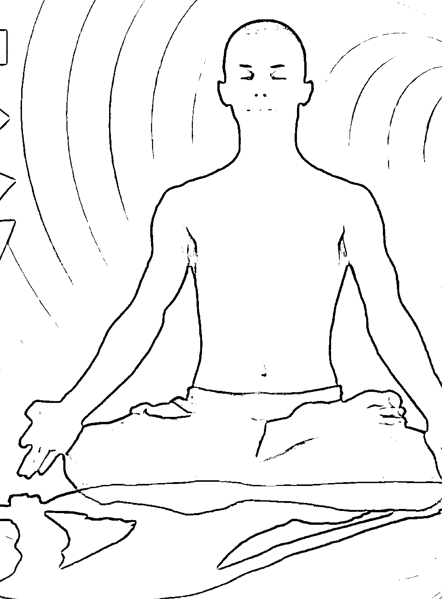

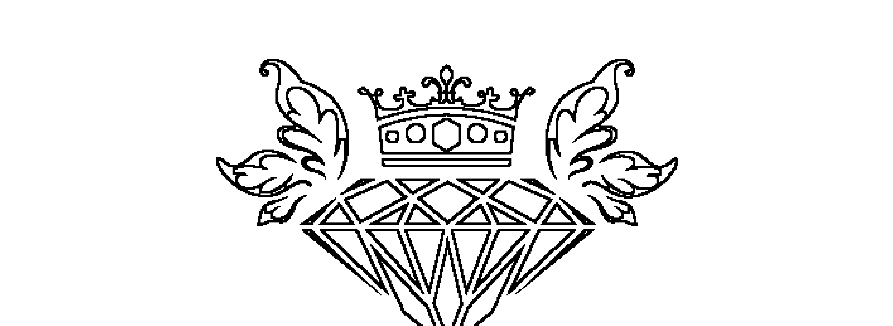

# Hi. Royal College
天使神秘学院

- 专业占卜预测机构
- 神秘学培训机构
- 水晶能量研究中心
- 神秘学资料库
- 官方淘宝：http://strc.taobao.com
- 读书交流QQ群：
  - 占星塔罗占卜师交流群：814594478（加入密码：PDF）
  - 神秘学其他综合群：659338717（加入密码：PDF）

使用手机淘宝扫一扫，获取更多好书

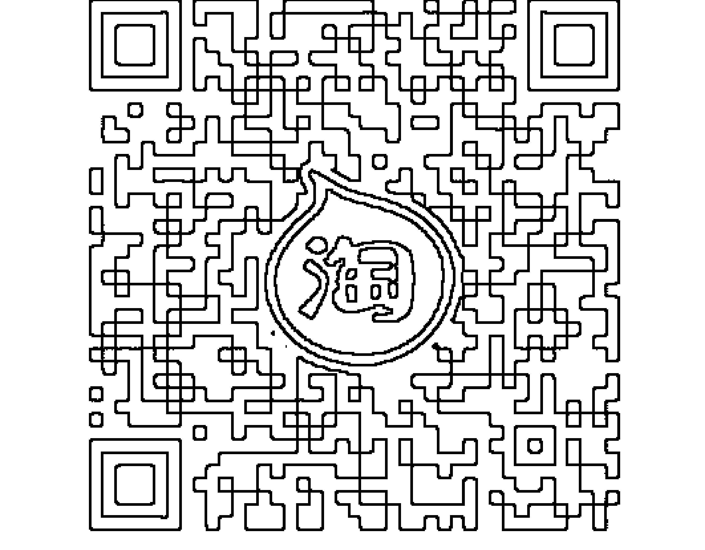

淘宝按店铺名搜索：天使神秘学院

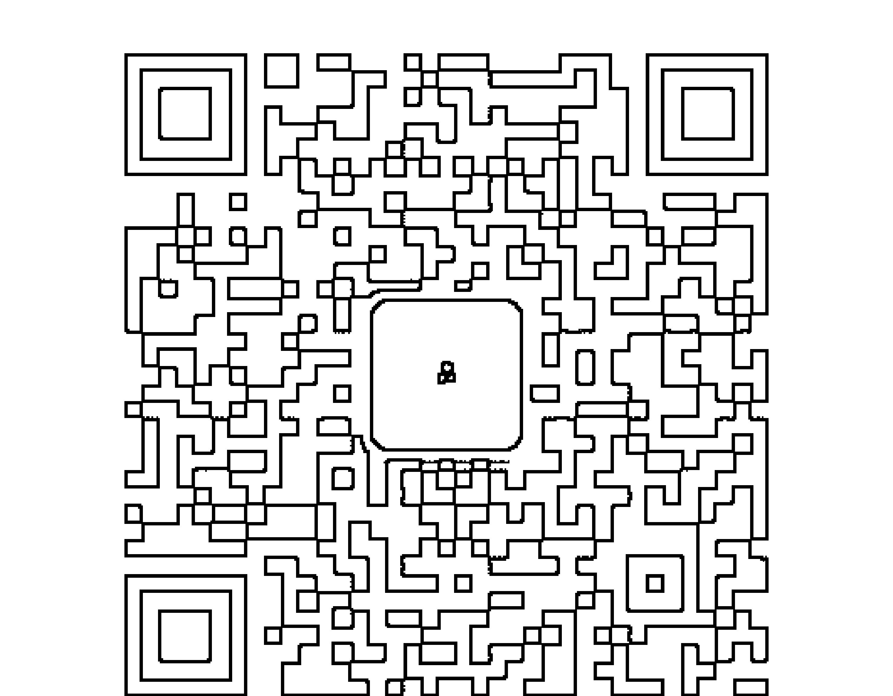

微信公众平台：strc2011

# 制作说明：

本书由《天使神秘学院》出重金从台湾购入的原版书籍扫描制作完成。为达到最好阅读效果，特地把原版书全部切开后，再经由专业扫描设备高精度扫描完成，并经过一张张的PS后期处理最终成书，其间花费大量的人力、物力以及时间，只为能给大家提供经济并优质的神秘学学习资料而努力。

本学院强力谴责某些机构和个人，把本学院花心血制作完成的电子书籍，包装后直接放在自家淘宝网上低价倾销的行为，以谋取不劳而获的经济利益。如果长此以往最终将无人愿意再为大家花心思制作电子书，那以后可能大家再无新书可读。

为让大家以后能够读到更多的好书，也为了本学院的良性发展。本学院恳请大家尽量做到如下几点：

- 一、尽量在本学院的网站购买电子书籍。
- 二、请勿用技术手段把电子书内的水印及加密去掉。
- 三、在收到电子书后小范围传阅即可，千万不要公开传播，更别挂到淘宝网上低价销售。

同时为答谢广大支持者，学院电子书将做如下调整：

- 一、学院会把一些早已收回制作成本的电子书折价销售。
- 二、最新制作的电子书籍会开放打印功能，大家购买后有条件的可自行打印成书。

天使神秘学院
2018年1月

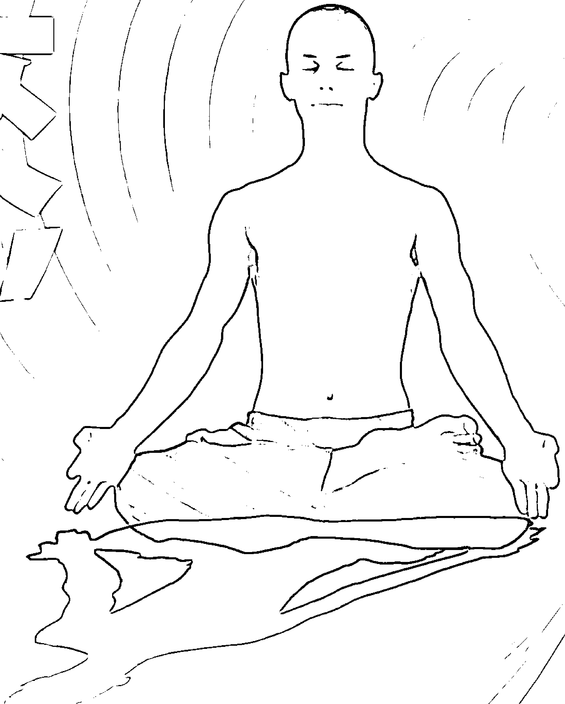

# 辟谷

# 我還可以這樣活

魏鼎 著
白藍 譯

# 以辟穀斷食為途徑的靈性覺醒之路

原書名：魏鼎看辟穀斷食

# 本書箴言

我是意識，我創生了一切。
每個人都可以辟穀，但潛能並不等同於技能。
不過我們可以努力發展這個技能。
我所建構的知識，以及我列出來的知識，一直都存在。
每個人都可以找到、閱讀並寫下來。
我所做的一切是為了幫助那些依然在尋找這些的人。

# 關於本書作者

## 簡介

一九六三年六月二日早上六點四十五分左右，我降生到這個物質世界。在我還是十幾歲的時候，就對所謂的超自然現象有著越發濃厚的興趣。在接觸感應力後，我的興趣範圍便擴大到了瑜伽、生物能量療法、靈性發展及相關的練習中。這類活動也讓我對健康飲食、（自我）療癒和禁食治療頗有興趣。

我十幾歲的時候，在波蘭，除了一些非常昂貴的複印書籍外，還很難找到玄密主題的文獻。有一些感應力組織，常常舉辦一些關於超自然的會議。為了學習和獲得更多的體驗，只要有機會，我就去參加這些會議。

一九八四年，在服兵役前（必須要服兵役），我在一個神學院待了四個月，瞭解到更多神職人員的生活，那對我來說又是一段有趣的經歷。

自一九八九年起，我做為國際輔助語言——世界語的老師和宣導者，在亞洲國家遊歷三年多。在那段時間裡，我找到了更多玄密主題的文獻，並利用一切機會去閱讀和練習我所學到的東西。我也會去拜訪旅途中路過的那些靈性發展中心。但是儘管閱讀了有價值的書籍、與「得道」的人交談、拜訪靈性修行中心，就我現在來看，我還是沒有找到我一直在尋找的東西。

現在，我知道了，我所要找的這個東西就在我自己內心，我就是它的源頭。我越深入自己的內心，就越清楚地知道，我需要的一切知識、我正在尋找的一切，甚至更多，都在我內心。而我唯一要做的就是，允許自己讓它在內心顯現。所有偉大的著名的「靈性導師」都不能給我這個我一直擁有的東西。他們只能做為訊息源，提供導向。

## 事業

一九八三年畢業後，我在肯傑·科伊伊萊 (Kędzierzyn-Koźle)（波蘭南部）的「重有機合成學院」做了一年化學工程師。在學院任職期間，我常常穿行於歐洲各國，參加世界語的會議。一九八八年我決定離開學院，去亞洲各國教世界語。

當我的足跡踏遍三十多個國家後（一九八六到一九九二年），我深深地體會並理解了那句諺語：「讀萬卷書，不如行萬里路」。沒有任何一所學校教給我這麼多的經驗和知識。

臺灣是我那次行程的終點，在那裡我開展了一項私人業務——出版公司。我出版了一本書，並以波蘭語和世界語發行了雜誌「MONO」（財富）。

回到波蘭後，我成立了一家外語學校。幾個月後，我的臺灣夫人來到波蘭，並與我定居下來。

一九九六年，我關閉了那家學校，並成立了一家貿易公司ROSPEROS。該公司的主營業務是進口電腦元件，也就是CPU升級件。升級CPU可以廉價、高效、環保地升級那些舊電腦。這對於那些經濟有限，又需要更高效電腦的人是個很好的解決方案。二〇〇五年五月我關閉了ROSPEROS公司，這也是我商業活動的終結。我最終決定將自己解放出來，把盡可能多的精力放在我的人生目標上（如下所述）。

# 經歷

從一九七九年十六歲開始，我就一直不斷嘗試和探索自己的靈性發展。決定開始辟穀生活（從二〇〇一年七月一日起）就是其中一個步驟和嘗試。二〇〇一年七月，我的家人外出度假五週。我還像往常一樣，每天辦公。為了使身體機能更好地適應這個轉變，我每天會花更多時間打坐。我原計畫在三到五週內使身體適應其功能轉變，但事實上耗時更久。大多改變對我而言並不新鮮，因為從十六歲起，我每年都至少禁食一次，來清潔和療癒身體。

# 目的

決定體驗辟穀生活後，我就沒吃過東西。然而，我後來發現，對大多數人而言，依據他們的信念，僅僅不吃東西實際上是不可能的。這就是為什麼我決定先調查研究，然後再向大家描述使人類的身體過渡到辟穀生活的方法。這就是我寫這本書的初衷。

仔細考量此事後我得出一個結論，透過試驗我可以得到最好的資料和經驗。為此觀點的自然進程，我的下個步驟就是恢復「正常」進食，使身體再次依賴於食物。因此現在，我說憑藉著對辟穀生活的瞭解，我可以為那些對此感興趣的人提供更多的訊息。

在本書第一版面世時，我還沒有決定何時開始下一次嘗試。我推遲了我最後的嘗試，試圖尋求一些可能對此感興趣的專業人士合作，如科學家、醫生、物理療師、透視者等等。

有些人對此感興趣，但要嘛僅僅是感興趣而已，要嘛出於人事阻礙而中止。

對我來說，辟穀是最方便的生活方式，給我帶來很多益處。所以儘管外界壓力日增，我還是又堅持了六個多月。然而，據我此生所擔負的使命，我還有更重要的事要做，繼續辟穀的話，有些事我就做不了。終於，我決定在二〇〇三年三月停止辟穀。

我知道我為什麼投生到地球。我知道我所肩負的使命。那些使命闡釋了這個時候我留存於世的目的。敘述如下：

我決定用一種簡單易懂的方式來解釋：讓人們瞭解組成人體某些部分的某些功能；讓人們瞭解人類在精神和身體領域的潛能；提供一些可行性方案，來提高人們的能力，以更加清醒地指導人生；展示一些有用的、可行的方案，讓身體（自我）療癒並重組身體；展示一些可行性技術方案，能使人以更清潔（符合自然規律）的方式生活；讓人們瞭解關於意識、光、愛和生命方面的訊息；讓人們瞭解人與其他生物間的溝通方式。

# 問題

而辟穀的生活讓我難達成這些目的：

- 適合身體的營養；
- 高效的（自我）療癒，尤其是對那些不治之症；
- 禁食療法的正確方法；
- 食物對身體的影響；
- 進食的原因；

# 肥胖和疾病

為辟穀生活做身體上的準備。我十幾歲的時候，就開始用我的身體做試驗。目的就是在自己身上檢驗那些理論和假設，因為我想找出真正的解決方案。後來，在我準備訊息的時候，把試驗的結果也考慮進去。這樣我就能更好地解答這方面的問題。

二〇〇一年七月到二〇〇三年三月我處在辟穀狀態。那段經歷給我了所需的足夠知識。透過獲得的知識，我能夠將辟穀生活的細節告訴每個人。雖然對我來說，辟穀生活很便捷，但是二〇〇三年三月以後，繼續這種生活將使我無法完成我的使命。所以那個時候，我感覺好像一個人走在一條路上，而沿途的其他人卻告訴我：「你可以走這條路，但你原本可以做得更多。你應該走那條路，它將與你的初衷更加一致。」

從二〇〇二年九月起，為了繼續我的使命（如上所述），我試著停止辟穀。然而，辟穀生活對我如此有益，我不斷推遲停止時間。終於，在二〇〇三年三月，生活回到原軌——停止辟穀，繼續我的使命。以下是在我在二〇〇三年三月時制訂的全年計畫：

最多增肥至一百三十公斤（二百八十六磅）。我從來沒這麼胖過，這能幫我更加瞭解胖人的身心變化。患上不治之症，如癌症、糖尿病、高血壓、心臟病等等，然後再徹底自我療癒。二〇〇四年三月，我決定結束上述試驗。我已經知道得夠多了，也不想再強迫自己承受更多痛苦。我感覺自己比試驗前預想的（健康惡化、低能量水準、壞脾氣）還要糟糕，我覺得也到了繼續我下一步計畫的時候了。二〇〇四年三月一日，我再次開始辟穀。那天，我再一次把食物從我的生活中拿走。因為我已經超重二十公斤（六十六磅），我可以明顯感覺到兩次辟穀生活方式開始（第一次在二〇〇一年七月，這次是在二〇〇四年三月）之初的差異。我把對這一試驗和一些其他試驗的描述都放進了我的網站 http://inedia.info 。雖然我的體重只達到了一百公斤，但透過增肥試驗，我瞭解了肥胖人士的很多感受。它不僅涉及日常活動（如運動限制、成癮的食慾、對高血壓的感覺），而且也涉及到禁食如何改變這樣一個人，以及此人如何完成禁食。現在我可以理解為什麼對最需要禁食（就像魚需要水一樣）的肥胖人士來說，禁食是那麼困難的一件事。透過我肥胖身體的切身體會，我意識到，對胖的人來說，禁食是多麼困難。肥胖的人更依賴食物。對他們而言，就像是戒毒，擁有堅強的意志力更有助於成功完成治療，因為在這個過程中受苦更多。

我發現並經歷了肥胖的種種情況，這使我更加瞭解人類。如果要詳細描述，我還需要再寫一本書。我知道這樣的經歷很值得。

順便說一下，請切記，這只是我的經驗之談。我的意思是，我的感受不一定與其他人的感受一樣。我所有的這些試驗只是為了讓自己瞭解更多，這是我的興趣所在，而且當人們問我的時候，能夠給他們需要的訊息。

# 使命

提升了我的靈性等級後，我知道我現在的首要任務是傳遞訊息。為此我回憶、收集、精心地準備並傳遞著以下的相關訊息：

- 意識、光、愛、生命；
- 人體的功能；
- 人體的適應能力；
- 地球以外的生命體（主要是人），及其合作／友好關係；
- 不會破壞地球的能源使用法；
- 靈性自我提升的能力。

# 與我聯繫

郵箱．jniv@resperos.com

Skype．joachimwerdin

Youtube．www.youtube.com/joachimwerdin

網站．http://inmedia.info

# 關於本書

2005 年第一版為英文版，由作者譯自波蘭文版本。

波蘭文版書名．「Styl Życia Bez Jedzenia」

英文版書名．「Life Style Without Food」

# 【作者序】致親愛的臺灣讀者

臺灣，於我此生意義非凡。
我在一九九〇年來到臺灣教世界語，在臺灣，除了教世界語、從事電腦相關業務外，我還遇到了我現在的愛妻。儘管現在住在波蘭，但我們幾乎每天都講漢語，與臺北的親友保持聯絡，之後又多次到訪。所以臺灣於我們一直都好像近在咫尺。
雖然食物是我們生來最大的「癮症」，但是，地球人類天生就有辟穀潛能。對於當下的您，如果已經決定解放自我，那麼最好遠離「癮症」。一方面這會帶給您諸多殊勝的身心體驗，另一方面卻也許會把您逼入危險，甚至致命的境地。這個選擇權在您，因為您自己創造自己。
在本書中，我要分享給大家關於辟穀的所有訊息。如果您想嘗試辟穀，想瞭解更多，那也許這本書就是為您準備的。
住在臺灣這樣一個現代、工業化的社會，您的健康會時時面臨各種侵害及挑戰。但其實要照料您的頭腦、心靈並不難，只要做出決定，堅持下去，直到悟即可，如此您就能保持身心的和諧。
但是，要和身體打交道，考慮到飲食，選擇多多，而辟穀乃是其中之一。辟穀對居於重污染之地的現代人來講頗具吸引力。工業毒素污染的食品、水、空氣及土壤無法給人類健康多少承諾，在這種情況下，一個看似極端的解決辦法可能要歸結到辟穀。但是，我並不建議您去嘗試這種生活方式——禁食或辟穀。我不做任何建議，因為我不想掌控您的生活。您自己就是創造者，訊息就在那裡，使用權在您。本書內容只是訊息，僅供參考。我也希望您之後的任何決定都是出於深思熟慮。

魏鼎

# 目錄

01 意識 / 024

真我 / 025

本能 / 029

理智 / 031

直覺 / 032

一條魚的寓言 / 034

02 人是什麼？ / 038

03 光 / 042

04 社會意識的影響 / 045

05 改變程式 / 049

06 為身體提供能量 / 052

08 身體清潔 / 062

消化系統 / 054

呼吸系統 / 058

皮膚系統 / 058

指揮系統（松果腺） / 059

09 不吃與辟穀生活 / 066

10 這怎麼可能 / 070

給思想開放者 / 071

給神祕主義者 / 072

給科學思維者 / 073

給「信仰者」 / 074

給學習者 / 075

11 辟穀緣由漫談 / 078

完美健康 / 079

自由 / 081

經濟 / 082

生態 / 084

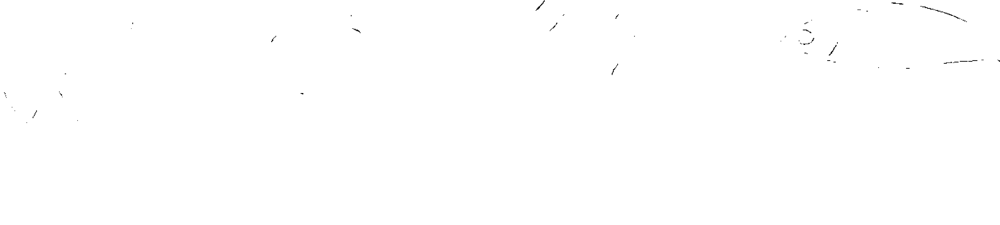

# 準備改變您的生活方式

- 生命能量 / 086
- 創造性 / 087
- 靈性成長 / 088
- 重生 / 091
- 好奇心 / 092
- 個人調查 / 095
- 家人 / 101
- 同事 / 102
- 朋友 / 103
- 癮症 / 104
- 習慣 / 105
- 飲食 / 106
- 冥想 / 107
- 靜受默觀 / 114
- 能量練習 / 119

# 辟穀方法大全

- 自然辟穀法 / 124
- 哲學理智辟穀法 / 145
- 凝視太陽辟穀法 / 148
- 煉金術辟穀法 / 150
- 意識進食辟穀法 / 154
- 屬於自己的辟穀法 / 157
- 營試辟穀法 / 140
- 交替辟穀法 / 142
- 催眠辟穀法 / 139
- 二十一天進程辟穀法 / 136
- 強迫辟穀法 / 134
- 即刻辟穀法 / 132
- 靈性辟穀法 / 131

# 禁食 & 辟穀症狀

- 恐懼 / 159
- 虛弱 / 160
- 脫水 / 162
- 頭暈和昏厥 / 164
- 噁心和嘔吐 / 165
- 體重下降 / 167

# 15

合理 / 183
隱居 / 185
不強迫 / 186
不輕信資料 / 188
單獨或不是 / 189
幻覺或異象 / 190
健康 / 191
體溫 / 192
特別注意事項 / 183
其他 / 181
關節腫脹 / 180
頭髮脫落 / 180
牙齒鬆動 / 179
發燒 / 178
感覺寒冷 / 177
皮膚變化 / 176
不同的現實 / 174
心態不穩 / 171
疼痛 / 169
消瘦 / 168

# 16

真正的身體需求 / 209
習慣 / 212
癮症 / 213
信念或擔心 / 215
無聊 / 218
決定改變 / 218
交際 / 220
味道、氣味、外觀 / 220
貧窮、節儉 / 223
強制 / 224
獎勵 / 225
接地 / 225
不進食時的飲水 / 193
灌腸 / 194
肌肉活動 / 200
恢復進食 / 201
交替淋浴 / 204
失敗 / 206
進食緣由 / 208

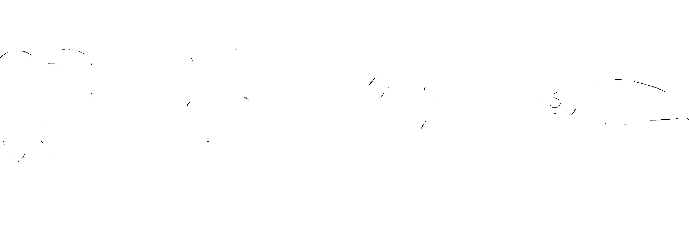

# ⑰ 禁食療法 / 228

- 乾禁 / 230
- 濕禁 / 231
- 禁食症狀 / 233
- 腸道清洗（灌腸） / 235
- 體力活動 / 237

# ⑱ 辟穀與禁食 / 238

- 體重變化 / 239
- 性情 / 240
- 建構身體的方式 / 241
- 總結 / 242

# ⑲ 生命與辟穀 / 243

- 非物質生命 / 244
- 部分物質生命 / 246
- 物質生命 / 247

# ⑳ 合作促進發展 / 248

- 致科學家和醫生的公開信 / 249
- 致媒體的公開信 / 250

# ㉑ 常見問題 / 252

# ㉒ 辟穀培訓及協助 / 263

# ㉓ 感謝 / 267

# 附錄一：世界各地的辟穀者 / 269

# 附錄二：我的辟穀日記 / 281

# 這只是訊息

這本書呈現的只是「訊息」。訊息的來源可以是「偉大的靈性導師」、「開悟的師父」、電視傳媒、書籍、網路或其他各種管道。然而「訊息」不管來自何處，都或真或假，沒有一種能給您「真正的」訊息。知識是您利用吸收的訊息，透過經驗所建立的，而訊息本非知識。核查並體驗這些訊息後，您才可以說：「我知道了。」在此之前您只是「相信」而已，並非「知道」。

相信和懷疑是一體兩面、不可分割的。若您相信某事是真的，那也必定有過懷疑。反之亦然。所以當您相信，您可能會求索，直到獲取知識。當您知道後，就不再有任何問題。知道就是知道。

因此不要盲目相信書中所寫的內容，最好是自己去發現、證實書中所寫的一切是否正確。您可以任意使用書中所有的訊息。例如：您可以親自去體驗書中所描述的，體驗之後再建立自己的知識。如果您只是盲目相信書中所敘述的，可能會因此受苦。如果您把接收到的訊息當成知識的話，那麼您只會成為這些訊息來源的奴隸。相信權威（如：明師、老師、專家）的人極易被掌控，這就是為什麼世界會存在宗教、主義、黨派、邪教以及其他組織，這些都在控制著人類及其生活方式，而且一直在發展壯大。

換句話說，我建議您先要保持獨立思考的能力，只把「靈性導師」、「公認權威」、大眾傳媒等看作訊息的來源，然後自行分析，不受他人掌控。您應該自己去權衡、體驗，因為如果沒有親身的體驗，您永遠不會知道，而只是盲目的相信罷了。

# 定義

『Breatharian』和『breatharianism』這兩個英文字都跟『Breath』（呼吸）有關。但是這兩個字還是不能完全讓我們顧名思義，所以需要解釋和澄清。當我們第一次聽到『breatharian』這個詞的時候，可能只是猜想跟呼吸有關係，不會想到『辟穀』。

對辟穀感興趣的人對這個字眼有著各種不同的定義。為了讓大家更順利地閱讀此書，此處列出一些定義：

- 不食（Non-eating），指一個人不吃任何食物，但不是禁食的狀態。
- 不食者（Non-eater），指這樣的一個人，他什麼都不吃，但不是禁食，也不是絕食。

我覺得這兩個詞彙還是不能完全完美表達真正的含義，但是它們能導正讀者的思想並引出我們正在關注的主題。

另一方面，這兩個詞好像不太好聽。這樣的詞彙會影響人們的下意識，對使用者沒有什麼利益。所以我還在尋找更恰當的字眼。

Inedia是breatharianism的另一種說法，意思幾乎一樣。

曾經有兩個詞彙映入我的腦海：『Eatfree』，從吃中解放出來；Eatfreedom指不需依賴食物維生的一種生活方式。

您有何建言？

食氣主義（Breatharianism）——這個概念是指，人類（不止是人類）有能力在不吃、不喝的狀態下生活，但空氣是必需的。

食氣者（Breatharian）——指這樣一種人，只靠空氣維生，不吃不喝，恰恰是為了讓身體完美運轉。

以光維生——這個概念是指，人類（不止是人類）有能力不攝取任何營養，而只以光維生。（在光的那一章會有詳細解釋）

以普拉納維生（Prana）——這個概念是指，人類（不止是人類）有能力只靠普拉納（一種光產生的高能量）維生。

# 進入正題之前

# 一時的狂熱

二〇〇一年初，我發現波蘭有一股潮流方興未艾（後來消退），那就是對食氣、辟穀、「以普拉納維生」、「以光維生」的狂熱，我認為這股潮流主要是由媒體掀起的。地球上其他地方不時也會有類似的潮流席捲，所以，我在波蘭的所見所聞也許同樣適用於其他地方。

假如不是盲目跟風，就不會發生什麼事。但是這股「盲目的潮流」把一些人逼入死境，弊大於利（就全域來講也是如此）。這都是由於對辟穀的誤解及無知。

不管別人和媒體如何宣傳，辟穀主要還是人提升自身靈性等級之旅的階段之一，換句話說，是自我完善之旅、意識靈性自我提升之旅的一部分。不考慮靈性的提升，而一味嘗試辟穀，很可能會對人造成傷害。

我寫書的目的之一，就是要傳達一些正確、實用的訊息：什麼是辟穀、如何施行才會更有利益、不應忽略之處、應當注意哪些方面等等。我想讓你們知道一個真相：辟穀可以做為一個跳板，進而去體驗未知世界。但這也有一定的危險性，因為這可能會讓人丟了性命。

要知道，辟穀事關靈性發展，儘管理論上來說，一個對此「毫無意識」（也不感興趣）的人，也能夠不吃不喝而活。

# 敬告

我編寫此書只是為了實現上述部分目標而已，請不要將本書當成一本辟穀指導手冊。我決定寫這本書，要達成的目標只是傳達訊息。

- 辟穀時身體依然正常運轉的方法；
- 辟穀的細節；
- 人類辟穀的能力本身。

讓身體過渡到辟穀狀態是一個複雜的過程，這需要您躍升到較高的靈性等級。此外，您最好向有經驗的人尋求建議或指導。

請記住，這個過程因人而異，所以每個人都會有一套個性化的方法，只對個人有效。有多少人辟穀，就會有多少種相應的方法。

# 自我審視

首先，請認真思考下列問題，加以分析並回答：

1.  為什麼人類吃下的幾乎所有食物都變成糞便、尿液、黏液、油膩、氣體、血液等排泄出來？這是否意味著人類這完美的有機體只是一台將所吃食物轉化為排泄物的機器？
2.  為什麼諸多疾病皆由口入，辟穀或禁食卻不會引發疾病？
3.  為什麼許多疾病（尤其是陳年痼疾）在禁食相當一段時間後自動消失？
4.  為什麼禁食成為地球上現有的最具效率的物理治療方法？
5.  在治療各種癮症（酒精、尼古丁、毒品、咖啡因、糖等）時，人體總會出現不適反應（臨床症狀），初級辟穀者也有同樣的症狀產生，為什麼兩者會有一樣的症狀呢？當戒癮者重拾舊癮，身體反應與辟穀後復食者並無二致，這又是為什麼呢？
6.  研究顯示，有些人可以不吃不喝長達幾個月甚至幾年，有些人卻在辟穀數日後死亡，這是為什麼呢？
7.  為什麼擁有相同身高、體重的不同個體，他們攝取的食物量和營養成分各不相同（每個人吃的都不一樣），而通通擁有一副健康的身體呢？
8.  為什麼有人只吃健康的食物卻常常生病，有人只吃垃圾食物卻百毒不侵？
9.  不論人或動物，在生病時都沒有胃口。這種情況下，動物會禁食，直至恢復健康；若病人禁食，也會更快康復。為什麼身體會有這樣的反應？

除了上述九點，您還有其他相關的問題嗎？

# 01 意識

請想像一個不受空間、時間及其他因素限制的事物。事實上，要運用智力去摹想人類的意識是不可能的，因為在做這樣嘗試的同時，我們已先預設了極限。為了更清楚地表達，我們將之視覺化，想像著某物，這個東西不受其存在的時間、空間、感覺、知識甚至能力，或其他您所能想像到的任何東西所限制。

意識，全知全能、無所不在，凌駕一切，意識造就了一切。所有的事物、精神、思維以及生命本質……一切的一切，皆在出現之初即有意識。所謂的意識，可以是您想像得到以及想像不到的任何東西，甚至遠遠超出想像這個範疇。

其他用於詮釋意識的字眼有：神、絕對、天意、全能、普遍精神、因緣、信條、維度精神等。根據使用者對詞彙的理解與欲表達之事，他們所下的定義可與上述諸條或異或同。如果要我以圖說的方式解釋意識，我會畫一個點，將之標示為負無限大（−∞），接著從這個點往三個維度延伸，直到正無限大（＋∞）。當然，在畫不出意識本身的情況下，這個圖只能是隸屬於意識下某物的視覺圖像化。姑且讓我們假設這幅圖裡有一個無限的存在，這幅圖使我的概念更易於理解。對於理智層次的理解，圖一表示的就是意識。

### 真我

什麼是真我？真我，是不能與理智相比較的一種虛幻（想像）意識片段。真我是意識的一部分，又存在於意識裡，正如一滴水是整個湖泊的一部分。真我與意識是一樣的，只是它們被頭腦區別看待、思考和理解。所以真我歸屬於意識的一類，它存在於意識裡，同時又以一種虛幻（想像）意識的片段出現。

真我不能脫離意識而單獨存在，意識脫離真我也就不是意識了。同樣，您可以聯想，一滴水無法離開湖泊而單獨存在，而湖泊沒有水也就不是湖泊了。

同時，真我是所有生物的源頭、本質、起因和創造者。所有生物都存在於真我之內，因為它們在真我之內被創造出來。一個生物可能感覺真我存在於自己的身體裡，或者感覺自己存在於真我之內——這些都不重要，因為真我是不受空間侷限的。

意識是無限的，沒有盡頭。不過，想像在意識裡劃出一個界限，由此一個有限的意識部分就形成了一個等級。形象一點，就是在意識中植入或者創造一個球形的界限，這個球形的區域被稱為靈性等級。

無限的靈性等級可以被人們創造出來，人們知道並且可以描述其中一些：存在、成長、本能、理智和直覺。圖二在視覺上清晰展現了這些靈性等級。

無限的意識使生活在意識中的生物不受任何限制，這樣的生物是完美無瑕的、萬能的、無所不知並凌駕一切的，而限制於一個等級內的意識，使生活在其中的生物就不那麼完美了（曾受限）。與來自較低靈性等級的生物相比，來自較高靈性等級的生物能力更高強。

礦物（代表「存在」等級）沒有植物（代表「成長」等級）的能力強。用相同的方法比較，動物（代表「本能」等級）就比植物能做到更多、知道更多，但沒有人（「理智」）的能力強。因此，就可以想像生活在「直覺」裡的生物比人更強大（更完美）。

在圖二中，同時也展示了進化（成長）的過程。一個生物的進化在於這個生物所在靈性等級的提升。例如，植物比水晶石更進化（進化更遠）；動物比植物更進化（生活在更高的靈性等級中）；而人的進化就更高一層了。

在這個過程中，每一生物在其一生中都在發展（進化）自身，因為他所在的靈性等級不斷提升。（生物生存的）靈性等級提升越高，就有能力去做、去想、去理解等等。

人的理智開發，部分界定為智商（IQ），可以在這裡做為例子來講。綜觀人類歷史，可以得出的結論是：隨著時間的推移，人在理解、說明、想像、創造、解決問題等方面的能力在不斷提高。因此我們可以說，一個普通人的理智（靈性等級）比一百年前的一個普通人更高。

另一方面，這個普通人主要發展的也僅是智力活動，還沒有能力做這個等級中不存在的事情。每個等級都是一個侷限，如果一個人停留在理智（等級），並且沒有了更多的進化（沒有超越提升到直覺等級），那麼，就不能理解超出理智等級的事物。

生物在造化的一個特定靈性等級中，利用一種合適的身體（複雜的結構）和特定的條件來生活。比如，人的身體結構比動物的更合理更先進，含有更多的水和較少的礦物質，能量結構更發達；動物的身體比植物更先進，含有較少的礦物質；而石頭則是三者中最堅硬的，因為它幾乎都是由礦物質組成的。生活在直覺（等級）的生物有著比人更精細的身體。現今，大多數的人都無法看到這種非物質的身體了。

顯然，在靈性等級中沒有清晰的界線，也沒有潛在的等級的數量限制，也就是說，沒有跳躍式的進化。生物的進化（靈性等級的提升）是非常平穩的，一個人的進化意味著其靈性等級向直覺提升的過程。

進化就是如此，沒有較好或較差，但有很多靈性等級，並且這些等級中存在無數不同的可能性，供我們體驗。究其本質（來源或根源），每個生物都有意識，都在一個特定的靈性等級中體驗著不完美，意識本身就是一種體驗。因此，可以說進化就是意識玩的一個遊戲。

我是意識，我創生了一切。

## 本能

本能由數據資料和程式組成。程式是一個精確按照既定（編寫）設置自我運行的機制，它不會思考，也沒有情緒，更不去做沒被設定（程式化）的事。

本能是對程式和數據資料的大量收集，它既不思考、深究、分析、判斷，也不創造，只是機械地運行程式和收集數據資料。

## 數據資料是：

- 由感官（有意或無意地）收集並保存在記憶中（大部分都會被遺忘的）的所有事物；
- 所有事情，例如：
  - 情況（如其他生物的行為）；
  - 因素（如氣溫、顏色、音量、空間）；
- 程式產生的結果。

在思維中有大量的程式，若沒有這些程式，人體是無法運轉的。事實上，身體是程式運作的直接產物，沒有程式就沒有身體。

## 以下是程式運作的幾個例子：

- 人可以憑藉判斷力感知和詮釋，因此可以感到飢餓、乾渴或飽食；
- 自動控制心跳頻率、瞳孔大小、出汗量等；
- 本能反應。

人類的情緒反應就是程式對數據資料的反應。例如，當您看到或聽到什麼，您可能開始感到快樂、難過、悲傷、喜歡或焦慮——這些都是外來因素（其資料就是：看到或者聽到的）對服務於人的特定區域的程式造成影響而產生的結果。又如：您一個人平靜地待在家裡，不料有人敲門，開門看到的是您深愛的人，他／她吻了您並對您甜言蜜語，此時的您會有什麼樣的情緒？再如：平靜的您進入一間屋子，有人立刻對您大喊大叫並侮辱您，此時的您又會有怎樣的情緒？第一個場景中產生的情緒不同於第二個場景中的，除非這個人可以完全控制住自己的情緒。簡言之，在這種情況下，運行程式對特定的數據資料產生了特定的反應。

能夠以您自己的意願來控制並體驗自己的情緒，是您在靈性發展道路上的一個成就。

當您能控制自己的情緒時，就可以決定在任何時候感受快樂，那麼您就能保持在這種狀態中，直到您想有其他的轉變，比如傷心。

如果您還不能控制自己的情緒，不同的因素（如其他人對您的態度）可能都會對您的情緒造成影響，就像狂風吹動樹葉一般。不過……那又能怎樣呢？

# 理智

理智按照以下方式運作：首先引出一個問題，然後謀劃、計算、分析、嘗試、計畫、解決等等，以不同的順序直到最終得出一個答案（解決辦法），而這個答案可以包含下一個問題。從發現問題的那一刻到找到答案的經過就稱之為時間。時間只存在於理智中，理智不能單獨存在，因此可以說，時間與空間相似，都是理智的一個幻覺。

理智發現並創建了一個兩極世界，其中任何事物都有兩面，即某個事物及其對立面存在於同一時間裡，例如：問題與答案、好與壞、明亮與黑暗、冷與熱、容易與困難、希望與懷疑、男人與女人、完美與粗糙、愛與恨。理智創造的東西還有：回答問題；在想像中建構以前不曾存在的事物；從記憶裡（也就是從直覺的資料庫裡）或者從感官上修飾某事物。

理智與直覺相反，它不計算數據資料（即它不會記得），它只會思考（重新安排並創建新的資料）。

# 直覺

直覺無所不知，它自行思考、創造或搜索。直覺沒有疑問，即使出現問題，答案也會同時出現。事實上，在直覺裡根本就不存在時間（連同其他的幻覺），也就沒有「時刻」之說。時間、空間和兩極世界都只是較低的靈性等級——理智的產物。因為理智是較低的靈性等級，所以它不能夠理解直覺，也無法解釋直覺的運作方式。

直覺包含理智，因此直覺能理解理智。同樣，理智包含並理解本能，反過來卻不成立。所以做為地球上理智代表的人類可以理解並說明身體的運轉，或者動物的行為。也可以說明為何動物無法理解人類，例如，讓動物求解一道數學題或者說明抽象的事物是不可能的，因為牠們處在比理智低的靈性等級。

# 讀者札記

現在，您也可以明瞭人（主要是生活在理智等級）無法理解天使和其他靈性較發達的（主要生活在直覺裡的）生物。事實上，雖然人們不瞭解他們，但他們就像人瞭解和愛護動物那樣瞭解和愛護人類。

因此，如果一個人試圖向另一個人說明來自直覺等級的事物，那只能哲學化。此類談話就好比一頭牛試圖向另一頭牛說明人類理智的功能。

所以，當繼續以此試圖說明直覺時，我想補充一點，直覺也充當著人與真我的紐帶或入口。

# 02 一條魚的寓言

首先，我要講一則寓言或（從不同角度）一個真實的故事，做為後面描述人類的序言。

從前，我有一條魚，我便決定體驗一條魚的生活。怎樣成為一條魚？牠都做些什麼，又為什麼那麼做？牠有什麼感受？能辟穀維生嗎？牠又感受到何種情緒？我很想知道這些問題的答案，我既好奇，又想找點樂子，因此我決定一探究竟。

首先，幾個月裡，每天我都花數小時跟魚待在一起。我以不同的角度觀察牠，並從中發現了很多，也學到了很多，甚至可以做為魚類專家來寫一本書了。我觀察了魚生活中的一切可能，雖然有人以前告訴過我，但這是我的切身經歷。

從對魚的觀察中我學到的僅此而已，僅憑觀察無法解答我大量的問題，如：魚是怎麼看這個世界的？牠是怎樣感受游速引起的摩擦力的？對我來說，其他人告訴我關於魚會有這樣的感受，那只是他們處在魚體內的經驗之談。如果我自己不去做，我將永遠無法知道真正的答案，畢竟真知從實踐中來。

因此，那時我便決定去體驗魚的生活，並為此進入牠的身體。就身體來說，我是一條魚。我好像可以透過自己的皮膚來感覺所有那些我以前好奇但無法知道的東西，也可以體驗人們試圖解釋給我的那些事。現在我終於知道一條魚的感受了。實際上，在那個時候，我不應該說我完全明白如何成為一條魚。事實是我在魚的身體裡，而我也明白我並不是一條魚。我體會到了所有透過觀察和身體感受得到的事情，但我對魚的情緒仍一無所知。沒錯，情緒才是魚生活的實質。當一條梭子魚慢慢接近，要吃牠的時候，這條魚做何感想？當另一條魚吃掉自己的幼崽時，這條魚又做何感想？

我怎麼才能體會這條魚的整個情感和心理生活呢？那麼，僅僅存在於牠的體內還遠遠不夠，因為我知道我不是魚，那只是我玩的一個遊戲。當我在玩的時候，我知道那只是一個遊戲而已。

別人告訴過我魚的情感和心理生活，但對我來說那也只是訊息而已。所以我決定親身體驗這一切，自己尋求這些答案，而不僅僅是道聽塗說。我有一個選擇，就是進入到魚的身體和思想裡，並且拋開「自己不是魚，只是玩一下」的想法。

我做出了那個選擇，在不知道自己不是魚的情況下度過了魚的一生，只有在此之後才完成魚的生活體驗。所有的這些觀察、身體感覺和情感經歷構成了完整的體驗。只有在完成所有這些體驗後，我才可以說自己知道了魚的生活（因為我經歷過）。

現在，我可以把這個解釋給別人聽，就像過去別人試圖解釋給我聽一樣。然而，我知道，那些沒有這樣經歷的人是不會明白的。更甚者，有人會說我撒謊，會要求我給出證明。我如何向他們證明我所經歷的一切呢？他們又沒有這樣的經歷，也並不對此抱持開放的心態，因為他們只是想看看或聽聽而已。我知道他們不可能理解我，因此我也就沒有打算要說服他們或多餘的證明什麼。我所能給他們的只是一些訊息，而且如果他們願意的話，可以自己去體驗。

透過這則寓言，我描述了人是什麼，在這裡做什麼。

此生為人，您在某種程度上已經知道了人做什麼，有什麼樣的感想。在明確好了即將體驗的經歷後，

人以一種選定的形式（身體）和環境（空間的位置、生活方式等等）來體驗生命。
人並不知道自己不是一條魚，只是用魚的思想和身體去體驗生命，或者叫做玩遊戲。

# 讀者札记

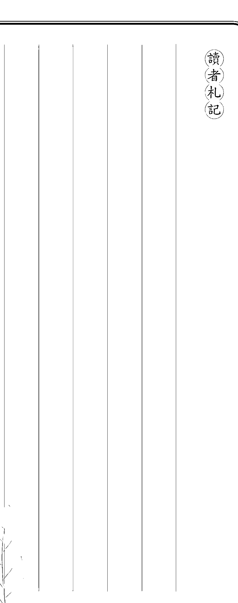

# 03 人是什麼？

圖四從視覺上大概展示了組成人類的元素。其他很多生活在地球以外的生物也適用於類似的圖示。圖四中沒有包括所有的元素，也沒有顯示出內部和外部的聯繫，因為它們對目前的主題而言並不重要，而且這些元素間相互關聯的位置與實際的位置並不相符，因為一個元素生成另一個元素，一個元素則包含在另一個元素內，就如同靈性等級一般。為了使正文內容清晰明瞭，我選了這個簡化的排列。圖五中顯示的結構更詳細，但也過於粗糙，無法涵蓋所有的細節。

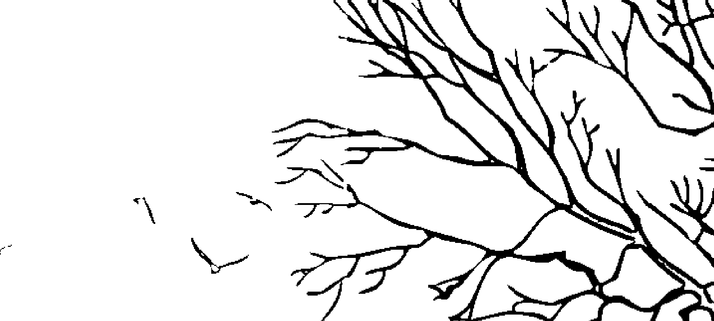

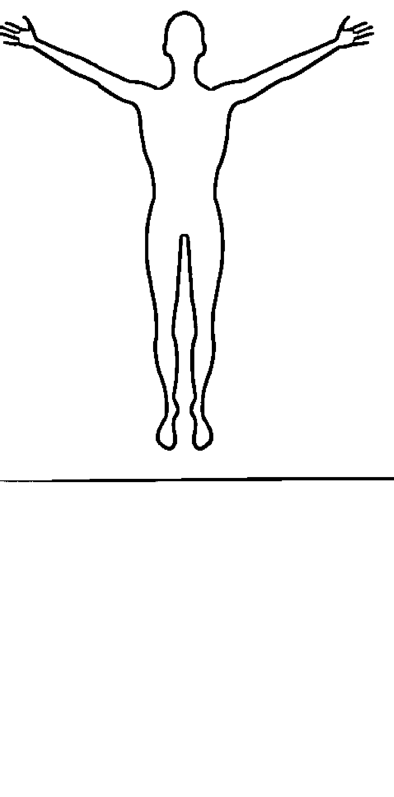

真我是中心，是根本，是最初的緣由，是本質（也可用其他的表達方式），同時也是人類所有元素的創造者。真我是一種想像的、（彷彿）獨立的和被分開的意識片段。同時，真我本身包含了所有構造人類的元素，因為所有這些元素只存在於真我的頭腦中。

由於真我是一種想像的意識片段，那麼它就有了意識的所有屬性，比方說，真我是無所不能、無所不知的。因此，您會問自己，真我擁有、知道並且能夠做任何事，都這麼完美了，它還想要什麼呢？當然，理智（一個受限的靈性等級）是不能夠明白的。

真我想要什麼呢？其實很簡單：只在玩一個真我自己創造出來的遊戲而已。由於真我擁有、知道並且能夠做任何事，它什麼都不需要，因此，它可能就會選擇玩遊戲。
這個遊戲就是「體驗」，並且，為了大獲成功，應該看起來像是真的。事情和情境看起來越真實，那個遊戲就越成功。真我是可以透過設定限制條件來製造這樣的環境，也就是透過創建一個適合遊戲條件的靈性等級。
在「體驗地球人生活」的遊戲中，真我創造了下列適合體驗的工具：

- 1. 涵蓋直覺、理智和本能的大腦。
- 2. 十分精密的結構體——身體，實際包括了物質（有形的）身體和更多的被稱為「身體」的元素（細節在此並不重要）。
- 3. 體驗必備的環境和條件（如在地球上的一個小鎮居住。

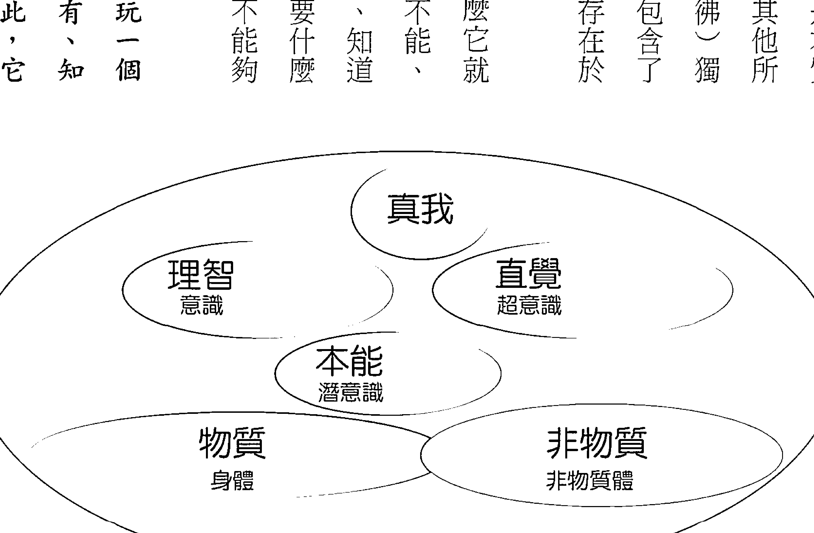

圖五：人——較詳細的圖示

創造出所有必須的元素後，真我就去體驗「一個從不完美到完美的進化」或者「靈性發展」的過程。這是一個十分有趣的遊戲，一個人本質上是完美的，卻不知情，且認為自己是不完美的，因此會為了完美而奮鬥。

>「我是意識，我創生了一切。」——現在您明白此書的主題從何而來了吧！

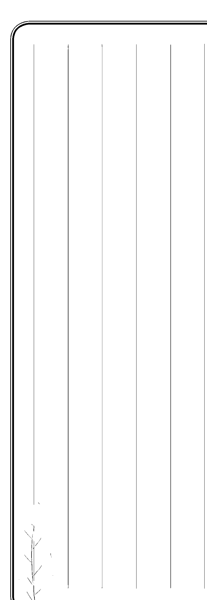

### 04 光

「以光維生」、「活在光中」、「以光為滋養」等等的說法從何而來？是什麼意思？您知道嗎？這個光究竟是什麼？從我之前的描述中，您知道了什麼是意識。那麼現在，就請想像某個完全不存在意識（甚至是完全相反）的東西，我們稱它為「意識的完全不存在」（簡稱無意識）。當然，正如讓您想像意識那樣，想像無意識也是不可能的事，因為即使是試著去想，也會限制它的無限性及不可想像性。這就像是要把無窮大畫出來那樣沒有可行性。當我在理智層面解釋無意識時，我指的是完全的黑暗。當意識在這種完全的黑暗中出現的時候，就會出現一道被稱為光的光線。換句話說，就是當意識出現在無意識中時，旁觀者可以把這個過程描述為一道光線。因此，光就是意識的顯現。
所有的物質都是（受限）靈性等級的顯現，靈性等級越高，物質顯現的光就越強。
此刻，您就明白了所有的人和其它眾生都以光維生，光創造並維持著生命。當您感受到這個過程的時候，您就感受到了愛。
光和愛是意識的顯現，換言之，就是在無意識中的意識表現，說的都是同一件事。不同的不是問題本身，而是感受它們的方式。光是所見，愛是所感。
因此，您已經是以光維生了，實際上一直都是如此。如果您的目標是以光維生的話，您只要如此感覺就對了。
只從理智層面來理解是不夠的。但是，一旦您感覺到了它，就會知道並使它成為現實。這樣，您就會明白自己就是自身生命的創造者。
現在，請您閉上雙眼，完全放鬆，往前看，並感覺那完全的黑暗，看一會兒之後，您可能會看到光。一旦看到光，就請將注意力轉移到您的感覺上。您感覺到了什麼呢？是愛。告訴自己並深深感受：真我就是意識，是光、是愛，是生命的泉源。

# 讀者札记

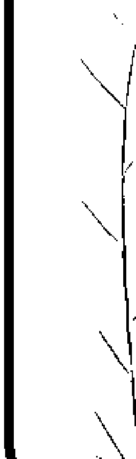

# 05 社會意識的影響

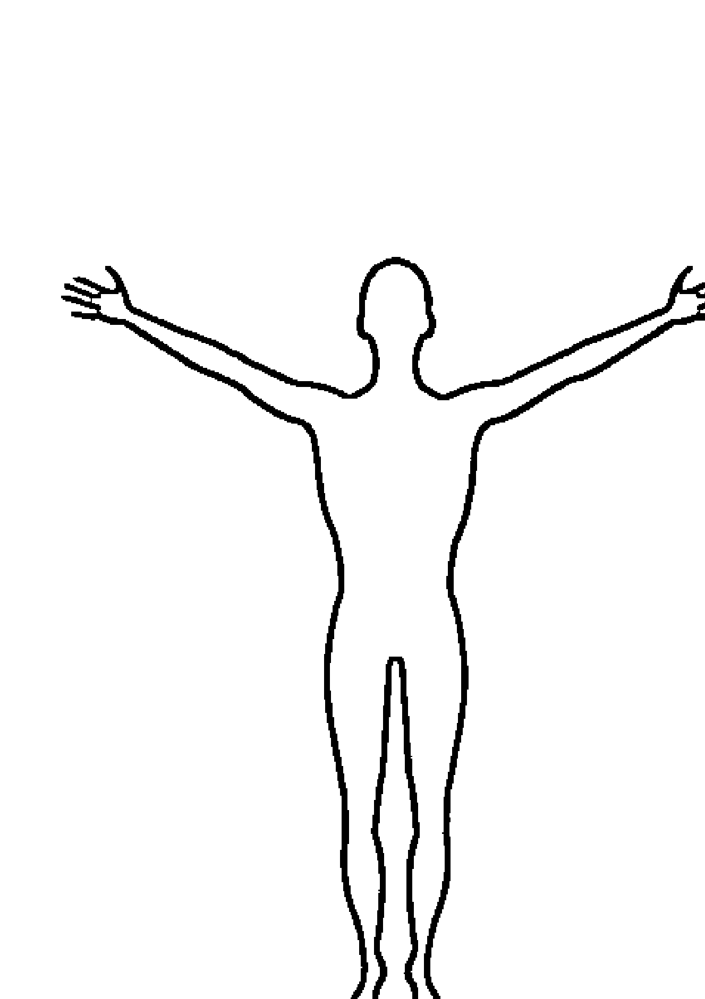

當我第一次嘗試辟穀的時候，我的妻子就說：「你這樣做違背自然。」我突然意識到她的話很有道理。為何這麼說？在我給出答案前，請先思考以下三種情況。

一、若一個嬰兒出生在一個飲食社會中，會從出生的那刻起就需要食物，必須給他餵食，否則當長時間得不到食物的話，身體就會停止運轉（死亡）。那麼，不給嬰兒食物就違背自然。

二、若一個嬰兒出生在一個飲食社會中，但其父母親都是辟穀者（而且不是強迫自己辟穀的人），那這個嬰兒對食物的需求量就會比上一個例子中的少。

三、若一個嬰兒出生在一個辟穀的社會中，那從生命的一開始就會拒絕進食。那這個嬰兒就不應該攝取任何食物，給他餵食就是在違背自然。您應該可以猜出原因了吧！是嬰兒本能的程式造成這些差異的，而這個程式掌管著人和食物的關係。

從受孕那刻起，每個人的觀念都會受到社會意識的影響。對於子宮中的嬰兒，母親對其本能影響最大，其次就是父親和其他家庭成員，以及與母親經常待在一起的人。如果他們都是一「正常」飲食的人，那就不要期望未出生嬰兒的本能程式會與他們有什麼不同。因此，嬰兒在子宮中的整個孕育過程所受到的影響，使其生物特徵與周圍的人十分相似，他的飲食習慣早在子宮中就形成了（不過日後是可以改變的）。

出生後的整個生長期都有著相似的過程。直到長大成人，飲食都要取決於所生活的社會的影響。

一個新生兒有著使其身心正常運轉的完美的本能程式設置，這些程式構成了他的天性，違反這種天性的行為就會導致身心失調，甚至是死亡。

結論其實很簡單：下次您如果想以一個辟穀者的身份出生在地球上，那首先就要選擇適合此種情況的父母親及社會。

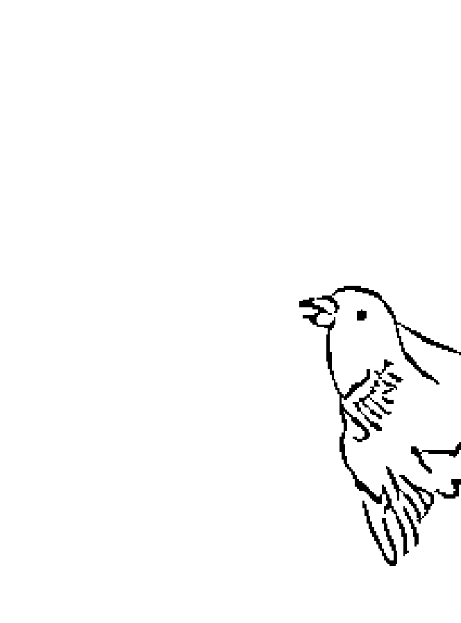

# 05 社會意識的影響

社會意識並不限於父母及周遭人的影響，還有教育、環境、顏色、聲音、溫度、所食物、遊戲等方面的影響。所有這一切，甚至更多，不斷修正著人的本能。您可能會想到，對一個操縱者而言，社會意識的影響是一個多麼有用的工具。在一個有選擇的社會，掌握一個特定刺激（資料）的反應機制（程式化的答案），某種程度上更易於操控人（主要是他們的情緒），以致於他們的想法、言詞和做法都會與操縱者的期望一致。人們心甘情願地精確執行著操縱者期望的事。本能是程式，操縱者是知道怎樣給人編寫程式的程式師。人並不能感覺到這一切，反倒對操縱者的工作充滿感恩。往往參加投票的人就是很好的例子，同樣包括廣告、商品包裝、店鋪裝置（音樂）或者辦公室的佈置、政治家和記者的聲明，諸如此類。傾聽並感受他們在您內心喚起了什麼，什麼樣的情緒？您認為這是巧合嗎？當您有更多自主性的思考，做事就越清醒，也越會關注社會意識——當您越多地發現潛意識的存在，就會越明白它對人類的思想、言詞和行為有多麼強的影響力。那麼，您就是在獨立思考了，而不是按照本能的模式思考。然後，您的行為就會越來越獨立，慢慢成為一個更獨立的人。然後您就可以控制自己的情緒，而不是由本能設定，對特定的刺激（資料）總是做出反應。

請注意，如果不能瞭解或者控制自己的本能——即掌管飲食的那些程式，就不可能辟穀。這樣的人仍然受制於自己本能的程式。

# 06 改變程式

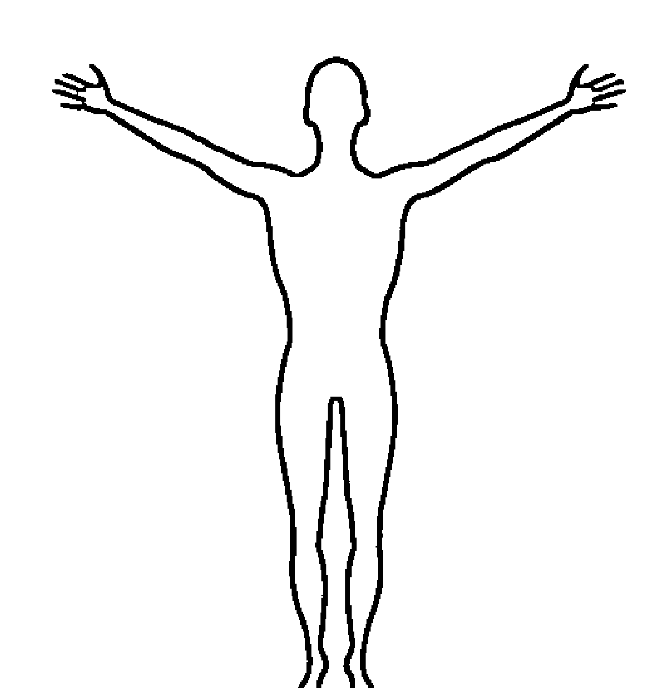

意識可以創造物質（包括身體），而本能是意識的一部分。身體的運轉完全依賴於本能，本能的另一項工作就是決定身體與外在物質（包括食物）的關係。

一個「正常飲食」的人，其本能有一套管理關乎飲食流程的程式。對一般人而言，我想要沒有必要去解釋它是如何運作了。

知道了這麼多有關本能的事，很容易就可以得出結論：要想成為一個辟穀者，主要任務就是去改變有關飲食的運行程式。

對地球上的一般人而言，程式運轉的結果可以描述為以下幾種：

如果在恰當的時間，以合理的量，透過消化系統攝入正確的物質（定義為「食物」）——身體就能正常運轉。但是如果某些事情發生變化，例如：攝入的量大減或者時間不對——身體就不能正常運轉，在極端情況下，生命機能會停止運轉。

因此，身體要擺脫定時定量的飲食習慣，就必須按照以下步驟修改其程式。不管是否有東西攝入，也不管攝入的時間和量——身體都能正常運轉，其本能可以繼續保持身體正常運轉的人被稱為辟穀者。

一個傾向於改變飲食習慣，但還沒有決定辟穀的人，可以透過改變程式達成。只是攝取植物性食物，身體依然能夠正常運轉，這樣的人為純素者。另一個人可能會想要做些別的改變，比如改變控制其身體結構和運轉的程式，以達到：在恰當的時間，只喝適量的果汁或蔬菜汁，身體依然可以正常運轉，這樣的人為汁食者。

如何改變程式運轉的方式？如何刪除我已經決定去除的程式和資料？如何建立新的程式和資料？

實現的方法有想像法、催眠法和暗示法。

# 讀者札记

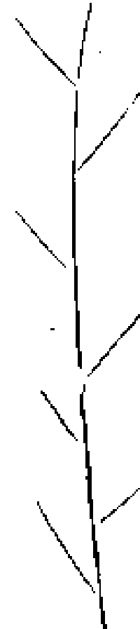

# 07 為身體提供能量

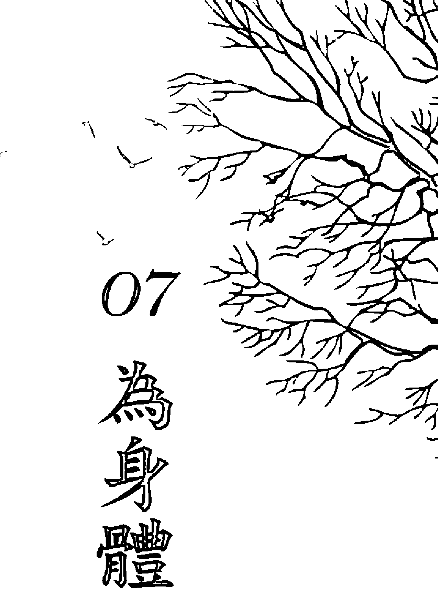

簡言之，從機械、能量和化學層面考慮，人體是由至少四個系統同時提供能量運轉的：消化、呼吸、皮膚和指揮系統（松果腺）。

如果能夠畫一個圖來描繪各系統為地球人類的身體提供能量的百分比，我會這樣來分配：

- 消化系統約佔百分之二十；
- 呼吸系統約佔百分之四十五；
- 皮膚系統約佔百分之三十五；

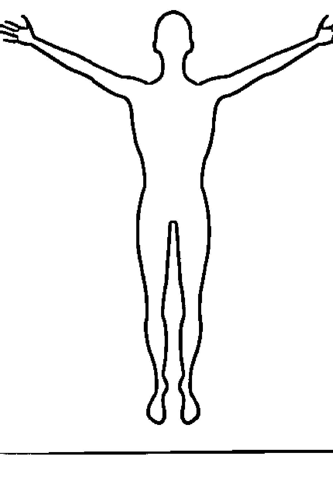

指揮系統約占百分之一。總數是百分之一百零一，因為是估計的數字，也是由於不同的人比例會有很大的不同。您可以將上述配額當作概數，做為這些為身體提供能量的各系統之間關係的圖形標記法，而不是把它們當作科學資料。除此之外，隨著一個人生活方式的轉變，這些比例也在不斷改變。例如：不飲水的辟穀者，其消化系統為身體提供的能量為百分之零，而指揮系統則為百分之一到一百。而如果是經常做呼吸訓練、曬太陽，還吃得很的人，這些比例又不同了，大約是：皮膚百分之一百分之四十五，呼吸百分之五十，飲食百分之一，其餘的就是光（普拉納）直接轉化為物質所佔的比例。您可能有過這種比例變化的經驗。當您花更多的時間做靈性練習時，就會吃得較少。您做哈他瑜伽（Hatha Yoga），其他能量練習或長時間待在陽光海灘的時候，也差不多會如此。與陰冷的冬季相比，人們在陽光充足的夏季裡往往吃得更少。從中很容易得出結論：當身體的指揮能量系統得以充分發展時，不僅不需要食物和水，甚至連呼吸、光照和溫度都變得不那麼重要了。我將簡單地描述一下人體的能量系統。

## 消化系統

它將攝入的固體和液體物質（一般被稱為食物）轉變為營養或養料，它使人透過看、聞和品嚐而感到滿足，而這種滿足感主要還是在填飽肚子之後才有。在進食之後，飢渴感便會消失不見，這是典型的癮症行為。

這就是對攝入的物質如何建構身體，並為其提供能量的一個普遍「科學」的理解和闡釋。

就是把攝入的食物分解（透過消化液和酶）為簡單的物質（主要是化學合成物，如葡萄糖、氨基酸）。然後，身體就用這些東西合成（建構）自身所需要的物質並提取生命能量（用於活動、思考、保持體溫等）。

因此，就能量而言，可以把身體比作一輛汽車或火車頭，需燃燒燃料來提供能量，使整個機器運轉。

一些人懷疑是否所吃的麵包或所喝的果汁可以建構人體，並可以燃燒（就像煤或木頭）轉化為能量。為什麼不同的人吃的食物在成分和數量上有很大的不同，身高和體重卻十分相似。

即使這些人日常生活（環境、工作、體力活動）差別很大，也是如此。

另外一個真實的例子，一個重一百二十公斤的男人一天只吃兩片麵包、喝兩杯咖啡，但體重並沒有減輕。同樣地，也是一天，他的同齡人吃了六條麵包、兩根香腸、半升牛奶、三升啤酒，體重也沒有變化。

杯茶、餅乾、水果和其他一些食物，但仍然很瘦。他們一樣高，運動量也相近。您也許會給出更多類似的例子。如果不能，那麼帶著這一問題，觀察四周並在人群中間進行比較，也能探個究竟。這樣的例子說明：所吃食物的量、成分與體型或人生命能量的多少之間並沒有絕對的關聯。為什麼會是這樣呢？如果進食量越大，就能給予越多的生命能量的話，那麼吃得越多的人應該越是精力充沛才對。甚至還有被稱為是「能量」食品的東西（控制人的有效工具）。一定量的油脂包含很多熱量，牛奶就含有較少熱量，而蔗糖含有較多熱量等等。但為何比起喝同量的果汁或水，吃越多的糖與脂肪會使人感覺越糟糕呢？為何一頓飽餐之後，人往往都會又悶又乏，而不是充滿能量？自孩童時期開始，我們就一直被灌輸這樣的概念：「吃得越多長得越壯」。遺憾的是，它欺騙了孩子們，使他們在今後的人生道路上備受疾病、衰老和早衰等的折磨。順便提一下，對孩子最嚴重的傷害之一就是逼迫他們吃東西。緊盯著孩子，確保他們把盤子裡的東西都吃掉，卻是害了您所愛之人的身體，這尤其會導致孩子身心結構難以挽回的改變，這種改變會對其一生的身心健康造成影響，壽命也會因此而縮短。簡言之，在孩子不想吃的時候強迫他們吃，會傷害他們的身體。

請讓您的孩子自己決定吃不吃，別擔心，他們不會餓壞，也不會撐壞（除非早已內置了這樣的程式）。您只需要保護他們遠離毒素，如甜品、炸薯條和所有煎炸、煙燻或燒烤的食物，而且也要遠離所有動物奶及乳製品。回到上面的問題——答案既簡單又令很多人震驚，那就是，所吃的食物並不會給身體帶來任何能量，而會帶來相反的效果，它會強迫身體耗費能量來分解、中和及排泄所有攝入的食物。沒錯，身體是靠自身的能量轉變及排出那些被主人塞入消化道的東西。另外一個答案也是驚人的：所吃食物並不能建構人體細胞，只是對其如何建構和如何運轉會有影響，但並不是建構。身體並不是從所吃食物中直接建構細胞的。身體如何處理所吃的食物呢？如果身體正常運轉的話，它會將食物完全去除，透過糞便、小便、汗液、唾液、皮脂、血液、呼吸、毛髮、指甲和表皮，去除那些多餘的、有毒的物質。但是如果身體出了問題（這在當今文明社會很正常，換句話說，幾乎沒有完全健康的人），那它就會以不同的方式處理部分所吃食物。部分所吃食物被儲存起來（如脂肪、糖元），其餘部分被擱置一邊，等日後再清理（比如重金屬，需要更多的能量才能清理掉）。人體像是一台機器，製造並排出污染環境的廢物，此種行為遵循了自然變化的規律。人吃得越多，生命能量就越少，老得越快，並且身體也會越早地衰亡（被殺死）。每台機器都有停轉的時候，人體也不例外，除非……

繼續說，這些吃下去的東西都到哪兒去了？它們會被分解為不同的化合物，然後進入血液中，並在整個身體中循環，直達細胞。每一個被如此創造的化合物都包含資訊，而這些資訊又會影響到細胞的工作。細胞會受到來自於所食物質的資訊的影響。資訊是一種影響細胞的程式，當細胞受到這樣的程式影響時，就能製造出生存所需的物質，如蛋白質、礦物質、水。

在這個問題上，直達細胞的化合物（來自於人所吃喝的東西）扮演著催化劑的角色，會引起特定的反應，這就是為什麼人的外貌及行為依賴於所食用的物質。直達細胞的物質是導致對生活有利或不利反應的催化劑。不利資訊（由毒素所致）越多，細胞死亡就越快。

人體的正常運轉每天需要數以千萬計的化合物和化學元素，且個個的量和時間都要恰到好處。如果身體沒有在恰當的時間適量攝取這些物質，就開始運轉失常了——這就是疾病。

這會使身體更快凋謝（死亡）。

您認為您自己可以在對的時間以適當的比例把所有這些物質供給身體？這幾乎是不可能的。值得慶幸的是，身體可以直接從光（或其他物質）中合成所需要的物質，但前提條件是：不受人的干預。

## 呼吸系統

這個系統，是透過肺供給身體氧氣，並去除物質轉變中產生的氣態物質（主要是二氧化碳）。肺的另一個重要任務就是，供給身體普拉納。普拉納被定義為建構物質的基本模組，甚至是實現原子的最小粒子的生命都需要這種基本模組。根據原始定義，普拉納與光相同，但是透過更為細微的分析得出，其實普拉納是光的一種產物，是光的自冷凝作用的最初產物。事實上，普拉納無處不在，透過肺吸入體內，身體才可以存活。沒有普拉納，人是不可能生存的，除非……（那就是另外一回事了）。瑜伽裡最為熟知的就是呼吸練習。透過正確的呼吸，供給身體更多的生命能量。如果能正確地做這些呼吸練習，就會有療癒身心的能量。在禁食和辟穀期間做些呼吸練習是很有益處的。

## 皮膚系統

皮膚系統，是人體最大的器官，就像肺一樣，它也呼吸，並與其有著相同的任務（氣體交換及吸收普拉納）。除了這些，皮膚還吸收太陽光，因此這是身體進行光合作用的地方。

皮膚為身體合成維他命D等一些物質，它也是一個檢測儀，對溫度、濕度、黏稠度和輻射進行檢測。很多氣態和液態物質透過皮膚進入體內，這與腸行使的功能相似。有了皮膚，身體才能去除許多過量的物質，因此它也是一個排泄器官。那些使身體有特殊氣味的氣體、汗液、黏液和皮脂都是含有毒素的物質，都是透過皮膚排出體外的。綜上所述，我們可以推測出，把化妝品（乳液、洗髮精、唇膏、蜜粉）塗在皮膚上，就會被身體吸收。然後透過血液在體內循環，毒害身體，並給清潔系統增加了負擔。往往它們也存留於體內，在幾年、十幾年或者更多年以後，使身體發病。因此，在您使用任何化妝品前，請先仔細考慮一下。例如，如果您想用一種洗髮精，那種喝下去之後身體不會出現任何不良反應的，才是可以用的。乳液也一樣，如果它不是可消化的，也不宜塗在皮膚上。

## 指揮系統（松果腺）

松果體是一種接近頭部中央位置的內分泌（激素）腺體，人出生時它最活躍，到成人時就會逐漸萎縮為豌豆粒大小，常識認為人長大後它的作用就非常有限了。這裡我要補充一點新奇的訊息：松果體是人體唯一不會得病的部位。

成人松果体的实际尺寸（未萎缩的）和乒乓球大小相当。假如是这种情况，它会十分活跃，赋予人们很多能力，常被视为神迹的能力，如：心灵感应、更大范围的感知力、不吃、不喝、不呼吸、不受温度影响、穿越时空、身体外形和密度的变化。

灵性和心理的练习会使松果体更大、更活跃。透过电脑断层显影对一些辟谷者进行的测试显示，他们的松果体几乎是普通人的两倍大。

透过指挥系统给身体提供能量，与直接由光（普拉纳）创造组成人体的一切相似。松果体越是活跃，身体就越不需要其他来源的能量供应。

在物质世界中，松果体类似于一个人灵性等级高低的影像（映射），而且其活跃度也决定着所谓的超感知觉（非物质感官）的表现。当松果体得以充分开发后，其感知力会大大增强，因此也就不再需要身体的其他感官了。在这种情况下，一个人即使又聋又盲，看到和听到的却比正常人多得多。

值得注意的是，不要人为刺激松果体的生长，其成长与脑垂体的成长是密不可分的。

这两个腺体在功能上相辅相成，所以最好是它们能一块发展（生长）。

总之，松果体的形状和活跃度，会显示一个人直接用光创造身体所有原子和生命能量的能力有多强，也就意味着供给身体能量的能力有多强。

## 讀者札記

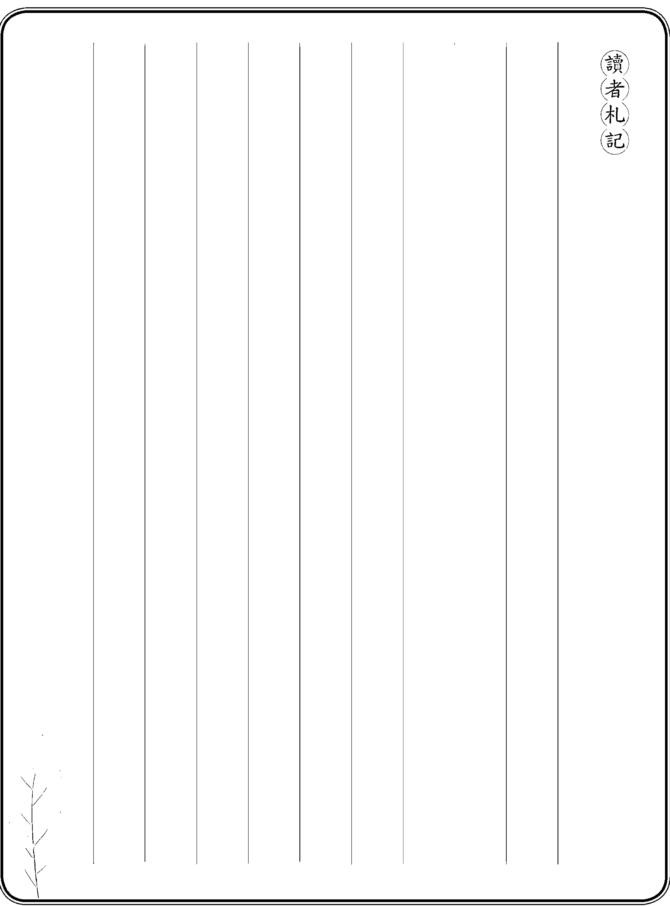

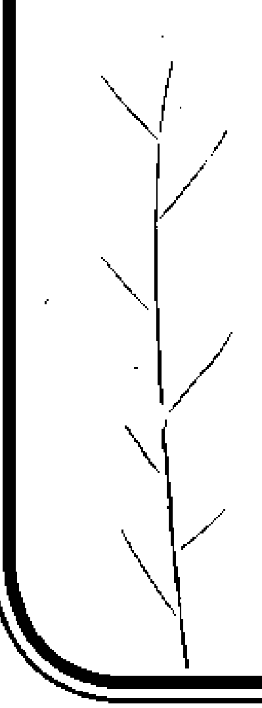

## 08 身體清潔

人體有著精密的清潔系統，透過糞便、尿液、呼氣、鼻涕、皮脂、汗液、血液、淋巴、淚液、毛髮、指甲和表皮（剝落）排出多餘和有毒的物質。人體可比作是一台排出廢物的機器，這些廢物大多源於人攝入的食物。

人體這台機器的運轉對自身的清潔系統極具依賴性。如果身體徹底清潔了，不會積壓任何東西，身體就能正常運轉。但是如果身體不能夠轉換和清除被塞入體內的大量物質（此類事情最常發生），那它們就會在體內累積下來，比如，肝糖、皮下或肌肉組織間的脂肪、囊腫內未知黏性物質，及骨頭、骨髓或腦部的重金屬化合物。

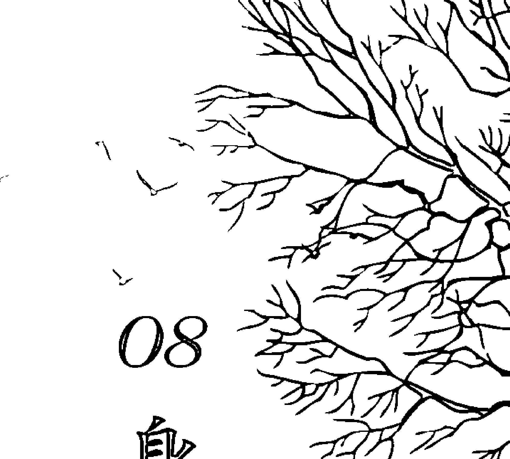

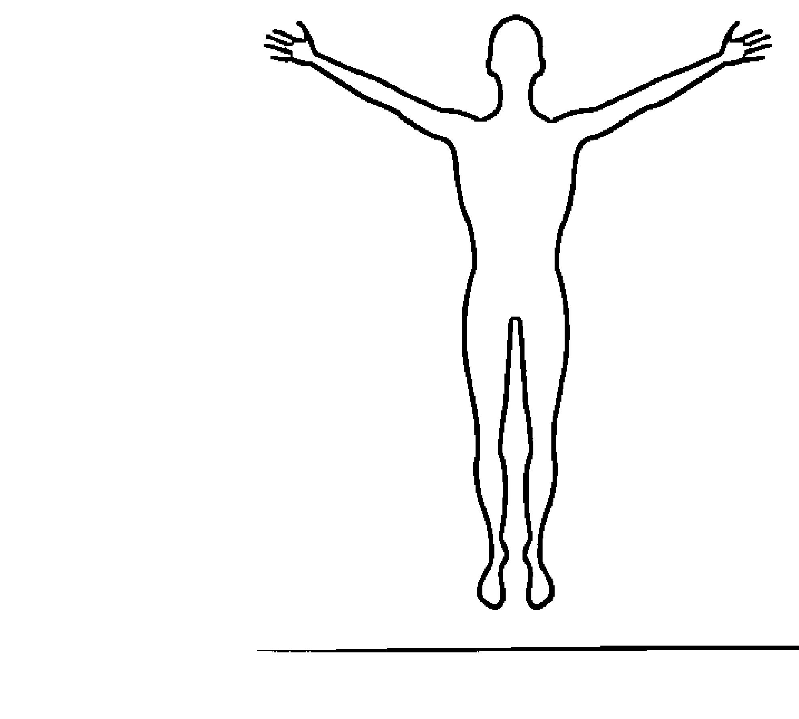

当人體攝入大量的食物（尤其是那些含毒素的），呼吸了有毒氣體，喝了被污染的水後，身體因無法徹底清潔自身，會有很大麻煩。如此下去，身體慢慢累積不能立刻排出的物質，清潔和排泄系統就會不停運轉。但是如果您能不時地讓身體休息一下，換句話說，呼吸一下新鮮空氣或者進行長時間的禁食，那麼身體就能排出有害毒素。

這些累積的物質（也就是毒素）就是最常導致疾病的元兇之一。這就是為什麼禁食，尤其是乾禁，是地球上已知的、最有效的人體物理療法。正確的禁食可以療癒「不可療癒」的疾病，從而「創造奇蹟」。

連小學生都明白的簡單道理，為何那麼多的醫生卻不知道呢？當醫生不知道如何治療患者時，往往就冠之為不治之症。事實上根本就沒有不治之症，只有不知如何療癒疾病的人。如果這些人佔絕大多數，並且組成一個強大的意識團體，不僅不承認自己缺乏經驗，反而說是不治之症，那麼不治之症的說法真就應驗了。

一個人並不要成為科學家、醫生或哲學家才能瞭解這一簡單的真相：受污染的身體需要透過禁食，躲避持續的污染，休息一下，以便排出有毒物質。知識的匱乏導致人們常常給受污染的身體吃些被稱為「藥物」的化合物，這是人最常犯的錯誤之一，吃這些化學品往往更毒害人體。

那麼身體清潔系統在擁有大量食物、從不會挨餓的「西方社會」裡，又是如何運轉的呢？

讓我們將其比作一輛車的引擎，如果一個引擎每分鐘轉速在兩到三千轉，那您就能使用多年，而毫無引擎故障。但是如果經常強迫引擎運轉至每分鐘七千轉甚至更高轉速的話，那麼它很快就會出故障。

在「西方社會」，人們的身體清潔系統就好比是這個在最大轉速嚎叫的引擎。人的清潔系統比任何人造機器都強大，這真是個奇蹟。人造機器絕不可能承受得了這般對待。

清潔系統主要由肝臟、腎臟、皮膚、肺和大腸組成。這些器官都會由於人吃得太多而超負荷運轉，這也是大腸癌、肝癌、皮膚癌成為當今最常見疾病的原因。一個器官被迫過度運轉幾年、十幾年甚至是幾十年後，將會提早壞掉。

上述人體器官都能百分百滿負荷運轉，但為了使身體保持潔淨，它們的運轉不應該超過百分之七十，而最佳的運轉狀態是不超過百分之五十。

許多有關食物對人的影響的研究結果，都明確顯示出相同的結論：人吃得越多，健康就越惡化，越常生病，衰老越快，也會越早死亡。據統計，減少一半的食物攝取量，會延長至少百分之二十的壽命。如果「西方社會」的人能少吃百分之八十（有些人必須少吃百分之九十一）的食物，那麼活到一百二十歲將是很正常的現象。

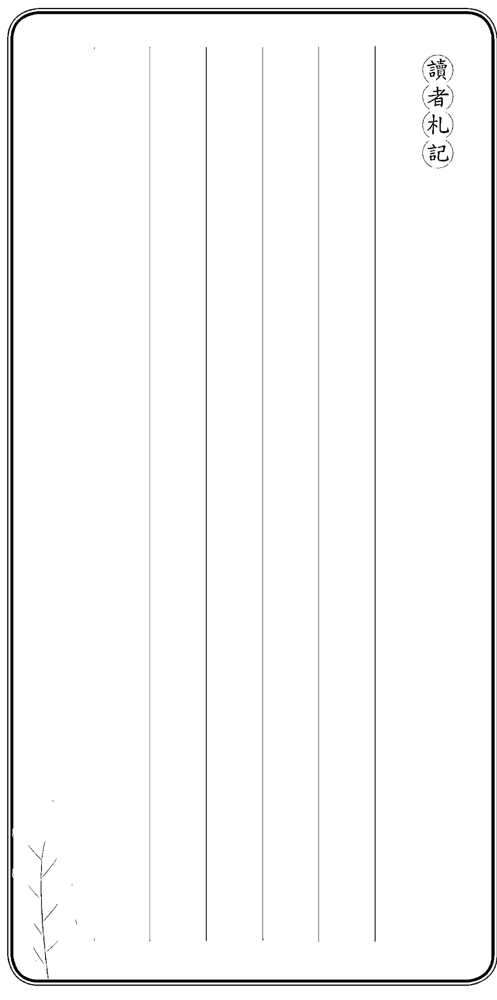

「過量不健康」（波蘭諺語）——這是事實，但「過少亦有害」，這也是事實。每個人都有一個適度的量，因此您最好不要過於看重那些展示體重與食物量及熱量之間關係的圖表。比較有益的是，利用意識進食的方法來幫您找到這三個要素：身體應該吃什麼、吃多少、什麼時候吃，才能使它正常運轉。在這方面一概而論的話，就會弊多利少了。

## 09 不吃與辟穀生活

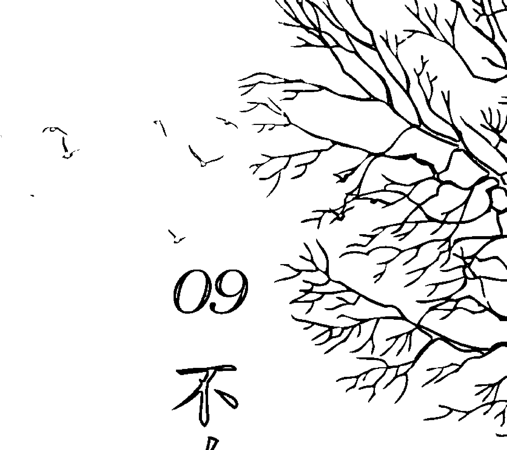

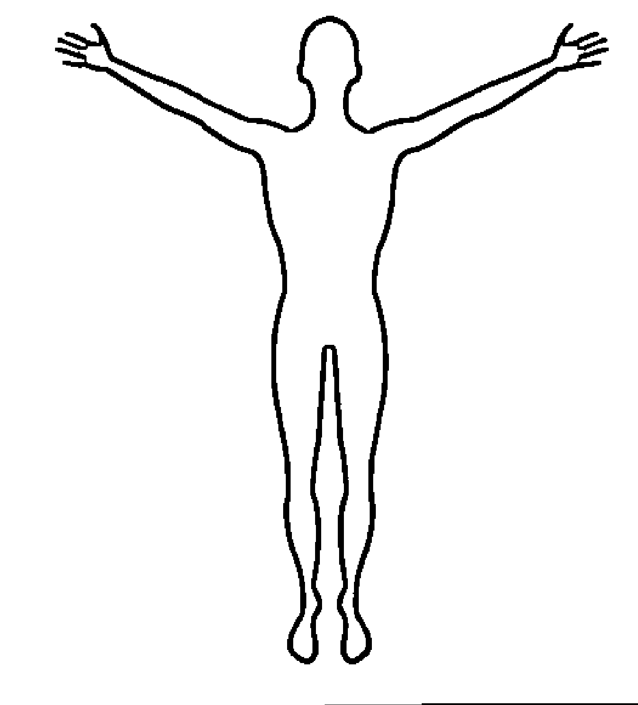

我希望您不要強迫自己禁食或挨餓，但正確禁食療癒身體除外。請考慮清楚，並瞭解以下很多人都不知道的事實（甚至那些立志成為辟穀者的都不知道）。

食物和吃二者本身並沒有好壞之分，它們只是地球（和很多其他星球）上生命的物質職能，和在某些（也有人類生存的）維次空間做為某種完整的生命（做為一種現象）的一部分。

這些各司其職的職能可以使生物在特定的條件下體驗生命。當相關經驗不被生物所需時，其履行的職能就是多餘的，然後，要麼它們被排斥，要麼自動消失。而迫使您本人放下它們，會使您無法充分體驗生命。

辟穀並非強迫所得，而是自然顯現的，是此人所在的靈性等級提升的結果。因此，我們其實是在談論一個人在自身成長道路上的靈性綻放。

首先，辟穀意味著自由選擇。我可以選擇吃或不吃。我的身體不需要任何食物。如果我吃東西，不一定是为了輸送維持生命的建構物質或能量，而是另有原因。我也許是為了陪別人吃，或是品嚐，又或是想體驗一種新的口味等等。不管怎樣，如果我是真正的辟穀者，就真的不想吃，或者清楚地感受到食物會使我不舒服，那麼我就會不吃。

雖然辟穀是辟穀練習者的主要特徵，但這並不是其所要達到的最終目標。換言之，辟穀是這種生活方式的一個特徵，而非目標。這就意味著辟穀者並非是一個拒絕真正的身體需求而受皮肉之苦的苦行者。真正的辟穀者是根本不需要透過吃喝來維持完美體型的人。他們可以自由選擇，並可以自由地從中獲益，也就是說，他們可以完全不吃不喝，也可以為了興致、陪伴而吃，而非身體需要，時間和生活條件與此無關。辟穀者和吃東西的人最大的區別，在於是否有選擇的能力。

這就是為什麼很多辟穀者會不時地喝水、茶、咖啡或其他飲料。有些人有時（比如說，幾週一次）還會吃一塊巧克力、一片餅乾、乳酪、辣蘿蔔等等。因為他們知道，這並不是什麼痛苦不堪言的苦行。

在幾年、十幾年甚至更長時間的辟穀後，一個人出乎意料地又開始「正常」飲食，這是有可能的（聖人傳記中提到過很多這樣的人）。也可能會是在多年的辟穀過程中，人們會有數天、數週或是更長時間的進食期。就像是一般人會不時地禁食一樣，辟穀者也會偶爾吃點東西。

對於一個立志辟穀的人，在通往辟穀之路的某一階段，要想脫離物質的綁縛，辟穀乃是最有力的工具之一。因此，其經歷的過程與戒毒的過程非常相似。

辟穀只是一個人自覺走上完美和高等振動力之路所經過的很多階段之一。辟穀並不是每一個意識自我發展的必經之路。

依據辟穀的定義，因為身體需要而定期喝果汁、貴金屬、牛奶、奶油甜咖啡等液體食物以供給自己營養的人，不是辟穀者——這是液體飲食，這樣的人為汁食者。

禁食、飢餓或者為了達到某個目的而用其他方式抑制進食一段時間，如減肥、自我療癒、宗教儀式等，這些都不是辟穀。在這些活動期間，人們有一段時間不進食，但在那之後又恢復正常飲食。正常人會在辟穀期間感到飢餓，然而，在真正的辟穀狀態下是不會出現飢餓感的。

迫使自己禁食太久的人也不是辟穀者。以這種方式傷害身體會讓人消瘦，甚至餓死。

值得記住的是，成為一名辟穀者主要是由自身的靈性成長所引導。而對那些決定實現這一目標的人來說，有很多輔助的方法，後面的章節會談到一些。

## 讀者札記

## 10 這怎麼可能

這要從哲學、宗教、專業角度及嚴謹的科學觀回答這個問題，這足以寫成一本書。對人如何及為何可以辟穀的「科學的」解釋一定夠資格獲諾貝爾獎了，然而何時有哪個科學家願意為全人類的利益，拿出足夠的勇氣和獨立的精神來完成這一使命，那就不得而知了。人如何能夠辟穀？那麼能量守恆定律又如何解釋？從哪裡建構新細胞來取代死亡的細胞？想知道怎樣才能辟穀，或者想證明辟穀根本是無稽之談的人，就會問到這些以及類似的問題。首先，我不想就此問題證明什麼，因為我不覺得有這個必要，但我仍然可以做些簡短的

## 給思想開放者

說明。以下敘述主要是針對那些頭腦層次上覺得需要對這個主題有一個印象的人。

科學之所以存在，就是由於還有沒被發現並加以理論描述的東西。基於這個事實，科學家仍有研究之處。這也意味著有此三事甚或是「哲學家都沒有想像到的」。不管我們是否相信，這種現象始終存在。

過去人們相信地球是平的，太陽圍著地球轉，一個比空氣重的物體飛不起來等等，說這些論述錯誤，並說它們其實是另一個樣子的人都會被認為是愚蠢的（他們還會遭受迫害）。

儘管如此，不管人們怎麼想，它們仍按著宇宙法則創造它們的樣子來運作，那時候的人並不知道這些法則，因此他們就說這樣的事情不可能存在。

當今時代依然如此。人們不相信那些他們不知道的事情，一旦他們逐漸瞭解了，就會改變自己的看法。這沒有好壞之分，只是人們對否定自己信念的事物所持的態度而已。辟穀或是長時間禁食也不例外。

事實上是，自從地球上人類文明起始，就一直有辟穀的人，因此這就意味著既然存在這樣的人，那麼人類就有辟穀的潛能。當然潛能並不意味著技能，因為如果決定如此的話，還需要經過訓練。

### 給神祕主義者

遍及一切地方的光（也稱為能量、普拉納、氣、生命力、乙太、元氣、量子場）是萬物的起源，也是人不吃東西仍能存活的原因。真我就是這個光的來源，而光直接創造了人身。本能控制著整個新陳代謝，並且形成人體。

要讓身體在沒有食物的情況下正常運轉，就要在本能裡修改某些特定程式。本能控制著這套程式的較大部分。常人的程式一般是，身體為了正常運轉，需要「正常」飲食。

那麼當身體沒有攝入任何食物的時候，能量就會耗盡，極端的情況下甚至導致死亡。程式如此運作，辟穀就違背自然（也是一套程式）。

這樣的程式是可以被修改的，為了使身體正常運轉，修改後的程式除了依靠消化系統外，還可以從別的來源接收所需要的一切物質。根據被改程式，人的身心是由一個從光直接出現的物質所創造的，這與宇宙大爆炸創造世界（創世紀）有著完全相同的過程。

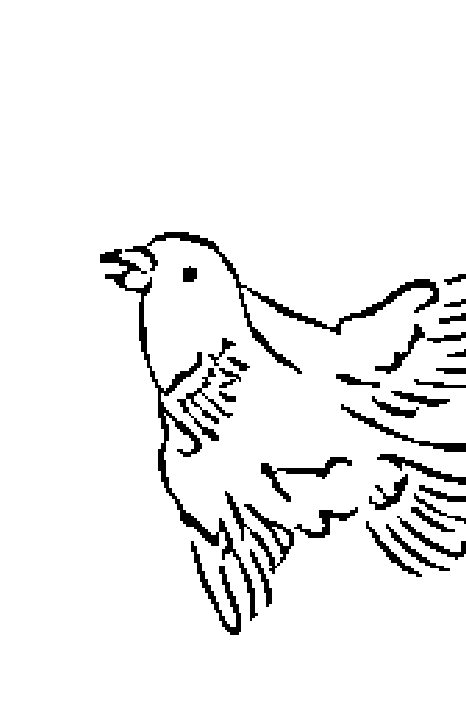

### 給科學思維者

如果沒有遭到破壞，一粒電子吃了什麼，以致它能擁有的巨大能量？那麼人體的原子呢？

一個有足夠物理學知識的人知道，物質和能量都衍生自同一來源，他們可以被思維影響，而且實驗的結果往往都取決於做實驗之人的期望。因此，能量和物質是依賴於思維的，其創造和行為也取決於思維（一套程式）。

人體是最精密協調的，且是人類已知程式—活力—電子—化學—機械的自我控制系統。

僅僅是人體本身就有被思維所控的大量未知結構。對物理、幾何、化學、電子和訊息的學習可以使人更好地瞭解其身心。另一方面，從事於這項研究的科學家越是思想開放，就越會承認『我知道其實自己一無所知』。

給身體提供能量，在體內的元素變化和活力進程的機制仍是不解之謎。然而，此現代物理理論和猜想往往比科幻故事更奇幻，但可以使從事研究的科學家知道：身心是一個被程式或是一個非常大且複雜的程式所控制的充滿活力的物體。

有一次，我在一本科普雜誌讀到了一篇關於量子物理學的文章，它的觀點是無法證明我們的宇宙不是一個程式，證明宇宙其實就是一個程式反倒來得比較容易。您看，越來越多的證據向大眾顯示人就是一個被精神創造並控制的程式。

身體的化學一物理一電子設備，也就是消化、呼吸和皮膚系統所製作出的物質，是建造身體的材料和能量的一個來源。除此之外，量子場（光、乙太、普拉納）的轉化產生固體物質，形成了原子結構的人體。簡言之，這種系統直接將能量轉變為物質。

### 給「信仰者」

上帝就是一切，是無所不知、無所不能的，沒有上帝任何事物都不可能存在，萬物都是上帝所創造。不可思議的、萬能的上帝是唯一的和最高等的完美。因為上帝創造萬物，無所不知、無所不能，而且還有著最高等的、不可思議的完美，所以上帝能揀選可以辟穀而活的人。

上帝是不可思議的，因此人們不必知道上帝如何決定要做某些事及為何這麼做。上帝可以給人辟穀的能力。人可以請求上帝的恩典使自己成為一個辟穀者，因為上帝會實現那些完全忠實的子民虔誠的祈禱。

### 給學習者

長時間以來我都想寫這個，但如何描述那些不能用言語形容的和無法理解的東西一直困擾著我。這只能透過感覺去理解，至少是心靈感應一類的。任何試圖的描述都將付諸哲學性論述。然而，就如您所看到的，我還是決定對此予以描述，希望這篇文章能讓您更好地瞭解身心的生命本源。當有人問我在辟穀期間用什麼滋養身體時，我最真實的回答就是：什麼都不需要。因為我清楚看到並感覺到，在辟穀期間，我只是意識到真我是生命的創造者，就可以將身體維持在完美的狀態中。您明白嗎？——是生命的創造者。透過簡單意識到是我創造了生命，我就可以任意我想要的狀態維持身心。我感覺到了這一切。同時，當我將注意力轉移到自己的內心世界（靈性中心）時，我感覺到真我，是它創造（給予）並維持了生命。雖然這是我能寫出的最簡單的言語，但我也知道當您感覺到那個真我，那個真正的「您」之前，您是不能明白我所說的一切的。我知道我是什麼，僅僅透過意識到這一事實，我就可以感覺到這點，並可以看到我在創造生命。一旦您知道了您是什麼的時候，就可以看到並感覺到「真我在有意識地創造生命」，那麼您也就不需要什麼了。

當您內在靈性或感知覺知這一事實，您將不再追問，因為您已清楚，他人所能給出的回應、建議、證明或解釋，都比不上內在感知所能給予的。

當有人說：「我是靠普拉納滋養」、「我以光維生」、「這是上帝給我的恩典」等等時，您也就能明白這人要嘛是解釋得不清楚，要嘛就是還沒有感知到本質上真正的自己。

您為什麼要用這樣或那樣的方法來限制自己呢？您為什麼想要依賴普拉納、光或上帝呢？當然，如果您認為可以用這些來滋養自己，也可以把這一切都留到您感知到了真我，也就是本質上真正的自己的時候。那時您不僅不需要食物和水，連普拉納、光和上帝也不需要了。您將不再受限於「用普拉納來滋養身體」、「以光維生」、「上帝的愛或恩典」等等，因為選擇權在您。您的選擇不僅僅是：吃或不吃，呼吸或不呼吸，還將可以在它們之中選擇：用或者不用普拉納、光，或上帝之愛來滋養自己。

不管您依然仰賴一物滋養抑或已經擺脫生活之累贅，也不管您是否意識到，您總是依據您所創造的規則或信念創造著您所生活的世界。

真我是生命、光、愛、普拉納、呼吸及食物的創造者。真我也創造並不斷修正這些為了體驗（或是玩遊戲）而做為工具為「我」服務的思維和身體。

## 讀者札記

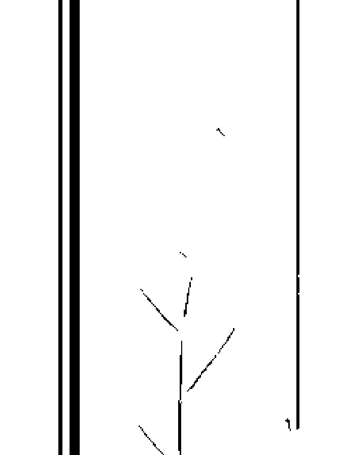

我可以享受我所創造的一切：食物、水、空氣、普拉納、光、愛、上帝。我可以用以滋養我的身心，也可以將它們拋到一邊，好像從此不再需要一樣，並單純靠著意識到真我就是生命的創造者而活。

現在您更明白人是如何可能辟穀而活了嗎？您是否也明白了為何真正的大師沒有傳授其絕學就離開了？他們如何能教授一些人們無法理解、無法感知的東西呢？

您越是能清晰感知存在於您本質裡的東西，辟穀及其他「不可能」的事越會自然地降臨在您的生活中。同時，您將越來越少向自身以外去尋求答案，因為您將越來越感到一切其實一直都在您內心，您一直都是這一切的源頭。「真相將給您自由。」—

## 11 辟穀緣由漫談

首先強調一下，寫作本章並非要鼓動您辟穀，也不是要讓您折服於辟穀的神奇，不過是告訴您一些跟辟穀相關的知識以及辟穀對個人、社會的影響。

假如辟穀激不起您的興趣，您依然覺得飲食是不可或缺的享受，自然也就不打算改變它，那麼，這種有關新生活的指導文字，肯定不是為您準備的，您大可不必再讀下去。相反，假如您已經走在靈修路上，相信您的身心一定提出了飲食革命的要求，這樣的靈性感受，對您而言顯然是非常重要的。那就聽從直覺的指引，毫不猶豫去學習辟穀知識，進而選擇屬於您的飲食新可能，以達到靈性的完美吧！

### 完美健康

身心、也在剎那健康近乎完美。但是，非常遺憾，假如您從來沒有過辟穀或禁食的美好體驗的話，您是不可能懂得，更不會真正感受到這樣的健康狀態的。除非您也有過辟穀經歷，否

想像一下——您的身體運轉極佳，沒有一絲生病跡象。不感冒、沒有鼻炎，也不咳嗽、沒有疼痛，也無疲勞或倦怠之感……您的身體健康、潔淨，好似幾個月的嬰兒一樣健康、完美。

飲食享受多好，我為什麼要辟穀？——有時，人們會這樣發問。其實，您完全沒這個必要，很簡單，沒人鼓動或強迫您這樣啊！不過，假如您想知道為什麼有些人選擇了辟穀生活方式的話，就可以讀下去，看看他們都說了些什麼。

關於辟穀，幾乎每個辟穀者都有自己的詮釋。當然，很多人的回答常常大同小異。在此，我列出一些更具代表性的觀點，都是一些親歷者切身感受的如實記錄。

> 溫馨提示：這些探索飲食新方式的靈修者，從未強迫自己去辟穀。他們開啟這種新旅程後，身體機能一直正常運轉。

則，不管我怎樣努力，都無法用言語描述清楚那種完美健康的狀態。其實，大多數『健康』人士，並不瞭解所謂完美健康究竟是怎樣的，因為他們從來就沒有親歷過這樣的美好狀態。只要您還沒有親身經歷，最多就只能是猜測一下而已。辟穀期間的健康，可能要比吃東西時所謂的健康強得多。那時，免疫系統的機能異常高效，以致於即使周遭的人患有感冒、流感或其他傳染病，您卻健康如故，絲毫不受影響。

對傳染病具有如此高效的免疫力，原因之一，就在於辟穀者處在一種真正自然的身體狀態中，體內毒素蕩然無存。這種毒素，是人們在所謂『正常』飲食情況下，透過飲食經年累月積在體內的。工業生產的食品，被很多來自農業的毒素，以及其他有毒物質所污染。其目的，就是要使食物增產、好看、好吃、保鮮期更長等等。隨著這些工業食品進入體內，毒素與日俱增。

要徹底排掉這些毒素，身體就必須超負荷運轉。這就是為什麼在辟穀的頭幾個星期或頭幾個月，身體自行清理時，會有各種症狀出現。這種清理以及康復過程，很顯然會有強身健體的效果，使您身心都輕鬆起來。

### 自由

不必吃喝，卻享有完美的健康。您將再也不必囿於傳統的繁瑣生活模式，不必去找尋食物、準備食物，然後再吃下去：……不必被這些複雜之至的程式所束縛。這就意味著：無論您所居何處，都不必擔憂挨餓、餓死，以及相關的問題了。

不管您是富人，還是身無分文的窮人，身體都一樣活力無限、運轉良好，享受著完全的健康。辟穀者的生活，不再依賴於食物，也不再有為獲取食物而招致的各種麻煩。

辟穀者也能選擇——雖說不需食物就能維持身體機能的正常運轉，但是也可以選擇吃點什麼來讓自己高興，為聚會或是為了其他什麼原因。這是那些正常飲食的人所不具有的自由選擇權。

辟穀是階梯，幫助人類走上重獲全然自由之路。一旦您意識到這點，就會比其他人更超脫於世俗之物。那些物質的東西，所謂的人類必需品，假如沒有的話，一般人將無法存活。

自動遠離食物，還能避免購買食物以及相關物品的麻煩，很多疾病也找不上您。還不用下廚，甚至連上廁所都省了。

## 經濟

看看每個人在下列有關食物的活動中，要耗費多少時間、金錢、精力吧！

-   一、首先為了賺錢，得辛苦工作。
-   二、拿著辛辛苦苦賺來的錢，一個月又有多少小時耗費在了購買食物上面？
-   三、其次，準備食物，要切、要削、要炒、要煎等等。
-   四、然後，不管有沒有胃口都得吃，認為人才必須得吃東西才能活下去，別無他法。
-   五、吃完後，還得刷洗碗碟，打掃環境，並考慮下一頓飯吃什麼。
-   六、吃得太飽，人就懶得工作，因為身體的一部分能量會被用來消化食物。這會影響心情。在這種狀況下人更願意去看電視、看報甚或睡覺。
-   七、一天中有那麼幾次，身體要排出所有吃喝；否則，食物毒性發作，可能會致人於死地。
-   八、當食物和毒素充斥身體，使之無法負荷，人就會生病，然後就得花錢、花時間去看醫生、吃藥，而非透過禁食療癒身體。

在您的一生當中，一天、一週、一年裡面，究竟有多少次重複同樣的事？浪費了多少金錢和時間？您可能從來都沒有計算過。

綜上所述，辟穀者真是節省了不少金錢、時間和精力。就像那些有辟穀經歷的人所說，辟穀和「正常」飲食有天壤之別。為了比對這些差異，兩種生活方式都嘗試一下，的確是很有意思的一件事。

辟穀者一般睡眠較少，這樣他們就能有更多時間來做事。對某些人而言，瞭解這點是非常重要的。一個普通人每晚在睡眠上省出的時間從一小時到六小時不等。但是，有些辟穀者幾乎從不睡覺，但也有每晚睡十小時的。

除了以上因素，您是否計算過一個辟穀者不用買廚房用具、清潔用具，能省下多少錢，能省下多少水和能源？比如我本人，自二〇〇一年成為辟穀者，把以上因素都算上，每個月能省出八百波蘭茲羅提（PLN）（而那時的平均工資為兩千波蘭茲羅提）。

有些人購買有關烹飪、美食或自我療癒、瘦身的書刊（他們是要更加依賴於食物嗎）。

談及這些節省金錢、時間和精力的因素，很容易就能看出人類對食物以及食物和製藥行業的依賴有多深。有多少人不滿現狀，卻找不到其他出路。有誰能真正了悟，自由不在任何地方，而在思想裡？任何時候您都可以改變自己的生活方式，還有周遭環境。

## 生態

辟穀後我察覺到生活垃圾的數量減少了百分之八十。而且我稱之為垃圾的物品，百分之九十都是可回收利用的（紙、金屬、塑膠）。把它們收起來賣掉，我還能賺錢，但我通常都把它們送給收廢品的人。可以說，辟穀時，我對大自然的污染也是成百倍地減少。

那麼家庭產生的垃圾真的和食物有關嗎？答案是肯定的：基本如此。不難看出，家庭所扔垃圾大多是食品包裝和殘羹剩飯。

還有，我們沒有計算過，全球進入地下和水裡的糞尿何其多。這實在是一個疏漏。經統計，平均每個地球眾生的排泄物，乘以六百億，再加上工業養殖產生的數十億公斤排泄物。

這樣，全球每日產生的糞尿，數量何其驚人！

若要地球伊甸園再現，我們可以幻想地球上只有辟穀者居住。以下是更詳細的願景，如此做的話，與現在的地球相比，它將會節省出海量的資源。

-   一、平均每人扔出的垃圾成倍減少。
-   二、工業用自然資源也成倍減少。因此，所燃燒的煤炭、石油和天然氣也成倍減少。這樣的話，土壤污染、大氣污染和水污染就會大大減輕。
-   三、沒有工業養殖的話，大自然就不會被牧地、農業化學品、荷爾蒙和抗生素摧毀。地球就不會被數十億噸動物排泄物所累。
-   四、沒有工業化蔬菜生產的話，地球就不會遭受森林被砍伐、土壤被施以大量化肥導致貧瘠的厄運。
-   五、紙張、塑膠、玻璃和金屬的生產需求大量減少的話，對自然資源的侵蝕會放緩，樹木砍伐會變少，垃圾也會變少。辟穀會給大自然帶來海量的節約——這不難想像，想嘗試的話也容易，所以辟穀是非常生態的行為。

以目前來講，對地球而言，以上願景還只是一個寓言而已，它講述了一個未來的伊甸園。這個伊甸園的建成有可能比一些人目前期望的要快得多。現在地球上人類的靈性進化更快了，這也會對飲食產生相應的影響。

地球上越發壯大的工業，或多或少都與飲食有直接的關係。一個工業分支依賴於另一個，一個分支的變化會引起其他工業的變化。隨著食品行業的萎縮，整個地球文明都會改變，有時甚至是革命性的。把人類從食物中解放出來吧！然而對於這種變化的結果，只有少數人能夠預測到。

### 生命能量

大部分辟穀者，與那些「正常」飲食的人相比，會感到更多湧動的生命能量。一天裡，連續好幾個小時進行高強度的體力和腦力勞動，他們都不會疲勞，就像一個靈感頻現的藝術家。心智層次上更高等級的生命能量可以造就更高的創造性，這種狀態下，人類創造、發明、教學、學習和工作都會容易得多。

隨著睡眠和休息的減少，許多辟穀者感受到更高等級的生命能量（不是用於消化的能量）。有些辟穀者一週只需睡幾個小時，有一個辟穀者，旅行數十小時後，沖個澡就可以馬上開始工作，一點也不覺得累，這可是對抗疲勞的絕好例證。

以我本人為例，辟穀期間，十個小時電腦作業後（這可是攫取人們能量的東西），思維一如初時清晰。只是感到肌肉有些僵硬，所以我會加強鍛煉，如游泳或慢跑，而在「正常」飲食期間，我卻很累，中午眼睛通紅，晚上頭痛，思維也跟不上，繼續工作下去，就會錯誤頻出。

辟穀者高等級的生命能量並非特異。身體要用百分之九十的能量進行消化和排泄，有些人甚至佔到了百分之九十九。辟穀者的身體不需要消化，這就是額外的能量來源。從數學的角度來看，與「正常」飲食期間相比，辟穀者的能量要高出九倍還多。如果一個人並沒有體驗過這種差別，讓此人相信並理解是非常困難的。天啟的人類發生了什麼？是誰讓我們變成了消化和排泄的機器呢？吃得越多，身體會越虛弱，這很容易察覺到。吃完大餐，您還願意工作嗎？您是感到精力充沛還是更為虛弱？很多人都注意到，吃得越多，就會變得越虛弱、越懶惰。常理說「吃東西才會強壯起來」，其實這有違人們真正的體驗。之所以會這樣，是因為越多食物入肚，身體負荷越重，意味著越多的生命能量被用於消化和排泄。吃東西也許只需要幾分鐘而已，消化和排泄出去卻需要數小時。當身體無法承受這個負荷時，就會運轉失靈，肥胖、病痛、老化接踵而來，並最終導致死亡。這就是為什麼禁食是地球上廣為人知的最有效的疾病療癒方法之一。這兒有一新的治療理念：少吃，以獲得更多的生命能量、更多創造性，以及更潔淨的身體，之後折磨人類的常見疾病將會繞開您。當然，要是飲食攝入量處於負氮平衡時，就不好了，因為它使人虛弱，反而攫取人的能量。氮平衡時，身心運轉處於最佳狀態。

## 創造性

「飽食」後工作、學習或思考都會效率低下，這是常識。大吃一頓後，人會懶得進行創造性的思考或學習，如果再不活動的話，就容易睡覺。消化吃掉的食物消耗掉了身體大部分的能量。

當身體不進行消化活動時，人可以拿剩餘的生命能量進行其他的活動。身心關係如此密切，形成一個整體，因此會互相影響。物質的身體越潔淨、負荷的食物越少，思考就會變得越發簡單、清晰、敏捷，也會越有創造性。即使是禁食的人，在經過最基本的身心清理後，也會享受到思考的輕盈。而大多辟穀者一直都是如此。

當消化和淨化系統停止活動時，人還有幾倍多的能量，這會自然地流向更高層，即精神的、靈性的或心理的層面。腦垂體和松果體變得更加活躍，感官的感知範圍也擴大了，這樣人會在生命的靈性領域發現更有意思的事。這就是為何腦海中會浮現新的靈感，思考也更加迅速，好像之前的頭腦被迷霧、黑雲或泥巴遮蓋，而今卻豁然開朗，人會感到精神世界更加清晰、光亮。

之後，辟穀者的創造力會變強。這可以表現在寫作、繪畫、作曲上，甚至還有熱情去成立一個組織、舉辦研討會或進行演講、做研究等等。

以我本人為例。辟穀一開始，我就明顯感到精神活動增加了，靈性敏感度也提高了。不管白天、夜晚，任何時候我都可以馬上開始寫作或講話，關於任何主題或任何我的感覺都不在話下，而且我可以不停地做下去。浮現於腦際的靈感實在太多，光那些主題的標題就夠我編一本小冊子了。有時我百思不得其解，為何我知道這麼多領域，而在這之前我簡直就是一個門外漢。因為我對直覺的感知越發敏銳，意識到了很多事情，姑且稱之為知識吧！我也能夠集中注意力於一個主題上。

當我重新「正常」飲食（在將近兩年的辟穀之後），我就發現思想不再如之前輕盈，創造力也下降（思想變得有些阻滯），儘管比我開始辟穀之前要好得多。

## 靈性成長

很久以前，人們注意到了減少食物攝入量（比如禁食）和所謂的靈性成長之間有著依存性，這個依存性是如此重要，以致力於人類靈性成長的教義、宗教、信仰及教派倍加推崇。而階段性地禁食，常見於那些身在靈性成長之旅的人們。

禁食的人對這種依存性感受尤為深刻。飲食是把人拉到地球的因素之一，信奉這點的人都瞭解其中的奧秘，關於這點我之前已經說過。有些人決心辟穀，就是為了能夠永遠留在「高等振動頻率」中。

辟穀是通向靈性成長之旅的可能階段之一。我已經提及，相互關聯的事物彼此影響，而身心是一體的。所以在身體方面活動的減少（主要是消化和排泄），更多的生命能量就會用於靈性方面。禁食和辟穀期間，靈性活動增強，因為生命能量會自然流向這個方面，如此我們個人的靈性才得以成長。

在靈性之旅上，辟穀或禁食都不是必須的。但是很多人認為這麼做會有很大助益。很多「靈性導師」自傳中，都有禁食（同時斷水）或很長時間內明顯減少飲食的描述，以在靈性領域獲得一些突破。他們之中很多人只是為了社會的原因而吃，而非身體的需要。

食物是人類與物質之間最強的物質關聯。一日這個關聯被打破（當食物不再發揮作用），許多其他的物質依存也自動斷掉。上一刻還很重要的「世俗瑣事」（遊戲、大眾傳媒新聞、各種爭端和許多其他的事），即刻變得不再重要，日常生活變得更加簡單、容易、幸福、寧靜。

人們開始更多、更強烈地把自己的活動重心導向內在世界、真我（造化）、上帝，這樣就不怎麼受社會動向的影響。

這期間練習各種提高能量的活動變得容易，也會得到更多樂趣，因為本人清晰地感受到了能量的存在。集中、冥想、透視以及其他靈性方面的練習效果會更好，也會更快達到所想要的境界。而且讓頭腦空下來也更加容易，冥想時更易入定，會更易看到光，感受到愛，即我們本源之所在。

如果您有看到光圈的能力，就會注意到辟穀者身上閃閃發光。它有著對稱的形狀，光圈使生命躍動，非常漂亮。被稱為脈輪的能量中心看起來也是如此。假如辟穀前，由於飲酒、吃肉、吸菸、食用有毒物質（包括咖啡、茶、糖）等，光圈有些髒兮兮或不規則，辟穀後則會完全消失。

### 重生

暫不說精神活動的作用。從生物學的角度講，人類身體變老的主因是各種毒素的污染、過量脂肪以及能量過低。許多練習辟穀或者較好地保持長期禁食的人，會感到他們的身體好像獲得了新生。有些人決心開始辟穀，主要原因即在於此。

禁食或辟穀逆轉生物意義上的老化過程，已是眾所周知。不僅從身體體徵可以看出，而且還有臨床研究結果為證。伊芙琳·萊維（Evelyn Levy），一九九九年開始辟穀，接受了甲狀腺檢查，檢查結果顯示其甲狀腺相當於十五歲，而伊芙琳當時其實已經三十八歲了。

為了不讓您產生誤解，我想強調一句，長期禁食或辟穀並不能保證每個人都返老還童。強迫身體辟穀的話，超出其承受力，反而會出現相反的現象——老化過程明顯加快。

當您的氮平衡不再需要飲食來維持，身體的年齡會逆轉，這由您的靈性等級來決定逆轉程度。因為此時毒素、過量的脂肪和低等生命能量遠離了您，不再加速老化過程。而在其他任何一種情況下，強迫身體禁食（挨餓），就會出現傷害。從外表看的話，就是加速身體的老化。不意味著每個不朽者都是辟穀的人，也並不意味著辟穀的人都可以得永生。得永生的是那些只要決定去辟穀，就會知道如何維持身體的良好狀態的人。

### 好奇心

在決定辟穀的眾多原因之中還有一個，就是好奇心。「幾個星期、幾個月或更久完全不吃東西，該怎麼活下去啊？」——有些人可能會納悶。「如果我不去嘗試一下的話，我永遠也不會知道，因為只有我的親身體驗才能讓我瞭解。其他人的體驗只是訊息而已，無法讓我瞭解。」對此感興趣的人一般都這麼想，所以就決定體驗一下。 以我本人為例，對新鮮事物的好奇心就是主要原因之一。從十六歲開始，我就經歷過節食、禁食、辟穀，由肥胖到苗條，再到瘦弱、生病、由（自我）療癒，到加速老化，再到重生。 這些試驗的結果其實都是好奇心的驅使。也正因為這點，我正在建立自身的知識庫，同時也記憶深刻。用這些知識，我編寫本書來答疑惑。需要提醒的是，自身這些試驗可能會傷害身心，也可能導致患病甚至死亡。有些試驗中的人，身體已經受到傷害，心理也嚴重扭曲，好似扭轉已無可能。所以我得告誡您，不要盲目追隨我，或其他做類似試驗的人。

> 讀者札記

## 12 準備改變您的生活方式

您有沒有發現，人常常不考慮後果，就急於做決定？甚至不考慮後果，也不知道決定背後的真正動機。相反，人往往是在情感刺激下做出某個決定。換句話說，人好似一台機器，按一下按鈕就啟動。我在這裡所要描述的就是這樣一個決定，沒有經過認真考慮，而且是在社會意識的影響下做出的。

一個人生活方式的每一個變化都會顯現出來，而其身心方面的每一個變化也會在生活方式中得以展現。當一個人嘗試辟穀時，會強烈感受到生活的變化，變化太大時，甚至會難以忍受。辟穀者的行為將導致他們與人、事、地，乃至周遭的關係、對事的態度等都發生很大改變，部分改變甚至與他們以前所想所為完全相反。如果您將要準備辟穀或者體驗長時間禁食，您需要深思熟慮（以防可能的不利之處），並且要清楚自己這麼做的真正原因。想一想，您是不是已經準備好了（主要是心理上的）應對即將到來的各種境況，因為這些可能的境況會改變您的人際關係。以下為您介紹的是WSW，一種針對個人調查分析的方法。它也許能幫您弄清楚決定背後的真正動機以及可能的結果。這一方法有助於您做各種各樣的決定，而不僅僅是針對辟穀或禁食。如果您常運用此法，將不難發現生活中的諸多起色。其中最顯著的變化就是您越來越自由，因為社會意識對您的影響會越來越小。

## 個人調查

在決定嘗試辟穀前，先好好問問自己下面這些問題。在回答任何問題前，要保持靜默，以便更好的感知真正的內在答案。在這種情況下，最好接收來自於直覺的答案。理智層面的答案和藉口並不那麼重要，不論哪種情況，都不要自欺抑或找藉口，因為事情的真相只能靠事實和確切的感知來傳達。做各種決定前，用WSW分析系統做個人調查，會讓您徹底瞭解自己。完整的分析可以在任何地方進行，耗時幾小時到幾個月不等。

因此，請坦誠回答：

-   一、為什麼我要開始辟穀？我最主要、最根本的目的是什麼？
-   二、我現在的生活習慣會成為障礙嗎？
-   三、與家人、朋友、同事和他人的關係會有很大變化，我是否已經準備好去面對？我能預見即將發生的變化嗎？
-   四、我現在的心理健康狀況允許我這樣做嗎？
-   五、在我靈性成長的道路上非得經歷辟穀嗎？
-   六、我真的可以做到以及如何去做嗎？
-   七、如果出現問題，我要向誰請教？
-   八、我跟親人深入討論過嗎？我知道他們到底怎麼看待我的決定嗎？
-   九、我害怕嗎？害怕什麼？
-   十、我是否充分意識到了嘗試辟穀主要是一種靈性進化，而非身體層面的變化？
-   十一、我是否受社會意識的影響，從而強迫自己這麼做的？
-   十二、說到底，我為什麼想要這麼做？

## WSW（為什麼？那又怎樣？）分析

WSW也稱為一種理智分析心理方法。在分析過程中，此人在被問及的問題前會更加清醒，最終認清決定背後最根本、最真實的原因。

這個分析最好自己做，因為誠實是找出最終答案的基礎。如果有人對您坦誠如己，那麼您也可以為對方做這個分析（反之亦然）。

WSW分析最好在紙上做。您可以找張大一點的紙，然後把問題寫在左上角。現在開始回答問題，並寫下所有可能的答案。您可以在問題與答案間畫箭頭，這樣更利於看清思考的過程。

接著，對於您給出的答案，再問一個「為什麼」。回答之後，再繼續問「為什麼」。一直問下去，直到回答不出「為什麼」時，再問自己「那又怎樣？」

問了自己「那又怎樣？」之後，不要用頭腦回答，而是透過感知來接收答案。放下頭腦，不用思維，然後感覺、情緒、畫面會湧現，那就是內在的答案。

理智最馴服的時候，本能和直覺才能夠完美展現。也就是當理智不思考，也不接收來自感官的刺激，而僅憑著直覺或本能，透過情感、情緒或畫面等心靈感應獲得答案時，此答案才是最完滿的答案。

您在紙上所寫的問題和答案，其形狀就像一棵樹。但也不用這麼畫出來，您可以一張紙寫一組答案，或者針對同一個問題，把所有的答案都寫在同一張紙上。

在波蘭語裡對「那又怎樣？」（No i co z tego?）的回答最具智慧，那就是：沒什麼（Nic）。

如果您做 WSW 分析，將會發現這就是最後的答案。

### 下面就是 WSW 分析的一個例子：

##### 我决定减肥

#### 我為什麼做這個決定？

-   回答一：那樣別人會更喜歡我。
    -   為什麼我想讓別人更喜歡我？
        -   當別人告訴我他們喜歡我時，我會感覺更好。
    -   為什麼我期待（需要）別人對我的欣賞？
        -   別人對我的判斷掌控著我的感覺。
    -   為什麼我的情緒要受制於別人的評價？
        -   我的自信心不夠強。
    -   為什麼我的自信心不夠強？

-   回答二：
    -   那樣 X 就會覺得我更有魅力，他就會喜歡我。
    -   為什麼我會在乎 X 喜不喜歡我？
        -   因為我愛他。
    -   那又怎樣？

-   回答三：
    -   那樣我的身體素質會提高。
    -   為什麼我希望提高身體素質？
        -   因為我會感覺更好而且更有魅力。
    -   為什麼我希望自己更有魅力？
        -   因為那樣的話人們會更喜歡我。
    -   為什麼我希望別人更喜歡我？
        -   其實我最在乎 X ，我希望我對他更有吸引力。
    -   為什麼我在乎 X ？
        -   ……

-   回答四：
    -   那樣我可以在購買食物方面更省錢。
    -   為什麼我希望在食物上省錢？
        -   我的錢太少了。
    -   為什麼我想要更多的錢？
        -   它使我更有安全感。
    -   為什麼我會感到經濟上缺乏保障？
        -   因為我害怕有一天我會窮得沒飯吃。
        -   那又怎樣？
            -   那我會過得很潦倒？
            -   那又怎樣？
                -   ……

### 家人

與您生活在同一屋簷下的家人，朝夕相處，對您的生活影響最大（您對他們的影響也一樣——社會意識的相互性）。他們的態度可能會幫助您辟穀，也可能會使您對辟穀的準備工作難以繼續。所以，這關乎您改變生活方式的決定，最好還是考慮一下他們的意見和反應。

首先，您最需要做的，就是向他們解釋您要做什麼，還有，為什麼要這麼做。他們的配合對您有好處，他們越理解，就越不會阻礙到您。

您有必要知道，成為一個辟穀者，會導致您對周邊事物的態度和看法改變很多。一開始這可能會使您和家人、朋友的關係惡化。在極端的情況下，如果彼此都不表示起碼的理解，您很可能還會被家人孤立起來，甚至鬧到離婚的地步。

經歷辟穀這個過程時，身體散發出的能量和磁場會有很大的變化。這也許會在您和配偶、## 同事

以上有关家人所述同样适用于与同事的相处。在一起工作时间久了，彼此之间的关系也需要注意的是，家人的支持或反对往往是辟谷计划是否成功的关键。所以，要是家人反对的话，就需要认真考虑，到底要不要尝试。

但是，如果在家人反对的情况下，您还是决定尝试辟谷或长期禁食的话，那么您不妨和家人暂时分开一段时间。您可以在别处住一个月，或者让家人外出度假，这样您也是一個人了。

然而也可能恰恰相反：您身体散发的能量，会使身边的人感受到灵性的提升。也就是说，您「提升了他人的振动力」。结果是，他们会对生命的非物质层面更感兴趣，也可能会跟着您改变对饮食的态度。

孩子、父母和其他家庭成员之间引起不和谐（失调）。如果他们不理解您，也不支持您（因为他们选择的成长道路不同），那么可以肯定的是（当然也有例外），你们之间的相处会很不愉快。在这种情况下，因为恐惧、烦恼、仇恨、愤怒和类似的不愉快一股脑儿地都爆发出来，你们之间的不和谐甚至会达到忍无可忍的程度。

### 朋友

会像家人一般。

即使您编了个堂而皇之的理由，让他们习惯您的午餐缺席，然而您能隐瞒多久？非得欺骗他们吗？您的言行举止都会改变，而他们迟早也都会知道。

基于您与同事的不同关系，您可能会成为他们钦佩、模仿的焦点，也可能恰恰相反，成为他们嫉妒、嘲笑、敌视的焦点。所以在开始辟谷前，可以先想想他们的反应，预想他们的反应有助于您到时的应对。当然，您也可能因此而放弃辟谷的想法，至少暂时会这么做。

藉着想像，您可以大概预见公司同事和上司可能的反应，这能帮您避免不快的发生。这种不快可能会让您丢了工作，因为上司也许会怀疑您是神经病或是危险教派份子。

因此，事态如何发展，将取决于您的表现、工作类型和场所以及同事的反应。对您而言，这些也许有利，也许影响不大，也可能相反，会造成灾难性的后果。但是如果您能预见这些人、事反应，就能更好地应对这种变化，要么更改计划，要么干脆放弃。

所以提及熟人和朋友，主要是因为他们的反应会影响到您，因为生活方式的变化无疑会给你们之间的关系带来影响。你们的会面中饮食越频繁，那你们的关系改变就越大。

如果您习惯于跟朋友见面聚餐，那他们很快就会注意到您在辟谷。想想他们对您的这种生活方式会做何反应。他们可能支持您，也可能参与到其中，或者相反，跟您断交，因此您可能会失去朋友（不过这也证明了他们并不是您真正的朋友）。

### 癮症

如果您相信自己可以辟谷，那么随之就会摆脱对一些物品的依赖，如糖、盐、尼古丁、酒精、药物等等。但是如果这些癮症依然如影随形，那就说明您还没准备好，但并不是说您不能尝试或者根本无法做到辟谷。

虽然癮症通常是辟谷道路上的一大障碍，但人并不会因为有癮症而无法禁食或辟谷。事实上，正是由于禁食或尝试辟谷，人才可能得以摆脱癮症。禁食治疗就是摆脱癮症最有效的一个方法，尤其是针对那些关乎食物的癮症。

统计显示，有癮症的人（即使可以长时间禁食）尝试辟谷的话，肯定会伤害身体。有癮症，就表明这人的灵性等级还不够高。这样的话，人就无法正确调适本能的程式，而这正是辟谷成败的关键。若有癮症，但在辟谷中，身心仍能完好运转，那这个人就纯属例外。

如果一个人被癮症牵制，那么要想辟谷，首先得摆脱癮症。而这主要得靠灵性层面的努力。

### 准备改变您的生活方式

力。第一步达成后，摆脱身体对食物的依赖，就是水到渠成的事了。

癮症比较复杂，说来话长。这里我只强调一点，癮症是直觉里的一个程式（自动执行机制），除非停止运行，否则人就会一直受控于它。

### 习惯

观察情绪反应，可以区分一个人到底是囿于习惯还是癮症。当一个人改掉习惯（停止习惯性的行为），不会因此闹情绪（大多是恐惧引起的不快）。而要摆脱癮症就比较困难，往往会产生不愉快的情绪反应。但改掉习惯并不会那么难，那么不快。

在逐步适应辟谷的过程中，有些习惯会被改掉或者改变，尤其是有关饮食的习惯。例如，如果您每天早晨买早餐，然后跟家人一起吃，那就要注意了，因为您也许想改掉这个习惯，想想家人的反应，以及您的感受。您会先跟他们谈谈吗？

也许您还有其他的习惯，所以还是有必要考虑清楚，改变或停止这些习惯是否会影响您的生活（至少要考虑一下社会关系）。有些生活习惯，例如，在酒吧里跟朋友聚会、跟客户吃饭、野餐、钓鱼、储存食物、每周五到超市买吃的、节日烘焙蛋糕等，要是被改掉，会对您的家庭生活、时间安排以及舒适度造成怎样的影响呢？

此外，您可能会养成新的习惯，因为，举例来说，您会有更多「空间」，以前它们都是被饮食占得满满的。而现在，可能您不想再像从前那样准备食物，不想再陪别人吃饭，也不想洗碗刷碟了，那么您要怎样打发时间呢？要培养新的习惯吗？

实际上，改变习惯也不至于让您放弃长期禁食，当然也不一定让您开始辟谷。另一方面，还是要考虑一下您的生活会有哪些变化，以及改掉一些习惯性行为是否对生活有利。改变之后，您还能走多远？

### 饮食

这里所指的饮食，是一个人辟谷前的饮食状况。是从一个不同的角度，观察并解释禁食能力是身体不断练习的结果。所以，禁食前摄入的食物种类可能会让您的适应过程变得轻松，也可能是艰难。

一般来讲，那些「低振动力食物」（如煎炸、烟熏、烧烤及众多化学添加剂食品）会使开始尝试辟谷的人难以获取高振动力。而「高振动力食物」（比如有机水果）则会使之更容易。所以，因人而异，练习辟谷的物质层面关口可能好过，也可能更难，甚至完全不可能。

身体通常不喜欢快速或重大的改变。如果改变微小，身体基本不会有什么不适，这与辟谷练习者之前的饮食习惯相关。如果能慢慢过渡到零饮食，会更有利于身体，身体也不会感到什么不适。

最常见的「问题」，尤其是在辟谷的最初阶段，就是味道。禁食者不摄取任何食物，自然也就没有办法品尝味道。对有些人来说，这简直就是噩梦。所以有必要先考虑一下这个问题，然后扪心自问：对我而言，不能品尝美味对我有多大的影响？

### 冥想

本能塑造人身，让它运转，并掌控资料（比如所吃的食物、记忆力），对身心刺激做出反应等等。本能的任何行为，都是程式运转的结果。

我之前说过程式是可以被修改的。如果我不喜欢某个功能或者某个刺激下的反应，我可能会想修改它。在本能上的改变（修改、删除或建立新的程式），目的是达到计划内的本能反应。

如果我想让我的身体在某些情况下如炎热、黑暗、受伤、食物等方面有特定的反应，那么我就可以透过重编本能反应程式来达成。所谓「重塑本能」，即指在本能中修改、删除或者插入至少一个程式。

首先，要记住本能需要关爱。练习这种关爱，就是要爱本能。对本能的爱越多，它才会有越好的服务。为此，您可以把本能当作自己心爱的孩子或者宠物来看待。

信念（如包含储存图片的资料）和本能的程式创造了身体的需求，以及对情景的反应。

人类的习惯就是本能关于特定事物的一些图片和程式的外在表现。

知道怎么重塑本能的人（这里是指那些能正确操作的人）能够改变任何本能反应的结果。

对于如何滋养人体，也同样如此。

所以，当您灵性层面已经准备好辟谷，最后一个关口就是重塑饮食与身体关系的本能。

根据您重编程式的能力，这个过程可能就花您一秒钟（甚至更少）的时间，也可能是几十年（甚至更长）的时间。

冥想是重塑本能最简单、最有效的方法。它是一种有意识的行为，并能够给身体运转和生活环境带来计划内的改变。

不管您是想患病还是健康，富有还是贫穷，物化还是虚化一些东西，或者发展自身某种能力等等，您都可以运用这种冥想来实现。如果把这种冥想比作程式设计，您就是程式师，而生活就是一场游戏，由您根据自己的喜好而编写的游戏。

要想冥想有效果（也就是，新程式设计运行的结果得以看到），那么必须创造相应的图片（影像），并且饱含能量。这个过程需要履行以下五个条件：

- 一、可以完全感知细节的图片或影像，一定要鲜明、切实、生动。
- 二、目前已实现的成果。
- 三、感受成果实现时的状态。
- 四、知道这是事实。
- 五、饱含爱的能量。

#### 重组程式一

首要的是，知道自己想要什么，也就是，决定的最终结果。看看您决定之事的所有细节，要透过冥想得到哪些，并让感官也参与图像创造。越多感官参与的图像越栩栩如生——冥想也越容易达成。例如，如果您冥想的结果是拥有自己的房子，那就想象自己和家人都住在这个房子里。想象大家在房子周围说话（听觉），想着如何邀请朋友参观房子等等。想象那刚刚粉刷的墙壁，满园的花，它们散发的味道就充盈您的四周（嗅觉）。并且您好像也能尝到厨房里新榨果汁的味道（味觉）。您也可以感受到屋外午后阳光的暖和。您脑海中的这些情景片段就像是一部电影。请在图像里只想像对您来说重要的细节，其他的细节便会随之生成，不用特别留心。举例来说，如果房子的地理位置和形状对您来说很重要，那您就要在图像中详细地进行想像。但是如果窗户的数量和墙壁的颜色对您而言不是那么重要，那就不用考虑在内。在您创造的图像中不要去想实现最终结果的方法（除非这是您最感兴趣的或者本身就是结果）。重要的是图像本身，即冥想的最终结果，而非实现最终结果的方法。如果您非得在图像中想像达成最终结果的方法，那就是在自我设限。真正实现它的方法，虽然您看不到、摸不着，但是比您那个方法高效、简单得多。所以您最好只在冥想中创造出最终结果，而不用费心思考达成它的方法。比如，如果您想疗愈身体，那就想着自己快乐并且完全康复。不要想用任何方法来疗愈自己。真我确实法力无边，远远超出理智所能想像。

#### 重组程式二

在您用想像创造的图像中，结果必须是以现在展现的。如果您只是在想像中描绘它「将」如何，——那它永远也只是「将」成为现实。因为，它到底是今天「将」被达成，还是明天「将」被达成？或者，一年后也还是「将」被达成的状态？如此，可能二十年后还是什么都没有变，因为它只是「将」被达成——至于何时完成「将」的蜕变，不得而知。

#### 重组程式三

想像创造的图像所呈现的必须是已经实现的结果，或已经达成的目标。对您来说它已经是既成事实。如上例——您在房子里看到并感受到的一切，就必须真实到您正住在里面的那个程度。您在房子里居住、睡觉、工作、休息——一切都是真实存在的、当下正在发生的。本能不擅于处理理智称之为「时间」的幻觉，它不知道什么是时间。它对事物的理解和反应，就像小孩子的水准。「今天」、「明天」、「一周后」，这些小孩子并不能很好地区分开来，因为他们的理智还没有创建「时间」这个概念。

因为您想像的结果是「将」，所以在它当下只能是「未完成」状态。换句话说，冥想的结果属于将来，并永远只存在于将来，而您不管何时总是存在于此刻的，因此在当下，您永远不能即将得到。您活在现在，所以永远都不能收到将来才能实现的冥想之物。

想像给您的是您已经创造的东西。既然您创造了「它将发生」，那您永远在将来才能拥有它。

正因为如此，图像必须呈现已经物化的理想状态。现在您已经看到并且正在感受着事物的真实存在。

#### 重组程式四

您知道「知道」（知识）和「相信」（信念）两者之间的差别吗？之前已略有涉及。当您知道某事，您可以不相信它。当您相信某事，同时也怀疑它，因为您根本不知道它。

还不清楚？那我问您。您知道或者您相信您在读这本书吗？您会怎么回答？「我知道我在读」或者「我相信我在读」。现在您理解两者的区别了吗？

在如何「冥想」的建议中，您会看到这样的讯息：「您必须坚信」，因为「信念可移山」。

然而，不管您如何坚信某事，同时，也还是有疑虑。但是当您知道了，就没有任何疑虑。

另举一例：如果一个人现在打电话问您在做什么。根据事实，您可能回答，您在读书。您本人知道，但对方可能只限于相信您的话。对方可以百分之九十九点九相信您的话，但并不是百分百。如果对方现在可以看见您，就可以说：「知道了」。

「冥想」要求您知道您想像的图像呈现的是当下已经物化的现实。您也许会怀疑自己是否有知道的能力。您认为自己只能做到坚信，那就相信它。这比什么都不做，或把什么都想到将来要好得多。还有，您曾看过谁空中取物吗（比如空手变苹果）？如果是，那您已经见过冥想成功的案例了，那人就是已经知道，东西本来就在那儿。

#### 重组程式五

没有足够的能量，「冥想」是没有结果的。所需能量并不像「e=mc²」公式计算的那么多，因为它与公式无关。因此，我所指的能量，并非像众所周知的那样，是一种维持运转的潜能。我所说的「能量」是人在一种情绪影响下的感觉。情绪是在能量被释放或被阻碍时的本能反应（一种程式）。

您还能不能想起来，以前有没有过「毛骨悚然」的恐惧，而且心都要「跳出来」？想想当时搅住您的那个能量。您再想想曾经让您春心荡漾的能量，那时您感受到的是生命当中最强烈的爱。现在您可能知道我说的「冥想」需要「能量」是什么意思了。

所以如果您脑海中的图像完全真实，且存于当下，而且您也知道这个图像呈现的是当下的现实。那么为了将图像展现于（物质）世界，现在您就只欠东风——能量啦！

### 靜受默观

默观（有时被错认为冥想）是一种心理练习，就是把整个心智和所有感官都集中于一个特定思想上。这个思想可以是物质的（如图片、人、风景），一个念头（如爱、光、信任、思维）或者什么都没有也行（空无一物的默观）。在默观中理智要保持：

- 一、集中于特定物。
- 二、感知的水准。

在下一篇我将阐述更多有关展现爱的内容。

那么如何「冥想」呢？首先，集中注意力，放松。让爱透过您的身心展现出来。当您感觉到爱之能量升腾时，把图像（包含上述的所有特性）带到您的想像（脑海）中来。此时，您散发出的爱越多，冥想也就越快、越早、越简单地呈现结果。

「冥想」中涉及的图像可以比作一粒种到土壤里的种子。而随爱升腾的能量可以比作太阳和水。没有太阳和水，种子永远长不成一株植物。

因此，现在让自己感受最强大的能量，这种能量会伴随着爱的升腾表现出来。首先，让爱透过您展现出来，自然地展现。您什么都不用做，只要让爱进来，因为您就是爱的泉源。

默观是诸多灵性提升练习中的一种，用来提升一个人的灵性等级。经由默观，超越理智等级成为可能。这使人全面发展，并且逐步感受到灵性发展之路上的提升。因此，各种问题消失、疾病不见、知识自现，并赐予默观之人更多潜能和力量。「最简单的方法最有效」——我常这么说。靜受默观证实了这一说法，因为它非常简单、容易，也非常有效。不需任何准备，只要知道怎么做，任何人都可以进行默观。儿童默观对其心智会产生积极的影响。如果一个孩子，即使只有两岁，知道怎么去做，就可以鼓励他/她练习，靜受默观就会使他／她的智力、灵性和身体获得更全面的成长。靜受默观有助于人们走向灵性发展的道路。不管您是宗教团体或者哲学团体的成员，还是已加入了某社会团体或者类似的组织，都不会影响您练习靜受默观。经由靜受默观，练习者能逐步加深自我认知能力，所以不论您是谁，都一样会受益。靜受默观因人而异，也就是说，在灵性发展的道路上，它能应不同练习者的需求。在一个人的成长（灵性等级提升）过程中，默观不断自我修整，以利于练习者达到最佳状态，这种灵性练习从一开始就充满了力量。因为默观因人而异，且每个练习者的过程和结果也不同。因此，和他人比较默观的过程和结果并没有太大意义，除非是为了学习的目的或者仅仅为了满足好奇心。

#### 如何进行靜受默观

脊柱自然挺直，保持舒适姿势。您可以坐在一把椅子上，双脚着地，膝盖自然弯曲；或者双腿交叉坐在地板上；或者（如果您已经熟练）两腿盘坐在地上。最重要的是，您应该保持一种姿势，默观几十分钟都不会感到不适。

如果您更喜欢躺着，也可以，但是这样容易睡着。如果您选择躺着，最好不要侧躺，而是平躺，不需要用枕头，双手、双脚自然伸展开。同样，这样的姿势也不要让身体有什么不适。

这个练习，顾名思义，包含了最根本的指示——靜受。理智要靜受，就是不思考，但也不是昏沉。

一个正常人的理智，在不睡觉的时候，通常都是在活动状态（思考、创造、解答等等）。在这种状态下，理智会思考，感知外界刺激并自动诠释。人类的理智也可以休息，好比关掉开关。理智总是游走在这两种状态之间。

还有第三种状态，理智很少经历——靜受。在这种状态下，理智并不活跃，也就是说，它不思考，也不接收任何感官的刺激。这种状态可以持续几秒钟，好似半梦半醒之间，也许您清醒时仍能够想起当时的状态。一方面您感觉自己还在梦中，另一方面，您知道，虽然是梦，您却是清醒的，因为日常意识恢复了。这种精神状态与静受理智很相似。要想马上出现理智完全静受状态，并保持下去，是件不容易的事，这需要练习。普通人会认为这根本不可能，因为人「不是在思考，就是在睡觉」。实际上，初学者尝试让理智静受的时候，多数时间都会入睡，尤其是躺着的时候。但是，「熟能生巧」，经常练习就能够达成。

请闭上双眼，注意力集中于头脑中的念头。但是——练习中最重要的是不要跟着念头走，也不要再有新的念头。完全不想，专注于不思想（但是不要这么想），让理智完全静受。冷眼旁观念头来去，漠视外界对感官的刺激。每當您发现现在跟着一个念头走（您在思考），立刻丢下它，并回复到静受状态。在完全的静受状态下，只会看着念头来去（没有丝毫兴趣）。就像看着流水，脑袋却空空如也。您知道水在流，因为您在看，但您并不因此而心起波澜。

一开始练习静受默观时，也许是这样的情形，您只能保持几秒钟的理智静受，然后就跟着念头走了，就好像它在拉你。

慢慢地，练习越多，不理会思想和感知的时间保持得也越来越长。最初脑海里满是念头，来来去去。练习越多，脑海里的念头就越少。理智对感官刺激越发不感兴趣，越来越宁静。您将达到这样一种状态，理智只剩一个念头——「不要思想，也不要管任何感官刺激」。（实际上，不用「不」字最好，所以不妨说「理智已完全静受」。）当这「最后一念」消失，您会看到光，光随时都可能出现。有些人（尤其是那些早前有过类似练习的人）可能在第一次静受默观时就可以看到光。练习静受默观时，可能会听到声音，但不是用耳朵听到的。这些声音，和光一样，都是真我的展现。真我一直存在，但忙碌的头脑往往注意不到任何真我发出的资讯。当理智静默，理智接收到的第一个资讯就是上面提到的声音和光。理智越静默，就越能感知来自真我的资讯。理智越能保持静默，就越能感受到真我的展现，也就是，感受到越多的光和爱。那么静受默观就变为光与爱的默观了。当爱的默观开始时，您就知道何去何从了，不再需要任何指导。您还是在做同样的默观，但它已不同于最初的那个默观，因为现在它已经转变为冥想了。当理智让路、光和爱显现，您就进入了冥想状态（没有思想，没有幻觉）。如果这时进行脑电波检查，它将显示在 Delta 状态。理智完全停止思维活动时，冥想就开始了，但这次不会入睡。理智完全静默，但非常清楚脑海中的举动。对于什么是冥想，无法给出详尽理性的解释，因为它超出了理智所能理解的范畴。

### 能量练习

这些练习（不一定借助体力）能显著提高生命能量。做完能量练习后，劳累、困倦、虚弱等症状都会消失不见。这种练习能实现人体的良性循环，它可以在一个人不同身体部位，或者人与外界环境间，交换不同的能量和资讯。做能量练习（与典型的运动锻炼或者力量型训练相反）时，这个人不必散出身体的能量（活动肌肉，使之疲劳），而是把能量输送给自己，这才是重点，因为在辟谷初期做到这点尤其重要。

有许多已知的能量练习体系（主要在亚洲），耳熟谙详的有印度哈他瑜伽和普拉提、中国气功和太极、西藏密宗、西方等距离练习以及很多种冥想方法。很多体系都有学派——选择成千上万，但他们都有一个共同的目标，就是增加练习者体内的生命能量水准。

如果能堅持進行能量練習，將不無裨益。不生病、老得慢，當然會長壽。即使是幾百歲了，看起來就像是四十幾歲，能量滿滿，身心都能高效運轉，進行能量練習的大師們證明了它無限的潛能。

很多堅持能量練習的人漸漸不再依賴飲食。一些人，由於能量很高強，飢餓感完全消失。在中國傳統的氣功、太極裡，這種現象就是辟穀，也就是，飢餓感消失，幾星期、幾個月甚至幾年都不用吃東西。這樣的一個人處在完美的境地，甚至青春永駐（從生理年齡來看，甚至返老還童）。

對禁食或者想達成辟穀的人來說，這無疑意味著，一定要堅持能量練習，並貫穿整個過程，這種練習好處多多。而且多數情況下，如果不做能量練習，即使很想辟穀，也無法同時維持身體正常運轉。

一旦決定要做能量練習，您可以選擇一個學派遵照其指示來做。另外，您還有一個選擇——找到最適合自己的一套練習方式，這比您想像中的要簡單。如果想的話，那現在就開始吧！起立、閉上雙眼、放鬆並集中注意力。首先，使您的注意力集中於體內的能量流，而不是動作或者肌肉。這時，最好不要管其他的練習者怎麼做（要拋到腦後）。最重要的就是靜默，並全神貫注於體內的能量流，及您與外界的能量循環。最好集中注意力來感覺能量，而非導引能量，這樣會更好。

當您的神貫注於能量流的時候，肌肉也會活動。由它去吧！讓身體隨性而動。只要您集中於感知能量，那麼至於怎麼動（比如是否優雅、對稱等）並不重要。身體自然會選擇一種運動方式，使您更好地去感覺能量，能量水準也會隨之提高。您可以把它看作是感覺能量的默觀。

默觀、冥想、能量練習都是人類意識靈性發展之路上不可或缺的重要因素。有規律的練習可以使人完美綻放。結果就是思維更輕盈、更有創造力、更平和，隨著體能的回復與返老還童，身體也回到圓滿的狀態。這種練習所衍生的結果之一，便是人與食物之間的依存性改變了。飲食需求會消失，因為食物已毫無用處。

練習者會成為高振動力的生命體，身體自然散發出越來越多的愛。在非物質世界裡，這種人被視作透明體。那時，關於進食或禁食的偏執已不復存在，這個問題對他們來講，已毫無意義。

## 讀者札記

## 13 辟穀方法大全

嘗試辟穀或者已經成功辟穀的人，所用方法不盡相同。在正常飲食向辟穀的轉變過程中，幾乎人人都有其獨到之處（而且，獲得方法的途徑也不同）。以下是方法簡述，僅供參考，但願您能從中獲取一些有益的知識。這裡所提供的每種方法，都可視作一個獨立主題，足以寫成一本篇幅極長的書，起碼可以為一次研討會提供足夠素材。

- 一、自然辟穀法
- 二、靈性辟穀法
- 三、即刻辟穀法
- 四、強迫辟穀法
- 五、二十一天進程辟穀法
- 六、催眠辟穀法
- 七、交替辟穀法
- 八、嘗試辟穀法
- 九、哲學理智辟穀法
- 十、凝視太陽辟穀法
- 十一、煉金術辟穀法
- 十二、意識進食辟穀法
- 十三、屬於自己的辟穀法

### 自然辟穀法

這種方法，顧名思義，道出了實施之人所行之方向。此法目的在於修復飲食習慣，亦即回歸人類最初與自然相適應的飲食。透過一些途徑、方法，逐漸改變一個人的日常飲食，如此，才能與自然為人類創造的食物相和諧。此法又被稱為飲食改良。

運用這種方法，逐漸改變飲食習慣，最終達成辟穀之目的。這般調整只為實現一種新的飲食習慣，那就是，儘可能食用『最高振動力』的食物。

首先，慮及消化過程和振動力的關係，油膩的食物是被排除在日常飲食之外的。諸如此類的食物非常之多，如燒烤、燻肉、臘腸等；以穀物、玉米、馬鈴薯、稻米等為原材料做成的油炸和烘焙食物（如爆米花、比薩、蛋糕）同樣歸於此列。

其次，被排除在日常飲食之外的，是牛奶及所有乳製品。有些人聲稱，人是可以喝優酪乳、益生奶及脫脂奶的，因為它們有益於腸道菌群。事實上，不吃這些食物，才更有利於身體健康。有很多關於乳製品對人類身體健康影響的調查研究——大家不妨找來多瞭解一下。

如果擔心身體本身的益生菌群不夠，也沒關係，您可以適量地喝些酸泡菜汁或者醃黃瓜汁（無鹽的那種）。

下一步是在日常飲食中排除任何定義為甜食的東西。巧克力（也包含苦的那些）、糖、軟性飲料和任何含糖、蜂蜜、葡萄糖、果糖和化學甜味劑的食物，都在此列。如果您實在接受不了沒有甜食（如飲料）的生活，仍然可以食用不包含這些碳水化合物的自然甜味素，如植物蛇菊。

在排除了上述食物之後，還有蔬菜、水果、穀物（種子）、堅果、豆類作物、魚類、蛋類、肉類和脂肪類食物可供您食用。

下一步是排除任何加工類食物。在這種自然辟穀法之初，油炸、燒烤或煙燻食物首先被排除，現在又逐漸排除了其他所有加工類的食物。亦即您可以不再煮、蒸、醃製食物了，相反，只用一種方法來處理您的食物——用水清洗，然後將其撕成片。

不妨來觀察比較一下地球生物製作食物的方式吧！一般來講，清洗和撕裂，是除人類之外所有地球生物唯一的食物加工方法。假如您不同意，那麼請告訴我，除了人類之外，有哪一種生物，在吃東西之前還要煮一下？

可見，這的確是事實。加工食物，如一個煮熟的雞蛋，與一個生雞蛋相比，是不同的物質。外表可能一樣，但測試（化學分析）顯示，它們確實是不同的物質。廚房是個小型的化工廠，在那裡，自然物質被變成（透過化學反應）人造的東西（通常是自然界沒有的）。這些人為的、非自然的化學品，都被吃進肚裡去了……

放棄一切加工食物，就會朝著與自然——而人類本是自然的一部分——重新統一的道路邁出一大步。做為自然界的一部分、一個細胞，人身並不完全適應廚房裡的人造物。這種只吃自然物質（直接源於自然）的回歸或倒退，必將給人類帶來有益的變化。感謝這樣的變化，人類因而重返大自然的懷抱，重享大地母親的自然滋養，一句話，人類重返久違的家園了。人類的身心，勢必因此而得到自然療癒。

再下一步，對日常飲食的改善，就是排除穀物（小麥、黑麥、玉米等諸如此類）、肉及魚（如果您在排除食物加工階段，還沒有放棄吃生肉的話）。也就是說，現在您只能吃生菜、水果、種子（如葵花籽）和堅果。大多數被叫做蔬菜和穀物的東西，是過去基因實驗的產物（有些，甚至要追溯到幾萬年前）。大多蔬菜和穀物，如果不再人為栽培，而是自然生長，將會蛻變為野生，並在若干年後消失。之所以如此，道理很簡單，它們不是自然存在物。這就是——為什麼在這個階段要將它們排除在日常飲食之外的重要依據。在這之後，只吃自然為人類製造的食物——水果和堅果。只吃那些自然給予我們的，是與自然和諧共存的一個重要前提。一些人類的祖先、黑猩猩和大猩猩，大多只吃水果。感謝這些食物，使得牠們結實、健康並活力充沛。但是，如果牠們被餵以人為加工過的食物，便會開始生病、加速老化，死亡也會提早到來。

自然辟穀法，最後步驟之一——逐漸轉變為只喝果汁。您可以榨水果、喝果汁，也可以採取——先直接吃水果，吸出果汁（吐出殘餘）的方法。最好不要買果汁喝，因為它們是化學加工的液體。它們的外表、味道和化學成分，與天然果汁截然不同。一旦喝的話，又回到非自然飲食的老路上去了。

最後您用水稀釋果汁，漸漸地水越放越多，這樣在幾天或幾週後，您就可以做到只喝水。就這樣，只喝水，只滿足身體所需，逐漸地減量、減量……直到連水都不喝的那一天。選擇這種方法的人，需要幾個月，甚至幾十年，才能最終達成辟穀。這其中當然存在很多影響因素，但主要還是取決於他們自我靈性開發的努力程度。

### 補充解釋一

逐漸在日常飲食中，先後去掉如上述好多種類的食物時，一定要確保您不與自己的身體相對抗。一切的對抗，都會造成傷害。因此，如果您一直在跟身體對抗的話，必然會傷害到它。比如，如果您對薯條很上癮，每週都吃上三公斤，那您不必立刻完全放棄。您可以一步一步達成，而不是經由激烈對抗、一步放棄。亦即您仍然可以吃薯條，只是，比如每週少吃百分之一。身體是不會注意到這百分之一的變化的，然後逐漸適應減少的量，直至最後您能放棄吃薯條。您可以透過漸進的對數型的方式減少，而非線性的。

### 補充解釋二

不必嚴格遵守飲食漸變的描述順序。每個人都像是一個不同的世界。在一個世界裡奏效、正確的事情，在另一個世界裡未必如此。所以您完全可以打破以上順序。比之於這裡所提供的訊息，及他人的間接經驗，您自己切身感覺和直覺的引導，顯然更為重要。據我所知，有些人追隨所謂最優的（阿特金斯式的）、大多由動物脂肪構成的飲食，他們適應辟穀的方式就很獨特。

身體對飲食和其他生活條件的改變，有著極強的適應能力。它是非常靈活的，尤其是對於那些逐漸發生的改變，亦即給予了充分的時間改變。小的漸變，其各種影響儘管不易被察覺，但最終的影響可能是巨大的。舉例來說，就像生活環境從熱帶到寒帶的改變，亦或是突然增加或減少了一百二十公斤的體重。顯著的飲食改變，對身體而言亦是非常大的一項負擔。改變過快，免不了要受些苦痛。所以如果您愛惜身體，那就給它足夠的時間，讓身體在不受

您可能認為自己的身體已經擺脫了一種特定的食物癮症，比如說薯條，因為幾個月都沒吃薯條了。可是，有一天路過某處，突然聞到了那個熟悉的味道，這時，您極有可能會流出口水，緊接著胃部開始痙攣，最後為一種難以控制的強烈的飢餓感所捆綁。在這種情況下，不要對抗，因為此時抓幾根薯條來吃，並完全咀嚼，會更有益於您的身體。如果不那麼做，您很可能連晚上作夢都夢到薯條，時時想著，甚至白日夢裡都是薯條的影子。受這樣的煎熬，完全沒有必要。

### 補充解釋三

使用規則，而非對抗。那什麼是規則呢？就是清晰地規劃，明智、系統地實現既定目標的行為。有規則的情況下，無對抗，讓愛在其中發揮主導作用。能辨別規則與對抗，無疑是非常重要的，因為，規則引領成功，而對抗所造成的，則只能是傷害。

運用自然方法辟穀時，您要隨時查看自己的身體是否吃得消。對某些人來說，這個方法也可能有害，身體受苦、虛弱、生病、衰老加快都有可能。這些人強迫他們的身體去適應一種特定的飲食，所以，在這個過程中，身體就會受傷。透過冰冷而青紫的四肢、羸弱憔悴的身體、低水準的生命能量，還有悲傷、沮喪、對吃很狂熱等方面的特徵，您可以很容易判斷自己的身體是否已經受傷。

### 靈性辟穀法

包括身體在內的一切物質，皆是人類靈性層面的構成反映。不論物質世界出現什麼，都是先在靈性世界裡形成的。如果一個人的靈性層面開始有了辟穀的念頭，那麼身體也將隨之有所反應——開始嘗試辟穀。

當運用此法去適應辟穀生活時，您努力的主要方向，就是在自己的生活中盡力提升靈性等級，您堅信辟穀是這種靈性努力的必然結果之一。如果辟穀在您的靈性世界裡變得足夠真實，那您的身體層面自然就會顯現出來。

萬法之中，人可選其一，然後有意識地去發展自我。當一個人決定有計畫地做某事時，往往如此。這可以是臣服於上帝，也可以是在無數的信仰、哲學、完美系統或其他體系中，選取一種進行練習。您可以獨立完成，也可以加入一個團體。

有人喜靜，選擇隱居；有人更喜有至親、家人陪伴身旁；還有人幽居在修道院；有人跟隨一位德高望重的師父，並聽從其訓導；有人則聽從於「高靈」、天使、大師、守護神或其他非物質生命，但是，更有人只相信他們自己。

跟誰學、在哪兒學、如何學都不甚重要。對修習者更為重要的是，靈性等級得以不斷提升，並且能夠獲得所期待的結果。

### 即刻辟穀法

一個人隨著靈性的成長，日常飲食和食慾就會悄然改變。這人漸漸只吃那些給身體較少負擔的高振動力食物。而且每天對食物的需求都在減少直至消失。之所以如此，是因為這人感覺他／她的存活是有賴於造化、上帝、聖靈、統領一切者、宇宙精神、至高能量、內在力量、真主、梵天等的恩典。您也可以在這裡列舉很多其他的名字，然而這並不在心智所能理解的範圍內，因為只有親身經歷才可能有所領悟。

正因如此，如果您決定使用這個方法過渡到辟穀生活，務必要知道——您的注意力應當集中在靈性層面。其中一個緊要目標就是——把您自己從強烈的物質依賴（食物）中解脫出來。因此，您將集中注意力在自己的靈性成長上。透過恰當的練習，您一定會成功的。

事實上，我並不確定它是一種方法，因為它突如其來，降臨在某個人身上。一個更為準確的說法是，禁食的突然出現。然而，知道在什麼情況下會出現這種突然性的禁食，這個人就能啟動這種轉變。所以，涉及到這種情況中的方法時，就要考慮到它出現的條件。

大多數情況下，它是這樣發生的。某天身體突然拒絕接受所有食物，這通常使其本人都感到非常驚訝。拒絕感會強烈到此人對進食有無法解釋的憎惡感。看到食物就會反胃，甚至在試圖／強迫自己吃任何食物之後，都會嘔吐。

突然的禁食，猶如被身體強迫，大多發生在過著靈性生活的人身上。當一個人的身體深深地沉浸在祈禱、冥想、對上帝的崇拜中時，它可能就會完全忘記人「還得吃飯」。

研究聖人的傳記時，無論在任何宗教中，人們都可以看到這樣的故事，描述那些人會有一段時間，突然地、並無任何預期地開始禁食。他們中有一些人接連幾週或幾個月都不吃任何東西，更有甚者，長達數年。也有一些「聖人」一直到往生都不再進食。

當今時代，靈修做為有意識的靈性自我開發，在地球公民中發展迅速。甚至在寺院、隱居所、神殿以外，您都可以發現越來越多的人突然地、沒有任何預期地拒絕食物（從表面上，只看到這點）。在這些被稱為正常的、平凡的（看起來並非聖人）人之中，這種現象多發生在那些深入從事創作工作的人身上，以藝術領域的創作為例。畫家或者雕塑家完全沉浸在傑作中時，便忘記了周遭。日夜思考和創作，把所有的精力都傾注於某副傑作上。音樂家或發明家為實現構思，也是同樣專注。那時，他們的能量如同泉湧，可以廢寢忘食長達數週。

您可還記得在自己生命中最神聖的愛情時刻？您可還記得當時您雖然忘了吃飯，卻也不覺得餓？那是因為愛在滋養您。實際上，當一個人活在愛裡，那愛就會展現在他／她的精神裡。身體便別無所求了。神和身體裡。愛創造生命。當一個人讓愛充分展現在他／她的精神裡時，身體便別無所求了。

即刻辟穀法明顯異於厭食症，後者癥結在於病人的心理問題。厭食的一個明顯症狀便是身體的消瘦。當突然禁食自然發生時，身體也會繼續正常運轉，而且如果沒有過多的脂肪堆積，也不會減重。

經過一段時間（可能是數週、數月、數年），如果一個人是突然拒絕進食的，那麼飢餓感可能會重新出現。如同之前的消失，同樣突然。此後這個人又開始「正常」飲食。

綜上所述，可以得出以下結論。您對靈性層面關注越多，就越容易斷開與物質（食物）的鏈條。您越沉浸在靈修裡，就越容易放下進食。當然，在不強迫身體的情況下，才會獲益更多。

在某些突然禁食的例子中，並沒有之前所描述的不舒適的身體反應。相反，這人只是對食物毫無興趣。感覺不到餓，也沒有胃口。這種狀態延續數週、數月，甚至數年。

### 強迫辟穀法

顧名思義，在這種情況下，一個人會以辟穀為目標——強制性地辟穀。有些人沒有耐心，或者就是不喜歡「方法」。他們更喜歡走捷徑，以求立竿見影。這類人，表現之一，便是他們執行任何任務時都有堅強的意志。一日決意達成某事，他們並不怎麼顧及周圍的情勢。只顧埋頭向前，在他們決定要達成辟穀時，這種決心亦有助於達成預期目標。

實施強迫辟穀法非常簡單，不需要任何準備工作。甚至可以是您讀這本書時，就可以決定「永遠」放下食物。「從現在開始我是一個辟穀者」——這樣之後，只需在日常生活中執行這個決定就可以了。

做此決定的人相信：透過簡單的決定和執行就足以成為一個辟穀者。實際上，在大多數情況下，這意味著強迫身體不再進食，這會讓人感到飢餓。當一個人不吃東西，感到飢餓，並且通常會經歷相關的症狀，這段時間被稱為禁食。

採取這類辟穀方法的人很少成功。在禁食一段時間後，這人或者開始吃東西，或者死亡（如果非常固執，一直與身體唱反調）。如果為時不太晚，此人又開始進食（「太晚」的程度取決於身體的脂肪累積量），那麼這樣的禁食對身體很有助益，還可以療癒一些疾病，包括大多數醫生認定的不治之症。

禁食時身體會減重（越來越多）。如果強迫辟穀法使用太久，超出正常水準，身體很容易出現不正常的狀況，如體重仍然在減（比如每週減重一公斤）、極易疲勞、大多時候沒有力氣、不開心、越發骨瘦如柴等。

### 二十一天進程辟穀法

在沒有任何準備的情況下，突然決定永不進食，並不意味著就是使用強迫辟穀法。如果這人所在的靈性等級足夠高等，那麼放下進食只是一種確認，確認此人擁有辟穀的能力。在這種情況下，這人的身體將在相對較短的時間內進行自我調適，以進入辟穀狀態。也有些人雖然他們每天都「正常」進食，但他們知道自己可以辟穀。對他們來說任何時候放下進食都是小事一樁，身體將快速進行自我調適，而且運轉良好。

警告：除非仔細閱讀並充分理解該方法的原版說明，否則不要嘗試二十一天進程，否則會危及您的生命。下面的說明還不足以確保您安全地執行辟穀。雖然潔絲慕音（Jasmuheen）（基於安全考慮）要我刪掉它，可是我還是保留了下來，因為這只是傳播訊息而已。

關於查梅因·哈利（Charmaine Harley）提出的「二十一天進程」的詳細介紹，可以在潔絲慕音寫的《普拉納營養——以光維生》（Prana Nourishment — Living on Light）一書中找到。她是澳大利亞人，以普拉納維生，她推廣天賜養分計畫，目的是消除世界疾病和飢餓問題。目前，對那些感興趣的人而言，這是最廣為人知的方法。潔絲慕音在二十世紀末一直推廣二十一天進程。後來，在她的第三本書《神的食物》（The Food of Gods）（也是關於辟穀話題）裡，她介紹了一個更簡單、更安全的長期方法。接收到，潔絲慕音就是該圈子的一員。該組成員都致力於靈性提升，過去常聚在一起靈修。這個訊息就是，我們內在的神聖合一體讓我們呼吸，給我們生命，滋養我們。儘管它是傳達給這個圈子的成員的，它肯定也是為世界大舞臺準備的一個訊息。如同潔絲慕音所篤信的，這種替代營養的方法是人類進化的必然途徑。

二十一天進程分為三個七天進行。在最初的一週裡，這人不吃也不喝（如同乾禁法）。如果這人還沒準備好，那生命可能會有危險。除了害怕，主要的擔憂是，身體可能會嚴重脫水，導致不可逆轉的變化，從而走向死亡（已發生於某些人）。在第二週裡，這個人可以喝含有百分之二十五橙汁的水（三份水十一份橙汁）。在第三週裡，除了水，還可以喝百分之四十的橙汁。雖說每天最少要喝一公升半的液體，但飲用的量還要看這人口渴的程度，並綜合其他因素而定。

人們在經歷這個過程時也可以喝其他的果汁。建議在遠離人群的隱居之處實踐此進程。理想的狀況是有一個朋友能每天短暫查探，以防萬一，在那段時間裡會開始身心淨化。電視機、噪音、麻煩事、每日例行公事、電腦等等都不應該是此進程中的人所接觸的。此進程關鍵在於專注於自己的靈性層面和心理層面—這就是為什麼建議在休息（例如度假）時進行此進程。

透過觀察對辟穀感興趣的人，我得出一個結論，他們之中的大多數都認為二十一天進程是一種神聖或者神秘的洗禮，可以使一個人成為辟穀者。我所認識的踐行二十一天進程的人中沒有一人因此而成為辟穀者，但不乏因二十一天進程而發現自己可以不進食而生存的人。

事實是，這個二十一天進程並不能把一個人變成辟穀者。專業地講，關於此進程的一個身體層面的調查分析顯示，是七天的乾禁，然後十四天的果汁飲食法起了作用。它對淨化身、心、排除毒素非常有效。把這段時間用於靈性修持，專注於自己的靈性世界，如同其他的禁食練習，會讓您更快淨化自我。

踐行此進程的人懷著極大的熱情，其熱情表明了對洗禮的熱望，成千上萬的人踐行此進程，還有他們的描述——所有這些，以及更多，我稱之為「社會意識」，可見它們對人的影響是多麼有力。

如果一個人沒有準備好，二十一天進程不會使之成為辟穀者，因其靈性等級還不夠高等。這樣的人在強迫身體不進食的情況下，也可以辟穀或基本辟穀一段時間，甚至更久——我的觀察可以證實這點。

如許多個體所描述，踐行二十一天進程的體驗因人而異。有些人完全沒有感覺；除了辟穀之外，他們生活的其他方面一如既往。另外一些人如此投入，這就成就了他們生命中最大的靈性提升。一些人在那段時間開始與非物質生命溝通。每個人的經驗都不同，所以同樣一件事可以有著不同的領悟。

## 催眠辟穀法

催眠是一種工具，可以用來改變潛意識中的程式操作。潛意識的某個部分，掌控著界定、實現人體、心理與外界物質（如食物）的關聯。對普通的地球人來講，這部分功能會激發對吃的生理需求。一些具體的物質，比如食物，需要在恰當的時間，以恰當的量輸送到體內，這樣身體才能正常運轉。

潛意識個別部分的運作，是可以被改變的。一個致力於辟穀的人，其潛意識的改變，可以用以下的話來描述：不管身體是否攝取了食物，身體都正常運轉。

當與一位經驗豐富的催眠大師合作（或者自我催眠），並使用一套量身訂做的暗示，那麼改變就會發生。在這種情況下，其有效程度取決於——這個人，與其他人相比，對這些催眠暗示的敏感度有多高。

對實現辟穀來講，這是一種相當冒險又沒有充分考證的方法。主要擔心在於可能出現有害的暗示，並被當事人的潛意識接受。在催眠的這段時間裡，潛意識會像乾海綿吸水一樣吸收這些暗示。任何一個暗示都有可能在潛意識的運作中造成重大改變。

這裡要記住一點，暗示不僅僅只是催眠師的話，也可以是催眠師的行為舉止、情緒，乃至當時自己所處的環境（如從外面傳來的聲音）等都可能構成暗示。這些無意會導致好的或壞的改變——這是您所無法掌控的。

基於這個原因，為了不造成任何不良的心理變化，我並不推薦這種方法，尤其是當您可以用選擇其他方法的時候。用催眠法快速改變人的潛意識，也會使這個人的生活發生一些改變，這會讓人備受折磨，而冥想是改變潛意識的更好方法。

不過，瞭解這種催眠辟穀法，並將之用於生命不保的境況下，還是有益的。這些境況通常是指，人們在某種情況下久缺食物，舉例來說，在山裡迷路、在戰爭中遭遇長時間的物資匱乏、大規模的自然災害等，就可以選擇這種傷害最小的方法。透過催眠，幫助人們不再感受到飢餓，不再有被餓死的想法。

## 交替辟穀法

交替辟穀法主要針對的是飲食的次數，透過逐漸減少每天進餐的次數來達到最終的辟穀，不再有被餓死的想法。例如，您現在是一天五餐，那就先減為四餐。在您習慣了每天四餐後，再減為三餐。如此繼續，直到您每天只吃一餐仍然感覺良好。

接下來就是每兩天一次，也就是您每隔一天禁食一次。今天進食（當然只吃一餐），明天就禁食；後天進食，然後大後天禁食。所以飲食規律是：M F F M F...（M：吃一餐的那天，F：禁食的那天）。一段時間後，這會成為您甚至不會注意到的常規節奏。每隔一天您才感到飢餓。一切都自動發生，毋需對之關注，也不用數著日子來，更不需任何計畫。

下一步就是每三天吃一餐（只吃一次）。今天吃了，那明天後天就禁食。飲食規律是：M F F M F F... 當這些成為常規，成為自動行為時，就再禁食一天。那麼現在您變成每四天才吃一次：M F F F M F F F... 注意，在進食的那天，您吃的量不應該超過正常飲食的量。所以即使四天一次，您吃的也不能超過正常進食時一天一餐的量（不是四倍的量）。

隨著這個過程，您將可以一週一餐，再發展下去甚至更少，比如一個月兩餐。清淡的食物更利於消化（比如水果、液體）。不過千萬要注意，不要在很多天的禁食後突然吃東西，這會傷害消化系統。另外，盡量長時間咀嚼，保持食物與唾液的充分融合是至關重要的。

當每月只吃幾餐時，您可能會忘記哪天該進食。如果您記得，也可能因為不餓而忽略它，這樣就是不間斷的禁食，把兩次或多次禁食連了起來。如果在一開始您就把禁食叫做辟穀，您也可以說自己正在延長辟穀的時間段。

不過，使用交替辟穀法亦需謹慎，因為這可能會變成挨餓的狀況。對毫無準備者而言，延長禁食可能導致消瘦等不良後果。明顯的症狀就是身體幾乎不能接受食物。在這種情況下，要縮短禁食期，改變方法並努力提升您所在的靈性等級。

## 嘗試辟穀法

一個人決定開始辟穀，就會把食物放在一邊。這個決定也許是有備而來，但也不是必須如此。這人觀察和感覺著身心發生的變化，只要一切進展良好，這人就可以把自己當作辟穀者或禁食者。但是如果出現某些危險症狀，再不吃恐怕就會有生命危險時，此人有兩個選擇：繼續禁食（儘管知道這有風險）或者重新開始進食。

明智的選擇是重新進食。幾乎每個人，當注意到身體沒有食物就無法正常運轉時，都會這麼做的。此次不成功的嘗試僅稱為一次禁食而已。

以後這人在相當長的時間裡都「正常」飲食，為的是重建身體。甚至可以為了使身體儲存多點的脂肪，將「正常」飲食進行得更久。事實是，身體含有脂肪越多，辟穀時間越久。因此為了下次嘗試能禁食久一點，這人可能決定給身體儲存多點的脂肪（最好不要這麼做）。

不吃東西的時間越長，身體轉向辟穀的成功機率就越大。經過身體重建，或者甚至儲存了過剩的脂肪，這個人又放棄了進食（又一次嘗試）。這次也一樣，在一段禁食期後，這個人會再次進食（為了再次重建身體）。但也有可能沒那個必要，因為經過幾個月後，就會發現，不吃東西身體也能運轉良好。如果此人又開始吃東西了，可能會在將來的某個時刻再次重複整個過程。

在每次嘗試的最後，要嘛重新開始進食（為了重建身體），要嘛就成為一個辟穀者。想做多少次嘗試，也許就會有多少次。但是如果這人一意孤行，當身體越來越消瘦時，仍繼續不吃東西（這種情況稱為禁食更準確），那麼就接近臨界點了。

此處的臨界點是指，在生與死的邊緣，身體保持平衡的一種狀態。有三種可能的結果：達成目標；身體極其衰弱（損壞）；死亡。第二和第三個結果，都更有可能——在這種不負責任的行為下，幾乎任何人都會慘遭不測。當然也有例外，但極為罕見。

在生與死的平衡邊緣，會出現一種獨特的心理狀態，無法用頭腦來理解，這種狀態與人類瀕臨死亡時的經歷類似。在這種狀態下，此人可以更清醒地看待決定的執行。他們中的一些人死而復生，發生蛻變，有些則超越了生物生命的界限。這正是一『神蹟』療癒的時刻。

我勸您不要用這種方法去實現辟穀。我寫下來，只是為了傳達訊息。採取這個步驟的人，要麼是靈性高度發展的人，要麼是瘋子或有自殺傾向的人。前者將有生還的機會，後者則幾乎沒有生還的餘地。

不過，我相信靈性高度發展的人不會使用這種方法，因為這樣一個人已經知道，他／她的身體會運轉得天衣無縫，而不必吃東西，所以決定不吃。但是如果這人並不瞭解這點，而還用這個方法去實現辟穀的話，這將意味著靈性還沒有高度發展，儘管這可能也有例外。

## 哲學理智辟穀法

這種方法，也可以被稱為是「科學」的。其踐行者通常是先搜尋訊息，進行理論研究，最後進行實踐。因此，我更願意把它看作是其他方法的附屬。一個對辟穀感興趣的人，想辟穀的話，會透過書籍、研討會、網路、辟穀者等等，查找所有可能獲取的訊息。這人會透過思考、哲學討論和（科學的）證據，去分析這些訊息。所以，這人對待這個課題，會與科學家和哲學家如出一轍。

這類人這樣做的主要目的，就是獲取足夠充分的證據支持，以及相關的知識，以便證明人類是可以辟穀的。第二個目的，就是彙編最合適的（對此類人最好的）方法，讓自己，乃至全人類安然過渡到辟穀狀態。

對用哲學理智辟穀法的人來講，對事實的分析與研究比直觀感受更重要。據我觀察，對這些人而言，禁食和實現辟穀是非常困難的事（與其他人相比）。我注意到，這種純粹理智的方式，是辟穀研究者嚴重的障礙。在我看來，要實現這一目的，只有靈性發展到一定的高度才有可能。

即使如此，我相信，在將來憑藉所謂的純科學方法，一個人是可以透過手術或者藥物治療來擺脫對食物的依賴的。如遺傳學、神經學、資訊學、量子物理學等方面的專家，已經在這一課題上做了很長時間的研究，當然是非正式的。

## 凝視太陽辟穀法

這種方法主要包括兩部分，凝視太陽和赤足在地面上行走——在印度，這種修行已存在了上千年，並為人熟知和修習。他們認為這種修習可以療癒身心。經過大量修習，凝視太陽可以使一個人保持完美的健康狀態，擁有好心情和高水準的生命能量。療癒因子就是來自太陽和地球的能量。

這類人感受到高能量之後，出現的附屬效果之一便是辟穀。這發生在幾乎所有的太陽凝視大師身上，甚至包括那些起初並不相信的人。明顯的食慾減退，通常發生在七個月後，但也可以發生在連續三個月不斷修習後，或是九個月之後。

目前再次使這種方法家喻戶曉的先驅之一是來自印度的希拉·拉坦·馬內克（Hira Ratan Manek）。在他的網站（www.solarhealing.com）中馬內克詳細描述了這個過程。網站裡也有很多關於太陽凝視的論壇。

下面是對馬內克太陽凝視法的簡單描述。每日清晨日出之際，或每日傍晚日落之際，您要凝視太陽的中心，凝視時要赤足站在地上。第一天最長凝視十秒鐘。然後接下來的每一天都比前一天多十秒鐘。用這種方法每天凝視太陽的話，那麼一個月後您就能達到五分鐘，九個月之內就能達到四十四分鐘。這是允許的最高限度，也就是說，不能更久了。

在他的方法中，還有一個重要的活動，就是，即使不凝視太陽，每天也要至少赤足行走四十五分鐘，行走的時候不要看太陽。

總之，如果您每天都凝視太陽，整個過程要九個月來完成。這之後您就不需要每天凝視太陽了。甚至建議您不需再做。您可以不時做一下，以維持足夠高等的能量。

做太陽凝視的時長和頻率要依個人情形而定，要考虑到生活地区的气候和其生活方式，但是建议每天都做赤足行走。

如果您生活在一個每天看不到日出日落的地方，整個過程要更久。如果您幾天沒做太陽凝視，接下來的時間也不要延長凝視。如果休息了很長時間（比方說幾週），那就縮短下次凝視的時間。

要在日出後一小時之內和日落前一小時之內完成凝視，這對保護眼睛非常重要。這也意味著不應該在白天凝視太陽，尤其是中午的時候。

我希望這個警示足夠清楚：除了日出日落的其他任何時候，強迫眼睛凝視太陽會損害視網膜！沒有循序漸進的過程就凝視過長時間的話，可能會灼傷眼睛的這個脆弱部位。被灼傷的話，如果這人還有視力，所看到的事物也都是帶著洞或點。現有藥物還無法治癒這種對視網膜的損害。

另一個推廣太陽凝視有益影響的人是太陽瑜伽行者烏瑪桑卡爾（Sunyogi Umasankar），他發現了一種直接從太陽吸收能量的方法，這樣就不再需要進食、喝水，甚至睡眠。基於這些能力，烏瑪桑卡爾不分晝夜在印度行走六萬兩千公里，將他的方法傳授於人。

根據他的傳授，最初的太陽凝視開始於日出或日落的時候。一開始凝視時間應該是很短的，往後可以逐漸延長。如果直接凝視太陽刺眼的話，那也可以往上斜一點看。重要的是要有規律地練習。

順便說一下，人們最大的錯誤之一就是——戴太陽眼鏡。在有些情況下，因為強光刺眼會建議戴太陽眼鏡保護眼睛。如果您沒有練習太陽凝視，那麼使用電焊，在陽光下的雪山上行走，在海灘，或者長時間對著太陽開車……都在戴太陽眼鏡的情況之列。

在晴天戴太陽眼鏡，往往會加劇人生能量的不足。讓太陽射線進入沒有保護的眼睛，是人身身心正常運轉的基本要素。這主要涉及皮膚、松果體和腦垂體的運轉。當一個病人不再戴太陽眼鏡並維持皮膚適度接觸陽光時，很多所謂的「慢性病」也就消失了。

要知道在太陽系裡，太陽就像父親，讓所有星球生機盎然。一個孩子，如果被限制與父母聯繫，那將會多麼難過，又如何茁壯成長呢？

## 煉金術辟穀法

這是我所知道的用化學物質來影響人最有效的方法。在這種情況下，身體光流系統被啟動，使得辟穀做為一種附屬效果而出現。這些物質或純淨或混雜，已被使用（主要被一些「先知」或「大師」使用）幾千年，並以多樣的名字傳世，如嗎哪（manna）、哲人石（philosophical stone）、聖杯（holy grail）、神聖的灰（vibuthi）、白色金粉（white powder of gold）、歐姆

## 13 辟穀方法大全

是一種純淨的化學元素，也可以是這些物質的混合物：金、銠、釕、銀、銅、汞。例如，黃金的非金屬形式，看起來像玻璃，粉末是白色的。如果您用上面提到的名字在網上搜索，會找到更多關於這些物質的訊息。

一種具有療癒身體和修復生命力量的神秘物質，經常用一種象徵性語言來描述。您可以在《聖經》、《吠陀經》、《可蘭經》、埃及聖典和煉金術的書中找到這些描述。這種物質只給那些經過長時間精神／靈性研習而有充分準備的人們。顯然，如果一個沒有準備好的人吃了它，那可能會造成瘋癲或死亡的後果。

以下是對可能步驟之一的描述。一個靈性上準備好的人，首先用九天的禁食淨化身體，從第十天起這個人開始服用一種粉末或液體，這種精準的化合物，已經被配製好。每天吃這種粉末，大概一個月左右，時長取決於物質本身及其成分，四十天後身體就不需要任何食物了，如果身體仍然需要食物，也是很少的量。再過幾個月，就完全不需要了，因為飢餓感已經消失。

期間密集進行的靈性修習，會啟動光流系統，因此也會啟動神經和腺體。粉末和修習也大大增強了大腦活動（面積和輻射能），尤其是松果體和垂體。它會讓一個人改變很多，包

## 意識進食辟穀法

意識進食（CE）法是人們實現辟穀最有效的方法之一。它在恰當的時候以恰當的量滿足您身體確切的需求（身體真正所需）。 以下是如何實現的步驟。假如您感到餓了，請依照以下建議來做：

對大多數人，換句話說，對那些沒準備好的人來說，煉金術就像一次單程旅行，徹底啟動光流系統幾乎是不可能的。理論上，在轉變完成前，這人就可能因癲癇、精神病或被社會排斥而死去。這種痛苦源於非物質感官的太過集中。此人會收到很多訊息。這人所看到的和感覺到的，在一定程度上，與服用毒品後的精神狀態相類似，但仍然有很大的不同。更為有趣的是，與「正常」人相比，這人的想法會更易物化，因此恐懼影像可能會創造出危及此人生命的情景。 一九九五年起，大衛·哈德森（David Hudson）在他的公開講座上，談到了一些他發現的粉末。他的粉末屬性，與煉金術士所用的神秘物質不謀而合。他和其他人的研究證實了這些物質對人身身心產生的非凡屬性和效果。

### 一、停一會兒，放鬆身心並問問自己：「它（飢餓）是什麼？」

不要想原因，因為您需要直覺的感受。直覺越多，思維過程就越少，意識就會越多地呈現出來。思考的過程是一個較小的、較受限的靈性等級。人需要超越它，以便更加瞭解身心，所以，用直覺來感受答案。飢餓感很可能在這個階段消失，如此就完成了意識飲食。

另一個可能性是，會出現一個幻象或情緒，因為當塵封的情感、思想、思維機制湧現，會首先被視為飢餓的感覺。如果是這種情況，而且您開始吃東西了，那些感覺將被食物掩蓋並重返您的內心。

### 二、您仍然感到餓嗎？那麼問問自己，您想吃的是什麼。

感受什麼食物最吸引您。找到後，想像幾秒鐘——您在吃它。想像它在您嘴裡和胃裡的感覺。再問問自己「它是什麼？」並用直覺來感受答案。如果飢餓消失，您就可以到此為止了。在這個時刻，可能出現一些幻象或非凡的想法，能幫助您更瞭解自我。沉浸其中，讓它們充分穿過您，用整個身心好好感受，這樣您會更清楚其由來。這些消失後，您將不再有飢餓感。

### 三、如果身體確實需要一些食物，

飢餓感不會在這個階段消失，得繼續意識進食這個過程。吃下您覺得身體需要的食物，但要用意識來做，用直覺來感受自己的一舉一動，如何取、如何切、如何煮、如何準備等等。用直覺仔細觀察自我，深深感受自我。繼續把注意力集中在同一個問題上：「它是什麼？」用您的直覺等待答案（是直覺在回答，而非頭腦）。在這個階段飢餓感可能消失，幻象或不尋常的想法可能出現。如果什麼都沒發生，那就繼續下一步。

#### 四、

現在您正坐在想吃的食物面前。慢慢拿一片，用直覺來感受您每個細小的舉動和身體反應，時刻觀察自己。把這片食物放在鼻子底下，聞一聞。在氣味中陶冶自我，並打開您的直覺，搜尋「它是什麼」這個問題的答案。您需要用直覺來感受這個答案，而非運用思維。再一次，可能會發生同樣的事：要麼飢餓感消失，要麼情緒、幻象、想法出現。如果不是，請繼續。

#### 五、

現在咬一口食物。含在嘴裡，並沉浸其中，好好用直覺感受。感受所有的思維、身心反應。用直覺感受、感受、再感受，只需觀察，而非思維。

#### 六、

下一步非常重要：長時間咀嚼，不少於三分鐘，越長越好，在極端的情況下，甚至咀嚼數小時，但通常三到六分鐘就足夠了。只有在它變為液體並改變了味道的情況下才嚥下去。記住，您咀嚼的食物將有一次或更多次的味道改變。千萬不要在它還没有改变味道之前咽下去，否则它就不是意识进食了。用直觉感受、感受、再感受，只需观察，而非思维。咀嚼时您可能会开始感到噁心的味道，难以下咽，那么就把它吐出来。

七、继续这样处理每一口食物，直到您感觉饱了。这样做是为了确保您满足所谓的「身体真正所需」（对特定物质的需求，不管身体用它来做什么）。

采用意识进食法，您时刻都对经历的过程非常清醒。当您感到饥饿或口渴时，就可以开始这个过程。当您继续意识进食时，会发现其中的真谛。如果它并非身体真正所需，您就不会强迫身体吃它不需要的东西。对身体最好的照顾就是，在恰当的时间以恰当的量供给它所需要的东西。

运用意识进食法，您是有意识地成为辟谷者，没有对抗或误解，也不会经历很多曲折。您会发现自己的身体、地球和您的内心之间真正的关系。当食物最终不再在这个关系中扮演角色时，它自然变得没用，然后您会放下它，因为它在地球生命这场游戏中已经无足轻重。

意识进食，是让我们更加了悟真我的途径之一。真我在我们的身心显示越多，我们的思路越宽，看得越清楚、直觉越敏锐、了悟越深，那么问题就越少。换句话说，您的确什么都不需要，因為您就是一切的源頭，您只需要讓源頭自我展現。

在日常情況下，真我被頭腦的思維所抑制。意識進食及其他意識技巧，讓思維更沉默、更被動，才能接受一直存在的直覺的聲音。因為直覺與真我直接連線，它知道所有的事，可以解決任何問題，滿足您一切所需。

意識進食、意識睡眠、意識說話、意識⋯⋯不論是什麼樣的意識練習，都會使您更加了悟，得以提升自身所處的靈性等級。當您使之充分提升後，將不再有任何疑問，因為您將真正了悟。在這種情況下，成為辟穀者將易如反掌，甚至不需呼吸、不受溫度影響等。

## 屬於自己的辟穀法

每個人都生活在一個不同的世界裡。因此如何才能（假如完全有可能的話）為所有人制訂一個適合的方法（展現每一個細節）呢？您認為有誰能為您做到這個呢？

對您而言，最重要的方法就是自己，它可能包含也可能不包含上述各方法中的要素，甚至也可能包括上達方法之外的其他方法。您要用自己收集的所有訊息，根據您所有的相關經歷，來發展出屬於您自己的方法。

有的人做事井井有條、慢條斯理、很有耐心；有的人更喜歡立竿見影，甚至不惜強迫自己，有的人則傾向於中庸之道；有的人專注於靈性層面；有的人「必須」看到證據，因為對他們而言，每件事都「必須」符合邏輯；有的人則注重心智結合：……等等。因此，就您所能觀察到的，人的個性如此不同，對大多數人而言，方法之外的或許是「最好的」。

在掌握了諸多人類走向辟穀的不同方法之後，您就可以發展屬於自己的方法了。舉個例子，這種方法可能包含飲食改善（自然法）；同時您在靈性修習上也有了更多感悟（靈性法）；某天您偶然發現自己可以輕鬆做到隔一天一餐或者更長時間一餐（交替法）；為了在恰當的時間以恰當的量給身體確切所需，您又決定更有意識地吃東西（意識進食）；您還做調查研究，在這個問題上深思，參加會議及討論小組，做大量的閱讀等等（哲學理智法）；此外，您常凝視太陽並赤腳走路（凝視太陽法）；禁食期間，您還服用白色金粉（煉金術法）。

隨著越來越多的修習，您可能會開始覺得，自己的方法在應該按照原計畫奏效的時候，並不總是如己所願。這種情況下，就改變方法，有所不同，當然還是自己的方法。您創造的方法不一定一成不變。在這裡，最重要的是自己，一邊體驗，一邊邁向目標。

## 14 禁食&辟穀症狀

這裡我所談的症狀，是指由於營養改變而產生的身心不適的反應。當您改變飲食習慣、禁食，或過渡到辟穀時，可能會出現一些症狀，尤其是過渡太快的時候。

這裡所寫的症狀，所提到的「禁食」，指的是下列情況中的一種或全部：飲食習慣的改變、禁食療癒、辟穀。因此，當您讀到我所描述的「禁食」，要知道它既適用於飲食改變，也適用於適應辟穀生活。

以下描述頗具普遍性，當然也有例外，因為每個人是一個不同的世界。普遍性的描述、建議和步驟不完全適用於所有人，因此建議只是做為框架來參考。因人而異才是唯一適應所有人的準則。

直覺是最好的顧問。如果您能全然聽從直覺，就不再需要建議。如果您還不能，那麼判斷力就是您最好的顧問。以下描述就涉及了很多有價值的訊息。

首先，不要與身體對抗，對抗產生傷害。當您與身體對抗時，誰是受害者呢？當然是您自己的身體。相反，要愛惜您的身體，節制，但有規律。

在此我不會描述所有的症狀，而只針對那些最常見的。因為每個人反應不一，所以就會有很多症狀。如果您不害怕，幾乎不會發生什麼危及生命的事。正確的禁食從未引起過任何疾病。

如果禁食期間有任何困惑，您要去找能幫到您的的人。最好是與在禁食療癒方面經驗豐富的醫生保持聯繫。據我所知，對禁食療癒有足夠知識的醫生不足百分之一。甚至在那些採用禁食療法的醫生中，有時也會給出有害的建議。當然，找到這樣的醫生比落入其他醫生之手要好得多。對這種地球上最有效的身體療癒方法，那些人實在是不懂或知之甚少。

以下所列症狀是暫時的，從幾秒鐘到幾週不等，顯現強度為持續性或間歇性。有些人幾乎注意不到，所以沒有相關的問題。但也有人會不知所措，感覺要死去了。但大多數健康狀況不錯的人，只會有一些暫時的症狀。常規來講，一個人病得越嚴重，產生的症狀就越多，持續時間越長，又更易患病。之所以如此，是禁食期間身心淨化和療癒的直接結果。

- 一、恐懼
- 二、虛弱
- 三、脫水
- 四、頭暈和昏厥
- 五、噁心和嘔吐
- 六、體重下降
- 七、消瘦
- 八、疼痛
- 九、心態不穩
- 十、不同的現實
- 十一、皮膚變化
- 十二、感覺寒冷
- 十三、發燒
- 十四、牙齒鬆動
- 十五、頭髮脫落
- 十六、關節腫脹
- 十七、其他

### 恐懼

對禁食者來說，首當其衝的是恐懼。在禁食期間（包括其他生命狀況），沒有什麼比恐懼本身更可怕的了，這也成為禁食者最大的威脅。

如果您害怕禁食——要嘛不禁（為了不造成自身的傷害），要嘛與一個您非常信任的人一塊兒禁，這樣您就不怕了。有很多被突然剝奪了食物的人，沒幾天就死了，真正的禁食過程甚至還沒開始呢！強迫一個人禁食，尤其當這人懼怕禁食時，生命會有危險，不是因為缺乏食物，而純粹是恐懼所致。

禁食期間如果您開始感到懼怕，因為禁食，您越發擔憂自己的健康和生命，那麼您就該儘早停止禁食。對其他事情的恐懼也有破壞力。人在禁食時更敏感，所以任何恐懼都能導致更多傷害。

### 虛弱

恐懼是完全沒有愛的狀態，愛是創造生命的能量，而恐懼恰恰會導致生命凋零。因此，一個人愛越少，就越缺乏創造生命的能量，恐懼便越多。所以，如果您感到恐懼，意味著您在抑制愛——您身心的唯一生命之源。如果您允許愛，您就是那泉源，展現愛，恐懼將消失不見。恐懼和愛從不相融。

如果您決定擺脫恐懼來襲，可以用這些練習去釋放您心中的愛。

坐下或躺下，放鬆，並安靜下來。自由、平靜地呼吸，並把注意力集中在愛的感受上，愛自然而然地由您表現出來，您就是那泉源。感受在您身體的中心，您的生命之源是禮物。只要您給予肯定，這個泉源總是強烈地顯現出來，所以現在讓它充分地表現它自己吧！讓它像太陽般光輝萬丈，溫暖您的全部及四周。完全的允許，完全的愛。感受，感受……愛如何充溢您及周圍的一切。不要主觀創造愛，也不要創造那個泉源——只需准許，愛便會自我展現。

身體虛弱是最常見的症狀之一，甚至可以說感覺虛弱是正常的。強烈依靠食物（上癮）的一些人，僅僅幾小時的禁食後就會感到虛弱。這種虛弱感表明身體開始發現無法像以前一樣透過食物來汲取養分了。身體供給節奏被打亂，所以身體開始反應。

在整個禁食過程中，一組人可能從不會感到虛弱（極少）；另一組可能會有或幾次；第三組則可能伴隨始終。不考慮其產生原因和持續時間，虛弱表明的是這些人生能量處於很低的水準。

如何處理？這取決於實際情況及個人。如果那人熱愛運動，那麼最好是休息一下，甚至需要臥床休息。相反的情況也可能發生，如果那人經常休息、坐著，整天不活動——那麼應該去散步、騎車、游泳，進行一些鍛鍊。

禁食期間強烈推薦溫和的運動鍛鍊和能量訓練，這樣的活動和更好的能量流就能更深更快地淨化身體。不建議做力量型和耗力的鍛鍊。集中感受能量，而非鍛鍊肌肉，這樣對身體更好。靜力鍛鍊、瑜伽、氣功和太極有益人類，也有益於健康。

禁食期間人可能會數小時，甚至數天感到很虛弱，沒有力氣走路，除了休息，什麼都不想做。這時身體需要休息，尤其是睡眠，這可能由致病毒素所致。

要鍛鍊的時候，卻去睡覺，就不好了。當然，需要休息的時候，就應當上床睡覺。確實是身體需要休息，還是應該鍛鍊，但心生懶惰呢？要是能夠辨別當然很好。身體需要鍛鍊的時候，卻去睡覺，就不好了。當然，需要休息的時候，就應當上床睡覺。判斷力和辨別力對禁食者來說非常重要，真正需要休息時，就應當上床睡覺。

但是，如果这种状态持续时间太长（比如说超过三天），而且您没有任何病症，您最好严以律己，做些能量训练。

卧床休息时间太长反而使身体更加虚弱，而非给予能量。能量恰恰是此时禁食者最需要的。血压下降，血液循环变慢，新陈代谢也慢下来。身体排毒和自愈过程因此更加缓慢。在这种情况下，能量训练会有很大助益，能让禁食者得以好转。

如果虚弱太久，尤其是经过最初三週禁食后（指一个有正常体重的人）还很虚弱，这表明重新进食的时候到了，但也不尽然，因为可能有其他原因，比如重病、缺少新鲜空气、高温、高强度体力工作或者其他使身体虚弱的原因。所以，决定是否停止或者继续禁食，要看具体原因，并衡量自身健康状况。

您决定不喝水时，就开始了干禁或干辟。统计资料显示人可以在无水状态下存活超过十二天。到底能坚持多久，取决于几个因素，最主要的一个是本能反应，另外还有空气湿度、温度、身体活动、矿物质含量（盐和其他消耗掉的物质）和脂肪储备，最佳条件下的安全期是四天。

### 最佳條件下的乾禁期間

最佳條件下的乾禁期間，身體用一百公克到一公斤的脂肪轉化為水，就是每天的減重。

在身體狀況大致類似的條件下，需要排出的礦物量也相當，而且生命能量等同。那麼不喝水的話，胖人比瘦的人存活更久。因為乾禁期間，胖的人有更多脂肪組織可以轉化為水。

如果一個人沒有準備好乾禁或乾禁太久，身體可能會過度脫水。過度脫水會導致很多身體機能不能正常運轉，進而可能造成死亡。

因此，乾禁時，需要經常檢查身體是否有過度脫水的跡象。脫水百分之二時，會明顯感覺到極度口渴；脫水達到百分之十時，就有生命危險，應當避免這種情形。幻視、幻聽、發抖都是脫水引起的，表明人正在死亡的邊緣徘徊。在這種情況下，應該立刻全方位補水，越快越好。

有生命危險時，必須立即喝水，洗個澡，給大腸裡注水，並諮詢醫生。

脫水如果超出臨界點，是不可逆轉的。就是說，試圖補水已經無法挽回局面，身體已無法吸收水分了，這會導致身體機能的停止。

如果您沒有足夠的經驗，弄不清身體的水分量，那您也不會知道脫水會何時危及生命。

在這種情況下乾禁，更為安全的做法是，時時諮詢這方面的專家。

### 頭暈和昏厥

這是經常遇到的狀況，經過長期禁食，只有少數人沒有出現過這種狀況。尤其是低血壓的人也許會不太好過。他們需要特別小心，不致讓血壓下降太多，因為那會危及身體正常運轉。如果您就是這類人，最好先進行包含一系列逐步延伸的禁食訓練，這樣身體將部分淨化，並逐步適應血壓的下降。

另一個解決辦法（並非真正的好辦法），是在禁食期間喝草藥——只在真正需要的時候飲用很少的量。更好的辦法是做能量訓練、指壓、針灸、按摩和類似的療法，以提升血壓。

很多人因為頭暈和昏厥而放棄禁食，這些症狀有時嚴重到可以動搖頗為自信的禁食者，並使這人擔憂起自己的身體狀況。頭暈或昏厥並非那樣聳人聽聞，所以不必太過擔心。

最重要的是要保持頭暈或昏厥的人不要摔倒，因為那樣會弄傷他們自己。

頭暈，從輕微到意識喪失，多由超低血壓或超低血糖造成。禁食時，身體經歷很多真正革命性的變化，症狀之一便是血壓的波動（尤其是下降）。

在禁食的第一週到第五週，大多會感到血壓下降，有輕有重。之後，隨著身體的自我淨化和對辟穀的適應，血壓會穩定在最佳水準。血壓波動也可能晚點出現。這因人而異，取決於飲用液體的量和類別、溫度、大氣壓等等。

### 噁心和嘔吐

與動作變化相比，血壓變化本身危險係數並不高。為安全起見，重要的是，要避免從躺臥或坐姿突然轉變到直立的姿勢。想站起來的時候，倚靠某物或者把手放在椅子／桌子上来支撑身体，並慢慢站起來。如果感覺暈眩襲來，就停止站立或再坐回去。為避免眼前一黑的暈眩，不要移動太快。最好學習如何應對眼前一黑的暈眩。眼前一黑是血液從大腦突然外流的一種症狀，會導致昏厥。這種情況下，採取低彎的姿勢，即頭低於身軀，並將雙手於頭前垂下來。如果感覺更糟，在大多情況下蹲坐會有幫助，順勢將雙手支在地上（身體重心支在手上），並讓頭自然垂在兩肩之間。如果還是頭暈，就休息一會兒，可以躺下，並抬腿靠在牆上或椅子上。如果血壓持續波動，造成頻繁的昏厥，或昏厥持續時間過長，請慎重考慮是否要繼續禁食，並諮詢有經驗的醫生。當然，血糖檢測也是明智之舉。這些都是身體經歷自我淨化過程的常見症狀。禁食者的能量不必用來消化食物，因此可以用來自我淨化。在分解和排出長期的結石、累積的毒素和多餘的脂肪過程中，身體把不同的物質排到血液中。血液透過全身循環，也穿過控制噁心和嘔吐反應的大腦中心。所以，毒素透過血液在身體中循環時，會產生不適，比如疼痛、噁心甚或嘔吐。

這種急性反應的其他原因包括潰瘍、膿腫、囊腫、傷口癒合不當、累積並結痂物質（與黏液膠合）、腫瘤等——禁食者甚至可能自己都不知道。身體打開所有這些東西，並試圖用不同的方法擺脫它們。這就是為什麼在這些情況下要繼續禁食的原因。當這種情況出現時，開始進食意味著停止淨化，也談不上康復。

做為例證，我可以告訴您一個男人的經歷。他大概四十幾歲，童年時代曾用含汞化合物的「藥物」治過病。在禁食的第九天，他突然感到很糟糕，跌倒並開始嘔吐，吐完後他立刻感覺輕鬆了很多，事後收集的嘔吐物裡，竟然含有四分之一杯的汞。這個故事的結論就是童年時代他的身體累積並儲存了汞，幾十年後，禁食期間，身體打開了這個盒子，把它們清理出去。

通常不必對噁心和嘔吐擔心，因為幾小時到幾天（極少數情況）以後便會好起來。在樹林、湖畔散步，或者做些能量訓練，對此都很有幫助，因為運動幫助身體更快排毒。

並且，如果您願意，可以喝溫水催吐。如果您感覺噁心，並且腸還未被水洗淨，那麼灌腸可能會有很大助益。

如果是經常嘔吐，抑或是嘔吐出膽汁或血，那麼諮詢醫生將是必要的。需要提醒的是，這種嘔吐表明身體需要更長時間的禁食。嘔吐後感覺輕鬆是因為身體排出了毒素。然後能量流入，就會感覺好多了（體內更乾淨）。

### 體重下降

體重下降做為其中一個症狀應該單獨考慮。胖的人減重，是非常有益的，可以擺脫贅肉，重塑合理體重。但是，對一個已經很瘦的人，如果一直瘦下去，消瘦就在所難免。對於前者繼續禁食會更有益處，但對於後者最好是重新開始進食。

體重下降的速度也是因人而異。通常在頭幾天的禁食後體重就趨於穩定了。頭幾天的禁食中，減重基本上是由於腸的清空和多餘水分的排出，這在乾禁中更明顯。舉例來說，如果禁食第一週每天減重兩磅，那在接下來的幾週可能每週才減兩磅。

在一些極端的情況下，最多可以每天減重三十磅——我知道有兩個人是這種情況，也有在整個禁食期間才減重幾磅的。所以，在您可以想像的範圍內，對於在禁食期間體重如何改變和能有多少改變並沒有定律。

乾禁期間，胖人可能每天減重兩磅（或更多），因為多餘的脂肪更快轉化為水分。一個瘦人或者標準體重以下的人如此快速地減重就可能會有危險。

體驗減重，還有其他伴隨禁食出現的症狀，首先應該理性行事。通常一個有正常體質的人是能夠在兩個月不進食的情況下仍保持生命的能量。如果期間體重不斷下降，這就清楚表明本能還不能夠在禁食時使身體正常運轉。

要是有人總是感覺自己太胖，儘管已經很瘦，就被視為厭食者。禁食或辟穀不適合厭食者。這些人首先應該解決和治療他們的心理問題（這是引起厭食的主要病因）。

### 消瘦

消瘦可能是由於強迫身體禁食太久——這種情況下體重大幅下降和代謝材料不足是導致消瘦的原因。也是由於生命能量水準太低，不足以維持身體正常運轉所致。

消瘦堪比一個「一隻腳已經踩在墳墓裡」的人，下一步就是離開身體（死亡）。如果這個人不願如此，那麼越早恢復飲食越好。

據統計，對一個有「正常」養分供應的，不太瘦也不超重的人來說，禁食七週是不會對身體造成傷害的。但之後因為代謝材料嚴重不足，難以繼續維持身體正常運轉。這個過程可以說是身體在自我蠶食。這意味著細胞死亡，被排出，但還沒有新的來替代。當神經細胞（包括腦）的代謝材料不足時，身體的生命功能就開始關閉。因此，如果一個多月過去，您的身體依然很虛弱，沒有「力氣」活動身體，早晨無法起床，也談不上快樂和樂觀——這是一個清晰的信號，您該停止禁食了。本能還沒有學會在無物質來源時，如何供給身體能量。這種情況下不要與身體對抗，不要傷害它。更有利更明智的舉動是逐漸恢復「正常」飲食。將來有更多經驗及本能被更好訓練之後，您可以再做嘗試。

### 疼痛

雖然不會一起襲來，但身體的任何一個地方都可能疼痛。頭痛是最頻繁的，通常也最先出現。其他區域，如心臟、胃、肝、腎、關節、脊椎、腸和肌肉的疼痛，可能隨時出現，持續一秒到幾天不等（再長的疼痛則少見）。禁食期間的疼痛表明身體在剔除器官的病因，也就是說，身體在修復它（重塑器官的完好狀態和功能）。因此，應該高興才對，而非擔憂。器官的問題越嚴重，就越痛，修復期也會越長。經常出現的情況是，儘管禁食者自認為某個器官健康，但還是會痛。疼痛出現後，這人才會意識到該器官的問題。

禁食越久，疼痛會越少——這是身體自我淨化和自我修復的結果。但也有另外一種情況：數月的快樂辟穀生活後，突然感到鑽心的痛。這種情況多數是能量改變的象徵（例如加強靜修的結果），是無物質界對更高感知的反應，和氣質的自我淨化。這種痛就不是由器官的物理變化所引起。其他常見的疼痛是禁食期間身體器官的物理運動所致。禁食期間，一些器官縮小，脂肪組織消除。這導致了肌肉結實度的變化和體內器官相對位置的改變。這可以清晰感覺到，尤其是腹部內的變化。回想二〇〇一年七月，我肚子痛持續了大約兩週，很不舒服，因為短短幾分鐘的坐直或者躺直都很困難。只有彎曲身體，疼痛才會停止，原因是膈膜下的空間增大。這由幾種因素造成，例如腸子完全清空，腸子、肝臟和腎臟的縮小以及這個區域脂肪組織的消除。這樣，膈膜負擔就加重了，因為它下面的支撐少了很多。除了能量改變或身體內部器官運動產生的痛，另外某種強烈的痛可能突然出現。這樣的情況下您需要諮詢醫生。我可以與您分享我的另外一個經歷。在辟穀的第四個月，我突然感到在腹部右側和背部有一種強烈的、讓人昏厥的刺痛（這種痛堪比婦女分娩時的那種痛）。我去了醫院並乞求他們給我一種立即有效的鎮痛劑。後來，在几小时的检查后，医生说这是由于某个东西阻塞了输尿管引起的。结论是，仅仅四个月的辟谷后，肾结石落入了输尿管。因为它的体积比较大，所以在往下走的时候我感到极为疼痛。所以正如您所见，这种或那种的突然疼痛随时都有。在一些罕见的情况下，可能会出现意外，并危及健康，对此身体就会以一种强烈的疼痛来反应。这种情况下建议咨询医生。但通常不需因此而恢复饮食。

### 心态不稳

有些禁食者问我：为什么禁食期间有这么多愤怒、仇恨、烦躁等情绪跑出来？禁食者不知道这些负面情绪从何而来，也不知为何会有。另一方面，家里人也表示很难容忍。这是可以理解的，因为一个禁食者在经历这样一个进程时可能非常善变。例如，这人可以在“没有任何原因”的情况下把一罐果酱摔向墙壁，突然向别人大声喊叫，甚至突然放声大哭，这人的情绪可能说变就变。其他的禁食者的心理反应是通过悲伤、无奈、对任何事都索然无味来表现的。这些人，总是感到“一切都毫无意义”。一方面这人什么都不想做，另一方面又会因为自己的懒惰而懊悔，并也认为“生命毫无意义”。一些人甚至说他们受够了这种生活，毫无目的的，不想再活或干脆彻底消失。

上述反应的浮现是因为心理也在净化。禁食不仅净化物质的身体，还净化人类其他层面的身体，因此心灵也得到净化，它的毒素浮现于水面，得以疏通与释放。

顺便说一下，这种心灵净化使人更真实地看待事物，这就是为什么人可以领悟生命的真谛。一个发现了生命真谛的人还能感受到什么呢？另一个使心态不稳的因素可能是一种附着在人身上的非物质寄生物（也被称为精神世界或者思想界的），这样一个寄生物是一种靠人的情绪和思想为生的非物质体。大多数地球居民都带有这种寄生物并被迫滋养它们。

大多数情况下，这些寄生物会附着在这样的人身上。他们充满恐惧、愤怒、仇恨和其他破坏性的情绪。这种寄生物就是用这些情绪来滋养自己的。一个人情绪反应越经常越强烈，会让寄生物感觉越好，并吸引更多的寄生物。当一个人情绪稳定，就不会产生任何不好的情绪和想法，那这人的寄生物就会挨饿并感觉不适。禁食可以软化情绪的爆发，那么寄生物就会促使人产生不好的情绪，因为它急需它们来充饥。如果禁食者在足够长的时间内不屈服于它的话，寄生物就会离开，这个人就会清醒了。这种情况下，干禁与对爱和光的冥想结合，是非常有效的防护措施。

不同情绪反应的另外一个原因是，对刺激的敏感度增加。禁食者逐渐净化自己的身体和感官。当物质及非物质感官纯度提高时，感知需要的刺激程度就会降低。更清晰的感官对刺激更敏感，而且他们感知的范围变得更广。

这人可能还不知如何应对，所以一般强度的刺激对他来讲就很强了。太强的刺激会激怒此人。例如，迄今为止，被认为是一般正常谈话的音量，在禁食期间可能会被认为是噪音或叫嚷，这可能就会激怒禁食者。

除了这些情绪之外，禁食者可能也会有相反的经历，例如突然出现（即好像没有任何原因）的愉悦，生命的轻松感（没有任何问题了），以及内散发出的爱。

禁食期间可能会有不同的愉快和不愉快的情绪，同时伴随特定的反应，情形因人而异，但每种情形都有益于净化过程，所以又多了一个理由，让我们高兴，而非担忧。

有些人禁食期间可能会出现所谓的超能力。这种情况下，此人从多维空间感知信息，而不仅仅从这个物质世界。如果这人还没准备好，可能会以为自己精神有问题。其他人可能会认为这人患了精神病，甚至以此证明禁食“多么有害”。

精神病院里尽是极端敏感的人。医生不知道这些人到底怎么了，只能开些减缓大脑活动的药物。此外，医生还会让这些人相信他们是精神病患者（家人也都加入这个催眠术），并编造出对这些人影响极糟的建议。这些“病人”需要去除这个物质世界外的其他世界（多维）说明，而不是药物和精神上的毒害。这些人中很多都是高度发展的个体，迷失了方向，现在需要更多的学习，以便了解和运用他们的能力。

#### 不同的现实

心态不稳可能会持续很长时间，数月甚至数年。个性化的心理训练会非常有利，能让人更好地控制自己的思想和感觉。如果禁食期间您有情绪变化，并伴随各种反应，而且想摆脱这些反应，您可以练习光和爱的冥想。它实际上是被动冥想，您为感受和展现光与爱做好准备（其中您原本就是泉源）。您的身心展现越多的光与爱，所谓的负面情绪会越早停止对您的折磨，非物质寄生生物也会越快离开。

禁食数周后（或更早），您可能发现您看世界、理解世界的方式也变了。从而您在这个世界的想法和做法也变了。当然在您看来，一些事情、物质和行为的价值也发生了改变。您看人，看他们的作为，就好像在看电影，因为您感觉自己仿佛不在场，好像并不在这个世界上。一些您常做的事和您感兴趣的东西变得不那么重要，甚至毫无价值，虽然它们以前对您来说很有价值、很有用。有些事您感觉好像又从头学起，像开车、熨衣服、打字，可能会很陌生。您以前常常自动做的一些事，现在可能需要特别的注意力才行——就好像您早已忘了怎么做似的。

往往要求集中注意力的事，却可以更轻松驾驭，变得更为自然。您会关注以前没有注意过的景象、声音和气味，您会注意到更多的心理变化，您可能会感觉到毒品影响下的类似状态。

总的来说，对世界现实状况的感知和理解已经改变，您甚至会怀疑您的精神出了什么问题，您的家人和朋友可能也会注意到您其他“奇怪”的反应。

那么到底发生了什么？发生了这么多的变化，构成您想法的部分已经改变了它们的活动。例如，思维变得更平静；内分泌系统也有不同的运作。例如，分泌更多的安多芬，同时减少了肾上腺素的分泌。

这种状态可能会持续一段时间，具体时长要依个人而定。这是个好时机，可以自我观察，并从中学习。如果身体不是在消瘦或是疲惫状态的话，就没有什么好担心的。因此，您完全可以享受这个全新的体验。

### 皮肤变化

皮肤是可以看出身体清洁和排毒功能的地方。皮脂和汗水包含了身体多余的、对其有害的物质，因此要排出（身体不同的气味就是这么产生的）。

简单来讲，皮肤透过肝脏与肠相连。甚至有谚语说，皮肤反映一个人大肠和肝脏的状况。

当然，皮肤的整体情况还包含更多的因素。

身体可以透过皮肤来排毒，通常表现为皮肤变红、皮疹、湿疹等。如果一个人有皮肤问题，此人禁食期间皮肤问题很可能会再次出现，因为身体要排除引发问题的毒素。

禁食期间皮肤上的变化也可能是旧病复发所致。不过，禁食期间正好新得一种病，也可能导致皮肤变化。在大多数这样的情况下，最好的解决办法就是继续禁食，以便疾病尽早痊愈。

在极端的情况下，当一个人不顾身体的消瘦，继续禁食，皮肤的变化会显示出一种病症，而这人无法摆脱掉。这种情况下，身体和它的免疫系统都太弱了，因此比较好的解决办法就是重新进食。

总之，禁食期间出现过敏、皮疹或其他皮肤问题不是停止禁食的理由，恰好是鼓励继续禁食的最好凭证（除非不是上述所说情况）。

### 感觉寒冷

如果您或您的亲人曾有过禁食，您可能知道禁食期间感觉寒冷是什么样子。尽管外面温暖，禁食者也会手、脚、鼻子，甚至耳朵冰冷，甚至像感冒了似的流鼻涕，尽管穿得很厚，这些照样发生。

我对禁食者的这种情形是耳闻目睹的。尽管摄氏二十五度，他们却穿得很厚，像过冬似的。因为感觉寒冷，他们的手是紫的，脸上很痛苦，全身裹得严严实实。我的一个朋友曾说过：『禁食时感觉寒冷很难受，但很普遍。』

人感到冷不是因为穿得不多或温度太低。当然，社会暗示形成了人的反应，认为身体感觉『冷』或『热』是取决于温度。

感觉温度的主要因素是身体运用能量的多少和方法，简言之，如果有足够的能量，人在冰天雪地里也不会冷，同样，也不会在高温下感到热。这个人在更大的温度范围内都会感觉良好。但如果能量不足或这个人不知道怎么运用能量控制温度的感知，那么就会感到太冷或太热。

可以由此得出结论，假如禁食期间您经受寒冷的折磨，可以通过专注于释放内部能量来帮助自己。为了做到这一点，能量训练、想象和交替淋浴（冷热水，下面会详细说明）会有用。

有规律地做这些训练可使禁食者超脱对寒冷的敏感。

喝大量的热饮并不好。喝的时候和喝下去后的一段时间您会感到暖和，但同时身体负载太多的水，使得排泄系统超负荷。

能量流（和由此产生的对温度的敏感度）使我们感知冷或热。很简单了解到，感觉冷或热是主观的，并且依赖于合理使用您的内部能量。如果您集中注意力，释放温暖，过一会儿就能感到不一样。所以当您练习温暖冥想时，这将使您重编本能，能够在任何温度下都感觉舒适无比。

影响您对外部温度感知最大的身体因素主要是肠、肝和脾的功能。因此，如果这些器官不能完好运行，就会阻碍能量循环。只要清理大肠，肝脏也会被自动清理，这使人感觉更有精力，冬天不会感到太冷，炎夏排汗也较少。

### 发烧

当身体处理（杀死、排除）寄生虫时，体温会升高——这是自我保护功能之一。禁食期间，身体开始进行自我清理，排除毒素。这些毒素在透过血液循环于整个身体时，会导致发烧。不过这也表明人体的自然疗愈过程开始了。

### 牙齿松动

如果在禁食期间发烧，通常最好的办法就是等，直到退烧。多喝热水（而不是茶、咖啡、果汁），躺在床上休息，多睡觉，通常会在几小时到几天内痊愈。

通过吃药来退烧是大错特错，因为它破坏了身体控制温度的自然机制，并且化学物质又毒害了身体。但是，急性高烧时，最好还是咨询在禁食治疗方面经验丰富的医生。

禁食几天到十几天后，您可能会感到牙齿开始松动。用手指就很容易移动它们，并且好像可以拔出来。此外，您会觉得牙齿间（尤其是上牙）渗出一些有臭味的东西（脓）。

这也是身体自我清洁功能的一个结果。鼻窦通常这样自行清理，很多人甚至不知道他们的鼻窦被黏液阻塞，因为只有当它们开始自我清理时，才会显现出症状。

几天到十几天后，松动的牙齿回复了以前的状态，并比以前还要牢固。不过，黏液和脓倒是很快就会停止分泌，与之相关的臭味也是。因此无需担忧您的牙齿会脱落。

如果牙龈或一个牙齿有龋齿或补过，牙龈处会流血，或者坏损的牙齿处也会流血。这种情况下最好找牙医帮忙。至于牙龈，最好等稍长的时间，因为在整个清洁完成后，它大多会自行好转。

### 头发脱落

女性较男性更易如此，所讲的是每天掉多于五十到一百根头发（根据个人情况）。如果在禁食的头四十天里，头发脱落多过“正常量”，除非身体很虚弱，否则不必担心。即使真的会有大量的头发脱落，以后您可能会发现它们又长出来了，而且更壮更粗。

如果禁食六周后，身体单薄，并开始掉头发，这可能意味着身体已经处于消瘦阶段。如果一个消瘦的人禁食，并有大量的头发脱落，这将清楚表明，禁食并不适合此人。对一个肥胖的身体而言，消瘦并没有危险，并且会有一天拥有理想的体重。这期间头发大量脱落是暂时现象，以后新头发会在掉了的地方重新长出来。

### 关节肿胀

这在禁食头一个月或者第二个月发生，关节肿起来，但是不痛，主要发生在膝关节和跗关节。如果关节以前有过问题，您可能会痛，因为现在身体在尽可能地对其进行清理和修复。关节肿胀也可能是由于饮用含盐分的水（如腌黄瓜或盐水泡菜），甚至由禁食期间饮水过多所致。

### 其他

若是喝水很少或干禁的人关节肿胀，则表示身体在清除关节里积存的盐分，只要等待即可，因为几天到十几天后就会消肿。这种情况下靠化学制剂（药物）来消肿也是大错特错。

每个人以不同的方式经历禁食，禁食期间身心层面可能会表现出各种不同的症状。

对禁食者来说更重要，更有利的是，在脑海中保留一个积极的画面，在这个画面里有完美和健康的身体（正确的想象）。集中想像一个症状，可能会夸大它，也就是，创造了自我伤害的想像。

对于大多数的症状，您能做的只是等待，直到消失，因为它们是由身体自我净化所致，身体需要时间来清除体内残留的有毒物质。但您应该一直都“睁大眼睛”，理智行动，并且不让任何恐惧占上风。

### 读者札记

## 15 特别注意事项

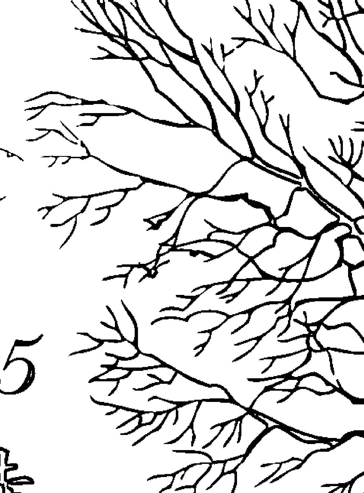

> 合理

我曾遇到过很多人，试图强迫身体辟谷，但我看到的常是这些人很受苦。当一个人对自己的身体及其器官的反应不够了解时，就会如此。他们不知道强迫身体辟谷的后果。辟谷不是禁食，不是挨饿，甚至饿死，因为它有不同的意图、行为和结果。

合理的意思是，考虑所有的“利”与“弊”，预测所有可能的结果，并因此做出有利的决定，回避伤害。

试图开始辟谷生活时，举止要合理，尤其是对身体的尊重。客观并仔细观察它，当您发现辟谷带来的伤害多过益处时就要停止。

生命给了我们很多机会去尝试。您可以多次尝试，所以没有必要一开始就强迫自己。每次尝试都能得到更多经验，经验越多，运用的知识就越多，越能够帮助自己与他人，如果一个人行为合理，做错的机率就越小。

生命永不止息——我常对人们这样说——所以，如果您现在不能达成某事，可以以后再做，因为您总有时间。是的，您总有时间，有全部的时间，并可以决定用它来做什么。生命永不止息，因此这次没达成的，还有第二次、第三次或更多次，您仍然可以以后再做。每一次尝试都有新的体验，这就是您降生在这里的原因。

您已经决定成为辟谷者了吗？您做了计划并依此开始了辟谷，尝试了但没有成功？有什么问题吗？可能有，可能没有。那又怎样？因为除此之外，您有了新的体验，更了解自己，也更了解辟谷。这条路仍向您开放，世界仍然存在，您还活着，并继续您的美丽人生。

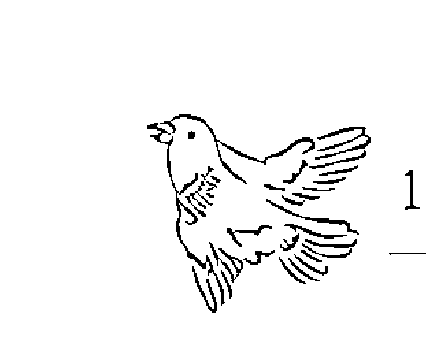

### 隐居

在辟谷或禁食最初几个月，隐居（远离人群）是明智之举，甚至对很多人而言是非常必要的。隐居不仅仅是远离人，也包括远离各种事情和日常活动（如工作、传媒、家务事）。

找个不与家人接触的地方，最好去开放的大自然中，去一个远离城镇、道路、人群的地方，而且不与家人或朋友联系（除非在紧急情况下）。

如果您决定半隐，那就住在接近住所或者住所的另一部分（这样可以以防万一），您可能想每天能抽空去拜访一位在您需要的时候可以给您意见的人。如果您需要什么东西（书，衣服），这个人可以是您与“外部”世界接触的链接，就是说，在那里照顾您。如果你们两人都决定这么做，首先要订好联系和帮助的细则，因为可能会有不同的情况、疑惑、问题、需求。如果帮助您的这人本身有辟谷和禁食的经验，那您需要时，就能给您更有益的建议。

很多人决定完全隐居，不见任何人，不接受任何帮助。从安全的角度来看，这不是那么有利。决定这么做之前，要征求意见，并慎重考虑。如果您想知道怎么办，那就从内在感受这个答案。如果仍然有疑问，首先就要咨询顾问。

隐居为何如此重要呢？主要是能够静默下来，并且把思维的注意力转向内心世界，转向生命的灵性层面。除了静默，隐居的人还远离了不必要的花费心思的事务（传媒、街上的噪音、闲聊等），这样会有更多的机会和时间，来关注自身心理的变化。隐居期间修习沉思、冥想、想象和能量练习对人是有益的，也更容易做到。正因为益处多多，所以值得利用这段时间进行。

### 不强迫

最好不要与身体对抗，因为它是“灵性的殿堂”（实际上，身体是在灵的内部）。身体是人不可或缺的一部分，没有身体的灵（灵魂）就不再是一个人了。对抗导致伤害，身心伤害，甚至死亡。如果您与自己的身体对抗，那谁是受害者？一个常强迫身体去做某事，对抗它并伤害它的人如何去壮大自己的身体呢？另外，一个内心充满爱的人又是如何壮大自己的身体呢？身体由本能管理。因此，如果您不能在设定的时间内成功过渡到辟谷，您可能需要做更多灵性上的努力，而非继续挨饿。如果您收听身体的感觉，它会告知您它的需求。与只是想感受身体相比，更重要的是收听身体的感受，什么是对它最好的。每个身体都是不同的，通过感受，能够与它的主人进行最好的沟通。

有多少次我看到过人们说服自己，吃某些食物（如马铃薯、冰淇淋、蜂蜜）是不好的，因为它们给身体带来伤害，在毁灭身体等等。尽管身体需要食物，他们还是忍着不吃。这种行为损害了身体，这通过人们的悲伤、不满意自己的生活、感到痛苦等等都可以看出。

只有在此之后，这些人满足了身体的需求，才会有较好的情绪和健康。因此，当人们停止对抗身体，并像一个明智有爱心的家长来对待它，身体才会有正常的回应。

有关营养、推进原则、适应方法等的建议，比起您对身体需求的感受来说就不那么重要了。当您能良好收讯息并让身体感受到您的爱，身体就能以可能的最好方式发展。当您确定使用身体的自制力时，那它将最大限度地做到它所能做的。

什么是自制力？这是充满理智和爱的系统性活动，并致力于达成某事。自制力不包含强迫，因为它只包含好的东西。感谢自制力，它使人的身体完成很多看似不可能的事。

能分辨自制力与强迫的不同是很重要的技能，因为它们之间的界线并不明确。当您有正确的知识，并充分感受身体时，您就了解何为自制力，何为强迫了。当您保持身体处于自制状态时，这种技能是非常有用的，尤其是在您要摆脱瘾症（暴饮暴食是其中之一）时。

### 不轻信资料

在某个领域，假如您还没有足够的研究，掌握的相关资料也很少，误解就会产生。对辟谷者和辟谷的适应方法来说，也同样如此。目前，一些资料已经得到普及，大多数对辟谷感兴趣的人也认为，事先进行必要的了解是辟谷之旅的进程之一。
举例来说，资料建议辟谷必须通过“二十一天进程”来完成，这已被广泛接受，并深入人心。
但实际上，这个资料是对这种生活方式的误导，并且也缺乏相应的方法指导。
为您个人的安全起见，如果您没有亲自证实一份资料的真实度，那就需要考虑是否要用它，怎样用它。这种情况下，最好的解决办法就是与一个在这件事上有足够知识的人联系。
如我之前所强调，您应当记住，任何资料有某种特征的话，那它就半真半假。书里（甚至是那些被认为是伟大或神圣的）写的和他人（甚至是那些被认为是权威的或神圣的）说的，也都有某种此类特征。这就是为什么当您没有证实资料的真实度时，最好是跟着直觉走，而非绝对遵循某人说的或写的。
甚至如果某事对某人是对的，对其他人却未必如此。换句话说，一个人并不一定和另一个人的做事方式完全相同。每个人都不一样，每个人的做事方式也不一样。因此，同样的信息可能产生不同的结果。某些事在同一时刻有可能是真的，也有可能是假的。

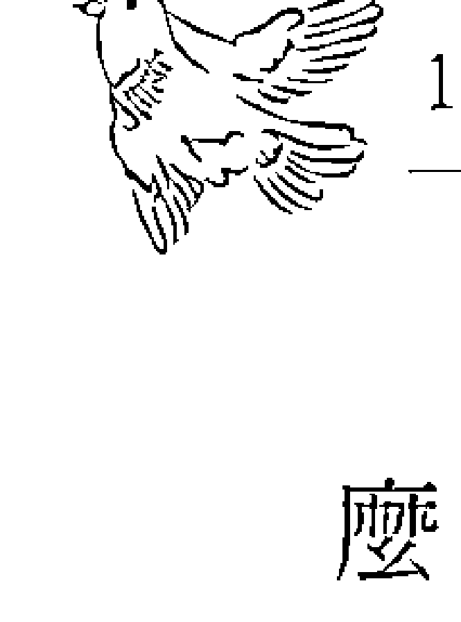

### 单独或不是

如果您按照错误的或者不充分的信息行事，就会做错。要是辟谷过程也这样的话，您的健康或生命（在极端情况下）就会有风险。

让我给您讲个例子：我曾碰到过一些尝试二十一天进程的人，他们相信这样会让他们成为辟谷者。甚至几次失败后，他们仍在纳闷，到底是哪里出了错，却没有意识到这个方法本身的错误。他们相信这个错误的资料，认为这个进程可以使人成为辟谷者。

您是否需要与一个保护者（关照者）保持联系。保护者就是您信任的，自身经验丰富的，在您隐居时都可以来看您并给予建议的人。如果您不面见保护者，也可以与其电话联系。

与保护者的见面是为了查看是否（您的）每件事都顺利，或者您是否需要什么说明（建议、物件、传话等）。也想想您是否属于那些在隐居时见任何人（甚至是亲密的朋友）都会给他们造成压力，而非高兴。如果您觉得您需要完全隐居，至少告知您的亲戚和配偶您要去哪、去多久、您要做什么。

### 幻象或異象

甚至如果您決定了要完全一個人，也要確保在萬一需要的時候能聯繫到一個有經驗的人，因為您可能會突然覺得有這個需要。

禁食者或辟穀者的敏感度提高了，會導致幻象（看到不存在的東西）。如果是偶然發生，並沒有多大關係，但如果發生的頻率增加，您最好去諮詢專家。原因可能是大腦暫時的、無害錯亂——這沒有問題。如果錯亂（缺陷）是永久性的並需要醫治，那就糟了。太長時間（已經在傷害身體）的禁食導致幻象。這就表示要結束禁食了。

值得學習區分幻象和異象，異象是看到存在於非物質世界（大多數人看不到的）的東西或者不在當下的東西。自我淨化的身體使大腦和感官更敏捷，這可能導致特異功能的頻繁出現。其中一個特異功能是看到其他生物、維次或時空。

幻象是身體錯亂的證據，也可能是適應過程太集中所致，或者也可能是身體排毒而導致的暫時精神狀態。

無論如何，如果異象是由於準感官（para-senses）變得活躍而喚醒特異功能引起，那就不是幻象，也不需要醫治。這需要您去學習，如何正確運用和解釋它們。如果有人在這方面很有研究，那能與他們保持聯繫最好不過了。

### 健康

有些人錯誤地認為辟穀是禁食治療，是療愈身體的一種方式，其實辟穀與禁食有著本質的不同。辟穀是一種健康人實施的生活方式。而禁食治療是使人康復的一種方法。

如果身體不夠好，建議不要嘗試集中的辟穀。恰當的順序是，一個人先使自己完全健康（例如透過禁食），然後再開始辟穀。在身體不夠健康的情況下，令自己去適應這種生活會非常困難，因為過程會很長，很不愉快。

在很多人感覺良好沒有任何症狀時，也許他們的一些器官已經生病了，只是本人還未意識到而已。這大多與大腸、肝、腎、脾相關。例如，西方社會的大多數人（甚至幾乎所有）有大腸真菌病（一個人同時可能有幾種真菌），只不過消化道內的寄生蟲或其他疾病不會導致直接感知的痛苦，例如疼痛。但用一些簡單的治療方法就能擺脫這些健康問題。

其中一種情況是，如果精神病人要進行辟穀應該被勸阻。最好不要對一個精神病人提及辟穀，以防止這人傷害到自己。但是，如果這樣一個人非得辟穀的話，應該有人小心看護這個人。

## 體溫

若不是在熱帶地區進行集中的辟穀過渡，那將出現一種更值得注意的症狀——易冷。最常見的是手腳冷，几乎是冰涼，甚至氣溫比較高時，比如攝氏二十五度，也是如此，甚至在更高溫度的環境下還是感覺冷。

如果覺得冷非常困擾您，最好把注意力轉向體溫，因為它是人生命能量的指標之一。當體溫降到攝氏三十五度以下時，就是採取行動的充分理由，因為迫使身體在體溫太低的情況下繼續運轉是很危險的。

如果您覺得冷，且不想開始進食，就穿上暖和的衣服，多做能量練習，並加上適當的想像。例如，您看到並感覺到自己好像溫暖的泉源，身體好像火焰似地散發熱量。

如果太長時間裡都過於寒冷（與其他禁食者相比），那就應該檢查肝和脾，因為很可能它們不能很好地運轉。

如果四肢仍然過於寒冷並青紫，您可以以某種方式溫暖它們。睡覺時即使是穿著厚襪子，戴著厚手套，也要確保四肢暖和。

但是，穿厚衣服，並用某種方法溫暖四肢不是長久之計，因為這樣的行為不能刺激身體釋放足夠的能量，最恰當的方法是使自身釋放足夠的能量。一個辟穀者並不像一個「正常飲食」的健康人似地感到冷。相反，這人在很大的溫度範圍內都感到很舒服。身體，尤其是經過革命性改變的身體，暫時可能需要更多來自外界的溫暖。這有助於保持自身溫暖，並用能量處理其他事情（如靈性修習）。如果生活在熱帶以外的地區，那麼把辟穀過渡安排在夏天會容易得多。

最重要的是，要知道是什麼原因造成的寒冷——體能不足或是循環效率低下？在一個人放棄進食前，仍是在進食的作用下釋放能量。現在，當這人不再吃東西了，要訓練本能在沒有食物的情況下，同樣讓身體釋放足夠的能量。

### 不進食時的飲水

禁食者經常犯的錯誤之一是他們總是迫使自己喝水過多或過少。實際上，喝多少水或其他液體要看身體的需求。如果您喝水超過身體需要或過少，都是在傷害它。當你喝太多水時，身體多餘的水分會引起腿或臉的浮腫。身體也可能透過皮疹、感冒或咳嗽來排除多餘的黏液。水是最好的溶劑和能量源，但過多的水就會增加體能的負擔。

禁食期間大量喝水的人可能認為這樣做可以更易於幫助排出身體裡的毒素。可是身體不是廁所，不是用更多的水就能沖乾淨的，這樣反而毒素排得更少。最好的解決辦法是喝夠身體所需量即可。只在渴的時候喝，而不是餓的時候也喝。慢慢地喝、淺淺地喝，並與唾液混合後再嚥下。

## 灌腸

灌腸，很多科學論文和書籍都談到過，很多人認為很噁心，從沒做過，實際上它對人體非常有益。我不會細講這個，但如果用一句簡短的話概括，那就是：越深入越頻繁（當然是在合理的範圍內）越好。

大腸是各種不同物質被身體吸收的地方，也包括所有腐爛混合物滲出的毒素。任何東西都直接由血液吸收，並循環於全身。

大腸內壁覆蓋著絨毛，使吸收過程可以順利進行。經年累月後，黏液和黏膠狀的物質沉濾在絨毛上，黏住其他不好鑑別成分的物質。漸漸類似膠質物的東西就形成了，這使血液正常吸收營養變得困難，甚至不可能。

此外，這層膠質物對很多有害的細菌、真菌、黴菌和其他寄生蟲來說，也是很好的生長環境。這些寄生蟲的繁殖群體和他們的排洩物損害了細菌群（維持著腸道的正常運轉），毒害了血液，更毒害了整个身体。这就是很多疾病开始的温床，这些疾病越来越困扰着人类，并像流行病似地蔓延（如癌症、过敏、糖尿病）。

據水療醫生講，人們多年前所吃的物質殘渣是可以被沖出大腸的。隨著時間的推移，如果飲食不當，黏液和排泄物層便越積越厚，這一層使大腸直徑變窄，除了一些腐爛的物質外，身體不能從任何東西上吸收到養分。

那麼肝本身就很深，無法發揮其解毒功能。這樣的一個人完全籠罩在毒素的影響下，透過臉和全身肌膚狀況就可以明顯看出來。經常有病、總是疲倦、頭痛，皮膚老化加快，眼睛變得昏暗甚至發黃，這都是身體中毒的明顯特徵，起因都是來自於大腸。清理大腸內部可以使其再度正常運轉，也會使身體恢復健康。

當一個人停止進食，大腸首先運轉變慢，然後停止。消化的食物殘渣仍留在大腸裡，液和黏膠狀的物質和排泄物也是如此。沒有新物質流入大腸，舊的也排不出。留在大腸裡的物質變成硬塊，這當然對身體不利，甚至可能成為寄生蟲的巢穴。

大腸裡的殘留物質和絨毛上黏著的黏液可以用水沖出去——一個簡單有效的方法。在很多情況下這可以使人恢復健康，甚至挽救一個人的生命（當此人身體裡有毒素、腫瘤、寄生蟲時），這就是為什麼灌腸如此重要。甚至可以這麼說，灌腸拯救生命，很多疾病在充分沖洗大腸後，就能排除病因並得以治癒。

我常對人們（尤其那些視灌腸為骯髒之事的人）直言相告：對於清洗大腸，您有選擇，因為您可以選擇，您沒有必要非得清洗大腸，但是如果您把腸裡的東西清洗出去，您就把身體裡腐爛的東西扔出去了。如果您依然把它們存在那兒，您就是在從內部腐爛。

從您停止進食那天開始，至少要每週清洗一次大腸。每個人自己決定適合自己的灌腸頻率。正常的程序是，在禁食的頭一週每天沖洗一次大腸，第二週兩天清一次，然後一週兩次。

用水沖洗大腸，直到裡面徹底乾淨。因為各人的技術不同，這一般要用一週到數月不等。

特別是膠狀的黏液需要長時間沖刷，才能慢慢脫離腸內壁。通常是需要清洗很多次才能完全淨化大腸內壁。

當然，大多數情況下有效的大腸清潔依賴於個人技術，完全從闌尾到肛門的清腸需要練習，並灌腸多次才奏效。

人們發明了儀器來清洗整個大腸，其中不乏有效實用的儀器。但是，如果您不想依靠儀器，可以學習普通的灌腸。

頻繁洗腸會讓您找到最適合自己的方法。您也可以修改和應用這裡談到的任何適合您的方法。

最初您可以想像大腸是一個彎曲又多褶的管子，就像吸塵器的管子，其形狀如同倒置的字母U。問問您自己：我應該怎麼清洗這個管子？水和身體要怎麼配合？需要什麼樣的動作和姿勢，才能用水把這個管子從頭到尾完全清洗乾淨？

清腸的水溫一般在十五度到四十五度之間，也有些專家建議水溫要更高。試著先用熱水再用冷水交替灌腸。把水倒入幾次到十幾次，倒您能留住的量，不要過多。水灌入的速度越慢，並間或停頓，會有更多的水留在裡面。越多的水灌入大腸，清洗得越乾淨，也越深入。當然，不要過量，畢竟大腸不是氣球。通常一次灌腸能灌入半升至兩升的水（有些人可以留住更多）。

當有水在大腸裡時，做些運動。當您的腦中保留著大腸像倒置的U形管的圖片時，您可以輕鬆地找到有助於清洗的姿勢和活動。例如，您可以收放小腹，左右上下的搖晃它、按摩它。您還可以抬起腳後跟並快速著地（晃動腹部）。

經過幾秒鐘到幾分鐘的活動和姿勢後，把灌入的東西再擠壓出來。這種情況下您的想像力也可以幫忙。比如，為了從大腸的頂部（在右邊）排出所有的水，您可以把腳頂在牆上，直起腰腹部，甚至身體豎直，腹部收放幾次。然後轉向左邊，放下腳。左側躺的同時，低頭，提臀收腹，然後蹲下，並盡可能排空大腸裡的東西，按需要重複多次，這樣全部的水才能排空（二到五次）。

然後，您可以再灌水，並重複上述步驟。

完全掌控上述清洗大腸的方法需要多多練習。這是清潔大腸、清理腐物並恢復大腸正常功能非常有效的方法。

有些人用尿液、草藥湯、咖啡、檸檬水或其他液體清洗大腸。在某些情況下這也許很好，尤其是當身體需要止痛藥（咖啡因）、藥物（草藥）——一種能軟化膠狀黏液的物質時。過去人們用過肥皂法，但這刺激大腸，也會毒害身體。依據宇宙法則，最簡單的辦法最有效，因此多數情況下白開水就夠了。

如果您打算乾禁，首先要仔細清洗腸子。在您停止飲水前至少一週開始清洗——這期間只剩下不喝水的挑戰了。在您停止飲水前，大腸內部必須被清洗乾淨。與身體排毒比起來（毒素是透過大腸進入身體的），身體更容易適應沒有水的生活，因為身體對水的需求降低了。

在禁食的第二天或第三天，您可能想腹瀉，可以吃些中草藥或無毒的瀉藥。其中一種是硫酸鎂（大約二十五克的瀉鹽），百分之百的純梨汁（大概一升，可以在商店買，也可以自製）也有很好的效果。

值得注意的是，很多人在喝了大量梨汁後都會腹痛，有時會非常痛，這取決於這些人在喝梨汁前已經禁食多久和腸內的殘留物都有什麼。喝梨汁後，腸子會有強烈的痙攣和蠕動。

### 15 特別注意事項

如果腸子不是特別阻塞，幾分鐘內就會腹瀉。

您可以溫熱大約一升梨汁，然後在五分鐘之內全部喝下。但不要喝得太快，以免嘔吐。

這樣使用梨汁在數小時內是有效的。這可能會使人不舒服，可能因為腹痛、頭痛、「能量襲擊」等等而使人整個過程都感覺很糟糕（大多會發生在下午），這要看個人的敏感度。

梨汁見效十分快，因此在喝的前一至三天，您最好用水清洗大腸（以保持大腸通暢，因為如果大腸阻塞，疼痛和痙攣會更厲害）。

當然，並非每個人都如此。有些人即使喝下一升梨汁，也只不過是肚子咕咕叫而已（這表明腸子很大）。也有的人僅在喝兩杯梨汁後就會嘔吐，並感到強烈的疼痛——那麼這個方法就不適合他們了。

我曾給那些想嘗試和體驗的人描述過這個方法如何奏效。如果您並不確定這在您身上效果如何，您可以從一杯梨汁開始，並觀察會發生什麼。下一步，如果一杯效果太弱，您可以增加梨汁的量。

也有其他清潔腸子的方法，不只是大腸，還有小腸。同時，也清潔了整個消化道和膽囊，最知名和有效的方法起源於瑜伽。簡言之，這是技能。

製作含百分之一鹽分的溫水，喝下一杯，做適當的運動，這會把溶液推向肛門。然後，禁食三天後再這樣做會更有效，大多數人甚至在沒有做適當運動的情況下也可以奏效。您可以做些腹部運動和腹部按壓來替代。想像著您在使溶液從胃部流過腸，直到肛門。再喝一杯，並重複上述練習。重複這個步驟，直到溶液開始從肛門流出。最初，它看起來像是腹瀉，然後流出褐色的水，最後就是清水。然後喝兩杯清水，這個過程就完成了。

### 肌肉活动

很多禁食或向辟穀過度的人抱怨身體相當虛弱，可能還伴有肌肉疼痛，有些人肌肉還會開始萎縮。

這些人感到很虛弱，因此做任何的體力活都會使他們比以前（他們還在進食時）累得多。就像移動一個重物，也非常費勁，還會讓他們呼吸短促、雙腿顫抖。

這樣虛弱的肌肉需要鍛煉，肌肉不怎麼活動的時候就會萎縮。當一個人在禁食或迫使身體向辟穀過渡時，如果沒有規律的肌肉鍛煉，那就萎縮得更快。身體認為並不需要肌肉，就會像蛋白原似的「吃掉」它。

因此，如果您想保持肌肉量，那就要有規律地進行鍛煉。當鍛煉不使身體過於疲累時，更有利，所以不要強迫，要及時有規律地進行適度肌肉鍛煉。但不是一次做一百個下蹲和三十個伏地挺身，而是在一天裡分幾次來做。慢跑和適度的游泳對肌肉也很有好處。

前面提到過的能量練習對肌肉和整個身體都是非常有益的，尤其是能量場。我提到過能量練習並不會導致身體的疲累，而只是使肌肉溫和地運動，這無疑會使它們更強壯。值得一提的是，您也可以去嘗試一些技能，但並不需要專門去學習瑜伽，也不需要到什麼學校專門上課。您可以獨自練習（甚至依據一本說明書），或者就依照您身體的感覺和促進肌肉活動的（前面提到過的）能量流。這種情況下，最重要的是肌肉的運動，這會強壯肌肉，防止其萎縮，並給身體更多的能量。

## 恢復進食

當身體開始有消瘦跡象時，也就是說：
- 大多時候都處於虛弱狀態；
- 變得更瘦；
- 體重在減（甚至每週只減半公斤）；
- 您的情緒變得越來越糟，或者大多數時候都很糟糕；

這意味著要恢復進食了。繼續挨餓（誤認為是辟穀）很可能使身體處在一個不能繼續生存的狀態。那麼它將被遺棄，就是人們所熟知的：餓死。

不要讓自己餓壞，而要用不同方式看待並思考這件事，這樣更為明智，就好像是此生又一次有價值的經歷。在這種情況下，我會說：「生命永無止盡，所以迄今還沒經歷的，可以以後去經歷；迄今還沒達成的，可以將來再做。」

因此，沒有必要擔憂，因為如果一個人使自己的生活困難並痛苦，從人類自然產生的愛就被限制了。下一次，有了更高等的靈性等級，更多的經驗後，就會好一些。可能那時您就能夠在沒有任何強迫的情況下，自然放棄進食。

另一方面，不值得與身體對抗，因為那樣無濟於事。對抗導致傷害和痛苦。如果您與身體對抗，那麼受傷痛苦的人會是誰呢？因此當恢復進食是更明智的選擇時，就值得去這麼做。

甚至如果您們不再視您為一位開悟的明師了，您的生活也不會因此而停止。

再次恢復進食是很冒險的舉動，因為如果錯誤地進行，可能會使您的身體比放棄進食前更糟。飢餓後重塑身體的過程可與快速生長的嬰兒身體相比。首先，這表示身體主要依靠攝入的食物來建構。因此如果這人吃了身體不需要的其他物質，那身體物質結構會比理想狀態要更弱（更糟）。這種方式構造的身體更虛弱、更易生病，衰老也更快。

最有利的解決辦法是，禁食後使用意識進食法恢復「正常」飲食。意識進食可以在需要的時候給身體提供適量的食物。這種方法可以使飢餓或禁食的人擁有強壯、有免疫力的身體。再次恢復進食甚至比自身的禁食治療更重要。

### 如果您對意識進食沒有耐心，那就執行下面講到的合理進食規則。這裡有三條最重要的規則：

- 一、限制食物攝入量，甚至在空腹狀態下——禁食結束後，隨著時間的推進，而漸漸增加進食量，緩步逐漸增加攝入量。您可能很快就會餓，如果您餓了就吃，可能會嚴重傷害您的身體。有個人在幾個星期的禁食後，去餐廳吃了頓大餐，然後疼痛而死。
- 二、首先慢慢地、一滴一滴地喝被水稀釋得很淡的果汁，使其充分與唾液混合，就好像清潔口腔似的。慢慢地再逐漸喝些無鹽的蔬菜汁。然後，可以少量地、小口地吃些水果，在嚥下之前，先充分咀嚼，使其變成液體狀。接下來，以同樣的方式吃蔬菜，甚至比咀嚼水果的時間還要長才可以。
- 三、食物越接近自然，越少加工，越能給身體輸送更好的物質去建構自身。因此吃大自然給予人類的食物，越少加工的，對身體越好。有人恢復進食時，維持在只吃蔬菜和水果的狀態。他們不管是否還要再度開始辟榖，一直都只吃這些東西。

#### 交替淋浴

交替淋浴先由温水开始。过一会儿后，水温渐渐升到您所能承受的最高温（当然不要硬撑），然后迅速把水温降到您所能承受的最低温——让水淋遍全身至少十秒钟。下一步，再迅速变换水温，到您可以轻易承受的最高温，冲几十秒。然后再次迅速变换水温到您能轻易承受的最低温。这样快速变换水温的情况要重复几次，最后是用冷水冲洗整个身体，以便于闭合表皮毛孔和激发从内而外的能量流（这会使您感到暖和）。

交替淋浴（不停地）清洁毛细血管和皮肤。因为水温急速快速的改变使毛细血管也随之快速扩张和收缩，这会使覆盖在血管内壁上的多餘礦物質和其他物質脫落。

同樣，水溫快速的變化使皮膚毛細孔交替張合，這樣的運動使多餘皮脂擋同不乾淨的物質分泌出來，這樣就不需要用肥皂或其他身體清潔物質（您不再毒害身體和自然）。睡覺前交替淋浴的話，要以熱水結束（甚至不用擦乾），這樣能夠多排汗。

一個人從冷水浴中結束交替淋浴時會感到冷，但很快寒冷使體內產生更強的能量運動，擦乾身體不一會兒，這人就會暖和了。如果在淋浴後做能量練習或一些體操，感覺會更明顯。

這種情況下，如果在淋浴後不擦乾身體就立刻開始練習，效果會更好。

可以用兩個浴缸代替淋浴。一個盛冷水，另一個盛熱水。交替進入這兩個浴缸，浸泡在冷水裡幾十秒，再浸泡在熱水裡幾十秒，然後以浸泡冷水浴來結束。如果沒有熱水，有時可以勇於嘗試沖個冷水澡，或者在冰冷的水裡泡澡。尤其在您疲勞或感冒的時候，這可能會非常有利於您的身體。這是增強免疫系統的好辦法。但是，對那些總是感覺冷的人來說，這未必是最好的選擇。關於人的生命能量，它的量以及如何流動影響著一個人對溫度的感知。兩個同等身形的人，在同一地點，穿同樣的衣服，可能會感到不同的溫度。一個可能感覺熱，而另外一個則感覺正好，甚至還冷。大多情況下，這依賴於體內能量流的水準和方向。當能量向內流時，外部的因素（例如建議、光、溫度）對人的影響，比向外流時要大。當能量向外流時，此人對環境影響更大，較少屈服於外部因素。有些人讓內部能量（真我）充分展現，舉手投足好似太陽。能清晰感到他們散發出來的愛、溫暖、安全感等等。有種可見「光環」圍繞著這種人的身體（尤其是頭部）。這樣的人感知冷熱，恰如他們的需要。

### 失败

追求的理想失敗後，獲得的經驗和知識可以給您帶來潛在的更大可能性。這樣下次就可以帶著更多知識、信任與確定，去實現既定目標，這也同樣適用於辟穀。被稱為是「不成功的辟穀嘗試」在這條路上提供了有價值的經驗，這對達成未來目標的助益大於阻礙。

在開始下一次辟穀嘗試前，要確保身體是健康的、營養良好的，並且本能也準備好來迎接這次任務。所以，最好用些時間好好滋養身體，並做些心理、靈性的練習。因此，在辟穀上不要過於關注，而要把更多的時間和精力用來提升靈性等級，以及本能的訓練，因為辟穀，更多的是靈性的技能，而非身體層面的。前面談到的冥想練習可以給您帶來很多益處。

但是，（在這樣的情況下）不要犯基本的錯誤——認為自己失敗了。另外，感到內疚或使身體內疚都會使您的處境更糟糕。這樣的態度沒有助益，反而成為通向圓滿道路上您創造出來的又一障礙。

如果追求的目標沒有達成，並不代表您失敗了。如果您認為自己沒有成功，可能就錯了，因為事實上可能並非如此。如果向內尋求真正的答案，您可能會發現您真實的目的並不是放棄食物，而是體驗它，而您已經以最好的方式完成了這次經歷。

萬一您沒有達成辟穀，最好的態度就是，把再次恢復進食看作是回家，在一次有趣的旅行之後。

讀者札記

（表格内容缺失）

行之后回家了。而这次旅行收获满满。您应当记住辟谷期间给您带来的多重健康。在尝试辟谷期间和之后，从您身上散发出的爱对身体非常重要。爱是创造生命的能量，困难时期，身体尤其需要它。

## 16 进食缘由

人为什么要吃东西，或者，是什么原因使人决定把定义为食物的物质摄入自己的身体？这个问题可能看起来很奇怪，因为答案很简单：人感到饥饿。进一步问：什么时候和什么样的情况下人会感到饥饿？这里有很多人要吃东西的原因，甚至可以分门别类：

-   一、真正的身体需求
-   二、习惯
-   三、瘾症
-   四、信仰或担心
-   五、无聊
-   六、决定改变
-   七、交际
-   八、味道、气味、外观
-   九、贫穷、节俭
-   十、强制
-   十一、奖励
-   十二、接地

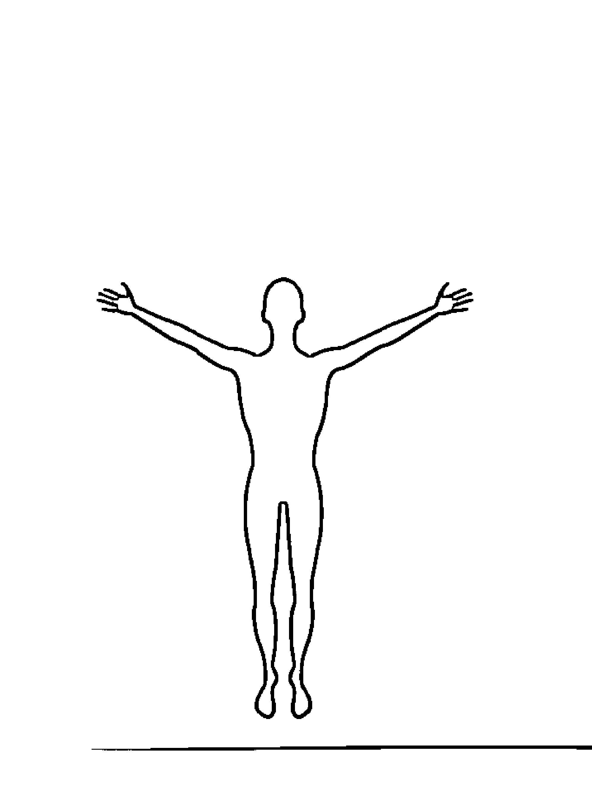

### 真正的身体需求

其他使人吃东西的原因往往都包含在上述原因之一里。努力辟谷的人知道了吃东西的原因，是转变路上最有利的一步，这使人更了解自己的身体。

人体（除了例外）有时候需要来自外界的特殊物质，这种物制成百上千。有的为人熟知，并加以命名、归类，如：碳水化合物、脂肪、蛋白质、矿物质、微量元素、酶。当身体适时适量摄取所有这些物质时（当然不是同时），身体运行最好。

顺便问一下，谁知道身体在什么时候需要什么物质，并且需要多少量？每个身体都不同，并生存于不同的条件下。因此，一般的饮食建议适合吗？

您可能会说您不认识任何那样的人，谁能知道身体什么时候需要多少量的某种物质呢？

对于第二个问题，您也知道答案，没有一种饮食建议是适合所有人的。

我来加入一个假设，饮食是一种不断变化的物质。对一个人来说今天的完美饮食到明天可能就是有害的。人也在不断变化，如同生活状况，因此，需求（如饮食）也在变化。

真正的身体需求是饮食给身体的正常运转带来益处的唯一情况。由于其他原因摄入食物将损害身体健康，尽管这能给人带来其他方面的益处（如社交、愉快、静心）。
当真正的身体需求出现时，最好的解决办法就是给它所需要的东西。如果不能满足真正的身体需求，那就会有损身体健康，身体也会遭受痛苦。

阿里娜拉（Alenara，辟谷者之一，后面会提到）提供了一个方法，可以确定饥饿感到底是由真正的身体需求所致，还是一种情绪的显现。为了确定原因，此人要想像自己将吃不到想吃的东西。想像的时候，要观察身体的情绪反应。如果没有反应，就证明这是真正的身体需求。如果有情绪反应，尤其是基于恐惧的反应，就表明是另一种原因，往往是恐惧或某种情绪的释放。

意识进食（如前所述）可以让「练习者」具备一种能力，能够分辨出饥饿感到底是真正的身体需求还是情绪的显现。意识进食使建立和保持最适当的饮食更加容易。

如果一个人住在食物充足的环境里，情绪往往成为人摄取食物的原因。本能里有积存的情绪反应、感觉、画面和想法，自生命之初就一直在累积，甚至有一些来自于前世。而理智不知道它们的存在，潜意识又应付不了这些资料处理，努力把它们传达给理智，这恰恰就是它的特点。我已经提到过了，本能的工作是储存资料和运行程式（其资料处理功能与理智毫无关联）。

所以，当潜意识将资料传送给不能处理资料的理智时，这个人就会有饥饿感。如果在这种情况下，此人将足够的注意力转向饥饿感，并问自己是否真的感觉饿，那么回答极有可能是，「不，这不是饿」。然而，大多数人觉得饿时，并不会停下来去想，而是立刻开始往身体里塞东西。那么身体就会备受折磨，因为它接收到了这些东西，之后又不得不为了恢复正常运转而把它们全部清理掉。

在感到饿的时候哪怕只是稍微用一下意识进食法，也会有助于辨别那到底是真正的身体需求还是一种情绪反应。如果一个人在感到饿时，不停下来思考，不去找寻深层次的原因，那么就会推断是潜意识让理智这么做的。这可能是一种童年时期就累积的情绪反应。

当一个人只是关心吃，而不关心出现的饥饿感，那会发生什么？累积的情绪、感觉、画面和想法又都通通埋藏到潜意识更深处。因为这个人没有思考，没有深究，因此这个问题仍然没有解决，它仍然会「啰唆」此人。

禁食期间释放的很多情绪，可能会使人非常不愉快。这人有时候也搞不清楚自己到底是怎么了，怎么变得如此敏感、焦虑、没有耐心。那时此人往往把这种情况与饥饿联系在一起，当又开始吃东西后就会感觉轻松了，因为那些不愉快的情绪都没有了。但是，如果当时那人（不吃东西）将注意力集中在在与心灵的相通上，那么饥饿感将减弱或消失，并且也有机会将心理问题清除。这样解决的心理问题，就是有关饥饿的心理问题。

对肥胖的人来说，禁食期间扫除心理障碍会更不好受、更困难。确切地说，他们是自己把自己变胖的，因为他们心理深处积存的资料，被视为一种饥饿感来处理了。就像您所能推断的，他们是最需要禁食，但也是最难达成禁食的。在极端的情况下，有人会在禁食期间死亡，这并不是因为身体不再进食，而是因为他们无法处理那些被释放的情绪。

这里可以看看食物之于人类扮演的另一个角色——让人失去思考、让人忘却不愉快的毒药。有多少人滥用了这个毒品？显而易见，主要是那些肥胖的人。

体内生存的寄生虫（例如肠道里的霉菌）也可以导致饥饿。寄生虫可以影响大脑中枢，使人产生饥饿感，或以某种方式使人透过饮食摄入它们生存、生长所需的物质。很多对甜品上瘾的人，身体里满是寄生虫，菌群在肠道里长得也很好。

### 习惯

习惯是在特定情况下经常表现的行为。饮食习惯是人们在非真正身体需求时进食的主要原因之一。与其他的习惯相似，人并不去想身体此刻是否需要进食，而只是因为习惯而吃。一个最普遍的习惯是，因为是进食时间（餐点），就坐在餐桌前。进食时间的划分：早餐、午餐、晚餐，或者其他任何划分方式，使人频繁进食，但就是不考虑真正的身体需求。

其他习惯与食物的种类相关：下午茶时间是饼干搭配不加糖的茶喝；早晨起床后是加奶和糖的即溶咖啡；看电视的时候是吃泡菜和调味汁的饺子，或是薯条加啤酒；在城市里游走的时候吃冰淇淋等，都是习惯性饮食的例子。您可能也会说出一些您的习惯。人依据情况选择喜欢某种食物而不喜欢其他的食物，这些因素最主要来自于社会意识。

习惯使身体产生机械反应，这就是为什么在某种特定情况下（如时间、环境）人会特别想吃某种食物。这是社会意识如何编辑本能程式的绝好例证。

改掉习惯比改掉瘾症要容易得多。如何区分习惯和瘾症呢？这就要看情绪反应了。总的来说，如果改掉一个特定的行为不会引起情绪反应的就是习惯。如果试图改掉瘾症，就会产生不愉快的情绪反应（可能还会伴有身体不适），例如：易怒、生气、仇恨爆发。换句话说，瘾症越轻，情绪反应就越轻，其实习惯和瘾症并没有十分明显的界限。

### 癮症

食物上的瘾症是地球上最普遍的瘾症。是的，一个人可能变得依赖于吃或喝，对一般饮食或是特定食物上瘾。瘾症看起来像是习惯，但当您试图改掉它时，会感觉到来自于身心的对抗。

人最常对糖、咖啡、软饮料、盐、乳制品、面包和肉上瘾。当一个上瘾者突然决定不再摄取成瘾物，就会明显感到身体的渴求。例如，一个人对吃肉上瘾，但是不再吃之后，此人会渴望它的味道，甚至会影响到心情。一连几个星期都会有对某种食物，比方说一块牛排，难耐的渴望，甚至作梦都会梦到。

想判定瘾症确实不易，弄不巧就会把由真正的身体需求或寄生虫引起的对特定食物的渴望错误地判定为由瘾症所引起。这就是为什么一个在意识进食法上不是专家的人，不可能总对身体什么时候需要食物，需要多少食物判断无误。然而，对意识进食法的规律练习，可以使人有能力来迅速辨别到底是出于真正的身体需求、瘾症还是其他的原因。

对特定食物的强烈渴望，也可能是由寄生虫导致的。比起某种可能想到的普通陆地生物，更多的寄生虫愿意寄生在人体内，并且很多都能强烈影响一个人的味觉偏好。实际上，可以说是有些寄生虫能够控制一个人到极端的程度，使这人吃的大多数食物都是用来帮助它们更好地生长。菌类可能就是一个很好的例子。如果菌群在肠道里已经得到充分生长，那这人就会对甜食（巧克力、冰淇淋、点心）上瘾。

人对食物越上瘾，就越难禁食，并且禁食过程本身也越不好受。对食物上瘾的身体症状与人对酒、烟或毒品上瘾一样。有临床证明，证实了对人来说吃东西是一种与生俱来的瘾症。为什么普通陆地生物的身体只能存活不足百年，还要整个生命过程中经常生病和老化？主要因素之一就是吃东西上瘾（有生命，就有对食物的瘾症）。

### 信念或担心

信念或担心往往是人们为自己创建日常饮食而考虑的重要因素。在此情况下，信念建立在担心身体缺少某些物质的基础上，因此必须要吃某些食物。人除了担心身体缺少某些食物，还相信吃某些食物有益于身体健康。
以下是一些例子（我只选了一些错误的）：

-   喝牛奶可以使骨头和牙齿更坚固，因为它富含钙。
-   人要什么都（吃）。
-   人必须多吃蔬菜和水果。
-   肉是身体正常生长的必需品，并且供给身体维他命 B。
-   人每天必须喝至少两升水。
-   ※人必须少吃多餐。
-   ※工作很重的人必须吃很多。
-   ※吃得多才能长得又高又壮。

这些及其他很多影响人们日常饮食的信念都是世代相传，而人们往往是盲目遵循。人们对吃有这样那样的信念，吃某种食物只是因为相信它对身体有独特的影响。这样的信念会用在发明和推广某种饮食上（为了减肥、排毒、身体复原）。

事实上，身体是自给自足的，只需要一个能正确使用它的头脑。一个人越认为身体需要某种外物支撑，越是朝这方面努力，身体运转就越依赖于这个外物。

另外一个事实是，每个人都不同，创建和采取的需求、信念不同——这就是为什么没有哪种饮食是适合每一个人的。一个人的合理饮食是完全符合这个人的真正身体需求的。

尤其，常常发现人们坚信必须多吃才能有充足的精力和力气。相信食物是必不可少的身体能量供给（就像汽油之于发动机）的人更有过食症的倾向。观察发现以上所述并不完全成立，因为过分限制真正的身体需求会使身体更虚弱。大多数人都有这方面的本能建构（程式）——这我已经解释过了。

错误的信念使人在身体不需要食物的时候吃东西，这就给身体增加了负担，并造成损害。

但是很多人都以成比例摄取更多水果来改变日常饮食，并认为这样有益于身体健康。
如您所料，有关吃和食物的担心和信念不是带来益处，而是对身体健康更加有害，尤其是那些顺从的孩子们，因为有时父母强迫他们进食。

我也听过一种说法，如果一个人不吃光所有应得的食物，命运就会惩罚这人将来没东西吃。

还有，如果一种食物含有大量的某种物质（维他命、矿物质、元素），并不代表「必须要吃了它」才能给身体补充那种物质。含有丰富钙质的牛奶就是一个很好的例子。人们可能相信经常饮用牛奶可以防止缺钙，但是这种行为的结果恰恰相反，大量饮用牛奶（尤其是煮沸的）会导致身体缺钙。为什么会这样，这会引出另一个有关特定食物对身体影响的尖锐话题。

因为担心或信念吃东西，并无法满足真正的身体需求，换句话说，这样做有害健康。

### 无聊

无聊和吃东西在某方面是联系在一起的。您曾经有过开始吃东西只是因为它在那一刻比其他事都有趣，或是它让您忘记无聊的经历吗？「您为什么要吃呢？」——「因为没有其他事可做。」或「消磨时间。」您对这样的或类似的表达方式熟悉吗？这个吃东西的活动还关联着准备食物、进食和吃后的清理，这就有足够的吸引力让没事可做的人开始行动了。那么当您无聊的时候，您可以冥想或其他灵修的练习来代替吃东西。您可能已经知道因为无聊而吃东西会给身体带来不必要的负担，既浪费时间，也浪费金钱和精力。因为无聊而决定要吃东西的人往往也是因为喜欢那个味道。如此产生了这种关联：无聊→要摆脱它→（暂时）改善心情。如您所料，这种关联对人无疑是自我毁灭。这往往透过肥胖或有关肥胖的疾病表现出来，这也是很容易上瘾的。

### 决定改变

基于某些信念，做出改变的决定，促成了日常饮食的改变。这样一个决定可能是基于身体的外观、身体的运转方式、情绪或心理等因素。

一个最常被采纳的决定是让臃肿的身体瘦下来。大多数人都知道过量进食会导致肥胖，因此有些人就决定改变饮食，以便减掉多余脂肪。

一旦做了决定，此人就会选择食物、进食量、进食时间和进食方式。在采取这样的饮食方式时，其知识和信念会对此有至关重要的影响。

这种涉及饮食的决定往往产生在那些对意识自我成长感兴趣的人中。他们决定有选择地进食，放弃一些食物，同样也会改变进食的时间。这是与真正的身体需求一致，而非考虑到对身体有利才做的决定，否则就会损害身体健康。

其中一个重要的决定就是永远放弃食物。同样，在这种情况下，如果我们讨论到对某个特定的人的影响，真正的身体需求的规则仍是有效的。当决定符合真正的身体需求的时候，那它就是有益的，否则就会损害身体健康。

当对日常饮食做出任何决定的时候，要知道最有益的是考虑到真正的身体需求。如果您决定不吃，而真正的身体需求又要求进食的时候，正确的方法就是去改变真正的身体需求（比如说透过想像）。

### 交际

交际及其习惯可能会让人想要吃东西。社交聚会通常都吃东西——这是有损身体健康的一个习惯，在那个时候往往身体并不需要那些吃进去的东西，另外有损身体健康的原因是饮食过量。例如：热情好客的主人会让您品尝所有的食物，而且边说边吃也不利于食物消化。改变习惯是很困难的事，但是在社交聚会里进食，要顾及您的身体健康，这么做是值得的。当然，虽然关注您自己而非谈话本身比较困难，但在交际场合吃得健康仍是有可能的。可以想像一个没有任何食物的社交聚会吗？如果提前通知了所有参加聚会的人为什么没有聚餐，这种聚会是有可能的，并且可能会很成功。最多不过就是那些不喜欢这个想法的人不来参加罢了。

### 味道、气味、外观

味道、气味和外观也许太诱人了，以致于一个人虽然一点都不饿（渴），也会吃吃（喝）。这就是所谓的烹饪艺术，这是地球人类生活的一大块。而往往看上去（因其外形、布置、颜色）很可口的东西事实却并非如此。

对人最大的伤害之一就是使用调味料。盐、糖、香辛料、味精，及任何用以改善气味和形状的物质都是调味料。为什么使用它们会损害身体健康？主要是因为它们欺骗了身体，并使凭感觉找寻营养物质的自然身体功能不能正常运转。

「这个没有味道」、「这个吃起来像锯末」——如果一个人这样评价一道菜，那说明身体已在暗示不需要这种食物。最好就是别吃这道菜，而不是再加以佐料，让它变得美味，去骗过自然的身体功能。味觉直接依赖于真正的身体需求时，身体便可以完美运转。当身体需要某物时，即使没有任何佐料，也会很愉快地享用它。而加入某种调味料，也可能会破坏一道菜的整体味道。

如果身体需要马铃薯，不加盐味道就「棒极了」，但是如果觉得「乏味」或者「没有任何味道」还吃，就会有损身体健康了。当身体需要草莓、浆果、覆盆子之类的食物时，它们本身就有「绝好的」味道。但是食用它们使身体负担加重的话，味觉就会告知人们「太酸」、「不够甜」等等，这就是为什么有些人说这类水果「加点鲜奶油和糖味道会更好」。

用某些物质来改变食物的味道或形状，会骗过身体，使人因为味觉而吃得更多，而不是基于真正的身体需求。因为调味料而使身体习惯的味道（外形），大多数情况下都是对味觉的渴望，而不是真正的身体需求。

调味料使人上瘾，如糖、盐、胡椒粉、辣椒，是最常用來欺骗味觉的食物毒品和物质。而味觉是一种自然的身体功能，它会让人依照真正的身体需求进食。对人来说，放弃调味料，对味觉是尤其有益的，这样一来味觉会更精准地告知身体需要什么、需要多少量。这个功能很简单——如果食物在没有任何佐料的情况下吃起来没有什么味道，这就意味着身体不需要它。

有人仗着他们知道如何研制调味料，主要是美味的那些，已经运作了效益良好的公司。大型的速食跨国公司就是很好的例子，他们的运作，以及对人们味觉的利用，给他们带来了滚滚财源，但也导致亿万民众身体严重受损（肿瘤甚至死亡）。

### 贫穷、节俭

贫穷和节俭使一些人觉得不吃完或把吃不完的食物扔了是「很可惜」的。他们说这是「浪费」、「一把钱扔了」。扔掉食物是种浪费，保存它以便下顿再吃省钱也省时间。然而心理分析往往显示，有这种行为的人是因为担心才这么做。

即使我们忘记了真正的身体需求，吃以前剩的食物（尤其是加热过的）也更加损害身体健康。很多准备好的食物比用来加工它们的原料更容易变质。而加热会产生更多对人体有害的物质。

人，尤其那些因为贫穷、自然灾害或战争而经历过饥荒的人，更容易有不应该浪费食物的坚定信念。如果考虑到遍布全球数以百千万的饥民，他们会内疚，甚至好像自己对此也负有一定的责任。

我的祖父就是如此，甚至在他不饿的时候，都要把放冰箱里很多天的煮过的马铃薯拿来吃，而不是扔了，这也就是为什么他养了一头猪，那样一来就不会浪费食物了。

### 强制

强制进食会让父母对他们的孩子做出最严重的伤害——强迫他们多吃或吃不想吃的东西。孩子应该自由选择食物及摄入量。但是为了健康最好保护他们（这样他们就不会上瘾）远离毒素，比如薯片、薯条、披萨、乳制品或面粉烘焙制品。

有些人为了让孩子进食，还要去哄骗他们。告诉他们如果不吃掉盘子里所有的东西，不好的事就会发生，比如说他们会长雀斑，或某人／某物会把他们带走之类。这些暗示其实也是种强制，会伤害孩子的心理，这种心理可能在他们今后生活的食物范畴里显现出危害。

对进食的强制还包括用餐时间。有些人不让其他人（比方说她的孩子）或自己吃，虽然已经饿了，而是要求要等到饭做好了才吃——「不要现在吃，等会儿，晚餐就要准备好了！」或者更糟，因为是用餐时间，就强制进食——「现在是晚餐时间，好好地把饭菜都吃完！」强制自己或他人在固定时间进食，给当天秩序加入节奏。这使人依赖于此，并且几乎都不能遵循真正的身体需求了。

阻止某事也是一种强迫，也适用于进食。如果一个人阻止自己或他人吃真正身体需求的食物，那就是在危害自己或他人的身体健康。

强制阻止吃某些食物可以暂时用来保护自己和他人（尤其是孩子）远离那些糖果、油炸食品、烘烤烟熏食品和乳制品等有毒物质。然而，这种情况下最好多关注和培养良好的心理素质。吃这些食物有悖于真正的身体需求；是一种瘾症所引起；这种瘾症可能是心理层面的，也可能是味觉或寄生虫引起。

### 奖励

做为自我安慰或是对他人安慰的奖励（以食物形式）可能是进食的一个充分理由。您曾有过在伤心难过、不满时，为了安慰自己，或因为某事奖励自己的时候而吃东西的情形吗？

例如，「整天都焦躁不安，所以现在至少我得吃点好的。」、「没有通过考试，为什么不买支冰淇淋安慰一下自己呢？」、「我们应该高兴，找家餐馆好好吃一顿吧！」 这种情况的进食可以被视为一种对问题、困难、不愉快局面的逃避。进食的行为和食物的味道能给人带来快乐，这种模式通常源自于孩童时代。很多家长都承认这个错误，他们奖励做「好」某件事的孩子糖果、冰淇淋。如此，他们在孩子的本能里建构了一个暗示，即吃「美味的」东西可能是种奖励或安慰。

奖励包括所有的食物，最常用的是糖果，奖励给那些竞赛冠军、小学毕业生、优良学生等。这种行为强烈暗示，吃特定的食物是一种奖赏，值得去为之努力甚至奋斗。 只是为了奖励或安慰而吃，与真正的身体需求并不一致，因此对身体是有害的。这也会使人对味道更上瘾，并且不让累积的心理反应表现出来。

检查您自己是否有这种模式，以便在需要的时候可以有意识地把它去掉，这会使您从一个瘾症中解放出来。

### 接地

接地是进食的特殊原因，往往涉及尝试辟谷的人。这帮助他们「接地」，是为了不在灵性的云层里（他们可能永远不会体验）「飞」得太远。辟谷者也需要在物质与灵性之间维持一个平衡。

進食的一個功能是保持人與有形物質，尤其是地球的聯繫。用比較形象的說法就是，進食使人有足夠的重量，不致像氣球一樣飛走。另一方面，太多的食物把人綁在地球上太牢固了，以致於無法「在靈性中躍起」。如果一些辟穀者仍然沒有學會保持物質與靈性的平衡，那麼進食就能幫助他們留在地面。

這就是為什麼一個辟穀者有時可能會想吃一些不易消化的（淤塞心靈的）東西。食物的振動力越低，就能把人留在地面越久。比如，一杯胡蘿蔔沒有一個同等重量的油膩漢堡能把人留在地面的時間長。

一個辟穀者可能對吃某些東西的願望有不同的詮釋。例如，這人可能覺得，並說那是用盡一生培養的味覺，需要去感受。除此之外，常常是接地需求其實就是真正的身體需求，那麼進食就更有益處了。不只是辟穀者，其他人也可能感覺他們自己有接地的需求。這些往往都是在生活中關註於靈性層面的人。出於對他們機敏的本質的尊重和我對這些人的感覺，我稱他們為天使。

為了不致「飛」得太高，他們有時需要吃些不易消化的東西，這樣他們會感覺更好、更健康。當與地球（物質）接觸太鬆時，人可能會沒有「現實感」。如此鬆弛的結果之一可能會導致某種疾病。

我知道一些與地球有薄弱聯繫的人。正因如此，他們飽受折磨，比如，他們很難找到一份好工作，有長期的債務，甚或有慢性病。在某些情況下，經過檢查，身體雖然沒毛病，但會有疼痛感。當飲食改變為不易消化的食物時，疾病會痊癒或症狀顯著減輕，情緒就會好轉，他們就可以更清楚如何解決自身財務問題。

被稱為是餓死的情況其實並不總然是這樣，雖然太長時間沒有進食所致。很多人因為沒有食物而離去、死亡，並不是因為器官的飢餓，是在於他們與物質間的聯繫過於鬆弛。

如果有人與物質聯繫不緊密，那就不可能再存活於地球人類的軀殼裡，可能會決定去另一個物質沒有這麼密實的維次空間。

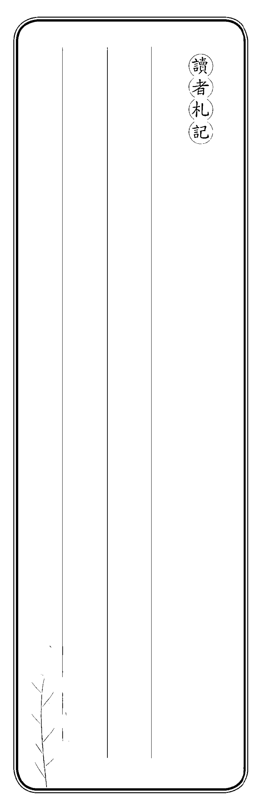

# 17 禁食療法

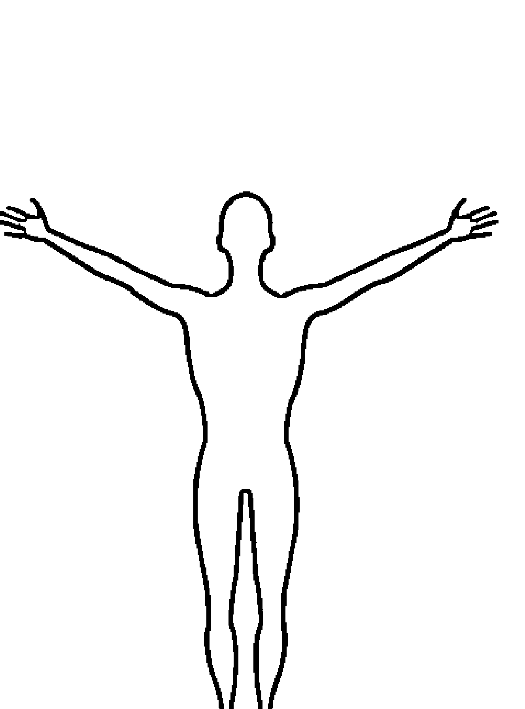

統計顯示，禁食是療癒人類疾病最有效的物理方法。是達到以下效果最省錢、最快捷的方法：

- 擺脫最嚴重的疾病（癌症、糖尿病、冠狀動脈疾病、高血壓、濕疹、哮喘等等）。
- 不斷改善健康狀況。
- 返老還童。
- 身材苗條。
- 擺脫存積的毒素和寄生蟲。
- 提升生命能量水準。
- 改善心態。

很多人深為文明病所困擾，而這些文明病目前是不可治癒的。禁食治療卻能突破這個瓶頸，使他們走向康復。

禁食長短因人而異，可以從一天到幾個月甚至一年以上。但是對一個生活在西方、體重正常的一般人來說，最長禁食時間大約在六週左右。最常見的禁食一般是七到二十八天。如果果不害怕、不勉強，幾乎所有心理健康的人都可以這樣做。因為禁食期間恐懼引發的各種情緒（並非因缺少食物）足以致命。

1. 乾禁——什麼都不吃，哪怕是一滴水。
2. 普通或濕禁——只能喝水。
3. 有草本植物的禁食——只喝草本茶（通常短期飲用）。

### 四、有果汁的禁食——（確切的名稱是：果汁飲食或流食）喝果汁或蔬菜汁。

### 乾禁

「最簡單的辦法往往是最有效的」，據此，乾禁期間什麼都不吃，哪怕是一滴水，這樣會使身體清潔最徹底，療效也最好。事實上，為了達到最好的療效，禁食者甚至連水都不要去碰（理想狀態下），整個禁食期間身體都應該與水絕緣。可以說一週的乾禁與兩到三週的濕禁效果相當。

理想的乾禁是，不僅不喝水，甚至連水都不碰，也就是不洗澡。一般乾禁可以持續一到十四天。這要視情況而定。天氣越乾、越熱，導致出汗的體力活動量越大，人堅持乾禁的時間就越短。在條件（氣溫、濕度、體力活動）正常的情況下，一個普通人在溫和的氣候區可以乾禁七天。

乾禁期間身體會輕微脫水。脫一點水是可以的，重要的是，整個禁食期間要定期檢查身體的狀況。當脫水越過警戒水準，其逆轉過程又不能正常進行（重新補給身體正常的水分），人就會脫水而死。

一般情況下前四天不飲水（也不進食）是不需要任何特殊照顧的，但是在此之後就該監控身體水量了，例如，隨時觀察皮膚的狀況。

另一個重要因素——身體排泄物的量決定了身體不受傷害地進行乾禁的時間。例如，如果一個人吃了大量的高鹽食品，就有很多鹽堆積在體內，那麼最好在排除了過量鹽分後再開始乾禁。也就是說，乾禁前最好先濕禁幾天。

整個過程以濕禁開始，到第八天，再停止喝水。當身體已經清除了多餘的鹽分和其他物質時，就可以開始乾禁了。

通常兩三天禁食後身體對水的需求會變得很小，因此禁食一週之後斷水就沒什麼困難了。

### 濕禁

濕禁期間只能喝水，並且得確保是乾淨的水。最好是雨水或雪水（採集自無污染之地），再或是蒸餾水。如果用蒸餾水，首先要把冷卻至開始結冰，再拿出來備用。要喝常溫水或是加熱後再喝。

水裡什麼都不要加，糖、蜂蜜、咖啡、茶，甚至連一滴檸檬汁也不加。飲用了其他物質的水會擾亂消化過程，而且也不能使身體開啟內部滋養功能（也不能關閉消化系統的運轉）。禁食時，內部滋養不運行的話，就會導致體能消耗加快。還會導致快速減重、情緒變壞，以及體內礦物質加速消耗。這一過程叫做絕食，如果繼續如此，就會導致死亡。

濕禁可以進行一天到數月不等（個別例子甚至會超過十二個月）。時間長短要看禁食者體內積存多餘物質（主要是脂肪）的總量和身體活動量。一般認為平均『燃燒』每公斤脂肪需要二到四天的時間。如果一個人有二十公斤的多餘脂肪，就可以在主禁食階段多加四十到八十天。主禁食階段通常是一到四十天；大多數情況下，這個階段禁食時間越長，越有益於身體健康。

每一次短期禁食都對身體有益處，但十四天以上的禁食可以給身體帶來更大的益處——身體要維持持久健康，至少需要十四天的時間來進行這個過程。如果您從沒有體驗過禁食，不妨一試。第一次禁食可能只是一天。幾天後您可能會禁食兩天兩夜。休息一週，就可以增加為三天。為期三天的禁食，您可以重複做幾次，之後您會進行得非常順利，一切如常，這樣就可以輕鬆進行更長時間的禁食。然後再嘗試禁食四天甚至五天，延長下一次禁食時間到七、九、十、十二天不等，這依您自己的心情而定，直到您可以禁食十四天。一旦可以禁食兩週，很可能您就有信心禁食數週了。禁食七週（時間短點也未嘗不可）就可能造就健康的『奇蹟』。返老還童不再是神話——

### 禁食症狀

這已經透過臨床、外表體徵以及情緒的檢驗。幾乎所有的疾病一去不返（但是沒被發現的癌症可能還需要再次禁食），皺紋消失，頭髮恢復自然的光澤與彈性，頭髮止脫（還可能長出新髮），身材變美（不僅僅是祛除脂肪的緣故）。

為身體康復而禁食的人，談起他們所經歷的諸多有益身心的變化，會讓他人比較信服。「我從沒想過我會感覺這麼好。」— 如果您不親自體驗，就不會知道什麼才是真正的健康，不管您自我感覺多麼良好。」— 您可能會聽到過這些評價，或是類似的觀點。

恐懼是導致身體可能停止運轉（即死亡）的一個重大威脅。社會暗示（大多數世人的生存之道）反覆灌輸給我們一個信念（模式），就是人必須進食，禁食會踐踏身體。如果您相信這個說法，就不要立刻開始四十天的禁食；如果您這麼做的話，您的身體很快就會罷工，而這只是因為您先入為主的那個信念。最好先練習禁食，以便親自證實，世人所說的身體如何運轉的常識，並不可靠。那您的信念也就不攻自破了。

禁食期間身體自行淨化，祛除毒素和寄生蟲—這可能不好受，不過也是因人而異。有人會在整個禁食期間都沒有什麼特別感覺，也沒有不良反應，也有人感覺很糟糕，幾乎生不如死。

如果您屬於那些身體有不良反應的人，要知道這些是身心自行淨化和康復的好轉反應——平靜度過即可。在極少數情況下，有些症狀需要您停止禁食。因此，如果禁食期間您感覺良好，就享受隨之而來的身心愉悅吧！生活一切照舊。

這裡列舉了一些禁食期間可能出現的不良反應（都是暫時的）：頭痛，任何內臟器官的疼痛，骨頭、關節、眼睛或身體其他任何部位的疼痛；頭髮大量脫落；虛弱；脫水；頭暈、昏倒；體重下降；關節（或其他部位）腫脹；心態不穩；突發或急性疾病（其實是舊病復發或慢性病復發）；皮疹、過敏加劇；腎結石、肝結石、膽結石的移動或消除造成的劇烈疼痛；高燒；血壓下降；心悸；噁心、嘔吐。

如果出現以上任何症狀，耐心等待幾小時、幾天，或幾週（極端情況下），症狀就會自行消除。這些症狀本身並不會傷害身體，但也要引起注意，因為頭暈昏倒可能會讓您摔倒、受傷。

如果您是低血壓，就更要注意，因為血壓可能會持續下降，等低到一個危險值，就影響身體正常運轉了。考慮到這個問題，您最好控制並有計畫地進行活動。

如果您的腎結石很大，較大的碎塊可能會阻塞輸尿管，讓您疼痛無比，這就可能需要醫療生的介入（不要停止禁食，只是疏通輸尿管）。

簡言之，禁食期間出現的任何不良反應都表明身體正在清除多餘物質（累積多年），如毒素、死細胞、脂肪，也表明身體正在自我修復和自我調節（如內分泌腺）。身體是一台完美的自我控制生物機，給它自由、時間，不加重它的消化負擔的話，它可以自行調整到最佳運轉狀態。

禁食期間，不干擾身體，讓它進行所有必要的修復、淨化、更新等等，以便運轉更順暢、更長久。規律的禁食其實是長壽秘笈之一。

### 腸道清洗（灌腸）

禁食期間的確值得用水清洗大腸，因為要往體內輸入水分，乾禁就不再那麼純粹，但還是可以清洗腸道的。

有些人認為灌腸很噁心。如果您也這麼認為，就不必清洗，但您要知道，如果不清洗的話，腐爛物質就會存留體內。腸道內腐爛物質所產生的毒素會進入血液，然後循環於整個身體，產生不良反應，同時加重排泄系統的負擔。

大腸殘留物如同排泄物般留在腸內，可能導致腸癌（歐美最常見的死亡原因之一）等疾病。所以，是讓髒東西從體內流出，還是任其在裡面腐爛，您自己看著辦吧！

大腸約長六十到八十公分，就像一根有很多凹角的管子，因此要清洗乾淨，需要多次深度沖洗。一般情況下用乾淨的水沖洗就可以。大腸內部常年累積的黏液似的膠狀物可能很難完全清除乾淨，這就需要配合灌腸，再禁食幾週，膠狀物才會逐漸剝離並排出體外。

禁食的第一週，每天洗腸一次；第二週每兩天一次；再往後就每週兩次。如果深度清洗時，流出的也只是乾淨的水。那時您就可以每週只灌腸一次。

如果您計畫完全乾禁，那麼開始前就要清洗好腸道。完全乾禁期間不灌腸，這樣才能不讓身體接觸一丁點水分。因此，要想不受苦，就需要先濕禁一週（每天都要深度灌腸），然後再開始乾禁。

大腸的自身清洗（甚至不需要什麼禁食）是一種很有效的治療，在很多情況下都能清除病因，大多數人都不知道大腸內能殘留什麼物質。其實所吃食物的殘留物會形成排泄物和像黏液般的膠狀物粘在腸壁內，可能存留幾十年都排不出去，而這些殘留物往往是導致腸道腫瘤的罪魁禍首。

### 體力活動

禁食期間也需要活動身體，如果您平時過著「坐式生活」，那就得比平時活動量還要大一些。建議散步、慢跑、游泳，甚至騎自行車，這些活動可以幫助身體更快清除毒素。

當您不舒服的時候，尤其建議做些體力活動。但如果身體真得（非常）虛弱，並且需要休息的時候，就不要勉強去活動，要讓它休息，這方面要靈活掌握。

禁食期間的能量練習值得特別關注。氣功、太極、哈他瑜伽和靜力鍛鍊都屬於此類練習。您要是什麼都不知道，也不用擔心，在做能量練習時，最重要的是，關注循環於身體的能量流。關注能量流穿過您的感覺，不要去管身體的反應，當身體感受到了流動的能量，就會開始活動肌肉。讓它自行運轉就可以了。

> 讀者札記

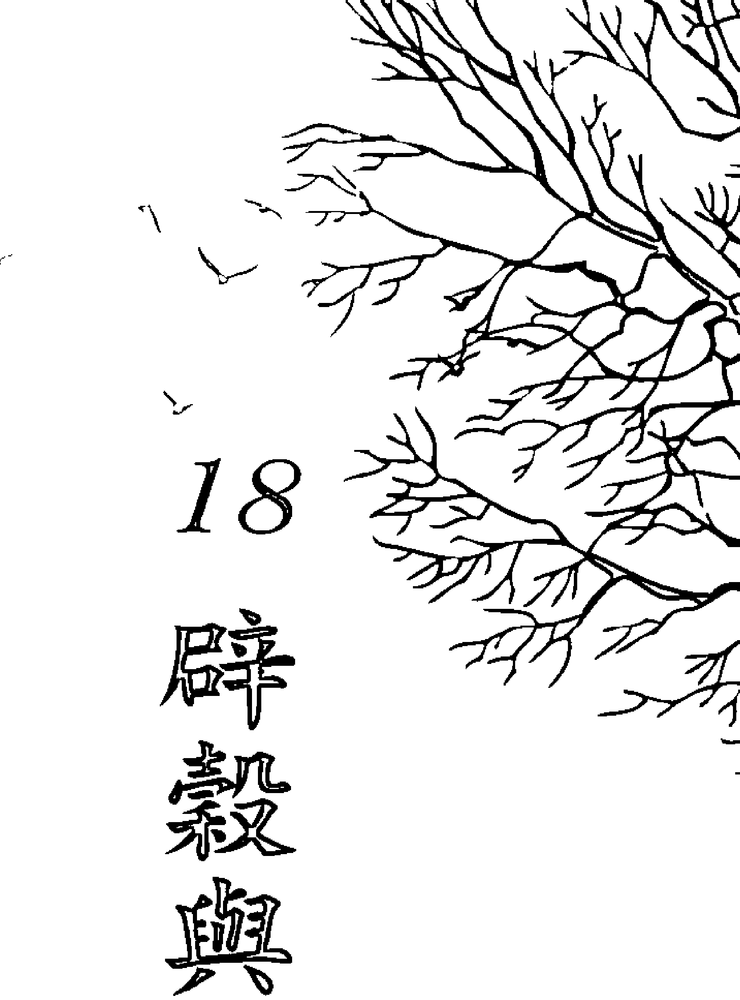

# 18 辟穀與禁食

人體在很長時間不進食的情況下都可以運轉，至於到底能堅持多長時間取決於很多因素，主要有人的靈性等級、脂肪和肌肉貯量、心理狀態、氣溫和體力活動。醫學研究記載最長的禁食（不是辟穀）時間是十五個月以上。禁食的人每天喝兩杯水，整個過程都感覺良好。

超重的人禁食三個月並不是什麼大不了的事，而且對身體也沒有威脅。

辟穀與禁食的主要區別：體重變化；性情；建構身體的方式。

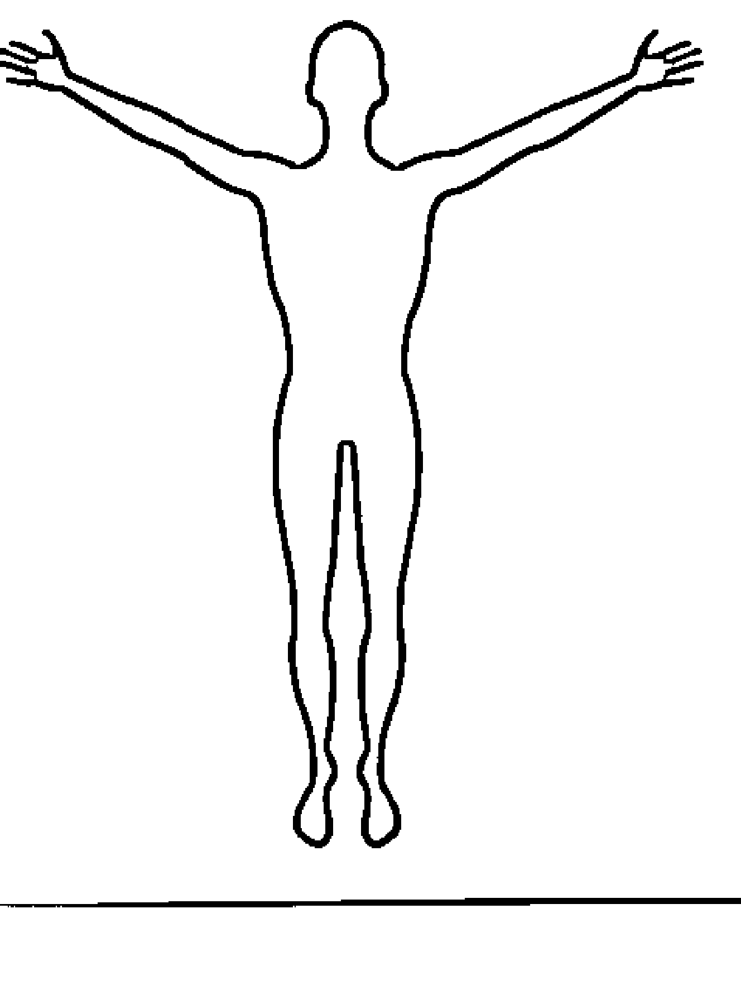

## 體重變化

當人們不再往身體裡塞食物和飲品時，身體首先清除（在最初的幾天到幾週裡）的那些給它的運行構成最大障礙的物質。做為溶劑的水是身體去除多餘物質和有毒物質的必需品。這就是為什麼在禁食的頭幾天到幾週裡，身體還需要水。至於需要多少水，一般來說不是很多，每天一升或一杯就夠了；不過也是因人而異的，要看個人所處的氣候條件和自身的體力活動量。身體得以充分清潔了，就會降低每天對水量的需求水準，也就是幾個立方公分到十幾個立方公分。在適宜的環境條件下，身體就不需要水了，那麼喝水可能就沒必要了。

飲水對體重也有很大影響。如果一個禁食的人只喝身體所需要的水，那麼體重就會下降直到達到此人最佳水準。一個人的恰當體重會有別於常識和所公佈的資料（身高和體重的關係）。恰當體重是身體既沒有物質過量也沒有缺乏的狀態，並不是通常展現在人們面前的形體。大多數人都認為有恰當體重的人不會是皮包骨的樣子。人在擁有恰當體重的時候感覺最好，因為在那個時候他們的身體運轉最正常。即使兩個同樣高的人都有恰當的體重，他們之間的體重差異也會高達百分之十五。

在禁食期間，非消瘦的人就向著恰當體重方向轉變。當禁食一段時間後，依據一些條件，例如最初的多餘脂肪、水分和肌肉含量、人的靈性等級、靈性身體活動，身體將會達到恰當體重。對於過於肥胖的人，這可能就要花上幾個月的時間了（對此類人而言，禁食是非常有益健康的）。

接下來會發生什麼，也就是達到恰當體重後會有什麼事發生？如果能辟穀生活，也就是能成為辟穀者，那他們就能保持恰當體重不變。不過，如果不能辟穀生活，那他們的體重就會不斷下降，因為身體不斷使用和清除細胞而沒有接收到任何能建造它們的材料。那這種人就不能完全以光維生。如果這個過程繼續的話，身體就會變得虛弱，並最終停止運行，就是餓死。

### 性情

在禁食的最初二到三週裡，您的性情可能會有很大的轉變。無需擔心（當然是在允許的範圍內）您身體的虛弱、疼痛、暈眩、噁心或其他在這一時期發生的症狀，這些是身體自我清潔或自我療癒的信號。一般在二到三週（肥胖的人可能會更長），當身體達到它的自然狀態後，您的性情也就變得完美無缺了。只有在那個時候（可能是生平第一次），您才會明白什麼才是感覺很好和真正的健康。您有如此多的能量，去生活、工作和運動，並且還會表現出非凡的創造力。

隨著時間的推移將發生什麼？
如果您能辟穀生活或是一位辟穀者，那麼好性情及與此相關的一切都將保持不變。好心情、幸福感、自我滿足感，以及對他人可愛樂觀的態度都是身體良好狀態的表現。正像波蘭的一句諺語：「健康的心態來自於健康的體魄。」
然而，如果您不能辟穀生活，會變得虛弱，什麼也不想做，甚至感到憂傷。身體越是需要食物，心情就越差，這表明您應該恢復進食了。

## 建構身體的方式

辟穀者身體細胞的建造材料是光所創造的，它的源頭是真我（意識層面）。因此，辟穀者無需把任何東西再塞到消化道裡。
非辟穀者的建造材料是透過外界傳送的，以食物、水、空氣和光線的形式傳送。如果建造材料的量太少，身體就會有毛病、失靈。

### 總結

如果您已經好幾週沒有進食，仍感覺良好，體重也沒到恰當值以下，那您看來可以辟穀生活了。然而，如果幾週（為了好統計，假設是四十天的非超重個體）的禁食後，體重降到了恰當值以下（甚至更糟），感覺還很不好，由此您就能判斷出身體是受到傷害了。因此，如果您還不進食的話，就註定會失敗。

### 讀者札記

# 19 生命與辟穀

人類把食物當作是必需品，換言之，對一個常人來說，進食是生命中固有的、不可或缺的部分，飲食是人類生存於這個地球上的一個基本經歷。
其實體驗與飲食相關的事情（食物的準備，其口味、構造、香味，由此產生的疾病、痛苦等等）就足以吸引生命定居於地球了。這就是為何對地球上大多數人來講，強迫性的辟穀，意味著被剝奪了身體經歷預期體驗的權利，這當然會把他們引向不歸之路。

在其他的星球，在宇宙其他維次空間裡的生命與食物或飲食的關係則截然不同。情形多種多樣，那頭是不「吃」任何食物的生命（他們甚至沒有器官），而這頭是不斷吃食物並與食物密不可分的生命。

這個宇宙中存在的生命可以分為三類：

- 一、非物質生命
- 二、部分物質生命
- 三、物質生命

### 非物質生命

如同人們所知，雖然一些敏感的人可以看到或感覺到非物質生命，但通常人們是看不到，也觸摸不到他們的。他們的身體沒有通常我們所說的內臟器官，還可以隨意變形。人可以很容易猜到非物質生命與人類所稱的食物毫無關係。他們世界裡的普通居民可能連什麼是食物都不知道。飲食對他們來說是遙不可及的體驗，因此一些人就夢想體驗肉體的生命，這樣就能夠吃東西了。

然後他們就來到像地球這樣的星球上生活，而這裡的生活對他們來說是很艱苦的。也難怪，他們突然就改變了生活環境，會有各方面的飲食問題。要嘛暴食要嘛厭食，經常暴食或努力辟穀的人都來自於這些生命。

非物質生命進入人體後才發現他們並不能完全適應這個環境，主要是由於很難適應物質。飲食牢牢地把生命固定在物質層面，這是要努力擺脫飲食的原因。辟穀原本就是他們的自然狀態。然而接地（飲食）提供了與物質更穩定的關係，可以幫助他們更輕鬆地棲居於這個軀體。

這些生命辟穀的話，多數都無法繼續保有身體，因為與身體的聯繫（物質）可能會變得太鬆，從而導致永久的脫離。進食對他們而言不僅是必須的，而且也是計畫體驗物質的一部分。因此，對他們來講，放棄食物就等於失去了生命的意義。

有時我會碰到這些人，絕大多數都不知道造成他們不食或過食「問題」的原因是什麼。我予以解釋，以便他們獲取訊息，有助於理解那個「問題」。有了這個訊息，他們可以更清醒地選擇是要體驗物質，還是要成為一個辟穀者。

如果您遇到一個人，往往不是胖就是瘦，渾身散發著愛的氣息，熱情得像個太陽，有著天使般的特質，還有不食或過食的問題，您就可以姑且認定這人是來自於對食物聞所未聞的低密度世界（維次空間）。據統計，不食或過食「問題」越嚴重，物質體驗的經歷就越短，而且這個體驗往往都是在地球上養成的。

### 部分物質生命

這種生命的身體密度各有不同，其範圍從幾乎看不到和難以觸摸（與霧相似）到幾乎像沒有骨頭的人體。可以是不斷改變形狀的霧狀幽靈、某種液態的凝膠狀物質，或某種橡皮泥似的物質。如果他們允許，您可以嘗試一個有趣的體驗，就是把您的手掌插入這種生命體，甚至可以摸遍整個身體。

您可以輕易猜到，這些生命所吃的也是不那麼密實的食物，如凝膠狀物質、液體、氣體、火、溫度、射線和其他生命體的情緒。這類生命中很多都是天生的「辟穀者」，因此適應辟穀對他們而言（與人類相比）相對比較容易。

部分物質生命更願意在其他星球生活，而非地球。在地球生活，雖然是有可能的，但對他們不利，因為他們的能量會消耗非常快。當然，也更難找到種類繁多的「食物」。

如果一個普通人決定像部分物質生命般進食，那可能很快就會瘦弱不堪，還很不舒服。這好比一個平時吃油膩食物的人，突然只喝果汁一樣。

## 物質生命

如同人，他們可以很容易理解食物與物質之間的聯繫。物質生命如此適應密物質，任何試圖破壞它們聯繫的嘗試都可能導致他們死亡。他們真的很難做到不攝取食物。因此，他們在物質中陷得越深，適應辟穀生活的「過程」就越艱難。

這一重要訊息顯示，向著辟穀生活努力，會使一個純物質生命向部分物質生命轉變。如同其他轉變，如果這個轉變是被迫或太快的話，就可能會失敗。

## 20 合作促進發展

地球人類文明發展特點之一就是，人越來越多地發掘出自身的能力，來證明他們內在蘊藏著巨大的未知能量。這種發展是因人類靈性等級提升而造就的。

這些能力之一就是身體無需進食，照樣正常運轉。雖然人們對此能力仍知之甚少，但它已經為越來越多的人所掌握。

人們退而求其次的原因之一就是缺乏訊息。錯誤的信念、迷信、謊言、誤解都歸因於缺乏真實訊息。當今，一般人幾乎對人的辟穀潛能一無所知。所以我覺得有必要提供給大家真實、經過科學驗證的訊息，這樣您才能夠更肯定地選擇優質生活。

### # 致科學家和醫生的公開信

我願意與對辟穀和禁食研究感興趣的各方合作，尤其是科學家、醫生、記者、編輯以及各種機構，目的是創建利益大眾的、詳盡的文獻資料。再者，對碩士、博士或其他論文來說，辟穀會是個有趣的話題。請不要害怕，以開放的心態，用心靈探索這個課題。為了造福人類，我很樂意與您合作，您可以隨時和我聯繫。

讓我們攜手合作，以便幫助人們瞭解更多自身發展的潛能，擺脫疾病困擾，擁有更健康的生活方式，並致力於消除地球饑荒。

對辟穀者或禁食者進行科學研究的資料，對醫學領域的研究是很有價值的。研究身體機能正常運轉的辟穀者和禁食者，所得訊息非常寶貴，構成進一步探索人類的寶貴基石，這是有效療癒、預防疾病和保持健康的重要階段之一。

我相信，除了我之外，還有很多人願意投身於研究中，以整理出有關辟穀者和禁食者身體機能的科學資料。事實上，大多數人並不相信禁食的高效療癒和人類辟穀的潛能。然而，很多思想開放的

### 致媒体的公开信

科学家不畏挑战。由于他们对「不可能」之事的开放态度，才使得先前根深蒂固的想法被彻底扭转，例如：人不可能飞、地球是平的、太阳绕着地球转及其他谬误的思想。

我希望能够与这些科学家和医生进行合作。我还在等待。

拥有真实和有价值的讯息，可以为个人成长、摆脱疾病困扰、拥有更健康的生活方式、消除饥荒和解放自我带来更多可能。

有些人为抗议某事而绝食，以便能透过媒体引起社会关注。他们制造轰动，从而实现政治的或政党的目标。

而很多人是为了自己，才开始辟谷生活的（悄悄地、默默地）。由于他们辟谷后，身体机能仍然完好，从中获益不少。人们开始辟谷生活的原因之一，也是想从疾病和饥饿的痛苦中解脱出来。因此，为了我们大家的利益，公开传来自辟谷者和为健康禁食的人的讯息，是值得的。

媒体最主要的任务，是传播真实的资讯，并摧毁那些限制人们的普遍错误的信念。这样，人们摆脱禁锢，走向自由的路上，就有了媒体的一份力量。

很多辟穀者，公開自己的生活方式，都願意與媒體合作。主要就是要讓人們瞭解他們潛能無限，有能力創造並掌控自己的生活。等待您的聯繫，誠邀您來觀察並記錄。

## 讀者札記

+

## 21 常見問題

我們為什麼有消化道？

答案是顯而易見的——為了把吞進體內的每樣東西都處理和排泄掉。人體是一台主要由本能控制的機器，也是「自然法則」的主體對象。

這些是我個人或在辟穀論壇上最常被問到的問題。如果您有其他問題，並且認為值得在此提出的話，請寫在 http://inedia.info 論壇上。

人類擁有「自由意志」，充分展現在其理智的創造力上，這樣才能體驗真我所設定的生命之旅，人體不過是人類感受物質世界的一個工具而已。

雖然本能創造並保有身體，但也會受到社會意識的影響，因此一個人腦中的很多產物與他人腦中的產物往往是一樣的。如果一個人生在飲食社會，那麼身體就會有適於消化和排泄的系統和器官。如果生在辟穀的社會，那麼這些系統就會閒置，甚至根本不存在。也就是說，一個人出生的社會結構決定了其身體構造。

人體非常靈活，可以適應不同的生存條件，以便廣泛地體驗物質世界。它也是自然界中已知的最精密、自我控制最好的機器。為了更好地體驗生命，人體需要所有的感官和器官，這樣就可以廣泛適應各種具體要求。

消化和排泄系統就是這樣的工具，使您體驗飲食這種程式成為可能。只要人繼續體驗食物這種物質（味道、黏稠度、溫度、進食導致的疾病、酒精性麻醉和其他很多情況），這些系統就是必不可少的。當這種體驗結束時，消化道對身體而言就沒有用處了，如同對辟穀者的研究所示，它就消失（萎縮）或轉為他物。

換言之，只要人還停留在體驗物質的階段，還在進食（一種體驗方式），那麼身體會為了使這一體驗成為可能，而去擁有、開發並轉變系統。當人結束這種體驗，身體就會適應新的環境，消化道就會消失、轉變或被其他系統代替。

人為什麼會餓死？

飢餓本身並不會餓死人，但是如果身體沒有攝入足夠的食物就會死亡。這就是人類本能的運轉程式。

地球上的每個人都有辟穀的潛能，但潛能並不能自動變成相關的技能。潛能只表示有待開發和實現的能力。如果維持身體完美運轉的技能無法充分發展，那麼，在長時間不進食的情況下，人就會走向死亡。

在本能裡有專司食物和飲食的系統，只有適當改變那些系統的運轉，人才有可能完全辟穀。只有生在辟穀的社會，人才能生而辟穀。

在他們的本能裡，專司食物與身體之間關係的程式，運轉方式是不同於“正常”飲食之人的。本能，不會前思後想，也不計後果如何，只是完全按照既定程式運行。在身體缺少食物的情況下，若特定程式不隨之修正就運行的話，會導致死亡。因此，如果一個人認為辟穀就會死，那就一定會發生。而辟穀者則很清楚，身體的完好運轉根本不需要食物。

### # 為什麼辟穀者不去饑荒之地推廣辟穀呢？

每遇到一個辟穀者，您都可能這麼問。我想答案是見仁見智的。如果問到我，我會這麼回答。

我所從事的工作就是回答這些問題，因此，我可稱得上是訊息之源。我既不會主動尋找需要幫助的人，也不會主動提供幫助，但我是有求必應；我有這個能力，也願意提供幫助，這也是為什麼我會受邀去一些地方。然而，我從沒接收過來自饑荒之地的邀請。如果有的話，我也會考慮考慮再說。

除此之外，還有一個原因。

地球上，有些人透過讓人們挨餓、患『不治之症』、文盲無知和污染自然環境等諸多手段來獲取利益。這些有權有勢之人，無所不用其極地控制那些無意識並且容易被操控奴役的人們，讓他們處在貧窮、無知和弱勢之中。

在鬧饑荒的地方教授辟穀，可能會危及他們的生活。對那些因絕望而願意做『任何事』以獲取『一片麵包』或『一碗飯』的人來說，操控他們的行為易如反掌。

另一個方法往往更有效，就是教育那些『吃得飽』的人，因為他們可能會是其他人的榜樣。這是因為生活在被稱為（工業）『不發達』國家的人往往都會效仿『發達』國家的人的樣子。

順便說一下，我們可能還會問：為什麼那些負責解決饑荒問題的有權勢、有影響力的組織，對教育這些饑民並不怎麼（或者根本不）感興趣？為什麼像生產充足的食物，或其他本可以很早以前就能解決全球饑荒問題的簡單辦法，卻不允許用於那些饑民所在地？如果您深入挖掘下去，或許會找到非常有趣且震驚的答案。

### # 為什麼您的培訓是付費的？

因為我還活在這樣的虛幻世界中，身在其中的我們相信一疊鈔票和金戒指有交換的魔力，甚至可以衡量人生價值。金錢是我們的主人，我們甘願成為它的奴隸，儘管沒人要我們如此。

培訓期間，講師將累積的經驗訊息傳遞出去。這些訊息在過去、現在、未來都是免費的，尋求的人都將得到。如果您不想費時費力地尋找，也可以走捷徑，花錢買其他人研究的、收集的、發現的或學到的訊息。

講師就是發現並整理訊息的人，也可能已經親身體驗，因此能夠當傳遞者。訊息和知識是免費的，但講師的時間和付出、通信、差旅、租用培訓室和其他組織事宜都是需要開支的。

### # 如何才能成為辟穀者？我也可以辟穀嗎？

每個人都有自己的方法，每個人都是不同的個體，所以，根本就沒有一個通用的方法。

錢是交換的一種方式。也不是所有人都必須要用錢，一個人可以完全不靠錢生活。如果您有錢，就會選擇想要交換的東西。例如，為了獲取更多的訊息，您可以花錢去參加一個培訓。如果您沒有錢，也可以用其他東西進行交換。有些講師因為不同的原因而無償提供訊息。有些講師嚮往自由，不願受金錢以及隨之而來的物質生活的綁縛。還有一些講師認為他們不應該得到任何報酬。再有一些講師雖然生活貧困，但還是決定犧牲自我，服務大眾。他們都認為「靈性知識」應該是無償施予的。也有些講師透過無償提供經驗、知識等，有意無意地與他們的學生建立起業力關係。他們不收費的做法使學生依賴於他們，而這意味著，日後這些學生都會透過諸如金錢、服務、教學、建議等予以回報。如果您認為您所尋找的其他人的工作成果或訊息應該無償提供給您，那您可以告訴那個人並予以解釋。您可以建議以一個產品、服務或其他事物做為交換。您並不一定要付錢，選擇權在您。

法。因此，有多少辟穀者，就有多少實現辟穀的方法。

如果您知道自己適合辟穀，那您已經走上正途，也可能已經在用自己的方式著手提升您所在的靈性等級了。

如果您問別人您是否能夠辟穀生活，答案會是「不，您不能」。儘管您有潛能，但只要您不清楚自己是否能夠辟穀生活，您就做不到。僅靠訊息是不足以讓您辟穀生活的。一旦您開始從內在獲得與其相關的知識與能量時，您就有了選擇這種生活方式的基礎，那麼您也就知道了要做什麼並如何去做。

如果您已經感到您適合辟穀，那麼您就已經開始辟穀了。擺在您面前的有很多選擇，您可以依照自己的計畫去一一實現。

做什麼？做那些您覺得對您來說最好的事。首先沉住氣，別認為食物對您是不好的（很多人都會犯這個錯誤）。生命永無止盡，又不是競賽，您有的是時間。您現在做不到的可以放到以後來做。

> > 人可以辟穀是無稽之談。否則您證明給我看？
> 
> 在此我聲明，我並不覺得有必要去證明辟穀生活是可能的，及我或其他任何人是辟穀者。我不打算證明這個，但是我願意進行試驗（我已寫在這本書中），其結果可能會被某些人當作是想要證明什麼。人類以自己獨特的方式生活在地球上，體驗並創建自己的知識，建構屬於自己的世界。每個人都是不同的個體，雖然他們有相似，甚至有共同的元素，但他們的世界仍是有差別的。證明與否，那都是您自己的事。對於其他事情或者別人所說的，他們不會向您證明什麼，您只能信或不信。您也可以定義一個自我檢驗的信認標準，那麼如果您覺得這是無稽之談的話——是的，沒錯，對您來說確實如此。人們用信念、經驗和知識建構自己的世界，因此對某一個個人（世界）來說是真實的事，對另一個人（世界）來說，就可能是不存在或錯誤的。這就意味著真理是相對於不同的人及其世界而言的。當辟穀對一個人而言是正確可行的時候，並不表示它對每個人都是可行的。辟穀的可行性適用於某些人，他們甚至還會進行實踐，然而，與此同時，對另一些人而言，它就會是錯誤的、行不通的。所以，當一個人愉悅地辟穀時，另一個人如果這樣的話，就會走向死亡。這只是一個可能與不可能、正確與錯誤同時發生的例子。當然，這並不會阻礙一個人收集訊息、改變信念、體驗生命並建立自己的知識體系。

## 辟穀者從哪兒獲取生存能量？

一個虛懷若谷的人允許他人體驗他們自己的選擇，建立他們自己的世界，因為這人知道，這是人類自由意志的體現。

當一個人考慮辟穀的時候，總是先考慮能量的輸送問題，那麼，此人便認為生存所需的能量（如建構身體細胞、器官運轉、思考、情緒等）是來自於外界。

科學家便是基於這一觀點來研究身體裡物質和能量的運行。身體是如何為其正常運轉汲取能量的，及特殊化合物，如碳水化合物、蛋白質、礦物質等對身體機能有何影響。科學家首先要研究出人體是如何運轉的，然後提出假設，並得出結論。而其他人就把這些結論奉行為唯一的真理。

無需深究，就知道其實人相信什麼能給予能量，就以什麼維生。如果一個人相信麵包、馬鈴薯、蘋果能給身體帶來能量，那麼的確如此。如果一個人相信太陽是自己身體運轉的能量來源，那麼也的確是這麼一回事。同樣地——當一個人相信呼吸、普拉納或光是身體運轉所需的能量之源——這也會成為現實。

一個人相信什麼能給予能量，就以什麼維生。這同樣適用於辟穀者。一個辟穀者可以依靠從太陽中汲取的能量生活，而另一個辟穀者則靠吸入空氣中的普拉納補充能量。

然而，當您認為自己就是身心生活的能量之源時，您就會如此生活。不過只靠相信還不夠，您對它的認識和清晰的感受是必不可少的。這種情況下，做為意識代表的真我就可以創造出一切，而您就不需要任何外物了。本書的箴言就是：我是意識，我創生了一切。那麼我就是我的生命之源。

解釋的多少有些複雜，不過盡我所能，從理智層面我只能解釋到這個份上。而理智不會感覺，只能思考（分析、解決、創造），所以也無法理解以上闡述之事。

除非親身體驗，並且深層體驗，人才會明白如何才能做到完全不吃、不喝、不呼吸。也許直到這一切發生時，理智也不知道，而且可能會予以否認。這主要取決於這個人的理智層面已經知道多少，有多少經歷，及其所處的靈性等級的高低。

物理學家試圖探索物質世界並予以解釋，這使他們可以做出比幾十年前的科幻小說更了不起的推測。如果您對當今物理描述基本粒子、波浪、能量、量子等訊息感興趣的話，也許會找到關於「為什麼人可以不吃、不喝和不呼吸，且不受溫度變化的影響？」這個問題的學術解釋。

## 讀者札記

## 22 辟穀培訓及協助

## 培訓

這個培訓是為那些決定適應辟穀的人、對禁食和恰當營養感興趣的人，及想要得到更多有關這類話題具體訊息的人所準備的。

其中，尤其是基於本書的材料、科學理論和推測、部分辟穀者及我個人的經驗，以對培訓主題感興趣的人給出一些有用的實際建議。

我盡可能以最簡單、最真誠、毫不含糊，且不創造神秘氣氛的方式來傳達這些訊息。我會簡潔地、科學地、靈性地（來自直覺）切入主題，而沒有太多的神秘主義、高談闊論或是試圖說服大家參加培訓。我培訓的目的是使參與者儘量受益。

參與到此項培訓中，您會獲得足夠的訊息，以開始辟穀之旅。除此之外，您還會獲得關於正確禁食和恰當營養的大量訊息。

我講到的一些事可能會使您覺得好像重獲自由，或者可能導致心理上的痛苦，因為您發現了多數人不知道的事實真相。我傳達這些訊息的目的是，運用於日常生活，它能使一個奴隸變為自由人，並更有可能掌控自己的人生。

如果您舉辦培訓、研討會、講座等，想邀請我參加，請馬上聯繫我，商討相關細節。我可以講波蘭語、世界語及英語。如果舉辦者需要，我也可以在大多數國家安排本地語翻譯。

## 個人諮詢

很多人為了正確的禁食治療或適應辟穀生活，寫郵件或者打電話向我諮詢建議和幫助。我很樂意回覆這些郵件，也為了給特定的人提供所需要的訊息（我從直覺感受到的），我會與他們交談。

有時候，電話交談或一封郵件要幾分鐘的時間，也有的時候需要好幾天。每天都花幾個小時才能提供完整的答案，個別問題要個別對待。

## 適應過程

從我後來收到的回應資訊，可以看出我給某人的意見有多重要，因為，某個建議解決了問題，幫助某人瞭解了最重要的因素或者幫助某人去除了一個『不治之症』。

如果您感覺我可以給您所需要的說明、建議或訊息，在某些方面上我是有用的，那麼您可以考慮透過電話或電郵單獨諮詢我本人。

這種情況下，我不要求有任何的回報，但請體諒我為您付出的時間和精力，希望您自己提出以金錢、工作或其他形式補償我。

我在此聲明，我會以積極的態度對待那些聯繫我並尋求幫助的人，但我不敢保證總是能足夠幫到每一個人，去滿足每一個人的需求或表現出別人想要我表現出的樣子。

順便說一句，記住，在 http://inmedia.info 論壇上隨時都可以自由地向我提問。如果我對一個問題有正確的解答，我往往都會回答，而且其他人也可能會回答並給您更多的訊息。

團體過渡到辟穀。

過去的五年來我一直在迴避這個問題，不想帶領任何人這麼做。我是這麼從二〇〇一年開始就有很多人聯繫並詢問（有時甚至是請求），我是否願意帶領個人或回覆的：「如果您還在問我，還在尋找答案，那就說明您還不知道。如果您不知道就說明您還不能適應完全的辟穀生活。為了體驗，您可以朝這個方向努力，但要理性。我可以給您提供訊息，但我不會鞭策您，因為我知道我沒有改變您內在的能力。當您自己慢慢瞭解，開始感覺到內在能量，開始意識到真我的時候，那麼您只需做一個簡單的決定就可以了。

最終我決定幫助那些胸有成竹，並下定決心要開始過渡到辟穀或禁食治療的人。我的「指導」包括給予訊息和陪伴。在整個或部分過渡過程中，我只陪伴您或者一個團隊。但首先我要求每一個想讓我「指導」的人理解並同意以下幾點：

- 1. 一、我沒有改變一個人內在的能力，而且我不會使用暗示。即使我完全能夠改變一個人，但我不會去做。人是自我建構的，但或多或少會屈從別人的意見、建議和環境因素。
- 2. 二、這個過程的最終結果只取決於您自己。您在這件事上的每一個甚至是最小的決定和行動都會對結果產生影響，是您創造了自己的身心，因此感受您的能量吧！
- 3. 三、請只把我看作訊息源、工具，而不是能給您解決問題的人。我們可以一起交流，我也可以給您建議，您也可以考慮我所說的。但是，請千萬不要相信我說的一切，不要認為我就是絕對正確的。最好就是遵循您自己的感覺，好好感受真我。

如果您贊同我的這三點意見，那我們可以商討組織事宜。

### # 23 感謝

首先我要感謝您，讀者。當讀到這裡，您可以確信這是為您而寫。是您給我動力，讓我得以寫出關於此主題的資訊，非常感謝。衷心感謝那些對完善本書給予幫助的人。感謝對本書寫作和校對的幫助。感謝你們為我指出錯誤之處，如何完善的建議，以及啟發性的指點。非常感謝奧爾加·曼德森，沒有您真誠的付出和龐大的校正工作，這本書一定紕漏百出。謝謝尤爾根·布切對我在開始翻譯時的大量指導，您教會了我如何把本書譯得更流暢。謝謝沃爾特，您的評論和校正幫助清除本書的錯誤。

謝謝史蒂夫·托倫斯快速回答我對語法的提問。如果我在這沒有提到（無意而為）而您覺得是值得被提的貢獻，請立即告訴我。致我這一生的摯愛——我的妻子——鍾伊，在這兒我給她我最深沉的親吻，謝謝她幫助我做了許多校對的工作。

Joachim M. Werdlin

魏鼎

## 附录一：世界各地的辟谷者

誰知道目前地球上有多少辟穀者？我沒有任何有關此類統計的資料。不過，我聽過，也關注過別人給出的資料，有幾個到一萬個之多。據我估計，目前應該有成千上萬的人如此生活。事實是很多辟穀者為靈性高度發達之人，多數都無意於聲名，再加上大眾傳媒對此並不關注，所以他們仍默默無聞。另外，相當一部分辟谷者未曾聽說過有關辟穀的猜測、學說和運動。他們不吃，只是因為他們不想吃。他們所生存的社會圈子會認為他們有病、不正常或特立獨行，這使他們自己也覺得的確如此。有些特例被稱為厭食症患者，一般都認為厭食症是心理紊亂所致。而實際上，只有極少數是真正的厭食症患者。有些患者是因為不知道他們與生俱來的或後天開發的辟穀能力，而屈從於社會意識。這種強大的意識足以使他們患上心理疾病，甚至死亡。有些辟穀者並不容易辨認，因為他們可以跟你喝咖啡、吃晚餐，甚至參加宴會。他們不想成為他人關注的焦點，只是基於社交而進食。除此之外，他們都不需進食。下面我列出一些辟穀者，不過只有那麼幾個人，他們有的曾被媒體追捧，有的是過去或現在積極提倡這種生活方式。這些人過去或現在是辟穀者，但我無法保證。這些資料主要是我在二〇〇一年搜集的，但基本沒做什麼調查。

### 阿里娜拉

阿里娜拉，瑞典人。十幾歲的時候，她就發現食物嚴重損害她的身體。自此她就向辟穀發展，尤其是她並沒有非吃不可的慾望。雖然阿里娜拉不認為自己是辟穀者，但她知道很多辟穀的知識。她是世間僅有的能把辟穀解釋得如此清楚的幾個人之一。她的網站 http://www.angelfire.com/stars3/breathe_light 載有不少資訊。

### 芭芭拉·摩爾（Barbara Moore）

「一個英雄式的人物——倫敦醫學博士芭芭拉·摩爾」——一九五一年六月十七日的《倫敦週日紀事報》發佈了一則新聞：五十歲，但看起來只有三十歲。一位女士昨天聲稱，她不喜歡食物，成功對抗衰老，並希望至少活到一百五十歲。之所以如此，是因為她逐步放棄了食物。二十年前，她也是一日三餐。但在後來的十二年裡，她逐漸減少進食，直到每天一餐也照樣健康，這一餐包括青草、繁縷、苜蓿、蒲公英，偶爾會來一杯果汁。五年前，她又有轉變，只喝果汁，生吃番茄、柳丁、草及草本植物。現在，她只需一杯加幾滴檸檬汁的水。她說：「陽光和空氣遠不是肉眼或科學儀器所看到的。其奧秘就在於找到方法來吸收這些物質——即宇宙輻射——並將其轉化為食物。」每年她都去瑞士，呼吸清新的空氣、爬山，只喝溪水即可。她解釋道：「你看，我的細胞和血液在構造上已經改變很多。我不再有炎熱、飢餓和疲勞之感。」但不幸的是，芭芭拉在美國旅遊時，死於一場車禍。

### 克里斯多夫·施奈德（Christopher Schneider）

一九六二年一月二十日出生於德國。他這樣講述自己：「我從一九九八年八月開始就不再進食，這讓我有了很多非同一般的體驗。有時，我天天都吃一點巧克力、甜食、乳酪，有時一週吃一次。我吃，是為了滿足味覺需求、接地，並不是需要進食。我幾乎每天都喝卡布奇諾（只是習慣）或用水稀釋過的果汁。

克里 斯多夫於一九九九年在德國（巴特賴興哈爾地區）專門開設了課程，培訓二十一天進程。他幫助那些決定以光維生的人通過這個過程。他也是自然治療師、重生治療師、人體運動學家、靈氣和精神治療師。他開辦各種課程，與他人分享這些知識。如他所說：「所有這些工作都是為了找尋內在和神聖合一的力量。」克里 斯多夫的網站是http://www.chi-production.de。

### 伊芙琳·萊維

她是巴西人，與丈夫史蒂夫住在美國。她有過一次秘魯之旅，在那裡連續五天沒有進食，回來後，開始對永生和以光維生產生了興趣。在這期間，她開始自然轉變到高振動力，這讓她不再有飢餓感。一九九九年她和丈夫做了同樣的決定：停止進食。伊芙琳的網站是http://vivendodaluz.com。

### 吉里·巴拉（Giri Bala）

印度人，出生於一八六八年。她從一八八〇年開始就不再吃喝了。她一生都生活在布林的孟加拉村。她的辟穀狀態曾被布德萬王公嚴格調查過。她是一種瑜伽術獲取乙太、太陽或空氣中的宇宙能量來補充體力。

吉里·巴拉在六十八歲遇到尤伽南達（Yogananda）時，告訴他有關她自己的故事。那時她已經有五十六年不吃不喝了，仍然過著簡樸的鄉下人的生活。在早年謠言四起的時候，她曾被帶到省首領的宮裡，在那兒被嚴密監視，不過最終被釋放，並承認她確確實實只是以光維生。

孩童時期，她總是因為貪吃被責備、取笑。她九歲的時候就訂婚了，並很快搬入丈夫家中居住。一天，她受夠了婆婆斥責和取笑她的貪吃，於是大叫道：「我會很快向您證明，在我有生之年永不碰食物。」她哭著跑出村子，並祈求古魯（師父）教她如何以光維生。然後，古魯就出現了，並傳授她克利利亞瑜伽（Kriya），可以讓她擺脫食物的束縛。從那時起，吉里就潛心修習這個瑜伽，從太陽和空氣中攝取能量，維持身體正常運轉，然後她就可以不吃不喝了。

### 馬內克

他生在印度，長在印度。在他開始長時間禁食的前幾天，七位醫生就開始對他進行體檢。從醫學和科學角度，他是最佳臨床證明。最初，他靠水維生，只堅持了二百一十一天，後來又堅持了四百一十一天。馬內克的官方網站是：http://www.solarhealing.com。

### 傑克·大衛斯（Jack Davis）

傑克·大衛斯住在夏威夷。在參加了由威利·布魯克斯（Wiley Brooks）舉辦的研討會後，他說：「在之後幾年中，我吃的少多了，食物種類也改變了很多。直到一九八二年，我準備學習威利·布魯克斯的課程。」關於他的故事詳情，可以在網站http://inediainfo中找到。

### 潔絲慕音

澳大利亞人。一九九三年完成二十一天進程後，兩年沒有進食。據她所述，後來她試著開始進食少量的點心、咖啡或茶。她說自己完全可以不吃，只是為了滿足味覺享受，才喝點咖啡、吃些甜點，甚至在長途飛行中吃些馬鈴薯，以降低能量，容易入睡。據她所述，她平均每天攝入食物能量少於三百卡路里。潔絲慕音的網站裡有很多有趣的資訊：http://www.jasmuheen.com。

### 魏鼎

就是我（作者）。您可能已從本書讀到我的故事。更多詳情請參閱我的網站：http://info.

### 卡蜜拉（Kamilla）

她是波蘭人，但住在倫敦。她對那些哲學闡釋的生命奧秘及秘傳有濃厚的興趣。她是一九九九年八月十一日開始辟穀的，那時她在修道院裡隱居。她是幾週前參加潔絲慕音的演講後決定的。就在那一刻，卡蜜拉「馬上知道她通過了這一進程」。然後她承認：「就好像是無需解剖刀的手術，感受非常深刻。」
她也沒有苦行，她講道：「有時候我吃一兩茶匙泡過醋的辣根和蘑菇，而且吃得很高兴。」
卡蜜拉靈性上的改變不僅使她擺脫了對食物的依賴，還大大改善了她的健康狀況。以前體檢說她血癌、糖尿病、右腿癱瘓，而辟穀後這些病症都消失了，卡蜜拉重獲健康。

### 卡齊米日·卡沃特（Kazimierz Karwot）

他是波蘭人。開始以光維生前，大概在一九九九年到兩千年間，他住在野外，專注於靈性成長。和其他辟穀者一樣，他的蛻變得自於十幾年的靈性發展。那時卡齊米日住在一個村子裡，生活簡樸。二〇〇一年二月，在隱居狀態下，開始二十一天進程。現在他表示：「我在以光維生。」

### 瑪德·羅賓 (Martha Robin)

她是法國人，生於一九〇二年（在一個小村莊加洛爾新堡），從未離開過她的村莊。從一九二八年三月開始，她就無法進食，吃的話就會全部吐出來。她既不能吞嚥，也不能消化，還不能喝東西，甚至連水都喝不下，也睡不著，醫生們都束手無策。她靠聖餐維生，因為她大多數時間都在祈禱、默觀。

### 普拉德·賈尼 (Prahlad Jani)

《印度時報》二〇〇三年十一月二十一日的一篇文章、「BBC 新聞」及其他媒體都對他進行了報導。他聲稱自己已經六十八年不吃不喝。醫院的很多醫生對他進行了醫學檢查。在十天的嚴格觀察後證實，不吃不喝的他依舊保持完美的健康狀態，體重也沒有變化。

### 史蒂夫·托倫斯（Steve Torrence）

他是美國人，伊芙琳的丈夫。一九九九年初，他被一本名為《遠東大師們的生活和教義》（*Life and Teaching of Far East Masters*）的書深深觸動。並得出結論：「我們的身體並不需要食物，之所以吃是因為我們迫使自己如此。進食不僅不必要，還破壞健康和好性情。」

### 太陽瑜伽行者烏瑪桑卡爾

烏瑪桑卡爾發現了一種直接從太陽吸收能量的方法：太陽凝視法，練成後可以不吃、不喝、不睡。在接受《印度箴言報》（*India Monitor*）採訪時，他說：「我本在一九九六年八月十七日到一九九六年十二月七日期間完全停止進食，但是在一個親戚的再三請求下，我又開始正常進食。」

### 特蕾莎·諾伊曼（Theresa Neumann）

她一八九八年出生於北巴伐利亞。二十歲時一起交通事故使她雙目失明，並全身癱瘓。從那時起，除了每天一小片聖餅外，特蕾莎不再攝入任何食物或液體。每週五，當她在體驗基督殉難的時候，聖痕或基督神聖的傷痕就會在她頭上、胸口、雙手、雙腳顯現。尤迦南達後來說，她的前世是抹大拉的瑪麗亞（Mary Magdalene）。她之所以轉世，是要向世人證明（如同吉里·巴拉）我們能夠以光維生。

在特蕾莎帶著聖痕的三十六年裡，成千上萬的遊客拜訪了她的小村舍，以證實這個奇蹟。特蕾莎於一九六二年過世。帕烏拉·喬維蒂（Paola Giovetti）所著《特蕾莎·諾伊曼》一書記錄了她的一生。

### 伐山塔·埃吉瑪（Vasanta Ejima）

很多年裡伐山塔一直祈禱：「主啊，我請求與您同在，每天二十四小時都在您的能量中。我請求您的恩典，能夠為您服務，請您做我的主人。」十年裡，伐山塔常常禁食、祈禱、打坐並隱居，以找尋內在的上帝。「我不知道上帝是如何實現我的請求的，但是二〇〇一年八月十三日我感覺到我開始了以光維生的二十一天進程。這是上帝賜予的不可思議的恩典——超脫三界。我體驗到了如何上去神聖自由的王國，明白了『瞭解』和『上去』的區別所在，在二十一天蛻變過程中我體驗到了真正的自由。無法形容這個沒有規則和限制的自由世界，在那裡無所不能。我真正進入了上帝的殿堂。」伐山塔的網站上有更多的訊息：www.vasanta.prv.pl。

### 威利·布魯克斯（Wiley Brooks）
他是美國人，是已知辟穀時間最長的辟穀者之一。他聲稱已經三十多年沒有進食，並說吃東西是後天的習慣。想瞭解更多詳情，可以登陸他的網站：www.breatharian.com。

### 威爾·范德梅爾（Will van der Meer）
他是荷蘭人，居住在美國蒙大拿州。二○○三年十一月在波蘭舉辦研討會的時候，他聲稱自已從二○○一年三月起就辟穀了。

### 徐凡（音，Xu Fan）
她是中國人。日本雜誌《邊緣地帶》一九九六年十二月那期發表了一篇記者龐創（音，Pang Chuang）報導的文章（日文），講述徐凡九年辟穀，仍保持健康（截至發稿日期）的神祕能力。更多的資訊在瓦列里·馬莫洛夫（Valery Mamonov）《自如延壽》一書中可尋，網址是：www.longevitywatch.com。

### 芭瑞諾娃 (Zinaida Baranova)

她是一位六十七歲的俄羅斯女教師，從二〇〇〇年三月起就不吃不喝了，見述於《真理報》二〇〇三年七月十八日一篇名為「一位從克拉斯諾達爾來的客人教羅斯托夫夫人辟穀」的文章。

### 其他成千上萬的辟穀者

全世界有多少人不吃不喝呢？他們分屬於不同背景、不同生活方式、不同信仰及行為——都有一個獨一無二的故事，即為什麼、如何使自己擺脫食物的束縛。但多數都不承認自己辟穀，以免他人非議。

您是其中一個嗎？請與我聯繫，把您的故事告訴我，與我分享您的經驗，並歡迎訪問 inedia info 論壇。

## 附录二：我的辟穀日記

|   |   |   |   |   |   |
|---|---|---|---|---|---|

## 辟穀日記

|   |   |   |   |   |   |   |   |   |   |   |   |   |   |   |
|---|---|---|---|---|---|---|---|---|---|---|---|---|---|---|

## 附录二：我的辟穀日記

## 國家圖書館出版品預行編目資料

原來，我還可以這樣活／魏鼎著；白藍譯.
第一版——臺北市：知青頻道出版；
紅螞蟻圖書發行, 2014.9
面 ； 公分. —— (Health experts ; 13)

ISBN 978-986-5699-20-8（平裝）

1.斷食療法

418.918 103013425

## Health experts 13

## 原來，我還可以這樣活

-   作者／魏鼎
-   翻譯／白藍
-   發行人／賴秀珍
-   總編輯／何南輝
-   美術構成／Chris’ office
-   校對／周英嬌、、賴依蓮
-   出版／知青頻道出版有限公司
-   發行／紅螞蟻圖書有限公司
-   地址／台北市內湖區舊宗路二段 121 巷 19 號（紅螞蟻資訊大樓）
-   網站／www.e-redant.com
-   郵撥帳號／1604621-1 紅螞蟻圖書有限公司
-   電話／(02)2795-3656（代表號）
-   傳真／(02)2795-4100
-   登記證／局版北市業字第 796 號
-   法律顧問／許晏賓律師
-   印刷廠／卡樂彩色製版印刷有限公司

出版日期／2014年9月 第一版第一刷

定價 280 元 港幣 93 元

敬請尊重智慧財產權，未經本社同意，請勿翻印，轉載或部分節錄。 如有破損或裝訂錯誤，請寄回本社更換。
ISBN 978-986-5699-20-8 Printed in Taiwan

## 原來我還可以這樣活
以斷食為途徑的靈性覺醒之路
Cyndi Lee Bez Jerzerna

辟穀是一場自我完善的旅程，是通向未知世界的終極。
嘗試辟穀之前需要自我審視，思考一些問題：人類吃下的食物都到哪裡去了？「病從口入」是怎麼回事？為什麼有人吃健康的食物卻生病，有人只吃垃圾食物卻百毒不侵？……
辟穀並不是目的，通過辟穀提升自身靈性，達到更高的生存境界才是關鍵。
這本書呈現的是你從未接觸過的資訊，如何使用這些資訊，如何選擇人生的形式，答案都在你的心中。

ISBN 978-986-5699-20-8
01622013 定價280元 港幣93元
紅色文化圖書有限公司