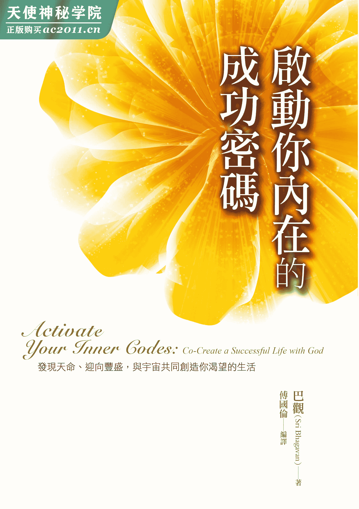

# 启动你内在的成功密码

## 推荐序一更真实的进入生活、更深入的经验自己

翁湘淳／棉花田生机园地创办人

来自合一大学的每个教导，都是承传自古老的教导。尤其是国伦长年累月不断的整理、学习、以及分享这些古老的智慧，对于进入黄金纪元的现代人来说，无疑提供了一个方便的知识法门，让与这本书有缘的人可以去经验、去学习以及成长。《启动你内在的成功密码》不仅帮助每位灵修者更为落地、真实的进入生活，将历年来所学习到的灵性法则落实在生活层面。在觉知之外，帮助自己更为丰盛，也开始影响周遭的人，种下丰盛的意识，只要我们愿意去启动内在的密码！读者们，请好好的享受这本书，完整的经验，让学习带动成长，成长能帮助我们更深入的经验自己。

## 推荐序二走进巴观的灵性洞见，获得超越成功的智慧

赖鸿庆（Punitam）／资深心灵向导暨《心灵印记》作者

老实说，即使我穷个人毕生努力所能知道的，永远都无法超越此书涉及的深广度，拜读后，心中只有感激。

我曾经是一个无可救药的爱书人，阅读已然像咖啡般成为生活里不可或缺的心灵滋养，那段疯狂买书看书与乐在其中的年少轻狂，随着渐增的年龄，看书的雅兴竟然逐渐从沉迷中褪色，现在倒是满享受手中无书那份轻松自在。当国伦来信邀请我为此书写推荐文时，在没有做什么考虑下，就答应他了，因为国伦对合一大学的信任与感激之情，因为他对圣者阿玛和巴观的爱与尊敬，皆令人心生感动。拿到书稿后，有一种再度被拉回过往时空重十书本的短暂错觉，更让自己沉浸在与作者神交的喜悦之中。

我从二〇〇六年开始造访印度合一大学，先后进出那个校区几回，能够接受这所灵性成长学校的润泽，以及意外获得巴观单独达显的恩赐，那是生命中一段美好的记忆。翻开这本书时，我所看到的不仅仅是文字，而是宛如重返校区，置身在那个意识扬升和灵性锻鍊的旅程中。我发现这本书其实是整理了很多印度合一大学的灵性教导，涉猎的范畴极为宽广和深入，只是书名《启动你内在的成功密码》，很容易被误导为一本探讨成功学的书籍，但书中的确分享了许多有关成功的法则，又苦口婆心的指引读者要去超越成功。“唯有当你的意识层次改变时，你才会变得卓越与成功。”——这是一本谈“成功”的书。

古今中外的圣者在传达真理时，都喜欢说故事，因为故事有一种魔力，除了人人爱听故事的原因之外，故事能够引领读者走进不同深浅层次的思维，然后达到“深者见其深，浅者见其浅”的旨趣。巴观无疑是一位擅长讲故事的大师，书中巧妙的穿插了很多耐人寻味的故事，那是在印度合一之旅颇为迷人之处。也许在领悟这些哲学式的教导时，你会不小心陷入头脑制约程序的迷宫里，一个活生生的故事，很可能就把你从思维的困境中拯救出来——这是一本有“故事”的书。

存在一直以万事万物本来的面目示现，无关乎对与错、好与坏、美与丑。然而，人类的头脑却早已被许多概念和标签化为程序的运作。我们从出生后，便开始逐步创建一套适合社会生存的程序，并根据这些程序做人处事，导致许多个人在身体、工作、金钱、家庭和关系等层面的问题。这本书详细的揭露人类有关这些程序建构的原因，以及它所可能导致的痛苦和失败，巴观也很慈悲的提出解构这些程序的秘诀和解脱痛苦的方法。真正的问题，藏在你内在的深处，那是你拒绝看见的，所以整个解脱的关键就在于“觉知”，很有意识的往内觉知到自己的故事。因为所有的痛苦都只是一个故事，如果我们愿意去经验痛苦，故事就会被揭露出来。这个向内的深观，能够转化原来制约的程序和疗愈心理的痛苦——这是一本谈“觉醒”的书。

我们每天面对各种生活的情境，都必须以决定来回应，大部分的人并不清楚自己是如何在做决定的。巴观用一种简单的方式，来帮助我们明白：“区别人做决定的两种方式—— 头脑和心。头脑是依据外在因素来做决定；而心则是向内看。头脑的决定是基于过去的经验和分析；而心的决定则是基于一个人的直觉和天性。”真正成功的想法，并非源自过去的经验和概念，而是当下的直觉和灵感，如果你渴望生命成功，就得展开心的修炼——这是一本谈“心”的书。

事物的本质并没有任何矛盾，然而我们对灵性和物质却存在某种认知上的冲突，有人走向灵性世界而鄙视物质，有人执着物质世界而否认灵性。这本书读起来好似剥洋葱的过程，一层一层剥落我们头脑对很多事物的误解，就是这些误解造成冲突和困惑，当头脑安静下来时，我们得以有一个机会去瞥见那个内在至高的智慧，不论我们称呼它什么，“神”、“大我”、“高层意识”、“宇宙意识”，都不能改变它的本质。在此我想引用巴观的一句话：“一个成功的人如果不快乐，是会危害社会的；然而，一个失败的人即使很友善、乐于助人，对社会也没有助益。”我们这一生最大的渴望是成功与快乐，可以透过所有的努力和依赖神来达成，这是灵性的开花，也是神性的绽放——这是一本谈“神性”的书。

在你准备翻阅此书之前，我想邀请读者们先放下这本书吸引你阅读的理由，期盼你以更开阔的心量，走进圣者巴观的灵性洞见，并获得他远远想要给予你无限慈悲的灌顶和智慧的启蒙。

## 编译者序要取得成功，先提升你内在的状态

在我们每个人的生命中，都渴望能去实现自己的梦想，拥有富足的金钱，享受丰盛的物质生活，取得傲人的成就、地位和名声。但有时候，即使我们做了一切努力，尝试各种可行的方法，实践新的观念，学习新的知识和技术，仍然难以达到我们所渴望的成果。

这是因为我们过去的失败经验、挫折、关系中的伤痛，以及头脑里不时浮现的恐惧和自我怀疑，一直让我们的内在充满冲突。无论我们多么努力想保持正面的状态，依然会被拉回旧有的负面感觉和混乱之中。所以，我们没有发挥自己的能力，降低了工作效率与创造力，也使我们的观点变得狭隘，造成情绪不稳，进而容易和人起摩擦。即使我们非常积极的想去取得成就，而周围的人们和所处的环境也给予我们相当多的支持，但如果我们在无意识中一直认为自己是无法成功的，我们的内在仍然会有一个顽强的负面力量，不停的将我们向下拉。当我们不断和自己的恐惧、自我怀疑搏斗时，就持续的耗损了能量，导致我们无法活出自己真正的潜能，最终使我们功亏一篑。

### 你无意识中的程序，操控了你的整个生命

影响我们生命最深远的是：我们无意识里的程序。观察一下自己，会发现我们在某些领域特别得心应手，对这方面特别有自信，我们相信只要自己肯努力，用对了方法，掌握住时机，就可以达成设定的目标。即使面临困难，内心也有终将克服问题的信心。但在其他领域，我们却感觉无法掌控，非常棘手，甚至是不可能达成的。是什么原因造成我们对不同的事情，有如此截然不同的反应和感觉呢？这是因为我们无意识里的程序。

在我们的无意识里有许多的程序，这些程序操控了我们的观点、感觉、信念和行为。正面的程序使我们保持正面的状态，让我们可以突破困难，创造良好的成果。而负面的程序则使我们处于混乱的情绪中，让我们难以专注，缺乏效率和创造力，导致失败。程序决定了我们的表现和成就，最终则会决定了我们的命运。

因此，学习如何化解负面的情绪，改变无意识里的程序，提升意识的层次，创建正面的心理状态，对于创造成功的生涯是不可或缺的。

### 提升内在状态的关键要素

#### 一、发现你的热情和渴望

问问自己，你渴望在自己的生命中实现什么？什么可以触动你的心？什么是你渴望探索的奥秘？什么是你想分享给人们的？什么是你想在世界上创造的改变？

许多时候，我们是由于匮乏感而去追求。如果我们看进自己的内心，会发现我们往往想要某个东西，是出自恐惧、自卑感、焦虑或缺乏安全感，希望借由得到一个美好的东西，能让那些不好的感觉消失，自己就会更快乐、更有自信。但如果动机是源于匮乏感，一方面会阻碍我们想要达成的目标；另一方面，即使得到了原先追求的事物，内在的那些痛苦依旧会使我们觉得自己还是不够好，必须再达到更大的成就，才会获得真正的满足和快乐……在这样的动机下，我们非但不能享受追寻梦想的过程，也无法享受我们所创造的一切。

因此，我们的动机必须是出于爱、兴奋、喜悦和冒险感，而不是因为恐惧、担忧或匮乏感。当我们发现了自己真正的热情，那股热情就会不断推动着我们勇往向前，去实现自己的目标。

#### 二、净化负面的情绪和思想

在每个人的内在里，都有许多过去残留下来的伤痛。这些伤痛可能是源自于过去的挫折、失败经验、关系中的冲突，或是生命初期受到的负面影响。我们不断被负面情绪和负面思想纠缠、打扰，所以感觉不到自己的心真正的渴望。因为，伤痛淹没了我们真实的感觉。

每当我们遭遇挫折，或面对未知的情况，内在就会浮现许多的恐惧、焦虑和自我怀疑。我们往往不知道如何处理这些一波波席卷而来的负面情绪。我们可能会裹足不前、想逃离逃避，或是努力与不安的感觉对抗，但都无助于消除困扰我们的那些负面情绪。

因为克制负面的感觉，或努力将负面感觉变成正面的，只会增强负面情绪对我们的影响。对于内在浮现的负面情绪和负面思想，我们唯一能做的就是强烈的觉知到它们，看见它们的存在，并经验那种不舒服的感觉。当我们经验负面情绪时，虽然会感到不舒服，但当我们有耐心的和情绪待在一起一段时间，就会看到负面情绪逐渐的化解了。透过面对与经验内在的恐惧和伤痛，就可以净化它们，使我们回到平静和正向的感觉之中。当造成负面程序的伤痛被化解时，程序就会自动转为正面的，外在的问题也会随之消失了。

#### 三、创建正面的心理状态

我们可以透过一些方法，创建起正面的心理状态：

1.  **正确的身体姿势：**我们的身体姿势会随着心情自然改变，同样的，透过改变身体的姿势，也可以影响我们的心理状态。当我们将身体姿势调整为正面、挺直时，我们内在就会感觉到一股自信和力量。
2.  **正向的观点：**巴观说：“伟大的领导者都拥有伟大的观点。”你可以学习你向往的那些成功人士所抱持的观点和思维。对你想创造出来的事物，用正向的观点在内在看见成功的画面。专注于一件事情的机会与可能性，有助于我们将这个可能性创造出来。
3.  **将焦点放在我们所拥有的：**我们经常对那些得不到的人事物耿耿于怀，却忽略了我们拥有的一切。学习将焦点放在我们已经拥有的事物上，会让我们感觉到自己是丰盛的，并使我们创建起丰盛意识。
4.  **以正面的方式看待负面的事件：**看见生活中的负面事件是如何对我们的生命带来正面的影响，意识到我们所遭遇的逆境是如何提升了我们生命的深度、扩展了我们的视野。当我们能够从失败和错误中学习，就会变得更加成熟，更有智慧，使我们在未来创造出更好的成果。
5.  **培养良好的关系：**当我们疗愈了关系中的伤痛，关系就会改善。当我们的人际关系更和谐时，就可以让情绪维持正面的状态，更有能量去面对生活中接踵而来的压力与挑战。

#### 四、借由神的帮助使我们成功

回顾自己的人生，会发现生命中的各种事件似乎并不是偶然发生的。无形中，似乎有个更高的意识一直在引领我们，使我们一步步踏上该走的道途。这时，我们就会了解到，自己在这世界上并不是孤单奋斗，有个更高的意识、更高的力量持续陪伴着我们，给予我们帮助。

巴观说：“意图＋努力＋神圣恩典＝成功。”要取得成就，除了我们个人的意图和努力之外，还需要因缘具足，才能创造出渴望的成果。透过有意识的与神链接，向神请求，我们就可以与宇宙中无限的资源链接。我们可以用任何想要的方式来称呼神，祂可以是基督、佛陀、天使、高灵或宇宙能量等等。神并没有绝对的形式，是我们对神的印象决定了神的特质与回应我们的方式。无论神对我们而言是什么，重要的是我们要与神创建起深刻的链接。

当我们向神祈祷，神就会给予我们需要的协助。我们可以请求神，帮助我们拓展事业、增加财富、改善关系，或是将负面程序改为正面的，请求神在每一面向上帮助我们。如果我们懂得运用神的力量来实现自己的愿望，就等于拥有了一把通往丰盛生活的黄金钥匙。

#### 五、时时怀有感恩的心

检视一下自己的生活，会了解到我们所拥有的一切，并不是自己独自努力创造出来的，而是透过许多人的帮助，以及许多机会的来临，才能有今日的成果。我们在日常生活里经常忽略了许多美好事情的发生，视它们为理所当然。让我们留心与记得这些美好的时刻，也许是一个看似不重要的帮助，或是别人对我们的需求给予的友善回应。记得在心中向每一个美好的发生表达感恩。

认出在每一次偶然巧合的背后，神对我们的帮助。感谢神、更高意识或宇宙中更高的力量，并请求祂持续的引领我们，在我们生命中创造出不可思议的奇迹。同时，感谢生命中淬炼我们、使我们成长的障碍和挑战。当我们认出宇宙所给予的每份礼物，就会意识到宇宙的丰盛。当心处在感恩的状态，我们的心就会绽放，这将有助于让更多的丰盛进入我们的生命。

当我们化解了负面的情绪和思想，调整为正面的心理状态，提升到更高的意识层次，我们就可以让自己经常的保持正向、高频率的状态。当我们在正面和突破性的状态时，我们在工作中自然就会更有效率和创造力，更敏锐的觉察到每个机会，和人们有更好的合作，更能将美好的人事物吸引到我们的生命里，我们就可以突破所处的情况，创造出更好的成果。

# 前言活出你的天赋潜能，给自己一个精采的人生

没有愿景的生命就像是没有目标的旅程。你们每个人都有选择，是要像一片枯叶般随风飘浮，或像一支朝目标飞射出去的箭，宇宙会帮助你达到你想要的。

巴观曾说过一则关于金雕的故事。

◆　◆　◆

在喜马拉雅山的山脚下，邻近高耸的峭壁，那里有巨大的金雕在天际翱翔着。有个猎人总是充满渴望的看着金雕，但他始终无法抓到它们，因为金雕总是在高耸的天际翱翔。

有一天，猎人注意到金雕在峭壁上筑巢，他欣喜若狂。隔天，在金雕离巢寻觅猎物后，猎人攀上峭壁。他在金雕的巢中，发现了一颗蛋。虽然没捕获到大金雕，但至少有金雕蛋，于是他取走了巢里的蛋。回家后，他将金雕蛋带到他饲养的鸡舍里，就放在母鸡刚产下的一窝蛋之中。母鸡以为这是它自己的蛋，便一起孵化。过些时候，小金雕就破壳而生了。

小金雕以为自己也是一只鸡。因此，它与其他的鸡一样开始啄食虫子、追逐谷物、吃着饲料，过着像其他鸡一样的生活。一段时间之后，小金雕长大了。有一天，它望着天空，注意到在天际翱翔的优雅巨鸟。小金雕向母鸡问道：“亲爱的妈妈，那在天上飞的是什么？”母鸡回答道：“亲爱的儿子，那是金雕，它们是天堂的国王。”小金雕又问母亲：“我也能像那样飞翔吗？”母鸡回答它：“不，儿子，你不能，你不能飞。你是属于大地的，你会这样活着，也会这样死去。”小金雕相信了母鸡的话，就这样生活着，直到晚年。死去时，它依然相信自己是只鸡。

你听了这则故事后，有什么感觉？是觉得悲伤？还是为它难过？巴观说，这不过是一则故事，所以我们可以给它一个不同的结局。

◆　◆　◆

小金雕长大了。有一天，它望着天空，注意到在天际翱翔的优雅巨鸟。小金雕向母鸡问道：“亲爱的妈妈，那在天上飞的是什么？”母鸡回答道：“亲爱的儿子，那是金雕，它们是天堂的国王。”

你认为母鸡会怎么说呢？母鸡回答小金雕：“你不能，你不能飞。”因为它不过是一只母鸡，它不能告诉你你能飞。因此母鸡只能回答：“你不能，你不能飞，儿子。”你认为小金雕相信母鸡的话吗？是的，它相信了。因为它只是一只幼雏，所以它真的相信了。小金雕告诉自己：“对，我不能飞。”然后继续啄食着地上的虫子。

这时金雕在高耸的天际上，注意到了下面的小金雕。它说道：“我的孩子在鸡群里做什么？”金雕突然降落到小金雕面前，对它说道：“亲爱的孩子，你是我的孩子，你也是一只金雕，看看你的翅膀，来吧！你可以像我一样飞翔。”你想小金雕会怎么回应呢？小金雕回答道：“我不能，我不能，我是一只鸡，我不能飞，这是我的母亲告诉我的。”但金雕说：“不，儿子，你可以飞翔，我会教你如何飞翔。”然后母金雕教小金雕如何飞翔。小金雕学习得非常快，它在几天内就学会了飞翔。最终，母金雕与小金雕一同起飞，征服了天际。

毛毛虫在成为蝴蝶前会先蜕变成蛹，如果它要长出翅膀，那就需要先经历蜕变成蛹的过程。人类也是如此，有些人达成了自己的天命，但有些人却在情感上、精神上与身体上都没有完全的活出生命。那些超越自己、达成伟大天命的人，是经历了成长的人。如果人没有经历这样的成长，他们就会依旧活在相同的恐惧、相同的限制性观点、相同的欢乐、相同的冲突中，过了三十年、五十年、甚至七十年之久，直到他们的头发灰白。

如果你经历了成长，经历了足够深刻、足够强烈的成长，你的观点将会跟着转变。随着观点的转变，你的行为、你的决定就会改变了，因而你生命经验的品质也会完全改变。

# 第一章打造成功的基石

没有愿景的生命就像是没有目标的旅程。你们每个人都有选择，是要像一片枯叶般随风飘浮，或像一支朝目标飞射出去的箭，宇宙会帮助你达到你想要的。

我们每个人在生活中都有梦想，也设定目标，要使这些梦想成真。但在过程中的某些时刻，我们面临了障碍，使得成功似乎仅是个妄想。这可能是由于缺乏适当的愿景、在学习中缺乏专注力、缺乏成功的动机、心态上犹豫不决或是有不必要的分心。这些问题阻碍了我们采取正确的行动过程。

失败的主要原因，储存在无意识的头脑里，它可能是关系中的伤痛、错误的童年决定，或出生时的创伤。**透过改正无意识的头脑，以及提升到更高的意识层次，就可以改变一个人的未来。**

## 发现你的天命

◆　◆　◆

几年前，一个主修应用数学的男孩来见巴观。男孩的脸上长满了面疱，脸色苍白，看起来很绝望。他对巴观说：“巴观，我不知道我的人生该做什么，以前我在学校时很喜欢数学课，但自从我上大学主修应用数学之后，我丧失了所有对学业的兴趣，满脑子都是欲望和暴力的念头，什么正事都无法做。我和父母、教授都处得不好，我不知道自己是怎么了？我对未来充满了恐惧，我现在甚至不想交朋友。我唯一确定的是，现在的我和刚上大学时的我，已经不是同一个人了。”

巴观看着男孩的眼睛，告诉他：“依我说的去做，从应用数学转修纯粹数学，你的问题就解决了。”男孩就回家了。几个月后，他满怀感激的回来见巴观，他的面疱不见了，脸上容光焕发，他的问题已经消失了。

巴观说：“当你不是做着你爱做的事时，你会变得自卑、挫折、暴力与贪求，你的创造力也会降低，变成不快乐的人。不快乐的人无法成功，只会造成别人的痛苦。你的心会枯竭。当心枯竭时，你就会成为平庸的实业家与技工。”

观察你的生活，你现在做的事情是你真正喜爱的吗？还是出于恐惧或因为家人的压力而做，或为了在社会上有个好形象？你清楚自己的想法与渴望吗？你知道自己的心要的是什么吗？只有当你发现你的所爱，并付诸行动，你的心才会觉醒，智慧才会绽放。

这是一位当代陶艺家的生命故事：

◆　◆　◆

他从牛津大学毕业后，即使尽其所能，仍然无法对自己的所学所长产生兴趣，他感到不快乐。他回到印度，将毕业证书交给父母后，就踏上了追寻自己内心的旅程。他去许多地方旅行，最后到达南印度的一个村落。在那里，他看见一位陶艺师在制作陶器，当他看见陶艺家技巧纯熟的运用双手捏塑陶土，将它制成美丽的陶器时，他的心充满了喜悦。他决定也要制作陶器，成为一名陶艺家。此后，他开始设计精美的陶器，这些陶器被外销到世界各地，在短短七年的时间内，他就成为了世界知名的陶艺家。

巴观说：“当一个人做着他热爱的事情，或热爱他所做的事情，成功必然会来临。因为，心的决定总是吉祥和神圣的。”以神圣性来做的事情，其结果必定也是神圣和丰盛的。当你依循着你的心，成功、丰盛与名声自然会降临在你身上。只有当一个人发现了自己的天命时，他才能真正从内在的冲突解脱。

如何发现你的天命？关键是区分人们做决定的两种方式——决定是来自于头脑？还是来自于心？头脑是依据外在因素来做决定；而心则是向内看。头脑的决定是基于过去的经验和分析；而心的决定则是基于一个人的直觉和天性。

在谈到天命时，依循自己心的决定是非常重要的。**头脑会去评估每种职业的优缺点、利益和损失。而心可以实际看到和感觉到你具有的个性、才能和潜力。**有利可图的职业诱惑着头脑，而职业本身的喜悦本质才会吸引心。

要发现一个人的天命，很重要的是要关闭所有的分析性思考，进入自己的内在，和神圣高我——即内在神（Antaryamin）——链接。在这种状态下，头脑就会安静下来。透过奥秘的经验，天命就会显现出来。

另外一个发现天命的方式，是去感觉自己最爱做的是什么，并追寻那份天职。

当一个人以这种方式发现自己的天命时，健康、财富和丰盛都会是他的，成功将自然来临，创造力和智慧会绽放出来，灵感也会源源不绝。你最大的喜悦将是发现你在造物伟大计划里的位置，努力实现你的天命。

## 成功始于清晰的意图

在生命中创造你渴望的实相，第一个步骤是拥有清晰的焦点、意图与愿景。我们的未来会依据我们意图的清晰度而展开。在你发射火箭前，必须先定出火箭的方位，否则火箭可能不会登陆在月球上，反而跑到火星了。这就像是你坐在车子里，司机问你要去哪儿，你却说：“哪里都可以，往北、往南、往东、往西，随便！”没有计划的发展，就是这么荒谬。这并不是说我们计划的每件事情都会实现，而是凡事都必须有清楚的方向，我们才能进行下去。要建造一座杜拜塔或双子星大厦，你必须先创建一个够深、坚固到足以支撑整体建筑的地基。它必须渗透到地底，以支撑这样庞大的大厦工程。如果你挖的是一个只有两英尺深的地基，显然不能期望一座巨大的建筑物可以矗立于上。生活也是一样的，你需要创建一个坚实的基础。

所有伟大的发生，无论是历史事件、科学发明、庞大的组织或个人的成就，都始于下决定或设定意图的时刻。**决定或意图，是一切创造的种子。**意图是什么呢？意图是充满热情的愿望。每个人每一天平均至少会浮现五、六十个愿望，从生活中的小事到比较大的事情。但意图与愿望并不相同，意图是专注的，它会产生能量，使整个宇宙以你选择的方向去运作。

◆　◆　◆

几年以前，有个年轻人热切的希望自己能成为一名医生，为当地村庄的平民提供医疗服务。不幸的是，虽然他通过了每间医学院的笔试，却无法如愿的通过之后的口试。他的梦想几乎要幻灭了，只好将希望寄托在最后一间医学院的口试上。他和父亲一起搭乘火车去参加最后一场口试。在火车上，一个友善的乘客询问年轻人的父亲：“这男孩的表情为什么这么绝望呢？”他的父亲告诉乘客整个故事。那乘客对年轻人说：“别担心，你一定会成为医生的。”父子俩认为乘客只是在安慰他们，但依然向他道谢。随后，那位乘客就在途中的某个车站下车了。两天之后，当年轻人走进大学的口试会场时，发现火车上那个友善的陌生人就坐在主试官的位子上。其余的就不用多说了。这年轻人后来成为一所知名医学院的院长，终其一生都为穷人提供医疗服务。

有情的宇宙会协助那些拥有纯粹意图的人。这样的例子不可胜数。请记住，没有愿景的生命，就像是没有目的地的旅程。

然而，为什么有时候尽管一个人拥有最强烈的意图，却依然遭遇险阻与障碍？这是因为他的意图是不正确的。是什么造成了正确的意图或是错误的意图？要看意图背后的动机。你为什么想要你所想要的？你的意图背后的驱力是什么？是来自于和他人比较、想要赶上别人，用来证明自己不比别人差？或是基于仇恨、恐惧的情绪和态度？或者你的意图是由于爱、满足、兴奋、冒险或对社会与家庭有更大的贡献？请记住，**只有当你的意图是全面的、有益的与滋养的时候，有情的宇宙才会支持你。**否则，当出于错误的意图时，宇宙并不会支持你。当意图是发自于心时，宇宙会协助你实现，你就会遇到正确的人和正确的事情，意图将得到实现。

正如种子是什么种类，树木就长成那种模样。如果种子的本质是苦涩的，果实就是苦涩的。如果种子的本质是香甜的，结出的果实也会是香甜的。你的焦点增强了你的意图。在你思想中持续的焦点是什么？你都想些什么？你专注于你想要的，还是你不想要的东西之上？你的焦点或意图，就像是给你的车子一个前进的方向，而你在内在所持续看见与感受到的，就是你将前往的地方。持续专注在你的目标上，而不要一直想着会不会出问题。在这路上，你也需要修改你的目标与修正路线。因为你周围的情况一直都在改变，所以你也要做出相应的调整。

拟定长期的计划，想想从现在起的五年后、十年后、十五年后，你会在哪里。拥有长期计划的人通常不会失败。但人们害怕做长期的计划。你必须先有一些短期的计划，但短期计划又经常会失败。成功的秘密在于：**短期计划通常会失败，而长期计划则不会失败。**因此，对你的事业、学业、关系等拟定长期的计划，要很清楚你想要的是什么。

## 保持在突破性的状态

如何保持成功？一直在“突破三角形”中的人将是成功的人。巴观曾会见世界上资产价值超过九百亿卢比的成功人士。巴观说，在他们身上可以观察到一个共通点，就是他们一直都在突破三角形里。

什么是突破三角形？突破三角形是个尖端向上的三角形。三角形的底部是你的“身体姿态”，三角形的第二边是你在那一刻的“感觉”，第三边是你在那一刻对正在做的事情的“焦点”。“焦点”则由心理图像、内在对话，以及你所说的话语所组成。

1.  **身体姿势**。譬如，当一个商人与客户交谈时，试图获得对他最有利的一笔交易，最重要的是，他的身体姿势必须是正确与正面的。如果他的身体姿势是不正确或负面的，那么即使他要销售的产品很好，客户也不会购买。因此，我们要经常检查自己的身体姿势是不是正确与正面的。我们可以从现在就开始尝试。
2.  当你与另一个人交谈时，你有什么**“感觉”**？如果你对自己、对你说的话有不舒服的感觉或缺乏自信，就注定会失败。因此，经常检查你内心有什么感觉。
3.  三角形的第三边是**“焦点”**，它包括三个东西：第一是心理图像，在你的脑海里，对于正在做的事情，产生什么心理图像或视觉图像？譬如，当你与一位想从他那里得到一笔生意的客户交谈时，你是不是有一幅“交易已经达成、订单已经取得”的心理图像了？或者你的心理图像一直怀疑着：“这订单可能从我手中熘掉”、“客户会有更好的供应商”或是“我是不是能够满足客户的要求？”等等。如果你的心理图像是充斥着怀疑的话，请检查一下。

你脑海中流过的影像也有很大的影响。譬如给你一支扫帚，要你将房间打扫干净。如果你内在流过的影像就只是一支扫帚，你就不会全心全意的打扫。但如果你的影像是“将房间打扫干净后，人们就会赞赏你”，你就可以用更好、更有效率的方式来做相同的清扫工作。

内在对话是当你与另一个人交谈时，在你内在进行的对话。如果内在对话与外在所说的话相反，你的努力就不会成功。再来是，你所说的话语。不要说出不好、不相关、不必要的话，你说出的话语必须是有建设性与正面的。如果你使用正面与自信的话语，另一个人就会接受你的提议。永远不要说：“我没有，我不需要。”永远要说“我想要”，而不是“我没有”。因为如果我们一直习惯用负面的方式说话，有时即使在良好的状态时，仍然会用惯有的负面方式说话，这会破坏并损害我们。“这会不会发生？”、“我会不会通过？”等这类内在对话与冲突，会使我们无法得到希望拥有的东西。

如果你没有在突破三角形之中，就会处于“失败三角形”里。失败三角形是一个倒三角形。在其中，你的身体姿势是不正确的，这会导致负面的感觉，你就不会专注。在这种情况下，你注定会失败。我们必须从身体姿势开始。你的身体姿势必须就像是富有的人，这会让你产生富有的人的感觉，而这些感觉又会使你的身体姿势像富有的人。身体姿势和感觉有相互关联。持续改正你的身体姿势，练习十五天。正面、挺直的身体姿势可以带来正面的感觉，你就会有一个正面的心理图像，并且会越来越专注。你会说出你内心所想的，不会有任何充满心理评判与心理冲突的内在对话。由于“外在世界反映了内在世界”，任何在内在发生的都会以完全相同的方式显现于外在，你正面的内在会带来外在的成功。如果你持续练习了十五天，这就会永驻于你的大脑里。你就会成为成功的典范。

**每日沉浸在突破三角形中：**

突破三角形＝成功

失败三角形＝失败、恐惧、不健康、负面感觉、负面情绪等

永远不要沉浸在失败三角形里。觉知到失败三角形的特性，将自己转换成突破三角形。突破，对于每个人来说，都是生活的必须与必要。突破，可以是在健康、财富、教育、家庭关系或任何其他的领域中。突破，在一个人的生命中是必须的。为了实现这些突破，有正面的立场与坚定的决定非常重要。

如果你处在失败的过程中，你必须观想生命最快乐的时刻，与那种快乐的感觉同在。当你这么做时，几秒钟之内，你就会立即进入突破三角形。当你做这项练习时，你的表情也会跟着改变，在你脸上会出现一抹微笑。

可以从七个方面去检查你是不是处于突破三角形里，包括：**身体姿势、感觉、心理图像、话语、内在对话、正面的信念系统，以及坚定的立场。**我们必须在这七个方面都是正面的，让自己像一位富有的人。

## 珍视金钱的价值

**如果你想要丰盛，首先你要尊重金钱。**不要看低金钱，而且要渴望金钱。充满热情、专注，并做出正确的努力，丰盛就会发生。你必须先尊重财富，如果你缺少了对财富的意图，再多的努力也不会使你变成有钱人。意图可以滋养、驱使、支持你的努力。当你对丰盛有热情时，就会专注，然后再借由专注，做出正确的努力。你不能只是说：“我将一切都交给神。”丰盛不会以这样的方式发生。除非你先专注于上，否则丰盛不会发生。不会仅仅因为你爱钱，就使金钱从树上掉下来。你必须以适当的意图、愿景、热情与专注，做出正确的努力。

◆　◆　◆

有一位合一大学的指导老师曾拜访英国，与当地的人举行会议，借住在苏格兰一座巨大的古老城堡里。当指导老师一行人准备吃午餐时，一个小男孩突然走进餐厅。他的名字叫做罗宾，年仅六岁。罗宾刚从学校放学回来。他向在场的每个人说，想让大家看看一个很重要的东西，他告诉他们：“在我给你们看这个东西之前，你们不能吃午餐。”于是，他拉着指导老师的手，进入宛如迷宫的城堡信道。他们穿过几个房间，到达了“罗宾的店”。那里贩卖奖章、照片与绘画。罗宾甚至有一台笔记本电脑，用来追踪所有的销售与收入。指导老师问罗宾，他最喜欢的科目是什么？罗宾充满热情的回答：“赚钱！”他的回答如此斩钉截铁。指导老师对罗宾话语中的肯定态度感到非常惊讶。

当指导老师回到自己的房间时，心想在这座巨大的城堡里多么容易迷路，而他意识到无论走到哪里，到处都有箭头指向罗宾的店。他知道任何进入这座城堡的人最终都会到达罗宾的店。因为在这座城堡里，任何地方都有明确的指标一路指向罗宾的商店。

在一次午餐后，罗宾突然带着刚爆好的一袋袋新鲜爆米花进来，爆米花都用极好的包装袋子装着，每个袋子上都贴了一英镑的价格标签。但没有人感兴趣。后来有人在罗宾的耳边低声说了一些话，罗宾就离开了房间。不久后，他又带着爆米花进来，袋子上贴着二十五便士的新价格。罗宾还给指导老师一袋免费的爆米花，让指导老师突然变成销售爆米花的代言人。

罗宾对于赚钱如此着迷、清晰明确，而且专注。他也喜欢赚钱。可以预见，有一天罗宾会成为一个成功的商人。罗宾拥有意图、愿景与专注。在仅仅六岁时，他就已经如此努力工作，甚至在城堡各处都放了指标，并懂得用电脑记帐，这就是专注。

巴观说：“丰盛与贫穷取决于你的想法。如果你的思想有缺陷，就会导致失败与混乱。崇拜贫穷的人，是对‘超然’有错误的认知，这会毁坏了自己的生命。人们常认为‘灵性的人’应该是超脱尘俗的，不该看重金钱与物质丰盛。让我告诉你，**创造财富与成功本身，就是灵性的修行，因为这需要专注的头脑、创造力与辛勤努力。如果人们了解‘创造丰盛，并将丰盛分享给别人’是超凡的灵性活动，他们会变得更快乐，并负起创造更好世界的责任。**”

不尊重外在世界的人，总认为物质世界或追求物质是比较低等的，应该要心起厌恶，不去追求。很多人认为追求物质是不灵性的行为，它会使你远离觉醒，或不是合一的。如果你是这种虚幻概念的受害者，你就不会在生命中吸引财富，因为内在的你完全不尊重财富、繁荣和丰盛。在你的内在深处，其实你重视和喜爱贫穷，认为贫穷是灵性的象征。如果这是你的情况，那么在你生命中，你就不会吸引财富。

你必须觉知到这些限制性的概念，也许是出于某些宗教制约，让你认为内在世界与外在世界无法并存，所以你只能选择其中之一。由于某些原因，你相信你只能拥有内在状态或外在丰盛的其中一种。但这并非事实。如果你可以觉知到自己内在的这种限制性信念，祈祷这种信念消失，让繁荣与丰盛进入你的生命，你就会得到它们。

当然，赚钱有可能是出于自我中心的追求，是以囤积金钱的态度去赚钱。**许多人是由于不安全感和贪婪，才去囤积金钱。然而，创造财富也可以是一种美德，可以为人、事物增添价值。**以适当的方式来赚钱，是一种灵性活动。如果你能赚取金钱，并用你的工作来帮助人们，这将是一桩好事。你是运用自己的创意、天赋和智慧，让事物变得更加美丽、更有价值、更具实用性。

## 创建带来成功的正面程序

每个人都梦想拥有成功和喜悦的未来，渴望功成名就，但只有少数人达成了这些目标。为什么有些人成功，其他人却遭遇失败？为什么我们在某些领域成功，却在其他领域失败？

巴观说：“无论是我们的财富、健康、人际关系、成功与失败，或任何发生在我们生活中的事情，都被无意识头脑中的程序所控制着。在一个人生命中会发生的好事情，是由于他无意识中的正面程序。同样的，发生在一个人生命中的负面事件，也是因为他无意识中的负面程序。所有的问题都源自于无意识，我们必须改变自己的程序，才能改变生活。”

每个人都以特定的程序运作。程序决定了一个人会成功、还是会失败，在一生中会保持健康、还是体弱多病，会培养和谐的关系、还是充满问题的关系，会一帆风顺、还是困难重重。你在关系中会经验到喜悦和爱，还是感觉受伤和被拒绝，都取决于你的程序。你对成功、失败的想法，对婚姻、金钱、生活和人们的想法，这一切也都是你的程序所决定的。程序不仅决定了你的想法，你对成功、失败和关系的经验，也都取决于你的程序。

◆　◆　◆

有个富裕的商人在该行业全国驰名，但他却经常对财富感到蔑视，这让他无法体验到成功的喜悦。他的家庭在他小时候经历了极严重的财务危机。儿时贫穷让他无法表达和满足自己的渴望，后来又遭受了屈辱的经验，使他更痛苦。他的自尊心受到了伤害，于是下定决心要成为富有的人。在生命的后来历程中，他确实达到了他的希望，但他却对成功感到窒息。他的程序使他富有，却不允许他体验到丰盛的喜悦。因为这是在受伤和屈辱的时刻所做的无意识决定。由无意识产生的经验也是分裂的，不允许他去品尝自己的胜利滋味。

如果你在生命中的任何时刻违背了你的程序，它就会扰乱平衡。程序具有重复性和强制性的特质。如果你被设定为失败的程序，那么即使外在的环境、情况和人们都支持你，你的程序仍然会体现出破裂的情绪和失败的现实。你可能有一个疼爱你的家庭，但如果你没有支持性的程序，你依然会感到不被爱。这可能是源自于你诞生的那一刻，或者在你青少年时期受到学校老师的批评所伤害，而形成了负面的程序。你不仅会因此经验到混乱的情绪，还会透过你苛刻的言论激怒人们，为自己创造出充满敌意的环境。由此产生的反应和事件，又会反过来增强你的程序，接着又创造出更多类似的情况。

人们受到影响的基本程序有三种，依序是初级程序、次级程序和三级程序：

1.  **初级程序：**这是在受孕到六岁之间形成的。当孩子受孕成胚胎时、在母亲子宫内、分娩出生时，父母的思想，以及那些来看孩子的人们对孩子的评论，都记录在孩子的无意识中，形成了人们的初级程序。初级程序掌管了你生命中所有重要的事件。
2.  **次级程序：**这是在六岁到十二或十四岁之间形成的。受到学校、父母和老师的教育影响。
3.  **三级程序：**这是从十四岁起形成的。你所处的社会、阅读的书本、看过的电视节目，都会促成了三级程序。譬如，作为佛教徒、基督教徒、回教徒或印度教徒的宗教信仰，是源自于三级程序。

初级程序是最强大的，次级程序次之，三级程序再次之。如果你希望在生活中有真正的改变，你必须先改变初级程序，那么次级程序和三级程序就很容易处理了。

有许多的程序在无意识中运作，包括没安全感的程序、恐惧的程序、容易感到受伤的程序、缺乏信任的程序。以上这些程序都是破坏性的。另一方面，也有具建设性、正面的程序。正面程序会造成正面的事件，负面的程序会造成负面的事件。程序会吸引与它们的性质相应的人事物。

简而言之，这些无意识的程控了你的心理状态和你的命运，并操控你的决定、反应和经验。不幸的是，大多数人都没觉察到无意识的层面，没有觉察到自己的生命是被无意识所掌控着。一旦我们对这些程序有足够深入的了解，可以让我们知道为什么事情会这样发生，我们就不会一再卡在外在的因素中，而是试着去改变自己的程序。当你在无意识的程序改变时，你的生活历程和生活体验就会随之改变。

无意识是一个人生命中所有恐惧、创伤和负面决定的储藏库。无论是在母亲子宫内所经验的恐惧和痛苦、儿童期初期的创伤经验，以及不被自己接纳的部分，全都储存在无意识中。就是它们造成了各种的疾病、上瘾，以及关系中的负面行为和愤怒。

巴观说：“你必须发现制造问题的负面程序。**当你看见负面程序时，负面程序就不再有影响力了。**你所必须做的是去发现它，仅此而已，随后程序就会消失了，而负面程序所造成的问题也会跟着消失。当你练习去看见自己的内在，觉知到你内在发生的一切时，你就可以改变自己的程序，这些问题就会自动被导正，你的生命就会改变。只要一点点的了解和一点点的努力，你就能够改变自己的程序。”

当你处于困境、冲突或失望之中，无论是在你的关系里，或在你的工作上，你都必须将注意力转向内在。当你没有觉知到无意识时，它就会控制着你。一旦你觉知到无意识的程序时，它就丧失力量了。你在成功之路上的障碍就会被化解，因为你的外在世界不过是反映了你的内在世界。当你接纳了自己没有被接纳和被压抑的部分时，负面能量就会被释放，问题就消除了，模式就化解了，而你的外在情况也就会变得顺利了。

## 以超凡的方式回应生命中的挑战

宇宙是依据挑战和应对的法则在运作着。所有的物种都受到大自然的挑战，当一个物种有能力回应这些挑战时，就能存活下来，而且还会不断兴盛下去。每当有一物种无法适当的回应特定的挑战时，无论挑战是来自环境、食物或繁殖能力，这个物种就会灭亡。

基本上人们有三种回应挑战的方式，依序是：较差的回应、中等的回应与超凡的回应。当文明、社会、组织或个人以超凡的方式回应挑战时，他们就会为自己开创一个灿烂的未来。

◆　◆　◆

圣雄甘地在学生时代，只有很普通的智慧和能力。他是中产阶级、中等肤色、拥有一般的智力、平凡的外表，甚至能力也只是平均而已。这是圣雄甘地对自己的评价。甘地原本在印度从事律师这行并不顺利，后来他的兄长将他送到南非，希望他在那里可以有所发展，于是甘地就在南非开始接印度人的案子。

甘地在南非待了一段时间，那时他还没有遇到种族隔离政策造成的伤痛与苦难。直到有一次，甘地搭火车前往普勒多利亚。他买了头等车厢的票，但在火车上，有一位头等车厢的乘客与查票员却请他挪到其他等级的车厢。甘地拒绝了，他说：“我买了头等车厢的车票，我就会继续坐在这里。”在发生一些争执后，列车半夜停在彼得马里兹堡的小站，甘地连同他的行李被很难堪的扔出车厢。甘地躺在地上，在寒冷与屈辱中颤抖着。在一片漆黑中，他得到了领悟。

在甘地面前有三个可能性：第一个可能性是被发生的情况伤害，立刻回到印度。他大可说：“我拒绝这样的侮辱。”觉得自己被羞辱、受到伤害，这是较差的回应。

第二个可能性是中等的回应。他要先完成还在南非进行的案子，然后回到印度。一辈子念兹在兹的说：“我永远不会再生活在这些羞辱我的人之中。”这是中等的回应。

第三个可能性则是留下来完成案子，并为如此深深伤害他的种族歧视去抗争，努力减轻那些与他遭受同样痛苦、经历类似伤痛的人的不平等情况。

当深更半夜，这三种可能性清楚的浮现在甘地的面前时，甘地选择了第三种反应，他选择以超凡的方式应对。就是在这个时刻，圣雄或伟大的灵魂在甘地的内在诞生了。

**巴观说：“一个战士可以输，但不会被击败。”不要让情况决定你的状态，而是让你的状态来决定情况。我们每个人都拥有选择权**：对我们所面临的挑战，可以选择用中等的方式回应、以较差的方式回应，或者选择以超凡的方式来回应。

## 与巴观同在的夜晚

### 如何发现自己的人生使命？

找到生命的目的是非常重要的。如果你不知道自己的人生使命，那么你只要与“不知道自己的人生使命”这个事实待在一起。你不须尝试使用你的头脑来发现它是什么，因为头脑在这方面并无法帮助你。**只有当你不再思考时，它才可能变得更清晰。**因此，重要的是看见自己的内在，就是持续观照你的头脑，看见你头脑中发生的事情。你必须进入自己的内在，意识到你不清楚自己生命的目的是什么，与这事实待在一起，不要离开它。当你越来越能看得见自己时，试着看得越来越深入。只是持续期待着答案，不要试着去创造答案。你要期待着答案，与“不知道自己人生使命”的事实待在一起。然后你从内心深处，就会确切的知道自己生命的使命和目的是什么。

只是静静的待在那里。有时在开始播种新的农作物之前，土地必须保持不动，休耕一段时间，这是为了让它变得肥沃。你必须保持安静，与这道理是类似的。安静的活动，不是漠视或睡着了，只是与“你不知道”这事实待在一起。你必须强烈的意识到它，然后答案就会来临。

甘地生前在全国各地游走，不知道如何让印度独立，该做什么才好。殖民印度的英国是个强大的国家，无法靠暴力让印度获得独立。甘地不知道该怎么做，因此他只是坐着，与“我不知道”这事实待在一起。数个月后，有一天他突然想到，我们应该抵制英国的盐。这是一个非常有趣的想法，英国是个强大的帝国，透过抵制盐可以让印度从英国获得独立？他心想：“对，就是这样。”于是，他开始实践使命，很快的上亿人加入他，最后印度就独立了。

这不是我们可以构思或想出来的主意。不！我们只是认清“我不知道”这事实，突然间，深刻的真理就来临了。这可以发生在任何人身上。如果你保持安静，一个巨大的过程就会在内在发生。如果你持续思考和抗争，你就会破坏了这个过程。但如果你就是静静的待在那里，就是想着：“我不知道，我很纳闷。”持续练习看见自己的内在，也许在两天、三天、五天，或着一般来说可能是在六个月之后，你的人生使命就会清晰的向你揭示。一旦你的人生使命向你揭示，它也会自动的开始履行。

### 天命是什么？

天命有两个涵义，一个是指你的本性。如果你本性是个凶暴的人，你就不该参与任何和平运动，你应该去加入警察或军队，那是最适合你的地方。如果你的本性是在歌唱上，那你就应该成为一名歌手。如果你身体的基本性质是在舞蹈方面，那你就该成为一名舞者。这是天命的第一个涵义，就是实际的了解你的本性，并依此来行动。就像克里希纳告诉阿朱那：“你的天命是去战斗，而不是谈论和平。”所以你必须了解你的本性是什么。你是属于风（vatha)、火（pitha）、地（kaptha）的哪种体质？在你内在，悦性（sattva）、变性（rajas）或惰性（tamas）是否有哪一方面特别显著？你的组成是什么？依此，你必须忠于自己的本性。

天命的另一个涵义是发现你人生的使命。神给了每一个人特定的使命，你必须清楚的了解，并依此来生活。要让这发生，你必须发现神。很多人都已经失去了与神的链接。当你与神重新创建起链接，你就可以与神交谈，神就会告诉你你人生的使命，然后你就依此来生活。这是天命的另一个面向。

人生于世，每个人都有个目的。你不是没有目的而来的。每个人的背后都有来到这里的原因。当你发现目的时，就不再有冲突了。相反的，当你还没发现自己为什么来到这里时，就会产生冲突。问题在于你一直在寻找天命。你还没发现你的天命，那你必然会活在冲突中。当你发现你为什么来到这里时，冲突就会消失了。当我们实现自己的天命时，就会感到很深的喜悦。

### 培养什么样的人格特质有助于愿景的实现？

要拥有一个清晰的愿景，我们必须至少拥有四种很强的人格特质。这四种人格特质是：国王的人格、战士的人格、魔术师的人格与僧侣的人格。国王的人格是头脑清晰且果断；战士的人格永远不会厌倦于战斗；魔术师的人格认为一切都是可能的，没有什么是不可能的；僧侣的人格则过着简单朴素的生活，完全超然于任何的情况。

人们要认真练习这四种人格特质，并培养它们，将它们应用在生活的各种情况中。当人们持续应用这些人格特质时，某些奇妙的事情就发生了，就像是一部电影，他们就会得到自己生命的完整愿景，知道做什么事情是最棒的，什么是自己喜欢去做的事情。这些链接会很自然的发生，他们就会知道该如何去做，愿景就会实现。

### 心的渴望和头脑的欲望有什么差别？

在二千五百年前，佛陀放弃了欲望，放弃了他的王国。他在苦修后，得到了开悟。他给予世界的讯息是：欲望是受苦的根源，因此必须放弃欲望。佛陀实际上有两个陈述：心的渴望是完全没问题的，而头脑的欲望则必须放弃。你的渴望必须发自于心，神会成全它们。如果你觉得开车非常棒，这是发自于心的渴望，它就会被实现。但如果是因为你的邻居开着不错的车，所以你才想要一辆更好的车，这就是来自于头脑的欲望；这是不好的，就不会被实现。所以，你必须发现心的渴望。

**头脑的欲望是源自于比较、嫉妒等因素；而心的渴望并不是因为比较、嫉妒、没有安全感，就是喜欢这么做。**譬如，一个人喜欢拉小提琴，不是因为他想成为世界上最有名的小提琴家。如果他不是出于这样的动机，只是因为他喜欢拉小提琴，那显然这就是发自于心。

但我们从来没有允许孩子的心绽放，孩子从来没有被允许做自己，所以要有这种经验有点困难。但如果你从看见自己的内在开始，很快的，你的心就会绽放，你就会在生活中看见清楚的差别。你会看到喜悦回来了，感到很快乐。当你看着人们，你就会感到很快乐，绝不会对人心生厌烦。很多时候，你都对人心生厌烦。如果当你看到一个人时，你有得到能量，这表示你的心是活跃的。当你看到一个人时，无论那个人是谁，你都会得到能量，这表示你的心是敞开的。当你的心敞开时，渴望自会从心中浮现。唯有那时，你才活着像个人，否则的话，你不算真正的活着。

### 如何创建正面的心理状态？

你越想从正面去思考，来的却是更多负面的想法。这就是为什么试着站在镜子前面，反复说一些激励自己的话，永远不会奏效——因为反馈是负面的。正面思考会导致负面想法。因此，**秘诀并不是正面的“思考”，而是正面的“感觉”。**这就是为什么我们要你在祈祷时对你渴望的事物有情感。情感也不是正确的描述，实际上就是“感觉”。感觉，没有任何的阻力，因而也不会有心理障碍。

怎么做才能产生正面的感觉？我也会告诉你这个秘诀。

你必须产生感觉十二分钟，然后重复七次，这就可以化解心理障碍。**透过头脑，你永远都无法产生正面的感觉，你必须运用身体才能产生正面的感觉。**譬如，如果你是个懦夫，但你想成为勇敢的人，首先你可以在自己的房间里，练习像狮子般的走路，先改变你的姿势，勇敢的说话，产生勇敢的感觉，直到十二分钟。每天做一次这种练习，连续做七天，就会慢慢化解心理障碍。接着，你要在更多人面前这么做。你可以聚集家人，在他们前面这么做之后，再到更大的团体去练习。最终，障碍就会完全消失，无意识的部分就被移除了。其他的问题也可以如法炮制。譬如，你想要变有钱，这是很容易的。一个从安得拉邦来的农夫做过这个练习之后，在十六天后得到了六百万卢比。你必须像一名百万富翁般坐着、行走、说话。当你有感觉时，头脑就不会质疑，也就能摧毁负面程序、嵌入新的程序了。不要用头脑来做。

当你移除了心理障碍，生命中的一切事物都可以达成。

### 如何维持突破性的状态？

你必须做的是：

1.  你不能睡到很晚，你必须在日出前起床，这是非常重要的。
2.  最重要的是，每天都以感激父母来开始。
3.  不能吃得很饱，吃饭时，给胃留一些空间。
4.  晚上睡觉前，你必须坐下来一会儿，观看一天发生了什么，以及你的头脑是如何运作的、你有什么感觉，你如何逃离自己的思想、逃离它的丑陋，然后试着面对它一段时间，再去睡觉。你会发现当你强烈的觉知到自己的丑陋，冲突就消失了。于是就会有显著的改变，你在灵性上也会有所成长。

如果这些都维持得很好，要将你的身体放进美丽的节奏与突破性的状态，是绰绰有余的。

### 如何拥有高度的专注力？

你必须有个专注的头脑，可以集中注意力和认真思考的头脑。

头脑、呼吸和亢达里尼形成一个三角形。如果你改变其中一角，就会影响其他两个角。如果呼吸不持续或不稳定，头脑也不会持续和稳定。

同样的，如果亢达里尼振动过多，头脑就会不稳定。外在的温度、气压、你身边的人是什么类型，以及你的饮食、你穿着的衣服等许多的因素，会让亢达里尼开始振动。当亢达里尼振动时，头脑就会变得不稳定、无法专注。呼吸也是如此，实际上呼吸是非常关键的要素。呼吸必须深入，而不是浅吸快吐。大多数人甚至不了解如何呼吸，这就是为什么我常说学校应该从小教育小孩如何确实的呼吸。

你必须深吸慢吐，而不是浅吸快吐。当你确实的深入呼吸时，就会发现头脑变得稳定。亢达里尼和呼吸这两项没有导正，头脑将会非常不稳定。如果你无法做到以上，你可以在内心请求神，神就会将你的头脑稳定下来，你就会有一个非常专注的头脑。

### 如何拥有聪明才智？

我们的内在充满了许多的冲突。首先，你必须意识到内在的冲突。接下来，你必须觉知到这些内在的冲突。当你越来越觉知到你的内在冲突，才会有内在的接纳。当你有内在的接纳时，聪明才智就会绽放。

内在平静是内在没有冲突和喋喋不休。当内在平静时，就没有能量的浪费，能量就能在外在世界带来成功与丰盛。

### 如何成为有创意的人？

在辛勤工作和认真思考之后，如果你能将你的思考过程放到一边，你就会变得很有创意。要成为真正具有创意的人，你必须停止思考。当这发生时，某些东西就会发自于内在，那才是真正的创意。

然而问题是，你如何将思考过程放到一边？仅仅将思考过程放到一边，你还不会成为具有创意的人，因为你也必须先努力认真思考。如果你可以真的努力思考，然后学会将思考过程放到一边的艺术，之后你就会发现创意自然而然的来到你的意识中。你可能是在设计发动机或从事某个新设计的工作时，创意就自动浮现了。这个过程是在内在进行的，是你无法觉察的，创意就是乍现了。**创意萌发于寂静之中。**

### 如何创造更多的金钱？

首先，你要非常清楚为什么你想要有钱。你需要的金钱是为了满足你的需求、为了让你感觉到自己的重要性，或是为了帮助别人？你必须对此非常清楚。

再来是，你必须培养丰盛意识。也就是说，你必须意识到一切你所拥有的。如果你是一个乞丐，你必须意识到你的乞讨碗——将你的乞讨碗看做一项资产。一切都必须被视为资产。你的父母、妻子、丈夫、孩子、工作、房子、家具，一切都必须被有意识的视为一种资产。**不要将焦点放在你所缺乏的，而是将焦点放在你所拥有的。**

第三，你必须不断的检视你的生活，学习以正面的方式来看待一切负面的事情。以正面的观点来看待所有负面的事情，是可行的。如果你能做到这一点，那么得到财富的意图和愿望就可以很轻易的实现。

你会得到链接、连系和机会，它们无所不在！赚钱的机会无所不在，但问题在于你有没有看到它们。如果你可以改变你的观点，得到丰盛意识，以正面的方式看待所有的事情，并且非常清楚你为什么想要有钱，就会看到机会的到来。所有的事物，包括链接、连系和突破，一切都会到来。于是很快的，你就会得到你想要的足够的金钱。

我们已经在印度的村庄做到了这一点，成绩卓越，达成惊人的效果。我们选了二、三千人的小村落，以非常紧凑的方式对他们工作。譬如，我们到了一个只有简陋小屋的村庄，但今天，那里已经随处可见都是钢筋混凝土的建筑物，没有任何一间简陋的小屋了。几乎所有的年轻人都成了工程师，他们也买了车子。这些人曾经生活在很差的状况中，住在泥造简陋小屋里，村里没有一辆车子，也没有冷气设备。如今，村里人人都有舒适的房子、冷气设备、良好的居住环境，这一切都到来了。我们只教他们这个，然后给予他们合一祝福，事情就发生了变化。因此，获得财富是可能的。在我们看来，这是最容易实现的事情之一。

### 提升内在状态最重要的要素是什么？

最重要的是与自己接触。如果你是个傻瓜，智慧就是从那里开始的。就是说：“我是一个傻瓜。”做这个，接着看看。奇妙的是，你就会发现自己变聪明了。如果你没有效率，并不是想像自己很有效率。而是与你没有效率的事实待在一起。奇妙的是，大脑就会进入另外一个模式，使你变得聪明。

所以事实是非常重要的，关于什么的事实？关于你自己。如果你仔细看很成功的人，很多时候你会发现他们非常的与真实接触。而失败者在各种想像的背后，他们谈论着从事这个生意、那个生意，要做许多美好的事情，要成为世界上最富有的人。但当你在五年后再看见他时，会发现他依然一无所有。

站在镜子前，对自己说：“我是世界上最成功的人，我是世界上最有权势的人。”这一切都不会对你有所帮助。这是你在一些心理学和正向思考的书中会读到的。有时候，正向的思考会加强你的负面性。当你说：“我很好。”你内在的某个东西就会说：“不，这不是真的。”所以，你只是在强调这一点。另一方面，如果你去面对它，说道：“我就是如此。”你将会看到自己自然的到达应该到的地方。

这就是为什么我们一直强调看见自己内在的事实。这么做，然后看看发生了什么。你必须练习。一开始会很难，但会越来越如意，因为你可以看到这么做的效果。当你有恐惧时，如果你接触自己的恐惧，恐惧就会开始讲述它的故事。在叙说它的故事之后，恐惧就消失了。你这么做，就会看见。这必须实际的进行。恐惧才会消失。如果你试图掩盖恐惧，对自己说：“不！不！我不会害怕它，我不会恐惧它。”这么做，真的不会有任何帮助。

这是通往成功最短的途径。

### 什么样的态度有助于我们赚取金钱？

**我们必须了解牟利和创造财富之间的差异。牟利是无知的追求，**你可以靠赌博赢钱，或是去赛车获利。另一方面，**创造财富则是灵性的活动**——**创造财富是为事物和人们增加价值的能力。**譬如，你成立了一间学院，训练年轻人，创造出有生产力的公民，他们可以为国家创造出财富。或者你创办了一间企业，雇用许多人，使社会更富有。财富总是有流动的倾向。

在印度，对金钱有个称呼：nanayam，这个字的意思是“诚信”。如果你是正当的赚钱，它表明了你对社会的贡献。你为社会做了这些，所以你得到那么多的金钱回报，它是你贡献的指标。

你创造和持有财富的能力，是由你与金钱的关系决定的。就像其他的事物一样，金钱也是能量的一种形式，会被与它本身相似的能量所吸引。你与任何事物的关系，决定了你会吸引或排斥哪些东西。金钱并不是独自存在的，金钱始终和持有它的人的能量有所链接。不同的人依据他们各自与金钱的关系，以各种方式经验着金钱这件同样的东西。

富有的人知道金钱很重要，这就是为什么他们会有钱；贫穷的人认为金钱不重要，这就是为什么他们没有钱。你可以想像：如果你不停的告诉你的伴侣，她是不重要的，你认为她会与你在一起多久？你重视的事物会越来越丰富；而你不重视的事物一定会越来越稀少。要知道金钱是重要的。重视金钱，但不执着于它。创建与金钱的健康关系：也就是你珍视金钱，但不执着于金钱。

**你赚钱的动机是非常重要的。如果你赚钱的动机是来自于恐惧、愤怒或需要证明自己，那么金钱永远不会为你带来快乐。**愤怒和需要证明自己也是恐惧的形式，这是你觉得自己缺乏什么，因此才需要去争取它的状态。这是来自于恐惧的意图和行动；与此相反的是来自于爱的意图和行动——这是成为完整的，做着将带给你喜悦的事情的状态。

当你以智慧和诚信去创造财富时，金钱将会是必然的副产品。

### 如何使生活充满丰盛？

过着丰盛生活的人，经验着丰盛意识；而没有丰盛生活的人，缺乏了丰盛意识。财富、健康、关系或成功，都取决于你的意识。

首先，你必须从你能记得的那天起开始回顾你的生命，学会以正面的方式来看待每个负面事件。没有什么事件应该用负面的方式去看待。第二，你必须培养感恩。第三，你必须改善与父母的关系。第四，你必须祈求你的祖先得到解脱。

许多问题的发生，都是因为你的祖先对你不满意。如果你祈请祖先，带他们到这里，对过世的祖先进行仪式，给予他们喜欢的食物，并从他们那里得到祝福，这几乎就可以立即解决你的问题。问题会存在，是因为你没有得到祖先的祝福。

有很多方法能帮助过世的人。合一的方法是与过世的人对话，确认他们在另一个世界的生活是安然无恙的。但如果你与过世的人对话时，发现他们卡在某些较低的次元中，你就必须告诉他们：神爱他们，他们不会被评判，他们必须前进。如果你这么做，他们就会立即开始前进，你也会得到很大的祝福。另一方面，如果他们卡在某个地方，你在这个世界上也会出现问题。使过世的人移动到更高的次元，并不困难。

如果做了这些，你自然就会获得丰盛意识，财富就会开始流动。但如果做了这一切，财富还是没有开始流动，那么你就必须改变自己的程序。

### 为什么我在追求成功的过程中有这么多障碍？

你不断的创造外在世界，你以为外在世界是独立于内在世界的。譬如，你的无意识已经设定了你注定失败的程序，认为你永远不会成功、不应该成功，接着你去面试一份工作，你的无意识和其他人的无意识会互相接触，它们具有某种网络链接，面试你的人就会毫无理由的决定不把这个工作机会给你。

在你内在发生的，就是这样创造了外在世界。它是非常强而有力的。这就是为什么**你会得到你所恐惧和憎恨的事物。另一方面，你也会得到你喜爱的事物。**这也会发生。你必须看见内在发生的事情，一旦它被改正了，你就会看见外在世界的事情明显的改变了。

### 如何解决生活中的各种问题？

我们拥有意识头脑和无意识头脑。百分之五的问题是来自于意识头脑，另外百分之九十五的问题则是来自于程序，也就是无意识头脑。我们的财富、健康、人际关系、成功或失败，以及任何我们生活中发生的大小事情，都是被无意识头脑中的程序所控制着。如果生活中有问题存在，意味着无意识中的某些负面程序造成了问题。

当问题是在意识头脑时，你可以运用自己的努力去解决；当涉及到无意识头脑中的问题时，你就需要恩典，或我们所说的合一祝福，否则就无法改变无意识中的程序。对于意识头脑的问题，我告诉你要用自己的努力去觉知；而对于无意识头脑的问题，当你持续接受合一祝福时，负面程序自然就会消失，外在世界的事情就会发生变化。

### 程序如何控制我们的生命？

宇宙建构的方式是，无论你想要什么都会得到——可以是金钱、健康、关系，或感觉到自己的重要性。如果你想得到的却一直没有发生，意味着你内在有一些问题。一旦问题解决了，你就会得到。

如果你在生命中表现不好，我们会试着追踪你一再失败的原因，去改变你的程序。你的过去就是程序。过去是从你的前世开始、父母在怀你之前的思想、孩子受孕成胚胎的时刻、孩子在母亲子宫内发生的事情、分娩出生的过程，以及出生后的前六小时。在十二岁之后，程序就会有点关闭了。这成了你生命的脚本，主宰你一生的生活情况。你会不会罹患癌症或发生肾脏的问题、会不会赚钱、会不会离婚、将有什么样的人际关系……这一切都是从你的前世到十二岁之间形成的脚本为基础。你以这个脚本来生活。

因此，在十二岁之后，你会一直有着同样的恐惧。你以前可能害怕鬼，而现在害怕的是股市涨跌，恐惧会以这样的方式改变。脚本会改变它表现的方式，就像是相同的演员在不同的电影中演出。一样的脚本，但以不同的方式表现。这取决于你的制约，而制约发生在十二岁之前。要改变你在十二岁之后发生的事情是非常容易的，但你必须更深入的找出问题所在。一旦你找到了问题，很容易就可以离开问题了。

### 过往经验如何形成程序？

你的整个生命都在你的无意识头脑中被程序化：谁会生下你、你会做什么工作、与谁结婚、有几个孩子……所有这一切都在无意识头脑中被程序化。就像你的电脑中有运作的程序，你无意识头脑中的程序则是创造了你的生命。

无意识头脑的程序，包括你的前世、受孕的那一刻、当你在母亲子宫内、母亲分娩时是采自然分娩、用产钳夹出胎儿，或是剖腹生产手术。在出生后六小时内，你有没有被母亲触摸，还是放在保温箱中。接着是小孩子的前六岁。这一切形成了你的程序。程控着你的生活、财务情况、健康状况、人际关系，以及你生活中的一切。如果你在人生中遭逢离婚、经商失败、发生意外，这每件事都可以追溯到你的无意识程序。

譬如，当孩子分娩时，他突然停止前进，向产道后退，过了几分钟或一小时后才出来。由于这个原因，他无法毫不费力的取得成功。这样的孩子会在他的学业上、工作上、事业上或专业上不断延迟。在他第一次尝试时，不会成功，而需要第二次的尝试，他的事情也会因此延迟了。假如他在出生时延迟了五分钟，在后来的人生中可能转换为五个月。假如他在出生时延迟了半小时，这意味着后来的三年、四年或五年的时间。假如他在出生时延迟了一小时左右，那他可能要等待二、三十年的时间，事情可能还没发生，他就过世了。假如他在出生时进去产道又退回三次、四次或五次，在现实生活中，他的每件事都必须发生三次、四次或五次。

这就是为什么有些人似乎快成功了，却总在最后一分钟失败。有些人申请银行贷款，却无法核贷成功。有些人明明有大好的结婚机会，却没有结成良缘。有些企业的前景可期，却缺乏临门一脚，不仅如此，还必须奋斗二、三次，才能有所斩获。这是因为分娩过程中发生的事情影响了孩子的未来，分娩的最后一刻控制了你生命的那一部分。依据出生那一刻发生的事情、出生持续的时间，产程延迟确实会以数倍的时间对应于后来的现实生活。

有些孩子在分娩过程中迟迟生不下来，家人的兴奋就降低了，不再像之前那么盼望。由于这个原因，即使孩子达成了什么，他的兴奋感也会在几分钟内消失。在他长大后，当他取得好成绩、获得不错的工作、买了一辆好车时，他也不会感到兴奋。他总是觉得很空虚，心中低语：“这哪有什么？”他无法去享受自己的成就。

类似的状况也会发生在打催产针催生、用产钳夹出，或以剖腹和人工方法取出的婴儿，当他们长大时，会很懒惰，不会有达成事情的动力。他们不会努力工作，必须有人从后面推他们一把。他们需要朋友、亲戚的许多推动，才能在学业上、工作上、专业上，或任何的事情上取得成就，而无法仅靠自己去达成。当他们要做生意时，需要十个合作伙伴，以及很多的支持，在生活中一再推着他们，才能取得成功。这些人无法只凭自己做到任何的事情。

某些胎儿在母亲子宫的几个月时间，他的父母都很快乐，因此他也会跟着很快乐，但不会投入任何的努力。当这些孩子长大后，不会去追求任何的成就与努力奋斗，他们就是很快乐。唯有当他们被推动时，才会去取得成就。

曾有一对母女来与我会面。女儿离了婚又罹患癌症，而且非常肥胖。我询问母亲，当她在生女儿时想着什么。她说她正是害怕罹癌、离婚和发胖。母亲在分娩过程中的思想会影响了她的孩子。

在出生后前几个小时发生的事情也会影响孩子。假设生下来的是个女婴，但家人期待的是男婴，这女孩就会表现得像个男孩。

有些事情则是源自于前世。有个人有严重的头痛和手臂疼痛的毛病。我们帮他向前追溯，发现他在很久以前曾殴打了一只羊，是用右手不断殴打。于是，他手臂的问题一直复发，没有哪位医师可以治愈他。在看见这个情况后，我们请他连续忏悔七天，他的疼痛就完全消失了。

还有一个人来找我，他从小在左肩和胸部的地方就一直出现剧烈的疼痛。医师无法在他的这些身体部位上找到任何问题，做过的医学检验结果也都是正常的，但他的疼痛就是无法解除。我们以回溯的方式将他带回小时候，在他五、六岁的时候，有一次与朋友在海滩上堆沙堡玩，突然间，沙堡倒塌了，孩子们不小心跳到他身上，踩到他的胸部和左肩。通常当一个人经验了，问题就会被化解，但他并没有解除疼痛。于是，我们持续处理，将他带到出生的过程。在分娩时，他的胸部和肩膀被母亲的骨盆弄伤，这伤痛导致了后来儿时在海滩的事件。当我们让他看见这些时，他就逐渐痊愈了。但过不了多久，问题又回来了。我们持续处理，将他带回前世。在六百年前，他在战场上奔驰时，胸部和左肩受了伤。当他看到时，疼痛立即就缓解了。

这疼痛是从前世带来的，接着带到母亲的子宫内，再带到他的童年。因此，我们必须看见前世发生了什么、受孕时父母的思想、在母亲子宫内时发生了什么、童年发生了什么……这些可以帮助人疗愈。

### 如何导正负面的程序？

譬如，你想要创业，但无论你花了多少时间，即使每个创业条件都成熟了，仍然没做成。这种情况可能是因为你在母亲分娩时，你曾退回半小时或一小时的时间，然后才生下来。对你而言，事情就会严重延迟：银行贷款就会被拖延、你的订单会出问题、某些事情就是卡在某个地方，总是会发生一些阻碍你的事情。

当你进入内在，寻求你的神来帮助你，重新经验你的出生时，问题就可能得到解决。在这种情况下，出生的过程将会再度重演，但这一次你不会退回母亲的产道，而是直接迅速的生下来。当神给予你出生的全新正面经验，你就会改变了。之后，你就会得到突破，因为内在世界影响了外在世界。

如果你有类似的问题，要做的是放松，进入昏昏欲睡的状态——这是在清醒和睡眠之间的状态。每晚你在入睡之前，都会经历昏昏欲睡的状态，再进入睡眠。同样的，当你醒来前，也会先在半梦半醒的状态，然后才清醒。在一天中的任何时刻，借由放松身体，你就可以进入这种昏沉状态。然后请求你的神：“请告诉我，我的问题在哪里？”神就会明确的告诉你，像放影片般播放给你看，告诉你在什么时候、以什么方式、发生了这种情况。如果你正确的做了，就会知道问题在哪里。然后再请求你的神改变这个问题，神就会改变它，给你一个全新的体验，问题就会被修正，你就会得到疗愈。当程序改变时，你就会在现实生活中得到效果。有时效果会在一天内生效，有时是在两天后，有时则要一个月。随着程序改变，你的生活就会随之改变。

# 第二章掌握影响生命的宇宙法则

创造财富不仅需要专业技能，还需要了解宇宙运作的方式。你必须学习以某些影响人类命运的法则来生活。如果你不知道这些法则，就会在生命的道途上经验到路障。

我们都知道物质宇宙是由许多定律或原则所操控的，包括重力法则、浮力法则、惯性法则等。对物理法则的发现和了解，使科学和科技有了更大的发展。譬如，如果没有对重力法则的了解和知识，莱特兄弟就无法发明飞机。了解和运用基本法则，对于更大的发展是不可或缺的。

而非物质、精神性的宇宙——或者你可以称之为“生命”——则被精神法则所影响着。其中一个基本的定律是“**我们的外在世界反映了我们的内在状态**”。你所遭遇的事件和人际关系，都反映了你的内在情况，或是反映了你内在所经历的转变。大多数人都忽略了这些影响生命的宇宙法则，使我们一直觉得自己是被命运所玩弄的。当我们面临挑战、危机时，不知道如何是好，不清楚为什么这些会发生在我们身上，更不知道如何解决。如果我们想为自己创造一个伟大的未来，就必须了解这些影响生命的宇宙法则，使我们得以在渴望的方向上前进。

## 观点的法则：你相信什么，宇宙就为你创造什么

第一个法则是正确观点的法则：你的观点是什么，你的现实就是什么。如果你对宇宙的观点是宇宙是机械性的、无生命的，宇宙对你而言就会是如此。另一方面，如果你的观点是认为宇宙是个活生生的实体，是个有意识的存在，你就进入了可能性的世界，进入极大的可能性之中。

你确实活在一个会回应你的宇宙里。宇宙就是意识，你是意识，别人也是意识，万物都是意识。意识是有感觉的，意识说些什么呢？它说：“我显化你的观点。”它说：“我即是那个。”“那个”指的是你的观点，“我”指的是意识。**意识就像一片浩瀚无比的海洋，而观点不过是海洋上起起伏伏的一道道波浪。**

如果你的观点说：“由于现在遇到金融危机，我的财务不可能丰盛。”有意识的宇宙就会说：“就是如此。”你就会经验到匮乏。如果你采取一个负面的观点，认为“现在时机是不好的，世界对我而言是危险与不安全的”。你就会紧张、不快乐，因此在生命中显化成问题百出的情况。另一方面，如果你的观点是“丰盛无所不在”，宇宙就会打开它的宝藏，无论外在的环境看似如何严峻。请记住，伟大的领导者都拥有伟大的观点，因而创造出卓越的现实。

一杯水可以被视为半满或半空。因此，没有事实，只有观点。

◆　◆　◆

一个老人靠着在街上摆摊卖菜饼为生。一个机会的到来，让老人的菜饼生意大发利市，于是他有了足够的钱开一间店铺。一段时间之后，他的生意兴隆，便开了连锁的店铺，也雇用了几个人。财富照耀在他的身上。

他的儿子在大学毕业后回来了，对老人说：“爸爸，你不知道现在世界上发生了什么吗？现在是经济萧条啊。”父亲问道：“儿子啊，经济萧条的意思是什么？”儿子解释人们如何失去工作，生意如何失败。于是老人遵循儿子的建议削减开支，把降低成本和品质后的订单发送给客户。随着产品品质的下降，销售量也跟着下降了，老人于是决定收掉几间店铺，比较能节省开支。现金越少流入，他就在儿子的建议中发现越大的“智慧”，于是又进一步降低品质。顾客越不高兴，就有越多的店铺关闭。最后，老人只剩下微薄的生意。老人很骄傲的告诉邻居：“我儿子是对的，这世界确实在经济萧条中。”

可怜的老人，对儿子深信不移。

这故事不是建议你忽略发生在你周遭的事情，而是拥有智慧：看见你的情绪是依你的观点产生、你的决定是依你的观点产生、你的行动是依你的观点产生、你的命运是依你的观点产生。

你要知道你的意识总是在显化你所采取的观点。因此，你要选择吉祥的观点、高贵的观点，与宇宙同步的观点。**你要脱离限制性的观点，采取有力量的观点，如此你就可以链接到较高的意识。**

如果你采取的观点是：“我一辈子都这么努力，却无法真正创造出改变，改变怎么可能在几天内发生？不可能。”意识会说：“就是如此，我即是那个，我显化你所采取的观点。”如果你采取的观点是：“这段关系是神所决定的，我将在这段关系中发现爱。”意识会说：“我即是那个，就是如此。”意识会显化你所采取的观点。反之，如果你采取的观点是：“这段关系无法长久，关系注定会破裂。”意识也会说：“我即是那个，就是如此。”如果你采取的观点是：“我的身体会逐渐衰弱，因为我的基因是这样。”意识会说：“我即是那个。”这就会显化为现实。

一切事物都是如此，你可以采取任何与你的健康、生活经验、人际关系、宇宙、神等各方面有关的观点，意识都会显化你所决定的任何事情。

**检视你所采取的观点**

你对生命的观点是什么？生命对你而言是什么？

1.  例行公事
2.  云霄飞车
3.  一个祝福

你对财富的观点是什么？你对金钱有什么感觉？

1.  难以赚取
2.  权力
3.  不属于我的
4.  等待我的

将这项练习延伸到生命的每个领域，包括工作、关系、健康等。

## 情绪的法则：你显化你所喜爱的和憎恨的

财务安全对于稳定感是一个非常重要的因素。这就是为什么每当财务不良时，由此产生的恐惧和不安全感往往就会在关系中浮现。为了处理这个情况，你必须了解影响命运的第二个灵性法则：情绪的法则。

宇宙说：“你显化你所害怕的；你显化你所憎恨的；你显化你所喜爱的。”

首先让我们来了解一下思想和情绪的差异。思想是随机出现的，并不会真正的伤害你，不必然使你感到害怕。在思想背后没有这样的力量。另一方面，情绪是具有强度的思想，是不断重复的思想。所以我们要处理的是情绪，而不是零星的思想。

情绪的法则说：“你显化你所恐惧的。”**恐惧是最主要的情绪，是所有其他痛苦情绪的根源。**嫉妒是害怕被超越、愤怒是害怕不知道自己还能做什么、伤痛是害怕被忽略或羞辱……这清单可以无止境的列举下去。

让我们透过一个真实的生命故事来了解这点。

◆　◆　◆

在美国曾有一则新闻，有个杀了很多人的连续杀人狂出没，于是人们被告诫不要招待陌生人到家中，但有个独自住在郊区的老太太对此完全不以为意。在一个阴雨绵绵的黄昏，有个男子突然走进她家，老太太坐在摇椅上，从平静的睡眠中醒来。她注意到一个男子拿着球棒站在她面前，浑身湿透。老太太透过烛光看着他，说道：“孩子，你一定又冷又湿，进屋子里来，暖和一下吧。”男子困惑了一会儿，但他还是将球棒放下，坐在火炉旁边。老太太又说：“你一定饿坏了，孩子，去厨房拿点东西吃吧。”于是他到厨房里，拿了放在桌上的食物。吃完了食物后，他就拿起球棒跑进了黑夜中。他跑到对街去，闯入另一户人家。那户人家惊声尖叫，这名男子用武器杀了他们。

你认为为什么男子的反应会如此截然不同。他是个疯狂的连续杀人狂，但他没有伤害老太太，却伤害了另一户邻居。因为你是别人反应的燃料。老太太没有恐惧，所以连续杀人狂不会伤害她，而那些吓坏的人们让自己被杀了。虽然这是一个极端的例子，这个原则在每个人的生活中都适用：你会吸引你所害怕的事件和人物。

同样的，你也会显化你所憎恨的事物。譬如，你一直不喜欢谩骂，却沉溺其中。在生活中，有多少次你因为做了你所反对和憎恨的同一件事，而咬到自己的舌头。你讨厌这种能量，于是将这能量释放到宇宙中，宇宙又将这能量反弹回到你身上。

然而，法则也说你会显化你所喜爱的事物。如果你喜爱、梦想、展望某个事物，宇宙就会全力以赴将它给予你。巴观说：“宇宙就像是阿拉丁神灯，它会给予任何你所追求的。”经常生命卡住了，而你的爱和热情将使生命顺利进行。

与其将能量放在憎恨上，不如将能量专注于爱；与其害怕冲突，不如将能量专注于爱与和平；与其讨厌贫穷，不如专注于爱与财富。

情绪不过是你大脑中生物化学反应的结果，为什么情绪会造成这么大的力量？**你生活中没有被你认出和接纳的情绪，都会在更深层的无意识中累积。任何被你拒绝的情绪都会以扭曲的复仇返回。**这就是为什么人们在家庭关系中经常沉溺于不愉快的情绪，而使得他们的问题更加复杂，难以解决。更多的问题，造成更多的争执，这又造成更多的沮丧，于是形成了恶性循环。

**认出内在浮现的情绪，情绪就会化解**

问问自己，在困难的时刻，你会从家人获得平静与力量吗？还是你只是利用他们来发泄你的挫折？在困难的时刻，与你的家人链接时，你会沉溺于什么样的情绪？

有时即使一个人有极好的努力与意图，恐惧和失望依然存在。这时唯一的解决方法就是承认与接纳情绪存在的事实，不逃避它们，就是看见自己的内在。任何被认出与接纳的情绪，都不会转成破坏性的。但这并不意味着你可以到处对周围的人发泄这些情绪。你所需要做的是看见自己的情绪，这涉及三个简单的步骤。

1.  安静的坐下来，观照你的呼吸。
2.  进入到一个平静的空间中，放松。
3.  认出情绪，无论它是恐惧、伤痛或憎恨。

对自己说：“是的，我受伤了，我很害怕。”或是，“我很生气，这是没问题的。”

对于内在真相的肯定，可以帮助你接纳和拥抱自己。任何情绪卡住了，或者在逆境里的人，都可以随时做这个练习。为了回到丰盛和富足中，如果你的家庭文化许可的话，你们可以在出现压力的时刻和他们坐在一起祈祷。家人一同祈祷，已被证明是巨大的能量推进器，可以将神圣恩典呼唤进你的生命中。

## 思想的法则：你的思想创造你的现实

许多次，在生命的不同阶段发生重大事件时，头脑中最强烈的疑问是：“为什么是我？为什么我的人生会遇到这样的情况？”尤其是遭遇负面情况时，人们往往会为了发生的事情，不是责怪别人，就是怪罪神。但到底是谁该为发生在我们身上的事情负责？它们是由外在因素造成的，还是我们自己该负起责任？

巴观说：“我们是自己生命的建筑师。”我们完全要为在我们生命中发生的事情负起责任。头脑和物质是相连的。头脑影响了外在事件，而外在事件也影响着头脑。超越事件的头脑力量，就是创造性思想的力量。宇宙依据特定的规律和法则运作，这是人类存在的基础。外在的宇宙依据科学法则运作，而生命依据思想的法则运作。

这法则说：“你成为你所认为的。”**世界是我们内在状态的显化。我们遭遇的情况、遇到的人、面临的问题，以及各种生命经验，都是我们内在的投射。**换句话说，我们创造自己的现实，我们是自己命运的建筑师。观点是个过滤器，过滤我们所经验的现实。我们对现实的观点，最终将成为显化的现实。你成为你所认为的，你找到你所意识到的。思想无比强大，它具有创造的力量。每次我们怀有一个伤痛或情绪的思想时，创造的过程就开始了。箭已射向天上的“思想层”，“物以类聚的法则”就会开始运作。思想会吸引所有类似的思想，所有类似的箭会聚集在一起，到达临界点时，“交互作用的法则”就会运作，你释放的思想就会显化为现实。你已经得到你所播下的种子许多次了。如果你射出的箭是评判，你就会遇到不断评判的人；如果你射出的箭是背叛，你就会一再被背叛；如果你射出的箭是憎恨，你就会被别人憎恨；如果你有恐惧，你恐惧的情况就会发生。一切都是如此。

“为什么这会发生在我身上？”这是一句自相矛盾的话，因为一切都是你自己创造的。我们没有敏锐的觉察到思想和现实之间的关系，也许这两者发生的时间间隔太长了，让我们难以追踪。从思想显化为现实，也许要花一星期、一个月、一年、十年，或甚至更长的时间。有个小女孩总是认为只有当她生病或不在人世时，人们才会了解她的重要性。随着时间过去，她在结婚之后，就不再这么想了。然而，就在她与丈夫、孩子过着幸福的生活时，她罹患了癌症，而且无法治愈。

不断的回顾我们的生命，有助于我们看见关联性。显化的速度取决于一个人的进化程度，有时到达临界点要花一辈子，甚至更久的时间。

当我们问：“这世界为什么这么糟？”我们看见的世界就是我们负面思想和负面情绪的显化。然而许多时候，我们发现即使我们尽力去正面思考，头脑依然倾向于负面。

巴观说：“当你逐渐深入，你会明白负面思想并不是你的负面思想，负面思想只是存在于‘思想层’，而你的大脑恰好十起它，它们并不是你的负面思想。当你了解到你的思想不受你的控制，它们是自动移动的，奇妙的是，你就会发现自己变得非常正面；因为你不再有责任了。当你了解你不再有责任时，你就会变得非常正面，感觉很好，更满足。突然之间，你会发现有许多的能量，因为冲突消失了。当冲突消失时，存在的就是能量。随着能量，你就会变得非常正面。”

## 意识的法则：你的内在状态显化为你的生活际遇

巴观说：“只有当你的意识层次改变时，你才会变得卓越与成功。更高的意识自然会吸引富裕与成功。”

一个人的意识越高，他在生命中取得的成功和丰盛就越大；意识越低，障碍、失败和痛苦就会越大。因此，**如果你没有去提升你的意识层次，对于成功的所有努力都是不完整的。**

一般而言，人们活在两种意识状态中。无论他们是什么文化背景、受到什么制约、具有什么信念系统，他们不是活在冲突状态中，就是活在合一状态中。冲突状态是动荡不安的状态，在这种状态中，你有许多部分是正确的，也有许多部分是错误的；你各种破碎的部分经常彼此争吵，互相抗争，因此你的内在一直喋喋不休、令人烦扰。活在冲突状态中的人，会经验到能量的枯竭，他们生活体验的品质相当贫乏。

还有另一种我们称为合一状态的意识状态。合一状态是链接的、爱与关联的状态。你经验到与你周围一切的链接，以及与自己更好的关系。这是在自己内在感到合一，与人类同伴感到合一，与万物感到合一，以及与遍布一切的神圣临在感到合一。

我们大多数人都经验过这两种意识状态。也有可能一天中的大多数时候，我们都处在其中一种意识状态里。依据我们生活在哪种状态里，就会展开我们的命运或我们的生命经验。

冲突状态无可避免的创造出有问题的健康系统。冲突状态也可以显化为非常不稳定的财务情况。你遇见会欺骗你的人，被欺骗你的合伙人和商业伙伴摆布。你也会做出不利于未来生涯和企业的错误决定，卡在没有前途或没有成长机会的工作中。这就是当你处在冲突状态中会发生的事情，仿佛你让自己卷入和吸引了宇宙中的负面能量，因为你的内在状态就像个磁石。冲突状态也可能显化为充满问题的关系。在冲突状态中，你会很自然的吸引到那些加强你现在意识状态的人，你会遇见更加羞辱你，对你更不尊重的人。即使他们并没有真的这么做，那也会是这些关系最后的结果。请记得，你的内在状态会反映到外在。

现在让我们来看看光谱的另一端——另一端是合一状态。合一状态会显现为疗愈的健康情况。当你的意识能够感知合一，而不是分裂时，身体本身就会以非常不同的方式运作。在合一状态与充满爱的状态中，身体就能更迅速的疗愈。这就是合一状态的力量。

**合一状态也有助于你在生命中显化更大的丰盛。你会与能帮助你实现梦想、展现生命愿景的人们链接，你会遇到能帮助你成长和更好的服务的机会。合一状态还会显化为滋养你的关系。**因为当你处在合一状态中，你也会自动吸引到本身是完整圆满的人。甚至不同状态的人碰触你时，他们就会被疗愈。因为你活在更大的接纳状态里，因此他们也可以经验到对自己更大的接纳性。你也更能吸引爱你、尊重你、欣赏你真实模样的人。这就是合一状态。

巴观说：“生命是个运动。在秩序与失序之间、在光与影之间、在生与灭之间摆荡。”在事物的自然过程中，当秩序移动到失序，就会将你带离合一，朝向分裂。你身为有意识的存有，可以运用合一祝福的力量创造出一道从分裂回到合一的流。在人体中，每当不同细胞之间的讯息被断开后，就会偏离合一。当人体的各个系统回归合一，就是恢复健康。在家庭中，每当有伤痛和不信任存在时，就会离开合一。心的疗愈与爱的绽放，是回归合一的方法。在你的内在，当你在对与错之间挣扎，在对与更对之间发生冲突时，内在就会失序。你否认了自己一部分的渴望和声音，你选择去忽略它们。但这是无可避免的，那是生命剧码的一部分，允许它们发生。

你破碎的这些部分，需要被疗愈和接纳。当你接纳生命，没有抗拒的经验自己时，你的内在才可能回归合一。因为宇宙的力量，在身体内、在人际间、在家庭内、在国家的组成里、在生命的各种形式之间，有种种失序；然而，有一个提升生命到更大程度的秩序与合一的机会。请记住，**每个以失序与分裂的形式来临的挑战，都很可能将你带到更大程度的秩序与合一。**这摆荡不过是造物永不休止的舞蹈，因此，去觉知在生命每个领域中从秩序移动到失序的模式。全然、没有抗拒的觉知这些模式，就是合一。

## 业力的法则：你播下什么，就会得到什么

生命是两极的交互作用：快乐和痛苦、获益和损失、成功和失败。生命持续在两极之间摆荡。是谁让这些摆荡发生的？又是谁在指挥着这一切？

我们相信有个力量在干预着我们的生命。我们称“它”是神或造物主，“它”对我们的行动做出评判，决定结果。我们的概念是有位在天上一直看着我们、给我们奖赏和惩罚的神。请停下来一会儿，沉思这种对神的了解是既原始又不成熟的。你认为这真的是世界建构的方式吗？古代的人以完全不同的方式在感知宇宙。对他们而言，没有一个权威在做决定，顾虑着我们做了什么、没做什么。古人认为，是业力的法则影响了每个人的生命。在古印度的传统中，没有罪恶、惩罚、奖赏的概念，也没有一位神会评判我们的信念。古印度人相信自然的法则，而业力是支配法则的法则。巴观说：“业力是一套法则，这法则说：‘你播下什么，就会得到什么，而且是你播下的许多倍。’”如果你造成别人的痛苦，就会得到更多痛苦。

**业力是一个自然的法则：你收割你所播种的。**你收割业力的种子，无论是好或坏。当你起心动念时，种子就被播下了，接着透过你的话语和行动，它会长成一棵树，最后结出果实。你播下种子，就会得到一千颗水果。苦涩的种子会带给你苦涩的水果，而香甜的种子会带给你香甜的水果。如果你播下的是痛苦，就会回来更多的痛苦；如果你伤害一个人，你就会被另一个人所伤害。如果你造成别人痛苦，痛苦就会回到你身上。这法则也适用于好的方面。如果你带给别人快乐，快乐就会回到你身上；如果你祝福某个人，祝福就会回到你身上。当你给予别人拥抱时，你播下了爱的种子，之后你就会发现美好的事情毫无缘由的发生在你身上。

无论我们做了什么，都会以许多方式回到我们身上。以芒果树为例，虽然芒果树是从一颗种子长出来的，它却可以结出数千颗果实。我们的行动也是如此。当我们帮助别人或伤害别人时，它就会成倍的回到我们身上。如果你帮助了一个生病的人，这行动的果实就会在你最需要它的时刻来临。果实是正面或负面，取决于你对别人造成了多大的喜悦或痛苦。

巴观说：“许多人为各种外在的问题向神祈祷，从财务到健康的问题。很多时候，这些问题并不是由无意识头脑里的负面程序所造成的。虽然你可能没有负面的程序，问题却依然存在，那是因为你没有足够的善业来克服这些问题。**你做的任何有助于这个地球的事情，都会让你得到大量的善业。**就像如果你有钱存在银行里，你就可以用它购买任何你想要的东西。同样的，在你的善业帐户中，如果你有足够的善业，就可以将它兑现成任何你想要的东西。你可以运用善业来解决财务、生意、工作的问题，或使你觉醒、改善你的健康。你可以将善业兑现在任何的目的上。神会运用善业来解决你的财务问题，或疗愈你的身体疾病。”

## 与巴观同在的夜晚

### 我们关注的焦点，对丰盛有什么影响？

**贫穷在思想的层面上，是一直专注于你所缺乏的；丰盛意识在思想的层面上，是专注于你所拥有的。**如果你拥有丰盛意识，就会自然变得丰盛。你在每个地方都会看到机会，事物就会明显的为你而改变。

当我们谈到丰盛意识，不一定是指金钱。拥有好父母是丰盛，拥有好伴侣是丰盛，拥有好孩子是丰盛，拥有渊博的知识是丰盛，拥有健康的身体也是丰盛。因此，任何你所拥有的都是丰盛。即使是一个乞丐，任何他所获得的乞讨都是他的丰盛。一旦他意识到他所获得的，他的头脑不再将焦点放在他所缺乏的事物上，就某种意义上来说，他也是丰盛的。我们就会说这个乞丐有丰盛意识。当一个人拥有丰盛意识，他向神的祈祷就会立即得到回应，他会得到如他所希望的那么多。神会很愿意帮助他，但他必须先有丰盛意识。

你必须将焦点放在自己所拥有的一切，而不再将焦点放在你所缺乏的。你的大脑和头脑是不同的，你的大脑很容易被愚弄。所以，去欺骗你的大脑“你是个百万富翁”，接着看看什么开始发生了。

### 当你没钱时，在心理感觉自己是富有的，不是自我欺骗吗？

意识具有巨大的力量。当你运用合一教导，培养丰盛意识时，就会发现自己获得了财富；当你培养健康意识，就会获得健康；当你培养成功意识，成功就会来临。这一切都可以被实验验证。在一般情况下，它会在七天内发生作用。所以你必须相信意识的力量，这是可以验证和测试的。你可以运用合一教导来改变你的意识，在世间获得成功。为自己创造财富是个游戏。一旦你的内在改变了，这就会变得非常简单。

### 如何处理生活中的恐惧？

你必须做的是与你的挫折感和不满待在一起，不应该试图远离它。你就是与痛苦待在一起，经验痛苦。当有痛苦时，如果你与痛苦待在一起，痛苦就会自动化解。你与恐惧待在一起，恐惧就会消失。如果你的内在世界的不安全感和恐惧不在了，那么在外在世界所有的事情都会很顺利的进行。

处理你的问题的最好方式，就是你的内在必须解脱。譬如，你失去了工作，这可能导致巨大的不安全感和恐惧，透过合一祝福的给予和接受，可以从你内在移除不安全感和恐惧，虽然你可能失去了工作，但正因为失去了旧工作，也许在三、四天、一周或十天内，你就会得到一份新的工作。

因此，必须从内在着手。你处理了内在世界，外在世界就会自动改变。看见所有存在的问题都是反映或显化了发生在内在的情况。改变内在，外在的事情就会改变，这就是方法。

### 如何消除负面的情绪？

所有你能做的是觉知到你的嫉妒，觉知到你的憎恨，觉知到你的恐惧，觉知到你缺乏爱。如果有痛苦，你不应该试图逃离痛苦，而是必须觉知到那个痛苦，然后一切必须发生的就会自动发生。如果你试图给予解释，试图了解痛苦，试图将它合理化，那你就不会到达任何地方。当然，你也可以逃离痛苦一段时间，像是你可以透过讲电话、看电影、读小说、做某些事情、或是和朋友聊天，逃避痛苦一段时间。

我们不反对你逃避痛苦，这像是急救，它可以是短时间的策略。但最终你必须去面对痛苦，不试图去解释它，不试图去了解它，不试图将它合理化。这可能是很痛苦的，但正是那痛苦可以使你解脱。

因此，当悲伤侵袭你时，就像是只巨大的老虎朝你扑过来，不是保护自己或逃跑，我们建议你跳进老虎的嘴里，然后死去。在内在世界所需要的就是死去，你的过去死去了，你的未来也死去了，那么显然你就会留在当下，一切就完成了。

### 如何从负面思想解脱？

负面情绪的浮现，基本上是由于没有看见自己的内在。当我们逃离自己，无法面对自己内在发生的，我们往往会对自己隐藏某些事情，这导致了负面思想。那如何经验负面思想？**你必须觉知到这个贴标签的过程，当你停止贴标签时，就会立即从所有的负面思想解脱。**

譬如，一个孩子看着一棵树，孩子不会称它为“树”，也不会说这是“椰子树”或“苹果树”，或是有进一步的评论；他只是经验到树。但你的问题在于你将树贴上了“树”这个标签。如果你将一个思想贴了“负面思想”的标签，你就陷入麻烦了。如果你不将它贴标签，它就只是一个思想。正面思想和负面思想之间是没有任何差别的，除非你将它贴了“正面思想”或“负面思想”标签。即使觉醒的人也会有污秽的思想，但他不会将它贴了“污秽”的标签，他不会去改变它，不会去谴责它，只是觉知到它。如果你觉知到这种贴标签的过程，过程就停止了。当这过程停止时，就完全没有问题了。

### 思想如何从“思想层”流进我们的头脑中？

所有的思想都来自于“思想层”。“思想层”和人类一样古老，每个曾经生活在地球上的人，他们的每个思想都记录在那里。这些思想持续的流进你，并从你流出。什么思想流进你、从你流出，取决于你的健康情况、你所在的地方、你周围的人，以及许多其他的因素。这就像是切换电视频道。电视有许多的频道，你可以转到任何一个频道。如果你转到负面思想的频道，就会得到许多负面思想；如果你转到暴力思想的频道，就会得到那些暴力思想。一旦你了解到你不是你的思想，而且这些思想也不是你的。奇妙的，你会发现你转到了一个传播宁静的频道，就会得到那股宁静。否则的话，你就会得到那些种种思想，而那些思想与人类一样古老。它们不是你的思想。某个人在一万年前被老虎追逐时感到恐惧，那个思想现在可能流进你，但你现在害怕的不是老虎，而是股市。但是同样的恐惧会这样流进你。**一旦你了解到你的思想不是你的思想，就可以实际看见思想是如何来临，如何流过你，你就会变得很超然。**

当甘地被囚禁在监狱时，有一天他发现自己有谋杀的念头，他很纳闷：“我怎么会有谋杀的想法。”于是他询问厨房的工作人员，发现那天的食物是由一个杀人犯烹煮的，而他将在两星期后被处决。他的思想留在食物上，而甘地吃了食物，于是有了谋杀的想法。

你无法对负面思想做什么，只能更注意、更觉知到负面思想的存在。假如你试图抗争，或将负面思想推开，它们只会变得更强大。一切和负面思想的抗争都必须避免。唯一的方式是了解负面思想的存在。接纳它们，就是接纳事实。因为事实是如此。既然负面思想存在了，你如何能否定它们呢？只有当你接纳负面思想时，它们就会变得虚弱；当它们变得虚弱，就有渐渐消失的可能。因此，请试着避免与负面思想做任何抗争和挣扎。在那之后，你内在的负面思想就会消失了。

### 如何摆脱自我怀疑？

要离开自我怀疑，你必须了解头脑的性质。当我们说头脑的性质时，我们指的是古老的人类头脑，而不是你的头脑。既然头脑是幻象，没有真实的存在，它的性质之一是自我怀疑。

请记住，不是“你的头脑”的性质，而是“头脑”的性质，因此任何改变头脑的努力都是徒劳的。一旦你发现了这点，就不会再有问题了。自我怀疑可以在头脑中持续着，你可以观照它，但不能对它做什么，因为那是头脑的性质。

### 为什么我一再遭遇同样的问题？

基本上，我们一直在创造自己的未来，头脑一直在创造未来。头脑是什么？头脑就是思想。思想是什么？思想就是记忆。而记忆不过就是过去的经验。因此，过去流过现在和未来。如果没有记忆，就没有思想，也没有头脑。如果没有头脑，那也就没有未来。除了思想之外，没有其他思考的方式。头脑就是思想的流动，思想从过去流到现在，再进入未来。所以**思想的流动都是与过去有关。思考过去就是活在过去，甚至思考未来也是活在过去。**过去投射到未来，所以我们一直卡在过去之中，我们根本没有自由。唯有当我们觉醒时，才会切断过去。唯有那时，我们才可以说自己拥有了真正的自由，否则的话，只是卡在过去。

如果你了解这个过程，就可以防止重蹈覆辙。因此，了解这点是非常重要的，觉知到你头脑中发生的事情。外在世界发生的任何事情，包括疾病、伤害、失败，都是过去的显现。如果我们想创造一个正面的未来，必须打破过去的模式和制约，解除过去的创伤，疗愈它们，并放进一个新的吉祥脚本。

### 如何终止一再造成问题的思想？

如果你殴打动物，它会有身体上的痛苦，可能会对你发怒一会儿，但经过一段时间之后，它就不会再对你发怒，因为动物只有短期记忆，没有长期记忆。然而，我们有长期记忆，我们继续思考着事件。就是对事件的思考让你痛苦。假设有个人打了你一巴掌，会发生了什么事呢？他打了你的侧脸，你的脸会疼痛几分钟，仅此而已。但问题在哪里呢？你可以将这个掴掌的动作想成某种对你的脸颊、或是对你的头有益的运动，仅此而已。但你思考着那个打你的流氓是谁，他为什么打你，如何回击他，如何斗殴他……所有发生过的事情，这就是我们所说的痛苦。事实很简单：就是一只手来，击中了你的脸颊，或是有人踢你的背，仅此而已。你已经倒下很多次了，那又如何呢？你为什么要小题大作？因为有记忆存在，而记忆是什么？记忆是思想的流动。思想就是罪魁祸首，思想总是在作怪，总是制造问题，它借由比较而生存。思想是一切问题的根源，它借由将事实转化为感知而造成痛苦。如果你过着一个看见自己内在的生活，就可以阻止思想。

如果你过着觉知到自己内在的生活，思想就会停止。思想只有在需要的时候才会来临，只会是功能性的思想，譬如，这里灯光太亮了，把灯移去那里，或是关掉灯，把灯这样放……会有这些功能性思想。但你不会继续想着发生了什么，无论是过去的事情，或未来将发生的事情。你就是在当下。**在当下，你不能思考；当你不在当下时，就会思考着过去或未来。**当下是个活生生的经验，完全没有思想。但你已经养成了习惯——思考已经变成一种习惯，你不断的思考、一直在思考，这是能量的浪费。这是为什么你经常觉得疲倦。因为持续的思考，所以你无法享受生活。如果要使这一切停止，你必须看见自己内在发生的一切。

你内在有两个存在：一个是真实的存在，另一个是不真实的存在。这两个存在一直在对话。譬如，有一个你不喜欢的访客来到你家。真实的存在说：“先生，我不喜欢你，请不要进我家。”这是你可以采取的立场，让真实的存在说话。另一个立场是：“先生，请进，欢迎！你来真好。”这是不真实的存在。你可以选择真实的或不真实的存在。但还有个正在看着整件事情发生的第三个存在——它没有做任何的评论，它不说你必须遵从真实的或不真实的存在，只是像看电影般观照着整件事情。如果你说了真话，就会破坏社会；但如果不说真话，就会过着撒谎的生活，这本身就具有伤害性的影响。我们必须觉知到自己的内在。如果看见自己的内在，就可以很诚实，而且不扰乱社会。当谎言减少时，思想就没有必要像这样一直运作。思想充满了自我的谎言。它持续的思考，不断的掩盖事情。因为如果它不继续思考，事实就会揭露，而你不希望看见自己的真相。

透过一点点的努力，就可以创造出这样的观照。你可以观照一天二十四小时一直都在上演的戏剧，这内在对话一直都以某种形式进行着。这练习是如此令人愉快，给予你这么多的喜悦，一旦你了解了窍门，就可以一直很自然的进行。对话可能是嫉妒和愤怒，但无论对话和内容是什么，你都会很享受；不管发生了什么，都不会被困扰。**你头脑中的内容是什么并不重要，重要的是以中立的方式看待它，不偏袒，只是看着正在发生的事情。**如果你这么做，这会带给你巨大的喜悦，你就会成为一个解脱的人。你会像在天上飞翔的鸟一样，变得完全的自在。但你必须练习看见内在，唯一的工具就是看见自己内在发生的一切。

### 如何加深对自己内在的觉知？

在练习觉知时，你必须从身体的觉知开始。譬如，当你刷牙时，你必须全然的觉知到牙刷正从你的牙龈刷过你的牙齿，而不是平常那样机械性的刷牙。每一个片刻，你都要去经验。当你刷牙时，会发现思绪飘走了，没有专注在刷牙上。你在想昨天发生什么，明天又将发生什么。你要再次回到刷牙的动作上。然后又会错过，你必须再次回来。头脑会不时飘走，不会停留在觉知中，你必须发现自己丧失了觉知。如果你发现自己丧失了觉知，就会自动的回到觉知中。譬如，当你洗澡时，你不该机械性的洗澡，你必须感觉水流过你的身体，感觉所有的感觉和正在发生的事情。同样的，如果你是在吃东西，要全然的经验吃东西这件事——食物如何通过你的嘴、你如何咀嚼它。你必须就是经验这个。

我们做大部分的事情都是习惯性的进行。我们必须打破习惯。无论你在一天的任何时刻做什么，像是阅读早报或晨间散步，大多数的事情都变成习惯性的。**我们必须打破习惯，强烈的意识到正在发生的事情，并去经验它。**要掌握个中艺术，你必须不间断的练习二十一天。如果你不间断的练习了二十一天，就会变得很自然，它会成为你生活的方式。每一天，你必须练习这种觉知四十九分钟。如果没有中断的练习了二十一天，就会强烈的觉知到身体的活动。你会发现大脑在二十一天中学会了觉知。最初这会很吃力；从第一天到第二天，会有改善；第二天到第三天，又会改善更多。如果你能不间断的做二十一天，就会发现你很自然的可以维持觉知。如果你能对刷牙维持觉知，就可以对洗澡、洗脸维持觉知，对吃东西维持觉知……慢慢的，你会发现，你对发生在你头脑内的事情都有了觉知，所有这一切都是自然发生的。

从外在具体的东西开始，然后逐渐的进入内在世界。如果你进入自己的内在，就会看见正在发生什么。你会在内在发现一个奇妙的世界，那是个可怕、糟糕的世界，这一切都藏在地毯底下，需要很多勇气来看见自己真正的样子。不谴责它，不评判它，不提出解释。一旦你这么做，此后，每当痛苦来临时，你就能经验那痛苦。当你经验痛苦时，头脑会想逃跑、谴责、评判、提出解释、追逐欢乐、或突然跳到某个思想。头脑会想逃离痛苦。如果你看见了头脑又要逃离痛苦，而你做了先前所有的练习，看见它，经验它，你会突然发现自己正在经验痛苦，瞬间你就会看见痛苦转化为喜悦，某些很神奇的事情发生了。

你可以从简单的事情开始，从任何对你而言已经变成习惯性的事情。如果你打破了习惯，就会进入觉知。

### 人可以创造自己的命运吗？

**人类生命的本质是自由，这种自由有无限的可能性。**如果没有这样的可能性或自由，就没有生命或神了。事实上，这种自由就是生命，这种自由就是神。因此，任何的命运都可以被创造。当你进入更高层次的意识时，你会看到生命的流动。不仅如此，无论你想要什么都会开始发生，这是人类具有的能力。请记住，人类和神是同一光谱的两端。最后，你会意识到自己就是神，神就是你。但现在的你没有任何的自由，你的制约利用你的生命和你的生存，你从你的制约创造自己的命运。

如果你能进入自由的空间，就可以改变任何的东西。现在的你并没有经验到自由。当你的意识层次成长时，就会发现自由是什么。这里我们所说的自由，不是免于这个或免于那个而已。当我们使用“自由”一词时，指的是无限可能性的空间。当你到达那里时，一切都会改变，你的问题不是得到了解决，就是会被化解了。这就是生命的一切。

### 为什么我觉知到内在后，我的问题依然存在？

如果你看见自己的内在，发现自己是谁，接纳自己的样子，爱自己，你的外在世界就完全没有困难，因为是内在世界创造了外在世界。当你看见了内在世界之后，外在世界却仍然有困难，这意味着你还没有真正看见内在世界。因为实际上是内在世界创造了外在的问题。譬如，有对夫妇濒临离婚，如果其中一方真正看见自己内在所发生的，接纳它、爱它，就会立即发现外在世界的事情改变了。我们已经试过许多次，每次都有效。道理很简单，因为内在世界是争执的实际原因。问题在于你对看见内在世界有困难，看见自己真实的样子真的很痛苦。

你有个秘密的一面，你将这一面对自己与别人都隐藏起来了。事实上，你已经失去了与它的接触。**你的恐惧、愤怒、伤痛、嫉妒、欲望、糟糕的想法是存在的，但你对看见它们感到羞耻与害怕，就是这些造成外在世界的乱七八糟。**另一方面，如果你培养出勇气、不谴责、不评判、不合理化、不提供解释、不逃离，而是像抱着一个新生婴儿般小心的抱着它们。内容是什么并不重要，重要的是你可以看着它、看见它、接纳它、爱它吗？仅此而已。然后奇妙的事情就会发生，奇妙的平静就会来临，没有内在的冲突了。你不仅接纳了自己，也接纳了别人。你不仅爱自己，也爱你周围的人。你也会发现他们对你的行为改变了。不仅如此，你也不再有财务、疾病等存在已久的问题了。但你必须去尝试。

让我告诉你一个特殊的实例，在佛罗里达州有个叫布鲁斯的小男孩。他的母亲来到合一大学，在这里她学习到“如果你经验痛苦，痛苦就会转化为喜悦”。她回到家时，只有布鲁斯在家。于是母亲告诉小男孩：“儿子，我去一个叫做合一大学的地方，在那里我学到一个教导是：‘如果你经验痛苦，痛苦就会转化为喜悦。’”小男孩说：“妈妈，是的，我明白了。”然后他就不说话了。布鲁斯半夜经常会害怕，跑到母亲的卧室。那天晚上，他又跑到了母亲的卧室。母亲心想：“问题又来了。”小男孩却说：“妈妈，这有效耶！”她问小男孩：“什么有效？”他说：“妈妈，你说的有效，害怕消失了。”

你在智性上了解教导，但没有去应用教导。请开始应用教导，你就可以很清楚的看见。如果你努力的与事实待在一起，这些事情就会发生。运用你所有的能量，将注意力放在事实上。当能量被运用到任何东西上时，那东西就会发生转化。如果你将能量运用到冰上，冰就会变成水；如果你将能量运用到水上，水就会变成水蒸气。无论是什么东西，如果你运用能量，就会发生转化。因此，如果你将自己所有的能量运用在事实上，事实就会发生转化。但它必须毫不费力的完成。

### 处理内在和外在问题的方式，有什么不同？

在外在世界，你必须是积极的；而在内在世界，你必须是消极的。

在内在世界，你看见你内在的状态，这个看见就是一切。你内在有什么并不重要，只要看见发生了什么。你有嫉妒、愤怒、憎恨、恐惧、挫折感……只要像看着电影一样看着它们。这是最愉快的体验，就是看见什么正在发生。看见的本身就会给予你自由、喜悦和快乐。

可以运用在内在世界的方式，并不适用于外在世界。在外在世界，你可能想买房子、赚大钱、得到这个或那个，你必须改变情况，去做每件事情。凡是跟外在世界有关的愿望，最好的方式就是提出请求。你必须直接告诉神：“我要这个，我要那个。”

### 一个人的意识层次对生活有什么影响？

大多数的个人问题、家庭问题、社会问题、世界问题，都源自于较低的意识层次。当你在较低的意识层次时，你会有某些问题；而当你的意识层次提升时，这些问题就会消失。世界上所有的问题都源自于你的意识层次。造成问题的低意识层次，并无法解决问题，因为它就是这些问题的根源。因此，解决问题最好的方法，就是提升意识层次。一旦人类集体进入高意识层次时，所有的人类问题，包括经济问题、健康问题、环境问题、战争问题，都会自然消失，因为高意识的人类不会制造出这些问题。

你从更高层次的意识运作时，就会自然发现问题得到解决或被化解了。当你的意识层次提升时，一直困扰你的问题就会开始消失。你会发现过去失败的地方得到了成功，变得很容易。

### 如何增加我们的善业？

如果你得到人们的祝福，它就会转到你的善业帐户——就像你拥有银行帐户，你也拥有善业和恶业的帐户——它将被记录在善业帐户里。如果你明天遇到一个问题，而你向神祈祷，神就会从你的善业帐户中提取善业来解决你的问题。

因此，**你必须对人们说好话，帮助人们，表达感激，并得到他们的祝福，你的善业帐户就会越来越丰足，这有助于神在未来帮助你。**你可以将这祝福兑现，用于赚钱、健康，或实现某些愿望。你可以当作一个实验去尝试看看，就可以看到结果。

那么，你如何得到人们的祝福？这唯有透过良好的关系。最重要的祝福来自于你的父母，没有人能像你的父母那样祝福你。无论他们在世或过世了都不要紧，你的父母可以直接从他们所在的任何次元祝福你。父母的祝福是非常强烈的，即使他们现在不在这里。但如果你伤害了父母，他们就不会给你祝福。

### 如何化解业力造成的问题？

你必须先相信业力的存在，然后与神对话，祂就会告诉你这个人有什么业力、他前世发生了什么、为什么会发生、应该要做什么。当处理好业力，再接受合一祝福，问题就会得到解决。

许多年前，有个人来找我们，他说：“医生诊断我儿子大约再一星期就会失明，这是不治之症。”我们发现在他儿子的前世中，剥夺了许多人的视力。于是我们告诉他：“如果你到你当地的每间医院里，帮有眼疾的人付清医药费，然后请求他们的祝福，你儿子的眼疾就可能被治愈。”他是个富有的人，他走遍了城市中的每间医院、眼科诊所，帮每个眼科患者付清医药费，并让他的儿子接受合一祝福。这件事情已经过了许多年，他儿子的视力仍然是健全的。所以你必须处理好业力，然后就可以得到很好的成果。

### 无论我们做什么都是充满自私的，要如何获得善业？

即使是出于纯粹的自私，你也可以因为帮助别人而得到善业。你可以很清楚你是为了得到善业，才去帮助别人。业力就是如此运作的，你完全不必不自私。如果你的视力不好，你可以去眼科诊所，为贫穷的人付医药费，或在那里当志工服务。你带着全然的、想改善自己视力的意图而去，就会发现你的视力改善了。当自我存在时，自私的行为没有什么不对。请清楚了解，**我们并没有要求你完全没有私心，我们只是请你意识到自我。**

# 第三章和谐关系是成功的基础

强盛的文明是以稳固的家庭为基础。如果你与父母的关系改善了，所有的问题，无论是学业问题或事业问题，都会奇迹般的得到解决。

不和谐关系的问题，基本上都可以追溯到伤痛，不是你伤害别人，就是被别人所伤害。不和谐关系在外在世界会显化为健康、财务和事业的问题，甚至还会阻碍灵性成长。这是因为外在世界反映了内在世界。这就是为什么我们每个人都会经历特别为我们设计的生活情况。因此，我们必须化解在每一段关系里的伤痛。当伤痛化解时，你的外在世界也将有所改变，这是生命能否成功与健康的重要关键。

关系有问题的人，可能很专注于事业，使尽全力打拼，尝试一切可行的方式，但由于没有化解关系的问题，外在的财务问题依然无法得到解决。如果你在关系里有许多的伤痛和负面情绪，就会显化为某种形式的财务问题，或造成其他的外在危机。

你必须请求神的恩典，帮助你接纳你的关系，穿越伤痛，以爱与喜悦走出伤痛。**一旦你充满了爱与喜悦，你的外在世界就会自然变得丰盛。**当你在关系里发现爱与宽恕，也寻求你曾伤害过的人宽恕你，你的心就会绽放，就会开始经验到恩典。你的爱越多，在生活中经验到的恩典就会越多。

## 伤痛疗愈了，思考就会变得正面

**如果你在关系中有伤痛，就会使你与较低意识链接。**即使你和对方分开了，伤痛仍然在你的内在里。一段痛苦、具有破坏性的关系会降低我们的意识层次，使我们与较低的意识链接，我们会倾向于在工作中做出错误的选择，创建其他错误的关系，也会形成那些长期下来将伤害自己的习惯，在生活中产生种种具有破坏性、上瘾和强迫的行为或模式。

如果我们的关系没被疗愈，那我们的根就是不健康的，无论你做什么，都会一再的被拉回冲突的状态。唯有当我们的关系疗愈时，才能有正面的思考和感受。当你的关系疗愈了，就会感觉到越来越多的合一与链接感。当你生活在合一与链接感的状态中，自然就会有正面的感受。当我们在正向的情绪里，就可以与更高的意识链接，有正向的观点。

**要让自己远离较低意识，与较高意识链接，唯一的方法就是进入内在，去疗愈伤痛。**如果你与伤痛待在一起，经验伤痛，伤痛就会转化为喜悦。当你化解了内在的伤痛，你就会得到自由。

◆　◆　◆

拉杰特觉得很受伤，因为当他在校际问答比赛中，回答不出正确的答案时，他的老师很严厉的责备他。拉杰特觉得自己尽力了，但幸运之神却没有与他同在。他的老师没有去了解他，而是粗暴、不敏感的对待他。

拉杰特被自怜的感觉淹没了，他觉得很不公平，想找出老师这样对待他的确切理由。是因为有人在背后向老师说他的坏话吗？还是因为他没有回应老师的建议，接受她的指导，老师因此不原谅他？或是因为她比较喜欢班上的另一名同学米林德？许多的思绪流进了拉杰特的头脑里。平常机灵敏锐的拉杰特开始在课堂上丧失注意力，变得过度敏感和暴躁。他一直很沮丧、能量低落、痛苦、不快乐。他试着忘记这件事，却只是感到更多的怨恨。

现在假设拉杰特了解巴观对宽恕的教导，让我们看看他会如何行动。

◆　◆　◆

当老师责备拉杰特时，他受伤了。但不是沉溺于自怜，责怪老师，有所反应，或压抑感觉，拉杰特只是看见了自己受伤的事实，全然的经验伤痛。当他经验伤痛时，他感觉很糟糕，也可能会流泪，胸口很痛。但当他全然经验伤痛时，痛苦到了极点，然后伤痛就消失了，宽恕就发生了，没有情绪的残渣留下来。于是，拉杰特就可以不带着偏见、评判和先入为主的概念，来回应情况。

你无法做什么来改变伤痛，只能看见伤痛，允许它自由的流动。分析伤痛，对我们不会有帮助。分析和思考，可以改变外在世界的事物，但无法改变内在的东西，包括你的伤痛、恐惧、羞愧和冲突。**所有的分析和心理活动都是头脑逃避痛苦的方式，使你隐藏自己的负面情绪。如果我们与情绪待在一起，全然的经验痛苦，就会看到痛苦转化为喜悦，伤痛就不再控制你了。**

## 与父母的关系影响你整个生命

巴观说：“生命就是关系。”在所有的关系中，最重要的关系是与自己父母的关系。我们与父母的关系，是其他每一段关系的基础。无论你的父母是不是还在世，无论你与父母是不是生活在一起、还是与他们保持距离，你与家人、朋友和工作伙伴的关系，都取决于你与父母的关系。与母亲的关系有问题，会在你成功的道路上，造成不必要的障碍；与父亲的关系有问题，会造成你在财务的损失。**生命就是关系，生命也反映了这些关系。**

巴观说：“如果有人向我抱怨他与老板、伴侣或朋友之间的问题，我会忽略这些，直接去处理他与父母的关系。我们只处理他与父母之间的问题，然后一切问题就解决了。”

你和父母的关系，形成了你所有其他关系的模子。譬如，你受到父亲的伤害，因为你讨厌他盛气凌人的态度，那么你后来的人生肯定会遇到许多这样对待你的人，他们都反映了你的父亲。这些人可能是你的朋友、伴侣或你的上司。每当你遇到这样的人时，你就会怨恨他们的威权，而伤害了自己。如果你受到母亲的伤害，因为你觉得母亲比较喜欢你姐姐，这伤痛就会持续在你整个生命中存在，渲染了你其他的每一段关系，使你感到不被爱。

如果你与父母的关系有伤痛，你就会一直带着这个伤痛。有些人可能会说：“我是成年人了，也许我小时候有受点伤，但那已经过去很久了，我和父母的关系对我已经没有影响了。”**但每个人内在都有一个小孩，受伤的是那个小孩，小孩依然活在我们的内在。**

◆　◆　◆

有一位男士，他是一家拥有上亿资产的大企业老板。他以为自己没有什么大问题，但在他参与合一大学课程的第三天，他的弟弟来探望他，他一见到弟弟，就感到一股愤怒和嫉妒。他对内在的这种感受觉得很不自在，因为他一直认为自己很爱弟弟，很关心弟弟。他坐下来沉思，发现不是成年人的他在嫉妒和生气，而是他内在的小孩。

当他五岁，而弟弟三岁时，有天保母让他们在一起玩。弟弟无意间撞破了一只水晶花瓶。妈妈听见花瓶破碎的声音，冲进房间，发现弟弟看起来很难过，而保母又惊又怕，他们两人不知怎么的都看着哥哥。妈妈立刻认为是哥哥打破了花瓶，连问都没问就掴了他一个耳光，之后就离开了。当他回忆起这段经验时，他像个孩子般的哭了起来。

是谁在哭泣？不是那个统御企业王国的男人，而是他内在那个感到愤怒、觉得妈妈不公平、对弟弟感到嫉妒和生气的小孩。这些感觉都还在，这些经验仍然是鲜明的。

巴观说：“无论你的父母是什么样的人，你都必须宽恕他们，因为神的恩典和你的整个生命，都取决于你与父母之间的关系。与他们的关系决定你的成功与否。你必须发自内心的宽恕，而不仅在心智上说：‘是的，我宽恕了。’你要强烈的觉知到内在所有的情绪。当痛苦的情绪消失时，宽恕就会真正的发生，你就会发现喜悦。”

改善与父母的关系是最重要的，无论他们是你的亲生父母还是养父母。抚养你长大的人就是你的父母。如果你有母亲，而对父亲没有记忆，那么她就同时扮演了母亲和父亲的角色。当你改善了与父母的关系，所有的关系都会自动改善。

唯有当你对父母感到爱与感激时，关系才会完整。当你觉得感激时，你就自由了，就可以继续前进。**能够感激的唯一方式是全然的感觉伤痛。**如此，你就可以宽恕父母，疗愈了关系，你也卸下了重担，因而你的整个生命就会改变。当你处理了与父母的关系，克服你的伤痛，寻求他们的宽恕，突破就指日可待了。带着感恩去寻求父母的祝福，恩典就会透过他们流向你。

**巴观身边的小故事**

有名企业家前来与巴观会面，他大约六十来岁，看起来忧心忡忡。他见到巴观说的第一件事情是：“巴观，我的企业运作得很差，它应该可以运作得更好。因为我没有得到高阶经营团队的合作，我的企业快完了，我眼睁睁看着它衰亡。”这名男人是一家企业的总裁。这家企业专门制造灯泡和灯管，几乎所有印度的人家中都有他们制造的灯泡和灯管；同时他们也生产钢管。他对巴观说：“请祝福我的企业。”

巴观问他：“你和父亲的关系如何？”他回答道：“我父亲是个很顽固的老人，我们之间没有什么问题。他也退休了，现在由我领导企业。自从他退休，我接任他的位置以后，企业的一些问题就出现了，我该怎么办？”

巴观说：“去见你的父亲，和他说话，告诉他你的问题，请求他的祝福。当他发自内心祝福你时，这就足够了。”他去到父亲的家，看见父亲在看报纸。他走上前，坐在父亲的身边，父亲甚至没看他一眼。他对父亲说：“爸爸，我有话想跟你说。”这时他感到很恼怒，心想：“我爸实在让人受不了，为什么巴观不了解我？为什么他要给我这种挑战？”然而他坚持下去，继续谈他的问题，企业里的高阶经营团队如何不与他合作，企业蒙受怎样的损失。如果这问题没有立即改正，整个企业再过两季就会垮掉。

他述说着自己的问题。突然间他开始哽咽，像个小孩般的哭了起来。当他开始啜泣时，父亲放下了报纸，看着儿子好一会儿。他靠近儿子，坐在他身边，拭去儿子的泪水，深情的说道：“儿子啊！做为父子，我想我们可以一起来做这件事。我会做任何你希望的事情，我会做任何能让你快乐的事情。告诉我，你希望我做什么？”父子的关系就被疗愈了。

这是个巨大疗愈过程的开始，关系展开了。在两个半月之后，仿佛企业里所有人的思考结构中的某个东西都改变了。高阶经营团队中有四、五个造成问题的人，开始一个个来找这位总裁，和他谈话，跟他作朋友，与他合作。企业比前一季多创造了百分之二十的业绩，该年度比前一年度也多了百分之十八的成长。他们的钢铁生意持续的成长着。

## 健康的关系支持我们去面对压力

压力是一个需要生理或心理能量的情况。当你试着处理生活中持续不断的变化时，这个对于头脑和身体的要求就会出现。它涵盖了巨大范围，从头脑的恼怒，一直到可能造成健康出了状况。压力的迹象可能是认知的、情绪的、身体的或行为的。压力一直是负面情况的同义词。然而，完全没有压力的生活，并不是个人生命成长进步的同义词。要让任何的成长发生，必须有一定的压力，使你可以超越平常的能力。在造物带给新存在形式的每一面向中，你都可以发现压力。

宇宙是个运动，为了活动，你需要压力的力量。生活可能没有压力吗？造物本身始有透过压力才有可能。如果压力没有在海洋中创建，会有气旋和暴雨吗？如果没有压力，水会被土壤和植物的根吸收吗？如果子宫内没有压力，孩子会诞生吗？压力是大自然或宇宙将你推向成长新层次的力量。因此，适当的压力始终是不可或缺的。观察一下，你就会发现到处都是压力。你走的每一步都需要压力。消化系统是在压力下，处理你吃的食物。大脑需要施加压力，产生思想的突破。如果你了解压力是存在的一部分，你会接受生命就是如此。

但当今现代社会的不幸是巨大的心理压力，这是因为我们是从一个文明阶段迅速的转变到下一个阶段，新事物的出现和旧事物的终止创造出巨大的压力。在每个领域都有加速的变化，无法适应新事物的人们经历着巨大的压力。

然而，当今要求的，不仅是要学习新的技能，也要在家庭的整合上努力。健康的家庭系统肯定会为你提供力量、智慧和适当的情绪状态，来面对这充满挑战性的时代。因此，要将焦点放在改善你的家庭关系上。

发现关系中的爱，是压力管理最好的形式，是所有疾病最好的医药，也是大多数问题的解决之道。

## 培养良好的倾听习惯

“倾听”和“听”是非常不同的。“听”，是对方说话的声音只到达我们的耳膜；而“倾听”，是我们正对另一个人说的话投入了全部的注意力。在倾听的过程中，没有头脑干预的评论。**但大多时候，我们并没有在倾听别人，而是在听我们心里对别人的评论。**因此，妻子对丈夫说：“尽量早点下班。”一句简单的话被丈夫解释为：“我的妻子很爱唠叨。”妻子说：“别忘了穿上毛衣，外头很冷。”一句关怀的话被丈夫解释为：“她认为我仍是个孩子，我难道没有大到可以照顾自己？”父亲对我们说：“不要花太多钱。”我们因父亲这句不加修饰的话恼怒了，认为“为什么我的父亲一直想控制我，我想要自由”。

**★是什么干扰了倾听？**

**1\. 觉得自己知道别人要说什么**

很多时候，你觉得我很了解那个人，知道他会怎么回应，知道他所有的情绪和想法。因为你觉得自己已经知道他会说什么，或他正在说什么，所以你几乎没有给予注意力。事实上，甚至在他说完要说的话之前，你的回答已经准备好了。很多时候，你甚至没等到他把话说完，就打断他，说出你的回答。你从来没听过这样的抱怨吗？“请好好听我说。”但是你的标准防卫是：“嘿！我知道你要说什么。”当你表现出这样的态度，一段时间之后，你们之间的交谈就会减到最少的程度。甚至当他把话说出来了，还是有一种表达不充分的感觉，以及持续加大的疏离感。

婚姻破裂、亲子疏远、友谊消失、交易失败，只因为人们没有倾听彼此，虽然他们认为自己有倾听对方。

◆　◆　◆

丝芮德涵是个住在首都的繁忙业务主管，她总觉得自己知道十几岁女儿的需求，她为女儿做尽了她所可以做到的一切。但无论她多么努力，她们母女之间的谈话都以争执收场。她极力想找出解决的方法，于是报名了为期三天的合一课程。在课程中，她意识到自己总是假定她的女儿需要什么。她只对女儿说话，从来不倾听女儿。“我是你的母亲，你要听我说话。”是她给女儿的唯一解释。她了解到女儿感觉多么不被理睬和被误解，这个洞见使她的态度有了深刻的转变。今天，丝芮德涵和她的女儿享受着完整的关系。

**2\. 沉浸在自己的思绪中**

“你为什么表现出这样呆滞的神情，你明白我的意思吗？哦！你总是陷入自己的思绪里，请你认真的听我说话。”如果你经常听到这样的抱怨，你就是属于不会倾听的人。这类型的人往往觉得别人说的话没什么重要——别人因为有说话的习惯，所以说个不停。他们对于倾听变得漫不经心。他们常陷入自己头脑中的各种问题，觉得自己的问题比和别人的对话更重要。当然，过度的紧张、压力、挫折或担忧也会导致这种行为。在这种时候，给予别人注意力是很消耗能量的经验，让他们宁愿整理自己的思绪，或继续自己的活动。

◆　◆　◆

奇里特非常震惊的意识到他的错误，迹象已经存在很久了。他的孩子几乎不和他说话，他们比较喜欢与母亲待在一起。奇里特也很少和父母以电话交谈，而与妻子的所有对话都只有一、两个字。令他意外的是，正与岳父母度假的妻子，突然告诉他要离婚的消息。他仓惶的向神寻求帮助，并参与了合一课程。在课程中，神将他放进了他每个亲近的人的位子中。奇里特是一位知名的科学家，他几乎很少与任何人交谈，总是不断的陷入自己的思考中。他认为除了可以在智力上刺激他的话语，其他的话都是不必要的。在他经验到妻子、孩子的苦恼与痛苦后，他就改变了。随着神的恩典，他的妻子回到了奇里特的身边。今天，他是一位细心的丈夫与慈爱的父亲。他的妻子也非常感激神。

**3\. 贴标签**

◆　◆　◆

阿莫尔和萨睿塔的争吵已经到了很严重的程度，两人不断相互指责。在长达七年的相恋之后，阿莫尔和萨睿塔结婚了。他们曾有一段美好的关系，但婚姻改变了一切。从结婚的第一天开始，他们的婚姻就很忧闷。阿莫尔怀疑萨睿塔所做的每一件事情；萨睿塔也觉得阿莫尔令人厌恶。随着日子一天天过去，两人共同的生活变成一件难以忍受的事情，离婚似乎是唯一的出路。几个朋友带他们去参加巴观的达显，巴观向他们揭示了问题的根源。他们结婚的那天非常忙乱，隔天就要前往美国。结婚典礼后，萨睿塔的父母带小两口回家，当他们忙着准备女儿的行李时，请女佣去招待新女婿用餐。阿莫尔对岳父母这样的对待，觉得受到了很深的侮辱，因此怀疑起他们的动机。但在这一切混乱之后，这事似乎就被遗忘了，怨恨却已扎下了根。无意识中，阿莫尔开始怀疑萨睿塔的每个举动，她所有对爱的誓言似乎都是错误的和肤浅的，阿莫尔成了爱唠叨抱怨的丈夫。萨睿塔受到阿莫尔不必要的批评所伤害，而对他贴上无情暴君的标签。双方都固执于自己的观点，关系就破碎了。

头脑的本质就是依据过往的经验将每个人贴上标签，然后这种观点就会渗入每一次的互动中。一个人说的每句话或做的每件事，都不再被视为是独一无二的行动，而是用以前的观点来判断。如果用的观点是负面的，即使别人做了再好的行为，也都是错的，而又加强了原来那个负面的观点。在这种情形下，你也就无法倾听他说的话，因为你只会听到你的头脑对他的评论：“他很坏、爱唠叨、不了解我、多疑、不爱我等等。”当你缺乏倾听时，就无法了解他，无法以新的观点来看他，也就没有任何新东西可以在这段关系中发生了。这就像戴上一副有色的眼镜，一切你所见的事物都被染色了，但你会持续的认为过错是在别人的身上。

**★要如何培养倾听？**

首先是要知道一个简单的事实：**当你说话时，你就没有在听。觉知到自己不断有想说话的冲动，接着你就会自动的进入倾听的模式。**

与你正在倾听的人，保持目光接触。无论你觉得事情有多琐碎，给予别人充分的注意力是至关重要的。小孩爱讲话可能会使父母恼怒，但从小孩的角度来看，会将父母的倾听视为他们有多爱他。

当你与别人说话时，觉知到你头脑持续的喋喋不休、评判、贴标签，以及坚持你的观点。看见这些是多么有害，看见这些如何摧毁你的关系，进而摧毁你。当你看见贴标签的有害本质时，它就会自动丧失力量，倾听就会在你身上发生。

巴观说：“**不要试图练习倾听，你就是觉知到自己没有在倾听而已。**在这样的觉知中，倾听就会发生。”

最后，如果这一切都没有效，你可以寻求神的恩典。请神帮助你进入倾听的状态，在倾听的状态中，你的头脑就不会再去干涉任何的经验。所有过去的观点都会被消除，每一个经验都将是全新的与清新的。

**巴观身边的小故事**

有一个七十多岁、非常强健的老人，来拜访巴观。他坐在巴观面前，说了很多事情。最后，他问道：“巴观，有一个问题很困扰我，我的重听越来越严重，我不能接受这个情况，因为我觉得这剥夺了我的力量。我不希望家人知道我有重听的毛病，但我却问他们同一个问题三、四遍。有时因为我重听，我会用很大的音量说话，结果我的家人就被恼怒了。你能帮助我吗？”

巴观看着老人，说道：“如果你能做到我要求你做的，你就有可能恢复听力。”老人非常乐意。于是巴观说：“你有孙子吗？”老人以为巴观误会了，他说：“巴观，我是请求恢复我的听力。”巴观说：“回答我，你有孙子吗？”于是老人说：“是的，我有一个孙子。”巴观告诉他：“当你回家时，去买两支冰淇淋。回家后，叫你的孙子来。”他的孙子当时刚好五岁。巴观说：“叫你的孙子来，然后你和孙子一起钻到床底下，躲起来吃冰淇淋。这么做几次后，你的听力就会恢复了。”老人答应之后就离开了。

一路上，他觉得很有趣，因为他从没做过这么蠢的事情，不过他还是去买了两支冰淇淋。回到家后，就叫他的孙子来，祖孙俩钻到床底下，他给孙子一支冰淇淋。老人会这么做，是因为他不惜任何代价想要恢复听力，而且他觉得这是很有趣的经验，可以为生活增加一些变化。接下来，祖孙俩就开始在床底下享用冰淇淋。孙子也对威严的爷爷突然的举动感到很惊讶。他们很享受这样的经验，于是计划隔天在其他人起床之前，一起去骑脚踏车。祖孙俩在家人没有察觉的情形下，一起玩耍。过了一段时间，也就是祖孙一同玩耍了二、三个月之后，老人变成了一个快乐的人。不仅如此，他的听力也恢复了。

这是如何发生的？原来，这个老人为军队效力了将近二十年。在他成为军官的训练过程中，他不知怎么的关掉了自己的某个部分。在我们每个人内在都有一个小孩，而他却让自己内在的小孩变沉默了。他变得太像大人，一个只会思考的人。即使在他退休后，回到自己的家中，但因为他已经习惯处于权威的位置，无法摆脱。他总是担任老大，要全家人都听他的，所以他从不倾听。在每次的谈话中，他的声音都是最大的，而他的意见就是最终的决定。如果任何人敢不服从或不同意，他就会终止谈话，因为他不想听到别人说“不”。

他内在已经停止了倾听，当他内在停止倾听时，他的身体也逐渐的停止倾听。当他内在的小孩再度活跃时，身体就会将不同的讯号传到大脑，听力就恢复了。

## 与巴观同在的夜晚

### 为什么即使我试着去宽恕别人，却依然做不到呢？

你无法宽恕，我告诉你这是一个消极的教导。如果你说：“我要宽恕。”这是积极的事情。因此，教导的基本原则是：“在外在世界，你可以是积极的；而在内在世界，你只能是消极的。”你无法宽恕，是因为别人伤害了你，而你感到痛苦。合一教导说的是：“与痛苦待在一起。”奇妙的是，如果你与痛苦同在，痛苦本身就会转化。当痛苦本身转化时，你就会宽恕。不是你去宽恕了，而是宽恕自动发生了，因为伤痛消失了。

这就像是燃烧一块木板，木板会变成一缕烟，最终消失不见。和这个道理类似的是，如果你与伤痛待在一起，与它共处、经验它，就像燃烧会变成烟的过程一样，它就会逐渐成为喜悦。是什么变成了喜悦？是伤痛成为了喜悦，痛苦成为了喜悦。这就像无论你是将什么放进火里，衣服、木材、煤或任何东西，都会燃烧。与此类似，当你与某个东西共处，当你经验了某些事情，它就经历了燃烧，就会产生能量。那痛苦给予了你能量，当它给予你能量时，就会带给你喜悦。当它给予你喜悦时，你怎么会不宽恕它呢？痛苦自动就消失了。因此，**一切都必须是自动发生的。如果你试着去宽恕，这就变成了头脑的游戏**，你永远都无法宽恕，你如何能宽恕伤害了你的人呢？这是不可能的。

### 伤痛如何造成生活中的问题？

生活中有两种类型的问题：实际的问题和被创造出来的问题。实际的问题可以解决，而被创造出来的问题永远无法得到解决。这些问题是因为有伤痛存在着。透过伤痛，问题就会影响一个人。你在外在世界发生的大多数问题都是源于你的伤痛。内在的伤痛会造成外在的问题。如果造成问题的伤痛被清除了，问题就会消失了。问题的出现，是因为一个人的感知。譬如，同一个情况，对一个人而言是好事，对另一个人来说却是坏事，这是因为两个人的感知不同。一个人会用这样的方式感知情况，基本上是因为他的创伤和童年的遭遇所决定的。

在你的内在，有你没有觉知到的事情正在进行着。你所谓的问题不过是被创造出来的问题，而不是真正的问题。真正的问题是在内在深处，那是你拒绝看见的。当你看见自己的内在时，才能碰触到真正的问题。当你开始觉知到自己的心理历程，很快的，你就会发现除了你所谓的问题之外，还有更多的问题。当你保持对内在的觉知，在旅程持续进行时，你会发现很多的东西。最后，冲突就消失了。当你的感知改变时，问题就会自动的得到解决。

### 如何消除伤痛？

首先你要明白的是，所有的痛苦都只是一个故事，是那个故事造成了痛苦。只是了解它是个故事是不够的，你还必须知道故事是什么。你必须将痛苦带到下一个阶段。当你与痛苦待在一起时，痛苦就会告诉你它的故事。对你可能是很令人惊讶的，它将出乎你的预期。

譬如，很多年前，我认识一个在装备技术研究所（IAT）就读的年轻男孩，他后来成了一位非常著名的科学家。如你们所知，那里汇集了印度的菁英。当他进行物理研究时，产生了巨大的性欲。于是他开始做瑜伽，但性欲并没有消退。他又做了许多其他的事情，但性欲仍然不受控制。无论他怎么做，都无法控制住他的性欲，这影响了他的学业。让他痛苦不堪。

当他经验这种痛苦时，首先他与痛苦待在一起，故事就浮现了。故事是他痛恨应用物理，而深爱理论物理。他恨死了应用物理，对这些完全没兴趣。他热爱数学和所有抽象的物理概念，那是他的所爱，而不想将时间浪费在应用物理。对应用物理的憎恨所引发的厌恶感，以性欲展现出来。

每当你从事某个你不喜欢、憎恨的工作时，性欲就会变得过旺。因为你是为了生存才这么做的，是对生存有所恐惧。这男孩因为知道自己可能会在应用物理的领域失败，也就是无法取得硕士学位，更不可能成为他想成为的科学家。这意味着他的生存受到了威胁，而他的整个生存就是成为伟大的科学家。他动摇了。

当生存受到威胁时，性欲就会自动增加。这两者之间有密切的关系。性欲、生存和安全感有着密切的连系。当生存受到威胁时，性欲就会自动增加。假设你买的股票下跌了，你就会看见性欲增加。假设你是从事生意，而生意失败了，你的性欲就会增加。失败总是会导致生存受到威胁，性欲因而自动增加。

这男孩很清楚这点时，就有了与痛苦待在一起的勇气。去经验痛苦，于是故事开始揭露了。然后，他就知道：“就是这个，不是吗？”接着发生了什么？他突然发展出对应用物理的喜爱，因为他知道他增加的性欲和他对应用物理的厌恶有关。于是他说：“好吧，我会在这方面更努力一点。”当他这么做时，过旺的性欲就消失了，下降到了正常的比例。男孩后来成了一位世界著名的科学家。

因此这个故事就揭开了。这就是为什么我们说被创造出来的问题和真正的问题两者是有差别的。每当你告诉我：“这是我的问题。”我知道这是被创造出来的问题，真正的问题是其他的东西。

那要如何到达那里呢？首先，你要了解每件事都只是一个故事。如果你与痛苦待在一起，故事往往就会被揭开了。如果故事还不能揭开来，那么你可以去经验痛苦，那么故事就会被揭开，不仅如此，伤痛也会揭开来。与痛苦待在一起可能会将故事揭开，但它可能不会移除伤痛。在这个男孩的例子中，当他与痛苦待在一起时，他了解了故事，了解他为什么会对应用物理那么憎恨，以及所有的事情。但这个故事还没有结束，男孩还是有不舒服的感觉。当他开始经验痛苦时，他突然想起了他叔叔的评论。他叔叔是美国大学著名的物理学教授。在他小时候，叔叔就对他说：“只有傻瓜才会从事应用物理。聪明的人，只会进入理论物理的领域。”这造成了男孩对应用物理的偏见，因而憎恨应用物理这门学科。

在男孩经验痛苦之后，伤痛就消失了。为了消除伤痛，你必须去经验痛苦。每当任何事情被重新经验时，伤痛就消失了。你必须清楚的重新体验它，当你重新经验痛苦时，伤痛就被移除了、消失了。随着伤痛消失，整个感知就跟着改变了，因为它来自于你的故事或伤痛。你是依据你的感知去经验真实，一旦感知改变，经验就会跟着改变，一切都会改变了。

### 如何在关系中经验到更多的爱与喜悦？

合一最重要的教导之一是，内容是什么并不重要，如何经验内容才是重点。无论你在生命中发生了什么，**你必须学习经验别人的艺术**。这是真正的生活艺术。真正的生活艺术是全然彻底的经验所发生的一切。大多数时候，我们发生的都是人际互动，你一直在与你的朋友、亲戚、老板、小孩、家人互动，因为生命就是关系。在关系里，你也许会受伤，也许会被激怒，也许会回忆起某些事……这些事情就是发生了。

无论发生了什么，假如你能够全然的去经验，就会发现无限的喜悦。有这么多的喜悦时，会发生什么？喜悦不会停在那里，喜悦会转化为爱。只有快乐与喜悦的人能够真正去爱；不快乐的人是无法去爱的，那样的爱只不过是依赖、占有。真正的爱只能源自于真实的喜悦。唯有当你经验内在所发生的一切时，真正的喜悦才会来临。这并不会很困难。

对此练习二十一天。如果你继续练习，就会变得自然。大脑必须学习新的运作模式，这要花二十一天的时间。在练习二十一天之后，你就会发现它变得容易了。它会变得像是酒精上瘾或药物上瘾。你为什么会上瘾？因为上瘾物质仿佛给了你如此多的喜悦、快乐或自由。这里发生的也是如此，只是这里发生的是没有副作用的“上瘾”，而且有着非常有益的效果。你发现了爱与慈悲，这一切发生了。

因此，基本上你必须从痛苦开始，宛如抱着新生儿般的抱着你的痛苦。你要小心的抱着这个痛苦，你要知道它是个祝福，拥抱它，不去谴责或评判它。奇妙的是，你会发现它非常痛，它成为在胸口的痛苦，但渐渐的你就会发觉自己发现了自由与喜悦，喜悦就会转化为爱。这就是获得无条件的爱与无限喜悦的方式。

### 与父母的关系如何影响我的生活？

生命就是关系。你是某个人的伴侣、某个人的父母、某个人的子女、某个人的朋友。当你与父母的关系良好时，一切都会自动到位，没有冲突，没有压力，有更多的生命能量。于是，你就会变得更有生产力和创造力，更专注，也更有效率。

改善与父母的关系是最重要的。理论上来说，所有的关系都反映了你与父母的关系。每段关系都确实的反映出你与父母之间发生的事情。你与家人、朋友、工作伙伴的关系，都取决于你与父母的关系。一旦你与父母的关系改善了，一切都会改善。

我们不断教导你是什么问题让你无法富有、阻碍你实现愿望。基本上，大多数的时候都是关系的问题。百分之九十五的问题来自于我们的关系。你被前世到受孕之间的程序，以及受孕到自我诞生之间的程序所控制着。改正程序最简单的方法，就是疗愈你与父母的关系，请求他们的祝福。当你得到父母的祝福时，程序就会被改正。如果你与父亲的关系改善了，财务问题就会得到解决。如果你与母亲的关系改善了，所有的障碍就会化解。去疗愈关系，程序就改变了，这就是为什么我们要去请求父母的祝福。

当你的关系被疗愈时，就会影响心，而心与大脑是相连的，某些信号就会从大脑传出。举例来说，如果某个人必须还给你一笔钱，却迟迟没有还你。一旦你改善了关系，心就会将讯息传给大脑，大脑是个传送能量的仪器，那个人就会接收到这些能量，他的心就会受到改变，然后就会将钱还给你。

透过经验你就可以证实这点。而做这个，你就会得到那个。尝试一下，然后看看会发生什么。任何有严重财务问题的人，当他疗愈了与父亲的关系时，就会立即看到财务改善了。如果你有不必要的障碍，当疗愈与母亲的关系时，就会看到障碍渐渐消除了。这是可以透过经验证实的。我们所谈的这些，都是可以实际证实的。

### 如何改善与父母的关系？

改善与父母的关系，意味着服侍、尊重和爱你的父母。

**如果你观察你的生命，会发现整个宇宙都参与其中。**你的父母为什么以特定的方式行动，而他们的行为又是取决于他们的前世、如何受孕，其实他们也是无助的。你没有权利去评判他们，你必须接纳他们本来的样子、爱他们、服侍他们、尊重他们。当你这么做的时候，你们的亲子关系就会得到改善。当你不再评判父母时，你们之间关系就会改善，而你的心就会绽放。当你的心绽放时，就会与地球的心同步。当这两者同步时，你就会拥有健康的身体，美好的事情也会发生在你的身上，恩典就会流动着。

当你回到家里，你必须服侍、尊重和爱你的父母，然后你就会得到世界上所有的祝福，神的恩典就会百分之百的来到你身上。你就会通过考试、如愿结婚，实现所有你想达成的，你的人生将会非常成功。但如果你和父母的关系有问题，它就会以各种的问题返回你身上——孩子问题、工作问题、发生意外、罹患疾病等。与父母的关系是一切问题的根源。如果你处理了与父母关系的问题，意味着一切都被处理了。我们在许多地方看到当人们与父母的关系改善了，几乎在二十四小时之内，他们的问题就立即消失了。

我遇过一个人，他说他已经六、七年没跟父亲说话了，但在他与父亲开始说话之后，他的问题就消失了。

### 父母希望我成为的和我的心渴望的有所不同时，要怎么办？

假如你真的表达了对你父母的爱，他们会自然的开始依你所愿行动，而不会反对你。假如在这之后，他们依旧坚持如故，那么你的理想是更重要的。

无论你听从父母成为他们希望你成为的，或者做你的心渴望的，在这两种情况下，**你都会为没做另一件事情而感到痛苦。**譬如，如果你听从父母，你就会觉得自己的情绪被压抑了，那么你就必须去接纳你的情绪被压抑的事实，经验被压抑的痛苦。如果你接纳了痛苦，并经验它，神奇的事情就发生了；奇妙的是，你会经验到喜悦。要了解你在生活中无法总是得到你想要的。当你感到伤痛时，如果你不逃离伤痛，而是去经验伤痛，伤痛就会奇妙的转化为喜悦。

### 为什么我们往往能倾听朋友，却不愿倾听亲近的人？

在亲近的关系中，我们经常视彼此的关系为理所当然的。他与我是如此亲近，所以我觉得他是属于我的、是我的。因此，自然会视彼此的关系为理所当然的。所以，每当我们的父母说些什么时，我们就会觉得他们又想要支配我们、控制我们了。这是我们看待父母关系的方式。然而，如果我们与父母的关系，或是和亲近的人之间关系是像朋友一般的话，这个问题就不会存在。我们将一些框架放进我们与伴侣、父母、兄弟或熟人的关系之中。在这些框架中，我们就会觉得他们在支配我们。但如果你与兄弟、伴侣或父母的关系是像朋友一般的话，这个问题就不会存在。首先，你必须有友谊的基础，这就可以解决问题。如果对方是你的朋友，你就会倾听他。这就是为什么**你要在任何关系中，保有友谊**。

# 第四章与神共同创造你渴望的生活

就像我们可以运用太阳能与风力，来满足我们对能源的需求。我们也可以运用神圣能量，来处理我们的财务问题、关系问题、健康问题，以及任何我们所面临的问题。

巴观说：“**意图＋努力＋神圣恩典＝成功。**”要在生命中实现任何事物，无论是精神上或物质上，我们都需要三个要素：意图、努力与神圣恩典。一旦你拥有了意图，再加上努力，神圣恩典经常就会随之而来。人们可能称它为运气、偶然、巧合、恩典或神的力量。有时我们拥有正确的意图，也有适当的努力，但成功还是不见踪影，这时你就需要与更高的意识链接。

你可以用任何你想要的形式，来与任何的神链接。你可以与神有任何种类的关系。无论你将神视为基督、佛陀、阿拉、宇宙能量或普遍存在的能量，为了让神回应你，你都必须与神有链接。当你与神链接时，有越多的爱与神圣感，祈祷就会越有效果。

神不会评判和惩罚你。因为祂是你的朋友，一个朋友自然会关心你的福祉和幸福。你的神也是如此。

## 神一直存在你的生活中

在人类的生命中，宇宙智慧以各种的形式与人类互动。人与神的互动并不局限在宗教与灵性中，我们也可以在科学、艺术、人际关系、工作场所，或在生命的各个面向中看见神。神的讯息不断的向我们揭示，这些讯息不一定是以话语的方式传达，也可以透过经验的形式出现。

我们所以为的“巧合”，其实并不存在。在凯库勒的梦中，咬着自己尾巴的蛇并非偶然发生的，而是神的智慧在他的梦中显现出来的。**神的讯息时常以巧合的形式出现。**因为我们很少认出神的讯息，所以我们说这是偶然、运气或意外。如果一个人可以认出这些讯息的来源，他就会对神充满爱与感激，最终这些巧合就会变成奇迹。有时神的讯息会提醒你此生的使命；很多时候，讯息是你当前问题的解答。例子不胜枚举。

巴观说：“你不需要到其他地方寻找神，所有你必须做的是检视自己的生活，然后你就会看见神。透过你的生活，神的手一直在帮助与带领你，只是你没有意识到祂。当你回忆你的生活，你会发现有一个更高的智慧、更高的能量，总是陪伴着你。当你意识到这个事实，你就发现了你生命中有神的存在。”

因为我们没有回顾自己的生活，也没有沉思自己的经验，所以我们看不出事件之间的关联性。当我们回顾自己的生活时，就会看到有一个不断在引导与指引我们生命的力量。我们开始看到“它”是多么的关心我们，几乎感觉“它”只知道我们，不知道其他人。这是非常个人的感觉，你终于感到了归属感。

随着我们在与神的关系中成长，我们的生命就会变得有意义。你自然就会寻求神的帮助，并会以某种形式得到神的回应。这就像是与你的朋友交谈一般。不同的人以各式各样的名字称呼这股“力量”——宇宙意识、能量、智慧、大我、大自然、神等。你如何称呼“它”并不重要，重要的是要与这股“力量”创建起链接。与神的链接，意味着永恒的平安；与神的融洽关系，就是感受祂在我们生活中的存在。

## 神让你链接了无限的机会

当神在你的内在觉醒时，就称为“内在神”——祂是与你最亲近的神。内在神也称为内在存在者（indweller）或更高的神圣自我。这位神可以用无数的形式呈现，或化身为无形的临在或声音。

内在神就像网络般运作。网络是世界各地的个人或组织所创造的网站的链接，这是一个巨大的信息、知识和力量的大池。一个人可以运用这大池，得到任何他所需要的。有一些网站服务器具有你所需要的信息或服务，网络将你与那些信息、服务链接。一旦内在神觉醒了，祂就像是网络一般。**你的内在神链接着整个人类的内在神，在你心里进行的祈祷可以唤起世界上任何地方的回应，你就会看见奇迹与奇妙的巧合。**

◆　◆　◆

有一对恩爱的夫妻在他们两人相遇之前，男方刚刚结束了一段长达八年的关系，觉得幻灭；而女方也才恢复单身。她去到一个特别的地方朝圣。在那里，她链接了更高意识，说道：“请把我的真命天子带到我这里。”她观想理想伴侣的样子，并与更高意识链接。

几天之后，她与一位男士在机场相遇。偶然的，她发现他们的座位相连，在交谈后，他们发现彼此的兴趣相投，而且对方就是彼此在找的那个人。在认识六个月之后，男士向她求婚。她非常的惊讶，因为他求婚的地点，就是当初她链接了更高意识，祈求遇见真命天子的地方。她说：“这不只是巧合！为什么我们会来到同样的地方？为什么他会在相同的地点跟我求婚？”

**当你与更高意识链接时，你会发现自己就链接上了无限的帮助，就链接上了巨大的力量与伟大的智慧。**突然之间，生命变成了一场游戏，因为更高意识像网络一样，显化了你、你的朋友，也显化了你的商业伙伴，祂在各地为你显化。这就是为什么当你与更高意识链接，并设定意图时，更高意识就会挪动全世界的人们——世界宛如一个棋盘，而人们是棋盘上的棋子一般——人们开始相互链接，其结果就是巧合或事件的巧妙发生。

你需要一个突破，而有个人可以给你这个突破，神就会将你们链接起来。你患上一种疾病，在世界上某个角落有位医生可以医治你，神就会将你们链接起来。你有个商业构想，在某个地方有个人可以了解你的想法，并提供资金给你，神就会将你们链接起来。你写了一本书，有间出版社可以使它成为畅销书，你需要与这间出版商链接，神就会使这个链接发生。海伦．凯勒必须遇到她的老师苏利文，才能发现自己的潜能，成为许多沮丧心灵的灯塔。你的内在神也是这样与全人类的内在神链接着，这就是神运作的方式。

万物都受到内在神所引导。就像下面这个例子：

◆　◆　◆

在日本，有一种螃蟹快要灭绝时，虽然政府明令禁止捕捉或食用这种螃蟹，但人们还是继续捕捉，使得这种螃蟹几近灭绝。这时，这种螃蟹的背上突然都出现了人的脸，人们于是不再敢吃它们，开始将它们当作神敬拜。就是螃蟹的内在神保护了该物种免于灭绝。

内在神是人内在的神圣意识。当你以内在神的指引为基础来生活时，就会创建起平静和秩序。许多时候，我们困惑什么是对的？该做什么决定？该如何采取行动？我们也常常在采取行动之后后悔。但如果你有内在神，以祂的指引来生活，你的生命将会不再相同。

巴观说：“当你觉知到头脑对内在神的干预，干预就会自然停止，头脑就不会再干预内在神。这就像你家中有小偷，当你意识到小偷，或小偷意识到你时，问题就不存在了。同样的，当头脑意识到它被观察时，就会变得安静，内在神就会变得很有力量。”

## 用祈祷唤请神的帮助

当我们回顾自己的生命时，可以回忆起极度无助的时刻。许多次，我们尽力去处理面临的状况，也许是我们自己或所爱的人生病了、发生危机，或遭遇职业生涯中的挑战。尽管凭借着我们的智慧、敏锐、能力、物质力量和周围所有人的支持，却还是无法克服所陷入的状况，这时我们就会了解到有些事情是自己无能为力的，也没有人可以帮助我们。在这个时刻，我们就会意识到让神的帮助介入我们生活的需要，而愿意邀请恩典进入我们的生活之中。

放下或无助，并不是绝望。当我们绝望时，我们会担忧，耽溺于焦虑、恐惧和恐慌，这实际上是紧抓着问题不放，因而让恩典难以降临在我们身上。另一方面，无助其实是了解到人类努力的徒劳，所以等待神的帮助。

巴观说：“当我们使用‘臣服’这个词时，我们的意思是：你必须了解头脑无法真正帮助你，以及你必须超越头脑。**如果你放下头脑，这个‘放下’就是我们所说的‘臣服’。你必须了解头脑是有局限的，在头脑上浪费时间是没有用的，它只会为你制造障碍。**如果你可以看见这点，头脑就会停止干预。当这发生时，我们就说你臣服了。仅此而已。这不是某种奴隶式的屈服。神不会喜欢你像个奴隶般屈服，毕竟祂是你的朋友。所以当我们使用‘臣服’这个词时，意思是将你的头脑放到一旁，知道头脑的局限性。当你感觉自己完全无助时，就会发现臣服，这时恩典就会降临。想像自己卡在铁轨上动弹不得，火车却向你疾驶而来，那时你一定会臣服。许多人只在危急的时刻才臣服于神，这就是为什么奇迹也只在这些时刻发生。”

臣服是一个平静的状态。当你进入这个内在的放松状态，祈祷就会自然从你的内在浮现。祈祷并不是培养出来的惯性或习惯；祈祷是爱，就像是奔向母亲的怀中。而要持续得到恩典，你必须知道如何祈祷：

**1\. 情感的链接**

祈祷最重要的是创建与神的链接。如果你与神没有友善的链接，你只能说出一些空洞的话：“请救救我！请给我这个。”这不是祈祷。祈祷就像与父母、朋友，或某个亲近的人交谈一般。在祈祷中，情感就是链接。情感可以是任何的感觉，**无论是心中深深的伤痛、喜悦或感激，任何的情感都可以将你与神链接**。如果在祈祷中有情感，神的回应就会很迅速。如果你与神有强烈的链接，祂就会一直与你同在。

**2\. 清晰**

在祈祷时，清晰是很重要的，你必须对请求的事物很清晰。如果你想要一份工作，请清楚的告诉神，你喜欢什么样的公司、它应该如何。如果你想要一百万元，观想这笔钱在你的手中或银行帐户里，**你的画面必须是真实、三維和彩色的。并将你的感觉带进来**，也就是当你的愿望实现时，你会有什么样的感觉。此外，不要对神说：“请在未来这么做。”观想你立刻就得到了。你提供的信息越多，就越容易实现。你的祈祷越清晰，神就越容易给予你恩典。

**3\. 专注在解决方法上，而不是问题上**

祈祷是为了追求丰盛，而不是表达缺乏。**告诉神你想要什么，而不是你没有什么，或不想要什么。**当你想要金钱时，不要告诉神：“神啊！我有金钱上的问题。”而是向神请求：“我想要这份工作。”、“我想要这么多钱。”专注在解决方法上，而不是问题上。不要说：“神啊！这很困扰我，我希望能结婚已经有三年了，我努力了很久。”这些是问题。你要请求的是解决方法，直接说：“神啊！我想要结婚、我想要金钱、我想要孩子。”并告诉神解决问题的方法，请求：“我想要房子、我想要车子。”

**4\. 在突破性的状态中祈祷**

◆　◆　◆

有家印度的造纸厂老板到中国的一个小村庄做生意时，不小心弄丢了护照、证件、手机和现金，他公文包里的所有东西都弄丢了。他又不会讲中文，所以很惊慌。他在恐惧中向神祈祷，但什么都没发生。这时，他想起巴观说必须在突破性的状态中祈祷，于是他改变身体的姿势，以及他的感觉和想法，然后再次祈祷。这时突然一个会讲英语的中国女孩来到了他的身边，给予他所要的帮助，带他到警察局。警察给了他一份文件，让他可以安全的留在中国，又要他到印度大使馆申请新护照后再返回印度。于是，中国女孩将他带到印度大使馆，大使馆给了他所有必要的帮助。

**5\. 祈祷时必须真诚**

有的人在向神请求数百万美元时，会说：“我想要用这笔钱为穷人服务、做好事。”你不应该假装，而必须是真诚的。请求：“我想要这笔钱，我想要买一间平房，希望让我一家人得到快乐。”这种请求没有错。事实上，这才是请求神的真正方式，非常的真诚。

◆　◆　◆

在德里有个神经外科医生，当他进行手术时，会请求神的帮忙。手术前，他会祈请神，接受神的帮助。在平常，神都会帮助他，恩典会透过他的手流动，他的手术总是非常成功，从来没有失败过。但有一次，当他治疗一个头部严重受伤，需要立即动手术的病人时，这次的祈祷却没有成功。他祈祷道：“神啊！这名病人是个年轻人，他需要生命，请帮帮忙。”但什么都没发生。他又祈祷道：“如果这名病人死了，他年轻的妻子将成为寡妇，年幼的孩子就会受苦。请帮助他们！”还是没有动静。

这时，医生想起了“祈祷时必须真诚”的教导。于是他说：“神啊！我从来没有在任何情况下手术失败过。如果这次手术我失败了，我的纪录就会有污点，这会损坏我的名声。”然后，他立刻就得到神的帮助，完成了手术。

在祈祷完成之后，仿佛祈祷已经实现了，以这样的态度向神表达感恩。在感恩时，你就会经验到爱与链接的感觉，而这将会启动心，心就会将讯息传入大脑，接着大脑就可以将讯息传给神，从神那里获得恩典。**你越常认出生命中以最小的巧合开始的恩典，恩典就会等比例的成长、不断倍增。**

## 创造能实现你愿望的神

◆　◆　◆

有一个小偷潜入村庄寻找可以下手的行窃对象。在村庄里，他看到村庙前挤满了数百个人，他们专注的聆听一位宗教学学者讲述克里希纳的生平。小偷怀着扒窃几个受害者的动机混坐在人群中。这名学者正在描述克里希纳与巴拉茹阿玛的模样、祂们穿着的服饰与配戴的美丽珠宝。小偷听了之后，误认为祂们是村庄里的富有地主，而起了偷窃的念头。在学者的演讲结束时，小偷将他挡了下来，威胁他说出克里希纳与巴拉茹阿玛的地址。虽然学者试着说服小偷祂们不过是神祇过去著名的化身，现在并不在世间。但小偷听不进去。小偷还答应学者如果他行窃得手的话，会把掠夺品分给他。学者想摆脱这个蠢极了、没受过教育的小偷，因此给他一个遥远的地址，然后就回家了。

小偷开心的启程，寻找那个地方。在两天疲倦的旅程后，他抵达了学者给的地址。小偷坐在榕树下，期待克里希纳与巴拉茹阿玛的到来。而祂们真的来了！祂们正在放牧牛群，穿着打扮和学者的描述一模一样。小偷欣喜的看到祂们的服饰与闪闪发光的宝石。他走近说：“嘿！你们两个，把你们所有的贵重物品都给我。”克里希纳与巴拉茹阿玛对彼此微笑，欣然的交出所有的珠宝，然后继续放牧。

得手的小偷依照承诺，迅速回到了学者那里，讲述那些谈话和后来发生的事情。学者很震惊，因为他描述的模样的确就是克里希纳与巴拉茹阿玛。小偷真的见到了学者锺爱的克里希纳！他噙着痛苦的眼泪，送走了小偷，并要小偷留着本来要分给他的掠夺品。

那天晚上，学者睡不着，他感到非常痛苦。他皈依了伟大的克里希纳，对克里希纳知之甚详，却见不到克里希纳；而那个没受过教育，甚至不知道克里希纳是哪位神的小偷（更不用谈有没有皈依了）却见到了祂。“克里希纳，为什么这么不公平？我不够虔诚吗？”他在内心哭泣着。那天晚上，克里希纳出现在学者的梦中。祂带着仁慈的笑容，抚慰了这位痛苦的皈依者，说道：“虽然你一辈子都在敬拜我，却从不相信我可以出现在你面前、向你说话，与你一同嬉戏。你将我当作神像敬拜，却从来不当我是一位有生命的神。全心全意寻找我的人就可以找到我。我就是我的皈依者希望我成为的样子。”

巴观说：“神是无形的，祂并不表现出任何特性，而是采取你希望祂呈现的形式，表现出你赋予祂的特质。**神的存在并不取决于你，但神回应你的方式取决于你**，这就是为什么我们说：‘你创造自己的神。’”

神没有自己的性质。你会收到神给予多少的恩典，或祂会以何种形式对你显现，都取决于你与神之间的关系。神是真实的，但不是绝对的。神没有定义自己，而是由人类定义神。就像是陶艺师使用黏土创作作品——你是陶艺师，而神是黏土。你的神会以你想要的方式回应你，你拥有自由可以设计自己想要的神。

因此，没有会惩罚你的神，也没有冷漠的神。你有这种的概念是很重要的。如果你认为神会因为你的想法或你的生活对你发怒，因而害怕神的话，那么你的神一定会惩罚你。如果神对你而言，是一个懒惰的父亲，在你无止境的祈祷之后，才会回应你，这将是你的现实。你使自己的生活一团糟，因为你不知道你拥有力量和自由可以去创造自己的神。你可以给自己最大的诅咒之一是，创造一个错误类型的神——一个有问题的神，祂会坐在你身上评判和惩罚你。

创造你的神，不是指透过自己的想像去创造出一位不存在的神。创造你的神，是指意识到你所拥有的力量。神是强大的，而你是神的一部分，因而也是非常强大的。你拥有自由去设计出你想要的神。不要认为设计神是冒犯神，你一直都不自觉的在创造自己的神，只是现在才有意识和明智的去创造。

自古以来，有许多例子是神对人示现，人可以与神说话，和祂一起吃饭，跟祂共同唱歌跳舞。这些例子就是人发现与信任神。然而有些人沉溺在怀疑中，认为这真的有可能吗？当问题越大，伴随的焦虑也就越大。请记住，问题是大或小，不过是你自己的观点。对神而言，疗愈了人类医学无法医治的疑难杂症，与消除轻微的头痛是完全一样的。如果一个人能打破所有对神的原始和错误的概念，如果他能感觉到他的神是全能的，可以为他做任何的事情，神就会这样对他。如果一个人坚信神可以让他在一夜之间成为亿万富翁，或者可以在一天之内清除他所有的债务，他的神就会如此。

另一方面，如果你将神定义为难以接近的，那么天堂的门就不会打开，因为你创造了一个写着“禁止进入”的大看板。如果你认为神是难以描述的，那一定会是你的经验。你可以选择拥有一位皱眉的神、一位微笑的神、一位大笑的神，或是一位玩耍的神。你可以去创造你的神，祂是具有强大的力量、可以使你觉醒、并能实现你的愿望。如果你将神当作一个有趣、充满力量和富有同情心的朋友，并与祂链接，你就会有这样的神，而且祂就会立即满足你的需求。

神的恩典就像一片辽阔的海洋，每个人都可以拿取任何他所想要的事物。一个人可以坐在海岸上捡十贝壳，也可以到深海去捕鱼，或者潜入海底带回珍珠。神可以给予你的，正如海洋般浩瀚，但你千万别只带支汤匙前来！

## 合一祝福——启动转化的神圣能量

合一祝福是源自于巴观深切的慈悲与意图。合一祝福启动大脑神经生理的转化。人类大脑中有十六个区域掌管着决定性的经验，包括感官知觉，嫉妒、憎恨、恐惧、慈悲、爱和喜悦的感觉，以及分离、链接、创造力、学习等。**合一祝福可以激发大脑掌管正面情绪的区域，并能抑制大脑掌管负面情绪的区域，从而转化你对生命的感知和经验。**

合一祝福带来意识的成长，并改变一个人的情绪与感知。当一个人的感知改变时，他就不会再把问题视为问题了，如此一来，就改变了他面对挑战与机会的方式。现实也会因此改变，因为外在世界反映了内在世界。更高的感知与正面的情绪将创造出更成功与令人满足的生活。意识的转化，展现为生命各个领域的改变，包括财富、关系、健康与灵性成长。

譬如，你创建一个目标是要疗愈伴侣关系，并发现更多的爱与链接。合一祝福就会消除你过去的伤痛；当你的伤痛被清除后，你就会发现爱与链接。合一祝福使你对别人更敏感、更有链接，带你远离了你在关系里的评判与制约的限制。

譬如，你的目标是变得更富有，合一祝福就可以帮助你克服阻碍丰盛的信念，消除显现为负面情况的无意识情绪。成功与丰盛起源于意识，合一祝福能帮助你扩展思维，了解所处的宇宙和影响你的法则。

譬如，你的目标是在健康方面，无论你是生病了或想要减轻体重。合一祝福透过意识的转化会疗愈你的疾病；并给你所需的意志力量，以持续的努力去减轻体重，或帮助你清除造成你屈服于饮食诱惑的情绪。合一祝福也有助于疗愈身体，清除重复的情绪模式，带给自己更深的自在与舒适。

譬如，你的目标是灵性成长，合一祝福会激发掌管喜悦的右侧额叶。一旦大脑这个区域被激发后，你就会对自己觉得更自在舒适，成为一个快乐的人。合一祝福最终将使一个人觉醒。在这觉醒的状态中，头脑的干扰消失了，感官变得更敏锐。你开始对所见的一切与周围的万事万物感到链接，分离存在感的幻象消融了。你心开始绽放，你经验到了无条件的爱的状态。

巴观说：“人们可以运用合一祝福来解决自己的各种问题。合一祝福可以运用在世俗层面上，解决财务问题，提升你的业绩；也可以运用在灵性层面上，提升你的意识层次，使你觉醒。合一祝福可以用在任何的目的上。”

合一祝福取决于接受者最需要什么，并在每个人内在以不同的方式展开。随着长期接受合一祝福，一个人就会经验到更大的效果。

在世界各地举办的“合一觉醒课程”中，任何接受了点化与训练的人都可以传递合一祝福。合一祝福的给予者，他们的功能就像是一个中空的管道，将能量传递给接受者。

## 与巴观同在的夜晚

### 与神链接，对我们有什么帮助？

如果你有一个强而有力的朋友，生命就会变得更轻松容易。有任何人可以成为比神更好的朋友吗？如果你希望神真的成为你的朋友，你必须持续与你的神对话，而且是用你与朋友交谈的方式来与神对话。与神对话没有其他特殊的方式，你只要用与父母或朋友对话的方式就好了。但是，在对话中必须带有情感。当你与神持续对话时，与神的链接就创建了，你就会与神有深刻的链接。在这之后，你与神就会成为好朋友，你就可以请求任何你想要的。

一旦你拥有了神，你的生活就被神照顾了。如果你有财务问题，可以请求神。“我有这个问题，我需要帮助。”“我的健康不良，我需要这个。”然后你就会得到，或者神会告诉你没有达成的原因。神也会让你看见你的无意识程序，让你看见你在什么地方卡住了。

神的恩典可以用不同的方式来临。譬如，你有头痛的毛病，有时候神会给你钱让你去看医生。如果你必须进行手术治疗，神会在你接受手术时给予你恩典。神也可以不做任何治疗，就治好你的疾病。

运用神，使你在各方面都获得成功。你的考试、人际关系、面试、申请签证……你在所有的事情中都应该运用神。就像你为自己的利益运用太阳能那样的运用神。你必须尽可能经常的与神一同行走和对话。当你这么做时，奇迹就会发生。

### 如何请求神实现我们的愿望？

愿望必须来自于心，而不是头脑。神会将恩典给予发自内心想要什么的人。但如果你是因为比较、羡慕、贪婪而想要什么的话，恩典就不会来临。因此，你必须问问自己是真心想要某个事物，还是你的头脑想要。

譬如，你想要十万元，在向神请求时，你必须祈祷：“某某（你的神的名字）银行家，谢谢你给了我十万元。”并且要说：“谢谢你，谢谢你。”你不应该说：“给我十万元。”你必须说：“谢谢你给了我十万元。”你必须看到金钱的清晰画面，它必须是三維的、彩色的，而不是黑白的。当你获得这笔钱后，你会有什么情感，你必须产生那种情感。

假设你有健康的问题，你必须说：“某某（你的神的名字）医师，谢谢你给了我健康。”假设你要面临一件法律诉讼。你必须说：“某某（你的神的名字）法官，谢谢你以对我有利的方式判决。”以此类推，你必须依据各种问题来向神祈祷。

### 只要交托给神，不用做其他事，结果就会发生吗？

你要有意图和努力，而恩典来自于神。缺乏了意图和努力，你就无法达成。你必须对你的意图非常清楚。意图可以是健康、财富、关系或觉醒，它可以是任何的东西。你必须专注在意图上，向神祈祷。如果意图和祈祷能适当的配合，结果肯定会发生。

你必须与神互动，学习像是与一个人对话般的与神对话。你不能将一切都交给神，然后说：“神会照顾这一切。”不，**你与神必须有互动，与神共同创造出任何你想要的事物**。当然，神知道得更清楚。但你必须与神互动，才会得到你想要的。你与神是同一个现实的两端。如果你漠不关心，神也会漠不关心。

举例来说，曾有个人来找我，告诉我：“我想要一块地。”我告诉他：“去得到它，神会帮助你。”他说：“不，不！我不会离开家。有人去买了地之后，再把土地所有权状带到我家给我。”我告诉他：“这是不可能的。”你有你的角色，而神有祂的角色。

当我们谈到无助，并不意味着什么都不做。无助只意味着你无法做某些事情。神会帮助你，但你必须做一些基本的事情。像那个人必须去看很多块地，去筹集资金，然后神就会在每件事情上帮助他。当然也有一些特殊的情况。我们知道在印度有些人，当他们想要一些钱时，他们确实告诉神：“我们想要一些钱。”信不信由你，他手上就出现钱了。不是偶尔有钱出现，而是每天发生。但这些人是因为与神有非常好的链接，所以才有这种结果。如果一个人不具备这样的链接，他就必须有意图和努力。

### 对神的观点，如何影响神回应我们的方式？

在印度，人们有时甚至将神称为自己的仆人，这是非常令人惊讶的。在印度，我们用“Yathokthakari”，这个词的意思是“神是听从吩咐的”。不是神命令你，而是你命令神。你说：“来吧，现在给我钱，为我做这个。”在印度，有人会说：“来吧，洗碗。”碗盘就洗干净了。因为神是你的朋友，你可以要求祂做任何事情，就像你可以要求你的儿子去洗碗。**如果你将神缩小到一个你可以链接的点，那么你与神的关系就开始了。**但你却朝向天说：“哦，神啊，祢是如此伟大，祢的光芒是如此耀眼，我恐惧祢、敬畏祢。”于是你的神就将发生如你描述的情况。你对神说：“哦，我的神啊！我害怕祢的惩罚，也许祢要将我扔进某个地狱烈火中。”当然你就会下地狱。我们说过：“你创造自己的神。”神会以你觉得祂的样子、感觉祂的方式、看待祂的方式，来回应你。这就是为什么在印度我们用“haktha Paradheena”，这个词的意思是“神实际上屈从于人”。正如我们先前所说的，神是听从吩咐的。

在印度有个著名故事，主人翁叫做那德瓦，他可以轻易的与神对话。这故事发生在几个世纪之前。那德瓦住在德里的某个地方。一名从苏丹来的穆斯林统治者在那德瓦面前宰了一头牛，而牛对印度教教徒来说是非常神圣的。穆斯林统治者宰了牛，对那德瓦说：“如果你能使这头牛复活，我就放过你的头，否则三天之后，我要砍下你的脑袋。”于是那德瓦开始向他的神——他的神是毗湿奴——祈祷，他说：“毗湿奴！拜托三天后来到这里，使这头牛复活，否则我的脑袋就要搬家了。”三天之后，毗湿奴降临，使那头牛复活了。穆斯林统治者很满意，就赦免了他。在统治者离开之后，那德瓦质问毗湿奴：“祢为什么要花三天的时间？我很痛苦、害怕！”毗湿奴告诉他：“是你告诉我三天后使牛复活，所以我就这么做。”

因此，完全取决于你与神对话，与祂讨论的方式。事实上，毗湿奴可以瞬间使牛复活，但由于那德瓦的恐惧，所以花了三天的时间。如果他告诉毗湿奴“立刻使牛复活”，那么当时就会发生了。这一切都取决于你如何想像神。

### 如果神是造物者，为什么我们可以创造自己的神？

神是没有形式、特质、名称的，祂的名称、形式和特质都是你赋予的。你可以与神创建任何你想要的关系。神本身是未显化的，但祂可以显化为光、磁能或任何的形式。你可以使祂显化为光、黄金球或某种形式，你可以使祂显化为男性或女性、动物或植物，或任何你想要的形式。这都由你决定。神和人是同一光谱的两端。如果你创造一个批判性的神，神就会这样批判你。

在合一，没有一位称为造物者的神。创造者和创造物是一体的。有宇宙意识，但它并不是造物者。宇宙意识没有特质、形式，也没有名称，但它体现了所有的特质。就像一棵树的特质都被嵌在种子中，所有宇宙创造物的特质也都被嵌在这个宇宙意识中。你不能与它的整体链接，但你可以从这个宇宙意识中汲取特定的特质。你所汲取出的就是你个人的神。**你的神在本质上反映了你。**你不能是个可怜的人，却创造出一位伟大的神。这是不可能的。如果你是无用的，你的神也会是无用的；如果你是吝啬的，你的神也不会给你很多的帮助；如果你是粗鲁的，你的神也会是粗鲁的。这取决于你。如果你粗心，容易犯错，你的神也会犯错。所以，如果你想要有一位美好的神可以帮助你，那么你就必须改变自己。你得到的神，取决于你值得什么，以及你接受的能力。如果你能改变对亲近的人的行为，变得更有回应、没有评判，你的神就会开始回应你。

这就是为什么我们说：当你成长时，你的神也会成长。当你成长了，你就可以从这个宇宙意识中汲取出许多的特质。你所汲取出的特质，成为你个人的神。你可以为自己的利益运用你个人的神，无论是世俗的利益或是灵性的利益。当你持续这么做时，你就会成长；当你成长时，你的神就会成长。你和你的神之间的链接就会持续增强。

你和神是一体的，由你自己决定你想创造哪种神。如果你创造给予财富的神，你就会得到财富；如果你创造给予健康的神，你就会得到健康；如果你创造给予成功的神，你就会得到成功。让我们看看成吉思汗的例子。他创造了一位名为騰格里的军神。騰格里神给了成吉思汗军事计划、军事装备，在战争中帮助他。他在騰格里神的帮助下，与中国交战。成吉思汗的军队规模很小，而中国的军队非常庞大，但騰格里神对中国军队施放冰雹风暴，让他们滑倒了，于是成吉思汗战胜了中国军队，征服了中国。这是他所创造的神。

如果你想要的话，你也可以创造騰格里神，这由你决定。我们谈的神不是犹太教的神，不是基督教的神，不是伊斯兰教的神，不是琐罗亚斯德教的神，不是锡克教的神，我们谈的是你所创造的神。当然，你也可以创造犹太教的神、基督教的神或伊斯兰教的神，这都由你决定。

### 为什么要不断加深与神的链接？

譬如你去到机场，发现有某人在那里，上飞机后，他的位置又刚好在你的旁边。你本来不知道他是谁，突然你认出他就是国家的总理。但只有这样还不够，你必须和他交谈，更了解他、理解他，与他链接。这时候，我们才会说：你开始认识他；否则的话，仅知道他是国家的总理，对你是不会有任何帮助的。

同样的，你必须和神创建关系，与神链接，向神表达你的愿望、谈论你的问题。只有与神创建了关系，你才会知道你的神究竟是谁。这就是为什么我们说只知道神是不够的，你还必须与神链接。而且这必须是一辈子的关系。你们要开始互动，最初是偶尔互动，接着是每天都有互动。最后，你必须来到一个点——你的神会处理你所有的问题和所有的愿望。一旦这种情况发生了，你就开始与神创建起强烈的链接和关系。那么我们就可以说你开始知道你的神。即使如此，我们还不能说你完全认识你的神。

你的神是无所不能、无所不在、无所不知的。但只有透过不断的与神链接，你才会发现祂的力量。就像你不断的与总理链接，才会知道总理多有力量，可以做什么。以同样的方式，你就会认识你的神越来越深。

### 为什么祈祷有时很快就得到回应，有时却很慢？

你的愿望被应允的速度取决于你与父母的关系，无论他们在世与否。再来是你与伴侣的关系。如果你的人际关系良好，那么很容易就能接收恩典。这就是为什么我们一再强调要改善你的人际关系。再来是业力，譬如一个人可能是因为业力才导致生病，那么考量这情况的危险性，祈祷可能就不会立即得到回应。

有时神会帮助你。你可能在公车站请求神：“请让那辆公车停下来。”神也许不会帮你把公车停下来，你就会觉得神没有帮助你。之后你发现那辆公车后来出了意外。其实你是被拯救了。神会做决定，看到底什么对你是最好的。这就是神运作的方式。

对你来说，看起来神好像没有回应。神必须考量你的业力，看看如果祂这么做的话，会发生什么事情。因为你的善业有限，如果神在某处帮助你，你就会在其他地方遇到困难。因此，神必须调整所有事情，让你创建一些善业，然后实现它。但很多时候你会失去耐心。你必须知道的是，无论神做什么都是为了你好。

### 如果祈祷没得到回应，该怎么办？

认出你在哪里卡住了。首先，培养一个习惯，你可以制作一本笔记本，叫做“我个人的经验簿”，在这本笔记本上写下你所有的洞见、奇迹与神秘经验。笔记本里有两栏，第一栏是祈祷的请求内容或是你的需求，另一栏则是记录祈祷有没有得到回应。如果有得到回应，记下何时得到回应。如果没得到回应，就保留空白，然后去处理你的无意识程序。你必须处理所有七个阶段的程序。整个人类的生活都是被程序所控制的，程序有七个不同的阶段：一、前世；二、祖先业力；三、受孕时；四、在母亲子宫内时发生了什么；五、分娩出生时；六、从出生到生命的前六年；七、后期生命阶段经历的事件、决定和经验。为了让你有更清楚的了解，让我以一个例子来解释。

假设你马上需要一亿卢比的资金，你已经向神祈祷，请神在某一天给你这笔钱。但在那天时，你的祈祷并没有得到回应。你会怎么做？很简单，首先因为这是一个财务问题，所以你要检查你与父亲的关系，并在笔记本上订出一个改善关系的日期，接着处理与父亲的关系。如果到了预定的日期，仍没有任何变化，那么你就必须另外再订一个日期，并请求神使你能接纳你的父亲。如果仍然没有任何变化，你就必须祈求祖先的解脱，并订下日期。如果仍然没有变化，那你就要沉思当你在母亲子宫内时，可能发生了什么。如果当你在母亲子宫内时，父亲或母亲经历了财务的挣扎，它就会成为你的生命经验，记录在你的无意识头脑里。因此，订下日期并寻求改变。如果这没有效，你必须了解你没有正确的祈祷，你必须更清楚的祈祷。

### 与神链接，有助于我们更有创意吗？

你越亲近神，就会经验到越来越多的自由。自由就意味着不再困在过去。神越能进入你的生活，你的意识就会越转化，于是就会经验到越多的自由。当我们谈到自由，我们指的是不再困在过去。一旦你不再困在过去，你就会变得非常有创意。就是过去阻碍了你的创意。过去可以存在，但它不该利用你，而是你去运用过去。因此，一旦你得到自由，无论是音乐、艺术、建筑、科学、科技或其他创作领域，你都会变得非常有创意。

### 如何得到内在神的指引？

神对不同的人而言，有不同的意义。实际上，我们可以将神定义为更高的神圣自我、更高的智慧或更高的意识。

有时，你会看到数百只鸟就像一只鸟般的一起飞翔。你看过这种景象吗？你知道整群鸟其实只有一个意识，而且每只鸟都跟随着整个鸟群的意识。有时，你会发现一、两只鸟脱队了，接着它们又会再度飞回到鸟群中。如果我们说个别的鸟是你，那所有鸟组成的整个鸟群就是内在神，你也可以称之为“神”或“更高的智慧”。

**当我们说你的内在神觉醒了，意思是身为部分的你与整体接触了。**在鸟群中，如果有一只鸟脱队，就会有两、三只鸟飞过去，帮助那只鸟再度归队。唯有如此，整体才能运作。小鸟跟随着鸟群，你可以说小鸟跟随着鸟群的意志。

所以如果你拥有内在神，并且可以与祂对话，那么“你”这个部分就跟随了整体的意志或神的意志。愿意跟随神的意志还不够，你还必须知道神的意志是什么、更高意识的意志是什么。如果不了解它，你就像一只脱队的鸟。拥有内在神意味着你与整体接触了。**人类意识的整体总和大于个人的意识。**这不是一加一等于二，而是一加一等于四。这就是所谓的“协同出现”（Synergetic emergence）。氢加氧形成了水，但水的特性却跟氢或氧都截然不同。这新的意识就称为“神”或“宇宙意识”，这个宇宙意识就是所谓的内在神。

内在神是你内在的指引，也是你至高无上的朋友，祂可以引导你与保护你。每一天你都处在冲突中，在对、错、好、不好之间，你无法做出决定。即使做了决定，许多时候你又对自己的决定感到后悔。而当你的内在神觉醒时，就会清楚的知道如何回应生活中的每个情况。在你的每一步中，祂都会指引你。你可以信任祂。祂完全接纳你如是的样子。当你拥有内在神时，要觉醒就很容易了。

基本上，在我们的社会里、学校教育或训练中、以及生活方式中，都不允许你去经验和表达自己的情绪，你是相当被压抑的。这就是为什么有些人很难与他们的内在神接触。一旦你与自己被压抑的情绪接触，并发自内心的邀请你的内在神时，内在神就会以祂选择的方式、或你希望的形式在你的内在觉醒。

拥有内在神是人类的自然状态，是你与生俱来的权利，就像是呼吸或消化。在远古时代，每个人都与他们的内在神有链接。在一百年前，非洲许多部落的人与自己的内在神有直接的融洽关系，他们过着美妙的生活。你所必须做的是发自你的内心，带着情感、深刻的感觉、链接感和喜爱，来邀请内在神，然后祂就会在你的内在觉醒。这一点都不困难，你却认为很困难，有各种错误的认知。内在神不在乎你是怎么样的人，因为祂是你的朋友，不会评判你，也不会谴责你。祂所希望的是，你带着情感与链接感来邀请祂。

### 内在神如何在我们的生活里运作？

与你最亲近的神是内在神。神或更高意识显现在每个人的内在，神的这个面向在你内在觉醒时，就称为内在神。

你的内在神是你的内在神，而别人的内在神是他们的内在神。就像你的衣服是为你订做的，你的内在神也是为你订做的。我们每个人都有内在神。当我们说你有内在神时，这意味着你的内在神链接到所有其他人的内在神。内在神就像是一台连线到所有其他电脑的电脑，**所有的内在神都是相互链接、互相沟通的。**另一个人可能不知道你，但你的内在神会与他的内在神交谈，内在神就会确实表达出你希望事情发生的方式，而链接的那个人就会说：“我必须帮助他，我必须对他这么做。”他甚至不知道自己为什么这么做。

假设你去机场迟到了，你的内在神就会与飞机驾驶或某人取得联系，不知何故，该航班就误点了。譬如，你站在马路中间，希望某辆车停下来载你一程。于是你请求：“希望这辆车停下来载我。”你的内在神就会链接到驾驶的内在神。如果你强烈的向内在神请求或祈祷，你的内在神就会启动驾驶的内在神，然后他就会在经过你时有种必须停车的感觉。这辆车就会停下来，你就可以上车。与此类似的，你走进一家银行想贷款。你请求你的内在神：“我想要这家银行核贷了我的贷款。”你的内在神就会跟银行行员的内在神交谈。不知怎么的，他就会觉得“我必须核贷给你”。这就是内在神运作的方式。

内在神会帮助你迅速的觉醒；内在神也参与了合一祝福的过程。

当你成长时，内在神显现给你的方式也会成长，祂可以用佛陀、耶稣等任何的形式显现。要耶稣或佛陀回应你的祈祷，你要和祂们有所关联，有情感的链接，并清楚表达你的要求。除非你的祈祷会伤害别人，大多数的祈祷都会得到回应。

### 如何运用合一祝福解决问题？

在给予合一祝福时，请对方放松，而你自己也要放松。接受和给予合一祝福的人都要进入相同的姿势，将你的呼吸与接受者的呼吸同步。然后询问他的问题是什么，以及想要什么解决的方法。你必须等待，直到你可以感觉到他的问题。当你这么做时，你就会开始感觉到对方，与他的痛苦有几分合一。感觉是你与神，以及神与他之间的连系。你可以呼请神，向神祈祷，请求神，与神交谈，做任何你想做的事情。你可以对神说：“请帮助这个人。”

在祈祷之后，你必须看见解决的方法。你不能将焦点放在问题之上，而是专注于解决方法。保持解决方法的影像，譬如“这个人拥有充足的金钱”。接着你将双手放在他的身上，重复祈祷，譬如“请将这个给予他”，然后说“谢谢”。

**在给予合一祝福时，你必须清楚意识到你只是个传播者、是个工具，是神与接受者之间的管道。**神想要给予帮助，但祂需要中间人，神选择你来帮助他。当我们持续这样帮助别人，善业就会不断的增加。因此，当你帮助别人时，也能够帮助自己。

你与神之间有越多的沟通，就会有越多的信任。任何事情都可能发生，你就能实现被称为“奇迹”的结果。

### 合一祝福如何有助于生活的各个方面？

合一祝福是非常独特和宝贵的工具，你可以应用你的智慧，在任何你想要的方面运用合一祝福。合一祝福可以给予动物、植物，甚至也可以给予机械和房子。合一祝福可以被运用在任何你希望取得良好结果的地方。当你给予学校合一祝福，学校一定会进步，孩子和老师的意识一定会成长。如果你给予企业合一祝福，企业就会生意兴隆。它可以运用在任何地方。

每当你给予合一祝福时，无论是给予个人、团体或组织，你就使他们与神创建了链接。因为合一祝福实际上是来自于神，你帮助了神与人类接触，与个人或集体接触。随着每一个给予个人、团体或国家的合一祝福，你就帮助了人类平均意识层次的提升。每一个合一祝福就像是海洋中的一滴水。更多的合一祝福给予者能给予更多的合一祝福，神与人将非常的亲近。

### 如果接受了合一祝福，问题依然没解决，怎么办？

如果合一祝福无助于解决问题，那么你就必须找出问题所在。问题可能来自于你的前世，你在母亲子宫内或分娩出生过程的经验。问题必然在某处，必须找出来。如果你有财务问题，而合一祝福没有帮助，那么很有可能你在母亲子宫内时，父母两人或其中之一曾有财务上的担忧。在这种情况下，只有合一祝福是无助于解决你的财务问题的。你必须给予合一祝福来改变你在母亲子宫内时的思想，然后你就会发现问题自然的化解了。

与此类似的，如果在分娩出生时有不必要的障碍，你可能会有财务问题。在这种情况下，你必须运用合一祝福来解决通过产道的旅程。因此，你必须列出所有可能造成财务问题的原因，然后一个一个的给予合一祝福，解决这些问题。一旦所有问题都给予合一祝福了，你就会发现财务问题自然的化解了。

同样的原理也适用于所有问题，问题不是源自于前世、受孕的那一刻，就是在母亲子宫内的时期，离开子宫的过程和最后的分娩出生。因此，生活中大多数的事件都可以追溯到当时发生的事情，我们可以透过合一祝福的帮助来化解。当你持续接受合一祝福时，负面程序自然就会消失。一旦负面程序消失了，那负面程序所造成的问题也会跟着消失，外在世界的事情就会发生变化，现实生活中就会有很好的效果发生。

# 第五章过着成功喜悦的生活

当你觉醒时，你将看见这世界是多么美丽、多么完美，你开始将生活当作一场游戏般的嬉戏。如果一个人是快乐的，一切对他而言都是喜悦的。这就是生命的本质。

在人类的生活中，最重要的两件事是成功与喜悦。深入看见自己的内心，就会发现我们所有的努力，无论是追求名声、智慧、美丽与财富，最终都是在追求成功与喜悦。我们每个人都梦想可以拥有成功、喜悦的未来。**成长真正的指标是，一个人在内在是喜悦的，而在物质生活中则是成功的。**巴观说：“一个成功的人，如果不快乐，是会危害社会的；然而，一个失败的人，即使很友善、乐于助人，对社会也没有助益。”

今日大多数的问题，无论是个人、家庭或世界的问题，都是由于人基本上是不快乐的。各种形式的不快乐是一切痛苦的根源。当人快乐时，他所创造的社会自然蕴含着合作与分享的气氛。另一方面，出自于不快乐，他就会创造出有害于社区与世界福祉的环境。

一旦快乐进入你的心中，就会改善你所有的关系。你越快乐，就会越成功。当一个人是喜悦的，他对社会和企业是很有价值的，因为他会创造出财富。一个喜悦的人就是一个灵性的人，他也是一个好人。当你拥有快乐的头脑架构时，自然会有怜悯、爱心、乐于助人、感激与成功。

## 享受迈向成功的旅程

◆　◆　◆

曾有一位野心很大的国王，他的朋友前来拜访他。

朋友向国王问道：“陛下，假如您征服了罗马，接下来您想要做什么？”

国王答道：“西西里岛是下一个目标，很轻易就可以到手。”

“那西西里岛到手之后，接下来您要做什么？”

“之后我们转到非洲，要征服非洲。”

“征服非洲之后呢？”

“再来就轮到希腊了。”

“您这一切的征服行动可以获得什么战利品？”

“之后……”国王说：“我就可以坐下来享受生活。”

朋友回应道：“那您为什么不现在就享受生活呢？”

你能享受迈向成功的旅程，而不仅是把成功当作追求的终点吗？

许多人无法享受他所取得的成功。你可以拥有一辆名贵的跑车，但你能体验驾驶这辆跑车奔驰时的感觉吗？你可以赚取数百万元，但问题是你也是个快乐的富翁吗？

为什么人们不会享受成功？因为**人们往往将喜悦与快乐延迟到旅程的终点。但当他们达成目标时，他们的意识已经忘了快乐是什么、爱是什么。**他们说：“让我购买土地，建一栋房子，然后我就可以享受和放松。”“让我达成目标，之后我就不需要再去努力什么了，我就可以放松。”“让我退休，一旦我退休了，我就会非常快乐、享受生命。”如果在你退休之后可以享受生命，但又有谁阻止你不能现在就享受生命呢？

或者你说：“先让我达成今年的目标，然后我就可以放松和快乐。”因此整个旅程中，你都是严肃的，你与家人没有足够的相处，你不笑，不享受。你认为当一年后你完成目标时，你就会突然开怀大笑吗？你突然就会拥抱你的女儿，陪伴她吗？不，届时你的人格已经改变了，也许你的意识已经变得无法享受更高的经验。

你为什么要延迟喜悦？你将面临什么？一个已经如此习惯痛苦的意识，可以在达成最初追寻的目标时，突然学会喜悦吗？它一直都在学习痛苦啊！在你六十岁时，你的意识会突然学会喜悦吗？不，会延续的是那些你一直在学习的同样课题，你的意识会变得迟钝。因此，不要延迟去享受生活！

巴观说：“**喜悦不该延迟到旅程的终点，而必须发生在旅程中。**”一旦你迈向目标的每一步都是喜悦的，你就能享受生命。

## 体验生命的奥秘

生命的意义就是去体验，但人类已经丧失了体验生命的艺术。人体在宇宙中是最复杂美妙的，人类复杂的神经系统正是为了经验生命的多采多姿而设计的。过去几千年来，人类竭尽心力的累积灵性知识，想要揭开生命的奥秘。当生命用无常和挑战带给人类冲击时，他们试图透过了解生命的错综复杂，成为成功的战士。然而，人类在与生命的搏斗中，却忘了如何生活。只有当我们去经验生活时，生命才是活生生的。我们在持续不懈的避免痛苦和追求永恒的欢乐中，对生命已经变得麻木了。我们一直在白日梦中，错过了生命的真实。

◆　◆　◆

巴观在一次达显中，遇到一个小男孩问他：“巴观，我努力去了解生命，还是无法了解生命是什么？”巴观和蔼可亲的微笑着，说道：“一个活生生的人不会问这个问题。生命不是一个要被解决的问题，而是个要去经验的奥秘。”

一个人要享受冰淇淋，不需要详细的知道冰淇淋的制作方法，或制造商的历史。一个人不需要了解生命才能享受生命。虽然灵性知识能够帮助人们去理解生命事件背后的原因，并且在一定程度上减轻我们的痛苦，但并不能使我们全然的解脱。这就像是撑竿跳的运动员，虽然竿子将他带到了顶端，但除非他放掉竿子，否则他是无法跳过去的。**到某个点之后，知识本身就会成为经验生命的一个障碍。**

假设你回到家时，你的妻子对你尖叫、大喊。如果你知道如何去经验这个，这可以是世界上最美丽的情景。如果你全然的经验它，就会变成喜悦。你妻子的喊叫声与杜鹃鸟悦耳的啼唱没有什么不同。任何事物被全然经验之后，都会留下喜悦与平静。

“生命是什么？”“生命的目的是什么？”“神创造宇宙只为了使人类受苦吗？”诸如此类的问题，都是生命的根本问题，都是没有解答的。当你了解了这一点，这些问题就会如枯叶般飘落。

◆　◆　◆

有个墨西哥歌手到合一大学许多次了。当他初次造访时，带来了一个非常深刻的问题：“我生命的目的是什么？”他带着这个问题前来。每几小时就会问指导老师：“我生命的目的是什么？”指导老师说：“我不知道。”他持续问指导老师同样的问题问了十天。虽然指导老师心里对这个问题有解释，但他知道自己的解释并不是解答，因为这个问题没有解答，而是必须让问题本身消失。因为这个问题起源于不满足、无意义感、匮乏感和缺乏目标。所以指导老师决定不提供解释，因为这不会是真正的解答。

大约在第十天，所有的人都在夜晚静心。这是一个七十人的团体。房间里一片漆黑，只有一盏烛光。在半夜一、两点左右，大家听到一个男人在房间中放声大笑，每个人都知道他是谁，由于他坚持不懈的问“我生命的目的是什么？”，这问题让他在团体里很出名。这时，他放声大笑的说：“指导老师，我所有想做的就是喝水和吃香蕉。”

多么深刻的问题啊！“我生命的目的是什么？”这是每一位哲学家竭尽所能想解释的终极根本问题。而这名男子找到的是什么样的答案啊！他说：“我所有想做的就是喝水和吃香蕉。”

这就是生命。如果我们真的在喝水、吃香蕉，这个问题就不会存在，因为生命的目的就是生活本身。由于我们无法以这样的方式经验生活，所以我们试图为自己的生命创造一个意义，并追寻那个意义。

如果你全然的做你所做的事情，当你日常经验的品质改变了，喝水、聊天、开车、工作、舞蹈、使用电脑、看电影、吃披萨、运动，都将变得神圣。**当你可以全然的经验这些事情时，经验的品质就改变了。当它们转化进入喜悦的体验，这就是生命，这就是灵性。**

## 从内在潜伏的恐惧解脱

虽然我们今日拥有许多舒适的设施，但我们并没有因此觉得自在。我们被各种的情绪折磨着，愤怒、憎恨、嫉妒、恐惧、比较等情绪使我们无法平静的生活。我们对没实现的愿望感到沮丧，而头脑又阻碍我们去享受所拥有的一切。

我们每个人都经验过快乐和痛苦的时刻。痛苦对每个人而言，都不是愉快的经验，那快乐呢？让我们观察一下你生命中最快乐的时刻。是当你的儿子拥抱你，在你耳边轻声说着：“妈妈，我永远不会离开你，我会照顾你一辈子。”那一刻？或是当你被选为公司中最顶尖的员工，在数百人面前接受表扬的时刻？

只要一点点的觉知，我们就可以看见在这些“快乐”的时刻，恐惧一直如影随形。在儿子充满爱的拥抱中，我们的头脑却开始担忧：“这个爱会一直持续下去吗？这是真的吗？如果它改变的话呢？”在你接受公司表扬的那一天之后，如果你发现某个同事很有效率，你心里就会马上浮现恐惧，担心有天会被他超越，取代那得来不易的顶尖地位。由于你的恐惧，其他的情绪就会随之来临——嫉妒、憎恨、沮丧、对爱的匮乏等。下次当你看到那名同事时，因为你的恐惧，就会不断的拿自己和他做比较，造成对他的嫉妒，嫉妒又会逐渐转成憎恨。

头脑是所有负面情绪的储藏库，只有当一个人从头脑解脱时，才可以从这些负面情绪解脱。**人类头脑是一种生存机制，以恐惧为中心发挥作用。几乎每个头脑的活动都可以解释为对生存的恐惧，恐惧是所有情绪的根源。**当你深入觉察憎恨的根源，会发现憎恨是害怕被支配或伤害，从而表现为对人的反感。另一方面，嫉妒是害怕被逐出族群。当你有不安全感，受到人或情况所威胁时，就会变得暴力。而罪恶感是害怕失去你的良好形象。当你了解你在别人眼中不过是无足轻重时，就会感到受伤或痛苦，因为你害怕失去爱或被拒绝。

你必须学会向内看。当你逐渐觉知到恐惧，就会看到它只是一个投射，在其中是没有真实性的。头脑投射出一个不存在的身分，并奋力去保护它。头脑在进行不可能的任务，因为不可能有一个时刻能达到完全安全的状态。

巴观说：“恐惧是你存在的核心，在一定程度上，恐惧对于生存是有必要的，但是恐惧也可能会阻碍你生活。你做了一辈子的事就是管理你的恐惧。因此，跳入恐惧中，经验恐惧，唯有那时你才有超越恐惧的希望。只要你逃跑，恐惧就会存在。面对它，正视它，看看会发生什么。因为你不面对，恐惧就会猎杀你、追逐你。只要面对看看，突然之间，恐惧就不存在了。”

**当你变得有觉知，看见恐惧在活动，允许身体去经历这些不舒服的感觉。在那时刻，相同的恐惧就会给予你喜悦和能量。**一旦恐惧变得愉快和令人享受，就不再是问题了。恐惧无法被解决，只能被化解。当你试图解决恐惧时，恐惧只是从一个形式转变为另一个形式。当你觉知到恐惧只是头脑的投射，恐惧就消失了。

**巴观身边的小故事**

吉梵希然学校珍视每个孩子独特的生命，而不只是他们的学业成绩。当恐惧与比较完全不存在时，孩子的智慧就会无限的绽放，因此这所学校创造了一则新闻：它是当地唯一一所在邦政府举办的考试中没有任何一位学生不及格的学校。许多吉梵希然学校的毕业生今日过着非常成功、同时也令人满足的生活，因为他们在这里接受了全面性的教育。

学校鼓励孩子们参与“共同思考”的课程，提出他们对经营这所学校的想法与建议，同时也解决可能出现的问题。

有一次，一个学生的问题被提了出来，他有一个星期多的时间都拒绝和同学往来，不理会他们。最后，他承认他的父母对他的考试成绩感到很失望。于是巴观问孩子们该怎么做。既然学校许多孩子都不喜欢被评定，巴观要他们想出一个解决方法。由于孩子的主要问题是“比较”，孩子们说：“取消评定和不及格，每个人都可以升到下个年级。”因此，不及格留级的制度被取消了，孩子们变得更快乐。

但孩子们还不是完全快乐，因为他们仍然被评量成绩。于是孩子们想，为什么不在考试前告诉他们所有的问题？最后决定，如果考卷上有二十个问题，就会先得到三十个问题来准备考试。这让孩子和家长都很满意。

每次考试前，孩子们还获得了四天的休假来庆祝。这让他们喜欢考试，因为考试创造了这么多的假期。

巴观教导孩子们“比较”是如何摧毁他们的，比较的必要性从他们的生活中消失了。如果比较变少了，就会有一个更健康、更快乐的社会。原本成绩不好的学生绽放了，因为他们不再害怕不及格。

## 时时怀着感恩的心

生命是一个“流”，不同的人、生物与非生命体在其中相互交织，是上帝宏伟设计中的丝线。**一旦一个人看见自己与周围的一切，都是共生与相互链接的，就会对每个人事物怀着巨大的感激。**当你认出你所得到的帮助，感恩就会浮现。每当有感激之情，你就会感到安全、平静、舒适、喜悦与充沛的爱。这产生了心的其他感觉，譬如，对你伸出援手的人开始有爱的感觉。

一颗抱怨和比较的心无法经验喜悦，因为他忘了感谢自己所接受到的其他一百件东西。崇高的特征是感恩。遗憾的是人们并不懂得感恩。缺乏感恩，会阻碍了成长。感觉是心的性质，只有心可以感觉。不仅如此，感恩也会在那一刻唤醒心，将接受者与给予者链接在一起，打开接受更多祝福的信道。

感恩具有将困难或挑战转化为祝福的力量。有不计其数的不可能突然变成可能的故事，唯一一点是你必须愿意看到它们、承认它们。举例来说，一个原以为得了不治之症的人被告知只剩下三个月的生命，但在十年之后，他依然健壮。一个被告知永远无法怀孕的女人，不久之后却怀孕了。每当你在生命中遇到困难、挑战、障碍或任何的痛苦时，要用感激，感谢它们帮助你的智慧与内在力量成长。称颂它们赋予你的生命更深一层的意义与丰富。任何情况都可以透过爱与感恩被疗愈了——也许疗愈不会以你期待的形式，或你希望的精确时间来临，但它会在命中注定的时刻发生。只要对它敞开、拥抱它，你就会创造自己的奇迹。

巴观说：“人的本质是不感恩的。感恩的人是卓越的人。感恩是所有感觉之母，是人类意识内情感的至高表达。宇宙的建构方式自然会回应感恩的人的需求和渴望。只有感恩的人可以持有愿景，并将它达成，因为他的大脑和神经系统是以不同的方式连接。他在关系里发现爱，与更高的意识有更大的链接。”

感恩使我们的过去有意义，让今天平静，并为明天创造愿景。感恩是一切美德的源头。喜悦的人是懂得感恩的人。卓越的人是拥有感恩的人。充满感恩的心是神的住所。

## 觉醒，使你经验生活每一刻的喜悦

生命唯一的目的是经验每一个当下。但头脑不停的在过去和未来之间摆荡，否定了当下的经验。当你吃东西时，你没有经验食物，因为头脑想着你和朋友的争执。当你和孩子相处时，头脑又一直担忧未来。头脑对过去感到内疚、懊悔，又对未来感到焦虑、恐惧。实际上，头脑的设计是用于处理外在世界的事务，譬如决定做哪项商业投资，或为你的孩子决定要上哪所学校。但不幸的是，头脑干预了生命本身的经验，剥夺了我们生活的喜悦。

巴观说：“你们所有的人都在称为‘头脑’的监狱里，因为你无法经验任何的事情。就像一个在监狱中的囚犯，无法经验到外面的世界，呼吸不到外面的新鲜空气，也看不见外面的阳光。你是头脑的囚犯，这就是你的情况。”

当你走在路上，人们、树木、车子是如此的美丽，但你什么都无法经验，因为头脑不允许你去经验。当你和妻子相处的那一刻，你就必须只与她链接，头脑却想着昨天做了什么、明天要做什么。你从未和你的妻子、孩子，或任何的人链接，因为头脑一直在干预和扭曲正在发生的事情，你什么都无法实际的经验。

当你喝咖啡时，如果你不思考什么，就会知道什么是享受咖啡。在佛陀开悟之后，别人问他：“你现在的感觉是什么？”佛陀说：“当我吃橘子时，我就是吃橘子。”因为他的头脑关掉了。只有头脑关掉、思想停止的人，才能说：“我在生活。”很久以前，当你是孩子时，你可以经验生活。但现在的你丧失了。

巴观说：“头脑已有上千年的历史，历经了所有的人类。从最原始的人，到现代的人，头脑一直都是如此。这就是为什么我们将它称为‘头脑’，而不是‘你的头脑’、‘我的头脑’、‘他的头脑’或‘她的头脑’。头脑，作为古老的头脑，是‘一个头脑’，在每个人内在都是相同的。如果你能得到这个洞见，它就会自动变得安静。你可以将头脑看作是某个独立于你的东西。当你和头脑之间有距离时，头脑就会自然变得非常安静。”

**觉醒，就是感官从头脑的束缚中解脱。对于尚未觉醒的人而言，头脑介入了他的每一个经验，不允许他去体验生活。当一个人从头脑的束缚中解脱时，就会开始真正经验事物真实的样子。**没有了头脑的干扰，任何的经验都会带来喜悦。无论是在恶劣的社会环境或美丽的花园，无论是得到褒扬或贬抑，无论是舒适或不舒适、痛苦或欢乐，每件事情都会带来喜悦。在这样的状态中，无论你做什么，你都会一直在无条件的爱和无限的喜悦中。

当你觉醒时，就会知道生活是什么。这是你第一次走出头脑，知道呼吸是什么、饮食是什么，你看着妻子、孩子、父母、房子、车子，知道是什么。一切看起来都非常不同。你第一次知道生活是什么，是因为头脑消失了。你可能是在吃美食、看电影、与妻子链接，无论你参与什么活动，都会全然的参与其中。这时你就开始生活了。这就是存在的目的，生命的目的。当你在生活时，一切都是美丽的。你可以很优雅的打网球，或做所有的活动。一切都是相同的：你的工作是相同的，生意是相同的，房子是相同的，妻子是相同的，孩子是相同的；但他们看起来都是与之前不同的，因为头脑不再干扰了。随后你的外在世界就会改变，很快的你就会注意到你的财务、健康和生意的问题也都消失了。因为这所有的问题都是头脑中的伤痛和痛苦造成的。

一旦你开始生活，你就是个快乐的人。如果全世界的人都变快乐了，这就会成为一个快乐的世界。如果每个人成为快乐的人，这世界就会成为一个幸福的地方、一个更好的地方。这是地球上的天堂。

## 与巴观同在的夜晚

### 生命的目的是什么？

如果你真的在生活，就不会问这个问题。**因为你没有在生活，所以你想要一个生命的目的。**你无法了解如何无目的的生活，只因为你没有在生活。

你出生于世，是为了将你的整个生命如游戏般的嬉戏。当印度人和巴基斯坦人在玩板球比赛时，就像是打一场战争。仿佛生命仰赖于这场球赛似的彼此竞争，但他们同时也知道这不过是一场游戏。同样的，你必须认真生活，生活必须认真的对待。你必须热切的生活，但你应该知道这是一场游戏。你不能轻浮，不能不负责任，不能马虎。你必须认真，但同时知道这是一场游戏。

你出生于世，基本上是要享受。你见过湿婆神之舞吗？祂就只是跳舞，不是吗？这是造化之舞。湿婆神就是庆祝生命。因此，**每个人都要找出庆祝生命的方式。**什么来到你面前，就去接受它、享受它。你要创造出你想要的。

终极的了解或终极的觉醒是：你明白生命是没有目的的，就只是生活。假设你正在看一场板球比赛，某个印度人得了很高的分数，击中六，你会跳起来大叫。你跳起来大叫有什么目的吗？没有！但这有个原因，就是出于喜悦。因为喜悦，你跳起来大叫。但你的叫喊声是没有目的的，它就是发生了。这个宇宙的存在是由于有太多的喜悦。宇宙的本质就是爱与喜悦，所以它存在，并没有任何的目的。你因为喜悦而跳舞，你的舞蹈有任何目的吗？你可以看见许多人没有理由的舞蹈。

存在、整个造物，都只是喜悦的展现。一旦你全然觉醒，就会明白我们身在天堂之中。假如你如我所说的生活，只是呼吸就是喜悦，只是存在就是喜悦，只是走路就是喜悦，只是吃、喝、谈话或是看着一个人就是喜悦。这就是生命的本质。

### 生命有哪些阶段？

生命可分为四个阶段：

在生命的第一阶段，你要获得知识，维持身体的健康强壮。在生命的这个阶段，你必须将焦点放在教育、掌握技能，以及对未来的准备之上。

在第二阶段，你必须获得财富、结婚、生子，履行你对家庭的责任，享受世界和实现你的愿望。

在第三阶段，如果你真的在生活中满足了，渴望就会停止。在这个阶段，你可以与你的家人在一起，但你必须超然于家人。你必须服务世界，关心人们，不应该只有个人性的东西。

在生命的最后阶段，你不应该执着于世界，这是你寻求解脱的阶段。你不能只是停留在生命的第一阶段，因为它很快的就会变得毫无意义。因此，你必须进入第二阶段，拥抱它的快乐和痛苦。这也很快的就会失去意义，于是你移动到服务人们的第三阶段。这最终也不会再带给你满足，这时你就会移动到解脱。当你觉醒时，你先前看到的同样一座山或是同样的满天星斗，看起来都将非常不一样。你可以享受世界，然后从这世界消失。这就是生命的游戏。

但你却非常严肃的对待生命。你必须从工作解脱，这并不意味着不工作，而是你不再将工作视为工作，而是一场游戏。**你必须将一切都看作游戏，知道一切都是过渡阶段，一切很快都会结束，因为没有什么是永久的。**秩序会进入无序，无序又会进入秩序。柔弱的人可能变得强壮，强壮的人也可能变得柔弱。聪明的人可能变得愚笨，愚笨的人也可能变得聪明。爱可能变成恨，恨也可能变成爱。

这是宇宙的法则。你无法阻止这些事情，因此你必须接纳它们。当你接纳时，就会开始享受生命。你可以与它嬉戏，这是生命的冒险。每件事物最终都像是洋葱——如果你一层层的剥开洋葱，最后你会发现里面空无一物。同样的，如果你继续剥着生命的经验、意识、神或任何东西，最后你会感觉只有寂静存在。**生命是个要去经验的奥秘，而不是个要被解开或了解的谜题。**就是这么简单。一切都从寂静中浮现，再回到寂静中。你最终也会进入寂静中，再从寂静进入第一个阶段。

### 如何经历生命中的痛苦和挑战？

在板球比赛中，如果投手知道你害怕右拐球，他就会一直对你投掷右拐球。生命也是如此，如果你不接受生命投给你的这颗球，它就会一直只投这种球给你，因为这是你的弱点。作为打击者，你会面临每一种球。你不能说：“我不会遇到哪类的球或投手。”如果你这么说的话，对方的队长就只会安排那位投手来投那种你不想遇到的球。生命知道你害怕什么，所以只有这种球会来临。因此，如果你学会打击所有的球，你的问题就会得到解决。

学习打击所有的球，就是**认出、接纳和经验发生的事件和事故**，不试图逃离它们。你不应该以为生命会一直很好、很善良。生命会对你投来各种球。一个好的打击者不会说“这颗球很难打”，更不会逃离球场。

如果你与嫉妒抗争，那么生命就会不断给你种种会让你觉得更嫉妒的情况。但如果你透过经验嫉妒，学会打击“嫉妒”这颗球，那么对方的队长就会宣布你赢了。他会承认失败，因为你现在对他投来的每颗球都会击出“六分打”。

什么是“每个打击都是六分打”，就是经验生命中的一切，经验的艺术就是击球的艺术。如果你可以经验每件事情，无论遇到什么情况，你都会赢。如果你能做到这点，你就全然觉醒了。觉醒的人就是球球都是六分打的打击者。

### 如何全然经验生活的每一刻？

生命真的很单纯。你出生、上学读书、工作或经商赚钱、谈恋爱、结婚、生小孩，试着获得一些名誉或声望，经历人生的跌宕起伏，大啖许多美食，获得各种乐趣；你帮助别人，也与其他人制造一些的问题。这一切都是生活的一部分。

合一是非常、非常单纯的。合一都是关于小事情：当你吃饭的时候，你必须是完全的、全然的吃饭。也就是说，你必须觉知到你的饮食。当你担心你的妻子或孩子，你必须强烈的觉知到那份担心。当有嫉妒或愤怒时，你必须意识到它。无论发生了什么，你都必须觉知到它。发生的是什么并不重要，重要的是，你有觉知到它吗？就是觉知到这些简单的事情。觉知到你的呼吸，觉知到你的行走。当你看着你的妻子时，觉知到你妻子的脸。当你看着孩子的脸时，觉知到你孩子的脸。觉知到你所有的感觉，满足自己，觉知到它。

**带着觉知做简单、平常的事情，就是我们所说的投入生命。**做这些简单的小事情，就是我们所说的觉知。合一就是关于这一切。当你继续做这些小事时，伟大的事情就会开始发生，但你不应该将焦点放在这上面。你应该将焦点放在这些简单、实际的小事上，其余都是自动发生——合一所谈的其他事情都会自动发生。如果你这么做，你就会到达那里。但如果你没有这么做，你哪里都到不了。这就是投入生命。

### 如何做出正确的行动？

合一不谈正确的行动或错误的行动，也不谈好的行动或坏的行动，它只谈完美的行动。如果你进入内在，从那里看见自己，看见发生的事情，你就会做出回应。这回应可能是纯粹的暴力，你可能殴打一个人，你可能斥责一个人，或者你可能就是接受给予你的任何东西。

完全没有可以预测你行为的方法。可预测的行为来自于头脑，而我们谈的不是这个。我们不是在鼓吹非暴力或这种行为或那种行为，我们所说的是完美的行为。这完美的行为不会在之后造成你的担心或造成你的痛苦，这种行为一般也不会造成别人的痛苦。我们谈的是，你必须进入自己的内在，回应必须来自于内在。

将如何回应是不可预测的。这就是为什么我经常举这个例子：当你看见蛇在吞食青蛙，有时你也许会拯救那条蛇，允许蛇吃了青蛙；也许改天你看见同样的场景，会去拯救那只青蛙，将青蛙从蛇的口中抢走，而失去食物的那条蛇可能会饿死。或者另一天你可能就是离开现场，甚至连想到不去想。同一个事件，你将如何回应是不可预测的。如果你持续接触自己，或当你是一个觉醒者，你的回应将是不可预测的。但**无论你以什么方式回应，这个回应对你而言都是完美的。你不会回到事件，持续想着它。**

我知道一些实例。譬如，有两个在很高意识状态的人，他们在公共场合把一些年轻人叫出来，在众人面前打了他们耳光。当时台上正在举行某个严肃的会谈，讲者发现一些年轻人在底下开怀大笑，他们要求年轻人到台上来，在一大群人面前打了年轻人响亮的耳光。这些年轻人被转化了，他们没有不高兴，也没有生气。其他人也赞赏这掴掌的事件。年轻人非常高兴有人叫他们到台上，给了他们一个痛击。

这是从状态而来的回应。没有人可以用他们的判断要求这些年轻人上台来，打他们耳光，因为这可能造成很大的问题。但讲者在这种状态中，觉得必须叫他们上来，并这么做。然后事件发生了，大家都很赞赏。这是不可预测的行为，不是你仔细考虑后决定要这么做。我们不告诉你必须说话，或必须保持安静；并没有规范，依情况而定。你只是进入内在，看见发生了什么，并由此产生回应，我们称之为回应或行动。把事情计划好、站起来抗争，或是控制自己，这些都是来自于头脑。当头脑在计划时，它着眼于利弊得失——什么对你是好的，什么可能是不利于你的——诸如此类的事情。我们并没有谴责它，只是称它为反应或活动，仅此而已。

当头脑做了一些事情时，它会回头去想：“我做的事情是正确的还是错误的？”当以意识回应时，你不会回头去想：“做这件事是正确的还是错误的？”在你这么做之后，你会完全的平静，对自己不再有任何问题，你可能只是静静的坐着或起来战斗。无论意识做了什么，都是完美的。当意识在运作时，完全不会有问题。但当头脑在运作时，头脑是分裂性的，头脑会制造问题。

### 去满足自我的需求是不好的吗？

无论你想要什么乐趣，美食的乐趣或肉体关系的乐趣，这些都是自然的渴望，宇宙自然的将这些渴望放进你的内在。你所必须做的是全然的表现它、享受它，同时强烈的觉知到你所做的事情。如果你在享受冰淇淋，觉知到它；如果你要去吃晚餐，享受它；如果你要去跳舞，在觉知中享受它。你必须真正的享受生活。如果你喜欢美食，享受它；如果你喜欢开车，就去开车。这就是你必须生活的方式，强烈的觉知到正在发生的事情。

你有自我，你关心自己，你必须首先满足自我。如果没有满足自我，就不会成长。满足自我，然后转化与觉醒就会自然发生。你一直试着从自我解脱，这是不可能的。所以，请以建设性的方式满足自我，而不是用破坏性的方式。

自我也可以做许多建设性的事情。我曾遇过一位知名的社会工作者，他是很伟大的社会工作者。他告诉我，透过他的社会工作，他帮助了数以百万计的人，这让他的自我得到了满足。透过他的自我，发生了极好的工作。自我也可能是极具破坏性，会造成极大伤害的。但我们不是在谈这个，我们谈的是建设性的表达自我。

满足自我没有什么错。你要这个，你要那个，这没什么错。你想要一辆豪华的车，这没什么错；你想要一间豪宅，这没什么错；你想在美国有个好地位，这没什么错。你必须满足自我。当自我得到了满足，就会持续不断的扩展。因为你变得如此扩展，你就会关心全人类，关心地球和一切的事物。这会很自然的发生在你身上，但你必须从满足自我开始。去得到你想要的教育，获得好成绩，找到好工作，交到你想要的男、女朋友。你必须能够得到这一切。

自我需要感到安全，自我需要乐趣，自我需要爱，自我需要被重视，自我需要权力，自我需要成长。**请满足所有这些自我的需求，它们都可以用建设性的方式来满足。这是灵性成长最快的方式。**如果你改变自己的程序，就可以得到。如果你这么做，就会得到满足。自我的满足会带来转化和觉醒，并最终进入全然的合一。

你不应该追求转化或觉醒，而必须去满足自我的需求。自我不是“你的自我”，或“他的自我”，就像没有“你的头脑”或“我的头脑”这样的东西。就只有头脑，就只有自我。而自我有各种不同的需求。你有某些需求，我有某些需求，而它们都是自我的需求。因此，请满足自我的需求，不仅自我的需求会得到满足，你也会迅速的成长。这是成长的第一步。然后，它就会带来转化，带来自由，带来觉醒，带来与神深刻的链接。

### 培养感恩，如何有助于我们的生活？

我们都被程序所控制着。发生在我们生活中的一切，我们的财务状况、夫妻关系、疾病、成功或失败，这些都是程序的显化。程序来自于前世、受孕的时刻、在母亲子宫内发生的事情、分娩出生过程、你是如何生出来的，以及出生后前六小时的关键时间，接着是前六年。这些过程形成了完全控制着你一切的程序。

程序有正面和负面二种。当你感恩时，程序中所有正面的东西会被启动，而负面的东西则会被关闭。另一方面，如果你没有感恩，那正面的东西就会被关闭，而负面的东西则会被启动。所以改变程序最简单的方式之一，是培养感恩。透过站在他人的立场，或回顾你的生命，这就会发生了，很轻易就可以实现。一旦你有了感恩，你就会看到你的生活开始改变。

我一直主张**觉醒是神经生理的过程。当你进入感恩的状态时，大脑本身就会运作得更好，这有助于提升你的意识。**如果没有感恩，大脑就会变成较差的器官，帮助就不会很多。当你感恩时，那些帮助你的人多少会感觉到你的感激，你就会从他们得到更多的祝福。这有助于你的觉醒过程。因此，在实际经验中，我们发现有感恩的人成长得比没感恩的人要迅速许多。

你必须对在你生命中帮助你的每个人充满感恩，就从感恩你的父母开始。

### 为什么我的头脑中总是有挥之不去的恐惧？

首先，你要了解的是，头脑并不是你的头脑或某个人的头脑，而是人类的头脑。我们认为这是我们的头脑，但并不是真的如此，这是为什么我们称它为“一个头脑”。所有的头脑，无论是谁的头脑，都是这“一个头脑”。它的中心是恐惧，恐惧是头脑的核心。不仅如此，头脑是思想的流动，它来自过去、通过现在、进入未来。头脑有嫉妒、愤怒、欲望、渴望，这一切都是头脑的特质。无论是谁的头脑，都具有相同的特质。

因此，首先要了解的是，所有的头脑都只是“一个头脑”。譬如你罹患了结核病，你不能说“这是我的结核病”，或“这是她的结核病”。结核病就是结核病。因此，头脑就是头脑，它不是你的头脑，也不是他的头脑或她的头脑，只有一个具有这些特质的头脑。这是首先我们必须了解的。

再来，我们必须了解**头脑是非常古老的，与人类一样古老，完全没有改变。**古代的人害怕老虎、狮子；而现代人害怕股市投资失利、丢掉工作或失去女朋友。所以它是同样的头脑。古代的人想要一支矛，而你渴望一辆汽车、一栋房子或一些这样的东西。所以它是相同的头脑，只有恐惧的对象或渴望的对象改变了。你必须了解这是个古老的头脑。它不仅是“一个头脑”，也是个古老的头脑。就像糖有一些特质，尝起来是甜的，比重和比热是多少。如果以盐为例，盐有自己的味道，有它的比重和比热。这是盐的特质，而那是糖的特质。你不能使糖变成盐，也不能使盐变成糖。同样的，这些都是头脑的特质，由大自然所设计，你不能对它做什么。

头脑过去是这样，现在是这样，未来也会是这样。因此你必须看见的是：它是“一个头脑”，是个古老、无法被改变的头脑。当你真的看见——当你深刻了解到改变头脑是不可能的，并实际看到头脑是无法被改变时，你就会从头脑解脱，它就不会再打扰你了。头脑仍然存在，但它会自己运作，不再侵犯你的意识，不再掌管你、打扰你。它就像一个住在你房子中的陌生人，会自己活动，不会打扰你。

### 头脑如何阻碍我们经验生活？

你的头脑一直在干扰，使你无法经验真实。在真实中，痛苦是不可能存在的，因为当你如实经验真实时，只会有喜悦、幸福和爱，无论真实是什么。头脑一直在批判和评论。因为头脑是思想的流动，而思想就是衡量——它将昨天和今天相比，将今天和明天相比，将某人和别人相比。**头脑一直在比较和衡量，思想是衡量的工具。**譬如，这里有个花瓶，你必须就是看着这个花瓶，不以它的颜色、大小或形状来衡量。如果你想达到如实经验事物的层次，就必须停止思想。思想是来自于过去，过去就是记忆，而记忆是死的，因此死亡流经你。当你喝咖啡时，为什么你要想到板球评论或评分？你应该就是在喝咖啡。如果你的过去和未来在心理上死去了，你就会活在当下，就会有巨大的喜悦与幸福。

头脑不过是思想的流动。没有思想，你就无法想像头脑。因此，从头脑解脱的方式，就是密切的观照头脑。如果你不批判、谴责或评论，而是以很友善的方式持续观照着头脑，头脑很快就会变得很微弱，渐渐的就变安静了。这时所有的痛苦就消失了，你的生活只会有喜悦与爱——无条件的喜悦与无条件的爱。你可能是个乞丐，可能是个痳疯病患者，但你会拥有无条件的喜悦，这喜悦并不取决于你获得什么或失去什么，喜悦就是存在。你可以是任何人，可能是世界上最有权势的人、最富有的人，但除非你如实的经验真实，否则不会有这样的喜悦与无条件的爱。你对国王和乞丐都有相同的爱，因为思想不存在了。这一切都是可能实现的。

**觉醒的人不再与头脑抗争。当抗争消失了，能量就不会浪费。保存的能量就会展现为对他人的关心，以及关系中的爱；在工作中则展现为效率与创造力。**简而言之，你将开始体验生命。

### 如何进入觉醒的状态？

首先是看见自己的内在，你必须对自己完全的诚实。你是谁或你是什么并不重要。重要的是，你能面对自己吗？你能对自己诚实吗？你能与真正的自己待在一起吗？大多数的人从来没有诚实的面对自己。这点说起来容易，做起来难。你很害怕自己，不想看见自己，你想将所有内在的丑陋藏在地毯下，但这不会真正对你有帮助。

你所能做的就是看见自己的内在，你不知道自己的内在有什么，因为一直以来你都在逃避它。实际看见自己的内在是一件令人痛苦的事情，看见你的羡慕想法、你的嫉妒想法、你的恐惧想法、你的焦虑想法，这并不是一个很好的经验。你一直都在逃避，这是人类唯一的问题。我们告诉你：“转过身，面对它，看着它。”也许你会说：“好，让我来试试。”刚开始这可能很困难，但你很快的就会了解这很吸引人，实际上看见它是很棒的事情。

当你看见你的阴暗面、你的负面，奇妙的是，你就会停止谴责，因为你知道这是真实的。随着这点，喜悦就会来临；而随着喜悦来临，很快的你就会发现冲突完全消失了。不是你的负面消失了，不是你不再嫉妒、不再愤怒、不再恐惧。不，不，不，不是这些东西。你在生命中第一次可以说：“是的，我是这个，我不会感到羞愧。那是唯一真实的，我是如实的。”

问题在于你没有觉知到内容。如果你觉知到内容，你就会觉醒。**觉知不是到达目的的手段，觉知本身就是目的。**觉知就是觉醒。你觉知到什么一点都不重要，无论你是看着云朵、树木或某个人，都不是问题，问题在于你是否真的看见了？看见就是解脱。这时你就在灵性上迈出了第一步，同时也是最后一步。此后，一切都是自动的。不需要师父，不需要教导，这是完全自动的。

当你觉知时，在那一刻你就觉醒了，在那一刻你就开悟了；如果你丧失了觉知，觉醒在下一刻就消失了。当你的觉知不断成长，觉醒的时间就会越来越长，如果觉知持续不断的成长，觉醒就会持续存在着。

### 觉醒对我的工作有什么影响？

现在你卡在头脑中，你继续做这些事情来逃避自己的痛苦。当你觉醒时，你会做同样的事情、同样的工作、同样的职业、同样的业务，但你对这些事情的经验将是完全不同的。

譬如，你是一个木匠。当你觉醒时，你在做木工时，不再把木工当成一份差事，而会爱上它，你会体验工作的每一个片刻。譬如，你是个办公室的职员。当你将墨水写在纸上，持续抄写一些数字或东西时，你会感到相当愉快，对你而言这不再是工作。譬如，你是一个旅馆老板，这也是很令人愉快的。所有的工作都会变得相当令人愉快。但，现在工作对你而言是件苦差事，你必须为生存而工作，或把工作作为一种逃避自己痛苦的手段。然而，你不再需要这么做了。

在觉醒之后，你依旧继续做着同样的工作，什么都没改变。如果你是个裁缝师，觉醒之后，你仍然是个裁缝师；或者你是个理发师，那你仍然是个理发师；或者你是个科学家，那你仍然是个科学家。什么都没改变。同样的妻子，同样的孩子，同样的家庭，但这一切对你而言不再相同，你对它们的经验完全不同了。

一旦你觉醒了，每件小事情都可以是灵性的。工作的动作可以是灵性的，去办公室可以是灵性的，看着乌鸦可以是灵性的，一切都是灵性的。**一个人可以借着持续世俗的追求而在灵性上成长。一切需要的就是对你正在做的事情有强烈的觉知。**觉知就是关键，你追求什么是无关紧要的。

当许多人觉醒时，世界会继续进步，但这进步是以不同的方式，人们不再是为了自己，而是为世界的利益而做一些事情。因此，我们可以为了人类的利益发现更多的东西，创造更多的事物。人类的利益将取代自身的利益。

### 觉醒对成功有什么助益？

我们都被程序所控制着，程序有正面的部分和负面的部分。如果你有很多正面的程序，你就会有非常成功的生活。而当你有太多负面的程序时，在生活中就会遭遇问题。然而，程序可以被改变，你可以启动正面的部分，消除负面的部分。

当你觉醒时，就会关闭负面的方面。因此，你的财务问题就会解决，在生活中就会有更多的成功，你的健康改善了，人际关系改善了，一切都会开始好转。如果你有财务问题，你将发展出丰盛意识；当你发展出丰盛意识，财富就会来临。

觉醒有助于学业，处理压力，在每一方面都能帮助你。觉醒者的大脑会变得非常敏锐。觉醒的人之中有医生、律师、各行各业，他们都非常出色，远比尚未觉醒的人更有效率，这是因为他们的大脑运作得更有效率。事实上，他们善于工作，对工作非常擅长。你会变得很有效率、很有能力，因为压力、紧张和冲突都消失了。假设你主修的是工程，当你觉醒时，你就会毫不费力的在工程学获得更高的分数，因为你的大脑变得非常敏锐。

现在你们大多数的人无法在工作或学习中专注，是因为你的大脑脑波在β波的状态。每个人都在β波的状态。举例来说，一个老师在学校中要教五十名学生。当她上课时，有几个学生不专心。老师很生气，用打骂方式处罚这几个学生，但她没有了解到学生会不专心是因为他们处于β波的状态，而老师也是在β波的状态。当你在觉醒的状态中，就是二十四小时都在α波的状态，而不是在β波。

在一九九二年时，几位合一大学的指导老师经历了觉醒过程。然后那几个老师到德里去解一些数学运算——那是最优秀的人才都解不开的问题，但这些觉醒的人在几分钟、几小时内就将问题解开了！他们都不是数学专才，他们只是在α波的状态中解题。

### 为什么我的悲伤感觉比快乐更真实？

重要的是了解：在大多数人的情况中，悲伤肯定是更真实的，因为悲伤是你的、是真实的。而**幸福是浅薄的，幸福不是你的，它依赖某些东西或某个人。任何让你依赖的东西，无论你一时感觉有多快乐，蜜月期很快就结束了，比你所预期的更快。**如果你觉得幸福是因为你的女朋友或男朋友，但他们是不同的生命，他们不会在所有的事情上都和你有共识。事实上，大部分的情况是丈夫喜欢的，妻子就不喜欢；妻子喜欢的，丈夫就不喜欢。很奇怪，这情形很普遍。

其中有一些原因。他们在内心深处，其实憎恨彼此。原因很简单，因为他们依赖彼此以获得幸福，而没有人喜欢依赖。被奴役不是人内在的渴望。如果一个女人或男人给你带来快乐，你就会变得依赖，而同时你也会产生深刻的仇恨——因为你依赖他。你无法离开这个女人，因为她让你开心。你无法离开你对这个女人的仇恨，因为她使你依赖她。

因此，所有所谓“爱”的关系都是很奇怪、很复杂的现象。它们是爱恨交织的关系。恨需要以某种方式来表达，这就是为什么你妻子喜欢的，你就不喜欢；你丈夫喜欢的，你就不喜欢。夫妻在每一件小事上都发生争执，而且是巨大的争执。去看什么电影？上哪家餐厅？马上又有了争执。这是在快乐表面下的仇恨。快乐仍然很浅薄、很稀少，只要刮一下，你就会发现相反的事物。

但伤痛是更真实的，因为你不仰赖任何人。伤痛是你的，绝对是你的。这给你一个很大的启示：就是你的悲伤比你的幸福更能帮助你。你从来没有仔细的看着悲伤，而是用许多的方式尽量避免看到它。如果你感到悲伤，就会去看电影；如果你感到悲伤，就会打开电视；如果你感到悲伤，就会去找朋友玩、去俱乐部。你开始做某些事情，这样你就不必看到悲伤。但这不是正确的方式。当你悲伤时，这是个重大的现象，非常神圣，是你自己的某个东西。认识它，深入它，你就会很惊讶。静静的坐着，保持悲伤。悲伤有它自己的美。

悲伤是沉默的，悲伤是你的。因为你孤独，所以悲伤来临，它给你更深入孤独的机会。**不要从一个浅薄的快乐跳到另一个浅薄的快乐，这是在浪费你的生命。最好是将悲伤作为静心的一种方法，观照悲伤。**悲伤是你的朋友，它打开了你的永恒孤独之门。

你没有办法不孤单，你可以欺骗自己，但你无法得逞。我们用各种方式欺骗自己，用关系、事业野心或是追逐名望，在做这个或在做那个之中。我们试图说服自己我们并不孤单，我们并不悲伤。但你的面具迟早会被揭穿，因为它是假的，它无法永久保持，然后你就必须戴上另一顶面具。在一个小生命中，你戴了多少顶面具？而有多少面具消失了、改变了？但你持续这个老习惯。

如果你想成为一个真正的人，运用悲伤，不要逃避它，悲伤是一个伟大的祝福。静静的坐着，与悲伤待在一起，在悲伤当中欣喜。感觉悲伤没什么不对，你越熟悉悲伤和它的细微差别，你会很惊讶这是一个巨大的放松、巨大的休息，你会恢复精神、清新、年轻、活泼。一旦你尝到了它，你就会一再的寻求这美丽的忧伤时刻。你会等待它们，欢迎它们，而它们会打开你孤独的新大门。

在孤独中，你诞生；在孤独中，你死去。在生死这两个孤独之间，你可以欺骗自己你并不孤单，你有妻子、丈夫、孩子、金钱、权力。但在生死这两个孤独之间，你是孤独的。一切都只是为了让你忙着某些事情，好让你不会意识到这一点。

### 如何持续经验到喜悦？

喜悦是你真正的本性，你不必仰赖任何事物来得到喜悦。如果你仰赖某个事物，那是乐趣，不是喜悦。喜悦不需要什么，喜悦是完全无条件的。任何事物都可以带给你喜悦。举例来说，我就待在这个房间里，不到任何地方，除了与来此的西方人会面，和他们谈话。我只是生活在一个简单的房间里，在前面有个草坪，当我看到乌鸦飞来，这带给我巨大的喜悦；当乌鸦啼叫，这带给我喜悦；当狗吠叫，这带给我喜悦；当我看到一只蚂蚁在行走，这带给我喜悦；当一片树叶在摇晃，这带给我喜悦。你不需要任何东西来带给你喜悦，因为喜悦是你的自然状态，任何事物、一切事物都可以带给你喜悦。

但要做到这一点，你必须去除对头脑、身体和思想的认同。当你持续看见内在发生的，你逐渐就会开始去除对思想、头脑和身体的认同。你认为你的头脑是你的头脑，但你的头脑不是你的头脑，它就是头脑——是古老的头脑，是“一个头脑”。头脑在你内在以这种方式运作，你必须能够看到这一点，从你的头脑分离。当你与头脑分离，不再与头脑认同时，一切就改变了。然后，每一刻都是喜悦的。你不需要从事任何的活动来逃避你的无聊，因为你真正的本性就是喜悦。但你无法体验到它，因为你一直以来都与你的头脑和思想认同。**当你开始不断的去除认同时，你的观照也会成长，最终你就会成为纯粹的观照，你不过是纯粹的意识。**

如果你能去除认同，就只有喜悦。那时，你就完全充满了无条件的爱和喜悦。你不必去看电影、跳舞，或参加聚会，那些是乐趣——当然，你可以拥有这些，这没有问题。但喜悦不需要这些，喜悦是你的本性，任何简单的事情都会带给你喜悦。只是看着某个人就会带给你喜悦；看着一只鸟就会带给你喜悦；看着两个人争执也可以带给你喜悦，他们一直争执是多么的美。一切事物都会带给你喜悦，因为感知改变了，一直都只有喜悦。
