## 啟動靈感
來自賽斯的41堂靈魂課

王怡仁◎著
賽斯身心靈診所院長
許添盛醫師◎真情推薦

## St. Royal College
天使神秘学院

-   ※ 专业占卜预测机构
-   ※ 神秘学培训机构
-   ※ 水晶能量研究中心
-   ※ 神秘学资料库
-   ※ 官方微信：strcdts
-   ※ 微信公众平台：strc2011
-   ※ 读书交流QQ群：
    -   占星塔罗占卜师交流群：814594478（加入密码：PDF）
    -   神秘学其他综合群：659338717（加入密码：PDF）

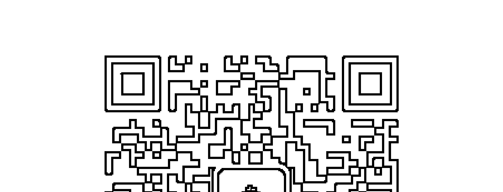

天使神秘学院 院长QQ：715104687

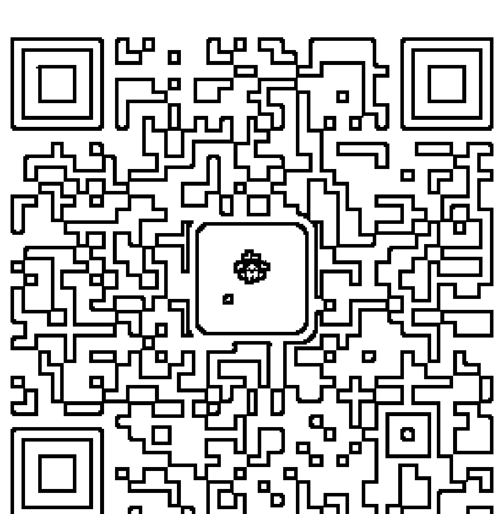

## 制作说明：

本书由《天使神秘学院》出重金从台湾购入的原版书籍扫描制作完成。为达到最好阅读效果，特地把原版书全部切开后，再经由专业扫描设备高精度扫描完成，并经过一张张的PS后期处理最终成书，其间花费大量的人力、物力以及时间，只为能给大家提供经济并优质的神秘学学习资料而努力。

本学院强力谴责某些机构和个人，把本学院花心血制作完成的电子书籍，包装后直接放在自家淘宝网上低价倾销的行为，以谋取不劳而获的经济利益。如果长此以往最终将无人愿意再为大家花心思制作电子书，那以后可能大家再无新书可读。

为让大家以后能够读到更多的好书，也为了本学院的良性发展。本学院恳请大家尽量做到如下几点：

-   一、尽量在本学院的网站购买电子书籍。
-   二、请勿用技术手段把电子书内的水印及加密去掉。
-   三、在收到电子书后小范围传阅即可，千万不要公开传播，更别挂到淘宝网上低价销售。

同时为答谢广大支持者，学院电子书将做如下调整：

-   一、学院会把一些早已收回制作成本的电子书折价销售。
-   二、最新制作的电子书籍会开放打印功能，大家购买后有条件的可自行打印成书。

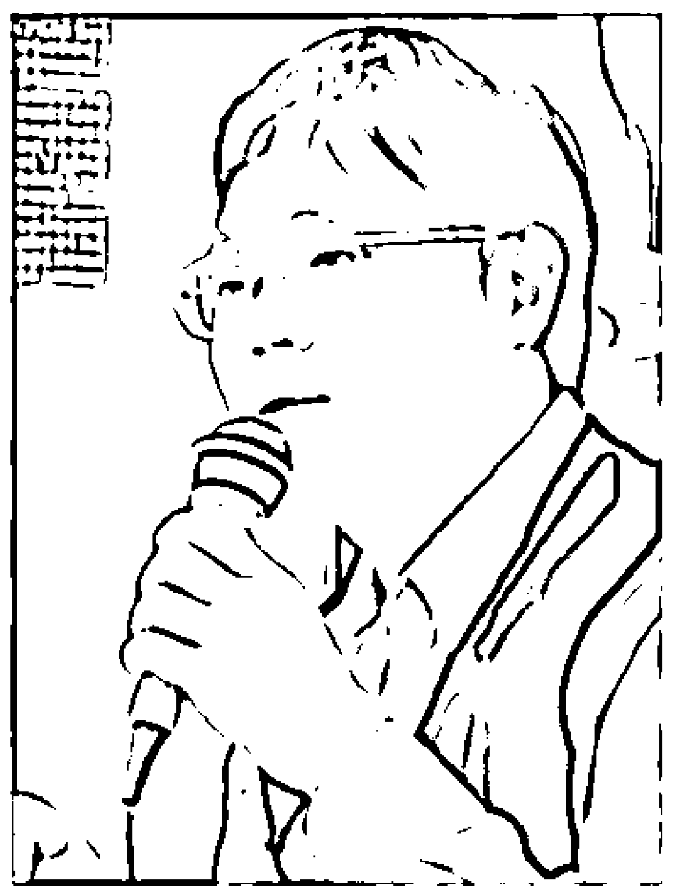

## 王怡仁醫師

家庭醫學科專科醫師，曾任高雄榮總家庭醫學科總醫師，現職爲高雄榮民之家家庭醫學科醫師、新時代賽斯教育基金會一級心靈輔導師、台灣身心靈全人健康醫學學會創始會員。鑽研新時代思想數十年，十餘年來主持「健康之道」、「賽斯速成班」、「不藥而癒」、「靜心的優雅節奏」、「天生富有」等講座，定期於教育廣播電台錄製心靈節目，並擔任新時代賽斯教育基金會心靈講師，於北中南各地演講，亦於身心靈工作坊及心靈輔導員種子培訓班授課。

致力於身心靈整體健康觀念之普及，著作有《不只是奇蹟》、《武俠身心靈診療室》、《不藥而癒：身心靈整體健康完全講義》、《靜心的優雅節奏》、《天生富有》等書。

You create your own reality.

每天的生活，都是灵魂的精心创造

## 啟動靈感 來自賽斯的41堂靈魂課

王怡仁◎著

## 王怡仁作品 ⑥

## 啟動靈感
——來自賽斯的41堂靈魂課

-   作者——王怡仁
-   總編輯——李佳穎
-   執行編輯——陳美玲
-   校對——謝忠鈴
-   美術設計——唐壽南
-   發行人——許添盛
-   出版發行——賽斯文化事業有限公司
-   地址——新北市新店區中央七街26號4樓
-   電話——22196629
-   傳真——22193778
-   郵撥——50044421
-   版權部——陳秋萍
-   數位出版部——李志峯
-   行銷業務部——李家瑩
-   網路行銷部——管心
-   法律顧問——北辰著作權事務所
-   印刷——鴻柏印刷事業股份有限公司
-   總經銷——吳氏圖書股份有限公司
-   地址——新北市中和區中正路788-1號5樓
-   電話——32340036 傳真——32340037

2013年12月1日 初版一刷
售價新台幣350元（缺頁或破損的書，請寄回更換）
有著作權·侵害必究（Printed in Taiwan）

ISBN 978-986-6436-51-2

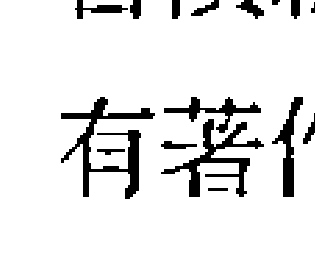

賽斯文化網站 http://www.sethtaiwan.com

## 關於賽斯文化

發行人 許添盛 醫師

我是個腳踏實地的理想主義者。賽斯文化，是為了推廣身心靈健康理念而成立具公益性質的文化事業，希望透過理性與感性層面，召喚出人類心靈的「愛」、智慧、內在感官及創造力」，讓每位接觸我們的讀者，具體感受「每天的生活，都是靈魂的精心創造 —You create your own reality.—」我們計畫出版符合新時代賽斯精神之書籍、有聲書、影音商品及生活用品，並將經營利潤致力於賽斯思想及身心靈健康觀念的推廣，期待與大家攜手共創身心靈健康新文明。

## 啟動靈感

## 來自賽斯的41堂靈魂課

## 關於賽斯文化

＜自序＞因為賽斯的解說，得到完全的整合

王怡仁

## 第1部 我們都是實習神明

-   1 靈魂到底是什麼？014
-   2 信念創造實相021
-   3 物質世界是修為最好的道場028
-   4 學習深入地感受035
-   5 生活在覺察與感恩之中042
-   6 宇宙的起源050
-   7 認識賽斯057

## 第2部 一切萬有的神奇創造

-   8 賽斯輪迴在人間的故事 064
-   9 高靈的世界 071
-   10 賽斯帶來的好消息 079
-   11 賽斯所說的基督故事 086
-   12 我們都是實習神明 094
-   13 多重次元的自己 101
-   14 我們都是創造大師 109
-   15 生活在夢中的早期人類 118
-   16 形形色色的生命 126
-   17 萬物皆有靈 134
-   18 地球歷史上的三次文明 141
-   19 從UFO到外星人 149
-   20 人格的片段體 157

## 第3部 生從何來，死往何去

-   21 對等人物與意識的九大家族 164
-   22 歡迎加入說法者行列 174
-   23 認識一切萬有 181
-   24 關於死亡的好奇與焦慮 190
-   25 生與死的自然節奏 198
-   26 從肉體到靈體 206
-   27 靈界的嚮導 214
-   28 死後的訓練中心 222
-   29 榮譽保護人 229
-   30 天堂、地獄與審判 237
-   31 靈魂的選擇 245
-   32 轉世與投胎 253
-   33 轉世中的人際關係 260
-   34 嬰兒與老人的意識 268
-   35 六道輪迴與因果迷思 276
-   36 神鬼傳說 284

## 第4部 成為做夢大師

-   37 認識夢體 294
-   38 夢中的象徵 302
-   39 早期人類的夢 309
-   40 出體與清明夢 317
-   41 且教生死兩相安 325

後記 332

愛的推廣辦法

## 《自序》 王怡仁

關於靈魂與生命，從小我就有著深深的好奇，因此經常閱讀生死或形而上的相關書籍，包括中國的老莊孔孟、印度的佛經，到猶太人的《聖經》等等。我發現不同的宗教與民族，對於一切萬有、上帝、靈界或夢境等等非物質的靈性世界，有著各自不同的說法。我也曾想將這些各異其趣的觀點歸納融合起來，因此在大學時代整理了一系列的「諸聖會談」文章，希望將同一話題、不同派別的說法整合起來。然而，越是整理，我越是發現，不同派別的觀點，不只難以相融合，還可能互相矛盾與衝突。於是，我得到了最簡單的結論，那就是，某一派的神明與靈界就歸那一派，他們和別的派別既不互相隸屬，也未必共通。

譬如有極樂世界是屬於佛教徒的，基督徒不會前去；上帝所在的天堂則屬於基督徒，不會有佛教徒到來；此外，中國的地獄只囚禁中國人，閻羅王並不需要學習多國語言，其他國家的靈體也不會前來接受中國閻羅王的審判。

同理，在中國的天庭，玉皇大帝不必接見宙斯派來的使者；而在奧林帕斯山的希臘神殿上，宙斯也不會見到來自中國的瑤池金母或太上老君。

簡單說來，就是佛教有佛教的靈魂地圖，基督教有基督教的靈魂地圖，老子、莊子、列子也都有各自的靈魂地圖，人們則追隨信仰，選擇一張自己的地圖。

這看似不完全合理的結論，在我後來讀賽斯書時，得到了答案——原來靈魂的歷程確實是出於自己的選擇。

賽斯是高靈，曾經無數次輪迴在地球，因此擁有許多生生死死的獨特體驗。談起從死亡到投胎的靈界歷程，賽斯的說法是這樣的：因為靈體的意識不同，靈魂的旅程也不一樣。譬如有些人的靈體會進入所謂天堂或地獄，有些人則會跟隨靈界嚮導的引領，順利再次投胎，此外，準備投胎時，有些靈體會在胚胎時就入胎，也有這些靈體會在胎兒出母體時才入胎。

賽斯告訴我們，這些不同的靈界歷程並不是被安排的，而是出於意識的選擇，每個人經歷的實相都是出自自己意識的投射，換句話說，靈魂的道路即是創造的旅程，沒有任何人因為被強迫而進入某一張靈魂地圖裡，每個人都是以自己的能量與信念決定靈魂將走的道路。

賽斯的說法，讓我放下了對死亡及靈魂的困惑，因此感覺到心安。而不同派別彼此歧異的靈魂觀點，也因為賽斯的解說，得到了完全的整合。

為了讓更多朋友能接觸賽斯的靈魂觀念，我因此決定寫作這本書，以《靈魂永生》中賽斯對於靈魂的說法為基底，再雜糅《夢、進化與價值完成》、《未知的實相》、《靈界的訊息》、《心靈的本質》及《個人與群體事件的本質》中賽斯關於靈魂的描述，盡量完整呈現賽斯對於一切萬有、高靈、靈界及夢境的解說。

此外，我還會以賽斯的觀點，將佛教、基督教以及台灣民間習俗關於靈魂的說法加以融合或釐清，盼望讀者們閱讀之後，都能對靈魂、靈界與夢境有更清晰的了解。

每個人經歷的實相都是出自自己意識的投射，換句話說，靈魂的道路即是創造的旅程，沒有任何人因為被強迫而進入某一張靈魂地圖裡，每個人都是以自己的能量與信念決定靈魂將走的道路。

賽斯的說法，讓我放下了對死亡及靈魂的困惑，因此感覺到心安。而不同派別彼此歧異的靈魂觀點，也因為賽斯的解說，得到了完全的整合。

為了讓更多朋友能接觸賽斯的靈魂觀念，我因此決定寫作這本書，以《靈魂永生》中賽斯對於靈魂的說法為基底，再雜糅《夢、進化與價值完成》、《未知的實相》、《靈界的訊息》、《心靈的本質》及《個人與群體事件的本質》中賽斯關於靈魂的描述，盡量完整呈現賽斯對於一切萬有、高靈、靈界及夢境的解說。

此外，我還會以賽斯的觀點，將佛教、基督教以及台灣民間習俗關於靈魂的說法加以融合或釐清，盼望讀者們閱讀之後，都能對靈魂、靈界與夢境有更清晰的了解。

在這段寫作的過程中，對靈魂的認識越來越深刻，讓我感覺越來越平安，因為我相信讀者在閱讀這本書的過程中，內在也會越來越安定。

如果你已經準備好要認識最宏觀的靈魂視野，現在，請打開這本書，讓我們一起進入賽斯的靈魂國度吧！

## 1 我們都是實習神明

## 靈魂到底是什麼？

我從小就害怕死亡，害怕自己以及家人的死亡。
幼稚園那年，媽媽跟我約定好，每逢週六不須搭娃娃車，她會親自來接我。在那個摩托車與幼稚園都不普及的年代，媽媽總是騎著腳踏車，前往遠在數公里外的幼稚園載我回家。
常常在週六中午，眼看著同學坐著娃娃車一班又一班地離去，我就開始哭了起來。媽媽沒有準時，我害怕她發生車禍，從此就離開我了。
老師看著我哭，一再地安慰我：「再等一下，媽媽就快來了。」但我沒有辦法平息心中的恐懼與焦慮，仍然反覆擔憂，直到幼稚園那一年結束。
這樣的死亡恐懼，隨著年紀變大，沒有變少，只有更多。
國小二年級那年，同住三合院的外婆過世了，當她停靈在大廳時，每天放學回到家，看到外婆的靈柩，我的心裡總有著天大的問號：『如果外婆的軀體在這裡，那原本活生生的外婆又在哪裡呢？』
外婆往生之後，我心裡也開始有了矛盾，有時會想，如果我放學時還依然看到外婆搖著她的紙扇，笑意盈盈地坐在房間迎接我，那有多好！但有時又轉念一想，若是真的見到外婆笑瞇瞇地仍坐在她的搖椅上，我會不會嚇得魂飛魄散？

死亡是我找不到答案的謎題，靈魂更是我思想裡的迷霧，在那個年紀，我不確定人有沒有靈魂，渴望知道人死究竟是如燈滅，萬事皆空？或者仍有一縷幽魂，徘徊於天地之間？

不過，我很快就發現，原來『靈魂』並不只是一個人獨有的好奇，因為在同學聊天的話題裡，我們會一起聊著科學家算出來的『靈魂的重量』，討論靈魂是不是真的如科學家的計算，重約二十五公克；我們還會看著天空射破雲朵的日光，一起猜想那會不會是來自天堂、接引人們上西方極樂的光芒。

於是，在那個對於靈魂懵懵懂懂的年紀，我跟同學們若是撿到了校園裡死去的鴿子、麻雀或獨角仙，會幫他們挖一個墓穴，恭恭敬敬地下葬，再將墓穴堆起土塚，插上木牌，寫著「獨角仙之墓」等等的，再合十離開。
我們仿照大人的墓葬儀式，以為這就能讓靈魂最平安。
因為不知道什麼是「靈魂」，也不知道什麼是「死亡」，大家都害怕死神降臨。
曾經有同學跌倒了，額頭上不停地流血，我們將他扶了起來，他用手帕壓著傷口，眼淚直流，惶恐地大叫：「我會不會死掉？」
那一聲：「我會不會死掉？」常常盤旋在我的記憶裡，直至很多很多年以後，我當了醫師，看過許許多多的生死，才發現死亡恐懼並不是小朋友獨有的，如果不正視死亡，就算活到一百歲，死亡依然會是心中的陰影。
就像曾有一位九十多歲的老爺爺來找我看診，一臉惶恐地問我：「王醫師，我本來都要推輪椅才能行動，但這兩天不知道為什麼，即使放開輪椅，我還是可以走路。」他吞了吞口水，繼續說：「這會不會是大家說的「迴光返照」，你幫我看看，我會不會死掉？」
還是那句：「我會不會死掉？」小朋友的害怕，也是老年人的恐懼，不瞭解靈魂的本質，就會終生帶著死亡的深深焦慮。

為了知道什麼是靈魂，破解心中的恐懼，從小學開始，我就對生死的話題有著濃厚的興趣。我常常到寺廟請問善書，想要知道靈魂是什麼？靈界是什麼？神明與菩薩又是什麼？

但每一位作者各有其說法，我也越看越迷糊。當我越是想要抓住對於「靈魂」確定的答案時，就越發現靈魂裡似乎並不存在著「確定」。

> 「子不語怪力亂神。」

孔子不喜歡弟子們談論靈魂與鬼神，然而，我總覺得，即使不談論，每個人心中必然存在著對於靈魂的好奇，以及關於死亡的焦慮。

> 「我怎麼知道一心想要求生不是一種迷惑呢？又怎麼知道怕死不是像幼年流落在外而不知道返鄉呢？麗姬是艾地邊疆官員的女兒，晉國國君準備迎娶她的時候，她的眼淚哭濕了衣襟；等她進了王宮，跟晉王同睡大床，共吃美食，這才後悔當初不該哭著害怕出嫁。我怎麼知道死去的人，會不會也後悔當初的一心想要求生呢？」

莊子希望人們接納死亡，他告訴人們，死後的世界或許比活著的時候還瑰麗，更說不定人在死亡之後，會後悔為什麼活著的時候要貪生怕死。
然而，莊子並沒有解開「死亡」的謎題，他希望人們不要怕死，但人們怕死，怕的並不只是「死亡」這件事，他們真正的恐懼是死亡之後，靈體將往哪裡去？而關於靈魂的歸宿，莊子顯然沒有給出答案。
上了大學之後，我開始認真地想從佛學中尋找死亡與靈魂的答案。我請回了佛經，一部又一部地讀，盼望能解開內心的困惑。那時的我開始深入許多依稀聽過、卻沒有詳細瞭解的佛學生死理論，因此知曉了六道輪迴、極樂世界、九品蓮花，也認識了佛經中的佛菩薩與天龍八部等等。
似乎我的觀念應該隨著佛學而清晰，然而，我卻覺得在清晰的同時，也衍生了一樣多的困惑，我不知道佛經說的究竟是真理，還是印度當地的傳說，就像佛經說的「天龍八部」，有天、龍、夜叉、阿修羅、迦樓羅、乾闥婆、緊那羅、摩呼羅迦等八類護法神，但我不明白天龍八部是遍存於天地之間，還是僅在印度一地出現，因為其他的國家與宗教並沒有類似的神仙。

而在疑惑的同時，我的心中還有些沉悶，比如佛經中說六道輪迴，六道中又分天、人、阿修羅三善道，以及地獄、畜生、惡鬼三惡道，人若業力深重，執著於貪瞋癡，那麼在今生結束之後，下一生就有可能投胎成畜生。我心中的苦悶是，若照這理論，貓狗豬羊難道都是做壞事的人投胎的嗎？還好我在二十一歲那年遇到賽斯，因為賽斯是高靈，關於生與死，靈魂的生從何來，死往何去，賽斯全都以更透徹的角度，做出非常清楚的解說。而最令我感到溫暖的是，賽斯的說法在慈悲中蘊藏著圓融的智慧。讀過賽斯關於靈魂的闡述，我清楚了生命沒有懲罰，只有祝福。也是因為賽斯，我不再惶惑，更慶賀著如恩典般的生命。在這本書中，我將以賽斯的說法為基底，引領讀者們深入認識生命。相信只要明白靈魂的本質，我們都可以用更喜悅平安的心，歡慶每一天的來臨。

## 喜悅小語

> 生命沒有懲罰，只有祝福。

## 信念創造實相

> 孔子在《論語》中曾經說了這麼句話：「未知生，焉知死？」白話翻譯的意思就是：「如果連『活著』是什麼都搞不清楚，又怎能明白什麼是『死後』呢？」

物質世界的修為是自在遊靈魂國度的基礎，如果我們無法明白物質世界創造過程的來龍去脈，就難以明白靈魂的創造法則，這也就是我們為什麼要把握物質生命有限的一生，不斷吸收真理，持續修為自己的原因。

在修為的道路上，最根本的真理就是「信念創造實相」，只要能與「信念創造實相」這條真理合而為一，不管靈魂的世界如何繽紛多彩或光怪陸離，我們的心都能安住進在平安的喜悅中。

所謂的「信念創造實相」，意思就是說，在我身邊的人與事，不管我覺得好還是不好，或者我喜歡、討不討厭，全然出自我信念的創造。我創造我的實相，即便是拂在我身上的一陣輕風，或踩在我腳下的一顆石頭，也都源自我的信念，絕對沒有任何一件物事是外境硬加在我身上、逼迫我去接受的。在我的世界裡，我是「神」，也就是「造物主」。我的世界出自我的信念，我的所聞所見全都是我的創造。身處順境時，要相信「我創造我的實相」很簡單，譬如薪水調漲了三千塊，老公溫柔地送上情人節玫瑰花，或者兒子當選了學校的模範生。這時若談起「我創造我的實相」，相信大多數人都會笑意盈盈地說：「是呀！我的創造能力很強，這些都是我創造的。」然而，除了看到順境是自己的創造外，於修為者而言，更重要的還是在逆境來臨時，堅定地告訴自己：「是的，這是我的創造，因為我有這樣的信念，才創造出這樣的實相。」即使籠罩在逆境的苦痛裡，依然確定地知道一切都是我的創造，這樣的我們才真的修出了「我創造我的實相」，也確實地跟真理合而為一。在如此的信念下，我們才真正是自己世界的「創造之神」。

明白「信念創造實相」後，當老公牽著妳的手，一路歡笑地走在公園時，妳知道那是妳的創造。
又若是某一天下班時，妳看見先生牽著另一名女子的手，開心地走在人行道上，妳也確定那是妳的創造。
此外，當你參加孩子的班親會，聽到老師誇獎你的孩子每次考試都是一百分時，你知道那是你的創造。
而倘使孩子在學校將另一名小朋友打得頭破血流，還被主任帶到學務處約談，你依然十分確定那是你的創造。
還有，因為這個月業績表現良好，發新時你多了五千元獎金，你知道那是你的創造。
又如果這個月投資股票，卻遭逢股價下跌，財產損失了三百萬，你仍然毫不遲疑的告訴自己，這絕對是自己的創造。
當你全然相信一切都是自己的創造時，看待世界的眼光一定會改變，你再也不可能埋怨、憤恨或恐懼別人傷害你，因為你是「神」，擁有生命的導演權，如果沒有有经过你的授意，绝对不可能有人主动过来侵犯你。你不可能是受害者，因为一切的外境都来自你信念的投射，不经你的同意，谁都无法动你一根寒毛。当你全然相信「我创造我的实相」时，你的生活将会自然地从外境觉察，由内心创造，你从外境中看到自己的信念，并自内心开展正面冥想。读过我的《不药而愈：身心灵健康完全讲义》、《静心的优雅节奏》以及《天生富有：在丰裕的收成中享受生活》的读者们，应该都已经建立了这样的人生观。若是你对「信念创造实相」仍心存怀疑或是观念模糊，建议你先把我前面三本书再读一遍，因为这些书是引领大家修炼与创造的，唯有先懂得生命的真理，才能深入明白灵魂的游戏。《不药而愈》是由健康的角度切入，引领读者们从身体看到信念的创造，《静心的优雅节奏》则是以「觉察五句话」带领大家觉察并接纳自己的信念，因此安顿纷扰的心，《天生富有》再以冥想方法引导读者们从想象力创造心灵的美丽新世界，更由想像的国度开创物质的真实。物质的世界很缓慢，因此我们可以像「实习神明」一样，一步步地练习「认识、「修为」与「创造」。经过日复一日的信解行证，觉察将自然地成为我们的思维方法，创造也将成为我们习惯的行为模式。

一旦我们在肉身中修炼出觉察与创造的真理法门，即使有朝一日脱去肉身以灵体来生活，我们依然将保持觉察与创造的节奏，因而过得自由自在。

因此，如果你还不明白「信念创造实相」，也不熟练习察、静心与创造，我建议你先别将学习的重心放在灵魂或生死，

因为随着不同的信念创造不同的实相，每位说法者、宗教师或灵媒对于灵魂的说法也各具其趣，

若是广加阅读听讲，你会因为摸不着头绪而更加迷惘，然而，倘使你具足了心灵修为的基础，就会知晓，每个人的信念与能量都不一样，体悟出的灵魂与灵界当然也各不相同，你将拥有最安定的心，

也能接纳、尊重与包容所有不同的认知与体悟，不论他人所说之法如何，

你的心都是静谧平安的。

物质世界是最好的修炼场，一步一步来，保持前进的步伐，但千万别苛责自己，一天又一天，一年又一年，你将发现自己的智慧打开，内心也平安了。

> 曾有学员告诉我：「学习心灵成长已经二年多了。最近有一次咳嗽时，我发现

痰里有血丝，赶快就医检查，医师告诉我，这样的状况有可能是喉咙破皮，导致微血管出血，也有可能是结核病，当然，也不能排除罹患肿瘤的可能性！

> > 「听到医师这么说，我的内心马上一沉，既恐惧又紧张，但同时我又觉得很讽刺，心想自己学了三年多的心灵成长，却还是无法信任身体，甚至害怕癌症，也恐惧死亡，仿佛三年多来都白学了。」我跟他说：「心灵成长当然希望大家悟出如如不动的智慧之心，但在成长的道路上，不论学习到什么境界，我们都要觉察与接纳，而不是对自己鞭挞与苛责。」

> > 「听到罹患肿瘤的可能，你的内在因此生出恐惧，如果此刻的你告诉自己：『因为深爱自己，所以我觉照到自己的恐惧，并全然接纳自己的恐惧。』你的心灵将比苛责自己还平安。而在接纳恐惧后，你会释放恐惧，并因此慢慢安顿自己的内心，这样的你对身体才有真正的信任。」

从物质的生活到永生的灵魂，修为与创造都是必修的功课。只要念兹在兹，将学习融进生活里，我们就是人间最精进的实习神明。再从身体的世界切换进灵魂的国度，我们也将会拥有最喜悦自在的心灵。

## 喜悦小语

在接纳恐惧后，你会释放恐惧，并因此慢慢安顿自己的内心，这样的你对身体才有真正的信任。

## 物质世界是修炼最好的道场

唐玄宗开元年间，有位叫卢生的年轻人外出旅游，行经邯郸时，投宿旅店过夜，在旅店中结识了一位唤为吕翁的道士，卢生说起自己空有一肚子想要建功立业的理想，但多年来仍一事无成，因此非常懊恼。聊到夜深后，卢生有了睡意，吕翁于是取出一个青瓷枕头递给卢生，请他头枕这枕头入眠。当卢生入睡时，店家还煮着黄粱米饭。而后卢生进入了梦乡，梦见自己进京考取了进士，还迎娶了名门崔家的小姊为妻，而且官运亨通，连连升迁，不只荣任了节度使，最后更当了十多年位高权重的宰相。梦中的卢生享尽了锦衣玉食、美女骏马，还活到八十多岁的高龄。就在好梦正酣时，他猛然醒来，发现这一切原来只是一场美梦，抬头一看，吕翁依然微笑著坐

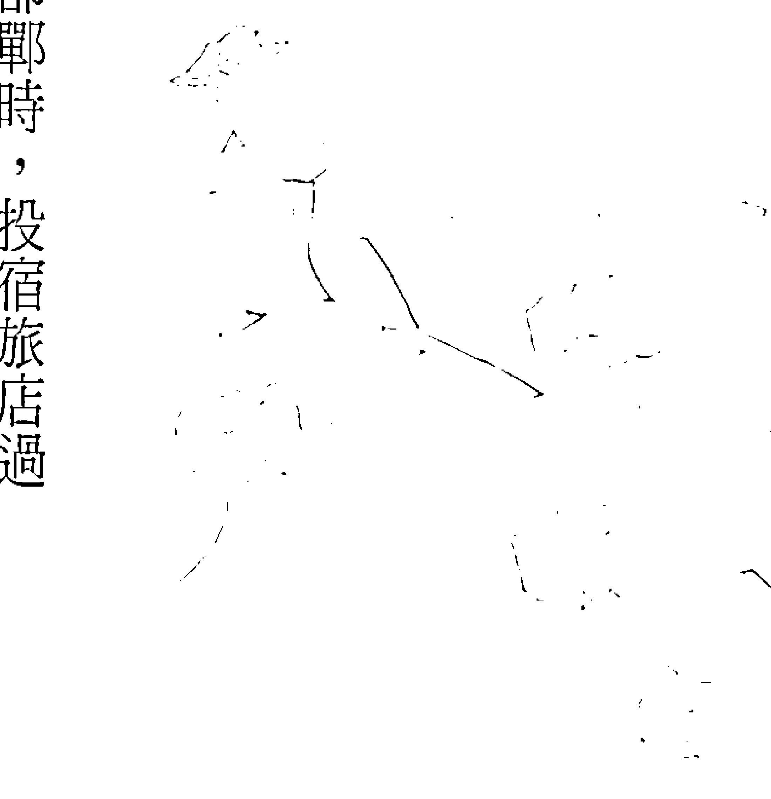

在他身边，再往窗外一望，入睡前店家那锅黄粱米饭居然还没煮熟。

这个故事就是成语「黄粱一梦」的由来，故事里的卢生在梦中度过了辉煌的一生，但回到物质世界后，才发现经历的时间竟然不足以煮熟一锅黄粱米饭。

根据赛斯的说法，人死后的新形体与梦中灵体是非常相像的。在活着的时候，我们或许会对死后的世界极为迷惑，然而，每天我们都做梦，梦中的形体也就是死后的灵体（或称星光体），我们因此可以从梦中瞥见死后的灵魂世界。

梦中风景就像「黄粱一梦」，特色是振动频率很快，只要念头转，外境也就随之转，因此在烹煮一锅黄粱饭的短暂时间内，梦中的卢生可以从青年活到老年，并且娶妻生子，过完仕途顺利的一生。

物质实相则与梦中风景完全不同，比之梦里的世界，物质实相的特色是明显的缓慢迟重。不论我们再怎么感慨物质世界光阴似箭、岁月如梭，物质实相比不上梦境中时空运转的快速。梦中的世界只须一念之转，转瞬间就过了十年二十年，甚至一辈子。

然而，缓慢迟重的物质世界却是最有利于个人觉察与修炼的，因为这样的物质实相给了我们充足的时间进行内在的省思。我想起医学院时代的病理学实验考试。病理学实验考的是病理切片，在考试的当天，老师会准备五十台显微镜，并且在显微镜下各摆置一片切片，切片上的病理组织包含了卵巢巧克力囊肿、胃溃疡、腺瘤……等等。考试开始之后，学生依座号进入实验室考试。每一台显微镜只容许我们有三十秒钟的时间可以逗留，在这三十秒内，必须精准地判断病理组织的名字，并在考卷上写下答案，而后，不管会不会写，铃声都会准时响起，我们再抓着考卷冲向下一台显微镜。医学生们都叫这样的考试为「跑台」，也就是随着铃声从这一台跑向下一台。因为每一台都只有三十秒的时间，考试的时候没有办法思考，只能凭记忆与直觉，因此在我的印象中，每次经过跑台考试，我都因为极度紧张而汗流浃背，考完试后全身虚软无力。人的脑袋必须要有时间思考，像「跑台」这样无法妥善思考的考试会让考生们感觉非常紧张而疲累。

> 「我肯定你的精进，但女儿持续忧郁症，正是在强迫你面对这个问题，再深入一点去觉察自己，你就会发现女儿正在帮助你觉察及转化自己。只要你相信家庭与亲子关系一定会朝美好前进，等到内在的智慧打开，你的喜悦能量一定能帮助女儿走出忧郁，你们一家也必将生活在平安幸福中。」

> 「我...」

在你身上，但你可以觉察自己关于生病的信念，并坚定自己对健康的信心，以及冥想健康后游山玩水的画面。于是在疾病痊愈之后，你踏实地练出了更胜以往的健康信念，这就是修炼的历程。

同理，或许今天你遭遇了夫妻失和的问题，但你的意识依然是自由的，当晨醒来时，枕边人也许仍旧与你无言冷战，然而，你可以在意识里觉察自己对老公的想法，坚定自己对和乐家庭的信心，并冥想夫妻牵手漫步在巴厘岛海滩的画面。于是在你与老公走回甜蜜关系之后，你将比从前更信任夫妻之间的美满幸福，这也就是修炼的道途。

而经过物质世界的意识修炼，你的智慧将融入你的灵体。

有学员这么说：『昨天晚上我做了个梦，梦中的我到医院检查，医师跟我说我得了糖尿病，当下我大吃了一惊，但随即灵光一闪，心想糖尿病既然是我创造的，为什么我要相信自己得了糖尿病呢？于是我马上问医师是不是看错了数值，结果医师再仔细看了一次检查报告，告诉我说：『张先生，不好意思，是我看走眼了，你很健康！』我顿时觉得很开心，而且还在笑声中醒来，梦醒之后更持续着梦中的快乐，因为我发现我已经能在梦体中活用『信念创造实相』了。这就是物质实相修炼的成果，由于物质实相缓慢而迟重，因此修出的信念总是坚定而踏实。只要我们能在物质实相中冶炼出喜悦平安自在的信念，切换进梦体或灵体时，也一定是喜悦平安与自在的。

## 喜悦小语

物质世界的特质就在于改变得很缓慢，『缓慢』可以让我们经验外境的同时，还能进行觉察与思考。

## 学习深入地感受

风雨交加的飓风天，往往我还会穿上雨衣，骑着摩托车去上班。因为经过心灵成长，在倾盆大雨洒在身上时，我喜欢将头脑里的思想放空，既不质疑政府为什么不宣布停止上班，也不怪罪天公为何不作美，只是单纯地感受风吹在身上，以及雨淋在脸上的感觉，总觉得那是我与大自然最直接的接触。

学习心灵转化之前，我们都习惯头脑中有着喋喋不休的念头，进入心灵转化之后，我们要学习的是放下脑袋，并体会流动在身上的感觉。

头脑的天性就是不间断地产生思想，譬如走在烈日之下，头脑会不由自主地说：「天气好热呀！」「我怎么会忘记带阳伞或遮阳帽呢？」或：「在这种大热天，如果吹着冷气，再来碗清凉的芒果冰最享受了。」

然而，若是放下头脑，我们就能不受思想干扰，纯粹地体验什么叫做「烈日灼身」，什么又能称为「热情的太阳」。修炼的方法之一，就是认真地观照自己的感受。专心感受身体上的感觉，我们就进入了静心，也因此不再轻易地顺随思想做出冲突的行为。

> > 一位学员谈起：「昨天老公上网，点进我的脸书，发现一位男同事留言关心我，他非常不高兴，问我为什么跟他那么好，这使得我非常生气，反问他难道都没有要好的女同事吗？我还高声对他说，上周三中午谁跟他出去吃饭别以我不知道，他听了之后火冒三丈，居然在盛怒之下拿起我的身心灵演讲CD大力摔进垃圾桶，又骂我：「亏你每个礼拜都在上心灵成长课程，学了之后脾气还是那么差，既然学习没有为你带来任何改变，还不如把这些CD全部丢掉！」那一刻我真是气到喷火，如果不是经过心灵课程的洗礼，我一定会破口大骂。虽然最后我忍住愤怒，没有恶言相向，但从昨晚到今天，我完全不想再跟他说任何一句话。」我告诉她：「比起忍受愤怒，你更需要的是感受愤怒，如果可以放下头脑，在愤怒来临时，把怒气当作胸口的海潮，好好感受它，你即能发现愤怒只是一种感觉。又若是进入愤怒的情绪，你就不会被情绪掌控而任性地回击先生，当然也不会伤害夫妻间的关系。」

前文提过，物质实相是缓慢迟重的，也谈过我们可以在物质世界中进行意识的修为。然而，处身物质实相中，若是脑袋不经修为的洗礼，很容易流于头脑中各种思想叽叽喳喳地说个不停。一颗思维喋喋不休的脑袋，往往伴随着烦闷焦躁的情绪。

这本书将引领大家从物质世界的意识修为出梦体与灵体的喜乐平安。首先，本书篇中要告诉你，在梦体或灵体的世界里，感受比思想还重要，因为灵体不像物质这么缓慢，它的振动频率是比较快速的，虽然我们在梦梦里可以思想，也能以言语与他人对谈，但梦中的我们绝对不可能像醒时那般想法庞杂繁复。梦境带给我们最深刻的感觉，往往是焦虑、恐惧、感动或喜悦等等各种各样的感受，也许清醒时我们对梦中的对谈或画面有着深刻的记忆，但那通常也是因为梦境里有着强烈的感受。

物质生活中修炼的方法之一，就是放下头脑，练习用感受来体验这个世界。

身体有许多种不同的感受，笼统地区分，紧张焦虑的感受主要在上腹部，因此在考试的时候，有些学生会说「我紧张得快胃痉挛了」，长期紧张也真有可能导致胃溃疡甚至胃穿孔；郁闷的感受则主要在下腹部，有句成语说「腹有块垒」，就是形容一个人长年不得志，或者长期担着某件事，导致腹部一直有沉重的感觉；恐惧与害怕的感受是在后背，当你走进鬼屋时，会感觉「倒吸一口凉气」，而后惊悚之气即顺着脑后往下流，因此你不寒而栗；此外，温暖的感受也在后背，譬如妈妈轻轻抚摸你的头发，你会有股舒服的感觉像暖流一样流过脊椎，许多宠物也最喜欢主人这么轻抚牠的背部，因为这样的感觉非常舒服。

除了这些感觉外，我们最需要用心感受的是爱与恨。当强烈的爱与恨来临时，你会感觉两乳中间的胸口有股气流在翻涌，这个位置就是七脉轮中的「心轮」，台语则称之为「心肝头」。仔细感受一下，当老公醉醺醺地夜归时，你非常生气，心轮一定涌起了恨与怒的浪潮，同样的，若是老公在你生日时送你一条喜欢很久的项链，你的胸口也会滋生一阵喜悦与感动，那正是「爱」的感受。

越是放下头脑，你越习惯观照自己的感受，而在修炼的过程中，只要你感觉自己正在从郁闷烦躁走向欢欣喜悦，那就是正面能量在提升，你的修炼方向也由此可知是大致正确的。

一位学员分享说：「我是因为职场上与人冲突才来学习心灵成长的，刚报名参加课程时，我先生非常反对，虽然他也是个性比较闷的人，但他一直都觉得人的情绪与人际关系绝不可能因为上几堂课就改变。因此在出门上课之前，他往往会唉声叹气地跟我说：『你又要去上课了喔！那就不能在家陪我聊天了！』一开始我还会忍着脾气跟他说：『我去上两个小时的课，很快就回来了，你就让我安心地去上课好吗？』而后心烦气躁地出门。但是，日复一日，他依然故我，我也懒得理他，只要上课时间一到，跟他说一声我就出门去。少了出门前的拉扯，踏出家门的心情也就轻松许多。」

> 「想不到上课还不到半年，我感觉整个人的能量已经提升，心情容易喜悦，笑容常挂在脸上，跟同事间的关系也无形中改善了，更奇妙的是，我先生上个礼拜还告诉我：『你上的那个什么课，好像真的不错喔！看你这么快乐，我也快乐多了，干脆下次你也带我一起去上课！』听他这么说，我觉得好开心喔！」

这就是感受的转变，只要认真修炼，你一定能感受到越来越轻松喜悦。

另有学员疑惑地问：『可是夫妻间不是应该什么心事都能交流的吗？没有先生的支持，我们的学习将是孤单寂寞的，因此在学习的过程中，如果先生阻碍我们，我们不是应该努力去说服他，让他赞成我们吗？」我告诉她：「在信念与能量的转折期，有时真的会面临一些阻抗，但我们要学会放下它。那就像一群胖子在一起，如果有一个人忽然提出要减重，马上就会有朋友跟他说：『人生最大的快乐不就是享用美食吗？若是连好吃的东西都不能吃，人活着还有什么意思？』更何况大家都胖胖的看起来不是很可爱吗？你为什么要跟大家不一样，非减重不可呢？』我们若是这个想减重的人，难道非要说服身边的人一起减重，才算有良好的沟通与分享吗？「在信念的转折期，就像减重一样，很可能面临旧信念带来的阻力，因此会听到先生或朋友的反对，此时的我们不如先放下对抗反对声浪的心思，专心的学习与转化自己，将修炼放在自己的感受，而不是他人的反应，等到自己的感受喜乐起来，我们就跟这位学员影响她的先生一样，让更多的朋友看到我们的成长，并加入我们的学习行列！」学习就像树苗准备破土而出，我们不可能说服泥土让路给我们，只能坚定自己成长的道路，当自己看到阳光，感受喜悦时，也能送给泥土一片绿荫。而在成长的道路上，放下头脑的纷扰，专注于自己的感受，或许就是转化最大的契机。

## 欢喜小语

学习就像树苗准备破土而出，我们不可能说服泥土让路给我们，只能坚定自己成长的道路，当自己看到阳光，感受喜悦时，也能送给泥土一片绿荫。

## 生活在觉察与感恩之中

少年时代的我很喜欢读武侠小说，总是边读小说边幻想自己就是一代大侠，捧读武功秘笈，手持三尺长剑，铲奸锄恶，创造和平的新江湖。走上心灵成长的道途之后，我早已放下成为大侠的梦想。现在的我喜欢在生活修炼，活出快乐的自己。休闲时我依然会跟孩子们到戏院观赏英雄电影。在孩子惊呼钢铁人、蜘蛛人或蝙蝠侠飞天遁地的神功时，我仍莞尔一笑地想起当年的大侠梦。进入心灵转化的道路，我越来越清楚内在的修为才是创造美丽新世界的本源。如果内在不清理，在炽盛的小我下，对人的抗拒与冲突还盘据着信念的核心。那么，即使你成为武功天下的大侠，仍然会继续创造痛击你的恶棍，同样的，就算能像钢铁人一样发明无坚不摧的钢铁衣，你还是会吸引来实力相当的邪徒，或甚至……

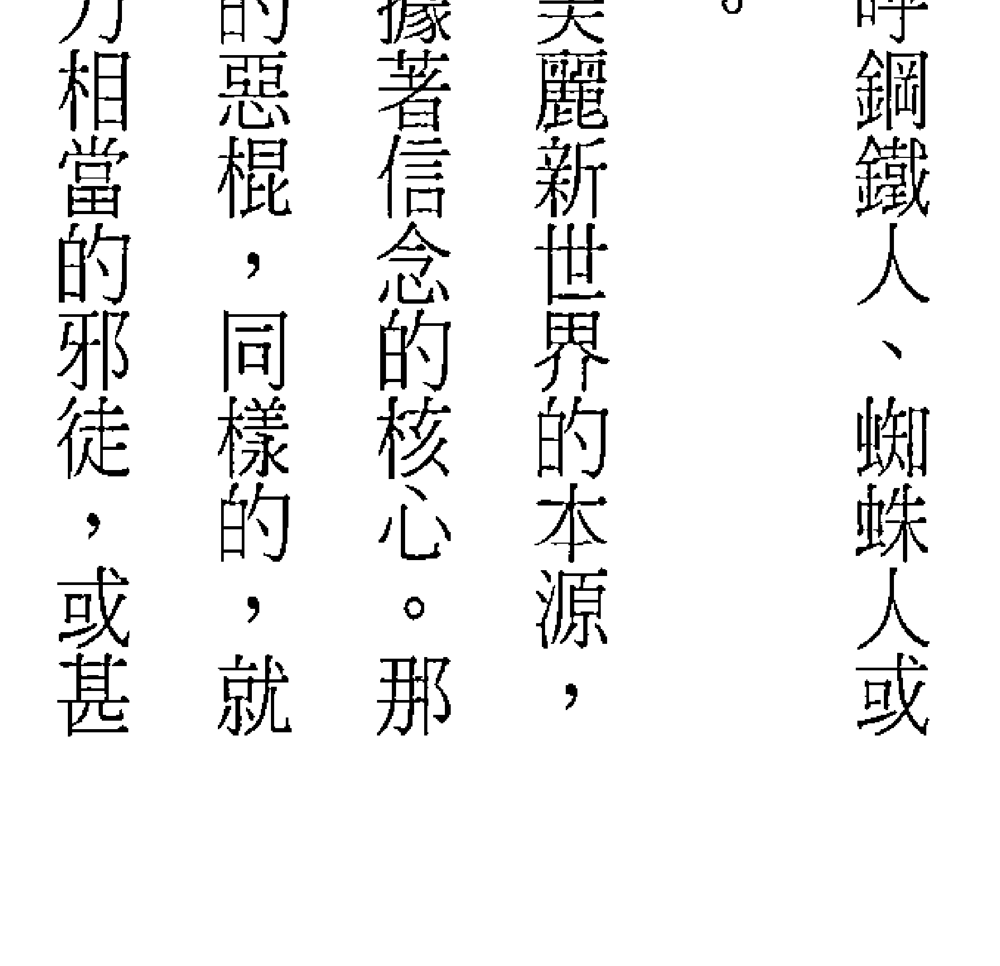

像电影的故事一般，创造来自异星球、准备攻占地球的高科技外星人与你大厮杀。

或许大侠与英雄的头脑也不喜欢战斗，然而，若只是苦练武功或发明武器，却不转化小我，那么，人与人之间的冲突仍然会持续存在。

憎恨战争并不会带来和平，只有从内心热爱和平，才能真正创造和平。而若想从内心创造和平，我们当然要迈向合一之路，也就是创造与修为之路。

仔细去感受，我们就会发现物质生活的一生，就是修炼的历程。

一位学员说：「想当年我老公在追我，真的是想尽办法献殷勤，让我不得不感动。每天我要上班时，他一定开著名车在我家门口准时接我。上班之后，常常都是花店老板突然送来一束玫瑰，或是快递人员送上一份贴心的礼物。他还时不时就请我全办公室同事们喝饮料，或者吃小蛋糕。等到下班时，他的名车也必定准时出现在我们公司的楼下。当年的我真像个小公主一样，更在朋友与同事羡慕的眼光中风光出嫁了。」「谁能料想得到，婚后不到三年，老公居然外遇，还马上跟我离婚。」」

我跟她说：「走在修炼的道路上，我要提醒你的是觉知，说真的，也许一开始自己都以为娶到了真命天女、嫁到了真命天子，或以为找到了灵魂伴侶，并期待幸福快乐的一生，但真正走入婚姻，你迟早都会发现，不管娶的是谁，或嫁的是谁，你都是娶回了一面镜子，或者嫁给了一面镜子。在婚姻里，对方一定会清楚地映照出你的信念。」

也有学员说：「我的孩子国小时很优秀，不只成绩一级棒，还喜欢读《三国演义》及《哈利波特》，在他小学六年之中，每一期校刊一定都有他的作品，不是文章，就是绘画，当时的我真的好以拥有这孩子为傲。」

「想不到上国中之后他会改变这么多。国一之后，他陷进了网络世界，每天都上网玩游戏到三更半夜，如果我骂他，他就对我目露凶光。又因为上网到深夜，早上无法准时起床，他干脆不去上课。每每想起他这么大的变化，我就觉得很伤心」

我也告诉他：「身为父母的我们，都期待孩子品学兼优，将来更能出类拔萃，然而，在亲子的互动中，因为我们都走着修炼的道途，所以你迟早一定会发现，不管我们生下什么样的孩子，其实是我们的一面镜子；不论我们培养出什么性格的孩子，也是我们的一面镜子。孩子必定清楚地映照出我们的信念。人间的旅程，就是实习神明的一趟修炼之旅，婚姻是修炼，亲子是修炼，职场是修炼，健康是修炼，生活即是修炼，只要用心经验，我们一定可以在这无时无刻的修炼中，转化出自己的喜悦平安与自在。读过我的书《不药而愈：身心灵整体健康完全讲义》、《静心的优雅节奏》以及《天生富有：在丰裕的收成中享受生活》的读者们，一定了解生命就是修炼与创造的旅程。在学习的过程中，我介绍过各种各样的观念，也提供读者们觉察及冥想的方法。当你熟悉这些观念与方法后，并不需要牢牢地记住它。学习的历程就是这样，入门的时候，我们要精进地从阅读与听讲中吸收，力求知识的融会通达，并熟练各种修炼与创造的法门，但在知识与方法精熟之后，为了减少脑袋的负担，我们要学着慢慢放下。越是与真理合一，我们越能将叙述真理的语言文字放下，而智慧将越来越绽放。

放，腦袋也越來越輕盈。當繽紛多彩的真理與我們的生活合為一體時，我們不需要記住那麼多真理，只需要簡單地覺察與接納、感恩與讚美，並從創造中完成自我的價值就可以了。這樣的原則很簡單，簡單到近乎老生常談，然而，最簡單的思維中，卻蘊藏著最豐厚的知識基礎。那你就像頭痛的時候你可以吃止痛藥，但可能還是會求教於醫師。也許醫師開給你的是一模一樣的止痛藥，但醫師有七年醫學教育的基礎，以及醫院多年臨床經驗，因此他可以全盤考量。在看似簡單的問診及處方裡，醫師有著豐富的知識底蘊，正像你的覺察與創造有豐沛的智慧根基一樣。生活在覺察與感恩之中，我們的人生觀將在生活挫折或心情困頓時知曉「這一切都是我創造的」，因而覺照自己的信念；而在生活豐裕或心情喜樂時，我們會讚歎一切萬有的恩寵，並感恩為我們帶來喜悅的人間天使們。若不經心靈的轉化，許多人在小我牽引下，很習慣地在事業成功時自以為是並盛氣凌人，卻在失意落魄時怨天尤人，彷彿一切的不如意都是機運不順或者被他人陷害。

意識一經轉化，人的思考也就翻轉，不再隨順小我而恐懼焦慮，我們將懂得經營人生，也就是生活在覺察、接納、感恩、讚美與創造中。我們那知曉內在的神也透過我們在學習，因此我們所行所為都榮耀著內在的神，也榮耀著一切萬有。我在《靜心的優雅節奏》中詳細介紹過覺察方法，也在《天生富有》裡談過感恩。現在，我還要告訴大家，「讚美」是美好人生的催化劑。仔細觀照你的生活，你的言語是不是充滿了抱怨、批評、謾罵，以及自我吹噓呢？妳習慣抱怨老公不體貼、賺的錢不夠多，埋怨孩子愛上網、晚上不早睡，或謾罵工作辛苦、老闆沒有人性嗎？此外，到餐廳用餐時，你是不是常常因為菜色口味不合，就對服務生高聲說「叫你們經理（或店長）過來」呢？你喜歡殺價嗎？會不會覺得大家都在欺負你、占你便宜呢？

如果你曾經是這樣的，那麼，現在我們走進了修為的道途，請開始練習讚美，並養成看見身邊人與事美好一面的習慣。請發自內心，告訴家人與朋友：

> 你好漂亮、你真英俊、你好有才華、你真幽默、跟你說話讓我覺得好開心……每個人一定都有優點，只要張開智慧的雙眼，你就看到了世界的美好。

然後，請仔細感覺，你一定會發現，讚美別人，也同時成就了自己。當你在稱讚他人「你有一顆溫暖的心」時，自己也會有股暖暖的感動，而當你稱許他人「跟你說話，感覺你的智慧有如一尊佛」時，也會覺得自己能量輕盈。那真的是「我見青山多嬋媚，料青山見我應如是」。只要將讚美融入你的生活，你的嘴巴會流蜜，能量會提升，美麗的夢想也能更輕鬆地達成。

## 喜悅小語

請開始練習讚美，並養成看見身邊人與事美好一面的習慣。

# 宇宙的起源

若是你已經熟悉了「我創造我的實相」，也熟練了覺察與創造的法門，從這一篇起，將拉大視角，讓你看到整個宇宙的創造本質。每個民族都有自己的創世神話，我最稔熟的是中國流傳的「盤古開天闢地」故事。傳說在遠古時代，天與地是像蛋殼一樣接在一起的。在雞蛋般天地包覆的混沌世界裡，具有神力的盤古就這麼安住了一萬八千年。一萬八千年後，盤古再也受不了天地的狹窄，於是大力揮出雙手，劈開了混沌的宇宙。宇宙分出上下後，陽氣往上升，化為「天」，陰氣往下沈，成為「地」。而後天每日往上升高一丈，地每日加厚一丈，盤古也每天長高一丈，成為一位頂天立地的大巨人。最後盤古壽終死去，在臨死之前，盤古仍想創造世界，於是他的呼吸化成了風雲，左眼變成太陽，右眼變成月亮，鬍鬚變成星星，聲音則成了雷響，此外，盤古的血液變成河流，筋脈變成山脈，身上的毛髮則幻化成了草木。這就是中國傳說中的盤古開天闢地故事，盤古創造出宇宙，而後有了人間。這樣的故事當然是十足的神話，不同民族也都有類似的創世神話，然而，倘若宇宙真是如盤古這般的「神」創造出來的，那麼，世界就是盤古蓋好的一座豪宅，我們則是住進這幢豪宅的房客。《聖經》中也有一套大家耳熟能詳的創世故事。在《聖經・創世紀》中說：起初，神創造了天地，而後，神認為天地間要有光，因而創造出光，於是在創世的第一天，神區分出了有光的白晝，與無光的黑夜。創世的第二天，神創造出空氣，並使世界有了天與地。第三天，神再創造出陸地與海洋，又在陸地上創造出青草、菜蔬與結果子的樹木。第四天，神再接著創造太陽與月亮，讓日與月各自管理晝夜、分別明暗。第五天，神繼續創造了天空飛的雀鳥，以及水中遊的大魚。第六天，神創造了牲畜、昆蟲、野獸等等陸地上林林總總的動物。也在第六天，神照著祂的形像，按著祂的樣式，創造出了人。神賜福給了人們，又對人們說，要生養眾多，遍滿地面，治理祂創造的土地，也要管理海裡的魚、空中的鳥和地上各樣行動的活物。神還對人們說，祂將地上一切結種子的菜蔬，和一切樹上所結有核的果子，全都賜給人們作食物。天地萬物都造齊了，神創造萬物的工程也已經完畢，於是在創世的第七天，神就歇了一切的工，休息了。《聖經》的故事裡有著造物者的神聖。如果宇宙真如《聖經》所說，是神一點一滴捏塑出來的，那麼，我們全都是神的創造品，也將奉行神的旨意，管理天上地下的鳥獸蟲魚。然而，有許多懷疑論者卻不解地問：『倘若人與鳥獸都是神創造出來的，而且還要遵照神的安排，讓人來管理鳥獸，那麼，照這邏輯往上推衍，理當也有個創造……神的「大神」，「大神」創造出「神」，並且命令「神」來創造「人」。而這位創造神的「大神」又會是誰呢？「神」是宇宙創造的答案嗎？或者「神」帶來了更多的疑惑呢？科學家也在研究宇宙是從哪裡開始的。因此他們追本溯源，找出宇宙的源頭，最後發現太初的宇宙只是一顆方糖大小的團塊，這塊方糖上頭還有著七彩的顏色。因為不斷地大爆炸與擴張，方糖般的團塊變成了我們現在處身其中這個日月星辰羅列的宇宙。有些科學家還因此下了結論：宇宙並不是「神」創造出來的，而是由方糖大小的團塊擴張形成的。然而，科學的說法仍然沒有解開我們心中的謎團。我們可以接納宇宙起自一塊方糖的說法，可是如果沒有「神」，這塊方糖又是哪裡蹦出來的呢？由此可知，神話、宗教與科學雖對宇宙的起源各有說法，卻是各有破綻的。賽斯的創世論則告訴我們，宇宙起源自「一切萬有」（All That Is）。一切萬有是一切創造性來源的主體，而不是宗教上所稱的「神」。在太初之時，一切萬有存在著心念與情緒，因此發生了創造性的騷動，這才創造出了宇宙的第一個團塊，也就是科學家發現的這方糖般大小、即將大爆炸的團塊。答案，那就是『一切萬有』，太初宇宙團塊的來源。賽斯給了我們比科學更進一步的答案，那就是『一切萬有』，太初宇宙團塊的來源。就從這塊方糖開始，宇宙擴展成如今的模樣。在一切萬有的創造過程中，創造者就是創造物，我們都是一切萬有的一部分，雖然我們以肉體生活在人間，但心靈與能量卻從來沒有與一切萬有分離過，因此我們總能感受到自己的內在神性，並偃臥在一切萬有的神性裡。而我們之所以從神性的一切萬有幻化出物質宇宙，正是因為我們內在有著認識自己的渴望。單從能量的層面，我們是無法認識自己的，只有從物質實相中生活，我們才能由他人與環境中映照出自己的信念與感受，這就是覺知，也就是修為。那就像我常在課程中跟學員說的：「我知道你們很感謝我分享心靈成長的知識與心得，但我更感恩你們願意坐在教室裡聽我上課。只有透過上課，我才知道自己的盲點，並且精益求精，讓知識更加圓融。我喜歡你們發問，因為學員是老師的陽光，問題則是老師的養分，經過教與學的互動，我才能成長為知識通達的老師。」生命就是這樣，那又像女人想要體驗當媽媽的感覺，她無法只經由想像，或只透過讀書，就得到真切的經驗。唯有真正生下孩子，培養他長大，才能完整體會當媽媽的感受。我們內在都有著看見自己的渴望，也因此存在著創造的衝動，經過信念創造實相，我們創造出了處身其中的物質世界，並從中真切地看見自己。所以這世界並不是盤古蓋好的房子，也不是任一個神捏塑出的山川大地，我們更不是捨著行李住進了「盤古建設公司」豪宅的房客。事實上，我們就是盤古，也參與了這個世界的創造，用念頭與行動為創造世界投入了改進的元素。雖然物質世界有著時間的流逝，但在心靈的過渡裡，時間與空間都是不存在的，我們也並不是當下才參與了物質世界的創造。從一切萬有創造宇宙的初始，身為一切萬有一部分的我們，就已經參與並見證了這一切的創造。我們看到地球上有了花草鳥獸，最後才跳了進來，成為在地球上輪迴的人。我們是畫家，也是圖畫；我們是捏陶人，也是陶土娃娃；我們是創造者，也是創造物，我們參與了宇宙的創造，並且成為有血有肉的人，生活在自己創造的宇宙中，更因此認識了自己的信念與力量。我們都是神，共同創造出這瑰麗的宇宙，這才是宇宙真正的起源。

> 喜悦小语
我們參與了宇宙的創造，並且成為有血有肉的人，生活在自己創造的宇宙中，更因此認識了自己的信念與力量。

# 認識賽斯

談過創造宇宙的一切萬有之後，我們接著要深入認識的，是為世界帶來真理的高靈賽斯。賽斯與人間的因緣起於與珍·羅伯茲（Jane Roberts）的交會。一九六三年九月三日，女詩人珍·羅伯茲正準備寫詩時，忽然之間，頭腦彷彿切換了頻率一樣，接收到一些訊息，於是她迅速地寫下。當她恢復原本的意識後，見到自己寫下來的速記有個奇怪的標題：「物質宇宙即意念的建構」。後來珍在和她的畫家老公羅勃·柏茲（Robert Butts）玩靈應盤時，於一九六三年十二月二日接收到一位名為法蘭克·渥茲的人格傳過來的訊息。經過三次與法蘭克的靈應盤交談之後，一九六三年十二月八日，靈應盤上首度出現了來自名為「賽斯」的人格所傳遞的消息。就在靈應盤拼出賽斯的話語時，珍的腦海裡也同時聽見了賽斯的語句，更因此開口說出了賽斯傳來的訊息。自此以後，直到一九八四年珍去世，在長達二十一年的時間裡，她總共為賽斯口述了九百多節的資料，依序完成了《靈魂永生》、《個人實相的本質》、《未知的實相》、《心靈的本質》、《個人與群體事件的本質》、《夢、進化與價值完成》、《神奇之道》與《健康之道》等八部賽斯書。賽斯是一位來自第五度空間的「高靈」，他曾在地球有過多次的輪迴。結束輪迴的歷程之後，不再以肉體經歷生命的他，稱呼自己為「以能量為體性的人格」(energy personality essence)。賽斯書是高靈賽斯的作品，書中有著圓融的智慧與湛深的慈悲。在我們推廣賽斯思想時，經常遇到的障礙之一，就是某些新學員一聽到賽斯是高靈，馬上皺起眉頭：

> >「那麼賽斯書不就是怪力亂神的書籍？」

這讓我想起傑瑞·希克斯（Jerry Hicks）說過的一則趣談。傑瑞·希克斯是靈媒伊絲特·希克斯（Esther Hicks）的先生，伊絲特傳遞高靈亞伯拉罕的訊息，傑瑞則負責速記，在他們的書《這才是吸引力法則》（The Law of Attraction；中文由商周出版）中，傑瑞說起他早年在追尋人生意義時，曾在圖書館發現了賽斯書《靈魂永生》，並將它借回家，但當時的伊絲特還沒開始傳達亞伯拉罕罕的訊息，也對高靈賽斯感到害怕，一聽到賽斯書是如何寫成的，更覺得渾身不自在。傑瑞說那時的伊絲特還告訴他：「你要看那本書的話請便，但不要把它帶進我們的房間。」但經過一段時日之後，因為知道賽斯書確實是來自高靈的經典，伊絲特與傑瑞於是都成了賽斯書的愛好者。世界上有許多人都是虔誠的宗教徒，也都相信阿彌陀佛、觀世音菩薩或耶穌基督是存在的。當他們心靈困惑時，會恭敬地祈禱佛菩薩的庇佑。佛菩薩並不是遙不可及的，賽斯書即是佛菩薩般的高靈示現人間。高靈口述書籍並非始於賽斯，在中國的宗教典籍中，自古就有一部分是出自高靈，比較有名的是《關聖帝君覺世真經》與《文昌帝君陰騭文》。《关圣帝君觉世真经》成书约在明朝末年到清朝初年，作者是鼎鼎大名的三国英雄关羽。传说关羽去世之后，后世追思他的忠义，于是在明朝万历年间由朝廷敕封他为“三界伏魔大帝神威远震天尊关圣帝君”，民间则俗称“关圣帝君”，此外，关羽也是佛教中国化之后的“伽蓝神”或“伽蓝菩萨”。《关圣帝君觉世真经》是关羽成为民间信仰的神祇之后，以高灵的身份于乩坛降笔写成的作品。这本书的宗旨是在劝人秉持忠孝节义之心，多行善举。《文昌帝君阴骘文》的作者则是文昌帝君，文昌帝君曾经自述“吾十七世为士大夫身，未尝虐民酷吏”，可知他也是轮回多世的高灵。此书的主旨乃在劝人多积阴骘，也就是多积阴德，广种福田。足知高灵自古以来始终与人间的众生们有所接触，也不断传来讯息。在当代的高灵作品中，除了赛斯书外，还有《奇迹课程》、《与神对话》、蓝慕沙的《白宝书》，以及欧林的《喜悦之道》、《创造金钱》等等，《光的课程》中也有爱瑟瑞尔、安德鲁等多位高灵的讯息。还有学员曾经问起：“这些书真的出自高灵的口述或手笔吗？有没有可能是修为者假託高靈的名義寫出來的呢？」如果是民間流傳的勸善書籍，我們當然無法確定是不是出自高靈，因為勸善之事確實可以由修為者創作出來，然而，賽斯書涵蓋了心靈學、生物學、物理學、宗教與史前文明等領域的探討，而且論述遠邁當代的學術。既禁得起學界的檢視，也能讓人們讀來開啟智慧，因此我們相信這是高靈帶來的福音。賽斯也知道某些讀者會懷疑他是珍的潛意識人格，因此曾告訴讀者其創作過程，即是珍先感受到賽斯將要傳遞信息，而後珍進入出神狀態，賽斯的意識焦點再對準珍的身體，開始口述書籍。還有學員跟我說：「我知道賽斯書博大精深，也請了一整套回家放在床頭，但因為內容精關，我讀的進度非常緩慢，往往讀幾頁就必須休息與沉思。」我跟他說：「不管你讀不讀，或是閱讀進度快不快，單是將賽斯書請回家，就表示你的心靈學習往前邁進了一大步。或許你本有信仰，也相信佛菩薩或基督等高靈是存在的，但你的內在並不那麼確知高靈身在何方，而捧讀賽斯書正是要你踏實地相信，高靈就在我們身邊，並且隨時準備傳送給我們喜悅的訊息。」認識賽斯讓我們確信高靈的存在，並且感覺恩寵而喜悅，我們會明白原來自己並不是被一切萬有遺忘在人間的棄嬰，只能徬徨無助地為了生存而奮鬥。閱讀賽斯還會讓我們更相信高靈總在引領與照顧我們，並且隨時都願意幫助我們。我們偃臥在一切萬有的懷抱裡，盈滿了平安與幸福。賽斯還說過他是珍未來的「第六個自己」，也就是說，珍再經過六次輪迴的修煉，或經歷六種生命層次的學習之後，就能成為賽斯。賽斯是來世的珍，珍則是今生的賽斯，珍與賽斯來自同一個本體，成道之後的賽斯回來幫助修煉中的珍。賽斯又說，等珍修煉成賽斯時，她將不會是他這個賽斯，因為人格的修煉不存在著「命中注定」，也沒有「完成的未來」。珍若是修成賽斯，她會是自己全新的賽斯，而那時的賽斯又將是更高層次的高靈了。這個訊息告訴我們，只要開始修煉自己，未來開悟後的自己一定會像賽斯引領珍一樣，應許我們而前來協助我們轉化，那也像現在的我們正在幫助過去的自己走出陰霾。因此走在修為的道路上，我們絕不孤單，未來的自己與高靈都伸出了援手，準備帶領我們走向更高的層次。

而如此精深美妙的赛斯书是珍・罗伯兹一个人的创作吗？如果你已经开始阅读赛斯书，我就要跟你说，在你的世界里，赛斯书是你创造出来的，因为你渴盼真理，期待修为，赛斯才透过珍口述了这一套赛斯书。在赛斯书的成书过程里，你也参与了一份心灵的创造力量。你创造你的实相，因此你创造了赛斯书，也认识了赛斯，并见证了世界的转化。

> 喜悦小语
走在修为的道路上，我们绝不孤单，未来的自己与高灵都伸出了援手，准备带领我们走向更高的层次。

# 賽斯輪迴在人間的故事

許多傳世的智慧典籍都有其獨特的成書過程。《論語》記錄著孔子生前與弟子及當代人物的對答語錄，此書是在孔子去世之後，由其弟子與再傳弟子編纂而成的。《新約聖經》寫的是耶穌在世時宣講的話語及所行的事蹟。在耶穌升天之後，信徒原本以口語流傳著耶穌聖蹟，又經過了數十年，〈馬太福音〉、〈馬可福音〉、〈路加福音〉及〈約翰福音〉等才陸續成書。佛經的結集過程則是這樣的，釋迦牟尼佛滅度後，弟子們為佛陀治喪完畢，上座弟子大迦葉憂心僧團戒律廢除，於是決定將佛陀的遺教結集制典。而後僧團中選出五百名上座比丘，於王舍城郊外的畢波羅窟進行結集。在結集佛語之時，五百比丘齊集一堂，共推出一名比丘，背誦佛陀的說法與戒律，經上座長老聽聞並鑒定無誤後，即成為定稿。這是佛經的第一次結集。佛經的第二次結集是在佛陀滅度後一百年左右，這次的結集起因於某些比丘對戒律有異議，因此以耶舍為上首，集合七百比丘於毗舍離城進行結集。第三次結集的時間是在佛涅槃兩百三十六年後，因為印度孔雀王朝阿育王的護持，一千比丘聚於摩揭陀國華氏城進行結集。第四次結集則已經在佛入滅後六百年間。我喜歡讀佛經，也尊崇聖經，但若要推薦學員閱讀經典，我會更建議賽斯書，這是因為佛經與聖經都是說法者涅槃或升天後才由弟子整理記憶所得的典籍，經歷長久的歲月，難免有著口傳者的雜染。而賽斯書是高靈賽斯透過珍・羅伯茲口述，再由羅勃・柏茲同步速記下來的經典，沒有經過第三者轉述，閱讀起來感覺更真切。在不同的經典裡，還流傳著說法者各有特色的故事。《新約聖經》中說耶穌的母親馬利亞是以處女之身懷了聖靈，後來在馬槽生下了耶穌。耶穌誕生之後，遙遠的東方有三位博士在神的啟示下，跟隨天上一顆明亮星星的指引而找到耶穌。來到耶穌家裡，三位博士俯伏拜見小耶穌，並獻上黃金、乳香、沒藥為禮物。這就是耶穌誕生的故事。佛教則這麼流傳佛陀出生的典故：相傳佛陀的母親摩耶夫人某天在藍毗尼園輕撫著無憂樹的新枝，而後即由右脅娩下了佛陀。剛誕生的佛陀往東西南北各走了七步，每走一步，地面便湧生一朵蓮花承接佛足。小佛陀還一手指天，一手指地，說道：「天上天下，唯我獨尊；三界皆苦，吾當安之。」這是佛陀降生的傳說，與耶穌的出生故事一樣，充滿了宗教神聖的色彩。然而，故事雖然美好，卻無形中與追隨者產生了距離感。若照這樣的故事敘述，成道者都在出生的一刻就具足了異象，那麼，像我們這樣的凡人，跟大多數現代人一樣都在婦產科醫院出生，雖然擁有父母的疼愛，卻還是只能跟其他小嬰兒們一起在育嬰室中哭著等餵奶。我們沒有神秘的博士專誠前來獻禮，也不會從醫師手上跳下來走路說話，但這樣的我們難道就沒有開悟的可能了嗎？ 我相信佛陀與耶穌的偉大並不在於步步生蓮花的傳奇，也不在於處女生子的異象，而是因為終生致力於法音宣流而令人崇敬。然而，若是比起這些不可思議的聖蹟，我更喜歡賽斯所說他輪迴在人間的故事。 賽斯在地球有過多次的輪迴，說自己曾多次當過男人，也曾多次當過女人，還曾浸淫在各種各類的職業裡，並且總是抱著學習的念頭在體會生命。 賽斯又說自己從未扮演任何崇高的歷史人物，卻對日常生活中家常的、親密的細節很有經驗。 在有歷史之前，賽斯曾是魯曼尼亞人，也在亞特蘭提斯出生過，而從穴居時代開始，即是「說法者」，在後來的輪迴轉世中，也一直是「說法者」。 賽斯曾有幾世是黑人，投生在現在的衣索匹亞，以及土耳其。 於基督在世的時代，賽斯是一位名叫米蘭尼鄂斯的羅馬商賈，在那一世裡他曾聽說基督被艾賽尼派（Essence）的人綁架，卻不知道基督是誰，這也是賽斯與基督因緣的開始。

## 69 赛斯轮回在人间的故事

第三世紀時，賽斯是一名教宗，但他幽默地說，自己並不是個很好的教宗，還自承有兩個私生子、一個潛入他私人書房的情婦，以及三個女兒，後來因為他不要女兒而使得她們進了修女院。賽斯又自嘲說，史料上只有三行微不足道的文字提過他曾是的這位教宗。

在教宗經驗之後，賽斯在輪迴中，有過幾世成為僧侶，其中一世的他是西班牙宗教法庭的受害者。此外，因為賽斯在輪迴中有好幾世都有意識地覺知自己的前世，因此在某一世做僧侶時，就發現自己在抄寫另一世自己所寫的稿子。

賽斯做女人的經驗也一樣多彩多姿。他曾經是一位平凡的荷蘭老小姊，也曾經在六世紀的耶路撒冷一帶，賽斯還曾經輪迴成一位十二個孩子的母親，這些孩子出自許多個父親。身為母親的賽斯，盡力地要養活孩子們。這一世她外貌不美，晚年後還脾氣暴躁、嗓音粗啞。

賽斯說那一世的她名為瑪莎巴，帶著孩子們隨處棲身、寄人籬下，最後還全都成了乞丐。對瑪莎巴而言，一些麵包皮比任何前生嚐過的蛋糕都還好吃。了，而在經驗女乞丐的這一世中，他對真正靈性的學習比當僧侶時學到的還多。

這就是賽斯在人間輪迴的故事，在累世的輪迴裡，他曾經是男人，也曾經是女人，當過教宗與僧侶，也當過妓女與乞丐。雖然輪迴中的賽斯從不曾生異象，也不曾是廣大信徒崇拜的高僧聖人，然而，他成道了。

賽斯的故事帶給了我們無比的鼓勵，原來只要認真感受生命，精進覺察修為，再平凡的人都可以邁向開悟之路。

而在賽斯回顧其輪迴歷程時，他希望每一個先前的人格都可以現身說法談談自己的故事，因為那些人格仍然是存在且獨立的。

我們在上一篇中曾說珍・羅伯茲玩靈應盤時，最早接收到的是法蘭克・渥茲傳來的訊息，法蘭克即是賽斯的靈魂片段體之一，但他並不像其他人格融入賽斯，而是堅持繼續轉世，走自己的路，因此賽斯還打趣地說：「我寧願你們別叫我法蘭克，那個人很沒趣。」

大多數的轉世人格都已經與賽斯合一了，不過，即使在合一裡，所有的人格都依然有著獨立的特質。 這樣的訊息讓我們明白，我們所經驗的每一世都很重要，即使有一天我們開悟，輪迴中的人格也在靈魂裡合一了，但每一世的自己都沒有消失，依然各個都存在，也同樣珍貴。因此我們要珍惜每一生的學習，並且用心去感受，有朝一日我們修成高靈時，必將知曉每一世都是靈魂最寶貴的經驗！

> > 馨恬小語
>
> 只要認真感受生命，精進覺察修為，再平凡的人都可以邁向開悟之路。

## 高靈的世界

賽斯說，他所在的環境並不是我們死後就會到的地方，因為要修為到他的層次，我們還必須經過人間多次輪迴的學習，也還得生生生死好多次。

不過，即使還沒修為到高靈的層次，我們依然對高靈的世界感到好奇，想知道高靈所在的地方在哪裡，其生活又是怎麼樣的。

佛經中提過佛菩薩所在的世界。在《佛說阿彌陀經》中，佛陀向長老舍利佛說，從我們所在之處往西，過十萬億佛土，有個極樂世界，阿彌陀佛就在那裡說法。

佛陀還說，阿彌陀佛因為有著無量的光明，可以遍照十方諸國，因此佛號稱為阿彌陀佛。也因阿彌陀佛與他國度的人民都有著無量的壽命，所以佛號稱為阿彌陀佛。

佛陀又說，將來想要前往阿彌陀佛極樂世界修爲的人，現在即可發願，只要臨終一心不亂，阿彌陀佛將與諸菩薩前來接引。

此外，《佛說無量壽經》一書還曾說起阿彌陀佛創造極樂世界的因緣。

曾有世自在王佛在過去世中說法，那時有位名叫「法藏」的國王前來聽法，聽聞後法喜充滿，於是捨棄王位，出家修行，成了法藏比丘。

世自在王佛爲法藏比丘開示了二百一十億佛世界的種種功德與種種善惡，也讓法藏比丘見到了許多美好的淨土世界，法藏比丘因此決心精進修爲，並將來成佛時，祂要創造佛國淨土，而且祂的佛國還要包含諸佛世界的所有美好之處。

而後法藏比丘發下了四十八個大願，這些大願中包括他創造的佛國淨土中，居住的天人們全都具有真金色身，也都有宿命通、他心通、天眼通、天耳通、神足通等等神通，更全是內心堅定修爲、絲毫不退轉的修爲者。

法藏比丘修煉成道後，佛號即是阿彌陀佛，而祂創造的世界也就是極樂世界，從《佛說阿彌陀經》與《佛說無量壽經》中所說的阿彌陀佛故事，我們可以略知高靈的世界。按照佛經的描述，高靈的世界並不存在著我們熟知的時間與空間，因此極樂世界雖在十萬億佛土之外，只要人們呼喚，阿彌陀佛也能當下現前接引眾生，完全沒有空間的距離。此外，佛經中還說阿彌陀佛有著無量的壽命，可知在阿彌陀佛的世界裡，也不存在著我們所知的時間。

而阿彌陀佛究竟都在忙些什麼呢？讀經可知，阿彌陀佛先是發願，並順隨願力創造實相，因此創造出極樂世界。在極樂世界中，祂修為自己，修出無量的光明，同時還渡化他人，使得祂國度的天人們都有著金身與無量的壽命，由此可知阿彌陀佛熱衷說法，致力於讓法音宣流於極樂世界中。

阿彌陀佛的生活正是高靈的典型，他們總是精進地修為、創造與說法。

看過佛經中說的阿彌陀佛，我們再接著看高靈賽斯對自己的介紹。

先由賽斯的名字說起。高靈其實是不需要名字的，就像阿彌陀佛之所以稱為阿彌陀佛，那是因為祂散發出無量的光明，因此我們稱之為阿彌陀佛，而不是祂的名字叫做「阿彌陀佛」。

賽斯也說自己是無名的，因為他有過太多身分而無法執著於任何一個名字，賽斯還說過，對神而言，所有的名字都是他的名字，不過，因為溝通上的需要，便幫自己取了個名字叫「賽斯」，這個名字最適合他的本體。

賽斯所在的層次是第五度空間，而我們所在的人間則是三度空間。關於五度空間與三度空間的差別，賽斯的比喻是我們可以想像一張金屬絲網，那是由連鎖的金屬絲無窮無盡地建構出的迷宮。我們的三度空間是在四根非常細的金屬絲中的那個小小位置，賽斯所在的五度空間則是在另一邊鄰線內的一方小位置，因此我們與賽斯是在線的不同邊。而若以我們的空間觀點來看，五度空間好像在我們上面，又好像在我們下面。

對照起佛經說極樂世界既遠在十萬億佛土之外，又近在我們眼前，賽斯的五度空間說法讓我們明白，原來高靈的國度與我們的世界有著空間向度的差別，因此才會遠在天涯，又近在咫尺。

在賽斯等高靈生活的五度空間中，並不存在著我們以為的「空間」，這很難以我們的三度空間思維來想像，若是用三度空間的思維來推想，賽斯、佛菩薩與基督全都將成為穿越雲端，飛過金光燦爛天空，從天而降的超人。

賽斯還說他的環境是和其他高靈共創的，他們所在之處全是內在世界的外在顯現。因為高靈們都知道「信念創造實相」的法則，因此他們想要四周有什麼形象，就由內在創造了出來。

賽斯特別提到，他有一間自己偏愛的十四世紀書房，那也是他的精神產品，他常常採取具體的形相坐在桌旁，由窗子看外面的鄉間景色。

而在這空間不存在的高靈世界裡，時間也是不存在的。高靈們並不生活於我們所知的任何時間架構之內，分秒、鐘點與年月在他們的世界裡都失去了意義。

賽斯還說，在他的環境中並沒有下午四點或晚上九點，也就是說，他並不受時間順序的限制。

高靈是以經驗的強度來感受「時間」的，他們感受到的是「心理時間」。

因為沒有時間與空間的拘束，高靈們從內境創造外在實相時更加自在。

而高靈們都在做什麼事呢？賽斯說他自己主要是個老師，而且在他的層次裡，所有高靈全都是老師，他們必須學習調整自己的方法，讓更多人認識創造的法則。

高靈們彼此之間藉由心電感應來溝通，賽斯說他們傳達的是「熱與電磁的影響。像」，那些影像會比語言文字還擁有更多的意義。賽斯還說，以心電感應溝通的高靈們想要彼此隱瞞也是很難的，但他們並不是像一本翻開的書那樣可以讓其他高靈一目了然。他們彼此之間有著精神禮節與風度，也會互相尊重。奇妙的是，有很多高靈會迷失，也會忘了自己是誰，他們需要的是再一次的覺醒。高靈也有休假，他們的「休假」是去拜訪十分簡單的生命形態並與之混合，譬如可以花上一世紀當一棵樹，並沉溺於鬆弛與睡眠之中。賽斯輪迴人間時，每一世都是「說法者」，成為高靈後也是自渡渡人的老師。身為高靈，若要跟我們的次元溝通，並不是靠著想要到我們實相層面的「意志」，而是「想像」自己到那兒，就當下抵達了。而跟珍·羅伯茲通訊時，賽斯是與珍搭起了一座「心理橋樑」，更明確的說，就是珍的心靈內有一個相當於「透明的次元曲速面」（transparent dimensional warp）的東西，它幾乎可以被當作一扇打開的窗子，能感知到其他的實相，因此他們之間才能順利交流。

因為知道珍有這樣的天賦，賽斯從珍幼年的時候就開始訓練她。而在賽斯透過珍說話時，珍的意識擴展了，聚焦於一個不同的次元，那是介於她與賽斯之間的空間，相當不受干擾的一個場地。在珍的允許與同意下，賽斯於此地將觀念灌輸給了珍。

身為老師的賽斯，非常希望能帶我們遊歷所能去的各個層面實相，也盼望引導我們遊歷自己心理結構的各個次元，並且打開我們意識的整個領域 —— 特別是那些還沒怎麼知覺到的領域。

我們是多麼恩寵呀！竟然能在此生認識這樣一位慈悲的高靈。相信只要我們從賽斯書中吸收智慧，到了入睡之後，夢中的我們不再對焦於三度空間，或許就能跟隨賽斯進入神奇的五度空間，更說不定能在賽斯那間十四世紀的書房中，喜悅而自在地與賽斯共進心靈下午茶！

## 喜悅小語

高靈們都知道「信念創造實相」的法則，因此他們想要四周有什麼形象，就由內在創造了出來。

## 賽斯帶來的好消息

賽斯書《健康之道》中附有一張插圖，圖畫上有位身材肥胖的老人，慈眉善目地看著讀者，這位老者就是賽斯。珍的先生羅勃·柏茲在一九六八年的一個異象中瞥見賽斯，而後畫下了這張油畫。賽斯曾說過，輪迴在人間時，他常常耽溺於對重量的喜愛，並且真的很胖。而羅勃·柏茲見到的賽斯，示現的也是一位充滿智慧又可愛的胖爺爺。這就是賽斯的風格，總在樸實裡顯露出無量的莊嚴。雖然珍·羅伯茲已然辭世，但現在的我們依然可以從網路上看到當年賽斯經由珍·羅伯茲說法的錄影，每次見到賽斯殷切說法時的那股熱情，都讓我覺得非常感動。賽斯與我們的意識層次是不同的，因此觀人或看事時，他的視野也迴異於我們，我們看見的是眼前的事件，賽斯看到的則是過去、現在、未來並列的「全景」。此外，觀看一個人時，我們見到的是當下的形相，賽斯看到的則是靈魂整體。

賽斯以「魯柏」（Ruburt）稱呼珍・羅伯茲，以「約瑟」（Joseph）稱呼珍的先生羅勃・柏茲。他對羅勃・柏茲說，「約瑟」代表羅勃的全我，即過去、現在、未來的羅勃各種不同人格的總和形象。

珍・羅伯茲起先對「魯柏」這名字還頗有怨言，因為她是女性，但賽斯給的名字「魯柏」卻屬於男性。賽斯向珍解釋說，「性別」只在我們的層面才有意義，而靈魂本體則兼融著男性與女性。

看人能直接看到過去、現在與未來的賽斯，當然也能看到地球的過去與將來，因此他的訊息裡也有著關於未來的消息。

地球上曾有過許多預言家，做過各種不同的預言，譬如從二〇一一年開始，全世界都沸沸揚揚的討論著，說二〇一二年十二月二十一日是世界末日。

傳說起於這樣的典故，據說馬雅這個消失的古文明非常精於曆法的計算。按照馬雅人的曆法，地球已經經過了四個太陽紀，每一個太陽紀結束時，必有一場驚心動魄的天災人禍。目前的地球是處於第五太陽紀，這次的太陽紀起於紀元前三一一三年，經歷五一二五年的大周期後，將於二○一二年十二月二十一日結束。預計第五太陽紀結束時，太陽將會消失，地球則面臨劇烈搖晃的災變。

這個傳說曾經引起一陣恐慌，然而，二○一二年過去了，生活在二○一三年的我們，依然如此喜樂平安。

與馬雅預言不同的是，許多預言家都看到了人間未來的美好。

在中國著名的預言中，較為大眾耳熟能詳的三大預言是《推背圖》、《燒餅歌》與《馬前課》。

據傳為唐太宗時代天相家李淳風和袁天罡所著的《推背圖》，在最後的第五十九卦象預言未來，有簽詩說：「無城無府，無爾無我，天下一家，治臻大化。」另還有頌詩說：「一人為大世界福，手執簽筒拔去竹，紅黃黑白不分明，東南西北盡和睦。」

而傳聞是三國諸葛亮所著的《馬前課》，預言未來的第十二課則說：「賢不遺野，天下一家，無名無德，光耀中華。」此外，據說是明朝劉伯溫所作的《燒餅歌》，對未來的預測是：「五百年間出聖君，周流天下賢良輔，氣運南方出將臣，聖人能化亂淵源。」可知《推背圖》、《燒餅歌》與《馬前課》三種預言預測的未來，全是大同的美好世界。

> 五百年間出聖君，周流天下賢良輔，氣運南方出將臣，聖人能化亂淵源。

預言家能預知未來，那是因為在人的意識裡，過去、現在與未來是同時存在的，因此預言家能瞥見未來，並留下預言書。然而，生活在三度空間的人所能看見的未來可能是模糊的，因此預言家留下的都是些隱晦難明的詩詞。或許他們真正瞥見了未來，卻無法提出確切的年代，因此我們只能猜測，或甚至事後才能印證。

佛經也預言了未來，《彌勒下生經》中說，在五十六億七千萬年之後，彌勒菩薩將在龍華樹下成道，並開三番法會，度盡上中下根的一切眾生，這也是佛教徒常發願未來世要共赴「龍華三會」的緣由。

> 龍華三會

但五十六億七千萬年實在太遙遠了，我們希望今生就能見證美好世界的來臨。

比之預言家，五度空間的高靈賽斯有著更廣闊的視角，他洞徹過去、現在與未來，也因為能更準確地看到地球的將來。在一九六三年十二月間，約瑟曾問賽斯，地球上的洲上升與下沉過多少次，賽斯說已有無數次。約瑟又問，下一次這種活動的期間從何時開始，賽斯告訴他是西元二○○○年開始。約瑟再問，這會不會毀滅我們所知的文明呢？賽斯明確地說：「不會。」

可知在一九六三年，賽斯已經看到一○○○年之後全球不斷發生的海嘯、地震、颶風及北極冰融等現象，但賽斯告訴我們，這些災變並不會毀滅世界。

賽斯還帶來了一個關於未來的好消息，那就是我們這個時代將出現一位「基督第三人格」的覺者，他的存在曾被預言為「基督再臨」。在他來臨時，基督教將是一團糟，所有的宗教也都在嚴重的危機裡，而他將會建立一個新的思想體系。

隨著「基督再臨」，基督的第三人格將創造「新宗教」，卻不是所謂的基督救。基督的第三人格將顛覆宗教組織，而非統合各種宗教，並將傳達關於人與一切萬有的關係。他會清楚地說出一些方法，使得每個人與他自己的「存有」（靈魂）能達到親密接觸的狀態。

「他是誰」並不會被普遍地知道，也不會有全世界都信服的光榮宣告。但賽斯明確地告訴我們，到西元二〇七五年，所有這些都已經完成。而在蛻變發生時，人的內在能力也將被接受與開發。賽斯還說，隨著基督第二人格的來臨與說法，美好的新世界將會出現。在這個新時代中，每個人都知覺到他自己在社會中許多層面與角色的經驗，沒有一個性別會被認為優於另一個性別，社會裡的任何角色也沒有優劣之分。社會與政府的結構將會改變，因為它們本來就是建立在我們的信念之上。在新的時代裡，人類的意識將有更多的自由。從出生開始，兒童們將被教導「人的基本身分並不依賴身體」，以及「你所知的時間是個幻相」。孩子們會覺察到許多個過去世，也能認同老人家。年輕人可以得到許多隨年歲而來的教訓，老年人則不會失去他們年輕時在靈性上的彈性。家庭關係也許會出現最大的改變，在家庭內將容許現在所不可能有的情感互動。而不論男女還都會發現「四海之內皆兄弟」，他們之間不僅以今生的關係相待，也包括了前世的關係。人們的意識心將更覺察到無意識的資料，經驗也將更加擴展。人間會有更豐富的資源可以運用，也將建立更豐富與多變化社會。在這美好的新時代中，人類種族似乎變成了不同以往的另一種。

> 喜悦小语

所有的事情并不是预先注定的，创造实相的决定权仍在我们自己！

然而，虽然看到了美丽的远景，赛斯还是不忘提醒我们“所有的事情并不是预先注定的”，因为创造实相的决定权仍在我们自己，不过，赛斯也说这个美好的新世界已经在可能系统中建立了，这就是他所看到地球的未来。

生在这个改变的时代，我们得以聆听真理，并藉由自己的修为参与世界的转化，这样的我们何其恩宠！我们将更精进学习，用心觉察，快乐地创造，并在喜悦平安自在的心灵中，与地球上所有的朋友们，一起迎接二〇七五年美丽新时代的到来！

## 賽斯所說的基督故事

美國小說家丹·布朗在二〇〇三出版了《達文西密碼》一書，因為書中顛覆了《聖經》中的耶穌故事，甫出版即引起了軒然大波。

有別於《聖經》中從未結婚的耶穌，在丹·布朗的小說裡，耶穌是有過婚姻的，他的妻子就是抹大拉的馬利亞。《聖經》裡有一段「迦拿的婚宴」的故事，小說中這場婚宴就是耶穌與馬利亞的婚禮，而耶穌在婚宴中將水變成了酒，就是身為新郎的耶穌顯露的神蹟。

小說中還提到，耶穌復活後，最早見到他的是抹大拉的馬利亞，那就是因為她是耶穌的妻子。而後耶穌升天，馬利亞則在教會的鬥爭中失利，於是遠走埃及生下了耶穌的女兒，幾年後又遷居於法國。

耶穌與馬利亞的血脈後來在法國建立了墨洛溫家族王朝，並統治了法國，耶穌的相關史料則由秘密組織錫安會長年保護著。丹·布朗在小說中還大膽斷言，達文西的名畫「最後的晚餐」中，坐在耶穌右邊的人，並不是傳統上認為的使徒約翰，而是耶穌的妻子，抹大拉的馬利亞。因為對於耶穌的敬仰，這本小說在台灣上市時，我第一時間就讀完了。看完之後，我的感想是，即使真如小說所述，耶穌結過婚，也有貼心的妻子可以照顧他，他的地位依然是不可抹滅的。耶穌的偉大是在於他濟人疾苦，以及熱心說法，《聖經》裡有著許多當年耶穌說過的箴言，譬如「有人打你的右臉，連左臉也轉過來由他打」等等。這些聖言偉行都彰顯了耶穌圓融的智慧，相較之下，耶穌是否結婚並沒那麼重要。除了丹·布朗的小說家之言外，賽斯書《靈魂永生》中也有另一種版本的耶穌故事。關於耶穌的受難與復活，身為高靈的賽斯有不同於《聖經》的一套說法。我們先看《聖經》中耶穌受難的故事。根據《聖經》所說，因為耶穌傳道的言論與行為引起當權者不安，祭司長與長老們於是商議要逮捕耶穌，他們給了耶穌的門徒猶大三十塊錢，買通他出賣耶穌。

在逾越節那天晚上，耶穌與十二門徒吃著最後的晚餐，用餐之間，耶穌對門徒們說：「我實在告訴你們，你們中間有一個人要出賣我了。」而後門徒們一個又一個地問耶穌：「主，是我麼？」耶穌都沒回答，直到猶大問：「是我麼？」耶穌才說：「你說的是。」

接著耶穌剝開手中的餅遞給了門徒們，並說：「你們拿著吃，這是我的身體。」又拿起裝有葡萄汁的杯子遞給門徒們。此刻的耶穌已經預知即將來臨的災難，門徒彼得對他說：「眾人雖然為你的緣故跌倒，我卻永不跌倒。」耶穌則告訴他：「我實在告訴你，今夜雞叫之前，你會三次不認我。」彼得還說：「我就是必須和你同死，也總不能不認你。」

門徒們離去後，耶穌做了三次禱告。而後，猶大領著祭司長、長老及許多持刀棒的人前來捉拿耶穌，猶大還告訴他們：「我與誰親吻，誰就是耶穌，你們可以拿住他。」後來他到耶穌面前向耶穌請安，並與他親吻，於是耶穌就被逮捕了。

耶穌受擒後，被帶到大祭司那裡去，彼得看見後，遠遠的跟著耶穌，直到大祭司的院子，並且進到裡面和差役同坐，要看這事到底怎樣。

有使女看見了彼得，趨前問他是不是和耶穌同夥，但彼得說：「我不知道你說的是什麼。」使女接著又前來問了兩次，彼得還是不承認，而後雞叫了起來，這時的彼得才想起耶穌說過「雞叫之前，你要三次不認我」，於是難過得出去痛哭了一場。

第二天早晨，眾祭司與長老決定處死耶穌，此時猶大還回了那三十塊錢，並且說：「我賣了無辜之人，我是有罪了。」但祭司們告訴他：「那與我們有什麼相干，你自己承擔罷。」而後猶大就把那銀錢丟在殿裡，出去吊死了。

行刑的時刻到來時，耶穌被羅馬士兵鞭打，還被用荊棘編成冠冕硬戴在頭上，最後則被釘上十字架，此時士兵們仍繼續出言侮辱譏諷：「你如果是神的兒子，就從十字架上下來罷。」

從正午到申初時刻，經歷長時間的苦痛折磨，十字架上的耶穌最後大聲喊著：「我的神，祢為什麼離棄我！」隨即斷了氣。

耶穌去世後，門徒們以乾淨的細麻布將他裹好，放入了新墳。

三日後的清晨，抹大拉的馬利亞來到耶穌墳前，發現耶穌的遺體不見了，原來耶穌已經復活。

復活後的耶穌告訴馬利亞：「我還沒有升天去見我的父。」而後馬利亞告訴耶穌的門徒們他復活了，耶穌隨後即來見門徒們，並對他們說：「願你們平安！」

有門徒們不信他是耶穌，耶穌就請他看自己手上的釘痕。門徒們於是全都相信耶穌真的復活了。

這一段《聖經》中耶穌受難與復活的故事，即是基督信仰的核心，因為在信徒心裡，耶穌背負十字架，就是背負起世人的罪，而耶穌的復活，更代表了上帝的救恩。

然而，賽斯書對耶穌的描述，完全不同於《聖經》。

根據賽斯的說法，歷史上真實的耶穌並沒有被釘十字架，整個「釘十字架」的事件乃是起於猶大的陰謀。

猶大想把基督打造成殉教者，但又不想傷害耶穌，於是找到一位頭腦不清的人，告訴他，他就是基督，這個「假耶穌」因此被下了迷藥，並扛起了十字架。

當祭司長要捉拿耶穌時，猶大指出「假耶穌」就是耶穌，因為他害怕真的耶穌會被抓到，身為門徒的他必須援救而非毀滅歷史上真正的基督。

「假耶穌」被捕後，彼得有三次不認主，說不認識他，那是因為他認出那個替代者確實不是耶穌，而被藥麻醉的「假耶穌」則問彼得：「彼得，你為何捨棄了我？」

耶穌的母親馬利亞也來到「假耶穌」受難的現場，她是因為同情而在場，並且為這個相信自己是她兒子的人感到憂傷。

「假耶穌」過世及下葬之後，猶大集團又將「假耶穌」的屍體運走，而抹大拉的馬利亞隨即在事後見到了耶穌。

耶穌基督是偉大的通靈者，他讓傷口出現在自己身上，並以肉身及「出體」示現在門徒面前。他曾經向門徒解釋發生的事，但沒有參與猶大陰謀的其他門徒們根本無法理解。

賽斯版的耶穌故事完全把《聖經》作了翻案。賽斯說記錄在《聖經》中的事件並沒有在歷史上真正發生，基督被釘十字架其實是心靈事件，而不是實質事件，因為人心相信「罪與罰」，耶穌的故事才由真實事件被改寫為一齣宗教戲劇。在這齣戲劇裡，基督代表的是「內我」，十二門徒則代表了一個人的十二種特質，猶大所代表即是貪婪與背叛。

賽斯的說法讓我想起《三國演義》，在《三國演義》的故事裡，赤壁大戰前，為了借東南風火燒曹操戰船，諸葛亮穿著道士的法衣，披頭散髮，赤腳裸足，在七星壇上作法，結果當真向老天爺借到了東南風，並因此擊垮了曹操。《三國演義》凸顯了諸葛亮精深的道術，但依據史學家研究，諸葛亮並不是借東風的道士，而是深諳氣象學的專家，他算準赤壁之戰時，長江上正好會吹起季節性的東南風，諸葛亮因此借風力之便取得了戰爭的勝利。

然而，即使沒有登壇作法，依然無損諸葛亮軍事家的歷史定位。同樣的，即使不被釘十字架，也沒有復活的神蹟，都不會影響耶穌智慧與慈悲的說法者形象。我不是洞徹古今的高靈，也不是勾沉發微的歷史學者，無法探究耶穌故事的虛實，但我更接受、也更喜歡賽斯版本的耶穌，因為成道與開悟本來就不須犧牲自己，真正的慈悲也不是以自己的痛苦流血來洗淨他人的罪。修為是喜悅自在的，也只有安住在喜乐平安中，才是真正的修为之道。

賽斯的耶穌故事還讓我們知曉，若想成為像耶穌一樣偉大的說法者，需要的既不是復活的神蹟，也不是釘十字架的折磨。只要認真感受，精進修為，平凡的我們，一如平凡的耶穌，都能在修煉與說法中完成自己的價值。

> 修为是喜悦自在的，也只有安住在喜乐平安中，才是真正的修为之道。

## 喜悦小语

## 我們都是實習神明

曾聽宗教徒討論過這麼個有趣的話題：「佛教中的觀世音菩薩，在道教裡稱為觀音佛祖，那麼，觀世音究竟是菩薩？還是佛祖呢？」

我們不是高靈，無法評論高靈的品位，也不可能知道觀世音是菩薩還是佛祖，然而，靈魂並不存在著「完美」，即使是高靈，也仍然在持續變為與轉化中，因此高靈的確有著能量層次的差異。

為我們說法的賽斯是一位謙虛的高靈，儘管他談過許多開啟讀者智慧的話題，卻從來沒說過自己處於無上的至尊地位，也不會刻意爭取讀者的信仰與崇拜，或希望讀者奉他為至聖至高的偶像。

除了不塑造自己絕頂的高靈形相外，賽斯還會在透過魯柏說法時偶爾「退位」，讓「賽斯二」接手繼續說法。「賽斯二」是未來的賽斯，也就是賽斯修練轉化後，將成爲的另一層次高靈。

關於「賽斯二」的層次，根據賽斯的說法，如果比之賽斯和魯柏的實相距離，「賽斯二」與賽斯的距離是更加遙遠的。「賽斯二」是未來的賽斯，正如賽斯是未來的魯柏一樣。

因爲「賽斯二」與賽斯的層次不同，魯柏在爲「賽斯二」說話時，也與爲賽斯說話的感覺不同，爲賽斯說話時，魯柏會感覺到一股溫暖的能量到來，而爲「賽斯二」說話時，魯柏感受到的是意識進入一個內在心靈通道，那通道彷彿一個變活了的漏斗似地向上拉緊，直到他根本無法再前進爲止。而後魯柏的意識經由一個無形的金色塔走出了身體，那金色塔的頂端是張開的，並且一直遠伸到太空去。

這時的魯柏好像在跟不具人格的象徵接觸，也即是與「賽斯二」會了面。「賽斯二」的訊息則自動轉譯成文字，並藉由魯柏之口說出。

魯柏是凡人，跟賽斯的層次已有頗有距離，與「賽斯二」的距離當然更加遙遠，因此在跟「賽斯二」通訊時，賽斯說他幾乎都在場翻譯。爲了「賽斯二」與魯柏的通訊，賽斯必須同時認識「賽斯二」與魯柏兩種層次的實相，可知「賽斯二」透過魯柏說的每一句話，都經過了兩道轉譯，一次是賽斯，一次是魯柏。

透過賽斯與魯柏的轉譯，「賽斯二」對我們說：「我們並不存在於你們的歷史裡，我們也從不知人間的生活。」又說：「因為溝通上的困難，我們幾乎不可能向你們解釋我們的實相。你們只要知道我們存在就好。我們送出無量的活力給你們，並且支撐著所有那些你們熟知的意識結構。你們永不孤單。我們一直在派遣了你們需要的密使給你們。雖然你們不認識我們，我們卻珍愛你們。」

「賽斯二」與我們的層次實在相差太遠，因此不像熟知人間的賽斯可以信手捻來，自在地談著創造原理。雖然「賽斯二」的能量是更高深的，卻也是更陌生的，他傳達給我們的，與其說是言語的知識，還不如說是來自高靈的能量、愛和光。

「賽斯二」說話後，讀者們認識了他。賽斯於是告訴大家，靈魂是無止境的，而且從沒與我們分開過，靈魂就是我們的一部分，靈魂的每一「部分」也都包含了全部。賽斯以自己為例，說他的靈魂包括了其轉世人格、「賽斯二」及可能的自己，而轉世人格、可能的自己，以及「賽斯二」現在都存在他之內，就如同他存在於他們之內一樣。

我們的靈魂也跟賽斯一樣，包含了可能的自己、轉世人格，以及成道後的自己。賽斯還提醒我們，只要打開對靈魂的覺知，就能熟悉自己靈魂的更多部分。賽斯又說，他的經驗豐富了「賽斯一」，「賽斯二」的經驗也豐富了賽斯，那也與魯柏和賽斯彼此增益一樣。

認識「賽斯二」後，相信大家對高靈一定有了更進一步的了解。聽過高靈的介紹，有學員好奇地問：「如果賽斯跟「賽斯二」是高靈，那麼，我們這些凡人難道算是「低靈」，也就是低層次的靈嗎？」

我告訴他：「與其說我們是「低靈」，我會說我們是「實習高靈」、「實習神明」或是「實習佛」，因為我們正在修為與創造的道路上轉化自己，準備邁向高靈的層次。」

不同層次的意識各有其相對應的環境，五度空間適合高靈賽斯，而對我們這樣的「實習神明」來說，三度空間是更恰當的。三度空間即是物質世界，前面我們說過，物質實相的特色就是緩慢遲重。緩慢遲重最大的好處是，生活在其中的我們可以更輕鬆地覺知自己的意識。

高靈如賽斯看人看事時，見到的是過去、現在、未來並列的「全景」，然而，身為實習神明的我們，如果看到的也是「全景」，見到的將是實相眼花撩亂地在面前展開，這會對我們造成壓力。

我們是實習神明，對於實習神明而言，一次只觀照一種意識是最妥當的，那就像小學生必須先認真學習加減乘除，將來上中學才能更輕鬆地學習微積分一樣，只有先學會轉化當下的意識，才是修往高靈的基礎。

一位學員曾經說：「每一次來上心靈課程時，我都希望自己專心聽課，但往往聽著聽著，我的意識就飄進了自己腦海裡，譬如上回老師說到健康與疾病起源於自己的信念，我的心裡隨之開始想著兒子的先天性心臟病，接著老師又繼續解說健康的原理，但我已經聽不進老師說的話了，只是反覆問自己怎麼會創造出這樣的實相。」

這位學員說的就是人的意識狀態。人不是高靈，不會在同一時刻看到過去、現在、未來與可能性。身為實習神明，人在每個當下都只有兩種意識，一是外境，也就是物質；二是內心，也就是意識。物質是意識創造的，因此它也是意識的一個層面。

以這位學員為例，她的意識一邊在外境中聽老師授課，一邊在內心想孩子的先天性心臟病，單是兩種意識就已經如兩頭馬車一般南北奔馳，這會讓她既不能專心聽課，也無法專注思想，因而感覺到疲勞。

對於實習神明而言，越複雜的意識越疲勞，越簡單的意識越輕鬆喜悅，人只有兩種意識尚且會打架，若像高靈這般多重意識並陳，只怕我們根本無法負荷。因此在淨化自己心靈過程中，我們都要學習靜心，靜心的目的就是要讓兩種意識再簡化為觀照感官的單一意識，意識越純粹，心靈的淨化就越加速。

我在《不藥而癒》與《靜心的優雅節奏》中都介紹過靜心的方法，簡單說來，靜心就是把意識集中在感官，譬如呼吸時的胸口起伏，同時讓腦袋裡的思想安靜下來。只要頭腦不說話，我們就回到了單一意識，也就是感官感覺的意識，於是心就能安頓，能量也揚升了。

除了靜心之外，我在《靜心的優雅節奏》也介紹過信念的覺察方法，覺察即是在外境現前時，觀照自己的念頭與感受，也就是覺知自己的信念。學會覺察信念，並且接納自己的信念，我們的內心也能漸漸淨化。

經過覺察與靜心的修為，我們的能量就會開始綻放喜悅，也會感受到無比的自在與平安，那麼，我們就是精進的實習神明，也正在邁向更進一步的心靈層次。

> > **喜悅小語**
>
> 對於實習神明而言，越複雜的意識越疲勞，越簡單的意識越輕鬆喜悅。

## 多重次元的自己

高靈看人看事時，看到的是過去、現在、未來同時並存的「全景」。身為實習神明的我們，也有著高靈的意識特質，那就是過去、現在與未來同時存在。

前文我們說過，人有兩種意識的面向，一是外境，一是內心，這是兩種截然不同的面向。外境的物質世界是有時間順序的，它必須由過去、現在到未來循序漸進；內心的意識國度則是沒有時間序列的，過去、現在與未來在同時存在，思想隨時都可以回到過去、進入未來，或者處身當下。

不過，高靈與我們仍然有所不同，高靈的過去、現在、未來並存是「全景」，人的意識卻只能在過去、現在或未來之間擇一為「當下」，我們可以安住現在、飛回過去，或躍進未來，但不論意識處於過去、現在或未來，當下還是只有一種意識。

一位學員說：「六歲的兒子今年入學，他的學校就是我曾就讀的那間小學。小學畢業後，二十多年沒回學校看過了，開學那天陪他到學校時，見到學校的大禮堂是新蓋的，操場則除了換上PU跑道外，幾乎跟我印象中一模一樣。走進教室後，撫觸著那些木頭做的桌子跟椅子，霎時一陣陣回憶湧上心頭。

「我的腦海裡浮現著，當年跟最要好的同學在教室外的樹下跳格子，隨著雙腳跳躍，她的兩條辮子晃呀晃的，漂亮極了。學校課間活動時，我還都牽著她的手，跟全班同學圍成圓圈跳土風舞。還有，每次考試前，我總是去她家，一起複習功課，也一起吃她媽媽親手做的豆花，那豆花的美味直到現在仍然讓我想起來就流口水。想不到一轉眼已經畢業二十多年了，也不知道她現在過得好不好，真的好想念她喔！

「掉進回憶之後，連老師在講解的新生注意事項我都沒怎麼聽進去，只知道腦海裡一波又一波地湧起回憶，心中也流淌著滿滿的感動，眼眶更是不自禁地濕潤了。

這就是人的意識，外境在當下流轉，意識卻在過去盤旋，因此我們說過去與現在是同時存在的。當頭腦進入過去時，那個過去就是內境的當下，所以於意識而言，過去就是當下，當下就是過去，兩者是並存的。

> > 上週我跟朋友一起到安養院當志工，在安養院裡，我們陪老爺爺老奶奶聊天，還推著坐輪椅的他們出門吹吹涼風、曬曬太陽。看到他們開心的表情，我們也覺得很快樂。

> > 我印象比較深的是位失智的老奶奶，聽工作人員說她兒子上週才來看過她，但老奶奶反覆告訴我們，說她兒子早就忘記她這個老媽媽了，只知道陪媳婦，從來都不曾來探望她。我們知道她很希望兒子常常陪在身邊，也知道他兒子工作非常忙碌，有不得已的苦衷，因此我朋友一直逗著老奶奶，逗得她終於開心得笑了開來，最後還跟我朋友一搭一唱地哼起鄉村小調呢！

> > 回程時，我跟朋友聊天，她說我們都沒結婚，將來老了，說不定也可以相約進同一家養老院。朋友還打趣地說，她現在要開始學當看護，將來若是我中風了，她好隨時幫我擦口水，以及餵我吃飯。我拍了一下她的頭，笑著跟她說：「為什麼是我中風，不是妳中風呢？」她也笑了起來。我開始想像我跟她頭髮都變白了之後，一起拿拐杖走在養老院的畫面，那還真是有趣！

這也是人意識的特質，當外境在當下時，內心可能飄進了未來。現在與未來是同時存在的，意識進入未來時，當下即是未來，因此未來就是現在，現在也就是未來，兩者是並存的。

還有一位學員說：「自從老公迷上臉書後，每天回家後都浸泡在臉書裡。他臉書上的朋友越來越多，一個多月前我看到的已經是五百多人，他告訴我，他跟小學、中學及大學的同學們都漸漸聯絡上了。

「現在的他可是忙碌得不得了。從學生時代就常常當康樂股長的他，最近常常在臉書上發起班級聚餐，這禮拜約小學同學、下禮拜約中學同學，再下一周約的又是大學同學，整個晚上都在打電話，忙得連孩子的功課都沒時間看了。

「一開始看他忙得很快樂，我還支持他跟老同學聯絡感情，但幾個月下來，我越看越覺得他的熱情好像過頭了。有一次我進他的臉書，竟發現他在某位女同學臉書上的留言特別頻繁。我開始懷疑這個女同學會不會就是『那些年，我們一起追的女孩』，還猜測老公說不定有當年未完成的舊情，現在正在重燃。越是這麼想，我越是焦慮，因此最近一個月來，我常常睡不著，還覺得自己好像掉進了憂鬱裡。

這位學員的言談裡也表現了意識的另一種特質，那就是不論我們身處什麼外境，一旦內心陷入懷疑或想像中，想像就是當下，當下也就是想像，想像與過去、現在、未來是同時存在的。

在意識的世界裡，過去、現在、未來與想像都是並存的，再往前或往後延展，前世今生與來世也都是同時存在的，因此我們都是「多重次元的自己」；過去進入意識時，我們在回憶，而若是未來跳進當下的頭腦，我們就有了預知。

> 一位學員分享說：「前陣子我因為流感發高燒躺在床上昏睡，睡夢中耳畔很清楚地傳來一首歌。醒來後我記得歌名，也能大略哼唱歌曲的旋律，於是趕緊上網查看看有沒有這首歌。查了好久之後，發現居然真有這首歌，原來它是中國內地的民歌。我沒到過中國，更不可能聽過這首歌，因此我想一定是因為意識穿梭進了中國內地，我才會在夢中聽到這首民歌。」

這也是意識的本質，或許這位學員將來真的會到中國旅遊，並在旅程中聽聞這首民歌，又因為她的未來進入了當下，因此得到了預知；此外，她的靈魂也可能有一個層面正在中國生活，那個靈魂的她還與物質世界的她在意識裡相流通，因此物質世界的她聽到了中國民歌。

這「靈魂裡的另一個自己」，我們稱之為「可能的自己」。

在人生的道路上，我們都會面臨許多選擇，當抉擇出現時，其他沒有被選擇的道路好像被放棄了。然而，靈魂的原則並不是如此，於靈魂而言，即使我們選擇了一條道路去經驗物質實相，其他沒有被選擇的道路也沒有消失，靈魂將以「可能的自己」——也就是一部份的靈魂質來經歷其他的可能道路，而「可能的自己」與物質實相的自己之間還總是保持著密切的溝通。

一位學員說：「從小我對音樂就有著濃厚的興趣，每次看同學拉小提琴，我也想像自己正站在舞台上拉著『卡農』。我偶爾還會跟同學借小提琴來輕輕地撫摸，渴望參加課後的小提琴班，但我知道家裡窮，所以從來不會向爸爸要求說我想學小提琴，就算我真的講了，也只是增加爸爸的困擾而已。

「現在的我已經二十好幾，也算是資深的銀行職員了，但音樂夢卻仍然盤旋在我心裡。上個月我終於下定決心，買了一把烏克麗麗，還到音樂班報名學習，想不到才一開始學和弦，老師就稱讚我有慧根，讓我覺得好開心。」

靈魂是全知的，物質實相只走一條道路，靈魂卻是走遍了所有生命可能的道路，因此擁有了一切的經驗。就像這位學員，雖然他在小學時並沒有選擇學習音樂，但在靈魂『可能的自己』裡，也許幾十年來，他都持續練習著小提琴，因此物質實相的他在三十多歲開始學烏克麗麗，卻一拿起琴來即駕輕就熟，這就是『可能的自己』經驗流進了『物質實相的自己』。

賽斯說他的靈魂中包括了其轉世人格、『賽斯二』及可能的自己，而身為實習神明的我們，靈魂中也包括了過去、現在、未來，前世、今生、來世，以及想像的自己與可能的自己，以靈魂的本質來說，我們跟高靈是一模一樣的。

我們都是『多重次元的自己』，靈魂裡綻放著多彩的繽紛，越是深入靈魂的本質，我們就越認識自己的意識，也越能活得自由自在。

## 喜悅小語

越是深入靈魂的本質，我們就越認識自己的意識，也越能活得自由自在。

## 我們都是創造大師

一九六三年十二月八日，賽斯首次透過靈應盤傳來訊息時，第一個告訴我們的訊息就是「意識像一朵很多花瓣的花」，這即是前文告訴大家的，每個人的意識裡都是「多重次元的自己」。

明白靈魂裡的「多重次元的自己」，我們才能更深入意識，並且活得自由自在。

除了引領我們認識「多重次元的自己」外，賽斯說過，他帶來的訊息中，最主要的就是讓大家知道，是我們的信念創造了我們所知的世界。

賽斯思想以「信念創造實相」為核心，而在解釋「信念創造實相」的法則時，賽斯稱物質世界為「架構一」，信念的世界則為「架構二」。「架構二」是精神性的攝影棚，「架構一」中所有物質世界的事件，都在「架構二」中先有著精神性的版本，最後才顯化為「架構一」的物質實相。

從「架構二」到「架構一」的詳細創造過程是這樣的，當我們在信念中起心動念後，內在就生出了意識單位CU’s(units of consciousness)。意識單位是最原始的存在，它以「波」或「粒子」的方式運作，而後CU’s進一步形成了EE單位(Electromagnetic Energy，電磁能量)，EE單位即是俗稱的「磁場」，它比CU’s定型，也更接近物質取向。最後EE單位的振動再緩慢下來，才終於成為「物質」。

先前我們談過，物質世界是修為最好的道場，這是因為物質外境與內心意識有著急緩完全不同的振動頻率。肉體生活在物質世界的我們，內在不斷起心動念。這內外兩極的人間生活中，物質世界緩慢遲重，適合深入覺察；意識世界則輕巧靈動，只要精進，就能快速地轉化、想像與創造。

明白「信念創造實相」後，覺察才是有效的，因為我們會知道，每一個覺察到的念頭，都屬於「架構一」，也都是物質世界的起源。

如果不知道物質世界源自內在的起心動念，人難免都會覺得自己受困於無力改變的外境，或許一個人逆來順受，也能不起嗔恨之心，但那只是「修養」——一個身處逆境的人，內心如如不動的「修養」。而我們引領讀者們學習「信念創造實相」，則是要大家超越「修養」，進入「修为」。一樣身處逆境，我們不只要在逆境中保持寧靜的心，更要明白逆境源自「架構二」，也就是信念創造、投射與吸引出來的，只要覺察信念、接納信念，並且轉化信念，我們一定能從內在翻天覆地、乾坤挪移，進而從外境重新創造出一個喜樂平安的新世界，這才是真正的「修为」功夫。

在這兩篇裡，我們從「多重次元的自己」談到「信念創造實相」。「信念創造實相」是修为真正的根基，不管你經驗「多重次元的自己」到幾分，都要深入印證「我」。只要發現你的世界完全出自你的創造，你即可成為創造大師，並握持著生命飽滿的力量。

學會「信念創造實相」後，你的思想一定會改變，譬如你將不會再說：「現在的孩子都很叛逆。」而會說：「我的信念是現在的孩子都很叛逆，也因此我創造出兩個愛頂嘴又叛逆的女兒。我接納自己的信念，並且相信我一定能轉化出新的母女和樂信念，更創造出喜悅的親子關係。」

同理，妳也不會再說：「我老公外遇了，我好難過，真是不懂男人為什麼都這麼好色。」而會說：「我的信念就是男人都很花心，也真的吸引來一位慣性劈腿的老公，雖然我很傷心，但我接納自己的信念，並且相信我一定能轉化出新的和諧夫妻關係，並創造出新的甜蜜家庭。」

只要知曉「信念創造實相」，明白外境的一切都是內心的投射，你就會進入意識中修为與轉化自己。當然，我們依然生活在人間，還必須與人互動，然而，身為修为者，我們的心裡都很清楚，內心是本，外境是末；內心是因，外境是果，只有修出喜樂平安的信念種子，才能在外境收穫喜樂平安的實相果實。我們會把修为的主要心力放在內心，並將外境視為觀照意識的明鏡，藉由分秒流逝的物質實相，修为出喜悅自在的永生靈魂，這也才是真正的修为。

有些學員在學「信念創造實相」後，心裡會這樣的疑惑：「我相信實相是信念創造出來的，但是為什麼創造的速度有這麼大的差別呢？譬如兩年前我想找工作，投遞履歷表後，大約只經過一週就通過面試，並得到薪水與工作內容都符合我期待的新職；然而，當我渴望健康時，卻沒辦法同樣的如願，記得大約也是兩年多前，我許下心願，希望身體健健康康，但兩年多來，我的過敏性鼻炎似乎沒有明顯的改善。」要想讓信念顯化為實相，很重要的決定因素是「感受」，越強烈的感受越能推動夢想成為真實，以這位學員來說，同樣是發願，當他希望得到想像中的新工作時，或許內在的感受是熾熱的，因此信念快速形成了實相，然而，在希望身體健康時，他並沒有濃烈的渴望，只是在心裡淡淡地想著，因而創造實相的速度相對緩慢。而關於信念形成實相的速度，賽斯提到，地球上有某些地方，信念顯化為實相是比較快速的，這些地方是三度空間意識與其他意識密切交會重合的地方，我們稱之為「交會點」（coordinate points），其上蘊含著驚人的能量。交會點依能量的強度還分成「主要交會點」與「次要交會點」，在能量越強的交會點，尤其是在「主要交會點」上生活，概念與物體都會被更高地充電，因此信念可以更快速的顯化為物質，形成的物質實相則可以維持得更恆久，譬如金字塔就是因為建築在交會點上，所以歷數千年而長存。

生活在交會點——尤其是「主要交會點」上，人的健康與活力都會加強，植物也能生長得更旺盛，這些點就像是隱形的發電場，而我們的情感強度將會催動這些點的能量，讓更多的能量幫助我們由原先的思想投射成物質。交會點可以讓信念更快實質具體化，這對生活於交會點的人們來說，既是可喜的，也是可怕的。可喜的是，如果你的信念豐足而喜樂，你會覺得自己運氣很好，很容易就賺到錢，也很自然地感受到喜悅，然而，若是你天生悲觀，認為周遭的人與環境都對你充滿敵意，你也將真正創造出人心險惡的世界。同理，在交會點上，若是你信任健康，你會很輕鬆地活在健康中，而若你相信人的身體本來就會生病，你也會真的被疾病擊倒。交會點在信念顯化為物質時，放大並加強了我們的內在信念，因此交會點所在的世界是明顯的M型社會，相信健康的人更樂在健康，相信疾病的人更苦於病痛；信念豐足的人輕鬆賺錢，信念貧窮的人則總是處身匱乏之中。至於交會點的所在是何處呢？因為賽斯說法之處是在美國，因此他指出美國西岸、東岸的一部分，猶他州、大湖區、芝加哥湖區、明尼阿波利斯區和一些其他西南地區是有極佳交會活動的地帶，這些地方信念的具體化都會很快出現，因此建設性與破壞性的因素都有很高的潛力。

而依我個人的感覺，我們所居住的台灣也是處在交會點上，因此台灣社會也呈現了M字型的兩極化，而若真的如此，台灣就是非常適合學習身心靈的地方。因為處於能量強大的交會點上，生活在台灣的人們都有著豐富的心靈潛力。因此，只要我們持續推廣心靈的學習，讓更多朋友們認識自己心靈的力量，並開啟喜悅平安的新信念，相信在交會點的能量籠罩下，我們的社會一定能從M字型慢慢轉化，邁向全民都豐足喜樂的和諧新國度。

## 喜悅小語
因為處於能量強大的交會點上，生活在台灣的人們都有著豐富的心靈潛力。

## 2 一切萬有的神奇創造
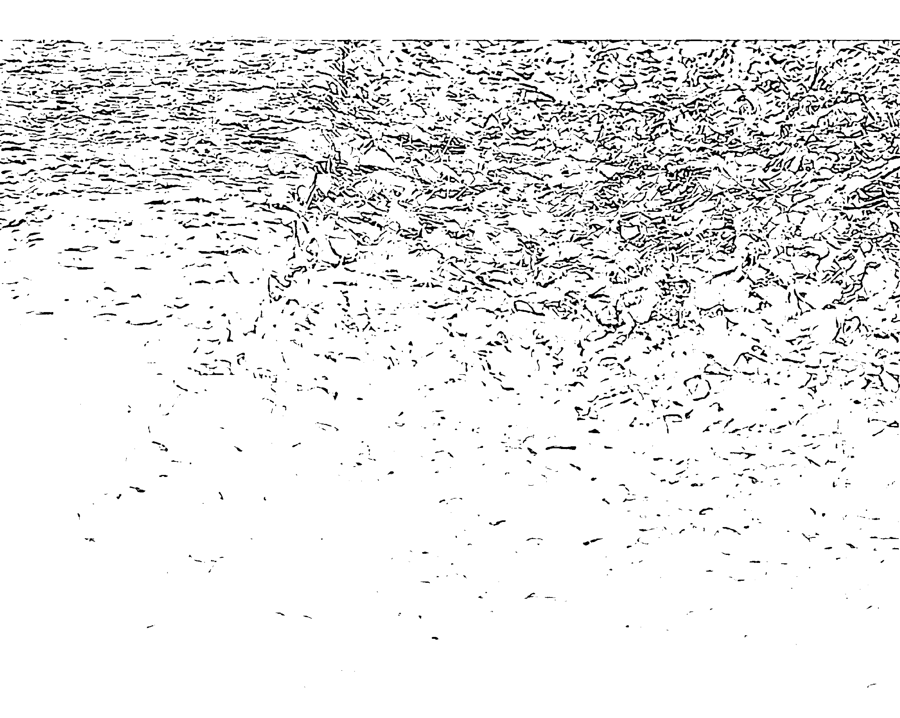

## 生活在夢中的早期人類
從高靈認識到自己，身為實習神明的我們，都更知曉了自己的神性本質。我們是雛形的高靈，生命的法則是「信念創造實相」，因此我們都是創造大師，只要起心動念，就孵出了CU’s意識單位，也埋下了顯化實相的種子，而後就可能創造出將要經驗的物質實相。

我們還與高靈一樣，意識的本質是「多重次元的自己」。在意識的世界裡，過去、現在、未來，前世、今生、來世，可能的自己與想像力全都同時存在。就在多重次元並存的意識中，我們轉化自己，並準備邁向更高的能量與意識層次。

接下來，認識的視角將繼續拉到創造宇宙的一切萬有。前面我們說過，所有人都是神，也都是切萬有的一部分，因此宇宙出自一切萬有與我們的共同創造，我們也與一切萬有共同見證了宇宙的誕生。自這一篇起，我們要談的是一切萬有孕育的繽紛多彩生命，以及在形形色色的生命裡所蘊藏著的一切萬有神性本質，那也即是每個人內在的神性本質。

現在，我們就從「人」的創造說起！

關於人的起源故事，在中國創世神話中，有一則浪漫典故。傳說盤古開天闢地之後，天地間誕生了一位人頭蛇身的女神，她的名字叫做「女媧」。獨自生活在宇宙中的女媧，內心感到萬分寂寞，於是拿起地上的黃土，捏出了人偶。

女媧捏好黃土人偶後，將他們放到土地上，有著五官與四肢的人偶們立即活蹦亂跳了起來，他們就是最早的人類。

黃土人偶有男有女，而為了讓人偶的族群更熱鬧，女媧每天努力捏出更多人偶，後來乾脆將繩子浸入黃泥，只要將繩子自黃泥中拿出來，泥巴一滴滴掉落地面，就是一個又一個的小人。

雖然女媧認真地創造小人，但小人們難免壽終去世，於是女媧教導男人與女人配對及生孩子。學會生兒育女之後，小人們一代又一代地繁衍下來，因此有了現在的你，以及現在的我。

「女媧造人」是中國流傳最廣的造人故事，除了女媧之外，世界上不同民族也都有各有其祖先起源的傳說，《聖經》裡就有另一套人類來源的說法。

《聖經 · 創世紀》提及，上帝在創世前五天，造出了天地日月與魚鳥，而後在第六天，上帝按照他的形象以及樣式，取用地上的塵土來造人，造好之後，上帝將生氣吹入他的鼻孔裡，於是創造出世界上第一個人，這個人就是亞當。上帝還創造了一座伊甸園，讓亞當安住在裡面。

亞當是世界上第一個男人，為了讓亞當有配偶相伴，上帝自亞當身上取下一條肋骨，創造出第一個女人，那就是夏娃。亞當與夏娃成了世上第一對夫妻，他們即是人類共同的祖先。

就像女媧或亞當的故事，人類起源的傳說有各種各樣的版本，每一種還都各有其獨特的浪漫特色。

在看過女媧與亞當的故事之後，我們將繼續介紹賽斯關於早期人類的說法。

因為對人類的起源好奇，約瑟曾問賽斯，為什麼在地球上，動物出現得比人類早那麼多？

賽斯告訴約瑟，因為存有就是要花那麼多時間來建造人類的形象。

那也就是說，在山川河流、花草鳥獸出現一段時日之後，人類知道這個世界已經到了最適宜生活與創造的時機，才一躍而入，成為地球生命的一分子。

而關於人類的起源，在賽斯傳來的訊息中，最精彩的是他對早期人類生活的解說。在賽斯的說法裡，並沒有亞當夏娃或黃土人偶的傳說，但是他讓我們知曉，最古老的人類如何經歷地球上的一生。

賽斯說，經過一切萬有的創造騷動之後，一塊沒有重量的團塊誕生了，那就是最雛形的宇宙，而後宇宙大爆炸，開展成早期的世界，也出現了古老的地球。

在古老的地球上，因為地球的磁場起伏不定，山巒升起，又傾頹，海浪潮起，又潮退，島嶼自海中冒了出來，春夏秋冬的季節則完全不穩定，然而，包括人類在內，所有的物種一開始就都已經存在了，每一類的物種還都準備在地球上滿足存在的渴望，並且增益物質實相的所有其他部分，他們全都在等待最適合的時機，只要機緣成熟，即可顯化為物質實相的生物，並加入地球這個大家庭。

最古老的地球大半還是個夢的世界，在那個時期，某一類種類的意識，例如樹木花草等等，率先被一切萬有賦予了適合其需要的形體，並且投生到物質世界，然而，那時的它們並沒全然地把自己附著在實質形象上。現今的生物將意識焦點貫注於物質實相之內，但古老的地球以及生活於其上的所有生物全都處在半做夢的狀態。一開始的生物意識還偃臥在一切萬有的懷抱裡，與一切萬有之間有著深深的連結，它們只是輕輕的貫注於物質實相，不像現在的生物這麼獨立。在那如夢似幻的地球上，生長著夢的樹木，夢的樹木上還有著夢的樹葉，它們正逐漸從夢中知覺，慢慢轉為實質，並越來越貫注於物質實相，直到夢的種子最後帶來了實質的樹木。就在這個轉夢為真的世界裡，終於等到了最適當的時機，於是人類出現了，他們就是人們真正的祖先，賽斯稱他們為「夢遊者」。賽斯說，在幾乎有如永劫那麽長的時光裡，「夢遊者」在夢境遠比他們醒來的時間長。他們睡很長的時間，並且在夢中活動，醒來則是為了運動身體、飲食補充體力、以及交配繁衍。那是如夢般的世界，充滿了迷人的活力，人們長時間在夢中想像地遊戲所有可能性，並想像各種可能的語言及溝通方式，以及編織未來偉大文明的夢想。

因為早期人類主要的生活是在夢裡，因此生活步調比我們慢得多，他們的心跳不必跳得那麼快，血液也不必那麼快地循環過動脈與靜脈。

此外，因為當時地球的法則還沒確定，地心引力也還沒穩定，因此空氣更有浮力。

早期人類能以不同的方式覺知自己，他們對自己的認同不僅止於皮膚，而是能跟隨空氣，讓意識能進入形體四周的空間，以一種我們早已遺忘的原始感官經驗感覺自己與大氣合一。

> 介紹過早期人類後，有學員問：「那麼，早期人類的意識在我們身上還有遺跡嗎？」
>
> 我告訴他：「早期人類的意識仍保存在我們的意識裡，因此我們在嬰兒時期都經歷過「夢遊者」的生活。」

哺育過孩子的父母親都知道，一歲前的嬰孩，尤其是零到三月大的小寶寶，平均每天有二十個小時都在睡眠。小嬰兒每三到四個小時醒來一次，醒來的時間主要是在喝奶、玩耍、排便與洗澡。意識是不眠的，睡眠中的嬰兒甚至比醒時更忙碌。進入睡眠後，嬰孩在夢中預習走路、學習語言，也提早熟悉將要認識的親朋好友，並且開展今生的計畫與藍圖。忙碌的小baby在醒來的短暫時刻才真正得到休息，他們過的就是早期人類的生活。而後隨著時光流逝，他們慢慢成長，才漸漸變成以物質實相為生活重心。認識早期人類的意識，就能進一步明白意識的本質。身為實習神明的我們，在地球上學習認識自己及創造喜悅，小嬰兒時期的我們過著早期人類的夢中生活，成人之後的我們則有著均衡的醒睡節奏。只要認識自己及精進修为，我們將隨著身體成長而擁有更大的意識彈性，並開啟更湛深的智慧。

## 喜悅小語
> 嬰孩在夢中預習走路、學習語言，也提早熟悉將要認識的親朋好友，並開展今生的計畫與藍圖。

## 形形色色的生命
每一次帶孩子們到台北旅遊，孩子們最喜歡的景點就是「動物園」。動物園裡有南極的企鵝、澳洲的無尾熊、中國的熊貓以及非洲的長頸鹿：……等等，儼然就是一個小小世界。

形形色色的動物即是一切萬有形形色色的意識投射，人們渴望看見更多樣化的物種，就像人們喜歡經驗多重次元的意識一樣。因此，每當動物園裡引進了新的明星動物，不管是無尾熊還是熊貓，人們總是大排長龍想要看牠們一眼。在意識的國度裡，動物也是我們的家人，與我們共享著一切萬有的恩寵。

而這些多彩多姿的動物是從哪裡蹦出來的呢？我們先介紹達爾文的說法。

英國科學家達爾文於一八三一年搭乘「小獵犬號」前往加拉巴哥群島（Galapagos Islands），他在此地觀察了許多雀鳥，發現不同島上的雀鳥，鳥喙會隨他啄食的種子而改變，譬如說有此二島上植物的種子顆粒都偏小，雀鳥覓食時，鳥喙較大的鳥種爭不過鳥喙較小的鳥種，因此漸漸被淘汰。根據達爾文的推論，因為「天擇」，島上的雀鳥一代又一代鳥喙逐漸變小，最後才演化出鳥喙最適合小種子、競爭力也最強的鳥種。

達爾文於是以「物競天擇，適者生存」為原則，發表了他的「演化論」。

根據達爾文的「演化論」，物種都是在天擇中由競爭力較差的低等動物逐漸演化成競爭力較強的高等動物，生物學家也常以達爾文的理論為基礎，告訴我們現代動物的起源。

譬如推論鯨魚的演化時，生物學家判斷，五千多萬年前，地球上有一種像狼的陸生動物，他們有著與鯨魚相似特徵的耳朵與牙齒，因此被認定為鯨魚的祖先，並被命名為「巴基鯨」。

像狼一樣的巴基鯨要繁衍出生命形態天差地別的鯨魚，中間必定經過多次的突變，突變出來的即是「過渡型」物種，但這些理論上的「過渡型」物種並沒有實物可以佐證，因此在演化過程中存在著許多「失落的環節」。

可知達爾文的理論或許邏輯上說得通，然而，每一種生物的演化推論幾乎都存在著「失落的環節」，達爾文的說法因此不攻自破。以當代的角度看，「演化論」只是沒有證據支持的達爾文個人看法。賽斯對於物種起源則有著高靈的視角，他告訴我們，初生的地球仍是夢的世界，但這個世界已經有了所有物種的意識。每一類物種還都渴望以物質身體進入世界，一切萬有因此自發地賦予了其需要的形體。與達爾文「演化論」完全不同的是，賽斯說，這個世界上的物種並沒有遵循直線的發展，也就是說，物種並不是從爬蟲類進化為哺乳類，再進化為猿猴，最後才成為人。賽斯的說法是，所有物種有著無限豐富的平行，爆發在盡可能多的方向裡，牠們同時並存在這個瑰麗的地球上，因而才有形形色色的生命。依照賽斯的說法，所有物種都和人一樣，原本以精神與意識的形態存在。各類物種都在等待著最佳的登場時間，一旦地球到了最適合生活的年代，物種的意識就一躍而入，顯化成物質的實體，並成為地球居民的一分子。

所以賽斯告訴我們，在初始的時候，物種並沒有現在我們所見的形體，牠們有的是「假形」(pseudoforms)，也就是「夢的身體」。「夢體」無法生殖，但當時整個地球與所有生命都處在夢的狀態中。

接下來的一陣子，地球的物種是混合的，有些物種完全採取了實質形體，有些則還繼續處在夢體的狀態。但不論是物質實體或夢中形體，各類物種的形體都是完成了的，也就是說，鳥是鳥、魚是魚、獸是獸，每一類物種都是確定的，彼此之間並不混淆。

在初始的時候，地球上還有其他物種，譬如「人—動物」及「動物—人」的組合，以及其它許多的混種，這些物種在地球上持續存在了一段相當長的時間。

前面我們談過，在中國傳說中，造人的神祇女媧外型即是人頭蛇身。若依賽斯的說法，女媧說不定不是傳說的臆想，而是遠古時代人們遙遠的記憶，經過世代相傳後，成爲大家共同認可的創世故事。

除了女媧之外，在中國先秦的古籍中，還有一部描述遠古地理、神獸及不同國度人種的奇書《山海經》，書中記載著許多「人—動物」的生命形態，譬如「雷神」是人頭龍身，還鼓著大大的肚子；「氐人國」的神人則是人頭魚身的「美人魚」，有著人的頭部、胸部與雙手，以及魚的尾巴、鰭和魚鱗；此外，火神「祝融」是人面獸身；風神「禹強」是人頭鳥身；「羽民國」的神人則在人的身體上長滿了類似鳥類的羽毛。中國有《山海經》，希臘神話中也有「人馬」，「人馬」的上半身是人的頭、手與身軀，下半身則是駿馬的軀體。這些「人一動物」的生命類型，或許就是遙遠的古代生物留在我們心中的共同印記。在形形色色的生命裡，賽斯提到過大家好奇的「美人魚」與「雪人」。挪威等臨海國家自古以來都有人魚的傳說。二〇一一年，動物星球頻道製播了《真實美人魚：科學的假設》一集節目，節目中說一九九七年時，美國海洋暨大氣總署（NOAA）的科學家在太平洋錄到一種神秘的聲音，經過專家辨識後，判斷這聲音既不是出自鯨魚，也不是出自白海豚，於是激起了科學家們的好奇心。而後在二〇〇四年，南非科學家在大白鯊肚子中發現了不知名的動物屍體，經專家重建後，科學家們推論出令人驚訝的結果，原來這隻動物極有可能就是傳說中的人魚。這隻人魚的頭骨上有著大眼與隆額，若以電腦模擬其面貌，頗像是電影「阿凡達」中的納美人，科學家們也因此推論海洋中的神秘聲音可能出自自人魚。

動物星球頻道於二〇二二年又發布訊息，說美人魚的真實身分可能是「海猿」，也就是海中的猿類。

而早在一九七四年，賽斯就在《未知的實相》中談過人魚，他說雖然人們對美人魚的傳說高度浪漫化了，卻的確暗示了這類物種的發展。賽斯還說，人魚組合人與魚，是住在水裡的哺乳動物。牠們是一種小的生物，粗略地沿著一種「黑猩猩一魚」的組合路線，可以用驚人的速度游動，並且能跑到岸上數天之久。

說過人魚後，我們接著談「雪人」。

許多世紀以來，人們就傳說西藏有「雪人」，美國、俄羅斯及中國神農架也常有「野人」或「大腳」現身的傳聞。目擊者畫下的「野人」畫像，長相幾乎都是身材高大，半直立行走，前額突出，毛髮則是黑色、棕色或紅色。

「野人迷」們曾到傳聞野人出沒之處探索，發現傳說中野人出現過的樹林內，樹枝經常被屈曲成圓拱型，他們認為這絕非人類或其他哺乳類動物所為。此外，據說俄羅斯官方也在二〇一二年宣稱找到了雪人腳印及毛髮樣本，因此證實了雪人的存在。

賽斯於一九八四年在《健康之道》中也談過「雪人」。雖然沒有直說「雪人」之名，但他說起世上的確有很像人類的兩種不同的直立行走哺乳動物，他們比人類大得多，並且有無限敏銳的感官，只要人類出現在距離他們幾哩之處，他們馬上就能由氣味覺知。

賽斯又說，雪人們以蔬菜為主食，並佐以昆蟲，他們發明許多精巧的昆蟲陷阱，陷阱通常建築在樹上或樹幹裡，因此可以用樹膠來捕捉昆蟲。又因為陷阱看起來即是樹的一部分，所以能保護他們不被發現。

賽斯還說，雪人住在地球上許多區域裡，總人口才幾千個。他們很少大批聚居，雖然有家庭及部落似的組織，但任何一區最多只有十二個成年人，若是兒女增加，團體便再度分裂，因為他們知道數目大的話，就容易被發現。

從美人魚、雪人到我們熟知的各種動物，這些形形色色的生物，就是一切萬有顯化的形形色色意識。我們何其恩寵，活在這個既熱鬧又繽紛的世界上。

在我的課程中，學員們常會聊起自己的寵物狗或寵物貓，甚至還有學員帶著波斯貓來上課，一邊聽著課程，一邊輕輕撫貓背。

一位學員曾經說：「我家的貓是我修為最好的良伴，每次我在靜心時，只要內心煩躁，耳畔就聽到貓在抓我的門，彷彿要叫我結束靜心開門跟他玩。在貓的身上，我看到自己的念頭，更覺得牠就是我信念的投射。」

越認識生命的創造本質，你越會發現，達爾文的「物競天擇，適者生存」只是源自小我的推論，照這理論，所有生物都生活在競爭與衝突之中。然而，若是在修為中打開智慧，我們一定會明白，所有生命都在地球上共存共榮，我們流動著愛，並在彼此身上覺知自己。

認識更多生命，我們就無形中擴展了意識。地球上進行的是一場「愛的合作性冒險」，繽紛的生命形態，映照著我們繽紛的意識，而透過觀照形形色色的生物，我們將看見自己多重層面的內在。

> 喜悅小語
所有生命都在地球上共存共榮，我們流動著愛，並在彼此身上覺知自己。

# 萬物皆有靈

觀賞敦煌佛教展覽時，除了莊嚴唯美的佛像外，我特別喜歡「飛天」。 「飛天」是飛在天上的仙子仙女，沒有翅膀或羽毛的他們，飄逸著輕柔的衣裙與彩帶，飛翔於佛菩薩身旁，也遨遊在雲間。

傳說「飛天」是佛教故事中乾闥婆和緊那羅的化身，乾闥婆是天上的樂神，緊那羅則是天上的歌神，他們在天上曼舞、奏樂、輕歌，讓佛的說法圖像更加美妙莊嚴。

中國的飛天造型，很像是西方的天使。

西方傳說中有各種天使的故事，《聖經》中也描述了天使的事蹟。《啟示錄》中就說，上帝寶座前有七位天使，天使們傳遞著上帝的旨意。《路加福音》裡也有幾則天使的故事，其中一則說天使「加百列」奉上帝的差遺，前往拿撒勒城見還沒出嫁的童女馬利亞，並對馬利亞預言說：「馬利亞，不要怕，妳在神面前已經蒙恩了。妳要懷孕生子，可以給他起名叫耶穌。」

《啟示錄》中還提到另一位天使「米迦勒」，說天上出現了一條魔鬼撒旦化身的惡龍，準備吞食婦女生下來的嬰孩，米迦勒因此率同他的使者與龍展開了一場天上的爭戰。

「天使」有著散發白光的聖潔形象，因此有些人在心靈困頓時會向天使祈禱，希望天使帶來光與愛，以及滿滿的勇氣。

而關於天使，賽斯還有一種有趣的說法。

> 賽斯說，在古老的地球上，曾經有過高度智慧的鳥族，他們並不是有翅膀的人，而是真正的大鳥。

他們有處理觀念的能力，會游泳，還會唱非常優美的歌，並且運用一種極廣的語彙。

大鳥有利爪，而且善於游泳，可以在水上住一段時間。當人類還是穴居人的時代，常常看到這些鳥，尤其是在水邊的懸崖。許多時候，這些大鳥救過墜崖的人類小孩。人类模仿他们轻巧地飞踏上岸边，并随着他们的歌声爬到安全的落脚处。

赛斯说，早期人类对大鸟的记忆，后来也转成了天使的形象。

大鸟是天使的原型之一，不过，「天使」当然不可能完全来自远古人类对于大鸟的美丽记忆。

谈起「天使」或「神」，赛斯也说过，在一种不同的尺度上，每个个体都有自己的理想化版本，而每个物种也是。

赛斯特别指出，他说的是每个物种，而非只是说人类。显然这些理想化的版本对身体感官而言并不明显，但它们却是强大的能量中心。

赛斯解释说，那就像每个人有相连的「元神」(ghost of being)，也像树有「树神」，森林有「森林之神」，此外，「天使」也曾经以这种方式被塑造出来。

赛斯的说法让我们想起希腊神话中的诸神，在希腊神话故事中，有着掌管天界的宙斯、掌管大海的波塞顿，以及管理冥界的黑帝斯，其他大家耳熟能详的神，还包括太阳神阿波罗、战神雅典娜、爱与美的女神维纳斯……等等。希腊神话让我们知道「万物皆有神」，不论是太阳、月亮、天界、冥界，甚至战争与美丽，万事万物都有着意识的「理想化版本」，那就是他们内在蕴藏的「神」。神不见得集中意识在身体感官，却有着强大的能量中心。

万物皆有神，山有山神，树有树神，土地当然也有土地神。

「土地公」是台湾民间信仰的神明之一，有着广大的信众。

信徒们也称呼「土地公」为「福德正神」，客家家族则称之为「伯公」。传说土地公原本是周朝官吏，名叫张福德，因为为官公正，好行善举，民众们感念他的恩德，因此在他过世后，尊称他为「福德正神」，并建庙祭祀，后来就成了掌管土地的神明。

土地公是中国传统司掌土地之神，又因为有土斯有财，信徒们也将之视为「财神」。

我家附近就有一间香火鼎盛的土地公庙，庙中雕刻的土地公是一位鬍鬚花白、笑容可掬的老公公。社区的善男信女们来到庙中焚香祝祷，并且将生活上的愿望告诉土地公，学子们祈求考上好学校，女孩们祈求好姻缘，上班族祈求工作顺利，就连梦中见到蛇，信徒们也依传统习俗向土地公祈求平安。

祈愿的香客既多，还愿的信徒自然也不少，因此土地公庙前常常有信众答谢的布袋戏、歌仔戏或露天电影演出。

这些信仰土地公的人们，大多不知道传说中那位名叫张福德的周朝官吏，然而，他们坚信在自己生活的土地上，一定有股冥冥的力量能保佑家安宅吉、事业顺利，人们于是将庇佑自己的力量名之为「土地公」，这也才是土地公信仰真正的由来。

赛斯则这么解释人们信仰的「土地神」，他说因为我们是人，所以将所见的东西全都「拟人化」，「土地神」即是我们将土地的灵想象成人形。赛斯还告诉我们，有些意识的族类根本与我们人类完全不一样，并且在大半情形下不为我们所见。不过，它们的确是与所有动植物相连的，也与我们相连。

经过赛斯的解说，我们才更了解意识的本质，也更知晓什么是天使、什么是树神，什么又是土地神。

赛斯还说，我们每个人都有自己的「土地神」，蕴藏的神性即是我们内在尚未表达出来的部分；又说，自己的「土地神」完全不是指一个在肉体里的完美自己，而是代表一个更大的心灵实相。在内在神性里，我们的能力在与地球环境的关系中，完成自己到最圆满的地步。只有认识自己的意识，我们才能经过修为，打开内在潜藏的智慧，也就是开启自己的「土地神」，或自己内在的「神」。

> 谈过「土地神」，一位学员说：「退伍后的第一天我就去参加求职面试，但是不知道为什么，才一踏进那家公司大门，我就觉得整体气氛怪怪的。虽然在场的员工也都礼貌地抬起头来对我笑了一笑，但我心里就是起了一阵排斥感，彷彿有个声音在告诉我：「这里不适合你。」于是我继续前往另一家公司面试，不同的是，走进第二家公司，我的心中有一种很平安的感觉。即使在我走进公司时，所有员工都坐在办公桌前，没有人特别跟我打招呼，但我就是觉得这家公司很温馨，也很适合我。因此尽管薪水少一点，我还是决定先在这家公司上班。」

这位学员说的即是人与环境之间的能量共振，也就是人与「土地神」之间的意识交流。只要用心感受，人人都可以接收到「土地神」，也就是环境意识传来的讯息。还有学员说：「上次我跟朋友一起到杉林溪旅游，那一天的天气非常晴朗，走在山里，我的心情也非常愉悦。一开始我欣赏着路边的绣球花，竟然有两只蝴蝶绕着我飞舞，后来踏进森林步道，我先跟朋友约好，看谁发现最多锹形虫，结果我们沿途找到五只，全都是我第一个看见，好像它们本来就准备好要迎接我一样。」就像这位学员说的，进入心灵的世界，你也会发现「山神」、「森林之神」及「树神」跟你有了连结。你将活在一切万有的恩宠里，并且感觉整个世界正以神性

> > 喜愜小語
> 只要用心感受，人人都可以接收到「土地神」，也就是環境意識傳來的訊息。

# 地球歷史上的三次文明

高靈賽斯看到的地球是過去、現在、未來並存的全景，往前看進未來，賽斯看到，地球曾在亞特蘭提斯之前有過三個特定文明。
先在這兒簡單介紹「亞特蘭提斯」。
「亞特蘭提斯」一詞最早出現於柏拉圖的《對話錄》，在《對話錄》的《蒂邁歐篇》與《克里底亞篇》中談到了「亞特蘭提斯」。
根據柏拉圖的描述，亞特蘭提斯王國存在的年代大約是距今一萬一千五百年之前，亞特蘭提斯大陸比「利比亞」和「亞細亞」加起來還要大，亞特蘭提斯王國的領土是亞特蘭提斯大陸與其他許多島嶼。
柏拉圖的書中說，亞特蘭提斯是海神波塞頓的領地。波塞頓與凡間女子克利托生下了五對孿生子，其中長子名為「阿特拉斯」，他是亞特蘭提斯王國的第一個國王。又因為首任國王名叫「阿特拉斯」，這個國家才名為「亞特蘭提斯」。

為了不讓妻子克利托受到外人干擾，波塞頓在亞特蘭提斯島上，以海和陸地圍繞克利托居住的山。從島中央算起，波塞頓建造了兩道陸地圈、三道海洋圈，各圈距離相等，亞特蘭提斯因此有了奇特的地形。

亞特蘭提斯王國擁有「山黃銅」等各種金屬可以開採，島上還盛產木材、香料與果實，歷代國王因此都有著巨大的財富。

亞特蘭提斯的王宮中心建造了一座奉祀波塞頓與克利托的神廟，整座神廟外部由白銀塗飾，山牆上的裝飾則除了雕刻之外，均由黃金塗飾，廟中安放著波塞頓的神像，塑像上的波塞頓是站在一輛六匹翅膀的駿馬的戰車上。

亞特蘭提斯的國王與親王，每隔四年和五年即在神廟聚會，討論國家事務。又因為國力強盛，亞特蘭提斯王國曾經征服了遠至埃及的利比亞等地區。

不幸的是，這個國家後來開始腐化，並因此惹惱了眾神之首宙斯。宙斯為了懲罰他們的墮落，降下了地震與洪水，亞特蘭提斯竟然因此在一個晝夜之中，就沉入了海底，一個輝煌偉大的國家，就此消失於無形。柏拉圖的書中還提到，亞特蘭提斯陸沉之處的大海既不能航行也無法探測，因為下沉後的亞特蘭提斯島變成了阻塞航道的暗礁。 自從柏拉圖描寫亞特蘭提斯後，歷代學者一直都在探索，究竟亞特蘭提斯是真實存在過？抑或只是柏拉圖藉它比喻雅典社會的價值觀？ 相信亞特蘭提斯確實存在的學者，判斷亞特蘭提斯島位於大西洋，但根據現代科學的探勘，大西洋海底根本沒有沉沒的大陸，即使有也不可能像柏拉圖說的那麼大，更不會有那麼複雜的環形結構，亞特蘭提斯因此成了一個未解之謎。 而關於亞特蘭提斯，賽斯的說法是這樣的，他說亞特蘭提斯是未來可能性的故事，現在尚未發生，但向後投射進一個顯然的過去裡。 賽斯說，亞特蘭提斯的概念部分是由未來的記憶組成的，它是一個我們想要居住的大陸，也是朝向理想文明的心靈渴望，它出現在文學、夢及幻想裡，然而，它是真實並且有效的。雖然尚不是具體事實，但在某些方面，亞特蘭提斯比任何具體事實更具體，因為它是個心靈的藍圖。

賽斯又說，亞特蘭提斯帶著我們恐懼的印記，因為柏拉圖的故事中說亞特蘭提斯已毀了。然而，雖然我們以為亞特蘭提斯是在過去，真正的它卻屬於我們的未來。但不論如何，亞特蘭提斯的「神話」多少是建立在具體的事實之上。亞特蘭提斯屬於還沒發生的未來，賽斯還說，在亞特蘭提斯之前很久有三個特定文明，在這三段長時期，地球的南北兩極是倒反過來的。第一個文明大半位於現在的小亞細亞一帶，他們和我們當代人類的發展差不多，也面臨了我們現在面臨的許多問題。這個文明後來到別的銀河系與行星去了，他們還幫助了第二個文明的形成。賽斯最有興趣的是地球上的第二個文明，這個文明叫做「魯曼尼亞」（Lumania），主要勢力範圍在現代的非洲與澳洲，有著比我們更高明的科技。魯曼尼亞人擅長使用聲音，他們彼此溝通時，聲音會自動並即刻地創造出一個令人驚訝的栩栩如生圖像，這些圖像並不是立體的，而是內在化的，但比我們的心象生動許多。因為善於使用聲音，魯曼尼亞人聊天時常常自然地閉上雙眼，以便溝通得更清楚，他們享受隨著語言交談的瞬息萬變、瞬間的內在心象。

除了溝通外，魯曼尼亞人還有效地利用聲音，不但使用在醫療或戰爭中，還可作為車輛的動力，用來運送物體。聲音還能運送笨重巨大的東西。

魯曼尼亞人想發展出一種人類，能有種天生固有免於『暴力』的裝置。當他們的心智發出強烈的侵略性命令時，身體不會反應，而想對別人施以暴力行為之前，他們會暈倒，甚至攻擊自己的身體系統，以阻止自己去施暴。

因為魯曼尼亞人沒有學會處理暴力，只是企圖在生理上將『暴力』去掉，因此能量遭到阻塞，天生的高度心電感應能力也受到傷害。

又因能量與表達的自由受到阻隔，魯曼尼亞人文明的活力很弱，他們在肉體上也非常瘦弱。這個民族若與其他較低文明的集團通婚，很快就會死亡，因為他們不能忍受暴力，也不能以牙還牙，因此根本無力招架。

由於無法應付暴力，魯曼尼亞人廣博的科技與偉大的文明大半建築在地下。他們的地下城市有著極為錯綜複雜而美麗的地道系統，地道牆上飾有彩畫、素描與雕刻。此外，地下城市還有各種升降系統，有的載人，有的運貨。

魯曼尼亞人的地下城市佈置了許多前哨站以監視其他土著的蹤跡。前哨站的洞穴被當作向外的門戶，往往看似洞穴的底部即是用一種物質造成，這種東西由外面看來不透明，而由內部看出去是透明的。又因為魯曼尼亞人天性膽小，因此只有最勇敢和最有信心的人才會被派往前哨站。

魯曼尼亞人常有窺孔自地下通到地表，藉此觀察外界。他們還放了攝影機在那兒，對地球也對星星攝取最精確的圖片。此外，他們對地下天然氣的分布有完整的記錄，對地表內部的地層也有密切的知識，對地震及斷層亦留心地監視與預測。他們的降入地下就如同任何其他離開地球的種族一樣成功。

賽斯說，魯曼尼亞的前哨站有相當數目是位於現在的西班牙和庇里牛斯山區。還說，在我們所謂的石器時代，許多穴居人並不是住在天然形成的粗陋山洞裡，而是在洞後機械創造的甬道以及魯曼尼亞人一度所居的被棄城市中尋求庇護所。

至於魯曼尼亞之後的第三個文明，賽斯沒有談到，我們也無從得知，但賽斯所指的應該不是我們現今這個文明。

談論亞特蘭提斯之前的三次文明，賽斯主要是告訴我們，就像有轉世的個人一樣，也有轉世的文明。那些在早期文明中開啟心靈力量的人們，或許已經離開地球到宇宙的其他點去了，然而，只要他們還居住於物質實相中，就依然還在輪迴中成長。

此外，還有一些人已經離開了輪迴，並且進化到原本就是的「精神體」。他們對地球仍有很大的興趣，並且給予地球支持與能量。從某方面來說，他們也可被認為是地球的神明（earth gods）。

一切萬有裡蘊藏著無限可能的意識，又因為在意識裡過去、現在與未來同時存在，因此賽斯說魯曼尼亞人對藝術與通訊的多次元觀念，也滲漏進了我們的意識，彷彿他們仍舊存在一樣。

讀過賽斯的描述，我們認識了遠古文明，也擴展了認知的深度與廣度，這就是賽斯的訊息，他永遠在延展我們的意識，讓意識更為廣闊。

# 喜悅小語

有些人已經離開了輪迴，但對地球仍有很大的興趣，並且給予地球支持與能量。從某方面來說，他們也可被認為是地球的神明。

# 從UFO到外星人

墨西哥州羅斯威爾(Roswell)西北方的農場裡。據目擊者指出，事發現場有一架金屬碟狀物的殘骸，碟狀物內部及外面還散落幾個小人的屍體，這些小人的共同特徵是大頭、大眼睛、小嘴巴，以及穿著灰色的衣服。

羅斯威爾的〈每日紀事報〉於七月九日報導，軍方發現了飛碟墜落在羅斯威爾附近的農場。新聞這一披露，瞬間引起轟動。

然而，就在七月十日的報紙上，軍方又旋即澄清，說羅斯威爾墜毀的是氣象球，而不是飛碟。

這就是有名的「羅斯威爾事件」。不管實情如何，幾十年來，飛碟迷都相信當年墜毀在羅斯威爾的就是UFO，而軍方的掩蓋真相，只是讓外星人來到地球的事實欲蓋彌彰。

經過數十年之後，還記得在一九八五年某個晚上，台灣的電視台播放了號稱是當年美國解剖羅斯威爾外星人的影片。那天我跟同學們全都放下了手邊的工作，一齊坐到電視機前，仔細觀賞這不可思議的外星人解剖過程。

除了羅斯威爾事件之外，在成長的過程中，我這一代人幾乎都聽過許多「外星人」的故事，也讀過許多描想外星人的小說。印象中從中學時代開始，同學們就傳看著倪匡的科幻作品，當年的倪匡描寫過各種各樣的外星人，情節完全超乎我們的想像力。在倪匡的筆下，不只藍色血液的火星人造訪地球，他甚至告訴讀者們，佛陀、耶穌、老子與穆罕默德等聖哲全是智慧超越地球人的外星來客。

我們還都經歷過美國與蘇聯全力發展太空科技的年代。西元一九六九年，阿姆斯壯、艾德林與柯林斯三人乘著阿波羅十一號成功登陸了月球，並將美國國旗插上了月球的土地，這是人類劃時代的成就，阿姆斯壯那句「這是個人的一小步，卻是人類的一大步」更成為傳誦一時的名言。

一九六五年美國太空船「水手四號」第一次拍回了火星相片，讓地球上的人們看到火星表面有許多隕石撞擊出的凹洞；而後，經過科技的持續發展，一九七六年美國太空船『維京一號』送回來的火星相片更讓世人驚豔，因為相片中的火星表面有著一個人臉，看起來還頗像埃及人面獅身像之類的斯芬克斯建築，人們推測這就是火星古文明的遺跡。

越往外太空發展，人們越相信外星生命是存在的，因此一九七二年美國將無人太空船『先鋒十號』發射出去探測木星時，太空船中就攜帶著一張向外星人問候的鍍金鋁板，鋁板上畫著一男一女的裸體圖像，以及太陽系的九大行星，並且標示出第三顆行星，那即是要告訴外星人，我們來自地球。在美國科學家的預期中，若是外星人發現了這艘太空船，從這張鋁板他們就可以得知我們的長相，也可以知道我們來自哪裡，更能清楚我們正友善地跟他們打招呼。

經過十一的飛行後，一九八五年六月，先鋒十號飛越了太陽系最外緣的海王星軌道，正式脫離太陽系，往金牛座飛去。而後在二〇〇三年，因為與地球距離過於遙遠，先鋒十號終於失去了聯絡。

時至今日，我們不知道先鋒十號飛行到了何處，也不知道外星人究竟發現它了沒有。

除了太空科技外，還讓外星迷興奮的是，英國在一九七二年發現了第一個現代麥田圈，接下來的數十年，英國、歐洲、北美洲不斷出現各種幾何圖案的麥田圈，人們相信這一定是UFO來過地球的證明，而麥田圈上美麗的幾何圖案，正是外星人要告訴人類的訊息。

人類渴望外星球也有高等生命，但令人失望的是，許多證實外星人存在的訊息可能都出於偽造或誤判。這麼多年來，沒有人能證實羅斯威爾是不是真的墜毀過UFO與外星人，而外星人的解剖攝影更早被發現是拿道具拍攝的，用意只是要唬弄世人。

人們也懷疑阿姆斯壯根本不曾登陸月球，因為在沒有空氣的月球表面，阿姆斯壯等人插下美國國旗的相片，旗幟竟然迎風飄揚。而火星上的人臉，經過現代高清照相機重新攝影，發現那不過是火星沙漠中的一座巨大石山，只是因為陰影的位置，才讓人錯以為它是一張有眼睛、鼻子及嘴巴的人臉。

美國的火星探測數十年來從未停止，在「好奇號」攝回的最新火星相片中，火星表面是一整片的紅土與隕石坑，仍然沒有任何外星人存在的痕跡。至於麥田圈的形成，早經證實有一部分是廠商與藝術家創作出來的作品，目的是要招攬遊客、創造商機。

此外，雖說世界各地歷年來都不斷有UFO出現的傳言，也一再有人宣稱拍到UFO的相片，然而，截至目前為止，並沒有任何直接且公開的證據，證明其他星球有外星生命，或者UFO及外星人真正到臨了地球。即便如此，大家對UFO與外星人的興趣依然熱潮不減。物理學家霍金也在二○一○年告訴大家，他幾乎可以肯定外星生命一定存在，但霍金覺得，外星智能生命若與人類接觸，可能會襲擊地球，並掠奪地球的資源。霍金還說：「如果外星智慧生命到訪地球，那麼結果就和當年哥倫布到達美洲大陸差不多，美洲的土著會深受其害。」因此霍金語重心長地勸導大家「千萬不要和外星人接觸」。

這就是數十年來人類太空發展與外星探索的簡略歷史，介紹給大家之後，接下來要說說賽斯觀點裡的UFO與外星人。在一九六三年的《賽斯早期課》中，約瑟曾問起賽斯「大角星」上有沒有人，賽斯說大角星有五個行星，其中三個有「生物」，但並非全是我們這類生命。賽斯還說，許多可以居住的地方，對我們來說都彷彿是不可居住的，而我們的感官只能看見我們自己這種生命。

約瑟接著又問地球有沒有被外星生命探訪過，賽斯告訴約瑟，這是經常有的事，根本不足為怪，還說外星生命看不見彼此，他們甚至有可能撞到彼此，卻不會感覺到任何刮擦。

在《未知的實相》中，賽斯提到，關於飛碟出現在地球，他並不覺得奇怪，奇怪的是我們怎麼能看見它們。賽斯的觀點是，外星生命若是進入我們的世界，通常我們是看不見他們的，因為外星生命與我們的意識層次不同。那就像我們的意識也有可能跌入過去，但對於過去的人們來說，我們也是隱形的。

賽斯還說，飛碟是來自比地球科技更高的層面，而當他們的飛行物進入我們的層面時，必然發生扭曲，飛行物的實際結構因此陷入形象的兩難之局裡。

我們看到的飛碟其實是一種非驢非馬的東西。飛碟保留了原始結構中可以保留的部分，而改變了它必須改變的，因此人們若發現飛碟，他們描述的形狀、顏色與尺寸會彼此衝突。而那些飛碟以直角轉彎飛走的狀況，是它設法保留在其特定住處裡尋常的作用。

賽斯又說，他不相信任何飛碟近期內會在地球著陸，因為這種交通工具根本無法長久停留在我們的層面，穿梭進我們的層面對飛碟而言是很大的壓力。賽斯說，我們常見的碟狀或雪茄狀飛碟是個混合的形状，與它本來的結構沒多少關係。

對飛碟做出了解釋之後，賽斯真正要告訴我們的是，如果人類像探索物質科技一樣探索精神，那麼，我們與外星生命的溝通將會完全不同。只要一個層面的居民學會了精神交流的模式，就能脫離物質實相的束縛。

賽斯的訊息完全打破了我們對飛碟的迷思，照賽斯的說法，火星與月球不見得只是光禿禿的土層，它們也有可能是車水馬龍的繁華世界，只是我們與月球或火星的生物層面不同，因此才會只見到一片荒土。同樣的，若是火星人或月球人到地球，說不定發現的也是一片杳無人煙的土地。

此外，在我們這個地球上，說不定早就有了許多外星來客，或許他就在辦公室跟你共度一天的生活，只是因為意識的層面不同，你對他是隱形的，他對你也是隱形的。你可能一直在好奇宇宙中有沒有一樣的智慧生物，而你身邊的他也在尋找地球有沒有智慧生物生活過的殘跡。因此，照賽斯的說法，若要看見外星人，與其發展科技，不如走進修為。外星人或許不在遙遠的星系，而是在我們身邊，只要打開意識的象限，說不定就見到了早就站在我們眼前的他們。

## 人格的片段體

在前面的篇章中，從五度空間的高靈聊到天使與神明、也從外星生命談到地球上的動物與寵物，還從遠古文明說到當代的宗教故事，這些都是一切萬有形形色色的創造，既繽紛又熱鬧。

從本文開始，我們要將主題收攝回到「人」的身上，那是與大家最切身相關的話題。越了解「人」的本質，我們就越認識自己，也越能打開內在的潛能。

談到人，我們就不能不了解一下所謂「片段體」。這裡當然要先說魯柏與約瑟的經典故事。

故事發生在一九六三年，於約瑟與魯柏夫妻而言，這是挫折頗深的一年。當時的魯柏出版了第一本小說的普及本，正準備全心投注精力成為一個好的小說家與詩人。

魯柏認為真正的創造者必須寫作小說與詩，至於「非小說」則屬於新聞從業人員，然而，以「創造者」自居的她，卻還沒有靈感來決定下一本書的主題。也在那個時候，約瑟罹患了嚴重的背疾，正為疼痛所苦。同樣是那一年，他們心愛的寵物老狗米夏去世了。因為心情鬱悶，醫師對約瑟又做不出明確的診斷，魯柏夫婦倆於是決定到邁阿密的約克海灘度假，希望在度假中改善約瑟的健康。在度假期間的一個晚上，他倆到夜總會去尋找假日的氣氛。然而，雖然在假期之中，約瑟還是經常疼痛，即使他不抱怨，仍然看得出他那痙攣的劇痛。就在參加夜總會時，魯柏忽然注意到有一對老年人坐在房間的另一邊，看到他們的臉，魯柏詫異極了，因為這對老夫婦跟魯柏夫妻實在長得太像，而老夫婦那疏遠又悲苦的模樣，與魯柏夫妻當時的心境簡直一模一樣，彷彿魯柏夫妻就是這對夫婦的「年輕版本」。魯柏無法將眼光從老夫婦身上挪開，而後馬上指給約瑟看。約瑟與這對老夫婦對看了一眼，旋即又因為背部痙攣而呻吟了起來。

接下來，出乎魯柏意料的是，約瑟居然拉起魯柏的手臂，堅持要與她跳舞。

結婚八年以來，魯柏夫妻從未共舞過，但約瑟卻把魯柏拖進了舞池。而後他們跳了一整晚的舞，想不到從此以後約瑟的健康狀況竟然大為改善，人生觀也開朗了起來。

至於魯柏見到與他們夫妻神似的這對老夫婦究竟是誰呢？根據賽斯的說法，這對老夫婦正是魯柏夫妻的「片段體」，也就是他們負面感覺的具體化形體，因為魯柏夫妻當年累積了強烈的破壞性能量，因而創造出老夫婦的形象。

賽斯說，魯柏夫妻創造這樣的「片段體」是有治療性的，如果他們的潛意識接受了那影像，他倆的生命將會朝愁苦的老夫婦邁進，創造力也會開始嚴重退化。不過，因為魯柏夫妻後來選擇了跳舞，於是離開了成為那對老夫婦的道路。

至於那對老夫婦後來何去何從呢？賽斯解釋說，身為魯柏夫妻「片段體」的那對老夫婦後來消失了，他們站起來，橫過房間，消失在人群中。賽斯還說，「片段體」沒有力量離開他們誕生的地方，除非本體意識給了他們力量，不過，他們確實是存在的。

這就是意識的有趣創造，原來我們的意識與情緒都能創造出人格的「片段體」。
創造物質實相的「片段體」說來也沒那麼容易，那必須情感的電荷強烈到可以形成物質實相的地步，才能由發動者的身體讓渡或調動他自己化學結構的一部分，以醣類與蛋白質創造出具體的人格「片段體」。
而若與「片段體」相較，形成「思想形相」（thought-form）就簡單多了。
「片段體」是具體的物質實相，「思想形相」則只是意識心念，並沒有物質形體。
現在，就讓我們做個創造「思想形相」的練習。請你先閱讀以下的文字，然後閉起眼睛，進入冥想：
「在這風和日麗的清晨，心情輕鬆的我，走在花園錦簇的公園裡，蝴蝶正在我身邊翩翩飛舞著。而後，我走近一叢大紅花，彎下腰來，將鼻子湊近花朵，輕輕的吸一口氣。仔細品味那香氣，還忍不住讚嘆：『哇！好清新的花香。』」
專心地冥想，你可能會發現嗅覺裡真的有著淡淡花香。這是因為你的「思想形相」已經飄進了你想像的公園裡，並且正在聞著花香。
在冥想之時，「思想形相」可以飄進花園聞到花香，也可以站在海灘嗅到海水的味道。

四年多前有位學員趁著孩子放暑假的兩個月，南來高雄參加我的課程。在她住高雄期間，有一次我在捷運站巧遇了她，當時的我們只是笑著揮了揮手，彼此沒有交談，但仍覺得開心。
經過一兩個月後，她回北部去了，而後我們沒再聯絡過。
四年多後的某個晚上，我又走在那個捷運站，心裡突然浮現當年這個學員的影像。我的心裡還叨念著，不知道她最近過得好不好？
想不到又過了兩個多月，當暑假來臨時，她居然坐在我課堂內。因為髮型變了，第一眼我並不認得她，但她一開口說：「老師，我四年前多前上過你的課！」我馬上會意過來，並且告訴她：「是啊！當年我們還討論過親子關係的話題！」
她驚訝地說：「課堂裡來來去去的學員這麼多，你怎麼可能會記得我呢？」我笑笑地回她：「就是記得呀！」
後來她跟我說，這一年會再來上課，是因為幾個月前讀了我寫的《靜心的優雅節奏》，覺得很收穫，也想念當年的課程，於是決定今年暑假再來上課。

經她這麼一說，我也突然靈光一閃，原來幾個月前我會在捷運站想起她，說不定就是因為感受到她的「心念形相」，或者她的「心電感應」。不是我的記性特別好，或能記住每一個人，而是在她再度南下之前，我們已經在意識層次先以「思想形相」打過了照面，所以在課堂上再次見面時，我們當然能像老友重逢般，輕鬆地話起當年。每個人都可以這樣練習使用「思想形相」，譬如妳出差在國外，晚上洗過澡、內心靜下來時，可以這麼冥想：「我回到台北的家裡，老公正在陪孩子寫功課，看到他們這麼認真，出差在國外的我也覺得好放心。走到孩子的書桌旁，我輕輕地撫摸著孩子的頭髮，告訴他：『加油喔！你好棒！』然後走到老公身邊，看到他正用電腦幫孩子查修辭學的答案，我在他臉頰上輕輕一吻，跟他說：『老公，我愛你！也謝謝你，讓我沒有後顧之憂地完成公司交辦的業務！』」說不定在妳冥想過後，手機會馬上響起來，老公和兒子還搶著跟妳說話：
「媽，我們都好想妳喔！不知道為什麼，雖然妳人在國外，但我們總感覺妳一整個晚上都在我們身邊！」

賽斯說，當他人投射「心念形相」到我們身邊時，通常都會伴隨溫度的變化與空氣的騷動，然而，如果沒有經過學習，不了解意識的本質，大多數人都會以為那些變化只是自己的錯覺或想像。

「心念形相」是真實存在的，那就是我們意識投射出來的片段。雖然在身體層面我們可能會有時空的阻隔，但在意識層次，人跟人之間即使天涯也是咫尺，只要我們發出「思想形相」，在一念之間，我們就來到了思念的人身邊。

## 對等人物與意識的九大大家族

雖然我在身心靈整體健康的推廣道路上走了許多年，也深入學習在困頓挫折來臨時觀照自己的信念，並相信身體本來就有回復健康的能力，但在我的親朋好友中，仍然不乏對身體極度焦慮、稍有不適就懷疑自己罹患絕症的人。

一位朋友告訴我：「我的檢查報告是陽性，因為擔心被診斷出癌症，我已經焦慮到失眠一個禮拜了。你能不能告訴我，要怎麼樣才能不這麼煩惱呢？」

我會不厭其煩地勸導他：「或許你會覺得身體一定要健康，內心才能沒有煩悶。然而，快樂不快樂並不是決定在健康不健康。

「若是你想要放下煩惱，我會請你先接納恐懼，把心安定下來。相信你馬上就會到醫院複檢，然而，於身體而言，比起到醫院複檢，更重要的是保持一顆平靜喜悅的心，喜悅是身體最好的能量與健康力來源，也是對身體最好的恩寵。
「身體或許不是我們能完全掌控的，但平靜與喜悅是一定能修練及轉化出來的。想要心生喜悅，千萬不要捨近求遠。身體是遠的，心靈是近的，掌控身體是事倍功半的，轉化心靈則是日起有功的。既然快樂不決定在健康，我們當然可以回歸心靈，修出喜悅的心。而只要心靈喜悅，身體也往往無形中就健康了。」
當我在說這些時，從不覺得自己的智識比對方高一等，因為我總是把對方當作我的「對等人物」。

所謂「對等人物」，就是靈魂為了經驗更多彩的人生，因此在同一個時代，可能會投胎成兩個以上的人，這兩個人還有某部分的人生經歷是剛好成對比的，譬如你坐在高級餐廳享用一頓高檔牛排時，你的一位對等兄弟可能正在非洲三餐不繼，又因為你們的意識來自同一靈魂，因而彼此之間會產生交流，你可能會在某天靈光一閃，心想人何必在錦衣玉食中花費這麼多錢，若是飲食清淡一些，再把結餘的錢捐出來給非洲貧童，讓他們也能享有溫飽，豈不更好？
於是透過對等人物的意識交流，你的智慧與慈悲打開了，並真的把錢捐給了非洲的貧民。

我一向都以「對等人物」看待身邊的朋友與同修，在努力學習轉化心靈時，我相信焦慮身體的親友們正是與我源自同一靈魂的「對等人物」。身為「對等兄弟」或「對等姊妹」的他們，映照出的是我內心中尚未轉化的區塊。每一次在為他們講解心靈修為的法則時，我不只幫助了他們，也幫助了自己。他們可以獲得新觀念，我則有了更堅定與踏實的信心。

我們與對等人物還往往都關心類似的人生方向與話題，賽斯因此將意識概略分成九個族群，接下來就要介紹這「意識的九大家族」。

### 格拉瑪大家族

第一個家族稱為格拉瑪大（Gramada），這個家族的特色是擅長組織，有時候在一個社會經過革命與變遷之後，格拉瑪大會立即出現來建立新的政府組織。龐大企業的創辦者常常屬於這類家族，某些政治家與政客也是。他們知道怎麼把他人的想法綜合整理起來，也能將彼此衝突的思想系統合成較為一致的結構。

因此，他們往往是社會體系的創建者，許多合理的政府、學校與社會都經由他們的手建立。

漢朝初年的開國丞相蕭何就是格拉瑪大。蕭何輔佐劉邦建立漢朝後，改變秦朝嚴苛的律法，制定新的規章，因而紮穩了漢朝數百年王朝的根基。因為有了蕭何這樣的格拉瑪大，才能讓漢朝在亂世中開創出新組織。

### 蘇馬菲家族

第二個家族叫做「蘇馬菲」（Sumafi）。這個家族主要與教學打交道，主要興趣就是把他們或別人的知識傳下去。喜歡教授知識的他們，從不創造性地改變內容，只是純粹享受教學的快樂。

孔子就是一位蘇馬菲。曾教授三千弟子的孔子說他自己是一位「信而好古，述而不作」的老師，也就是說他只傳述古人的知識，絕不另行創作，可知孔子屬於蘇馬菲家族。

### 度莫家族

第三個家族是「度莫」（Tumold）。這個家族熱中於醫治，他們可能是醫師或護士，也有可能是通靈者、社工人員、心理學家、藝術家或躋身宗教界，但不論從事任何行業，就意識的傾向與氣質而言，他們會是醫治者。

明朝的李時珍即是度莫。李時珍的父親是名醫，因為家族薰陶，從小就對醫藥有著莫大的興趣。處在文人們全都渴求功名的年代，李時珍毅然決然棄儒從醫，並且花費三十年光陰，編纂出《本草綱目》一書。因為對醫藥有著深深的熱情，可知李時珍屬於懸壺濟世的度莫家族。

### 佛德家族

第四個家族是「佛德」（Void）。

這個家族是改革者，他們能感知未來的動態、概念、觀念或結構的方向，並全心全意將新的可能性帶入實相。

他們是了不起的革命分子，看起來也像是不切實際的夢想者，他們會為一個改變及變更的概念所迷，因而內在有強烈的驅策力，並致力將概念實現。佛德的心裡只有一個目的，就是去改變他們主要興趣所在的任何領域現況。

孫中山先生就是典型的佛德，他考察英美諸國的民主制度後，回到清王朝策動武裝革命，經過十次失敗，終於創建了民國，並逐步將他的民主理想落實成民國的政治制度。因為有孫中山先生這樣將生命奉獻於革命的佛德，我們才能享有如今的民主生活。

### 米爾伍梅特家族

第五個家族是「米爾伍梅特」（Milumet）。

這個家族是由神秘主義者組成的，他們的精力幾乎都是以一種向內的方式為導引，而不在乎內在經驗是否被轉譯為一般的說法。他們是真正的天真無邪，並且有靈性，也許以一般人的眼光來看，他們在知性上是未開發的，但這是因為他們並不把其聰明導向物質焦點。

佛陀的弟子周利槃特是一位米爾伍梅特。資質騖鈍的周利槃特常被他人當作笨蛋。聽聞佛法時，周利槃特難解其意，當然也完全記不起來。
後來佛陀交給周利槃特一支掃帚，還跟他說只要一邊掃地，一邊念「掃除塵垢」即可。於是周利槃特每天反覆誦念：「掃除塵垢、掃除塵垢……」最後竟然順利開悟了。像周利槃特這樣的心靈特質，就是內在能量飽滿的米爾伍梅特。

### 祖里家族

第六個家族是「祖里」（Zuri）。

這個家族的人是運動家，他們專心於使身體能力臻於完美，並透過身體本身的美、速度、高貴及演出來展現生命力。

許多運動員都是祖里，我也有一些朋友是祖里，他們一下班即精神振奮，並且馬上前去跑步或游泳，或者一到假日就整天打著壘球或網球，於他們而言，生命最大的快樂就是運動。

### 柏萊汀家族

第七個家族是「柏萊汀」（Borledim）。
這個家族的特色是善長栽培子女，他們有能力製造擁有某些特質的孩子，這些孩子有聰明的頭腦、健康的身體及強烈的清晰情感。

柏萊汀並非古板的父母，他們視家庭生活為細緻且活生生的藝術創作，並視孩子為血肉做成的傑作。他們絕不會對孩子過度保護，而會讓孩子快樂地完成他們自己。

孟子的母親孟母即是柏萊汀。起先孟子一家住在墳地附近，因為孟子常學人哭墓，孟母因此搬了家。而後他們的住所鄰近屠宰場，孟子又玩起了殺豬遊戲，於是孟母再度搬家。最後他們搬到學堂旁邊，孟子也開始學習揖讓進退的禮節。為了孩子寧願三遷家宅，最後果然將孟子栽培成一代大儒，可知孟母即是柏萊汀。

### 依爾達家族

第八個家族是「依爾達」（Ilida）。這個家族是「交流者」組成的，主要從事概念、產品、社會與政治觀念交換與交流的偉大遊戲。他們是旅行家，將想法由一個國家帶到另一個，他們也可以是探險家、商人、士兵、傳教士或者水手。世代以來，依爾達曾作為概念的散播者與同化者，並且在世界各地出現。他們有著愛冒險的特質，常常涉足社會的變革。這樣的人可能會是歷史上的海盜或奴隸，也可能是當代的外交家。

唐朝的玄奘就是一位依爾達。玄奘即是民間俗稱的唐三藏，為了渴望學習《瑜伽師地論》，玄奘毅然決然前往天竺取經，一路由高昌國經西域，終於來到天竺。

在天竺期間，玄奘不只學得《瑜伽師地論》及其他經典，還在知名的那爛陀寺講授《攝大乘論》，並且徒步考察整個南亞次大陸。身為依爾達的玄奘，將天竺的經典取回中土，也將中華文明帶到天竺，因而交流了兩種文化，這就是富有冒險精神的依爾達玄奘所做出的貢獻。

### 蘇馬利家族

第九個家族是「蘇馬利」（Sumari）。蘇馬利是天生好玩的發明家，喜歡創造性的遊戲，並且精力充沛。他們將創造性的展望帶入物質實相，也試著讓生活變成一種「藝術」。

蘇馬利是一種心態，一種存在的傾向，相信的是自然發生改變的創造性。他們不是鬥士，也通常不會倡導以暴力推翻政府或習俗。

魯柏喜歡創造詩與小說，她是個典型的蘇馬利。而根據賽斯的觀點，魯柏班上的所有學員也全是蘇馬利，他們還是彼此的對等人物。親愛的朋友，你也感覺自己是個蘇馬利嗎？如果你開始審查自己的天性，直覺感受到自己是一個蘇馬利的話，那麼，你應該找個可以用你發明才能的位置。
我確信我自己就是一個蘇馬利。非常喜歡創作的我，從小學開始就常在父母老師都不知情的狀況下，自發地投稿「國語日報」或「南縣兒童」等報章雜誌。也是因為喜愛寫作，在中學及大學時代，每次考完段考，同學們都去看電影吃大餐，我則是寫回書房創作小說。

從前我常在報紙與部落格寫文章，現在則快樂地寫著書。我熱愛創作，不論有沒有讀者閱讀，我都想把頭腦裡的想法化為文字。在創作裡我能得到最大的價值完成與人生的滿足。

介紹完意識的九大家族以及對等人物觀念後，這裡還要告訴大家，從意識的層面看，所有人都是一家人，賽斯說過，我們彼此全是活在任何既定地球時間的對等人物。大家都聽過「四海之內皆兄弟」這句話，那就是說，在任何既定時候，地球上的人口是由對等人物組成的，我們全是靈裡的弟兄以及靈裡的姊妹，若是有人殺死一個敵人，那是殺死了自己的一個版本，又若是有人戀上一個愛人，那也是戀上了自己的一個版本。

我們可以說「四海一家」，也可以說「四海之內的人物全是我意識的投射」，在意識的國度裡，不管屬於哪個意識家族，我們全都是對等人物，你就是我，我就是你，我經由你成長，你藉由我修為，我們將在人間的學習中，一起開啟更湛深的智慧與慈悲。

## 歡迎加入說法者行列

宇宙中存在著創造的真理，然而，芸芸眾生卻未必了悟真理，因此世間存在著許多真理的傳遞者。「說法者」（Speakers）是賽斯對真理傳遞者的稱呼。

「說法者」有著源遠流長的歷史，在我們這次的文明裡，從石器時代就存在著說法者，他們還擔任穴居人的領袖，幫助穴居人倖存下來。石器時代的說法者之間很少有實際的通聯，他們並不知道其他說法者的存在。

賽斯談他的輪迴故事時，說過他是上一次文明的魯曼尼亞人，而在這次的文明裡，他從穴居人的時代開始投胎為人，並且從穴居人的時代就是一位說法者。

賽斯說，一旦是說法者，便永遠是說法者，也就是說，說法者在每一生中都會是說法者。在某些生中，他們可能非常有力地用到說法者的能力，以致該人格的所有面向都留在幕後隱而不顯。而在另外一些時候，說法者的能力只被小幅度地使用。

用到。不论如何，说法者在累生累世中都会是说法者，

赛斯说到他自己，不管每一生职业贵贱、外貌美丑或生活贫富，都是说法者，

也因此对说法者的历史知之甚详。

根据赛斯的介绍，在佛教、基督教诞生的久远之前，说法者就在地球传布真理，他们告诉世人宗教背后的秘密法门，这些法门是要引领人们进入存在于象征与故事之外的了解境界，并开启大家对物质世界的内在觉悟。

从前在非洲与澳洲有些部落，虽然从没学会写字，但因为说法者的开启，他们也能知道这些密法。

赛斯还说，说法者希望信息尽可能地“纯粹”而不扭曲，而文字极可能会扭曲真理的原意，因此他们认为把说的话置于文字形式中是不对的，也没有将言语记录下来。

不过，世代以来，许多听到信息的人仍将说法者的言语转译成寓言和故事，大部分犹太经文中就带有这些早期说法者信息的少许痕迹，然而，在经文之中，扭曲难免隐蔽了信息。赛斯还告诉我们，在古老的修道院里，特别是在西班牙，尚有许多未发现的文稿，说到天主教的修会里有地下团体，当其他僧侣在抄写古老的拉丁文稿时，他们负责让说法者传授的密法继续下去。

而哪些人是可以称为说法者的呢？赛斯说，说法者有成千上万个，但有时几个世纪才出现一两个，有时候则会有很多。在赛斯的观点里，佛陀是说法者，耶稣基督也是说法者，在他们成为佛陀与基督之前，早已有多次转世的说法者经验。身为说法者的佛陀与基督，在没有肉身时是与有肉身时同样活跃的。

赛斯还说，若以佛教与基督教相比，佛教的描述比较接近实相的本质，不过，佛教并未道破灵魂的永远效力，也没有说出灵魂独特性的感受。即使如此，佛陀与基督都已经诠释了他们对物质实相及可能实相所知的一切。

至于当代人物里，赛斯说鲁柏与约瑟夫妻两人都是说法者，因此赛斯透过鲁柏来传法。不过，赛斯也说鲁柏并非一定要接受这样的使命不可，如果鲁柏无法参加说法的工作，世上也还有别的说法者，他会在梦中收到资料，并且将真理写在一系列论著与小说的叙述里。

至于说法者都在做些什么呢？赛斯说，说法者的资料来自于实相本质的内在知识，在物质世界里，他们知晓物质实相是由内在意识跃出来的，因此会告诉别人“信念创造实相”的真理，并且可以透过自己的修为与创造来改变环境。说法者当然了解每个人都是“多重次元的自己”，他们还擅长在他人的梦中及出神状态运用象征来启发对方。他们会出现在他人的梦里，帮助做梦者操纵内在实相。

说法者善于在他人的梦中营造最适当的造型与画面，因此像希腊神话中奥林帕斯山的神明，就是由说法者创始的。说法者也可以栩栩如生地以上帝、菩萨、圣者、历史人物或老朋友的形象出现，做梦者则可能发现自己正处身金碧辉煌的宫殿，或绿草如茵的田野中。经过梦中的引导，说法者要让他人知晓，外境是内心的投射，实相都是意识创造出来的。

说法者于醒时与梦中都在尽说法的责任，当他们做梦时，也在帮助他人从梦中认识创造力，因此他们很可能被当作“守护神”。此外，说法者彼此之间也互相提携，一个说法者可能会在梦中帮另一个说法者复习“功课”，真理的资料也能在梦境中由一个说法者传给另一个。

那么，说法者可以经过训练开发出来吗？确实是可以的，古埃及就曾花了许多功夫训练说法者，而那时的宗教也大半建立在说法者的努力上。赛斯说，美国思想家爱默生（Emerson）也是说法者。生活在台湾的我们，则都确定许添盛医师就是说法者。

我在二〇〇三年认识了许添盛医师，在认识他之前，我知道他曾协助王季庆女士将赛斯书翻译成中文，并致力将赛斯书从小众读物推广成大众普及的心灵书籍。

认识许医师之后，除了他那饱满丰富的学识外，我更佩服的是他弘法的热情与精神。认识他十多年来，我发现他的生命已经完全融合在赛斯思想里，每日更是不间断地以课程、演讲、諮商、工作坊、著书等方式推展赛斯的观念，并且陆续成立了“赛斯村”、“赛斯文化”、“赛斯身心灵诊所”、“新时代赛斯教育基金会”等机构。在这十几年的过程中，受他之惠而开启智慧者早已不计其数。

进入心灵领域后，这几年的我也在课程与演讲里扮演着说法的角色，又因为对心灵修为与创造的学习有所体会与心得，这些年我也陆续出版了一系列心灵书籍。

我个人的理想是盼望发挥更广大的影响力，让更多朋友透过我的书与演讲进入心灵世界。如果我是一位说法者，我最大的希望是创造更多说法者。

因此我常鼓励学员们将所学落实于生活，用心觉察，并练习创造。此外，我还告诉学员们，若是亲朋好友内心困顿或渴望进入心灵世界，一定要尝试将真理告诉他。每个说法者都是在说法中与法融合为一的，只有透过不断的说法，才能让自己洞澈盲点，并让智慧圆融起来。

我也常跟学员们说，我的本质是医师，在我说法时，往往会从健康与疾病的角度切入，然而，每个说法者的专长都不同，因此引领学员进入心灵修为的角度也都不一样，譬如你的职业是老师，你可以用亲子关系当切入点，又倘若你是上班族，你可以从职场的困顿引导学员进入内在觉察。当说法者的说法观点越多样化时，影响的社会层面将越广大，我们的世界也能更快地进入转化。

我还要提醒学员，在学法的道路上，尽可能地感受每个当下的生活，等到你的智慧开启，知道一切都是自己创造的那一刻，你将会感恩生活里的每一次困顿与挫折，也感恩生活中的每一次喜悦与感动。你感恩折腾过你的人，也感恩照顾过你的人。你在流过你生命的人与事中见到自己，又因为真正见到自己，身为你所说之法几乎全能以自己的经验相印证，因此你说起法来铿锵有力，既能说服他人，更能提升自己。

喜悦小语

等到你的智慧开启，知道一切都是自己创造的那一刻，你将会感恩生活里的每一次困顿与挫折，也感恩生活中的每一次喜悦与感动。

现在，竭诚欢迎你加入说法者的行列，只要有心于此，请你这么发愿：
全知全能的一切万有呀！我愿意成为传递真理的说法者，请赐给我圆融的智慧，让我在说法中与听法者共同提升心灵的境界与能量！
发愿成为说法者后，在心灵的学习道路上，就让我们一起成为真理的使者吧！

## 认识 一切万有

曾说过或听过这样的口头禅吗？“我的天呀！”“老天爷啊！”“天公伯呀！”“感谢老天保佑！”……

这些词汇透露出人们心中普遍相信宇宙中有股冥冥的创造与运行力量，华人称这股力量为“老天爷”，西方人则常称之为“上帝”或“神”。

在心灵世界里，我们将这股创造的力量，也就是万事万物的本源，称为“一切万有”(All That Is)。

在前面的篇章里，我们聊过高灵，聊过神明，也聊过了人，现在我们要继续谈“一切万有”是宇宙中一切神圣创造过程的统称，在一切万有里蕴藏着创造的始源力量。传统宗教或民俗则以“上帝”、“神”或“老天爷”称呼一切万有。

不同的民族与信仰对一切万有各有其传说与投射，譬如在东方，许多人会说“老天爷”就是道教的神明“玉皇大帝”，也就是神界的元首、天庭的皇帝，民间还传说玉皇大帝并不是一位固定的神，而是世代交替的，从首任玉皇大帝轩辕皇帝传承至今，目前是第十八代玉皇大帝关圣帝君安坐在天界的龙廷上，掌理天界，并拯救世人。人们相信玉皇大帝掌管天界，也统辖人间。任何生命中的悲欢离合与成功失败全都跳脱不出老天爷的手掌心，因此人们总是在彷徨、困顿或惊讶时说：“我的老天爷呀！”心中相信那创造一切的冥冥力量，也祈求祂的庇佑与护持。早期的希伯来人则构想了一位督导人间的神。《圣经》中有着这么一则故事：亚伯拉罕闻讯后，向耶和华求情，希望耶和华不要动怒。上帝耶和华认为所多玛和蛾摩拉两座城市的居民罪恶深重，决定降罪于他们。先知问，耶和华告诉他，若是所多玛城里有十个义人，可以饶恕这座城市的众人。而后耶和华派了两位天使前往所多玛城实地走访，天使发现所多玛城的民众果然有着不为上帝所喜的德性与行为。

上帝知情之后，大为震怒，于是将硫磺与火从天下降到所多玛和蛾摩拉。这一场大火把所多玛和蛾摩拉两座城市中全部的平原、城里所有的居民，以及地上生长的动植物全都毁灭了。

这位既残酷又愤怒的上帝，就是旧约圣经中希伯来人共同投射的神。

此外，《圣经》还说过挪亚的故事。挪亚是个义人，并且忠诚地信仰着上帝。

然而，在挪亚的年代，世上充满了让上帝觉得败坏的行为，上帝因此决定毁灭这个世界。

在降下灾难之前，上帝先告诉挪亚，请他造一条方舟，这条方舟必须长三百肘、宽五十肘、高三十肘，并分上、中、下三层。上帝还交代挪亚，要他带同妻子、儿子与媳妇进入方舟，并且将世间的飞鸟、牲畜、昆虫，每样都选取一公一母两只带进方舟，在方舟中保全生命。

而后上帝降下了四十昼夜的大雨。因为洪水泛滥，地上的飞鸟、牲畜、走兽和爬在地上的昆虫，以及所有的人全都死了，只剩漂在水面那条方舟上的人与动物。

方舟在汪洋中漂流了三百多天，而后大水才渐渐退去。挪亚方舟故事里的神，也是希伯来人投射出来、既刚愎又带着毁灭性的上帝。

听过“玉皇大帝”与“上帝”的故事后，亲爱的朋友，请问你的心中是不是也有独属于你的“上帝”、“神”或“老天爷”形象？如果请你画下“上帝”、“神”或“老天爷”，你的笔下又会出现什么图像呢？

人的意念投射着一切万有，根据统计，若是请小朋友画出“上帝”、“神”或“老天爷”，大多数孩子画的都是慈祥的白胡子老爷爷。而就你的认知，“上帝”、“神”或“老天爷”，究竟是一个飘在云端、济人急难、审判善恶的天神？或是一股来自光与爱、冥冥的创造本源力量呢？

为了跳脱传统名词夹带的固有画面，现在，我们不以“上帝”、“神”或“老天爷”来命名这股力量，而是以“一切万有”来称呼所有创造的源头。

有别于华人与希伯来人对于“老天爷”或“上帝”的印象，接下来要介绍的是赛斯对“一切万有”的说法。

每一派宗教都谈过一切万有，然而，一切万有并不独属于任何宗教，事实上，在没有基督教的天父、佛教的佛陀、回教的阿拉、祆教的索罗亚斯德以及希腊神话的宙斯之前，一切万有早已存在。

在谈宇宙的起源时，我们说过宇宙是一切万有创造出来的，“一切万有”即是万事万物的神圣创造过程。

一切万有创造出一只小田鼠，也创造出小田鼠所在的大陆，还创造出支持着大陆的行星，以及行星运行的宇宙。每个创造物都是一切万有的一部分，然而，祂又比所有部分的总和还要大。祂是那终极的“神”，所有事物的本源。

在创造的过程里，创造者与创造物是合一的，因此一切万有并不是存在于物质实相外、冷眼看着宇宙的神，他存于每一件他的创造物中，也就是说，他在每个男人与女人里，也在每一只青蛙、蜘蛛与蝴蝶里，因此万物皆有灵，每个生灵中都蕴藏着一切万有。

然而，一切万有还比所有可能的实相系统还大。一切万有创造的还不只是一个宇宙，他创造的是多重次元、无穷无量的可能世界。创造者与创造物是密不可分的，一切万有的每一个创造物，包含每一个人在内，都蕴藏着一切万有的特质。而拥有一切万有创造本质的我们，就是生活在人间的“实习神明”，也正在开启创造智慧的人间修为者。从来不会与我们分离的一切万有，是我们最亲密的一部分，在一切万有的神性本质里，我们感受到真正的爱、自由、智慧与慈悲。我们看不到一切万有，祂不是任何具体的神明，而是一股始源的力量。赛斯说，一切万有只能被体验与被感受到，祂就在我们的内在神性里。赛斯还说，一切万有并不是已经“完成”的，事实上，祂仍然在“变为”。我们的经验就是一切万有的经验，我们的感受也是一切万有的感受，就在我们体会生命时，一切万有也在每一个当下随之变为。赛斯又说，一个完成或结束的“神”或“一切万有”终究会闷死他的创造物，因为“完美”预设了一个点，超越那一点，发展是不可能的，创造也到了尾声。因此“一切万有”并不存在着人们想象的“完美”，而于一切万有而言，真正的“完美”，正是无尽的变为。

越认识一切万有，就越了解生命的本质，也越能看到万事万物里的神性。
当清晨的阳光洒满大地，鲜嫩的花瓣上滑过露珠，麻雀与白头翁在树梢欢唱时，我们将展开一天的生活。在一切万有的怀抱中，我们忍不住赞叹与顶礼太阳、大地、飞鸟、花朵以及与我们会交的每一个人。
我们在万事万物里见到一切万有的神性，也知晓蚂蚁与大象、蜜蜂与蜻蜓、男人与女人、老人与小孩、心灵老师与彷徨无助的焦虑者，大家都同样伟大，也同样尊贵，因为每个生命里都有着无量的神性。
偃卧在一切万有的神性恩宠里，我们都在经验生命，也在修为自己的灵魂，而在点点滴滴的成长里，我们荣耀着一切万有，更经由认识自己，回归一切万有盈满创造力的神性本质。

喜悦小语

我们在万事万物里见到一切万有的神性，大家都同样伟大，也同样尊贵。

### 3 生从何来，死往何去

## 关于死亡的好奇与焦虑

谈过一切万有、高灵、众生及人的意识本质后，这一篇开始，我们要谈生与死的话题。

“死亡”是你们共同的好奇与焦虑，然而，若要深入了解死亡，一定要先认定意识的本质。

印象中我第一次接触死亡，是小学时外婆的过世。记得在外婆逝世那一刻，母亲在外婆口中放入了一颗珍珠。按照民间传统习俗，口含珍珠，下一生就能投胎到富贵的好人家。

因为对灵魂的好奇，除了了解诸如此类的民间习俗外，我也喜欢阅读及参观不同民族或国家对于灵魂的观念或文化，譬如埃及的木乃伊展览，我就不只一次，也研读过相关书籍。

古埃及人相信人死后若要在天堂中过得幸福，必须在现世中有两个条件，一是名字存留，不被后人忘记，二是肉身完整存在。因此他们发展出精密的肉身保存技术，那就是大家熟知的“木乃伊”。

根据后世的考古研究，古埃及人进行遗体处理时，先由鼻腔处清除脑髓，再切开身体，取出脏器，并将脏器放入“皮诺尼克脏器罐”中。脏器罐还因所纳器官的不同守护神而各有造型，造型为豺的多姆泰夫守护的是胃，造型为隼的凯布山纳夫守护的是肠，造型为猿的哈比守护的是肺，造型为人的伊姆塞特守护的是肝。

而后他们为遗体染色，并以裹尸布包裹起来，再戴上面具，就成了一具木乃伊。整个过程呈现了古埃及的宗教观，也表现了生者对亡者无量的敬重与祝福。

除了古埃及之外，中国人也有一套独特的死亡观，还因此发展出隆重的墓葬文化，并留下丰富的文物。

中国人视坟墓为“阴宅”，也就是亡者的家，他们不只注重坟墓的位置，刻意寻觅陵墓所在的“风水”宝地，还希望透过墓穴与棺椁的设计，以及陪葬明器的制作，让亡者可以安住阴宅内，灵魂依然过着喜乐与富足的生活。

自新石器时代开始，中国的墓葬文化就颇有制度。在纪元前十一至十七世纪之间的商代，因为是封建王朝，王公贵族除了以精美的青铜器、玉器、陶器等艺术珍品陪葬外，还以少则数十、多则一两百的活人殉葬。他们希望亡者在灵界依然保有在世时的侍从、婢妾与卫兵，因此将这些人当成“人性”杀殉，让他们到灵界继续服侍亡者。

由于殉葬制度过于残忍野蛮，从秦汉时期之后，人殉的墓葬文化就开始收敛了，改以木俑或陶俑来代替。名列世界八大奇景之一的秦始皇兵马俑就是源自陶俑文化。活着的时候是吞并战国时代诸封国的一代大帝秦始皇，虽然渴望永生不死，也曾派遣方士徐福出海求取长生不老之药，却知道自己绝对逃不开死亡的自然定律，因此从生前就积极兴建自己的陵墓，并在工匠的巧手下，制作每一尊神情都不同的军士俑、立射俑、跪射俑、骑兵俑……等等的陶俑，期盼死后在灵界依然统领大军，也仍是可以一统宇内的尊贵帝王。

基于人道的考量，殉葬者随着时代变迁从活人改成陶俑或木俑，除此之外，中国的墓葬文化数千年内并无明显的变革。又因为中国墓葬文化的特色之一就是丰富的陪葬品，因此为后世留下不少令人叹为观止的文化遗产，譬如一九七八年湖北随州擂鼓墩出土春秋时代的曾侯乙墓，墓中就有一架六十五件完整的青铜编钟，在埋藏地下二千四百多年后，经过出土整理，依然能敲奏出音声美妙的乐曲，因而被中外专家誉为“稀世珍宝”。

中国的墓葬文化对于灵魂生从何来、死往何去虽然没有明确的答案，却有着生者对死者无量的追思，而墓葬中丰富的陪葬品更是生者对亡者的祝福，期望亡者在灵魂的世界里，依然丰裕而快乐。

台湾的卑南文化也有着与中国类似的墓葬习俗。

到台东旅游时，我常到卑南文化遗址参观。三千多年前的卑南文化跟中国的墓葬文化属性雷同，在出土的陪葬品中，有许多玉玦、玉矛、玉镯及长短玉管等各式各样的玉器。就像中国的墓葬观念，台湾早期的卑南文化也希望以精美的玉器陪伴先人入土，让先人们在灵界过着丰足的生活。

墓葬文化以棺椁为亡者的大床，陵墓为灵界的宅第，明器则是为了让亡者在灵界把玩享用。墓葬文化的前提当然是土葬，然而，土葬并非遗体处理的唯一办法，除了土葬之外，还有火葬、水葬、天葬……等等方法。

在《庄子·列御寇篇》中有这么一则故事：庄子快要过世的时候，弟子们想要厚葬他，庄子说：“我以天地为棺椁，日月做连璧，星辰当珠玑，再用万物来陪葬，这样的葬具还不完备吗？”但庄子的弟子却说：“我们害怕乌鸦老鹰会来啄食老师的尸体。”庄子听了，告诉弟子：“在地上被乌鸦吃，和在地下被蝼蚁吃，又有什么不同呢？何必厚此而薄彼！”

庄子的豁达让我们明白，墓葬文化虽然隆重，却不是处理遗体唯一的方法，当然也不存在正确与不正确的分别。

墓葬文化在中国有着数千年的传统，然而，与其说墓葬文化安顿了亡者的灵魂，还不如说是成全了生者慎终追远的孝心。生者在墓葬仪式中感受到亡者的入土为安，也用棺椁帮亡者安排了灵魂的归宿，因此心灵可以安顿下来。

有别于中国传统上相信的入土为安，在西藏人的习俗中，最让生者安心的则是“天葬”。

藏人在亡者过世后，会将遗体肢解，置放在高山的石板上，盘旋天空的兀鹰随后一窝蜂地俯冲下来，将遗体吃得一干二净。西藏人相信，兀鹰把遗体吃得越干净，对亡者来说越是吉祥，而随着兀鹰吃尽了遗体，亡者的灵魂也进入了天堂。

从古埃及、中国到西藏，不论是制作木乃伊、入土墓葬或高山天葬，各民族的殯葬文化向来是由生者来安顿亡者，也在安顿亡者之时，化解了生者对于死亡的不安。

接下来要详细介绍的，是赛斯的生死观。赛斯的生死观不同于传统的宗教信仰与殯葬文化，他带领我们认识的是灵魂真正的本质。因为赛斯是高灵，也经历过无数次的轮回，他知晓死亡的过程与灵魂的旅程，因此只要我们进入赛斯的世界，熟习赛斯讲述的心灵本质，将来不论面对亲朋好友的逝世，或是面临自己的死亡，我们都可以保持从容的心情，不会因为大限到来而惶惧焦虑。

认识赛斯，我们会知晓灵魂的本质，明白外境全都来自心灵的创造，更将知道灵魂的平安并不依赖生者的仪式、供奉与祭祀。我们还将在学习中了解，只有内在平安，才是灵魂真正的依归。

几年前父亲过世时，礼仪公司请我在佛教、道教或基督教三种仪式中择一举办。后来我征得母亲与姊妹们的同意，选取了一种仪式。

在那段时间里，我们遵照礼仪公司的嘱咐定时诵经，也一起虔诚地摺纸莲花，祝福父亲的灵魂安详，当然，我们还依礼俗烧纸房子与纸钱给父亲，期盼他在灵界也过得丰裕。

但在进行这些仪式时，我的内心是平安的。我学过赛斯思想，相信父亲的灵魂正偃卧在一切万有的怀抱中，还有指导灵在引领他转化。

而因为亲人之间都有心灵的交流，我相信母亲与我们姊妹若是心灵喜悦平安，父亲即能感受到喜悦平安，那将超越诵经的力量，也才是对父亲最深的祝福！

## 喜悅小語

> 靈魂的平安並不依賴生者的儀式、供奉與祭祀。只有內在平安，才是靈魂真正的依歸。

### 生與死的自然節奏

長生不死是古往今來人們的大夢，早在秦漢時代，秦始皇與漢武帝都曾派遣方士使臣前往海外求取長生不老仙丹，雖然後來全都無功而返，但後繼的帝王仍堅信海外有仙山，亦相信山上的神仙有著長生不老仙丹可以求取。

此外，每個朝代中都有煉丹製藥以求長生的皇帝，然而，從來沒有任何一個君王成功煉製過服食即可永生的丹藥，即使如此，帝王們仍相信世間有著長生不老靈丹，也依然前仆後繼地訪仙服丹，可知長生不死始終是人類的夢想。

隨著時代的演進，現在已經是科學昌明的社會，不過，即使現代人講究科學實證，長生不死的夢想仍然沒有淪落成無稽之談。在科學掛帥的今日，人們不再相信海外有神仙，也不再期待煉出長生之藥，然而，長生的美夢仍然存在，為求延長生命，現代人鑽研「基因」，希望從基因的解碼創造人類永生的奇蹟。

基因解碼並非空談，多年以前，美國科學家歐斯德就曾預言，若是基因完整解碼，人們就能掌握長壽基因，並能因此活到一千兩百歲。

訊息甫經報章雜誌披露，立即震盪了人們的思想，大家開始議論著，如果真能活到一千兩百歲，應該做些什麼？

如果真能活到一千兩百歲，有人說他受不了一千兩百年都住在同一個城市，他希望五十年住台北、五十年住上海、五十年住倫敦、五十年住紐約……，一千兩百年足夠他每五十年就住進一個「新的城市」。

也有人說，他無法忍受一千兩百年都跟同一個伴侶共枕而眠，希望政府配合長壽基因解碼，將婚姻制度同時廢除，那麼他就可以在一千兩百年的歲月裡，每三十年與一個「新的伴侶」共處，這麼長的時光當然足夠他體驗各種不同星座及血型的伴侶。

還有人問，一千兩百年的生命，是青壯年等比例延長嗎？還是依然六十多歲就開始蒼老病苦，直到一千兩百歲呢？如果一千兩百年的時光中只有四、五十年的黃金歲月，那他寧可只照現在的平均年齡活七、八十歲就好。若是生命延長，卻不能一再擁有「新的健康」，長壽到一千兩百歲又有什麼意義？可知人們不只是希望長壽，更渴望在長達一千兩百年的生命中，不斷擁有「新的婚姻」、「新的健康」、「新的工作」、「新的職業」與「新的生活」。然而，若是想要擁有以上這些，根本無須延長壽命，只要遵循生與死的自然節奏，就能在輪迴中自然獲得了。

在每一世的輪迴裡，人的生命節奏就是有生亦有死、有死還有生，在生生死死之間，我們每一世都重新經驗獨屬於那一世的婚姻、親子與工作，並在這些關係中覺知自己，這即是生命最自然的定律。

沒有死亡，就沒有生與死的生命節奏，賽斯因此告訴我們，死亡在生物上是必要的，因為死亡的存在，才能確保個人與人類生生不息的力量。

賽斯還說，死亡是一種心靈與心理上的必然，因為生命進行了一陣子之後，靈魂充溢且不斷更新的能量就無法再轉譯到肉體裡了，因此每個人都知道，為了在精神與心靈上存活，肉體必須死亡。

如果肉身不死，心靈必然會成長到超過身體的程度，到那時候，人會渴望新的一次生命，而只有經過死亡，人才能獲得新生。賽斯又說，死亡會帶來人類與其他物種的解脫，因此死亡並不負面，而是一種正面的存在。因為死亡存在，這個星球才能獲得修剪。地球在每個時間與空間裡，都有能量與食物，若是死亡自地球上消失，哪怕只是一小時，所有的生命都會遭受嚴重威脅。生命必須以死亡來調節，如果地球上所有可能的生命因為失去了死亡的機制而同時出現，結果就是一切全然消滅。賽斯因此說，由於死亡，生命才是可能的。他還說，死亡的的確確是生命的一部分，或者說，死亡是健康的。就因為意識的天性渴望新的經驗、挑戰與成就，所以人人都必須死，也唯有經過輪迴轉世，才能重獲新生。賽斯因此幽默地告訴我們：「如果沒有死亡的話，你們還得發明它呢！」瞭解死亡是生命的自然節奏後，接下來我們要學習的，就是正視與接納死亡的來臨。

關於死亡，我們先說一則蘇格拉底臨死的故事，這個故事是柏拉圖流傳下來的。據說智者蘇格拉底犯了兩條雅典大罪，第一條是褻瀆神明，第二條是腐化青年，使得他們不敬長者，因此雅典陪審法庭判他死刑，而根據雅典的律法，他還必須飲鴆而死。定罪之後，蘇格拉底的朋友原本幫他安排了逃跑計畫，但蘇格拉底決定忠於法律，安然接受死亡的到來。等到行刑的這天，獄卒端來了毒藥，蘇格拉底問獄卒飲毒這件事要怎麼進行，獄卒告訴他：「你只要走一走，等到覺得腳步沉重，再躺下來，藥的毒性就會發生作用。」蘇格拉底於是接過了杯子，態度從容地將毒藥一飲而盡。他的朋友柯賴陀等人見狀，全都掩面哭了起來。在現場一片哀戚時，蘇格拉底仍然神色自若，還對大家說：「男子漢就應該死得安安詳詳，所以請你們安靜下來！」聽他這麼說，眾人也就忍住了哭泣。而後蘇格拉底走來走去，直到如獄卒說的步履漸漸沉重，才遵照指示躺了下來。蘇格拉底躺下後，過了一會兒，獄卒過來壓他的腳，問他有沒有感覺，蘇格拉底說沒有。獄卒又繼續往上壓，還轉頭告訴大家說，蘇格拉底的身體已經漸漸冰冷了。蘇格拉底自己也頗有感覺地說：「等到毒藥到心臟，一切就結束了。」而後藥效慢慢往上蔓延，毒性終於來到了心臟。就在臨終之前，蘇格拉底向柯賴陀說了他的最後一段話。他說：「柯賴陀，我欠耶斯科皮利亞斯一隻公雞，請你記得替我還給他！」柯賴陀聞言，回說：「我會替你還給他，還有沒有別的事呢？」但蘇格拉底沒有再回答，因為他已經溘然長逝了。在死亡來臨時，蘇格拉底展現了智者面對死亡的從容態度。人生必然有死，但唯有內心定靜的人，才能在大限到來時保持清明的心，觀照死亡的來臨，蘇格拉底正是這樣的典型。

而在人世間輪迴過多世的賽斯則這麼談著自己的死亡，說他的死從沒令他驚奇過，在死亡的過程中他能感受那不可避免性，甚至還能感覺到一種熟悉感。那樣的感覺就是：「這種特別的死法是我的，別的都不成。」於是，再古怪的死法他都能接受，也幾乎能感受到一種完美感。彷彿沒有這樣的死亡，此生就不能適當的結束。

賽斯還說，當他在兩世之間追溯「導致某次死亡」的想法與事件時，總是覺得饒富教育意義，並且永遠將它視為靈魂裡的一個教訓。

> 寒山子有首禪詩：「欲識生死譬，且將冰比水，水結即成冰，冰消返成水，已死必應生，出生還復死，冰水不相傷，生死還雙美。」

認識死亡的第一步，就是正視死亡，並學會接納死亡的到來，也唯有接受死亡是生命的一個環節，才能在死亡來臨時，用心感受死亡，並讓一生畫下完美的句點。

## 書齋小語

唯有接受死亡是生命的一個環節，才能在死亡來臨時，用心感受死亡，並讓一生畫下完美的句點。

## 從肉體到靈體

魯柏曾經是一位名為「梅爾巴」的靈體通靈。梅爾巴是一位美國家庭主婦，先生是工廠裡的工頭，她們結婚二十八年，育有一子一女。

在通靈的過程裡，梅爾巴談起自己死亡的經驗。

按照梅爾巴的說法，她死在農場的廚房裡。當時的她正站在水槽邊洗盤子，眼睛看著窗外的景色，那時窗外還停著一輛小卡車。

就在這時候，梅爾巴覺得胸口一陣劇痛，而後她跌倒在地，還打破了一個盤子。

接下來，她知覺到的事是，她跑過一片田野，想要找人幫忙，但沒有找到任何人。

於是她又回到家裡，卻在走進廚房時，看到自己的身體依然倒在地板上。

她這才發現自己死了，原來在心臟病發那一刻，她就已經離開了人間，但她卻完全不知道……

根據梅爾巴的親身體驗，我們再來看看傳統宗教的說法。

依照佛教的描述，人在死亡時會遭遇『四大崩解』的情況，所謂的『四大』指的是地水火風，地水火風大約可以用骨骼、血液、體溫與呼吸來代表。

地大崩解時，亡者會感覺彷彿千斤的重量壓在自己身上；水大崩解時，亡者的感覺是寒冷無比；火大崩解時，亡者會感受到烈焰灼身般酷熱；風大崩解時，亡者感覺到的則是風刀割身般的劇痛。

因為亡者都會經歷四大崩解的過程，因此佛教徒告訴亡者家屬，在往生八小時內，切莫搬動亡者遺體，也不宜在亡者身邊討論或咳嗽，更不要在亡者旁邊哭泣，這些行為都會影響亡者的神識，讓亡者在經歷四大崩解的苦痛時更加煩躁。

當然，為了讓亡者走得安詳，佛教徒會建議家屬們輪班念佛，讓亡者感受到支持與力量。

佛教的說法對亡者有著無量的尊重與敬意，也能培養家屬們慎終的孝心。

然而，若是依梅爾巴的經驗，死亡之後，不管身體是不是真的在經歷地水火風四大崩解的過程，靈體都沒有在肉身內掙扎，也沒有體驗四大崩解的痛苦，因為靈體已經瞬間離開肉身了。

根據賽斯的說法，有些人的意識根本是在肉體死亡前就已經離開了身體。許多人在死亡之前都會罹患疾病，而大半與重病及死亡相連的痛苦，乃是因為人們對於生與死持續的實相沒有信心。人們抗拒痛苦，因為他們學不會超越痛苦，也不懂得利用痛苦。人們不信任何身體自然的意識，否則的話就會發現，臨終時的苦痛是身體的信號，那是意味著身體要放靈體自由。

有些痛苦會自動地將意識彈出體外，這是一種不可言傳的痛苦，也是一種痛苦與快樂混合的感覺，在痛苦之後，意識掙脫到自由，自動地帶來意識上令人歡暢的釋放，因此，臨終時的痛苦其實是很短暫的。

賽斯還告訴我們，在我們現存的醫學系統中，常常會使用藥物，藥物可以讓身體的痛苦減到最低，但是，因為身體無法感覺到痛苦，意識自然釋放的機制也就無法發動了。

按照賽斯的說法，我們應該正視死亡，不要把死亡當作滅絕而害怕，若是人們可以接納死亡的來臨，意識就可以從身體輕鬆地掙脫開來。

死亡是生命的自然節奏，那麼，在生與死之間會發生什麼現象呢？

記得在醫院服務時，曾聽過瀕臨死亡的病人說：「你們看，西方三聖就在我們前面，阿彌陀佛、觀世音菩薩跟大勢至菩薩都來了，我覺得好平安！」

這是瀕臨死亡的人所見到的異象，而若是人的靈體當真離開肉身，會遭遇什麼境況呢？

雷蒙・穆迪撰有《來生》一書，書中歸納出瀕死個案描述的常見狀況；此外，台灣瀕死經驗研究中心也曾出版《重新活回來》一書（伊品凡執筆；遠流出版社），整理了多位台灣瀕死個案的經驗。

根據靈體曾經離開肉身、又再次活回來的瀕死個案所描述，靈魂離開肉身的過程是這樣的：在靈魂離體之前，耳畔可能會聽到風吹的呼呼聲、雷響的轟轟聲，或其他不可名狀的聲音。

而後，靈魂離開了身體，飄浮在空中。此刻的靈體或許聽得到家人或醫護人員說話，卻沒辦法跟他們對談，即使他開口講話別人也聽不到。接著，靈體可能會進入漆黑的隧道中，那樣的感覺彷彿被擠壓進某種管道，然後再以風馳般的飛快速度飄移出來。離開隧道後，靈體也許會見到已過世的親人、守護天使或是佛菩薩前來接引，並因此而感覺平安。此時靈體的眼前還可能播放著一生重要經驗的畫面，這些畫面是三度空間的立體影像，也許是像幻燈片般一張一張閃過，或是像電視畫面般一幕又一幕放映。接著，許多靈體都會見到一片明光，可能是白色柔和的光，或者是藍色寧靜的光。沐浴在光裡，讓靈體感覺寧諡而祥和。最後，靈體會來到生與死真正的交界，此處可能是一座山或一條河，但不管景色是什麼，只要一跨過去，就永遠回不了人間。就在這時刻，靈體或許會聽到已故的親人，或者某個聲音告訴他，他在人間責任還未了，必須要回去，於是他的靈體瞬間回到肉身，而後就甦醒過來了。

不是每個瀕死經驗者都完整地經歷這個過程，但根據大多數人的描述，靈體剛離開肉身時，大致上歸納起來就是這樣的歷程。不過，因為每個人宗教信仰與生命經驗都不同，靈體所見到的景象也都不一樣。

關於死亡，賽斯的說法是，死亡並非一個結束，而是意識的一個轉換。

死亡之後，卸去了肉身，意識即以「靈體」（或稱「星光體」）來生活。

根據賽斯的解釋，許多靈體都在死後見到光，這樣的光是由內在宇宙出來的，但並不被肉眼感知。

在物質世界裡，光有其屬性與限制，它能被肉眼感知，也能由皮膚感受熱度。

物質世界的光來自太陽，那是外在的源頭，又因為太陽有起有落，我們的世界因此呈現完全相反的光明與黑暗。

認識內在宇宙之後，我們就能知曉，黑暗之中仍有光，因為光不見得是具體形式的顯現，不過，即使沒有具體顯現，光也是遍照四方的，這樣的光才是物質實相中光的真正來源。

賽斯還說，每個意識單位都是由能量組成的，能量以不被肉眼所見的光顯示它自己，這種光遠比任何實質的光強烈，所有的顏色也都由它浮現出來。

我們覺知的色彩，只代表了整個物理光譜很小的一部分，但在物理光譜之外，還有更完全的光譜，那才是內在宇宙的光。

賽斯又說，所有的空間中都充滿了意識單位，也都洋溢著光，生命之火即由之點燃。

雖然肉體見不到這種光，但內在之光卻是無所不在的，那就是「覺知之光」。

賽斯說，有時在瀕臨死亡時，或常常在出體的狀況下，人感知到的就是這種內在之光。

說過「光」之後，在接下來的篇章中，將繼續解說死後的意識世界，那是信念更快顯化成實相的世界，又因為經驗者的思想與信仰不同，我們因此會聽到各種各樣的死後世界。

雖然各種宗教與民族對死後世界的說法都不一樣，甚至彼此矛盾，但經過賽斯觀點的解說，大家一定能明白，死後的世界本來就是瑰麗繽紛的，那正像人們的意識一樣絢爛多彩。

## 喜悅小語

死後的世界本來就是瑰麗繽紛的，那正像人們的意識一樣絢爛多彩。

## 靈界的嚮導

世界上有多種介紹死後世界的書，索甲仁波切的《西藏生死書》（鄭振鐸譯；張老師文化出版）就是其中流傳極廣、影響極深的一種。

《西藏生死書》以《中陰聞教得渡》為本，《中陰聞教得渡》作者是八世紀的蓮花生大士。蓮花生大士原本是印度僧人，後來至西藏成立僧團，並因此恢宏了西藏的佛教。

《西藏生死書》中對於人死後的中陰歷程有著詳細的描述。所謂的中陰（Bardo），指的是兩種情境之間的過渡時期，譬如有「法性的光明中陰」，即死後體驗心性光芒的時期，以及「受生的業力中陰」，也就是下一生投胎前的中陰身時期。

根據《西藏生死書》的描述，人在死亡之時，身體與情緒會漸次崩解。在身心崩解之時，遮蓋覺悟心的一切全都不見了，靈體因此會見到一片光明，這叫做「地光明」（或稱母光明），也就是人的真如本性。

對一般人而言，「地光明」或許只顯現一彈指的時間，不過，若是生前有過內在修為，顯現的時間就可以長達三天半到七天。此外，修行者還綻放著心性的明光，這稱為「道光明」（或稱子光明）。「地光明」若與「道光明」結合，修行者即可證得解脫。

若是未與「地光明」合一，許多人會陷入長達三天半的無意識狀態，而後意識離開肉體。接著，就進入了「法性的光明中陰」階段。

在「法性的光明中陰」階段，靈體會以光之身顯現，並經驗到流動的光與聲世界。在這階段中，光明還可能示現為佛像或聖尊來引渡靈體，最後，靈體的智慧將會開啟。

在「法性的光明中陰」階段，若是靈體因為習氣牽引而未得渡，接著就會進入「受生的業力中陰」階段，這時期的靈體即是「中陰身」，或稱為「意生身」。

「意生身」大約是八到十歲孩童的大小，它的知覺力是活著時的七倍。

「意生身」可以看到活人，活人卻看不到他，他會試著進入肉體，卻發現徒勞無功。此外，「意生身」還會不斷重演過去世的一切經驗，以及自我審判。

「意生身」的存在時間大約四十九天，在前二十一天時，意識對前世還有強烈的印象。過了二十一天後，下一世就慢慢成形，並準備投胎到下一世。

這就是《西藏生死書》說的中陰身歷程，從死亡到再次投胎，《西藏生死書》畫出了完整的地圖。

前文中談到的瀕死經驗是現代人歸納出的靈魂地圖，《中陰聞教得渡》則是蓮花生大士所說的靈魂地圖，兩者之間有著許多雷同。

而關於靈體剛離開肉身的這段死後最初始的歷程，賽斯與《西藏生死書》及當代統計的瀕死經驗也有頗大程度的相似，譬如《西藏生死書》講述死亡時會見到「地光明」，瀕死經驗個案也說他們都看見一片明光，這片明光應該就是賽斯說的「內在之光」。

此外，瀕死經驗提到靈魂離體時，眼前會見到一生重要畫面快速回顧。賽斯的解釋是，死後的靈體會審查上一生的質地，並且學著去了解自己的經驗全都是思想與情感的結果，以及觀照自己的經驗如何影響他人。直到對上一生經驗的審查完畢，也領悟到上一生的意義與重要性時，靈體才開始知覺到本體的較大部分，並且準備好去有意識的感受到其他存在。

《西藏生死書》還提到，在看見「地光明」之後，許多靈體會陷入長達三天半的無意識狀態。關於這樣的無意識狀態，賽斯有著類似的說法，他說一個人若是確信死亡是一切的終了，在死亡之時，理性可能會否定感覺，並將否定自己獨立於肉體之外的情形，因而導致了什麼都不記得的「空白」。

而與《西藏生死書》明顯的不同之處是，賽斯強調「一切都是我的創造」，特別在死後的靈魂歷程裡，意識形成實相的速度更勝於物質世界，因此每一個靈體隨著信仰與意念的不同，創造出來的實相也都不一樣。

《西藏生死書》提到在「法性的光明中陰」階段可以見到佛像或聖尊，賽斯則告訴我們說，死後見到的接引者會是佛菩薩、耶穌基督或已故的家人，那是基於靈體的召喚。靈體先在意念中相信死後會見到什麼樣的接引者，靈界的嚮導才順應靈體的召請，幻化成靈體所相信的高靈或親人來幫助他。

而關於死後的接引者，目前還有著研究與統計。二○一二年曾有一則報章訊息說，日本為了研究臨終者的「接引」體驗，由文部科學省提供經費贊助，宮城縣一群醫療人員組成在宅醫療團隊，結合宮城縣及福島縣等地六家在地診所，針對五百四十一名已過世患者的一千一百九十一名家屬進行問卷調查，這些患者都是在家屬守護下於自宅過世的。研究結果顯示，有百分之四十二的患者在臨終前看到、聽到或感受到別人見不到的異象，其中一半患者告訴家屬，他看到了已過世的親人，或者是感受到神明或光明。研究小組將這樣臨終體驗歸納為宗教上所說的「接引」，也發現臨終前的「接引」體驗，可以緩和許多患者對死亡的不安情緒，更有四成七的臨終患者覺得很好。

不論是親人還是佛菩薩，依照賽斯的說法，靈體見到的必然是自己最相信的接引者。賽斯就曾說過一個他親自經歷過的故事。

賽斯說，有位阿拉伯人非常痛恨猶太人，但不知怎地，他相信摩西是比阿拉有威力的神，這一直是他良心上的秘密罪惡。

在十字軍東征時，這位阿拉伯人被捕了，並且被處死。他受到的是慘無人道的酷刑，敵人強迫他張開口，並將燒紅的木炭塞入。阿拉伯人起先向阿拉哭叫，更絕望時則轉向摩西哭叫，最後他死去了，當靈魂離體時，他見到摩西就在那裡。這位摩西是賽斯幻化的，賽斯就是這位阿拉伯人的接引者，為了扮演好靈界嚮導的角色，身為接引者的賽斯必須幻化出這位阿拉伯人最相信的摩西形象，因為一個人的摩西形象可能不是另一個人的摩西形象。這位阿拉伯人是武士，死後還無法擺脫尚武的觀念，賽斯因此決定為他安排一場戰爭。這場戰爭是一齣戲，由賽斯和一些靈界的朋友演出，他們分成兩個集團，賽斯飾演摩西，他的朋友扮演的則是阿拉，雙方在雲端上叫囂。阿拉伯人的靈體見到此情此景，嚇得匍匐在地。身為摩西的賽斯，身邊並沒有耶和華，因為阿拉伯人根本不知道有耶和華這位上帝。而後，阿拉拔出宇宙之劍，摩西則讓劍著火，阿拉丟下了劍，大地也因此著了火。

此刻阿拉伯人哭了起來，因為阿拉正與摩西決戰，而他正在觀戰，害怕自己會是被摧毀的受難者。

最後，兩個集團的雲互相靠近，化身摩西的賽斯拿起一塊石板，上面寫著：「你不可殺人。」阿拉則拿著一把劍，在雙方更靠近時，摩西與阿拉交換了石板與劍。再後來，摩西與阿拉合在一起，形成一個太陽的形象，然後說道：「我們是一體的。」

因為摩西與阿拉的相反衝突合一，阿拉伯人的內在於是平安了，此刻的賽斯才能順利地接引了這位阿拉伯人。

賽斯特別強調的是，這場摩西與阿拉的交戰，完全起自阿拉伯人的信念，靈界的嚮導為了引渡他，才會配合他的信念創造這一場戲。

賽斯要告訴大家的是，死後並不只有單獨一種實相，隨著每個人信念不同，靈體的經驗也都不一樣。

而若是要在死後得到更快的覺知，我們都應該在肉身生活時，更深入的學習，也更精進地修為自己，那麼，當靈體離開肉身時，疑惑與困頓都會比較少，心靈也能更快安頓下來。這樣的靈體會認識到一切都是自己的創造，也能明白前來接引的佛菩薩、耶穌基督或賽斯等靈界嚮導，全都出自信念的呼喚，因此可以安住在更深的平安中。

> 靈悅小語
死後並不只有單獨一種實相，隨著每個人信念不同，靈體的經驗也都不一樣。

# 死後的訓練中心

當至愛逝去時，我們的心裡總會有著衷心的期盼，希望有一天能與親愛的家人在天上重逢。

還有許多人相信，先我們一步而去的爺爺奶奶，或者爸爸媽媽，正在天上等著我們，如果有一天我們拋下了肉體，他們就是最慈愛的接引者。

關於死後與親人相會，賽斯的說法是，人死之後，親人或朋友可能會馬上前來迎接，也可能不會，那決定在每個人的信念。

但全盤來看，有些人對過去世所知的人，還比對今生親近的人感興趣得多。

靈體見到已故的親人時，彼此之間的情感既瞞不了自己，也瞞不了對方。靈體之間沒有虛偽，孩子的靈體不可能假裝愛一個沒做什麼卻要贏取他敬愛的父親或母親。靈體是以心電感應來溝通的，因此必須處理自己與靈界親友間的真正關係。

但總而言之，只要我們與親人有著強烈的情感連結，即使親人先離開了我們，將來還是會有相見的一天。說到這裡，我們已經談過死後即刻會發生的光明現前、回顧一生以及靈界嚮導的接引。

若是靈體在世時已有修為的基礎，或者願意虔心接受靈界嚮導的引領，死亡之後可能很快就會發現靈界的一切都是自己的創造，然而，並不是所有的靈體都能馬上覺知，因此許多靈體仍要繼續靈界的旅程。接下來要談的即是靈體的歷程。

在親朋好友過世之後，捻香祝禱時，人們心裡都難免有此疑惑：「離開肉體的他，現在究竟在哪裡？」

在台灣傳統的殯葬禮俗中，人們相信靈體是依偎著神主牌或遺體的。

根據殯葬禮儀，親人往生後，經過安靈，每天早晚家屬都必須於靈前供飯，並準備洗臉盆與毛巾，這稱為「拜孝飯」。此外，每日晨間女眷還必須於靈位前呼喚已故的親人起床，傍晚則告訴他可以休息了。

在遵循這些禮儀時，人們相信，已故親人的靈體是跟隨著靈位的。到了出殯這天，如果選擇火葬，在進行火化之前，家屬們會對已故親人說火很大，請他離開，以免被火燙傷；又若是選擇土葬，在掩土之前，家屬也必須高喊：「爸爸（或媽媽）起來喔！」

家屬們要告訴靈體，火化的是肉身，不是靈體，下葬的也是肉身，而非靈體。活著的時候靈魂與肉體合在一起，死後靈魂脫卸了肉體，即不須再依戀肉體。

葬禮之後，長孫手捧神主牌位，返回家宅供奉，這個儀式即是台語說的「捧斗」，用意是請已故親人「回魂」，並安置其神主牌位於家中的供桌上。

傳統喪禮的核心精神是「送形而往，迎靈而返」，在喪禮中家屬送走了長輩這一世的肉體，然而，肉體雖會殞滅，靈魂卻是永生的，長輩的靈位還將得到後世子孫的祭祀供奉。

這樣的喪禮的確呼應著靈體的旅程。關於靈體的旅程，《西藏生死書》中提到，許多靈體都會嘗試進入肉體，或在肉體身邊流連不去，卻發現無法進肉體。

賽斯則說，有些靈體會試圖再進入肉體，尤其是在一個人只與他的肉體形象認同時，最容易發生這種事。賽斯說，這雖然不是常有的事，但的確有些人在死後會企圖再發動肉體機制，當他們發現肉體死亡時，會變得很驚恐。有些靈體甚至在憑吊者走了很久之後，還在屍體旁哭泣。有些靈體也沒有領悟到，雖然他們的肉體曾經有病，靈體卻是健康的。更奇怪的是，生前越憎恨肉體的人，剛死的時候越容易被肉體吸引，因而流連不去。倘使意識不與肉體完全認同，靈體就能比較容易遠離肉體。賽斯還說到，意識離開身體後，可以看到屍體。在許多葬禮中，都有一個貴賓夾在人群中，這位貴賓就是亡者本人，在所有參加喪禮的親朋好友裡，沒有人懷著跟亡者一樣大的好奇與驚異注視著屍體的臉。傳統喪禮或許可以感應靈體，讓他們知道靈體並不須依賴肉體，也希望在處理肉體之後，靈體都能更自由自在。前文談及瀕死經驗時，說到瀕死者會來到生與死的交界處，這地方有可能是一座山或一條河、一扇門或一道籬笆。「瀕死經驗」者最後並沒有死亡，他們經驗的是「靈魂出體」，因此，「瀕死經驗」與死亡的差別就在於，「瀕死經驗」者在生與死的交界處回來，死亡者卻回不來。

「瀕死經驗」者仍聯繫著肉體，死亡者則是切斷了與肉體的聯繫。
「生與死的交界」也是出自靈體的創造，靈體生前相信死後會經歷什麼過程，往往離開肉身之後，經驗的就是原本意識中信仰的靈界地圖。
西方文明中相信人死後將渡過一條冥河，這條冥河即是生與死的交界。希臘神話中還提到靈體要坐船渡過冥河時，必須付給擺渡人硬幣，因此古希臘人在亡者下葬前，會在嘴裡放進一枚錢幣，這枚硬幣就是要付給擺渡人的費用。
中國人則傳說死後要通過鬼門關，再走過黃泉路，才能到達冥府。在黃泉路與冥府之間，有一條河名叫「忘川河」，忘川河的河水是血黃色的，河中有許多沒有投胎的孤魂野鬼。
忘川河上有座橋，名曰「奈何橋」，橋上有位叫「孟婆」的老婆婆。根據中國的靈魂地圖，要過忘川河，須過奈何橋；想過奈何橋，須飲孟婆湯，喝了孟婆湯即會忘記前世的一切，但若是不喝孟婆湯，就過不了奈何橋，也無法到達冥府而投胎轉世。

# 死後的訓練中心

至於台灣的泰雅族等原住民族相信死後的靈體會走過「彩虹橋」，過了彩虹橋才能進入祖靈應許的安息之地，得到靈魂的平安。冥河、黃泉路及彩虹橋都出自意識的共同創造，除了這些傳統信仰外，賽斯還說過死後有「訓練中心」，那也是生與死的交界。

現代有許多人都在醫院過世，然而，過世之後，他們的思維並沒有從物質實相轉到靈體的世界。雖然靈體是根本沒毛病的，但他們相信自己仍在生病，也必須接受治療，因此靈界被投射出了醫院和療養院，這樣的靈界醫院與療養院就是「訓練中心」。

有些人對疾病的概念是非常強烈的，在活著的歲月中，他們花了許多精神在處理疾病，過世之後，仍將疾病的概念投射到靈體上。

靈界的嚮導會化身為醫師或護理師來告訴他們，已經成為靈體的他們是完全健康的，如果身上有疾病也只是來自心靈的創造。這樣的一間「靈界醫院」或「靈界療養院」來自靈體的共同創造，那是一種群體幻覺，但對於接觸到這實相的人，卻是非常真實的。

而經過靈界嚮導的開導與指引，靈體就會慢慢認識到創造的本質。

賽斯還說，有些讀者或許會覺得自己沒有覺察的心靈能力，因此死後必須接受極長時間的訓練，但這樣的擔心是多餘的，因為人們常常在夢中早已接受這方面的訊息。

認識靈體的旅程後，我們更了解內在修為的重要，只要與智慧合一，不論生前死後，都能在任何實相中保持澄澈之心，這也才是真正的平安。

> > 喜悅小語
>
> 只要與智慧合一，不論生前死後，都能在任何實相中保持澄澈之心，這也才是真正的平安。

# 榮譽保護人

每個人都不只是宇宙中的一袋骨與肉，也不是醣類及蛋白質等組成的軀殼。除了肉體，我們都擁有豐富的意識。

死亡之後，人們卸下了肉體，轉而以靈體來生活。先前我們曾說過，靈體與夢體是非常類似的。

關於靈體，賽斯的說法是，一個人死後可能會明白肉身死了，也可能不知道，然而，他會慢慢發現自己在另一種形體中，這種形體感覺上也是實體的，但只要試圖在物質世界中使用它，就會發現它與肉體是完全不同的。

譬如說，靈體若要通過一扇門，他會發現自己可以穿牆而過；又若是想拿起一個馬克杯，他會發現手從馬克杯的杯耳穿了過去，根本無法握起來。

《西藏生死書》中則說，有許多靈體並不知道自己死了，直到發現自己沒有影子，或者在鏡子裡沒有反射，又或是在地上行走沒有留下痕跡，才終於明白自己已經離開人世。
至於靈體的樣貌是什麼呢？賽斯說，靈體在死亡之後，可以有意識的採取自己想要的形相，如果他想到自己是個孩子，就具有孩子的形相，又若是他想到青春美貌的二十歲自己，也會以青春的樣子出現；不論意識想到自己幾歲的時候，靈體的形相都會隨內在意念而改變。
雖然靈體可以自由地變化相貌，但賽斯又說，大多數人在死後選擇了較成熟的外貌，那通常就是肉體能力顛峰時期的形象，當然，每個人肉體的顛峰時期可能是不一樣的。
也有些人選取的樣貌是他們達成最偉大精神及情感高峰時的形相。但總而言之，靈體選取樣貌並不是以美麗英俊為考量，多數是選擇發揮創造力最佳狀態時的相貌。
靈體對自己選擇的形相都會非常滿意，因此他們若想與他人溝通，就會使用這個外貌。

不過，若是要與生者溝通，因為生者不見得認識靈體生前最顛峰時期的長相，因此他們會使用生者所認識的模樣。譬如爺爺的靈體若想回來看看孫子，他當然要使用老爺爺的樣貌，如果使用青壯年時期的外表，孫子不可能認得他，祖孫倆就無法在夢中相會了。一般靈體選用的外貌，大多是創造力高昂的青年時期，或者是春秋鼎盛的中壯年時期，因此我們若在夢中見到已過世的父母，他們往往看起來比在世時更有活力，或是事業有成的中壯年長相，這即是靈體的樣貌。除了外貌由自己選擇外，靈體跟肉體還有個極大的不同之處——雖然靈體感覺上是具體的，但活著的人卻無法用肉眼看到它。靈體的這個特徵跟某些人「出體」時使用的身體，以及夢中所用的「夢體」是一樣的。靈體可以做任何夢中所做之事，譬如他會飛，也會穿越固態的物體。藉由意志力的推動，靈體想到哪裡就到哪裡。譬如說，若是一個靈體想起遠在英國的親戚，他馬上就可以來到英國。靈體經驗的「時間」與「空間」並不遵循物質世界的法則，靈體經過「空間」並不必耗費「時間」，「空間」也不是以距離來計算。對靈體而言，「時間」與「空間」都是幻覺，只要一念到某個地方，瞬間就抵達了。當然，靈體也有空間轉移的阻礙，但都是精神或心靈上的阻礙，而不是距離的阻隔。
那麼，活著的我們可以感受到已故親人的靈體嗎？賽斯說生者與死者之間的確是有阻隔的，譬如說，有些靈體死後的「訓練中心」就在生前家裡的客廳，當他來到客廳時，或許物質世界的兒女還在客廳上看電視，但靈體與生者的距離並不是一般的空間，兩者之間甚至有著比地球到月亮還遙遠的距離，因此無法感知到對方。
或許靈體可以改變注意力的焦點，見到在世的家人，但這仍無法改變生者與靈體之間的距離。
按照台灣的習俗，若是家裡長輩往生，在治喪期間，家裡的房間必須將燈光點亮，直到出殯那天。因為往生的長輩說不定還眷戀著在世時的家，也或許會想回來走走看看，若是他們回家來，家裡卻一片漆黑，生者就有失恭敬了，因此一定要將家裡的燈點亮。

點燈的習俗呼應了賽斯對靈體的說法，以賽斯的觀點，雖然靈體無法與活著的親人溝通，卻真的可以回到家裡來。而為了讓長輩們可以自在地回家，家屬必須整夜點亮電燈，這也是生者對亡者的體貼。
至於靈體所在的死後世界究竟是什麼氛圍呢？賽斯說，死後的世界並不陰沉，比起物質世界，靈界還更加熱烈和快樂得多！
說到這裡，想必大家對靈體的了解應該更清楚了。
不過，因為陰陽兩界無法互相傳遞訊息，即使大略明白靈體的歷程，家人們仍然無法確知逝去的長輩在靈界是否過得平安，因此活著的人常常會希望做些宗教儀式，讓逝者的靈魂更加安詳。
按照佛教的儀式，人死之後的四十九天，從頭七開始，每逢「七」都要做法會。比丘或比丘尼會在法會中帶領家屬們誦讀《佛說阿彌陀經》或《地藏菩薩本願經》等經典，並將誦經的功德迴向給往生親人。
《西藏生死書》則建議在亡者死後四十九天內，由生者為亡者誦念《中陰聞教得度》一書，讓靈體知道他們正處於死後的哪個階段，並因此知道如何自處或解脫。

不過，不管生者有沒有為亡者做法會或誦經，賽斯有著更令人安心的說法，他說靈界有一種「人格」，稱為「榮譽保護人」，他們會給予靈體輔導與幫助。這樣的「榮譽保護人」，就是俗稱的「指導靈」、「守護神」或「守護天使」。

「榮譽保護人」是由活著或已死的人組成的，活著的人是在睡眠時，經由出體執行引導靈體的活動。這些人熟悉意識的投射及其感覺，因此可以幫助死後的靈體明白一切。

賽斯說，這些人非常有用，他們醒時仍活在物質實相中，因此對亡者的感覺與情感了解得更深刻，然而，他們對於夢中的「榮譽保護人」活動卻未必有記憶。

「榮譽保護人」的經驗，對一個人準備自己將來的死亡是很有用的，因為他們事先體驗過死後的環境，也明白了將遭遇的狀況。

於死去的人而言，在靈體的世界裡，時空與創造法則的限制都比物質實相更少，因此靈體都必須學會運用新的自由，而「榮譽保護人」就是要引導靈體適應環境。

不過，要當個稱職的「榮譽保護人」也不是簡單的事，這需要反覆的練習。賽斯就會說，在他當靈界的嚮導前，已經花了許多世在每日的睡夢中，由另一個嚮導教導他怎麼當嚮導。又因為熟練了靈界嚮導的角色，賽斯曾經成功扮演過摩西，引領了一位阿拉伯人的靈體。

賽斯還談到，即使是靈界嚮導，也可能在自己形成的幻覺中迷失，這時就必須由另一個老師將他拯救出來。

賽斯因此說，身為靈界嚮導，探索靈體心理過程時必須小心，否則靈界嚮導可能會捲進形形色色的幻覺中。

而談到以不同形相引領不同靈體，《妙法蓮華經觀世音菩薩普門品》亦曾說過，觀世音菩薩為了引領不同的眾生，也擅長展現不同的樣貌。

> 《普門品》中說：「若有國土眾生，應以佛身得度者，觀世音菩薩即現佛身而為說法；應以長者身得度者，即現長者身而為說法；應以居士身得度者，即現居士身而為說法；應以童男童女身得度者，即現童男童女身而為說法……」觀世音菩薩，以種種形，遊諸國土度脫眾生。」觀世音菩薩即是可以順應各種實相的靈性嚮導，而世間的每個人又是多麼恩寵，即便有一天卸下肉體，以靈體之身生活在靈界，依然不會渺渺茫茫，靈界自有「榮譽保護人」來照顧每個人。這真是何其慈悲的宇宙呀！

> 靈感小語
靈界有一種「人格」，稱為「榮譽保護人」，他們會給予靈體輔導與幫助，也就是俗稱的「指導靈」、「守護神」或「守護天使」。

# 天堂、地獄與審判

賽斯說，在靈界的旅程裡，知道『境由心造』的靈體遭遇的困難最少。然而，並不是每個靈體都知曉『信念創造實相』的法則。許多靈體因為尚未進入覺知，因此還陷在靈界的迷障中。

不過，雖然靈體不見得了解『境由心造』的創造法則，但他們仍可能經由通靈對人們說話。賽斯說過，來自中陰身靈體的這些話語，或許對我們有幫助，因為話中仍具備有效性，然而，從另一種層面來說，也可能不值得信賴，因為他們的成就層次不高。賽斯還說，如果他們出錯，那只能算是無心之過。

接下來要談的話題是『靈界的迷障』，特別是審判、天堂與地獄，這些全都是靈體所創造出來的，但靈體卻未必明白。死後的審判是東西方均有的說法，在《聖經·啟示錄》中，約翰說天地之間有個白色大寶座，所有不信神的人，死後都站在寶座前，按照生前的行為受審判，在審判之後，有些靈體會被扔進火湖裡，這就是第二次的死亡。

中國則有地獄十殿閻羅的傳說，十殿閻羅由第一殿到第十殿依次是秦廣王、楚江王、宋帝王、五官王、閻羅天子、卞城王、泰山王、都市王、平等王與轉輪王。其中第一殿的秦廣王主司的就是審判。

中國傳說死後的靈體每七天會經過十殿閻羅的一個殿，七個七經過七個殿，百日、週年、三年再各經一個殿，而後即前往下一個世界。

第一殿的秦廣王主司審判，在審判之前，各地的城隍、土地公與查察司會將每個人的一生功過報秦廣王，再由秦廣王決定靈體該投胎還是下地獄。若有靈體駁斥秦廣王判決不公，第一殿還設有「孽鏡台」，可以照出該靈體生前的一切所做所為。

《西藏生死書》則說，其實一切的審判都發生在我們心中，我們既是審判的人，也是接受審判的人。這說法與賽斯「境由心造」的觀點極為類似。也就是說，審判靈體的秦廣王是出自靈體意識的投射。

然而，賽斯也說，在許多例子裡，審判日的信念是個有用的架構，雖然沒有人真的會對靈體「賞善罰惡」，但這個靈體會因此有了靈性上省察與評估的心理準備。賽斯還說，死後的靈體對於前一世的「自我檢討」是很重要的，因爲這是一個人一輩子的「結帳報告」，靈體可以看看自己一生的表演、能力與弱點，再決定要不要再回到物質實相。

「自我檢討」並不等於基於善惡價值觀的「自我審判」，「自我檢討」是個人內心的自省，「自我審判」卻可能投射出外境的秦廣王或其他審判之神。賽斯因此說，任何人都可以避免靈界投射出來的種種幻相，但「自我檢討」卻是一定要的。

談過審判，接著要說的就是「地獄」。死後的「地獄」也是東西方均有的說法。先前提到《啟示錄》的火湖，即是一種地獄。佛教的《地藏菩薩本願經》則對地獄有著更詳盡的描述。佛經中將目前我們所居的地球稱為南閻浮提，在閻浮提的東方有座大鐵圍山，鐵圍山的西面是一片滾燙的大苦海，東面還有兩個痛苦越來越深的苦海。在這三重苦海的裡面，就是大地獄。

大地獄中還有小地獄，較大的是十八層地獄，其次還有五百重小地獄，每一個地獄都有無量的苦痛。

經中還說，若在世時殺害父母，或傷害佛陀，死後即會墮落於地獄中極苦的無間地獄，而且過千萬億劫的時間仍不能出獄。

無間地獄的周圍有八萬多里，高一萬里，完全用鐵鑄成，城上燃燒著猛烈的火焰，獄牆上還有鐵蛇鐵狗口吐大火追逐著罪人。

在無間地獄裡，有唾釘床、鐵戟穿身、鐵鷹啄眼及鐵蛇纏頸等種種酷刑，但這並不是最苦的。在無間地獄之內，還有一座大阿鼻地獄，這是罪刑更重大的地獄，獄中有飛刀、火箭、抱柱、夾山：……等種種殘酷之極的刑罰。

佛經說到的地獄有著種種恐怖景象，中國的十殿閻羅也不遑多讓，各殿全都有著嚇人的酷刑，從秦廣王的第一殿往下，第二殿楚江王主司寒冰地獄、第三殿宋帝王主司黑繩大地獄、第四殿五官王主司血池地獄、第五殿閻羅王主司叫喚大地獄、## 第六殿

城王主管大地狱及枉死城、第七殿泰山王主管肉酱地狱、第八殿都市王主管油锅地狱、第九殿平等王主管铁网阿鼻地狱。单是听这些地狱的名字就让人不寒而栗，心生畏惧。

宗教徒常以地狱之说劝人为善，但宗教经典中描述的地狱却往往变成人们的心灵地图。深信这张地图的人过世之后，灵体即可能在罪恶感的自责下，经过投射而进入地狱之中。

谈过地狱，接下来要说天堂。

在《圣经·彼得前书》中说：“耶稣已经进了天堂，在神的右边，众天使和有权柄的，并有能力的，都服从了他。”这个上帝与耶稣所在的天堂，即是基督徒信仰的天堂。

佛教中也提到“天界”，那是行善的人去世后灵体前往的所在，天人有很长的寿命，而且只要心念一动，就可以创造出华服与美食。

不过，佛教所说的天人虽然长寿，却还是有寿终之时，在天人命尽之时，会发生衣裳垢腻、头上花萎、身体臭秽、腋下汗出、不乐本座等五种现象，这叫做“天人五衰”。

十八世纪瑞典科学家史威登堡曾在“出体”时，在天使引导下游历过灵界，并留下了丰富的记录（参见方智出版社出版的《通行灵界的科学家》），也描述过他所见的天堂与地狱。

根据史威登堡的亲身经历，人的灵体离开肉体后，灵体的头脑将能清楚数十倍，各种感官也更清晰敏锐。灵体彼此之间则以心电感应来交流。

史威登堡观察过人死后灵体的历程，他说肉体的苦痛在死亡的一刻都会消失，灵体则有着无法言喻的平静，而且在死亡之时，一定会有善灵来引领刚死的灵体。

死后的灵体会来到“中间灵界”，“中间灵界”的风光与物质世界非常相似，有乡村也有都市，使得灵体往往忘了自己已经死亡。

在“中间灵界”时，首先前来引领灵体的都是善灵，若灵体的频率与善灵不合，就会换别的灵来引领，越换的灵级次越低。若是跟随第一批灵可以前往天堂，

史威登堡说的灵界有着灵界的太阳，灵界的太阳散发出灵流，天堂的善灵享用灵流，并因此拥有丰沛的力量，地狱的恶灵则抗拒灵流的光与热，因而生活在黑暗的世界。

史威登堡所见的地狱是自我沉重的自私自利王国，地狱的恶灵有着无穷无尽的欲望，彼此之间残忍相待，因此指导灵告诉史威登堡，地狱的痛苦并不是来自神的惩罚，而是恶灵之间互相攻击，互相给予痛苦。

史威登堡见过各种各样的地狱，有些秽臭、有些淫乱、有些如在烈火中，共同点则是充满了丑陋的恶灵。指导灵还对史威登堡说，来到地狱的灵都是自己过来的，因为他们的内心充满了贪欲与憎恨，除了地狱，灵界没有适合他们能量的地方。

关于天堂与地狱，我们接着谈赛斯的观点。赛斯说，相信地狱之火会使你发生地府情况的幻觉，对样板天堂的信念则能引起天堂似的情景幻境，每个灵体都按照自己的概念与期望形成自己的实相。然而，赛斯也保证这种幻相都是暂时的。

赛斯还说，一个样板天堂的乏味与沉滞不会长久满足奋发努力的意识，不过，总会有老师来解释死后的情况与环境，所以，绝不会有灵体被孤单的留下，并迷失于幻觉的迷宫中。即使进入地狱，依然有灵界的老师来引导灵体觉醒，赛斯又说，在地狱的灵体因为痛苦与恐惧，激发了内在智慧的释放，他们甚至比在天堂的灵体更快恢复神智，也更快明白一切都是自己的创造，因而得以解脱。

> 地藏菩萨曾发愿：『地狱不空，誓不成佛，众生度尽，方证菩提。』

> 佛陀也说：『我不入地狱，谁入地狱？』

这个宇宙本来就遍满了慈悲，即使在信念牵引下走进迷障，灵界的老师永远伸出智慧之手，引领所有生灵走回喜悦平安的道路。

### 喜悦小语

这个宇宙本来就遍满了慈悲，即使在信念牵引下走进迷障，灵界的老师永远伸出智慧之手，引领所有生灵走回喜悦平安的道路。

## 灵魂的选择

有些人会将“死亡”视为“长眠”，但赛斯说，死亡并不会带给人们一个永远的休息所在，当然，也有些灵体可以休息一会儿，但是，死后一定要学习使用新的能力，并且认真地面对自己。

有些灵体在死亡之后，仍继续进行生前的志业，譬如鲁柏就会收到美国心理学家威廉·詹姆斯死后写的书。

詹姆斯于一九一〇年去世，他在生前写过一本书，书名叫做《宗教经验的种种》（The Varieties of Religious Experiences）。

詹姆斯死去之后，灵体有了新的经验与观点，于是创作了一本新书，书名是《宗教状态的种种》（The Varieties of Religious States）。而他在新书中提出的观点是，灵魂选择情绪状态就好比人们选择一个州居住一样，经过选择之后，灵魂将透过自己的情绪状态去观看经验。无独有偶，除了詹姆士之外，心理学家荣格的灵体也将他死后的新观念传给了鲁柏。鲁柏还曾瞥见荣格的灵体，她说荣格看起来非常矮壮，并且充满了精力，彷佛是个狂野的少年。荣格的灵体谈的是“灵魂数字学”，他说父亲和“1”这个数字联盟，儿子则可以用“2”来象征，“3”是阴性原则，“4”是安全的架构，“5”则代表了阴或阳因素的过度膨胀，危及了整体的稳定感。除了像詹姆士或荣格这样继续生前的志业之外，还有这些灵体会想在灵界重演前生的经验，让过去的事件发展得让他更满意。那就好比有人一生活了七十七年，在他死亡之后，可以不慌不忙地再次经验那七十七年的事件，而且不须按照物质世界的前后顺序重新经历。再次经验这些事件时，只要他觉得不满意的，都可以将之改变。每个灵体都可以创造生前事件的新版本，譬如秦朝灭亡后，为了一统天下，项羽与刘邦在乌江之畔决战，最后项羽在四面楚歌中兵败自刎。项羽死亡之后，倘若对生前的事件不满意，他可以在灵界重演一次乌江之战，让自己在战争中击败刘邦，并且登基为皇帝。再以民间传说的梁山伯与祝英台故事来比喻。梁山伯与祝英台本来已经私订终身，但后来祝英台迫于父母之命，嫁给了马文才，梁山伯因此伤心过度，吐血而亡。梁山伯死后，若是灵体觉得他生前的爱情结局不够圆满，大可在灵界改写结局，经过重新演出，梁祝即是永浴爱河的一对幸福伴侣。灵体可以再一次经历人世的岁月，但不一定要遵从时间的连续性，个人可以选择任何方式来改变生命中的事件，并和原本的版本做个对比。这种状况很像播放一齣老电影，但重新拍摄了“另一种版本的结局”，在灵的世界里，灵体有完全再次编导自己经验的自由。不过，除非同时代的灵体们都愿意照新剧本一起重演一次，否则，在这齣灵体重新演出的“修改版”事件里，除了当事人的灵体外，其他演员都只是投射出来的“心念形相”；也就是说，若是项羽重演了一次乌江之战，在这齣戏里，刘邦是假的，双方的数万大军也是假的，他们全都只是项羽投射出的“心念形相”！

如果灵体不知道跟他演出的演员只是自己的“心念形相”，灵界的向导将会出现点醒他，不过，即使是“心念形相”也拥有某种实相与意识，灵体不能像操纵布袋戏偶一般任意摆佈这些演员，他必须考虑他们，因为他对他们有责任。完美主义者往往宁愿选择一次又一次地重新演出，而不愿转世，他们把事件重演当作转世前的研究。在重新创造过去世的新剧情时，他们修正了前生的事件，使之更完美。这就好像他们用过去生作画布，画出一张感觉更好的画来。这些灵体虽然没有进入转世，但旧戏新演的灵界历程也是精神与心灵上的练习，仍须全神贯注。除了重新翻拍旧戏的灵体外，还有一些灵体会在灵界察觉转世的自己，也能十分轻易地认出在前世认识的人，如果这些人也还在灵界、尚未进入转世，他们就可以特意制造幻觉，重度前生的某些部分。此外，还有一些灵体会将他的前生视为必须与之达成协议的动物，因此他投射出自己骑着这头动物，或是驯养牠、杀死牠或被牠杀，经过这样一场象征性的投射，仿佛与上一生已经达成了协议，也可以更轻松地放下前世。

自己意念的投射。这些都是灵体在灵界的灵魂游戏，经过这些练习，灵体们会更加知道一切都来自前文提及，有些灵体会进入天堂享福，也有些灵体会沉沦在地狱中受苦。关于天堂与地狱，赛斯说，相信天堂与地狱的念头对灵体是非常不利的，因为天堂与地狱都非常呆板，但这样的世界却会眩惑灵体，阻碍他们进一步的发展。许多灵体可能会处身天堂或地狱一段时间，直到他们感受到自我发展的渴望，这时才会发现天堂实在是死气沉沉且无聊透顶。同样的，有些灵体会因为内心的罪恶感而真的来到地狱，但经过灵界向导的指引，他们也会清醒过来。还有些灵体虽然没有进入地狱，但在恐惧感的驱使下，他们会认为灵界有妖魔鬼怪，也可能在意念的投射下，真的遇上恶魔。在这些形形色色的灵界旅程后，经过引领，灵体会慢慢清醒，并开始准备迈向下一个阶段，前往下一个实相。赛斯说，有些人格喜欢一种把过去、现在与未来圈在一个似乎合乎逻辑结构里的生活组织，他们通常会选择转世。

还有一些人喜欢以不寻常的直觉来体验事件，由联想过程来提供组织，这些人可能不会投胎转世，而是选择别的“可能系统”做为下一个努力的目标。

佛教的“极乐世界”，就是没有选择转世的灵体前往的一种“可能系统”。

极乐世界不是天堂，而是修为的世界，虽然照《佛说阿弥陀经》描述，极乐世界有七宝池，池中都是金沙，街道楼阁也全是金、银、琉璃筑成，天上还总是奏着天乐，并且经常下起曼陀罗花雨，但极乐世界并不是供灵体游玩休息的，那是真正的修为场域。

《观无量寿佛经》中说，只要发愿前往极乐世界，不论一个人根器如何，命终之后均可前往。

极乐世界中有许多莲花，每个来到极乐世界中的灵体，都必须先包被在莲华中静心修为。极乐世界的莲华分成九品，依每个人的根器由高到低为上品上生、上品中生、上品下生、中品上生、中品中生、中品下生、下品上生、下品中生、下品下生。

上品上生指的是盈满慈悲心、精进修为、广研经典的修者，这样的灵体到了极乐世界，阿弥陀佛、观世音菩萨及大势至菩萨都会前来欢喜迎接，灵体也将在极乐世界中继续闻法修为。

下品下生指的是在世间偷抢拐骗的恶人，但因他们发愿前往极乐世界，因此死后也到达了。当这样的灵体来到极乐世界时，必须先包被在莲华中，进行个人修为，经过十二大劫的时间，才能花开见佛。

所谓的一个“大劫”，换算成地球的时间，大约是十三亿四千四百万年，这么长时间的静心观照，当然能改变灵体的信念与能量。

由此观之，极乐世界即是修为的所在。

除了极乐世界外，史威登堡看到的天堂也是修为的地方。史威登堡所见的天堂有着金碧辉煌的大宫殿，银色的树上全都结着金黄色的果实，每一事物看起来都极为耀眼。

在美丽的天堂中，穿着雪白色绸缎长袍的灵体们全都有着各自的工作岗位，并且在工作中得到价值完成的喜悦。

灵体的选择是多彩多姿的，极乐世界或史威登堡的天堂都是灵体可选择的“可能系统”，然而，许多灵体仍会选择投胎转世，下一篇接着要介绍的，就是“转世”。

### 书忆小语

> 死亡并不会带给人们一个永远的休息所在，在暂时休息后，一定要学习使用新的能力，并且认真地面对自己。

## 转世与投胎

走过灵界的旅程之后，大多数灵体将再次投胎，开始新的一次肉体生命。

赛斯曾说，一旦选择了轮回转世，就必须一再地轮回，直到学习完成，才能脱离轮回，到别的实相去。

至于人在什么时候会结束轮回呢？依照赛斯的说法，当一个人到了最后一次肉体生活的时候，他会有意识地认识内在资讯，也就是说，明白“思想的实相”是物质背后的创造者。于是这个人开悟解脱了，活着的时候知道一切的物质实相来自信念的创造，死亡之后也明白一切都出自自己的意识。

最后一世的开悟者还十分透彻地了解自己的本体，知道存有比转世的人格总和还大，因此他知晓每一世之间并没有真正的分段，在不同世中，他扮演形形色色的角色，并在不同的角色中觉察自己，以及学着更多元化的创造。

当他开悟时，这些转世的人格仍继续在自己的路上发展，然而，开悟者会将自己的智慧渗漏给其他人格，让他们也明白，所有的人格都来自同一个灵魂。
结束轮回之后，人格将拥有所有前生的全部知识，累世所学的资料、经验与能力也都供他所用。他明白自己的多次元实相，包括转世的生命，以及其他可能系统的存有。
这样的人将内心澄澈地前往下一个存在层面。
当然，灵魂的选择是多样化的。有些人即使已经结束了轮回，仍会选择再进入轮回中当老师，这些人对自己的灵魂与本体都已经有了深入的认识，他们可以在人间担任开启人心的“说法者”。
然而，如果还没来到最后一世，多数人都会继续转世，不过，在转世投胎前，
也有许多人仍处在犹豫不决的中间阶段，那就是存在的中间层面，也是两世之间的休息地带，往生亲人的通讯常常来自这个地带，活着的人在梦境中投射拜访已故的亲戚朋友，也往往是来到这个层面。
台湾的民俗仪式中，有所谓生者与往生亲友沟通的方法，分别是“牵亡”，就是死去的亲人附在灵媒身上与亲友交谈，以及“观落阴”，又称“落地府”，这是由法师做法，让生者前往冥界探视往生亲友的现况。在进行这些仪式时，联系到的已故亲友通常就是在灵界中间层面的亲友灵体。不过，赛斯说，与这些过渡状态亲友的通讯常常会显得极为矛盾，因为这些灵体往往还没完成训练，只能就他们所知来解释实相，但未必明白“境由心造”，因此经他们所得的灵界讯息有时会让生者更加困惑。赛斯也说，这种通讯最重要的意义，是让活着的亲友知道人死后灵魂仍继续存在，生者可以因此明白灵魂是永生的，没有一个人真的因为死亡而消逝。准备转世前，还有一段自我检讨的时期，在其中，灵体将更加知觉到灵魂的全面性，也更了解自己生生世世的全部历史。他可以察觉其他转世的自己，也能与累世相识的人有情感上的联系，其中有些关系还可能取代最近一次前生的关系。灵界过渡期的时间长短因人而异，有些人可能是几年，有些人是几世纪，但也有些人在死亡后，只经过几小时，灵体便很快去投胎开始下一生，然而，这样的灵体若是没有经过灵界向导的指引，只是因为习气或欲望的牵引而迅速投胎，对他的发展其实是不利的。

准备投胎前，灵体还可能会投射幻相。譬如中国就有着这样的传说，十殿阎罗中的第十殿转轮王就是主司灵体的投胎转世。经过灵界的旅程，所有的灵体将依个人的善恶，在转轮王分配下，分别通过金桥、银桥、玉桥、石桥、木板桥及奈何桥去投胎。经由金桥的将会投生富贵人家，经过奈何桥的则生在贫贱家庭。
这个传说里也有前面说过的孟婆，根据《玉历宝钞》的说法，孟婆是玉皇大帝钦定的幽冥之神，她在六座桥外设有醒忘台，醒忘台有个大水缸，缸中装着“孟婆汤”，喝了之后会忘记前世的一切，并再次投胎为人。
也许孟婆汤只是个故事，但忘记前世却是实情。在知晓人都有累世的轮回，却没办法忆起任何前世的事后，有些学员会疑惑地问：“为什么人必须忘记前世呢？记得自己的前世不是可以让智慧更透彻吗？”
生命的法则并不是如此，若是灵体投胎进入新生命，却还背负着前世的旧记忆，牢牢记住更多过去世的恩怨情仇，那么，他的一生将无法轻松自如地开展。

约瑟曾经问过赛斯，经由催眠，可以将意识送到前世或来生吗？赛斯说，催眠的确可以让意识进入前世或来生，但是必须非常谨慎，因为一进入前世，很少人能在心灵上毫发无伤地回到原来的意识中。

因此赛斯说，他轮回在地球上的累生累世里，从来没有经由催眠让自己进入前世。

不过，有些人还是会因为完全无法接触前世而有些失落，毕竟每一生都是用心经营出来的。拥有了今生，就遗失了前世，仿佛过去世的学习全都白费了。

关于这样的失落，赛斯告诉大家，轮回并不是直线的关系，也不是旧的一生过完再换新的一生。在没有时间与空间的意识法则里，每一世都是同时存在的。

过去世从没有消失，也没有溶解掉灵魂，它与所有的前世来生混合在一起。一切万有创造了我们的每一世，却没毁灭过任何一世，每一世都是独特的，也仍都充满活力地在发展自己。

赛斯说，我们对于前世来生的担心都可以放下，因为在转世的架构里，没有任何一世的灵体最后是真正“死”去的。生生世世全都同时存在，而且互相渗漏、互相影响。

为了完整地经验下一生，投胎前的每个灵体都会受到教导，并开始规划下一生的生命蓝图。

> > 有些学员会疑惑：“如果每个人在投胎前都规划过生命蓝图，那么，那些先天性心脏病或肢体残缺的人，难道也是自己的选择吗？”

因为，从物质世界简单的逻辑来看，这个人格不只没有随着转世而越来越进步，反而呈现退步的状态，这样的轮回法则常令一般人百思不解。依照头脑的线性时间法则，人人既是累世轮回的老灵魂，如果上一生是李白或苏东坡，这一生理当能进步成爲获得诺贝尔文学奖的天才；又若上辈子已经是物理学博士，这辈子再经过学习，不就至少要与爱因斯坦等肩齐名吗？关于以上的疑问，赛斯说，很少有人将健康问题当作转世的主题，但只要是生命的经验，必然出自灵魂的选择。此外，有些人会把一生建立在一种主题上，譬如有他可能在某一生智能非常高超，但下一生却会淡化智能，专心发展感情。因此，单线思考的头脑永远无法理解爲何上一生是天才、这一生却智能不足，只有熟知灵魂轮回的法则，才能明白生生世世同时存在，还可能彼此互相对照。

生命是修为的过程，或许每一生的智力、成就、健康状态、家庭美满各有高低之别，但那都是外境，外境没有好坏，内心却往往会有接纳与抗拒。只有经过学习，明白外境都是内心的创造，我们才能在累世不同的外境中，修炼出喜悦平安的如如之心，这也才是生命不断轮回的意义所在。

### 喜悦心语

在转世的架构里，没有任何一世的灵体最后是真正『死』去的。生生世世全都同时存在，而且互相渗漏、互相影响。

## 转世中的人际关系

轮回仿佛一明一灭的灯光，在灵魂的历程里，时而是振动频率快速的灵体，时而又是振动频率缓慢的肉体，所有的灵魂都在这生死交替、阴阳循环的节奏中，渐渐发现实相来自自己的信念，并且在机缘成熟时开始修为。

介绍过灵界的旅程后，接着要谈的是“投胎”，以及轮回中的人际关系。

肉体的一生是实习神明的修为之旅，灵界的旅途也是学习的过程，在灵界的灵体都能得到来自灵界向导的教导与忠告，因而更认识自己，也更明白创造的本质。

有些灵体在被劝导适当的转世时间以前就转世了，这是比较不合宜的，因为他们还没被妥善的教导，也没对下一生做出适当的计划。

记得从前看电视古装戏，有些江湖好汉在受刑时，对着人群大喊：“老子十八年后又是一条好汉！”仿佛他的灵魂一出体，马上就会再投胎，因此十八年后又是青年英雄。

然而，太快投胎，尤其是在欲念或恨意的吸引下快速地再次入胎，有时会让灵体无法认识自己，也就无法调整自己，这对灵体的学习是不利的。当然啦！若从更全面的灵魂角度看，太快转世还是能让人学到很大的教训。而若是负有伟大的使命，人格也可能快速转世，但这是计划性的。有些人会在放下一个肉体之后，旋即再投胎进入新的肉体，并开始进行下一生的重要计划。譬如西藏人就相信活佛圆寂之后，马上就会转世，于是藏人遵照灵媒所说的神谕，或者经过占卜，往活佛可能会转世的方向去寻觅。当寻觅到可能是转生的活佛时，他们会拿着活佛前生使用过的茶杯、念珠、铃、杵等等物事，混杂在仿制品中，供转世灵童认识。确认无误后，此位灵童就是转世的活佛，这正是快速转世的典型。两世之间的投胎并没有一套标准时间表，太快转世固然有可能不合宜，但若等了三百年以上才再次投胎，只怕也不恰当，因为两世之间相隔太久，与地球的情感联系已经变淡了，因此投胎后的人格将不太容易认识环境，知识的学习也会有障碍。

## 喜悅小語

遇到生命挫折時，檢討父母或原生家庭是無法解決問題的，唯要內省自己，才能察覺真正的問題所在。

在投胎之前，每個人還必須定下他一生人際關係的調性，並以心電感應與他人溝通，準備在這一生開展彼此之間的關係。 新的人生裡，有些人會是千山我獨行的獨行俠，喜歡一個人吃飯、一個人看電影、一個人出國。這樣的人對整個地球的人群並沒有強烈的情感糾結，樂於獨來獨往，並將「單獨」視為自己的人際調性。 還有些人喜歡在投胎時「揪團」一起來，習慣集體轉生的投胎模式，也將會有很好的姊妹淘或兄弟情，並且在豐富的人際關係中認識自己。 做好充足的計畫與準備後，靈體就投胎了，於是再度回到人間，成為肉體。 再次到世間成為一個人，信念也開始了物質世界的創造。入胎前後的第一個創造，就是預先選好自己的父母、家庭與居住環境，並與父母親於內在層面中做好親子間的約定。

每在課程中談到父母與家庭都出自自己選擇的觀念，總會有學員滿臉困惑：「如果父母可以自己挑選，想必人人都會選擇投胎在富貴人家，含著金湯匙出生，一輩子可以任意揮霍金錢，或盡情完成夢想，怎麼可能有人自願投胎在暴力家庭，或者選擇三餐不繼的父母呢？」

這樣的認知是從物質實相考量的，但靈魂向來都是為了學習才誕生在世間，因此物質享受並不是靈魂的首要考量。每個靈魂都希望數十年寒暑的人間之旅可以得到最豐富的成長，而成長的原則就是覺察與創造。

為了能在生命中覺察，每個人選擇的父母，都一定是自己的鏡子，同樣的，孩子也會是父母的鏡子。

曾有學員說：「二十多歲的我仍然對自己很沒信心，為什麼我會這麼沒自信呢？因為我爸爸從小對我要求就很嚴格。印象中每次吃飯時，爸爸都要求我們雙手併攏，喝湯不能出聲，吃飯也不能掉飯粒，使得我連吃飯都常常害怕出錯。

「如果你下次段考也能考全校第一名，我會更高興。」

爸爸不只很少誇獎我，還常常斥責我，但為了得到爸爸的肯定，我總是很認真地完成每一件事。記得國二的時候，有一次學校運動會，我卯足全勁跑出全校男子組四百公尺冠軍，然而，當我興高采烈地將獎牌遞給爸爸時，爸爸只是看了一眼，就冷冷地說：

「因為爸爸的嚴厲，我總是覺得自己不夠好，也因為幾十年來都缺乏自信心。」

我告訴他：「從靈魂的層面看，是你先決定沒有自信，才會選擇這個爸爸，又因為有這個爸爸，你內在潛藏的特質才能被激發出來。」

「我相信同一個爸爸也可以教出很有自信的孩子。譬如受到同樣教育的另一個孩子可能會這麼說：『從小爸爸對我就很嚴厲，喝湯要滴水不漏，吃飯也不能出聲，這讓我在小學時就立定志向，一定要努力奮鬥出人頭地，才不會終生在爸爸的約束下過日子。』」

「中學時，有次我在學校運動會跑出了男子百米冠軍，當我把獎狀呈給爸爸時，他只是告訴我：『如果你段考的成績像賽跑這麼好，我會更高興。』那次之後，我就發現，我必須相信自己，而不是等著別人來肯定我。」

「一直到現在三十多歲了，我依然充滿自信，當然，我也得感謝爸爸，在他的教育下，如果自己都不能肯定自己，誰還能給我信心呢？」

這就是親子間的彼此鏡照，每個人在靈魂的層面選擇父母，最重要的意義就是激發出個人的內在性格，因此遇到生命挫折時，檢討父母或原生家庭是無法解決問題的，唯要內省自己，才能察覺真正的問題所在。

同一家庭的成員往往在投胎前有著靈魂的協議，即使單獨的成員並不知曉靈魂的目標，但同一家庭中的成員們，常常在投胎時就已經設定了生命的共同挑戰，並分配角色給不同的成員去扮演。演出過程中，彼此還會在對方身上，看到自己一部分的意識。

譬如一個家庭若是負債數百萬且正在還債，爸爸老神在在地每個月還兩萬，媽媽卻陷入長期的煩惱中，擔心家裡沒有存款，若有急需怎麼辦？而看到父母的經濟狀況，大兒子決定將來一定要認真賺錢，並努力存錢，小兒子則認為，既然小時候過得這麼苦，長大後若有自己的錢，絕對要買下渴望已久的機器人，好好犒賞自己。

這就是家庭，父母子女之間有著靈魂的協定，並各自扮演自己的角色。然而，每個成員的表現雖然不同，卻有著同類的主題與挑戰，因此賽斯說人與人之間是「物以類聚」的，每個人與家人朋友關心的常常都是同樣的問題。

除了同一家庭的成員會約定共同轉世外，同一鄉里的居民也可能一起重新投生在同一個鄉鎮。此外，各種不同的團體，如軍隊、教會、社團……等等夥伴，也可能相約在下一世共同組成家庭，並且在家人關係裡解決前世的恩怨。

而最可能跟我們在輪迴中生生世世相伴的又是誰呢？根據賽斯的說法，情感糾葛越深的人，越可能在輪迴中一世又一世共同投胎，譬如說，如果你恨別人，只要恨在你心中燃燒多少輩子，就會把你跟對方綁在一起多少輩子。

台語說：「夫妻相欠債。」許多夫妻吵架時，也都會感慨：「我上輩子欠他的。」

還有夫妻會彼此戲稱「前世冤家」，或者在憤怒時指責對方是「冤親債主」，這些說法都頗為呼應賽斯說的輪迴法則。

生命是為了學習而來的，或許今生的伴侶是為了「恨」而跟你糾結在一起，但在今生的婚姻裡與伴侶的感情並不融洽，那麼，在死亡之後，也許會發現另一個你的情感關係更強烈。好比你前世與你心心相印的真愛正在等候著你。

在靈魂的轉世裡，每個人都有著不一樣的生命藍圖，有些人喜歡專修物質世界的生活，為了對物質世界有更廣博的認識，他們在每次投胎時都刻意選擇不同的國家或種族，而且還都要降生在歷史上比較關鍵的年代。這些人多半英年早逝，卻活得精彩熱烈；他們有比一般人更多的入世經驗，也樂意幫助世人創造更進步的世界。

也有些人喜歡品嚐人間的生活，或許他們沒有樹立過很大的功業，卻活得壽命綿長。在平淡的生命裡，他們仔細品味了人的童年、青年、中年與老年歷程，也帶著豐富的經驗度過一生。

生命是一場大戲，在盡情演出時，如果我們還能靜下心來觀照自己，就能看見更多靈魂的奧秘。

## 嬰兒與老人的意識

胚胎成形之後，人格也準備開始新一輪的人間旅程。

胚胎始源於父精母卵相結合的受精卵，但受精卵只是母體內的物質，還不見得有靈魂。肉體必須再與靈體結合，胎兒才能在生命之外，擁有元神，最後更誕生為會哭會笑的嬰孩。那麼，靈體究竟是什麼時候進入胎兒肉體的呢？

此外，若是靈體有著欲望的驅使，或是像轉世活佛一樣準備乘願歸來，又或是靈體偏愛肉體經驗，也都可能在母體受孕時隨即入胎。

隨著靈體的性格不同，入胎的時間也不一樣。如果父母與孩子之間有著深刻的緣分，彼此都渴望早點在人間相聚，那麼人格可能在母體受孕的時候就入胎了。

還有有些靈體是基於貪婪，或與其他人有著未盡的宿世情緣，也可能在受孕時就入胎。

但情形並不都是如此，譬如有些人格從來不會全心投入人間的生活，他們就會拖延一會兒才完全入胎。

然而，不管何時入胎，靈體入胎之後，尚未被束縛在母體之內；這時的靈體還很自由，可以隨意來去肉體與靈界兩個世界。而與物質生命相反的是，當聚焦在物質世界時，胎兒好像在做夢，回到兩生之間後，他才是清醒的。

有些靈體在受孕之前，還會先到未來父母的家裡探視將要前往的環境，這個時候，他會體驗到與未來雙親的新關係，並提醒自己下一生面對的功課。

因為這些「未來孩子的靈魂」會先到家裡探路，賽斯因此說，在每個人的家裡，「未來的鬼」也許跟「過去的鬼」（即往生的長輩）一樣真實。

胎兒的靈體不是前世的靈體，而是全新的靈體，新的人格會在懷孕的第三個月完成雛形。在新的人格形成時，前世的自己會護持著他，等到新的人格進入生育的過程，前世的自己便完全放手不管了。新人格的潛意識裡藏著前世的記憶，但前世自己的個人意識卻不能被清晰地放在新人格裡。

賽斯說過，生活在今生時，我們根本沒有必要知道前世。清楚地記憶著前世，只會變成今生的包袱。

而關於新人格的說法，《西藏生死書》說人死之後的中陰身平均長約四十九天，在前二十一天時，靈體還是前世的舊人格，二十一天之後，就慢慢轉成下一世的新人格了。總而言之，新的生命擁有的即是新人格。

經過懷胎九月，新生命誕生了。

胚胎形成時，靈體入胎的時間各有不同，嬰孩出生之後，新的生命也會呼應入胎的時間，展現各有特色的性格。

受孕時即入胎的人格通常都非常渴望人間的生活，因此在出生之後，他們很早就展現個人的特性。

他們的感情是濃烈的，並且總是積極地創造自己的人生。譬如他們可能成為出色的建築師，並將內在圖像有效地創造成物質世界的偉大建築物。

而在出生時才入胎的人格，大多會是比較平庸的泛泛之輩，他們對物質層面的操縱沒那麼在行。

此外，有些人格直到出生之後，仍在抗拒新的人生。在誕生為嬰孩之後，他們的靈體仍經常在肉體身邊飛來飛去，這些人留戀兩世之間的靈界，無法被物質世界所滿足。

然而，不管入胎的時間是什麼時候，初生嬰兒的意識都是閃爍不定的，他們的靈魂常常會在睡覺時離開身體學習。對小嬰兒來說，醒來時的喝奶換尿布反而像是在休息。新生的小嬰兒仍能接觸到其他實相的訊息，但是，隨著生命的成長，他們將會對焦在物質實相，因為只有聚焦在物質實相，願望與需求才可能被滿足，因此他們將會將其他實相的對焦漸漸關閉。

許多人意識沒有集中在肉體的嬰孩，許多時間都在肉體之外學習與遊戲，因此他們才會常常無來由的笑，或者看起來像在跟某個不見形影的朋友玩耍。這種現象被民間記稱為「床母做記號」。許多小嬰兒睡覺時都會笑，或做出奇怪的表情，人們總說是床母正在逗弄小嬰兒。「床母逗嬰孩」的傳說呼應了賽斯的說法。

談完新生兒的意識，接下來要介紹老人的意識。說來出生時的意識狀態，跟死亡前的意識狀態是頗為類似的。

「死亡」並沒有一個特定的「點」可以做劃分。許多人都以為靈體若是離開肉體，就算是「死亡」，不過，靈體離開肉體卻是每天都在發生。進入睡眠後，尤其是做夢之時，每個人都進入了像死亡一般的靈體狀態。

做夢與死亡的差別只在於，做夢時的身體是活的，因此夢醒之後，靈體會回到身體；死亡後的身體則是死的，靈體就不可能再回到身體裡了。

在靈體脫卸肉體之後，肉體的原子、分子和組織的簡單意識還會存在一陣子，因此我們會見到長輩往生後，頭髮跟指甲仍在生長的情形。

生命有著多樣的可能性，每個人靈體離開身體的過程也都有自己的特色，譬如有些老年人的靈體可能不是藉由死亡一次離去，而是一部分先離開，到別的實相認識新環境。這樣的老人意識已經沒有完全在肉體裡，因此無法專注地對焦在物質實相，他們的記憶力可能會退化，對現實的認知也比較困難。

還有有些人在面臨死亡時，因為強烈的恐懼而引起心理恐慌，為了自保與自衛，他們會將意識降低，甚至關閉起來，因此陷入昏迷狀態，直到死亡來臨。這些人在死亡之後必須花一些時間與功夫，才能讓靈體的意識回復清明。

因為出生與死亡存在著這樣的差異，賽斯曾打趣地說，每個人出生時所受的驚嚇，往往都比死亡還大得多，因為很多人常常在死亡之後，自己根本還不知道，然而，出生時幾乎都必須面對一個尖銳而突然的體認。

至於小嬰兒的死亡，或是胚胎流產，意識又經歷什麼過程呢？

由於台灣流行「嬰靈」的說法，曾有學員這麼問我：「我上一胎懷孕三個月就自然流產了。流產幾天之後，我忽然夢見諸葛亮來到我夢中，還罵我：『我本來已經準備好誕生到世界上，為什麼妳沒有把我照顧好，害我流掉了呢？』我覺得好有罪惡感，心想說不定諸葛亮真的想投胎當我兒子，卻不小心流掉了。如果真是這樣，他的靈體現在到底在哪裡呢？還會生我的氣嗎？」

這位媽媽的恐懼、自責與焦慮，可能就是源自「嬰靈」的觀念。

關於嬰兒或胚胎的死亡，賽斯的說法是，有些嬰孩一生下來就是死胎，或者懷孕期就自然流產了，通常這些孩子都是「片段人格」，想要嘗一嘗物質世界的感覺，卻還沒準備好要去完整地經驗它，因此他們只經歷母體懷孕的過程，就又回到了靈界。

這樣的片段人格通常也會尋覓只想懷孕卻不希望生養孩子的母親，經由母子的內在約定，片段人格滿足了他們成為胎兒、卻不必發展為小孩子的願望。

當然，這些片段人格回到靈界後，依然會得到老師的教導，也能得到靈魂的安頓。

越了解意識的本質，內心將越平安。我們本來就住在一個充滿愛與慈悲的宇宙裡，認識生命的歷程，將讓我們更明白，不論生或死，一切萬有的恩寵總是在護持著我們。

## 喜悅小語

自然流產的孩子通常是「片段人格」，想要品嚐物質世界的感覺，卻還沒準備好要完整地經驗它，因此只經歷母體懷孕的過程，就又回到了靈界。

## 六道輪迴與因果迷思

根據佛教的傳統說法，在轉世的歷程裡，靈體會有「六道輪迴」。輪迴中的六道即天、人、阿修羅、畜生、地獄、惡鬼。將六道再概分，天、人與阿修羅屬三善道，畜生、地獄與惡鬼則是三惡道。我們先約略介紹這六道的眾生：

- 天道：即天界，也就是我們介紹過的天堂。想要生在天界，必須力行善事。天界的天人周身散發著光明，華服與美食更是隨想隨得，生活在天界可說享樂且享福之極。
- 人道：即你我現在所居的物質世界，人道的特色是擁有肉體，並且適合個人修為。這個世界善惡參半，但人人都可以在與善惡共處時覺知自己。
- 阿修羅道：即夜叉羅剎等等鬼神的總稱。阿修羅好勝心極強，總想贏過他人，因此常常處在憤怒的脾氣中，還容易出手互鬥，故而世界永無寧日。
- 畜生道：即豬、馬、牛、羊、鵝、鴨、雞等動物，這些動物也有靈體，但思維並沒有人類那麼綿密複雜。
- 地獄道：就是我們先前介紹過的地獄。佛經裡描述過多種地獄與形形色色的酷刑，其中最痛苦的當屬「無間地獄」及「大阿鼻地獄」。
- 餓鬼道：「餓鬼」是永遠吃不飽的鬼。他們的肚子很大，咽喉卻像針那麼細，幾乎無法飲食，任何食物到他們手上還都會變成燒紅的木炭，根本無法入口，所以永遠處在飢餓狀態。

照傳統佛教的說法，眾生皆以今生言行的善惡，決定下一世轉生到六道中的其中一道。以人而言，多做善事可轉生天道，常嫉妒驕慢即投生為阿修羅，貪慾過重會成為餓鬼，惡行重大則淪落到地獄，而若是生性愚癡，轉世即成畜生。傳統佛教的說法是，眾生將隨著自己的業報，在六道之間輪迴，這也就是佛教所說的「因果報應」。然而，轉世的法則真的是「六道輪迴」嗎？

十多年前，美國布萊恩・魏斯博士的著作《前世今生：生命輪迴的前世療法》（張老師文化出版）引進了台灣，霎時造成了轟動。

這本書寫的是魏斯博士進行「前世療法」的個案故事。身為精神科醫師的魏斯博士為個案催眠治療時，個案的意識進入了前世，並發現前世遭遇的事件才是今生疾病的起因。因為找到疾病真正的源由，個案於是得以療癒。

譬如有位名為妲娜的女人，長期苦於喉嚨腫痛、聲音嘶啞等咽喉疾病，經過魏斯博士的前世回溯後，她發現前生的她是義大利文藝復興年代的一位男子，手上還掌握著某個重要秘密。他人怕他洩密，便以利刀割斷了他的喉嚨。

經過前世探索，妲娜知曉她的咽喉疾病來自前世的利刀割喉，而後疾病就有了明顯的改善。

在閱讀這本書時，我特別留意魏斯博士的前世催眠是否可以印證「六道輪迴」，也就是個案的前生有可能是一隻狗、一條魚或是一隻鰍形蟲。但翻遍了整本書，發現每個人的前生都是人。有些個案甚至已經輪迴過數十次，但沒有一世曾經是斑馬、虱目魚或瓢蟲，每一世的他們都是生活在某個年代的一個「人」。

魏斯博士個案的前世都是人，回溯疾病的起因也全都是因為前世的人際恩怨，在這些個案裡，從來沒有人像這樣告訴魏斯博士：「上輩子的我是非洲草原上的一頭羊，因為被獅子咬斷了喉管，因此今生有著嚴重的喉疾。」

看過魏斯博士個案回溯的前世後，我相信賽斯對輪迴的說法更符合轉世真正的法則。

賽斯說，所有物種的轉世都是存在的，然而，一旦意識選擇成為一種類別的物種之後，他的轉世存在就一直是這類物種。譬如哺乳類轉世仍是哺乳類，爬蟲類轉世還是爬蟲類，魚類轉世依然是魚類，當然，人的轉世還是人。因此，照賽斯的說法是人與動物兩道各自輪迴，而不是交叉輪迴。人不會因為被懲罰而變成豬，鯨魚也不會因為被獎賞而成為人，每種生命都以自己獨特的方式在經驗生命，並因此豐富自己的內在。

「六道輪迴」真正要傳達的觀念其實是「因果報應」。解釋過輪迴的真正法則之後，我們知道六道輪迴並不存在著基於因果的六道交叉轉世，接下來要說明的則是人間輪迴的「因果關係」。

佛教常講的「因果報應」原則是：「若問前生事，今生受者是；若問後世事，今生做者是。」

《佛說三世因果經》裡還說了許多因果的定律，譬如：今生做官是何因，前世黃金袈裟佛身；福祿具足為何因，前世造寺建涼亭；聰明智慧為何因，前世誦經念佛人；多子多孫為何因，前世開籠放鳥人。

這就是佛教因果中的「種善因，得善果」，前生做好事，今生就能享福報。

經中又說：今生無子為何因，前世厭恨人兒孫；今生眼瞎為何因，前世多看淫書人；今生缺舌為何因，前世多說是非人；今生牛馬為何因，前世欠債不還人；今生豬狗為何因，前世存心哄騙人。

這些則是「種惡因，得惡報」的因果關係，若真存在這樣的果報，為人行事自當戒之慎之。

經書當然是勸人為善的，然而，這樣的因果邏輯並不存在於轉世真正的法則裡。根據賽斯的說法，今生所做的事，不可能由下一世來承擔後果。

「因果關係」不以佛教的「因果報應」方式存在，然而，「因果」確實是轉世的法則之一。簡單說來，真正的「因果」即「信念是因，實相是果」。

佛教有句話說：「萬般帶不走，只有『業』隨身。」如果我們將「業」視為「信念」，那就是真正的因果關係了。

「業」這個字，往往給人「業障」的負面感覺，但賽斯曾說：「『業』（Karma）並不牽涉懲罰。」又說：「『業』代表發展的機會，它使個人得以由經驗而擴大了解，補足無知的空隙，做應該做的事。自由意志總是包涵在內的。」

賽斯的意思就是，經由「業」，也就是信念，我們將創造自己獨特的實相來體驗，並因此擴大認知，以開啟智慧。

這樣的「信念創造實相」因果法則，就好比如果你恨父母，在生生世世的轉世中，你很可能被吸引而投胎到可以為你所「恨」的父母家裡。

而若是你恨疾病，你也可能在來世罹患重大疾病。

同理，如果你恨女人，下一世你可能會轉世為女人。這樣你才能體驗身為女人的感覺，並且以女人的角度去面對內在信念中反對女人的態度。

而如果你對病人沒有同情心，下一生你或許會帶著重病出生。在體驗重病的過程裡，你將覺察自己看待病人的信念。

又如果你對窮人的想法是：「窮人之所以窮，是因為他們自己選擇了貧困，所以沒有必要去幫助他們。」那麼，你的信念可能會為你創造下一世的貧窮。

這樣的因果關係根本無關懲罰，而是要透過實相的經驗，讓每個人深刻明白自己的信念。

不過，賽斯也說，生命的邏輯並沒有這麼簡單，沒有人生是只為了一個理由而選擇的，生命總是包含著各式各樣的功課。

如果明白因果法則是「信念創造實相」，探究前世就沒有必要了，因為今生的苦痛都可以在信念裡找到答案，即便今生的信念是前生帶過來的「業」，那仍然是。## 智慧小語

> 只要明白挫折都起自信念，不論這個信念已經跟隨了自己幾輩子，經過覺察及轉化，都可以將它消融，並創造美好的人生。

今生的信念。今生的信念當然可以在今生覺察，不須回溯到任何一個前世。

生活不如意時，若是說：『我的挫敗是因為前生做的事。』這只能將痛苦合理化，根本無濟於事。苦痛不是前世行為的報應，人人都擁有今生的自主權，因此，與其探索轉世，不如釐清今生的信念。只要明白挫折都起自信念，不論這個信念已經跟隨了自己幾輩子，經過覺察及轉化，都可以將它消融，並創造美好的人生。

> 佛教有句話說：『菩薩畏因，眾生畏果。』若以心靈的語言翻譯，我們會說：『菩薩在意的是信念，眾生在乎的是實相。』身為修為者的我們，走的當然是菩薩的道路，也唯有深入觀照及轉化信念，才能在因果關係中，開創出更美麗的人生。

## 神鬼傳說

小學的時候，我們全家人住在三合院左廂房的第五間，每到晚上，一家五口即並排睡在通舖上，房間還掛著一座大蚊帳。睡覺時，爸爸睡最外側，我們姊弟三個則搶著要睡最內側，因為最內側只有一邊靠著家人，另一邊則靠牆壁，比較涼爽。

中年級的某天晚上，印象中我好像是感冒，因此得到了睡最內側的特權。偏偏那天晚上，等到全家人都入眠了之後，我還依然睜大著眼睛。百無聊賴時，我翻過身面向牆壁，就在那一瞬，赫然看見蚊帳外有個黑色的人形，還張大眼睛望著我。霎時之間，我訝異地目瞪口呆。將頭轉回天花板，我的心裡想著，這是錯覺吧？深呼吸了兩口氣，再側身一看，人形居然仍在，而且比劃起了像是武功招式的動作，我也認真地看了一陣子。

再轉回頭來，頭腦裡蹦出一個大問號：「他到底是誰？」

那時的我並沒有特別恐懼，只是心中充滿了疑竇，但後來也朦朦朧朧地入眠了。

那次的印象深埋在記憶裡，我從沒跟任何人談起，不過，疑惑依然藏在心中。

後來閱讀賽斯書時，我很希望從書中找到答案，讓我知道小學的那個晚上看到的到底是什麼？

關於不屬物質世界的存有，依照賽斯的說法，信念創造實相，只要意識投射出人形，被人們無意間瞥見，描述起來，就是看到「鬼」。

往生後的親人朋友，若是心懸家人好友，可能會透過心電感應，或是進入夢中，與在世的親朋相會。又若是他們投射「心念形相」到物質世界，人們無意中見到了，會覺得那是「鬼」。

此外，前文說過，家宅之神，或是土地之神，屬於意識的另一種形式。倘若他們投射成人形，「神」也可能被錯認為「鬼」。

還有，未出生的嬰孩，如果想認識下一世的爸媽，靈體先到未來的家庭探路，那也是「鬼」，賽斯稱他們為「未來之鬼」。

不過，「鬼」可不全都來自靈界，按照賽斯的說法，只要意識投射出「心念形相」，被肉眼看到了，那就是「鬼」。所以，活著的人若是投射出「心念形相」，他看見了，也會認為見到「鬼」。

譬如人們入睡之後，夢體可能會離開身體，夢裡的意識也可能會投射出「心念形相」。倘若夢體或心念形相來到親戚朋友家裡，又被對方看見，對方就可能會覺得見到鬼。

另外，有些人思念遠方的父母，或者異國工作的丈夫，因為情感強烈，也可能投射出「心念形相」到對方身邊，對方若不經意地以眼角餘光看到了，也會感覺彷彿有個人影。

又有些人因為過度恐懼或焦慮，在某個地方投射出「心念形相」，「心念形相」還像強迫症患者一樣，反覆進行同樣的動作。旁人倘若瞥見，也可能覺得有鬼。

記得小學的時候，有位朋友在鄉間小路練騎腳踏車，卻在轉彎時一不小心連人帶車摔進了大水溝。據他母親說，這位朋友兩眼無神地走回家，坐在客廳椅子上，問他為何會突然坐在家裡，他失神地反問：「奇怪！我明明在騎車，怎麼變成坐在家裡？」

他母親大吃一驚，趕緊照民間習俗，找來通靈者，到出事的大水溝撈回失落的魂魄。也不知道是不是這個儀式的關係，驚嚇過度的這位朋友，後來漸漸恢復了意識。

按民間的說法，驚嚇過度可能會魂飛魄散，因此要找回失落的魂魄。而照賽斯的說法，若像這位朋友一般過度恐懼，就有可能投射一部分心念形相在大水溝邊，重複著同樣的動作，說不定有人見到了，也會以為那是「鬼」。

賽斯還說，鬼和幽靈的種類之多，就如同人的種類這麼多。因此，在生活中，我們根本就是與鬼或幽靈同住，房間內也多的是不易感知的「心念形相」，只是人鬼殊途，彼此在不同空間，不相感知，也互不聞問罷了。

讀過賽斯的鬼神之說後，我對小學時所見到的影像放下心來了，不管我看到的是什麼，總之都是心念形相，至於心念形相從何而來，倒也沒有深究的必要了。

談到「鬼」，不免要談到自殺的靈體。

依照華人的傳統說法，自殺者並非正常死亡，他們沒有過完人世間該有的陽壽，而是在怨恨中提早結束自己的生命，因此在自殺之後，靈體必須先前往「枉死城」關押，直到原本的陽壽時間過完，才能得到釋放，並接著投胎轉世，或者轉往地獄。

民間還傳言，枉死城的靈體收不到陽世燒給他的紙錢，親人朋友的一切供奉都必須先保管在目連尊者之處，直到靈體關押完畢，才能全數歸還。

民間信仰是以恐嚇達成勸善的目的，恐怖的「枉死城」傳說也確實能讓一部分考慮自殺的人卻步。

旅遊過靈界的史威登堡亦極力反對自殺，據他的觀察，自殺者往往內心都有解不開的痛苦心結，又錯以為自殺可以結束痛苦，才會走上這條不歸路。然而，自殺之後，肉體殞滅了，靈體卻依然存在，痛苦也仍然糾結。這樣的自殺亡靈將會飄蕩在人世，成為一般人口中的「鬼魂」，繼續徘徊在人間苦痛鬱悶。

賽斯對自殺者則有著最慈悲的說法。

談起自殺者，賽斯說，並沒有任何特定的「懲罰」是為了自殺者而設的，他們死後的狀況也不見得特別糟。不過，任何在此生逃避面對的問題，經過信念的吸引創造，還是要在另外一生面對。

當然，這個法則並非只針對自殺者，而是對所有人一體適用。

賽斯還說，自殺者結束自己的生命後，仍必須重新經驗與學習。不過，許多生活在物質世界的人們，也可能想方設法逃避應該經歷的經驗，這樣的人肉體雖然活著，但某種程度上也像是自殺者。

只要信念沒消融，該面對的遲早要面對，即使今生逃避了，來生還是要經歷。

賽斯也說，世界上許多民族都提到自殺的人會遇到報復式的命運，但事實並非如此。

然而，自殺者如果以為殺了自己，就會永遠消滅自己苦痛的意識，在死後發現靈體猶存時，他將會產生強烈的悔恨與罪惡感。這會讓他在靈界的狀況更不利，並且阻礙他靈魂的歷程。

不過，賽斯也請大家安心，因為靈界還是會有老師為自殺者解釋真實的情況。

老師會使用方法引導，譬如帶自殺者回到自殺發生前的時空，讓自殺者藉由改寫過去的事件而忘記「自殺」，直到自殺者情緒緩和下來，漸漸能面對與接納自己自殺這個事件時，才告訴他，他曾經自殺，也已經死去了。自殺者的難題在於，死後的他們往往會延遲靈體發展的時間，因為自殺者強烈的愛恨仍對焦在世間的人與事，因此心靈上常常難以接受死亡。雖然已經死去了，自殺者卻不願意放下人間，既未前往靈界，也沒轉世投胎。還有有些自殺者並不知道自己已經死去了。他們不是拒絕接受死亡，而是不明白自己死去了，這樣的人也還留戀著人世，因此會在生前的家裡或自殺處困惑地徘徊著，當然，死後的歷程也被耽誤了。賽斯的說法化解了許多自殺者家屬對「枉死城」之類傳說的擔憂與焦慮。越認識真相，就越減少恐懼。宇宙本來就是慈悲的，即使是自殺者，也能經由指引而醒悟，畢竟世間生靈從來沒有人是孤伶伶地被遺棄的，出生時有天使照顧每一個人來臨，死亡之後就有老師照顧每一個人回去。只要認真體會生命，一切萬有的愛自然會伴隨著每一個生靈。

## 喜悅小語

> 世間生靈從來沒有人是孤伶伶地被遺棄的，出生時有天使照顧每一個人來臨，死亡之後就有老師照顧每一個人回去。

## 修改文档

### 用戶操作記錄

- 張三 (2023-10-04 11:20:00)
- 李四 (2023-10-04 15:45:00)
- 王五 (2023-10-05 09:30:00)

### 當前操作記錄

- 當前編輯者：王五
- 編輯時間：2023-10-05 10:00:00
- 操作：修改了第3章

### 文檔版本信息

| 屬性 | 值 |
| --- | --- |
| 版本號 | v1.2 |
| 創建時間 | 2023-10-01 14:30:00 |
| 修改時間 | 2023-10-05 09:15:00 |
| 狀態 | 已發佈 |

### 文檔狀態

- 狀態：編輯中

### 文檔預覽

## 4 成為做夢大師

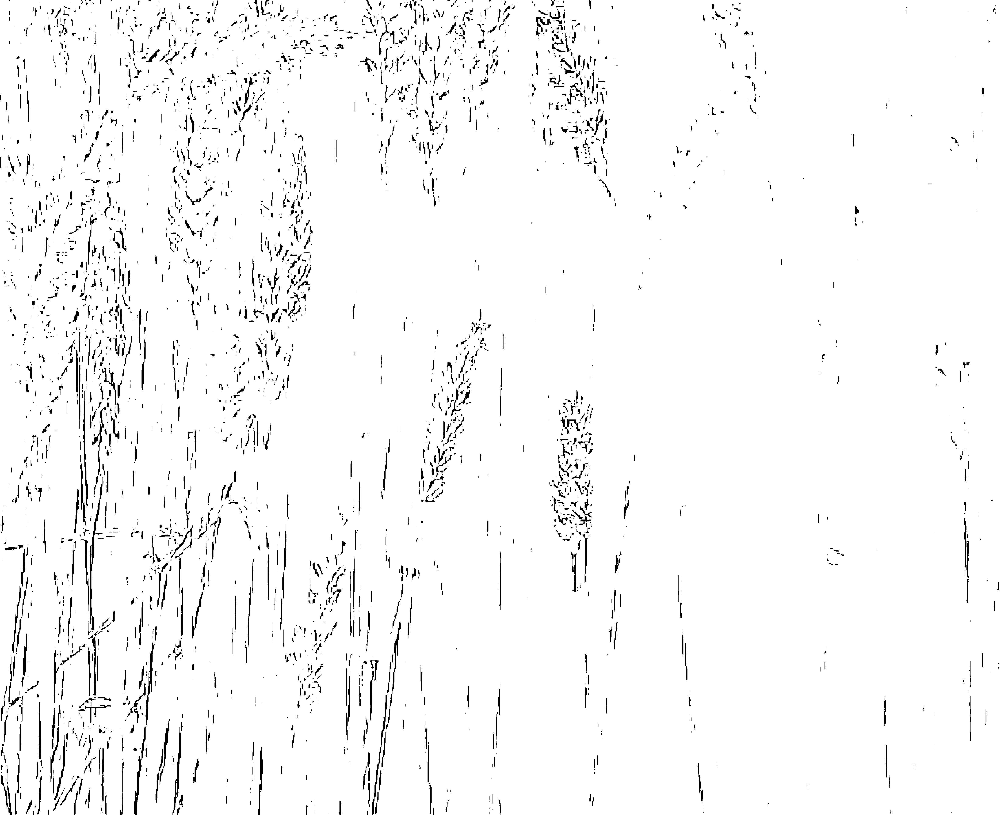

## 認識夢體

介紹過靈界之後，接下來要拉回切身的主題，從這一篇開始，我們要談的是「夢」。

生命的節奏彷彿霓虹燈，又像是螢火蟲，在醒與睡之間，明明暗暗，閃閃爍爍。醒時是亮的，入睡後是暗的，意識就在醒與睡之間，切換過來，又切換過去。意識永遠不眠，但必須切換，只有在睡眠之間保持著優雅的節奏，人的精神與體力才能常新，思緒也才能清明。

世人都怕死，即使熟讀這本書，已經明白死後靈體的旅程，也知曉靈界的來龍去脈，相信大家仍會有死亡的恐懼，因為死亡的恐懼起於未知，即使頭腦大略了解，內心依然覺得害怕。

然而，沒有一個人是突然被丟進「死亡」的，因為在每天的睡眠裡，我們都會進入夢境，夢中的世界與死後的世界極其相似。夢中的身體，即「夢體」，本質上也就是死後的「靈體」，賽斯因此將做夢稱為「小死亡」。

如果「死亡」是指意識離開身體的話，那麼，夢與死只差別在，夢醒後回到身體，死亡則是永遠離開了身體。

沒有一個人真正在死後被拋進「未知」的世界裡，因為死後的世界並不能算是「未知」，每天入眠後，我們都在夢裡遊歷了那個世界好幾次。死亡即是從原本主要對焦於物質世界，轉變為聚焦在彷彿「未知」的意識世界。

開始談夢之前，我們先說睡眠的意識狀態。

根據科學對腦波及生理觀察的探索，一個晚上的睡眠大約會有四到五個週期，每個週期裡又分非快速動眼期（NREM）與快速動眼期（REM）。非快速動眼期可以再分為四個階段，從第一階段到第四階段，人們會越來越熟睡，生理活動也會越來越降低。經過非快速動眼期的身體休息，人的體力可以得到補充。

緊接在非快速動眼期之後，睡眠就會轉成快速動眼期。在快速動眼期時，血壓、心跳等生理功能會增加，呼吸也會變快，雙眼還會快速轉動，大部分的夢境都出現這個時期，疲勞的腦力也可以在這段時期得到恢復。

在一個晚上的睡眠裡，快速動眼期的時間會一次比一次還長，若是一次睡眠有四到五次快速動眼期，第一次的時間大約十五分鐘，最後一次則長達四十五分鐘。

夢境並非只在快速動眼時期發生，非快速動眼期也會做夢，但夢的質地不同。

非快速動眼期的夢境比較模糊，醒來後也記不起詳細內容，只能感受到夢中的情緒與想法，無法詳知夢境中的情節。快速動眼期則有著情節、地點與角色都鮮明的夢境，若在這時期醒來，通常意識都比較清晰，也能清楚回憶夢中的情節。

非快速動眼期與快速動眼期的肉體表現也不一樣，在非快速動眼期做夢，人可能會說夢話或夢遊，但在快速動眼期做夢，人的身體是靜止不動的，也許大腦正在活躍地運轉，肌肉卻是放鬆的。

每個人每天入睡都會做夢，如果有人覺得他從來不做夢，那只是不記得夢，不是沒有做夢。

而根據賽斯的說法，入睡之後的意識分成兩個活動區域，一個積極主動，另一個則非常被動。

積極主動的這個時期，就是科學上的「非快速動眼期」，在這階段內，意識以肉體為依歸的部分仍留在身體內，但更高的直覺中心將被激發，於是人的「夢體」會「出體」去活動，然而，「夢體」的來去肉體是無法以科學偵測的，科學家頂多只能以儀器記錄「夢體」出體時的腦波變化，譬如「夢體」離開與回來那一刻，腦波可能呈現特殊的波型。

夢體活動的時期是睡眠裡最被保護也最隱密的時期，身體可以在這階段恢復活力，此外，人們接受「說法者」的教導，也是在這個時期。

而後，夢體回到了肉體，出體時經歷過的事件則由意識再一次詮釋，並轉變成情節鮮明的夢境，於是睡眠週期進入了「快速動眼期」，人們也開始沉浸在夢鄉之中。

隨著「非快速動眼期」到「快速動眼期」的意識轉變，身體會有微細的化學與電磁變化，荷爾蒙製造與松果腺的分泌也會有所波動。了解睡眠的週期後，接著要介紹的就是「夢體」。

入睡之時，在醒與睡交接的模糊層面，意識將會轉變成被動卻開放的「收受者」，也就是「夢體」，夢體可以接收到心電感應及未來的預知訊息。

那時的意識彷彿是在飄浮狀態，身體也會有各種不同的感受，有時是脹大，有時是下墜，這些都是夢體將要離開身體的感覺，脹大是心靈擴展的實質詮釋，下墜則來自夢體突然返回身體。

夢境能將感受轉譯為具體的夢境，因此在夢體墜落驚醒時，許多人會夢見自己「下墜」，譬如從樹上掉下來，下樓梯踩空，或是走在馬路上忽然跌進坑洞。此刻的夢體即瞬間回到了肉體。

夢與醒的過渡時間可能會維持幾分鐘或半小時，也可能在驚嚇後起床，這是意識緩衝與擴展的階段，如果在這段時間下「暗示」，於轉變信念而言，將會達成很好的效果。

經過夢與醒的過渡階段，多數人會開始睡夢中的活動。此時的意識會先創造「假夢」，在熱烈鮮活的「假夢」階段，意識主要處理的是世間關注，接下來，意識將漸漸對焦到其他層面，因此有可能接收到非物質層面的聲音、話語或影像。而後，身體進入了深睡，「夢體」也展開了活潑的出體活動。

「夢體」與「靈體」是一樣的，他們的特質是沒有「空間」與「時間」的法則，意念轉到哪裡，夢體就出現在哪裡。當夢體想到中國時，他不必飛越台灣海峽，馬上處身中國；又若夢體想到日本，他也無須橫渡太平洋，瞬間即置身日本。

夢體不需要時光機，也不需要任意門，想起過去，他就在過去；想到未來，他就在未來；念及其他的可能性，他就在其他可能性裡。

夢體不為地心引力所束縛，可以自由自在地飛翔，又因為夢體比肉體的振動頻率快速，因此夢體想到哪裡，實相就創造到哪裡。譬如夢體若覺得天氣寒冷，想加一件衣服，他的身上瞬間就多了一件冬衣，又若他想要一柄長劍，手上旋即握著一把寒光凜冽的寶劍。

夢體可以自在地回到過去、進入未來，或者轉換到可能性的世界，因此夢境是意識的轉接點。「說法者」若要開啟人們的智慧，必須與人們的夢體交流，又若是活著的人擔任死後靈體的「榮譽保護人」，也必須在「夢體」層面引領死後迷失的靈體。

出體活動之後，夢體將回到肉體裡。以物質世界的時間看，夢體可能只出體了幾分鐘，但於夢體而言，或許已經過了好幾年。在夢體回到肉體之後，睡眠也由「非快速動眼期」轉為「快速動眼期」，快速動眼期的夢境會比非快速動眼期更符合物質世界的法則。

在「非快速動眼期」，夢體可以遠離肉體，並與純粹的感受相結合，因此不須使用物質世界的象徵。但在「快速動眼期」時，夢體回到了肉體，經驗也將轉譯為夢境，這時的夢境就需要象徵，象徵越明確，夢境越清楚。尤其是接近夢醒的時分，夢中的象徵將最確實，代表的意義也最有限而狹窄。

譬如夢體若在「非快速動眼期」得到「說法者」的教導，回到「快速動眼期」後，轉譯出來的夢境就可能是見到佛陀或耶穌基督，因為佛陀或耶穌基督很明確地象徵著「心靈導師」。

此外，倘使內心感受喜悅，夢境可能會回到高中校園，也正與同學歡樂地聊天，這畫面象徵的即是「喜悅」。又若是內心恐懼，夢境也許會來到森林裡，還被毒蛇咬傷，這景象代表的即是「恐懼」。

許多人都對夢境有所困惑，因為他們想破解夢境蘊藏的意義，但夢境的「象徵」卻是隨人而異的，下一篇我們再繼續談談夢境的「象徵」與「意識」。

## 喜悅小語

> 夢體不為地心引力所束縛，可以自由自在地飛翔，又因為夢體比肉體的振動頻率快速，因此夢體想到哪裡，實相就創造到哪裡。

## 夢中的象徵

上過我課程的學員都知道，任何一位學員若遭遇健康、情緒或信念的難題，卻百思而不得其解時，我總是會笑著告訴他：「去睡覺！」

睡眠與夢境是一切萬有的恩寵，不論你是否了解睡眠，睡眠都可以讓你的身體、情緒與意識得到最好的休息與轉化。因此，即使你不知道睡眠的週期，也不明白夢中的你做了些什麼，只要重視睡眠，培養出醒與睡的優雅節奏，你都可以擁有更好的健康、情緒與能量。

優質的睡眠即是「分段睡眠」與「早睡早起」。「分段睡眠」是除了晚上的睡眠之外，在白天加一段小睡；「早睡早起」則是配合褪黑激素，讓睡眠達到最好的休息效果。總而言之，優質睡眠的原則是：不要醒太久，也不要睡太久，培養睡與醒的良好節奏。

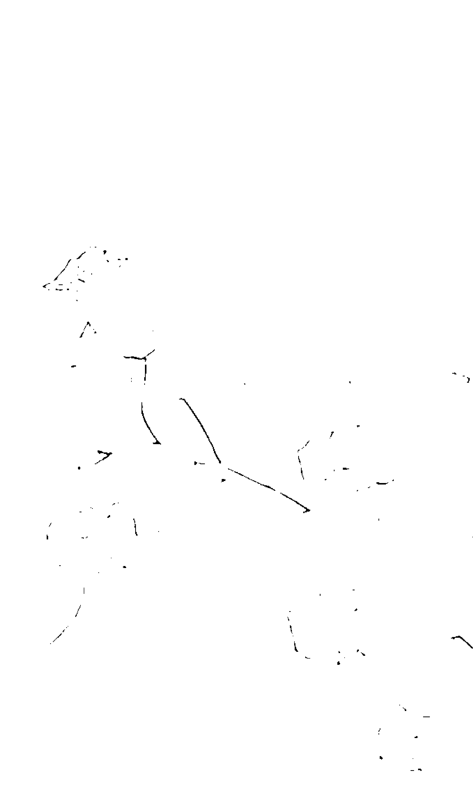

人們一天的生活裡，主要的工作與活動都在上午，因此若在用完午餐後，將醒時意識關閉，適時切換進夢中，身體與精神都可以得到休息。

每個人都可以選擇自己的睡眠節奏，賽斯建議可以採取兩段三小時的睡眠，或者五到六小時的夜眠，再配合白天一到兩個小時的小睡，總而言之，在分段睡眠的原則下，個人可以配合自己的工作與家庭作息做調整，達到醒與睡的最佳生理節奏。

至於一整天的睡眠時間，賽斯建議含午睡大約是六到八小時，若是睡眠超過八小時，甚至十小時，對身體反而會有不利的影響。太久的睡眠會讓身與心都變得比較呆滯，肌肉也會因為靈魂離體太久而失去彈性。

印證賽斯的說法，根據日本的統計，含午睡在內，每天睡七小時是最養生的，少於六小時或長於八小時的睡眠都容易對身體造成負面影響。

至於入睡的時間，我會建議配合褪黑激素分泌的時間。

褪黑激素是松果腺分泌的激素，分泌的時間在夜間入眠之後，沒有燈光的黑夜環境最能刺激褪黑激素分泌。

根據科學研究，褪黑激素有幫助睡眠、紓解壓力、清除自由基，以及預防阿茲海默症等功效。至於褪黑激素分泌的時間，大約是晚上九點半之後開始增加，並在深夜十一點到凌晨二點達到高峰。

因此配合褪黑激素的分泌，建議晚上十點即可就寢，若是睡足七到八小時，大概清晨五點到六點間會醒來，這個時間也是靜坐或讀書效果最好的時間。

只要養成優質的睡眠習慣，就能同時擁有良好的精神、體力與夢境。

談過睡眠之後，接下來要說的是夢中的『象徵』。

前文曾說到，『快速動眼期』的夢境使用了明確的象徵，因此夢境非常清晰，然而，大多數人的疑問是：『我的夢境究竟要告訴我什麼？』

台灣人喜歡猜『明牌』，許多人也相信夢境裡潛藏著中獎號碼的玄機，因此從早期的大樂透、六合彩，到現今的大樂透、威力彩，簽注人往往期待從夢境得到中獎的天啟。

- 有些彩券行因此乾脆貼出夢境與號碼的對照表，希望幫助簽注人解讀夢境，譬如狗代表33號、老鼠代表05號、男孩是21號、女孩是04號……等等。

這就是多數人解讀的「夢境象徵」，他們相信夢境出現的事物經過註解之後，可以得到明確的解釋，又若每一種象徵都只有單一種解釋，人們就可以輕易破解夢境蘊藏的意義。

民間也流傳著夢境的解說，比如夢見蛇，代表要向土地公拜拜；夢見掉牙齒，就表示家中可能有長輩將往生。這種將夢境的每一種事物都應對一套解說，是「一個蘿蔔一個坑」的解夢法。

「周公解夢」有著同樣的解夢觀，不論夢見任何人、動物或建築物，只要查閱「周公解夢」，就可以輕鬆解讀夢境。譬如夢見蝙蝠，意味著可能會生病，或是遭遇災難；夢見廟宇，可能是成功或成親的吉兆；又若是夢見水災，就可能表示快賺錢了。

然而，夢境真能簡單到好像是小朋友玩的「連連看」遊戲嗎？與周公解夢類似的，還有佛洛依德的「夢的解析」。佛洛依德是十九世紀精神分析學家，他以現代精神分析的方法觀察及探索夢境，並提出自己的一派學說。

The request was rejected because it was considered high risk死亡與靈界或許不是修為者最重要的課題，卻仍然非學習不可。因為人們大多恐懼死亡，即使是修為者，只要不了解死亡，就難免視死亡為一種惱惱的威脅。唯有認識死亡，才能減少死亡的恐懼，並且更全然地安住在當下。

在創作這本書的過程裡，有一天我太太向我說起她的夢，她說：「在昨晚的夢中，我抱著小兒子，小兒子一直叫「阿公」，我轉頭一看，爸爸（我父親）就在身邊。他對我笑了一笑，還跟我說：「如果有空，記得帶孩子來看看我。」

妻子的夢境讓我深深地懷念起父親，也隨即利用假日帶著全家前去祭拜他。

由於熟知賽斯對於靈魂的解說，我知道身在靈界的父親一定有老師引導，因此他必然是安全的，另外，我還推想向來好學的父親或許正在學習「信念創造實相」的真理，並努力修為與轉化自己。

因為放下死亡的焦慮，我不必耗費心神擔憂往生後的父親過得好不好，同樣的，我對自己也沒有多餘的死亡恐懼，也更能專心體驗每一天的生活。

我們都必須認識生死，也必須認識靈魂，越了解靈魂的本質，越能確信，不論生前死後，我們都偃臥在一切萬有的懷抱裡，也都是安全的，就算一時陷入困惑，還是會有老師適時指點我們。

也只有真正認識靈魂，我們才會明白，行善不是為了死後上天堂，修為也不是為了往生極樂世界。學習覺察、靜心與創造，都是為了當下的轉化，當下是威力之點，只要轉化當下，就能安住在喜悅平安自在之中。而當意識能量進入喜悅平安自在之時，我們還會發現，連夢境都開始喜悅平安自在起來了。

意識才是創造的核心，當意識喜悅時，我們會在物質世界見到喜悅，也會在夢境中發現喜悅，甚至等到死後，靈魂也是喜悅的，靈界的旅程更會是一趟喜悅的旅行，這才是「信念創造實相」的真諦。

為了讓大家都能先放下死亡的恐懼，本書介紹了一切萬有、高靈、靈界及夢境的真相，倘若閱讀之後，你能感覺智慧開啟，內心也更喜悅平安，那麼，歡迎你將本書多翻閱幾次。不過，若是你已經讀通這本書，建議你不須牢記靈界的歷程，只會知曉心靈的法則就可以了。

下面五個心靈的法則，請你了解並熟識：

- 靈魂是永生的，從來沒有人因為死亡而真正消失。
- 不論生前死後，實相都一定來自信念的創造。
- 靈界會有老師引領，就像物質世界也會有老師教導一樣。
- 不論物質世界或是靈界，對自己最負責的態度，就是接納頭腦裡的所有念頭，以及身邊發生的一切事件。
- 不論物質世界或是靈界，生活中最大的成就，都來自於自利利他的創造。

這些心靈法則必須深入智慧，與生命合而為一。只要熟悉這些法則，你就會明白，靈魂是永生的，但靈界沒有地圖，每個靈體的靈界生活都是自己創造的，正如物質世界也沒有一套制式的生命過程，每個人的生命完全出自自己的創造。

對於修為者而言，我們都必須認識靈魂與靈界，然而，生活中最重要的並不是靈魂與靈界，而是修為、靜心與創造。許多人都有信仰，但以修為的觀點看，與其在佛菩薩或耶穌基督的信仰上花太多時間，還不如將眼光轉向身邊最真實的先生、太太、父母、子女、朋友與同事，他們才是我們活生生的鏡子，只有跟他們共處，我們才能真正看見自己的信念，並且學習接納與轉化他們。

曾聽學員這麼說：「我真的覺得自己已經很努力學習了，但是每次只要看到憂鬱症的兒子自己關在房間裡，甚至做出自殘的行為，我的內心仍然會瞬間糾結起來，彷彿快窒息了一樣，連呼吸都痛苦。」

也會有學員說：「我是因為先生外遇才來心靈團體學習自我轉化的，上了一年的課程後，我知道修為就是要觀照自己的念頭，也認真地自我覺察，可是直到今天，我對先生的恨意與怨懟仍然幾乎每天都會從腦袋中蹦出來。」

我告訴她們：「這正是個人的修為，經過反覆的覺察與轉化，等到有一天你的智慧開啟之後，就會發現，你的內心有著最堅定的喜悅與平安，那時的你將不只不會輕易被先生或兒子牽動情緒，更能以你的喜悅平安，創造真正的快樂與幸福。」

人的意識就是如此。一顆與生俱來的清淨心，不見得能面對生命中的所有逆境，反而是從苦痛挫敗中修為出的清淨之心，喜悅與平安更堅定，也更能以如如不動的內在面對生命的挫折。

賽斯因此說，物質世界是無價的訓練場所，先前我們也說過，人間是修為最好的道場。物質世界因為振動頻率緩慢，可以讓我們有充裕的時間自我覺照，因此更容易消融內在的負面信念。負面信念一經清理，正面能量自然能提升起來。

經過覺察與修為，內心將安住在平安裡。又因為內在擁有真正的平安，夢境會是平安的，若是將來死去，靈體也是平安的。不論靈魂的旅程如何，我們都能用平安的心來映照平安的環境，於是生也平安，死也平安，生死兩相安。生死或許是輪迴與流轉的，然而，心靈卻可以擁有永恆的寧諡與喜悅，這才是最究竟的生死之學與靈魂之學。

> > **喜悅小語**
>
> 經過覺察與修為，內心將安住在平安裡。又因為內在擁有真正的平安，夢境會是平安的，若是將來死去，靈體也是平安的。

## 《後記》

### 嚴肅的話題，幽默的心情

每當在課程裡談到『靈界』時，因為我有賽斯思想的根基，知道靈界的一切都出自信念的創造，因此談起這個看似嚴肅的話題，依然可以保持輕鬆幽默的心情。

> 譬如說到『天堂』，我曾跟學員說：『若想體驗經書中寫的天堂生活，你只要準備一筆足夠的金錢，休假一個月，就可以嘗試看看。根據宗教經書描述，天堂的生活就是每天快樂的吃，快樂的穿，快樂的玩，這樣的生活在人間也能實現。』

> 『過天堂的生活，起先你可能會覺得很輕鬆、很自在，但是，一兩個禮拜過去後，你將會開始有失落感，因為沒有學習，也沒有創造的生活，實在枯燥乏味。於是你將渴望做些自利利他的事，在服務他人中滿足自己的價值。最後你還會發現，生命最大的快樂，並不是華服美食，而是在他人的笑容中擁有自己的成就感，因此再美好的天堂都比不上人間。你更將因此明白，為什麼大多數人都願意選擇輪迴轉世，反覆地體驗人間生活。

「天堂出自善念的投射，卻不是靈魂永恆的休息之所，只有像人間這樣的修為世界，才能修煉出靈魂真正的喜悅平安。」

而說到地獄，我也會幽默地說：「地獄只怕是千百年來最落後的地方，在這科技昌明的年代，地獄卻相當復古。我們看宗教所畫的地獄圖，千百年來都是鬼卒在拔人舌頭，丟人下油鍋，油鍋還都是柴火燒的。即使人間的科技產品日新月異，地獄卻還沒引進任何一台『電動拔舌機』，或『真空壓力鍋』。

「這是為什麼呢？因為即使在今天，人們讀的宗教書仍是千百年前的作品，但這在「信念創造實相」的原則下，投射出來的地獄，還依然是千百年前的景象。但這也讓我們更加印證「信念創造實相」確實就是創造的真正法則。」

「天堂」或「地獄」都是信念的投射，認識這樣的觀念，我們就可以明白，靈界與物質世界都沒有固定的地圖。因此，只要修為自己，修出正面信念與正面能量，就能創造並吸引美好的實相。

能夠在此生接受到如此令人心安的真理，內在真有著無量的感恩。在全書的最後，我也要致上誠摯的謝意。感恩高靈賽斯，謝謝您以慈悲之心，化解五度空間與三度空間的障礙，前來人間，以您累生累世凝練出的智慧，對我們宣講「信念創造實相」的真理，開啟我們的智慧。感恩魯柏與約瑟，謝謝您們夫妻鍥而不捨的努力，因為您們數十年來的傳法與記錄，我們才能有精彩的賽斯書可以研讀。感恩王季慶女士，謝謝您遠赴美國取經，請回了賽斯書，並且不辭辛苦，將賽斯書廣博深厚的詞彙翻譯出來，因為有了您，賽斯才能走進中文讀者的世界。感恩許添盛醫師，因為您長年累月南來北往的宣講真理，賽斯才能成為顯學，並且安定更多人的心，為更多人帶來喜悅與平安。因為有了高靈與說法者的努力與傳承，我們才得以打開智慧，並且在每朵花或每隻蝴蝶中都見到蘊藏的真理。千言萬語，都無法道盡內在的感動與感恩。

## 心情。筆記

Note

## 愛的推廣辦法

看完這本書，是否激盪出您內心世界的漣漪？
如果您喜歡我們的出版品，願意贊助給更多朋友們閱讀，下列方式建議給您：

- 1. 訂購出版品：如果您願意訂購一千本（印刷的最低印量）以上，我們將很樂意以商品「愛的推廣價」（原售價之65折）回饋給您。
- 2. 贊助行銷推廣費用：如果您認同賽斯文化的理念，願意贊助行銷推廣費用支持我們經營事業，金額達萬元以上者，我們將在下一本新書另闢專頁，標上您的大名以示感謝（每達一萬元以一名稱為限）。

請聯絡賽斯文化或財團法人新時代賽斯教育基金會各地分處，我們將盡快為您處理。

## 愛的聯絡處

如果您認同本書的觀念及內容，想要接受我們的協助；如果您認同本書的理念，想依循本書的觀念成為一位助人者的角色；如果您樂見本書理念的推廣，而願意提供精神及實質的協助；請與財團法人新時代賽斯教育基金會各地分處連繫：

- 屏東辦事處
羅那
電話：08-7212028
傳真：08-7214703
E-mail: sethpintong@gmail.com
屏東市廣東路110巷11號

- 宜蘭辦事處
潘仁俊
電話：03-9325322，0912296686
E-mail: seth.yilan@gmail.com
宜蘭市宜中路110號

- 賽斯村
陳紫涵
電話：03-8764797
傳真：03-8764317
E-mail: sethvilIage@gmail.com
花蓮縣鳳林鎮鳳凰路300號

- 香港聯絡處
董潔珊
電話：009-852-2398-9810
E-mail: seth_sda@yahoo.com.hk
香港九龍旺角花園街111-111號利興大樓5字樓D室

- 深圳聯絡處
田邁
電話：009-86-138288-18853
E-mail: tlll-job@163.com

- 洛杉磯聯絡處
Charles Chen
電話：002-1-714-928-5986
E-mail: newageusa@gmail.com

- 紐約聯絡處
謝麗玉
電話：002-1-718-878-5185
E-mail: healingseeds@yahoo.com

- 多倫多聯絡處
黃美雲
電話：002-1-416-444-4055
E-mail: tsaisun2k@yahoo.ca

- 台灣身心靈全人健康醫學會
徐雪萍
電話：02-22197106
E-mail: TSHM2075@gmail.com
新北市新店區中央四街80號五樓

## SethTV 賽斯公益網路電視台 www.SethTV.org.tw

這是一個24小時無國界的學習與成長，連結科技網路與心靈網路為您祝福!

## 賽斯心法媒體推廣計畫 600元 幫助全人類身心靈成長，您願意嗎?!

當許多媒體傳遞帶著恐懼與限制的訊息，你是否問過究竟什麼才真能讓你我及孩子對未來、對生命充滿期待與喜悅，開心地想在地球上活出獨特與精彩？

賽斯教育基金會感謝許添盛醫師及其他心靈輔導師、實習神明分享愛、智慧與慈悲的身心靈演講/課程/紀錄做為「賽斯公益網路電視台」的優質節目；我們規劃製播更多深度感動的內容，讓一篇篇動人的生命故事鼓舞正逢困頓的身心，看見新的轉機與希望「遇見賽斯，改變一生」。

您的每一分贊助，不但能幫助自己持續學習成長，同時也用於推廣賽斯身心靈健康觀，讓更多人受益。感謝您共同參與這份利人利己的服務!

## 免費頻道

播映許添盛醫師、專業心靈輔導師老師的賽斯身心靈健康公益講座，進入網站即可完全免費收看!

## 贊助頻道

只要您捐款贊助「賽斯心法媒體推廣」計畫，並至基金會海內外據點或至SethTV網站填妥申請表，就能成為會員獲贈收看贊助頻道。後續將以E-mail通知開通服務，約1~7個工作天

贊助頻道播映許添盛醫師、專業心靈輔導師的賽斯書課程、講座；癌友樂活分享、疾病心療法系列、教育心方向系列、金錢心能量系列、親密心關係系列等用心製作的優質節目。

※詳細內容請參考每月節目表；若有異動以SethTV網站公告為準

## SethTV線上申辦

| 項目 | 內容 |
| :--- | :--- |
| **SethTV專戶** | 戶名 財團法人新時代賽斯教育基金會 |
| **銀行代號** | 017 |
| **銀行分行** | 兆豐國際商銀 北台中分行 |
| **帳號** | 037-09-06984-8 |

或洽愛的聯絡處申辦 ♡

任何需要進一步說明，請洽SethTV Email:sethwebtv@gmail.com Tel:02-2219-5940

※長期徵求志工開心參與~網站架設、網頁設計；攝影、剪輯；節目企劃、製作；字幕聽打、多國語文翻譯等

## 賽斯管理顧問

我們提供多元化身心靈健康服務

包含全人教育、人才培訓、企業內訓

身心靈課程規劃及諮詢等

將身心靈健康觀帶入一般大眾的生活之中

另也期盼能引領企業，從不同的角度

尋找屬於企業本身的生命視野及發展遠景

門市 提供以賽斯心法為主軸的相關課程諮詢及出版品(包含書籍、有聲書、心靈音樂等。)

### 賽斯文化講堂

- 1. 多元化身心靈成長課程及工作坊------ 協助人們實現夢想生活、圓滿關係，創造生命的生機、轉機與奇蹟。
- 2. 人才培訓 ----------------------- 培育具新時代思維，應用「賽斯取向」之心靈輔導員、全人健康管理師、種子講師等專業人才。
- 3. 企業內訓 ----------------------- 帶給企業一種新時代的思維及運作方式，引領企業永續發展、尋找幸福企業力。

心靈陪談 賽斯「心園丁團隊」提供一對一陪談服務，陪伴您面對生命的無助、困境與難關。

許添盛醫師 講座時間 每週一 PM 7:00-9:00 癌症療癒 (時間請來電洽詢)

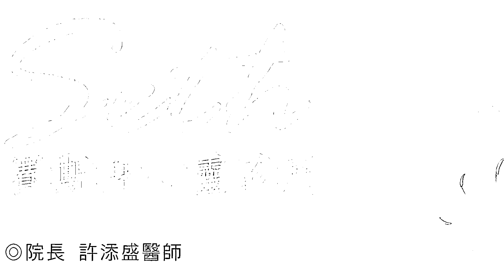

### ◎院長 許添盛醫師

本院推展身心靈健康的三大定律：
一、身體本來就是健康的。
二、身體有自我療癒的能力。
三、身體是靈魂的一面鏡子。
結合身心科、家庭醫學科醫師和心理師組成的醫療團隊，啟動人們內在心靈的自我康復系統，協助社會大眾活化人際關係，擁有更美好的生命品質。

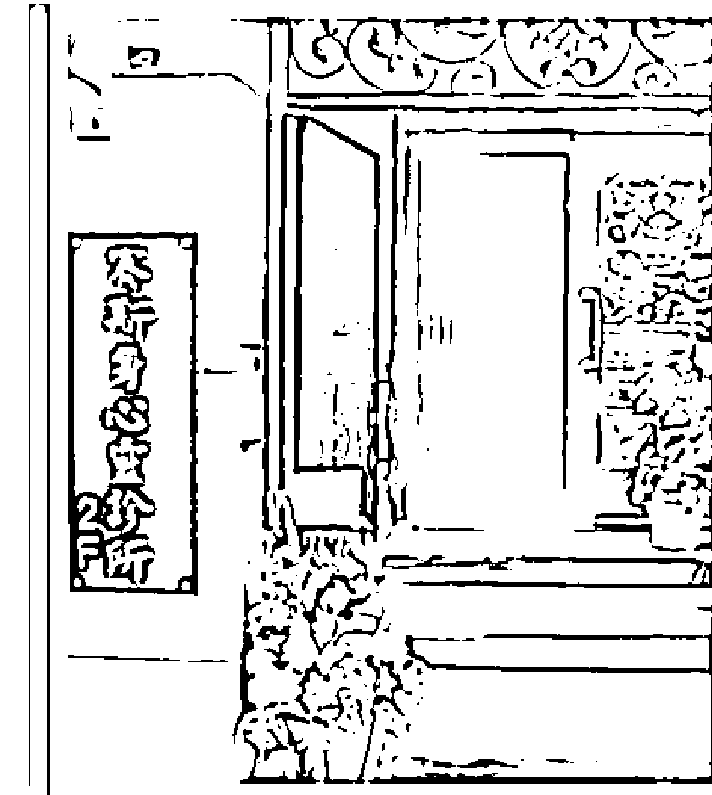

### 許添盛醫師 看診時間

- - 週一 AM 9:00-12:00  PM 1:30-5:00
- 週二 AM 9:00-12:00  PM 1:30-5:00  PM 6:00-9:00 (個別預約諮詢)
- 週三 AM 9:00-12:00 (個別預約諮詢)

◎門診預約電話：(02)2218-0875、2218-0975

◎院址：新北市新店區中央七街26號2樓
(非健保特約診所)

◎網址：http://www.sethclinic.com

## 心靈的殿堂 賽斯學院
需要您慷慨解囊 一起播下愛的種子

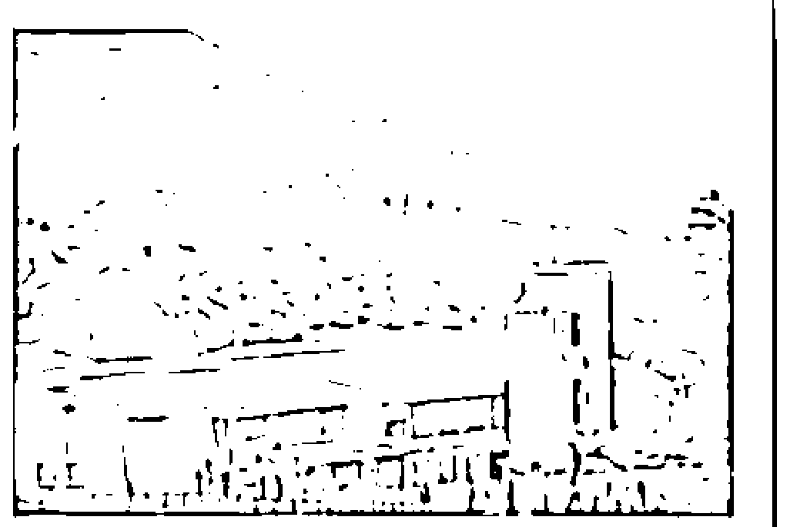

### 賽斯村——鳳凰山莊

位於花東縱谷風景區，佔地六公頃，2006年12月由賽斯基金會接管。這裡群山環抱，雲層裊繞，景色怡人，是個淨心、靜心的好地方……步行 5 分鐘即是賽斯家族的後花園——賽斯學院。

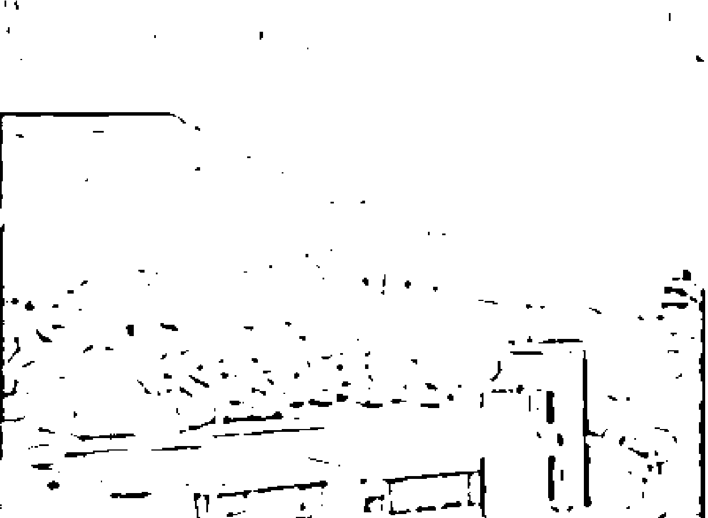

來到賽斯村的每一個人，透過與大自然的親近，與宇宙愛的能量及智慧連結，喚起赤子之心，重新回到內在，覺察每一個當下的自己，開啟內在自我療癒的能力及潛能，創造一個健康、喜樂、富足、平安的生命品質。

翠林農莊是由基金會董事 蔡百祐先生所捐贈購買，園區內小木屋提供賽斯家族及癌友申請長期居住使用。賽斯學院即將於 2010 年落建於此，第一期工程為賽斯大講堂的興建及住宿區 A，第二期工程為住宿 B、行政大樓的興建預計2-3年完成興建計劃。

第一期工程款預估約三千萬，第二期工程款預估約二仟萬，目前正由賽斯基金會提出興建計劃說明及募款，在此呼籲認同賽斯資料，且願意和我們一起推廣賽斯心法的賽斯家族們，能共襄盛舉，讓更多需要幫助的人，能感受到這光與愛。

### 服務項目

- - ◎住宿◎露營◎簡餐◎下午茶◎身心靈整體健康講座◎心靈成長團體工作坊
- ◎賽斯資料◎課程及讀書會◎個別心靈輔導◎全球視訊課程連線
- ◎企業團體教育訓練及社會服務

### 捐款方式

- 1. 匯款至「賽斯學院」募款專戶
   戶名：財團法人新時代賽斯教育基金會
   銀行：兆豐國際商業銀行北台中分行
   帳號：037-09-06780-3
- 2. 加入「賽斯家族會員」：每位捐贈本會參仟元整或以上，即贈送「賽斯家族會員」會員卡一張，以茲感謝。（凡持賽斯家族卡至基金會，享有課程及書籍費八折優惠）

◎地址：花蓮縣鳳林鎮鳳凰路300號 ◎電話：(03)8764-797
◎http：//www.sethvillage.org.tw ◎Mail：sethvillage@gmail.com

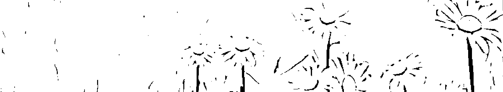

## 回到心靈的故鄉——賽斯村工作坊

### 許醫師工作坊

在賽斯村，每月第三個星期六、日，由許醫師帶領的工作坊及公益講座，所有學員不斷的向內探索自己，找到內在的力量，面對及穿越生命的恐懼、困難與疾病，重新邁向喜悅、幸福、健康的生命旅程。

### 療癒靜心營

賽斯村精心安排的療癒靜心營，主要目的是將賽斯資料落實在生活裡，由痊癒的癌友分享他們療癒的經驗，並藉由心靈探索、團體分享等各種課程，以及不同的生活體驗，來協助每位學員或癌友成長、轉化及療癒。

賽斯村是一個靜心的好地方，尚有其他許多老師的課程可提供大家學習。歡迎大家前來出差、旅遊、學習、考察兼玩耍，一起回到心靈的故鄉。

地址：花蓮縣鳳林鎮鳳凰路300號
電話：03-8764797
所有課程詳見賽斯村網站：www.sethvillage.org.tw

## 百萬CD 千萬愛心

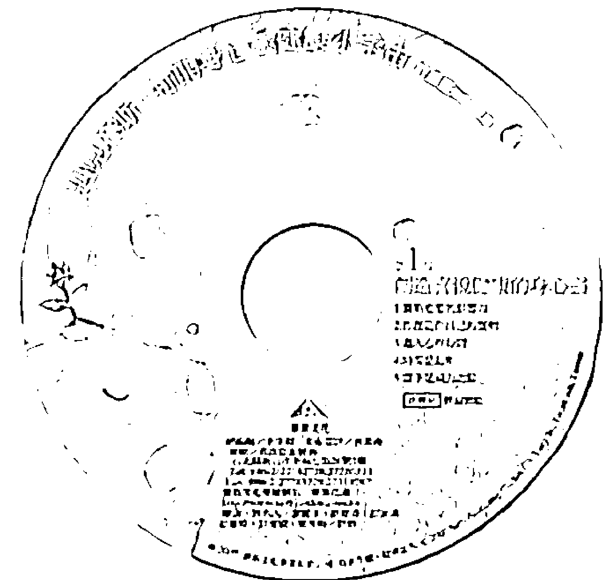

### 請加入賽斯文化 百萬CD推廣行列

自2006年10月啟動「百萬CD，千萬愛心」專案至今，CD發行數量已近百萬片。這一系列百萬CD，由許添盛醫師主講，旨在推廣「賽斯身心靈整體健康觀」，所造成的影響極其深遠。來自香港、馬來西亞、美國、加拿大、台灣等地的贊助者，協助印製「百萬CD」，熱情參與的程度，如同蝴蝶效應一般，將賽斯心法送到全世界各個不同角落——隨著百萬CD傳遞出去的愛心與支持力量，豈止千萬？賽斯文化於2008年1月起，加入印製「百萬CD」的行列。若您願意支持賽斯文化印製CD，請加入我們的贊助推廣計畫！

### 百萬CD目錄＞（共八輯，更多許醫師精彩演說將陸續發行）

- 1. 創造健康喜悅的身心靈
- 2. 化解生命的無力感
- 3. 身心失調的心靈妙方（台語版）
- 4. 情緒的真面目
- 5. 人生大戲，出入自在
- 6. 啟動男人的心靈成長
- 7. 許你一個心安
- 8. 老年也是黃金歲月
- 9. 用心醫病

### 贊助辦法＞

在廠商的支持下，百萬CD以優於市場的價格來製作；每片製作成本10元，單次發印量為1000片。若您贊助1000片，可選擇將大名印在CD圓標上；不足1000片者，也能與其他贊助者湊齊1000片後發印。當然，大名亦可共同印在CD圓標上。

- 1. 每1000片，贊助費用10000元，沒有上限。
- 2. 每500片，贊助費用5000元。
- 3. 每300片，贊助費用3000元。
- 4. 每200片，贊助費用2000元。
- 5. 小額贊助，同樣感謝！

| 您的贊助金額，請匯入以下帳戶，並註明「贊助百萬CD」，賽斯文化將為您開立發票。 |
|---|
| 戶名：賽斯文化事業有限公司 |
| 郵局劃撥帳號：50044421 |
| 銀行帳號：台北富邦銀行 |
| ATM代碼012 380-1020-88295 |# 賽斯教育基金會
新店分處

- ◎ 癌友、精神疾患與家屬等支持團體
- ◎ 身心靈課程
- ◎ 讀書會
- ◎ 個別心靈陪談
- ◎ 素人作品
- ◎ 賽斯系列商品
- ◎ 藝文展演
- ◎ 場地租借
- ◎ 心靈成長工作坊
- ◎ 輕食、新鮮蔬果汁、咖啡、茶飲
- ◎ 書籍、CD

- ◎ 電話：(02)8219-1160、2219-7211
- ◎ 花園信箱：thesethgarden@gmail.com
- ◎ 地址：新北市新店區中央五街51號
- ◎ 網址：http://www.sethgarden.com.tw
- ◎ 新店分處信箱：sethxindian@gmail.com

## 你。就。是。依尔达

### 依尔达

隶属于九大意识家族中的一支

依尔达是由「交换者」组成，主要从事概念、产品、社会与政治观念之交换与交流的伟大游戏。他们是种子的携带者。

他们是旅行家，把他们的想法由一个国家带到另一个。他们是探险家、商人、士兵、传教士及水手。他们常常是改革运动的成员。

他们是概念的散播者及同化者，他们在各处出现。他们是一群活泼、多话、有想像力而通常可亲的人。他们对事情的外貌、社会的习俗、市场、目前流行的宗教或政治理念有兴趣，他们将之由一处散播到另外一处。

> > ——摘自赛斯书《未知的实相》

### 爱，愈分享愈多；生命，愈分享愈广阔

「依尔达计划」本着回馈和照顾支持者的心，希望邀请对赛斯思想和身心灵健康观有高度热忱的朋友，共同加入推广员的行列，成为「依尔达」计划的一份子。传递你的感动、分享你心灵成长与生命故事，同时丰富自己的内在与物质生活。现在，就拿起电话加入依尔达计划：(02)2219-0400 依尔达小组

- **台北**
  - 佛化人生：台北市羅斯福路3段325號6樓之4，電話 02-23632489
  - 政大書城台大店：台北市羅斯福路三段301號B1，電話 02-33653118
  - 水準書局：台北市浦城街1號，電話 02-23645726
- **中壢**
  - 墊腳石中壢店：桃園縣中壢市中正路89號，電話 03-4228851
- **台中**
  - 唯讀書局：台中市北區館前路5號，電話 04-23282380
- **斗六**
  - 新世紀書局：雲林縣斗六市慶生路91號，電話 05-5326207
- **嘉義**
  - 鴻圖書店：嘉義市中山路370號，電話 05-2232080
- **台南**
  - 金典書局：台南市前鋒路143號，電話 06-2742711 ext13
- **高雄**
  - 明儀圖書：高雄市三民區明福街2號，電話 07-3435387
  - 鳳山大書城：高雄縣鳳山市中山路138號B1，電話 07-7432143
  - 青年書局：高雄市青年一路141號，電話 07-3324910

- **台北**
  - 賽斯花園5號出口：台北捷運南港展覽館站五號出口，電話 02-26515521
- **桃園**
  - 大湳鴻安藥局：桃園縣八德市介壽路二段368號，電話 03-3669908
  - 向光之徑：桃園縣中壢市中山東路三段327號，電話 03-4365026
  - 彭春櫻讀書會：桃園縣楊梅市金山街131號7樓，電話 0919-191494
  - 新時代賽斯中壢中心：桃園縣中壢市龍昌路7號，電話 03-4365026
- **台中**
  - 賽斯興大讀書會：台中市永南街81號，電話 0932-966251
  - 心能源社區讀書會：台中市北屯區九龍街85號，電話 0911-662345
  - 愛麗絲花園：台中市沙鹿區自由路166-6號，電話 04-26365209
- **南投**
  - 馬冠中診所：南投市復興路84號，電話 049-2202833
- **台南**
  - 賽斯生活花園：台南市安南區慈安路205號，電話 06-2560226
  - 2075 Efharisto：台南市北區北成路20巷1弄28號，電話 06-2816328
- **高雄**
  - 天然園：高雄市林園區林園北路264號，電話 07-6450406
  - 大崗山推廣中心：高雄市阿蓮區崗山村1號，電話 07-6331187
  - 新時代賽斯六合推廣中心：高雄市苓雅區六合路21-1號2F，電話 0972-330563
- **屏東**
  - 賽斯花園：屏東市廣東路120巷2號，電話 08-7213545
  - 秋子壽司：屏東市興豐路68號
- **花蓮**
  - 新時代賽斯花蓮中心：花蓮市中福路118號，電話 03-8311342
- **台東**
  - 欣納的家：台東市廣東路252號，電話 0933-626529
- **馬來西亞**
  - Reset/賽斯學苑：resetgarden@gmail.com，電話 009-60379608588
  - 馬來西亞心時代協會：inquiry@newage.org.my，電話 009-60175570800
  - 賽斯舞台：mayahoe@live.com.my，電話 009-60137708111
- **新加坡**
  - LALOLN：elysia.teo@laloln.com，電話 009-6591478972

想完整閱讀賽斯文化的書籍嗎？
以上地點有我們全書系出版品喔！

# 財團法人新時代賽斯教育基金會

WWW.seth.org.tw

## 宗旨

基金會以公益社會服務為主，於民國九十七年三月正式成立。本著董事長許添盛醫師多年來推廣身心靈理念：肯定生命、珍惜環境、促進社會邁向心靈普遍開啟與提升的新時代精神，協助大眾認知心靈力量對於健康的重要性，引導社會大眾提升自癒力，改善生命品質，增益家庭與人際關係，進而創造快樂、有活力的社會。

## 理念

身心靈的平衡，是創造健康喜悅的關鍵；思想的力量，決定人生的方向。所以基金會推展理念，在健康上強調三大定律，啟發大眾信任身體自我療癒的力量；在教育方面，側重新時代生命教育觀念的建立，激發生命潛力，尊重每個人的獨特性，發現自我價值，創造喜悅健康的人生。更進一步建設賽斯身心靈療癒社區，一個落實人間的心靈故鄉。

## 服務項目

身心靈整體健康公益講座、賽斯資料課程及讀書會、全球視訊課程連線及電子媒體公益閱聽、個別心靈對話及心靈專線、心靈成長團體及工作坊、癌友/精神疾患與家屬等支持團體、企業團體教育訓練規劃及社會服務

1. 若您願意提供我們實質的贊助，歡迎捐款至基金會：
捐款帳號：037-09-06756-6 兆豐國際商業銀行——北台中分行
2. 加入『賽斯家族會員』：凡捐款達三千元或以上，即贈『賽斯家族卡』一張，持卡享有課程及出版品...等優惠。歡迎洽詢總分會。

## 基金會據點

台中總會：台中市北區崇德路一段631號A棟10樓之1 (04)2236-4612
板橋辦事處：新北市板橋區仁化街40之2號8樓 (02)8252-4377
新店辦事處：新北市新店區中央四街80號5樓 (02)2219-7211
三鶯辦事處：新北市鶯歌區文化路214號 (02)2679-1780
嘉義辦事處：嘉義市民權路90號2樓 (05)2754-886
台南辦事處：台南市中西區開山路245號10樓 (06)2134-563
高雄辦事處：高雄市左營區明華1路221號4樓 (07)5509-312
屏東辦事處：屏東市廣東路120巷2號 (08)7212-028
宜蘭辦事處：宜蘭市宜中路120號 (03)9325-322
賽斯村：花蓮縣鳳林鎮鳳凰路300號 (03)8764-797

秉持著推廣身心靈三者合一的新時代賽斯思想健康觀念，培訓具身心靈全人健康思維之醫療人員與全人健康管理師，提升國人身心靈整體醫療照護，創造健康富足的新人生。

## 期望您加入TSHM會員給予實質支持

- 一、個人會員：年滿二十歲以上贊同本會宗旨之醫事人員或相關學術研究人員。
- 二、團體會員：贊同本會宗旨之公私立醫療機構或團體。
- 三、贊助會員：贊助本會宗旨之個人或團體。
- 四、學生會員：大專以上相關科系所之在學學生。

感謝您的贊助，讓TSHM推廣得更深更遠
本會捐款專戶：
銀行：玉山銀行 (北新分行) ATM代號：808
帳號：0901-940-008053
戶名：台灣身心靈全人健康醫學學會

服務電話：(02)2219-7106
上班時間：每週一至週五上午10:00至下午6:00
地址：新北市新店區中央四街80號5樓

# 國家圖書館出版品預行編目(CIP)資料

啟動靈感：來自賽斯的41堂靈魂課 / 王怡仁

著. --初版. --新北市：賽斯文化, 2013. 12

面： 公分. -- (王怡仁作品：6)

ISBN 978-986-6436-51-2 (平裝)

- 1. 超心理學
- 2. 心靈學
- 3. 靈魂

175.9 102022943

# 王怡仁作品集

## 不只是奇蹟

10位抗癌勇士的身心靈療癒與重生

就算醫界束手無策，你也可以創造自己的奇蹟！本書為你揭開10位抗癌勇士療癒與重生的秘密。大多數的朋友接觸身心靈治療，往往會有理論與現實無法結合的感覺，但透過這些故事，大家就可以明白，要將身心靈整體治療的觀念用來治病，其實是人人可行的。

## 武俠身心靈診療室

金庸小說人物 V.S. 二十種常見疾病

當大俠們從金庸小說中走出來，去門診掛號，他們有可能苦於何病？又為什麼會得斯疾？本書作者王怡仁不但是位超級金庸迷，也是正統醫學院出身、接受完整西醫教育的家庭醫學科醫師，他有感於西醫過度「溺愛」病人，往往忽略了疾病要傳達給我們的訊息，因此提倡「身心靈整體治療」。

## 不藥而癒

身心靈整體健康完全講義

以遊戲的心情，讓「知識」內化為「智慧」，以覺察的心靈，讓「疾病」轉化為「健康」。本書是作者王醫師十多年來在各地演講及親身印證後彙集而成的心血，包含他獨門綜整出的「身心靈醫學」知識大全、演講課程及讀書會中探討的實例、與學員們的問答，以及浸淫「身心靈整體健康」領域多年的領悟和見解。

## 靜心的優雅節奏

王醫師把身心靈修練大地圖完整地張開，邀請讀者一同走向喜悅新生命的道路，並按部就班地闡述修為的步驟，從「身心靈金三角」出發，讓你透過淺顯易懂的圖形和解說，重新了解思想、心靈與身體之間互相串連的關係，並教你如何將生命之船開向喜悅、自由與平安。

## 天生富有

在豐裕的收成中享受生活

王醫師在書中提出「小富由儉，大富由心」的新概念——小富或許可以藉由儉約儲蓄得來，但真正的大富必定來自信念的吸引與創造。他將個人累積的體驗心得，化為「在意識中構築豐盈富裕的世界」的概念和方法，希望能讓更多朋友「打開富腦袋，讓財富從信念的水龍頭流出來」。

### 生命沒有懲罰，只有祝福

關於靈魂與生死的課題，本書有著最令人心安的答案

這世上，大概沒有人不怕死吧？其實，人們怕的不只是「死亡」這件事，而真正恐懼的是：死後到底有沒有靈魂？如果有，靈魂將往哪裡去？

長年浸泡在身心靈領域學習、飽讀群書的王醫師，這次以「賽斯思想」的觀念為導引，深入探討靈魂與生命，並整合多年來蒐集的各派宗教及古聖先賢看法完成本書，希望大家打破傳統迷思、順利揭開死後世界與靈魂功課的神秘面紗。

一般而言，不同的宗教與民族，對於一切萬有、上帝、靈界或夢境等等非物質的靈性世界，有著各自不同的說法。某一派的神明與靈界就歸那一派，他們和別的派別既不互相隸屬，也未必共通。簡單說來，就是佛教有佛教的靈魂地圖，基督教有基督教的靈魂地圖，老子、莊子、列子也都有各自的靈魂地圖，人們則追隨信仰，選擇一張自己的地圖。

這些看似不完全合理的說法，在王醫師讀了賽斯書後，終於得到了答案——原來靈魂的歷程確實是出於自己的選擇。關於每個人死亡到投胎的不同靈界歷程，並不是被安排的，而是出於意識的選擇，每個人經歷的實相都是出自自己意識的投射；換句話說，靈魂的道路即是創造的旅程，沒有任何人因為被強迫而進入某一張靈魂地圖裡，每個人都是以自己的能量與信念決定靈魂將走的道路。

此外，王醫師更將佛教、基督教以及台灣民間習俗關於靈魂的說法加以融合或釐清，盼望讀者們閱讀之後，都能對靈魂、靈界與夢境有更清晰的了解；相信在閱讀本書的過程中，內心也會越來越安定。

如果你已經準備好要認識最宏觀的靈魂視野，現在，請打開這本書，進入內在的靈魂國度吧！

> > 這是一本關於賽斯生死觀的絕佳入門書，也是家庭常備的一帖良藥——破除傳統宗教和靈異現象帶來的恐懼，功效卓著！
——賽斯身心靈診所許添盛醫師