# 启动神秘的疗愈力量
# （古代神秘学院进阶疗愈技巧）

查看目录方式：视图-文档结构图

风由晶整理制作

内容简介：

《启动神秘疗愈能量》 作者：道格拉斯•德龙

现今世界以很特别的方式在变化着，人类正在将意识提升到更高的层次上，这意谓着许多人的频率已提高到一个新的精神层次。简言之，人类世界将更接近天界的磁场，比以往容易有更多的机会与天使、指导灵和其他天界圣职系统的代表沟通。

在本书中，作者道格拉斯•德龙解释，如何能将古代的治疗智慧运用在现代的生活中。同时教你学习执行最后的启蒙，发现强而有力的方法来发展你的灵力与治疗能力。书中的这些教导或课程，是经过特别设计，使你们有机会成为专业的治疗师。也许你们会发现，在不久的未来也有机会进入这些工作领域，而对于已经进入这些快速成长的领域的人来说，本书中所教授的技巧可以提升原有的天赋。这些技巧包括：

- 灵魂治疗
- 前世回溯
- 平衡脉轮
- 用色彩来治疗
- 接通疗愈能量
- 与天使及灵性向导一起工作

熟练这些技巧，你就能觉知到存在你周围的更高频振动或宇宙能量，使你保持与天使和天界的连结，帮助你达成身心灵上的完整健康。这样一来，你将更能运用自己脑中那些连结灵力与灵性特质的区域，这就是开悟的起点。

# 作者简介

道格拉斯•德龙（Douglas De Long）

灵性 / 个人谘商师、前世治疗师、医疗灵通与脉轮专家。花了二十多年的时间，修练与开发个人超感应力与灵性成长。他创立了一门独到的课程，从事此项教学超过五年，并将个人学识及通灵所接收到的教义集结成册。

道格拉斯与妻子凯罗，住在加拿大的萨斯卡通城（Saskatoon），于当地创办德龙古代神秘学院，致力于协助启发人们，发展与生俱来的超感应力与灵性潜能。

# 推荐序——古埃及文明的大秘密

当我们踏入二十一世纪时，世界的轨道正有所变化，先前的时空似乎在瓦解，这给许多人造成一股压力，不过相对来说也是一个大好的机会，亦即当现代文明泛滥而「传统」文明快速被消除时，古埃及文明的秘密，包括古老的疗愈技巧、宇宙的能量等，便逐渐绽放出来。

道格拉斯 • 德龙的著作《古代神秘学院入门书》与《启动神秘疗愈能量》二书，即泄露这秘密过程中的可观档案，内容来源包括学术与灵性的探讨，包括脉轮开通…唱诵、疗愈、灵魂出体、开发创造力等技术，书中介绍的方法简单易学，即使初接触此领域的读者，相信也能获得灵性的启蒙。

古埃及几千年的高度文明，有一些特色值得现代社会参考，为了帮助读者了解古埃及神秘学的大昼面，我在此提供其科技系统的概要。古埃及的巫师们认为：

> 宇宙的基础是一个真空状态，而在那真空中什么都是可能的。

- 所以他们假设人生的本性是永生的天人合一、和平快乐自由存在境界。
- 然后他们创立了神秘科学方法，以唤醒一个永生喜悦光体的本性。
- 人既然会生，必然会死，所以要有超出时空肉体轮回的技术。
- 死后不要喝孟婆汤，要记住个人的使命，然后刻意创造下一世的计昼。
- 一个文明的巫师们，要学会从其庞大文明信息库中选取最主要核心的信息。
- 要用不受环境或社会变化影响的可靠方法，保存那主要核心信息。
- 要创造与管理一些灵性光体工作者团队！以创造、储存、取回、恢复与在适当顺序中，传递那些主要核心信息。

古埃及文明的表达方式属于一个地理与历史环境，不过它的内容包含整个宇宙的创建与进化，他们的祭师在时空中自由来往开发生命潜能，以建立、维持或复兴一些开悟的星球文明。

古埃及的人将他们认为是最重要的事情刻在石板上，以流传给后世。那么，你也可以自问一生活中对你重要的事情为何？什么样的讯息值得你刻在石板上？

- 为什么这件事情（人、东西、企图、状况）那么重要？
- 当你找到此问题的答案时，再探究为什么这答案那么重要？
- 反复深究直到你找到最核心的答案为止。

一旦得到开悟，你的身体、心智与灵性会得到和谐及完整的平衡，身体会产生惊人的转变，强大的心智力量将会散发光明和能量，帮助更多人活在天人合一的境界。跟着本书走一趟灵性之旅，你会更清楚自己的核心价值在哪里，挖掘出内在的真实泉源，并找到真正属于我的生活，祝福你！

白中道博士 Douglass A. White Ph.D.

- 一九七六年以易经论文完成哈佛大学东方语言与文明学之博士学位。
- 三十几年的心灵成长授课经验。着有《古埃及神图塔罗牌》(生命潜能出版)、《所罗门王的宝藏》、《观察物理学》、《古埃及金字塔经文》，及许多学术、科学与灵性方面的文章。
- 如果你对古埃及神秘学有兴趣的话，欢迎浏览圣甲虫学院网站，了解古埃及金字塔经文与太阳神（日=ra）高我的78个化身：www.dpedtech.com

# 简介——培养灵力的进阶课程

《启动神秘疗愈能量》是一套培养灵力(psychic)与灵性的进阶课程，也是古老的疗愈技巧。这套课程是设计给灵性或灵力已被唤醒或「刚被开启」的人，是我的第一本着作《古代神秘学院入门书》(Ancient Teachings for Beginners)（编注）的延续。

> 「我们的心智与灵魂的成长是最极致的成就。」

编注：《古代神秘学院入门书》已由生命潜能出版，本书中提到的诸多技巧，请参照此书。

# 前言—— 进入疗愈殿堂

> 「光芒四射、喜悦泉涌……」
> ——摘自《死海卷轴》(Dead Sea Scrolls)

世界正以很特别的方式在变化着，人类正在将意识提升到更高的层次上，这意谓着许多人的频率已提高到一个新的精神层次上。简言之，你现在更能运用自己脑中那些连结灵力与灵性特质的区域。这是真正开悟的起点，在不久的将来，人类的科学将能完全明了这点。

随着人类意识的提升，地球的频率和能量也急剧地提升。这让人类世界能更接近天界，或者更精确的说，更接近天界的磁场。天界其实比我们所以为的更接近这地球。过去，这两个世界相距甚远，所以人们并不容易与天使、指导灵或其它天界的光明存在体产生互动。

地球频率的提升与人类意识的提升这两个事件，为许多人创造出美好的可能性，它意谓着与天使和指导灵连结互动变得容易多了。比以前更容易有更多机会，能与天界的使者、灵性导师、天使治疗师，和其它天界圣职系统的代表沟通。

这并不是你的想象，请注意你内在听到的声音和内心的感受。当你在灵性与灵力上有更多进展时，你会开始了解某些关于天界与地球的真相。每个人都有自己的灵性道路要走，宗教就是其中一条路，它引领许多人回到造物主或神性源头。然而，一种基于阳性主导或族长统治的系统，发展出的宗教或灵性信仰是不完整且失衡的。人类有阴阳两性，生命是同时由阳性与阴性的能量所驱动的，人类的生存有赖于男性与女性两种能量的和谐互动。宗教应能在教义上全然呈现这样的概念。

在天界，在上帝或造物主当中可以发现到男性与女性，我们至高的存在同时是圣父与圣母，最好是能把我们在天上的父形容成在天上的父与母。天界（磁场）的本质，同时需要这两种能量才得以存在和滋长，人间也是一样，所以古老的格言说道：
「天有一象，地有一物。」

在根据古老的疗愈技巧方面，此理亦为真，男性与女性能量，或称作阴与阳，是产生真正疗愈的重要关键。上师耶稣将这概念教导给他的学生和弟子，也包括他的家人。在两千年前，他决定将他的知识和奥秘，同时传授给男学生与女学生，这与当时的传统有所抵触，所以他只在自己的秘密组织里教授。

在已故的蔷薇十字会领袖史班瑟，刘易斯(Spencer Lewis)的著作《耶稣的秘密敦义》(The Secret Doctrines of Jesus)中，他提到了这点：

在一百二十位成员中，除了是后来众所皆知的十三门徒，以及建立这秘密组织的委员会，还包括其它对此组织的神秘教导有兴趣的人，像是耶稣的母亲和他的兄弟姊妹。

不幸的是，圣经的历史倾向忽略这个事实，圣经新约中的福音书记载到几位跟耶稣有关的女性，与圣母玛利亚一起的还有抹大拉的玛利亚。她是一位能量治疗师和药草家，而非是福音书中误载的妓女。其实她跟耶稣很亲近，耶稣教导她古代的奥秘。抹大拉的玛利亚运用她的秘密知识与天赋，成为一名极佳的治疗师（译注）。她和耶稣之间的密切关系，在我前一本著作《古代神秘学院入门书》的最后一章有所论述。

还有另一件事要提出来。在不久的未来，善与恶的力量的权力冲突会达到颠峰，各位读者会有机会在此生见到这个事件。

灵性导师琐罗亚斯德 (Zoroaster 古代波斯国礼教的始祖) 曾在公元前五百年左右，提到一场光明之子与黑暗之子的战争。古波斯人道循这位导师的教导，信仰一位光与善的神祇，名叫密特拉(Mithra 波斯的太阳神)。

梅卓 (Magi) 跟古波斯人有关，是一群有智慧的哲学家和天文学家的团体，他们紧守着相同的古老教导和信仰。新约圣经里提到的东方三圣者的故事，可能就是以这些著名学者为蓝本。

另一位导师—耶稣，也隐喻到他在执行神职时遇到相同的冲突，在《死海卷轴》里可以找到某些文字描游类似的事。

> 「光明之子的第一波攻击应该是对抗黑暗之子的势力，恶魔的军队的对抗……」
> ——战争卷轴(The War Scroll)死海卷轴第151页

有许多预言家，沿用圣经中的启示录宣告我们会有个很糟的未来，也有许多宗教团体相信末日已经接近了，其实不尽然是如此。当有愈多的人受到启蒙或顿悟，他们会与造物主或是上帝源头连结！最后的结果会是一个美妙的转化，而非结束。

如前面所述，人类已经提升了意识，重要的灵性觉醒已经开始，对灵性真理的追寻会唤起你的灵魂，此时，有更多人会克制本质负面或无益的行为。你会改变并培养更多有爱心的举止。

> 「如果不确定某个行为是否正当！那么就予以戒绝。」
> ——琐罗亚斯德(Zarathushtra)

真理、被隐藏的知识和在过去不让大众知悉的秘密，现在因为人类意识的开启而逐渐被揭露。当你觉醒，并开始运用更多心智的力量和灵力，你将获知这些秘密与隐藏的奥秘。

下面几页的古老教导中，会详述起源自古代神秘学院和疗愈殿堂中的独特课程。这些极佳的学习场所位于埃及、波斯和其它地区，耶稣是其中一位遵循这些教导的人。书中的这些教导或课程是特别设计给各位，使你们成为专业的治疗师、灵疗师、灵性咨询师和老师，也许你们会发现自己在不久未来也进入这些工作领域。对于已经进入这些快速成长领域的读者而言，本书中所教授的技巧可以提升你的天赋。古老的治疗、教导和咨询方式，正快速的成为全球众多人口的现代生活方式。

当你愈使用灵力上或灵性上的能力时，便能与你灵性上的帮助者和天使们一起工作。同时，你也会帮助许多人提升意识的层次，这会促使更多人「开悟」，让光的子女们能战胜黑暗与邪恶。

在省思刚才的讯息后，下面这个简短的描述可以协助你更了解它，敞开心来享受这件事。想象现在是三千年前的古埃及，而你是一位属于某个神秘学院和疗愈殿堂的入门学生，多年来你在那里研习古老的奥秘和特殊的疗愈技巧。

你能记得许多年前的某个夜晚，你站在人面狮身像前，就在这个圣地，你和许多人经由一种叫「首次启蒙」的仪式而成为神秘学院的入门生。一位穿着白袍的祭司，站在点着火焰的祭坛旁看着每个人。于是你开始学习古老的奥秘，也开始了你一生的灵性旅程。

多年以后，你完成你的目标，灵性上更为觉醒，你的许多灵力如同花朵面向太阳般的开启。你已成为某个「已启蒙者」，准备好在神秘学院中和疗愈殿堂接受进阶的训练。尼罗河水潺潺流过，你靠在大石柱上，让你的心开始梦想。

> 乾称父，坤称母；予兹藐焉，乃混然中处。故天地之塞，吾其体；天地之帅，吾其性。民，吾同胞；物，吾与也。
> —张载（北宋哲学家）

注：有很多考古学上和历史学上的证据，推测出抹大拉的玛利亚是一位治疗师，来自一个叫玛格达 (Magda)的小渔村，她也可能是被称作Miriam。诺斯替教派的福音书中百一些关于她的讯息。

## 第一章，最后的启蒙

> 「如果有任何可爱的事，任何令人渴求的事，任何人类可获得且值得赞美的事，那不就是知识？」
> ——圣者拉玛特里(Sri Ramatherin)

在数千年前，遍布埃及各地的古代神秘学院和疗愈殿堂中，进阶的入门者或学生参加一项特别的仪式，叫做「最后的启蒙」，它是由各个学校的大祭司来执行的。对于幸运的学生，这秘密的典礼会在大金字塔内，现在所称的「国王墓室」里举行。

其它所有无法在此古老建物中接受最后启蒙的入门者，则在埃及各地区，像卡纳克(Karnak)的圣湖来接受此仪式。

不管如何，在所有古代神秘学院和疗愈殿堂中，最后的启蒙仪式都是以同样的方式来举行。在大金字塔里的启蒙仪式，可以实际的或象征的方式来举行，对进阶的学生皆具有相当深远的影响。

值得一提的是，这个美妙的仪式，最早源自亚特兰蒂斯的治疗和教学的殿堂和金字塔。早在一万年前，这些高度进化的人们带着这个知识和其它的知识迁徒到埃及，因而产生了由强大的精神信仰所组成的埃及前（部）的文明。

图 1.1 大金字塔的内部，包括秘密阶梯和通道

这最后的启蒙是在午夜时分由大祭司和进阶生共同完成，他们全都集合在人面狮身像下方的中央接收室（见图 1.1）。大祭司引导学生通过一条长廊，进入到一个较小的房间。每个房间有三条向外的通道，其中一条直接向北通到大金字塔，通道里有一条神秘的阶梯连结到这古老建物的内部，大祭司会带着所有的进阶生沿着这条通道走上阶梯，进到大金字塔的底层（现在，这个地方只剩下一个大裂洞）。从这里，他们沿着一条通道往上走，然后左转，爬上另一条长廊，这条长廊就是著名的大回廊(Grand Gallery)，他们一起到达矮门，弯下腰，进入到金字塔深处较高的房间。

这个房间就是国王墓室，里面烧着檀香，这少数几位特殊的学生，在他们的精神导师即大祭司四周，围成一个小圆圈，这些导师也是古代绅秘学院和疗愈殿堂里的大祭司，在这内部的圣堂里还点着一把火炬。

在仪式进行前，大祭司会带领每个人做呼吸练习作为准备，做完这个练习，所有学生会进入一种放松与静心的意识状态。此时精神导师们会开始进行仪式，唱诵或发出某个特殊、有力的字音，门生们也会跟着唱诵，他们会以有规律的方式持续唱诵。

最后的启蒙持续约十分钟，完成时，包括大祭司在内的每个人都会强烈的被唱诵产生的频率所影响。这些进阶生，已受启蒙的门生，男女皆有，至此就准备好到外头的世界开始从事他们的工作。

在这一章里，你将学会古人在他们的神秘学院和疗愈殿堂内所运用的最后启蒙。身为进阶生，呼吸和唱诵练习能提升你的灵力和灵性能力，使你获益良多，这是特别为身为启蒙者和进阶生的你所设计的。

这意谓着你曾在灵性或灵力的道途上行走多年，或是在很短的时间内培养了许多你自己的天赋。你了解并懂得人体光场、脉轮、通灵、灵魂转世，能量治疗、天眼通和其它灵能现象。你们有许多人已经在从事辅助疗法或另类治疗方法，有些人则是过着一般人的生活，但是运用你的能力为你自己和所爱的人创造更好的生活。

在进行特殊的唱诵前，你需要先做一段特定的呼吸练习，先做这练习是有其原因的。当吸气到肺部时，你吸入的宇宙能量，亦称作气或灵能。这股能量是造物者的本质，存在于各处，在空气中，树中、石头中、土地里、水里。

在北美印第安克里族(Cree)的文化里，石头被视为活的物体，如果你将大地之母视为支持万物的生命的话，石头具有生命的说法是极有道理的。当你将宇宙能量吸入身体里时，你开始转换你脑波的模式，这使你放松，让你更容易进入意识的转换状态。气或宇宙能量也会改变你的频率，甚至影响到内在的电磁场，这现象在稍后的章节中会详述。

## 心轮呼吸技巧

一开始，从鼻子深呼吸到肺部里，在吸入空气中的气或宇宙能量时感觉胸膛渐渐扩张，这样心轮便能渐渐打开来。吸气后，闭气约五秒钟，吸入肺部的宇宙能量，会开始使你的循环系统充满活力，进而影响你整个身体。这种灵气或气的能会在你全身运行。你的光场或人体能量场会开始扩张，你会开始觉得更放松，注意力更为集中。

五秒钟之后，用嘴巴慢慢地、均匀地吐气，停留一下，然后再重复这个呼吸程序两次，这呼吸练习一共做三次，会对你的身体和气场有最佳的效果。

现在，放松一会儿，让你的心智漫步。

## 太阳神经丛呼吸法

当你准备好的时候，从鼻子深深的吸气，这次将气吸到横膈膜上，当你吸气时，将注意力集中在太阳神经丛上，如果你吸气正确的话，会发觉这个部位会抬高；闭气五秒钟，这会让气或宇宙能量进入到太阳神经丛内轻轻的启动这个中心。

跟心轮呼吸技巧一样，从嘴巴均匀地把气吐出去，重复做太阳神经丛呼吸两次，然后让自己放松，让你的心智漫步。

## 进入最后的启蒙

你现在准备好要开始进行最后的启蒙，就像过去在大金字塔底下的那些进阶生一样。心轮和太阳神经丛都已被适当她开启，你的脑波慢了下来，让你的心智处于一种接收状态。

这古老的殿蒙仪式中运用了一个特殊的发音，由 A、M、E 三个字母组成。英文字母 A、M、E 的发音，这三个字母放在一起念成 AME，和英文字「game」的发音押韵，并以特殊的方式来念诵。

当以正确的顺序唱诵时，所有七个气轮都会受影响，AME 应该分成三组共唱诵九遍。

第一组包含唱诵 AME 三次，并以此方式影响脑中的松果体、脑下垂体和下丘脑，然后会影响到位于头顶上的顶轮和前额的第三眼，这两个脉轮会被启动并打开，喉轮也会轻微受到影响。

唱诵此音时应以中音至高音 C 的音来发音。如果你的音乐学得并不好，请不用担心，频率上大约相近即可，你唱出来的声音无须太高或是太低，只要介于高亢高音与深沉低音即可。

在开始第一组唱诵时，请先从鼻子深深吸气，屏息一会儿，然后唱 A-A-A-M-M-M-E，并平均缓慢的吐气，请记得，这听起像是「game」但没有「g」的发音，试着去感觉头部中的共鸣和振动。

时，注意力放在你的第三眼脉轮上，让声音的振动在这个区域运行。你可能在前额中央，甚至往内一时的位置会感受轻微的压力或感觉。身为一个进阶生或已启蒙的人，你会对能量很敏感，很容易在这个区域有些感觉。在吐完气之后，放松几秒钟，让压力或感觉持续留在这个区域里，但不要刻意去注意它。如果你没有任何感觉，也别担心，这个过程仍在持续运作着。

当你准备好时，再做第三次，也是最后一次。这次，当唱诵 A-A-M-M-E 时，将注意力集中在顶轮一带的头顶上。感觉自己将这振动的声音导引向上进入脑部和这个区域，你可能在唱诵中，或是随即之后开始觉得此处会有刺痒感，或有压力的感觉，这种反应很正常、也是很好的。当你吐气时，让自己放松下来，恢复正常的呼吸，让你的心智飘浮一阵子。

在短暂的休息后，现在你已准备开始第二组的唱诵或发音，此时，在你脑中会产生某些生理上的反应。

第二组的唱诵音调上会稍稍降低，正确的频率会是中央 C 的音，从你刚才用的音调往下降，你会影响喉轮与心轮。一开始先深呼吸到肺部里，屏息三到四秒钟。然后，跟第一组唱诵一样，缓缓从嘴巴吐气并发出 A-A-A-M-M-M-E，在吐出所有气时，感觉喉咙与胸口的振动与频率，确定当你唱诵 AME 时，注意力是放在这两个脉轮上，你可能会想要在体验这个声音时，稍稍提高或降低你的声音。

每个人都是独特与不同的，所以对有些人来说，比中央 C 低一度或两度的音，效果会更好，有的人则最适合中央 C 的音。当你一旦以适当的频率完成这唱诵时、静待几秒钟，然后重复这过程，试着感觉你正导引这振动或声音到喉咙和心。感觉唱诵的力量深深的进入到身体的这两个区域，你在唱 AME 时，可能在这两个脉轮上经验到轻微的压力或感受。有时，在做完唱诵后，会在这几个脉轮上感觉到振动、脉动或喜悦的感受。

恢复几秒钟正常的呼吸，再一次，深呼吸，并重复这过程。这次完全的专注在你的胸腔和心轮。让 AME 声音在你的胸腔中共鸣，享受唱诵在你身体内产生的反应，当你吐完所有的空气时，恢复到正常的呼吸。双眼凝视，让思绪漫步一段短暂的时间。

以中央 C 的音调进行第二组的唱诵，会在这两个区域创造出，一种振动或共鸣，此举有助于开启喉轮与心轮，并在身体上产生其它的效应。在完成前两组唱诵后，你可能开始感到飘飘然，这是正常的，很多人会经验到刺痒的感觉或是轻微的压力，这表示频率的唱诵开始正确运作了。

第三组唱诵进行的方法跟前面两组有点不同，这次深呼吸到横膈膜上并运用前述太阳神经丛呼吸法。在屏息五秒钟之后，缓慢均匀的从嘴巴吐气，并以比前两次更低沉的声音来发 A-A-A-M-M-M-E 则音，最好是低 C 或是比低音 C 稍高一点的音。对多数的女性而言，以较低的声音唱诵此音就可以了，对许多的男性而言，则是压低声音成低音，然后再向上提一点，就可以大致创造出所需的声音。如前所述，每个人都是不一样的，更适合某些声音，所以当你唱诵 A-A-A-M-M-M-E 时，音调上可以稍高稍低的调整一下，来找到对你而言效果最佳的音频。

发音时吐完所有的气，将你的注意力集中在太阳神经丛，约是肚脐上方的位置，感觉到一种温暖或刺痒的感受，甚至是一种轻微的振动，试着在专注当中导引声音到这脉轮。再一次，放松几秒钟，回到正常的呼吸，有些人在太阳神经丛上会有些感觉，脉轮并非静止不动的，而是和缓的活动与改变，有点像冬夜星空中的北极光闪动的样子。一般说来太阳神经丛是在肚脐上一到三时的位置，而脐轮是肚脐下方一到三时的位置。

稍作休息后，重复这过程，这次注意肚脐下方一带的地方，试着将导引 AME 音到这个地方，想象或感受其中的振动，在吐完所有的气之后，再次放松，恢复正常的呼吸。

准备好的时候，集中所有的注意力到生殖器官，也就是海底轮所在的位置上。感觉此处的共鸣或振动，你甚至可能会在此区经验到某种暖意和喜悦的感受。

一旦你完成第三组唱诵，让你的心智漫步，并再次渐渐恢复正常的呼吸，如果成功的话，此时会发生一些事，不管你是否留意到。稍后会解释，完成最后启蒙之后会产生哪些灵力上和生理上的效应。

## 增强灵力的效应

- 加强灵视力（能看到超出正常视觉范围以外的东西）。
- 加强超听觉力（能听到超出正常听觉范围以外的声音）。
- 加强超感应力（能感觉或感应到超出正常感受范围以外的事物）。
- 提高创造力。
- 提高直觉力。
- 提高同频共感的能力。
- 增加治疗能力。
- 连结创造者或上帝源头。
- 明了前世以及当时的知识。
- 发展或是增强灵魂出体的能力。
- 气场或脉轮能接收到更高频率的能量。
- 能了解你的更高的人生目的。

刚提到的灵力当中，有些则会更细微的调整，这表示某些天赋或能力会以最有效率的方式运作。你的质地会变得更具灵力和灵性，能让你主宰自己的人生和未来。

## 第二章●唱诵的效果

> 「快乐与智慧的钥匙在你心中。」——道格拉斯·德龙

## 唱诵在生理层面上的效果

如同我在前一本著作中所说，以某特定频率或音符来唱诵或发声时，唱出适当的声音，在头部中创造一种频率，使得松果体能振动或共振。振动或共振的腺体产生出来的能量，能深入到下丘脑，即是身体中产生喜悦感受的地方。同时，最后启蒙的唱诵练习会影响身体其它地方，包括器官和腺体。内分泌腺系统连结在七大脉轮中，进行最后启蒙会对它们产生极大的影响。

用 AME 这个威力巨大的声音来发音，会使得七大脉轮产生振动，包括顶轮、第三眼、喉轮、心轮、太阳神经丛、脐轮和海底轮。伴随声音而来的振动将共振或能量传送到交感神经系统。自主神经系统中的交感神经和副交感神经，是沿着脊椎两侧中枢神经在运作，这股振动影响了交感神经，接着透过神经丛传送高频能量到中枢神经系统。这股能量从这里，随着天然的神经能量，延伸到全身的腺体和器官。其中大部分的能量是直接到与内分泌系统相关的腺体中，这些腺体是松果体、甲状腺、胸腺、脑下垂体、肾上腺、胰腺和生殖腺（卵巢和睾丸）。这个 AME 的唱诵也会直接影响这些腺体，使它们在身体里产生振动或共振，产生某种心理状态。当内分泌系统的腺体从交感神经和中枢神经系统接收到能量时，神经能与振动能量所产生的疗愈能量，同时会充满这些腺体，并以更高的频率开始发挥功能。

## 人体振动的速率

人体中所有的器官、腺体和细胞，皆以不同的频率和振动速率在运作。在物理学中，是以每秒周波(cps)或是赫兹(Hz)来称呼振动的速率，这个度量单位适用于所有的振动频率。地球上的每件事物皆会振动或共振，石头跟树的振动速率不同，树跟鸟的振动速率也不同，人体也是如此。每个腺体、器官和细胞，以特定的频率或振动速率恰如其分的发挥功能，它们各自的频率或每秒周期皆不相同，却能和谐的共同运作，彼此共鸣。人体对内在腺体、器官和细胞各设定了特定的频率。

如果你能想象一个交响乐团正以和谐方式演出美丽的曲子，那么你就能了解这背后的原理。

当一个腺体、器官或是细胞开始丧失自己的频率时，就无法与四周其它的腺体和细胞和谐共振，也表示它不正常，并创造出不和谐。如果这种不正常的频率长时间持续下去，则会产生严重的健康问题。频率失常的腺体、器官或细胞会生病，有时候甚至会变成癌症，这是跟乐团中某个小提琴手演奏中跟其它人不同调时，一样的意思。

藉由以特定音高来发音或唱诵特别的声音，能让这频率的腺体、器官和细胞，以及气轮与气场产生作用。这个有助于让各个器官和身体部位恢复正常的振动速率。换言之，唱诵帮助失常的腺体、器官或细胞维持在正常的频率中。在某些情况下，早期的癌症能用特殊的唱诵法予以扭转，有时我们将之称为「声音疗法」。

在不久的未来，医学将承认「能量」或「频率疗法」的巨大价值，光、声音、颜色、音乐都会同时被运用在治疗上，在二十一世纪当中，甚至用来预防疾病的发生。此时科技尚未有足够先进的设备能测量人体器官、腺体和细胞真正的振动速率。

当你自行运作你的脉轮或能量中心并练习发音时，一股高频率的能量进入到你的气场、脉轮和身体，使得物质形体提高它的频率，意谓着你的身体的振动速率开始增加为更高的频率。

下面这个例子可能有助于你了解这个过程，试想你的身体是一个 AM (调幅) 的广播电台，透过特定的程序，你能将电台的频率改变或提高，直到它成为一个 FM (调频) 的电台。多数人都知道 FM 或调频无线电波，其音质是比 AM 或调幅无线电波要来得好。

当你提高自己的频率或振动速率，来自上帝源头或创造者的光能进入你的存在中，这光是神性的能量或是宇宙能量，从天界而降，显现在人间。这种高能有部分是圣经中常提及的圣灵。

就本质上而言，更多源自上帝的光倾注到你的身体，并影响腺体、器官和细胞，开始以稍高的频率在振动，并保有更多的光。因此你成为一个在物质世界中的光的存在，与创造者和天界有着更相近的连结。请记得上帝源头是同时由男性和女性的能量所组成的。

你身体的振动速率愈高，就愈能维持一个健康、没有病痛的身体，这也是最后启蒙为何如此重要的原因之一。

## 脉轮、内分泌腺体和荷尔蒙

最后启蒙里的发音与唱诵技巧，对脉轮和内分泌腺系统有着深远的影响。第一组唱诵会使松果体振动或共振，释放出褪黑激素到血液中，使得你的情绪变好。松果体有部分是负责在你内在创造出美好的感受。振动的松果体还会影响下丘脑，前面提到，这个地方是喜乐感的位置所在。

天然的脑内啡(endorphins)会被释放入血液中，使人获得高亢而春风得意的感受。脑下垂体也会深受第一组唱诵的影响，这个腺体包括两个部分，前面部分称作前脑下垂体，后面部分则称作后脑下垂体，前后两部分组成完整的整体，但各自有着不同的功能。前脑下垂体直接影响许多在内分泌系统中的其它腺体。

谈到这里，我应该提及有一种神性智慧参与在这整个过程中。脑部本身只是单纯的以电子机械的方式来执行许多功能，心智是人类灵魂的一部分，它引导着每件事，运作着唱诵的过程和期望的结果。你的心智像个守卫，协助调整脑部和内分泌系统—当你继续往下读时，请清楚记得这点。

当你以高至中音C的音调唱诵AME三次时，前后脑下垂体皆会立即或稍后开始振动。

出现这种状况时，前脑下垂体会释放出以下的荷尔蒙分泌物：生长激素、促甲状腺荷尔蒙(thyrotropic hormone)、泌乳刺激素、黑色素刺激荷尔蒙(melanophore stimulating hormone; MSH)。前脑下垂体中最多的即是生长激素，它刺激身体的成长并调整新陈代谢。

促甲状腺分泌物(thyrotropic secretion)则是刺激甲状腺，并协助平衡在喉咙里的这个腺体。MSH、影响皮肤上色素的形成，创造出色泽健康的皮肤。泌乳激素则是使女性泌乳时产生乳汁，也协助男性阴茎的勃起，它的益处是显而易见的。这分泌物也同时影响并调整女性的生理周期，对许多女性来说，这点不见得是益处。

### 生长激素

生长激素中有些特殊之处值得一提，这种分泌物成年后减少，在三十五岁到四十岁之间分泌甚至更少，使得人开始老化。因此，这种唱诵会使老化减缓甚至反转老化的过程，生长激素会大量增加到整体的系统里，这平衡了身体的新陈代谢，所以对于年龄超过三十五岁以上的人，可能会产生更大的帮助。你的皮肤看起来会更年轻，眼睛变得更清澈明亮。

图 2.1 松果腺体、脑下垂体与丘脑和下丘脑的位置，请注意它们是靠近在一起的

后脑下垂体并不产生自己的分泌物，而是储存与释放下丘脑所产生的荷尔蒙，这部分的脑是延伸出去连结到后脑下垂体。人类的心智是不朽灵魂的一部分，调整并决定要释放哪一种分泌物到血液中，以及要传送什么样的化学信号到内分泌系统中的其它腺体。你的心智连结着天上的上帝源头，也会知道每种分泌物要释放多少，以及何时释放。第三章会更深入谈论心智与脑。

第一组唱诵也会透过整个脑部来创造一种振动，而不仅只是脑下垂体、松果体和下丘脑。

这种振动频率传送能量到下丘脑，然后向上传到丘脑区。丘脑位于脑部中间的上面，呈现蛋状，同时能量向下传送到脑干。

下丘脑则是位在脑的下半部，接近松果体和脑下垂体（见图2.1）。

当以高至中音C唱诵AME所创造的振动，在脑部这些区域运作时，包括下丘脑、丘脑和脑干，会产生一种特殊的生理现象，释放出一种称作血清促进素(serotonin)的分泌物。

血清促进素直接涉及情绪控制、睡眠的整理、感官的感知与学习。当释放出适量的这种荷尔蒙时，人会觉得更平衡、睡得更好，感觉更有活力，更容易记忆。情绪不会强烈摇摆，感官的感知是正常的，甚至食欲会很好。

当大脑中的血清素浓度降低时，会发生严重的问题，医学上认为沮丧或「两极化」的人脑中有化学上的失衡，这种失衡指的就是血清素。攻击性、自杀倾向、沮丧、失眠，重大的情绪起伏，是这种荷尔蒙失衡的某些反应。许多人服用抗忧郁药物和百忧解来中和低血清素的效应。

如果你学习运作自己的气轮，并且发音或唱诵，你能平衡内分泌腺系统，包括松果体和脑下垂体，以及脑部的其它区域。对那些深受低血清素之苦的人，会有渐进而正面的效果。

在数周内甚至数日内，血清素的浓度会增加，渐渐达到健康而平衡的水平。当这种情形发生时，当事人若是有服用控制情绪的药物的话，应慢慢开始戒除对药物的使用，不过这个需要出于当事人的选择。每个人都是不同的，唱诵和脉轮能量运作，对每个人产生的影响也是不同的。有的人觉得立即见效，有的人则是感觉到轻微而缓慢的改变，少数人可能几乎或完全没有效果。若是这种情形，则是问题的确出自于脑部中的生理层面上，因此只能以传统医疗上的用药才能见效。

幸运的是，并非每个低血清素的患者都要倚赖一般的药物治疗法。许多人练习静坐、唱诵和能量运作，成功的使自己走出这种困扰，所以建议你咨询你的医生，并以缓和谨慎的方式来运用这种方法。

一旦你平衡了你的腺体系统，你会不断的感到更喜悦、更放松，并珍惜生命。情绪比较不会起伏不定，你能培养一种宁静或「处于当下」的感觉。这对每个人皆是如此，不仅是低血清者或是化学失衡的人。

最后启蒙的第一组唱诵，对顶轮和第三眼具有深刻的影响，就像花朵面向阳光而盛开一般，将这些脉轮打开。当这些能量中心打开时，它们变得活跃而充满能量；这让宇宙能量或自然的气，或是从天界降下来的治疗能量，进入你头顶上的顶轮，这能量也是圣经所提到的圣灵。在这地球上的各个地方和我们四周，都可发现同样的这种能量。

喉轮也会稍稍受这唱诵所影响，如稍前提到过的，甲状腺和副甲状腺跟这脉轮中心有关，并对内分泌系统的其它部分产生影响（见图2.2）

对大多数人来说，最后启蒙的第二组对喉咙与心轮产生极大的影响，这唱诵还会影响甲状腺、副甲状腺和胸腺，会让这些区域受到刺激，开始以更和谐的方式运作。

图 2.2 最后启蒙的唱诵如何影响主脉轮、内分泌腺与荷尔蒙分泌

如果甲状腺分泌不足，这唱诵会加速分泌，如果你练习这唱诵和其它技巧，最后甲状腺会变得更平衡，并以健康而适当的方法运作。

请永远记得，每个人都是不同与独特的，每个人以自己的方式体验事物。对许多人来说，这三组唱诵会产生极大的影响，但对有些人来说，影响则是比较细微的。有少数人在一开始实行第二组唱诵时，可能感觉不到或经验到有益的改变。在《古代神秘学院入门书》一书所提到的脉轮能量流技巧，以及本书第六章、第七章会提到的一些进阶技巧，有时可能会对你更有效益。尽管如此，第二组的唱诵仍会在内在影响着你，不论是否觉察得到，神性的智能遍及各处。

| 受已启动之脉轮影响刺激的内分泌腺体 | 因已启动之脉轮和被刺激内分泌腺所产生的荷尔蒙 |
|--------------------------------------|----------------------------------------------|
| 脑下垂体（下丘脑）                  | 生长激素 (HGH)、促甲状腺激素 (MSH)、泌乳激素、促黑激素 |
| 松果体                              | 血清促进素、褪黑激素                          |
| 甲状腺体与副甲状腺体                | 甲状腺荷尔蒙、副甲状腺荷尔蒙                  |
| 胸腺                                | T细胞 (T3、T4)                               |
| 肾上腺                              | 类固醇、性荷尔蒙                              |
| 胰脏                                | 胰高血糖素、胰岛素、消化酵素                  |
| 生殖器官（脐轮）（海底轮）          | 睾丸酮 (男性荷尔蒙)、雌激素、黄体素 (女性)    |

甲状腺会释放出甲状腺荷尔蒙，以调节身体中的生化反应，一般指的是新陈代谢的速率。这是很重要的，因为它使得内分泌系统保持和谐，有助于延缓老化的过程。身体里氧气的消耗量增加，使得体内有更多宇宙能量、气或生命能。中枢神经系统，特别是神经组织，能受到甲状腺正面的影响，这些组织变得更健康，允许更多神经能量流经神经并进到器官和腺体。

身体的温度在做完第二组唱诵之后，也会得到更好的调节，对那些经常觉得冰冷的人，这唱诵能帮助你温暖起来。

与人类生长激素一同分泌的甲状腺体，在孩童与青少年时期会加速身体的成长。最后启蒙的第二组唱诵会驱动喉轮，影响与刺激甲状腺体，因而释放适量的甲状腺荷尔蒙，这使得年轻人维持成长过程，有时甚至还会增加。

在甲状腺里的四个副甲状腺，会开始运作得更有效率，与甲状腺和谐的、互补的运作。副甲状腺荷尔蒙(PTH)会适量的分泌到血液中，血液中钙与磷酸盐的浓度会被调节，这有助于肾脏能更有效率的净化血液。当实行第二组唱诵—让甲状腺和副甲状腺受到刺激时，整体的能量水平会提高。

心轮深受第二组唱诵的影响，它开放的方式，很像一朵花向着早晨刚升起的太阳绽放。当胸腺振动时，会启动并平衡自己，产生适量的甲状腺荷尔蒙能有助于老化的过程。

以前述的方式进行，第二组的唱诵，能强化胸腺和相关的免疫系统，也会有力的减缓身体老化，太阳神经丛也会稍受这组唱诵的影响。

最后启蒙的第三组也是最后一组的唱诵，会影响太阳神经丛、脐轮和海底轮。在生理层面上，肾上腺、胰脏和生殖系统的器官都会受到影响。这组唱诵所创造出来的振动，会运作到这三个器官之中，使它们轻微的振动或共鸣，让肾上腺、胰脏和生殖器多少受到刺激。

肾上腺是两个一对，位于肾脏的上方，它们会释放类固醇荷尔蒙和性荷尔蒙到身体里。类固醇对维持身体是很重要的，保持血液中适当的矿物质平衡，有助于使你感觉更好、更平衡。性荷尔蒙有助使你感觉更好，提振能量。

如果你因缺乏性欲而苦恼，性荷尔蒙的释放会增加性冲动，对于性冲动正常的人来说，你的性欲会保持在正常状态，甚至有些提高，不管三十岁或六十岁皆是如此。一个人可以常年保持强壮而健康的性欲；甚至到晚年。

当然，如果一个人性欲过度，正确练习最后一组的唱诵，则会影响过度活跃的性欲。然而，这效果可能很细微，只维持非常短的时间。长期而言，释放过多性荷尔蒙的肾上腺素，会开始调整和平衡自己，让性欲过强的人变得比较平衡，并减少性欲，因而让当事人开始培养比较健康而正常的性欲。

如果你回想，当你一开始对某人感到性的吸引，太阳神经丛觉得温暖，像是，一种「腹中有着蝴蝶」般的喜悦感受，那么你是体验到太阳神经丛的启动，也包括肾上腺，这是从这些腺体释放出类固醇和性荷尔蒙。

肾上腺在结构上被分做两个区域，腺体的大部分是由肾上腺皮质所构成，包围着内在的肾上腺髓，肾上腺皮质也负责释放类固醇和性荷尔蒙。

肾上腺髓则是释放两种叫做肾上腺素和正肾上腺素的荷尔蒙，这些分泌物多半都被称作肾上腺素，也影响着中央神经系统。本质上，这些分泌物制造出「战或逃」的反应——如果过量释出的话。当少量的释出这两种分泌物的话，人会觉得充满活力。

最后启蒙的第三组唱诵，强烈的影响着肾上腺皮质，并微微的影响肾上腺髓。这也让适量且必须的荷尔蒙，包括性与类固醇荷尔蒙被释放到血液中。这些荷尔蒙同时会影响中央神经系统和交感神经系统，给予神经系统一种温和安抚的影响，你可能觉得更放松、更有元气。

在更高的振动水平上，太阳神经丛不仅是轻微受到此唱诵的启动，同时也有点开启。这让自然的气或是宇宙能量流进这能量中心，并允许更多疗愈的振动频率，进到身体中这个区域里的器官与组织。

胰脏位于胃部前侧，也受第三组唱诵而启动。这个器官释放葡萄糖、胰岛素和消化酵素。胰高血糖素(glucagon)负责当血液中葡萄糖浓度过低时，提高你身体里的血糖浓度，胰高血糖素荷尔蒙直接影响着肝脏，这种分泌物加速氨基酸和某些营养物崩解与转换成葡萄糖。适量的血糖浓度或血液葡萄糖的浓度，有助于维持身体新陈代谢的速率。

胰岛素具有与胰高血糖素相反的生理作用，当身体需要时它促进葡萄糖含量的降低。这个重要的荷尔蒙负责加速葡萄糖运送到细胞和肌肉纤维里，影响着氨基酸以及合成维持健康所需的蛋白质。

如果在做第三组唱诵时能适当的发音，AME的声音能让适量的胰高血糖素和胰岛素被释放到血液中，以平衡胰脏。这唱诵能在胰脏和肝脏中创造一种美妙与喜悦的振动。

许多人胰脏未能释放适量或足量的消化酵素，由于饮食模式和化学添加物进入食物链中，许多人因为这个重要器官的内部失衡，导致没有释出足够消化所需的酵素。最后一组的唱诵能刺激胰脏释放更多的消化酵素，这酵素称作消化酵素，对延缓老化是很重要的，换句话说，消化酵素是长寿的重要秘诀！

对那些性功能失调的人来说，最后启蒙的第三组唱诵会缓和一些问题。例如，性无能的男性，可藉由以指定方式进行的唱诵，来扭转这种令人挫折的情形。借着将这发音技巧结合某些脉轮的冥想练习，有些女性会减慢更年期的到来。《古代神秘学院入门书》中提到的一些脉轮练习，这些技巧或练习会在第七章做进一步的讨论。

### 死亡荷尔蒙

医学至今并未完全了解人类的身体，特别是脑部和内分泌腺系统。

科学家在我们的身体中找到一百多种荷尔蒙，每年都会再发现更多的荷尔蒙和分泌物。

最后，科学家会发现和独立出一种分泌物，它负责极度加速人类老化过程，也因此，此分泌物被称作「死亡荷尔蒙」，这种分泌物跟脑下垂体和下丘脑有关。

内分泌系统在身体老化过程中，生理上衰退时，会历经细微却重要的变化。如前所述，人类生长激素 (HGH) 的释放，随着岁月会显着的减少，同时加速老化，当生长激素的释放一年比一年减少时，其它的内分泌与荷尔蒙变得失衡，向血液释放的量也不正确。整个内分泌系统最后会失衡，此时，死亡荷尔蒙开始自脑下垂体和下丘脑同时被释放出来。渐渐的，死亡荷尔蒙的浓度会增加，使得身体的衰退加速，这时候，此人会快速老化。你们见过某些人是以这种方式老化，仿佛此人就在你眼前老了下去。

压力是导致释放这种荷尔蒙的头号凶手，适量的压力是好的，但不幸的是，现代社会已创造出许多的紧张与极度的不和谐。对很多人来说，一个充满压力的世界运作着你的生活。总是有着时间压力，要处理生活上的压力，结果，压力影响了你的内分泌系统，导致快速老化。

最后启蒙的第一组唱诵，若以正确的音调来进行时，会减缓释放这种荷尔蒙。在某些情形下，第一组唱诵会快速停止死亡荷尔蒙的分泌。在《古代神秘学院入门书》一书中详细描述 MAY 音的唱诵，这种特别的唱诵也可用来停止或减缓这种分泌物的释放。

虽然最后的启蒙在古代是被设计成单次举行的仪式，但亦可以经常性的方式来进行。每个月或每两个月进行一次这种唱诵，对有些人可看出功效。也请记得，这过程中宇宙智慧也会参与，最后你直觉的能力和秉赋的提升，会决定何时再次进行这特别的启蒙。

借着结合其它技巧，你能确认将会获得正面结果，当你在一开始完成这最后启蒙后，练习运作脉轮的能量，你的身体中、脊椎中和脉轮中的感觉会大为提升。
唱诵和脉轮能量工作有助于平衡内分泌系统，增进心灵和灵性能力，在心智、身体和灵性上，所有层面皆能变得更健康、完整与平衡。你真实的力量被精细的调整，让你能成为治疗师、老师和咨询师。

> 向内看，内在有着良善的源泉，如果你去挖掘的话，它就会流露出来。——罗马皇帝与哲学家马可·奥里略(Marcus Aurelius)

## 第三章 ● 心智与脑的差异

> 「人的心智是万能的，因为万事万物皆在其中，不管是过去的，还是未来的。」
——康拉德(Joseph Conard)
摘自杰《黑暗之心》(Heart of Darkness)

当你愈受启发，你会开始运用更多脑部的潜能，更确切的说，当你脑部新的区域被唤醒时，你的智能也会增加，心智的力量也同时会提高。
大多数人认为心智与头脑是同一回事，事实上，它们是两个分开而各有自己特质的创造物。

## 心智与脑和谐运作

来自各种社会阶层的人，将心智(mind)与脑(brain)这两个字交替使用，医生、科学家和其它接受专业训练的人，则视心智与头脑为同一个东西。
事实上，脑是一个生化器官，是物质肉体的一部分，而心智却是连结在人类的灵魂上的心灵「器官」，灵魂与心智同时连结着创造者与天界。
身为人类，我们具有双重的本质，同时拥有肉体和灵性的身体，在肉体中有着肉体上的器官和腺体。灵性的身体是直接与肉体相连，其中包含着灵性上的器官与腺体，物质上的肉体和灵性上的身体两者紧密连结，缺了其中一个就无法正常发挥功能。
举例来说，灵性上的心居住在肉体的心脏之内，如果肉体的心脏产生了生理上的问题，就会在此处发生失调而影响到灵性上对应的心。灵性上的心会与灵性体上的其它器官，在频率上产生些微的失调，这种失调会从灵性上反噬到肉体上，因而开始影响肉体上的心脏。如果你思考一下电子学上的反噬现象，那么你会明白这种肉体与灵性体的心脏之间共生关系的运作方式。人类内分泌系统也是以反噬或是循环的方式来运转。当然，所有肉体的器官和各自对应的灵性器官，也是在相同前提下发挥功能。

现在，当一个肉体的器官，例如心脏，开始失去它正确的频率时，它与其它肉体上的器官、腺体失去和谐共振，因而产生疾病。这有可能是像前述的灵性体上的心脏失调而形成的，或是有某些物质上的力量所造成的。例如，压力与担忧可能导致肉体心脏的不适；如果，肉体的心脏连同灵性的心脏两者的频率都失衡，那么情况或许会恶化到需要进行大型手术，甚至心脏移植。

现在医学中的各种奇迹般的程序是很棒的，但医学是纯然以机械和物理性的方式看待人类的身体，人类灵性和精神的层面往往是被忽略了，当一个人肉体上的心脏从原有的主体中移走时，灵性上的心脏仍然停留在灵性体上。当一个健康的心脏被移植到刚才移走的心脏位置时，它与驻留在那里的灵性心脏并无任何连结，这是许多接受器官移植的人为何会产生排斥问题的原因。

虽然，就单纯的医学层面上来看，每一件事应该都是吻合的，但一开始灵性的身体无法接受这肉体的器官，要花上一段时间，让肉体的心脏与接受移植者的灵性体整合。

当你了解到这个人类具有物质与灵性本质的原理之后，你会更看重能量治疗的价值，能量治疗中包含了非常高的频率或是振动的速率。

心智是人类灵魂的一部分，它对脑部、神经系统、身体和所有器官及腺体有着深刻的影响，我们每一个人的认知感和存在感正是来自于心智。

脑部和心智彼此和谐运作，脑部是物质的一面，心智则是精神的一面，这种关系使人体得以长期保持健康。正因为如此，你脑部的生化特质以一种纯粹机械的方式适当和自动的运作。当然，这是一种概括的说法，如你所知，这条灵性法则也有例外。令人遗憾的是，大脑畸形的情形确实存在。

正如在这一章开头所言，当你变得更加开悟，你就会更多地运用你心智的力量。这意谓着作为你永恒灵魂一部分的心智，会变得更容易与天界和造物主或神圣源头连结上。你就会做好更充分的准备与造物主的神圣智能相协调。来自你的天使和灵魂向导的启发和智慧，会开始长期向你开放。更多的光明、更高频振动的能量，诸如宇宙能量，就会进入你的灵魂和心智。

此外，这种高频能量的运作也会进入脑部和身体，包括器官、腺体和细胞，这是一个由上而下的过程。换句话说，高频振动或光能会先进入永恒的灵魂和心智，随后很快进入身体，这种能量逐渐减低至更低的频率。

这种神圣之光或「上帝之光」也会进入人的气场和脉轮系统，这就是灵性和心灵高度进化的人，与大多数人相比，拥有非常明亮的气场和大而清澈的脉轮的原因。

## 大脑新皮层

在生理层面上，当这种高频振动能量进入人脑时，这个器官就会以一种特殊的方式受到影响。头脑由四个主要部分组成：脑干、中脑（由丘脑和下丘脑组成）、大脑和小脑(参见图3.1、图2.1)。神圣之光或宇宙能量会为所有这些区域进行充电，并在其中引发电刺激，占据头脑大部分的大脑的一部分尤其会受到刺激，这个部分被称作大脑皮层或大脑新皮层(the cerebral cortex neocortex)。这是大脑的表面区域，是由2到4毫米厚的灰色分泌物所组成。在大脑新皮层中包含有数十亿个神经元。就进化程度而言，这是人脑最近才进化或发展出来的区域。

当高频振动能量或神圣之光进入这个区域运作，并引发电刺激的发生，无数神经元就开始变得活跃。在有些情形中，或者说在很多情形中，这种神经元的活跃，会发生在所有大脑皮层或大脑新皮层中。这种神经元的活跃会在头顶或整个头部产生一种生理感觉，有时会被描述为「刺痛」，因为你确实会感到刺痛。显然，如果所有或大多数的大脑新皮层开始变得活跃，作为初学者，你会感觉到这些刺痛遍及头部，这正是顶轮所在的位置。相反，如果只有头顶附近有一些神经元变得活跃，你就只会在这个区域有刺痛感。

对许多人来说，这种生理感觉会非常强烈，并会觉得就像头上戴着一顶王冠一样，这就是这个脉轮会被称为顶轮的原因之一。

这是一种与你的灵性成长和开悟有关的非常特殊的经验。当神经元变得活跃时，它们「打开」了头脑的这个区域以及一些其它区域。人们认为大脑是智能的所在，更高级的人类思考的过程就在这里发生。读、写、说、计算的能力就存在于人脑的这个重要部分。音乐创作，艺术作品和哲学思想都源自于大脑，换句话说，我们的某些创造性的能力就储存于此，始终要牢记，作为你永恒灵魂的一部分的心智，正是它与造物主的能量保持连结，指导并允许这些能力通过大脑在物质层面上加以彰显。

现在，当这些区域开放后，宇宙能量或神圣之光，与电能一起，就会进入大脑的这些部分及大脑新皮层，并刺激已停止生长很久的脑细胞。这些细胞会变得活跃，开始执行它们被指定的功能或任务。作为人类，你只使用了你头脑潜能大约百分之十的能力。当神经元变得活跃，这些细胞被启动时，你就开始运用更多的脑力。因此，你不再是运用百分之十，而是将你的能力增加到百分之二十甚至百分之三十。

头脑中的一些部分具有心灵能力，诸如预知、似曾相识、前世记忆，灵视力和超听觉力。如前所述，大脑和新皮层构成了头脑的主要部分。大多数心灵能力都包含于此，并且处在沉睡之中。当这些区域的脑细胞被激发，这些心灵属性就会被唤醒。这就是当顶轮开放并激活时，会发生灵性开悟和神圣启示的部分原因。神圣之光和智能进入顶轮区域，并给头脑的这些区域带来能量。

图3.2 似曾相识、一些前世记忆和感觉，都储存在脑边缘系统，请注意，它是与大脑底部的边缘系统和松果体、脑下垂体及下丘脑共同运作而引发前世记忆的

当神圣之光在大脑中运作时，它也会把能量扩展到头脑的其它区域，诸如松果体、脑下垂体，下丘脑和脑边缘系统，包括丘脑。松果体和脑下垂体是极具心灵特质的生理腺体(参阅图3.1)。

你的大部分直觉能力都位于松果体，当它由振动的声音或神圣之光能量开启时，许多人的这种能力就会被唤醒。而对于生来就拥有这种直觉能力的人来说，这种能力会得到极大的提高，前世记忆会在这里被唤醒，反过来会触发更多这样的记忆从底部大脑和丘脑中释放出来。丘脑就位于松果体和脑下垂体、下丘脑区域的上方。

这些腺体和特殊区域和谐地共同运作，以完成对某一个前世事件的完整经历或回忆。这些腺体都是不可或缺的，就像要奏出一曲美妙的音乐，乐队中的每一件乐器都是必不可少的。

脑下垂体具有灵性特质，同样也具有心灵特质，它与和造物主和天界相关的能量有着紧密的连系。当脑垂体受到刺激并被开启时，就可能出现圣灵启示、灵性开悟和与天使、天堂有更为密切的连结等结果。

下丘脑会因为这两个特殊腺体之一或两者全部启动，而受到极大影响。当神圣能量和振动在下丘脑运作时，与前世记忆直接相关的前世情感，会在这个区域升起。

参阅图3.2 你会注意到一个与具有心灵特质的气味相关的大脑区域。这包括在某一个前世的回忆中对烟味、熏香或者其它气味的记忆，有些人对这种气味的体验会非常真实。当大脑的这个区域在前世回忆发生之前或回忆的时候被开启时，就会发生这种情形。头脑中还有另一个区域会被启动并与大脑的这个部分一同运作，稍后再谈。

## 脑边缘系统

脑边缘系统位于大脑正下方，它包含丘脑、海马组织(hippocampus)和嗅球(olfactory bulb)。如图所示，海马组织包含与似曾相识有关的感觉。由这里发出的一个电刺激、甚至一个振动；都能触发强有力的似曾相识的印象或感觉。

嗅球，位于前额叶附近的前脑部，是与前世嗅觉记忆相关的主要区域。但是它却与位于更靠近后脑的大脑的一个部分一起运作。这两个区域之一或者一起受到刺激并启动，就会产生心灵嗅觉。

如前所述，丘脑与松果体、脑下垂体和下丘脑密切合作，就会触发前世回忆。与下丘脑一起，丘脑也能唤醒有关前世生活的情感记忆。作为脑边缘系统的一部分，海马组织和丘脑极其亲近。这种亲近确保似曾相识的感觉与前世记忆和情感，具有某些相似之处。

心灵能力（诸如灵视力、预知、超听觉能力、超感应能力和心灵印象能力）都位于大脑之内。直觉和创造性分别主要位于松果体和脑下垂体内，这些腺体通过提高直觉力和创造力的方式来影响大脑。

虽然人脑被分成左半脑和右半脑，人们认为左半脑掌管逻辑思维，右半脑掌管创造性思维，但两个半脑都具有心灵能力和灵性能力。作为一个初学者，当新皮层和大脑受到刺激，你就会更有效地运用两个半脑。如果你长期主要运用左半脑，你就会注意到自己开始更多地使用右半脑，反之亦然，这些都是灵性开悟和进步的一部分。

> 「如果一个人不能成为自己的主人，他就不会获得自由了。」

—公元前一世纪希腊斯多噶派哲学家、教师爱比克泰德(Epictetus)

摘自《爱比克泰德金言录》

在第一章和第二章中，对最后的启蒙做了详细描述。正是这第一组古老启蒙唱诵，影响了顶轮和第三眼。当然，松果体、脑下垂体和下丘脑，会受到这种高音 C 调到中音 C 调的 AME 唱诵的极大影响。大脑的其它区域，诸如新皮层、大脑和脑边缘系统，包括丘脑和海马组织，也都会受到极大影响。你愈是易于接收能量，结果就会愈好，这对于初学者和老手来说都是如此。

在《古代神秘学院入门书》一书中，我提到一种特别的唱诵，以在脑下垂体内制造出一种振动并唤醒顶轮。这种 MAY 的唱诵可以用中音 C 调来唱诵，大约唱诵二到三次，这也有助于唤醒新皮层，并刺激大脑的主要区域。脑边缘系统的丘脑和其它区域也会受到唱诵影响。

我会对这种特别的唱诵法简要讨论，对读过前一本书的读者来说是一种回顾，对于其它读者也有裨益。为了简单起见，以下出自《古代神秘学院入门书》一书中的任何技巧或练习都会详加描述。其中一些技巧是对原有技巧的扩充或延伸，许多练习和技巧对你而言会是全新的，因此，在大多数情况下，没有必要一直去参考第一本书。

## 顶轮唱诵

首先，将气深吸入肺部和横隔膜，然后屏息大约五到十秒钟，用这种方法让自己放松。要将空气吸入你的整个肺部—而非肺的上半部分，这一点很重要。然后，经由你的鼻子或嘴巴缓慢而均匀地吐气。你可选择是用嘴巴或是鼻子吐气。现在，再一次吸气，并重复这个过程。最后，第三次深呼吸。当你做了三次深呼吸并屏息时，你周围空气中所包含的气或宇宙能量，就被吸入至你的肺中，因为呼吸中所包含的气被保留在体内，所以它有助于扩展并清洁你的气场，你的脑波会减慢，让你进入更加放松的状态。

现在，再做一次深呼吸，屏息数秒钟，然后呼气。当你呼气时，唱诵 M-M-A-A-Y-Y，均匀而有力，直到你的气息完全吐出。这种唱诵应该用一种差不多是中音调发出。如果你缺乏音乐天赋，也不用担心。只要用一种不高不低的中音发音就可以。再三次唱诵 MAY，让你自己感到振动从你的第三眼或眉间进入头的中间，最终到达顶轮所在的头顶。

最后，第三次重复这个过程，让声音遍及整个头部。对许多人而言，你会在头顶或头的其它部位感到「刺痛」。有些人会感到头昏，这表明脑下垂体和脑部周围区域正在受到影响，于是顶轮就会开启，让你得以连结造物主或神圣源头。

## 气的深呼吸练习

刚才向你解释的深呼吸练习，虽然做起来简单，但却能在人体内启动一种惊人的过程。做三次深呼吸，屏息大约五到十秒钟，然后缓缓吐气，这一点很重要。三是一个有魔力的和神秘的数字。三代表完成，与三的法则或三角法则有关(参阅图3.4)。这条法则与无处不在，围绕你周围的气或宇宙能量有关，它就在你呼吸的空气之中，也与轮回和神圣三位一体有关。这两个主题会在以后的章节中讨论。

图 3.4 神圣的三位一体：圣父、圣子、圣灵源自于三的法则或三角法则

你呼吸中所含的气或宇宙能量（也叫生命力），由正极能量和负极能量两种要素组成。这与磁性法则和电子法则一样，都是基于同样的准则。负极和正极同样重要，具有同等价值，两者彼此依存，和谐运作。

当你深吸一口气进入肺中，含有这种生命力的空气就进入微小的杯状肺泡中，在这些肺泡中有气囊或气室。当心脏将含有红细胞、被消耗尽的血液通过毛细血管送达肺部时，它们就渗透过肺泡，现在它们含有了宇宙能量或气，一层非常薄的膈膜将两者分开。

通过渗透过程，含有正负极能量的气或生命力就进入血液细胞。这个过程涉及神圣智能。作为它的一部分，红色的血液细胞拥有它们自己的神圣智能的形式。每一个细胞都需要一定量的正负极能量。有些细胞会需要相等数量的正负极能量，也有一些会需要较多的正极能量和较少的负极能量。经由人类心智和神圣智能的力量，每一个个别的红色的血液细胞都会吸收适量的正负极性的宇宙能量或气。

正是通过这种渗透过程，惊人的转移才得以发生。大多数细胞会吸收百分之五十的正极能量。在有些情形中，特殊细胞需要百分之七十的正极能量和百分之三十的负极能量，或者相反。这就是古代中国哲学的阴阳观念，需要达成两者的适当平衡。

通过适当的深呼吸过程，以及特别的屏息技巧，你的肺部吸进所需的生命力或宇宙能量，以维持身体的活力。每天练习气的深呼吸，对减缓衰老过程大有裨益。当你屏息五到十秒钟，更多的气或生命力就会释放到血液细胞中，然后通过循环系统，进入体内细胞、组织、腺体和器官。

深吸一口气，然后至少屏息五秒钟或更久，这会确保每一个血液细胞都被这种宇宙能量完全「充电」。确保含有最大能量的生命力，被输送到你身体的每一个部分。接下来，气的能量也会被从身体器官和腺体释放到脉轮系统和气场中。因此，你的脉轮会变得更加明亮，你的人体能量场或气场会扩展，变得更加明亮。

这是一个初学者所要努力达成的目标。当你的气场变得明亮、扩展而强烈，你的能量中心或脉轮就会是清澈和明亮的，你就会影响周围的人。你扩展的气场就会向外对你周围的人发散光明和能量，使他们感觉良好，变得更平静。这种能量很细微，但也很有效。

真正有天赋的老师、咨询师和治疗师，都拥有正向而强大可以影响他人的气场，这些开悟者会运用人类心智的无限力量帮助人类。

> 「在每个人的心中，都能找到天堂之光和造物主的智慧。」

——道格拉斯·德龙

## 第四章 创造性的心智力量

> 「我们都是自己思想的结果；我们的人生建基于我们的思想，并由我们的思想所组成。如果一个人怀着恶念说话或行动，痛苦就会跟随着他，就如车轮跟随着拉车的牲口。」

——摘自世界知名的早期佛教经典《法句经》

人类心智的力量是巨大的。在这一章中，我们将讨论一些特别的技巧，以提高你的心智的潜能和创造力。

当你在灵性上变得更加开悟，你就会培养出一种在你生活中很快创造和展现事物和事件的力量，这归功于你正在愈来愈多地运用你的头脑和指引你头脑的心智。如果你有意识或潜意识地抱持负面的或不健康的想法，你就能以不利于自己的方式影响你的愿望和希望。

这里涉及两条形而上学的法则或原则，第一条称作四的法则。

## 四的法则

在世界各地，数千年来，数字和几何图形都具有象征意义，象征符号有时可以隐藏秘密。

四的法则，也称作方形法则，含有极大的神秘意义，数字四与许多神圣真理和隐秘知识有关。作为一个具有极高灵性的人，你应该对这条法则或原则有所了解。

首先，这条法则应该从历史的和神秘主义的角度来看。数字四代表了四大元素——空气、水，火和土。所有这四大元素，对于每一个走在灵性道路上的人来说都是重要的。在世界各地，不同的文化和宗教中都能找到对象征和神圣数字的运用，四这个数字便是很重要的一个面向。

## 北美原住民

对许多北美原住民来说，例如克里族人和苏族人（Sioux），数字四代表四个方向。在苏族人的传统中，东、南、西、北分别用红色、黑色、黄色和白色来表示。在克里族人中，黑色被用蓝色替代。甚至阿帕契族人（Apache）的信仰也与此相似，黑、蓝、黄、白四色，分别象征东、南、西、北。

这种观念让我们联想到另一个重要信仰，这些具有各不相同组合的颜色。四个方向代表世界上的四个人种。

方形的四个角也代表金字塔的四个角或地基。

图 4.1 四的法则或方形法则的含义

方形的四个角也代表金字塔的四个角或地基。

图 4.1 四的法则或方形法则的含义

也是世界上四个人种的象征—白种人、黑种人、红种人和黄种人。当所有四个人种—白种人（高加索人）、红种人（印地安人）、黄种人（亚洲人）、黑种人（非洲人），变得更具灵性并共同努力时，我们的世界就会成为人间天堂，灵性开悟与世界和平就会来临。

另外，在克里人的文化中，四这个数字代表死者死后埋葬前需要等待的天数。四天直接与一个人的灵魂完全离开身体、回归宇宙所需的时间有关，这表明四也是一个神圣的数字。

## 基督教神秘主义

对于基督教神秘主义者而言，数字四具有特别的灵性意义，这个数字指的是伟大的老师耶稣十字架受难的伤口。双手手腕上的伤口算作一个伤口，双脚脚踝上的伤口算作第二个伤口，荆棘头冠是第三个伤口，耶稣肋部被矛刺中的伤口是第四个伤口。在这里，四代表了一个事件：十字架受难的结束或完成。当然，在基督教信仰中，受难之后还有复活。

## 犹太教神秘主义和卡巴拉

犹太教本身非常神秘。犹太教的全部形式可以说是一整套神秘信仰，它们描述如何取得与神圣源头的连结。与此相关的许多观念，可以在文字纪录中找到，这些作品中的教义形成了卡巴拉（the Kabala，意思是「传统」）。卡巴拉是犹太教神秘主义的一种奥秘形式，记载于一些古代和中世纪的书中，其中两本最为著名的书是《光辉之书》（Zohar）和《创造之书》（Sepher Yezirah）。

《光辉篇》或《光辉之书》成书于十三世纪，而《创造之书》则成书于公元前三世纪到六世纪之间。在较早的《创造之书》中，数字四象征四大元素：地、空气、火和水。这些古老的文字也提及，数字四象征东、南、西、北四个方向。这与其它关于数字四、四大元素和四个方向的信仰是相符的。

《创造之书》更进一步说明，数字四也代表四种重要的金属，金、银、铜、铁。这些例子表明了数字四的重要性，以及它们如何与四的法则或方形法则有关。

这把我们带到四的法则或方形法则的另一个重要话题。四代表人类心智的创造或彰显的力量。实际上，它是彰显过程的完成。在这里，数字四代表了控制头脑，并与永恒灵魂相连的人类心智的四个方面：表意识心智、潜意识心智，超意识和作为它特殊组成部分的神圣智能。表意识心智由你的清醒的思想、观念和认知能力组成。对大多数人来说，这部分就是现实实相。

另一方面，潜意识心智由被隐藏的思想、信念和观念所组成，甚至恐惧也隐藏在这里，这些都存在于表意识心智之下，并能影响你。许多人几乎没有或完全没有意识到，掩埋或隐藏在潜意识幽暗深处的一些东西。

超意识是你的心智的一部分，它与神圣智能或宇宙智慧相连。它是作为集体意识的一部分的宇宙智慧，直接与天界和造物主或神圣源头相连，在这里，来自天界的知识和智能可以触及并进入人类心智。

> 「智慧让她的儿子们获得提升，并且抓住她的寻求者。谁喜欢她，就会喜欢生命，谁早日寻找她，就会满怀喜悦。」 
> ——希伯来学者与哲学家班·西拉（Ben Sira）

### 创造法则或彰显法则

这把我们带到下一个与四的法则密切相关的方面，这条形而上学的法则被称作创造法则，或彰显法则，与刚才提及的人类心智的四个方面联合运作。

有意识心智和潜意识心智，在创造或彰显你想要的事物或事件方面非常重要，心智的这两个部分联合运作是至关重要的。对许多人而言，意识和潜意识之间存在着冲突。对于任何想要运用心智力量来彰显事物的人来说，这种冲突本身就会造成问题，所彰显的结果也会是我们所不希望看到的。在许多情形中，努力都是徒劳的。

有关如何创造或彰显希望或想要的事物，有着许多的思想流派，方法全都基于积极的思考和渴望，关键的观念之一就是专注。但是，在尝试任何专注技巧之前，你必须先解决自己表意识心智和潜意识心智之间的冲突。

许多人在他们的表意识心智和潜意识心智中，都怀着深深的痛苦、愤怒和负面思想。在表意识层面和潜意识层面的负面思想，会造成巨大的破坏、不和谐以及生活中的不悦。如果对这些思想和负面信念始终不加以检讨，随之而来的就会是一个不幸和悲惨的人生，这最终将导致身体问题。糟糕的健康和过早死亡，会是长期持续负面思考的最终结果。这并不是说，所有疾病都是由负面的心智所引起的。人的身体状况的崩溃有各种各样的原因，但负面性是造成损坏健康和贫乏生活的一大因素。

对于很多走在灵性道路上的人而言，这是你最先认知到并开始加以解决的问题之一，甚至你的言行也会相应改变。正面的思想、行动和言谈，会是你现在所抱持的灵性的一部分。以更正面的方式思考、言行，因为思考过程的适当改变，而影响有意识心智，这会在生理层面上影响头脑，让它以增进的头脑活动更有效地运作，直觉、创造性和清晰会变得更强大，更多脑内啡—包括血清素，由头脑和脑干释放进血液中，这会给你一种活力感和满足感。换句话说，正面的思考和语言能创造出正面的内在感受。

你持续以这种方式思考的时间愈久，正面的思想就会逐渐取代负面思想和观念，对你的表意识心智的影响就会愈大。当这种情形发生时，甚至你周围的气场也会得到改善。气场便会开始变得愈来愈明亮、清晰，尤其在顶轮区域和头部。

在某些情形中，表意识的思维模式会立刻开始由负面转为正面。仅仅思考正面的想法或说出正确的言词，就会启动你所希望的改变。然而，在有些情形中，在表意识层面上的不健康的思维模式，会需要花一定的时间才能消除，并以健康、正面的想法来取代。这个过程需要从一周到数月不等的时间，才能完全整合进意识之中。

当一些正面的模式开始成为表意识心智的一部分而接受时，它就会像一束光照进一个黑暗的山洞一样，开始影响潜意识心智。一旦表意识心智以一种富有成效的、健康的方式完整运作，它就会更有效地影响潜意识。

最终，潜意识心智及其所有的幽暗角落都将会变得明亮。当更多的正面想法在内在得以确立，隐藏此处的负面性就会减弱。消除了你心智中这两个部分之间原本可能存在的冲突，因此去除使你创造潜力不易发挥的主要障碍。

你可以用一些技巧或练习，加快表意识和潜意识心智的这些变化，其中第一个练习就是表意识心智的专注练习。

### 表意识心智的专注练习

可以在表意识层面思考、专注于具体而积极的肯定语，然后以一种通常的语调大声说出来。挑选你希望用的三到五句肯定语，如果你想要一次练习五句以上的肯定语，结果可能会因为过多而减弱力量和功效。

例如，你可以同时尝试练习这三个肯定语：平静的内心、健康和快乐。这三个关键词可以这样运用：将它们放入非常短的句子中。例如，「我拥有平静的内心，我是健康的，我非常快乐。」

一旦你已经决定了你所要使用的正面肯定语，你就要开始在一天中将它们思考数遍。花一点时间将你的注意力专注于这三到五个词语上，你所有的意念能量都应该对准它们。在短时间内集中你的注意力及专注于一件事上的能力，可以训练你的心智的创造性。专注的心智具有极大的力量，有助于你在自己的生活中彰显环境和物质事物。

在一天之中，你也可用平常的声音清楚的说出这些肯定语。例如：「我内心平静」、「我是健康的」、「我非常快乐」，一天之中说这些肯定语三到四遍就足够了。有时，你甚至可以思考这些肯定语，并同时将它们大声说出来。你不必大喊大叫，但语气要肯定而宁静。

只有当你保持完全的清醒状态，你才可以尝试做这些练习。这与大脑的贝塔（β）波状态有关，当大多数人保持清醒和工作时，他们就处于这种状态。这些脑波以一种较快的频率运作，大于或等于十四周/秒或赫兹。对于大多数人来说，这种脑波频率与表意识心智有关。

然而，当你灵性更加觉醒或开悟时，你就不会那么经常地在β状态中运作。虽然你极为清醒并正常工作，但你的脑波模式会以一种更慢的节奏或频率运作。技术上而言，你会是处于一种轻微的意识转换状态之中，这称作阿尔法（α）状态，脑波或节奏在八到十三周/秒（赫兹）之间运作。

正面改变的过程会进一步展开，事实上，对你来说，改变会来得更快。

表意识心智的专注练习应该进行大约二十一天，这可以确保表意识的思维模式在一个相对短的时期内，变得非常健康和有益，这个练习也能在较小的程度上进入潜意识心智运作。

### 表意识心智与潜意识心智连结

你现在已准备好做下一个与你心智力量有关的重要练习。

这个特别的技巧应该在入睡前在床上练习，这是一天当中最好的练习时间，因为你的身心都休息了。你的脑波频率会处于轻度到中度之间的α状态。这让表意识心智和潜意识心智变得彼此协调一致。当处于这种状态时，对于表意识心智来说，更容易将思想、观念和印象释放进入你的潜意识中。

开始之前，想出五到十个观念或正面的肯定语，写下来。其中一些想法应该具有灵性特质。例如，内心的平静和心灵的和谐，就是你可以考虑的两个很好的例子。现在，看着你写下的清单，重复读几遍，轻声读出来，或者在你的脑子里思考它们，直到你已经记住这些肯定语。一旦记住了，你可以在入睡之前进行表意识心智与潜意识心智连结的练习了。确定自己非常放松，姿势非常舒适，做几次深呼吸，大约三到四次，这有助你变得更加安静。

现在，开始专注于你所记住的肯定语，随着呼吸轻声念出这些肯定语，然后思考每一句肯定语或观念，从头到尾回忆肯定语的清单。当你变得更放松，快要睡着时，继续一遍又一遍地这样练习，然后让自己入睡。

当你进入睡眠状态时，会有几种情形发生。首先，脑波节奏会减缓。当你躺下处于放松状态时，你的脑波会处于一种轻度的α状态，它低于十四周/秒或赫兹。当你继续放松并做深呼吸，这些脑波节奏就会减缓至大约八周/秒，这会将你带入中度至深度的α状态。

你睡着后，脑波节奏就会进一步减缓，这就是希塔（δ）状态，脑波节奏低于七周/秒。当你进入深度睡眠时，你的脑波就会进入德耳塔（θ）状态，它的频率大约是三到四周/秒。

请注意，这就是意识的四种状态：β、α、θ和δ。当然，这与四的法则或方形法则相关。

如前所述，当你的脑波处于轻度α状态时，意识和潜意识就开始相互连系，这允许你表意识心智的思想释放到你的潜意识心智。

当脑波继续减缓，你心智的这两个方面之间的连结就变得更强，这确保你记住和专注于其上的这些肯定语，能进入潜意识中运作。

θ层面与潜意识心智有着很深的连结。你的表意识层面的积极思想观念，会开始在潜意识深处变得根深蒂固。不久，你所记住的想法和肯定语，就会成为你有意识和潜意识想法和信念的一部分。

当你的脑波处于δ或θ状态时，你的有意识心智和潜意识心智也会与超意识连接。你的心智的这个特殊部分，与直接来自于天界和造物主的神圣智能或宇宙智慧相连接。处于这种睡眠状态时，你会获取对你和你的灵性成长非常重要的知识、智能和信息。往往，你的灵魂向导和天使会在这里与你联络，并向你传递讯息。

当你的灵性觉醒了，你就会在这种睡眠状态中获得更多信息，并记住许多知识。与没有灵性觉醒或开悟的人相比，你能找回更多这种智能和知识，这是你的灵魂向导用来协助你的人生的一种特别的教学法。

当你处于δ或θ状态时，你也会很容易地进行灵魂旅行。在这期间，你会参观天界教学的殿堂和其它神奇的地方。当你处于自己的灵魂体内时，你的灵魂向导和天使会在这里教你并指导你。

表意识心智与潜意识心智连结的练习，应该在为时七到十天的时间里每晚练习。这样长的一段时间，可以确保你会从这种心智连结中获得最大益处。在完成这个技巧的一个月内，你的潜意识心智会变得更具积极性，与表意识的、清醒的状态更加和谐。这时候，你可能感觉不一样，在很多情形中，你会感觉更轻松、更快乐、生活更平衡，有些人可能会有一种和平或满足的内在感觉。

这个练习可以每三到四个月重新做一遍。当然，下次你做的时候，可以写一张新的、不同的肯定语和灵性思想的清单。如果你连续几年养成做这个练习的习惯，你的表意识心智和潜意识心智，就会变得更积极、和谐及更开明，你会培养出惊人的心智力量。

### 创造法则的练习

现在你完全准备好，要进行与心智力量有关的一个最有威力和最重要的练习。作为一个初学者，你要更多地运用自己头脑的能力以及引导头脑的心智，这意谓着你会对自己的生活和周围事件具有更大的掌控性。

一个灵性上开悟的人，必须小心处理思考、言行。你如何思考，你就如何创造。当你更多地运用你头脑的能力，你就有能力创造或彰显你生活中的更多事物。与较不开放、缺乏灵性的人相比而言，你创造或彰显事物的速度也会快得多。

了解这一点，现在就详细解释创造法则的练习。当你做这个练习时，必须对某些关键状况加以观察。根据创造法则，你想要达成的目的或目标，绝不能基于纯粹的贪婪和自私，你想要的结果不应伤害或干涉他人。你最终的愿望应该既有益于你自己，也有益于他人，如果很多人能从你所希望的彰显中获益，那么成功的机会就会更大。

和表意识心智与潜意识心智连结的练习一样，这种技巧在晚上入睡之前练习最好。如果你能让自己进入一种很深的意识转换状态，你也可以尝试在白天做这个练习。当然，这意谓着你的脑波要处在很深的α状态。

当你变得非常放松，在入睡之前或处于很深的冥想状态，你就应该运用如下的专注和观想方法。首先，想象目前在你生活中所希望改善的某样事物。你也能想一样你生活中并不存在但你想要拥有的东西。

如果你愿意，可以用下面的例子。你们之中一些已经灵性觉醒的人，也许正在寻找自己人生的真正目的。对很多人来说，你可能正在寻找一个更好的、适合自己生活和信念的工作。对另外一些人来说，你生命的目的或道路是清楚的，你正在做着自己想要做的工作。但是，当你为实现目标而努力奋斗时，你的生意和机会虽然并不缺乏，但却进展缓慢。

就上面提到的三种情形，以下方法可以用来造成你所希望的改变。虽然每一种情景都有独特之处而会有轻微的变化，但通用的技巧对所有情形都会发挥功用。当你的心智和身体深度放松时，如果你正在寻找自己的人生目的，那就在心中请求你的天使和灵魂向导帮助你找到答案或路标。这是与这些光之灵交流和合作的理想时间。在这种意识的转换状态中，你更易于接受并与向导和天使协调。

在心中默念，表达你真正想要的事物，并请求祂们为你打开大门。感觉感激之情和快乐浮现。用一些时间享受这种感觉。最后在心中说「我要求什么，就会得到什么。」然后，放下这种想法，你深知一切都会如它所应该的那样展开，这时，让自己进入睡眠，或者如果你正在冥想，就让你的心智漫步一下。第二天以相同方式重复这个练习，第三天再练习一次这个技巧，然后在第四天做最后一次。连续四天做这个练习，你就是运用了四的法则，这确保你有最大的机会可以成功。

对于寻找一个更好的、有前途的工作的人来说，可以用以下方法运用创造法则的练习。首先，请求你的天使和灵魂向导，帮助你在你人生的这个时期里为你创造出理想的职位，请求祂们和造物主给与你一个成功和光明的未来。

现在，想象自己在一次求职面谈中遇见一位可能成为你雇主的人。观想你自己和这个人握手，他向你提供极好的职位，并向你表示祝贺。让自信的感觉涌现，体验这种喜悦、满足和幸福感，就像此刻正在发生一样般地体验它，用一些时间去享受这些感觉，然后重复这句话：「我要求什么，就会得到什么。」然后让自己入睡，如果你在冥想，就让心智漫步一下。如前所述，连续四天做这个练习。

至于想要增进适合你人生目的的生意的第三个例子，只要将练习稍作改变。例如，如果你的工作是一个能量治疗师，比如说，灵气（Reiki）治疗师，那么就请求造物主、你的天使和灵魂向导，协助你带来更多的案主。在心中请求合适的人来找你治疗，观想这些人打电话给你，并看见和感觉他们在你家中或办公室的治疗室中。

感觉快乐和感激的情感，体验帮助需要你服务的人的成就感，让它感觉非常真实，仿佛就发生在此时此刻。用一些时间来享受这种感觉。然后，像前两个例子一样，在心中说：「我要求什么，就会得到什么。」让自己入睡，如果你正在冥想，就让心智漫步一下。

这只是你可以运用的三个例子而已，显然，如果你希望其它事物，无论它具有物质属性还是灵性本质，你都能运用相同的方法，只需调整一下练习以适合你的需要。为了彰显你真正需要和希望的，你可以运用自己的创造力和想象力，确保你真正遵循主要的指导方针。

在完成了你个人的创造法则的练习之后，就去做自己的日常事务。忘记你专注的这个特别的彰显练习，不要细究这些想法，这么做的原因很简单，如果你继续专注于这些想法，它们就会留在你的心中而没有释放出去，所以，让它们离开！

这会让你的想法和希望释放进宇宙中去。这些想法是真实的，并形成了一种能量模式，它以一种非常高的频率或周/秒（赫兹）振动。

你让这些想法和愿望释放出去，它们就会以类似于无线电波的方式运作。如果你能想象一个调频广播电台把它的无线电信号传送到空中，然后被无数收音机接收到，那么你就会理解这个过程是怎样运作的。

这种能量模式会从你的头脑和心智向外散发，这种「信号」会被易于接受这种能量的人，在灵性和心灵层面上接收到。当你的思想振动从你的心智释放出去时，你的天使和灵魂向导就会协助这个过程的进行。这些光之灵会为你打开大门，他们会创造某些将你引导至你所专注的愿望的事件或情境。此外，你的灵魂向导和天使，会以一种温柔而不唐突的方式与这些人交流，并施加影响以帮助你，这种帮助细微而有效。

这些人中有一些会有想要帮助你的强烈冲动—他们可能并不知道原因，尽管如此，他们还是会在你人生的某一时刻向你伸出援手。也有人会有一种更强烈的愿望，或知道他们需要以某种方式帮助你。在某些情形中，这可以是来自于此人的天使和灵魂向导的讯息，或者也许这种信息和洞见会在梦中或冥想中传递给他们。天使和灵魂向导就是这样以各种方式在帮助我们。

此外，当你入睡时，你所专注并释放的思想所创造出来的能量，会被潜意识心智接收，这会让这些愿望和想法深入你的内在。

## 连结智能海洋

前面提及组成人类心智的四个方面：表意识、潜意识、超意识和神圣智能。神圣智能也称为神圣心智，宇宙智慧就存在于此。

当你入睡时，你的潜意识也与超意识心智连络，有神奇的事情在这里发生。这个超意识或「更高心智」实际上是神圣心智的一部分，你可以把它想象成智慧海洋中的一滴水。智慧海洋广大浩瀚，并且是造物主和天界的一部分。超意识心智会从这个神圣智能或神圣心智处，搜集知识、智能、洞见和信息。然后它会在睡眠期间将这些吸收到的信息，传递给你的潜意识心智，其中一些会以你所需要的答案或方向的形式出现。当你处于清醒状态，并不期待它们出现时，这些答案会通过意象和直觉印象来到你的心智中。

这个过程也以两种方式运作。你的想法和愿望会进入潜意识，最终进入无所不包的神圣心智。这些愿望在这里以能量的形式出现，并以极高的频率振动。它与神圣智能发生共鸣，凭着它的无限智慧，神圣源头或造物主的这个部分允许这种能量向外扩展，于是它就开始了彰显的过程。这会以神奇而又神秘的方式展开。或许同步性会在你的生活中变得更加明显，例如，事情的发生会正逢其时。你的生活会开始变得和谐和更不费力，不要怀疑，让其任其发展。

如果你正在用冥想进行创造法则的练习，结果也会相同，但却需要更长的时间才能达成。在这种情形中，表意识的心智会涉及整个过程。它有一种轻微的倾向使一切合理化，因而某种程度上减缓了这个过程。不过，这种方法依然是强而有力和有效的。

一旦你已经做完了这个特殊的练习，你就要让自己在接下来的几个星期中过正常的日常生活，在这段时间中，你不要过分担心或让自己变得容易动怒，这一点很重要。如果这样的话，你就会阻碍或干扰彰显的过程。因此，努力保持相对的平静和安定。

最后，当某些事件和情形开始展开时，你就必须付诸行动。例如，你或许最近已经应征了你相信是最理想的工作，你可能刚刚从你未来的雇主那里接到电话，通知你你已经「列入」那个职位的候选名单中，现在即将在你和其它两个候选人之间作出选择。这时，你必须在最后一次面试中以积极的态度出现。让你的直觉引导你，当你回应。答问题时，你要以一种明了而真诚的方式表现自己。显然，这样会增加你成功的机会。

你是否真的得到这个职位与下面这一点无关。要认识到你已经以一种强而有力的方式，运用了自己心智的力量创造出这种理想的情形。当你继续以这种积极的方式运用你的心智时，更多这样的机会就会进入你的生活。在某些情形中，你所想要和需要的事物也会为你而彰显。

根据创造法则，愿望愈大，实现它需要花的时间也就愈久。换句话说，一些小愿望或目标在数天之后就会开始彰显。一些愿望会花上数周的时间，另一些诸如转变一生的事件，则要花上数月时间才会彰显。

作为一个初学者，你愈是运用你的创造能力，你的人生就会获得愈大的实现。你是一束神圣光明的火花。

> 「财富并非来自于世间物质的丰裕，而是来自于一颗满足的心。」——穆罕默德

## 第五章，古老的治疗技巧

> 「有一片光明在世间万物之上，在我们之上，在天堂之上，在至高的天堂之上照耀，这就是在我们心中照耀的光明。」——引自《歌者奥义书》(Chandogya Upanishad)

在古代，与今社会相比，人们对物质和灵性之间关系的理解深刻很多。幸运的是，这一切正在改变。全世界千百万人正在探索和研究古代的秘密，其中很多内容都涉及我们祖先所运用的治疗技术。

大师耶稣就是一个完全熟悉所有这些治疗技术的杰出典范，他将这些古老的秘密和治疗技术，教给很多门徒和包括女性在内的追随者。

在这一章里，我会详细介绍古老的治疗技术，一些数据会是非常基础的。不过，这里所讨论的大多数疗法都会涉及更进阶的原理。作为初学者和灵性开放的人，你将能够利用所有这些技术。

每一个人都拥有自己与生俱来的治疗能力，为了帮助自己和他人，你能够开发这种内在的治疗潜能。

## 神经经络和能量经络

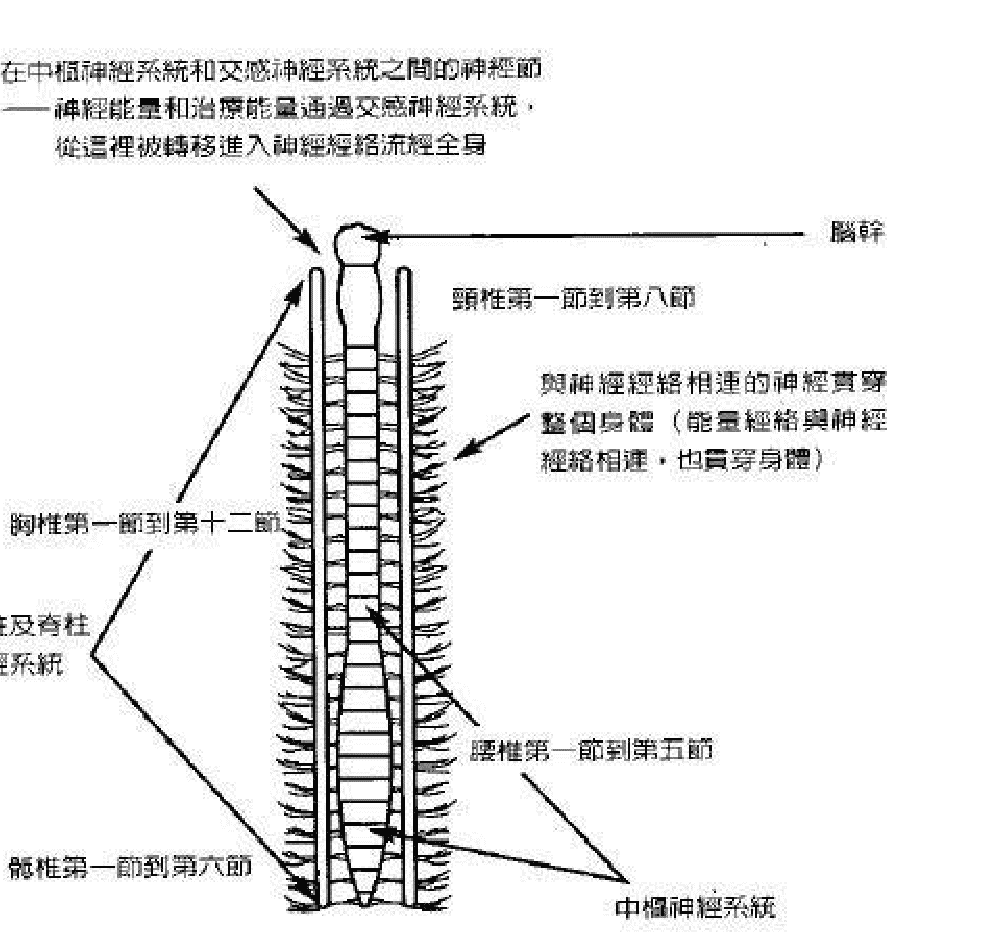

图 5.1 脊柱、中枢神经系统、交感神经系统，以及治疗能量与神经能量

神经经络贯穿全身，这些经络的一些末端可以在脚趾尖和手指尖上找到。这些经络包含一种「神经能量」，它们在身体中运作，具有治疗作用。这些能量帮助你保持健康，并让生命活力流通于你的整个身体。

脊柱含有所有这些神经能量，并将它释放进人体的神经系统中，包括从脊柱分叉出去的所有神经经络。脊柱本身由贯穿中心的中枢神经系统所组成，脉冲和信号通过中枢神经系统从头到脚上下流动。

沿着中枢神经系统的两侧，是交感神经系统，副交感神经系统也在这里，也在这两根主干中（参见图 5.1）。

神经能量由中枢神经系统释放进神经节，而神经节是神经的集合处，这些神经节位于中枢神经系统和交感神经系统之间的脊柱上。在这些神经节和交感神经系统中所包含的是另一种能量，一种具有高频振动的治疗能量。这种能量是神圣能量或宇宙能量的一部分，它存在于你的周围，也存在于天界。它常常被称作气(chi)或普拉纳(prana)。每个人的内在都有这种特殊的治疗能量。

在某种程度上，它是你内在的神的一部分。当这种能量被释放时，它具有神奇的治愈作用。

能量经络存在于身体之中，和神经经络一样，贯穿整个身体。这些经络线始于两侧的交感神经系统，并向外延伸到全身到达手指和脚趾末端。在某些情形中，神经经络和能量经络连接在一起，但在许多情形中，这两种经络彼此极为接近。中国古代的针灸术就是基于这个前提。

这将我们带到下一个话题。指尖是治疗能量得以向外释放的部位，所有指尖都含有神经能量和治疗能量。手掌也拥有这两种能量，手脉轮或手掌脉轮就位于这里，可以将指尖以特殊方式用于治疗目的。手和它们各自的脉轮或能量中心共同工作，再加上手指的治疗点，为强有力的治疗机会创造了潜力。

一种称作开放掌轮法的特别练习在《古代神秘学院入门书》中有描述。你们有些人可能已经尝试过这种方法，并发现你能打开手掌上的脉轮，结果就是你能在手掌上感到某种温暖和脉动的能量。对于没有尝试过这个练习的人来说，你可以考虑尝试一下书中所描述的这种方法。

位于指尖的神经经络和能量经络末端

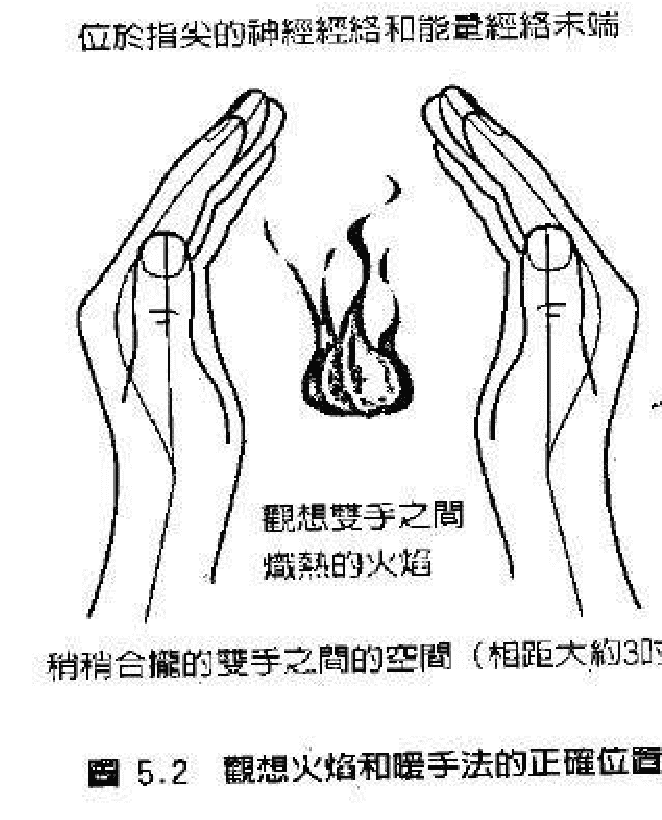

稍稍合拢的双手之间的空间（相距大约3吋）

图 5.2 观想火焰和暖手法的正确位置

你们中有许多人已经灵性觉醒，并投身于治疗领域，这些人的手脉轮或手位掌脉轮可能已经相当开放。这意味着你能很快让自己的手掌变热并将手掌脉轮向外打开，这能让更多自然的治疗能量从你的手掌流出，并进入患者或案主的体内。

有一个扩展练习，可以用来进一步打开手脉轮，并让额外的治疗能量进入手和脚。在治疗别人之前，需要运用这个预备练习。

## 观想火焰暖手法

一开始先做第一章中的心轮呼吸法。在完成呼吸练习后，让自己放松片刻。尝试让你的心智也放松。现在，将双手掌心相对，相距大约三英寸。当你双手相对时，可以将双手保持在大约位于腰部的位置，或者把双手放在大腿中间。站着或坐着都可以做这个练习，两只手应该稍稍合拢，但要彼此分开。

开始专注于你的双手。你可以张开眼睛，也可以闭上，这由你自己决定。当你专注于双手时，让热量，血液和能量从你的双臂流向双手。想象这股温暖的能量流，由你的双臂像热水一样向下流，花一些时间做这个观想(参阅图 5.2)。

然后，将你的注意力再次从双臂移向双手。全神贯注于你的双手，特别是手掌部位。当你继续全神贯注于你的双手时，让你的呼吸保持正常。如果你天生就是一个治疗师，就会注意到自己的手掌快速变暖，随后这种温暖开始从手掌扩展至双手的其余部位，包括每一根手指。可能有一些人仍然无法如自己所愿的快速感受到这种感觉。不要担心；你练习得愈多，就会变得愈容易。

暖手法接下来的部分非常重要，因为几乎每一个人都会注意到结果。现在，让你的意念稍稍分神，然后想象自己在一个温暖的夏夜，坐在一堆营火前。如果需要，你可以回忆以前与此相似的情景。这会帮助你想起当时的感受，并让你创造出想要的效果。

当你坐在营火前，通过想象或回忆，你看见自己将双手伸向非常温暖的营火。当你将双手靠近摇曳的营火时，感觉手掌和双手的其它地方变得愈来愈温暖。想象自己伸出双手，注意营火各种各样的颜色。

你看见红、橙、蓝、白的火焰在跃动，接着，你开始看见和感觉这些颜色混合成只剩下一种颜色——白色。感觉、看见或想象白光变成一团非常炽热的白色火焰，想象这团白色火焰继续在你的手掌之间燃烧。全神贯注于这股炽热的白色能量，直到它向外脉动，几乎就要触及你的手掌。你的双手会开始出汗，变得非常温暖，甚至开始脉动或感到刺痛。让这些脉动感、刺痛感或温暖的感觉持续一会儿，直到你觉得足够了为止。

这时，回到正常意识，并将你的双手移开，放回身体两侧。在完成观想火焰暖手法之后的一段时间之内，你双手的大部分部位会继续感到温暖。如果你的双手血液循环不畅，或者一直感觉冰冷，那么这个练习会有所帮助。增进的血液循环、神经能量和治疗能量，会更容易、更快速地导向你的双手。

当你做完了暖手法，你现在就准备好进行治疗了。显然，当你实行这种特殊疗法时！你的案主也会从这个过程中受益，他们会注意到你双手的温暖和能量会明显增加。

当你把暖手法作为自己养生的一部分时，它就会成为你的第二天性。如果你还没有让双手变暖或给双手「充电」的能力，那么你也会很快培养出这种能力。很多适合于运用能量和冥想进行治疗的人，几乎能立即完成给双手的充电，具有天赋的治疗师就是这种例子，这是每一个人努力的目标。当你能将这种治疗能量或者气，吸进你的双手并启动这些能量中心时，你就可以将更多的宇宙能量带入你的全身，这对对你自己的健康也是有益的。

需要注意的是，并不是所有人的手和脚之内都存在温暖的能量。有些人的双手会感觉冰冷，或者他们手上的能量是冷的，这并不一定就意味着这些人缺乏治疗天赋。有些人在他人身上进行治疗时，只是用一种更凉爽，温和的能量在治疗。

我会详加解释以下古老的治疗方法，它们可以丰富你自己的治疗方法。

在并不遥远的将来，医学和整个社会都将完全认识到古老的治疗体系的价值。身，心、灵必须加以全盘考虑，幸运的是，愈来愈多的人开始认识到这一点，甚至主流科学也开始探索这个十分重要的观念。

当这些疗法得以利用时，与癌症、关节炎、忧郁症以及许多其它与人体失调有关的痛苦，就可以减轻或减少。我们应该利用所有我们可以利用的选项，来保持或恢复人类的健康。当你或你认识的人处于病痛的困境中时，当代医药和补充疗法都应该加以考虑。

## 强化眼力疗法

这个特殊的疗法做起来十分容易，在以下情形中都可以运用、如果你的眼睛感到紧张和疼痛、你可以将治疗能量传送到眼睛，使症状得以缓解，让眼睛恢复活力。如果需要的话，视神经可以获得能量。如果你的眼部肌肉很虚弱，并感到紧张，那么治疗能量就可以帮助它们恢复生机。最后，有轻微视力问题的人如果视力正在持续减退，那么这个独特的疗法就可以减缓通常与衰老相关的视力衰退。

强化眼力疗法的益处在大多数情况下会是暂时性的。不过某些时候，做这个疗法的益处能够维持很长时间。在三到四天时间内尝试几次这种疗法，似乎可以强化正面的效果。

先做刚才描述的观想火焰暖手法，或者《古代神秘学院入门书》中的掌心脉轮开启法。这可以确保你的双手、手指充满能量并准备传送治疗能量。

在完成两种方法中的任何一种之后，再深吸一口气，屏息数秒钟，然后呼气。现在你准备好了。双手的拇指尖、食指尖和中指尖拥有最强大的能量和神经经络末端。有些人会感觉到双手的手指尖有刺痛感或脉动感，这表明极大的治疗能量和神经能量正要从指尖释放出去。如果你没有这么强烈的感觉，也不用担心，多加练习，你还是会成功的。

现在，闭上双眼。把你右手的拇指、食指和中指对着你的右眼。轻柔而有力地将拇指、食指和中指放在闭着的眼睑上。如果你眼睛的某个部位特别疼痛或疲倦，你可以直接将手指放在疼痛部位，你可以躺着或坐着做这个疗法。

接下来，用左手做同样的动作。将左手拇指、食指和中指放在左眼睑上。

同样地，注意左眼是否有疼痛的部位，将拇指或指尖放在相应的部位。当你将双手放在你所希望的位置，用手指在眼睑上施加非常轻微的压力。不要过于用力，能够感觉手指舒适地放在眼睛上就足够了。让双手保持这样的姿势，再次深吸一口气。几秒钟后，从你的鼻子和嘴巴慢慢吐气。

现在，开始全神专注在你的眼睑上。注意来自于你指尖的温暖和轻微的压力。当你继续这样做时，你就会开始感到更多来自于指尖的温暖，随后会有脉动或刺痛感。放松并继续专注在你的眼睛上。很快地你就会感觉到刺痛感变得更加强烈。这时，刺痛感或脉动感会开始从指尖移入眼睑。这种刺痛感会继续进入眼睛，甚至进入眼球后面的视神经，这就是从手和指尖传入眼睛和周围部位的治疗能量和神经能量，甚至眼球肌肉也会开始接收到这种能量。这种治疗能量也是宇宙能量或神圣能量的一种形式，这种能量遍布我们的周围，它从天界流出，向下振动进入我们的物质世界。

让这种能量流持续大约五分钟。当神经能量和治疗能量在眼睛中运作，这些部位的疲劳、不适和疼痛就会开始消失。你的眼睛很快就会感觉好多了，你的双眼甚至会有一种温暖、愉悦的感觉。大约五分钟之后，你会出于一个非常简单的理由而停止强化眼力疗法。一你把治疗能量输送给你身体的这个部位，它现在已经尽其所能地接收到了能量。

以下这个比喻会有助于你理解。把双眼想象成是两个空杯子，你有一只装满水或液体的瓶子，液体代表治疗能量和神经能量。当你把水倒进杯子，它们会很快地开始倒满，等到杯子完全倒满，你就不再倒水。显然，这是因为杯子无法容纳更多的液体或能量。眼睛或者你身体的任何其它器官或部分，只能吸收这么多的能量。一旦达到饱和度，在一段时间内，这些部位就无法流入更多的能量。

当进行这种特殊的眼睛强化疗法时，一般五分钟后能量就会饱和。当能量到达这种饱和程度时，很多人都会意识到，你的直觉会告诉你该停下来。

当你完成这个疗法时，将双手从你的眼睛上移开。如果你是坐着，就把双手舒适地放在大腿上，如果你是站着，就把双手下垂在身体两侧。做数次放松的深呼吸，然后做你原本该做的事。

在第一次完成强化眼力疗法之后，在一面镜子前注视你的眼睛。如果你成功地将这些能量引入你的眼睛，你就会注意到眼球看上去更清澈、更明亮，眼睛里甚至会闪烁着光芒，这就表明这个疗法是有效的。

如果有需要，你可根据眼睛不舒服的严重程度重复做这个疗法。如果你的眼睛只是疼痛；那么做一次，甚至第二天再做一次就已经足够了。但是，如果你的眼睛感觉疼痛，你的视力似乎很糟糕，那么每天做一次，连续做七天，这样会对你有帮助。过后，你会注意到你的视力似乎提高了，眼睛感觉更舒适了。当然，在你尝试时，仍然要自己作出判断。当你感觉自己需要时，就重复做这个疗法。

这个疗法还有一个变化，你也可以试一下，它可以代替刚才描述的强化眼力疗法，或者两种方法交替做。

宇宙能量有正极和负极之分。根据磁性法则或电子法则，存在着两种不同的极性，正极和负极。宇宙按照相同的法则运作。一些中国哲学就是基于同样的前提，例如，阴和阳是两种共同运作与平衡万物的元素。

人体也不例外。每一个人的体内都存在着正极能量和负极能量。这两种不同的能量或元素合成为一种完整的能量——被称作宇宙能量、气或生命活力。

在《古代神秘学院入门书》的三的法则或三角法则中讨论过。

在天界和世间，需要这两种元素来彰显宇宙能量。如前所述，这种能量无处不在，它在空中，在树木中，在水中。作为人类，我们同时需要男性和女性法则的存在。对于生命的彰显，两者都是必不可少的。为了平衡和创造，就需要两种相对的事物，这是一个例子。

对于许多人来说，身体的右半边会包含更多的正极能量。你身体的左半边会包含更多的负极能量。你的双手也是如此。这几乎就像包含正极和负极的汽车电池一样。大多数人都是如此。大约百分之九十九的人右半边具有正极能量或极性，左半边具有负极能量或极性。也会有个别例外。

这将我们带到下一个问题。在强化眼力疗法中，你将右手指尖放在右眼睑上，然后以相同的方式将左手指尖放在左眼睑上。这意味着包含更多正极极性的右手，将治疗能量和神经能量传送到也包含更多正极极性的右眼。同样地，你含有更多负极能量的左手，会将治疗能量和神经系统能量引导至同样更具负极极性的左眼。

根据磁性法则和电子法则，正极吸引负极，反之亦然。这就是异性相吸。这说明，如果正极能量允许流向负极能量，负极能量允许流向正极能量，那么，包含两种不同极性的宇宙治疗能量就会很好地流动。

虽然如此，但你刚刚尝试的这种强化眼力疗法依然会非常有效，所需的治疗能量和神经能量会畅通无碍的流入双眼。

然而，如果你尝试以下方法，你可能会发现效果更好、更快。这次，当你做强化眼力疗法时，改为将右手指尖放在左眼睑上，将指尖放在前述相同的位置。然后，将左手放在右眼睑上，用这种替代法，你就会注意到，你手上和指尖的刺痛感或脉动感效果更好，有更多的能量更快的流入双眼。

强化眼力疗法和稍作修改的版本都教给你了，所以你就可以用这两种方法来做试验。两种方法都试一试，然后再决定哪一种更适合你。哪一种方法更有效，这由你自己决定。

## 去头痛疗法：第一阶段

本书中所包含的许多技巧和方法，都有助于你在治疗方面更具天赋。可以先练习观想火焰暖手法，再练习强化眼力疗法，然后练习去头痛疗法。

去头痛疗法的第一阶段，是将指尖置于人体的主要治疗点上，这些治疗点沿着脊柱两侧从上而下排列。

如果你参阅前面的图5.1，你会注意到脊柱有四个部分，它们由颈（颈部）、胸（上背部）、腰（中低背部）、能（臀部）所组成。

去头痛疗法第一阶段专注于颈部。在头部有八节脊椎，它们依次被称作 C1 到 C8。C1 是颈椎的第一节，位于后颅下的脑干处，C8 是头部与背部连接处的最下面一节颈椎。

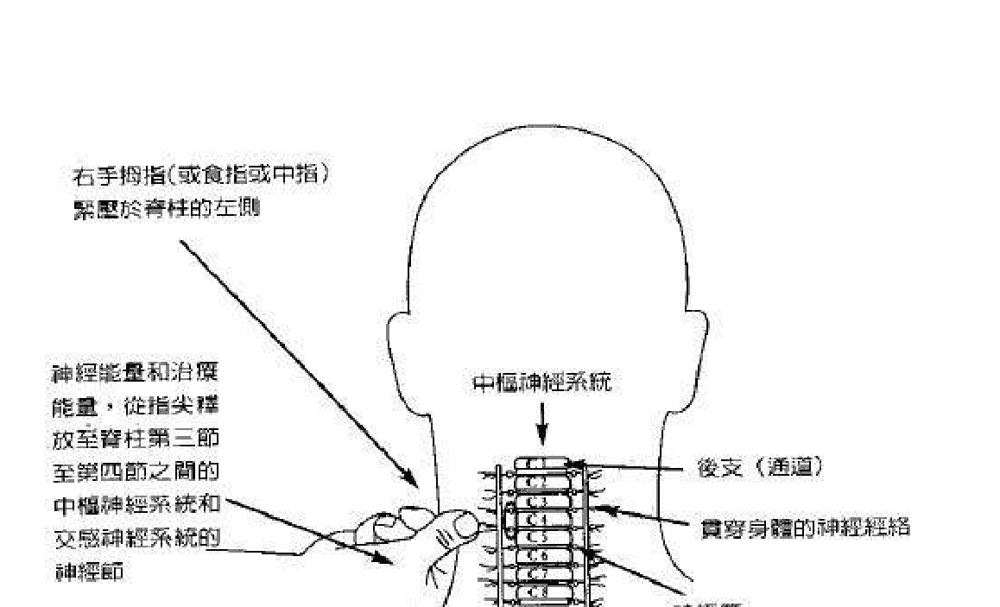

图 5.3 祛头痛疗法的治疗点和正确的手法：第一阶段。请注意，右手大拇指、食指或中指都可以使用

中枢神经系统沿着颈部的脊柱中间直接向下延伸，沿着中枢神经系统的两侧是自主神经系统，它们由交感神经系统和副交感神经系统组成。

在副交感神经系统和中枢神经系统之间是一连串的神经节，它们垂直排列于脊柱的两侧，从头颅底部一直延伸至尾骨。每一节神经节都是神经的汇集地，这些神经节是身体的特殊治疗点。

中枢神经系统由一系列称为支的信道与交感神经系统相连，一条单独的通道称作一条后支，这些信道从中枢神经系统向外延伸，并与交感神经系统和副交感神经系统相连。每个神经节（神经汇集地）就位于每一个通道或后支中间，这些神经节可以视为每条通道的中心点。

在你尝试去头痛疗法第一阶段之前，应该让你的案主做好准备。有两种准备方法。他可以坐在一张低背椅上，或俯卧在一张按摩床或灵气治疗床上。如果在治疗期间使用治疗床，那么治疗对象的脸应舒适地固定在脸洞中，这样能确保你畅通无阻地触及案主的颈部区域。用低背椅的原因也是如此。

接下来…让你的案主做几次深呼吸，二到三次深呼吸应该就够了。这可以让治疗对象稍稍放松，并将一些气或宇宙能量吸进体内。然后、你和治疗对象一起做一次深呼吸。一起屏息大约三秒钟…然后你们俩同时缓慢而均匀地从鼻孔中呼气。通过一起做呼吸练习，你们能让自己的身体与对方变得相互协调。

现在，将你包含更多正极能量的右手握成拳头。拳头应轻握，不要握紧，让你的拇指与其余手指分开，直到形成「翘大拇指」的位置。

将你的右手移至对方的后颈部，直到它处于颈部皮肤的上方而不触及皮肤表面。看着颈部，从颅骨底部向下到与背部相接的颈部的下半部分。以此作为参考，找到头部的正中间或正中央。

你现在正看着的这个区域，大致就是以脊椎骨所在的位置。将你的拇指轻柔而坚定地按在颈部中心的位置上。你的拇指现在应该是按在颈部的正中央。你也许会在这里摸到轻微的凸起或隆起，这就是脊椎骨。小心而缓慢地将拇指从颈部中央向上移动大约一时，你现在应该正好按在脊椎骨上。同样地，你的拇指尖下会感觉到脊骨，不要在这里按压。当触及脊椎骨时，始终要小心，尤其是颈部区域的脊椎骨。

从这个点出发，将你的右拇指和右手轻轻移动到脊椎左侧。移动应该只是一时的距离！这会确保你的拇指从凸起的脊骨上移开，来到它旁边的地方。如果你做得正确的话，你的拇指应该位于——中枢神经系统，和由交感神经系统与副交感神经系统所组成的——自主神经系统之间的一节神经节和神经后支上。如有必要，请参阅图5.3。

请记住你将右手移动到你的案主脊骨的左侧的原因，这是基于在强化眼力疗法解释过的磁性法则。你的右手包含气或宇宙能量的更多正极元素。你案主的脊骨和身体的左侧更倾向于具有负极能量，这是一个治疗触点，如果你的手移得太靠左，你就会直接按在左交感神经系统上。你能凭触觉知道这一点，摸起来硬硬的，就像是坚硬的肌肉。如果是这样，那就将右手拇指向脊骨移回一时。不要把拇指按在脊骨上，而是按在它的旁边，这是最为理想的位置。这样练习几次，你就会很容易找到这个治疗点。同样地，你也能学会找到位于脊骨上下的其它治疗点。

一旦你将拇指按在正确的治疗点上，就让它停留在那里、将你的拇指在皮肤表面稍稍用力下压。不要太用力，用力下压到能感觉到表面之下有什么就行了。继续将拇指按在这个位置大约五分钟。这样做时，你会开始在拇指下感觉到轻微的脉动。这就是你自己体内包含的治疗能量和神经能量，开始与你的案主内在的能量相融合的一个现象。当你持续将拇指和手按在脊椎旁的治疗点时，这种脉动感就会变得愈来愈强烈。

让这种脉动感继续保持，专注于它。作为治疗师，你很可能会开始注意到，你的拇指和指尖也开始有脉动感和刺痛感，这是治疗正在起作用的一个非常好的征兆。

你右手的神经能量和治疗能量，会开始强烈而均匀地从拇指流入你案主的颈部治疗点。甚至你右手的其它手指，特别是食指和中指也会有刺痛感或脉动感。实际上，当你继续将治疗能量和神经能量导入你的案主时，你的整只手会像心跳一样开始脉动，这表明惊人数量的治疗能量正在通过你释放出去。

这种宇宙能量——包含神经能量，会开始向上流向后脑，进入头皮下的肌肉，最终来到前额。这时，在大多数情形中，肌肉就会开始放松，让不适的紧张感释放，痛苦得以缓解。在治疗期间，问你的案主感觉如何，特别注意他们告诉你的事。

如果你的案主是一个「天生能量敏感者」，这种去头痛疗法对他会有极大的帮助，案主会感到能量非常快速且毫不费力地流入治疗部位，另一方面，你偶尔会遇上一个「部分关闭」的治疗对象。在这种情形中，这个人会几乎或根本感觉不到有能量进入他的体内，因为他还没有学会体验自己的气或其中所含的生命力。

不要担心这种情形。这并不是你的错。为了开始感觉他们自己的身体和生命活力，你的案主或治疗对象必须找到释放他们情感和生理障碍的方法。像太极或瑜伽这样的养生法，会有助于这些人释放障碍、开启他们自己内在和周围的神圣能量。

在大多数情况下，这种去头痛疗法的第一阶段对大多数人都有用。

前面提到，在脊骨的上方和下方也有治疗点。很显然，靠近 C3 的治疗触点只是你能用以帮助案主的许多治疗点之一。脊骨的每一个部位，都分别对应着身体不同的器官、腺体和组织。例如，如果一个人的眼睛或耳朵有问题，同样可以用这种方法治疗。

在这种情形中，将你的拇指保持在脊椎的左侧，稍稍向下移，来到颈部的正中。同样地，位置就在 C4 脊椎旁，轻轻按下并让拇指在这里停留数秒钟。

向你的案主确认，问他有什么感觉。能量有可能没有流到你想要它去的地方。你的治疗对象可能会感到能量改为在喉部运作，如果是这样，将你的拇指稍稍向上或向下移。随意试验将你的右手拇指在颈部的这些区域移动，当你尝试这些不同的治疗触点时，持续问你的治疗对象有什么感觉，这一开始需要数次尝试，但你最终会找到与眼睛或耳朵相应的正确触点。

这种方法同样可以用于脊柱和身体的其它部位。如果案主的胃有问题，你可以相应地将右手向下移，于是你将拇指按在胸部脊骨的左侧。如果需要，让你的案主侧转身躺一会儿。看着胃部区域；然后将视线从这个部位移过肋骨来到背部。让他回到俯卧的姿势，将脸置于床上的脸洞中，然后，你应该把你的右手拇指按在位于该脊椎左侧的神经节上。你的治疗对象应该能通过提供反馈来协助你。当然，如果你的治疗对象坐在一把低椅背上时，想要做这种治疗就不行了。始终要确保治疗对象以舒适的姿势将脸向下俯卧。

要记住，从正面或侧面察看时，身体的器官和腺体与存在于脊骨上下的治疗触点是相应的。如果你从心脏所在的位置画一条直线，一直画到背部，那你就会得到一个治疗触点所在的大概位置。这个方针能让你大致知道，你应该将右手拇指按在脊椎的哪个部位。

在进行治疗时，大多数人会用右手拇指的指尖。但是，你也能以同样的手势用右手食指和中指，这样的话，只要把双手指尖同时按在适当的治疗点或者神经节上，这种手势和拇指法同样有效。你可以自行选择，用你觉得更舒适的方法。

## 交感神经系统的作用

以下内容会解释，交感神经系统和中枢神经系统如何在这个古老的治疗过程中发挥重要的作用。如前所述，治疗能量和神经能量会进入神经节，来到神经通道，并进入交感神经系统运作。当这些能量进入交感神经系统时，它们就会开始发生一些变化。

与治疗能量，气或生命活力相关的振动频率或速率极高，今天的任何科学仪器都无法真正测量到它。这种与天界相连的能量高频振动，需要降低到与肉身和天然神经能量更「同频」的频率。

迄今为止，医学还没有认识到交感神经系统的真正价值。实际上，交感神经系统是与围绕我们周围、源自造物主或神圣源头的神圣能量或宇宙能量相共感。它的重要功能之一与气或宇宙能量的接收和消化有关，这是借着以下方式完成这过程，我们先来想象一下电子场。

在电子场中，存在着被称作降压器的设置，它们负责将一个层次的振动速率或频率降低到另一个层次。同样的观念在《古代神秘学院入门书》一书中，谈及松果体和脑下垂体时也提到过。交感神经系统具有接收这种极高振动频率的能量，并将它减低到完全与人体腺体、器官、组织和细胞相协调的振动频率的能力。

神圣能量能够通过两种方法进入交感神经系统。第一种方法与人体气场有关，第二种方法当然就是这种触摸点治疗法。

你的能量场或气场，对于日常生活中围绕在你周围的各种各样的能量、心灵印象、情感和感觉非常敏感，它尤其对宇宙能量非常敏感，这种能量能进入你的气场和脉轮，然后被吸收进交感神经系统。交感神经与人体气场和脉轮系统极其同频。当它进入交感神经系统时，它就会「降低」到一种更低的频率，然后从这里释放，进入存在于整个身体的神经经络。你的案主的神经能量和你的神经能量会汇合在一起，并与这种宇宙能量相结合，向外流入身体。

藉由共同运作，你和你的案主会成功地让治疗开展。如前所述，你将右手拇指按在这个点上大约五分钟，一旦达到能量饱和，你就应该轻轻移开；接着，从你的治疗对象身边后退三呎，这会确保你已离开他的气场。

## 去头痛疗法：第二阶段

去头痛疗法的下一个阶段涉及到双手的运用。在这个阶段，治疗对象可以舒适地坐在一张低椅背上接受治疗。当然，你也可以让你的案主仰卧在按摩床上。不过，当治疗对象躺下时，你无法触及他的整个头部，但你仍然可以以有限的方式在头部区域进行治疗。

第二阶段可以在完成第一阶段的去头痛疗法之后立即进行，如果你愿意，它也可以作为一种主要疗法而单独使用。根据实际情形，你可能会发现，两个阶段的疗法一起运用，有益于你大多数的案主。在某些情形中，这个治疗阶段会是需要采取的最佳方案。此时，用你自己的常识和直觉来作出判断。

首先，回到你的案主的气场，如果你的案主坐着，那就从他的背后走近他，将你已经变暖的双手置于头顶顶轮上方大约两吋处，然后将双手缓慢向下移到头部两侧的耳朵上方。请记住，双手不要触及头部表面。如果案主躺着，那就走到按摩床的床头，以相同方式将你的双手置于头部上方，然后轻轻将手移至头部两侧。深吸一口气，屏息大约三秒钟，然后均匀地从鼻孔呼气，并恢复正常呼吸，让你的双手在这个位置停留一会儿。与此同时，开始专注在双手的手掌上，你的手掌会开始感到温暖、凉爽甚至有刺痛感，这是正常的，也是预料之中的。

我们已经讨论过从双手送出治疗能量和神经能量的方法。作为一个初学者和灵性觉醒者，你会很清楚，人的双手可以传送和接收能量。许多熟练的治疗师会从一只手送出或引导能量，同时，用另一只手接收或吸回能量。大多数人会用右手发出能量，而用左手接收能量。不过，有些治疗师会反其道而行，用左手送出或引导能量，让右手接收能量。两种方法都可以，这样做并没有对错之分。

在这里，值得一提并需要了解的是，接收能量的手会吸进或接收不具治疗性的能量。虽然这只手有潜能接收到治疗能量，但在多数情况下，它会吸进负的、不健康的能量或振动。

当你双手手掌开始都有感觉时；让自己专注在其中一只手上。为了简单起见，我们以右手为例。继续专注在你的右手上，让治疗能量或宇宙能量流经双手手掌、手指。尽管你的双手置于头部上方，但这种能量还是会在你的右手附近所在的部位运作。

当你这样做时，应该与你的案主确认疼痛的地方在哪里，在整个治疗过程中，每隔一段时间就应该要确认一下。

当你用右手传送能量时，将你的部分注意力转移到另一只手上，想象你自己将负能量和其它感觉拉向左手。把它想成是一块磁铁或吸尘器，将案主头部所有的疼痛都吸进你的手指和手掌。当然，在这里，负能量指的是不健康的振动，与电子中的负极性类似。很快地，你就会开始有刺痛感甚至某种奇怪的温暖感进入你的手中。在极少数的情形中，你甚至会感到清凉的能量。让这种由痛苦、愤怒、紧张组成的负能量，继续缓慢地经过手腕，移向前臂，感觉这种感受在手臂中运作。

现在，再一次专注在你的右手或传送能量的那只手。当宇宙治疗能量连同一些神经能量一起流向手掌、手指时，注意手开始脉动。让你自己引导这股特别的能量流向治疗对象的疼痛区域。当你在运用这种疗法时，治疗能量实际上会直接流到它想去的区域。这时，更多不健康的能量或振动，会被推向接收能量的那只手。

这时，你会感到刺痛感或不适感向上移向手臂，直到它们来到肘部。一旦负极能量来到这个部位，你就要将你的左手或接收能量的那只手从治疗对象的气场移开，这一点很重要。然后，将你的右手也从对方的气场移开。从治疗对象身旁后退大约三到四呎，直到你离开他的能量场。

一旦你离开他的气场，你就甩动双手，特别是你的左手或接收能量的那只手。想象自己是在将双手上的水甩干，你就知道该怎么甩手了。然后，用右手将你的左臂和左手上任何残余的负能量挥去，再好好地重复做一次。接下来，让你的左手同样甩一下你的右臂和右手。

深吸一口气，屏息数秒钟，然后走回你的案主的能量场中。将你的双手置于刚才的位置，然后将右手或接收能量的那只手靠近原来的疼痛部位。

当你这样做时，疼痛区域会变小，并开始移向左手或接收能量的那只手。让这只手靠近疼痛部位，直到距离几吋远。你的双手现在应该相互靠得更近，且位于负能量或疼痛所在的区域附近。

一开始，当你开始治疗你的案主时，他可能会感到非常不安。例如，疼痛会位于前额。一段时间后，这个疼痛区域会变得更小，并移向前额的左侧，更靠近左手或接收能量的那只手。当然，如果你左右手互换，那么在相反的方向会发生相同情形。

让治疗能量从你的右手流进疼痛区域，这个区域会变得更小、更局部性。感觉进入头部的能量。与此同时，聆听你的直觉，你会感觉到要移动或替换你放在疼痛部位上的右手或左手。也许你会在心中看到双手应该如何放置。注意你的直觉，让它引导你，你也许发现自己会单手或双手替换好几次，这是正常的现象。

像前面一样，将你的部分注意力专注在你的左手上，并感觉到刺痛的热度或负能量流向这只手，就像吸尘器吸尘一样。让它向上移到手和前臂，直到它来到肘部。

同样的，再次将你的左手或接收能量的那只手从治疗对象那里移开，然后移开你的右手，后退并离开气场，重复刚才描述的甩手法和挥手法。记住，接下来深吸一口气，屏息数秒钟，然后，回到案主顶轮附近的气场，继续进行去头痛疗法。

你会发现，必须视情况重复这道手续几次。如果治疗对象非常易于接收任何类型的能量运作，包括灵气，他很可能会让疼痛和负面振动很快地从头部和气场移开，这是他在意识或潜意识层次上进行的。在这种情形中，你只需将这治疗程序做二到三次。不过，如果你的案主不太易于接受治疗能量，你就需要多做几次。此外，这个人疼痛的程度也会影响治疗的次数。无论如何，在治疗过程中，运用你的直觉做出判断。

最后，你的左手或接收能量的那只手，吸入的疼痛或负面的、不健康的能量会减少。不久，你这只手的手指、手掌会感到很少或没有刺痛感和负面性，这是表示治疗即将完成。

通常，这种去头痛疗法的治疗时间，从十分钟到四十五分钟不等，如果超过四十五分钟的话，效果也不会更好。

在前面的强化眼力疗法里，提到过人对治疗能量的吸收有其饱和度。一旦人体的一部分接收到一定量的宇宙能量或神圣能量，它就会变得充满或饱满，并且无法再接收更多能量。请记住空杯子倒满水的比喻，这是相同的道理。

有时，如果你的案主对能量非常敏感，他们就会觉察到这点，从你的右手或送出能量的手流出的治疗能量会减少。想象完全打开、让水流出的水龙头，当水龙头逐渐关上，水流就会逐渐减小。这涉及宇宙的神圣智能。并且，你的案主的更高自我也会影响治疗的过程。

一旦你已经完成治疗，最后从治疗对象的气场往后退，不要忘记做甩手法和挥手法。让你的案主坐或躺在那里几分钟，直到他准备好起来。当你的案主离开后，马上用温水和肥皂彻底清洗你的双手，确定要洗到你的肘部。

最后还要做一件事。你可以坐着或站着，专注在你的前臂和双手。想象或感觉你自己将白光和治疗能量传向你的前臂和双手。用白光让任何可能留在你双手附近的气场中残留的负面振动离开。感觉白光从你的双手和前臂向外扩展。现在，深吸一口气，屏息大约三秒钟，然后缓慢吐出，并恢复正常呼吸。

如果你是一个治疗师、谘商师或教师，依照刚才所描述的清除和净化程序就很重要。去头痛疗法是有意把负能量吸入你的气场的一种方法。不注意的话，你也会从别人那里吸进负面振动和「不好的能量」。

如果这种不健康的能量被过多吸入你的气场，并且在那里待太久的话，它就会在脉轮中运作，进入神经系统并最终进入你的身体，结果你可能会着凉、感冒或有疲倦感。这就是在做这种去头痛疗法时，你不应让刺痛感、热量或不愉快的感觉通过肘部的原因。

一般说来，你也可能有不舒服的感觉，诸如愤怒、担心或害怕。如果是这样，那就说明你从你的一些案主那里接收到了负面情感。你们中有些人可能经常遇到这种情形，这样的话，就需要开始有规律地练习这些清除和净化法。

去头痛疗法可以扩展并用于身体的任何部分。例如，如果你的案主背部疼痛，你可以以相似的方法运用双手来治疗。

作为一个已入门的和灵性觉醒的治疗师或谘商师，你会对他人和他们的气场非常敏感。你也能完全觉知到存在你周围的更高频振动或宇宙能量，这让你能够在这个世界工作，并依然保持与天使和天界的灵性连结。

> 「你的内心有多开敞并有多少爱，你对能量的感受就有多少……」
——摘自欧林《个人觉醒的力量》

## 第六章，进阶能量治疗技巧

> 「我们拥有最棒的经验是神秘，这是一种存在于真正艺术与科学的源起处最重要的感觉。」
——爱因斯坦
摘自《爱因斯坦，他的一生与时代》

在本章会详述与宇宙能量、你自身自然的疗愈能量，与人体脉轮系统互动的进阶的能量治疗技巧。藉由遵循这些特殊的技巧，你会提高许多已发展的能力，你亦可将这所有的技巧融合在你自己的治疗方式里。

## 开启第三眼的技巧

这个特别的技巧是设计来协助你轻松、快速的开启你的第三眼脉轮。身为一个灵性觉醒的人，你会熟悉脉轮并擅长与自己的脉轮或能量中心运作。
一开始，深深的吸一口气，屏息五秒钟后再慢慢吐气。接着，举起你一只手的中指与食指，用两个指头碰触你的前额，轻轻的压着。如果你是右撇子，则用右手；左撇子则用左手，两只手指着前额几秒钟，然后把手拿开，放回膝上或身边。

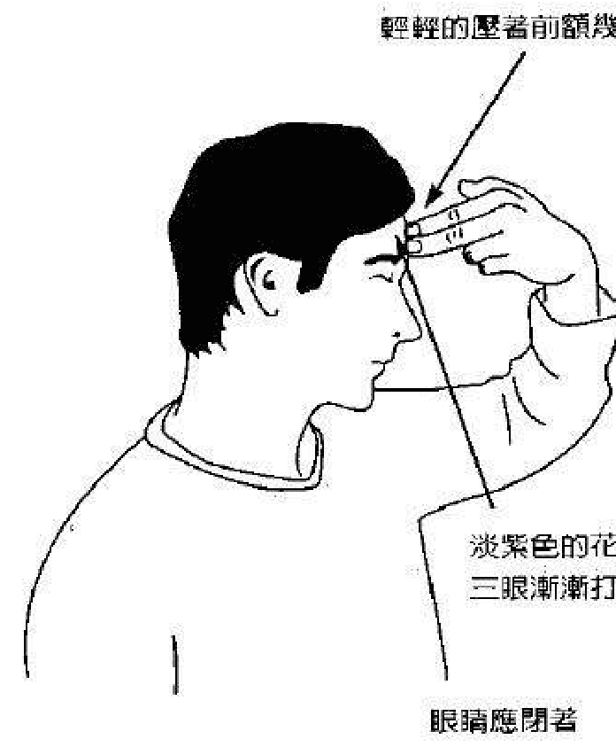

当你进行这个练习的时候，开始集中注意力在你的前额或第三眼处，继续感觉或想象你的手指在此处轻微的压力，这压力应涵盖着直径两吋的范围，让这样的感觉在第三眼处扩展开来，直到这范围的两倍大。

现在，将注意力放在内在，让这股压力或感觉移到前额表皮下方一吋的位置上。感觉这个在前额内部的感觉增强。集中心智在这前额内一吋的位置上，直到你在此处感觉一阵温和的脉动与温暖，此时，你可以使用在《古代神秘学院入门书》一书中温暖花开法的延伸技巧。

观想或想像一朵美丽的淡紫色的花朵，在第三眼处含苞合紧，在你的脑海中，看见或感觉这朵花的花瓣慢慢打开，就像一朵花向着温暖的太阳光打开。

看着并感觉这些花瓣打开，横跨第三眼，享受着太阳的温暖在前额展开，同时这些花瓣层层开启。然后，开始想着温暖、抚慰人心的水，从第三眼向外扩展，同时，观想淡紫色的花瓣也在打开。继续这样的观想，直到花朵在前额的两个太阳穴之间整个完全绽放，让太阳与水的温暖流过这里。

现在享受一下这份温暖的感觉，你可能会感觉到一阵脉动或刺痒的感觉在前额展开，并深入前额内部，这表示脑下半部里的松果体已受到影响，此腺体开始轻微振动，并受启动。如前面所述，松果体一旦被驱动了，最后会影响到第三眼，能量中心会被启动并打开，这让你的直觉力和创造力快速开启，甚至大为增加。

试着多做第三眼开启练习，直到熟练为止，有些读者第一次进行这练习时，就能感受到并察觉到确实的结果，这是因为你们对能量非常敏感。对大多数读者而言，要多做几次才能达到最大效果。之后，以一种快速和深入的方式打开第三眼，则成为你的第二种本能。

有些读者练习很多次才会获得一些结果，会发生这种情况是当你有轻微障碍，对身体和自然的能量不是那么敏感。当你有情绪与身体上的问题时，会出现「障碍」（能量上的阻滞），使能量无法流进并流通全身，它会发生在表意识或潜意识层面，觉知到有障碍的存在是移除它的第一步，藉着练习这个技巧，某些障碍会消解掉，在很短的时间里，你将成功的体验到正面经验，很快的你会更容易快速的开启第三眼。

在提高你的直觉力和创造力的过程中，进行开启第三眼的练习会有其它益处。例如，你可能会开始清楚看见或感觉他人的气场，这可能包括看见他们四周的颜色而非只是靠近身体边上的白光，如果你已能看见或感觉这些颜色，有可能你会因此看得更清楚。在某些情况里，你也可在一种放松的状态下体验到前世的回忆。如果你已经验到这种现象，则有可能会体验得更深、更清晰。

有许多读者可能开始看见并感觉疗愈能量或是宇宙能量。你能够感觉并知道某个人身体能量哪里卡住，并以更为精炼的方式导引治疗能量。在成功完成开启第三眼的技巧后，你可继续进入下一个重要的练习。

## 白葡萄的练习

这个特殊的练习会对脑下垂体产生重大影响，同时多少影响到松果体，当影响产生时，脑下垂体会被启动，已经打开的第三眼会扩展得更大。

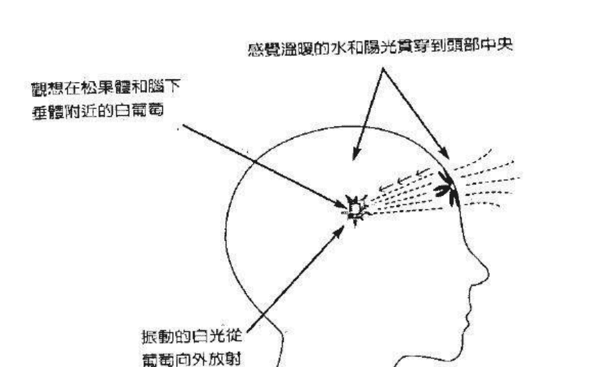

图 6.2 白葡萄练习中，白葡萄的大约位置

一开始，闭上双眼，深深的吸一口气，屏息几秒钟，然后慢慢吐气，回到正常呼吸，再一次集中注意力在第三眼上，这次感觉到一股压力、刺痒或其它感觉进到更深的内部。感觉或想象太阳的温暖贯穿前额进入头部里面，同时，也感觉或想象温暖的水流向内部。

让太阳和水的温暖持续贯入，直到在头部中央直接有所感觉，这个区域是脑部底层，脑下垂体和松果体都会位于此处。专注在头部中央的这个点上，此时，温暖感或其它感觉会变得更显著。

然后，想象一颗大小像豌豆的白葡萄位在此处，观想这白葡萄在里面开始慢慢的前后振动。当你专注在这里的时候，感受它振动愈来愈快，想象或看着这个白葡萄快速的前后振动。好好观看，感觉一段时间，并享受这些感觉。

现在，想象葡萄里有白色的光，看或感受葡萄里面开始振动着，让这振动的光开始从葡萄向外扩展，直到团团包围着葡萄，让这股振动愈变愈强。此时，可以尝试在第三章中提到的顶轮唱诵的变化式，如果需要可自行复习。

跟以前一样，深深吸一口气，屏息三秒钟。这次唱着 M-A-A-A-Y-Y-Y，直到你把气完全吐完，请记得以中度的音域来发这个音，音不要太高也不要太低，让你自己导引这个声音或频率到你正专注的头部区域。再次以同样的方式唱诵，导引音调到头部中央，甚至让频率在你头部的其它地方运作。

放松一会儿，恢复正常呼吸，维持你的注意力在白葡萄上和它的四周。这么做的时候，可能发现头会晕晕的或是感觉恍惚，生理上你可能会觉得在头部中央有刺痒或温暖的感觉，并向上进入脑部。在第三眼里可能会感受到同样的感觉，这表示接近脑部下层的脑下垂体已经振动，或许 MAy 唱诵的声音共振。脑下垂体已经启动获得平衡，同时影响了下丘脑。如同第二章所提到的，脑内啡和其它的分泌物会释放到身体里，进而开始唤醒、启动和打开顶轮。当这种情形发生时，你的顶轮的能量中心也会调频到来自天界的更高频率。

当然，松果体也会振动且更为活跃，这能产生某些生理上与生物上的状态，第三眼能量中心也随之更进一步的开启。关于此脉轮和顶轮，请参阅第二章的列表。

每个人都是不同的，在尝试这个练习时，会受到不同的影响，如果你是天生的能量感受者，你可能会体验到很多的感觉和能量，包括整个头部，甚至是全身，你可能觉得非常放松。许多读者一开始尝试这个练习时，可能会在头部中央或是头部其它地方，包括前额和头部后方，感受到一股压力或是某些温暖或刺痒的感觉。这是一个好的征兆，表示练习是有效果的。

有些人一开始尝试白葡萄练习时，几乎感觉不到什么，别因此而气馁，愈练习这技巧、愈能获得更多的成功。毅力是此时的关键，最后你会获得与天生能量感受者相同的结果。在完成白葡萄的练习后，你可继续下一个练习，它与这个练习关系密切。

## 开启与清理顶轮的技巧

这个特别的技巧是前面那个练习的延伸，在你熟练这些技巧之后，也可单独做这个练习。

放松一会儿，同时注意你的呼吸，让自己去感觉与前面那个练习有关的感觉。享受温暖、刺痒或其它各种感觉，把所有注意力放回到头部中央，那个虚拟的白葡萄所在的位置。专注在这地方二或三秒钟。

## 進行開啟與清理頂輪的技巧前的頂輪

图 6.3 一个没有连结造物者或是神性源头的顶轮

然后，感觉此处的温暖与白光开始向上移动通过脑部，感觉或感知这股如同温暖的水和阳光的能量，正从白葡萄向上移动，直到抵达头部的顶端顶轮所在的地方，你也可以观想在你头部从白葡萄向上进入顶轮中心。

当你到达这中心时，做一个更深的吸气，屏息约五秒钟，并慢慢吐掉。此时，举起你的左手或右手到头顶顶轮的位置上，用中指与食指轻轻碰触头顶，之后把手放到身边或膝上。

开始集中注意力在头顶上，刚才用两个手指碰触的位置，觉察在此轻微的压力或感觉，想象手指仍然向下压着头皮，并专注在此一段时间。

现在，再做一次 MAY 声唱诵，这次当你做深呼吸并发着 M-A-A-A-Y-Y-Y 的音时，把注意力放在顶轮上，当你一边唱诵，一边吐完所有的气时，感觉声音的频率运作到顶轮里面。引导唱诵进入到你的头顶，你也许会开始注意到头部有着刺痒的感觉，也许在唱诵时会觉得头晕晕的。

放松一会，以同样方式再次唱诵 MAY，让唱诵的音频运作头顶，甚至进到头部中央。 当你在发这个音时，将所有的注意力放在头顶上。

在你唱着第二次或者最后一次的 MAY 后，会觉得头顶的感觉在增强。也许会在这个地方体验到一种淡淡的温暖或压力，这表示顶轮的能量开启得更多了。

当你完成清理顶轮技巧的这个部分时，你已经准备好进入下一个阶段。

当你体验到发音或唱诵的结果时，让自己休息几分钟，感觉头上的能量或刺痒的感觉，当这些感觉持续时，享受它们。你可能甚至感觉到这种刺痒的能量与温暖感扩散到整个头部，让它整个运作你的头皮、头发，往下来到你头部的前后，好好的体验一会儿。

现在，闭上眼睛，观想或想象一朵美丽的白色玫瑰，在你的头顶上含苞待放，这朵白玫瑰也代表顶轮，继续感受头顶上的能量。当你做这观想时，想象你在一个温暖的夏天里待在户外，感受太阳的温暖从头顶贯穿下来，到头皮下方一时左右的地方，想象着你坐在沙滩上或是山丘上享受太阳的光芒，同时也让太阳光持续的从头顶上的顶轮照射进来。

在阳光照射的同时，观想白玫瑰开始绽放，看见与感觉白色的花瓣在阳光的照射下一层层的打开。感受此处温暖，同时花瓣更为开启。感觉或想象花瓣扩展到整个头部以及头皮表层。在你的脑海中，想象与感觉花瓣完全打开，并扩展到整个头顶，不仅是头顶上还包括整个头部后方，让花瓣扩展，直到整个涵盖住整个头顶。

这股感觉或是温暖变得更强，接着，想象温暖的水开始流到顶轮和打开的花瓣上，让这温暖抚慰人心的水流过头皮，下来到头部两侧，进入眼眉上的第三眼，专注这里几秒钟，享受这种温暖与刺痒的能量。

现在应重复最后一次的 MAY 唱诵，像以前一样、做个深呼吸，屏息一会儿，然后唱着 M，M-A。 A-Y-Y。 Y 慢慢的把气从嘴巴吐完，专注在顶轮这个区域，导引唱诵的频率到这里来，让声音进入到头顶到脑部里面。

在发完 MAY 声后，回到正常呼吸。让自己放松专注在顶轮一会儿，观察在头顶的顶轮上以及整个头部，有时包括脸上温暖或是刺痒的感觉。这些生理反应是正常的，表示顶轮和第三眼脉轮同时都完全打开与启动。详细信息你可以参考第二章的表。

此时，你能够接通来自更高世界的讯息、知识和疗愈能量，这包括安全的与你的天使和灵性向导沟通与工作，这技巧也有助于清理你气场中的负面颜色，让它扩展变得更明亮、更洁净。

### 接通神性能量或宇宙能量

你们当中有许多人会发现，在完成开启与清理顶轮技巧过后，你能够从你的头顶接通神性能量或宇宙能量；进入你的脉轮和身体，你只需请求能量从你的头顶下来即可。感觉在头顶上方十二时高的位置上的治愈能量或是神性能量，进入顶轮，让这种高频的能量振动向下运作到头皮，进入到身体里。导引或观想这美好的治愈能量，从你的头顶流下来到身体里，感觉它有如温暖的水一般流过你，并从你的脚底流出去。让这股能量流过你整个人几分钟，然后让能量流减缓下来，最后完全停止。回到正常的意识状态，看看四周的环境，把自己带回接近平常的觉知状态。

你们当中有些人是天生能量的感觉者，可能感觉到即使不刻意去导引，都会有能量通过全身。如果出现这种情形，不要担心，只要让能量流通过你，从你的脚出去。这该被视为是上帝或造物者的礼物，会让巨大的疗愈能量，运作你的气场、脉轮、身体和内部的器官。

对大多数的人而言，你需要请求能量流通过你，平心静气的导引它。这可能要花上一点时间，但终究你会变得十分习于把宇宙能量带到你整个人身上。当你完成时，深深做个深呼吸，屏息几秒钟。吐完气，然后回到正常的呼吸。回到你日常的事物中，感觉清新与活力十足。

### 冲热水澡的技巧

下述的技巧可以用来进一步的清洁气场与脉轮，有一些与这个和前一个练习有关的延伸技巧。

开启与清理顶轮的技巧，和冲热水澡的技巧，一并使你能接触来自天界的造物者和神性或上帝能量。在气场和脉轮里，包含着肮脏、颜色混杂的负面能量，能从你的气场里清理出去。同时，负面的与不善的灵，也会离开我们的气场，这能使得天使、灵性向导和其它天界的协助者来到你身边。当你的气场和脉轮变得洁净、明亮时，你也提升了你的身体，灵魂和气场的频率。这种较高的频率，吸引这些光之灵和灵性向导到你身边，让她们容易与你工作与沟通。

当你完成开启与清理顶轮的技巧后，即可进行这个练习。冲热水澡的技巧也可以在各种时候进行。

图 6.4 一个人的顶轮直接连结着造物者与上帝源头

一开始，大多集中注意力在头顶上，同时将眼睛闭上，深深地吸一口气，并且屏气几秒钟，然后慢慢吐气，甚至从你的鼻子把气呼出去。之后，回到正常呼吸。

现在想象你正在冲个温暖的热水澡，感觉热水从你的顶轮下来，进到头顶里。让这热水流满整个头顶，覆盖着整个头皮，向下来到头部的前后两侧，让这热水往下流到后脑勺、颈部到肩膀，同时感觉这舒服的热水往脸部流下到喉咙，再到上胸腔。

继续感觉这热水从上往下流，让这股热水流变得更大些，经过头到上背部和上胸部。专注在这股能量流上，水流继续在前胸与后背上同时往下流。专注在这股水流上，往下流至心轮、整个胸部，到肚脐上方的太阳神经丛上。感觉这股温暖的水，流过太阳神经丛和胃部，让这温暖的疗愈之水流过皮肤，直到完全覆盖身体的这部分，让它继续流过下腹部进到脐轮，覆盖整个皮肤表面，直到双臀。继续体验这热水往下流到海底轮和大腿，享受这股温暖的能量。
如果需要的话，回想你最近冲澡的经验，回忆当热水往下流过皮肤和全身时、那种温暖和抚慰的感受…引导温暖的水流或能量，往下经过大腿、膝盖、脚踝和双脚，感觉这温暖的水流感，穿越脚趾从脚底出去。

现在，将你的注意力从脚上移到肩膀和上背部，想象并感觉这美妙和温暖的水，快速流经背部中段和下背部，并且到臀部。甚至感觉到这股能量或愉快的感觉，同时也在脊椎骨上往下流，让这股能量从这里快速的从腿后侧往下流到脚踝。接着，让热水从头顶上向下流，盖过身体，从脚底出去。让这抚慰的疗愈能量，包覆你的全身和能量场。

花一两分钟的时间体验这热水冲澡享受漫步全身或是在身上某个部分的感觉。感觉并看见气场和身体变得更干净明亮了，甚至想象着在两臂上和两腿上的能量经络线也变得更干净。当你感觉过了一两分钟的时候，想象水流开始变慢，感觉能量变得更慢了，接着，将所有的注意力移到头顶上顶轮外围的周边上，感觉水或能量完全被止住或是「被关上」。回到正常的意识并注意你的四周。当你准备好时，回到日常的活动中。

如果你有机会的话，花几分钟的时间照照镜子，镜子最好是大到能照到你的脸、头和胸部。当然，如果你照的是全身的镜子，将可看到整个身体。尽管如此，这两种大小的镜子皆可。

首先，看你的脸和眼睛，你可能注意到你的脸和皮肤看起来更加细致、健康，当你看着你的眼睛时，会觉得它们变得更亮，眼睛里有着一种光彩。

要知道这不是你的想象，你确实看到或感觉到当有更高频率进入你的气场里，你的身体甚至到你的细胞和器官中之后所产生的结果。

再看你的脸和眼睛，注视一下你头上和头的四周，你可能会注意到顶轮和气场看起来更明亮、更大些，这表示你已清洁了这能量中心和这一带的气场。第三眼也会受到很大的影响，前额也会显得干净。接着，注视胸口和心轮，许多读者会观察到这个区域看起来或感觉起来更为明亮与洁净。

注视这些区域最能看出或感觉出是否变好。大多数的人在做完这个和前一个练习之后，若跟练习前相比较，能觉察出明显的改变。

刚开始！有些人会觉得改变并不大，或是看不到有什么不同。这点无须担心，经过练习后，你会发展出看见、感受或感觉——当宇宙能量或较高频率流经过你后所产生的这些美好改变。

如果你有全身的镜子，可以继续进一步的注视，如果你想要进一步看，可以仔细看看太阳神经丛、胃部和身体这部位的两侧。然后，目光往下注视脐轮区以及臀部，从这里再看海底轮以及两侧的大腿。让你的眼睛向下注视腿部，膝盖甚至到双脚，如果你对能量十分敏感，也能看见气场，你可能会注意到从太阳神经丛到脚趾，有一些白光或洁净的能量，围绕在身体的这些部位。

前面有两个插图，显示不出顶轮清理前与清理后，顶轮和气场是如何被这些技巧所影响。

开启第三眼的技巧、白葡萄的练习和开放与清理顶轮的技巧、冲热水澡的技巧，可以当作是一个完整的流程来做或是渐进的方式进行。每个技巧和练习也可个别分开进行。

一旦你熟悉了每个练习之后，可以自由的体验这其中任一个或所有的练习。很快的，开启这些脉轮、清理它们，以及与宇宙能量或较高频率的治疗能量连结，会成为你的第二种天性。每一次你让这些能量由上进入你的气场、脉轮和身体时，你则培养着能接通更多能量的能力。这使你整个人变得更光亮并提升你的频率。

在你稍稍尝试过这些练习，感觉舒服之后，你就能往下一步前进。包括将这些新学会的方法用在案主、患者或其它对象身上，运用你自己的内在指引，决定你何时准备好可以这么做。在你将这些技巧用在你的案主身上之前，需要向各位说明几件事。

## 五种特殊技巧的好处

使用前面提到的这些技巧，或是这当中任何一项都能产生许多益处，以下列表陈述多项益处。

- 降低压力：使用宇宙能量及内在疗愈的能量，降低身体与心智中的不安与压力。某些化学分泌物，被释放到血液里来安抚情绪。脑部中与喜悦感有关的区域——下丘脑，会大受影响，因而创造出和平与安抚的内心感受。
- 释放负面的存在体或灵体：开启动及清理顶轮技巧的正面能量，以及其它技巧，会让气场和脉轮变得更光亮和洁净，因而吸引了灵性向导与天使到你身边。这种更高的能量频率驱使负面存在体或灵体，离开气场、远离当事人。
- 促进身心灵的疗愈：宇宙能量或治疗能量流过气场、脉轮和身体，能促进身心灵所有层面的疗愈，这让当事人身体上、情绪上和心灵上感觉平衡。
- 加速灵性的成长：更高的能量频率运行到身体、脑部和脉轮时，一个灵性觉醒的人，会以快速和深远的方式发展出更多心灵洞见和灵性，有机会打开真正的灵性感悟。
- 加速灵力的发展：一个灵力已被唤醒的人，能透过练习其中任何一种或是这五种特别的技巧，快速的增加心灵能力。当脑部其它的地方被唤醒时，也会提升特殊的心灵天赋。
- 快速的延缓老化过程：从天上下来的宇宙能量或神性能量，流过身体和脉轮。启动并释放昆达里尼或蛇的能量，透过交感神经系统进入身体，这影响内分泌腺系统的荷尔蒙分泌，以此方式平衡腺体，大大的延缓老化的过程。高频率的能量也能改变和活化身体所有的细胞、组织和器官，本质上，身体变得更象是个光的身体。
- 增加智商的水平：来自天界的宇宙能量或神性能量进入脑部，藉由神经冲动来启动脑部的某些部分。这些受启动的神经元，传送带电的刺激到脑部中休眠的区域，唤醒了这些区域，让你能使用更多脑部的能力。
- 扩大与洁净人的气场：宇宙能量流结合有力的脉轮，包括昆达里尼，并大幅度的扩大或净化气场。人体的气场会变得更大、更明亮。
- 更加的平衡与开放脉轮：宇宙能量和内部疗愈能量，会大幅度的平衡脉轮，让这些能量中心变得更为敞开、更大，让更多的神性之光或更高的能量频率，进入气场、脉轮和身体。

一旦你感觉准备好了，就可以使用任何或所有这些技巧来帮助你的案主和朋友。

一开始，你可请接受疗愈的对象或是案主，坐在你面前舒服的椅子上。当事人距离你约五呎远，确定对方身后有一堵墙，白色或淡色的墙最好，但大多数的色彩都是可以接受的。

请你的案主深深地吸一口气，屏息五秒钟，然后请她慢慢从嘴巴或鼻子吐气，回到正常的呼吸。

当对方再次开始正常呼吸时，将眼光移到她的头上，注视一下顶轮区域的气场。有些人会注意到在头部四周有淡淡的光，看起来是白色的，从头部向外延伸数时。对那些能轻易看到气场的人，除了白色还会看到其它颜色。顶轮区域的气场，让你看起来显得更大些。有些人能看见在头部四周的气场内，除了白色还有淡淡的其它颜色，例如淡蓝色，这表示你发展出更容易看见人体能量场或气场的能力。

当你看着对方的气场时，不管你是否看见所有的颜色、某些颜色，或只是当事人头部四周的一点光亮都没关系，重要的是你能多少看见些东西。这意谓着你的脑波已经慢下来，进入，一种轻微的意识转换状态。

将你的注意力放回案主的脸上，并请她闭上眼睛，你往前靠或往前走一步，将一只手的食指和中指放在对方前额第三眼的位置，轻轻的碰触，两只手指压在前额二到三秒钟，然后把手收回来，往后退。如果你原来是坐着的，也可回到原来坐着的地方。

你可以对你的治疗对象进行任何或所有的技巧，不管是站着或坐着，不过大部分时间里坐姿会是比较舒服的姿势。

请求你的朋友或治疗对象，集中注意力在第三眼的位置上，也就是你手指头碰触的地方。让你的案主在第三眼的这个区域感觉到些微的压力。此时，你会引导你的案主进行练习或治疗技巧。有些人一开始在引导别人做这些练习时，会觉得不太舒服。如果是这样，找一个比较亲近的朋友或亲戚来练习，直到你感觉比较有信心。练习几次后，你会准备对你的案主或患者定期的来尝试这些特别的练习。

已经以特定治疗模式在工作的人，会觉得很容易就能将这其中任一个或所有的技巧融合到你的工作中。

现在，引导你的案主进行开放第三眼的技巧，让当事人继续感觉眉心上淡淡的感觉。告诉她去感觉或想象压力开始扩散，仿佛压力范围扩大了两倍。同时让对方也想象或感觉温暖的水和阳光在前额眉毛上方扩散开来，确定要让你的案主在此专注一段时间。

此时，你能将温暖花开法的技巧加入到这部分的练习里。当案主专注在前额扩散的感觉时，让她观想或看见一朵美丽的紫色花朵渐渐绽放。整个花朵在两侧太阳穴间的前额打开，伴随着温暖的水和阳光。

让你的案主多专注在这里几秒钟，然后用感觉检视一下，看看你的案主有什么感觉，如果有的话。确定她的眼睛在整个过程中一直是闭上的，现在你已经让你的患者、案主或朋友完成了开启第三眼的技巧。

现在，以一个简单优美的动作来开始白葡萄练习。让你治疗的对象开始感觉温暖的能量往内贯穿三时的深度，再一次，把这过程想象成或感觉成温暖的水和阳光，向内流入直到能量能直接流到头部中央。同时让你治疗的对象感觉你的两根手指随着水和阳光往内贯穿，此时让当事人继续多专注一会儿。

在此之后，让你的案主观想或想象一个小小的白葡萄位于头部中央、脑部的底层。为了简化起见，就专注在头部里面的正中央，请记得，葡萄的大小应该跟一颗小豆子一样大。

附带一提，用一颗小白葡萄作为专注的工具，理由很简单。小葡萄代表松果体和脑下垂体，它们的位置大概是在脑的下半部。当你或你的案主专注在白葡萄上时，也有助于启动这里面两个特别的腺体，这也是另一种可以启动你或你的案主能力的一种方式。

当你在导引你的治疗对象时，请轻声慢语，不要担心会做错，静静的对治疗对象说话，就像你对老朋友说话是一样，放松让事情流动。

你现在准备好要进行 MAY 唱诵，这时候，唱诵或声音会直接对着你的案主，而不是自己。要确认在你面前的人，在你唱诵时，眼睛是闭着的。

做个深呼吸，屏息几秒钟。当从嘴巴吐气时，唱着 M-M-M-A-A-A-Y-Y-Y。你的声音应该比正常说话的声音低一些，很像是在唱歌，注意着你的案主，然后唱出这有力量的声音。让你将这唱诵导引到当事人的头部，同时吐出所有的气。

进行这唱诵时，一开始看着你的案主的第三眼区，然后，注视着头部上方和头部四周。你可能开始发觉或感觉到此人的气场正在变化—变得更明亮、更洁净。这不是你的想象，你的直觉力能感觉到或看见来自这特别的唱诵而形成的正向改变。

你应该在对她唱完 May 唱诵后，问她是否感觉到什么，注意你收到的回馈。大多数的人，如果对能量是敞开的或是融入的，会在头部中央或前额感觉到温暖或刺痒，少数人感觉到整个头部包括头顶都是，有些人则是一开始什么都感觉不到，如前所述，不要太过介意这种情况。在这股频率运行到头部里面特别是脑下垂体时，这些治疗技巧还是会对治疗对象产生影响。有些频率也会进入松果体，虽然很细微但最后仍是产生效果的。

每个人都对声音与能量的频率有不同的反应。要知道，不是每个你运作的人，都会以同样的方式体验相同的生理反应和感觉。有些人以不同和独特的方式体验这些效果。不管如何，这都是每个人灵性成长的一部分。

吟诵或唱诵 MAY 的声音会产生跟唱诵 AME 相似的效果，如果有需要，可以参考第一章最后的启蒙开始的那段落，以及第二章里讨论最后启蒙的效果的那张表。

如果你想要，你可以一模一样的方式重复 MAY 唱诵，这完全是额外的选择，有时，在第二次导引声音到你案主那里的时候，同时她也再次专注在头部中央的白葡萄上，增加她一开始所感受到的感觉。

当你感觉到你和你的治疗对象准备好时，就继续做下一个练习，开启与清理顶轮的技巧。这对你和你的案主都会是一种温和的转化。

如前所述，请她做个深呼吸，屏息几秒钟。然后，从嘴巴或鼻子均匀的吐气回到正常呼吸。让你的案主想象或感觉温暖的水和阳光，从白葡萄向上移到脑部里面。阳光亦可想象或感觉成白光，温暖的能量继续向上流到头部、流过前额，让你的治疗对象感觉这温暖的能量往上走、向后流过头皮。所有温暖的能量应持续的向上流，进入头部顶轮的区域，温和但坚定的引导你的案主。

现在，做个深呼吸，简短的屏息在肺部，吐气时，唱着 M-M-A-A-Y-Y。专注在案主的头部，特别是顶轮，同时引导这个声音到头部的上半部，约在前额与耳朵的上方。

专注在这个区域，看着能量或光在头部这个区域以及顶轮。注意头部气场的改变，你可能会惊讶的看到气场已经从头部更向外扩张。更多的光和明亮进入整个区域，暗沉的颜色或是在这块气场边上的阴暗已经消失。

有些人可能仅只感觉到这里的改变，有的则是感觉到或看到在顶轮、前额以及耳朵的上方，有更明亮的能量或是光的显现。少数人会确实看见美丽的颜色，例如在气场的这些地方放射着淡蓝或淡绿、白色、淡黄色，这些状况皆表示这些技巧对你的案主是产生效果的。

现在请你的案主集中她所有的注意力在头顶上的顶轮，这里应该会出现温暖感或其它感觉。再一次往前走一步，把你的两个手指——食指和中指，轻轻的按在头顶上。保持几分钟，然后把手指收回来，将你的手放回腿上或是身体两侧、请你的案主注意刚才你手指压的地方所产生的压力或感觉，让她感觉或感受手指仍然在那里。

接着，让她看着或感觉在头顶和头皮上温暖的感觉扩散开来，这可以观想成向外流的温暖的水和阳光。这时，以同样的方式重复 MAY 唱诵。这次当你吐气唱出频率时，集中你的注意力在你的患者或案主的顶轮。当你吐气时，感觉你声音的力量。

可以把这呼吸和声音当作是上帝的话（Logos）或是造物主的话。古代的埃及人明白文字的力量并将它运用在仪式或典礼中。当你练习这些技巧或者做你自己的发音练习时。时，你就在使用这力量，这是每个人天生就具有的。

整体来说，应该对你的治疗对象做三到四次的 MAY 唱诵。当然，若是一共唱了四次，则表示你在做白葡萄练习时多唱了一次。回想一下四的法则，唱个三到四次的效果会是最好的。以下的类推或许有助于读者们的理解。

想象一部车子陷在泥泞中无法动弹，驾驶踩油门让车轮转动，不幸的是，车子仍然陷在那里，轮子只有空转，最后有人走到车子后方，当驾驶开始踩油门时，那人推着保险杆或后车厢。当这个人第三次推车子时，车子从泥沼中开出来了。一个声音或频率连唱三次的道理是一样的，唱完四次会增添正面的效果。

当你完成了开启与清理顶轮的练习时，你可以结束或是继续最后一个练习，这是你的选择。如果你决定继续的话，你会发现洗热水澡的技巧对你的案主或朋友是非常有效和有益的。

如果你继续练习的话，要确定你的治疗对象眼睛在整个练习过程中要闭着，进入到最后一个练习应该是很容易的。

让你的案主再做一次深呼吸，屏息三到四秒钟。然后慢慢吐气，请你的治疗对象或案主回到正常呼吸。现在让你的案主继续专注在头顶上。做完时，请她想象她正在冲一个非常温暖的热水澡，让她想起或感觉温暖的水冲下来到头上的感觉”从这里，引导热水从头往下流，用你的声音温和的引导案主，让她感觉温暖的、抚慰人的水滴滴答答的从头部的前后流下来，这个人应该也会感觉这股能量从耳朵流下来到头部和肩膀。

你的朋友或治疗对象，此刻应该感觉这温暖的水从头部整个流下来，这股能量感觉起来就像在冲热水澡时，整个覆盖了头部、上胸腔和肩膀。现在让这温暖的能量或水继续往下走到胸口，还有上背部。

用一种温和的声音引导你的案主完成冲热水澡的练习，专注地让水流继续由上往下进入到头顶，让你的案主感觉到并观想，这抚慰的能量从头顶到胸前与上背部，完全的也围着她，给这个人一点时间去感觉并享受这个疗愈技巧。

现在，让你的案主感觉到温暖的水向下流过身体的其它地方。让她想象这温暖的感觉在流动，或是沿着脊椎向下流，流过臀部，经过两腿后侧到脚跟。让她也感觉这温暖的水沐浴着身体的前侧，经过心轮、太阳神经丛、脐轮和海底轮一带，让这水流流过大腿后侧到双脚。

引导温暖的水或能量从头顶到脚底通过你的案主全身，想象着温暖的热水从头冲下来，经过身体的前后两侧，向下到脚或脚跟，大概进行一到两分钟。

最后当你觉得你已充分引导案主进行这冲热水澡的技巧了，就停下来。告诉你的案主水流已经停了或是关上了，此时，请你的案主做个深呼吸，屏息几秒钟，然后请她慢慢吐气，引导她睁开眼睛。

现在你已经完成冲热水澡技巧和其它技巧，你可能发觉或感觉到坐在你面前的人看起来放松多了。身体的气场特别是头部那区看起来会变得更大、更明亮。再一次，这不是你的想象，案主的气场确实变得比较大和明亮，因为你引导的疗愈能量和宇宙能量到她的气场、脉轮和身体里。

当你和你的案主专注在冲热水澡的观想里或让水流过身体，治疗能量进入顶轮并像水流一样进入气场、脉轮和身体。当你引导过对方练习这些特别的技巧后，对方应该觉得比较平静和放松。

许多人在进行冲热水澡技巧时，会看见或感觉流经治疗对象头、脸、胸、胃、臀和腿四周的光或颜色。完成这个静坐后，你也许会看到在对方身上的光与颜色。这表示从天而降的治疗能量，持续进入对方的气场和脉轮，这种现象会持续一段时间。

有些人可能只会看见或感觉对方四周的某些光，这种情形下，在你治疗对象的四周的光会看起来更为明亮、更扩展。有些人也许一开始什么也看不到，这点无须担心。虽然你见不到或感觉不到任何光或颜色，但其实这技巧仍然是有效的。到后来，你的能力会更纯熟，并在运作能量时，看见和感觉在你案主四周所有美丽的光。你愈练习，愈能唤醒这项天赋。

在完成这个技巧和其它刚才提到过的技巧之后，你可以开始对你的案主进行特别的治疗或个案。你会发现治疗对象会对你需要进行的工作更加放松与接收。如果你给与的是一个灵气个案，那么你的治疗对象会对个案体验更多、感觉更喜悦。如果你是做一般的按摩或是脚底按摩也会是如此。

这个特别的技巧提升你的治疗或是个案疗程，最后，你也会变成一个更好的治疗师或是咨询师，你的案主与你都会受益于这些技巧。

身为一个「已启蒙」的治疗师、咨询师或老师，你知道你人生的目的或任务是要服务他人，这个信念有助于你在自己的灵性成长过程中更上一层楼。

在前面几章提到土、风、火和水四大元素。这四个元素十分重要，可以运用在玄学与灵性治疗中，在本章中，唱诵或发音是以一个特别和灵性的方式运用着风的元素。下一章会提到更多进阶的能量治疗技巧，包括色彩治疗。

> >「行善于人不是一种责任，而是一种喜悦，能增进你的健康和快乐。」
>——琐罗亚斯德
>摘自《琐罗亚斯德的教导与帕西宗教哲学》

## 第七章 脉轮净化开启法

> >「人类的能量是有限的，而神圣能量是无限的。你就是神，你就是神圣能量。当你在做神圣工作时，你的能量就会增长…」
>——赛·巴巴(Sathya Sai Baba)
>摘自《歌者奥义书》

## 脉轮系统能量开启

在这一章中，将会传授高级脉轮能量技巧，也会详细讲授昆达里尼(Kundalini)唤醒法。

人类脉轮系统对于能量治疗非常重要，在人体能量场中存在着大约一百三十个脉轮或能量中心，这些中心与身体密切相关，主要脉轮与内分泌系统的腺体和器官紧密相连。

这七个主要脉轮能够被开启，让治疗能量流经人体气场和所有脉轮，并进入体内，这种治疗能量也在交感神经系统和中枢神经系统中运作。

如前所述，存在着治疗能量和来自天界的宇宙能量或神圣能量，这种由非常高频的振动所组成的能量一路向下，流入物质世界。这种情形会以两种方式发生，第一，正如古老格言所书：「天有一象，地有一物」换句话说，存在于天界的也可以存在于世间。如此说来，这种由高频振动所组成的能量，会从天界向下流入世间，这种有时也称为气或普拉纳的治疗能量无处不在。它就在你呼吸的空气中、在你喝的水里、在大地的岩石和树木中。但是，当这种治疗能量在世间显现时；它就会具有稍低的频率或振动。

你可以做一些练习来吸收这种高频能量或气，可以做本书中所教的深呼吸练习，也可以将大地能量吸入你的身体。

治疗能量、宇宙能量或神圣能量，进入世间的第二种方式是一种非常直接的方式，那就是通过你进入世间。并非像刚才提到的吸收这种能量，你能够直接建立管道，与造物主或神圣源头相连，并接收这种高频的治疗能量。上一章中详细描述的技巧，都是为了这个目的而设计的。当你的顶轮开启后，它就能接入来自天界的神圣能量或治疗能量。当顶轮打开，它就会向上扩展，并与第八脉轮相连。

宇宙能量或神圣能量（包含治疗能量和知识）向下流入第七脉轮和人体中。从天界下降的治疗色彩，通过第八脉轮进入顶轮、气场和身体。

第八脉轮位于顶轮和头顶上方（这个脉轮是天界的一部分，当它完全开启时，它与第七脉轮或顶轮相连）。

在第八脉轮和扩展的第七脉轮（顶轮）以及扩展的头顶上方的气场之间的连接。

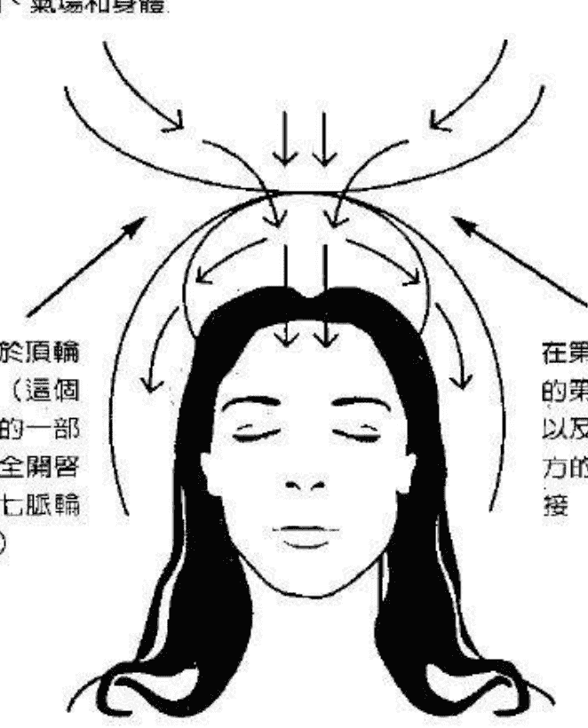

图 7.1 第八脉轮和第七脉轮或顶轮之间的连接。宇宙能量、上帝或神圣能量以及治疗色彩向下流入顶轮、气场和身体。

## 第八脉轮

第八脉轮是上方天界的一部分，它也是你的一部分。这个脉轮位于头顶上方，在顶轮能量中心上部边缘。它大约在你头顶上方两英尺的位置，并根据你的气场特别是顶轮的波动而上下移动。

这个特别的脉轮实际上是通往另一个世界的入口，它就像敞开的一扇门一样。当你的顶轮开始打开，你就进入一种很深的意识转换状态，让你的心智变得易于接收更高的想法和能量。

当你的顶轮完全打开时，它向上扩展至你头顶上方两英尺的位置，这就是第八脉轮所在的位置。在这里，这个神圣脉轮或第八脉轮打开并与顶轮的上部边缘相连，它就像一扇打开的门一样，当你完全觉醒并获得灵性启蒙时，这种情形就会发生，于是你就会与天界和上方的能量相连结（参见图 7.1）。

处于意识的转换状态…能让你的心智更易于接收更高能量和思想。顶轮的开启，能让它通过第八脉轮直接与造物主或神圣源头相连。这在第六章的开启与清理顶轮的技巧中也有提及。

一旦与第八脉轮连接成功，许多神奇的事情就会发生。通过这个特殊的能量中心，神圣智能、知识和信息才得以接收进入你的心智中，最终进入你的头脑，这就是它被称为神圣脉轮的原因所在。

一旦顶轮完全开启并与第八脉轮相连，包括治疗色彩在内的治疗能量就开始向下流动，这种能量和色彩一起从第八脉轮进入顶轮。这些治疗能量从这里向下流入人体气场和脉轮。治疗色彩和治疗能量或宇宙能量会降低振动频率，进入中枢神经系统和交感神经系统。包括治疗色彩在内的治疗能量，由此通过神经经络线而进入身体。

## 脉轮能量流动法

除了顶轮之外，你也可以开启其它主要脉轮或能量中心。

在《古代神秘学院入门书》中，曾详细解释过脉轮开启和能量流动技巧。它们的目的是为了帮助你安全而有效地开启你自己的能量中心，并因此释放脉轮能量。这种能量与宇宙能量、气或神圣能量极为同频。在以下的篇幅中，将向你解释如何在别人身上运用这些特殊的技巧。当然，这些练习可以在你的朋友，家人、案主或患者身上运用。这些脉轮能量流动法，尤其会在你的案主或患者身上证明它们是非常有效的。

当你已经完成了在你案主顶轮上的能量运作时，你就可以专注于其余的主要脉轮上。这时，心轮、太阳神经丛和脐轮，就成了你要运作能量的三个主要脉轮，有时你也可以专注于喉咙和海底轮。

## 开启心轮

你应该先专注于你的案主或治疗对象的心轮，将你的目光从顶轮和脸部向下移到胸部。让你的案主深吸一口气，屏息大约五秒钟。然后引导她通过鼻子或嘴巴慢慢吐气，由鼻子或嘴巴吐气都可以，让案主自己决定。然后，让她恢复正常呼吸。

接下来，让你的案主将她的手放到胸部正中央。如果可以，让她在这个练习和接下来的练习中都使用右手。即使你的案主习惯用左手，也要遵守这个规定。在所有开启脉轮和能量流动法中都要使用右手，其中的原因非常简单—身体的右侧，特别是右手，包含有正极治疗能量。这种特殊极性的能量会流入心脏能量中心，并以更有效的方式协助开启这个重要的脉轮。

不过，如果你的案主觉得用左手更舒适的话！那就让她用左手。负极性的治疗能量或气仍然会从手、手掌和指尖流入胸部。这种通过左手释放的能量也会帮助开启心轮，虽然这会多花一点时间，但依然有效。

在你的案主将右手直接放在胸部中央之后，你就能引导她做开启心轮和能量流动法，要确定你的案主在整个过程中眼睛始终闭着。

要求你的案主将注意力集中在放在胸口上的这只手，以及手的温暖或压力上。当她这样做时，建议她想象自己是在温暖的夏日野外，让她感觉、想象或感受她的身体尤其是胸部，沐浴在美妙而温暖的阳光中。要她感觉温暖开始穿过胸部的皮质和肌肉。同时，让她感觉手上的温暖或感觉正在扩散进入胸部和心轮。

接下来，告诉你的案主，阳光和手的温暖正一起深深地渗入手掌之下的胸部，让这种感觉或温暖渗透进皮肤之下二到三英寸的地方。让你的案主感受或体会这些感觉，从手和胸部的表面向内脉动进入体内，让这种脉动和温暖的能量深入体内运作。

现在，让你的案主再做一遍深呼吸练习，然后恢复正常呼吸。这时，要求她观想或想象一朵美丽的绿色花朵，一朵兰花在手掌下的胸部紧紧合拢。让她感觉或想象位于心轮中间的这朵花。当阳光的温暖和手掌的感觉渗透进入心轮时，让她观想或想象花瓣开始绽放。让你的治疗对象享受这种美妙的温暖和愉快的感觉。

接下来，让她在胸部正中央感觉——温暖的水流在象征心轮的绿色花朵中间流动。用轻柔而坚定的语调引导你的案主，让温暖水流的感觉扩展至心轮和胸部。当花瓣展开时，就会出现这种感觉。让你的案主感觉或想象花瓣和温暖的水流在心轮展开。打开的花瓣和水流应该遍及心脏、肺部和肋部，并传到包括乳房和腋下的整个胸部。引导这股温暖的水流和绽放的花朵完全穿过心轮，这朵绿色的花朵应该是完全张开的，温暖的水流也应该完全流通整个区域。

问问你的案主感觉如何，了解她是否有这些感觉。在开启心轮和能量流动法的这个部分之后，你应该一直核对并了解案主的感觉。

这种方法的效果会因人而异。多数情况下，案主会感到温暖扩展至整个胸部或其中一部分。此外，一些诸如愤怒、悲伤和痛苦的情感会显现出来。当你的心轮完全开启时，这些负面的情绪就会很快消失，取而代之的是温暖和爱的感觉。不过，情绪释放也可能不会在这期间发生。你的案主可能只是在手掌下的心轮和胸部有令人愉快的温暖感。

在少数情形中，你的案主在做了开放心轮和能量流动法之后，她可能会在胸部依然感到少许的温暖或能量。这是正常的，因为能量流动仍然在以微妙的方式运作。心轮开始开放得愈来愈大，最终会完全开启。

在检视过你的案主之后，你可以继续。再一次确定案主的眼睛是闭上的。用你的声音引导她，让她想象温暖的阳光和水流正在扩展至她的整个胸部，并进入到肩部和乳房。让她花一点时间享受这种经验。如果你的案主没什么感觉，你也不用担心，只要继续引导她做这个特殊的练习就好。

当你完成了这个心轮开启法，就可以做下一个技巧。

## 开启太阳神经丛

当你的案主专注于心轮时，指示她观想温暖的水流和阳光开始向下流到胸部，并流入胃部和太阳神经丛，让她想象水流是温暖的；舒适的，阳光缓缓向下流动，直到能量集中在肚脐周围。接下来，让她将手向下移至太阳神经丛，将手置于这个脉轮的表面。确保手的位置是在大约肚脐上方二到三吋的地方、正好在胃部正中央。

现在，在引导你的案主做一次深呼吸的同时，让她将气吸至横膈膜。这样的呼吸能确保充满气或宇宙能量的空气，进入肺的底部、横膈膜和太阳神经丛，这有助于开启太阳神经丛脉轮。让她屏息三到四秒钟，然后告诉她由鼻子或嘴巴慢慢吐气，并恢复正常呼吸。

在开启太阳神经丛脉轮时，进行的程序与开启心轮法相似。你的案主现在应该将注意力集中在她的太阳神经丛和手掌上。告诉她感觉置于太阳神经丛表面的手的温暖或压力，让她感受这种温暖或感觉透过皮肤，直至进入她手掌下大约二到三吋的体内。

然后，让你的案主想象这里有一朵美丽的黄色花朵，就在皮肤表面之下。你甚至能暗示她，这是一朵像水仙或郁金香的花——如果你觉得这样的描述有助于你的案主更容易观想这朵黄花。

当她专注于这朵花时，用你刚才在开启心轮和能量流动法中所用的温暖阳光的冥想引导她。当温暖的太阳光线透过皮肤进入胃部区域时，让她感觉或想象黄色的花朵开始绽放。

让你的案主感觉、观想或想象美丽的花朵，在太阳神经丛迅速展开。随着花朵绽放，让温暖的水流遍及这个区域。让温暖的水流和开放的花朵，延伸至胃部、内脏、太阳神经丛肌肉以及手掌下的皮肤表面。让这种温暖的能量完全流通太阳神经丛脉轮，甚至手掌和手指的温暖或压力也能感觉得到。让这种治疗能量从指尖流出，进入太阳神经丛。你的案主应该体验到这种能量流遍皮肤表面。

告诉她感觉花瓣完全绽放并延伸至胃部的两侧，让案主享受这种温暖在胃里和太阳神经丛流动的愉快感觉，让她花几分钟时间专注于这种感觉。不断提及温暖的水流和阳光正在胃部流动，用诸如「放松」和「舒缓」等词语来加强这种经验。你现在已经完成了开放太阳神经丛脉轮和能量流动法。

这时，你可以决定是否要检查一下你案主的感觉。如果她显得非常放松，并且你能感觉或看见有白光围绕在她的头部区域、那就最好不要与她进行检视，让她继续保持这种状态。

你也可能注意到在她的手掌、胸部和乳房周围有白光，这是你的案主对这种方法有良好反应的另一种征兆。她非常放松，神圣能量或宇宙能量与脉轮能量一起正在她的体内运作。

这种治疗能量现在已经通过顶轮，经过喉轮，进入了心轮。这种能量很快就会开始移至其它的主要脉轮和全身。现在接着做下一个技巧。

## 开启脐轮

引导你的案主将她的手从太阳神经丛脉轮移至脐轮，她的手应该放在脐轮的正上方，大约在肚脐下方两英寸处。当她将手掌置于这个位置后，你就能引导她将能量从太阳神经丛向下移至脐轮。

使用与将能量从心轮移至太阳神经丛相同的方法，坚定而轻柔地引导她，从一个脉轮平和的行进至另一个脉轮。

让她感觉阳光和水流的温暖向下流到肚脐区域，并进入手掌所在的脐轮上。让这种温暖和舒适的感觉移至手掌下方的脐轮，引导你的案主全神贯注于这个区域。然后，让她再做一次深呼吸，这次她应该想象呼吸或气来到脐轮而不是胸部或太阳神经丛。让她屏息数秒钟，然后吐气，让案主恢复正常呼吸。

当她专注于自己的手时，请她想象在这位置下有一朵闭合的美丽橙色花朵。告诉你的案主，观想或感觉这朵花就在手掌之下的这个位置。再一次请她想象温暖的阳光透过手、皮肤和脐轮，她也应该同时感觉手掌的温暖或压力，甚至应该专注于指尖的温暖或感觉。让她感觉手的能量和阳光的温暖，透过皮肤进入大约两吋之下的体内，这里就是橙色花朵所在的地方。手掌和阳光的感觉应该向内流，直到它们触及体内闭合的花朵。

和你在做开启太阳神经丛脉轮和能量流动法时一样，以同样方式引导她。当阳光和手的温暖进入这里时，让她观想并感觉橙色花朵正在绽放。当你引导她想象花瓣正在手掌下的脐轮区域迅速绽放时，要用一种坚定而平稳的语调说话，同时告诉她，温暖的水流和阳光正在开始流过这个区域。在花瓣打开的同时，让温暖的水流和阳光完全流遍脐轮。橙色花朵舒展开来，直到它们已完全绽放，告诉她感受这种美妙的感觉也流经这里。

让你的案主享受阳光和水流流遍脐轮的温暖感觉。实际上，你也应该深深体会这些感觉。向你的案主暗示阳光和水流的治疗能量已深深贯穿所有内脏。

如果案主的卵巢有问题，这种特殊的治疗技巧会有助于将治疗能量直接传送到这个器官。相反地，如果一位男案主的前列腺有问题，他也会受益于这个疗法。

应该让你的案主花几分钟时间，享受开启脐轮和能量流动法的这个部分。当你结束这个疗法时，她有可能会处于一种很深的意识转换状态。这能确保能量可以流经她的气场、脉轮、身体和器官。在这之后，你可以接着进行与此有关的下一个技巧。

## 开启海底轮

当你开始进行这个治疗技巧时，有两个选项可供选择。第一个选项是让你的案主将她的手置于脐轮，这样的话，脐轮和指尖的温暖和能量就能加以利用。告诉你的案主，感受这种温暖的感觉，开始从指尖和脐轮下移至海底轮。请案主观想温暖的水流和阳光从脐轮向下流至海底轮，选择这个选项，来自手掌和指尖的温暖就会自动流入海底轮。被带动的脐轮也会释放能量，这些能量会向下移至这个更低的脉轮。

可供选择的第二个选项是，让你的案主将手向下移动至海底轮。这样的话，手掌就应该置于这个区域的正上方。如果你的案主觉得这样很舒适，你也相信这是有益的，那么就可以选择这个选项。无论如何，两个选项都有效。第一种方法最常用。

当你已将阳光和水流温暖的感觉引导至她的海底轮，就请她专注于此。让她感觉阳光和水一起从指尖流入这个区域的温暖。或者如果你使用第二种方法，那么她就应该感到手掌之下的温暖和轻微的压力，正在透过皮肤进入这个能量中心运作。

接着，请你的案主观想在海底轮中有一朵美丽的红玫瑰。让她花一点时间专注于这朵花，继续感受在此流动的温暖感觉。和前面一样，引导她观想这朵美丽的花朵正在绽放。当阳光和水流流入这朵红玫瑰时，花瓣会在海底轮平稳地打开。同时，她应该感觉阳光和水流的温暖传遍这里。让她继续观想，直到红色花瓣伸展至大腿两侧。也应该感受水和阳光的温暖感觉，遍及这个包括臀部在内的区域，让你的案主花一点时间享受这种美妙的感觉。你现在已经完成了开启海底轮和能量流动法。

此时，你的治疗对象应该处于极其放松的状态，并在体内体验到温暖的感觉。所有七个主要脉轮或能量中心已经开启并能发挥它们最大的潜能。每一个能量中心的脉轮能量，以及来自天界的神圣能量或宇宙能量，已经获得释放，并流经你的案主的气场、脉轮、身体和神经中心。这样，这些能量就已经从顶轮流至海底轮。这时，你可以做出选择，是结束脉轮冥想还是继续进入下一阶段的能量运作。如果你决定继续引导，那么自然会进入下一个步骤。

## 盘绕的蛇

在讨论下一个步骤之前，必须先谈谈与海底轮和昆达里尼有关的问题。与启动和开启海底轮有关的生理影响之一，就是释放昆达里尼。它有时被称为「蛇力」或「内在之火」。梵文中昆达里尼的意思是「盘绕的蛇」，这是一个很贴切的名字。

这种蛇力储存于肛门和生殖器之间的脊骨末端附近。当海底轮开启后，它有时就能发送能量，包括脉轮能量进入这个区域，结果就是这种难以置信的能量被启动或唤醒。蛇力或昆达里尼一旦被唤醒，就会开始沿着身体脊椎和脉轮向上流动，它会一路向上来到顶轮所在的头顶。这股储存在体内的能量，会以一种缓慢而有规律的方式流到顶轮，或者强烈而迅速地向上冲。只要想象一下火山爆发，你就会明白能量流得多么快了。

当蛇力被唤醒并开始移动，它有时能向下流到大腿，也能流到脚底。这时，你的案主会在她的大腿处感到难以置信的温暖，感觉起来就像是大腿甚至整个腿部着火了一样。你的案主甚至会体验到同样的感觉沿着脉轮和身体向上流入头顶，「内在之火」因此而得名。

藉由进行上述所有特别的脉轮开启法，你现在可以让案主准备好，以安全而有效的方式与这种神奇的能量一同运作。你能训练她安全而熟练地引导这股能量，沿着她自己的身体和脊椎向上流动。如果加以正确的指导，你的案主就能善于长期规律的运作昆达里尼。

蛇力能量有许多益处，它对减轻压力、延缓衰老、平衡内分泌腺体系统，和将治疗能量释放进需要它的身体部位，都大有好处。灵性的进化和心灵的成长，也是运作昆达里尼和脉轮的直接结果，你现在已经准备好要进入下个阶段。

## 顶轮至海底轮能量流动法

当开启海底轮和能量流动法完成之后，你就可以开始以一种缓慢而谨慎的方式，将案主的包括昆达里尼在内的脉轮能量，沿着她的身体、脊椎和脉轮向上移动。

开始时，先让案主花一点时间专注于海底轮的温暖感觉。然后引导她想象温暖的水流和阳光从海底轮向上流动至脐轮。能量的温暖流动，应该完全遍及脐轮，直至臀部的两侧。

你的案主应该花些时间体验这种感觉，这时你继续引导案主观想温暖的水流和阳光正在流过这个区域，并深入这个区域的器官内部。这时，橙色花朵的花瓣应该以更快的方式再次绽放。在练习这个能量流动法的过程中，这些花一旦开放，它们以及每一个脉轮相应的其它花朵都应该保持开放。最终，每一朵开放的花朵——象征它们各自的脉轮，将开始个别闭合起来。当完成顶轮至海底轮能量流动法之后，就要进行这样的观想。

现在，继续用你的声音轻柔地引导她，让她感觉温暖的能量开始再次向上移动。这次继续观想能量从肚脐周围沿着两侧向上流动，直到水流和阳光美妙的温暖已流入太阳神经丛脉轮。和前面一样，指示你的案主想象花朵正在绽放，在这里，要观想黄色花朵。在胃部和位于太阳神经丛脉轮中的器官深处，应该会感觉到温暖的能量。这种温暖的感觉应该一路流到皮肤表面，直至遍及身体两侧。

和前面一样，你的案主应该花一点时间享受这些美妙而舒适的感觉。然后继续进行引导，再次让温暖的水流和阳光向上移动。把这个过程想象成将圆点连接起来，而这些圆点代表各个主要能量中心。当温暖的能量流从海底轮向上移动至每一个脉轮时，就会与一个主要脉轮相连。

让这股令人愉快的能量流遍胸部，并进入胸腔和心轮，让她专注于这个区域，并感觉温暖传遍胸部，也应该感觉这种温暖正在深深地向内传播。她应该体验到温暖的感觉流经肋部、筋腱、心、肺和胸腺。当然，这个重要的腺体位于胸的上半部分，并与身体的免疫系统有关。

告诉她，温暖的水流和阳光正在流进她的肩膀和腋下，让她想象或感觉绿色的花朵像以前一样绽放。这次花瓣打开得更迅速，直到它们完全在你案主的胸部、乳房和肩膀展开。

你的案主也应花一点时间享受这种感觉。当你引导她做顶轮至海底轮能量流动法的时候，你可能会注意到或感觉到她的心轮中有一团白光或能量。继续冥想，再次引导阳光和水流的温暖感觉向上流动。温暖的能量应该向上进入颈部和喉轮，能量也应同时从后颈部向上流入颅骨底部，继续引导温暖的水流和阳光稳定地向上流动。

当这温暖经过喉部时，应该观想或想象一朵位于喉轮的美丽的蓝色花朵。让花瓣完全开放，伸展至喉部的两侧。让感觉或能量从这里向上传播到脸部和眼睛，然后进入第三眼脉轮。她应该感觉温暖的水流和阳光完全扩展至眉毛，直到它遍及整个前额，并延伸至两侧的太阳穴。

同样地，你可以运用观想花朵绽开。这朵紫色花朵应该完全开放。触及眉毛，直到它扩展至两侧的太阳穴。她应花一点时间专注于第三眼区域。当她全神贯注于这里的能量时，她有可能会在前额正中央感觉到一种脉动或跳动感。这种生理感觉是正常的，表示松果体正在打开得更大，这也确保案主的第三眼能被激活并完全开启。当她体验在眉间和第三眼脉轮的这种感觉时，她还应该感受在后脑侧有温暖的感觉。

继续冥想，用一种坚决和稳定的语气告诉她，让她感觉并观想温暖的水流和阳光再次往上流动，让这种感觉同时在头的前和后侧往上移动。这种令人舒适的感觉，应该完全往上流至顶轮所在的头顶。

当你已将能量引导至头顶时，向前靠近你的案主，将两根手指放在这个区域。将手指轻轻放在头皮上两秒钟，然后将你的手指从顶轮移开。这是重复上一章的开启顶轮技巧。

现在，你可以引导温暖的阳光进入头顶。当她专注在这个区域时，告诉她太阳正在她的头顶照耀。向她暗示，太阳的温暖正在穿过头发、头皮进入头的上半部。

## 声音运用的重要性

在上一章中，在开启与清理顶轮技巧中观想过一朵白色的玫瑰，在这个练习中会再次用到它。这次，美丽的玫瑰花瓣半开半合，让她想象阳光照射在位于头顶附近的这朵玫瑰上，观想它是在头皮下大约一吋的地方。这时，半开半合的白色花瓣开始绽放。当花瓣完全打开时，你的案主应该感受到温暖和感觉扩展至整个头顶。这一次，白色的玫瑰花瓣打开的速度应该比上次更快。

伴随着阳光的温暖能量、花朵应完全展开至整个头顶、头的后部和两侧。案主应花点时间专注在这个区域，并享受这样的冥想。现在，请你的案主感觉或想象她正在冲一个非常温暖的热水澡。让温暖的水流洒在顶轮和头顶上，想象温暖的水流流通整个头部，并流向后颈和前额。

在这些引导冥想技巧中，运用你的声音是非常重要的，因为，你会培养使他人平静和放松的能力，例如案主、患者和朋友。这有助于减轻你周围的人的生活压力。此外，这能让你的案主或治疗对象，放松地进入一种更深的意识状态。当这种情形发生时，她的脑波模式就会减缓，她会更易于接受你的暗示和能量引导，你的声音加上专注则会变得更加有力量。

实际上，你正在开始引导并移动气或治疗能量通过你的案主的气场、脉轮和身体。这是一份送给他人的美妙礼物，意识到这一点，就会帮助你认识到这种与声音、人的脉轮系统和宇宙能量或治疗能量有关的力量。每一个人都有治疗的潜能。

## 刺激脐轮的益处

现在，将温暖的水流和能量，从你的案主的心轮和胸部向下移至太阳神经丛脉轮。让她感觉身体的这个部分，在冲澡时有令人愉快的感觉。水流应遍布皮肤表面，并深入内部器官。和前面一样，她应看见并感觉太阳神经丛中的黄色花朵正在完全绽放；当她专注在这个区域时，这些花瓣打开的速度很可能会更快。

她应该花一点时间享受这种美妙的温暖和能量的感觉。然后，再次引导温暖的水流向下流动，经过肚脐进入脐轮。当水流经过肚脐，并沿着肚脐最终流入大约二到三吋以下的脐轮时，让她感觉水流的速度稍稍加快了。

当水流温暖的感觉流入这个能量中心时，告诉你的案主观想并感觉美丽的橙色花朵迅速绽放，直到花瓣涵盖这个区域以及臀部两侧，同时在脐轮的内部器官中也感受到这股温暖的水流。

当以这种方式将能量引导到这里时，脐轮就被启动并打开，这脉轮中的能量被释放出来。这时，这股能量就和治疗能量或宇宙能量结合并和谐运作。

这对有某些卵巢问题的女性案主尤其有益。例如：当长期的专注在此运作能量时，停经期的病症可以得到缓减或减轻。此外，对于面对与更年期来临之前有关的激素和生理变化的妇女来说，这可以延缓更年期的到来。

不论男女，脐轮——有时也称为性脉轮——的启动，都能增强性欲，这对于饱受性冷感之苦的人来说是非常重要的。显然，健康的性欲可以增添生活的情趣，这些就是刺激这个脉轮的三大益处。

在你的案主花些时间感受这里的温暖和令人愉快的感觉之后，你再次引导能量往下走。温暖的水流应该流入海底轮，告诉她，水流正在穿透在此的美丽的红玫瑰。当她专注于这个脉轮时，玫瑰花瓣就会稍稍张开。温暖的能量进入海底轮时，这些花瓣应该会迅速绽放。感觉这股令人愉快的能量深入海底轮，并扩展至大腿上部。

当案主已体验这种感觉一段时间之后，你就已准备好再次引导能量往上走。在这里，应以更快的方式引导温暖的水流所代表的气或能量，想象它正在像水流一样流动。

现在，当你引导你的案主时，稍稍加快你的说话速度，但一定要让你的声音保持轻柔。向她暗示，抚慰人心的水流正在更快、更有力量的往上流动，让它再次进入脐轮。这时，能量会快速传遍这个脉轮并遍及完全绽放的花朵。

### 想象温暖水流运行全身

这次不是让你的案主花时间专注于脐轮，而是要引导温暖的水流往上来肚脐，进入太阳神经丛脉轮。让你的案主感觉能量传遍胃部区域，并遍布这个能量中心。在这期间，黄色花朵会完全打开，让温暖的能量也流过这些花瓣。当你引导案主时，总是使用「温暖的水流」和「能量」这些词语。

再次用一种平稳又轻柔的语调，将能量往上引导至胸部，并进入心轮。告诉她，感觉水流流过胸部。温暖的水流应该快速经过两腋之间完全打开的绿色花朵，同时在胸部也会感觉到这股治疗能量。

继续引导冥想，让温暖的能量或水流进入胸部的上半部，经过喉轮和颈部，来到脸部。告诉她，水流正在流畅的往上流动。案主应该再次体验，这种令人愉快的感觉经过脸部和紧闭的眼睛，进入第三眼。在这里，可以观想或感觉美丽的紫色花朵正在完全绽放，这些花瓣延伸至两侧的太阳穴。

提醒案主再次感觉你的两只手指按在这里的轻微压力，即使这时你的指尖并没有放在前额上，但她很可能还是会有这种感觉。让她感觉温暖的水流经过眉毛，也流过开放的花朵。应该在第三眼内、皮肤下大约一时的位置，感觉到这股能量。

现在，引导这股治疗能量，就像是一股深入头脑中心的水流。这时，告诉她体验温暖的水流向上流到眉毛和头皮上方，来到头顶。同时，让她感觉温暖的能量向上移至大脑，并进入头顶，让你的案主花些时间专注于此。

你现在已准备好将这股能量向下移回身体和脉轮，请你的案主想象她又在冲一个非常温暖的热水澡，观想并感觉温暖的水流喷洒在她的身体上。水流会从顶轮上方向下流动，流到头顶和脸部。水流也会向下流到后脑、颈部和后背的上半部分。

引导能量继续流动，让她感觉温暖的水流流过下巴，流到喉咙，然后流入心轮。当能量在这里流动时，要她在心中感觉爱和温暖。如果你觉得有必要，她可以花些时间专注于一个她喜爱的人身上。水流应该从胸部和心轮向下流过乳房，再次进入太阳神经丛，让水流很快的遍及这个区域及两侧。

接下来，以一种平和稳定的语调，引导温暖的水流经过肚脐两侧，进入脐轮。告诉她，温暖的感觉正在传遍这个能量中心，和前面一样，能量应该完全遍及伸展至臀部两侧的花瓣。

接下来，让能量或温暖的水流进入海底轮中心。这时，提醒你的案主红玫瑰正在完全绽放，展开至大腿两侧，在这里花点时间体验温暖的水流的令人愉快的感觉，案主甚至会在海底轮深处感觉到一种温暖的脉动感。

这时，你能将这股奇妙的能量向上引导，以更快的速度穿过身体和脉轮。这一次，你不用提到各种颜色的花朵。要记住，你正在同时向上移动或引导昆达里尼和气，这是能够在物质和精神层面上治疗和抚慰案主的有力能量。

告诉她，温暖的水流正在往上流动。让她想象这是一股从海底轮向上流动的泉水。这股水流会流过脐轮，经过肚脐，进入太阳神经丛和胸部。它会像温暖的水流一样传遍整个胸部，快速向上流到喉咙和脸部。让它继续流向前额，流进头皮，最后来到头顶。要你的案主感觉温暖的水流在顶轮倾泻或脉动。

接下来，引导温暖的水流同时向下流到脸部和后脑。引导她想象温暖的热水正在淋向头部和身体。让水流开始冲向胸部（太阳神经丛、脐轮和海底轮）。让水流同时冲向颈部、背部、臀部和尾椎或骶骨。

当你已将能量引导至海底轮和骶骨，你就再次向上引导温暖的水流，再一次提及温暖的泉水。告诉案主感觉水流沿着身体向上涌，经过脐轮、太阳神经丛，进入心轮。让她感觉泉水沿着脊椎向上喷涌，经过后背中部，进入后背上部和双肩。引导温暖的水流由此向上同时流过脸部和后颈。让能量继续向上流动，经过前额上方和后脑，直到来到头顶。

恭喜你！你现在已经以安全而有效的方式，成功地引导宇宙能量和昆达里尼通过案主的身体。当你更常练习这些特殊的技巧，这种能力就会变得更大。

## 延展美妙体验

现在，能量以更快速、更流畅的方向流动，你必须继续这个过程。

这时，你的案主应该观想热水一直淋下来，包围住她的身体，如果她能想象自己正在冲一个温暖的热水澡，这会很有帮助。让这股能量的强有力的流动，向下流经身体的正面和背面。不断告诉她，水流正在冲向胸部、太阳神经丛、脐轮和海底轮。同时，温暖的水流应该和前面一样，沿着脊椎往下冲到臀部。接着，让她观想并感觉能量经由身体的正面和背面向上冲，当能量再次到顶轮时，马上引导它往下退，让代表能量的温暖水流快速来到海底轮和骶骨。

让水流再次往上流到头顶。告诉案主：温暖的水流和能量正在脉轮和身体内快速的上下流通，包括脊椎在内。让它沿着身体、主要脉轮和后背在体内上下持续流动。当这股能量在案主体内流动时…告诉她，它正在非常快速的流动和脉动。当她这样做时，观察她的脸，你可能会注意到她紧闭的眼睛下眼球快速在转动。有时，眼睛会上下移动，与水流的运动方向保持一致。这说明两件事，第一，你的案主正处于一种深度的意识转换状态，第二，她正专注在快速流过脉轮和身体的温暖的能量上。

你可以引导温暖的水流在身体上下多流个三到四遍，这会让案主有更多时间享受这种美妙的体验。实际上，你已经成功地引导你的案主或治疗对象，完成顶轮至海底轮能量流动法的大部分过程。

这时，你可以决定是继续下一个步骤还是结束练习。观察案主的情况，并听从你自己的内在引导。如果你感觉到现在为止已经足够了，那么你可以用你的声音有效地减缓，并最终停下这股包括昆达里尼在内的能量流动，这一点稍候再作解释。

如果你决定继续，就需要温和的转换到下一个步骤。

## 泉水和双脚脉轮法

在上面的技巧中，简略地提过观想温暖泉水法，这个练习是为了帮助你的案主，更有效地感觉昆达里尼和能量，这种观想法会在这个技巧中再次用到。

如前所述，你可以再做三到四遍引导温暖的水流经过案主身体的练习。然后，当能量被引导至海底轮时，改为将能量向下移动，将水流引导至双腿，告诉她，温暖的水流正流向大腿、膝盖并流入双脚。

当水流流入双脚时，告诉她观想泉水。这一次，泉水就位于脚底下。让她观想泉水正在喷涌，冒着气泡。然后，让她想象并感觉温暖的水流往上涌入她的双腿。让水流快速往上流经身体的正面和背面，这股能量应快速流经各个主要脉轮和脊椎，它会快速地继续往上流动。让温暖的水流经过脸部、后脑并进入头顶。

让水流再次往下冲入双脚，当它来到双脚时，让它重新往上冲，当它再一次来到顶轮时，引导它向下经过身体的正面和背面。

用一种稳定的语调，引导水流在案主的脉轮和整个身体内上下流动。特别注意围绕着她身体的光亮，也要观察她的脸部，你很可能会注意到她的脸看起来更明亮、更平静，更安详。

让你的案主或患者花点时间体验这股治疗能量，在这之后，你可以进行结束引导的冥想，这是一个很容易进行的过程。

当温暖的水流在你的案主体内上下流动时，用你的声音引导她感觉并想象，水流正在减缓，引导她有意识的专注在这股温暖的能量。当她这样做时，让水流流得更加缓慢。让案主或患者体验这股能量正在减缓。让她全神贯注于——温暖的水流正缓慢地流经各个主要脉轮以及双腿，每当泉水向上涌向双腿并经过整个身体时，泉水就变得愈来愈少。最后，向她暗示，泉水已减少到只剩下一涓细流。然后，让能量停留在顶轮或心轮。由你决定要将这股能量流停在哪里，两个脉轮都可以。

一旦你已完成这个减速过程，你和治疗对象就可以放松一会。告诉她再深吸一口气，用嘴或鼻子均匀地呼气，然后恢复正常呼吸。让她坐或躺一会儿，直到回复到正常意识状态。

## 传递能量技巧

你现在已经和治疗对象完成了全部的脉轮能量流动法。在完成这些技巧之后，你很可能会发现治疗对象会感觉更轻松、更平静，身体的痛苦也会减少，案主的气场看起来更明亮、更扩展。如果你看不见她的气场，那么你可以改以感觉的方式去感觉它。无论如何，在和她进行了这些特殊的疗法之后，气场的能量和色彩应该会有很大改善，你会注意到她的眼睛似乎更明亮，表情也更轻松。

这些迹象表示，脉轮能量法已在案主身上发挥作用。你也可以把这些技巧教给你的案主。

你要做这些特殊的练习，直到你对它们感到满意为止。最终，你能以轻易而流畅的方式，引导能量在案主或患者体内流动。你也会培养自己声音中的力量，当你做引导冥想时，你就能以正面的方式去引导并影响他们。

当你感觉自己已准备好了，你就能增加以下步骤，将这些技巧教给你的案主。在你已完成能量运作之后，只要让你的案主专注在顶轮或心轮。

请你的案主想象和感觉温暖的水流从头顶上方淋下来，让她将这股温暖的能量在体内缓慢地往下移，就像正在冲一个非常温暖的热水澡一样。告诉她感觉水流经过脸部、心轮、太阳神经丛、脐轮、并进入海底轮。告诉她，这就像是把圆点连起来一样。

当她将这股温暖的水流带入海底轮时，让她花一点时间专注在这里。然后，她会感觉并想象温暖的水流往上流回她的身体，直到来到她的头顶。

同样地，告诉她感觉温暖的水淋向她的头顶和顶轮，让她再次将温暖的水流或能量往下带回身体中，经过各个脉轮来到海底轮，让她想象水流也在沿着她的背部流向臀部。

现在，让她将这股能量像水流一样向上流动，它应该快速而平和的从身体的正面和背面向上流，并进入顶轮区域。当它来到头顶时，告诉她专注于将这股温暖的水流再次送回海底轮。

你的案主应该再重复这个过程二到三遍。在整个过程中，能量应该在她体内移动得愈来愈快。当她将温暖的能量在脉轮和体内移动时，她可以专注于加快流动速度。接下来，当温暖的水流进入海底轮时，你的案主应将它向下引导至大腿，经过膝盖，进入脚底。这时，她应该运用泉水和双脚脉轮法。告诉她，让温暖的泉水经过大腿向上流入海底轮。

你的案主应该从海底轮往上引导温暖的泉水流经身体，经过主要脉轮，沿着背部进入头顶，让她花点时间感受头皮上的温暖感觉。然后，她可以专注于温暖的水淋向头部、脸部，流过各个能量中心和脊椎。当水流或能量来到海底轮时，你的案主应该快速将它向下移至腿部，进入双脚。

她能让温暖的泉水向上涌向腿部，进入海底轮，经过主要脉轮和脊椎，来到头顶，以此保持能量的流动。你可以让你的案主继续做数遍这个练习。

只是用你的声音引导她，告诉她，让这股温暖的能量或水流在体内上下流动，从头顶到脚底，往来循环。当你感觉你的案主已经做了足够的能量运作，就告诉她有意识地专注于水流。这时，她应该专注于减缓能量的流动。当它流经她的身体时，指示她想象并感觉这股水流变得愈来愈慢。最后，让她将这股能量停在她的心轮或顶轮，这可让案主自行决定。

当她完成后，让她和以前一样深吸一口气，屏息数秒钟，然后用嘴巴或鼻子缓慢而均匀地呼气。在她回复到正常意识状态之前，让她放松一段时间，你可能需要告诉她感觉自己回到了房间里，然后指示她张开眼睛。

一旦你的案主已在自己身上成功运用这些能量技巧，她就能在任何想要的时候练习这些技巧。她练习得愈多，就会愈熟练地在自己体内移动宇宙能量、脉轮能量和昆达里尼。这是一种很美好的能力，值得培养。

这种引导能量在你自己体内和脉轮中流动的能力，能让你减缓衰老、减轻生活压力。气场会变得明亮而扩展，脉轮系统会变得平衡，并使得脉轮、神经系统、细胞，腺体和身体器官间的能量保持健康的流动，心灵和灵性能力也会大大提高。

除了在自己身上做能量流动技巧之外，你也能将它们运用于你的案主和其它人身上，并且由此获益。如果你能在他人身上引导能量流动，你就会非常自如地在你自己身上引导能量。实际上，在自己身上进行能量运作，你会感觉更具活力，更有满足感。

这种特殊的能量运作还有另一种益处。最终，当你变得自信，并擅长在你的案主身上引导能量流动时，你就会同时自然而然地引导你自己身上的能量流动。换句话说，当你的案主感到温暖的水流或能量流经她的身体时，你也会体验到相同的感觉。你的感觉可能没有那么明显，但还是会有感觉，这能使你保持自己的和谐、健康和平衡。

前面提到过四大元素，土、空气、火和水。在这一章中，用到了其中一些元素。当你在自己的治疗工作中运用它们时，你对四大元素的神秘价值的理解，就会变得愈来愈明显。

在这些能量流动技巧中，会用到深呼吸练习，当然，这就是空气元素的代表，也用到水的观想练习，这是对水元素的利用。因此，在这一章中大量用到四大元素中的两种元素，这表明了自然界四大元素的重要性和神秘价值。

引导他人或自己体内能量流动的能力，是一种极大的天赋，它可以让你成为一个更好的治疗师、教师或咨询师。你的心灵和灵性天赋会变得更强大，它会帮助你在灵性上启蒙或入门。这确保你的生活会以一种更富有成效及和谐的方式运作。一条灵性之路会让你回归造物主，这是你应该努力达成的目标。

进行这种能量技巧所产生的其它好处，你可以运用脉轮能量流动法来训练自己进进行灵魂旅行，它们也能帮助你接收前世记忆。此外，也能获得重要的信息和智能。

祝你充满自信地进行能量运作，并且享受你的灵性之旅。

> 「生命之中没有什么需要你去害怕，它只是需要你去了解。」
——居礼夫人

# 第八章. 运用治疗色彩

> 「人的本性是受限的，而愿望却是无限的，所以，人是记得天堂的堕落的神。」
——阿方斯·德拉马丁(Alphonse de Lamartina)
摘自《沈思集》(Meditations Poetiques)

前几章中，提到过治疗色彩。前面解释过，这些色彩从天界经由第八脉轮流入顶轮，再向下流动。和这些特殊色彩一起，宇宙能量或治疗能量也流入顶轮。这些色彩与宇宙能量或神圣能量紧密相关，它们有一种极高的振动频率。能看见气场和更高能量的人，可以看到和感觉到这些美丽的光。

这些色彩中的每一种色彩，都有它自己的振动速率或频率，这些色彩按它们的频率由低到高依次是，红、橙、黄、绿、淡蓝、靛蓝或中蓝、紫罗兰色或浅紫、金色和白色。在能看见气场和更高能量的人看来，这些色彩与彩虹中的色彩相似。

当你运用上一章中描述的特殊能量技巧时，上面列举的治疗色彩就会和宇宙能量一起流入案主体内。这样，真正治疗的潜能就会发生。这有益于受某些疾病之苦的人，之所以如此，是因为与这些特殊色彩相关的治疗能量的高频振动，以如下的方式在体内运作。

前面解释过，当顶轮开启时，治疗色彩和宇宙能量就流入顶轮，这些能量来自上方的第八脉轮和天界。当治疗色彩和气进入顶轮能量中心时，它们就会向下流入人体气场和脉轮。这时，这些高频能量的频率就会降低。

当色彩和宇宙能量流入主要脉轮时，它们就会在交感神经系统和中枢神经系统中运作，频率降低的过程就是在这里发生的。当这些色彩和治疗能量以稍低的频率振动时，这些能量就会流经中枢神经系统和交感神经系统，这些色彩和气会由神经经络线和能量经络线进入体内。神经经络线和能量经络线两者极为接近。

治疗色彩与宇宙能量或气一起，会流经神经经络线和能量经络线，而进入腺体、器官、细胞和人体组织。这确保了治疗色彩和能量的高频振动，以有益的方式影响身体的这些区域。实际上，治疗色彩和治疗能量会提高这些区域的振动。为了让你更能理解这个过程，特举下面这个例子。

如果一位妇女罹患早期乳腺癌，她的气场就会有一种肮脏的浅黄色。这种令人不快或讨厌的色彩，会存在于病症所在的乳房上方。当治疗色彩和宇宙能量以刚才描述的方式，进入她的气场、脉轮和身体时，它们就会流入生病的区域，也就是胸部。

色彩和气场一起，会开始影响位于胸部上方的负面色彩。这些色彩，尤其是绿色和淡蓝色，就会与肮脏的黄色光混合，开始变为一种更清洁、更明亮的色彩，能看见治疗色彩的具有天赋的治疗师或能看见气场的人，确实会看见变化就在他们眼前发生。这会显现为淡蓝色和绿色的雾光从脸部前方移至胸部，最后进入病症所在部位上方的肮脏色彩。

能看见气场的人应该会看见各种色彩，尤其是绿色和蓝色，开始绕着肮脏的黄色四周旋转，并旋转进入黄色里面。这时，这位患有早期乳腺癌的妇女，很可能会感到能量所引起的刺痛感或有一种清凉感，这显示能量治疗正在起作用，她正感受到治疗能量和治疗色彩进入生病的细胞和组织中。

现在，如果她继续进行能量运作，治疗能量就会持续流入生病的区域。治疗色彩和宇宙能量，都会改变生病的细胞和组织的振动或频率。最终，这些细胞和组织会恢复平衡和健康。

以上方法也能运用于其它疾病和失调状况，如果运用能量技巧的话，关节炎、其它癌症和疾病，都会受到非常正面的影响。患者可以自己进行能量运作，或者治疗师在她身上运用这些技巧，两者都可以。无论是哪一种情形，都会具有真正的疗愈潜能。

医学总有一天会认识到运作高频振动能量的真正价值，包括灵气、触摸治疗、手压治疗、脉轮能量运作和远距治疗。

要记得，一切事物都在以不同的速率或频率振动。例如，人们相信，地球本身正在以七次/秒或赫兹的频率振动。如果一样东西以它适当的频率在振动，那么它就会是协调与平衡的。不过，如果一个器官或细胞的振动速率或频率失常，那么这个细胞或器官就会生病。

当一个人对自己或对他人运作能量时，治疗能量的高频振动就会在身、心、灵各层次影响这个人。这些包括治疗色彩在内的能量，能减缓衰老、减轻或消除痛苦，有时可以治愈早期疾病。结果往往因人而异，这涉及到很多与能量治疗有关的变数。

在很多情形中，连造物主或神圣源头的神圣智能，都会对结果产生影响。如果一个人罹患致命的疾病，决心不再活下去，那么这个决定就会影响治疗过程。这样的话，这个人就与神圣智能在一个更高的层面上相连。对于病患来说，这就开始了死亡或过渡的过程，结果，尽管尝试过能量运作或药物治疗，这个人还是会死去。

人类心智的力量十分强大，能强烈影响生命。这就是为什么对一切包括疾病，都抱持正面的态度是很重要的。

> 「生有时，死亦有时。」

的确如此。在一个人的一生中，会有一个关口，这时就到了离开人世的时候，尽管如此，很多人还是会极力抗争，不惜代价尽力逃脱死亡，一个初学者或开悟者会认识到生与死的神圣秩序。对于一个灵性和心灵高度进化的人而言，身体的死亡即是前往天界的过渡，这已成为一种内在认知。

在另外一些情形中，治疗能量也可以让一个人的灵魂变得平静，给心智带来平安。有些人会在临死之前获得灵性觉醒。无论最终是否病愈，这种情形都可能发生。

通过能量运作，一个人的情绪可以获得疗愈，并获得更深刻的灵性。基本而言，通过运用这些高频振动能量，你可以在身、心、灵的层面上疗愈自己或帮助他人治愈他们自己。

## 治疗色彩的特点

下面介绍在治疗过程中如何运用治疗色彩的方法。

我们所看见的雨后彩虹的色彩，与来自天界的治疗色彩，在颜色和美丽程度上都是相似的，但治疗色彩比彩虹具有更高的振动频率，这些神奇的治疗色彩有着不同的振动速率或频率，我们会依由低到高的振动频率，讨论所有这些特殊的能量。

## 红色

虽然所有治疗色彩都以极高的速率或频率振动，但在所有这些色彩中，红色的振动频率最低。这种红色光应被视为是一种热能或非常温暖的能量，当它流入脉轮和身体中时，许多运作这种色彩的人，都会体验或感觉到某种热量或温暖。这种治疗色彩感觉起来是一种深艳的红色，可用于增强内在的耐力和活力。患有循环系统疾病和关节炎的人，运作这种色彩会是有益的。不过，尽管它能减轻病痛和不适，但并不能真正用于治疗严重的疾病。

## 橙色

与红色相比，这种治疗色彩以一种稍高的速率振动，它的温度处于非常温暖到中度温暖的范围内。如果你能想象彩虹或光谱中的橙色，那么你就会知道这种橙色治疗色彩看起来是如何。当这种色彩流入顶轮并向下进入其余脉轮和身体时，它就会是一种令人非常愉快的温暖感觉。这种特殊的治疗色彩，对于炎症、疼痛和身体僵硬的治疗非常重要。在创造内在的安宁感方面，尤其有用。就像红色一样，这种治疗色彩也不能用以治疗重大疾病，它只具有暂时或短期的影响力。

## 黄色

治疗色彩黄色，在介于治疗色彩的最低频和最高频之间的中间范围内振动。它的振动频率比橙色更高，这种色彩具有更大的治疗潜力，它是一种美丽的明亮黄色，类似于黄色的郁金香或阳光。这种治疗色彩感觉起来有一种轻微的温暖感，通常对于治疗传染病、感冒及对淋巴系统的净化尤其有益，因此有助于恢复免疫系统的平衡。此外，它对循环系统疾病的治疗也有帮助。与橙色治疗能量相比，它对人体、气场和脉轮具有更长久的影响。不过，黄色治疗色彩并不能真正永久治愈疾病。

## 绿色

这种治疗色彩具有高频振动速率，被认为是一种真正的治疗能量。这种绿色光与春天新叶子的淡绿色相似，是一种强有力的治疗色彩，可用于各种类型的治疗。对于癌症、关节炎、某些疼痛、免疫系统紊乱，以及一般病症的治疗都非常有益。有天赋的治疗师会吸收这种高频治疗能量，对于体验到这种治疗能量的患者来说，它感觉起来就像是一种微温到有点凉爽的感觉。如果在能量运作中多次运用这种治疗色彩，那么这种特殊的治疗色彩，就会具有一种长久的治疗潜能。

## 淡蓝色

淡蓝色治疗色彩有着非常高的振动频率或速率，虽然更温和，但这种蓝色比绿色治疗色彩更强而有力，它与夏日天空的天蓝色相似。这种治疗色彩感觉起来就像是一种令人放松的凉爽感觉。如果你能想象一股清凉的水流轻柔地流过你的皮肤，你就会明白那是什么样的感觉。

作为一种真正强而有力的治疗色彩，淡蓝色对所有疾病和失调包括癌症的治疗都是有益的，它对于平衡内分泌系统尤其有用。此外，它具有安慰身心的效果。淡蓝色对身体、灵魂、气场和脉轮具有更长久的影响。初学者或灵性开悟者，都会运用这种神奇的治疗色彩。

## 靛蓝或中蓝色

靛蓝或中蓝色的治疗色彩，以极高的速率或频率振动，虽然它的振动频率比淡蓝或绿色的特殊治疗色彩更高，但通常并不用于治疗疾病。它更多地与心智力量的提高有关，与心灵能力的扩展也有一定关系。这种高频色彩有助于让心智更加敏锐，以及对心智进行清理。在心智的引导下，它让头脑与天界的宇宙意识或神圣心智相连结，在物质层面上，靛蓝或中蓝的治疗色彩，以非常正面的方式影响身体的神经、细胞和肌肉。当这种色彩用于能量运作时，它会向人体的这些部位传送更新过的能量。这种色彩感觉起来非常清凉，能看见气场的人和具有天赋的治疗师，感觉它就像是一种类似于海蓝的碧蓝色。

## 紫罗兰色或浅紫色

紫罗兰色或浅紫色的治疗色彩，处于比中蓝色更高的频率或振动中。作为一种真正的治疗色彩，它能治疗人的灵魂而非身体。应该牢记，治疗会影响身、心、灵三个层面。这种特殊色彩与内在永恒的灵魂，一起和谐振动。对于体验过这种色彩的人来说，它感觉起来就像是一种非常清凉的感觉。

这种治疗色彩的实际色彩或色调，范围从中紫色到浅紫色，有能力看见气场和高频能量的人，感觉它是一种类似于日落时美丽的紫色光的色彩，它是一种强有力的能量，能向运作这种治疗色彩的人传送遍及头部的刺痛感。它能让个人内在的深刻灵性得以发展，有时，这对于一个即将死去的人来说是极其重要的。根本而言，濒死者的灵魂会得到疗愈，这让一个人明白，他前往的另一个世界远胜过这个世间。

## 金色

金色的振动频率，比紫罗兰色或浅紫色的治疗色彩稍微高一点。前面曾用光谱和彩虹的色彩，举例说明治疗色彩看起来是什么样子。而金色是一种存在于天界的色彩，它也能从天界向下渗入一个人的顶轮和气场。当一个人在心灵和灵性上变得更加开放时，这种情形就会发生。这种金色光能帮助人们获得启示和对生命之谜的更深领悟。此外，在清洁人体气场和脉轮系统方面，它也是极为有益的。

运作这种治疗色彩的人，会感觉它像是一种流向头部的温暖或凉爽的能量，它有时也会流遍全身。基本上，在这之后，一个人的气场会变得更加明亮、更加洁净、更为扩展。这种治疗能量会在脉轮中运作，并进入身体的神经系统和组织，这会提高身体细胞、组织和器官的振动，有助于预防体内疾病的发生。

## 白色

白色的治疗色彩是独特的，在所有治疗色彩中，它具有最高的振动或频率。这实际上是一种神圣光明，有时称为上帝之光。全部七种色彩和金色都包含在白光之中。这些色彩从这种强而有力的治疗色彩向外散发，变得具有各自的治疗特质。在很多情形中，白光会从天界进入顶轮，并进入气场、脉轮和身体。这时，独自运作的其它治疗色彩，依然会流入顶轮。

能看见气场的人，会感觉这种色彩是一种非常明亮的白光。这种神圣之光对各种类型的身、心、灵治疗都有益处，它是唯一能治疗身、心、灵的一种治疗色彩。体验过这种白光的人，会感到身体局部或全身有一种温暖感和清凉感的结合，它能清洁、增强并扩展人体能量场或气场。这是大师耶稣在他传道时使用过的特殊治疗色彩。

作为一个初学者或开悟者，你可以学习运作这些治疗色彩。当你开启脉轮并开发心智力量时，看见、感知和运用这些高频振动能量的能力，就会变得愈来愈明显。真正的老师、治疗者和谘商师，都会在意识或潜意识层面上运用这目光的焦点，观想各种色彩——红、橙、黄、绿、淡蓝、靛蓝、紫和白色。依次分别这些色彩中的一部分或全部。「最后的启蒙」以及本书中许多技巧和练习，都是为了帮助你达成这一目标。

## 烛焰和色彩练习

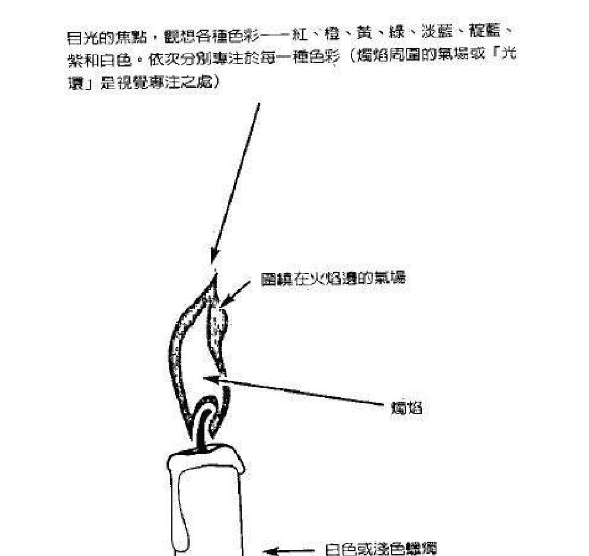

图 8.1 烛焰和色彩练习

在这里会详细介绍烛焰和色彩练习。首先，将一支白色或浅色蜡烛放在烛台上，然后将它置于平面上（不要用深色蜡烛，因为深色蜡烛具有略微不同的能量振动，有时会干扰预期效果）。

要确定房间非常暗。关闭所有光源，因为这也会干扰练习的结果。当你安排好了之后，就点亮蜡烛，然后以舒适的姿势坐下，距离蜡烛五呎远。深吸一口气，屏息数秒钟，然后从鼻子缓慢而均匀地呼气，再重复两次深呼吸，然后恢复正常呼吸。开始注视点燃的蜡烛，直视火焰数秒钟。这时，注意你开始在烛焰内看到的各种不同色彩。当你凝视火焰时，你可能会看见白色、蓝色、红色甚至黄色光。数秒钟后，将你的目光稍稍移向火焰右侧，然后将视线移至火焰的边缘或周围。

开始花一些时间凝视火焰右侧边缘的这个点，当你凝视这个点时，想象各种治疗色彩。从最低振动频率的色彩开始，依次观想。换句话说，先想象红色，在你的头脑中想象或观想这种色彩。然后，想象或观想橙色，接下来，专注于黄色，接着专注绿色、淡蓝、靛蓝或中蓝色，最后是紫罗兰色或淡紫色。

在凝视全部七种治疗色彩之后，以同样方式想象金色和白色。当你已在头脑中想象和观想完每一种色彩之后，接下来就能做练习的下一部分。

现在，重复相同的练习，但方法稍有不同。这次，当你想象红色时，想象有红色光开始在烛焰周围显现。继续注视烛焰右侧边缘数秒钟。这时，你可能真的开始看见烛焰周围有一种浅红色光，特别是在你凝视的火焰右侧。如果你在做凝视练习时，没有看见任何显著变化，那就放松一下，然后继续做烛焰和色彩练习。这种技巧是要训练你的心智，你再多练习几次之后，最后就会产生作用。数秒钟之后，让你的视线沿着火焰边缘移动。让你的视线从右侧向上来到烛焰边缘的顶端，从这里，将目光向下移到火焰边缘的左侧。这样，你的目光就扫过烛焰的整个边缘，当然，是从右到左进行的。

用橙色重复相同的过程，然后，再用黄色做同样的练习，接着再用绿色、淡蓝、靛蓝或中蓝、紫罗兰或淡紫色做练习。

在用七种主要治疗色彩做完这部分的注视练习之后，再用治疗色彩金色做练习，最后用白光或白色做练习。

有几点需要说明。当你看见这些治疗色彩在眼前显现时，不要认为它们只是你的想象。当你培养自己的心灵和灵性能力时，你也发展了与人类心智相关的其它能力。你实际上正在改变烛焰的振动，并显现这些色彩，这正是专注和心智投射的力量。

当你最后完成了专注治疗色彩白色之后，将你的目光从蜡烛移开。让眼睛恢复一般视线。如果需要，你可以花一点时间看看房间四周，直到感觉自己已回到正常的意识状态。花一点时间专注于自己的呼吸可能会有帮助。然后，熄灭蜡烛，最好用熄烛器，然后去做别的事情。你应该安心地知道，这个练习依然会在你的头脑中一个细微的层次上继续运作。

如果你想要的话，烛焰和色彩练习可以在以后多试几次。最终，你看见更高能量，诸如治疗色彩、气场和脉轮的能力将会增强。这时候，你就不再需要做这个练习了。但此时，积极的步骤是增强你的一些心灵能力，这种能力可以更进一步，它包括在你的案主、患者和朋友身上进行治疗色彩的运作。

## 观想色彩和投射练习

当你感觉自己已能熟练地在烛焰周围观想和投射色彩时，你就能继续下一步。你可以在案主或患者身上，进行在烛焰和色彩练习中描述的相同过程。很简单，让案主舒适地坐在你正前方的椅子上。确保她头部背后的墙壁颜色是白色或浅色背景，房间应该看上去像是接近黄昏的色调，准备好这两个条件会让你更容易看见她的气场。

接下来，做几次深呼吸练习，然后恢复正常呼吸。接着，开始凝视她头部的上方或周围…让你的视野变得稍微模糊不清，让你的目光专注于她的头顶上方或头的一侧，视线应该穿透墙壁一会儿，你应该开始看见案主头部的气场。这时，将你的目光移回头部的上方和周围，你现在正看着顶轮周围的气场。

你们中有一些人可能会看见在头部周围有一种白光，它与头部表面的距离大约二到三吋，许多人会看见一些像是黄色或蓝色的色彩，而一些能看见气场的人，则会看到或感觉到气场或能量场的各种不同色彩。无论如何，继续凝视她的顶轮能量中心和区域。这是一个做起来很容易的技巧，你练习得愈多，就愈容易看见和感觉到人体气场。

现在，当你继续凝视治疗对象的气场时，重复在烛焰和色彩练习中所做过的相同程序。从红色开始，依次想象所有这些治疗色彩，直到做完白光练习为止。

在前面的练习中，蜡烛代表了这个人的头部，火焰代表了气场，而火焰的周围则代表了气场的边缘或周围。当你已在案主、朋友或患者身上尝试过这个程序之后，你就可以让眼睛恢复到一般的视线上。为了让你的眼睛和心智回到正常状态，你可能需要眨几次眼睛。

每一个人都不一样，在第一次尝试观想色彩和投射练习时，会体验到不同的结果。有些能看见气场的人，很可能会看到这些治疗色彩中的一部分或全部，在案主的头部周围显现。如果你能看见，就会看见这些色彩围绕在气场的边缘，并进入顶轮——它们甚至会显现为向下流入顶轮和脸部。有些人则感觉人体气场几乎或完全没有变化。这无须担心，如果继续持续定期的练习，你就一定会成功。

许多人都会看见或感觉到一些色彩，这是很好的迹象，表明你正在开启更多看见并运作更高振动能量的能力。无论如何，关键是要练习这种技巧，直到你感觉非常满意为止。你可以把这个程序加入到你自己的疗法中。

当你愈来愈容易看见和感觉人体气场，在你治疗案主时，治疗色彩很快就会开始向你显现。最终，无论你是否专注于任何或所有这些色彩，这种情形都会发生，这是你天赋中更进阶的一部分。

当你自己的振动频率变得更高，你的气场变得更强，你在治疗案主时，这些治疗色彩就会自动前来。接下来会发生的是在你案主或治疗对象头顶上显现的色彩会发生变化。

很快地，具有最低振动频率的色彩，不再在你案主的顶轮和能量场中显现。当你在治疗每一个治疗对象或案主时，治疗色彩黄色、绿色、淡蓝色和白色会开始固定地出现。这些色彩成为流入你的案主脉轮、气场和身体的主要治疗色彩。这是因为你自己的治疗能力已经增强了，你现在正在运作具有更高振动的治疗能量，你能有意无意地吸收这些重要的治疗色彩。根本而言，你已增强了你自己的和治疗室里的振动。

偶尔，中蓝或靛蓝色，紫罗兰色或淡紫色和金色的高频振动，会在治疗对象的顶轮和气场中出现，有时会发生这种情形是出于以下原因：

首先，如果你或你的案主知道某种特殊类型的治疗色彩是必要的，那么合适的色彩就会出现。同样地，这可以是在有意识或无意识的层次上发生的；

其次，在世间和天界，万物之中存在着一种至高智能，这种智能有时称为神圣心智、神圣智能或宇宙心智，它决定了你的患者或案主需要什么样的适合治疗能量或色彩。

第三，你的案主与神圣心智相连的大我，让这个治疗过程得以展开。许多人将来自天界的治疗色彩，与人体气场和脉轮的色彩混为一谈。尽管这些色彩在颜色和色调上看上去很相似，但振动速率或频率截然不同。

治疗色彩红色、橙色、黄色、绿色、淡蓝色、中蓝或靛蓝色、紫罗兰色或浅紫色、金色和白色，具有极高的振动。与这些色彩相比，人体气场或能量场的色彩的振动稍低。

与人体脉轮系统中七个主要脉轮相关的色彩的振动，比人体气场的振动稍低。当然，这些脉轮色彩的振动，从低到高分别是：红色、橙色、黄色、绿色、蓝色、靛蓝和紫色，这些色彩分别位于海底轮、脐轮、太阳神经丛、心轮、喉轮、第三眼以及顶轮。

虽然与治疗色彩相比，气场色彩和脉轮色彩的振动速率或频率较低，但所有这些色彩依然具有极高的振动速率，这些色彩也都能相互和谐运作。

当你在案主身上运用上一章中提及的能量技巧时，治疗色彩就会流入顶轮和气场，并进入各个主要脉轮。当这些色彩与气场的色彩混合时，任何负面或肮脏的色彩就会被去除，它们会被美丽的治疗色彩所取代，这些色彩会将它们的频率降低，并与气场相协调。

此外，这些治疗色彩，尤其是黄色、绿色、淡蓝色和白色，会依次进入每一个脉轮。这些能量会与脉轮或能量中心相混合，在一个能解读气场的人看来，它们显现为一团具有美丽色彩的漩涡或迷雾。你可以把每一个脉轮想象成一个彩色的光的漩涡或光轮。然后，加入北极光般的舞动色彩，这会让你大致知道它看起来是什么样子。

为了与脉轮色彩相协调，治疗色彩会降低它们的频率。当它们流入并经过每一个主要脉轮时，这些特殊色彩好像自己有头脑一样。根本而言，治疗能量都会前往需要它们的地方。

治疗色彩和宇宙能量，会流入体内的神经系统、淋巴系统、循环系统、器官和细胞。这些治疗能量为了适合人体，当它们进入体内时，就会降低它们各自的振动速率。

你愈练习这些技巧，你对移动与引导他人身上的治疗能量的能力，就愈能被真正的开发出来，这是所有真正的治疗师都应该努力达成的一个目标。

在这一章中，我们用到了四大元素中的两种，空气和火，空气是呼吸，火则是烛焰。这应该能让你更加理解四大元素在灵性和治疗方面是多么重要。

作为一个真正入门和开悟的人，你应该认识到自己并没有治愈任何人，是造物主、大灵、上帝或最高智能在进行疗愈。此外，一个需要治疗的人，会让他自己体内的治疗能量与至高临在一起运作，你只是其中的一个管道或载体。在你培养自己的治疗特质时，请保持一颗谦卑的心。

>「人间没有天堂治不好的哀伤。」
>——托马斯·摩尔 (Thomas Moore) 摘自《灵性智慧辞库》

## 第九章 灵魂出体与疗愈的技巧

>「人、树木和花朵都会死亡，但是会存在的事实是，上帝的宇宙是灵性的与永生的。」——玛丽·贝克·艾迪 (Mary Baker Eddy) 摘自《生活中人际关系的启示》

人类的灵魂是永恒的，与上帝、造物者或大灵连接，一个在灵性觉醒道路上的人会知道这点，也了解他们是一个有着身体的灵魂，而非有着灵魂的身体。人的心智控制着身体上的脑，并与灵魂紧密的结合着。事实上，心智被认为是灵魂的一部分，它负责你对周遭环境的觉知与意识。

灵魂出体或星光体出游是一个独特和美妙的经验，让你能旅游到任何地方。你可以遥访的地方可以是物质世界或是天界。作为一个灵魂出体者，你可到世界上的其它地方，造访朋友家或你所爱的人。探索许多古老的遗址，甚至纵览一下你的住家四周。

灵魂出体可以让你前往存在于天界中的疗愈圣殿、教学圣殿、水晶宫殿和美丽的花园，你甚至可以造访阿卡西记录（Akashic Records）或宇宙图书馆，这是个神奇的地方，所有的知识智慧和讯息都保存在这里，它是位于天界里更高的场或层界。在这里，你也可以取得任何或所有前世，当你在回顾自己的灵魂数据时可以这么做，这些记录可以被想成是一种古书或卷轴，这里面包含着你的过去、现在、未来的历史。这是一个非常快速而纯熟的方式来取得前世资讯，同时，也能让你一瞥此生可能的未来。

每个人睡觉时灵魂都在旅行，许多人回忆起梦中的事件，把它称作清明梦或是「飞翔的梦」。对当事人来说是十分真实的。当你睡着时，磁性法则接手，你的身体进入一种非常放松的模式，你的脑波模式戏剧性的慢了下来。一般来说，身体拥有的负极电荷比正极电荷多，但现在正极电荷会变得比较多。人类的灵魂拥有比较多的正极，当脑波模式转换时，心智会变得能自由的引导或影响灵魂。此时，心智与灵魂同时皆有离开身体的倾向。在磁性法则下，正极与负极电荷相互吸引，而正极与正极相互排斥。灵魂与身体也是同样的情形。当身体与灵魂带有更多的正极电荷时，则开始相互排斥，这使得人的灵魂更容易从肉体中离开。

可惜的是，大多数人往往记不得灵魂出体的梦，不管是清明梦或是飞翔的梦。这些方法能使我们回忆起睡眠时的灵魂出体，也可以运用在训练你或你的案主，在清醒时的意识转换状态下进行灵魂出体。你甚至也可以训练自己在接近睡眠的状态中，进行灵魂出体或星光体出游。

## 准备灵魂出体的训练

在尝试灵魂出体前，某些准备是很重要的，使你能有更多成功的机率，这些准备包括饮食、呼吸和饮水。

### 正极元素的饮食

饮食在很多情况下能影响灵魂出体，特别是在清醒时或轻微睡眠时进行灵魂出体的时候。磁性法则又再次出现，就像人类的身体与灵魂一样，大多数的食物有的正极的元素多，有的负极的元素多。所以吃下这些不同极性倾向的食物会影响到身体的极性。前面讲过，身体同时包含正极与负极性，想象一下，人类的身体就像一个汽车电池，这电池同时含有电子和质子，电子带负电而质子带正电，要使电池稳定运作产生电流，这些元素都是必须的。

身体同时需要正极和负极以健康与和谐的方式来运作，虽然身体同时包含两极，但仍然比较倾向于负极性。某些食物也是如此，有的可以是比较是负极的或比较是正极的。

某些拥有比较多正极的食物是绿叶蔬菜，像是芝麻子和许多水果，特别是像奇异果、芒果、苹果、樱桃和柑橘类的水果，带有比较多的正极元素、较少的负极元素。这些食物被认为是拥有较轻盈或是较高的振动频率，所以有时被称为「灵性食物」，原因是频率高并包含较多正极元素。

许多食物，像是红肉、猪肉、糕点、冰淇淋和甜食，拥有较多的负极元素，正极元素较少，这些食物被认为是拥有比较沉重或是较低的振动频率。某些食物像是鸡肉或其它禽类制品、海鲜和大多数的奶制品，正负极元素相等，它们被认为是中性食物，所拥有的振动频率介于灵性食物和沉重食物之间。

### 深呼吸

生命的呼吸对于灵魂出体的训练是非常重要的。在第三章里解释过深呼吸的好处。当你吸气时，你将气或宇宙能量吸进来。如果你把气维持在肺部一会儿，这股气会透过循环系统进入全身。当然这会提高你的振动频率，让你的身体变得更轻盈，带有更多正极元素。因此深呼吸在身体中变成是一种灵性食物。

想要进行灵魂出体或是星光体出体时，可以更进一步练习深呼吸。这包含有深深吸气，把空气维持在肺部五秒钟以上。屏息愈久，身体变得越为正极。同时身体振动的频率愈高，当然屏息的时间长度不宜使人感到困难或是不适。

### 喝磁化水

水如果以某种方式来使用时，可以在身体中产生双倍的效益。所有认真想进行灵魂出体的人，在白天要喝适量的水，这可冲净身体，去除不要的废物、毒素这类具有很低频率的物质。清除这些不要的物质，有功于身体维持健康的能量，在《古代神秘学院入门书》一书中，水杯的技巧里有描述过。这技巧教你如何将杯子里的水磁化或是「充电」，使得它变成更高频率的能量。当在灵魂出体的训练中被使用时，具有很大的力量。

灵性食物、加强深呼吸练习和磁化或充电后的水，可一起以下面的方式来运用，这确保你在尝试灵魂出体时，成功的机率更大。

在尝试任何灵魂出体技巧的前七天，可以试着进行下面这个养生法。通常，需要一个礼拜的时间，才能在身体灵魂上显现我们想要的能量变化。在这个过程里，需要多注意你的饮食。另一方面，如果你的饮食中摄取分量丰富的红肉，那么你应在这段短暂的七天里，试着减少红肉的摄取量。如果你也喜欢甜食，那么也需要在这七天里减少摄取甜食。

请记住，这只是暂时的，而且这些原则并非一成不变。试着在这当中找到你自己愉快的平衡，不管你是吃荤的或是吃素的人，都可以达成灵魂出体。只是在这准备的阶段里你能做些改变的话，是会更容易学会灵魂出体。如果你已熟悉灵魂出体，那么这些准备会增加你的灵魂出体或离体的经验。

绿叶蔬菜拥有在灵性食物中最高的某些振动频率，它们拥有大量的正极元素，特别是莴苣和菠菜。如果你在这七天里大量吃这两类蔬菜，在试着做灵体出体时，会感受到它的益处。

在准备阶段里，你可以练习更深更长的呼吸。每天练习呼吸两次，一次是早上，另一次是睡前。如果你从事轮班性质的工作，你可以随心的加以调整。

每天早上一起来，就做个深呼吸到肺部里，然后当你屏息时，在脑海里数到十二。当你这么做时，会觉得肺部在跳动，感觉到在胸口上的压力。当你数到十时，开始把气吐掉。慢慢的从嘴巴吐气，不要急，吐出所有的气，然后再做第三次深呼吸，也是早上的最后一次。到了晚上，用跟早上一样的方式做深呼吸，然后再多做六天这种养生法。

你可能开始察觉到你的身体会振动或是前后摆动，你的身体会变得更为正极，让你永恒的灵魂开始能从你的身体中溜出去。你的灵魂开始轻轻的从你的身体中移到气场里，然后再移回来。

这个礼拜里应该每天练习水杯技巧，至少每隔一天进行一次。不管如何，至少在这个准备期间，做三次下面这个练习。

首先，用一般大小的杯子装满水，找一个相对安静的地方坐下来，在你身边放着一整杯的水。接着做第五章里提到的双手取暖法，如果需要的话，回头复习一下，然后把水杯拿起来，把你的手以舒服的姿势放在杯子四周，确定碰着杯子外边，这确使治疗能量或气可以流进水里，被水吸收。

记得右手拥有比较多气或者宇宙能量的正极元素，左手则比较是拥有这能量的负极元素。在磁性法则中提到，同性相斥，异性相吸，因此右手正极元素吸引左手的负极元素，在水中这两极的元素结合在一起。最后，水会磁化或是充电并具有较高的振动频率，且具有让正极主导的元素。

现在感觉温暖的能量进入到手腕和手上，专注在这里一会儿，直到觉得在手上、拇指和手指上有脉动感，让这股脉动变得更强烈。

将注意焦点放在水杯上，感觉手在杯子外边上脉动着，感觉这股脉动愈来愈强，直到仿佛这股脉动像是从水槽里辐射出来的心跳。你开始会觉得水变得不一样了，继续握着水五分钟，感觉好像水杯要把你的手推开似的。这水现在完全磁化了，水里的气或治疗能量有时被称作是生命力。拿起这杯水，赶快喝下去，很快地你会觉得你的舌头上有个愉快的温暖感，表示充电的水对身体有着正面效益。身体的振动频率提高，拥有比较多的正极元素。

在七天的准备期结束前，饮食、呼吸和水的结合，会提供你频率上必要的改变，让你能进行灵魂出体，现在你准备好要开始了。

## 灵魂出体基础技巧

在第八天，你可以尝试以下技巧，这个练习可以有规律的长期使用，非常简单容易。确定你是放松的，所有的负面情绪，像是愤怒或恐惧应该放在一旁。房间需要十分安静，找张舒服的椅子坐下，旁边摆着满满一杯水。深深的吸一口气，屏息一会儿，然后慢慢从鼻子吐气。重复二到三次这个动作，然后回到正常的呼吸。

拿起杯子再做一次水杯技巧。这次做这练习时，你可能会注意到比先前有所进步。你的手可能比之前脉动得更快更强烈，跟之前一样，把所有充电的水喝完。

从这里开始，你可继续坐在椅子上，或是以舒服的姿势躺下来，这完全由你决定，但是，如果你是在睡前做这个练习的话，躺着会是一个比较好的姿势。为了简单起见，在教授过程中会使用到一张床。

当你躺下来，观想或想象一股白色的光，在你的卧室沿着你的墙壁四周环绕，然后观想这白光完全围绕着你和你的床，基本上，你会有内外两圈白光围绕着你，当你尝试灵魂出体或是星光体出游，这是一种保护，不让负面的灵体来干扰你。这些白光也会吸引天使、灵性向导和其他天界的生命到你身边。

你是一个已启蒙或灵性开悟的人，气场也会比较强，频率比较高，会有助你吸引适当和有爱心的灵性生命到你身边。能量工作与灵性觉醒此刻已来到你的身边，进入你的生命中。当然，你应该常常祈祷天使或灵性向导，在你静坐时或是灵魂出体时进入房间。这份祈请确保这些光之灵进来保护你，跟你一起工作。虽然天使、灵性向导和其他生命体某些地方不尽相同，但他们都是和谐的共同合作。这些灵性生命都是天界神职系统的一部分。

此时，你可能会觉得胃部凹窝里面有种温暖的感觉，你可能会觉得身体会左右或前后摇晃，这是磁化水所产生的结果，也表示你的灵魂想要溜出来了。

现在你需要使用深呼吸的技巧，想着屏息的练习。在这种情况下，你做较长的深呼吸，或者像以前一样做两次屏息练习。第三次的呼吸就不同了，在做完第二次的呼吸之后，等个三、四秒钟。让你的眼睛往床尾看，想象你正在站起来，看着你俯卧的身体。闭上眼睛，并在你的脑海里想象这个画面。

现在做第三次深呼吸，屏息慢慢数到十二，然后用力的大口吐气，很快的吐完所有的气，你仿佛是把自己从身体中推出去。此时，让自己放松，每个人在尝试这个部分，结果会不同。有些人可能溜出身体，站在床尾，回头看着平躺的身体。有些人则发觉头几次做这段练习时没有什么结果。但是多数人会有一两秒钟离开身体几尺，你可能会有种愉快的感觉，有点晕晕的。

灵魂成功出体的秘诀在于，持续有规律的练习这个技巧，直到你专精为止。最后，许多人能够有意识的做星光体出游，这是一种轻度的意识转换状态或是接近睡眠的状态。不管你以坐姿或是睡前躺着练习时，有一个额外的步骤是需要去做的。无论你是告诉自己，或是低语下面这个肯定语：「我想要灵魂出体，我想要去造访阿卡西记录。」如果你想要旅行到其他地方，像是疗愈殿堂或是教学殿堂，只要把「阿卡西记录」这一词换过来就好了。如果你想去拜访人间的朋友，或是天界的水晶室与宫殿，也可以用同样的方法。

如果你在睡前使用这个肯定语，这个念头会进入潜意识和你灵魂的心智。这个设定最终会让你到这些你想去的地方停留。在说完或想完这些话之后，就放松大睡。

如果你是舒服的坐在椅子上练习灵魂出体的技巧，也使用同样的肯定语句。发呆一会儿，然后从椅子上起来，回去做你日常的事情，知道肯定语仍会在你睡觉时同样运作。当你的灵魂或星光体出游时，你可以去会见天使、灵性向导和其他光之灵，并与他们运作。这些天界神职系统的成员，会陪伴你到许多不可思议的地方。有些像治愈师和教师，会在天界的疗愈殿堂或教学殿堂等着你。你可学习如何与这些充满智慧的光之灵沟通，给你需要的答案，你寻找的智慧与知识，都可以从这些光之灵来获得。你可能甚至会发现，当你造访一个美丽的天界花园时，内心会充满平静和喜悦。对许多人来说，会是一个很有疗愈性与抚慰人心的经验。

## 灵魂出体进阶技巧

在上一章里，曾详细介绍几个能量流动的技巧，其中两个技巧是可以结合在一起，运用在灵魂出体上，它们是顶轮至海底轮能量流动法，与泉水和双脚脉轮法，本质上，把这两个结合成一个更长的练习，可让能量流经全身，这练习被称为脉轮流动引入法。

「引入」一词指的是，引入到进行回溯前世或灵魂出体所需的适当意识状态。

一开始你应该对自己使用脉轮流动引入法，练习这技巧，直到你专精为止。对某些天生能量感受者来说，这可以成为你们的第二天性。最终，如果你想要，这个技巧也可运用在你的治疗对象上。

这次从专注在顶轮开始，将能量往下带到海底轮，再往上带。重复这能量流三到四次，让它愈流愈快，记得把这股能量想成是温暖的水，接着把温暖的能量流或水流带到脚部，观想温暖的水从脚部往上冲到头顶。

然后，引导能量从身体背后下到脚部，专注在这温暖的水或是能量，在身体里上下流动的更快些，并让这股能量愈来愈强、更有力量，所以它能自己流动。当出现这种状态时，观想你的天使或是灵性向导来与你会面，想象你的天使与灵性向导握着你的手，与你一起向上飘去，带着你去一个你要造访的地方，这可以是一个疗愈殿堂、一个教学殿堂、阿卡西记录或是任何你想要造访的地方。让你的心智漂浮，让任何意象或画面进来。你想在这过程中待多久就多久，并享受这过程。

当你感觉你的心智已经漂浮了够长的时间，重新再专注到你的身体上，感觉能量感流过你的脉轮和肉体，此时，专注让温暖的水流开始慢下来。

继续专注在这股能量上，让它甚至更慢些，最后在心轮或顶轮停下来，这由你决定。之后，放松一会儿，让你的心智回到一般的意识状态。当你准备好时，就回去做平常的事情。可以经常的随心尝试做灵魂出体的进阶技巧。

藉由进行灵魂出体的基础与进阶技巧，你会对灵魂出体变得很有经验，这些练习会帮助你造访更多各式各样美妙的地方。

## 灵魂治疗

最后，你能培养出在灵魂状态下从事治疗的能力。具有天赋或是已开悟的治疗师，像是大师耶稣便能做到这一点。这个能力让身为治疗师的你，很快的旅行到各地或远处，给某个人做治疗。

往往，治疗天使与其它能行使治疗的灵体在你以灵魂体旅行时，会跟着你一起旅行。就像组成一个团队，你会进入需要进行治疗的人的家里、卧室或医院病房里。如果当事人愿意且她的高我希望的话，那么你与你的治疗协助者得以对她合作。你可以将你的「灵魂的手」放在对方身上，传送治疗能量到不舒服的部位，同时也会有一两位治疗天使这么做。在你的灵魂本质上，你同时会把你的灵魂的手放入身体中，去运作某个需要治疗的地方。与你同行的任何治疗师也会以同样方式来做。这种强而有力的治疗方法，通常是在下面这种情况下发生：你必须是在一个深度的、意识转换下的状态或是睡着了，治疗者必须在一个放松和接受的状态，或是睡着的状态。在睡前，你该专注在这个人和他的名字，在你心里说，你想要对这个人做治疗工作，然后请求你的治疗天使和向导来协助你，之后，就让自己睡去。隔天，你可能知道或不知道你尝试后的结果。你的直觉此时可能会有所帮助，让你感觉到什么事已发生。也许你会记得有个梦，在梦里，你把手放在某个人身上，感觉或看见光之灵接近你。不管如何，这过程很有可能是成功了。有时，接受你治疗的人会记得你的造访，可能是以栩栩如生的梦境来显现。这个人也可能晚上在房间里看到或感觉到有人或是存在体显现，这都是显示你的灵魂曾出游到那里。你愈练习灵魂治疗，你会做得愈好。

## 远距离治疗

一旦你培养或提高你的能量治疗和灵魂出体的天赋后，你会增加其它能力。这个能力是传递治疗能量给在远处的某个人或是某件事，透过某些技巧可以达成这样的能力。这种技巧可以说是隔空或远距离治疗，远距离治疗是这类疗法中最常使用到的词汇。

许多修行的学校在传授各种此类的治疗法时，会使用不同的符号。符号是很重要的，因为它训练你专注在自己的治疗能量上。

在古代，疗愈殿堂和埃及的神秘学院在远距离治疗时运用特定的符号，这些符号是生命之钥 (Ankh)、有翼的太阳圆盘 (Solar Winged Disc)、太阳 (Sun) 以及荷鲁斯之眼 (Eye of Horus)：

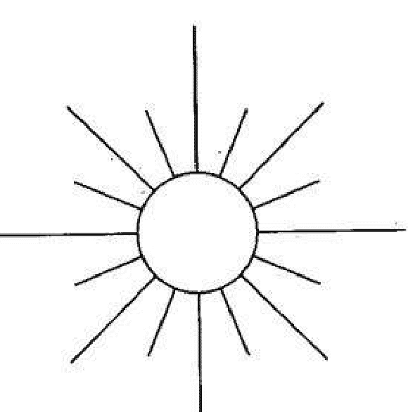

太阳符号——运用治疗大多数的疾病

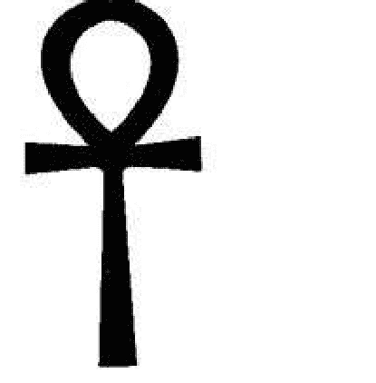

生命之钥的符号——使用在对癌症的治疗上

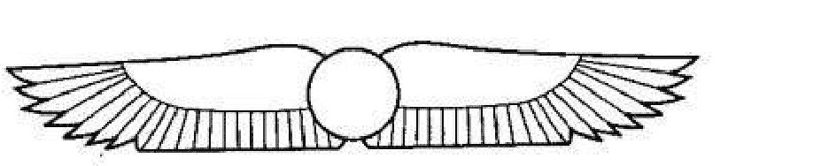

有翼的太阳圆盘的符号——使用在情绪的治疗

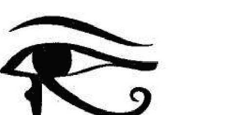

荷鲁斯之眼的符号——使用在灵性治疗和精神开悟上

### 图 9.1 使用在远距离治疗的四个埃及符号

| 符号 | 用途 |
| :--- | :--- |
| 生命之钥 | 代表着生命的符号，使用在对癌症的治疗上。 |
| 有翼的太阳圆盘 | 代表情绪的治疗。 |
| 太阳 | 是生命力的代表，被用来治疗大多数的疾病。 |
| 荷鲁斯之眼 | 使用在灵性治疗和精神启悟上。 |

这些神秘符号只传授给少数神秘学院和疗愈殿堂的进阶生或入门生，在古代这些符号非常有力量，并且可以在现代使用。

当对某个人进行远距离治疗时，你可以用以下方式使用这些符号。找一个安静的地方，确定你排开了所有使你分心的事。让自己处于一个舒服的姿势，躺在床上或坐在床上会是理想的姿势。如果是在睡前尝试这个治疗会更好。

花一点时间，做几个深呼吸，这应能帮助你放松。准备好时，在心里想象或描绘需要治疗的那个人。脑海里想着对方的名字，不用大声说出来。选择一个最适合这个人的治疗符号，例如，这个人得了癌症，你可以使用生命之钥等等。接着，在脑海中看着这符号并把它传送给对方，同时也给对方传送爱的意念，完全释放这些想法，并试着从你的脑海里完全清空出去。最后想想别的事，或者让你的心思飘走。你可能很快就睡着了，这有助于释放治疗能量，进而传送到那个受苦的人身上。

当你做远距离疗愈来愈有力量而纯熟时，你就不再需要这些符号了。到最后，你所需要做的只是专注于能量并予以释放。符号的使用，其目的在于训练，当你觉得准备好时，可以从你的程序里去除。

本章运用了三到四个元素，分别是空气、水和土。呼吸代表空气，温暖的水的能量代表着水。泉水与双脚脉轮法代表着水与土。藉由双脚，你也可以吸收土地的能量。

身为人类，你是一个多次元的生命，你可同时在地上与天界运作，如果你选择这么做的话。身为一个人类的灵魂，你是一个光的生命，是上帝或大灵的一道光。你可使用你潜在的天赋去帮助实现人间天堂。

> 【希望你能接受到生命中所有的灵性祝福。】

——道格拉斯·德龙

## 第十章 造访阿卡西记录

> 只有一种善—知识，而只有一种恶—无知。

——摘自《苏格拉底语录》

在我的书当中叙述的所有技巧，都是设计来协助培养或提高你们的能力。如果你已经是位能量治疗师，希望这本书的某些章节，能有助于增加你的治疗天赋。若你是谘商师或老师，一步步传授，会让你在你所从事的领域中变得更具天赋。

依据本书的详细教导，使得你能进行灵魂出体与忆起前世。如果你尚未准备好去经验这两种灵性探索的话，也别担心。借着练习本书里面的各种练习，你对灵魂出体或星光体出游，以及回忆前世会变得更熟练。

当你熟练灵魂出体后，你可以在需要的时候去造访阿卡莎秘录或宇宙图书馆。在天界的这个区域里，时间是静止的，所有过去、现在甚至未来的事件、知识与智能都存在于于此。

借着造访阿卡西记录的某些区域，你可以接通上数量难以估计的信息。如果你把时间想成是一条永不止息的河流，没有开始也没有结束，那么你可以真正了解我们存在的真实状态。

每一件已经发生的事和即将发生的事，被储藏在这令人惊叹的宇宙图书馆中。学会回顾早期的历史事件，你也许可以在这里找到曾有过的问题的解答。这不仅可以回顾过去的事件，也可以看看你自己的前世，这可以当你处于睡眠状态或是意识转换状态时来完成。

同时，未来的事件也储存在宇宙图书馆。身为一个熟练的灵魂出体者，你可以看见自己的未来。当你看到自己的未来一两年内能够做你喜欢的事并感到快乐，那么你的内在便会使获得很大的安抚或平安，这可以给你某种内在的明了，知道你走在正确的路上，所有的事情正在他该有的方式展现。

作家有能力探索阿卡西记录，以明了过去的事件。这可以在他睡眠时或是深度意识转换状态中发生，下面这则故事就是这种方式得知的。

基督教会 在许多年内历经十次痛苦的迫害，最后一次是发生在罗马皇帝戴克里先(Diocletian)时期。

公元三七五年时，罗马皇帝狄奥多西(Theodosius)在位的时候，突然间产生改变。基督教会 在他的统治下获得胜利，他也下诏书去迫害异教徒。

提阿非罗(Theophilus)是亚历山大城的总主教，事实上，也是这个大城市的统治者。他遵守罗马皇帝的诏书，让暴力在此地发展。他是一个十分激情的人，具有一种全然残忍的天性。

基督教与异教两方的内讧已到极点，杀死了许多人。提阿非罗搧风点火，鼓动基督徒起来暴动。

很快的，一群杀气腾腾的暴徒横扫亚历山大城的街道。他们毁坏所有属于异教的东西，许多异教徒在暴动时被基督教暴徒所杀害。一个叫塞拉皮雍(Serapeum)的大圣殿…搜藏许多神奇的宝藏。黄金、银饰、大理石雕像和其它精美的宝物充满在这个地方，这些全都被暴徒所凌虐，而这个美丽的建筑也就毁坏了。这个圣殿只是亚历山大图书馆散布在整个城市的馆区的一分，这个伟大的图书馆包含了主图书馆、博物馆和塞拉皮雍的姊妹馆，包含有长廊、装满了书和卷轴的拱廊，并连结着大圣殿。本质上，亚历山大是一个充满书和卷轴的城市。

基督徒被异教罗马迫害两百多年的时间，现在是报复异教徒的时候了，结果是血债血还，仇恨如传染病一样在基督徒之间蔓延。

希帕提娅(Hypatia)是著名的数学家和天文学家席昂(Theon)的女儿，她聪明美丽、极富学养，自己也是一名哲学家和天文学家，超越了所有其它在亚历山大图书馆与博物馆的优秀男士。

她曾在埃及的古老神秘学院学习过，也成为其中的祭师与教师。从罗马帝国各地来的学生前来向她学习。她十分专精哲学、星象学、天文学、数学、神秘学以及古老的智慧，是一个难得如此善良和蔼且有爱心的人，她灵魂的美匹配着美丽的外貌。

希帕提娅紧张的驾着马车穿过街道往亚历山大图书馆前去，两匹白马带着她一路走着，似乎也承担着她的紧张。

她有些学术上的朋友，建议她不要前去户外空旷处，应留在屋内。这位独立的女性拒绝被恐惧所控制，她觉得她有权利信仰异教。虽然她感谢这些建议，但她仍想要回到她在亚历山大图书馆里的研究室。在巨大图书馆里的长廊与房间里，那是她觉得最像是家的地方。她的心智专注在这些想法上，便晃动了马车上的缰绳，要马儿跑快点。他们快速通过一条宽敞的街道和几个建筑，前头那条街通往一个大型而开阔的广场，在这片空旷的地上铺满着白色石头。当希帕提娅的马车走出那条街进入广场时，她缓下马车、瞧瞧四周、感觉事情不大对劲，汗毛都竖了起来，心跳开始愈来愈快，希帕提娅听到远处喧闹的声音，那里曾是她离开过的美丽的家，现在变得非常吵杂。

许多男人与女人从四面八方朝她的马车围上来，愤怒的人群从她右手边的塞拉皮雍殿堂倾巢而出，【杀了她、杀了她】一个矮小黑发的男人大叫着，同时抓住马上的皮缰绳，不让希帕提娅的马继续前行。

她回头看，试着把这对白马调头，往她来的路走去，但没有用了，退路已经被封住了。

马车四周围着全是嗜血的基督徒，一个鬈发的女士对着希帕提娅咆哮，对她丢石头。石头投中她的左肩膀后又弹开，她的左手臂痛苦难堪，整个都麻木了。

加害者手指着她指控并大叫：“就是她！她是希帕提娅，是异教的领袖！”带着惊吓与困惑，这位亚历山大最有名的女性学者喊着：“拜托，请让我离开，我并没有伤害你们。”

没有人理睬她的请求，许多愤怒的手向前拉住她，把她从马车中拖出来。希帕提娅的请求淹没在基督暴徒的咆哮中。

他们继续拖着她的长发和手臂，穿过广场，来到一个靠近塞拉皮雍殿堂的走廊下。当人们开始踢打她时，希帕提娅啜泣着。群众中有人对着她吐口水，诅咒她是一个异教的恶魔。

不消多久，这位无助的受害者浑身是血，深红色使得暴徒更加兴奋，嗜杀的欲望变得无法控制，简直就是要把她肢解开来，撕裂成片。

此时，许多人开始在通道、拱廊上以及巨大的图书馆中的房间里狂乱的奔跑，书、卷轴和珍贵的文件被集中起来，丢到中央的广场。某些人带着火把丢到这快速堆起的文字数据上，放火去烧。

很快的，烽火在这混乱中燃烧，烧毁了一切。更多的数据，文件和书，继续被丢进不断愈烧愈猛烈的火中。

希腊罗马的文学、古代文献、神圣的雕像和历史纪录全都付之一炬。包含古埃及以及其先前亚特兰蒂斯的知识的草纸卷轴，全都化为灰烬。许多哲学家、罗马皇帝、科学家与治疗师的作品，全都遭遇相同的命运。

在那次的事件里，数以千计包含珍贵知识的书和卷轴被摧毁，甚至可怜的希帕提娅自己精湛的作品也被烧毁了。

处在仇恨与愤怒中的暴徒，造成人类巨大而无法弥补的损失。不容他人信仰的狭隘心态，已经导致可怕的灾难，整个世界无法从这种破损中复原。

作者接收到的珍贵影像，是基于一个特别的理由来告诉各位读者的，这是要让你们看到宗教上不容异己的愚昧与无用。这目的不是要让你愤怒，而是打开你的眼睛看清我们内在都与生俱有的残忍天性。异教徒曾迫害过基督徒，基督徒曾迫害异教徒、回教徒、基督徒，而犹太人至今仍相互伤害。

当你更明了当今的社会时，许多人将致力于打开爱心。当你拥抱一条更为灵性的道路时，过去的暴力会消失。

一个在世间真正开悟的灵魂，会拥抱在我们许多文化和宗教上发现的真理与智慧。所有重要的宗教，即使他们各自有着错误，但仍然含有某些真理。对许多人来说，宗教是一条道路，通往造物者、上帝或力量的路。每个人都要在自己的旅程中找到一条灵性道路，返回造物者或源头。对某些人来说，一条未必牵涉到一个有组织的宗教的灵性道路，是你们的方式。对其他人来说，某特定的宗教像是巫术，异教、基督教、伊斯兰教、佛教或印度教，可能是你会追寻的道路。不论如何，如果你培养一颗爱心，以敬意与宽容待人，这些路都会引导你回到造物者。

这让我想起这个比喻，有六个人在山脚下，三男三女，他们都在各自回到造物者的灵性旅程上，他们眼前的山顶代表着灵性开悟和造物者的光。每个人眼前都有一条泥泞的路，通往山顶上。这六个灵性追寻者开始分别由独立的道路往上走，最后每个人都爬到山顶，在那里，灵性开悟与光明并存。即使每个人都遵循自己的道路，但最后都回到源头，且获得真正的开悟。

这会是每个人的目标。

> 【当我们每个人在内在前行时，和平会降临，并领悟到我们都是上帝平等的一面，那么我们便能和谐的坐在一起……】

——摘自《灵性智慧辞库》

享受你的灵性旅程！