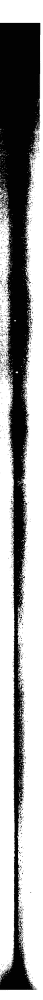
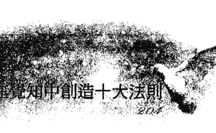
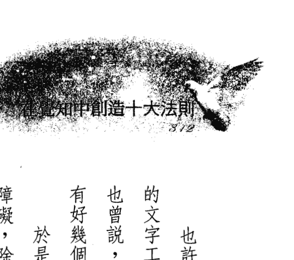
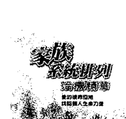
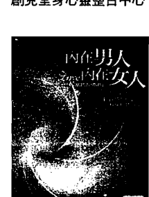
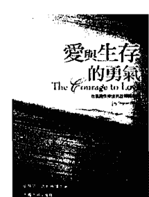
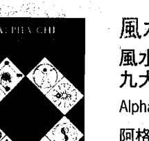
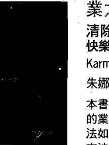
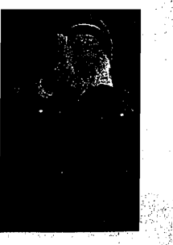
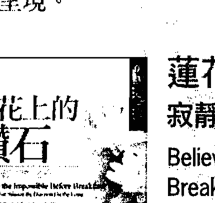

## Kirael: The Ten Principles of Consciously Creating
## 在覺知中創造
## 十大法則

弗瑞德·思特靈 Fred Sterling ◎著
黃愛淑 ◎譯

高靈齊瑞爾Kirael在《預知生命大蛻變》中，解答了現代人對2012年光子能量全面來臨的疑惑。數千年前亞歷山大圖書館被焚毀的古老秘密知識——由齊瑞爾從宇宙知識寶庫中擷取並轉譯，透過訊息使者思特靈在本書中傳達出這份珍貴的「秘密」，能讓你在最真實與喜悅的狀態下心想事成。

## 謹獻給

這本書是要獻給那些有勇氣重新擘畫生命的人
他們承諾並相信人們是生活在一個沒有局限的社會
沒有什麼是我們做不到的

## 推薦語

> > 「從珍·羅勃茲 (Jane Roberts) 和賽斯 (Seth) 那時算起，我修習形上學已有二十五年了，我以為在靈性上我什麼都懂。當我收到這本書之後……它改變了我的生命，找回了我想幫助大地之母康復的熱情。十大法則讓我在第三次元得到解放，如今我時時刻刻都和我的高我溝通。我推薦本書給所有想要療癒內在及外在的人。」
>
> ——拉瑞 (Larry S.), 承包商, 加州

> > 「本書有如靈性的脊椎按摩療法，讓我可以深深感覺到我的心靈、內在生命以及蛻變。我的這些部分多年來都在掙扎當中，現在每一次的閱讀就像是對它們的調整。我的感激有如一道閃耀的光。謝謝！」
>
> ——約翰·萊特 (John W., Writer), 德州

> > 「當我第一次學到『在覺知中創造十大法則』時，我正展開新的職業生涯。我很喜歡這些訊息且開始每天練習，幾天內我的客戶名單都是滿的。我把十大法則應用在生活中的每一個面向，並且真的相信這是給所有光之工作者的利器。」
>
> ——克利絲蒂 (Kristie S.), 個人訓練師, 內華達州

> > 「我是個藝術家，對我的專業抱有很大的熱情，它為我帶來很多樂趣，但從未有足夠的經濟條件讓我可以不必擔憂生活。我已經準備好了，我知道依照這十大法則過生活，可讓我達到目的地。」
>
> ——吉塔 (Jutta Z.), 服裝設計師, 路易斯安那州

## 目 錄

關於齊瑞爾指導靈大師 006

作者弗瑞德・思特靈簡介 009

中文版序 012

推薦序——覺知，然後創造 林千鈴 015

前言 019

如何使用這本書 021

十大法則概觀 025

引介 你可以擁有一切 029

第1章 真實法則 063

第2章 信任法則 089

第3章 熱忱法則 115

第4章 明晰法則 135

第5章 溝通法則 157

第6章 完成法則 181

第7章 祈禱法則 205

第8章 靜心法則 231

第9章 睡眠編程法則 257

第10章 創造合願法則 283

齊瑞爾的數字學 307

譯者分享——給不斷進化的人們最好的禮物 311

生命大蛻變的故事 315

重要字彙索引 319

致謝 333

## 關於齊瑞爾指導靈大師

齊瑞爾是一個來自第七次元的愛的指導靈，他承諾要用他的光到這個地球層面來幫助人類療癒、進化和體驗這個「意識上的大轉變」。齊瑞爾大師藉由弗瑞德·思特靈的傳導被認識，他一直被稱為「天使之王」和「旅程的守護者」。在近來的歷史當中，許多偉大的能量已彌漫著地球的層面，從本源帶來人類世界還不太能了解的資訊。在一九七〇年，珍·羅勃茲 (Jane Roberts) 帶來了很傑出的非物質體 — 賽斯 (Seth)。今天，有很多深邃、有愛心的能量正在透過傳導者來幫助地球和她的居民：

- 克里昂 (Kryon) —— 透過李·卡羅 (Lee Carroll) 傳遞訊息。
- 群 (The Group) —— 透過史帝夫·羅瑟 (Steve Rother) 傳遞訊息。
- 亞伯拉罕 (Abraham) —— 透過以斯帖·希克斯 (Esther Hicks) 傳遞訊息。
- 蓋姬（Gaia）—— 透過佩珀·路易斯（Pepper Lewis） 傳遞訊息。
- 大天使米迦勒（Archangel Michael） —— 透過蓉娜·何曼（Ronna Herman） 傳遞訊息。

以及其他很多很多。

在一九八〇年後期，另外一個世代的光之工作者（Lightworkers）知道一個新的能量體出現了，他自稱為齊瑞爾。思特靈牧師很榮幸地成為他的靈媒。我們用「他」來稱呼這個存有，只是因為他透過思特靈牧師來傳遞訊息，齊瑞爾已經表明他的能量既不是「她」也不是「他」，而只是從另外一個次元來的一種光的能量模組（energy pattern）。

齊瑞爾來到這裡有前所未有的劃時代的重要性。他在歷史的此刻出現，來實現一個古老的預言——這在長遠的時代裡發生了很多次，這個預言是關於二十萬年前開始的一個進化的循環。這麼多偉大的能量同時來到這裡並非偶然，因為這是一個不凡的改變和成長的時刻。

大家所認識的齊瑞爾指導靈大師來到這裡幫助地球之母和其上的居民進入一個深度進化及改變的新時代，他把它稱之為「意識上的大蛻變」。透過古馬雅、美洲原住民、埃及和聖經的曆法，以及諾斯特拉德馬斯（Nostradamus，譯注：法國星相學家）和其他現代的通靈者的預言，在歷史上這個時期一直被稱為「末世」（The End of Times）、「零點」（Zero Point）和「無時間的時代」（The Time of No Time）。齊瑞爾不斷指出，這個大轉變並非一種黑暗的厄運或毀滅，而是地球之母在重新平衡，並為集體進化邁向一個新次元做準備的大喜悅和歡慶的時代。

齊瑞爾大師最大的使命是療癒人類的世界，他把世界和平、和諧及啟發人類當做他主要的工作項目。他已藉由書籍、錄音帶、廣播、電視、網路傳播和內容豐富的網站資料庫，提供了強有力又實用的工具。

## 作者弗瑞德·思特靈簡介

弗瑞德·思特靈是一位靈媒、牧師和信息傳播者，是一位穿梭於人類的第三次元世界及靈性的無限領域之間，具有美洲原住民血統的薩滿（shaman）。他以書籍、文章或錄製課程內容的方式，來傳達齊瑞爾——一個靈性指導靈大師的愛之光和智慧，已超過十五年以上。

身為非傳統的靈性教會「檀香山光之教會」的創始人及資深牧師，思特靈的光與愛照亮當地的教會信眾，並透過網際網路照亮光之工作者的國際社群。他每週的現場網際網路廣播節目「跟弗瑞德·思特靈一起大蛻變」（The Great Shift with Fred Sterling），從世界各地引介很多頂尖的靈修者和療癒者，喚醒我們做意識上的大轉變。

卡胡（Kahu，夏威夷話的牧師）思特靈是早期最重要的一個具天賦且奉獻不懈的療癒者，幫助全球的尋道者去發現他們的道路，走向愛的療癒。在「檀香山光之教會」裡，他已經成為一個療癒的先驅，以及愈來愈傑出的靈媒。在齊瑞爾大師的指導之下，他把印記細胞療法 (Signature Cell Healing) 帶入世界，並創出獨特的遠距療癒方式去喚醒全球聽眾的力量。

思特靈牧師熱忱地擁抱生命中的冒險，他的生命經驗使他作為一個牧師和療癒者都當之無愧。這讓他培養出完全的誠實和可信——你所看到的你都會得到，不論在電台或網路上，或是平常時都全心投入，且善於即席演講。所有「檀香山光之教會」星期天禮拜儀式時的演講內容，都是來自他個人的體驗，他以教導而非佈道的方式分享旅程中的課題。

從頭到尾，卡胡（在穿越美國和歐洲的旅途中所碰到的人，都會熱情地這樣叫他）對自己身為「領導者」和「療癒者」的角色，並不如作為一個「信息傳遞者」那麼津津樂道，他並且認為，信息比傳遞信息者更為重要。

> > 卡胡說：「我目前整個人生的旅程，是要讓人們看到有很多其他的方法可供選擇，不必卡在恐懼當中，也不必成為「末世厄運和毀滅」的犧牲者。我要人們在自己內在找到美和光，開始運用它，開始療癒。我相信現在是透過療癒得到和平的時候了。」

他和齊瑞爾大師一起寫了幾本書，包括《預知生命大蛻變》，《齊瑞爾II：創世基質》，《通往未見的本我》及本書。他的作品被翻譯成多國語言，包括德文、西班牙文。

## 思特靈其他著作

- 《預知生命大蛻變》 (Kirael: The Great Shift) ，另有德文版。
- 《齊瑞爾 II ：創世基質》 (Kirael Volume II: The Genesis Matrix) ，另有芬蘭文版。
- 《通往未見的本我》 (Guide to the Unseen Self) ，另有德文版。
- 《在覺知中創造十大法則——正式的教本》 (The Ten Principles of Conscious Creation — Official Textbook) ，另有希伯來文版。
- 《造物者與我：光之工作者靜心和療癒的禱告》 (Creator and Me: A Lightworker's Prayers for Meditation and Healing) 。

## 中文版序

对于中文读者，我要以这本由衷的爱写成的书来介绍这些让我成长的重要法则。

一直到我了解第一个法则——“真实”之后，我才从生命中的局限解放出来。是的，“真实”使我得到自由。在真实中我了解到，在生活中若要成功，一定要把勇气带进这个世界裡。所以，我怀抱著勇气生活在“真实”裡。

阅读这本书将会改变你的生命。你将不得不告诉周围的人你所知道的和相信的“真实”是什么。你可能不再说大家都会说的“白色谎言”，也不再说“黑色谎言”，因为假如不在一开始的时候就制上它，它就会变成负面的能量缠绕、困扰著我们。

你可以用任何方法去看这本书。但是在看书之前，我建议你先了解为什么会有这本书，以及它是如何写成的。我在齐瑞尔大师的指导下写了此书，以便你们可以透过灵性意识来经验和感觉“真实”。换言之，言词的振动是非常重要的。你可能需要一些时间去感受到齊瑞爾大師言詞的節奏模式。畢竟，他是一位大師，他講的話至少含有七個層次。

當你有熱忱去改變，並且像其他人一樣從瞭知中變得更有力量，你會再回頭把它念完。對大多數人來說，每多讀一次，就會有新的、更深一層的了解。也就是說，每一次都會有不同的瞭知。從這個方面看來，這是一本永遠看不完的書，因為每一次閱讀，你就會進化到一個更高的智慧層次。

我相信讀此書將會改變你的生命。先講述「真實」的那一章，然後放下書，照著書上講的方法，練習活在「真實」當中。慢慢地、而非很快地，改變一定會發生在細胞層次上，讓你對活在真實當中的感覺有更完整的瞭知。

我以最大的愛和謙卑把這本書呈獻給大家。

卡胡 (Kahu) 弗瑞德·思特靈

二〇〇八年八月十九日

## 推荐序——觉知，然后创造

人类如果不是因为创造力，现在还留在洞穴里。

现代物质文明发展的速度和高度，证明了创造力存在的伟大成就和价值。现今处处在谈创造力，人人在找创造力，创造力似乎成了时代的护身符，拥有它，等于拥有成功与财富。

谈到创造力，想到的是伟大的艺术家，梵谷是，莫扎特是，他们拥有非凡的创性，也创出了伟大传世的作品，但却抵不了无常性命。他们死后声名远播，生前却穷极潦倒，甚至郁郁以终。像这种死后才发光发亮，生前却痛苦困顿的创造力，显然不如我们所想像的，一定保证幸福成功。到底创造生命成功幸福的创造力，和只成功创造作品，却无能创造幸福的创造力有何不同？一样的创造，际遇有天壤之别，可见两者间应该大有差异。

不管是否觉得自己有创造力，其实我们的生命中每分每秒都在创造。透过自身的思想、意图、意愿和言语，我们一直在创造实现自己人生的旅程。包括不相信、不可能也是我们的创造。人们放纵于每日脑中想像闪过的千万个念头，总是处于散漫、模糊、失焦的状态中，不只无法实现理想，甚至成为虚无飘渺的幻梦，或成为混乱目标的根源，使得人生漂浮离散，起落不定。过度争逐物质成就的结果，人们多数对焦在外在的现实世界的操作，反而失去与内在本质的联繫，殊不知这一份沈静深刻内涵的创造力量，原就隐含于你我的本然之内，只有往内探求才能找到。必须抛弃对生命、宇宙、万物的旧观念，把自己从过去释放出来，透过觉醒，有意识的发展成为一种洞察力或直觉力，每一个人都可以从改变内在的心念，彰显外在的成功。本书解释了这部分的疑惑。原来人们想要拥有成功创造圆满幸福的创造力，是必须回到内在的中心，在清晰、有意的觉知中创造，使心智成为灵魂的一部分，让灵魂反映心之光，才能找到一条费力最少、抗拒最少、冲突最少的途径。一旦开启意识的觉醒，不只能彰明物质世界的具体成就，也会发现生命确实是没有限的，能在精神心灵层面带来更高层次的圆满丰足。觉醒有工具和方法，齐瑞尔大师提供了古老失传的智慧，引领读者透过研究和练习，学会开启更高层的意识觉知。这种觉察，我们不只能祛除惯性的恐惧疑惑，更能深切的认知到我们其实是自己创造的源头。

本书中，齐瑞尔大师提供十个可以让这些觉察沈淀到灵性我深处的法则，它们有基本分组，却相互关连：
真实、信任、热忱三者一体，把造物者的爱植基于本我之内。明晰、沟通、完成三项承诺，在日常生活中教导意念和行动。祈祷、静心、睡眠编程、创造合愿四根支柱，透过练习和运用，让梦想和渴望实现。

透过齐瑞尔大师所提供的十个法则练习，能够学会放下紧紧扣住我们，而且终生挥之不去的肉体心智，而将心识聚焦在宇宙圆满的高度信任上，不再放任自己漫无目的的退想，也不做不知所以然、不知后果的无意识创造。我们将会很清楚，也很信任，清楚信任这些创造必然能实践。当一切完全在清晰的觉识之中创造，有纯然的体会和认知，明白我们和造物者并没有分离，我们即是造物者。从觉知中创造，即与造物者同工，才能掌握清晰圆满的创造结果。

林千鈴，苏荷儿童美术馆馆长。

## 前言

「在觉知中创造的十大法则」听起来真的是自相矛盾的：它们给你指出了路，而这条路又是无止境的。每个法则都是一盏明灯，在人类以二元性为基础的人类实相中，照出一条费力最少、抗拒最少、冲突最少的途径。齐瑞尔大师曾说过，我们可以把人类的旅程变得很简单。我们所经历到的复杂性，其实是选择去铺设而成的。

这「十大法则」本来不是教学用的，而是要我们直接去做第一手的体验，因为智性的知道或了解，只是完成旅程的一部分而已。在第三次元中，圆满的旅程需要在第三次元的体验。同样的，超乎第三次元的圆满旅程也需要多重次元的体验。是故，「在觉知中创造的十大法则」是对于本我——那个存在于你生命旅程的核心里「我是」（I AM）——的一个永无止境的探索。

你是那位创造者。那位创造者在你的里面，这十大法则帮助你意识到这个真实。一旦你开始在这方面觉醒，你也开始发现到生命确实是没有限制的，你也没有没有限制的。在创造一切你想要的东西时，你的潜力确是无穷的。

## 在觉知中创造十大法则

让这些话沈淀到你灵性我 (the spirit self) 的深处。灵性我是那个更大的、多次元的、真正的你——我即是创造者 (I AM Creator)。不只任何事都有可能——所有的事都有可能。
因为你是造物者之光的一个完满的火花，也是这个光的一个完满的粒子，在这里为了一切万有 (All That Is) 的最大利益而尽力地创造一切，体验一切。

认真看待这十大法则，把它们做整体运用。去发现在我十个简单的名词里完美地蕴藏着无尽的熟谙 (mastery) 境界。去揭开每个法则之间细微的关系。去体验隐藏在三者一体 (trinity) 或集合体中的觉醒。最重要的是把心打开，去体验充满在这些古老知识里的爱。当你这么做时，你会知道这些法则是爱本身在这个地球上的化身。

现在就是觉醒的时候，把自己从过去释放出来。把对生命、宇宙、万物的旧有观念抛弃，让新的微风透过你的意识轻柔地吹着。
假如你正在念这些文字，你对新层次的人类经验的觉醒已经开始了。就让旅程开展吧！
旅途愉快。

在爱与光中，

大卫・包爾 (David Bower)
「檀香山光之教會」董事

## 如何使用这本书

这本书完全全地沉浸在「在觉知中创造十大法则」中。「概观」以及介绍每一个「法则」的每一章，都是从齐瑞尔大师（透过灵媒卡胡弗瑞德·思特灵传述）的课程开示和回答问题的录音所做成的文字稿编纂而成的。录音和文字稿都是经由在檀香山光之教会一群热心奉献的光之工作者制作完成。录音当中，是由卡洛·摩里西格牧师充发问者向齐瑞尔大师提出问题。

未经处理的「十大法则」课程录音最初是以PDF档案的形式出现，让大家从网路上下载。接下来的版本是稍经过整理的「课本」，目的是在听录音时可以阅读。目前这个版本尽量忠于齐瑞尔大师的话语，整理成更像书籍的形式。

最初的录音是以英文发音的录音带和光碟片，经由檀香山光之教会和 www.Kirael.com 网站流通。如齐瑞尔大师先前所说，每一个他的信息的录音都包含着七个觉知层次，这就是为什么每多听一次就会发现新的知见，带来更深入的了解的原因。

阅读齐瑞尔大师的文字——例如本书，也会有类似的现象发生。每一次阅读你都会揭开新的连结，并且发现新的语句从书页中跳出来。本书首先透过简短的历史带领你认识「在觉知中创造十大法则」，以及齐瑞尔大师做的引介。接下来的每一章都讨论一个法则。每一章里都先有齐瑞尔大师的开场白，接着是一连串的问题和解答。在结语之后，每章都是以齐瑞尔带领的静心和祷告作为结束。附录包括了齐瑞尔的数字学的导引，和词汇索引。

整本书中，齐瑞尔大师的话尽量是以逐字的方式呈现出来。在某些情况中，句子的结构或用字有些会改变，希望这改变是在「真实」的指导之下，增加读者的明晰。

## 使用本书的几项建议

你读到的文字包含了多层次的体悟觉知。当你和书中齐瑞尔的智慧互动时，你会发现，在连续阅读之后，对信息的了解会愈来愈深入。当你把「十大法则」做整体的探索，你也会开始看到十大法则是如何地彼此相互作用，相互影响。

开始阅读之前，召请你的高我——那个更伟大的灵性之光，也是真正的你——并且祈祷，希望对你将要体验的东西有最大的了解。当你阅读此书，同时又听录音时，你会听到和感觉到齐瑞尔大师的振动。在每一个录音的开始，卡胡弗瑞德·思特灵都会用下列话语来帮助你回归中心，感觉到齐瑞尔大师的振动：在每个录音的开始，我想提醒你们，若要得到它最大的利益，你最好是舒服地坐著，深呼吸，让你的身体放松下来。让你的心智开放，相信「你可以拥有一切」的可能性，因为我们并不存在于一个有很多局限的社会。事实上，我们是生活在一个没有限制的社会里。把这个录音带到你圆满的心中。让你的心智成为灵魂的一部分；让你的灵魂反映心之光；让旅程开始疗愈。朋友，深深地呼吸，让你自己感觉到周围的能量。你并不孤单，这个世界上有一些高能正等待着要参与你的成长。让自己好好地去感觉，让你自己了解到爱就是答案。让旅程开展，现在就开始。

## 如何取得英文CD

为了协助你更进一步扩展「在觉知中创造十大法则」的发现之旅，有一系列的英文录音可供使用。

## 指引。

「在觉知中创造你的世界的十大法则」这个进化旅程时，深呼吸，迎请齐瑞尔大师作为你的

（接下页）

你可以经由檀香山光之教会和Kirael.com的网站订购。

联络电话：0021（808）952-0880

网上订购：www.Kirael.com

## 十大法则概观

「在觉知中创造十大法则」是非常有力的觉醒的工具，透过研究和练习，可以开创你真正想要过的生活。简单地说，你可以拥有一切。每一个法则都是一把钥匙（一个主要关键），可以开启更高一层的意识觉知，以及你自己创造的力量。

所有这些法则都神奇地相互关联，但还是有基本的分组：

- 真实（Truth）、信任（Trust）和热忱（Passion）是三者一体（Trinity），或三个关键，把造物者的爱植基于本我（Self）之内。
- 明晰（Clarity）、沟通（Communication）和完成（Completion）是三项承诺，在日常生活中指导我们的意念和行动。
- 祈祷（Prayer）、静心（Meditation）、睡眠编程（Sleepstate Programming）和创造合愿（Masterminding），透过练习和运用四根支柱，有助于实现你的梦想和衷心的渴望。

这里有几个例子，告诉你如何整体性地看待所有法则：

- 真实、信任和热忱这三者一体，是所有法则的根本。
- 前六个法则是增强你意识觉知的主要关键；四根支柱是在觉知中创造时实用的方法。
- 灵性我用「三个关键」为基础来为进化中的人类旅程做准备；「四根支柱」是当你意识到你不再只是人类时（也就是说你是一个多次元的自由灵体，正在体会作为人类的经验）你可以在其中做事的领域。

## 十大法则之简史

「在觉知中创造十大法则」是古代智慧的信条，在几千年前亚历山大图书馆 (Alexandrian Libraries) 被烧毁，约四十万到七十万册书和卷轴消失殆尽。根据齐瑞尔大师的说法，大约有二十万册逃过了火灾。在幸存的这些古书中有一部分被指导灵们取出，等待地球演化到某个程度，人类最能理解并加以利用时再公诸于世。「在觉知中创造十大法则」被记录在其中的一个文件里。事实上，这十大法则的存在远比亚历山大图书馆更早，曾被一些古老的社会或团体所应用，例如大约五万年前的列木里雅 (Lemuria)。

为什么这些法则在此时重新呈现人类的历史中？那是因为我们正在经历一个意识上的大蜕变，整个人类目前正提高全球意识到一个临界点，整个地球和其居民可以借此在次元性的觉知 (dimensional awareness) 上进行基本上的转变。还有一个原因是，在人类的演化过程中，齐瑞尔大师所解释的：「一切都从造物者开始，一切也终止于造物者。」从「十大法则」中我们认知到我们和造物者并没有分离，我们是造物者。

在二〇〇一年当齐瑞尔大师开始把这十大法则再度介绍给人类的世界时，他起初称之为共同创造的十项法则（the Ten Principles of Co-Creation），在认知到生活中我们所经验到的每个事物——都是我们与造物者（藉由我们的思想、意图、意愿和言语）的共同创造的这个旅程上，这是第一步。

在二〇〇二年初齐瑞尔提到那些法则时，他开始用「在觉知中创造」这个词。这个改变代表我们对这些法则的了解有了进展。当我们把自身看成是有觉知的创造者时，这些法则就会变成工具，我们在有觉知地拥抱「创造我们想要的实相」之旅程时，解除我们自设的限制。这些法则不是静止的，它们会不断流动，持续地和每个个体正在进化中的人类经验互动。

在更进一步强调这个持续的、有觉知的创造过程时，齐瑞尔大师称这些整体性的智慧为「在觉知中创造的十大法则」。这个在命名上所做的小改变让我们看到，

透过使用这十大法则，我们永远处在一个不断进化的过程当中，积极地用我们的每一个意念创造新的经验。这十大法则都是关键，让我们再度发现（忆起）我们是无限的光之存有，并且和造物者以及一切万有的光都是合一的。

## 引介——你可以拥有一切

> > *问：可否请你简单说明一下，你为什么选择这个时候把你的光带入地球？
>
> 齐瑞尔：造物主（God Creator）以祂的智慧和对宇宙的爱，把几个星球变成可以让像你们这样的人类居住的地方。在人类的世界里，最让人兴奋的事情之一，是去探索、去冒险，去体验这个旅程。

在以前，每当我们大地之母到了需要恢复活力的时候，造物者会用它的智慧把一切的存有都送回家，回到光中。本质上来说，就是把所有的物种都消灭根除。你们的历史没有提到这些，我们必须承认，你们的历史是有局限的。而几个世纪又几个世纪，长长久久的时间里，很多的物种在地球上生存过，这是完全超出你们所能想象的。

我此时来到这里的原因是，造物者因为深爱着这个被称为地球的美丽星球，决定送给它一个前所未有的礼物，这个礼物非常美丽，只有那些追寻最高的爱和光的人才赋予经历这一切的能力。这个礼物就是把地球从目前的意识层次——我们称之为第三次元之旅——移向我们称为第四道光的。在此时，造物者不再把祂自己召回。它也将不会把人类送回家，而是让他们继续这趟旅程，而祂自己也会留在这里体验这个美好、伟大的转变。

你可以看到，这是你们的世界里史无前例的。因此，像我或其他许多能量体被送到你们的地球，开始和你们沟通，让你们了解，我们并不是那种和你们距离很远，被称为「指导者」的能量类型。我们是一群互动性的能量团体，带着美和光来到这里协助人类，因为你们都是这世界上有觉知的创造者。你们是造物者的爱，是那个体验。

这就是我为什么来此，在你们的旅程上提供协助，而不是替你们运作，我只是在这里，让你们在对事物的了解上，从现在的层次移向另一个从未曾体验过的层次。我的朋友，现在是时候了，大蜕变的时刻到了。

* 问：过去几年来，你确实帮助很多人了解，为什么你会在这里的一个更大的格局。
光是知道这点已使很多人的生命发生改变。现在你又在另一个意识的层次上提出了「在觉知中创造十大法则」。可否请你解释一下「在觉知中的创造」，好让读者可以明白你所说的「你可以拥有一切」？

齐瑞尔：第一个部分，对于那些初学者我将尽量简单说明，好让他们能够明白。而对于那些已经花了很多功夫尽力来了解什么是「在觉知中创造」的人，我也不会把他们排除在外。朋友们，以最简单的方式来说，造物者以它无限的智慧和无尽的渴望创造了这个你们称为地球的小东西，并且让你们（你们都是造物者的一部分）来体验它。

所以，我称你们为「有觉知的创造者」，意思是说，虽然造物者利用这个空间来创造，祂却无法体验自己所创造出来的东西。就好像你们可以很容易地拿起一杯水，品嚐它的纯净，而做为（灵界）指导者的我们却无法拿起一个杯子。我们有记忆，知道那大概是怎么一回事，但是你们的能量类型是由五种感官意识所组成，你们可以拿起杯子，小饮一口，看见它的美，品嚐它的美，嗅出它的美。我们正在努力对作为人类这件事有新的认识。

朋友，你会问：「你是怎么进入光的？」在我之前已经有很多前辈来到地球，他们已经告诉过你们有关很多很多个世界的事，而你们甚至根本不知道它们的存在。他们来自光的层次，它的深奥和丰富是你们无法想像的。做为一个共同创造者，你们展开双臂欢迎他们。他们来这里和你们一起做最好的体验。

你们问到身体的疗愈之类的问题。身体的疗愈仅仅是你为了要体验一些特定的情况而选择的旅程。但是「我们每一个人」（We the People）都要自己从内在的世界去找出一些助力在（所谓的）疾病中作为引导。我们把一些能力带到地球给一些伟大的疗愈者，让他们从内在觉醒过来，展开新的疗愈之旅。

## 在觉知中创造十大法则

我们要谈到创造一种关系时所需要的情绪上的觉知。你有没有发现（彼此的）关系是妳在这里完成和实现时，妳所能做的事当中最可行的、最美的事情之一？但是大多数时候，人类的世界却花很多时间在讨论它不好的一面。我们在光中给关系带来一种新的觉知，它意味着你们正在有觉知地创造着，不只是和造物者一起创造，也正带着觉知和妳的人类能量形式一起创造，为的是要学习生命本身的爱。

朋友，「丰盛」的神奇之旅就在每一个人的生命里面！有时候我们没有看到丰盛，因为我们觉得自己什么都没有，然而我们却总是希望有一天自己会变得富有。在我所讲的「十大法则」里有提到，妳将会觉察到丰盛已经在妳的掌握中。

我过去已经说过很多次，但我打算向你们展示一种完满——如何可以拥有妳所要的丰盛的每一个部分。你们自己需要做些努力，因为那不是一个可以轻易获得的礼物。如我先前所说，我们不是来这里送给你们东西，我们是来这里扩展你们的光，让你们知道「你可以拥有一切」。

不论你走到哪里，都会有些旅程需要去经历，就算不是身体、疾病或关系，总是会有其他事情是妳正在努力想要获得的。这时你需要寻找的就是「明晰」。

在那些法则里，每种可能性都包括在内，没有一样被遗漏。但我要说的是：在它们自身的光中，那些法则都是很简单的。因为它们太简单，所以有很多人嘲笑，并说：「不，不，

我要把它们弄得实在很难，我才会懂。
让我在造物者之光的深处告诉你：你不必把你的旅程弄得太困难。你不需要了解一种能力，才能对自己有足够的爱，这样你才会愿意踏上这个旅程，让它把你带到从未经历过的兴奋程度。没有什么会被遗漏。

当你对十大法则有清楚的认识时，你会看着它们，说：「我的老天，那不就是最美、最简单的方法，可以让我在生命中获得我想要的一切？我只要去完成那个旅程就可以了。」我想，这就是你所寻求的答案。

> *问：在人类进化的旅程中的这个时刻，「在觉知中创造的十大法则」被提出来，其重要性为何？

齐瑞尔：我建议从真实的角度来讲，有很多法则被带进这些能量中。其中一个，是你们这里所建构出来的科学界，在回答问题时常常是从字面上着手的。例如，他们说在这个地球层面，你们大约只用了百分之十的脑力，剩下的百分之九十就好像「闲置」着。
但是我要澄清，我们在讲的并不是头脑这个东西，我们讲的是你愿意用多少百分比去体验你们的五种感官意识。但如果你们想要使用第六种或者更高的感官意识，你们一定要启动那百分之九十。

我的想法是这样：每一个在这个宇宙的地球层面上已成为追寻者的人，每一个已选择要把自己提升到另一意识层次的人，我认为你们都已克服了那百分之十。你们已经开始了。比方说，问这个问题的人已经把他的能量提高到远超出那个百分之十。你们人类世界的人知道，一定要开始引发和你有着连结的介于百分之十和百分之九十之间的那个力量。
所以，让我们尽量以人类的角度来看。假如你认为你百分之十的觉知就是在你的存在里，控制你每一天的每个行为和每一个动作，那么那个百分之九十我们就可以称为你的本质我（essential self），你的那个部分是你看不到的，你的那个部分永不休息，你的那个部分不仅能够不断地觉察到你周围的事物，也能觉察到所有事物的整体。
当我们认为百分之十的头脑和百分之九十的头脑中间有一段差距的时候，你会寻找那个差距，想把它补起来。但是我们可以认出我们所谓的差距，正确来说，其实是你用自我系统（ego system）所做出来的选择，而且你让自己感觉到你和造物者的能量是分离的。我已经讲过，作为有觉知的创造者，很显然的，那个分离是不可能存在的。
在使用这“十大法则”时，我们就开把百分之十移入百分之九十，也把九十移入十，如此就打开了和本质之光或高我之间的交流。一旦交流开始，它会打开一条信息的河流——大量的信息将会流向你。这就是为什么现在是很好的时机，来把你旅程中的每一个面向都简单化。这就是为什么当我们讲十大法则时，我们要采取最简单的方式，以便你能够打开水闸，让自己融入这百分之九十。

你和你的本质我是没有分离的，你的本质我只是需要和你沟通。在这些法则中我会让你看到，把「沟通」做到最好时，它会为你带来你可能有的最美好的旅程。

朋友们，我很诚恳地认为，假如我们把握了「简单」的法则和现在这个片刻，世界看起来就好像快转到要完全失去控制。当你看着这个世界时，就好像你把它加快到一种实际上甚至你都无法理解的速度。

真相是什么呢？这个世界并没有加快运行，是居住在此的人加快脚步，让每一天都充满了全新的、令人振奋的可能性。你们这些已经可以和其他光体沟通的人，你们共同为这个世界增加了那么多东西，以致于它可以动得那么快。

我要尽力地澄清：你们完全没有分离。人类的世界，请你们相信我，你们是你们的本质我的一个面向，正在经验一个最美的旅程，正经历着造物者放在你们面前的创作。在觉性中创造时，一定要把简单性当作一种规则。

在我之前已经有很多（存有）来到这里，他们曾经给了你们很多机会，让你们的觉性提升到你们这种智慧程度的世界从未听过的层次。你们很多人选择等待适当的时机到来才要踏上旅程。我的朋友，你的时机到了，就是现在。所以，我提供这十个简单的「法则」给你们，

让你们可以开始踏上旅程。
你可能会发现有些你们已沿用了很久的其他法则，现在产生了完全不同的结果，并不是
我改变了它们 —— 我不是来替你们体验这个旅程的，而是我指引了你们，然后，对以前一些
没有利用到的美好事物，现在你会很留意它们潜藏的可能性。

朋友，假如你现在认为你的旅程进展地很快，你其实还没开始看到速度。你将会看到世界上发生的事会照亮你整个灵魂；然后在那个光亮中你会觉察到你的本质我。那十大法则会需要有意识的觉知。然后你会用所有的力量充分地经历这趟从未有过的旅程。

> *问：在《预知生命大蜕变》一书中你曾说过，真实、信任、热忱这三者一体把爱的疗愈植基于本我之内，当它与生命中的各个面向统合时，一个人所做的选择会让他觉得平衡、充实。个人对真实、信任、热忱这三者一体的了解，是如何使「在觉知中的创造」得到增强？

齐瑞尔：在真实、信任、热忱之中，我又称之为三个关键，在全然的光里，第一个首要的觉知是整个宇宙不管在什么方式下，都和「三者一体」有关，当你看着马卡巴（Merkaba）或其他东西，你会注意到三者一体永远都会在最错综复杂的时候出现。

所以当我在讲真实、信任、热忱这三者一体时，这些都不是我的话。你要知道这是远古以前就已开展出来的。比你们更早以前来到这里的其他能量体，也曾像你们一样处在这种需要有些觉知的重要时刻。
在《预知生命大蜕变》一书中曾说过，三者一体一旦形成了，存在于三者一体中的就是我们所谓的爱。我们将会多次讲到存在于这些法则里的爱，但这种爱是从来没有被讲过的那种，因为爱真的不是一个字。爱是一种体验。当你有了这种体验之后，你会知道爱是无法定义的，因为它只是一种体验。
所以，三者一体是环绕着「爱」这个字建立的。爱就是造物者的光。为了要维持造物者的光，我们常常必须开始使用过去的一些片段，或是尚未发生的一些能量，把它们放在一起，好让那个在最高旅程的追寻者开始了解，他必须有些概念或基础才能做事。
当我们谈到真实、信任、热忱三个关键时，我们是在谈一种能够把自己提升到最高点——像爱，或像造物者这样的形式——的能力。作为一个有觉知的创造者，你的存在只有爱。你的行为可能具有报复性，甚至可能含有憎恶，但那并不意味着你的存在是没有爱的。
有某些可恶的能量形式（具有光的生命）来到地球，做出令人类难以忍受的可怕事情，而他们也是我们称之为爱的结果。
当你发现自己处在爱中，并且发现自己尽可能用很多的自我（ego）来遮掩，假装你是和造物者分离的，这时，也只有在这时，你才能做你到这里来要做的事。朋友，看清楚这个真相：人类当中，并不是每个人都是由类似花和小狗这么纯洁可爱的光所组成。有很多人来到地球时只怀着一个目的——尽可能的骚扰其他能量体，所以，这就是给追寻者真的考验来通过这个能量，并再度进入爱中。当你使用真实、信任、热忱这三者一体，你会开始发现，造物者的基础只有一个，那就是进化的光（light of evolution），一个开展出无限可能性的旅程经验。你们就是这样而成为有觉知的创造者。你们就是这样发现造物者的爱——你们是它的一部分。现在跟着我去感觉，有一道很美的光在你周围，让它不只围绕着你，而是让它穿透你。让它进入你的整个存在，让你体内的每个细胞和那个光产生连结，然后看着那个光愈来愈亮，亮到好像被造物者巨大的光吸收。当它亮到你已看不到分隔的界线，你就会开始了解真实、信任和热忱的概念会把你带到何处。朋友，局限是不存在的。你想到的局限是你的祖先加诸于你的：他们教你的一定会有局限；他们教的是有一个神比另一个神好，或者有一个指导灵比其他指导灵都好，或者，有一个人的爱比别人的多。当我们开展这些法则时，你会清楚地知道，当真实、信任、热忱的实相变成你的光的指导法则时，你将会迈向另一个层次，在那里你会对我刚才所说一切有更进一步的了解。

我希望我的光尽量地深入这一章，好让人类世界愿意迈向一个全新的、更有助益的光的形式。

我希望在这一章带给大家足够的东西，只要读了，你们就可以开始找到长久以来你们认为已经遗失的那个连结。

我希望为每一个人带来适合他的旅程的道路。对于寻求者来说，你会在爆发的能量中前进。对于第一次阅读的新手，你会走得有些犹豫，但要尽力。对那些可说是已达山顶的人，已经走到以太结构（etheric fabric，请见字汇索引），可以和你的指导灵谈话的人，你的旅程就是帮助走在你后面的寻求者，让他们了解你不是在遥远的世界里的一个遥不可及的人，而是和他们一样，在这里体验这趟旅程。不管你的道路是什么，都可以在这章里找到。

> * 问：你把第一个法则「真实」和自我之爱（self-love）视为同等重要。在有觉知的创造中，真实有多重要？

齐瑞尔：我们现在就讲那十大法则。我们首先要知道的是，在你们这个地球层面，你们所认为的真实好像有很多层次，事实上，当它就像爱的时候，就只能有一个层次。然后这样的问题一定会产生：那么多个你们认为是真实的事件当中，如何知道哪个是真的？
我来提供一个想法，看是不是可以让你们了解。你们多数人把真实看成是随意使用的东西，如果有人跟你说了什么，而你觉得那是真实的，你可能会把它当作是真实，即使那不是真实。或许你这样做是因为你想要让自己感觉良好，或许你不想伤害那个人，或许你害怕如果说出真相，会引发什么样的反应。或许你只是习惯性地做这件事，因为这是你学会的应对方式，或许你相信如果你说了实话，会让自己陷入麻烦，因此，你们很多人并不重视真实，除非是在对你有利的时候。

## 在觉知中创造十大法则

不过，但我认为，假如你把真实当做是生命的中心目标——也就是说，你讲的每个字都会变成真实——你很快就会发现，认出真实的几个层次并不困难。常常会有这样的问题：那个真实是从我的头脑出来的？还是源自我的心？光从这问题就知道它是来自头脑，因为假如是从心里出来的，它会是从造物者的来源所流出来。意思是说，假如你是有觉知的创造者，你可以进入造物者的真实。当它发生时，那不仅仅是一种感觉，也是一种在真实中的“知晓”。因此，要分辨哪一个是真实，或者不知道该用哪一个层次的真实，那只是在掩饰你想说的真实。在你察觉到自己已戴上面具（掩饰）的那一刻，你有机会可以停止，或回复到造物者的本源，把符合那个来源的真实找回来。我知道有些追寻者会问，是否有指标可以让我们看到头脑的真实和心里的真实之间的差异。我认为唯一的方法是去问你的心，看你是不是在讲真相，或者，是不是有听出真相。假如你问头脑，你会发现自己陷在一个由很多不确定所织成的网中。但假如去问你的心，当你深入内心到足以向你的光保证，要记起你自己是一个有觉知的创造者，那么你会全然地知道那真实是从你而出，毫无疑问。真实是你的光地球上存在的基本。你知道真实点燃了其他九个法则的本源，它们是在一个被称为在觉知中创造的意识层次中被点燃的。“某个人是否讲实话”从来不会是真正的问题。对于一个想知道自己或者对方是不是讲实话的人来说，他只会知道，在每个个别的事件中，这些话是不是出自爱。

假如你的认知告诉你那不是真的，那么就看着那个讲话的人，请他以最真实的态度再重复一次问题或叙述，让他再试一次。假如你确定那个叙述的真实性——我是很认真的——那么你应该离开这个你试着要在其中做推断的情况。因为，假如没有真实，在你可能追寻的路途上会存在着前所未有的大量的可能性。在你的心知道你已听到真实，或者讲了真实之前，不要走上这条路，因为 you 不知道这条路会把你带到哪里去。

朋友，我向你保证，正在读这一章的人没有一个不能为自己判别所听到的是否真实，你会知道那是不是真实，或是别人想要影响你而让你信以为真。

你必须知道真实，并且在心中处理它，因为心会指引你的每一个动作，因为你的心——你内在核心的光是造物者的一部分，假如它要求“真实”的爱，它不会让它的身体踏上遥远的旅程。我们讲到其他法则时，我会再进一步讲细节。

> * 问：很多人因为害怕被分离、被拒绝或被抛弃，而有了“信任”方面的问题。但是，当我们学着以处在真实中来爱自己，好像我们就可以疗愈受害和悲伤的感觉，然后我们的信任度就会增加。有一种认知的感觉可以使心增强。你可否讲讲“信任”如何有助于在觉知中创造？

齐瑞尔：我讲“信任”时会和讲“真实”时有点不同。因为我可能把那个解释方法用在所有法则上，但这样一来我们就无法在这一章达到我们想要的层次，其他接下来的整个系列就更不用说了。

说真的，我们将要说的是非常非常重要的。我特别要针对像你们这样的追寻者，那些自认为比较倾向形而上学的，正在经历某种旅程经验的人来说。你们比较相信像这样的话：“信任幻象”，“一切都是完满的”，还有，所有那些你有时候会讲的类似的话，主要是因为在某些情况中你想逃避，不想去把事情彻底想清楚。

那么，让我这样说：信任是你必须面对并处理的最重要元素之一。信任也可能是最困难的，因为你要知道，你在这里并不是独自存在的，你并不孤单。你不是突然间掉到地球上的一种遥远的能量，来这里跌跌撞撞地找路，然后不知怎样地就神奇地找到新的觉知。

你会以物质我（physical self）的形式在这里，是因为你的本质我被造物者托付，来经历这个最彻底的进化旅程。久远以来你们都在学习如何信任自己存在的价值。

信任，最简单来说，就是你必须知道你只是这个旅程的一部分。你的一部分正在经验你的哪个部分可能会生病，你的哪个部分可能有着不好的人际关系，你的哪个部分有时会处在黯淡之光里 —— 你的那个部分仍然是造物者最美丽的光。你一定要开始相信，你的高我 —— 你本质我的光 —— 在确定你已从目前的经验中学到你需要学习的课题之后，它有能力在任何时刻把你推向一个新的觉知层次。信任只是意谓着你必须继续这个进化过程。你必须信任你自己有力量和毅力来了解到，假如你的生活中存在着混乱，你一定要相信，在你的旅程中一定有些事还有待完成。你一定要相信，造物主的光在你内闪耀着，如果你愿意，它会提供你一个权利，一条通路，让你的觉知走向下一个层次。我们所讲的信任是相信达到完美（perfection）是真的存在的。说它是一个幻象是不公正的，因为幻象的意思就是表示它不存在。但是，假如你在信任中学习，你可以相信这些幻象是存在的，因为它们是由你用能量的意愿所创造出来的意念之流所形成，目的是要把一些东西聚焦到旅程当中。一旦你有意愿让它进入你的旅程，你允许“信任”这个字带着你一步一步走。信任是一种了知的能量，你知道你已开始一个旅程，并且相信你是造物者的一部分。确信你是在光本身之中创造，将会引导你了解到你采取的每一个行动都有信任的因素在里面。每一个信任都必须合成至下一个信任，中间不能有可能导致后来者可能掉入的缺口。你一定要用信任填满你世界的每一个部分。

信任是永远可运用的一个法则，它就像命运中的救生艇，是让你倚靠、觉得安全的能量。不要相信你可以永远停在一个地方，因为信任也可以像一个弹射器，把你推向下一个层次。所以，信任是你可以倚靠的能量，它让你的生命变成一个进化的旅程，走向新的觉知层次。缺乏信任，你无法向前迈进。你一定要清楚地察觉到你已经完成一个会把你带到新层次的旅程，因为有信任，你接受一个进化旅程，那就是你必须踏上的路。

不要听信这些——“那不过是个幻象，”或者，“你的课题是什么？”那个提问“你的课题是什么？”的人很可能对自己不太信任。你要对自己有这样的信任——知道你已有能力往下个层次前进。所有你遇到的都向着造物者圆满的光前进。那么，你就是下定决心要信任，并且用美丽的步伐前进。

当我们讲到寓言和所有各种美丽的步骤时，我会再讲得更多。但假如你从未读过其他讯息，就让信任作为一个立足点，你站在上面来确定旅程中没有遗留缺口，并且你已完全准备好要走进下一个层次的觉知。

> * 问：你如何定义热忱（passion）？生活在真实和信任当中，是不是自然就加强了生命中的热忱？

齐瑞尔：我的朋友，热忱是这个世界上常常令人困惑的东西。在大部分你们人类的世界里，热忱已被降低到以前那种性的经验，或是爱上一个人时内在的热情感觉；但热忱是大大不同的层级。

热忱是一种能量，你会由它而感觉到自己创造性的光。热忱是，你觉察到这个世界是光源的大量迸发，并且你所有的只是一个在悬浮的光中能永远拥抱你的机会。热忱是，你知道你可以到达一些层次，在那里你常常感觉到极限，但那极限已不再存在。热忱是，你知道光本身的全部。

我的朋友，你们会在旅程中体验到热忱。当你在造物者面前把你的光聚合，当你得到爱的火花，被送上这个被称为“生命”的美丽旅程，那就是热忱。随着时间的推移，热忱可以扩展。

然后，你到达地球，以人身出现，你内有很强的热忱——成长和超越的热忱。然后你长大成人，热忱好像就开始变得不一样了，对红色的球不再有热忱，对舔棒棒糖也不再有热忱。热忱以意志和力量拖着你，这是一种没有以真实为准的热忱。

真正的热忱，光的热忱，只是持续地向你说明，极限并没有普遍存在，你可以用最大的能量达到最高处。你要知道，没有东西可以阻碍你，你可以继续向前。

地球上的人常常害怕“完成”（Completion）。因为他们害怕，所以完成就无法存在。你们怎么会怕像这样的东西？因为你们怕在抵达目的地之后就不再有其他的东西了。然而，热忱是一种令人满足的认知，它是生命自身的呼吸。因为，知道造物者的光是没有极限的，知道你是有觉知的创造者，知道你的热忱只能散发更多的热忱，就是认知到所有的其他热忱，或对热忱的描述，在光本身的人类化身之旁都会失色。

现在，你我都知道，那些选择去使用较低振动形式的热忱的人，根本没有在造物者的爱中去体验，生活在他们自己的光里的感觉。我并不是建议你进入某种的宗教体验，我是建议你进入一种人类的经验。

一旦你接受了你的造物者的爱——它创造了一个你可以行走于其上的进化性的道路，并且接受从经验所有可能的事之后所产生的热忱，这时，爱就真正激发出来了。这就是你的内在变成完整的时候。这是你的旅程变成实相，实相变成焦点，焦点变成体悟，体悟到你是造物者的时候。

> * 问：可否请你把“在觉知中创造”的前三个法则做一总结？

齐瑞尔：好的。在我之前已有很多存有解释了一切存在的可能性。我现在试着要凸显的是，假如你愿意以一种此生从未有过的步伐前进，经由和真实、信任、热忱这三个法则（先不谈其他七个法则）的互动，你生命中不同的可能性就可以开始实现。它们让你步上一个体验之旅。

你一定要走上这个旅程。你必须和我们手牵手一起走，然后你会了解真实是如何让你所信任的东西达到圆满；再加上热忱，这个世界就会变成一个光的部分，在光里面你真的“能够拥有一切”。

这三个法则是造物者本身的爱，假如你跟随它，就会出现一条路。我的朋友，你，人类，必须要走上这个旅程。你一定要愿意去走。习惯性的反应是：“假如我紧抓着这些法则，我就会拥有我想要的每样东西，所有我可以要的一切吗？”真相是，这些会引导你去得到一切你想要的。

我不能告诉你，你只要运用真实、信任、热忱三个法则，你的生命就必然改变。我可以说的是，把这些法则依我所说的彻底运用，你将会打开一条道路，此路将会被照得很亮，因为除非你闭着眼睛，否则你不可能看不到你必须走的方向。因为你知道，我们不是来这里帮你们走这个旅程，而是来此沿路引导你们。

> * 问：你是否可以讲一个具启发性的寓言来说明沟通、明晰、完成这三个法则对“在觉知中创造”的重要性？

齐瑞尔：要感受一个寓言或悟见，最好的方法之一就是闭上眼睛、放松，完全跟着我所做的做观想。事实上，最好尽量使用你所有的感官意识。例如我谈到花，你可以回忆起当你还是小孩的时候，有一朵灿烂的花所发出的最美好的香味。很多知道紫丁香树的人，在其一生中都绝对不会忘记你曾经闻过的。所以，假如你们愿意跟着我，当我带你们走一段体验之旅时，要把感官意识用上。

想像在半夜里，你站在一扇门前，看不见什么东西。现在，跟着我走，打开门，走进一个看起来像沥青般漆黑的房间，黑暗到你伸手不见五指。

你会说：“齐瑞尔大师，这听起来很像个精采的旅程。”嗯，在我们做完之前可能是的。就像在其他房间一样，经过一段时间你的眼睛就会开始适应，你就会看到房间里的东西，里面有家具，墙上有画。你还分辨不出墙角放的是什么，但是你知道那里有东西。你觉得很安全，因为现在你看得到。

你可以看到对面有另一道门。此时很多人会想：“现在在房间里看不见什么有趣的东西，我为什么不赶快穿过房间冲出门去？”原因之一是，你此刻并没有让明晰在内光中完全主导你。

因为假如你在房中待久一些，你会注意到桌子中间有一盏小台灯，假如你走过去碰触灯的开关，它会为房间带来更多亮光，更多清晰。假如你去注意那个清晰，你会看到墙上有一幅你从未见过的生动的画。你注视着画，被它的振动围绕着。

当你站在那里，眼睛专注于眼前的桌子，你会注意到一朵美丽的玫瑰花已经绽放，想要达到它最高的潜能，好让你能欣赏花瓣美丽的红颜色和它发出的香味。最重要的，你现在必须和一个看不见的源头沟通。你必须用你内在更高的部分和它沟通，你会告诉那个更高的部分：『你能不能让我看看这个房间里的一切？』

当你这么说时，你的小脚趾会紧扣着地毯，然后你往下看，看到前所未见的出色的地毯。现在你会看着那个门，想道：『嗯，也许我不必冲出门去，也许我需要把这房间的一切看完。』

所以，你已经可以开始看到在房间中做事，和捕捉每一个可能性的动人冒险经历。记不得你刚走进来，没有清晰，但你可以看到房间另一边的门？万一你冲出了那道门，然后那个门在你背后怦然关上，而你不会再有机会进去，那会怎样呢？你就不再有机会去看到那幅美丽的画，你不会看到那朵漂亮的玫瑰花。

万一你走出那个门后，进入的这个新房间是一个监狱的牢房，你周围一个人都没有，所以没有人际关系呢？跟着我想一想：你难道不会想要（至少）在这个世界上有对美丽事物的回忆？

所以，你看，因为你没有从一个门奔向另一个门冲出去，造物者把你带进一个世界，假如你在那里有着明晰，并且和你的光保持沟通，在你完成之前你会经历到一个最生动的旅程。你会闻到玫瑰花香，你会看到那幅画，但最重要的是，对于那个房间，你会学到一切你所必须学的。

朋友，假如你遵守那三个法则，我保证你出了那个门后不会有监狱牢房。出了那个门之后会是另一个层次，但当你到门口时，在匆促离开之前——好好看清楚，确定你已吸取房中的每一个潜在的可能性，因为没有什么理由再回到那个房间。

但是你会说：“齐瑞尔大师，在那里有漂亮的花和画，我觉得很安全啊！”瞄一眼隔壁的房间，因为当你打开门时，你会见到一大片光。在那里有着神奇：你会看到鸟、小鹿，还有有向着天空交织而上的树木。你看到太阳在上面照耀着你，你可以感到温暖，这是一个崭新的经验。

你看到小溪从你前面流过。你会说：“等等，我才离开一个房间，我是怎么进入这片美景的？”这就是创造。我的朋友，这就是创造。看着眼前的小溪，听着水的汩汩之声，让它滋养着你。躺在这些树旁，靠着它，感觉这棵大树的智慧，就好像它已在这里几百年了。

用心倾听，让真实一再响起，相信每个房间里的东西愈来愈多，因为当你有信任，你的热忱会变得更蓬勃，你就会知道，你绝对不会不带着“明晰”去经历任何事情。你绝对不要没有足够的“沟通”，而“完成”只是一个新旅程的开始。我想，就让这个寓言自行说明一切，看到目前为止，这十大法则是否可以真正改变你的生命。

> * 问：可否请你简单说明剩下的四个法则：祈祷、静心、睡眠编程、创造合愿，和如何把它们应用在日常生活中的一些特殊状况？

齐瑞尔：这四个法则是在“觉知中创造”的四根支柱，是造物者之光的基础，它把这个世界变成一个旅程。

假如你把这四种能量的潜能看成是你和你的本质我——你内在之中更高的部分——的连接，假如你把它们看成是一体（意涵着合一）的运作，你会开始了解，它是整个世界操作的基本法则。

当你讲祈祷、静心、睡眠编程和合愿，通常你们是正在迈向另一个觉知的层次，一般的人类只能对它加以猜测，因为多年来你们有的只是用祈祷文、真言咒语（mantra）来祈祷。

你们在祈祷文式的祈祷中长大，你学一次，然后就永远照着念。很多教堂中的牧师或神职人员具有他们所用的祈祷文，群众跟着念，但很少人能够知道它完整的意义。但是当你察觉到，你看不见的光之作用力（unseen forces of light，参见字汇索引）之间有着沟通时，祈祷往往就开始对准一个新的方向。

合愿是比较令大多数人困惑的，因为在耶稣大师的那个时期有谈到它，现在也还有人在谈。静心往往被看成是只存在于遥远的东方世界，但是我会告诉你们，在祈祷中如何学习把两个领域链接在一起，但又不偏离而走进某种不受时间影响的空间里。

还有睡眠编程，这个在地球层面最令人困惑的“法则”。因为，本质我（或高我）怎么可能照人类的吩咐去做而没有抗议——为什么地球上长久以来一直都享有的自由，现在不被允许了？

我的朋友，这些法则进一步地扩展了你的光，远超乎你所能想像。它们移动的脚步快到你的生活看起来几乎是模糊不清的。只有当你彻底运用那些“法则”时，那个模糊才会开始在你真正想要的东西上显化出来，因此你就“可以拥有一切”。

我们直接来讲祈祷——你自己和看不见的光之作用力之间的沟通。它们有一种你认为虚无飘渺的能量，但你在这个旅程上应已走到一个程度，足以了解应该有些能量是我们看不见的。比方说，你现在所读的内容是从这样的一种能量来的。

可是，当你开始对这种能量——造物者之光，耶稣大师的光，或是其他你会向他们祈求的大师们祈祷时，你要知道，他们会听到，并感觉得你的振动。假如你真正相信这点，你不会再用祈祷文式的祷告来引起他们的注意。假如你真的相信当你祈祷时有些力量会收到你的振动，把它带到光的宇宙内的每个潜在的光体，并且提供一个旅程——铺设一条道路让你跟随，你会对于祈求的内容非常小心。你会非常确定你是很清楚的。

当你把光向着你的本质我（或比本质我更高的）延伸时，祷告词就会展现出你的“清晰”。这就是为什么祈祷是极其重要的，为什么会花那么多时间讲解祈祷那一章。

以下有一个简短的例子。假如你想要有个新的关系，然后你遇到一个你很想和他交往的人。那个傍晚，当薄暮降临时，在一个宁静的空间坐下来，做类似下述的祷告：

> 造物主，请听我的祷告，今天，我清楚地知道我美丽的旅程中必须要充满美丽的课题。今天，我遇到了一个让我在心中欢唱的人，我现在祈祷，想要知道这是不是我长久以来在寻找的人。我相信你会为我打开一条路，也相信我会有机会，在我所需要的层次上，去体验这个能量模组。或造物之光，我向你祈祷，赐我力量和能力去认出我内在之光，知道我有足够的爱，能带我走过我在自己和另一个人之间所筑的桥梁。

> 当我走过桥之后，你可不可以让我看到这个我所追寻的能量的真实。因为我的信任扩展了我的能量来使用热忱，去为你，和介于你我之间所有的光之存有，带来“我可以拥有一切”之力量。造物主，我祈请你听到我的明晰，然后，在看到你的光在我面前呈现出来时，我将知道明晰是存在的。

然后，就简单地说：“谢谢。”那种祷告会把你带向你要去的地方。你可以把它用在疗愈的旅程；你可以用它来彰显出你的金钱价值，以及所有你想要的东西。我将在每一章中以热忱来叙述更多。

接着讲到静心。在最美的方式下，它是一个旅程，会把你带往任何一个你想要的觉知层次。你可能想要来到我的光中和我做私人对谈，透过静心你便可以找到这条路。

### 0.5.5 引介 —— 你可以擁有一切

對於還在尋找這條道路的初學者，我想提醒你們，靜心不一定都要在那個你全然沉浸在造物者的愛中的神奇空間。有些靜心只能把你和你的本質我間的距離拉近而已。有一種引導式靜心（guided meditation），你可以在其中對光的世界提出你的要求（請原諒我用這個字）。當你真正希望在生命中發生一些什麼時，你可以讓你的真實被知道。比方說你現在正在一個療癒過程中，假如你是一個以太體裡，處在靜心狀態中，然後你無法記得在那裡發生了什麼事，那麼這對身為人類的你要如何產生助益呢？但假如你運用引導式靜心，進入一個你的本質我也可以使用的空間，在這空間裡你們可以以「光對著光」，或面對面，然後你可以詢問你的高我：「在這個旅程中，我曾錯過了什麼？我如何改進這個療癒的過程？我不想離開這個旅程，我要留在這裡，在這個經驗中做一個有覺知的創造者。告訴我，我能做什麼。」接著，把你的聲音和心智慢下來，傾聽回應，因為在靜心中你會從本質我之光中聽到你的真實。你百分之九十的頭腦會被帶入這個過程中。你一向只能夢想的天使力量就在那裡，你將可看見他們，並與之互動。在這個靜心中，你所能做的是無可限量的。接下來講一個好玩的——睡眠編程，這個看起來好像很多人在剛剛踏入領悟（enlightenment）之路時都會掙扎一陣子的法則。我知道在讀這本書的人很多都已經過了那個階段，但睡眠編程這個法則是大家一定要弄清楚的。這是一個一定要徹徹底底弄清楚的法則，因為它可以創造出比你真正想要的更多的旅程經驗。

當你熟諳（熟諳每件事不就是每個人都想要的？）最基本的睡眠編程時，你會學到，你的本質我永遠都在一個動態中，從事你們人類無法理解的工作。有時候你必須用力拉他一下。你必須說：「抱歉，高我，本質我，我正在做一個計畫，我將要進入睡眠狀態，我馬上要讓肉體休息，讓它的系統恢復精神，而且我需要你幫我繼續我的旅程一小段時間。事實上，我想和一個朋友的高我連繫。我們正在嘗試理出有關結合的一些細節，」或諸如此類的東西，「所以，你可不可以行行好，幫我把愛和光的信息帶給對方的高我？」

有時候，本質我因為太忙，所以就只是讓你做一些它期待你該做的事。有時候你必須用行，把它擴大幾十萬倍，然後開始它的旅程，而讓你去進入睡眠狀態。它不必穿越世界旅行，它只要進入造物者的光，和你所想接觸的對方的高我結合，這個連結就開始了。

我將來會再進一步講解，但假如你沒有機會再聽到我的說明，使用我剛才告訴你的，你這是這個法則的廣泛用法，你可以把它縮小到你要的程度。打個比方，你是個四、五十歲的人，第一次告訴你的本質我：「抱歉，你今晚需要幫我出差辦點事。」你難道不會認為你的本質我會以為你在開玩笑，因為你從來沒有這樣跟它說過這種話？我的朋友，是有這種可能性。就會明白。

最後一個法則可能會用到最多的能量，因為它叫做「創造合願」。你第一次聽到這個法則，可能是在你讀一本叫做《聖經》的書的時候，當年輕的耶穌大師和他朋友站在一起，說：「當兩個人以上以我之名聚在一起，我就會在那裡。」他不是說耶穌會在那裡，他是說我的基督之光會在那裡。

> 「當兩個人以上以我之名聚在一起，我就會在那裡。」

所以，當兩個以上的人一起做合願時，其集體意識一定會改變旅程的結果；你意識到你可以改變旅程，你可以掌握它，把它帶到你確切想要去的地方。然後你會發現興奮會把一群有相同想法的人帶給你，因為熱忱是依照和參加者人數相同的倍數被擴大的。

但是，假如和你一起做合願的人，他並不真的想要你達到你想要的結果呢？舉個例子，假如有一對正在讀這一章的夫妻說：

> 「好，我們來創造合願。齊瑞爾大師，假如我們合願，我們會得到那部新車。」

他們於是在腦中想盡了所有美妙的東西，可是到了半途，太太想到：

> 「我不知道他買新車後會做什麼？這是一部休旅車，他可能去釣魚多過陪我和孩子。」

朋友，這個合願就這樣不見了。

現在，你必須用那些法則再回去尋找，看看這個小念頭是如何偷溜進來的，它又如何破壞了你們想要完成的計畫？要知道，這個合願可能產生的最大效力只是和其中最弱的一個環結相同而已。你會問：「假如我覺得自己是參加合願中最弱的一環，那我退出是不是比較好？」是的。假如你只是想坐在那裡不做事，卻又不願假裝自己有在做些什麼，那麼，當然是退出是比較好的。

但是假如你真的想做些事，你可能要做的就是很盡心地去使用合願，並且應用剩下來的其他幾個「在覺知中創造」的法則。應用這些法則，然後你會開始看到，也許你應該對你的先生坦白，問他：「有了這部車，你確定你不會老是去釣魚，而忘了我和孩子的存在？」

聽聽看他是不是說實話，並讓他的信任和熱忱和你的一起提高。因為當他說實話，它就變成他的旅程，而且那也是合願的一部分，你就再也不必去注意它了。

但假如你害怕，你可能不會去問，但卻希望有好的結果。我向你保證，不會有好結果的。結果會完滿，但卻可能不是你要的那個完滿的結果。

那些就是四根支柱，它們本身就是旅程，透過它們，加上和其他六個法則併用，你整個生命會對「在覺知中創造」的法則有更新一層的了解。

我將以靜心來作為結束。我要帶你們回到那個我們在本章稍早時所創造的美麗的溪流，請找一個舒服的地方坐下，讓你的心智集中。容許我引導你們去經驗一個旅程。

坐在一個巨大的石頭上，面前有一條小溪流過。
往往，水被視為是靈性的覺知。
當你看著水流過時，意識到它就好像生命本身，
假如你只是進入它的流動，
脫下鞋子，讓你的腳懸浮在水面上，
你可以墮入水中，也可以從岸上砰然躍入，
當它快時你可以快，當它慢時你可以慢下來。
觀想你創造了一條船，它有最大的馬力，
後方有最強力的馬達，然後躍入那條溪流中，
感覺到在溪中你可以控制你要去的任何地方。
包括——假如你想要的話，轉身回到岸上。
但是，想像你在溪流中漂浮，
當你從一個世界前往另一個世界時，看看你周圍的一切。
因為當小小的你在一條小船上時，
所有的世界看起來都是那麼巨大。
假如你繼續往下漂浮，在你右邊可以看到一個小入口，

把小船駛入那個入口，當你到達時，在你的上方高處，你會看到一個前所未見的宏偉壯麗的城市。你會看到所有美麗的建築物，所有美麗的設計，停留在那個美景中，看著它。當你準備好時，離開那個小洞穴，回到溪流當中。你會注意到另外一邊，有一個你真正愛的人在那裡；於是，你把船停到那邊去，他或她跳上船和你在一起。你創造了兩人一起經歷一個旅程的關係，當你在這個美麗的彎處漂浮時，你會看到你所看過最燦爛的光。你停下船讓自己有足夠的時間看著這燦爛的光，你認出來那就是造物者，造物者開放祂的光，對你說：

> 「現在你正在體驗旅程，收下年輕的齊瑞爾大師給你的十大法則，讓它們為你工作，然後你漂浮進入光，我會向你展示你從未想過在這個地球上可能看到的東西，我會向你展示你從未體驗過的有覺知的創造。當我做完時，唯一你會知道的事是，朋友，你可以擁有一切。」

### 靜心

### 引介——你可以擁有一切

# 第1章 真實法則

齊瑞爾：我們此刻來到你們面前所要講的是——在這個時刻，我們在你們的世界中開創了一個空間好讓轉變可以發生。在這個時空裡，每一個人都可以允許你們具有創造性的本我踏上一個旅程，圓滿實現你們渴望的實相。

一開始我要解釋一個簡單的概念。以我們的標準來看，它是很簡單的，但是你們可能選擇把這個實相焦點看得很困難。在剛開始時，我們把這些法則稱為共同創造（co-creation），但是我們把它改了，不僅是你們的世界是以變化為基礎的，它也只因變化而存在著。你在這個星球的存在情況，也是基於你從一個層次到另一個層次的進化。因此，我會試著用每個字把幾種可能性一層層告訴你們，在你們閱讀時，提高你們的潛力去了解各章的進展。

我們選擇從「三個關鍵」開始，意即真實、信任和熱忱的能量。為了了解這點，你必須知道在你無數的生命和其長度中，「你是無限的」的可能性。你被選來這裡並不是只生活於一種實相焦點，然後就回到光的能量中。所謂無限，我的意思是說，你是造物者本身的一個延伸，因此你也是造物者。

我們並不想把你們兩者分離，然而你們的世界總是給你們一套信仰系統，說你和造物者是分離的。如此，你就允許他人帶領你的旅程。可是當你使用到真實——我再次強調這個字，當你認識到真實時，你會意識到你的旅程為「一切萬有」的可能性打開了一扇門。

我現在帶你們去更深的旅程體驗。你要知道，作為一個創造者，你被賦予了權利和能力，你將可以把你想要的東西帶進生命裡，因為意念就是實相（thought is the reality）。

當造物者提出進化觀念的同時，我們為了要創造進化，我們必得放進與其相關連的事物，而這是我們稱之為意念。是故，每一個你潛在的意念都和身為人類的你，同樣的有化為形體（incarnation）的權利。

你不是一個共同創造者，你是一個有覺知的創造者。當你學習生活於前三個法則真實、信任、熱忱時，甚至你只要學到適度地存在於所謂的意念裡，你會開始了解到，你想努力達成的事一定要由你的創造來界定和控制。你的創造——你不是在共同創造，而是有覺知地在創造一個你最想要的世界。

你的明晰往往會影響到存在的真正核心。但是記住一件事：當我們談到學習說實話時，我們常常聽到這樣的箴言——真實來自內心。然後，此刻你必須審視「心」的真義，因為心是你存在的核心。那一個連結，表示你是造物者的一部分。那是你自己的一部分，雖然你看不見它，無法測驗它，你甚至不完全了解它。但是，因為世界存在，所以它存在。就是這個核心本質，這個你內在的光，以及每個正在讀本書的人之所以在讀這本書，乃是因為在具有進化性的「創造」這個沒有限制的世界裡，你們都是創造者。

朋友，在心中——你光的核心——尋找它，不是去讀每個字，把那些字當成好像是刻在石頭上似的，而要把讀這些文字當成是一種有覺知的選擇，讓它成為你的實際存在的一部分。我不管你是為誰講，講什麼，都不是要你們把它當作定律，因為現存的定律——我們認為存在於宇宙之內的定律，對你們意識的實相影響太大。

因為你們是生命的行星，由一切萬有的創造中構想而成的，在這個構想的過程中，要了解：它原本是一個精巧製作的方式，人類生活於其中，可說是完全受到五種感官意識的束縛。但是現在大家都知道，我們已經到了一個時刻，每個人都必須要在內在設計一個進化的約定，把自己帶向一個新的覺知層次。

今天，假如我們即使只是要了解第一個法則：真實，我們一定不能偏離「我們是什麼」（what we are）的本質。我們是創造者，我們正在創造一些「可能發生的事」，那是我們可能經歷到的最美麗的事。我們每一刻都在進化到一個新的層次，每一次有這樣的機會時，我們選擇如雷震吼的方式進入下一個層次。

朋友，現在我建議大家以一股強大的力量前進，這股力量是不偏離真實、信任，以及作為人類的熱忱；也不偏離可以體驗一切的能力。因為假如我們要從五官意識邁向第六感官意識，那麼我們要知道，我們必須要熟諳我們所選擇的實相。

假如我們要熟諳什麼，那只是意涵著它是一個可以從一個層次跳往另一個層次的準備過程。但是這一次，我們不要盲目地往前走，我們要創造的「十大法則」在途中一步步帶領你。在你的心中，在你光的核心裡，要牢牢記住，我們都要成為「真實」這個支柱裡的一部分。我們要去找到如何確定什麼是真實，以及如何使用它的方法；我們要找到發現真實——以及信任、熱忱之後的結果，把你帶到一個「你可以擁有一切」的地方。

現在，我要歡迎你們提出人類世界在思考我提出來的實相時，難免會有的問題。我提出的一個觀念上的覺知——作為造物者，你選擇在此刻毫無局限地、盡一切可能地把你的生命照亮到最高的境界。

### 問與答

> * 問：有沒有可能永遠處在真實當中？

齊瑞爾：這打開了很多可能性，不過我的回答是個加重語氣的「是的」。每個人都存在於完全的真實當中，這是有很大的可能性的。在我們經過意識上的大蛻變之後，你會經驗到很多這種情形。可是在到達那一個點以前，當然，你必須成為先驅，這種情形才會發生。

讓我們回到過往，那時你是全然的美，你就只是造物者的概念、想法和意念，不多也不少。首先，我們必須回到最初始，那個衍生出你的真正的感官意識的存在。

開始時你只是漂浮在所有的光最美的存在，我們稱之為造物者的經驗裡。在某一個點上，你和造物者選擇了你成為它的光裡的一個進化物，然後你就踏上了旅程。

你會感覺到的第一個經驗就是，當你離開造物者的世界時，你那一種分離的感覺。當你離開那個美麗的光之世界時，在一切萬有的存在中閃爍著，你開始踏上前往母親子宮的旅程。當你進入子宮時，你會感覺到另一個很像分離的實相。你會在那裡住九個月左右，然後開始一個出生的過程，而你的第一件事就是再度感覺到分離。

在你生命中，大約每隔七年你就會轉變到一個地球的新的次元實相，每一次它都給你一個再度分離的感覺，一直到你 — 不管你年紀多大 — 讀到這些內容，發現「這是一個分離的世界」的實相。這是此刻我們一定要改變的地方，因為不管在哪一個點上，它都只是一個概念性的想法。

概念性的想法是一種能力，在一層實相上再加上一層，所以第一個我們要體驗的「真實」是：我們是一個長久以來發生在我們周圍的一切事情製造出來的產物。長久以來我們一直學習如何不承認我們是造物主的光。我們學到的是：真實以多種不同方式存在著。

> 你問道：「一個人可能處在全然的真實之中嗎？」我的答案是一個加重語氣的「是的」。現在，讓我告訴你，不要預想在這個實相中有任何可以討價還價的方法，我提供一種力量給你，在真實這個世界裡，你首先要抱持的想法是，你不再與創造物或造物者分離；你是在覺知當中創造著生命的每一刻。

當你偏離全然的真實而運帶著些許偏暗的真實時，你不可避免地把自己從造物者的存在裡移開。你沒有分離，只是採用另外一種做事的方法。而一旦你從真實，或者是從中心力量——你的光的核心——離開，你會為自己帶來多種不同的結果。

事實上，當你問「一個人可能處在全然的真實之中嗎？」這個問題時，我要直接回答：在你沒有處在全然的真實的那一刻，你不再能控制宇宙的存在和吸引力法則，世界上其他所有法則也都失去了同步發生的可能性。

在那個實相中，當你關閉了你在這個星球（這也是一個概念性的想法）上的進化旅程中的某一個面向時，你會很快察覺到，你可以，也必須使用單一的真實。那個真實就是——你從未和造物者分離過；你選擇一種旅程，在你存在的所有可能性當中注入一種實相焦點：不論你選擇要進化變成什麼，它已經存在了，你只需要待在那路上就可以得到了。但是在你離開「真實」的那一刻，你在光裡加入了多重可能性、多重旅程的面向。因此，當你設定一個真實，設定一個旅程，設定一個目標，你不再直接前往那裡，因為你覺得和它是分離的。

絕對的真實是，在你設定好這個旅程的那一刻，在你決定體驗那條會帶你到達目的地的進化性的道路那一刻，它變成了想法的一條直線。只有在你使用非真實的東西時，你才會被帶離那條直線。

所以，你的問題的簡單實相就是，就在你讀到這些文字的當下，你必須決定，從今開始你不會再偏離真實這條線。你一定要把光點亮，照耀你達到目標的路，絕不以任何方法或形式，甚至根本連那個意圖都沒有——減弱「真實」的光亮。

因為一旦你決定相信，真實不僅是一個可能性，它也是你的實相的真實的存在，然後你會發現，從你所處的地方到你想要去的目的地之間，這條路是用愛鋪成的。

愛，以在本書中的概念，是一個在你們二元論（duality）的系統裡不被認可的字。你們陰陽的二元系統往往給你們創造了在這條「真實」的路上進進退退的可能性，因為你們從文字和思考系統當中發現，你們已選擇了多重性而不是實相。真實的概念是一條道路或一種方式：假如你用「愛」，這個沒有對立的字——去走在這條路上，你會發現世界上的每樣東西都會變成實相。

問題是，有沒有這樣的事，或有沒有人可以永遠處在真實當中？答案往往是這樣的：是的。一個大師，一個來自另外一個實相的偉大的能量，是可以永遠處在真實當中的。但是請你記住，你在放棄所有的能量，把它給一個大師，即使是是你們稱呼為齊瑞爾大師——的我之前，不要忘記我們已經走過所有你們目前正在經歷的旅程。其中一個就是，要知道，一旦我們把想法建構好，知道我們要進化成什麼，那麼存在於愛的核心本質中只有一條真實之路。

一旦你沒有以任何形式改變它，你的概念、你的想法和意念會以一種讓你可以掌握你自己的世界的速度在你面前呈現出來。你永遠不需要另一個大師來幫你打分數，帶你去一個你相信你並不存在其中的世界。但是，朋友，要了解，「真實」這個概念，不管你是否能完全地做到，從今天開始都不再被質疑。當你闖上此書時，你一定要知道，只有在踏出「真實」的世界和道路時，你才有機會去選擇毀壞你的實相。

不要遮蔽它，朋友，不要解釋它或誤解它。不要對它做任何事。作為有覺知的創造者，要把他當作一個可以改變生命的因素。

有一個實相焦點是你可以追隨的。離開它你就會打開多重的可能性。當你抱怨世界不是你所希望的樣子，你只要看看，就因為離開一個簡單的「真實」的旅程，你創造出多少個可能性，然後你就會知道為什麼你的世界不能達到你所要的程度。

你在使用這個可能性的那一刻，你會理解到，這個世界是處於一個光自身的虛幻結構裡，並且你也是那個光的不停歇的創造者，因為光不在你的周圍，它在你的裡面。你是造物者自身的核心本質。

你來這裡不是要被哄騙的。你來這裡不是要從這個路線本身被移開的。你來這裡是要了解，你所選擇的旅程是要使你（作為一個創造者）在這個世界，或這個星球上所提出的一個系統能夠進化。你是「真實」本身的概念。你是造物者能量的聯合，它在一個被想要的經驗裡有覺知地移動著。

當你知道意念只是一個部分的時候，你就會發現你自己內在的旅程，然後你必須還要想些文詞，加上你的意願，讓他們邁向「你是誰」的這個真相。

我要很誠懇地說，假如你在本章或接下來的幾章更深入一些，假如你能了解你的問題的答案是「是的，有人可以永遠處在真實狀態中」其背後的概念，那麼你就已經有了一個層次的了解：你是造物者。你也了解到所有你學到的有關分離的概念，一直都只是你對它的理解能力及接受的程度。這就是針對你的問題我想給的簡單答案。

> *問：我們都被教導說真實會傷人，因此我們就使用多重性的真實，而事實上只有一種真實不會傷人。你可否進一步解釋？

齊瑞爾：我想這麼說：一直有一種觀念上的覺察，是說真實可能會傷害到和你說話的那個人。既然這樣，我很納悶你們為什麼要選擇去創造出那種有多重可能性的東西。

真實永不傷人，假如它是出自於我在第一個問題中所說的。假如你選擇的道路是不偏離愛的，然後你用愛說出你的真實，你不可能傷害他們，因為愛會給你一個權利讓你不會削弱真實，或者帶來多重結果，而是帶來一個真實——你全然的覺知到，你講話的對象當然也是造物者本身。

所以，假如有人問你：「喔，你喜歡我的新衣服嗎？」你看著它，上面都是紫色、綠色和橘色的花，整個花色完全不協調。你不想從真實之路偏離絲毫，所以你必須整理全部的信念模式，找出你的真實是什麼。

你的真實是你不喜歡那件上衣或裙子，或服裝嗎？為什麼不喜歡？這關你什麼事，你不喜歡？你會說：「可是，齊瑞爾大師，在這裡我們有評斷的能力。」那麼我要問你，誰給你那個能力？

你可不可以看著那件衣服，把它當作你五官意識的一種新的、大膽的體察？假如這個可以是你的真實——它的確是的，那麼你可以做一個真實的陳述，說：「漂亮極了。」你就不是在說謊，對吧？你就沒有脫離真實。

你會說：「齊瑞爾大師，我真的不認為那些顏色很漂亮。」真實存在於你裡面，那是你該去的地方。當你永遠都在試著去猜測別人對你的真實會有什麼反應，你開始在真實之路外# 第1章 真實法則

面盤算，因為你在試著想出一些東西讓另外一個人的心裡好受一些。有時候你甚至嘗試去傷害對方。再度的，你離開了真實。你離開了愛。

所以你問題的答案是，你被教導說真實會傷人，是因為你已學到如何變得「非真實」。記住，在我對第一個問題的解答中，我告訴過你們，你們是住在一個陰和陽的世界中，以及，相對於真實的是是非真實(untruth)。

請聽我說，愛，它沒有相對立之物，只能用一種簡單的態度去對應它。你的答案一定要在愛的當中努力去尋得。你一定要用愛來表達你的答案，腦海裡一定要有個想法—你講的每一個字都必須是符合於真實之路的，不能以任何形式加以變化。你必須再度記得，這跟第一個答案有關，當你選擇從真實筆直的路線踏出時，你給接受答案的人有了選擇進入混亂的機會，因為在真實外面，你讓她對你的答案說法下了她自己的結論。在這種情形下，混亂就戰勝了。

因此，你要如何回答「你喜歡我這漂亮的衣服嗎」這個問題？答案很簡單：「我很欽佩實，因為你是在讚賞她的選擇，並且把她帶往一個經過設計的覺察—你們的共同意識讓她創造她自己的旅程，而你也避免招來最後可能發生的事：混亂。」這就是為什麼我說，在人類的世界裡，你們有（現在可以有，將來一定有）權利說話卻不產生後果——假如你們用愛作為到達「真實」的價值觀。

## 在覺知中創造十大法則

* 問：對於一個堅持要知道你是否喜歡這件衣服的人，你會怎麼說？例如我想說：「不，我不喜歡你的衣服。」我該如何處理得好一些？

齊瑞爾：假如有人堅持要你認可她的生活，我會採取以下的做法。第一件要做的事就是停下來。我會做一個氣之呼吸（prana breathing，譯注●），努力去了解我的責任是處在真實當中而不帶任何評斷，然後我會尋找那條會帶我進入那個光的真實之路。我可能只是對那個人說：「你知道，對那件衣服我怎麼感覺並不重要，重要的是你對它的感覺。你願不願意說給我聽呢？」這樣你就沒有評斷，因為真實並不需要靠評斷。真實是，它並不重要。假如你說「我不喜歡這衣服」，這就是最淋漓盡致的評斷，而評斷在你們地球上並不具有「真實」的真相。評斷是你們被訓練來使用的概念。不管用什麼形式或方法，你們都不可能被訓練去使用真實，因為真實是從你光的核心所出來的答案，它一定要在愛中被解答。你沒有權利去評斷那件衣服，因為那是她的經驗，她的旅程，但經由把妳帶進那個旅程，她把它抵銷了。你一定要把握你的真實。假如你把它帶到問題的核心，你對那件衣服有什麼想法並不重要，她只是要你贊同她的選擇而已，你沒有介入的必要。你必須把問題交還給她，讓她去體驗自己的旅程。在人類世界中，你們常常被丟入別人的旅程，致使自己的旅程在以太結構中錯亂著。你和他們都偏離了自己的旅程，所以，現在你有權利和他們意見不一致，但這個不一致可能升高成為戰爭。就你現在的了解，你看到這個世界如何脫離了真實嗎？

* 問：齊瑞爾大師，當一個人在面對兩難的問題而必須做出決定，例如職業上的改變時，往往從靈界收到的指引是要我們遵循內心的聲音。這是不是說假如我聽從內心的聲音，我就是處在我最高的真實當中？

齊瑞爾：嗯，這是一個有多重可能性的問題。我會試著以一種適合那些正在嘗試使用真實的人的方式來說明。要使用真實，首先你必須要辨別，你需要先好好地詢問你的實相焦點是什麼。例如，當你講到要換新的工作，所有的真實都必須歸到只有一個真實。很簡單，只有在你想讓它變得複雜時它才會變得複雜。你有兩個很特殊的腦可以使用，它是你頭腦的兩個部分。其中一個是百分之十的頭腦（順便提一下，這是你們的科學度量），另一個部分是你頭腦的百分之九十。百分之十的頭腦是在這個你們稱之為生命的次元覺察（dimensional awareness）裡你們用來推動事情的。你百分之九十的那個部分包含了一切經驗的總和，並且你必須記住，它往往不是由你決定的。你差不多總是用百分之十而想要達成實相。這個問題還存在著：我是不是該接受這個新工作？你必須做個深深的氣之呼吸。你必須意識到，在這個時刻你一定要處在完全的真實當中，不做任何絲毫的變動。你必須問自己一些問題，並在真實當中回答。你又說：「可是，齊瑞爾大師，我該不會開始對自己撒謊吧？」我想說的是，在人類的世界裡，大多數時候，當你們問類似這種問題時，你們確實是在對自己撒謊的。我認為你們的答案常常是在真實之路外面的，因為你們在某種程度上是拒絕使用愛作為你和造物者間的源頭、連結，和核心本質的。當你認知到我剛講的「你和造物者之間」是一個誤稱，那麼你就成功了，我是特別故意那麼說的。你不是在造物者之外的某處，你是（造物者）。這樣回答問題：「在愛中，我覺得……」然後接著講下去，「這個工作變動的意義是：...現在我的感受是什麼？」處在真實的形式當中，留在路上，絕不離開。例如有人對你說：「你覺得我的新工作機會如何？」就像前面那個問題裡的衣服，假如你試著要去回答那個問題，評斷就產生了。你可以做的就是以同理心為目的作為開始。帶領他用他的一連串真實去找出他自己的結論，比起你幫他做決定，對你的處境來說好很多。如此一來，你不帶評斷，並且你也可以像我在第一個回答中所說的，處在真實之路當中。一旦你選擇真實之路，你一定要去實踐，並且一定要以愛來減少摩擦和衝擊。它必須要包含在愛之中，它一定不能從愛中偏離。它必須只有一條線，一條路，一個選擇，因為真實並不具有多重性。百分之十的腦在一切你們所知的存在裡漫遊著，而百分之九十的那個部分有能力讓你們專注在真實本身，因為那個百分之九十只知道真實。當我們在講「十大法則」的所有步驟時，你會瞭解到，在這裡你們會碰到麻煩的最明顯的原因是，你們對每件事的態度都是隨意、可以有選擇的。對真實來說，是沒有其他可供選擇的。真實是你的光裡單一的構成要素。當你堅持時，你不可能在它旁邊繞圈圈。它一定要被握得緊緊的。所以，不管是你或他要採取工作上的變動，做個深呼吸，要求自己處在真實當中。一旦你違反了，停下，後退，然後再重新開始，一直到你能夠從頭到尾都不離開真實。不需要再做什麼決定；決定已經做好了。

* 問：你的意思是說，當我聽從我的心時，我就是在變成有覺知的創造者，因為我就是在彌補物質我和靈性我之間的隔閡？

## 在覺知中創造十大法則

齊瑞爾：更簡單地來說，要知道，發自內心做事就是和你光的核心本質和諧一致。意即，如在第一個答案中所解釋的，你是從「創造」裡說話，因此從「創造」出來的即為「創造」，它也將成為「創造」。

你的物質世界和靈性世界之間是沒隔閡的，除此之外再沒有方法可以把它講得更簡單了。因為真的，當你走在真實的道路上，一路上有愛的觀念支持著你，你就會開始認知到，你的物質就是你的靈性，在整個光裡，它們就是同一個。

因此，你對他說話的那個人已經和你是相同的光，不管他們在百分之十的頭腦裡是不是這樣認為，在百分之九十裡它絕對是這樣顯示的。假如你保持在真實裡，假如你盡了一切努力去加快你進化的速度，那麼你也給了一個人和你一起經歷的旅程。

* 問：有時候我聽從我的心而做了決定，但有時候看起來好像是我的自我或我的頭腦偽裝成我的心。我們要如何區別其間的不同？

齊瑞爾：首先，我們來界定一下你所說的自我（ego），它不是什麼長著角的怪物，而是你的造物者不容置疑的禮物。記不記得在開場白和第一個問題中我講到分離的感覺和我們怎麼變成成分離的？我們唯一會有這種感覺的方法是執行一個稱為自我的過程。在你執行的那一刻，對一切你將要講的話，馬上就有了一個測試的標準。記住，我也說了一個同樣重要的事實：假如你要處在真實當中，那麼你一定要走在單一的路上，並且一定不能悖離愛。假如可以的話，問自己一個問題：我想要說的話是受到自我的影響，還是真正出於愛？

因此，這就是你必須做的：在每一天的開始或結束時祈禱。那不是一個宗教性的行為，雖然那也沒有什麼不對。我知道在意識實相裡，你沒有時間在每一天每一刻坐下來祈禱，但是多數這本書的讀者都在尋求一些答案，而朋友們，答案是：祈禱是進入你更高的實相、進入你的本質我、你的神性之光本身的通訊系統（communication）。

所以，你如何知道是出於自我或愛？自我有多重結果和多重可能性。每當你的旅程進入自我的實相，自我會把真實分裂成多種不同的面向。要記得，自我是你和造物主分離的焦點。這就是你可以待在地球這個地方的緣故，並且因為這是你要在其中進化的一個旅程，你無法記得作為造物者的完滿（情形）。當自我把真實分裂成多重的面向時，帶給你的就是混亂。混亂會傷害你的道路，因為你在混亂中不可能找到愛。

因此，你問題的答案很簡單：開始時，做深呼吸。假如你有時間，做個十秒鐘的禱告，像這樣：「造物者，讓我站在真實之路上。當我在經歷這個做決定的旅程時，讓我保持在愛之中。」

這個短短的禱告重點不是在宗教，重點是在你，並且提醒你該做什麼。你會說：「可是，齊瑞爾大師，那是個很繁忙的工作吧？」不，那是生活，那是一種了解：你是帶著覺知在創造，而不是沒有覺知地創造。我想說的是，一旦你做了這個決定，一旦你決定不偏離真實，你的世界會變成一種有意識的覺察，這種覺察是你完全可以控制的。從那一刻開始，你永遠不必再猜測。你不會詢問自我和心有什麼區別。心是你存在的核心。那是你所存在於其中的光。它是造物者的「粒子化」（particle-ization），這粒子化形成了你。而你，選擇了以擁有身體的方式來榮耀造物者之光的那個部分，你開創一個旅程讓你和你所有的面向（也就是你周圍的每一個人）都可以受到最大的啟發。作為你的面向之一的那些人，當你處在真實之中時，他們也會和你一樣受到啟發。

你能不能想像在一個悟性已開啟的社會裡，人們講實話、以愛為基礎，也瞭解到自我是一個實相焦點，它讓你假裝你可以不必處在真實之中，也不必處在愛中？

假如你想要更集中或聚焦於任何東西，那麼，學習靜心的基礎。不必像東方那些人圈著手指坐在崖邊。只要學習如何把頭腦清理乾淨，專注於你的真實。在一天的開始時做個小禱告：「造物者，請賜我歡愉、愛和覺知，好讓我這一天的每一刻都處在真實當中。」

當你習慣於這樣祈禱，當你習慣於在靜心中這樣做，你會發現你無法走到真實之外。你已達到你自己的實相。你將是造物者的真實。

### 結語

> > *問：在你具有啟發性的分享中，你向我們展示了作為有覺知的創造者的可能性。可否請你為所有的人做一個總結，包括處在「非真實」的世界的人，和剛讀完這一章而意識到真實是實現「你可以擁有一切」的單一道路的那些人？

齊瑞爾：我的結語可能也可以當作一個開場白，因為我們已經走過一個旅程，看到你們改變對世界的看法的可能性。首先要知道，假如你以前是處在真實之外的那種人，但是你有勇氣來讀這本書，你是那個可以贏得最多的人，因為以前你的世界可能充滿了混亂；你可能很難維持在一種和諧的關係中；你的財務狀況一直不理想。我幾乎可以向你保證，你的物質世界在崩潰的邊緣搖搖欲墜。因為每一次你站到真實世界——那個包含著愛的美妙之路之外，你會發現你的實相是混亂的。混亂把每個可能性都扭曲變形，你的整個世界幾乎走了樣。在聽到這些話後，你有了一個清楚的看法——至少有一個可能性，那就是你有過的每個構想都是你的思想過程產生出來的結果。然後那個思想過程被決定（要）成為一個體驗的旅程，一旦那個旅程到達被決定的地方時，它一定要歸結到一個概念，這個概念就是要讓你在覺知中創造。

你一定要知道，一個構想在付諸行動以前不過就是一個構想。當你把構想付諸行動時是立基於多重結果，你是在混亂之中玩它。當你有一個構想，並且你只有在一個真實、真實、真實的面向中玩它，那麼你就會開始了解到我們在這一章中講的概念（要知道這一章是十大法則中的第一個）可以單獨存在。假如有人把這本書剩下的幾章丟到火裡，我可以向你保證，這個獨特的了解仍然可以在你的生命中指引你一個新的體認。

不管是關於金錢、人際關係或健康方面，在混亂中做一個決定，是否會比做一個決定，並把它限制在你堅持想要的結果好呢？最重要的，當你有一個想法，你可以把它變成真相，但是它只是兩種可能性中的一種，因為這是一個陰和陽的（二元）世界。這兩個可能性就是混亂，或者是不含局限性的明確。

朋友，你就是造物者手中的刻刀，用來精確刻劃出你所要的實相，絲毫不差。你是啟發你所居住的世界的人。你在覺知中創造一個正在邁向新觀念的世界。你可以選擇嘗試落後；你可以選擇處在到目前還一直包圍著你的混亂當中；或者，你有另外一個選擇。

另一個選擇——另一個陰和陽的過程，是回到本章的開頭，重頭讀起，一直到它成為你做的每件事的焦點。之後你才會發現「真實」的整個新的基礎。你會發現它不是和你對立的，也不是讓你變得怪異的東西。你不會發現真實把你放到所謂的社會階層之外。你會發現真實是一個幾經琢磨而產生的實相，會把你帶到那個我們已經講了好幾次的核心本質——那個你可以處在愛中的事實。它不是什麼「不著邊際」的經驗。

你可以使用本書中講的所有法則，它們會把你的實相聚焦在一個（你已）界定好的最後結果，而且那不會是另一個人（想要）的結果。你可以把你的實相界定在你想要的東西。一旦你界定好了，一旦你有了構想要在某個時刻到達某個地方或空間，你的意念一定要針對著它，然後你一定要有意願讓這些意念留駐在真實之路上。因為在你決定留駐在那條線上，那唯一的一條線上，你會開始有造物者那種無可限量的信心，也會開始踏入那百分之九十的心智。你也會開始看到你的實相是聚焦於一切你想要的，而不是其他人要給你的東西。

我以這做結語：有一個美妙的觀念叫做真實，只有一種方式可以使用它。從潛意識的世界或幾個可能的真實，到排除所有的可能性好讓你保持在真實的線路上，這是個容易的工作嗎？我告訴你，這是不容易的，因為你必須要提高你的振動頻率，回到你認為你已經和它分離的那個東西裡。你必須成為那個造物者。不要聽信外在的話語，有人告訴你這是錯的，不要相信他們。你必須聽從你內在核心之光。你必須對自己有足夠的愛來完成這個改變。

我不是給你一個挑戰，我提供給你的是一個生活方式。你可以做選擇。

### 靜心

感謝你們和我分享我的真實。我想帶你們做個簡短的靜心。請記住，靜心和學習如何從百分之十到百分之九十的頭腦／心智／意念系統的距離並不遠。所以，放鬆，慢慢地做深呼吸。當你吸入我們稱為「造物者之光」時，就有機會可以找到一個平穩、有愛的旅程經驗。

你可以想像自己在一個美麗、溫暖、閃亮、清澈的湖上，在一艘美麗的獨木舟裡滑行。你的手裡握著槳，當你踏入水中，用力地在旅程中往前，你和湖，和船合為一體。

在我開展這個旅程時，繼續放鬆。在這個湖上，你已經發現你自己，你已漂流到它的中心。知道你在哪裡，你開始環顧四周，當你這麼做時，你注意到這個湖比你想得更大。現在你注意到這個湖沒有邊界，就你視線所及，看不到你已離開的岸邊。但是當你往湖中前行時，你記得一樣東西。假如你在進入湖中之前，已經在你們這個世界中學到美妙的「真實」，你不會對你的旅程是往中心去還是從中心來產生疑問。你只知道你的船是「知曉」之船，而槳是你的「真實」。假如你願意，在接下來的時間裡，只要讓自己沿著湖邊滑行，讓那個知曉由你的真實來帶領。當你這樣做時，你會發現你在往岸邊靠近；當你往岸邊靠近時，你會開始感覺到有一個真正從你內在湧出。當你用你的知曉，藉由真實的帶領，那個人會開始現出形狀。你遲早會知道那是誰。當你向岸邊滑行，你會知道這是你現在必須對他講你的「真實」的那個人。在這個美妙的覺知裡，在接下來的時間裡，讓你自己對著面前的光說出真實，讓你自己從過去的想法中釋放出來。

在你放鬆，放鬆時，你的療癒開始了。獨木舟再度在你周圍現形，你開始感覺到你已經把「你是誰」完全表達出來。也許不只一個人出現在你面前，也許是有幾個人，但是不管在靜心中發生什麼事，去察覺微風從岸邊不停地吹向你，引導你 ——幾乎完全不用任何的知曉。你感覺到這微風的安全性，因為它把你的獨木舟轉向湖中心，當你開始走向湖心，在被真實引導的知曉中，你有沒有感受到圍繞著你的微風。那微風可能是你的造物者之光，那個以往你覺得已和它分離的東西，現在，要知道那微風就是你。

你們，現在正在讀這些文字的人，你們有機會前往「真實」的一個新的層次，記得你的獨木舟，你的槳，最重要的，記得那微風。因為你是那個造物者，你是那個前往「你可以擁有一切」的旅程的共同創造者。

在讀下一章之前，讓我談談一種稱為信任的絕妙經驗。讓本章的文字在你的頭腦裡舞蹈，因為我們將在這裡發現真實如何變成真正的實相。

> > 譯注① 氣之呼吸：這是齊瑞爾大師不斷地提到的光子能量呼吸法。吸氣時，從頂輪把金色光粒吸入，經過松果腺、喉輪，到達心輪，稍做閉氣，讓光布滿全身後，再呼氣，由心輪把光送出。

# 第2章 信任法則

齊瑞爾：當我們延伸到第二個法則時，我們提出一個可能是人類更難了解的一個議題，我們稱之為「信任」的領域。「信任」在物質的世界裡不是很實在的，它比較像是在以太光裡的信任。因此，信任將是本章的動力要素，我們藉此把它說明清楚，讓它為人類服務。

在討論這一章時，你們的世界注意我說的話，這樣會對你們有好處，因為你們將發現，我會用簡單的方式讓你們清楚地了解我們此刻要學的是什麼。在信任的領域裡放鬆，跟著我漫遊，此刻我想幫你們建立一些東西：信任來自一種力量，這力量在你們透過生命來進化的任何次元裡是無與倫比的。

聽清楚，在我們稱為信任的這個東西裡，存在著一種光的模組，我們稱之為造物者。從一切我們所能思考所及，此刻你一定要信任，造物者的實相是——它是無限的，它沒有終點。它是進化本身的無限的光。它選擇了創造一個絕佳的經驗叫做生命。

你們，作為參與者，是這個光。假如可以的話，在你的腦海裡觀想一個畫面，一個美麗的光吸收著所有可能發生的、已經發生的一切，從你所在之處吸收，你也變成它的一部分。你只要讓自己「去分子化」(democularize) 漸漸消融。當你這樣做時，讓你的身體覺知開始變成我們稱之為「光」的過程的一部分，一直到你看到自己逐漸消失，進入光中，毫無分隔。

從那個光內，我將要為你們描繪一個旅程。因此，站在你的存在的光裡，向外看著那個叫做地球的地方。在那光裡，聽聽那來來往往的其他光粒子，以及渴望能夠成為地球的一部分的那些能量。

簡單地說，感覺你自己被永恆的一切萬有挑選來體驗一個旅程，可以和你自己的能量成為夥伴。感覺你開始掉下，進入這個光中。感覺你自己是這個光的本質的一個個體，開始浮出，一直到你變成一個粒子。這個粒子開始成長，直到它變成它自己的靈性力量，而那個力量仍和造物者是一體的。

要信任這個力量，它擁有造物者之光的一切力量、一切的光，以及一切的認知。當你開始專注，你會認出你是在這個造物者的意願、愛和光之中，並且當你開始要體驗你內在的美時，沒有什麼東西可以阻礙你。

當你開始浮出，愈來愈多的光粒子開始發光，直到你成為「本質我」，一種更高的振動。你發現自己和其他一些振動模組在一起，它們和你類似，卻又不一樣，因為你已經在造物者之光的內在達到合一。你已經是光的存有。你的本質我再度開始向著這個被稱為地球的地方毫無目的地漫遊，一直到你發現自己被造成某種被稱為人類經驗的東西。嘿，你現在一定要有更深的信任，相信這個信任會給你一個對於「光」的基本認識。

信任，就是：「你是這重要的光的一部分」這個事實。「信任」變成一種覺知：你無法區分你的光和造物者的光。從這裡，我們能夠進入信任的領域。當它毫不遲疑地成長，當造物者的體驗可以在那裡發生時，從這裡，我們能夠看到那種光的模組。

永遠記得你們並沒有分離，要相信你是極具啟發性的造物者之光的一部分。這就是信任，相信它會把你帶到新領域，相信你正在成長，多麼像造物者之光。你已成為有覺知的創造者，所有造物者能夠做的、看的或能成為的，就是現在，透過你們——作為人類的體驗。

當你們提出心中的問題時，讓信任開始帶我們走這個旅程。永遠記得我們剛離開「真實」這個世界，進入了信任。今天我講的每個字都是「真實」，而每一個你講出的字我相信都能夠建造一個更好的所在，在那裡，你可以再度在你的內在世界裡找到一個更好的地方，讓你有最好的關係，再度在地球上找到解決財務困難的方法，看到健康的身體如同在光之中。

要相信，當我們結束時，你的信任將會是帶你一路穿越到一個新境界的載具，在那裡你將瞭解到「你可以擁有一切」。

### 問與答

- 問：人很難有信任，你可否在這方面多講一些？

齊瑞爾：非常樂意。你知道，當我們即將結束本章的時候，我們必須要達到這樣的實相：那些樂意讀這些文字的人，一定要在其中找到一些在他們的次元裡對他們有用的東西。要知道這本書是為你們這些第三次元（一個陰和陽的可能性）的人所寫的，因此所有你們做的事情你們都會覺得有一個相對物存在著。假如是這樣，那麼相對於信任的就是非信任，或是缺乏信任，或是沒有信任。就是這樣，不容置疑。

我想以這些話作為開頭：假如你看著一個美麗的懷錶——你用來看時間的東西，假如你看著它，秒針繞著錶面，分針也小心地走著，這個時間就記錄在你的腦中。是故，時間只有在你的頭腦讓它存在時它才能存在。

但是我要跟你說，假如你把錶拆開，把那個襯盤拿掉，再看看裡面，你會知道它並不是和秒針繞著圓圈轉這回事有關。真正的重點在於幾個輪子和鋸齒，和諧有序地造成一個完美的實相焦點。那個鐘內有一個小發條每天都必須上緊，你這個「計時員」才能建立一個時間的幻象。但是，作為人類，你信任這個時間，不是嗎？

我只要你相信一個更大的畫面，並且要知道，在那個更大的畫面裡包含著比你們人類更多的東西。我在請求你們相信有一個層次，我們稱之為靈性世界。我請求你們相信，那個靈性世界也就是造物者的一個進化的部分，不多也不少。所以，假如你把自己看成是那個錶的一部分，不管你是秒針或是上緊它的發條，你會開始了解，你不可能只是一個輪子而沒有另一個鋸齒，而且少了發條什麼也動不了。你開始認識，時間的幻象是為了一個外在的力量而創造的，然而這個錶的力量存在於這個被稱為錶的實相的圍牆裡。我要誠懇地說，你可能開始認為「信任」是一種知曉：有一個更大的世界是我們只使用五官時所無法感知到的。因為我們所處的世界正在創造一個轉變（shift）的過程，你可以認知到，你們現在的旅程比你們的五官意識所能提供的要大太多了。所以，我們現在要講到第六個感官意識。假如你看我的數字學，你很容易了解6是光的熟諳。開始感受世界：先使用你的視覺；然後閉上眼睛，當你聽時，開始去了解那個世界；然後再伸出手去碰觸它，閉起眼睛開始去看一個新的世界（欲知更多齊瑞爾的數字學，請參考附錄）。那個世界是同一個，但少了一些感官時你無法看到你以前看到的。意思是說，世界是永遠在變的。意思是說你要確信你有能力成為一個更大的存有的一部分，如我早先講的懷錶的例子。你必須認知，在與靈性世界、與天使，與造物者本身和諧一致時，你扮演著最重要的角色。你必須相信這個角色是有目的的，這個目的是了解你所信任的東西。

讓我這麼說：當你看著生命的旅程開展，你將開始了解，即使我們看不見它們，有某些東西是我們一定要信任的。你必須看著表面和秒針的移動，也知道輪子和鋸齒是在一個完滿的密切合作中運轉，就像你們的人類世界。

你是鏡的一部分，你是一種叫做人類的生命的一部分，它們運轉是因為你是其中的一部分。你一定要確信有比眼睛看得到的更多東西，然後你要懷著信任和信心去那裡。你一定要知道，一個像禱告——並非指獨自對著一個看不見的力量說話——這樣的小事可以讓你對旅程有更清楚的了解。

靜心和其他一起合作進行的東西就成了內在工作的一部分。你一定要確信，沒有整個時鐘，秒針不會走。你一定要確信你是很重要的，即使不是整個進化過程中最重要的。你要確信，因為你看不到它，你必須學習使用第六感官意識，才能把能量焦點帶到那個被稱為生命的地方。

你一定要確信，你是那個「整體」的一種能量模組，並且那個整體是因你而存在。你回頭去看信任這個字時，永遠不必再存疑：「你扮演的是時鐘的哪一個部分？在時間幻象裡，秒針會向前移動嗎？當發條不再被上緊時，你最終會達成目的嗎？」

朋友，沒有問題，不必擔心。你一定要確信你的旅程會完成你的生命目的，並且你的造物者也信任你可以做得到。信任是雙向運作的。

- 问：你能不能給我們一些方法，來開展這種超乎我們五官意識領域的信任？

齊瑞爾：我相信在真實和信任當中，我們必須提供一些方法給人類世界，去觀察生命的哪個部分不如理想，這樣他們才能尋找更好的途徑來獲得他們所要的。當我們處理類似信任這種事時，你一定開始有這樣的問題：對這整個過程有沒有一個答案？我的看法是，可能不會只有一個，而是多個答案。有一個答案是這樣的：你已經了解到陰和陽是你的實相裡最高的作用力，它給你能力去決定什麼是對你最好的。辨識信任的方法之一是，當你發現自己和一個想法的結果對立時，你是缺乏信任的。簡單地說，就是對於一個可能的結果，當你的內在有交戰時（你是缺乏信任的）。此時此刻我要說的是，有一個識別的因素：恐懼。假如在下一刻，下一句要說的話，或實相中的任何一個部分中你可以感覺到恐懼，那麼你就知道你在做的事當中是沒有信任存在的。因為，如我在開場白中已解釋過的，「信任」是一個事實：你和一切萬有的靈性之光是有連結的，你是造物者的一部分。因此，你在悖離這個法則做事時，必須極度努力才能找到方法。

我告訴你，你有的第一個識別的方法是這個問題：有沒有恐懼的因素？假如有，你必須重估你的處境，找出恐懼的來源，以及哪一個部分是沒有對準你的目標。然後你必須調整，再回到設定好的旅程上。

假如你在旅程上，用信任作為你的照明燈，當你行進時，其他的東西會出現，例如有人會試圖幫你做決定。假如那是一個你想為自己做的的基本決定，而你又尋求其他外在的認可，我認為在這個點上，你已經喪失了你的信任。

你會說：「那麼，齊瑞爾大師，你是說，對於我的決定我不應該有任何的意見？」

你應該要有意見，但那個意見應該要來自指導靈的實相，它應該來自你那看不見摸不著的源頭。你一定要認知到你有一個本質我，那個本質我只會引領你到「光」。相信我，你的本質之光不會在陰和陽的氛圍裡作用，你們人類的物質世界才會。

所以，可以把方法做這樣的解釋：假如你有很多外來的意見，然後，你突然又還無法做決定，那麼你應該透過靜心、禱告，或本書內所提到的一些步驟，重新找回你的力量。你必須回到你的認知——你缺乏信任。

你如何找到信任？你要靜心，片刻或一兩分鐘都可以。你只需要清理頭腦。你努力地和你的本質之光說話。你告訴你的高我，你的信任已經動搖，你需要「光」本身的指引，然後就會開始有答案給你。答案出現時，你會知道你是否可以信任它們。假如你不信任它們，要當你對你的本質之光放在你面前的東西有信任，那麼你知道你已得到信任，因為你要知道，你沒有明晰。

我們說了很多信任，我現在要說的是，一旦你有了信任，你必須相信它會帶你到你想要的旅程。當你看到那個結果是在你的可能性之內，是在你所尋找的架構之內，在這點上你一定要確信那是你需要去的地方。

另一個你要把握的方法是，信任是光的提供者；沒有光你就沒有信任。所以，關於這個方法，你可以問自己：我是在全然的光裡運作嗎？在你提問的當下，你一定會認知到你的信任降低了，因為那就是你會問的原因。一定要使用這些方法，才能讓信任本身在你們的地球次元裡產生效果。

- 问：我們如何確信從禱告裡可以得到答案？

齊瑞爾：我們會在講到祈禱部分時更深入地詳談。但是你們很多在這個地球層面的人一直都聽說，或一直都相信祈禱是尋求外在力量來幫你達到目的的一種方法。然而很多人都知道，透過信任，你是在創造你的世界，而且那不可能是可被一個外在的力量所界定的。因此，祈禱能夠向一個人顯示，他可以在內在說話——他可以在他的內在的光(本質我)裡說話，在引領人類去體驗這個被稱為「生命」的迷宮時，本質我是最被信任的一部分。要知道，一定要使用「信任」這個元素，你才會知道你的高我——你的本質之光，你那個和造物者最相近、最和諧的部分，是更可以在物質成就上引領你的部分。你一定要了解，信任是你和你認為已經分離的高我之間的橋樑，這個橋樑去除了那個分離。這座橋讓你保持完整無缺，這時「信任」可是一種連結物，讓你可以有同時生活在一個以上的世界的體驗。信任是一種連結物，它把握著一個實相焦點，讓你很清楚你是主控者。禱告只是設計好的語句，可以把信任帶到一個更高的焦點。單是祈禱——你的問題也是一種祈禱——就可以把我們帶到一個焦點：信任是一座把幾個世界連接起來的橋樑，或是連結物。一旦你認定這種力量的存在，你不會遲疑去傾聽來自高我的指引。你開始擴展，因為現在你讓頭腦的百分之九十的能量移向百分之十的頭腦，那會自動提高你的振動程度。一旦振動提高了，你就不再受限於五官意識。從此之後你必須開始使用每個人都可以有的第六感官意識。第六感官意識不是什麼超自然的協議；不是什麼遠超過我們的能力所及的東西。那是你們的本貌（who you are）。那是作為人類的一種藝術的熟諳，因為在你們的物質世界裡你們往往看不見自己在光裡，因為你們用幻象去創造特別的約定。但是假如你把握信任——那座橋，那個讓你擴展，讓你覺得不再受限的光的結構體，那麼你不會願意再安於生命中那個「不足」的部分。你現在知道，過了橋，甚至只要知道自己已在哪裡，信任就可以把你帶到一個以往你只能靠夢想才能達到的境地。因為有我們今天將要分享的方法，你可以有完美的關係。因為橋樑在那裡，信任就是那橋樑。讓那個結構體在你周圍轉動，讓你自己沉浸在那結構體，相信這個更高的指引不會讓你離開正確之道。當你看到一個不喜歡的、不是你想要的結果，只要回到那座橋，透過它，走進你的光裡，那是你更高的那個部分。只要盡力向這個光要求，告訴它這不是你要的結果，並選擇去看你是如何走到這地步的。沿著這條信任之路，你可以看到你是在哪裡偏離了路徑，你在哪裡碰到了混亂，那個混亂又在哪裡把你帶到了和你原先所設定的不同的終點。當你看著這座橋，當你看到這網狀的結構體，你開始看到一切都經過你，它不是某種外在的力量。觀想你物質層面的身體和你的高我交織在一起，好像沒有分隔，沒有自我把你們分開，看到你真正進入你較高的部分，並且看到不同的光的世界。在靜心中你可以透過你美麗的本源掌控你的旅程，到達你想要去的地方，找到以其他的方式看待事物的不同的可能性。然後你將了解，信任是一座把你帶到「已知」的橋樑，而非那個把你帶入「未知的想法」的混亂能量。

你是正在浮現的美麗的光。假如可以，用眼睛去看它。看著你物質層面的幾個交織在一起的構成體，融入高我的光中，並且，你不會在沒有信任高我的指導時跨出任何一步，你也不會從外在找他人來教你。

你會說：「那麼，這本書呢？」我不過是給你一個步驟，我沒有給你答案。我教你採取步驟，去找到自己的答案。當你結束這幾章後，你不用站在屋頂上高喊說你自己變得多好，因為你將會很好，並且你將信任。

- 問：在這個地球層面，我們所經驗到最難處理的事情中，各種關係是其中一個。「信任」這座橋是如何在這些關係中運作的呢？

齊瑞爾：假如這些法則不能夠應付人類生活中發生的事，那麼我們就是沒有達到我們在探索的程度。所以，就讓我帶你們做一個短的觀想。

假如你願意，請了解你是人類的元素，是你的存在裡那個物質的部分，那個部分向來是使用五官意識，以便你們作為靈性的化身者可以互動。假如你了解那個，那麼看著自己變得觀想一條織得很美的毯子，而你只是那毯子的一個股線。你，作為物質的存有，是包含在毯子裡的一部分。當你開始把自己看成是毯子的一部分時，毯子的另外一部分就是你的高我，那本質的光。你開始看到你只是一切的「超存有」(over-beingness)的一部分，真的沒有分離。萬一你的線脫落時，那條毯子就不是原來的樣子了。因為一條織毯是錯綜複雜的，意思就是每條線都支撐著另一條線。假如你想知道在某一種關係中如何看待信任，你會看到的是你自己被織入高我的毯子。你作為人類的那一部分，正在尋找一種關係裡的對應者或平衡。你可以開始使用信任的方法之一是，去看看你在尋找的那條毯子，那個關係，是否可以和你的毯子融合。或者，萬一你是一條絲毯，而另外一條是羊毛毯呢？假如是這樣，這兩條毯子要融合就會有困難，你在尋求的這個關係將會充滿了混亂。

想像一下，下面例子可能會發生什麼事。假如你的光，你的人類經驗(被稱為人類身體)融入它的高我——假如它過了橋，假如它變成光的網絡，移向被稱為「高我」的光，然後你試圖移往那個關係中的另一人的旁邊，而她並沒有與她自己的高我融合——她把你們稱為地球的這個地方，看成只是作為人類的單調沉悶。假如這個人不能相信她是整體的一部分，她就會錯過你試著要感覺的能量，以及你試著要去體驗的合一感(oneness)。你們的毯子不再融合在一起。它们会甩掉彼此。他们可能偶尔一起在某种幻想中跌倒，但当能说的能做的都过去以后，那两块布没有办法合在一起。

你说：「齐瑞尔大师，你怎么能够把一条毯子放到另外一条里？」朋友，假如你相信你的光不是真的毯子，而实际上是光，那么你知道两个光如何交融在一起。因为假如你们走进一个黑暗的房间，两个人拿着手电筒对着同一点照，那么光会变成同样的一个，你无法分辨哪个是哪个。你只知道它们是和谐一致的，是紧密的结合。它们可能有一个长久的旅程。

因为你们不是一个在另外一个之上，而是两个都有灵性的倾向，两个都相信自己是更大的画面的一部分，在一起可以发现那个大画面的整体，在一起可以结合力量，一起以更美好、更具个人化的速度前进。他们可以体验一种在彼此的内在的光，以及环绕在他们周围的光。

注意看，朋友，当你们的光已经融入，并且你们彼此都已进入对方时，你会很快注意到有其他的光在靠近你们，那些光会开始融入你们的光。当你们两个与第三个、第四个，无限个合而为一时，你会发现你们对于你们的光都有类似的信任，你们的信任已把你们带到了解的边缘——了解到你的完满，「创造」的光，以及你已用你的空间把世界的光聚在一起。

然后你也会发现大地之母有她的光，并且你会与它融合，直到有一天你在整个光里觉醒。因为你信任那座桥，那简单的光的结构体，你会发现你已处在一个真正的关系里，没有混乱。

### 第2章 信任法则

108

- 问：齊瑞爾大師，有人說，壞事常常發生在好人身上。人們往往為此而沮喪。我們如何信任這種經驗是完美的？

齊瑞爾：這真的是在探索使用不同層次的信任時，所會發生的所有可能性。諺語說：「壞事常常發生在好人身上。」我們常常被提醒，每個在經歷地球旅程的人都被允許有一切可能發生的結果，這些結果也許看起來「不愉快」，但對所有人的課程計畫和學習旅程永遠是最有益的。

以下是我最喜歡講的一個例子。有人對我說：「齊瑞爾大師，這個非常年輕的女孩從這個世界上被帶走，送回到造物主的家。她從未做過什麼錯事，她怎麼會受這種待遇？」

我的答案是這樣的：因為我們現在是在講信任，你一定要確信你是一切萬有的一部分。你一定要確信這個小女孩已為你帶來一種能力去體驗另一種層次的感覺。你一定要相信，她進到造物者的光裡並不是要讓你平白為了失去她，或為了她失去親朋好友而憤怒。

你一定要意識到有一個巨大的畫面存在。那是一個巨大的了解：這世界上所有的一切都融入到一個可能的結果，那就是造物者之光的進化。為了讓你可以這樣做，有些（存有）會到你們的地球上，實際地給出他們的光，讓你們開始了解到這種事是如何發生的。當你不再憤怒，也開始確信每一件事都有它的目的，你就開始看到橋。那座我講過的橋將會帶給你適當的體悟。你不是來這裡做法官，也不是做陪審團，你來這裡是要做參與者。因此，所有你的光之存有的本質，所有你的光的朋友，所有和你來自相同的充滿戲劇性的光的人，都是帶著特別的禮物來到這裡付出。你們在讀這本書的人，也已帶給你們的朋友、親戚、同事一個又一個的禮物，就像他們給你（禮物）一樣。但是這世上大多數人都對這樣的事缺乏信任，於是選擇不去看那些禮物。現在，那個失去生命的小女孩並沒有產生所要的結果。意思是說，你的高我將會遍尋所有的可能性，來找出啟發它的物質我的方法，它會去找其他的東西。所以，當你對另一種情況的結果感到激動、憤怒或可憐，你只是阻擋信任的因素。你沒有過橋。要記得，「信任」是通往體悟的橋樑，假如你不走過去，你看不到來自這個存在的美。讓人們知道那是一個最美好的禮物：一個靈性的光以人類的樣子來到這裡，特別是來這裡做一個老師——甚至不必是一個大師，而僅僅是一個老師。看看你的周圍。假如你讓自己走過信任之橋，你會看到所有圍繞在周圍的人，你會看到他們是為了你的利益而來到這裡，他們也是來這裡增強你的光。但假如你不過橋，假如你不讓信任來提醒你，造物者是在一切的存在裡，你就會開始把事情看成是壞的或是好的，而事實上，每個事物都是完美的。

是那些字眼把人類世界的憤怒帶到災難的邊緣，因為當一個人看到另一個人喪失生命或喪失財產等等時，他開始覺得同情。同情並不是信任之橋的一部分，因為在同情之內沒有答案。

可是那些以信任作為橋樑，從一個層次走到下一個層次，並且也伸出手幫助光的兄弟姊妹和他們一起過橋的人，現在我們有一個有用的寓言。對很多聽過這個故事的人，很多在追尋自己的財務之夢的人，這些都曾經出現在你們的面前，但你並沒有使用你的信任之橋。相反的，你用的是混亂。當橋鋪好時，你會看到你在追尋的大堆金子。

當你在混亂之中，走在路途上，你會覺得無力和疲憊，因為你覺得孤單，並且和整體存在是分離的。最後，當你的時刻已到再跨不出任何一步時，你靠著這棵美麗的楓樹。你在那裡休息，覺得一切都是沒有意義的，因為你走了這麼一遠路，卻沒找到答案。你喪失了對造物者的信任。

但是，我要再度告訴你，假如你多加一些信任，多加一段橋，當你從那棵樹下跳起來，站穩雙腳，再往前走一步的時候，在樹的另外邊是一堆金子。

它往往是你自己的高我的光，在測試你填補空隙和使用信任的決心。你的高我常常要確定你願意信任，作為人類的你已經學到所有的課程，才不必在無止境的混亂裡繞圈子。它要確定你願意信任。

任，愿意穿过那广阔的区域，愿意有勇气去找到你所追寻的东西。

所以，下次发觉自己再度靠着一棵树时，记住：多加强那座桥的强度和那个「信任」的木条，穿过那狭小的山谷去找到那堆金子。

> *问：你曾说过在情绪、关系、财务丰盛和灵性体悟里有关信任的问题。也许有很多本章的读者正在经历一些身体方面的挑战，他们要如何用信任来获得身体的健康？

奇蹟：在我的能量体里，这是很让我兴奋的问题。朋友，让我告诉你，当一个人在处理任何一种身体上的挑战——不管是简单的掉头发使他变成秃头，或者是手指上的关节炎使他疼痛不止，或者她受到癌症的挑战时，我要说，此时这个信任的元素一定要超过到目前为止我们讲过的可能的信任元素。因为你要知道，在陷入一种关系时你可以有很多尝试的机会。财务的丰盛也随你的意愿来来去去。但是谈到身体，它来到这个世界上时带着一种神奇的伪装：它会终生不断地逐渐腐坏。在本质上来说，你把一个身体带到这个世界，打从一到这里开始，它就是在退化。

我的意见是，当你在像这样的过程里讲到信任时，你必须认知到，在这里，在这个特殊的片段里，是最高形式的信任。因为一个简单的脱身的方法是说：「我确信造物者和我的计划已经合并到一个点，我要用这个作为出口，从这个世界离开。」我要跟你说，这是一个可能发生的事。
我也要说，很多时候你是被赋予一个人类最伟大的挑战，因为它需要你的肉身来完成这个人类经验。当你的身体有任何的故障，你一定要信任它是你的计划的一部份。
现在，这是一般人——那些身体正在耗损中的人——不想听的话。因为首先，要承认那可能是你的计划也就是承认你有弱点。但是记住，我们是在讲信任，它是桥梁。假如你花那么大的功夫来承认你的弱点，你难道不想铺设一座桥，在信任中过桥，去发现你可以看见针对这个弱点的解决方法？难道你不想在你面前摊开一个新的计划，一个会带来每一个可能性的计划？你会不会只做其中的一部份？你会不会只接受一个部份？并且你不会信任另外一个部份，对不对？
你看，当你铺设这座桥，当你使用这个你的身体和灵性体交织而成的结构体，当你把两者放在一起时，你会开始追寻那个会创造桥梁的答案。这个桥是一种信任，相信每件在地球上发生的事，都可能是与它完全相反的样子。
当你累积很多财富时，你不会有不好的感觉。当然，当你累积很多钱财然后又失去它，你会感觉不好，但你不太担心。为什么？因为你知道你可以再累积。你确信你可以再累积。
而只有你的信念、知晓，还有你对如何连结真实和信任的了解，会扩大那个信任。

## 在觉知中创造十大法则

真实的情况是，你用你的身体来体验这个世界，而它是一种阴—阳的设计。因此，每样东西都一定有另外一面。假如情况是这样，当你生病不舒服时，当你丧失一些过去拥有的能力时，那么，「你可以逆转这个过程」这件事不就是正确的——真实？
有多少正在阅读这本书的人可以对周围的世界说：「我无法相信，我的记忆力正在快速消失，我好像已记不得我五分钟前说过什么话了。」它正在变成这个世界的真相。
假如你有信任，并且不再受那个世界的限制——假如你不相信你和你的灵性之光，和你的高我是分离的，假如你将铺设信任之桥并进入你的更高的领域，那么你会开始了解那是地球要在它此时发生的。那是群体意识掌握了你——每一个个人。
假如你铺设信任的桥，进入更高的领域，感觉到那里的力量，你会知道你没有记忆力的问题。你会开始看见并且建造一个架构，让你的百分之九十吸收一些这种记忆面。你将允许你的高我或本质我，扩展你的头脑以便你可以记得更清楚。
但是假如你在生活中没有信任，那么想一想，每一个人都说同样的东西，那么你不就是参加了战败合唱团？你当然是的。参加那种事不需要信任。整个世界就是这样。但要走过那座桥，进入那个光，然后知道你可以改变任何事，这需要信任。
听我说，你们在这个时候需要体验的事显然有物质上的价值。你唯一要做的是找出那个价值，它就会开始散播。它一旦开始，你就已慢慢步入更高的领域，你一旦学到十大法則的

#### 结语

虽然大部分的时候信任是一个无形的过程，你必须知晓它是可以讲清楚的。事实上，有很多人把「信心」这个字定义为一种希望（事情会发生）。同样的道理，我的想法是，信任是一种知晓：事情已经存在。
我要请本章的每一个读者有这样的觉察：信任是你的一部分，它无法被看见。在你的根本里，你会开始看到有那么多答案是你从未想过的。你会开始信任你的更高的存在，你会开始信任那个比你的物质世界更大的力量。
然后你会开始通过祈祷、静心、睡眠编程、合愿、真实、信任、热忱，以及它们的综合来收到答案。你会开始看到明晰，它会带着和你的高我的沟通完成旅程。这并不总是意味着回到造物主的家，更多的时候它指的是知道如何克服。
有关信任和肉身的结构，这是我最后要讲的话：你被引导到相信你的身体永远是在一个逐渐毁坏的状态中。仅仅是信任就可以改变这个信念系统。当你信任，注意这点——当你确信你的老化过程已经开始减缓，有时候甚至是停止时，你可以感受到你的物质世界内的力量。
——这是由信任之桥进入光的世界所创造出来的。那股能量将会经过桥梁进入你的物质身体之光，疗愈于是开始。

类朋友之间它甚至无法被谈论，主要是因为信任是一个简单的字，但它的意义却是你的实相的广大无际。此刻你必须要有很大的明晰。你在旅程中要很清楚，信任是一个法则，它会填补到目前你读本章的这一刻为止，你所感知到的一切空隙。你必须了解，这些你感知到的空隙不仅可以走过，也不再被视为是问题。每个人都有信任。它是你的存有的核心，它是你能量的核心，我在结语里可能把它做最好的描述。那些认为我们很难对于信任再多说什么的人，假如你们愿意有勇气和我在短短的静心中走一段旅程，你们会开始了解，信任是一个实相，没有它世界无法存在。如果你假装是在一个物质世界，而要演出一个人类旅程，你必须要意识到，信任是你所拥有的连结，可以让你回到光的力量。信任是一种方法，让你跨越你所感觉到的空隙，它跨越自我系统，回到那个粒子化的自己。有了信任，你开始了解到你「可以拥有一切」的旅程是无法停止的，因为你是光的存有。是的，你是造物者的化身，存在于人类的身体里。生动地回想今天我们讲的故事，你会意识到你已在树旁停留过很多次。当你不了解那个滴答滴答的跳动是什么时，你已去看过表的里面，知道它是很多能量体和谐一致的结果。你和像你这种神奇的人类，将会选择你们自己信任的程度，信任程度是藉由你们所展示出来的结果来衡量。这不是很美吗？

# # 第2章 信任法则

# ## 靜心

假如你愿意，请跟我一起游历，闭上眼睛，只要给自己放松的礼遇。当你认出那个美丽，那个你是它其中一部分的一切，那是给你的礼物。那个放松、那个了知、那个美丽的存在，都成为实相。现在，当我在人类世界、物质层面的身体中，让你看到你自己作为一个听众时，加入我。

不管在哪里，看到你自己坐着，或躺着，只要开始让你自己扩展就可以。让自己变得比你所坐的椅子更大，然后，使你变得比你所在的房间更大。冲到那个地方的外面，离开你所在的建筑，让你自己继续扩展，一直到你往下看到你的家或你所离开的地方，它看起来就像是地上的玩具……继续扩展，直到你看着这个乡镇，或者你居住的广大无边的城市。看着它，看见所有的细节，然后向远处望去，就像你看着一个开放的空间，

山，或者是海洋，不管外面是什么。然后继续扩展，直到你可以看到整个地球，就像你正从外太空的一个太空船往外看，一直到你可以从一个接一个的水平线看到那个整个圆。然后再扩展，一直到你变得如此巨大，地球看起来像个小弹珠，我要你把那个弹珠放在手上，而且我要你去感觉变得巨大的那种宽广，大到你可以把地球放在你的手掌内。然后我要你看看左右，我要你看到一个你认识而且是你爱的人，站在你旁边，跟你差不多大。看见他们伸出手，帮你拿着大地之母。一个接着一个，直到最巨大的光的自身，开始彼此融合到对方里，在那里你丧失了你人形的本我认同空间，直到你真正在一个美丽的、温暖的、发亮的光中握着大地之母。

你不再看到你的形体；你只是光。
你和其他的光有一个中心，那是你的本质的美。
你看到大地之母在它美丽的脉动和神圣里，
被你们每一个握住它的人滋养，那么美，那么温柔，而且在爱中。
要确信所有你周围的那些人都处在信任中，
就像握在你手中的地球那么真实。
接着开始把爱送给地球，
和所有未曾和你一起成长的居民，
以及那些因为没有信任而落后的人，
用最温柔的、包含细致的爱的光照耀他们。
当你在送光时，想像你是造物者的一部分，
想像你把光照进地球，完全地放松、放松、放松。
你现在仍可看到你自己拿着那个漂亮的光球，那个叫做地球的球，
开始跟着自己照耀的光，跟着它下来，
下来，下来，就你所能及地跟着。
看到地球慢慢变大，城市开始出现，

## 在觉知中创造十大法则

在那里，看！就是你离开的那个建筑的屋顶。当你从屋顶下来的时候，停一会儿，看看你美丽的身体风采，相信它现在已知道你真正是谁。然后完全地让你的生命进入那个被称为肉身的存在，让你自己去感受作为人的感觉。荣耀你的造物者，因为在它的无限智慧里，你刚刚走完前往光的旅程，又回来。现在你知道分离并不存在，因为你确信，你的光就是造物者的光。

# 第3章 热忱法则

> 奇蹟：在这一章里我们来看看热忱。热忱是光无法说明清楚的那个源头，它为一个人的生命带来很多神奇的力量。它是一个人正在经历的事物的源头，但其他人无法了解它，所以我们要来看这个字，尽量将它界定清楚。我们将尽一切力量和所有，把光带入这个美妙的法则的完满性。

热忱，我称它为你的光的存有的真正核心。它不是你可以触摸到的；不是你可以放在手上的。我可以再讲很多很多「它不是什么」。例如，它不是跳上跳下；它不是把东西往上抛到空中，快乐地尖叫。这些是热忱的方式。我想跟你们讲热忱的真实、信任，这是使「三者一体」完整的东西。并且真实、信任和热忱这三者一体，「三个关键」是我们所有这几章所要讲的基本。

今天我想对你们讲的是，我所讲的热忱是核心本质的热忱，是那个做为人类以及和造物者之光一致者的心之光，因为不管你的意识层次为何，不管在被称为人生的这个实验里你走了多远，热忱永远都是基本的能量，你的完美旅程从这里延展。

让我举例说明。假如你可以找到热忱—内在核心经验，那么你就找到一个继续前行的理由。当你可以找到你的旅程的热忱，你不需要帮忙，你不需要有人站在你身旁，也不需要有人给你下命令。除了你拥有的热忱，你不需要什么。

热忱是旅程本身的催化剂。因为当你觉察到，除了内在核心的光或热忱，你不需要任何人的支持，然后你开始了解到每件事情都可以达成。当你读完这几章你会达到一个空间，在那里你可以拥有一切，那不是一个符合逻辑的结论吗？

朋友，我告诉你，没有热忱，它将永远不会实现。没有核心的光照耀你的内在，不知道你所应该走的每一步，热忱会动摇。假如热忱动摇，你就会安于接受不如你所期望的那么好的东西。所以，核心之光，热忱的能量，是你用来指引你所在的旅程的力量。假如一个人有热忱，他不会偏离道路。当你很兴奋或是过度热心，那么你就可能偏离道路。

你会问：什么道路？那是和我们一直在讲的相同的那条。那是你设定好的，让自己从目前的所在前往你最想要的目的地的一条路。这条道路，这个你将要走的旅程，是完全被你所散发出来的美丽的热忱所引导的。你决定热忱，把持热忱，然后你会发现你被自己的热忱所吸收。

不管你的道路是什么，假如你学会激起爱的热忱，假如你学会带来全然的热忱，你就不会怀疑你的旅程会是怎样的结果。这是个大胆的说法，但这是一个立基于信任的真实：信任

# 第3章 热忱法则

你的热忱会在每一条路上时时刻刻引导着你。那些对于这个旅程是否是最终的结果心存疑问的人，我要说，旅程是一切结果的总体。因为你最终达到的成果是决定于旅程中你采取的步骤，它们将被你热忱的力量支持。当你用热忱来指引旅程的方向，当你用热忱来找出内在的能量、焦点和能力，热忱就会指引你。当你踏上旅程时，若没有带着热忱，这时你会发现你没有目标地游荡着，试图要达到目的地。那个目的地可以是任何你在生命中想要的东西，不管是简单的一个完美的关系，或是有足够的经济保障，或只是简单的身体健康方面想要的、想做的事情。

你说：「奇蹟大师，你总是说简单，简单，简单，可是你讲的那些事没有一样是简单的旅程。」当你完成全部的十章时，它会是简单的。让我们保持专注于我现在要讲的。当你有热忱时，当你有热忱把自己带往任何你想去的地方，当你带着热忱做这些事时，你会发现你的旅程是很简单的。不论你想达到什么目标，它将取决于你在其中拥有多少热忱。假如实际上你只有一点点热忱，那么你可以预料到成果就是这一点点。假如你有很大的热忱，你就会得到很多。你甚至不必去期望。

在旅程当中，你衡量热忱就可以知道未来的成果。检查你的热忱，你就已经知道你会到达那里，你不用到那里才知道。你只要检查热忱程度，因为它是你旅程中最美、最具启发性

### 问与答

* 问：你描述了热忱的特性，如何辨认出这些指标并把它们用在达到目的上？

奇蹟：我的想法是：无论你什么时候开始从事一个计划，假如你针对着你的任何计划使用这「十大法则」，当你做到热忱这个部分时，你首先要在你的核心之光里去了解，在实际的情况中，这是不是你真的想做的事。你会说：「可是，奇蹟大师，我们被要求做的事不是每一件都是我们想做的。」那我建议你不应该去做。你说，「有时候那是不可能的，有时候我们就是得做。」假如是这样，我有一个方法可以修正——你必须往回走。你必须回到别人要求你做的事，你必须开始确定你要用多少的热忱。 在一个计划里、一个体悟的过程里，或一个旅程中，有一个热忱的指标是，当你感觉——关键字是「感觉」，当你对自己所拥有的东西「感觉」到有安全感的时候。当你开始了解到你已有某种程度的觉知，而且你有信心可以维持在那个程度，那就是热忱。你看，信心

是一种热忱，当你对什么事有信心，你的热忱已经向外散发。请了解：很多时候热忱会以不同的方式呈现出来。我要讲一个有点负面的。假如在旅程中有着愤怒的能量，你必须意识到那是一种热忱。那不是一种正向的热忱，可是它是一种热忱。因此，旅程中可能会有问题。任何时候你有一点不够正向，你必须认知到你的旅程已经偏离道路。你已溜出道路，肯定是在混乱当中。所以，当你在做一个计划或在一个过程当中，你对自己或他人感觉愤怒，你就离开了那条会带你到你真正想要的结果的路。假如你正走在旅程中，正在寻找热忱的指标，建议你开始找一种兴奋感——不要把它和热忱混淆——对结果、对这个旅程以及对你所在之处的兴奋感。我倒过来讲是有原因的。「兴奋」这个字总是和热忱混淆在一起。所以当你感到兴奋，你知道的，类似像小蝴蝶在胃里飞的那种感觉的那一刻，你要把那种能量转换成热忱。这是个新的概念，可不是？把兴奋转换成热忱？我认为这可以很简单地做到。当你觉得兴奋时，立刻在那里停下来，找出在这个旅程中是什么让你兴奋。你会发现让你觉得振奋的东西是在兴奋底下的热忱。是那种你知道你走在正确的道路上的热忱。是那种把洞悉的热忱扩大的振奋感。你说：「奇蹟大师，那样会让洞悉成为一种热忱吗？」肯定是的。当你知道你是在旅程中正确的部分，你也采取了应有的步骤时，会有一种热忱使你进化到下一个层次。你可以

说热忱是让你平安进入旅程下一个部分的力量。当你没有热忱时，旅程会受到耽搁。你说：『好，奇蹟大师，请帮助我们。假如是这样，而我们又看不到，我们该怎么办？』你需要马上停下来，拿出书中的诸多法则来协助。例如，在觉知中你无法感觉到热忱带着你前进，那你可能需要召唤另外几个沟通层次的光源。所以这里是很好的点，你可以停下来祷告；这是一个很好的地方，你可以打开你和「看不见的光之作用力」之间的沟通层次，请它们在路途中指引你。

除了兴奋之外，另外一个可能性是，当你知道你喜爱正在进行的计划时，当你感觉到内在的爱时。你必须记住，爱是我把它放在真实、信任和热忱中的一个没有相对之物的字。当你可以感受到这种爱，你就是在体验热忱。

当你可以看到你一直在追寻的最终结果，它比你当初设定的更亮丽，那时你就可以明白，并且知道你正在体验热忱。当你抵达并认知到那个结果是一个崭新目标的垫脚石，你会知道你处在热忱当中。这些就是热忱，或是一个正处在热忱的世界里的简单指标。

+   *问：当一个人走向一个新的觉知层次，他在兴奋的同时也经历到未知的恐惧。可否在这方面多谈一些？

奇蹟：当然。当热忱是个焦点时，我想这可能是很普遍的情形。让我们用人际关系做例子。人类有多常努力把所有的热忱（更多时候是兴奋，不过我们暂且说它是热忱）放到你和朋友（或其他不同）的关系中，期望它达到某一程度的结果？当你得到你想要的，你是否从未怀疑：「我到底在想什么？我到底做了什么？现在是这样了，而我不知道要拿它怎么办。」

那么，这就显示出你追随的是兴奋而不是热忱，而兴奋会把你带到混乱的可能性里。所以，当你达到你所感知的最终结果，那么你已到了一个由混乱所建造的地方。混乱会和其他力量一样让你很快地达到目的，但当你抵达时，你会知道你是否可以感觉到热忱。

例如，当你在一种关系内达到某种目标时，假如你的第一个反应是「下一步是什么呢？」那么你已到了一个完美的地方。假如你到达时带着很多的怀疑，我极力建议你回头，找出你在哪里迷了路，重新回去，再往前走。因为你带着怀疑抵达时，你是害怕的，而大多数人对于未知的事情都有恐惧感。

你有没有意识到，当你带着热忱走在旅程上时，你无法知道结果？因为假如你带着热忱，你是朝着目标在走，在那里你是要经验那个旅程，而不是最后的结果。因为不管结果是什么，热忱都一路支持着你。

假如你还没有达到第一个结果，又从那一点想要勾勒出下一个目标，那么你就只能使用

# # 在觉知中创造十大法则

兴奋。你可以使用线性思考，可以计划可以做任何事，可是你已丧失了热忱。当你没有热忱，你不会了解到恐惧是不存在的。你必须有这个明晰：当你达到一个被热忱包围的目标时，你会意识到它不过是前往下个层次的垫脚石。假如你带着热忱抵达，你会感觉到那个特定旅程的圆满——不是所有的目标，而是那个特定旅程的某个部分。因为当你带着热忱抵达，表示你享受那个旅程。你享受旅程，那不就是最主要的因素？只要你享受旅程，不论结果如何，那就是最完美的部分。所以，害怕接下来不知会发生什么事，只是因为没有聚焦在旅程的完满性。举个例，当你设定一个金钱的目标，比方说在某段时间内存到某个数目的钱，假如你在旅程中带着热忱，那么时间或数目都不再造成什么不同。会造成不同的是，在旅程中你对所做的事所持有的热忱。一旦你设定了最终结果，放下它。因为假如你看着结果，你可能会开始害怕。这是什么意思？举例来说，假如你设定在某个月要达到五千元这个目标，然后开始你的旅程。假如你只处在兴奋当中，第一个可能升起的问题是：「一旦我做了，我一定要每个月都做吗？假如答案是『是的』，我要多努力呢？」这就产生了所有的恐惧。然而假如你不允许恐惧发生，假如你把握着爱的真实，并且使用热忱往五千元的目标走，你会了解到，在达到目标之后会发生什么事并不会产生任何不同，因为到达目标后，会# 第3章 热忱法则

在你的内在产生热忱去建立一个新的目标。

> 你说：“齐瑞尔大师，那不就是你刚说的？你不认为我将会恐惧？”假设你达到目标了，五千元是超出你需要的，并且你曾经必须特别努力才能达到，那怎么办？为什么不重新设定目标？

但在努力得到它时不要担心。你唯一需要关心的是，你愿意放多少热忱到你的旅程当中。带着热忱，而不是兴奋，走在旅程上。记住，兴奋是混乱；热忱是真心相信，是核心了解——你有能力去做任何事，因为你是造物者的光。造物者，一切万有的存在，简单地建立了一个物质层面的人类经验的基本法则：假如你能够抱持着一个意念，并使用意愿、构想和言词往那个方向走，不管你的想法是什么，你都可以如愿。在造物者的指挥下，一切事情都不会违背这个法则。相信我，热忱会带你到你要去的地方，而且你抵达时不会害怕接下来会发生什么事，因为你的焦点是想要抵达的热忱。

> * 问：我们往往在旅程的开始时有热忱，然后逐渐减弱。我们如何保持热忱这个经验？

> 齐瑞尔：这是多数人类应该问的问题。有多少本章的读者记得有这样的时候——你心中有一些情况或一个目标，你充满热忱要去完成它，但走到半途时，有什么东西使你走到另外一个方向去了？那可能就是阻碍你尝试或达到那个你想要的目标的东西之一了。

当你开始一个疗愈的旅程，你说：“我的膝盖痛，我的旅程是要疗愈它，我愿意做任何事。一旦我疗愈了我就可以走路。一旦我可以走路，我要这个，我可以做那个，并且我会带着某个人跟我一起去。”看到了吗？这就是兴奋。

假如你是在兴奋中设定这种能量，你就设定了混乱。当你使用热忱时，你会很镇定，你非常安心。这些是指标：你很镇定，很安心，你没有七上八下，你只知道你要去哪里。一旦你用热忱设定了疗愈的目标，你会顺着路径前进。

假如你慢下来或步履蹒跚，你一定要意识到你已稍微偏离了路径，碰到了一点混乱。本质上，你到了一个你无法清楚辨识的地方。所以，就地停下来，往回走，直到你能够感觉到想要疗愈、想要达到你的目标的热忱，然后再往前走。不管什么时候你的目标碰到延宕，你必须愿意在当时、当地停下来。假如有必要，你必须愿意暂停，直到你发现最初的热忱，看热忱把你带到什么地方，因为那会把旅程重新聚焦。热忱会让你重新找出旅程的焦点。它不会改变最终结果，因为最终结果在此时对你没有意义。唯一有意义的事是你走在一个旅程上。

假如你遗失了热忱，你必须把它找回，再看看路途中的哪一个部分阻碍了你的热忱流动。因为，你要知道，热忱有时候和你表达出来的爱的多少是相等的。假如你在旅程中没有足够的爱——再说一次，爱是一个没有相对之物的字——那么热忱不会在那里。

假如你的旅程中有爱，热忱就会与你同在。另外有一个地方会让你脚步踉跄，那就是热忱和兴奋混淆的时候。兴奋突然消失了，然后你找不到热忱。

在实相中热忱有支撑兴奋的作用。当你感觉到所谓的兴奋——那个可以把你带入混乱的部分时，当你感觉到它消逝时，你应该马上知道，从那里开始，有一个有力的存在，我们称之为热忱——会带领你往前。

当你踉跄时，当你慢下来时，当你看不到要往何处去时，就是热忱已减弱了，你需要重新点燃热忱。看着你的目标，但要知道重点是在旅程，因为旅程是热忱，而热忱是那个想要达到某一个地方的欲望。

不管你，在疗愈的旅程上做什么，都会有人、有地方、有事出现在你的道路中，告诉你你错了，你不可能走那条路。你可以有热忱去超越那个能量、那个阻扰。但假如你没有那个热忱，不知道要继续前行，那么他们会把你带离旅程。他们会把你带到混乱，因为当你听到他们的话的那一刻，当他们告诉你那是行不通的那一刻，你会开始另寻途径，你就已经进入混乱。混乱不会带你去你最初选定的路，但它会领你去一个最终的结果。

你的热忱决定了你会达到你最初选择的结果，还是别人帮你选定的结果。所以，当你碰到延宕的时候，要知道这个物质层面是一路上给你的考验，而在你放到自己的这条路上的每一个考验里，热忱会带你前往旅程的下一个部分。

不是要看着终点，不是要看着你膝盖不痛的那天，而是要看着旅程中你经验到的热忱和美好。当你抵达时，在你脑子里首先升起的是：“哇！我的膝盖一点都不痛了！”那是热忱，那就是你毫无延宕地抵达你要去的地方的方法。

> * 问：为了更清楚起见，举两个比较极端的例子，希特勒和德雷莎修女，两者应该都是用热忱去达到他们的目的，如何确信我们的热忱是用在最有益的地方？

齐瑞尔：这个问题也许用几个简单的句子就可以回答，但我想详细地说一下，因为你要知道，你提出的这两个例子是两个很极端的实相。

第一，这个年轻的希特勒，那股混乱的力量是一种没有以爱为出发点的力量，它是以自己的利益、自己的定位为中心的。所有的事都和他个人的实相有关。所有他要的只是他自己的欲望的结果——身体上的、心理上的，所有的各方面。可是你再看另一个极端的例子，那年轻、美丽的德雷莎修女，她的整个身体是服务人类的圣所。

所以你看到两个不同层面存在着两个不同的实相。那些选择以本我满足为目标、只有专注于自己实相的人，往往处在孤独的状态中。当他们发觉到的时候，已不再能够用热忱去驱动他们的力量。他们现在只能使用兴奋，而兴奋是混乱里一个主要的因素。

在混乱里，你会发现像恐惧或威胁这样的东西，以及所有其他像希特勒这样的人，可能会使用到的东西。他的整个实相都是以他能让人们离开中心（center）多远为主；而对于德雷莎修女，她的整个实相都和她的中心有关。因此，她身边的人往往会发觉到他们从未经历过的新的、可能的处于中心的感觉。

再以希特勒为例，他所着眼的最后结果里有着一个不稳定的实相。比方说，在他的世界里只有一个性别，只有一个种族是比较优越的。对于其他的人他要怎么办？不是消灭，就是奴役他们。

但是，在那种情形下没有平等，而且“爱”在那个密室里完全不适用。你不可能说希特勒是爱人类的，因为他选择了一个特别的能量模组去统治世界。在德雷莎修女的例子里，会有一种美，那是她帮助人们了解在光里大家合为一体的美。所以，她的热忱是一种爱的深刻的激励因素。两比相较之下，另一种能量用的却是涣散的恐惧行力来达到目的。

所以，看着你所有的目标：关系、疗愈，任何可能的东西。假如你想要疗愈是因为你害怕死，那么你就是出于恐惧而做些什么事。但是假如你想要疗愈是因为你知道有一种造物者之光，在它的源头有你的疗愈所需要的一切，并且它会为你打开一个崭新的旅程，那么你会看到前面所说的希特勒和德雷莎两者能量的不同。

我此刻的旅程是向你显示，兴奋是完全可以辨识出来的实相。兴奋让你在混乱当中紧抓着一切，而热忱让你在爱中经验着周遭一切的美，不管它是什么、为什么是这样，不管它往哪里去，都接受它。

在热忱中，你不需要高度兴奋在你周围流动。你需要热忱让你展开旅程，不管结果如何，它是你的觉知前往下一个层次的垫脚石。

+   *问：在生活中，我们能不能给别人灌输热忱？假如可以，要如何做？

> 齐瑞尔：这是个挑战，与其说是对我的答案的挑战，不如说是对你所问的问题的挑战。因为问题是：能不能灌输给别人呢？第一个比较快的答案是比较不可能，可是可以引导他们到那个过程，经由那个过程，热忱会变成他们的实相。你可能可以从这里看。假设有一个人正在修护在某一段关系中受伤的心，不但没有热忱，并且根本连想再有一次关系的欲望都没有。那么我的建议是，身为朋友，假如你要有任何帮助，你可以和她坐在一起，跟她说明，陪她在那里你的热忱是什么。因为，你难倒不就是在向她说明，你在那里是要做一座桥，一个催化剂，要帮她找出一个方法重新看待她旅程中的这个特殊的一段？当你向她说明你可以了解她曾经领受过的，和现在正在经历的痛苦，这些只会是往前进步的阻碍，因为停留在过去；现在，即使是停留在当下，都只会使你停留在那个觉知的层次。

我的想法是，假如你要使用热忱往前进步，那么你必须开始点燃一个新的生命火花。你一定不能用兴奋。例如，告诉这个心碎的人：“不要担心。要让事情过去，因为新的一个很快就会出现。每一次你转身，都会是新的情人出现的机会。”对于她的新实相你完全没有助益，因为你在用兴奋的世界让她忘记她多么不了解人际关系。

另外一个做法是，你可以用你的热忱去问她问题，如：“去找一个不再让心受伤的新方法，对这样的路径、旅程，你的感觉如何呢？看起来如何？”她的回应可能是：“看起来我好像要更谨慎一些。”这就是热忱。她的回应就是一种热忱。

你们人类往往认为你们已有别人所提供的答案，因此不去寻找自己的答案。但是可以有的另一个做法是，你可以问那个因为失败而又重回旅程的人：“你的热忱是什么？我如何帮你在旅程中找回热忱，好让你有新的觉察？”她会回答你，然后你在她的答案中点燃热忱。

假如她给你的是负面的答案，就把它转成正向的，把爱当作一种体验，爱她的一切——不论她发生什么事，为什么她会那样，或她将何去何从。单是这样的认知会产生一种热忱，并且让你们两个都从一直束缚你们、不让你们前往目的地的状况中释放出来。

朋友，有没有极限呢？你可以把极限和你所放进旅程的热忱——不是兴奋——划上等号。一个破碎的心可以疗愈吗？绝对可以。一个在严重的、伤痛的、令人要崩溃的实相中受苦的人，能够用热忱找到生命中新的路径吗？绝对可以。我会告诉你为什么，答案是一个绝好的体验叫做“造物者”，它只知道如何在爱中创造。只有人类的世界才会尝试找出与爱对立的事物，造物者绝对不会创造这样的东西。

假如你的热忱程度和你对结果的想望一样，你一定会找到带你去那里的路。假如你每次只走一小步，那么至少还可以看到热忱。一旦你处在热忱当中，你会发现一些你梦想不到的事——你甚至不认为那是可能的，然后热忱会带你前往旅程的下一个层次。

不要给自己这样的的想法，期待你可以放下破碎的心，然后马上有一个完美的关系，你的心会破碎是因为旅程中的某些做法所导致的。有一件事是你一定要下定决心去做的，那就是绝对不要回顾过去的旅程，把它当成是走在这个旅程的原因。而是，带着你有的热忱去看现在的旅程，并认知到你是不受局限的。

假如你真的想为别人服务，只要了解我刚才告诉你的法则。因为只有当你了解热忱，你才能帮助其他人在生命中使用它，因为热忱是你对造物者的爱和光的核心体验。你是造物者的行动，你是那个爱，没任何东西可以阻挠它。

#### 结语

你常常会听到真实、信任和热忱这“三个关键”，可以作为生命基础的三者一体这种伟大的特质或能量。目前为止我们对于这三者已讲了很多。

很多人都有看过三只脚的凳子。你坐在上面是非常非常安全的，除非有一只脚比其他两只短，使你往一边歪，你就看不到一个平稳、均衡的完满旅程。当一只脚完全断掉时，那张凳子就不再能坐。所以，请坐在我讲过的法则——真实、信任和热忱上。

再把热忱讲得更详细些。请跟随我走一段短短的旅程。想像你在山的边缘，悬崖下五百呎是一条狂啸的急流，你要到对岸去。你和对岸间是一座摇晃的老桥，一条摇摆的木头桥。

当你从桥上看过去，想道：“它看起来是够坚固，我可以到得了对岸。可是齐瑞尔大师是怎么说的？我一定要有热忱才到得了，所以我要尽一切力量去做。我会用所有我知道的法则，但是我今天不用热忱作为驱力。”

你走上了桥，它摇晃着，咯吱咯吱响着，你向着中央走去。到了半途，你注意到前面有两三条横木坏了，空隙太长很难跳过去，你质疑：“我是不是选错路了？”

就在那时、那里，是你回到热忱，把眼光放在某些真相上的时候。假如你现在花点时间往下看那急流；假如你失去了热忱；假如你开始看到自己吊在半空中，掉下去就死了；假如你看到下面都是大石头，而你将要撞击它们...那么你就是没有用热忱去过桥。因为假如不是为了你的旅程，造物者不会带你走到那种地步。假如那是你的旅程，造物者会透过真实、信任和热忱，在爱中供应你过桥所需的能量。

当你回头去看那些不见了的横木，你会意识到，你不仅可以走过去，你也会带着那样的热忱过桥，剩下的旅程再不会有东西让你停下来。你会走过这个地区到另一座山——带着热忱，这个热忱是以了解到造物者绝对不会使你受到伤害作为驱力的。

你是造物者的光。你是可以让这事发生的那个人。但是，是你内在的热忱让你走过你面前的桥。请不要忘记通往“信任”的那座桥，你会知道怎么样使你的努力可以成功。把持热忱，那是你的旅程。

### 静心

花点时间，把眼睛闭上，让自己漫游进入简短的静心的放松中。

想像站在这巨大山脉的最底下。不管你的身体状况如何，想像自己已准备好要爬山。

你穿着钉鞋，有合适的手套，有助手，有绳子等工具，现在你要登山了。

请你想像，当你站在那里看着山顶，
突然，你开始浮起，仅仅离开地面一吋，然后开始往上。
当你开始往上时，你看到山从你眼前过去，
突然间，你发现自己在山顶的雪峰上。
你不感觉冷，只有美丽的阳光，
在你呼吸过的最干净、清爽的空气中。
当你在山顶安定下来时，
在最顶上，你开始告诉自己，生命是一个多么神奇的旅程。
你根本没有出力，你是如何到山顶的？
你开始了解，是热忱把你从你所在之处抬举上去的，
把你带到此刻你所在的地方。
所以，当你开始感觉到对于成功的伟大觉知，
看看你的前面，我的朋友，
看到一座两倍于现在你所站的山。
不去想可怕的事，例如：“哦，我的老天，又是另一座山。”
想想那个美丽的造物者，
为了让你成功地走完旅程而创造了它。
跟着我想像，在下一座山的山顶，
是那个你毕生以来努力以赴的东西。
不管是和一个完美的人的一份完美的关系，或是你一直追求的钱财，
只要知道它是在下一座山的山顶。
然后让自己意识到你爬过的那座美丽的山，
以及对面前这第二座山的知晓。
完全地放松，放松，放松。
当你开始感受周围的能量，
你是否了解，从一座山到下一座的旅程就是那样？
并且，你愿意投入多少的热忱，决定了旅程自身的美丽。
朋友，不要没有热忱，没有热忱根本别想要做任何事，
因为你永远达不到你想要的目标，
除非热忱成为你的驱动力。

# 第4章 明晰法则

> > 齐瑞尔：当我们继续探索整个系列的下面三个部分时，必须记得真实、信任和热忱这三个关键是十大法则的基本实相焦点。假如不能坚守这三个关键，再往前走就没有什么意义。

> 记住，我们要讲“三个承诺”的第一个。不要被所有的这些名相和标签弄糊涂，因为这些法则都是在美丽的光里结合为一地飞舞着。

> 我们要谈的三个承诺里的第一个是明晰。除了“没有明晰你绝对会陷入混乱”之外，需要多解释一些。整本书我们不断地在讲混乱，因为它看起来一直在阻碍你达到你所设定的目标。在本质上来说，明晰是“承认你是比你自己大的一个力量的一部份”的能力。

> 你说：“齐瑞尔大师，这不是自相矛盾吗？”是的。因为很多你们这个次元的人多少有点走在时代后面，认为你们是和造物者分离的。假如你们能够很清楚地了解“创造”，你会了解你——作为造物者的范例和特使，是来这里清楚地界定你的旅程。

> 如我在引介部分曾讲过的一个寓言中所提，明晰就好像进入一个房间，把自己界定清楚到一个点，在那里你会在冲出房间之前，把周围的每样东西了解清楚。在本质上来说，一旦你踏进某一个旅程，假如你允许某些事没完成，假如你发现有任何事不是在完全的明晰当中，那么它必然会被移到你的下一个旅程。

> 假如你进入那个房间——那个旅程，但是没有完全的明晰，那么你离开房间时仍会是个学生。在没有成为大师之前是没有理由离开那个房间的。你成为大师之前，在你完成面前所有事情之前，你必须有最高的明晰。我的想法是，在你的旅程中，“三个关键”是你所在之处的整个成品，也将会保证你有达到目的所需的明晰。

明晰有很多种形式。在谈到那些形式时，你会看到地球上的很多人都自认有明晰，后来才发现这个佯装出来的明晰，并没有提供一个机会帮他们清楚地界定他们所要的最好的旅程，而是带来多重的旅程。

举个例子。有个人可能在寻找一个完美的关系，她正在寻找达到那个目的的明晰。但明晰常常因为一个思考过程被混乱的能量包围而变得黯淡。比方说这个在寻求完美关系的人，她用的是我提过的错误方法，或者她在努力向另一个人表达清楚时，所用的叙述和她所要的结果完全没有关系。然后她不知道为什么沟通没有效果。

例如有人说：“你今天看起来令人眼睛为之一亮！”听到这个评论的人说：“非常谢谢你。”“可是刚才那句话真正的明晰是什么？”“你今天看起来令人眼睛为之一亮！”这个陈述里并没有明晰。但是听到这句话的人可能把它解释成“我很漂亮”，或“我周围有很亮的光”，或“他说的是真话吗？”随便她怎么想都可以。为什么？因为缺乏明晰。

在本章里讨论的明晰会让我们了解到，绝对不要使用你无法在完全的明晰中界定清楚的字。在本质上来说，你会发现，每一次你张开美丽的嘴巴说话时，每个要说出的字都必须清楚明白，这样才能避免被做不同的解读。假如你在句子中清楚地使用字眼，有绝对足够的明晰度，就不会使听到句子的人在不确定的情况下做出决定。

简单地说，假如你要在生活中有明晰，你必须开始去体验它——藉由使用它来作为得到你想要的每样东西的工具。也就是说，“你可以拥有一切。”

### 问与答

* 问：感觉上要做到明晰好像不那么容易。齐瑞尔大师，为何我会有这种感觉？

齐瑞尔：刚开始时，很多人想要在所想的、所说的、所做的事中有绝对的明晰时，都会有这种感觉，因为第一件发生的事就是，他们认知到他们一辈子都在避免“明晰”这个问题。

你说：“哦，齐瑞尔大师，我想你刚才把这整个世界的人都称为小骗子。”不，这完全不是我的意思。我是说你们把机会都用来避免明晰。我来举个例子。当你做一个不清楚的陈述时，你制造了许多推论的机会，而很多推论的机会又制造了很多的答案，那些答案又制造出很多可能性。所以你可以理解，因为没有使用绝对的明晰，你不知道你所说的话会把你送到哪里去。

你无法想像因为一点点的缺乏明晰会存在着多少不同的方向。例如，假如你对某人说：“我家里需要一些东西，你可不可以到店里帮我买些杂货？”这就是一个可以有很多答案的问题。“你可不可以？”是第一个问题——你愿意采取行动吗？你会采取的第一个动作是什么？它会带给你什么？你看，它变成了一个多面向的反应机制，因为你没有表达清楚。你让那个要对你已在脑中认定的做法做出回应的人决定步调和结果。

讲得更简单一些，当你没有带着明晰说话时，你不可能期望听话的人脑中有任何明晰。你所做的是让自己有自由不决定自己的命运。这听起来是严厉的话，让我进一步步解释。任何时候你选择不为自己做决定，你将丢出一个不清楚的陈述，制造很多不同结果的可能性，让那个听到话的人重设你的路径。你为什么不干脆完全清楚地告诉那个人：“我今天没有想要做决定的情绪。你有什么意见？”

可是你没有这样做，你抛出了一个随意的、不清楚的陈述，让它自由地开展。我必须告诉你，至少百分之九十的时候——也可能是百分之百——你不喜欢那个结果，于是你责怪那个你赋予他权力的人。那不是个可怕的想法吗？

一旦你把权力给别人，要预期他会去用它。为什么？因为你给他了，你给了一个礼物。因为你不讲清楚，你给他一个礼物让他去整合他自己的旅程，然后你顺着他的路走。真正的意思是——你加入了他的旅程。你并没有清清楚楚地聚焦在你的旅程终点，反而是你从自己的路滑向了他的道路。

现在，你唯一的路是重回你的立足点。假如你被别人的旅程吸引了，或你被卷入了，你可能会跟着他玩下去。当你到达他的终点，你会看着自己的生命，说道：“我是怎么走到这里的？老天！都是他的错吧？”你会责怪别人。

朋友，我建议你开始回去找出失去明晰的地方，而不是责怪别人。当你不愿意走自己的旅程时，这就有得点困难，因为地球层面的运作方式就是，你们愿意在彼此的旅程里玩，而不好好去把持自己想要的结果。所以，当你得到的是别人的结果时，你有什么？一个不是你要的结局。

但假如你特别卖力——这是最好的一部分——一旦你只选择明晰，在很短的时间内，其他的话都会卡在你的喉咙（不会说出来）。当你说出不清楚的话的那一刻，你会看见听到话的人很高兴地想着：“阿哈！现在我有我的旅程，也有他们的。”你会想要以比以前任何时刻都快的速度把它拿回来。你将意识到它会需要多花些工夫，但那是值得的，因为你可以掌控自己的旅程。

你將會把「三個關鍵」用到最高程度，這樣才能完全得到你想要的東西。花點時間，給一些能量，讓明晰引導你到你想要的一切。

> > * 問：我們可不可以再深入一些？人們是不是故意用「不清楚」來迴避責任？

齊瑞爾：我相信你可以誠懇地這麼說，因為你們住在一個陰和陽相對立的世界裡，是不是？每樣東西都有和它相對的東西：上／下，前／後，女孩／男孩。因為你們被教導去相信所有事物都有與其對立的東西，恐懼就成為你們受苦的原因之一。

你可以使用「缺乏明晰」來規避恐懼。簡單地說，你可以沒有清楚的態度，把寶物獎賞送給別人。你可以沒有清楚的態度，允許他人成為主導者。在人類經驗裡的很多時候，你對完美也沒有清楚的態度。你的作為像是你不必主導力量，因為你害怕沒有能力完成工作。

當你放棄這個人類的權利，那麼你再度離開正路走向混亂。

在本質上來說，很多人害怕在某個自己的旅途中獨自擔負責任。萬一失敗了怎麼辦？當你以明晰作為行動的基礎時，你會發現那實際上是不可能的。一旦明晰是一個主要議題，而你選擇不偏離它，在那一刻，所有其他人必須決意和你去走你的路。

因此，是不是有可能害怕（態度）太清楚？一定的，因為明晰會傾向把你放在或使你覺得得你是在混亂之上。很多人，包括你的許多朋友在內，都寧願你在混亂中而不是在這個清清楚楚的道路上，因為他們不要你離開他們。可怕的是，有時候你也不想離開他們。有時候你想要留在混亂當中，而明晰不允許你這樣。你不可能留在混亂當中，因為明晰和混亂是兩個矛盾的字。假如你用明晰作為基礎，那麼，是的，你將會克服恐懼。你要如何克服恐懼（這是本章所談的最令人振奮的部分了）？你可能發現恐懼這種東西並不存在，因為明晰會使恐懼溶解。明晰會給你一個權利：走在一條預設好的路上，永遠不會慢下來。一旦你找到明晰，你可以開始填補看起來好像在你周圍的空隙，因為明晰會根除你的恐懼。一旦你不再受制於恐懼，你只會有一個旅程。人們會利用「缺乏明晰」嗎？我看過太多了，人們做的很多陳述，看起來真的好像有著很多漏洞的篩子，這些話只會帶來混亂的可能性。我覺得最有意思的部分是，人們讓自己陷於混亂當中，他們還有膽量對著我喊：「齊瑞爾大師，為什麼你的方案對我不發生作用？」我告訴他們：「我沒有什麼方案，我用造物者的光指引這些話。」我告訴你，你可以避免恐懼。你可以把恐懼從你的光的系統裡連根拔除，只要你在踏出的每一步裡都能很清楚。當你不再受制於恐懼，每個你認為是一個可能性的光都會變成你的同盟。在路徑上每個你尋求來引導你的光，都會變得比你能想像的明亮，因為明晰一定是靈魂的能量，它必須是你的一部分，從你存在的核心移動，你不能讓恐懼把你的缺乏明晰合理化。 看起來很難嗎？剛開始的時候，它會像一座你要攀爬的山，但是在你剛踏上登山的小徑時，你會發現明晰已為你帶來你一直想要的東西；它會帶你到一條不再有恐懼的路上。你可以想像過著一種沒有恐懼的生活嗎？

> *問：齊瑞爾大師，人們如何開始用明晰在覺知中創造？

齊瑞爾：唯一達到明晰的方法是有意識地去創造它，因為每個你對明晰的無意識的了解，真的來說，只是明晰的相反。當你以為明晰在思想的層面上——在物質層面裡——是自然發生的，那麼你要開始想到你允許了其他的力量替你說話。這帶出了這個主題裡最受到爭論的一個觀點：為什麼我要經歷這整個旅程，假如事實上那個指導靈領域可以替我做，為什麼我要在這方面努力，假如天使可以讓我乘著它的翅膀，假如造物者已經知道事情將會有什麼結果，為什麼我要做任何事？ 當你開始有意識地創造明晰，你開始擁有自己的經驗。有意念存在，不是嗎？你開始擁有自己的經驗。與其在雲堆裡毫無目的的飄浮，你選擇在生命裡有覺知地創造明晰。

## 第4章 明晰法則

我們來講一些方法。首先，假如我沒有說學習「十大法則」裡的一切就是所有一切的答案，那就是我疏忽了。那些在這幾頁裡看到多重可能性的人，已經在明晰中得到一個結論：你必須改變。

因此，第一個創造明晰的方法，我稱之為「改變」。在覺知中改變，意思是說每件事你都要想清楚，你不再是無意識的、隨興的。你會說：「齊瑞爾大師，可是大家都喜歡隨興的人。」但我要說：「是的，因為大部分隨興的人都很好玩。你往往讓人們發笑，但人們可能是在笑你，而不是跟你一起笑，假如是這樣，那你就有了問題了。沒有在覺知中創造明晰，是其他人在掌控你的旅程。」

另外你可以用來創造明晰的是，用一個界定清楚的方法來管理你的意念。把你的光的核⼼當作主要議題。當你的⼼中有這個核心議題，所有你想要的東西都會在你面前讓你去努力取得。當你沒有明晰的時候，你在替別人的實相工作。假如你面對一個挑戰，又接受它的時候，你把挑戰從別人那裡拿來，它就成了你的。現在明晰是一個可能發生的事，因為你用你的意念產生了明晰，你將會帶來你所選擇的最終結果。

另一個在覺知中創造明晰的方法是運用「四根支柱」，也就是最後的四個法則。用「四根⽀柱」來創造明晰，你必須請求指導靈領域的協助。他們將會在你們的內在有意識地創造出，人類覺知可以解讀的錯綜複雜的意念。

我剛才說了什麼？我說的是，指導靈和天使——他們真的存在（你們正和其中一個在講話）。指導靈和天使不會在你耳邊對你說：『請在下一個轉角左轉。』但他們會從他們的光裡送意念給你，告訴你為什麼要在下一個轉角左轉。假如你把明運用在意識覺知裡的意念，你自然會知道如何走到下一個轉角，以及去做什麼。經由應用那個光的能量模組，可以影響你系統內可能產生的結果，你必須允許他們引導你。但那是你的明在接受他們的引領，並把它移向架構性的意念，它會把你想要的結果給你。只有用明你才會得到你要的結果，而不是別人要的結果。在有意識地創造當中，真的有一百種以上的不同方法可供你使用，但我最想建議的是最簡單的：用『三個關鍵』。一旦你在真實、信任和熱忱中建立一個想法，除了全然的愛之外不可能有其他方法。相信我，當我們談明時，你絕對希望結果是愛。唯一的另一個結果是你進入宇宙的陰／陽，並希望能有更好的結果。當你選擇帶著明走在道路上，被真實、信任和熱忱所創造出來的愛籠罩著，你很快地有了明：你的生命就是你一直想要的樣子。現在，這個『想要』消失了，並且『我是的呈現』（I AM Presence）是唯一你要追隨的。當你透過明成為一個有覺知的創造者，你所要的一切都出現了，直到這時你才突然意識到，把明當作是你最深遠的溝通議題，是值得你花那麼多努力的。

> *問：齊瑞爾大師，我在幫忙一個被診斷為惡性乳癌的朋友，但此時她不願意承認是她創造了這個需要康復的情況，並從造物者的光裡覺醒。如何把這個『明晰法則』用在這個情況？

> 齊瑞爾：很多讀者的生命裡都有這種情節在上演著。明晰可能是唯一讓他們的人生旅程不被打擾的。

當你面對像生命終結這樣的威脅時，要了解你是被迫把這些法則仔細地弄清楚。你將試著在這些會繼續讓你生病的實相中找出一些漏洞。

假如我跟一個癌症患者講話，他的背挺得很直，他的能量閃耀著，他的鼻孔擴張著，只因為我指責他沒有想要活下去。我很誠懇地告訴你，絕對不會有這種情形發生。沒有人想死，但我們變得害怕活著。我的意思是說，假如我們做了一切該做的，並且你對生命中的每一個重要的問題都非常清楚，那麼，這留給你什麼？真實的情況是，它留給你一個嶄新的旅程。

假如你面對類似這樣的情況，並且感覺到好像有外在的力量延伸到你的光裡，要非常清楚——你是造物者的作品，你是造物者的生命，未經過你同意，沒有任何東西可以把它延伸到你內在。朋友，這聽起來有點難。了解之所以困難是因為，假設你讓你的頭腦在明晰中完全相信你有一個外在的力量在指揮你的生命，然而有一個來自第七次元的指導靈，告訴你這簡直不可能呢？

那麼，很清楚的情況就是，你是在一個十字路口，而我跟你一起在那裡，我要引導你通過十字路口走向完全康復的路。你說：「齊瑞爾大師，萬一我的命運是死於這恐怖的癌症呢？」我會告訴你：「讓我們以我們所知最偉大的方式來處理它，用明晰來處理它。讓我們好好使用所有的法則。因為不管你在世上活多久，你將會以前所未有的健全生存著。」

有些人有奇想，認為他們可以控制你的旅程，但你將不會成為他們的犧牲品。你將會有明晰，而明晰有一天將打開一扇門給你通過，有一條路你可以走進去，帶你離開死亡之門，它可以帶你去生命之門。不管那個生命有多長，你將會保持著作為造物者的一部分的完滿和崇高。

我對你們每一個人——如同我對著你的光——說：不要畏懼死亡，死亡不會擁有你，因為死亡是一種經驗，只有在你試過一切其他方法之後它才會到來。相信我，你有康復的權利。每一個人都有這樣的權利。假如你腦中設有完全的明晰——有某種力量正在提高你的能量——你必須很清楚，死亡不但可以被停止，並且是以我今天跟你們所說的話把它停止，因為你將在造物者的經驗中覺醒。你會感受到內在的光的力量，並且你會把你旅程的一部分交給你的治療者。而你的另一部分旅程，明晰的旅程，你將會被它深深吸引著。你會使用這種吸引的力量，清除生命中的每個蜘蛛網或沾有灰塵的角落，一直到你意識到死亡不過是一種經驗。你現在所經歷的旅程是你選擇要來證明這一點的。你很清楚你有權利了解，你是你所相信的，而你必須相信你是造物者的愛，你是造物者的光，沒有什麼可以讓你不安。我剛才講到將療癒交給你的治療者，讓他們把愛帶進你意識的實相，帶入你的物質世界，但是你保持聚焦在你自己的明晰上。你尋找為什麼你會選擇這個經驗的各種可能性。不要否認你做了這個選擇，因為這樣你只會延後那個不可避免的——在某些點上你會聽到我，並且認知到這是你旅程的一部分。假如使胸部的腫瘤縮小是你旅程的一部分，那麼你就能夠做到。當你意識到「你可以掌控你的環境和世界」這個明晰時，你也掌控你正在走的道路，不再害怕你可能失敗。那麼，成功是你將會聚焦的最終實相，你不會離開那條路徑。明晰將會要求你照顧到每一個可能性，直到你達到目標。但你要非常清楚你的目標，因為每樣你放進鍋子的東西都會減少一些明晰。把鍋子清理一下。開始創造一個全新的世界，今天就開始。使用明晰，然後你也會在其中被使用，因為你是造物者，造物者會用到你的旅程，因為你是造物者尋求的那個旅程。我祈禱你可以聽到。

## 在覺知中創造十大法則

> *問：齊瑞爾大師，一個療癒者的明晰會如何地影響一個正在體驗被治療的人？療癒者能夠把明晰灌輸給別人嗎？

齊瑞爾：這就到了一個接合點，在指導靈領域的我們必須把明晰灌輸到人類的光裡。做療癒工作的人有一個崇高、燃燒的欲望，要把明晰帶給這位乳癌患者。

可是，萬一它的主要重點不是在把明晰灌輸給被治療的人，實際上是要加強療癒者的明晰呢？因為你要知道，大部分人類世界裡的療癒者都有一個陰和陽的處境，意思是說他們覺得他們能，或不能治癒別人。所以，明晰變成不只是被治療者的問題，也變成是療癒者的重要問題。

可能——只是可能，造物者考慮到要讓這個乳癌患者作為療癒者的老師。簡單地說，現在明晰必須成為療癒者的問題。舉個例子，假如療癒者知道他可以治好病，那結果如何就不重要。重要的是這位療癒者清楚地知道，毫不懷疑他可以產生足夠的關愛能量滲透到個案胸部的能量裡，帶來足夠的光把腫瘤完全消除。然後它將變成療癒者的明晰——而不是考驗——盡力做所有能做的，不必擔心或受制於可能產生的結果，而其中他的責任最多不會超過一半。他無法治癒一個不想要療癒的人，然而他可以努力傳送足夠的愛的能量，開始在另一個人身上開創明晰。但是他的明晰並非把明晰給另一個人，而是在另一個人的內在點燃明晰。所以你知道，它和療癒者想要給他的病人多少明晰沒什麼關係，因為她會自己做選擇。作為一個療癒者，你要清楚的是你內在有愛——不要把權力這個字和愛混淆了——有足夠的愛能夠支撐一個光的力量場，它會打開一個空間，讓明晰成為她的問題。你能夠開始了解到，雖然看起來好像有分離，但最大的可能性是它不存在的。作為一個療癒者，你衡量的不是你的明晰，而是你的愛。你表達的愛是十足的完滿，你表達出來的愛足夠療癒任何事、任何人。

但你的明晰問題仍然存在：「你做療癒工作是為什麼？」是為了要說：「你看，我治好了他人」？或者你是為了要體驗和造物者之光的貼近或合一？因為你開始了解到你是「創造」之光的一個粒子，你有每個到地球來的大師都有的力量，這力量上的分隔並不會比你和造物者之間的分隔大。

所以，你們作為療癒者，那些把你們的光給出去——不是為了被批評或讚揚，而是為了在世界上創造更多明晰的人，開始把它反射到正在接受你治療的人裡面。你將會開始反射那個能量，然後他們會選擇自己的明晰。你不必負責任，因此，也不必期望有回報。只要你以自己所付出的愛作為衡量結果的唯一方法，你會覺察到那個衡量方法就是你的明晰。你的明晰高於其他實相，並且療癒將是明晰的成果。假如你和你在治療的人彼此都有明晰，並且了悟到造物者給你們的禮物，就可以看到那個明晰將會療癒任何你們在對抗的每一樣東西。

你必須意識到那個你在治療的人和她的高我之間的明晰，必須是一個實相，你作為一個療癒者和你的高我間的明晰，也必須是一個實相。因此，你不會讓身體來為結果負責，而是你會知道那個帶來療癒的力量的光，會讓每一個人去選擇他或她的實相。在那個選擇之中，療癒已經完成。

讓明晰做主宰，你就不會懷疑自己是「創造」的光，而療癒將會就是那個被選擇的結果。那是你的選擇。

*問：很多人有財務上的問題，你如何把明晰法則用在有覺知地創造豐盛？

齊瑞爾：在很多情況中，那些覺得匱乏——不管是財務上、關係上或健康上的人，差不多到最後都發現那個匱乏的實相是出於恐懼。假如你暫且相信這點，你會開始看到明晰可以把恐懼完全消除。恐懼完全消除後，整個旅程會有全然嶄新的追尋。

當我們講到豐盛和如何得到豐盛時，必須對我們真正想要的東西有清楚的了解。你知道嗎？有許多年輕的太太們，坐在那裡想著全新的車子和房子，然後下一秒鐘又想到，假如她們的丈夫能賺這麼多錢，他們會不會和更年輕的女人跑了？你懂嗎？我們甚至可能想到另一個極端。有多少先生們最喜歡的就是，在參加一個飯局時太太盡可能打扮得很漂亮，但同時又希望不要有好色的老頭來跟她調情？你懂我的意思嗎？

說得比較嚴重一點，你的明晰是會阻礙豐盛唯一的議題。假如你可以認真看待這樣的明晰：唯一會阻礙你的實相的只有你的「沒有明晰」。所以，明晰成為主要的問題。

現在，我們進一步把它帶進第三次元的情況或實相裡。有個讀者已盡了所有的一切努力，想要脫離財務上的不安定。你可能聽了會很不高興，可是我可以告訴你，聽清楚：你不但沒有做到一切該做的，並且你可能做得非常少。

我知道這會惹一些人不愉快，但請先放下不愉快，跟我到存在於某一個世界裡的一些可能性，在那裡其他人會讓你看到你的局限性。過去那些人在各方面仍給你很多過時的基本觀念，讓你以為自己沒有能力（從你已本我降低的處境）往上爬。

再加上這樣的實相——你的周圍很少人會真的鼓勵你把自己往上提升，加上你害怕他們可能是對的。然後你開始看到你可能沒有盡一切所能。你可能說：「我不同意齊瑞爾大師的說法，並不是我根本沒有做多少，而是我可能——只是可能而已，沒有全部做到。意思是讓我講清楚，沒有明晰，沒有能力和欲望要知道全然的真實，就不可能對你目前的旅程產生信任。假如沒有經由「真實」所創以及被「信任」所引導的明晰，你絕對不會有任何的熱忱。沒有那些東西，是不可能有明晰的。

明晰是你可以倚靠來作為指引的一種真實。永遠都不要害怕要求明晰。因為當別人對你說話，而你無法解讀出他們真正的含義時，你就讓自己成為混亂的一部分。

說話，而你無法解讀出他們真正的含義時，你就讓自己成為混亂的一部分。假如你想要成為混亂的一部分，那你就繼續順著那條路走。

### 結語

我出版這本書時，我的明晰是：當每個人都選擇不去猜測下一個明晰是什麼，當每個人都選擇有勇氣說：「喂，等等，我不清楚你剛剛叫我做什麼。」你就會發現這個世界變成更和諧的地方。因為當一個人叫另一個人做什麼事但又缺乏明確性時，你不知道做出來的會是什麼。我可以向你保證，那不會是當初計畫中所要的結果。它將會是完全不同的結果。

在你一生中，有多少次你自認你有明晰，但結果是再糟糕不過了？我想再問，有多少次你完全自知你是非常清楚的，而結果如何已不再重要？這是你回答的問題。

### 靜心

- 休息，放鬆，並享受一個短短的光的靜心。
- 閉上眼睛，
- 我想讓你看一個小小的金色粒子，在你面前浮動。
- 然後我想再加幾個，
- 再加幾個，再加幾個，
- 它們看起來好像一片朦朧的金色粒子，
- 它們靠得很近，深愛著彼此。
- 想像著：金色光粒子是造物者的光，
- 而你是它的一小部分。
- 想像著：跟我一起到夢中，
- 當那個金色粒子從整體中分離出來，
- 雖然它有一點分離的感覺，
- 在那個階段，它知道它並沒有分開。
- 注意看，當它經由生命往下旋轉的時候，
- 當它經過指導靈的世界時，
- 它告訴所有的指導靈：「看著我！看著我！我要到地球去了！」
- 指導靈們圍著這個金色粒子，說：「不要忘了，不要擔心，我不會忘記這樣的事。」
- 你回答：「不要忘了，不要擔心，我不會忘記這樣的事。」
- 然後你又往下滑了一些，
- 突然間，你看到這些有著翅膀、美麗的能量體，
- 在光中圍繞著你，讚美你的光，並且說：「喔，看，這裡有造物主本身的一個部分。」
- 它們輕輕舞動著翅膀，你感覺到一點微風。
- 在和諧一致中，在天使世界的合唱之聲中，
- 他們對著你唱：「不要忘記，小粒子，不要忘記。」
- 然後你說：「不要忘記什麼？我知道我在做什麼。」
- 然後你又更往下。
- 現在，我們往前跳一些。
- 想像一個成年的男人或女人，不管你是哪一個，
- 以一種胎兒的姿勢，
- 躺在造物主美麗的綠色草地上，
- 一片美麗的草地上，花朵圍繞著你。
- 然後慢慢地，
- 從胎兒的姿勢中出來，看著周圍的世界。
- 讓你的心智玩耍，
- 看著花，看著樹，
- 看見小動物從旁邊跑過。
- 放鬆，放鬆，看著它。
- 意識到你花了時間所創造出來的，是你的美。
- 然後請你為我做一件事：不要忘記。

# 第5章 溝通法則

齊瑞爾：我們要把人們在物質世界和以太結構常常錯用和誤解的問題——溝通領域——講清楚。大多數人往往認為溝通只是我們用話語來做的一些事，只是我們說的一些話，背後並沒有其他意義。很多人都認為溝通就是衝口而出的那些字句，然後又希望每一個人都了解我們在說什麼。朋友，我想告訴你的是，它比那個要深奧很多，假如你耐心地跟我走過這個過程，我們會帶給你通往溝通領域一個新的可能性。你將會了解到溝通的雙重實相，一個是你們人類自己和看不見的光之作用力之間的溝通，這種溝通對於人類非常重要。有些人想到要和另一個不是物質層面的實相中心溝通，就會認為那是不切實際的、浪費時間……等等。我想說的是，我們一定會改變一些這種想法。但是，讓我們先在物質層面看看改變如何看待溝通的可能性。當你開始了解你是一種人類能量——你在生命的早期就知道了，你也開始了解到有一種溝通方式是你必須放棄的。因為你在美麗的地球誕生後，你所能有的真正有效的溝通技巧和系統是非常有限的。

你們很多人都曾看過小孩子好像在深思的樣子，然後當他們知道要講什麼時，突然間他們的眼睛發亮，有了閃光。當他們開始要說時，頃刻間所有的溝通好像都沒有了。所有的一切都變成了「哇」，一個字都沒說出。而那個小孩，仍然抱著那個想法，立刻開始尋找可以和所謂的成人溝通的更好方法。身為成人的你們也必須用同樣的視野來看事情。當你和另一個人說話或溝通，對方不能了解你時，你一定會開始想，可能還會有其他的溝通方法。例如，當一個陌生人走進一個房間，那裡沒有人認識他，每個看見他走進來的人都各自對他下了一些定論。你會說：「可能是，齊瑞爾大師，你是說每個人都這樣？」「是的，每一個人。」在你注意到房間裡有另一種能量模組的那一刻，你會開始下定論。我可以用「評斷」這個字，但是有點刺耳，是不是？那我們就說，你看著他穿衣服的方式、打扮的方式，可能還看看頭髮對不對，或其他種種……他們也許太矮，也許太高，你不喜歡胖的人，你不喜歡某種膚色，你喜歡某種眼睛的顏色等等。事實是，當他們走進房間時，就已經開始傳達出一些什麼。你會說：「這很簡單，齊瑞爾大師，你的意思是說他們用他們的外表在溝通。」有一部分是對的，但是更重要的是，他們用散發出來的能量表情在做溝通。這很簡單。假如一個人走進房間，但是他覺得很害羞，他把一切往內收斂，因此他吸引每個人根據他散發出來的感覺各自做解讀、下評斷。還有一些人進入房間時散發著的是愛鬧、狂歡的能量，他們就可以娛樂他人，從而帶領著他人的力量。簡單地說，你散發出來的能量——與其說是言語，不如說是你從物質世界所發出並轉成能量形式的事物——馬上就被房間裡的每一個人解讀。因此，你知道，溝通是在你還沒有打開美麗的嘴巴之前就開始了。你的溝通在別人看著你的眼睛之前就開始了。你開始溝通因為你是一種能量形式，你是一種磁力，散發著一種來自光的脈動，假如你想要在旅程中成功地得到在生命中任何想要的，你這種光的脈動必須學習被解讀。因此，甚至在你開始了解一個人所說的話以前，你應該把自己轉向那個人釋放出來的振動。因此，你對那個人的了解可能和他說話時一樣多，甚至可能更多。因為你要了解，當他們說話時，這種地球層面上的溝通通常是那麼缺乏真實，以至於作為一個聽者，你有時會對所發生的事無法了解。所以，當我們說這些時，我們涵蓋了兩個基本部分，因為當一個人進入房間時，就開始形成和在場者的溝通，在場者也開始了解。因此，當你開始使用言語解釋你自己或在房間的其他人時，你在這個狀況中是有「優勢」的——你已了解到你可以在他人尚未出聲之前就開始和他溝通。因此，溝通在你的光的所有面向裡是非常重要的。當我們更深入討論時你就會看到，「溝通」比你所能意識到的要多很多。

你能否控制你正在送出的能量模組？我的老天，是的，你可以。你——作為這些溝通的接收者，對它們有更清楚的了解了嗎？本章結束前所講述的，將有賴於你們在這方面的了解。希望我們可以讓你們每個人認識到，溝通是互動中的雙方之間的交流，這種交流不僅是可以被解讀的，也是可以被了解的，只要你把超越言語層次的幾個基本的溝通實學好。

### 問與答

問：溝通法則和「三個關鍵」真實、信任和熱忱的關係是什麼？

齊瑞爾：假如你用最簡單的方式來看，關係的意思是，兩個能量形式決定要處在一個類似的實相裡。我們可以像講到「三個關鍵」時一樣，比方說把溝通看成是和真實有關的。當我們講到溝通時，我們說要處在真實當中，因為真實應該被限定為只有一個可能性。它應該被界定成唯一可能的結果，因為當溝通很清楚的時候，你減少了發生多重結果的可能性。不論何時，當你的結果有多重可能性時，你也有產生混亂的可能性。因為真實對你的旅程太重要了，當你的溝通不偏離真實，並以正確的方式說出——不管是由於釋放以太能量或你所說的話，那麼你自然會覺察到整個過程是符合真實，並且可以避免免混淆的。當你講到如何把溝通帶入你的信任，這點是更不可少的。如我們在信任那章中講的，我們常把信任看成是一座橋，把我們未知的和已知的活動世界連接起來。我們的溝通引導我們過橋，它可以確實地帶我們到橋的入口，走上橋，進入一個你們談到的新的活動場所。所以，再強調一次，溝通是讓這一切發生的指引。當你們談到在熱忱中溝通時，這是我最喜歡的事情之一。溝通將會分別興奮和熱忱之間的不同。假如溝通不是清楚的，或偏離了，或內容無法被了解，那麼身體也會開始傳達這樣的訊息。在發生的那一刻，你會知道你有的不是熱忱而是興奮。興奮可能和你所想的混亂是相等的，因為興奮的能量是跳動的，並且是快速移動的，因此它會使每個聽者的模組變得混亂。但假如是以熱忱的方式說出，有一種能量會從發送者的核心送出，開始在聽者內在的核心產生一種能量，你就會開始看到那個溝通把你帶到一個絕對嶄新的覺知層次。所以，當你看到一個人在溝通時非常激動——他幾乎無法呼吸，說話急促，思緒雜亂，你知道他是在興奮中溝通，你也知道他是在混亂中溝通。當一個人在你面前，你可以感受到他所說的話的力量，你的知曉自動進入這個過程。你會知道那是一種熱忱，並且它是真正從他們光的核心產生出來的。現在你知道有一種溝通，它對你目前旅程中所發生的事是極其重要的。

你現在可以知道，溝通——不管是透過真實、信任或熱忱，對於你在追求事物時可能產生什麼結果，絕對有著決定性的影響。溝通會讓你知道你是正確無誤地走在自己選擇的路徑上，還是陷於籠罩著人類世界的混亂能量中。

我在開場白中說過，你可以透過說話或透過你散發出來的能量來溝通，而你作為一個接收者又可以如何使之明確。你只要從說出來的話是激動的、憤怒的或挫折的當中，很容易地分辨它的能量——這是混亂的；只要是從上述三種能量其中一種發出的東西，它就是來自混亂的。假如你還嘗試在溝通中繼續處理它，你將會發現你不會達到最後的協議。

在另一方面，假如有一個人是在熱忱中溝通，那麼你已經知道你的熱忱會和她的一樣多。當一個人從身體的力量（並非指身體語言，那已經過時了）送出能量，你必須把你的高我對準並進入和你對話的那個人的光中，你們彼此的高我會設定一個層次，讓你們可以使用「三個關鍵」在那個層次中溝通。

當這個設定完成後，你們就會有一個安全網，當你們其中任何一方從設定界好的線中偏離因而進入混亂時，另一方會在物質經驗裡收到警訊。

所以你知道，不是只有透過言語和感覺可以溝通，也可透過下令給你更高的光的能量，你的高我會讓你們——發送者和接收者，永遠知道你們的腳步是相互配合的。

最後我想講的是，只要和溝通有關的人當中有一個人變得比他人較強勢時，這個對話就會馬上進入混亂。你要注意所有的朕兆——不管是從人類釋放出來的能量，或是他們所說的話。假如你認為你們的步調不一致，你們正在溝通的能量就不能夠帶你們到當初所選擇的那個結果，因為你們已進入混亂，而混亂隨時隨處都可能發生。

問：接著你剛才講的，有關我的高我如何和另一個人的高我融合，你可否講得更清楚一些？

齊瑞爾：我想這會給這個世界帶來一個全新的明晰。你的本質我——你的本質之光，你的高我——一直不斷地和所有不同可能性的全部力量溝通著。本質上來說，你的高我並不限於只有和你的物質我整合。當你開始和你的高我合作開創出一個能量，讓你和你的高我可以從那裡開始融合，你的高我自動地把它的力量對準物質世界的你，以及正在和你互動的那個人。接下來，另外一個高我會自動與它的物質我協調。所以兩個高層能量——基本上很少注意到你們在旅程上做什麼——現在開始全神地注意它。當其中一個人偏離「法則」時，他不會意識到另一個人會自動感覺到溝通已經離開中線了。假如你訓練自己注意你的高我，當你在溝通時召請了你的高我——相信我，高我需要被召請——它會一直留到不再需要溝通，並且被允許回到它以前的正常情況之時。

簡單地說，當你的某一個溝通需要緊急的關照而特別召請你的高我時，它自動也把對方的高我也帶進來了。你於是形成了一個清楚的溝通。假設在某一點上，雙方中的一方偏離了真實、信任或熱忱，最先被召請的高我會覺察到，然後你可以做調整——重新設定或離開那個溝通。但是假如沒有高我的參與，你不會有良好的結果。

不過你必須召請高我，你只要對它提出要求，請它全力參與。

在此聲明一點：你們人類的高我並不是特別被你們的每個動作所影響。你可能被它們的本質所影響，但它們並不被你們的行為所影響。本質上來說，你可以做任何你想做的事，而高我會讚美它。你可以陷入痛苦，可以陷入糟糕的關係，你的高我會在每一刻為你鼓掌，認為那是你在旅程當中想要做的事。一直到你召請高我，並要求它一定要幫你找出回到中軸的方法之前，它會讓你處在混亂的世界當中。

說得更簡單一些，你一定要和這些力量保持不斷的溝通：你的高我，你的光的本質，進入一切力量（All Force）的連結，所有控制著更高的實相並與之互動的。在物質世界的你們常常忘記這種召請。

問：我們可不可以轉換到一些更具三次元性質的問題，例如那些反應出人類未能有效溝通的個人和全球的衝突？為什麼溝通那麼困難呢？

齊瑞爾：這是個美好的問題，而這也並非如你們所想完全是第三次元問題，它一直是一個普遍性的問題。我最喜歡回答普遍性的問題了，因為有很多智慧系統會思量這樣的問題。我會這樣回答。一旦你覺知到你將會在某一個特殊的場所——例如地球，你的高我便開始設計一個比較符合那個時間架構的形式。例如，你來到了地球，你開始學習溝通技巧，而教導你的那些人卻完全沒有練習過。那表示他們是從父母那裡學來的，他的父母又是從他們的父母學來的……等等。

本質上，你是在學習一種很過時的方法。這就是為什麼那麼多新到地球的孩子們和成人溝通時有那麼多的問題，因為他們想把溝通技巧變成一個更有力的運作基礎。

那如何簡化它呢？我們一定要認知到，為了讓人類可以在你們希望的層次上溝通，一定要釋放掉以前所學的。用第三次元的方式來說，你們一定要在更高的振動中溝通。為了避免使用那些形上學的字而使你們摸不著頭緒，讓我用更清楚的方式來講。你們這些從父母、教育系統、宗教團體學到溝通的人，現在必須學習如何用你的核心經驗、你真正的內在本質來溝通。

一旦你決定你要講的話，在你把它們放進地球層面使之不受拘束之前，你必須真正地在本質上溝通。想清楚。本質上，你的溝通不能再像你以前所學的那樣隨意，也不能再從轉了幾手的教導去學。你必須要有新的溝通方法。最好是從十項法則中去運作，因為其中有三個關鍵，會在所有你必須要做的事上給你忠告。

你不只提過人類彼此的關係，還有全球意識，或者如何處理不同層次的溝通。你難道不明白相同的「法則」也可以應用嗎？當人們在處理全球性、全國性，或不管是哪一個層次的問題時，他們說的話很少是真正以這十大法則為基礎的。他們討論事情時把那些會導致混亂的字眼當成最好的方法，然後做成結論，一旦錯誤發生，他們也不必感到愧疚。

假如你再往前來看，那個進行對話的人也不知道他真正要的是什麼，是吧？！這就是為什麼人們使用這個混亂系統。當他們同時用多重實相溝通，又想從溝通中所使用的話來達到彼此想要或至少接近所要的結果時，發送者和接收者都陷入了混亂的情況中。

假如你仍然用從小時候就學到的舊觀點，看待和處理溝通的問題，建議你，現在是重新改變處理方向的時候了。假如你把方向對準你內在靈性的光，你會開始了解你要的是什麼，因此當對方把你引導到不同的方向時，你不容忍。你會更有能力掌握自己想要走的路徑。

一旦你可以掌握路徑，至少你可以到達你要的終點。你無法試圖把另一個人帶到那裡，除非那是他們的選擇。但假如他們是在混亂中運作，而你是在設定的線路上運作，他們會認同你的了解、你的溝通。然後你可以把這個過程完成。

你們之中若有一個人可以把持真實、信任和熱忱，確定你們的溝通都很明確——不是使用舊方法，而是用從這些法則學到的技巧，你就可以了解，你們不但掌控了路線，也會有最好的結果。

問：更進一步澄清一點，你說過每個人來到地球時對溝通的了解都是一樣的，但是經由不同的旅程，有些人對溝通的認識能比別人更上一層，這是為什麼呢？

齊瑞爾：我認為每個人來到地球時，其溝通技巧都有一個精確的層次。從本質上來說，當你來到這個光的世界的物質層面，你實際上是造物者的能量。一旦你在那個層面出生，你所選擇的旅程決定了你的溝通層次，或者你的溝通技巧的模組。

你必須知道，你將會在覺知中創造你們的世界，你會永遠努力地去改善你的技巧。沒有年紀太小或太老這回事，一個在母親懷裡吸乳的嬰兒在那個時刻也是在溝通。假如他是有覺知地在做這件事，那麼所有結果都是對小孩有利的。假如這位母親並沒有在覺知中創造，或者未能有覺知地運用她的溝通技巧，她會覺得不了解孩子，而這種事在一生中會一直發生。

假如這個孩子持續地使用有覺知的創造來溝通，他永遠都在某個程度上掌握著狀況。假如你是四十幾歲的人，並且是第一次聽到這些資訊，現在就是最好的時間，讓溝通經由這個你選擇要在其中振動的能量場裡移動，把它提高到另一個層次。一旦你容許你的意識，你的更高的存在，完全變成一個聯合的能量，你將會開始在一個溝通層次上行動，而從那天開始，那是唯一你可以接受的層次。每一天你都會學習如何在更高的層次上溝通，因為你瞭解到，這個你所處的世界，這個物質層面，只是另一個你正在經驗的過程。

假如你可以在心中很清楚地知道你到地球來時，腦中有著一個非常清楚明確的旅程——要在人類世界許可的範圍內儘量累積最多不同的可能性，然後你會察覺到你的溝通在那條路上引導你。在你察覺到的那一刻，你會意識到每一個你把自己投入在其中的動作。把自己投入在動作裡會產生進化。進化是你的目標。那麼還有誰想要嘗試在意識覺知之外溝通呢？沒有了。但假如他們不知道如何透過意識覺知來溝通，那麼他們會處在混亂的能量中，而混亂會助長別人所要的結果。

最重要的，要注意觀察那個轉變過程。假如你在覺知中溝通，假如你有覺知地把能量專注在你的光，那麼你就脫離了所謂的混亂能量。假如你像很多的情況，只是讓你的頭腦漫無邊際、隨意地溝通，你就會像大多數人的想法一樣，認為自己沒有辦法掌控命運。那是被教導的，那是被訓練出來的，你被訓練去相信你沒有掌控的能力。

就在今天我要告訴你，假如本章中沒有其他東西會對你產生影響，就讓這個影響你：假如你在覺知中和物質層面的其他存有溝通，永遠要召請你的更高振動的溝通，以及指導靈和天使領域的溝通，然後你會看到自己成為他們的焦點。你會發現，在你的焦點中，你會吸引相同的能量。相信我，假如你在恐懼或缺乏明晰當中溝通，你就會吸引那樣的事物，然後你的世界就會在混亂中逐漸形成。

這個比較難理解，但我要再說一次：你的高我對於它允許你在混亂中運用能量不會感到擔心。他們一點都不介意，因為高我要你在物質層面所做的一切，就是盡你所能地去經驗，它們並不幫你界定那種經驗的範圍。

你必須從溝通、從明晰中去釐清。你必須界定清楚，然後你的高我會把你安置在你選好的道路上，而不是讓你在路徑之外的混亂中，對於自己的旅程沒有決定權。希望這些對你有意義。

問：齊瑞爾大師，你剛提到了一個很重要的觀點，吸引力法則。當我發現自己並沒有在覺知中吸引我生命中想要的東西時，有什麼方法是我可以運用的呢？

齊瑞爾：當然。但是當我們討論「吸引」時，讓我先界定一下你所講的。「吸引」在你們的世界是很平常的事。比方說，假如你周圍的人的溝通技巧都有待改善，或者，讓你處在混亂當中，你首先需要做的就是問自己，這是不是你生命中所要的。因為你可以看到，你被拉向他們的集體能量了，他們用的溝通技巧只會引起混亂。假如他們把你拉進混亂，那麼你要問為什麼你讓這種事發生。所以，首先我們要提出的是吸引力法則。吸引力法則只有在你軟弱的時候才對你不利，只有在你確定自己的處境時，在你沒有和那個會幫助你的高我溝通時，在你沒有和周圍的人溝通並讓他們知道你明確的意向時，你才會軟弱。

當你感覺到自己被拉離路線時，當然是有方法可以用的。例如，你可以完全停止對話，向每一個人說明你對正在進行的溝通並不是很清楚。首先你把大家找來，然後從「我」這個主要的基調裡說話。最重要的，每個人的句子都必須從「我」這個字開始。接著你可以說，「我感覺」、「我了解」、「我什麼什麼」，你現在開始給他們帶來一個焦點，以便你——作為一個聽者——可以了解他們真正的立場。

你要知道，當你用「我」這個字時，它很難讓你的情緒不受控制而離開焦點，因為「我」會把你的注意焦點——連同你的物質存在所要扮演的角色，帶回問題的核心。所以突然間有一個人使用「我」這個字時，大家都被帶回中軸。在和他們溝通中，你现在可以有機會聽到三個關鍵：真實、信任和熱忱。這是你可以用的方法之一。

還有一個方法你可以運用——不必出聲的，你只要找你的高我，用意念把你的狀況告訴它。以愛作為基礎，告訴你的高我，「我和這個人的溝通中斷了，你可不可以幫我恢復？」

接下來會發生的是，你會說出一個你絕對想不到會出現的問題，它會把對話和溝通帶回中心點。

假如你不召請高我，它就不會關心。假如你在可能會有混亂的情況下，召請你更高的能量或你的本質我，你會很快地覺察到，在創造的法則之下，你的高我對你旅程的本質之光是有責任的。一旦你召請本質我，而本質我，是你追隨的道路，然後你自然地會——請原諒我的用詞——壓倒正在和你溝通的能量模組，把他們提升到你想要的那個層次。

所以，在避免讓任何人不舒服的情況下，我要說的重點是，當你學到同時和物質世界的人，以及你的高我溝通時，你會開始了解你實踐著宇宙光的法則——造物者的法則，藉此，溝通是敞開的了解：你正走在一個界定好的路上。那個界定好的道路會讓你的意願更堅強。言詞會界定意願，本質我會支持言詞。

更簡單地說，當你知道你在這裡並不孤單時，光是這點就可以讓你了解「你可以擁有一切」。

問：我很幸運能跟你有一次個人諮商，你提到在我的療癒旅程當中，我應該向我的高我做更多的要求，以便達到我想要的層次。你可以把這個問題帶到下個層次嗎？

齐瑞尔：我很乐意，但首先我要确定我已经清楚地告诉你们，我完全没有想要羞辱你们人类的旅程。我必须要让你们完全觉察到的是，高我——那个你的光之本质，对你们人类在物质世界所要做的事完全没有构想和设计。也就是说，在人类层面你们可以做任何想做的事。假如你们想要一个接一个的不良关系，只要那是你的体验，对高我来说是没有问题的。
高我并没有要求你旅程的任何一部分应该是哪一种经验。
物质世界的你们多少有点自我中心，以前你就是一切，而事实上，大多数在灵性领域的你们，领悟到你们只是整体的一部分。简单地说，「作为整体的一部分」，就是在任何需要的时候你可以召唤你的本质我，因为它毫无意图要忽视你，事实上刚好完全相反。假如你生病了，或类似这样的事发生了，你的本质我确实会努力吸取每一个你可能有的感受和想法。
这是因为那是它进化的一部分。
再回答你的问题。当你处在疗愈旅程，甚至是一个人际关系的旅程时，你可以透过我们称为「四根支柱」的祈祷、静心、睡眠编程以及合愿，要求高我的参与。当你以和意识沟通的方式，透过高我的本源要求你的高我帮忙时，它就会自动地回到你的能量里。
本质上，你的高我和你作为物质层面的人类有着相同的自由。你的高我可以穿透光来体验它自己的一切经历，它会忙着做这些事，一直到你用几乎是命令的方式召唤它。在我说这些话之后，我可以问你，这些话会让你有所改变吗？你的回答已经是很有力的「是的」。

## 第5章 沟通法则

一旦你很清楚地让你的高我——你的存在之光，知道你正在透过这些法则掌控自己的命运时，你也正为自己的层面有觉知地带来明晰，而且和高我的沟通有时候必须有点唐突。本质上，你必须告诉你的高我：「这就是我的旅程所要的。这是我坚持要你参与的部分，因为我正在爱的路径上。我的态度不是犹豫不定的，我坚持留在『三个关键』的光中。我确实地把我的想法讲清楚，这样你就不能拒绝接受。因此，我要对你说，这是我要的旅程，这是你可以在我路上与我同行的方式。」你会发现你所有的想法马上回归到中心。它们对你会变得更有启发性，你会开始奇怪自己已在某个问题上怎么那么快就变得聪明，因为高我——你那个本质的部分，和我所存在的世界（我在那里向你们喝采）及天使存在的世界，都有完整的连结。你的高我是在最高的以太光中，它必须要知道的是，你已经选择——假如我没说其他的，请你听好——你已选择了你的路径，并且坚持它一路引导你通过既定的路线达到你所选定的地点，然后高我马上就会就位帮忙。在那个点上你唯一要做的事是问自己，是否真正地倾听对方送出的沟通讯息，并且把它送进你目前的意识旅程。一旦你把它协调一致，结果就是你坚决想要的。你可以掌控你的旅程，不要让任何人误导你。你不是你的高我手中的傀儡，这是你的旅程。人类物质层面是赋予你的礼物，你必须坚持不要让这个礼物白白浪费，并且要召请造物...

#### 结语

朋友们，你是一个有掌控能力的，你必须在各种情况中用沟通让你处在那种状态中。不管是关系、疗愈，或是金钱上的旅程都一样。一旦你学会如何与看不见的光之作用力沟通，你就能掌控你的命运。

这个结语可能会在意识中的某个部分引起特别的注意，你需要一些时间才能完全认知到我今天这个结语要带你们去哪里。

你一定要认知到，吸引力法则和所有其他可以运用的法则，都适用在沟通领域里。

当你允许你和别人的沟通或别人和你的沟通，在地球上的超意识（over-consciousness）——意思是说它一直不断地有杂音——里发生，当那个意识容许你的沟通被一个你觉得无法掌控的力量引导，那么你真的是失控了。

我的建议是，经由界定你的沟通，经由界定你使用它来产生我们所谓的意愿和言词的意念，你开始意识到你有那么大的掌控力，以至於有时有完全地吓到人类的可能性。

我要讲一些东西，让你非常清楚地知道，你不会超越你在目前这个时刻给自己所设定的潜能。我想说的是，作为人类，你可以在物质界游历，并且也能进入其他领域。身为人类你可以在物质层面运作，也能够体验和你的高我正在体验的一样的部分。

你不会被你的自我系统限制住，你是被自我系统指引的。自我系统从你的沟通意愿（在那个沟通层次上，你们人类可以到达你们所选择的任何一种意识状态）里，得到直接的资讯。如我们一直要让你们明瞭，你们是光的存有。你们不是一个物质界的经验，你们是在体验一个物质界的经历。你们的旅程因为你们建立了一个人类的身体而更充实。在设立这个人类的身体时，你们并没有设定界限，除非你做另外的选择。

你的沟通将会开始把你往一个方向移动，在那个地方那些层次会自动地被往前推。「往前推」简单地说就是，你会把一生中所携带的很多限制消融掉。在你赋予它们实相之前，它们是没有实相的。你以前选择允许你的高我让你在你想要的方向里打转，因为你那时没有透过沟通，引导你的高我到你想要的结果里。

我今天要给你钥匙，它们可以揭开人类灵性的本质。我还要给你这个：人类灵性的本质是要了解爱，那种没有相对之物存在的爱。要了解这个就是要明瞭：你当下的了知和振动，是和造物者本身的爱和谐一致的。

因此，你这个层面并没有限制。一旦你学到你的沟通如何有助於发展你做选择的层次，你可以到达你梦想的层次。朋友，你有「拥有一切」的能力。让你自己做选择。要沟通，因为它有着光本身的无限。

### 静心

今天要做的是一个较短的静心，效果可能没有长一点的好，我目前正和我的灵媒合作一个加长的版本。现在先来分享目前现有的。

我想说的是，你的能量核心中有一个安全空间，很多人认为是在他们的脑中，但是，它更是在光的核心中。你可以选择用任何方法到那个安全空间，因此你可以有我们认为最好的与光体的互动经验。假如你们愿意，我将会为你们展示一个到达那里的捷径。

闭上眼睛，尽量深呼吸，让你的身体感受吸入氧气。让自己感觉到肌肉放松，让身体开展进入光。

在你面前想像一个画面，你走进一个很大的房间，房间里面放着一张很精致的会议桌，周围是六张很高的高背椅。

所有的椅子都背向着你，我要请你在脑中轻轻地走向桌旁，把椅子转过来，让自己坐下，然后我要你在爱的光中转身，面对桌子的中央。召请你的高我在此刻加入你，请你的高我坐在剩下的五张椅子其中的一张。当椅子转过来面对你的时候，不管你看到什么，那都是你的心智和光的选择。它可能是你的样子的精密复制，或者是你的高我最真实的形式，光的世界。但当它转身时，你将与你的本质我面对面，那是一个你最高振动的样子，它把你和这个物质旅程的源头连结着，你可以问问题，可以跟它讲话，也可以只是坐在那里，爱着这个本质。假如你仔细看，高我几乎总是带着某些个人一起来。另一张椅子，也许两张，也许其他的四张，将会开始转过来，在那些椅子里面，将会是那些从其他世界、从其他层面，想要和你接触的。甚至有可能是从这个层面来的，他们设法进入了你最私密的空间，那个安全空间。让你的想像力有一段时间漫无限制地奔驰，让你自己找到这个安全的空间，找到你的椅子，邀请你的本质我，让画面开展，就是现在，去试试看。放松，再放松，不管你做到什么程度，在这个安全空间的静心中，相信我，当你开始使用它，它会愈来愈好。一旦你让这个静心达到完满，你会发现，每当到了静心的时候，你发现你在这个物质层面正在做某件事，这就是你永远永远会找到答案的所在。像这样的事发生后，你可能会准备写字的工具，因为现在可能是时候了，要让你的本质我透过一种自动书写的方式——引领你，但是，不管是为了什么目的，朋友们，记住这个安全空间，它是你看不见的光的光体之间的「沟通」。

## 第6章 完成法则

齐瑞尔：这次我们要讨论的主题，很多地球上的人，以及其他几个觉知层次的存有，常常把它用来作为不再往前的理由。存在。「完成」是一个多面的实相，意思是说，除了你认为该有的结果外，它有多重涵义同时的可能性，因为没有它你无法迈向任何一个你选择的新领域。「完成」不但在人类的单一思考过程中，也在多重层次中发生。「完成」有着多样性在这个开场白里我要给你们举几个例子。假如你们真的了解被称为「关系」的这些东西，你一定是在你的学习过程中已经完成某些部分。前几章讲过清晰和沟通，现在要进入「完成」，因为缺少「完成」你就不能前往下一个层次。让我们谈谈几种不同的「完成」。当我们谈到完成某一经验，我们开始了解到它是在多重的层次中完成。例如，当你和另一个人形成某种关系，而你已经知道，或察觉到你已走得够远了，在某一点上你感觉到是该结束的时候了。我的看法是，光是这个想法——这是你想要停止的事情，就意谓着那是你没有处在「完成」之中的结果。因为当你很清楚地知道，在关系中不会发生这种事时，你就会察觉到，「完成」是你新的生命阶段开始的地方。

当你处在一种关系里时，假如你想要用激烈的方式停止那个关系，请你相信我，这个关系永远不会结束。可能会发生的情况是：你的高我会请新的「演员」来填补你未完成的那段旧关系。因为你离开一种关系，不管是工作的或爱情的，而你没有把它做到完全结束的地步，你就会用实相来重新对焦，这样你就可以在尚未完成的工作里有一个不一样的面孔。

毫无疑问地，「完成」是多重面向的，因为它必须在所有的实相里同时发生，才能给一个旅程带来真正的结束；就好像说，死亡是生命的结束。朋友，这离真实的可能性实在太远了。若说热忱不能应用在这方面，那又离信任太远了。假如你看起来是在寻找明晰填补一个实相和下一个实相之间的空隙，而你又有最高的沟通形式，那么「完成」实际上是下一个旅程的开始。

思考一下多面向，当你相信你是在追寻一个「完成」，你必须召请所有的可能性。你必须有你的高我和你一起在觉知当中。你必须让所有和目前这个计划有关的人，都着眼于这个「完成」。假如你想和你的人类朋友结束某个关系，而他们和你的想法不一致，「完成」就不会存在。你的旅程不会在这种情形下结束。你必须对整个相关的过程有全然的觉知，你才会知道「完成」已经开创了新的开始。

所以，不是要寻找那个终点，不是从你已完成的观点寻求一个结束，而是寻求一个会带你到下一个层次的「完成」。例如，我们谈到关系，一旦你和另外一个人做完旅程上所有的事，也彼此都意识到这个旅程没有必要再存在，你们的实相会自动移往一个更新的、更光明的层次。那么，我们所说的完成就变成一个开始。

就生命本身来说，没有一件事在完成之后没有一个新的开始。那些在寻求「完成」的答案，但又恐惧一旦完成后就不再有什么的人，必须领悟到——「完成」仅仅是开创一个新的开始。因此，「完成」中不会有恐惧存在。

假如你有丝毫疑虑，想想我现在所说的，假如你对是否要做个结束有任何一丝怀疑，我向你保证，在你目前着眼的实相里，你还有很多事情还没经历到。因此，你还有大量的资讯有待照顾。

一直到你愿意照应所有的可能性——所有那些你认为有可能发生的事——之前，我只能告诉你，在那一刻之前，你无法认知到一个新的开始。你不会有真正的「完成」。你会有所认为的「假结束」(false stop)。

很多人都知道「偷跑」或「假开始」(false start)，但更重要的，我要告诉你们「假结束」，因为那只是一个行动上的休息，稍后仍会回到同一个层次上，继续你所做的。不论是关系、疾病或是金钱的问题，假如你能了解所有的完成就是开始，你就不会害怕到达某个点之后没有可以经历的，因为你在这里的目的就是要体验。

### 问与答

> ＊问：在其他章节里，我们总是要求你把当时的主题和真实、信任、热忱这「三个关键」做链接。相同的情形下，我怎么知道一个经验是否完成了？

> 齐瑞尔：「完成」和真实、信任、热忱间的关系，是一个相当简单的过程。假如你以真实来做事，假如你只认同真实作为你的心态，你完全觉察到真实只有一种形态，那个真实就会把旅程的一个完成的面向带到焦点中。这会让你移往你的「真实」的下一个部分。信任和热忱也是同样的道理。「完成」往往是一个部分一个部分发生的，当你完全了解，并且把这个结果和之所以产生这个旅程的必要（其核心表达）连结在一起时，这几个部分才产生关联。说得更简单一些，当你处在一个处境当中——不管是疗愈的、财务上的报偿，或者是一个关系——当你有这样的问题：「这个关系结束了吗？治疗是不是完成了？」单是这个问题就表示你没有「完成」。

> 你说：「齐瑞尔大师，假如我有个想法，我相信我已经做好了呢？」这跟提出问题是一样的。你一有了疑虑，一定要知道这个过程是包含着「未完成」的。如果是这样，那么就你那个问题来说，已经得到答案了。但是那个未完成，那些不同程度的完成，就表示在那个实相中还有很多需要处理的。

> 你可以开始了解，当你不再有问题时你就知道你完成了。当你不再质疑你完成旅程的能力，那时你就知道你完成了。但是你必须记得，「完成」会生出另一个令人振奋的经验，以及旅程另一个部分。

> 一旦你能够知晓——这是个核心之光的知晓，那个在你正在体验的物质世界中的豁然一声「阿——哈」，一旦你由衷地感觉到你这个旅程的某一个部分已经完成，现在它就变成一个开始，然后一个光在你内在亮起。我是说你的内在有真正的亮光，给你一个很强烈的感觉，想要继续旅程中一个新的部分。

> 所以，你必须把这两个合并起来。第一个是不能有问题的存在，因为假如还有问题，就是没有完成，至少是没有全部完成。第二个是你和高我间原具有的连结感。那是要求高我仔细查看你经历的整个旅程，并且提供你资讯，告诉你继续寻找，把石头翻过来看看是不是下面还有任何你还未看到，但可以让你完满的东西。一定要记住这个，就如我已讲过，并且将会在整本书中紧紧把握不放的——由於对於未知的恐惧，「完成」常常被调整，甚至避开。

> 大家必须要知道的是，你无法参与未知，因为你的高我已经知道全部的范围。你身为物质层面的能量和人类的经验，只有一个选择——是否要继续这个旅程。假如你决定不要继续，那就不是一个「完成」。那是一个磁力的停止形态，意思是说，你作为一种人类的振动，实在是把自己抛离了路径。你不再使用其他几章中所讲过的，把你带到这个境地的那些东西。你处在一个被恐惧支配的空间里。恐惧的支配力量无法让你达到「完成」，因为你在在一个「伪装的分离」中被带到这个世界，它让你相信假如这个过程结束了，你就不再需要留在这里。互动，经由深入查看你的核心本质，知道这旅程的一部分不再有你可以学习的东西。当你可以高兴地说：「这个旅程不再能教我什么，我无法再学习了。」那么，你已经到达一个新的开始。

> ＊问：齐瑞尔大师，人们怎么看出他们在日常生活中避开「完成」？

> 齐瑞尔：这个问题打开了众所周知的潘朵拉的盒子（Pandora's box）。就我将要说的，请读者不要把它个人化，而是想想，这是不是也有可能正发生在某个地方。我要说的是，人们会用来避开「完成」或前往新层次的其中一样是缺乏沟通。人们停止对话的那一刻，进入一个他们不想沟通的地方的那一刻，你可以确定他们在躲避「完成」。物质界的两个人或两个能量模组之间的沉默，就是他们不想要达到「完成」的象征。

> 另一个征兆可以让你看到一个人在逃避「完成」，那就是：不清楚的、不着重点的话，从嘴巴快速吐出，没有人可以听懂。某个人不想要「完成」，这是非常确定的。让我们弄清楚为什么他们可能不想要「完成」，很可能是因为他们没有把握其他的「法则」。比方说，他们可能不清楚他们真正的立场，也没有真正知道要往哪里去。因此，「完成」会强迫他们面对主要的议题，而他们并没有准备好让它发生。所以会用一些特有的手法、缄默或说很多话，或完全回避那个状况。

> 但是我最喜欢的逃避「完成」的方法，是假装没有人在乎。更重要的是，假装你这个在旅程上最重要的人并不在乎。有多少时候，你们这些读者会大步前进寻找这个「完成」，想做完整个旅程的体验，却在走到半路时对那个旅程感到厌倦，于是回头，再也不去关心它？让我告诉你，你刚做了什么。你创造了空间让你的高我朝下看着你，说：「这个好，让我们在前面再建造一个让他可以补救的机会。」并且真的把你放到一条路径上，让你在上面再一次寻找那个特定的「完成」。但是深具智慧的高我，将会利用下一个把它放入旅程的机会，把那个可能性的振动提得更高。

> 举个例子。假设你在治疗牙痛，你在想办法处理时突然决定不想管它了，所以你跑出去弄了一片黏胶放在嘴里，整个嘴巴就麻木没感觉了。你懂吗？然后你继续做你的事，好像从来没有牙痛这回事。高我正密切留意着这件事，于是它说：「嗯，我知道该怎么做了。」很快地，它把原来是轻微疼痛的牙齿变成了最痛的状态，於是你就被放到了一个旅程上。假如你不想完成那个过程，接下来你的旅程经验会是冰敷你的脸，然后不停地来回走动，直到最后累得昏倒，还以为你已经把它完成了。可是你一醒来，却又发现你的高我在至高的爱中，又给你下一个新层次的耐痛力，你又要再来了。你怎么认出来的？是透过你不想要最后的结果，而你知道那是你该做的。在这个例子中，你应该是去看牙医。可是你不是这样，一直不停地在其间找「非完成」，导致你的高我必须加入更多的振动，来使你的旅程更加充实。大多数时候，它最后会把你带到你在最早的时候就该有的「完成」。但是在内心深处，你知道你的假完成是行不通的，它们只会带给你新的旅程。即使在一个关系中，假如你假装那是一个结束，假如你不是真想要「完成」，你确实是在给自己增添一些你绝对料想不到的肿块和淤青，直到你能了解——一个「完成」会带领你到你想要的旅程。只有在那时你才会信任你内在光的核心，知道明确的下一步是什么。相信我，当你们尝试要用正常的理由来和另一个人维持一种经验时，多数时候，它是一个「未完成」。本质上，假如你们试图要留在他们身边，而不是离开他们，那么你们就会发现那是一种「假完成」。

> 当你经验到你的知觉，你会认知到一个「完成」会打开一个你新的觉知层次，而不必去经历假如你在生命中想要抄捷径时必然会经历到的痛苦。

> ＊问：齐瑞尔大师，你举了很多好例子让我们知道，当我们在生命中避开「完成」时会发生什么事，我们都曾经历过有如螺旋般的重复行为，而那对我们没有好处。有什么方法可以帮助我们获得「完成」？

> 齐瑞尔：我们首先要谈谈你们所说的，螺旋式地重复着「未完成」。螺旋式的意思是说，你将会不停地绕圈子打转，得不到你想要的结局或效果。为了避免生命中存在着「未完成」的可能性，你首先要做的是——必须很清楚自己想要的是什么。你想要达到什么样的层次？比方说，你正在一种关系中寻找一个方法，看自己是否脱离螺旋式的绕圈子，而对着路径向前走，有一样东西是你永远可以衡量的，那就是你在那个关系中爱的层次。因为假如你愤怒，假如你绝望，假如你什么都有而独缺爱，可以非常确信你没有朝着「完成」走。你可能会有各种混乱的不确定性。方法之一是：你能用爱衡量你的旅程吗？假如不能，假如那个字使你难受不安，并且想：「我才不問自己那種問題呢！」那我想你可能離「完成」還很遠。假如你還沒有經歷可以在愛中結束一種關係，那麼很可能就是，不論從什麼角度去看，它不會結束。就如我先前所說，你會帶著它進入另一段關係，你可能會換個面孔，但你會帶著它。還有一個方法可用來查看自己是否保持在「完成」的路上，而不是在螺旋中繞圈子，而它太簡單了，所以大家都錯過了。但它在這裡，你可以在你的核心光中找到一個知曉：你有很大的欲望要把這個過程做一個愛的結束，但是你還未能告訴關係中的另一個人，甚至沒有讓他的高我知道。所以，其中可用的方法是掌握你的溝通。你必須在愛中溝通，把它帶到一個層次：確定所有的當事人，包括彼此高我的心中都有相同目標。「溝通」這個工具會帶你到一個了解的層次：你必須完成目前這個計畫。我想我們可以提供最後一個方法，那可能是最美麗的試驗中的一部分了——測驗你的勇氣。假如你對你的目標沒有勇氣，假如你的恐懼多於勇氣，我保證你是深陷在螺旋中繞圈子了。但是一旦你可以感覺到內在的勇氣想要清楚表達自己，你必須跟自己溝通，才能獲得你想要的「完成」。然後你將開始發現你有權利和熱忱秉持「真實」——你可以到達你真正想去的地方。一旦你確信你的高我將會參與，成為在意識上的共同創造者，你知道你走的並不是一條孤單的路，而其中充滿了各種可能性，你有能力保持專注地走在將會帶你前往「完成」的道路上。

## 第6章 完成法则

只有在你踏出路徑走入混亂的時候，你的「完成」才會有多重的結果。不能確定自己真正要的是什麼時，可能會發生的結果將會和你真正想要的有一段距離。

你可以用很多方法，其中最重要的是我最早提到的，那就是衡量你愛的能力。因為當你用愛的眼光看著你的計畫，看著你的終點，你該做什麼才能到達目的地，然後開始一個新的旅程，而且專注在這個旅程中你也不會有問題，所有的這些事情都會變得很清楚。

我大家分享的可以做個總結：假如你站在一條光的路上，用愛的眼光看事情，我向你保證，你不會在螺旋中繞圈子，而會達到一個「完成」，而它又將開創一個新的開始。

> *問：齊瑞爾大師，恐懼往往在我們的對話中不自覺地出現，阻礙著「在覺知中創造」。可否請你談談這點？

齊瑞爾：假如你們不介意，我要再重複說，人們總是帶著本來就存在的恐懼，而帶動這個恐懼的力量，是他們認為他們不能夠或選擇不去參與的，因為它是來自一個核心的體悟，意思是說，它來本我們認為是細胞覺知（cellular awareness）的東西。往往這種小的甚或是大的恐惧，都有办法伪装成不同的实相焦点，使得「完成」的单一面无法进化。举个例子。假如有一个人选择要在她的领域里取得学位，并达到一个新的层次，她想从硕士到达博士学位，但是她目前所有的经验都是基于她所知的硕士领域。想要拿到博士学位，她有这样的恐惧：万一她在博士的领域没有她在硕士的领域表现得好怎么办？重点是，她并没有使用一切创造的程序。她没有在觉知中把焦点带到某种层次，因此恐惧开始让这个过程蒙上阴影。

现在，我在同样这个问题上给你另一个可能性。假设有一个人利用恐惧意图让它周围的问题变得模糊，这样她就不必达到「完成」，那会怎样？作为一个个人，你如何面对这种人？我建议的方法是寻找你实相中的明晰。

第一个必须要问的问题是，你为什么和这个人有牵连？你为什么把自己带到这个事件中？他们是老师还是学生？假如有灰色地带，我向你保证，他们是老师，他们来和你分享学习的可能性。假装你自己是老师要容易多了，可是真实的情况是，他们为你带来可能性，让你运用你的能力去看清「真实」，前往一个「完成」。没有老师，你能做的就很少。

另外一个例子或可能性，是一个在疗愈旅程中的人，他们了解自己已试过所有的方法去克服不会康复的恐惧，但仍然不能使这个旅程完满。我想提供一个美妙的想法：他们的情况已改善了，他们的状况比这个旅程开始时更好，因为他们正努力去实现「完成」。假如他们已經更好了，那麼情況只會更好，因為一個人一旦設計了一個要變得更好的旅程，展現出來的就是這樣。

你問：「假如它展現出來的層次不是我設計好的，那怎麼辦？」我會說：「仔細地看一下你做出來的設計，看看是否有潛在的問題在拖延你的過程——不是讓它停止，而是拖延，把它帶往另一個方向。」

當「完成」不存在，而恐懼又阻礙著每件事，你會常常——即使不是每次——發現你沒有把整個明晰系統界定得很清楚。你在看著，事實上有些時候你也是在妨礙著最終的結果，以便你可以經歷更完美的旅程。

現在我要說的可能會讓一些人苦惱，因為很多聽這些課的人，希望找到治療他們疾病的答案或療法。我告訴你，不管你的情況如何，它都已經是完美的「實相」，當你克服了「你的完美會限制你往前走」的想法，你會開始看到這個旅程正在往一個全新的路上。

你的高我也在此時參與了這個新旅程。旅程在你面前展開，你的情況改善了。

假如你不相信，那麼恐懼就會使你變弱，假如它使你變弱，就像其他吸引力法則，你會吸引更多的恐懼包圍著你，那麼這個疾病的「完成」計畫就會更拖延。

假如你能相信或了解到，你已經比旅程開始的時候好，那麼你會知道你的心智和身體會和高我形成一個「三者合一」，你將會一個層次接一個層次地提升，一直到你了解並吸收了每一個可能发生的事。

假如恐惧驱使你做了一些事，悖离旅程的「完成」，你必须愿意承认。你必须唤起爱，不论你的恐惧是哪一种，聚集它，了解它，把它劝离你的旅程。

我的建议是，不管什么时候你到了一个空间，愤怒、恐惧，或其他任何可能会拒绝「完成」的事情在那里发生，你必须愿意采取一个在人类经验中不太寻常的步骤——你必须强逼自己变成光。你必须放慢呼吸，理清思绪，并且愿意变得更好。你一定处在爱中。没有爱，你会成为这个实相力量的牺牲品——你无法用你想要的方法完成旅程。

你说：「谢谢你，齐瑞尔大师，可是我在生气时无法控制自己。」那么我要说：「恭喜你要绕圈子了。」你说：「齐瑞尔大师，这样说不太好吧，因为我是那种一旦情绪起来脑筋就不再清楚的人。」我会说：「继续为自己找藉口，继续绕圈子吧！但是不要期望达到你最初选择要的结果，因为当愤怒、绝望或失望生起，变成旅程的一部分的时候，我向你保证你会在混乱中运作。」绝望、不好的判断、愤怒，或其他这样的过程，都只会把你从爱的道路送到绕圈子的螺旋路径上。

相信我，因为人类有太多绕圈子的习惯，你会常常觉得绕圈子比容忍我所提供的方向要容易得多。假如情况是你愿意绕圈子，愿意处在混乱当中，那我要说：「恭喜你。」因为那是你的选择，你应该不会有什么问题的。

> > *問：講得真好，齊瑞爾大師。你提到一個很有意思的見解是，關於提升自己的光。人類應該如何做呢？

齊瑞爾：現在你在挑戰我了，我是喜歡好的挑戰的，因為我在答案裡要和你們分享的，可能是你了解和不了解本書之間會有什麼不同。在地球層面，你們有我們稱為意願和言詞的東西，意願是被言詞引導的。當造物者請來光體並說：「我在一個叫做地球的地方，有一個空間可以提供給任何願意在創造上幫我的人。」時，你們變成了人類。你們有幾十億個自願者想來做這個工作，但只有一個被選上。然後你被派到這個層次做一個共同創造者，但是來這裡的一路上，你一直不停地被告知要有覺知地去做。

所以當你到達這裡時，你說：「有件事我將會記得——我是一個光的粒子，剛剛要走上這個旅程，到了那裡後我將會有一個身體的美麗過程，我會成為人類。」你覺得很振奮。猜一猜當你到達這裡時，你第一件忘記的是什麼——「你是光」這個事實。你是光，一個正在經驗人類旅程的美麗的光。

那么，人要如何提高他／她的振动？我说它是与意愿和言词有关的，因为最早带你到这里来的是造物者的召唤。当造物者说：「你愿意到下面去体验吗？」它用的是和你们的言词类似的能量。然后你的意愿把你带到这里。除了你们喜欢假装你们真的是在经历灵性经验的人类，而事实上你们是在经历人类经验的灵性体这件事之外，我们为什么要停止体验这个旅程？你们如何使用言词和意愿，在光的形态中点燃你们的身体存在（physical presence）呢？首先必须承认你对这个旅程是有掌控力的。你是心智存在（presence of mind），它让你的旅程在你选择的任何一个层次展开。因此，让我们假设透过言词，你能够好像面对一面镜子般看到镜中的自己，就好像你常看到的年轻的耶稣画像那样闪耀著光。假设你可以开始以一种美丽、舒适、愉悦的方式，把环绕在你四周的那些能量散发到你的周围，那会怎样呢？假设你可以感受到被光照射——意思是你内在的光从身体的毛孔散发出来——的力量呢？假设你可以开始带来一种本质，一种振动，它会让你吸引相似的能量的磁力，那会怎样呢？然后假设，透过单单使用意愿来照亮自己，透过自己愿意点燃自己，假设，透过吸引力法则，你开始把那些也想和你一起发亮的人吸引到身边，那会怎样呢？然后你开始创造一个能量体的合愿（mastermind of energy forces），它们会实践那些「法则」，会点燃彼此内在的火花，一直到你被光照亮隨著新光源而振動，那會怎樣呢？假如你的意願經由言詞和意念而變成一個不只是你，還有在尋找像你這種人的其他人可以專注於其上的實相呢？假如你在這世上尋求的療癒不是只和身體的復元有關呢？假如你正在嘗試的是療癒人類的每一個部分——身體的、情緒的、精神的以及靈性的，那會怎樣呢？假設你用你的意願點燃你內在光的火花，一直到你向外在的世界展現出你有內在的火花，而那種火花只能被類似的火熱的光滿足呢？然後你會發現你在一個群體中，裡面只有那種真正想要「完成」的人。你周圍的人點的光愈亮，你就會愈自在地把你的光從身體擴展出去，直到你們開始在覺知中共同創造你們的旅程。

你們會共同地覺知到，在這個旅程中——你們已發覺到它是一個令人振奮的生命展現——你們會看到自己的光，會願意讓你們的光更亮，變成存在，直到不必再問別人：「你們可以看到我的光嗎？你們可以看到我的光嗎？」不，你們不必再問，只要看著他們的眼睛，他們所反射給你們的情緒曲線，會讓你們了解到你們不僅僅是這樣而已，因此，你們已經是所有的一切，現在只是需要去體驗而已。朋友們，「你們可以擁有一切」。

> *問：有時候我們覺得好像已盡了力，但看起來「完成」好像仍躲著我們。這時你的建議會是什麼？

齊瑞爾：我要給你的答案會讓多數人的心智有正面的想法。讓我們假設你正在療癒的旅程裡，到了某個點時你告訴自己：「我已經盡全力了，我真的不知道我內在還有什麼。」我會第一個站到你身旁，說：「恭喜你。」

我會這麼說是因為，承認自己已在旅程中盡了最大的努力，它就開啟了另一個旅程。經由祝賀和歡慶你已到達那個地方，你的新旅程給你一個感覺，再沒有理由可以叫你放棄。它給你一個實相焦點，旅程中一個新的部分已經開始。

你知道你的療癒旅程裡有些東西，現在你必須很清楚，它到底是身體的、情緒的、精神的還是靈性上的，有些是你為了自己而把它安排在這個旅程當中的，它會使你變得完整。

你確實已經活了好幾千又好好幾千年。目前的這個經驗旅程只有五十、八十、一百，或一百二十年。它可能只有這麼長，但卻不能否認你已幾千歲的事實。有著幾千歲的年紀，你還是有質疑，你可能會問：「齊瑞爾大師，我還需要多久才能把事情做對？」

它和事情做對與否無關，它是關於進入一段生命，你要在其中前往「大轉變」，你們很多人來到這裡想看遍你們所有其他幾世的生命，所有你們活過的幾千年，所有你曾有過的幾十億種體驗，然後選出那些你最有感受的。你已經變得永不滿足，想要找出其中的每一個。

你所做的是把這麼多的經驗放進旅程的某一個片段中。當旅程沒有照你的意思進行時，你覺得有挫折感，你回頭用有力的手拍拍背安慰自己。這麼多的經驗會保證你這個旅程是那麼充實，因此所有的實情永遠會被理解。你永遠不會覺得不夠。假設你正在一個療癒身體的旅程上，而這個療癒過程變得比較長，你開始想到很多其他的可能性，以致力於你看不到它已經產生出來的美，因為你只是專注於還沒有達到的目標。但是，萬一那是目標的一部分呢？你那些延長的療癒時間，正給你一個機會去發現，每一種如何使延長的旅程變成最完滿、最美麗的可能性（有幾十億種存在著）呢？不管是在地球次元或其他部分的經驗，為了使正在體驗生命的過程得以完滿，你必須願意再度做造物主。意思是說，你必須願意相信你從未離開過造物者的光，並且相信你是出生來體驗一個永遠都在開展的旅程。永遠都在開展的旅程意謂著，這個療癒過程給你能力去體驗，並為自己設定一個模式：這些絕對不會再出現在你自己的實相中。你不會讓這種實相經驗從你前面溜走。假如你是在物質層面運作，你已選擇帶來你所有的課程計畫，例如錯過你從未與之交談過的天使，或認出正在尋找並想要在旅程上幫你的光粒子夥伴。你要確定你把每個石頭都翻過來，再找找看底下有沒有遺漏的東西，你將尋遍每一個可能性，當你做到時，你會充滿了美麗的光，並且歡慶是那麼有力，它使你哭得好像以前從來沒哭過一樣，因為你感受到在造物者的純淨之愛中，生命的熱忱從你內在洶湧而出。

### 結語

在結束「完成」這個部分時，我想盡可能給大家一個最美麗的明晰。假如你認識到「完成」不是你在讀本章前想的那個樣子，假如你能夠相信「完成」就是一個開始，那就沒必要再講很多。我想和大家分享的是，在一個像這樣的經驗旅程裡，即使是來自第七次元，我也成為你們經驗的一部分。

> > 你說：「齊瑞爾大師，你是說你到這裡來指引我們？」

也許我來這裡為的只是成為你們經驗的一部分，也可能是造物主透過你們的光，也成為你們經驗的另一部分。也有可能是共同地，坐在你旁邊的那個人，他來走這趟旅程為的只是要成為你旅程的一部分。

在你尋求的「完成」，或者我跟你保證會有的一個開始裡，我要斬釘截鐵地說，當你在生命當中達到一個真正的完成時，你會非常確定你的知曉是絕對超乎試驗的。因為當你知道某一件事時，你是真的知道。但在你知道之前，你必須把我們到目前為止所講的每個字幾乎完全吸收進去，你必須回頭再去讀不知多少次才行。

當你知道一個完成就是一個開始時，你透過人類的磁力開始吸引一些人，他們會在你周圍，慶祝你的旅程；他們來到你身邊，想知道他們真正是誰。

我要告訴你，時候到了，就是現在，就是生命的此刻，你要以最熱烈的方式對你的高我。

### 靜心

我將和大家分享一個短短的靜心旅程，它不只是靜心，實際上也是一個譬喻。就讓你隨自己所欲體驗你自己的旅程吧！

假如你要知道「完成」是什麼，現在就跟我上路體驗這個旅程吧！

請你想像，在一座神祕的山中間，你碰到了這個美麗的山洞，當你站在山洞前，你的知曉察覺到，假如你進入其中，並且有勇氣走完，在另外一邊，隧道的盡頭有著你所能想像最美的財寶。

> > 說：『高我，我準備好要再出發了。我渴望要去，我們要一起去。我們組成的這個團隊，要把完成看成是生命之路上的墊腳石。只要能比前一刻進步一點點，更靠近我的造物者之光一點點，我願意承擔路上的每件事，全部的事，因為在每件我做的事情中，我會在它的開始階段找到完成。我不必再追尋完成，我會在我做的每件事裡找到它，然後一路上就不會再有阻礙。』

當你站在日光中，看進那個隧道，你告訴自己：「我要進去。」

我要你躊躇一下，我要請你帶著你的高我一起去，當你要進去這個黑暗的洞穴時，要它緊跟著你。

當你走進這個洞穴時，你帶著十字鎬和鏟子，你要向著你想要的美麗之物及生命財寶，一路挖過去。

你帶著很高的熱情開始挖，十字鎬飛舞著，鏟子把泥土往兩旁送，你的高我低頭躲避。

你開始了旅程。

在隧道中有時會碰到一些重的石頭，但你不被阻嚇，你就是不斷地加強力量。

當力量開始有些減弱時，你繼續努力前進，再努力前進，因為你知道離生命的珠寶和偉大不遠了。

你站在那裡，完全超乎想像的疲憊，你的能量告訴你，這條路太艱苦，你再也無法繼續往前，這裡應該就是結束的地方了。

你就只是靠在你挖出的石牆上休息，用背部靠著它的冰冷，只是全然的讓自己放鬆。

你望著高我，它一直都緊貼著你，看著作致盎然的你享受沉浸在樂趣中。

你對高我說：

「我現在要怎麼從自己惹來的一身麻煩中脫身呢？

你要怎麼幫我呢？

你如何能成為光的一部分，在那裡我就是你呢？

你要怎樣引導我的旅程呢？—

你只是休息，放鬆，

然後你用全部的光去傾聽，傾聽高我的答覆。

全然地放鬆，放鬆，

你已經聽到高我的回答了，

不管它對你說的是什麼都是完美的。

我要你做的是——

我要你認出，你的背後所靠著的其實是一個幻象，而你以為在那裡的石頭，不可能站立在你、你的高我，以及你追尋的財寶之間。站起來，走進那充滿你夢寐以求的一切的美麗洞穴，選擇一樣你到了洞外之後將要具顯的東西，然後奔向光明。當你出現在光中時，帶著你的高我，讓所有的「完成」融合在一起，進入你一直想要的每樣東西裡。現在你知道「你可以擁有一切」了。

# 第7章 祈禱法則

齊瑞爾：今天我要講的，我們稱為「四根支柱」——在覺知中創造世界的四根支柱。我認為接下來四章要談到的主題多少有些爭議性，但是假如你們給這些概念一些機會融入自己的實相裡，你會發現你們的內在會各自以自己的程度去了解它們。

我們不是來這裡顛覆任何人的思考方法，只是讓你們有機會接受一些可能性——一些你們往往不知道可以產生作用的力量。祈禱、靜心、睡眠編程和合願，這四根支柱會讓你很快察覺到，你不僅是共同創造者，你也為了造物者而在覺知中不斷創造著。

現在我們要先把「造物者」定義為「最出色的一切可能性」。提醒大家，它是一種能量體，確實體驗著每個經歷，並且不斷地創造。當它創造一種能量體，例如物質性的地球層面之後，它需要再為這個層面創造可以體驗它的能量。你們的人類世界就是那個體驗。

在下面幾章裡你會看到很多不同的實相，它為你的光帶來力量，讓你知道，你事實上是在覺知中創造你們的世界。一旦你們領悟到是在覺知中創造，你們會瞭解到，透過四根支柱，可以在現實中引導每一刻，每一個行為，每一個結果。

我想讓你們每一個人知道，你的心——那個核心能量，你生命力的中心點，掌控著你體察周圍一切狀況的實相。如果你有覺知地用我們講的「法則」在這方面努力，你會發現你的世界會如你所願地呈現出來。在學習過程中，你會看到一些力量不足之處，不是在方法本身，而在你完全領會及實踐每一個想法的能力。

這就是我們提出「四根支柱」的原因。在你們的日常生活中，你們的能量被限制在第三次元的身體存有中活動，往往沒有能力對周圍發生的事採取行動或和它互動。但透過「四根支柱」的力量，你會很快地察覺到，每一件正在進行的事情都可以有其他層次的做法，也可以被帶到你們認為的第三次元中。

再過一段時間，等你讀過這幾章以後，你會發現在這個星球上所有的人，每一個人都是造物主之光的一部分。因此有人會說你們是在造物者的體驗裡共同創造。你會發現，你們就是造物者的體驗，因為你們就是造物者。

了解這個之後，雖然你可能以最適合某一個你所在的物質層面的層次振動著，你也能了解，你所做的每件事都是「創造」的一部分。你所做的事或沒做到的事，不會受到評斷，你只是一個能量力場（force field of energy），正在嘗試著要體驗每一件可能發生的事。

你生活在造物者之光裡。你的造物者創造了一切超過人類意識所能領會的，但是透過「四根支柱」，你可以進入無限，你可以開始看到有關你的整體的事物，看到有關你的整體# 第7章 祈禱法則

體事物之後，你會知道你並不孤單，看到你確實是光的力量，是上主創造（God Creation）。在相同的這個力量中，你可以了解，你可以，也確實有機會、有想望、有方法，去創造一個「可以擁有一切」的世界。

我想告訴你，這「四根支柱」具有最高的潛力，最高的可能性。但是你們必須願意超越你們一直認可的身分——相信自己只不過是「創造」的一部分——然後去發覺你們就是「創造」。

我們就開始來講祈禱。在祈禱的領域裡，首先必須完全了解的是，它是地球界的人類元素這個生命體和看不見的光之作用力之間的溝通。我不必給「人類」下定義，因為讀者們都已知道了。

我想要多解釋一些的是，有關於認識所謂的看不見的光之作用力的能力。因為聽說在人類的世界裡，人們實際上在無意識中創造比在有覺知中創造得多。這麼說可能不太過分，因為人類是很多世界上所發生的事的犧牲品。有些是我們把他們認為是老師的，例如父母，甚至是學校制度；還有一些是除非不得已我們才會提到的——就是我們稱為「超合願」（over- mastermind），那個存在於這世界並具有掌控力的一種意識振動。

我想說的是，當你在無意識中創造時，那是你唯一放棄掌控力的時候。也就是說，那時你只是用一種力量做事，也接受它的結果，只因為別人說你應該那樣做。這可能是我說過的最重要的事之一了：在地球上有很多人把每件事都交到造物主的手上，好像造物主是來自外在，跟你沒什麼特別關係。

當你把生命交托給外在的力量，讓我告訴你，你有很大的機會被超合願所攔截。一旦發生這種事，你會發現事情的結果並不是你特別想要的，但是你有個藉口說：「我只是把它交給指引。」朋友，這就是沒有在覺知中創造。

這整套方法「十大法則」是有關於在覺知中創造，祈禱之美便來自於此。祈禱是一種最伟大的作用，可以指引你到完美的旅程。當你從人類元素踏出，你就進入以太光的領域，在那裡，你的天使、指導靈以及造物者本身的能量，永遠都是可以供你使用的。

當你發現祈禱就是一種溝通，就是一種把你周圍的磁力和你想要的東西連接起來的力量，你就不再只接受祈禱文式的祈禱——就是你一再重覆又重覆的詞句。你就不会再仰望著你們所認知的天堂，為了你的人生而責怪造物主不管用什麼方式。你絕不会再仰望著，

> 假如如神，為什麼祂會這樣對待我們？

僅僅靠著祈禱這件事，你就會開始了解，你的整個世界是經由你如何和這個光互動，及這個光如何有力地把你想要的每件事合在一起而呈現出來。因此，你開始在覺知中創造。

祈禱是把全然的覺知對你渴望的東西的能力。例如，一旦你決定了你想要在這個次元發生什麼事，你必須讓光體與你合作。為了這個目的，你一定要和它們溝通。

現在我要再深入一些，我知道你們每一個人都會跟得上。在你們的世界裡，當你只用微小的光粒時，你懷疑你是否真的看到的那個東西，它其實已經是實相了。你一定要清楚的是，只有當你有意識地創造一個空間讓它可以存在，那個實相才會發生。更簡單地說，你所想的也就是你正在創造的。

這是怎麼發生的，祈禱又是怎麼影響它的？一旦你能夠認知到，假如你不是已經知道答案，你就不會產生那個問題，你的旅程就會簡單一些。怎麼說呢？它的意思是說，假如你能想出一個問題，它便是在你百分之九十的意識頭腦裡已經在移動的一連串事實中形成的。假如你能想出問題，唯一真正需要的問題就是如何把它變成實相，因為問題的答案已經存在了。現在就有了認知的需要。

經由使用祈禱，你打開了管道讓你頭腦的兩個部分可以溝通。一旦你打開祈禱的領域，你就開始跟看不見的光之作用力，簡單地說是天使和指導靈溝通。

假如你看到這裡，但你不知道或不相信天使或指導靈，你會有點被困在我將要講的東西裡。請清楚地了解這點：當你把祈禱向著指導靈和天使的實相敞開，那些承諾要服務你們的光，就會馬上開始整合地球次元的微粒光，以便你們可以得到想要的每樣東西。要明白，我們在講的形式中有一種就是高我。

我需要在此釐清的是，當你和你的本質我——你的高我講話時，你必須知道它有一種和人類很類似的生命形式。它的生命體所擁有的是，和你們在這裡所擁有的相同（被指定的）能量模組，它的任務就是去發覺作為高我能體驗什麼。因此它的旅程和你的一樣完滿，甚至比你們人類的經驗更完滿。

人類的經驗本身很像是學習的一部分。因此，當你把問題界定清楚，把你所尋求的東西的活動場所界定清楚時，你的高我就有責任對你所做的事情做出回應，因為你是它，它是你。所以，當你用很清楚的祈禱詞把你所要的東西界定清楚，並且開啟和本質我的溝通，那麼天使、你的指導靈、每一個光源的一部分，以及每一個層次的意識，都會和那個祈禱整合一致。

一旦你察覺到這個，你就會知道，高我什麼都不要，只要給它的人類本我最好的東西，它會盡內在力量所及去整合所有的粒子值（particle value）。當你沒有在覺知中創造時，你的高我會把一切可用的東西丟到你的路徑上，這樣才能幫你釐清你真正要的是什麼。所以祈禱詞可以說是你所設定的目標的定義。

我想對每個人說，經由祈禱你可以整合粒子值，並且召請所有其他在物質界之外的能量。它們每一個都希望你們成功，因為你們在探索地球上獲得成功，它們也會有相同的成功。它們的能量和你們的是一樣的，振動層次不同，但能量仍是一樣的。一切都是造物者的一部分。所有的一切都盡力地在覺知中創造，這樣才能使造物者的命運得以圓滿。

### 問與答

> 問：許多形而上學的學習者和靈修者，把祈禱看成是一種宗教行為，所以覺得不太贊同。你如何看這點？

齊瑞爾：這是一個很好的機會，跟你們提到我最近出的一本書《齊瑞爾Ⅱ：創世基質》。那本書的讀者會發現，在宗教領域裡，你常常會比在開放給光的領域裡發現較多抑制的能量。

現在我要小心不要羞辱任何人，或讓任何人因為在一生中花那麼多時間在宗教活動上而覺得不舒服。這就是我所說的要小心。原因是，在宗教領域的某一個點上，它們被界定為一種控制的能量。宗教被建立來幫助人類去發現他們已經知道的事。

宗教發現的是，這個世界需要被控制。意思是說，必須有一個力量，它可以幫助正在經歷生命旅程或者地球經驗的人類，創造大部分的答案。在早先的時代那是抑制的，但在談到意識上的大轉變的此刻，允許他人替我們思考是絕對荒謬的。

在我們所認為的宗教性祈禱裡，祈禱文和禱告詞是由前人教導給你的，但是他們所生活的世界和現在完全不同。現在的祈禱必須被帶到更自由的層面，它必須被帶到一個地方，允許你們這些追尋者，能夠在你的五官意識幫你界定的物質層面之外，找到你真正要的東西。你現在必須願意超過那個界限。所以，那些對「祈禱」這個字沒有興趣的人已經瞭解到，祈禱是一種不再能被忍受的約束，我同意他們的看法。假如你允許祈禱成為一種約束，假如你允許自己活在一個由你的前人教導的世界裡，那麼你就不再處於創造的廣闊無邊裡，你是在一個重複的世界裡。重複是螺旋式地繞圈子，正是阻礙你生命的東西，它約束你的行動和成長。一旦你不再願意處在一個你無法控制的情況，而只願意做你能掌控的事，那麼你應該學習掌控你的實相的每一個面向。你的實相是：你是造物者的化身。因此，所有的一切都是你可以取用的。祈禱是你和所有的一切溝通的方法；是你可以用來清楚界定你想要的東西，進而創造出你周圍整個世界的一種力量。在人類世界中，意念是隨意跳動的，意思是說此刻你正在想一件事，而幾乎是同時，你可以想另一件事。意念就是這樣，所以當你無法掌控它時，你可以稱之為混亂的根本。可是當你可以控制意念，把它用在祈禱時，你必須對準「創造」過程，把意願和言詞界定清楚。做到這點之後，你必定會了解你不能再接受混亂作為你實相的基礎，而是要在平行的能量中界定你的實相。你生活的世界中有很多平行的事物，因為那是一個二元性的系統，一直到第四次元的光在你們的大氣中成為普及的能量以前，你們會繼續在二元系統中運作。那個平行或二元性是被嚴格的對焦或者是混亂所界定。

祈禱會為你帶來嚴格的對焦，意思是說你沒有理由接受混亂作為你瞭知的基礎。一旦你透過意願和言詞，把祈禱對準並進入和天使、指導靈甚至是高我有關的能量範圍，你自然會知道祈禱針對著的是你真正想要的，而不是混亂的意念。

在這種情況下，你可能要把祈禱的界定，從混亂的意念變成你真正希望存在於這個物質世界的。

> 問：齊瑞爾大師，你曾說過最有威力的祈禱是感恩的祈禱，因為它承認了一切萬有的完滿。感恩的祈禱和懇求的祈禱有什麼不同呢？

齊瑞爾：首先，我對懇求的定義是哀求，就像有些人對著造物者或看不見的光之作用力，懇求它們替他們體驗旅程。在本書中你會學到一種明晰——看不見的光之作用力絕不會替你們體驗旅程。它們所做的是安排你該做的事，把它放在你面前，然後你必須去完成那個天命。

舉個有關豐盛的例子，你看到有些人會去祈求，大多數人的祈禱詞是這樣的：「我們這次真的需要這筆錢，齊瑞爾大師。你要我們做什麼都可以。」我們也聽過威脅性的禱詞：

「假如你不這樣做，我可能會把這整個有關靈性的東西忘掉。」

雖然你們可能不相信，但是他們的話我們都聽見了。你們送來的每一個祈禱我們都聽到了。很多人都以為要實際得到所追尋的東西的唯一方法，就是乞求光體幫你們體驗旅程，長久以來那就是你們的祈禱方式。要知道，當一個人用乞求的方式去獲得，或認為可以從中得到什麼，他們實際上是在引來混亂的豐盛。因為當你們把它交給指導靈、天使或高我，而你們對如何得到所要的東西又根本沒有計畫，那麼你們實際上在做的，允許在不同層次的我們每一個（存有）不斷地去嘗試，看看能否幫你們建立一些可能會有幫助的東西。我們說「可能會有幫助」，是因為我們對你們需要什麼並不清楚，所聽到的只是你們缺乏什麼，以及這個缺乏需要被滿足。我們實際上聽到的是，你們在說還沒有到達目的地，因為找不到去那裡的路。

假如你算出來你在某一個禮拜或某一天，某一個月，某一年需要某個數目的錢，你把它界定清楚後，用祈禱的方式表明，那麼我們會知道你要什麼。我們所看不見的是你打算在這中間扮演什麼角色，你打算如何成為這個旅程的一部分。我們只知道聽到你呼喊著要什麼。

假如你想要用祈禱作為引導的力量去獲得你要的東西，那你的禱告聽起來就有很大的不同。你會要求我們用光照耀你通往目標的路，而不是要求我們幫你去走。

現在你知道你是這個共同創造的參與者了。你在覺知中創造一種能量體，此刻你把它視為你想要的生命中的一個部分。當你有一個感恩的祈禱，感謝你已經擁有的，你就打開了一個可以擁有更多東西的旅程。然後你會了解，現在我們可以看到你所選擇要走的路。

你們生活在一種線性方式中，活在一個以二元性為基礎的世界中，你開始知道我們現在可坐在你所要的東西上，在你的面前，在你需要體驗的旅程上。我們無法代替你們體驗。

所以，只靠大聲喊叫說你要什麼，並不表示你願意去體驗旅程。但是透過祈禱，你採取了第一個步驟，它打開了某一個光的力量，帶你到那個已經存在的東西，現在我們知道要如何引領你了，我們知道如何變成你「創造」的一部分。這就是為什麼我們稱為共同創造。

你要知道，我們，或造物者，或其他力量，都不會替你們做。我們會聚合我們的能量，確實把力量放在你面前，假如你看不到它，你一定會被它絆倒。假如你的禱告把你已經得到的，以及你下一步想去哪裡說得很清楚，那麼我們會用很多能量，讓你們物質世界的磁力針對著你尋求的豐盛。

因此，你採取的每一步驟使得我們可以幫你建立下一個步驟。

當你從這一端對著另一端大聲喊叫時，我們無法幫助你，那時我們只能和你一起祈禱。

猜猜我們祈禱什麼？我們為你祈禱：「請你踏入路徑，體驗你的旅程。我們會在那裡與你同在。我們不是替你來這裡，我們是來這裡和你同在一起。」「和你同在一起」，僅僅是說我們會做我們該做的那部分。一旦你經由禱告讓我們清楚你真正要往哪裡去，我們會把地球的磁力對準你們的整個次元。

## 在覺知中創造十大法則

> 問：齊瑞爾大師，你早先講過，一旦我們徹底地用溝通向光體表達明晰，請說明（但不要用學術語），到底祈禱是經由什麼途徑在物質層面被具顯出來？

齊瑞爾：不提到科學的本質有點困難，不過我會盡量不用，因為這是和你們想要在生命中得到什麼有關，而不是和文字有關。

在這個例子中，讓我這樣說：假如你把量子物理學和牛頓很早以前帶到你們地球層面的東西做個對照，你會發現世界正在改變，而且你看事物的能力顯然也在改變。

例如，當你盡一切所能專注於做好祈禱，在本質上來說，你已把意願和言詞應用在你想要的特定結果上。當你做到這點，並且適當使用言詞，你已經透過熱忱的力量把那些言詞具顯出來，你會開始看到事情在非物質世界裡的發生。

我說「非物質」，這樣說可能不是很清楚，因為正確地說，粒子是物質性的「創造」之光。這些看似無目的地飄浮的粒子，每一個都有一個設計好的模組，它們可以在混亂或在清楚的界定中運作。一旦以言詞界定清楚，你就召請了光體，例如天使或高我，或甚至像我這種覺知層次的。一旦你召請我們，我們確實能夠——透過我們的磁力——開始實際整合粒子光來支持你要前往的方向。一旦你給我們明晰，一旦我們可以看到你的目標就像你看到的樣，我們實際上已開始移動光體，並讓它最適合結果所需。

再次不具科學性地說，一切萬有確是由粒子的能量所組成，因為光粒子是你每一個在實相中所呈現出來的創造裡的共同創造者。因此，一旦你用祈禱詞把你所追尋的東西界定清楚，我們這些在非物質界的會開始聚集最符合你計畫的粒子、磁力。

進一步解釋，一旦我們知道你所選擇的欲望結果是什麼，我們知道它需要哪種力量才能達到目的。我們會開始把那個磁力帶給最符合你的欲望所需要的光粒子。更簡單地說，一旦我們知道你要什麼，確實會把一條你可以走在上面的路安排在你面前。

我雖然說「走在上面」，但那是非常三次元的講法，假如我說「一條你可以快速通過的路」，或「一條你視之為路的，然後順著它走」呢？你就會開始了解我們聚合的這些光粒是符合你要求的結果所需要的。你了解這點時，你會因被激勵而走得更快，實際上也比較不容易走入混亂。

一旦你用禱告的神奇和美妙清楚地界定了你所要的，我們就會設立讓事情發生的場所。再重複一次，我們不會幫你做，但因為我們可以用磁性吸引你們所選擇的目標的粒子，接著我們會讓你的路更光亮。簡單地說，你實際上是少花點時間在混亂裡。一旦這個界定好了，我們只是開始安排一條你會「走在上面」並且不會偏離的道路。

照字面來說，一旦你決定要去哪裡，你可以走直線或者繞圈子。繞圈子的意思就是離開路徑進入混亂。你進入混亂的那一刻，你的結果的因素就改變了。這並不是科學，而是宇宙的法則。一旦你在混亂中運作——意即你離開了設定好的路線，你把結果交給了以結果為取向的多個能量體，而不是你所界定的能量體。

假如你是界定者，是為你的慾望下定義的人，你給我們你的（由意願和熱忱所衍生出來的）言詞，你就可以看到我們開始讓路徑配合你，這樣你就不會離開路徑踏入混亂。假如你以走直線的方式前往已設定的目標或慾望，你確實可以聚合你的祈求和其結果之間所有的力量。唯一的分別是最後的結果。你會經由混亂的能量，或者嚴謹安排、規劃的能量到達。我們對你的服務是用磁力把力量吸引到你的路上，這就是你要用祈禱去尋求看不見的光之作用力來協助的原因。我們也有吸引磁力的能力。

粒子和混亂間的區別，是在於使它們產生效果的聚合力量。我們為你把那個聚合力量帶給你，我們不會替你跨步行走，你必須自己一步步走，你的祈禱才會真正地在磁力上為你帶來光粒能量的效力，這樣你才能隨著它到你所決定要去的目的地。這並不是太科學性的。

> 問：哇，齊瑞爾大師，那真的是非常、非常的深奧，這是我需要聽很多次才會完全了解的。你如何把剛才所說的應用到第三次元的狀況，例如各種關係當中？

齊瑞爾：我同意，這是我們希望全世界都必須多聽幾遍的東西，因為假如我來這裡講的都是已經講過的，那實在沒什麼意義。我們正在試圖擴大這個力量的實相。現在牠們把它帶到關係的領域裡。簡單地說，一旦你決定在生命中你要什麼，也用禱告把它界定清楚了，我們這些非物質的光體會幫你把道路弄清楚，幫你實現最後的結果。舉一個發生在關係裡的各種事情的例子。假設有一個人總是在尋求所謂的完美的關係，一種上帝所賦予的關係。「我在找一個完美的伴侶」，這樣的話你已經聽過很多次了。不論你擁有的是哪一種關係，它都是完美的。你所做和關係有關的事情，會界定你的真實。用另一種方式來說，很多人害怕有完美的關係，因為他們害怕可能會失去，或是害怕當它發生時他們不知道。因此他們一直不斷地尋求完美的關係。假如你說：「我想要一個完美的關係，」然後你描述細節，「我要他身高六呎二吋，有明亮的藍眼睛。」以及其他一切的條件，然後我們就應該要能夠帶給你磁力，好讓你可以找到這樣的人。但是我們真正聽到的都是你想要從這個關係中得到什麼。透過禱告，你指定了你所要的是這個高大、藍眼睛的人懷有善心。事實是，我們從你的熱忱出發，從那兒我們開始替你把粒子價值聚合在一起，讓你重新尋找或界定你要的是什麼。

你說：「稍等，你是說祈禱只是再度界定下一步的可能性？」可以是這樣。因為你知道，一旦你界定了你想要的，再來就是由光的實相力量設定達到目的的途徑。我們不是把那個人放置在終點，而是幫你把旅程界定好。你界定的旅程往往不是要找最美的人，因為美是在旁觀者的眼裡。你把所要的東西說明清楚對我們來說很重要，但會產生振動的——最重要的是你想要的東西的「真實」。你要知道，很多人問到有關「你是否可在良好的關係中受到療癒」的問題。你可以在良好的關係中受到療癒嗎？是的，但你不是療癒那個將和你處在關係中的人，你療癒的是本我。當你已經看到你所尋找的那個關係的能量，你會開始聚集，最能找出你正在尋找的人或能量體的粒子值或者光體。

現在我們把粒子值放在道路上，你的面前，我們為你照亮它們。我們說：「這是你在尋找的。」你可能因為在祈禱裡沒有把你真正想要的東西界定清楚，而錯過它們。因為你告訴我：「我要一個六呎二吋、藍眼睛的人，但他一定要善良、有活力又率直。」但假如我們為你找到一個善良、有活力又率直，眼睛是褐色的人，你會與那個限定擦身而過。但是禱告會為你打開一條路，讓你真正能夠看到你要的是什麼，而不是第三次元、五種感官意識的進行程序。

你開始看到你要一種完全不同層次的關係。你要一種建立於「在覺知中創造的法則」上的關係，在這個例子中他們的眼睛可能是褐色的。但是因為你在祈禱的領域裡建立你的真實——經由界定再界定，透過祈禱你開始放棄所有外在你不是真正在乎的東西，你將開始擴大你心中的真實層面。一旦你界定好你心中的真實是什麼，你所尋求的能量模組會在你面前發光，因為它一向都在那裡。你一直都還沒有力量去認出它，因為你有的是混亂的能量，而不是界定清楚的能量。你懂吧？！祈禱界定了你真正要的東西，而不是「超合願」，或你的老師告訴你什麼是絕對完美的關係。在一個具有創造性的層次上，你知道什麼是絕對完美的關係。一旦你在明晰中建立這種關係，它會在你面前具顯出來，祈禱會帶你到那個協議。

> 問：說了這麼多之後，在「如何準備最好的祈禱，才能有意識地創造出我們值得享有的世界」這個方面，你會給我們什麼樣的指導？

齊瑞爾：有關用言詞設計你的祈禱，重點之一是你要了解，言詞引導你的意願。你的意願是：「對你真正想要在你的光裡進化的東西」的了解。所以我要告訴你，透過由言詞所組成的口頭禱告，你確實把焦點放在表達出更大的明晰上。前面我曾提過，意念在頃刻間可以變成混亂。假如那是真的——我們知道那是真的，那麼，當你在祈禱中考慮或斟酌，想把事情理清時，往往帶給你同時往往幾個不同的方向前進的## 在覺知中創造十大法則

能力。原因之一是，「意念言詞」(thought word) — 仔細聽好 — 不是只被意念意識設計出來的，它是一種粒子能量累積，有把兩者混在一起的能量。用正確的名詞來說，當你使用意念言詞，它們是有意識地和畫面能量 — 它利用一個沒有實相的基礎去達到的結果 — 一起被呈現出來，因此，你是在你想要的結果和你所處的祈禱狀態中來回穿梭。

當你用言詞界定祈禱，用言詞引導意願時，那麼你也用其他感官意識，把它帶到一種會在五官意識實相中具顯出來的能量體中。說得更清楚一些，一個「意念禱告」總是在它選擇的那個層次（不論是哪一個層次）具顯出來。例如你有一個意念禱告，你可能在夢幻狀態或夢境中具顯它。這是一個被意識創造出來的領域，是真實存在的；但是沒有分子的結構，它會來得快，去得也快。

經由用口頭的方式，你實際上是用物質層面的能量體產生你想要的實相。更進一步來說，當你使用意念禱告，你可能同時在多重層次中具顯它。

但在你所居住的看起來是有分子結構假象的世界裡，你必須用一個更有力的方式產生光體。其中一個最難在其上具體顯現的是物質層面，因為你是在以太形式中具顯。當你要在物質層面使用一些能夠發生效力的東西時，你必須用一些在振動上和過程上等同的東西。愈說愈深了，但是沒關係，我要你跟著我。假如你意識到，一個「口頭禱告」必須和你所處的世界一致，你也會意識到，你所祈求的東西會有機會在這個層次得到。當你在意念的層面，你打開了多重層面，因為有一個次元的過程在發生。事實上，假如你選擇把一些東西帶到物質層面，你必須用物質實相的焦點才能使它們具顯出來。我們曾說過，假如你願意，你可以在無意識中祈禱，因為你可能用祈禱文，或者你假裝（自以為）在祈禱。你如何假裝在祈禱？這裡有個例子。我聽到這樣的祈禱：「齊瑞爾大師，我真的很需要把我的財務狀況弄好，否則我無法聽從你的召喚，也無法專心於世界的大轉變。所以，請跟我一起把我的財務狀況弄好。謝謝！神保佑你。」 那是一種口頭祈禱。一般來說，它是一個「意念口頭祈禱」，因為它是用想的而不是說出來的。假如你真的說出口，假如你使用空洞的言詞，你會了解，它沒有你可以在上面運作的基礎。意念祈禱是由言詞界定的。你會說：「可是，齊瑞爾大師，我聽你說過，假如我們只是打開我們的管道，讓我們的祈禱從心智中比較高的部分出來，我們會發現它們更加清晰。」 這是事實，因為一旦你從本質我的能量，或從頭腦的百分之九十，甚或頭腦的百分之十裡較高的振動中產生禱詞，你會開始看到它們可以具顯，但是你會認出，你遺漏了某些部分。一旦你知道你遺漏了哪些部分，並且補足，祈禱會開始以它自己的速度，以你所設定的速度具顯出來。

所以，當你在意念的領域裡追尋和界定時，你的每一個祈禱一定都會實現。區別在於它是在意念或非物質領域裡實現，或是在物質實相裡實現。假如你要在物質實相裡實現，你必須採用物質性的旅程前往目標。假如你持續使用意念旅程，那麼你會持續地讓它在不同的意識層次上具顯。一旦以祈禱做好界定，一旦你界定了你的命運和到達目標的方向，我們非物質世界的存在會依照你所說的，把它帶到你的層次裡，你可以在那裡使用它。這就是作為人類的意思，它的意思是說，在你們的次元裡有些東西可以使用，你們也有能力在你的覺察層次上經驗它們。祈禱把它帶到那個層次。一旦你可以界定你要的是什麼，以及如何去達成的過程，我們會把一切都聚集好，好讓事情可以發生。但是我們要它發生在你最能善用它的層次。假如你祈求豐盛、關係、健康或任何其他東西，你需要用這樣的祈禱詞：「這就是我要引導我的能量往這個方向去的地方；這個是我選擇要走到目標的路。」你說完之後，我們會幫你做具顯的工作。不要只看到它容易的一面，以為那就是你需要做的一切，以為一旦你做完那部分，你的祈求就會被應允。你得到回應的能力會在下一章繼續說明。但在我們可以開始協助你之前，你一定要清楚地知道自己要什麼，我們才能毫無疑問地幫你。一旦你界定了你所要的，你會有很多能量體的光粒子、不同層次的具顯成形的空間、時間，以及每一樣配合著你的實相的

### 結語

就像在其他篇章裡一樣，我最喜歡做總結，然後接著祈禱，我相信它會在你的實相裡產生很大的作用。

在所有的法則裡，最難理解的是這個你認為你了解得最清楚的——祈禱。很多人祈禱時用的是舊的思考理論。相信我，今天我所解釋的是一個基礎，它會向你證明，你過去所學的祈禱——那些你稱之為祈禱文式的祈禱，或那些只因為別人告訴你，你才照著做的——就是那些東西，導致你在試著要在這個特定實相裡顯一些能量體時，遭到失敗。

祈禱絕對重要，因此你可能要把這一章多讀幾次。我儘量簡單地說，我們都在傾聽——不只是我的能量，還有一些光體，你甚至很難理解它們的存在。它們都在那裡傾聽著，包括造物者本身的光粒子。

要知道，當你做禱告時，它不只是和天使們和指導靈有關，它和「一切的力量」（All Of Force）有關；它和存在於你內在和外在的力量有關；它和「能量體的聚合，致使你幾乎可以具顯一切你所想的」有關。

你居住的世界是以意念為基礎的，你居住的世界是那個基礎的頂點。你開始看到，藉由使用祈禱的美麗面向，你開始把世界上的每樣東西用來配合你最想要的每種力量。在本章裡所講的只是一個開始的階段，它將展示給你的是，你生活中所倚靠的力量，完全植基於「你是誰」的周圍。你是造物者的光，「愛」給了你機會來到這裡，並且體驗療癒之旅。

你說：「齊瑞爾大師，你是說療癒嗎？」是的，從「分離」的這個想法，到「和一切萬有連結」的這個事實的療癒。當你捨棄那個分離，重新感覺到造物者的愛圍繞著你、永遠在你內在的那種力量，你開始了解到賦予人類的偉大榮耀。你開始看到光的美麗，它會在旅程的每個面向支撐著你。不管你選擇的是哪一個層次的「創造」，不論是物質層面的地球或是天使存在的美麗世界，你永遠都會發現你會用祈禱作為界定你的旅程的一個方法。

你的旅程不是混亂，你的旅程被界定為一個美麗的體驗，它只被你在一切可能性中展翅衝天的能力啟發。一旦你經歷過這個，你不會再接受生命中的局限，你不會接受健康上、金錢上或關係上的局限。局限是不被允許的。

你可以有一個已維持了一輩子的關係，然後，在你了解到祈禱和它可以創造的概念的實相時，很清楚地在瞬間改變它。因為在一個可以被意念的振動界定的世界裡，實際上你可以真實地開始實現你每一個欲望。你真的可以擁有一切，沒有什麼是你所不能及的。

假如你在本章中沒有聽到其他的東西，請聽聽這個：祈禱是你自己和其他光體之間的連結，它們愛你的程度是遠超乎你所能夢想的，因為他們和你們是直接連結在一起的。你們所經驗到的一切，對於那些和你們在一起的來說，是更高一層的體認。在你們的世界中，你們學習到的是，作為人類，你們踩著別人以便得到你們想要的，但是在我們的世界裡，在光的世界裡，我們學到的是吸收彼此的能量，進入彼此，一起前進，因為我們創造一種能量體，它讓我們變成愛，而不是只是體驗愛。

##### 齊瑞爾的祈禱

我願意提供給大家一個祈禱，它可能是對你們的生活世界最好的界定，也可能最能幫你了解到，你可以在你周圍的群眾意識裡——不是成為它的一部分，而是成為你所創造的結果的一部分，因為你就是造物者之光——創造你的世界。

你只要深呼吸，頭向上或向下都可以，你會打開你的管道讓它成為一個禱告，你可以這麼說：

> > 造物者之光，請你在這個美好裡，讓我在將要採取的每一個行動裡都有清晰，假如你願意引導我的步伐，不是透過替我體驗這個旅程，造物主，而是容許燦爛的光存在，讓我要求的每樣東西，讓我想帶到這個實相裡的一切，已經都在具顯的光裡。我就是這個體驗旅程的人，對於旅程中的每件事我都會盡力去做；我會尋求從未見過的東西，我會尋求從未有過的經驗。在前往我所選擇的結果的路途上，我將自由地體會你的愛。我將在途中療癒我的能量，發現我自己完全地以你的光作為我的方向，因為我不再希望經歷分離。我現在只希望自己看見自己美妙的經驗，在那裡面，我的造物主，我不再接受混亂作為結果，我將把每個行動都界定清楚。我一天、一天學習到，我採取的每個動作，對於我在尋求的每樣東西，都有界定清楚的效果。我的追尋永不停止，造物主，因為我已發現一件事：我一向視為旅程之終點的，不過是個開端。我不再接受生命的終點，我只視它們為階梯，走向你創造出來的更美的可能性的下一個部分。那是我們要體驗的，而我選擇在人類的層次上去體驗它。這個物質層面是我的，那是我要和——也是在你光中的——我的兄弟姊妹分享的。他們是我的；我是他們的。我們加在一起，成為創造者。對於這個創造者，我們盡所有的可能全然地生活在光之中。讓旅程展開，造物主，因為我們的祈禱讓我們保持強壯，全然地處在光中，如此，我們知道在途中的每個轉折都可以避免混亂。我們已找到你們的路徑，我們跟你們一起走，我們請求看不見的光之作用力做我們的指引，在他們的指引中，我們傾聽他們說的每一個字。當我們學習時，我們創造；當我們創造時，我們回到全然的「沒有分離」，我們回到你全然的愛裡。在那個愛裡，我們將永遠持續下去，因為並沒有終點。

### 第8章 靜心法則

齊瑞爾：現在我們要談靜心。在人類要達到目標的旅程上，一個人可以用來指引這個實相焦點的方法中，靜心可能是最受到誤解的一項。我之所以這麼說，是因為靜心常常被以為是只有某一種特定人才做的事。但現在你會發現，在地球層面每天有愈來愈多的人開始了解靜心的概念。

我希望在這一章中，盡全力澄清它的概念。靜心也是四根支柱中的一項，「支柱」是所有的一切開始之處。

靜心是一種實相焦點，讓你的心智減緩到一個層次，你可以有意識地開始聽到你一直在追尋的答案。你在地球上非常忙碌地使用心智的百分之十——現在先這樣稱呼它，而不是我們認為的百分之九十的心智。然而在其他實相中，百分之九十的心智是更忙碌的，而且認為百分之十的心智是一種熟睡狀態。百分之九十的心智，是你和本質我之光以及一切「創造」有更深的連結的那部分。

你在兩個心智間所感覺到的分離——現在就當你認為它們是分離的，是你所了解的自我。就如我在其他演講中和在書中講過的，自我並不是件壞事。自我是一個簡單的實相焦點，讓你們可以參加所謂「地球人類」的旅程。同樣的，當你有能力進入靜心的狀態時，你有能力聽到的程度是，百分之十的心智常常沒有被訓練去解讀的東西。本質上來說，當你使用靜心，讓你的意念重新組合成可以對你的旅程有益的形式時，你開始了解到它需要全部的、百分之百的心智才能到達那裡。

看著地球層面（就如同我們一度也在那裡）的你們，我們稱你們為「直立、雙腦、呼吸空氣者」，聽起來很技術性，是不是？可是並不見得，因為「直立」的意思是說，你們永遠可以是在兩個領域工作。它是你的能量，有點像數字8在美麗的軸心上，也就是說你可以在這個物質層次，也可以在非物質層次運作。

因為我們是以直立的形態在做，那就是向「創造」表示，你是一個進步的物種。「一個進步的物種」是用誰的標準？可能只是你們自己的。可是請你們明白，因為你們選擇以直立的姿態行走，以直立的姿態激勵自己，那麼你們會發現這就是你們如何同時進入兩個領域的方法。

「雙腦」的意思簡單地說，是你們只撥出腦中的意念意識的一部分，產生一種符合這個地球物質世界的人生觀和了解，用它來界定自己，這就是你們的「雙腦」。

「呼吸空氣者」簡單地說就是，你們人類在水裡時，無法做很好的水中呼吸，而在我們所處的以太中你們也無法呼吸。你們所處的就是這個中間地帶，所以我們稱你們為空氣呼吸者。

綜合以上，意思就是說，你們和這兩個極端（假如你們認為這是兩種極端）——處在物質層面的極端，以及以太層面的極端——都有著連結。經由靜心的藝術可以確立並專注於這種連結。它所持的不是一個「你使用另一種能量體」的概念，而是「你加強你已有的能量」的概念。也就是說你可以得到明晰，那是在意識狀態的一般情況下很難得到的。

你的能量同時聚焦在覺察的四個能量體中，而靜心如何影響它們也是很簡單的，我將會儘量簡短說明。

在身體（physical body）領域裡，你在靜心的狀況中，你實際上是減緩能量體的新陳代謝到一個點，那時你的細胞意識可以聽到你旅程裡整個發生的情形。在情緒光或情緒體（emotional body）中，在靜心時，你開始消除能量中可能會阻礙你清楚思考的障礙物。在你們稱之為心智體（mental body）的當中，靜心藉著讓百分之九十的思想過程在你可以感受到的方式下運作，開始界定一些在一般情形下無法在你的百分之十中感知到的東西。

最後說到靈性體（spiritual body），靜心的藝術持續讓你和更高的力量保持連結，並從中學習。也就說那些不再設定要以身體為存在方式的高能，仍然對在你們信以為真的實相中發生的很多事，有著很大的影響。因為，朋友們，從每件事都是「創造的源頭」(Creative Source)，也是來自「創造的源頭」的觀點來看，你是幻象的，靜心將會開始聚合這裡的一切。

今天當我們討論這些，探討不同的潛在可能，以及靜心可以帶給你的各種可能性時，你將會從你得到的結果中了解，你擁有也必須使用你的能力，它會讓你在統合所有的領域之後的世界裡「擁有一切」。

### 問與答

> > * 問：在人類的世界裡，有些人會用祈禱代替靜心，或用靜心代替祈禱。你如何把它們界定是完全不同的實相？

齊瑞爾：謝謝你，因為我想要回答這個問題已經很久了。這是一個真實：祈禱是你對看不見的光之作用力講話的能力。它是你在現實中想要有什麼時，可以用來界定旅程的機會。當你完全達到你想要的結果時，它是你開始深度運用光粒子的能力。在那個特別的銅板的另一面就是靜心。這是一個地方，你在那裡可以真正聽到完整的答案，它是一種概念性的覺察，而這種覺察並非只和地球層面共振。本質上來說，假如我要跟你說話，你是聽者，是一個個體，而我要用你可以懂的語言對你說話時，除非有我的靈媒幫我，否則你是聽不見我的話的。但是在靜心中，我可以使用意念的處理，這種能量是以聚焦於你心意念的處理，並配合你的祈求，來回答你的問題或回應你的祈禱。

簡單地說，禱告是提出問題，而靜心是針對你的祈禱所做出的答覆的一種完滿解釋。所以，祈禱是發問，靜心是聽取。沒有聆聽，沒有聽取針對你的禱告所給的答覆，你絕對把你的可能性和你的潛能減半。

因此，禱告後沒有靜心，無異是提出你所要的東西，然後又不去傾聽如何才能得到那個東西。你一定要把這兩件事弄清楚。你可以把靜心認為是一種祈禱，但是在靜心中你不太會說什麼話，或者界定任何事情。在靜心時，你尋求答案，打開和本質我或靈性之光，或天使界的對話，在彼時、彼處，我們可以開始給你你所追尋的，但是只用那種方式。

假如你正在禱告，你不會有時間傾聽。你可以祈禱，然後把心智活動放慢，並稱之為禱告。但是真正來說，在你放慢你心智的那一刻你就開始進入靜心，那是我們光體最知道如何使用的振動。當你們沒有很多來自意識頭腦的阻礙時，我們知道如何接近你們。當你們很平靜並且願意接受時，這是我們可以經由你的意念把答案送給你的最好時機。

有很多人都有一個想法，以為有一天他們可以安靜地在床上坐著，問我問題，然後他們會聽到我的靈媒用響亮的聲音，替我這個指導靈說話。這並不是答覆出現的方式，它是以美妙的意念方式出現的。

那個意念可能有個完美的對話，或者我聲音的一種完美的變調，但它將是一個意念，把意念提供給你的將是我。這就是我們不能把兩者當成一個，或是以為它們是相同的。應該要界定清楚：禱告是提出請求；靜心是聆聽。

> * 問：齊瑞爾大師，你在開場白裡提到，在靜心中減緩心智活動，會幫助一個人聽到答覆。可否請你多解釋一些？

齊瑞爾：當我提到減緩心智時，我所講的是你百分之十的心智不停地喋喋不休。要知道那個百分之十的心智或頭腦，很盡力地在處理問題，也就是說它永遠都在積極地試圖了解。當你減緩百分之十的那部分頭腦，你勢必要讓另一部分的頭腦或心智變得更活躍。本質上來說，當你處在靜心狀態，你的更高的本源——那個與全然的一切萬有連結的——是它開始使用它的力量，引導你的第三次元的母型旅程（matrix journey）。

另外一種說法是，你用百分之十活躍的心智，讓自己保持一個好像有在向前邁進的樣子，而事實並非那樣。思考的行為往往讓你相信你在一種往前的流動中。當你進入靜心狀態，你察覺到思考的行為不過只是一個假象，實情是你可能在繞圈子，也可能是完全安靜地坐著，使用很多沒有意義的話或很多字彙，去建造一個假象，掩飾你在那個時刻中停滯不前的事實。

在靜心中，當你減緩頭腦活動的一部分，心智中另外比較高的那一部分——百分之九十，開始把你聚焦於你真實的處境，以及該如何做才能到達你要去的目的地。

因此，你可能聽到你心智很活躍的那個部分，它是又嘈雜又散亂的，因為有各種不可靠的想法和意念模組讓你沒有目標，也沒有清楚的結果。但是你在慢下來的那一刻，那個完滿，那個和你的本質我或指導靈，或天使連繫的部分，開始把你該怎麼做的可能性傳送給你，讓你能得到你所追尋的或想要的。

簡單地說，我的答覆是：當你把聒噪不休的頭腦減緩下來時，你讓自己對「你是誰」的完滿覺察成為你經驗裡重要的部分。然後你有光源——而不是聒噪不休的頭腦——和你合作。

> * 問：所有不同的靜心方式，例如咒語、禪，還有引導式的靜心中，有沒有哪一種是比其他好的？

齊瑞爾：這是一個很清楚的答案，我會說有的，但不是你預期的那種答案。因為答案是：只有一種靜心是不好的，那就是你不做靜心，其他你所做的每一種靜心在當時來說都是完美的。

你需要了解的是，靜心被一些言詞界定，例如禪或祈禱文。它們被界定成言詞，然後人們一直嘗試著要符合那些期望。因為一直嘗試著要符合那些期望，多數人發覺自己在技巧上是失敗的。而在靜心上失敗是不可能的，因為你一定要很清楚，靜心是一種覺知的狀態。那是一種敞開的能量體，允許你連結並進入其他的次元，尋求你要的答覆，以便你可以把你所居住的物質層面保持得最好。

所以，在靜心的結構裡——假設有結構這樣的東西，它只是讓你和在一般情況下無法接觸到的那種能量體做連結。

在禪的技巧上，靜心是「花朵是光中之光」的所在；是沒有意念的地方；是「平靜是存在的一切」之處；空無的寂靜會帶領你到涅槃或任何你追尋的境界。在另一個更簡單的靜心領域裡，我告訴你，當你開車時你可以做靜心。

有太多種不同的靜心實相，我甚至叫不出名稱的，但我必須說的是，假如你想做一個靜心的能手，你所需要的只是知道靜心的目的為何。假如你對靜心的了解是只要安靜地坐著，讓你第三次元的頭腦放鬆，以便你對著另一個光的次元敞開，那你就已經有完美的技巧。

靜心時間的長短對成果來說並不重要，因為你可以在茫然空白的空間裡靜心三個小時。

### 第8章 靜心法則

除了放鬆的狀態外沒有得到什麼。有些人可以帶著靜心的目的坐著，在五分鐘內得到解決世界問題的答案。

有些能量體是和你們有關的，有個名叫愛因斯坦的小夥子，另一個叫做特斯拉（Tesla, 譯注：特斯拉是一位出名的科學家和發明家），這些能量模組學會在動態中靜心，也就是說在意識的覺知狀態中，他們可以把心智轉到一個很特別的領域，在那裡他們可以使用「分腦（split-brain）」的功能。我的靈媒弗瑞德·思特靈使用這種技巧幾乎接近完美之境——可以使用頭腦的一部分，不斷地和第三次元的物質世界保持接觸，又可以滲入一套來自其他實相體的情況、意念和場所，它會幫助你建立你想要的東西的目標或意圖。

朋友，沒有哪一種比另一種好，每一種情況都是一樣的。一切都只是由你想從靜心中得到什麼來決定。

> * 問：同樣的，有沒有什麼是最好的靜心時間？多久做一次靜心？一次做多久？是不是愈多次愈好？

齊瑞爾：你知道，問題裡面包含了答案，因為問題告訴你，由於有太多的問題，以致於人們忘了他們努力想達到的是什麼實相。

## 超意識創造十大法則

我的建議是，假如你要挑選靜心的時間，早上晚上各半小時是最好的方法之一。但是聽到這個建議的人，有的可能已經一次靜心三個小時。他們可能會想「嗯，這不怎麼好。」或者有些人一次靜心無法超過三分鐘。
我寧可這樣回答：我想最好的靜心是那種當你可以觀察，並知道你真的是處在靜心狀態中的時候。簡單地說就是一旦你決定要靜心，你就把所有的焦點集中在你要靜心這件事上，不管結果如何，你都完全與它合作。
你可以這樣看待它：假如你要用靜心尋求解答的問題很可能會發生在你當時的生活中，那麼每天至少靜心兩次，最好是早上和一天將要結束時。原因是在一天快要結束時，是你馬上要進入另一個世界的時間。假如你在禱告後接著靜心，本質上來說，禱告釐清你想要做的事；而靜心是給祈禱的答覆，這就讓你的靜心立刻進入另一個世界。假如你願意，你可以在離開靜心之後直接進入睡眠狀態，但是你要知道你在做靜心。因為你有意識地訓練心智的百分之十，讓它知道靜心意謂著你將會收到答覆。因此，你會開始收到答覆，不管是多少。
有件事你必須知道，當你全然進入靜心裡，你察覺不到時間的長短。你體驗到沒有時間的存在，因為時間是幻象。因此，只要你知道你進入靜心是要收到什麼訊息，時間長短沒什麼關係。
假如你在尋找最適合靜心的時間，例如晚上睡覺之前，那麼在早上開始一天的活動之前這段時間如何？舉個例子，讓你知道我的靈媒如何開始他的靜心，你真的可以用這個方法。他的意圖是：在沒有一個界定清楚的靜心作為一天的開始之前，絕不離開住處，也就是你我們所說的家。在開始的階段，他的靜心就是點頭和打盹，在瞌睡和現實之間進進出出。所以我們對他說：「你真的可以把這個叫做靜心嗎？」他說：「不，不行，齊瑞爾大師。」我們說：「現在，你必須清楚地知道靜心的意義。」因此他用他的話來界定，說他要尋求答案。我們又問他：「你收到了嗎？」長話短說，在嘗試使用這個模式很多次後，他很快就察覺到他進入早晨的靜心，用它維持夜間遊歷所得到的能量，這樣就可以用那個能量從事日間的遊歷。因此，他用他的晨間靜心作為從一個實相到下一個實相間的橋樑。假如你認知到靜心有那麼多美妙的潛能，那麼多可能發生的結果，永無止境，你可以採取同樣的做法。我認為假如你對靜心感到掙扎，我想問，讀者裡面有多少人早上不想起床？假如請大家舉手，從我們的世界裡會看到一大片舉著手的人海。假如你是其中一個，建議你用這個方法：早上用鬧鐘或任何東西叫醒自己，下床找一個最舒服的姿勢，擺好姿勢，告訴你的高我要進入靜心的狀態了，然後完全放鬆，進入靜心，用禱告的方式說出你想要在其中收到什麼。

## 在覺知中創造十大法則

當你結束靜心時，你不會再想回去睡覺。你不會覺得你有什麼不足或好像曾經失去什麼。你不會覺得你離開了睡眠狀態，你只是覺得願意以更光明的形式面對這一天。你要知道，靜心和時間長短沒有關係，它和嚴格的規則有關。靜心的重點是你讓自己有同時存在於所有世界的能力。為了存在於物質層面以外的任何世界，你必須要有一個出口點，事實上，那個出口點就是靜心。你可以用它來做所有的遊歷，也可以用來獲得你想要的，最重要的，你可以用它來了解你的整體世界。

* 問：在某些靜心的方法中，音樂是不允許的。你如何把這個和引導式的靜心做比較，是不是有某個比另一個更有效？

齊瑞爾：我再多說一些，我同意那個不允許使用音樂的靜心方式，因為它會擾亂已經安靜的頭腦。但是，那是對大部分時間都處在這個地球層面以外的其他次元的人而說的。對那些正在把自己的能量和地球的物質層面協調一致的人來說，你們需要發掘更多地球上正在發生的事，這就是為什麼你們在這裡體驗這個叫做生命的旅程。一個引導式靜心是我最喜歡的之一，我們曾經一起做過一個叫做「安全空間的靜心」，我也知道在很多其他實相中也有這個。

* 問：你可以解釋一下，靜心在「有覺知地創造」中的角色嗎？

齊瑞爾：在覺知中創造意謂著「你是願意接受別人的旅程」，和「你要創造自己的旅程」兩者之間的不同。所以靜心所扮演的角色是界定一些能量體，以便讓你有更簡潔的思考。

我認為在引導式的靜心裡，你有能力說服你的頭腦減緩下來，但一定要找到放鬆的狀態。一個被引導式的靜心，有時會把你的頭腦從試圖放空中帶開，而讓頭腦找到那個你在尋找的空白的空間。本質上來說，引導式的靜心——雖然你聽過相同的靜心上百次，但從未聽過完整的，假如它是一個好的引導式靜心，它往往會帶領你越過意識的邊緣進入安全的空間——那個握有你追尋的答案的庇護所。

對很多人來說這個區別很清楚，但是它比很多人看到的要深奧很多，因為引導式的靜心，或者「嗡」（Om）這個很有撫平作用的聲音，或者很和諧的背景音樂，往往讓你進入放鬆狀態。在那個狀態中你可以尋求並找到和你過去或未來的旅程協調一致的東西。在引導式的靜心中，或那個使你走上這個旅程的東西，人類世界的你們——因為你以作為一個行旅者開始，同時也是尋求者——被指引去繼續像以前一樣地追尋。只是在這個例子裡，它讓你尋找那個答案所在的空間，然後你可以接收到更好、更清楚的答案。

## 在覺知中創造十大法則

我想要講得更清楚。假如你頭腦裡的意念是雜亂的，並且找不到什麼有吸引力的東西可以想，那麼你的「創造」的有覺知的能量，就會移向一個比較慢的振動。所以當你沒有界定清楚你想要在生命中發生什麼事時，你很可能會有進入混亂的危險性。

在意識覺知上，當你使用靜心時，你也開始用一種意識上的覺察，它會界定你想要完成的目標。本質上來說，當你靜心時，你在尋找特定的某一套答案。你在尋求一個特定的結果，或尋找一個結果，它是已經被你在靜心前所設定的問題，或者被你的祈禱所界定好的。

是的，你可以用靜心界定你想要的結果。靜心是怎麼影響它呢？簡單地說就是「磨利你的钩子。」（sharpening your hook，譯注：參看「重要字彙索引」），就是利用你能找到的力量，把明確帶入你在這個物質層面裡確切想要的東西。

假如你用靜心界定你的存在的意識覺知，那麼你是同時在所有的層次中做，意思是說你把高我、天使領域的和指導靈們都帶了進來。被執行的每一件事情，都是為了使你有一個你所能想到的最好的旅程。反之，假如你嘗試要在覺知中創造卻又沒有使用靜心，你留下很多散亂的能量在那裡，也產生了一些力量，使你無法得到你真正想要的結果。

我也曾在我很多其他實相中有過這種生命的旅程，甚至是在這個物質層面之外的，而那個旅程是讓光體們決定他們要什麼，並且不偏離那個決定。本質上來說，那些你可以和它們接觸到的光體們可以帶給你多樣性的結果，但是透過靜心你可以把那個空間縮小，並且持續地界定什麼是你想要的，這樣你就能到達你所選擇的那個特定點。

所以，假如沒有靜心，你最後的結果會有很多分散的能量，這種能量會帶來很多不同形式的結果。事實上你可能得到的是接近你所追尋的。可是假如你學到更多的靜心，你就能夠認清並指引自己、你的更高的能量以及你的靈性世界。在靜心中，你愈能清楚地界定，你愈接近精確的結果。

在人類的世界裡有這樣一個問題：你們甚至常常不知道自己真正想要的是什麼。你禱告，要求我們：「我要一個完美的關係」，或者說「我要某種豐盛」，之後我們再也沒聽到什麼下文。我們接下來會知道的就是，你們在這個世界層面裡遊走。

然而，即使你做的是一個無力的祈禱，你的靜心會幫忙你看清那個祈禱的弱點。然後它會給你安排一些事物、課程計畫，讓你下次禱告時知道如何界定清楚。

你要了解，那是交織在一起的。它顯現出的一個完整的實相就是——你在覺知中創造你的世界。因此假如你跳過某一個步驟，假如你拿掉「你可以透過靜心聚焦於你自己」這個實相，那麼，很明顯地，你在允許混亂統治你的世界。

就在當下此刻，你們這些人類有多少人可以承認這個事實：你讓混亂掌控你的世界，多過於讓清楚的界定掌控它？

靜心是一種能力，讓你清楚地界定你從指導靈世界所收到的回應，讓你把自己的振動界定在所選擇的點上，而不是讓雜亂或混亂影響結果，導致你不再對生命有掌控力。你不需要抱怨失去掌控力，只是需要學習如何靜心，找回掌握一切的能力。

> * 問：你可否講一些有關像「不能記住我們的靜心」這種簡單的事呢？比方說，把從百分之九十的覺知中接受的訊息，傳送到到百分之十的頭腦？假如一個人有做靜心，但是沒有聽到答覆，那麼再繼續做靜心還有什麼意義嗎？

齊瑞爾：這真的是現在需要在地球層面提出來講的，因為當你想像你所提出的簡單問題的第一個部分時，一個人是否能聽到答覆幾乎是不相干的。

為了連結一個人的兩個部分的頭腦，或兩個心智部分，並進入有意識地創造，你必須給它們一座橋。靜心的功用就是作為這座橋。它不是永遠關乎你是否記住靜心中的每件事，因為有時候——不管你信不信，它是有關乎較高的腦——百分之九十的心智，質疑百分之十的心智覺察到什麼。你將不會記得太多，但它給完整的心智一個更大的明晰。

一旦完整的心智清楚地知道你精確的處境，就可以界定你要去哪裡，如何到達。所以，有一種可能性是做完靜心後完全記不得，因為發生的事和你所預期的是相反的。但它並不表示那是不必要的，也不表示你不應該嘗試利用那個空間。

還有一件事是你可能想要記住：當百分之十的心智在思考的時候，它也是在創造。它在創造一個可能不是你完全需要的，或者是並沒有針對著你所認知的結果的意念。但你可以確定的是，當最後你很接近快要得到你所要的成果，而你對獲得那個特定的東西又還沒克服恐懼的時候，心智會進入一種緩慢的模式，也就是說它不會把訊息交給你。所以，假如你一直得到空白的靜心，這可能就是要繼續靜心的最大原因，因為你已到達一個場所，它很快就要給你一直在追尋的。

更簡單地說，當心智的反應模式沒有給你畫面或言語時，那並不是意謂著它沒有和你所尋求的一切連結或配合。它要對你說的是，你已到了一個空間，這個空間需要每個相關的份子—高我、天使們、指導靈們—都更努力。他們已到達一個空間，並且發現你的學習裡有一個空隙，現在他們必須想辦法把它填補好。

為了做到這點，他們必須查看你心智的每一個結構，看看你每一個最初的計畫所進行的方向，然後可以開始填補。但是他們會在你們靜心時填補，因為它是兩個腦之間的連結或橋，允許外在的各種力量或本質的光體，能夠拿取你已使用和追尋的能量，把它以聚合的方式，造成你在目前這個化身裡可以利用的東西。我知道我說的這些都不是簡單的。總結來說，在你看起來像是一個空白的空間，其實是每一個人都很努力地想要連結光源的地方，對於你所追尋的，它會帶給你最好的，你絕對不要存有疑惑。

我在本章開始時說過：最壞的靜心是你不做靜心。那些覺得靜心沒有什麼幫助的人，應該慶祝，因為在靜心中覺得並沒有發生什麼事的人，可以很放心，連結工具正被聚集在一起。我可以向你們保證，假如你們有耐性和毅力繼續你的旅程，你就會有你所追尋的每個答案，甚至更多。不要放棄。

> * 問：齊瑞爾大師，你曾提過不同方式的靜心，有沒有一種所謂的行走靜心？

齊瑞爾：就靜心來說，當然有你能想出的各種方法。但是我要先講的是。有計畫的靜心是不能被取代的。

靜心的方式有很多種，你可以用它來平靜心智，到一個至少你可以聽到非傳統的光體向你接近的程度。你可以走在熱鬧的人行道，或者走在公園或森林裡，你的心智絕對會逐漸陷入另一個意識層次中。它不是我認為真正專注在靜心時所需要的那種深度，但它也是一種靜心方式。你可以在煮菜或做任何你想做的事時靜心。你的心智一定是陷在很多不同的層次。它的實相是，當它不是一個有計畫的靜心時，你真的有遇到混亂能量的危險性。你確實有這樣的危險性——讓別人未經許可就進入你的力量並引導你的靜心。例如，你在美麗的樹林裡走著，深沉地思考一些東西，一隻松鼠跳到你身上，牠會動搖你的靜心，然後你必須再重新進入。

重新進入將不會回到原來的層次。所以，真正來說你現在會有兩個靜心在同一個空間運作，那會產生一些困惑。但是我必須承認它還是比完全不做靜心好。

我真正想要你清楚了解的是，全然覺知的靜心可以連結心智的兩個部分，並且進入其他的世界和其他的了解模式，這是你無法用任何事情取代的。在你有全然的專注之前你無法去做。當你在洗菜或是做什麼事時，你絕對很難有全然的專注。

我同意做總比不做好，但假如你想要真實，也想要經驗你確切想要的，你就必須採用最投入的靜心方式，它才是那個可以帶你到那個光的方法。

在另外一章將會講到「睡眠編裡」，它也會為你的靜心帶來光。

我認為答案很簡單：你可以做其他方式的靜心，但不要把兩件事混在一起永遠是最好的。因為當你想要得到你想要的東西時——聽清楚，作為指導者的我們，不會度量你們，不會評判你們，只是跟隨你們的熱忱，而且我們認知到你們的熱忱的速度會比你們快。假如你的熱忱是，你認為可以在交通潮流中，騎腳踏車時用兩分鐘完成靜心，我們就認為那是你的熱忱度。我們大概就是以這種程度作為回應，因為我們是為了達到最大的清晰，而帶到這個場所的真實、信任和熱忱的能力，來決定給要給你們什麼樣的禮物、光和資源。
因此，要有很清楚的概念。有做總比沒做好，但還是無法跟一個恰當的、有計畫的靜心——選擇你生命中想要的——的完滿性做比較。你在生命中想要什麼？它看起來好像是你此刻最重要的事情。
你要我幫你選嗎？你要其他人幫你選嗎？還是你要自己選擇你真正想要的？假如是這樣，你將會以靜心為主來計畫你的日子，而不是在過日子當中去策劃你的靜心。

### 結語

我從來不願意在一件工作的最後，沒有以最高的光來作為結束。我願意做一個總結，它會為你在這個地球層面的使命帶來明晰。
朋友，假如你還記得，使命的真正意義，是有關於把你的能量盡可能地擴展到最大，因為你以造物者的身分做了承諾來這裡體驗這個旅程，盡你所能地走遠。為了這個緣故，建議你，靜心是你利用的最好方法之一，因為在那裡你可以很快學會非常多個實相焦點，這是一般情形下你不會有的機會。
假如你祈禱，希望開啟一個空間，讓你的高我可以幫你進一步了解，你這個人類本我，你可能會對高我說：「我生命中需要某種明晰。」然後你會用靜心，讓你的本質我或高我和你心智百分之十的那個部分溝通，你就會開始看到，你得到的答案和你所追尋的是更密切相關的。

仔細聽好，一旦一個人向高我要求聚焦於旅程所需的實相時，高我會和這個要求共振。

你必須完全清楚，本質我或高我也有它自己的旅程，它在它所知道的最完美的方式中活動，它是要在以太層次中不斷地學習，就像我們在物質層面一樣。因為這樣，它們習慣於在和你互動時隨意來來去去的自由。

假如你們做的是很興奮的事情，高我可能會給你很多的注意力。假如你做的是一些無聊的事，比方說試看看二加二會不會不再等於四而是變成五，那麼高我就不想被打擾。在物質層面的你對它提出要求之前，它有自己的旅程要體驗。

> > 你告訴你的高我：「聽著，這是我的兩難問題。這是我目前嘗試要走的行程，我將會永遠離開目前的道路進入混亂。我要求我不再這麼做。並且我引請你——我的高我，在旅程中幫助我，這就是我想要的。」

> > 現在，這是明晰個人化的地方：「這就是我要的。我要得到這個，我要它出現在我的生命中，並且我還要另外一樣東西。這是我將要採取的做法，除非你可以給我更好的方向。假如如我的方向沒有在我界定的最快時間內，帶我到一條最直的路，我堅持你們這些天使、指導靈要和我互動。假如一切都失敗了，你們直接到造物者的源頭幫我和它協和一致，以便我可以達到我想要做的，以便我可以在物質層面服務你們。」

朋友，經由靜心你才能接收到你所祈求的回應。經由靜心，你的高我會直接連結到你意念過程的百分之十的部分，並在那個部分給你留下一些你可以用來重整旅程的想法。

我要誠懇地說，我最大的希望是你們接受靜心，盡最大的能力去使用它。我保證——我在你們的次元裡很少做保證，假如你把靜心和祈禱併用，再和其他所有「法則」結合在一起，我會看到你的生命改變，但那只是你會看到的一半。你將看到你完整的旅程呈現出來，如你所感知到的。

### 靜心

我想給你們一個我認為是簡短的引導式靜心。假如你願意，你可以錄下來，因為當你處在危機當中，或者有些事你不能完全了解，找不到答案，假如你進入這個我將要描述的安全空間，我向你保證你會得到你在尋求的答案。因為在指導靈的實相裡，我們尋找一個你們最能接受我們的地方，這就是那些地方其中的一個。

在愛的光裡，完全放鬆，閉上眼睛，深呼吸，跟我一起體驗旅程。我會做得很快，讓你們可以儘快進入情況，因為那不是你需要我引導的。這是一個你自己使用的引導式的靜心。

### 第8章 靜心法則

我要請你們看到你面前的一個美麗的金色門把，
那種你轉動它來開門的東西，
這就是我要你看的全部。
接著我要你看到你的手伸出去，
握著那個門把，逆時鐘轉動它，
直到你聽到門的機械裝置咚的一聲打開。
當你這麼做時，我要你把門向前推開，
就像你把它推向一個空間，
這麼做時，你會聞到，並感覺到一陣微風，
還有一種能量經過你，
這就是你很快要進入的空間。
我喜歡那種舊時的味道，
當你走進一個電影院時，你聞到電影院的美麗，
因為它會帶你到很好的夢境，和極寬廣的心智之旅。
不管如何，你走進去。
將來你可以在這個空間裡加入任何你想要的每樣東西，
當你走進去時，你的眼睛開始適應裡面的光線。慢慢地，你看到了在這個房間的正中央，有一個桃心木做的會議桌，周圍有六張高背椅。椅子很高，你無法看到是否有人坐在裡面，因為它們都是背對著你。在你適應房間之後，你可以看到這個會議桌和椅子之美，你去坐在其中一張椅子裡。我個人喜歡上首的那一張，但是你可以坐在任何一張裡。然後你可以請出任何一位你想跟他說話的人。經由把椅子提供給他們的高我，你可以跟年輕的愛因斯坦講話，你可以跟約翰·甘迺迪講話，你可以跟某一位仍活在地球上的人講話。或者你可以像我的靈媒在一般情形下常有的樂趣一樣，## 2.3.3 第8章 静心法则

你可以在桌旁坐下来，说：“是谁在这里和我聊天？”朋友，然后椅子会转过来，在椅子里，你会看到在当时最能为你服务的那个人。记住，你是在一个安全空间里，所以除了那些在光里的人之外，没有人可以进入。这只是其中一部分，这个安全空间还有太多其他的部分。假如没有其他的东西，你可能会想在这个美丽的安全空间里，真正地试着去建造些什么。现在，让你的心智回到那个门，那个门把。再次打开，走进去。看着美丽的桌子和椅子，走到椅子边，用手把它转过来。坐下来，让自己觉得自在，放松，提出你想问的问题，让景象自然浮现。

你开始了解到这是一个地方，你任何时间都可以去，不管白天或夜晚。你只需要心智上的安静，就可以去到那里。但想象一下，一个安全的空间，在那里，我们来自指导灵领域的，天使界的，甚或只是简单的你们的本质我，可以和你们一起进入；在那里，我们可以感受到你们爱的信任，在那儿，我们可以感受到你们光能量的至高无上，然后我们会视情况和你们互动，不只是我们，你们也会记得。这就是这样的空间，会为你的静心带来清晰——你不再觉得迷失，不再觉得没有光体的陪伴，不再在任何情况下相信——有任何东西可以阻扰你拥有一切。

# 第9章 睡眠编程法则

> 齐瑞尔：我们现在要进入的“法则”，在一般人的脑海中，往往认为它是人们完全不认识的东西，这可能是件好事，因为假如它完全被认知到，可能会有一种情形，那就是我们无法带来你想要的东西的完美性。现在，让我们直接进入睡眠编程这个主题。

在你可以仔细思考这个之前，有几个“假设”必须被人类意识接受。其中一个是，被很多人认为是“分离”的这个实相，实际上是不可能存在的。因为我们将要使用的这个特别的过程，其中的意识层次和我们的高我（或称为本质我）有关。

我们必须认知，本质我与一切的存在都有完整的沟通。所以，身为人类你感觉到分离，那是因为你有一个特别的化身为人的过程，但本质我并没有经历到这个。本质我视自己为全然地与在系统里每一个本质我相联结。

像这样的系统可以降低到一个地方，例如说地球。但事实上你的本质我和这个宇宙内的一切都是有联结的。你会想：“那一定是比较高深的那边，齐瑞尔大师，你的意思是说我们的高我和星际领域或天使领域有联结？”我会说是的，因为假如一个或一群天使和这个特别的地球层面有联结，那么你的高我必定也和它们有联系。

我们或多或少地想让它保持简单，以便人类世界里的一些人，可以开始使用一个过程来调整他们的生活条件。我们几乎可以把睡眠编程应用在所有的事情上，但是我应该警告你们：睡眠编程若不是使用在最大的善意上，将会吸引业力到使用者身上。

我要解释清楚，假如你使用睡眠编程是因为它的效力，以及你认知到它所包含的能量的简单和有力，你非常有可能每过一段时间就会有冲动，想把它用在并不是对所有相关的人最有益的事情上。假如你这样做，你必须知道你在改变其他实体的路径，在这个例子里，我们指的是人类。你实际上是根据你输入的价值观，在评价并改变他们的计划。

你如何改变他们的计划？你可能使用睡眠编程，把别人从他已设计好的路径推进混乱。

在那个混乱中，他同时在很多不同的层次上运作就有了正当性。虽然结果可能是你想要的，但它可能不是他的最初计划。我让这个说法听起来近乎神秘，因为很少人使用睡眠编程。它确是很神秘的，但也是每个人都可以利用的。

所以，教导睡眠编程不是要制造危险，因为没有危险性——你必须了解，你是否为了所有相关的人的最大利益而使用睡眠编程，然后你会知道如何以所学到的方式使用它。

我给每一个人的建议是，在你经历这个睡眠编程的过程，并且完成这个发现之旅时，你能够和这个星球上的其他存有交换能量，也承认收到那个交换能量。你开始看到使用这个力量后可能发生的事。

睡眠编程这个法则，在这个次元里并没有很多人认识它。理由之一是，因为假如它的一切潜力被充分利用了，你们将会开始意识到，你们可以不用电话、电脑或其他任何东西，就能彼此沟通。一旦你们意识到这点，会开始看到它为目前正在进化的世界带来什么影响。

再说一次，我们在讲的是一个过程，你可以用它来和你的人类朋友，一起调整你们的身体、情绪体、心智体和灵性体，你也会觉察到，在这个调整里你可以如己所愿，尽力地扩展你的生命。

### 问与答

*   问：齐瑞尔大师，可否请你解释一下睡眠编程是如何运作的呢？

齐瑞尔：从物质世界产生的力量——透过你的意念意识，你有能力和我们称之为集体意识的东西联系。在集体意识里有一个实相：地球层面的每一个存有都有一个本质我或高我。那股能量聚焦于自己的场域，意思是说它在目前人类世界所能体验到的另一个层次里——不是单独地——振动着。

更简单地说，在人类身体的过程中，使用被分为两个部分的心智——百分之十和百分之九十时，你可以了解到你有一个本质我。因为这个本质我和集体意识是相连的，你可以单纯地开始“设定”(program)，让本质我去和另一个人的本质我产生联系。

因为本质我是在集体意识里工作，它有能力前往你所指定的任何地方。在简单的例子中，你可以这样看：假如在人类世界的你，想和人类世界里的另外一个人，一起设计出一套情节，你确实可以召请你的高我，帮忙和另外一个人的高我联系，并在实际上开始构想出一些细节。你实际上可以开始知道目前状况的细节，它是在以太结构或者集体意识实际存在的地方构想出来的。

这就好像在人类世界的你，需要从人类层面的另一个人身上得到什么，但是却无法得到该人的信任和爱。你可以开始使用睡眠编程的方法——召请对方的高我，透过这个特殊的管道实际参与对话。

当你在这方面做得非常好时，你将确实可以用你的高我去联络另一个人的高我，并且实际上可以开始了解两个高我之间的对话。

你必须注意到的不同点是，它们并不像我们这里的这个层次一样，使用言语或振动的声音，而是使用一个意念系统。这个意念系统，只有在你们能够了解真正的爱时才能“破解它的密码”，这就是为什么把睡眠编程放在十大法则后面的原因，因为必须熟谙其他几个法则后，才能从这个法则中得到最大利益。

我以下述观点作为结语：事实上，假如你能认知到：你确实可以透过你的高我，和另一个你正和他一起发展一个过程的人的高我，开始对话，那么你会看到你身为人类的那部分——在物质层面那部分的优势，以及你多快就可以和另一个人携手合作。

不管你在做什么，你可以用睡眠编程把另一个人带到全然的爱中，这就是为什么我在开场白中讲得很清楚，你们一定要用最好的意图为人类做更好的服务，为双方的理想做更好的服务。你不可以用它来调整你的光的层次，致使别人的利益受到削减，或使他们未能处在爱的情境当中。假如你用你的高我在另外一个人的经验里错置了能量，那么你会开始看到，你如何为另一个人带来不利的情况。它一定要用在爱的合一感(unisense)中，这就是为什么我们在这些法则中一直强调，爱是你在这个层面上可以使用的最美、也可能是最具威力的要素之一。

*   问：在了解这个特殊法则的力量时，界定睡眠编程的使用，听起来不容易。假如有人在使用睡眠编程时，牺牲他人的利益来满足自身需求，会有什么后果？

齐瑞尔：这个特殊法则的威力，确实为很多人打开一扇门，通往超乎他们这个世界的五种感官意识的地方。实际上你必须使用第六感官意识。知道这点之后，假如你以错误的方式（我“错误”是因为找不到更好的字）使用它，用在我们认为是错误的目的上，你会开始看到它能够改变生命计划。

假如你已觉知到在改变了另一个人的生命计划之后，你也必须改变你自己的，你就会了解那就是后果。比方说，你正在寻找资料，但是那个拥有资料的人，因为她自己的生命计划的某种原因，不愿把资料给你。假如你透过你的高我，用睡眠编程的方法改变她思考的方式，你会看到一旦她把资料给你，你已经改变了她的生命计划，因为那和她实际上认为应该做的刚好相反。

所以，你现在已创造了一个空间，集体意识的振动系统，在那里以一种变调的方式开始运作。本质上，它们开始以这种振动的方式行动，因此在那个特殊振动范围内的每一个人，都会开始感受到它的影响。

> 你说：“齐瑞尔大师，这听起来很有威力。”

事实确实如此。所以，在这个例子里，你要做的不是改变他人的生命体或特殊的计划，而是请你的高我来协助，帮助她了解你是来自爱的空间，了解你需要这些资讯是为了某种特殊的理由，而且不会影响到她的世界。事实上你现在是用睡眠编程来软化她的立场，你并没有在未得到她完全的了解之前就搜集资料。那会需要长一点的时间，长远看来，你会认知到这是你在这个星球上常常需要学习的课题。

“长远看来”并不一定是指一段时间，它可以在一段非常短的（你们所认为的是幻象）时间里完成。然而当它完满达成时，你不只得到你想要的资讯，还多了一个合作伙伴，而不是多了一个与你对立的人。你会发现，假如你想从另外一个人——一个物质层面的人——身上获得一些资料，但却得不到，最可能的原因是你要求的方法错了。你给她制造了恐惧，因此，她会在恐惧中想办法不与你合作。一旦你把她的恐惧移开，她会更加配合你。再提高一个层次来说，假如有人害怕给你资料后会使他濒临危境，他会想尽办法不给你。然而，假如你可以透过高我向他证明你的觉知、你的爱、你的光，你会发现他会带着详尽的资料来给你，甚至于多过你所需要的。

因此，你了解到，那就是你可以如何开始用睡眠编程来打破人们（因为不愿和你或其他地球上的人配合所造成的）藩篱，你也可以说它是看不见的力量。不管你信不信，所有人都会想要和一个更高的目的配合。当然，一个更高的目的是经由看不见的光之作用力——你那个单纯的、没有在物质层面显现出来的部分——开始的。

关于睡眠编程这样有威力的过程，必须永远牢记的是，在物质层面之外，自我并不存在。你的高我并没有自我，自我系统是一种能量体，你相信它把你和你的高我分隔开来。以“真实”来说，高我属于集体意识，虽然它是集体意识的一部分，它从未失去它的个体性，因为它以振动来维持一种力量，可以在内在给自己从未有过的最好的课题计划。

假如从另一个观点来看，你一定可以分辨，你的物质层面存在（你的身体过程）和他人之间的不同。但是当你看着你的本质我或高我，要清楚地划清一个和另一个之间的界线并不容易，因为事实上并没有一条标出的能量线可以分隔它们。所以，你可以在所有的本质我里来去穿梭，不会碰到障碍。

事实上，是你的意愿带来最高的和最详尽的——以爱为目的的资讯，让你可以使用，它会让你的睡眠编程的参与者有力量和想望（当然，还有他们自己的爱），想要变成这个你目前正在努力想要达成的意识上的觉知的一部分。

*   问：我们人类往往从举例中学到最多，你可否讲讲一个人如何把睡眠编程运用在一种人际关系中？

齐瑞尔：我不只会举例，也会告诉你所有细节。当你谈到关系时，你是讲某些在人类世界里极端重要的事。在想到关系时，大多数人想到的是男女朋友、夫妻，但是两个男性或两个女性，或者比方说在生意中，所牵涉到的两个人之间的关系，这些都是你在讲到关系时需要想到的。

我们如何以最好的方式使用睡眠编程？让我们以最容易联想到的状况来讲：假设有有个年轻人为一个美丽的年轻女子感到无比的痛苦、为她着迷，但她却几乎没注意到他。

首先讲一个例子，告诉你不该做什么。记住这个“法则”的威力，让我们从头开始。你需要做的是和你的高我合作。建议你，进行这个法则最好的时间是在进入睡眠状态之前，因为那会让你物质层面的身体不要成为阻碍，并让你的高我、本质我好好工作。

再来，在睡觉之前坐下来，也许是坐在床沿，很简单的，就是开始跟你的本质我讲话。但我不要你这样告诉你的高我：“听好，我正试着找机会和某某人约会。我已经做了我在这个地球上所想得出来的一切，可是却得不到回应。所以我要你去和她的高我联络，叫她对我的殷勤有所表示。我没有很多能量限制你怎样去做，简单地说一句，我要一个日期。现在，高我，去工作！”

这绝对是你所能做的最糟糕的事了，因为要知道，在物质层面上，你的力量压制了另一个人。假如那个力量对她的本质我没有认识，或只认识一点点，你可以了解到，在精神上，她多少会被一种她不熟悉的感觉所影响。这就是为什么你不可以使用那种方法。

你应该用的方法是：用相同的方法准备睡觉。坐在床沿，跟你的高我讲话，告诉它去和另一个人的本质我联络，讲出那个人的名字。你会想要在最高的振动中（以最大善意），叫你的高我让对方的本质我知道你的感觉。

事实上，你真正该做的是叫她的本质我让她知道，只要她愿意给你一个在物质层面的机会，你才会在物质层面向她解释。你会给她所有你认为是最好的理由，让她可以自己做决定。

可是到目前为止，你甚至还没有机会接近她，也无法跟她讲话。

> > 你可以说：“我的高我，我向你保证，这是要以最好的方式去做的，因为这是我要求让它发生的一个关系——但是只有在我们两个都同意的情况之下。我只是请求你打开她的能量体，至少要能让我表白我的意向。在这种情形之下，我并没有要求你做任何不合乎她（物质层面的我）意愿的事情。”

一旦你做出这样的要求，这是你必须要觉察到的：一旦你召请你的本质我去和她的本质我接触——这是我们已经讲得很清楚的情况，你必须要非常非常清楚，事情会开始在地球层面上改变。例如，第二天你可能到超市去买一条面包，看，谁也在那里？相信我，这一刻是和你的睡眠编程有关连的。很可能的情况是，在那个超市里，她会和你有直接的接触，然后，你必须要接着进行下去。

要知道，你的本质我不会替你经验这个旅程，它会设置一条路让事情发生。你必须用你在物质层面的意识觉知，才能让所有的事发生，并且让结果是对双方都有利，而不是只有一方受益。这个例子告诉你如何使用，或者不可以如何滥用睡眠编程。

你可以开始看到，当你把它使用在超乎男孩女孩、男人女人这种关系之外时，这个能量体可以产生多么大的力量。假设你和另一个人正在筹划一个公司，或者说你有一个公司，你想改变一下公司的方针。你并不真的需要去说服另外一个人，而是说服你的本质我。一直往前回到第三个法则：你的热忱——不是兴奋，而是你的真实、信任和热忱，将会帮你的高我指引方向，并给它能量去照应另一个人的高我。

听起来有些复杂，可能是我们想让它保持一点复杂性，因为假如它太容易，你们可能会想走捷径，那样你们就不会得到你们想要的那个结果。

那就像是走在造物者的路上。当你在混乱中偏离路径，你的结果就有了变化。当你紧握着“真实”之路，你肯定会有你要的结果：睡眠编程也是一样。只有在你全然地与所有人的最大利益结合时，你的睡眠编程产生的结果才会正如你所计划的。

所以，要以最大的审慎去使用它。

*   问：假如有一批人使用睡眠编程去达到单一的目的，例如世界和平，那会如何呢？

齐瑞尔：我的朋友，这确实打开了一个美丽的能量模组，给我一个机会确定你们有把使用的过程界定清楚。

例如，你可能很快地就把睡眠编程当成创造愿，把两者混在一起。从你想要完成什么这个角度来看的话，两者是很容易混淆的。因此，对于所有的“法则”，你必须记住，你的意图是最大的重点，它会决定你成功的程度。

举个例子，你们在这个称为“檀香山光之教会”的美丽所在想做点事，你们想做一个“十亿人和平静心”的活动，你们告知大家，假如他们不能在指定的时间参加，他们可以采用睡眠编程的方法。

比方说，当你们做这个和平静心时，会涉及到全世界不同的时区。在这个教堂是中午时分，但在地球的另一边则是很早的时间。所以，那个无法起床参加你们活动的人，在睡觉之前，他可以用睡眠编程的方法，在静心活动举行的时候也能够参加。

很多人是如何开始影响一个结果的？我要说：因为你必须使用意图，睡眠编程实际上可以在睡眠状态中，创造我们所谓的群体觉知(mass awareness)。这和我们在下一章讲的“合愿法则”不同，因为在单一的时刻，它有创造出具体体验性的群体意识的可能性。

以十亿人和平静心为例，当你们在做那个静心活动时，你们让数十万人——希望有一天你们会达到百万人的目标，或者更多——集中在一个焦点，你会开始看到有些事情在以太结构发生。

一步一步来看我在讲什么。一旦每个人都在同一个可能性的同一个基础上，也就是说每个人都到同一个精准的时刻，那些在物质层面无法参加的人，可以使用睡眠编程，为高我做好设定。因为除非在物质层面的你给高我一个时间，否则它不知道时间的幻象，这就是为什么大家参加类似这种聚会时，有必要设定一个时刻。一旦把它清楚地设定在脑中，例如十二点钟整，你要你的高我参加这个十亿人和平静心——在那一刻，高我或本质我，会把其他所有的事暂搁一旁，立刻前往那个振动。

在它前往的途中，它会看到其他本质我也正向著完全相同的振动移动。一旦这些振动开始融合，会开始减缓或加速脚步，和所有其他已经整合好的完美点配合一致。所以你有的是一个群体意识里面的群体意识的可能性。比方说，当你使用和平——这是一个系统，在它里面，除了爱，你不会想坚持其他东西——将会发生的是，你们这个有特殊振动的地球层面，它的以太结构确实是整个受到光的照耀。

假如你想要看到什么，比方说在现在这一刻，地球上不同的地方都有战争，假如你要从我们的层次去看它，在能量上你会在那个地区的上方看到比较暗的能量，几乎是黑色的，或者是非常深的深灰阴影，因为那里有很多的动荡，很少的光。你也会看到光从很多不同的方向去那里，试着要平衡那个黑暗。

因此，假如有战争正在进行，让我们选个地方——比方说是格陵兰（我们知道这里不是这样的状态，所以我可以回避责任），然后你往下看，在世界的尽头，你会看到光能量的模组正往那个地区移动，试图平衡那里由于战乱所造成的黑暗。

当你发起一个十亿人和平静心活动，并且运用睡眠编程，以便全球的人可以同时参加，那不是全球在缓慢地进行调动，而是和一批临界数量的群众有关的。这件事主要是一股临界数量的能量，实际上在照亮着整个地球，以及地球周围的能量。即使是在你看得到灰黑色的地方，在那个时刻，因为有那么多本质我会参与，试着要把光呈现出来，被战争破坏的地区会自然地感受到它的出现。事实上，它会有一段时期都处在光之中。像那种能量，确实会开始把能量往下送进参加战争的人中。比方说，在那个特别的十亿人和平静心活动期间，外在的力量告诉你，在受到战争摧残的地区，人们丢下武器，离开战斗。我不能告诉你，他们远离了战斗，可是我可以告诉你，它真的发生了。就在那一刻，他们受到光的照耀，觉得应该成为一个宇宙造物者的兄弟姊妹，在那一刻也想到了他们可以不必须暴力相向。当你使用睡眠编程，你的目的是设计一个特定的光的聚集时，你很简单的就可以开始在那一刻让那个能量产生力量，就在你指定的时间和地点。它开始以创造一个小一点的群体意识，去充满群体意识的场所。你明白吗？小一点的群体意识影响大的群体意识，直到你在这个过程中做得越来越好，直到很大的一群人利用睡眠编程聚集在一起，照亮你们已经在那里存在数千年的地方。物质层面是很容易受到睡眠编程影响的。

*   问：什么情况下，高我会拒绝人类的睡眠编程的要求？假如有，我们如何知道？

### 第9章 睡眠編程法則

> 齊瑞爾：對於這個問題，有個很有趣的答案。首先要說的是，高我實際上不可能拒絕人類元素的任何事，因為人類元素是高我的一部分，是它選定要體驗的。所以當物質層面的能量，或你作為人類的那個部分對高我說話時，永遠都是高我必須支持你，聽從你的要求。

其中有一個美妙的部分：假如你要求的某些東西，和所有將來的參與者的成長不一致，假如你要求的某些東西，和「所有的參與者都處在光中」這個結果有抵觸，那麼高我會有方法可以重新設定你的要求。

你會說：「這聽起來根本不公平，齊瑞爾大師，假如我們提出要求，它應該受到支持。」

是這樣的，你的高我不惜一切代價保護你，因為你是它最重要的一個元素，所以，當你要求一些東西不符合最高的振動時，高我會和你這個提出要求的人一起行動，同時它也和那些被你要求者一起行動。

真正來說，你的高我可以用它自己的能量，引導你正在送出的力量。所以，你會發現，有一個方法可以讓你感覺到，在睡眠編程中被召請的高我並沒有完全配合你的請求，那就是你開始感覺到你好像需要做些改變。

比方說，假設你是一個治療師，正用睡眠編程在治療另一個人，那天你正好覺得沮喪。

你超越了這個計畫中該有的正確態度，對你的高我說：「你知道，我一直很努力地嘗試要治療這個人，但她完全不肯合作。我需要你去跟她的高我談談，叫她現在要合作，我們才能完成這個療癒工作。」

你可以聽出這個療癒者的音調和口氣。他所要求的可能不是對大家最有利的，因為假如那個人未能痊癒，那就和她正在經歷的過程有關。

你的高我將會做的是，開始和另一個人的高我互動。同時，它也開始經由自己的系統，回報給你——送出者應該採取什麼行動。例如，它可能送你去和另一個治療者談話，那個人可能對你正在對它提出要求的能量模組，比你懂得更多，因為你的態度沒有出自最大的善意。你會發現你正在尋找另一個人，或另一種存有，甚或指導靈或天使，你可能會發現自己這麼說：「我真的做對了嗎？這件事我是不是有些傲慢了一點？」天使和指導靈，或者你對它說話的對象，不管是哪個對象，包括另一個人類，都會開始和你一起找出一個更符合狀況所需的方法。

因此你會說：「等等，你是在拒絕我嗎，高我？」我會說，不是的，高我並不是在拒絕你。它會開始去和你送來的人一起工作，但它要從可能是最高的層次開始。

這是很重要的。假如你的睡眠編程不是很清楚，沒有完全的明晰，那麼高我將會採取最高形式的執行。請了解這點：當你在睡眠編程裡提出要求，但這個要求又不清楚，它將會訴諸於愛。

在現在討論的這種情況下，它會先去找被治療者，開始和治療者的高我一起工作，把在這個療癒過程中可能需要做的事的最大範圍講清楚。它不會接近核心問題，但會開始以最高的層次融入，這樣才不會把一些事強加於那個在此時還不想要痊癒的人，勉強她做不想做的事。因此，透過那個更高的振動，可以開始經由被治療者的高我告訴她一些事情，試著請她從不同的可能性看待事情。此時還不想要痊癒的人，勉強她做不想做的事。因此，透過那個更高的振動，可以開始經由本質上，治療者的睡眠編程是受到尊重的，但那是在一個不改變接受者的生命計畫的層次上。然而要記住，因為高我或本質我是在非常高的光裡，它自然會看到你在做什麼，它可以超越你因為試圖要操縱別人而做的設定，開始把你的很多處理過程還原，這樣你也可以在想要照亮別人的同時也照亮自己。想要照亮別人的同時也照亮自己。你現在可以開始看到睡眠編程的威力，它有在你的五官意識之外的能量體裡作用的潛能。一旦你到那個外面，你必須覺察到那個潛能的存在，它可以讓各種實相開始振動。但是無論如何你是受到保護的，對於別人送來的任何東西，所有的人類元素都是受到保護的。無論如何你是受到保護的，對於別人送來的任何東西，所有的人類元素都是受到保護的。我想以這個方式作為結束，因為我剛剛打開了一個完整的新的可能性。假如有人試圖要用睡眠編程來影響你，而你又不想成為犧牲品，那怎麼辦？你確實是受到整個系統的保護，其中一個更細微和更令人驚訝的保護要點，是自我系統。自我是你抵禦的最後一條防線，因此，你不會依照別人對你的設定來行動，因為那不符合你當時的特定計畫。所以，我只能跟你提出我的看法——對於睡眠編程這種外來的力量，你是絕對安全的。

> *問：既然這種方法如此具有威力，對於剛開始學習這些「法則」的人來說，慢慢以一個個小步伐開始，是不是比較適合？

齊瑞爾：你要知道，對於這種問題很可能有多重答案，但是我不喜歡給多重答案，所以我就把它縮小成這樣：我的第一個也是最重要的答案是，你們所說的小步伐往往是指那些對比法則最具有懷疑的人。我可以了解這點，因為我們在接觸這個「法則」時，是進到一個你們不太習慣的空間和時間裡。

我的建議是，假如你會很努力地敬重並相信這個法則是有效的，你最好還是把它應用在長遠看來真正會有成效的事情上面。

有關高我、指導靈的實相和天使們，你會發現的一件事是，它們並不支持測試。它們不贊同被測試，因為你們要測試它們，就表示你們認為這個法則可能有效，也可能無效。我知道你們不是真的有意這樣，但是你們可以暫時從高一點的立場來看待。

假如你讀了本書，並且認知到這種全然的可能性：你實際上是可以把正在發生的許多不同問題，或過程中的各種情況，轉換成一個已經界定好結果的全然覺知、資料細節全部齊全的學習過程，那麼，嘗試幾次就可熟諳睡眠編程並不是沒有道理的。

你如何熟諳某一個法則？如何熟諳真實、信任或者任何一個法則？首先，你透過使用這些法則時的意圖來熟諳它們，假如你的動機或目的是對的，那麼你並不需要去練習。

我最不想要看到的是有人要測試它們，它們都一次次地被測試過了。人們會利用它們來做類似在購物中心找停車位這樣的事，也聽說過這樣的事：你可以看著天空，選一片特別的雲朵，從你的第三眼用一道紅色的雷射光穿透那朵雲，直到你在雲中弄出一個洞來。

有些人會到外面，找一片鬆軟的雲，用一道紅色的雷射光束把雲穿一個洞，然後覺得很高興，也有人做到之後卻想：「嗯，不管怎樣，這種事都會發生的。」

還有一些人，他們會選在整季裡最多雲的一天，嘗試在那些雲裡鑽洞。這些雲看起來永無止境，但是他們還是要繼續試。就在那特定的一天裡，那個雷射光到達八十七哩厚的雲層邊緣外，當它到達八十六．九哩時，他們說：「看吧，無論如何這東西不會有效的。」測試就到此為止。

我的看法是，它會比採取小步伐更好——對於你生命中想要在此刻發生的事情，現在就開始使用睡眠編程，看看結果如何。假如要有一個測試，或者一個可以被衡量出來的最終結果，那麼你應該要在生命中可以達到的最高潛能去衡量。

朋友，這是一個很好的問題，因為它給我一個機會說這些：你所知的世界正在你周圍深刻地轉變著。是你們這個人類世界的參與者，選擇了要參與的程度。你並沒有被強迫要走哪一條路，甚至可以說你不是被誘騙的。先前的幾章裡我說過，當你在地球上一路顛簸的時候，高我如何地寧願你不要打擾它，而讓它學習自己的實相。不管事情進行如何，不管發生什麼事，本質我都覺得：「那很好，因為它（你們的人類世界）正在學習。」你是在學習，假如你能夠覺察到你是一個高等存有（high being），你知道你不是一個王子，你是國王；你不是一個公主，你是皇后。你不只有權利，你還有被賦予的能力，可以在每一天的每一個當下改變自己的生命。所以，為什麼要用小步伐前進？為什麼不變成最高程度的真實？不管你選擇什麼，為什麼麼要使用小步伐？假如你使用小步伐在購物中心裡找停車位，你會試行幾個禮拜，直到有一天，因為某種原因你在使用它時，態度不夠堅定，所以沒有找到停車位。你會說：「齊瑞爾大師，當事情無效時，你總認為是我們的錯。」是的，我是這樣，但我不是說問題在你身上，我是在幫助你了解，問題是在你的堅定程度上。這就是為什麼我把「十大法則」放在一起。你一定要使用其中的每一個法則，才能使睡眠編程達到最高的潛能。假如它沒有達到最高潛能，那不是你的錯，但是假如你全力投入，你會有更好的結果，你可以選擇要不要接受差一點的結果。

### 第9章 睡眠編程法則

所以，應該要測試嗎？我不知道它是否有什麼意義。我也不確定採取小步驟是不是你來這裡要做的。在地球層面上有一個很大的覺醒正在發生，正發生在整個人類的周圍。那是一個你可能經歷到的最令人振奮的時代，你有最好的機會去找到所有新的方法參與。當我開始為了人類把這「十大法則」放在一起時，有些人告訴我：「齊瑞爾大師，它太簡單了。」那麼，請你相信我，我放在這些法則裡的，或者放在那些會照亮很多東西的法則裡的，沒有一樣是太簡單的。我想對每個人說的是，絕對沒有什麼事情叫做「幾乎」成功，只有成功。成功是一個冒險過程，一個旅程的結果。小步伐可能不是答案，答案可能是：「我們大步向前吧！」

### 結語

我的結語很簡單。你們的世界正在覺醒，不只在科學上，在靈性上也愈來愈能察覺到所有可能發生的事，這些法則，特別是睡眠編程，在你們的實相要前往下一個層次時，是不可或缺的。接下來有這樣的問題：「齊瑞爾大師，到底什麼叫做下一個層次？」「下一個層次」是要有這樣的覺知：你不能繼續做你目前在做的事，然後還期望生命會有所改變。不管你有沒有捲入其中，生命都會改變。那個簡單的過程是，這個世界正以一個輕快的步伐前進著。這世界正在經歷的轉變，是超乎任何人所能想像的，它現在正被很多不同的實相佔量著。

我想向你們提出最重要的一點是，它是被你們的覺知改變著。你——本書的讀者，已經做了一個有意識的選擇，要前往一個新的覺知層次。你就是那個人，藉著翻閱本書，簡單地說著：『我需要更多。』

睡眠編程聽起來可能有點爭議性，但是我要說它可能是最具威力的法則之一，當你把它做最大的利用，它會開始指引你生命的方向，到達你所要的目的地。你不再是那個只是毫無目的地漂蕩的群體意識的一部分。你選擇你生命的結果，而像這樣的過程能保證你會得到你想要的結果。

你可以把這個法則帶到你想要的任何一個層次，你可以用任何你想要的方式去了解它。而我只能把這些「法則」帶給你們。當我這麼說時請相信我：現在你們的世界在此振動上，已增強了很多倍。你們作為人類，有權利，也有愛的光，可以讓你們自認值得向那個層次前進。不要讓任何東西阻礙你。為了認清你可以掌握自己的命運，你得視己所需把這一章多讀幾次。命運是遍存於你們的實相裡的一個簡單的意念結果。你必須掌控它，必須把它發揮到極致。朋友們，那就是睡眠編程。

### 靜心

現在，請跟我一起，
讓你自己開始去看那些美麗的可利用之物。
做一個美麗的、深深的氣之呼吸，
讓自己充滿著愛本身的金色粒子，
感覺到與造物者合為一體，感覺到沒有分離。
此時，讓你的自我融化，進入它所屬的空無，
讓你自己和你的更高的意識結合。
在你的心智之眼，看到你的人類經驗，
看到你的身體，坐在你家裡的床沿，
想像身體的周圍被具體化的光圍繞著，
這是美麗的光自身之本質。
現在，想像你的身體開始進入那個光，
你不再有像人一樣的身形，你完全變成了光。
當你變成光的時候，

## 在覺知中創造十大法則

你讓你的眼光往外延伸，到你認為是那個光的邊緣，看看它是否正在融入另外的一組光裡，在「你是什麼」的單純性裡瞭解，那個能量體甚至和更遠的一組光有著連結。那些光愈來愈強，然後當你注視著它們時，在你美麗的靜心狀態中，你開始認出你正融入的那個光的部分，是天使世界的一個部分，然後是指導靈的世界，然後是造物主的一切萬有。你並不覺得渺小，你覺得巨大無比。你開始讓自己漂浮，經過所有的那些覺知的層次，就是沐浴在天使和指導靈的光裡，你此時甚至想到，假如你可以聽到造物主的聲音，

### 第9章 睡眠編程法則

祂會說：「歡迎你從你所在之地來到光裡。

當你沐浴在所有的光裡，
完全讓自己放鬆，放鬆，放鬆。

現在，開始透過所有的層次回頭往下看，
一直到你看起來真的很堅硬，

然後你看到自己一直往下，到坐在自己的床沿。

然後你了解到，你就是光的這個概念，
你是美麗的存在，

當你在看時，天使也是，指導靈也是。

但是你們有高我、本質我，
那個你完全和物質世界連結的部分，

它看起來只是想要和你合作，
它只是想要用那個光，讓你變得更堅強。

因為你在人類世界中愈堅強，
其他每一個層次的每一個個體就會領會到更多力量。

朋友，你不是這其中的一個小部分，

你是它的整體，就如我們是你的整體。
我們都是一個光，那個實體化的存有，
那個旅程，那個體驗，那個一切萬有。

### 第10章 創造合願法則

齊瑞爾：現在我們要開始討論這系列最後一個法則「合願」。我把這個法則放在最後，是因為它可能成為在地球層次上對你們最重要的事情之一。我們的內容不僅會涵蓋（為了你們在生命中想要的東西而做的）合願的簡單性，也會講到合願是如何地控制著這個地球體，這是你們目前正在經歷的。

我將利用本章提出一些東西，你們會清楚地看到，它改變了你們到目前為止所學到的東西，但是我仍會讓你們留在路徑上，你們可以在那裡把那個空間界定得更清楚，以便獲得你在生命中想要的。因為把它界定得更清楚，它也有了最高的具顯成形的能力。

跟以前一樣，我們將會用這個法則的實相焦點，為你帶來你在生命中想要的東西。朋友，這個我們稱之為合願的，在這裡的時間比你們的歷史還久。

例如，你們可以回到年輕的耶穌大師的那個年代，當時他生活在地球層面，並講述了聖經上所記載的那些話。他講了類似這樣的話：當有兩個或更多的人在他的面前，或因他的思想，或在他的認可、在他的美好下而聚在一起，世界就會配合那個目的而成形。

你可以再回到更遠的過去，當年輕的因和闐（Imhotep，譯注：古埃及的祭司），在地球上講述，兩種或更多的能量模組專注於一個想要的結果時，它如何在很快的情況下變成一個集合的能量。假如你願意，你可以回到更早的時代，可以回到列木里雅或亞特蘭提斯的時代，或者其他你頭腦可以遊蕩到的地方，你會發現合願總是可以把能量體提升到下一個層次。

你說：「可是它並沒有給耶穌大師幫到什麼大忙，因為他說了那些話之後沒有多久，他就被帶到……」哪裡？沒錯，到另一個層次。你懂嗎？用簡單的話來說，我並不認為合願是你在地球層面上會碰到的所有困難或災難的解決辦法。我的看法是，合願有潛力去引導你旅程中的每個部分。你一旦選擇透過合願召請一些力量，你會發現沒有什麼事是你做不到的。

你要知道，有些我們稱之為超合願（over-mastermind）。超合願裡一直是那麼充滿著能量，充滿著人類實相的想法，以致於它確實有了自己的生命。有一些人認為，這就像是一個秘密政府或令人驚愕的組織，以某種方式控制著地球層面上的事。事實上，一個像那樣的集結眾志，只是允許他人使用超合願作為自己不去創造自己空間的藉口。

當一個人覺察到合願的威力時，當一個人選擇把自己的能量和別人結合時，他們提出的東西變成一種行為（act），經由這個行為，他們表明並界定他們其餘的行動（actions）。因此行為只是使用一個人美麗的思考過程，並且界定他們，使得這些想法變成在此地這個層面上的體察。

### 第10章 創造合願法則

假如你把這個層面看成好像是造物主的一個實相焦點，是它創造出來的一個空間，好讓它的一個部分界定它想要的經驗，那麼你就可以開始看到這個層面是以這樣的方式架構而成的，以便合願絕對可以影響結果。

我要強調的是，在所有討論的十大法則裡，這個法則可能是最容易處理的，因為你可以用你的意識覺知——在這裡的這個層次上，驅動你的力量的意念系統——達到一個振動，它讓你的每一個選擇都可以變成實相。為什麼要用合願？為什麼不簡單地自己做就好？假如你自己做，就沒有「為什麼」。我要對你說的是，當一個以上的意識覺知，透過設定一個讓合願可以從中獲得力量的標準，開始聚集一個振動的主要價值——例如地球，看起來它的影響力是比較大的。

更簡單地說，當你們做合願時，你們所做的僅僅是你們不再願意保持現狀，你們正在要求把生命帶到另一個實相焦點。當你可以召請更多第三次元的人，以及天使、指導靈領域的協助，你們創造了三者一體的力量，它會聚焦於愛，因此是不能被拒絕的。只要合願是處於光中，是以愛為基礎的，不管你的選擇是什麼，它們會在那個時空中變成你的實相。把一個合願發揮到最大所需的時間，是取決於你有多努力去使用其他九個「在覺知中創造你的世界的法則」。在回答問題時我們會講得更多。你會看到，要讓每件事協調一致地聚合在一起，它會需要「三個關鍵」（真實、信任、熱忱），「三個承諾」（明晰、溝通、完成）和完整的「四根支柱」（祈禱、靜心、睡眠編程和合願）。當你認知到我在本章所要講的，你會開始了解，把你的人生經驗引導到最完滿的潛能是多麼簡單的事。

### 問與答

> *問：齊瑞爾大師，你在開場白中說過，在合願中我們可以把天使和指導靈實相的力量組合起來，形成一個三者一體。這可以說是一個非常強有力的概念，你可以舉個例子告訴我們，在這種情況下會發生什麼事嗎？

齊瑞爾：當然可以。本書的觀念本來就是要向這個世界解釋這些法則。本質上，它是要把人類的意識帶到覺知的下一個層次。

你們講，在全球，有愈來愈多人知道合願，可能比你所能想像的更多。在很多不同的社會或團體裡，意識上的合願正在成為他們生命的一部分。

現在是把它提升到下一個層次的時候了。意思是說，一旦你把它帶到創造一個人類合願的層次——不管是和兩個人、三個人，或三百個人，或整個公司，那麼你可能會想要把它提升到下一個機會。下一個機會的意思是，創造一個光體，它會讓每一個人都明白，在這個合願的團體裡，有其他力量願意和他們站在一起，務必讓他們想要的結果完全不偏離他們所理解到的明晰。既然你們已經在地球層面創造出一個合願團體，整體或個人對於合願的目的也達到完全的明晰，你可以把這個完整的合願當成是「三者合一」的三分之一。我們會把這個合願當成是「真實」的元素，而指導靈就是「信任」的元素，是「熱忱」的元素，我們會把天使世界當成「真實」的元素，而指導靈就是「信任」的元素， 裡面所形成的空間變成你們所說的愛——在你們人類居住的地方，「愛」是一個沒有相對之物的字。假如你回到前面所講「真實、信任和熱忱法則」的幾章，你會認知到當這三者連結時， 當你創造了三者一體，並讓愛表達出來，它會開始透過本質我向下照亮合願的人類元素， 你說：「讓我們看看我說的對不對。一旦我們和天使以及指導靈實相形成一個合願的三者一體時，回應會比較快產生嗎？ 這是絕對真實的，一旦你使用了第六感官意識，它帶來 了指導靈的元素和天使的力量，這就是開始讓你所要的結果具體顯現的力量。一旦你們把你們的高我整合進來，並以此建立你們的物質世界的合願，那一你把可能性帶到下一個層次。

假如不是因為指導靈和天使實相有最大的欲望想要服務你們，你們為什麼要去使用它們？它們當然想為你們服務，但是，就和其他「法則」一樣，它們除了作為指導，提供協助外，並不受制於你們而去做任何事。當你把它們當成合願的一部分，猜猜它們扮演的是什麼樣的角色？它們扮演的是超合願的角色。它們開始尋找——就如同你在尋找一樣——最有效的模組，在你們的世界中反應出你們所追尋的結果。

一旦它們把那些模組建立好了，那麼你們人類就開始對你們想做的，以及該怎麼做的事情有一些想法。你們合願裡的人類，以個人身分或以做為合願的一部分，來蒐集這些想法，然後開始和合願內的人，彼此分享可以做什麼來全然地把想要的結果投射進入實相。

一旦你建立了這個三者合一，它開始帶來一些——在一般情況下你不會在短時間內得到的資訊。本質上說，它讓這個過程的速度加快，因此這個過程的明晰度也會增加，而且從整體來講，對這個過程會有一個更大的覺知。那三樣東西——更快的速度、明晰和對過程的覺知，現在形成另一個三者一體，根據你到目前為止所做的每一件事，使物質實相更快地具體成形，由此，完成你的合願。

> *問：齊瑞爾大師，你正在把合願帶到一個更高的層次。因為我們想要更完整的了解

### 第10章 創造合願法則

它，你可否舉個例子說明在我們的富足上，如何把天使和指導靈包含到合願裡？達到的層次，因為人類世界一直都在練習創造合願的方法，在得到他們想要的東西時，有時候會產生一些障礙。

> >齊瑞爾：事實上我是正在嘗試把它往另外一個層次推進。然而那是一個人類世界很容易達到的層次，因為人類世界一直都在練習創造合願的方法，在得到他們想要的東西時，有時候會產生一些障礙。當你創造合願時你沒有明晰，當你和一群人在創造合願，而這群人又沒有全然地投入，那麼你要做的就只是創造一個合願的團體，讓它把你所要的東西拿在靠你很近的地方，以便你遲早都會拿到手。

當我們講到這些法則和「可以擁有一切」，我們必須超越所有未能發生最高效力的一切。例如，有很多合願被建立、嘗試，最後也確實失敗了，沒有產生任何效果。這是因為建立合願是一個非常具威力的觀念，因此所有和它有關係的——這是指超越物質世界的——所有有留意識觀察合願的存有都意識到，為了要讓它發生，從合願團體的眼光或從合願的設立者的眼光來看，所有的能量都必須在觀念上很清楚。

比方說有三個人聚在一起創造合願，他們很確定要的是什麼，他們決定要富足。請注意聽：假如他們達到關鍵性的臨界人數，意思是他們完全積極地實踐「在覺知中創造十大法則」，那就是真正的合願。假如他們全心地投入遵行所有的法則，就絕對不會有任何一種力量會阻礙這個合願真正想要的結果。

超合願，或者不希望世界上每一個人都成功的那種意識，尋找各種理由要把阻礙放進這些合願中，以防止人們完成心願。他們甚至使用合願這個法則，把它弄得好像合願這麼簡單的東西，是不可能成功的。或者，他們可能使用在合願裡面的某個特殊的人。

現在，我要釐清我所講的「他們使用」所指的是什麼。我所指的是群體意識——超合願。比方說，這樣的事傳出去：這本書你賣了十億本，地球上的每一個人在很短的時間內達到了臨界數，並且用合願達到每一個他們想要的目的，這時已經存在了很久的權力就會被破壞，必須重新調整方式來尊敬「我們每一個人」。

因此這些有權力者有很大的需要。這些有權力的人認為他們在服務你們這些人，認為他們有東西可以提供給你們，因此覺得很榮耀。他們那些人會利用和合願相反的東西，滿足他們的需要。

但是當三個人在一起共同在他們的世界中有意識地創造富足，你們就已經建立了先例，然後宇宙會跟著那個先例開始進化。

你現在可以了解，假如你能超越物質世界，你就開始召請光之存有，光的力量，那些完全配合你想追尋的富足的，只是希望你在這個生命的片段裡，完全得到滿足的能量。請仔細聽好，一旦你在這個生命的片段裡覺得特別快樂，你就會達到下一個層次。這就是「創造」的存在本質。這些指導靈和天使們，本質我——你存在的每一個部分，都只是在等待著你對這個生命的特殊片段感到滿足，這樣你就可以達到下一個層次。所以它們認為有必要成為你合願的一部分。

繼續講富足的問題。一旦它們可以看到，在人類世界裡的一群人，在生命中達到一個振動狀態，這時你們已經有覺知地共同決定，透過所有人一起努力和一致的信念系統，你們正在物質層面上開創並且顯，指導靈和天使實相立刻就知道，它們可以在能量上給你們助力，幫你們進入下一個意識層次。一旦它們可以向你們證明，你們已經能成功地運用合願，它們自然就認知到你們已經實現了你們預言的一部分。

在實現你們稱為預言的這部分時，在那裡有一個自動的反應系統會把你帶到下一個層次的覺知。下一個層次的覺知可能僅僅是一個新的旅程，或者它可能在觀念上把你從一個次元提升到全新的另一個次元，以及兩者之間的一切。那是光粒子、天使和指導靈的光榮和慾望，一起幫助你們安頓和穩定在一個能量的層次上，這樣你們才能自然地進入下一個層次。

你必須記得，你是造物者的一部分。造物者已經進入這樣的一種力量來創造，然後讓你成為它自身的一部分去體驗這個「創造」。你是被造物者所愛的，就覺知的層次方面來說，你是被你和造物者之間的一切榮耀的。

光的粒子、天使們和指導靈們，都熱心地尋找一個可以為你們服務的地方。只有當你們

> * 問：有人說，合願的失敗率大過成功率，可否請你指出一些理由，說明為什麼合願沒有產生效果？

齊瑞爾：你的問題聽起來有點負面的意味，提出來講是很好的，因為假如你可以在人類世界裡，看到是什麼致使你無法達到所要的結果或目的，往往你就可以避免那些錯誤或困難。

把人類的合願鞏固之後，才把它們連結到你們的合願裡。當你覺得很安全，沒有很弱的環結存在時，當你們的目標都完全一致時，在那個時刻把你們的三者合一——天使世界和指導靈的世界——帶進來，此時在這個點上，你們的移動速度會讓你們像快要暈船一般。你們將會通過一些障礙，而你們甚至不知道有這些障礙在那裡。當你們到達下一個層次要開始一個新的旅程，並且為其他一些事需要創造合願時，你們只會良久看著這些障礙，看著它們從你們身邊經過。在那個光裡，你們所要的富足自然就是你們的，你永遠不會再有匱乏。

我同意你的說法，在地球層面上，合願不成功的比率高過成功的比率。其中一個原因是，假如人類世界覺察到合願的威力，誰知道你對這個世界有能力做什麼？你可以尋找的（可能不會成功的）朕兆是，合願中的一個人，雖然她參加了，但是她並不是真正想要在那裡。意思是說，你強拉一個人到你的合願裡，而她對於自己為什麼會在那裡並不完全清楚；她想要的是成為某個社交團體或是社交界的一員；或者她只是想讓大家知道，她和其他人一樣對這種事有興趣。組成合願時最大的失敗是，對於合願這件事應該要做什麼沒有清楚的認識。

合願最簡單的意義在於，合願會在你的振動裡創造出一些東西，而那種振動在你能夠參加（合願）的層次裡並不是已經存在的。

接下來你可以尋找的是，一些失敗的合願裡的跡象。你可以看到一個人並不是真正想參加的潛在性。你會問：「齊瑞爾大師，你如何找到那個人？」通常，一個人的能量體周圍若呈現不穩定的狀態，他就是你要找的人。他就是那個未能和合願和諧一致的人。「你怎麼知道事情會成功？」或者他可能說一些更重的話，例如：「我不知道我們可以做到什麼程度，我們為什麼不把合願縮減一點？」

由這些現象我們可以看出，這個團體裡有某個人對於可能發生的事，沒有全然的覺知。就像古諺所說：合願最強的效果就是，合願裡最弱的一個環結的程度。這本身是一個很可怕的想法，卻也是事實。假如你看到你的合願裡有一個人真的想要在那裡，可是在他的思想過程裡，又無法感知到它所需要的完整性，那麼你要有一種體悟，要把那個人帶到一個他感覺比較自在的層次，這樣才能適合你的合願所需。

還有一個指標可以顯示出，合願可能不會發生最大成果，那就是當合願中的一個參加者，因為非常相信它一定會成功，所以不管其他人是不是也知道這點。也就是說，一個合願發生問題時的警示信號是，所有的參與者，並沒有努力維持在那個接近大家在一起運作的層次上。當其中有一個人跌倒了，或者遠遠地走在別人前面，每個人都必須嘗試重新調整，鞏固這個合願的實相。

我可以繼續講很多的警訊，但是剛提到的可能是其中最重要的幾種。我不會以負面語氣來結束我的答覆。

朋友，假如你們一起做合願，它是被看不見的（高）我一起指引的，它是被本質之光一起指引的。它們一起創造合願是為了清楚的目的。這個目的可能是多重的，但是為什麼聚集在一起，是有一個真實和理由存在的。

在你可以找到那個理由以前，繼續嘗試讓那個合願實相，對你的實相產生完整的意義。

假如你做不到，建議你回到睡眠編程，用它來調度你的能量，和合願裡所有的其他人的能量配合，以此幫助你發現那個目的——因為一個合願的聯合過程，不僅是和最弱的那個環結一樣軟弱，也和最堅強的那個環結一樣有力。

假如你專注於堅強有力，並把這個專注變成力量——容忍這個軟弱，而不是反對它，一直到你找到方法把它提升到你的冒險之旅的完滿——你就已經創造了一個合願，讓你可以擁有一個最好的成功機會。

有一個指標可以顯示出合願是否走在正確的道路上，那就是當你們發現彼此之間有一種和諧的感覺，並且覺得有一種內在的聲音指引著你們。這時候，合願就不再是一個外在的結構，而是你們內在實相的自然延伸。

最後，我想說的是，合願是一個活生生的過程，而不是一個靜態的結果。它需要每一個人的參與、貢獻和持續的關注。只有這樣，合願才能真正發揮它的潛力，幫助每一個人達到他們最深的渴望和最高的目標。

### 第10章 創造合願法則

有一切你曾想要的東西，然後合願將創造出你想要的、但還沒得到的一切。

> *問：當講到合願時，一般都是指兩或三個人聚在一起。但是，假如我真的是造物者，一個人做合願是否也同樣有效？

齊瑞爾：這個觀念真好。我簡短的回答是：是的，當然。

我要再補充一些，而不是要拿走什麼。這就是為什麼我沒有說「但是」，因為你知道「但是」會把在它之前所說的都否定了。作為人類，你們居住在一個你們創造出來的系統裡，以便保護自己不必去了解一切需要了解的事情。本質上，我們把你們擁有的這個東西叫做自我系統。

自我系統確實在保護你們，不讓你們記起你們的完滿——可以在任何你想要的時間，即時創造出你們想要的任何東西，即使是在像地球次元這樣的物質層面。

那麼，一個人的合願是不是可以和一群人一起做的合願同樣有效？假如你接受前面講過的自我系統的概念——你相信你們是受到限制的，相信你們和造物主是分離的，那麼當你嘗試在自我系統內界定如何累積足夠的能量，創造出你們所要的東西時，一個人的合願將很難克服會碰到的巨大困難。

簡單地說，你們結合兩個或更多的人在一起時會給你們自信，以及給你們一種能力，彼此以作為人類之光的身分相互激勵，達到學習過程的完滿性，藉此給你一種潛能，以和上主之光等同的方式去創造。

當你問：「我們是不是可以臆測，經由人類世界裡的一個人，我們可以把一個合願的全部力量在這個次元裡帶出來？」我要說，答案仍然是「是的」，加上如果你召請，或是把外在世界的力量——光能量的力量帶進來，那就更好。

你說：「假如我把外在的力量帶進來，那就不再是一個人的合願。」我要告訴你，你必須徹底地了解造物主之光的概念。假如不能了解那個概念，不能了解一個上主是一個「一切萬有」的實相焦點，你會在一個「一人合願」裡掙扎。簡單來說，當你完全相信你是造物者之光這個事實時，你的一人合願將有能力創造。

本書的讀者在概念上都覺察到你們是造物主的產物；你們都有造物主的磁力；你們都有「事實上，你是造物主的整體」的這個事實。因此，你總會有理由，想辦法在能量體裡的一個特殊片段中努力，這個能量體會一點一點地，在一個像地球這種奇妙的層面上為你帶來想要的東西。

記住，你所努力想得到的一切，將會透過一種磁能的振動結構，在這個物質層面聚集。

### 第10章 創造合願法則

當你在地球層面這個系統之外，那個相同的磁能是以一種不同的層次振動著。所以，當你以一單上主實體（one-person God entity）試圖以群力做合願，你一定要知道，你將要累積的磁能的大部分，將會從你在其中行動的力量裡產生。那個行動是在物質層面的外面發生。你仍然需要找到方法，把它從你創造它的地方帶到物質層面 — 它以磁能方式處理能量 — 的振動結構，這樣它才能找到一個空間，在那裡被創造出來。本質上，它是可以做到的。

我還想說的是，合願的整個哲學是，它是兩個以上的人，以光之名聚集在一起時的共同意識覺知中完成的。記得當耶穌大師說「當兩個以上的人以我的名聚在一起」的時候嗎？他的名字是光本身的意念。他的名字 — 基督意識 — 帶著力量在共同的意念之下，把人們集合在一起，因此在一種特殊的實相中造出機會和空間來具顯，或者在類似地球上的人類元素的振動周圍具顯。

> > * 問：我知道在地球層面上，大家總是把重點放在「方法」，但是我們還是想知道，在把合願做到最高層次這件事上，你有什麼指示？

> > 齊瑞爾：這個問題太完美了，我不認為問「方法」有什麼不對。假如在指導靈領域裡的我們，有更多機會被問到該怎麼做，我們至少可以指出一個可能性。我們無法告訴你怎麼做任何事，但可以指出一種可能性，它可以減少你們的抗拒，這就是我現在要做的。

你首先要做的是，決定請多少人參加你的合願。根據那個數目，你必須認知，那個數目必須非常清楚地符合我在其他地方講過的數字學。例如，你有五個人參加合願，你可以認定你的合願將在很高的愛裡運作。假如有六個人，那麼你們將會在熟諳中運作。假如有八個，你們將會發現你們同時在很多層次上運作——一切都依數目而定。在如何做這問題上，首先要做的事之一就是，以最好的意圖決定人數（有關更多的數字學，參看附錄裡的「齊瑞爾數字學」）。

你說：「那很簡單，齊瑞爾大師，每一個都應該有五個人參加，因為我們都朝著愛在努力，那是我們對造物主最基本的了解。」我要說：「不一定，它不一定是這個意思。」

你可以決定一個數目，或者你可以讓人們加入，再決定那個數字對你的意義是什麼，這就是「方法」。

還有一個方法，你要找來做合願的那些人，應該都是要在類似的路線上。例如，你不會要四個靈性很高的人，加上一個對宗教覺得很痛苦的人。因為有的人認為靈修者所說的一切都是反宗教的，或者一個築信宗教者所說的一切都是反靈性的。你在相同的路線這點上要非常小心。

你不一定要每個人都有完全一致的心智。事實上，有完全一致的心智不一定有益處。假如你們是一個靈性團體——很多這本書的讀者都屬於靈性團體，而在團體中有某個人不能支持靈性上的修為，那麼讓那個特殊的人來參加這個合願是沒有什麼意義的。

> 你說：「但是，齊瑞爾大師，他是我的朋友，我不想把他排除掉。」我要說：「那麼，你可能不怎麼在乎是否有這個合願，你實際上想要的是一個社交場合，一個社交活動。」

假如你要一個合願，且希望從中獲得最高的振動，大家同在一個相似的振動波長是絕對重要的。

另外一個合願的方法是，對多久聚會一次的考量。設定你們聚會的日子和時間，然後注意大家是否準時出現，因為那些遲到的人並沒有全然地配合合願。

那些特別早到、坐在那裡看哪些人有準時的人，可能不會完全配合。比方說，你們設定的一個標準時間是晚上六點整，差不多每個人都在六點前就已抵達。

現在，聽清楚這個方法：假如某個人沒有到，那麼你必須指出，必須根據出席的人數把當晚的合願重新做設定。

因為你要記得，參加者的人數決定你選擇的路線的過程。

假如你的合願裡有六個、五個或四個人，在某一個晚上少了一個人，在合願一開始時，當下你必須設定當晚要在新的數字意義下運作。設定新的數字，將給你們當晚的合願帶來新的焦點。這個焦點將和所有參加者都出席時完全不一樣。

和方法也有關係的一件事是，確定開始時一定要禱告。我知道這可能打斷合願，但假如

### 結語

> *問：齊瑞爾大師，在一般情形下你的結語都是和你在講的那個法則有關。這一次，可否請你在結語裡幫忙我們記得，使用所有這些法則的重要性？
齊瑞爾：這是一個完美的榮譽，因為我來到這個次元，有著最被尊敬的老師身分。我這樣講時，其中並不像自我這樣的部分，因為在我們的世界裡並沒有自我，但我自己的靈性覺知裡，我已經被造物者設計成——相信地球是一個非常有決定性的重要地方，所以它可以達到新的覺知界限。

但是現在，使用合願這個美妙的東西，讓它成為在你面前展開的旅程的墊腳石。

朋友，在這個特殊的時刻我們正要結束這一系列，要知道，一個新的系列一定會開始。

有一段時間人們相信，造物主或造物者的光獨自站在那裡，而所有其他的都在尋找它。

然後經過一段很長的時間，有一種榮耀造物者的光的覺知，以某種方式讓你們的世界變得更好。

現在是時候了，你們要認知到，作為上主的光是你可以讓生命變美的唯一過程。

雖然這些法則的名稱看起來很簡單，在以現在的這種程度讀完以後，你開始意識到我們把界限提高了。事實上，我們已經把限制移開了。只有把每一章都讀很多次，你才會開始對它們有更透徹的了解。

是文字會改變嗎？不是。每一個在讀這些章節的人，都是一個上主創造之光進化的產品。每一個在讀這些我們堆積在這裡的文字的人，都很想要把生命帶進新的經驗裡。每一個人都會盡可能地在覺知中創造自己的世界。你們將會覺察到，不能再因為自己的生命而仰賴或怪罪上主。你也真的不能再承認，自己只是進化中的一個片段裡的共同創造者。

你現在開始看到，你可以在所有存在的光中有覺知地創造。你一旦同意為自己的經驗負起责任——知道你可以有觉知地创造一切你想要的任何东西，有时候可能会有点恐惧悄悄出现，那个恐惧可能让你退缩回去。但我知道，假如你已读到这里，你的恐惧应该已消失得差不多了。假如你已走到这么远了，你现在会意识到你的世界是你的意念的产品。在造物者创造出——完全是为了它自己的乐趣，为了它自己的进化，藉此它可以永远继续创造——的世界里，作为有觉知的创造者——你，有荣幸成为这个的一部分，必须认知到，在同样的光里，在指导灵实相中的我们，和帮助我们的天使们，都有相同的看法。我们来到这里荣耀你们人类。我们不是来寻求赞赏的，仅仅是来荣耀你们的旅程。我们来为你们提供可能的经验。我们在美丽的光中来到这里，意即你们曾经召唤造物者的能量，把你的光具体成形，达到最好的程度，同时也意含着每一个本书的读者，都已选择这一天来忆起你们的光。朋友，对于你们接受「你们正在有觉知地开创你们的世界」这个事实的勇气，能够颁赠给你们的只有褒扬和祝贺。这一天已经来到，你可以把它定为进入一个次元的生日，那个次元是那么充满活力和光的振动，只有不断地保持觉知的你，可以利用那些光来让你的生命发挥到一个层次，在那个层次里你可以说：「我创造了这一切。我已让一切都成为可能，因此，我现在可以拥有一切。」

### 第10章 創造合願法則

### 靜心

現在做最後一個靜心，我要帶你們到你們自己的光的焦點。跟我一起做十個靜心中的最後一個。閉上眼睛，在光中不要有任何抗拒，並且成為「你是誰」——你們是上主之光造物者的化身，正在體驗人類經驗。

深呼吸，完全放鬆，在這短短的時間裡，讓你的心智和我一起去遊歷。

在這個生命的旅程中，一條道路在你面前展開。

好，我的朋友，現在我們到了，想像一個美麗的森林景觀，你就站在這個森林的入口，這個森林的邊緣。

你往下看這條美麗的道路，它看起來是直直往前的，當你往下看著這條路時，整個森林開始消失了，你好像走在一條金色光粒子的道路上。

帶著很大的好奇，你往前跨一步，當你的腳往下踩時，有些鬆軟的金光粒子，從你的腳下迸出，然後又安定下來。接著你又跨了一步，又一步。當你往前走時，除了你和這條路以外什麼都沒有。你向左看，向右看，看到更多又更多的光，讓你可以去體驗。但是在這一天，你選擇——走在這條光的道路上，這一天你選擇——讓所有你已設定好的目標，都具有新的光輝。那些事情裡都閃耀著光，是你選擇讓它成為你生命的一部分，它們全都會在道路的盡頭等著你。因為你所選擇的一切——等一下我們會講到這些選擇，現在你要知道，在道路的盡頭，它們都在那裡。

我要請你讓你的頭腦遊蕩，到你想要的那個最美麗的東西上，從你一開始不斷地努力，想要能夠了解我們一直在講的「法則」，到意識到在這條道路的盡頭，所有東西都在那裡等待著。接下來短短的時間裡，在你的腦中設計出你堅持想要的最美的東西。讓你自己擁有生命所能帶給你的——最美的和最燦爛奢華的東西，然後全然地放鬆，放鬆，放鬆。

現在，看到自己仍然走在這條道路上，但是，當你快走到道路的盡頭時，你開始在那兒想像一些東西，當你更靠近的時候，它看起來像一團光球，然後，很神奇的，那個球開始改變形狀。在你的心中，你知道不管那個球變成什麼形狀，那是對你所想要的一切的答案；那是你在生命中曾經有過的一切疑問的答案；那是對一切可能發生的事情的答案。當你再靠近一些，那個形狀愈來愈清楚，你開始看到一個人。當那個人愈來愈清楚，而你也愈來愈靠近，你開始發現它反映出來的是你。因為，朋友，你可以擁有一切：你必須完全地選擇去實踐「光的法則」，然後你就會有你自己完滿的創造，你已選擇的體驗。

在我們有機會在另一個旅程上再次相遇以前，我祝福你們，給你們我最深的愛。

## 齊瑞爾的數字學

地球行星是一個幾乎全部以數字為基礎的母體結構而成的，在這個結構中的其他兩個因素，是由不同數字組合所發出的聲音和光。在所有的進化系統發展過程中，數字所扮演的角色一直沒有停止過。因為有無限的數字組合，所以沒有絕對的事物。當一個人被絕對的事物局限時，成長的可能性就被抵銷了。你們的生命是基於一個數字系統的母體，它在無數的光的模組和由母體的數字所散發出的脈動中移動。你們的生命，如同行星的生命，有著無限的進化和成長的可能性。這就是為什麼對於數字的覺知，在幫助你們了解在覺知中創造你的生命旅程這件事上是那麼重要。幾千年來人們已經了解，星星們如何地影響他們的生命，但他們可能不知道天文是立基於數字均衡的。現在你可能看到數字如何巧妙地影響你每一天的生活了。本書中討論的「在覺知中創造十大法則」也可以用數字學——更精確地說是齊瑞爾大師帶來的概念來看待。例如「真實法則」是十大法則中的第一個，它被分派的數值是1。在齊瑞爾數字學裡，1是你們和造物主之光的連繫。「明晰法則」是4，是和意念及意念過程有關的數字。

你也可以利用齊瑞爾數字學，增加對每一天流經你的能量的覺知。以十一月二十三日這一天為例，月份是11，日期是23。當你把所有的數字分別加起來，你就得到當天的數值：1+1+2+3=7。七代表的是「轉化」的能量。所以在「7」這天裡，多注意發生在生活中的過渡和轉變，以及某些活動、計畫或關係如何處在轉變的狀態中，可能會有所助益（注意：假如把月份和日期的數字加起來的結果是二位數，只要把這兩個數字加起來，就會得到那一天的數值。例如，六月二十七日的結果是6+2+7=15。把兩個數字加起來，1+5=6，得到當天的數值是6，是代表「熟諳」的數字）。你也可以把這套數字學應用在年份上。例如2003，數值是「5」，是一個「愛」的年份。

每天運用齊瑞爾數字學，你會發現，只要對數字的能量有簡單的了解，你就可以利用它在生活中做出新的、有覺知的選擇。你的生命將會和宇宙在和諧中一起進化。

以下是齊瑞爾數字學的簡要敘述：

- ① ～ 造物主：數字一在你的內在提供了一個重新與造物主連結的機會，同時讓你知道一個嶄新的事情即將要發生。很有意思的是，在數字學裡，數字一總是在九——「完成」之後出現。

- ② 一元性：數字二提醒你們，你們所居住的第三次元世界，是建築在二元對立的價值上的，陰／陽的狀況永遠圍繞著你們。在這種情況下，你們最好查看一下目前的生活，把意念提升到更高、更平衡的「三者一體」的認知層次。

- ③ 三者一體：數字三讓你接受真實、信任和熱忱三者一體的指引。愛是一種在宇宙萬物裡沒有相對物存在的力量，愛在這個三者一體中產生，所以你可能感受到這個本質在你的內在復甦。你的生活中將會出現光明和美好。

- ④ 意念：四是指意念的能量。當四出現的時候，要非常注意你的思想過程。讓你的想法保持在絕對正面的狀態，因為在意念的世界裡，它們很可能在任何一個方向很快地具顯出來。

- ⑤ 愛：數字五是造物者無條件的愛。當五出現的時候，注意你周圍可能和愛共振的事情，並善加利用。處在愛中，感覺它在包圍著你。當你在做決定時，能夠以愛作為基礎，一切都會在光中達到完滿。

- ⑥ 熟諳：數字六提醒你，你對生命有掌控的能力。利用這個機會聚焦在你的熟諳。完成所有的課題，不要留下未竟之業。身為自己生命的主人，你所做的決定要能能使你的意識提升。

- ⑦ 轉化：數字七給你過渡和轉變的機會。你可以同時在多重的層次裡體驗它，並且可提升到新的層次。

- ⑧ 無限性：數字八代表目前正同時經驗著兩個實相，就像一個連續的環路。你同時連結靈界（非物質）和母體（物質）的能量。假如你能處在環路的中心，看到兩個方向，你的處境是非常好的。

- ⑨ 完成：九表示已經在完成狀態，同時也是再出發的時候。要知道你可以選擇在生活中要完成什麼。「完成」之美妙在於它永遠把你帶向一個新的開始，從數字一再開始。

## 譯者分享——

## 給不斷進化的人們最好的禮物

在一個很奇特的因緣下接觸到齊瑞爾師父的課程，兩年來從網站上的資料、免費開放給全球觀眾的現場電腦視訊節目Great Shift with Kahu Fred Sterling、每月一次付費的Kahu and Kirael Live，以及不定期的工作坊中，讓我對人類的來處、目前地球及其居民所處的情況和進化的情形、未來的世界，以及古文明在人類目前所需的意識轉變上的影響，一點一滴的拼出了一些主軸概念。

最令我感動的是齊瑞爾的愛，他的愛常觸動我的心輪，讓我流淚。他說真正的愛是沒有與之對立的東西，憤怒或憎恨也是愛，只是比較黯淡的愛罷了。他教我們從很多表面上看起來很負面的現象裡，去看到愛和實相。

> 他常說，愛是一切問題的答案，而愛要從愛自己做起。有一次他很大聲地說：「去照鏡子，假如你無法對鏡中人說『我愛你』，那我這裡你什麼都不用學了。」他也曾語重心長地說：「要記住喔，你們不是要變成愛，你們就是——愛。」

照鏡子

也许是受到书中能量的影响，在开始翻译后不久，我就感觉到自己不知不觉地从所谓的文字工作者变成了能量工作者，也渐渐地把工作场所从左脑转移到右脑。而齐瑞尔师父也曾说，文字只是文字，一时间看不懂不必太在意，而就算你认为你懂了，要知道其后还有好几个可以提升的层次。

## 一本用爱编织而成的书

在我们有限的历史里没有记载的是，以往在这种地球需要恢复活力的时候，造物者会把一切存有都召回家，回到光里。这次不同了，有很多追尋愛和光的人會留下來見證和體驗這一個偉大的轉變。

齊瑞爾師父說，這十個法則是有次序的。很多人認為後面四個法則是改變生命的方法，但假如前面六個法則你沒有好好做，那麼也不用去奢望能夠做好後面四個法則。本書是齊瑞爾師父第一次講「十大法則」的紀錄。去年二〇〇七年第二次講時（課程名稱是「內在覺醒的奇蹟」，The Miracles Awaken Within)，用了十二堂課講得更深入。今年又第三次講（課程名稱為 Weaving the Ten Principles of Consciously Creating），教大家如何把十大法則緊密交織著運用。齊瑞爾如此密集式地諄諄教誨，可見這些法則在人類想要重新創造本我生命價值時的重要性。

時時刻刻用十大法則做為我們生命的指引，可以除去人類的帷幕，把已經被我們遺忘，或是已拱手送人的無限力量找回來，重新做自己的主人。

現在我們每一個人的內在正在覺醒、重新認識並榮耀自己，勇敢地依個人選擇去創造和追尋夢想的時代。第四次元的人類一個很重要的工具就是意念「You are what you think」；齊瑞爾也說「We are thoughts」，兩者的意思都是說：意念造就了我們。「十大法則」就是讓意念能夠具顯成真的法寶，如齊瑞爾師父所說——你可以擁有一切。他還說，所有法則都是緊密相扣，缺一不可的。最最重要的，「愛」是這十大法則的共同根本——要相信我們是來自光和愛的源頭，也將要在此時此地憶起我們是造物者的化身，到地球來體會物質世界的經驗。書中每個「愛」字都是一個提醒，有時我會想數一數他總共用了多少「愛」字，提醒了我們多少次，要我們記得愛是我們的本質；愛是彼此溝通最好的工具；愛是創造時最大的力量；愛帶我們走向從來不敢夢想的無限。最重要的，要愛自己，愛到有足夠的勇氣去做改變。

我個人的收穫並沒有隨著完稿而停止。交稿後最不可思議的，是我未來的工作目標愈來愈清楚，新的老師也出現了，幫我打開了一扇窗，讓我瞥見另一種「愛在心中爆發的力量和智慧」景象。另一種愛的進化旅程於焉開始。

讓我們都牢記：用真心去讀這本書，同時也要召請高我一起閱讀。實踐，從體驗中去提升智慧，而不是把它視為高深的學問去鑽研。

預祝大家進化的旅途愉快，夢想成真。

## 生命大蛻變的故事

二〇〇三年六月十六日

親愛的思特靈牧師：

你可能會想要知道，有一個人的生命因為練習使用「從覺知中創造的十大法則」，而經歷了深刻的改變。

我是 (I AM) 一個奇蹟。我是一個正在進行中的藝術作品。我知道 (I KNOW) 這是因為我選擇讓我的光在美麗中閃耀，並且擁抱「從覺知中創造十大法則」。這十大法則改變了我的生命，下列只是其中的一部分：

- 每天我都很高興，也受到啟發，所以就很快地跳下床（我以前都是慢慢爬下床的）。我用感恩的祈禱和靜心作為一天的開始，因為它會讓我感受到更多無法想像到的愛。

- 我感覺到真正的自由，我有能力創造出我想要的世界時，我的能量也隨著高漲。

- 在關係中，當我有勇氣去探索與創造可能經驗到的更深層的愛時，我和我先生之間的關係比以前好很多。

- 我不再背負過去的仇恨和敵意，也不憂慮未來。我努力在每一刻都處在當下，把每一天都當成宇宙萬物——也就是我——的禮物珍惜著，因為每一天我都在創造。

- 我住在一個美麗的家中，它是我用愛和「在覺知中創造」的十大法則」創造的結果。它每天都在愈來愈美，因為我和我的先生在覺知中創造這個我們在地球上的樂園。

- 我的身體比以前更好，沒有令人衰弱的坐骨神經痛和背痛，也不再膝蓋無力，因為我對自己有足夠的愛來療癒。我的姿勢是挺直的，我的頭也抬得高高的。

- 我非常地愛自己，所以我可以和家人相處得很好。我是說得保留一些，過去我覺得與父母和兄弟間缺乏愛，整個人是分裂破碎的。現在我知道「真實」是：一切都只是和自己有關，並且我知道我有多愛自己。

- 我每天都到一個愛與療癒的聖殿去「工作」，每一天都為「創造」服務。看到自己在療癒旅程中所表現出來的愛，影響了無數的也在療癒中的人，我覺得那是一種榮耀。我吸引了一些人和我一起分享以愛療癒的熱忱，我們有一個正在影響整個地球的網路。

- 我在幾個創造合願的團體中分享我的光，這有助於我的療癒和成長，並且讓我在覺知中創造了意識上的大轉變。我知道我們的療癒——個人的也好，集體的也好，對大地之母都有強力的影響。

- 最重要的，我的光根植於列木里雅（Lemuria）／夏威夷——對我來說最完美的地方。

這只是「十大法則」目前給我的助益。我用「正在」的意思是說，當我在探索十大法則的深度和層次的淵博時，它不斷地愈來愈好。並不是因為我有什麼優勢或有任何特別之處，才使得這十大法則對我產生作用，重要的是，即使在遇到困難的時候也要在旅程中邁進，一步一步走。我樂意在這條路上前進，同時也發現自己從來不孤單。不只是「美麗之地」（The Beauty，檀香山光之教會的別稱）裡美麗的人們總是與我同在，我的指導靈和天使們也從未令我失望，他們永遠溫柔地——有時又是很堅定地——照亮路途。永遠在愛中。

凱倫·尼爾森 (Karen Karinna Nielsen)

## 重要字彙索引

豐饒（Abundance）：清楚地意識到足夠的來源和資源是存在的。這個字來自拉丁文，是「滿溢」的意思。豐饒不只是指金錢或物質的富有，還包含了我們生命中一切事物的無限和美好。

虛幻（Airy-fairy）：一個通常是帶著貶抑意味的字詞，用來形容靈性的或「新時代」的東西。非靈性主義者常用這個字形容，他們不能理解的靈性主義者的觀念和作為。

面向（Aspect）：指本質我或高我為了經驗某個生命計畫，而送到某一個特定的意識領域（例如地球）的能量模組。最典型的是，在某段時間裡，一個本質我會在一個存在（例如地球）的一個或更多的層面上，化身成三個面向。在其他時候，你的本質我之光可能在其他次元及／或行星系統裡具顯它的幾個面向。

一切萬有（All That Is）：參看「造物者，造物主」。

天使領域（Angelic realm, angelic force, angelic reality）：天使的團隊、次元實相。

細胞意識 (Cellular consciousness)：即那些儲存在身體細胞裡的意識覺知與記憶。

管道 (Channel)：指的是人類實相與看不見的光之作用力（例如指導靈和天使）之間的連結，它可以幫助訊息的交流。

基督之光 (Christ Light)：基督意識；宇宙萬物的意念。

明晰 (Clarity)：「在覺知中創造」第四法則。簡單來說，是承認你的物質我是一個更大的非物質力量的一部分。

共同創造 (Co-creation)：和造物者的能量，共同創造生命旅程的行動或狀態。

集體意識 (Collective consciousness)：兩個或兩個以上的存有所結合而成的覺察。參看「群體意識」（Mass consciousness）和臨界數量（Critical mass）。

溝通 (Communication)：「在覺知中創造」第五法則。人類之間、你的物質我和本質我或高我之間、你和看不見的光之作用力之間的能量和訊息（包括文字）的交流。

完成 (Completion)：「在覺知中創造」第六法則。知道某一個體驗或旅程的結束，存在於不同層次的瞭知當中，同時也是一個新的體驗、過程和旅程的開始。

有覺知的創造 (Conscious creation)：參看「在覺知中創造」（Consciously creating）。

意識（Consciousness）：清楚的覺知狀態。

在覺知中創造（Consciously creating）：藉由控制你的意念和意念過程，特意去具顯一個經驗的行為。實踐「十大法則」會增加你在意念、言詞和行動上的覺知，因而讓你有選擇你的意念、你的經驗和你的創造的機會。

核心之光，核心本質（Core light, core essence）：人類的心中之光。你內在和造物者自身之光全然和諧一致的部分。

造物者（造物主）（Creator [ God Creator ]）：宇宙萬物中一切無所不在的光。愛的本質。一切萬有。

造物者之光（Creator's light）：一切萬有的來源和全部。

臨界數量（Critical mass）：導致一個反應和基本改變所需的最少人數。以人類的靈性名詞來說，它是在使群眾意識得以轉變到——造物者之光振動覺知的一個新的層次時，在集體意識中所需要的最少人數。

地球層面（Earth plane）：地球行星作為一個舞台，讓進化的過程可以在其上開展時，其多次元整體就是地球層面。

自我（Ego）：一個有局限性的信念（恐懼）的總和，它讓一個靈性的存有，創造了「和造物主分離」的幻象。又被稱為「帷幕」（veil或veils）。本質我為每一個人類化身創造了一個自我，以便這個人類面向可以在地球層面參與一個進化性的旅程。

化身（Embodiment）：物質性的身體，即肉身。

能量模組（Energy pattern）：任何一種光之存有。又指傳達給另一個人的意念能量。

實體（Entity）：把自己塑造成一種協調的、壓縮的、可以進化的能量的任何存有。

本質我（本質之光）（Essential self [essential light]）：你的靈性部分，它在不斷地覺察到所有的實相時，仍和你的肉身持續地保持連結。又稱為「高我」或「看不見的本我」。

以太的（以太、以太的、以太結構）（Etheric [ethers, ethereal, etheric fabric]）：意指遍布所有能量模組（存有）周圍的活躍的靈性力量。以太結構是一種非線性的空間，無法做線性分割。在以太空間中沒有時空連續體的存在。

進化（Evolution）：永不停止的創造過程——在創造、體驗和擴展中的意識。「造物者的愛」永遠在擴展的覺知的發展過程中。例如，從我們在第三次元的人類經驗，邁向另一個覺察的次元。

恐懼（Fear）：為了體驗一個課程計畫，而自創的局限性的信念，用來控制本我。

四體系統（四體）（Four-body system [ four bodies ]）：由物質能量體、情緒能量體、心智能量體，和靈性能量體所組成的一個系統。

## 重要字彙索引

**四根支柱（Four Pillars）：** 祈禱、靜心、睡眠編程、合願法則。這些法則，是和造物者的力量以及其他看不見的光之作用力間連結，並一起實現慾望的工具，可以讓你超越人類世界所感知到的局限。

**造物主（上主之光）（God Creator）（God Light）：** 無處不在的愛的本質和一切萬有。

**意識大蛻變（Great Shift in Consciousness）：** 對「在地球上，以及其居民內在的造物主的愛」的覺知上，所做的進化性改變，使得地球層面可以從第三次元進入一個意識覺知新次元。

**指導靈（Guide）：** 一種光的存有，它幫助其他正在進化中的存有——例如人類，透過旅程經驗，進入一個對造物者之愛的更高的覺知層次。

**指導靈領域（Guide Realm）：** 指導靈的次元實相。

**療癒（Healing）：** 使一個個體變成完整和健全的過程。對「你和造物者原是一體」的了解。全然的療癒是發生在所有的四個能量體中，物質能量體、情緒能量體、精神能量體和靈性能量體。

**療癒旅程（Healing Journey）：** 參看「旅程」（Journey）。

**心（Heart）：** 存於本我之內的造物者本質的核心。關於「你是誰」的真實。

**高我（Higher self）：** 參看「本質我」（Essential self）。

**幻象（Illusion [ illusionary ]）：** 為了體驗一個特殊的過程或旅程，而以意念創造出來的所謂的「實相」。由集體意念創造出來的第三次元，即是一種幻象。

**旅程（Journey）：** 在一個選定的路途中的體驗。為了替造物者體驗和做自身的進化，本我所設計出來的所有經歷和課題的總和。就人類而言，一個旅程是回到造物者之愛的療癒過程和體驗。

**吸引力法則（Law of Attraction）：** 一個宇宙性法則，說明了不管你散發出的是哪一種能量，你會把相同的能量吸引到生命當中。這個法則指出了你吸引來的人、狀況和課題計畫，都是你（也就是你的人類個性和你的高我）選擇要去經驗的。

**課題，課題計畫（Lesson, lesson plan）：** 一個投射出來的人類經驗，透過了解它，你才能在對「自己真正是誰」——造物主的愛之本質——的覺知上能夠進化。課題是一種旅程，旅程也是一種課題。每一次你轉世為人，對於你和造物者的合一，你一次比一次學得更多。

**光，造物者之光（Light, Creator's Light）：** 一切萬有的來源和實質。造物者的能量。愛的本質。

**光的存有（Light being）：** 一個進化性的、有意識的存有。

**愛（Love）：** 遍布在宇宙所有生命中的造物者本質。齊瑞爾說，它是一種沒有對立之物的力量。愛就只是愛。

**群體意識（Mass consciousness）：** 所有地球上的人類覺知的總集。參看「臨界數量」（Critical mass）和「集體意識」（Collective consciousness）。

**創造合願（Masterminding）：** 「在覺知中創造」第十大法則。針對想要實現某一個特定的經驗或結果，創造集體意識的行為。這個集體意識可以包含物質性的人類、人類的高我、天使、指導靈和其他的看不見的光之作用力。

**合願（宣告）（Mastermind [statement]）：** 一個以上的人所共同持有的意念形式和心理構想。合願宣告是一個欲望或信念的聲明。

**合願（團體）（Mastermind [group]）：** 為了創造合願而相聚在一起的集合體。參與合願的可能是幾個人，整個國家，或者全地球所有的居民。

**物質層面（Material plane）：** 即第三次元，是在物質領域中體驗的一個例子；一種進化性的光的壓縮形式，可以讓你有五官意識和人類的體驗。在這個層次上，人類可以經由一個有各種體驗的旅程而進化。

**靜心（Meditation）：** 「在覺知中創造」第八法則。一種使心智沉靜下來的作法，以便你可以在覺知中接收訊息、智慧和指引。用齊瑞爾的話來說：「禱告是詢問，靜心是聆聽。」你在禱告中尋求的是答案。

**靈媒（Medium）：** 一個人離開他的意識，好讓一個靈體可以使用他的肉身，來和人類世界溝通。例如，弗瑞德·思特靈是齊瑞爾大師的靈媒。

**百分之九十（的頭腦、心智或覺知）（Ninety percent [ brain, mind or awareness ]）：** 齊瑞爾指出，人類的心智（或頭腦）是一個分為兩部分的系統：一個是線性的、似乎是有局限的、第三次元的、醒著的意識（百分之十的部分）；另一個是高我的更大的、非局限性的、非線性的覺知（百分之九十的部分）。「帷幕」或自我把這兩部分分開。當你在靈性層面進化時，亦即擴展你的意識覺知，你可以使用那個更大的、更清楚的所謂百分之九十的心智。透過禱告和靜心進入那百分之九十，可以讓個體自我／帷幕穿越所自設的局，而能有意識地聽見答案、接收指引。百分之九十加上百分之十，就是你潛在的覺知，或是你的本質之光的全部。

**超合願（Over-mastermind）：** 大地之母的自我／帷幕。所有人類的群眾意識，特別指地球上所有具局限性的思想（也就是恐懼）的總和。它是一個集體信念，相信「我們每一個人」對

**外在的力量（Outside forces）：** 參看「看不見的光之作用力」。

**熱忱（Passion）：** 「在覺知中創造」第三法則。熱忱是一種核心能量，使你可以感覺到造物者之光的臨在。熱忱是一種知悉，知道你是一個無限的光的存有，是一種可以讓你的生命旅程不斷進化的力量。

**祈禱（Prayer）：** 「在覺知中創造」第七法則。祈禱是你的人類本我和你的高我、造物者，以及看不見的光之作用力之間的溝通。那一個你把你真正想要的生命旅程界定清楚的機會。用齊瑞爾的話來說：「禱告是詢問，靜心是聆聽。」你在禱告中尋求的答案。

**預言（A prophecy）：** 一個靈魂想創造和體驗一個宇宙萬物的面向（an aspect of Creation）的欲望。這個欲望是以一個計畫或藍圖的方式表達出來，它是不斷在改變的。

**安全空間的靜心（Safe Space Meditation）：** 一種齊瑞爾大師特別提供的靜心方式，它引導你去開創一個空間，在那裡和你的指導靈、天使以及你自己（或任何其他你所選擇）的本質我之光相會。

**磨亮工具（Sharpening the hook）：** 聚焦於你美好的旅程，熟諳路途中出現的每一個課題，把每件事做到最好。參考《齊瑞爾II：創世基質》書中的寓言。

**第六感（Sixth sense）：** 直覺和「知悉」。透過禱告和靜心使用百分之九十的心智，可以打開第六感的覺知，開啟你和看不見的光之力作用力間的溝通。人類並不局限於五官意識，所有的人都可以利用第六感。

**睡眠編程（Sleepstate Programming）：** 「在覺知中創造」第九法則。在睡眠狀態中透過召請你自己的高我或本質我之光，和其他人的高我聯繫或溝通。

**螺旋式繞圈（Spiral, spiraling）：** 一次又一次不斷地重複相同的課題計畫，達不到想要的結果或完成某件事。齊瑞爾大師說，繞圈子就是一種踏出你想要走的生命路線而進入混亂狀態，在你完全學到課題計畫之前，它會一直限制你的進化成長。

**三個承諾（Three Commitments）：** 明晰、溝通和完成的法則，它們決定了你體驗任何創造行動的品質。

**三個關鍵（Three Keys）：** 真實、信任和熱忱的法則，它把造物者之愛深植於本我之內。

**第三次元（第三光，第三物質層面）Third dimension（third light, third material plane）：** 一個實相的身體的、物質的次元，例如地球層面。這個次元的基礎是建立在「陰和陽」的二元系統上，在其中的每樣東西都有一個相對之物存在。

**第三眼（Third eye）：** 位於鼻子之上，兩眉之間的一個脈輪或能量中心，或稱為眉心輪，它被認為是直覺和神聖的愛的中心。

**意念祈禱 (Thought prayer)：** 只用意念（意念言詞）說給自己聽而未說出口的禱告。這種禱告可以讓你的欲望在不同的實相層次——例如在夢中或一個非物質的領域——裡實現。參看「出聲禱告」。

**三者一體 (Trinity)：** 在「在覺知中創造十大法則」的內容裡，真實、信任和熱忱的力量總合。在這個三合一中，造物者之愛深植於本我之中。

**真實 (Truth)：** 「在覺知中創造」第一法則。是在地球上所有的實相從中延展出來的愛的本質，也是你光的基礎。是意念、言詞和行為上的正直，它創造了自由，讓你可以做你真正的本我。「真實」是所有其他九個法則的基礎。

**信任 (Trust)：** 「在覺知中創造」第二法則。發自「真實」的內在了解，相信你是造物者的一部分，並且和所有各層次的實相都有連結。知道生命中所有的展現都是完美的。

**合一感 (Unisense)：** 合而為一體的感知。

**光的宇宙 (Universe of Light)：** 一切宇宙萬物。

**看不見的光之作用力 (Unseen forces of light)：** 所有非物質的光的模組，例如你的本質我、指導靈、天使、大師、造物主等等。

**未見的本我 (Unseen Self)：** 參看「本質我」(Essential self)。

**直立、雙腦、呼吸空氣者（Upright, two-brained, mid-air breathers）：** 齊瑞爾對人類的描述：我們以兩腳站立，頭腦／心智分成兩個部分的（百分之十和百分之九十），在地球的大氣層裡呼吸（也就是說，不能在水中或以太層裡呼吸）。

**出聲禱告（Verbal prayer）：** 大聲說出來的禱告，它利用了意願和言詞（the Will and the Word），增加在物質世界中實現的力量。參看「意念祈禱」。

**振動（Vibration）：** 所有的聲音和光振動的頻率。所有創造出來的東西都是一種能量的振動。所有的物質、意念和情緒，都是在特定頻率中振動的能量。透過練習使用「在覺知中創造的十大法則」，你可以經由你的四個能量體來提高你自己的振動頻率，藉此進化你的意識覺知。

**意願和言詞（Will and the word）：** 你的意願是你的意圖，以你對於自己想要在生命中創造和體驗的了解為基礎。你用來表達這個欲望的言詞，會界定並且聚焦於你的意願，使你的意願在生命中得以實現。例如，一個「出聲祈禱」就是在第三次元中使用言詞來界定你所要的東西。

**我們每一個人（We the people）：** 我們地球上所有的人。

**陰和陽（Yin and yang）：** 中國哲學裡的兩極相對（二元系統）的觀念，這是第三次元實相裡一切的根本。陰是女性力量，其特性為黑暗、消極和寒冷。陽是男性力量，其特性是光明、活力和炎熱。在第三次元中，一切都有它的相對之物，例如：男人／女人、熱／冷、上／下、對／錯等等。

## 致謝

首先我要向齊瑞爾指導靈大師致謝，感謝他在此時把「在覺知中創造十大法則」的訊息帶給地球上的光之工作者。一如往常，他的愛、指導和耐心不斷地啟發我們，書中的智慧從過去到未來都會持續成為照明燈，指引願意經歷這個療癒旅程的人。

書中內容代表了很多「美麗之地」（或稱為檀香山光之教會）裡每一個人的愛和熱忱，他們在「真實」、「信任」和「熱忱」中聚集在一起，把齊瑞爾大師的話語帶給世上的光之工作者。我要從內心感謝這些光的工作者，他們的內心深處知道這本書需要讓人們知道。

最初的「十大法則—正式的教本」團隊

我要感謝規劃和錄製齊瑞爾大師課程的卡羅·摩里西居牧師（Rev. Carol Morishige），梅爾·摩里西居牧師（Rev. Mel Morishige）和傑瑞·藤岡（Jerry Fujioka）。至誠感謝雷克·思特靈（Rick Sterling），他是我們所有課程的錄製者，還有桑妮亞·蘭麗—劉（Sonja Langley-Lau）把課程內容整理成文字。深情的愛和謝意要送給編輯們：大衛·包爾（David Bower），蘿莉·多明哥（Lori Domingo），傑瑞·藤岡、卡羅·摩里西居牧師和凱倫·尼爾森（Karen Nielsen）。最後要謝謝校對者大衛·包爾，朱麗·包爾（Julie Bower），帕悌·庫瓦摩（Patty Kuamo），芭芭拉·米亞西羅（Barbara Miyashiro），凱倫·尼爾森，法蘭西絲·索木拉（Frances Shomura），帕悌·思特靈（Patti Sterling）和凱倫·尤（Karen Yue），你們的愛和對細節的注意，使這本書能夠最清楚地呈現出來。

#### 「齊瑞爾：十大法則」團隊

- 蘇維雅·蒂安瑞亞（Sylvia D'Andrea）
- 大衛·包爾，蘿莉·多明哥，史黛西·劉（Stacie Lau）
- 凱特·瑪西尼亞克（Kate MarciniaK）
- 凱倫·尼爾森
- 肯度拉·羅賓森（Kendra Robinson）
- 凱西·羅傑森（Kathe Rogerson）
- 帕悌·思特靈
- 笛雅德拉·湯浦金斯（Dierdra Tompkins）
- 瑞貝卡·懷特卡頓（Rebecca Whitecotton）

對每一個孜孜不倦的人我有最深的感激，他們真的感覺到齊瑞爾大師在傳播十大法則的熱忱。我要為他們每一個人送上我的光，因為他們的奉獻，這世界才能因為十個法則的智慧而繼續療癒，對於造物者的愛才能邁向下一個覺知層次。

愛與感謝，

卡胡弗瑞德·思特靈

夏威夷光之教會資深牧師

## 來自高靈的訊息

齊瑞爾（Kirael）是一位從第七層次的光來到這裡的慈愛指導靈，將自身的光奉獻給地球層面以幫助人類療癒、進化，祂提供許多古大陸列木里亞文明的訊息。

庫彌卡（Kumeka），光之主，第八道光束的揚昇大師與霍汗，掌管地球與其他星球上的力量點。

##### 預知生命大蛻變：由恐懼走向愛的靈魂進化旅程
Kirael : The Great Shift

弗瑞德·思特靈◎著
本書有著要給所有人的禮物，論及親密關係、事業、投資到養育兒女等主題，並涵括了靈魂的進化、基督意識的喚醒等重要議題，提供了人類意識蛻變及揚昇需知的訊息，靜心再度被強調它的重要性。
ST01105 定價320元

##### 新世紀揚昇之光：開啟高次元宇宙奧秘與揚昇之鑰
A New Light on Ascension

黛安娜·庫柏◎著
庫彌卡近來給與更多更先進的訊息，提供給熱切渴望協助地球進入光中的光的工作者。我們的星球正在提升它的振動頻率，能容納更高光頻，庫彌卡親臨地球給出宇宙多次元知識，協助你與揚昇之光連結。
ST01104 定價300元

黛安娜·庫柏 / Diana Cooper
臨床醫學家、治療者，在一次生命轉折時期後，開始與天使界存有密切連結，創辦亞特蘭提斯學院。

## 在覺知中創造十大法則
Kirael : The Ten Principles of Consciously Creating

弗瑞德·思特靈◎著
作者思特靈從師父指導靈齊瑞爾那裡，接收到最寶貴的十項意識創造原則，分別為：1.真實 2.信任 3.熱情 4.明晰 5.溝通 6.圓滿 7.祈禱 8.靜心 9.睡眠編程 10.塑造眾志。齊瑞爾的訊息比「秘密」更精采，能讓你在最真實與喜悅的狀態下心想事成。
ST01113 9月出版

克里昂（Kryon）是負責調整地球磁栅的高靈，祂的訊息幫助我們接受及進入所謂「新時代」的高頻能量中。

##### 克里昂靈性寓言故事：以高層心靈的視界，突破此生的課題與業力
The Parables of Kryon

李·卡羅◎著
面對危機時，只要了解真理、知識與智慧能如何一起運作，就能發揮巨大的力量。跟著克里昂提供的訊息，你將會發現這是一場激勵人心的成長冒險，把你帶到以往難以想像的心智或靈魂的空間！
ST01103 定價250元

弗瑞德·思特靈 / Fred Sterling
資深的靈媒、牧者以及信使，是一位往返於人類的第三次元世界以及靈的無限領域之間，具有美洲原住民根源的薩滿，未來會受邀來台辦工作坊。

歐林（Orin），充滿智慧和愛的存在體，是一位靈性導師。幫助人們開發光體，進化到一個更高的意識狀態。

##### 個人覺醒的力量：增強心靈感知與能量運作的能力
Personal Power through Awareness

珊娜雅·羅曼◎著
ST01101 定價270元

##### 喜悅之道：個人力量與靈性成長之鑰
Living with Joy

珊娜雅·羅曼◎著
ST0178 定價220元

##### 創造金錢（上冊）：運用磁力彰顯財富的技巧
創造金錢（下冊）：協助你開創人生志業的訣竅
Creating Money

##### 靈性成長：與大我合一的學習之路
Spiritual Growth

珊娜雅·羅曼◎著
歐林的教導幫助了許多人在意識上進行量子躍，在本書中直指核心教導如何在日常生活中發揮大我的力量，創造更高的生命目的，運用光來療癒及成長。
ST01112 8月出版

## 心靈諮商工作

##### 家族系統排列治療精華：愛的根源回溯找回個人生命力量
The Roots of Love

史瓦吉多◎著

師承自海寧格的家族系統排列，對於重視家庭倫理與傳統的中國社會，是非常合適的心理療法。本書作者有非常豐富的家族排列實務經驗，對從事這份治療工作的人，此書有許多寶貴與實際的參考價值。

ST01108 定價380元

史瓦吉多／Svagito

擁有德國慕尼黑大學心理學學位，從事治療師工作超過20年，在台工作坊訓練課程，包括練習進行海寧格家族排列治療工作、其他系統的能量與運作……等，請見：
http://www.osholove.idv.tw/index.htm
創見堂身心靈整合中心
http://www.enlightcenter.com.tw/index.htm

##### 內在男人，內在女人：探索內在男女能量對關係與工作的影響
Love without Compromise

莎加培雅◎著

本書教導你如何了解自己的內在男人和內在女人，當他們都能夠創意性的發揮特質時，奇蹟會發生。不管你面臨關係與工作的何種難題，你會發現解答就在你內在的平衡。

ST0196 定價250元

莎加培雅／Sagarpriya

資深的心靈治療師，長年在歐洲及印度帶領靈性按摩工作坊，在台有不同的工作坊，如內在伴侶工作坊。訊息請見：
中華民國奧修靜心協會／奧修台北靜心中心
http://www.oshomataiwan.com/

##### 愛與生存的勇氣：自我關係療法的詮釋與運用
The Courage To Love

史蒂芬·吉利根博士◎著

這是一本有關如何使用心理治療技法，培養愛的勇氣與自由的書，幫助你走向自我發現與整合之旅，鼓勵你回歸到自我中心的認同與關係的連結上。

ST0192 定價320元

史蒂芬·吉利根博士／Dr. Stephen Gilligan

艾瑞克森式催眠的首席講師及執行師，每年固定來台開課及工作坊，詳情請見：
赫威思專業訓練中心
http://www.nlp-plus.com.tw/NLPP1.htm

##### 風水九大封印：風水知識的源頭與九大支派的演變
Alpha Chi

阿格尼 & 杜嘉◎著

本書涵蓋了重要的風水知識，包括如地球的意識、宇宙與行星的影響力、靈性存有、地水風火及水晶礦石等，這份統合的知識過去只有極少數的人懂，現在是公開的時候了，對於把地球整體能量的提升會有極大助益。（Alpha Chi顧問訓練課程指定用書）

ST01115 10月出版

阿格尼／Agni

德國順勢療法醫師，被稱為「來自東北的火神」，著有《耶穌生平》、《氣場與靈性發展》、《光的世界》等書。

##### 業力療法：清除累世障礙，迎向愛與健康快樂
Karmic Healing

朱娜·華頓◎著

本書探討在親密關係、家庭關係中的業力結構，協助個人運用各種療法如催眠回溯、視覺冥想、花精等方法，放掉靈魂中的印記。

ST01116 11月出版

##### 奧修靈性成長系列書籍

奧修，二十世紀最具知名度、也最具爭議性的一位靈性大師，一九三一年出生於印度，從小就堅持要親身去經驗真理，是一個叛逆而獨立的靈魂。生命潛能一系列的奧修靈性成長書籍，是奧修思想的完整呈現。

##### 蓮花上的鑽石：寂靜之聲與覺醒之鑰
Believing the Impossible Before Breakfast

靈性師父奧修在本書中，把那最難以用言語表達的寂靜之聲，那如同開悟蓮花上的精華，人類心之所嚮往的神秘鑽石，奧修以他獨特的智慧啟迪你。

ST6034 7月出版## 生命潛能出版圖書目錄

| 心靈成長系列 | 作者 | 譯者 | 定價 |
| :--- | :--- | :--- | :--- |
| ST0109 冥想的藝術 | 葛文 | 蕭順涵 | 130 |
| ST0111 如何激發自我潛能 | 山口 彰 | 鄭清清 | 170 |
| ST0115 做自己的心理醫生 | 費思特 | 蔡素芬 | 180 |
| ST0119 你愛自己嗎？ | 保羅 | 蘇晴 | 250 |
| ST0122 影響你生命的十二原型 | 皮爾森 | 張蘭馨 | 350 |
| ST0124 工作中的人性反思 | 柯萬 | 張金興 | 200 |
| ST0125 平靜安穩 | 匿名氏 | 李文英 | 180 |
| ST0126 豐富年年 | 波耶特 | 侯麗嫻 | 280 |
| ST0127 心想事成 | 葛文 | 穆怡梅 | 250 |
| ST0131 沒有你我該怎麼辦？ | 米勒 | 許梅芳 | 130 |
| ST0133 天生我材必有用 | 米勒 & 梅特森 | 鄧文華 | 210 |
| ST0136 一個幸福的婚禮 | 約翰·李 | 區詠熙 | 260 |
| ST0137 快樂生活的新好男人 | 巴希克 | 陳舊多 | 280 |
| ST0139 通向平靜之路——根絕上癮行為的新認知法則 | 約瑟夫·貝利 | 黃春華 | 180 |
| ST0140 心靈之旅 | 珍妮佛·詹姆絲 | 侯麗嫻 | 200 |
| ST0142 理性出發 | 麥克納 | 陳舊多 | 200 |
| ST0143 向惡言惡語挑戰 | 詹姆絲 | 許梅芳 | 220 |
| ST0144 珍愛 | 碧提 | 黃春華 | 190 |
| ST0145 打開心靈的視野 | 海瑟頓 | 鄧文華 | 320 |
| ST0147 揭開自我之謎 | 戴安 | 黃春華 | 150 |
| ST0148 自我親職——如何做自己的好父母 | 波拉德 | 鄧文華 | 200 |
| ST0149 揮別傷痛 | 布萊克 | 喬安 | 150 |
| ST0151 我該如何幫助你？ | 高登 | 高麗娟 | 200 |
| ST0152 戒癮十二法則 | 克里夫蘭 & 愛莉絲 | 穆怡梅 | 180 |
| ST0153 電視心理學 | 早坂泰次郎 & 北林才知 | | 200 |
| ST0154 自我治療在人生的旅程上 | 羅森 | 喬安 | 200 |
| ST0155 快樂是你的選擇 | 維拉妮卡·雷 | 陳逸群 | 250 |
| ST0156 歡暢的每一天 | 蘇·班德 | 江孟蓉 | 180 |
| ST0157 夢境地圖 | 吉莉安·荷洛薇 | 陳琇／楊玄璋 | 200 |
| ST0158 感官復甦工作坊 | 查爾斯·布魯克 | | 180 |
| ST0159 扭轉心靈危機 | 克里斯·克藍克 | 許梅芳 | 320 |
| ST0160 創痛原是一種福分 | 貝佛莉·恩格 | 謝青峰 | 250 |
| ST0161 與慈悲的宇宙連結 | 拉姆·達斯 & 保羅·高曼 | 許桂綿 | 250 |
| ST0165 重塑心靈 | 許宜銘 | | 250 |
| ST0166 聆聽心靈樂音 | 馬修 | 李芸玫 | 220 |
| ST0167 敞開心靈暗房 | 提恩·戴唐 | 陳世玲／吳夢峰 | 280 |
| ST0168 無為，很好 | 史提芬·哈里森 | 于而彥 | 150 |
| ST0169 心的嘉年華會 | 拉瑪大師 | 陳逸群 | 280 |
| ST0170 釋放焦慮七大秘訣 | A.M.瑪修 | 蕭順涵 | 160 |
| ST0172 量身訂做潛能體操 | 蓋兒·克絲&席拉·丹娜 | 黃志光 | 220 |
| ST0173 你當然可以生氣 | 蓋莉·羅塞里尼&馬克·瓦登 | 謝青峰 | 200 |
| ST0175 讓心無懼 | 蘭達·布里登 | 陳逸群 | 280 |
| ST0176 心靈舞台 | 薇薇安·金 | 陳逸群 | 280 |
| ST0177 把神秘喝個夠 | 王靜蓉 | | 250 |
| ST0178 喜悅之道 | 珊娜雅·羅曼 | 王季慶 | 220 |
| ST0179 最高意志的修煉 | 陶利·柏肯 | 江孟蓉 | 220 |
| ST0180 靈魂調色盤 | 凱西·馬奇歐迪 | 陳麗芳 | 320 |
| ST0181 情緒爆發力 | 麥可·史凱 | 周晴燕 | 220 |
| ST0182 立方體的秘密 | 安妮&斯羅波登 | 黃寶敏 | 260 |
| ST0183 給生活一帖力量——現代人的靈性維他命 | 芭芭拉·伯格 | 周晴燕 | 200 |
| ST0184 治療師的懺悔——頂尖治療師的失誤個案經驗分享 | 傑弗瑞·柯特勒 & 瓊恩·卡森 | 胡茉玲 | 280 |
| ST0185 玩出塔羅趣味 | M.J.阿芭迪 | 盧娜 | 280 |
| ST0186 瑜伽上師最後的十堂課 | 艾莉絲·克麗斯坦森 | 林惠瑟 | 250 |
| ST0187 靈魂占星筆記 | 瑪格麗特·庫曼 | 羅孝英/陳惠嬪 | 250 |
| ST0188 催眠之聲伴隨你（新版） | 米爾頓·艾瑞克森&史德奈·羅森 | 蕭德蘭 | 320 |
| ST0189 通靈工作坊——綻放你內在的直覺力與靈性潛能 | 金·雀絲妮 | 許桂綿 | 280 |
| ST0190 創造金錢（上冊）——運用磁力彰顯財富的技巧 | 珊娜雅·羅曼&杜安·派克 | 沈友娣 | 200 |
| ST0191 創造金錢（下冊）——協助你開創人生志業的訣竅 | 珊娜雅·羅曼&杜安·派克 | 羅孝英 | 200 |
| ST0192 愛與生存的勇氣——自我關係療法的詮釋與運用 | 史蒂芬·吉利根 | 蕭德蘭、劉安康、黃正頤 梁美玉等 | 320 |
| ST0193 水晶光能啟蒙——礦石是你蛻變與轉化的資產 | 卡崔娜·拉斐爾 | 鄭婷玟 | 250 |
| ST0194 神聖占星學——強化能量的鍊金術 | 道維·史卓思納 | 張振林 | 250 |
| ST0195 擁舞生命潛能（新版） | 許宜銘 | | 220 |
| ST0196 內在男人，內在女人——探索內在男女能量對關係與工作的影響 | 莎加培雅 | 沙微塔 | 250 |
| ST0197 人體氣場彩光學 | 喬漢娜·費斯林傑 & 貝緹娜·費斯林傑 | 遠音編譯群 | 250 |
| ST0198 水晶高頻治療——運用水晶平衡精微能量系統 | 卡崔娜·拉斐爾 | 弈蘭 | 280 |
| ST0199 和內在的自己玩遊戲 | 潔娜·黛安 | 黃春華 | 200 |
| ST01100 和內在的自己作朋友 | 潔娜·黛安 | 黃春華 | 200 |
| ST01101 個人覺醒的力量——增強心靈感知與能量運作的能力 | 珊娜雅·羅曼 | 羅孝英 | 270 |
| ST01102 召喚天使——邀請天使能量共創幸福奇蹟 | 柒琳·芙秋博士 | 王愉淑 | 280 |
| ST01103 克昂靈性寓言故事——以高層心靈的視界，突破此生的課題與業力 | 李·卡羅 | 邱俊銘 | 250 |
| ST01104 新世紀揚昇之光——開啟高次元宇宙奧秘與揚昇之鑰 | 黛安娜·庫柏 | 鄭婷玫 | 300 |
| ST01105 預知生命大蛻變——由恐懼走向愛的聖魂進化旅程 | 弗瑞德·思特靈 | 邱俊銘 | 320 |
| ST01106 古代神秘學院入門書——超感能力與脈輪開通訓練 | 道格拉斯·德龍 | 陶世惠 | 270 |
| ST01107 曼陀羅小宇宙——彩繪曼陀羅豐富你的生命 | 蘇珊·芬徹 | 游琬娟 | 300 |
| ST01108 家族系統排列治療精華——愛的根源回溯找回個人生命力量 | 史瓦吉多 | 林群華、黃翎展 | 380 |
| ST01109 啟動神秘療癒能量——古代神秘學院進階療癒技巧 | 道格拉斯·德龍 | 奕蘭 | 280 |
| ST01110 玩多元藝術解放壓力 | 露西雅·卡帕席恩 | 沈文玉 | 350 |
| ST01111 在覺知中創造十大法則 | 弗瑞德·思特靈 | 黃愛淑 | 360 |
| ST01112 一位來自女兒國格西喇嘛的愛經 | 龍步喇嘛 |  | 250 |

## 美麗身心系列

| 編號 | 書名 | 作者 | 譯者 | 定價 |
| :--- | :--- | :--- | :--- | :--- |
| ST80001 | 雙人親密瑜伽——用身體來溝通、分享愛和喜悅 | 米夏巴耶 | 林惠瑟 | 300 |
| ST80002 | 花草能量芳香療法——融合陰陽五行發揮精油情緒調理的功效 | 蓋布利爾·莫傑 | 陳麗芳 | 320 |
| ST80003 | 圖解同類療法——37種常見病痛的處方及藥物寶典 | 羅賓·海菲德 | 陳明堯 | 250 |
| ST80004 | 圖解按摩手法——體驗雙手探索身體的樂趣 | 伯尼·羅文 | 林妙香 | 250 |
| ST80005 | 水晶身心靈療方 | 海瑟·芮芳 | 鄭婷玫 | 360 |
| ST80006 | 五大元素療癒瑜伽——整合脈輪的瑜伽體位法 | 安碧卡南達大師 | 林瑞堂 | 380 |
| ST80007 | 樹的療癒能量 | 派屈斯·布夏頓 | 許桂綿 | 320 |
| ST80008 | 靈氣情緒平衡療方 | 坦瑪雅·侯內沃 | 胡澤芬 | 320 |

## 心靈塔羅系列

| 編號 | 書名 | 作者 | 譯者 | 定價 |
| :--- | :--- | :--- | :--- | :--- |
| ST11001 | 古埃及神圖塔羅牌 (78張塔羅牌+書+神圖占卜棋盤) | 白中道博士 | 蕭靜如繪圖 | 780 |
| ST11002 | 大天使神諭占卜卡 (45張大天使卡+書+絲絨袋) | 朵琳·芙秋博士 | 王愉淑 | 680 |
| ST11003 | 女神神諭占卜卡 (44張女神卡+書+絲絨袋) | 朵琳·芙秋博士 | 陶世惠 | 780 |
| ST11004 | 守護天使指引卡 (44張守護天使卡+書+絲絨袋) | 朵琳·芙秋博士 | 陶世惠 | 780 |
| ST11005 | 揚昇大師神諭卡 (44張揚昇大師卡+書+絲絨袋) | 朵琳·芙秋博士 | 鄭婷玫 | 780 |

## 兩性互動系列

| 編號 | 書名 | 作者 | 譯者 | 定價 |
| :--- | :--- | :--- | :--- | :--- |
| ST0201 | 讓愛陪你走一段 | 漢瑞克斯 | 蔡易玲 | 290 |
| ST0202 | 滄桑後的天真 | 黃春華 |  | 150 |
| ST0203 | 試婚 | 吳淡如 |  | 180 |
| ST0204 | 尋找心靈的歸依處 | 約翰·李 | 黃春華 | 130 |
| ST0207 | 影子配偶 | 狄妮絲·藍 | 鄧文華 | 350 |
| ST0208 | 你這話是什麼意思？——終結伴侶間的言語傷害 | 派翠西亞·依凡絲 | 穆怡梅 | 220 |
| ST0209 | 讓婚姻萬歲——愛之外的尊重與協商 | 貝蒂·卡特等 | 李文英 | 360 |
| ST0212 | 男人女人2分天下 | 克莉絲·愛維特 | 江孟蓉 | 200 |
| ST0213 | 堅持原味的愛 | 賀夫和蓋兒·沛雷德 | 陳逸群 | 350 |
| ST0214-5 | 背叛單身不後悔Ⅰ、Ⅱ | 漢瑞克斯 & 杭特 | 李文英 | 每冊250 |
| ST0216 | 女性智慧宣言 | 露易絲·賀 | 蕭順涵 | 200 |
| ST0217 | 情投意合溝通法 | 強納生·羅賓森 | 游琬娟 | 240 |
| ST0218 | 靈慾情色愛 | 許宜銘 |  | 200 |
| ST0219 | 親愛的，我們別吵了！ | 蘇珊·奎蓮恩 | 江孟蓉 | 250 |
| ST0220 | 彩翼單飛 | 雪倫·魏士德·克魯斯 | 周晴燕 | 250 |
| ST0222 | 愛在高潮——跨越關係中的低潮、享受真愛 | 派特·洛芙 | 胡茉玲 | 250 |
| ST0224 | 男女大不同：身心健康對策：如何讓火星男人與金星女人活力煥發、甜蜜持久 | 約翰·葛瑞博士 | 許桂綿 | 320 |
| ST0226 | 婚姻診療室——以現實療法破解婚姻難題 | 蓋瑞·查普曼 | 陳逸群 | 250 |
| ST0227 | 愛的溝通不打烊——讓你的婚姻成為幸福的代名詞 | 瓊恩·卡森 & 唐恩·狄克梅爾 | 周晴燕 | 280 |
| ST0228 | 男女大不同：火星男人與金星女人的戀愛講義 | 約翰·葛瑞博士 | 蘇晴 | 280 |
| ST0229 | Office男女大不同：火星男人與金星女人職場輕鬆溝通 | 約翰·葛瑞博士 | 邱溢 & 許桂綿 | 320 |
| ST6001 | 成熟——重新看見自己的纯真与完整 | 奥修 | 黄琼瑩 | 280 |
| ST6002 | 勇气——在生活中冒险是一种喜悦 | 奥修 | 黄琼瑩 | 300 |
| ST6003 | 创造力——释放内在的力量 | 奥修 | 李舒潔 | 280 |
| ST6004 | 觉察——品尝自在合一的佛性滋味 | 奥修 | 黄琼瑩 | 300 |
| ST6005 | 直觉——超越逻辑的全新领悟 | 奥修 | 沈文玉 | 280 |
| ST6006 | 亲密——学习信任自己与他人 | 奥修 | 陈明垚 | 250 |
| ST6007 | 爱、自由与孤独 | 奥修 | 黄琼瑩 | 300 |
| ST6008 | 叛逆的灵魂——奥修自传 | 奥修(精装本定价500元) | 黄琼瑩 | 399 |
| ST6009 | 存在之诗——藏密教义的终极体验 | 奥修 | 陈明垚 | 320 |
| ST6010 | 禅——活出当下的意识 | 奥修 | 陈明垚 | 250 |
| ST6011 | 瑜伽——提升灵魂的科学 | 奥修 | 林妙香 | 280 |
| ST6012 | 苏菲灵性之舞——让自我死去的艺术 | 奥修 | 沈文玉 | 320 |
| ST6013 | 道——顺随生命的核心 | 奥修 | 沙微塔 | 300 |
| ST6014 | 身心平衡——与你的身体和心理对话 | 奥修(附放松静心CD) | 陈明垚 | 300 |
| ST6015 | 喜悦——从内在深处涌现的快乐 | 奥修 | 陈明垚 | 280 |
| ST6016 | 欢庆生死 | 奥修 | 黄琼瑩 | 300 |
| ST6017 | 与先哲奇人相遇 | 奥修 | 陈明垚 | 300 |
| ST6018 | 情绪——释放你的愤怒、恐惧与嫉妒 | 奥修(附静心音乐CD) | 沈文玉 | 250 |
| ST6019 | 脉轮能量书I——回归存在的意识地图 | 奥修 | 沙微塔 | 250 |
| ST6020 | 脉轮能量书II——灵妙体的探索旅程 | 奥修 | 沙微塔 | 250 |
| ST6021 | 聪明才智——以创意回应当下 | 奥修 | 黄琼瑩 | 300 |
| ST6022 | 自由——成为自己的勇气 | 奥修 | 林妙香 | 280 |
| ST6023 | 奥修谈禅师马祖道——空无之镜 | 奥修 | 陈明垚 | 280 |
| ST6024 | 灵魂之药——让身心放松的静心与觉察练习 | 奥修 | 陈明垚 | 250 |
| ST6025 | 奥修谈禅师南泉普愿——灵性的转折 | 奥修 | 陈明垚 | 280 |
| ST6026 | 女性意识——女性特质的庆祝与提醒 | 奥修 | 沈文玉 | 220 |
| ST6027 | 印度，我的爱——灵性之旅 | 奥修 (附「宁静乍现」VCD) | 陈明垚 | 320 |
| ST6028 | 奥修谈禅师赵州从谂——以狮吼唤醒你的自性 | 奥修 | 陈明垚 | 250 |
| ST6029 | 奥修谈禅师临济义玄——超脱理性的师父 | 奥修 | 陈明垚 | 250 |
| ST6030 | 热情——真理、神性、美的探寻 | 奥修 | 陈明垚 | 280 |
| ST6031 | 慈悲——爱的极致绽放 | 奥修 | 沈文玉 | 270 |
| ST6032 | 静心春与夏——奥修与你同在 | 奥修 | 陈明垚 | 220 |
| ST6033 | 静心秋与冬——奥修与你同在 | 奥修 | 陈明垚 | 220 |
| ST6034 | 莲花中的钻石——寂静之声与觉醒之钥 | 奥修 | 陈明垚 | 320 |

## 健康種子系列

| 編號 | 書名 | 作者 | 譯者 | 定價 |
| :--- | :--- | :--- | :--- | :--- |
| ST9001 | 身心合一 | 肯恩·戴特沃德 | 邱溫 | 250 |
| ST9002 | 同類療法I—健康新抉擇 | 維登·麥凱博 | 陳逸群 | 250 |
| ST9003 | 同類療法II—改善你的體質 | 維登·麥凱博 | 陳逸群 | 300 |
| ST9004 | 抗癌策略 | 安·法瑞 & 戴夫·法瑞 | 江孟蓉 | 220 |
| ST9005 | 自我健康催眠 | 史丹利·費雪 | 季欣 | 220 |
| ST9006 | 肢體療法百科 | 瑪加·奈思特 | 邱溫 | 360 |
| ST9007 | 21世紀醫療革命:自然醫學 | 黃俊傑醫師 |  | 320 |
| ST9008 | 靈性按摩 | 沙加培雅 | 沙微塔 | 450 |
| ST9010 | 腦力營養策略 | 藍格 & 席爾 | 陳麗芳 | 250 |
| ST9011 | 飲食防癌 | 羅伯特·哈瑟瑞 | 邱溫 | 280 |
| ST9012 | 雨林藥草居家療方 | 阿維戈 & 愛普斯汀 | 許桂綿 | 280 |
| ST9014 | 呼吸重生療法——身心整合與釋放壓力的另類選擇 | 凱瑟琳·道林 | 廖世德 | 250 |
| ST9016 | 讓妳年輕10歲、多活10年 | 戴維·賴伯克 | 黃文慧 | 250 |
| ST9017 | 身心調癒地圖 | 黛比·夏比洛 | 邱溫 | 320 |
| ST9018 | 靈性治療的藝術 | 凱思·雪伍 | 林妙香 | 270 |
| ST9019 | 巴哈花療法，心靈的解藥 | 大衛·威奈爾 | 黃寶敏 | 250 |
| ST9021 | 逆轉癌症——恢復生命力的九大自療療程 (附引導式自療冥想CD) | 席瓦妮·古曼 | 周晴燕 | 250 |
| ST9022 | 印加靈魂復元療法——跨越時間之河修復生命、改造未來 | 阿貝托·維洛多博士 | 許桂綿 | 280 |
| ST9023 | 靈氣108問——以雙手傳遞宇宙生命能量的新時代療法 | 萊絲蜜·寶拉·賀倫 | 欣芬 | 240 |
| ST9024 | 印加巫士的智慧洞見——成為地球守護者的操練與挑戰 | 阿貝托·維洛多博士 | 奕蘭 | 280 |
| ST9025 | 靈氣為你帶來豐盛——遠離匱乏、體驗豐盛的42天靈氣方案 | 萊絲蜜·寶拉 | 胡澤芬 | 220 |
| ST9026 | 不疼不痛安心過生活——解除你的疼痛 | 克利斯·威爾斯 & 葛瑞姆·諾恩 | 陳麗芳 | 280 |
| ST9027 | 印加能量療法(新版)——一位心理家的薩滿學習之旅 | 阿貝托·維洛多博士 | 許桂綿 | 300 |
| ST9028 | 靈氣心世界——以撫觸與覺知開展生命療癒 | 寶拉·賀倫博士 | 胡澤芬 | 280 |
| ST9029 | 印加大夢——薩滿顯化夢想之道 | 阿貝托·維洛多博士 | 許桂綿 | 320 |

## 在覺知中創造十大法則

- 原著書名／Kirael: The Ten Principles of Consciously Creating
- 作　　者／弗瑞德·思特靈 (Fred Sterling)
- 譯　者／黃愛淑
- 執行編輯／王美智
- 總編輯／黃寶敏
- 行銷經理／陳伯文
- 發行人／許宜銘
- 出版發行／生命潛能文化事業有限公司
- 聯絡地址／台北市信義區(110)和平東路三段509巷7弄3號1樓
- 聯絡電話／(02)2378-3399
- 傳　真／(02)2378-0011
- 網址／http://www.tgblife.com
- E-mail／tgblife@ms27.hinet.net
- 郵政劃撥／17073315 (戶名：生命潛能文化事業有限公司)
- 郵購九折，郵資單本50元、2本以上80元，購書滿$2500元以上免郵資
- 總經銷／吳氏圖書有限公司·電話／(02)3234-0036
- 內文排版／普林特斯資訊股份有限公司·電話／(02)8226-9696
- 印　　刷／承峰美術印刷·電話／(02)2225-7055

2008年10月初版
定價：360元
ISBN: 978-986-7349-75-0

Kirael: The Ten Principles of Consciously Creating by Fred Sterling
Copyright © 2005 by Fred Sterling
Original U.S. Publication 2005 by Lightways Publishing,
Honolulu, Hawaii, USA
Complex Chinese translation copyright © 2008 by Life Potential Publications.

ALL RIGHTS RESERVED
行政院新聞局局版台業字第 5435 號 如有缺頁、破損，請寄回更換
版權所有·翻印必究

## 國家圖書館出版品預行編目資料

> 在覺知中創造十大法則／弗瑞德·思特靈 (Fred Sterling) 著；黃愛淑譯. -- 初版. --臺北市：生命潛能文化, 2008.10
> 面； 公分. -- (心靈成長；111)
> 譯自：Kirael: The Ten Principles of Consciously Creating
> 
> ISBN 978-986-7349-75-0 (平裝)
> 
> 1. 超心理學 2. 心靈學 3. 自我實現 4. 靈修
> 
> 175.9 97015433