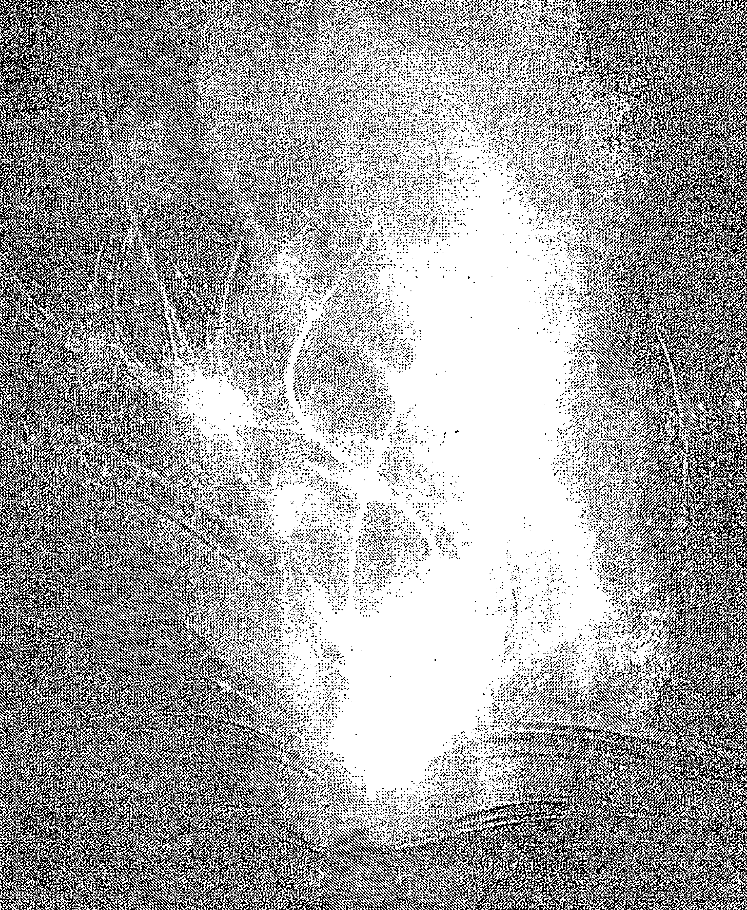
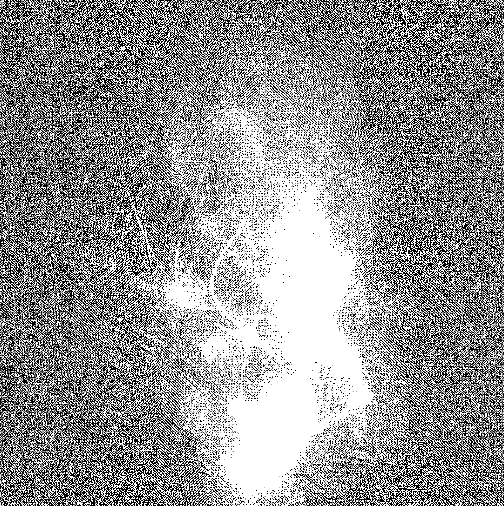

# DISCOVER YOUR SOUL'S PATH THROUGH THE AKASHIC RECORDS
# 在阿卡西记录中发现你的灵魂道路

让你的生命从平凡到非凡

琳达·豪儿 Linda Howe —— 著

福利公告：
凡在【天使神秘学院】购买任何电子资料赠送实体书，详情请咨询店铺客服！
备注：如客服不知道这活动你可能进了盗版店铺！
赠书活动仅在以下正版店铺购买有效哦！

## 【天使神秘学院】淘宝店
手机淘宝扫以下二维码

1、打开手机淘宝：搜索“天使神秘学院”
2、点击“店铺”按钮就是

## 【天使神秘学院】微店
手机微信扫以下二维码

用手机微信扫码进店

制作说明：
本书由《天使神秘学院》出重金从台湾购入的原版书籍扫描制作完成。为达到最好阅读效果，特地把书全部切开后，再经由专业扫描设备高精度扫描完成，并经过一张张的PS后期处理最终成书，其间花费大量的人力、物力以及时间，只为能给大家提供经济并优质的神秘学学习资料而努力。
本学院强力谴责某些机构和个人，把本学院花心血制作完成的电子书籍，包装后直接放在自家网上低价倾销的行为，以谋取不劳而获的经济利益。如果长此以往最终将无人愿意再为大家花心思制作电子书，那以后可能大家再无新书可读。
为让大家以后能够读到更多的好书，也为了本学院的良性发展。本学院恳请大家尽量做到如下几点：

- 一、尽量在天使神秘学院的官方网站购买电子书籍。
  官网访问地址：http://www.ac2011.cn
  短网址：ac2011.cn
  网址含义：(Archangel College 成立时间：2011年)
  手机微信购买 请扫以下二维码
  手机淘宝等购买 请扫以下二维码
  加店长微信号 请扫以下二维码

- 二、在收到电子书后小范围传阅即可，千万不要公开传播，更别挂到网上低价销售。
  同时为答谢广大支持者，学院电子书将做如下调整：
  - 一、学院会把一些早已收回制作成本的电子书折价销售。
  - 二、最新制作的电子书籍会开放打印功能，大家购买后有条件的可自行打印成书。

# 目录

- 作者的话 从平凡到非凡 004
- 前言 008
- 自序 我通往阿卡西记录的道路 011
- 第一部分 阿卡西基础 021
- 第一部分 引言 022
- 第一章 如何阅读你自己的阿卡西记录 035
- 第二章 与自己及他人和平共处 063
- 第二部分 意识的五根支柱 085
- 第二部分 引言 086
- 第三章 第一根支柱—化身 093
- 第四章 第二根支柱—权威 109
- 第五章 第三根支柱—纪律 135
- 第六章 第四根支柱—责任 151
- 第七章 第五根支柱—承诺 167
- 第三部分 中央支柱 181
- 第三部分 引言 182
- 第八章 恩典 185
- 第九章 平衡三角形 197
- 第十章 你的非凡生命 215
- 继续向前行 225
- 附录 阿卡西反思的路径祈祷 231
- 旅程伴侣的资源指南 261
- 专业术语 266
- 关于作者 277

## 作者的话
### 从平凡到非凡
一个非凡的人生，或许表面看来平凡无奇，我们每个人都忙于工作挣钱来支付各种账单，以确保舒适生活所需，我们也都忙着发展与邻居、朋友和家人的关系。
非凡的生活有一个不同于平凡生活的重要特质，那就是活力。你活出你内在的力量，跟随你最内在自我的指引。你的身体、心智、和感受直接服务于你的灵魂；在你由灵魂驱动的生活中，你不断地反射映照出神性的光——你调频校准着心、心智和意志。因此，生命中的颠簸和伤痕不会为你带来窒息或重创。
当你活在非凡生活中，你的意图总是想在其他人身上以及自己的生命中寻找光，坚定地要去认出、辨识、和验证人性每一个面向的光芒。你对负面的冲击免疫，这并不表示你不会再遭遇或经历困难；而是这些困难都不再能阻扰你去发现美善的事物，即便是在生命中最糟糕的情况下，你也会备受鼓舞去做出仁慈慷慨的伟大举动。
在我和阿卡西记录工作期间，我发现一个看似简单的策略可以成为我们的协议，让我们得以创造一个重大深远的转变，从平凡移转到非凡人生。如这本书中的描述，阿卡西记录可被理解为“你的宇宙编年史”：一个充满活力的档案资料库，一个意识的维度，它诉说着你在时空中身为人的灵魂旅程故事。不只如此，阿卡西记录是一个来自经验智慧的集合体，包含了每个灵魂存在过程中的一切所思所想、所言所行，以及未来种种可能性。阿卡西记录由能量所形成，是存在于我们人身之内、也同时超越这物质世界之外的一个振动维度。
这些记录是无限的灵性资源，滋养服务着个人的成长并给予力量。我在前面所提到的策略，正是从这个深邃的爱的维度浮现出来——它可以被任何人在任何地方使用，但是在这些记录中使用特别强而有力。这个策略包括觉知、接受、感激、以及恰当行动。
这是一个四步骤的协议，将会应用在我们讨论的每个主题上，以达到我们所渴望的意识转换。欲知这程序用于个人疗愈的详细说明，请参考我的另一本书《在阿卡西记录中疗愈～用你神圣伤口的力量去发现灵魂的完美》。为了让你能进行更多探索，我提供以下的概略说明，但足以为你带来成功。

### 自然的人类反应。
- 1、觉知是关键——我们总想察觉发生什么事情，也想知道
- 2、接着，我们要接受所显现的事物，而不带任何修改或批判。这意味着我们承认并允许每件事情和每个人（包括我们自己），在任何特定时刻里确实如其所是。我们描述自己的观察，而不是去衡量评估它；我们的观察远比批判更有力量得多，因为我们不会以任何主观意义轻视低估自己所观察到的一切。
- 3、接受之后就是感激，这奠基于认出并领悟我们所选择的正面价值将我们带到生命中的这个位置。以这种方式去理解我们过往的选择，并相信当时所做的抉择都是恰当的。
- 4、最后，我们来到了恰当的行动，在这个阶段里，我们要采取行动，尽可能以最佳方式来表达我们的最内在自我。
这个过程涉及到内在和外在的转化，两者皆须产生持续性的改变。此协议几乎可用于我们所遭遇的一切情况，并且让我们能够开始走在非凡生活的道路上。
就如同本书的副标题，这将让你的生命从平凡转移到非凡，将我们每个人带往灵魂的道途上。我们携手踏上这个目标清晰的旅程，一次一个阶段来检视五个阿卡西概念：化身、权威、纪律、责任和承诺，如果你愿意，这些概念可以整合运作成一道单一的光束。我们不仅很快能掌握阿卡西记录所驻居的实相，也能了解这五根支柱概念在我们生命中的角色、以及它如何转变我们的生活。我们会检视每一个概念，并将其应用在前述的转化协议上。
最后，你会发现你成为了真正的自己，与你所遇见的每一个人享受着非凡的人际关系，意识到我们的合一，意识到每个生命存有核心中无限且永恒的火花。
在这旅程中，你会碰到一些似乎很极端的想法，以及其它或许较为熟悉的看法。我只要求你保持敞开，给自己机会去体验。想要成长进入灵性智慧需要练习和体验，所以，给自己应有的允许、时间、和空间，来试着驾驭这些全然新颖的概念。（我用的词汇在某种程度上对你来说可能超乎寻常，请注意文字中的定义，以及本书后面词汇表中常用语词的汇编解说。有些字词在段落中以粗体字来显示其独特意义。）
记住，是你最终决定了你自己的真理。要善待自己，敞开心胸，以一颗柔软的心去探索并享受这个旅程。现在，请和我一起踏上阿卡西的冒险，去发现你的灵魂道路！
琳达·豪儿 Linda Howe

## 前言
我有个非常棒的学生，也是我所认证的老师，她成功地踏上了从平凡到非凡的旅程！以下是她所说的一些话……
当我回顾几年前开始和琳达的学习，我仍记得这个体验如何深邃地开启了我的感知。在“化身”课程期间，当我们检视对于成为化身（灵性意识在物质肉身的形式里）的理解时，我甚至不知道自己对轮回概念的感觉，至今我仍不知此生之后的下辈子会是什么模样……但经过这个课程——在其它生世中体验我自己，以及深刻的熟悉与知悉——我从许多困扰多年的事物中获得永恒的解放：存在的不安、缺乏正义的世界、时间流逝的焦虑、挚爱亲人的死亡……等等。这使我深信更超越的存在，并带来了真正的疗愈。
我平凡生活中的许多议题开始获得解决，平凡和非凡之间的界线消融了，而且我真正感受到神性的光和能量的支持，许多分离和分隔线开始融解，而我也愈来愈专注于朝向光明、正向、有用的事物。无论这些体验是来自过往生命的真实愿景、或是进入宇宙集体心灵的窗口、抑或是我的过度主观想像……这都无所谓，重点是我对愿景和洞见的直接体验，以及它们在我的接受、爱、和平与信任的层次上，对我能量系统的冲击，我感觉受到鼓舞去信任阿卡西记录，并尝试停止怀疑每个轮回的资讯、停止对每件事情破解及贴标签，我学到如此多关于我自己，而且发现在那个时刻点里，我对生命中的权威、纪律、责任和承诺是如何表现。
当我跨过门槛进入觉醒和成熟，我注视着这个体验，即便当时的我是个母亲、妻子、朋友和老师，却未曾如此好奇地深入且亲密观察这些主题。我清楚看到自己在权威方面的议题，它干扰到我的个人力量和养育子女的感受。我清楚了解了自己为何逃避责任，又往哪里逃避，也了解到如何才能以最好的方式拥抱纪律和承诺。在我平凡生活中所产生的如此洞见，为我带来了不可思议的改变。
最棒的是我无需提醒自己学到了什么，这些所学已在能量中转移，放下老旧模式和成见，效果立即而且持久有力。之前我总以为这样的事情不可能发生在我身上，除非远离日常生活一段时间、飞到印度静坐冥想数月、或到墨西哥参加迷幻仙人掌仪式……而我又如何能找到真正的萨满呢？
接下来的课程就是“平衡三角形：心、心智和意志”，在我“之前”的描绘中，我与自我这些部份的关系的心理图像，以一个巨大的心智、一个大约六吋直径的心、和一个约八分之一吋宽的意志显现出来。我至今仍能清楚记得在2006年所看到的这些景象。我不确定当时是否与自己心的感受有过任何接触，而且当时我的意志几乎是不存在的，我以心智的能量移动通过生命，面对来自我的批判所产生的可怕抗拒，重重压在我的心上并瘫痪我的意志。但经过了这个旅程，我与自己内在三角形的工作变得亲密，也因为三角形各顶点之间更加动态的关系，我开始移动走向疗愈以及平衡。
如今，我的心提供指引，我的心智往外伸展，而我的意志变得富有效力及战斗力。在阿卡西记录中的工作带给我自由，带来了生命的美好以及对自我和他人的信任。我发现琳达的路径祈祷程序安全且容易。跟随琳达在课程中提供的通往成功的指引，我总能够以正面能量进出阿卡西记录并产生正向结果。
这些年来，我为许多朋友阅读了记录，因此了解到每一个人都会以自己独特的方式体验这些记录。有些人仿佛看着电影场景一幕幕在眼前掠过，而我们则以更精微的方式来体验记录——例如：一种知晓的感觉、一个梦的忆起、一个领悟、一种感受、一个洞见、一句话语、一种颜色、一个别具意义甚或毫无意义的符号图像……以不同方式去询问一个问题——有无穷无尽的方式与这些记录连结并解读它们。就像任何语言，你练习愈多就会对这语言了解更多，词汇能力也跟着增强。我发现最好的方式是信任你自己的体验——无论多么鲜明活跃或幽微得难以捉摸——并且以荣耀、谦逊和开放来进行这项工作。我邀请你对自己在阿卡西记录中的体验敞开内心。希望你享受这些发现、智慧和爱。
霍马 Homa 阿卡西记录认证教师

## 自序
### 我通往阿卡西记录的道路
打从有记忆以来，我就能觉知到生命里更高的灵性次元。当我六岁大时，徜徉在我们中西部家里后院高耸的草地上，我凝望着艳阳天里飘游的白云，感觉到一种截然不同的存在感，以及一股超越我这平凡人类自我之外的力量……这种完全自然且无法形容的景况从未与我分离过，我很清楚它同时存在于六岁的我之内，也远超越了这个小小的自我之外。
这种情况虽然不定期出现，但却一直是我人生旅程中的常态。奇怪的是，随着年纪渐长，时间将我的注意力从这个实相的畛域中移开，在我大学毕业时，世界和世界之间的缝隙变得如此宽阔而且泾渭分明。就我当时所认知，这两个维度——物质和心灵，是不可能彼此相互关联的。
的确，几乎每个人都会间歇地隐约瞥见灵性的畛域，但我感觉必须将这种一时半刻的追寻，扩展为时时刻刻的叩问。感谢内在的声音持续不懈地对我唠叨叮咛，灵性觉知与日常生活的分裂让我感到不满，于是回应这声音的渴望，带来了持续、正面、而且强大有力的结果。因此我的挑战强化了我的觉知，调频校准我的灵魂目的，在这世界上直接表达这些意图。我顽强地拒绝休息，直到我发现了一个健全明智的成功策略：阿卡西记录。
◇◇◇◇◇◇◇◇◇◇◇◇◇◇◇◇◇◇◇◇◇◇◇◇◇◇◇◇◇◇◇◇◇◇◇◇◇◇◇◇◇◇◇◇◇◇◇◇◇◇◇◇◇◇◇◇◇◇◇◇◇◇◇◇◇◇◇◇◇◇◇◇◇◇◇◇◇◇◇◇◇◇◇◇◇◇◇◇◇◇◇◇◇◇◇◇◇◇◇◇
回顾往昔并将这些要点连结起来，我现在了解到我的研究有三个不同阶段：一场漫长跋涉的追寻、个人的疗愈、积极主动参与这世界。我当时想要以谨慎、负责、可靠的态度，契入爱、智慧和力量这些有趣的畛域。我在阿卡西记录中发现了存在于每个人灵魂层次的振动宝藏，这就是我的第一本书《如何阅读阿卡西纪录》的主题。在这书中，我将自身探索旅程的故事——从遇见阿卡西纪录直到和他人分享的过程，全部都串连了起来。
早年我忙于这些记录中令人兴奋的正面结果，也对于人们所面临的各种奋斗挣扎多了一份尊重，我理解了各种不同的觉察观点和诠释，并且对生命过程怀有更大的耐性。起初，我感受到自己被宇宙以仁慈、尊重和接纳所拥抱。这种感觉让我益发感激宇宙赋予生命的安全感。我认出一种无所不在的美善，持续到今天仍不曾消逝。有一个很重要的理解就是——这样的感知，并非与特定的人格或灵体做连结。
这种安全感的支持，让我能够更有力量去更加信任生命，去享受更多生命中的惊奇。由恐惧驱使的习惯行为不再能定义或限制我。我的批判、恐惧和抗拒变得更少了，我也开始能够觉知这个振动体（也就是我们以振动形态存在的肉身实体）的组织构造，其实是我的灵魂和神性以及所有生命之间的能量形式的结缔组织。所有灵性价值都是经由每天的日常生活而培养出来，能够进入活跃弹性的灵性畛域是多么的喜悦——不受教条、机构制度或组织的薰习污染——而能够透过平凡生活在自己的道路上闪耀光芒。
无可避免的，我需要更具深度、高度、能量、和理解的日子终于来临了。遭逢我父亲死亡的椎心之痛、我儿子充满挑战的童年岁月，我依靠这些记录做为指引、方向和支持。在那些当下，我发现了一种看似简单却惊人有效的个人疗愈协议，因此持续不断地使用它并产生正面的结果。从长时间的困顿中获得缓解是多么奇妙的感觉，我开始与自己以及他人和平相处，甚至瞥见了一个启发未来的愿景！
完全专注聚焦于从错误中学习的过程，应用从我记录中所撷取的点点滴滴，并观察我学生们相同的历程，我发现了惊奇的改变。不知怎么的，在这实验过程中，我的注意力从机械性质移转到我和这些记录的强化连结，它们提供无限的灵性资源，我发现自己以叩问、指引、实际应用、结果观察、评估、和更多询问的方式，全新地参与并改写了我的记录。这变成了疗愈和转化的途径，让我从老旧的、无效率的应对方式移转到崭新的、恰当的思考和行为习惯。
重要的是，我发现自己过去养成了一种习惯，用情绪性的伤害、轻蔑、攻击、以及这些态度所产生的伤口作为武器来对付自己，这导致了无价值感的基础感受。这样的领悟成了开启我自由和疗愈大门的一把钥匙，一个对于转化的深邃协议于焉展开，而我开始练习它，终于达到感知、态度和信念上的转变，最终让自己从伤害的限制中解脱。这些伤口本身变成了神圣机遇的门户，让我得以接触神性实相！我的第二本书《在阿卡西记录中疗愈》，描述我的发展阶段：从初始阶段到熟练，从初学者到灵性的成熟。
剩下的就是我们这个时代的核心机遇和挑战：调和灵性与物质的畛域。“在全然参与这物质世界的同时，我要如何意识到灵性的实相呢？”我一直思考着这个问题。我不满于灵性的逃避主义，也不愿拒绝看不见的维度，我勇往直前。
◇◇◇◇◇◇◇◇◇◇◇◇◇◇◇◇◇◇◇◇◇◇◇◇◇◇◇◇◇◇◇◇◇◇◇◇◇◇◇◇◇◇◇◇◇◇◇◇◇◇◇◇◇◇◇◇◇◇◇◇◇◇◇◇◇◇◇◇◇◇◇◇◇◇◇◇◇◇◇◇◇◇◇◇◇◇
我以全新的热情、以及对生命作出贡献的深切渴望，冒险闯入这个世界。令我沮丧的是，我惊觉到我内心的罗盘是为了逃避痛苦而设定，却未曾调整朝向我所梦想的道路。在浑然不知下一步要如何行走的迷失中，我回到了我的阿卡西记录，一次一个想法、一次一个练习、一次一个实作，祂对我揭示出一个有效参与这世界的策略，因而产生巨大的满足和幸福。
我将这个素材提供给学生作为不同格式的路考测验，以便观察什么最适合他们、什么是有用的、以及什么能以最少的痛苦去产生最大的不同。有些学生以分组方式每月聚会一次，其他学生则选择独自研读，我见证了学生放下往昔阻碍他们参与生命的老旧思维，因而对当前的自己有了更明晰的觉察观点。
这是多么强烈的学习曲线啊！不计其数的老旧灵性信念的误解，干扰我渴望与世界持续互动的能力。不只一次，我感激能成为一个无限的灵魂——显然我需要一个永恒来解决这样的事情！我愈是认为自己具有灵性，就愈无法与不同群体的人在各种情况下互动。我的敏感度经常高亢到身体不适的程度，阻碍我的能力并驱使我走向孤立和单独。我忆起这并非我当初被呼唤走上心灵道路的初衷。但我仍然向前走着，以我的灵性存在去和我的平凡生活扭打搏斗。在我个人的阿卡西记录中，实际的进路在我眼前展开，依然强而有力，我将自己的发现带给我的学生们，而他们所尝试的结果非常出色。
藉由进行各自的工作，我们每一个人清扫了自己内在的房间，我们收拾堆积如山的废物，将这些垃圾丢弃，并决定哪些想法和信念值得保存，而哪些应该释放掉。虽然这个世界继续在它的轨道上运转，我们以更觉醒、更赋权的方式安住其中。我们学会以更大的优雅、信心和清晰度导航生命的挑战。在过程中，我们发现了一个简单而深刻的真理：我们既是自己一直等待的救赎，也是自己一直在追寻的答案。通过拥抱我们的多维度本质，并整合灵性洞见于日常生活的织锦中，我们成为了光的容器和管道，在这个迫切需要光的世界里，我们活出了从平凡到非凡的转变。

界本身就有些瘋狂，我發現只要我的內在房間是潔淨的，就會有無限的慈悲恩典駐居我之中—悲憫、善良、喜悅、與平靜—並照耀整個的我。我發現要以最真摯的自我在世上運轉的方式，開始於釋放陳舊過時的概念，因為這些舊思維阻礙了我作為神聖媒介的能力。

藉由練習、程序步驟和協議，我認出了一個廣泛且無所不包的智慧綜合體。我在每天的經驗之中發現新的洞見，為我們的關係帶來了徹底的改變。我們生活在物質和靈性並存的世界，兩者都充滿挑戰。人類的任務就是要在世上散發我們的靈魂之光—亦即將地球變成值得靈魂在此駐居的人類之家。

我當時收到的指引並不是我想要的，也不是我所預期的。一部分的我期待毫不費力的指引，希望能幫我解決與其他人類在這地球生活上追根究柢的問題。但事實並非如此，經由一連串的揭示—有些很崇高，其它則很世俗—這個累積的過程是一種個人轉化的形式，結果卻是一個更新的內在結構，提供了靈魂散發光芒的空間。經過十幾年的時間，我和我的學生一起作業，不斷叩問如何在參與這世界的同時又能維持靈性的覺知？我因此帶出了深邃的畫面和領悟，當我在自己的紀錄中尋求指引時，最重要的圖像於焉浮現......。

藉由內在的雙眼，我感受到五根光的支柱，在地板上排列成一個圓形，支撐著屋頂。這圖像使我想起曾看過的雅典帕台農神廟的圖片—但只有五根支柱，而不是十根支柱。我被自己所見的景象深深觸動，當情緒稍為平靜時，我收集了這圖像的更多細節。在這五根支柱之間有一道無限光燦的中央光流—這核心的支柱被五根較小但同樣宏偉的支柱所圍繞—而在這無限的光流當中浮現了一個三角形，我後來知道它是由我的心(heart)、心智(mind)、意志(will)所組成。當處於平衡狀態時，這三角形如同精力充沛的三角支架。當它散發出靈性之光時，能讓平凡的自我變得份外堅強。顯然的，這結構支撐著人類和靈性的結合，而光則達到了轉化。因為瞭維持這三角支架的平衡是多麼的重要，我體認到自己該清除老舊想法並選擇恰當理解的責任。

終於解脫了！這樣的覺知，讓我從試圖改變或改善自我及任何人的嘗試中解放，我理解到有了潔淨的內在房間(瞭解生命的活動猶如我靈魂的機遇，且輔以相對平衡的心、心智和意志)，我就可以放鬆並且讓光去工作。經由穩定並校準的內在組織，我能夠以凡人之姿，且讓聖光臨在，將我從不再服務於我的事物中解放，並為我帶來確實所需的一切，以顯化我的天命，這真是完全不可思議！

十年來，我追隨這五芒星和內在三角形的路徑而行，我首度的短途旅程中，這充滿活力的結構支持著我渡過了這些年，經歷父親的疾病和死亡、兒子早期童年充滿霸凌和不平等的際遇……甚至到了今天，當我發現自己夾在母親的衰老和兒子充滿挑戰的青少年期之間，我仍然使用著這些實務和協議。這些過程一會在後面的章節中討論一已證實非常強而有力，讓我能夠在自己世俗的人生體驗中進步，並且能夠理解它們是與神性實相遭逢的神聖機遇。

## 自序

你正握在手中的這本書，回應了我在這世上參與人類生命的同時，我想要榮耀和尊重自己的敏感與靈性覺知而帶來的個人挑戰。很棒的是，我發現自己無須逃避到僻靜所、修道院和山頂上，就可以參與我所有人生旅程的元素，包括和配偶三十年的親密關係、養育一個小孩、以及身為兄弟姊妹、女兒、鄰居、和納稅人的角色。我發現所有可以使用在相同生命棋盤上的這些角色位置，都是通往更偉大靈性覺知以及平凡人性喜悅的門戶。因為這個方法非常適用於我，我知道它也會非常適合你。

相信我一若我能做到，你也可以！應用這些靈性原則其實非常單純一不容易，但保證很單純。這些概念乍看之下似乎令人難以招架，但若一個個分開契進就不致於太過困難。我鼓勵你一次採取一個步驟、一個練習、一個冥想。

我會一路上為你解釋每個步驟，從第一部份《阿卡西基礎》開始，介紹如何閱讀你自己的阿卡西紀錄。在熟練了這些基礎後，我們就會往下走到第二部份〈意識的五根支柱〉，讓你瞭解每根光的支柱的本質精髓。然後我們會以第三部份〈中央支柱〉作結論，仔細檢視無限聖光的中央光流和內在三角形。

一路上，阿卡西反思(引導式冥想)會深化你對這些概念的瞭解；你可以在每個章節標題中辨識出它們，我也會將之彙整於附錄中，讓你能夠輕易查找並檢視它們。整本書中的這些反思可獨自練習或作群組練習。若獨自參與，務必要有所需的暫停時間。每個新段落代表一個注意力的移轉，所以在段落和段落之間給自己一些時間是很重要的，這樣才能充分反映教材。你或許可以先錄下自己的冥想閱讀，然後再回頭重聽，或者你也可選擇一邊閱讀一邊冥想。兩者皆可。

我們攜手一起挖掘、整修和協調你的內部結構，讓你能夠以你在「心田之中的心」所知曉的那個你，來穿越世界——以你最有意義的方式充滿慈悲、感激、和效力。親愛的朋友，我誠摯歡迎你來到發現你靈魂道途的門廊，轉移進入你非凡的生命！勇往直前吧！

# ## 第一部分
## 阿卡西基础

# # 引言

身為人類，我們經驗到兩個不同的畛域：物質世界和靈性領域。長久以來，我個人的兩難之處在於：如何去榮耀一個領域而不會侵犯或限制另一個領域。經過孜孜不倦的參與過程，我現在要與你分享一個我所深刻領會更深奧、更激勵人心的真理。每當我思考這個問題：「我該如何參與我的平凡存在—踏上世俗的旅程—同時有意識地開啟和我的神性相遇的大門？」我的思維就開始轉化了。

對我而言，這是所有生命問題中最迷人也最困擾的問題，而且我相信是這個時代共同的問題。然而，這並非看似分岐的物質和靈性領域之間的簡單協調過程；反而是這兩個維度的融合並形成無縫隙的連結，因而建立了新的可能—我們領悟到自身與萬物合為一體。

在我們攜手踏上探索的旅程，將你平凡的生命轉換成非凡之前，讓我描繪出展現在我們眼前的地平線，這是以活力的特質所賜福的非凡生活，在那裡，你靈性和世俗的生命將完美融合。本書目的是要描述一個有用且有效的策略，專注於覺知並體驗兩者本質上的移轉，以達成個人的轉化—從平凡到非凡。這個力量強大的內在移轉將會支持一個更偉大的目標：有意識地引領一個「靈魂導向」的生活，其中你是清醒的、覺知的、且與你的靈魂目的調頻校準，為你自己的 人生旅程領航。

## 第一部分 阿卡西基礙

在每日生活中表達出我們最內在自我的確實真相，是一 種難以抗拒想要喚醒世人的渴望。我們的最內在自我能夠覺 知祂自己的神性，祂是我們的靈魂自我。我們生在這別具意 義的時代裡，就是要解放我們靈魂之光，讓祂散發照耀我們 的人性，並且穿透過我們自己向外遍照世界。

這不只是對我們「內在」實相的美好概念或新穎結構。 我稱之為「別具意義的時機」勢必會成為我們新的生活標準 ！有了內在結構恰當的校準調頻，我們就可以成為散發光明 並吸引光明的個別光點。如此，我們的靈魂之光就可以毫無 阻礙的照耀四方，同時經由祂自然的磁性吸力，汲引我們所 需的一切，在這一生中顯化我們生而為人的天命。

簡而言之，這意味著在這個世界上真實地對待你自己， 透過豐饒多產的行動去榮耀尊重你自己的價值，並讓無限的 心靈之光照耀著你、甚至貫穿遍照一切你所相遇的事物！這 目標的確很崇高，但實現它的過程是直接且明確具體的，我 們即將要開始～首先，引導你的注意力往內去思考你內在實 相的結構，我稱之為五根意識支柱，或五根聖光支柱。

# # 五根聖光支柱：基礎

本書第二部份會對每根支柱作詳細說明，但我們需要在此先了解這結構的基礎。這些支柱是以光的振動所表達的概念。因此，祂們所代表的意涵遠比字面上深邃得多。每一個概念是以一種精確的光的振動來識別，每一個振動體現了一個明顯不同的光之主題。然而這光的整體是以一個完整單元來運作，相當於通過菱鏡照射的白光。你對這五個概念的詮釋，決定了你在世界上運行的特質。

這五根支柱環繞著一道「恩典」的中央支柱——一串無限的光流—那是你的心、心智、意志的三角形所存在之處。這三角形定錨在光的振動旋律之內。我們要到第三部份才會探討這中央支柱，但我要你現在就能瞥見整體圖像。這中央支柱定錨在你身體的根輪部位，祂貫穿你頭頂上的冠輪而往外延伸。那些環繞周遭的支柱則靜靜停留在骨盆平面上，沿著身體軀幹向上延伸，穿越心的中心的天花板。

當我們從上往下俯看，這些光柱形成了華麗的五芒星，光束從中央支柱以及星星的五個不同端點散發出來。這顆五芒星承受著你高密度的人性自我的重量，因此得以讓靈魂之光(從核心支柱散發而出)去照耀。因為這些意識支柱的輔助，你的最內在自我得以通過你並進入生命，也讓生命本身在你最親密的層次與你相遇。藉著讓你的靈魂之光旅行穿越你的個人身分，你就可接觸到他人所散發的光芒。我們在更浩瀚的光之場域中如光點般攜手相連，一起在這世界上給出能量和愛的非凡表達。

神性的安排，這五芒星確實支撐著你，讓你得以在日常世界中隨著你靈魂閃耀的光而移動，且給予你接收生命禮物的能力。這顆五芒星一直都存在；無需去「創造」任何東西，你的角色就只是簡單地維持這個結構，而你所要做的就是與這顆星所表達的這五個概念和諧共處（五根意識支柱）：化身、權威、紀律、責任和承諾。

## 第一部分 阿卡西基碳

每根支柱都自我聳立，但也和其它支柱互動運作。在本書第二部份，我們會觀察每一根支柱並檢視你對每個概念的體會，目的是要拋棄那些不再服務於你的陳舊想法。（在這過程中若需要進一步釐清，你可以參考本書後面的術語詞彙表。）

## 整修計畫

清理過時的理解，將為我們開啟嶄新的、具支持力的、充滿力量的詮釋。我們所被賦予的任務是要系統性的一次處理一根支柱（意識概念），在每個領域中辨別陳舊的概念，放掉使人削弱能量的解讀，然後去認知並選擇具有力量的恰當感知。我發現將這個探索視為整修計畫是很有幫助的，我們首先必須清理房子，然後將屋子升級並進行必要的修整，如此一來，每根支柱才可以完全發揮功能，在我們參與生命時支撐著我們。

# # DISCOVER YOUR SOUL'S PATH THROUGH THE AKASHIC RECORDS

當我們對這五個概念的詮釋與我們目前的身分一致時，這些支柱就具有支撐力。然而，當我們對這些概念的思維和感受承載著老舊的想法時，這些支柱的光芒就會受到阻礙。彷彿攀藤依附在表面上，干擾了光線的散射。這種情況在快速變動的時代特別容易發生，我們會因為不斷進行中的反射和辨識而忙碌不堪，以致於忘了去做有意識的選擇。當我們持續困在過時的理解中，我們的靈魂之光就會變得黯淡。

事實上，光明絕不會被毀壞，但卻會被阻擋。於是，我們為自己汲取所需的能力衰退了，未曾意識到「我們是誰」的這個美麗真相。我們經常誤解，而且我們發現自己被那些無法共鳴和連結的人群、事物、經驗所圍繞。

雖然我們內在的整修至關重要且值得注意，但它不會太恐怖，也不會造成創傷。我保證你的努力會帶來豐碩的成果！這個進展的美麗和喜悅，是專注聚焦於探索每一個概念的靈性本質，以及它與物質維度的連結。我們將努力使每一根支柱恢復其全然光明的潛能以及與群體的融洽關係。願意為我們的信念負起責任是靈性成熟的主要特徵。我們攜手走在这道路上，檢視那些統馭我們感知的想法，以及在我們日常事務中秉持這些信念的後果。唯有如此，我們才能周全地揀選詮釋，去調頻校準我們的靈魂目的，並賦予我們力量活在意義豐饒的人生之中。

## 第一部份 阿卡西基礎

在這整修過程中的偉大靈性原則之一是：當我們經由自身的人性來供應光，這光也會供應我們。藉著維持一個內在房子，好讓光去照耀著穿透著，這光同時也帶來了滿足我們靈魂渴望所需的一切。我們接受這一切所需，在這個化身中去瞭解並實現我們的靈魂目的和意圖。光，情不自禁地為我們帶來美善！

這個過程是透過我自己在阿卡西紀錄中的親身工作而揭示，我使用了契入「阿卡西紀錄心臟地帶」的路徑祈禱程序，所以我們要用它來將你的平凡生活轉化為非凡生活。這路徑祈禱程序會建立一個充滿活力的區域，你可在其中挖掘你的內部實相。這個內在景觀充滿了無限仁慈、尊重、和積極正向的可能性。

你的成長並不是由阿卡西紀錄奇蹟似地「為你」完成，而是這些紀錄的維度啟動了這個轉化。學習如何閱讀自己的紀錄有助於個人療癒。這工作是經由這些紀錄而浮現，而阿卡西——一切的維度——是這些紀錄的家，所以我強烈建議在這過程中使用這些紀錄。

當我們探索這雙重挑戰——在靈性上清醒、覺知並校準你的靈魂目的，同時又有效率的參與物質世界——我會讓你知道可期待甚麼，我會以嘗試性的問題來提示你、並分享阿卡西反思，這個冥想的設計目的，是要經由這旅程的每個部分來支持你的個人成長。在每個轉彎處，我都會和你在一起。

無論這些支柱一開始將給予你什麼樣的印象，祂們非但不會令人恐懼，反而是具有吸引力和保護性，而且整修本身就是非常愉悅的。事實上，在我自己做這個工作之前，化身、權威、紀律、責任、承諾這些話讓我很是感冒—然而，經由我們即將要啟動的這個過程，我發現了它們竟充滿愛的意圖。

對我來說，挑戰並不是來自這概念本身，而是我意識到自己陳舊且侷限的看法，它牽絆著讓我躊躇不前、身陷困境。細心揀選能與我靈魂共鳴較恰當的理解之後，我領悟了這五個概念，並意識到它們是讓生命活出意義和成效的根本基礎，讓我來進一步解釋。

# # 在世界上行走

在我非常平凡的生活經驗中，只要能夠處理這五個概念，就可以促進最內在自我的揭露。使用這本書中介紹的程序，我明白在生命中的每一個部份，絕對都是非常理想地傳遞和表達我的靈魂目的，不僅是為了我個人的療癒、以及喚醒一切之中美好的本質，甚且到達了一種遠遠超過個人福祉的境界！最棒的是，生命以壯麗的祝福回應著我，並在每一個轉折處完美地契合我的需求，而且每一根意識支柱已在我的日常生活中蓬勃開展。

例如，與這個「化身」和平相處，是一種能夠擁抱我所在的身體的單純喜悅，譬如騎自行車、溜冰和跳排舞等等。認識到懲罰和「紀律」之間的區別，使我能夠讓自己得到支持，即早就寢，有個甜美的睡眠，讓我在明日來臨時有精力實現我的夢想。體認到個人「責任」的轉換價值，讓我得以釋放自己幼稚的憤慨，並允許更多的愛從心中流過。我日常生活元素的體驗充滿了恩典和喜悅！我已然明白這旅程本身就是神聖的，不必坐等癡盼著神聖目的實現。

## 第一部份
## 阿卡西基礎

我的發現超越了眾所熟悉的「在內如在外」的靈性原則。是的，我們周遭的生活是我們想法、感受、和信念的直接反射一事實上就是我們意識總和的顯化。但下一步是：當我們明白自己的靈魂目的和意圖時，我們接下來會對這些禮物要如何傳遞到這世界感到好奇。這才真正是我們在這本書中所要採取的路徑，準備好每根支柱，並且揭露工具，在行腳世界時提供一個實際的領悟。

當我開始自己的旅程時，我知道我的看法和信念在日常運作中造成不必要的複雜化，而且我沒有一個合適的框架來解開自己的困惑。我生活中與更大世界相連所產生的問題—無論是鄰居、學區、運動、社交活動、或工作—都可以歸結到我根本感受不到愛、甚至覺得自己不值得愛與被愛。我決定這是開始解決問題的好起點，但還是不足以解決我的困惑，必須有一個更好的方式來揭露我對於不充分的刻板信念；必須要有一個更具體的療癒，可為我帶來徹底的解脫。

在移動穿越這顆星星的五個概念後，我意識到這五個區塊是面臨困難時切入的完美背景。經過調整，放開陳舊並擁抱新的信念(我會在接下來的章節中深入探討)，我注意到我的挑戰變得較易於管理。我在這裡與你分享的進展，給了我一個簡單的結構，得以揭露處於我問題根源的特定信念。

即使在寫這些話的今天，我意識到壓力的情況讓我有更多機會來探索這些概念。經由審視這五個概念一只需在這顆星星的每個端點切入一我注意到我自己所秉持固守的方式，而汲汲營營的心情得到改善，最內在自我因而顯現，使我更能夠充分的運作，且更加滿意，因為我與生活的連結是以靈魂為中心。

在我母親罹患不治之症的情況下，或者甚至在平常感到疲累之際……我會看看「化身」的議題。有時在面對某些情況時，我會想：「這就是『權威』嗎？我和自己的內在權威和諧嗎？外部權威的狀況又是什麼樣的呢？」當我發現自己對醫生或養老院工作人員抱怨時，我就會對「紀律」感到好奇：「我是否在建立習慣並經由『紀律』來支持自己呢？我靜心冥想了嗎？我這星期有健身嗎？我是不是陷在別人的『責任』中？我有履行自己的『責任』嗎？我實現『承諾』的狀況如何？我的活動賦予我力量還是耗盡我的能量？」

## 第一部份 阿卡西基礎

我發現人類生活中的微小細節和過往時刻都是宏偉設計的一部份，只為了體驗神性的臨在。我體會到基本真理，每一種實體物質形式都持有直接與神性接觸的潛力。對我的成長至關重要的是：我不再感覺與平凡生活彆扭不合。這似乎是個命題—靈性的或人性的、非凡的或平凡的。當然，我們同時都是靈性也是人性，能夠同時埋首在非凡與平凡的經驗畛域—我稱之為一個真正非凡的生活。

隨著對此的深刻理解，我必須學習如何將世上的平凡生活視為充滿神性的生活。當這樣看待事物時，運動中心變成了充滿神性的地方，公立學校變成神聖的門廊，更不要說養老院、雜貨店、高中體育賽事、年度街區派對、快餐連鎖店、甚至乾洗店……一切都變得如此美好。當然，我也因此在平凡軀體中過著非凡生活！

## 初次接觸這教材

你在這個過程中的成功對我來說很重要。所謂成功，我的意思是另一種成就的觀點，例如從一個觀點轉變到另一個觀點。但這轉變不是由外部衡量的。你是唯一能夠決定這項工作是否有利益的人。經由這些教材，我陪伴過數以萬計的學生，我只是提出建議的策略來支持你實現自己的個人目標。

每個人都有權使用最能支持我們成長的靈性紀律和訓練系统。下定这样的决心是我们个人的责任。在我几十年的阿卡西纪录教学中，我指导了许多在各种其它方法上有强大体验的人。这本书就像我的个人教学和线上课程，其目的是要让心胸开放的追寻者，在阿卡西领域中寻求指引时能够获益。几十年来，我发现这个框架很理想，我希望它对你也是一扇有益的启发之门。

一开始，我建议你在深入了解阿卡西反思练习之前，先阅读完整本书。完整阅读可让你瞭解整个过程，并知道在踏上这个旅程时有什么东西可用。就如你是一个完整的人类存有，你的非凡生活呈现了一整个完整的过程。当你开始阅读时，注意哪些内容与你的情况吻合、什么吸引了你的注意、什么真正与你产生共鸣，注意哪些有道理、哪些不合理……某些内容你可能看似熟悉，其它部份则或许感觉完全陌生。有些段落你可能早已完成，其中一些也许是让你感动的内在工作，是你在另一个生世中已经能够熟练掌握的。恭喜！只要注意到这点，并允许你自己独特的体验如其所是。

我们个人的漫长探索依然是活跃著的，以非线性模式不断展开。每一次与这样的教材相遇，都是个人旅途中独一无二的发生。我们的回應取决于自身当下的觉知状态，有时候，我们可能会发现某个议题很强烈，但在其它时候竟不再重要，而另一个完全不同的问题却在中途与我们遭逢。我请你敞开心胸面对这过程中所遇到的任何问题。我从自身的体验中得知，每一次我阅读这本书或进行阿卡西反思的工作时，感受似乎都不盡相同。

## 第一部份 阿卡西基楚

在閱讀這整本書時，你可能會注意到能量活躍的進程，每一個主題都建立在前一個主題之上，在建立的過程中，這些主題聚合、互補、並連結。最終，你會發現自己處於一個融合單元的核心：清醒、活力、覺知、且積極參與。所以，在你第一次閱讀整本書時，請按照章節順序閱讀。給自己充分的時間來消化每一個章節。用筆記本紀錄並追蹤你的進度和發現。描述你的體驗，描述你的困惑，盡可能描述你所有的發現。這種日誌方式可連結能量和文字；能量在成形的文字上移動。所以，當你描述你所體驗的感受時，要注意能量如何移轉，允許更深層的真理因此而顯明。

無論如何，不要把自己置於不必要的壓力下，不要強迫自己回答或下定結論。現在就只要做筆記，一週或更久之後再複習這筆記。然後，用清醒的眼睛再看一遍，當我們處於稍微改變的狀態時，通常我們的感知似乎顯得無關緊要。之後，從稍遠處更清晰的角度觀看，我們就會發現覺知當中的寶珠。

當你經歷一次這工作後，採用另一種途徑。也許，在你感受到日常生活壓力或挑戰時，瀏覽一下這些主題，看看在這些時刻有哪些是吸引你的，選擇並閱讀你曾體驗過的主題。現在，問自己注意到了什麼，在日誌中描述它，尊重你的直覺，並閱讀你感到深具啟發的內容。這是讓你繼續下去的美好方式。試著用其它方法來處理這個工作。可能性是無限的！

◇◇◇◇◇◇◇◇◇◇◇◇◇◇◇◇◇◇◇◇◇◇◇◇◇◇◇◇◇◇◇◇◇◇◇◇◇◇◇◇◇◇◇◇◇◇◇◇◇◇◇◇◇◇◇◇◇◇◇◇◇◇◇◇◇◇◇◇◇◇◇◇◇◇

我不是第一個注意到這件事的人，作爲人類，我們總是處於探索、成長、和改變的過程中。改變是唯一的常態。只要我們在這地球上，就會有很多問題要檢視，也有許多機會可參與，而這些都引導我們進一步體驗並增加愛與光的覺知。那些逃避內心工作的人，根本就不再行走於這星球上的軀體之中。我們知道這個過程是一直在進行的，無論你在旅程中的何處，此處所呈現的過程會很有幫助，能給予你力量轉移到非凡生活。這項工作是取之不盡的！相信我一我已使用它二十年了，而且還不準備將它擱置。

我們都含有五芒星所組織的內部實相，而且在我們一起完成這個旅程時，祂將永遠成爲你的一部份，並繼續支持你的成長和力量。現在，就讓我們一起踏上探險旅程，進入我們存在之中最豐富的部份—我們的內在畛域。讓我們開始這個過程，學習如何在阿卡西紀錄中工作，而你將發現這是件愉快且容易的事。向前走吧！

## 一个投资高手的20条铁律

## 如何閱讀你自己的阿卡西紀錄

發現你的靈魂道路，是一種靈性的抱負和想望，是透過靈性資源的一個最佳探索。我喜歡把阿卡西紀錄想像成充滿活力的結締組織，從我的靈魂向源頭放射，與其他致力於此相同旅程的人們和諧一致。採用路徑祈禱程序的具體方法是很有道理的，因為它與這目標和諧一致，完全契合。祈禱引領你契入阿卡西界域的心臟地帶～阿卡西之心。當你繼續向前，初次瞥見你的靈魂道路時，祈禱本身培養你辨識和擁抱你的旅程的能力，放大並加速你擴展的覺知。

現在，是學習如何閱讀自己阿卡西紀錄的時候了，用以作為你發現自己靈魂道路的靈性資源。正如我在序言中所提的，這個轉化策略是透由我自己的阿卡西紀錄揭示出來，而後，經由我自身和我學生的體驗而得以昇華。這些成功是我主要的動力，鼓勵你進入自己的紀錄。學習閱讀自己的阿卡西紀錄以獲得個人的力量，這樣的努力將會非常值得，不只 是作為這工作的靈性基礎，祂也是智慧的寶庫，包含了我們 即將探索的原則和實踐。

瞭解阿卡西紀錄是什麼、它們的實際用途、包含哪些內容、訊息如何傳遞、以及進出這意識維度的方法……這些都能夠支持你的進步。你要知道這不是阿卡西研究的完整課程，並沒有對於這些紀錄的功能及其組件和潛力的複雜解說。相反的，我是為你量身訂製了這項工作，幫助我們尋求轉化—從平凡生活轉而享受非凡生活。不用擔心，針對參與這個領域，我會盡可能直接且清楚的提供所有必要的背景資訊、建議準則、和具體說明。

無論這是你第一次接觸到這些紀錄，或者你已是經驗豐富的執業者，請閱讀本篇章。你所發展的每一個技巧水平會影響你的感知。如果你是一位熟練的阿卡西紀錄執業者，你對本篇章的理解會和首次接觸者的理解有所不同。無論你在此連續體上的哪個位置—從新手到資深顧問—我都邀請你開啟你下一階段的阿卡西紀錄知識。

當我在1994年第一次對這些紀錄工作時，就知道這是一個無限的靈性資源，並得以一窺「無限」的意涵。二十多年後，我不斷感到驚奇，意識到且更深刻體驗到這些紀錄是真正無限、永遠開啟、並持續擴張的。每當我以為走到了盡頭，又出現另一個維度並成為焦點。如果你完全是位新手，可能會懷疑自己是否能夠勝任。讓我這樣說吧：「放輕鬆！」我們生活在一個慈悲的宇宙之中，其設計是為了我們的幸福和快樂。你之所以被吸引做這項工作，那是因為你能夠做得到！在你內心的某個深處，有著與這些紀錄的連結，你迫切渴望想要與自己的靈魂建立更有意識的關係，你還知道自己命中註定要過非凡的生活。你拿起了這本書的事實就足以證明你可以成功。

讓你自己成爲一個初學者吧。摒棄你認爲這「應該」是如何的想法，並讓「是什麼」浮現出來。我相信你有能力學習這項工作，就像我之前數以萬計的學生一樣。知道我會按部就班給你指導，以豐富你與自己靈魂的意識連結，並經由你自己的阿卡西紀錄促進你的轉化。讓我們一起探索吧！

## 什麼是阿卡西紀錄？

阿卡西紀錄是靈魂層次的意識維度，是每一個靈魂及其地球旅程的振動檔案資料庫。每組紀錄有兩個主要的組成部分：一個是永久性的，另一個是演化性的。永久的部份是靈魂藍圖，這是靈魂的本質和永恆的印象，是個人的神性理想。對應於靈魂藍圖的是演化部分，這是在地球上生生世世的目錄，在其中我們覺知到自己的靈魂身份，喚醒最內在自我（那部份完全意識到其神性的傳承），並且活在一個已校準去表達真理的生命之中。要達到這般宏偉的領悟和顯化，需要靠無數輪迴的轉世化身一去了悟我們在任何情況下都具有美善的真理，接著去認出所有其他人也擁有這相同的真相。

有無數的意識維度，包括夢境狀態、記憶畛域、靈魂領域……這些維度本來就處於我們的存在之中。阿卡西紀錄是我們的組成裡自然但不可見的元素，很像其它不可見的面向，例如我們的個性。

既然我們都有靈魂，我們就都有權更具意識地連結這個內在的畛域。相當常見的是，當人們開始用心參與自己的紀錄時，他們會驚訝於這些紀錄的熟悉感，總覺得這個領域似曾相識。我會回答：「是啊！當然囉！這是你的紀錄啊！」

## 第一章 如何閱讀你自己的阿卡西紀錄

這是你自然本質的一部份，存在於你所知道的自己之內並且超越其外。最簡單的說法是，你正在刻童並直接的培養一種瞭解自己靈魂的方法，伴隨著所有的祝福。記住，這是你與生俱來的權利，特別是在歷史上的這個時刻(我會在接下來的章節中討論)，去清醒、覺知、調頻校準，並積極表達你的最內在自我。

## 阿卡西：原則、可能性、和當務之急

「阿卡西」是梵語，意思是「原初主要物質」，標示著構成紀錄的不可見的隱形成分。在我們以想法和感受對其產生衝擊之前，這個阿卡西是生命本身的存在―它是生命力的原料，其特點是生氣勃勃、開放、擴展、表達……等等活力的基本素質。

有三項絕對原則，統治著阿卡西領域―不批判、不恐懼、不抗拒―三者合作以確保這些紀錄的精神一直都是慈悲、尊重、莊嚴高貴。阿卡西的氛圍充滿了極大的接納、擁抱和包容，為許多活躍其中的人類媒介提供了一個庇護所。

阿卡西可被認知爲一個空間，在其中，「完美」的不完美人類經驗被完全理解並感激，阿卡西是自我反思的理想畛域。它良善和尊重的文化讓我們更容易承認自己的脆弱、不足、以及錯誤，因爲知曉譴責和嘲笑並不存在於這個領域中。作爲宇宙普遍智慧、悲憫、和能量的薈萃區域，阿卡西紀錄很合理地被用作個人成長和力量的靈性資源。

所有過去、現在和未來的可能性都包含在這些紀錄中，若有需要，可經由當下的時光進入，去喚醒覺知。我們可能接觸到之前所有輪迴中曾體驗過的事物，加上未來無限想像的選擇，以及當前生活中複雜的各種可能，這些都足以壓垮我們凡人的心靈。我們所需的一切會經由當前時刻來到我們面前，其實，我們目前的生活挑戰，特別是人類本質的健康、關係、工作、金錢、創造力、和家庭相關問題，都在在提示我們要加強與多維度領域的聯繫。雖然一切都保存在這些紀錄中，但不是每件事情都可爲我們所用，這有很多合理的原因。

我們被邀請使用這些紀錄作爲靈性資源，在日常生活中表達真相。在人類經驗中的這個時間點上，凡是我們所能認知、辨識、和實踐的，都是有幫助的。當然，作爲有生命極限的人類，我們無法實踐每一件事情，於是，沒有理由賜給我任何我不瞭解或不需要的東西，這只會是一種浪費(隱藏的科學知識也是如此，因爲告訴我這些知識只是徹底浪費在我身上。最好是和能夠善用它的人分享！)。在這個契入的背後，其統馭理念是：任何個體所能獲得的事物，都會對他個人帶來支持。

另一個重大的考量是生命的奧秘。當人類並未知曉所有事物時，我們就會有很大的機會，這是發展生命中的信仰和信任的理想條件，並且使人類的生活體驗能如此全面，這包括了驚奇和意想不到的全範圍光譜。

阿卡西紀錄讓我們這些有限的存有所使用，在任何及所有條件下培養我們對無限之光的覺知。紀錄並非要提供速成的資訊來管理我們的事務、或技巧性避開生活的基本課題和成長體驗，隨時可用的東西確實就是我們所需的一切，以便在我們的個人旅程中採取下一個恰當的步驟。

我們的下一步一無論是新的洞見或行動一在任何給定的時間內，都會是我們能夠達成的。

許多其它的神諭更適合占卜或預測未來：千里眼、占星術、塔羅牌……都非常適合探測未來。為了有所區分，阿卡西紀錄主要的關注點是：

- 你是誰
- 你認為你自己是誰，以及
- 你正在成為誰

在紀錄中最有用的探索是：將重心放在清除那些障礙你良善的事物，並且強化你的內部結構，讓你靈魂無暇的光明得以自由閃耀。契入存取這些紀錄不一定需要通靈能力，而且你的成功並不代表你靈性的成熟。你的直覺被持守在這些紀錄中，以其自身速率發展，不會造成無謂的壓力。有一個空間存在於你個人自我之中並且超越其外，在那裡，你可以在你靈魂仁慈的光中安全地檢視自己的動機、行為、和後果，而這光明會溫柔地引導你調頻校準你的神性理想～你是誰，並讓你能夠與這理想和諧共處。

## 歷史上以及今日的阿卡西紀錄

近年來，雖然阿卡西紀錄一直都能為人所用，但過去只有聖人、神秘主義者、學者、和具有高階靈性覺醒的人，才有能力契進紀錄中存取資訊。的確是應該如此，我們其他人還沒有為阿卡西的深刻影響作好個人準備。與阿卡西相遇唯一的最重要結果就是：掌握住我們的基本美善。這是一個與全世界傳統宗教和文化相對立的概念。他們的看法服務於一個有價值的目的，代表著我們長期的自我評估。但是，經由直接體驗無條件的愛，我們成長了個人責任和心靈成熟。我們這麼做，而那些觀點也就變得無關緊要了。

不要擔心，人類正走在正確的軌道上。經過無數輪迴，我們靈魂之旅主要目的是要喚醒內在無限的光、我們不朽的美善、以及對自己和他人無條件的愛。一次一個靈魂，人類正逐漸形成這種擴展的意識。在歷史上的這個時期，我們的發展足以進入高強度的覺知狀態，並獲得更高層級的意識，同時以世界公民的身分作出貢獻。最後，我們終將能夠容納這宏偉的振動並且保持平衡，不平衡的光即使再輝煌，對任何人都沒有幫助。

## 第一章 如何閱讀你自己的阿卡西紀錄

在過去的七十五年中，紀錄的可契及性和實用性發生了巨大變化。最重要的是從「無意識」轉移到「有意識」的契入和存取，從極少數人的獨享轉移到人們每天都能埋首致力於和紀錄的關係之中。在20世紀上半葉，被稱為「睡眠先知」或「睡著的預言家」的愛德加・凱西 (Edgar Cayce, 1877-1945)將阿卡西普及化作為療癒的資源。他美麗的工作為我們帶來了大量的資訊，非常有幫助，至今仍然如此。大量的訊息在意識狀態下傳達給他，就像習慣一樣自然。雖然受到凱西的天才啟發，但我們今日的阿卡西工作是在全然有意識的狀態下發生。意識發展區域中的時間加速和成長加速，促進了這個變化，使我們在進入紀錄時能夠保持全然意識和清醒。

顯然，此刻是學習如何閱讀紀錄的絕佳時機。你能夠有意識地與你的靈魂之光直接聯繫，不受宗教、組織、教條、或機構的束縛，你可以自己進行這項工作，為自己而做。現在，人們每天都可以用誠摯的渴望與這些紀錄連結！多麼令人驚喜！我們可以這樣做，同時完全呈現自身體驗，具有足夠的成熟度以決定我們所理解和運用。我們不再需要依靠他人，不再依靠自身以外的改變狀態，來神化我們自己的真理。當愛德加·凱西在20世紀中葉向西方世界介紹阿卡西紀錄時，與阿卡西有所連結的人們皆陷入了無意識的恍惚之中，類似出神的通靈收訊狀態。這實際上傳遞了一個概念：唯有被揀選的人才有資格與阿卡西畛域連結。隨後的幾年，我們看到了從無意識到有意識的結構性轉變，以及阿卡西所有的人類媒介，從排他獨享來到了包容性的平行轉變。無庸置疑，這是人類與這些紀錄的關係中最重大的轉變。

現在我們來看看建議準則，這些結合了我自己在紀錄中工作的指令、以及1994年我的阿卡西老師的原始建議。遵循這些準則可以守護你的實踐並支持你在紀錄中有效及可靠的工作。我們也會審視將要使用的特殊進入方式—契入<阿卡西紀錄之心>的路徑祈禱程序—並探討紀錄的組織方式，然後我們就會進入實際的「如何作」以及「有什麼可期待」的階段。

## 在紀錄中工作的建議準則

挖掘阿卡西紀錄可以產生豐富的成果，不僅能夠在卓越的善良和尊重氛圍中支持你的成長與發展，且亦有助於擴展你對困難的感知、並提供對未來的靈感。我教導了數以萬計的學生如何做到這一點，且注意到：主動遵守建議準則的人會一直吸引更多積極有效的方向和寶貴成果。

在紀錄中工作是一種靈性的紀律，如同任何其它的紀律一樣，遵循某些協議會帶來更大的成功。堅持這些準則讓你更容易信任自己尋求的結果，因為知道有個支持性的結構伴隨著你，提供阿卡西智慧的流動。

**準則1：** 打開紀錄後的24小時內不要食用藥物或酒精。阿卡西紀錄的能量非常快速—想像快如光速。娛樂性物質會削弱你能量場域的邊界，使得滔滔能量和資訊的管理變得非常困難。想像一下，48小時未曾闔眼的你站在湍急的河流中會是什麼景況！當然，這或許可行，但絕非最佳情境！想要獲得最佳效果，食用藥物或酒精後請至少等待24小時，才可以打開紀錄。

**準則2：** 打開紀錄時請使用你當前的法定名稱。你今日的法定名稱，無論是否與你出生時的姓名相同，它是你應該在阿卡西工作中使用的名稱。法定名稱顯示在你的駕照、護照、報稅表、和其它法律文件上。如此要求是因為振動的關係：每個名稱都有一個振動的身份。

名稱一旦變成法定，就視同在這地球上建立了靈魂的實現路徑。改變名稱也會改變發現的途徑，潛能和機率與法定名稱相連。若你不喜歡你的名字，或總覺得它不適合你，那麼你可以考慮換一個法定名稱。但在這之前，請使用你今日的法定名稱在紀錄中工作。

**準則3：** 對你在紀錄中的時間負責。第一個責任領域，是去記下在任何機會情況裡你打算花多少時間在你的紀錄上。以這種方式負起責任，能夠支持並培養你與紀錄關係的深度和豐富性。

作爲一個初學者，你會發現：放慢腳步去適應阿卡西氛圍是很有幫助的，保持每次開啓紀錄至少十分鐘，也可以幫助你適應環境。在紀錄中工作就像在建立新的肌肉。雖然你總是擁有紀錄的「肌肉」，但可能還處在學習如何使用它的早期階段。寫下你打算停留在紀錄中多久，當這些時間過後即關閉紀錄。你可以在之後隨時再回到紀錄中。清晰的邊界將支持靈性的實踐和日常生活中偉大力量的流動，利用它們去獲得精熟和掌控。

當你開始在紀錄中工作時，15或20分鐘可能都感覺很長，這是完全恰當的。若紀錄的氛圍似乎逐漸消失，就沒理由讓紀錄一直開啓著；強大有力的30分鐘要比虛弱無力的60分鐘好得太多。請注意你目前的能力水平，並尊重你自己的節奏。

一旦你處在紀錄中，就請你奉獻出全然的專注力。同時一心多用或嘗試使用紀錄來增進其它活動，通常是毫無助益的，特別是在剛開始練習時。例如，沒有證據顯示在睡前開啟紀錄會帶來更有成效的夢，甚至恰好相反，因爲你的注意力會被分散。

在處理意識狀態的改變時，必須集中注意力於單一事項。人們有時候會開啟紀錄，然後去進行其它的工作，希望能夠藉此深入了解在那裏所發生的事，這樣也會從兩者體驗中分心。開車時絕對不要開啟紀錄，因爲交通狀況和紀錄的冥想狀態是很糟的組合。

在練習進入阿卡西紀錄一段時間後，你可以嘗試將這些紀錄與其它靈性活動組合起來。例如，有些人在紀錄中成功執行了風水個案；也有些人在紀錄中檢視他們的星象圖……只要你能夠確定你很熟悉這些紀錄是些什麼，而且知道它們如何在你之內運作。對大多數人來說，至少要有30天的持續練習，才會獲得清晰的能量感受，然後才可以繼續進行一些探索。

**準則4：** 在每次閱讀紀錄後，讓自己落實接地。這個簡單的建議可以創造全然不同的境界。開啟和關閉紀錄是從一個意識狀態轉換到另一個意識狀態，從規律的日常覺知轉換到高度敏感的狀態，然後再回復到正常意識，這樣的轉換所帶來的空虛或迷失方向感是可預期的，但也很容易可以經由一些落實接地的動作來補救。喝一杯水、走出戶外呼吸一下新鮮空氣、給樹澆澆水、或彎腰伸展筋骨、碰觸腳趾頭……你可以做任何活動，只要能夠提醒自己的確是個擁有肉身軀體的正常人，在地球上過著正常的生活。

**準則5：** 把阿卡西紀錄中的工作與任何其它靈性鍛鍊結合在一起時，始終尊重兩者。簡而言之，如果特定系統的指導方針和程序與紀錄中的準則相衝突時，請不要同時使用兩者。例如，倘若另一個心靈鍛鍊涉及使用致幻物質，在你受其影響的情況下，請不要在紀錄中工作。一次一條路徑本身就已足夠，何況若兩者都不能兌現，這種鍛鍊就毫無益處。

## 進入<阿卡西紀錄之心>的路徑祈禱程序

人們嘗試以各種方式進入紀錄—經由催眠、靈氣、以及各式各樣的靈性通道。在你演化過程的某個完美時刻，你會被一種與你組成特質共鳴的方法所吸引，引領你進入與自己靈魂更有意識的關係之中。我發現我在這裡所提供的途徑，對許多人而言是非常有效果的，而且你在本章中就已經能達成，這樣的事實提供了一個線索，那就是阿卡西紀錄對你也 有著很大的可能性。

我所提供的這種進入方式，會在神聖祈禱的傳統中工作。在這傳統中，我們使用特定的話語和節奏組成禱詞。當我們禱告時，有兩個進程會同時發生。

首先，我們會從一種意識狀態移動到另一種意識狀態，從我們正常的覺知層面移動到善於接受、極度敏感的感知狀態。從這個高度上，我們可以註冊登入這些阿卡西印記。接納領受是一個強大有力的靈性姿態，表明了你對接受的開放、對成長的意願。

第二個發生的進程是：交付一組特定的紀錄以供參考。這是經由使用法定名稱而完成的。一次檢視一組紀錄以保持明確的區分，我們因此一直都能知道自己身在何處以及有什麼東西能用。我們的目標是要在這工作中帶著全然的意識和責任感，知道我們從一組特定紀錄中得出的結果，是實現目標的關鍵成分。

我們將要使用的神聖祈禱稱作進入＜阿卡西紀錄之心＞的路徑祈禱程序。在紀錄中工作了足足七年之後，我在2001年獲致這個祈禱文，並和紀錄發展出更豐富且具有意義的關係，之後，我花了5年的時間教導他人。這禱詞有著不可思議的祝福，賦予我和其他無數人力量，使我們能夠移動到阿卡西紀錄的心臟地帶，並在這最強大有力的位置挖掘探索這個領域。契進這個領域最值得一提的是，它有助於整合心、心智、和意志，並讓我們得以同時在紀錄中以及這世界上成為一個完整聚合的存在。

## 如何使用~路徑祈禱程序

讓我們繼續學習如何使用路徑祈禱程序，利用祂進入這神聖的畛域，並檢視其構成，以幫助我們對平凡之中所實際發生的情況有所瞭解。

這祈禱有兩個主要的部份：開啟祈禱和關閉祈禱。開啟祈禱有三節(第1-11行)，關閉祈禱則沒有行數編號。這個祈禱的每一段落都需要正式且有效地開啟和關閉紀錄。進入阿卡西靈魂層次的維度是由開啟祈禱所輔助，而關閉祈禱則協助我們返回日常覺知狀態。

要開啟你的阿卡西紀錄，請按照以下三個步驟操作：

- 大聲唸誦出一遍開啟祈禱文的第1到第10行。
- 接著，重複默念兩遍第8到10行的禱詞，並將「括弧」裡的字詞替換成你目前的法定名字。
- 大聲朗讀第11行，宣告紀錄開啟。

## 開啟祈禱文

1. 是的！我們認知並感謝光的力量
2. 我請求指引、方向、和勇氣，去認出真理
3. 祂為了我們最高的美善而揭露
4. 也為了所有與我們連結的人的最高福祉
5. 哦，神的聖靈啊！
6. 請保護我遠離一切形式的自以為是
7. 請將我的注意力導引至手邊的工作上
8. 請幫助我在阿卡西紀錄之光中知曉「我自己」
9. 請讓我透過紀錄領主之眼觀看「我自己」
10. 讓我能夠分享「我」的大師、導師、以及摯愛的人所賜予「我」的智慧和慈悲。
11. 紀錄現在已開啓。

### 第一章 如何閱讀你自己的阿卡西紀錄

這是開啟你自己紀錄的程序。

當是時候該關閉你紀錄時，大聲朗讀一次關閉祈禱：

### 關閉祈禱文

- 我感謝大師們、導師們、以及我所摯愛的人們，謝謝祂們的愛和慈悲。
- 我感謝阿卡西紀錄的領主們，謝謝祂們的觀點。
- 我感謝光的聖靈，謝謝這一切知識和療癒。
- 紀錄現在已關閉。阿們。
- 紀錄現在已關閉。阿們。
- 紀錄現在已關閉。阿們。

這真是簡單得令人驚訝，不是嗎？多試幾次這個過程，試著開啟和關閉你的紀錄，直到你覺得它聽起來和感覺起來舒服順心。作爲一個初學者，你可能會對於緩慢走進你的體驗感到懷疑和猶豫，不用擔心，這一切都是過程的一部份。期待一個突來的頓悟、或者妄想能徹底改變長期存在的生活議題，都不切實際，在這個階段裡，調整適應阿卡西的氛圍才是最重要的。

在即將到來的章節中，我們會再討論當紀錄打開時該做什麼。但是現在，讓我們先涉水進入阿卡西的水域。在經過一些練習進出紀錄後，你就可以順流移動到下一章節，檢視這些紀錄是如何組織的。熟悉這些資訊，將使你更容易信任這已然進行的開展過程。

### 進入你的阿卡西紀錄

在紀錄中工作，我們將能量放在首位，其次才是訊息。正如我之前所說，阿卡西是由三項絕對原則所治理：

- 不批判
- 不恐懼
- 不抗拒

堅持這些絕對原則可培養良善和尊重的氛圍，在其中你可以探索老舊的受限思維，釋放扭曲的觀點，並實現表達你靈魂真理更深層次的可能性。進入這些紀錄後，注意你所受到的歡迎，以及你的回應。你完全可以期待自己成爲受到誠摯歡迎和熱情款待的客人。

倘若缺乏這種溫暖親切的擁抱，那就顯示你不在紀錄之中。若你遭遇調侃、嘲弄或鄙視，你就能更確定自己不是處在紀錄中。慢慢來不要急，重複開啟祈禱文，並重新進入。可能需要多嘗試幾次，才可以找到一個舒適的空間，但多試幾次之後，你絕對可以辦得到！

### 第一章 如何閱讀你自己的阿卡西紀錄

### 這些紀錄如何組織：

光之存有—阿卡西侍者

使用路徑祈禱程序，會讓我們處在一個和光的媒介相遇的位置上，祂們是阿卡西的侍者。祂們的服務集中在許多職責上，從管理阿卡西能量到對我們的傳播。祂們是看不見的能量體，受託看管在這些紀錄之內、以及紀錄和我們凡人之間的運行之流。

這些紀錄有四個部門，由四個光之存有侍者的群體所管理，各司其職並各有特點。不同於指導靈、天使或通靈管道的人格靈體，這個維度是這些看不見的助手的家，由祂們的服務來識別，而不是個別身份。

另一個區分是這四個部門的其中三個，駐留在紀錄之內以群組方式工作，而不是個別運作。這正是「寶瓶時代」的標誌之一，也就是個體在合作的時代，願意為整體利益而捐棄激烈的個性需求。在這些紀錄中，光之存有侍者不是因為祂們的個性特徵被認知，而是因其服務得以辨識。

光之存有侍者的兩個主要職責是維護紀錄的神聖性、以及紀錄與人類之間的阿卡西力量的流動。每個管理群都駐留在自己的舞台上，協調一致地運作，以維持能量和資訊從紀錄流向我們。有一群光之存有侍者聚焦於阿卡西紀錄的完整性，而另外三個群組，則努力傳達慈悲、智慧、和力量給追尋的人類。

在探索每個光之存有的子群組時，我們瞭解到祂們是誰、祂們的承諾和義務是什麼，以及當我們在阿卡西紀錄裡遭逢，可能會有哪些合理的期待。

### 阿卡西紀錄領主

想像一個光之存有侍者們的圓圈，被託付來守護阿卡西紀錄，使其免於毀壞、耗損、或染污，唯一焦點就是保護阿卡西的完整性，永遠不受負面影響。領主們的任務意圖是彼此和諧一致，使得所有個體人格都編織在一起，形成強韌彈性的光之網絡。

阿卡西紀錄領主並未形象化，也未曾被人看見過，目前只是在紀錄中作為我們覺知的喚醒者。這些侍者決定誰能夠進入阿卡西，以及何時將會發生。

### 第一章 如何閱讀你自己的阿卡西紀錄

為了召喚個人的覺知，促成我們與紀錄的連結，紀錄領主經由靈魂層次的印記與我們接觸。我們看不見或聽不到祂們，我們並不期望與這種高層次的存有互動，然而，紀錄領主們的確與大師們(光之存有的其中一個子群組，也是這三個關注我們以及我們的成長的群組中的第一個)互動，將紀錄豐富的內涵—慈悲、智慧、和能量—移轉給大師們，使其與人類一起工作時，能提供鼓舞、療癒、和進展。

### 大師

每個人都擁有一群大師，並與祂們保持著永恆的關係，從靈魂的最初開始，持續不斷穿越時間，直到永遠。這些大師致力於靈魂的演化和覺知的擴張，並經由覺醒的旅程護送著單獨的靈魂。

雖然大師也並未形象化，但祂們面對著我們，而紀錄領主則是背對著我們，面向這些紀錄—紀錄領主們和大師們是背對背「佇立著」。大師們彼此之間和紀錄領主們密切合作，決定如何利用阿卡西的傳遞，並且安排整合意識的更高層次所必需的支持。大師有權在每一個生世中為我們選擇最好的導師和摯愛的人。事實上，大師透過人類的體驗來管理覺醒的元素。

### 導師

在不同的心靈系統中，導師一詞有許多的定義。讓我們澄清一點：在這個系統中，導師也許在某個時間曾有過形象，但無論如何，祂們在當今時刻是無形無相的。

祂們的角色是針對學習課題而不是針對靈魂。人類通常在一生中會遇到許多挑戰，所以我們在每個時刻都會有不只一位導師，每位導師以其專精的領域負責在個人之內發展特定的領悟。一旦達到這個目的，導師就會去到下一位準備好要理解這個特定觀念的人身邊。

例如，當一個人要穿越自我懷疑時，大師們就會選擇一位具有解決此特定問題專長的導師前來幫忙。這位導師會在學生/追尋者在這特定領域成長的過程中持續陪伴，無論是要用盡一生或二十一個生命輪迴的時間。一旦個體從這個課題中畢業了，變得能夠自我信任之後，這位導師就會繼續走向另一位準備好接受這個覺醒的人。在此時刻，大師們會評估情況，決定最佳的前進步伐，並安排下一位完美的導師以確保成功。

### 摯愛的人

我們最熟悉的是摯愛的人，我們在此生認識祂們，如今祂們已逝並在另一端協助著我們。祂們同樣以群組形式一起工作，我們在靈魂層面與這些個體連結，而不單純只是個性上的互补和契合。

我們對摯愛的人可能會有強烈的個人執著，也可能不會。她們或許會是一位我們所喜歡的阿姨，或童年時期發展我們才華的老師。摯愛的人提供舒適、信心、和鼓勵，並奉獻支持我們在這世上成為真正的自我。

我們所摯愛的人是誰？可能很明顯，也可能不明顯。她們並不總是毫無保留地與我們對話，以免我們變得過於倚賴她們，她們反而可能較喜歡在遠處為我們加油。雖然我們可以在某些問題上向她們請求專業知識，但她們並不是我們紀錄工作的智慧根源。較常見的情況是，她們經由其在世時所呈現的特質來提升我們的發展，一個溫暖關心的阿姨，無論是活著或已逝，仍然是一樣沒變。

雖然能感受摯愛的人的個別存在是很常見的，但要辨識出每一位摯愛的人就不太可能了。在這種狀態下，我們很少會與她們產生複雜的個人關係。她們只是單純想支持我們，因為我們與紀錄的慈悲、智慧、和能量連結，且將其用來表達我們靈魂在地球上的目的和意圖。

### 這些紀錄如何自我揭示：可有什麼期待

參與紀錄，遵循與其關係的自然路徑，並經由慣用的介紹階段和第一印象，找到連結與關係的最佳模式。我常說紀錄是關係性的。就像是新的朋友或啟蒙導師一樣，需要花點時間來適應溝通模式。

也就是說，有幾個可預測的標準。首先，阿卡西紀錄和光之存有侍者絕不會有強迫、侵擾或阻礙的作爲。祂們雖然總是可以爲我們所用，而且準備好要指導我們做出好的選擇，但祂們也始終尊重界線。這些阿卡西媒介不會出於任何原因對我們做出意外的造訪，所以倘若你感受到一個意外的拜訪，請進入你的紀錄查看發生了甚麼事。

對我們大多數人而言，很令人欣悅的是：我們不需通靈就可以有效參與阿卡西紀錄。這些紀錄是意識的靈魂層面維度，而且我們每個人都有一個靈魂，因此，探索阿卡西就成了我們完滿自然的能力。身爲人類，我們旅行穿越時空，我們被保證在阿卡西之中會有一個跳躍式的覺知，喚醒我們與自身靈魂更有意識的關係。這紀錄是親密與永恆的冒險的理想資源。

感受紀錄的智慧、慈悲和能量，是以各種方式發生的，從聽覺、視覺、到知覺。這種方式在很大程度上取決於個人的組成特質。在紀錄中工作的人，有百分之八十五會經由一種知曉的感覺來接收能量，這意味著只有百分之十五的人會實際遇到特定的圖像或聲音。更常見的是，紀錄的能量以一種預感或領悟出現。在這個畛域中，這些都是完美有效的起點。

### 第一章 如何閱讀你自己的阿卡西紀錄

請記住，我們正從精微的覺知維度著手工作。描述你的體驗，無論多麼模糊，打開幫浦啟動阿卡西之流。說出寫出你的理解，即使內容一團亂，都是完美的起點，走進與你的紀錄更活躍的連結。一般來說，能量會在說出的、寫下的、或思考的（力量依序漸弱）語句上移動。在阿卡西中，言語特別強而有力。對自己報導著似乎正在發生的事，這是正確的時間點，經由這些紀錄與你的靈魂更有意識的連結。寫阿卡西日記也是一個很好的方法。

個人在紀錄中的練習是動態和互動的，而不是消極被動的。雖然紀錄既無限且永恆—我們穿梭在時間洪流中的整個故事都等待被認出—但就在此時此地，它們也全都親密且迫切地同時存在於這個當下。處在這樣弔詭的張力之下，需要一個強大有成效的成功策略：提出問題。

提出問題是很好的，特別是開放式的問題。透過個人覺醒的維度，照亮並驅動我們的正是叩問為什麼？而這涉及到在幕後驅使著我們尋常生活事件的活動。為什麼？以及這樣有什麼好處？是提問的動態二重奏。記得紀錄主要關心的事—支持我們的覺醒、覺知、以及與靈魂調頻校準—引導我們提出探問並獲得領悟。

我發現不太有用的問題分為兩類：預測性的和絕對性的。預測性問題範圍從「是與否」的問題，到「何時」、何處」以及「誰」……等等之類的問題。阿卡西紀錄不是神諭占卜，所以「是與否」的問題常陷於無聊。此外，以「應該」和「必須」為首的絕對指令來指示強制性的要求，幾乎無法產生反應。請記住，這些紀錄致力於發展我們人類最好的潛能，所以聽起來就像是決策的問題，會陷入這個錯誤的範疇。當問題裡含有「應該」的內容時，我們很快就會知道這在紀錄中沒有任何意義。這個認知其實也帶給我們頭腦的平靜以及自我尊重。

提問，可以探索我們的議題和人類的挑戰—無論是關於健康處境、財富憂慮、或關係中的幸福—使我們能夠為自己和他人提供新層次的洞見、明晰、以及慈悲同理心，這是探索阿卡西最好的進路。最終，我們藉由紀錄的指引而做出自己的選擇。阿卡西是接受幫助的地方，讓我們得以評估選項、做出明智選擇、並且與後果相得益彰。這正是為什麼阿卡西紀錄是了不起的個人成長資源。

### 從此處繼續

顯然，這是一個如何閱讀自己紀錄的精簡版本，但它提供了一個堅實的開始。很重要的是你必須認知到：我們在這裡的重點是從平凡生活轉換到非凡生活，但這不是阿卡西紀錄的完整課程。我們假定一個初學者在這生命的遊戲板上，採取一個神聖的位置和站姿，而且很幸運地有豐富的恩典陪伴。

技巧和體驗的增長只有經過練習才能達成，也是獲得信心的入場券。經常打開你的紀錄，永遠不要嫌多。若訊息乾涸，你可能會感到無聊，你也可能會收到重複的指引，這時候只需休息一下或調整你的練習，在一天當中的不同時間或不同地點讀取你的紀錄，日誌可做也可不做，視情況而定，儘管去嘗試不同的選項。此外，你可能需要檢查自己，看看你是否確實採用了紀錄所提供的指導，若你不使用我正在這裡呈現的內容，那麼你在這項工作中停頓下來是很正常的。若你想得到這一點，這的確是有道理的，你就沒有理由繼續提出那些不被採用的指引。

最終，你可以相信這條路徑是會自我矯正的，並且將以你自己所需的完美方式和完美時間引領你。要獲致你從平凡生活轉換到非凡生活的最佳結果，你得將你的注意力放在手邊的任務上，放在你的探索和發現上，而不是將注意力放在你所採用的方法上。

在紀錄中展開練習之後，繼續往前走，你會發現每一個篇章都會有一個核心主題，包含訊息、概念、討論、和阿卡西反思。每次的反思都是由靜心冥想中的一些問題集合組成，促使個人對於發掘新的真理層面提出詢問。專注於你所接收到的回答，不要太在乎這指引是否真的來自紀錄。一次向前邁進一步，讓旅程變得可以管理且更加愉快。一如路徑祈禱文所說：「將我的注意力引導至手邊的工作上⋯」，這強大的召喚讓你直接契入紀錄的慈悲、智慧、和基礎的活力之中。

我的第一本書和我的六片CD學習系列，都使用《如何閱讀阿卡西紀錄》這相同的名稱，並提供詳細的說明。這兩個資源都是學習阿卡西極佳的教材，可提升你的理解和技巧發展！

現在我們已經有了方法，就可以使用它來繼續往下走。請和我一起來到下一章，我們將開始探索這過程所賦予我們的許多方式，讓我們得以轉化與自己的關係、與他人的關係……並且讓生活變得更好！

## 第一章

與自己及他人和平共處

## 與自己及他人和平共處

你可以在很艱困或很輕鬆的環境下，認識你靈魂道路的基本真理。阻礙你與這些真理接觸的障礙程度，決定了你對自己道途的熟悉程度。你的心懷不滿掩蓋了你的光，阻擋了這個直接的相遇。個人的內在和平有助於準確評估你的靈魂路徑，這就是為什麼我們要把注意力集中於～學習如何啟動無條件的愛。

與我工作過的每個人，都表達出一個誠摯的願望，渴望享受和諧的關係—處在和平裡。只要有這樣的渴望，就能夠獲得這樣的平靜！我發現令人著迷的是：我們這個迫切的渴望竟如此具有挑戰性，當我們轉向非凡生活時，絕對必須面對與自己及他人和平相處的議題。

瞭解在紀錄中的改變是如何發生的，能夠幫助我們成功學習和應用「無條件愛自己」的靈性鍛鍊，並幫助其他對此深感懷疑的人。

## 在阿卡西紀錄中療癒：概述

在阿卡西之內，療癒是經由覺知而發生。內嵌在阿卡西裡的療癒基本假設是—每個人在靈魂層次上都是絕對完美的，完整且永恆地與源頭連結。因為光在我們每個人之中全然而完整的存在，所以沒有任何理由需要向另一個人送出更多的光，我們的議題其實是在各種不同的情境中覺知到光的無限、永恆、和當下存在。從阿卡西的角度來觀看，靈性的療癒即是意識到我們與神性的合一，這樣的覺知轉化了我們以及所有人和所有現象的關係，它既短暫偶然、同時也悠遠永恆，為我們生命的定義作出貢獻。

當我們在紀錄中工作時，這種轉化以光之網格為基礎，而且以非常有趣的方式發生。網格是一個看不見的能量圖案，由光點所組成，對應於我們此生的肉體、情緒和心理狀態。我們每個人都被看不見的光點圖案所覆蓋，這些光點圖案彼此之間以共振頻率相互連結。正是這些能量的樣式構成了「我們是誰」。

當你打開別人的紀錄時，就會對你所服務之人的光之網格具有暫時的權力；是的，當我們在自己的紀錄中時，我們的權威立場也會增加。然而，這個網格並不會回應直接的干預。經由人類的感覺、思想和行動的維度，光之網格轉變成當下支持個人的模式，從這個階段開始，在調整過的光之網格背景下，個人就會「長成」或適應調整成更恰當的覺知及行為模式。這也就是為什麼我們絕不在未獲他人許可的情況下打開其紀錄：閱讀阿卡西必須是成年人為了自身覺醒所做出的有意識選擇。

當我們與紀錄接觸時，會發生兩個重大事件。首先，被閱讀的人，其接收本質的完整與壯麗的平台將會被提升，變成容易偵測到的焦點。這種覺知大大改變了與所有條件和情況的關係，使解讀執行者和被閱讀者能夠在任何情況下認出途徑，無論這情況是否愉快，都是華麗交響樂的一部份，都將喚醒個人靈魂的完美。在認知到所有生活條件的積極貢獻後，我們就有能力提出有價值的面向，並且優雅地拒絕分心散亂。

被閱讀的人，其光之網格轉換時，就會發生第二個關鍵事件：透過覺知，生命力量會加速，抖落擺脫過時的想法和行為，並為真實的當下選擇而敞開。

然而，療癒和治療是大不相同的。人們有時會被治好，有時卻不會。每一個困難都示現出一個神聖的機會，讓人們認出其中永不改變的神性臨在，並承認疾病、創痛或傷害都是增加自我之愛的一扇大門。

這只是一個簡短的概述。我的第二本書〈在阿卡西紀錄中療癒〉，對這個主題會有非常詳細的檢視。然而，此處對療癒的論述，已足以讓你成功地與自己和他人和平共處。

### 與自己和平相處

要能夠完整且持久的轉化，需要具備內在與外在兩個面向。外在的平靜始於內在的和平。那麼問題就來了：我們如何將內心的平靜想法轉移爲外部的平靜體驗呢？是什麼構成了和平與寧靜？身爲意識到自身無限本質的不完美的凡人，我們要如何創造持久的平靜呢？讓我們將注意力放在這件事情上，從對這背景清晰的瞭解開始，因爲和平寧靜的生活構成了我們追求非凡生命的基石。

在本章中，我們的重點將放在實現內在的寧靜，理解到這個領域的增長會自然影響到外在的和平。一個積極活躍的寧靜核心，往外滲透到自我表達的每一層面，並發散到即刻的環境之中，甚至延展到可見視野之外。我們的平靜存在變成了避雷針，而且由於類似的振動在辨識之後相互加速，我們自然會爲沿途的人們和地方啓動平靜的潛能。

現在讓我們把注意力放在我們自己的內在地帶，以便發現如何在我們自身之內以及我們的關係之中啓動和平。如此做將強化我們身爲和平使者的存在性，並得以爲後續有關我們有意識參與世界的主題作準備。

這個想法—認爲發展自己個人的平靜是有價值的一乍看之下令人困惑，但已證明比我所期待的還要強而有力多了。最初，我參加家庭聚會時會強烈希望爲派對「帶來平靜」—試圖將我對平靜行爲的想法強加於他人。讓我告訴你：這只會造成衝突，甚至與我的心意完全相反。

# DISCOVER YOUR SOUL'S PATH THROUGH THE AKASHIC RECORDS

於是，我的下一個階段是：專注做我自己的支援啦啦隊，即使我感到寡不敵眾或感到被誤解。「當然你會生氣！」和「難怪你會感到被誤解！」是我用來練習對自己給出無條件之愛的祈禱語句。當這樣做的時候，我觀察到自己雖然不是心中想像的完全「和平使者」，但至少我沒有讓事情變得更糟——我正在進步之中！

經過一段時間這樣刻意的練習之後，我發現無論自己犯了什麼樣的錯誤或別人對我如何回應，我都會刻意對自己伸出仁慈和尊重的雙臂。因此，我體驗到溫暖、包容和接受的感覺。這一切都是經由令人驚奇和釋懷的愛的過程而實現，這也讓我得以開始我的探索。

## 「當然啦！」練習

當我第一次和阿卡西一起工作，我面臨著平凡人的困境——撫養一個孩子；培養與我配偶的長期關係；作為一個支持的姊妹、女兒和朋友——我經常發現自己在紀錄中尋求幫助。令人驚訝的是，無論我對我的大師、導師和摯愛的人提出什麼樣的挑戰，無論我是多麼的挫折或不耐煩——我無法冷靜面對我的兒子、面對我伴侶的嘮叨、面對我年老雙親提出的不合理要求——來自阿卡西內部的回應卻一直都是充滿愛的表達：「當然啦！」、「難怪啊！」、或甚至「沒關係啦！」

由於我的思維已經習慣了譴責弱點、批判錯誤，並且要求卓越（無論能否實現），這種充滿愛的接納簡直令我難以相信。我從前低估了接納的價值和力量，因為我總是想等到我符合某些標準並達成最好的自我時，再回頭來好好愛我自己。我的大師、導師、摯愛的人所給的接納就似乎顯得微弱，幾乎呈現放棄的跡象。

在此同時，我開始看到：這幾十年來對自己的批評其實並沒有幫助我實現夢想。這種根深蒂固的自我譴責模式，是否可能在某種程度上並沒有幫助？或甚至可能成爲自己渴望尋求平靜的障礙？

當我第一次嘗試阿卡西方法時，我是心存懷疑的。採用慈愛接納的立場——伴隨著「難怪啊！」和「當然啦！」的情感——我經驗到了慈悲、接受、和如是的平靜。令我驚訝的是，只要對我缺陷的人性自我展露出仁慈和尊重，就能夠表達出最好的自我。以某種神秘且意想不到的方式，毫無批判的接受竟培育了內心的和平，並且產生了更偉大的自我表達。這一路上，我持續發現與自己內部程序矛盾的進一步想法，而且對長期以來的結果印象深刻。

在發展出這樣的練習之前，我堅決以爲自己未曾用盡全力。我總是覺得我「或許可以」和「應該」做得更好（對別人也一樣！）。重複地使用祈禱語句「當然啦！」，幫助我識破這老舊的想法，並開始接受我的人類極限，此既非道德失敗，亦非對我個人的控訴。錯誤、侷限、做得不夠——這些都是「正在進步中的人類」的自然生活面向。我發現了這些終極的真理：

- 我人性的侷限，無法腐壞或摧毀我靈魂的完美。
- 每一個行動，即便導致我自己或他人的傷害，也都是因爲我試圖連結更多的愛。
- 若這些對我來說全是真實的，那麼對每一個人都會是真實的。

奇怪的是，我意識到以前用來自我批判、懷疑、譴責、和拒絕的能量，實際上使我陷入了自以爲是的消極狀態。當我開始對自己展現更多的憐憫與仁慈，無論我做了什麼或未做什麼，我都能感受到巨大的慰藉，並對他人的存在和需要變得愈來愈敞開。矛盾的是，我愈是接受不完美的自己，就愈容易超越這些缺陷，並與我的靈魂調頻校準。多麼不可思議啊！的確是的！

更令人喫驚的是，當我接受了那些「負面」自我——多出的十磅體重、快速灰白的頭髮、我的不耐煩、我未能說出自己的想法、或者我說話太過直率的罪惡——所展開的實相，它們愈來愈少分散我的注意力，而且最終平息了下來。顯然，「拒絕」會讓情況惡化，而「接受」被證明是一種平靜的香脂。爲了體驗和我自己的愛的關係，我不再需要滿足從前的完美標準（它們不可能被達到）。多麼迷人！當我維持這樣的練習（當然啦！），這個啓示徹底改變了我與這些惱人缺陷的關係。

雖然無條件愛自己的夢想深植在我的心中，但直到我開始應用這些祈禱語句和這個方法之後，我對它們所傳達的感受敞開心胸，這一切才變得真實。當我開始使用這些片語作為靈性鍛鍊時，從思想轉變為經驗就成了可能。

一個靈性的鍛鍊可以是任何支持我們神性覺知的重複活動。我最初的意圖，是要從自我批判的折磨中找到個人的平靜與慰藉，兩者皆代表神性的面向。這種分享著悲憫態度的「難怪啊！」——一個神性慈悲的表達——經常反覆使用時，就會成為人性批判、責難、和蔑視的療癒之藥。

多年的實踐之下，我在各種不完美示現的情況中，仍經常有機會說「當然啦！」。這些靈魂層次的覺知——「當然啦！」、「難怪啊！」——與時俱進的共舞著，成為了旅程的一部份。

然而，頑固的習慣模式——反覆的想法和行為在其到期日後仍長久留存——繼續造成我嚴重的不適。無論我變得多麼瞭解它們的起源或初步的用處，我都無法讓它們離開。我試圖採用新的改善的模式來取代舊有的，但卻未能成功。看來，我正在一個尚未完全清理的舊基礎上試著建構一座新房子。

在我個人羞愧的大廳裡，受害者是我最具挑戰的模式。我蜷曲在各種可能的情景中扮演著受害者。因此，我不惜一切代價，力圖避免這種情況。承襲自一連串以受苦為自豪的人們，我經常體驗到自己是被別人的行為驚嚇和壓倒的受害者。事實上，任憑我的努力，我還是不知道該如何擺脫這個角色。

至此，親愛的讀者，你可以預測我走向個人平靜之路的下一個機會了：「當我自己是一個受害者時，我要如何愛我自己？無論我在真實中或想像中受害，我如何對自己展現尊重和仁慈？」藉由我在紀錄中所接收到的這些提示，我開始以全新發現的參與和接受，在越來越深的層次上採用「當然啦！」的策略。

我通常會採取嚴厲的批評，來反映我的生活環境和回應，但現在這被我紀錄中的悲憫情感所打斷：「當然啦！琳達……哦，親愛的，沒關係。是的！尋求他人的認同和取悅他人曾是個很棒的想法。當然！因為你一直這樣做，那麼它就一定對你有某些幫助。而且當然啦！即使你在餘生中繼續這樣的行為模式，你也已經盡力而為了！這是正常的人性啊………即便也渴望完美，但是，在你真正接受它之前，你是無法超越它的………」

天啊！自從24歲以來，我試圖讓自己從尋求他人認可和取悅他人之中解放，而且到了中年我還在做這樣的奮鬥。我開始允許這個新的觀點，並且擁抱這個「接納」的波濤，因而強化了我與神性連結的覺知。

另一個啟示性革命正在發生！經由探索這練習的最佳運用，我發現回應他人及自己的需求可以豐富我們所有的人，帶來平靜與和諧。接受這些模式最終釋放了它們的掌控，自由於是接踵而來。

但在你假設這個自由狀態是什麼之前，請讓我與你分享下一步的內容。當我進入越來越平靜與自由的狀態時，我發現另一個驚喜在等著我。事實證明，平靜並不是靜止的，而是一個動態的過程，不斷湧現且持續揭示其活力。我發現試圖奪取和緊握平靜都是徒勞，而且似乎只會毀滅和平。我開始看到這個令人垂涎的平靜不停呼喚著我，想要成爲永遠存在的常態，就讓生命如其所是地展現出來，沒有我對它的批判或者對它控制的企圖。所以，無論外在情況如何動盪，一次一個事件，使用「當然啦！」的練習，我遇到了發現內在和平的挑戰。

今天，我發現我正在尋找那些能與他們自己和平相處的人。我尋找對自己和他人有信心、相信當下、信任生命、並勇敢允許他人確實做自己的人。我所遇到的和平使者正在積極實踐一些簡單的目標：在任何時間接受「如其所是」、允許不完美、不情緒化看待事物，且在必要時優雅地走開。他們能在動盪中辨識出寧靜，這些人都是我們這個時代的和平使者。

他們是誰呢？我們都會輪到。今天可能是我，明天可能就是你。身為人類，我們有過好日子，也有過糟透了的日子，在其中我們共同努力去允許並接受自己及他人，不僅是接受我們的潛能，也接受我們的弱點、甚至困惑。和平使者不會緊抓怨恨不放，他們不會留下抱怨的紀錄，而是快速地擴展悲憫。環顧四周！你看到今天的和平使者了嗎？到處都是！我們每個人在心底深處都有能力成為和平使者，我們每一個人！現在就是我們的時代。

## 阿卡西反思：在阿卡西畛域中

現在讓我們花點時間，在阿卡西無限慈悲的畛域中探索我們與自己的關係。開始大聲朗讀祈禱文：「我們認知並感謝光的力量……紀錄現在已開啓！」

給自己一點時間適應阿卡西的氛圍，對這慈悲、智慧、和活力充沛的神聖維度敞開。審視圍繞在你身體周遭和身體之內的空間，觀察一種安靜的無形支持……太棒了！

用你內在的聲音，呼喚你的大師、導師、摯愛的人，邀請他們協助這個過程。你或許可以、也或許無法察覺到強大的支持，但請放心，他們就在範圍之內。

現在，讓你的意識被召喚到你目前對自己的不滿之處：你所採取的某些行動、或者是你表達自己的方式、或是某件關於你自己而你無法接受的事情……讓你某個特定的人性面向開始成爲焦點。在心智上描繪它、或者在你的日誌裡記下它。這不是判斷或評估的時候，就只要描述即可。也許你厭惡自己無法解決財務困難、持續在關係上失敗、在面對衝突時崩潰，或厭惡另一個困惑著你的個人特質……無論是什麼，請描述它：你做什麼或未做什麼？你與此相連結的想法、感覺、和行動又是什麼？然後，發生了什麼事？儘管去想，並詳細描述這些開展。

請求去看見當你爲此譴責自己時會發生什麼？當你用苛刻的批評壓迫自己時，這個缺陷會發生什麼？它通常會變得更強大、變成熊熊火焰、或是使你更惡化？負面消極是能量領域的瘋狂膠水，用來緊聚固守住不受歡迎的特質。檢查看看它是如何對你產生作用……太棒了！

邀請你的大師、導師、摯愛的人——無論此時他們對你的真實程度如何——幫助你在你自己之內找到一個地方，在那裡，你能夠給予自己一些理解。這看起來就像是你和自己最內在自我的交談，這是完全正常的。在這阿卡西氛圍中，愛、智慧、和生命力的相交區域，你與自己的連結被視爲神聖的，在那裡，阿卡西的領導就是爲了支持你。

試著對自己說：「當然啦！你就是有這個問題……」或「當然啦！你就是這樣……」或「難怪啊！沒關係……」觀察你是什麼時候開始這樣的特質？而這個特徵又是如何發展？即使它是從親屬承襲而來，但現在的確是你的了。你在什麼時候開始宣稱擁有它的呢？我們知道你之所以選擇了這個特徵，是因為它在某些方面的確是個好主意，這樣特殊的方式是如何讓你受益的呢？注意這是多麼有愛的選擇啊！檢查你是否能夠「與自己站在同一陣線」或與自己的人格一致。繼續使用「當然啦！」和「難怪啊！」

請思考這個可能性——在此餘生中，你可能會一直揹負著不完美的遺憾。即使你在這一個轉世化身期間繼續缺陷百出，你仍願意給予自己尊重、仁慈、和悲憫嗎？在這種情況下，我們大多數人都會需要一些幫助。你的大師、導師、摯愛的人會願意提供你所需的一切。請求他們幫助你愛自己、接受自己的缺陷……太棒了！

去感受從自我批判中解放的可能性。這是個深遠的靈性鍛鍊，而且可能需要花上許多時間。無條件愛自己是內在和平的基礎，而你正走在這路途上！

現在繼續向前走吧！放下一切，請求能夠覺知到行為、思維或行動的模式。這些模式曾經提供你支持，但現在已成了限制。它可以是任何事情——連串不恰當的人際關係、重複揀選無法滿足你的職業、數十年來自家人的挫敗、甚或健康的挑戰……你熟悉你的困境，讓你的平凡人性得以知曉如何提供所需的資訊……太棒了！

現在，描述這個模式。描述是非常強大有力的，能為思維提供定義和有形可見的實相。你做了什麼？不做什麼？什麼時候開始的？是什麼說服你採用這個模式會是個好主意？它對你有哪些幫助呢？在某個時間點，它會開始擋住你的道路，而那又是什麼時候呢？後來發生了什麼事情呢？在那段時間你是如何穿越這個模式並在之後決定保留它？保留這種限制性的模式對你有何益處呢？

你愛你自己，而且永遠不會故意傷害自己。在哪些情況下這會是你最棒的想法呢？太好了！記住，譴責只會讓這些模式纏繞糾結、揮之不去，但若你視其為善且願意接受它，你就能開始自由解脫。

再次考慮這個可能性——你在此生所剩的時間裡，很可能一直採用這個模式。請求你的大師、導師、摯愛的人，賦予你力量去仁慈地給予自己「當然啦！」和「難怪啊！」。大聲地說出來：「當然你有這樣的模式！」和「難怪啊！一直都是這樣的呀！你怎麼可能會有其他的模式呢？」進入無限慈悲和憐憫的水庫，去幫助你自己。保持這個模式真的沒有關係，即使是最混亂的行為也無法壓抑你內在的光。的確，光芒可能會受到阻擋，但絕不會熄滅。打開心扉，以你應得的慈悲和尊重來對待自己，即使是在這樣的模式之下，接受它。

很好，現在關閉你的紀錄。做這樣深刻的工作往往不會立即獲得神奇的結果。這需要時間，而且可能不會在一個回合就發生，但沒有關係。這個過程是要你以靈性的觀點看自己，然後以神性的意圖對待自己。大聲朗讀你的禱詞，並在結語說出：「紀錄現在已經關閉。阿們！」

做得很好！現在是讓你自己完全落實接地的時間了，你可以到處走走、為樹澆水、或者吃點東西。當然，你現在更加意識到愛自己的重要性了。現在你有一個方法可以從無條件愛自己的觀念中轉移，並且接受經由這個靈性鍛鍊而來的自我接納與內在和平。重複使用這個祈禱（當然啦！），可以將你推進無限的自我之愛的狀態。當你與你的人性自我校準一致時，你的靈性本質就會閃閃發光！

## 與他人和平共處

覺知到我們每個人永恆的慈悲靈性本質，在面對他人人性現實中的苦痛時，你可能會產生困惑。當這些人的行為糟糕得無法苟同，我們要如何以上帝之名去愛、去尊重、去感謝呢？作為一個覺醒者，我們會認出這些人內在的光，然後努力試圖與它們連結，但卻發現他們並未敞開心扉接受。他們經常會極力地拒絕我們，而我們卻不瞭解原因何在。我們看到了他們的潛力，而他們自己卻看不見。我們接受他們在此刻身而為人的所有缺陷。就這麼簡單！不是嗎？

這凸顯了阿卡西途徑的基本要素：每個人總是盡力而為。的确如此，每一個行為，都試圖在它自己所有的表達上體驗愛：接受、平安、安全感等等。即使看似「不好的行為」也都是一種努力，努力想要感覺更好。這可能會牽涉到對某些人的傷害，但所有的傷害可以被理解為一種增進福祉的方法。

即使每個人有其各自的背景、成長、體驗、生物性特質、信仰……還有許多其他各式各樣的因素，會在個人行為展現中扮演重要角色，可以理解的是，某個人在某個時刻所採取的行動，在當下總會是那個個體的最佳選擇。這原則適用於小型的日常互動，乃至更大規模的人類集體行動。儘管這可能是令人震驚的行為，但最深處的動機依然是想要以某種方式被愛。

在動機的層面上，每個人都是天真無辜的，所有人都想為自己和他人做最好的事，並且會竭盡全力來實現目標。你絕不會故意傷害自己或任何人，除非你覺得這是讓你的訊息傳遞出去的一種理想方式。以「教誨一個課題」的名義，我們懲罰犯罪份子，並以此為誘因使其停止違法的行為。我們發動戰爭去說服他人我們是對的，確信無論戰爭帶來甚麼樣的破壞也都是維護我們安全所需……請了解，我絕非以任何方式制裁或鼓勵暴力，而是提供這樣的新觀點，以此來理解那些犯罪驅力、甚至是令人髮指的行為動機。

要將相同情感的「當然啦！」和「難怪啊！」的想法擴及他人身上，我們會再次遇到挑戰，正如在本章稍早為自己所做的練習。這種慈愛的接納不是對於恐怖行為的拒絕，而是對他人行為的需求做出的慈悲回應。「當然啦！」並不是寬恕「不良行為」，它只是承認、接受、並允許這個事實——沒有任何行為可以熄滅生命之光，光依然呈現在最惡劣的情境中。這是喚醒阿卡西光行者的機會：去追尋並尋獲這道光，儘管所有跡象都顯示著相反的情況！

我們的日常挑戰是——我們想要對自己所認識和所愛的人提供相同的情感：「當然啦！」、「難怪啊！」，但事實上，我們在動機層面有種對他人疑中留情的疑點利益考量，雖然懷疑但姑且信之，我們多半希望有朝一日機會出現時，他人也能為我們做同樣的事。是的，我們明白他們正在盡力而為，我們受邀去知曉他們的確是無限、整體、完整、而且完美的靈性存有，透過有瑕疵的人類經驗而成長進入他們的完美，這個疑點利益是值得的，就如我們對自己一樣！

## 阿卡西反思：製造和平

讓我們進入你的紀錄中，將這些付諸實踐。拿著你的路徑祈禱文影本，大聲朗讀：「是的！我們認知並感謝光的力量……紀錄現在已經開啟！」這太美麗了。

調整你自己以適應光、力量、愛、和平、與智慧的神聖空間，對那些看不見的靈性支持的存在敞開……很好！

思索生命中一個正在困擾你的關係。觀察這個人，看看發生了什麼事情讓你煩心。注意觀察是這個人的問題或是你的問題，或是你們兩者的問題。請求幫助瞭解這樣的行為如何可能是此人在此刻的最大努力？這個人是否正努力想要掙得更多幸福？而你呢？為什麼你不願允許這個人此時此刻的行為？你自己的行為對此情況的衝擊又是如何？思考一下這個議題：「當然啦！你想要控制這個人……」當你看到自己對此人的批判、以及對其不切實在的盼望時，請仁慈地善待自己。也許你曾因而受到創傷，即便你是受害者，你仍然能夠愛自己和尊重自己嗎？這可能是你當時所能做的最大努力嗎？

這真是一個難以思考的題目，慢慢來……現在，讓它去吧！我們來換個檔。

請求你的大師、導師和摯愛的人，將你過往無意中傷害到別人的時光帶到你眼前。你無意傷害別人，但事情確實是發生了，好吧！那就讓它去吧！你想要看看過往某個人無意傷害你的時光嗎？你知道那個人無意要傷害你，但事情的確發生了……。

我們來看看你曾經有意傷害某人的往昔情景。當時的你可能先遭受了傷害，也許這是那個人應得的報應，也或許是你想要給那個人一個教訓，無論如何，你都刻意造成了那個人的痛苦……。

現在，想想過往某個人刻意傷害你的情景……你知道那是故意的，這個人可能還對自己的行爲感到自豪不已。

接下來，想想是否曾有過這樣的時光？你真的很努力想要幫助你所愛的人，結果卻讓情況變得更糟？你並不想讓事情變得更糟，但的確發生了……當然在你自己的生命中，也曾經有人對你提出更好的想法，而你追隨了這想法，但結果卻是一場災難。你知道這個人真心想幫助你，但結果卻真的很糟……。

過去也總會有那麼一個時間，你想要做一些有益自己的事情——獲得一個工作、搬到理想的處所——你的計劃付諸實行了……但一切後果卻大錯特錯！

很好……都放下吧！

請求你的大師、導師、摯愛的人，幫助你在所有這些人類缺陷之中看到良善的光。請求在真理之光中，在美善、和平、接受、智慧與慈悲的光中看見並知曉自己和其他的人……多麼美麗啊！請求足夠的力量將疑點利益擴及每一個相關的人……太精彩了！

現在請以祈禱文關閉你的紀錄：「紀錄現在已關閉。阿們！」

好極了！這是個很大的工作量，所以我建議你現在休息一下。也許你想做一些筆記，寫下重點。呼吸新鮮空氣好讓自己落實接地。

# 第二章 與自己及他人和平共處

以阿卡西進路創造內在和平，即是慈愛和尊重—實踐無條件的愛—理解我們的不完美、愛我們自己、意識到我們無法改變他人、感激瞬息人性中堅不可摧的光與愛、並知道人類旅程充滿了矛盾的地雷。在光中保持寧靜，使我們能夠接受並與生命和平相處，如其所是。當然啦！

藉著這個基本理解，並且發展「當然啦！」這樣慈愛的實踐，享受更多內在與外在的平靜，我們現在已準備好進行接下來的步驟—檢視五根意識支柱，一次一個，從「化身」開始—將我們與生命的關係從平凡轉換到非凡。前進吧！

## 第二部份 意識的五根支柱

## 引言

你的靈魂道路活在你之內，嵌入在你夢想、理想、和衷心願望的內在實相中。經由你的人性、以及你與世界的關係，這些深具價值的渴望於焉成形。五芒星是你內在維度的支撐結構，讓你深層的內在真理更容易在地球上實現，你的靈魂道路變得清晰，因為你參與了你生命中所是的自己。這顆五芒星是一張內部的地圖，一路上指引著你。

在我六歲時，我的家人住在伊利諾州德斯普蘭斯鎮約一英畝的土地上。如同<前言>中所描述，記得有一天，我躺在高聳的草地上凝望著天空的雲朵，心中忽然有種非常明顯的感知：「哦！我是雲朵的一部份、我是草地的一部份、我是地球的一部份……」我知道我是整體的一部份，今天，我稱之為整個宇宙。這也是種很強烈的肉體感知—我覺得當下的自己在這個身體之中是對的、而且是很好的。

此時此刻，我知道有件事情比我這個躺在草地上、穿著紅色短褲、有著圓胖雙腿的六歲小女孩更偉大。我想我當時擁有這片刻的覺知，是因為生命力在自然中如是存在。你知道嗎？這已經是五十多年前的事了，當時沒有那麼多噪音和汙染！一切都如此寂靜。

我會再回到這寧靜的時刻，但現在請先和我一起歸於中心進行反思，請做一個深呼吸，並將你周遭的一切放下……。

引導你的注意力內朝向你自己，就是你，此時此刻，你在時空中佔有一個精確的位置，有某個點是你所駐居的地方，你不和任何人分享，這是宇宙中專屬於你的點。從你的腳底到你的頭頂，這是此刻宇宙的地球層面對你關注的區域。我們所知的天堂—精微的畛域、天國、光明的領域—在地球上的你之內相遇。

現在，請將你的覺知移動到你生命存在的核心，在那裡，你與聖光支柱遭逢。從你的腳底到頭頂，有一道完全活躍且純淨的光流，讓你能夠更容易與最內在自我接觸—你的那個部分知道它的神性特質。讓自己融入那核心的光柱。當你這樣做的時候，你存在的無限淨光就會光芒四射，穿透你層層的人性並且超越你之外，照耀著你的四周—360度環繞著你的前後左右，你意識到這個真相，你是宇宙整體之中的一個光點。當這道光從你身上輻射出來，它也絕對會將你所需的一切磁吸到你自己身上，以展現你此生此刻的靈魂目的和意圖。再做一次深呼吸……現在，先暫時放下這些工作。

## 第二部份 意識的五根支柱

這項教導的目的是為了賦予個人力量，在覺知中促進個人轉換，並且體驗從平凡到非凡。我認為這的確是非常令人興奮的目的！我們的目標是要在人類旅程的導航中保持清醒、覺知，並與我們的靈魂目的調頻校準。此刻，我們的重要工作就是在這世上過著有效力的人類生活、而且不必犧牲我們的靈性覺知。為此，我們將仔細檢視支持我們這樣做的關鍵意識概念。

## 五芒星：潛入

在<第二部份>和<第三部份>中，我們將以下列順序深入探討六種意識概念。每一個概念代表一道獨特的聖光支柱：

- 化身
- 權威
- 紀律
- 責任
- 承諾
- 恩典

<第二部份>將介紹前五個概念，它們構成這美麗的五芒星；<第三部份>將探索中央的聖光支柱—恩典(我們剛剛在歸於中心的反思中所拜訪的地方)，它被其它五根聖光支柱所圍繞。在<第一部份>的阿卡西基礎章節中，你可能還記得這個恩典之光，它包含了一個由心、心智和意志所構成的三角形。如果我們從頭頂往下望，就可以看見五個光點所形成的一顆星星，圍繞著一道中央光流。它是多麼的光芒四射啊！這五大支柱是我們內在實相的支撐結構。當它們具有堅強、活力、當下的特性時，就很適合我們目前的生活，也較容易讓我們最真實的部份往外移動進入這個世界，並且再次得以返家。這些意識支柱給予我們支持，讓我們得以在人生裡參與生命。

## 第二部份 意識的五根支柱

當我第一次覺察到這些時，我在心中看到一座猶如帕台農廟宇的古老希臘神殿，有五或六根支柱圍成一個圓圈。（我們現在的工作屬於神聖幾何的層面，若你對這領域感到陌生或感覺這很像希臘風格，沒關係，繼續跟著我走！）我領悟到我們有一道光柱，從物質層面（從骨盆腔往上升起，就像從地板一路往上似的）到靈性層面（通過心的中心頂端往上延伸，就像是屋頂似的）將空間開啟。靈魂的維度佔據了中央位置，我們將清理地板和屋頂之間的空間，好讓恩典得以移動通過，提供穩定性。

當我們在這些意識概念之中的想法和信念已經過時一也就是說，它們在我們生活的早期是合適的，但此刻對我們的成長已無法再提供幫助一這些支柱就會開始被雲霧遮蔽了，讓我們在這世界上的移動變得困難。我們在這裡所做的工作，如同第一部份所述，基本上就是一個整修計畫：我們需要清理房子，查看每一根支柱，我們要找出老舊的想法並將之釋放，然後我們會再檢視更恰當的觀念。

事實真相是：我們本身充滿了光。我們不需要去創造光或試圖在我們身外找尋。此外，我們也無須對光做任何事情，光能夠自行運作。我們要做的是：更新任何會干擾我們散放光芒和磁力的事物，使我們能夠變得更有效率且更加心滿意足。我們的責任是建立一個結構，以支持我們在這世界上做為一個清醒且具有貢獻的人，同時也吸引我們靈魂層面所需的任何祝福。

## 發現的地圖

現在，讓我們花一點時間來整頓自己的思緒，為接下來的旅程作準備。在起飛前，飛行員都會依據一份標準清單來檢查旅行所需的物品。讓我們看看你起飛前的項目清單。

我們更大的共同願望是要從平凡轉換到非凡的生活，讓我們在生活中既有靈性的覺知，又能有人性化的成效。讓我們一起將我們的注意力引導到手邊的工作上：

- 探索構成五芒星的每一個意識端點
- 平衡內在三角形(心、心智、和意志)

在每個主題中，我們引入強大的四步驟協定：

- 我們覺知自己緊握不放的、對我們成長不再有幫助的過時想法和信念。
- 我們接受如其所是，不帶批判，讓我們開始釋放這些想法和信念的感情牽絆。
- 我們感謝自己的選擇所帶來的正面價值，將我們帶到了生命中此時此地。
- 我們有意識地為此生此刻選擇支持性的想法，並採取恰當的行動。

這是發現的地圖，計畫已設定好，你現在的責任就是要放輕鬆，全心面對體驗，對自己敞開心扉，並讓一切浮出表面。當我們進行這個過程時，你一定會注意到氛圍的轉變。就像登機時一樣，你要緊緊安全帶並信任飛行員。你現在已閱讀了本書的＜第一部份＞，準備好了自己的冒險。體驗本身會不同於準備工作。一切都準備好了，你已就緒，和我一起踏上美妙的旅程，通往你非凡的人生！

你可能會發現，在一個特別愉悅的位置把一些私人時間投入到你的過程中，會很有幫助。許多人可能經由寫日記來描述體驗、豐富反思的工作，並強化覺得知識。就我個人而言，我喜歡用最愛的鋼筆來寫日記！這些細節會很有幫助。注意日常元素，從你使用的筆到每天實作的時間和地點，去發現你應得的體驗獎賞。你我都知道，如若你正在閱讀這篇文章，這就是你的時間。不要害怕！因為你知道當你走自己的路時，我們是走在一起的，我們正在一條非凡的大道上，通往我們非凡的生活。

## DISCOVER YOUR SOUL'S PATH THROUGH THE AKASHIC RECORDS

我們將從「化身」開始。做一個深呼吸，回憶起我們正要處理的事情……向前吧！

# 第二章 第一根支柱——化身

為了辨別你的靈魂道路，你必須擁抱你以肉身存在的身份。你的道路在你的人性本質之內、也在你的靈魂結構之中—你需要同時覺知這兩者。

在這架飛機上，每一個靈魂的旅程都需要有一個肉身的載具。成為「化身」就是擁有物質的形式，意即呈現物理屬性和尺寸。化身涉及我們與自己身體的關係，以及人類軀體和靈魂目的之間的聯繫。有時我們所體驗的這個聯繫若斷開，會導引我們認為發生了一場意外或一個大錯誤，並認為我們或許是以錯誤的人類形式落地。但事實上，我們所寄居的身體對我們的靈魂目的而言是很理想的，也為這些目的提供了豐富的線索。

## 我們靈魂的物質表達

想要活出非凡生命，我們必須與自己的身體和平相處，無論目前的身體狀況如何。我們對身體所保留的負面感覺或感知，會妨礙我們體驗自身靈魂美好本質的能力。譴責或負面批判只會讓我們抗拒自身的實相，這樣的阻力會像是一個充滿能量的大鉗子，使我們陷入困境；我們會發現自己無法移動穿越或成長超過自己目前的理解水平。

另一方面而言，接受，或者讓事情完全如其所是，可以讓穿越變得容易，也賦予我們能力得以繼續成長的過程。認知到我們與今生輪迴的身體和平相處的重要性，是非常有幫助的，因為直到我們有此認知之前，我們在生命中所作所為都是毫無效率的。只要我們對抗、否定、拒絕、譴責、或甚至猜疑自己在此生選擇這個身份的智慧，我們就會剝奪自身與基礎資源的有意識連結，這賜予星球上每一個靈魂的基礎資源就是：肉體和人類身份，因此，這一點至關重要。關鍵是我們必須盡其所能地欣賞、享受、並重視我們所處的肉身，作為我們靈魂在此地此刻的物質性表達。

當我們不在軀體之中時—在來到世上之前，我們是一個在所有維度中體驗自由的靈魂—理解靈性真理是特別地容易。我們認為理所當然的真理包括：我是光、你是光、我們都是光！而且我們彼此相連，我們都是這相同整體的一部份！而且我們都是良善，我們的本質就是愛……在那裡有著大量的空間—記住這份自由的感覺！一旦進入了軀體之中，這同樣的靈魂就會大聲哭喊：「我到底在想什麼啊？我怎麼會想進到這個軀殼中？我現在可被困住了！」（想想嬰兒在出生那個片刻的尖叫……。）

這就是我們要問的：我們到底在想些什麼？身為一個完全自由的生命體，我們曾經在所有的可能星系中，尋找最為嚴格控制的環境。為了某個好理由，我們選擇將自己置身於這似乎無法想像的情勢中。我們是在有限畛域中的無限存在，而且因為我們都做了這個完全相同的選擇，一如人類數千年來都如此輪迴，那麼就肯定有某個令人信服的動機，讓我們非常渴望來到此處。我們不會故意做出使自己受傷的選擇、懲罰或嘲笑。這個轉世化身必定充滿了啟發性的潛力，否則我們根本不會想要來到這裡。

在檢視肉體和靈魂之間的關係時，我們要對可能性敞開，相信我們可能是在正確的軀體中，而且可能是在一個最恰當的家庭中，恰如其份地身為其中的一份子。我們可能處於最佳的文化群體中、最理想的地理環境中，而且我們的靈魂會在最完美的時刻甦醒過來……即使這些聽起來都與事實不符且荒謬可笑，而且我們還有一長串關於這些的不滿和抱怨清單，但我們尋找這一切適當性的堅定意願，是開啓嶄新認知維度的關鍵。

我們的肉身實相，這是生命力滲透到每一個物質體的地方。所有事物都是神或生命本身的表達。在亞原子的層次上，每個粒子都充滿了神的本質；我們甚至可以說每一個原子都是上帝或神性的一個點，我們的身體包含數以百萬計的這些原子。生活在這星球上的一個大好機會是：認出我們與神合一的真相！儘管居住在這樣密集的環境中，乍看之下似乎並沒有為這樣的概念提供太多驗證。然而，因為我們是由神的本質所組成，我們比自己所想像的還更接近這樣的認知。考慮轉移你的感知吧！

## 身體見容於何處？

我們的挑戰是：以肉身四處行走時，知曉我們與神性實相合一的事實，同時避免批判人類的體驗。這看起來很簡單，但在某些時候則令人全然困惑。即使我們親眼目睹關於自己與神性合一的本質性的深奧真理，有時我們對此卻也會有相反的印象。我們似乎陷入個人的、集體的詮釋衝突之中，這有助於我們看出什麼是文化理解，以及這樣的理解對我們的影響。

從歷史觀點來看，肉體背負著不好的名聲。有兩種想法影響著我們，一種想法認為身體是邪惡的、較低等的驛站或是生命表達。另一種想法則認為身體和自我是分開的：身體只是一個容器，承載著一個更有價值的自我部份。即使這些信念不支持我們，即使我們可能並未有意識地決定認同這些信念，我們仍然受到它們的影響，因為它們滲透瀰漫在群眾意識之中。

在西方世界，透過基督教義，認為身體應該被蔑視的想法逐漸走向極具破壞性的概念：肉體的自我是不好的。我們之中的許多人經過這些年代已將肉體慾望和罪惡畫上等號，極力羞辱肉體以摧毀人類的慾望。但無論我們怎麼嘗試，自然的人類狀態依舊無法被摧毀，因為這些狀態本是我們與生俱來的一部份。

我們之中有些人將身體視為上帝的神殿，但這終究也只是個建築物。肉體和靈性被區分開來，保持身體和自我的分離。在這個觀點中，身體作為容器（只是一般容器，也確似如此！）承載著自我更有價值的部份，這將身體的角色貶抑至最低—將其視為儲物櫃，維持這個肉體並非因為它本身的價值，而是因為它容納了某樣更重要的東西—這讓生活成為一種艱鉅的任務和情緒的負擔。

這兩種對身體的想法同樣都是有害的。當我們將身體視為與生俱來的邪惡時，就必須付出很大的努力來節制它。當我們將身體和靈魂分開時，它就變成一個需要照顧的負擔—要為根本沒用的東西負責是多麼令人沮喪的事。但事實是：身體和自我並不是分離的。在阿卡西領域中，我們認知身體是最內在自我的物質體現，是此時在此維度中個體意識的表達，是我們靈魂直接自然的發展，是與靈魂完全調頻校準、且由靈魂所挑選（與神聖處於合作夥伴關係），是為了這個特定化身的明確目的。身體不僅是表達靈魂的載體，也是以物質表達存在於靈魂和生命的靈性之間共同創造的關係。

這是一個截然不同的觀點—將身體視為體驗神的重要組成部分，並透由它提供機會與「神聖本質」有意識地相遇。從這個角度來看，這本質存在於四肢亦存在於頭腦心智中，我們的每一個細胞都充滿神性火花；我們的活力、我們存在的本身，就是神性的表達。

> 經由對身體的使用，我們可以實現靈魂的目的，因為這是兩者關係背後的意圖。當我們和身體自我處於和諧狀態時，身體會積極地支持我們去認識自己。「我們不是非得逃開我們的人性才能與神性相遇。相反的，我們在此深入人性才會發現：神性原來一直都在那裡！」

## 一棵樹在芝加哥成長

## 第三章 第一根支柱—化身

我在20多歲的時候，有過一段生命中最深刻的時光。當時我已從大學畢業一年，且正在追求我的策略：我要把每件事情都努力做好，然後我要贏得某種獎賞（我不知會是什麼樣的獎賞，但我在努力爭取）。有一天，當我醒來—雖然有美好的工作、非常棒的公寓、衣服、汽車、朋友—我卻感到好悲哀，總覺得自己即將死去。

這些東西雖然美好，但卻未能增強我對超越自身以外的任何覺知，甚至顯得不足。我無法理解這是如何直接或間接與生命的神性本質相關連。心靈孤立的感覺很是痛苦，而我生命的外部事物皆無法碰觸到這靈性的空虛，我只能誠摯地祈禱著。

大約六個星期以後，我躺在床上，從三樓房間的窗子向外望。外面有一棵巨大的樹，在那個片刻我竟知道我與它合而為一，我的思維如此的活躍奔放，因而整個身體與它共鳴……大約30秒鐘的時間裡，我生動地意識到與這棵樹的關係，這是從我身軀之內往外開啟的關係。我知道我在本質上與所有的創造萬物合而爲一，超越了過去和未來。

在我生命中，沒有任何事物爲我帶來過如此愛的體驗一真正地被瞭解與被愛著。在非常深的層面上，我感受到被看見和被理解，我也深深地被感動，而那種感覺永遠改變了我。我知道我不是第一個經驗過這樣覺知的人，但那是我的時刻！我了悟到神性一直都在，在我的人性中與生俱來，而且我無需努力奮鬥即可擁有。

在我成年後的第一個重要靈性體驗之後，我的整個生命開始轉而探究這個問題：「既然我現在知道了，接下來我該怎麼辦？」我的叩問變成了：「我要如何活在這樣的覺知中？」三十年後，我依然繼續著這個追尋。

讓我們進入另一個阿卡西反思。紀錄一旦打開後，我就會引導你完成一系列的問題，你要做的就是盡你所能閱讀這些問題，並充分參與它們。也許此刻只有一些問題能與你產生共鳴，這是完全可以接受的。允許你有你自己的體驗。注意是什麼吸引你？是什麼觸發了內在活動？而什麼無法產生這樣的觸動？這一切都是關於你的資訊，深具價值，讓你從平凡轉變成爲非凡。

## 阿卡西反思：體驗這個化身

> > 「是的！我們認知並感謝光的力量……紀錄現在已開啟！」

## 第三章 第一根支柱——化身

給自己一個機會沈靜下來，進入你的紀錄。以特定的辨識特徵記下阿卡西氛圍的特質，你可能會有一個臨在感，彷彿休息在聖殿的庇護之中。紀錄是一個神聖的空間，在其中，有些人感覺寧靜、有些人甚至感覺像完全靜止似的……然而對於其他人來說，這或許是一個更加活躍的環境。無論如何，你對阿卡西的體驗都是正確的，它們是你的紀錄，是你在這維度之下所要發展的關係。你知道你怎麼做都不可能會出錯，就只要注意你所經驗到的，並對自己描述這些體驗「我感覺它似乎像是……」。描述可以驗證並承認你的感知，同時加速能量的移動，並揭示浮現出的真相。

請求你的大師、導師和摯愛的人幫助你在此生的身體中看見你自己。你身爲人類，作爲一個生於此時此地的人，你是如何被看待？對某些人而言，阿卡西的視角與日常觀點截然不同；對其他人來說，也可能都很相似。從你的大師，導師和摯愛的人的角度，記下你身爲人類是如何被看待的。藉此機會瞭解你在真理之光中是如何被看待和理解，你對自己的看法是真實的嗎？你突出的特質是什麼呢？你對自己的認知又是甚麼呢？請描述(描述的行為有助於你的覺知)。

帶著這個覺知，讓我們一起走向稱為選擇之地的阿卡西畛域。這是紀錄中一個特別的區域，主要是提供機會讓靈魂在各種轉世化身之間做選擇。因為它的深度，這個地方必須由我們的大師、導師和摯愛的人陪同我們一起去探訪。你可能會有向上和往外移動的感覺，超乎你日常的自我感，或者你可能會有一種稍稍墜入你自己更深處的感覺，往下進入你的心……這兩種感覺都很好。

朝向選擇之地移動，去感覺你找到了一個可以立足之地，一個觀看的位置。在那裡，你看不見的永恆存在的支持所包圍，你可以更輕鬆地辨識出你在生生世世靈魂之旅中的關鍵選擇，以及它所涉及的內容。請求顯示在你出生那年所有可供選用的軀體，這可能會是個巨大的數字。有很多的選擇，你可以選擇地理位置、種族群體和文化環境……等等。然而，在你受孕前的時間之窗中，你的靈魂卻獨獨選擇了這個身體。究竟是什麼如此吸引你的靈魂，讓你進入這個肉身呢？有某種事物觸動了你的靈魂，而其它成千上萬的靈魂卻未被它觸動。這到底是什麼呢？

在那個時間點，有一種認知，是靈魂層次的覺知，你瞭解到這個身體適合為你所用，讓你表達、展現和實現你的靈魂目的。對你來說非常明確清楚的是：這個肉身對你靈魂的直接表達是非常理想的。是什麼讓你感覺這個身體較其它軀體更為適合？

體更能實現你的靈魂天命呢？

現在，如果你可以稍微轉換一下，就好像將你的體重從一隻腳挪移到另一隻腳，那麼讓我們稍稍轉換一下你對事物的感受—沒有什麼重大的戲劇變化，就只是一個精微的轉變……太好了！在這裡，你可以看到你的身體不僅是一個承載工具，而是你靈魂目的理想的表達工具或傳送器。你的大師、導師和摯愛的人想要以此特別的角度傳達什麼樣的指引呢？你的靈魂目的和意圖是什麼呢？當然有很多，而且從不同的角度看來，性質明顯是五花八門。注意你從中發現什麼，你可能有非常強烈的覺知，也或許只有淡淡的感受……這都很好，只要跟隨著你的感覺走。釐清你的靈魂目的，這個程序最好是漸進式的完成。慢慢來，持續不斷地探問，一切肯定都會顯露出來。

## 第三章 第一根支柱——化身

讓我們花一點時間來重讀第三節祈禱詞，因為我們正在移動到紀錄中的另一個位置。在我們的身體之內找到一個地方，在那裡，我們與靈魂自我的溝通會有較好的覺知，我們正在轉移到那個地方……在那裡，我們可以更容易辨別身體和靈魂之間的關係。

重複禱詞的這一部份：「請幫助我在阿卡西紀錄之光中知曉我自己，並經由紀錄領主之眼觀看我自己，讓我能夠分享大師、導師和摯愛的人所賜予我的智慧與慈悲。」

現在請你的大師、導師和摯愛的人幫助你找到你身體內這個區域，使你更容易與自己溝通。在這個時間點、在這種關係之中，哪一個區域可以為你所用？我們已經看到你的大師、導師和摯愛的人是如何看待你的身體，而現在，關於目前的情況和全體的幸福，你的身體想分享些什麼呢？它想引起你注意什麼嗎？是一個希望、喜好、渴望或要求嗎？對這些來自你身體的明確關切和意見保持敞開。

繼續，看到你所在的這個軀體所擁有的特權，去看看這些恩典還有責任。也許你也可以很好的識別出它們，如果你無法釐清，請尋求幫助。這個身體也擁有很多優點，有些是你已知道的，還有一些是你正在發現的。請你的大師、導師和摯愛的人幫助你認出自己的力量，人類體驗如其所是，你是凡人，所以你也有弱點，只要你請求，祂們也會幫助你找到。

你所有的恩典和責任、優點和缺點，都直接關聯到授權、促進並強化你靈魂目的和意圖的顯化。在這時間點上，你可能對此已有非常清晰的理解，但若你尚未有此理解，請繼續請求你的大師、導師和摯愛的人來幫助你。也許你正在面對一個物質軀體上的弱點，它把你帶到你身體之內某個你甚至不知其存在的地方。我們之中某些人正在老化，身體某部份也在逐漸磨損中，使得我們從新的角度看待生命。有些人則較年輕健康，我們都在這條道路的不同位置上，端詳你身體的現狀如何與你的靈魂目的相關。

在紀錄之中，我們看到身體的每一個條件都是更偉大計畫的一部份，幫助我們覺醒，並認知我們之內的光並不會因為任何肉體狀態而退散、減損或停止。無論我們的身體情況如何，都存在著一個關於「我們是誰」的維度，它無限的美好。這是一個對整體的普遍真理，也是對我們個體的特定真理。從紀錄的角度來看，我們可以察覺我們所遇到、所經歷和參與的一切，都是神聖的機會，讓我們得以擴展到前所未有的自我之愛，並增加與神性有意識的接觸。想想你的身體狀況、你的覺知已經變得豐富了。

看看你的接受程度，允許你的身體如其所是，無須改變或調整。如果情況令人難以忍受，看看你是否願意在這個片刻、或在這個下午的時光中接受它。要你永遠接受可能太漫長了些！接受並不意味著認可，就只是讓它如其所是罷了！

很好！此時你有可能欣賞你的身體嗎？隨著時間的推移，你能感覺到你當時對這肉身做了最完美的選擇、而且你現在已成長超越當時了嗎？你對身體的關心和維護所做的決定，將你帶到了時光中的此地，而這是一個有效的平台，讓你開始欣賞自己的選擇、欣賞自己身體的如其所是。

## DISCOVER YOUR SOUL'S PATH THROUGH THE AKASHIC RECORDS

從一個覺知、接受和感激的地方，我邀請你去看看你的身體條件和你靈魂目的之間的關係。這可能是什麼樣的關係呢？這個肉身此時在宇宙中是如何成爲表達你靈魂天命的最佳選擇呢？這個問題的另一面是：這個特定的身體能夠爲你提供什麼，是比全世界其它軀體所能提供的還要更美好呢？這可能意味著什麼樣的靈魂意圖呢？你也許會發現紀錄並不只是鋪陳答案，而且還會以提問、探測和追究的過程帶來這些答案。不要滿足於模糊的指引，繼續前進，催促更多的真相。

移動向前，讓我們探索恰當的行動來定錨我們的新觀念。提問：「我的身體現在需要什麼？即使是在今天……」確保它是你可以做的事情。如果答案太龐大，請求一個可管理的步驟：「我的身體對我有什麼需求，得以支持我靈魂的表達呢？我可以採取什麼行動呢？有什麼是我需要做的嗎？有什麼是我需要知道的嗎？是我的哪一部份支持著我的身體，讓我的靈魂目的得以實現呢？」繼續檢視，確保接下來的幾天內，會出現這些可用的暗示性建議。

最後，如果你的身體今天給了你一個訊息，那會是什麼呢？有什麼是你的身體想要你知道或理解的嗎？你的大師、導師和摯愛的人正與你的身體協同作業，使得這個訊息可能看起來好像來自你的身體，或者看起來好像來自你的大師、導師和摯愛的人，這都是很好的。你身體給你的訊息是什麼呢？你身體給這世界的訊息又是什麼呢？你身體攜帶著什麼樣的訊息在你的日常生活移動中傳遞呢？寫下你所發現的。

現在，關閉紀錄：「我們感謝大師們……紀錄現已關閉。阿們！」

做任何你需要做的，讓自己回歸中心—也許喝喝水或吃點東西，做些事情讓自己落實接地，並提醒自己在這肉身之中只是個凡人。向外走進大自然；你需要回到你的身體中！在你的日子裡繼續前行，對你自己的實相敞開心，你是一個在理想身軀中的靈魂，展現你的目的並表達你的靈魂之光的任務已積極展開行動，這一切都在進行之中！我們已成功啟動了這清理你第一根聖光支柱的過程。繼續前進吧！

## 第三章 第一根支柱——化身

# 第四章

## 第二根支柱——程

## 第二根支柱——權威

領會權威的概念，在你的生命中，視其為一種被人們正當表達的原則，好讓你能夠成長出自己尊貴的權威，去奉行、訴說、並表達你的靈魂道途。

透過我們在「化身」中的工作，我們已確立了在這理想的時刻裡，在這最完美的缺陷身體裡，我們恰如其分的在地球上活出自己。下一步是什麼呢？雖然我們擁有很多的才能，而且比以往任何時候都有能力做更多的事，然而，我們並不是自己「化身」的創作者；也就是說，我們並非獨立產生出我們的存在。

心跳和呼吸不需要我們的命令；這既是一個好消息，也是個壞消息。從某方面來說，我們不擔心如何起步，但另一方面，我們必須在需要時與力量的源頭連結。那麼因而浮現的問題是：我們如何辨認這個源頭並與之相連呢？是什麼力量、能量和資源可以讓我們生活在這個世界上？換句話說，我們的力量來源、或我們的「權威」是什麼呢？

## 創作者的權威The “Author” in Authority

權威authority這個字源於拉丁語的字根auctor，意思是「創始人」或「創作者」。除非我們是自我創造而成的，或者我們是宇宙的造物主，否則我們必須與我們的作者達成一致。我並不是在提出一個問題，而是在陳述一個現實。一個創作者有權力和資源做出決定、評估、和判斷，並且能夠以一種深刻親密的方式理解產品。因爲我是〈在阿卡西紀錄中發現你的靈魂道路〉的作者，是我選擇了構成這個段落、這個章節、和這本書的每一個字。我決定了標題和內容，而且若沒有我的資源，這本書就不會存在。事實上，創作者同時也有責任，包括安排照顧所創造出來的東西，使其成功地成長。一旦我創造了一本書，我就必須經由編輯、出版和推廣的階段來培育它，並將它帶給生命。

對我們每個人來說，敞開心扉去面對自己並非獨立產生自我存在的這個真相，是走向接受的第一步，接受有某個更偉大的事物創造了你。雖然「自我創造」這樣的概念打從盤古開天以來就一直很普遍，但我們必須誠實地問：是我們的靈魂同意化身在這個軀體中嗎？是的！是我們單獨發起、創始或創造這個軀體嗎？不是，顯然不是我們單獨所為。

認知到了有股更大的力量，我們就可以開始尋找的過程，爲了和平及個人力量去找尋與「權威」的恰當連結，經由自身獨一無二的貢獻，瞭解到我們既是生命力的接收者也是傳遞者，我們能夠在生命之圓中發現自己所在的位置，作爲一個整體的鏈接，連結到整個宇宙。

一旦接受了這些，我們與權威的關係就成為安全感和力量的來源，但是倘若我們拒絕它，就會面對「權威議題」，我們來看看這是怎樣運作的。一個與其創作者和睦相處的產物，會毫無異議地接受限制和天賦。調頻校準我們的創作者，我們就可以經由導引、材料提供、及人類連結……這所有支持我們靈魂的方式，去優雅地接收資源。我們被賦予能力實現我們的天命，並經由個人的成長對世界做出有價值的貢獻。然而，如果我們否定我們創作者的存在，那麼我們就在拒絕接收這些資源，也就會發現自己陷入困境、沮喪、挫折、疲憊、憤怒和恐懼中。在更深的層次上，我們感覺自己是受到侷限的人類，沒有足夠的裝備來滿足我們每一個需求。

那麼，我們的挑戰就是要發展出與我們創作者的建設性關係，以便接收專屬於我們的資源，然後分享我們所能付出的。在思考五芒星上的聖光支柱時，我們首先要對那些可能干擾生命流動的舊觀念有所覺醒，如此才能將它們釋放掉，並選擇新的詮釋來提升和激勵自己。

### 解開「神」的壓縮檔

在我們的世界裡，權威的終極來源通常被稱之為「神」。在進一步深入這個話題之前，讓我們先解析這個字。我瞭解只要聽到神這個字就可能對某些人產生障礙，所以我想要澄清一下我使用這個字的意圖。雖然對神的理解屬於個人層次的認知，但這也是我們靈性發展更大階段的一部份，且可經由我們旅程的鏡頭來檢視靈性的成熟度。這也是個理想的時機，檢視阿卡西紀錄和神之間的關係。

就以最簡單的方法開始—聲稱神對我「不具有」什麼意義(我鼓勵你和我一起這樣做)。當我使用神這個字詞的時候，我並非想像一個手中握著權杖的白髮老人，無所不知、無所不能，更別說祂還態度不佳的握有一張評論我的計分卡。那是我童年時候的神，是我父母和老師們的偉大全能者。你童年時候的神是什麼樣的呢？若從前那些描述不再適用於你了，會怎樣呢？若那個圖像仍與你內心產生共鳴，又會怎樣呢？

就我所知，神是一切萬物，也在萬事萬物之中。神是存在，是一種力量，一種活力的品質—事實上就是生命本身—看得見的和看不見的，代表所有曾經有過的一切，存在於現在，且會永遠存在。這些描述是否包括一個業力計分員？充滿懲罰、憤怒和忌妒的特質呢？或許……在宇宙中絕對還有每一個其它可能的表達和潛能，神就是一切。

簡單地說：當我們感知神時，祂就會對我們顯現。覺知是決定性因素。經由我們人類的個體期望、信念、希冀、和恐懼，神性就會被偵測到—經由我們人性的鏡頭。因此，我們愈是明晰、清醒和覺知，神就愈能被放大且更全面的顯現。一切皆如其所是；我們不會只因為調整與祂的關係就影響到神性。因為每個事物都會改變我們對神感知的方式，而這認知就決定了我們的連結、關係、我們所獲得的、以及我們的行為。事實上，這種單一的感知塑造了我們整體的體驗。

無論你對神的看法如何，我所說的這一切，只要對你有所幫助，就保留它，你不需要抹滅掉自己的看法或以我的版本替代。當我已然成熟時，我心中神的形象也已演化，但我仍是美國中西部的姑娘，在天主教環境中長大，生活在以基督教為主的社會。所以神這個名詞對我一直都很有用。然而，若這個字詞在你心中觸動了恐懼，那麼就關上你心中的大門，告訴自己把這本書放下—然後我請你放棄那個神的形象。拒絕你童年時候的神、拒絕你父母親及他們父母親的神、甚至拒絕你朋友和社群團體的神……這都是非常恰當的。你唯一需要考慮的神，是你欣賞和尊重的神；不需要考慮任何其他想法。我鼓勵你與自己所理解的神聯繫。

我們生活在對神的傳統宗教覺知崩潰的時代。數千年來，古代的描述已經過時；它們曾發揮作用，但此刻，某個新事物正在成形。在這激進的覺醒時代，許多無法持續的想法正在崩解中，讓新的覺知逐漸成形。在我們這時代的關鍵個人特徵是往上提升的靈性成熟度—賦予我們每個人力量，對神的理解和關係負起個人責任(我可以很容易的將聖靈、源頭、神性、萬物一切、神聖的……和許多其它的描述符號互相替代)。

所以，我建議你描述你所理解的神的特質和特徵。對我個人而言，這些包括了「全能omni」含意的字首詞，例如無所不在omnipresent或無所不知omniscient，而這些都會讓我感到緊張。它們讓我聯想到從樹叢中窺探我的幽靈，卻不一定是要幫助我。當然，這種圖像不會讓我感受到被愛，所以我更喜歡神把我們聚在一起的圖像，充滿愛和信任，在我們尋找自我的路途中支持我們。我對神的定義是無限的、永恆的、無拘束的、包羅萬事萬物的、完整的、立即的、此地此刻、永遠……是生命的臨在。對我來說，這是創造了我們、對我們懷有信心的神；是的，祂也是真正欣賞我們的神。

正如你所見，我已經用溫暖、慈悲的人類特質賦予我對神的詮釋，這豈不美好？若神是一切，那麼神就是良善的、合理的、且有幽默感。我已創造了一個令我感到舒服的神的形象。為什麼要和我父母一樣去取悅一個讓人感到不愉快的神性存在呢？當然，你對神的特別表達會反映出你目前的覺知和需要，就是應該這樣才對。

### 人類的詞彙

我之所以說這一切，是想解釋為什麼我在路徑祈禱程序和我的教學中一直都在使用神God這個詞彙。這個字本身就被普遍使用，數千年來一直是全球公認的。經過這些時間的集體使用和應用，這字詞本身的能量活力已經被擴大。神源自於本質的聲音「啊AH」。儘管用來描述源頭的其他字詞或片語聽起較舒服，它們卻不具有相同的振動力量。最終，我們希望與爆發出生命活力的各種資源校準調頻一致。神就是這樣一個字詞。

另一個議題是謙卑。擁抱謙卑。我們在自身存在實相的覺知中成長，準確評估這個事實—我們是生活在有限人類生命中的無限靈魂。接受這個簡單的事實可將我們從想要比真實自我更偉大的壓力中解放，並從擔心自身有所不足的絕望中解放出來。我們承認自己在某些方面受到限制，而在其它方面卻是不受限制的，進入我們與生命關係適當感受的成熟。最終，因為所賦予我們的自然資源，這使我們能夠對自身本質作最佳的使用。

靈性成熟以謙卑為基礎。這隱射我們對於擁有比我們更大權力的這種想法感到舒適，儘管我們可能無法精確的定義它，或想出它到底是什麼，或知道它一直是如何運作的。只要認知這個現實—更大的權力需要成熟度。雖然我們是自身宇宙的中心，但我們不是整個宇宙的中心。

成熟使我們能夠理解人類詞彙中神這個字的意義。我們認知此字彙之所以被使用，是因為跨文化的普遍認同。人們可以辯說需要一個更好的詞彙，但在這樣一個字詞出現之前，我們仍會持續使用神這個字。

當然，你對神的個人理解的細節取決於你！我相信你會創造出一個最適合你的完美解答。此外，要知道你可以參與這個旅程，但卻不一定能夠解決這個問題。事實上，你可能對創造、存在、或生命本身沒有任何概念，或許你只是接受這一切的奧秘，榮耀這路途上你當前的所在之處。

### 神與阿卡西

所以現在，讓我們思考神和阿卡西之間的關係。阿卡西絕非單純的占卜，它是一條從個體靈魂走向源頭的光之路，是一條充滿意識、責任、和覺知的途徑。我不是科學家，但我的感知是基於我探索自身、神和阿卡西紀錄三者之間關係的體驗，以及對數以萬計學生和個案的觀察。這真的是我畢生的工作。

我們首先來思考阿卡西紀錄，作為意識的靈魂層次的維度，祂表達了生命的脈絡—過去、現在、和未來。如果神是一切，那麼神就會反映並包含於存在的每一個維度，包括作為全息碎片的阿卡西，在最基礎的層面而言，紀錄就是神的一部份；當然神所涵蓋的必定還要更多。

阿卡西畛域作為一條從靈魂通向神的光之途徑，將個體連結到創造的中央—神/源頭/神性。經由聖光不斷從整個宇宙流進我們之內，我們在自己心中與靈魂相遇。靈魂作為一個反射表面—猶如一個水體—將進入的光線向上彈射到內部支柱，往外穿過頭頂冠輪，然後再回到光的源頭(我稱之為神）。

我們的覺知強化並放大了這個過程。我們對這看不見的實相(神)的覺知愈大，對這過程的體驗就會被賦予更大的力量，因而產生與光更強有力的連結。我們目的之關鍵是——我們對神和自身靈魂的個人體驗，以及我們身為人類彼此相互依賴以鞏固我們的連結，進一步促進了我們從平凡到非凡生活的轉變。與阿卡西紀錄有意識的工作關係，最有價值的好處之一是：快速恢復到神性覺知。積極參與阿卡西可將我們在整個生命整合體之中，從靈性的孤立載送到靈性的相互依存，於是我們得以在巨大的光的畛域裡，領悟並且體驗我們自己就是其中一個光點。這些紀錄就像一道能量的橋樑，提供一條寬廣、歡迎、包容的康莊大道，空間足夠讓每一個人回到有意識的覺知中，覺知我們與萬物合一的基本實相，覺知在其中這一切都是……神。

## 第四章 第二根支柱—權威

## 創作者的媒介

回到我們對「權威」的討論，現在是探索我們與這原始力量的關係的時候了。同意我們不是自己或這世界的唯一創造者，可以讓我們解脫，讓我們看見自身只不過是造物主的媒介，以造物主的靈性意識的面相而存在，並駐居在被稱為人類的化身靈魂之中。身為人類，我們是造物主的個體表達。在個人層面上，神就在我們每個人之中，而我們每個人都以其自身為神，所以神就是我們，也流通貫穿我們。我是「神的琳達式表述」，而你是「神的 x x (在這裡代入你的名字)式表達」。我們，全都是神。

我們都知道在身體中有著能量的體驗，且可以將其詮釋為：神正移動貫穿我們。身為創作者的媒介，我們可以很容易地看見、體會、並接收作者分配給我們的所有資源，為了讓我們成長、發展和成功。然而，若我們堅決認定沒有創作者存在、抑或我們不喜歡作者、或認為這是個錯誤的作者，因而拒絕這作者及其角色，那麼我們就會摒棄應有的益處。就能量上而言，我們所排斥的，必定會被我們所拒絕。我們不會讓自己接受任何來自被視為不當或有害之物的資源。

同樣的，在日常生活中，這也可能會導致問題。如果我們對於站在權威位置的人作出負面批判，我們就剝奪了自身與此來源的連結。另一方面，接受權威—允許這些人在權力的位置上運作服務，即使我們未必認為他們具有所需的技能，或甚至我們可能不同意他們對於地位或力量的使用—但是，我們依然移動自己去調頻校準，敞開自己，讓生命之流得以經由那個權威位置校準並流進你。事實上，當遇到濫用權威的時候，必要的第一步就是接受—但是，正由於這個調頻一致，能量才會流入，而且我們可以主張積極正向的改變。最終，經由與權威的校準一致，我們就會有權力採取有效行動，我們會在生命之圓中站上我們的位置。

### 接受不完美形式的權威

## DISCOVER YOUR SOUL'S PATH THROUGH THE AKASHIC RECORDS

當然還有其它的事情要考慮，以便和權威維持校準一致一最重要的是接受人類的缺陷。在此，我們必須區分權威的這個人和其地位。所有的人類在設計上就是不完美。但是，完美的生命能量流動貫穿著我們，我們豈可不知？我們的挑戰是要對權威的能量保持敞開，即使這傳遞者充斥著缺陷。

這說法無疑是令人困惑的。幾年前，我記得自己曾對一位朋友抱怨總統。我告訴她：我深信他不值得我的尊敬！而全國選舉落幕後，我卻聽到自己對這位朋友說：這(新當選的)總統應該獲得尊重！當然，她投給失敗的競爭對手，所以無法同意我的看法。我不得不對自己苦笑。當真正的問題是不可爭辯時，我們卻長久以來一直反覆爭辯誰才值得尊重。無論誰當選總統，這個位置本身就值得我們的尊重。

再進一步來看，除非與權力的位置校準調頻達成一致，否則無人能夠獲得權力的位置，這是一個能量上的不可能性。人類本身可能會有一些缺漏的技能或甚至明顯需要改進的地方(只需拿起報紙閱讀就可看見許多的缺陷，然後在此列出長串清單！)，但沒有人能夠在毫無共鳴的情況下獲得任何地位。我們最早經由父母而遭遇到權威，他們是不完美的人，就像我們一樣。父母擁有巨大的權力，對子女來說幾乎就像是「神」。每年我們都會閱讀到更多的研究，探討父母對孩子發展和人格的影響。我們聽到一些情況真的很糟—父母完全無能或是更糟的情況—即便如此，父母與孩子之間的連結和能量傳遞的路徑仍然已建立。

# 第四章 第二根支柱——權威

我們的靈魂選擇這些情況，作為擴展覺知以及增加愛的體驗的機會。當靈魂層次的意識進入到這世界時，就為了靈性覺醒而決定了最佳的原生家庭和生活情勢；在此同時，父母在其環境中表現出與新進靈魂相似的水平。這並非一個懲罰，而是一個機會，得以超越從前的感知和覺察。一個靈魂經常會選擇極度缺乏愛的情勢，來通曉自我之愛。其實這普遍是許多老靈魂的選擇。

從阿卡西的角度來看，我們選擇我們的父母和家庭，正是因為他們在我們想要超越的水平上運作！在生命的頭七年，我們透過父母的信念鏡頭來瞭解這個世界，這樣的體驗變得堅硬刻板，而且成為我們體驗這世界的過濾器。這些信念形成我們經驗的初期詮釋和評估。例如，有兩個人感冒了，其中一個人或許會認為是上帝的懲罰，因此躺在床上感到內疚和痛苦。另一個人則認為，感冒正好是忙碌行程中所迫切需要的休息時間，所以躺在床上閱讀著一本好書，啜飲最喜愛的一杯茶，並感到放鬆紓解。這再次說明我們的信念形塑了我們的詮釋：相似的人，相同的感冒；不同的信念，不同的體驗。

關於權威，我們的靈魂選擇了我們的父母，但我們並不註定要停留在那裏！事實上，我們在這裡喚醒了這種領悟，在適當的時候優雅地拒絕(最好不帶苛刻的判斷或批評)，並選擇嶄新的、賦予力量的信念，永遠尊重我們的父母並感激他們對我們成長的貢獻……而我們仍繼續向前行！

我知道理解這個概念是一回事，但我們要如何過這樣的生活呢？假日餐桌的情景會是如何呢？我們如何尊重權威人士並充分瞭解他們的缺點呢？我已經告訴過你，公然的拒絕權威會讓我們暴露於寒冷之中。意即在一開始，我們可能會因爲堅持原則而感到自豪，但是不久之後，我們就會發現當自己與擁有資源的人隔絕後，我們不再得到支持、聯繫、指導、能量、物質或金錢的助益。更重要的是，這樣的分離，讓我們很難、甚至不可能做出供獻，我們因此走出了這個循環圈。但不要害怕！有一種與權威保持校準一致的方式來充分參與生活。容我解釋……。

最近，我和一位女士談話，她的孫子失蹤了數個月，她的家人人心煩意亂。總是和警察爭吵，其中一人甚至揮拳打了警長。當然，這些都無助於解決問題；相反地，這樣的行爲反而帶來不愉快的後果，並耽擱了解決這可怕情況的時間。

然而，她的觀點令人驚奇的穩定且平靜。她會說：「也許警察也盡了最大的努力了……」她接受任何浮現的微小新訊息，而不帶抗拒或訴諸憤怒。儘管她承受這恐怖創傷所帶來的損失和影響，但她與權威調頻一致。她願意與權威校準，於是讓事情變得對她而言較爲容易。問題因此解決了嗎？沒有！但她接受事情如其所是，而避免了全面的痛苦。

## 第四章 第二根支柱 | 權威

現在，並不是要你與「放棄」混淆，放棄意味著絕望。我們正在討論的是——承認在任何情勢下的平凡物質現實，而不添加任何的譴責或批判。從這個角度來看，我們所認知的「正向改變」就會出現！「接納」則是關鍵鑰匙，開啓走向對權威覺知的大門，並與其保持調頻校準。當我們在任何時刻接受生命的本質時，我們就有堅定的立場，建立可持續的變革。任何人堅決抗拒「接受」，所呈現的情況就是力量的削弱，那麼我們就會發現：自己妄想調整到有利的位置，猶如在流沙中拼命掙扎。

從更大的層面來看，社會變革、正義、和自由運動——尊重現有條件的侷限性，並接受所呈現的現實，視其為不完美但可行的起點——提供持續成功的更大潛力，同樣的接受性原則也適用。現在我們來看看這是如何在個人層面上運作。

我們來看看一個無能老闆的情況。根據我客戶的描述，這幾乎是每天都遇到的困境。在你能夠接受之前，你根本就無法接收到這個人的祝福。事實上，阻隔能量的牆壁往上升，麻煩就跟著來了。現在，我並不建議你必須認同一個壞老闆的權威。就個人而言，我一直思考這個傻瓜怎麼會進入這個權力的位置呢？但我注意到其他人通常不會在意老闆是否騎到他們的頭上。這並不意味員工喜歡這樣的情況，但他們能夠與所呈現的現實和平相處，且不將其視為個人恩怨。能夠接受老闆權威的人，比那些抗拒或否定老闆的人要好得多——有適當的期望，他們就會體驗更多的內心平靜。

在此同时，我建议如果调解似乎不再可能，那就去找其它的工作。虽然要求改变或许是公平的反应，但若有必要，最终是你的责任去做出改变。当与权威的关系站不住脚时，你就有责任搬迁、辞职、或提出滥权行为的报告。

阿卡西的治理原则之一就是「不抗拒」—真的没有理由反抗权威，最好就只是走开。并牢记—负面的批评（认为所有权威者都是白痴）只会让你自己陷入困境。明确地说，与权威保持校准一致，牵涉到接受和屈服，但不是同意或放弃。

## 阿卡西反思：在纪录中与权威共舞

现在准备移动进入纪录中工作，去检视你的灵魂对权威的模式。当你经由这些反思而有所进展时，我建议你做笔记。写下你的发现，保存这些资讯并让你继续前进。

> 让我们打开你的纪录：「是的，我们认知并感谢光的力量……纪录现在已开启！」

用你的心灵之眼，在你面前建立一根距离你一臂之遥的圣光支柱。若你是右撇子，请将这根支柱放在右前方，若你是左撇子，就请将焦点放在左手边。将这根圣光支柱定锚在地球的中心，并允许它往上升起穿越这个星球，穿透进入地板，并穿过天花板，直到屋顶之外……。

现在，敞开你的觉知，去感觉你的大师、导师和挚爱的人的临在。这种感觉可能很强烈或很精微，你可能会感受到一种比日常状态还要安静的氛围……请你的大师、导师、挚爱的人经由图像或感受，对你示现你所有生世中与权威关系的感觉。扫描你曾经是正面且具有强大威权者的生命週期，也扫描你曾经负面或甚至具有恐怖威权的生命週期。

查看你在时间推移中，一段长时间身為威权人士的情景……你的目标是要调查倾向，追蹤趋势。在这些生世中，有哪些重复出现的元素呢？它们是否仍不断出现呢？观察它们对你是帮助或是麻烦？尽管写下笔记，描述你所侦测到的……请注意，随著时间推移，权威的主导回应和诠释通常以片段来运作，就像是一成串的世纪，都探讨著一个相似的主题……非常好！

移动通过那些你与权威和谐一致的前世，以及你尚待与权威建立和谐的那些生世……然后，经过你与权威冲突的前世，也许你与之对抗并被狠狠打击，有可能你领导叛变，对抗威权体制……这是会发生的。

现在，就让那些故事消散远去……集中专注在那些牵涉到你和权威的许多场景的整个故事。你对于现在的你以及现在的生活细节，曾学到什么有用的体验呢？这应该会将你带到十字路口——在那里，你可从一个观点移动到下一个观点。

## 第四章 第二根支柱|權威

## DISCOVER YOUR SOUL'S PATH THROUGH THE AKASHIC RECORDS

在这个时候，请求你的大师、导师和挚爱的人带给你觉知，觉察一段深刻影响你目前生命的前世。并不是所有的过去生世都会对目前的生命产生相同的影响，但有一些真的算数。它们为你目前与权威共舞提供了背景音乐。

首先，让我们从你的灵性支持团队中，找到一段当你是正面且有力量的权威人士的前世。你可以用你的圣光支柱来照亮这个人。端详一下。也许你能认出你当时是谁。去体会时间感，你的权威领域是什么？你可能是位政治人物、宗教人士、或是个了不起的商人……信任任何涌进你心中的事物，因为它在这个时候呈现给你一定有其原因，注意你对这个人的感受。

这个人作了什么决定和采取了什么行动，让你现在认为那是好的权威呢？找出这个人在过往有什么智慧使其成为正面的权威人士、并在此生会对你所有助益。注意倾听这个人会有什么真知灼见，直接或经由你的大师、导师、挚爱的人与你沟通……无论哪种方式都可以，当你在这个人的面前时，敞开你的心扉，对他或她伸出仁慈和尊重的双臂。花一点时间，让自己去爱上那过往在不同时光中的你，欣赏你对这世界的贡献……现在，让那个人离去！

接下来，请你的大师、导师和挚爱的人将你的注意力带到另一个前世，在其中你是一个负面的权威人士，要求显示这个人，并注意细节……让这个人留在圣光支柱中，你当时是谁？你当时是在哪里？有时候，只要知道在这片大地就够了。那是在什么样的时间框架中？（在100年之内都没问题，至少要到上个世纪，在这情况下，看看你能否辨识出是哪个十年）。在那个化身之中，你的权威领域是什么？你当时是宗教权威人士？或是一位军事领袖？为人父母？教授或是一位医生？你当时作了什么样可怕的事情呢？当时是什么让你认为那样做是有效的策略呢？除非你相信那是实现你理想的最佳方式，否则你当时就不会做出那样具威胁性的行为。注意你对这个人的感受……这个人知道有某件事情可能会为这情势带来澄清的曙光？这个人知道身为一个权威人士可为你此生带来助益吗？这个人可直接或经由你的大师、导师和挚爱的人向你说话，端看两者哪一种效果对你较好……接收这智慧的祝福，让它告知并深化你自己对权威的撷取。尽你所能，将你的心扉敞开片刻，为那个时候的你、以及他(她)对生命整体所做出的贡献，给出你的仁慈和尊重……现在，让这一切远去吧！

当你与你的圣光支柱一起安坐时，请求你的大师、导师和挚爱的人，将你曾经与权威发生可怕冲突的过去生世带到你的觉知中。再次看看你当时是谁？那是在什么样的时间框架中？你看见的可能是一个非常强大的视觉形象，也可能只是感觉到这么一个人及其性格特质……你当时对权威的抱怨是什么？那困难的特质是什么？你对它做了什么？当你在那过往时空逗留时，从这个人身上、或经由你的大师、导师和挚爱的人去发现这个人对权威的理解，对与权威之关系的理解。当时是什么让你认为维持冲突是明智的想法？什么知识对你此生会有助益呢？敞开心扉去接收这个人的讯息……注意你对这个人的感受，你对于从这一世所学到的感到震惊吗？你心有同感吗？花一点时间与这个人在一起，感受这个人的生命因与权威冲突而深受控制。尽你所能的……给予这个人疑点利益。

现在，花点时间，专注于与这个人永恒的联系，将你一直都应得的仁慈和尊重给予那过往时空中的你。当你与从前的自己连结时，慈爱是很重要的。我们此刻所获得的智慧，是过往的我们所付出的极大代价……现在，让这些画面消散，让它离去……只要将你的注意力转个方向，就可打消这些念头和图像。

接下来，请求你的大师、导师和挚爱的人，将你曾与权威和谐一致的某个前世带入焦点。由于某种无法解释的原因，在那一世里，在生命的所有环节中，你接受了你的社会地位和你上司的权威……再次在那圣光支柱中看见这个人，那是什么时候的事呢？是在哪里呢？看看你当时在生命中尊重权威的方式。你当时对权威有何了解或信念，使你能够以那样的方式过生活呢？你当时对自己和生命中的角色有什么样的想法，以支持这样的生活态度呢？你当时对此做了什么呢？你知道什么呢？你采取了什么行动呢？你面对权威时如何自处呢？你现在对此人的感觉是什么呢？这是你的机会，去找出此人到底知道些什么？能够维持与权威的正确关系，以便提供你此生的支持。然后，花一点时间对此人展现你的仁慈、尊重和感激。

## 第四章 第二根支柱—權威

让你的纪录持续开放，并站在一旁观察几分钟，以评估你发现了什么。这可能是知识的关键粒子—让你此生此地的希望维持活跃。将这些反应在你的笔记上。寻找在不同过去生世中浮现的模式，任何你所观察到与权威共舞的这些生命年代，是否让你更深入瞭解你今日所面临的情势呢？你能够看出—每一种试图找到与权威的恰当关系的做法，总是您当时最好的想法、且无一例外吗？太好了……在这推移的时光中，你知晓了自己的模式，比以前更容易接受、并发现很好的理由来欣赏你曾做过的选择。我们已经通过3/4转化协议的路途。太棒了！

## DISCOVER YOUR SOUL'S PATH THROUGH THE AKASHIC RECORDS

稍微花一点时间将自己重新带回纪录中……我们正以另一种不同的方向朝著这个反思移动，在移转我们的重量时，让我们回到祈祷来强化自己。回到第三节，它非常有力量。大声说出来：「请帮助我在阿卡西纪录之光中知晓我自己……纪录现在已开启。」很好！

现在，再次专注你所建立的圣光支柱，在你的脑海里晃动片刻……再次地，与你个人的圣光支柱达成一致，并和你的大师、导师和挚爱的人同在，请祂们经由图像、感觉、或感知，对你揭示你此生中与权威的关系。

在此生中，你一直处于不同的权威位置，这些是积极正向和赋予权力的体验。看看这都是些什么……。

现在，浏览与权威冲突的模式(第一回合的冲突大概是你两岁的时候，独立自主和自我觉察快速增长的岁月)。同时会有与权威的恰当和不恰当的冲突，去寻找这两种冲突。

接下来，当你在此生中与权威校准一致时，要求看见你曾具有生活成效的其它时光。

重新聚焦，让你的大师、导师和挚爱的人，显现你在此生成长过程中与权威发生冲突时的另一段时光……很好！即使是在此生中，你对权威也有全面的体验。

# 第四章 第二根支柱——權威

现在将你的焦点带到另一个阶段、或一个非常特别的情节，在其中，你与权威和谐一致，丰富且极具生活成效……看看你当时是在哪里？发生了什么？并观察你对权威人士和周遭情势的看法。你是如何认定权威的真实性呢？如何认定自己呢？如何认定你的情况呢？是什么让你能够享受如此丰富的关系呢？花一点时间，对自己展现仁慈、尊重和感激……然后，让它离去！

现在，请求显现一段时光，当时的你处于权威位置，但你却不是一个很好的权威人士，去看看究竟发生了什么事情……是什么让你成为负面的权威人士呢？你认为是什么样的真实的你，导致你成为一个无效无能的权威人士呢？你当时对权威有什么样的信念？使得你不太可能做得好呢？你能感受到作为一个负面的权威人士对你带来什么益处吗？或者，你成为一个权威人士会带来什么样的伤害呢？看看那些情况……现在，和你的大师、导师与挚爱的人，对你自己送出你总是应得的慈悲和荣耀。

最后，将此生中你曾是个真正完美权威人士的某个时光，带进你的觉知……看看当时你在做些什么？你当时在想什么呢？是什么让你能够成为如此受人尊敬的权威人士呢？此处要注意你当时身为一位正面积极权威人士时的看法、判断和评估……在此，我们也会更加敞开心扉，为自己伸出仁慈和尊敬的双臂，感激过往的你自己，感激你的成长，感激在无数个世纪里的许多情况下，你心中所做的深刻承诺。

## DISCOVER YOUR SOUL'S PATH THROUGH THE AKASHIC RECORDS

现在，请求你的大师、导师和挚爱的人协助你找出一个行动，一个恰当的行动，能够表达出你理解权威后新发现的真相，是你在接下来几天里能够真正去做的事情，如果这事情太浩大了，就请祂们把它缩小一些。这可能是任何事情，也许只是送一封感谢函给以前的老闆、给父母、或给一位老师。

我们的转化协议中的这个最后步骤，将会巩固你的工作。你已经开始清除老旧的想法，并准备好采取崭新的、且更即时的想法。你的第二根圣光支柱比以前好几个世纪以来更加坚强、更加光明。岂不是很棒吗？在此，花点时间让过往时空中你的各种表達回归正确的地方。认知你所做过的贡献，不仅因为你是谁，且无论你是谁，因为知道这是唤醒你美善本质的一部份，并扩展你的能力去爱、去接受你自己。

让所有画面和念头远去……朗读关闭祈祷文来关闭纪录：「纪录现在已经关闭。阿们！」

这是非常令人兴奋的！你现在已经完全临在，并且有意识地与权威调频校准一致，将自己放在一个接收生命所能为你提供的所有能量的位置上，以持续无间的方式被滋养和支持，你可以继续给予并与他人分享爱。太美好了！随着与生命力更有意识的连结所带来的新挑战，就是这个令人惊喜的问题：「我该用这个力量做些什么呢？」我的朋友，那就是下一章要讨论的。跟我一起去到「纪律」的支柱，在那里，我们将会学习如何容纳更大生命活力的维度。前进吧！

## 第四章 第二根支柱—權威

## 第五章

## 第二根支柱——纪律

纪律让你准备好去分析内在的提示和敦促，在你留意到真理的等级时，增进它的确实性。

你的灵魂道路是一个论证和演示的过程，当你允许自己亲密的碎块聚拢过来，并各就其位成为你道路上的一部份时，纪律则提供了情绪上的安全防护。

经由本书<第二部份>的最初几个章节，在我们寻求转向非凡生活的过程中，我们到目前为止与「化身」及其所有的机会与限制和平相处，也学习到接受「权威」并与其校准和谐一致，在生命之圆中取得了我们的位置。在与权威调频校准的过程中，我们的存在就自然注入了力量、能量、和活力。这些调整使我们比以往更充满生命力。现在出现的问题是：我们要如何使用这股生命力呢？我们要如何对其下达指示呢？我们要如何确保能正确地使用这力量呢？答案就是「纪律」我们管理这个力量的盟友。

想像一个喷湧出水的消防栓，需要一道软管将出水集中并导向，才会让冒出的水有所益处，而非造成损害。这就是我们确切的问题！我们必须找到一个方法，能够发展出内部及外部的支持性结构，使我们可以有效地适应这所有的力量。这里就是「纪律」—我们五芒星的第三端点所进入的地方。没有恰当的纪律，我们的运作就会狂乱并挥霍掉能量，有了恰当的纪律，我们才得以立足于使用生命力做出积极正面改变的位置上。

## 對紀律的困惑

许多人发现，从灵性角度探讨纪律时，根本就和想像中不一样。谢天谢地！让我们弄清楚什么是纪律，希望能够解决一些误解，它们让令人惊讶的简单概念变得复杂。纪律这个词来自拉丁文discipulus，亦即「学生」或「学习者」。学习需要倾听，纪律平静了心智头脑，使我们可以听见更深邃的真理—最内在自我的声音、以及终极的神性之声。

对我们许多人来说，纪律这个概念的名声欠佳且理由正当，因为它往往与惩罚相混淆。一些关于纪律的困惑和所产生的痛苦，植根于童年时期的处罚；我们许多人都曾遭受大人以纪律严惩、羞辱（有时甚至带有伤害），希望遏止他们不想要我们所做的行为，孩子因而受苦。让我们现在就把这部分弄清楚—从阿卡西的观点来看，每个人都在尽力做他们认为绝对是最好的事，所以惩罚也可以从这相同的光中被看待。透过这个镜头，我们相信这个纪律是我们的父母（或任何人针对那件事）当时最好的想法。严格的父母管教纪律，几个世纪以来都很普遍，被认为是鼓励儿童良好行为和成长的最有效方式。我们现在知道痛苦和羞辱很少能够产生有利的结果。

# DISCOVER YOUR SOUL'S PATH THROUGH THE AKASHIC RECORDS

当然，尽管我们的权威人士并不完美，但他们诚挚地认为严厉的对待是一种最佳的养育策略（即使这作法可能很可怕、恐怖、邪恶、残忍、和极具伤害性，这绝对是彻底的惩罚！）……每个人都非常清楚这点。

实际上，纪律是秩序的条件。“纪律”是指一套重复且有系统的思考或策略行为，意图诱导出特定的思考或行为模式，以建立秩序。重复性可建立坚实稳定的结构，给予我们力量和支持，无论是内在的还是外在的。这些思考和行为的支持性结构将作为通道，让能量从“我们”往外流向世界，并从“世界”流进我们。

想想我们从平凡转换到非凡生活的总体目标，我们看见纪律在这转化过程中支持我们——藉由建立一个内在通道，用来管理生命力并确保其适当的表达。经由纪律所建造的能量结构，让我们的最内在自我能够优雅地从我们脆弱但强大的灵魂深处浮现，进而参与这世界，然后再安全地回到家，返回这中央的圣光支柱。于此同时，这结构可以让生活中的丰盛，在这条我们得以接收它的道路上，朝向我们移动。

当我们拥有真正的纪律时，就是一种慰藉；没有纪律，紊乱就会统治我们。我们努力在内心中挣扎着，想对需要注意或需要选择的提示作出决定，我们争论着这个决定或那个决定的优缺点……这种情况可永无止境地持续下去，使我们深陷其中，无以自拔。另一方面，我们可以从恰好相反的角度对待这样的事情：就尽管作个选择吧！并期望它有最好的结果。

这两种与世界有关的方法偶尔都会发挥作用，但往往会产生更多的混乱。在吵杂和喧闹声中，犹豫不决、自我怀疑、焦虑……很容易让人变得害怕，甚至被压垮。信任和信心急剧滑落，让我们最糟的恐惧显现出来。这个恶性循环已然出现，我们陷入了泥沼之中！但是，纪律为我们提供了另一条道路。

我们从“权威”学习到的是：有足够的力量来应付生活所呈现的每一个挑战。而为了发展有秩序的系统性方式，来管理我们参与世界的理智和生活效能，“纪律”正是我们所需要的。纪律提供了互惠交换生命力的有效结构。经由重复性的思考或行动，我们就可以建构能量的通道，让能量流动。一个孤单的想法无法建立任何事情，但一群持久的想法和规律行动的结合，就可以形成这些通道的边界。是这些产生的边界导引能量，但不是创造能量。无限的能量是存在的，它是由我们来决定驾驭它，为我们的灵魂服务。

实际上，将纪律应用在日常生活中是很简单的事情。例如，我曾经总是为早餐所苦：要吃什么？什么时候吃……等等。当时我大部分的早晨时光都花在如何有一顿美味早餐的内心争辩上。坦白说，那真是累人，而且常常让我又倒回床上或根本就不吃早餐了……。有一天，当我醒来决定要吃早餐时，我限制自己只能有两个选择。

三十年后，这样有纪律的吃早餐方式变成我日常生活的一部份，而且效果令人惊叹，每个早晨心情都很平静，我甚至还有时间静坐冥想。一方面，我发展出更多的结构，而另一方面，我意外地增加了我所拥有的时间，让我能够自由增加另外的纪律练习，也就是静坐冥想。总而言之，这强化了我的生活，日复一日，纪律让我脱离了这个“辩论小组”，并为我带来稳定的练习，支持我并将我送往自己每日的流动之中。

## 驯化小我

在我继续往下走之前，请让我谈一谈常被讨论的问题：小我。在这灵性道路上找到你与小我的正面积极关系，是绝对有必要的。小我有时是你最强劲的对手，但也是你生存的根本。它的作用是介于你的最内在自我和世俗现实之间的内在调解者；它也作为将我们与其他个体区分开来的媒介。

健康的小我为我们提供身份认同，而不健康的小我则会带来折磨的根源。我们大多数人都同时具有健康和不健康的面向，两者功能模式混合在一起。强化脆弱的小我不是这过程的重点，但我们需要找到一个方法，来说明这可能带来什么样的困难情势。

纪律是解决之道。纪律可以驯化小我，但不会压制它，保持它毫发无伤，仍能够执行其工作以帮助我们在人类领域中航行。由纪律所编织的能量疆界，能保持小我在其正确的位置上。

## 转化的容器

从平凡转型到非凡的生活，是状态的变化，因此需要纪律。所谓的“状态”，我的意思是情势或情况。想想冰转换变成水蒸气的例子，就是物质状态的变化。要发生这样的状态变化，就需要一个容器装着冰块，让它从一个状态移动到另一个状态。把冰块放在一个锅子里并将炉火打开，你就会注意到冰块遇热时的变化。增加的温度造成物质的变化，分子从緻密状态转变成膨胀状态，从冰块融化成水。这个稳定的锅子维持着这个空间，让这转化得以发生。

下一步是从液体变成气体，这时，水分子分裂得越来越快，从液体转换到气体的过程中，这个锅子持续保持里面水的稳定。这是一个动态的转变，这时水分子彼此互相碰撞，并猛烈撞击锅底，产生泡沫。这个锅子帮助了这样的转变。

以我们的情况而言，转化的容器就是纪律，提供力量、稳定、和边界——也就是圣光支柱的识别特征。在纪律的边界内，转化成功得以发生。

另一个例子是身体锻炼。经过一段时间的锻炼后，就能够让人身体经历状态上的改变：甩掉多余的体重，变得更强壮且更协调。有纪律的行为——就好比系统化的身体锻炼计划——建立让人改变的结构。

### 通过三角测试

为了要确立纪律并以我们所希望的方式支持我们，它必须通过三角测试：心、心智和意志都必须同意这个纪律的价值，且愿意参与。（这个三角形稍后会在<第三章>做大篇幅的讨论。）当这三个面向全都被包括时，这样的纪律就一定可以持续。然而，纪律若无法与所有这三个面向产生共鸣，就不太可能成功，无论多需要或多渴望想要这个纪律。

让我们进一步思考……我们都在与纪律搏斗挣扎，知道它是非常令人困惑的，也许我们试了几天或甚至几年，但是纪律还是无法持续，这是为什么呢？为什么我们不能只要发展出一个新的行为或思考模式并让它定型呢？我们在这三角形中找到答案。

例如，当一个纪律在心智层面看似一个好的想法，可持续一段时间，也许两天或两个月，但若这纪律的想法没有我们情感上的连结（心），或无法启发我们采取行动（意志），那么它就无法持久。心智、心、意志，必须有这三个要素才能建立一个持久且成功的纪律。

这三角测试的另一个挑战是在我们遇到困难选择的时候。有时候我们相信「应该」已知道怎么做，但其实根本不是如此。只有给自己一个机会来检视、探索和试验呈现在我们眼前的选项才是公平的。通常，使用简单的方法取代三角形来测试一个想法、活动或体验，就足以让我们决定它们的适用性。在纪录中，我们看到自己在一生中做出如此多的选择，使得决策成为我们演化的重要组成部分。

### 阿卡西反思：在纪录中的纪律

让我们进入你的纪录，目的是要就你对纪律的理解做出基本的区分。一般来说，你要辨识出旧的理解并将它们释放掉，以便寻找更适切的诠释，能够为你提供更好的服务。

> 拿出你的祈祷文，我们一起朗读：「是的！我们认知并感谢光的力量……纪录现已开启！」

如同我们一贯的做法，先用片刻时间适应一下阿卡西的氛围。审视你的周遭，看看你是否感受到你的大师、导师和挚爱的人的临在，试着去辨别祂们是否在你的前方、后方、或旁边……在你的前方建立一根距离你大约一个手臂长的圣光支柱。若你是右撇子，你就把它放在右边；若你是左撇子，就把它置放在左边。把这圣光支柱当作取景器使用，提供你的化身一个放大镜，有了这根圣光支柱，就容易定焦于特定的时光、地点、和瞬间的事物。

在这个时候，请你的大师、导师和挚爱的人帮助你看见，去感受、或去感知在这过程中你与纪律关系的进展；检视这个发展。有可能在一整个系列的过去生世中，纪律是非常消极负面的，而在其它时光中却显得积极正面。

请求你的大师、导师和挚爱的人，经由圣光支柱，将你曾经有过恐怖纪律、直至此刻此生仍对你影响重大的前世，带到你的觉知中……试着看看你当时是谁，也许会知道那是在什么时候。有时候这是很重要的，但在其它时候却又不重要。真正重要的是你遇到佇立在时间之外的洞见或真相。发生了什么事情让纪律具有如此负面的冲击呢？也许你受到了限制或遭受不公平的惩罚。尽可能从那个前世的那个人身上找出线索。这个人想要你知道有关纪律的什么事情呢？有讯息要分享吗？尽可能地去探测……然后让这个人离去。只要转移你的注意力，就能让这个人离开，但要留住这个讯息。

接下来，请求你的大师、导师和挚爱的人，经由圣光支柱，将你曾有过正面积极的纪律体验的前世带进你的觉知中……你想要从此化身看到这个人的图像或感受这个人——你当时是谁？那是什么时候？是在哪里？有任何其它的讯息吗？只得到特定问题所需的资讯是很常见的。是什么让纪律成为积极正面或有利的体验呢？你如何从中获益呢？是什么让你能够视其为积极正面呢？这是有关此纪律本身？还是有关其所产生的结果呢？看看这个人针对这个纪律所提供给你的资讯，这个人对纪律的了解是什么？使其能够对你此刻有所帮助？再次作笔记，写下这些讯息，然后让这个人离开你的觉知……。

我们正在阿卡西之内，往另一个方向移动……为了在继续成长中强化我们的根基，请加入我一起朗读祈祷文的第三节：「请帮助我在阿卡西纪录之光中知晓……的智慧与慈悲。」

这精细微妙的转移，可由其本身的转移方向和程度辨别出来。有时候，我们感觉更像是在其它的时光之中，这取决于我们曾在哪裡以及我们要走向何处。期待它的变化……你可能会有往右边或往左边稍微移动的感觉，或是稍稍向上的感觉。

和圣光支柱同在，以扫描当前的一生。请求你的大师、导师和挚爱的人，将你此生纪律的普遍模式带进你的注意力……你一定会有正面的和负面的体验；你有成功，也有失败。当然，我们都一样。我们正在寻找普遍模式。注意你对纪律的惯常回应，无论是接受它或拒绝它、或是两者的组合。

或许你会发现某些纪律很容易做得到，而其它纪律则较具挑战性。你的目标是要扩展你的觉知，并移动进入到接受。

请求你的大师、导师和挚爱的人，将你曾有过对纪律特别困惑的前世带进焦点里……当你对纪律和惩罚混淆不清时，有任何体验吗？审视当时发生了什么事情，请记住要对自己善良和慈悲。你能看出你哪里容易受到伤害吗？你甚至可能会发现这如何影响你此生与纪律的关系。以充满爱的情绪拥抱自己——“你当然会感到困惑，你周遭的人也感到困惑，你进入到这一世来解决这个困惑！”现在，是放手让它离去了……。

### 心智、心、意志

接下来，请求你的大师、导师和挚爱的人，将一个在你心中非常坚实的纪律带进你的觉知中……你的“心智”认为它是个好主意，也的确是，但你的“心”却不在意，所以未曾对它热情。你的“意志”因而未受到激励，所以也懒得参与。仔细瞧一瞧，看看这样的纪律能持续多久？也许你一步也踏不出去，注意你在这情况下的困惑和苦恼……你能看出它不会成功吗？因为你愿意诚实以对，为自己送出仁慈和尊重！然后，放手吧……现在，想一个你曾在心中深深渴望的纪律——你曾深爱的纪律！你认为这是个很棒的纪律，但你的“心智”认为它其实有点傻。也许这完全不切实际，起初你充满热情，但仔细思考后，你的“心智”并未被说服，而你的“意志”也同样不信服。你在这纪律背后缺乏力量，没有动力。看看那是什么样的纪律？又可以持续多久？很好，现在再把这个也放掉吧……。

接着，想一个你会拥抱的纪律：我将会这样做，这是对的事情，也是件好事。想一个你在开始时用很大的“意志”去支持的纪律，但你的“心”并无兴趣，而你的“心智”也不在乎。这纪律持续了多久呢？发生了什么事呢？记住要对自己展现慈悲。现在，把这个也放掉吧……。

我们正在收集我们对模式、事件和回应的觉察；观察你对纪律的关系，试着找到支持性的策略，并得以解释不符合自己或他人期望的原因。注意真正发生了什么？能让我们移动进入到“接受”。“感激”是此处的下一步，尤其是看到我们已不断参与一个过程，在其中发现到——是什么构成可持续且生气蓬勃的纪律？又是哪些无法构成这样的认知？认知自己所做的英雄式的内在工作，欣赏自己的勇气、诚实、和奉献……太棒了！

持续将你的焦点放在此生，并请你的大师、导师、挚爱的人对你显示一个负面的纪律体验。看看究竟发生了什么事？为何你认定它是负面的？是什么使它变成负面呢？可以是任何我们刚才所看过的例子……看看它们是否为你带来任何有关那些体验的讯息。

现在，释放掉这个体验……并请祂们帮助你辨认出一个此生对纪律的正面积极体验，再次思考是什么让它变得积极正面……看看你的大师、导师和挚爱的人给你带来什么样的讯息，他们想要你从中撷取什么呢？

现在，我们继续前进。

◇◇◇◇◇◇◇◇◇◇◇◇◇◇◇◇◇◇◇◇◇◇◇◇◇◇◇◇◇◇◇◇◇◇◇◇◇◇◇◇◇◇◇◇◇◇◇◇◇◇◇◇◇◇◇◇◇◇◇◇◇◇◇◇◇◇◇◇◇◇◇◇◇◇◇◇◇◇◇◇◇◇◇◇◇

将注意力放回此生此刻的自己，觉知到你是与你自己和谐相处的化身，请求你的大师、导师和挚爱的人，帮助你辨认出一个纪律——如果在你此生此刻采取它，将可为你带来显著的不同！这是一个能够恰当表达你的最内在自我的行动，它可能是很大或很小的事情，但很有力量！你的“心智”是如何思维这个纪律行动呢？这是个好主意吗？它对你的心智有意义吗？你的心智要说些什么以便向你的支持系统推荐它呢？接下来，把它带到你的“心”，感觉如何呢？这个想法开启并软化了你的心吗？或者你想要关上心门并把它搁到一边去呢？注意你对此的感受……最后，把这个想法带到你的“意志”，这个建议启发了行动吗？或者你只想把门猛力关上、再也不理会它、然后倒回床上？

的确，倘若来自你大师、导师和挚爱的人的建议通过了三角测试，那么，现在就是时候该开始采取一个全新的纪律。但是，如果这个建议只在三角形的某一个角落强劲，那么就对另一个角落请求同意。和你的大师、导师及挚爱的人讨论这些事情。你可以说：「看啊！它在这个区域很强劲，但在那个区域却很虚弱……」若有必要，请重复几次这特别的反思部份，直到你让这个纪律通过了三角测试。放手去做吧！这不是竞赛，慢慢来……。

我们即将结束这个反思，在你的纪录中，涵盖了这个神圣之地。将你的注意力专注在这个概念上——纪律是不断重复的思维或行动模式，培养出一种能量结构，经由它，你就能比较容易进入你的最内在自我。恰当的纪律可以驯化小我，让你较易倾听和学习，聆听来自你灵魂的提示，遵循祂所给予的指导，并留意生命的开展。学习去区分不同的纪律，接受你与权威的校准一致性，享受生命力的流动，并在此刻大胆地成为你自己所是。

> 现在，把这些都放下……关闭你的纪录：「我感谢大师、导师和挚爱的人……纪录现在已关闭。阿们！」

花几分钟时间，转换回到你的日常意识。找个方法更新一下自己——伸展筋骨、喝些水、在街上走走……或做任何感觉不错的事，务必要对自己非常仁慈。内在探索是最后的边境——会有很多奖赏，但需要努力和集中心力。你之所以会在这里，是因为你的承诺，你承诺要知晓你的灵魂、要回应你灵魂的提示、并深切渴望能致力奉献于活出真实的自己！的确，这是你的时光，而纪律是你的朋友。当然，你在这里是要彰显你灵魂的天命。前进吧！

# 第六章 第四根支柱——责任

你和责任之间的关系，向你透露了很多关于你目前与你灵魂道路的连结。经由你的责任，你的个人路线就会浮现，并连结你和那些走在各自道路上的人们。

发现自己与“纪律”的灵性关系是一件巨大的事情，而且对我们许多人而言，这绝对是件英勇的行为，是可喜可贺的。但仍然有更多需要做的，所以，负起责任庆祝吧！

“纪律”和“责任”……仅仅只是写这两个名词，对我来说曾经充满压力。在五芒星的旅途上，我们现正处于浓重密实的阶段中，幸运的是，这已是它最厚重密集的部分了。这两个主题都不是温暖可爱的，但两者都是重要的地基，让身为灵性存有的我们，能在人类旅途上通往成功。

“责任”涵盖许多面向，包括我们灵魂层次责任的灵性机遇、它们与虚假责任及任务的区别、以及罪疚感的角色。当我们继续探讨时，请谨记——我们的结构越坚强，就能持有更多的圣光，便于我们从平凡生活转换到非凡生活。在眼前的挑战中保持着路线，就会有不可思议的惊奇和奖赏。我们携手共进，就能成功。让我们继续前行吧！

## 回应责任的召唤

“纪律”建构了让能量相互交换的路径，支持我们努力在日常生活中带出我们的才华、天赋、和能力。似乎有些事情是我们“应该”做的，且的确如此，我们之中有许多人都感觉到——在可见的地球行脚之外，有其超越我们所能见的原因，将我们吸引到某些特定的人、任务、和活动，并给予我们充分的理由去生存。这些原因便属于“责任”的范畴——我们五芒星上的第四根圣光支柱。在这试炼的锅炉中，我们的人格会经历渴望的变化。的确，责任的目的是要将我们的人格转化成最佳的载具，得以传递神圣之光。

在面对责任时，我们将自己放在一个位置上以辨认我们的极限——过时的思维和行为——这些必须被释放掉，因为它们不再对我们有所助益。优雅地放弃老旧的想法，将开启必要的内在空间以丰富我们的天赋才能。个人的资质和能力，会因为光、觉知、和注意力的增长而蓬勃发展。经由参与我们灵魂层次的责任，我们成长为最好的人类自我。我们在责任（responsibility）中看到这个字——回应（response），显示出一种回应的关系，但回应什么？为什么回应？如何回应？负责任就是承担起一种义务、职责、以及对回应或回复的承诺；它意味着值得信赖。在友谊中，人们互相依赖彼此的情感支持得以不断尝试，无论是话语的倾听、或是在雷雨停电中提供庇护之地。若我是个负责任的人，我的回应就可以被期待——以改善情况的方式回应，而非使状况更糟。

为了要去回应，我们必须充分意识到正在发生的事情，认知一个需要，并采取行动。没有觉知到需求，就不会有回应，这带出了一些问题：觉知如何发生？为何回应是如此引人注目？我们要如何辨认责任并采取恰当的行动呢？

## 灵魂模式和其他影响

展望阿卡西，我们看到纪录的组织为我们与责任的关系提供了大量的指引。每套纪录都有两个组成部分：生命目录和我们的灵魂蓝图。生命目录是我们过去生生世世的循环以及今生的承续，经由它，我们唤醒了对灵魂蓝图的觉知。我们的灵魂蓝图一直都存在那里，随着时间的推移，我们意识到这种永恒的模式——它持守着我们最高的潜力和最佳的可能性，并作为我们人类旅程的巅峰，这是我们可成为最好的自己、且注定要成为这样的人所留下的蚀刻或印记。

我们灵魂的蓝图，也称作我们的灵魂模式，是我们灵魂层次所选择的一个极其重要的组成部分。所谓的灵魂层次，我指的是我们灵魂所刻意做出的选择，其明确目的是要唤醒我们自己的美善、并淬炼纯化我们的存在。我们都背负很多责任，有些显然令人满意，而其它则不尽人意！而我们灵魂层次的责任与一般责任有所区分的是：经过这些责任，无论多么困难，我们就会体验显著的成长，它们在我们抵达这个星球之前就已经确立了。

# 第六章 第四根支柱——责任

在任何一个生生世世当中，特定的责任是以我们永恒的灵魂模式和潜能来决定，与我们的人类个性特质相结合。当然，我们存在的这些组成部分被纳入方程式中。宇宙要我们成功！灵魂模式，也就是灵魂蓝图，随着时间的推移被证明了，它是永久的。灵魂潜能是我们此生这个独特化身的理想，祂就是我们在这化身里正在成为的那个人，此刻我们是谁的最佳可能性，当我们有意识地察觉了这些，这些可能性就注定要显化出来。那么，接着就是我们的探寻—去发展我们的特质、能力和性格特征来服务我们的灵魂，并淬炼它们以达至完美。

我们的灵魂和源头之间共同创造性的伙伴关系，在我们的大师、导师和挚爱的人的辅佐下，决定了我们灵魂层次的责任。当我们进入选择之地时，这种情况就会发生在化身之间。根本的决定是在那里产生的，涵盖范围从灵魂的目的一直到个体的人类身份。灵魂层次的责任，因机遇而被选择用来淬炼和蜕变我们的人格，直到达成目标为止。没有人能够给予他人灵魂层次的责任，也无法将它们拿走。对于我们每一个人来说，这些责任就是要释放过时的信念和限制性的行为，然后培养出新的觉知—最终，强化我们人类的品格特质。

责任，是我们从平凡生活转换到非凡生活的关键概念。经由灵魂层次的责任，我们的责任变得更加成熟，并且从以恐惧为基础的自我中心转变成恰当的自我之爱。我们学习如何将我们的自然倾向、趋势和偏好作出最好的实际用途。我们性格的原素材被淬炼提纯，使更多的光得以照耀进来。

例如：渴望让别人快乐或取悦他人，这是非常有价值的人格特质。然而不知不觉中，我们可能成为取悦他人的木偶，容易被操纵并导致苦难。但若这样的渴望被有意识的处理，就可使我们有能力找到方法，为他人带来喜悦但却不会做出不必要的自我牺牲，而这是非常令人满意的。另外一个例子是：个人可能拥有天生的管理能力，但无法认知或无法发展这样的能力，就可能使这个人变成控制狂。若具有意识的觉知，那么同样的能力却可以让这个人有效管理一家公司，并且能够为社会提供重要的商品和服务。

接受我们所拥有的责任并努力实现这些责任，是美妙且不可思议的变革之路。我们得以在下列情况中被转化：

- 觉知到需要
- 接受我们内在的提示和敦促去回应
- 感激这个机遇，并且—
- 采取恰当的行动。

成长来自于—以我们最佳的能力去积极实现我们的责任。

我们身为灵性发展的存有，觉知不断扩展，因而自然地认识到自身的需要和他人的需求。我们的相互依存变得明显，同时意识到我们在这里是要一路上彼此相互扶持。没有人可以单独完成这个旅程—它的设计就是要我们携手一起前进，彼此给予和接受。我们已建立的个人纪律，将使我们较容易听到和接受我们灵魂的提示、暗示和指导，并鼓励我们去回应。

经由参与灵魂层次的责任，我们就会更加欣赏自身的天赋才能、以及他人的天赋才能。我们在人类社会的织锦上占有一席之地。恰当的行动完成了开启平静、和谐与解决问题的过程，也释放了所有的参与者，使其得以往前移动去进行他们下一个神圣指派工作。

## 从责任到天命

几年前，一位客户来到我这里，诉说着挑战性的责任清单，心中压力沉重，陷入了恐惧和迫切采取行动之间的矛盾。她的儿子正显现出精神疾病的征兆，这让她吓坏了，她是个聪明的女人，认知到严重问题的浮现，但担心人们会如何看待这些事情，她对于儿子和自己的未来，以及所有可能的恐怖后果，深深感到困扰。

在我的鼓励下，她从阿卡西的角度看待这个情况，并且把它转变成一个机会……经过一段时间之后，她参加了课程，与医生和学校行政人员会谈，慢慢进步，并发挥了他的潜能。最终，她自我教育有关她儿子的情况，并在整个求学过程中奉献力量，还与其他有相同遭遇的父母相互连结，在社区建立了一个支持小组，并提醒大众要提高对这样情况的觉知。

我发现一件了不起的事！这位女士因责任而改变，从忧心忡忡、几近绝望的人变成了一位有效率的倡导者、一位慈爱的母亲、以及备受敬爱的社区领袖。她发现以前认为是种惩罚的事情（因为之前的化身是个可怕的母亲），其实是一个令人惊奇的正向积极的道路，正通往她的天命。她的努力使她的儿子能够得到必要的服务，并发展出自己的潜力。我被深深地启发！

身为人类，我们都有责任，但往往不是具有意识的选择。似乎是责任找上我们，而且通常是在我们最不可预期的时候出现。在一生的半途中醒来，突然发现自己揹负满身的责任，这种情况并不意外，而且我们无法逃脱这些责任，若刻意远离这些责任反而会带来更多的苦难和内疚。一旦意识到这些都是自身的责任，最好的办法就是有意识地选择它们。虽然这似乎显得多此一举，但承认和接受，的确可以激发并增进力量的流动，使我们能够做好我们在此时此地所要做的事。回避有意识的选择，会妨碍力量的流动，正如我们从“权威”所学习到的，而且这会剥夺我们实现责任所需的能量资源。

## 区分虚假责任、任务、和罪疚

能够将灵魂层次的责任与虚假责任区分开来，是一种技巧，将为你带来不同的世界。灵性法则认为：在灵魂层次所选择的一切都得以可能—也许并不容易，但绝对可行！我们灵魂层次的责任绝对不会超过我们能力或资源所及；我们总是有足够的能量和恩典。“愿意”，提供了我们进入力量之所需，凡以此方式的奋斗都成为了滋养，忙碌并不会耗尽我们，因为我们处在生命之流中。

例如，当看护是一个灵魂层次的责任时，恩典就会如能量般表达，帮助我们满足需求。倘若某个我们关心的人正处于困苦中，我们的回应会是非常显著的，我们总能在半夜醒来照顾一个生病的孩子，夜复一夜、毫不间断！简直有魔法似的……我们总会有时间每天探望生病的父亲，尽管我们正处于最繁忙的业务季节中……当我们接受灵魂层次的责任时，这些看似不可能的举动都变成了可能！

这里的另一个议题是—心灵的平静。当责任真的是我们应该承担的时候，我们就会亲身感受到平静和自由，无论这个责任是多么的困难，这份宁静出自于我们的信念—认为这是对的事！

另一方面，虚假的责任绝对不会拥有足够的能量和资源。虚假责任会产生紧张和困扰，且无论我们奉献多少时间、注意力、金钱和其它资源，都不会令人满意。在这种情况下，通往平静的唯一途径就是承认这样的责任不属于我们，因此一定是属于别人的。我们在以下的反思中会做这方面的讨论。但现在，你知道虚假的责任总是因困惑而起，当困惑解决了，我们就会得到释放，这其中并不牵涉到任何恶意和怨恨。

在灵魂层次的责任中，我们还需要做出另一个相关的区别—任务与责任。就我个人而言，我是负责照顾我母亲的人，她住在离我很近的老人中心。承担这个责任不代表我就是要执行所有日常照顾任务的人；安排她的照护就可以了，这是我灵魂层面的责任之一，而且无论在我自己生活中发生什么事情，我总是能承担起这个责任。

容我最后一次短暂脱离主题，谈一下罪疚。罪疚完全是另一回事，是实现我们灵魂层次责任的指引。当然，内疚和罪恶感可能会一发不可收拾，具有破坏性，根植于羞愧，且无法以行动来抑制，这是我们要避免的罪疚形态。适当的内疚应该是适可而止的！挥之不去的未尽责的感觉，在责任履行同时便化解掉了，这就是适当且具建设性的罪疚。注意你的罪疚是否被行动平息（在这种情况下，罪疚便是朋友），或者你没有任何做法可以舒缓不断的焦躁（这可能需要在纪录中探索—找寻确切的性质、起因、以及这内疚如何可能协助你揭示你灵魂的美善？）。

## 阿卡西反思：在阿卡西畛域中的责任

现在，让我们移动进入你的纪录：“是的！我们认知并感谢光的力量……纪录现在已开启！”

审视你周遭的空间，看看你对你的大师、导师和挚爱的人的临在，是否有强烈或微细的感受……不用担心，强烈或微细的感受都很好。这或许就像是一种庇护所的感觉，以其特有的安静方式引人入胜。

我们将会使用我们的圣光支柱，所以请在你的心灵之眼中，在你前方大约一臂之遥处，竖立一道圣光支柱（可以在你左前方或右前方）。

请求你的大师、导师和挚爱的人启动一个全景的时间扫描。请求他们聚焦在你对灵魂层次的责任觉醒的时刻，当你的觉知被开启时，请求他们帮助你辨认特定的情况……看看你是否能瞥见任何特别的事物？觉醒的那个片刻的催化剂是什么？它造成什么样的转变呢？这如何影响了你在时光中的旅程呢？给自己充足的时间来探索这种特别的觉醒、及其对你的转变的价值……一路上注意你的发现，并将它们写下来。

现在，请求你的大师、导师和挚爱的人，帮助你指出你曾逃避责任的一个前世……你当时不想承担这份责任，你选择忽略或否定，以逃避责任……尽可能去找到这种体验，至少要获得这样的印象……你当时是谁？那是什么时候？在哪里？发生了什么事情？你被迫否定责任——是为了什么呢？你当时对责任的想法是什么，而让你远离它呢？当时的你是否对自己持有某种看法，而使得你无法对责任怀有热情呢？这对你产生了什么后果呢？对你周遭的人又有什么后果呢？在那一世的这个人，想要你知道这份责任对你此生的助益吗？

接着，想想你曾有过的一个前世，在其中你完全享受责任……你毫无抗拒、不情愿、恐惧、或顾虑—只有愿意和接受……去感受你当时是谁？是在什么时候？在什么地方？是什么让你能够以这种方式对责任敞开心扉？你当时对真实责任的认知或信念是什么呢？你当时对真实的你的认知或信念又是什么呢？这种对待责任的态度，对你和他人产生了什么结果呢？你可以从那一世里拣取什么样的知识，以支持你现在的化身呢？

所有过往的生命，皆让我们知道其中有某些东西可以分享并帮助现在的我们，否则它们就不会引起我们的注意。每次当你感受到这样的讯息后，让这声音逐渐消失在意识的背景之中……。

请求重新定位，将你在纪录中的注意力带到此生的你自己身上……注意方向，也许你正稍稍地往上望，或稍微往右看……这里有一个内在的畛域，某种阿卡西的地势。注意这个探索区域的方向是有帮助的，熟悉这个地形将使你能够更深入地挖掘阿卡西。

将焦点放在此生，将灵魂层次的责任和虚假的责任做出区别，并思考你对这些责任的任何困惑。使用相同的圣光支柱，请求你的大师、导师和挚爱的人帮助你了解—当你陷入虚假责任时，通常会发生什么？当这样的情况发生时，你会受到什么样的影响呢？是什么让你被虚假责任纠缠不清呢？你通常会发生什么样的情况呢？这对责任本身又会产生什么样的状况呢？

现在，抛开这些！继续下面的反思……。

### 阿卡西反思：进入选择之地

任何关于灵魂层次责任的讨论，若不花点时间探讨它的源头—选择之地，就不够完整。在选择之地，我们选择了不同的化身，正是这样的平台，让我们能够做出选择，因而决定了我们生命的旅途。所以，再次拿出你的开启祈祷文，重新朗读第三节：“请帮助我在阿卡西纪录之光中知晓我自己……赐予我的智慧与慈悲。”请求你的大师、导师和挚爱的人陪伴你到选择之地。

当你有一种移动感时，你或许会感到深深坠落，或往上攀升并超越自己……这都没问题。你可能会感觉好像要去往什么地方，或有某个事物正朝你走来。

一旦你发现自己身处这个区域时，以慎重缓慢的意识，进入当时——你为此特别化身而选择灵魂层次责任的那个空间中……在那里，你的灵魂与你的源头成为伙伴，并在你的大师、导师和挚爱的人协助下，你对你的责任做出了审慎的选择。你能够辨认出任何这样的责任吗？

你的灵魂层次的选择，是什么样的品质？当时是什么原因而做出了这些选择呢？这些责任是否带来特别的个人发展模式呢？在此次相遇之前，有更多你之前未曾注意到的支持性资源可用吗？

你可能会看到一些已经实现并完成的责任、一些尚未来到的责任、还有一些正在展开的责任……思考你对此生所选择的地平线，以及在其中你的责任罗盘指针的意义。

在这个选择之地停留几分钟。请你的灵性团队帮助你辨认此生的核心业力责任。这些包括了对你的灵魂和对你自己的责任——尤其是无条件爱自己的表达。

想想你对于真正心爱的人、对你已认识一辈子的人所选择的责任，这些人可能包括了你的孩子、父母、配偶、和朋友。

# 第六章 第四根支柱——责任

请求你亲爱的向导提供你忠告，好让你在此生履行责任—尤其是关于如何成为最佳自我的建议。要记住，我们首要的集体生命目的，是为了在与神性的伙伴关系中荣耀灵魂的选择，以成为我们所是。

现在，我们要把这些放下了……让我们关闭你的纪录：“感谢大师、导师和挚爱的人的智慧与慈悲……纪录现在已关闭。阿们！”

从阿卡西的高度回顾我们的责任，就能够较容易瞥见我们个人的成长和发展，并检视经由责任而进入更大的智慧和成熟。此外，个人的责任标记并定义着我们在宏伟人类计划中的角色。这个计划是为了要了悟真相—我们每一个人，都是神的个体化表达。

当我们不断精进往前，进入个人责任和灵性成熟的新时代，这种对责任的理解正在获得动能—我们面对平凡生活中的责任，若能带着对更高目的贡献去经验它，就会赋予我们力量，以更大的爱和觉知来履行我们的职责。实现这个计划将会上千年的时间，因为每一个灵魂，包括奋斗挣扎到最后一刻的灵魂，都会觉醒。最终，我们每一个人都会体验到自己是更伟大的光中的一个光点，并认知所有其他的人也都是光点，这是我们终极命运的一部份。

花一点时间感激自己在此生中所承担的责任，无论是真实或虚假的，成功或不成功的。所有这些责任都是你的道路、你的追寻，都是你在其中发现无限的爱和光所不可或缺的部份。现今，责任不是特别时尚或迷人的事情，但责任绝对能够带来转化。请瞭解你在这场探索中的勇气可嘉；你的努力肯定会得到奖赏，让你的日常生活与关系更加和谐。

做得很好！我的朋友们，前进吧！

## 第七章

## 第五根支柱
> ——承诺

## 第五根支柱——承诺

承诺正是你保持前进路线所需的意识品质，于是你可以在自己的道路上体验固有的满足感。在这长途跋涉的每一个阶段，从探索到辨认到表达，在你对你的灵魂路径觉醒时，承诺保持了你的稳定。

在这趟旅程的这个时点上，我们正在收集能量的动力。经由“化身”，我们到达了这里；在“权威”中，我们调频校准一致；在“纪律”中，我们建立支持性的结构；最后，“责任”刻画出我们的道路。这样的行动，扣人心弦地将我们带往“承诺”！

承诺是寂静的、固定的，猛烈的—在五芒星上的第五个光点。在承诺的寂静中，所有其它的元素都变成了凝胶；它们整合、协调、合成。承诺让我们站稳脚跟，让其它所有事物安定下来，使整个单元成形，并将五芒星的每一个端点固定于内在支柱四周。

让我们藉由敞开你的觉知，来开始这堂课……。

真正地感受你在自己的身体里面，调频到这个事实—只有你自己占据着你的空间，注意你的脚如何在这确切的位置上与大地接触……这就是你！现在，将你的注意力往内引导，进入与你自己内在权威调频校准的意识中。当你移动进入与自己权威和谐一致时，这感觉有时像是一个滑动，或者像是踏出了半步，无论在其内或超越其外。

## 第七章 第五根支柱—承诺

现在，花点时间评估纪律，它们编织出让更多生命力流动的结构……在此刻，评估你的责任状态，也就是精炼你人格的灵魂层次责任，通过灵魂层次的责任映照出你的转化。责任充满活力地强化了人格的本质结构，而其它阻挡你内在之光散射的障碍就消融了。让自己去感受比以往更加光耀四射的感觉。这样的光芒同样也具有磁吸力量，随着你的光芒增强，你的磁吸力量也会增强，呈现出完美的平衡。你伫立在此时此地，保持着觉知，于是属于你的—以及你在此化身中实现你灵魂天命所需的—都能够毫无抗拒地被你吸引，它们寻找你，并在这里找到你，就在今天。

> 太美了！做得太棒了……。

承诺就是交托。亲身而为且充满热情，承诺是一种誓言，是的，它和责任在性质上的差异如发丝般细小，但在目的上却犹如天壤之别。责任定义了我们的旅程，承诺则藉着将我们维系在我们的道路上，而决定了我们与旅程关系的品质。倘若没有承诺，责任就只是任务和活动的集合；有了承诺，这些相同的任务和活动就变得滋养和肥沃。

当你以承诺完成事情时，最简单的姿态也会带着有意义的振动。当你以承诺行走过平凡的一天，隐藏在例行时刻里的知识得以浮现，我们因而更加聪明。承诺能够找到解决困难的办法；它提供速度和动能，让我们能以螺旋般的速度向上升起，这是一个真正的“灵性涡轮增压”的结果。

## 承诺的强大力量

到底什么是“涡轮增压”呢？这是科学概念，说明发射器和物体在一个循环周期中回传、给出、并接收能量。科学家用光束对原子做涡轮增压，在机腔内增加能量。以同样的方式，“承诺”也对我们的生命增添能量。若没有承诺，事情会变得非常困难，导致我们能量低落，无法面对挑战、混乱和恼怒……然而，一旦我们全然承诺，道路就会变成一个“封闭的系统”，在我们履行责任时，将能量回传给我们。

灵魂层次的责任定义了我们的道路；承诺是将我们维系在这里的胶水，充满活力地在我们脚下充当气垫，为我们提供服务。当我们独自旅行时，承诺在我们的步伐中加入了弹性。我以前认为承诺某件事情是轻而易举的，但事实并非如此。做出承诺后，仍需要努力和资源。但是，感谢涡轮增压的动力，我们同时变成发送者和接收者—路径向我们回传着生命力。参与我们的灵魂层次责任，虽然要求很高，但我们所得到的奖赏却很丰盛，且益发增添了活力。

## 第七章
第五根支柱—承诺

承诺有一个适应阶段，在此期间老旧的允诺会逐渐消散。当我们专注于新的承诺，而不去理会旧的承诺，旧承诺的能量结构就会萎缩凋零。当我们以觉知、接受、欣赏和恰当的行动，来对待新的承诺时，它们就会根深蒂固。我们的承诺作为粘着剂，会大幅改变我们与日常工作和活动的连结。

每条道路都有脉搏，一旦走向承诺的道路时，此内建的生命能量就会被释放出来，滋养我们。但若没有承诺，即便沿着相同的道路，也会让我们消耗殆尽，并夺走我们的一切；路途上的每一颗巨石、岩块……甚至小卵石，感觉好像都是我们该放弃的理由。承诺并不会消除这些障碍，因为，事实上它们属于这条道路，困难、挑战和发夹弯的神秘与惊喜，本来就内建在人类的存在之中！倒不如说：承诺开启了与珍贵无价的生命力的连结，赋予我们能力去实现自己的天命。顺着这脉动，每条路径都以很多形式承载着礼物，包括智慧和灵感。我们一旦对某条道路给出承诺，它的祝福就能够找到我们。

## 灵魂层次的承诺，及其生命循环

现在，有灵魂层次的承诺和较小的承诺之分。为了我们的目的，我们只对灵魂层次的承诺感兴趣。从纪录的观点来看，我们注意到自己几个世纪以来的承诺，的确都来自其它的生生世世。有些跨越了一系列的化身；其它则连结到我们的祖先和具有部份相同血统的追随者。我们对自己作出承诺，也对我们亲爱的人作出承诺。有许多承诺的维度将我们与或远或近的人们、熟悉与不熟悉的人们相连结，超越了时间和地理位置。

灵魂层次的承诺自然会牵涉到心智、心、和意志。我们知道当这三者和谐运作时，就会产生完整的承诺，保证成功和满足。在有关“责任”的这一篇章中，我分享了一个故事，是关于一个有特殊需要的孩子母亲的故事，在故事中，她前来寻求咨询。一开始，我就在她的纪录中提出这些问题：“问题的起源是什么？问题的真实性质是什么？这对她有何益处？这困境如何赋予她能力去无条件爱她自己？”

阿卡西的高度，让认出神圣庄严变得较为容易。当时，我看到在另一个生生世世中，她是一个未受惩罚却无法帮助她孩子的女人，身为当时那个文化中的女人，她无法采取主动作为。这是一个可以超越前世局限的机会，起初，她对特殊教育没有信心，也没有相关背景知识，但她秉持强烈的承诺要帮助她的孩子！经由责任，她踏进承诺；逐渐发展出她的天生技巧；并成为她儿子的倡导者，一个支持小组的领导人，也是一位公众的演讲者。我亲眼见到这样的事，真是难以诉说心中的激动……这正是强大的承诺！她的情况并没有因为我们在她阿卡西纪录中的工作而改变，但她与所发生的事之间的关系产生了变化，而一切相关事物也都跟着改变了。

与我们灵魂层次的承诺调频校准时，会导致其它的選項失去吸引力，並從視野中消失。然而在達到這個受保護的狀態之前，通常會有一段過渡時間。新的承諾一旦出現，它精力充沛的對立面就會出現，給我們機會去屈服投降、或成長得更為堅強。

## 第七章 第五根支柱—承諾

例如，當你承諾要加入一個健康飲食計畫時，仍有人能為你做出你最喜歡的巧克力蛋糕。見證真理的時刻到來—你會優雅地將蛋糕拿回家（稍後送給鄰居享用），或者是放棄你對健康的承諾呢？

每一次我們採取行動來支持我們的承諾時，我們就會變得更強大，讓我們踏上新的道路繼續前進，對分心散亂的誘惑說不，這是很有力量的。最終，誘惑就會停止。

直到我們認知到一個有限制的承諾具有積極正面的價值時，我們才會堅持下去！（負面的譴責行為就像瘋狂的膠水。）記住，我們過去、現在和未來所做的承諾，在當時都是最大可能的最好選擇，並以某種方式支持我們，也許它使我們或我們所愛的人安全。沒有人會刻意選擇造成傷害的承諾，倘若真是這樣，純粹也只是因為那是當時最高且最好的想法罷了！

我們會自然地超越不再具支持性且已變成約束和侷限的承諾。例如：我曾經承諾一位朋友一起作靈性研究。這在許多層面會是很豐盛且有趣的。在我們完成研究的課程後，我們決定申請成果審查，因為那些人都很美好，老師也很優秀，而教材富有深度，對我很有幫助。但在審查循環中，我發現自己對這些素材感到無聊，對其他學生也感到厭煩。最初是支持和啟發的泉源卻變成了不滿的燃料。我已經得到我的承諾所給予的支持，並經由它得到成長。

當我明白這個課堂本身、或者我對這課堂的新態度都沒有任何「不對」時，我因而能夠自由地認出我生命過程中所帶來的巨大貢獻，而且我心存感激，準備找出我靈魂旅程中的下一個支持環節。今日使你能量充沛的承諾，明日卻是讓你精疲力竭的限制，這正是每一個承諾的自然生命週期。

### 阿卡西反思：探索你在紀錄中的承諾

> 讓我們回到你的紀錄，探索這個領域：「是的！我認知並感謝光的力量……紀錄現在已開啟。」

讓自己沉靜下來。在阿卡西環境裡有一種特質，為我們持護著仁慈和尊重。在一開始，請求你的大師、導師和摯愛的人幫助你看見、感受或察覺你在過往時光中對你靈魂所作的承諾，看看這樣的承諾如何演變？看看你自己擴展的覺知是否能感受到這承諾的質地和特徵？你可能會有敬畏的感覺、或者是巨大的熱情、或是崇高的滿足感……。

你對待別人的承諾又是如何呢？這很有趣，因為你選擇了這些人，不管它們是配偶或鄰居或家人，其實，你們都選擇了彼此。真是這樣！你們想要在一起。你對他們的承諾是什麼呢？可能是一個或兩個特別的人或是一個群組，這都沒關係。在他們的存在中，你的承諾是什麼呢？

現在來看看你對更大群體的承諾，但你知道這是你生命中的此刻。有些人真的在你的群體中運作一個非常大的舞台，而其他人則較為低調，但那並不表示你沒有承諾。看看你對這更大社群的承諾，無論那是秘密或公開的，然後思考你在這更大社群面前對自己的承諾。

請求你的大師、導師和摯愛的人，幫助你看見那些你已經承擔了好幾個生世的承諾，而這些承諾仍然非常活躍、非常開放。你對自己、對他人、對親近的人……或者對你更大的社群，有哪些傑出的長期允諾呢？

在此化身中，有任何新的承諾嗎？

現在，因為你在這個區域，你可能會發現：有些承諾對你來說很輕易、感覺自然，而且它們的存在不會為你帶來緊張……看看是什麼樣的承諾自然而然地來到？為什麼呢？是什麼讓它們這麼容易呢？它們可能是來自你已具備所需技巧的任何事物，使你受到激勵、超越信念。接下來……什麼樣的承諾帶來較多的困難呢？它們涉及到什麼呢？有哪些問題呢？為什麼這些承諾真的讓你很為難呢？ 很好……你不需要對它們做任何事情，只要觀察和描述即可。

我們現在跨進了阿卡西的內在畛域—選擇之地，這是紀錄中的維度，在這裡，我們在各種化身之間做出選擇。這個區域是我們獲得最中立視角的地區，我們在這裡看見自己曾經在何處、以及我們正往哪裡去。這是純粹的可能性，超越不必要的疆界和限制。選擇之地處於一種狀態—在這裡，我們的靈魂—一面鏡子，神性的反射表面—與神性肩並肩，並經由我們的大師、導師和摯愛的人的協助，做出了揀選。

移動進入這個區域，注視在此化身中為你而活的承諾。也許就是這一世，你承諾要傾聽自己、並經由行動來尊重你最深刻的真理。選擇之地是可以考慮這樣靈性基礎的地方。在這個區域，你有機會評估你曾去過的地方，並考慮要往哪裡去，你可決定現在是接受不同挑戰的時候了。當你在不了解和不欣賞你的人面前，你能夠愛自己嗎？這是一個重要的老靈魂課題！你此生的優先事項是什麼？是挑戰？還是機遇？你選擇了什麼樣的個人成長的山脈呢？太棒了。

現在是更加深入阿卡西的時候了。請你的大師、導師和摯愛的人幫助你從這個選擇之地移動到自由之地。敞開心扉去感受它—它可能在你之內或超越你之外……將你在維度之間移動的體驗記錄下來。自由之地是一個處在它最佳狀態的自由維度。你想從自己內裡、周遭、外在……從任何阻礙你知曉自己優點的事物中解脫，這裡就是你對於「全然解脫」究竟是如何所取樣的地方。你可以自由去發現並知曉你最好的自我。這個地方沒有壓力、邊界、極限、限制、拘束、牆壁、或天花板；自由之地是開放空間以及無限可能。

## 第七章 第五根支柱 承諾

穩定紮根於自由之地，問你的大師、導師和摯愛的人，如何在這一生中實現你的承諾？在自由中構思和實現的承諾是充滿動力的承諾，將提供巨大的能量。為自己挹注這種最佳的自由感受—無論它是來自恐懼的自由、來自匱乏的自由、來自於自我懷疑的自由、來自祖先遺傳的自由，或者是對自由的夢想、言語、連結、行動、參與、貢獻……並成長為你最理想的自我。這是認出你靈魂藍圖的自由、對你充滿活力之路的承諾的自由，每次一個片刻……太棒了！

觀察你對自由的回應、以及你對這擴大狀態的舒適程度。請求你的大師、導師和摯愛的人，幫助你從自由之地移轉到選擇之地。深呼吸……請祂們將你帶回到你自己紀錄中最舒適的地方……太美妙了。

讓我們重讀祈禱文的第三節，因為我們正朝著不同的方向移動：「請幫助我在阿卡西之光中知曉我自己…… 賜予我智慧與慈悲。」

請求你的大師、導師和摯愛的人，帶著你的覺知來到你此生此刻中最積極的承諾。你在小時候有著不同的承諾；長大後又會有其它的承諾，環繞在你四周的是對你自己、你的孩子、你的伴侶、你的朋友、你的寵物……種種的承諾，將你自己放置在圓圈裡的中心位置。請求你的支持團隊幫助你了解這些承諾如何滋養著你。你的承諾如何為你恢復生命力呢？現在挑選一個你最喜歡的承諾，並讓自己愛上它，看看那承諾如何為你注入能量……或者，挑選一個你最不喜歡的承諾，並請求你的大師、導師和摯愛的人，幫助你在你自己之內為這個承諾找到一個愛的地方。

現在，把你的眼光轉向你的過去……不要移動；停留在這個圓圈的中央。朝向你所知道的過去方向打開你的覺知，並請求幫助看見你對祖先的承諾、對於那些先你而去的人們的承諾……想想這些承諾，有哪些是可在此生中實現的？看看它該如何做到？讓這個渠道繼續開啟著，並將注意力指向你所了解你的未來，指向那些將會追隨你的人、你後代的人們……他們是否和你有血緣關係並不重要，有些人會有意識地跟隨你；請求看見你對他們有什麼樣的承諾，以及需要什麼才能實現這些承諾。

你在這一世和過去生中都有旅程伴侶，一路上和你同在一起的人們—他們在你的右邊、你的左邊……肩並著肩。請求你的大師、導師和摯愛的人，讓你能夠認出你對旅程中同伴的承諾，以及如何履行這些承諾……非常棒！

呼！我們已經涵蓋了巨大的一片浩瀚，現在是關閉你紀錄的好時機：「我感謝大師、導師和摯愛的人……紀錄現在已關閉，阿們！」

反思今日所釐清的任何承諾，尤其是在自由之地的承諾。正如你所看到的，這真的是在它自身之上的一片大地，一個非常令人興奮的地方。

當我們參與靈魂層次的承諾時，會感到充滿生氣！這是一種很自然的事情。我們有機會體驗到對目的的完整實現，一種「這就是我在這裡要做的事！」的感覺。我們是最大程度的自己，我們很高興能成為自己，即使這需要很努力，但的確令人興奮，更不用說多方面和多維度的豐盛了！

我鼓勵你對於阿卡西畛域中向你揭露的承諾採取行動。不要做得過度，但總得要「做點事情」！行動總是發生在一瞬間；我們只能做我們能做的事。盡量不要批判自己，盡快去做好可能做的事情，承諾會帶來很棒的能量，即使做一點點也是好的。

從某個地方開始，根據你所在的位置和所能獲得的資源，採取任何你能做的行動。紀錄不期望我們衝破極限或否定人類現實，無論你做什麼都一定是足夠的，所以儘管去做吧！享受你的承諾，因為知道它們把所有的聖光支柱定錨在你核心的周圍，使你內在無限的恩典能夠充分且自由地發光。
「恩典」是我們下一章的主題。來吧！這是你閃耀的時刻！

# DISCOVER YOUR SOUL'S PATH THROUGH THE AKASHIC RECORDS

## 第三部份 中央支柱

在你的中央支柱，生命的巨大奧秘與你珍貴的內在實相交會。這根光柱同時在個人和宇宙層面容納了即將發生的和無窮無盡的、此刻和永恆、此處和遍一切處……你的靈魂道路，正是這深邃的界面透過你的人性在地球此處的顯化。你佇立在此時此刻，佇立在你內裡深處一個所有外在和內在生命面向的薈萃之地。

在這樣的時刻，我用盡心思以我最好的技巧來談論面前這深刻的興奮、以及令人深感敬畏的神聖的下一步。你所完成的一切工作，都為你準備好在這一刻能穿透中央核心的聖光支柱，在這裡，靈性精髓的深度、靈魂最本初的質素，在你存在的多維度壯麗中孕育著。

在這裡，我們奮力去擴大我們靈魂的直接經驗。這種直接的接觸使我們能夠有效的表達並與世界分享—這是在我們路途上重要的元素。這個內在的領域充滿可能性，並對世界發散光明。我們不再受到老舊想法的困惑。

相反地，我們經由自我接納而變得強大，且我們的勇氣也因為清理五大支柱的勝利而加深。我們已贏得了與自己靈魂更有意識連結的特權。我們已成為自己靈魂真正的管家，成爲我們最內在自我的尊貴代表。我們靈性的成熟已在自身精緻的人性中發展。我們值得與恩典面對面相遇，我們值得這個獎賞。

的確，我們現在已準備好去發現自己與這個難以捉摸的維度的連結。作爲我們自身體驗的權威，這需要由我們來決定此連結的價值，分辨出它豐富生命的潛力，並決定我們要如何參與它。恩典雖然沒有標示它的特徵，但在相遇時可以很容易辨認出來。密切關注這個優雅的空間。它可能看起來無關緊要，但卻是令人愉悅且仁慈的。不要被愚弄了，在許多可怕的偽裝下，這個維度其實是一個狂喜、驚奇和賜福的畛域！

在我們沉浸於恩典之後，我們與內在三角形會合一心、心智、和意志—在核心支柱的中央穩固於恩典池中。再次，我們的任務是找到我們自己的內在三角形和獨一無二的平衡。每個人都有一個最佳的三角形，含有心、心智、和意志的正確角度所形成的精緻組合。我們很少會達到一個精確的等邊三角形。我們的目標是以自身屬性的現實達到自我內在的和諧（讓我們內在的和諧奠基於自己獨特屬性的實相），無論是輝煌的心智、共鳴的心、或是堅決的意志，以及爲我們在此生此刻這些元素之間的正確關係。

以這樣的方式，你就能發現自己的三角形；你以這種真實和尊重的方式與這個內在結構互動。這就是你的覺知，因為你已經清理了自己的路徑，解決了以前的協議，而現在，你已完全準備好認知並校準你自己最內在三角形，且與它和諧一致的互動。在這過程中，你所發展的敏感度和技巧正是你辨識出自己靈魂道路所需的要素。

和我一起前往我們旅程的<第三部份>！

# DISCOVER YOUR SOUL'S PATH THROUGH THE AKASHIC RECORDS

# 第八章 恩典

精緻、優雅、慈悲、慷慨、寬容、和欣賞，這就是恩典的特質，我們人類與「神性」共享的基本特徵，構成了中央支柱。擴展你與靈魂道路連結的意識，就會增強你對恩典無限供給的覺知，並經由你的注意力，激發和放大你存在中心的永恆恩典。

你的五芒星璀璨照耀！這五大意識支柱從飽受限制的老舊想法中被釋放，並恢復它們原有的壯麗。每根意識支柱巍巍豎立並圍繞著你內在中心的聖光支柱，各自保持其完整性，並彼此優雅地和諧相處。讓我們回顧我們的腳步：

- 當你完全接受存在於物質身軀的形式，完全知曉自己身體的事物，你就已經藉此「化身」落實紮根於地。
- 接下來，你與「權威」調頻校準保持一致性，排隊等待收取來自你的「創作者」可獲得的所有助益，以便在生命之圓中施予他人，並找到自己的位置。
- 經由權威所賦予的力量，你擁抱符合三角測試的不同「紀律」，協調你的心、心智、和意志。思想和行動的紀律編織出能量結構，經由它，你對生命力做出最好的運用。
- 然後，你的靈魂層次的「責任」形成了一個鍋爐，用來精煉你的人格，使你能夠轉變成一個成熟的存在，散發出光芒。
- 當責任定義你的道路後，「承諾」則將你與之連結，並在你收到來自這路徑本身的要素和滋養時，繼續維繫著你。

做得太棒了！

# 第八章 恩典

強大的承諾可鞏固這顆五芒星，直到使其找到平衡，環繞著聖光支柱的核心，構築我們內在的實相，讓恩典聖光能夠經由我們自由的照耀並成爲我們所是。這顆五芒星提供了人類的穩定性要素，而這也是容納日益增長的光芒所必需。當它不穩定時，我們人類就無法持守太多的光。深邃的強光通過不穩定的容器，會造成多樣性的情緒問題—神經衰弱、妄念幻想、或者模糊了與他人界線標記的身份混淆。

換句話說，穩定性能夠更快速地傳輸更高頻率的光，並且強化振動，利益我們自身以及每一個與我們連結的人。我們變成強力的發射器，使聖光的傳遞變得更快速和更容易。這個傳播過程孕育了我們自己，使我們更有精力和效率，且不會受到這進行過程的傷害。這個動態會加速，聖光的照耀和磁吸性會增強。我們已進入了恩典的狀態。「啊哈！」

## 恩典狀態

# DISCOVER YOUR SOUL'S PATH THROUGH THE AKASHIC RECORDS

恩典—充滿慈悲和神聖的振動—從時間和空間的多重維度來到我們面前的當下時刻。我們與恩典有意識的連結，就會發現較容易以恰當的仁慈和尊敬回應他人和生命。我們成為尊貴光榮的阿卡西紀錄之光的媒介。

恩典很難以言語形容，但當我們感覺到它時，就立刻會知曉！這是慷慨或樂於助人的態度、它是憐憫慈悲、它是善意……恩典輕盈、精緻、優雅，我們經常把它與神性關聯在一起，例如神性的愛或保護、神的恩典……身為人類，我們對它的體驗是幸福、喜悅、愉快，而最重要的是—恩典本身。恩典之地是一個安靜的意識維度；它沒有銳利的尖角。不足為奇的是它具有人性相同的特質。恩典是「無窮無盡」以及「即將到來」所連結的地方。本著「物以類聚」的精神，恩典向外「找到」了它自己。在連接的一瞬間，光芒四射的恩典觸碰到光芒四射的恩典，就會有一種生氣蓬勃，有一種對於始終都知曉的事物的覺知。

恩典難以精確定義的一個原因是—它在任何特定時刻都是無限和全然的存在，超越我們的時間結構。我們不造作、創始、授予、導致、或產生恩典。恩典就是在全然的完整中存在。在盤古開天之際，永恆供給的恩典就已被創造出來。我們只是對它變得覺知罷了；這就是我們的角色。覺知是煉金術，在覺知中改變了所遭遇的一切，打開了我們對已然存在的一切的感知。我們對此覺知，便使我們可能與恩典成為盟友，並享受隨之而來的好處。倘若我們未能覺知，恩典依然存在於壯麗豐盛之中，但不會給予我們！覺知，正是通向恩典的關鍵。

### 恩典與光、以及當下的關係

以能量的觀點來看，恩典是一種環境條件，在那裡，聖光得以工作，得以造成改變、成長、和轉化，我們只管欣賞並享受它的存在。身為恩典的持有者，我們在樂意和喜悅中加速了更多光的湧入，以完美的步調移動和運轉，無須我們的干預或指導。承認光的卓越智慧，我們因而放下了要對光調整、激勵、發送、或指導的衝動。光會自然去到需要它的地方！這神聖的光移動通過我們，滿足了我們的個人需要，並且超越我們進入了我們的生命，向外走出這個世界。多麼美妙啊！我們唯一需要做的就是——認出恩典！

注意我們在任何特定的時間發現它的脈衝，這是唯一可以找到它的地方。昨天的恩典不存在，它已過期。明天的恩典仍有待揭開。今天的恩典才是可用的，但只有被發現時才算數。因為恩典無邊無界，它需要我們做為它的容器。我們的目的是用心體驗這永恆的恩典，它可被視為情感上的安全、無掛慮、庇護、提升、鼓舞、慈悲和智慧……這些促成親密自我表達的特質。在這樣的氛圍中，我們的最內在自我浮現，願意冒險進入這平凡世界做出非凡的連結和貢獻！唯一能夠讓此動態實現的就是——當下。

## 靈性畛域的「精靈粉塵」

恩典是一種催化劑，其工作是啟動改變，同時保持原樣；恩典的作用就像是靈性的光的強化器，將它所碰觸到的一切帶往事物本身的下一個活躍層次，就像靈性畛域的精靈粉塵。恩典帶來活力—加速振動的活動，如同香檳氣泡冒上了我們的頭頂，是我們視野的催化劑。有了恩典，一個泥濘淹沒的地下室變成了英雄的機會；金錢的匱乏帶來了創造性的啟發；健康的危機，致使你要求並接受來自他人的支持……隨著我們對恩典的覺知提高，我們也更容易觸及無條件的愛、力量和尊重的能量環境。簡而言之，我們將成爲最好的自己。

感覺到恩典的存在，就會給我們力量去擁有更大的夢想並採取大膽的行動。恩典在我們跌倒時守護我們、糾正我們的錯誤，並經由它的可質變性，改變了某些嚴重的人類效應所帶來的衝擊。恩典促進我們的覺知，讓我們知道失去一份工作也是一種祝福、缺少父母的陪伴也不必耿耿於懷，因爲我們知道自己其實備受保護、且免於更大的傷害。恩典讓我們有能力注意到老師用紅筆所寫的冗長詩篇中，隱藏著一顆美麗的心。

最重要的是，恩典會以欣喜若狂的狀態來慶祝我們的成功。它自然地提升我們到一種覺知的高度，賦予我們在能力範圍內對一切事物更慈愛的觀點。我們對恩典有意識的偵測，會將我們最糟糕的情況轉變成恰當的挑戰；將可怕的無聊時刻轉變成滿意的時光；將美好的體驗，直接轉化成令人更加難以置信的美好！

### 阿卡西反思：探索紀錄中的恩典

現在，讓我們進入到你的紀錄中，來探討恩典不可思議的特質。請朗讀你的祈禱文：「是的！我們認知並感謝光的力量……紀錄現在已開啟。」

與你的大師、導師和摯愛的人一起，花點時間審視你迄今為止的成就。檢查形成你五芒星的內部聖光支柱。從「化身」開始，紮根於骨盆平面，往上延伸到心的中心的天花板，一路支撐著你。檢查「權威」，也許你能辨認出你自從探索這些光柱後所帶來的某些改變。想想你與「紀律」的關係，以及這關係已經如何發展。再看看「責任」，然後是「承諾」。檢視任何獨特的性格特徵，任何特質……有什麼驚喜嗎？

隨著聖光支柱一一就位，請求你的大師、導師和摯愛的人帶你來到覺知的高度，觀察這五芒星的配置……要求從上面往下看，就像從上方俯瞰自己。找到這顆五芒星就可以進入中央的聖光支柱。注意，你已建立了一個遍滿光明的家，在那裏你可以生活在活力、靜寧和力量之中。在你支持團隊的協助下，請移動到中央的、核心的聖光支柱，並讓你自己漂浮其中……這樣做絕對是安全的，在這裡，你自己個人的恩典維度中—你最內在自我的家—那個部份的你知道你就是神性。這對你來說可能很熟悉，讓你的最內在自我成為焦點，這是你的靈魂覺知……停留在中央光柱，並讓你的最內在自我冒險進入你的生命。你的最內在自我會自然往哪裡流動呢？祂會自然想要往哪裡去呢？祂在那裡做些什麼呢？

現在，騰出一些空間讓你靈魂層次的覺知回到中心位置。到目前為止，你的努力最大的好處之一是：你的最內在自我能夠在你日常生活中佔據領導的地位，祂能夠更自由地來去，不再受到老舊的觀念、看法、困惑或來自其它生命所帶來的限制。今天，每一根光的支柱都適合你，適合你目前的命運和你靈魂目的的彰顯。繼續在聖光支柱中歇息。

邀請你的大師、導師和摯愛的人將你的注意力帶到目前生命中一個你對恩典有著非常強烈覺知的景況。請祂們對你顯示這覺知如何影響你的體驗……太好了！

接下來，請祂們向你顯示另一個目前的情況，在其中你對恩典只有朦朧的覺知，甚至毫無覺知……看看你對恩典的覺知如何影響著這個體驗。有一些顯著的差異，不是嗎？

現在的問題是：你要如何培養對恩典更大的覺知？請求你的大師、導師和摯愛的人協助你。是什麼支持你對恩典的個人覺知呢？是什麼支持著你呢？盡可能地具體和實際。如果這些建議太過沉重，請祂們將這些行動縮小到可以管理的程度……很好！

現在，我們要重新引導我們的注意力，藉以重新朗讀開啟祈禱文的第三節，更深入到紀錄中：「請幫助我在阿卡西紀錄之光中知曉我自己，以紀錄領主之眼觀看我自己，讓我能夠分享我的大師、導師和摯愛的人所賜予我的智慧與慈悲……。」

# 第八章 恩典

你應該能夠感受到更深的移轉。在你面前一個手臂長的距離處，設置一根聖光支柱，穿透空間和時間往下連結到地球的中心。請求你的大師、導師和摯愛的人在聖光支柱中向你顯示一段前世，在其中你對恩典有一個更高的覺知。對你的大師、導師和摯愛的人要求讓你能夠與那一世的意識相連結。注視這根光柱，看看你當時是誰？而那是在什麼時光中？那一世的你是如何的呢？當時有什麼對你是重要的呢？

記住，你可能會看到一些圖像、聽到一些話語……或只是對事物的某些感覺。只要接受並描述你所接收到的像什麼就可以了。這對我們的目的而言是非常完美的。有時候當我們想到過去的生命時，我們會收到大量的訊息，有時候訊息卻很少。不用擔心描述的細節，即使你只抓住畫面的一瞥，那就足夠了。

現在，回到那一世，你當時的信念是什麼？你當時知道是什麼點燃你的能力、讓你能夠在那時懷抱著恩典生活？你當時是怎麼知道的呢？注視著這個人，找機會問他；如果可能的話，讓這個人代表自己說話……在那一世裡，這個人知道是什麼原因讓恩典永存的生活變得可能嗎？這個人對現在的你有什麼建議嗎？……很好！

接下來，讓我們把你被啟發的意識從那個過往時光帶到現在，把你的這個部份帶回家。移動進入到你心輪中央，在內裡建立一道從你的心到前方光柱的光之橋。邀請在另一個時空的你，並護送他們通過這道橋樑，進入你心中的空間。讓他們對恩典的強力覺知滲透到你整個的存在之中。他們覺醒的存在，在你之中激發了你內在每個層次對恩典的恰當覺知，從你存在的物理原子到你意識的原子，這些看不見的粒子組成了你的精微體—你的心、心智、和意志—被注入並激活至對恩典覺知的下一個適當層次。

既然你的存在的重要和珍貴維度已有意識地回到你身邊，那就讓聖光支柱崩塌，讓這道橋消散吧……關閉你心的中心，就好像你正在用布把它從左到右、從右到左清掃擦拭……在你之內讓出空間給這維度之偉大，在此時此刻，它已無可抗拒的被引導回家，回到你身邊，讓一切塵埃落定………接著，將你的注意力帶回到你身上，這個平凡的你，這個在此處此刻的存在，其內在結構被強壯且潔淨的光柱所支撐著，非常適合現在的你。在你此刻的生命中，它是你最內在自我的光所照耀的家。從恩典—五芒星的中央區域，請求你的大師、導師和摯愛的人，在你踏上冒險旅途向前進時，用聖光照耀著你……從頭頂再做一次掃描，看看這顆五芒星——化身、權威、紀律、責任、和承諾。所以我們站在個別的光點上，我們每個人都帶著這顆星在這地球上、在這太陽系中、在整個宇宙中，閃耀著明亮的光芒。為宇宙帶來聖光，是我們獨特的分享，收到来自宇宙的滋養和所需的物質以顯化我們的靈魂目的……現在，我們要暫時離開這裡，並朗讀我們的關閉祈禱文：「我感謝……紀錄現在已關閉。阿們！」

在進入你的日常生活之前，花一點間讓自己沉澱下來。在你的日常覺知中，審視你自己，記下你的感受。回想我們第一次開始從平凡到非凡生活旅程的時候。觀察你自己，特別注意你的情緒特徵、你的想法、甚至你的身體健康。一般來說，你可能會感覺更好，而且非常確定的是：至少有一根意識支柱已經發生了明顯的變化。你會發現你的轉變能夠賦予你力量，而你保持在這個旅程的路徑上應該得到認可。顯然的，你對自己的愛以及對你命運的奉獻是深刻的，現在已經翻新，準備好迎接另一個嶄新的活躍階段。

尚有一塊拼圖：我們平凡的人類自我——具有心、心智、和意志的維度——如何影響到這個範式呢？這是下一章「平衡三角形」的主題。既然我們在日常世界中的互動完好無損，我們將專注於體驗我們此生的靈魂目的。當我們為我們的人類自我準備好最優質的服務時，和我一起來到我們的最後一段，也最令人興奮的一章。前進吧！

# 第九章 平衡三角形

為你的心、心智、和意志的三角形找到你自己的平衡，當你繼續在靈魂道路上前行，可以為你帶來穩定。你的三角形是你最高個人真理的線索，也是你在這世界採取行動的穩定力量。它幫助你全然清醒地知曉並活出你自己的道路。

我們就快要到達目的地了！你的內在之星現在是清晰平衡的，能夠在其一切的壯麗中全然散射光芒。現在只剩下的一塊拼圖，我稱它為內在三角形—心、心智、意志團結在一起—真正是五芒星皇冠上的寶石。讓我分享這將會帶來多麼驚人的區別，從平凡轉變到非凡的展望。

努力成為最佳的光之傳送者，需要顯著的穩定性和落實接地的能力。為了把聖光定錨在地球層面，我們必須和世俗現實保持穩定。在本書整個的工作過程中，我們肯定已獲得了長足的進步，但下一個元素將會在你的成功中做出決定性的影響。

你的內在三角形是你的心、心智、和意志之間的能量動態。這三個元素的作用就像三腳支架的腿，因此在面對巨大亂流時可以保持平衡。調整你的內在三角形，你會發現並培養下面三個層次的平衡：

- 在每個角落
- 在整體之內，而且
- 在這世界之中

當內在三角形保持平衡時，我們的結構就會被賦予能力來表達並容納無限且廣闊的光流。這會產生一些不可思議的好處，當我們成爲歸於中心的平衡個體，頭腦清晰時，我們在這世上就變得更有用處且更有效率，並且能夠自由地散發出光。和我一起繼續探索這內在三角形，以及它在我們從平凡生命轉變到非凡所扮演的角色。

## 三角形的結構

這內在三角形是由具有同等重要性的三個角落所組成—心、心智、和意志—三者透過覺知達到和諧共存。每個角落就是一個能量區域，各有其不同的特徵，不斷在它自身之中尋找平衡，且不斷調整以保持其真實本質。就像生活中的所有部份，這些區域致力朝向和諧共舞。讓我們來檢視這三角形的三個角落。

**心智**　統治理性思維的過程；它停留在我們的腦海中，定錨在我們物質有機體的腦部。

**心**　統馭情緒和感覺，以及在我們自身之內和生命所有一切連結的體驗；心根植於我們肉身體上胸部的心的空間。許多人都熟悉心智與心的關係，因爲在二十世紀晚期，這種覺知進入了群眾意識。我仍記得我對心和心智之間動態連結的覺醒所帶給我的驚奇體驗。今天，在社會的許多領域中，從個人成長運動到商業世界，都將成功策略依托於這個連結(心和心智)：基本概念是：這兩者都是極具價值的內在羅盤，用於辨識和發展。

心智和心的結合是很了不起的，因爲它認知並包括了情緒和理性的實相。在相對較短的時間內，這個想法已經成爲我們當代智慧的一部份。作爲一個通向更大的究竟真實的引導，心智和心之間的關係已有巨大的突破，而現在是時候了，我們要在這範式中含括第三個要素：意志。

想想過往的時光裡，當時你想要採取行動時，卻又認爲那樣做是有害的、或是考慮不周的……這牽涉到了意志。意志被編織到我們的存在結構中。這個維度統治我們生命中的行動、以及在這世界上的自我表達。意志會偵測到我們最內在自我的脈搏，並賦予適當的行動能力以表達真理。意志可被理解爲最內在自我與外在世界相遇的能量點，這是靈魂和世俗生命之間的介面點。因爲如此，意志是一股渦流—被賦予能量的舞臺—用來顯化我們最深切的渴望。但是，意志要如何與心智和心連結呢？它的位置又在哪裡呢？

思考一下，心智座落在我們的頭腦中，而心則紮根於我們的胸部中，兩者以光的路徑相連。也許你熟悉脈輪系統；這觀點亦是被支持的。如果心智和心的能量都以一定的角度延伸（心智往外且往下朝向心，而心往上朝向心智並往外朝向世界），那麼就會有一個交會點，這兩道光流在我們身體前方、我們能量場內的此處交會，這個點大約與喉嚨脈輪同高的位置，這就是意志所停留的地方，顯化你來到這世界的靈魂目的。

雖然我們可以經由這個範式來辨別我們三角形的三個點，但這並無法描述整個三角形。完整的三角形一旦處於水平狀態時，會從對應於脈輪系統的垂直位置移動，並停留在我們五芒星中央的聖光支柱中，也就是我們存在的核心位置。這圖像可能會令人困惑，請繼續跟上我！心、心智、和意志會很用心的合作，成為我們內在支撐的結構。把它想成是內在支柱之光的水平平台。每一個點之間的空間是由其彼此關係的能量實相所連結，類似它們組合特質的薄膜。這會發生在每一個點和點之間—心智和心之間、心和意志之間、意志和心智之間—注入此三者共享的畛域，並以個別的能量混合回應我們日常的現實。這內在支柱維持我們在這世界的平衡，同時在我們實現靈魂目的的時，有效管理巨大的光流入生命。

依上所述，我們可用內在之眼看到一顆五芒星和無限永恆的恩典光芒在其榮耀中散發出來。在中央區域水平浮動的就是這個三角形，輕鬆愉快地乘著生命的脈搏漂浮穿越我們。

這個三角形在此發揮作用，進一步穩定我們。通過它自然的組織，這個三角形提供了一個新層次的彈性，增強我們的能力去接納更多的光、愛、恩典、和活力，以及對神性實相的表達。

由於光是無限且永恆的，所以沒有必要嘗試製造更多的光。我們的機會是：去成爲靈性越來越適應和穩定的容器，允許更多的光通過我們。我們可以說：自身的穩定支撐著我們，讓我們有能力成爲有效率、有生產力、有貢獻的人類。我們平衡的內在三角形完成了這顆五芒星的結構。這顆星使我們堅強、開放、並能夠引導人生，而和諧的三角形讓我們能夠在巨大的動盪時代裡保持穩定，並且比以往任何時候都能散發更多的光！

在探索自己的三角形之前，你必需學習另一個要求。三角形每方面都必須在其內部保持平衡，以作出積極貢獻。例如，不平衡的「心」不可能對三角形的其餘部分做出有效的貢獻。這三角形的三個點都各自將自己擴展到彼此，所以倘若其中一個點無法與自己同步，就會因爲故障而影響到整個三角形。

## 三角測試，阿卡西顯化與轉化

平衡這個三角形得經過三個階段：(1) 進入心、心智、和意志連結的普遍幸福感；(2) 探索每個端點自身，並做出必要的調整；以及(3)一起檢視這三者。這是實際的轉化過程。在對此深入之前，讓我們弄清楚為什麼這三角形值得如此關注。首先，作為一個新的概念，這個三角形應該得到充分的解釋。所有新的觀點都必須符合這三角測試：

- 這有意義嗎？（心智）
- 這有情緒上的滿足感嗎？（心）
- 這會啟發行動嗎？（意志）

是的，即使這三角形的概念本身，也必須通過這個三角測試！

這個三角形可作為具有持久性潛在紀律的基準，我們與其相遇，所以你感覺到這三角形範式的價值和日常的實用性。一個平衡的三角形會產生強大有力的效果，特別是在顯化靈魂意圖的區域。在彈性和穩定的狀態下，內在聖光的照耀不斷增強，我們的穩定使光得以無限散發穿透我們，並向外擴展進入到生命……在此同時，經由同等的磁吸性質，聖光也為我們吸引了實現靈魂天命所需的一切。

這種磁性特質是非常具體的，為我們帶來只與我們本質共鳴的東西，並與我們的靈魂目的和諧一致。那些與我們一點都不相干的事物不會找到我們；任何與我們不同步的振動，在能量上皆無法得見我們。如果這聽起來像是阿卡西顯化，那的確就是！我們正在移動到靈魂層次的顯化上，我們在這過程中的角色是——去清除妨礙五根支柱的老舊想法、喚醒我們的內在三角形，然後將其它的留給光去運作，這就會將我們帶進非凡生活的維度，確實如此啊！

平衡三角形是一個直率的協議，然而這過程必須親身體驗，而不只是思考而已。實踐勝過理論，正如學習翻新每根支柱，我們首先要找出老舊的想法，並慷慨的放手，然後選擇更恰當、更能賦予我們力量的想法。

阿卡西畛域中自然轉化的基本原則，存在於阿卡西絕對原則之中：不批判、不恐懼、不抗拒。有趣的是，這三個絕對原則也形成了一個充滿活力的三腳架，維持阿卡西振動的神聖崇高。這些治理原則創造了無條件的愛的文化，並守護著阿卡西能量的本質精髓。無條件的愛在行動中轉化為阿卡西回應：「難怪啊！當然啦！沒關係！」每一個想法、行動、成功、失敗、困惑—無一例外—都符合這種意識！

在紀錄中，我們感到羞愧、恥辱、憤怒的時刻以及所有與之相關的事件，都被認為是痛苦的，然而在任何特定情況下，選擇總是有意義的。事實證明，隨著我們不斷的演進，今天的解決方案往往可能是明天的困難。昨天完美契合的事情在今天可能變得完全不舒服。

此外，我們備受挑戰的人類穿越過程，變成了靈性上的機會，變成了擴展進入更大的自我之愛、以及與神性實相相遇的大門。每一個性缺陷，都可以被看作是靈魂通過時空旅程的這個更大圖景的一部份。我們成長進入一個對自己本質良善的覺知，經由練習，從自我之愛的觀念轉變成實際體驗。

從阿卡西的高度—靈魂層次的角度，不難看出：「無論如何我們都是始終盡力而為的凡人，儘管情況看似相反。」是的，始終如此！這是基本的阿卡西假設，沒有人會意圖傷害自己或別人；即使當我們做了最好的努力仍令人沮喪、可悲、甚至荒謬……但那的確是我們當時最好的想法，努力想體驗無條件的愛，或至少想從苦難中得到解脫。我們不可思議的阿卡西機會，就是要成長進入這個阿卡西觀點—從這個有利的位置看待我們自己和他人，並幫助我們從平凡生活轉化到非凡生活！

我們的覺知和觀點導致在阿卡西之中的轉化。明白我們所有決定的良善本質、並且以慈悲與接納看待我們的不完美，就可帶來轉化。長期以來的批判、包括自我譴責，都被釋放了。這些改變，隨著我們對阿卡西體驗的深化，讓我們在朝向無條件愛自己的這條道路上放鬆，一步一腳印。這就是我們平衡這個三角形的策略。

改變，以四步驟的方式為基礎，適用於這個三角形的每一個轉角，以及這三角形的整體：「覺知」、「接受」、「感激」、和「恰當行動」。我們將在下面的阿卡西反思中深入這個過程，但這裡有這四個步驟的一些提示，其实在本書中已通篇討論過：

- 覺知是打開轉化之門的關鍵鑰匙。亦即對當下的一切醒覺。我們不需要為了改變紀錄中的過去而煩惱。過去就只是過去，或者更恰當的說法是—過去已經過去了。
- 要覺知我們當前的情況，下一步就是接受。接受即是允許所有一切如其所是，不帶批判或變造—哪怕只有片刻。
- 接下來是感激自己所做出的選擇、以及我們對擴展覺知的承諾。我們致力於自我的覺醒並理解我們珍貴的價值，同時也讓下一步得以揭示。(我們一生完整的計畫不會被揭露，只會揭示下一個恰當的行動。)
- 所有以上三個元素都被恰當行動所驅動：在此時此刻表達我們最內在自我的行動。

這個協議有潛力能夠顯著移轉你與你自己、以及你與生活每個面向的關係。

### 阿卡西反思：內在三角形

讓我們打開你的紀錄：「是的！我們認知並感謝光的力量……紀錄現在已開啟！」在這神聖的空間裡沉靜下來，去感受那些你看不見的幫助者的臨在，注意祂們靠緊你身體的位置。祂們在你前面？後面？還是在側邊呢？有了祂們的一些存在感後，請求顯現你今天的三角形概觀。也許你能瞥見整個三角形，看看你能見到什麼……。

觀察整個三角形的一般狀況：心、心智、和意志。這樣的辨識可能很容易，也可能很困難。你也許會注意到某個角落很強韌，而另一個角落則相對較薄弱。無須判斷，只要觀察並描述你所發現的。如果有一個區域明顯要比其它區域強韌得多，看看它是什麼……是你的心很強大而心智薄弱嗎？是你的意志強烈而心卻怯懦嗎？或許你的心智有條不紊且複雜，但意志卻虛弱且不成熟……簡單的記下你的發現。做得很好！

### Mind 心智

請求你的大師、導師和摯愛的人引領你參觀你的三角形。以覺知開始，並思考你的心智，看看你目前的心智狀態。它對各種觀點是緊張、僵化、封閉的嗎？還是開放、靈活、且舒適的呢？想想你是用什麼方法讓自己的思維平衡，以及是什麼方式讓你的思維失衡？這些都是寶貴的洞見。

注意你的意願，讓你的心智保持此刻的樣子。看看是否可以接受它目前的樣子。反思一下，去感受這種平衡景象是在最近或遙遠的過去發生的？如果不容易感受得到，請你的大師、導師和摯愛的人讓它成為焦點。

對於這個層次的平衡所帶給你助益的可能性，你能夠敞開心扉嗎？這就是感激。

現在，要求去感受你處於最佳心智狀態會是什麼樣子……你會規律思考哪些想法呢？如果這感覺很陌生，請求幫助去看見你如何能夠將它們帶到你的日常思維模式中。這個指引的應用牽涉到恰當的行動。

### Heart 心

繼續往前，請求你的大師、導師和摯愛的人幫助你進入「心」的中央。尋求體驗你的情緒體的目前狀況。依據我們協議的覺知步驟描述你所發現的。主要的性格特質是什麼呢？寧靜、痛苦、或甚至充滿幸福感？讓自己充分感受自己的情緒氛圍。

留意你處於和諧狀態的樣子、以及你嚴重與自己脫節的樣子。在你情緒平衡（接受）狀態下，讓你自己全然臨在你所處之地，你會感到多自在？觀察並寫下筆記。

你能感覺到你最喜歡的情緒狀態是在什麼時候嗎？你能夠回憶起一段成長和改善的狀態嗎？為此，你應該得到讚賞。

然而，你的發展仍然持續著，現在是強化平衡的時候了。詢問你的紀錄，去感受你在理想的情緒狀態下會是什麼樣子……平衡的「心」能夠不加批判地給予和接受，一如日常生活中自然的一部份。你主要的情緒特徵是什麼？你感覺如何呢？最後，你在生命中的此刻，能夠採取什麼適當的行動來鼓勵這些感受呢？太精彩了！

### Will 意志

繼續前進到「意志」，要求沉浸在你意志的現狀中……去審視彌漫的氛圍，去感受你意志的幸福感(帶著覺知去工作)。它是否過度發展(有欺凌的傾向)？或發展不足(有怯懦的傾向)？

接受你所發現的，很可能你在生命中的某些領域過度發展，而在其它領域則發展不足。

想想你意志中不平衡的原因，在某些時候，這可能是你成功的有效策略……對你在其它時間的不同情況下所做出的選擇，敞開你的心扉，接受正因為它將你帶到了此時此地。

在你的紀錄中，要求一個你的意志處在最佳平衡狀態時的明確感覺或圖像，並給自己一個機會與它連結，使其變得更加真實。平衡的意志保持了自身的完整性，且足夠敏感到可以知曉在何時屈服於環境才是力量的象徵。請求你的大師、導師和摯愛的人，讓你能夠辨認出在即將到來的日子中該務實採取的恰當行動，將你的意志帶回到平衡中……太棒了！

## 你的整個三角形

到過每個角落之後，你對自己的內在三角形已有了一些概念。現在是進入這個三角形中心區域的時候了！讓你的覺知擴大，允許自己滑入這三角形的中心區域，在這些強烈個別能量的混合、重疊之中，找到它們自然的和諧，並停留在這強大的匯聚裡……如果難以維持自己的覺知，請求你的大師、導師和摯愛的人提升你的能力，以保持高層次的敞開。

注意這些能量從一個角落流到下一個角落，往左移動、往右移動……從心延伸到心智和意志，從心智往外觸及心和意志，而意志則延伸並與心智和心連結。

注意哪些關係特別強大，而哪些則特別脆弱。每個人在其三角形中都有強項和弱點；只要注意你的強弱特點就好。

記下你三角形中關聯的現狀，並經由接受，讓它保持其原貌，就如你允許你的感知精確無誤。

思考這樣的狀態是如何發展成對生命挑戰的積極回應。看看你對自己有能力管理整個三角形、幫助你協調出一個困難的生命穿越過程，是否會有所感激。

現在，請你的大師、導師和摯愛的人賜予你力量，讓你用一個最佳運行的理想三角形來體驗自己。這對你來說感覺像什麼呢？你的能量被激發了嗎？充滿熱情了嗎？尋找開放的心智和心的特質，準備採取恰當的行動。請求指引，知曉你在即刻的未來所能夠採取的特別行動，為你整個的三角形帶來平衡……太精采了！

讓我們把工作提升到下一個層次！詢問當你的三角形持續一段時間處於最佳狀況時會是什麼樣子？想想你處於平衡、穩定、安全、和活力的情況下，在其中聖光從你而散發出來，越來越明亮光輝……身處中心位置，讓聖光照耀穿透，那會是什麼樣的感覺呢？在此化身中，你需要顯化的天命是什麼呢？你要如何體驗自己呢？你展示什麼樣的特徵和性質呢？像你這樣是什麼感覺呢？超越你個人身份之外去往內仔細凝視，看看是什麼被你散發的光所驅使著正在尋找方法靠近你？是人們嗎？是機會嗎？是資源嗎？是想法嗎？是地方嗎？……太美妙了！

請關閉你的紀錄。「我感謝……紀錄現在已關閉。阿們！」太完美了！

## 平衡三角形的好處

平衡你的三角形有一個不可思議的特徵，那就是它將支持著那些與你靈魂目的所做的決定共鳴而帶來的一切。事實是唯有真正屬於你的，你才能夠深深感到滿足。世界上有許多可愛的東西都錯失了這個標記。你在意識校準和諧一致中所相遇的人們、地方、和事物，都因此深深變得豐富了。

當你達到新的平衡水準時，你將會迎接維持這情況的挑戰，這需要注意力和覺知。和自己一起不斷地檢視（是的！這是一種鍛煉），且在沮喪、失望、或焦慮時要更經常地檢視；審視你的心、心智、和意志，看看你在哪裡失衡，並進行必要的調整。你總是能夠達到調整；有時候它只是簡單地願意從不同觀點看待自己的處境。

我們的四步驟協議——「覺知」、「接受」、「感激」、和「恰當行動」——很容易記住，而且即便是在不完美的練習情況下，也會啟動改變！一個步驟會自然地跟隨著另一個步驟，並涵蓋療癒的內在和外在面向。

你的五大支柱需要不斷的維護；繼續檢視並進行微調，以便容納越來越多的光。隨著聖光的放大，這個漂浮在無限永恆恩典大海中的三角形，讓你能夠放鬆下來並享受你生命的開展。

發現自己在世界中的平衡，能夠賦予你難以置信的力量！你的個人平衡總是會自我校正。榮耀你的三角形能夠讓你在參與世界時保持平衡，有許多寶貴的方法，能讓你成爲一個平衡且有效率的人，但永續的方法是認知你獨一無二的人類自我和生命情勢。這種阿卡西的進路，著重於從內到外的活出生命。發現自己最佳的平衡，使你能夠處在一種和生命各面向都備受鼓舞的關係位置。

如果你能夠讓這個三角形漂浮在一根清晰的支柱中，你就能轉化你的生命！從上往下看，我能看到站在這裡時自己的五芒星，從內在看來，我看見我的房子變得更潔淨，而我的生活也變得更確實。那些屬於我的可以很容易地找到我，而那些不屬於我的，則會優雅地離開。

進入，恩典……想著你的個人三角形漂浮於你存在核心中無限恩典的海洋。我從這地球上其他人之內認出光的方法之一是——透過令人羨慕的個人素質，諸如：慈悲、耐心、和理解……我們手攜手，一起發現聖光如何經由人類傳送。

平衡這個三角形是阿卡西對非凡生活的回答。「覺知」、「接受」，然後「感激」那通過我們最內在自我而照耀的本質之光，它是由和諧一致的「心」、「心智」、和「意志」所支撐的，使我們具有無限活力，並且能夠在這世上採取「恰當行動」。散發且磁吸我們所需的一切，賦予我們力量、實現我們的天命。

啊哈！這就是在行動中的意識顯化。

# 第九章 平衡三角形

## 你的非凡生命

有意識地覺知你在自己的靈魂道路上，轉化你與自己生命各面向的關係。這個認知有助於從平凡生活轉移到非凡生活，在其中你知道每個事物都是複合物的一小部份，激發你去覺知自身靈魂的完美、覺醒你與「神性」的合一、並且喚醒生命中每個原子固有的輝煌。

是的，我的朋友，我們已經來到這個進入非凡生活的精彩旅程的盡頭。這個過程的承諾是屬於我們的！我們的意圖是要融合我們的意識、超越我們靈性和物質本質之間的緊張關係、充分參與人類的生命、完全準備好去榮耀我們靈魂的提示和敦促。這當然是凡人最具野心的承諾之一！讓我們來看看我們去過的地方，發生了哪些事？以及我們做到了哪些事？

轉移到非凡生活，會是保持在這條道路上的自然結果——無論你移動得快速或緩慢、飛躍式或漸進式的轉變、無論完美還是不完美，點化啟動是從一個已知曉的層次移動到更高的層次——無疑正是在這裡所發生的事，反射回你恢復五芒星每根支柱的最大潛力，因為你保持內在三角形的最佳平衡。

我們現在發現自己正在生命的平凡片刻中挖掘豐富，即使是在我們在靈魂層次閃耀光芒的時候。除此之外，還有一個無與倫比的恩典註解：我們瞭解到——我們無法抗拒那份對生命前所未有的深刻且完整的愛。

### 四步驟協議

我們為了永恆的改變所採用的策略，需要你應用一個看似簡單但卻很強大的四步驟程序：覺知、接受、感激、恰當行動。這個改變有其內在和外在的面向。如果只進行一個面向，那麼所獲得的改善通常會退回到舊有模式。例如：節食減重牽涉到改變飲食習慣，但我們知道體重還是會回復，除非我們對與食物在心理和身體上的關係做出相對應的調整。這個簡單的原則在我們針對人類情況所採用的靈性進路上，卻會帶來全然不同的境界。

這四階段協議從內向外作業，由覺知開始。再次總而言之，這是一個強大的過程：

- 1. 覺知本質上是煉金術，改變所遇到的一切，並揭示其範圍內的一切精微和複雜事物。然而，覺知的範圍同時也侷限於擁有和傳達那樣觀點的人的感知。要記住，覺知告訴我們關於觀察者和被觀察的事物，但透露更多前者的訊息。覺知決定了進入的可行性，但只有能認出覺知的人才可能進入覺知！

- 2. 接受是下一步，邀請我們允許正在發生的一切而不否認。接受亦即說：「是的！事情在此刻就是這樣……。」不帶負面的批判或正面的認同。基本上，接受就是同意某事物的存在。每天早晨，我們認知每一個平凡時刻，就如同籃子裡整齊又新鮮的物品一樣，惟其平凡而已，除非我對某件事物的存在敞開，否則我就放棄了經由它成長的選項；一但我敞開心扉，就能夠享受隨之而來的收益。例如：除非我與天氣和平相處——在芝加哥這可是不容易的事——否則我就一直會是天氣的受害者。接受天氣千變萬化的表情讓我能夠成功管理一切，不管天氣如何。

- 3. 感激隨著接受而來，激發我們去找到任何東西和一切事物的正面價值。這不是個天真的想法，而是基於這樣的觀念——生命的一切是更偉大的計畫的一部份，為了喚醒我們美善的本質、我們靈魂和神性實相的完美。我們對於這個價值的感激，會將我們從限制中解放。例如：一個可怕的工作可以最有效地激勵我對夢想採取行動，我因而心存感激。困苦壓抑的能量轉換成了平靜，進一步推動了我心靈渴望的實現。

- 4. 恰當行動為此協議畫下句點——其重點是「恰當的」。地球的平面是行動的舞台，在這裡想法於焉成形。我們的目標是：盡可能以最真實的方式用行動來表達我們的最內在自我。採取恰當的行動，可定錨我們的能量存在世界上，使我們變得真實、被認識、被看見。我們一直都在採取行動，這是我們日常旅程的一部份。在這樣的情況下，我們努力去意識到自己的行動，並校準調頻我們的覺知、接受、和感激，使我們可以真正被認識，而且可以在生命中被知曉。

幾年前，我獲得了房地產銷售執照，這使我非常歡喜，直到要真正開始從事銷售的時候，我發現自己不喜歡這工作，一點都不喜歡。賣房地產是我最內在自我憂鬱的表達。當時世界上所有的銷售訓練都無法幫助我！而今天，我正在寫這本書，這是我所愛的。這個表達來自我的存在最親密的部分。透過寫作，我獲得巨大的情感效益，並增加了我在這世上被看見、被認識、和被接受的機會。

愈恰當的行動就會帶來更豐盛的獎賞。我們身為人類所能知曉的最深切滿足，是以最能夠密切表達我們最內在自我的行動為基礎。

## 五芒星

正如你所學到的，建構你內部的就是五芒星，在你內在存在的中心環繞著不可或缺的聖光支柱。這五個角落對應到定義人類成長區域的各個概念，而這五個概念正是顯化你靈魂目的所不可或缺的：化身、權威、紀律、責任、承諾。每一個都鑲嵌在身體的骨盆底部，並往上延伸穿過心的中心的屋頂。我們工作的重點是要系統性地整修這五大支柱，組織並釐清你的內在世界，以獲得最佳的支持。

雖然每根支柱獨自聳立有其好處，但當它們一起運作時就會發揮非常出色的功能。總的來說，這些支柱爲恩典敞開大門。每根支柱都是與恩典交匯的表達，以及一個意識概念——去定義地球上的人類實相的面向。而這個心、心智和意志的三角形，在永恆無限的恩典中水平地漂浮著。

所獲得的智慧，正是我們追尋成爲在日常生活中充分有效參與的人之總和，完全意識到我們傳遞無限心靈之光的能力。

在化身中，我們與自己凡俗存在的有形現實和平相處，經由阿卡西紀錄，我們發現目前所佔據的身體的確是我們靈魂最好的首選，任何的發生都不會是錯誤。你的身體是你的靈魂的直接表達，而且它是實現你靈魂目的和意圖的理想選擇。這樣的覺知對許多人來說，是巨大的慰藉，也讓某些人感到值得慶幸。

面對權威——我們的第二個光點——讓我們找到在生命之圓中的位置，在接受和給予之間的中心區域。接受我們自身並非宇宙的創造者，讓我們得以接受那些比我們更有能力者的能量和智慧。我們停止批判並開始接受，讓我們有能力較以往更能給予。我們愈能夠認知自己非得榮耀世上的權威，就愈容易讓我們在自己的生命中變成正當的權威，因爲我們永遠不會讓我們變成自己所鄙視唾棄的任何事物。

# 第十章 你的非凡生命

經由化身定錨在這個星球上，並通過權威注入活力，我們接著就來到了這個問題——如何管理更多的能量？並用它來顯化我們的靈魂目的？紀律就是答案，它賦予我們力量，得以發展思維和行為模式，編織結構，讓能量以我們喜歡的方式流過。通過三角測試的紀律值得我們的心、心智、和意志的認可；讓我們能夠更容易傾聽最內在自我的提示；註冊神性指引的印記；並理解已提供的指引。的確，紀律是一個非常好的朋友。

我們五芒星的下一個角落就是責任，它定義了一個路徑，通過它我們的人類自我轉變成巨大光輝的最佳載具。我們靈魂層次的責任——被我們的靈魂所選擇，與神性為夥並受我們的大師、導師和摯愛的人所指引——形成了一個能量的鍋爐，經由它我們成長變為成熟、尊榮的生物、光的媒介。

當責任決定了我們的道路，承諾讓我們在艱難的時候仍持續在旅程中投入。承諾狂熱又強烈，使我們融入自己的軌道，建立一個週期性的、強力增壓的情況，在其中我們所培育的路徑滋養著我們。承諾改變我們與自己的任務和活動的關係，因而增強了與我們所做一切的連結，使我們花費資源的同時反而變得更加豐富。在承諾的背景下，活動和任務成為投資——產生巨大回報。

這顆五芒星現在牢固地就位了，我們就可以移動到中央的聖光支柱——恩典的家——神性特質從我們的存在深處，透過我們的層層人性輻射散發光芒，照耀進這個世界。恩典是我們一直都能夠認出的本質，但卻很難形容。恩典具有憐憫、善良、慈悲、包容、溫暖、和擴張……等許多特質；它構成我們最內在自我的家。因為這顆五芒星的每個端點都高聳不變，我們最內在自我就可以自由地從內在的聖域浮現，並與那既真實強大又脆弱易傷的平凡世界相遇，祂往外冒險進入這個世界，同時也能返回恩典的家。

我們心、心智、意志的內心三角形漂浮在一個永恆無限的恩典大海中。這三個端點形成一個充滿活力的三腳支架，以一種非常適合於我們此刻的關係，支配著我們人性存在的維度，使我們保持穩定，得以容納永恆增強加劇的內在之光。我們保持穩固、頭腦清晰、具有效率，兩腳站穩在地上，而雙眼專注於我們的靈感。以這種方式走過生命，輻射散發而出的光會將我們所需的一切吸引到我們身邊，以確保我們靈魂目的之彰顯。當我們發現能力所及範圍內的真實需要時，其它事物就會失去意義，而且對我們來說似乎變得隱形不見。

### 每天使用這個協議

幾乎在生命中的任何情況下，我們都可以經由這個協議快速地移動，並且看出我們在哪裡失去了校準。這個美好系統的關鍵特徵之一是它的實用性，即使它對日常生活提供了靈性的進路。無論有多困難，這個過程能幫助我們轉化對自己所處景況的覺察、以及我們與自己環境的關係。

先以淺顯文字描述這個情況，避免陳腔濫調或成見標籤。檢查看看問題的根源是否與接受你此化身的人性有關，或與你對目前侷限性的批判有關。接下來看看有關權威方面：我與此情勢的權威和諧一致嗎？然後繼續思考每一個意識概念：我是否超越了紀律呢？是不是與我的心、心智和意志不一致了呢？是否是否認了靈魂層面的責任呢？是不是在責任和任務之間感到困惑呢？現在是時候移動到更大程度的承諾嗎？我要如何才能增加對恩典的覺知呢？我的內在三角形如何呢？檢查這三角形的每個角落以及彼此間的連結。進入你的紀錄中，請求指引和方向，讓你看見你下一步的正確行動，並採取相關步驟。

一系列簡單的問題可讓我們持續走向非凡生命。應用這四步驟協議以達成轉化：

- 覺知問道：「我注意到了什麼嗎？正在呈現的是什麼呢？我偵測到、觀察到、覺知到、或感受到的是什麼呢？」

- 驗證正在發生或沒發生的事物，讓事物存在，並確實保持它所是的原樣，無論是否有我們的認同，這就是感激。

- 感激通常是一種延伸，要求我們超越對事件的正常解讀。在此，我們詢問是否有可能從這情況中出現好的事情，即使是微小的可能，即使是遙遠的可能，這也是一個開端，通告著一種感激的狀態。在靈性工作中，我們會被期待在我們找到我們自己的地方開始。

- 最後，我們採取恰當行動。當然，我們向外尋找並辨識出手邊擁有的所需之事物，然後將我們的注意力往內轉向最內在自我的提示：傾聽並採取行動，榮耀我們最深的真理，來表達居於其中的無限的愛。

我們一起所做的工作，已經為了在需要時使用這些策略奠定了基礎。從平凡生活轉移到非凡生活正在順利進行中，但請放心，這不是一次性的事件。非凡生活是永恆無限擴張的，賦予我們力量走向靈魂引領的有意識的生命——我們的終極目標。探索我們的命運，生活在這世上成爲靈性覺醒的人，就可轉化我們個人，也轉化我們進入到非凡生命的嶄新維度。

## 繼續向前行

在我們來到這個旅程的尾聲，我們對於成為有意識的靈性存有，敞開一切可能的新層次，準備好並各就各位，勇敢參與這個世界，並提升與我們相遇的每一個人。這個時代的靈性機遇不同於人類進化中其他任何的時刻，好消息是——我們都準備好了！

隨著老舊組織和機構的崩潰——無論是宗教、政府、或企業——我們在自己存在的核心找到了可靠的內在靈性資源，符合我們的需要，並經由戲劇性的改變時刻照亮我們的道路。我們的靈性覺醒並不提供人性衝突的免疫力；而是賦予我們力量，讓我們能夠意識到永恆的光並與其調頻校準。聖光絕對不會腐朽，身為阿卡西聖光工作者，我們的機遇是要成為一個在任何地方都能找到光的人——知曉我們僅只需要覺知就能促成這個甦醒。

媒體報導堅稱現在是個「沒有靈魂」的時代，我們在情緒上失去連結，變得更自私、受傷、無助、甚至被互聯網上的超載信息所淹沒。我不認同這樣的看法，我知道每個人都有光，渴望得到認可。現在，我們這些平凡的人們正在覺知我們靈魂的完美，也認知我們靈魂之路的輝煌，並瞭解一個現實，那就是——在我們的開展中，所有地球上的生命都有其角色。這使我們能夠辨識並包容他人，像我們這樣的人，夢想著要分享這個旅程。

我們主要之目的，是在此生中被設計成為「熔合生命」；這個過程的轉化禮物是活出我們這個時代合一的真理。在這個狀態下，我們的生命變成祝福的傳播者，在我們的路途上滋養並維護著我們。我們體認到從我們靈魂的開端和我們靈魂道路的設計開始，聖光一直都是我們不變的陪伴。把我們帶到了這個關鍵時刻的光，肯定會繼續照亮我們的道路。

當我們審慎地由內到外而活時——首先從靈魂開始——我們的人類能力，為了服務我們的靈魂並與神性成為夥伴，就會使我們能夠在各種情況下茁壯成長，並對我們的世界作出貢獻，那是我們攜帶在心中已多個生命世代的心願。這個「合一的世紀」就在手邊，從我們開始。我們個人的靈魂光明之路，形成了一條包容一切的靈魂道路，有足夠的空間容納每一個人。現在正是時候了，我們就是這些人們。

◇◇◇◇◇◇◇◇◇◇◇◇◇◇◇◇◇◇◇◇◇◇◇◇◇◇◇◇◇◇◇◇◇◇◇◇◇◇◇◇◇◇◇◇◇◇◇◇◇◇◇◇◇◇◇◇◇◇◇◇◇◇◇◇◇◇◇◇

所以，我的朋友們，我們一起旅行穿越本書篇章的夥伴，我們所行經的道路即將發生重大變化，將我們帶往下一個探險之中。當踏上有意識的靈性旅程時，伴侶的存在和滋養的連結就是我們實現轉化的珍貴保證，這當然也是我們真正的目的地。

你可以想像，我也接受了這顆五芒星的指引，在我不同時光的追尋中，一次一個端點。首先是化身，我來到了這樣一個現實，我所擁有的身體，具有敏感的腸胃和體重的挑戰，這不是障礙，而是我的開悟手段。

## 繼續向前行

我的父母和家人也一樣——我起初誤認爲他們是我靈性開展的障礙，但後來體認到他們是我覺醒的催化劑：在我對權威有新的理解之前，我害怕有權威的人或者認爲他們無能，無論是老闆、老師、或誠心想幫助我的醫療人員。然後我開始想：爲什麼我的權威在這世上不被尊重？當我瞭解到除非我願意給予別人尊重，否則我永遠都無法體驗被尊重的感覺，這真是令人感到慰藉。

當我遇到紀律時，這時又出現了另一個戲劇性的轉變。我不得不承認處罰和紀律之間充滿了令人頭昏腦脹的困惑。檢視紀律這個字的靈性本質，是我與此概念建立新關係的第一步。在時間中，紀律提供了無可比擬的幫助，促進我的希望和夢想的實現。

經由責任，我克服了許多恐懼，例如對嘲笑的焦慮、擔心別人看到我的缺點。在這個過程中，更多的困惑像泡沫般浮現。我當時在想：倘若我是靈性的，就不必「做任何事情## 附录

## 阿卡西反思的路径祈祷

## 如何使用路径祈祷文

在你熟悉这个祈祷之后，下列这些精简的指引可方便你使用。有关完整的步骤说明，请参阅第一章里 <在纪录中工作的建议指南>。

- 随身带着一份祈祷文。
- 找到一个相当安静的地方。
- 要有足够的时间。
- 接受纪录中给予你的一切，不做判断评估。
- 朗读开启祈祷文和关闭祈祷文，正式且有效地开启和关闭纪录。
- 开启祈祷文帮助你进入阿卡西的灵魂层次维度。
- 关闭祈祷文帮助你必要的回程，回到日常的觉知。

要开启你的阿卡西纪录，请依照下面这三个步骤：

- 确实依照开启祈祷文第 1 到 10 行的内容，大声朗读一遍。
- 接着默念第 8 到 10 行的内容，重复两遍，同时在「括弧」处代入你目前的法定名称。
- 大声念出第11行的内容，宣告纪录已开启。

## 开启祈祷文

- 1、是的！我们认知并感谢光的力量
- 2、我请求指引、方向、和勇气，去认出真理
- 3、祂为了我们最高的美善而揭露
- 4、也为了所有与我们连结的人的最高福祉
- 5、哦，神的圣灵啊！
- 6、请保护我远离一切形式的自以为是
- 7、请将我的注意力导引至手边的工作上
- 8、请帮助我在阿卡西纪录之光中知晓「我自己」
- 9、请让我透过纪录领主之眼观看「我自己」
- 10、让我能够分享「我」的大师、导师、以及挚爱的人所赐予「我」的智慧和慈悲。
- 11、纪录现在已开启。

# 附录 阿卡西反思的路径祈祷

## 关闭祈祷文

要关闭你的纪录时，请大声朗读下面的内容，只需一次：

- 我感谢大师们、导师们、以及我所挚爱的人们，谢谢祂们的爱和慈悲。
- 我感谢阿卡西纪录的领主们，谢谢祂们的观点。
- 我感谢光的圣灵，谢谢这一切知识和疗愈。
- 纪录现在已关闭。阿们！
- 纪录现在已关闭。阿们！
- 纪录现在已关闭。阿们！

## 阿卡西反思

## 与自己和平共处

按照指定的协议开启你的纪录。

适应阿卡西氛围……以内心的声音，呼唤你的大师、导师和挚爱的人，邀请他们协助整个过程。请求对自己目前的抱怨有所觉知：你所采取的某个特别行动、或是你自我表达的方式、或者某件你对自己无法接受的事……让你人性的某个特别面向成为焦点。描述它……这不是批判或评估的时候，只要描述即可。你做了什么或没做什么？你的想法、感觉、以及与这个连结的行动又是什么？然后发生了什么呢？尽管详细描述所展现出来的一切。

请求看见当你为此谴责自己时发生了什么？当你用严苛的批评来压迫自己时，这个缺陷发生了什么？它是不是通常会变得更强烈？变得愤怒激动？或者使你的情绪更加恶化？检视自己的过程。

请求你的大师、导师和挚爱的人，帮助你在自身之内找到一个你能对自己给出一些理解的地方。这或许看起来像是你在对自己最内在自我的交谈，这完全没有问题……尝试对自己说：「你当然会有这个问题啦！」或者「你当然就是这样的啰！」或「难怪啊！没关系的……」

看看这个问题是什么时候开始的？这样的特质是如何发展的？即使它是从你的亲人遗传而来，它现在是属于你的了。你是在什么时候发现这现象的？它如此特别的方式对你有何益处？注意它是个多么慈爱的选择啊！检查看看你是否能够「站在自己这一边」，或者作为一个与自己同一阵线的人。继续「当然啰！」和「难怪啊！」

请思考这样的可能性，你可能在余生中对此不完美感到沉重负担。即使你在这个化身期间一直都将如此，你愿意对自己伸出尊重、善良、和慈悲的双臂吗？在这个点上，我们大多数人都需要一些帮助。你的大师、导师和挚爱的人会愿意提供你所需的一切。请祂们帮助你去爱和接受这缺陷的自己……做得太棒了！

现在继续往前，请求能意识到曾经具支持性但现已变成限制的行为、思维、或行动模式。这可以是任何事情，你熟悉你的困境所在，所以让你平凡人类的知晓提供这讯息……太棒了！

现在，描述这模式。你做了什么？没做什么？这是什么时候开始的？是什么说服你采取这个模式会是个好主意呢？它是怎样帮助你的？在某些时点，它开始妨碍到你了。那是在什么时候呢？当时又发生了什么事呢？你如何经由这个模式成长并决定要保留它呢？你保留这样限制性的模式，为你带来了什么益处吗？

思考你在余生中保留这个模式的可能性。请求你的大师、导师和挚爱的人赋予你力量，让你能够对自己给出「当然啰！」和「难怪啊！」这样的慈爱善良。大声说出：「你当然会有这样的模式！」、「难怪！它一直都是这样的—你怎会知道可以有什么不同呢？」敞开心扉，以你应得的仁慈和尊重对待自己，即使有着这样的模式，接受它。

按照协议关闭你的纪录，并花点时间让自己落实接地。

## 与他人和平共处

按照规定的协议开启你的纪录。

将你的觉知调整到那些看不见的灵性支持者的存在。思考你生命中一个目前正困扰你的关系。观察另一个人，看看发生了什么事让你感到心烦意乱？注意它是不是你的问题或另一个人的问题？或是你们俩人的问题？要求帮助，以了解这样的行为如何可能成为另一个人在此时所能做的最好的事。是否有可能这个人正在努力以增加其福祉呢？那你呢？为什么你不愿意让这个人像现在这个样子呢？你自己的行为对这情况有什么影响呢？想想这些：「当然啰！你想控制这个人。」当你看到自己对这个人批判并施加不切实际的期待时，请你要善待自己。也许你在过去受过这个人的伤害，即使你是个受害者，你仍可以尊重和爱你自己吗？

### 这可能是你当时所尽的最大努力吗？

现在，把这些放下，让我们换个档……请你的大师、导师和挚爱的人将你的注意力带到此生中某个时刻，在那时你不自觉地伤害了别人。你无意做出伤害，但事情的确发生了……好了，放手吧！那么，在某个时刻有个人无意间伤害到你，这又是什么样的情况呢？你知道这个人无意伤害你，但事情确实是发生了……

然后，在某个时期你刻意去伤害某个人，可能是因为这个人先伤害了你，或这个人活该，或者你想要给这个人一个教训……这会是什么情况呢？无论在什么情况下，你刻意想让这个人感到痛苦。现在，想想某个时刻有个人故意使你受到伤害……你知道这个人是故意的，这个人可能还为此行为而感到自豪。

那么，是不是有某个时候你很诚恳地努力帮助某个你所爱的人，但反而让情况变得更糟呢？你并不想让事情变得更糟，但这样的情况却发生了……当然在你生命中也会有那个时候，某个人有一些对你好的想法，而且你照着这个想法去做，结果却是一场灾难。你知道这个人想要帮助你，但情况却变得非常糟糕……

是否也有某个时间点，你尝试对自己做件好事—找个工作或伴侣、或者搬到理想的住处—而这个计划也实现了……但结果却证明这决定是错的！

很好。现在放下这些……请以你的大师、导师和挚爱的人帮助你在所有这些人类缺陷中看到美好生活的光明。请求在真理之光、美善之光，和平、接受、智慧、和慈悲的光中看见并知晓你自己和他人……太美了！

按照协议关闭你的记录，并花点时间让自己落实沉淀。

## 化身

按照规定的协议开启你的纪录。

进入你的纪录，感受阿卡西氛围……请求你的大师、导师和挚爱的人，帮助你在此生的身体内看见你自己。你作为一个人类，身为此刻这世上的一个人，你是怎样被看待的呢？记下你的大师、导师和挚爱的人的观点。藉此机会意识到在真理之光中你是被如何看待和认识的？你觉得自己真实吗？你突出的特质是什么？你对自己的认知又是什么？

移动到选择之地。去感受一个可立足的地方，一个观看的位置。请求显示所有在你出生那年可用的身躯……是什么原因，如此吸引你的灵魂去选择现在这个身躯呢？是什么样的感受，让你觉得这个肉身较其他躯体更能实现你的灵魂天命呢？

现在，做个细微的移转，来到一个你可以看见自己身躯的地方，你看到这身体不只是一个载具，也是你灵魂目的的理想表达者或传递者。在这个特别的视角，你的大师、导师和挚爱的人想要给你的指引是什么？你的灵魂目的和意图是什么？当然会有许多，而且从不同角度来看时，多样性是很明显的。

重读祈祷文的第三节，让你在纪录中移转到另一个位置

## DISCOVER YOUR SOUL'S PATH THROUGH THE AKASHIC RECORDS

。现在请求你的大师、导师和挚爱的人，帮助你在身体之中找到一个能让你较容易与自己沟通的区域。在此时点上，你身体的哪个部份可用来表达这种关系？从你身体的角度来看，目前的情况和普遍的福祉有什么可以分享的吗？有什么是要引起你注意的吗？是希望、偏好、渴望、要求？对你身体所表达的关切和意见敞开心扉……看到你所在的独特身躯有某种特权和责任，有优势和弱点……尽可能地将这些辨识出来。这些和你的灵魂目的与意图有何关联呢？你身体目前的状况如何与你的灵魂目的相关联呢？

观察你接受的程度，让你的身体保持原样，没有任何改变或调整。在此刻你有可能欣赏你的身体吗？随着时间的推移，你是否能够感受到你对自己身躯的选择，在当时其实是完美的决定？而你早已成长超越了这副小小的躯体……

从一个觉知、接受、和感激的地方，看到你肉身条件和灵魂目的之间的关系。这可能是什么呢？这个身躯是如何在此刻这宇宙中表达你灵魂命运的最佳选择呢？这个身体能提供什么是比全世界其它躯体所提供的还要更好呢？这可能意味着什么样的灵魂意图呢？

探索一些恰当的行动来定锚你新的感知。我的身体在此生此刻，即使是今天，需要什么呢？请求一个可管理的步骤。我的身体对我有什么样的需求以支持我灵魂的表达呢？我可以采取什么样的行动呢？需要做什么事情吗？需要知道什么事情吗？支持我的身体使我的灵魂目的得以实现，我所扮演的角色是什么？

最后，如果你的身体今天要给你一个讯息，那会是什么？你的身体有什么事是想让你知道或了解的吗？你身体给你的讯息是什么？你身体给这世界的讯息又是什么？当你在日常生命中移动传递时，你的身体传达了什么？写下你所发现的事物……

按照协议关闭你的纪录，并花点时间让自己接地沉淀。

## 权威

按照规定的协议开启你的纪录。

在你面前建立一根圣光支柱。现在，对你的大师、导师和挚爱的人的临在敞开觉知，并请求祂们对你显现你所有过去生世中与权威的关系……审视当你是个积极且具有强大权威人士时的所有前世，以及当你是负面甚至是可怕的权威人士时的所有前世，在这些生命中重复出现的元素是什么？它们是否还持续出现至今呢？

现在，检视当你与权威完全和谐时的前世，以及当你与权威有所冲突的前世…… 现在，让这些故事都消失吧！专注聚焦在牵涉到你和权威的这些情景中的整个故事。你在当时学到了什么，对于现在的你和你现在生活中的细节有所帮助呢？

在这个时候，请求你的大师、导师和挚爱的人，将影响着此生的前世带到你的觉知中……首先，你找到一个前世，在其中你是个积极且具有力量的权威人士。也许你可以看到你当时是谁、在什么时候。你的权威领域是什么？你当时可能是个政治人物、一个宗教人士、或是一个了不起的生意人……

注意你对这个人的感受……这个人做出了什么决定和行动，让现在的你认为这是一个好的权威人士呢？找出这个人做为一个积极正面权威人士给你带来什么样的智慧，得以在此生命循环中帮助你？感谢这个人，然后让它去吧！

接下来，请求你的大师、导师和挚爱的人将你的注意力带到另一个前世，在其中你是个负面的权威人士。当时的你是谁？在哪里呢？是什么样的时间框架呢？在那个化身中你是什么领域的权威人士呢？你当时是宗教权威、军事权威、为人父母、一位教授、或一个医生呢？你当时做了什么可怕的事情呢？是什么让你相信那样做是有效的策略呢？注意你对这个人的感受，这个人对于身为权威人士对你此生的帮助知道些什么呢？……现在，让它离去吧！

接下来，请你的大师、导师和挚爱的人将某一个前世带到你的觉知中，在其中你与权威有着可怕的冲突……再次看看你当时是谁？是在什么时间框架中？你当时对权威的抱怨是什么？困难的性质是什么？你当时对权威做了什么？找出这个人对权威的了解，以及对权威关系的了解。是什么让这个人认为维持这样的冲突是明智的想法呢？这个人知道那样做对此生的你会带来什么助益吗？注意你对这个人的感受……你对发现的事物感到震惊吗？你感到同情吗？多花一点时间和这个人在一起，这种与权威的冲突已统御了这个人的生命……现在，让这个人离去吧！

接下来，请你的大师、导师和挚爱的人将你的注意力带到一个过往的地点和时间，在其中你与权威完全和谐一致……看看你当时是谁？是在什么时候？在哪里？看看你当时在生命中尊重权威的所有方式，你当时对权威知道或相信些什么，得以让你能够如此流畅呢？你当时对自己和你的角色有什么样的想法，得以支持你这样的作为呢？ 你对权威做了什么？你知道些什么？你采取了什么行动？你面对权威是如何行事的？你现在对这个人的感觉如何？这是你的机会，找出这个人知道哪些有关与权威维持正确关系的事物，以支持这一世的你……现在，让这个人远去吧！

保持你的纪录敞开，并用片刻时间暂时离开行动步骤一小步，以评估你所发现的内容……

现在花一点时间重新将自己定向回到纪录中，并重新朗读祈祷文的第三节内容。再一次，与你的圣光支柱看齐，和你的大师、导师及挚爱的人同在一起，请祂们向你揭示你此生中与权威的关系。在这一世里，你一直处于各种不同的权威位置，是积极正面、充满信心的体验，看看是哪些体验……

现在，浏览你与权威冲突的模式。与权威的冲突有些适当、有些不适当，两种情况都看一下……

在这一世中，你有过与权威关系的全面体验。现在将你的焦点带到一个阶段或一个非常特别的情节，在其中你与权威保持和谐，富有成效和丰盛的关系。看看当时你是在哪里？发生了什么事情？并观察你对权威和情势的看法……你当时认为什么样的权威是真实的呢？是关于你自己呢？或是关于你所处的情况呢？是什么使你得以可能享受如此丰富的关系呢？现在……让它去吧！接下来，请求显示一个过往的时间，在其中你处于权威地位，但不是个好的权威人士。看看发生了什么事情？是什么让你成为负面的权威人士呢？你认为是什么样的真实性使你成为一个负面的权威人士呢？你当时对权威有什么样的信念，使你实在不可能做出好的事情呢？非常好……你能感觉到作为一个负面的权威人士对你有什么好处吗？或者，你成为这样一个成功的权威人士，会给你带来什么样的伤害呢？看看那样的情况……

# 附录 阿卡西反思的路径祈祷

最后，将你的觉知带到这一世的某个时刻，在其中你是一位非常棒的权威人士，看看你当时做了些什么……你当时的想法是什么？是什么让你成为这样受人敬重的权威人士呢？注意你身为一个积极正面的权威人士对自己的看法、批评、和评价。

现在，请你的大师、导师和挚爱的人协助你辨认出一个行动，一个恰当的行动，来表达你目前对权威理解的真相——这是你在未来几天中可以实际去做的事情。

花一点时间让你在其它生世中不同的时间和地点，将你的各种表达方式带回到它们正确的地方。

按照协议关闭你的纪录，并花点时间让自己落实沉淀。

## 纪律

按照规定的协议开启你的纪录。

适应一下阿卡西的氛围……建立一根圣光支柱，并将它当作取景器使用，提供你的化身范围。

请求你的大师、导师和挚爱的人帮助你看见、感受、或体会随着时间推移，你与纪律关系的发展。也许会有一系列的过去生世，在其中纪律相当负面消极；也可能在其他的时光中，纪律是非常积极正面的。

请求他们将一段前世带进你的觉知中……在其中你体验到很可怕的纪律，而它至今仍影响着你。试着去看看你当时是谁？那是在什么时候？当时发生了什么事让纪律带来如此负面的冲击呢？在这一世里的那个人，想要你知道关于纪律的什么事呢？有讯息要分享吗？尽可能去探索……然后，就让这个人去吧！

接下来，请求你的大师、导师和挚爱的人将一段前世带入你的觉知，在其中你与纪律有着积极正面的体验……你想要看到这个人的图像、或感受这个人—当时的你，所在的时间和地点、以及其他的资讯……是什么带来这样正面或受欢迎的纪律体验呢？你当时是如何受益的呢？是什么使你认为它是积极正面的呢？这是关于纪律本身的吗？还是关于纪律所产生的结果呢？这个人知道纪律会给此刻的你带来什么样的好处吗？再次写下这些讯息，然后让这个人离开你的觉知。

# 附录 阿卡西反思的路径祈祷

我们现在正在纪录中往不同的方向移动。重新朗读祈祷文的第三节。持续和圣光支柱同在一起，并审视目前的这一世……请求你的大师、导师和挚爱的人将你在此生中的一般纪律模式带进你的注意力。你一定会有正面的和负面的体验；也会有成功和失败。我们正在寻找普遍的模式，注意你通常对纪律的回应，无论是接受或拒绝或某种组合……也许你会发现某些纪律较容易，而其它的则较具挑战性。

请求你的大师、导师和挚爱的人，将此生中的一个时期带入焦点，在其中你对纪律感到特别的困惑……你当时对纪律和惩罚感到混淆吗？检视看看发生了什么事情。你能看到在你理解中的弱点吗？你甚至可能侦测到这情况如何影响你在这整个人生中与纪律的关系……现在，让它去吧！接下来，请求祂们将一个纪律带到你的觉知中，这是一个在你心中非常强大的纪律。你认为它是个好主意，而的确是如此，但你的心却不是那么的在意，所以对它毫无热情。而你的意志未受到激励，根本懒得参与。仔细瞧瞧，看看这情况持续了多久？你能看出这样是不会成功的吗？然后……让它去吧！

现在，想想一个你内心深深渴望的纪律——你很喜爱它！你在一开始对它很热情，但在深思熟虑后，你的心智未被说## DISCOVER YOUR SOUL'S PATH THROUGH THE AKASHIC RECORDS

信服，而你的意志也不信服。你在這紀律背後缺乏力量，沒有動力。看看那是什麼的情況？持續了多久？很好……現在也讓它去吧！

下一個要思考的紀律是被你的意志所擁抱：「我會這樣做的，這是正確要做的事情，是一件好事情。」想想一個紀律，在一開始你有很好的意志在背後支持它，但你的心卻對它不在意，而你的心智也不感興趣。這樣的紀律持續了多久呢？後來的情況又是如何呢？現在……也讓它去吧！

將你的焦點維持在此生中，請求你的大師、導師和摯愛的人對你顯現一個負面的紀律體驗……看看發生了什麼事情？以及為什麼你確定它是負面的？是什麼使它變成你的負面紀律呢？

讓它去吧！現在請祂們幫助你辨認出在此生中一個積極正面的紀律體驗。再次，想一想是什麼讓這紀律變成積極正面的？看看你的大師、導師和摯愛的人對此有什麼樣的訊息？祂們想要你從其中得到什麼收穫呢？現在，讓我們繼續前進……。

現在關注你自己的此生此刻，請求你的大師、導師和摯愛的人幫助你辨認出一個紀律，如果你在此生現在就採用它，以恰當的行動表達你的最內在自我，就會為你帶來全然不同的結果。這個紀律可大可小，但卻強而有力……你的心智對它的想法是什麼？這是個好的紀律嗎？這對你的心智有意義嗎？你的心智有什麼建議嗎？接下來，把它帶到你的心，感覺如何呢？注意你的感受……最後，把這想法帶到你的意志，這樣的建議是否能夠啟發行動呢？

如果你的大師、導師和摯愛的人的建議通過了三角測試，那麼現在就是時候，啟動一個全新的提議來承接這個新紀律。但是，倘若這個建議只在這三角型的某一個角落強韌，那麼就請求另一個建議。與你的大師、導師和摯愛的人討論這些事情。如若你必須重複數次這部份的反思，才能獲得一個能夠通過三角測試的紀律，就儘管去做吧！

按照協議關閉你的紀錄，並花點時間讓自己落實接地。

## 附錄 阿卡西反思的路徑祈禱

## 責任

按照規定的協議開啟你的紀錄。

建立一根聖光支柱。請求你的大師、導師和摯愛的人，讓你清楚看見在輪迴中你對靈魂層次責任的覺醒。請祂們幫助你辨認出一個具體的情況……覺醒時刻的催化劑是什麼呢？那樣的覺醒帶來什麼樣的轉變呢？這情況如何隨著時間的推移影響你的旅程呢？

現在，請求你的大師、導師和摯愛的人幫助你指出一個前世，在其中你決定要逃避責任。你不要和它有任何的瓜葛，你選擇忽略或否認它。盡可能找到這個體驗所在的位置，至少要獲得一些印象……你當時是誰？在什麼時候？在哪裡？當時發生了什麼事？你被迫否認責任是為了什麼呢？你當時對責任的想法是什麼而讓你遠離它呢？你當時是不是對自己有一些看法，使得你無法對責任感到熱情呢？這對你產生了什麼樣的後果呢？對周圍的人呢？來自那個前世的這個人想要你知道有關責任的哪些事情，使你能夠在今生中獲益呢？

再想想另一個時光，在其中你徹底享受責任。你沒有抗拒、不情願、恐懼、或掛慮—只有願意和接受。去感受當時的你是誰？是在什麼時候？在哪裡？是什麼讓你有力量以這種方法對責任敞開心扉？你當時瞭解或相信什麼樣的責任是真實的呢？你當時瞭解或相信什麼樣的自己是真實的呢？你對責任的態度對你和他人產生了什麼樣的結果呢？這個人知道要和你分享些什麼以支持你這個化身嗎？

現在，請求重新定向，專注於此生……在靈魂層面的責任和虛假的責任之間做出一些區別，並想想你對這些可能會有的混淆。當你被虛假的責任糾纏時會受到什麼樣的影響呢？是什麼讓你這樣做呢？這對你通常會發生什麼事呢？對責任本身會發生什麼事呢？你為什麼認為承擔這個責任是明智的呢？……讓它去吧！

現在，請求你的大師、導師和摯愛的人陪伴你到選擇之地。

在這個區域找到你自己，並在你有意識地為此化身審慎選擇靈魂層面的責任時，踏進這個空間……你能夠辨認出它們嗎？你靈魂層次的選擇的特質是什麼呢？這些選擇的原因是什麼呢？經由這些責任，是不是有一個特別的個人發展模式在進行中呢？在此相遇之前，是否有更多支持性的資源可用，但你卻沒注意到的呢？

請求你的靈性團隊幫助你辨認此生核心的業力責任。這些包括對你自己靈魂的責任、以及對你自己的責任——特別是無條件愛你自己的表達。想想你為真正所愛的人、你認識了一輩子的人，所做的責任選擇。這可包括你的孩子、父母、和朋友。請求在此生中履行你的責任的建議……現在，我們讓它去吧！

按照協議關閉你的記錄，並花點時間讓自己落實沉澱。

附錄
阿卡西
反思的
路径
祈禱

## 承諾

按照規定的協議開啟你的紀錄。

進入到你的紀錄中。請你的大師、導師和摯愛的人幫助你看見、感覺或感知你經由時間對自己靈魂的承諾，以及這樣的承諾如何隨時間而演變。看看你是否能夠瞭解到自己覺知擴展的承諾之品質和特點。

你對他人的承諾又如何呢？你對他們的承諾是什麼呢？在它們面前你有什麼樣的承諾呢？

現在看看你對更大群體的承諾，不管你在這生此刻對此有何瞭解。看看對你的更大群體的承諾，無論是秘密的還是公開的，然後想想在面對你更大群體時，你對自己的承諾。

請求你的大師、導師和摯愛的人，幫助你看見自己在各個生世中所攜帶的、而且依然活躍開放的承諾。你對自己、對他人、對親近的人、或你更大的群體，有哪些未兌現的長期承諾呢？在此化身中有任何新的承諾嗎？看看有什麼樣的承諾是自然而然產生的？為什麼會產生？它們為何這麼容易就產生了？那麼，一些較困難的承諾又是什麼樣的情況呢？牽涉到什麼呢？是什麼樣的問題呢？為什麼有些困難的承諾讓你真的很為難呢？

## 附錄 阿卡西反思的路徑祈禱

進入選擇之地，看看在此化身中仍然活躍的承諾。你在今生中的優先事項是什麼呢？是挑戰？還是機遇？你選擇了什麼樣的個人成長山脈呢？太精采了。

現在是更加深入阿卡西的時候了。請求你的大師、導師和摯愛的人幫助你從選擇之地移動到自由之地。在這裡，詢問你的大師、導師和摯愛的人如何履行今生的承諾。然後，再請求祂們幫助你從自由之地轉移到選擇之地，然後回到廣大的阿卡西。

重新朗讀祈禱文的第三節，請求你的大師、導師和摯愛的人將你生命中此刻最活躍的承諾帶到你的覺知中。用你對自己、對孩子、伴侶、朋友、寵物……的承諾圍繞著自己，將自己放置在圓圈的中央。請求祂們幫助你看到這些承諾是如何滋養你。你的承諾是如何為你恢復生命活力呢？敞開心扉去愛你的承諾，讓自己熱愛所有的承諾，無論對你是什麼樣的情況。現在揀選一個喜歡的承諾並讓自己愛上它。看看這將如何為你注入更多能量。或者，揀選一個你最不喜歡的承諾，並請你的大師、導師和摯愛的人幫助你，在你之內找到一個愛它的位置。

現在，把你的視線轉到過往的時光。不要移動；停留在這個圓圈的中央。對著你所知的過往的方向開啟你的覺知，並請祂們幫助你看見你對祖先的承諾、對前人的承諾……想想這些承諾中哪些是可以在今生實現的。讓這個頻道持續開放，並將你的注意力導向你所知的自己的未來，以及那些將會追隨你的人們，也就是你的後繼者。請求看見你對他們有哪些承諾？以及需要什麼才能夠實現這些承諾？

你在今生和前世都擁有旅程中的伴侶：那些在路途上陪伴你的人們—在你左右，肩並著肩……請求你的大師、導師和摯愛的人，讓你能夠辨認出你對旅程伴侶的承諾，並實現這些承諾……太優秀了！

按照協議關閉你的紀錄，並花點時間讓自己落實沉澱。

## DISCOVER YOUR SOUL'S PATH THROUGH THE AKASHIC RECORDS

## 恩典

按照規定的協議開啟你的紀錄。

花一點時間和你的大師、導師及摯愛的人審視你的成就。檢視構成你的五芒星的五根內在聖光支柱，從化身開始，然後移動到權威和紀律……繼續檢視責任、承諾。

在這些聖光支柱就定位後，請求你的大師、導師和摯愛的人帶你進入一個覺知的高度，觀察這五芒星的配置。請求從上面往下看這顆星，就好像你由上往下俯看自己一樣。找到這顆星，就能進入中央的聖光支柱。在它們的幫助下，慢慢移動到中央的聖光支柱，並讓自己漂浮其中……這是你個人恩典的維度—你最內在自我的家—那個部份的你知道你就是神性。讓你的最內在自我成為焦點……停留在這根中央光柱裡，並讓你的最內在自我冒險進入你的生命。你的最內在自我會自然流動到哪裡呢？它會想要自然流動到哪裡呢？它在那裡做些什麼呢？

請求你的大師、導師和摯愛的人將你此生當前的一個情況帶入你的覺知中，在其中你對恩典有著非常強烈的覺知，請他們對你顯示這個覺知如何影響你的體驗……太好了！接下來，請他們對你顯示另一個目前的情況，在其中你對恩典只有朦朧的覺知—非常淡薄或甚至沒有，看看你對恩典的覺知正如何影響著這個體驗……有一些顯著的差異，不是嗎？

附錄 阿卡西反思的路徑祈禱

現在，問題是：「你要如何培養出對恩典更大的覺知呢？」請求你的大師、導師和摯愛的人協助你。是什麼支持你對恩典的個人覺知呢？是什麼支持著你呢？盡可能具體和實際地去思考……很好。

將你的注意力重新鎖定方向，再次朗讀祈禱文的第三節，往紀錄更深的地方移動……建立一道聖光支柱，請求你的大師、導師和摯愛的人向你顯示某個時間和地點，在其中你對恩典有著更高的覺知；請求你的大師、導師和摯愛的人賦予你力量，能夠與那一世的意識相連結，並看到當時的你是誰？在什麼時候？在那一世你的情況是如何呢？什麼對你來說是重要的呢？

在那一世裡，你的信念是什麼呢？你知道是什麼燃起你的能力，讓你能夠在那個時候生活在恩典之中嗎？你又是怎麼知道的呢？從那一世裡看待這個人，並找機會問這個人，是什麼讓這個人可以活出恩典呢？這個人對現在的你有什麼建議嗎？很好。

接下來，將你受到啟發的意識從那個時刻帶回到當下。移動到你心的中心，從內裡建立一座光之橋，將你的心連結到聖光支柱，邀請並護送過往時空的你通過這座橋，進入你心的空間中……讓這個人對於恩典的強大覺知滲透到你生命的整體。

## ## 附錄 阿卡西反思的路徑祈禱

既然你存在的珍貴維度已經有意識地回到你身上，我們就允許聖光支柱倒塌，讓這座橋消失吧！關閉你的心的中心，就好像你仔細地用布將祂包裹住，從左到右、從右到左……讓一切塵埃落定。接著，將你的注意力帶回到你身上，這樣一個平凡的人，此時此刻這個人的內在結構，被那些非常適合你現狀的強大潔淨的光柱所支撐著。

從恩典，也就是五芒星的中央區域，請求你的大師、導師和摯愛的人在你向前探索你的道路時，讓穿透你的光遍耀。從頭頂再做一次掃描，查看這五芒星：化身、權威、紀律、責任、和承諾。我們如此聳立著—成為個別的光點—我們每一個人都有一顆五芒星燦爛地閃耀在這個星球上，在這個太陽系中，在整個宇宙中，給予這宇宙我們獨特分享的光，並從宇宙接收我們所需的培育和滋養，以顯化我們的靈魂目的。

按照協議關閉你的紀錄，並花點時間落實沉澱。

## 平衡三角形

按照規定的協議開啟你的紀錄。

請求你的大師、導師和摯愛的人參訪你的三角形。從你的心智開始——看看心智的目前狀態。它很強烈、僵化和封閉嗎？或是對不同的觀點感到開放、彈性和舒適？想想你的思考平衡的方式，以及那些你思維較不平衡的時候……你最佳的心智狀態會是什麼樣的呢？你有哪些規律的想法和思考模式呢？

繼續前進，並請你的大師、導師和摯愛的人協助你進入你心的中心。它有什麼主要的特徵嗎？寧靜、困苦、或是洋溢幸福感呢？注意你處於和諧狀態的情況，以及你與自己嚴重脫節的情況……在情緒均衡時，你在自己所處的情況中有多舒服自在呢？你能感受到你最喜歡的情緒狀態是在什麼時候嗎？你能夠回想一個成長和改進的狀態是在什麼時候嗎？在你的紀錄中請求獲得一種感覺，感受到你在理想的情緒狀態下是什麼樣的情景。你的主要情緒特徵是什麼呢？你的感覺又是如何呢？最後，在此生此刻你能夠採取什麼樣行動來激發這些感覺呢？太精采了！

繼續往前到意志，請求沉浸到你意志的目前狀態。它是不是過度發展（有霸凌的傾向）或發展不足（有怯懦的趨勢）呢？接受你所發現的。很可能你在某些地方過度發展，而在其它地方卻發展不足。想想你意志中失衡的原因。在你的紀錄中請求一個對意志不同的感覺，感覺意志處於最佳平衡狀態，並給自己一個機會與它連結，使它變得更為真實……一個平衡的意志可以維持其完整性，且具足夠敏感度，能知道在什麼情況下對環境讓步才是力量的表現。請求你的大師、導師和摯愛的人，讓你能夠辨認出你在即將到來的日子中實際能採取的恰當行動。將你的意志帶回到與它自己平衡的狀態……非常好！

在旅程中進入三角形的中心區域，在這些個別能量混合、重疊並找到它們自己自然的和諧時，讓你停留歇息在這個匯聚之處。注意這些能量從一個角落流動到下一個角落、向左移動、向右移動：從心延伸到心智和意志，從心智向心和意志伸展，而意志則延伸並與心智和心連結。注意哪些關係特別強烈，而哪些關係是脆弱的。寫下你三角形中目前的聯結狀態，允許它保持原樣。

現在，請你的大師、導師和摯愛的人賦予你力量，能夠體驗到你自己具有理想的最佳運行的三角形。這是什麼樣的感覺呢？你的能量受到激發了嗎？受到鼓舞了嗎？充滿熱情嗎？尋求一個開放心智和心的特質，準備好採取恰當的行動。要求指引，你在最近的將來可以採取什麼樣特別的行動，將平衡帶給你整個的三角形？太棒了！

詢問當你的三角形持續一段時間處於最佳狀況會是什麼樣的情景，想想你處於平衡、穩定、安全、充滿活力的狀態下，光會從你之內散射出來，而且越來越燦亮，居於其中讓光穿透閃耀，會是什麼樣的感覺呢？

在這個化身中你需要顯化的天命是什麼呢？你要如何體驗自己呢？你展現了什麼樣的特質和特徵呢？做你自己是什麼樣的感覺呢？超越你個人的身份，看看是什麼受到你散射的光明所吸引，而找到了來到你身邊的路徑。是人們嗎？機遇嗎？資源嗎？想法嗎？還是地方呢？太美妙了！

按照協議關閉你的紀錄，並花一點時間讓自己落實接地。

## DISCOVER YOUR SOUL'S PATH THROUGH THE AKASHIC RECORDS

# 旅程伴侶的資源指南

我們這個時代的特殊機會之一就是——在我們的人類體驗中，和我們的人類同伴一起從平凡轉換到非凡的關係，這轉變的關鍵是對我們個人靈性的覺醒和發展承擔自己的責任，並在一路上參與他人的責任。我們是我們父母親之間的世代橋樑，他們是最後生活在老舊範例的世代，依靠外在權威進行靈性的驗證和成長，而我們的孩子，他們經常會因我們對內在之光的覺知而感到很納悶（對他們來說似乎不必這麼大驚小怪）。本課程為了迎接這獨特的情景提供了一個策略。

靈性之旅是激發靈感的、充滿鼓舞的、轉化的、深邃的……它也可以是非常有趣的。尤其是在相同的旅途上，和我們志趣相投、心靈相契的伴侶分享這些事情。我們每個人的旅程都有自己不可移轉的道路，但一起踏上旅程可為所有的參與者提供互相扶持，並賦予力量。這些年來，我親身體驗到學習團體所帶來的豐碩回報，在互相成長和扶持學習的團體中，促進了我個人的發展。

如果你傾向根據本書的材料開始一個學習團體，那麼這裡有一些建議，看看是否適合你使用。靈性的轉化有兩個層次：個人的和團體的，我強烈建議你在與團體相聚之前，先檢視並反思所選擇的問題。

首先，給自己時間作個人檢視和反思。寫下你的發現：描述你的想法，你的感覺，以及你對事物的看法。使用這些提示深入思考，強化你與自己更豐富的聯繫。然後才開始在團體中探索和思考。

成功的學習團體，首先需要為每一位成員創造出情緒和社交的安全感。這裡有一些想法，可以培養善良和尊重的氛圍，再來就是建議的討論區域和反思的問題，這些內容在本書的每一個章節中皆有討論。

## ## 培養善良和尊重的氛圍

-   將不同精神情緒混合在一起不是個好主意！若要提供酒類飲料，請在正式聚會後再飲用。
-   在聚會之前先選擇一組特定的問題，給參加的人時間作準備。承諾要專注於這些問題的探討。
-   在聚會開始前要瞭解你的時間框架。要對時間負責：即時開始，即時結束。
-   讓每一個人都有機會分享。
-   避免提供意見。
-   以開放的心智和心傾聽，以真誠分享，你的貢獻包括分享和傾聽兩者。沒有這些，這個團體就不會成功。透過在安全環境中脆弱纖細的交流，每個人都會與神性之光遭逢。
-   將你的團體成員視為個別的聖光支柱，以便強化垂直連結。若一群個別的聖光支柱聚集在一起，就會形成一個驚人的、巨大的聖光支柱。
-   若每一個人都相互「發送」能量，這個團體的完整性就會受到損害。每個成員要負責維護自己的能量場。
-   在團體之中就有機會實踐阿卡西進路：給出慈愛的善良（當然囉！）和懷疑的好處（疑點利益）。
-   不要忘了阿卡西的絕對原則，尤其是「不批判」。
-   祝你們享受美好時光！

旅程伴侶的資源指南

## 建議的討論區域

-   你對非凡生命的看法是什麼？在你的平凡人生中似乎是有些什麼阻礙你嗎？很自然的，在某些方面你已經有一些非凡的面向，它們是什麼？是什麼使它們如此特別呢？
-   想想你個人靈性旅程的故事。阿卡西紀錄是你身為人類長途跋涉穿越時間的靈魂之旅，反映在你今生今世的故事上。
-   在這一生中，是什麼推動你支配性的主題呢？說說有關你的靈性覺知因為你的人類體驗破繭而出的重要時刻。到此生目前為止，哪些是有幫助的呢？
-   是什麼啟發你拾起這本書呢？是什麼在你的道路上觸動了你呢？

## 如何閱讀阿卡西紀錄

-   如果你尚未嘗試開啟你的阿卡西紀錄，為何不這樣做呢？有什麼能讓你去試一試呢？你能夠作出安排使自己成功嗎？
-   如果你已試過，恭喜你！情況如何？描述它……你會繼續你的探索嗎？你需要什麼來支持自己呢？

## 和平相處

-   與你自己：無條件的愛（當然囉！）的靈性鍛鍊有哪些具體情況影響了你？這是你積極有效的實踐嗎？
-   與其他人：你是否曾嘗試將疑點利益（在動機的層次上）擴展到他人呢？結果如何？使用這種作法對你的影響是什麼呢？

## 意識的五根支柱：化身、權威、紀律、責任、承諾

-   有些很強大、清晰且具活力—其它則非如此。回顧所有這五根支柱。辨認出那些充滿活力，不太需要關注。反思一下為什麼會這樣呢？
-   想想讓你覺得困擾的支柱。為什麼你覺得它們是困難的呢？是在什麼情況下有這樣的感覺呢？
-   如果你已完成修復這些支柱的反思，請重新評估這些問題，並詢問你藉由每根意識支柱取得進展的特別方式，包括強韌的支柱。

## 中央支柱

-   恩典：在你日常生活中，你怎樣看待恩典？它看起來像什麼？它對你和你的生命情勢有什麼樣的影響呢？
-   平衡三角形：描述你自己三角形的整體良好狀況：心、心智、和意志。你的強項是什麼？弱點是什麼？描述這三者之間的連結：心與心智、心與意志、心智與意志……在反思之前和之後，寫下你所感知的一切。

## 你的下一步是什麼？

-   如果你的心、心智、和意志和諧一致，你的自身會發散出什麼呢？描述你的人類天賦、才能、和能力，因為它們經由光而閃耀。對你來說什麼是可能的？下一步是什麼呢？

> 旅程伴侶的資源指南## 專業術語

接受：承認，認知或認可。

阿卡西：所有一切所是。它是來自每件事物起源的基本質素。我們指的是能量在最初及早期的狀態—早於它被我們此生的思維指導、並被我們的情感影響之前。

阿卡西絕對原則—不批判、不恐懼、不抗拒：這些是阿卡西的治理原則，它們共同維護無限仁慈、尊嚴、和尊重的文化。當我們習慣於辨認一切事物之中的光和美善，我們就會瞭解到沒有什麼好畏懼的。這可以解放我們，停止批判，因爲知曉每一件存在的事物在本質上都是有益的這個概念，讓我們沒有理由抵制。既然我們靈魂的光和美善不會被任何人或情勢所泯滅，所以當我們認出自己永恆、無限、且不受限制的靈性特質時，我們就能夠棄絕恐懼和抵抗。

阿卡西進路：積極尋求整體、健全、和美善。

阿卡西療癒：想想這個可能性—每一個行動都是體驗愛和福祉的努力；每一個人都盡力而爲：在動機的層面上，每一個人都是無辜的。這需要有意願將「疑點利益」擴展到自己和他人。要知道沒有任何人能夠將光熄滅。沒有任何行爲、態度、思維、或存在的方式可以將生命的聖光吹熄。

阿卡西聖光工作者：對阿卡西之光有意識的覺知越來越強烈的人。

阿卡西紀錄解讀：這是用來與阿卡西場域相遇所花費的精力和時間，有意識地、負責任地、審慎地去進行，其目的是要擴展對靈魂層次的真理和神性實相的覺知。這個行動可為自己而做，或在他人明確同意下代而行之。阿卡西紀錄解讀提供了一個機會，去感受並看見自己是誰，從靈魂無限、仁慈的角度呈現生命的挑戰。每個人都有一個靈魂，或更準確地說：每個人都是一個靈魂，並且絕對有權與自我的維度維持有意識的關係。紀錄是人類生活有效的卓越靈性資源；經由這些紀錄，就可以看到所有日常生活的問題，並瞭解這些問題與此化身的靈魂目的和意圖的關係。

阿卡西紀錄：這是意識的靈魂層面維度，包含每一個靈魂及其旅程的振動紀錄。它以整體性存在於每個地方，並且在任何時間和任何地點都可取用。因此，這些紀錄是智慧的經驗體，包含每個靈魂在其存在的旅程中曾經思考過、訴說過、和做過的一切，以及未來所有的可能性。這些紀錄是神性的、普遍的愛、智慧、和力量所交會的神聖區域，體驗著意識深邃的神聖空間。

阿卡西反思：在這本書中，指的是紀錄中的冥想指引，聚焦於特定主題。

阿卡西高度：這是無限整體、健全和善良的靈魂層次視角。從這個覺知的層次來看，靈魂不變的光是無可挑剔的，且在任何情況下認出更多的愛和良善動機，這樣的可能性是隨時都存在的。從這個角度來看，無論出現什麼樣的乖戾混亂，每個人都可以輕易地和自己「墜入愛河」，難以想像的輕易。在這個高度上，「光」可經由基本的人性慈愛特質一關懷、溫柔、和堅強一被辨認出來。

感激：對事物認可的表達。

恰當行動：這是個階段，我們盡可能以最好的方式尋求採取行動，以表達我們的最內在自我。

權威：具有決定權的力量。

覺知：一種擁有知識或意識的狀態或條件。

光的存有：在紀錄中、以及在紀錄與我們凡人之間運行的流動所託付的看不見的靈體。

生命之圓：在接受和給予之間的中央區域。我們不是宇宙創造者的這個現實，讓我們能夠接受比我們更有能力者的能量和智慧。我們停止批判並開始接受，讓自己有能力較以往更能夠給予。對於權威，我們認知到越是尊重世上的權威，我們就越容易讓自己成爲我們生命中正當的權威，因爲我們絕不會讓自己成爲任何我們所鄙視之人。

承諾：履行理念或行動的協議。

紀律：一種實踐，意圖達成內在發展。

神聖：參閱神的定義。

神性存在：參閱神的定義。

神性實相：參閱神的定義。

神性：這是屬於神的，但爲你而存在。

## 專業術語

阿卡西紀錄中的能量工作：在阿卡西紀錄中的所有活動可被理解爲「能量工作」。這些紀錄的能量以形式化的字句移動；在口語時最強效，其次就是文字書寫，最後是在心中構想。它在辨認真理的過程中至關重要，這是經由描述所實現，但儘可能少用批評和評斷。這個過程以能量解決並重新排列許多支持性但看不見的結構。在這些紀錄中，我們的優先順序是能量爲首，訊息其次。當我們感受到一無論是經由感覺、知曉、形象、或聲音一並描述我們所感受的，相對應必需的想法就會成爲焦點，來支持我們被賦予的力量和轉化。每個人都會以自己的方式體驗到這些紀錄。

超凡生命：以活力的特質受到祝福，在其中我們的靈性生命和世俗生命無縫融合。

光的力量：這是結合所有無限的、永恆的、即將來臨的聖光本質，來自這宇宙所有的維度，匯聚在一起，以可傳遞、可接收、和有用的形式強化光對人類的可用性。

神：所有的一切。宇宙的創始者（作者）。無論使用什麼名字（源頭、神性……等），每個人都有權擁有自己對神的理解。

恩典：慷慨或樂於助人的特質。它是悲憫；它是善意。恩典快速輕巧、精緻優雅。我們經常把它與神性聯繫在一起，例如神性之愛或保護、上帝的恩惠。身為人類，我們對它的體驗是快樂、喜悅、樂趣、和最重要的平衡穩定。恩典是無限的事物和即將到來的事物連結的地方。

阿卡西紀錄的心臟地帶（也稱作阿卡西之心；阿卡西畛域的心臟）：這是最紀錄中最強大的位置；促成心、心智、和意志的整合，使我們能夠以完全聚合的人類身分在紀錄中以及這個世界中運行。

神的聖靈：參閱靈性的定義。

化身：具有人類軀體的形式和自然特徵。

最內在自我：這是靈魂與人類自我之間的橋樑。對於無限完美存在於有限形式中的這種深邃靈性矛盾的覺醒，以有意識的、在覺知中擴展的、保護性的、以及尊重的態度面對所帶來的挑戰。

內在三角形：內在的結構是由心、心智、和意志所構成。當這三個元素以適合你的方式分配時，這個三角形就是一個充滿能量的三腳架，保持平凡自我的強韌，同時散發靈性之光。這個結構支持人類和靈性的聚合，而光成就了轉化。當你意識到這個鷹架已就定位，便能夠認知你的責任，清除舊的想法並選擇適當的理解。

光之存有侍者：參閱「光之存有」的定義。

光之網格：一種能量模式，是看不見的光點，對應到我們此生中的身體、情緒、和心理狀態。每個人都有一個光點組成的模式。每一個這些光點，都以發射頻率為基礎的諧振關係彼此連結。這些能量模式包含了我們是誰，而且在阿卡西範式中特別重要。當一個人打開這些紀錄時，它們對所服侍的這個人的光之網格就會有暫時的權威；是的，如果你正在開啟自己的紀錄，你的權威就會增加。然而，這個網格不會回應直接的干預。它是經由人類的感覺、思維、和行動的維度，轉變成更新的模式以支持現在的這個人。當這個人繼續走下去，在調整過的光之網格的背景下，這些紀錄就會「變成」或適應更恰當的覺知和行爲模式。

紀錄領主：這些是非實體的光之存有的集合體，未曾寄居在人類軀體中。他們負責維護紀錄的完整性和不可破壞性。他們決定誰可以進入紀錄、以及在特定的閱讀期間顯示哪些訊息。他們以群體作業，不會透露其個別身份或與個人接觸。他們主要的焦點是阿卡西的神聖性，並將能量有效地傳遞給大師們。

摯愛的人：在此生中我們所認識但已過世的人，他們致力於你對自己靈魂的覺醒。這些關係並不一定是以明顯的個人性格爲基礎，可能只是感受到在你目前生命中的某個已逝的人，似乎有一種神奇的能力可以看見我們、知道我們，並與我們眼神中的光連結。雖然他們不希望被認出來，但是在你閱讀紀錄時，如果他們感覺到你知道他們就在你身邊並在此刻支持著你，在這種情況下他們就會將自己顯露出來。他們不做閱讀，我們也不是在阿卡西內通靈傳遞他們的訊息。當某個我們所摯愛的人過世時，我們通常會在某種程度上感覺到他們在另一個世界安慰我們、鼓勵我們。這是摯愛的人的最佳角色，啓發我們的尊嚴。

大師們：就像紀錄領主一樣，他們是一群非實體的光之存有，沒有個人的辨識，亦不與人類直接相關。但是，他們與個别人類合作，自你靈魂開端以來，你的特定大師群組就一直與你同在，並負責你經由人類體驗所帶來的對自己靈魂的完美覺知擴張。他們在你展開旅程時、以及在發展上需要改變時，呼籲最適合的導師和摯愛的人前來幫助你。

## 專業術語

前世：從阿卡西的觀點來看，所有靈魂都是永恆的。在今生之前，你的靈魂所體驗的人類生命週期都被視為你的前世。前世，指的是我們在其它時間和空間裡，體現我們靈魂的個人身份識別。

契入《阿卡西紀錄之心》的路徑祈禱程序：建立一個能量區，在其中我們能夠開探我們的內部實相。這個內在的景觀充滿了無限仁慈、尊重、和積極的可能性。我們的成長並非由阿卡西紀錄神奇的完成，而是這些紀錄的維度在其最強大的心臟地帶啟動了這個轉化。使用這個祈禱進入阿卡西所能獲取的最顯著效果是—它能促進心、心智、和意志的整合，使得我們可以在紀錄中和這世界上，以完全聚合的人類身份運作。

意識支柱：參閱「聖光支柱」的定義。

聖光支柱：這是一個意識概念，包含化身、權威、紀律、責任、承諾、和恩典。前五個概念是以精確的光的振動來識別，而在整個光體之中，它們是以個別的單元運作；每根支柱構成五芒星的一個角。你對這五個概念的解釋，決定了你在這世上的運作品質。恩典則居於這顆星的中央光柱。

## DISCOVER YOUR SOUL'S PATH THROUGH THE AKASHIC RECORDS

輪迴：在每一個新生命的開始，你的靈魂就開始擴展對其本質美善的覺知，以及對所有其它靈魂和生命的本質美善的覺知，無論外觀如何。通過一系列不同的生世，在其中具有許多不同的人類身份，我們便有機會學習在任何情況下去愛和接受自己所是，因為我們被神性所愛所知曉。有時候，這種成長的特別面向也許會需要一個以上的生世才能掌握。通過一系列的生生世世，我們就會明白並愛上我們在有限凡人形式中的樣子—並愛上他人以及所有的生命。這是所有靈魂之旅的最終目的。

責任：在你權力範圍內對事物回應的能力、或是適合你靈魂層次的職責。

靈魂：存在的本質性、反思性維度，它知道自己的神性特質，享受與光和生命整體的連結，並表達出整體的個別獨特面向。它的神性是無限的、永恆的、不受限制的、而且是即時和親密的。靈魂就是存在的面向採取人類的形式，並經由一系列的生生世世，為了就是要在受限的、有限的、平凡的人類形式中，對更高層次的目的覺醒。

靈魂層次的意識維度：體現在我們共同擁有一個靈魂中的意識水平。雖然我們每個人都是這個靈魂的獨特表現，但我們總是與這個靈魂連結且彼此密切關聯。這個維度是覺知的空間，反映了最終的神性實相。就好像神性的一面鏡子被崁入到我們的存在之中，賦予我們特權將神性的這部份反映到世上。在這個層次上，主要理解的靈性真理是——我們都是一體的、都是良善的。經由這個鏡頭，我們能夠檢視我們的個別生命週期、我們的身份和表達、以及我們的平凡人類活動，因而發現我們的人性如何在地球上調頻校準去表達我們的靈魂。

源頭：參閱「神」的定義。

靈性：神的精神，一體，所有一切，偉大的奧祕，不同於任何神的個別力量，或神性存在的個別化人格或人格特徵。

五芒星：由五根聖光支柱、或意識概念所構成的這顆星——化身、權威、紀律、責任、承諾。

導師：導師們可能有化身，也可能沒有，像大師們一樣，在群體中工作，但不會分享關於祂們自己的敘述性訊息。祂們寧願保持身份不明，以免造成個人對祂們的依賴。祂們存在的期間具有特定課題；祂們只有在我們需要吸收特定的理解並將意識整合到日常人類應用中的時候，才會和我們在一起。如「特定課題」所示，導師們是概念的專家，例如：自我信任、無條件的愛、恰當的溝通……在這個區域中，我們可與一些主要的世界級導師相遇。

三角形：參閱內在三角形的定義。

三角測試：要通過這個測試，心、心智和意志必須一致同意某個紀律的價值，且願意參與共同的努力。

選擇之地：在紀錄中的特定領域，致力於在化身之間做出選擇的機會。因為它的深度，這是我們與大師、導師以及摯愛的人一起探訪的地方。

自由之地：自由維度的最佳狀態；它是開放空間和無限的可能性。這是在你自己之中、你的周遭、以及你之外任何讓你無法知曉自己良善的一切事物中全然解脫的地方，你可以自由的發現並認識最好的自己。

## 關於作者

經過二十年的靈性探索，琳達·豪兒在1994年與阿卡西紀錄相遇(Akashic Records)。自此以後，她一直很審慎地參與這些記錄，並獲得個人的成長和意識的發展（為了自己和他人）。

她探索的第一個想法是將阿卡西做為一個無限的靈性資源，能夠賦予力量和轉化。當時她覺得自己已完全瞭解阿卡西。二十年後，琳達繼續挖掘阿卡西紀錄的豐碩內涵，她現在認知到她只是開始把握「無限」的涵義和意義，而且她可能永遠也不會完全瞭解它！

一路上，琳達經由阿卡西開發了自己獨特靈感的靈性成長課程，將這些紀錄作為覺知的神聖維度，喚醒靈魂並與之調頻校準。為了支持這些學習，她於2001年建立了琳達·豪兒中心，並創立了契入<阿卡西紀錄之心>的路徑祈禱程序。琳達多年來與數以萬計的學生合作—學習比她想像還要更多的事物，並用她屢獲殊榮的書籍<如何閱讀阿卡西紀錄>(2009)和<在阿卡西紀錄中療癒>(2011)，對大眾呈現她無以倫比和實用的方法。

經由她對現實的解讀和靈性實踐的發展，琳達為客戶和學生帶來收穫豐盛的、且具有更深層真理的豐富體驗，並為生活的挑戰提供了啓發性的見解和有用的解決方案。無論是個人的阿卡西紀錄諮詢或線上課程，與琳達一起工作就是一個機會，能夠從靈魂的角度看到自己和生命，賦予生活力量，能夠與可信的真理調頻校準。

在各種教學場合中，以及她自己在芝加哥的活動中心，都會發現琳達替在此生中尋找轉化和啟蒙的人們，提供了有趣但影響深刻的觀點、實踐、以及協議。在她非凡的平凡生命中，琳達和她三十年的伴侶居住在芝加哥郊區。你可用下面的通訊方式與她聯繫：

linda@akashicstudies.com
P.O. Box 534
Oak Park, IL 60304-0534

# 國家圖書館出版品預行編目(CIP)資料

| 項目 | 內容 |
| :--- | :--- |
| 書名 | 在阿卡西紀錄中發現你的靈魂道路 |
| 作者 | 琳達.豪兒(Linda Howe)作 |
| 譯者 | 黃裳譯 |
| 出版地 | 臺北市 |
| 出版社 | 黃裳元吉文化 |
| 出版年 | 2017.12 |
| 面數 | 面 |
| 尺寸 | 公分 |
| 原書名 | Discover your soul's path through the Akashic records : taking your life from ordinary to extraordinary |
| ISBN | 978-986-94722-4-1(平裝) |
| 主題 | 靈修 |
| 分類號 | 192.1 |
| ISBN | 106022814 |

# 在阿卡西紀錄中發現你的靈魂道路 ─ 讓你的生命從平凡到非凡

- **作者**：琳達．豪兒
- **譯者**：黃裳
- **美術設計**：聚創設計有限公司 / ONE
- **封面設計**：斐類設計工作室
- **發行人**：黃采茵
- **出版發行**：黃裳．元吉 文化事業
- **聯絡地址**：台北市仁愛路四段345巷4弄5號1樓
- **聯絡電話**：(02)2778-2133
- **網址**：http://www.yin-yang.com.tw
- **信箱**：tao@yin-yang.com.tw
- **總經銷**：吳氏圖書有限公司
- **電話**：(02)3234-0036
- **印刷**：承峰美術印刷
- **電話**：(02)2225-7055
- **定價**：380元

2017年12月初版
版權所有．翻印必究
(本書如有缺頁、破損、裝訂錯誤，請寄回本公司更換)

# DISCOVERING YOUR SOUL'S PATH

# AKASHIC RECORDS

琳達‧麥克曼在阿卡西領域的探索和貢獻，受到國際眾多知名靈性導師及媒體的推崇讚譽，兩次獲得諾貝爾獎提名的著名科學家歐文‧拉斯洛(Ervin Laszlo)曾評價她第一本《如何解讀阿卡西紀錄》：『這本書給我極奇妙的感覺，它不但完整、可操作性，並且實用，能夠指引人們進入宇宙的生命資訊中——也就是阿卡西紀錄。現今，科學界也在對阿卡西紀錄進行新的探索和發現，我們把它稱為阿卡西磁場域(Akashic Field)，它是維持整個宇宙、意識存在並運行的資訊中樞。……』麥克曼博士的三本阿卡西紀錄經典著作，屢次榮獲國際書籍獎項；第三本書《在阿卡西紀錄中發現你的靈魂道路》2016年獲頒『靈性資訊聯盟 COVR』由讀者及零售書商票選的當代最佳靈性書籍。

阿卡西紀錄可被視為你個人的宇宙編年史，一個充滿生命活力的檔案資料庫。它訴說著你在時空中身而為人的靈魂旅程故事。這份來自經驗智慧的集合體，包含了每個靈魂存在過程中的所思所想、所言所行，以及未來種種可能性。這個領域由能量所形成，存在於我們人身之內，也同時超越這物質世界之外的一個振動維度。每組紀錄有兩個主要的組成部分：一個是永久性的，另一個是演化性的。永久的部份是靈魂藍圖，這是靈魂的本質和永恆的印記；是個人的神性理想；對應於靈魂藍圖的是演化部份，這是你在地球上生生世世的目錄，在其中我們探知到自己的靈魂身份，喚醒「最內在自我」，並且活在一個已校準去表達真理的生命之中。

做為宇宙智慧、悲憫、能量的彙集區域，阿卡西紀錄很合理地被用作個人成長和力量的靈性資源。所有過去、現在和未來的可能性都包含在這些紀錄中，若有需要，可經由當下時光進入去喚醒覺知；在紀錄中，轉化是經由覺知而發生。當我們在紀錄中工作時，這類轉化以「光之網格」為基礎。網格是一幅看不見的能量圖案，由光點所組成，對應於我們此生的肉體、情結和心理狀態。我們每個人都被看不見的光點圖案所包覆，這些光點圖案彼此之間以共振頻率相互連結。正是這些能量的模式構成了「我們是誰」。當你打開別人的紀錄時，就會對你所服務之人的光之網格具有暫時的權限。是的！當我們在自己的紀錄中時，我們的權威立場也會增加。經由人類的感官、思想和行動的維度，光之網格轉變成當下支持個人的模式。在調整過的光之網格背景下，生命力量會加速；過時的想法和行為得以擺脫；並為真正的當下選擇而敞開。這些校準過程讓我們得以表達「最內在自我」，讓光散發照亮我們的人生，並向外穿透照耀世界，我們就此成為散發光明並吸引光明的個別光點，能夠吸引我們所需的一切，在這一生活出化我們的天命。

ISBN 978-986-94722-4-1 定價380元
推薦類別：心靈勵志 靈修 新時代