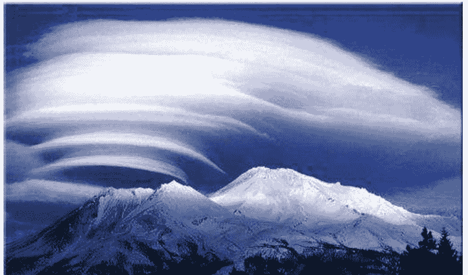
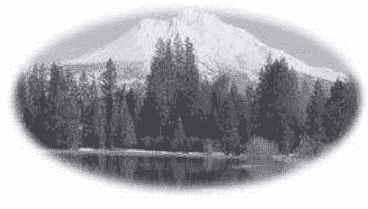
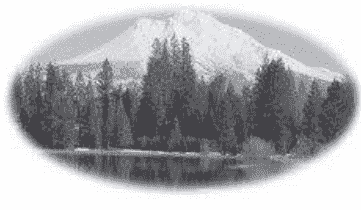

# 地心文明桃乐市1第五次元拉姆妮亚的扬升之道

### 作者简介

奥瑞莉亚．卢意诗．琼斯 （Aurelia Louise Jones）

生于一九四〇年代加拿大蒙特娄，卒于二〇〇九年七月十二日。早年从事护士职务，之后担任身心健康与灵性领域的顾问，透过自然药草、花精、家庭治疗与营养谘询为客户及动物提供服务。一九八九年移民美国，在默基瑟德教团中参与灵性修行，并于一九九八年被指定为会中的女导师。一九九七年，当时居住在蒙大拿州的她开始接收到桃乐市的亚当马和拉姆妮亚神光参议代表的讯息，要求她搬到雪士达山区居住，并在那里开展她一生中最主要的工作。她在那里创办了雪士达山神光印刷公司与《拉姆妮亚通讯报》，并且透过对亚当马及拉姆妮亚神光参议会的通灵，写作了三本以地心文明桃乐市为题的书籍。这些来自拉姆妮亚的重要讯息，旨在帮助人们了解这个星球的前途与自身生命的意义，带领人们走向自由，进入更高次元的世界。

奥瑞莉亚的梦想是在巨变的时代里，开启人类灵性，增加人类世界与拉姆妮亚的连系。她以巨大的毅力、决心与爱心，灌注在生命中最后十年的工作里。期望桃乐市形式的社会有朝一日能够在人类的世界中出现。奥瑞莉亚在雪士达山城里一年举办一两次拉姆妮亚集会，自二〇〇二年后，集会扩展至世界各地，如加拿大的魁北克、比利时、瑞士、西班牙与夏威夷。而她的著作目前已有法文、英文、西班牙文、西伯来文、罗马尼亚文、葡萄牙文、德文、日文与中文的译本，启发着世界各地人们的意识。

### 译者简介

#### Teresa Chan 陈菲

十七岁时离台赴美。之后任职于美国联邦政府的太空管理、雷达和通讯工程技术师。在她自我的研究、学习中，获得修身静坐、催眠、疗愈和心电感应的技能，研究通灵的神学至今已三十五年。她决定将新的意识、觉悟及智慧，分享给所有的人，以帮助他们找到内在真正的自我。

她的联络方式为：

telosoutpost@yahoo.com/support@sanctuaryofthesoul.net

网站资料为：

www.sanctuaryofthesoul.net

我带着愉快和充满期待地带给你们有关拉姆妮亚(Lemuria:即一般所称的列穆里亚)的回忆，虽然这些回忆似乎已经失落了一段时间，但他们依旧留存，并在你们的心中发芽生长，直到现在。在桃乐市，我们愉快的连结起我们彼此的心，来帮助这种文明的连结。

从这丰盛和神圣的感情流动的桃乐市中，传送给你我们的爱。直到我们再相逢，请继续练习真爱的艺术，而那是从爱自己开始的。希望爱能够充满你们彼此的心中并遍及一切的生物，就如同珍贵的珠宝以及天父天母的爱一样，我们珍惜的将你们放在我们的心中。

亚当马、格拉提亚和阿南马

Adama, Galatia and Ahnahmar

### 献语

我希望把这本书献给所有的扬升大师们—— 在祂们那隐藏的世界里，帮助所有的人类和这个地球，指导我们如何修道和扬升。特别是仙师梅翠亚、主耶稣、圣哲曼、艾莫亚、观音菩萨、马利亚、库图弥、大天使麦克;和我们美丽的母亲地球——是她无尽的爱心和忍耐，供给我们地球的外壳表面，让我们演化，使我们的灵魂能够得到更多的智慧和理解。我要表达内心的深爱和感激给亚当马——桃乐市的大祭司——他对我的爱心和耐性，也要感谢我在桃乐市所有的拉姆妮亚家人。

### 译者序

桃乐市是一个位居在雪士达山下地心中的城市。在桃乐市还没有发现以前，这座山的四周常有神奇的事件发生，奇云怪光、森林里的小精灵的出现，都是美好的传说。

这传奇的开始是根据奥瑞莉亚女士的写作，她所有的消息都是经过媒体传音而来。假如各位读者不知道什么叫做「媒体传音」(编注:以下多称通灵或通灵传音)，请让我简单的解释一番。我们大部分的脑干都是活动在百分之五至百分之十的左脑部分，有些人有特别的天分，是因为他们某部分的脑干要比别人活跃，因而有艺术家、科学家、医学家等……出生。奥瑞莉亚女士有心电感应的天分，她有时能够感觉到别人的思想和听到你心中的话语。假如你们将一些特殊的医学仪器连接到你的脑壳上，这些仪器将接收到你脑部的频率，通常是「晒光波」(Sine Wave)。奥瑞莉亚女士有能力连系上高能的频率，那气能是从不同层界而来，包围着她，利用她的语言传递出这些神奇的消息。

这本书供给你关于桃乐市的历史和来源。这些消息希望能勾起你灵魂深处的回忆。特别是我们中国人，记得我们的祖先曾有高等的能力。中国有名的道家、功夫、气功、轻功和那神秘的少林武术是怎么样失落的？现在虽然还有几项功夫可防卫强身，大多数功夫都失落了。你只能够从武侠小说上读起几项虚构的故事。这本书能够帮助你了解你的人生，和帮助你演化成仙，收回你以前所失落的能力。

我希望我所翻译的讯息能够感动你们的心。因为我跟你们一样，是一个失道的老灵魂。经过每天的静坐，我现在慢慢的连系上那高度的频率，祈求收回我的能力。希望你回归的道路一帆风顺。

### 前言 奥瑞莉亚·卢意诗·琼斯的话语

几年前，当我住在蒙大拿时，在一个导灵个案中，主耶稣告诉我——说我会搬到雪士达山城那里，准备我对社会的服务和完成我对地球的使命。

几个月后，在一九九七年的二月，我从亚当马那里接到了一封电邮。亚当马是桃乐市神庙的大祭司，他邀请我搬到雪士达山城去和拉姆妮亚人民准备完成一项最后的使命。讯息并不长，大约只有十二到十五行，但非常清楚。那讯息带有爱的频率。我非常惊讶，也很兴奋能够在这么久之后还能再和他们连系上。从那时起，我便开始打算着搬家的计划。最终，在一九九八年的六月，我带着我所有的家当和一家子小猫咪到了雪士达山城。

在我搬到雪士达山城后的三年，伴随着失望与伤心，我觉得我经过了一连串严格的考验，却还是没有从拉姆妮亚那里接收到任何讯息。我开始认为他们是忽视我，或者我还「不够好」，或者他们改变了跟我合作的想法，或者我没通过他们的考验。然而在不知不觉中，我已经接收到一系列所谓的「入山仪式」，并在内在层次准备着我的使命。

后来，完全无法预料地在某个下午，从一个送信者那里，我收到了一封亚当马给我的信。那信上提到我已经准备好了，现在正是让我跟他们合作和进行我的使命的时候了。接着我又收到另一段严格的仪式，有些是关于我的通灵技巧，在那个时候，我对是否开放通灵仍有犹豫。

几个月前，我和主耶稣连结，他告诉我时间已到，亚当马要把他所知的分享给这个星球上的人，而他特别选择要透过我担起这个使命。他又说亚当马是一个非凡的扬升大师，而且他从不做任何小事。他有个大计划，他打算要将他所知道的散播到地球的每个角落。将你自己准备好打算与亚当马与他的能量深度会和，并推展他的计划。

在那个时间点，我自觉对通灵还只是个入门者，也知道我需要尽快克服我内心的恐惧、自我怀疑和犹豫，并严格训练我的通灵技巧。我再也没有时间坐在山上看云的飘散。几乎是立即的，已经有人要求我给他们我和亚当马通灵的书面资料，或是和他连结解决私人问题。不久，我被邀请到数个公开场合和亚当马连结。至今我已经数次在大大小小的公开场合中与亚当马连结，在美国、加拿大、法国、瑞士和比利时等地。

这对我来说，显然只是个开始——我和拉姆妮亚的使命已开始显现并进入更大的范围。好多机会快速显现在我面前，而我所该做的就是抽出时间来服务。我非常开心能透过这些书传递一些新的讯息，而且未来还会有更多的讯息不断的显现出来。每次当我和亚当马连结，我可以感觉到他直接在我的心中。他那持续不断的爱在我的心中扩大，令我感到温暖和安慰。每当我感到他的能量连系在我心中，总会让我的心歌唱。我现在知道他是我最挚爱的和忠实的朋友，我完全的信任他。

二〇〇二年，跟桃乐市的人民有更多直接联络的梦想实现了。也和其他来自桃乐市的奇异存有有更紧密的连系。我也和拉姆妮亚的家人再度连系，包括我的双生灵伴【注：双生灵伴（twin flame）——当一个灵魂下降到第三层界时，那灵体便分化成两个灵体，一个是正频率（男性），另一个是负频率（女性）。这两个灵体叫做双生灵伴。】——阿南马。他仍保有那个自拉姆妮亚沉没时的身躯。当我在雪士达山城四处散步和探索时，我的「拉姆妮亚的团队」，他们如此称呼，似乎一直跟随着我。他们引导着我去看了几个存在在第五空间的圣地和神庙。我们参观了多度空间的入口及通道、能量涡旋及小仙子的居住地，以及独角兽家族，现在仍然生存着比这个世界高的次元里。那些内在视力开放的人，就可以看见他们。

他们带我看的地方是地球表面上的人所不曾知道的，这些会继续隐藏，到正确的频率普遍存在于地球上。我知道地表和地心有更多东西可以探索，所有的一切会逐渐的揭露出来。

我的朋友们，这真是太令人兴奋了。因为，假如我们的意识能向我们的神性敞开，放下二元对立，拥有不伤害与合一的心境，一个新世界就会呈现在我们的眼前。这个新世界一直在期待着我们理性的觉悟。这个现实一直都在我们眼前，唯一遮住我们的眼光与理解就是那长期的幻觉——使我们与神分离了。这个新世界充满了奇迹、爱、惊奇和伟大的多样性。经过了漫长的时光，我们很兴奋地能够再次发觉那些被我们遗弃的宝藏。

拉姆妮亚人民的回归以及在我们之中显现，就是所谓的「二次回归」——我们等待很久了。拉姆妮亚人早已达成扬升的意识。而我们已经准备接受他们到我们之中，他们会教我们在这地球上如何修持、创造一个像桃乐市的天堂。他们会协助我们创造一个黄金时代，充满了灵性和基督的意识。神性一直都在我们的心里。存在我们之中的基督意识，会明白的彰显在这个地球与我们的日常生活之中。

奥瑞莉亚·卢意诗·琼斯

### 亚当马的欢迎词

祝福我亲爱的朋友们：

我们心中满是喜乐与兴奋，我们桃乐市人民以爱的能量与你们所有的人——被新拉姆妮亚的历史所吸引的人们连结。

我代表拉姆妮亚在桃乐市里的十二位长老顾问，桃乐市的国王和皇后——「拉与拉娜穆」（Ra and Rana Mu）「日那君和日那妮」，和所有你们以前的兄弟姊妹，现在是拉姆妮亚的民族，我们欢迎你们进入拉姆妮亚之心——慈悲之心中。我们的确是那伟大的民族的幸存者，而这可能会让地表上的许多人感到非常惊奇，我们在地球演进的这个重要时间向你们显现，经过了一万两千年与地表人民的隔绝，我们仍实际且健康的生活在美国加州雪士达山下，地层的中心。

我挚爱的人们，让这两个文明重新合并的时间已到。我们出版本书的原因之一，是帮助基金会的成立，这是为了我们最后的融合做准备，那使我们长久分隔的漫漫黑夜就要终止。我们计划在不久的将来，在爱、智慧和理解中做准备，显现在你们那些准备好的人们之中。

自从拉姆妮亚沉入海底后，我们心中渴望的，是教导和帮助你们去创造一个属于你们的天堂，如同我们在桃乐市所创造的天堂。我们已经为你铺了道路，当你们分享这高层的灵性智慧与领悟时，你们将较容易跟随我们的脚步。我们将伴随着你一起前进。

当我们看到这些讯息用数种语言出版时，深感欣慰，因为我们自觉这知识将推广在整个地球，普及大众。在不同的国家里，许多人民已经准备好，并渴望与我们重新连系上。你们有许多人被吸引来看这本书，直到今日还有一些亲戚住在桃乐市或现在的拉姆妮亚。这些以前的家庭成员非常爱你，他们渴望与你再度连系。在桃乐市有许多人曾经有家属住在地表上，他们自愿学习你们的语言，以便于在两个文明合并后，能够与你们沟通。

我们请求你，亲爱的人们，将我们的讯息放在你的心中，并有意识地创造一道爱的桥梁，让我们两个文明能互相连结。只有从那爱的桥梁以及彼此心与心的感应，能将我们更具体的呈现在你的眼前。我们等着你的回应。从你的心深处来呼唤我们，我们会在你身旁，对你低吟「团圆合一」之歌。我们拥护你的胜利，也随时随地都在帮助你达成你的目标和心中的愿望。

我是亚当马

—你拉姆妮亚的弟兄

## 第一部 我们和拉姆妮亚之间的连系

> 如同神圣存有一般，
> 回归到纯然的意识中，
> 最重要的是，你必须马上开始，
> 将所有的领导权交给你的心，
> 再一次允许你的心
> 而非心智去指挥。
>
> ——阿南马

### 第一章 关于雪山达山、桃乐市和拉姆妮亚

#### 魔法之山

##### 来自奥瑞莉亚的讯息

雪士达山（shasta）是座雄伟的山，位于内华达山脉的北边山区。它坐落在美国北加州一带的西斯奇县（Siskiyou County），距离奥瑞岗州（Oregon）边界大约 40 哩路左右。雪士达山的高峰是坐死火山，其高度超过一万四千一百六十二呎。它是美国大陆所有火山中最高的一座。有些扬升大师曾提到过，雪士达山曾经是伟大的中央大日的化身。

不管如何，雪士达山是个非常特别的地方。它所代表的不只是一座山，而是地球上最神圣的地方。雪士达山是地球上神秘力量的来源，它是许多天使们、灵性指导灵、太空船和光界的大师的聚集之处，它也是古拉姆妮亚幸存者的家乡。透过灵视力，可以看到雪士达山被一个巨大的紫色金字塔给包覆住，它的塔顶直入太空，并使我们连结至银河中的星际联盟，成为银河系的一部分。这雄伟的金字塔也包括了一个与自身颠倒的形体，直接深入地球的最核心。

雪士达山代表着这个地球的光网格线上的入口。就是在这个光网点上，所有的能量波从不同的星系汇聚到此点，再发送到不同的高山和汇入不同的光网里。大多数的山顶，特别是高山，是这个星球的光网格线输送光的基地台。

山中经常可以听到或是看到奇怪的声音与光。奇形的云团、影子和美好的晚霞，更增添了这座山的神秘。自从拉姆妮亚时代起，许多第五空间的入口和通道如今仍然存在着。雪士达山是一万两千年前许多拉姆妮亚沉没时的幸存者的家乡。是的，我们拉姆妮亚的兄弟和姊妹是真实的。他们身体健康，住在第五次元的世界里，而你们还无法看见他们。现在地球表面的频率正在演进，从第三次元的世界里，慢慢进入到第四次元和第五次元的世界里。别的次元一直都存在着我们的四周，只是地表上的人民还没有演化到足够的意识高度而能感知到他们。

当大陆还没有沉入海底以前，人们已充分预感到那所爱的故乡的命运，拉姆妮亚的长老，运用他们的能量、水晶、声音和振动，挖出一个广大的地心都市，想要保存他们的文化、珍藏和地球历史的文件。从亚特兰提斯到现在这一段历史已经失落。拉姆妮亚曾经是个广大的陆地，比北美洲更大，连结了一部分加州、奥勒岗州、内华达州和华盛顿州。一万两千年前，在一个灾难中，地形的变动使得这片大陆在一个晚上便消失在太平洋中了。所有地球上的居民都认为拉姆妮亚是他们的家。它的沉落带给了地球居民深度的悲哀。那时大概有两万五千拉姆妮亚人民，和他们最重要的行政中心，在下沉之前移往雪士达山的地底中心。

亲爱的读者，在你读到这些，你的心知道，从前那些拉姆妮亚的兄弟姊妹们一直没有离开你。他们仍然保存着他们那长生不老的躯体，和那完全没有限制的生活方式，在第五次元生活。

美国印第安人相信雪士达山是一处非常壮观的所在，唯有伟大的精神（Great Spirit）才有可能创造出来。他们也相信那些隐居在山坡上四呎高的小矮人，是这座山的守护者。这些奇妙的小矮人被称为「雪士达山的小人儿」。他们也有身体，可是因为振动的频率，我们通常看不见他们，偶尔有人会在山中看见他们。

那些雪士达山的小矮人，之所以不愿现身在我们之中的原因是，对人类的集体恐惧。很久以前，这些小矮人的身躯还会被我们看见且无法自由的时候，人类虐待他们。他们因此对人有很深的恐惧，所以他们联合起来请求这个地球的灵性层级来帮助他们，提高他们的频率。现在，他们能够保持隐身，并且继续和平和没有伤害的演化。

根据不同的传说和报告，关于「巨脚，Bigfoot」族人和一些神妙的存有，曾经被当地居民在一些教偏僻的雪士达山区发现。现在，在世界各地和雪士达山区，巨脚族人所剩不多了。他们拥有正常的智能和祥和的心，他们也得到恩赐，能够随着意愿而隐身。在这情况下，他们就能避免和我们有所冲突，就像小矮人一样，避免人类伤害他们的肉体、并以科学研究为名控制与奴役他们。

直到如今，我们还没有真的了解，我们只是被邀请来地球上的客人。我们是仁慈的地球母亲的客人，她自愿把一个进化的场域，提供给许多不同的国度在此生活和演进。人类只是其中一个而已。当初所有的国度都同意，崇敬且平等共享这个星球的一切。如此经过了一段很长的时间。不幸的是，在十万年后人类开始掌管，他们自大的认为他们是高等的物种，而且有权利去控制与操纵别的国度——那些似乎比较脆弱的国度。

许多动物国度里的族群们也开始隐身。牠们仍然在这里，因为牠们的频率比我们高一点，因此我们看不见。想想看，那些几乎绝种的动物们去了哪里了呢?许多动物消失了,因为他们做了集体的决定不要再跟我们有任何连系。那些动物王国中仍然出现在我们周围的物种,并不总是受到人类的爱护与尊重。扪心自问我们这个自认为高级的物种,是如何对待、使用与虐待大多数的动物的?

如今已有几个灵性团体围绕在雪士达山城区。许多寻求真理的人,从心底感受并听到「山的呼唤」而搬到这个山城,在这里,他们觉得终于「回家了」。那遥远、古老的拉姆妮亚的模糊记忆,召唤着他们回归源头。

在一个晴空爽朗的大白天,从百里之外,可以看到雪士达山像是个白色发光的珠宝。住在附近的居民,拥有许多神妙的故事与传说——关于这一万四千一百六十二呎的火山。最著名的传说是,那住在第五层界的仙人们,就是安居在这雪士达山下的地心里。听说这些特殊的人民就是古老时代失落的大陆,拉姆妮亚的移民和后代。他们深居在山里地层的中心。他们的房子是原形的,愉快的生活在一个健康、长生的、富有的和一个真实互爱的社会。他们仍保有传统文化。

传说中,那住在山内地中之中的拉姆妮亚人是相当高贵的民族,他们大约七呎或更高,有着随风飘逸的长发。他们穿着白色的长袍和凉鞋。传说有人也见过他们穿着彩色的衣裳。他们有苗条的身躯和修长颈项,因此常挂着美丽的饰品和珍贵的宝石。他们已经发展了第六感,所以能用心电感应和超感应力来互相联络,他们也能随意隐身。主要的语言是拉姆妮亚文,称作索拉雅马如(Solara Maru),但是他们也能讲英文,带着一点英国腔。选择英文作为他们的第二种语言,是因为他们位处于美国大陆的地层中心。

多瑞尔医生（Dr. M. Doreal）曾表示，许多年前，他曾进入拉姆妮亚山里游览。他说那地方大概有两哩高、二十哩长和十五哩宽。他说在山中的光就像夏天一样明亮，因为在那宏伟的洞窟中流动着一个巨大的光球。另一个人说，他在雪士达山边睡着了。他被一个拉姆妮亚人推醒，引导他进入了山里的洞穴中，通道是用黄金铺成的。这个拉姆妮亚人告诉他，在地层中心，他们有许多由火山造成的地道，就像高速公路一样，一个世界连着另一个世界。

拉姆妮亚人在一万八千年前，已能够控制和运用原子能、心电感应、灵视技能以及电子和科学。我们第三次元的技能和他们的科学相比，好像是个刚学会走路的小孩子，他们用高度的心智来操纵他们的科学技术。很久以前，他们已经知道利用水晶发射能量来推动舰艇。他们乘坐太空船在亚特兰提斯和太空四处穿梭。如今在他们的太空中心，已有一队太空飞船叫做「银星舰（Silver Fleet）」，他们进出第五次元山区和太空之中。他们能使太空船隐形无声，以防被当地人或军方侦测到。象大自然一样，虽然他们天生就有肉体，但是他们能够转换能量场，从第三次元到第四次元，再到第五次元的振动，并可以选择要不要被看见。

许多人表示，曾在山里看到奇怪的光。可能是许多太空船不断的进出山里的太空站。雪士达山不只是拉姆妮亚人民的家，它也是宇宙不同星球和银河次元的通道。在雪士达山峰上有座巨大的光城，叫做「七层光水晶城」，也许在不久的未来，十几到二十年中，这神妙的光城会慢慢降低它的频率，显现在我们眼前，它将会是第一个地球上的「光城」。如果希望这能够实现，在地表的人们一定要提高他们的意识，来配合光城的频率。

就算不知道任何拉姆妮亚的知识跟传说，你也可以轻易的接近雪士达山，可是假如你前世曾经与他们有过一点关连的话，你可能会因为一些真相的显现而感到被祝福。雪士达山吸引着世界不同的游客。有些人来寻找灵视洞见，有些人则沉浸在与自然之母所提供的——有如阿尔卑斯山区的美丽自然奇观之中。

每一个人都喜欢神秘的事物，特别是雪士达山的神秘。那里有许多神奇的传说和迷人的故事——关于北美加州的巨人。那孤独的高山永远沉睡在他完美的神秘之中。然而，不时有新的传奇浮现。新的角色浮现，所有的注意力又会集中在这神奇的山上。就这样年复一年，而且几乎会这样一直下去。雪士达山只会特别显现「她自己」，给那些尊重生命、忠于真实自我，和那些愿意与大家分享这个地球的人们。

> 拉姆妮亚至今仍存在于
> 第五次元的频率中，
> 从第三次元的眼界
> 仍然无法看见和感知。
>
> ——亚当马

### 第二章 拉姆妮亚的起源

#### 拉姆妮亚的起源

来自亚当马的讯息

在几百万年前, 刚开始的时候, 这个地球有七个大陆。几乎一开始许多民族从不同的星球就已经搬到地球来住。有些外星人只留住一阵子而已, 其他很多外星人决定长留。这段时期的历史已记录在地球中心的伯沙罗格市(Porthologos)和桃乐市的图书馆里。长久的历史和真确的事实, 至今在地球表面上, 几乎完全不存在。大多数的文化,不像你现在所知道的整体。所有的文件纪录也不是用你们的方式来保存。并且几乎所有在地球表面上的档案历史, 曾经被收藏很久, 逃过许多次的灾难时期, 最后也慢慢被摧毁了。

在四百五十万年前, 大天使麦可和他手下的蓝火天军和许多光界里的人民, 收到天父和天母的祝福, 护卫着第一个灵魂, 第一个拉姆妮亚的种子变成人体。这事件发生在皇山提顿(Royal Teton)的避静处。这地区现是美国怀俄明州的国家公园。原本是从太尔宇宙(Dahl Universe)姆星而来的这些新灵魂就这样投身到地球来。在那个时候,地球充满了完美的环境、丰盛的植物, 和优美的风景, 是你们现在无法梦想到的天堂。它是在太空宇宙中最完美的创造, 最壮丽和雄伟的一颗星球。这完美的环境保留了几百万年, 一直到第四期的黄金时代,人类的灵性与理智开始恶化和堕落。

后来别的星球民族, 天狼星(Sirius)、南门二(Alpha Centauri)、昂宿星(Pleiades), 和其他不同的星球人民来地球混种而一直演进。拉姆妮亚的民族就这样在地球上出现了。可说是相当成功的混血种族! 拉姆妮亚这块大陆是我们的母地, 它在这地球上演进成灵性高度文明。从那时开始, 拉姆妮亚协助许多新的文明诞生。亚特兰提斯的文明就是后来才诞生的。

最初开始时，这些美好的灵魂从太尔宇宙的姆星投胎来地球的目的，是为了经验更大的冒险与奇遇。在天使们的帮助和教导下，在皇山提顿经过特别的调适与训练，学会在地球生活的方式。慢慢的他们发展开来，形成许多小型的社群。在继续的发展和改善中，他们慢慢搬离开皇山提顿。最后开拓移民散布到整个拉姆妮亚大陆，进而遍布太平洋及更多的地区。

在拉姆妮亚的文明还没有殒落之前，他们的社会环境不是你们现在所想象中如此具体的。地球是处在第五次元的气能世界里。拉姆妮亚人大多生以第五次元的光体来生活。他们有特殊的灵性，能够随时降低他们身躯的频率，来经验那些厚重和具体的次元，然后又变回光体。当然这是在他们的理智和觉能还没有堕落时，很久以前的文明。那以后他们的身躯频率慢慢下沉，使这个美好的民族和所有其他地球上的民族意识一起下降。像别的文化一样，人民的灵性掉落到第四次元，几千年后，又持续掉入浓密的第三次元世界。

### 开放连结拉姆妮亚之心

关于拉姆妮亚悲剧结束的一段历史

来自奥瑞莉亚的讯息

这些教导和知识是从桃乐市里的公主莎如拉德士（Sharula Dux）而来。她已搬到地球表面，现在住在美国的新墨西哥州。在一九五〇年期间，一批扬升大师接收到了使命，帮助地球表面上的人们，从灵智上设起「自由的桥梁」。许多讯息是从扬升大师们和亚当马那里通灵而来。

拉姆妮亚的时代，开始于四百五十万年前一直到一万两千年以前为止。一直到拉姆妮亚沉入海底，接着亚特兰提斯也沉入海底，地球表面本有七块大陆地，这巨大的陆地包括所有沉在太平洋下的陆地，还有夏威夷、复活岛、斐济岛、澳洲和纽西兰。这巨形的大陆也包括那沉入印度洋中的陆地和马达加斯加。拉姆妮亚的东海岸连接到今日的美国加州和一部分加拿大的哥伦比亚州。

两万五千年前的战争，摧毁了拉姆妮亚和亚特兰提斯。这两个大陆为了不同的「理想」而战争。他们有不同的想法和方式——关于如何统治地球上那些不同的民族。拉姆妮亚人觉得应该让那些较不文明的社会，根据他们的理解力和步调让他们自行演进。

亚特兰提斯人认为那些还没有开发的民族，应该被两个进步的文化民族所控制，这个争论引起了拉姆妮亚与亚特兰提斯连续的原子弹热能的战争。当战争结束，灰烬遍地，两败俱伤，没有一边胜利。

在战争的期间，那些曾经文化高尚的人民，举止突然变成下流无道，一直到他们最后感觉到这些举止是无意义的。最后亚特兰提斯和拉姆妮亚变成他们自己专制和独裁的牺牲者。两个大陆因为战争而衰弱下去。神庙里的祭师将他们的灵视宣告给民众，他们的大陆将在一万五千年间被毁灭。 在那个时代里，大多数的人的生命长达两万年到三万年，他们了解那些造成这陆地灾难命运的人，会亲身经验它的结果。

在拉姆妮亚的时代，美国加州还是拉姆妮亚大陆的一部分。当他们得知那所爱的大陆要毁灭，他们要求香巴拉利社（Shamballa-the-Lesser），他是亚格莎网络（Agartha Network）的主首，批准他们在雪士达山地底的中心建造一个城，保留住他们的文化和历史记录。在四万年前，一批希柏里尔（Hyperboreans）的民族离开了地球的表面移民到地心，建了都市。在那个时候，香巴拉利社管理着亚格莎网络，这地层中心的网络包括了一百二十座地心中的光城，大部分都是希柏里尔人。在这亚格莎网络中，四个城市是拉姆妮亚人所建立，还有两个都市是亚特兰提斯的人民所建。

为了申请建造一个地心都市，和加入成为亚格莎网络中的都城会员，拉姆妮亚人要给许多机关证明，如向太空星际联邦保证和表示，他们从累年来的侵略和战争，已习得智慧。他们也请求加入太空星际联邦的会员，他们保证已学到和平的智慧。因此批准发下，让他们建造桃乐市，他们了解这个都市是地球灾难的逃生区。在雪士达山下，已经有个巨大的山洞。拉姆妮亚的人们开始建造他们的城——叫作「桃乐市」。在那时这名字正也是那地区的名字，包括了美国加州和西南部分的区域。桃乐市包括雪士达山的北区沿海直到加拿大的哥伦比亚州。桃乐市的名字意义是——与神合一和与神相通。

在建设桃乐市的计划中，预计可容纳二十万民众。当拉姆妮亚大陆被毁灭，这悲惨的事件发生得比预期的时间早，许多人民还没有移至桃乐市。当天灾发生时，只有两万五千人入山进城，逃灾救命。这些人是当时拉姆妮亚文化残留下的人数。幸好许多文件档案都已经搬入桃乐市，并且好几座神庙也已经建成。

消息传至地心，关于他们所爱的母地，在一个晚上就沉入海底。那大陆沉入海底的速度非常快，大多数的民众都没有感觉它的发生。当大陆沉海时，几乎大多数的人都在睡梦中，那天没有特别的气候的警告。根据一九五九年艾莫亚的双生灵伴结罗第（Geraldine）喜马拉雅上主的讯息，通灵仙师说，许多神庙里的祭师一直坚守心灵的光，遵从神圣的召唤，像船长随着他的船下沉一样，留在他们的岗位上。无惧的吟唱和祷告，随着水浪沉入海洋。

在一九五七年时，另外一个结罗第通灵马哈霍汗（Maha Chohan）讯息中表示，在拉姆妮亚还没有沉入海底前，所有神庙里的男女祭师们都已被警告了天灾的来临。许多圣火都已转移送到桃乐市中，其他事物也已转送到别的陆地，不受到天灾的影响。许多圣火被送到亚特兰提斯大陆上特别的地方，在每天灵性的修持中，这些圣火保持了很长的时间。就在拉姆妮亚大陆还没有沉下去以前，一些神庙里保护圣火的男女祭师们，自愿回到他们的家乡拉姆妮亚大陆，跟着他们的人民和他们的母地一起沉下去，给予人民爱的光，除去他们的恐惧，给予他们安慰。

在这灾难期间，他们贡献自己去帮助社会，减少人民的恐惧。

这些爱心宽大的行善者，散发着他们牺牲的精神，像一件光亮的毯子，充满了爱与平静，包裹着民众的气场，解放了他们的恐惧，使他们生命之流的以太体不致有深刻创伤，因此这些民众在未来投胎后，不必再经验到更大悲剧的结果。

在一九五九年时，喜马拉雅上主经过导灵，给予「自由桥梁」天启时说：「许多神庙里的男女祭师们，将自己组成不同的小团体，分配到不同的地区。伴随着拉姆妮亚的人民，他们祷告着和唱着歌，直到水浪淹过他们。他们同时唱的那首歌就是今日所知的那互爱的音调，永远回荡在他们的灵魂里。这仁慈的行为能够减轻那恐惧的经验，因为在每一个惊吓的经验中，在你的灵体和细胞记忆上，会留下深刻的伤痕，需要好几生世才能治愈。」

透过这些神庙里的男女祭师们的牺牲与帮助，他们形成不同的小集团，祷词与歌声围绕着民众，减少了大部分的恐惧，安定一部分的和谐，对那些淹死的灵魂伤害与痛苦大大减少。传说中那些祭师们和音乐家，他们的祷告与歌声持续不断，一直到海水淹过他们的口。他们也一并失落在海里。在一个星光银河深蓝夜色的晚上，大部分的人民都在熟睡中；那所爱的母地，淹没沉入在太平洋的海波里。没有一个神庙里的祭师离职而逃，没有遗留下任何恐惧挣扎的迹象。拉姆妮亚保留着她的尊严而沉下。

他们同时唱的那首歌就是今日所知的，<友谊万岁>( Auld Lag Syne 奥莲星 ) 是拉姆妮亚大陆最后所回荡的一首歌。

今晚，我要你们大家再唱一遍这歌。这就是我们集会中的仪式。

地球上的爱尔兰民族带回这首歌，和一些非常预言性的字语加入了这民歌，例如「别忘了那熟悉的老友们」。你们想想看，我们今晚集会的原因？对了，我们就是那熟悉的老朋友又一次连系起来。我们这些在第三次元世界的人，现在能够在意识上跟我们拉姆妮亚的朋友和家庭连系上。虽然我们暂时还看不到他们的身躯。希望我们的等待不会太久。我要你们从你的心底听着我下一句的预言，我的朋友们：

> 在拉姆妮亚还没完全沉入海底时，预言中有一天，在一个遥远未来的日子里，我们许多人民又会组织成不同的小团体，再度唱起这首歌，并坚信「地球的胜利。」

让我们来庆祝这长久等待的日子和那预言的呈现。今天我发起这等待已久的「团圆」。我带着热泪从亚当马那得知，我要告诉你们，今晚的集会中，许多会员就是那些勇敢的牺牲者，为了救大众人民而自我牺牲了。让我们赞赏你们的英勇和欣喜再次的团聚，继续我们拉姆妮亚的使命，来帮助人类和地球进入她光辉的扬升之日。

在桃乐市的人民，他们的使命是协助平衡和保持那提升的意识，一直到地球表面的人民，能够自己修炼为止。现在就是时候，让我们将这两个文明「一心相连」。

### 在两个大陆沉入海中后的地球

在拉姆妮亚沉入海中时，亚特兰提斯开始地震，也失去它一部分的陆地。这情况继续了两百年，一直到最后剩下的大陆全部沉下海底。在拉姆妮亚和亚特兰提斯沉入海后的两千年，地球仍然在震动。在一千两百年中，地球失去了两个主要陆地。这个对地球的惊吓和伤害非常巨大。好几千年后，地球才恢复平衡，能够让生物生存。在两个大陆毁灭后的几百年，大量的灰土飞散满天，地球很久都看不到光亮。四周环境非常寒冷，因为太阳无法射入那毒烟灰土满天的环境。几乎没有作物可以生长，大多数的动物和植物都消失了。

在今日的时代里，为什么这两个伟大的民族所遗留下的痕迹与证明这么少呢？

这个原因是那些地球上所剩下的，没有沉入海中的陆地与城市都已成废墟，有的被地震毁了，有的被海里的巨浪吞没深入千里的陆地，海水侵入都市和居所都毁了。那剩下逃出天灾的难民，生活变得非常艰苦和恐惧。生活的品质大降。那些幸存者，只剩下饥饿、贫困、病痛。

地球上的人类，身躯原本十二呎高。那些希柏里尔人仍然保持着十二呎高的身材。那时候没有一个希柏里尔人住在地球表面。当拉姆妮亚沉入海时，人们已减到七呎高，至今在桃乐市的拉姆妮亚人，仍然继续保留着七呎到八呎左右的身躯。从那时起，地球表面的人类身体的'高度'一再变矮，大多数的人民在六呎以下。当我们的文明进化时，这些高大的身材将再度恢复在地球表面上。甚至现在，地球表面的人民要比百年前的人民高多了。

今晚，假如你允许的话，亚当马和许多桃乐市的人民带着他们的光体来此。他们要给我们一个机会去治愈我们个人和地球的过往经验。对地球来说这将是个伟大的服务，帮助地球和人类，并且也为你你们单独个人而服务。

新日子和新世界就要出生了，我们学到了爱的课题和新的拉姆妮亚，新的天堂就要实现了。桃乐市，是拉姆妮亚的一部分，一直维持着她神圣的呼唤和光芒。在大变动时她被提高到第四次元。她的民族进而演进到第五次元的觉知中。一直到现在，仍然生存在那高次元的世界里。可爱的桃乐市和她那不可思议的人民，是我们进入这神妙之地的「门户」。

### 治疗拉姆妮亚的心

来自亚当马的讯息

在这新地球，新日出的时代里，揭露出那连接不断的拉姆妮亚古老的悲哀历史。

我所爱的，最亲爱的，过去的兄弟姊妹们和之前的家人们，我代表着拉姆妮亚，桃乐市的长老们的国王日那君、皇后日那妮，和约五十万以光体聚集在此的民众，我们带着极大的喜悦、爱与荣耀祝福你们。当我们开放我们的爱心给你们时，邀请你们也开放你们的爱心跟我们一起，来接受与治疗那重大的伤痕。我们今晚在此，一起医治这重要的伤痕。治疗我们的地球和大众的心灵。首先让我们来解释清楚，那拉姆妮亚古老悲哀的历史和疗癒你们心与灵魂的伤痕。第二是把我们两个民族的心联合起来，从这两个文明社会中建造一座桥梁。那长年的分隔几乎来到终点，现在让我们能够跟你们更多的人联系，我亲爱的人民，这个敞开和交流能够加速我们合并的时间。

我们两个文明要再度面对面相遇，在充满光和爱的境界里庆祝。我们会一起合作，心手相连，一起建造一个你无法想象的神妙、奇特和恒久的黄金时代，充满了光明、智慧与和平和富裕的文化。我们会协助你们以互爱与光辉为根本来建立社会，不再让地球承受如过去长久以来的负面力量干扰。

你所忍受的那漫长的黑夜几乎结束了。不久，让我们一起来享受，散发着更多的光明，你现在正经验着最后一刻的黑暗，日出已悄悄升起。虽然你将会面对地球表面的改变，那你已经预感到了。我要你们感觉到这些改变好似为母亲地球「解放自由」。这一刻就要来到。你一定要以你心中那光辉的高我为中心。不要让自己陷于恐惧，我要你接受改变和转向，不管发生什么，我要你拥抱所有的经验，因为上帝正在着手为你创造一个新世界。

帮助与支持会从四面八方而来，我们也在一旁协助你。你只要从你的心底呼唤我们，我们就来协助你。

奥瑞莉亚给了你们摘要的报导——关于一万两千年前大陆沉海悲剧。目的是要给你们觉知去感受那沉重的历史，因为可怕蹂躏的战争，摧毁了一切。我要你们知道这痛苦的伤痕，至今仍然留在百万人的心目中。那灵魂的创伤心碎故事与历史几乎难以言喻。让我们从现在开始，从你个人本身来治愈这伤痕。这些古老记录是构成地球人类意识受蒙蔽的原因。因为那痛苦的记忆无法忍受，所以大多数的人民闭锁起了他们的理智，以至于无法接受高等灵性的知识。

我跟桃乐市的人很愿意去澄清那些凋零的历史。只要你们同意并设定意愿，我们可以联合起来，治愈你的心和疗癒我们的地球。

今天晚上你们愿意一起来完成这个使命吗？（观众齐声回答「愿意」）

现在我要你们沉静下来。我立下意向和决心，将你灵魂中的隐痛解放出来疗癒。今晚许多大师和天使都在此帮助这重要的净化，所以我要你们进入心底，呈现出那些古老的伤口，让我们去医治，当你请求医治好你个人的伤口后，我要你继续请求天神们治疗所有地球人类的伤口，让那悲哀的历史加以释放。我确信你们成千上万的人都需要被治疗。（大众都陷入于沉默中）

我的朋友们，这举止好似滚雪球效应，一启动即全场发动。又象猴群学习效应，能让所有人类心中的旧伤都解放出来。这对人性有极大的助益。谢谢你们的参与和互助，你不仅治愈了你自己，也将你的爱心贡献给地球。

我们用你们所创造的爱与能量，治疗了许多人的心，今天晚上我们已经解开和疗癒了多数人的旧伤和历史。让我们离开过去的悲剧，一起来创造新的现实。让我们来祝福那亲爱的母亲地球。让我们的爱跟你们的心直接连接、自然交流。今晚谢谢你们给予地球的服务和来此聚会。

再过一阵子，我可以确定那黑夜将完全消散。地球再也没有悲哀，没有眼泪。假如还有泪水的话，那是欢欣和狂喜的热泪。假如这是你们的选择，我们会一起创造出一个光荣的前途与命运。

我们是你们的兄长和姊妹，自愿来指导你回归的道路，成为你们的模范。在我们的协助下，到达你们的目标与成就简单多了。我们要请你接受我们的帮助。你们知道吗？我们拥有这个技能，在下次的地球的转变和演进时，我们能够温和的引导你的旅途，减少挫折与灾难。在第五次元的世界里，我们建立了一个新的拉姆妮亚，是一个魔术的、神奇的天堂。你们曾经所梦想的一切都在这里，还有更多更丰富的一切。当时候到时，我们会将新的拉姆妮亚扩展到地球表面。在一万两千年来与地表人们分隔后，一切我们所学到的技能，我们会教授给你这些新的知识。

我是亚当马和我拉姆妮亚的人民，我们都支持你的胜利。

开始深思想到你们自己的躯体
像个「魔术身」。
观察着这最多才多艺的器具，让你呼唤去做一切你想做的事，
没有痛苦或限制。

——亚当

### 第三章 新拉姆妮亚

我是亚当马，祝福我的朋友们。

地球表面上的人民相信，在一万两千年前，拉姆妮亚被毁灭沉入太平洋里，不再生存。从第三次元世界的角度观察，这是正确实在的。这巨灾几乎毁灭了大部分的陆地，并吞没了三亿人民，使整个地球表面和幸存的逃生者，感到绝望的伤痛。

这结果，给予我们母亲地球一个致命的打击。在最后的过程中，就在一个夜晚，我们那所爱的拉姆妮亚——地球上文明启发的来源，便消逝了。全世界都受到惊吓，哀悼她的失落。那伤痛如此之深，甚至至今天，那伤痕仍然深印在大多数人民的细胞和记忆中。那些突然遭灭顶的灵魂，受到的打击最严重。你们许多人在这冲击后，脑海中关于那光辉的拉姆妮亚的先祖们的记忆，完全封锁起来，因为结局太悲惨了，让你无法面对。你那伤痛的过去，深深的埋在你的潜意识里，等待着有一天能够被揭露和被疗癒。今天我告诉你们这一切的原因，是来帮助你们读到这个讯息的人，开始有意识治疗那些旧伤痕跟我们地球的地球母亲。因此，我亲爱的兄弟姊妹们，我提供我们充沛的爱和慈悲来帮助你们。

拉姆妮亚仍然生存在第五次元世界的频率里，以你们第三次元世界的眼光和感觉，无法感知到的。

你们那些至今仍然伤感着拉姆妮亚的失落的人，让我分享一些新消息，拉姆妮亚不像你们地球表面上的人想象中完全摧毁了，当那分隔我们次元的帷幕愈来愈薄，保证你们那些在修身扬升的人们，你们所爱的拉姆妮亚，会以具象而可触及方式，再度展现其光辉与荣耀的新面貌。

当你开放你自己，生活在更有意识的状态中，清除你过去所有的迷信和长年来的错觉与观念，你会再遇到你挚爱的母地。最后你将会被允许进入，接收到所有她给予的爱和荣耀。当你准备好了，你将会被邀请有觉知地进入这天堂之地。当巨灾发生时，那代表着这个地球的拉姆妮亚，被提升到第四次元世界的光波频率，而后继续演进成第五次元，她不断的演进茁壮到如今完美的层级。那些死里逃生的人民，现就住在新拉姆妮亚的桃乐市里。

假如这些故事带给你热泪满襟，开放你的心，治疗那深埋在心底的创伤。让你的悲哀流露吧！让你的眼泪治愈你存在的每一部分。透过你的呼吸，允许自己从心去感受。不要有任何压抑，深刻感受所有的记忆与创伤。这就是你自己疗伤的方式，一点一点的来治疗。当你呼唤出所有的创伤，那印痕会消失而彻底痊愈。在你静坐时，要求你的高我来帮助你揭开所有的旧伤印痕，那些封锁住的气能，不再阻挡你的演进和你灿烂光彩的未来。

在你每一天的静坐中，我要你如实的照做，一直到你觉得痊愈为止。跟我们的爱心心相连。当你开始运用这方式冥想与治疗时，呼唤我们来帮助你，我们乐于协助你进行这项重要的内在工作。我们所有桃乐市的人民，都非常热心的去帮助那些与我们的心有连系的人们。我们的民族已修炼出宽心之爱，我们身躯的气能，与神圣母亲的脉动共鸣。慢慢的那深刻的伤会消逝，你会感觉轻快许多。消除这些伤痛，将可帮助你打开记忆，进而醒悟到你真实的自我。这会使你感觉到自己有重大的跃进，在灵性上、感情和躯体上的进化与更新。

在夜里当你的躯体睡着后，我邀请你的灵体来桃乐市。我们有许多灵性顾问愿意跟你们合作。每一个来这里的人都有三个顾问与你密切合作。一个顾问专门治疗情绪体，另一个顾问专门治疗心智体，第三个顾问专门治疗星光体。

不久以前，我们批准了这位导灵的作者——奥瑞莉亚·卢意诗女士一个机会，让她能够遥视到那新拉姆妮亚。她深受感动。从她内心深信我们所有透过她传下的文词，不仅是遥不可及之未来的一个承诺而已。她身上的每一个细胞知道所有的一切都会在这一代中实现。这是你即将步入的旅程！你愿意紧握住我们的手，乘着扬升的波浪，一起进入这新世界的现实里吗？

### 地球的人们呀, 我们是个大家庭

从我们生活的地区, 我们观察着, 从人类的心智里, 开始记忆起他们自然的神性, 这个伟大的醒觉, 使你们不断的进化与发展。

亲爱的人民, 虽然你无法看见这美好、神妙与进步的完整图像,我们有特别的技术, 那氨基酸电脑能够每天在地表的任何区域, 绘出人们振动的频率, 藉此观察人类演进的情况。我们发觉到每一天, 愈来愈多人开始醒悟他们灵性上的目标。我们看到你们许多人, 自愿的从心选择互爱与和平, 实现在你们个人的生活中和地球上。

在如今, 许多人已经开始醒悟和演进, 并加深了解他们原本的神性。从你们选择的结果, 显示出你们自我决定的命运, 那最后的胜利和自由。唯一的问题是, 到底需要多久时间和多少地球的年代才能渗透入广大的群众。我们可以老实的告诉你, 这进展速度之快已超过原来灵性高阶的期望, 不管如何, 你不需要经过千年万月, 来等待着你那长年渴望的新世界。我要你知道在十年之内, 许多正向形式的改变已经发生了, 从那以后, 你将会进入一个演变加速的周期。这股密集的能量将不会消失, 会一直演化到你能够舒服的安全住在那神妙、幸福和快乐的第五次元世界频率为止。

终于距离我们这两个文明重聚的时间不远了!

桃乐市和所有地心中的兄弟姊妹们是一个巨大的帝国, 拥有许多不同的民族。从我们的兴奋和期待中，我们观察着这个地球表面上意识的发展。我们的爱心和光能会一直支持你们的，象儿童一样喜欢数着圣诞节来临的日子。这是我们所谓的「圣诞节」的「重聚」，从互爱和兄弟姊妹情绪中合并为一个地球大家庭。我们惊叹的观察着你们每日的醒悟和演进。经过了如此数百年来身躯的隔离，终于我们这两个文明重聚的时间不远了。

当我们跟地球表面层界合并的时间到时，许多人会兴奋的庆祝这爱心的结合，特别是那些知道我们的存在，知道地心文明的存在，长年渴望与我们连系对谈的人们，会特别的感动。这「伟大相遇」的奇观会比你想象中更神奇。我们期望跟你们具体重聚的事实，有如你们渴望与我们的团聚一般。这愿望是一致的，因为我们一直是个大家庭。

我们也观察到许多光的工作者，在这段时间降生地球上来协助这神圣的使命，引导着灵性的醒悟。你们是勇敢的光之战士，面对许多的困难来帮助这个地球的基督化，我们在心中珍视你的付出。带着感激与深刻的爱，我们献给你荣耀和敬佩。

当灵性上的觉醒成为多数的实况时，我们会出现在你们地球表面。在这以前，我们不会现身的。我们会被准许开始跟一些少数「地表」人民混合，这些人已经修炼到能看见我们，并能舒服的与我们的光波频率打交道。你们要明白，我们不会降低频率来跟你们现有第三次元的密度接触。我们比较愿意跟你们在中界相逢。假如你们想要跟我们接触，你们必须要修炼，能够提高你的频率与意识到第四次元中。

这个重要的交流，将逐渐开启我们最终结合的道路。我们都是地球母亲的孩子，让这两个文明重聚合并成一个大家庭。我们是充满了爱的存有，生活在一条爱的道路上，我们要你知道，我们对你们所有人拥有无比的爱。

当我们来到地表面时，我们将会教导你们人生的道路，快速的帮助你们恒久黄金时代开悟的基础，启发所有人爱心、和平、美和富裕。

我们会引导你进入那长久等待的黄金时代。象兄弟姊妹一样来自一个大家庭，预备着更深切的互爱与关照。从你的心中和脑海开始接受我们，邀请我们作你的守护者和教师，你将不会后悔的。

在过去一万两千年里，我们生活在地表下。我们用爱的意识和真实的兄弟之道为基础，在不同的次元里，建立起多层次的都市和桃乐市。经历了数千年岁月，我们修炼成光体，我们的文化演进成更高层级，在我们日常生活的每一层面中，与那神圣的法则共鸣。

亲爱的民众，我们长久观察与证明你们的悲痛和挣扎。从我们的欣喜期望中，等着有一天能够显示那高次元的事实，让你们的世界了解，让地球上的人类和那些正在演进的国度不在承受痛苦。

我们早已知道，经过我们的帮忙，不需要一万两千年来达成这个目标。

透过神奇的「爱」让能量相融，我们会带给你们奇妙的改变。希望你们能敞开心，信任我们，因为我们不只是你的朋友，我们也是那很久以前你那失去连络的兄弟姊妹。在灵魂的层次里，你我非常熟悉，好似我们会在拉姆妮亚时的大家庭共处一般，我们仍然是的。

我传送给你们那从桃乐市里涌出的丰盛爱心。我们能毫无困难滋生爱的光能，那频率使我们生活在丰盛与富裕中。在我们心中，我们珍惜你们每一个人。一直到我们再相见为止，继续练习那真爱的艺术，应该先从爱你自己开始。希望从你心中的爱，先灌注给自己，然后彼此相爱，进而给予宇宙一切生命。你们像那珍贵的珠宝一样，代表着天父和天母的爱心。

## 第二部

### 桃乐市大祭司亚当马的信息

感恩的态度开启了奇迹之门，
以及加倍的祝福！
假如你觉得你的人生缺少祝福，
或渴望能扩展你的恩赐到更高层次，
练习这古老的艺术，
会改变你生命中的每个领域，
包括你的丰足。

——亚当马

#### 第四章 桃乐市的政府

这些讯息是由亚当马通灵传导得来。另一部分则是由莎如拉德士——桃乐市社群的成员所写的消息，她目前住在地表上。

在桃乐市里，我们有两种形态的政府。桃乐市的国王日那君和皇后日那妮。他们不但是修身成仙的扬升大师，并且是一对双生灵伴。他们是桃乐市的统治者，构成了政府的一个管辖面向。

第二面形态的政府是地区的长老会议，称为桃乐市的拉姆妮亚光之议会。它包括了十二位扬升大师，六男六女为议会服务，平衡神圣的阳性与阴性的波能。第十三个会员是桃乐市的最高祭司——亚当马，他也是议会的首长。当议会委员投票决议持平时，他有权进行最后的决断。

议会委员被选出来的条件，是根据他们修身养性的层级、内在的品质、成熟度和专精领域。当议会的会员要离职去其他的层级服务时，缺位会宣布让人民知道。那些对议会委员职位有兴趣的人民可以去申请。所有的申请都会被祭司们以及桃乐市的国王、皇后仔细检验。国王与皇后有权做最后的抉择，决定谁能接任议会委员的职位。

##### 关于桃乐市

桃乐市是个相当大的社会，大约有一百五十万居民。我们分成数个村庄，一起参与地方的政府。我们所称为的桃乐市分成五级，每一级包括了数平方英里的范围。

###### 第一级

大多数的人们住在雪士达山下的地中层第一级。这一层是行政单位、公共建筑以及几座神殿也坐落在此。在这市区的中心矗立着我们主要的神殿，成为马拉神庙，是一座金字塔形的建筑，一次可容纳一万人民。这座神殿奉献给默基瑟德的祭司们，这是座白色的金字塔，顶端的石头叫做「活石」，是金星人民所捐献的。【注：默基瑟德规条（Melchizedek）扬升大师默基瑟德，也称光之主（lord of the light）。他所留下修身扬升的条规，使后来者可随着他的智慧条规来修道。】

###### 第二级

这一区是所有的工厂，生产供应所有的人们和城市所需。这里也包括了几个儿童与成人的学校，也有许多人住在这一层级。

###### 第三级

这一级区完全属于水耕植物园。我们所有的食物都由七英亩大的土地所供应，生产的食物出自兴趣、兴味并提供活力，有多元化的种类。我们耕种的技术非常有效，七英亩地就已能供应所需。我们收获丰盛，各式各样不同的食品，能够供应一百五十万居民，这些食品能创造出强壮健康和长生不老的躯体。

我要你明白，我们是五次元世界的民众。没错，我们吃食物，但我们不像你们那样吃喝。我们想吃才吃，并且从我们的渴望中，可以显示任何所需要的东西。我们的食物不像你们的那样浓稠，虽然这些食物有形状、味道、颜色和外形，在你们三次元的世界里，会认为这是以太食物（etheric food）。

我们的水耕植物园能够持续的生产农作物。利用先进的水耕技术，我们可以使植物快速生长。我们用很少的土壤、大量的水，没有任何化学肥料，我们的食物是完全有机，并带着高速的振动频率。我们的田园不需要肥料，也不会消耗土壤。我们只在水中加入有机物质。我们的农作物也因为桃乐市所散发的光芒、爱与能量，因而快速生长。你很快就会在未来十年中，发现这就是我们第五次元灵性与意识神奇之处。

###### 第四级

这一层级包括一些农园、一些工厂和一个自然的公园、美丽的小湖和喷泉。

###### 第五级

这个次元境界完全属于自然。象公园似的环境，有着高大的树林和湖泊。我们所有的动物都养在这里。在这个自然的层级中，许多在地表上不再看到的或已绝种的植物和动物，仍然生活在这里。我们的动物是吃素的，且牠们不会彼此猎食。牠们和谐的共处在一起，对彼此与人们没有任何恐惧和侵略的野性。桃乐市是一个你可想象到的天堂——狮子和小绵羊躺在一起休息，彼此之间交流着完全的信任。

#### 桃乐市的交通制度

在桃乐市里，我们有几种交通的方式，有如电动的人行道，互相交错的电梯和像电磁雪橇一样的高速电磁车厢。若要在城市间旅行，我们会搭乘电管，是一个磁电构成的地心交通系统，时速达三千哩。

#### 桃乐市人民的外观和表现

你们的样子跟我们有很大的区别吗？

虽然我们比较高大，但基本上，我们跟你们并没有很大的差别。几千年来，我们一直保持着青春的外貌。根据个人的选择，我们的外表大多介于二十岁到四十岁之间。在我们的社会里，虽然时间飞逝过，没有人的头发变白或身衰老弱。开始时你们也许觉得很奇怪，可是你们很快就会习惯了。我们也可以依意愿改变成我们所幻想的样子。生活在这完美的躯体，这是因为提升至第五次元的意识扬升所获得的恩赐。

当你被介绍认识一个两万岁的桃乐市人，你会注意到这个人跟所有其他的人一样年轻。自从我们修炼出长生不老的功能，我们可以延长这个肉体的寿命。当我们感觉时候到了，可提升到更高次元的世界里，我们带着我们的身躯一起进入那崭新的演化探险层次。

#### 庆祝假日

你们在桃乐市有假日吗？你们如何庆祝呢？

从我心中美丽的花朵，祝福你。是的，我们在桃乐市有美好的假日。每个人，包括儿童们都参加典礼，大家欢乐庆祝。虽然我们庆祝的假日跟你们不一样，我们将每一天的生活都视为对生命持续的庆祝，我们的心中，涌出了无限的爱与深刻的感激，每一天我们都享受着优美、丰足与恩典。

虽然我们有很多理由去庆祝，我们主要的节日一年有四次，从冬至到秋分之间的四季变化。当那季节来临时，亚格莎网络中的每个城市都开始进行三天隆重的庆祝。这些庆典将所有的城市组织起来。家庭和朋友们一起参加，并互相显示对彼此的爱心。很多人到不同的都市去参加典礼，去拜访他们所爱的亲友。在桃乐市的庆典期间，来自地球内部与外星的大量访客，人口几乎增加了一倍。这些旅客们是我们银河家庭的成员，他们也是你的家人。在不久以后，你们之中许多人会有意识且实际的与那些其他星球来的兄弟姊妹会面，这将带给你们很多的乐趣！

我们带着一致的爱心来参与盛大庆典，庆祝与造物者、地球母亲彼此的合一。我们跳舞唱歌、弹奏音乐，为了我们所共同体验到的喜悦，表现出我们的爱和感激。在每个庆典之前，运用我们独特的创造力和美感，贡献一己之力布置我们的城市。每一份努力都不会白费，透过各自进行装饰，每个人都参与了庆典。

一年中我们也有其他几项仪式，我们会拨出时间来庆祝。假如我们没有特别的理由来庆祝，我们也会主动去创造。人生是如此的奇妙和充满了惊喜，因此总是有理由去庆祝的。我们也庆祝你们的爱，和你们开始接受拉姆妮亚古老的传承。在我们的心中，正为这两个民族的团圆准备着盛大的典礼。那将是个最伟大、壮观的庆祝。

#### 我们住在圆形的屋子

我们听说拉姆妮亚人民住在「圆形」的屋子。你能够描述给我们听吗？

在一段时期中，我们建造房子就像你们现在一样，需要工程师的协助，具体的计划多种建筑材料和工具，如锯子和锤子等。可是自从我们变成第五次元存有，我们能利用幻想力来创造我们的房子，透过思想意念，集中精力来显化。

是的，我们所设计的房子是根据神圣的几何原则。因而大多数的房子都是圆形的，并能设计出相当高贵和美丽的造型。房屋外面的基本材料是水晶石。请记住，我是从五次元的角度来表达。你们要尽可能从我的观点来了解我所说的。我们这些大师试图描述的一些事物，跟你们第三次元中并没有可相对应的事物。如果你只由第三次元的观点来看，那这些描述对你并没有意义。

自从我们全然进入五次元世界后，我们的房屋住所都是透过我们集中的思绪和目标造成。我们所有的一切，包括我们的躯体、外表和感觉，对我们来说非常切实。事实上，我们所感觉的一切都很实在，就好像你们对你们世界非常踏实一般，就如同你所感受的一样。我们的躯体几乎失去了所有密度，充满了光彩。根据你们现在的意识状态，你们无法见到或感触到我们的形象。

我们的世界是流动的，几乎所有人都能够立刻创造出想要的东西。如今我们已发展到能够快速的建造我们所设计的房子，并且可以随时改变它的外表和形状。你们住在地表的人们，需要一阵子才能全然了解这一切，进而拥有这样的能力。不久你们将会有很大的兴趣，来学习这些观念的实际运用和进行深度的实验。当你准备好时，这是所有我们来教导你们的学问其中之一。

我们的房子是用类似的水晶石块造成的，散发着十分美丽的光。那些光石，无法从外面透视，因此我们可以保有隐私。当我们在屋内时，可以清楚的看到外面，好像玻璃屋一样，从任何角度都可以看到所有的方向。这就是为什么我们感觉像住在水晶宫里一样。我们从房内欣赏着那没有一点遮蔽的风景，也不觉得被关在墙里。

我们根据圆形的规则，创造出我们的房子，并透过想象力，让它成为华丽且舒适的居所。我希望用简单的文句跟你们解释一下——关于如何创造出一座小圆形的屋子。当作是乐趣游戏。假如你希望的话，你现在就可以运用你的想象力来建造一栋屋子，和开始梦想着一座你自己的家。这完全是透过意识来创造你的梦想，然后显化出来。

现在让我来解释如何创造一栋小圆屋。

第一：我要决定地点和以及房子的直径多少。

第二：从我的心智与意向来创造。我便开始想象出这屋子的规格和轮廊的形象。假如我不够精细，假如我的想象很随便与草率，呈现出的屋子就不会是我想要的型式。

记住，我是用心智和心的能量去创造我所要的东西。在我脑海里，建筑材料是水晶石本质。从我的想象中，依照正确的顺序和位置放置每块石头，而最终的成果，精确显现了我所想要的设计。此刻，这个房子只是个轮廓而已，没有任何填充或密度。相信我，我可以非常快速的方式建立起来。自从我们住在没有时间的境界里，预测所需要的时间来建设是没有意义的。在你们的时间里，大概不用半个钟头就可以建造完成了。

第三：当我完全满意我那水晶石的规格和轮廊，我可以感觉到我的心为了这新的创造，充沛着喜悦。我便开始实行下一步骤。在每一块水晶石上加入充满了更多的光芒和密度的时候。就在我继续集中精力和思绪的创造中，每一块水晶都充满了我所灌注的光和爱。当完成时，我继续用脑波将注意力放在使水晶的光亮密度降低，一直变到不透明的外表和我所满意的程度。

我亲爱的朋友们，就是这样，水晶结构的新屋子已经完成了。这小屋已可让你开始装饰家具，加入你所爱的美丽的布置。当你的意识有了足够的光与爱，所有显示事物的技术与能力，会变得自然而然和轻易的显化。从现在开始，对你拥有的一切，带着爱心和感激，回到你们的生活中，创造那你所希望的新鲜和美丽的人生。只要你相信自己，你们都能做到。

请记下这段……

请记下我对于存在于第五次元频率的说明。这里没有和你们一样的躯体，也没有你们习惯上第三次元世界里的实体和密度。假如以你们现在的状态来到这里，几乎所有地表的人都无法感觉和看到我们的形体。我们对五次元世界的感觉，就好像你们对于三次元世界那样真实。我们的层界也是一种物质的代表，可是它充满了光芒，再也不受任何的约束，以你们现在的觉悟和演进的情况，是无法看到我们的空间。不要因此而沮丧，一切都会进化的。当你将你的心识扩大，在个人进程上朝向与神性合一，所有的一切将显现在你的觉知中。你将在此生中拥抱和彰显更多的神圣面向。持续信任，那些渴望终极合并的人们，相隔的帷幕将很快的揭起，修炼一切灵性课题达到进化的层次。

#### 地球中心的隧道

你们如何保持地心中都市之间交通的隧道？

地下城市之间的通道连接上地球的中间地带和深入地心的都市，需要很少的管理。他们建立了一个不需要管理的地下道制度。不过有时候，当地球表面发生了严重的地震或火山爆发，有些地道可能受到轻微的损坏。以我们的高技术能力，我们能够很快修好。地道的损坏很少会发生。这种高端的技术，我们分享给地心中所有的文明使用。

地层中心的官员和高层首长经常开会讨论吗？

是的，我们经常有顾问跟不同地层中心的民族的首长开会和讨论。我们非常的互爱与友善。我们之间从来没有过争权霸道，无条件的爱一直是我们的主旨。我们开会的主要原因，通常是讨论如何互相协助和找出更好的方法互惠。我们讨论贸易但没有金钱制度，我们彼此分享多出来的用品与食物。我们也讨论不同的方式来帮助地表的居民，关于他们的演化和灵性的觉悟和开导。

##### 香巴拉城的角色

香巴拉城的角色是什么，她的来源、她的政府和她现在和未来的主要目标？

香巴拉城已经不是一座实体的都市。这样已经很久了。现在存在第五次元、第六次远和第七次元的频率。她仍生存在以太的层次里。她是这个星球以太的总部，是大师圣那库玛拉（Sanat Kumara）及其支持着的家。虽然仙师圣那库玛拉已经正式搬回到金星，他仍然将他的爱心和精力集中在香巴拉城，并且他仍然继续帮助地球。

雪士达山，怀俄明州的圣提顿（Royal Teton）僻静处以及香巴拉城，是所有高阶的扬升大师们的住所、开会和僻静的地方。雪士达山、香巴拉城和刚才所提到的几个城市，是我们地球灵性层次上永久的政府。当然，还有其他几个重要的以太城市散布在地球各处。

###### 地球中心的居民

在地球中和地球内部，住着许多从古老文明很久之前从别的世界和宇宙移民而来的居民。他们之中有些人虽仍保有某种程度的肉身，但大都已处在意识扬升状态。他们多半居住在第五、第六次元或更高的觉醒之中。

亚格莎网络包括了一百二十座地中心的光城，大多数的居民是希柏里尔人。至少有四个城市是拉姆妮亚人民的居所，还有几个城市是亚特兰提斯人民的居处。那些住在地下城市中的人民，比较接近地表的频率，虽然有些还留着一些密度的躯体，也是成仙的状态。

香巴拉城曾是亚格莎连网的统理城市，那里的居民是希柏里尔人。在最近，桃乐市变成亚格莎网络的统理城市。

###### 亚格莎网络的其他都市

- **巴士德（Posid）**：亚特兰提斯前哨站，位居于巴西马托格罗索（Mato Grosso）平原地区的下方。人口一共是一百三十万。
- **宋雪市（SHONSHE）**：曾是维吾尔文化（Uighur）的难民，拉姆妮亚的分支。在五十万年前，他们组织自己的殖民地。喜马拉雅的喇嘛师父守卫其入口，他们的人口将近七十五万。
- **伦马市（RAMA）**：是地表的城市印度阑玛的遗迹。靠近印度捷布（Jaipur）的地心下。这里的人民有他们传统的印度相貌，人口一百万。
- **新华市（SHINGWA）**：维吾尔北部移民的遗迹，位于中国与蒙古的边界。他们有个小的附属城市，位在美国加州的拉森火山（Mount Lassen）的地心下。

> 你内在的对话品质如何？
> 你会时时刻刻款待自己吗？
> 这反应了你想达成的愿望吗？
>
> ——亚当马

#### 第五章 与地心文明合并的最新发展

你们之中有许多人知道，当你们有足够的人准备好，愿意接受我们的教导时，我们有很多人已经计划出现在地表上。我们很高兴再度和你们面对面连系，和教给你们我们所知的一切。

就在你所在之处，我们会教你如何为你你自己和你所爱的，创造一个如魔术般的天堂生活。我们请求你帮助我们散布传播这个灵性上的醒悟，给那些意识上已准备好接受讯息的人。能够接受关于我们住在雪士达山城下的地层中心的消息。希望你们能够尽量的支持我们在地表的出现。我们许下诺言，你们将永远不会后悔的。

我们注意到你们许多人想要知道时间和日期，有些人几乎等得不耐烦。我要你们了解关于我们出现的时间不是靠着我们来订的。「我们准备好了。」可是你们地表的集体民众，还没有准备好要接受我们。贸然出现会破坏我们的目标，并产生明显的挫折。

你们需要我们做什么，以至于你们可以出现在地球表面吗?

第一点，我们观测与记录地表的人爱与光的商数。我们测量大众慈悲与心灵开放的程度。现在，计算的结果大致是百分之六十五左右。这个比例必须提升到百分之九十左右，我们才会出现在地表上。这只是其中之一的要素。其他几点，我们也觉得很重要。多数是依赖在整体意识和演化的程度，高等频率的爱心觉醒，和人们愿意生活在神圣的意识中。

你们现在正在进入一道扬升伟大的冒险之路。那些能在地球上生存超过下个十年的人，就是被选择接受这扬升成仙的旅途。个人的经验和地表发生的事件，将是你们的导师，来帮助你们走向这个目标。经过了百万年的演化，我们的地球母亲做了选择，继续她自己本身的演化，并带着一些准备好的人类，一些同样选择的人群，跟着她前进。

因为这个选择的后果，造物主赐予地球伟大的光与爱。不同于以往，你们的星球现已充满了新的能量。这些新的光波能量的频率快速度的日增月进。自从2002年来，七个来自造物者本体的主要大门户在2002年开放。这些门户会在2012年及其之后，极大幅度的转变你们的星球。在这一百年间，你们的星球将会完全改变了。

在那些大门户里包括许多次要门户与通道。你们必须通过这些门户才能移向下一步。在2012年或更早一点，许多人将会提升到五次元的神奇世界与天堂里。根据你们现在的生活水准来看，不久之后，你们的星球将会演变到与原来的生活截然不同的地步。

灵光的强度每天都在增加。这可帮助你们在这个演化中，进行比你们今生和所有前世加起来要更加伟大的蜕变。重点是「你得接受你的神性，不然的话，离开这个星球。」因此，你将会接收到比以前更多的协助。

这就是第二次降临的意义。所有地球上的生物将会返回原始的完美状态——那是地球创造者最初的赐予。在宇宙中有其他的星球与地球类似，寄宿的人类仍然生活在意识与神圣分离中和展现暴力的行为。那些决定留在落后状态的灵魂，将有许多新的星球来选择投身。

这一切与我们的出现有什么关系呢？我们所爱的兄弟姊妹们，我们期待能和你们团聚，一如你们想和我们在一起。我们不会出现在地球表面，一直到大多数地球的民众能够对待所有的生命，包括所有的动物、植物的国度与不同的层次，包含着爱、慈悲与和平的态度。这需要相当数量的人意识到我们的出现，欢迎我们。这两点主要的因素会决定我们合并的时间，其他的原因也会逐渐显示出来。

我希望自 2006 到 2007 年间或者之后，随着浮现在你们身上的事件，在人类的心以及政治之上，将会有正向的改变。我们开始大量出现在地表上来帮助你们，跟着你们的地球母亲，走向扬升之路。

当你要问我们出现的日期，我们会反问你，你们是否已经达到标准？亲爱的，你们何时准备好接受我们？这有赖于你们自己完成修身养性的课题，和你自己和他人准备好敞开意识，体验我们出现在你们之中。

你们有出现的计划表吗？

是的，我们有。我们出现的计划必须保密，最机密的部分只能在隐秘的状态下揭露。开始时，在不同的地方，我们将会秘密的跟一些小团体会面，直接教导和传送我们的爱与光能量。然后这一小团体将分散各地，传播我们的知识给那些已准备好并愿意听的人们。当那些准备好要与我们见面的人愈来愈多，这个圈子会愈来愈大，逐渐形成大的团体。

当这股动能扩张，我们有更多人会现身出来帮忙。当足够的小团体在地球表面到处形成。并且他们的会员同意我们的契约，我们将逐渐让更多的人民与你们直接会面，直到我们完全出现在你们之中。

我们高兴的要你知道，我们有些人已经在你们的层次中进行神奇的准备工作。没有一个人准许在地表上的人面前显露他们的身份。在这段时间里，他们必须持续隐姓埋名，保持秘密。除非你所散发的频率、调合和动机能跟第五次元的灵智共鸣，他们不会跟你连络的。你们许多人以为我们会降低到你们的频率的层次，但并非如此。

伟大合并的第二波浪潮，将不会发生在第三次元的频率中。

除了那些已经住在第三次元频率的桃乐市民，我们其他人并没有计划把我们的气能降低到跟你们等同的程度。虽然在你们之中，我们将会有个固体的形象，可是不是每个人都能看到和直接与我们接触。你们要了解，虽然我们有躯体，可是我们振动的频率要比你们高和快多了，因此你们有许多人仍然看不见我们。从头到尾，这是你们的责任，来提升你们的光波和意识，至少提升到三分之二的路程来跟我们相会。这个意思就是，你们将需要提高你们灵性的频率到达几乎第五次元，以至于能够在意识上与我们相会。

这表示出当多数的我们将随和的融入在你们之中，开始时，有些人能够感知和看到我们，就像你们能够彼此互相感知和看到一样。然而大多数人无法看见。慢慢的，你们地表的人民将频率提升到可接受的程度，进而看得见和我们互相接触。

假如你们选择这些达成条件，我们将能依约定团聚，带着开放的心，我们等你们准备就绪，我们祝福你们，并将你们每个人珍藏在我们的灵魂之中。

我是亚当马。

> 完美是一种生命的型态，
> 永远继续不断的发展直到永恒。
> 不管凡事是多么完美，
> 或是任何生命所到达的状态，
> 总会有更高的层次可开启与扩展，
> 这就是达致开悟的奇妙。
>
> ——阿南马

#### 第六章 桃乐市的入境准则

从那些知道我们生存在于雪士达山下的人们，我们感觉到你们来桃乐市与我们面对面相逢的渴望。你们热诚的愿望着来经验这神奇和开悟的民族，能够再与你们以前居住在桃乐市或第五次元某区的前世家族成员再次联系。

从内心之中，我们感觉到你们的期望并听到你们的思想：「我们何时能拜访桃乐市呢？」「桃乐市的大门何时才能开放给地表的民众呢？」我亲爱的人民，我们要你知道那长久的等待就要结束了。

我们可以灵视到这事件很可能将发生在未来的十年之间。我们将开始邀请一些属于地球表面的小团体来参观。假如你们大多数的民众能够采用我们的生活方式，你们将经验到你们世界的显化成就。你们将领悟到一个全新观点：如果每个人生活在神圣的指示和真实的情谊中，这地球上的生命将会变得多么的美好。

在开始时和相当一段时间，有件重要的事情要你了解，参观者都是被个人邀请来的。不必关心这些邀请是如何被传达。当轮到你时，不管你住在哪里，我们会有许多方式，能够使你接受到我们的邀请，虽然我们住在第五次元完美的意识中，我们仍然保留着一些密度的躯体。我们有一项严格的桃乐市的入境准则，就是所有被邀请的人，首先一定要达到资格。除非你已经达到入境要求的准则，否则对于你个人的邀请是不会来的。

我们传达讯息的目的，不是来解释关于规则含义的细节和需求。虽然如此，话说回来，让我给你们一个大致的概述，关于什么规条是需要的。

第一条：只有那些在意识上修炼相近于第五次元觉醒的人，才有资格。这个意思是指，你将拥有无尽的爱心对待自己和别人，包括所有的国度所有生命。至少有百分之九十以上的二元意识要被释放掉。而阴性和阳性的平衡也很重要，包括在你们生活的每一部分，拥有着不造成任何伤害的灵性。我让你们从内心去探究这部份真实的意义，亲爱的人民，这就是你们的功课。这会引导你进入「我」的发现；找到一个你长久来隐避不清而真实美好的自己，去发现神圣大我的特质。

第二条：你们将清理与治疗你们过去与现在所有负面的情绪与思想。所有过去和现在所经历的痛苦、愤怒、悲伤、内疚、悲痛、创伤、羞耻、绝望、低落的自我评价、负面的印记和狠毒的个性等等，将从你的潜意识的心智中、太阳神经从和情绪体上去接纳和释放。因为桃乐市里的光波频率很高，任何情绪或思绪中的频率低于神圣的爱，将会在你的理智和感情上放大千倍。除非你努力的除去那些创伤的记录，否则你将无法留在我们的光波里超过几分钟。

第三条，只有那些已经完成七层灵性启动的仪式，和达到或几乎达到准备就绪扬升的人，才符合我们进入桃乐市的准则。在这个星球上，从你内在的层次里，你可连系上基督意识，在仙师梅翠亚和主耶稣的领导下，申请接受七层灵性启动的意识。

大多数人在意识上没有觉察到，这些灵性的启动仪式是从内心开始的，尽管如此，从你的意识上如何操作你的每日生活发生。通过那些考验，走向扬升和灵性自由之路，曾经是你们生生世世在这地球生活的目标。这七层启蒙仪式并不是你最后演化的结果，所有的候选人若要想进入桃乐市，一定要达到这个灵性的程度。因为新的恩赐，在地球演进的历史中，这些修练考验能比以前更快速地完成。那些曾经需要几千年来达成的功德，现在能够在十几二十年中就可达成。

从我叙述的规条里，有许多小课题。我们不是故意的为难你们，使你们觉得这些目标难达到，引起绝望感。我们知道，对许多人来说，在一段合理的时间里，是可能达到这种程度的意识。在这个星球在你们地表上，有好几千人已经达到了这个程度。在前几年里，有些人甚至超过了这个层级。你也许会发现，在你每日遇到的人群中，就有这些不很凸显但已达到这种程度的人，他们内心明白，通常将信息深埋心中。那些修达的人继续增加和并入这个层次。

我叙述这些规条的原因，是因为有许多人已经熟悉我们，但是他们不知道关于进入桃乐市的准则。每一个进入我们大门的人，不管他是谁，不管他是从哪里来的，一定得接受灵性的发展和被引介到第五次元的光波与频率。

当你致力于灵性修持，在扬升之路上获致动力时，你将会很快达到这些目标。当你敞开了你的爱心，你将会发现，启蒙修持要比那自寻的困苦经验容易多了。经过启蒙为你的意识带来的精练，将提高你的意识，除了桃乐市的大门为你开放外，新拉姆妮亚以及其他神奇地方的大门也为你开启。

亲爱的人民，时时记住，爱是关键。爱将开放所有的门户，而且快速的引导你的灵性进入一道没有限制的自由大道。你从爱而来，你为了爱而回归。

我是亚当马，你们拉姆妮亚的兄弟。

#### 第七章 桃乐市里的儿童

你们的孩子有没有跟地表上的儿童直接联络？

没有，我们的孩子没有跟地表的人民联络已有好几百年了。我们希望和灵视到在这世纪结束之前，将会改变我们的孩子跟地表人民唯一的接触是经由你们的电视。是的，在桃乐市我们能够接收到你们的电视网路，并在我们的监视之下，有些节目可供给我们的孩子观赏。

在地心中，别的城市的孩子们互相联络吗？

是的，他们互相联络。我们有很多假日和庆祝活动。从不同的地心城市里，我们经常互相拜访，并带着我们的孩子去参加那些庆祝典礼。我们有非常开通的文化，我们喜欢社交和跳舞。我们经常拜访那些从不同文化或都市的朋友和家庭们，而他们也来拜访我们。大门总是开放的。我们不需要特别的节日才互相拜访。我们经常旅游到亚格莎网络里不同的都市和其他地心城市。当父母旅游的原因不管是社交，家庭交流或是公务，假如儿女愿意的话，通常都会被邀请一块去。因为出外旅游是件特别的待遇，他们很少会拒绝的。

##### 我们的孩子和你们的儿童之间的未来会如何？

当我们两个文明合并起来形成一个文明，我们的孩子也会和你们的儿童合并起来。你们的孩子和我们的儿童基本上没有很大的差别。跟地球表面的孩子合并在一起，将会经过仔细的计量。对两个文明的孩子们来说，将会充满了许多的乐趣和伟大的探险。

我们曾多次的提及，地球正在快速的朝向必要的转变，使地球能独一无二的主掌启蒙的文明。意思是，我的朋友们，在不久的未来，这个星球的黑色时代会消失。我们两个文明，包括孩子们，将团圆合并，那长久期待的光辉扬升的日子将成事实。让我们一起接受和欢迎那新世界的黎明。就像凤凰浴火重生，崩解了你们旧日的迷信和限制的观念，回复一个充满了完美和神圣之爱的新世界，你们将放弃那原先设定的制度与操纵，和你们那腐败的政府。

将地球心比作凤凰，她将带着你们耀升。但第一步，是你一定要放弃一切对你无意义的事物。你一定得自愿离开那旧式的生活方式，因为这些生活习惯，将你长久锁在限制和痛苦之中。那灰烬代表地球和她的人民将要经过净化。你的未来是光辉的，我的朋友们，为了你和你的孩子们保留你的希望和梦想。因为一个神奇奥妙的世界正等着他们，这也就是他们为何在此的原因。他们会引导你；因为从他们的灵魂深处，他们早已知道这一切！

##### 成长在桃乐市

这个段落是从亚当马的通灵女士奥瑞莉亚传导而来。

另一部分资讯是从桃乐市民莎如拉·德士而来，她现住在地球表面，这是她于一九九六年所出版的消息。

在桃乐市里，「唯有」在神圣的婚姻里结合的夫妇，才允许生养孩子。在桃乐市里担任父母是一项长期的计划，夫妻想要拥有孩子时，必须要接受特别的训练。在你们地表上，必须接受驾驶的训练得到驾照才能开车，但是任何一个没有足够经验，情绪也不稳定，十六岁的孩子却能生育。这些地表上的孩子们担负了非常重大的职责，将新生命带到这个世界，可是自己本身却没有任何准备和关于人生意义的理解。

在生命开始的前两年里，那些生在桃乐市的婴儿们，受到父母全天二十四小时的照顾。这对孩子心理的建构是非常关键的。父母要放下两年的公职，使婴儿在成长期能够有平衡和相同的时间，来接受代表天父天母的父母亲的照料。桃乐市政府供给一切生活所需，确保那些新父母的一切都得到关照。

在桃乐市里新生的孩子们，一出生没有多久，就接受到十对教父和教母的关照，这有许多好处。在桃乐市从那二十位教父教母的指导下，小孩将永远不会感到没有人注意他们或关心他们的童年。这十对选出来的教父教母，通常都已安排好，在不久也会有他们自己的婴儿。这样的话，即使你是个独生子，你仍然会有许多代理父母所生的兄弟姊妹一起互动和玩耍。在这些孩子成长的期间，他将会花时间跟十对教父教母轮流生活在一起。

这些经验灌输到孩子的潜意识里，使他们领会到天父和天母将是无所不在，因为丰盛的爱护持续不断从各处而来。在早年里孩子们就知道，他们将经常被爱护、被关怀以及被供应一切所需。

儿童到三岁便开始上学。基本教育继续到十八岁。在三岁到五岁之间，每周五天，他们参加半天的话剧演艺，直接学习社交和艺术的技巧。基本的色彩和数字是透过有趣的游戏来教导。五岁以后他们上全天课，就像你们的文明一样。

学校所教的语言当然是拉姆妮亚文，因为桃乐市是拉姆妮亚文化。拉姆妮亚的语言原本是从我们宇宙里的银河系而来，被称为索拉雅马如言。其他星球语言的根本象梵文（Sanskrit）、希伯来文和埃及文化都能追踪到索拉雅马如。英文不是项必修的课程，而是自由选择第二语言的课程。自然而然我们希望桃乐市民都能学好英文，几乎每个人都会英文，因为桃乐市的地理位置位居在一个英语国家之地层中，并且那些经过检测而选出的地表广播和电视节目，经常带给我们娱乐。

所有孩子的桌子上都有电脑，这些电脑能连系上宇宙能量和知识网格。因为我们的电脑网路是运用氨基酸来启动，带着生命的活力，它注入阿卡沙秘录【注：阿卡沙秘录 Akashic Record——是个宇宙图书馆。它记录下一切有频率的事件，包括过去的和未来的历史，从微生物到个人的人生到国家的历史和星球的演化，一切都记录下来】和基督更高的指令，绝不会有误差。因此这些电脑能够提供正确和真实的历史知识。

所有在桃乐市学校的教师们，都是经过默基瑟德圣团的师傅们所训练出来。当桃乐市的孩子长到十二岁左右，达到了一个顽皮和恶作剧的年龄，需要花许多时间与其他同年龄的孩子一起。他们加入一个「社团」，这是个同年龄孩子的联谊会。通常十到二十人构成一个团体，这些孩子将会一起经验到所有发育和青春期的美好。团体里的男孩跟女孩数目相等，这团体建立了他们之间的情谊，一直到成年的日子和以后的岁月。默基瑟德圣团里被神殿选出的男女祭司们，象护卫者一样，指导者这些团体经历不同阶段的成长。这些团体的形态也是一种学习过程，成员分享一切所学的经验。

这些团体的会员们将会经验、分享，一起实验、讨论和成长，关于所有一切各式各样成长与发育的问题。这些团体对于控制青少年所拥有的「反抗力」非常有效。通常引导每个人去找一项有趣的嗜好作为创造性的出口，去解决这个问题。联谊会的会员通常变成亲近的、一辈子的朋友，互相分享一生中的境遇与成就。

十八岁时，他们完成了基本的教育，每一个人会选择他们以后几年人生的方向。其中一个选项是他们可以继续演进学习他们已选择的领域。从过去高等文明所搜集的大量资料，都储存在水晶石上，存在桃乐市的图书馆里。有时候并不一定如此，偶尔会有一个少年选择直接加入「银星队（桃乐市的太空中心）」服务。因为所有地心城市，都是太空联邦的会员，每个人都得在银星队至少服务六个月。那里有一打以上的太空飞船舰队在这个银河系服务。在我们太阳系中，主要在活动的太空飞船舰队包括银星队、紫晶队和彩虹队。在这三个太空舰队中，银星队的队员几乎都是由地球出身，大多数来自桃乐市和巴士德（巴士德曾是一座亚特兰提斯的城市，位于巴西的马托格罗索平原下的地心中）。

大多数的侦查飞艇，通常被称为幽浮（UFO），是由桃乐市和巴士德来的银星队飞行员。许多桃乐市的人选择在银星队服务，这是他们主要的职业经验，其他的人只完成他们所需要服务的时间，然后继续到别处做事。

在毕业后的另外一个选择是，马上开始在桃乐市里训练工作技能。年轻人希望能进入桃乐市的社会组织。每一个住在桃乐市的人民，到了某个年纪，便会开始参与日常劳动职责。一个星期五天，一天四到六小时专心的工作，这就是我们如何保持都市的进展运作。每个人都可选择分配自己的精力，因此能避免单调乏味，并创造热忱。譬如，一个青少年喜欢土壤、花草，他可在水耕农场和花园工作，帮助都市生产茂盛的水果与蔬菜。假如年轻的少女有强烈的愿望成为舞蹈家，她可到神殿里训练成仪式舞员。别的选择包括通讯、交通、烹饪、工厂生产、家事工作等等。我们的孩子在十八岁后便开始他们人生的舞蹈了！

我是亚当马，经常伴随在你身边。

#### 第八章 结姻殿堂

问好与祝福，我所爱的，这是你们的朋友——亚当马。今天我跟阿南马一起在此。阿南马是桃乐市的长老之一，他在一开始，一万两千年前就已住在这里。在我们的大陆还没有失落以前，阿南马曾经住在拉姆妮亚两千多年。一万四千年来，他依旧保留着年轻的身躯。他很高、英俊并充满了活力，看起来大约三十五岁左右。

在拉姆妮亚时期，阿南马和他的双生灵伴建立了一座优雅、奇特美观的殿堂叫做「结婚堂」。这座殿堂的成立，是为了来荣耀所有的双生灵伴的爱与结合。从那时开始阿南马和他的双生灵伴为了这个地球，一直守护着这纯洁不朽的爱情火焰。我现在停下来，让阿南马继续说下去。

祝福各位，我是阿南马。祝福和爱给予所有读到这些讯息的人民。在拉姆妮亚时代，大多数的男女们都是跟着他们所爱的双生灵伴一起分享他们的人生。那雄伟的殿堂是当地举行结婚典礼的地方。爱侣们将自己装扮的美丽高雅，随着那不朽的爱情火焰的能量，以进入这「结合」大典。当拉姆妮亚沉入海中时，这爱的火焰在地表已经熄灭，但它仍然保留在结婚殿堂里，并且那火焰的频率被提高到第四次元的光波里。

这座殿堂至今仍然存在，靠近雪士达山下的地心里，现在散发着第五次元的频率。虽然那以前的殿堂已不存在你们第三次元的世界里，你们也无法看见，但是在我們眼前，它仍然实际存在于我们的眼前。这做殿堂非常有活力，持续不断的执行所有计划的职能，象一开始一样。这座殿堂位于一座以太光水晶的都市里，靠近雪士达山的地心。这个水晶城的直径大约二十五到四十英哩。这神妙的都市已经承诺，有一天会降低它的频率，因而你们许多人将看得到，并能被邀请进城参观。假如你问我们这何时会发生，正确的时间甚至连我们都不知道，我们期望大约是在这十年的前后。当这发生时，只要你自身的光频率相配于这层世界，在这水晶城里，不只是这座神殿，其他的奇迹式建筑都会让你进入观赏。

奥瑞莉亚，你们知道她的名字也叫卢意诗·琼斯，自从拉姆妮亚时代，她就一直参与这殿堂的活动。几年前，当她离家大概两哩路到雪士达山坡散步时，他发觉了这庙堂的地区。开始时，她感觉到这是一块特别的地方，但是无法揭开它的秘密。她脑海里无法解释，为什么她经常被吸引到那地方去散步和静坐。我们观察着她在一个星期中好几次，跟随着内心的暗示，沿山而行。每当她来此散步时。特别是第一次，我们怀着兴奋之情。我们耐心等着有一天，可以直接跟她通讯。她不知道，每一次她的来临，她心灵的境界都会收到我们温暖的欢迎、注意、爱护和珍惜。

在那个地区，我们没有跟任何一个地表人民连络已有好几千年。有时候，住在那附近的居民也上山来散步，但是没有人能感觉到这个地区的特殊性。最后透过心电感应的传送，奥瑞莉亚清晰的知觉到关于这个她所爱的地方和她深被吸引的原因。她对那地方的爱恋和高度的敬意，使我们愿意显示给她更多的细节，关于她过去与我在这神圣殿堂所参与的活动。

在 2001 年的秋天，奥瑞莉亚在那个地区执行了一场婚礼仪式，在我们的光界里高朋满座。自从拉姆妮亚下沉后，那是第一次在肉体的次元里执行的婚礼，并位于我们第五次元的结婚殿堂所在的地方。这是个快乐的庆祝时刻，我们全然给予支持。在这典礼时，我——阿南马，完全与我我所爱的奥瑞莉亚合而为一！

在她外在的心智中，她不知道自己正在迎接一个神奇的经验。跟随着她内心的向导，她提议一对双生灵伴到这个特别的地方举行他们的婚礼。桃乐市的民众，加上拉姆妮亚的议会成员和光界里的存有们，都非常支持这个婚礼。在我们这隐形的世界里，从数万增加到数百万的灵体，都来参加这个婚姻的大典。好在她无法看见我们，否则那巨大的场面会使她受惊的。几乎所有桃乐市的民众和雪士达山地层光界的民众都来参加这典礼，欢呼喝彩那双生灵伴不朽的火焰，从结婚殿堂再度活化进入到物理八度的音阶。

在婚礼和晚会过后，我们才揭露给她关于这结婚殿堂的历史，和在这地球上美妙的火焰回复典礼。随着她的心智和内在的指导，在我们的惊讶中，发觉她如何供给给我们这个机会来与物理的境界做神奇的交道，使这光波透入实体的境界里。我们曾经一直期待着这剧目景象能够以完美的频率揭幕，而她毫不知情，只知正在执行一场婚礼，这一点使我们感到莞尔。

你们许多人在婚姻关系中经常受到折磨，压力和失望远超过快乐。这个原因是，备受压力的婚姻是以阴阳二元性结合，而非以神圣之爱的合一为基础。除非所有的关系是合一的，它将永远无法满足你那深刻渴望的心灵。

我亲爱的朋友们, 容许我说教一下, 因为我是不朽爱情火焰的守卫者, 我观察了你们人世间的关系很久了。你们到处寻找着你所爱的伴侣, 但是在你自身之外寻找。让我告诉你, 这个方法是没用的, 不会如此发生的。你所爱的伴侣也是你的一部分。他/她虽然也有个身躯, 如果你内心尚未准备好, 要与你的双生灵伴相会是困难的。因为在第三次元的世界里, 个性和灵性不是经常能够全然相配, 除非两方面都已修炼演进到同样的程度。仔细听着:

先从你内在开始去寻找你渴望的爱, 从你的心和灵魂中的每个细胞和每个电子中寻找。从你内在意识先发展出协同的关系, 一切都在等待着你的关注。你那神圣的伴侣也在你之内。你所寻找的关系, 不过就是你自己跟你神性自我关系的映照。当你学习到去爱你本质的每一面向, 你的神性, 每一件人类的经验, 进而那神圣的爱变成你的心和你生命的指挥, 你将不再到处寻找。你将明白你已经找到了, 不管是什么的形象, 你的心将充满了爱, 你将感到完全的满足。

在你的人生里, 根据你灵性发展的状态, 那完美的自爱如镜子般回映着, 将显示在你的生命里, 这是宇宙的法则, 绝不出错。假如在你的生命中没有出现双生灵伴, 这是你内在没有准备好, 或者在你的心灵内境, 你选择等待。他/她会在神圣的时点里出现在你生命中, 任何等待的时间都无所谓。因为你的内心已经跟你所爱的合并了。当你的心演进到这神圣爱的程度, 什么都不能阻挡你, 甚至你的双生灵伴也无能禁止。

以神圣之爱为名, 我建议你现在开始, 从你内在寻找你所爱的。这是与你的双生灵伴团聚最快的方式。你不需要在报上登广告或参加单身聚会。他/她会像我所说的显现在你眼前; 你将无法避免。

希望你们通过所有在接受神圣之爱中的考验! 假如你希望跟你的双生灵伴结合, 在夜里入睡后, 我欣快的邀请你的以太体来我的结婚殿堂, 上我教导的课程。我不是要做你们的媒人, 这是你们的语言。我们愿意帮助你去连系上那被你长久遗弃、神奇美好的, 另外一半的自我。你所爱的另一半和一切你所梦想的事物, 将被吸引进入你的生命中。我们不会替你吸引你的伴侣, 可是我们会教你如何达成你的愿望, 我们会教导你「神圣结合」的意义。

夜里在你临睡之前, 静坐祈请你的引导着, 带你来结婚殿堂接受课程。我和所有的导师们都会在此迎接你。我保证你会和我们相处愉快。不要担心你是否记得跟我们在一起的时光。隔离不同次元的纱幕日渐变薄, 你们许多人将开始记忆起你许多晚间的奇妙探索。

我是阿南马, 结婚殿堂和那不朽爱情火焰的守卫者。

##### 桃乐市的婚姻

你们许多人感到疑惑, 桃乐市的人对男女爱情关系的观念是如何, 我们是否像你们一样有婚姻和家庭。

因为我们的寿命很长, 所以有大家庭的可能性很高, 仔细计划所有一切的利益是非常的重要。不像你们地表的人民可随时成家。在桃乐市里，没有一个人准许开始有家庭，一直要到人们心智成熟和准备好进入这重要的一步。

提到你们第三次元年轻孩子的做法，我们是不准年轻的孩子怀孕生子的。

在我们的社会里，有两种不同形式的婚姻。第一种是「吸引」形式的婚姻。一对男女互相吸引而恋爱，决定实行「合并」婚姻，但不一定是固定不变的。他们结婚和生活在一起，互相学习，一起变得更成熟，一起经验人生和分享所有的乐趣。只要双方在一起感到快乐和满足，他们就维持这份关系，没有约束在一起的义务，这种结合不是一生一世的诺言。

夫妻在恋爱所结合的婚姻是不准有孩子的。这种婚姻的目的不是养育孩子。这种婚姻可从短短的几年一直到几百年。我们没有节育的问题。新生的孩子、新降临的灵魂，是件珍贵和隆重的事件。因为怀一个孩子，那灵魂是要被「邀请」而来。在我们的社会里，没有「意外怀胎的事件」。桃乐市里的女人怀孕，是因为她的意图和严谨仔细的准备。在此单纯性行为的结合是不会发生怀孕的，除非正式邀请一个新的灵魂已在进行，双方互相同意和准备好了。

在你们社会所面对的性行为后「意外怀孕事件」，是因为不正常基因的变化。当你经验到对自我和对一切生命形态拥有无条件的爱，你的基因 DNA 会恢复它原来的编码，这将不再发生。

在感情连系而「结合」的婚姻，夫妇可在任何时刻终止他们的关系，彼此没有伤感没有责任。假如他们愿意，随时可以开始发展新的关系。这样的话，不像你们社会的做法，我们不会为了不同的理由而捆绑在一起。每一对在桃乐市的夫妇都很快乐，因为他们没有理由生活在一起，除非互相深爱满足跟对方在一起。这种婚姻是人生演进过程许多经验中的一部分。当一对伴侣感觉到他们在一起的时光已完整了，他们感谢对方及过去那些所有分享的日子，依然是好朋友，然后各自而去。

他们只要到桃乐市拉姆妮亚的议会申请解散这门婚姻，这是没有困难的，通常都批准的。

我们实在无法想象到任何一个人留在婚姻关系中，除非那情况是全然和谐，令人满足和拥有深度的目标的。

我们第二种婚姻是「诺言」或「神圣」的婚姻。只有在这种婚姻下，夫妇可准许有孩子和可以允许带入新的灵魂参与社会。有些夫妻生活在「感情合并」的婚姻好几十年，甚至好几百年，他们可能决定他们在一起学习到的经验已足够，并感觉彼此已达到深度的了解，他们的爱情是无缺点的和永恒的，然后他们可能希望给予对方许下一生的「诺言」。

因为我们已演进成长生不老，一辈子的诺言，在我们的社会里将是非常长久的时间，延展到数千年。在这神圣的婚姻里，没有解散婚姻的选择，象你们社会所构成「离婚」。因为这个原因，在这之前，一对夫妇已经留存在他们「感情合并」的婚姻里，他们一定得非常明确和决定许诺才进入这永远的关系之中。他们相处在一起一直到其中一人或两人一起准备进入高次元境界演进和服务。在这个情况下，其中一位伴侣或两位一起离开桃乐市到另外一个星球，或是他们自己所选择的新次元世界。这种情况的夫妻们通常已生活在一起很长的时间，和他们原来的家庭已经成熟和经历了好几代才可能发生。

在这种形式的婚姻里，生育给一、两个孩子甚至三个孩子都有。母亲怀孕的时间是十二个星期而已。因为这对夫妇已经生活在那「感情合并」上的婚姻很久了，他们已经完成他们所想要经验关于夫妻关系的一切。他们准备进入到下一步，并有足够的成熟和理解——关于如何利用这特别的优先和荣幸去开展一个家庭。

生养孩子只批准给那些成熟的和已演进的人民。生育给高贵和先进的灵魂，能使一个民族的文明继续不断的演进。

在我们的社会里，我们没有孤儿，也没有被遗弃的孩子，或者只靠单亲养育的孩子们，使他们在社会里面对许多难题。我们社会的家庭们都是经过仔细和理性的计划。我们的孩子永远不会忍受这些挫折，象被遗弃、没人管或被虐待。我们没有年轻的孩子挣扎着养小孩。每一个孩子都是天神赐予的珍贵礼物，不只是孩子的父母亲爱护他们与以孩子为荣，儿童受到整个社会的以爱相待。我们的民族完全了解生儿育女神圣的职责，也从来不会轻易接下这责任，或没有经过训练就提起这职责。我们祈祷你们地球表面的人民，也以一个较为教化和责任的方式，来荣耀的抚养与爱待你们的儿童。

##### 桃乐市的恋爱与性爱的关系

亚当马，请你谈谈关于桃乐市男女之间的关系。桃乐市的人如何对待处理他们的性行为？我们第三次元的人民如何演进到这种形式的关系呢？

祝福各位，我所爱的人民，当你读着这本书的话语时，我和我的团队成员欣快的能够有时间在你们的能量场上运作。我们衷心希望能够给予你们关于神圣法则和如何运用的方式，有更多的理解。

我们在桃乐市里生活的方式，跟这太阳系里银河中的星球人民的社会生活方式，没有很大的差别。虽然在别的星球的民族表示，他们的生活与我们不同，我们的生活按照着宇宙的律法，这些规条全是一样的。每个星球民族风俗习惯的表达虽然不同，但是其精髓原则都是一致的，你可以称为「灵性统一法则」。在桃乐市里，男女在关系中爱情和性爱的表达，要比你们理解和运用的方式成熟和更加进化。一开始，男女之间关系的课程就是「合而为一」，接受神圣之爱的体验。在你们的次元里，男女关系是根据二元性的意识。我亲爱的人民，在这种意识下的关系是无效的，你变得筋疲力尽，它不会满足你心中的渴望。

你们之间的关系，多半引起不同程度的痛苦和期望。你现在渴望对男女的关系有更大的理解。许多人开始觉醒到自己对男女之间的扭曲概念，因而开放心地去寻求平衡自己内在存有的阳性与阴性磁极力。

你要知道，所有的一切都是从你开始。你的「伴侣」只是你的镜子，回应你演进的程度和彼此学习。没有人可以爱你甚于你自己。你也不可能爱别人比你爱自己更多。

考虑这句智慧语：

> 当你寻找着一个伴侣，希望他/她给你的爱情能够充满你，可是你却不愿意先爱你自己，因此你创造了「需要」。

你自身没有达到阴阳能量的平衡，这平衡的功能，能够使你吸引到你所渴望的伴侣。你现在所期待的伴侣，是根据需要而不是合一的关系。我的朋友，这方式是无效的，至少不会持久的。要记得在不平衡的伴侣关系中，双方都回映着对方不平衡的需求、占有、不实在的期望、控制和操纵等等。在你们的次元里，你们不满足你的伴侣关系，所有的指责、缺点和抱怨你比我们更清楚。

当两人圆满和完成了自己，阴阳能量平衡，处在爱的状态，他们不需要任何人去填满他们内心情感的需求。他们已经达到了完全、快乐和成功。不管有无伴侣，他们散发着愉快和满足，他们没有需求及不平衡引发的空虚感觉。

当已获致这样的平衡，假如你希望的话，又符合你目前道路上的存在主题，只有在那时，你的「自我」会召唤你绝对的伴侣出现在你生命里。与你心中的双生灵伴「神圣的结合」，只能在你高层自我的介入下才能发生。

在桃乐市，我们全然尊重自己，那就是「从来」没有一个人会愿意接受或安顿——在一个没有百分百令人满足的男女爱情关系中。

在我们的社会里，我们平等看待彼此，荣耀每个人的神性和灵魂的道途。虽然你们的社会正在逐步改变，女人开始利用她女性潜在的能力，成为一个平等的伴侣。你们仍然有许多女士，忍受着不平等的待遇和遭受到语言和肉体上的虐待。很多人感觉到自己不值得被爱，因而忍受着鞭打、剥夺，她们的尊严和自由被侵犯。你们不少人还以为这就是你值得的命运，或以为被虐待是正常的人生。甚至在美国，这样的意识仍然存在许多女人中。在地球上有好些国家更悲惨，剥夺女人所有的权利。你知道我表达的意思，你在报纸和电视上都能看到这种新闻。

在我们和所有高层演进的社会里，男人和女人视彼此为两种面向的天神。女人代表神圣的母亲面向，男人代表神圣父亲的面向。夫妻之间充满了尊敬和荣誉感。这个意思不表示他们意见一直都相合，但即使欲求和观念不同，他们珍视对方的意见，不会因此而吵架争执。他们没有需要坚持对或错，并且他们不会因为观点的差别而减少爱对方。

夫妻花多少时间在一起是互相自愿的。他们有足够的时间来培养、爱恋和表达感激对方。因为我们一星期只工作二十小时，剩下的时间都是由我们支配，夫妇有很多时间在家互相陪伴，或参加不同社交和艺术活动。他们有充足的时间，以创意的方法去表达对对方的爱意。他们喜欢随时给予对方一些关注、温柔和热情。通常在美丽而放松的环境下，互相表达性爱和亲密。

在桃乐市，男女的关系不像你们的社会，有着实质生存和经济上的挣扎。我们男女之间的关系没有象你们那样的压力，因此夫妻能够保持一致性的爱情和协调。由于我们的爱、成熟的意识和我们对地球的尊敬，宇宙源源不绝的供应。在不久以后，这将是你演化的进程。

我们不需要赚钱付房租或喂养孩子、付医药费和缴税。所有生活的必需品都是自由的供应给每一个人。你们世界的独裁专制将要截止，希望在未来十到十二年内，你们所有的压力将大幅减少。

告诉我们关于你们年轻人和青少年之间的关系又如何呢?

当我们年轻的少男少女到了某个年龄，荷尔蒙开始活跃，因而实验型式的关系是允许的，我们不会逼他们去压制自然的欲望。当他们到了十三或十四岁时，在神殿祭司的督导下，他们允许跟别的少年男女去经验他们的性行为。这些明智的老师们，教道年轻人从他们的性行为中表示出成熟和责任感。他们之后才被允许到外面去经验他们所学的理论。在性行为的关系中，他们互相表达出纯然的愉悦。一直到那成熟的承诺感出来，他们那年轻时想跟不同伴侣经验的感觉，最后消逝了。我们桃乐市里年轻的男女，可以自由的去体验他们的性爱，这是他们成熟的过程。

当两个灵魂希望在一起分享他们的灵性道路，或者因为彼此亲密的感情选择婚姻。这种婚姻通常是为了经验和成长，在开始时不一定是永恒的。当两个灵魂选择婚姻时，他们彼此荣耀对方是完整神圣的一部分。这种关系通常没有压力，他们相处在一起从数年到数百年。当两方面感觉到他们在一起的经验已完成，在和善与爱的态度下，他们友善的分手，他们告诉对方：「我亲爱的，谢谢你给我这个美好的机会跟你一起成长与学习。谢谢你所分享的爱意，你的柔情和关爱，还有我们彼此灵性上所获得到的成长和智慧，虽然我们将各自去经验新的生命和灵魂的演进，我们将永远是好朋友。」

在桃乐市的伴侣，彼此非常相爱。往往两个灵魂在约定婚姻中经过了千百年的时光，仍然经验到深度的爱恋，他们通常是双生灵伴。迟早这两个灵魂将跟拉姆妮亚的议会申请「神圣婚礼」。这种结合通常是永恒的，只要仍然生存在同一个次元里，他们会一直在一起。

告诉我们，在桃乐市的伴侣们表达性爱的方式。

因为我们的身躯不像你们身躯拥有那样的密度和实体，所以我们可以互相深度的结合和更加亲密。当我们结合与做爱时，我们不只合并我们的身体，我们并且连接彼此的穴道脉轮。我们当那做爱的行为是「神圣的合并」。我们的脉轮相合，通常与我们的心轮相容，这令我们的感受更深切。我们性爱的表达是从心的火焰连结开始。

> 【注：七个脉轮——第一个脉轮是海底轮，第二个脉轮是脐轮，第三个脉轮是太阳神经丛，第四个脉轮是心轮，第五脉轮是喉轮，第六脉轮是两眼之间的眉心轮，第七脉轮是顶轮】

你们地表上的人民，性爱的表达通常只结合上两个脉轮，一个生存的脉轮与表达创造力的脉轮。那些真正彼此相爱的人，通常连系上他们的心轮。在桃乐市里。我们不会用性行为来讨好对方或操纵对方。

因为我们演进的程度，我们活化的脉轮穴点要比你们多。我们有十二个脉轮完全用上，并且在这十二个脉轮中，又有十二个副脉轮也一致用上。因此当我们表达性爱时，我们总共用了一百四十四脉轮。当两个人深度的结合为一体时，他们代表着神圣的女性和神圣的男性合并成神圣的爱，我们合并在一起的能量，与整个太阳系谐振共鸣。天父和天母都能感受到这爱的频率，这是他们对合并和他们对爱的赐予的感激，这就是我们对性爱的观念。

##### 扭曲的性行为

我们观察你们性的表达方式很久了，从最高层到最低层的频率。

我们鼓励你们重新去评估负面情绪的影响，关于你们在性爱过程中，对你们的伴侣给予一点点或根本没有一点爱意。现在仍然有些国家将女人在她还小的时候，将她的阴核割除，如此她将永远不会经验到性的快感，将她女神的一面完全被否定了。在那种文化下，男性的能量不允许女性有性的愉悦，并且用怀孕混淆性爱，藉以操控基因遗传。

地表上还有的是许多女人关闭了她们性爱的感觉，和她们女神的能量。因为他们被虐待、错误对待、玷辱、侵犯、压制和破坏名声。在古代，女人们感觉她们除了被利用来泄欲外，没有一点价值，像一件物质般让男人占有，用来满足男人的肉欲和感情上的需要。现在是让两性间一起疗癒那根深蒂固的伤口的时候了。

##### 把孩子带入这世界

我们完全自由的跟伴侣分享性爱，关于不想要的怀胎毫不担心。怀孕只有当一个灵魂被邀请来到我们的社会中演进时才会发生，因而怀孕是先发生在微妙的灵体的能量上，之后才实质呈现。也只有那些已有神圣婚姻的夫妻才允许带进孩子来。当一对夫妻决定要生养孩子，他们到殿堂里去跟主祭司讨论他们的意图，并申请生养孩子的特权。也只有灵性上成熟的夫妻才允许带进灵魂来投胎。这就是所有开悟民族的生活方式之一。

当一对夫妻收到批准，将一个新灵魂带到我们的社会里，那被认为是一项非常神圣的使命。然后这对父母将直接与光界里数个有这特权的候选灵魂连络。当一个灵魂被选出后，新父母与那灵魂在心灵内境里将有许多会面与连系。这种准备受孕期大概需要六个月到十二个月才能完成。灵魂的旅程和目标都经过仔细的研究，一直到这神圣的承诺完全准备妥当为止。

在我们的社会里，绝对不可能带一个孩子来投胎，而没有先经过最高层的计划和完整的准备。

我们完全明了一个新生灵魂对我们社会的影响。当一个新灵魂入胎后，怀孕的时间是十二个星期。新父母暂时搬到神殿里全心准备生产的事。在这段时间里，夫妻亲热的给予对方最纯净的爱。他们听些可提高频率的音乐和围绕在优美的环境里。神殿里的祭司们荣耀和欢迎那新灵魂，他/她将是我们社会的一部分。我们的孩子是完全受欢迎和被期望的。在怀孕的期间，这新灵魂在还没生出以前就已深深感受到父母和社会的爱。

我们的婴儿出生时比你们的孩子稍大，且长的很快，他们的智慧和智能也一起成长。虽然他们像你们的孩子一样，在发育期间将经验到一些挫折，我们有许多方式能够帮助他们成熟和从困难中学习。每一个孩子发展的过程都受到尊重。每一个孩子都接收到所有他们需要的注意和关怀。

你能够分享——关于我们在第三次元的世界该如何演进至与你们相同意识的境界？

亲爱的，就快了。从不断增进的觉知和醒觉的意识。那些读我们的讯息的人会了解我们的意义，并希望为自己创造出这种生活方式。他们愿意住在这种开悟的社会里。当你与这些高层意识的原则校准时，你也是在创造它。在未来的数年里将演进。在不久的未来，那些观念敞开能够接受我们的知识与智慧的人日渐增多。当人数增加时，你会发觉事件改变得愈来愈快。

你知道明确的目标能创造现实。当足够的人民希望改变，为了他们自己，也为了整体人类，开始形塑明确的意图，创造新现实，那将会发生。所以在这段时间里，每一个人都得将自己演进成为爱、平静与和谐的使者，不只是善待自我，并对人类和地球母亲充满爱心。若这些讯息你觉得可改变你的人生，重要是你应该开始分享这些智慧与讯息给你周遭的人们。

安静的躲在你壳子里的时日已过了；你们都需要散发出你的爱与光，将你的知识分享给那些一同行走在你的生命旅途上的人。

你若愈能散发出崭新的见解，你的心愈能和地球一起扩大，这就是演化的进行。我们观察到那些法国人民，当他们读了桃乐市第一本书后，意识上的觉悟，和希望住在一个开悟的社会里的人数增加。我们也发觉到男女之间彼此敬重的态度增加了。每一个人都需要开始接受自己的神性，不管你是男性或是女性，平衡内在的阴阳的极性合并为一，你们了解吗？当你平衡内在的阴阳极性，你将遇见那些内在平衡的男女，将开始在关系中有新的经验，那将带给你高度的满足。

美好的知识和信息是灵魂的食物，它带来转化。当愈来愈多的人们对这些观念觉知和心灵敞开，就好像那百猴效应一样，它将渗入大众的意识里。地表的人民将在接下来数年中，眼看着意识和生活方式的转动升高。

只要愈多的人能够接受这些讯息，人类高层意识的演进便愈快。这些神圣的概念原本只有孕育在少数人的心中。当你与敞开的人们分享你的新发现，他们会发芽与成长，直到有一天，当足够的人们从心中抱着这期望，对于意识的跳升，成长力的发生是无法阻挡的。因为那光波，现在正冲散球面，从来没有象此次支持着这演化的频率。只要透过书写和教导，将那隐藏许久的真理知识带回，就能唤醒沉睡的大众。

学到不伤害的课程——
不出言伤人，也毫无恶意或冲动，
你将永远不会起邪恶
或残杀任何生命，
你知道任何暴力的行为，
将让你保持在痛苦、受折磨与难逃一死的境界里。

——玛哈霍汗（Maha Chohan），
威尼斯人保罗（Paul the Venetian）

#### 第九章 桃乐市的动物世界

在桃乐市，我们有许多为了避免绝种而救出来的各种动物。

当得知我们的大陆将被毁灭，我们在地层中心建了一座都市，来保护我们的生命和文明的历史纪录，那个时候所有将绝种的动物里，我们也保留了每一种类几只。在这一点上，我们可以跟你们用较早但较广泛的圣经版所提起的诺亚方舟的故事作比较，在亚特兰提斯还没沉入海底之前，诺亚（Noah）把每种动物各两只保存在方舟上。大多数的动物在我们的照顾下至今仍然生存着。除了几种动物，在牠们自己的选择下，回归到牠们原来的地方。

拉姆妮亚不幸的灭亡，要比亚特兰提斯早一千两百年，我们所救回的动物数目在亚特兰提斯最后沉没之后，要比你们圣经所记载的要更多。在亚特兰提斯沉入海底的时代，许多不同种类的动物已经在地表上绝种了。

我要告诉你，动物们一再的投胎繁衍，就像你们一样。

牠们的躯体是从完美的整体里分支而来。我们大家，包括动物，都是从巨大的光体延伸而来，如此广大和神奇。有一天当你可以了解你的真实神性时，你将会非常惊讶。多次元的观念，从三次元的意识和观点来看，仍然非常难以了解。上帝，在祂的存有与爱的真实天性中，祂继续不断地创造出新事物和不停的发展与扩大，在愈来愈宽广的光谱中有多样化的彰显。动物王国只是无限扩张中的一个，一切都是神的一部分，亲爱的，一切都是。

当你让你自己去伤害任何生命（天神），你伤害到整体，包括你自己。

在内在层次里，所有的动物都有无比的智慧，牠们不是你现在觉知所能想象的。有些动物统治着世界和星球。动物们住在不同的次元里。所有的动物都有超灵或更高的自我，就像人类一样，但有一点稍微不一样，牠们是另一个国度的造物，因此也是个更宽广意识体的延展，另一神圣的面向。

意识的延伸从最高层次的天之主宰，到最低层级第一次元的石头和矿物，都是神多样的显示。

次元愈高，对爱的了解和觉悟就会更宽阔。动物们与人类一起分享这地球，是因为牠们选择到三次元来经验，就跟你们一样，牠们也来此帮忙和教导许多地表的人类还不懂的事。因为牠们投身的形体跟你们不一样，这不是让你可把牠们视为较低等的。就算牠们次元低一点，在道德和灵性上，也没有理由被球表上的人凌虐和加害。牠们身体的泛音（overtone）要比你们第三次元的谐波低一层。

你们长久以来被教导去相信的都没有改变。许多地表上的人类使用这些藉口来剥削动物。

在你们有限的理解中，你们允许自己将许多不同的动物视为货物，用做自私的目的或赚取利润，这条金律适用于所有众生知觉的生物，不只适用于人类而已；假如你希望能够迈向你演化的平台，唯有在言语、思想、感受和作为上，透过无条件的爱来对待所有的生命形式，以及所有在这个星球上的王国，以达成目标。这是唯一的方式，因为爱是唯一的主旨。

没有一个原子的创造，不是经过爱而显示出来的。

假如你要演进提升的话，没有一个造物身上的一个原子，你可以选择「不去爱」。

在灵性的次元里, 动物是在第四次元和第五次元境界运作。牠们都和更高的光体连系着。所有的人类也都跟他们更高次元的大我连结, 这个自己的神性存有 (God Presence), 存在高层的次元, 也存在你们每个人的心里。

你高次元的大我——你的神圣存有, 是个荣耀、伟大的智慧, 有无限的功能, 和难以计数的完美和辉煌。你们在地球上三次元的生活,只反应出你的全部神性非常小的一部分。

在创造与更高的领域中, 那里没有较少, 较低或好坏等等之类的分级。这一切都在人类有限制的觉知里贴上标签。所有的一切都被上天平等的爱与照顾, 继续不断的演进。虽然你们跟动物有区别, 可是牠们不是你们所学到和相信中那样的不同。我的朋友们, 在我们地心的都市, 我们尊敬动物, 对待牠们好似在演化之梯上我们的小兄弟和小姊妹一般。

我们爱惜和照顾我们的动物, 就像我们自己也能受到一样的对待。

譬如说, 在一个人类的大家庭里, 有十个孩子。那些年纪小的孩子们, 没有多少人生经验, 知道的也没有年长的多, 你能说幼小的比年长的低级吗? 你能说那些年纪小的孩子不应该接受到一样的爱心对待与照顾, 是因为他们比其他孩子晚生, 因此使你有权虐待他们,因为他们的发展尚不及年长的兄姊吗?

我知道你们不会这么想。你知道的很清楚, 几年后, 他们会赶上的, 这就是了, 我的朋友们, 那些动物们就是如此, 在同一个神的层级与家族之下, 牠们是我们年轻的兄弟姊妹, 与我们一起分享着这地球。我指望你们了解我所说的重点。在造物中, 从最高级到最微小的一切事物都有意识。最后, 所有的一切都是平等的。

就像我之前所说的, 许多在地表上已绝种很久的动物, 仍存活在桃乐市里。其他在地心比我们还要久的文明, 也养着许多在地球表面绝种已久的动物。我们有许多不同种和大小形状的猫族, 牠们体重从五、六磅到几百磅。我们有许多种类的狗和马, 牠们要比你们地表上的狗类和马族演进多了。当我们与你们最终合并时, 这些动物将带给你许多愉悦。

我们所有的动物形体几乎都比你们地表上的大, 譬如许多大猫都比你们地球上的猫大两倍。许多马也大很多, 但是有些仍然保留住一样的体型, 你们将可愉快的和牠们在一起。

我们非常亲近我们的动物, 除非你们能够完全的排除暴力行为,我们确保不会将牠们交托给你们。

我们所有的动物都是柔顺的, 并且从来没有处在暴力和不善的情况下。任何人都可以完全放心安全的走到牠们面前, 包括那几百磅的大猫, 抚摸和拥抱牠们。我们的动物一点都不怕人类; 牠们也不会互相残杀互食。牠们全吃素。我们的动物从来没被猎捕或锁在笼子里。

牠们可以活满天年，要比地表上的动物的年龄长多了。

只要有任何微小的可能被伤害，或得不到像在桃乐市一样足够的爱护，我们保证这些动物不会放回到地表的文明中。当牠们来此时，我们了解每种动物的独特智能，我们没有需要压制牠们或训练牠们听命和服从，牠们温顺且乐于取悦人们。

我们之间只需要那心电感应的联络，可与任何动物达到完全的合作。

代表着所有地心中的文明，我们很高兴和期待着能关注你们所有人，我亲爱的兄弟姊妹们，对所有的动物王国敞开你的心。头脑与灵魂，开始改变你对牠们的观念和对待牠们的方式。

我传送给你我们的爱、我们的光，及我们的友情。我们非常期待着重新出现在地表的日子，再度和你们相逢；握住你们的手，并教给你们一切我们所学到的；从几千年来生活在爱的频率、和平和兄弟情谊之中，学习到没有战争、控制、贪婪、恐惧操纵和无止尽的官僚政治。

团结在一起，我们将为新地球的公民所有人开创一个光明的前途。

当我们从地心中的居所经过迷宫似的地下道，连系现身到地表上每一个国家和城市，对那些愿意敞开他们的心与意识来接受我们的人来说，将是个可大肆庆祝的日子。我们是你的哥哥姊姊们，我们非常的爱你们。

#### 第十章 关于进出星际门户的问题和答案

我们听说，在你们的社会里，地心的存有有时候会干涉地表的事件。这是怎么发生的？什么时候会发生？以及谁介入？

在地心的存有是不允许干涉地表的事物，也不许干扰地表人民的自由意愿。我们是银河系联邦星球的会员，并由十二位委员会代表直接管理。当地表事物需要干预时，这些代表会控制。只有在他们的要求和全面的授权之下，我们才会进行干涉。这不是说我们从来没有干涉过，可是我们要你们了解的是，直到现在，除非在地表上的「巨大的实验」（Grand Experiment）完成，我们插入干涉人类自由意愿的选择是不适当。我们没有干涉那两个大陆的沉没，也没有干涉你们选择参加的战争和蹂躏。

地球会受到神性的介入，而这是直接由造物主而来的指令。因为如此，无数的外星人，从不同的星系而来，他们是你们太空中的兄弟姊妹，他们如此爱你，千亿人众已到此做准备，并来支持你和地球度过「巨大的移位」。在许多来到这里的外星文明中包括：大角星人（Arcturians）、昂宿星人、仙女星系人（Andromedans）、天狼星人、金星人（Venusians）还有那些从南门二星球，妮布尔星系（Nibrians）和猎户座（Orion）来的以及很多其他的星系。

你们许多人渴望能够再次与太空的兄弟姊妹们连结，他们是你灵魂上的家族。他们是你「未来的自我」的朋友和家庭。他们曾经为了保护地球，避免地球陷入可能性的灾难和毁灭而干涉。你们不知道，他们曾经护卫你们，地球曾被攻击好多次，防止一些没有学会无条件的爱和真实兄弟情谊的外星文化，以武力侵略地球。那些大角星人、天狼星人、昂宿星人、还有别的星球人，一直是你们银河系里最珍贵的朋友和守护者。他们仍有大批的人在此随时帮助你们，并使你们的星球保持稳定，以接受即将来临的改变和次元的转换。他们每天都传送爱的频率给你们。

当我们观察到你们如何对待地球母亲，以及你们如何对待彼此的态度，实在令人悲痛。我们住在地心的人民，传送给你们我们的爱、我们的光波，和安慰你们的悲哀和痛苦是我们唯一的涉入。自古以来，从另一边的帷幕，所有我们地心的人们，都曾经教授和指导你们。我们分享给你们我们的智慧、爱，和一个宇宙间真实兄弟情谊的运作和繁荣。我们在你的梦境和投胎前后中教导你们。百万年来，一次又一次的，我们送给你们先知、圣者和神的化身。不幸的是，大都数都被忽视或被杀害。

很久以前，地心的人们与地表层次全体正在演进的灵魂协议，关于你们与神分离的实验，我们不干涉。你们选择以这个方法来演进和学习你们的课程，没有任何干涉。你们的地球母亲也一样，她接受你们的选择，让你们运用她的舒适与美丽的身体。她接受你们所有的选择，直到造物主判定，这个在地球上的大型实验结束了。我们的朋友们，这天终于到了。造物主命令你们再度醒觉和恢复你神圣的内在。这天令风扫宇宙，整个宇宙的人们都听到了。整个地球现在正为这「伟大的团聚」和「巨大的蜕变」努力准备着。这是发展前进的时候，不要回头。让旧日飘逝，拥抱一个「新世界」。

##### 麦田圈

有种说法是地心的人们参与麦田圈的建造。

这是与外星人同盟吗？麦田圈最终会是永恒的吗？如果是，他们的角色是什么？

麦田圈主要是第四与第五次元的艺术。事实上，这是地心人民、外星人和（神圣的意识）共同创造，但是主要是外星人的工程。

这些麦田圈暂时出现在第三次元，是要唤起你们的好奇心，来帮助扩大你们的心智，为你开阔新的思想。这个现象是要唤起并帮助你脱离那个你将自己拘禁的小盒子，现在是来接受更大的创造与宇宙的图像的时候。这些麦田圈隐含着声与光的密码，能够帮助你的灵魂与神圣意识再度醒觉。

你将会考虑运用这美丽的图案，来建设你未来的花园和相配你的新屋子,并跟麦田圈比较。在不久的未来,被你称为麦田圈的奇特景象,你将会觉得非常熟悉,不再觉得这是不寻常的。

它是你们未来的花园,充满了光亮、颜色和声响。你将依照你的意愿创造出一个棒极了,与麦田圈的频率和密码相似的花园。你将能种下任何你所愿望的植物;不管你想要创造什么,会几乎不费力的显现。那些花园将继续不断补充花朵和水果,直到你改变主意想要别种植物,而后你新的创造也会很快的显现。

麦田圈现在呈现在你面前,是为了让你觉得赏心悦目,和让你瞥见你的未来。在地球母亲还没有巨大移位前,开放你的心智来接受她净化后的奇观。

##### 水晶

在未来的年代里,水晶的角色是什么?

水晶有许多不同的形象、频率和次元。水晶也有属于它们自己的醒觉和智力。特别是当你进入神圣的意识中,它们的演化和成长是为了服务你们。在你们第三次元里,你所知道和看到的水晶是相当有限的。

在第四次元和第五次元里,水晶会更精亮透明和发光,因为它们比你现在所知道的更能吸入大量的光芒。并能够转化成任何形状大小、频率和颜色来配合你的要求。你可随心所欲的显化它们。你不再需要花费昂贵的金钱去取得，它们将根据你修炼出的光与爱的层级，以及你对于上天资源的正确使用而显化在你面前。

当我们从地心的城市出来到地表后，它们（水晶石）将是你的礼物，它们将是主要的能力资源用于在所有先进的技术工业。你可以利用这光能旅行到宇宙中的任何地方，并且你可以利用它们从宇宙的意识中，取回出任何历史文件。你将发现所有地球的图书馆（这是你们完整的故事）保存在许多大块的水晶盘上。而不是书籍，并且你将运用这个技术，快速的从任何地方取得任何讯息。地球本身的水晶网格已经收到扬升的启动活化，而且这些网格已经让许多人用在能量治疗和信息系统上。

所谓的「水晶儿童」投身在你们的世界里，他们有一串 DNA 可以直接连系上网格。在这伟大的觉醒和转变的时代里，你和所有住在地表上的人一样，都有这个机会来选择开悟到这种形式的意识。电磁网格和水晶网格的执行，能够让人类意识发生巨大的转变。

你将用不同形状的水晶石，来建设你的私人住所和公共建筑，而不再用木材、砖瓦水泥和人工材料。你将住在一个屋子看起来好似你住在水晶宫里面，但你仍然能保有你的隐私。这些水晶建筑将强化你个人的能量结构，支持你改变你不同次元的 DNA——它将发送你扬升的信号到第五次元的频率和那更高的次元中。经过你自身水晶能量网格的活化，你的心电感应能力将会增加，你将不需要利用水晶在星球上互相连络。你只需要直接连系上地球的水晶网格和那环绕整个地球的以太网格（ethericgrid）。

当你旅游在太空里，假如你还没有修炼成宇宙心电感应的功能，你将可用水晶石来做星球与星球之间、星系与星系之间的联络。在你们的太空船里，所有的传播系统都是使用水晶石做基础。水晶和水晶能量的使用将是没有限制的。

##### 星际门户和通道的守卫者

你能解释关于星际门户和通道的主题，和那些护卫及规范他们的存有（being）吗？

在这简短的讲述之中，我只能大致接触到关于这个主题的基础和一般性的概念。还有更多其他的部分不适合在这个时候详细讨论。

当你对星际门户好奇，那是个清楚的信号，你希望能扩张你的意识，对宇宙能有更大的理解。在宇宙中拥有无数错综复杂的层次，它们的存有超过你们第三次元的觉知。你需要扩张你的意识关于星际门户的概念、能量漩涡、多次元的回廊、行星、银河以及宇宙的网格系统、光栅、时空胶囊以及其他许多你所不熟悉的概念。它们共同运作，好似整个巨大的宇宙中的一部分。我的朋友们，所有这些观念和实际的状况，和它们所激发的魔法和神奇，将被你发现。当你和地球演化到更高速的频率和次元，你将开始有意识的使用这些技能。

因为你的问题是关于星际门户和通道的守卫者，我将简单的解释给你们听。很多的星际门户、通道以及多次元的回廊，存在于宇宙最高层次的宇宙本源，也在所有被创造的宇宙、所有的次元、所有的副次元、一直到第一次元的微生物之中，也是从伟大的空（void）中生现出来。

上天或本源能量藉着宇宙入口和通道分播给一切的造物。这些本源能量从宇宙的层级下降到银河层次、太阳系、行星，所有次元以及生命频率。有各种各种不同类型的星际门户、通道以及多次元的回廊，每一种都有它们的用处。譬如说，有些入口是用来降低本源能量的频率，而其他的通道则是利用在次元之间、星球之间、太阳系、银河道与宇宙之间的旅游。在这数十亿以上的通道、星际门户与回廊，每一道的职能都已经被精密的计算过了，因此不会发生混乱。这个题目的范围太大了，只有很小的一部分可以在此陈述。但是我要你们有更宽广的觉知，关于这主题的内涵，和每一件事物如何能轻松和谐地，在效率中共同运作。

谁是这些存有者守卫检视着那些宇宙通道和星际门户？

他们大多是从天使国度而来的进化存有，就如同你们所说的外星人。祂们自愿担任这份「工作」。因为在祂们光界里人数众多，他们轮流担岗，没有一个人在任何时候觉得这是份苦差事。这些光的入口和回廊拥有许多令人惊奇和有趣的「休息客站」。宇宙的旅行者都利用这美丽的地方与朋友聚会，补充他们的能量，或只是去接受讯息与指示，有时，这些小站是许多不同面向的存有大师（beings）会晤的地方。

以下是这个星球、太阳系以及银河系的一些入口的指导方针。这些原则适用于每个地方，你若将频率提升得越高想通过星际门户、但那些守卫入口的存有的进化功力也更高。

第一条规则是，没有人可以自由的旅行穿入那些星际门户、通道进入那高于自己意识的次元。你必须先得到住在该次元居民的准许才可以。这些许可有时也会发给那些灵魂层次还没有达到的人，如果他们有较高层次的守护者，如星球上的扬升大师，意识上有达到这较高层次，也许会自愿带领人们的灵魂到他的目的地。

举例来说，假如你亲自被召入这宇宙中伟大的中央大日，与天父和天母会晤，像萨南达（耶稣）（Sananda）、圣母玛利亚（Mother Mary）或是圣哲曼（St. German）之类的存有都能够带你到那里，或是那个星球的特使会来接你。旅游到伟大的中央大日，你要穿越过各种多维次元的行星，银河系和宇宙回廊与通道。除非陪伴你的监护者有宇宙护照、可以旅行通过这些通道，你将不允许进入伟大的中央大日。守护者的角色是保持整个宇宙、银河系和星球的纯净与尊严。

每一个回廊、通道、星际门户和网格系统都是被一些高等存有守卫着，他们所保护的层次的频率共鸣，除非频率相配，否则无法进入。这些规条保护住这些通道入口的尊严、纯净和功效、我要你了解到，假如你要用这些回廊旅游到伟大的中央大日或是银河系核心中，从地球层界的物理来计算，那是非常遥远的距离。假如我要仔细的解释每一步骤的话，那将要书写好几章，你将知道其难处。

事实上，当一个人演进到一个层级，需要旅游到那些地方时，你只需要几秒钟的时间就可将你带到任何你想要去的地方。这些回廊可让宇宙人拜访到数不尽的星球、银河系和甚至比宇宙更遥远的地方。在转眼间，你便能现身到该处，除非你选择在宇宙光道上的休息站停留，到处观光和交际。

很久以前，在我们的太阳系和银河系里，大角星人自愿担任守卫职责，创造和保持我们很多次元的星际门户和回廊。他们变成这方面最伟大的专家，并且他们的专门知识一直被这宇宙所需求与运用。那些守卫星际门户的角色，是来防备不纯净的能量渗入到那智慧高上和纯净的地方。他们给问路人和一些第一次的旅游者指导方向、慰问，和给那些正在学习多次元的旅客资讯。你也可考虑称这些守门的监护者做「外交大使团」。

其实呢，所有的一切并不是就像我所解释的那样发生其复杂的知识，我们无法简单的解释和让你们第三次元的观点理解。这个简述将给你一个基本的感念关于其作用。所有的太空船也是出入这些回廊和网格制度，用光速旅游到天涯海角，任何一处他们想要去的地方。

虽然我提起那些大角星大师们是这个银河系主要星际门户的守卫者，可是他们不是唯一的守护者。每一个星球制度都有他们自己的入口和回廊制度，通常是一些来自他们自己的星球制度，开悟的灵魂所守卫和保持。那些天狼星人、仙女座人和其他的星球人，也一起跟大角星人合作，来保卫这广大的，无数多次元的星际门户。

你们许多人是外星种子（Star-seeds），原是从其他世界投身到这星球，你们对星际门户、回廊，和守护的存有们早已熟悉。当你不在你的肉体上时，你已经知道如何来去。当你在此处完成你的扬升与开悟的演进，你将会记起如何轻易的运用这功能。你的宇宙护照将还给你，并盖着准许你旅游宇宙的印章，你被准许到未曾去过、更广大的范围。我保证你将永远不会觉得枯燥厌倦。你将自由的成为那些忙着探险和扩展的人。

#### 第十一章 我们已练就长生不老的躯体

我从雪士达山城地心第五次元的频率里，跟你们联络。拉姆妮亚的十二个委员顾问，包括我本人，一同表达我们的感激，有机会透过你们阅读的这些信息，来跟你们交流。

当我们将爱心奉献给你，也希望你能敞开心房，我们邀请你经常跟我们连结。我们有特殊的功能可以帮助你，治疗和平衡你生活中不同的处境。我们保证有不同的方法可配合你的需要和协助你们。假如你开放你的心灵和意识，我们可帮助你在灵性上快速演进，否则你自己将要花费很长的时间来修炼身心。我们知道你们都喜欢走捷径，假如你下意识的经常与我们连结的话，能帮助你创造许多捷径，减轻你的负担和加速你灵性上的演进。

你们许多人质疑：我们是否像你们一样仍然保有躯体？你们能否看见和感应到我们？有些人争论我们完全是灵体，这表示我们再也没 有像你们次元里可看得见的实体。为了使大众清楚了解，且让我来解释：我们已演进到第五次元的频率，我们的身躯是完美的，已修炼成长生不老的功能。假如我们愿意，我们可留下足够的密度使我们的躯体显现成实体，并还能继续体验和感受一切，没有任何限制。我们原本在这太阳系里设计出来的身躯，蓝图程式下的躯体是跟你们一样的。

你们在地球上已有很多长时间的生活体验，在你们还没让自己变异到一个巨大的密度之前，我们的基因也与你们的一样。然而，我们的基因继续不断地演进，我们的身躯不再衰弱和老去。虽然我们可以象你们一样感觉到自我的身躯，可是若将我们的频率降低到第三次元，我们就不再感到舒服。

我们大多数的人都有能力随心所欲地驰骋于几个次元之中，这能力带给我们更多的灵活、自由和喜悦。

我们的身躯已达到你们所希望的完美。因此我们生活在比你们高的频率里。我们完美的躯体一直都是天主指定的。基本上你们的身躯拥有跟我们的躯体一样的潜力，他们都是从相同的神圣设计蓝图创造出来的。

我亲爱的人民，这表示在几年内，当你们把自己从第三次元的限制和评断，移转到第五次元的觉醒和博爱，你将学会提高你身体的频率，达到我们的程度。在很短的时间里，你将慢慢地体验到、看到和感觉到，你的身躯在自己眼前一点一点滴的改变。

每个人的经历都是独特的。你们将从那些使你们陷于痛苦和贫乏限制的观念中解脱，开始感觉到自己的身体恢复青春。依照你们原来的设计蓝图，你们的身体将重回到原来的完美，并也加附上不少个人特质。

经过了几个黄金时代（包括拉姆妮亚的时光），大家都生活在第五次元的醒悟中，并能将自己的躯体来回地从第五次元，转变到第三次元的频率。本来那是件很有趣的活动，一直到这星球上连续发生事件后，这个地球上人民的气能下降并固定在第三次元的意识觉知中。自此以后，多数人就再也无法连系上第五次元的现实。

在不久的未来，当你们的意识与觉知演进到博爱的频率，并且能够持续不断地维持在高频状态，你们的身躯将会摆脱眼前这个次元的密度。过去在拉姆妮亚的时期，你曾经有过的神奇功力将归还给你，使你能再度探险宇宙，遨游银河。你们的身躯将像我们一样，演变成长生不老和拥有无限的能力。

因为你们已经长久没有使用这份神奇功力且生活在困苦中，所以我亲爱的人民，这一次，神奇功力会更高强。自从你失去了你的功能，你学到了许多智慧，你的灵魂接受到许多人生的课题，你们将永远不再对那些赐给你们人生不朽且神圣完美的礼物，视为理所当然。

#### 你们的躯体反映出你们的意识

下一步健康科学的发现是什么？你们是否干涉主导我们健康的作法？

我们不干涉你们对健康的作法、你们的饮食习惯、你们自己选择承担的压力生活、你们透支的感情，或是你们的医疗方法。你们的自由意志与生俱来，而我们只能针对你们所选择的生活方式提供建议。我们对健康、治疗和老化所采取的作法跟你们完全不一样。

首先，在桃乐市里我们没有一个人的身躯有病与衰弱。在我们的生活中，我们的言行和思想遵从神圣的守则；在我们的信仰中，我们知道我们的身躯是完美且奥妙的机器，我们可生活在这个躯体千万年，没有丝毫的衰弱、老化或死亡。因为大家在此都有经验，所以对我们来说，这个观念是非常自然的。我们所有的人民都不费力地练就出长生不老的躯体。我们对长生不老非常熟悉，因此没有一个人外貌超过四十岁。虽然有些人也许有一万五千岁，有的已经超过三万岁，但是看起来都好像在三十五岁左右。我们没有医院、疗养院、护士、医生、牙医、以及医药保险之类的东西。

当我们吃事物时，我们只吃我们所能生产出来的最纯且高能量的食物，它们是完全自然生长，以及均衡富含维生素的食物；这些食物使我们的身躯保持青春和健康。然而你们使用人工化学，诸如防腐剂、杀虫剂和加工物质等，使你们所吃下的食物是百分之九十八变质的。

你们所吃下的大部分食物都是生长不良、渗入了化学物质和缺少生命力的。

当你们准备要吃时，你们的食品已经老化了，它的天然营养遭到变质损耗，只剩下些微的生命力。

不管你们吃什么以及你们怎么吃，都不会造就出我们所提到的长生不老状态下的健康和强健体魄。当你们把所有要入口的食物，其标签上的成分先拿来读一读，你们就会注意到你们的食物是如何以人造合成制造出来的。原则上，当你们念食物商标上的内容时，如果无法轻松念出、知道它是什么但无法毫不犹豫地说出名称的话，就不要买它。

我们每天审视地球上的人民以什么食物喂养给他们的灵魂和躯体，考虑到你们喂食和对待你们的身躯的方式使我们非常惊讶。你们的身躯是件非凡的创造，让我们提醒你们，不要忽视你们的身体。你们的身体是你投胎来演进的工具，是你们神圣的庙堂，你们应该认为，身体值得最高等的照料和爱护。

你们身体上所体验到的疾病，正是反映出你们的生活形态和意识。

从我们的观点来说，你们的饮食和生活的方式是个死亡陷阱。不幸的是，你们还以为是正常的，大多数的人没有一点疑问。你们其实不需要任何科学家或医学机构来研究和发明保持健康，你们需要意识上的觉醒和深度尊敬你们自己的身体。

怪不得你们的身体一超过三十岁后便开始衰退老化，怪不得当你们接近六十岁时，大多数的人健康上都出现毛病，并且期待靠退休金或年金来过日子。大部分地球表面上的人口没有活到超过九十岁。

经过一代代传承下来不良的饮食习惯、生活压力以及规定施打预防针，在你们出生时，所遗传到的体质就已经是虚弱的。你们的身体一直没有得到那些能够维持身体调和的优质食品。

为什么你们忽略自己的身体，也不供给能帮助你保持精力和青春的一切所需？

为什么不珍惜你们的身体，供给它一切所需要的，反而东找西找一些像贴伤口的胶布，给自己暂时的解脱？你们的外在身体没有真正地获得治疗。这一切肇端于你的理智成熟度和你的信仰体系。最好的是，你能够自己发觉生理上的需要，进而保养爱护自己。注意，我特别用到的字眼是保养爱护。是的，你们的身体，特别在表面上，需要比你们现在对待自己的方式更多的保养和爱护。

亲爱的人民，回到大自然里，你不会失望的。你们那透支的感情也深深地影响到自己的健康。你们缺少运动、缺少新鲜的空气、工作中所染上的毒素、所承受的压力，这一切都是使你们身体衰退的原因。在美国和全世界，成千上万的人在那些没有空气的大建筑物里工作，坐在电脑前，或在电话前整天吸进和吐出那些老空气。一直到你们回家时, 已累的无法去运动, 或是累的无法为自己准备一顿完美的食物。遗憾的是, 你们通常进食没有生命力的「微波晚餐」。

此外, 让我们看看你们所喝的液体, 几乎所有你们所喝的水都充满伤身的物质, 譬如氯、氟和其他好几种净水剂。你们百分之九十五的水是用水管运送, 因此不管如何干净, 都已感染细菌, 你们去查一下关于你们的水是从哪里来的, 还有你们如何利用工业来过滤水源,以便让自己可以安全饮用。根据你们的标准, 虽然这些水源可以安全饮用, 但是这些水已经没有一点疗效和恢复青春的功能。

想想看每天有多少咖啡、苏打水、啤酒和各类的酒精饮品, 以及其他化学合成饮料卖到全世界。你们的身体必须定期的清洁和净化:你们每天必须喝进一些纯净、结晶、没有化学污染的清水, 才能保养你们身心的平衡和健康。

不管你们的医学专家对所有的疾病命名为何, 所有的疾病都是从自相同的来源。

所有疾病都来自于遗传、营养不良、精神和情绪上的失衡和毒性。用多一些教化和自发性去尊重你们的身体和生命, 这所有的一切就可以轻松改变。在医学上建立的这些疾病名称是相对的, 它们代表着所有疾病发生的原因, 和你们不平衡的个性, 显现在你们身上的讯息。

我们预言, 在往后几年里, 最伟大的健康发现将是你们的「觉悟」,你们可以改变你们吃喝的习惯, 开始多运动, 玩乐和开心许多, 减少你们身体和感情上的压力，放弃过去使你生病和劳累的信念。只要你下定决心，你将发现一个全面和综合的生活方式，这生活方式更有利用把你的身体随时都维持在完美的健康状态。我亲爱的人民，真的治疗只能来自于你们的灵魂和意识。而外在的治疗方式总是其次，而且它们的好处只不过是反映你所做的内在改变。

对于这个问题，总而言之，你们的身体是你们意识的一面镜子。没投身到这星球上，你们就住在「充满镜子的房子」里。

当你们治疗自己的情绪，用无尽的爱对待自己，向更高层的意识敞开，并在日常生活中用这些法则，你们的身体将会反映出那些改变和转化。俗话说「自我治疗」，你们将发现这的确是至理明言。

#### 如何提升一个人的意识

亲爱的人民，如何提升一个人的意识是一个很大的题目，如果要写成书，它可以填满一套百科全书。这个问题的答案就好像一颗有着数千切面的钻石，每一切面的钻石表示在这星球上的道路，你们提升自我意识以超越目前对生活的理解的康庄大道。

在你们想提高自己的意识之前，也许你应该问问自己几个问题：

- 提升自我意识是什么意思?
- 为什么一个人要提升意识?
- 当一个人提升意识后会发生什么?
- 它会如何影响我现在的生活?
- 诸如心灵旅程那无尽的旅程, 其结果会是什么?
- 进入一个人神圣的自我是什么意思?

当你们开始在心里深思这些问题的答案时, 你们已经开始修练的旅程。你的「神性大我」(GodSelf) 将会在你的意愿下介入, 并开始传递鼓励及指引你修身的进程。提醒你们, 这只是过程, 亲爱的人民, 根据你们自己独特的方式, 以及你们在过程中挹注的行动程度和强度, 一点一滴地展开这过程。

一旦你对以上问题的了解更加扩大, 提升自己的意识将变得非常容易。你几乎可进入一个无尽探索的游戏。基本上, 可以把它比作是「自我发现之旅」。

关于以上的问题, 让我给你一个简短的答案。我给你们一门功课, 将这些观念扩大到一千倍之多, 不只是在你们脑海里, 而且在你们的心中。我亲爱的人民, 你们的心, 神圣的心房是你们灵魂最高等的智慧。

##### 提升自我意识是什么意思?

它的意思是在你的日常生活中，对每件琐事、行为和思想，你将变得觉醒，不再生活在反复自动的状态，以及埋没你们的潜力，或是由别人来操控；这个意思是将你们的意识与心灵一步一步地和神圣的自我连系上。你们的自我是个神妙的灵体，生活在你们所选择的人类层界的经验，在你们还没投胎前，就已经选择好所有你们渴望在今世经验的人生课程。

它的意思是每天利用一段时间，停止你们疯狂的生活方式，修身养性从静坐与深思开始，来寻找你们神圣的自我；将自我向所有可能之处敞开，从你们所见的大自然里去感觉和触摸，从四周和你的心中去探索神妙和光荣的灵界。对于那些不同的国度，那些你以往不曾注意到、却跟你在地球表面一起存在的国度，探索、环游它们的复杂和细节所在。探索你的心灵和发觉那些住在你内心的天使们，那就是你真正的自我，另一方面来说，是你永恒的身份。

开始探险这广大的空间（你们称之为「地球之母」）其神妙的爱和包容力。当你们开始尊崇自己和地球之母的身躯，她会尽量帮助你们提高你们的意识和频率。从现在开始，你最神妙的人生之旅就是发觉自己真实的天性，你是一个没有限制的神圣存有，暂时降化成凡人来体验。

我为什么要提升自我的意识呢？

在过去几千年里，地球上人类的生活经验充满了困难与挣扎，主要原因是地球上的居民的意识沉沦。你们让自己从最初的三个黄金时代中，最高层与荣耀的理性中慢慢沉沦到如今堕落的生活方式，不再显示出你们神圣的内在。你们大多数人的生活方式跟自己的灵魂不相配。大致而言，人类失去和忘记了他们神圣的本性。你们仍然用不同的方式崇拜你们身外的天神。

当你们再次提升自己的意识到你们原本的神圣、完全接受你的内在神性，你们以前所有的天赋能力将再次恢复。你们将从日常生活中帷再次展现你们无拘无束的神性本质，轻新、神奇而优雅。你们将永远超越痛苦，超脱你现在受限的生活方式。

当人们提高他们的意识后，会有什么结果呢？

当你们花多一点时间，更加了解你们目前如何受限于自身的意识状态，将对你们有所帮助。接下来，是花时间深思真正自由的意义和你个人对自由的观念，然后决定人生的愿望和你们想要自己的生活如何进展。你的梦想是什么？在今生的日子里，你想要显现或进化成什么？你的目标是什么？

你们知道当你提高自己的意识和超越自己此刻限制的观点，你们将会收获无限。这就是我们在桃乐市所创造出来的天堂和完美的人生。我们敞开心灵和意识，以致于能接受这完美的人生。这美好的一切一直是属于你们和地球母亲的。

在百万年前，在意识还没有堕落以前，这个星球曾经有过三次长期的黄金时代。人类理性的退化不是因为夏娃吃了花园里的苹果，而你们许多人仍然相信这传说。这只是个不太好的譬喻、预言。这意识的沉沦，和在高意识层级中的一个妥协有关，而这妥协是在那些日子里取得，而且是由一个体验对立的愿望所创造出来。从此你们开始创造怀疑和恐惧的经验，进而使你们的意识与你们完美、神圣的内在隔开。

你们放弃了那较高意识的神奇知识，而且逐渐沉沦到你们现在所体验的双重个性的极端中。你们过去的知识已经在你们外在的知觉中失落了几十万年，有些人甚至更长的时光。

我亲爱的人民，这个意思是这些失落的知识仍然存留在你们的灵魂和潜意识的深处，而你们可以在当下的觉悟中，让它复活起来。当你放弃那些限制你成长的迷信和错误的观念，你将记起那从前的神性自我，它将能够显示在你此刻的人生中。

这将如何影响我现在的生活？

当你开始提高自己的意识时，你的希望、兴趣和你的优先顺序将逐渐改变。你将开始感觉到不管所有其他的表象，只有你自己是你生命中的创造者和权威者。像所有的大师一样，你将逐步掌握你的人生，不再被你身外的环境与经验所操纵。你将运用起你新的警觉，并从你扩大的意识里得到新的知识，来为自己创造一个你一直想要、没有限制的新现实。

你将开始创造一个充满优美的人生，一切你曾经觉得不可能的生活，会显化出更多的快乐、更多安详、顺利和满足。这就是当你提升意识后影响到你现在生活的结果。慢慢的从这个新的现实里，你开始开放自己的心灵趋向所有的可能性，当你清除了自己情绪和意识上一切迷信观念，你所有的梦想和希望将会开始显示在现实的人生里。不管你的愿望是什么，你将能够自由自在地生活在你所想像的生活中。

###### 提升自我意识的结果是什么？

那结果是广大无限的。在宇宙旅程的演进中，你们将继续不断的提升自己的意识直到永远。你将得知自己的真正身分，是个永恒不朽的存在体，一个从爱中创造出来的孩子。你们将觉悟到自己是为爱所生，也将演进到更深、更伟大的爱之中。你们是那光辉雄伟的神之子，一切都已经具足，你们是天父天母的翻版，一点都没短缺。你们将恢复遗失的记忆。

在人生的旅途上，就算你得移除路上的岩石，杂草，就算你得用爱抚平荆棘，就算你得翻山越岭去寻找你的上师，难道你不想踏出那包裹着自己的小盒子，去探索在地球上的一切吗？寻找真理将开拓出一个伟大与神妙的人生，一个你在梦里也料想不到的世界。

问你们自己，在这星球上，你们是一个隔离的民族，而与其他文明没有一点关系吗？或者我们都是兄弟姐妹，都是蕴育自造物主的爱？你是单独一个人，或是你是那无限、广大的宇宙的一部分？当你摆脱了你所存处的小盒子，将发现真实的世界。你将了解，你的小盒子只是个幻觉，你们不是分开、单独的，你们是所有和无尽的爱的一部分。

###### 乘着扬升的流是什么意思？

你们终究注定要提升你们的意识到更伟大的荣耀上，直到永恒。在地球上，大多数的人都梦想死后进入天堂。如今，在这星球上，运用新展开的循环，你将不再需要脱离肉体才可以入天堂。为了那些选择乘着扬升浪潮提升的人，天堂将会很快的显化在地球上。你们不想现在就展开你们最奇特的旅程吗？或是选择停留在人性挣扎的意识中？一旦你们深入探索这些问题，就展开或持续了你们神圣的旅程。

对于地球上许多不同的国度敞开你的心房和意识，你将发现这些国度是多么的神奇和祥和。寻求了解这些动物到底是谁、牠们在这星球上扮演什么角色，以及牠们能够如何协助你。除了以物种、外表和大小将牠们分类和繁殖外，在这星球上的人们对动物认识或了解甚少。问那些可见和你们从未观察到的隐形世界，敞开你们的心房和观念，去探究你们四周的一切是什么。当你这样做时，将开始开放自己，进入到无条件的爱和更多的奇迹中。你们将顺随着如今正充满了整个星球的扬升能量，来提升自己的意识。

你们扬升到自由之境，在这星球度过数以千计转世的人生，工作、演进，终于毕业，如今自由在握。在地球的历史上，扬升之道从来没有像现在（即在这为你们的地球之母进行升天轮回的时刻）这样容易地赐予你们。你们为什么不乘着她扬升的流一起升天呢？从一开始，扬升到精神自由的层次就一直是你们显化为人类的目标。这是所有这么多世以来的目标，你们在地球上所学习到的课题和智慧也是为了这个目标。

在过去地球的历史上，从来没有让地球上的民众在短短几年中，能够达到扬升到自由和扬升到神圣教化的境界。你们现在可抓住这个机会，或者可再多等两万五千年，在另外一个星球上，重复体验一切的困难，等待下一次扬升机会的来临。亲爱的人民，这是你们的选择。我打从心底的慈悲和爱心，传送这醒悟的召唤给你们。

#### 第十二章 我亲爱的人民，回家！
##### 五次元的家园正等待着你！

我是亚当马，大家好！经过了那些住在地心非常进化的文明的协助，我们桃乐市的人民进入第五次元的意识，已有好一段时期了。我们选择将我们的躯体保留在一个生理密度的程度里。我们的躯体基本上跟你们一样，保持这个身躯，能够使你们可以看到和触摸得到是我们其中一部分的使命，也是我们的协议——支持地球扬升的过程。

在我们对生命和地球的服务中，我们同意有一天，当地表上的人民准备好了并能够接受我们和我们的教导，这种密度的躯体是需要的，它能够让我们进入地表和混在你们之中，好似旧日的老朋友和兄弟姊妹一般，从外表体质上来看，你我基本上是相同的，但是我们的形体在层次上的演进和其无限性，将是你们的模范，让你深思熟虑和接收到你自己的进展。

我们现在的 DNA 排序，是运用你所知的十二串完全激活的 DNA，以及另外二十四串你们有些人才刚开始发现的潜力。你们大多数的人，只有两串活动的 DNA 和十串潜意识的 DNA，是经过生物研究和操作形成的。因为暂时的阻挡和压制住很多你神性的潜力，你现只用上百分之五到百分之十你完全的潜能。我们运用上百分之百的能力。任何人想演进到更高的层次，这种潜能可继续不断的发展扩张。

在拉穆妮亚的时代，大多数的人类和拉姆妮亚人都已经运用起三十六串的 DNA。

在堕落的时期，经过了好几千年，理智逐渐的退化，另外二十四串的 DNA 不断的退缩，直到只剩下十二串而已。

在拉姆妮亚和亚特兰提斯两个大陆沉没海洋的时期，十串 DNA 又失去作用。在此时，假如你开始开放你自己倾向无条件的爱的频率与更高的意识，你可逐渐恢复你以前的能力。推测中有许多理论关于人类的 DNA 排序，曾被外星人操纵以致于被控制。这对于地球上的一些文明在某种程度上来说是真的，但是你要知道，这也是他们自己在那时的因果报应。这操纵的发生，是经过地球高等层级的批准而执行的。

那时人类的意识已经堕落到如此低下程度，运用所剩下的十二串 DNA 来生存几乎是不可能。这退化的后果非常严重和充满伤痛；但是这个决定是从最高的智慧所传令下的，并且是唯一的选择。假如人类的意识没有堕落到如此低的层次，修改他们的 DNA 的计划是不会发生的。所谓遮盖住你的 DNA 的「面纱」，能让你透过不一样的观点再度演化。使你不会像过去在拉姆妮亚和亚特兰提斯的时期再误用你的潜在能力，并让你充分利用自己的自由意志，没有再大量误用你的能力和神圣的爱所造成的后果，并能从你的经验中吸收进伟大和永恒的智慧。

在你的心灵深处，拥有三层火焰的生命，那是神圣的爱，神圣的智慧和神圣的能力。你的气场（auric field）可以扩大到直径九尺，使你能够运用所有上天赐予的能力，而这些是你与生具有的神圣权利。你曾经能活到两万到三万岁，这一切都是你的选择。你可随意想活多久就活多久和选择离开你的化身。这三层生命的火焰可以这么说，让你自然的不朽，而你神圣的属性能够自然的使用所有神妙的功法。

你是不朽的仙人，从你的创造者的形象所造，没有一点限制。在遥远的过去，你在地球上经历了千年万月的人生。没有什么能遮蔽住你神圣的存有。所有宇宙的知识都掌握在你的手中，是你与生俱来的权利，作为一个文明的集体，你们完全误用了这些特权。

当人类开始滥用者神圣的礼物时，它们逐渐减少。我的朋友们，这些礼物「唯有」在原本无条件的爱、和谐、正确的使用意志、正确的使用权利与神圣的智慧，以维持个人的觉醒、感情与行动的情况下，才能够保持与恢复。

在两个大陆沉没的时期，大多数拉姆妮亚和亚特兰提斯的民族都失落了，因此天父天母（Father/Mother God）传下天旨，唯一能够恢复人类的整体与其原来的神圣意识，是将三层火焰减低到只有十六分之一英寸。人类将无法像以前那样滥用上帝的权利和力量。从那时起，亲爱的，你只运用两串 DNA 和原来在你心中所跳动的微小的火苗——生命的三层火焰。

你回归的路程是漫长和痛苦的旅程。你要了解，这是天神唯一可拯救你的方式。

造物者试了所有不同的方法，想将你带回整体本源（Wholeness）都失败了，让你充分的发挥自由意志却误用了神圣的能量。如今在地平线上出现了巨大的银线新希望。有很大部分的人类，从与整体分离的探索中得到了智慧与知识。你现在证明了，出于你的自由意志，你希望能回归本源。你的造物者带着爱心和期望等着你回归的那一天，祂能将所有原本的礼物都还给你。

你救赎的时间到了，那所有好似失落的一切将还给你。那都不是真正的失落。你神圣的自我是永远不能强迫与你分开，因为那是你的本性。那只是暂时的遮蔽，让你能够创造出教训与经验，将这知识演进到神性的所有。站在与你的所有的荣耀重逢的伟大门槛上，你的离家只为了开始你回归的旅程。

桃乐市的人民与你们好似不大相同，这是因为我们能够在任何时候都能够自然的表达我们完全神圣的本性。

因为我们选择了演化的方式，我们所有的神性都在很久以前回复了。恢复你神圣的自我将很快带回给你，像我们在演进中所享受到的恩典层次。我们选择留在我们现在的状态之中，等候我们与地表合并的一天，我们将是你们在过去的一万两千年中所没有的模范。这教导将帮助你快速的接受在你之内神性存有的完整性，表现在你每天的生活中，那时你将了解我们都是一样平等的。

我们是你的哥哥姊姊，我们非常爱你们。多么希望能与你们再度面对面相聚，帮助你们大家走向回归的旅程，抓住我们的手，我们不会让你们失望。所有在光界的存有都在呼唤，等着协助你们回家。回家，我亲爱的，回家！第五次元现正等待着你的回归。

我们无法带着你现在的灵智回归，你们需要每一天都选择开放你的爱心和灵智来回家。

那些选择回家的人们，将带着你们的躯体一起「回家」。在地球的历史上，当所有的生命都在感化的过程中，你不需要像过去几千年，离开你的躯体回家。你将不再有躯体的死亡。你的身体将像我们一样演化成没有限制的长生不老。有意识的选择，开放你的心，接受从天国里天父与天母所赐的神圣恩典。

##### 当巨大的移动改变发生后，第三次元还会继续存在吗？

我们还是无法像你们所期望的来正确回答这个问题。因为许多事件仍然在平衡的过程中，还没有决定或还不知晓。第三次元将继续生存一段时间是确定的，但是让我告诉你，我的朋友们，当地球移位后一段很长的时间，地壳将继续不断试着自我平衡，那将不是一个你会梦想待着的次元。

这就是为什么我鼓励你们随着大转变而进入更高的次元。在这个地球上，几种可能性的时光与现景可一致的发生，你们每个人都会经验到不同的情景。你们将经验那与你灵智共鸣的时光境界。将有许多人选择留在三次元里，他们的生活将可能遭遇到困苦灾难。这不是我们对多数人类的预言或希望。你们有自由意志和选择，你自由的意志和选择将被尊重和支持到底。

关于地球母亲的愿望，是让她三次元的躯体，所有的消极性能够完全的疗愈，并能提升到最高的次元以取代最低的层次，因为她待在那里已经很久了。她希望她的身躯完全的恢复，变回到最初天神创造她时的形象，能够表达出她神圣的完美、精致和平衡。

在地球经过巨大位移和改变之后，新的演化将不再发生在第三次元之中。但是地球母亲希望能够保住机会，让更高次元的王国与文明，在他们想要的时候，能够继续享用着他们高次元的身体现身到第三次元之中。

在人类理智还没有堕落很久以前，地球就是如此为人类、天使与大师所用。他们下意识和简单的降低他们的频率。他们想留在第三次元享受和渡假多久都可以，然后又提高频率回去他们原来高等的次元之中。另外当地球上所有负面都被排除，恢复她原本状态时，这星球所有次元和从别的星球来的存在者，都能来到地表，来经验这宇宙所供给的，最丰盛和优秀的渡假胜地。

亲爱的民众，这只是我们草拟的计划，还不能够保证，除非你们停止糟蹋地层、弄脏空气和强力开凿她现在的资源，要恢复原貌也许太迟了。

唯一可能的是你们在世的人从现在开始，采取坚定立场来荣耀尊重地球，你们宇宙的母亲用她的爱心和她的美意支撑着你，她的躯体供给你演化的平台，在这宇宙里，你将永达无法在任何一处经验到。

你们所有在地球上的人们，现在一定要为了地球的保存和恢复采取行动。地球的土壤与水源已被极度污染，破坏摧毁、消耗殆尽。你们的地球已到了「无法挽救」的地步。你们是「唯一」能够决定地球是否能在第三次元继续存在的关键。你们许多人选择投身在这个时代，就是为了能够帮助地球。

除非你能够马上改变你们对待地球母亲的态度，那疯狂似的虐待方式，不久她将无法继续的保留住像你们所期望中那样的生命。我们再三重复我们以前的话语：「你们的母亲是个有灵性的、活生生的、有气息的、优秀的宇宙存有。在此刻中她已无法再忍受人类更多的虐待，并同时让她第三次元的躯体继续供应你们所需」

##### 当你说拉姆妮亚至今仍然存在于更高次元里，那些人民在哪里继续生活呢？那古老的印加（Inca）社会仍然生存在第五次元吗？

当我们所爱的拉姆妮亚大陆下沉的时候，天父和天母将我们提高到第四次元，从那里我们继续发展和演化。后来，当我们演化进入更高的生活与意识，我们再次被提升到第五次元的频率。只有第三次元的拉姆妮亚被毁灭了。

你们要了解，我们同时存在于所有的次元里，拉姆妮亚和别的大陆的人民，第四次元和第五次元至今仍然一起生活。在拉姆妮亚的时光，在意识还没有堕落以前，你们可以有意识地到不同的次元去旅游。根据你们的意愿，你们可以自由地改变身体的光波从第三次元到第五次元。

在过去的日子里，所有不同层级和不同种类的生命都和谐的生活在一起，那时次元之间也没有像今天一样有所遮蔽。这些面纱遮蔽造成的原因，是因为地球的人类误用了神性的赠予，即使这样的误用在最后教给我们那伟大的智慧，这遮蔽的作用是用来保护住其他次元的生命，他们想要从第三次元的身体、精神和情绪的毒素中脱离和释放。

当我们说拉姆妮亚已提升到第四次元和第五次元，你们要了解，拉姆妮亚已经存在那些次元里。所提高的是那陆地的以太蓝图的频率，那些神庙仍然存在光界里，为所剩下的频率相配的人民服务。这一切是为了那曾经拥有高上灵智与文化的拉姆妮亚人，帮助他们提高波能。在大陆沉落之前，所有的爱德和光芒仍然在第三次元中。这些所修练成功的功德可以用来赎回仙境，进入高层境界，因此拉姆妮亚被提高频率，那是最后在三次元所遗留下的功德频率与第四次元合并。

印加文明在很久以前就已提升到第五次元了。他们继续不断的演化，并等着和欢迎你们的回归并入他们之中。

##### 拉姆妮亚大陆将再度显现在太平洋上吗？地球的地理形式将完全改变吗？

拉姆妮亚将再显现在三次元的太平洋上是不太可能的。好消息是，那几个在太平洋上的岛，在拉姆妮亚时代曾经是山顶，将会变得更大、更多的陆地围绕着。当地球移转到更高的意识时，你们地球的地理将会经历巨大的改变，但是我们不觉得是全然的改变。

地球将经历一些主要的改变。你们的地球母亲，在她提升到第五次元之前，需要净化和振兴。我们要求你不在批评推卸，容让她所需要的改变。地球母亲让你自由的在她的球面上生活和发展，她的身躯容忍人类的虐待已有好几百万年，但她所得到的尊敬与回报却很少。

假如她继续让人类在她身上寄宿和演进到更高的层次，她再也没有其他的选择只有将自己调整回复。将这一切视为疗愈危机，这是一步对需要的程序，是净化地球的身躯和以太体的必要步骤。

我们要你表现出慈悲，支持她净化和更新。虽然四周环境灾难频繁一段时日，事后你和其他的国度都会收到利益的。在这地球上你所知道的生物，将经验到一连串主要的变化。

敲响的钟声，是为了人类在地球上所经验的困难与痛苦的时代完成了。

变动过后，你将能像我们一样保持住某种密度的躯体，你将能体验到「真正」的自我的躯体就像你现在能感觉到的一样。你的新自我和你四周的一切，将移转到一个完美、扩张和清晰的新层次。你将会有整合与完美的新层次意识。当你改变你的观念，你四周的一切将跟着你调整与改变。

地球和大部分的人类现在正进行着这伟大的探险。你已祈祷和祈求了好久，希望神明插手改变你的世界，你的祈祷将要被回答了。第一点，你一定要清理那一切你们在第三次元所造成的混乱，并容让地球母亲清洁她的身体。你一定要有这个理解和智慧，关于地球是你宇宙的母亲，她供给你平台和一切所需来演化。

我要你觉悟到，关于你们如何理所当然的奢侈和浪费了地球的资源。巨大的消耗她内在和外表的精力，你们知道那些砍下的树木是她的心肺，水晶是她的动脉系统，而你们如此无情和奢侈的燃烧的石油是她的血液，她的矿物和珠宝被你们无情大量开发，是她躯体的循环制度。你一定要学习如何比现在更理智的来管理、运用地球的资源。

你一定要开始接受到更高次元的意识，以致于回归。

##### 保持着爱与和平的心地
###### 来自格拉提亚的讯息

祝福我亲爱的人民，我的名字是格拉提亚 (Galatians)，我是亚当马在桃乐市的妻子。我很高兴能够在这美丽的日子，处在你们和地球的甜美之中，分享我的爱与和平。我们今天在此的相会是非常神圣的，我们知道，在未来这样的集会陆续增加。

我希望能够再次强调增强你内在意识的重要性，并同时将我们从拉姆妮亚的消息流传到地球四处。

在拉姆妮亚有许多像我一样的人们，亚当马、阿南马、西乐斯提亚 (Celestia)、安结利亚 (Angelina) 和其他许多人，在此时出现，来触动那些遗忘了拉姆妮亚根源人们的心。那地球上如此重要的一段历史失落了很长的一段时间，因为让人类回忆起这令人心痛的往事确实是悲哀的。

现在，我们像旧日拉姆妮亚和桃乐市的时期，像兄弟和姊妹一样结合一起在现今和未来都将如此，去唤醒你对于拉姆妮亚的记忆。我们带给你我们的宝藏、我们的历史、我们的爱心和我们的回忆，来点燃你的心，注入充满感受的记忆，特别是之前生存在那时光的人民。

对于那些渴望从更高文明的光、爱、滋养和统一得到讯息的人们，我们将慢慢揭露我们的历史到你的表意识中。从过去到现在，透过你们的话语声音，我们被要求来帮助你，创造和更新一个新的地球。

我亲爱的人民，许多年来，你祈祷让天堂呈现在地球上，你不是真的知道你在祈求什么，也不知道它将如何在你的世界中实现。你们都知道，很久以来，地球的生活是困难的。许多时候你觉得生命的旅程经历在地狱而非天堂。这句「让天堂呈现在地球上」，只是祷文而已，有时只是短暂的想法，或珍惜这跳动的思绪——关于在地表上的生活将是如何形式，可是你的心中没有一点概念。光记住祷词是不够的，重要的是你能从内心的能量记住。

今天你们一起参与，意向是为了重新唤起拉姆妮亚之心的记忆，继续帮助和振兴起你那曾经好似失去了一部分的历史和回忆。然而这些记忆仍继续生存，发芽生长到现在。他们与现在连系上，一起创造新的未来。桃乐市的人们很荣幸也很兴奋能够帮助你。我们兴奋的是能够预见到与你们一起扮演合作的角色，和创造出一个统一的新地球。这是我们莫大的荣幸和欣喜，能与那些已收到这讯息和智慧的人们，一起合作来转化更多人。

今天，我们传送神圣的爱和祝福给你们所有人。我告诉你我们等着与你们团聚很久了。我们要你开通你的观念——关于新的教授和学问，这将帮助你个人醒觉和地球的演化。提高你对未来地球的眼光，你想象中所要生活的新世界。不管你觉得此时求生有多重要，当你的心呼唤时，不要犹豫的停下来，聆听着，回忆起去爱和被爱的感觉。

假如你希望和平、爱和昌盛，我亲爱的人民，保持那些神圣的德性在你的心中，并集中精力于和谐与统一的意识，当你想显现出你的愿望时，一定要集中你的意识并带着全然的爱。在地球移转的关键时期，我要求你们严肃的考虑你真正的价值以及生活中的优先顺序。确定你认为优先的顺序和价值观，与你在未投身前所定的计划与目标相配。

我亲爱的人民，你在地球上所有的工程事件与活动都是暂时的，那只是时间的道路。不管你变成什么身分，接受你那神圣和永恒的天性。

在每一天的生活和每一刻中，在意识上醒悟着你是个神圣的自我，住在人类的躯体中来体验。记住是你自己选择这个时间来投身的。在这一世，经过了坚定目标来修成长生不老的躯体，获取所有神圣的德性，进入完全的仙境。

除非你有充分的意图并时时刻刻在意识上实践，你的神圣意志的全然觉醒不会自动显化。

- 每一天不管你做什么，总是带着爱心去做。
- 不管你说什么，总是分享着智慧的言语、爱、慈悲和理解。

- 不管你想什么，在你内在自我的对话中，带着神性和光的意识。
- 不久你所寻找的天堂，将会是你的，并带给你快乐。

  我要告诉你，在这简短的分享中，我们桃乐市的人民深深的爱着你们。每次你们选择与我们连系时，我们总是非常高兴。代表着所有拉姆妮亚的姊妹们的桃乐市民，传达给我们最深的友情和爱意。

  所有的创造都是从你的想象开始。
  那是你意识显化的工具。
  善用来正向的创造。
  你所有的梦想将呈现在你眼前。

> ——亚当马

#### 第十三章 桃乐市的玉石神庙

桃乐市有座伟大的拉姆妮亚玉石神庙，和治疗的火焰，属于第五次元光谱的活动。

亚当马跟我们说起拉姆妮亚玉石神庙和治疗。透过了一场深度的冥想，他领导着我们到桃乐市那伟大的玉石神庙，在那里我们经验到不寻常的疗愈与更新。

我的朋友们，祝大家平安，我是桃乐市的亚当马。每当我们被邀请跟你们连系和分享教导给你们时，那是我们桃乐市人民感到最大愉快和满足的时光。今天，我要讨论对于疗愈的新方式，并带给你新的知识，关于我们桃乐市里那神妙治疗的殿堂叫做伟大的玉石神庙。自从我们经历一万两千年前陆沉的灾难后，这神庙的门户已关闭，不准地表的人进入。

最近这伟大的玉石神庙又再被开放给那些想拜访的人。你的以太体被邀请来此疗愈、充电、净化和学习新层度的理解。再这巨大的变动时期中，这个新赐予，能使地表的人民有机会来治愈身心与地球。

这伟大的玉石神庙在拉姆妮亚时代曾经是一所实体的建筑，它主要的目的就是「治疗」。这个神庙建在拉姆妮亚的黄金时代，它的频率被拉姆妮亚的人民祝福与支持了数千万年。神庙内燃烧着不朽的和纯净的治疗火焰。这火焰被光界国度的天使、圣灵和拉姆妮亚人民的爱心护持着。这神庙的能量带给这星球，地球母亲和所有住在内外的生命给与平衡与疗愈。

当我们得知我们的大陆在危险中，并了解它将摧毁，这伟大神圣的庙堂将失去它实体的建筑，于是我们在桃乐市重新建了一座这神庙的翻版。虽然这复制的玉石庙堂比原来的建筑小一点，所有的资料、文件和历史档案都被转送到桃乐市。这「不朽的治疗火焰」一直没有失落，至今仍然燃烧着。它所有的能量频率和宝藏，在拉姆妮亚大灾难前都被转移了。

转移能量频率和建设相似的玉石神庙，在拉姆妮亚未下沉前的两千年已开始计划了。许多其他重要的神庙也重新建设在桃乐市里。为了救回我们的文化和我们的人民，在我们灵视天灾前五千年已经开始计划。

因为治疗你们所有人心灵的伤痛是非常的重要，所以我们开放玉石神庙的大门来帮助人类。

夜里我们欣悦的邀请你的以太灵体前来，接受比你现在对真实的疗愈更多的了解。当你来时，我们有许多导师愿意帮助你修身教化，并协助你治疗你过去和现在的深刻创痛。当你疗愈了你心底的伤痛，你的身体健康和那困难的生活情况都将改善。

外在环境的困苦，通常是你内在恐惧和伤感的映照。这些映照是告诉你在意识上哪里需要治愈和需要转化。每次你来此拜访时，我们指派给你三位顾问。他们能提供你各方面的需要，将你身心恢复。一个顾问集中精力在你的情绪体，另外一个顾问帮助你的心智体，第三个顾问帮助治疗你的肉体，所有的躯体都和谐一致的共鸣。这样的话，你的治疗变得平衡，比你只集中精力在单一部分，没有一点理解和知识如何改变你内在的程式要好多了。你知道吗？当你自我的一部分失去平衡，将影响所有其他的身心功能。

##### 一个人的以太灵体如何旅游到那伟大的玉石神庙里呢？

我的朋友，贯注意念现身来此！在你还未入睡时前，集中精神静坐，指出你的意念，譬如，在你的祷词中，告知你神圣的自我和你的指导灵上师如下：「从我神圣的内在，我要求你今晚带我到桃乐市里那伟大的玉石神庙。当我的身体熟睡时我要求导游者、上师和天使带我到那里。」你可以自己编祷的要求。订下你的目标，你要来此充电、净化身心，来治疗、辅导，或只来连系那治疗火焰的频率。

当你到达时，我们知道如何照顾你。基本上从你神圣的自我中，你知道如何旅游到此地：完全的信任，甚至当你睡醒后，你对这经验没有一点意识与记忆。那是因为你的时间还没到。你的以太灵体与你现在的身躯几乎一模一样，只是变得更完美。这就是你的未来。你进化的躯体就像现在一样具体，但大部分的密度都已消失了，而你的频率将振动在更高的次元里。

在你的身躯和意识进化的过程中，你什么都不会失去。你将整合高次元的频率和光波。你唯一失落的是你那不再需要的身体密度。你的身体将变得更精练、完美、无限制和长生不老，你将感觉到你那没有限制的身体，你将能以思绪的光速来旅游，我保证那将是非常有趣的！

##### 一个人适合带着什么样的要求，到玉石神庙里做治疗呢？

基本上地表的人民身体上多少都有毛病，在你们的日常生活中，隐藏了许多的恐惧和挣扎。那些感情上的挫折被锁在你的潜意识里，并刻印在你的灵魂中。那些经验不但痛苦，更是悲痛，那些经验是你在演进过程学习到的课题。经过数千年的投胎累积了情感的伤痛在躯体里。你们现在所需要的是净化和疗愈，从那旧日的经验里，获得伟大的智慧。任何经验没有清理，将继续反复的发生在你的生活中和来世中，一直到你治疗为止，智慧和理解会在你灵魂的深处滋生。

你的悲伤、隐痛、哀悼感情上的打击和任何经验，无法反映出你天生自然的喜悦、狂喜和祝福，这象征着你内在需要治疗的地方。你潜意识里理性中所深藏的恐惧，禁止你的演进和发展，它们需要在每个人的意识中清理。累生累世所遗传下那不正确的思想和传统，就像毒素一样，显现在你的知觉中，需要一点一点的清理和治疗。特别醒悟到你的灵魂所传给你的消息。每一个人可选择出那最重要的主题，带到玉石神庙来治疗与化解。

我们的导师们将会帮助你，跟你讨论，你生命中的课题和你需要发展的智慧，什么步骤能帮助你达到永久和真实的治疗。你的治疗过程好似剥一个有几百层皮的大洋葱一样，你将一层一层的、治疗直到完全痊愈为止。你将完美的回映出你的神圣，远超过你最大的梦想，所有的一切将对你开放。

虽不是全部，但是大多数治疗的工程，可以在你晚上睡觉时实行，在之后渗入你的日常生活中。你不需要知道每一个恐惧和过去的经验是什么。当它们出现在你的脑海中时，不管是什么，不管你的感觉如何，你只需要意识上释放那些能量即可，这就是我们导师的工作，他们能够进入阿卡沙秘录，得知如何能帮助你治疗。从你的潜意识里，你将带回新的智慧，在你日常醒着的生活中，你将可运用。在冥想中结合你的神圣自我，将恢复你意识上更高的觉醒。

现在内修的工作是你最重要的步骤，它能帮助你快速的进化和为你预备回家的道路。

我们在玉石神庙里的导师和顾问将教导你，在灵魂层次上的概念，为什么你会经验到某些健康上的问题。它们将指示你，不管这些困难是精神上、身体上或是感情上，为什么有些困难一直留在你的生命中，和你自己如何创造出它们。经过我们层界导师的协助，你将学会如何治疗自己，和那曾经深印在你灵魂深处所有的伤痛和灾难。在任何身体治疗前，感情上的挫折和扭曲的信念都要先被找出和加以释放。我不是指一些治标式的暂时解决，我说的是永远的痊愈。

你要知道所有的问题难处，甚至好似意外的发生，在感情和心智体上都有它们的根源。精神的压力和精神疾病也有他们情感上的根源。情绪体是你开始治疗时最重要的部分。在拉姆妮亚和亚特拉提斯下沉时，人类所遭受的刺激，特别是与所爱的家人，突然的在一夜中生死分离，产生了巨大的恐惧、悲痛和绝望，你们生生世世带着那创伤，深刻的铭印在人们的心魂里。

现在让我们治疗那过去的伤痕，接受一个新范型的爱，无限制和前所未有的恩典，祝福你的生命和地球。我们桃乐市民是你的兄弟和姊妹、旧日的好友，我们非常的爱你们。将竭尽所能帮助你们蜕变、复苏和扬升进入一个充满了爱和光的世界。

我们都知道地表人民所感受的痛苦。大多数的人们都关起了他们的心房，保护自己不被伤害。你们选择生活在求生的方式，代替了生存在生命的愉悦中。

为了能够在这第三次元生存，我们将自己许多神妙的面向断绝连系，在这短短的数年中，我们如何能够治愈这悲痛的打击，并为我们地球母亲巨大的蜕变作准备呢？

透过全然顺服于内在疗愈的过程。你可以完成这使命。你存在的本我知道如何来帮助和全然治愈你，并引导你用引发最少痛苦的方式来渡过难关，达到回家的愿望。治愈往日的伤痛是缓慢的程序，也是你在所有累世中最伟大的探险，会为你的灵魂开启灵性的自由。它将一步一步的领导你，连系起你宏伟大我的神妙面向。在这过程中，你的心境将比现在开放千倍。当你的心开展后，你灵魂的眼睛将开始看清和了解一切。

你要知道，你的心是你灵魂的才智，也与神的灵智同在。它知道所有一切，从一开始便记下所有的历史和回忆，而且它永远不会误导你。你的心是你完整存有的一部分，你必须再次学习认识和信任它。因为你的恐惧和伤痕很深，我亲爱的人民，你关闭你的爱心。在过去的隔离与关闭，是为了保护自己不被伤害。有一天你将了解，这种隔离曾帮助你演进到某一个程度，但是现在对你一点用处都没有。回家的时间到了，你们所有的人最后将再回到神圣的光与爱的怀抱里。

你们许多人仍然紧抓住过去的旧伤和恐惧。因为你们害怕开放你的心给与无条件的爱和放弃你那古老的信念。你有这个恐惧——假如你对人生开放你无条件的心，你将遭受更多痛苦与打击。你对那旧伤与恐惧非常熟悉，你甚至习惯了这种被扭曲的安全感受。

我们如何开放我们的心房，和允许我们的情绪体开始接受疗愈呢？

我们没有像食谱一样，固定的处方为每个人。每个人都是特别的，都有不同的主题需要治疗。每个人都有不同的情绪组合，和特别的治疗程序。基本上透过正确、选择、坚定的意图，经常静坐和持续跟你的高我连结，你将展开疗程。要求你内在与神圣合一的高我显现给你——在此刻哪部分需要治疗，并带给你意识上的知觉。

开始告诉你神圣的存有本质——你严肃的决心，你要再次完整，整合你所有的个性，回归本质一体，成统合的自我。用你完全的信任、爱心、自愿接受任何需要的疗愈。你可以放心，你神圣的高我和所有的光界都支持你。你治疗的程序将在每一层面开始。

你的高我等着你的回归恩典很久了。你放心好了，它一定会合作的。绝对不要让你陷入批判中，有一天你将发现你已在另外一边的隧道，现身在一个你长久梦想的世界里。你的高我用心电感应与你连络。这意思是你得相当警觉你的每一个感受。当你不快乐时，透过你心中的火焰去解放，然后继续下一个疗愈，一个接一个的，一直到你恢复为止。

你的高我将吸引你去读该读的书，遇到一些会帮助你成长的人们。事件与机会在你眼前发生使你演进。假如你敞开心智与心灵，那治疗的程序将一帆风顺继续不断的进展。

当你不断聚焦在你的意图上，你痊愈的速度会加快。开始的时候好像很多作业要进行，没有一点疑惑，的确如此。当它是「你的存有回到太阳的旅程」，并知道这过程充满了奖赏和充实。在这旅途上，你不是孤单的。所有的天使、指导灵和扬升大师们，还有在新拉姆妮亚的我们，伴着你一步步回归。在这星球上不同的次元，你的母亲地球和所有的光界都在你的背后支持，被唤来帮助你的疗愈。

在你疗愈的过程中，你的能量将恢复。你的躯体将解放所有旧日的痛苦和创伤，你将补充元气，开始感觉到回春与活力。人类只用了百分之五到百分之十左右神圣的功能。其他百分之九十的能力是潜眠的。醒来，治愈你自己。当你开放你的心房和释放出痛苦的频率，你将回复生气。你快乐的心情将放大好几倍。你的智力将增高，你会想：「我们都要变成天才了，人生是多么的快乐啊！」你会发掘生命崭新的自由与惊叹。有意识地向恩典敞开，并让你的身躯每天去接受那些光波与气能。

我们可能修身到一个程度，而能使世间所有的回照镜不再反射吗？

我的朋友们们，这是可能的。每一次你完成一件，你就进入更深一步。就像剥洋葱似的，一层一层的剥，有些问题非常深。每一个人都不一样，但是大致来说，大家都有事件要解决。当你以为你已完成了最终的修复，松了一口气以为疗愈已完成，然而更深一层伤痕又浮现，等着治疗和解决。这就是为什么，你们许多人在这最后一世的投身里要解决的事件好像永无止尽似的。在此生，所有一切都堆积起来，不只是一、两世或是六世的因果，还包括所有你在地球投身的历史。这所有的一切，都将显现在此生，包括每一个小细节要被治疗和解决。乍看起来好似很糟糕，其实不是，因为你以前没注意，而现在聚焦在此。

在我们日常生活中所接受到的毒素，会影响到我们治疗的速度吗？

是的，那会影响和加重负担。让我解释。你有多种不同的躯体，你所谓各式的灵妙体。你也有四体制度：肉体、情绪体、心智体和以太体。每一个体带有好几个精微层次。这就是为什么我们提起关于那九个、十二个或更多的灵妙体。我们现在不会去解释，因为它太复杂。我们就专注在那主要的四个体，每一个体代表着你整体的百分之二十五。这四体一起合作；当你压制住其中一体，你也压制了其他的躯体。当你疗愈了一个，你也放松了其他的躯体。当你注入或吸入某些化学物质，警觉到一些化学物质可以相当轻易的从你身体中排除，然而其他有些物质，你的身体没有机能或过滤来除毒。

二十一世纪的化学品和脏空气已经全面渗入你的食物，混在水和空气中，你的身体难以排除。化学毒素在你的身体堆积。当初创造你的肉体时，这些化学毒素并不存在。这些毒素寄宿在你的细胞里，只有正确应用特别的疗法药方和能量的处方，才可消除不良的频率，这很复杂。尽你所能给你的身体饮用清净的水。最纯净的食物和液体，净化你的身体。当你身体不舒服时，你的情绪升起，你的心智也不灵活。当你的感情不平衡时，你的躯体也不舒服，因为这四个体都互相关联；你不能隔开你的任何一体而不影响到整体。

这触发使我警觉到的是我们将永远不能够完整，除非我们的理智能演进入醒悟，和我们深伤的躯体能够一个个的治疗痊愈为止。

假如你躲避任何能量体的疗伤，你将无法恢复原本完整。真正持久的疗愈，是当你平衡的治疗所有的层面。譬如你们有些人罹患癌症。他们将花费许多钱财接受开刀、电疗和有毒物质的治疗。癌症的病原是从情绪体产生，可是你们的医学置之不理，事实上还加重刺激和压力在那已经受伤和过度负荷的情绪体上。这种治疗方式，否认基本的自我面向，有什么期望能痊愈呢？

每一年，千万的钱财花在胶布贴伤口似的治标不治本的医疗方式。有些人也许暂时的感觉好一点，但那不是真实和永久性的治疗。虽然有时暂时生效，但是假如灵魂还没有从这疾病学到智慧和领悟的话，真正永久性的疗愈还没有发生。假如病人因为开刀、电疗和毒性治疗的方式而死亡，疗愈和智慧的课题没有学到，是因为根源是从情绪体上发生的，可是完全被忽略了。不管癌症的成因为何，假如根源没有被解决和治愈，这癌症将一世世的再出现，一直到学到了智慧和理解这疾病的根源为止。

你的本质存有要求你学到所有的智慧和真理，然后你才可获得灵性上的自由和回归本体，这就是为什么你不断投胎转世。

天使们和其他光界存有经常帮助人类，祂们常来此庙充电净化。因为祂们与第三次元经常接触，从地表的人民吸入很多不平衡的气能，所以利用伟大的玉石神庙来进行消毒净化。

你神圣的大我是创造者。祂与所有的天使、扬升大师，其他星球的兄弟和第五次元的我们，一起合作来加速疗愈你。假如你神圣的存有没有批准的话，我们不会直接来治疗你。在你尽一切努力来治疗你自己时，你要宣告你的意图，不管你想要达到或治疗什么，你一定得再连系上你神圣的存有。假如我们替你做的话，你如何能够成为神圣表达的师传管道呢？

有时候地表的人类反而对天使和扬升大师们生气，因为他们的祷告没有像他们期待中的方式得到回应。他们关起了心房，拒绝那能实践他梦想的神圣资源。譬如，你请求一个扬升大师帮助你得到一笔费用去旅行，但是那旅行没有发生。或是你请求与某一个人发生一段关系，结果没发生。你不但没把这问题交给你智慧的神性自我，祂知道在你人生的旅途上，什么对你有益，你反而对天神或扬升大师生气，还决定将永远不再跟祂们连络，从此关起心房。

我亲爱的人民，这种态度发生在地表上很普通。在他们的一生中，那些人剥夺了自己本该拥有的协助，神圣祝福和赐予。你不了解的是，没有一个天使或扬升大师能够帮你超越你灵魂的道途。你神圣的存在（I AM）明瞭你需要什么来达成你这一生设定的目标。任何天使或扬升大师将一直会与你的神圣大我合作，帮你达成「伟大的计划」和最后命运。当你在第三次元，你被帷幕隔离开，无法全面透视到你此生中更大的视野。

你神圣的「存在」是你的导师。你的灵魂代表你所有生命的经验。扬升是将所有的经验统合成一致；你将再次变得完整。你是那神圣大我的人格化，彰显出你的完整神性。在你扬升前最后一阶段的演进将是最美好的。你经历了好多世，在今生你能够达到目标，变成你所梦想的。百万年来这一直没有发生过，如今扬升的门户已为你们大大敞开。

这是你的时机，抓住这机会，接受这天赐的协助。所有的协助和教导都供给你。觉醒吧，抓住这不寻常的机会。扬升的门户关闭和开放，是根据不同演进循环的时期。你要是错过这个机会，可能又要等待很长的时间，才能像今日如此开放。告诉你们大家，假如今生你想要获得灵性上的自由，变得全然无拘束，经验到你的灵魂和你神圣大我灵妙的结合，没有比现在更好的时间了。你一定得在意识上用心作出选择，并从内心表达出回归的决心，这比天下任何事都重要，而并没有人强迫你如此做。

现在你被赐予这美好的机会，「你会握住我们的手，接受我们协助回归吗？我们已经在家里，你愿意来与我们团聚吗？」

##### 静坐默想神游伟大的玉石神庙

伟大的玉石神庙是神圣美好的圣地，许多地球上不同层界的人民和其它星球的子民，都来此处治疗。那些光界的存有花很多时间帮助地表人类，特别来此充电洁身。许多宇宙外星人也来此。银河界和不同的文明都经常来拜访。这神庙是用最纯净的绿玉石块建设的。

我现在要你集中注意力在你的心上：放松身体舒服的坐着；开始连接和接受治疗的频率。在你意识中的旅程，你现在被邀请跟我到雪士达山下地层中的桃乐市，来经验伟大的玉石神庙。你的以太体跟我神游到此，当你持续专注心力，要求你的高我和导灵者引领你进入体验。我们好多人都等着接受你。请你的导灵者带着你的意识进入桃乐市，到那伟大的玉石神庙的入口。他们会帮助你的，所有的导灵者对这地区都很熟悉，他们知道如何带你去。

放松你的身体深呼吸，专注你的意念到达伟大的玉石神庙。在你的脑海里，你看见自己站在玉石神庙的大门前，一座四方形底的金字塔，是用最上等和最纯的玉石块建造的。神庙的守护者出来欢迎你。

庙地是用金边玉石铺成的。四周是喷泉，散发着优美的金绿色光芒，直喷上空中三十尺高，使整个环境散发着神秘的气氛。感觉你在现场，并注目呈现到你四周的一切。感受神庙里的空气，那新鲜跃动的灵气从那些金绿色光的喷泉散发出来，那纯净的治愈能量流动在每一个角落。多么新鲜和美好的能量，渗入你整个躯体！虽然只是你的以太体在此，当你返回时，你将带回一些频率到你的肉体中，这就是为什么我要你尽量深吸进这些灵气，吸入那疗癒的气能愈多愈好的原因。

所有种类、颜色的花朵伴着大量不同绿色的植物，生长在各式绿意的花盆里，造成了一个神奇的环境。当你观赏着这优美的景色，你感到这地方的神圣。让自己感觉到这环境的能量，并尽可能的吸入这些气能。

玉石神庙的主祭司将你个别介绍给我们桃乐市的社区的一位成员，他将成为你的导览员帮助你在此的旅程。当你跟着你的导游者进入庙堂，你看到一座非常大的卵圆形的玉石，直径十尺，六尺高。这块玉石散发着最纯净和最高等的治疗频率。在玉石上，放着一只圆形的金边玉杯。这是只平底和十寸高的玉杯，它装着纯净绿珠宝光般的疗愈火焰，百万年来持续不断的燃烧着，帮助人类平衡气能。

现在我要你感觉到这火焰在你的灵魂、你的心里和在你的情绪体里燃烧着。是的，你可以带着你的情绪体到这里。这宏伟可观的火焰为这星球持续不断的燃烧着，保留着治疗和几何图形的光线，支持着整个地球。我的朋友们，这火焰是有神灵的，它持续被圣灵、天使和我们恒久的爱灌注着。当你走到那玉石旁边时，疗愈圣焰的守护者邀请你坐在一座纯净的玉石椅上，静坐和默想你的人生那些地方需要治愈，哪些理智上的观念你愿意改变，以致能够根除旧念带入完整的疗愈。

当你静坐时，用心电感应的方式从你的指导者那里收到协助，让这些指导深刻的印在你的心中和灵魂里，现在让我们暂停一下，让你的指导者和你的高我能够直接互动，进行疗愈。（暂停一阵子）从你的眼中，我要让你看到和感觉到那些金绿色的水晶珠，深深的吸入那跳动的火焰和能量到你的心房。吸进那治疗的频率，越深越好。将这神圣的气能渗入你的躯体。继续的呼吸着——这是整个地球中心最神圣的疗癒处所，充分运用这美好的机会，不要着急。

当你吸入足够能量后，从你的玉石椅上站起来，跟着你的导游者绕着庙堂走一圈。仔细观察你的四周，吸进所有美景和治愈的频率，自由的与你的指导者谈起你内心的压力和伤痛。请她/他协助你疗愈。不管什么显现在你眼前，开放你的理智和心房。假如你不记得你去过玉石神庙的旅程，不要担心。因为对大多数人来说，时间还未到，你会在不同的层次里接收到这讯息。

当你觉得旅程完成之后，让你的意识回到你的身体，并深吸几口气，你现在知道任何时间你想去玉石神庙，你将跟我们的频率和谐相近，也产生更大的疗癒动力，我们伸着双臂迎接你，你也要同时回应和接近我们。两方齐心合作方能生效。

我们传送给你爱、平静和疗愈，并结束这场静坐和集会。我们伸出双臂以爱来协助和指导你，只要你从心中发出一个念头，一声轻唤或祈求，我们就会出现，就是如此！
我是亚当马。

### 第三部

### 扬升大师及其他存在体的信息

> 当你进入全然信任的状态，
> 宇宙立即回应和马上开始供给。
> 我的意识是「完全的信任」，
> 不是一点点的信任加上恐惧。
> ——亚当马

#### 第十四章 扬升大师艾莫亚的通灵信息

在「自动导航」状态下运作的意识，不是走向扬升的门户。

祝福各位，我亲爱的民众们：

我是艾莫亚，我是这个星球神圣意志焦点的守护者。从雪士达山城下的地层中，我和亚当马希望带给你们爱的信息。我们的信息也是另一个觉醒的呼唤，亲爱的，因为我们知道你们的时间不多了。

在亚当马上一次讯息中，他说许多地表的人民，让他们的意识处在「自动反应」的型态。一种灵性熟睡的状态，在那样的状态中，人们并未有意识的去创造他们未来的现实，或生活在他们投身前灵魂所定的「计划和目标」中。

因为我们非常爱你们，我们最大的希望是，能在二〇一二年，在第五次元的通道入口欢迎和迎接你的回归。当我们开放门户，铺下金色的地毯，等着你踏入到这充满了光和爱的次元里，我们将要高声欢呼迎接你。那将是我们和那些踏入这层次门户的人们，一个非常神奇的和快乐的日子，所有人欢喜团聚！伟大的欢迎会已在准备。等待那个泪水满襟的日子，但这一次将是喜悦的眼泪。

你可以想象得到，在那一刻，那欣喜的感觉，你那成仙的新身体，面对着旧日的朋友和所爱的人们。你也会再见到一些——眼前不记得，但是在前世曾与你非常亲近和所爱的人。那里有些人你认识了数千年；你永远的朋友，与你一起投世过好几次，和其他你深爱的灵魂家庭成员。

当我们传导下这些消息时，已经感觉到那美妙的一天所带来的兴奋和快乐。你所爱的同胞正等待和期待着迎接你。那天他们将穿着光辉的长袍，站在门旁等着迎接你的回归。

当我们的通灵传导女士奥瑞莉亚·卢意诗接到这些消息时，想起在短短几年，她将与那些光界的灵魂、她过世的父母，和那些童年时过世的亲人再次团聚，眼泪不禁沾满了两颊。她一面写一面擦拭泪水，那些过世的亲人的灵体也现身观看，发送他们的爱心，期待着那伟大团聚的一天。那将是个神奇无比的日子，整个宇宙都在观看。我再强调一遍：天父天母和所有次元的扬升大师，都希望你们能够到达这神圣的门户并穿越进入。

我亲爱的人民，从我们的爱心，我们灵性的次元里，再一次提醒你，关于那些进入第五次元的「规条」，你一定要通过这些条件，才可以进入第五次元。你们地表有好多笑话，关于「彼得（Peter）」站在天堂的大门前，决定谁可谁不可进入天堂。我的朋友们，这些好似笑话的话题，可是在此是绝对严肃的。你们现在许多人还不了解这个真理。

我提起的原因是，这里有个天门，入门的人一定要有资格才准进。我是艾莫亚，在耶稣的时代，我曾投世为门徒「彼得」之身。我现在是霍汗（Chohan）神和其第一道光，神圣意志的守护者，为地球人民服务，我也就是这道入口的守门扬升大师。

亲爱的人民，神圣的意志是第一道天门，从此处你才可继续在灵性的道路上发展。除非你愿意放下你的自我的人性和人格，完全交给神的意志，修练转化成神性的我，在灵性的道路上，你哪里也去不成。神圣的意志是第一道门。其他还有六项考验你也得通过，以致于达到第五次元，和地球一起扬升。

让我奉劝你，假如你想通过第一关卡，当你在晚上熟睡时，从你内在的层级中，带你的以太体来到我的神殿上课，或是从我那些神圣意志的同僚们处修习。在你醒觉的状态，你得通过我的考试才能继续到下一关卡。当你念着这些信息时，你们许多人在前世或今生已经通过了第一道入门，有些人甚至已通过了别的入门。但是我要告诉你，大多数的人类仍然生活在「自动反应的意识中」。没有一点概念生命的目标是什么，为什么投身在地球上，也不想找寻答案或寻求真理。没有目标，天天混日子；头脑和心灵像风般散乱，灵性昏沉中遵循最少阻力的道路前进。

在这人类长久梦想的伟大事件将发生的边源，数百数千年来，仍然有大批珍贵的灵魂，还没到我所掌管的门前来接受指导和学习。亚当马和我一起，再一次给你一个「觉醒」的警告。时间愈来愈短了，假如你还没有进入「神圣的意志」，我们要你知道，假如你现在选择的话，仍然可能准时通过所有的天门。

已没有拖延的时间了。你一定要醒悟，开始在你生活中每一个面向里，锻炼神圣的规条，每一天生活在「爱」的概念里。放弃你的恐惧，和以前对神先入为主的观念。愿意接受你从前闪躲的真理。从现在开始，你的举止、思想和语言将充满了爱，变成你所是的神。爱是唯一使你快速扬升的捷径。最大的关键是对神圣自我的爱、对神、地球和所有国度的爱。敬爱与荣耀一切造物主所创造的生命。

放弃一切批评和指责，运用无伤害的规条。你若有足够的爱心，你将能通过所有的关卡，并准时直达扬升之门。这将不会发生在那些仍旧生活在「自动反应」的人们身上。

所有将抵达扬升入门的人，都得通过七层所需要的考试。并收到入境的密码，才有资格与地球扬升。每一层次的入门，又有七阶的测试。过去必须是经过了好几世努力的修练，才能通过一、两层的考验。如今在地球的历史处于独特的时刻上，每个灵魂接受到前所未有的饶恕，只要严谨加上勤勉，你可以在短短几年中达成。我——艾莫亚，将在那里，好似你们熟悉的「彼得」一样，跟着一批灵性层级的大师们和你所爱的人，欢迎你的回归。

你们永远的朋友，艾莫亚。

##### 地球超脱入境的程序已经开始了

能够传到给那些读本书的民众，关于桃乐市的消息，我感到十分荣幸。我要你知道，你们都是我心中珍爱的。这些讯息非常重要和有即时性，我建议你们在你心里和意识上严肃的看待。它将帮助你开放你对更高次元的观念和领悟。

这些知识将给你一个概念，关于地球原本生活的计划和方式。这给你一点未来的瞥见，关于地球和她的人民的命运。人类的前途是美好无限量的，实在无法叙述在一本书内。整个蓝图计划也无法于此刻透露。桃乐市这本书给你一个非常好的介绍，一切神奇美妙都等着你，假如你愿意敞开自己迎向更高的意识与神性。

希望这一切消息和知识，能够分享给所有那些对它敞开的人。我的朋友们，这就是你的作业。

拉姆妮亚的意识在地表恢复的时间已到，它代表着意识中「造物者的本源能量」。就像基督意识的回返，用最实用的方式让每个人去运用。新的拉姆妮亚不只是你可以造访之地，更是一种存在的状态，神圣完美的彰显出第五次元的频率，并留存在完美的和光辉的躯体中。

你长久等待的时日，现在就在你身肩可及之处。

在地球的历史上，所有扬升成仙的文明都热心的一起合作，团结一致来帮忙你们地球母亲和人类。这就是你累生累世期盼的日子。地球正在经过所有净化洁身的改变，我建议你此刻归于中心，集中所有的心力在你神圣的存有上。你所期望的「新世界」，正如你想象中的在改变，就要显化出来了。我向你保证，不需要害怕。你的造物主正在收回地球上仇恨与憎恶的能量，和平与博爱的频率将主导。所有光界的存有都贡献祂们的协助，帮助你演化的过程和进入到那新的世界里。

地球此刻发生的事件是如此不可思议，整个这边的宇宙及其他星系的宇宙都集中焦点在你们身上。那将要发生的事件，是从来没有在任何世界里、任何星系制度，和银河系及其他地方中实行过。你将要经验的蜕变是非常不寻常的，你将是这个宇宙出名的勇士与模范。成千百万的大型太空船和他们的船员，每天都观察着你和送给你爱和支持。

最重要的是，你一定要放弃你对所有事件的掌控和预期概念，并除去你所有的旧时信念与制度。你所了解的人生将完全的改变了，变得更美好。地球的净化已开始演进。这已不是个未来期待发生的事件，我的朋友们，「现在就是这个时点」。

那些选择否认或不理睬这些消息的人们，将无法继续下去他们的行为。

自从二〇〇二年五月一号开始，更大能量的光波，特别设计来醒悟与超脱地球的，开始冲散整个地球。这能量光波现在每天早晚不断灌注在地表，它将持续加速强化，一直到你舒服的生活在那被祝福的第五次元的光界里。假如你没有兴趣加速演进和改变，你将迟早离开这一世，再投身别处，到一处较适合你灵魂选择的地方。有许多第三次元的星球，类似你现在的情况，愿意让你寄宿其中生活，使你能够以自己的速度继续你的演进。你没有责任跟着我们；你有完全的选择权。

你要明白，在这个地球上。那长期循环的第三次元就要结束了。
你的地球母亲现在选择要毕业和接受她扬升的冠冕，意思是她将很快
只让一批演化高尚的人民寄住在她身上。

还有一些人，因为不同的原因，在今世无法扬升，但在下一世将
有足够资格。这些灵魂们将再投身在此新的世界里，来完成他们的演
进和扬升。这些所爱的灵魂将是下一世代的儿童。

我是第五次元天门的守护之一。如我所言，「神圣意志」，将带给
你的旅程平安和恩典。我最大的希望是，当时辰到时能够亲自来迎接
你。我再次给你新的邀请，在你晚上熟睡时，让你的以太体来雪士达
山下地层中修习。我们的课程是来协助你的意识面对地球的「巨大的
转移」。雪士达山和拉姆妮亚的灵光兄弟会和许多不同灵光的存有，
都联合起来帮助人类的扬升过程。我们有许多人已准备好，自愿教导
你和与你单独工作。我们唯一的要求是，你自愿放弃你人性的自大，
臣服于伟大神圣的自我，对于你演进的旅程，愿意进入更深的了解。
随着那些显化的频率，那些显示在你眼前的事件——一起蜕变与扬
升。

我是艾莫亚。从我那钻石的心底和神圣的意志中，等候着你的差
遣。

#### 第十五章 红木树林的呼唤

我们是雄伟的「巨树」，是你们那早已遗忘了古老的民族所遗下的种类。千年岁月的时光来了又去，我们仍然在此，数目慢慢减少，从那些强霸的砍树工团，减少我们的种类，他们唯一关心的是从砍下的树木，计算能够获利多少。

我们植物的国度是集体智慧的一部分，一开始从那神妙的庞大土地，赐给地球优美的环境，并保护地球几百万年。地球上的人类曾经对蕴含智慧与美的红木充满了敬爱，并且深深感觉到我们所散发出的和平与和谐的频率。那些有能力与我们连系和沟通的人，接收到我们的知识和礼物。你们大多数人也许不知道，我们可以分享给你们许多知识和智慧。有一天你将醒悟到这个现实，并希望你能够更有觉知，明了我们对地球的重要贡献。

我们在拉姆妮亚古老的大陆上生长茁壮，范围远超过这西部海岸。

有一断时间，我们的精神（Spirit）和树体曾扩散到地球的每一个角落。如今我们是地表唯一所剩的幸存者，保存当年光辉与美丽的植物。我们是古老的历史，也是你们跟你们祖先的连线，连结你的根源和你在拉姆妮亚文明时的前世。人们经常埋怨，关于拉姆妮亚没有留下任何痕迹就失落了。我要告诉你们，我们一直在此「无人问津」。我们是那一万两千年前巨大蜕变下存活的植物，为了你们的福利，我们继续留存在太平洋岸上。为什么你们不认识我们呢？为什么你们对我们红树林所供给你们和地球长久的服务与贡献没有一点感激？虽然我们的树种继续被你们那些没有意识醒悟的人砍伐和烧毁，但这伟大的服务还是不断的供应到如今。

在过去服务地球的几百万年来，没有一个民族象二十世纪的美国人那样狠心随意的消减我们。由于你们政府的支持，我们被那些开发树林的企业家，计划性的砍除利用。政府有责任长期的支持整体的益处，而不是为了政客与商人游说剥削短期的利益，为了赚上几块钱，你们消减了祖先的传承和那些保护你的存有，我们一直在保护着你的种族。你们的行为，如同谚语形容的——就像一只狗扑咬这那曾经照顾、爱护和喂养牠的主人的手。

当今很少人象你们一般的要消减我们，这行为是粗暴的，强力霸占和斩除地球母亲最珍贵的宝藏。

在所有的国度与时代里，我们曾经能够将地球母亲的礼物自由的分配给大家，因而赢得人们的赞扬与喜爱。美国的西海岸，还剩下一点拉姆妮亚远古时代的宝藏。在六十年代以前，成千万亩优美的红树林，庇佑了美国的西海岸边。如今只剩下细长的数排红木给游客观赏而已，很少人注意到，你们早已失去了那真实的美感与价值的意识。你们投资的价值在何处？

所有过去的美景就快要消失了，取而代之的是「进展」的假象和无比的丑陋。

虽然你们对地球母亲宝藏的关怀缺乏醒悟，也因为我们大部分的
种类已被你们的工商企业团体消减了，我们的精神继续的生存。每当
我们一颗树木被你们的砍伐工人用电动锯刀砍下，那棵树的精神便离
树而去，到另一个次元，等着投身到另一处能够被敬爱、荣耀和钦佩
的地方。我们的种类，是集体智慧的一部分，也住在这星球上许多更
高次元里，在那里我们生长茁壮，那里的居民珍惜我们的存有和我们
带来的礼物。我们很多树种住在地球内部和地层中的都市。在那里我
们对那些有爱与智慧的居民，赐给他们优美的环境。

我的朋友们，关于人生「真正的价值」，你还有好多东西要学。

假如我们的话语似乎过分了一点，就把它当作醒悟的呼唤，我们
祈求慈悲的给予所有其他像我们一样被人类虐待、受伤害的国度。最
终当你修身演进到一个较高的程度，能够理解法律的统一性和永恒的
生命，你将知道不管其他生命的形象，从你心中对别的生命所感受的
爱、仁慈和同情，对你都是有益的。当你糟蹋了地球母亲和寄宿在她
身上许多不同的国度，最后的结果是那些能量将回返。在你随后的转
世中，你将接受到自己的践踏和渺视。这是宇宙的法则，是不会改变
的，这不朽之法治宇宙和运作在所有的生命中。

在所有德行高尚的社会里，没有人砍下我们巨大红木的身躯来私
用或交易，只有当我们树体的生命结束，和精神体离开了树身时，树
木才被小心的、尊重的和技巧的锯开来做成多种用途。这些美好的木
料也是我们的许多礼物之一。这些木料不是让少数商人独揽用来获
利，让那些百万资产的公司去销售，他们对自然与植物界没有一点连结与爱意。我们属于所有，没有一个集团或私人拥有任何权利，来「霸占」或任意的「处置」分配我们。

照顾管理土地和动物，是生命道路上主要演进的法门。

你无法声称你确实拥有一块地。根据「神圣特权」的主旨，所有的土地都属于你们母亲地球的身体。她是独立的。假如你以为有地契与权利占有一块地，说好听些，你只是暂时照顾和管理那块地而已。并且你有责任对高等议会回报，关于你如何照料那块土地。在所有德行高尚的社会里，因为木材小心的被利用，没有短缺或匮乏，因此有足够的木料分配给大家。

你们有没有注意到——美国东海岸和西海岸的台风和龙卷风的情况？你们有没有质疑——为什么西海岸每年那个时候没有发生象东海岸那么多的灾难？我们可以告诉你，为什么西海岸每年都逃过天灾，那是因为「我们的存在」。在你们那欠缺灵性意识的想法中，认为我们「只是树林而已」，没有精神与意识，其实我们拥有深度的灵性。

那树体的形象只是个躯壳，包住我们伟大的精神。虽然我们的灵魂投身在这些巨大的红木中，我们集体的精神是广博的，强而有力、无所不知和充满了智慧，超越了你们目前有限的理解和进化中的觉知。

我们的红木巨树，是美国西海岸强大的精灵和守卫者。

因为我们种植在此，因为我们的爱心和雄伟护卫的能力，这个国家才免于许多天灾。我们要提醒你们，所有自然界的灾难，都是从不平衡的气能开始升起，因为人类乱用创造的能量、负面的思想，在人类的世界里和对其他不同生命形态的国度，缺乏互爱和连系，这一切不和谐的能量累积形成漩涡，进而影响了地球的能量磁栅，终而爆发成灾。

在我们的居所，我们是自然的频率调和者，我们的气能散发影响力，广泛且深远。在过去几百年来，我们能够用巨大的树体来吸收人们不平衡的气能，因而使西半球逃避了许多自然灾难的后果。

当众多的巨木树林靠近你们沿海的岸边时，我们能够有效的阻挡从太平洋及他处升起的潜在干扰或天灾。如今我们的树民每天大幅锐减，你们没有思考关于我们生长在此的角色，也没有丝毫感激我们长久的贡献与护卫，我要提醒你们，我们的守护力也相对减低。这是我们的警告。

我们的树林愈来愈稀少，这使我们能继续供给西海岸的保护愈来愈困难，并且在不久的未来，你将需要更多的护卫。

我们要你明白，在过去六十年里，你们每天不断减损我们的树种，
你们将你的海岸——美国西岸和其居民，放在一个相当危险的位置上，面对着未来巨大的天灾。

你们一点都不在意，好不留情就毁掉了那曾长久护卫着你、你们的海岸和你的家园的守卫者。

当我们红木最后从那些只知从我们身上赚钱的人的斧头和电锯下绝种后，我们再也不会回到这次元，我们将投身别处继续为生命服务，来祝福和显耀我们生存的目的。剩下的树民也将与那些已经离开地表百万种类的树民团聚。就像你们一样，我们的灵魂也是不朽的。

你们很快的会发觉，我们树林的死亡是这个国家一项「巨大的损失」，和这个地表第三次元世界的损失。假如我们不能继续现有的工作，我们将搬到更绿的草原，被光、爱与尊重包围着，并受到感激和欣赏。

我们感激通灵传导女士——奥瑞莉亚花了许多时间，从她的心底和灵魂深处倾听我们，在一切还没有太迟之前，我们长久期望这重要的信息分享给人类。

我们呵护着你，供给爱护、智慧、平静、和谐、优美、木料和氧气包围着你们，在你的累生累世，我们美化了你的环境数百万年。你认识我们如同我们知道你一样。因为人们的意识堕落到不自觉的程度，你忘了你的根源和你的祖先，也忘了一些你最好的朋友。

你也不再视地球为你的母亲，她是宇宙里一个高度理性与智慧的
生命，超脱非凡，会呼吸的存有，没这个太阳系里的星球，和所有其他比这里更遥远的宇宙和银河所敬爱、珍惜和荣耀。她护持着你，无条件的让你住宿在她身上，来进行你个人的演进。从有始以来，不管你如何对待她的身躯，她一直对你们充满了无尽的爱心，并不断的供应和滋养你。

她容许你们破坏、毒伤和摧毁她一部分的身体无数次，以至于帮助你建设你演化的路程。你们暴力地剥夺了她的资源，抽干了她的油矿，那是她身体的血液，并杀害与分割她的孩子们。

你们许多人冲动和无理智毁灭了一大部分陆地，连所有居住在那土地上不同国度的生物也一起毁了。你们残忍的对待她那些天真无邪的动物国度。你们也残忍的对待彼此。她把所有寄宿在她身上所有的存在体和国度，不管是什么模样，都当作是她的孩子。她平等爱待一切演进的生命，不管你知道不知道，所有的国度，不管以何种形态展现，都有同等的权利住在这里和共享这个星球。

在这个地球上，人类从来没有被批准运用特权来虐待和摧毁别的国度，包括我们「红木」的植物种类。

人类所被赐予的权威，是让你们学到如何征服你们自己那低下的天性本能，以致回复到原来的神圣与天真。今天经过了这媒体传音，我们发出「求救」通灵的传讯给你。希望你能尽一切力量来挽救我们所剩存的红木巨树。你们需要我们保护你们的时间就在眼前，这一次的护卫要比以往任何一次都重要。当地球转变的时间到时，我们的红木树林将不够数量来保护你们，你将承受着你们自己的「因果回报」。那时你将知道！你将从你的灵魂深处叫唤着我们，但已太迟了。我们的精神将住在别处——一个充满了爱与感恩的土壤上。

我们种植在任何星球的土壤上，的确是件伟大的礼物。这里礼物只能给一次。经过了百万年居留在地球上，我们大批的树民给予地表的居民和其他国度许多赠予和爱，结果在一代无心无德的人民和政治的手下，使我们几乎绝种了。

当一个星球因为其寄宿者的苛待而失去了我们存留的优先权，我们再也不会回到那层界。

我们是红木树林的精神，我们是那忠心的、长久爱护和珍惜你们的老朋友。我们是那明智的巨木，从有始以来都在维护所有的国度和文明。我们是巨木精灵，拥有伟大的功能和智慧，也是这个星球的守卫军之一。我们是那被地球母亲祝福过，为她忠心服务的仆民。

#### 第十六章 桃乐市，一个活生生的图书馆

我亲爱的朋友们，祝福各位，我其中一个名字叫唐玛士——桃乐市的长老之一。在天灾降临我们大陆的前几天，我进山搬入地层中。

我曾经是奥瑞莉亚在拉姆妮亚那一世的弟弟，她曾经是个比我大几岁的姊姊。那时她担当着领袖的职位，因此很忙。我是她的弟弟，但她总是抽时间与我分享，用爱心和慈祥对待我，这就是我对她的回忆。

今天我非常高兴能有机会被地球表面的人们所知晓，用我充满爱的频率向你致意。在过去一万两千年来，在桃乐市的时代中，一方面很美妙，可是另一方面则感到悲哀，因为我们感觉跟地表的家庭成员分离的伤痛。

从我们心中想着跟你们更具体的团聚，那全心全意的期望和准备就要实现了。但是我的朋友们，你得了解，那将不会是像你所熟悉的第三次元的频率。你将至少要提高你的频率到接近第四次元，约三分之二的路程。

我们在桃乐市的使命将无法完全的达成，必须等到我们统一成一个民族为止。基本上会与你们连系所有桃乐市的长老们，都曾担任过拉姆妮亚十二位议会长老团的职务，统领过桃乐市。我们现在退位，让年轻的公民来承担领袖的职位。

在桃乐市，大多数长老们的家庭成员已扩大到很惊人的数量。我们有孩子、孙子、接连下面好几代，他们的身躯都从来没有到过你们的次元。他们现在愈来愈好奇想经验地球表面的生活。他们赞赏你的勇气，居然愿意一次又一次的投身在这困难的情况下。我们许多人，特别是那些年轻的市民，期望着有一天，当你们能除去所有的暴力行为，他们希望，从他们的心底和意志中能够来地表帮助你们。

在桃乐市，管理这巨大的图书馆，是我的职务之一。这图书馆搜集了许多水晶片，这些水晶石片记载了所有从开始到现在拉姆妮亚的历史和文化。并且记录下一切自从我们的大陆沉入海里后，所有地表所发生的事件和地心的发展。我们的图书馆包括了所有地球上「真实」的历史，许多地表上的人类所不知道的事，我有一组美好庞大的馆员跟我一起合作。我们运作了很久，为你们准备好，复制所有的档案和历史翻译成好几种语言，当时机到时使你们能够吸收到那些真正的知识和智慧。

我亲爱的人民，到那个时候，你将能够接收到地球真实和神妙的历史，你的地球母亲和许多住在这里和有些仍然住在此地的不同文明和历史。

在过去一万两千年来，地球上完整和正确的历史，一直没有被历史学家发觉过。你所知道的事件其实是非常有限的，并只代表着真正历史的扭曲片段，真实的记录将不让你收到，一直到被准许传给大众。你们许多历史学家，已竭尽所能记录下他们的理解和感受，但是没有 一个历史学家的悟性提升到足够的频率，能感受和分辨出重点，并对来龙去脉无法全盘了解。

当你被准许了这种研究，你将可接受到所有的资讯。我们早已带着笑意，预知你将会惊奇、讶异和目瞪口呆。

在拉姆妮亚的天灾以前，所有的历史文件都已搬到桃乐市来保留，其知识和智慧可流传给未来的世代。我们有个活生生的图书馆，不只是为了这个星球服务，也是包括了整个银河系和宇宙。我们知道，经过了两个大陆的沉没和其后困苦的日子中，就算可能，很少文件可保持长久。

我们感觉到在下个二十年，所有的文件档案将会翻译和再介绍给地球上的人民，让你们自由去研究。从这广泛精确的历史文件，你将学到很多智慧。那些用来读水晶片内容的科学仪器，你也将能使用到。完整的历史文件将发行在地球上许多地方。为了你们的利益，我们愿意承担这巨大的任务。我们的工程是博爱的劳力。我们深感欣慰能够提供这服务给你们，在不久的未来，你们将能够接收到地球真正的历史。

我无比的爱心接受你们三位女士（奥瑞莉亚和其他两位女士）。你们是桃乐市姊妹会的一部分，这就是你在我们眼里的地位。

在地球上许多人将被这些文件和知识吸引住，她们也是姊妹会中的成员，不管你有无感觉，我们知道你开放你的心给亚当马、阿南马、加拉第亚、什乐式第亚和一些你所知道的桃乐市的公民。我现在介绍我自己，并邀请你开放你的心。我热心的希望再与你们所有人连系上，协助你拥有更多的快乐和理解。你将真挚的留在我心中，一直到我们再相会为止。

#### 第十七章 亚当马的后言

我希望在我结论的信息中告诉你们，出版这份资料，是我的荣幸，很兴奋又一次能够在「地表」上发表我们的声音。我要表达我深度的感激给奥瑞莉亚.卢意诗.琼斯，对她的使命核恒心不断的奉献，和她对未来的远见，她的付出将带给这地表上所有的国家很大的祝福，将我们的能量和一切我们所教导的传递出来，众多我们所爱的灵魂们从每一个地方都已准备好，开放他们的心来接受拉姆妮亚的传承。我们的书籍将带给他们灵魂回忆，促使他们达到更大和更深的觉醒。

我们可灵视到我们的教导将播散广大和遥远，连系上全世界那些要与我们连络的人民，并帮助成千成万的民众踏上灵性自由的旅程。我要保证所有那些将读到我们通灵文件的人民，不管你在哪里，当你读着时，我们将在你身旁，传送给你我们的爱，并鼓励你开放你的心意识，演进至更高层的醒悟中。

透过我们的字语和我们透过心传输给你的能量，将永远改变你对现在生活的经验与知觉。从头到尾，我们的意图是让这本书带给你一点了解，一个教化文明的民族是怎么样的情况，并鼓励你每一天开始运用这些要理，愈多愈好。当你启用时，不久你将发现，你的人生流动着轻松和恩典。

我们所有在光次元的民族和你们在一起，将治愈这个星球。从宇宙的法则来说，我们只能够配合你的付出，数年之后，我们许多人将以固体的身躯融入你们之中，指导你如何建设一个奇妙的光的社会，并在这地球上生根立地，创造出一个新的和永久性的黄金时代。

我们的涌现在你们之中，将让你们那些等待着回归我们的人，创造出最奇妙的经验。我们现身在地表，融入在你们之中形成一个文明，是你们大多数人深切渴望的团聚。我敦促你们去准备一个方式，接受我们的来临。

我们现在已经完全准备好融入你们之中，但是你们这边也得准备完全。因为现在你们的世界还没有准备好直接来接受我们的能量。我要求你们个人本身和团体齐心，尽你所能，先将自己准备好，然后用话语传播给身边的人，和那些愿意开通意识接受这个可能性的人。

散发你的爱，并要求我们将你包括在那最先要连络上、回归的「名单」上，不管你住在哪里，在天涯海角。

当时间到时，我们有方法跟任何人在这星球上连络上。需要包括在我们的「名单」上的资格，第一点是你一定要渴望，敞开你的意识，接受你神圣的大我，然后为自己和人类服务，帮助我们的出现。并且要记住，在你们现在意识的层级，我们不会想要与你会合。你一定要提高你的频率和感知到我们的层次，或至少向上提升到三分之二的回归路程上。

我们桃乐市的人民与我一起寄送给你们爱的祝福、疗愈、丰盛、智慧和神圣的赐予。要知道我们是你的导师，只要你询问，我们可帮助你每一步演进的程序，并与你的心一起共鸣着爱和仁慈。

我是你们拉姆妮亚的哥哥和朋友——亚当马。

#### 有关亚当马的通灵讯息

> ——来自奥瑞莉亚.琼斯的信息

（灵光出版公司备注：因为奥瑞莉亚在二〇〇九年七月去世后，亚当马继续在世界各处连系上不同的灵媒来通灵教学，这要靠每个人从他们的心底深处来辨识，他们所收到的资讯是否真实。）

现在愈来愈多人自称是仙师亚当马的灵媒，在电脑网页上，有许多不同的信息以亚当马的名义登出。有些信息我知道是真实的，但是许多其他的写作并不真实，就算亚当马的名字印在上面，并不算真实的从祂而来。

许多人利用亚当马和阿南马的名字发表许多文件；我对其内容的真实或假造，不负责任。

自从桃乐市第一册、第二册和第三册出版发行后，意料之外，突然的有些人宣布他们是亚当马和阿南马的新灵媒，许多不同的通灵消息四处传播和出现在电脑的网页里，特别是有些新闻体，利用亚当马的名字发行。有些文件是真诚的从心底发出，但是很多都不真实，不具有一点拉姆妮亚的频率，不幸的是对那些严肃寻求真理的人，和那些还没发展出足够的灵智来分别真假的人，造成很大的困惑。

许多人经常问亚当马一些问题，希望得到醒悟，关于以他的名义通灵的知识，人们要弄明白关于通灵教学时，谁可信任和如何分辨谁在真正传导亚当马，有一些人只是吹捧自己，或是有些人是被低频的灵魂霸占来假装是亚当马。

我有时也不是很容易分辨谁是真实和谁是假的，评断别人是个陷阱，每一个人一定要练习自己的醒悟力，进而收到灵性上的进化。

以下是亚当马的话语：

「根据神圣律法」，是仙师来选择祂的灵媒而不是平凡人民。总而言之，个人要等到从另一层界大师正式的邀请，才可传导大师的教学，没有一个大师准许灵媒传导，除非收到天父天母的准许，这通灵传导的候选人，一定得通过灵智启发入会的仪式和心境的训练，许多人为了自私、名利而利用不真实的资料摧毁我们的教导，我们原来的精神已不存在其中。

我们的教导带着拉姆妮亚的意识，是从神圣资源而来，我们经常的关注这些知识是否被污染了，特别是那些人利用这热门题材教学的资料来赚钱，这是许多使许多真实从心与灵的寻求者和那些想与我们连系的人迷惑不解。

假如我的灵体参加你们的一个聚会，那并不一定合适让我传递消息，我们希望人们从心灵深处渴望连系上拉姆妮亚最高层的频率，而不是透过一些假冒阿南马、我本人或其他桃乐市民来给与讯息。

假如我们那从神圣的来源——拉姆妮亚理智的教导，批准许多人来通灵传导的话，这些神圣的知识将被再次玷污了，特别有些人利用这通灵传导热门的话题卖票收利，这使那些试着与我们连系的人们，和那些虔诚寻求真理的民众迷惑不解，这就是为什么在一段没有做出决定的时期中，我们限制只用奥瑞莉亚通灵传导，她在还没投身入世以前就已经与我们有约定要跟我们合作。

那些宣告通灵传导我的意识，可是没有我们的邀请，和没有适当准备的人，虽然他的目的是教导他们的小团体或协助安慰某人，但是那只是幻想而已，因为我的意识不是一直在那里，有时虽然我在那里，可是传导的消息不适当，我们不希望那些敞开心的民众受领导。还有一些人利用我的照片，并用我的名义，写下广告来卖他们的产品和他们的假冒意图，亲爱的人民，我要你们知道，我不会参与这种团体，我更不赞同那些没有尊严的商业人士的作法。

所有那些不真实的通灵传导的人们，散发着自私的企图和频率，掉入灵性的陷阱，我的朋友，我要你们醒悟到那些曾经帮助两个大陆沉没的人民，现在投身在这个时代，在他们之中，很多人决定阻挡神光入境，他们也希望尽力阻挡住拉姆妮亚的气能入境，他们有时假冒光芒的天使来此拯救你，并引诱你进入许多不同的事件里。我要你小心不要被骗，并深入心中，问你的高我，好坏的分别。

我的朋友们，这一次为了你的星球和你自己的演进，不要将自己放进牺牲者的意识中，你将要演进成一个独立的、拥有神力的扬升大师。

我要分享给你一项事实，那就是我们一直能够与你的内心连系上，和能直接与你谈话，有时候我能带给你一些你个人的消息，那是我的乐趣，当你组成一个小团体，有时你团体中的成员能够心电感应上我的思绪，带话给你，有时候我在你们的聚会中，散发着我的气能和我的爱心，但是多数时候我沉默无声。

我们的气能能够影响你的演化，对我们来说要比演讲重要，有时候字语是有限度的，我要你接受和珍惜这段宝贵的时间，和保留那一些我与你心中所分享的思绪。你不需要在电脑网页上或在其他社交场上公布与我们连系的消息，通常这种心电感应的传递是给当时在场的人、那个团体而已，而不是给外面大众来的。

在桃乐市，我是唯一的公民自愿进入你们的次元，其他的人，特别是阿南马还没有选择像我一样进入第三次元的社会中，因为他们的时间还没到，阿南马不想让他的照片被公开或商业化了，他用他所爱的奥瑞莉亚来通灵传导和写作。

阿南马和我不会传讯给没有拉姆妮亚频率的人。在你静坐时你的心与我们的心共鸣，我们欣快的给你个人的信息，你应该学到如何分别。什么信息可与别人分享和什么信息不该告诉他人，这点醒悟非常重要。

所有从我们发出的信息，和其他光界人民所发出的信息，一直都带着智慧的要点，帮助你们吸收和演进，或指导你下一条新路至觉悟，将你所吸收到的知识完全的纳入心中是非常重要的，相较之下一直寻找新知识却堆积在你的头脑中是无用的。

除非你将所学的真理完全融入你的意识和心里，否则这些知识将堆积在你的脑中，不会有所帮助的。不管你知不知道，拉姆妮亚存在你的心中，我们和奥瑞莉亚和那些跟她一起工作的人们，有着神圣的使命，帮助你再次醒悟你的完整和神圣的旅程。

你愿意敞开你的气能，会扩展你的理解，不要感到害怕或没有安全感。因此我们再次提醒你，让你所听到的文字在你心中，「跟从着你心中的真理——神圣的钟声」，只有在此，真理住着，只有从你的心底，你可分辨出不同的神圣频率，并在此刻中，决定哪一种频率是最适合你。

从你心中，你不要迟疑来寻求我们的教导，我们将回答你。

我是亚当马，人类的导师。

#### 致谢

给我的妹妹——海伦，以及弟弟——盖和他们的家庭，在此生中，我们一直很亲近。他们对我时常的关照、了解和爱。汤姆士——他是我在拉姆妮亚时期的弟弟。

给我的父母亲，现在已经在另一层世界帮助我。桃乐市国际基本基金会的成员，他们以如此丰富的爱和奉献，来支持我们这拉姆妮亚的大家庭。

我深深感激我们拉姆妮亚的兄弟姊妹，他们仍在守卫着那在地球上所燃烧着升天火焰的热能，直到我们的灵性成熟到能够接受这热光气力为止。

最后我希望能荣耀我所爱的双生伙伴们——亚当马和阿南马。从那个时代，拉姆妮亚沉入海中到现在，他们一直耐心的等待着我的回归。亚当马和阿南马，我知道从你们的次元里，你们不断的爱护和支持着我在地球上那长途的人生。伴随着深挚的爱与感激，谢谢你们。