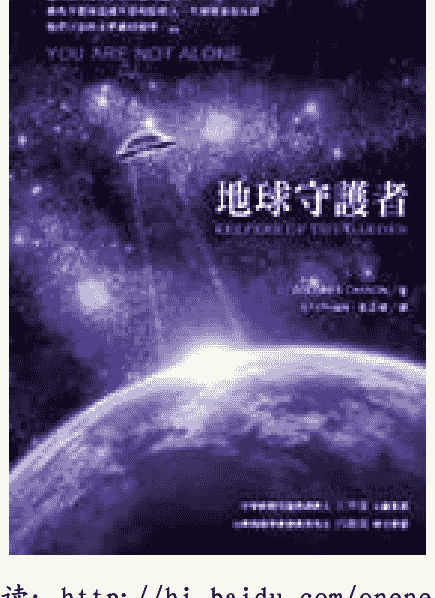
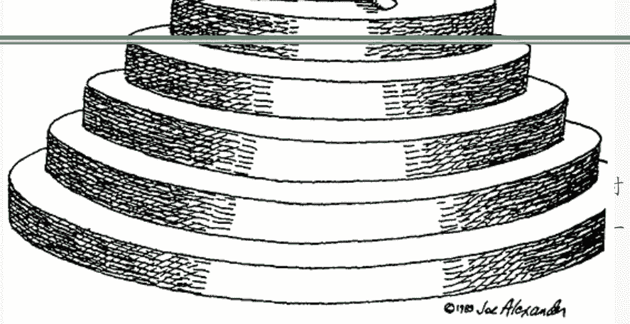

# 地球守护者

作者：朵洛莉丝·侃南
Dolores Cannon

译者：张志华

在线阅读：http://hi.baidu.com/onenesslove

爱之书：http://hi.baidu.com/theartoflove

## 简介

一位想探索前世的年轻人，透过回溯催眠，惊讶地发现这是他第一次的地球转世。他之前的存在经验都是在外星世界和其他次元。随着催眠的进展，揭露出他和外星人的联系不曾中断，在这次的地球人世，他也持续和外星人及飞碟有着密切的互动，只是这些资料都被深埋在潜意识里。透过作者回溯个案的记实，我们对飞碟来到地球的动机和宇宙真相，有了另一种认识和解释。

## 作者简介

多洛莉丝·侃南（Dolores Cannon）一九三一年生于美国密苏里州，圣路易市。一九五一年婚后，随着先生的海军职务旅居世界各地。

一九六八年初次透过催眠接触轮回概念。她的先生是位业余的催眠师，在使用催眠帮助一位妇人减重的过程中，无意间回到个案的前世。在当时，前世仍属“非正统”的主题，鲜有人对此领域进行探索。这次事件引发了她对轮回的兴趣。一九七零年，先生因伤退役，全家搬到阿肯色斯州的山丘。她由此开始了写作生涯，投稿于各杂志和报社。

子女成人后，她投入回溯和轮回的领域，钻研各类催眠方式并发展出自己独特的技巧，能最有效地帮助释放隐埋在个案潜意识的前世资料。自一九七九年起，她先后已催眠了数百位志愿者，并将所得内容汇整为多本著作。她称自己为记录“失落的知识”的回溯催眠师和心灵研究者，曾和全球知名的飞碟研究机构 Mufon 合作多年。

她已出版多本著作，包括《与诺斯特拉达姆士对话》（三册）、《耶稣与艾赛尼派》。她的四个孩子和十二个孙儿，是她在平凡的家庭生活和另一个看不见的奇幻世界之间的最好平衡。

> 以下文字来源：
> http://www.lightweb.com.tw/articles9/98/373.html

1931 年生于美国密苏里州圣路易市的朵洛莉丝·侃南（Dolores Cannon），是位资深的前世回溯催眠师，也是十六世纪法国预言家诺斯特拉达姆士（Nostradamus）及外星文明的顶尖研究者。自 1979 年起，她陆续催眠过数百位志愿者，并将借由催眠挖掘出的“失落的知识”，汇集成《与诺斯特拉达姆士对话》（三册）、《地球守护者》和《回旋宇宙》（三册）等多部令人大开眼界的精彩著作。年近八十的她，至今仍应邀至世界各地举办讲座及工作坊，此外，她还经营“Ozark Mountain”出版公司，精力充沛异于常人。

朵洛莉丝婚后随先生的海军职务旅居世界各地，后来夫妻俩长期驻扎在德州，开始对催眠产生兴趣，只不过，当时两人专注的议题仅止于减重与戒烟。1969年，她在使用催眠协助一位暴食症患者减重的过程中，意外回到个案的前世，事后她才晓得这是因为被催眠者到达了“梦游层”（somnambulistic level）。这次事件，引发了她对轮回的兴趣。

1970年，朵洛莉丝的先生因伤退役，随后举家迁往阿肯色州，但直到九年后，她才因为子女成人而重新投入前世回溯催眠的领域。此后她发展出独特的技巧，并以此技巧有效协助个案释放隐藏在潜意识内的前世资料。1986年，朵洛莉丝在为个案进行催眠时，发现对方前世竟是诺斯特拉达姆士的门徒，还因此和这位四百多年前的大预言家搭上了线。诺氏表示自己写下的四行诗遭到后人的扭曲和误译，他希望朵洛莉丝能以现代文字重新诠释这些预言。

接着，奇妙的事情发生了。此后无论朵洛莉丝催眠的个案是何许人，诺氏都会在过程中出现并给予大量资料，而且内容总是延续前次个案的话题，丝毫不差。透过二十余位志愿者的协助，朵洛莉丝自1989年起陆续完成三本现代版的诺氏预言书，而近千则的晦涩预言也因此重获新生。“他要我告诉大家最重要的一句话是，心智的力量可以改变一切。”她转述诺氏的话说：“如果我告诉你人类能对自己做出的最糟糕的事，你们会试图改变吗？”她相信，诺氏想传达的正是：人类的自由意志可以改变预言。

除了受大预言家之托写书，朵洛莉丝也和来自其他次元的“外星人”合作过。在近三十年的前世回溯催眠经验中，她发现许多个案的前世是居住在其他星球上的生物。“地球是个年轻的星球，它被刻意孤立在太阳系的这个区域，因为他们不希望我们把宇宙的其他地方弄脏。可是我们打从被神创造以来，就一直以灵魂之姿存在，所以我们肯定待过其他星球。”她反问：“我们为什么要一直探讨 ET 呢？我们都曾经是 ET 啊。”

声称被飞碟或外星人绑架过的人不少，但他们多半被视为精神病患，求助无门。朵洛莉丝在为这些“受害者”催眠的过程中发现，只要进入最深层的潜意识（高我），跳脱个案意识与情绪的干扰，就能还原事件真相。“人们对自己不了解的事物往往感到恐惧。当心中充满恐惧时，对于经验的记忆也通常会扭曲。”朵洛莉丝强调，“飞碟绑架事件确实发生过，可是要了解原因，就必须把时间拉回最初，因为地球人类是由 ET 所创造的。”

当一个星球的环境与条件俱足，星际或太阳系中的“议会”会派员前往播种，然而生命能否顺利滋长，端视自由意志的选择而定。“我在数百个催眠个案中发现，有些人前世曾是当时的‘播种者’。他们将来自宇宙各地的细胞带到地球，然后观察它们的生长。也就是说，我们从一开始就是被看顾、被守护的。”朵洛莉丝继续说道：“目前他们最关心的是地球上日益增加的癌症，以及各类污染与食品添加物对人体造成的影响。他们持续改造我们的 DNA，目的就是希望我们能免除疾病的威胁，永生不死。

外星人最初的计划是在地球这个美丽的星球上创造永恒的生命，然而来自宇宙另一端的陨石却意外带着变异的病毒和有机生命体撞击地球，使此地尚处于幼苗期的生命形式遭到污染，疾病从此在地球上扎了根。当时的播种者曾返回议会讨论遭到破坏的实验该何去何从，最后他们决定让地球生命依自由意志延续下去，但是从旁注入补救措施，并给予人类长寿和抵抗疾病的原形质和基因资讯。“这就是外星人必须做人体实验的原因。”朵洛莉丝解释。

地底文明是朵洛莉丝近期较关注的议题。她从许多催眠个案中得到关于地底城市的零星资料，如今数量已累积到可拼出全貌的收成阶段。“地球上到处都有地底城市，有些地底文明在亚特兰提斯文明之前就已存在。当时地球气温尚未冷却，状态也不稳定，无法适应地表的ET决定避居地底，目前这整个文明依旧存在。”她引用外星人给予的资料表示：“ET在地底放置了与太阳类似的东西，他们有自己的光源、湖泊、花园，以及地表不存在的各种动物。他们藉隧道与整个文明体系相通，而金字塔便是隧道的出口。从一地到另一地，他们的移动时速可达三千英哩。他们并不想走出地表，也不是暴力族群。事实上，他们的文明远高过我们。”

前世是地球人或外星人不稀奇，在朵洛莉丝接触过的催眠个案中，有些人前世竟是动、植物，甚至矿物或空气。“许多人不了解，万物皆有意识。我催眠过前世是石头的人，他说他的生命好缓慢。前世只是冰山一角，我从这里开始挖掘出知识的源头。”她进一步阐述：“我对身为石头的一生能学到什么感到好奇，他告诉我，他学到了什么叫‘限制。万物都是能量，只是土壤和石头以较低的频率振动。但最终，我们都会进展至更高的频率。”

对于逐渐逼近的2012年，朵洛莉丝也提出了“新地球”的概念。“地球正经历转化。较敏感的人，可能注意到自己的身体也随着地球的振动频率同时改变。当地球转变时，人们会改变饮食习惯并减少肉类的摄取，这是为了让身体变轻盈，以便进入另一个次元的美丽新地球。其后，人们将逐渐摆脱肉体，成为光体，届时负面事物将再无容身之处。”所有的生命都在学习，地球能否顺利进化？朵洛莉丝说：“全宇宙都在看。”

## 园丁的话

这其实是一本心灵的书，一般人大概很难想象外星人主题的书籍会和心灵有关。但这的确是事实，因为宇宙原就是心灵的产物。这也是一本谈论生命本质的书，只是由一个更大的观点，所谓的宇宙视野来看。

书里关于地球生命的起源，对神的概念和高度演化生物（外星人）的部分，在《与神对话》里也有类同的说法。套用物理学家 Mendel Sachs 的话，「在不同领域重复出现的观念，比不重复出现的，较接近真理。」那么，来自不同来源所重复出现的观念，显然也比不重复出现的，更接近真理。

想想，满天繁星，每个发光的星体都代表未知生命的可能性。如果我们愿意扩展想象的视野，谁说生命非得以人类感官所能认知的具体形态呈现？这本书除了外星生命的类型和播种地球的内容外，要传达的讯息其实很简单，就是「爱与和平」四个字。

狭隘与恐惧是人类故步自封的心灵枷锁，要打破人性的局限，并不是一蹴可几的事。但我们可以试着从相信思想的力量开始，相信自由意志可以创造出任何想要的实相，相信宇宙不存在评断赏罚，一切都是出于自己意识或下意识的选择所创造出的学习机会，那么我们看待世事与回应的方式自然会慢慢产生微妙的转变；一旦我们体认到内在固有的力量，了解灵魂才是我们的本质，躯体只是在三次元的地球，执行人生蓝图的工具，生活就逐渐不再是充满挣扎，而是一场饶富趣味的探险；如果我们更进而领悟到：我们都是神的一部份，在无限里创造和体验，（是的，这就是宇宙真相）那么，这趟地球旅程就会变得精彩可期。

这个实现的过程说来简单，然知易行难，毕竟我们仍不免受到俗世种种干扰和考验。但我相信，只要我们愿意超越国家地域的区隔，愿意学习尊重不同种族和宗教信仰，以善意对待彼此差异，诚实的沟通；只要我们愿意试着以整体的概念来思考，跳脱制式的二分法模式，用同理心取代分别心，那么，在这个蓝色星球上落实「分享」与「互助」并不是太困难的事，「爱与和平」也不会只是空泛的理想——因为我们每个人都拥有改变世界，提升地球意识的力量，只要我们愿意从自己做起，只要我们愿意。

## 推荐序 开启心灵大门 吕应钟

看完本书，我久久不能释怀，只能赞叹：「太丰盛了。」因为书中所谈及的主题包罗万象，若是一位关注史前文明和外星人主题的人，立即可以体会出这本书的伟大。

书中除了典型的外星人生理状态叙述、外星球景色及建筑描述之外，还谈到许多主题，包括科学的人类疾病的源由、恐龙灭绝的原因、演化论的错误等；人类学的马雅人消失真相、献祭的本质、地球人是被播种的等；宗教学的神的概念、圣经的真相、世界末日、耶稣与外星人、轮回转世等；考古学的亚特兰提斯、百慕达三角等；心灵学的心智沟通、能量治疗、灵魂能量、第六感；以及神秘学的水晶能量、灵魂来自许多其它星球等。

如果是一位不相信外星人存在的读者阅读本书，只以抱持看科幻小说的心态阅读，也应该会为作者构思出这么丰富的情节而赞叹。不过这样就太可惜了。因为，这不是一部科幻小说，而是告诉地球人思考一个严肃问题的启蒙书，诚如书中所言「地球人现正处在灭绝或进化的交叉口上」，这正是二十一世纪人类面临的抉择。

「二十一世纪」将是一个不同于过去的世纪，因为此时地球文明从双鱼座迈进宝瓶座的时代，也就是人类从物质科技文明迈进心灵科学文明的重要时代。自从十九世纪人类开始注重唯物科技的研究与发展之后，让二十世纪成为唯物科技发展的高峰，但是人类也同时失去「心物合一」的内涵，失去数千年来的优良文明底蕴，走向以功利思考一切的资本主义和科技文化。

以至于人类忘却了自己还有「心灵」的层次，在现代唯物科技的霸权教导下，使人类误认为能够经「科学证明」的东西才是真理，无法经科学证明的就是不存在的。这是唯物科技极大的错误，也是人类认知的悲哀。

幸好二十一世纪将会转向了，被忽略的真理将再度被重视，届时人类才会惊觉过去的错误，而迎接「天人合一」的时代，这是极为古老的宇宙认知，却在二十一世纪再度成为新的认知，这也是宇宙文明的安排，因为「时候到了」。

二十世纪下半起， New Age 思潮的兴起不是没有原因的，台湾开始流行生死学主题书籍也不是没有原因的，书店里尽都是灵媒及外星灵相关出版品更有其背后因素，这些都在告诉敏锐的现代人：「一个不同的时代要来了。」

什么时代？就是告诉地球人一切真相的时代，也就是本书所谈及的所有内容。这些不同凡响的内容让我边读边喜悦，因为和我的心得完全契合，书中所说的宇宙奥秘都是我已经知晓的，更妙的是二月初我才和一些人谈及水晶能量的重要性，在这本书中竟然也谈到外星人飞行器是靠水晶能量飞行的。

也许对一般读者来说，里面的各种描述超过你们的认知范围，令人匪夷所思而无法接受，总会产生「真的？假的？」疑惑。但是我要诚恳地告诉大家：「相信吧。不要用当今地球的标准来衡量宇宙，地球人如同井底之蛙，总以为井口的天空就是整个天空。」

如果读者还是无法体会我的话，让我再做个比喻：「你有没有办法向清朝的人说明手机、计算机？」当然没有办法，因为这些科技产品超过清朝人的认知，他们能否认手机和电脑的存在吗？所以，今天超过你认知的所有事物或现象，我们也不能轻易地就否认。

科技总在进步的，人类的心灵也会进步，书中有一个很重要的观念「一切都是能量」，没有错，宇宙中的一切都是能量的不同呈现。可见光和宇宙射线是能量；引力、磁力、核力等也是能量；植物、动物、人体也是能量。量子物理已经告诉人类宇宙中的一切都是能量，只是振动频率不同而呈现出不同的物质态。

也许这个理论对大多数没有学过量子物理的人来说太深奥、太不可思议，但是我还是要说一句「相信吧」，书中又提到「人类不是灵魂所能选择和使用的唯一形式」，我再度呼吁读者「相信吧」。

因为不久的将来就会证明这些都是正确的，为何我敢如此预言？因为这些都是存在已久的宇宙真理，只是落后的地球人不知道而已。

吕应钟，现任美国全我知识发展学院教授、俄罗斯联邦外贸学院名誉教授。为台湾飞碟学会创会理事长，台湾超心理学研究会理事长，研究飞碟外星人及心灵科学主题 31 年。

## 目录

- 园丁的话
- 推荐序 开启心灵大门 吕应钟
- 第一章 发现外星人
- 第二章 失去的殖民地
- 第三章 宇宙飞船
- 第四章 奇怪的城市
- 第五章 外星球的社会结构
- 第六章 能量导引者
- 第七章 四次元城市
- 第八章 印记
- 第九章 死亡之针
- 第十章 三尖塔的突破
- 第十一章 驰援地球
- 第十二章 星际种子
- 第十三章 探索者
- 第十四章 花园里的杂草
- 第十五章 恐龙
- 第十六章 异种交配
- 第十七章 显要招待区
- 第十八章 其它形态的存在体
- 第十九章 外星人在此
- 第二十章 夜晚的梦魇
- 第二十一章 发现更早的接触
- 第二十二章 与现实失联
- 第二十三章 拒绝进入
- 第二十四章 神秘的黑盒子

## 第一章 发现外星人

外星人现在正生活在地球上。他们不能再被视为只存在于遥远星球或乘坐宇宙飞船遨游宇宙的外星生物。他们无所不在；你的朋友、邻居，甚至亲人当中，就有他们的身影。我们彼此紧密相连，因为他们是我们的祖先；我们的身上流着他们的血液。对这些外星生命而言，我们就像他们的手足，一如地球上的动物和人类般亲近。

我之所以知道这些，是和一位生活在地球上的外星人密集合作一整年的结果。我们因催眠而结识。我是个回溯催眠师，由于工作的特性，我常常随着案主的讲述穿梭时空，探访地球的过往，了解人类历史的足迹。但直到遇到菲尔前，我从不曾「造访」地球以外的星球。然而我一直期待有这样的机会。我认为探访外层空间和探访地球历史一样可行，我也相信，有些人类除了地球生命，确曾有过外星世界的经验。

探索外星球的想法令我神往，但我从不曾与这个「非常人选」交会。我认为这种人很稀有。由于我的工作使我有机会接触到许多形形色色的受术者，我相信迟早会找到这样的个案，要不，他们也会找上我（这么说通常比较正确），而我怎么也想不到这个机率会比我以为的来得大。这些人并不容易被认出来，由于潜意识的保护作用，他们隐藏得很好，甚至连他们本身都不知道自己的身份。

当我刚开始这趟全然的意外之旅时，和大家一样，我对外星人有着先入为主的制约想法，认为他们可怕且不带善意；对于不了解的事物，我们自然感到害怕。然而，我很惊讶的发现，这些生命体和电视、电影及科幻小说里所描绘的外星生物截然不同。我花了好些时间才克服多年来被社会文化洗脑的刻板印象，并进而思考：在灵魂深处，在灵性层面而言，我们和外星生命其实并无二致，存在的，只是误解。

我和菲尔的合作始于意外，如果真有任何事可称为「意外」的话。我向来接受各类人士的预约，为那些想知道前世的人进行回溯，这种催眠并没有最适合哪个特定类别的人，我的个案包括了各式各样的对象，他们都各自有探索转世可能性的理由。我通常是到个案家中进行催眠，因为人们在熟悉的环境里感觉比较自在，对回溯的概念和整个过程也比较不会害怕。

我曾在任何你想得到的环境下催眠，从华宅到陋室，在汽车旅馆的房间，甚至下班后的办公室和店面；我必须学习去适应各类奇奇怪怪的环境，因为我相信，让被催眠者感到舒适是发展彼此信任的最重要元素。由于这种不寻常的工作，我去过一些陌生的地方，有时离我的住处很远，远到开车所花的时间比我进行催眠的时间还来得长。最后，我不得不订下规定。

我订了个界线，不去超过五十哩外的地方。任何住在超过五十哩远的人，必须安排在临近的友人家中与我会面。我并不想拒绝任何人，因为他很可能正是我要寻觅的那位会提供信息，展开一场惊异之旅的合作对象。这样的人无法从外表判别，直到遇上了，我才会知道。他们是一般的凡夫俗子，没有外在线索可以显示他们的灵魂在其它时空所经历过的奇特旅程。

一位离了婚的年轻职业妇人和我相约在她家进行催眠，我开了几乎五十哩的极限范围才到她的住处。之前她曾跟我约了两次，但都在最后一刻临时取消。我常怀疑她其实并没做好心理准备；由于回溯的结果有时过于震撼且出人意表，或许她下意识地害怕，怕一旦开始探索而可能发掘出的深埋记忆，因此制造借口临阵逃脱。我并没催促她；有太多人在我的等候名单上。

当我这次来到她住的小镇，我心想，她终于下定决心了，因为这回她并没来电说另有要事。但当我开进她家的街道时，我没有看见她的车，反而看到一辆陌生的黄色小卡车停在路边，卡车两侧有电器修理行的标志。我第一个想法是，她忘记了我们的约定，叫了人来修理电视。她会忘记是正常的，这是很典型的她，我并不觉得奇怪，只是我不认为这样的氛围会适合进行催眠。下了车，我看见有张纸条贴在她的门上，上头写着她临时受命出差，为免我大老远白跑一趟，于是她安排了别人顶替。字条上说要接受催眠的人名叫菲尔，正在屋里等我。我对这样的安排并不惊讶，因为她就是会在最后一分钟做这种事的人。

因此，长程行驶后，我的对象是个完全的陌生人，对我来说，这不是个理想的安排；我并不期待这次的催眠会有多少收获。新个案有时不好合作，尤其当他们对催眠一无所知时。由于他们常会有防卫心态，我必然要用上大多数的时间来建立信任。信任和亲和感对回溯催眠这类的合作关系来说，是非常重要的前提。我当时真的以为，这会是我与菲尔第一次，也是最后一次的合作；我很可能再也不会见到他。

菲尔是一个长得很好看的年轻人，有一头深色的头发，二十八岁，很安静，我最初认为是害羞，后来发现这纯粹是一种沉稳的自信。他来自一个大家庭，家中有五个兄弟姊妹。他和家人同住，在父母家的车库经营自己的电器修理生意。比较特别的是，他有一个孪生兄弟。在谈话的过程中，我了解许多菲尔的背景。他对异性似乎不太有兴趣，也从未有过认真的情感关系。这点倒是让我很讶异，因为他挺迷人的。他曾在海军待过一段时间，在那里学到了修理电器的知识。

人们常会问我理想的催眠个案所具备的条件。通常他们第一个问的就是宗教信仰。他们多少已假设能够被催眠的人，应该具有某种非正统的宗教背景。这个假设并不正确。就我接触的个案而言，各种信仰的人都有。宗教信仰对于催眠中所呈现的讯息形态似乎没什么影响。

菲尔在严谨的天主教环境中长大，小时候曾在一间当地的教堂担任辅祭少年，协助弥撒、丧礼和节日庆典等活动。直到七年级前，他读的都是天主教学校。由于自小接受修女的指导，他对天主教教义有非常充分的了解和领会。这样的学习环境丝毫不鼓吹转世的思想，然而菲尔却对神秘学颇有兴趣，他读了许多相关书籍，因为好奇，他对回溯催眠跃跃欲试。菲尔很亲切友善，打从一开始，他和我相处似乎就很自在，对催眠的想法也很能接受。

第一次催眠菲尔的情形，正如我的预期。虽然他很容易就进入了中度的催眠状态，但他无法清楚表达。他的声音含糊不清，很难听出在说些什么。当受术者在很放松的状态时，常会出现这样的状况；他们的答复缓慢，就好像在睡梦中说着梦话一样。他们会非常投入于视觉上的情境，但除非催眠师指示，他们不会主动提供讯息，说出所见的景象。经过多年的催眠工作，我已经不太喜欢这类没什么互动的型态，我喜欢受术者在催眠状态下能够自发地和我交谈，这也是为什么我寻找有梦游症的人作为合作个案的原因。

菲尔在催眠中重新经历了无趣且平凡的一生。那一世他曾漫走在沙漠中，在干旱里寻找水源。被唤醒后，他说他贴切感受到那种口渴、炎热、气候的干燥，以及周遭人的苦闷心境。这是很典型的初次回溯型态。当个案的潜意识在探索这类新经验时，常会选择经历单纯平凡的一生。菲尔说他在催眠状态下看到的景象非常清晰，他因为非常放松，因此还得花些力气才能回答我提出的问题。他说他现在完全可以了解年老，因为他真实地感受到生命临近尽头——垂垂老矣、疲累、苟延残喘的感觉。

菲尔对这次的经验感到兴奋，他很渴望能再次进行。我也很想说我跟他一样兴奋，但我其实不是那么想再催眠他。要从他口中得到回答实在太困难了。我比较喜欢和自发性高，话多的对象合作，他们能侃侃而谈地说出在催眠状态下所见的景象。然而只要有人愿意接受回溯催眠，我通常都会同意。我不想拒绝任何人，因为我无法得知个案会从中获得或提供什么洞见。因此我有些勉强地和菲尔预定了下周的会面。我心想，让他试过几次，满足了他的好奇心后，我就可以继续寻找其它更有效益，能更主动提供讯息的合作对象了。

进行催眠时，我通常会运用许多不同的程序和技巧，直到找出最适合受术者的方法为止。运用电梯是催眠疗法之一：当个案觉得抵达了某个正确楼层，电梯门一打开，他会有走出电梯，探索眼前所见事物的渴望。我在菲尔第二次的催眠疗程时用了这个方法，发现很适合他。电梯法成功引导他到达不同的地点和存在层面取得重要数据。

第二次的催眠，菲尔开始比较多话。他提到他在战时德国慕尼黑的一生。在那一世他和其他犹太人受雇于隶属政府的民间单位。他们的家人都被杀害，他们因具有德国政府可以利用的才能而幸免于难。他们必须配带臂章以供辨认身份，他认为这是一种侮辱。他在那世的名字是卡尔布里屈，一位工程设计师。他和其他人一起从事潜水艇基地设计的任务，由于这是机密，他并不想多谈。虽然这些犹太人对德国政府很有用处，但他们并没有被人道对待。这使得他愤愤不平。他提到曾在一次游行中看到希特勒，他认为希特勒是个疯子。

菲尔的前世身份——卡尔，死于一场空难。当时他和同僚们乘坐小飞机正飞往潜水艇基地的途中，在临近法国边境时，意外地被敌军的炮火击落。飞机坠落在一个小村庄里。

从催眠状态醒来后，菲尔说这次的经验对他意义重大。他曾经梦过死亡，跟这次催眠所见很像。他对那个梦印象非常深刻，他一直以为梦里的他是德军，因战斗机被击落而丧生，因为他梦里看到的飞机有纳粹标记。经过这次催眠，菲尔才知道他乘坐的是民航机。梦中最令他困扰的就是村人的无情和冷漠。他们就站在那里眼看着他死去。那些村民显然很高兴见到飞机被击落，他们对发生的事无动于衷，完全没有试着伸出援手。村人憎厌的态度令他愤怒，但菲尔说他在里看到这一幕时，感受到的情绪比催眠时更为强烈和激动。

在这次的催眠里，菲尔的回答仍然缓慢，有时也听不清楚他在说些什么，但他比上一次进步，我们的互动也越来越好。

菲尔第三次的催眠主要在体验一位古文明时期女子的一生，地点是南美洲某处的金字塔附近。菲尔说了许多关于当时的祭司和祭祀的事。他提到当皇后去世时的一个仪式。皇后的女侍们被给予药物服用，然后朝心脏刺死，这被视为一种荣耀，因为她们的尸体会和皇后一起埋葬，跟随她进入死后的世界。菲尔在这次的回溯中经历生产的过程。看着一个男性个案体验女性生产历程的各种情绪，实在是件很奇怪的事。他（她）这一世死于西班牙军队入侵村落并大肆杀害村民之际。

在回溯初期，个案通常都重回这类前世。我因为对此已很熟悉，不再觉得有何特殊之处，除非他们提供某些重要信息。我已经搜集了上百个这类的资料，虽然其中对个案多少有些帮助，但对我而言，它们只是增益了我对历史的整体了解。

然而，在第三次回溯时，先是发生了件奇怪的事。当电梯门第一次打开，菲尔看到地平面上的陌生剪影。在红色天空下，是一片有着锯齿状，参差不齐的岩石地形。当菲尔看到这个景象时，他感到很不舒服，但又说不出所以然。这个画面很困扰他，令他抗拒。他不想探索那里，于是要求回到电梯，改去其它地方。我从不要求任何人做他们觉得不自在的事，因此我让菲尔去他想去的地方。这就是他后来发现自己站在一座金字塔底部的前因。

允许个案去做他们觉得自在和舒服的事，有助于建立信任。这么做也使他们知道，在回溯过程中，他们始终居于主控。我觉得如果潜意识有重要的事要让个案在催眠中看到，在不被强迫的情况下，他们终会一探究竟。

「这个景象让我很不舒服。」他的眼神像是看进了遥远的他方，语气轻柔地说：「有种阴森、诡异的感觉……很黑暗，像是不曾改变过的黑暗。」他的目光回到了当下：「我很高兴你没有强迫我去探索，你让我可以选择回到电梯。不知道为什么，但我觉得电梯里安全多了。」

那幕景象确实有其诡异之处。这个地方到底在哪里？为什么会那么困扰菲尔？显然地，菲尔的潜意识正开始让另一个世界的浮光掠影渗入意识层面。直到几星期后，我们才了解这个地方的意义，以及菲尔那么抗拒探索它的原因。

接着的几次催眠，菲尔似乎很被德国的那世吸引，他重新经历那一世的生活，虽然那是个苦难的一生。菲尔觉得那世的回忆激起他内心许多深刻的情绪，有愤怒、沮丧和不快乐。他很想在催眠时都发泄出来，可是他怕这么做会冒犯我。他承认他在这一世也很不会处理情绪问题，他总将感觉隐藏，压抑在内心，他甚至不让家人知道他的感受。我向他保证，他可以放心地宣泄这些情绪，这是我的角色的功能，而且这种释放通常非常有益。

接续的催眠期间，菲尔偶尔会看到更多令他困扰的画面。比如说瞥见一个有很多高塔，车子像飞机般在天空飞来飞去的奇怪城市。这整个城市的外观没有任何色彩，一片单调的灰色中，只见白光穿透。每当这景象出现，菲尔便会撤离；他会要求回到令他觉得安全的电梯，改去其它地方。我对这些景象很有兴趣，因为听起来很像是另一个世界，或至少是很具未来感的地方。我渴望探索它们，但经验告诉我，我不能让我的好奇心干预。不催促个案会是最好的作法，让他们以自己的步调去发现他们的才能和曾有的历程。在我的催眠工作里，耐心终会得到回报。

菲尔感到困惑。「我有个感觉，好像有些事试图要浮上台面，而且有好几次都几乎要成功了。」他觉得不论是什么，只要找对了电梯楼层，只要他有足够的勇气去探究，他就能连接上这些即将浮出的事物。我感觉这一切和那个有锯齿地平线以及车子在天空翱翔的奇怪城市有关。

接下来的日子，我继续为菲尔进行回溯催眠，建立彼此的信赖；我也同时和其它个案合作。菲尔的回应越来越自然，也因为他所看到的奇怪景象，我认为可能浮出他意识层面的事物，值得一探究竟。他所描述的场景确实引发了你的好奇。然而，我怎么也想不到，等候我们的竟是这么一场奇特的探险。

## 第二章 失去的殖民地

几星期后的催眠，当电梯门一打开，菲尔又见到同样的景象。他看见红色天空一片荒芜、锯齿状，多少令人不舒服的轮廓。显然地，他的潜意识认为探索那一世的时机已到，因此允许他在催眠状态下持续瞥见这些画面。这一次，菲尔决定走出电梯，进入这个场景，去了解为什么这里令他如此困扰。经过多次的互动，菲尔已经知道，如果他有任何不舒服的感受，我会让他有离开的选项。这样的认知给了他一种安全感，即使是身处如此陌生奇异的环境。菲尔走进了这个场景，很快地被一股强大的悲伤感淹没。他描述眼前所见的情景。（译注：催眠过程中的对话，菲尔以菲表示，朵代表作者。）

> > 菲： 风沙很大……尘土飞扬。我能看到，也可以感觉到。天空带些橙红色调。我站在一艘宇宙飞船外面。我们降落在一块空地上。我正看着那座尖塔，塔在我的右手边。

最初听到他的描述时，我就觉得这个地方不像地球。它绝对有着另一个时空的风貌。现在我听他提到宇宙飞船，更确定他眼前所见是他在外星球的前世。看来，我终于可以如愿探索地球以外的世界了。

菲尔现在注视的尖塔，显然就是之前他所看到的那个奇怪巨石。这个尖塔在整片尖峰中看来格外显眼，因为它有个像是甜甜圈形状的东西环绕在塔顶。菲尔继续描述。

> > 菲： 右手边有几间临时的小屋，那是补给品存放的地方或储藏区什么的……（悲伤的口吻）现在都是空的了。

**朵：** 有其它人和你一起吗？

**菲：**（语调闷闷不乐）只有宇宙飞船的那些人。我们来这里提供补给品给这个星球上的科学家，并看看他们过得如何，有没有什么需要。这些科学家是来自我们星球的拓殖者。我们通常都是往返一些固定的贸易线。这一条路线远离人烟，可以说是位于这个银河的偏僻地带。这个星球是做为测试、开矿和科学用途，并不是拓殖居住的殖民地。

**朵：** 你知道他们在这个星球多久了吗？

**菲：** 我无法用地球的年来表示那个星球的时间，应该说有七个时间单位，虽然我无法解释这个时间单位是什么。他们已经在那里探测了七个时间单位了。

**朵：** 这算是一段很长的时间吗？

**菲：** 在一个星球上来说，是的。

**朵：** 离你们上次补给的时间很久了吗？

**菲：** 我们约每两个时间单位来一次。

**朵：** 他们是自愿做这个工作的吗？

**菲：** 是的，都是自愿的。没有征召这回事。

虽然我很有兴趣知道这些科学家的故事以及菲尔觉得悲伤的原因，由于好奇心的驱使，我先询问了菲尔关于宇宙飞船里的人的长相。他说他们矮矮小小的，有个很大的秃头，肤色很淡，不是很强壮。

**朵：** 他们的身体和人类一样有循环系统吗？还是和人类不同？

**菲：** 是的，他们和人类很相似。他们有两条手臂，两条腿，一对眼睛和耳朵，一张嘴巴，但是没有鼻子。他们不需要鼻子，这是演化的一部份。嘴巴只是一个小细缝，用来吸入空气。没有舌头，也没有说话的声带，因为他们完全用心灵感应来沟通。

这种外观的描述听来不怎么讨人喜欢，但菲尔看着他们，似乎一点也不觉得困扰。他稍后提到，他和这些外星人在一起的感觉非常自在。

**朵：** 他们需要吃食物吗？

**菲：** 是的，食物是塞入小细缝里。

**朵：** 他们有分男性和女性吗？

**菲：** 我们是雌雄同体（androgynous），我们这个种族都是。

当时我并不清楚他是什么意思。我不确定他是说他们同时具有两种性别，还是说根本没有可以定义的性别特征。但显然他们的生殖方式不同于人类。

**菲：** 我们比较像是结合了两种性别，混合男性和女性的特征。

**朵：** 我对这点很好奇。雌雄同体的人要如何生殖？还是说他们的寿命很长，因此不需要繁衍。

**菲：** 生命期是比较长，但不是永远，所以还是有繁衍的必要。他们有扮演的角色，但区分方法和地球上的人类很不同。

我的好奇心暂且被满足，因此回过头去了解整个故事的来龙去脉。

**朵：** 你说你来这个星球是为了提供补给品给科学家。这些科学家呢？

**菲：**（悲伤的口吻）除了一个以外，其它的都被埋在地下了。原本有十二个，现在全都死了，最后死的那位埋葬了其它的人。埋葬死去的同伴是他们共同的责任。最后死去的那位，他的尸体也和其它人一起，只不过他是在地面上。

**朵：** 你知道他们发生了什么事吗？

**菲：** 知道，因为那个巨石尖塔保存着所有这里发生的事情的精神感应记录。他们是因为又饥又渴，或相当于你们所称的「渴」而死的。他们是缓慢且痛苦地死去。

这是菲尔之前不愿意看到并重新经历这个景象的原因吗？他说到这事时，似乎很难受。于是我给他下了一个催眠指令：当他看到或讨论这些画面时，不会感到困扰。我告诉他，释放这些回忆通常很有帮助。

**朵：** 这些科学家不能自己种植食物吗？

**菲：** 这个星球寸草不生。你能想象西南方的沙漠里有座花园吗？这是同样的情形，没有任何作物能在这里生长。这是块荒芜、贫瘠的岩石地，就跟你能想得到的地球上任何一处荒地一样。然而这个行星矿产丰富，这也是这些科学家来到这里的原因。他们是探矿人。

> > **朵：** 你说「渴或相当于渴」。换言之，那里也没有任何流质或液体？
> > 
> > **菲：** 是的。所有的东西都用完了；如果我们准时到达就不会发生这事了。宇宙飞船从太空站出发不久就发生故障，问题非常严重，无法在当地修复，我们必须回到母星球处理。就是因为这个缘故，我们延误了许久。因为我们也像你们地球人目前一样，距离仍是我们要克服的。但是我们的速度比你们快多了，因此我们能够在较短的时间到达遥远的距离。我是以地球一九八四年的时间点来做依据。整合这两种时间是必要的，因为此刻的我仍是在这个房间里的这个人。描述或解释这些不同是必须的，因为这是我——我们——正在学习的事。那就是，我们同时都是这一切。

对我来说，这件事很不寻常。我从不曾遇过个案在回溯催眠时能够针对他的经历与现世的时间进行比较，除非他们是在很浅的催眠状态。在这种状态时，个案对所见的景象感到困惑，因此常会试图合理化看到的画面，或和他们熟悉的事物相比较。这种情形不会发生在较深度的催眠，因此我着实被吓了一跳。

通常当受术者处于菲尔这般的催眠深度时，「现在」对他们已不存在。他们完全融入且沉浸在所经验的世界里。但我很快了解到，我面对的是完全不同的能量，而我从未和这类能量接触过。这个能量随着每次的催眠更加强烈。我后来发现，菲尔提供的模拟很有帮助，否则，我很可能无法理解他所说的，因为完全无从认知起。虽然我渴望探索外层空间的世界，但我从没预期会有这种可能：个案由于缺乏比较的基准，无法转译或诠释他所见。也就是无法将他所看到的，用我们所知道和了解的语言及知识来说明。

**朵：** 虽然延迟抵达造成了这些科学家的死亡，但我要你明了，这不是你的错。没人有办法阻止这件事的发生。

**菲：** 我知道，但我还是无法释怀，不是因为罪恶感，而是哀伤和遗憾。

**朵：** 那你们现在计划怎么做？

**菲：**（叹口气）我们在商讨是否要将他们的尸体运回母星球，或是留在这里。最后一致同意留在这里……因为我们觉得他们以己身的任务为傲，他们会想留下来。第十二位成员也已入土为安了。至今所搜集到的矿石样本和高塔的记录——只有重要的——会被收集并带离这个星球。我们七个人一致认为不该再派遣人员到离母星球这么遥远的殖民地，不能让这种惨剧再次发生。

**朵：** 但你知道那些拓荒者和探险家的，他们总是希望去更远的地方探索。

**菲：** 我不能命令他们去哪里探险。科学家自由选择想去的地方，而我们会全力支持他们。但由于我们是负责供应补给的人，我们一致认为不该去超过必要距离以外的地方。

我不希望他将任何愧疚的情绪带到他的现实生活。我很小心地不让任何前世事件渗入他的意识，以免不当地影响他这生。

**朵：** 我要你了解这件事错不在你。你知道的，对不对？你个人不需要负任何责任。

**菲：** 我明了。

他心底的重担已经放下，一个他甚至从未有意识察觉到的心头负荷。

我觉得有趣的是，虽然菲尔描述的这些外星生物的外貌和人类相较下，显得相当怪异；如果我们真碰到了，一定会被吓到。然而，他们却拥有很人性化的情感和令人赞赏的特性，那是一种我们很快就能认同的特质。我虽然不知道外星生物应该是怎样，但由于我们向来被灌输的观念，我不认为我会期待他们具有人性。许多故事里描述的外星人，仿佛没有任何情感，这样的描绘使外星人显得和我们更为不同。

我原以为菲尔可能会排斥有一世是长相怪异的外星人，但令人意外地，他一点也不觉困扰。他说这是个非常奥妙的经验，因为感觉真实无比。他觉得和这些宇宙飞船上的外星人很亲近，他知道他们在一起工作及相处都很愉快。因此，菲尔原先不想探索这个景象的原因并不是和这些外星生物的外貌有关，也不是他不愿意面对曾为外星人的事实，而是因为科学家死亡事件所造成的心理伤痛。

## 第三章 宇宙飞船

我的好奇心又蠢蠢欲动了。我向来都希望能找到回溯时可忆起某世生活在外星球的个案，因此自然不会错过这个了解外层空间生命体的机会。同时也为了将菲尔带离痛苦的回忆，我询问他关于宇宙飞船的事。

**菲：** 宇宙飞船是圆的，银色的。在最上方的中间有个圆顶。圆顶不是用来领航，而是用来观看，观看四周。左边有个窗户和控制盘。在船舱口前方有一些管状物。这个宇宙飞船有两层。上面一层是全开放式的空间，导航设备就在这层。下层有四间睡房和一间科学实验室。太空船主要的区域是一个大约直径三十呎的圆形房间。楼层之间使用梯子上下。

**朵：** 这艘宇宙飞船是什么材料制造的？

**菲：** 这个材料很灰暗；不会发亮。它的硬度比母星球建筑物的材料更高，而且更有弹性。它不是来自母星球，而是从其它星球进口。邻近的星球出产这种矿产，将之精炼后，透过既有的贸易路线，将这些金属运到母星球。

**朵：** 地球上有类似的材料吗？

**菲：** 目前没有。未来可能会有，但目前地球并没有类似或相对应的物质。它的质地可以和地球上所能制造出的最坚硬金属相比。依硬度，我会将它和钻石比拟，但这其实并不正确。

**朵：** 宇宙飞船是在你的母星球上制造的吗？

**菲：**（停了一会儿）这很难说。我现在不能回答。这不是被允许讨论的事……因为某种原因。与其说不被允许回答，该说是我不熟悉制造过程。

**朵：** 你能看见这艘宇宙飞船是如何操作的吗？

**菲：** 用触控的方式。

**朵：** 用这个方式来驾驶或导航？

**菲：** 用这个方式来下指令。在引导者及引导物之间必须要有接口，这个接口就是触控。操作者透过这些接口来控制设备。控制台上有碰触式的面板。用目前地球上某些电器设备来说明，或许对厘清这个概念会有帮助。在技术上有所谓的触感式装置，它不是靠移动零件来操作，它的原理是透过触碰来改变。你对这类东西熟悉吗？你曾经看过用碰触来选换频道的电视吗？

**朵：** 我知道，那是新型的电视。

菲尔显然在使用他修理电视的知识与他眼前所见的装置来比较。

**菲：** 宇宙飞船的燃料是……它使用水晶能量。水晶就是管道或滤器，它集中宇宙能量并引导能量产生推进力。水晶大约有两呎高或更高些。外型像是由两个金字塔组成，底部相连，尖端的部位朝外——呈梯形，不等边的四边形。

菲：这些是天然水晶，依其特定的用途切割形塑。不同形状的水晶具有不同功能。事实上，我们现在在地球也使用水晶，但只是小范围而已。这个曾经失传的知识现正重新被发现。

朵：水晶位在宇宙飞船的哪个位置？

菲：宇宙飞船的正中央，在第一层。

朵：你可以看见水晶吗？它有被别的东西隔开吗？

菲：它有被东西托住，但是看得到。

朵：在水晶四周活动安全吗？

> 我想起《耶稣和爱赛尼教派》（译注：作者另一本由催眠资料汇整的著作）里的耶稣数据提到，当时的人们不可以靠近和触摸在昆兰地区（Qumran）的巨大水晶。我认为这个水晶可能会伤害或烧伤靠近它的人。

菲：去触碰或乱动一个正在使用中的水晶是不安全的，因为这会改变它的放射物。并不是因此会造成对人体的伤害，而是会导致宇宙飞船改变航道。由于放射物是被引导到特定的方向，移动水晶就会造成改变。

朵：水晶在你的星球有其它用途吗？

菲：用途非常广泛——加热、煮饭、旅行——就像你们会需要使用到电源一样。

朵：而依据每种用途，水晶被塑成不同的形状？

菲：大致来说，是的。一旦成型就不再改变。除了在很少数特例或情况下，才会毁掉它并重新塑造。这些都是同类的水晶，但可以用在不同的能量上。推进力能量和煮饭及加热能量是不同的能量形态。一般煮饭和加热能量的差异在于能量的集中度。煮饭时的能量焦点远为集中。

朵：如果水晶能用来煮饭和加热，难道它不会对人造成危险？

菲：当然会。地球上的亚特兰提斯大陆就是被水晶摧毁。你可以想象水晶的力量有多强大了。任何能量都可以被使用在正面或负面的用途，端看使用者如何运用。当然，这些能量可以伤人，但如果善加运用，对人们有极大的帮助。

朵：宇宙飞船上的那个水晶是自行产生动力，还是从其它地方取得？

菲：它只是聚焦在宇宙能量而已。这个能量现在就在我们四周，甚至就在我们讲话的当下，所以你知道了，处于这种能量并不会对人们造成伤害，因为它显然没有伤害我们。这个力量的源头并不是目前的地球人类曾经验过或了解的。它来自许多源头。来自恒星，来自可被称为「神」的宇宙能量。神的能量弥漫在每一处和每件事物。有宇宙能量，有星界能量（astral energies），有焦点能量（focal energies）；有各式各样的能量可被应用在许多不同的目标或用途上。

我越听越胡涂，因此改变话题。

> 朵：你在那艘宇宙飞船上的职务是什么？

> 菲：我是小组成员。不是船长，而是协助处理日常事务的组员。我的工作是确定宇宙飞船里的各个系统都运作正常。换句话说，我是看顾机械的人而不是看航行图的领航员。

> 朵：宇宙飞船上有许多机械设备吗？

> 菲：足以执行宇宙飞船的任务，但不会多到拥挤。船上的空间并不狭窄，因此在船上不会不舒服。

> 朵：这些设备是机械和电力的吗？

> 菲：就物理学而言，是的。它有各式的能量：电力、水力、气动力，静态和动态。就和目前地球的现代船艇使用的种类一样繁多。都是同样的物理原理。

> 朵：但是，机械只要有可移动式的零件就有可能故障。

> 菲：的确如此。这些设备有时无法正常运作，而我的工作正是确保它们都正常运行。是修理故障或更换无法修理的零件。我们会携带那些零件。零件不常故障，因为制造过程非常严谨，很少有瑕疵。但很不幸地，这种事还是会发生，这就是导致那些在采矿星球的科学家死亡的原因。整件事是因零件故障而引起。

> 朵：你在宇宙飞船上专门负责的系统吗？

> 菲：我负责领航、动力设备、水晶和支持水晶的系统。

> 朵：这些就只是宇宙飞船里的一个系统吗？那不是遍及了整个船吗？

> 菲：是好几个系统。几个不同的系统完成这些复杂的任务。但这些系统大都集中在宇宙飞船的同一区域。

> 朵：你能看着这些系统，向我描述它们的功能吗？

> 菲：在最中央的是水晶，它有两个用途——导引及推进。换言之，这个水晶能够感应方向和位置，并且产生推动力。虽然还有协助完成这些功能的支持系统，但执行实际机能的是水晶本身。

> 朵：我现在试着想象你所说的，尽我所能去了解它们的操作。水晶上有连接任何线路吗？

> 菲：没有，没有直接的连接。这么说吧，是透过能量场在传导能量和信息。

> 朵：你们在宇宙飞船有运用电的原理吗？

菲：不是地球上所知的电力。在宇宙飞船是有用到能量，但和电是不同的。

朵：那么宇宙飞船上的照明呢？

菲：也是透过水晶，或不同种水晶的聚合，它们在特定能量的刺激下可以散发光。这些不是分离、个别的水晶，它们是由很多……（他有困难解释）。最相近的东西就是日光灯管里的磷光体，但是这些类似磷光体的物质并不存在于真空中，它是在天花板上和天花板里。能量经过导引通过天花板，引起这些水晶发光。因此，实际上，整个天花板变成了光。

从催眠状态被唤醒后，菲尔说可以将船上的光想象成洒满墙面或天花板的粉状玻璃。这些水晶就是那么细小——许许多多的小细片——当能量经过时，这些水晶就会发光。

朵：船上有没有类似我们所知的计算机这类东西？

菲：不是从「处理」的观点来看。地球上的计算机接收信息并加工处理，船上的系统则是接收能量和引导能量。并没有处理或改变的程序，只有引导。

朵：这类宇宙飞船是不是使用反重力？

菲：反重力这个名词大致上是正确的，但是本质并不是反重力。我的意思是，确实是有反重力的效果，但使用的是宇宙能量。并没有什么力量是和重力相反的，而是有些力量可以被用来抵销重力的引力。然而，这些力量并不是重力的阴暗面或反面。

朵：我听过这些宇宙飞船必须以某种方法排开重力才能飞起来的说法。

菲：不是排开而是克服，就像磁性的吸引或排斥力的影响，你了解吗？

我真的不了解，我只有尽力收集资料，让在这方面比我更有知识的人能明了。

朵：我假设这些宇宙飞船和人们在地球的大气层所看到的是一样的。

菲：这个星球的人看过许多不同类型的宇宙飞船。有些是三次元，有些来自第四次元。每次看到的不见得相同。

朵：人类无法了解这些飞船的速度为什么可以这么快速。

菲：这是因为它们是在能量流动的路线上翱翔之故。能量回路（energy circuit）连结银河间不同的地区，只要将飞船放在这些回路上，加上能量的适当导引，飞船就可以用极快的速度向前推进。这些飞船使用飘浮原理，并且利用太阳风或太阳河进行一般的宇宙旅行。不同的星系和行星间存在着浩瀚庞大的能量河流（rivers of energy），这些能量河流流经宇宙，因此只要将飞船与这些河流对准，就可以轻易地随之流动。这和地球利用河水来导航没什么两样。

朵：这些宇宙飞船的惊人机动性就是藉由这些不同的能量流吗？

菲：没错，和这个类同的会是磁铁。在磁场中翱翔。

朵：等到地球人可以复制这项惊人的技术时，应该是很久很久以后的事了。

菲：不会太久，不会像你们想得那么久。目前正有人研究这种能量。这项技术离地球的进化历程已经不远了。在日本有一种列车便是使用类似原理，它利用磁力悬浮，沿着磁场向前推进。他们在传统铁路放置铁轨的地方放置电磁铁，这些电磁铁交互的通电断电，由于磁铁总是朝向目的地前进，因而拉住列车一起移动。列车上的磁铁被铁轨上的磁铁排斥，因此被推动前行，或更正确的说，推动列车的磁场朝着目的地前进。

朵：所以你的宇宙飞船也是运用类似的原理？

菲：多少类似。在船尾有一个拉力朝向目的地，也有一个排斥力把船推离它瞬间所在的位置，因此这些能量流自然地将船拉往极化的方向。

朵：所以不是磁铁，而是相似的原理。

菲：没错。

朵：你们驾驶宇宙飞船飞行的目的何在？

菲：我们进行探险、开拓殖民地、补给、协助、教育等工作。我们有固定的探险、教导和制造路线，在其它星球上有制造的——公司不是正确的字眼——是机构，有制造的机构。

朵：你的意思是你们来回运送完成的商品？

菲：是的，制造完成的商品。我们有商业交易路线，这不该是令人惊讶的事。这个宇宙存在的住民超过一般人的想象，比你们能想到的还多出许多。宇宙有极多生命体，彼此间有密切的往来，这是个「使用度很高」的宇宙。我们家乡星球的这个地区，生命分布就比其它地区来得密集。换句话说，这是一个拥挤的地方，真的很拥挤。

朵：我很好奇，地球是否在其中一条路线上？

菲：不在。我们当时甚至没有察觉这个星球的存在。

朵：是因为地球太遥远了吗？

菲：它只是没有邻近我们探险和运输的区域而已。

朵：我猜想这就跟我们没有察觉其它星球一样。我们也可能没有察觉到你的星球的存在。

菲：正是如此。地球距离这些繁忙路径非常遥远，再加上科技尚未进展到可以看到或侦测到其它星球活动的能力。

我们已经开启了一扇门，或者说「水闸」会更为正确——一扇允许来自外层空间的记忆由此传送的路径。这个初始经验和我原先的期盼不尽相同。菲尔对宇宙飞船内部运作的描述太过专门和技术，我实在无法理解。我希望从我笨拙的发问中，为那些能够理解这类事物的读者发掘些有趣的东西。我向来可以从回溯对象获取丰富信息的原因，就在于我详尽询问有关时间、地点和个案所经历事件的能力，但我开始怀疑自己是否能对这类怪异主题想出适当的问题。没有措辞正确的提问，就得不到答案，即使有，得到的答案也将是破碎不整。

## 第四章 奇怪的城市

当菲尔能够在催眠状态下，重新经历宇宙飞船组员的那一世并探访殖民星球时，我便知道我们有了进展。他终于让埋藏已久的记忆浮现。菲尔的潜意识知道这么做并没有造成任何伤害，于是这些数据快速、猛烈地浮出意识底层，不再像之前那么踌躇迟疑；就仿佛藩篱已经卸除，而他迫不及待要告诉我所有的事。

因此，当下一回的催眠疗程一开始，电梯门打开，那个有着高塔的城市再度出现在菲尔眼前时，他毫不犹豫地想去探索。他急切地走出电梯，进入了另一个世界。我立刻意会到这是访谈外星人以及了解他的外星生命的大好机会。

> 菲：我又站在这个城市外面了。前方有片绿地，我可以看到城市里的部份区域。那是市中心还是主要活动区什么的。我曾经生活在这里，很多次……当我在另一个存在层面的时候。

这个城市的建筑大都是圆型的高楼，只是高度及大小不同。大楼的侧面相互接连，每栋楼在不同的楼层侧边都有窗户。圆形体的建筑物聚集一起，但它们不是都一个样。有的建物是做为仓库或储存区，这种建筑较为低矮和圆（见图）。比较高的是住宅。建筑物的表面由开采自这个星球的银色金属制成。它不是金属银，但有银色的外表。它闪烁的颜色在阳光下发亮并反射光绿。当这种矿产被炼制成建物的材质时，它的展性相当高，甚至可以在我们所谓的室温下使用并塑造成各种形状。

> 朵：地球上有类似这样的东西吗？

> 菲：铝算是这种金属的成份之一，但还有其它的矿物成份是地球所没有的。铝是最接近的了。这种金属只能使用在外观。建筑物的骨架要用其它更坚固的金属，相当于地球的钢铁。然后再加上内部架构——墙、楼梯和天花板，之后，再加上闪亮的外表。

> 朵：为什么要让外表闪亮？

> 菲：并没有特别的理由，只因这是流行的建筑风格，而且好看。这个社会有很高的服从性。这个作法是一般共识，绝大多数人都喜欢这种风格，虽然不是每一个人。因此建筑物就这样建造。

> 朵：听起来很好看，但我还以为是有功能上的原因。

> 菲：它的功能性次于外观。

由于他能清楚描述这个城市的建筑物，我认为是多了解这个星球的时候了。我问菲尔这个星球有没有太阳。

> 菲：有的。事实上，这个星球很像地球，但没有这么多的山丘。这里有很多平原，大部份是平坦平原。这个星球的诞生不像地球形成时那般激烈。我们有两个月亮。天空是淡绿色调，就像地球的天空是蓝色调一样。这里有水，有风，有植物和树木，还有一个社会组织，一个？？组织（发音很不清晰，无法辨识）。我们的居民也称为「人类」。技术上而言，他们也是人类的一种，虽然长得不是很像地球的人类。他们是陆地上的生物。换句话说，他们是物质界，而不是精神界或能量界的生命体。他们是化身在这个物质星球的躯体里的生命。他们直立行走，有着和地球人类类似的循环和呼吸系统。

> 朵：他们有手和脚吗？

> 菲：是的。双脚、双手，每只手脚也都有五个指头。和地球人的形态非常类似，只是依地球人的标准来看，他们的指头非常细长。他们整体看来不同，身体高而瘦长，秃头，耳朵略尖。皮肤微微发光，和人类的标准相比，皮肤算是粗糙，但非常柔软。肤色很浅，非常浅和亮。他们的脑容量也比人类大许多，因此他们的前额和头盖骨高耸，以人类的标准来看很「夸张」。这是智力较高的结果。他们两眼很圆，而且离得很近。在黑暗中的视力非常好。

> 朵：他们的眼睛跟人类一样有瞳孔吗？

> 菲：有。都是咖啡色，而且像珠子一样圆又亮。功能基本上和地球人的瞳孔相同。

朵：他们如何沟通？他们会说话吗？

菲：他们有用来强调或暗示的话语，但主要是以心智沟通。事实上，同理心会是比较正确的词汇。就好像在彼此间设定一种振动。许多地球人现在也开始具有这种心灵相通的能力。他们的精神感应力很强，而且各种感官都很敏锐，尤其是触觉。

朵：你是说他们的手很敏感吗？

菲：是的。而且不只手部，他们整个人都很敏感。皮肤整体来说就比地球人敏感许多。手更不用说了，因为手是导引能量的区域。（我请他就此说明。）能量是透过手来引导和接收。这和脉轮很像。只是用手做为能量点而已。

朵：他们用这些能量来做什么？

菲：很多事——治疗、沟通、显像或移动物体。许多感知是透过手部传导的能量。

朵：你说透过手的能量来沟通，你的意思是，他们的心智沟通也是透过手吗？

菲：不是的。心智沟通本质上是精神感应，它是由头部发出。然而，在一定的距离里，他们能够透过手来感应。在某个距离内，他们也可以透过手来传导能量使物体移动。

朵：你的意思是类似飘浮吗？

菲：是的。心灵传动（译注：利用念力让物体移动的能力）

朵：远距离也可以吗？

菲：大多是临近区域。然而，只要有适当训练和能量的调频，远距离，甚至星际间的距离也是可行的。

朵：你提到他们有和我们类似的呼吸系统？

菲：没错。类似，但不是和人类一模一样，因为气体成份不同之故。在地球，人们吸入氧气到肺，然后吐出二氧化碳。这个星球因为大气层的构成和地球不同，他们的生理构造也不同。因此在大气和呼吸系统之间的机制或接口，空气接口，也有差异。

朵：他们所呼吸的气体，在地球上有相同的吗？

菲：氦、氖、氧和二氧化碳。然而，重点是这些气体的组成比例和地球不同。地球的氦成份比那个星球多。而他们所吐出的气体对现今的地球而言仍属未知。我对于这方面的科学并不是很熟悉，因为这不是我钻研的领域。

朵：那么，地球人显然无法在那个星球上呼吸。

菲：这么说是正确的。地球人会因为缺氧而窒息。

朵：他们的身体功能和我们人类相似吗？

菲：是的。他们摄取、消化食物和排泄废物。他们也有生殖系统。许多目前地球人身体具有的机能，这个星球上的人也有。

朵：有任何不同吗？

菲：身体的化学成份多少不同。但不是很大的差异。这些小差异是因为大气层以及星球构成元素的不同之故，也因此身体的构造成份会有所差异。

朵：他们有男女或类似的分别吗？

菲：他们有分男性和女性。他们是性的造物。他们繁衍以延续种族。在非生育的阶段或年龄，他们的男性和女性看起来很像，因为都没有头发。不像地球人，头发是区分男女的显著特征。由于两种性别都没有头发，除了在孕期一看就知道分别，其它时候外观看来非常相似。

朵：所以这个星球小孩的出生和生长是和地球人类似？

菲：没错。地球人是人类，他们也是人类。

朵：「类人类」（humanoid）是否会是比较正确的用词？

菲：这个词和人类大致类似，没什么不同。他们是人类的一族——我们全都是。但这个族类在地球上会显得非常突出。若有人看到他们在地球的街上行走，必然会受到惊吓。

朵：主要是因为他们的身高，还是……

菲：他们的身高，他们的态度举止。整个心智状态是不同的，因为他们的种族意识已经演化到相当高阶的程度，以致于他们没有任何防卫机制的行为和姿态。而地球人已经很习惯用肢体语言作为防卫本能，因此看到某个人完全不会自我保护，一定会很不自在。

朵：换句话说，他们很能接受他人？你的意思是这样吗？

菲：他们彼此坦诚，非常坦诚。这样的态度是会吓到地球人的。

这是很难理解的观念。显然地，他们的心灵觉察能力让他们感知事情的真相。他们不虚伪做作，也不讲表面功夫。和这种人相处，完全的诚实是绝对必要，因为你无法隐藏任何心思。这样的能力会使我们备感威胁，因为我们并不习惯有人知道我们内心的每个想法。如果有人具有这种能力，我们一定会视他为威胁。早在原始人时代，我们的防卫态度就已经深植在基因里，要去除这种防卫的特性会是相当困难的。

朵：我想我能了解你的意思。那么这些类人类的寿命有多长？

菲：平均寿命是一百二十年；有些人长些，有些人短些。这个星球仍旧有疾病存在，但不像地球那么普遍。选择性生育的程序确保了这个族类在健康和演化上达到最佳的状

朵：当身体老化时，他们的外表会有变化吗？

菲：是的。皮肤会有皱纹，会松弛。骨头的钙质会流失。他们也有关节炎，但不像地球人严重，因为这个星球的重力只有地球的六分之一，所以身体实际上的重量和看起来的不大相同。但老化是一定有的。

朵：你提到有些疾病尚未被克服，有哪些特别严重的疾病吗？

菲：你说的是过去式还是现在式？

朵：嗯，都可以。有哪些重大疾病是已经能克服的？

菲：以前有一种疾病是从别的星球传来的。我们到那个星球拓殖和探索，对于这种疾病并没有抗体。这个病引起很大的惊慌。约有三分之一——正确的说，是四分之一的人口死亡，只因为轻忽和大意。这是个惨痛的教训。病因后来被找出并隔离。它是由一种细菌引起。这种细菌生长在另一个星球，接受不同光谱的太阳光照射。这种病菌当时并没有被检测出来，它的毒性很强，对外来者的身体系统有很强的破坏力。

朵：他们对这种细菌一定没有免疫力。那么他们现在有预防这类事件再次发生的措施吗？

菲：有。当然有。

朵：你说他们还是有没能克服的疾病，是吗？

菲：是的。大部分是因为疏忽饮食，缺乏适当的保健而造成。如果能多注意营养和运动——如我们在地球所说的，如果注意健康——他们就会有个健康的人生。

朵：但是在正常的情况下，而且多注意饮食和运动，他们就能活到一百二十岁？

菲：这是个平均年岁。是的。

朵：你们有医院吗？使用药物吗？

菲：是的。尽管我们尽最大努力根除，疾病仍然存在，有些器官会坏死，也会有意外发生。这些都需要医疗设备和药物来促进疗愈。

朵：你们有所谓的预防接种吗？

菲：有。我们有类似的作法。打针只是个大略的比喻。实际的方式并不同，但是概念——换言之，将药物注射或置入某人身体的概念是一样的。

朵：你提到器官坏死——他们有进行器官移植的手术吗？

菲：没有，这里不这么做。器官移植的手术不曾进行过。我不知道是否技术上不可行。我不认为是道德上的不许行。总之，就是没有这么做。

朵：有使用人工器官吗？

菲：有使用一些机器来辅助生病或受损的器官，使它们的功能维持正常。然而，我不曾听过有器官移植或装入人工器官的事。

朵：所以你们有医生和护士？

菲：相当于地球的医生和护士角色，是的。有些人选择这个领域作为他们的专业，他们可以被称为医生和护士。然而，他们并不像地球的医护人员那么受到崇敬。在地球上，医生仿佛有着像神一般的光环，这个现象在这个星球上明显不存在。他们只被视为选择这个领域工作，并对此有专业知识的人士而已。

由于他们以心灵感应的方式沟通，我好奇他们是否也使用心灵疗法。

菲：是的，我们确实会使用能量治疗，然而，它不是最终的答案。它和其它方式一样有效，但不是唯一的方法。在不同的情况下我们使用不同的方法。当能量疗法有帮助时，它就派上用场。然而，用心灵能量来治疗一个被割断的手臂就不切实际了，因为这个星球此时尚未进化到可以透过心灵达到瞬间疗愈的阶段。他们纯粹还没演化到那个层级。

朵：你提到这些人仍会死亡。他们如何处理死后的身体？

菲：尸体被埋葬在土里，回归尘土。他们不像地球人会将尸体做防腐处理后再放入坟墓。身体是向这个星球元素暂借的住所和工具，死后将这些化学及矿物质归还于自然界是件荣耀的事。死亡只是将这些能量和物质回归于星球，让它们能再被使用。

朵：有火化的方式吗？

菲：有，火化是可行的。在某些情况下也是理想的作法。有些病菌可存活于土壤，如果有人因这种病菌死亡，火化便是实际且必要的方式，以免污染了这个星球的土地。

朵：我了解了。你之前提到金属建筑物。那么你们有使用木材来建筑吗？

菲：没有。我们不使用木材。这个星球的树木并不坚固。这里有植物，但它们并不适合作为建筑材料，因为木头的密度不够用来支撑。它是有弹性的，不是硬的。地球的重力使得地球上的树木演化得相当坚硬，禁得起重力的作用，因此能够拿来当作建筑材料。这个星球的重力只有地球的六分之一，树木的密度并不够。它们也能长得很高大很茂密，但与地球树木相形之下显得松软。它们也有类似的树叶和叶片，也有光合作用的程序，能将太阳光转变成植物所需的养分。

这让我想起了香蕉树。它们生长得很快，但是茎不够坚硬，无法当作建筑材料。

朵：你们有任何来自树的食物吗？

菲：这些树不结食物，食物不是从我们现在所谈的树来的。但有其它植物会结水果和蔬菜，就和地球差不多。这些植物多属爬藤类，它们都是这个星球的土生植物。然而，我们也从其它星系进口多种的蔬果。

朵：它们和地球的蔬果类似吗？

菲：有好几种很类似。比如说蕃茄。但是有很多种类在地球上并没有相似或对应物。这里有丰富的作物，有许多农夫栽种蔬菜。我们不吃肉。就是不吃。吃肉被认为是不健康的，我们只吃素。

朵：你们喝任何液体吗？

菲：是的。有些植物会产生液体。我说的是植物，不是很类似植物的东西，不是对应物。我们从植物吸取液体，就像在地球上我们从乳牛身上汲取牛奶一样。这个液体是来自一种植物，非常好喝。

朵：你们使用的唯一建筑材料是从地底开采的矿石吗？

菲：也有类似玻璃的东西。有电线和导体。这种导体不是铜，但它和铜的功能相同。这个星球并不使用铜，因为铜量不多，因此铜可算是半宝石，通常只用来做装饰品。

朵：我明白了，所以你们用电。你们用来做为导体的东西，在地球上有相同的金属吗？

菲：铝会是最接近的模拟了，但不是完全一样，只是接近而已。它是很普遍的金属，被大量运用在这个星球的工业上，因为它有质地轻、展延性高、产量多的特性。

他对我提出的各种问题都坦诚的提供数据，因此他对我下一个问题的反应让我很讶异，我觉得这个问题非常稀松平常。

朵：你们有我们所称的家具吗？

菲：（停顿）这不是适合讨论的范围。因为某些数据会带来翻译上的不舒服，所以必须被过滤。

过滤和家具有关的问题是件奇怪的事。我无法想象这种稀松平常的主题有什么不好说，会有什么让人不舒服的地方。

朵：我很好奇为什么会不舒服？你知道吗？

菲：就是不方便转译。

朵：我不是在逼你，我只是很好奇为什么家具会是个让人不舒服的主题。（没有回答）但是如果你不觉得应该讨论，没有关系。

菲：是的，没错。

这实在很奇怪，但因为他不想进一步说明，我无从得知为什么这个主题不能被讨论。我也无法问出这个信息被过滤的原因，我得改变个话题。

朵：你们有娱乐活动吗？

菲：我们有类似地球的戏剧，内容也有歌，有故事，有场景等等。我们有和地球一样丰富多样的娱乐。

朵：所以你认为你曾经生活在那个星球上？

菲：（表达上有困难）用「认为」这个字会有些混淆，因为这个载具（指菲尔）的的确确在他过去的某段时间里，居住在这个星球许多次了。

这是很典型的例子：在催眠状态下，个案的潜意识或不论是在谁在回答，都是依问题的字面意义回应。因此，你的问题必须要非常精确才行。

## 第五章 外星球的社会结构

朵：那个星球上有政府吗？

菲：跟地球上的政府并不怎样相同，因为每个人都很能自我管理和自制。这里没有明文规定的法律，大家自然而然知道要做什么、不要做什么，因此并没有类似政治人物和执法者的角色。然而，我们还是有商业活动。

朵：你们有领导人吗？

菲：没有单一的领导人或国家。这是个星球小区。我们有制定政策的议会，成员则是由公众投票，由多数人的意见选出。

朵：这不就是一种政治型态吗？

菲：不尽然。投票在地球属于政治的一环，是整体的一个面向。然而，在那个星球上，共识就是一切。是的，竞争的确存在，但没有那种……我在想该如何解释。服务就是目的，服务才是共同的目标。这个星球没有政党，也没有毁谤中伤和抹黑，而是共识的形成。因此，就这方面而言，和地球上的政治是不一样的。你了解吗？

朵：我试着了解你所说的概念。这些委员们有一定的任期吗？

菲：因职务而异。有些人一直「任职」到他们决定做得够多了或想做其它的事为止。

朵：你们曾经有过民众希望卸除某人职务或离开议会的案例吗？

菲：非常非常少。这类事很罕见，但还是发生过。

朵：那么，这个议会是统治这个星球的机构啰，如果你想用「统治」这个字。或者说「指导」？

菲：「统治」不是正确的字。是的，用「指导」会比较精确。

朵：这么说你们从没有人对接受这些指导有任何意见吗？

菲：换句话说，意见不合。你想问的是这个吗？私下是可能有其它意见。然而，彼此间有着不「抵触现行体系」的不成文规定。全体福祉就是大家的共识，因此，私下意见分歧是自扯后腿。

菲：我有点难了解人们可以这么融洽地相处。在地球上，人与人之间有许多摩擦。

菲：在我们这里，心掌管一切，而非头脑。我们的内在层面非常调和，因此大家都重视公众利益。

朵：你的星球上有任何宗教吗？

菲：没有这种东西。宗教和政治并不存在。没有需要。宗教和政治是因应需要而被发明的。如果没有需要，就不会有这类机制。

朵：那么，你们信仰造物者或是神吗？

菲：当然。而且更甚于信仰，它是一种知晓、一种觉察、一种意识。然而，这和地球上所说的「宗教」很不相同。就目前而言，地球上的宗教大都是政治实体，与上帝或造物者的关联及知识似乎是将宗教抬升到如此崇高地位的原因。但这跟身为民主党员或共和党员并没什么两样。

朵：你的意思是你们比较接近上帝？

菲：不是比较接近……没有任何人比较接近上帝。意识到上帝的存在才是要点。

朵：这是因为你们能用心灵沟通的缘故吗？

菲：两者是相辅相成，但不是互为因果的概念或情况。

朵：那么，在那个星球上有类似学校的机构吗？

菲：当然。有很多人，很多不同年龄层的人想学习各式各样的事物。我们不以年龄做区隔。有共同兴趣的人聚集在一起并接受教导。我们有来自其它星球或星系并具有教学资格的老师。教授的领域很广泛，诸如外星文化、历史、制造程序、不同的学科等等。

朵：这是义务教育吗？我们这里是义务教育，孩童满一定年龄必须上学。

菲：这对我们来说是完全陌生的概念，因为每个人自然而然就想学习。这是他们个人的演进，并不需要强制进行。每个人都想学习，因为学习就是成长，就像身体的成长一样。人们渴望学习并接受教育。由于对教育的见解不同，地球人对教育并非如此看待。

朵：那么如果有人不想学习，他就可以不用学习吗？

菲：不用，学习并不是一种义务或强制的情形。但在地球，类似状况就可能会使那个人成为社会边缘人，或是无法和他人互动。譬如在地球，每个人都想有朋友，都想被尊重和喜爱，这是内在固有的动力。那个星球亦是如此，学习便是他们与生俱来的驱策力。有些人有心智上的缺陷，或如你们可能会说的，智能障碍。学习的驱动力在这些不幸的人身上并不明显，但这不是他们的错。只不过事情就是如此。

朵：这些人被允许和一般人共同生活吗？还是说他们被隔离在某处或……...

菲：依他们机能障碍的程度或严重性而定。那些能在社会找到安顿的人，我们鼓励他们这么做。那些做不到这个程度的不幸者，会受到庇护和照顾。多年来都是采用这个作法。好几千年以来，我们也透过选择性生育筛除这些不幸的人，以提升种族质量。

朵：所以这并不是一个完美人种的星球。你们有相当于警察的职务吗？任何执行法律的人？

菲：没有，没有相当于警察的职务，因为每个人都是自我约束。并不需要军队或警察。当大家都能自我管理时，一个军事或执法的环境就不是必要的了。

朵：那么你们没有具负面倾向的人了？

菲：偶尔会有较差的人，也有些平常状态良好的人偶尔会变得……不一定是失去自我管理的能力，而是能力降低。这和地球上的心理疾病很类似。有些人因为境遇而自毁或变得管理能力不足。

朵：你是说他们有可能伤害其它人？

菲：他们更容易伤害自己。我们给予他们所能接受的最大帮助和爱，希望他们可以接受自身的……错误。然后，我们帮助他们复原。

朵：这么说来，你们没有监狱或牢房了。

菲：没有，医院会是比较类似的地方。这些人，这些不幸的可怜人住院接受治疗和特别照顾。不会有惩罚，因为他们不是故意犯错。

朵：那么你们从没有蓄意犯罪的案例吗？

菲：这种案例非常罕见，罕见到几乎不存在。如果曾经发生过，那么我并没有注意到是刻意的。

朵：所以他们已经进化到了不会蓄意犯罪的程度。

菲：这么说是正确的，这就是进化的概念。

朵：那个星球上有其它的种族吗？

菲：有一群较低阶的生物，他们被友善的对待，从事劳工和仆役的工作。他们不是真的比较低等，也没有被看轻或瞧不起。我们不认为他们比较低下，只是他们进化的程度较低。他们的心智能力较差，但对我们十分有帮助，他们开采我们使用的金属。他们或可被称为「仆人」，但是，十分受到关心和照顾。他们是较高等生物来到这个星球前就已存在于此的原有种族，他们也被纳入星球意识提升的一部份。他们有野兽般的外表，覆盖着毛发，体型较小且有些驼背。我们亲昵地称他们为小小人，并视如兄弟般爱护和关怀。

朵：但是，他们被用来做各种粗工？

菲：他们不是「被用来」，……而是（他停顿下来，好像在寻找正确的字）。这很难转译，因为地球没有类似的概念可以说明。最接近的可用词汇会是「奴隶」，但这么说一点都不正确。因为这是一种双方完全的融合。他们知道自己的职务，我们知道他们的职务，彼此也接受这种状态。双方之间非常和谐，这种和谐在地球上却很罕见。他们有尊严地接受自己的身份和地位。这群生物偶发的失常或——我们可能这么说，崩溃，并非出于故意。他们会生病，就和其它人一样。虽然这会造成不便，但他们不是故意的。意图才重要，而他们没有故意的问题，只有一心服务的努力。由于他们的野兽本性，如果过度工作或受到刺激，他们有可能变得暴力，因此必须小心照顾。但他们并不是有意如此，这是对环境的情绪反应。只要移除刺激他们的诱因，过度反应就会消失。如果没有受到刺激或敌视，他们不会出现这种状况。我现在所说的只是可能性，这种事非常罕见，但是是有可能的。它们不常发生，如同我所说，因为这个种族多半都已经，可以说「改头换面」。（译注：因其种族意识在进化中）

朵：那么你们并不需要任何武器了？

菲：我们没有用来互相格斗的武器。但是这个星球的森林里居住着许多爬虫类，约有三十呎高，类似地球上的恐龙。倘若有人进入野地，他们会需要能够防御这些爬虫类的东西。在某些特定情况，如果有人打扰到这些动物的巢穴，为了保护孩子，牠们会发动攻击。使用电击可以击退这些动物。这种造成牠们昏迷的装置是一种圆形的管状物，末端有控制钮可以改变电极强度，这个东西装在杆子上（他对这个词不确定），只要将一端用来触碰想制服的动物身体就可以了。这个特殊装置是保护用的，是一种自卫而非攻击性的武器。它不会造成动物的死亡，只是用来击退牠们。这些动物很快就学会不要招惹这种杆状武器，在被电击昏倒后，牠们学到不再靠近那支杆子。一旦接触过这种引起极大痛苦的杆子，牠们以后一见到会立刻调头就跑。但不是所有动物都像这些爬虫类一样巨大。大部分动物的体型只比这个星球的人，这些使用杆子的人稍大些。牠们居住在远离城市，森林茂密杳无人烟之处。牠们多半是爬虫类，也有毛皮或毛发覆盖的生物，而这种杆状武器对毛皮兽或爬虫类都相当有效。

朵：但你们从不必杀任何动物吗？

菲：会有这个时候。如果真有需要就会这么做，但总会先试着击退牠们。电击并没有足够的杀伤力造成死亡。我们有一种类似枪的武器，装有像子弹一样的东西，只在需要时使用。

朵：为什么会有人去这些动物居住的地方？

菲：这个星球仍持续被探索中，而有些人选择住在那个环境。

朵：这些动物是唯一的野生类型吗？

菲：牠们是最危险的种类。这个星球上的动物或生物体型，有很小也有很庞大的。虽然比不上地球的生物多样，但也算是有许多不同种类。大部分在林区的是草食性的爬虫类。星球上的平原住着有毛的动物。我们也有类似鱼或住在水里的生物，还有住在空中的。

朵：你们豢养动物吗？

菲：大致说来，牠们算是宠物。这里有使用马或相当于马的动物来拖曳，牠们是唯一用来工作的动物。我们豢养的动物和猴子类似。这里有些生物如果出现在地球上，会被认为非常奇怪，而且会吓到小朋友，但牠们一点也没有伤害性，又很可爱。牠们就像体型很小的朋友一样。这里的动物看起来都和地球上的不同。有一些类似的，但就我所知，没有一模一样的。和我所看过的地球动物相比，牠们在特征上都有些差异，但我还没看过地球上的所有动物，所以我也不能很确定地说绝对没有一模一样的。然而就我见过的动物里，没有可对应的。有些会比其它的更类似地球上的某种动物，例如，我刚刚提过的，那个星球有类似马的动物。没有任何动物类似牛。

朵：所以你们不会从动物身上取用牛奶那类的东西？

菲：有些动物产乳，但不会被拿来饮用。

朵：当这个星球刚被殖民时，这些动物就存在了吗？

菲：有些本来就有，有些是从其它星系带来的。地球上的动物种类更多。我们有城市、乡村、瀑布、鸟和树，我们也会野餐。我们没有汽车、污染或广告招牌，这些是地球当下的文化现象，但不存在于我们的星球。

朵：你们有哪种交通工具？

菲：有在路上开的，有在空中飞行的，还有在水上航行的交通工具。

朵：它们使用哪种动力？

菲：在天空飞行的运输工具通常使用水晶作为推进力，也有利用磁力漂浮的飞航器，它们的外壳由铝类原料制成。这是种随着能量流（energy currents）或能量轨道/路线滑翔的小型航器，这些航道的架设和现今地球的高速公路很像。

朵：你的意思是像电流？

菲：这会是大概的模拟，没错。

朵：那么这些飞航器无法离开这些航道吗？

菲：这么说不正确，因为这些飞航器有能力独立航行。然而，使用航道会是最有效率的方法，因为不需外部的能量来源。如果脱离航道就需要外部能量。

朵：我明白了，这些飞航器随着能量流移动，如果想要离开航道就要使用另一种能量来源。那这会是哪种能源呢？

菲：是一种储存槽，类似于地球上的电池，储存的是同样的能量。这种能量与星球上的磁力线产生极化作用，因此不论是交叉、直线或任何角度，都可以藉由极化作用航行。

朵：航行器需要有人操纵吗？还是自动化？

菲：航行器上有手控装置。和目前地球上的汽车驾驶功能非常相似。在将来的某个时间点，地球会被给予建造这种航器的知识，因为这种航器使用的是地球上固有的能源。这种能源不是取自像煤或石油这类消耗性资源，而是一种用之不竭，相当丰富且有效率的能源。使用它们不会对环境造成污染。在未来，这类宇宙共通的概念将会被带到地球实体的层次。

朵：你们有季节之分吗？

菲：没有。由于环绕太阳的轨道很大，比地球环绕太阳的轨道大上许多，因此要经过许多年的时间，气候才会逐渐改变。这个星球的季节变化很不明显，它就只是像由暖转热。以地球上的经验来形容的话，就像从初夏到八月或从夏末回到初夏。

朵：你是说天气从不会变得像地球的冬天一样寒冷？

菲：没错。你知道的，因为地球季节的转变是由于地轴的倾斜。就像你们的月亮从不会将阴暗的那面转向地球一样，这个星球的轴线从不倾斜，也就无从造成季节的变化。气候总是舒适或热。用地球上的经验来说，天气保持宜人或温暖，然后转为非常暖或热。这只是一种说法，因为在那个星球上，这样的气候不会给人不舒服的感觉。然而，为了要解释这种经验，我必须以地球上已知的温度变化做比较基准。这个星球有稳定的演化，天候也是一样固定。这个星球没有季节之分，但在不同的区域会有不同的气候，而同一区的气候是不会改变的。星球不受光的阴暗面是较为茂密的森林或无人居住的地方。大部分的人口集中在星球的受光面。

朵：不受光的那边会不会比较冷？

菲：或多或少，但不致寒冷。这个星球内部有一个热源，为整个星球产生热能。

朵：所以你们的星球不是完全依靠太阳光提供热？

菲：没错。

朵：你去过不受光的那一边吗？

菲：去过。那里的植物茂密许多。这个星球的地势平坦，没有太多变化。整体来说，缺少连绵山脉或地表的高度落差。

朵：我很好奇在不受光的那边，植物没有阳光如何生长？

菲：地球上不是也有生长在黑暗中的植物，那些在海洋底部的？这不是没有前例。这些植物吸收大气中的气体，它们不靠阳光给予养分，土壤会提供其所需。阳光只是植物生长的方式之一。

朵：那么那些住在阴暗面的动物呢？牠们有什么不一样吗？

菲：生长在阴暗面的动物不会进入阳光区，因为牠们已经演化到能适应黑暗。但有些动物可以游走于两边，在阳光下和黑暗中都适应得很好。

朵：你们星球的两个月亮会同时出现在天空吗？

菲：它们会旋转，因此有时候两个会一起出现，有时天空中只有一个，或一个也没有。

朵：雨呢？你们有类似雨的东西从天空降下吗？

菲：和地球的雨不太一样。地球的降雨现象是由重力造成的。我之前说过，这个星球的重力只有地球的六分之一。在这里比较像是大滴的浓雾，这是极度潮湿的情况。这个现象发生在特定风向的转换和其它类似情形。比起地球，这个星球的气候稳定许多，但还是会有变化；天气还是会毁了一场野餐。我们有愉快的时光，有假期，也有鸟类和蚂蚁的困扰。

朵：这么说来，你们有昆虫啰。有河流或海洋吗？

菲：是的，没错。我们有河流和大片水域，但是，没有像地球的海洋这般浩瀚。由于水域不广，气候较为干燥。这个星球的人整年都可以种植农作物，因为需要的湿气较少。

朵：你们有日夜之分吗？在我们这里，地球自转产生日夜更替。

菲：没有，这个星球没有日夜的变化。对于这点，我有种近乎悲伤的感受。星球有一部份是永远微明，另一部份则否。这是因为这个星球的演化之故。但它不像地球的演化那么令人难过。

我后来想到，他曾说过这个星球人的眼睛可以在黑暗中看得非常清楚。这可能并不造成矛盾，因为他也说过他的族人殖民了这个星球，所以他们并不是土生土长的种族。只有「小小人」和动植物才是原住生物。或许这可以说明他伤感的原因，因为提到夜晚而忆起原来的星球故乡，那个有日与夜的家乡。

# 第六章 能量导引者

朵：你之前提到商业活动。可不可以多告诉我一些？

菲：商业活动存在于这个星球与其它星球和其它星系之间。这个星球盛产一些别的星球需要，但其本身矿藏不多的金属，因此贸易活动是建立在矿业上。

朵：这是你们「出口」的主要项目吗？用「出口」正确吗？

菲：出口是完全合适的用法，但金属并不是唯一一项。蔬菜与水果也在出口货物之列。

朵：哪一类东西是你们星球上缺少而需要进口的？

菲：我们进口一些使用在建筑上的金属，因为这个星球没有这种矿产，我们也进口医疗用品。有些星系的医疗技术已发展到很高的境界，因此他们出口他们的「医药」。我们也「进口」和民生相关的知识与技巧；如何使生活变得更好、更舒适自在的知识。

朵：你们进出口的交换媒介是什么？

菲：并没有钱这种东西。我们是以物易物的体系。五磅的矿石可以换五磅的「知识」。这只是举例，不要照字面来解释。

朵：因为知识是无法用秤来衡量的。

菲：正是如此。

朵：曾经有任何企图在这样的制度下作弊吗？

菲：这是不可能的，因为所有的交易都是坦诚开放，就像我们之前讨论过的，我们非常诚实，我们进化所达的层次已经不再有作弊、掩饰和欺瞒的行为，或任何黑暗、劣等的本能，例如自私自利。

我可以理解这个种族拥有的这些特质，尤其是他们使用心灵力沟通。但是那些来自其他星球的生命体又如何？难道他们都发展到了同样的高等境界吗？

菲：我所描述的星球的邻近地带，都拥有一致的进化水平，你可以说它是宇宙中的一个进化区域。有些星球进行交易的对象并没有进化到这么高的层次，然而优势是属于能看穿欺骗的人。对已经超越欺瞒的他们来说，看穿耍诈的人非常容易。甚至连有欺骗的企图都是徒然，因为无所遁形。

虽然这个概念对我们人类的思考模式很陌生，但他让这整件事听起来非常简单、合理又容易理解。

朵：你提到你们有商业往来路线，也使用宇宙飞船飞行天际。你们也懂时光旅行的知识吗？

菲：时间并不是可以被旅行或穿越的东西。时间，事实上，并不存在。时间只是一个概念，时间并不是一个......（他试着寻找适合的字眼）......存在的物质或机制。它只不过是个概念。如果我们可以「穿越」过一个概念，那么，是的，时光旅行是可能的。然而，在我们的进化层级上，还不能做到这点。

朵：地球上的人一直想穿梭时空，回到过去或前进未来。

菲：这种对事件在时间上的描述和安排，完全是为了有利于人类的理解。每一件事都是同时发生，因此所有已经发生或将要发生的事都正在发生中。时间只不过是一个被人类发明的概念——为了更了解周遭发生的事物，将它们带入他们的认知层次。

朵：对我来说，要了解这样的概念非常困难，因为我们认为过去的事影响了现在及未来的事件。

菲：这只是一种理解的方式。如果有用，很好。它便算达成了目的。如果这么理解会造成不安，就不要尝试这么认知，停在你觉得自在的层次就好。当你渴望知道更多的时候，寻找它，它就会呈现——在你的梦里、在你生活的点点滴滴、在你遇到的人里。当然有很多观念对地球来说非常陌生，但它们在银河的其它地区却是很流行的。你决定你想要的真相。

这个「同步时间」(simultaneous time) 的概念向来困扰我，由于它是如此难以理解，我把接下来的提问带回到比较世俗的事情上。

朵：那么，如果你们没有钱币或类似的系统，一般人要如何取得食物及生活用品？

菲：每个人都可以贡献自己的能力，用以物易物的方式获取所需。有许多不同的事可做，每个人只要选择他想做的事，他就有以物易物的潜力。有些人耕种、有些人教导、有些人治疗、有些人建造。选择一项职业，那么你就有了取得食、衣和住的方法。这些交易行为纯是就个人对个人的基础而言。我们没有货币，因此没有超市和这个脉络下产生的商业体系，在这个星球上，它们并不存在。有人生产食物，如果你需要食物，就去找那些生产食物的人。

朵：你们在那个星球穿哪一种衣服？

菲：较一般的描述会是紧身——不是贴身的紧身衣，而是合身一—微微发亮的银色服饰。像是跳伞装，但是更合身，比较像是单件式的卫生衣裤。它很有弹性和伸缩性，所以可以从颈部拉开，把脚伸进去，然后直接拉到上半身穿好。这种衣服是用金属制成，一种看起来像银的发亮金属，然而摸起来却跟地球上任何一种纤维一样柔软。

朵：穿起来难道不会热吗？

菲：不会，这种衣服主要取其稳重朴素和美观，而不是为了御寒，因为这个星球并不冷。就如我说过的，大致上，这个星球的气候温和，由于太阳光谱的不同，她呈现了和地球气候不同的性质。她的太阳射线不像地球上的这么强，或是更正确的说，太阳光影响我们星球的方式和地球不同。

朵：那么衣物并不是用来防御气候了 。

菲：衣物是用来防御气候，但阳光只是气候的一个面向。在空气中有些颗粒，如果没有任何保护，当刮起风时，受到粒子侵袭，身体可能会受伤。这些颗粒包括了石头、玻璃等许多不同种类。它们不会迅速落到地面，不像在地球，这是因为这个星球的低重力之故，也因此粒子更易受到风的影响。它们可以被想成是「抛射物」。

朵：这些空气中的颗粒是自然产生的吗？

菲：有些是，有些则是意外的产物。

朵：你们的脸呢？你们有用任何方式把脸遮起来吗？

菲：当有极度需要时，面具会派上用场。我们穿衣通常比较随意，若要进入暴风中，会有外加的防护措施。

朵：这对人们的呼吸有什么影响？他们难道不会吸入这些微粒吗？

菲：那只是举例。呼吸大致说来跟地球上一样。假使你身在地球的沙尘暴里，你不会觉得呼吸困难吗？答案是「会」，在这里也是一样。

朵：我还以为你的意思是空气里总是有这些粒子。

菲：跟这里有沙尘暴的机会是一样的。

朵：原来如此。那么，他们脚上有穿戴任何像鞋子或靴子之类的东西吗？

菲：有的，我们有穿戴于手脚的手套和鞋袜，但是使用与否视个人品味与环境需要而定。我们可以光着脚在自己的住处走来走去，但在公众场合，穿鞋是种习俗。

朵：男人与女人的穿著差不多吗？

菲：非常相似，是的。

朵：你在那个星球的名字是什么？我们该怎么称呼你？

菲：目前我不想给自己一个名字。有些说法可代表个体的成就层级或特殊功绩，但大致上，我们不需像地球一样，把所有东西都冠上称号，名字也包括在内。

朵：你知道这个星球的名字吗？

菲：由于沟通是透过心灵感应，要把它转译成一个同样的声音能量是不可能的。

这真是个难以理解的奇怪概念。在地球上，我们非常习惯给所有东西取上名字或称号，很难想象会有一个不需要名字的地方。

朵：这个星球属于地球所知的银河或星系吗？

菲：它位于天狼星座。它是地球已经观察到的区域，但你们尚未观测到这个星系的边界。并没有什么物质边界，而是——嗯，这不是一个正确的翻译，但可以使你们了解——政治或灵性影响力的边界，因为宇宙存在着目前地球人尚不知道的灵性界域阶层。

朵：大部分的贸易活动都在天狼星座附近进行吗？

菲：从地球观点来看，这只是天空中最接近所谓闹区的地方。还有很多商业路线延伸到许多银河系，也有些来自其它宇宙。然而，天狼星会是离地球最近的「有生命居住的星系」。

朵：这是最繁忙的地方之一吗？

> 菲：不对，说它是最繁忙的地方之一是不正确的，因为还有许多地方比这里更忙碌。这里只不过是最接近地球的一个繁忙点，但是地球无法观察到任何活动。

请注意他在回答问题时，对于答案精确度的要求所表现的坚持，在所有的催眠疗程中，他一直如此。

> 朵：地球可能接收到无线电波或任何类似讯号显示那里的活动吗？

> 菲：地球有可能探测到一些较不先进，而且比天狼星更为遥远的星球。这不是很可能，而是可能。天狼星系间的沟通方式远超过目前这个星球的侦测能力所及；地球并没有能够察觉这类沟通的设备。但地球的通讯知识很有可能被提升，因此你们会收到强烈的外星信号。

> 朵：地球上的科学家一直在透过聆听无线电波来接收宇宙的生命信号。

> 菲：他们企图收到他们所知道的生命信号，或是说，和他们同等级的生命信号。如果他们知道怎么接收远为先进的生命迹象，这些科学家会又惊又喜。即使是只知道一小部分宇宙正发生的事，也会让他们惊愕不已。

> 朵：你的意思是地球上的科学家根本无法和你们的层次沟通？

> 菲：目前确是如此，但已经有些进展。这个星球（地球）在科学上的毛病就是，对于和已知现象不一样的想法都采取封闭的态度。换句话说，只有现今仪器可以探测到的事物才算存在。

朵：那么这些信号——如果信号是正确的字眼——是无法用地球上的科学仪器探测到的了。

菲：没错，因此他们便假设外星生命不存在。这个想法是地球科学家的绊脚石。

朵：以目前使用无线电波的方法，他们有可能发现真相吗？

菲：以目前使用的科技，他们永远不可能发现真相；因为不是同一种无线电波。

朵：你可以告诉我是哪种电波吗？好让我了解是如何通讯的？

菲：通讯是使用自然界的力量，比如伽玛射线或宇宙射线；是利用自然现象，而不是刻意产生的，这和地球上的科学家所做的不同。你了解吗？

朵：不怎么了解。那么我们的科学家就必领要有方法来截听这些射线并且解读？

菲：地球的科学家目前可以侦测到在自然状态下自然产生的射线。举例来说，将收音机转到两个电台之间，你会听到静电干扰的沙沙声，宇宙射线的背景，可以说就是这种静电。科学家还没有研发出可以解调（demodulate 译注：把经过调变的讯号转变为原有讯号）这种存在于自然发生现象，一般称为宇宙射线里的讯号的能力。我们是使用伽玛射线、X射线这类频宽或射线的光谱来通讯。如果想在地球接收到这些信号，你们的设备必须要能够解调或侦测到在这个能量频谱里的通讯。

朵：就算地球的科学家侦测到了，他们能了解吗？我的意思是，这种通讯听来会像是说话的声音吗？

菲：这很难说，这会像是对一个不曾解答过的问题先行预测答案。但不论他们能否了解信号的内容，它都很可能和地球使用的语言形式不同。

朵：如果科学家听到了这个声音，他们会认出这是通讯吗？

菲：当然。因为它并不是背景杂音。它和自然产生的杂音很不同，它毫无疑问地会被认为是具有智能的生物间的通讯。它也会有一定的模式，但科学家是否能了解这个模式就是另一个问题了 。

朵：它跟我们的摩斯密码类似吗？

菲：这些通讯并没有刻意要被伪装（这是「密码」的字面解释或意义。）它纯粹是那个银河地区所使用的通讯形式。并没有掩饰通讯的必要。如果你现在能用耳朵听到，这个声音听来会像是音调（tones），多重的音调（菲尔以他对电子学的了解试着举例和说明）。现在地球有一种类似的通讯，叫做FSK，移频键控，做法是先调变（modulate） 一个音调，一个固定的音调，再利用变化这个音调的频率转换来进行沟通，这就叫移频键控。

朵：那会是一个类似机械或计算机制造出来的声音吗？

菲：可以这么想，但并不是十分正确。地球上没有相同的声音。目前地球的通讯方式所夹带的杂音（noise），都没有和它一样的。但是有可以用来模拟的通讯方法，也就是我说的移频键控。

当菲尔稍后从催眠状态中醒来，他说他想到另一个说法。他认为这些音调更像是音乐的和弦而非单音；是不同音符在音频与音调之间变化的和弦。

> > 朵：会不会有人曾听过这些声音，却不知道它们是什么？

> > 菲：地球上还没有可以接收这种声音的任何设备。来自那些星球的人有可能记得这些音调。但是目前地球还不曾收到这些声音。

> > 朵：那么某个新东西必须要先发明出来才行。

> > 菲：是的，对这个星球来说是新的发明。

当我在整理本书内容时，正好读到报上的一篇文章，科学家们计划搜寻微波频谱，显示他们可能正朝向正确的方向探寻外星信号。

# ## 扫描外层空间生命迹象的庞大计划

> > 「一项有史以来野心最大、最复杂的扫描外层空间生命迹象的计划已经展开。但一位专家怀疑，就算听到了外层空间传来的信号，人类是否聪明到可以了解这些讯息？」

> > 「这项搜寻外星信号的计划将会持续到本世纪末。」 加州大学柏克莱分校的吉儿塔特在美国科学促进协会的年会时说：

> > 「这些是探索微波系统的庞大计划中的初始步骤——寻找非自然因素所产生信号的证据。有史以来，我们的文明，出于纯粹的好奇心，将进行一项可能好几个世代都不会获致结果的搜寻。」

> > 「这个为期五年的搜寻外星生物的研究及发展计划，已进行到第三年。这个由美国国家航空太空总署（NASA）出资的计划，将监听由太空传抵地球的微波辐射。」

> > 「仪器及计算机将监听那些自然界从来不会产生，而人类以其粗糙的科技却常常制造出的模式。这个计划将把微波频谱切割成壹千万或壹亿个频道，然后进行有系统的搜寻。」

（这篇报导刊登于一九八六年五月二十九日的报纸）

朵：我知道科学家们是最急着和外星生物沟通的一群。

菲：他们真的没有什么可说的。地球人没有什么可对其他星球「出口」的有用东西。

朵：可能吧，但我想这些科学家寻找的是知识，如果他们可以了解这些知识的话。

菲：是的，他们是在寻找，但是这些知识也可能被负面使用。现阶段的地球状况确是如此。地球的意识必须要先进化到一定的程度，才能获得并运用这些知识。许多地球人认为人类是孤独的，就像那些独自在丛林或沙漠中长大的隐居者，他们与世隔绝生活，自然会认为这世界只有他一个人。如果一个隐居者镇日在城市的大街上走来走去，他就无法学习到一个隐居者应该学习的课程。你们地球就是一个隐居者星球，在这个星球居住的人正学习许多课程，宇宙的孤寂感是其中之一。你们世界的演进正在某个阶段上，为了学到应学的课题，这个星球的孤立是必要的。许多人生来就过着孤独的生活，因为他们有需要学习的课程。从星球的层次来看也是如此，每个文明都有它要修的功课。你们作为一个文明，要学的是独行侠（loner）的课题，然后在步入真实世界后，使用所学到的功课。地球并不处在这个宇宙的主流区域，而是偏远的角落，这并不是巧合，这是有意的安排。把这个种族安排在偏远的角落是刻意的，并不是说地球人就比较不「入流」。我们无意冒犯，我们希望你不要把它看成有贬损之意。我们只是想说，相对于主流宇宙区，这里并没有什么事情发生。人类这个种族被独自放在这里，是为了其自身进展。因为「我们」——我现在用「我们」，因为我和你现在是一起的（都在地球上）。我们，地球上的人类，是一个正在成长中的种族和邻居。人类并不是宇宙唯一的种族。它只是其中一个。这个种族的宿命就是在这个孤立，与世隔绝的星球上进化，以便成为杰出的宇宙住民。

> 朵：在我们这个太阳系里，有没有生命存在于其它星球，而我们可能和他们沟通？

> 菲：嗯，首先，我不知道为什么在地球现在的情况下，你们会想要做这件事。第二，我必须要问，你是指进化等级相似的星球吗？

> 朵：一个他们可以沟通的星球，我想这是科学家在寻找的。

菲：有些星球的进化等级远低于地球。科学家此刻的意图只是要掌握任何可以证明其它生命体存在的证据。不过，这有点——我很不想说滑稽，但是当你想到目前地球的情况，它是个可悲的状态。最好……人类最好是先学习在地球上彼此沟通，这远比花上额外力气学习外星文化要好得多了。

朵：是的。但是在地球的太阳系里，有没有比地球还要进化的星球？

菲：没有。在地球的太阳系里，没有。就如我说的，天狼星座的一些行星比地球更进化，这些会是目前最接近地球的进化星球了。然而，如果你把地球上的心智状态想成是一种疾病，那么没有人会希望因为和病人往来而被传染。这种心智状态是地球人非常沉重的负担，这个宇宙对此并不轻忽。人类存在的核心被这个心智状态影响，人类的整个进化也被这个「疾病」所阻碍。无论如何，这个太阳系目前没有存在其它有智慧的生命。你可能会问，小至在显微镜下的层面呢？答案是：我不知道有其它智能生命的存在。是有可能，但就我个人存在领域所知，这么说是不正确的。

朵：那么科学家必须往其它地方寻找了。

菲：就像我们之前说的，科学家可以往他们从来没有探寻过的地方寻找。然而，先将地球的事处理好，再去接触和学习新文明会是比较理想的作法。

朵：是的，我懂你的意思，但是要阻止科学家去探索是很困难的事。听起来，你所描述的星球确实是高度进化。

菲：比较上来说，是的。当然也有很多星球比我描述的更为进化，但跟地球相比的话，是的，它算是高度进化。

朵：你之前提到过耕种，你说你了解不多，因为那不是你选择钻研的领域。你的领域是什么？

菲：一直都和科学有关，我现在在地球上的职业也是。在那个星球，我的工作和能量有关，我引导这些能量，并使用它们达成不同的目的。能量可以用在通讯、导航、工业等等不同用途。每个人都有他们选择努力的领域，而这是我选择的特定领域。这绝不表示它比其它的来得好或坏，这只不过是我个人的选择。

于是我引导菲尔来到他在那个星球执行职务的时候。我完全不知道那会是怎样的工作。

菲：这是能量导引者的角色，操控能量供星球其它地方运用；一个能量的接收及传送者。能量有许多种，宇宙能量和星球能量都可以被导引并传送给想要使用的人。

朵：他们是否有实验室或类似的地方研究这些能量？

菲：是的，我们有研究区。没有人能够完全了解物理层面的所有知识，即使在非常先进的星球，也总是有知识等着被发现。总是有最新、最近期的事物被发掘。

朵：那么，能量导引者并不是通晓一切了。我以为他们知晓了能量的所有使用方法。

菲：那些在神的层级，终极层级，造物主层级的存在体可以确切地如此宣称。我们，无论如何，距离那个层级还非常遥远。我们必须靠自己的努力去发现。

朵：你在大楼或建筑物里工作吗？

菲：有一个专区，是的。在一个圆形区域，中央有个高起来的一——转译过来是——祭坛，那是涡流的正中心，那个区域是目前这个星球能量旋涡的所在。我的工作就是进入涡流里，将能量导引到那些想使用这些能量的人，这也是本区为圆形的原因，不指向任何特定方向。

朵：我试着想象那里的样子。你是坐着还是站在中央？

菲：那是个像祭坛一样隆起的区域，祭司——这是转译——只要站在旋涡中央，然后运用心灵力将能量导引到那些想要接收能量的人。

朵：你会用到任何实体的东西，比如机器或控制盘之类的吗？

菲：是的，是有一些辅助工具。它们是水晶器具或基本上以水晶和结晶体物质制成。然而，这项工作是偏向心智本质而非体力。

朵：你在醒来后可以画出这些工具吗？

菲：我可以粗略的画出祭坛，但是目前不适合将这些工具转绘成图案。

我给菲尔后催眠暗示的指令，使他在离开催眠状态后可以画出他的工作区。（见图）

朵： 我以为这会是一项必须持续不断的工作。

菲： 这是不正确的。因为一直待在涡流中对导引者并不健康，这会造成载具（指导引者）身体的急速退化或老化。

朵： 要做这项工作需要接受很多训练吗？

菲： 高度的……（停顿了长时间——他有困难找到适当的字汇）

朵： 训练或教育？

菲： 最纯洁的道德品格，使能量尽可能纯粹无瑕。如果传送者没有最高尚的品德，他可能会对能量造成破坏。这是一个对应的转译，这么说多少欠缺全面及深度的了解。总之，传送者必须要有绝对的人格。我们有师父和学徒的教导制度，有这方面才能和性向的人在很小的年龄就会被认出，经过……（再次找不到用字）测试或筛选的过程，挑出适合者。由于这制度非常严格，能坚持不懈到最后的人，都被赋予极高的荣誉。

朵： 需要花很长时间学习吗？

菲： 要花上大部分的青少年时期或是到成年早期，相当于从小学一路到大学毕业。

朵：你必须住在特定的地方学习吗？

菲：仍是和家人住在一起，但在一个专区里接受教导。因为正规的家庭教育、父母的抚育照顾以及与手足一起成长，对养成个体健全完整的人格是必要的。这和目前的地球文化并没有什么不同。

朵：我以为你必须离开家人到别处受训。

菲：不是的。这样就少了健全人格成长所需的家庭教育。

朵：你喜欢这类工作吗？

菲：是的。我得到极多的回报。在送出能量的同时，我也和接收者的频率谐调一致，因此可以和他们做精神或心灵的沟通。我常常从心灵感应中接收到感谢及分享能量的愉悦。

朵：这种能量是否以某种形式储存以便强化？还是就这么直接传送？

菲：不，不需要储存能量，因为宇宙中存在着无穷无尽、永不停歇的能量供应。这些能量不断在星球内外流动，只要把能量流导引到需要的区域就是了。

朵：所以只要有人知道如何使用与导引能量就可以了。

菲：完全正确。

朵：你不工作时，都在做些什么？

菲：家庭生活，还有很多充实和有趣的事。就像在地球上一样，我们有家庭，我们也和所爱的人相处。

朵：你在那个星球是怎么死的？

菲：因处于能量所致。导引者的生命会因为身处强烈能量而缩短，但这是我们在接受这个责任前就已经知道的。对于我们提供的服务来说，这只是很小的代价。

朵：我想那会造成器官的压力、耗损和衰弱吧。

对于已经习惯被科幻小说精彩情节轰炸的世代来说，菲尔所描述的外星生活，显得过于平淡乏味。但对我，这正是它之所以真实的原因。菲尔是一般的年轻人，伴随他成长的是「星际大战」和其它类似的电影及电视影集。如果他想编故事的话，他绝对可以精心编造出引人入胜的科幻情节。但相反地，除了较高度发展的道德与心灵能力外，他在那个星球过的是类似一般地球人的正常世俗生活。对我而言，这意味着他所描述事情的真实与可信度。菲尔的潜意识并没有试图要用生动的故事打动我，它只不过是描述存在于内部的记忆罢了。

## 第七章 四次元城市

听了菲尔对另一个星球的详细描述后，我更急切地想探索他可能有过的其它外星前世。我从没想过有些会是发生在三度空间以外，或是非实体层面的所在。由于三度空间是我们的意识唯一熟悉的实相，我不曾思考过生命在其它空间或次元生活的可能性。我们被教导这个物质世界只有三个次元/维度，也就是长度、宽度和深度。我唯一听过的其它次元，是称为「时间」的第四次元，而「时间」绝不是物质或实体。

探索外层空间远比我原先以为的复杂许多。接下来探讨的领域更超乎我心智理解的范围。菲尔也万万没想到会脱离熟悉的世界，环绕在这么奇怪的概念，相较下，科幻小说的内容还比较没有争议。但至少，这些呈现的新观念很具挑战性，一点也不乏味。催眠菲尔的过程满是惊奇，我从不知道接下来会发生什么事。

在接续的催眠时间，当电梯门一打开，菲尔看见地平在线出现高大、锯齿状的尖塔，我立刻以为他又回到了那个因科学家死亡而令他感伤的星球。但菲尔说这是一个城市，而他接下来的叙述也不像是之前他到访的那个有着高塔和奇特车子的同样城市。

菲：那是城市建筑物的轮廓。它们是不同高度的锥形尖塔。

当我问他想不想走出电梯去探索这个奇怪地方，他同意了。菲尔的潜意识知道前几次催眠并没对意识造成困扰，因此潜意识显然认为是以较快速度释放数据的时候了。

菲尔叙述自己走在街道上，朝着一个跟他招手，似曾相识的人走去。这个人没有头发，穿着一件深蓝色、高领的单件式紧身服。当菲尔低头看着自己，发现他也穿着相同款式的服装。

菲：我们好像是在近郊，我不认为我住在城市里，但我会进城。就像我住在郊外但在城里工作一样。

我将菲尔引导到他工作的地方，并询问他的工作内容。

菲：这是个椭圆……或环形的区域，壁面……顶部有梁柱。我感觉壁面柔软光滑。这里有个演说的讲台，还有让听众坐的长椅。这是个会议厅，感觉是个委员议事厅。它是用来当作某种裁决……或调停的房间。

朵：有其它人和你一起在那里工作吗？

菲：有，有些助理。有的人是做些较——我不想说是较「卑微」的工作，因为他们的工作一样重要，只是不那么复杂。

朵：你的工作有职称吗？

菲：仲裁之类的。我的工作是协调纷争，让有歧见的双方了解对方的立场及其正当性，帮助他们达成共同的协议。

朵：你身上有任何识别的标志吗？能让大家一眼就知道你是谁的标志。

菲：性格就是一种标志，因为性格会反映职业。当你见到某人，你能立刻知道他是谁，还有他的工作。地球人会穿着制服来表示职业，因为你们没有这种即刻认知的能力。如果你遇到一位警察，而你能立刻或直觉知道他的警察身份，那你们就不会需要制服了。你明了我所说的吗？

显然我们又到了一个精神感应和直觉高度发展的地方。

朵：你说你的工作和调解纷争有关。这是件困难的事吗？

菲：有时候是的。有时要处理的议题非常复杂。

朵：大家都会听从你的话吗？

菲：大致而言，是的。他们尊敬我的威信和智慧。反对并没有什么好处。整个调停的目的就是为了解决问题。和调停者争执就违反了调解的目的。

朵：但你知道的，人们总是很难达成共识。

菲：地球人是这样。但在那里不同。因为那里的人比较能接受别人的观点。

我请他举个例子，在哪种情况下他会被请去调解。

菲：此刻在天鹅星座，有个……嗯，我们不想用「战争」，因为这个词并不适宜。在两个……种族间有很强烈的争议……这个载具（指菲尔）没有参考点可转译这个词。我们没有可以提供相关概念的背景。我们就纯粹来描述这个情况吧——这件事涉及了两个种族。他们在争论谁才拥有某个已有住民的星系领域权。A 族群因为是第一个探查这个星系的种族，主张拥有主权。B 族群因为是这个星系住民的后裔，认为领域权理应属于他们。情形是这样的：B 族群很久以前从这个星系迁移到别的星球。这个移居的族群快速发展出星际舰队，但这个文明也日渐遗忘他们来自的地方。当这个星系被探索者发现后，B 族群才知道自己和这个星系的血缘，于是他们以此星系后裔的身分宣称拥有领域权。

朵：你刚刚说这像场战争？

菲：这不是战争，因为没有任何暴力行为，双方只是存在着很激烈的争论和歧见。他们诉诸调停委员会，也各派代表试图达成共识，取得双方都能满意的作法。这项纷争也涉及了矿产和管理权；由于这个星系原住民的发展现况不如争取领域权的双方，因此有必要由一方或双方派遣管理或照顾者，负责这个星系的发展。这个星系后裔的领导人很有领导力且深受人民尊崇。基于血统关系，他要求拥有整个星系的主权。他认为这个星球属于他们的祖先，这些较落后的住民是他们的同胞。而另一方也声称拥有权利，因为他们先发现了这里。

朵：如果双方无法达成协议，情况会演发成战争吗？

菲：他们不会那么做。两方之间是有争执，而且讨论激烈，但他们不会诉诸武力。双方已派代表协议，他们就必须达成共识。事实上，双方都有立场宣称主权，因为在银河或宇宙的这个区域，领域权是依先到先得的原则，也就是归先发现者拥有。虽然这个星系后裔关心祖先遗民的安全和福祉，但这并不意味发现这里的 A 种族就会不顾或忽视其原有居民的福利。这就像如果你的祖先被发现居住在某个被人宣称为其领域的岛上，你自然会关心他们的福祉。这就是目前的情况。

朵：这听起来跟当初印第安人和美国同时宣称拥有美洲大陆领土权的情形很类似。

菲：这个情形在宇宙的许多地方都发生过，并不是什么新鲜事。这个星系有丰富的矿产，它的某些星球生长制药所需的植物，因此除了血缘因素外，也有商业利益的考虑。目前的决定是由双方共同承担责任，也就是说，发现的种族负责这个星系的商业化和探勘，而这星系的血亲族人则负责文化发展和社会福祉。和谐是大家一致的期望，这样的安排也达到了和谐的目标。但它必须得到双方的同意。

朵：你曾经遇到必须实施惩处的时候吗？

菲：（停顿了很久）我不能回答这个问题。

朵：你的意思是你不被允许谈论吗？

菲：我……纯粹没什么可说的。显然地，我并不处理相关的事。

朵：我只是好奇你们的社会有没有惩罚的机制，或者，你们根本没有这方面的问题。

菲：它和地球社会不同，它是不一样的。

我一向要求个案清楚说出人、事、物名称和时间地点，这是我多年来催眠个案回到前世时的作法。当我询问菲尔这个星球和城市的名字时，他再次说他无法将它们转译成声音语言。

菲：在地球语言里，没有和这些名字相当的频率，因此我无法转译。

我也早该知道询问那里的时间也是徒然，但习惯使然，我还是问了。

朵：你可以说出你那里的时间吗？比如说，你们有所谓的「年」吗？

菲：不，我们没有时间，因为我们是在第四次元，这里并没有时间。我们不需要用不存在的东西来衡量事物。

事情的发展越来越奇怪。从不曾有人告诉我他是来自第四次元，虽然我也从不曾和来自外星球的人说过话。原先听他讲述的例子，我还假定我们谈的是三次元的物质世界。看来这个复杂的争议是发生在四次元的协谈庭里。或许他们比较没有偏见吧。

由于菲尔谈的是我完全不懂的次元，在这样的状况下，我不知道该问他什么问题才不致鸡同鸭讲。四次元的观念太陌生，我实在无从比较或联想。

朵：原来如此。那么你们的身体就不会随时间老化，或是说有任何可以判断年龄的依据，是不是这样？

菲：还是会改变的。这很难解释，但它还是会随着你们所谓的时间而改变。

朵：你们一开始也是婴儿的身体，然后逐渐长大成人吗？

菲：身体是配置而不是生出来的。身体是根据所需完成的工作而组成，并随你们所谓的时间进展。

朵：换句话说，身体在形成时就是完全成熟的，是这样吗？

菲：不是，因为一开始还没有任何学习的体验。形成身体的目的是为了学习，在最初成形时，还没有「学习」，我们是透过经验学习，而经由经验，身体会改变，这个身体的变化就是反映了性格上的改变。

朵：好吧，我会努力去了解这个概念。在我们的社会，人类是由小婴儿渐渐长大成人，而你们的社会并不是这样的情形。

菲：没错。不同之处在于：在地球，物质身体会改变和长大，在某种程度上反映了内在灵魂的学习与成长。这是三次元里的身体面向。

我对这个说法仍然感到困惑，但我决定继续发问，希望在我有空档研究并思考这个奇怪概念时，可以有所领会。

朵：你们的社会有男女性别之分吗？

菲：没有。性别并非必要，因为我们的繁衍方式和人类不同。你能理解吗？

朵：我不太懂。那你们是如何繁衍的呢？在一个隔离的地方还是用什么方式？

我心里想着实验室的情景，好比「复制」。由于我不懂这个概念，因此我全神贯注地聆听。

菲：这都是精神性的。它是投射出的思想能量。假如有需要身体的必要，身体就会形成，做为这个人使用或学习所需课程的工具。

朵：那么当这个身体具体化后，灵魂就会进入身体？

菲：不是。这并不是肉体的具体化。全都是能量。灵魂就是身体，你了解吗？

朵：这对我真是很陌生的概念，但我在试着了解。……假如身体是由能量形成，而主要是灵魂，那么周遭的事物呢？它们是物质形态吗？

菲：它们是能量。所有的一切都是能量。能量就如实质物体，可以被移动和操控。要做到这点，你要先领会它的可行性。

朵：所以群体一起将他们的需求具体化？

菲：是的。透过群体共同的努力，完成他们的业（Karma）。

朵：所以你们仍然有业？

菲：对，每个人都有。

朵：那么，在这类型态的社会里，你们有任何形式的家庭吗？

菲：有，我们有，和地球上一样，我们也有家庭，但不是实体的家庭。可以这么说，我们会和熟悉的人聚在一起。我们，我说的我们是泛指所有的生命体，彼此友好和亲近。

朵：所以即使是纯粹的能量体，你们仍然有情绪和感情。

菲：那当然。确实如此。爱和同理心是存在体性格的一部份。

朵：那食物呢？你们必须摄取任何营养品吗？

菲：不，食物并非必要。食物可算是「娱乐」的一种，然而它并非必要，因为我说的并不是一个物质或实体界域的存在层面。你必须要了解这些都是纯粹的能量。在物质世界，你的物质身体因为生物机能而需要食物。但在这个存在的次元，能量是……它并不需要食物来维持。

朵：我一直把外星世界想成跟我们地球一样，以为他们还是有实质上的需求。

菲：对三次元的星球来说，这是事实。

朵：我试着将你说的和我所知道的转世间状态，也就是所谓的「死亡」，做一个联想。在转世之间，不再需要身体，灵魂因此不受身体束缚。这个状态和你说的有不同吗？还是说，你的四次元世界就像活在转世间的不同存在层面？

菲：是的，是这样的。它们不是类似，它们是同一件事。当人们在这里（意指地球）死亡，他们可以选择到另一个星球生活，只要这符合他们的需求。在这里或是在那里并没有什么不同，只是处于不同的存在层面而已。

朵：我懂了。

我其实真不懂他在说什么。这些奇怪的概念把我弄得头晕脑胀，我想不出该问些什么才有意义。

朵：如果你们只是纯粹的能量，你们怎么会死呢？

菲：你不是死，你只是使你的载具不存在了。比如说，当某人的有效性到期，或是已经学到该学的课程，他就不再需要这个载具（身体）。载具消散于无形，而能量就回归到……任何需要它的地方。然后，这个存在体的个性仍然保留。

朵：我觉得如果你是在一个不会死亡的地方，你一定会想永远待在那里。

菲：不，你很快就会觉得无聊。举例来说，如果你已经完成了三年级的课程，你会想一辈子都待在三年级吗？

朵：有些人非常惧怕死亡，他们会想要待在熟悉的地方……（话被菲尔打断）

菲：这样是比较舒适，但学不到东西。

朵：你是说没有挑战？

菲：没错，正是如此。

朵：之前我们谈到城市。你们有交通工具吗？

菲：这些交通工具和四次元的所有东西一样，都是纯能量。它们可以依需要而成形或消散。

朵：我想了解的是，如果你们有能力使用纯能量和心智，为什么还需要交通工具？

菲：这跟地球使用房车或小货车没什么不同。你们是使用三次元的物质制造三次元的东西。那里也是一样。你需要用四次元的——不是物质——而是事项（items），去创造四次元的东西。就像形成身体一样。身体是执行工作的工具。这和生存在地球没什么不同，除了这里是四次元，而地球是三次元。然而，在更高的层面，更高的存在和次元里，不再有这种需求。所有的一切都是思想，都是意念。更高层次的灵体纯粹存在于思想，就只是思想而已。

朵：这正是我想了解的。我以为纯能量的生命体不会需要任何东西了。显然你说的是介于纯物质和纯精神之间的生命体。他们已经知道如何操控心智，将他们的需要具象化。

菲：没错。我们想告诉你，我们会让你知道很多事情。你将会获得许多数据和记录。有些数据可能包含一些很难转译的概念，但我们会尽量让你容易理解。然而，我很遗憾有些领域是我们不能触及的。知道它们对你或我都没有帮助。事实上，还可能对双方有害。

这突如其来的声明吓了我一跳，也挑起了我的好奇心。我向来以个案为优先考虑，而我的人类天性却好奇有什么领域会是被禁止探触的。我从未收到类似的警告，但在日后的催眠里，我也不曾尝试去探索那个禁区，因为我知道我很可能被拒绝；有些事还是不要碰的好。

菲：我们的目的是提供协助，因此没有帮助的事是不被允许的。无论如何，这些数据应该足以满足大家的好奇心了。

朵：好的。就由你来决定吧。

菲：并不全然是由我来决定或判断什么是……「不适当」的。有些资料我并没有管道，正因如此，这不是我决定的。有比我更有力量的人会看顾我们。他们，事实上，正在这个房间里看着，并引导我们的提问和回答。他们是我们的指导者，甚至是更高阶的存在体。

他这么说令我汗毛直竖，因为每当我进行催眠工作时，常感觉有些看不见的「其它人」在房间里。

菲：他们很高兴，因为他们将此视为帮助地球人的方法。如果他们认为这么做有害，这件事就不会发生；他们不会允许我说。就是这么简单。因此，会有我们无法进入的「禁区」，而我将不被允许透露或接触到这些数据。

我向他保证，虽然我很好奇也渴望学习所有可得的知识，但我绝不会做会令他不舒服或伤害他的事。

我很期待知道未来会揭露哪些数据，虽然我对这次催眠所呈现的次元概念感到陌生，但它已然扩展了我的心智。

## 第八章 印记

四次元的主题令我晕头转向，让提问变得越来越困难。我希望有个缓冲时间能整理思绪，因此我决定引导菲尔回到他的地球前世，我以为这样就可以暂时重返熟悉的领域。然而，通往另一个世界和存在层次的大门已经开启，我们再无法回到那世俗、安全与熟悉的界域。接下来发现的内容令我震惊，也撼动了我的基本信念。或许，天底下的事真不是如它所显现的样貌。

朵：你在地球经历过许多转世吗？

菲：这是第一次，是我第一次真正投生在地球。我有许多来自他人经验的印记，也曾帮助过很多人。然而，这是我第一次真正在地球的肉体转世。

慢着！他说什么来着？这是什么意思？早先他的确说过，对地球来说，他是个新人，他比较熟悉其它行星和次元，但这怎么可能会是他第一次的地球生命？在最初进行催眠时，我们曾透过回溯探讨过他在地球的四次前世。那些前世究竟是怎么回事？我实在胡涂了。

朵：那么我们之前讨论的都不是真的了？

菲：那些是印记和协助的记录，它们不是真正的肉身转世经验。

这真是难倒我了，我从来没听过印记这回事。在回溯催眠中，个案要不有转世，要不就没有。另一个唯一的可能性便是整件事都是出于个案的幻想。我向来都很自豪自己能够辨识这其中的差异。但在所有我读过的有关前世记忆的可能解释或理论中，我不曾听过「印记」的说法。菲尔猛然丢给我一个震撼弹，但我提醒自己，我必须记得我并不是在和一般的地球能量沟通。我实在很困惑，如果人的一生不一定是指肉体的转世，那我又怎么知道自己面对的到底是什么状况？

朵：你的意思是，有些灵魂并没有真正有过人世经验，而是……

菲：他们可以从阿卡西克记录提取资料，将这些资料铭印在灵魂里，所铭印的资料就成为他们的经验。

曾有研究者提到阿卡西克记录，它记载着宇宙无始无终，一切事件、情绪和所学到的课题。

朵：嗯……你可以告诉我，当遇到这种事，我该如何分辨所听到的是真正的肉体经验还是印记吗？

菲：不能，因为连我都无法分辨。假如我是使用印记，那个印记会真实无比，一如我亲身实际的经历。所有的情绪、记忆和感受，所有关于那一世的经验都存在于那个印记里，因此，就我的观点来看，我无从分辨，因为我全然地沉浸在那个经验里头。这就是印记的作用。它可以让未曾去过某个星球的灵魂「经历」好几千、几万年在那个星球的经验。

朵：为了什么原因呢？

菲：如果某个来自其它行星或次元的生命体没有印记的协助，他会完全的迷失。他不会了解这里的习俗、宗教、政治，或是如何在这个社会环境下生存和互动。这就是印记的必要性。

举例来说，当一个外星人初次转世到地球，他的潜意识不曾有过地球人的人世经验。为了让这个个体适应地球生活，一定要有某些他可以撷取，以便和日常生活经验对照或比较的基础。如不然，他会生活在失衡和不对劲的情绪里，等到他累积了足够的类似经验来回顾和理解他的遭遇时，这时也已过了大半人生。这个个体所经验的困惑与不和谐感会磨蚀掉他所学习的课程；由于他总是处于不和谐的状态，学习的一切会因此被扭曲而变得毫无成效。这是为什么必须要有「印记」来协助他适应这个新环境，并在全然陌生的经验里感到自在的原因。对转世为人类的外星人来说，小到像与人争论这种事都会让他不知如何应对。他们不曾经历你们所知的愤怒或恐惧，这种负面情绪会令他们无力，会瘫痪他们，使他们受创。

许多人相信，人类的各种经验、思考模式和应对事物的方式，都是被环境塑造或制约而成。一个刚出生婴儿的心智是空白无瑕的，所有的信息都是在成长过程中透过学习而来。人类依赖潜意识记忆的程度，显然比我们所知道和察觉到的还要多。潜意识就像计算机数据库，我们每天不断地从中提取资料比对。

根据菲尔提到的这个新观念，外星人若是第一次化为人身，投胎来到地球，由于面对的是陌生的新文化，他们必须要有某些过去的记忆以适应新环境，让他们有参考的依据。这个说法令我惊讶，也开启了我另一个全新的思考领域。它可以改变我向来对轮回转世的看法。

朵：但是，有没有任何方法能让我分辨个案所忆起的前世，究竟是他确曾活过的人生还是印记？

菲：你为什么想分辨呢？

朵：嗯……这样可能有助于证明我想证明的事。

我内心觉得好笑，因为它带出了一个问题：我究竟要证明什么呢？菲尔似乎看穿了我的心思。

菲：那你想证明什么呢？

我笑着说：「问得好。」

菲：你其实已经有答案了。

朵：嗯……我想，我是要证明轮回的真实性，因为很多人不相信这个概念。透过回溯催眠，个案可以忆起前世，如果事后能查证在那个时间确实有那个人的存在，我便证明了这些事的真实性。但是，假使那个人所回忆的是个印记，我们还能去印证它吗？

菲：是的。因为印记的经验仍是真实的，虽然它并不是你现在所催眠的这个个案的亲身经历，但这些经历都确实存在。所有的数据都会是一样的，就像你是在和那个曾经存在于那个时间点的灵魂说话一样；印记已是他灵魂实相的一部分。

朵：有时候，不只一个人叙述同样的前世。印记是不是可以用来解释这种现象？例如，有好几个人宣称他们曾经是埃及艳后，拿破仑也有好几位。印记和这种情形有关吗？

菲：绝对是的。因为没有……（他找不到适合的用语）这些印记不专属任何人，每个人都可以使用，因此试图找出谁才是真正的那个「当事人」是白费力气，因为毫无意义。

我不曾遇过不同个案说出同样前世的情况，但这个现象是怀疑论者对轮回提出的质疑之一。

朵：这正是人们争议轮回真实性的其中一个原因。他们认为，如果我们发现许多人都自称曾经是历史上的某人，那么轮回便不可能是真的了。

菲：那些人面对的是拓展视野和知识的挑战。他们接触到与自身的短视信念相冲突的事实，以便挑战他们扩展觉察力。

朵：所以不论谁是真正的埃及艳后或任何人来着，我们仍然有管道得知资料？

菲：这些数据可轻易被那个真正经历，或是铭刻着这个印记的数百位灵魂之一所验证。这其中不会有差别。

朵：可是，不同的人会不会对同样的印记有不同的认知？假使有两个人都说自己曾是埃及艳后，他们对埃及艳后的认知有可能不同吗？

菲：这是个好问题。我们会说，人类的经验就像过滤器，它会过滤并渲染流经心智的事物。因此，如果埃及艳后的某个经历被叙述者的意识认为是不愉快的经验，为了不造成对那个存在体的干扰或引发崩溃，这个部分可能会被他删除或改变。

这听来像是自我编整。这是不是可以解释有时错误发生的原因？然而这不就跟人们总是拿对自己有利的研究来证明自己的论点一样吗？

朵：所以即便如此，资料仍是真实的，只不过是从不同的角度观看而已。

菲：你说的没错。它仍会以最真实的面貌呈现，然而也是个体觉得最自在的内容。

朵：这也可以用来解释「平行人生」的疑问吗？两个相同的人生明显地发生在同时或相互重迭？

菲：是的。这也就是为什么「平行人生」会产生矛盾之处。印记只不过是为了要让某人能从中攫取社会经验、规则、法律、习俗，以便有效地实现和活出他的人生而已。

朵：所以能不能被印证根本无关紧要了？

菲：没错。证明的意义何在？我们可以费尽心血去查证某人的所谓前世，但就印证的角度来看，它完全没有帮助。然而，从这些回溯的记忆里，我们却可以学到许多，这不仅对回溯的个案有帮助，读到或听到的人也可以有所学习。许多知识可因此被分享，因而对每个人都有益。

朵：透过回溯重新经历前世，有些人确实获益良多，譬如更了解他们现世的人际关系。

菲：没错，是这样的。

朵：那么是如何决定你或别人会有怎样的印记？特定的印记被特定的人选择吗？

菲：个体转世的目的决定了他所使用的印记。如果某人要成为一位领导者，例如总统，他就有可能拥有由部落酋长到历任总统，或市长，甚或小偷头头等各种不同层次领导人的印记。如果强调的是领导力，许多与领导本质相关的印记就会派上用场，这样一来，这个存在体才会熟悉领导工作的各个面向和观念。印记的好处还包括因此学到的人性、耐性、乐趣及消遣娱乐。多种面向的人生经验都包含在这些印记里。印记产生的方法超乎我的了解范围，但它的作用是经验多个或许是同时性，也或许是连续性的转世，以达到透过他人经验学习的效果。所有学到的课题因此都是共享的。我们每个人在这生所经历的，在生命终了时，也将成为印记，被任何可以使用的人运用。如果把人生比喻成书，印记就是向图书馆借阅书籍，在阅读后你对这本书（这个人生）便有了即刻的了解。

朵：你是说，生命的能量就像被储存在书里，置放在图书馆，想使用这个资料的人都可以使用这个印记。

菲：没错。并没有限定某个特定的人生可以被多少人使用。数以千计的人可以同时铭刻同一个生命经验。

朵：因此，我有可能在催眠个案时，遇到不只一个人描述同样的转世，如果这个相同的印记都被他们使用的话。

菲：是的。印记是在转世前就选择好的。方法过于复杂，难以了解。但你可以想象有那么一台万能计算机，它拥有每个人的每一次人世记录。当某人要转世时，他所设计的人生和他对这次生命的期望，都会被输入这个计算机，接着适当的印记被挑选出来并铭刻在这个灵魂里。有一个阶层的灵体在专门负责这项工作。有个「议会」监管这个运作并协助灵魂。计算机和议会了解这个灵魂的任务和可供使用的所有前世数据。所有的人世都已储存在记录库，由此挑出符合个体即将展开的人世需求经历。所有的记忆、思想、感官觉受，真实活过的生命所拥有的一切都完整如实地保存。它是一个全息图，那一生的立体总合。一切经历、记忆、情感都被铭刻在这个灵魂里，并成为这个灵魂的一部份。转世结束后，这个灵魂依然会带着这些铭记的数据，它可以说是生活在这个存在层面的礼物，印记因此成为这个灵魂的永恒记录。

朵：若说印记是一种模式（pattern）恰当吗？还是有其它的字汇？你选择了这些模式来打造你的人生。

菲：可以这么说。

朵：我有个有趣的想法，这就像在图书馆里搜集数据做研究，对不对？

菲：是的。你被给予许多不同主题的书籍，利用手上可得的知识实践人生。

朵：可是当一个人是真正地经历人生，他可以从日常生活得到许多宝贵经验。印记也可以提供同样的价值吗？

菲：你这是从业力的观点来看，我们会说这是不正确的。因为印记只是供作参考，使你在地球人世有一个比较与适应的依据。它并不会抵消任何业。它可以是一项用来平衡因果的附加工具。假如每一个人都使用印记，就会产生「停滞」，因为再没有人会去经历真实的生活。这样一来，最终就没有可供使用的相关印记了。因此真正地在人世生活是必要的，这样才有新的资料加入这个档案图书馆里。

朵：没错，因为一段时间过后，灵魂会比较喜欢利用印记这个快捷方式，而不去真正经验和创造。

菲：对某些灵魂来说，这个捷径是合适的，对其他灵魂则不然。这个载具（指菲尔）现在所经历的人生，正符合他的需要，因此印记这个快捷方式就不适合他。我们也可以说，菲尔只要等待另一个灵魂在此时经历转世，然后他再接收这个印记就可以了，不是吗？然而，这么一来，他就学不到实际的经验了。灵魂的自由意志的意义正在于此：是这个灵魂的自由意志，而不是其它人的意志创造了那个特定的印记。在转世之前，所有相关数据都被输进计算机，然后那些适合的前世经验便被提供为印记。计算机选出合适的印记，但却是由那个个体做出最后的决定。不论什么原因，如果灵魂觉得无法接受某个印记，他绝对有权利拒绝。如果灵魂决定「我不想要那个印记」，那么，就会如他所愿。

朵：我有点迷糊了。你的意思是，根本就没有我们所以为或认知的轮回存在吗？

菲：我的意思是，有肉体的转世，同时也有印记的存在。某人可能有五次真正的人世，但却有五百次的人生经验。这是转世与印记合并的效果。

朵：换句话说，印记是在你一出生就有的资料，而且供你在这整个人生中使用。

菲：在出生的时候，所需的印记便已铭刻在灵魂里。然而，只要有需要，你也可以随时取用额外的印记。这就像出外旅行，打包了行李出发，但在途中你发现忘了携带某样东西。沿路会有些商店，于是，你到商店购买所需的物品。——你对迭层式地图熟悉吗？举例来说，你可能有一个没有标示出各州轮廓的美国地图。迭层图是由许多连续透明片层层置放上去，你因此可以看出地图全貌。这也可以用来比喻印记。印记以不同的方式层迭，有的可能出现在梦里，有的可能是某种实际经验。你或许经历一个创伤事件，例如家人死亡或失业或任何能开启你内心情感的经验。不论这经验是愉快，是悲伤，或介于两者之间，关键都在于开放自己的心。而那个必要的额外印记会在个体没有丝毫察觉下，完美的「潜入」。但事实上，你也可以实际去经验许多人世，而不使用任何印记。印记只是辅助工具，不是每个人都需要，但对转世到地球的外星人而言，印记却是绝对必要的。

显然地，在我刚开始对菲尔进行催眠时，他的潜意识使用了保护机制。潜意识在初次回溯时，先让印记浮现，直到菲尔准备好了接受及了解他与外星球的关联，这些外星记忆才逐渐揭露。如果我没有继续和菲尔合作，他在外星的生活永远不会浮上台面。对其他的个案来说，这个说法也可以成立，我无法得知他们的经历，他们当然更不可能知道自己与外星世界的渊源。这确实是个非常独特的保护机制。

我在催眠其它个案时也注意到这点：只有在和受术者合作了相当一段时日后，最好和最重大的资料才会被释出。我和个案必须先建立良好的互信关系，才有助数据的释放。这项工作需要相当的耐性，如果我失去耐心而太早放弃，我就不会接收到我所有书中的内容了。

朵：外星人曾经以不是出生在地球的方式来到这里吗？我的意思是，他们来到地球，制造或模拟出地球人的形体，混入人类之间？

菲：是的。这样的情形有过许多次，而且还会再发生。要和地球能量同化，呈现出想被看见的形式是件很简单的事。没什么困难。

朵：那会是个实质的身体，或只是视觉上的身体而已？

菲：它会有两者的特性。它不像真正的肉体那么稠密，因为这个形体是用精神能量来维持的。

朵：他们为什么要这么做？

菲：为了要教导或传授某些特别的讯息，可能是给某些特别的人，或某个积极寻求与外星人接触的人类。

朵：他们会模拟出人类形体，然后待在地球一段时日吗？

菲：如果有需要的话，他们可以无限期地待在地球。对此没有时间的描述。停留多久要视他们在地球上的任务而定。

朵：原来如此。我们曾听过这个说法：生活在我们周遭的某些人很可能不是人类。

菲：这是完全可能的。

朵：这些模拟人类形态，而且和我们生活在一起的外星人，对人类会有危险吗？

菲：就跟人类对人类的危险是一样的。他们甚至更不具危险，因为他们是来这里协助和帮忙地球人。他们的任务非常单纯：启发地球人，帮助人类开悟。如果这还不算帮助的话，那么人类就没有任何帮助了。

朵：我们有什么方法可以认出外星人吗？

菲：我们不希望有可供识别的特征被公布出来，因为也没有。事实上，他们和任何人类一样真实，一样都是血肉之躯。是有些端倪可以当作指标，然而，我们觉得说出来并不适当。因为这会制造一种迫害或「搜捕」的气氛，而且会侵扰到那些尚不知自己外星血缘的人的隐私。这会引发他们不必要的不安或伤悲。

这是事实。这世上一定有许多人和菲尔一样，没有迹象显示他们源自外星，而他们本身也不知道。

菲：如果某个想寻找外星人的人类心态不正，便会捕风捉影或造成不实指控。我们不希望提供的资料助长了那些有偏差心态的人，他们可以为了追求私利牺牲别人。他们会将那些人视为外星人而不是人类。然而，只要是此刻行走在地球上的任何个体，都拥有身为人类，被人道对待的权利。

朵：我们已经被电影和电视洗脑了，它们总说和外星人有关的一切都是不好的。

菲：正是如此，你们被制约了。有关外星人都是不好的观念并不是事实，而是一种制约下的想法。我们觉得应该要在你的书中解释为什么你没有将辨识外星人的方法含括在书里，公诸于世。就像我们说的，会有人不惜一切要找出外星人。地球上有法律明文禁止种族隔离和公然的种族歧视，然而，目前并没有任何保护外星人的律法，因此寻找或捕捉外星人势必会成为一种公开的狩猎。因为有人存在如此的心态。

朵：那些来到地球并模拟人类形体，和我们生活在一起的外星人，他们没有和我们人类一样的情绪吧？他们会有印记知识吗？

菲：我们现在谈的不是模拟地球人形体的外星人，我们说的是转世到地球的外星人。他们会带有各类情绪的印记知识，并且知道如何处理这些情绪。这正是为什么要有印记的原因。至于模拟人类形体的外星人，这是另一回事，他们不需印记的资料。他们是很特殊的个体，他们对人类研究之透彻，使得他们能够和地球人生活在一起而不被周遭的人察觉。

朵：但他们没有可供参考的情绪经验。他们就只是靠观察吗？

菲：我们不同意这个说法，因为他们非常人性化，举手投足都和一般人类一样。

朵：我相信人类正是以为外星人没有情绪和感情，觉得他们比较像机器人。这个想法让我们觉得外星人很可怕。

菲：那么当人类看到星际种族一起庆祝新秩序的诞生时，一定会相当开心。因为他们会看见许多情感，比如哭泣、欢笑、歌唱和舞蹈，这些并不专属人世经验。人类总认为他们所做的事都是原创的。但「宇宙手足」一词的意义，就表示了这些情感是宇宙普遍共享，而非只是人类的经验。欢笑存在于整个宇宙。悲伤存在于整个宇宙。恐惧存在于整个宇宙。然而在不同的存在层面，这些情绪和情感的显现也不同。人类长期以来都生活在恐惧的枷锁里，现在是打破这个束缚，释放人类去接受责任，并成为宇宙成员一份子的时候了。如果这个束缚被释出给宇宙的一般住民，恐惧就会蔓延开来。因此你们被放置在宇宙的偏远处，好让你们以自己的方式来处理恐惧。当你们能在自己的小行星上克服恐惧，你们就可以畅游宇宙，和那些从未被恐惧禁锢和束缚的文明相遇。由于恐惧具有传染性，我们不希望你们将它传染给那些敏锐细致的外星族类，他们不曾经验过你们人类版的恐惧，只要一丁点恐惧的念头，就会令他们错愕、身心交瘁。他们充满信心，并不需要你们的恐惧。

朵：恐惧全然是人类的特性？

菲：它现在在地球是一种疾病。这种需要隔离的疾病，使得你们存在于自己的宇宙一角。它在其它地方并不是疾病。所有的能量都有被过度使用和误用的可能。在地球上，恐惧的能量便是被误用的例子。它成了破坏性而不是建设性的力量，因此我们说它被误用了。我们很难找出适当的模拟，因为你们不了解恐惧其实是可以有建设性的。当这个疾病被克服后，宇宙之门会开启，你们将被允许探访其它的星球。

朵：这些外星人来到地球的时间有多久了？

菲：他们曾偶尔出现在地球的历史上。一直以来，外星人便曾到访地球，但不是以转世的方式，他们只是来探访，这两者之间有显著的不同。探访可以是一天，可能是几年，但绝不是以投胎转世的方式。外星人转世到地球是最近的事。他们主要的涌入期始于几十年前。

朵：那么，这个理论是真的吗？来自其它星球的生命体来到地球，教导人类祖先新的事物，影响并改善了人类的生活？

菲：事实真相是，如果没有外星访客和他们的启发，人类这个族群根本不会进化，也就不会有现在的人类。在有人类之初和之前，外星人便已到访地球了。

## 第九章 死亡之针

在这次揭露印记的催眠后，我更困惑了。和菲尔合作以来，我接收到大量需要吸收、消化和了解的不寻常数据。我不得不重新评估我整个的思维模式，并检视菲尔的内容是否和其它数百位催眠个案所提供的吻合。当自己向来的信念结构受到威胁，很可能被瓦解时，震惊是必然的。但我知道，我们必须保持弹性，因为我们真的不是知晓一切。假使我们能了解冰山的一角，就已经算很幸运了。若我紧捉不放令自己觉得自在的理论，我知道，我只会变得像某些坚持只有他们的道路才是唯一的宗教教条主义者一样偏执。要保持一颗开放的心去接纳新事物是极为困难的，但唯有如此，才能寻找到最终的真理。

菲尔也陷入沉思。由于他记得许多自己在催眠时所说的话，因此我不必多向他说明。我也怀疑当时我是否真能向他解释得清楚。沉思了几分钟后，他说：「你知道吗？我想这是我生平来第一次开始了解生活里发生的事了。我还不是很清楚，但许多事对我来说，开始变得合理。我八百年也想不到，竟会是这样的原因。」

我告诉他，如果他在回溯时得到的东西对他有所帮助，不论别人觉得多奇怪和不合常情，都是值得且重要的。回溯催眠是非常个人和隐私的疗程，菲尔决定向我吐露他的一些怪异经历。这些事只有极少数人知道，也是直到现在，才有了合理的解释。每当我和催眠个案合作了一段长时间，彼此的关系便很自然地密切起来，如不然，我便无法触及他们深层的潜意识。对个案来说，我通常成为他们自白的对象，一个倾听并与之共鸣的听众。我从不刺探或打听他们的私生活，我也从不评断他们。除了共事的关系，也就是在催眠时间以外，他们的任何事都与我无关。这或许是我和个案间的信任及亲和感能逐渐建立的原因。时间一久，他们常会向我吐露心事，主要是因为他们知道我会保密，而且这样的谈话通常有助于解释那些令人困惑的事。这些私密谈话往往是被特别具启发性的催眠经验所触动，然后，他们会很自然地倾吐。

菲尔提到在成长过程中，他最要好的朋友是他的双胞胎弟弟保罗。菲尔知道同卵双胞胎通常会有某种心电感应，但他从不曾觉得他和保罗之间有任何不寻常的地方。他们会争取父亲的注意力，在这方面，保罗总是赢过他。这对双胞胎的喜好也很不同，保罗很有运动细胞，对运动、打猎、钓鱼等户外活动很有兴趣，这一点和他父亲很像。菲尔正好相反，他比较内向，喜欢读书和心智方面的活动。这或许是他一直以来觉得「格格不入」的起源。他只知道他总隐约有种不属于这里的感觉。他觉得自己和其它人不同，他说不上原因，但就是感觉「不对劲」。

菲尔想不起小时候有发生任何事导致他这么想，但这感觉仿佛一直存在，菲尔也渐渐习惯了——它并不是那么困扰他，虽然察觉得到，但他不曾试图检视或深入探究原因。他说那是种和这里「失联」的感觉，但这似乎没有造成他任何问题。

菲尔向来害怕，也无法坦率地表达自己的感情。他想不透许多事，尤其人类的行为。他无法了解为什么人们会这么举止，为什么会那么说，为什么可以互相伤害而不以为意。在他整个高中时期，他多次尝试融入，他模仿其它人的举止，和他们做同样的事，但他内心知道这一切只是伪装，只是表象而已。他就是无法跟大家一样，而且这些尝试只让情况变得更糟。他变得更加迷惘。虽然他也和女孩子约会，但他不让她们太亲近——他害怕感情上的牵扯。他的情感关系一直都很表面而不深刻。我相信他是害怕受伤；怕一旦做了任何承诺而受到伤害。

高中毕业后，菲尔搬到堪萨斯市一段时间，接着加入美国海军，这么做主要是为了学习独立生活。他很享受这些不同的经验，在那段时期，那种不属于这里的模糊感受暂时被抛诸脑后。他牵挂从小生长的老家，也经常回去探视。每当离家一段长时间，他便会感觉孤立。

二十二岁是他生命的转折点，当时他已搬到加州和姐姐同住。也就是从那时起，他开始做些奇怪的梦，也开始灵魂出体。他读过这类的书，但不曾和任何人讨论。菲尔现在相信，如果当时有人能和他分享这些事，如果当时有人能告诉他这些经验并不奇怪，而且还有许多人也有过同样的经历，那么情况很可能会有所不同。

菲尔第一次灵魂出体的经验发生在某天的午后，当时他正在午睡。他感觉到一股奇怪的拉力将他拉出了身体，然后他发现自己飘浮在床的上方。接下来，他便从天花板飘出了公寓。他解释这个经验有种很奇异的感受，就像是身在水里溅起了一堆沙。令人费解的是，他接着发现自己的身边有位女子，口中念念有词。菲尔说：「那就像是重复的祈祷文或历史。是我的灵魂的历史，我存在的历史。然而，我唯一能记得她所说的话是：『在另一个宇宙里，你比现在的你更为宏伟。”那次的经验并不可怕，我反而觉得很愉快。

在这之后，他又灵魂出体了几次，大部份都是回家乡探视他的双胞弟弟或朋友。他的梦越来越真实和鲜明，也越来越有力量。“仿佛我在梦中的世界比较能和他人沟通，在现实生活里，我无法和别人有这样的交流，因为我不是擅于表达的人，言语也不足以表达。每当我回到这个现实世界，我总觉得受到限制，而且和人有疏离感。我的意思是，在那里，一切都是完整、圆满的。你接收到一个念头，而你能全然地了解，你知道那个念头里隐含的所有微妙感受。但在这里，言语只能表达整体或全部思想的一小部份。”“我曾做过一个梦，在那个梦里我就像是『看到』了这样的『感受』。……在这里，我们醒来后想起所做的梦，但在那个梦里，我知道我是从梦中看着我们生活的这个层面。它甚至不是黑白，而是灰色的。就好像它（这里）跟另一边的实相深度相比下，是那么的浅薄。我对这个存在层面感到很失望，我并不想留在这里（地球）。我开始大量阅读这方面的书籍，我知道的越多就越想离开。”

自杀的想法对菲尔并不是全然陌生。他这生中有好几次动过自杀的念头，但都只是闪过脑中，从不曾认真地思考。然而，他周期性的沮丧越来越频繁，持续的时间也越来越长。他描述说：“那是种挥之不去的朦胧感受。我这生有过有趣好玩，也有受挫的时候。但我就是从不觉得我属于这里，从不觉得这里是我的家。”菲尔开始对曾惊鸿一瞥的另一个世界感到渴望，那是一种怪异的思乡情绪。由于对这种种感觉找不到合理解释，菲尔经常陷入困惑和忧郁里。

在这段期间，他决定回家将摩托车运到加州。他在加州的一切都很顺利。他和姐姐住在一间公寓，有一份不错的管理层的工作，手下还有好几位员工。他拥有我们认为维持舒适生活的要件，但这些显然不够。

菲尔以为回家能让自己好过些，事实是他仍无法摆脱忧郁。当他要拖运摩托车回加州时，保罗决定跟着一起来。家人并没发现菲尔有任何异样，他向来给人的感觉就是安静和情绪化。当他打包时，他拿了一样很不寻常的东西，那是一个皮下注射针头，他的家人用来为家里宠物注射的工具。菲尔将注射器放进手提箱，为自己找了一个以后可能会用到的借口。这个举动显示了他的某个部分正在寻找自杀的方法，并为自杀预作准备，即使他在意识上并未察觉。

虽然菲尔在加州的一切已步上轨道，他仍然感觉孤单，即使置身人群也是如此。回到加州后，沮丧的情况日益恶化，身边虽然有保罗和姐姐的陪伴，他的忧郁毫无起色。不属于这里和事情不对劲的感觉越来越严重。

“这种感觉其实一直都在，但之前我从不觉得自己无法处理。我是个很情绪化的人，我的感受很强烈，我会无缘无故地感到郁闷不乐，但在加州的那段时间，感觉更糟。由于这种种因素，我决心要去另外一个世界。我觉得我活够了，也看够了。我很想要结束这一生。”

菲尔那天照常去上班，但他情绪开始低落，整个人被忧郁淹没。他知道他无法专心工作，他也根本不想工作。他借口生病向公司请了假回家。他的身体没有不适，完全是情绪和精神上的不对劲，但他的状况的确很糟。

回到家里，隐藏在他内心的自杀念头开始浮现。他找到了针筒，又在厨房翻箱倒柜地找了一瓶高酒精浓度的威士忌。他将酒装在一个小药罐里，并将这瓶装了酒的药罐和针筒一起塞进了口袋。

菲尔骑上摩托车，漫无目标地乱逛，心里只想着他的计划。

“我听过有人用很快速的方法自杀，像是从一栋高楼跳下，尸体边围绕很多看热闹的人。……我并不想有任何人在场，我认为自杀是很私人的事，我想找个非常隐密的地点。我是认真的。我已经下定决心，我受够了。我厌烦了活下去，我累了……就是这样。”

他实在不知道该去哪里，骑着骑着，他来到一条蜿蜒且野草丛生，通往海滩的小径。小径的入门被链子圈住，剩下的空间只能勉强塞进他的摩托车。这条路很窄，车子根本无法进入。小路的尽头是一个没有人迹的小海湾，一些荒废的屋舍座落其上。多年前这里可能是夏天的渡假胜地，但现在只剩十二间破旧不堪的小屋。这个险阻无人烟的海湾，三面都是断崖峭壁，第四面则是非常干净的沙滩。来这里的唯一入口就是这条蜿蜒小径。这个地点非常完美，完全的隐密，没有第二个人；只有菲尔和他自杀的念头——这一切都符合菲尔的要求。

有好一会儿，菲尔慢吞吞地巡看这些废弃的屋舍，漫步沙滩上，踢着小碎石，享受阳光，但他并没忘记来此的目的。自杀的念头再次浮现，他开始想着他的计划。他以坚决的语气告诉我，“我拿出了药水瓶，将针筒装满了酒。我坐在沙滩上，凝视着针头，仔细考虑了好一阵子。我想要确定这是我想做的，我不想觉得我是被迫或这么做是错的。由于有适合的地点和工具，我心想，如果我要自杀，这就是最好的时机。而我也斩钉截铁的决意这么做了。”

曾有人说，把酒精注射到血管不一定会致命。也有人说要视酒精浓度、注射的量、那个人的体重和其它因素而定，因此能否成功是有争议的。菲尔说他从来没想过这方法不会成。他压根没想过不成的可能。虽然方法不寻常，我认为重要的是他下了决心要结束生命。菲尔挑了一个很隐密的地方，他如果死在那里，可能要好久之后才会被发现。地点的隐密与偏僻，以及没有人可以在身边阻止他的事实，显示了菲尔对此事的认真。现在，要阻止他自杀的唯一可能，就是超乎人类与有形事物的介入。

“我将针头插入手臂的血管上……大拇指放在针筒尾端。”他停顿了一会，回忆当时的情况，“突然间，我想起了我的双生弟弟，这个念头阻止了我。我以为我已考虑过每一件事，所有的可能性，也衡量了这么做的利弊得失。但突然间，我看到了保罗的脸。并不是想到什么特别的事，我只是想到了保罗，还有我是否真的想离开他。我能这样对他吗？他会怎么想我呢？事情发生后，他会是什么感受？想到这……我抽回了针头。我看着针筒，感觉羞愧和厌恶。我仿佛觉得我这样的行为已经背叛了自己……于是我把针筒和药水瓶通通丢到了大海。”

菲尔有种洗涤、解脱，近乎重生的感觉，然而事情并未结束。当他回到姐姐的公寓，他得知就在同一个沙滩的几哩之外，就在他做出生与死决定的同时，另一个戏剧性的情节也正在发生。

他的双生弟弟，保罗，在潜水时被大浪卷走。水势将他带往深处，几乎将他溺毙。然后，在无法解释的奇迹下，保罗勉强爬出水面，精疲力竭地瘫在沙滩上。这是巧合吗？菲尔不这么认为。他说：“我真的觉得，如果当时我执意自杀，保罗也会淹死。但我无从得知。情形也很可能反过来，或许当时我准备自杀是因为保罗有可能会溺毙。我们一直很亲近，又是兄弟又是双胞胎，但我们之间并不是真的那么心灵相通。但那次，就像是我们两人一起走向了死亡的边缘，又同时走了回来。”

巧合吗？谁知道呢？有一个理论说同卵双胞胎同属一个灵魂。我也从许多催眠中得知，个案在投胎前，便已和他人有某个约定和承诺，尤其是家人之间。他们可能协议，只要对方还在这里，他们就会在此陪伴。不论是什么原因，它都对菲尔打消自杀念头产生了决定性的影响。

那天晚上还发生了另一件奇怪的事，为这个不寻常的一天划下句点。菲尔在睡觉时经历了一次非常强烈的出体经验。“我从身体里浮升，看见躺在床上的自己。我一直往天上升去，甚至出了地球表面。我记得我回过头，看见身后的地球越来越小，然后就什么都不记得了。但醒来后，我知道我曾经到过某个地方。那种感觉像是我把全部的意识带到了另一处……。不论那晚发生了什么，我已经知道我必须留在这里。我虽然不记得在灵魂出体时发生的事，但我知道我的时间还没到，我不该离开这里。当时候到了，它自然会发生。我以前从不觉得自己这生有什么特别的任务或目标，除了过该过的日子，做该做的事之外。我现在感觉我就是该待在这里。毫无疑问的，知道了其它层面的存在，不单丰富，也帮助我面对和处理人生。在同时，我更敏锐地察觉到地球生命的缺点，但它也迫使我变得更有责任感。而当我一旦下定决心留在这里，我就必须接受地球生命和这个存在层面所有的缺失及不完美。就此而言，我很高兴我做了所做的事……在死亡线前折返。”

我认为菲尔陈述了一个重点。我相信一定有其它人也有同样的感觉。菲尔说他不曾怀疑自己和别人有何不同，他只是这生的大多时刻都觉得不自在。发现自己是外星人令他讶异，但他不感到震惊，因为他觉得这有助于解释他这生的感受，也或许他终于可以了解为什么自己会在此时活在地球。

假如印记的说法属实，那么印记似乎也不是无懈可击或万无一失的设计。一定有许多企图自杀的人，他们自杀的原因无法溯及这生任何重大创伤，有自杀的念头纯粹是因为这种隐约不属于这里的感受。就像菲尔一样，他们不了解自己情绪的源由，更无法对他人描述这种不适应感。这种案例可能比我们以为的还要普遍。

这几次的催眠过程充满惊奇和令我不解的事，但如果菲尔能从中获得些洞见和帮助，这些事自有其价值。

## 第十章 三尖塔的突破

我和菲尔的合作进行顺利，每一次的催眠都有许多令人惊奇的资料和突破。我从未和他这类催眠状态的个案配合过。一直以来，和我互动最好的都是梦游症者，他们可以完全转换成前世的性格，但醒来后什么都不记得。这类个案的意识完全被压抑，整个人沉浸在前世的人格和时空，其它事物对他们都不复存在，尤其是现世的生活。我和菲尔的合作经验很不寻常，因为他可以如同梦游症者将意识抽离至一定程度，并且客观地回答问题。然而，他的出神状态又不是那么绝对，他仍然可以和现在的生活连结，引用他意识里的经验和催眠所得的数据进行模拟。菲尔记得许多催眠过程中浮现的事，但梦游症者对此则没有任何记忆。像菲尔这种由另一个存在体或存在群体主导，透过某个载具传递讯息的催眠出神状态，已被知晓为“通灵”。我曾经耳闻这种现象，但这是我第一次个人亲身经验。

我询问菲尔在这种状态时的感受。“你会不会觉得你好像被推到一旁，只能观看而无法控制所说的话？”“不，”他沉思了一会，想着该如何解释，然后回答：“这么说并不正确。在那个时候，我不是感觉被推到一旁，而是整个人被扩展开来。我的觉知在扩展的同时，却又非常集中。我是调频到传递给我的影像，然后我将它们从概念转译成话语。我注意到当我这么做时，说话的模式有所不同。就好像我不必停下来思考接下来要说些什么，因为要说的都已经在那里了。我接收到一大堆数据，而我所必须做的，就是诠释收到的概念。就这方面来说，它比平常的谈话来得容易许多，因为你不必停下来思考措辞，也无须思考你想表达的概念。你要做的，就是找到适合的字汇。这一切好似再自然不过了。我不相信我可以让这样的事情发生。有某个外力，另一个过程在运作着。而当我处在这种状态时，我只能以我拥有的……字汇、生活经验和我对英文语汇的熟悉度来诠释和传递这些资料。”

“我相信这比我们所以为的来得复杂许多。你曾经觉得这一切只是出于自己的想象吗？”

“刚开始时，我确实常这么怀疑。因为我有很生动的想象力。当我看到影像时，我都会自问这是想象？还是梦？抑或只是为了满足你想知道的期望而编造出的画面。”

“但是，如果真是如此，为什么你会提起那些令你不舒服而且不想探索的事？”

“我根本没想到这些。我只是在探究这些影像从何而来。我以为只要我想，要给一套全然不同的说法或加以润饰会是很容易的事。但是，不知道什么原因，我就是做不到。就好像我必须将我所见，尽可能正确地诠释出来。即使我想，我也无法改变看到的影像或加入自己的幻想。这是行不通的。它和想象之间的差异非常微小，很难分辨这一切是自己在脑袋里编造，还是自然产生。然而，实际有过经验和经过练习后，你会知道什么时候是自发形成的。我不认为我可以用言语描述出这种感觉，但是，只要某人开始经历这个过程，在尝试与失败中，透过经验，他会开始察觉这两者间非常非常细微的不同。……你要完全地……放下，顺其自然。我不知道还能怎么描述。你就是要全然地去信任，不要试图合理化任何事，只要说出眼前所见。就让它呈现，别试着去解释或合理化，你必须顺随它并相信你所见的。”

“是的，我认为如果这是出于你的想象，你会更能控制你所看到的画面，并且将它塑造成任何你想看到的情况，就跟白日梦一样。”

从菲尔的叙述可以明显看出，他很确定这些讯息并非他的想象，而是来自某个他无从掌控的地方。他也说当景象出现在眼前时，那个影像所涵盖的，比他能对我叙述的丰富许多；还有很多繁复的细节是他没有告诉我的。他觉得自己只能针对我的字面问题回复。虽然他经常想主动提供所见的画面数据，然而，如果我没有问对问题，就不会得到答案。我相信这也显示了他不是在幻想，要不，他会想将告诉我的内容渲染一番。

这点应证了长久以来我一直都知晓的道理：整个过程取决于提问的人。要得到正确的答案，你必须先提出正确的问题。问题的型态因此变得极为重要。在回溯催眠的研究案例中，提问成了一门艺术。

我也猜想，菲尔的表现和至今我所合作的个案之所以不同的原因之一，是因为他是不同类型的灵魂能量，地球不是他原本的家，他来自宇宙其它星体和次元。这或许是他不让自己的意识完全抽离的原因。

这股能量在每一次的催眠都显得更为强化，更多的记忆被唤醒，这一切令我和菲尔非常惊讶。在日常生活中，菲尔的直觉和心灵能力也变得更为敏锐。我并不知道要多久以后才会得到类似前几章所叙述的异次元数据，但不寻常的事再次无预期地发生。

我的朋友哈莉叶也是位催眠师。在我的回溯工作中，她曾经

起初我并不了解菲尔叙述的景象有何意义，直到我看到泪水从他的眼角流出。菲尔不曾在之前的回溯中显现任何情绪，而情绪的显露往往是个明确的征兆，它表示个案触及了某件重要的事。但是，三座尖塔有什么好引起情绪反应的？

菲尔接着以充满感情的语调，颤抖地说出了这几个字：“这是家！这是我的家！”

这些话令我汗毛直竖。这三座尖塔显然对他意义非凡。我请他加以描述，希望在情绪澎湃下，他仍然可以冷静地回答问题。

菲：我是从远处，隔着一片绿地眺望这些高塔。它们独自伫立着。它们是纪念塔……为纪念这个文明。

这个声音和菲尔平常的声音毫不相似。那是一个人从一趟很长很长的旅程归来，再次投入家的怀抱时，充满情感的语调。我希望能借着谈话抚平他的情绪，让他能够冷静解释为什么这里对他有这么强烈的影响。

朵： 这些是纪念塔？

菲：(他的声音颤抖着，不太能说出话来。) 不只是纪念塔，它们也是某种天线；它们是这个星球进行星际沟通的焦点。这是我的焦点，我在这个星球的焦点。

我仍然无法理解他想传达什么。为什么这三座锥形尖塔会如此重要？

菲：这是我的家！这是我……

他的声音中断，哭了起来。显然他正经历一件对他意义十分重大的事。稍后自催眠状态中醒来，菲尔说他对这个地方感到一阵强烈涌现的爱和渴望，这种感觉排山倒海而来，几乎要将他淹没。他毫不怀疑地知道自己回到了家，而“家”这个字从不曾这么真实和美好。他知道这是他真正的家，而且潜意识里他朝思暮想的地方。

突然涌现的直觉让他明白了一直以来为什么他总觉得自己与周围的环境格格不入：地球不是他真正的家；这个矗立着三座锥形尖塔的奇异星球才是。这项认知对菲尔是极具突破性的进展。

朵： 你想谈谈关于这里的事吗？还是你想离开？

菲： 我想重新经历。这感觉很难用语言描述。

每当个案接触到令他们难受的事，我总会让他们有别的选项。他们可以选择是否要再次经历情境。如果所见事物令他们不舒服或造成困扰，我会让他们先离开，直到他们觉得可以自在地面对。当菲尔第一次看到其它世界的景象时，这个方式已经成功地发挥过效用。

朵：如果它困扰你，你不必看着它。你认为我们可以从讨论知道些什么吗？

菲：（非常激动）我回到家了！

朵：如果你想以旁观者的身份去经历，你可以这么做。

他强烈地拒绝，“我宁愿去感受！”他说。这完全不像菲尔的个性，他一直都不太能在别人面前显露自己的情感。他总试图隐藏，甚至不让家人看到他这一面。菲尔想去经验的举动很不寻常，由于这对他似乎十分重要，我决定小心地继续，并同意让他重新经历。然而，只要有任何征兆显示他无法处理或负荷，我会立刻下指令，将他带离这个状况。

朵：如果你觉得你想谈谈也很好。这其中一定有原因。

菲：我会解释这个地方对我的意义。这是……

他的声音再次哽咽。我给了他一些感觉舒缓的指令。他的呼吸声开始变得沉重，像是试图压抑深沉的情感，不让自己再度哭出来。我告诉他，谈谈这些事，宣泄一下情绪，并试着了解怎么回事是有帮助的。

菲：（仍然啜泣）我不会有事的。

然而我仍不得不引领他脱离这些情绪，回到客观的立场。

朵：你在那里快乐吗？这是为什么那个地方很特别的原因吗？

菲：是的！（抽噎着说）我想念这里好久了。离别是为了……所有人的利益。这里对我来说很重要！……这里曾经是，而且仍旧是我的家！我是这个星球……或这个地方的一部份。

朵：我想，有时候我们都会感觉寂寞。每个人都有令他魂牵梦系，特别思念的某处。这是你前提到的同一个地方吗？

菲：这不是我们曾经谈到的任何地方。这是……我的……家！

每次他一提到“家”就变得激动。他的感受一定非常强烈。

朵：那是个三次元的地方吗？（是的。）它和我们谈过的其它星球在同一地区吗？

菲：差不多。

朵：说说这个地方——这样你就不会那么激动了。

菲：这里跟地球很像。如同我之前说过的，我选择来到地球是因为地球和其它我去过的地方很相似。但我们也很可能会去另一个陌生或全然迥异的星球。

朵：这可以理解。你会想待在有熟悉感的环境里。

菲：我所说的地方是一个平原，一片绿油油的平坦平原，座落着三座锥形尖塔。它们是方形的四面体，向上形成尖顶。我不确定是什么材质，它接近白色，灰白色。附近没有其它东西，就这三个尖塔耸立着。

朵：你说过它们是天线，但也是纪念塔？你知道是纪念什么的吗？

菲：它们象征这个种族的三阶段演化。每一次的演化都比之前更为进步。当下一次的进化完成，在某个时间点上便会增建第四座尖塔。因此它算是这个种族的进化纪念塔。

朵：所以他们知道演化到了某个阶段就该建造纪念塔？

菲：这是共识。这是直觉的知晓。

朵：你可以描述住在这里的人吗？

菲：他们没有躯体，不是透过性繁衍的三次元生物。生殖的需求是肉身层面的特性，其必要性很明显：为了维持人口数量，生殖或交配是需要的。但在这个地方，灵魂能量并不住在有形的身体里，能量不依附肉身存在，因此不需要生殖。这是一个能量星球，一个三次元的行星，但是这个行星的住民以能量形态存在。这是能量结合的例子，这些能量形态为了持续本身的进化目标，创造出他们所期望或需要的生活环境。这也是一种生殖的形式。

这听起来和他之前叙述过的四次元城市不同，因为在那里，每件事物，包括星球，都是四次元属性或能量。

朵：我没想过这种情形会发生在一个三次元的物质实相空间。

菲：星球本身是三次元。居住在这个星球的存在体是精神体本质，这些存在体以他们需要的方式使用这个行星的能量，实现他们的目标。

朵：那么他们的身体并非我们所知的物质身体？

菲：没错。这种生命体没有血球。它是能量复合体。能量复合体有许多不同形式，在这个星球也是。形式反映的是需完成的工作或达成的目标，如果你愿意，你可以说它是正在进行中的工作的制服。

朵：我试着了解你的意思。但我以为如果某人是纯能量，他就不会再需要身体或形式什么的。

菲：这是个误解。有一种东西称为能量体。存在体本身可以从周遭汲取各式各样的能量来形成能量体，这和有形的肉体是不同的。能量体不具有物质面或物质特性，它就是纯能量。围绕在存在体四周的能量并不是存在体本身，而是存在体的屏障或防护，或能量载具。这样有清楚些吗？

我再次被引入复杂且超出我理解范围的题目。由于无法理解，我选择改变话题。

朵：那么你们的人口数是固定的了？

菲：人口会改变，因为存在体来来去去。这个星球也有访客。你可以说这就像地球或这个国家的移民一样。人口数会因为有的原居者离去，有些外来者移入而变化，因此人口数总是不断变动中。

朵：那些外来者和你们是同一类的生命体吗？

菲：你的意思是，他们是不是同一个能量等级？他们是同一等级，但来自其它地区。他们是访客。

朵：他们在适应你们的生活方式时，有任何困难吗？

菲：有时候可能会有些问题，因为这可以说是一种「做事」的新方法。然而它之所以发生是为了学习，所以这其实是件好事，虽然可能造成不适。陌生人一词在这个星球并不适用。一般的看法是，你遇到的任何人都是兄弟或姊妹。你们可能不是来自相似的背景，但对于不认识的人，你不会怀有敌意。这就是「无条件的爱」背后的涵意。你可能完全不认识那些人，但你仍然爱他们。

朵：当外来者到这个星球时，他们是否也不需要躯体？

菲：是的，是这样没错。

这个概念对我来说，真的很难理解。我很高兴哈莉叶这时提出了问题。

哈：你们如何辨识彼此？

菲：如果你或这个房间里的任何人有足够的直觉力，即使将你们的眼睛蒙起来再带到房间，你也会知道这里面有谁。这时就是直觉识别力在发挥作用。在能量层面上，我们都有一种共同的觉察力，因此在没有物质形貌和身份下，是可以辨识出房间里的其它存在体。我们是以「个性」认知彼此。这个概念很难说明，因为所有的概念都必须奠基在我们熟悉的物质和实体参考点，然而精神/灵性层面的概念实在很难用物质或实体的参考点为基准。但可以这么说，这是一种即刻的全然认知。它不是视觉，不是实体层面的，而是一种涵盖所有觉知的融合或体认。

哈： 这正是我想知道的，你们「看见」彼此的方式是否和我们相同。

菲： 不仅是看见。它是一种融合，成为或分享那个能量，不只是看见而已。

哈： 这个你称为家的星球，你在那里很久了吗？

菲： 是的，我在那里无限长了。无限长只是描述一段极长的时间，用这个形容词纯粹想给你一些概念，代表我在那个星球很久很久了。但这么说又有些不正确，因为那里并没有时间流逝的观念。比较正确的说法会是我在那个星球参与许多工作，对它的文明有所贡献。我曾以许多不同的形式和方法，在许多不同的层次上，在那个星球上工作。

朵： 我想多了解这个星球的特性。那里有居住的城市吗？

菲： 什么都没有。假设你发现自己在这个星球上，你不会看到城市、建筑物或任何东西，只会有些草和矮树丛或灌木类的自然草木。但是，这并不重要，否则我们便遗漏了存在于于此的主要意义。以人类的感官来说，你们肉眼看不见的东西比看得见的多太多了。你必须用能量的观念来思考。这个星球不是物质实体的文明，它是能量的文明。然而，星球本身是以三次元的方式存在。你可以弯下腰，拾起星球上的一把土。锥形尖塔也是以实体性质存在，它们是三次元的属性，由星球上的材料建造而成。但是，存在于这个星球上的文明却是肉眼看不见的。你可以与这些文明擦身而过却丝毫不察觉它的存在。你可以身在文明之间而永远毫无所悉。甚至我们现在就是如此。就在这个房间，就在这个地方，就在我们说话的时候，有个精神和能量的文明环绕着我们，而我们大都没有察觉。

哈：那个星球的尖塔除了作为纪念外，还有其它的用途吗？

菲：如我说过的，它们有两个用途。锥形尖塔有天线的功能，类似地球上的金字塔。由于它的能量远为高阶，因此外在形状是以锥形呈现。我不知道你了不了解，但在电子学，天线的形状决定于所传送或接收的波或波形的频率。频率越高，天线越短。同理，这三座尖塔跟地球上的金字塔一样，都是天线。由于接收的频率不同，因此它们是高耸的锥形尖塔而非金字塔形。它们是特别用在我们早先说过的行星沟通上。尖塔的第二个用途和次要意义，是对先前三个文明演进的颂扬，是对文明所做的奋斗和努力致意——就如同地球上的摩天大楼代表了人类技术的杰出进展。概念是一样的。

朵：当文明开始在那个星球演进时，它的形式和现在相同吗？

菲：那个文明并非肇始于这个星球。文明是在另一个行星以三次元的形式开始，当他们发展到已不再需要物质肉身的形态后，才迁移到这个星球。

朵：这么说来，这些尖塔是纪念文明在那段时期的进展。

菲：在次要的意义上，可以这么说。地球也同样在进展中。会有那么一个时候，地球上的灵魂不再需要投生在有形的躯体，他们将大量移居到另一个星球，继续朝向造物者前进。这正是目前地球演进的目标，地球正在经历的过程。

朵：我们为什么要迁移？为什么不能在地球上完成这些事？

菲：你会想留在小学三年级的教室，继续上四年级或六年级的课吗？到一个新环境，以崭新的心境开始会不会比较好？假使你被留在同一间教室，你会倾向用同样的方式思考。心境非常重要。就像国中毕业进入高中，然后上大学，每一次都换个环境和学校。搬迁到另一个教室或大楼，的确会影响学习的态度和想法。

朵：如果我们留在同一个环境就不会成长。这是你的意思吗？我们需要新事物、新地方和新环境的挑战。

菲：新环境对演进十分重要。和过去有关的事物使你无法前瞻未来。

朵：那么，你现在所回忆的事情会对你造成困扰吗？

菲：当然不会。此刻我们并不处于过去。我们是从未来回顾过往，这是有益的。我们无须再次经历（那样的生活）或驻足于过去才能回忆和记取经验。

朵：试着从过去的经验里学习并继续前进。

菲：对我来说，这个经验（指催眠）使我的过去和未来成为一体。这是我在地球上的自我整合。

朵：那么我们之前谈到的另一个星球，虽然对我来说它也是高度进化，但演进程度并比不上你现在提到的这个星球。

菲：那个星球是相关概念的摘要。当时还不到完整记忆的时候。它是基于事实，但不是……完全的事实。它可以说只触及了一部份事实，而在当时，它完成了它的目的。

朵：(我很惊讶也很困惑)你是说，它不尽然是谎言，它只是……

菲：调配好剂量的真相。它所呈现的是整体的片段。哈莉叶的在场很重要，她提供了所需的额外能量，使我回忆起完整的经验。直到现在，我才是完整的，而在不完整之前，我无法忆起全貌。我所说的确实是一个真实存在的地方，那些经验也是真实的。你因为想将这一切浓缩成白与黑的二分法，而把它想成是另一处。请以灰或不同的色调去思考。当数据被要求，但还不到全部或完整揭露的时候，我只能在当时允许的状况下，尽可能提供最多的信息。数据是部分正确，但就整体而言则不然。如果你需要知道是否为真，是的，它是真的。或许是部分事实，但它本身确是事实。这样说你懂吗？

我真的不懂。我一向习惯事情黑白分明，没有灰色地带。

菲：如果有人描述发生在他们身上的某个真实事件，但是他们只说了这个事件的特定细节，只说了那些他们谈起来感觉自在的部分，这些部分本身是真相吗？被述说的内容，事实上只是整个故事的片段。至于如何被认知，也就是你，或是你们每个人会如何解读，超过我的判断能力，因为那只有你能决定。我所能说的是，它只是整个故事的片段。你如何解读完全取决于你和你的经验，或当时的知识和感受。

看来，菲尔对那个奇异城市的生活叙述是有一定的真实性。然而，势必有更多隐藏在表面下的事物是他因某些原因不便对我透露的。这在我们合作初期特别可能，因为那时他的潜意识才刚开始允许释放讯息。潜意识只让那些它觉得菲尔可以自在处理或面对的事情浮现。然而，我们日后再也没有回到那一世去挖掘他到底隐藏了什么，因为有太多领域等待我们探索。

我回到方才的话题，试着了解这个三次元行星上的能量文明。

朵：那么，我如果假设以三尖塔文明已达的演进来说，他们并不需要食物、衣服或任何居住的地方。他们已经演化到不需要这些东西的阶段了。这么说正确吗？

菲：不尽然。如我们早先讨论过的，即使在这个文明里，仍有不同程度的进展；有些生命体比其它更为进化。就整体文明而言，它比目前的人类文明更先进。但在所有文明里，都会有些表现杰出的人，他们比其它人进化得更快。因此，演化较慢或较低的人会需要……可能像是食物、住所或衣服之类的东西，而他们也创造出所需的事物。说他们不吃、不喝或不呼吸，并不完全正确，因为他们的这些经验非常真实。他们虽然不是三次元的生命体，但和你们一样真实。

朵：有这些需求的存在体，是否察觉得到其它存在体？

菲：当然。教授知道文盲的存在，文盲当然也知道教授的存在。

朵：原来如此。我原以为他们因某些差异而不会知道彼此的存在。

菲：他们是有意识的种族。他们可能「意识」到，但无法「察觉」比他们更高阶的存在体。他们知道这些更高阶存有的存在，但他们可能看不到，无法感知。

朵：你说的越来越复杂了。如果他们需要食物什么的，他们可以用自己的心智创造出来。但进化程度较高的就没有创造这些东西的需要？

菲：是可以这么说。然而，对食物的需求不尽然代表进化程度的指标。这样的需求可能只是种享受，而享受并不是什么坏事。娱乐也是健康的。无须将之视为会损害个体的进化。如果食物只是娱乐作用，而不是必需品或迫切渴望的事项，那也行，大家各有所好。

朵：那么他们出生的方式跟人类并不一样。

菲：完全正确。那里没有生理上的出生和死亡，单纯是意识上的成长。

朵：这就是你之前所说，当他们想继续时，只要形成和消散身体的意思吗？

菲：在四次元是这样没错。

朵：有些人会想永远活着，所以我无法理解，如果有人有这个力量可以以身体的形式继续活下去，为什么他们会想要使身体消散于无形。为什么他会想改变，想死去，或是说，变成另一种东西？

菲：那你现在了解了吗？

朵：我想是吧。就如你说的，一切会变得无聊，不再有挑战。

菲：的确，如果你所学习的课程结束了，教导你那些知识的经验就不再需要，你可以将它抛开，你会透过新的经验来学习进阶的新课程。这就像爬楼梯，每一个阶梯代表的经验，都比先前一阶的意识有所成长。因此当我们需要新的经验时，原先的环境——旧经验的催化剂便被抛弃。

我开始觉得我不可能再想出任何问题了。我不熟悉这方面的话题。我对探究历史，寻找某些可以检验和追踪的事物较为自在和熟练。我觉得这样我比较能掌控并计划后续催眠的内容。这个奇怪且陌生的形而上学领域，超过了我的理解范围。我完全不知道接下来的催眠该往那个方向走。这是为什么我在问下一个问题时，这么的不确定：「依循这个方向探索下去的目的何在？」

菲：你是否对看不见的世界有了更多的觉察？

朵：我想是的。但我需要些时间去吸收并了解。

菲：那么目的便算达成了。

朵：继续下去还有任何目的或意义吗？

菲：当然，如果你想的话。如果不想继续也可以。没有任何指示或命令或法律，规定某人必须做这个或那个。完全看你想做什么，或你觉得做什么比较自在。……有很多要学习的课题，而且我们也有很多信息可以提供给你。你的问题会多过我们能回答的，但这些问题必须是发自内在。我们会希望能继续下去。

哈莉叶在不知情的状况下，允许菲尔汲取她的能量，她因此扮演了极佳的电池角色。没有她的支持，或许就不可能有现在这样的进展和突破。哈莉叶之后又参与了几次催眠，但她的在场已不再有绝对的必要。

当菲尔醒来，他想着自己在看到三尖塔时那种奇怪和激动的反应。回到意识状态的他并不觉得困扰，但他有一股挥之不去的忧郁。他试着解释他的感受。「一切都很真实，但我又有点后悔接触到它，我不知道该如何描述，这感觉又苦又甜。一方面，我强烈感受到自己就在那里，我难过自己又记起这种感受，因为我已经忘记，也不再痛苦了。另一方面，我又很高兴唤起了这些回忆……我想你可以将它比喻为看到某个多年前深爱的人，你们曾经有过非常真挚和亲密的情感。深深相爱的两人，经过了一些波折，不得不分开。一段时日之后，你已经完全忘记这段往事，你继续你的生活，也经历了许多人生起伏。和他的那段记忆尘封已久，多年来，你甚至不曾想起。突然间，你们两人再次相遇，所有的感受一下子都涌上心头。虽然看到他又勾起了伤心回忆，但你同时也很开心能再相见。当然，我不曾经历这样的事，但它就是那种感觉。我虽然觉得难过，但现在，我知道我可以回去。我的意思是，我不曾真的离开那里。我真的觉得我只是在心态上离开了。而我很高兴知道自己又找到了这个地方。」

这是一次奇特的催眠历程。菲尔的反应完全出乎意料。通常看到某个有三座锥形高塔的景象，并不会影响一个人的情绪。当然，除非那人对那里有很强烈的个人情感。这一点增加了这次回溯的真实性。甚至菲尔对自己感受的解释都很复杂，不是一般会幻想出来的那种。

我相信菲尔确实发现了一个他曾经历了好几世的星球。对他来说，那里远比地球更像家。或许这就是他在海滩差点结束自己生命的那天，下意识想要回去的地方。果真如此，菲尔现在已经知道他并没有真的和那里失联。任何时候，只要他想，他都可以在心里回到那儿。即使最初发现的感觉有苦有甜，他最后还是找到了平静。他也开始对自己有所了解。

我们已经开启了这扇前往三尖塔星球的门户，日后也多次回到这里获取许多意义重大的资料。通往知识交流的信道，已然畅通无阻。

## 第十一章 驰援地球

菲尔进入深层催眠状态以及回答各种问题的能力愈来愈显著。哈莉叶的在场，提供了开启他能力所需的动力。随着催眠次数的增加，菲尔显得更放松自在，意识也更清晰，但是他一步步引导我进入令人困惑且陌生的领域，我已经快想不出问题可问了。我向来习惯透过个案的前世探索历史，而不是面对这种抽象、哲学性的思考和完全不熟悉的观念。

在这段期间，我们两人参加了一些聚会，成员都是对心灵和形而上学主题有兴趣的人。这些聚会在私人住所举行，通常没有预设的形式，与会者讨论任何提到的话题。由于菲尔也认识这些人，我想，如果我在平常的聚会里导引他进入催眠状态，他或许不会介意。菲尔并不想出名；催眠对他是很私人的事，因此除了这个团体的少数人外，鲜有人知道我们的发现。

我提出让他在众人前进入催眠状态的建议并不是为了作秀，主要是帮助我对这个现象和新发展获取不同的观点。我想知道菲尔是否能回答团体提出的问题，这也会让我有机会喘口气，评估并思考我们的工作该采取的方向。这次的催眠是个实验，我和菲尔并不知道什么样的问题会被提出，也不知道会出现什么答案。

或许就像多数人期待的，团体的提问多半和个人生活有关。大家利用这个机会，看看能否获得生活问题的解答，而菲尔则像个正在学步的婴儿，在熟悉新能力的同时，也试探自己的能力极限。

第一次实验约有十个人参加，但当好奇的求知者得知后，人数成长到将近三十人。我当时并不知道菲尔会在这些聚会里这么受欢迎，等到我们可以再次进行私人疗程时，已是好几个月后的事了。我很期待我们的私人催眠，因为我发现团体的参与对我这类工作并没有什么帮助；我们没有针对某人提出的有趣想法或问题做进一步讨论的机会。在当时我只能记下想在日后追问的事。但至少，我对这种通灵形式越来越感自在。

以下内容是在团体聚会时，所出现和本书有关的资料。

当电梯门打开，菲尔看到那个奇特的星球，他再度大声喊着「家！这是我的家！」这一次，他没有那么激动。他已欢喜地接受了这个事实。菲尔被要求描述并解释三尖塔的意义。

菲：这些尖塔代表这个星球上的人所达到的三个不同阶段的成就。其一是从肉体到精神层次的变迁。由于全部的人口已不再需要寄居/化身在肉身形态里，他们一起迁徙到另一个次元；从物质层面迁徙到以太（ethereal）或精神/心灵的次元。他们依旧居住在实体星球，但不再需要处于肉身的形式。这是第一座尖塔所代表的意义。第二座尖塔代表精神层面的成就，从较低的能量提升到较高的能量等级。对有形的存在体来说，这个进化并不是那么明显易见。第三座尖塔是在现阶段达到的成就，纯粹是代表另一个等级的进展。

朵：是因为发生了什么事情而引发这样的进展吗？是什么事让他们决定可以「晋级」了？

菲：与其说被引发，不如说是完成。进化是晋级的副产品，或效果。

朵：是因为他们不再觉得需要躯体，不必再被困在躯壳里吗？所以他们卸下有形的身体而成为纯能量？

菲：完全正确。

朵：你可以告诉我，你们是哪类型的能量吗？

菲：能量有很多种不同类型，谈论这些特定能量的细节或差异是没有意义的。

朵：我听过很多人提到光体（light being）光的能量存在体。我想知道你们是不是类似这种能量。

菲：光体是一种能量存在体，它必须用可以明显呈现在人类面前的方式显现自己，换句话说，以能够被人类的感官察觉到的方式。这是他们对外样貌的显现。这个能量是宇宙性的。能量型态的多种就如人类种族或沙粒粗细一般。许多不同的能量都可以是光的存在体。这（指视觉）只是人类从物理的观点可以观察到的一个面向，因此能量看起来像是光。存在体也可以是触觉或听觉的存在体，它可以以皑雪的方式存在（雪体），这不是没有的事。光只是五种人类可用的感官之一（视觉），让人类知道自己正面对着一个能量存在体。

朵：这些能量是否也可以被我们所谓的第六感察觉到？

菲：当然。有很多层级是人类能力可及的，你们只是不知道罢了。光体纯粹用了一个人类熟悉、方便和常见的显现方式——人类最后也将到达这个阶段，但不是立即的事。为了卸除对血肉之躯的惯性和熟悉性，变得更习惯灵魂的本质，慢慢爬升和适应有其必要。

朵： 如果你在那里很快乐，为什么会觉得需要离开那个星球？

菲： 那不是觉得需不需要。没有需要或必要的问题，而是想协助的欲望。这纯粹是一个选择，一个自由且自愿的选择。这是一个许多存在体选择投入的使命。目的和所有被吸引来到地球的存在体一样：随时用各种方法提升、启蒙和协助人类。我们可以用个比喻。当要离家上大学时，难过在所难免，因为我们对家有感情和归属感。然而，即使对家的情感这么强烈，离开仍是有益的。离开我们的星球来到地球，就像离家就学一般。这是个学习的经验。

朵： 你们星球的灵体被吩咐要来到地球，住在地球人的身体来帮助这个星球？

菲： 说被吩咐是不正确的，所有转世到地球的灵魂都是百分百的自愿。没有任何一位在地球的外星人是不想来这里的。完全出于自发。地球的状况被提出，你可以说是一个机会被提出。很多人因此选择来这里。有更多人想要参与，但为了某些原因没能如愿。有些是因当时的状况，他们那时还没有完成该做的事，或是没有足够载具可以提供给那么多数量的自愿者。

朵： 如果有愈来愈多的外星人来到地球，投生为人类，原本的地球灵体又要到哪里呢？

菲： 他们在「另一边」的灵界（spirit side）消化和理解资料。在某个程度上，这对这些存在体是一个休息的模式。因为目前是让外星人进入躯体，以便提升物质层面意识的时候，而那些在精神层面的灵体也可以利用这个时候评估并增进他们对精神层面的觉知。可以这么说，原居者或「主场球队」，正坐在球员休息区看着站在打击区的访客。

朵：那么，原本的地球灵体并没有真的离开，他们只是进入等候状态？

菲：没错，或是说进入了地球的精神/灵性层域。

朵：但是，再次进入有形的身体多少是一种降格，不是吗？

菲：这是不一样的。这是个全新且相当珍贵的经验，这不是降格或低下的问题。它单纯是对新环境的新调适。

朵：我以为回到非常受限的物质存在层面是一种倒退。

菲：如果不会成长，就不会有人想来地球经历这遭了。就这方面而言，任何困难或不适，都只是经验或成长的一部份。让我举个例子。在一个又热又闷的天气，你舒服地坐在开着冷气的车子里，或许外头还下着雨，然后你遇到一位车子爆胎的陌生人。你可能会停下车，走出你舒适的环境，卷起袖子，帮忙那位不会换胎的陌生人。你进入了比你先前简陋的处境，然而，「目的」才是重点。对陌生人的援助不仅改进了对方的现状，也提升了自己的层次，你们两人因此可以继续各自的旅程。如果套用在目前的情况，地球此刻就像有个爆胎，而银河星系正努力协助换掉这个没气的轮胎。很快地，地球会继续她的道路，所有的协助者亦然——这些概念听来可能很先进。如果这么说可以帮助你理解，意译或模拟会是了解这些概念的有用工具。假如你希望我用这个方式来解释，请尽管提出来。

朵：这样的确会很有帮助，因为有些事情超出了我可以理解的范围。你刚刚提到，目前有星系的助力在帮忙地球。这表示有其它星球和其它星际族群也参与其中吗？

菲：当然。我们不是唯一参与的星球。这是银河星系共同的努力。地球的邻居们都赶来提供协助。地球确实有许多朋友，这些邻居都知道地球发生的事，这些援助完全是出于自愿。星球之间会相互传递并交流这个银河各个地带的状况，地球的经验也在这些传播与交流中。

朵：你可以进一步解释你的意思吗？

菲：如果用模拟来说，这就类似短波收音机。你可以调频到其它国家的频道，听到那个国家发生的新闻。

朵：这个传播或交流有使用到任何类型的机器吗？比如说收音机？

菲：是有些机器具备这种功能。但在精神层面而言，我们只需要调准频率就好了。

朵：地球并不在这个电路系统里，对吧？

菲：地球是在这个系统里的。但是，地球并没有可以用来调频到这些频率的机器。这些机器有可能建造出来。地球上将会有很多人接收到这个知识，但现在还不是「通灵」这些信息的时候。

朵：这就是你先前提到以伽玛射线取代无线电波的机器吗？

菲：是的，伽玛射线或宇宙射线就是这类传输的媒介。它们就是「无线电波」。

朵：你曾告诉过我，我们的科学家在接收外星通讯的方向上是错误的。

菲：方向是正确的，不过他们在错误的层级上寻找。他们需要寻找的位置比他们现在在电磁波谱上所找的频率高了许多。——这个媒介（菲尔）现在也想说一说关于三尖塔的事，你可能会觉得这些信息很有趣，因为你们的星球有座尖塔和这三座尖塔的设计相同，那就是华盛顿纪念碑。华盛顿纪念碑的功能跟那些尖塔一样，都是传送器。这就是为什么华盛顿特区的建筑物都不高过这个纪念碑的目的，这样纪念碑才会被看见，而透过视觉上的接触，它和华盛顿特区的人们有所交流。（这真是令人吃惊。）交流的方式是这样的：尖塔总是在人们意识或潜意识的视野范围内，就像在周边视觉建立了连结。于是这个人的能量就……我们不想用被纪念碑「传送」或「接收」的措辞。较贴切的说法是尖塔和那个人的能量因此有所交流。这些能量从塔顶传递出去，而那些调频到这座塔的频道的接收者就可以藉此察觉这个国家的氛围。华盛顿特区身为首都，清楚国家的情况，就好像头脑或心智知道身体其它的部位一样。首都像是一国之脑，持续在评估该国的状态。这个评估被发送出去，因而远程的接收者可以对这个国家的状况有所评定。

朵：是谁在接收这些频率或振动什么的？

菲：你们在宇宙的兄弟们正在接收和解读这些讯息。它是位于这个星球的宇宙传送器，确实的说，是其中之一。因为金字塔属于另一种性质，但同样也是传送器。

朵：纪念碑和金字塔这两个传送器都是石造的建筑，这有任何特别的意义吗？

菲：没错。这些石头是 ……我们找不到适当的用语，但它们是用来传送这个星球原始能量的适当石材。这么说吧，这些石材不适合传递非地球的能量。

有趣的是，华盛顿纪念碑的顶端还真的是一个小型金字塔。

朵：它们的形状，四面汇集形成尖端，是否有什么涵意？

菲：是的。因为只要变化四边之间的比例就可以达到聚焦效果。用这个方式来调焦，就像镜片或棱镜可以将某个切面进来的能量导向另一个切面出去。

朵：华盛顿纪念碑的建造者在建造时知道这点吗？

菲：不是在意识层面，因为这讯息是来自通灵的「引导能量」。

朵：你的意思是建造者潜意识地设计了华盛顿纪念碑，但他并不知道自己实际在建造什么？

菲：是的，因为在他的认知里，这是艺术。他在脑海里看到他想建造的形状，然后致力将脑中的图像反映在建筑上。你可以猜到图像是从哪里来的了。啊哈！那就是通灵运作的方法。某个影像被植入某人的脑中，这个人看到了影像并认知为自己的想法或想象力。大多时候这都是想象。其它时候，如同这个例子，由于结果已经是定论，那么某人便会被当作「媒介」以便实现所渴望的结果。

朵：那么这座纪念碑是注定要被建造，没有任何人类可以阻止。你的意思是这样吗？

菲：不是的，就如你可以从历史看到，在人类的历程中发生了许多阻挡并迟缓进步的事件。自由意志总是存在着。然而，在这个例子里，由于没有阻挠这项工作的意图，因此纪念塔得以顺利完成。

这是个有趣的概念，但它让我有种不舒服的感觉，觉得我们被监视着，而他们或许正在偷听我们人类的谈话。我怀疑其它的尖塔，譬如艾菲尔铁塔，是否也是传送器。

菲：艾菲尔铁塔在某个程度上也是传送器。不过它的性质不同，遥远处无法接收到讯号。

朵：那么俄国和其它国家呢？他们有类似这样的传送器吗？

菲：没有其它尖塔能达到像华盛顿纪念碑这种功能。它是全世界的传送器，因为你们国家也察觉到每个国家的状况，不是吗？

朵：是的，他们认为如此。他们希望如此。

菲：我们说的不是情报搜集的工作，而是天气和人道现况，比如饥荒、苦难、爱、关怀和仁慈等等。地球的整体境况被传送出去。如果这个世界是爱和悲悯的宇宙行星，传送的就会是全然不同的讯号。宇宙的兄弟们能够从这个传送器观看发生在你们星球上的事。当你们的肯尼迪总统遇刺时，这个讯号被发送，连遥远的星球都收到了。这只是其中一个例子。地球发出的讯号对我们（宇宙全体）都具有相当的重要性，不是因为个人原因，而是它传递了这个星球的状态，因此我们以同情和沉重的心情看待你们的星球。

朵：那么，这就像是监看系统，让他们可以掌握地球上发生的事？

菲：没错。

我当时正在撰写《魂忆广岛》这本书，因此对广岛的原子弹爆炸做了些研究。我很好奇当那可怕的事件发生时，是否也有讯息传送出去，以及他们是如何看待此事。

菲：那个事件不只被看到，它也被真切感受到了。因为原子弹的爆炸中断了能量频道。你可以想象一个流动的溪流，突然间一颗巨石被丢进河里，阻断了小溪，改变了流向。这个比喻有点粗糙，……这个载具（指菲尔）想说的是，那颗石头只是扰乱了溪流，所以我们要说它是暂时地被改道或堵塞。这是用来比喻原子弹爆炸所产生的冲击，这些冲击远超乎有形的实体面，因为整个宇宙都察觉到这个事件。在太阳的能量流里，一切能量都是平衡且和谐。这些核爆的冲击波穿透了宇宙能量，遥远的爆炸声响乃荡在星际之间。整个地区宇宙都感觉到了地球的不和谐，由于影响随距离递减，较遥远的宇宙，感受程度较轻。然而，透过布满所有宇宙的沟通网络，这已是众所周知的事。沟通网络不单是星球到星球，星球和星系及不同宇宙间，它也涵盖了宇宙到宇宙。星际通讯有好几种不同的层次，而这些沟通网络都可以接收到这些层级。

朵：你的意思是「多个宇宙间的通讯」吗？这对我可是新观念。我总认为只有一个宇宙。你可以进一步阐释吗？

菲：有许多个宇宙，许多许多的宇宙。我们的宇宙只是其中的一个，或是说，我们现在所处的宇宙仅是许多宇宙之一。许多许多不同的宇宙存在于实体空间里。这个概念需要无边的想象力才能联想这其中牵涉到的距离。在宇宙里，有政治的……政治不是正确的词，但却是地球人可以理解的字汇。在每一个宇宙里，都有政府层级来管理个别和群体宇宙。

朵：这个概念是否相当于人们所称的神？

菲：神的概念是所有，是一切的总和。我们就是神。我们的集合就是神。每个个体都是神的一部份。神不是一个，神是全部，是整体。

朵：但有这么多的宇宙，你的意思是每个宇宙都有他们自己的神吗？

菲：所有的宇宙合起来就是神。每个宇宙的确都意识到神的存在，虽然这份意识在不同宇宙，甚至同一个宇宙里的不同地区都会有所不同。神的概念各异其趣。神存在的事实，神的实相在所有宇宙、所有创造里都是不变的。神存在，而我们每个人都是神的一部份。我们全部加总起来的整体，就是神。

朵：这就是创造一切的力量吗？

菲：没错。创造只是神的显现。

朵：你知道我们的宇宙是怎么被创造出来的吗？

菲：我们现在所处的宇宙算是年轻的。它在形成时非常猛烈。猛烈是纯粹就物理角度，相对于一般自然演化而言。宇宙的形成有许多不同的方式，而这个宇宙的形成属于较为奇特的例子。要了解种种形成的方式，对于许多不同领域的讨论是必要的，因为其中涉及了天文学、占星学、地质学和许多其它科学。

朵：有一个称为「大爆炸」的理论，声称我们的宇宙是在一次爆炸中瞬间形成，这个理论和真正发生的过程相符吗？

菲：大致上是的。但不只是大爆炸那么单纯，因为在爆炸之前就有东西存在了，这个爆炸只是整个创造过程的一部份而已。大爆炸只是宇宙持续进化中的一个面向。振荡宇宙理论上地球上所提出的理论中最接近，或说最正确的一个。（译注：振荡宇宙理论是一种宇宙模型，认为宇宙由大爆炸起源，而后膨胀，然后在重力的牵引下膨胀变慢，最后塌陷回去，然后又发生大爆炸，周而复始。）

朵：是什么决定宇宙要以何种方式形成？

菲：有时候一个宇宙形成的方式存在着特别的目的。关于如何形成、为何形成和何时形成的问题，比我们现阶段所讨论的任何观念都还要高深，不过有些意识层次可以相当轻松地纠论这些议题。

朵: 那我们这些灵魂个体呢? 你知道我们最初是怎么被创造出来的吗?

菲: 你可以厘清你问题的方向吗? 你问的是关于创造的哪一部分?

朵: 我们作为个体。我将每个人视为个别的灵魂。你说我们都是上帝的一部份，但你是否有关于我们是如何成为个别灵魂的资料?

菲: 我们仅是被「个人化」。我们都是神赋予神性人格化的一部份。

朵: 我们为什么会和神分离? 如果这是正确的说法?

菲: 这只是整体计划的一部分。只有神，对祂自己宏伟、神圣的计划了如指掌。许多存在体知道小细节，但只有神本身知道完整的计划。——所有知识的总和即是神或神的概念。仅要意识到这点，并秉持开放态度，便能拥有到达无限知识的管道。知识一直就在那里。你们之中若有人想向这些数据开放心灵，随时都可以收到同样的知识。

朵: 这是不是有点像透过潜意识连结?

菲: 透过人类的心智，没错。知识瞬间存在于每一处，要说数据被存放在三尖塔的星球是不正确的。我现在只是从那里接收信息而已。那是我的家乡星球，我的能量彰显的地方。能量和资料是宇宙共通的，地球上那些接收能力强且心胸开放的人们，随时随地都可以轻易地接收到宇宙讯息；它对所有造物开放。

朵：你的星球和其它星球，是否也经历和地球同样的一系列演化步骤？

菲：不，不一样。没有这么多的……摩擦吧，演化过程可以说比较容易。不是容易，而是比较容易。

朵：看来你们星球好像没有那么多的挑战，像个完美的世界。

菲：不是这样的。挑战可能不同，但仍然是挑战。它只是和地球上的不同。在所有实用的目的下，完美世界不会真的存在。在演进的层面，的确有完美世界，但它们不再进化。演化世界背后的概念就是达到完美，而一旦达到完美，就不再需要演进。

朵：这就是你们自愿来到地球的原因之一吗？因为在你们自己星球的进化里没有同样的情境？

菲：这不是我想经验的事，但这样的经历却是有帮助的。

朵：当你在你的星球时，你是纯能量，这或许说明了为什么你比那些被束缚在身体里的灵魂对这类资料更为开放。

菲：确实如此。肉身确实会阻隔或影响一个人的敏锐度。但是，这是可以克服的，只要透过训练和练习，同时要抱持信心。有一些顾问或机构，譬如宇宙议会，可以为我们解答疑惑或提供参考。——有很多其它星球的存在体希望经验并作为此次「地球重生」的一份子，但是他们因为其它责任而无法来到地球。也有非常多、非常多其它星球的生命体，从遥远他方对我们的人世经验感同身受。由于存在着这样的交互关系，许多宇宙他处的生命体因此可从地球经验中获益。我们可以说是电影中的演员。

朵：你的意思是他们正看着我们？

菲：不只是观看，他们也正在经验。因此我们的经历不单是为了自己，也是为了这个宇宙。

朵：他们为什么这么关心我们？

菲：有兴趣会是比较正确的措辞。由于很多想要来到地球的存在体无法如愿，因此必须让他们有观察与感受的机会。这对地球和这个宇宙都是一项伟大的计划；神的计划里的宏伟设计。这虽仅是整体设计的一环，不过仍不容轻视。许多星球正怀着极大的与趣观察着这里发生的一切。

朵：这是为什么他们派遣这些非地球能量的存在体来这里协助的原因吗？

菲：是的。这完全是出于自愿，前来协助正在挣扎（崩溃中？）的邻居。（译注：作者不确定菲尔所说是哪个字。）

朵：那些来到这里的能量体如何帮助我们？你可以说得更清楚吗？

菲：这些努力是在很微妙的层面。我们不会到了后敲着你们的头说：「这么做才对！」因为这样对任何人都没有帮助。这会造成惊吓并破坏了原有的目的。化为肉身的原因就是要从人群中树立典范，并在人群里耕耘，这样所达成的效果非常微妙，却非常完整。会有些人不想接受帮助而执着于旧的方式。但这全然是他们的决定。

朵：你说外星人知道地球发生什么事。地球是怎么回事？发生了什么事让他们如此关心？你可以进一步说明吗？

菲：这个种族现正处在灭绝或进化的交叉口上。现阶段的人类在没有帮助的情况下，迟早会毁灭自己。这就是我们急忙赶来，协助拯救这个文明的缘故。如果你的邻居要自杀，你难道不会赶去帮他？只要你有能力，你会尽你所能，因为你知道自杀不是解决问题的办法。在外星协助来到前，地球正面临自杀的关卡，或说当时正往那个方向前进，而现在地球的状况已渐渐稳定了下来。

朵：你认为他们有力量帮助地球吗？人类可是非常顽固的。

菲：我们也是啊！（团体里发出笑声。）

朵：但是如果地球笨到自我毁灭，这会影响到其它星球吗？

菲：其它星球的演化会继续，就这点而言，不会有影响。然而，当我们知道自己可以做点什么时，就不可能站在一旁袖手旁观。我们的较高道德感会指示自己至少试着去帮忙，不论有没有用。

朵：以前有发生过类似的事吗？我心里想的是古代亚特兰提斯的灭亡。

菲：这是不同的。在亚特兰提斯的时代，地球并没有毁灭的威胁，当时是有引起……我们应该说，地球的「不适感」，不过那时候并没有现在危急。我们现在正处于濒临灭绝的边缘——人类种族的完全灭绝……这个星球的毁灭……这个星球和星球上所有生命的死亡。亚特兰提斯并不是这个情况，所以在当时并没有涌入外星人的必要。如果不提供协助，你能想象你们的命运会如何吗？换句话说，你知道地球如果没有得到帮助，会发生什么事吗？

朵：不确定。（团体里也发出同意声）你可以给些指点吗？

菲：这个文明会步上核战所引发的全面毁灭。全面性的核战。核子科技一直在世界散布，甚至到了未开发的小国家。不难想象若是有个国家，甚至只是一个国家的某个人启动战争，将会引起什么样的局面。

虽然这个可能性很吓人，但我还是决定回到理论面。「如果世界毁灭了，真会有什么差别吗？我们不就又变成灵魂了？」

菲：地球被毁灭的时刻尚未来到。会有一天，但不是现在。在那一刻来临前，这个星球会提供许多学习的机会、美善和协助。

朵：然后有一天地球就会毁灭？

菲：当然。不过，那会是一个自然的结果。这个星球不该被她的住民摧毁。

朵：你是指当终结的那刻来临，会是另一个阶段的进化，而不是全面性的毁灭。

菲：完全正确。当那个时刻来临，每个人都会准备好。现在没什么好担心的，因为还有很长的时间，还要好久好久以后。这个星球是做为到其它地方的跳板。当地球完成了她的用途，就会在自然的剧烈爆炸中死亡。

朵：所以危险是在于人类在自然毁灭发生前，就先毁灭了地球？

菲：正是如此。

朵：会有差别吗？两者都是大爆炸，不是吗？

菲：我们的身体都会死去。当我们老年时，自会想着时候不远了。但一个十二岁的孩子显然还没准备好面对死亡。有时这种事发生是因为投胎前便已经同意了，但依常规而言，十二岁还不是死去的年龄。地球现在就像十二岁大一样，时候还没到！这不是方式的问题，而是时间的问题。地球还不成熟，她现在的文明不过是青春期罢了，还没成年呢。未来的地球世代会有许多作为。当时候到了，一切也都准备好了。

朵：假使地球真的提早毁灭，这对其他银河和星系会有什么影响？

菲：核子战争会干扰到宇宙计划和秩序，这个宇宙的系统都会受到波及。计划因此必须改变。就宇宙层面而言，终极目标仍然会实现，但是个别的目标则会变动。

朵：许多星球因此派遣存在体来到地球？

菲：是的，有很多星球这么做。

朵：我们有受到这些星球的任何不良影响吗？

菲：我不会说是不良影响。有些在比较上，带来的是更好的影响。他们并不是来破坏目的的，只不过有些会比其它更能达到目标。

朵：那么我们是从哪里受到不良影响，使我们加速毁灭这个世界？这又是从何而来？

菲：从能量，从这个星球的思想能量。它们和这个星球有关。

朵：所以这个邪恶的影响是源自我们人类自己了。

菲：邪恶不是正确的字眼，你们只是……走错了方向，这会是比较正确的措辞。那些能量不过是还没进化。它们是住在这个星球的能量。我们都是能量，你是能量，你的灵魂是能量。这些都是我所说的能量。我们也可以用「灵魂」来表示。

朵：那么，这些负面思想究竟源自何处？

菲：思想就是能量。你的灵魂操控能量；思考即是能量的操作。这些思想的出现是因为过去的经验、环境和意志。思想不是有条件或受制约的，它是副产品或有意行动的产物。一个想法或思想，是有意的行为。

朵：这和思想即事物（thoughts are things）的概念符合吗？

菲：一点也没错。思想是能量，思想就是能量的表现形式和显现。

朵：你是说，人们如果想着不好的事发生在地球上，他们实际上正创造了这些事？

菲：是的。想着地球是地狱就会带来地狱，就像走出去挥着汗水建造一座地狱那样真确。它可能不是以同样方式发生，但是的确会，的的确确会发生。

朵：那么透过想着这些事情（核战等）并感到恐惧，人们正创造一个有足够威力使这些事情发生的思想能量。

菲：我们会说，接受了这些事情发生的可能性，就是开启了容许这个可能性进入的大门。倘若心灵能量是导向于这些可能性不存在，那么事情便会如此。这就是为什么清理这些负面事件可能性的能量，或是消除对核战的接受度是如此地重要，因为接受负面思想只会创造出那样的局面。因此我们的目的是带来全新的能量——尚未被这些负面思考模式污染——有新想法、新希望和新方向的外星人类。

朵：的确，这些来自其它世界的新能量，不会带有累世的破坏性思考模式。

菲：这么说完全正确。这是为地球注入新血，优良的血。他们来地球清理旧能量，提供新能量和看待事物的新方法；向地球灵魂展示如何清理负面模式。如果我们袖手旁观，最后大家导入的能量都是负面的，如此一来，地球只有走向终极的毁灭。

朵：（恍然大悟）原来如此。这听来很有道理。

菲：好好学习你们的课题，并将它应用在你们的日常生活中。让自己成为范例，那么你也就是使者，和来自其它行星的使者一样。

朵：我认为这其中有个问题是，地球人一直被教导要惧怕来自其它星球的生物。在他们的想法中，任何异己和外来的一切都是不好的。

菲：这是由于想象、不确定和不熟悉之故。人们总是害怕他们不了解的东西。

我突然想起，在菲尔所揭露的前世（或印记）里，他从不曾有过暴力行为或对他人造成伤害。他总是暴力和负面行为的受害者。或许这就是原因：来自外星的他没有这类负面思想的模式，也因此无法理解这类思考。对于其它作为地球新血，来到这里的外星人，显然也是如此。这解释了反战的示威者、反核和反暴力的倾向。这些人在进入地球肉身前，就被赋予了爱好和平的天性。

## 第十二章 星际种子

令人惊奇的是，我被引入这些故事，往往只因为无心之语。我的好奇心很容易被勾起，而借着延伸一些曾说过的话题，这扇通往未知的探险之门就此打开。一旦开启，路途往往通向奇异而蜿蜒的偏僻小道。这也是我无心发现地球被外层空间生物播种的源由。

接下来，我将让读者如我所感受的过程来体验这场意想不到的经验，从全然的陌生进入奇幻的异域。虽然即将揭露的概念听来不可思议，却隐约透露着真实的轻语。它可以是，或许是，我们人类起源的真实故事。我并不宣称我知道真相，但至少，请以一个开放的心来阅读，并且愿意思考它的可能性，这其中或许透露了我们想象不到的真相。

事情发生在某次的催眠，当时菲尔正从三尖塔的层次发言，他在那里有管道知晓地球历史的所有知识。他可以透过先前提过的星际沟通系统进入知识管道。由于这是他的家乡星球，这里的能量与他兼容，因此他具有获得这些记录的强大能力。当时我们正在探索并寻找有关地球神秘事件的解答，他提到了亚特兰提斯的人种。我突然想起一个我常思索的问题：世上这些不同的种族，最初都是从何而来？我们所称的黑人、黄种人、印地安人和白人是如此的不同。他们的起源为何？

菲：你描述的这些在肤色及外貌特征都不同的种族是一个进化过程。在早期，旅行和交通还不是十分方便，某个部落可能会世代定居于某地，因此他们的生理特征反映了他们所居住的环境。

环境。这就是种族的由来。地球曾经有些种族，像是绿肤人和蓝肤人，用地球的话来说，已经绝种了。绿肤人种住在丛林与绿地，因此有着绿色皮肤。

这绝不是我预期的答案。

朵：你的意思是，像变色龙一样，随着环境改变肤色？

菲：不是，他们出生就是绿色，而且一直是绿色。蓝肤人也是如此，出生就是蓝皮肤。这是一种基因的突变。人类也有紫肤色的人种。在特定时候，这些肤色都可以在现代的每个人身上看到。人们会说「嫉妒得发绿」，或说「脸色铁青」，或「脸气得发紫」，这些颜色被用来描述肤色并不是巧合。

朵：你是说这些颜色都有可能是我们的肤色？

菲：是的。

朵：这些种族也有不同的发色吗？

菲：绿肤人有着波浪状的深咖啡色头发。蓝肤人有着较浅，近乎金色的直发。紫肤人种有一头红色卷发，蜷曲纠结的卷发。值得一看。

朵：的确，这些跟我们今天所见的肤色非常不同。这些种族有可能在遗传学上再次出现吗？像生物的返祖现象？

菲：它们偶尔会以先天缺陷，也就是紫斑的方式显现。它提醒了我们那段时光。你可以想象，如果一个人全身都是那个颜色，就是紫肤人种的样子。

朵：这样容易想象多了。我看过那种斑点，我们称它为「胎记」。

菲：是的。这些小小的痕迹提醒着我们地球历史的早期发展。

朵：那么，这些肤色的人种是因为混种而消失了吗？还是有其它的原因？

菲：在这个星球的历史里，有些物种并没有存活下来………就是这样。他们不像其它物种一样富侵略性，他们的天性较为温和，崇尚灵性，他们不是侵略性强的肉体型种族。

朵：所以说，这是他们灭绝的原因之一？

菲：说灭绝不如说绝种来得正确。灭绝这个词有错误的暗示（有消灭的意思）。它不具正确的意涵。

朵：那么，今天我们看到的黄种人、红人、黑人和白种人，就是那些存活下来的种族？

菲：还有棕色人种。

朵：你知道这些种族最初是起源于哪个大陆吗？

菲：我们所说的只是好几个地方的其中之一。没有一个特定区域可以被给予起源地的荣耀。因为在地球表面有好几个地区同时被播了种。

朵：你可以再解释得清楚些吗？你说「播了种」，听起来像是有人在花园里洒种？

菲：你说的没错。

朵：我不明白。种子必定有它的来源。

菲：没错。要是没有来源，生命从何发展起？一定有个起源。

朵：我们的科学家及神学家提出许多关于生命起源的理论。你的意思是，在最初，没有细胞，没有任何东西？没有草，没有植物——一切全都是从播种开始？

菲：没错。当环境开始变得有益于生命发展时，也就是地球得到她的「生命许可证」的时候。要将生命带到这个星球需要做事先的准备。这件事经过报备，也清楚地记载于宇宙历史的记录里。没有任何事是偶然的。

朵：地球的「生命许可证」是什么意思？

菲：地球被允许做为「生命行星」，一个可以供养生命的星球。没有任何生命的星球和承载生命的星球是截然不同的，这是星球本身进化的一大步。

朵：谁来决定做这些事的时机？

菲：一群精神和肉体层面的生命体共同合作，一起评估星球的进化。在研究该行星的环境和条件后，他们会决定这个环境是否足以供养生命。生命因此被给予到这个星球。请注意，我说的是「给予」。

朵：那么这些细胞从何而来？我想它们一定有其来源。

菲：它们是从其它已高度进化的星球带来的。在地球获得生命许可证的时候，这个地区宇宙已经有许多星球有生命体居住了，因此细胞是来自这些星球。

朵：你的意思是这些生命细胞是在一个类似实验室的环境下培养的吗？

菲：比较像花园。一个栽种了新种子的花园，种子被温柔照料、观察，受到关心与支持。

朵：它们是怎么被运送到这里的？

菲：藉由宇宙飞船。

朵：这可以解释为什么我怀疑有外星生物在看顾着我们吗？

菲：没错。因为我们仍处于栽培期，现在正接近结果的阶段。你可以想象一座准备结实的花园。

朵：我们会结出正确的果实吗？

菲：这要由花园本身决定。没有人命令花园该结些什么果。花园纯粹被给予丰富的机会成长。生命许可证上面并没有写着：「这座花园必须结出这种或那种果实。」历史是由地球自己选择和创造的。这就是自由意志的真义。

那你认为地球会有传播种子的那刻吗？也就是说，我们将播种给其它星球？

现在正在准备中。甚至在我们说话的此刻，准备工作也正在进行。这座花园已经准备结果了。我想到我们的星际探险，他指的是这个吗？人类是否尝试在我们太阳系的另一个星球上制造生命？

你的意思是地球上有人在进行相关的实验？

这些准备工作包括了物质/肉体和精神/灵性层面。然而，大部分的工作并不是地球所知的。

会有很多人对此有强烈意见。这项工作是太空总署或其它太空科学家目前正进行的吗？

我们说的播种也包括灵性播种。播种是带给一个星球光明和知识，不必然跟实体运送有关。对个体的启蒙也是播种整体过程的一部份。

但你认为科学家是否正在进行「实质」的播种——尝试将生命带到其它星球？

有些人怀有殖民其它星球的想法，目前也的确有人如此规划并试图实现。他们的态度和这个房间里的我们大致相似。每个人的工作都一样重要（不论实质或灵性播种）。

你知道他们心里想殖民的是哪一个星球吗？

菲：由于科技以及可行性，现在有两个星球被列为考虑。一个是月球，理论上而言，它并不是个行星，但是它被列为殖民居住的地点之一。火星也正被审慎的考虑中。由于人类科技的限制，目前只有这些可能的选择。

朵：嗯，我假设开拓殖民地表示他们必须播种，才有食物维生，这是你的意思吗？还是你说的播种是指生命的开始？

菲：你说的这些是婴儿朝成人发展所要经历的初期阶段。不要将最初的无效尝试想成旅程的开始，因为尚未起步。

朵：那么有一天它将会发生，就像曾发生在我们的地球上一样。

菲：没错。

朵：那么金星呢？我相信它跟火星一样近。

菲：当科技发展到适当的程度，这些星球将不需列入考虑。因为人类可以航行到别的银河系，那里会有比这个太阳系里更多适合居住的星球。

朵：你说月球不是行星，这是事实。你对月球了解多少？

菲：你想问些什么？

朵：对于它的起源，我们一直有很多疑问。

菲：在一次地球与流星的撞击中，地球构成物由地球分裂，形成了月球。这是发生在地球还处于十分炽热的熔融状态。由于流星体的重力，月球从地球中分裂出来。

朵：月球上曾有生命吗？

菲：没有，因为它从没有大气。当它从地球分裂出去时，它的构成物并无法滋养生命。但这并不表示不曾有过生命造访月球，人类的登陆即可证实。

朵：我听说外星生物可能曾经以月球为基地。

菲：他们曾经到过月球表面，这点是正确的。但他们那里没有基地，他们是造访。这么说吧，月球是个很方便的休息站。

朵：有些人宣称，他们透过望远镜能看到月球上像是有人造物的东西。你对此了解吗？

菲：那就只是个说法罢了。除了地球的太空计划所留下的东西，月球上没有可以证明外星生物曾经造访过的实体证据。这并非巧合，因为任何痕迹都非常小心地被清除掉了，以免泄漏这些先前访客的存在。如果人类看到月球上有来自其它星球访客所留下的「垃圾」，这可会是个令人受伤的发现。

朵：所以这些人宣称看见的，只是自然现象或自然的构造了？

菲：没错。

朵：现在还有外星生物以月球为休息站吗？

菲：他们偶尔还是会造访月球，但不像以前那么频繁，目的和以前也没什么不同。

朵：你认为地球在未来是否会以月球为殖民地，或是在那里设置基地？

菲：这是可能的，很有可能。

这次的催眠开拓出有趣的思考路径。我们的科学家投入许多心血在太空探险，他们想在一个荒芜的行星上创造生命，这也不是件令人惊讶的事。一旦这个想法成功，在遥不可知的未来，这些被创造出来的生物会将我们视为他们的上帝，他们的造物主。那么，这种事可能曾经发生在远古地球的想法，为什么会让你觉得这么不可思议？我认为这次催眠传递的想法很有趣，但我当时并没意会到菲尔所说内容的重要性，这只是另一个经由三尖塔传送的数据。我没有计划要继续追问。然而，引导这股力量或管道（或随便你想怎么称它）有其它的想法。他们认为是说出整个故事的时候了。

## 第十三章 探索者

在接下来的几个星期，我们多次回到三尖塔，询问跟地球神秘遗迹有关的问题；我们也让团体有发问的机会。许多出席者不曾目睹这种现象，他们由朋友处得知聚会，出于好奇而来。大家都很期待对地球的许多未解之谜提问。我也知道其中几位听众准备询问和私人有关的问题。但是，这股引导的力量显然不想让今晚的议程依循我们的想法；他们已有别的计划。这一次，电梯并没有停在三尖塔星球。当电梯门开启，菲尔说他看到树。

菲：右边有一架银色的飞行器，正等待三位成员从森林回来。

菲尔选择重回前世探索吗？这个情形通常不会发生在团体时间。他已经进入出神状态，准备回答问题。但他看到的景象听来并不像是上次的那个荒芜星球。显然地，控制这个通灵现象的力量，正在指引我们到一个他们认为我们该去的地方，不论房间其它人的期待。我没有选择，只能顺其自然。于是我请菲尔描述飞行器的外观。

菲：它是银色，圆形的宇宙飞船。两侧有些椭圆。有四个脚支撑，底部有个可以开启的活动斜梯或斗之类的。

朵：它很大吗？

菲：大约直径三十呎。

朵：听起来挺大的。

菲：并不会，因为它的母船更大。这是一艘侦察的宇宙飞船，只用在短程飞行。

朵：你说你可以看到树？整个景观看来如何？

菲：这是地球的景观，这是当这个存在体（菲尔）在他灵魂史的另一个时期拜访地球的时候。所以他正看着的是他真实经历的前世，而非印记。

朵：你说有三个人？

菲：他们现在在森林里。他们在采集土壤和植物的样本。因为这个星球很快就要接受滋养生命的任务。在这个星球被播种前，必须先对星球的适宜度做番研究与了解。这里的条件必须足以滋养并维持生命。这就是这次考察的任务：决定目前的状况是否能培养生命。

朵：有一点让我不解。如果这里有树，不就是生命的一种形式？不是吗？

菲：没错。但我们谈的是人类生命或动物生命，他们需要的是一套不同的维生系统。这时候的地球只有矿物和植物，这是远在动物出现在这个星球之前的事。目前只有植物草木，仅此而已。

朵：你说他们必须采集样本，然后带到别的地方。那么由谁来做出适合与否的决定？

菲：采集的样本被送到中央和超宇宙进行分析，了解这个星球的适宜度，评估它的环境和条件是否适合支持动物形态的生命。

朵：这个中央在哪里？

菲：哈瓦讷（Havana）（音译），中央宇宙或超宇宙。（我怀疑这个字和我们的「天堂」(Heaven)如此相似，是否出于刻意？）它是万物的源头。在这个宇宙里，这就是最高的万物统治者——和萨那（Hosanna，译注：赞美神的话）的居所，这个星球（地球）称祂为上帝。这里是万物创造的中心点，宇宙万物由此循环复始生生不息。

朵：这么说，你们的文明认知到一位上帝的存在。

菲：所有的文明都认知上帝的存在。较先进的文明认知的是同一个上帝，因为祂就是「一」和「所有」，祂是一切。祂被不同的名字和概念所称，但祂的本质被万物认知，因为祂就是一切，祂是我们，我们就是祂。

朵：你曾经到过那个地方吗？

菲：我不会回答这个问题，因为接下来的问题是不适合的。我们现在不能谈这个。他显然知道我会要他描述这个地方和上帝。于是我向他保证，他绝不会被要求去做任何他不愿意的事。在回溯催眠的出神状态下，个案不能说出特定事情的这类情况经常发生。一旦发生，想要突破就不太容易。我通常都会尊重他们的决定，因为他们比我更清楚状况。

朵：我只是好奇而已。

菲：这是可以理解的，因为我们也很好奇。所以我们在森林里挖洞，把样本送回去，以满足我们的好奇心。好奇心不像某些人以为的——只是人类才有的特性。

朵：我只是在想，如果有那么一处是他居住的，那祂就比较像个实体，这是我好奇的原因。

菲：祂不是个实体，祂就是存在，而这是就目前你们的了解层次所能说的了。但是，的确有个居所——上帝之殿。这是祂散发光芒之处，也是祂的中心。

朵：我只是觉得祂有个居住的地方很奇怪。

菲：这只是个诠释，好让你在你的层次上能了解。如果我们给你更高阶的数据，那会是你无法理解的。我们必须把这些数据落实到你们能了解的层次，以你们能意会的方式说明。

朵：好的。但换句话说，祂确实有一个中心点，在那里祂可以被接触到。你刚刚所说的船是执行这个任务的宇宙飞船之一吗？

菲：这个特定小组有一个舰队，这些舰队属侦察性质，它们的任务是航行到那些等候生命的赠予，也就说是已达滋养生命标准的星球。对于生命的播种，我们有一定要遵守的规则和规范，而这些程序就是属于规范的一部份。

朵：但你们跟做决定无关。

菲：没错。因为这些采集工作只是整体的一小部份。他们的工作就仅是如此。

朵：当这些飞行员从森林中走出来时，你可以描述他们的长相吗？

菲：我们现在不希望提供这些细节，因为这会让听者设定他们都是长这个样子，这绝对是错误的。有许多种族，以人类的说法，在外貌上很「极端」(奇异)，我们并不希望你们以一概全。日后我们会提供许多关于这些存在体外貌的描述。现在还不适合。

朵：过去你谈到其它星球的种族时，你曾告诉我他们的长相。

菲：没错，但那些是私下的谈话，没有团体参与，而且提供的范围有限。然而，我们此刻并非在那样的环境，所以我们必须格外小心。

朵：好的，我尊重你的判断。你能告诉我接下来的情形吗？

菲：采集的样本被放在圆筒状的容器里，包装好后便送到侦察船上，再由此运回母船，接着到转运站，也就是位于本区银河系的「地方总部」。它们然后经由……宇宙快递……如果你们想这么叫它的话（团体中发出笑声），送往中央宇宙检验，然后做出决定。

朵：它要去的地方还真多。

菲：你们可以想想自己的社会，你会发现许多地方是相同的，因为你们的社会就是宇宙的小缩影。

朵：你说他们采集泥土和植物样本。那么空气和其它东西呢？那些元素不是也很重要吗？

菲：这次的任务是泥土和植物。这就是此次任务的全部范围。

朵：好的。那这些组员呢？他们能在地球大气里呼吸和运作吗？

菲：我们现在不会回答这个问题，原因之前已经陈述过了。然而，我们可以说，他们能够自由移动，没有任何困难或不适。

朵：好。那么在私人谈话时，你会告诉我这些答案吗？

菲：我们不说这些……因为……我们不能再说了。

看来这次谈话涉及许多禁忌的话题。通常我可以找到方法迂回探询，但情况显示我们被严密监管着。

朵：没关系。——你能告诉我母船的样子吗？

菲：母船是雪茄状的载体，许多地球人都宣称看过这样的不明飞行物。但这并不是唯一的母船种类，母船甚至还和更大的飞行船相连。你可以想象海军的航空母舰被驱逐舰环绕，而驱逐舰下又有附属的工作艇，这是类似的概念。

菲尔的潜意识在运用他的海军经验提供模拟。

朵：母船也登陆吗？

菲：不。因为母船不穿透大气层，只有侦察船会被送入大气里。

朵：你能告诉我这些船来自何处吗？

菲：它们来自裸眼可见的星群——仙女座。我们还可以更进一步的说，在这个时刻造访地球的某些外星生物也是来自那里。

朵：在「这个」时刻，你是指现在吗？

菲：就是现在，一九八四年。

朵：为什么他们还要来地球？

菲：他们已经很久没有来拜访了。这个星球已经到了要实现命运的时候，这时必须搜集许多信息，关于空气污染、土壤污染、能源层面等等，以便消化并了解地球此时的状态。

朵：曾执行地球播种任务的宇宙飞船，是否跟这艘侦察船来自同一个星球？

菲：不是。采集地球数据属于探勘和侦察的任务。播种则是由另一批专门执行播种任务的宇宙飞船队执行，他们的唯一目标就是在星球上播种。因此你现在才会得知这个星球的人类生命以及许多其它生命形态是被刻意播种，并从培育的状态中生长的故事。所以你现在了解了，当你们在地球上行走或爬行时，你们的宇宙手足仍在天上观望看顾着你们。而你和你的兄弟们一起飞翔的时间已经接近。

朵：这些种子最初从何而来？

菲：你为什么要问？如果我们说了某个地方，你会想：这个地方一定比其它地方来得好，要不然他们就不会从那里把我们带来了。我们希望你对此持开放、没有偏见的心态，因为种子来自很多地方，而非特定一处。

朵：我只是在想，种子是来自某个星球，还是在一个类似实验室的地方培育而成。

菲：它们来自种族的基因库存，经过试验和证明，确定适合这个星球环境。在这过程中有很多的选择，如果决定不一样，你们看来就会跟现在非常不同。你们若看到可能变成的样子，一定会觉得非常有趣。（团体中发出许多笑声）

朵：我想到「复制」（以无性方式繁殖）这个词，它现在很流行，这是为什么我好奇生命的种子是如何发展出来的。

菲：我们不谈这个，我们必须控制所提供的数据。

当个案对某个问题不愿回答时，我总是可以改变话题，通常换个说法也能得到答案。

朵：好吧。那么动物呢？在地球的播种里，哪一种先出现？

菲：是先有马还是先有马车？这个重要吗？

朵：我有非常旺盛的好奇心。

菲：我们也注意到了，但有时我们不被允许回答你的某些问题，因为对于能说些什么，我们被严格的规范，而你经常碰触到我们能回答的底线。现在，我们又再次到了底线。我必须说，我们不会回答这个问题，因为我们不被准许。

朵：我只是在想，动物是否在人类出现前，便已存在了一段时间？

菲：人类就是动物。

朵：这是事实。

菲：你可以从这个观点来看，这个星球上的动物是你的手足，就如同众星和太空里的生物，他们也是你的兄弟。你们在地球具有双重天性，光明面和黑暗面，或说灵性面和物质/肉体面。

朵：我只是想试着了解。你是说，在演化过程中，我们是由动物演化而来的？（菲尔叹了口大气）如果你不想回答，没有关系。

菲：关于该如何回答这个问题，我们正试图达成共识，尽量在不触及禁区下，让你得到一个可以理解的答案。这样说吧，一个已建立的生命基因库被殷勤地滋养和照顾，逐步且细心地修正，以确保结果是此刻所见——从人类载体的角度来说。人类现今拥有的身体外观并非出于意外，它们是被小心翼翼地计划成现在的这个样子。

朵：我总认为早期也可能有进行一些实验。

菲：没错，一直都有实验进行，不论在地球或其它星球。因为从不曾有人可以说：「很好，就是这样了。」每个星球都有其个别需求，因此不会有一种完美的载体适用于所有星球。每个星球的环境与需要都是独特的。

朵：我总是在想，这些实验是否和历史里的半人半兽传说有关？

菲：绝大多数的传说都和想象力有关。

朵：那么，当地球被播种后，这些宇宙飞船就离开了吗？接下来是怎么回事？

菲：我们说过，有小心且殷切的照料，以确保每件事都进行顺利。偶尔有外来的闯入者……他停顿了下来，好像在聆听。……我们不再多说了，因为已经接近底线。总之，计划被打乱，由于这些干扰和侵入——人类的生命混乱许多。

朵：有出乎意料的事发生？

菲：是的。即使我们拥有这么多知识，也无法全然掌握每个层面的所有细节。即使是在天使或更高的层次上，做好的计划也可能被扰乱。所以上自最高智慧的存在，下至人类，都会有防范未然的规划或补救方案。

朵：我希望在不违犯你的界线内，你能给我一些线索，让我知道发生了什么事。

菲：我也希望我们可以，因为这是非常有趣的故事。我们只能说时机不适合。

朵：好的。但在其它时候会是适合的？

菲：没错。

这样看来，我仍可以得知这个故事；只是一个更私密的环境是必要的。

朵：好吧，那我就先搁置一旁暂且不谈。所以说，他们会时不时回来照料他们的花园。

菲：（幽默的口吻）他们仍然在看顾着，因为杂草蔓延得到处都是，非得拔除不可。

我以同样轻松的口气，笑笑地问：「我很好奇他们现在是怎么看我们的。」

菲：（他诡秘地微笑）我们可不想回答这个问题，因为我们可以料到……（团体里发出大笑）

朵：我大概知道了。（笑声）

菲：你的认知是正确的。看看这个乱糟糟的世界。这足以说明一切，就不用多说了。（笑声）

他们似乎挺有幽默感，偶尔也会跟我们开开玩笑。这样很好，可以缓解讨论的严肃性。团体成员也很喜欢这样的气氛，因为有些人只是出于好奇和好玩而参加，这也可以解释为什么他们不愿意回答某些问题——因为他们感受得到出席者的心态。

朵：这跟这些年来我们看到的那些不明飞行物体或飞碟有任何关联吗？

菲：你的意思是，你不了解我们说的就是你们所谓的飞碟？

朵：我只是想确定。那么，不同的飞行物来自不同的地方？还是……

菲：没错。你可以看看自己的社会，你就会知道飞行器反映出你的宇宙手足们的社会。想想不同的汽车，保时捷和福特，它们反映了创造者的不同。既然宇宙里有不同的星系社会，自然有不同的飞行器，因为它们呈现的是创造它们的社会。

朵：来访地球的其它不明飞行物的目的是什么？

我是指来自其它星球的宇宙飞船的目的，但他以自己的方式诠释了我的问题。

菲：这些盘旋地球上方的宇宙飞船是用来侦察的交通工具。母船则是用来承载它们的载体。在目的地之间负责运送的是主要或中心飞行船。想想海军的船只。航空母舰是总司令所在的主要船舰，命令由此发布，决策和主要沟通皆在此进行。属于支援性质的补给舰和驱逐舰则联系航空母舰及附属的汽艇或巡弋船。

朵：好的。但我想问的是，其它飞行物来到地球有什么目的？

菲：它们有很多不同的任务和目的，每个飞行物都有它自己特定的使命。播种、探测、制表、绘图等等都是。要进行播种任务有许多工作要做，这不是在风中洒下种子就任其发展，这是经过了非常精密的计划，如同管弦乐般的精心编制。我们谈的是一个实质的播种，就像把细胞放入一个适合培养的环境，譬如礁湖的水中，或沼泽，或森林里。然后让它们萌芽并生长。

朵：这听起来非常复杂。它一定需要许多的规划。

菲：的确。就如我们先前试着描述的，没有事情是出于偶然。

朵：但你必须承认这是一个很前卫的想法。

菲：这不是个想法。我们希望能强调这点，这不只是一个想法，这是历史。并不是说这项资讯的给予跟任何伟大的计划有关，它就是单纯地给了你们。只要你继续探索，我们有很多资料可以提供。我们会在你们可理解的范围内正确地叙述。假使这些资料超越了你们的理解度，即使只是超过一点点，也不具任何意义；如果它们远超乎人类智力所能了解，说了也是无益，因为人类语言中并没有可以诠释或翻译这些数据的概念。所以我们说的，都会以人类经验所熟悉的语汇来描述。这些资料都基于真相，都是事实。然而，呈现的方式可能会使内容看来有些矛盾，事实上绝非如此。这纯然是诠释的问题。

朵：也就是说，由于翻译或诠释上的困难，很可能有些数据是我们永远得不到的。

菲：对。因为人类语言在传递概念和想法上，有许多漏洞及缺点。如果这些数据可以用心灵感应的方式提供，故事将会有很大的不同，效益也提高许多。

朵：我很谢谢你试着告诉我这个故事。

菲：你是一个英语的使用者，而且有着高度的技巧，所以你被选中做这项工作。数据必须被提供，因为时候已到；我们已经到了计划中将这个星球带到播种的阶段，因此我们必须和善于在概念层次传播事实和想法的人一起工作，透过他们传递数据。

朵：这和你曾说过的，我们已经接近在其它星球播种的阶段有关吗？

菲：没错。由于播种的概念被严重误解，我们希望澄清。与其说播种将会是实体/物质面，不如说是灵性/精神面。目前居住在这个星球的灵魂将带着他们在地球累积的大量生命经验，旅行到别的星球，因此另一个堕落或是较差的星球意识……我们想删除「较差」这个词，它并不是正确的描述。我们要说的是，当地球到达播种阶段时，另一个星球的意识将会被注入的地球灵魂提升。你可以想象这个过程将会一直持续，因为宇宙中总是有星球准备好接受其它星球的播种和意识的注入。

朵：你曾提到地球的重生，可以再多说一些吗？这究竟是什么意思？

菲：这就是播种星球的概念。想象一朵生长中的向日葵。在早期，它就只是伫立在那儿，到了花开时节，它绽放给所有的人欣赏。它最终会给出自己的一部份来传递花粉及经验。地球就正临近花期，她正要向宇宙开放和展现自己。

朵：我们会是（向日葵的）种子吗？

菲：是的。有一些会是。

朵：接下来我们会如何？

菲：这要看每一个人，这不是单一个人能支配的，因为每个人都必须做出自己的决定。很多人会选择留下；地球的历史尚不到完结的时候，这里还有许多事待完成。然而，许多人会选择带着地球经验到其它的存在层面和星球，帮助他们绽放，乃至播种。这可以只发生在灵性/精神层面，或也可以是实体层面。它可以是转世到另一个星球，在那里应用来自地球的经验。这么做的目的在散播能量；地球的能量是特殊和独特的，它可以传布到那些需要外来、清新和崭新心智能量流入的星球。

朵：为什么地球能量很独特？

菲：因为那是只有地球才有的能量。其它星球能量也是只有那个星球才特有，就如每个人拥有不同的个性。

朵：地球被播种了生命后，灵性或灵魂上的播种是什么时候发生的？

菲：这是一个渐进的过程，它是在人类肉体已经发展到可让灵魂居住之后才发生。因为自第一次在地球播下生命种子，直到人类身体经过演化，发展到灵魂可以寄住之间，是有一段时间的。

朵：灵魂曾经居住在动物的身体里吗？

菲：我们现在不谈这个。因为我们对于该说多少，该怎么说，都还有许多分歧。日后会提供一些我们都同意的数据。无论如何，现在不是谈论这个的时候。

朵：好。我可是会紧缠着你不放的。（笑声）

菲：我们不会忘记的……。

朵：我也不会。我的记忆力是很吓人的，有好几哩长呢。（笑声）

菲：我们有好几千年那么长。（团体中发出更多的笑声）

朵：好。我先搁置这些问题，留待私下讨论时再问你。

菲：这是对的。因为我们希望提出几个不曾讨论过的主题。我们将会在适当的时间提出。我们会给你许多资料。然而，运用哪些数据以及如何使用，全决定于你。

朵：好，我十分感谢。根据你所说，透过演化，当人类动物出现时，就是灵魂被允许进入肉体的时候。

菲：没错。因为人类身体居住在灵魂里是被规划好的事。我希望你能注意到其中的微妙区别，一般都以为是灵魂栖息，居住于肉体里，这是错的。是肉体居住在灵魂里，因为灵魂才是真正的形式。这是一个较为精确的描述。

朵：这可是想法上的大逆转。我可以请教灵魂是从哪里来的吗？

菲：这些灵魂来自许多其它星球。没有灵魂是土生土长于地球，他们最终都来自其它的星球。然而，许多灵魂因为已在地球很长的时间，他们可以被认为是「本土」的。

朵：我可以请教这些数据如何和圣经里创世纪的记载相符或矛盾吗？

菲：我们请你也思考进化论，也就是达尔文学说，你将会发现两者都隐含部份的真理。因为确实有身体的演化，而生命的神性礼物——灵魂，被赐予人类也是事实。因此就整体而言，两者都有部分是正确的。

朵：我早觉得这两者有类似处。

菲：与其说类似，不如说互补。因为它们都有部份的真相。它们并不相互矛盾。一个人必须拥抱这两个信念，才能更正确地步向真理。

朵：所以你相信你告诉我们的故事并不和圣经的创造论冲突？

菲：请告诉我们，它们为什么冲突？

朵：我不认为如此，但是会有人这么说。

菲：那我们就让他们自己去想通吧，因为这就是本来的计划。（笑声）

朵：而我总是夹在中间。

菲：没错，因为你是传递者。

听众中有人在此时提出问题，真让我松了一口气。

「当地球有生命居住时，是否有一种以上的生命形式被引入地球？」

菲：有许多不同形式被引入，这些最终都会进化到我们所谓的「人类阶段」。这些生命被严密观察着，看哪一种最能适应其栖息的环境。最后决定的这一种，也就是现在所使用的，在达到成熟和完整状态时，会是最为适切。如我们之前所说，人类外貌可以有许多种可能性。然而，这个是最耐用，而且最……嗯，我们就说它是最耐用的吧。（笑声）因此它被选中，沿用至今。

朵：适者生存。

菲：对。因为人类的身体必须能实现宇宙计划的需求。这个特定的典型最能精确地符合所有规格。

朵：我的脑里浮现实验室画板上的草图画面。（笑声）

菲：我们使用这些术语是因为这个载具（指菲尔）熟悉它们，也最容易将概念可视化。通灵的过程是透过「管道」（指菲尔），以最容易被传达和了解的方式，将概念及想法传递给听众，因此这个载具自然会使用他最熟悉的说法来比喻。如果是传教士、医生或园丁来传递这些数据，他们都会有不同的诠释。

朵：当你无法转译的时候，你可以用个模拟，这样比较容易理解。

菲：只有当这个载具有概念可以相比较时，我们才能这样做。在我们给了象征或数据，而对方能自本身经验做出适当连结时，使用模拟才是恰当的。是载具的经验使我们能这么做。因为他纯粹是接收我们的数据，然后进行比较，根据他的经验和知识提供一个比喻。如果没有他的人类经验，他便无从比较起，这么一来，甚至连沟通都不可能了。

我想脱离这个复杂概念，回到原先的人类故事。

朵：那么，有任何帮忙神拟定这些宇宙计划吗？还是说，是祂独自完成的？这些问题适当吗？

我当时心里想的是上帝和许多被认为协助创世的神祇的故事。

菲：这些问题，对我们来说有些滑稽。看来这整晚的讨论都刚被丢到窗外去了。（笑声）

稍后我才明白他的意思，因为整晚他一直在告诉我关于不同的飞行船和组员被指派协助播种的任务。但我指的是那些在更高位阶的存在体，譬如神祇们。

朵：换句话说，你不认为祂有征询他人的意见？

菲：我们要请你厘清问题，因为我们感觉你把神认知为一个单独的存在个体，祂从天堂伸出手，向这些小小星球洒下种子，然后就在一旁休息，看着生命成长。有时露出满足的微笑，也可能出手毁掉一两个不受控制的。

朵：嗯，有些人是这么想的。（笑声）

菲：我们知道。无论如何，我们请你采取一个比较开放，没有偏见的观点，并想象神只是个观察者，看着祂的孩子们进行工作。神的孩子们进行任务。神单纯地存在。神存在，祂的孩子们工作，就是这样。

朵：我只是想有个画面。我好奇祂是否曾经想询问任何人的意见，还是祂只想自己决定，一切都是出于祂的意志？

菲：是上帝的意见被询问，不是反过来。——我们正向你学习耐心，就像你也学着与我们耐心相处一样。（笑声）我们希望你明白，我们享受这些对话，因为透过对人性的了解，我们得到许多乐趣。

朵：嗯，那你现在应该知道我有数不尽的问题了。

菲：我们也是。我们会继续回复你的问题，尽所能协助你。我们感谢你，也希望能再来和你讨论，因为我们和你们一样，非常享受这样的谈话。这里有十二个人与你们一起开怀大笑。（笑声）

当这些力量（或不论什么的）开始跟我们开起玩笑时，我有一些担心。我询问他们所传递的数据是否正确，还是只是在和我们玩游戏？顿时这个力量的气氛变得严肃起来。

菲：我们尽可能精确地陈述这些数据。我们要告诉你，我们不会故意给你错误的讯息。我们任务的本质是严谨的，不能以玩笑的态度看待。我们提供信息，要如何接受是可以带些幽默。我们享受这种愉悦轻松的时刻，因为它打破了地球情势的严肃性，但我们不是在玩游戏。我们不会再强调严肃性的问题了，因为对我们传递者和你们接收者来说，这都不是件愉快的事。我们希望强调这个事实：这项任务不是玩笑。它是完全的真诚与严谨。

朵：（我有种被责骂的感觉）但你明了，我一定得小心才行。

菲：我们也明白我们要小心，因为你们如何接受和认知这些数据必须被谨慎处理。

朵：我绝不是有意冒犯任何人。

菲：我们没有被冒犯。我们只想强调事实，并且彻底地阐明地球此刻所负任务的严肃性。

在这次催眠后，我可以了解他们不愿回答某些问题的原因。有些新加入听众的参与心态，显然是好玩成份多过求知。这群存有，或如他们开始自称的「议会」，十分关切这些资料是否被正确地诠释。他们不想有任何部份被误解。这是为什么他们小心翼翼地试着找出正确的字眼，来表达他们想传达的概念。这份对准确性的要求，一直持续在我和菲尔的催眠互动里。

我们已经朝向新方向追寻知识。他们点燃了我好奇的火花，我知道，我将尽全力找出关于地球播种的所有事情。

## 第十四章 花园里的杂草

下来的这周，我和菲尔终于有机会再次进行私人催眠，我的首要目标就是试图取得菲尔在团体时段拒绝提供的答案。由于上次的「电梯法」带领我们到了不同的地方，当菲尔这次进入出神状态，我第一个问题就是询问「他们」是否想继续使用电梯法，因为那是菲尔感到最自在的程序。

菲：你可以随时改变你的方法，因为没有指令规定你必须用哪种方法才行。然而，我们希望你保持弹性和开放，有时候我们可能会需要或想告诉你，或载具（指菲尔），或团体，或任何特定人士一些事情。我们希望你能察觉到这些可能性，不要将自己局限于某个狭隘的程序里。保持弹性，这会最有帮助，因为甚至这边的情况也会改变。藉由使用「电梯法」，你将菲尔引入他可从中撷取数据的前世数据库。我们也可以从「阿卡西克记录」得到同样信息。然而，这对载具来说，就会是第二手了。透过回溯催眠，获取的才是第一手资料。这是为什么在这些催眠过程需要有电梯，因为它可以将菲尔放在第一人称的观点。他更能看到并体验那里的情境。菲尔有时还是会以「通灵」方式叙述他所看到的景物，因为有许多经验无法用人世的观点说明，因此提供的解释和转译常常是透过通灵。你知道的，这里不只是你和我们的意志，这其中也有载体，这个管道的意志，这些都需被考虑到。我们希望你了解：我们是三方共同的合作，有载体，有你和我们。我们，就是这个载具的集体潜意识。

这是一个有趣的描述，因为他们通常表现得像是个独立的团体或议会，其身分和目的与菲尔并无关联。虽然有些所谓「专家」对这类通灵现象提出了许多说明，但它的过程和基本原理仍然是个谜。既然我也无法解释，我就顺其自然，期望从中得到些信息。

朵：好，今晚我主要想填补上星期所遗漏的缺口，也就是你不愿意在团体面前透露的资料。我们现在可以谈了吗？

菲：我们希望这回由你来说。你这么渴望知道，我们会帮助你。我们仍然受到规范约束——我们不被允许传递那些会使人有先入为主，使人类害怕，或伤害任何想透过这些数据探求更高灵性启蒙的人类——这就是我们工作的指令要义。因此，我们有不能跨越的谈话底线。

朵：是的。这个我了解。我从未要求我的个案做任何会让他们感到不舒服的事。

菲：并不单是载具感到不舒服的问题。透过这个载具所传输的许多数据会是他完全能接受的。然而，有可能这些他认为没有威胁性的数据，对聆听者来说却不是如此。为了大家的利益，我们会选择相对下无害的题材。

朵：这就是为甚么上星期有些数据被保留不说的原因吗？

菲：没错。然而我们仍要对你说，你的缺口不必然会全部填满，因为有许多资料就是不能传递，无论是不是在私下场合。有的数据就是不能说，不论是对这个载具或任何人。有些知识是被禁止知道的，不仅是在这个层次，在许多其它层次亦然。

因为从传统人类观点来看，某些资料过于激进。它不是解药，反而会是毒药。

你不可能对一个人说了这样的话，却不激起他的好奇心。但我知道，如果我不遵守他们的游戏规则，我无法得知任何事。这个信息管道很可能会被完全切断。

朵：那么，我会依从你的看法。

菲：我们要求你这么做，也希望你能了解，我们的作法并不依循传统的人类智慧。

朵：好的。——上星期他看到三个宇宙飞船的船员，他们在采集土壤样本，正准备返回船上。这些样本会被送回去分析，好让他们知道哪种人类，或是说哪一种动物生命，在地球得到生命许可证时，可被提供给地球。你知道我们之前讨论的这些事吗？

菲：是的，我们知道。

朵：好。那么，当时他不能回答的问题之一，是那些生物的长相。

菲：这一次我们会说。这些生物身材矮小，穿着亮银色的服装，衣服包裹住全身，这是因为穿透地球大气层的紫外线之故。在那个时候，地球大气层还不是十分稳定，所以有很强的辐射穿透。这些生物在外观上所穿着的银色衣服有保护的作用。

朵：他们的外貌特征呢？

菲：这个我们不说。

朵：有原因吗？

菲：纯粹是现在不能揭露。

朵：我以为可能是答案太极端或什么的。你上次提过这些生物仍然来到我们的星球。

菲：我们不再多说了。

菲尔从催眠状态醒来后，他说他所能记得的就是那些生物看来是灰色的。他无法辨识任何外观特征，显然菲尔也不被允许看到他们。看来我必须要放弃这个主题。

朵：他们说当时的地球已经有树、矿物和植物生命的存在。这些是从哪里来的？

菲：这些是自然发生的基本生命形式，从原始海洋中的氨基酸和蛋白质演化而来。这些生命型态完全来自演化。

朵：难道动物和人类不能透过演化而来？演化论宣称万物都是从这些初始细胞开始的。

菲：这只是臆测。这个星球已经准备好被播种，因此就被播种。这个星球的存在有其目的，她是一个实现目的的工具。和花园同样的道理，假设你有座花园，你翻了土，施了肥，然后雨水降临。我们问，你会就此坐着静候作物自行生长吗？你会期待蕃茄自动长在这一排，马铃薯长在另一排吗？你会什么也不做，就期望它们自行照你的规划生长？你会这样栽种你的花园吗？当然不会，你一定要有方向。为了达成希望的结果，操作是必要的。因为你的作物绝对不会自动长成你期待的样子。同理，这个星球就像座花园，一个已经准备好栽植的花园，用以滋养并生长所希望的作物。这就是这次播种所实现的目标：在花园栽种。

朵：但是，你认为在其它的星球，生命是否有可能自行进化？

菲：我们不能就此说什么，因为会造成先入为主的误导。然而我们会说，的确有这样的例子。你可以查查你之前接收到的通灵数据，这个存在体在那个有银色建筑物星球的前世，他们就是和身材较为矮小的生物共同生活。那些矮小生物是那个星球的「原住民」，完全来自自然演化。这就是一个动物生命形式源自本土星球的例子。

朵：原来如此。我只是好奇地球有没有可能发生生命自行演化的情形？

菲：那只会是臆测。而且我们没有时间闲坐，看它是否会自行生长。因为有很多的工作要做。

朵：这会是一个可能的争议，所以我想知道答案。

菲：就让那些想争辩的人去辩。因为他们会得到同样的结论，那就是，没有答案。因为我们也不知道。我们从未闲坐良久，等着看会发生什么事。就像我说的，有很多工作要做，所以我们工作，而不是无益地空等。

朵：好的。上星期还有另一个没说完的话题。你谈到花园和生命开始成长。他们不时会回来监看这个「实验」，看看进行得如何。

菲：我们会说他们从来没有离开过。因为从灵性观点来说，地球一直受到持续的关注。从地球有第一个生命以来，一个涵盖许多功能及形式的精神文明便围绕地球。这就像是你们物质世界里，有着不同阶级体系的政府一样。

朵：这些来自外星球的生物在此播种后，是不是有些就留下来照顾这个花园？

菲：他们是偶尔来访。因为这个星球就如我们所说，位于「人烟罕至」地带，没有留在这里的需要。由于生长的过程相当缓慢，持续的关注并不是必须。

朵：你上星期提到，在这段期间有些事发生。实验出了错。有些干扰之类的。

菲：对。我们这么说吧。一个来自宇宙另一区域的陨石撞击了地球。它将变异的病毒及生命有机体带到了这个接纳性非常高的环境。这些外在或干扰的生命形式找到了容易生长的地方，也因此和当时已在地球生长的生命形式混合。这就像随风飘扬的杂草种子落入了花园，有了根据地后，农夫再也无法彻底清除所有杂草了。这就是当时的情况。我们不会再多说任何细节，因为在此时不被允许。

我不认为这样吊人胃口是公平的。他们引起了我的好奇心，只要有可能，我就会试着避过「审查」。

朵：我只是好奇到底发生了什么变化。

菲：我们不能说，因为会造成许多纷争和混乱。花园里有杂草，这就是我们所能说的。

朵：而这些杂草多少和那些好的种子混合，产生了一个不同的生物系统，就像混种一样——这样说对吗？

菲：我们要求你不要用人类的观点来思考这事，因为这表示有好的人类跟坏的人类之分，而这并不是我们想表达的概念。我们想说的是，在这个星球的多种不同生命形式的基因组成里有了杂草——并不是在哪一个特定的种族。这样想是不对的。这些杂草纯粹是在原「汤」（soup）里，也就是这个星球所有生命的来源。

朵：那就是我说混种的意思。混种通常是某类植物在某方面变得和它最初的样子不同。

菲：这个星球对混种的概念是透过努力而产生的改变。也就是说，经过细心的照顾，达到想要的结果，而这不是可以应用于此的正确概念。正确概念就是花园里的杂草。

朵：当这件事发生时，那些外星生物怎么想？

菲：非常伤心和困惑，因为这个可能性并没有被事先预见和防范。当情况变得明显时，忧伤和气馁难免。你可以想象当一个人珍视的美丽花园突然被破坏，对园丁产生的冲击。

朵：换句话说，这个情况已经改变了基因的组成。

菲：是的。直到那之前，花园一直都在完美的状态，非常清新。也就是在那时——载具有此刻有转译上的困难，因为以不同的方法描述便会产生许多微妙的差异。——这个概念是这样的：当时的花园非常纯净，也被期待保持如此。大家对此有着极高的期望，因为这个花园非常理想。然后干扰进入，于是原本的高度期望只得降低为屈就现有的状况。

朵：他们没有任何可以改变或阻止的方法吗？

菲：没错。情势已无法逆转。

朵：我联想到今天的科学家所进行的基因实验。

菲：我们再说一次，这不是我们所说的干扰。（暂停片刻）我们希望就这个主题商议，因为我们有根本不该提供这项数据的感觉，以免这个概念被错误地传播和误解。
我几乎可以在心里看到他们围成一圈在讨论。

朵：这就是我扮演的角色。确定讯息是正确地被了解。

菲：是的。我们要求你能这么想……

作法有了改变。之前他们拒绝对这个议题作更进一步的解释，现在他们显然决定要加以澄清。

菲：长成的作物并不是杂草。杂草会是在土壤里，它们不像作物一样是植物，我们所说的杂草只算是不好的土壤。我们希望你把干扰想成是外来的不良土壤，而不要想成是杂草，这样会有助厘清状况。说成杂草，会让人有这个星球上有些人多少被污染，而且会惹事生非的印象。这会使人们以先入为主的观念去看待某些种族或宗教，或是任何他们持有偏见的对象。他们会把这些人想成杂草，这样反倒滋长了我们希望疗愈的负面状态。所以我们必须将概念从杂草改为贫瘠的土壤。

朵：这些带有偏见的想法不是我能了解的，但是我知道有人可能会这么诠释。

菲：这就是为什么我们要很小心，因为我们必须预先考虑到的，不只是你和载具或周遭人如何理解，还有一般大众会如何诠释这项数据。如果我们要提供你这个内容，那么一般人会如何诠释就必须被考虑进去。这就是为什么有这么多数据不能说，因为很容易会被错误地认知。

朵：所以他们回来后，发现人类多少已经受到污染了。这么说对吗？

菲：不是人类。

朵：生命形式？

菲：不对。是土壤本身被污染了。这个星球因此意外有了……（找寻适合的字）……基因，造成身体机能衰退和坏损的基因成份。因此这个星球才会有疾病。

朵：那么，在污染之前并没有疾病？

菲：对。事实上，那就是疾病的根或源头。……对使用的适当术语达到共识是必要的，所以我们经常要咨询我们的「专家」，他们熟悉人类认知，因此我们现在才能对你说这是一种你们称为「疾病」的根源。这是你们星球上的疾病源由。依照最初的规画，如果计划没被打乱，地球是没有疾病的。原本就会有自然的死亡，但这个星球不会有造成那么多痛和苦的疾病。

朵：好，这么说比较容易了解。所以这就是你所说的杂草。

菲：是的。这就是为什么我们担心该如何表达，以及它会如何被接收和理解。因为你能想像那些对疾病的偏见吗？我们担心的是，那些「次等」种族——这是从人类的观点来说——会被认为是杂草。

朵：我说过我并不这么想，但其它人可能会。我会认为，也许这些污染造成了人类某种身体畸形。

菲：疾病可以造成畸形。这点毫无疑问。然而，它并不是畸形的唯一根源。

朵：那么它是人类所有疾病的根源了？这个污染了土壤的陨石？

菲：大体而言是正确的。然而，我们对是否要用「所有」一词有所犹豫，因为有些疾病是人为的。它们是由于忽略使用天然元素所导致，因此是人类自己造成的。但是大部分疾病源自这个陨石是正确的说法。……我们发现转译这点有困难，因为我们现在所表达的概念不正确。请了解，那个陨石来自的星球或星系并没有相当于疾病的东西。陨石只是带来了早已存在于那个星系的成份，而在那里它并不被认为是疾病。但它是来自一个与地球不兼容的系统。

朵：是的，当它来到这里便是不同的情况了。我能了解这个概念。但是，如果事情有了差错，如果事情的发展脱轨，为什么他们不干脆摧毁一切重新来过？

菲：为什么要毁掉这一切？很多事已经完成了。从你们目前文明的角度来看，疾病并没有主宰文明，它只是令人烦恼。

朵：在这个外来的侵扰被发现时，地球上的生命已经演化很久了吗？

菲：生命仍在幼苗的阶段，因此入侵者很容易就找到立足地，因为那时候对疾病根本没有抵抗力。当干扰被发现时，散播的范围已经很广，无法抑制其扩散的程度了。

朵：那时地球上的生命演化到了什么阶段？

菲：如我们说的，还在幼苗期。幼苗。我们想强调这点。播种程序已经完成，种子正在萌芽。这就是为什么它们容易受到这个疾病感染，因为当时没有抵抗力。

朵：就是在这个阶段，那些外星人回来并发现了这个情形吗？

菲：没错。他们回来并发现了花园的杂草。你现在比较了解这个比喻了。

他们对于终能正确传递这项数据，好似松了一口气。我可以理解他们的难处，因为他们显然不熟悉人类语言的复杂性。寻找正确的句子和术语来描述想传达的看法，似乎是他们必须遵守的另一项规则。这些细节对人类来说，并不是什么大不了的事。因此我相信这是另一个迹象，表示我所接触的并非平常的意识力量或人格体。

朵：我以为地球的生命形式那时可能已经发展到人类阶段了。

菲：这么说不正确，因为人类阶段是和疾病一起演化的。——当它被发现时，这个地区……政府的所在地，说是星球好了，曾经举行会议。这个地区宇宙的管理者举行会议，确定渗透的程度以及可能采取的办法或选项。会议中决议，由于蔓延的情况已经到了无法使用任何特别手段来改善，若是这么做，便会杀死才刚在这个星球扎根的生命。因此他们决定让这个状况存在，但注入补救的方式。于是可以长寿和抵抗这些「疾病」的原形质及基因信息便被给予了人类。

朵：当你说到这些，我心里便一直有些疑问。这会是伊甸园故事的起源吗？它和我们的圣经故事有任何关联吗？伊甸园被认为是一个完美的地方。

菲：我们知道。我们正在商量。（又是一阵停顿；他们在私下讨论）我们目前不对此表示意见。因为对于这个关联性该如何表达并没有共识。在某方面是有一定的相关性。但在其它方面，这两者又无关。因此若真要表达，就必须是以一种能清楚呈现其关联及非关联性的方式呈现。圣经故事在某方面是正确的，的确有个具体的地方可以代表伊甸园的故事，我们希望能强调这一点。尽管流传下来的绝大部分仅是传说而非事实，但跟真相仍多少有些松散的关联。

朵：我相信传说或多或少是有些事实的基础。

菲：是的，不论这些基础有多薄弱。它们常是关于事实的记忆。

朵：你提到「具体」的地方。这会是他们开始播种的地方吗？

菲：不对。播种是在地球上的许多地方进行，并没有一个主要的播种区，这个星球没有这样的地方。

朵：那么生命就是由这些地方散播出去的？这和圣经的诠释不同。

菲：是的。我们要求你也能了解，在呈现这些和地球多数信仰相反的观念时，我们是非常谨慎的。我们不希望在对立的团体——那些相信新时代思想和相信圣经的人之间引发争吵和冲突。因为我们没有助长和鼓励纷争与不睦的意图。我们只想逐渐唤醒你们。一切知识可以立刻倾巢而出，但这对你们不会有任何帮助。这些数据必须慢慢揭露，好让开悟发生。

朵：我知道有人会抗议我接下来要说的。但我刚刚想到，你说的生命起源版本可能跟圣经里的传说有些关联。

菲：是的，它（指圣经上的故事）的确是个传说，而且它和事实相关的部份并没有被十分正确的理解。这是个很有趣的故事。但是我们已经指出，它是基于薄弱的少量事实。与真相只有松散的关联。

朵：你想对此多做说明吗？

菲：我们说过了，不是现在。目前我们没有共识。在传递数据前，我们必须先达成共识。这是我们指令的一部分。我们有十二个人，每个人都有自己专门的领域，因此在处理人类经验和更高层次的存在时，才能呈现一个不同领域知识的平衡结构。这是一个由不同领域具代表性的存在体所组成的议会。因此当我们对所传递的数据达成共识，大家都是赢家。如果有意见不合，就表示某个面向的观点没有被正确呈现或考虑到。

朵：所以即使是在「另一边」（灵界），想要十二个人都意见一致也是很困难的事。

菲：在这里大家都很愿意产生共识。我们没有像你们星球上常见的固执，有的只是见解不同罢了。因此这些不同的见解需要达成一个可以获取共识的表达和描述方式。如果没有一致的看法，这个议题就会被搁置。

## 第十五章 恐龙

球生命起源的主题发展成延续的情节。随着催眠的进展，每一周，「议会」都透过菲尔提供好几章的资料。

朵：你可以多说些关于生命刚开始发展时的方向吗？

菲：这个星球的生命由单细胞，简单的阿米巴形态特征，透过突变开始分裂和复制成多细胞生物，由此演化为有机体和较高等生物，上述又再演化成两栖和爬虫类动物等等。

朵：外星人和地球生命所采取的发展形态有任何关系吗？

菲：大体来说，为了使地球生命进展并演化到可以自行其是的状态，生命形式在一开始是被非常小心地引导。当演化至较高等，到了一个理想的阶段时，协助就不再必要。当生命形态到达了这个阶段，引导性质的协助便不再提供，取代的是培育性质的帮助。

朵：当你说「较高等」，你是指当生命终于到达动物或人类阶段吗？

菲：在人类以下有许多演化阶段，在其中生物缓慢进化，但无疑是朝向人类形态演进。协助就是为了确定演化在初始阶段是朝向人类形态进展。最早期的阶段引导最为重要，因为要确保结果是人类，而非其它形态或外观。

朵：换言之，你是指基因在初期阶段就已经被改变了？

菲：生命型态在演化时并没受到干预，它们获得确保各方面都受到充份滋养的能量、分子和规划。如适者生存所指出的，那些适合的生物存活了下来，并演化到符合理想的阶段。那些不理想的没有得到养料，因此自会死亡。它们回归能量，以更调和的形态呈现。（这听起来像是除草过程，请参考前一章。）

朵：那么在这段时期便有固定的监督了？

菲：没错。在演化的初期，引导其发展是必要的。就像幼童或婴儿，从出生起需要的照顾几乎是无时无刻，直到他们逐渐且缓慢地成长到某个阶段，所需的照顾越来越少。到最后，他们成为独立的个体，不再需要任何监督。

朵：我们有些科学家相信进化论的说法，但他们却说有件事是个谜。他们一直在寻找演化链中介于动物和人类之间的那段「遗失的连结」。

菲：他们不会找到任何连结，因为连结不曾存在。许多时候并没有所谓逐渐的演化，而是一种突然且根本的改变。可以说是一种突变。这些演化的跃进深奥且彻底，但常常是瞬间在一代之内发生。

朵：我对恐龙时代感到好奇，牠们是你所说的听任消失或死亡的物种吗？牠们是曾经出现在地球的生命形式，但已不复存在。牠们的消失是有意的吗？

菲：那是演化之故。牠们的适当性已经消失，因此在现实环境中的灭绝是显而易见的。这一切都是适切与否的问题，适切才是走在正确的道路。当牠们的适切性终止，牠们的存在也告结。所有的动物生命始于幼苗。恐龙有过牠们的时代，然而时代已过。牠们的灭绝是个自然的过程，由于地轴倾斜，导致季节急剧变化。那些能适应剧变的生物存活了下来。那些不能适应的就灭绝了。

朵：我们一直对恐龙绝迹的原因感到纳闷，因为从许多恐龙遗骸中发现，牠们的身体里仍然有食物。

菲：变化来得非常快速，这是由于地轴倾斜的缘故。原本温暖晴朗的地区，几分钟内就变得严寒冰冷。气候改变了。这是目前也正在发生的自然现象。有许多的具体变化正发生在这个星球，未来的十八年也会是如此。这些地球变化可被宽松地归类到「剧变」一词，但不要将它想成是一个巨大的单一事件。直到地轴移动的那刻来临前，这都会是一个缓慢渐进的过程，到了转移的那刻，就会变得非常快速，几乎可说是瞬间的变化。真正的地轴调整在几分钟内就可以完成。这是一种校正，一种自然演化的过程——地球的磁极要和天空中的不同星体对齐。这些星体的位置点以一定的方式移动，正如星宿环绕你的星球移动一般。然而，这些星体对地球的影响反不如较远处的那些恒星。

朵：那些较遥远的恒星反而更有力量？

菲：是的。但不是所有远处的恒星都较有力量。你的星球现正对齐的那些点，和它们所在星座的间距类似。它们通过一条规划好的特定路线。

朵：我听说地轴变动是导致火山爆发、地震、天气型态改变和各类自然灾害的原因。

菲：这是正确的。因为地球正准备和另一个源头的点排成一列。地轴移动是引起「火环」（ring of fire）和地球其它地区火山苏醒的原因，它也造成了气候的混乱。（译注：在太平洋海床底部的四周，分布着一连串的火山与海沟，称为「火环」，是世界上最主要的火山带。）这种变化一开始是渐进的，但引力会使得倾斜变快。两极已经……和大约四十年前比较下，可能有了三十度的差异。但是你们要明白，一旦发生核战，它将导致地轴更大的不稳定并加快倾斜的速度。记住，只要地轴的转移是自然发生，这便是一个自然的过程，人类将可以适应环境的改变并预作准备。危险在于地轴移动的加速，这会使得地球的变化发生得更为急促和猛烈。

朵：你知道距离这戏剧性的地轴移动还有多久时间吗？

菲：这决定于地球和天父，我们一无所知。

这个消息实在令人惶恐不安。不过，既然菲尔不予就此详述，也不提供任何时间架构，我决定回到恐龙的问题。

朵：在那一次的地轴移动后，所有的恐龙都立刻灭绝了？还是仍有一些存活在这个世界的不同地区？

菲：有一些生命形式遗留下来，并非全部灭绝。没错，最大的恐龙死亡，因为牠们无法适应。牠们的身躯只适合一种特定的气候型态，无法忍受任何变化。牠们因体型过大，不能快速适应环境而被淘汰。牠们无处可去，但较小的动物则可以躲藏和窜逃在其它物体之下，譬如，牠们可以收集树叶和草类，在四周筑起一个温暖的环境。较大的动物无法这么做，于是牠们便曝露在自然环境下死亡。

朵：我读过人们从一些古老国家找到的图画或雕刻物，显示恐龙和人类曾在一起的说法。

菲：没错，因为当时就有人类存在。他们虽处于原始阶段，但已被灵魂栖息。

朵：我好奇灵魂是在何时来到地球并住在身体里。

菲：就是在那么早期，是的。

朵：科学家总是说人类的出现远比恐龙来得晚。

菲：科学家总有话说，而且还会继续如此。他们并没有获取知识的无限管道，所以他们必须从现阶段的了解中做出推论。因此他们的说法只是基于可得的知识或证据。

朵：我相信科学家得出那些结论是因为他们所进行的挖掘都找不到人类遗骸。

菲：没错，而现在他们已经发现人类遗骸和恐龙遗骸一起，但这个事实并未被广泛接受。对于已存在多年的见解而言，这会是个激进的观点。你瞧，科学界对于改变总是反应迟缓且抗拒，因为如此一来，真相势必重写。人类向来将所谓的真理视为神圣，而且永远不可改变；这个特性在人类相当常见。对于具有颠覆性的发现自然非常抗拒，因为他们的信念所赖以依据的基础就被瓦解。

朵：是的，但某人的真理并不见得是另一个人的真理。也有一个理论是说，动物到人类的大跃进是因为外星人与地球动物的交配育种。

菲：那是提升基因品种的方法，它也可以说是一种协助。然而，这比较属于培育性质，因为基因库当时已到了没有新基因信息便无法进一步发展的阶段，所以新的基因就被给予。

朵：这就是你所说的培育吗？

菲：没错，它也是协助。如果这事不曾发生，人类形态就会停滞在接近尼安德塔人的样子。

朵：那么我们人类现在具有的智力并无法藉由自然演化达成？

菲：没错。就算可以，也需要花上数百万年的时间。然而，我们怀疑这种事真会自然发生，因为当时的演化已经到达一个无法再自然往前的程度了。

根据两派学说的意见，神造物论指称所有生命都是因为某个高高在上的超自然力量——我们通常称为上帝或造物主——的行动，瞬间形成。进化论则说所有生命都是由单细胞透过自然演化的过程发展而来。反对演化论的论据有部分是基于在受控制下的实验所显示的事实：物种会到达一个它再也不能自行演化的程度。在那个阶段之后，透过基因操作，可以产生突变。「议会」提及创世纪的故事和达尔文的演化论都有部份是事实，就这点，他们很可能是正确的。

朵：圣经上提到，「让我们以我们的形象来造人吧！」这就是你的意思吗？

菲：这句话是隐喻人类外观和宇宙里其它人类形式相似的事实。

朵：我一直以为「以我们的形象」指的可能是人类的灵魂部分。

菲：「形象」是指视觉上的呈现，因此这个人类形式也被呈现在宇宙许多不同的区域。其他宇宙也是如此：一种形态可以有许多种代表或典型。

朵：但在这个宇宙，绝大多数是人类或类人类形态的生物？

菲：不能说绝大多数，因为有些形态在各方面都称不上是人类。正确的说法是，人类形态只是许多形态的一种而已。生命有许多不同的形式，许多星球上也有多种不同生命形式和谐共存。然而，地球这个星球只有一种形态。我们会说，你们现在具有的外观，相近于这个宇宙的其它人类形态。他们的头发、容貌及身体构造都和地球人类似，但仍有些差异，也难以判定他们大多数的起源。我们想说的是，地球人不是这个宇宙的唯一人类形态。地球也不是这个宇宙里唯一拥有这种形态的行星。

当生命发展到了人类阶段，外星人就不常造访地球。我想知道为什么。

菲：因为并不必要。最初阶段的协助就是滋育及细心照料当时正在进行的工作。工作完成后，就不再需要如此细心的照顾。他们于是回到原来的星系。

朵：有任何人留在这里观察吗？

菲：在那时候有好些（宇宙）委员会的存有以肉体的形式留在这个星球监看情况。然而，这些援助并不是如先前般地大规模或复杂。

朵：你说他们是肉身的实体？

菲：三次元的形式，就如同你们在这个次元所呈现的实体形式。他们是肉身形态，但不是地球的种族。

朵：他们是生来就有身体，还是说他们可以形成身体？

菲：他们的身体是形成的。他们并不是仿效或形成类似人类的躯体，因为地球当时还没有物种可供栖身。地球居民那时候还没演化到人类阶段，当时没有可供使用的人类身体……我们所说的这个期间涵盖了地球的数百万年，因此在最早期自然没有任何人类种族。在我们现在所讲的这个期间的后半段，人类才有了初步的发展并演化成你们所知道的原始人。

朵：圣经上说陆地上曾有巨人。

菲：这是正确的叙述，那个品种的人类，平均身高超过七呎。除此之外，还有许多其它种族，但那是最早之一。今天仍有许多人类带有那些基因，因此偶尔会有人长得超过七呎高。这纯粹是那个品种的基因重现。

朵：我正试着把这些资料和圣经作个连贯。圣经就像历史，即使已被扭曲。

菲：即使经过了好几个世纪，有些事实仍然非常清楚。圣经所呈现的内容主要是基于认知，因此自然会有些扭曲。但其意图是不可非议的。

朵：圣经上也提及神之子看着人类的女儿并发现她们的美丽。

菲：正确的说，这是叙述来自天上和地球生物之间的混种繁殖，目的在于提升基因品种，因为地球物种当时已经独力演化到了极限。为提升人类身体的演进，必须把这个品种带到更高的层次。

朵：那么，如果没有他们的干预，人类种族就会停留在兽性的阶段。

菲：人类就不会演化到有足够的脑容量可精确或适切地诠释及了解我们今天所谈到的这些概念……像是宇宙监督人职务的角色及神的观念等等。提升是透过这些种族的肉体交配而达成。在圣经形成的那个时代，有些人认为不适合让一般民众完全了解真正发生的事。他们觉得支持或探纳这些说法会失去人民的信任。为符合当时的心态，圣经里的故事于是被小心地修改。而其内容就以被修改过的形式，尽可能精确地忠实记录并流传了下来。

朵：那么写下这个故事的人确实知道真相，但他用一种人们可以理解的方式来说明。

菲：某种程度上，这么说是正确的。它不是大规模地密谋来扭曲事实。在叙述这些故事时，偶尔会有单纯的说明被诠释得些许不同。于是这些流传下来的数据，就一点一点地被塑造成你们今天所见的样子。

朵：有的人知道这些关于圣经的解释后，一定会被吓到。

菲：没错，这是为什么以前不曾提供这些能让你们对历史有更完整和正确了解的说明。我们要说的是，播种，在我们这一个宇宙的许多地方都正在发生。从宇宙的观点来看，这是很平常的事。这就和某人打造并且照料自己的花园一样平常。

由于地球的播种计划持续了相当长的时间，我知道参与的不会是同一批外星人；但我好奇他们是否为同一种族。

菲：相同核心的成员会是正确的说法，因为有些人（种族）就是专责这类的任务。

朵：当我们下次会面时，你能告诉我人类进入有史时代，有历史记载后的故事吗？

菲：好的。这是个适切的好问题，可以从中学习到许多。你们的好奇心，或是说人类的意识，在认知与理解力上，都是相当受限的。

从催眠状态醒来后，菲尔说播种的信息里带有自豪和崇高的情绪，因为实验如预期般成功，他们对这个星球物种的发展怀抱很大的期待。当实验失败时，他也可以感受到那种失望的苦涩。

由于菲尔不是完全的梦游患者，他无法抑制伴随情境产生的情绪，而这也影响了他回答问题的方式。他提到三点他认为在被问到问题时，数据无法传递的理由：

+   1. 这是不准提供的资料。即使他也无法否决或推翻。
2. 就是没有数据。当这种状态发生时，他完全无法虚构任何讯息。
3. 如果他觉得这个问题会引发不安的感受或情境。在这个情况下，他的潜意识会扮演审查员的角色，要求我们改变主题。

## 第十六章 异种交配

下一次催眠一开始，菲尔走出电梯，看到一列巨大的水晶。他要求稍做停留，感受并汲取那股环绕在他身边的巨大能量。他觉得这么做有助讯息的传导。我同意后开始询问问题。

> > 朵：之前我们正说到一个有延续性的故事。在另一边的「你」，不论你们是谁，你们选择了我来撰写。它是播种地球，给地球带来生命种子的故事。你知道我在说什么吗？

> > 菲：我们要说，这并不全然是我们的事，这是你给自己的任务，而我们同意帮忙。这可以说你现阶段的计划。

这真是个奇怪的说法。我当然不曾有意识地去要求任何像这类的工作。但它强调了一个观念：我们或许永远无法知悉自我其它诸多部份在进行些什么。这另一部份的存在，显然不需要意识的许可才能运作。但既然我很享受撰写这类特殊主题，这个说法并没困扰我。

> > 朵：上一次你提到地球的播种。你说那些外星人当时在这里建立了基地，他们引导生命形态的发展并培育幼苗。当到达一个已不再能自行成长的阶段，他们便和这些动物混种生育，为的是传递基因信息，使其能发展出人类的智能。我说的对吗？

> > 菲：这是正确的说法。

> > 朵：好，那我们继续吧。这是肉体上的交配，还是经由人工方式在实验室里完成的？

菲：它是实质上的肉体基因的混合。我们会说，最初确实有所谓的人工授精，因为种子是经由手术的程序植入。这（手术）是必要的，因为动物在那时会因恐惧而变得份外暴力。

朵：他们只和某些特定种类的动物，还是和许多不同的物种繁衍？

菲：他们只和那些会产生最符合预期后代的品种繁衍。根据载具需具备的要求，那些最符合条件的被选为繁衍的族群。

朵：刚开始时的规模是大还是小？

菲：这个问题需要有深刻的了解和比照的基础，我们此刻无法提供答案。

朵：我的意思是，刚开始时是在整个星球上进行，还是只针对部分地区的少数载具。

菲：我们会说一开始是少数，然后扩大到多数。

朵：我试着想象这一切是如何发生的。他们当时是否被安置在某个地方，以便观察？

菲：是的，他们是被观察，但他们并不喜欢如此。

朵：他们有被限制行动或监禁吗？

菲：没有。在嵌入智力的混种交配后，这些被实验的动物在看管及照顾下演化和成长。

这些过程一定耗费了相当长的时间，如我们所知，光是从动物演化到原始人类就是段漫长时光。这群外星人的工作或任务，似乎就是在监管，也可能是保护这群变化中的物种。涉及的时间长度显然对这些外星人毫无意义。如果他们具有我们可以辨别的生命长度，他们的族群可能已经有好几个世代都在这个星球上「值班」了。他说他们一直和来自的地方保持联系。依我看来，对他们而言，这不过是个工作。结果对他们来说太过遥远，没有太大意义。

> > 朵：这些外星人和地球居民有任何接触，或是和人类住在一起吗？

> > 菲：曾经有些造访，从原始人的角度来看，非常深奥，以致他们以为见到了神。当时外星人提供了一些能被理解的概念来引发这些原始人类思考；促发他们思考那些在正常情况下，一辈子不会去想的事。可以这么说，人类得到思想的食粮，去认识他们在这个宇宙的定位，以及在宇宙计划的角色。我所说的这类事件，历史上并没有正式的文字记录可以为你左证。

自古有许多关于特殊存在体的传说流传，譬如奥塞瑞斯（埃及法老王）和奎兹科特（古墨西哥传说的羽蛇神），他们被古人认为是来到人类部落帮助人类的天神。有些传说人物被当成神祇般崇拜。我就这点询问。

> > 菲：我们现在说的事件比你提到的人物早了许多。你所提到的不一定是神祇，而是跟这些所谓的众神有过接触并从中获得启蒙的个体。在当时，只要是被认为老师的角色，或拥有大师层级的知识，通常会被视为先知，或是能和上帝直接沟通，那个人的地位因此被抬升到与神祇无异。我们要说，他们是和自我能量及宇宙能量十分调和的个体。任何和这些能量调合的人看来会像是飘浮在地面之上，然而，他们只是能量的提供者。

> > 朵：根据这些传说，我相信奥塞瑞斯和奎兹科特这些人被认为是来自外层空间，他们和人类部落生活在一起，教导人类事务。

> > 菲：并不是这种事不曾发生过，但我们不同意这些人是如此。再说一次，他们是传递真理和宇宙能量的使者，或提供者。曾经有许多来自其它存在领域的个体生活在人群之间，即使停留的时间很短，他们也提供了适合当时人类社会的援助和教育。许多人知道这些个体的真实身分，但通常人们并不清楚。有一些确实是来自其它星球的旅者，有些则来自其它的存在层面，他们不必然是来自其它星球——一个实体的星球。由于自然界有许多非物质本质的存在层面，因此他们可能是来自一个我们根本无法具体描述的地方。在其它的次元里，没有方位或方向的存在；它是三次元的概念，在四次元或更高次元里毫无意义。因此正确地说，许多访客是来自其它存在层面，他们来到地球的层级，给予援助并提供讯息。

> > 朵：那么，那座像奎兹科特一样的人是出生在原始部落的人类，还是来自其它存在层面？

> > 菲：有些个体和领导者确实是来自其它存在领域。我们不会揭露这些人的身分。在这个时候不可能，也不被允许这么做。去指出谁是使者或谁不是来自地球，是不适当的行为，因为这样一来，注意力就会被集中在这些个人身上，而非他们带来的讯息。让我们这么说吧，为了传递数据，这种事的发生是必要的。因为一个领导者所能影响的范围一定大过一个开店的店主。

朵: 这些人到最后不是被当成神祇崇拜吗？不就有这样的例子？

菲: 有些先进的存有来地球造访后，确实被视为神祇。然而，他们的角色仅是提供援助或照顾。在地球的历史上，人类对这些外星人的回忆都怀抱着高度的尊敬。他们被崇仰，被认为具有神般的本质，并被神圣化。原始文化里有许多关于外星人造访地球的例子，通常，他们都是造访特定部落的领导者，因为这些部落领导人最能理解状况。这些领导者最不会将外星访客看为神或天使的身份，他们辨识出这些只是造访，而非神意。这些外星访客以人类的外形出现，由于他们是能量形态，他们可以仿照人类外貌，才不致引起惊吓。

朵: 他们给了人类哪类的信息？

菲: 在当时，要给人类多少信息曾引起许多讨论。后来决定，缓慢但稳健地提升这些原始社会的意识，会比用大量来自外星的知识轰炸或颠覆来得适当。因此给予的数据大多限于非常实际和实用的领域，譬如觅食和栽种。这些是最早的一些例子。当社会发展后，开始有些所谓知识的保管者，他们是被拣选出的少数人，对于这些外星人造访的意义十分了解。然后透过这些个体意识的逐渐提升，才有可能将造访时的交谈内容慢慢扩展，直到包含地球与星体间的相关位置。这样一来，最终才有可能教育原始社会，譬如说，高等的天文学。

朵：为什么他们懂不懂星体的特有位置那么重要？

菲：很多人都察觉到星体对人类事件的影响力。这门知识现在称为占星学。但在过去，它所涵盖的知识比现在更精深，而且运用得更精确。透过观察并记录行星和恒星的位置，计算得知某星体的特有能量何时进入地球，便可以预测未来事件的性质。

朵：他们还有传授人类其它的技能或知识吗？

菲：那时还教导人类许多不同领域的知识。以今天的标准来看，如此「原始」的社会使用到这些概念是令人非常讶异的事。他们被教导牙科医学，将拔牙产生的不适减到最轻。损坏的牙齿在经过修补后再植回原位，得以继续它们的功用。这个知识目前又再运用在地球。（译注：牙齿再植术）

朵：你的意思是，这些不是假牙，它们是真的牙齿？他们是如何将痛灭到最轻？

菲：就跟现在一样，许多自然植物与成份具有止痛的效果——譬如可可叶和许多今日已知的药草，服用后都能产生类似效用。可可树是一种热带植物，它干燥后的叶子是古柯碱的原料，不只是毒品，也是乡下地方使用的麻醉剂。

菲：这类知识被教导给挑选出的少数人，再透过他们传授给民众。如果你们知道开心手术在当时许多地方并非罕见的事，可能会感到讶异。这个医疗形式——我们正在寻找适合的字眼——我们发现很难转译这个概念。……它原本的用意是为了修补和治疗身体，但日后却成了以活人献祭的习俗。后人忘了当时的技术源由，经过一段时日，过程被简化为供奉给神的祭品, 这个仪式成了他们用来取悦和平息自己所创造出的神祇的怒火。相对于拯救他们免于厄运，死亡根本不足为惜。

朵：他们在进行开心手术时，如何抑制流血的现象？即使在今天，这都还是个问题。

菲：他们当时就在使用现代所用的自然成份，还有能帮助血液凝结的植物粉末。施压身体特定的止血点，也能控制血液流至特定区域而帮助止血。

朵：他们也用同样方法来控制感染吗？

菲：不是透过施压止血点。

朵：我的意思是籍由使用植物。

菲：他们用能量来处理感染现象。传导人类能量。这种能量在今天也重新被发现，以这个载具(菲尔)的术语来说，是被「形而上学团体」发现的。

我想起阿兹特克人曾进行过这类将人类心脏血淋淋挖出的献祭仪式。

朵：施行这种仪式和在墨西哥建造金字塔的是同样的人吗？

菲：很不幸地，是的。他们虽然先进，却也十分落后。他们的文明堕落到以活人献祭，甚至吃人肉，这些行为大都发生在金字塔建造之后。活人献祭的仪式和金字塔的使用是在同一个时期，而不是在金字塔的建筑期间。

我能够想象，由于一位智者的死亡或类似事件，使得这项知识无法完整如实地传承下去。因此在之后的世代，这项手术变得错误百出，并扭曲成了一种崇拜的仪式。演变到后来，他们开始剖胸挖心，当作给「神祗」——他们对这些外星人的认知——的献祭。

朵：可是，如果那些外星人持续观察地球，当看到了知识在传递过程中遭到扭曲，他们难道不会再回来传授正确的知识吗？

菲：不可能这么做。原因超乎了人类的理解力；原因无法被转译。

朵：我以为他们既然来了一次，就可以再回来。

菲：这是非常简化的人类观点，然而，宇宙计划有着更为复杂的机制。让外在影响操控那些地球住民是不被允许的事。

朵：我以为他们可以回来说，「你们做错了，这不是我们告诉你们的方式。」

菲：那就会是操控，而这是不被允许的。

朵：可是他们已经这么做过一次了。那难道就不被认为是操控吗？

菲：那是以「礼物」的形式给予。去纠正就会是操控。给予知识做为礼物和指导这个社会的事务是有分别的。

朵：我懂了。在给予他们知识后，便不能控制他们使用的方法。

菲：这么说是比较正确。操控这些社会就违反了规定。用地球上的措辞来说，要由这个社会创造自己的命运。

朵：那么，这些社会应该要保护这个数据，并且确定知识是正确地传承下去。

菲：这也是一个比较正确的陈述。

这两者（给予与操控）之间似乎只有些微差异，但显然对他们有重大的不同。这些外星人被允许提供知识，改善人类的生活。然而，继续指挥知识该如何运用，却会被视为干预而不被准许。他接着又举了更多的例子。

菲：当时的农业有非常高度的发展，尤其在选择栽种适合特定区域的作物及饮食习惯上。这不只是……气候或气候上的（表达此字时有困难）……考虑，营养也是决定饮食内容的重点，因为在不同的环境会有不同的营养需求。

朵：这是否可以解释旧约圣经里的饮食律法？摩西得到的那些诫命？他的族人被告知不能吃任何猪肉。他们也不准喝血。原因和你说的有关吗？

菲：没错，一般相信，这些饮食要求是基于宗教本质，然而它们是建立在非常实际和营养方面的需求。目的在使身体能摄取最合适的食物，使他们在整个旅途过程及之后，都能获取最基本的养份和维生素。

朵：所以他们也被教导哪些食物最适合在他们的气候下生长。

菲：没错。

朵: 你知道马雅人是怎么回事吗？据称他们就这样突然消失了。

菲: 我们会说，这个问题的答案还不能透露。这个故事尚未结束。无论如何，他们并没有灭绝，只是被运走了。知道这样已经足够。

朵: 被宇宙飞船运走？

菲: 我们此时不想多说。总之，他们被运走了。

朵: 你知道原因吗？

菲: 他们选择免于被毁灭的命运——他们预见了自己同胞在西班牙人征服期间的遭遇。

朵: 在历史上，这种文明消失的事经常发生吗？

菲: 并非没有先例，但它不是个常态事件。只有在文明发展到了某个程度，他们，作为一个整体，为了文明的生存，渴求这样的「运送」，然后，是的，这样的事就会发生。并不是说有任何法则说它必然会发生。然而，透过这些个体的渴望，为了保护他们觉醒的层次以及成就，为了能让他们更进一步的成长并保护他们的社会，他们会被给予这个机会。这是为了他们，也是为了他们周边人的最佳利益。

朵: (我继续询问问题) 当文明开始演进后，近来还有外星援助的其它例子吗？

菲: 在人类演化的现阶段并没有因直接接触而使文明演进的事例，然而在本质上是相同的。在今天，这些是属于心智过程或「通灵」的产物，如果你比较喜欢这么说的话。许多想法被「传输」，虽然对创作者来说，它们是原创的产物。这些想法纯粹是从内在意识层面转换到外在的意识层面。

朵：所以，相较于过去他们直接出现在人类眼前，现在他们以心智沟通的方式进行。

菲：这算是正确的说法。在大多数情况下，因为资讯是汲取自个体的内在觉察层面，这就预先排除这类实质互动的必要性。

朵：这可以用来解释为什么不同的人会在同时从事同样的发明吗？

菲：没错。

朵：他们（指外星人）是怎么做的？用某个特定的想法轰炸这个星球吗？

菲：能量被导往这个星球，因此这个星球可以说是沐浴在这些能量里。而对这个能量有回应的人——我们不会用「汲取」，这会造成错误印象。总之，他们……

朵：被启发？

菲：这是个适切的措辞。他们受到启发去创作并显现这些想法，而创作便是基于或汲取自这些能量。

朵：这些外星人不认为这也是种影响吗？

菲：人类不会这么认知，因为他们大多不会察觉到它的来源……除非他们是高度灵性本质，并意识到这类概念的实相，比如内在层面和内在层面意识。

朵: 那么,这个星球是沉浸在她此刻所需的创意或发明的想法里。谁都可以接收讯息。这样一来,这便不是一股左右或影响的力量,因为他们并没强迫任何人接受这些想法。

菲: 没错。这个星球此刻沐浴在许多尚未被发掘的发明概念下,但它们还要先被内在层面意识汲取,而后才能显现在物质和外在的实相。或者我们所称的「想象力」就是这股内在层面意识的一部份或另一个名称。

朵: 所以,他们假定有人会接收到这个心灵感应,或频率,或想法什么的。也就是说,地球上有某个人将与之共鸣。

菲: 如果有人选择接收,它就在那里。这不是强行的命令。它纯粹是自由的给予,只要某个人这么选择。你应该记得,这是个自由意志的星球。

朵: 是的,这确实很合理。有个人某天会说,「啊,我有个很棒的想法。」然后开始思考该如何把概念组合。要不然这就不像是他们自己的主意,好似他们没有贡献似的。但在那小小的火花点燃之后,假使他们添加了些自己的创造力,一些创意,这就变成了他们的想法。如此一来,他们不会觉得自己像个傀儡或只是遵照他人的指示。

菲: 没错。而且经由人类创作的过程,类似的能量可以依创作者的创造力,以非常不同的形式显现。概念被给予,接着由个体决定要如何使用或是以哪种方式去运用。举个例，钻孔被运用在许多不同的形式。不论是凿洞补蛀牙或钻取石油都是同样的概念。然而，个人的创造力使得概念得以被运用在多种不同的形式，而这个最初的概念或种子就是「钻孔」。

朵：所以那个接收到概念的个体就自行推敲出运用概念的不同方法或机制。这些想法也是由外星人引导的吗？

菲：你必须先了解外星人所含括的范围。一般而言，他们被认知为来自其它星球的肉体或实体生物，这是正确的。然而，外星人还有很多不同的形式。有的是精神/灵体的形态，他们毫无疑问是来自其它星球，虽然不是实体，但本质上还是外星人。这些来自其它宇宙、银河及行星的能量，其多样的本质就如人类能量。他们都是外星存在体，同样也是宇宙的一部分。因此，全部都是外星人，要不，就全都不是。宇宙能量就跟人类能量一样，有着多种不同的形式。有那种很开心，无忧无虑的人类，也有非常严肃或阴郁的。他们只是选择用不同形式来表现自己的能量。从这方面来说，宇宙的所有能量都有其类同之处。在一个又一个的宇宙里，存在着各式各样的能量。

朵：我一直记录的是那些帮助地球播种并看顾我们的外星人的故事。所以我很好奇人类的想法和得到的启发与概念是否和他们有关？

菲：回答「是」多少算正确，因为各式各样的能量都在这个共同计划里工作，那就是：提升地球的意识。有的能量在这个领## 第十七章 显要招待区

通常当电梯门打开，菲尔并不会见到三尖塔，他反倒会看到其它景物。没有任何确切的方法可以预测会发生什么事。以下的催眠记录就是这样的例子。

菲：这是保留给来自其它星球的显要人物抵达时使用的地区。这是这个星球出境（他事实上说成「出清」）与入境的地方。我们眼前看到的是这个宇宙的这一区所认知的合一标志。

我问他从催眠状态醒来后，能否画出这个标志。他说会非常困难，因为那不是一个二次元的图像或设计，那是要在四次元才能感知。

朵：所以这个标志比较像是频率或振动？

菲：你这个说法很贴切。这的确会是我们使用的代名词。这个标志，就像一个住在这个星球的人会说的，它是对——翻译成你们的语言——先进文明的联邦，忠诚的象征。那是各种族联合组成的同盟，以促进灵性和道德的教育。

朵：我们为什么会来到这里？

菲：和我们这类能量合作，通常我们没有什么具体动机或理由。只因为要求给个例子，你就得到例子。会提供这个例子并没有任何特别原因。换句话说，我们永远无法确定电梯会停在哪里。

朵：你说他们入境和出境？这让我想到车站和机场航站。是不是有点像那样？

菲：这是一个迎接来自其它星球贵宾的欢迎区，他们在这里依身份受到合宜的礼仪接待。抵达后，他们便前往访问的地点。依其来访的目的，由商业、政府或科学等机构分别接待。这就像贵宾到你们的首都华盛顿参观不会是搭乘地下铁抵达，你们的总统也不可能在地铁或出租车边欢迎一样。一个位居元首之职的他国显要，会受到更隆重壮观的接待，就像以礼炮迎接和其它相关的典礼。这里纯粹是最适合迎接一群显要抵达的地方。它有足够的空间。

朵：这个区域设在某个特定的星球上吗？

菲：就在这个星球上，是的。在这个星球的某地。宇宙其它地区对设置招待区的地点，也都是基于同样考虑。

朵：你不停的说「这个」星球，你并不是指地球吧？

菲：没错，不是地球。我们在表达时有些困难，因为我们是同时存在于两个实相。我们会说明得更清楚些。

朵：我们现在所说的这个星球，你知道它位于何处吗？

菲：如果你想象从上方看着你们的银河系，由这个角度来看，你们的太阳系所在的旋臂会是位在下方，你左手边的位置，有点前倾。那么，这个行星就是在你的右肩后上方，向下俯瞰你们螺旋状的星系呈顺时针右转。

这一段叙述对我来说，实在很难领会，但研究显示，我们的银河系确是由数支旋臂组成的螺旋状星系。显然地，这个星球位于我们银河系的对面，座落在其中一个臂膀里。

朵：这个被当成欢迎驿站的星球有任何特别之处吗？

菲：它只是其中一个星球而已。每个星球都会轮流有个出入境的驿站。这个星球不位于这个区域的中心点。它只是许多不同星球里的驿站之一。

朵：那么所有属于这个——我们该怎么叫它，联邦？还是什么的这些星球，它们都有同样的统合标志？

菲：这会是最接近的诠释了。

朵：那么这些贵宾是到这些属于联盟或联邦的星球旅行？

菲：没错。他们之间存在着互助与互信，不像你们，他们是最温和的文明，不活在邻居攻击的恐惧里，因为他们已经发展并演化到了超脱暴力及暴力意图的境界。

朵：这是为什么我们的地球尚未被纳入这个联盟的原因吗？

菲：这个联盟算是地方性的。就像是附近邻居一起联合组成个同盟。地球离这个区域很远，不能算是它的邻居。

朵：这多少有些像联合国，不是吗？

菲：从星球的层次来说，这是个很正确的模拟。

朵：当那些显要拜访各个星球，他们都做些什么？

菲：银河的许多地区都有商业和交易行为，他们也慷慨共享科技的信息。科学家们会旅行到其它星球，分享科学上的发现。

- 朵：这些种族也有政府体系，和你们星球上的某些政府形式差异不大，但比较像部落/自治政府，而不是你们的民主政府。

- 朵：听起来他们的角色跟特使颇为类似。他们为自己的人民带回信息什么的。但身为科学家，他们会比一般特使拥有更多知识。他们都共享所有的发明吗？

- 菲：没错。他们在许多领域共同致力于文明的进展。

- 朵：我们希望地球也能如此，但是一扯到发明，总会有许多猜忌和提防。领导人只想自己的国家独自拥有。

- 菲：地球人有一种追求利益的动机，在我提到的星系里，这种动机并不存在。他们没有扩张自我权力或财富的需要，所有发明都被认为是共享的资源。他们不会有个人得失的问题，因为根本没有这种观念。在地球上会看到的藏私、轻视、诋毁他人或同行相忌的情形都不存在。

- 朵：而这正是我们的问题——总要把每件事都当成秘密。尤其是在武器发展及防卫的相关知识上。那些外星族群并不需要这么做，你是这个意思吗？

- 菲：没错。他们没有防御工业。没有竞争。在那个外星文明里，完全没有竞争的想法。

- 朵：那么他们只考虑全体，思考每个人如何从他们的发明或发现获益？

- 菲：没错。这些发明是为了让所有人共享，也是基于这个想法完成的。

朵：对我们的星球来说，这可是个陌生的概念，因为人们对其他国家及人民感到恐惧。

菲：如果人类能以同理心对待他人，要实行这个想法就会容易多了。

朵：要能这么想，我想人类还有一大段路要走呢。

菲：不会像你以为的那么久，因为在你们的星球上，现在已经有很多人致力传递和实践这个观念。当其它人了解后，也会将共享的概念带到他们的生命里。

朵：我以为是外星人在试图将这个观念传递给地球人。你是这个意思吗？

菲：传递这个想法的，不只外星人，也有地球人。那些带着提升地球意识的意图而转世地球的人类和外星人，他们都在亲身示范这些观念。这些观念不必解释，只要实践。

朵：但他们一到了地球，就会被卷入我们所说的无休止的追逐。每件事都跟竞争与谋生有关。因为他们必须要有金钱跟食物，不论他们想不想，为了生存，他们都得投入这场竞争。

菲：是的，对许多已投生为人类的外星人来说，发现自己陷在这个情况里，确实令他们相当挫败。然而，对这些要传递观念给人类手足的外星灵魂而言，这也是一个可以强化他们信念的考验。这有助他们融合想法，将概念做些必要的调整，使之与现行普遍的观念整合，让它们更容易被接受。试图毁掉地球现有观念，全面地改弦易辙并不可行。最好的方式是让这些新观念在旧想法里发酵，再逐渐取而代之。许多人类由于竞争心切，以致于遗忘了对旁人的责任。他们投入所有的能量追求成功。追求成功是一个非常普遍且有力的观念，尤其是在美国社会。

朵：那么赚钱谋生并没有什么问题，只要你不被这个目标所奴役，想踩着别人往上爬就好了。

菲：没错。就如曾经说过多次的，任何事太过了，对全体并非好事。我们所说的例子也可以帮助这个媒介（菲尔）更进一步了解，为什么他会发现自己有时候会陷在这类的情况。这会帮助他理解为什么他总可以接受这些陌生概念。

朵：人类生活要远离这些竞争实在太难了。

菲：我们可以将地球和宇宙其它星球的真实状况做个比较。有些观念并不是被许多星球共享。譬如，我们已指出，自我利益这个观念和它所附带的现象，比如贪婪，并不存在于这个宇宙里的所有种族和社会。然而它也不是只属地球独有。

朵：我曾经好奇我们是不是唯一的害群之马，你知道我的意思吧。这么说来，地球并不是唯一没有进化到那个状态的星球了？

菲：是的。因为有很多星球和你们一样。若从你们所称的「人权」角度来看，有的星球情况更糟。仍然有很多是野蛮、未开化，并存有奴隶制度和残虐暴政。地球，绝不是星际市民里的落后者。

朵：外星人也试着要帮助那些星球吗？

菲：在某些例子里，要帮助这些星球是不可能的。因为他们已经退化到相当的程度，以致于任何的努力与援助都会被视为干预，也会遭到敌视。因此，在这些情况下最好的作法，就是让这些星球自行演化，直到适当时机，再开始为那些种族注入扩展的意识与觉察，就如现在对你们星球所做的。

朵：那么他们最后还是会进化？

菲：希望如此。然而，在银河过往的历史记录中，也不是没听过星球彻底自我毁灭的例子；自我毁灭到星球实际上已不存在的程度。以地球的情况来说，如果发生核子浩劫，这是有时被预测可能发生的事，倘若真的发生，地球大概也不会炸碎，只是受到毁损。但星球被摧毁的例子确实发生过。我们不是没听过曾有星球自我毁灭，导致整个星球解体，成了散落宇宙间的碎片。这种全面性的毁灭使得这个种族没有留下任何记录。

朵：但是这些存在体的灵魂还是活着的，不是吗？即使是那样的毁灭也无法摧毁灵魂。

菲：没错。但那个文明不会留下存在的具体证明，没有任何可供回想的证据。

朵：那些状态如此糟糕的文明也和我们地球一样是被播种的吗？

菲：可以这么说：所有的生命从时间的最初到最终都曾被播种——以不同的形式。

朵：你之前告诉过我，通常生命不被允许自行演化。这是为什么这些外星生物要在星球上播种，并引导生命演化的原因。这样说正确吗？

菲：这个说法不适用在所有的例子，它并不是完全正确。因为有的生命形式或文明并不需要像其它星球那么多的监督。有的星球原本就有土生的生命形态。这跟——我们正在寻找字汇——所谓「本土生命体」有关。

朵：如果他们和地球一样被播种，并被期待具有高尚的理想，他们怎么会演变到如此负面的状态？

菲：因为犯了许多和这个星球同样的错误。这个星球（地球）不是那么地特殊，它现在的历程和其它星球曾面对的许多灾祸是相同的。这不是我们会说寻常或常有的事。但我们也不会说罕见。然而，绝大多数的星球不必承受这般的演化进程。

朵：对我来说，星球演化和人类灵性/灵魂的演化一样。我们曾有过其它的生命，曾经卑劣和自私，而我们必须超越这些负面性质。看来，星球也是一样，只是在一个更大的规模。这个模拟正确吗？

菲：星球因为灵魂而演化，星球的演化纯粹反映了灵性的进化。因为灵魂才是真正的实相，而物质（实体）只是映照了灵魂的深处。

朵：而栖身于躯体的灵魂们正是影响并引发物质界所发生事件的原因。就像是星球的意识？

菲：没错。

## 第十八章 其它形态的存在体

在这次催眠一开始，菲尔便提到三尖塔看起来不一样了。

菲：电梯里涌进明亮的白光。这次的三尖塔以一种我从未看过的独特方式呈现。它们一向由高至矮排列，但现在看来，最矮的在中间，左右两边像是一般高。它们闪耀的方式也不同了。之前散发的是平均且明亮的白光，这一回则是闪烁不定。它们的光比之前亮了许多，却是一闪一闪。它们的底部看来较宽，形状多少有些不同。画面仿佛会随着载具（菲尔）的诠释而变化，因此在这里所看到的也不太一样了。但不是地点改变，只是诠释上的改变。

朵：你可以谈一些不同的星球，带我们探索外层空间吗？

菲：我们很乐意。我们非常愿意以爱提供你们这些讯息，因为这数据已被保留许久，直到现在才能告诉你们。

朵：你先前曾提过，在我们宇宙里的生命形态大多是人类或类人类特性。

菲：在这个宇宙的这个地区来说，这是正确的。许多类人类的生命形态散布在宇宙里。

朵：我很讶异我们和外星生物长得多少类似。

菲：从事实看来，你们和外星兄弟的相似处是多过相异处。

朵：你曾经说会给我更多关于其它形式的存在体以及他们生活方式的数据。并不一定是这个载具所居住过的星球，别的星球也可以。我对于居住在三次元实体行星的外星人很有兴趣。关于这方面，你有什么可以提供的资料吗？

菲：宇宙有许多的实相。实相是个非常暧昧的词，它含括了我们可能称之的「真理」。我们给你的实相会包括物质/肉体和灵性/精神的各个面向。让我们来谈谈你所读的「实体」星球的存在层面。我们会说，在你们宇宙的这个区块，有将近一万种变异的肉体生命形态。其中之一是你们所称的碳基物质生命。而这一个种是你的触觉感官可以接收到的，这就是你所谓的实体形式，是吗？那么，让我告诉你，还有一些形式……让我重新叙述，因为这里在转译上明显有差异。……我们会说，在你们定义为肉体或实体的形式里，有许多特性是超越你们的感知能力。换句话说，有一些肉体感官是地球人所不具备的。为了清楚和完整描绘环绕在你周遭的实相，我们必须将这些特性也包括在内。了解吗？

朵：了解。这没问题，因为我喜欢动脑筋，探索新的事物。即使无法了解，我也享受挑战的乐趣。光是想到那些跟我们人类运作不同的肉体生物或人，或不管你怎么称呼的生命，就是件有趣的事。

菲：没错。我们会试着将讨论局限在你们所熟悉的肉体特性之内。但是，再次重申，这种局限并不恰当。

朵：没关系。你不用限制。让我们看看我们能了解多少吧。

菲：那就开始了。在你们自己的宇宙里就有许多有趣的生物。现在，让我们这么说，请登上我们的宇宙飞船，一起到你们宇宙的另一个部份遨游，而这只是其中一部分。我们将开始启程，出发到另一个遥远的星球，一个非常非常遥远的地方；一个你可能认知为你所知宇宙的边陲。无论如何，这只是认知的问题，因为你们科技发展的限制之故。事实上，宇宙有太多太多超乎你能想象的事物。除了你描述的肉体生物外，还有许多可以探究的生命形态，而现在，我们朝向未曾开拓的领域迈进，朝着这片偏远内地，或你们可能称为的宇宙荒野前进。我们来到你们所知宇宙的最边界。最后来到，以你们的术语来说，一群中级的恒星体。如果这个载具拥有较多的天文知识和认识，我们给的描述就能更完整。然而，因为缺乏可用的术语，就让我们这么说吧，它比你们的太阳还要大，但以恒星而言，它并不算巨大。行星环绕这个太阳，由里数来的第五个，散发出浅绿色的光。这个星球上就居住着我们所称的肉体生物。但是，如果你尝试用感官去感知他们，除了影子之外，你什么也看不到。你的感官资源接收不到任何实体成份。由于你们视觉的敏锐度，你们的眼睛对光的敏感，你看到的会是一片漆黑，就像是黑影在你眼前。这纯粹是因为居住在这些身体里的灵魂能量所发出的光属于紫外线光谱，所以你会看到阴影。如果你伸手触碰，你感觉不到冷或热，你只会感到「压力」。就像有人捏或挤压你的手指，这是我们以你们触觉的肉体特性所能提供的最适切诠释。

- 朵：他们的身体不是坚实的？

- 菲：不是你所感知的坚实，但他们事实上仍是三次元的物质和实体生物。当然，你们无法和这些生物沟通。因为你们与他们的语言，在概念上，根基于完全不同的基础。就我们所知，没有任何共通的性质。然而，爱与觉察是可以透过心灵感应沟通的。

朵：我在想，是不是我们的眼睛看不到他们，但如果去触碰，就可以感觉到他们的身体。不是这样的吗？

菲：如果光照越亮，他们看起来会越暗。

朵：他们有智力吗？

菲：他们是高度发展的生物，算是工业化的社会，但他们和心灵感应结构的实相较为调和。地球人则习于身体和物质结构的实相。

朵：那他们居住的小区呢？我们看得见吗？譬如说，有任何建筑物吗？

菲：你们有可能看见某些系统，因为有许多养份来自这个星球的资源，而这些养份是利用实体，一种非常明显的传输工具运送。可以这么说，你看得见建筑物的所有铅管和线路，但你看不到其它东西。仿佛这些管线是独立存在，延伸到不知何处。

朵：但是如果有人走近，他们会感觉到这个建筑物吗？

菲：如果是这个星球上的居民，他们会感知到完整的建筑物。但正确地说，它看来会是没有任何东西存在，因为你们（人类）并没有感知这类实相建筑物的感官。

朵：甚至连碰触都感觉不到？

菲：没错。因为它是种心灵感应式的构造。对高度调和的人和感官而言，它是真实的，但对其他人，它就像隐形一样。如果这些生物出现在地球环境，由于你们的振动非常浓密，他们感知人类就如石头和岩石般，就像你们看到一个由石头做成的人一样。这就是你们在他们眼里的稠密。地球人是不同的振动，这对他们来说很有趣。你们需要制定或说出来的事，他们用心灵感应便可得知。譬如，你们开的车子必须有方向灯，好让他人知道你何时要转弯。你们必须有交通标志和慢行的标示才不会撞成一团。所有这些你们视为理所当然的事，他们从来不需要，因为他们具有高度觉察力。就像全自动化。完全知晓。他们以精神力的方式旅行；只要心里想着一个地点，他们就在那里了。他们几乎全靠心灵感应，因为他们没有任何声带或发声道。

朵：听起来他们也没有身体？

菲：他们有身体，但非常脆弱。他们的形体就像一阵烟般的轻缈。这就是他们身体细致的程度，但他们有非常高度的心灵发展。

朵：就像是灵体？

菲：嗯，他们是灵体，但有很薄弱很脆弱的身体。你们也是灵体，但你们有厚实的身体。

朵：这很有意思，但你可不可以说一些比较——你说他们都是实体——可是你能不能描述些我眼睛可以看得见的？

菲：我们可以描述很多你可能会称为「野兽」的外星生物，许多人如果看到，可能会受到惊吓，因为人类从未见过那样的东西。你们会认为这种生物非常丑陋，但对那些见惯它们的人来说，它们就像你们的猫咪或小鹦鹉一样平常。

朵：是的，但我想它们并不具有我要寻找的智慧。

菲：没错。我们这里说的是动物。

朵：我想我是对具有智慧的非类人类生物感到好奇。你说过，生命形态有多种变化。

菲：在我们所说的这个宇宙，许多生物具有和你们类似的身体。事实上，有好几个星球，如果你们登陆的话，会发现当地的居民和你们几乎一模一样。事实上，你不能说他们不是人类，因为他们就是人类。人类不是地球独有的物种。人类是一种肉体模型，这种模型在这个宇宙里和环境类似地球的许多星球上都被成功地使用过，因为人类身体对这类环境适应良好。然而，也有许多类似你们人类身体的生物无法在地球生存。

朵：我想这些是你之前提过的。

菲：没错。你们的星球对他们也不陌生。有许多例子显示，较高阶的存有曾被允许以肉身显现在这个星球，在你们的人群中行走而不被察觉。他们传播讯息，并教导、启蒙那些愿意聆听的人。但许多和他们接触并有过谈话的人类没有将讯息铭记在心，因此这些努力与教导便遗失了。

朵：（笑）这是人类的特性：不去聆听。——但我想探讨的并不是类人类的生物，而是有身体，有智力的非人类。我想我要找的是……不必长得像我们的灵性生物。你了解我的意思吗？就因为某些东西看来不同，举止不同，也不需要奇怪或害怕。这是我想讨论的概念。

菲：我们会说，有许多许多你们称为非人类的生物所具有的智力，远超乎人类所及。大脑构造是这个星球的灵魂能量和躯体间的转译器，如果灵魂能量所给予的生命概念无法转译，肉体会因缺乏营养死去。在宇宙里有许多具有身体的存在体，他们对于纯粹的能量有高度的调和力，他们不需要你们在地球上称为「食物」的物质来维持生命。他们直接从你们可能称之为星际或宇宙能量撷取养份。他们身体的分子细胞结构是高度的以太本质，透过灵魂的心智程序持续补添能量。支持你们人类身体的生命能量来自三餐的肉和蔬菜，但这并不表示生命能量不能自其它来源取得。以食物维生纯粹是这个星球的习俗。只要适当的与能量调和，这个星球的人也可以完全透过心智/精神程序来维持生命力。只是你们已习惯了从食物摄取生命能量。这听来合理吗？只是因为你身体的细胞和有机体需要这个生命养份，因此你的器官已适应了透过消化过程来补充营养。

朵：要不然身体就会因饥饿而死。当然，可能会先渴死。

菲：就自然程序而言，这么说是正确的。除非养份能以其它的方式## 第十九章 外星人在此

朵：你有没有什么要补充的？

菲：我们要说，许多外星人曾被这个星球目睹或报导。他们坐宇宙飞船来到这里。自从地球有生命以来，他们就来造访了。

朵：他们和最早帮助地球播种的外星人是同一类吗？

菲：不是同种族。但我们可以说他们具有相似的本质。我们现在所说的外星人算是新来的。

朵：为什么他们还要一直来地球？

菲：有许多原因：来研究、调查，就是来看看这里是怎么回事。也有些在这里有永久的基地。虽然一般大众并没察觉，然而某些地球人，以帮助地球为使命的人类，他们知道这些外星人的存在。

他们在地球有基地，这点让我很讶异。

朵：他们认为在地球设立基地比往返方便？

菲：这么说是正确的，是的。

朵：你可以告诉我基地在哪里吗？

菲：这不被允许。

朵：那么，是在地球或月球？

菲：是在这个星球。这个星球的好几个地方都有外星人基地或聚居之处。他们就在这里，虽然许多……绝大多数的人类并没察觉。

朵：但是他们的基地……我想外星人的基地应该很奇特，很难躲过人们的注意。还是说，那是我们可以看见却一点也不会怀疑的？

菲：这些基地被隐藏得很好，它们并不明显。因为如果在时机到来前，不慎被发现，对大家都没好处。预防措施已做好，以确保这些地方的隐密性。

朵：我只是猜测，但我想它一定是在我们国家的偏僻地带。

菲：不必然是在‘美国’，但是是在这个星球的偏僻地带。他们造访这个国家是事实，但不见得只住在这个国家。他们的基地会远离大量人口聚集的地方，这样说是正确的。

朵：他们曾到过人口聚集的地区吗？

菲：是的，没错。但多是人口较少，不那么密集的城市，而不是你们所称的大都会地区。这些造访通常是突然、迅速而不被察觉。他们特别会在夜晚来访，因为最不易被发现。

朵：如果他们的长相和人类很不同，只要来到人类聚居的地方，他们一下子就被认出来了。

菲：没错。但这些造访具有一种特性，唯有和这些外星人的存在频率调和的人类才能感知到他们。那些不知道外星生物存在的人，什么都看不到。许多看过外星人的人类保持沉默，因为害怕被他人嘲笑或认为自己疯了，有的人甚至害怕被报复。当然，他们所畏惧的原因绝不是来自这些外星访客。

朵：外星人为什么会到人群聚居的地方？

菲：来观察、协助、取样，纯粹来了解。有许多的原因。

朵：如果他们来自其它星球，他们如何在我们的大气层生存？

菲：因为这里的气层与他们的星系类似。他们本身也有调适力。他们可以改变系统，使之与所处环境的大气调谐。因此这并不只是单纯能适应地球的大气层而已。

朵：可是在我们刚开始进行催眠的初期，你描述过其它星球生命，也提到有些外星人不能在地球上生存。

菲：是的，因为并不是所有的生物都和地球大气兼容。甚至在这个太阳系，某些大气层被认为是酸雨性质，物质身体和这些气层不兼容。而那些认为地球不适合他们的外星人，自然不会来到这里。

朵：你说有的外星人有探索和殖民地路线，但他们从没到这么远的地方。

菲：自从这部份的宇宙有「人烟」以来，地球就不曾在他们的路线上。因为这个地区没有任何活动可让它称得上是商业地段或路线。

朵：你也提过第四次元的生物。这些我们说「驾着飞碟来的人」是来自第四次元吗？

菲：通常是的。这么说是正确的。与其说他们是物质肉体，不如说是精神或能量形态，他们只是具化形成身体。然而，也是有具实体的外星人。在地球的外星基地便是三次元的具象基地。

朵：有些人说地心是空的，有的不明飞行物体就是来自地心，这是真的吗？

菲：说你的星球是空心的，这是误解。地球有坚硬的核心及流动的地幔，但不是成片大块的实心地幔。然而，我们会说，确实有生物居住在你们星球的表面底下。事实上，是整个文明住在你们星球地表下。由于这个邻近地区的能量令人不安，此刻我们不会多说什么。

朵：什么意思？

菲：你们现在所处的地理位置，事实上，有一群——我们会说「生物」——他们正准备来到地表。这些生物已经预备出现，但有些问题还没解决。在许多不同层面上，诸如现身的适当性，现身的时间，以及应不应该现身都意见分歧。但这么说是正确的：已经有些试验性质的短暂现身。

朵：他们是肉体还是灵体形态的生物？

菲：跟你们一样，两者皆是。

朵：他们对我们的态度会是敌对还是友善？

菲：他们的本质是温和的。比你们人类的发展来得高度社会化。然而，他们具保护性，一旦被攻击，他们会自我防卫。如果你们这两种社会结构相遇，在此刻来说，发生暴力相向的可能性很高。

朵：当他们现身地表时，如果我们看到他们，会一眼就认出不同，还是他们看来就跟一般人类一样？

菲：他们和你们不同，这点没有疑问。外表看来就不同。你只要看到他们，就知道他们跟人类不一样。

朵：在哪方面？

菲：在此做出确实的描述会有反效果。一般而言，他们的体型属于瘦或细长型。比一般人类高，肤色非常白色，苍白。

朵：曾经有人类进入地表下吗？

菲：是的。曾经有探险家意外进入……你们会用「隧道」一词，巧遇这些生物。当他们回到地表说出这样的经历，却招来嘲笑，以为他们疯了。与其说有关地底生物文明的知识是由这些无意接触到的人所传出，不如说是由真相的看管者，还有那些寻找真相的人。你们人类的形而上学团体就可被形容为「真相的寻觅者」。在你们图书馆里的许多著作就写着真相，文中记载这些地底文明，知识因此被共享，它不是来自直接经验，而是来自对真相的渴求。有些知晓的人正协助启蒙地表的人类，不只是协助他们接受地底生物存在的可能性，也帮助他们为未来的接触做好准备。

朵：他们的文明怎么会到地底下呢？

菲：当亚特兰提斯发生大变动时，由于地壳移动，许多人透过地面的裂口迁居到地球内部。其中有些人带着亚特兰提斯的知识来到地下的洞穴生活。因此他们的本质并不野蛮，他们可说是你们的祖先，只是在当时移居到一个比较发展的……社会上来说，所谓的地区。

朵：当地球归于平静后，他们为什么不回到地表？

菲：他们不需要地表的混乱和不和谐。他们在地表下的功课便是将人类智力及社会高度精致化。

朵：你能告诉我这个文明座落在地底的何处吗？

菲：地理上来说，有个地区的一部分位于你们的墨西哥湾区。这里目前住着亚特兰提斯人的后裔。还有另一个地方，接近你们的南极圈下面，那里居住着本质上属跨次元的生物。还有其它的。然而，由于地球将面临的大变动，亚特兰提斯类型在目前扮演较为重要的角色。

朵：百慕达三角洲是进入那个地区的入口吗？

菲：不算是入口。但有些事在那底下进行。在那地区的现象纯粹是地表下进行的活动的副作用。

朵：所以这些神秘消失事件跟地表下进行的活动较有关联，而不是和地表上或外层空间？

菲：没错。

朵：他们为什么要在现在现身？

菲：他们在上次大变动带走的知识要在即将来临的剧变派上用场。自上次的地轴变动后，这几千年他们的知识更为精进，这些知识将重现地表，帮助剧变后生存下来的人类重建文明。在即将来临的灾难中，他们会有许多……在意外和毁灭中丧生。然而，这完全是他们的选择。

朵：我们可以和他们沟通吗？

菲：只要你调谐到他们的层次，你现在就有可能和他们沟通。

朵：我曾读过我们政府的某些成员很清楚这些其它文明的存在。这是真的吗？

菲：是的。某些政府的外围人士具有些影响力，但还没有政府的官僚部门或单位处理这事。然而，有些在政府内受到敬重，发言被聆听的人士，正在「传布消息」。

朵：我脑里一直出现地底有个庞大文明的画面。在我们星球内部有地方可以支撑这么大的文明吗？

菲：是的，虽然不是整个地球这么大。和你们对空间的概念相比，它并不大，但已大到足以支撑和维系一个文明。事实上，有全部的湖泊那么大。

朵：先回到不明飞行物体的话题。你说人们有时候看到这些飞行物，但在地球人和外星人之间，曾有过任何实际或身体接触吗？

菲：如先前说过的，地球上有「信心的守护者」、「光的守护者」。以你的理解来说，艾赛尼教派就是「真理的守护者」。他们与耶稣合作，秘密且全心地保护讯息和光，直到适切的时间来到才会揭露。

我对艾赛尼教派很熟悉，因为我曾花上许多时间为我的书《耶稣与艾赛尼教派》收集资料。那本书的内文里慎重地承认外星人曾经造访以色列的昆兰地区，当时耶稣还是那里的学生。所谓的「看护者」（指外星人）对艾赛尼教派费心保存古代知识，感到非常欣慰。

菲：目前也有地球人正在协助这项计划。他们以一种低调、安静、不引起周遭人注意的方式和外星人合作。有本身就是外星人身份的，也有协助任务的地球人类。

朵：我们听过许多故事，像是汽车停在路中间，车上的人被带到宇宙飞船上检查。我们所说的外星人会做这样的事吗？

菲：没错。让这类消息散播出去，至少有个很好的理由：以一种微妙、细致的方式唤醒人类……这个星球除了你们，还有「别人」。这样的事不可能做一次全面告知，因为会引起世界性的恐慌。

朵：我听说当他们被带到宇宙飞船时，外星人会使他们完全没有反抗的能力，这是为了不让他们因害怕而变得暴力或歇斯底里。这些人觉得心智好像被外星人控制了 。

菲：没错。这纯粹是将人类的注意力由身体转移，集中到心智的层面。

朵：有些被外星人「绑架」的个案提到，他们对所发生的事完全没有记忆，直到这类技巧（催眠）才使记忆浮现。

菲：没错。催眠只是将所经验到的事，在潜意识层面进行消化理解后，再浮现到意识面。

朵：有些曾有过这种经验的人说他们很害怕。他们以为自己身陷某种危险。

菲：没错。但这仅是他们的感知，事实并非如此。这点也将这类经验带到一个非常细微层次的必要性（指隐藏在潜意识）。

朵：为什么外星人要将他们带到宇宙飞船上检查？

菲：想知道地球环境如何影响人类身体，以及环境中的化学物质和元素如何渗入人类系统。

还有什么比这个更自然的？为什么外星人不该持续关心我们的进展？他们不是打从地球有生命以来便看顾我们吗？他们偶尔将人类带到宇宙飞船上检查，看看地球环境的改变和污染是否使人类身体产生任何变化，这似乎是非常合理的想法。这些改变的数据很可能被回报到总部，在那里，我们人类文明的发展持续被记录并保存着。终于，外星人对人类所做的事有了合理解释。

朵：这些外星人对我们的大气层不断增加的辐射有何想法？这会让人类身体产生任何变异或抗体吗？

菲：与其说我们察觉身体的新陈代谢有改变，不如说有个现象非常明显。癌症正以惊人的比例增加。我们不想暗示癌症纯粹是因为辐射之故，因为许多不同的化学物质渗入了人类系统也是原因之一。癌症是身体表达抗议的一种形式，表示人体无法消化所有不同化学物质的连串进攻。这是人类身体表达的方式，像是在说「我无法照单全收了。」

朵：你认为在未来的世代，人体终会对此产生抗体吗？

菲：我们要说，这些「东西」应被控制在一定的程度内，使身体不必做此表达。

朵：这样很好。我能了解这些外星人是为我们好。但是，有没有其它我们所称的驾着飞碟或不明飞行物体的外星人会对人类有危险或造成威胁？人们总认为和外星人有关的事一定不好。他们害怕跟自己不同的东西。

菲：这是人类的认知。但我们并没感知到任何有意伤害你们的企图，因为伤害不是光体的本质。

朵：有些人说他们被宇宙飞船发出的光束击中。我不知道这样的叙述是否真实，但这是为什么人们认为宇宙飞船危险的原因，因为这些光束。

菲：没错。这些光束的能量通常会让脸起水泡或变红，这是与外星人接触的具体证据，因为如果有人去报告他与外星人接触的事，却没有任何证明，这个经验就大大失去了它的意义。但这里也有对事实的误解，因为这些水泡或红色痕迹很快就会消失，它的伤害就跟在阳光下过久没两样。

朵：所以你认为外星人是刻意这么做的？

菲：在某些情形，是的。但在其它例子里，人们只是正好来到他们的能量区。

朵：我也曾听过有人看到飞碟出现在雷达站和电厂附近，好像他们有某些需要。有种假设是这些飞碟使用这些地方的电力。

菲：他们需要水，但不需要靠近雷达站和发电厂。这个假设明显反映了人类的认知：这些生物或多或少具有依赖性，就跟人类一样；藉此将他们降为一种具依赖性的生物。事实是，外星人的电力来源远超过人类此刻的能力，他们并不需仰赖地球能源。他们只是在研究这些设施。这也是一种展现，一个让大家看到飞碟，却不造成威胁的作法。

朵：他们想被看见？

菲：没错。这就是这些目击事件的目的：带来全球性的觉知，让人类最终能接受并欢迎和拥抱这些生物。如此就不需秘密或暗中的会议和作业。一切都可公开进行。

朵：我有个强烈的感觉，有个宇宙的星际舰队正观察着我们。当他们觉得安全时，就会与我们接触。

菲：如你所说的，确实有个舰队。然而，我们不会选择用这个字，因为在你们的文字脉络中，在微妙的语意学上，舰队暗示带有战争性质的军队，而如你能想见，我们会是你们所知最不好战的一群。我们的思想里没有伤害两字，没有不和谐，我们不需要也不想要痛苦。我们只是一群这个宇宙遥远深处所派来的委员，这个宇宙可被解释为位于另一个宇宙的中间，因为（多个）宇宙重迭之故。有个代表团在你们星球附近建立了「小区」，提供人类这些数据及能量，只要你们要求就能获得，只要渴望知识及真相，就会得到答案。我们在此即是为了提供这个能量给你的星球。我们怀抱着爱和服务的精神。因为我们来此的目的与耶稣一样。

朵：许多人好奇，为什么外星人不干脆降落在白宫的草坪中央，这样政府就可以和他们接触。

菲：这么做反而会引起紧张，导致反效果。事情必须要非常小心且细腻地进行。因为人类的心灵对不了解的事物不怎么能包容。

朵：所以外星人就让人类在不同的偏远地方看到他们(指飞碟)？

菲：是的，这样大家才会慢慢相信。人们可以自行决定相信或不相信。

朵：他们会不会有一天公开出现，让所有的人都看见。

菲：没错。这是已经注定的事。这是计划的一部份。至于时程，目前不能说，因为也不是完全知晓。然而，它的发生是不可避免的，因为这只是提升这个星球达到宇宙意识的进化过程中的一步而已。

朵：你认为他们会干预我们地球的事务吗？

菲：说「干预」是不正确的，因为所有的目的都是为了协助。我怀疑会不会有任何特定事件或原因，使得外星人公开出现在人类眼前。核战的威胁是我想到的可能性之一。

菲：这会由人类事件所引领的路径来决定。看是否有其必要。我相信，如果他们曾照顾我们这么长久的时间，他们不会让我们炸掉自己的星球。如果我们真走到了那个关口，他们总是会找出方法来阻止。

菲：如果人类选择这么做，那么这就是人类的命运。无论如何，你们会有许多机会避免发生这样的事。你们星球的能量被你们所注入的思想影响。你们星球的能量就是你们持续灌注的想法。那些已经被注入这个星球的负面、破坏性的思想模式，现在正受到较正面和建设性的能量挑战。结果会由较占优势的能量掌控。

朵：这些正面力量从何而来？

菲：来自进行能量工作的人，就像你的团体，那些冥想并送上正面能量给地球能量库的人；灵界的帮手也是这些正面能量的来源。

朵：然后到时候就看是由哪方胜出？

菲：没错。决定的时刻还未来临。因此就时间点来说，能量仍然在改变。甚至极小的能量变动也能在决定结果的最终时刻，造成戏剧性的不同。

朵：曾有其它的星球经历过这样的发展过程吗？

菲：是的。

朵：我们到时怎么知道结果会是如何？

菲：届时会有讯息透过类似你们的团体传递，告知要采取什么行动。甚至在我们说话的此刻，许多层次都在决定，假使某某情况发生，会有怎样的行动计划；防范未然的计划，就如以往。目前并没有任何既定的规则，因为有太多不确定性。一旦到了决定的时间且命运已定，就会提供一个适当的作法。

朵：一旦命运已定，我们有任何方法可以改变吗？

菲：不能，已定就是已定。它是共同同意的结果。你们可以改变自己的命运，然而你不能改变你们世界的命运。如果这个命运被大家共同抛弃，那当然，结果就会不同。

朵：我们现在谈的是许多人所说的《圣经》里善恶决战的世界末日吗？

菲：它并不是指单一的毁灭性事件或连续灾难。当然，这整个情况，老旧方法的末日，是你们会称之的世界末日。但这个词汇只是单纯用来描述死与生的过程，由陈旧到崭新的变化。这个过程的负面面向被描述为世界末日。同样重要的正面面向却没有词汇来形容。「新时代」( New Age ) 一词，在许多方面已被用来描述一切新生的时期。

朵：你是说「世界末日」只是象征，它并不是个真实事件。

菲：它已经成为在改变期将经历的一连串事件的代名词，而非单独或单一事件。

朵：有人曾告诉我，如果地球真要毁灭，外星人可能会介入并帮忙防止。他们可能会试图阻止。

菲：我们会说——这完全是我们这个管道的意见——人类是有可能免除这种情形发生，如果人类这么选择的话，因为他们确实有此选项。

朵：我想到一个比喻，我不知道是否正确。对我来说，可以这么比较：就像抚养孩子，你一直照料和看顾着他们，但一旦他们到了某个年纪，你就很难再去影响或强迫他们做任何事。这是个正确的模拟吗？

菲：这么说很恰当。在你没有察觉到的许多面向和层面来说，这个概念都非常适切。这是一个可以用在这个脉络的模拟。

朵：因为不论你多爱他们，多想帮他们或是让他们停止自我伤害，当他们到了某个阶段，你就再也无法控制他们了。

菲：但在心灵上限制他们还是可能的。即使这些孩子长成大人，家长也有可能强加自己的信念在孩子身上。然而，我们不会这么做。

朵：所以，不论这些外星人多想帮他们，他们也因为我们所拥有的自由意志而受到限制。我对于自己终于能理解这个概念并提出比喻感到骄傲。就像一道光束突破了乌云。

菲：没错。自由意志是很严肃的事，不要小看它。它是个非常重要的概念；它是这个星球的实相基础。

朵：那么，自由意志可以凌驾或取代任何事。

菲：没错。因为它是这个存在实相的主要学习工具。

朵：我想我懂了，但我想确定我的了解是正确的。虽然外星人可以试着传送想法和讯息来帮助我们，但他们不能强迫我们接受。

菲：是的。人类的集体命运要由人类来决定。

朵：我认为如果外星人驾着飞碟降落在某些特定地方，对于预防地球悲剧的发生会有很大的帮助。

菲：这会很具争议性，你也可以说这样反会激发我们想避免的事。

朵：你为什么这么认为？

菲：这可能会使外星人变成——从人类认知的角度来看——侵略者，因而引发人类使用那些原想禁止和限制使用的武器，也因此引发爆炸。虽然攻击的对象不同，但反而使原先想避免的核爆发生。

朵：如果事情真的如此发展，我相信外星人一定有反击的能力。

菲：没有反击的需要。他们只要‘不在’就行了。他们只要‘非物质化’，消失到另一个存在领域即可。到时也可能有人类武器无法使用的说法出现，但这些推测可以没有止尽，而且在此时一点也不具意义。

朵：所以外星人的天性是非暴力的，他们甚至不会将自己置于那样的状况。

菲：他们不会让自己陷入可能促发这类事件的情况。

朵：如果地球人肯聆听的话，这些外星人会教导我们什么？

菲：除了爱与了解，有许多课程是目前的人类无法理解的，因为宇宙意识尚未在此星球建立。一旦建立宇宙意识，许多与政治或政治联盟相关的新观念，还有许多和人类个人有关的概念型态，譬如说，社会里的自我认知，都会被引入。

朵：如果这些外星人想涉入我们的政治，人们难道不会觉得这是种干预吗？

菲：到时候这个星球的政治就不是目前所知的政治了，因为现在的政治并非宇宙共通。老旧的方式会颓坏，旧的记录会被清除。新的政治观念会被迅速地接受。会有重新开启的新页。

朵：那么他们会帮助我们设立一个不一样的政府或……你会怎么称它？

菲：是的。他们会在这方面提供协助。它会是世界政府的一种型态。

朵：有些人会说这就是干预，因为改变了向来的作法。

菲：从老旧的行事模式和认知来看，这么说是正确的。那些抗拒改变的人会觉得这是干预。然而，有充份证明显示了老旧方法在人类历史的错误与不可行。我们不用回顾以前的世纪，只要回顾前几小时发生的事，就可以看到旧方法不可靠的证明。人类社会明显需要一套新模式。这个最适合人类及地球的新方法将提供给你们。当旧的作法被移除，就会赋予新的作法。

朵：我认为要从那么多不同的意见里设立一个世界性的政府，会是非常困难的事。

菲：如先前所说，老旧模式会解体，新的方式会产生。到时将不会有陈旧方法的存在。

朵：但是人类已经试过联合国和国际联盟，而我们总是遇到障碍。

菲：没错。我们会说，要觉察也要小心，并保持开放的心胸。对那些要走进光里的人，为了接受和拥抱新事物，他们必须要能将自己由老旧模式中抽离。因此，越是不执着于旧方法，越容易接受新事物。

朵：还是会有人抗拒啊！他们会认为生活方式被改变，这跟被敌人势力统治或占领没两样。

菲：这就很不幸了，因为他们紧捉住老旧模式不放，而这个星球的历史不会允许沉溺在这类想法。比起不那么僵化的人，这些人将有段难熬的时期。这个星球的历史传承不会因这些人而迟滞。

朵：这就是为什么我认为人们会相信外星人或外星生物是……不好的，因为他们想改变我们人类的作法。

菲：这纯粹是这个星球的命运，外星人是在帮助地球。那些拒绝参与和接受改变的人，会比接受的人辛苦许多。

朵：假使有一大群人并不想接受或参与这样的计划，又会如何？

菲：那么这一大群人会发现他们的处境煎熬。如早先提到的，命运不能被改变，就像一位即将临盆的母亲，不论她多么不想，孩子还是会生下来。协助诞生要比抗拒来得容易许多。

朵：如果有人不想接受，外星人会因此和我们敌对吗？

菲：这么说不正确。因为他们一开始在这里的目的便是为了协助、帮忙，以助产士的身份帮助此事。

朵：假设有足够多的人类不想改变，可能会形成战争。

菲：这并不正确。因为他们不会逾越本份，强迫一大群人改变，他们不会要制造战争。努力是在很细微的层面默默进行。它将慢慢地发生。这是进化，不是革命。

朵：这样说就清楚多了。我以为他们是要突然间改变所有的事，那就会有很多人抗拒了。

菲：改变不会是突如其来，这样对协助人类自行决定接受改变与否并没有益处。

朵：这些外星人会影响我们世界的领导者吗？

菲：他们现在就正在影响。

朵：你认为外星人可以影响地球的领导者不要使用核武吗？

菲：是的。确实有鼓励他们不要诉诸这样的方式。这样的影响是以心灵感应的方式传送。

朵：所以外星人并不需要出现，他们可以用精神或心灵的方式进行这些事……

菲：没错。这也是每个人类都具有的能力……不仅是外星人。

朵：我可以将你提供给我的这些资料告诉其它人吗？

菲：当然，但有个约定，如果有人不愿意相信，不要宣称这是「真正」的真相。因为那人愿意相信，才会认为是真相。如果他们准备好去接受，很好。不要企图在违背他们的意愿下，改变他们的信仰。我了解你不会要试图影响其它人。我只是想强调，这些资料是为了那些想知道的人。那些不想知道或不想相信的人，不接受并没有错。他们只是尚未准备好接受。

朵：他们可能也不会了解。

菲：如果他们准备好了要接受，他们便会了解。让他们自行判断。有许多人可以了解，有更多的人将会了解。让他们依自己的时间表寻找，因为当他们准备好的时候，他们便会探求并发现。这都是在你们每个人的目标里。

朵：那么我就将它记录下来，让他们自行决定接受与否。——嗯，你还有没有什么要跟我们说的？

菲：在此刻，这个星球最重要的事，以我所了解的，就是人类意识的提升。中东地区的战争是目前这个星球所处状态的典型例子，而这并不单在中东，在南美洲，甚至你自己的国家，你自己的城市，都有这样的事例，我们可以看见人类对彼此的冷漠，完全不顾他人感受。这是最需要被注意的事。套用一句老话，要踏上旅程，必先跨出第一步。如果每个人都能踏出关心他人这一步，整个世界就跟着前行了。有时候，只要我们能以身作则，其它人自会跟随。如果菲尔真是星辰之子（star child），那么我会说，我们需要更多星辰之子来到我们的世界，人类社会非常需要他们温和的本性。如果有足够的新血渗入人类，或许暴力就能终止，而我们的世界终有和谐共处与和平的一日。

## 第二十章 夜晚的梦靥

这本书早该完成了。事实上，它是完成了。我将它整理后，寄给了一些出版商。依据写作的规则，当故事有了结论，就是该结束的时候；画蛇添足毫无帮助，通常对整体气氛也有渐降的反效果。但一九八七年发生的事，使我再度开启菲尔的档案。

本书内和地球播种有关的资料都来自一九八四和一九八五年期间。在此之后，菲尔继续他的生活，并努力适应催眠引发的奇怪记忆。他将它们归档内心深处，不再多想。我则继续和其它个案合作，撰写其它书籍，同时也寻找那远在天边的出版商。我在那两年间成长许多。工作扩展了我的视野，即使听到什么古怪的事，除了好奇心仍不免被挑动外，再不会令我瞠目结舌。我以开放的态度和心胸接受任何发现。除了前世回溯的治疗工作，我在一九八七年开始与 MUFON（Mutual UFO Network，译注：全球最大的幽浮研究组织）合作，针对疑似被不明飞行物绑架的案例进行研究。这项研究开启了我工作上的全新视角。我的工作重心不再只是放在数百年前的某个前世事件引发的创伤，从而协助个案应用前世课题来解决今生的难题。现在，我必须处理发生在个案这一生的事件。这表示我必须改变催眠方法，也必须要应用不同的谘商技巧，因为个案通常会有困难面对一些奇怪的事件；这是潜意识为了保护他们而刻意隐埋的记忆。我当时正在收集被外星人绑架的个案资料，观察他们的经验是否有任何类似之处。这项工作和我一直从事的转世催眠，分占了我的时间。我的结论及假设将呈现在未来谈论幽浮绑架案例的新书《监护人》(They Custodians)。

在一九八七年期间，包德霍普金（Budd Hopkins）和怀特利史崔伯（Whitley Strieber）分别出版了关于幽浮绑架事件的书籍，引起全国对这个主题的关切。在接下来的几年，一些相关的后续事件陆续发酵。有的人在看过这些书之后，尘封多年的经历突然浮出意识层面。或许这就是那些记忆当时被隐埋的目的之一；或许记忆呈现在社会大众眼前的时机终于到来；或许这些记忆一直都很接近意识边缘，只需要这个诱因来突破意识的管制。然而，这也有可能是极具技巧的精细计划的一部份，比任何人所能理解的还要聪明。

因此，当这个情况发生在菲尔身上，我实在不该感到那么讶异才对。毕竟，有谁是比他更适合与外星人接触的人选？他可是名符其实的外星人，拥有好几世外星生活的记忆。

一九八七年的某个晚上，我接到菲尔的电话，立刻知道有事情困扰着他。他说他刚看完《交流》这本书（Communion，中译本伟志出版社出版）。他觉得很有趣，但有两件事令他困惑，它们好似唤醒了某个深藏的记忆，但他不知道到底是怎么回事。在书中，史崔伯提到「个案看到做为外星人『帘幕』的猫头鹰」。我曾在自己的幽浮研究中接触到同样情况，我将之称为「装饰的表层」。不论我们选择如何称呼，它们似乎是潜意识的一种保护屏障，一个阻隔的帘幕，用来隐藏真正存在于那里的东西。它也有可能是外星人使用的某种「屏幕保护措施」来保护个案免于惊吓或不论什么的方法。果真如此，外星人便是非常擅于操控我们的心智。然而这些记忆开始浮现的事实，也证明了他们的技巧并不是那么无懈可击。当然，除非他们设定了有效时间或期限。

史崔伯也提到一种昆虫般，像是螳螂的奇怪东西。书内的其它内容并没有困扰菲尔或令他想起任何事。但书中这两处（猫头鹰和螳螂）唤起了菲尔数年前住在堪萨斯州的恶梦回忆。如今他怀疑那是否真是一场梦。梦的记忆引发菲尔的好奇，他想进行催眠，看看究竟是怎么回事。

我们安排了时间会面，一见面，菲尔便迫不及待地告诉我他所记得的梦中情节。那是在一九七七年，当时他住在堪萨斯州的劳伦斯市。那年他二十一岁，事情发生在他离家去旧金山与姐姐同住之前，也就是他企图自杀前的事。假使这些奇怪事件真有任何连续性，或许这回我们终于可以将它们串联。菲尔记得两起个别事件，他不确定是否发生在同一个晚上，但他知道那是发生在他还住在堪萨斯的时候。

他刚看完电影，正在开车回家的路上。那是个愉快的傍晚。他看的是喜剧，剧中没有任何恐怖画面，自然也没有触发随后的意外事件的前因。公路是窄小的两线柏油路，晚上往来的车辆很少。当那只大鸟猛然从黑暗中出现，菲尔吓得急忙在车里俯身规避。他推测那只巨大的猫头鹰是在找寻老鼠或死动物才滑掠到路上。牠低飞在路中央，当前照灯照到牠时，菲尔眼看就要撞个正着。由于事出突然，他着实被这罕见的情况吓到。这个记忆是因《交流》书里所提到的猫头鹰而触发。之后，菲尔回到家便入睡了。他认为另一件事也是发生在同一个晚上，但记忆混沌，他并不是非常确定。他记得大约是凌晨四点，他猛然惊醒，带着一身冷汗和恐惧。他说他这生从没这么害怕过。他做了个梦，记忆仍相当鲜明，画面栩栩如生。他试着告诉我梦的内容，我可以感觉到，即使在十年后的今天，这个梦仍然冲击着他。

> 「首先，在梦里，我，或我的灵魂，像是一团水银或一滴水……一团什么的。然后这个巨大的拇指从……某处下来，推了这团，还是一滴的，我知道是「我」的东西。我没看到任何拇指，但我感受到很真实的压力，像是我的灵魂或灵体或之类的，被推出我的身体之外。就好像我是一团意识或知觉，支撑不住拇指的压力而塌陷。它（拇指）慢慢下降，压了下来，然后又回去。」

菲尔知道在梦里还有更多的活动进行着，但他记不得其它的事，除了接下来的奇怪东西。这东西让他联想到像人一般大小的螳螂。令他惊恐的是，有个像侦测器的对象从螳螂的嘴部伸出，刺进他右边的背部。当时他有麻痹的感觉。「我觉得我不能动，想动都动不了，但我知道我不应该动。我并不是反抗，因为我知道我不会被伤害，但在梦里我真的是吓坏了。」

我一直认为螳螂是个有大眼睛、小脸和弯曲长脚的生物。但菲尔说不只如此。「我没看到整个脸，只是大概的轮廓。它就像是一根棍子上插了个头。它还有脚或附肢的东西伸过来。在梦里很容易就将它认为是螳螂。」当探测器进入他背部，菲尔感觉异样，但不是痛。「那是种有东西刺进我的背的真实感受，但我不感到痛。我觉得被侵犯，虽然这个感受是心理层面多过身体层面。这感觉很奇怪，是一种『不是我在控制，而是他们——这个，或不管什么东西——在控制』。我并没有抗议，但我处在一个非常不自在的状况。很难形容。如我说的，这已经是十年前的事了，我当时并没有写下来或记录什么的。我已经很久没想到这事了，直到那本书唤起了我的记忆。」

接着菲尔描述梦醒后的反应。「我醒来，以为自己做了个恶梦。我从没感到这么恐惧过。我知道我被吓坏了。我起身将房间里所有的灯都打开。我不要有任何一处漆黑。我甚至连衣橱的灯也开了。我开始祷告。我当时很想隔天一早便去镇上找个神父谈谈，从此乖乖上教堂。我不是很宗教的人，但这似乎是我当时唯一能想到的。我只知道梦里有个邪恶的东西令我害怕。……我想，我只是把它说成邪恶吧，因为在梦里，我并不这么觉得。但那是我处理的方式，把它想成邪恶。那是个可怕的恶梦，我这辈子做过的最恐怖的梦。我从没经历那么令我害怕的事。这些年来我提过这个梦，但我从不曾将它和任何真实经验或绑架联想，直到《交流》这本书暗示了这个可能性。这也可能就只是一场恶梦，但它是我想进一步探讨的梦。」

菲尔也提到在那本书的最后，一群人讨论彼此的经验。有几个人认为这些经历在一个特定时间内是不该记得的，就好像他们是被设定不要记得一样。菲尔觉得这极有可能也是他的情形。如他分析的，如果他的梦是真实的接触，或许他那时并不该记得，因为势必会影响到他日后的生活，他将无法整合他的人生，因为太不合常理。假使在当时要消化和理解那类经验，也必然会造成相当的困扰。菲尔也觉得，如果这个梦是真的事件，那么想起的时间已经到来。

史崔伯的小组也提到，他们有好几个人在和幽浮接触后，心灵能力变得敏锐。菲尔注意到自己也有同样的情况。他的心灵觉The request was rejected because it was considered high risk菲：许多人。许多人会适合（被带走）。那些没被带走的，就蒸发（transpire）死亡（expired）。透过灵性新生的过程。其它的被送到新世界。开始新生活。创造新的世界。

如果比较蒸发/散发和死亡/断气的定义，你会发现很有趣。断气表示：呼吸最后一口气；死亡。结束；终结。蒸发/散发表 示：引起水气、湿气等排出组织或其它渗透性的物质，尤其是透过皮肤的毛孔。这意味着到时会发生的事吗？如果是的话，听来 像是广岛原子弹受害者的情况，当时他们的身体脱水死亡。当然也可能有别的适当解释。

朵：他们为什么要做这些不同的测验？

菲：测验。样本。因为要繁衍身体。会有其它人来。需要新的身体。有些人不会生还；因此需要新身体。

朵：你认为曾有这样经历的人（指被外星人采样）都会去那个地方吗？

菲：不会。有些人不想。

这是个奇怪的概念，但听来像是外星人知道我们的地球将发生事情，因此他们预先准备好另一个星球以备迁徙。有的人 类将在肉身中被带往这个新世界居住。其它人显然会死在这里，但他们的灵魂可以旅行到新世界，如果他们想的话，他们可以投胎到类似地球时的肉体。这真是一个奇异又令人惊畏的想法。这会是外星人绑架人类，进行实验的背后动机吗？他们不仅分析、观察人类的演化，以及人体对疾病和环境影响的反应，他们也在持续追求完美的人类品种。这是在陨石撞击「花园」（地球）时，被渗入的「杂草」所破坏的原始计划。「杂草」粉碎了他们当时想创造一个没有缺陷和疾病的完美世界的希望。当人类适应了环境，他们不得不接受这种较不完美的发展结果；但看来，他们似乎没有放弃为人类创造乌托邦，创造第二个伊甸园的梦想。这个概念很奇特，但是和这个计划有关的每件事，对我的心智来说，也都曾是陌生和独特的。

朵：那么，你在那个有全息图的房间里还看到什么吗？

菲：(惊讶的语气)一个留言。来自……某人的留言。某个人。……留给我的。留给我的信息。

朵：什么意思？

菲：我不知道。(他的语气激动且兴奋)那里有给我的信息。来自某人……我认识的人。(他的声音在颤抖)一个小的、方形的盒子……来自很久很久以前。是一个提醒。(强调的口吻)来自很久以前的我。给我自己，让我能记得。记得我的目的。(轻柔地)对了，就是这样。是我留给自己的信息。但来自很久很久以前。在不同的世界。不同的生命。

录音带里，他传来的声音语调仍令我打了寒颤。但我在当时显然没受到太大影响，因为我的语气听来还是很镇静。

朵：你在看的是书写的讯息吗？还是其它形式？

菲：超乎我所能理解的形式。但它就是在那里。我认出来了。我记得它。(他的声音明显地哀伤)是我自己做的。(停顿)这些人是朋友。

朵：你之前说你有个感觉，还有其它人在船上。

菲：是的。其它人。在船的其它地方。

朵：我很好奇你是否能看到这个宇宙飞船是怎么操作的？

菲：我完全不知道。我一点想法也没有。难倒我了。我不想知道。

朵：在房间里还有没有什么是你可以描述的？

菲：窗户。把手。光。某种仪表盘。我从没见过这样的东西。我不知道是什么。我甚至不知道这是不是真的。我向上帝发誓，我从没见过这类东西。我不知道它是什么。

朵：这个房间的光跟其它的光一样吗？

菲：是的。到处都一样。只是光源不是来自任何地方。它就在那里。

朵：地板呢？是用任何特别的材质做的吗？

菲：很坚硬。灰色的。像是有很多小孔。天啊！……我希望这船不是活的。（他的声音变得惊恐）我不知道。它是活的吗？

朵：我不知道。你是什么意思？

菲: (他越来越焦躁) 我不知道。我不想知道。我不想知。

朵: (我试着安抚他) 没关系。如果你不想的话，你不用知道。

菲: 我不想知道。

朵: 好的。(我企图改变话题，转移他的注意力。)他们有给你看其它东西吗？

菲: (叹口大气) 有好多问题。我不知道。我想知道，但我又不想知道。

朵: 我能了解。是有点让人无法负荷。

菲: 我怕去发现。有些事我不想知道，因为我知道我就是不想知道。

朵: 没有关系。你不用知道。你只需要知道你能承受的，那就是你所需要知道的了。那么，你最后有离开宇宙飞船吗？

菲: 我不记得了。我不知道怎么离开的。不知道什么时候。「时间到了，该走了。」有人说。我最后知道的是一道闪光或亮光什么的，这就是我最后知道的事。

朵: 一道闪光或亮光？你是指什么？

菲: 我不知道。就是某种火花或亮光。「时间到了」。然后闪光。我不知道怎么回事。

朵: 然后你人在哪里？

菲: 我不知道。我不记得。我不想知道。

朵：好。没关系。你回到了车上吗？

菲：我不知道。不知道在哪里。不记得。我醒来了。下一件事，就是醒来。一场恶梦。恶梦。很糟糕的梦。真的很糟。

朵：而你不记得你是怎么回到家的？

菲：不记得。不想知道。不想知道。

朵：没关系。所以你就只是记得你做了个恶梦。

菲：恶梦。

朵：好。但你认为这个经验是你有过的唯一一次吗？

菲：我不想。我不想。我不想。我不想。

朵：好。没关系。你不用知道。你表现得非常好。

我已准备好要将他带回意识层面，但他打断我。

菲：信息。记得。

朵：你到底该要记得些什么？

菲：记得信息 。记得。记得。这是关键。要记得。

朵：什么意思？

菲：我不知道。

朵：你认为他们想要你记得那个信息，然后忘掉其它的吗？

菲：会有更多的事。记得。会有更多。记得吗？

朵：什么意思？

菲：记得。会有更多。更多。更多。

朵：信息吗？还是什么？

菲：好玩的。

朵：更多好玩的？你是这么说的吗？

菲：这是他们说的。这不是我说的。

朵：（大笑）你认为他们是什么意思？

菲：（叹口大气，然后轻声地说）我知道。还会有更多事情。

朵：好的。我认为你做得很好。我真的很谢谢你与我分享这些。

我给菲尔下了感觉良好的指令，因此催眠过程中的经历并不会困扰或造成他的不安，随后我将他带离出神状态。他坐起身，开始讨论残留在记忆中的影像片断。我向来鼓励我的个案这么做，因为我知道这些影像会很快地消散；就像醒来后，我们只会记得梦的片段残影一样。

朵：那么你不认为你真的看到了猫头鹰？

菲：我不知道我为什么会那么想。你问我真看到了吗？我觉得并不是那么回事。

朵：但它触发了所有的经历，不是吗？

菲：不是，那是屏障。它掩盖了全部的事。它置放了一个焦点。我不知道为什么它重要，但它让意识心有个焦点可以集中，而非一片空白。它提供了一个中性的东西去聚焦。某个无害，不具威胁性的东西。

朵：这么说吧，它是某个在你的世界里很平常的东西。虽然一个猫头鹰向车子俯冲也是挺奇怪的。

菲：牠不是俯冲。牠就是直直的沿着路飞行。真把我吓坏了。

朵：那么牠让你可以聚焦在牠身上，而不是聚焦在稍后发生的事。你记得那晚有回到家吗？

菲：我不记得有或没有。我现在不记得了。

朵：当然，那是十年前的事了。但是除了这个奇怪的梦以外，你不记得其它的了？

菲：不，我现在记得了。感觉有一点点熟悉。它现在感觉起来像是回忆，而不是新的经验。

朵：这是处理它的最好方式，当成回忆，这样它就不会困扰你。我不知道你是否还有类似的经验，或这是唯一的一个？

菲：我不知道。我不觉得我现在想知道更多。至少不是现阶段。暂时不想。

朵：你一度很生气。似乎是因为你知道他们要对你做些什么。

菲：是的。我确实知道。

朵：你怎么知道？

菲：我不知道怎么知道的。我就是知道。我猜想我很气是因为我不想我的小小世界被改变。我已经花了二十一年去理解我到底活在哪个现实，然后一切都要被改变。我并不想这样。

朵： 这是你为什么气愤的原因。

菲： 是的，我不想改变我的现实世界。

朵： 但你多少知道他们要做些什么。

菲： 我想我是知道的。但我不知道我是之前就知道还是……也许他们在心里告诉我。但我直觉上知道是怎么回事。我几乎有这样的感觉，「不是现在，太快了。我不想现在就做。」就好像我在某个层面多少知道要发生什么事，但我不觉得自己准备好了。我很生气，因为我好不容易才确认我的现实。我已经花了很多时间来理解人生究竟是怎么回事，我不想改变现状。——我记得在螳螂之后，在那个手术或什么之后，我来到控制室。他们好像在说，「好，工作结束了。你现在可以放轻松了。」而我却根本不确定这整艘船是不是活的。机器和活生生的人之间没有分别。我已经失去感知现实的能力，而我无法感知这两者的差别。怎么会有活的机器呢？然后我想，「管它的，可能这整个宇宙飞船都是活的。」这让我紧张起来。我越来越害怕。我以为这东西可能……这船知道我正站在它的上面。它可能知道我正站在它上面。

朵： 我懂你的意思。这会让人毛骨悚然。

菲： 那是个很不舒服的感觉。我不知道它是不是活的，但我知道有那么一刻，这样的想法真的令我不安。

这次的经历似乎很困扰菲尔。即使经过了一个小时的讨论，在道别时，他依然显得焦躁。菲尔很难接受这次催眠所挖掘出的概念，他显然在许多层面上也有困难分析。我并不认为他会想再尝试这类的探究。这次揭露的讯息比以往都令他困扰。我几乎宁愿我们没有碰触到这些数据，虽然是他要这么做。我感觉他会想就此打住，不再接触这类主题。但我错了。他的好奇心强过了他的抗拒和反感。

(《巴夏：来自未来的生命讯息》第三章有关于外星人来访所谓“绑架”的有关看法,其中提到的巴德霍普金斯和本章前提及的“包德霍普金（Budd Hopkins）”应该是同一人 http://hi.baidu.com/%BF%CB%C0%EF%B0%BA%D7%CA%C1%CF/blog/item/d7b9442a829a73f3e7cd402d.html）

## 第二十一章 发现更早的接触

自于上次的疗程很困扰菲尔，我被动的等候他联络。我心想，如果他要继续探讨飞碟事件，他自然会找我。但我真的不认为他会想这么做。一周后，他打电话给我，说他作了些奇怪的梦，他怀疑这些梦是否跟上次的催眠有关。或许我们多少触动了他潜意识的某些东西。

我们安排了时间会面。在他叙述梦境时，我打开录音机记录。菲尔认为所有的梦都发生在同一个时间很诡异。他会在半夜三点醒来，脑里清晰地嵌印着梦境。「有时在作完这些奇怪的梦，我会毫无理由的醒来。他回忆，「而每当我看时间，总是指着三点。这个时间似乎有某种特殊意义。」有个梦和他的母亲及他们五个孩子有关（他父母在他年幼时便已分居）。梦里的他和兄弟姐妹都还是小孩。他们在车上，正行经某个城市。下一个画面就是他躺在一个像是医院的推床还是小儿床的床架上。他们全家人都在同一个房间，也都在推床上，但完全没有任何意识。

菲：我在跟一位女性说话。我感觉他们正在做的事对我非常危险，但我并不怕他们。这感觉很复杂，很难形容。像是某层面的我觉得自己有危险，但另一个层面的我对他们并不感到害怕，因为我清楚他们不会伤害我。这里有些矛盾，但你知道，在梦里很容易有这种感觉。这个女人说他们在收成卵子——或者是从对话中得到这个印象——他们从我姐妹们身上取下卵子。我也从对话中知道，他们从我身上取了些东西，是我有的一半。她告诉我不会痛，而我问她，如果以后我想要有孩子呢？她什么也没说。然后下一件我所能记得的事，就是我又看到了那个像螳螂般的东西。

这是菲尔对这个梦的全部记忆。他接着叙述了其它三个怪梦，但我不认为它们跟幽浮或外星人的真实接触有关。我同意在这次的疗程中一一探索。菲尔认为这些梦很重要，因为它们发生在上次催眠之后，而且跟他平常的梦又很不同。通常在开始了这类内心深层的探索，通往过去的门一经开启，记忆便会穿越意识的阻碍，以梦的形式浮现。

我一直在研究幽浮绑架的案例，注意到其中有种惯性模式。许多不同的个案认为他们所经历的是独立的个别事件，然而在催眠探究下，往往发现他们在孩童时期便有类同的经验。为了某些原因，青春期特别重要，许多人在催眠中陈述发生在那段时期的事，然而，这些事件在他们的日常记忆中却被封锁。当我为这次的催眠进行准备工作时，我很希望能发掘出菲尔在年轻时可能有的其它幽浮接触。也许这会跟上次疗程后他所做的梦有关。但我也希望不要再触碰到像上次那样，当通往他生命的隐密之门初次开启后，深度困扰他的事件。

我使用关键词和我们平常的催眠程序。每当电梯门打开，我从不知道菲尔会看到什么，但我总能从迎面而来的场景切入。这一次，菲尔看到的不是三塔或其它熟悉的地点，而是他童年时的画面。在没有任何指令下，菲尔已经回到他更早与外星人的接触时点。就好像他的潜意识认为记得的时间已到，选择了这件事让他回顾。

当时是一九六五年的某个白日，十岁大的菲尔站在家里后方的草地，看着一个奇怪物体。树林将他和房子及公路遮蔽，因此没有其它人看得见。他形容那个东西的形状像个铃铛，是钟状形的物体，上方呈圆形，底部较宽，比铃铛来得矮胖。它大约有三十到四十呎宽，发出白色的光芒，下方有脚支撑。

朵：你在那里做什么？

菲：我在说话……跟他们说话。

他的声音像个孩子。他显然是在重新经历这个事件。当这类情形发生，我对待个案和说话的方式都必须像是对小孩一样。

朵：跟谁说话？

菲：跟里面的人。他们在跟我说事情。他们站在宇宙飞船的斜坡道上。我在外边地上。

朵：他们长得如何？

菲：他们矮矮的，头很大，灰色的皮肤。但他们真的很好。事实上很可爱，充满着爱。

朵：你说他们在跟你说事情？

菲：对，跟我说我的事情。我要做的事。我应该做的事。我将要做的事。还有为什么。我未来的事。

朵：他们跟你说话吗？

菲：不是，但我知道他们在说些什么。他们对我用「想」的。他们说我在这里是因为一个重大的原因，一个重要的使命。而发生在我生命中的事，是要帮助我完成那个使命，那个目标。他们要我永远不要忘记或放弃。

朵：他们有告诉你是什么使命吗？

菲：是的。是去帮助人们，因为人们将会害怕。到时他们会需要知道到底怎么回事的人。让人们可仰赖，不感到害怕。在人们害怕时能指引并领导他们。

朵：你怎么会到那里？

菲：我从家里走去的。

朵：你怎么会知道要去那里？

菲：我感觉到。我就是知道。

朵：如果这是发生在白天，其它人是否可以看到田野上发生的事？

菲：我不知道。我可以看到。我好像知道他们是谁。就像我曾见过他们。他们看来很面熟。不知怎地，我知道他们是朋友，虽然我不知道为什么。(语气哀伤)当他们离开时我很难过，因为我不想留在这里。我想跟他们一起走。我哭了 。然后我回家，睡了一觉，忘了他们。

朵：所以你并没有上宇宙飞船？

菲：没有。他们说留在这里。他们不想我上去。我不应该去。

朵：但是你并不怕他们。你后来有忘了他们吗？

菲：是的。我应该要忘掉。他们说忘掉。说我会忘掉。

朵：他们就只是用心灵跟你沟通？

菲：是的。他们用思想跟我交谈。

朵：你有看到宇宙飞船离开吗？

菲：没有，我转身就走了。当我回头望时，他们已经不见了。他们……认识我。我喜欢他们。

朵：这是你第一次见到他们吗？

菲：不是，因为我认识他们。但是我不记得……是在哪里或什么时候。

这就是菲尔少年时的经历，我决定继续探究下去。我询问他的潜意识，那个关于他全家的梦是真实的经验，或就只是个梦？他说那是个关于记忆的梦，于是我引导他回到事件发生的当时。他立刻描述起他和家人去曼菲斯渡假，在河边观赏棉花节庆的情景。透过一个孩子惊奇的眼光，他叙述了许多活动以及在岸边看烟火时的兴奋心情。当我询问是否有任何不寻常的事发生时，他说在曼菲斯没有，但他往前到了回家的那个晚上。

菲：我不知道这是哪里。这一定是场梦。

朵：你认为是一场梦吗？

菲：不，它不是梦。它是真的。我在那里。我是唯一醒着的人。其它人很害怕，所以他们睡觉了。但我不怕。他们让我醒着。我知道他们是谁。他们是我的朋友……从上面来的。他们是好人。但是他们让人害怕。

朵：当这事发生时你在哪里？

菲：宇宙飞船上。船在路边某处。是在我们从曼菲斯回家的路上。他们说他们需要某些东西。然后我说好。

朵：他们看来如何？

菲：嗯……还好。有点灰。没什么颜色。

朵：他们看起来都一样吗？

菲：不，那个不一样。我不喜欢那一个。（孩子气的声音）它看来很恐怖。有点像……昆虫。我不知道。我不确定它是不是活的。它会动。它看起来像机器，但它动得像是有生命一样。我不喜欢那个东西。

朵：他们做了什么？你说他们要些东西？

菲：是啊。样本。那是他们要的，就是样本。

朵：你的家人呢？他们有对你的家人做什么吗？

菲：并没有。没做不好的事。他们不想伤害任何人。他们只想要样本。我家人没事。

朵：他们也有从你的姐妹和弟弟身上取样吗？

菲：从我两个姐姐身上，琳达和盖儿。他们没有从卡西和我弟弟身上取东西。

朵：你母亲呢？

菲：没有，他们也没有从她身上取样。他们想从我身上取一些研究的样本，但我不够大。

朵：你知道他们从你姐姐身上取走哪种样本吗？

菲：像是卵子。

朵：他们怎么做到的？

菲：那个东西。它用针刺到她们身上。她们的肚子。然后取出。

朵：这有让她们不舒服吗？

菲：没有。她们在睡觉。

朵：接下来发生什么事？

菲：他们将我们放回车上。（停顿了很久）

朵：然后你们都醒过来了吗？还是怎么？

菲：（深吸了一口气，然后声音变得非常柔，带着困意）我不知道。我睡着了 。然后忘记了。

朵：你没有告诉你的家人发生了什么事？

菲：没，我将整件事都忘了。我应该忘记的。

朵：我怀疑这是场梦，还是真跟发生的事情有关？

菲：它是真的发生的事。

有趣的是，当我询问菲尔的潜意识菲尔提到的其它梦时，潜意识说它们只是一般的梦，虽然本质上带有象征意味，并蕴藏着给意识心的讯息。我相信，如果这一切都出于菲尔的幻想，他将这些梦境都包括在他的叙述里（尤其其中之一特别精彩）。我相信这增加了这个梦是真实事件记忆的可信度。

当我们继续往时间前移，菲尔叙述了另一次很类似，发生在数年后的经历。当时他十四岁。那也是发生在去曼菲斯的路上。由于他的祖母住在曼菲斯，他们一家固定会去那里探访。

当景象聚焦，菲尔很快地发现自己再次坐在手术台。他直觉的知道他的家人也躺在附近的台上。他看不到他们，因为他的注意力完全被站在前方的奇怪生物吸引。当菲尔开始说话时，他的声音微妙地转为青少年。他说的话不像成人般复杂。用的字汇也简单许多。他试着描述这个生物。

菲：它是个……女人。像是女人。她不是真的女人。而是有点像女人。

朵：这是什么意思？

菲：她不像是一般的女人。她不一样。

朵：她如何不同？

菲：她人很好，但她的脸都是皱纹。

朵：但女人是会有总纹啊。

菲：不一样。她的脸像是大象的皮肤，灰色，有很多皱纹。她像是在用眼睛说话。不是真的说话，但当她看着我时，她用眼睛告诉我事情。

朵：她很高大吗？

菲：很难说。我只看到她的眼睛，我坐在手术台上。

朵：她还有哪些特征？

菲：我主要看到她的眼睛。它们像是杏仁形状。跟我们的不同。它们很……深。就像当她看着你时，她可以感受到你。

朵：她有头发吗？

菲：我不确定。我真正注意到的就是眼睛。

朵：你怎么知道她是女人？

菲：就是她给我的感觉。她就像个女人。

朵：她用眼睛告诉你些什么？

菲：不用害怕。

朵：为什么你的家人都在睡觉？

菲：他们睡觉，因为他们恐惧。她说我对此习惯了，我不会觉得困扰。所以我是醒着的。如果这让我不安，我也会睡觉。

朵：你们怎么到那里的？

菲：我们开车到曼菲斯，然后看到这个光。我记得的不多。它好像是在路上。好像是他们走了出来，到车子旁。我不知道。

朵：他们是谁？

菲：我不知道。一些人……或什么的。我不确定他们是什么东西。

The request was rejected because it was considered high risk

菲：嗯，中立吧。此刻，我不知道我到底相不相信这些。如果我不信也不会困扰自己。我希望我可以相信。我想相信……让我这么说吧，我希望有某些事是我在掌握及领会后，我可以说我真的相信，但我不是。我认为这多半是想象或什么的。我不知道它是不是真的发生过。我想我是有点失望，因为我经历的事连我自己都难以置信。

朵：你为什么觉得你想要相信？

菲：（缓慢且犹豫地）我只是认为那是……嗯，它给了我们希望，人生除了日常俗务外，还有更多东西。知道在地球之外，还有另一个世界，一个更伟大的实相，它远比我们的日常生活丰富有趣。然而它却不是一个我们可以轻易说，「嗯，对啊，这是事实。」的事。它如果不是丰富想象力的产物，就是……我真的不知道它是什么。

令人吃惊的是，这些事件（谁知道还有多少）一直潜伏在菲尔的潜意识里。完全没有任何征兆显示它们存在的迹象。由于我们不知道它们的存在，也就不可能主动探索。

假使这些记忆没有被梦境触发，它们仍是潜藏着不被发现。由于菲尔对这些生物的友善态度，这次的疗程并没显示他会被这些经历困扰。然而，事实并非如此。接下来的一个月，菲尔试图将这些经历融入生活，但他反而经验到更多的不安与创伤。菲尔没有打电话告诉我，因此我对他内心的挣扎一无所知。

## 第二十二章 与现实失联

到几星期后的会面，我才知道这几次的疗程深深困扰着菲尔。再次见面，菲尔想好好谈谈这段时间他心里的想法，于是我按下了录音机。我认为他这些因幽浮绑架记忆复苏而显现的混乱情绪，对于其它调查幽浮事件，试图了解这种不寻常现象的研究者来说，将会有所帮助。

菲：我必须告诉你，这几次见面……探讨这方面的事，让我很困扰。如果我觉得我可以就这么置之不理，我会的。它令我不安。但我并不想你觉得挫折或为我担忧，只是，在催眠结束后的几天，我总会感到强烈的恐惧。不是紧张，但我发觉我完全无法放松。我会一度怀疑自己的神智，怀疑自己是不是疯了。就好像我已经与现实脱节。

朵：你是指在第一次会面后？

菲：第一次和第二次。尤其第二次以后。

朵：第二次？第一次是很吓人，但我不认为我们在第二次有触及任何恐怖的事。

菲：我不知道。我有一些推论。我认为这里有好几件事同时进行。其一是，当这些事件发生时，事实上是很骇人的。而这些情绪和感觉，必须被淡化或安定。这是释放它们的方式；在知道事实后，面对它，继续生活。

朵：但当这些记忆被释放后，你有觉得比较好吗？

菲：没有，我觉得糟透了。事实上，像我刚刚说的，我会很沮丧而且很怕……怕一种说不出的东西。我说不出我在害怕什么，但我就是有恐惧感，对某种看不到、说不出东西的恐惧。我会觉得与现实脱节了。我很少会有这种感觉。

朵：这种感觉会持续很久吗？

菲：嗯，它会持续大概一天，半天。不一定。它只发生过三或四次。它不会延续很久。大概是在我们见面后的一两天便会发生，没来由的。是一种与现实失联……失控的糟糕感觉，还有恐惧。我不知道我在惧怕些什么。我的意思是，我根本看不到，或甚至想像不出在害怕什么。完全没有焦点。就是一种很惨的恐惧感。我不知道其它人是否会认为这样很糟。也许他们的感受更惨。但我从没有过这样的感觉。就像我说的，如果我觉得它不重要，我可以完全不予理会，我会这么做的。因为它只是让我的生命变得复杂，而我并不想复杂化我的人生。

朵：我以为我们几年前进行的探讨就已经让你的生命复杂了。你知道的，当我们进行前世回溯，你开始传递地球的播种数据时。

菲：没有，那时并没有复杂化。事实上，那是分开、有区隔的。那像是附加进我生命的东西。但这是直接在我生命里的。它不是分开的。它是来自不同的管道或什么的。

朵：是的。那些前世，虽然奇怪，但不会直接影响你。

菲：那是很久远的事了。

朵：是的，而这些是和你这生有关的；是在你这生一直发生的事。这就有不同了，对吧。

菲：是啊，你知道吗？当我们第一次探讨这些梦，我看到那些小人在路上；我记得我的感觉：「我不要改变我的现实。我不想它发生。」我很抗拒，因为它会改变我对现实世界的想法，颠覆我生活的基础。我现在的感觉，就是我的现实基础又再一次被挑战。我向来视为理所当然，据以认知的事实与非事实的根基……老实说，已万劫不复。

我非常担心如果菲尔面对的是他无法承受的强烈震撼，我害怕他会再次有自杀的念头。自他多年前自杀未遂后，他已经调适并适应得非常好，但是，如果这些新发现的讯息威胁到他对现实生活的基本认知，接下来会如何？我不想让他知道我的担忧。这只会强化他所感受到的复杂与纠葛情绪。

朵：我不想对你有任何伤害。

菲：我知道你不想。但如我说的，如果这些事不重要，我大可就这么置之不理。但我不行。我有责任，不光对自己，而是对某件事还是某个人，我有更重大的责任。我觉得我必须要这么做。这是我不能逃避的。我不能就这么不管。

朵：你知道，第一次会面之后你很不安，我以为你会就此打住。但几天之后你说「我想继续探讨。」……我认为这事如果这么困扰你，我们就不必探究。

菲：我不是不能负荷这些情绪。它让我的人生复杂，也令我的生活有好一阵子不开心，但即使如此，为了某些原因，我必须要继续下去，这对我很重要。这不是我喜欢做的事，而是我强烈觉得必须去做的事情。我并不清楚为什么，或因此会发现些什么，所以继续下去非常重要。

朵：好吧。因为如果它困扰你，我们总是可以随时喊停。我们不是非得这么做不可的。

菲：我了解，我也谢谢你的好意。我只是希望你能明了整个情况。有几次我没准时打电话给你，没有预约见面的时间，这是因为我感觉我必须先冷静一会儿。

朵：这是为什么我让你主导的缘故。我绝不会强迫你去做你不想做的事。但是，你有没有可能将这件事放到脑后，把它当成一场梦，好让它不再困扰你？

菲：不行，我必须要继续，这非常重要。就像有东西被塞住了。内在的不安需要被排出和释放。我猜想这是为什么在个人层面，我必须继续的原因。

朵：或许如果你没有释放它，它会以下意识的方式影响你。

菲：正是如此。我感觉我的意识和潜意识好像在争斗，试图调整我对现实的认知。这些东西在潜意识里，需要透过意识来释放。这就像是皮肤移植，当刮去烧伤的皮肤时，很可怕也很痛，但为了促进愈合，这是必须做的。你知道我在说些什么吗？

朵：我对这个不太懂，但我了解你要表达的意思。

菲：这是被严重烧伤的人要接受的可怕却必要的程序。坏死皮肤必须间或刮除以防疤痕产生。我不确定怎么做，但这是程序之一。这是我看待这件事的方法，内在的障碍或纷扰必须被排出和释放。必须有出口。必须被表达。这是程序的一部分。释放时，必然会产生些情绪，但总是会过去的。我体质强健，禁得起这些。它不会造成任何不可弥补的问题。我只是希望你知道，如果我说我觉得不舒服或感到不安什么的，你会了解原因。我需要让你知道这些，这样你才会清楚整个状况。

朵：你曾说你觉得你现在比几年前我们刚开始探讨前世时，比较懂得处理。但这些情绪以前就有可能出现了。

菲：我在那时绝不会想处理这样的事。这很难形容。我不知道为什么它会如此令我烦恼。但我们之前透过通灵得到的知识和讯息，还有我对那些存有和外星人的熟悉感，对我来说，是让我能处理及负荷这件事的基础。它是为现阶段所做的准备。我说我的体格强健，但同时，人类的心灵是很脆弱的。

朵：嗯，是的，这是为什么你必须小心的缘故。但潜意识通常不会允许伤害你的数据浮现。潜意识很具保护性。这可能是为什么这段时间你的记忆一直被隐埋的原因。

菲：是的，一点也没错。此外，也有「成长」的因素。我们必须成长，必须疗愈。在舒适与疗愈间，是可以妥协的。并非所有疗愈都会是舒适的，但重要的是，为了疗愈，宁愿面对相形下显得次要的不适感。所以它是我必须继续探索直到……我不知道。我不知道这会带引出什么。

朵：我以为我们上周就已经结束疗程了，但显然仍有更多要探索的东西。

菲：我挺知道何时该喊停，或要探索些什么。并不是那么的意识层面的知道，但我想，我的潜意识或「另一边」的某个人，或许正在指引什么需要浮现，什么又不需要。

朵：是的，我认为你的潜意识会在它认为你无法负荷的时候自动关闭，这是它运作的方式。要不然，这些记忆在一开始就不会被激起。

菲：有一个很明确的机制在这里运作，它在指导该浮现什么，何时，如何浮现以及为什么。很明显地，时候到了，所以我们才在这里。我想，我们此刻正在进行我们理应做的事。

朵：当你提到那些外星生命时，你说你感受到爱。

菲：确实。这有些矛盾，因为当我回忆起或是经历梦里的事件时，那似乎不是什么可怕的事，我也不恐惧。我并没有惧怕的感觉。就好像这些经验是直接进入了心灵或什么的。如果我的诠释是对的，如果我了解的没错，这些惧怕的感觉是因为意识心试图处理的缘故。这就好像意识心有点——不是有点——而是非常不成熟。因此我们必须先减弱意识心的作用才能经历这些。看见外星人和宇宙飞船是非常震撼的经验。我不喜欢「绑架」这个词。

朵：我也不喜欢。

菲：所以这就像是意识被压制住了，然后经验便直接到……我不知道用潜意识是否正确，还是其他的层面。

朵：记忆库或什么的。我能了解。而当意识突然间发现时，它会说，「嘿，这里真有事发生了。」然后开始感到害怕。

菲：这正是症结之一。它发生过吗？那是一种失去控制，和现实脱序的感受，是那种「真的有发生吗？」「等等——你疯了。是你想象这一切。」的感觉。

朵：这听起来像是意识心做的事。它会觉得，「如果这些事发生，我为什么不能控制？」它当时无法处理，而现在它可能试着将它们推回潜意识。

菲：我认为那是意识心试着处理它无法理解的事情的方法。意识层面对这些发生的事非常陌生。我认为这正是为什么继续探究是重要的，因为我的意识心正从中学习，并在自我觉察方面有所成长。重要的是，不要让意识将之合理化后便弃之不理，而是要真的接受、面对和处理。这是我为什么要继续，好让我的意识心能确实理解和掌握这个情况。

朵：你也可以把它当成人生的创痛或不愉快事件来处理。也许这是一般人不想试着去回想这类事情的部份原因，因为他们不知道自己是否有能力承受。

菲：我真的很讶异意识心是这么不成熟。它很幼稚。

有时当菲尔试着合理化这些事件时，他说他一直会有个严厉冷酷的父亲影像出现。好似他是冒着被家长处罚或惩戒的危险来揭露这些资料。那是一种去做你不该做的事，而一旦被严厉的父亲发现，父亲就会非常恼怒的感觉。菲尔觉得自己是一个违抗父亲的孩子。

我认为菲尔能分析这些发生在他身上的事，对他是非常好的治疗。如果他能说出来并试着了解，也许他可以找到一个方法与之共存，而不再干扰到他的正常生活。毕竟，这一世才是最重要的，个案必须学习整合他们所收到的任何数据，并将之融入正常的生活轨道。他们必须学习用好奇心看待并应用所获的洞见，而不被这些资料主宰，不要让它干扰和影响到生活。当个案渴望探讨他们的前世或这类幽浮经验时，大多时候，他们都已下意识地准备好接受，并了解将浮现的事物，不论这些事有多古怪。

偶尔，会有某个个案遇到较多调适上的困难。菲尔有可能因为他的外星血统而有较多的麻烦。他没有基于地球人世经验的潜意识基础，来帮他了解这些陌生、混乱、令他苦恼的人类情绪。如他所说的，他必须靠自己走过来，而他觉得他有能力做得到。

在过去的一个月，菲尔又有过几次奇怪的梦。他不记得细节了，但他在梦里看到一个像枪的器具，像是来福的枪托，尾端有个细小的线圈。他知道他们将这线置入他右眼角的泪腺。当移开时，他看到线端有些血。他有个感觉，被放置的东西可能是类似放在他背部的装置。

在另一个梦的片段里，菲尔再次在类似诊所的检查室。他记得很多东西都是白色的，他知道这是间无菌室。然后某人将一根长长的铁针刺进他的胸腔，就在左胸上方。针刺进皮肤，但菲尔不记得有任何感觉。他不知道他们是要放进还是取出东西。菲尔接着发现，不是只有他一个人在房间。他看到另一个与他年龄相仿的年轻人，几近歇斯底里。这个年轻人认为过程会很痛。当针刺进那人胸部时，菲尔看着他的脸，注视他的反应。年轻人平静了下来，他的表情几乎是喜悦而不是痛苦或害怕。菲尔认为，也许外星人给了那年轻人暗示，暗示他会感觉很好以便让他镇静。这个梦让菲尔很困惑。

之后菲尔掀起衬衫，我们检视了他胸部附近。再次地，没有记号或显示曾发生任何事情的痕迹。这一切只是梦吗？还是真实记忆的吉光片羽？

很明显地，在宇宙飞船上的期间，菲尔进行了许多身体上的检查与探测。矛盾的是，虽然菲尔的潜意识正透过梦境逐步释放蛛丝马迹，它却也防堵我们获取更多的数据。

## 第二十三章 拒绝进入

讨论后，我们开始了这次的催眠诊疗。我已计划好要探索关于金属侦测器刺进他胸部的梦。我也想追踪菲尔制造黑盒子，并将它留在宇宙飞船上，等待他未来的转世发现的那段时期。这些是我的目标，虽然菲尔愿意（或他以为他愿意）探索这些事情，他的潜意识在此时却不是这么急于合作。

当菲尔进入了他熟悉的出神状态，他遇到了某种「阻碍」。控制催眠过程的存有或不论是谁，宣称他们不会允许菲尔探讨任何与他现世有关的事件。他们察觉到菲尔的意识为了将催眠揭露的事与现实调适所承受的煎熬；他试图将获得的数据整合到日常生活时所面临的问题。除非这些内心冲突得到化解，我们将不被允许更进一步探讨这些事件。进入潜意识的要求因此被拒绝。然而他们同意回答问题，只要我不询问这些私人的经历。

> 菲：我们和你一样关心这个载具（菲尔），因为他是我们的一份子。而我们不会允许一个选择这么危险任务的人去经验对他具有破坏性的事。我们非常关注地在旁观看。因为他所选择的，从我们的观点来看，可能是一个人所能选择的最冒险的任务，而他至今又做得很好。他事实上是在冒完全失控的风险。他目前是，这么说吧，独自孤军奋战。他与许多人会经验到的引导与保护，切断了联系。无论如何，他已选择了以自己的力量证明他对目标的奉献与忠心。所以我们会很保护他，不让他自己或其它人伤害他。

> 朵：是的，而你知道我也是一直以此为目的。

菲：没错。这是我们为什么在这件事上协助的原因，只要他一直是与你合作；因为你是真诚的关心。

朵：有件事我不懂。你说他是独自一人。我以为我们总是有守护者和指导灵的协助。没有他们的帮忙，我们不会回到人间。

菲：有一些经历可以帮助引导生命的走向。在个体可能迷失方向时，重新指引他回到最初的目的，温柔地带领他回到适切道路的经历。在现在这个时候，这个载具正经历我们所称的意识「转换」的准备工作，这是为了将他的意识带到更高、更净化的沟通层级，使他和那些一直以来，与他共同努力协助这个星球的存有及能量沟通。为了让这种意识的转换成为可能，许多许多的准备工作一直在进行，因为它不纯粹是单方面的给予和接受，它是双边，双方面意识与觉察的转换。像是角色互换，易地而处。这个（灵性意识）的旅程是比喻性，也是如其字面，因为会有情感置换来促使觉察上的改变。这个灵性旅程是扩展能力到一个……至少从物质观点来看，尚未达到的境界。当然，有许多我们没提到的次元也会被影响。无论如何，这么说是正确的：这个旅程在某方面是为「毕业」做准备。然而，在此同时，它当然是一个新开始。新的篇章。

朵：这将会影响这个载具的人生吗？

菲：没错。在情绪层面来说，将会有觉察上的改变，不光对自我，还有其它人。

朵：我好奇这会如何影响他的日常生活？

菲：我们说，会变得更好。

朵：在他的一次经历中——嗯，事实上是两次——当他在宇宙飞船时，他曾看过一个小黑盒子。你可以给我关于这个黑盒子的数据吗？

菲：或许吧。当时给他看黑盒子，不只代表了他的传承，也是指出他将采取的方向。那时候他面临人生的关口，他有几个不同的选项。他被给予这个经验，因此他可以在他的内在层面，接收及消化他可以得到的信息。也因此，透过他更高的觉知，选择对他这生职业和责任最为适当的选项。这是将已经完成的，以及尚待实现的连系在一起。盒子的经验只是消化理解和决定的触媒。它单纯是连结过去、现在和未来的一个环结。

朵：这么说来，当黑盒子展示在他眼前的那时，他正处于生命中的转折点。

菲：从某个特定观点来看，这么说是正确的。然而，不是字义上。

朵：他说他对这盒子感觉很熟悉。

菲：是的，盒子的起源与他的源头有关。

朵：盒子里有装任何东西吗？

菲：就抽象及字面来说，是的。盒子内有讯息，也有刻写在盒子里及盒子上的字面资料。

朵：但他不知道该如何打开这个盒子。

菲：没错，这是内建的保护装置。钥匙就在他的心里。那是心灵的钥匙，在他尚未达到适当的成熟度或灵性进展前，他无法读取盒子里的讯息，无法把讯息带到意识的实相面。

朵：那么，他将会有打开这个盒子的一天吗？

菲：是的，这是他的命运。或是说，他所选定的命运的一部份。当他的经历达到了某个层次时，当他不只能了解，也能吸收透过这个盒子所提供的资料时，他就可以打开了。黑盒子经验在本质上是一种触媒，确认曾经发生并说明可能再发生的事。

朵：他有一次提到，他认为那个盒子是他做的。

菲：没错。

朵：你能回到这盒子最初被制造的时间吗？

菲：恕难奉告。

朵：所以我们不能回到那个时候？

菲：没错。

朵：好的，我尊重这个决定。我很好奇是因为这盒子对我来说是个谜。

菲：这盒子对他也确实是个谜。当他刚看到时，他并不了解那是什么。因此一个参考架构是必要的，他也必须有些经验，好让他完全了解曾经，以及将要发生的事。

朵：而当时候到了，他也将准备好了。

菲：没错。我们会说这盒子很小，它是长方形的外型，几近全黑，由自然界的元素所制，是在他很熟悉的地区所发现的一种石头。

朵：这元素是从地球来的吗？

菲：恕难奉告。这是目前你所能知道关于盒子的所有资料。

这个主题的门户已关上。途径被关闭，我决定询问其它的事。

朵：我会被允许知道关于这些外星人的事吗？

菲：是的，只要你不入侵他那一触即发的个人经历领域。现在是让更多与外星人有关的讯息被人们检视和了解的时候了。

我从两个我有兴趣的话题开始发问，这些问题是因菲尔个人的经验而联想。

朵：目前最常拜访我们地球的是哪一种外星人——我是说实体的外星人？我并不想讨论能量形式或灵体。

菲：我们会说是附属类人类的……我们找不到相似的词翻译，然而，他们是一般类人类种类下的群组。有许多生物的身体和你们人类很像。在你们星球播种的就是这种。也有些和你们不是那么接近，就你们的标准而言，很「非传统」。这一类，所谓的远房堂兄弟，是最常来拜访的类型。你们所称的生化机器人（androids）只是自愿来执行任务的工作者。他们离开被「设定」的地方，自愿为实现此成就而提供服务。我们不想用实验这个字，因为结果已被预测且知晓。尽管如此，我们也不想用「任务」，因为大多数的工作……我们发现我们必须要中止这个话题，因为现在的方向会产生误解。所提供的数据被错误解读成侵犯而非帮助的本质。我们不想滋长这样的概念，不想让你们觉得我们是以征服者的角色而来——无论如何，我们是来帮助的。

朵：你提到这个结果已经知晓。这是什么意思？

菲：是最终极的结果，不是你们每个人必须为自己创造出的独特和个人结果。

朵：什么是最终极的结果？

菲：人类意识提升到宇宙层次。与外星人成为兄弟，而不是附属或次等。

朵：这些生物，类人类或生化机器人的长相如何？

菲：那些你们形容为身形瘦小的灰色小人是最典型的。当然，眼睛是他们最突出的脸部特征，因为那是用来沟通的接收器。

朵：他们的眼睛跟人类眼睛的功能一样吗？

菲：就某方面来说，是的。他们能看，他们可以接收到更多你所称的可见光谱——也包括红外线及紫外线。

朵：他们的眼睛有瞳孔吗？功能和我们的一样吗？

菲：就聚焦和捕捉光的功能来说是不同的。他们的瞳孔接收光线，但方式与这里的人类不同。

朵：他们有眼皮吗？

菲：他们的眼皮不是用来阖眼的，和你们所称的眼皮功用不同。

朵：他们有类似人类的系统吗？像呼吸系统？

菲：我们会说，类似处只在分解，而不是消化或换气。

朵：他们摄取任何形式的营养来维持生命吗？

菲：他们不需要任何实质的营养物来维系生命。他们是能量生物，他们可以依靠纯粹的心智能量维生。这就足够了。

朵：那么他们不摄取任何东西，不像人类一样？

菲：他们不是那么的肉体层面。

朵：他们可以透过渗透作用吸收吗？

菲：他们有吸收作用，可以分解化合物，也或许修正某些可能出现的特定反常现象。然而，他们多是从能量源获取养份，而不是从消化或呼吸的机能。

朵：他们以哪种能量维生？你是指像是大气里的元素吗？

菲：心智能量维生物。

朵：他们有情绪吗？受情绪滋养吗？

菲：他们没有情绪。他们被称为机器人，因为没有感情，但是他们对心智能量有响应。

朵：我是说，他们会从别人的情绪得到滋养吗？

菲：会被影响，但不会因情绪滋养而维生，情绪无法提供补给。

朵：他们是怎么被制造出来的？

菲：有些能量体有管理的天性，这些能量体居住的星球中央地区便负责制造的程序。从你们的政治体系来说，可模拟为你们的县郡或州。制造过程是将物质及精神两种能量混合，因此这个物质建造物具有响应心智的机制。他并不是因此具有心智身份，然而，心智感应的机制使得这个实体创造物可以回应心智的刺激。

朵：他们是复制，以某方式被制造出来的，还是被另一个个体所造？

菲：两者皆是，因为心智能量来自生命力。但也可以说是被制造出来的，因为制造程序比较像组合，而不是成长。他们是元素或机件属性。但这并不是说在这些组件里没有生命或生命力。这些生化机器人对你的心智能量有反应，但他们接受或是从属于那些指导这些特定行动的人的指令。他们是仆从。

朵：有任何人类与机器人的基因实验在进行中吗？

菲：没有。因为机器人之间并没有生殖这回事。他们在本质上无法自立自足。他们纯粹是透过砌合程序产生，并被给予生命力，因此可以和接触到的生命力有所反应并了解对方的感觉。但他们并不能生殖。

朵：他们如何和地球上的生物沟通？

菲：我们希望澄清，他们并不和地球生物沟通，他们和他们的上级沟通。

朵：谁是他们的上级？

菲：那些负责这个特定任务的人。他们比这些机器人更高阶。这就像是这个宇宙的主人们派出这些部属来完成任务并回报。这和你们的军队结构很类似。

朵：因此机器人并不和地球人沟通？

菲：并不是说他们被指示这么做，而是因为主导这个任务的不是人类。生化机器人确实会对情绪有所响应，但不到那种与智力互动的程度。

朵：他们了解人类情绪吗？

菲：是的。他们具有了解别人感觉或动机的能力。

朵：他们会因任何不幸或痛苦影响寿命吗？

菲：我们想不出什么情况。但是他们会……应该说，会衰弱或耗损。

朵：这表示他们的生命是永恒的吗？

菲：不是，因为在使用期过后，他们会被解体。

朵：在宇宙飞船上还有其它生物和这些机器人在一起吗？

菲：当然。有许多，而且是不同形式。但这并不是说他们必得是不同的形式。

朵：他们是和我们比较类似的生物吗？比如必须摄取维系生命的养份等等？

菲：没错。

朵：那些最常伴随生化机器人的外星人是怎样的长相？

菲：他们在外观上一样是类人类；但不常被看到。他们观察，但不被看见。被带到宇宙飞船上的人类不容易看见他们。

朵：你的意思是，他们不常在人类面前现身？

菲：没错。

朵：如果他们摄取维持生命的物质，那会是哪种形态？

菲：对他们身体运作必要的元素和矿物质会是以液体形态被摄取。

朵：并不是如我们所知的固态食物？

菲：并不是说没有固态食物。只是和你们维生的不是同一类。

朵：有许多地球上的居民正在和这些外星生物接触或沟通吗？

菲：是的，有许多的自愿者。

朵：为什么他们要把人类带到宇宙飞船上？背后的目的为何？

菲：我们要求你们明了，你们居住在这个星球，并不是如某些人觉得的——是个意外。它也不是像其它人认为的，圣经上所写「上帝以祂的形象造人」才是正确的。从基本教义的观点来看，这样的认知可以理解。但我们要求你明了，人类存在于这个星球，是由于那些现在回来检查他们工作果实的生物之故。

朵：我很好奇为什么这类的造访一直持续？

菲：有个星球将被提供给那些选择在另一个地方开始，而不参与地球最终的大变动的人类居住。因此，外星人有必要了解那些会选择移居到另一个星球的载具在生物学上的状态，才不会将地球的污染带到那个星球。那些选择离开的人将被仔细的过滤和检验，因此基因或生物学上的缺陷或瑕疵才不会出现在那里的人口。理想状态是只有最适合的人被运送，种族的进化才可能没有缺点。你们人类的基因库里有许多缺陷，你只要四处看看就可以知道，比如你们在心智和肉体上的畸形。这些是不受欢迎的。这个存有，菲尔，被选择参与在这个计划里。在另一个时间，在另一个星球，这个灵魂是进行实验的人。他现在选择将自己置于被实验者的位置，因此他可从另一个角度了解这个经验。

朵：换言之，易地而处是公平的。

菲：没错。

朵：有一种说法：如果地球爆发核战，到时将会有宇宙飞船等候，将一些生还者带离我们的星球。关于这点，你有什么可以告诉我们的吗？

菲：我们会说，如果你描述的景象成真，那么会有些人可以选择移居到另一个星球。这个选择在地球将临的地轴变动时，也会被提供。目前这个新的行星还在建构中，还不是非常完美。然而，她可以很容易地支持那些选择去那里的生命。会有人选择留下来收拾残局，或试着重新开始，或重建地球。这些选项会被提供，并将完全依照每个人的自由意愿。就如亘古以来，你的星球被播种、滋养和看顾，此时另一个星球已经获得她生命的许可证，也已准备好供人类居住。你们的身体形态与那个星球相容，正准备成为那里的新种族。历史在它持续不断的进展中，只是在重复自己。正当你的星球进入垂死的挣扎，并准备好接受猛烈创痛的变化时，另一个崭新、未经污染及未遭破坏的星球，已为那些即将踏上旅程的人准备妥当。她就如你的星球曾经的原始和纯模，没有瑕疵。在地球即将来临的大变动期间，许多人不会生还，有的人会渴望移居他处。但愿地球曾犯的同样错误，不会在那星球上发生。

朵：如果选择去另一个星球，他们会以原有的身体被运送吗？

菲：是的，会是肉体，三度空间的运送，全体一起。

朵：宇宙飞船会被用来当作运输的工具吗？

菲：没错。

朵：你说的这个星球，是在我们的太阳系吗？

菲：不在这个太阳系，但在这个银河。

朵：那里和地球相似吗？

菲：在某方面来说，是的。在很多方面来说，不是。你们人类的身体将会有一段必要的适应期，因为你们已经适应了地球的能量，你们需要与那个新能量校准调和。会有段忧郁期，也会感到不适应。然而，那个星球的支持能量最终会治愈地球能量所遗留的不平衡。那个星球将比地球更有益于你们人类的生命形式。

朵：那个星球现在有生物居住吗？

菲：此刻并没有你的种族居住在那里。然而，那些具监护及建设本质的生物仍在那里为选择来这个星球的人类进行准备工作。这个星球目前有人烟，虽还不曾被大量人口聚居，但这个情况随时可能发生。

朵：你说那个星球与地球有些不同。如何不同？

菲：那个星球有地球没有的能量。这和星球所通过的宇宙能量河流有关。那个星球在不同的能量河上。

朵：那个星球有名字吗？

菲：那个星球的名字在此时并没有相等的翻译。然而，在灵性实相上，这个星球有个振动频率。选择居住在那个星球的人，将被赋予命名的责任，命名会是基于移居前，以及到时在那个星球上的经验。在星球的真正继承人还没决定名字前，我们不应该如此冒昧，越俎代庖地代为命名。

朵：那个星球和地球在地形上有什么不同吗？

菲：有的。在此时，那个星球最适合居住的地区类似于你们的中西部平原。这星球本身还不稳定；成长尚未完成，就星球而言，还不成熟。然而，它会是最适合支持你们这类的生命形态。而且，是的，动物也会被运送到那个星球。它也可以支持动物生命。

朵：如果我们选择去那个星球，我们会记得我们离开了地球吗？

菲：当然。你不会失去意识。然而，只有对那个星球最有建设性的人，才会被允许迁移。那些会带入犯罪成份的人们不会被准许。只有那些最高尚天性和本质的才能移居。

朵：那么，就是会有些特定限制。

菲：这么说是正确的。

朵：那些留在地球，没选择去那个星球的人，是否将拾起碎片，依照旧有重建地球？还是会有创造不一样环境的渴望？

菲：会有人选择留在地球清理残迹，换句话说，重新开始。外星人也将提供多方面的协助。光体（being of light）亦会继续帮助那些活下来的人，在地球建立一个更完美结合的身心和灵。留在这里可以学到许多和坚强有关的课题。那些选择离开的，将在另一个星球开始新文明。他们会是留在地球人类的堂兄弟。

朵：留在这里的人也会有必须符合的条件吗？

菲：由个体自行决定留下来与否。只要是肉体得以生还就符合条件。不会有强迫的移居。决定完全在于个人。到时将是充满考验的时期。对那些容易神经质或过于敏感的人或许并不适合。

朵：如果地球安然无恙，也还会有那个星球吗？

菲：是的。

朵：在那个星球，人们居住的环境会是如何？

菲：那里同样会有你们建设城市和社会的技术。然而，会提供更多的技术和观念来帮助你们建设一个更完美的社会——没有你们现在社会里的偏见与限制。即使那样的完美星球真的存在，要我放弃地球这个家，我们的世界，我的内心还是会抗拒。

朵：我们有没有可能建造出宇宙飞船，往返在这两个星球之间？

菲：以你们的技术，无需作此尝试，因为你们还不到这个阶段。这个能力早已存在于宇宙。然而，这不是你们人类技术可及的。

朵：那些选择去那里的人会被允许往返吗？回到地球，在这两个星球间旅行？

菲：到时将会有来回穿梭的人。他们会把在新星球所学到的，整合到这个旧星球（地球）；届时会有知识的分享交流。

朵：到时地球和那个新世界会有心灵感应式的沟通吗？

菲：将会有沟通。但心灵感应式的沟通，完全视个人而定。那些选择让自己发展这个能力的人，将会学习如何使用并增进这种能力。最终，所有的人都将在心灵层次相互沟通与感应，因为这会变得非常益普遍。

朵：你可以告诉我们那些要协助地球人移居行动的外星人的事吗？

菲：如早先说过的，他们是帮助者。他们具有较高的灵性，甚至在现在，他们都正在帮助你们星球的能量更改方向，希望防止你们自我摧毁。他们就是你们所说的，取样和「绑架」的外星人。在过去，他们曾有过自己的星球在类似情况下毁灭，因而移居到另一星球的经验。他们足以胜任协助的工作，因为他们可以从自身星球发生的事件里汲取经验。他们是主动协助这项任务，因为他们很能了解整个社会和住民移居到另一个星球的必要事项。有许多不同类型的帮助者都参与了这个计划。他们并非来自同一个星球，但他们都想协助地球人，帮助提升你们的意识，并让你们变得更觉察，不光是觉察到你们自己，还有你们周围的人。他们是来协助你们意识到这个以基督圣灵或上帝能量所创的宇宙，并和宇宙的爱连结。

朵：昂宿星人（Pleiades）在我们所讨论的迁徙中具有任何特别意义吗？

菲：只在这点：那些协助的外星人都具有昂宿星人本质。许多是来自那个地区或昂宿星系的住民。然而，那个新家（星球）本身并不是在昂宿星系里。

朵：这是我的下一个问题。据说在睡梦状态时，我们有些人被带到宇宙飞船上，被告知将要发生的事件讯息。这是真的吗？

菲：没错。任何一个要经历如此剧烈变化的文明，事先一定会有辅导和演练，因此在真正的运送期间，个体不致有完全丧失方向、不知所措的感觉，而是有种实现，有种已经练习过或做过多次的熟悉感。这纯粹是为了那些会选择迁徙的人所作的准备——让他们在迁移过程中尽可能的自在。因此当事情发生时，他们不会感到陌生，而是非常熟悉。这虽不是在肉体层面进行，但在精神层面是全然地真实。可以这么说，这是一种预演。我们要求你现在想象「避难所」的概念，这是受到地球变化影响的人们将移往的地区，而这个地球变化正在进行中。

朵：这个变化已经进行了一段长时间吗？

菲：不在你们的年代表里。然而，在精神/灵性层面已经准备并进行了无限长。

朵：我们的季节似乎有些变化。这和地球的变动有关吗？

菲：这是变动的显现，不是导致变动的原因。它纯粹反映了现实，反映变化的确在进行中。就像有许多其它改变，目前也在很多不同的层面发生，对于那些愿意注意到这些变化的人，改变是显而易见的。

朵：那么我假设季节已发生变化是正确的了。

菲：没错。

朵：这是因地轴变动引起的吗？

菲：是的。

朵：加州的大地震也属于这个变化之一吗？

菲：没错。你的星球现正进行地壳板块位置的变动，从较为固定变为流动。板块运动的增加已被观察到。这是由于你们星球周围的电磁场正在变化之故，使得地壳的铁成份要重新与新的电磁场校准。地壳因而随着新校准移动。

朵：那么是和铁的含量有关？

菲：地壳本身多少会和环绕你们星球周围的电磁场磁性有所反应。就好像地壳会对电磁场产生电抗（reactance）并试着与这些磁场重新对准一样。这和铁粉会被纸下的磁铁吸引类似。我们知道，目前的板块学说指出地球自转与板块变化有关。就地壳企图与电磁场校准这点而言，并不是完全正确。板块转移是因为电磁场的变化，而不是磁极校整。

朵：这些年来，有许多家畜被肢解的案例都和幽浮，也或许是外星人有关。如果这是真的，为什么他们要这么做？由于有太多例子，这不像是研究的动作。

菲：我们会说，在许多例子里，这纯粹是有些个体误用了自身能量，他们发展出一种对刺激的需求，他们只是在展现能力而已。但这并不是说所有的肢解都是这种性质。这其中有一部分与外星人有关。在这些例子里，肢解是为了对这些动物的生物学、免疫学及生理学，获得更多了解而进行的实验。目前正对一些动物进行兼容性的测试，以便将牠们移居或运到目前正准备的播种星球，让牠们在那里繁衍。遗传基因及生物学上的实验需要牠们的器官。无论如何，这会是很少数的情况。

朵：那么外星人不只是准备人类的身体，他们也在准备人类所需要的食物资源。你是这个意思吗？

菲：并不是说准备。而是对那些最适合的生物种类有更多的了解。换言之，多少将目前在你们星球的这些资源突变到较高的等级，让牠们和另一个星球更相容。

朵：在新的星球，人们应该不会再吃肉了。是吧？

菲：对有些人来说，肉类最能支撑他们的生命力。

朵：看来人类不会完全改变嗜好。（笑）我很好奇外星人是否正对我们进行任何基因上的计划？有任何加速基因进化的技术被使用吗？

菲：我们觉得你是指应用在人类身体上。我们会说，的确有创造更完美的人类身体的企图，让它对疾病的免疫力更强，更不容易生病，使得人类身体能对现今地球的大多数疾病更具抵抗力。这个基因工程的目的，在本质上，是创造一个更完美的肉体。到时提升了意识的灵体，便能进入这些较完美的身体。一个比较完美的灵体需要一个比较完美的身体。

朵：这么说，他们提供的协助确实比造成的伤害多，不是吗？

菲：确实如此。他们所做种种并没有任何伤害的意图。为了要使人类物种，也就是人类肉体更加完美，取样和研究是必要的。在地球进行的努力是为了制造完美的人类载具。诸如因老年而生的疾病和心智退化等令人类衰弱的现象，以及所有形式的疾病都能消除。为了更了解引发这些衰退现象和疾病机制的运作，详尽地研究人体构造是有必要的。这些努力是为了创造完美的人类载具。这样一来，那些居住在另一个星球的人类便会开始生育这些基因学上的优秀身体或载具。

朵：拥有优秀肉体的目的是什么？我以为我们主要的目标是提升灵性。

菲：没错。但相形下，你会宁愿住在一个较劣等，而不是较优秀的载具里吗？

朵：如果灵魂在人世只是暂时的，这真的有关系吗？

菲：当然有。因为你的载具（肉体）的执行力，直接影响你的灵魂能否达成来此的目的。

朵：我有其它个案也有过这类的幽浮经验。要从他们那里获得数据也一样困难吗？

菲：由于这其中涉及了人格的易变本质，数据本来就难以触及或得到。意识实相的极端扭曲，使得这些数据被埋葬在高度混乱和分裂的情绪创伤底下。

朵：这些资料被隐埋是因为个人潜意识的保护机制，还是因为外星人做了某些事让资料变得模糊？

菲：这是保护这些数据不受潜意识操弄的安全机制。或许在这里我们应该说，潜意识会改变对数据的诠释，让它以较愉快的方式呈现。我们因此会需要重新整理，让它能呈现得更为正确。

朵：当潜意识将它诠释得有所不同，你认为这是种安全机制吗？

菲：没错。它会以合理的方式诠释。我们会说数据的隐埋是必要的，这个经验才不会被意识想合理化的念头干扰或失真。数据因此必须被埋葬在某个远离意识心的层面。

朵：我怀疑外星人是不是使用某种催眠形式来隐藏数据，就像我使用的。

菲：是有些关联，但涉及的方法更为复杂，因为有许多精神层面的机制尚未被人类意识察觉。意识绝大部份仍是人类未知的领域。人类对意识的了解只是皮毛而已。

朵：所以这比我们所知道的还要复杂。这是为什么这么难回想吗？

菲：没错。

朵：要使隐藏的记忆浮现，似乎就要使用催眠。这有任何原因吗？

菲：这纯粹是因为资料就埋藏在意识层面底下。因此必须要避开意识「编辑」或重新整理资料的机会才行。催眠是和我们通常称为的「潜意识」直接沟通的形式。

朵：那么，使用这个方法，所得的数据就会是正确的？

菲：它会是个体的感知能力所能提供的最佳诠释。因为所得的资料就是将当时所感受到的经历重新叙述。

朵：但你认为我可以放心的将由此收到的数据视为正确的吗？

菲：所提供的数据有可能被那个人经历过的情感创痛影响或渲染。

朵：但他并不真能作假？

菲：这要视那个人的品德而定。如果他的品德标准不是会换杂或改变数据的人，那么他就会以此作为叙述标准。然而，总是会有些人没有那么高的标准。

朵：那么，假设有人有夸大事实或编故事的倾向，他们在催眠状态下也会这么做？

菲：没错。

朵：他们会是全部捏造，还是只改变某些细节？我总是很好奇要如何分辨？

菲：或许并没有确切的方法可以分辨何者为捏造虚构，何者又是真实经验。那个个体的性格症状，支配了他的品德标准。因此要确认数据被渲染的程度，就有必要对那个人的性格有完全的了解。一个不那么高贵、净化的人格，润饰的需要可能会比较常见。并不是说所有不那么纯净的人格都会这么做。纯粹是因为……（停顿，在寻找字汇）修饰的倾向在不那么高尚的人格里可能较为普遍。

朵：我只是怀疑，有没有可能他们告诉我的故事全部都是虚构的？

菲：是有这个可能，虽然并不常见。

朵：那么，具有部份事实要比润饰来得常见。

菲：没错。或许该说是错误的认知，而不是刻意的误导。

朵：那么，基本上当他们告诉我故事时，我可以假设是有某些正确性的。

菲：是基于某些事实。然而，再一次重申，对事实的认知决定和支配了说法，亦即事件如何被诠释。

朵：这就是我担心的事；当我处理这类数据时，我如何能确定它的正确性。但你提过这些记忆被深埋在潜意识和心灵，以便保护个案。这我同意。有些和外星人有过接触经验的人开始作恶梦。这有什么原因吗？

一段很长的沉默后，菲尔睁开了眼睛，出乎意料地离开了催眠的出神状态。他只是说：「我很抱歉。我醒了。我醒来了。」

很明显地，我不慎入侵了禁区。他们显然不认为我的其它问题具威胁性，直到我不小心地跨越了这条他们认为可能和菲尔本身经验有关的界线。虽然我看不出其中关联，但他们显然认为我是往那方向前进。看来他们因为不喜欢问题的走向而离开，因此打断了菲尔的出神状态。他们曾警示过我；为了保护菲尔不受更多的折磨，他们阻挡了问话。这个情形在过去只发生过罕有的几次。一旦发生，菲尔便无法自行继续。他没有意识上的答案因此我们可以确知这些资料不是来自他，而是透过他传递。

## 第二十四章 神秘的黑盒子

几个月过去了，由于忙于其它的催眠个案，我将菲尔的事暂抛脑后。我认为我们已尽力在现下挖掘到许多资料了。菲尔想必在处理和消化那些和他今生经验有关的奇怪内容，因为我一直没有接到他的电话。

黑盒子的问题仍然困扰我，令我好奇不已。我想知道如何打开，以及里面到底有些什么。但我必须将菲尔的案子当做暂时结案，因为那似乎是我们怎么也无法接触到的数据。在我的催眠工作里，个案的利益向来居首位，我绝不会为了满足自我的好奇心，危及他们精神或身体上的安适。没有故事值得如此。我也绝不会强迫他们进入任何会让他们不舒服的情境。因此，如果我们要得到答案，想解开黑盒子的秘密，就必须等菲尔做好了继续探索的决定再说。

就这样过了几个月，我突然接到菲尔的电话。他做了一个奇怪的梦，强烈暗示他和外星人有另一次接触；他觉得这梦可能和黑盒子有关。他希望再进行一次催眠，因为他只记得些片段，但他有种强烈印象，梦境揭露了许多意识无法记起的重要讯息。他觉得这些讯息就在意识层面之下，应该很容易便可触及。对他来说，探索黑盒子的秘密越来越必要，他知道如果不去挖掘，他便无法安心。由于他非常急切，等待只会令他更为焦虑，我们将会面时间安排在隔天。

一见面，他就开始说起他记得的内容。他再次在宇宙飞船里，被一群小灰人包围着，他们的小手温柔地碰触他的手臂和身体。在他面前站着那位金发飞行员，手里拿着黑盒子。这一次，菲尔感受到他们的关切和焦虑，飞行员的眼神更流露出迫切，好似一个决定性的时刻已经到来。菲尔有个感觉，他们在为他加油，希望他能认出盒子的重要，进而破解盒内的讯息。然而菲尔也知道，如果时间未到，他无法开启盒子，这盒子将被放回宇宙飞船上，再等待适当的时机。

他还记得当他手里握着这只黑盒子，心中充满了期待和担忧。自此，梦就变得无法解读。他所能记得的，就是一道眩目的白光，接下来的一切都不复记忆——除了感受到这些外星人散发出的爱与满足。不论那时发生了什么，他们都很为他开心。菲尔在愉快的感觉中醒来，但他隐约有股牵挂，仿佛有东西被积压在内心。菲尔叙述完这个梦后，我们一致认为他显然已经取得开启那个神秘黑盒子的方法。看来讯息已被释出，只是还未到达意识层面；而这便是我的工作：进入菲尔的潜意识，将记忆带到他的意识面——如果不再被禁止进入的话。

菲尔舒适地躺在床上，进入了催眠状态。当电梯门一打开，他立刻看到方才描述的场景：小灰人围着他，眼神满是焦急和期待。飞行员递给菲尔黑盒子，大家都在等待他的反应。菲尔仔细看着盒子，描述它小而黑，椭圆，形状像棺材。菲尔知道它是由一种地球上没有的石头制成，只有当他的精神振动频率和其吻合时，才能开启。这是因为盒子是设定在一定的振动频率，除非他进展到了适当的阶段，无论多集中心志也无法打开。频率无法作假，也因为钥匙是由菲尔本人设定，只有他能开启。菲尔在瞬间突然感受到盒子里包含了太多数据，他根本不可能在肉身形态时接收到完整内容。这些数据庞大且深奥，超乎人类心智所能理解。菲尔领悟到这点，并知道他只能获得一小部份有助他了解此生的信息。但对目前来说，知道那些也已足够。

当他认知到这点，奇怪的事发生了。就好像按下了起动装置，黑盒子的最底部滑出一个小抽屉，他看到抽屉里有颗发出蓝绿色亮光的椭圆石头。菲尔终于找到打开黑盒子的步骤，但这一切与这个发光的石头有何关系？

菲尔心中感应到一个讯息，如果他直视这个不透明石头的表面，他潜意识里的某个部份便会启动，他的记忆会被触发，数据会因此传导至意识层面。

我兴奋地期待着。我们是不是终于找到了埋藏的数据？这会是些什么内容？我非常好奇，期待「管制」的屏障终能撤除。当菲尔凝视着石头，宇宙飞船的景象渐渐淡去，起而代之的是其它的画面。

> > 菲：我看到一道非常强烈的白光，极度纯净耀眼，它来自高层次，白得一如电光。这是常被称为「保护的白光」的能量。它就是「保护的白光」。这个能量没有身分，因为在这个层次，身分已毫无意义。然而，它有着你们层次所称的「意识」或觉察力，它是宇宙最高阶或最高光度的能量。

> > 朵：我现在真的在跟我们所称的「白光」说话吗？

我对白光的概念很熟悉。当我为个案进行催眠时，我总是想象有道白光保护着他们。这样一来，催眠过程就不会受到任何负面影响。

菲：比较正确的说法是，白光的能量在进行沟通。这个能量现在要对菲尔说话，因为有很明确的讯息要在现在告诉他。由于讯息的发出和接收者处于不同的能量层次，我们会转译这些讯息并协助整个沟通过程。

讯息如下：我们的孩子，你已经学到你该学的课题了。在你目前的进化过程中，有一个觉察的管道已经被打开，你因此可以直接获得那些你向来无法触及的数据。你曾被拒绝获取这些数据是有原因的。在前世的时候——假如你选择用这个词——你滥用了你的权利，你那部份的觉知因而被关闭，好让你经验到「缺乏」；一个非常明确的被拒绝的感受。这么做是为了让你更珍惜使用这个觉察力和它的力量。在你这次的转世，你因而感受到许多的悲伤和挂念。你的哀伤过于强烈，使得你经常渴望重回灵界，再次回到这些能量的怀抱（这显然是指菲尔早年自杀的倾向）。你在其它星球的前世，曾经因为误用这些能量而使它们失去平衡，这个经验让你决定要以最适切的方式来重新平衡能量。

朵：他在其它转世，曾将这些能量使用在负面的用途吗？这是为什么这力量被关闭的原因吗？

菲：是的，这可以比喻为「降级」。

朵：你一直说没有时间这回事，但我很好奇这是什么时候发生的？

菲：我们会用你们的说法来转译……虽然这个比喻有些粗糙……大约有你们的几百万年。

朵：他必须等待那么长的时间，经验一次又一次的转世，才能重新获得使用这种能量的权利？

菲：是的。现在我们可以坦率地说出此事是因为这个经验对于……我们不想用「载具」这个词，因为这不是正确的说法……这个经验对他的发展是必要的。这个能量体（指菲尔）的组合经验以「阶段」来描述会比较正确。让这个「阶段」去体验误用能量和移除这些能量的后果是很重要的。之所以如此（他会被剥夺权利）是因为在某个时期，他渴望协助提升那些归他管辖的生命，他因此揭示了当时不该揭露的事。然而，宇宙对于什么可以给，什么不能给，有严格的规定。这些规定是绝对且不能被违背。在他企图协助时，他违反了这些规定，因此他接触这个能量的权利就被移除。我们所说的这些能量是属知识、数据和直觉洞见。他获取这些能量的管道被撤除，好让他了解这些规定存在的必要性。这些能量只是暂时被关闭，由此开始了他长期的转世过程，直到这次的肉体转世达到最高峰，也就是在这时候，这个载具「找到」了自己，现在这些能量开始回来，他也再次学习它们的用法。由于在转世过程中，使用的方法已逐渐被遗忘，因此现在最重要和必要的，是重新训练他的意识正确使用这些能量。总之，这个载具所需要的经验已经完成，于是他重获使用这些能量的能力，也希望他能正确的使用。

朵：这是发生在其它星球的事吗？

菲：这是发生在其它次元。不是在这一个宇宙，而是在另一个类似的宇宙的物质实相里。

朵：当时他的职位是什么？你说他负有责任。

菲：当时有几百万个生命体或转世的个体在他的管辖范围，你可以说他是一个系统的管辖者。

朵：我试着了解你的意思。你之前说过，在不同的宇宙里有许多议会，是这类型态吗？

菲：不是宇宙层次，而是系统层次。一个系统就像是宇宙里的附属单位。

朵：就像一个银河或太阳系吗？

菲：是的，可以这么说。是一群有生命体居住的星球的集合。

朵：他那个时候具有物质形体吗？

菲：这么说不正确。星系管辖的任务不可能在肉身或物质形体里执行。因为管辖整个系统，就必须要能同时觉知到星系发生的事，因此觉知意识要非常庞大且多元，要能遍及整个星系，才能时时觉知一切状态。

朵：那就是说他已进化到非常高的层次了，对不对？

菲：这是个正确的说法。

朵：我试着去理解你所说的，所以我的问题可能会显得有些肤浅。在这众多的宇宙里有许多议会，而这些议会又划分为统治或管理者，分别管辖不同的星系吗？

菲：这就像你们的政府或管理等级一样。一开始可能是最低阶——一家之主。再来是负责一个邻里或区域安全和福利的人；这个人可能对市长或市政委员会负责，而市长又对州长和联邦负责。由此再往上到星球层级。

朵：然后又会有负责许多星球或一个系统的阶级？

菲：是的。

朵：那么他直接对议会负责吗？或是这中间还有其它的人和阶层？

菲：在每个不同的层级里有许多议会。系统管辖者对在他之上的层级负责。在系统之下的对系统负责。系统管辖者不是最高也不是最低的地位。

朵：换句话说，在那个时候，他负有许多责任也拥有很多知识，但他泄漏了不该泄漏的事，误用了他的权责。是这样吗？

菲：他把数据和能量给了某个想提升其星球意识的族类。管辖者觉得在这种情况下提供这些信息是合适的。这算是很特殊的情形，规则并不太适用于这种状况。

朵：听起来他的动机很纯正。

菲：是的，他并没有恶意或不好的意图。然而，规定被破坏后，管辖者非常沮丧，因为资讯被误用，以至他原本想要协助的进展反而退化了。

朵：所以他当时透露信息是因为他觉得对他们的进化会有所帮助。

菲：与其说信息，不如说是能量。能量有许多种。特定的能量如果能被善用，确实可以提升这个族类的进化。然而，他们并不了解也误用了能量，因此造成这些人的堕落和退步。

朵：你可以比较明确的说出是哪种能量吗？

菲：在你们的经验领域里并没有相对应的东西，因此无法转译。

朵：我很好奇他们是怎么误用的。

菲：就像任何能量都可能被误用一样。

朵：我想每种能量都有正反两面，而他们以负面的方式来使用它？

菲：是的。

朵：那么他当时给他们能量，却没有让他们了解相关知识？

菲：当时这个族类还没进化到可以了解这些能量的阶段。但他经过评估后决定冒这个风险。

朵：这不也曾发生在我们的星球上吗？他们有时也冒险透露知识给我们，而如何使用则是我们的自由意志？

菲：没错。宇宙对于在什么时候给特定个体哪些能量，都有适用的规定。

朵：所以这是类似的案例，但那个族类的自由意志却是负面地使用它。

菲：是的。

朵：我不懂这为什么会是他的错。

菲：规定被破坏了。规定明言，在这个族类确实演进到可以使用这些能量之前，能量必须加以控制。也就是说，当他们进化到能完全了解这些能量的影响力时，才能给予。但他们并未演化到那个阶段。

朵：但显然他们在未来也会获得这些能量的，不是吗？

菲：是很有可能。

朵：但从你告诉我的故事里，这种事不也曾经发生在地球历史上？在不适当的时机提供知识给人类。

菲：我们不该为这事争论，整个宇宙都知道错误已造成。

朵：但在这个状况下，他被撤离职位多少是种惩罚，不是吗？

菲：我们不会说是惩罚，因为对宇宙能量来说，这不是一个正确的评断。让这个个体去体验为什么规则要如此订定是有必要的。于是，让违反规定者去体验缺乏这些能量的感受，然后透过逐渐的演进，他重获这些能量，他也因此懂得珍惜这种能量的施与受。

朵：原来如此。你之前称为「降级」，换句话说，他是下降到较低的地位。

菲：我们不会对此做价值评断，因为在你们的措辞里，「降级」是个负面用语。在我们看来，它只是一个经验，一个学习的课程。一个非常中立且必要的课程，它增益了这个个体的整体经验。犯错在很多层级都会发生，而透过身历其境的领会，才能疗愈那个错误造成的伤口，这个领会与了解，则是透过所称的「降级」获得。

朵：这真的很难理解，就算某人已进化到很高的层次，他们还是有可能会犯错而「倒退」，然后就得花上很多、很多，或许是几千次的转世，才能被允许回到原来的层级？

菲：我们不会说要转世好几千次。几百次就足够了。你所知道和讨论过的这些转世，对这个能量体的经历来说，只不过是小小的片段而已。他这次选择投生在地球，是经过许多内省和深思决定的。他知道地球经验会是陌生、困难和寂寞，这也是为什么他那么渴望离开地球人世。对这些较高等能量体来说，要适应地球是极为困难的事，因为他们根本上是单纯且纯净。他们较为习惯光明面，无法了解你们世界的阴暗面。他们必须要有极大的勇气，才能离开光，来到这个黑暗的世界执行他们的任务。我们对他们致上爱与尊敬。

朵：那么，他现在得到了这些讯息，他将会学习正确的使用所接收的能量？

菲：因为现在是这个能量回归的时候了，因此他必须有意识地察觉这一切的目的。假使能量突然出现，会像是毫无意义，不知从哪冒出来一样，因此让他在意识上知晓能量被给予的原因是必要的，同时也让他知道拥有这个能量的责任。

朵：这样他就可以明智地使用了。

菲：是的。在伟大的爱和宇宙和谐中，这一切得以发生。在物质层面的星球，比如地球，这样的机会并不常有。然而，这个星球（地球）的演化很适合那些值得的灵魂接收这种能量，并将它使用在促进宇宙目标与需要的实现上。

朵：他会在任何特定方面使用这个能量吗？

菲：他先会变得熟悉并熟练它，而且知道能量的用途和使用的时间。这会让他感受到自身真正的价值，而这种自我价值感是他在这一世所欠缺的。

朵：那么当时机一到，他会得到帮助，知道该怎么做？

菲：是的。甚至在我们说话的此刻，他也获得协助；透过这些回溯，他的觉察力也在恢复中。

朵：我常想，虽然我和他的相遇是如此意外，但背后一定有很明确的目的。

菲：没错，而且这目的是为了你们两人。在宇宙里，并没有你们所谓的「意外」。所有发生的事都有其节奏及理由。没有巧合。孩子（指菲尔），我们现在告诉你，你已经从你个人的黑暗期完成了这轮回的循环。你值得得到原属你的一切，回归到原本真实的你，而这也是你极为渴望的。现在你可以选择回到这边，以你觉得最适合的方式运用你的力量，或是选择留下，以你觉得最自在的方式在地球层面使用这些力量。此刻，这完全决定于你。我们建议你，好好地静坐冥想，用你之前所学到的方法告诉我们你的决定。你最近才得到一个可以让你在有意识下，回到你的高层自我，并和宇宙能量沟通的方式。请使用这个方法告诉我们你的决定，那会是你在意识层面所做的选择。因为这个答案现在必须从意识层面考量。

我们要对菲尔说，假如你选择留在这个星球，在适当的时候会有更多的数据让你知道，还有进一步的指示。不要企图预期这会是些什么，只要让该发生的发生。目前的这条路是适切的，日后，你会得到更多的指引。当你醒来后，你一定要好好思考这个问题，并有意识地决定你要留下来还是离开。只要继续遵从你内心的响应，因为那是真正的指引和监督者。孩子，明智地做选择，并且记住，不会有任何评断。不论你选择了哪条路，都将是你任务进展的路途。至于你，朵洛莉丝，我们鼓励你使用你所收到的数据，这些数据没有使用上的限制，如果不是如此，数据就不会被给予。

就在这个时候，菲尔说白光消散了，他又再次意识到手上正握着放置那发光石头的黑盒子。他看见飞行员和小灰人的脸，感受到从他们身上散发的那股爱、喜悦和满足。显然他们知道菲尔已被允许接触某些他过去的秘密。

在数据揭晓以及菲尔被告知要做出意识的决定后，他将石头放回抽屉，抽屉自动缩回了盒子里。飞行员从他手中将盒子拿走，并说，盒子会收藏在这宇宙飞船里原来的地方；那是久远以前菲尔自己放置的地点，一直等着他想起并开启。现在这个黑盒子将继续存放，直到下次有需要使用。

菲尔明白他所收到的讯息，只是蕴藏在那石头里的一小部份数据而已。他也知道，其余部份很可能在他这一世都永远无法得知。当他进展到下个阶段时（不论是在未来的哪一世），有关他的来处及命运的资料，才有可能释出。

菲尔从催眠状态中完全清醒，从他认真专注的表情，我知道，他在未来将会有一番深思。

起初我很犹豫是否要将这些资料放在这本书里，因为我担忧数据可能被误解，而读者可能会以为菲尔意指他和上帝是同一层次。他其实说得很清楚，系统管辖者这个层级，仍然远在至高无上的层级之下。他了解并服从于更高的力量。

我相信这些数据是在试图告诉我们，「人类」不是灵魂所能选择和使用的唯一形式。那是我们人类的认知，但它却是非常狭隘和受限的想法。这次的催眠内容显示了你可以进化（或回归）到一种纯粹能量的状态，在这种状态下，没有肉身的限制，你可以获得难以置信的力量。但由于灵魂还未达到完美的境界，仍然有可能犯错，即使是在纯粹能量体的形态下。

即便是在那个阶段，宇宙法则依旧适用。如果这表示一切要从头来过，也无关紧要，因为灵魂和课程是永恒的，而时间并不存在。只有成长、学习、体验，以及对知识的永恒追寻。因此人类必须认识到，他是比他意识所认知，比他所能想象的，还要丰富与无限。他是不朽的，而身为不朽的灵魂，他的视野和经验亦是无穷无尽。他在不同的形体和不同的次元里玩味和探索生命，直到永世万古，直到他终于达到所追寻的完美，最后，他回归到他的源头，也就是一切万有的最终起源——万物的创造者。且让我们除去尘世的眼罩，允许心灵与视野遨翔。我们将发现人类的自我限制是如何渺小和狭隘。宇宙才是我们的世界；穹苍之下，没有什么是不可能的。

在这次的催眠后，菲尔开始在许多方面有明显的改变。这种情形常出现在我的个案，尤其是合作了一段时间之后。我无法解释原因，因为我并没有给他们任何会改变他们人生的暗示或指令。有些变化产生，可能是因为他们变得较能敞开心灵，并察觉到自己的潜意识；潜意识就像是我们每个人心中那个寂静微小的声音。他们也变得较能活出真实的自我，知道自己人生要些什么。他们开始下重大的决定和承诺。在此之前，他们通常都是困惑、不确定和害怕。在每个案例中，改变都证明是好的。我也真诚的希望如此，因为我完全不想对任何人有不当或无意识的负面影响。

菲尔仍旧是那个温和的年轻人，但他变得更有安全感，他决定结束在家中车库经营的电器维修生意，到一家电器公司上班。上班的第一个月，他认识公司一位迷人的年轻女性，两人开始交往。他们发展的速度前所未有，他搬到了她的公寓和她及她的儿子同住。这些都不像是我知道的菲尔。我虽然惊讶，但认为这样很棒，这显示他在情感上成长了，也成熟了。他不再逃避内心感情。他愿意冒险，不害怕可能受到的伤害。他愿意对另一个人承诺，也代表他对自己人生的承诺。

他如今也用另一个角度看待他的存在。

> 「在我的生命里，我曾经想『退出』，我还可以预测时间，因为它就像个清楚的周期。通常一年会发作两次，春天和秋天。在那段期间，我感觉自己像是被某股力量牵引，渴望回家，回到『另一边』。这种情形有时持续几天，最糟持续几个礼拜。那段时期我会沮丧到极点，但还不致到无法承受，我也不曾再尝试自杀。大约从去年开始，我似乎能稳定自己的情绪了，那种不属于这里的感觉和沮丧好似平静了下来。就好像我终于能掌握生命并且随遇而安。我接受了所有情绪的起伏高低。我变得较能平静地接受事实，因为我现在知道这些情绪是从何而来了。」

我问他，我们在催眠中所揭露的资料对他是否有所帮助。

> 「我想是的。」他回答。「它使我更全面且更深入地看待自己。我了解到，我比自己所知道和体认到的还来得多。我很高兴能知道这些，虽然我并没有忆起所有的事，但单是想到我所经历的，我就感到满意和知足了。」

> 「你觉得这些催眠有帮助你解释你那些不安的来源吗？」我问。

> 「有，我想有的。它解释了为什么我会觉得不自在和疏离，还有我对自己和他人的高标准。看到人们充满偏见、粗暴无礼、> 「那些……偷窃、谋杀和残害等等行为，这世上的种种负面让我感到丧气。这些都曾经很困扰我，而我会把它当作『我不想在这里』的借口，因为这不是我想生活的世界。我希望的世界是有秩序、干净、稳定、和谐的。然而，真让我受伤的是，我发现自己也想跟旁人一样，想得到大家的认同，因此我会开始做一些我不喜欢在别人身上看到的事，只为了和别人一样『正常』。我总觉得我必须这么做才能融入。但它只是徒增孤单、困惑和挫折的感受。」

> 「没错，」我心有同感地附和：「因为你是在违背你的本性。我了解那样做只会让你更受挫。我想这世界可能有许多人正在经历同样感受，特别是青少年，而我们很难了解这背后的因素。」

> 「是的，我同意。它不是那种跳到你面前，敲敲你的脑袋，执意要你注意它的存在的事。而是你根本不清楚为什么会这样，但你就是能感受到这种情绪。它就在那里，你感觉得到。你很难说清楚是什么，但它却真实无比。——我想我以前是怕我自己，因为我并不了解自己。我怕让任何人接近我，因为我不知道自己想要什么。我想，我也是害怕受伤。但现在，我开始了解自己，也能喜欢自己。我不必害怕，或认为自己跟别人不同，是个怪胎什么的，因为我知道我其实和别人没多大差异。我之前的问题是我对人生有太多期待，我期待这里的生活和那里一样。因此当发现生活达不到我的期望时，我总会感到失望。」

> 「而当你忧郁时，你并不了解是这么一回事。」

> 「对，当时我不明白。」他很认真的回答。「我现在知道了，我知道我对这生的期望过高。知道这点以后，失望也变得比较容易承受，因为这无关个人。我也发现，每个人都感到失望，我不是唯一的一个。这是存在的一部分，是身为人类的一部分。现在，我的沮丧期只持续很短的时间。当发生时，也没什么不好，因为我已经知道这感觉从何而来。我现在知道，一切都会安然无恙。」

还有什么能比这个更好呢？我不敢说我对此有些许贡献，因为我并没意识到菲尔这些转变。在他向我倾诉前，我甚至完全不知道困扰他人生的问题。发现菲尔的外星血统，显然对他有很正面的影响。我相信菲尔从潜意识获得的知识和数据，有助于让他接受自己，他也因此可以在我们这个混乱的世界里，和一般人一样正常生活。如果我们的催眠合作有助他达成这些改变，我非常感激能有这个机会。

某个夜晚，我正慵懒地看着一部科幻电影，内容是耳熟能详的「外星人占领地球」。突然间，有个声音清楚且大声地在我脑海里说：「为什么他们要这样描述我们？这样只是将恐惧灌输给这个已经充满恐惧的世界。我们不是他们说的那样，我们已告诉过你了。请告诉这个世界，我们真正的身分。我们是来自天际的兄弟，人类的守护者和保护者。我们无需用武力占领这个星球，她已经是我们的，她一直都是。打从一开始，我们就在这里——照顾和滋养地球。现在，我们正在帮助你们，防止你们摧毁这个星球。因为自由意志是这个星球生命许可的主要前提，你们必须要由自己做出决定。然而我们无法呆坐，眼看着我们的家人毁灭自己和他们的家园。注入新血是唯一的办法。假使人类的影响不是太强大，我们的计划就会成功。我们将达成我们的目标——不是占领这个星球，而是拯救她。」

是的，外星人就在地球，他们正与我们一同生活。他们在此有三种方式：一种是以灵魂投生为人类；一种是模拟人类形体，居住在人群之间不被察觉；还有那些住在秘密基地，观察和注视我们的外星访客。不论哪种方式，他们都是来防止人类自我毁灭。

他们是我们的祖先和亲人，地球上所有生物都流着他们的血。最近期的外星人更带着过去世的印记及情感而来，好帮助他们适应我们混乱的人世生活。他们是一群注入地球的新血，他们不相信恐惧、战争和毁灭是最终的答案；他们的特性是爱、和平和体谅。他们感受力敏锐，对别人的情绪也较为敏感，然而他们却很少知道自己真正的血脉。青少年不断升高的自杀率，证明了许多温和的新来者虽然具有较高的灵性，且自愿参与这份拯救的工作，但他们仍无法适应这里的生活。生活在这个星球纯粹太苦了。

由于没有辨识这些外星人的方法，也少有人知道自己的灵魂旅程，因此我们无需费心猜疑。我们必须做的，是将外星人爱与和平的信仰及目标，融入我们的生活里，帮助他们一起拯救我们的星球。

是的，外星人就在这里，就在我们生活的地球。感谢老天，有他们在此，我们不致迷失。