身體與心靈的最佳揚昇淨化指引書

## 天使能量排毒法

朵琳·芙秋博士 & 羅伯·李維——著
Doreen Virtue Ph.D. & Robert Reeves
黃愛淑——譯

Angel Detox

與天使一起 淨化身心、提升能量，善待你的身體與情緒，讓生活閃耀靈性之光！

taking your life to a higher level through releasing emotional, physical, and energetic toxins

整合醫學中心執行長
鄭守晴／中醫師
英國天使靈氣老師
伊莉莎白
專業推薦

### St. Royal College
天使神秘学院

-   - ※ 专业占卜预测机构
- ※ 神秘学培训机构
- ※ 水晶能量研究中心
- ※ 官方淘宝：http://strc.taobao.com
- ※ 官方微博：http://weibo.com/715104687
- ※ 新书发布QQ群：316790219
- ※ 购买更多好书请联系院长大天使

大天使
天使神秘学院 院长
QQ：715104687
手机/微信：13641926204

微信公众平台：strc2011

### 制作说明：

本书由《天使神秘学院》出重金从台湾购入的原版书籍扫描制作完成。为达到最好阅读效果，特地把原版书全部切开后，再经由专业扫描设备高精度扫描完成，并经过一张张的PS后期处理最终成书，其间花费大量的人力、物力以及时间，只为能给大家提供经济并优质的神秘学学习资料而努力。

本学院强力谴责某些机构和个人，把本学院花心血制作完成的电子书籍，包装后直接放在自家淘宝网上低价倾销的行为，以谋取不劳而获的经济利益。如果长此以往最终将无人愿意再为大家花心思制作电子书，那以后可能大家再无新书可读。

为让大家以后能够读到更多的好书，也为了本学院的良性发展。本学院恳请大家尽量做到如下几点：

-   尽量在本学院的网站购买电子书籍。
- 请勿用技术手段把电子书内的水印及加密去掉。
- 在收到电子书后小范围传阅即可，千万不要公开传播，更别挂到淘宝网上低价销售。

同时为答谢广大支持者，学院电子书将做如下调整：

-   学院会把一些早已收回制作成本的电子书折价销售。
- 最新制作的电子书籍会开放打印功能，大家购买后有条件的可自行打印成书。

天使神秘学院
2017年6月

## 身體與心靈的最佳揚昇淨化指引書

## 天使能量排毒法

與天使一起 淨化身心，提升能量，善待你的身體与情绪，让生活闪耀灵性之光

## Angel Detox

推荐序 活出和谐共振的天使品质 郑守晴 4

推荐序 在天使温暖的羽翼里，全身心扬升第五次元 伊莉莎白 8

前言 排毒的意义 12

第1章 有助于成功排毒的疗愈法 28

第2章 身体的照护 49

第3章 有益排毒的药草与维他命 63

第4章 芳香疗法与精油 92

## 第5章 廚房的清理 105

## 第6章 我應該吃什麼？ 115

## 第7章 七天的淨化計畫 140

## 第8章 淨化情緒 245

## 第9章 淨化能量 302

## 第10章 淨化居家環境 344

## 結語 357

### 推荐序——

### 活出和谐共振的天使品质

天使活在天上，人则根植於大地。

大多數的人從小知道天使代表著愛與和平，祂們或許是做善事的人類死後住在天堂的傢伙，但我們卻從不真正知道天使為何物吧？

接觸身心靈數十年，身旁有許多學習天使系統的朋友，本身卻從未與天使連結。在答應寫序文後，開始一連串與天使連結的奇妙旅程，原來，真的有天使的存在啊！若自身能夠調整心識狀態與振動頻率，人人都可以與天使連結，進而成爲地球上的天使。許多與天使連結的身心靈夥伴們，在生活中像天使般飄浮在半空中，卻忘了自己身為人，需要扎根於土地，穩定的活在地球，最困難的是除了要面對生存的問題，還有生活上柴米油鹽醬醋茶該怎麼處理。

郑守晴

### 推薦序

### 活出和諧共振的天使品質

本書作者朵琳·芙秋與羅伯·李維，一位是天使訊息的閱讀者，一位是自然療法的醫師，兩位的合作，正如中國古代神農氏嚐百草，記錄藥草的特性（振動頻率）及其行筋絡之脈絡，供後人在生活上運用，進而借鏡行醫救濟世人。朵琳閱讀天使傳遞的訊息，羅伯則藉由這些訊息，以專業的角度提供完整的排毒自然療法，而更令人讚嘆的是，書中提供的排毒療法，竟也和中國醫學幾千年來的經驗不謀而合！

排毒淨化首重肝臟，以中醫的角度來看，肝主疏泄，與書中所提的肝臟排毒同義。由肝主疏泄，且本身具有再生能力，主掌全身生生不息之氣，人體若能疏泄排毒，臟腑及經絡便自然調和，情緒自然穩定，大腦及內分泌也會正常。所以《黃帝內經素問》提到：肝者，將軍之官，謀略出焉；膽者，中正之官，決斷出焉。肝膽相照，需一併視之。相反地若肝失疏泄，則肝氣鬱結，便會出現情緒波動的現象，如抑鬱及憤怒等，因此肝是影響我們人體身心靈平衡非常重要的一環。

文中天使提供人類實際的居家照護，包括消化系統情緒（腦）、食用器具與食材。如同東方醫學裡也提到，心與小腸相表裡，心主情志（指人的精神意識和思維活動），小腸主消化系統。現代生理學認為，人的精神思維活動是大腦的功能，也就是大腦對客觀外界事物的反映，中醫學則認為人的精神思維活動與臟腑有關，而主要是「心」的生理功能，故有心「藏神」、「主神明」的說法。

《靈樞・本神篇》提到：「所以任物者謂之心」。任，就是擔任、接受的意思，指出接受外來事物而產生思維活動的過程，是由「心」來完成的。心與小腸通過經脈的絡屬構成表裡關係，心脈屬心，下絡小腸，小腸之脈屬小腸，上絡於心，心屬裡，小腸屬表，二者經脈相連，故氣血相通，在病理情況下則相互影響。就如同人體過敏反應大多是腸漏的問題，而腸躁症就是情志與大腦神經系統（情緒壓力）的問題。因此，就天使的訊息與中醫傳承的經驗相互對照，照顧我們的消化系統，其實與情緒、大腦神經系統息息相關。書中提到造成身體過敏的食物，包含：牛奶、蛋、花生、樹仁（腰果，胡桃，杏仁）、魚、水生貝類動物（螃蟹，龍蝦，蝦類）、黃豆製品、小麥、麵筋……等，目前在醫療上有許多偵測過敏原、腸漏的儀器與系統，每個人都應主動接受過敏原檢測，避免不必要的免疫反應，而過度使用藥物，則會造成身體過重的負擔。至於水的重要性，因為人體百分之七十為水，而飲用水的振動頻率會影響我們整個人體，例如製造滿月祝福水與零極限中的日光藍瓶水，都是藉由好的振動頻率，以水為介質改變人體。人的身心靈需要吸收日月精華，因為我們紮根於大地，最重要的就是來自於大自然的滋養。值得一提的是，人體裡最重要的通道，就是中樞神經系統，人體裡最重要的通道，就是中樞神經系統，包含了我們的大腦以及脊椎，中樞神經可以幫助人體偵測感知與新陳代謝，所以保持管道的暢通是非常重要的。維持好的骨架，可以讓身體減壓，並且保持器官間的彈性，而養成良好的動態姿勢、高品質的運動、避免過度勞累或受傷撞擊，這樣才能讓身體吸收到最好的養分，並排出不適當的毒素。喜好天使系統且浸淫於天使光輝的身心靈領域朋友們，建議可再進修天使系列的書籍與相關的有聲書，讓天使提供的訊息與支持，深耕於日常生活之中。

總結來說，本書希望借同天使所提供的各種方式與力量，讓人活得更像個人。古時的道家成就者稱為「真人」，指的就是實實在在、存活於這塊土地上的人。感謝天使們給予人們如此多的支持方法，提升人與生活環境的振動頻率，進而純化意識，創造這稱之為地球的天堂。人是自然的一部分，在自然中與所有的存在和諧共振，因此人才得以在地球上，活出天使的品質。

-   **鄭守晴**
-   曾任家庭主婦、廣告、記者、演員、導演、整脊師、針灸師、中醫師、整合醫學執行長、身心靈中心負責人……等。
-   研習佛學、禪宗、密宗、基督思想、奇蹟課程、薩滿、瑪雅、易經占卜教學、蘇菲、靈氣、催眠、家族排列、顱薦骨矯正、生命數字、托瑪提斯音頻治療……等。
-   由當代大圓滿成就者——甲扎法王心子寧瑪巴九乘善說高等佛學院校長——堪千仁欽多傑仁波切認證為：密宗寧瑪巴龍欽寧體所傳承的少數女性金剛上師。

### 推薦序——

### 在天使溫暖的羽翼裡，全身心揚昇第五次元

一面看著《天使能量排毒法》，一面忍不住微笑，感謝朵琳夫人證實了我收到的天使指引都是正確的，在這本書尚未誕生之前，我原來已經實行天使能量排毒術好長一段時間了……會在這個時間點接到生命潛能出版社的邀約寫序，肯定是大天使拉斐爾想藉此機會幫我加油打氣，鼓勵我堅持下去吧！

我原本就是對酒精、咖啡、茶食物敏感的體質，因為喝了會整夜無法成眠，嚴重時還會頭痛心悸、呼吸困難。也從來不特別偏愛巧克力或甜食，最喜歡的是水果跟果汁。與天使連結之後，我逐漸對肉類失去興趣。吃了過度加工的食品或不對的食物，會因此無法消化而胃痛；除了普拿疼，我對所有的止痛藥過敏（臉會腫得像豬頭一樣）；從原本每年固定季節性的嚴重感冒，到現在一整年都不需要看醫生……我注意到，我的身體已經拿回了主導權，當我傾聽、尊重身體的感受，並依循著天使給我的訊息來調理飲食與關照情緒時，我就不會讓自己生病。我以為自己已經非常小心照顧身體了，書裡第六章建議的「我該吃什麼？」竟讓我覺得汗顏，若是想讓自己的身心靈更提升躍進、輕盈潔淨，自己還有很大的成長努力空間呢！隨著後來與獨角獸的親近，我的觸角逐漸延伸到地球這個更大的人類身體，我開始不由自主地淘汰所有不環保、含化學成分、對地球、對人體健康有害的日常生活用品，改用純天然萃取或有機製造的產品（雖然它們所費不貲），然而，當我們因為愛自己、愛地球而勇敢採取行動時，宇宙會因為我們的大愛而保障我們的豐盛，這點我是深信不移的！所以，朵琳夫人與羅伯醫師在書裡提倡的清理身體和居家環境的簡單方法，即把化學品充斥的盥洗用品和清潔劑，改成天然精油的無化學物生活，獲得我高度的認同與喝采。二〇一五年，我在全省北中南帶領「天使之愛」活動，經常與大天使麥可、大天使拉斐爾、大天使麥達昶一起工作。除了感動於天使對我們無條件的愛之外，也打從心裡面佩服這些神聖美麗的光的存在，她們是清理能量場、淨化身體與情緒毒素的高手！尤其，大天使麥可的光劍斬斷乙太負面能量管，以及大天使拉斐爾淨化脈輪與療癒的綠光用來戒除人類的癮症之外，也與本書提到的天使療法互相輝映。朵琳夫人說：「天使能夠直接去除我們的癮頭，讓我們不用陷入意志力拉扯的痛苦中。「當我們願意相信天使的存在、對他們有足夠的信心，最重要的是願意召喚祂們，天使對於我們的身體、情緒、關係的療癒，就能夠給予莫大的支持與協助！

除了藉由天使療法與祈禱文來堅定我們排毒的信念與信心以外，我也十分喜歡書裡介紹，經由花草樹木、日月星辰、水晶礦石等大自然的神聖力量，用以排毒與釋放負面能量，這些都是簡單易做、可以馬上親身實踐、極為靈性有趣的方法。而因為生活壓力造成的酗酒、抽菸、藥物……的上癮症，書中步驟明確的「七天的淨化排毒計畫」更是忙碌的現代人的一大福音！有很多朋友問我要如何才能與天使順暢清晰地溝通，在這裡，我要引用書中的一段話來回應：

> > 「放下成癮之物、不健康的生活方式以及失衡的關係之後，你便消除了毒素所造成的心靈上的迷障，因此加強了你和天使界的連結。」

《天使能量排毒法》以靈性伴隨醫學實證與自然療法的角度，全方位地從個人身心靈到環境空間的排毒淨化，鉅細靡遺地闡釋養身保健之道，兼具靈性、實用性與趣味性，內容包羅萬象、應有盡有，我無法在這裡以三言兩語道盡，最好就是自己進入書中的殿堂去一窺究竟囉，因為這真的是一本精彩豐富、值得人手一本收藏，用來照護身心靈的健康護照！

### 推薦序

### 在天使溫暖的羽翼裡，全身心揚昇第五次元

**伊莉莎白 Elizabeth Chou (周珮羚)**

-   英國天使靈氣師父、英國黛安娜．庫柏學校《天使》、《獨角獸》、《列木里亞行星療癒》老師、天使訊息管道、天使個案諮詢工作者、光的課程帶領人、合一傳導師。
-   二〇一二年與大天使麥可取得連結後，即開始在部落格與臉書發表介紹十五位大天使與天使國度的訊息。二〇一三年成為英國天使靈氣師父，已訓練出近兩百位天使靈氣執行師。
-   二〇一五年在台灣北中南部舉辦了十餘場「天使之愛」的活動，數百人親身體驗天使充滿光與愛的高頻能量、見證天使的存在。同年秋天完成英國黛安娜．庫柏天使與揚昇學校 (Diana Cooper School of Angels and Ascension) 的訓練，成為獲得黛安娜．庫柏學校認可帶領《天使》、《獨角獸》、《列木里亞行星療癒》工作坊的老師。
-   個人連結：痞客邦 宇宙恩寵之光 http://elizabeth1angel.pixnet.net/blog
-   臉書 Elizabeth Chou https://www.facebook.com/elizabeth.chou.16

# 前言

## 排毒的意义

排毒，或淨化，是排除生活中不健康的物質與能量的過程。在下列幾頁中我們會專注在身體、情緒和靈性的淨化方法上。當靈性提高之後，你會接受到指引，教導你不再適合你的東西，包括食物、飲料、友誼、關係、事業，和環境。在本書中，我們會提供各種方法協助你清除生活中的有害物，得到更大的喜樂。

你跟我們一樣，沒有理由不快樂，因為，我們每一個人與生俱來都有相同的快樂和成功的機會。清除了有害物造成的迷障後，你可以更清楚地看到前面的路。在天使用心督導之下使用自然的療法，你很有可能會喜歡這個淨化的過程。

排毒往往被認為是單純身體上的行為。讓人聯想到的景像是使用通便劑和瀉劑這些可以快速和激烈排體內廢物的療法，但情況不完全是如此。為了健康與幸福，天使們充滿愛的指引會提供簡單、有效和安全的方法。捨棄了所有對自己無益的東西後，你就可以擁有應有的喜樂平安。

所以，你要願意在生活當中排除身體和情緒裡的毒素！在療癒旅程中，讓天使們與你共事，你會覺得更輕鬆、更自由，也更快樂！

### 為什麼需要淨化？

當你來到這個地球時，只擁有一個身體，那是此生中靈魂居住的所在。寶貴的身體是完成人生任務最重要的工具，必須好好照顧，因為它無可取代。當你出生時，你承諾要履行生命中既定的神聖目的，隨著生命的進展，你會逐漸發現自己的生命目的。生命的目的有兩種：個人的，以及整體的。

每個人都有個人獨有的人生目的，可能是學習慈悲、療癒傷痛、變得愈來愈願意接受別人的付出、接受寬恕……等。但是，並非每個人都具有整體性的人生目的。那些擁有整體性人生目的的人擔負著造福他人的使命：可能是成為療癒者或靈性教師、著書立作、改善環境、開發新產品，或者是幫那些無法自己發聲的人代言。

你必須在今生完成個人的人生目的，否则你會再度回來地球學習相同的課題。完成自己的神聖任務之後，你會更快樂，並有更多的愛。除去生命中較低頻的能量和有礙健康的物質會讓你更清楚地聽見神——例如，上帝、耶穌、你的高我，以及你的天使們——的聲音。你會開始清楚地聽到那些訊息，它會幫助你更了解人生目的，在人生的道路上前進時，才能依循指引採取行動。淨化的結果會使你更健康，也可能幫助到他人，因為你成為他們的楷模——透過身體力行，你讓他們看到真正的健康是可能的。此外，淨化完成之後的能量增長會使你更有動力去完成生命目的，並且更大幅地去幫助他人。你會聽到小我告訴你：放棄舊有的習慣很困難。小我說，你需要某些物質、食物和存在著有害物的環境才能「快樂」和「有安全感」。小我告訴你，假如你做排毒，你會沮喪、失去朋友，身體也會因為虛弱而垮掉。但是，天使和神都非常愛你，只希望你能擁有最好的一切，因此當高我在淨化的過程中給你指引時，請你要聆聽高我的聲音。現在，天使們正在協助你完成這件事。排毒會帶來很多根本上的好處，其中最重要的一項是，你將感覺到自己真正的健康狀況。其他的好處還包括：增加清明度和生命力、提高直覺力、自我接受度更高、情緒清、充沛的能量，以及整體健康狀況的改善。

### 排毒過程可能發生的狀況

在排毒的過程中，你的身體會排出「毒性廢物」，在這個過程中你碰到的狀況將取決於累積了多少化學物和有毒物。本書「天使能量排毒法」會考慮到你們敏感的本質，然後再結合能量清理法和自然療法。

假如你對店家出售的成套排毒用品不陌生，你將會留意到它與天使能量排毒術的不同。很多零售店賣的一包包排毒或清理用藥包裡，包含了通便的藥草和營養品可以改善腸道功能。你認為身體在做很好的清理，但從現實看來，這種排毒效果非常有限，這種一般性的排毒法忽略了能量、情緒和環境。你會發現，整體性療法才最適合你的敏感靈魂，它所處理的是你生命中所有各個層面的有害物。除此之外，一般性的排毒法會令高度敏感的人覺得不舒服。而我們希望你能夠喜歡淨化的歷程！

在排毒早期，你可能會感到頭痛、疲憊、憤怒、挫折，以及排便增加，你還可能因為身體正在排放毒素而出現一些皮膚上的問題。出現這種短期的身體負擔，原因是廢物的流動所造成，身體必須先讓毒素可以流動，之後才能把它清除、排出體外。

從能量上來說，肝是貯存憤怒的地方，因此，肝開始工作時，你在短時間內可能會有情緒上的起伏，只要持續排毒，你將發現這些症狀很快就會消失。一般來說，這種情況只會持續幾天，但假如情况没有改善，請去看自然療法醫生，確定你的排毒没有失衡。

用些時間坐下來和你們的天使做個交心的對話。當你開始進行排毒時，大天使拉斐爾（Archangel Raphael，療愈天使）將會加入大天使麥克（Archangel Michael，力量與勇氣的天使）的工作。把你的想法、感覺和問題做成筆記，有任何顧慮時，你可以請教天使。從這樣的問題開始：若要加強排毒，其他還有什麼需要做的？今天我為什麼會頭痛？靜候你的高我給你答案。

不管你看到、聽到、感覺到，或想到什麼，都是天使給你的神聖解答，記下來做為將來參考之用。在過程當中，你會發現與天使的溝通愈來愈清楚，所收到的訊息可能又長又詳細，也可能很簡短卻又含意甚深。不論收到的是什麼，一定要知道，在整個過程當中，天使都會一路關照，一定要你成功！

# 前言

## 排毒的意義

### 天使對於排毒的看法

跟所有的人一樣，你也有守護天使一直跟你在一起。在你被創造之初，就指派一個指導者給你，祂無關宗教或門派。天使是人類生理機能的一部分，就像心臟或肝臟一樣，祂們都擔負著幫助你活得更久、更健康、更快樂的任務。天使的功能是要協助你個人，以及協助你完成人生目的。

因為這個緣故，你可能會聽到或感覺到天使正在提醒你做排毒，你可能會有不斷出現的想法或感覺催促你放棄有害性的行為。你可能會不甩這個指引，因為這給你帶來不便，或者看起來跟你所祈求的更好的工作、關係……等相互矛盾，或還有其他理由，但我們勸你不要放棄。

要知道，我們兩人也都接到過像這樣的指引，採納之後得到很好的效果。我們看到朋友、家人、客戶和學生在面對有關排毒的內在指引時，他們會用不同的態度去處理：

- 有些人不理會。
- 有些人拖延。
- 有些人還想討價還價（例如『我會放棄這個，不要放棄那個』）。
- 有些人提出爭辯。
- 少數人選擇採納。

採取最後一種態度的例子裡，我們目睹了他們生命的快速轉化。例如，我們的一個朋友最後終於臣服，跟隨內在的指引而戒酒戒咖啡，成為素食者，並且放棄了兩段有傷害性的人際關係之後，他看到了自己在工作上所有的夢想都實現了。

你，也可以接收到天使清楚的指示，假如，你定期問天使：『現在你想要我在生命中做什麼改變？』即使你不喜歡所收到的訊息（比如，叫你放棄最喜愛的食物），也要注意你馬上出現的感覺、想法和意象……等。切記：你的天使這輩子都跟你在一起，比任何人都更了解你，祂所要的只是看見你健康、快樂與平靜。

假如你不確定聽到的天使訊息是否正確，你可以說：
天使們，請在這個物質世界給我一個清楚的徵兆，是我容易看得見，是我可以了解的，這樣我才能知道我所聽到的訊息正確無誤。

一旦你知道天使們正在指引你放下某種物質、某段關係或某件事中的有害之物，對祂們說：

> 天使們，請給我勇氣使用健康和諧的方法做出改變。

藉由和天使合作，你可能就不再有癮頭，也不會有牽涉意志力的問題，因為天使完全去除了我（朵琳）的某些慾望，所以我能夠停止喝酒和咖啡，不再吃動物食品和精緻糖。相同的事也發生在很多其他人身上，假如你向天使祈求幫忙，你也一樣做得到。天使們不得違反你的自由意志，也只有在你提出請求時才能幫忙。你如何請求並不重要，重點是你一定要提出請求：你可以直接請求上帝的協助；你可以向耶穌祈求指派一個聖人給你；或者你也可以觀想、在心中確認願望或寫下你的要求。你的祈求可以是哀求懇求的（迫切求助），也可以是肯定式的（事先感謝神的相助），所有與神之間的交流只要是誠懇的，以愛為出發點的，都會產生效果。放下成癮之物、不健康的生活方式以及失衡的友誼之後，因為你消除了毒素所造成的心靈上的迷障，會加強你和天使界的連結。這種迷障是因為化學物和負面能量造成的，天使會敦促你放棄。因為天使與你同在，你會發現你更喜歡吃健康和有營養的食物，你也

### 食物的生命力

天使們會根據食物如何影響生命力和內在之光，來將食物做分類。自然的、新鮮的和有機蔬果擁有最高的能量振動，既有營養又充滿著原本具有的能量振動，所吸收的陽光貯藏在蔬果的細胞裡，當你吃這些食物時，身體會很高興接受太陽的療癒能量，於是，你開始變得亮起來，愈來愈容光煥發。

加工和人造「食品」的振動頻率是最低的。這些東西對你的身體和能量都沒有好處。它們以非自然的方式被製造出來，相同地，它們提供給你的也不是真正的能量和滿足感，你會知道身體面對人工物質時會產生什麼反應。你也許會考慮試吃一個禮拜的素食，或者感覺到現榨的新鮮果汁吸引著你，這些例子都是天使們正在回應你的祈求。

有時候，你可能不小心忽略了天使們的指引，一定要請他們幫你聽到必須認真看待的訊息。或者，你可以請問他們如何讓排毒效果更好，你會發現，他們給予的都是有關飲食和生活方式的建議。天使們知道此刻你該怎麼做才能受益最多，採納他們的指引之後，你將踏上全然的喜樂之路。

你的身體吃了之後並沒有什麼好處。在能量表上還有一些能量更低的食物，它們含有殺蟲劑（殺蟲劑英文 Pesticide 的字根 ‘cide’ 來自拉丁文 Caedere，是「殺死」的意思），甚至在成長過程中使用了殺蟲劑，所以振動力非常低。基因改良食物（基因改良常被稱為 GM，GMO 或 GE）裡面有除草劑和殺蟲劑，是所有食物裡振動力最低的。

本書出版時，基因改良食物在美國和加拿大是不用標示出來的（在其他一些國家則需要標示）。因此，在北美洲唯一能夠避免基因改良食物的方法是：購買經過認證的有機食物。天使指引我們食用沒有使用化學成分和殺蟲劑的有機食物。有機食品往往也是一群關心環境保護勝於商業利潤的農民用愛心栽種出來的。生活在有機農場裡的動物通常過著較好的日子，吃的是有機飼料，能生產出較高能量的奶蛋類和肉品。

小我會試著誤導你，告訴你有機食品比較貴。當你從表面上比較有機和非有機食品的價格時，有機看起來比較貴。舉例來說，有機番茄看起來比非有機的貴，但是你所付的錢裡包含著給那些沒能出現在市場的番茄，因為沒有使用化學物品，有些可能被蟲吃了。那些留存下來的值得你花錢購買。另外，有機食物吃起來，有食物該有的味道。記不記得你以前切開番茄時會聞到的味道？現在那些依照一般農法種植的番茄，氣味、滋味或口感和過去的比較起來差很多。有機食物的意義在於：採取過去種植和收成食物所使用的自然方法，比較有永續性，比較貼近大自然。

天使讓我們看到農耕中相依相存的景象。蝴蝶和蜜蜂為花授粉讓番茄可以生長。有些番茄可能成為毛毛蟲的家，然後出現下一代的授粉蝴蝶。假如使用殺蟲劑和化學物消滅了毛毛蟲和蜜蜂，生長的循環就被阻斷了。天使要求我們尊重大地和食物的生長方式，並回饋一些給讓我們可以活得更健康的生物。

當你採取的是自然的飲食方法，你的伙食費可能會降低，因為在逐漸改吃健康和新鮮的食物時，你不會再渴望吃那些昂貴的加工餐點。事實上，健全的飲食方式非常符合成本效益。

天使教導敏感的人避免或少吃動物製品，因為對待動物的方式影響了肉類、乳品和蛋的能量。當動物受苦時，那個痛苦能量（包括腎上腺素）進入了動物的肉裡，然後這個極度低的振動力又傳給了吃這些產品的人。但是也有些人相信，賜福給某個產品並感謝成就這個產品的動物可以提高振動力，並且淨化它的能量。

還有，在過去，有些原住民會在獵捕和殺死動物之前默默請求牠們的允許。但是，在那些日子裡，動物過著自由的日子，捕獲則在公平競爭之下完成。不幸的是，現在的動物過的是被殘害囚籠的生活，最後還遭到殘酷的屠宰，而那種能量會影響食用最終產品的人。

### 從自然療法的觀點看排毒

排毒是自然療法醫師（採用自然藥物對治身體疾病的整體性醫療的醫生）最喜歡的字眼。他們把很多注意力放在肝和肝的神奇功能上，這一個器官幫忙消除身體內的毒物，把毒物聚集之後送到腸道排出去。肝是人類器官中唯一可以再生的，對於健全的身體功能實在太重要了。

假如沒有一個功能良好的肝臟，身體會讓有害的化學物在裡面循環，導致虛弱、疲憊，並造成頭疼。當病人帶著不同的健康問題去找自然療法醫師時，首先要對治的就是肝臟，因為醫生們把它視為最重要的排毒器官。肝會加強身體內的其他排毒器官，包括皮膚、腎臟、肺臟和腸道。每個系統都有自己的方式去排除毒素，當所有的系統同步工作，你的身體就很乾淨，每個系統都會處理你所接觸到的化學物品，並將之排除。

自然療法醫師用整體性觀點看待病人，也會處理你的情緒之毒，排除壓力和影響情緒太大的事情，對於你的整體健康有著巨大的影響。假如你願意承諾排除所有的毒素，你會被指引找到最好的支援團隊。

自然療法醫生所開的「處方」包括了藥草、營養補品，以及生活方式的改變。當你去看自然療法醫師時，他會針對你個人做一個特別的治療計畫。自然療法醫師的專業學習背景會影響他的治療風格，自然療法醫師對於健康有他們自己的哲理與看法，所以最好的方法是找一個能夠把你視為獨特生命體的執業醫生。更好一點的是，找個相信天使存在的自然療法醫師，這個人將會把你當做一個高度敏感的靈魂好好照護，並協助你信任自己的直覺。

### 應該多久做一次排毒

多久排毒一次要根據你的飲食方式和生活習慣來決定。假如你吃有機和健康的食物，也保持規律的運動習慣，每年只要做一或兩次就可以了。但是，假如你吃很多速食或加工品，抽菸喝酒，又常吃含糖食品，甚至是住在有污染的地方，你可能要考慮每兩個月做一次排毒。

在排毒時，你的身體會很高興地甩掉不健康的食品和飲料。對咖啡的嗜好可能徹底改變，你不會再喜歡喝。假如有這種情形，你要跟著這種能量走。放掉這些東西，讓自己活得更健康。

從事某些職業的人可能會發現他們的工作環境裡存在著有害的化學物和毒素，例如，油漆工、髮型師、美甲師、藝術家、清潔工、軍事人員，以及機械師。從事這些工作的人因為暴露在化學物中，定期排毒將會有所助益。相同地，假如你住在有工業或軍事污染的地區，建議你常做排毒。為了擁有最好的健康狀態和最高的能量，你必須排除的毒物包括了汽車廢氣、工廠冒出的煙、地球工程上改造天氣的化學噴灑物（或稱化學凝結尾：包含鋁和鋇奈米粒子的化學物，在天空中以粗白線條出現，它會滲入白色天空裡遮掩陽光）。如前所述，在這種環境裡的人為了健康幸福起見，應該要定期（比方說每兩個月一次）排毒。我們認為排毒是一種生活方式，因此，與其讓毒素累積再來清除，不如全部都儘量避免。儘量選擇過健康和沒有化學物的生活。請大家整年都使用本書提供的能量清理法和有關健康的忠告。

## 第1章 有助於成功排毒的療癒法

在本書中，我們針對不同目的提出一些不同的靈性療法，在這一章裡，就像烹飪書籍中「所需材料」的部分，我們要把材料全部列出，並詳加說明。把每一種療法都看完，以便有更深入的了解，然後，學習如何把各種療法應用在不同的情況中。從這些方法中挑出幾種來維護健康，或者只選一項也可以。你一定要相信自己的直覺，並請天使給予徵兆讓你知道，你的選擇是對的。下列的療法中，你可以任選一種或全部使用來加強你的排毒。

### 大天使拉斐爾的戒除癮症

大天使拉斐爾提供了一個很有效的方法，幫助你清除你願意排除的東西。請慎重考慮自己是否願意放棄這些有害物質、食物或飲料。但是，即使你還沒準備好要放棄，還是會有療癒效果的。在你堅信生命會因為沒有癮症而變得更好時，你給了天使們參與的機會。當天使給你訊息，告訴你應該戒除那些東西時，要相信這些感覺，然後照著做。天使們要求你戒除這些癮症是為了要讓你更加喜樂。不要把這個過程看成好像你失去什麼——你並沒有失去，你是在獲益！你神聖的生命目的是唯有你才能完成的重要使命，因此，神需要你處在最健康的狀態中。找一個安靜的地方靜靜坐著。先做深呼吸，把氣直吸到胃部，放鬆時，把氣全部呼出。連續做幾次深呼吸，同時觀想你想要戒除的食物、有害物質和飲料。看到這些東西落在大腿上方，漂浮在你胃部前面之處。你可能有靈視力可以看到薄薄、黏黏的纖維從你的身體延伸出來，連接著這些東西，它們是癮物之繩，把不健康之物固著在你的能量場之內。現在，請用這些話來召請大天使拉斐爾：

大天使拉斐爾，現在，請祢幫我放開我的癮物之繩。請祢把我能量場裡的這些東西帶走，送入光中。你可能會看到或感覺到拉斐爾正在清理你的身體。祂用的是一塊白色的清潔用海綿，這塊海綿可以融化那些繩索。當祂解開那些癮物之繩時，用深呼吸來保持放鬆的狀態。看著或感覺到那些不健康的東西離開你的身體，被融化後，進入光中。用這些話請求拉斐爾的療癒：

> 拉斐爾，請祢把翠綠的療癒之光送到我的胃部附近。我知道、也相信，這會使我將來不再渴望或想要這些有害的東西。感謝祢。

感受拉斐爾的療癒之光溫暖著你的腹部。觀想那些不健康的食物飄離而去。天使們現在正以一種溫和與支持的態度，指引著你捨棄那些食物和有害物。

### 大天使麥可的靈性吸塵法

吸塵法是從大天使麥可傳導而來的靈性清理法，排除負面能量的效果非常好。大天使麥可使用一種像吸塵器的乙太抽吸管，來驅除超自然力量的侵害和一些障礙物。邀請大天使麥可進入你的生活中，允許祂幫助你，請祂幫你的身體、能量場或居家環境吸塵，祂就會替你清除負面的無益之物。而祂的這個抽吸管也能吸取你的恐懼，在管子的另一端是一個慈愛團隊 —— 一群陪著大天使麥可做清理工作的小天使，祂們把所有的低頻能量轉化成更高頻的振動，並且注入愛與和平。

> 祈請麥可：
大天使麥可，現在，請與我在一起。
請祢協助（我的身體、我的家、我的辦公室、地球……等）吸塵。
請把恐懼的低頻能量吸走。釋放所有的黑暗，讓光重現。
我現在請求祢把所有的負面之物徹底清除乾淨，
只留下愛。

用你的心眼看著大天使麥可把所有的負面之物清除。祂用這個方法把你的神聖之光揭露出來。在祂吸走恐懼時，你可以要求祂把按鈕切換到低速、中速或高速，甚至調到特高速，以便加強或降低吸塵的速度。持續跟麥可一起清理，直到所有的恐懼都不留任何痕跡為止。

接下來，讓整個地方都充滿更多的療癒之光：

> 麥可，請傳送神的純淨與愛之光（到我的身體、我的家、辦公室……等）。
請祢保護我不受低頻能量的傷害，
請提醒我記得祈請祢的指引與支持。感謝祢。

大天使麥可能夠同時和每一個人在一起。你可以為個人之事請託祂，但假如你所愛的人需要做清理，也可以請祂幫忙。麥可不能干涉他人的自由意志，祂只能為願意接受的人進行療癒。

在你做靈性吸塵時，你的振動力提高了，你將會渴求高能量的東西。所以說這個過程會讓你傾向自然和有營養的食品，並發現自己找到了志同道合的人。

只要你有需要，天使們很樂意幫你做清理，她們可能會教你採取溫和性的方式，以避免發生一些狀況而造成你的痛苦。變成一個乾淨、清澈的承載器之後，你的敏感度會增加。很快地，你可以認出哪種狀況和哪些人會導致你的振動力降低，當你接近他們時，可能會發現自己有頭痛、疲倦、不斷地打呵欠、皮膚發癢或者注意力不能集中的情形。這些都是天使給你的提示，叫你遠離這些人和狀況，因為這些都只會傷害你，有時候，最有療效的方法就是把自己從各種不健康的環境中抽離。例如，你可能會發現自己不再想聽那些老是抱怨或製造事端的人講話，也不想接近他們。離開那些人並不表示你是個壞朋友，你不過是想要提高自己的振動力。你做出了選擇，只願意讓正面能量進入你的生活。你還可能感覺到天使們指示你去改善各種不同的關係，這也是培養靈性的自然過程。例如，有些人可能濫用酒精和（或）藥物，你也知道那會造成自我傷害。很多人會說服自己，說他們並沒有上癮，並且，只要他們願意，隨時都可以停止。但是，你的內在真知和高我都告訴你，事實並非如此。要相信這個更高的指示。你是神之愛的美好榜樣之一，也有能力用自己的光照耀那些有需要的人，但這並不表示你一定要在他們的絕望之路上與他們同行。假如你也陷在他們的各種危機和人生戲碼裡，你無法幫助你的朋友，這麼做只會製造出更多需要療癒的人。

### 大天使麥可的切斷繩索

乙太繩索是負面或是出自恐懼的連接物。看起來像一條管子，把你和其他人、地或物連在一起，它會讓你覺得疲累，失去動力，它們是不明原因的疼痛的來源，所以，假如你身體不舒服又找不出明顯的原因，問題可能出在乙太繩索這種連接物上。

這些繩索會傳輸和吸取能量，因而對你造成影響，一旦它們被切斷之後，很多人都立即有如釋重負之感。這些繩索吸取你的能量和生命力，並轉給別人。想想那些讓你精力耗盡的朋友，或者讓你覺得身心俱疲的人，這都是因為你們之間存在著出自於恐懼的繩索，他們是為了維持自己的精力而吸取你的儲備能量。

從另一方面看，假如對方有怒氣或覺得沮喪，這些情緒也會從這條繩索闖進你體內，你會在一瞬之間毫無來由地也產生相同的感受。這些情緒很可能非常出人意料地衝擊到你，使你的能量變得混亂，此刻你好好的，下一刻你可能會覺得暴怒或痛苦。

這些繩索也常常附著在助人者身上，因此，假如你樂於幫助他人，或者你從事療癒或類似的工作，很可能會在你身上形成這種乙太繩索。這就是為什麼定期切斷這種繩索是很重要的，否則你可能會被這種負面性的連結物擊敗，讓它耗盡你的能量，因而長期有疲倦和耗弱之感。

在具有靈視力的人看來，這些繩索就像連接兩個人之間的管子，開始時，它像是纖細的帶子，隨著時間的累積和關係的進展，開始逐漸變粗成為繩索。

繩索內藏的能量會引起這樣的思維和感受：

- 我很嫉妒，想要他們擁有的東西。
- 他們讓我感覺非常好，我一定要再跟他們講一次話，重溫那種感覺。
- 我不要他們離開我。
- 我對他們不滿。
- 他們是我的力量來源。
- 他們是我療癒的來源。
- 下次我需要幫助時，萬一他們不在怎麼辦？

大天使麥可能夠切斷恐懼之繩，幫你清除各種關係中不健康的部分。開始之前找個僻靜的地方，先做深呼吸。可以考慮點根白蠟燭做為淨化之用。或者，你也可以坐在一束白玫瑰前面。

先把注意力放在身體上。開始時，運用你的直覺力，注意你是否有任何地方覺得比較緊繃或比較不靈活，覺察身體上有哪些地方比其他部分感覺更暖。接著，用你主要使用的那隻手（你自然會用來寫字的那一手）掃描周身的能量場。再度注意氣壓、麻刺感或熱感上的變化。所有這些感受都是為了讓你知道乙太繩索的存在。祈請大天使麥可：

大天使麥可，現在，請與我在一起。我請祢幫我掃描我的身體和能量場，找出所有出於恐懼的乙太繩索。請祢用祢的聖劍切斷所有不再對我有益的繩索。請將這些繩索從我身上移除，並將它們送入光中。我選擇要和愛與光同在。我請求祢把我身上的負面能量移除。請排除這些繩索所帶來的一切影響。感謝祢。

當麥可在掃描你的身體時，跟隨祂的能量，注意緊繃狀態正在放鬆的部位。你可能會收到有關繩索另一端的人或狀況的畫面片段，讓這些感覺通過你的身體，接著放下，這些全都是排毒過程的一部分。

大天使麥可會把你照顧得非常好，並使你感覺更輕鬆愉快。記住，任何時候你都可以向祂要求額外的支持。跟麥可一起合作，你便可以把身上這些恐懼之繩切斷，放輕鬆，讓祂去做祂要做的事。

假如你感覺到某些繩索尚未切除，問你的天使原因何在。針對某一條特定繩索另一端的人，他們可能會給你看一些影像，或者給你一些感覺，觀想你和這個人開始一段和諧的關係。

# 第1章 有助於成功排毒的療法

## 大天使麥達昶的神聖光束

對話，把你腦中和心中的話全說出來，你可能猜想得到這個人會怎樣回答你。結束之後，再留意你的身體反應，注意現在所感受到的細微差異和更高頻的能量。你已經成功放下了那段負面、不和諧的關係！告訴宇宙，從此刻起，你只接受有愛心的人進入你的生命。

你的脈輪（生命力和生命氣能的中心）就好像是吸收能量的海綿，但這些能量並不一定是對你最有利的。為了確保你擁有的能量都是正面和有愛的，淨化脈輪不啻是個好辦法。

大天使麥達昶（Archangel Metatron）為你帶來生命中各領域之間的平衡。他會調整你工作、休息和從事休閒活動的能量，也可以幫助你的脈輪系統在能量上和靈性上達到平衡。無論你感到受困、被阻礙或迷惑的時候，都可以祈請大天使麥達昶的療癒。

找一個僻靜之處，開始深呼吸。閉眼，放鬆。召請麥達昶：

## 脈輪圖

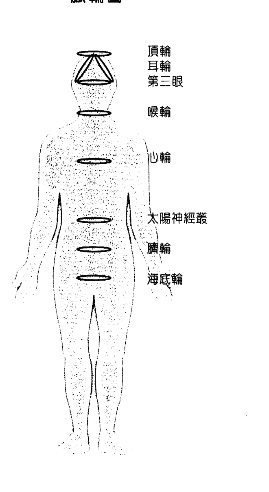

# 第1章 有助於成功排毒的療癒法

- 心輪：綠色和粉紅色。
- 太陽神經叢：黃色。
- 繼續跟著麥達昶做完剩下的幾個脈輪：

大天使麥達昶，請用祢神聖的光束，淨化和平衡我所有的脈輪。觀想純淨的白色光束從天堂射向你，放鬆，看著麥達昶引導這個療癒能量從你的頭頂進入，看到，也感覺到自己充滿著純白光。感覺這個能量讓你的細胞充滿了天使之愛的純淨。你可能看到古老的符號透過光束傳來，假如發生這種情形，就讓它們在你內在靈魂裡行療癒的奇蹟。那些符號有些是你認得的，有些可能是你覺得陌生的。對你來說，是否全部了解並不是最重要的，重要的是要信任天使和神。接下來，讓光束傳到海底輪（位於脊椎底部的地方，見圖）裡，留意光束轉換成暗紅色，這個紅光清除了阻塞的部分，徹底喚醒你的海底輪。當這個清理工作完成之後，大天使麥達昶會引導光束進入你的臍輪中，在這裡，光束呈現出充滿生氣的橘色，感覺橘色光消融所有的黑暗，並療癒你的臍輪。

- 喉輪：天藍色。
- 第三眼：深藍色。
- 耳輪：紫紅色。
- 頂輪：紫色與白色。

當你準備好時，感謝麥達昶的療癒：大天使麥達昶，謝謝祢這次的療癒和清理。當我在釋放一切阻礙我前進的舊有能量時，請繼續與我共事。現在我願意擁抱我的光，並接受神的指引。

常常使用這個方法，你會愈做愈順利，也愈快。剛開始時，清理每一個脈輪可能要花五分鐘或更久，隨著定期的清理，需要清理的淤塞和心靈上的障礙物就沒那麼多，因此，到最後，你可能只要花幾分鐘就可以做完整個過程。不管你是否察覺到，麥達昶已清除了負面能量。當然，如自由意志法則所指出的，天使們一定要先得到你的允許才能提供協助。

# 第1章 有助於成功排毒的療癒法

## 療癒用的水晶

水晶是一種具有療癒能力的寶石，內部蘊藏著天生本具的能量。你的靈性天賦甦醒之後，當你手握水晶時，你會感覺到輕微的能量跳動。水晶貯藏著療癒的能量，可以將能量送到有需要的地方，這些療癒能量對你大有裨益，身體很容易吸取水晶的振動。和你的水晶在一起，設定好目的，這個寶石才能把它的愛送到那裡。

對排毒很有效的水晶和寶石：

- 紫水晶 (Amethyst) : 防範有害能量。
- 白水晶 (Clear Quartz) : 對所有事物的一般性排毒很有助益。
- 綠色寶石 (Green Stones) : (玉、翡翠、孔雀石……等) 提供療癒上的支持。
- 月長石 (Moonstone) : 幫你排除和放下有害之物。
- 黑曜岩 (Obsidian) : 幫你根植大地，使你不會覺得迷亂。有助於專注和集中力。
- 奧剛石 (Orgonite) : (將金屬碎片和水晶置於樹脂內) 保護你免受「化學凝結尾」—— 地球工程上用以改造天氣的空中噴灑物，是一種包含鋇釔奈米粒子的化學物 —— 之害。
- 粉晶（Rose Quartz）：療癒情緒，給你希望與信念。
- 煙水晶（Smoky Quartz）：對於清除有害關係的能量非常有幫助，特別是和你過去有關的人。

你可以戴著這些水晶，拿著、使用或者睡在水晶旁邊，藉此接受它們的療癒助力。

水晶是很敏感的工具，很容易吸取負面能量，因此，你剛帶它回家時，最好先淨化。

此外，淨化的舉動是一種略施小惠，讓水晶知道你很感謝它。

還有，假如你很久沒有清理你的水晶了，務必要去做。想想每一天你會經過它多少次。水晶就像海綿，它們很想幫忙，所以幫你清除掉很多沉重和低頻的能量，這是它們提供你的溫馨服務，因此，對於它們一直默默地幫你療癒，你能給它們的回報就是定期做清理。

此外，淨化你的水晶可以把它過去所有的關聯（亦即前物主、國家和各種環境的能量）都清除掉，只留下純淨的療癒能量。水晶來自全球各地，經歷從土裡被挖出、礦工的分類整理、批發商的包裝、零售商的標價，最後才到達你手中。在這段漫長的歷程之後，它們可能已經因為損耗太多而變得枯竭。

古代的列木里亞人（Lemurians）——亞特蘭提斯之前的一個高靈性文明——和水晶能量的關係非常密切，他們習得很有效的水晶淨化法，重新校準水晶的能量，使水晶能夠在最好的頻率下發揮作用，並且還會運用水晶的「內在線路板」。列木里亞人對水晶如何運作有高度的認識，他們很輕易、很有效地調整了不和諧的能量，並修復了水晶吸取的負能量。

假如你想請列木里亞人幫你淨化水晶，只要召請他們，並告知目的：

列木里亞人，現在，請幫我淨化水晶。
請恢復並加強它們的能量，讓它們成為對我最有利的工具。

淨化水晶的方法有很多。請列木里亞人來幫忙只是其中之一，你也可以嘗試用藥草煙薰法 — 一種使用薰燒藥草（例如，鼠尾草）淨化能量的古法 — 來提高能量。

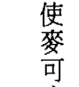

大天使麥可也很擅長清理水晶裡的負能量。你可以這樣召請麥可：

大天使麥可，請傳送淨化的能量到我的療癒水晶裡。
請喚起它們內在的知識，以便療癒我、啟發我。
現在，請幫我的水晶做好準備，以便行使療癒工作，
並請讓它們與我的能量密合。感謝祢。

接下來，用正面能量幫你的水晶補充能量。你可以透過祈禱做到這點。用你的真心對療癒水晶表達你的感激，或者，也可以把你的寶石放在陽光或月光下四個小時。

現在，你的水晶已經就緒，你可以把愛的意圖設定在裡面，為此，要跟水晶攜手共事。跟水晶說話，就好像它們是你親愛的朋友——它們的確也是。向它們傾吐肺腑之言，坦言你的任何憂慮或恐懼，讓水晶知道你真正想要的是什麼。還有，跟它們分享你的過去。在祈禱中還要表明，你願意接受神和天使可能給你的某些更大的目標，假如他們看到更容易成功的方法，接受它！在水晶做設定時，你不需要使用特別的字眼或詞句，最重要的是你的意圖，若你的意圖純淨，你會得到最好的結果。要有勇氣踏出你的舒適區，說出真心話。

# 第1章 有助於成功排毒的療癒法

## 花療法

花朵是造物者之愛的具體呈現。作用是提醒我們，在大自然裡有神聖存有環繞著我們。

在一天之中，你可能會注意到一朵花從人行道上的裂口中探出頭來，你也可能看到鄰居的花園裡繁花盛放。你以前可能從未注意到它們的存在，但現在，你卻被它們吸引住了。天使們說，從這種情況看來，花會出現在那裡完全是為了你。療癒是你們神聖目的的一部分，而且，當你承認天使和花朵的存在時，你允許他們協助你，因此，用點時間真正停下來聞一下玫瑰花，你的頭腦會變得更清楚、更專注。

有時候，你會被一些混亂的狀況和生活中的人生劇碼壓得喘不過氣來，這些感受會在你的能量場裡造成心靈迷霧。當你被這種迷霧包圍時，你很難辨別哪一條路是往上的，哪一個方向是向前的，也不知道要往哪裡去。首先，你必須除去雲霧，才能看清前面的道路，在這方面花朵就能夠提供協助，把花朵迎進你的環境中，可以立即清除負面能量。

> （想知道更多療癒方法以便連結大自然中的天使，請參照我們的著作——《花之療法：88種花朵的療效與訊息》。）

使用花朵時，先從把鮮花帶入家中做起。你也可以在園中種花，或把花的圖片在你的居所展示出來。在本書第八章中，我們也會談到用花朵做情緒排毒的方法。

## 樹療法

對於那些敏感度很高，可以聽到樹之聲的人來說，樹是很高明的醫生和老師。我（朵琳）坐在樹下撰寫《精靈療癒》（Healing with the Fairies）一書中有關樹所傳遞的訊息時，我發現，樹跟人一樣，每棵樹都有獨特的生命目的，有些樹幫忙增長信心，有些幫忙處理人際關係問題，有些幫忙實現對豐盛的祈求……等。你只需要默默詢問一棵樹，它的生命目的為何，然後，相信你腦中出現的答案。樹也可以療癒身體。當你覺得疲倦、不舒服或受傷時，你可以把背靠著樹（坐著或站著都可以），樹會馬上開始吸收毒素、痛苦和低頻能量，整個過程你都可以感覺得到！不要擔心，這不會對樹造成傷害。樹可以把二氧化碳轉化成新鮮的空氣，相同地，它們也能把過去痛苦的能量加以轉變和淨化。

# 第1章 有助於成功排毒的療癒法

## 接近大自然

我們把最好的一種排毒方法——大自然——留在最後介紹。很多毒素是累積而成的，因為，有很多人的生活和工作都在室內，這對於包括人類在內的動物來說，都是不自然的。我們本不應該吸入經過空調的空氣，也不該在人造燈光下工作。事實上，研究結果顯示，很多現代疾病的出現正好就是在人造燈光成為普遍之物的那個時候！

我們需要適當的陽光來啟動頭腦，製造讓人感覺比較舒服的化學物——血清素。血清素也是褪黑激素的前驅，而褪黑激素是身體睡覺和自我修復所需要的。假如沒有足夠的褪黑激素和血清素，早上起床時，我們會覺得疲勞、脾氣暴躁，且嗜吃垃圾食物。我們也需要陽光來確保身體中有足夠的維他命D，乳癌和其他重大疾病一直都和維他命D不足有關。

天使們說，全光譜的照明是最佳健康狀態不可或缺的元素，而全光譜陽光內的彩虹稜鏡可以滋補脈輪系統裡的每一個顏色（因為脈輪系統也是一個彩虹）。因此，舉例來說，假如你有胃部或權力爭執的問題，全光譜彩虹裡的黃光會支持這方面的療癒問題，因為太陽神經叢和這些問題有關，而黃色是這個脈輪的顏色。

當你不想曬傷的同時，相反的做法（過分避免曬太陽）也是一樣的危險。所以，在使用防曬用品之前，請仔細看上面所列出的成分，很多這類產品裡都充斥著有毒的化學品。永遠記得選擇有機的防曬用品，這些在當地的健康食品店或網站上都可以買得到。

此外，天使們說，月光、星光、夕陽和日出也都有助於我們的整體健康：

- 夕陽：天使們說，觀賞夕陽有助於脈輪放鬆，也為我們帶來一夜好眠。
- 星光：天使們說，待在戶外星空下會引發創造力，幫助我們變得更具藝術能力。
- 月光：打從古代以來，我們的祖先會在滿月時站在月光下，把月光當做排出生命中各種毒素的絕佳方法。
- 日出：天使們說，觀看日出可以喚醒脈輪，並提供一種天然的補給，以提高能量。

# 天使能量排毒法 Angel Detox

# 第2章 身體的照護

## 療癒消化系統

> 「天使能量排毒術」是一個全面的身心靈清理過程。讓我們先從身體開始。

一個健康平衡的消化系統會從你所吃的飲食中吸收有益的營養。這是一個不需經過你自覺的努力就能發生的自發過程。但是，當狀況出了問題時，你的消化系統會減緩下來，你不再得到食物所提供的健康上的好處，你可能會覺得胃脹氣、便秘、腹瀉或噁心，每一個症狀都是一個警訊，告訴你消化系統出毛病了。消化系統也許不是你身體中最美麗的部分，但卻是良好健康中非常必要的元素。讓我們來討論一下食物過敏、腸漏症（Leaky Gut），以及不易理解的腸躁症（Irritable Bowel Syndrome, IBS）。消化從口中開始，情況是由你選擇入口的食物而定。假如你對食物過敏或有食物耐受不良的反應，你很可能會有消化不良的感覺，加上胃灼熱或胃酸逆流。食物過敏是很普遍的問題，但往往被忽略了，從自然療法的角度來看，身體並不一定要產生嚴重的反應才足以被稱為食物過敏或耐受不良。身體的反應常常會延遲幾小時，甚至幾天才發生，所以，造成你今天這個症狀的，可能是你昨天喝的那杯牛奶。假如你不停吃那些身體無法耐受的食物，症狀將持續出現。你的腸道會發炎，它會試著對抗你吃的食物，而不是吸收其養分，並導致你開始有消化不良的症狀，以及隨之而來的各種維他命和礦物質的不足。所以，要以樂意的態度放棄那些導致你痛苦的食物，才能換取更大的舒適與更多的活力。因為食物過敏而造成胃部不斷發炎，可能導致「腸漏症」。你的消化系統變得很虛弱，以至於無法分辨好養分和有害物的不同。結果，你的身體開始把兩者都吸收進血液裡，除了情緒起伏和憤怒，還會導致疲勞、筋疲力竭與頭痛。毒素在你體內到處遊蕩，導致你覺得不舒服。第一步，要捨去一切你身體不喜歡的食物。第二步，強化腸道。吃些藥草比如北美黃蓮（Golden Seal），可以恢復消化道的內膜，也可以考慮吃麩胺酸（Glutamine）補充品以減少發炎和增進腸道健康。腸燥症的情況是難懂的，其診斷法是把所有其他可能性排除後才能確認。假如所有其他消化問題的測驗都是陰性反應，你可能會被診斷為腸燥症，特有症狀是不規律的排便習慣——便秘、腹瀉，或兩者兼有。被診斷為腸燥症後，要馬上開始增加纖維的攝取量，最簡單的方法是多吃新鮮的水果和蔬菜，蔬果原本就有豐富的纖維，可以幫助清除穢物，或者你也可以吃滑滑的榆樹皮粉，只是，吃完後務必要喝一杯水讓這種粉能被吸收。很多腸燥症患者發現新鮮蔬菜汁的效果很好，除了有可溶性纖維，還提供很豐富的營養。這些蔬菜汁可提高能量品質，並可減輕腸道的問題。腸燥症的症狀和神經系統及情緒之間有很緊密的關係，你愈感到有壓力，症狀就愈嚴重。所以，要做些放鬆的活動紓解壓力，例如，靜心、太極和瑜伽；在整個家中噴灑薰衣草水，香氣可以促進家庭安寧；甚至，只要和有善心的朋友在一起，也都會大有好處。

# 第2章 身體的照護

## 食物過敏的測試

很多令人憂心的狀況——例如，腫眼、皮膚問題、體重增加、暴飲暴食——都是因為對食物過敏和食物敏感症而產生的。基因改良和殺蟲劑的問題使得食物受到更多的污染，過敏症也愈來愈普遍。但是，一旦你能認出身體所排斥的食物並遠離它，那些症狀就會消失。若想測試過敏反應，可以採用皮膚穿刺法和驗血的方式，皮膚穿刺由醫生來做，但這種測試往往著重在立即免疫的反應上，例如，花粉或寵物皮屑，對於反應較慢的食物耐受不良，可能就不是那麼有效。另外，有些選項是透過自然療法醫生指定的血液測試，這些都可以測量身體對更多種食物的反應，但往往費用較高，因為這些都是由私人檢驗室進行的測試。然而，這些測試結果可以提供更多資料，資料中能將你的身體很辛苦才能對付的食品全部列出，也能給你一個衡量表，顯示出每一個個別項目對你所造成的影響程度。

想要找出你對哪一種食品過敏或耐受不良，有一個簡單的方法，那就是用學到的知識去做猜測。你會猛吃的東西或猛喝的飲料是什麼？換言之，在你吃一口或喝一口後，是否感覺到好像停不下來？大吃大喝往往是一個過敏的徵兆。

人們往往對他們最不能耐受的食物產生上癮的情形。所以，假如你很喜歡或吃大量的乳製品，可以考慮把它從飲食中刪除一或兩週。比方說，假如你的早餐吃麥片加牛奶，午餐吃起士三明治，下午又吃優格冰沙當點心，晚餐則吃含乳脂的麵粉製品。由此可見，每一餐都有乳製品出現，所以，把乳製品縮減後，極可能會看到重大的差異。一陣子不吃乳製品之後，你可以再回頭去吃，然後，重新觀察你的症狀。假如你注意到，在重新開始食用的開頭幾天裡，過敏症狀加重了，那就表示你的身體在很辛苦地消化這類食品，為了你的利益著想，就要避免吃這類食品幾個月，讓身體真正獲得休息。也有可能你開始不吃這些東西之後覺得很舒服，然後，就不再去碰它。這是很好的事，這表示你在聆聽身體的呼求與天使的訊息。

還有，要注意使用某種食物或飲品之後所產生的浮腫、脹氣或發癢，那就是食物過敏或食物敏感症的徵兆。在日常飲食中，先把它們除去，再看看這些症狀是否會消失。

在食物的選擇和清除過敏原這件事上，不要忘記請天使給予指引，她們會幫你減少或消除你對不健康食物的渴望。

最普遍的食物過敏和食物敏感症，通常跟下列的食物有關：

- 牛奶
- 蛋
- 花生
- 堅果（腰果，胡桃，杏仁）
- 魚
- 水生貝類動物（螃蟹，龍蝦，蝦類）
- 黃豆製品
- 小麥、麵筋

## 水的重要性

你的身體裡有百分之七十是水。很有意思的是，地球的表面被水覆蓋的部分也差不多是這個比例。水在維護健康與幸福方面，是極重要的角色。在一般新陳代謝的過程中，身體每天會失去超過4.2杯（一公升）的水，因此，需要飲用一個合理數量的好水，讓身體維持在最佳的工作狀態中。水對於消化、循環、輸送養分和排除廢棄物都是很重要的。在身體細胞消除老舊穢物後，需要用水把它洗掉。足夠的水合作用可以避免不好的複合物集中，對你造成傷害。人們常常把口渴誤以為是飢餓，於是，去吃東西而不是喝水。當你感到「餓」時，注意傾聽身體的訊息，問它這個感覺到底是什麼意思——你的身體是想要食物，還是在告訴你需要更多的水？你常會發現，自己其實是口渴，那麼喝點水，就能很快把這個飢餓感消除。

沒有足夠的水分時，人很難專心，會因為腦缺水而感到疲倦（腦的成分裡，有百分之七十五是水）。神經系統從頭腦把訊息傳送到身體各地方。假如你想在生活中能夠正常運作，必須讓頭腦的需求得到滿足。當你缺水時，頭腦會覺得很難思考，而當你很難思考時，想要專注於正面和有愛的念頭又更難了。你可能會發現，缺水的結果是情緒不好，發生這種情形時，你與天使的連結變得緊張。因此，假如可以保持足夠的水分，你將會有光明的想法，和神的世界也能建立密切的關係。

天然的泉水對身體是最好的，因為它直接來自地下水泉，幾乎沒有經過加工處理，所以，不會像自來水，含有刺激的化學物和污染物。這會使你所需的水中礦物質和微量元素（又名微量礦物質）保持完整無缺。水是身體運作過程裡，非常重要的元素，因此，值得投資購買優良品質的泉水。

## 氟

氟是磷肥工業中的副產品，被加入飲用水中的目的是預防蛀牙。但是，經由在水中加氟和沒有加氟的國家所提供的資料，再加上比較後，發現兩者蛀牙的發生率並無差別。現在，大家已知道氟是一種有害重金屬的副產品，積極的社會運動者正在要求當地的水管理局停止在供水中添加氟。飲水中的氟含量隨著地區不同而有差異。

很多牙膏因為含氟，所以產品上都有警告標示。每一年都有幾百個孩童因為攝取了牙膏中的氟而造成消化道問題。但是，像一小顆豆子大小的牙膏分量和一杯自來水中的含氟量是很接近的。一方面教我們要喝加氟的水，另一方面在加氟的牙膏上又提供毒物專線的電話。

另選自然的，不含化學物的牙膏——裡面沒有氟或會導致發炎的角叉膠（Carrageenan，一種普遍用藻類或海帶做成的食物添加物，用來做為黏著劑、稠化劑和安定劑）。更棒的是，你可以自己做不含化學物的牙膏——材料是，有機椰子油、食物等級的薄荷油和純蘇打粉。這些成分在健康食品店裡都很容易買到，你可以依照個人喜好的味道加以混合。

氟是一種毒害物，會引發關節疼痛、影響甲狀腺組織和腦部。它是一種致變物，也就是說，它會對基因造成傷害，然後可能轉變成癌症。有很多研究都顯示：氟會影響腦功能——大量的氟和低智力之間是有密切關係的，很多研究發現，長期接觸氟（喝含有氟的水）會傷害腦部。有些人甚至還暗示說，建議把氟加入飲水中，這件事的背後是一樁陰謀——在網站上搜尋這樣的主題並不難，你可以找到自己要的答案。

## 第2章 身體的照護

我們建議你不要攝取氟——避免一般的自來水、加氟的牙膏、加工的食品與水，這樣你就不會攝取到氟。去除飲水中的氟，最佳的方法有兩種，用蒸餾的方式處理水，或透過逆滲透把氟排出。雖然你不太可能在家裡做蒸餾水，但你可以購買蒸餾水，不過，蒸餾水的能量是很沒有生命力的，儘管如此，你還是能在家裡安裝逆滲透過濾系統。當然，這些水裡仍然可能有氟的存在。對於健康幸福來說，過濾系統會是很好的投資。你可以買天然的泉水，完全不喝含氟的水。不過，淋浴或泡澡時用的又是那一種水呢？向當地的水管理局詢問你們的用水是從那裡來的，是否含氟。你也可以在網路上購買成套的用具自己做測試。假如你選擇喝瓶裝水，要查明裡面的水的來歷。你可能會發現很多泉水是經過化學處理的，其所含的氟可能和普通的自來水一樣多。尋找加工最少的好水，找出哪一個廠牌抽取的是天然的地下泉水，然後直接裝入瓶中。

## 避免塑膠瓶中的雙酚A

雙酚A（Bisphenol A, BPA）是用來使塑膠成品更堅固的化工原料，很多裝水的瓶子和裝食物的容器都含有雙酚A。這些塑膠製品上都標示著數字3或7（回收塑膠物品的分類編號），光看這些編號並不能代表塑膠瓶就是有害的。數字 3 表示是用聚氯乙烯（PVC）製成，而數字 7 則代表數字 1～6 以外的其他種類塑膠製品。含雙酚 A 的塑膠製品有可能被歸入 3 和 7 這兩個編號，但其他安全的塑膠製品也有機會歸類於此。和雙酚 A 有關的健康問題包括荷爾蒙失調、肝功能失常、嬰兒頭腦發育不良，還有糖尿病、乳癌、心臟相關疾病、不孕症。只要購買塑膠製品，一定要找不含雙酚 A 的產品。含有雙酚 A 的瓶子會使這種化學物滲入瓶裝水中。當溫度升高時，比如放在悶熱的車中或商店溫熱的倉庫裡，就會釋出更多這種有害物質。所以，要避免使用上面標示數字 3 或 7 的裝水瓶。我們建議購買玻璃裝的飲用水，例如，挪威出產的 Voss 牌礦泉水，還有義大利 Whole Foods 商店賣的蒸餾水。雙酚 A 也可能出現在罐頭食品裡，罐頭裡的塑膠膜可能是用雙酚 A 做的。哈佛大學的教授發現，每天喝一次罐頭湯，連續五天之後，身體裡的雙酚 A 含量因此提高了十倍。即使是牙刷，也需要選用不含雙酚 A 的牙刷，因為，你每天要把牙刷放進嘴裡兩、三次。Preserve 這個牌子的牙刷不含雙酚 A，可以在網站或健康食品店買得到。這個牌子還有一個回收計畫，可以不必付郵費把舊牙刷寄回公司，經過消毒的材料可以重新使用製造出新的牙刷。Amy's Kitchen 這個牌子保證他們的罐頭食品不含雙酚 A。

很多知名的飲水公司提供家庭用的飲水桶。你自己要做些研究探討，因為你所飲用的瓶裝水可能不是很優良。辦公室所提供的水也可能一樣不夠好。看一下礦物質分析表，確認水中不是只含鈉和氯，我們的確需要一些鈉，但不該只含有鈉。好品質的水尚需要少量的鈣、鎂和鉀，假如有這些礦物質，你就可以好好用水，因為你知道身體會利用這些礦物質來進行新陳代謝。

經過淨化的水和蒸餾水聽起來不錯，把所有的微量礦物質都去除了，只留下單純二氫一氧（H₂O）的水給你。長久看來，這樣並不理想，但顯然還是比一般的自來水好。有一個折衷的辦法：將水過濾，但還要把礦物質再放回去。購買品質良好的凱爾特鹽、大西洋鹽、喜馬拉雅鹽或死海鹽，加幾粒到水瓶中，將之搖勻，這些天然的鹽裡包含很多礦物質和電解質。

有關飲水品質，有一個簡單的觀察方法。留意你喝水之後多久必須上廁所，喝完一大杯水後三十分鐘，你可能必須去上廁所。假如你喝的是好水，你可以等一個小時或更久再去。然後，你上廁所時所排出的水會少於你喝的量——原因是，你的身體並不只是單純地讓水分通過，而是將水分使用在維持生命所需的新陳代謝過程中。你得到了水合作用，也善用了你喝下的水。計算飲水量是很重要的，因為這將幫你養成讓身體擁有足夠水分的習慣。每天的飲水目標是根據自己的體重而定的，每一磅體重對應二分之一液盎司的水（換算過來，就是一公斤體重，每天應喝三十毫升的水），接著，在日常活動中，隨身攜帶一瓶水，請用玻璃或不鏽鋼水瓶盛裝。塑膠會釋出化學物和類似荷爾蒙的物質進入水中，如前所述，這種情形很容易發生，特別是在溫度增加的情況下。所以，放在車子裡的瓶裝水應該丟棄，絕對不能再喝。假如你使用的是玻璃瓶或不鏽鋼瓶，就無安全疑慮。買水的原則也是一樣，理想是購買玻璃瓶裝的泉水，或者，購買大一點，以不含雙酚A的硬塑膠製造的家庭號桶裝飲用水。加入少量的現榨有機果汁，或幾片新鮮的有機檸檬或萊姆，可以讓喝水增加一些樂趣。在熱天裡，可以加入新鮮的有機薄荷葉做為提神的良品。天使已經教導過你如何增加飲用水的能量。現在，在每一口飲水中，你都會喝入生命的活力和愛的振動。

## 滿月的祝福

天使們建議你在滿月時把水放在月光下，因為那時的能量有很強的顯化力量。這麼做會讓你把所有已完成的事情放下，並為下一個階段迎入清新的新能量。

大天使加百列（Archangel Gabriel）的建議是，你可以把剛買回的玻璃瓶裝水放在月光下！更完美的你可以把整月的用量全部集中在一起。或者你也可以特別準備一批專供療癒之用的飲水，讓自己好好享用幾天。我們發現，經過月亮加持的水味道更甜，且可以很明顯地感知到水的振動力。

### 水晶聖水：

水晶有一個療癒能量場，能滲透到各種液體裡，很多療癒者都曾應用過這個概念，他們把寶石放進飲用水中。不同形式的水晶也沒關係，但是很多礦石和水晶放在水裡可能造成傷害，例如，孔雀石會釋出銅，透石膏則可能會完全融化；使用水晶時，也無法把該去掉的灰塵和微生物清除乾淨，聖水裡可不能有細菌！

## 天使能量排毒法 Angel Detox

我們受到指引，叫我們要利用水晶能量，所以天使們教我們一個安全有效的使用方法。水晶能量可以進入水中，也可以穿透玻璃，你只需要倒杯水，把你淨化過的療癒水晶擺在水杯底部的周圍就可以了。水晶能量會透過玻璃被水吸收。一定要試著使用粉晶，因為它會把一種溫和、寧靜並有助打開心屏的能量帶入水中，這種方法也適用大壺或大罐的水，你將會接收到不含恐懼和有害化合物的水晶能量。可以在晚上就寢之前做，第二天早上一醒來就能享用「水晶聖水」（Crystal Elixir）。

## 第3章 有益排毒的藥草與維他命

藥草，或香草植物，是具有療癒特性的植物，很多部分都可以利用——葉子、花、果實、種子和根。長久以來，藥草療者都在探尋每一種植物中最有效療的部分，同時也學習識別哪那些植物不能吃或不能做為醫藥用途。

藥草的故事可以追溯到過往的幾千年間。有些記載提到了被保存下來的冰河時期人類，他們手中還握著幾束藥草，這些藥草至今仍被使用著，這只是一個例子，說明了該草的長久性。假如這些植物沒有療效，便無法通過時間的考驗。

很多草本植物是經由神聖的指引而發現的。本土文化、人們所居住的土地以及當地的能量都有深切的連結。當有醫療需求的時候，村莊裡的療癒師會祈求幫助，所收到的指引會帶著他們找到某種特定的植物。

美國原住民被指引找到紫錐菊（Echinacea）做為調節免疫力之用，雖然這個選擇的背後並沒有科學上的佐證。人們需要的只是單純的信念和信任，治療的結果自能說明一切。美洲印地安人沿用紫錐菊來處理傷口和感染已超過四百年，有關這種神奇藥草的事蹟很快地傳播出去，全世界的藥草療者於是開始使用它。很多科學家在聽說了這種藥草的種種神奇之後，也想知道更多資訊。遺憾的是，現代所做的藥草研究其目的都在於反駁它的效用，不過，科學家終究無法對紫錐菊的療效做出反證論述。科學研究發現紫錐菊含有天然化合物，可以刺激身體製造更多白血球幫助免疫細胞工作，因而增強免疫力，保護你不會患傷風感冒。

神和天使會指引療癒師找到植物，並教導他們使用方法。成功的消息傳開之後，其他人也會想要知道更多。科學有助我們了解某種植物的特殊療癒方式，但接下來的這一步就不是那麼正面了。做研究的人會開始用動物做試驗，所持的理由是，透過動物試驗可以幫他們找到「更有效」的劑量。他們甚至可以從藥草中取出天然化合物，單獨使用。有時候我們用的是天然的材料，結果卻可能是更多的加工製造。那麼你可以提出問題：誰從中獲得好處？是現在使用更多藥草的病人嗎？是現在開更多藥的藥草師嗎？還是藥草銷售量增加的製造廠商？藥草都附帶著能量，當你握著一瓶藥草提煉物或加酒精製成的酊劑時，你可以感覺到它們的療癒特性。請向你的藥草師或自然療法醫生請教，看看那一種是適合你的。假如你以前曾使用過，告訴醫生你的使用經驗，也要讓他知道你對能量是高度敏感的。要對你的治療師誠實，假如他開了某種藥給你，而你覺得有不妥之處，一定要讓他知道。為了達到有效的療癒效果，雙方在意見上有所溝通是很重要的。

藥草有很多不同的形式可供使用。有些是液體，例如，香草萃取液或酊劑。有些被製成藥片、膠囊，或茶。萃取液和酊劑是濃縮的液體，往往含有酒精。每一種藥草都需要某種比例的酒精來提煉出有療效的化合物。有些天然的化學藥物溶化在水裡，有些溶在酒精裡。從這兩個領域中找到最好的平衡點並得到最大好處，是一種藝術，這是很多藥草公司已經在做的研究，他們發現到某一種植物在某種比例的酒精中被提煉出來會是最好的。然而，酒精含量要留意，因為有些人有酒癮，有些人則對酒精非常敏感。對很多使用藥草的人來說，萃取液和酊劑都可以發揮效果，治療師會綜合幾種藥草做出最適合你個人的神奇藥劑。

一定要堅持使用有機和非基因改良的藥草、維他命和礦物質。假如你吃全素或蛋奶素，檢查你的營養補充品，確定不含動物性添加物。使用的配方劑量要視所使用的藥草，以及所對付的問題而定。劑量可以有很大的差異，從幾滴到二分之一液盎司（幾毫升）都可以。我們建議你找一個能在靈性和能量層次面處理問題的治療師，假如你的藥草師是這種人，他會評估你的個人需要，專門為你訂製一個劑量。

我（羅伯）最近發現以滴數做為劑量單位非常有效，這讓我在面對病人時能夠保有彈性，同時也帶出植物深層裡的能量。我感受到每一種藥草都有自己的特性，這是我當下決定劑量的方法，但我知道下一個病人走進來時，劑量很可能得稍微改變。所以，一定要信任自己的指引，並與你的保健專業人員討論你關注的問題。讓自己擁有保持彈性的空間。

藥片和膠囊是使用藥草的一種簡單的方法，因為這兩種形式只有一點點或完全沒有味道。使用膠囊時，一定要選用植物提取物製作的膠囊外殼，才能避免吃到凝膠（從牛骨提取製作）。藥片和膠囊都包含著粉狀的生藥草或液體萃取物做成的粉。每個藥片裡面並沒有很多可用空間，所以，裡面若有生藥草，也不會是很大的量。有些藥片和膠囊可能會標明「所含的萃取物約等於——公克的乾藥草。」這表示此產品是一種更加濃縮且經過乾燥的液體萃取物。然而，要記住，「更濃縮」並不等於更具效力，因為，濃縮產品也附帶著一些隱憂——假如使用的不是有機藥草，裡面可能也將殺蟲劑和肥料濃縮進去了。

做藥草茶和藥湯的方法是，把滾水倒進容器中讓藥草浸泡，用新鮮或乾燥的藥草植物來泡茶都可以。假如機會嘗試新鮮的德國洋甘菊茶，你一定不會失望的，一朵新鮮的洋甘菊放進一杯滾水裡，會產生一種溫和、味濃但鎮定的效果。讓藥草植物浸泡在水中，能把生氣蓬勃的能量傳到那個液體裡，然後，在你喝那杯茶時，可以體會那種振動進入你身體時的感覺。

在一杯滾水裡加入一茶匙的藥草。使用茶壺是一種效果很好的做法，因為密閉空間裡的蒸汽，會散發出更多的香氣和更好的療癒效果。嘗試用玻璃壺看看，將能帶給你一些額外的樂趣——你可以看著藥草把它自己的神奇力量與水分分享，讓這個浸泡藥草茶留置十至十五分鐘再喝。順便提一下，假如你想使頭髮的顏色變淺並變得更光亮，用煮好的洋甘菊茶洗頭是一種很好的方法，而且洋甘菊茶不含化學物。

### 為藥草做療癒祈禱

在你使用藥草（不管它是那一種形式）時，為那個植物所提供的貢獻而禮敬它，花點時間讓你的藥充滿愛與感恩。

把這個藥草握在手中，或者把手放在離它不遠的上方，深呼吸，連結藥草的能量。當你透過這個覺知的動作將呼吸放鬆下來時，你的能量場會擴大，讓你的能量與藥草的能量結合在一起。你的手裡可能會感受到輕微的壓力、麻刺或溫暖。接著，召請大天使拉麥爾的能量：

大天使拉斐爾，歡迎妳來到這裡。請把妳的大能量注入這個藥草裡。我感謝它，因為它為我們提供了服務。我請求這個神聖的植物療癒我的身體、我的情緒和我的能量。請給我我現在在我所需要的一切。

觀想那個藥草洋溢著明亮的白光，知道這個天然的藥草將會很迅速地、不費力地與你的身體融合在一起。接著說：

天使們，為了療癒，我請妳喚醒這個藥草的靈。願我能從妳賜予我的服務中得到助益。感謝妳。

現在，讓藥草進行療癒工作。

## 有特效的排毒藥草

有幾種藥草植物特別以清理能力聞名，這種功能有時被稱為「藥劑」或「清潔劑」，意思就是它們有清潔血液的功效。這些藥草協助排除廢棄物和避免代謝的毒素積累在身體裡，能促進排毒功能。長久以來，有很多這類藥草都被用來治療嚴重的皮膚問題，之所以有這些問題產生，可能是毒物的量已太大，超過身體所能負擔，開始透過皮膚顯示出一種失衡的狀況。

- 歐洲伏牛花 (Barberry 或 Berberis Vulgaris) 可以幫助療癒胃部，使消化系統更有力、更健康，這使得毒素很難被吸收進血液。這也會刺激肝臟，幫助身體沖洗掉多餘的化學物。

- 歐洲伏牛花這種藥草的味道不怎麼好。但是，在你嚐到它的苦味時，應該也是它發揮最佳療癒效果的時候。因此，為了最大的治療助益著想，不要和味道濃烈的果汁混在一起，請加水飲用。

- 藍旗鸢尾 (Blue Flag 或 Iris Versicolor) 可以排除淋巴系統裡累積的毒素，藍旗鸢尾能協助最重要、負責免疫功能的淋巴順利循環。當毒素經過肝臟的處理後，再從腸道排出。

- 牛蒡 (Burdock 或 Arctium Lappa) 功用是把身體的毒素從泌尿管排出去。對痛風引起的疼痛有極佳的止痛效果。可以去除身體內貯藏已久的毒素和酸性物，這些廢物會造成各種皮膚病，所以，使用牛蒡之後，你會發現身體自動淨化，膚質也會改善。

- 豬殃殃 (或稱原拉拉藤, Cleavers 或 Galium Aparine) 是一種可以深入至非常內裡的一種藥草，可以幫助清除細胞內部基質的毒素。很多有清除作用的藥草處理的是細胞外部基質（細胞周圍的液體）裡的毒素，而豬殃殃可以把細胞裡面的廢物排除，並幫助身體將之排出。採用這個方法時，應該以漸進溫和的方式來做，假如以前從未做過排毒動作，試用豬殃殃之前要先暫緩一下，身體如果仍保留著舊的代謝廢物，排毒時可能會出現一些症狀和副作用。豬殃殃的淨化功效極其良好，用完之後的效果會令你覺得不可思議。

- 紫錐菊 (Echinacea, 或稱狹葉紫錐菊 Echinacea Angustifolia, 紫花紫錐菊 Echinacea Purpurea) 很可能是世界上最有名的藥草之一。可以激發免疫系統功能，並派出白血球去搜捕有害物質，白血球散佈在整個淋巴系統裡，協助把流動的毒物排出體外，然後，再修護毒物可能造成的傷害。

- 雷公根 (Gotu Kola 或 Centella Asiatica) 是一種腦部的營養品。以溫和的方式幫助循環作用到達頭頂，並且分解結痂組織，因此減少發炎。結痂組織會使身體必須更努力戰鬥以達到平衡。假如能去除不必要的結痂組織，身體會有絕佳的機動性。雷公根也可以平衡神經系統，使頭腦更清新。（有些歷史故事講到，古代的帝王因每天吃一片雷公根葉子而活到兩百歲。）

- 蕁麻 (Nettle, Urtica Dioica 或 Urtica Urens) 是一種很滋養、有排毒功效的藥草。萃取物裡包含了維他命和礦物質，可以製造健康的新血球。蕁麻透過皮膚做清理工作，所以，食用這種藥草時，一定要搭配運動（而且要出汗）。

根據史實，蕁麻排毒的方法是以它刺人的葉子抽打裸露的皮膚，隨之出現的水泡和紅疹被認為是試著排除出來的毒素和廢物。事實上，蕁麻上的針狀物含有組織胺，碰到時會在皮膚上造成紅疹。組織胺是造成過敏反應的原因，而現代醫藥大量倚賴抗組織胺藥物來治療過敏症。有趣的是，當你服用蕁麻酊劑或蕁麻茶時，它會減輕過敏症和花粉熱，這又是一個例子，讓我們看見大自然母親的神奇。

- 紅苣草 (Red Clover 或 Trifolium Pratense) 在調節女性荷爾蒙的同時，也能清除身體的毒素。這種藥草能為中晚年女性——更年期期間和更年期之後——帶來絕佳的幫助。荷爾蒙失調會導致情緒、能量和活力的改變，使人無法專注，並且沉溺於不健康的習慣中。紅菽草會在需要平衡的地方發揮作用，確保你對美好的身體保持著最高程度的照顧。

- 皺葉酸模（Yellow dock 或 Rumex Crispus）會經過腸道把毒素排除。這是一種低劑量的藥草，因為數量太大可能會引起腹瀉。皺葉酸模是另一種治療慢性皮膚病的藥草，也可以處理中毒的腸道。身體應該能將毒素從腸道排出，假如沒有，毒素會被再次吸收進血液裡，這種情形將引發皮膚問題，而這些問題用一般常用的方法無法對治，皺葉酸模能讓問題產生轉機！

## 有益肝臟的藥草

肝臟是主要的排毒器官。毒素經過肝臟的處理和新陳代謝之後，才能安全排除。肝臟排毒有兩個階段。在初始階段，毒素甚至可能變得更毒，和酵素結合之後，會變成水溶性的毒素。很多環境裡的毒素是脂溶性的，使得身體較難把它排除。接下來的第二階段，毒素和有機化合物結合後，進入膽汁，然後，你的身體從腸道把毒素排出。

肝臟是人類器官中唯一可以再生的臟器，受到損害或經手術切除一部分之後，肝可以再長回來原來的大小。這是一個神賦予我們，充滿神奇與愛的禮物，這顯示出這個排毒器官是多麼重要，好好地照顧你的肝，才能保證你可以過著健康快樂的生活。

- 穿心蓮（Andrographis Paniculata）可以增強免疫力，也能對抗感染，特別是肝臟的感染。保護你的肝臟，避免肝臟受到損害。

- 歐洲伏牛花（Berberry 或 Berberis Vulgaris）可以促進膽汁的分泌和流動，以利身體的毒素排泄，這就是歐洲伏牛花幫身體排毒的方式。

- 藍旗鳶尾（Blue Flag 或 Iris Versicolor）用在肝臟阻塞時。相關的症狀包括：便秘、噁心和頭痛。藍旗鳶尾有助於膽汁分泌，進而促進消化。

- 柴胡（Bupleurum 或 Bupleurum Falcatum）能夠保護肝臟。減少免疫系統的發炎，並使肝臟維持在平衡狀態。柴胡對於與肝臟有關的自體免疫問題很有功效。

- 蒲公英根（Dandelion Root 或 Taraxacum Officinale）可以刺激消化。啟動肝臟的工作，使腸道有更好的功能。蒲公英根深入土地的能量使它成為極佳的解毒劑，因為它會防止你失去專注力或變得灰心喪志。有時排毒過程會很長，所以，假如能堅持下去，擁有健康生活的機會就會大大地提高。

- 乳薊，聖瑪莉薊或水飛薊（Milk Thistle, St. Mary's Thistle 或 Silybum Marianum）是頂好的肝臟藥草，對各個方面的肝臟功能都有益處。能助長肝臟的療癒和復原。對於肝臟有高度的保護力，可以避免肝臟受到藥物和毒素的損害。一直以來，有很多乳薊的研究想證明它的保護特性，其中有幾項集中在毒鵝菇（Death-cap Mushroom）的研究，乳薊可以事先預防或延遲毒鵝菇毒素所造成的傷害。很多人在喝酒前都會先服用這種藥草，因為他們發現，吃了以後比較不會醉。這個藥草有助於保持肝臟的健康，但不要以此為藉口而喝酒過量。

- 迷迭香（Rosemary 或 Rosmarinus Officinalis）可以把血液送到大腦，所以能增進記憶力和專注力。也能促進肝的第二階段排毒。做情緒排毒時，這是一個很有效的方法。在處理毒素問題時，迷迭香能支援神經系統。

- 五味子（Schizandra, Shisandra 或 Schizandra Chinensis）可以滋養神經和平衡能量，還可以幫助肝臟執行第一和第二階段的排毒。在你覺得壓力很大、很疲倦但仍然需要排毒時，可以用五味子。

- 薑黃（Turmeric 或 Curcuma Longa）加強肝臟第一和第二階段的排毒。幫助身體透過膽汁清除毒物。薑黃也是極好的抗氧化劑和消炎藥，這是一種很具療效又營養豐富的藥草。

薑黃和脂肪一起服用可以增強效果。在吃之前先把薑黃粉和椰奶、油類或有機優格混合。若使用藥片或膠囊，也應該和優質的含脂肪食品一起服用。你可以吃一把有機杏仁、一顆酪梨或一點優格。

# 第 3 章 有益排毒的藥草與維他命

## 清肝的蒲公英根茶

你可以泡一些藥草茶來促進消化和支援肝臟發揮良好的功能。蒲公英根是一種深入土地的藥草，可以把覺知重新帶入身體。每天喝一或兩杯，可以讓你了解自己的身體需要什麼。假如沒有找出真正的原因，對某種食物的渴求可能會令你覺得困惑。假如你缺乏維他命B，你可能會特別喜歡吃碳水化合物；假如你缺乏鎂，你可能很愛吃糖。你的身體不是在跟你說你要麵包或義大利麵這類碳水化合物，身體真正需要的是完整的穀類，例如，糙米，以及豆子這種豆類蔬菜。蒲公英根茶可以讓你知道身體想要什麼。蒲公英根茶會刺激肝臟，並協助廢物的排除。這種茶的味道可能不是熟悉的香味，因為避免在這種飲料中添加精製糖、人工甜味劑或牛奶。蒲公英根茶可能和你習慣喝的茶味道不一樣，但是，可以把這種茶當做藥來食用，放在面前的這杯茶可以使你更健康，讓你對自己的身體所需有更深的領悟。

## 泡茶的方法

在一杯滾水中加入一小匙有機的乾燥蒲公英根（也可以使用烘焙過的有機蒲公英根，味道與乾燥的蒲公英根不同），浸泡十分鐘再喝，假如你喜歡，可以加一些天然的甜味劑。

## 接骨木

接骨木（Elder）是一種強壯的植物，可以增加免疫力、保護你免於發炎。通常適用促進上呼吸道健康——鼻子、喉嚨和鼻竇。

即使最健康的人也可能會流鼻水，此時，接骨木就是手邊的好朋友了。我（羅伯）曾使用過無數次，發現吃過後，只要一兩天，鼻水就完全不流了。

從傳統的藥草歷史和民間故事裡可以看出，接骨木存在已久。每一種植物裡面，都有一種能量或靈魂，假如你在某個植物旁邊靜靜坐著，很快就會對它有更多的了解，植物非常樂意和你分享療癒與知識。這種想法可能被認為比較偏靈性且深奧難解，但是，靈修者和一般農民都熟知「接骨木聖母」（Elder Mother），有些古代的故事裡曾經談到禁止焚燒接骨木木頭之事。一直到今天，還有很多農民和鄉下的人不肯傷害接骨木，他們知道接骨木需要有自己的空間，也知道應該給予應有的關心和照顧。畢竟，在某些時候，人們需要接骨木的療癒特質所帶來的益處。

和其他多數的植物比較起來，接骨木有一種「更熱心」的個性。當你與之連結時，你會接觸到溫馨和關心的能量。接骨木當然想要幫你療癒，但是也需要受到尊敬。這是雙向的，假如你想要接骨木的藥，相對地，就必須以誠敬相待。假如你住在農村地區，也栽種接骨木樹，尊敬就沒問題了，但是，我們所購買的接骨木花或果，多數都經過商業化方式採收和製作。

因此，我們要怎麼做才能保證良效，同時還能讓接骨木聖母不斷支持你？手握著瓶子坐下來，閉上眼睛，默默地向接骨木請求協助療癒。你可以奉獻一些東西給土地做為回饋，你也可以在外面放個小點心，或者倒些果汁到草裡。假如你的動機純正，事情將會順利進行。服過藥後，聽聽接骨木想要說什麼，很多時候，你收到的指示會叫你多休息，所以要多照顧自己一些，允許自己「暫停」。這是療癒中很重要的一個面向，請你認可指示，並盡情享受。

接骨木花來自歐洲接骨木樹（Sambucus Nigra Tree）。這種小白花被培植做為治療感冒、發燒和流鼻水的藥草，很有效、也很安全。製成方法有以下幾種：茶、藥草萃取物、酊劑以及藥片。你所需要的只是每次八滴酊劑，每天服用三至四次。

接骨木果目前正東山再起，研究結果顯示接骨木果有很強的抗病毒特質，對於治療流行性感冒的症狀有很好的效果。現代醫藥並沒有對治病毒感染的能力，所以，假如醫生給你抗生素來治療流行性感冒，這是無法對治病毒的。事實上，醫生所做的是防止你得到細菌引起的二度感染。使用接骨木果能增強身體擊敗病毒的能力。

接骨木果的問題在於，做成液體時是不穩定的。多數藥草被提煉變成液體以供服用，或者乾燥後被製成粉狀。因為這些果實的本質不穩定，必須採用其他方法，其中，藥片是最有效的使用方法。

喝接骨木花茶有利退燒，但一定要嚴格注意。確保體溫絕不能太高（接近華氏一○四度，或攝氏四○度），假如超過這個體溫，要立刻就醫。若不是這種情形，可以在滾水中加入兩茶匙乾燥的接骨木花，浸泡十分鐘，過濾後飲用，這個熱飲有助對抗疾病和維持正常體溫，聽起來和你應該採取的做法幾乎相反，但是，喝了溫水之後，更能引發出汗，一旦熱度「分解成汗水」，體溫就會下降，療癒就開始了。在天冷的月份裡，有一個不錯的

# 第 3 章 有益排毒的藥草與維他命

## 紫錐菊

紫錐菊（Echinacea）可能是最出名的藥草了。成效流傳已有很長的時間，但對於真正的療效仍有一些爭論。你可能試過紫錐菊，但效果不怎麼好，所以在這想告訴你們吃這個藥草最好的時間，以及如何找到好產品。

紫錐菊是一種增強免疫力的藥草植物。可以恢復免疫功能，增加體內的白血球，而白血球能保護身體免於感染。但是，假如你已經罹患感冒，或已經生病時，紫錐菊就不符合你的需要。最好能在兩、三個月前就吃，以便加強免疫力。若在你生病後才開始使用紫錐菊，就已經來不及了，雖然仍會有些幫助，但效果不如對重病特別有效的蒜頭和穿心蓮好。紫錐菊更適合用在改善健康的長期計畫裡。

使用時，一定要選擇效果最好的藥草種類做成產品。狹葉紫錐菊（Echinacea Angustifolia）和紫花紫錐菊（Echinacea Purpurea）是很好的兩個品種，兩者都有高效能，對免疫系統也大有幫助。白花紫錐菊（Echinacea Pallida）常被用在品質差一些的產品中。這個品種對免疫系統的增強能力不如另外兩種，但製造商仍會使用，因為，儘管白花紫錐菊比較便宜，仍可以在成分上標示為「紫錐菊」。對於每種產品都要仔細看清成分，確定你買到的品質是最好的。

紫錐菊中最有效的部分是根部，包含了最高濃度的活性物質，但我們喜歡的產品要能利用到整棵植物的根、葉和花，沒有任何一部分是無用的。假如我們把植物從土中拔起，請它為我們服務，我們可以全部都用上，不要只用根部而把其他的部分捨棄，那是對大自然之母的不敬。

## 冬蟲夏草

冬蟲夏草（Cordyceps 或 Cordyceps Sinensis）是一種增進免疫力、活力和身體耐力的補品。一九九二年，中國奧運運動員在多個比賽項目中打破紀錄，在此之前，冬蟲夏草一直鮮為人知。像很多其他運動員一樣，他們也被要求做藥物測驗，所有的結果都沒有違禁品的成份。後來才發現這些傑出的運動員都在食用冬蟲夏草，那是他們每天養生的一部分。冬蟲夏草可以增加細胞的氧攝取量，而氧對身體的每一個部分都有益處。當你做氧氣汰換時，釋放出二氧化碳和代謝所產生的其他廢物，這使你能夠在從事高度運動量的工作時不覺疲倦。冬蟲夏草可以平衡免疫系統，是對治長期病痛的聖品。在長期生病、手術或其他事情讓你在體力和情緒上耗竭之後，能幫你補強身體。這種強力藥草生長在中國和西藏的高海拔山區，可以承受艱難的環境挑戰和冰冷的天氣，這顯示出藥草的適應能力。這種神奇的藥草把這些長處給你，也給你完成工作所需的體力和耐力。冬蟲夏草向來被用來治療咳嗽、呼吸道上的問題、性欲低、心血管問題和虛弱。這是一種補品，可以幫忙延長壽命、提高能量水平、增加體力和耐力。也能增加身體裡自然的殺手細胞（Killer Cells），殺手細胞的工作是殺死不健康的細胞。有些研究已經發現，在用化療治病時，若同時也使用冬蟲夏草，將會有所助益。不過，相關的使用事宜最好和你的治療專家討論。

# 第 3 章 有益排毒的藥草與維他命

## 療癒之花消除癮症

每種花都包含著神奇的療癒特質，但是在消除癮症上，有幾種是比較受到注意的，其中包含了百子蓮（Agapanthus）、鳶尾花（Iris）和白玉蘭花（White Magnolias）。對某些東西上癮，簡單來說，就是對它有很強的慾求，並不一定只和非法藥品或其他有害物質有關。人幾乎可能對任何東西都上癮。

你可能對某種東西上癮，因此而批判自己並無好處。召請親愛的天使，請她們給你指引。她們會叫你去找熱心幫助的人，他們會珍惜你，想要看到你成功。要選擇有愛心、可以和他們分享你的健康目標的朋友和家人，這些人會監督你的進度，也會幫助你不要半途而廢。改掉成癮的行為時，你需要旁邊的人督促你負起責任，所以，你要找的人必須真的關心什麼對你最有益。

百子蓮可以清除潛藏深處問題的能量，不留痕跡。這對各種癮症最好不過，因為癮症往往在生活中很多層面裡四處蔓延。使用百子蓮之後，這幾個層面立刻就會達到平衡。當他人的能量造成你的問題時，百子蓮特別有用。假如你的朋友或家人助長或造成你的癮症，你會發現百子蓮能帶給你慰藉和支持。

鳶尾花處理的是排毒的能量。這種療癒之花指引你把對你不再有用的一切都排除掉，其中包括了：食物、飲料、習慣和各種人際關係。鳶尾花會讓你注意到習慣行為所造成的一些症狀，說明了你目前健康狀況真正的原因。使用鳶尾花時，你會有更多的活力，和你生命的火花連結，持續開發新發現的動力，你將會開始做一些被耽擱已久的事，也可能重新開始做一些以前曾經錯過的事。

白玉蘭花有巨大的花朵，對於清除負面能量、環境裡的毒素和消除電磁輻射波都有極佳的效果。這種花能增加敏感度，你愈敏感，對於生命就愈多的「感覺」。這是做為一個光之工作者最有力、最有用的工具。白玉蘭花幫助你識別出那一種食物、飲料或環境是對你大不利的。

天使們會指引你如何避免造成痛苦和壓力，允許他們幫助你順利轉移到一個全然是愛的空間。神和天使永遠在敦促你追求最大的助益，因此，要信任你所收到的指引。

# 第 3 章 有益排毒的藥草與維他命

## 維他命 C

我們需要維他命 C 比需要免疫上的支援多很多。它可以修護皮膚、恢復能量、對抗感染，也是一種很強的抗氧化劑。這個重要的營養品是水溶性的，意即你的身體裡並沒有多餘的儲備，就像身體對鐵的處理一樣。因此，必須從吃的東西裡不斷地提供身體所需的維他命C。含豐富維他命C的食物都有光亮的顏色，例如，柑橘、檸檬、萊姆、草莓、藍莓、甜椒……等。

把維他命C當成每天飲食的一部分，好好享受，但要記得，必須取自當地，且有機，這是很重要的。水果離開樹之後的每一秒都在喪失養分，有人知道在超市的那些農產品已在那裡躺多久了嗎？我們都知道水果都是數月前就已採摘下來，放在冷凍櫃裡，然後，再運到全國各地。但假如你可以找到當地有機農耕的農夫，就可以享有真正新鮮的和營養豐富的食物。而更好的是——你可以自己打造有機農園！

偶而吃維他命C補充營養品，以確保擁有足夠的維他命分量，這是很好的做法。食用維他命C時，要確定是從有機玉米提取而來，或是來自其他的有機來源。市售的維他命C通常採用非有機玉米製造，也就是含有殺蟲毒素的意思。物色維他命C時，選擇成分中含有多樣來源，而不是只含有抗壞血酸。必須確定還要含有礦物質的抗壞血酸鹽，例如，抗壞血酸鈉、抗壞血酸鈣……等，這些額外的抗壞血酸鹽能緩衝酸性物，在身體內部造成一個比較溫和的效果。吃太多不含鹽的抗壞血酸可能導致胃痛、突然需要跑廁所。

找到一個均衡的補充品之後，查看每一個劑量的維他命含量。只要在你所選用的產品裡沒有額外的成分，使用粉狀、藥片和膠囊都可以。跟你的醫生或自然療法醫生商量一下，決定適合你的最大劑量是多少，有可能高達每天兩千毫克。

維他命C 為人所知的是增強免疫力的能力，是抗生素也是抗病毒劑。在一開始患感冒或流感時，就要開始吃維他命C，可以減輕病情和感染的時間，可以多吃幾次劑量較小的維他命C來增強免疫功能。在這種情況之下，大劑量並沒有什麼好處，相反地，身體需要不斷供應小的、容易處理的劑量，好讓維他命C 可以很快被吸收和利用。

維他命C 和白血球一起工作，當它們達到平衡時，身體會變成一個結構良好、受到保護的載具。白血球不斷地在流動，查看感染或疾病的徵兆，一旦發現有狀況，就被送去消滅有害的細胞。

維他命C 對於皮膚也是絕佳的癒合者。促進膠原蛋白合成，以和諧的方式把體內的組織結合在一起。你可以買維他命C 乳液塗在臉上做局部處理，皮膚很快就能吸取這種愜意、滋養的產品。把天然、不含化學物的產品塗在皮膚上時，皮膚會因為有活力和健康而發亮。維他命C 和皮膚本來就有很密切的關係，這個外用乳液馬上就能發生效用。還要記得，皮膚是最大的排毒器官之一，假如皮膚被毒素塞住，就無法排出骯髒的化學物。當體內含有高品質的維他命C時，你將擁有光亮的皮膚；你也會注意到，在你運動時身體比較容易流汗，這是清除廢物自然的過程；你還可能發現，和他人比較起來，你的汗很少或沒有臭味—— 這是因為你的身體已經把毒素沖掉，身體變得很乾淨。

維他命C的療癒特質還包括修復珍貴的腎上腺、恢復與生俱來的能量品質，以及修復長期壓力造成的任何傷害。腎上腺是一個能量發電所，負責製造腎上腺素—會使心跳加快，並為你增加活力的複合物提高能量。腎上腺素是在興奮和激動的時候產生的，不幸的是，在有壓力的情況下，腎上腺素會一再被分泌出來，假如身體必須長期應付壓力的需求，腎上腺會變得虛弱，開始失去力量，慢慢變成腎上腺枯竭。維他命C在你的體內尋找自由基，中和自由基能保護你免受傷害，抗氧化的特性使維他命C成為抗老化的好方法，它能防止細胞受傷害，並增加細胞的青春活力。

# 維他命 D

現在維他命D缺乏的現象愈來愈普遍。我們很多時間都在室內，在人造燈光之下，加上陽光因為環境污染而被抹消了，這些都會造成我們缺乏維他命D。維他命D是我們從陽光吸取來的養分，有療癒和舒緩的作用，也會帶來其他所需的維他命！

你需求是未經過濾的光線，才能吸收維他命D，坐在窗邊或開車時都不算，因為刺激維他命D合成的紫外線被玻璃擋住了。擦防曬也會阻礙你吸收維他命D。當然，曝曬在陽光下必須小心，假如皮膚不習慣戶外，很可能會被曬傷。曬傷對任何人都沒有好處，所以，要慢慢小心地讓自己逐步適應。攝取維他命 D，清早和傍晚的陽光是最好的，研究結果告訴我們，只需要連續十五分鐘的陽光就足夠一天所需。很遺憾的是，大多數人甚至不願花這點時間待在戶外。

在公司上班的人常穿西裝和長袖把身體都包住，見不到陽光。辦公室（還有很多家庭）裡的人造燈光對健康也是有危險的，因為，日光燈會抑制褪黑激素的分泌，而褪黑激素攸關睡眠週期及平衡情緒，褪黑激素會告訴你疲倦了，或你該起床了。在日光燈的長期影響之下，你的頭腦變得混亂，訊息遭受破壞，睡眠週期也開始受害，結果導致你的情緒變壞，注意力很快開始減低。日光燈被宣傳成節省能源的燈具，但日光燈含汞，假如燈泡破了，建議得疏散那個地方的人，我們真的想把這種危險的東西整天吊在頭上嗎？壓縮型日光燈是傳統長燈管日光燈的小型版。這些燈一般都是線圈式的，或者看起來像一般的燈泡，購買時務必把包裝上的說明看清楚。

日光燈也會製造出「污穢電力」——一種身體很難處理的電磁射線。「乾淨電力」產生極少的電磁射線，因為電波是一貫如一的。但是，污穢電力有高有低，會改變神經系統。暴露在日光燈下對你所產生的影響幾乎是立即性的，有一個關於糖尿病病人的實驗——先控制好他們的血糖，然後，把他們放在充滿污穢電力的地方，他們的血糖明顯地升高，一旦離開了這個污穢的環境，他們的血糖又恢復到平衡狀態。

天使們說，這種充滿化學物的燈正傷害我們的直覺，燈泡裡的能量波會阻礙你清楚地聽、看、感覺和認識天使的能力。你們可能已經注意到，在購物中心或辦公大樓時，比較難接收天堂界存有們的訊息。一旦離開這些場所，突然間，你對於剛才購買東西或所做的承諾都有了不同的看法，這是因為你已排出和日光燈有關的惡劣電磁幅射，現在又可以再和天使連結了！

身體這麼敏感，處在那種環境時，可能注意到有頭痛、疲倦和缺乏專注力的現象。此外，想要從事療癒工作或幫忙做靈訊解讀的人，辦公室要避免使用日光燈。很多療癒者在直覺上會感受到這點，並很快關掉頭上的日光燈，改用比較柔和的燈。

老式的燈泡（白熾燈泡）對健康就好很多，不過也不是最省電的選項。對照之下，LED燈是室內燈的絕佳選擇之一，節省能源、電磁射線很低，並且能發出明亮的光。

維他命D是從太陽吸收來的，雖然有些人覺得使用補充品也有效。維他命D是脂溶性的，也就是說，身體吸收之後，能被貯藏在脂肪細胞裡，經由液體而四處流動。這有一個好處—你可以在很短的時間內把吸收量提高，接著，身體會把這個寶貴的養分保存起來。

# 第 3 章 有益排毒的藥草與維他命

選擇一種優質的補充品——膽固醇化醇（Cholecalciferol），這是很容意被身體吸收的維他命D3。維他命D是脂溶性的，很多補充品都在裡面加了脂肪，例如，橄欖油，這會有助於吸收和穩定性。有些高品質的營養補充品要放在冰箱裡，因為裡面包含著很純的維他命D3。

醫生能很容易地測出你身上的維他命D含量，一個血液檢驗就可以看出你目前的狀況，並且可以根據這個報告，幫你評估需要補充多少維他命。或者，這個報告會幫助你意識到走向戶外的重要性。

一般的維他命D劑量是每天一千個單位，跟著食物一起服用，最好是跟脂肪一起吃。可以考慮服用維他命D時，先吃一小匙的椰子油，假如你缺少很多維他命D，可能需要更多一些的油脂。食用之前，最好跟你的自然療法醫師討論一下。

多年以來，大家只知道維他命D和鈣一起食用可以強化骨骼，增加骨骼密度。最近幾年來，又有更廣泛的研究，現在，我們知道維他命D對幾種免疫系統的功能都有助益。澳洲的魏斯密兒童醫院目前正在留意使用維他命D治療濕疹和皮膚炎的效果，看起來維他命D是有荷爾蒙作用的。

維他命D有助於維護細胞的健康，在治療很多癌症和自體免疫疾病可能是一個重要的因素。總歸一句，體內有足夠的維他命D可以保護你避免很多健康上的問題。

## 纖維

纖維是食物裡的一個組成部分，對身體健康是不可或缺的。纖維分可溶性和不可溶性纖維，兩種都需要，才能使消化系統的功能完全運作。天使們透露，纖維有自己的生命力。在你體內，以兩種方式幫助消化和促進健康：（一）清除毒素，（二）滋養消化系統裡的有益細菌。

可溶性纖維存在於新鮮水果、蔬菜、豆莢類、豆子、燕麥和米中。纖維吸收水分，可以讓你更有飽足感，而且讓飽足感更持久。它可以幫你降低血壓，也可以平衡血糖濃度，還能延遲糖分的吸收，從而避免血糖突然升高。

不可溶性纖維存在於麥片和完整穀類中，例如，糙米。在消化系統中會有膨脹效果，增進正常的排泄功能。不可溶性纖維還包括洋車前子殼、麩皮、榆樹皮粉。這種纖維在整個經過身體的過程中一直保持完全不變。

假如飲食中有大量的纖維，你會發現身體會自然地清除內部的廢物。纖維可以避免身體積存有害化合物，並且幫忙把它排出。有害毒素會粘在腸子內壁，假如毒素停留在那裡，會變得愈來愈毒、愈危險。必須用自然和安全的方式把毒素排出。把纖維想成清管子用的清潔劑，能清除可能導致疾病的內部殘渣，纖維附著在膽固醇和化學物上，把毒素帶到體外。纖維的功能是一種益生菌（Prebiotic），是一種消化系統健康菌的營養來源。為了讓腸道裡充滿健康的有機體菌落，細菌需要仰賴某些食物，纖維就是這種細菌所需要的。人們也常常吃一些益生菌補充品，得到一點好處。假如能在對治方法裡加入足夠的纖維，結果當然會更好。假如你選擇使用纖維補充品，不要和其他藥物和補品一起服用。纖維裡的元素會和補品裡的有益化合物結合在一起，阻礙被吸收的情況。還有，吃纖維補品之前，一定要喝很多水，在服用時，還要再額外喝一杯，否則，不可溶性的纖維會膨脹，阻塞你的腸子。假如飲用了足夠的水分，清理的過程就會是自然或本來該有的樣子。

## 第 3 章 有益排毒的藥草與維他命

# 第4章 芳香疗法与精油

清理身体和居家环境有一個簡單的方法，把化學品充斥的盥洗用品和清潔劑改成天然的精油。能省很多錢，同時對於環境又有益處。

精純的精油是用植物做成的濃縮藥品，幾乎所有的植物裡面都有精油。精油裡含量多寡和萃取難易度決定了物品的價格。例如，檸檬和橘子的精油集中在這類柑橘類水果的皮裡，油脂很容易提取出來，是一種純淨芳香，價格又很經濟的精油。

另一方面，真正的玫瑰精油來自重量非常輕的花瓣，即使只是一滴油都可能耗費達一千片的花瓣，因此，百分之百純度的玫瑰精油是極其昂貴的。玫瑰精油通常用無氣味的荷荷巴油做為媒介加以稀釋，這其實無妨，因為，無比美好的香味仍會從這個美好的精油裡散發出來。

# 第4章 芳香疗法与精油

## 一些精油的疗愈特质和相关的天使

## 雪松精油

每一种精油都有其独特香味、振动和疗愈特性。当你使用精油时，天使们永远都会在一旁，精油的香味往往能透过提高直觉力来打开你的心灵能力。精油的芳香穿越物质世界，唤醒了你的灵性体，能帮助你身体、情绪和心灵的全面净化。

雪松精油（Cedarwood）有一种土香，把你和你的传承连接在一起，并把你带回你的根源。雪松精油能将你的能量根植大地，以便你能和你的传承接軌。与此精油连结的是大天使耶利米尔（Jeremiel）。

| 脉轮 | 精油 |
|---|---|
| 海底轮 | 广藿香（patchouli） |
| 脐轮 | 茉莉、檀香 |
| 太阳神经丛 | 香根草（Vetiver）、天竺葵、茴香（Fennel）、杜松 |
| 心轮 | 佛手柑（Bergamot）、玫瑰 |
| 喉轮 | 蓝洋甘菊（Blue Chamomile）、玫瑰草（Palmarosa） |
| 第三眼 | 迷迭香 |
| 耳轮 | 薰衣草、薄荷 |
| 顶轮 | 乳香、橙花（Neroll） |

## 精油的选择与脉轮

## 洋甘菊精油

洋甘菊對鎮定和放鬆有很好的效果。除了可以解除各種壓力和焦慮之外，還能夠消除炎，皮膚紅腫和發炎時可以用來減輕症狀。
這個藍色的優質油對喉輪很重要。洋甘菊精油能平衡你和他人之間的溝通，並且加強你想表達的觀點，在演講時給你信心，也能讓你寫出更有力量的東西。和他人分享訊息時，對於傳達和接收的雙方都是一種療癒。這種精油幫助你以一種溫和並帶著愛的方式表達出你的想法。假如你有話要說，但又找不到聽眾時，可以使用洋甘菊精油。與此精油連結的是大天使加百列和麥可。

## 丁香精油

丁香精油可以去霉，並防止霉菌再生。很多清除霉菌的產品都含有劇毒性化學品，吸進體內或在旁邊生活都很危險。丁香精油有去霉和防止霉孢子繼續擴散的作用，可以把未經稀釋的精油擦拭在被霉菌感染的地方。永遠記得先在一小塊地方做測試，確定不會弄髒牆壁。你也可以在擴香器裡放丁香精油，以清除空氣中的霉菌孢子。

## 第4章 芳香療法與精油

## 尤加利精油

丁香精油可以立即消除任何「虛幻飄渺」的感覺，把你帶回當下，讓你腳踏實地。剛完成深度治療或冥想之後，使用這種精油是非常好的。丁香精油是很濃的精油，只需要小量就已足夠使用。在靈性活動的場合裡也有用途，因為它能幫助你留在身體內。與此精油連結的是大天使愛瑟瑞爾（Azrael）、麥達昶和薩基爾（Zadkiel）。

尤加利精油可以淨化有細菌和病毒的空氣，是一種很好的殺菌精油，能在冬季裡保護你。它能消除胸部的緊張、治療咳嗽和不通暢的呼吸道。想紓解鼻塞問題，在一張衛生紙上滴幾滴尤加利精油，一整天都能吸取精油的能量。
尤加利精油可以在身體和靈性上做深層的清理。它能清除超自然力量的侵害，和對你不利的靈體能量。尤加利精油能帶出舊的能量和情緒，並加以清除，這個步驟對於自我的療癒很重要，有時候，人必須承認過去的事，之後才能走向光明未來，這是必要的過程。
與此精油連結的是大天使麥可和拉斐爾。

## 乳香精油

乳香精油有益皮膚，一直被用做抗老用途和治療皮膚問題。試著把一、兩滴乳香精油加進半茶匙的媒介油（荷荷巴油、橄欖油或椰子油）中，輕輕地用此精油按摩，使之進入皮膚，一週之後，你會注意到膚色更光亮了。 乳香精油美好的香味使你更容易與神和天使連結，能讓你的靈魂已經了解的古代智慧重新出現。假如你是老師，乳香精油能協助你教導他人靈性相關的課題，使用乳香精油，對靈性會有更深入的了解。乳香精油和大使拉吉爾（Raziel）——主管靈性導師的天使——有很緊密的連結。

## 天竺葵精油

天竺葵精油（Geranium）在旅行時很有用處，能調節你的生理時鐘，使你有一個平衡的睡眠及甦醒週期。並同時兼有鎮定和振作的功能。天竺葵精油還能夠提升自尊和信心。與此精油連結的是大天使漢尼爾（Haniel）與約菲爾（Jophiel）。

## 第4章 芳香療法與精油

## 杜松精油

使用杜松精油 (Juniper) 清除對你不再有用的任何東西時，只需少量即可。杜松精油能幫助你意識到何時該放下人、事和各種狀況，清除對你無益的想法和包袱，亦可以保護你免於粗暴和急躁人士之擾。把杜松精油放在辦公室或家中，是一種避開負面之人的方法。與此精油連結的是大天使麥達昶和麥可。

## 薰衣草精油

薰衣草精油是一種殺菌劑，也是很好的清潔精油，可以用在清潔桌面的噴霧劑或抹地的水中。它能殺菌，並在整個家中留下美好的芳香。

薰衣草精油是達到放鬆狀態的極品。只要吸一口薰衣草的香氣就可立即使你頭腦清楚，得到寧靜。

想要讓事情顯化成真，意念是一種很有力量的工具。不管你的意圖專注在那裡，那就是你在物質世界會收到的結果。使用薰衣草精油時，專注在平靜、放鬆以及和平的意念上，意念就會在物質世界裡實現。假如你擁抱周圍的正面場域，所有的壓力和各種紛擾都會在生活中消失。薰衣草精油能打開你的第三眼脈輪，喚起原本所具有的靈視能力。與此精油連結的是大天使漢尼爾。

### 檸檬精油

## 柑橘精油

檸檬精油可以化解沉重的能量，讓你釋放掉生活中的負面模式。與此精油連結的是大天使麥達祖和拉貴爾。

檸檬精油是天然的殺菌劑。滴幾滴在不具滲透性或光滑的表面上，然後擦拭掉，檸檬精油會清除那個地方的細菌或微生物。你也可以將檸檬精油與茶樹精油混合，放在噴霧式清潔劑裡。

柑橘精油能使生活平衡，幫你更清楚地專注於自己的目標。它能提高你的自信心，激勵你達成願望。在抵達目標之前，你必須先知道目標在那裡，柑橘精油讓你更清楚地了解對自己的願望和抱負。使用柑橘精油，你將知道什麼事情讓你產生真正的熱情，也知道如何在生活中的每一天享受這種熱情。與此精油連結的是大天使夏彌爾（Chamule）、聖德芬（Sandalphon）和烏列爾（Uriel）。

### 廣藿香精油

廣藿香精油（Patchouli）幫你根植大地，把你帶回身體中，有助於離開頭腦，回到心中（所有的意念和焦點都應該以心為出發點）。使用廣藿香精油時，你會覺得更穩定和平衡。與此精油連結的是大天使麥達昶和薩基爾。

## 薄荷精油

薄荷精油對消除疼痛有絕佳的效果。頭痛時可以擦拭一滴在太陽穴上；經痛時可以用一、兩滴精油揉搓腹部。基本上，就是把薄荷精油擦在疼痛或發炎的地方。使用純薄荷精油可能會在皮膚上造成紅腫，因為它會把血液帶到表面以利療癒。假如你喜歡，你也可以用少許基礎油來稀釋薄荷精油。薄荷精油能平衡情緒——是一種有振奮作用的精油，能加強你的動力。與此精油連結的是大天使麥可。

## 玫瑰精油

玫瑰精油是最具代表性的愛之香味，能立即把你帶到一個以愛為主的地方，你的整個意識都聚焦於愛，而愛是最終極的療癒者，以愛為出發點的一切都具有療癒的作用，所有的療癒都圍繞著愛。因此，周圍有愈多的愛，你體驗到的療癒能量就愈多。玫瑰精油透過細緻的香氣帶給你祥和與寧靜。與此精油連結的是大天使漢尼爾、約菲爾和拉斐爾。

## 迷迭香精油

迷迭香精油和頭部有著特別密切的關係，它會滲透到心裡的迷惑裡，並提高專注力。迷迭香精油幫助你更了解正在做的工作，也讓你更能專注。它喚醒你的第三眼，讓你可以再度憑自己的直覺找到指引。迷迭香精油使你把事情看得更清楚，從而加強靈性能力。與此精油連結的是大天使麥可、拉吉爾和烏列爾。

## 第 4 章 芳香療法與精油

## 檀香精油

這種神聖之油有一種吸引力，激發高度的靈性智慧和知識，並將宇宙的奧秘傳授給你，解開裡面的難解之謎。處理客戶問題時，檀香精油非常好用，因你將擁有全新且更深的領悟，從而發現到客戶所擁有問題的真正根源所在。檀香精油使身體慾望和心理慾望兩者之間達到平衡，提高創造力，並協助你認同自己原本的樣子。與此精油連結的是大天使麥可、拉吉爾和烏列爾。

### 茶樹精油

茶樹精油是一種天然的殺菌劑，可以用來清潔家中所有地方。清新的味道也會使整個家聞起來有乾淨的感覺！茶樹是可以突破細菌生物薄膜的上好精油之一。當細菌在表面聚集在一起時，細菌會分泌一個薄膜來保護自己，茶樹精油能打破這個防衛膜，把所有的細菌清除掉。此外，研究結果顯示出，細菌沒有能力對抗這個神奇之油。茶樹精油可以破壞陳舊、停滯的能量，讓出空間給新的能量。它能幫助你成長，適應目前的狀況，消除負面能量，然後打通脈輪。與此精油連結的是大天使麥可和拉斐爾。

### 噴霧式洗手液

為了維護你自己和家庭的健康，保持手的乾淨是最基本的要求。我們在日常生活中，每天都需要四處奔波，打理許多事情，難免會接觸到大量的細菌。購物推車、門把、廁所的表面，以及樓梯電梯的扶手，這些都是細菌最多的地方。洗手液裡充滿了有害的化學物和毒性物，例如，三氯沙（Triclosan），因此需要避免這些有害物！但是仍有一些是以天然植物做成的清潔液。雖然如此，仍要仔細看清標示，因為，很多洗手液仍然含有人工合成的香味與化學物。做過一些研究之後，我們認為最安全和最簡單的方法就是：自己做洗手液。在三液盎司（或一百毫升）的瓶子裡裝滿水，加入兩百滴（約兩茶匙）的茶樹精油，用力搖一搖使之混合均勻。若要使此液有更好的效果，可以加入乳化劑。很多供應高品質精油的商家都會有一些產品，可用來與精油混合，再跟水融合。務必確定添加的產品來源天然、不會引起過敏反應。隨身攜帶噴霧式洗手液（或換裝成小瓶），需要時可以噴在手上或適用的表面上。茶樹精油的特性在於，它是一種天然的殺菌劑，可以消滅所有的細菌。

# 第4章 芳香疗法与精油

## 天然的体香剂

大多数的精油在本质上都是抗菌的。细菌是让身体产生异味和不舒服的原因，一般体香剂的目的在于防止孳生细菌，同时也抑制发汗。为了达到这个目的，体香剂会加入有害或含毒的物质，例如铝，而铝会对头脑造成不好的影响。研究报告显示，长期接触铝和失智有直接的关系。

你也可以利用类似喷雾式洗手液的方式来自己制作体香剂，只要把精油改成你喜欢的种类就可以了。你可能会发现你不需要那么高的油水比例。用自己的身体做实验，开始时慢慢来，有需要时再逐步提高精油的浓度。薰衣草精油是主要的选择之一，因为能抗细菌及霉菌，把薰衣草精油和一些玫瑰精油或洋甘菊精油混合，就能混合出美好自然的香味。

把此喷剂喷在腋下，使之风干，喷几下就够了，或者也可以直接涂抹在腋下，涂抹几滴薰衣草精油就能享受一整天的清香。

### 身體護理油

有療癒和排毒功效的按摩油也能自己製作，用直覺選擇一種適合自己的精油。使用的基礎油則要純天然，不含化學物，比如，荷荷巴油、有機的特級初榨橄欖油，或有機的特級初榨原生椰子油，這些都能很快且很容易與精油混合。

開始時，在一液盎司（或三十毫升）的基礎油中，加入十五滴精油。先照這個方法做，接著在製作之前，先對於如何混合做次冥想。例如，你收到的指引可能教你用一滴玫瑰精油和十四滴薰衣草精油。讓天使幫忙找到最好的配方。

調好之後，塗抹幾滴在胸口、手臂上和腳上。在每天的開始之時，這樣做會讓你活力大增，你的感官（包括精神感官）會活躍起來！在按摩療法中使用精油亦是一種很好的排毒方法。

# 第5章 厨房的清理

> > 現代醫學之父希波克拉底（Hippocrates）曾說：「讓食物成為你的藥，讓藥成為你的食物。」

在本書前面的章節我們曾強調過，基因改良食品在商店貨架上逐漸增加，這是令人擔憂的。基因改良食品裡的基因結構經過巧妙篡改，這麼做的目的往往是為了延長保存期限，及提高抵抗昆蟲的能力。有些基因改良食品（例如，玉米），裡面實際上已加入殺蟲毒素，所以，當飲食裡含有基因改良玉米的產品時，你也吃進了毒素。製造商認為基改食品事實上和有機食品相同，但是，有些研究顯示，經過基因重建的食品曾造成實驗室的動物不孕和腫瘤。因此，既然有有機又非基因改良的食品，而且更好吃又沒有風險，為什麼還要甘冒健康的危險食用基改食品？

### 应该避免的常见基因改良食品

- 馬鈴薯
- 玉米：包括玉米糖漿，玉米粉。
- 甜菜根：包括甜菜根糖。
- 米
- 黃豆製品：包括黃豆油。
- 番瓜類（Squash）
- 小麥
- 夏威夷木瓜

關於食品標示和資料公開的法律，每個國家都不同。目前，在美國，多數的商店貨架上都有基因改良食品，這類食品也被包藏在很多包裝產品裡，沒有標示，沒有名稱。在澳洲和歐洲的某些地方，產品必須說明內含的基因改良物的來源。最安全的方法是選用經過認證的有機產品，這樣便能有信心吃到神要我們擁有的，天然、完整的食物。

# 第5章 厨房的清理

- 番茄
- 酵母粉
- 香蕉
- 蜂蜜：蜜蜂以油菜籽为食，而且，大多数蜂蜜里都掺有基因改良的玉米糖浆。
- 鲑鱼
- 阿斯巴甜代糖
- 棉花籽油
- 油菜籽油
- 豌豆
- 肉類、蛋、乳製品：以基因改良品做为牛和鸡的饲料，并给予生长荷尔蒙、抗生素和其他添加物，这些都会进入牛奶和牛肉、鸡肉裡。此外，假如动物在生活中或被宰杀时是受罪的，附带产生的结果是，肉裡面充满痛苦的能量，这些能量会转移到吃这些东西的每一个人身上。

### 飲食輪換的概念

輪流吃不同的食物對身體最好。這個觀念的意思是，假如今天吃有機番茄，接下來的幾天就不要再吃，這個原則適用於所有的食物和飲料。你知道身體是很敏感的，因此，假如同太多相同的食物和飲料，會造成發炎的現象——你不再認為那個食物可以帶來養分，相反地，你的身體會建立起一個發炎的過程，阻止你吸收養分。

耐人尋味的是，造成過敏的食物會讓你上癮。當身體發炎時，身體會釋出腦內啡（Endorphin），而腦內啡是一種會讓你感到舒服的快活荷爾蒙，你對這種感覺上癮，所以，你會想吃那個讓你有好感的番茄（或任何你吃了就會吃很多的東西），而在同一個時間，身體產生發炎現象。吃過這樣東西之後，你的頭腦把良好的感覺和這種食物連結在一起，因此，你會吃更多，分泌更多的腦內啡。

在你停下來開始處理這個經驗之前，你不會意識到身體缺乏所需的營養。因此，你可以考慮在幾週內避免吃那些你已經吃得過多的東西，然後，注意身體所產生的細微卻影響深遠的改變。之後你再吃那樣東西看看，觀察自己的身體有什麼反應。這次再吃時，你可能覺得發脹、疲倦、發癢或不舒服，這是很清楚的徵兆，告訴你這種食物從來就不是你的朋友。你會很清楚是否可以再吃這樣食物，但是，你必須在消化系統上做些事。

# 第5章 厨房的清理

### 安全與不安全的烹飪用具

首先，擬一個飲食計畫，你將會需要一點時間好好去做這件事，事後你會覺得很值得。找個週末，坐下來把下個禮拜的伙食好好計畫一下——包含早餐、上午點心、午餐、下午點心，以及晚餐。把這些規劃都寫下來，避免你在衝動的情況下吃東西，也可以監控你的飲食。這件事變成一種例行工作後，就能多做幾個禮拜的規劃，目標是做三或四週的計畫，內容要有不同的膳食菜色。你將可以享受很多種不同的食物，而且身體也不會有什麼毛病。你也會知道該買什麼，這將能減少食物浪費，也會降低伙食費用。

有位名叫瑞秋．馬修的女士告訴我們，她一直都吃蛋奶素，但經指引之後，已經做了五年的全素食者（不含蛋和乳製品）。瑞秋接收到訊息，告訴她在十一月吃生食，她給這幾個月份一個充滿感情的別名：「生食十一」。她的身體吃了高能量、活化的食物之後，開始自我淨化，排除過往的舊情緒和痛苦，也因為飲食方式比以前平衡，她覺得更輕盈、更有生命力！

煮食物的品質，也應該把用來烹煮的器具列入考量。

先來看不安全的炊具。

- 鋁：用鋁製烹飪器具存在著高度毒性。這種危險的金屬一直都和阿茲海默症與老年痴呆症連結在一起。鋁會儲存在腦部，影響腦部能力。鋁加熱很快，常被用來做炊具，但鋁遇熱時很容易釋出而進入食物中——烹煮酸性食物時更是如此。有些公司用鋁做為炊具的主體，再用比較安全的材料包覆住鋁，能保有很好的加熱效果。但是，假如表面遭到破損，食物就會接觸到鋁，所以，烹煮食物時，最安全的方法是避免使用任何含有鋁成分的產品。

- 鐵氟龍：鐵氟龍炊具很普遍，因為鐵氟龍使食物不會沾鍋。這些鍋子的表面很容易有刮傷，因而破壞鐵氟龍塗層，導致微量的碎物進入食物，無意中就被吃下去了。另外，刮傷鍋具表面會使底下的金屬暴露出來，而這種金屬很可能是有害的，例如，底下的金屬可能是鋁。烹煮時，鐵氟龍會釋出含毒的煙霧進到空氣裡，吸入之後，毒素會被身體吸收。我們建議不要使用有鐵氟龍塗層和不沾黏的鍋具。

- 塑膠：塑膠根本不應該是烹飪用具的選項。加熱或經過微波處理之後，塑膠會釋出有毒物質，混入食物中，對健康造成風險。

# 第5章 厨房的清理

有毒化学物进入食物里，会造成健康上的问题。加热时，大多数的塑胶会释出类雌激素或双酚A。这些人造荷尔蒙压制天然的雌激素受体，造成荷尔蒙不平衡。所以，绝对不要加热塑胶容器，或用塑胶碗来装热食、热饮。用塑胶容器来装剩菜，一定要选不含双酚A的容器，你可以在网路上找到更多相关资讯。

我们再来看一些比较安全的烹煮用具。

不锈钢：有些消息来源指出，不锈钢炊具是安全的；有些则说，假如用来烹煮酸性食物，不锈钢炊具会释出镍、钴和铬到食物里。做不锈钢器具一定要有镍，这是一种会对体质敏感的人造成过敏现象的金属，很多厨师会找含镍比例最高的钢铁锅具，因为这类物品看起来最光亮，且据说是「最好」的材料。但事实上，镍愈少对健康愈好，有一个简单的方法可以检测镍，带一块磁铁到店中，锅具愈有磁性，含镍愈少。

陶瓷：使用陶制炊具是很安全的。唯一要注意的是，表面的釉料是否含铅或其他有害物质。外层是陶瓷珐琅的铸铁锅具很安全，且是多用途的炊具，从炉子到烤箱都能使用。

玻璃：玻璃锅具也很安全。使用现代新式的玻璃锅可以避免接触到铅的可能性。加热玻璃制品的使用方法需要多加练习，因为玻璃的传热效果不如陶瓷和钢铁。绝不要用冷水冲洗热玻璃，因为冷水会导致玻璃龟裂和破碎。经过温度测试的玻璃锅具会标示使用方法——意即，用在烤箱、炉具……等注意事项。依照制造商的指示，避免错误的使用方法，你就能用玻璃锅具烤出美丽的餐点，还可以隔着透明的玻璃享受观赏美食的乐趣。

铸铁：祖父母辈可能用过铸铁锅烹煮食物。铁制锅具需要「养锅」，就是在锅面涂上油，加以烘烤以制造一种不沾锅的表面。铁锅一旦经过适当的处理，就会产生一种可以均匀受热的表面，而溶入食物的那些铁有益健康。但是，过多的铁会使男性和更年期的女性感到身体疲乏，假如你是这种人，使用铸铁就得有所节制。

土锅：土锅是一种古老的烹饪方式。使用没有上釉的土锅烹调法类似蒸食法，能把养分密封起来。

竹制蒸笼：竹制蒸笼是我最喜欢的炊具。可以在网路、厨具店和很多健康食品店里买到竹制蒸笼。这些蒸笼有好几层，能把较粗硬的食物（例如，青花椰菜和红萝卜）放在比较靠近滚水的下层，把较细嫩的食物（如菠菜）放在离热气较远的上层，依此法，任何东西都可以一起煮。竹制蒸笼是一种不用脂肪或油的健康烹煮法。

# 第5章 厨房的清理

## 无毒的厨房清洁剂

很多人都把清洁用品储藏在厨房的水槽下面。本书中将有一部分会说明只使用不污染环境生态和无毒的清洁剂。你可以用有益于自己和地球健康的方式，保持厨房的清洁与卫生。

- 茶树精油：把精油放入装满水的喷雾瓶里，做为一般性清洁剂和消毒剂。若想闻起来更香，可以加入天竺葵精油。
- 醋：醋是一种多功能清洁剂。混合水和醋清洗地板（要先试验一下，看是否会造成褪色）和窗户。醋也可做为消毒之用。
- 尤加利精油：把尤加利精油和水混合成清洁剂，有清洁功效并可预防发霉。还可以当做空气芳香剂——装进喷雾瓶里，或可以在厨房里放个扩香器。
- 小苏打：做清洁工作时，若有需要刷洗，任何时候都可以用干的小苏打粉，或加水做成糊状，记得选用不含铝的有机苏打粉。
- 薰衣草精油：擦在任何地方的表面上，可以赶走蚂蚁和其他昆虫。
- 柑橘油：橘子是能清除油垢的溶剂。自己做无毒清洁剂的方法：把橘子皮在盐水中泡三十分钟，接着把橘子皮和水倒进一个大玻璃容器中，再用一半醋一半水的混合液倒满这个容器，盖上盖子，不必放冰箱冷藏，放置两至三周，然后，滤出液体，放入喷雾瓶中。

# 无化学物的生活

每一个人接触到的所有东西里，几乎都免不了充斥着化学物。化妆品、清洁用品、空气芳香剂、杀虫剂、交通工具排放的废气、水、食物，都含有不天然的化学物。天使们要求你们尽量过没有化学物的生活。

寻找有机产品，维护你和家人的安全。皮肤的毛孔就像是很细小的嘴，会吸取使用的东西，选择有机的皮肤乳液、油和肥皂，因为身体会吸收所有加诸其上的东西。不要忽略说明书上的小字，仔细查看标示，假如看不懂标示上的字，很可能就是人工制品。

天使说，最好事先做研究。假如想买点什么，先上网查一下，看看成分内容，打电话给制造商或写电邮，询问是否使用基因改良的产品。

# 第6章 我该吃什么？

假如你没有接触过排毒这件事，当你饿了，又不能决定「我要吃什么？」时，你可能会觉得不知所措。

答案是：注意力要放在餐点里所用的材料，胜过食物本身。很多厨房里现有的调味料都可以帮助排毒，增强免疫系统、提高能量。

膳食尽量保持简单和不经加工是最好的。不需要买那些昂贵、已在商店架上放了几个月的盒装食物，那些盒子里充满防腐剂和一些有害健康的东西。

尽你所能让自己的饮食不要变得复杂。新鲜的蒸蔬菜、糙米和豆类都可以做出让你满意并健康的餐点，这样的餐点也容易消化。在餐点里用生杏仁酱调味，家人会认为你是个美食大厨！

烹饪时，务必常常使用下列健康、有助排毒的食材：

## 大蒜

大蒜是家庭中很常见的食材，具有惊人的疗愈特质。在我成为自然疗法医生的学习过程中，我必须针对大蒜完成一个长期的功课。那篇论文很长，里面用了超过五十个科学研究来佐证大蒜的疗效。做到最后，我认为大蒜几乎可以用在所有的餐点里！做法很简单，东西很容易取得，而且效果又那么好。

从最普遍的感冒开始，能想到的感染疾病，大蒜几乎都可以对治。大蒜可以抵抗病毒，打破顽强病毒引起的流感；大蒜可以抵抗细菌，能使消化功能达到平衡；大蒜还可以消除身体内的寄生虫和其他不受欢迎的住客。

大蒜是一种强力的抗氧化剂，保护身体细胞免受伤害。大蒜可以消除动脉静脉里不健康的脂肪，降低胆固醇；抗霉菌，可以对治念珠菌，及其他和酵母菌有关的健康问题。有助于降低血压和稍微降低血液浓度，大蒜甚至还能排除重金属毒素，减低体内化学物的负荷。

一次又一次地，大蒜被证明对抗顽强细菌和病毒很有效。有意思的是，研究也指出，细菌和病毒从未对大蒜的影响产生抵抗力。相较之下，面对传统用药时，细菌和病毒却能藉由突变，进而保护自己。

把大蒜加进食物里，便可以从它的疗愈和保护特性里得到好处。若要得到最好的效果，大蒜一定要愈生愈好，最后才把大蒜加到食物里，在被食用之前只有片刻的时间加热。你也可以只吃生大蒜，首先，把蒜瓣捣碎，让有疗效的复合物释放出来，再把碎大蒜浸泡在少量水里，或放在一汤匙的食物上。大蒜必须捣碎才能将蒜氨酸和蒜氨酸酶混合，这样能产生蒜素——大蒜里最有效的化合物。吃一些新鲜的荷兰芹可以减轻大蒜的味道。

我喜欢做一种我自己称为「排毒豆泥」的食物，把一罐煮熟的有机鹰嘴豆放在果汁机里与生大蒜、有机橄榄油一起打碎，加一点调味品增加味道。身体不舒服时，在排毒豆泥里加入忍受范围内的大蒜，很快就会感觉舒服很多（虽然事后几天呼出的口气可能会有很强的味道）。我还喜欢「大蒜绿叶菜」，里面都是绿色蔬菜，例如，用剁碎的大蒜和橄榄油炒菠菜、绿花椰菜，既好吃又健康！

大蒜胶囊常常出现效果不佳的情形，另外可尝试用大蒜油胶囊增强效果。也可以尝试高质量的大蒜油药片，每天吃大约一、两瓣大蒜。还有另一个选择是大蒜酊剂，但这不适合没有勇气的人，因为味道非常强烈，足以让你吓跑朋友！酊剂是另外一种完全不同的大蒜气味，虽然仍是一个可行选项，但在多种情况下，药片会是较好的选择。根据脚底反射区治疗法理论，足底会告诉你全身的所有状况。透过一些足部处理，可以疗愈全身。依此理论，把大蒜捣碎，绑捆在脚底，在小孩咳嗽或感冒时，这是很好的方法。每天更换蒜瓣，留意看有什么改善。大蒜在脚底被吸收之后，会被往上送到身体需要疗愈的地方。

## 香菜

香菜是同一种香草植物，在不同的地方有不同的名字，但都是相同的植物学名：Coriandrum Sativum。你可能会把这种香草和泰国食物联想在一起，当你知道这个调味品的疗愈特质后，你就会想要利用它的好处。香菜可以帮助消化，调整肠胃不适，这都要归功于它的精油。使用香菜能帮助除去重金属，例如，铅、汞和铝。日常生活中，抽烟、油漆的气味，使用以化学物为基础的化妆品，以及空气污染——包括地球工程上改造天气的化学喷洒物——都有可能令人接触到这些重金属。

有一小部分人觉得香菜的味道很难接受，觉得有肥皂味，引不起食欲。最近的研究已经发现，有些人那么不喜欢香菜其实有一个科学上的原因：基因组成里原有的。所以，假如有你不喜欢香菜的味道，可以考虑只是偶尔放一丁点在食物里，有助清理重金属。假如连一丁点都受不了，可以尝试胶囊。

## 香菜与汞

牙科用的汞合金或补牙材料是接触到汞的最主要原因，身体内最好一点都不要有，每一次用力咬硬的东西，就会使自己接触到一点点汞挥发的浓缩物。拿掉补牙材料可能有些麻烦，有些牙科方面的专家也说，假如没有破裂或渗出，应该别管。尽管如此，假如牙齿里有汞合金，还是可以跟信誉良好的牙医谈谈看，牙医可能会告诉你拿掉是否确实可行。但在采取任何行动之前，请召唤天使，他们会引导你找到最适合的牙医，也会帮助你找到一个有同理心，并能了解你顾虑的人。

像很多重金属一样，汞在正常的新陈代谢作用之下无法排出体外，身体需要协助才能排掉沉积的有毒重金属。

一次用力咬硬的东西，就会使自己接触到一点点汞挥发的浓缩物。拿掉补牙材料可能有些麻烦，有些牙科方面的专家也说，假如没有破裂或渗出，应该别管。尽管如此，假如牙齿里有汞合金，还是可以跟信誉良好的牙医谈谈看，牙医可能会告诉你拿掉是否确实可行。但在采取任何行动之前，请召唤天使，他们会引导你找到最适合的牙医，也会帮助你找到一个有同理心，并能了解你顾虑的人。

问题有：免疫问题、阿兹海默症、心血管疾病、癌症、过敏、消化问题、心理和内分泌失调、焦虑、忧郁症、慢性疲劳、学习困难，以及牙龈发炎。汞甚至会保护病毒不受药物影响，汞会把病毒「藏」起来，直到治疗过程完成为止，然后，再把病毒放回血液里，其他重金属的情况也类似如此。感染症的复发可能是身体的抗药性，有毒的金属可能就是原因所在。

有位医生在一个「意外」的情况之下——或说是在神的介入之下——偶然看到香菜的解毒能力。在某个例行的检验里，他发现了高度的汞，吃过用香菜煮出的一道菜之后，病人的尿里含汞量提高了，进行进一步研究后，他发现香菜似乎会附着在重金属上，并把重金属带到体外，加以排除。

接触重金属之后，传统的方式需要用辛苦的化学方法进行处理，这些方法往往使病人在感觉好转之前，就先感觉到病情的恶化。假如你感觉有重金属带来的毒性，请医生或自然疗法医生帮你做个检验，若结果显示重金属含量高，寻找采用矿物质螯合疗法整体性疗法的医生。不同的矿物质（例如，钙）会附着在重金属上（例如，铅），可以接受静脉注射把这些安全的矿物质输入体内，能很快、很有效地把毒素清理干净。传统的研究证明螯合疗法对整体健康有益，整体性疗法和螯合性疗法的医生可以给你指导。

你自己做菜的话，可以用香菜来捕捉毒性物质，以温和的方式把毒物扫到体外，不仅没有负作用，还会发现自己的能量变得更高、思虑清晰、气色更好，而且，情绪也更正向。

每天吃大量的香菜，持续三到四周，可以帮助身体排除掉累积的含毒金属。把香菜加到冰沙或新鲜果汁里，当然，也能大量使用香菜来做餐点的摆饰，可以用一把香菜叶做成沙拉，当做提神的午餐或下午点心，还可以用来做成美味的青酱，这也是个增加摄取香菜的方法。

## 排毒的香菜青酱：

- 两杯香菜
- 二分之一杯杏仁
- 一茶匙盐
- 四分之一杯冷压特级初榨橄榄油

把香菜、杏仁和盐放入食物调理机，把叶子和杏仁混合打碎。接着，调理机运作中，慢慢把油倒进去，这样就完成了！假如喜欢香料，可以加点辣椒，置于密封罐中，放入冰箱，两周内吃完。计划每天吃两汤匙。可以把此香菜青酱涂在三明治上稍微烤一下，或者加在现煮的面食中。也可以做为调味酱淋在沙拉或马铃薯上。最重要的一点，香菜必须生吃，假如香菜煮过了（例如，放在滚汤中，或用来热炒），排毒所需的重要化合物的本色就被改变了。

## 柠檬汁

柠檬的苦性使它成为绝佳的清肝疗法。将半颗新鲜的有机柠檬榨汁，溶进一杯温水中，早上起床第一件事，在吃或喝任何东西之前，就把这杯柠檬汁喝了。柠檬到胃部会引发清理的过程，刺激消化，并把肝叫醒，你的胃开始分泌胃酸，以便分解食物，身体于是能在最佳状态下，准备享受健康的早餐。跟一般的观念相反，柠檬其实是碱性的。柠檬直觉应该是酸性的，可是，一旦消化，柠檬其实是高度碱性。很多疾病和慢性病都是从酸性环境来的，假如你食用太多肉类和乳制品，又没有足够的蔬菜和绿色植物，身体会变成酸性体质。饮用柠檬汁，意味着你正以一种温和的方式把身体推向碱性的状态。把两颗完整的柠檬打汁，就有了很强的抗氧化剂食物，假如你喜欢，可以加点当地生产的蜂蜜或有机椰子糖浆，想避免不健康细胞的扩散时，每天吃两汤匙。

## 绿色超级食品螺旋藻

螺旋藻是很容易消化的超级食品，是一种微藻类，从太阳和含水的环境里吸收养分。在显微镜下，螺旋藻看起来很像微小的绿色螺旋，螺旋藻连接着大天使拉斐尔的翠绿色疗愈之光。吃螺旋藻时，允许大天使拉斐尔进入身体，除了增加活力，还帮忙化解阻塞，大天使将以绿色能量打开你的心，因为，所有来自爱的东西都有疗愈的能力。克服刚开始吃的味道和气味之后，你会慢慢变得喜欢这种绿色饮料。螺旋藻是现存最完整的营养补品之一，含有一百种以上的营养素。里面有维他命 B、蛋白质、铁、脂肪酸，和维他命 A，这就是螺旋藻对身体有那么多好处的原因。螺旋藻所需要的消化工作很少，即使是虚弱的身体也可以吸收。螺旋藻是一种很强的抗氧化剂食品，可以防止细胞受到伤害。抗氧化剂的保护作用是对抗癌症最好的防御力量之一。科学的研究已显示，新鲜水果蔬菜及螺旋藻里的 β-胡萝卜素比合成补品里的 β-胡萝卜素更有活力。身体特别渴望天然的维他命和矿物质，因为，合成的产品可能较难分解，精细的身体会发现任何一种矿物质都很难吸收。

正常的脑部运作和神经系统的运作需要维他命 B12。蛋奶素食者和全素食者发现在我们的饮食里很难提供足够天然的 B12。几乎所有维他命 B12 的食物来源都是从动物中取得：肉、鱼、水生贝类动物、家禽、蛋、牛奶和乳制品。但在灵性或健康的考量之下，你可能选择不吃动物产品，遗憾的是，很多维他命 B12 补充品是用牛肝做的，健康食品店货架上的产品里面所包含的成分，可能来自你想要拯救的动物！

细读标签，检查来自牛或猪的成分——意即这个营养品是来自牛或猪身上的某部分。幸运的是，大自然给了我们螺旋藻这个超级食品，其中包含着丰富的维他命 B12，它是拥有完整 B12 的植物来源之一。为了从螺旋藻得到足够的 B12，你必须吃比营养品瓶罐标示更多的量。最好的方法永远是请教你自然疗法医生，找出适合你的剂量。

依铁质来说，螺旋藻里的铁质是容易吸收的，也没有其他铁剂补充品常见的副作用。

螺旋藻最主要的成分是蛋白质，身体的肌肉生长和发育都需要蛋白质。蛋白质的组成里，最重要的是胺基酸。消化时，蛋白质被身体分解成基本的组成要素胺基酸，能增强以下几种功能：保持能量、心血管健康、注意力集中、情绪平衡、疼痛处理、睡眠周期，及神经系统的营养。就打破瘾症循环一事来说，胺基酸极其重要，务必要从各种来源取得蛋白质，例如，豆类、小扁豆和黄豆。单从螺旋藻本身，我们很难获得每天所需的所有蛋白质。

类似细胞大小的程度，可被立即吸收。螺旋藻是益生菌、微生物的食物，能使你肠道里的好菌达到平衡。

螺旋藻的吸收不需要花费很多能量，还可以减轻消化系统的负担，螺旋藻已被分解到。螺旋藻以温和和有效的方式清除体内的化学物、毒素和重金属，是最佳的排毒晶。也已被证明可以降低辐射的伤害，这更进一步证明了大天使拉斐尔的爱具有保护作用。

螺旋藻包含了 γ-次亚麻油酸，是在食物中很难找到的营养，这是一种脂肪酸，身体需要它使神经正常运作和传导信号。

螺旋藻也会在胃中吸收水分，这会使饱足感维持得较久。把螺旋藻放在冰沙里当做点心，或在吃大餐前服用一个药片都是很好的方法。

如你所知，螺旋藻对身体健康有几项好处：控制体重、增强免疫系统、辐射防护、清除重金属、滋养肝脏，是人体所需综合性营养的来源。

和你的自然疗法医师讨论有关剂量的问题，一般来说，一茶匙的螺旋藻粉，加水或果汁，每天喝三次。若使用药片，剂量将由你所需的总剂量来决定。试着慢慢把螺旋藻的食用量加到一匙，你可以尝试从半茶匙开始，等到熟悉那种感觉和口味后再增加用量。一位名叫克莉丝汀的女士被诊断患有纤维肌痛症，是一种慢性病，特征是身体内不同地方都有疼痛。克莉丝汀注意到自己对几样食物和环境极度敏感，事实上，对所有吃到的东西她几乎都产生负面反应。她开始暴瘦，变得很虚弱，最后，她把自己交托给上帝，祈求帮助。天使和耶稣成了她的导师，在疗愈过程中的每一步都帮着她。她收到的讯息是，叫她信任自己的身体，也告诉她什么对她有益、什么对她有害。天使开始指引她该吃什么、如何吃。他们会在她耳边轻声告诉她煮菜时该用什么香料，还会告诉她精确的用量。克莉丝汀以信任的态度遵照行事。天使们鼓励她用直觉去测试食物和营养补充品。所得到的结果让她很吃惊，因为她所吃的大多数补充品对她敏感的身体来说都不合适。很多她使用的产品太强，压垮了她虚弱的体质。她在自己的洞察所见中，看到自己只需要少量的维他命就足以滋养细胞，也因此找到了螺旋藻。她并没有吃太久，但仍记得螺旋藻带给她的那种美好的感觉。螺旋藻里的营养很容易吸收，这是她在指引下所做的正确选择，她几乎是马上开始感受到情况的改善，她听到天使说，她很快就可以吃很多不同种类的新鲜水果和蔬菜了。克莉丝汀因为身体可以吸收所吃进的东西，现在感觉到较强壮、健康了。

## 有开放式细胞的绿藻

绿藻是另外一种绿色超级食品，含有丰富的蛋白质，可以帮助身体的排毒作用。绿藻是这个世上营养浓度最高的食物之一，但这种绿色藻类有强硬的外壁，里面贮藏着营养。为了让身体能得到最大的好处，必须打破细胞壁，寻找有开放式细胞的绿藻。

购买螺旋藻时务必选择商誉可靠的厂商。我最喜欢的牌子来自我居住的夏威夷。有证据指出，中国制造的螺旋藻里面含有具毒性的添加物，最好避免使用该处所制作的营养补给品。

## 粉狀的超級食品

藻，或者有裂縫的綠藻營養補充品。曾經有人針對綠藻的排毒特性做過實驗，發現綠藻除了保護身體對抗聚氯聯苯（PCBs）、戴奧辛和鉈之外，對於重金屬，例如，汞、鉛、鎘和銅，也有相同的作用。在車諾比核災之後，這個超級食品被選用幫助很多曾暴露在輻射毒害中的人，綠藻附著在汞之類這種重金屬上，並把重金屬帶出體外。綠藻含有某種「綠藻生長因子」，會促進健康細胞成長，也有益於免疫系統。也是最好的葉綠素（很多植物裡面都有的綠色素）來源之一，葉綠素使氧氣輸送到全身，並且有助血紅素的工作，能增加能量，修護紅血球，還可以增進整體健康。超級食品指的是營養豐富的食物，內含很多不可或缺的維他命和礦物質，可以幫助身體發揮最大功能。有消化問題的情況下，需要容易分解的食物，粉狀物因為能很快被身體吸收，所以很有幫助。尋找粉狀的超級食品，例如，螺旋藻。市面上也有很多產品，把蔬菜粉、香草植物，及粉狀的超級食品混在一起，到當地的健康食品店看看有什麼可以選用。

購買時，我們建議從最小包裝的開始，用自己身體做實驗，確定你的身體想要這樣的營養，假如身體反應不錯，之後就可以買大一點的包裝。這些容易消化、充滿營養的食品能減輕腸道的負擔，增加你的活力。

## 第 6 章 我該吃什麼？

### 促進健康的綠色冰沙

綠色冰沙既美味可口，又可以幫你敞開心扉，是使飲食得以納入更多蔬菜的方法。很多人都認為準備健康營養的餐點不容易，『沒有時間』變成了藉口，於是，他們常常吃簡單和不健康的食物，而不願意自己動手準備更好的餐點。做綠色冰沙既容易又快速，其中的營養又那麼不可思議，想把高品質的蔬菜都加到你們的小孩、青少年，甚至是你自己的飲食裡，這是一個有效的方法。

我（羅伯）有一個正值青春期的表妹，她拒吃蔬菜（特別是綠色的蔬菜）！會把蔬菜從食物中挑出來放在旁邊，瞪著蔬菜就好像看到仇敵似的。可是，我做綠色冰沙時，她卻是第一個來拿去喝的人，她一方面討厭吃綠色蔬菜，但另一方面，她很喜歡喝蔬菜汁，喝綠色冰沙讓她用一種簡單愉悅的方式攝取了多種蔬菜，對健康上很有益處。

### 做綠色冰沙的方法

假如你有一個馬力強大的果汁機，比如維他美仕（Vitamix）高速食物調理機，做綠色冰沙就很容易，只要把所有的蔬菜和水果，加點水和冰塊，迅速放入果汁機裡，以高速打一、兩分鐘就可以了。假如家裡的果汁機無法把食物打得夠細，可能需要採取兩個步驟。

首先，把比較硬的食物（例如，蘋果和胡蘿蔔）先打成果汁，然後，再和較軟的綠葉蔬菜（例如，菠菜、羽衣甘藍或萵苣）一起放入果汁機打。假如你真的很喜歡綠色冰沙，可以考慮事先做個搜尋研究，找一臺品質良好、信譽不錯的果汁機，找一臺能把裡面的東西都液體化的果汁機，例如，我們先前提到的維他美仕。不過，確認果汁機是比較新的機型，主要特點是：裝果菜的容器不含雙酚A（如前所述，雙酚A是許多塑膠裡含有的硬化劑，會釋出並引起荷爾蒙失調的問題）。維他美仕和其他類似的果汁機，強大的力量可以把食物均勻打碎到完全沒有顆粒的程度，但又不破壞所有的纖維，完全不浪費食物。

自己做果菜汁，能提高營養價值。算一算吞下食物之前，你嚼了幾下？很可能只嚼了沒幾下，建議的次數應該是，每口嚼二十到三十下，很多人都沒有用這麼多力氣去咀嚼食物。

物，但是，蔬果經過打碎後，會變成小很多的分子，讓身體容易吸收蔬果裡有益的養分。開始做綠色冰沙時，蔬菜水果的分量要平均，接著，在身體習慣這種養生品後，就可以增加蔬菜的量。還有一點也很重要，做綠色冰沙要輪流使用不同的蔬菜，就像生活中的每件事一樣，適度是最重要的秘訣。生菜裡含的毒素極少，只要變換種類，就不足以構成擔憂的原因。你可以一個禮拜吃羽衣甘藍，然後改成菠菜、萵苣菜（Chard）、蒲公英葉、白梗莙荙菜（Silverbeet）、長葉萵苣、荷蘭芹，或用芝麻菜（Rocket, Arugula）變成稍帶點辣味的飲料。還有，可以加入你喜歡的水果，但每次只要簡單加入一兩樣即可，在當季盛產時，把喜歡的水果冷凍起來是個不錯的辦法。我們時常將芒果和香蕉去皮後對切，放進冷凍庫，這樣一來，整年都會有好吃的水果儲備著方便使用。

這裡有個不錯的食譜可以做為你的處女作。記得一定要用有機水果和蔬菜：

- 兩杯水
- 一整顆芒果的果肉
- 一片檸檬
- 二分之一杯綠葡萄
- 四分之一條黃瓜
- 一杯半至兩杯羽衣甘藍

把所有材料加一些冰塊打到完全均勻為止。這個組合會帶來大量的營養，幫你淨化身體內的化學物和毒素，而且還很美味。

### 必需脂肪酸

在神經傳導訊息時，身體需要脂肪酸，但身體無法自己製造，所以，飲食中必須把脂肪酸包括在內。從這些食物中可以取得必需脂肪酸：亞麻仁籽、核桃、大麻籽油、杏仁、冷壓特級初榨橄欖油，以及鼠尾草籽（Chia Seeds，又稱奇亞籽）。飲食中要有這些食物

必需脂肪酸是天然的消炎藥，透過促進關節內液體的流動來滋養和潤滑關節，及舒緩關節炎的疼痛。

假如沒有足夠的好脂肪酸，要集中精神就很困難。你可能會覺得頭腦不清楚，無法專注，也會因為記憶力變差而很容易忘記事情。頭腦是由脂肪組織組成的，你需要這些非常重要的脂肪來傳導訊息，有必需脂肪酸滋潤腦，你就能思路清晰。缺乏必需脂肪酸會導致情緒起伏和壓力上升，必需脂肪酸會幫你調節快活荷爾蒙。

飲食當中缺少好脂肪時，身體會給你警訊，你想要透過享受天然、富含油脂的食物來解決脂肪不足的問題，可以向醫療保健專家請教。

不一定非要吃魚才能獲取Omega這種好脂肪，在亞麻仁籽油、大麻籽以及大麻籽油裡都含有Omega-3，月見草則含有Omega-6，這兩種必需脂肪酸在全素和蛋奶素的飲食裡都可以找到。

### 油類

為達到必需脂肪酸最理想的比例，飲食中必須有油類。為了味道和健康著想，得願意花錢在高品質的油脂上，這是很重要的。守則第一條是：絕不使用菜籽油（Canola Oil，又稱芥花籽油）！這種油是從基因改良的油菜籽（Rapeseed）中提取出來的，在自然界中並沒有「芥花（Canola）」這種植物，這是一個虛構的名字，因為營銷商知道消費者不會購買「為了搶錢而進行基因改造的油菜籽油（Rape Oil，油菜的英文 Rape 亦有強取掠奪之義）」。另外，也必須避免食用玉米油，玉米油的來源是基因改良的玉米，而油脂會從基改玉米裡保留部分殺蟲劑。

下面是一些值得投資的烹飪用健康油品：

- 有機特級初榨橄欖油：很多研究顯示，橄欖油有增強免疫系統的功用。地中海的飲食一直被認為和較長的平均壽命有關，科學家們認為橄欖油功不可沒。每天使用橄欖油也被認為可以預防中風和第二型糖尿病。還有，科學上的證據顯示，定期食用橄欖油能降低骨質疏鬆和心臟毛病的風險，其他的研究也發現，橄欖油不僅可以降低皮膚癌的風險，也可以減輕憂鬱症，橄欖油裡的油酸也被發現可以預防乳癌。

此外，高品質的橄欖油加在飲食中時，滋味好極了！我們把高品質的橄欖油當做沙拉醬使用，並且不添加其他東西。購買高品質、有機的特級初榨橄欖油是很好的投資，要小心便宜的品牌，常會有假冒品貼著橄欖油的標籤欺騙消費者，真正的橄欖油通常是綠色的，並且很濃稠。

- 生或初榨的椰子油：這種可口的油脂會在膳食裡增添熱帶風味，且能承受烹煮時的高溫。椰子油容易消化，因為它的飽和脂肪是由中鏈脂肪酸（Medium-Chain Fatty Acids）組成的，中鏈脂肪酸比較容易新陳代謝，幫助身體燃燒脂肪做為能量。重點是，只能使用飽和脂肪較低的非氫化油，例如，椰子油。

放在瓶子裡的椰子油是白色的固體，但能很快溶化，帶來絕佳的口感。椰子油也可以當做護膚液和頭髮的潤絲精，還能做為寵物的點心。

- 夏威夷堅果油：這種好吃又健康的油保存期限很長，且可以承受烹煮時的高溫。夏威夷堅果油是一種很可口的沙拉醬用油，也含有豐富的抗氧化劑和蛋白質，可以做為皮膚和頭髮的保濕液。

- 芝麻油：根據記載，芝麻做為保健品至少已有五千年的歷史。在古代的巴比倫和埃及，芝麻籽被用在增強體力、保持青春、美顏，以及其他很多好的用途上！

在幾個記載完善的醫療研究裡，芝麻油和降低癌症、糖尿病還有其他慢性病的風險是有相關性的。芝麻油所含豐富的抗氧化劑有治療和預防的功效，在飲食或保養品系列中多加這一項很有好處。

你可以把使用的潤膚液更換為芝麻油，以避免接觸毒素，還可以不用花大錢購買市面上的保養品。塗抹在身上時，只要加入少許純薰衣草精油就能讓芝麻油的氣味更好。芝麻油是一種上好的潤絲精，使你的頭髮光亮柔順。

生杏仁醬：增加食物的味道時，可以不再使用奶油或人造奶油，而在上面倒一些生杏仁醬，它可以提供杏仁所擁有的一切增進健康的益處：降低膽固醇、保護心臟、幫助預防直腸癌和阿茲海默症。

### 新鮮的有機水果

假如你的孩子喜歡甜食，那麼，你可能應該在手邊多放一些新鮮的有機水果。雖然吃太多水果可能使身體負荷過多的果糖（水果中的糖分），但多數情況下，水果是能隨意食用的，且水果比起其他種類的甜品更可取，尤其加工的糖（包括甜菜根糖）都是經過基因改良的糖分。 有一個好辦法，就是在冰箱裡常放洗好的有機葡萄做為方便取用的零食。

### 新鮮的有機綠色蔬菜

每天至少吃一次新鮮的有機綠色蔬菜。有益健康的綠色蔬菜包括羽衣甘藍、君蓬菜、菠菜、蒲公英、芝麻菜、香菜（芫荽），和綠花椰菜。蔬菜的綠色愈深、愈豐富，所含的葉綠素愈多。葉綠素可以逆轉DNA所受到的損害，並且防範致癌物。深綠色蔬菜是保護健康、提供纖維與美味的一種方式，蛋白質和維他命A、C的含量都很高，也是一種消炎劑。

根據研究顯示，綠色蔬菜經過烹調後會喪失將近百分之七十的葉綠素，這就是蔬菜經烹煮一段時間後顏色會變暗的原因。所以，煮綠色蔬菜，一定只能稍炒或略蒸一下子，這樣才能保持蔬菜的綠色以及葉綠素含量。

### 有機豆類

有機豆類是獲取蛋白質和纖維的健康來源之一，豆類能為你喜愛的菜餚增添味道和分量，也是既美味又經濟的肉類取代品。豆類沒有完整的蛋白質胺基酸（黃豆除外），因此，必須要和完整穀類──例如，糙米──混合，才能得到最高的營養利益。選擇使用黃豆時要特別小心，只用有機的黃豆產品，經過基因工程處理或非有機的黃豆都含有毒素。可以購買乾的豆子，用水浸泡，當作我們與古老祖先烹煮方法的一種連結，或者也可以購買已煮熟的豆子罐頭，我們比較喜歡的牌子叫「愛咪的廚房（Amy's Kitchen）」，此品牌罐頭的內層材料不含雙酚A。

### 糙米

很多人對麥麩很敏感，或者身體對麥麩耐受不良，必須避免食用小麥和其他含麥麩的製品。抗拒麥麩會出現的狀況是：疲倦不堪、脹氣、皮膚出現問題、急躁易怒，及會有生育上的問題。

米這種穀類是很好的小麥代替品，它不含麥麩。更重要的是，選擇有機米才不會吃到基因改良品。

糙米（褐色米）是天然的米，白米在外殼和營養被去掉之前，就是褐色的。

糙米和豆類混合之後就是一頓完整的蛋白質餐點，特別是再佐以稍微煮過的羽衣甘藍或類似的深綠色蔬菜，你還可以用一點有機杏仁醬做為調味。

## 第7章 七天净化計劃

看過許多排毒故事之後，出現了一個很清楚的模式：人們向神和天使祈求後，都能夠戒除癮症。有的人祈禱時的心情像是已經全然無計可施，只能祈求神的幫助；有的人只是隨意請求天使的幫忙，但也得到意想不到的結果。無論你想要排除哪一種毒害，祈禱總是很有用。

長久以來，一直有學者探討祈禱的療癒效果，他們使用可被科學接受的方法過濾很多的變數，最令人印象深刻的研究裡指出，祈禱能對植物、動物和嬰兒產生正面的效果，而在理論上，『安慰劑效果』（當你意識到別人為你做祈禱，你身上隨之引發的正向想法）是不可能在嬰兒身上產生作用的。

做過這類研究的人告訴我們，祈禱和減輕疼痛、縮短療癒時間、增長壽命、擺脫癮症的能力之間，都有著密切的關係。

亞曼達·道爾注意到一些清楚的迹象顯示，在排毒之後，她的能量有了改善。她曾收到指引，要她開始做清理，她確實也把所有有害食物都排除掉了。在整个清理过程结束之后，她感覺非常良好——身體感覺更好，也擁有更多能量。不久之後，亞曼達請人為她週身的能量場拍照，拍出來的結果印證了她所做的一切是正確的，她的能量場光亮乾淨，裡面還有亮麗的能量球（黃金球）。去除飲食中的有害物之後，亞曼達的能量場更清晰了。

香恩·麥當勞是加州的靈氣治療法老師，她對於自己的排毒計畫有一個願景。天使讓她看了一整張清單，上面都是她必須放棄的食物和飲料。香恩大笑，對著天使說：「你是在開玩笑吧？祝好運囉！」清單上寫的包括了肉類、雞鴨、咖啡（這是她每天不可少的）、起司（她很愛吃的）、巧克力（她愛巧克力甚至更勝於起司）、酒精飲料（這是她用來麻醉感覺的）。

首先，香恩本來就不是特別喜歡吃肉，這是她最先放棄、也是最容易割捨的食物。她希望這麼做可以給她更多時間再去放棄下一項——雖然她能感覺到天使輕柔的催促已經不遠了。

因為香恩已經承諾要在飲食上進行清理工作，這件事又把她導向另一條路。她和她的先生都決定不再抗拒宇宙指引他們應該要去做的改變，他們臣服於當下，讓神主導一切。當時他們還很辛苦地想保留在海灣附近的房子，香恩的靈性之路沒有讓別人知道，他們收到的指引是：應該和小女兒一起搬到卡皮托拉城。他們一直都很喜歡這個地方，也常常觀想住在那裡的情形，對每個人來說，這個轉換的過程很順利也很正向。頃刻之間，香恩就欣然接受了她的靈性天賦，並開始與人分享這些能力。她很快開始經營自己的療癒事業，在客戶的療癒過程中一路為他們指引迷津。在一年的時間裡，那張清單上所有的食物都漸漸離她遠去。香恩現在喜歡吃薑、檸檬和水，並用這些取代她早上的咖啡。她為家人做點心，但現在用的是角豆（Carob）而不是巧克力，另外，做的點心不含麩質、黃豆和糖！

香恩祈求得到協助幫她放棄酒精飲料。過去，想要逃避天使的指引時，她用酒精做為心理上的支撐，但是，她知道自己已經準備好要履行生命的使命。戒酒的過程是緩慢漸進的，開始時，她只能忍受減到兩、三杯酒，喝完之後她會覺得沉重，且容易遭到超自然力量的攻擊。天使們出手回應了她的請求，兩、三個月後，她對酒精飲料的渴求都消失了！有一天早上，香恩醒來時，一想到喝酒，她心裡幾乎無法忍受，不管是哪一種酒，她都再不想喝了。她現在知道，不再吃這些食物並不是剝奪她的所好，而是為了她好！香恩祈求天使的幫助，他們也答應了。她現在更快樂了——已經不再吃含咖啡因、麥麩和黃豆的製品，也採取了全素的生活方式。剛開始時，香恩認為這不可能成功，但現在她知道，這些改變是有必要的，也只有這樣，她才能完成命運中的任務。

盧貝卡·羅傑斯是三個孩子的母親，也是澳洲坎培拉醫院的護士。盧貝卡想要有更多的能量，她不斷告訴自己，她需要盡可能去擁有最多的能量，她不知道天使們正在聆聽她的祈求。

盧貝卡跟平常一樣去超市，但這一次她被吸引到素食區，她對平常烹煮的食物已感到厭煩，所以她想，試試不同的東西可能會很好玩，她買了豆漿、黃豆優格、一大堆新鮮水果和蔬菜、健康穀物，沒有肉類。就在一夜之間，她不再吃乳製品、肉類、魚和蛋。

開始時，她的身體出現了自我清理的症狀，她頭痛，但拒絕吃止痛藥，盧貝卡知道她的身體正在排出化學物，因此不想再吃進更多。她在網路上收到很多好心的朋友給她支持和指導，對她幫助很大，每個人都鼓勵她繼續下去，因為未來的收穫將會很神奇。

雖然這個改變最近才發生，盧貝卡在身體、心智和靈性上都有了更好的感覺。她在能量上的祈求得到了回應！

南西・柯那在過去曾經受到天使的幫忙。二十三年前，她曾請神幫她戒除對藥物和酒精的渴求，祂應允了！但現在，在她生命的這個時節裡，她想要避免一些有害的食物。

住在西雅圖的南西並不快樂，她想要更多陽光，她想搬到加州，但她知道這個搬動將牽涉很多事情和規劃，因為整個家和零售生意都需要收拾打理。南西因而祈求幫助，要求奇蹟出現，她說自己已經準備好，為了療癒身體，她願意做一切該做的事，她也請求指引，希望身體恢復平衡和健康。

在五週內，她有了足夠的錢在加州買下公寓和生意場所，而且都可以步行抵達她八十歲父親的住所。

南西享受著溫暖的沙灘，並觀賞海豚和鯨魚在海中嬉戲。這種更高的能量使她能夠輕易放下糖類、咖啡和速食。在冥想中，她收到指引要她改吃全素，並且不吃含麥麩的東西，南西本來沒有計畫要走到這一步，但她願意試試看，她很喜歡綠色冰沙、椰子水和新鮮果汁，連她先生都喜歡吃她做的素食。

南西現在每天都點蠟燭祈禱，持續進行生命裡的正向改變時，她祈求指引和支持，她很感謝能夠擁有過去沒有的健康。她體重減輕了，現在還能小跑上樓梯。

崔西·莫多凡是一個藥劑師，她為年幼生病的兒子尼可拉斯而祈求協助。尼可拉斯罹患不同種類的神經痙攣已超過三年的時間，剛開始時是眼睛的快速動作，接著變成打噴嚏、頭部晃動和大聲的清喉嚨，一整天中有好幾個小時，每十到十五秒就會發生一次痙攣的情況。她知道，這些藥會帶來可怕的副作用，她發誓絕不給孩子使用。她祈求幫助，被指引找到一個修習環境醫學的醫生，做了一個頭髮的礦物質分析，測試結果令人吃驚，結果顯示尼可拉斯患的是徹底的肌肉衰敗症（Muscle Breakdown），並發現尼可拉斯體內有大量的鋁，鋁影響他的神經系統，崔西於是決定改食用有機食物以避免接觸到更多的毒素。因為崔西不斷祈禱，她在尼可拉斯療癒過程的每一步裡都受到指引，同事和朋友都在最適當的時候推薦書籍和文獻給她，親友在維他命之外，還給了尼可拉斯魚油補充品，崔西的家中也不再出現糖果、人工色素和防腐劑。

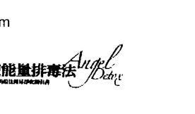

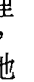


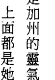

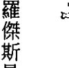

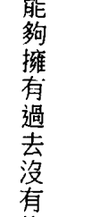

## 第7章 七天淨化計劃

一年之前，尼可拉斯可能會被診斷為妥瑞氏症（Tourette's Syndrome）。目前這些病症並沒有治療的方法，這種病的未來預測通常令人感傷。但現在，尼可拉斯已沒有任何抽搐現象了，他健康地成長，變成一個人人稱奇的男孩！他的前途無可限量。

加工的垃圾食物幾乎是麗莎·華特森的主食。她吃大量的鹽、糖、咖啡因和加工食品，身體不好也就不足為奇了。她常有腸燥症、頭痛、腹脹、疼痛和疲憊的情況，而這只是其中的一部分而已。

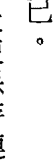

麗莎一直都和天使保持連結，但在一個聖誕節，收到我（朵琳）的書《天使療癒手冊》之前，她並不知道她可以在淨化這件事上請求協助。為什麼沒有想到召請天使協助她改造飲食呢？她一開始這麼做之後，立即感覺到身體的變化，她發現，吃不健康的食物不會給她帶來滿足感，她開始很想吃水果和蔬菜，也受到指引要她開始規律地運動。

現在麗莎擁有更多的能量，人也感覺好極了！

### 排除汽水和清涼飲料

對汽水和清涼飲料，有太多人都嗜之成性，這些飲料裡充滿了人工香料、甜味劑和糖，這些添加物當然不可能改善健康或增加靈性敏感力。事實上，可樂裡的成分會過濾掉身體的礦物質，也會降低有益健康的鈣質和鎂！很明顯地，汽水並非你的朋友！

喝太多的汽水會引發令人害怕的問題，例如，高血壓、高膽固醇、肥胖和排斥胰島素。很多研究者指出，對身體而言，喝大量汽水所承受的壓力和喝酒是一樣的，長時間的濫飲可能導致肝受損，這已足堪憂慮，因為，愈來愈多的孩子都已對這些含糖飲料上了癮。喝這些飲料的當然不只小孩，但天使們很擔心下一代未來的健康問題。

代糖飲料也一樣有害，從自然療法醫生的觀點來看，代糖飲料中的人工甜味劑會產生很多問題。人工甜味劑讓身體相信有大量糖分湧入，但是，當身體試圖中和糖分時，卻沒有發生效果，因此，身體會變得很緊張，努力想要知道到底發生了什麼事。身體會持續製造一些物質想要降低血糖，但是，頭腦一直保留的訊息仍然是「糖分太高了」，這個現象會持續數個小時，直到人工甜味劑離開身體為止。

很多人選擇喝代糖飲料做為減肥的方法，但研究指出，人工甜味劑會耽誤減重，所以，你認為對你有益的事，可能反而會在事情的過程中造成阻礙。

低糖汽水裡的人工甜味劑被稱為阿斯巴甜，另有市售品牌名稱叫做怡口（Equal）或努特拉代糖（NutraSweet），這類人工甜味劑不應該合法，其中包含了有害物質，會分解成毒性很高的甲醇，再進一步分解成甲酸和甲醛，這些化學物會對神經造成影響。也有研究顯示，它會導致偏頭痛、緊張，甚至突發疾病的發作。在老鼠身上做的實驗顯示，阿斯巴甜和先天性出生異常有關。

此外，汽水通常裝在鋁罐中，這個危險的金屬會釋出並進入飲料當中。假如汽水是塑膠瓶裝的，塑膠瓶很可能含雙酚A，而雙酚A則是多數塑膠製品中都會用到的化學物，會干擾荷爾蒙。

這些飲料會妨礙你聽到天使們給予的指引，並且傷害你的超感官聽力。總括來說，汽水會使得你和高頻世界間無法有清楚的溝通。

天使們已明白告訴我們，汽水會傷害周身的能量場。汽水看起來像酸性物小泡泡，會溶化能量場保護罩，喝了汽水之後，能量場就會變得較弱，更容易遭到超自然力量的侵害。能量場是神賦予的禮物，可以讓你留在保護罩裡，避免受到低頻能量的干擾。能量場是抵禦負面能量的最前線，假如這一層保護變得薄弱，負面能量就比較容易趁虛而入，產生疲憊、憤怒、煩躁和情緒起伏的現象。當小孩子們被貼上注意力不足或過動症的標籤時，你可以在這方面觀察他們，假如不再喝汽水，孩子們便可以避開環境周圍的低頻能量。

### 果汁：健康飲料

天然的飲料是很好的汽水代用品。你可能會發現，若想真正享受天然的飲料，需要一或兩個禮拜的時間，因為你可憐的味蕾已經因為長期接觸不良化學物而遭破壞。一段時間之後，嘴巴會以恢復到從前的好味覺來回報你。選擇飲用有機水果和蔬菜做成的新鮮果汁，將會是健康的一大福音。

天使們提出警告說，這些孩子們將來年老時可能會骨頭無力，大家都知道汽水裡的酸性物會破壞琺瑯質，有一個這樣的說法：酸性物對牙齒造成的傷害比單吃甜食更大，酸性物使糖類滲入牙齒更深的地方。

看到那麼多小孩喝著大量的汽水，真令人感到憂心。天使們向我們保證，這種飲料會破壞身體的保護罩，而汽水裡的酸性物會把骨頭所需的鈣質過濾掉，以致骨頭變得脆弱，造成骨質疏鬆那樣的問題。

對身體來說，汽水是酸性的，意即有類似酸的效果，天使們向我們保證，這種飲料會破壞身體的保護罩，而汽水裡的酸性物會把骨頭所需的鈣質過濾掉，以致骨頭變得脆弱，造成骨質疏鬆那樣的問題。

是否定的，祂們的說明是，好品質的碳酸礦泉水是沒有問題的（雖然有些廠牌含有過多的鈉，會導致脹氣）。

我們問道，是否所有的碳酸飲料都會在身體和能量場上造成這些問題，天使們的答案是，量，而且，很快地，這些不再受到汽水影響的小孩專注力會開始逐漸變佳。

享受果汁的方式有很多种，用自己的榨汁机做是最好的方法，可以根据自己偏好的口味为自己做出独家果汁，可以买到的榨汁机有这几种：离心式、螺旋钻式，以及混合搅拌式的榨汁机。 离心式榨汁机是最普遍的一种。一个快速转动的部分有磨碎的功用，可以很快去掉水果和蔬菜，让汁流出来。这种榨汁机产生大量的「废物」（这些都是有益的纤维，里面都是营养），少量的果汁，这种榨汁机往往是最便宜的。 螺旋钻式榨汁机也被称为磨碎式榨汁机，有一个或多個慢转的组件可以把水果蔬菜中的汁液榨出来。这种榨汁机能榨出更多的汁，并且让你可以享用到像小麦草和其他绿色叶菜打出来的汁液，这种机器往往比较容易清理，因为废物较少。 第三种榨汁法是我们最喜欢的——混合搅拌式。这种搅拌机可以让你享受到新鲜、完整的蔬菜水果——没有浪费任何部分，而且食物中所含的纤维和营养全部都可以受用。买榨汁机时，自己要先做些研究，你会发现，多付一些钱所得到的品质也会好一些。（我（朵琳）用维他美仕果汁机已经好几年了，把整棵植物做成饮料或正餐，不像传统的榨汁机一样得把纤维丢弃。 使用果汁机时，可以把有机水果，例如，芒果、葡萄柚、苹果与红萝卜、菠菜、绿花椰菜混合，加一点冰块和水，就能拥有一杯既新鲜又健康的饮料，你的身体一定会非常赞赏这杯饮料，相较之下，汽水拥有的，就只是一种刺激性的有害能量。

尝试一下这些有机果汁：

- 羽衣甘蓝
- 甜菜
- 凤梨
- 芒果
- 葡萄柚
- 西瓜
- 红萝卜
- 苹果
- 菠菜
- 杏仁（未经辐射处理的）
- 香蕉

除了果菜汁，你也可以在开水中加入一片柠檬或莱姆，这会使喝水成为比较有趣、更开心的事。你还可以加入一点点新鲜果汁来增加味道。

## 排除汽水的疗愈法

#### 祈祷

亲爱的神与天使，请在我前往更健康的道路上支持我。我现在愿意不再喝汽水。我能够了解祢的讯息，也希望遵循祢的指引。我希望能够听见、看见、感觉到，也知道我周围都有祢的神圣临在。我知道这一切只有在我排除这些不健康、加工的食物之后才会发生。我祈求祢帮助我放弃汽水以及和它有关的所有口腹欲求。愿我的健康立即改善，我的能量得到修复。感谢祢！

### 大天使麦克的灵性咀嚼法

汽水会削弱你的能量场，负面能量因而得以进入，这些低频振动往往会让瘾症持续不断。和麦克合作，清除身上的负面物（见第一章）。在同一时间里，你将会放下对汽水的需求。

## 排除汽水的七天计划

对于这一章里的每一种净化法，我们都会提出一个七天计划。天使们请你以此做为一个开端，然后，让直觉引领你，根据情况再做调整。在这七天结束后，他们要你顺着自己的净化之路继续前行，召请天使们，询问在哪里可以找到见识广博者，为我们提供进一步的指引和支持。

### 第一天

- 在这一天的开始，用心地做「排除汽水」的祈祷，并在一天之中不断重复，特别是用餐时间。当你去到以前常常喝汽水的地方时，召请天使帮忙，成功的关键在于，记得祈求他们的神圣指引。
- 好好享用一碗有机燕麦，例如，什锦燕麦片或燕麦粥。这些复合式碳水化合物会让你维持更久的饱足感，而不会有抓瓶汽水来提神的冲动。
- 把家中所有的汽水都丢弃，去除诱惑之后成效就会大增。浪费食物并不值得鼓励，但是把有害的「食物」拿去送人也完全不符合赠送的精神。
- 除了新鲜水果之外，可以购买天然有机的果菜汁。
- 睡前再做「排除汽水」的祈祷。

### 第二天

- 在这一天的开始，用心地做「排除汽水」的祈祷。假如你很想喝汽水，可以拿有机的杏仁当做点心。
- 用有机果菜汁和柑橘类水果为你喝的水增加味道。
- 今天要密切留意你的感觉和情绪，小我可能会耍点小伎俩要你喝汽水。召请你的天使给你力量和支持，把汽水逐出你的生活。
- 在冥想时，召请大天使麦克一起进行他的灵性吸尘法，并持续做到最后一天。也请麦克帮你的冰箱和你喝汽水的地方做吸尘清理，这会清除陈旧的能量，加强你的动力。
- 睡前再做「排除汽水」的祈祷。

### 第三天

在这一天的开始，用心地做「排除汽水」的祈祷。

今天开始喝金盏花的花草茶，这能修复能量场，加强心灵防护罩。汽水已经破坏了你的能量场，所以，现在是开始疗愈能量场的好时机。

今天要多注意蛋白质的摄取，好好享用豆类、扁豆和含有黄豆蛋白质的食物。这些增加的蛋白质可以稳定血糖。可以考虑喝一杯用黄豆或青豆蛋白质做成的蛋白质奶昔，避免能量再下降。

睡前再做「排除汽水」的祈祷。

### 第四天

在这一天的开始，用心地做「排除汽水」的祈祷。

已进行这么多天了，可以犒赏自己一下。最困难的部分已经过去，从此之后就更简单了。你可以做自己的汽泡饮料：用新鲜水果泥、浆果，加泡沫矿泉水混合。

睡前再做「排除汽水」的祈祷。

### 第五天

- 在这一天的开始，用心地做「排除汽水」的祈祷。
- 今天要找时间和大天使麦克再做一次吸尘。你现在对能量和聆听天使们的指引已经变得更敏锐，透过吸尘，可以保持这个心灵管道的畅通。
- 好好享受现榨果汁，打健康有机的绿色蔬果汁，例如，菠菜加新鲜苹果、红萝卜和姜汁。
- 睡前再做「排除汽水」的祈祷。

### 第六天

- 在这一天的开始，用心地做「排除汽水」的祈祷。
- 今天你要忙着烹饪，选择需要花多一点时间准备的餐点，在烹煮的每一个步骤里，都要给予时间与爱，这样你才会珍惜最后的成果。你的味蕾会开始疗愈，给你更敏锐的味觉，今天吃东西时，要用心觉察食物的味道和口感，和上个礼拜一定有很大的不同。
- 睡前再做「排除汽水」的祈祷。

### 第七天

- 在这一天的开始，用心地说出「排除汽水」的祈祷。
- 和爱你的、支持你的朋友在一起，假如你刚好要外出午餐，选择香草植物茶或水做为饮料。在生活中要禁喝汽水，坚持这个决定是很重要的，天使们现在正在支持你，也支持你一整个礼拜了。
- 运用大天使麦克的灵性吸尘法排除今天积存的一些能量。
- 睡前再做「排除汽水」的祈祷。

恭喜！你已经一整个礼拜没喝汽水了！味觉改进了，能量场增强了，省下了买汽水的钱，并且可以再度听见天使的讯息。

## 戒酒

看看洗手液和医院等级的消毒剂，最主要的成分是什么？酒精或乙醇。酒精是一种毒药！杀细菌和病菌都有很好的功效，细菌们一碰到酒精就无法活命，而这种情形也同样发生在人类的细胞上。身体是由无数个细胞所组成的，其中每一个细胞都是敏锐且必要的存在，假如身体不需要细胞，就不会制造出细胞（唯一的例外是癌细胞）。酒精会损伤和杀死重要细胞，关于这一点，还有一个恐怖的事实，就是酒精能越过血和脑之间的屏障，体内多数的药物和化学物被引导至肝脏，在那里经过新陈代谢和处理的过程，才不致给身体造成更大的伤害，酒精则能跳过这个程序，直接进到脑部 —— 而在脑部，精细的神经暴露出来，这些神经都很脆弱。 酒精会削弱你的能量场，负面能量因而有机会进入，不请自来的灵体也更容易依附到你身上。假如你因为喝酒而昏迷，这些灵体会给你制造健康上的问题和痛苦。酒精是一种毒药，而你的能量场也一样受到这个毒药的影响，比起以前，能量场看起来比较薄，也较不稳定。 你身上。假如你因为喝酒而昏迷，这些灵体会给你制造健康上的问题和痛苦。酒精是一种毒药，而你的能量场也一样受到这个毒药的影响，比起以前，能量场看起来比较薄，也较不稳定。 的酒鬼灵魂。他们会经由你已经被削弱的能量场而依附在你身上，透过你来满足他们的瘾欲，因此，你会注意到自己更常想喝酒，也想把酒变成每个社交活动的一部分。其他可以显示出这种问题的迹象，还包括了变得笨拙、掉东西、撞到墙壁，假如你认为你有被灵体依附的问题，和大天使麦克一起做灵性吸尘，他会把较低频的存有送到光里。 我们的祈祷是要用光照亮瘾症，并帮你疗愈。我们所有的人愈是「头脑清醒（不是酒醉的状态）」，这个世界看起来愈光亮。我们不是要让你难受，目的是要指出可能发生的事，也提供一些克服瘾症的方法给你。假如你确有喝酒，让有爱心的人围绕在你的身旁。你被削弱的能量场失去了力量，因为其他（灵体）的负面能量依附在你身上，你可能会有些情绪，例如，愤怒、恐惧、焦虑、沮丧，或是愤恨。很显然地，俱乐部、酒馆和酒吧都不是好地方，里面充满了低频能量和留滞地球的灵体，他们都还尝试着想持续那些上瘾的行为。很多人都把喝酒和社交活动联想在一起。毕竟，大家都玩得很高兴时，你不会想当那个唯一不喝酒的人，可是，当你的能量很高的时候，并不一定要喝酒才能开心，可以用「伪鸡尾酒」取代酒，照样跟他们在一起。在我（罗伯）十八岁的生日派对上，我喝的是不含酒精的伪鸡尾酒，我的朋友和来宾看我玩得很开心，以为我喝醉了，我不知道该不该跟他们承认自己完全没醉，而且还能玩乐如常。你可以做泡沫矿泉水和新鲜有机果汁的混合液，试着享受果汁气泡水的滋味。把红葡萄柚、西瓜，或奇异果混在一起试试看。或把一些新鲜的覆盆子、树莓、黑莓、蓝莓，或草莓压碎放在一个杯子里，再淋上泡沫矿泉水。或者，也可以用冰块和新鲜水果（例如，芒果和桃子）打成冰沙，开心地享用健康、天然的饮料，天然饮料可以保持能量场的完整，并维持能量品质。

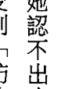

假如你觉得自己很难控制喝酒行为，请寻求你需要的帮助和支持，你的天使可能已经在催促你去寻求协助了，这就是给你的确认。你可以找当地的匿名戒酒协会的聚会，或者上网站 www.aa.org，找离你最近的十二步骤（戒酒法）活动。

二〇〇七年一月二日，一位名叫苏·欧寇萨瑞克的女士醒来时，因为戒酒反应而全身发抖。她身在一栋她认不出来的房子里，和一个不认识的男人在一起，她有四个小孩，但都因为她的行径而受到「防止受虐」机构的命令保护，而她当时也成了无家的游民。

响。她病了，也对生活感到厌倦，她想到自杀，但又担心这种事不知会对孩子产生何种影响。六岁时，她的母亲自杀，那种痛苦难以忘怀。

她跪了下来，祈求神的帮助——她愿意用任何的方式来接受。她所有的财物就只有一个行李袋，里面仅有两条运动裤，因为她的先生被她酗酒和其他行为惹恼，一怒之下把她的衣物都扔了。

她必须离开这个男人的房子，却无处可去，外面下着雨，天又冷，所以她走进了一家酒吧。她曾经发誓不再踏进这一家酒吧，因为里面全都是老男人，然而，她还是走进去了。

了，在一个人的旁边坐了下来，那个人看起来好像有点面熟，好像是从前酒吧里的旧识。
她身无分文，于是请这个男人帮她买酒，他也答应了。
这个陌生人问起了那个行李袋。她解释说，那是她所有的家当了，而且自己还是个游民，那个人问她为什么不打电话给父母，她告诉他，母亲在她六岁身亡，而她已经十几年没跟父亲说过话了。苏和那位陌生人聊了几个小时，接着，奇迹似地——她的祈求得到了回应——她的父亲就在那一刻走进了酒吧！他们恢复了过去的关系，他请苏跟他同住，也承诺要好好照顾她，父亲把她送进了勒戒所，之后，她就滴酒不沾。
苏身边的那个人是她父亲的一位老朋友，听完她的故事后，他立刻打电话给住在一小时车程之外的苏的父亲。那个人在那一天之前从未去过那个酒吧，但因为某种原因，他被指引到那个地方去帮助苏。苏现在知道，除了父亲，神、母亲以及天使们都在看顾着她。她现在很高兴地过着无酒以及孩子都在身边的日子。

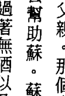

一个晚上，她喝了太多酒，回家时感到头晕，胃绞痛，并且觉得想吐。忍耐了三个小时之后，她召请神，并祈求帮她除去身上所有的酒精，她感觉到一股很强的能量从头顶进入，再到胃部，也感觉到这个能量把身体内所有的毒素都聚集在一起。突然间，她觉得有一股能量冲向嘴巴，身上的酒精都排掉了，如释重负之后，她唯一的选择就是不再沾酒，除此别无它途。那个晚上之后，A.H.戒了酒，再也没看过酒一眼。她在需要时会召请神，神也会把疗愈处方送给她。
后，忍不住哭了起来，她知道没有人可以帮她。
布兰达·潘宁顿在四十四岁经过痛苦的离婚之后，不知不觉染上了酒瘾。在那之前，她从未碰过酒，但当时，她选择用酒遮掩自己的痛苦和受创之感，她需要协助，而天使也伸出了援手。
布兰达搬到加州，在那里遇到一个天使疗法的从业者。她开始参加这位女士每个月一次的聚会，学会了如何疗愈自己的情绪，这是敏感的时期，但她知道，为了得到真正的疗愈，就必须面对自己的感觉。在这个过程中，布兰达意识到必须戒酒，她祈求协助，请求

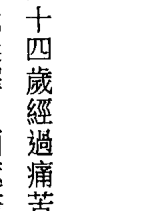

天使把强烈的喝酒欲望除去。

戒酒初期，布兰达收到的指引是叫她夏天睡在室外的星空下，沐浴在星星的疗愈之光中，这样做触及了她灵魂的极深之处，给她力量放下酒和其他旧的瘾症，这真是奇迹！不只这样，她还拿到七千美元的奖学金，让她去学习有兴趣的疗法！现在的布兰达生气蓬勃，身体健康，快乐生活着，同时也和他人分享她的疗愈过程。

## 有助戒酒的疗愈方法

#### 祈祷

亲爱的神与天使，此刻，请祢帮助我，我需要祢的指引和支持。请帮忙我戒除酒类。
我想在生活中完全排除酒以及所有的负面影响。我可以看到酒在我和我所爱的人的生活中所造成的影响。拜托祢，请去除所有我对酒的渴望以及这期间所有的诱惑。透过这样的过程，我将学习爱自己。在一个无条件爱自己的地方，我知道我将从中得到疗愈。
谢谢祢。

### 精油

薰衣草精油可使头脑镇定、使第三眼清明、使神经系统放松，并提升你的精神。用芳香疗法中所用的香薰炉让精油的香气弥漫全家各处，也可以在枕头上滴一滴精油帮助睡眠。

薰衣草让头脑有时间否决对酒的需求。假如有人告诉你酒精可以让你镇静，倒不如用薰衣草精油来达到相同的功效，薰衣草的净化能量会消除负面影响，也可以清理环境，而使低频能量的人从你的社交圈里消失。

玫瑰精油可以鼓舞自我之爱。用一滴精油涂抹在心脏处的周围，感觉这个能量穿透你的灵魂。假如你爱自己，便不会做出伤害自己的事，你的高我知道，酒会使你没有价值感，会招致你感觉没有目标和懒散。玫瑰能量给你一个抚慰的拥抱，让你知道一切都不用担心，消除你一向加诸于己的评断，并让你把焦点集中在正向结果上。

### 大天使拉斐尔的消除瘾症

召请大天使拉斐尔去除你对酒的需求。很多人都说，他们做了祈祷（见第一章）之后，马上就戒了酒。对拉斐尔要诚实和真诚，允许他帮助你。

## 薊草（聖瑪莉薊草）

乳薊可以治療並保護肝臟，還能提供營養以修護酒精所造成的傷害。不要使用含酒精成分的乳薊酊劑和萃取液，而要用甘油劑、藥片或膠囊。甘油劑是以酒精為基礎的藥草植物萃取液，用甘油來防腐，而且味甜，對有酒癮的人來說，這是一個很好的變通法，因為不含酒精。假如你被指引使用更多或較少的乳薊，在劑量的考量上，就能有更多的彈性。使用藥片和膠囊簡單又方便，是另一種很好的選擇，多數的藥片都包含著該種藥草植物的濃縮萃取物，比你能喝下的藥草液更多。除了醫療保健專家給你的建議之外，還要遵循天使們的指引。

## 維他命B12

常常喝酒的人體內維他命B12的量幾乎都很低，酒精會降低維他命的吸收，可以考慮使用維他命B12補充品重新平衡這個重要的維他命。多數的維他命B12補充品都是舌下吸收，常被做成可溶性的藥片或噴液。研究結果顯示，和注射方式比較起來，B12在舌下的吸收力比較好。專注於思考的過程中，你需要B12，缺乏這種維他命時，很難產生快樂和慈悲的想法。當你掉入黑暗面時，酒是很難阻擋的誘惑，所以，要用 B12 提高你的精神和能量。但是，服用時也要同時服用均衡的綜合B群、多種維他命。單獨使用某一種維他命B可能會造成營養（維他命）不均的問題。身體裡有四百個以上的反應作用需要依賴鋅。除了皮膚、免疫系統、生殖系統和消化系統，和神經系統也有很密切的相關性，各種新陳代謝的反應作用都需要鋅，假如鋅不夠，這些反應就不會產生。在戒酒的時候，使用鋅可以打斷癮症的循環、療癒神經系統、調節來自頭腦的訊息、降低癮症，並平衡你的情緒。

## 第7章 七天净化計畫

## 戒酒的七天计划

### 第一天

在这一天的开始，带着衷心的意图做「戒酒」的祈祷。一天之内任何时候，当你觉得需要更多的指引和支持时，可以再做这个祈祷。

- 丢弃所有的酒。你可以丢到垃圾桶，但是假如你把酒倒掉，在酒从水管流走时眼看着它消失，感觉到过去的影响也离你而去，这将会是一种很有力的释放。

- 召请大天使拉麦尔，跟他一起排除瘾症，断除对酒的依附，从现在开始，直到永远。

- 向有爱心的人求援，在净化过程中身边有支持团队是很重要的。你可能会感觉到被指引去参加匿名戒酒协会的活动，或者向好朋友私下吐露心声。在复原的过程中，这是很有必要的，请记得，在有必要时，寻求协助和打电话给朋友是一种很好的做法。

- 睡前再做「戒酒」的祈祷。

### 第二天

- 在这一天的开始，带着衷心的意图做「戒酒」的祈祷。

- 和大天使麥可一起吸塵，掃除所有被酒吸引而來的低頻能量或存有（Entity）。同時，也請祂把妳以前常去喝酒的地方吸塵清理乾淨。在家中放一束白玫瑰花，淨化不請自來的靈體和有負面物質的地方。

- 讓家裡彌漫薰衣草精油的香味，帶來和平與寧靜，晚間這麼做最好，能讓你更放鬆，睡覺時可以得到更好的休息。很多人喝酒的目的是，想從一天的勞累中鬆弛下來，讓薰衣草就這個需求發揮功效，帶走心的牽掛和煩憂。

- 睡前再做「戒酒」的祈禱。

- 在這一天的開始，帶著傷心的意圖做「戒酒」的祈禱。

- 考慮開始吃鋅的補充品。假如沒有其他健康考量或正在服用其他藥物，你的目標是每天五十到六十毫克的鋅。服用的時間要和其他營養補給品錯開，避免相互作用而導致無法全部吸收，最理想的時間是在晚上吃過飯之後。

- 隨身攜帶赤鐵礦水晶（hematite crystal）幫助你戒酒，任何你覺得心情低落的時候，把赤鐵礦握在手中，感覺四周的支持與愛。提醒自己，尋求協助不是什麼不好的事，邀請天使們參與這個過程中的每一步驟。

### 第三天

- 睡前再做「戒酒」的祈禱。

- 在这一天的开始，带着衷心的意图做「戒酒」的祈祷。

- 滴一两滴玫瑰精油在手掌上，搓完后，带着爱心把两掌放在前胸，把香气吸入，感觉到你的心打开了。深知自己值得拥有爱，且你可以释放过往的痛苦、内咎、负面性。

- 在家裡放鸢尾花，可以净化你，并清除瘾症的能量。假如找不到新鲜的鸢尾花，从网上把图片印出来，花的影像所包含的能量强度也是一样的。

- 睡前再做「戒酒」的祈祷。

### 第四天

- 在这一天的开始，带着衷心的意图做「戒酒」的祈祷。

- 今天开始吃维他命B12。假如你没有服用其他药品，也没有其他健康上的问题，就可以服用一千微克（一千微克等于一毫克）的B12剂量，一定要让B12和其他的维他命B 之间取得平衡，除了B12之外，一定要吃一个综合维他命B、或综合多种维他命的营养补给品，才能保证所有的B彼此之间都维持一个适当的比例。在戒酒时，维他命B12可以帮助你拥有更正向的思考。

- 睡前再做「戒酒」的祈禱。

### 第五天

- 在這一天的開始，帶著傷心的意圖做「戒酒」的祈禱。
- 設計一個規律運動的計畫，並持續執行。最重要的是讓身體流汗，這樣才能把堆積在體內的舊毒物排掉，找個朋友跟你一起做運動保健，你會得到更多的助力。
- 睡前再做「戒酒」的祈禱。

### 第六天

- 在這一天的開始，帶著傷心的意圖做「戒酒」的祈禱。
- 現在是開始做肝臟療癒的時候了，每天吃乳薊，至少三個月。服用藥片或液狀甘油劑，照著服藥方法吃藥片，或用二十五滴甘油劑加些水，每天吃三次。乳薊以溫和的方式清理肝臟，協助肝臟發揮最大的功能，假如你正在吃其他藥物，或有其他健康上的問題，使用之前，請跟醫療人員討論。
- 睡前再做「戒酒」的祈禱。

## 排除小麦和麦麸

你已經整整一個禮拜不需要酒了，利用這個機會審視一下，在這個淨化過程中你有什麼進步，帶著這些進展跟你一起，繼續過著沒有酒精的生活。

小麥是一種被過度使用的穀物，幾乎每一樣加工的食品都離不開它。小麥是麵粉的原料，而麵粉常常被用來做為黏稠劑和包裝食物的分散劑。在洋芋片中，被用來做調味之用，動物製品中也會用到，例如，在香腸中被用來把肉黏合在一起，小麥同時也能增加最後成品的量。這些過度使用的情形真的太普遍了。任何東西吃太多或吃的次數太多，身體會產生發炎的現象，如第二章所述，輪流吃不同的食物對我們最好。也就是說，我們吃了某樣食物之後，幾天內都不要再吃相同的東西，那樣才能完全消化，並好好地吸收營養，身體將會感謝你，給你的回報會是更高的能量和更多的活力。小麥裡最主要的成分是麥麩，天使們把麥麩比喻為「膠水」，他們說麥麩會使身體的細胞黏在一起，導致身體必須比平常更賣力工作。麥麩也像黏膠黏著第三眼的內部，阻礙你使用灵视力获悉洞见。

在大麦和裸麦里也有麸质，很多难以耐受麸质的人对燕麦也一样无法承受，燕麦里的确有麸质，但和小麦、裸麦与大麦的不同。处理其他谷物的场所通常也做燕麦的加工品，燕麦会被一些额外的麸质污染。想知道你对燕麦和麸质的接受度，只能由你自己透过不断的测试去分辨，请关注身体的反应，并遵循天使给你的指引，你也许可以安然享用麦片粥和什锦麦片，但也有可必需避开所有包含麸质的食品。

很多人都不知道他们无法耐受麸质，天使可能一直在催促你远离面包、蛋糕和面食类，但你可能以为这是为了避免过多的碳水化合物，或为了减轻体重。但是，更大的可能性，以及你一直直接到这个指引的原因是，你宝贵的身体很难处理麸质。

医生或自然疗法医师都可以帮你做血液测验找出这种不耐性，但这些测验有时候很昂贵。假如食用麸质让你感到不舒服，避开它，用一个月的时间完全把麸质从饮食中去除，然后，联系你的高我，并注意产生什么不同，你将能更清楚地听见天使们的讯息，也会发现能量的品质已经提升。对过量的碳水化合物的渴求也会消失，若胃或消化上有问题，这些问题很可能都会获得解决。

若想更清楚了解，你可以自己做实验，停吃麸质或小麦四个礼拜之后，再回头吃一个礼拜，看看身体及精神上所发生的改变。很多人遇到的情况是消化失调、胀气、头脑变得混沌，也變得更難專心 —— 因為麥麸阻礙了頭腦運作，與天使間的連結開始蒙上陰影，這時你就一定知道，絕對不要再碰麥麸了。

小麥裡一個較少為人知的化合物是麥膠蛋白，也有很多人會對它產生不良反應。麥膠蛋白是一種醣蛋白，存在於麥麸和其他含有麥麸的穀物裡，它被認為和幾種免疫反應有關。義大利全國癌症協會在2012年曾安排了一個詳細的研究，發現麥膠蛋白引起了負面的免疫反應，而且是在一到達小腸就馬上產生。澳洲小麥的麥膠蛋白含量很高，是很多烘焙者很愛用的品種，用了澳洲小麥能產生人們喜愛的那種輕滑、鬆軟的口感，但這卻也可能在體內造成免疫反應。

所以，我們要吃麥膠蛋白含量少的穀物，也要常變換所吃的穀物種類。假如一定要吃小麥，選擇從義大利進口的產品，製造義大利麵食的粗粒小麥粉是一種較硬的小麥，麥膠蛋白含量很少，比較不容易引起身體不適。另外，也有一個安全的代替品——米製品，不含小麥和麥麩，但味道幾乎一樣。

有很多好吃的小麥替代品，例如：

- 杏仁果粉（Almond Meal）
- 粗磨玉米粉（Cornmeal）：一定要有機的，避免基因改造食品。
- 椰子粉（Coconut Flour）
- 米穀粉（Rice Flour）：一定要有机的，避免基因改造食品。
- 鹰嘴豆粉（Besan, Ogram Flour）
- 亚麻仁籽粉（Flaxseed Meal）：一定要有机的，避免基因改造食品。

小麦还可能隐藏在调味料中，例如，酱油。有一个味道不错又不含麸质的类似替代品——玉利酱油（Tamari），吃起来几乎一模一样，但不会产生负面的免疫反应。

有一位名为洁西卡·安·派克的女士，在2002年发现了净化的功效，学到了断除饮食中不健康的食品和物质。然而，一直到2007年，她才知道她对麦麸会产生耐受不良的反应。

在净化的过程中，洁西卡感觉到平静和安详，之后，当她再度食用这些食物时，她发现到，情绪上产生了重大的改变，最大的反应是跟麦麸与小麦有关。洁西卡只要稍微碰一点任何麦麸食品，心理上就会有强烈的反应，例如，焦虑、沮丧、迷惑与愤怒，这些症状在她排除麥麩之後就會消失。但假如她不小心再吃到任何麥麩，又立刻會有大幅的心情起伏，變得很情緒化。

她現在已完全不吃麥麩了，也變得比較纖瘦和健康。她的臉看起來比較清朗，也不像以前那麼腫了，最棒的是，她不再顯得很疲倦了。

潔西卡在排除麥麩之後，看到自己的直覺力明顯提升了。她也注意到自己的心靈能力提高了，也更有同理心，她現在更能集中精神，專注力更佳。飲食中沒有麥麩，使她整體上變得更平靜，可以聽見天使的聲音。

天使們樂於助你把飲食中的小麥、麥麩和麥膠蛋白加以排除，信任你的高我和內在的指引，放棄這些東西對你最有利嗎？假如是，這就是你必須的「天使能量排毒法」的一部分。

### 排除小麥和麥麩的療癒法

#### 祈請大天拉斐爾的冥想

祈禱
親愛的神和天使，請祢把我能量場裡的黏膠拿走。我明白小麥和麥麩正影響著我的各種能力。此刻，我願意放下含有小麥的各種食品。現在，我選擇放下麥麩。請療癒我的身體和能量。感謝祢們帶給我的療癒。

天使拉斐爾：
找一個安靜的地方坐下來，透過平靜的呼吸讓自己完全置心一處。在緩慢深沉的呼吸中，深知冥想的目的是想要聽見身體的聲音，你要願意聽取這個敏銳的殿堂想傳達給你的訊息。當你準備就緒時，問你的身體：「假如我不再吃小麥和麥麩，對我有好處嗎？」靜靜坐著等待身體的回應，這個回應可能是個想法、感覺、意象，或聲音，信任這個回覆，接著再問身體：「放棄小麥和麥麩之後，對我有什麼好處？」靜聽回應，利用這個時間詢問你和小麥與麥麩之間的關係。現在，召請慈悲的療癒大天使拉斐爾：

親愛的大天使拉斐爾，請幫助我把小麥和麥麩從我的飲食中排除。請引導我排除這些食物，不再對它有渴求，不再退縮。請提醒我先問某些食物裡是否含有麥麩，檢查包裝上的標示看是否有小麥成分。大天使拉斐爾，現在，請用翡翠綠色的光包圍我的身體，化除我對這些物質的依賴。

觀想小麥、麵粉、麵包、蛋糕和其他包含麥麩的食物正被拉斐爾的愛之光抹去的情形。當療癒完成之後，感謝拉斐爾的支持，在你的戒除過程中，他會一直跟你在一起，從今以後也會保護你，幫你免於受到麥麩的不良影響。

## 北美黃蓮

北美黃蓮（Goldenseal, Hydrastis Canadensis）可以修護胃部的內膜。久而久之，它會逐漸強化你的消化系統，並治療腸漏症，當你持續吃身體難以耐受的食物時，腸漏症就會發生，在你吃的時侯，胃部會變得更弱、更薄，這個功能不佳的薄膜會讓毒素再被吸收到你的體內。北美黃蓮會修復這個損害，降低發炎反應。

你可能还会回复到原来的饮食，吃一点身体难以耐受的食物，但身体需要几个月的时间才能再适应。一定要彻底放弃那些食物，并使用北美黄莲，然后，你可以用吃少量的方 式来做测试，信任身体给你的讯息，因为你收到的指引，可能是要你一生都避开麦麸。

## 益生菌

良好的消化功能需要好的肠菌。戒除小麦和麦麸时，需要修复消化系统，麦麸会减缓肠道蠕动，导致肠道容易保留毒素，假如消化系统和健康细菌之间是平衡的，就可以很容易把废物排掉。

即将吃饭前，先吃益生菌，购买时要找需要存放在冰箱里的那类益生菌，效果最好。

还要查看这些产品里所含的好菌是哪一种，产品里面应该包含多种益生菌，而不只有一或两种。做些资讯搜寻，应该可以找到一些益生菌，每个剂量里包含著大约八种不同的菌种。

## 排除小麥和麥麩的七天計畫

### 第一天

在這一天的開始，做「排除小麥和麥麩」的祈禱。一天之中，只要你覺得需要天使給你更多的支持，都可以再做祈禱。

把廚房中所有含有小麥的產品都丟棄，家裡不存放小麥，就不會在無意中吃到。至於其他包含麥麩的產品，問你的高我你是否也要處理掉。對某些人來說，所有的麥麩製品都要立刻丟掉，而對於另外一些人，要從小麥開始，接著可能感覺到有些指引說將來要放棄所有不同形式的麥麩，相信你的感覺，並聽從收到的訊息。

在這天，找一個安靜的地方，敞開心胸和大天使拉斐爾談話，事先做前述的冥想練習，才能對小麥和麥麩對身體所造成的影響有更多的認識。你可以把所收到的資訊寫下來，做為下週的參考。

到當地的健康食品店尋找小麥替代品，相信能找到不含小麥和麥麩、營養豐富的穀物和豆類。

睡前再做「排除小麥和麥麩」的祈禱。

### 第二天

- 在这一天的开始，做「排除小麥和麥麩」的祈禱。
- 麥麩會像黏膠，把身體的細胞黏合在一起，這天一定要喝很多水，好好補充水分，把體內過去累積的毒素和蛋白質沖走。
- 研究一些不含麥麩的食譜和相關的烹飪書，食物中沒有麥麩不代表飲食會變得枯燥無味，每一天都還是可以享受健康美味的食物。請你不吃麥麩的朋友跟你分享他們的食譜，或推薦一些好菜單給你。
- 睡前再做「排除小麥和麥麩」的祈禱。

### 第三天

- 在这一天的开始，做「排除小麥和麥麩」的祈禱。
- 日積月累下來，吃那麼多小麥已經損壞了消化系統，開始吃些益生菌補給品修復腸道。益生菌裡含有好菌，可以維護消化面的健康。
- 好脂肪對於能量和頭腦的功能很重要。在飲食中加進酪梨、椰子油和核桃，可使你保持良好的狀態。
- 睡前再做「排除小麥和麥麩」的祈禱。

### 第四天

- 在這一天的開始，做「排除小麥和麥麩」的祈禱。
- 今天是重新認識靈性天賦最好的時候，用點時間在僻靜之處冥想，認識真正的自我，即使是十五分鐘，都能讓你這一天或未來的前景全都改觀。若能花更多時間冥想，就可以連結到任你取用的宇宙能量，拿來做為療癒之用。
- 與大天使麥可一起使用祂的靈性吸塵法清理你的能量和家裡，這會使周圍的能量更加祥和與平衡。你正處在新的敏感狀態中，所以，應該擁有一個乾淨的環境和身體！
- 喝新鮮的檸檬汁做為啟動消化作用的動力。早晨的第一件事（在吃或喝任何東西之前），擠半顆檸檬，加入一杯溫水裡，以檸檬汁來刺激消化，也讓胃為即將到來的食物做好準備。在排除麥麩時，檸檬的苦味可以化解消化道的不適。睡前再做「排除小麥和麥麩」的祈禱。

### 第五天

- 在這一天的開始，做「排除小麥和麥麩」的祈禱。
- 北美黃蓮可以療癒和修復消化系統內膜，開始服用十滴北美黃蓮酊劑，每天三次。把酊劑加入一小杯水或果汁中，在即將吃飯前喝。假如有其他健康問題或還有其他藥物得吃，請和醫療照護人員先做討論。
- 享用纖維含量豐富的食物（可以幫助洗滌消化系統），例如，綠色蔬菜沙拉和新鮮水果。腸子因為小麥的緣故已經變得行動緩慢和怠惰，現在，該提醒腸道為健康負起該有的責任了。

### 第六天

- 在这一天的开始，做「排除小麦和麸」的祈祷。
- 今天要观察你的能量和感觉，留意变化。你已经在用更清明的眼睛看待这个世界，在这个星球上生活是多美好的事！不论走到哪里都要能看见爱，并祝福遇到的每一个人！
- 蒲公英根茶可以加强肝功能和消化作用。今天要开始喝这种药草茶，确保所有的毒素都离开身体。假如你喜欢，可以用一些蜂蜜或龙舌兰糖浆增加甜味。
- 睡前再做「排除小麦和麸」的祈祷。

### 第七天

- 在這一天的開始，做「排除小麥和麥麩」的祈禱。
- 今天要準備一頓豐盛的扁豆餐，這些蛋白質含量豐富的豆類會帶給你營養和滿足感，含有大量的纖維，可以清掃消化系統、滿足頭腦的需要，以及提升精神。
- 睡前再做「排除小麥和麥麩」的祈禱。

留意你的身心狀況，認可已經看到的那些收穫。繼續樂觀看待未來，擁抱將來更健康的新模樣，這是多麼令人興奮的事！

## 排除乳製品

乳製品會阻塞第三眼，也會在這個脈輪覆上一層薄膜，假如長期吃乳製品，會清楚發現：聽見內在聲音的能力降低了。如你所知，牛奶被用來製作鮮奶油、奶油和起司。起司是牛奶濃縮而成，會很快地阻礙心靈能力。假如你和天使間的連結一直有困難，注意一下起司攝取量，若能夠不再食用起司，直覺力會馬上提高。

身為人類，我們是唯一喝其他動物乳汁的物種，人類身體的設計是處理人奶，而非牛、山羊或綿羊的奶。因此，你可能會因為攝取乳製品而引起一些症狀，包括胃痛和脹氣，然而，最普遍的問題是牛奶會產生黏液，所以，你會不斷清喉嚨、鼻竇疼痛和頭痛，看起來總像是在生病的樣子。不斷流鼻涕的小孩子（大人也一樣）在戒除乳製品之後，情況都改善了。

近年來，特別是美國和加拿大，乳製品都經過基因改良，除非是經過認證的有機食品。北美的乳牛所吃的飼料是基因改良的穀類，有毒的殺蟲劑殘留因而被轉移到乳製食品中。此外，多數以工廠模式畜養的母牛都被注射抗生素和生長荷爾蒙，這也進入了奶類產品裡。

還有，在工廠式的養殖場飼養乳牛的過程中，殘暴的手段使動物受到痛苦和折磨，帶給最後製成品低頻的能量，當我們食用乳製品時，也會吃進這些受虐牛的能量。

有關牧場，最殘酷的事實之一是，乳牛能提供奶的時候，必定是在分泌乳汁之時，意思是說，小牛立刻被迫離開母親，因為牛奶已被賣出，無法依照自然的本意提供給牛寶寶吃。想像一下，假如你的初生寶寶在剛出世不久馬上被帶開，這對於母子雙方有多麼殘酷！更糟的是：公牛寶寶因為不產牛奶，便被放入一種叫做「小牛箱」的狹小擁擠牢籠這種牢籠確保裡面的牛寶寶不會生長肌肉，被殺後能被當成「小牛肉」出售，這也是受到殘忍待遇的公乳牛的另一個名稱。吃小牛肉時獲得的能量被降到了最低程度。粉刺的情況更嚴重。像異位性皮膚炎這種皮膚問題，也和攝取乳製品有關，對食用大量乳製品的人來說，根據法律，牛奶必須經過高溫殺菌，這個過程會殺死裡面所有的細菌或寄生蟲。但很多人都覺得攪拌牛奶的均質化過程才是問題所在，作用是使牛奶完全均勻，不致變成分散的奶油。均質化會損害牛奶中的蛋白質，在身體裡造成發炎現象，雖然，最終你可能會發現，完全放棄牛奶才是最好的辦法，但你仍可以喝沒有經過均質化的牛奶試試看，這種「舊式」牛奶和送到祖母家門口的那種很類似，不像一般的牛奶那樣造成嚴重反應。好品質的優格不像其他各式乳製品一樣，造成身體難以耐受的反應。這也許是因為好菌消化了那些乳糖。假如你收到的指引是戒除乳製品，你或你的孩子都可以斷除這些食品，改吃天然、有機的優格，使用這些代用品幾週試試看。乳製品的代用品有很多種，例如，黃豆製品，但要確定吃的不是基因改造黃豆。你可以食用豆漿、起司、優格，甚至是冰淇淋，杏仁、大麻纖維、燕麥、米和葵瓜籽奶都是很美味的乳製品替代物。事實上，有一種用杏仁奶做成的素食起司新品牌，烹煮時真的會融化！角豆是一種不含乳製品的巧克力替代品，但我們還是要再度強調，注意食物標示，因為有些廠牌的產品裡包含固體乳類品，例如，酪蛋白。

## 第7章 七天淨化計畫

## 自製杏仁奶的做法

自己做堅果奶很簡單！只需要有機生杏仁（或者其他你喜愛的堅果）、水，和果汁機。在碗裡放一杯杏仁，加水到蓋過杏仁的程度，浸泡一晚。第二天早上，把水倒掉，把杏仁放入果汁機，倒入三杯冰礦泉水，可以加一個棗子增加甜味，或放些許肉桂、撒些香草。把果汁機調在高速檔，打到所有東西都沒有顆粒，完全混合在一起。把杏仁奶倒進粗棉布、紗布或其他類型的濾網中過濾。放在冰箱裡，可以保存三或四天。假如你沒有時間，或忘了在前一晚浸泡杏仁，可以做一種速成堅果奶：把有機的生堅果和過濾水放入果汁機裡，以高速打在一起，喜歡的話，也可以加一些有機香草粉。粗濃的堅果奶倒在麥片或穀麥上是很好的搭配，或者也可以把打好的奶用粗棉布過濾（健康食品店和網路商店有一種布料可以把奶中的堅果過濾掉）。相同的方法也可做腰果奶或葵瓜籽奶。

## 用豆泥取代起司

我（朵琳）戒除起司時用的是鷹嘴豆泥（Hummus）來取代。我從一九九六年後就沒吃過起司，一點都不想念它！我把自己透澈清晰的靈視力歸功於放棄起司。豆泥是一種用中東芝麻醬（Tahini）、鷹嘴豆、橄欖油和海鹽做成的塗抹醬。用高馬力果汁機做豆泥很容易，也可以買現成的各種有機豆泥。另外加入喜好的大蒜、紅辣椒、橄欖、香菜、醃泡好的朝鮮薊菜心，或日曬番茄乾。食用豆泥的方法就跟起司一樣。有些店裡現在有賣好吃的有機純素食起司替代物，實際上也會溶化或被烤成褐色。可以在健康食品店買熟食的陳列櫃裡找到，但要確認不含酪蛋白——會引起乳糖不耐症的人產生過敏反應的牛奶蛋白。有酪蛋白存在就表示，不是真正的純素食食品。

## 鈣的攝取

不用擔心鈣的問題。當你不再使用乳製品時，親朋好友會不斷問你有關攝取鈣質的問題。只有吃動物製品的人才需要補充鈣，因為動物製品會汲取體內的礦物質，你可以從其他來源——例如，羽衣甘藍等綠色葉菜——得到足夠的鈣質。假如你收到指引，叫你補充鈣質，你可以這麼做以確保身體得到所需要的養分。芝麻籽的鈣質含量很高，你可以把芝麻籽加在沙拉中，或用於炒菜裡。要吃多少芝麻籽才算足夠？吃中東芝麻醬吧，假如從未食用過這種醬，很像花生醬，不同的只是用芝麻做的，而不是花生。在不含麥麩的吐司片上塗抹芝麻醬，再淋上一些龍舌蘭糖漿，便是好吃又營養的點心。使用中東芝麻醬做為沙拉醬，等於在飲食中加入更多鈣質，也可將它做為基礎材料，做成美味營養的豆泥醬。深綠色葉菜裡也含有大量的鈣，菠菜、羽衣甘藍、西洋菜、芥菜，還有海帶，都是含鈣的食物，綠花椰菜是另一種好吃、含鈣豐富的綠色蔬菜。

## 排除乳製品的療癒方法

> > 祈禱
>
> 親愛的神和天使，請祢們化解覆蓋在我能量場上的乳製品薄膜。
> 我祈求有更強大的明晰，希望我們之間的連結更強大。
>
> 請排除我體內的乳製品以及它所造成的影響。現在，我願意放下乳製品，也請求祢們的協助。請引領我，讓我能夠輕易放手，不再有渴求。請告訴我含鈣豐富的健康食物，我美好的身體才能受到滋養。謝謝祢們。

## 大天使麥達昶的神聖光束

召請大天使麥達昶，你的脈輪會得到平衡，重新調整工作（參看第一章）。這會加強你和造物者的連結，並清除乳製品在能量體內所造成的薄膜和黏液。

## 大天使拉斐爾的消除癌症

拉斐爾很樂意幫你排除所有不同形式的乳製品，慈愛的拉斐爾會握著你的手，陪你前行。

## 祈請大天使拉斐爾的冥想

安靜坐著，慢慢深呼吸，利用這個機會好好聆聽身體的訊息，這個了不起的身體有很多事情要告訴你，用心去聽取。覺得就緒時，問你的身體：『不再使用這些乳製品，對我有好處嗎？』在寧靜中等待答案，訊息會以想法、感覺、意象或聲音的方式出現，相信你所得到的答案。

接下來再問：『放棄這些乳製品之後，對我有什麼好處？』聆聽身體給你的答覆，身體是你最好的占卜工具，因為它知道一切。就你和乳製品之間的關係，你可以再提出其他問題，現在召請尊貴的大天使拉斐爾：

大天使拉斐爾，請幫助我放下所有的乳製品。請指引我排除它，不再對它有渴求，不再退縮。請提醒我要先問某些食物裡是否含有乳製品，檢查包裝上的標示，看是否有奶類成分。大天使拉斐爾，現在，請用祢翠綠色的療癒之光包圍我的身體，化除我對這些食物的依賴關係。

觀想牛奶、起司、奶油和其他包含乳製品的食物正被拉斐爾的愛之光抹去的情形。療癮完成之後，感謝拉斐爾的支持，在你的戒除過程中，祂會一直跟你在一起，從今以後也會保護你免受乳製品的不良影響。

## 排除乳製品的七天計畫

### 第一天

- 早上起床後第一件事，就是做「排除乳製品」祈禱，會對這一天的行事有所助益。
- 把家中所有的乳製品都加以清除，記得要查看包裝食品，成分裡可能含有固體乳製品或起司粉。
- 安靜坐下，與大天使拉斐爾一起冥想。運用前面的冥想練習，以便進一步探知乳製品如何影響你。直接向天使們學習如何戰勝這些產品和其不良影響。
- 如有任何需要時，記得再做一次祈禱。
- 睡前再做「排除乳製品」祈禱。
- 晚上休息之前，在碗裡用水泡一杯生杏仁，浸泡隔夜。

### 第二天

- 早上起床後第一件事，就是做「排除乳製品」祈禱。
- 接著做些杏仁奶！把昨晚浸泡的杏仁完全洗乾淨。把杏仁和三杯水一起放進果汁機裡，可以添加一湯匙的蜂蜜或龍舌蘭糖漿增加甜味（也可以喝無糖杏仁奶），混合材料後，高速打兩、三分鐘，再倒在紗布或不鏽鋼濾網裡過濾殘渣（這些殘渣可做烘焙之用，或也可不過濾，保留纖維）。放在冰箱，在幾天內吃完，這是很美味又營養的牛奶替代品。
- 跟大天使拉斐爾一起做「戒除癮症」練習。拉斐爾非常樂意協助你消除對乳製品的癮症，以及協助你消除那些誘惑和渴求。
- 睡前再做「排除乳製品」祈禱。

### 第三天

- 早上起床後第一件事，就是做「排除乳製品」祈禱。
- 嚴密監管自己的飲食，確保其中包括鈣質含量豐富的食物。用中東芝麻醬做沙拉淋醬和沾醬，蒸綠花椰菜做為午餐和晚餐。假如擔心自己的鈣攝取量，可以考慮服用補給品，但要先靜坐並問你的天使，這麼做是不是個完全正確的決定。
- 睡前再做「排除乳製品」祈禱。

### 第四天

- 早上起床後第一件事，就是做「排除乳製品」祈禱。
- 吃過多的乳製品已經影響了你的能量場，阻礙脈輪運作，召請大天使麥達昶，利用祂的神聖光束把這層薄膜去除。
- 享用豆泥醬。
- 睡前再做「排除乳製品」祈禱。

### 第五天

- 早上起床後第一件事，就是做「排除乳製品」祈禱。
- 螺旋藻的營養豐富完整，也有打開心房和療癒的作用。今天可以從一茶匙開始服用，把它和一杯有機的現榨果汁混在一起，之後再根據收到的指引慢慢增加用量。逐步增加到每天兩到三次，每次一茶匙，然後，再改用大一點的量匙。
- 睡前再做「排除乳製品」祈禱。

### 第六天

- 早上起床後第一件事，就是做「排除乳製品」祈禱。
- 考慮吃一種優良的綜合維他命。假如你一直食用很多乳製品，身體已經很習慣接受鈣、維他命D、維他命A、維他命E。排除乳製品時，身體會自然把你帶向包含很多這類營養的健康食品，用綜合維他命做為補充是個好辦法，可以確保你擁有足夠的營養。
- 睡前再做「排除乳製品」祈禱。

### 第七天

- 早上起床後第一件事，就是做「排除乳製品」祈禱。
- 在家裡放一些紅色或粉紅色玫瑰花，假如無法找到新鮮的花，使用照片的效果也是一樣的。坐在花前，把療癒能量送給所有的乳牛和其他受到殘酷待遇的動物，祈求其他人也能追隨你為榜樣，在尋求鈣質滋養身體的同時，也能選擇用人道的方式。感受到花朵打開你的心，把可能攝取到的一切痛苦都帶走，把乳製品帶來的毒素或低頻能量都釋放出來，讓他們進入光中。
- 睡前再做「排除乳製品」祈禱。

## 排除糖類

你的生活中已不再有乳製品，靈性天賦也在復甦當中。天生的靈性能力現在已變得更清明，要好好加以運用，你已經把限制著靈性之眼的那層薄膜移除了。

天使已經顯示給我們看，糖會在能量場裡形成結晶——糖會在能量保護罩的內層形成白色的小顆粒。

這些糖的結晶會消耗能量，使動力和生命力枯竭，從而阻礙你完成重要的工作，導致延宕。

天使們還說，糖是造成頭痛的原因，糖會把能量從頭部抽走，這是敏銳的光之工作者可以感覺到的。

這種頭痛的問題只有在飲食中把糖排除之後才能解決，在這種情況下，吃止痛藥是無效的，糖所引發的頭痛會因為接觸到陽光而加劇。糖吃得愈多，這些結晶就愈大，反之，在你戒除糖的時候，糖的結晶會縮小，甚至消失。

大天使拉斐爾會協助你加速這個過程。請祂跟你一起做，你可以說：

> > 大天使拉斐爾，請把我能量場裡的糖結晶清洗掉。

觀想拉斐爾在你的能量場上噴灑溫水——糖在溫水裡會溶化。當你的能量場被清理乾淨後，謝謝拉斐爾的幫忙。

糖以很多不同的形式出現，新鮮水果裡的天然糖和纖維之間是均衡的，纖維會減緩糖被吸收到血液裡的速度，進而避免發生「血糖突然升高」的情形，相反地，你的能量可以持久不衰。

攝取精緻的白糖時，突然間獲得很多熱量，身體得趕忙尋找平衡，會分泌化學物和激素來調節糖的濃度，而這個能量的迅速移動很快又造成血糖的暴跌，血糖下降的速度和飆高時一樣快，你的身體為此付出了代價——你會疲倦、喜怒無常、焦躁。

假如你沒有把吃來的熱量燃燒掉，就會變成脂肪細胞留存在體內。因此，假如你長期攝取大量的糖，體重會增加，吃精緻糖也會引發癮症的循環，使你渴望吃更多，在這種循環之下，你永遠都不會感到滿足，只想一直持續下去。

下面這個簡述能幫助你瞭解這個循環，說明在這個癮症的循環裡，糖的攝取和血糖濃度的角色：

一早起來，你吃了一碗甜的麥片，飽了一會，但很快又餓了。身體很快地吸收了糖，給你能量，然後很快地，熱量又完全消失了。你的頭腦認為身體需要更多能量，大腦聽到之後，以為身體需要糖，因此起了飢餓感，你便開始找零食吃。你找了些餅乾和巧克力。

很多人對於吃水果（例如，香蕉）有一些顧慮，因為糖分比其他食物高。但記得，香蕉裡面也含有纖維，身體用不同的方式處理這種糖。除非患有糖尿病，否則你可以享受各種不同種類的美味水果，因為這是滿足你渴望吃甜食時最好的點心。

假如你收到的指引是要你停止吃巧克力，那你可能是一個高度敏銳的人。巧克力工業裡充滿了痛苦的能量，這是一個使用大量奴工的產業，吃巧克力要買那些標示著「公平貿易」——意味著，在製造過程中，所有相關的人都受到公平合理的對待，同時也支薪——的品牌。

我（朵琳）因為患有頭痛，在一九九五年收到指引叫我停止吃巧克力。當我祈求引領的時候，天使們讓我看到巧克力正在降低我的振動頻率，我請求協助，頃刻之間，所有對巧克力的貪愛完全都消失了。那年之後，我沒有再吃過一點巧克力，也再沒有頭痛過了！

已經有幾年了，梅根·艾弗塔絲一直知道自己嗜糖成癮是很不健康的，她有很強烈的願望想要戒糖，卻不知道如何下手。梅根的天使很清楚地讓她知道糖的害處，也警告她有可能罹患糖尿病，內在的聲音告訴她，糖對身體來說完全是一種毒害。過去，她不知道糖對她所造成的影響，現在，她開始看到糖使她消沉，並且讓她處在一種精神迷惘的狀態中，造成情緒不穩，影響她身為人母的行為。糖還帶來更多疼痛，使身體狀況愈來愈差，梅根意識到糖類一直在削弱她的直覺能力，導致她聽不到天使的訊息，這是她最害怕的。天使們鼓勵梅根去參加匿名的暴食者交流團體（Overeaters Anonymous，簡稱OA），幫助她戒除糖類。梅根不斷向大天使麥可和拉斐爾求助，讓他們給她勇氣去參加匿名暴食者交流團體，她很快就聽到訊息 —— 她需要改變生活方式。糖造成的生理反應和酒帶給酗酒者的影響是一樣的，現在，梅根已經準備好要改變了。剛開始，她認為自己永遠無法放棄糖類，後來她敞開心胸，向天使們祈求，請他們把她對糖的渴求消除，讓她可以重新恢復精神清明和健康，回到過去的生活。這些都如願了！天使們讓梅根從糖癮中解脫出來，她開始感覺到平靜祥和，即使在面對糖類可以有所選擇的時候也是如此，她感覺到發炎的情況逐漸好轉，頭腦也更清楚了。大天使麥可持續支持梅根，不斷提醒她糖類可能帶來的影響，她現在可以保持平靜，做出正向、充滿愛的抉擇。

簡恩・包爾以前是一位藥物和酒的諮詢師，她看到糖類對身體的影響，一開始時，她不知道如何戒除。派對或聚會時身邊的人一直鼓勵她吃甜食，小我也說她有足夠的理由可以吃甜點——比方杯子蛋糕，她也聽從了。但她的高我知道糖正給她的身體和精神狀態帶來混亂。

有一天，簡恩意識到自己需要像別人一樣處理糖癮的問題，她在別人戒除藥物與酒的過程中提供了一些處理原則，現在，她也有必要完全遵循那套做法。簡恩記得有一位通靈者曾經告訴她，大天使麥可跟她在一起，簡恩的先生是一位警察，他也認為麥可在身邊，給他支持的力量，因為大天使麥可是保護警察和所有從事服務工作者的聖者。簡恩召請麥可，請他排除她對糖的癖好，她感到有需要立刻戒除的急迫性，於是，簡恩把家中所有含糖的東西都丟掉，生活中也不再接觸糖類。簡恩在先生愛的支持之下，克服了她的癮症，淨化了生活。

來自澳洲布里斯本的克麗絲蒂·布斯羅對於天使有直覺的感受力。她知道自己的身體是敏銳的工具，對某些食物有什麼反應時，一定讓她很清楚知道。克麗絲蒂曾在吃過一小包餅乾後，注意到餅乾所產生的影響——她馬上感到疲倦和焦躁，但因為無聊，她還是繼續吃。她不知道那個加工、高糖的食品會給她帶來什麼後果，因為吃糖的緣故，克麗絲蒂每一天都感覺無精打采、痛苦。然後，她也注意到女兒的行為和她攝取甜食有關，女兒會發大脾氣很難安撫，那時，克麗絲蒂不知道是甜點裡的添加物引發了這種行為。

天使們指示克麗絲蒂不要再吃高糖食品，並且給她正確的方法去做到這點。一夜之間，她放下了所有甜食。直覺上，她知道糖和她敏銳的身體合不來，也因為克麗絲蒂和女兒都不再吃甜食，她們現在正享受著寧靜與和諧的能量。

## 排除糖類的療癒法

### 祈禱

親愛的神和天使，我已經準備好要放棄糖。我知道現在是我放下這類東西最好的時候。我相信祢的指引和愛。我知道祢們會幫助我走過這段歷程，引領我離開誘惑。我請求神聖的祢們在我身邊。甜食無處不在，我需要祢們的支持。讓我永遠堅強和健康。我不想要含糖製品帶來的負面影響，所以，我願意在此時讓它離開我。感謝祢們。

### 以甜食做為獎賞

小孩子常常在表現良好時得到甜食做為獎勵，所以，他們很快就把糖果和愉快連結在一起。研究結果顯示，嬰兒總是選擇含糖飲料，多過其他無味道的飲品。科學家們相信這是本能反應，這也給我們一種能力，使我們在自然環境中挑選成熟的水果。假如你常常渴求糖類，你真正渴望的可能是獎賞！你也許覺得自己總是付出，卻沒有獲得認可或感激。

貪愛糖類也可能是一種象徵，代表你需要更多樂趣。你上次玩樂是什麼時候？假如你能把有趣的嗜好排進工作表中，你可能會發現，你不再那麼想吃糖了，這是一種簡單自然的方法，可以讓你更愉悅、減重、交新朋友（假如你加入好玩的團體或去上有趣的課），甚至開創新事業！

你也可以用稱讚、有趣的出遊、玩具或其他熱量很低的點心獎賞孩子，避免他們嗜糖成癮。

### 天然的甜味劑

你可以使用適量的天然甘甜劑，從能量方面來說，不像白糖那樣給我們帶來危險性，可以試用有機的龍舌蘭糖漿、蜂蜜、生椰子糖漿或甜菊糖，但食用過量仍會導致體重上升。假如胰島素容易起落不定，可以選用生椰子糖漿或冰糖。

使用任何一種甜味劑之前，先跟天使們請教，看是否適合你。安靜坐著，問道：

> 我可以使用天然的甜味劑嗎？比如龍舌蘭、蜂蜜，或甜菊糖？

注意聽答案，身體會收到訊息，會以意象、想法、字眼、或感受的方式出現。信任你所收到的指引，假如你感覺到應該避免這些東西，相信你所收到的訊息。

## 大天使麥可的靈性吸塵法

和大天使麥可一起清理你的身體，吸塵法將會去除較低頻的能量，也使你的情緒保持平衡狀態。不平衡的情緒，肇因於糖類的能量，讓麥可替你把壞情緒去除，找回幸福快樂。他知道排除有害物的過程不一定得是艱難或痛苦的，所以，讓大天使麥可去除你對這些東西的渴求和所帶來的不適，祂會給身體和能量帶來神聖的平衡。

## 大天使拉斐爾的消除癮症

拉斐爾想要幫你去除加工甜食，祂認為那是不天然的製成品，跟新鮮農產品裡的天然糖不一樣。讓拉斐爾把你對糖的需求拿走，並且幫你排除高糖的食物和飲料。

## 大天使拉斐爾的清洗能量場

如本章先前所述，請拉斐爾清理你能量場裡的糖結晶。

鎘可以調節血糖和防止對糖的渴求，提高身體對糖的敏感性，使你再也無法忍受糖。吃甜食的時候會覺得甜得令人受不了，這是一種很好的斷絕甜食方法。為了達到最好的效果，使用的劑量一定要大，鎘有幾種不同的形式：有些比較容易吸收，有些只是短期使用，還有一些是不能大量使用的。最安全的方法是請教自然療法醫師，找出正確的產品和使用的劑量，記得採取新的做法之前，一定要找專家商量。

## 武靴葉（匙羹藤）

武靴葉（Gymnema, Gymnema Sylvestre）在調節血糖這方面的功效特別好，可以調節血糖並消除對糖的嗜好。這種藥草會使味蕾部分的甜味區麻痺，降低身體對糖分的吸收。這種細緻的作用是其他藥草無法提供的，因此，服用武靴葉之後再吃甜食，你不會有滿足感——味道已經改變，所以你不會再喜歡甜食了。

這裡有一個有趣的實驗：滴幾滴武靴葉酊劑在舌上，吞下後，再放四分之一茶匙的糖在嘴裡。一開始時，你可能不會注意到，但糖完全沒有味道——你會覺得嘴巴裡好像有沙！

武靴葉曾被拿來研究和胰臟交互作用所帶來的益處。如前所述，武靴葉可以調節血糖濃度，但要與胰臟裡的某類細胞產生作用才能有這種結果，這麼好的藥草我們應加以重視。

運動量很大時，這個營養素對你會有所幫助。運動時，身體利用許多碳水化合物快速提供体力给你。假如你定期做剧烈运动，燃烧的是贮藏的碳水化合物，身体需要更多能量，导致你特别渴求甜食，而看起来讨厌的食物都是高热量的甜食。吃了镁之后，这些渴求就可以消除了，它会滋养你的肌肉，提供一种不是来自糖的养分。

# 第7章 七天净化计划

## 排除糖类的七天计划

### 第一天

早上用几分钟的时间做“排除糖类”的祈祷。其他时间也可以再重复，让自己感觉到天使们永远的支持。

在安静的地方与大天使拉斐尔一起排除瘾症。感觉到把你和糖连结在一起的旧能量，被拉斐尔临在带来的疗愈力溶化了。

这一天要好好享受复合式碳水化合物。一早可以吃碗健康的燕麦——燕麦粥或什锦燕麦片。这些复合式谷类提供的能量可以维持几个小时。假如你在一天之始就吃充满糖的麦片，或在休息时间吃甜点，你整天都得和疲惫奋战，血糖会上上下下，接着你会想吃更多的糖。吃了复合式碳水化合物，身体和能量都会感谢你。接下来的每一天都

### 第二天

+   帶著祈願，睡前再做「排除糖類」的祈禱。

+   早上用幾分鐘的時間做「排除糖類」的祈禱。

+   這一天要花些時間做個人的省思。在這個寧靜的時刻裡，問問你的高我是否能吃天然的甘味劑，例如，甜菊糖、龍舌蘭或蜂蜜。信任最初產生的反應，並遵循指引。

+   沉迷於糖類會在能量場裡形成結晶，與大天使拉麥爾一起把這些有害能量都沖走。你會發現你對能量的感受力以及生命力，都在頃刻間大增！

持續這麼做。

### 第三天

+   早上用幾分鐘的時間做「排除糖類」的祈禱。

+   把你沾染到的負面能量全部清除掉，心靈上殘留的障礙會導致對糖的喜愛，大天使麥可的靈性吸塵法會把這些障礙物從你身上去除。

+   隨身攜帶小點心做為解饞之用，手邊隨時要有一小瓶堅果和種子類的食品，方便順手拿來食用，避免猛吃一些不健康的東西。

### 第四天

+   早上用幾分鐘的時間做「排除糖類」的祈禱。

+   鎘會降低對糖的渴求，並平衡血糖。要達到這個效果，目標是每天六百到八百微克的鎘，一天之內分幾次吃，每次的劑量均等——也就是說早餐、午餐和晚餐時，至少兩百微克。問當地的自然療法醫師或健康食品店，確定你吃的鎘是安全的，某些形式的鎘比較容易吸收，但過量仍是有害的。做什麼都要記得安全第一，一定要讓醫療照護人員知道你的目的是什麼，他們才能告訴你要在飲食中加入什麼補充品。

+   用天然有機的現榨果汁滿足你對甜食的喜愛。可以買臺果汁機，根據個人的喜好做出自己的果汁，除了美味，你會覺得收穫很大！現榨果汁最好立刻喝，但你仍可以加些水放在水罐裡，以供整天飲用。

+   帶著祈願，睡前再做「排除糖類」的祈禱。

### 第五天

- 早上用幾分鐘的時間做「排除糖類」的祈禱。

- 武靴葉是一種壓制糖類渴求的上好藥草，還可以調節血糖濃度。開始時，可以每次吃十二滴武靴葉酊劑，一天三次，飯前把它加入一小杯水中服用。假如你渴求糖類的問題比較嚴重，可以加到二十滴，也是一天三次。假如你在服用其他藥物或有其他的健康上的問題，要特別謹慎，在服用任何新東西之前，務必請教醫療照護人員。

- 監控蛋白質攝取量，確定達到需求量，蛋白質會減緩糖類吸收，因此要仔細檢查飲食，確認你攝取足夠的蛋白質。

- 帶著祈願，睡前再做「排除糖類」的祈禱。

### 第六天

- 早上用幾分鐘的時間做「排除糖類」的祈禱。

- 鎂不但可以調節神經系統，也有調節血糖的功效。假如你在運動後特別想吃碳水化合物，那麼，可以開始吃鎂的補充品，考慮每天早晚各服用兩百毫克的鎂元素，總計四百毫克。同樣地，事前要先跟醫療照護人員討論。

- 帶著祈願，睡前再做「排除糖類」的祈禱。

### 第七天

+   早上用幾分鐘的時間做「排除糖類」的祈禱。
+   培養固定的運動習慣，並好好維持。身體需要藉由流汗把積存的毒素排出，但也需要肢體活動。透過運動，能得到高頻能量和快樂——這是你以前認為糖類才能給你的。
+   雖然小我會盡全力說服你糖類能讓你覺得高興，但糖其實無法做到這點，只有神和天使有能力為你帶來喜樂。當你運動時，釋放了壓力，與「本源」能量的高頻振動更加地和諧。
+   帶著祈願，睡前再做「排除糖類」的祈禱。

### 排除咖啡因與咖啡

排除糖類之後，你嘗到了生命中的甜味，你的身體和天使們感謝你！你的能量將會提高，能量場會因為經過清理和調整而變得更清晰。

咖啡因是一種刺激物，咖啡、茶、汽水和巴西可可——瓜拉那（Guarana）裡都含有這個成分。食用後，神經系統會變得興奮，讓你對能量產生錯誤的認知，來自咖啡因的能量不是真正的能量——它會使身體在身心方面都必須更賣力工作。想找出自己所需，身體就是你擁有的工具裡最好的一種，當你覺得疲倦，身體是在叫你休息，你可能需要更多睡眠，或找一些有助放鬆的方法。咖啡因會幫你提起精神，讓你很快再回去工作，最後，咖啡因會耗盡你的能量，讓你覺得更加疲累。從能量上來說，咖啡因在能量場裡造成一種尖突，能量場看起來變得凹凸不平、尖銳，而不是平整、穩固。咖啡因使你更難感受到他人或某些地方的能量，你對這些能量只有少許認知，不知道自己正處在危險當中。咖啡因會使脈輪——有過濾能量的作用——轉動得更快，脈輪吸取能量，同時又將能量排出去，就像空調裡的過濾器，脈輪會變得堵塞，需要常常清理。雖然你可以使用大天使麥可的靈性吸塵法得到效果，但咖啡因讓脈輪過度工作，在脈輪再度把能量送出去之前，並沒有時間好好加以處理，結果反而造成你的困惑和焦躁。

蘇珊·史洛曾經嗜飲咖啡。她十幾歲就開始喝咖啡，後來還因此進了急診室。十七歲時，蘇珊離開家鄉，在新的地方開始上學。作息時間表和以前有很大的差異，早上第一堂課在七點三十五分開始，她必須用咖啡讓自己清醒，這種對咖啡的倚賴持續到大學時期——半夜臨時抱佛腳時，都靠這個萬靈丹才能撐下去。

蘇珊的咖啡癮在她剛成為小學老師時變得更明顯，若手上沒有咖啡，她會整天都不清楚周圍發生了什麼事。她甚至在教室裡放了一個小咖啡壺，讓自己隨時都有咖啡可喝，泡一杯濃咖啡讓自己撐過一個下午。八年之後，她進了接待工作的行業，一次要在櫃台前坐十個小時，只有到咖啡廳去拿杯咖啡時才站起來，她認為那是她的提神劑和唯一的能量來源（事實上，神是我們真正的本源，只有祂能喚醒我們）。

一個上班的早上，蘇珊覺得臉泛紅，愈來愈虛弱，喘不過氣來，接著開始覺得心跳加快，不聽使喚。她告訴她的上司，他立刻撥打了急救電話911，急救人員很快到達現場，幫她量了血壓和心跳，她的心跳高達每分鐘兩百二十六次——一般人每分鐘是六十到七十次之間，蘇珊的心跳竟然是每秒三次！救護車火速把她送到最近的醫院急診室，請醫生檢查。醫生找不出造成心跳加快的原因，但那一刻，她對一切都非常清楚，斷定自己必須少喝咖啡。但是，時間一久，她又開始繼續喝咖啡，也不知道如何才能斷除。她曾試過無咖啡因的咖啡，但就是不同——她需要真正的咖啡，她不知道没了咖啡因要怎麼過日子，她還想到逢年過節，朋友們老是給她買極品咖啡，每一樣她都不想錯過！

有一天，蘇珊起床時感到疲倦、昏沉，準備要喝杯咖啡，她發現剩餘的咖啡豆連煮半杯都不夠，她很生氣！外面下著雨，最不想做的就是趕往店裡去買。因此，她開始在食物櫃裡大肆搜尋，但能找到的只有無咖啡因的綠茶，通常她會用綠茶來做冰茶，但這次她決定沖泡成熱茶。她開始喝茶，覺得還不錯，到了中午，蘇珊還是感覺很好，於是，她持續喝綠茶，發現思路比較清楚了，周圍不再有迷霧圍繞著她。她收到的指引是增加飲水量，並開始規律運動。好！最近她告訴朋友她已經不再喝咖啡，這個朋友問她：「你對那個『真的』蘇珊做了什麼？」蘇珊很高興地告訴她的朋友，她現在比以前任何時候都更「真」。

凱文．杭特想要排除掉他三十幾歲之前一直在吃的東西，他感覺到天使想要清理他周圍的能量，所以，他開始和天使界緊密合作。他們指引他從戒除咖啡開始，凱文可以感覺到咖啡會降低他與天界連結的能力。他注意到喝咖啡時有一個很明顯的不同，他的能量滯留在能量場裡，使他很難聽到天使的聲音。凱文長久以來一直有點焦慮，而長期飲用咖啡使這種情形更加惡化，讓他無法得到平靜，天使們鼓勵他戒掉，但他不同意天使們的指引，拒絕做改變。凱文喝得不多，每天一杯而已，其他時間都喝水，他向天使們提出質疑，認為其他人喝得比他多很多。他也對咖啡做了研究，結果都顯示，每天一杯不會造成不良後果。每一天，凱文在最少八個小時的睡眠之後，會在早上七點半把自己拖下床，他會用很昂貴的法國製咖啡壓濾壺給自己準備一杯上好的咖啡。早上，在他做準備工作時，他聽到天使說：「你並不需要它。」他會嘟囔一陣，不予理會，他堅持著：「不，我需要咖啡！你們為什麼這麼堅決？」

天使們不斷給他相同的訊息，後來有一天，他覺得受夠了，他用力把兩手一放，向他們提出一個妥協的辦法。他說，假如他們認為他不需要咖啡——而他認為他需要——那他們應該把他的渴求拿走。他允許他們減少他對咖啡的渴求——那是他唯一能想到的方法，假如他很渴望喝咖啡，沒有什麼可以阻止他，因此，除非天使們把他的渴求拿走，否則，他還是會繼續喝。天使們同意了他的要求。

第二天早上，凱文起床後走進了廚房。出乎意料地，他覺得充滿能量，也覺得怪怪的，因為他不再很想喝咖啡，他決定嘗試一整天都不喝。一個月之後，他在一週中只喝幾次，每次一杯，而不是每天都喝。很快地，他變成幾個禮拜中只喝一或兩次，不久之後，他就完全不喝了！在每天喝咖啡喝了二十年之後，凱文現在已不再嗜喝咖啡了。大天使麥可用了幾年的時間跟他在一起，把他生活中一些有害物和負面的人都清除了，現在，凱文平靜的生活中沒有壓力，周圍都是熱情和充滿愛心的人。

### 祈禱

### 排除咖啡和咖啡因的療癒法

因為我知道它會使我珍貴的身體工作過度。
我愛我的身體，想要讓自己更健康。
我知道假如我繼續喝咖啡，我就無法體會到真正的平靜。
請幫助我能夠冷靜、鎮定，在各方面都處於平衡狀態。
我願意把對咖啡的癖好釋放到光中。現在，我同意稱我提供協助。

## 蒲公英根咖啡

有些人認為他們有必要用一些其他的物品來取代咖啡。其中有一項叫做蒲公英根咖啡，而這根本不是咖啡，裡面完全不含咖啡因或咖啡豆，而是經過烘烤的蒲公英根。蒲公英根的確會煮出一種深色的液體，很像咖啡，但味道不同，你可以試喝一杯，看有什麼想法。很多咖啡廳也會儲備蒲公英根咖啡，你不妨叫杯豆奶蒲公英根拿鐵，一樣可以和你的朋友在咖啡廳聚會聯誼！

## 五味子

五味子這種藥草可以清洗和保養肝臟，並掃除咖啡之毒。這是一種上選藥草，有助於神經系統，平衡情緒與頭腦，還能幫助集中精神，專注於真正重要的事。這個藥草可以淨化肝，在你想做的清理工作中給予所需的能量。

### 大天使麥可的靈性吸塵法

麥可會把體內憂慮的能量加以排除，咖啡因使你陷入失衡的狀態裡，在這種情況下，你會接觸到低頻能量，召請大天使麥可，這些負面能量就能被消除。大天使麥可將清除脈輪中的心靈阻塞，使能量流動得更順暢、更有熱忱和動力。

### 大天使拉斐爾的消除癮症

跟大天使拉斐爾合作，切斷你和癮症之間的關係。為了你的最大利益，要願意放下咖啡和咖啡因。拉斐爾可以讓你看到咖啡一直帶來的危害，所以，假如你願意，問他為什麼不要有咖啡因比較好，天使們會明白指出——不帶評斷、不給你壓力地——你生活中的哪一個部分將會獲得改善。

## 排除咖啡和咖啡因的七天计划

### 第一天

+   起床後，用心地做「排除咖啡和咖啡因」的祈禱。
+   把和咖啡有關的一切東西全部丟棄，可能的話，把工作場所的也清掉，假如工作的地方有自己的咖啡杯或儲存了咖啡，把它清掉。
+   跟大天使拉斐爾合作，切斷你和咖啡癮之間的關係。
+   睡前找個時間讓自己安定下來，置心一處，再做「排除咖啡和咖啡因」的祈禱。

### 第二天

+   起床後，用心地做「排除咖啡和咖啡因」的祈禱。
+   蒲公英根咖啡是一般咖啡的好替代品。相較之下，使用無咖啡因的咖啡並不是個好辦法，因為去除咖啡因的過程中，會使用很多化學物。你可以嘗試在蒲公英根咖啡裡加一些有機豆奶、杏仁奶和一點有機蜂蜜。
+   在身體去除咖啡癮的過程中，你可能會感到頭痛，但這種情況不一定會發生，因為我們祈求的是一個舒服不費力的淨化過程。然而，我們仍然要提供一些指引，以防真的發生這種事情，用幾滴薰衣草精油在手中揉搓後，塗抹在太陽穴以及後頸上，能很快消除因頭痛而產生的壓力。
+   睡前找個時間讓自己安定下來，置心一處，再做「排除咖啡和咖啡因」的祈禱。

### 第三天

+   起床後，用心地做「排除咖啡和咖啡因」的祈禱。
+   今天應該要大天使麥可的靈性吸塵法——清除脈輪裡的殘渣，讓能量得以輕鬆通過你的經絡。
+   今天要喝很多好水，讓身體擁有足夠的水合作用，並重新補充因為喝咖啡而喪失的液體。你會有清新的感覺，假如你感覺疲累，應該找水喝，而不是咖啡。
+   睡前找個時間讓自己安定下來，置心一處，再做「排除咖啡和咖啡因」的祈禱。

### 第四天

+   起床後，用心地做「排除咖啡和咖啡因」的祈禱。
+   在大自然中散步，增加活力，才能有清晰的頭腦。享受周圍樹木和野外動植物的同時，也把過往的一切釋放掉。放下那些不再對你有益的事物，轉而活在令人振奮的全新健康狀態中。
+   排除咖啡時，可以考慮吃一個輔酵素 Q10（Coenzyme Q10）補充品。每天一百五十毫克可以幫助激發動力所需的熱情。排除咖啡時，不要陷入低潮，相反地，利用這個機會把你具有創造力的心願表達出來。
+   睡前找個時間讓自己安定下來，置心一處，再做「排除咖啡和咖啡因」的祈禱。

### 第五天

+   起床後，用心地做「排除咖啡和咖啡因」的祈禱。
+   開始用五味子治療肝，在一點水中加入八滴酊劑，一天吃三次。五味子可以淨化肝臟，並使神經系統和頭腦達到平衡。
+   吸入德國洋甘菊精油的香氣讓自己放鬆，把精油放在香薰爐裡，讓香味彌漫在住家和工作場所。德國洋甘菊精油不會使你昏睡，相反地，會使你頭腦放鬆，並專注在真正重要的事情上。特別留意你的念頭，那些都是神的訊息。
+   睡前找個時間讓自己安定下來，置心一處，再做「排除咖啡和咖啡因」的祈禱。

### 第六天

+   起床後用心地做「排除咖啡和咖啡因」的祈禱。
+   放一些非洲紫羅蘭在你的床頭櫃上，這種花的康復力會吸收你一整天裡的壓力，還會清除所有的負面性，讓你覺得清新有活力。第二天醒來後，你會感到精力充沛，而不是疲憊不堪。
+   常常洗海鹽浴來洗滌敏銳的身體。現在是你淨化身體的時候，今晚就好好洗個澡。
+   睡前找個時間讓自己安定下來，置心一處，再做「排除咖啡和咖啡因」的祈禱。

### 第七天

+   起床後用心地做「排除咖啡和咖啡因」的祈禱。
+   現在，咖啡已經離開你的身體，頭腦可以安靜下來了，比較容易和天使們聯繫，又重新聽見她們的指引。花點時間做冥想，把這當做固定的習慣，愈常做冥想，振動力就愈高，能量提高之後，就有機會體會到神的世界。
+   睡前找個時間讓自己安定下來，置心一處，再做「排除咖啡和咖啡因」的祈禱。你已經過了一個禮拜沒有咖啡的日子，現在你也已知道早晨是一天中的美好時刻。放棄咖啡之後，早上會從一夜的好眠中醒來，純粹的喜樂和健康帶來新的能量，好好享受吧！

## 戒菸

每吸一口香菸，菸裡都有超過四千種的有害化學物，聽說其中超過七十種會致癌。每一根菸都會傷害你，一點都不誇張，相反地，少抽的每一根菸也會使你更健康。

很多人倚賴香菸，是因為菸讓你感覺放鬆、舒適，及能量大增。確實，吸進的每一口菸都有尼古丁和其他具刺激作用的化學物，但在靈性的真理中，所有正向積極的感覺都來自自有愛的地方。香菸並不是神創造的，神也沒有叫我們抽菸，香菸使我們生病，失去健康，無法達成生命的任務，香菸距離愛非常非常遙遠，菸的能量很低也很沉重。但假如你用天使的療癒之光籠罩自己，你會發現自己開始討厭抽菸。

假如你抽菸，你有自由意志可以這麼做，我們不想加以置評，也不想讓任何人覺得羞愧，但對於你們目前對待身體的態度，我們強烈地感覺到你們應該受到完整的教導，以下是天使們對抽菸的看法：

抽菸對於第三眼和能量場會造成傷害，就像對肺部所造成的傷害一樣。在有靈視力的人看來，菸很像燒穿塑膠的火，假如你知道肺氣腫看起來是什麼樣子的話，那就是能量場所遭遇的情形，它變得更薄更弱，形成很多破口，導致負面能量穿過。菸破壞第三眼的敏感之處，使我們的靈視力變差。

沉溺於菸藥物的瑪麗莎·豪依不喜歡自己的樣子——每天下班後喝酒，每幾天就抽掉一包菸。幸運的是，雖然很多朋友都嗑藥，她卻從沒有染上毒品，但這種生活方式讓她很不開心，也造成粗暴的人際關係不斷地發生。瑪麗莎覺得自己已經受夠了這一切，身體也開始給她一些警訊，要她不要再這樣過下去。她不只已經有恐慌症和悲傷的感覺，還會在半夜因為喘得太厲害而醒來，她的免疫系統衰敗，不斷患上感冒或流感，瑪麗莎知道現在是她應該放棄通宵派對和抽菸，把健康擺在第一優先的時候了。

瑪麗莎在二○○五年十二月二十六日永遠放棄了酒類，在幾天之後的二○○六年一月四日，她也戒了菸，又大幅改變飲食——並且從未走回頭路！她不再喝咖啡，也放棄了速食，因此瘦了六十六磅（三十公斤）！

可是，瑪麗莎在這個淨化過程中，也出現了一些麻煩的症狀——頭痛、焦慮、顫抖，以及更頻繁的恐慌症。儘管有這些問題，她仍然堅持走下去，因為她內心深處知道，假如她想活久一點，就必須這麼做。

在二○一一年，瑪麗莎第一次參加天使工作坊，這個經驗使她臉上的情況有了改善，也讓她釋放了恐懼，排除過去所累積的痛苦情緒。瑪麗莎之前先做了身體排毒，現在又做了情緒排毒，她終於找到新的方向和熱情，現在更有動力去實踐她的人生任務——幫助兒童。後來她開始上一些課程，也在最近拿到了兒童服務的證書，很快也要拿到文憑了。她還想撰寫兒童的靈性書籍，她的目標是教導小孩如何透過學習認識天使來處理哀傷和失落。

透過淨化生命，瑪麗莎得以和她的天使接上線，也憶起了自己的生命目的。

# 第7章 七天净化计划

玛歌·伯瑞斯卡从小就对人工添加物和化学物非常敏感。长大成人之后，她的「小我」说服了她，说任何喜欢的东西她都可以吃。于是，她用喝酒、用药和香菸把自己的灵性天赋压抑下来。
在三个月的时间里，天使们向玛歌显示了她的饮食和生活方式对能量造成的影响，她可以看到她吃的食物里化学物的能量振动，感觉到她正在吃的东西里存在着有害物质，她知道必须改变这一切，也觉得是该听从天使的时候了。
天使们鼓励玛歌戒菸，他们让她知道自己吸进了大量的有害物，这使她大吃一惊。他们告诉她，抽菸等于是把自己的生命抽掉，她忆起了前世，觉得抽菸和当时的和平仪式有关，这也是她抽菸时会感到镇定的原因。
玛歌连结到古埃及的能量，深入思考过去世种种时，她可以看到与猫沟通是她的生命目的的一部分。她觉得有些困惑，所以到桌边去抽菸，一只不知从哪里跑出来的黑猫跳上桌子，瞪着她的眼睛看，那只猫在她根本还没来得及点菸之前，就从她的嘴上将菸打落了。
她的天使以猫这种有形的形体出现，让玛歌感到很吃惊，就在那一刻，她决定要戒菸。那一天之后，她没有再抽过菸。

## 天使能量排毒法 Angel Detox

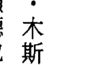

亚历山大·木斯拉克是一个老菸枪，香菸好似他的至交。他把菸称为「女友」，因为香菸总在一旁倾听他的话语。亚历山大曾出过一次车祸，一位天使救了他的命——大天使拉斐尔来看他，帮他保住了性命。不久之后，亚历山大开始到处看到天使！天使们帮助他去除化学物，引导他离开生活中所有不健康的物质和人。天使们帮助他戒了菸，过程中完全没有经历任何对菸的渴求。五年后的今天，他常常忘了以前曾经抽过菸。他现在的工作是直觉咨询师，不再抽菸污染生活，他结了婚，当了父亲，很得意自己有个名叫拉斐尔的两岁小孩！

# 第7章 七天净化计划

### 有助于戒菸的疗癒法

#### 祈祷

> 「亲爱的神与天使，请用祢的疗癒之光包围我。
此刻请祢送给我爱、慈悲与健康。请祢帮我修复抽菸给我造成的伤害。
请排除所有我对香菸的想望和渴求。请祢让我身边有愿意支持我、健康的人。我已准备好要做出生命中正向的改变，我愿意听从祢的指引，相信祢为我指出的方向。我知道自己的健康情形很快会有大幅改善，而且，戒了菸之后，我会敞开自己接受更伟大的爱。感谢祢们。」

### 燕麦杆

燕麦杆（Oat Straw 或 Avena Sativa）或绿燕麦（Oat Green）会使神经放松，这是打破瘾症循环中很重要的步骤之一。对于菸的渴求一旦出现，头脑需要时间去推翻，很多渴求都只维持很短的时间，在燕麦杆药草的疗癒功效之下，神经系统有能力在采取行动之前先做思考。

### 金丝桃草

金丝桃草（Saint-John’s-wort）会促使身体分泌更多的血清素，这种会让你感觉舒服的快活荷尔蒙会让情绪和能量保持平衡，并用喜悦取代渴求，打断瘾症的循环。有关金丝桃草的研究发现它可以帮助戒菸，有一个研究是拿金丝桃草萃取液和一般处方的戒菸药物做比较，发现两组成功戒菸的人数很接近，但不久之后再做评估时，使用药物的那一组又开始抽菸，而服用金丝桃草的那些人永远戒菸成功。另有一个研究，比较的是使用尼古丁贴片和金丝桃草，还有一组是两者兼用的。

### 维他命C

每一根香菸都会把维他命C从身体里过滤后排出，导致细胞的早衰和氧化性的损害，耗损免疫系统，使身体容易发炎。肺部已经衰弱的情况下，服用维他命C是不错的办法，维他命C可以帮你重建（负责能量储备的）肾上腺，抽菸使身体对抗有害物时格外辛苦，因此，重建肾上腺这个能量库将会带来奇迹式的效果。

### 维他命B

每一个经过头脑的念头都需要维他命B。为了让你的念头充满光明和快乐，你需要足够的维他命B。头脑里要处理那么多念头，你用尽了B6、B9和B12。现在想想，当你感到沮丧和忧虑时，你会有多少个念头？多到数不完！这些高速的神经传导物质的发射会很快导致维他命B不足。遗憾的是，当你缺乏维他命B时，沮丧和忧虑也会增加。因此，假如每天的活动中需要用到高度专注的脑力，可以把服用维他命B做为个人日常保健习惯的一部分。维他命B是水溶性的，这不是说服用时要和水混合，而是说维他命B会溶解于体内的水中，这些养分不会留存在体内，必须不断加以补充。你可以享用完整谷物和深绿色叶菜。但在感到过度沮丧和疲惫时，吃一碗菠菜可能不够，当你开始食用上述营养丰富的食物时，可能会发现，服用一颗维他命B补充品或综合维他命来帮你度过艰难时期是有助益的。然后，当沮丧程度下降时，可以停用补充品，转而专注在食物的选择上，这时还要把食物的品质列入考虑，目前的这个时代，食物都在短时间内就被采收，接着存放很久，离开土地或树之后，每一分钟食物都在失去最重要的养分。一颗高品质的维他命B补充品对整体健康和幸福可能是最有用的。

当你寻找维他命B补充品时，要注意平衡性和剂量，几种零售的品牌拥有很棒的行销手法，却缺乏有成效的配方。近几年来，有关大剂量维他命B的安全性一直出现一些恐惧策略，这吸引了媒体的大量关注，但这个研究一直没有获得证实。

以下是几种配方的比较：

配方A和配方D拥有高剂量的维他命B群，同时也是一种达到平衡的配方。不同剂量的维他命B彼此间有适当的比例，因此很容易被身体利用。配方B所含的养分最少，而且B9数量也不成比例，和其他几个配方的成分相比之下，B12（的数量）可能造成服用后立即产生热潮红的现象。配方C还可以，但是大量的B3可能造成这个配方的不平衡。因此，做为舒压和促进健康之用，配方A和配方D最适合。

| 维他命 | 配方A | 配方B | 配方C | 配方D |
|--------|-------|-------|-------|-------|
| B1 | 100毫克 | 2.18毫克 | 75毫克 | 50毫克 |
| B2 | 20毫克 | 9.2毫克 | 10毫克 | 50毫克 |
| B3 | 10毫克 | 15毫克 | 100毫克 | 50毫克 |
| B5 | 92毫克 | 10.8毫克 | 68.7毫克 | 68.7毫克 |
| B6 | 50毫克 | 6毫克 | 25毫克 | 41.14毫克 |
| B9 (叶酸) | 400微克 | 300微克 | 150微克 | 500微克 |
| B12 | 100微克 | 20微克 | 30微克 | 50微克 |

### 赤铁矿水晶

赤铁矿水晶（Hematite Crystals）除了可使体内的负面能量消散之外，还能够清除瘾症的能量。你可以随身带着，在感觉有渴求时，把赤铁矿水晶握在手中，花点时间看着矿石有反光的表面，问自己真正渴求的是不是其他的东西。

### 大天使拉斐尔的消除瘾症

召请大天使拉斐尔，寻求祂的指引和支持。使用祂消除瘾症的方法把能量里的香菸排掉。

大天使拉斐尔，现在请帮我放下香菸。我祈求祢的帮忙和指引，好让它离开我。我知道抽菸的害处，现在我决定要做个健康的人。我知道祢会帮助我。谢谢祢。

## 天使能量排毒法

## 戒菸的七日计划

### 第一天

-   一早起来，深呼吸几次后，做「戒菸」的祈祷。在这一天当中，把祈祷当做咒语一样持诵，并请天使们给你更多的支持。要知道他们永远都在看顾着你，当你提出请求，代表的意义就是他们会立刻来到你身边。
-   把身边的菸都清除干净，包括尚未抽完的菸、菸灰缸、打火机、火柴，以及你认为和抽菸相关的所有东西。
-   召请大天使拉斐尔，祈求祂在帮你消除瘾症的同时，也让香菸从你的生活中消失。你可能还会收到指引，叫你远离抽菸的朋友，遵循拉斐尔的指引，相信祂知道什么对你最好。

### 第二天

-   睡前先让头脑安静下来，再做「戒菸」的祈祷。
-   一早起来，深呼吸几次后，做「戒菸」的祈祷。
-   开始吃金丝桃草，这会打破瘾症和依赖的模式，还可以提升情绪，让你更快乐。
-   服用前，把十滴酊剂加一点水服用，一天三次。除非你还在服用其他药物，或有其他健康上的问题，若是如此，开始服用金丝桃草之前，请先和医疗照护人员讨论。携带或配戴赤铁矿水晶，任何时候你想抽菸时，把它握在手中，感觉那个渴望消散而去。

### 第三天

-   一早起来，深呼吸几次后，做「戒菸」的祈祷。
-   今天开始吃一个品质良好的维他命B，仔细阅读维他命B配方的说明，再决定考虑吃这个产品是否对你有益。
-   睡前先让头脑安静下来，再做「戒菸」的祈祷。

### 第四天

-   一早起来，深呼吸几次后，做「戒菸」的祈祷。
-   绿燕麦可以让神经放松，有助打破瘾症的循环，可以和金丝桃草混在一起吃，或单独服用。再强调一次，要先和医疗专业人士商量，把七滴酊剂加一点水服用，一天三次。
-   服用。再强调一次，要先和医疗专业人士商量，把七滴酊剂加一点水服用，一天三次。

### 第五天

-   睡前先让头脑安静下来，再做「戒菸」的祈祷。
-   一早起来，深呼吸几次后，做「戒菸」的祈祷。
-   你吸的每一根菸都会使维他命C流失，但你可以每天服用四千毫克维他命C——早餐时服用两千毫克，午餐和晚餐时再各服用一千毫克——做为补充，即将用餐前服用，这会有助于维他命的吸收和消化。服用一种含有矿物质性抗坏血酸盐的补充品，而不是只含抗坏血酸，那样对胃太刺激了。这些补充应该持续三个月。

### 第六天

-   一早起来，深呼吸几次后，做「戒菸」的祈祷。
-   在家中或工作场所放新鲜的木兰花和叶，它深绿色的叶子可以吸收空气中的有害物，净化空间。除了能让你离开和吸烟有关的地方，还能帮忙把你和瘾症之间连结的绳索切断。白鹤芋（Peace Lilies，又称和平莲）对清洁空气也很有效用。除了空气净化剂，你还可以使用盐灯。

### 第七天

-   一早起来，深呼吸几次后，做「戒菸」的祈祷。
-   享用香菜（芫荽），放进沙拉、汤，或打成冰沙，香菜可以清除体内因抽菸带来的重金属和有害物。从现在开始，把香菜当做健康饮食计画中的一部分。
-   睡前先让头脑安静下来，再做「戒菸」的祈祷。

你已经过了七天没有香菸的日子，身体也已经比上周健康。感谢神和天使带给你新的生命力，并相信自己能持续下去。

## 戒除其他瘾症（食物、毒品、药物……等）

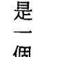

凯文·杭特曾经是一个对咖啡上瘾的人——我们也在这一章提过他排除咖啡的经验——他相信大多数滥用药物和酒精的人都是在逃避某些事情，通常是某种情感创伤和未克服的痛苦情绪，他们使用药物，是因为他们不喜欢没有使用药物时的感觉。凯文在一个粗暴和动盪不安的家庭中长大，二十一岁之前，他已藉著药物和酒精来逃避。他吸食古柯碱、安非他命和大麻，当他不用毒品时，他会喝酒过量，直到不省人事为止（天使说，喝酒喝到不省人事，等于是给负面能量的灵体有更多机会依附在你身上）。凯文一直和天使们有很强的连结，听取指引从来都不成问题。天使们给了凯文很多机会听到他们的讯息，但瘾症让他不愿意接受指引。事情终于发展到一个程度，使他再也无法用放纵来躲避指引，是该净化的时候了。凯文和天使们一起努力把对药物和酒的瘾症消除，二十五岁时，他已完全不再碰这些东西了。现在，凯文相当注意健康，身体也不错。他定期运动，身体强壮、独立自主，头脑也很清晰。现在认识他的朋友都不知道他过去的瘾症。他已经和天使合作，一步步地净化了生命。

请你永远记得，找一个对事情有帮助又有善心的相关人士，向他们寻求支持。在光之路上行走时，若旁边有人相陪，一切都会容易很多。从瘾症沉重的能量中抽离时，可能会感到怯步或恐惧，要知道那是「高我」所想要的，一定要深信，你会读到这一段文字是有原因的，要知道，你现在正逐渐对净化之事有更多的领悟。

排除瘾症时，可以照着上述任何要点去做。在大天使拉斐尔的协助下，根据自己个人的需要去应用那些疗癒法，你也可以使用前面提过的各种不同的药草、水晶和花。

有些药物会滞留在肝脏或脂肪细胞里。长久来说，用温和的方式把体内这些残留清理干净会比较安全。假如你的行动太快，有可能会让累积的毒素回流，使你觉得更不舒服。

所以，寻找知道如何安全有效处理排毒工作的人，请他们跟你一起合作是有必要的。


> 来自苏格兰的维多利亚·道恩·霍德在二〇一二年开始排除瘾症。她觉得失落、疲惫不堪，除了要处理不幸的婚姻和食物的问题（导致她不舒服和花太多钱）之外，她也想要戒除大麻和处方药。维多利亚找到一个可以帮忙的好朋友，他送给她一本灵性方面的书籍，她从中学到要对神有信心，并信赖天使们。维多利亚祈求祂们帮她远离咖啡因和大麻，她也收到指引教她使用其他自助的工具，例如，冥想、喝大量的水、敲打经络、服用营养补品和药草。维多利亚走的是正确的道路，但她的人际关系好像云霄飞车，忽高忽低。她觉得她的先生给她压力，导致她抑郁，她无法专注于该做的事，于是又开始使用大麻。她告诉自己这是为了帮助睡眠，但她的「高我」知道，毒品里的化学物正在残害她的身体。之后的一个晚上，维多利亚接到她先生从警察局打来的电话，说他们正在他的车上搜查毒品。她放下电话，拿起菸，她感觉到砰地一响，接着听到很大的声音对她说：「醒醒好吗？」虽然害怕，但她觉得有一股动力，知道这一次必须永远戒掉。维多利亚知道结婚二十多年的先生不会改变，他还没准备好要放弃毒品和喝酒的习惯，必须由她来做决定，并踏出第一步。她做了一个很困难的抉择——放弃婚姻，这样她才能达到平衡。后来，她还找到志同道合、从事灵修的人支持她，帮她度过那段艰辛的时期。现在，维多利亚看到自己有了更高的人生目的。她在二〇一三年通过按摩资格考试，减重，也一直感到精力充沛、充满生机。事实上，她的健康状况大有改善，现在正在受训，准备参加夏季的一个慈善健走。

维多利亚因为信赖神和天使们，而拥有更幸福更健康的人生。

玛姬·布朗是英国的一位护士，也是三个小孩的母亲，她在一九七〇年代开始不再相信神。一九八三年，她的先生在工作中突然死亡时，最小的儿子只有十个月大，那个礼拜她又重新找回了神。

她对天使所知不多，一直到四十来岁为止，只听过大天使加百列。因此，发现这个慈悲的随身守护者给她带来了抚慰。


玛姬的医生给她开抗忧郁药帮她度过哀伤，她开始吃药，也很快药物上瘾。她认为自己听到天使们叫她停吃抗忧郁药，相同的讯息不断重复，而且一天比一天更坚持，她以前曾尝试要停止，但是出现了盗汗与晕眩的现象，且每几分钟就会痛苦得发抖。

天使们持续地指引玛姬放弃药物，在再度尝试药物之前，她找到了支持的力量及医疗上的督导，这一次也有天使们神圣的助力，她接受了指引，虽然使用抗忧郁药，却没有任何副作用。玛姬把这次的净化全归功于天使们，她觉得假如没有他们，自己根本做不到。

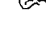

来自威斯康辛州密尔瓦基市的奥波瑞一向都觉得表达自己的感受是不容易的事，所以，她寻求大麻的力量帮她说出内在的声音。十六岁时，她用大麻让自己接受自己的个性，用量不断增加，形成了一种依赖。

很快地，奥波瑞只有在使用大麻的亢奋情况中，才能和他人接触，但这个毒品阻塞了她的脉轮，生活一团混乱。她吸引来的都是很糟糕的工作，财务状况不好，还处在痛苦的婚姻当中。

二十六岁时，为了应付各种问题，她仍然每天要抽几次大麻，她感觉到迷失、受困和沮丧。没有人知道她的内在有多痛苦，奥波瑞的比喻是，她好像站在悬崖边准备往下跳，那是个令人害怕的处境，你不知道自己是否能够存活下去。

二〇一一年六月，奥波瑞和她的父母去了科罗拉多州的博德市看她的兄弟，也在那里戒掉了毒瘾。她在山里经过一个九天的净化过程，也在那里认识了天使，学到以祈求的方式请求祂们协助。奥波瑞回家时已不再使用毒品，对生命也有新的欣赏角度，她有了合适的工作，财务问题解决了，婚姻里也充满了爱。

罗莉·雷·布雷维成长的过程很艰辛。十七岁时，她的父母离异，父亲还染上毒品。很不幸地，父亲让罗莉也走上相同的路，二十七岁之前，她已对古柯碱上瘾。很多年之后，罗莉意识到她是在追求爱，而她这种不正常的情况则是想得到从未拥有的父爱的一种方式。

有一天，罗莉在工作时发现了一只黑鸟，牠有一边翅膀受伤，那是她的天使，罗莉把那只脆弱的小鸟带回家照顾，因为她爱那只鸟，她注意到自己的心打开了，不再需要药品。那只鸟和罗莉一样复原了，牠飞走时，也把她的古柯碱瘾症带走了。

现在，她的身心已经净化了，一路上也吸引着有爱心的人。

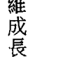

#### 祈祷

> 最亲爱的神和天使，现在是我需要祢们的时候。我已不再想要这种不健康的饮食和生活方式，我可以感觉到它影响着我的能量和头脑。我从内心的最深处请求祢们帮助我。我知道祢们可以疗癒一切，我允许祢们修复我的生命。在我复原时，请让有鼓舞力量的天使在我身边指引我。谢谢祢们为我疗癒。

## 净化计画

任何有需要的时候都可以再做祈祷。当你带着最诚挚的意图说出祈祷时，就是在祈请天使们的力量，祂们会用尽一切方法帮助你获得疗癒。你可以使用前述的任何一种净化计画和方法，来排除任何需要割舍的瘾症。遵循你收到的指引，坚持你的计画，有需要时，除了找瘾症专家之外，也可以向神寻求指示。

# 第8章 净化情绪

排毒或净化并不是只能用在身体上，释放陈旧、有害的情绪也是一种疗癒。紧抓着压力、心痛或不愿宽恕没有意义也没有好处。你的身体和能量要你释放这些沉重的振动，天使就在释放的旅程上指引着你，所以，现在是你该真的放掉情绪，臣服于「高我」的时候了，这才是幸福真正的源头。当你进入爱中，而且只有在爱中，你体会到的才是纯粹的喜乐。你当然可以做到这点，「小我」会试着说服你保留这些负面的情绪，不要听信这样的声音，若想得到最大的好处，要做的是遵循天使们的指引。因此，不要再推迟你的幸福了。

## 消除压力

心理上的压力非常真实，忍耐的时间久了，压力会造成伤害。任何使身体和头脑必须更卖力工作的事都会造成压力，这会把过多不必要的负担加诸于你。一点点压力可以是健康的，甚至也可能为你带来动力——适当的压力帮你更努力、如期完成工作，看自己到底拥有什么能力——但持续的压力会耗尽生命力，让你枯竭。

身体会用新陈代谢的方式对付有压力的状况，头脑会启动肾上腺素的分泌。已经受到压力的身体在肾上腺素涌出后会感到更焦虑，你可能会觉得恐慌，以为没有足够的时间做事，因为肾上腺素让所有的事情都加速。在这种情况下，「小我」给你的是假讯息，事实上，时间绝对足够，记住：时间是人创造出来的概念，假如世界上所有的时钟、表和计时器全都不存在了，世事还能运作吗？当然可以！压力让你相信你必须加速行事。你愈是焦虑，跟神的沟通就愈困难，因为这种沟通要在祥和宁静中才能产生。

除了肾上腺素之外，脑内啡也会被分泌出来，你会觉得舒坦，有些人因为肾上腺素和脑内啡的作用而对压力上瘾。身体也会分泌可体松（Cortisol）——一种类固醇激素，少量使用会带来一些好处——使身体恢复平衡状态。持续的压力会不断排放可体松进入血液当中，这种激素会使你膨胀起来，增加液体的保存量，因而导致体重增加和疲惫。

# 第8章 净化情绪

更宽心。要知道天使们可以帮助你消除压力和烦恼，然后，一切都将变得更清晰，你也会觉得在生活中，排除压力和负面的人之后，亚曼达·道尔找到了疗愈所带来的益处。亚曼达以前在家族事业中工作，家人们一直掌控、欺负她。所幸有些有爱心的光之工作者支持着她——亚曼达结交了一些心灵能力非常强的人、疗愈工作者、按摩治疗师和营养专家。这些人都是她在地球上的天使，尽力维护着亚曼达的安全。久而久之，她有被掏空和压力很大的感觉，并发现腿上出现不明原因的斑点。一位要好的疗愈师朋友建议她离开工作环境中那些负面的人，这位朋友认为那些人造成她情绪和心理上的压力，进而影响到她的健康。很遗憾地，这个好友罹患了卵巢癌，她告诉亚曼达，她到另一个世界后，会成为天使回来帮助她。这个朋友过世之后，亚曼达以前认识的一个营养师又重新出现在她身旁，这个人也收到讯息，认为亚曼达应该离开。当她确认自己也听到天使们告诉她相同的事时，她感到害怕，不知道接下来该怎么办，然而，她还是持续地听到：你必须离开，你必须离开。

亚曼达认为是她该疗愈的时候了。她已经在练瑜伽，决心要在保养计划中加入更好的营养，她想要好好滋养自己的身、心、灵，而这这就是天使们所需要的一切承诺。亚曼达不知道这就是在告诉天使们，她愿意接受他们的协助——于是，天使们开始指引她迈向改善健康之路。

第一步就是，不再为那不健全的家族事业工作。二〇一二年十月，家人要亚曼达搬出去，她很难过，因为她并不想这么做，但她也知道为了健康，这是她所需的推动力。后来，她接收到一些意象，看到过去她与这个家庭的关系，忆起了当时他们对她的攻击，并且感谢天使们现在能够保护她。

亚曼达无处可去，不知道自己会不会变成游民，她和营养师朋友一起坐下来寻找可能的新住所，却都找不到合适的，她想要一个令人感觉舒服的住处，向神祈求一个可以让她获得疗愈的地方。她几乎马上发现自己正在网路上和一个老朋友通话，他告诉她，可以搬去他那里住，所有的事都不会有问题。天使们听到了她的祈求，也把一个好友送到她面前。

不久之后，亚曼达注意到她的体重持平。整体来说，她觉得更好，腿上的斑点正在缩小。她曾问过天使们，那个点是怎么回事，他们说那是压力引起的，她才意识到，原来压力已给身体带来那么惊人的影响。当她离开了那些负面之人，疗愈几乎马上就开始了。

### 消除压力的疗愈法

#### 祈祷

> > 亲爱的神与天使，请帮我消除压力和它所带来的一切影响。我的请求是，从今天起，我要开始打破压力的模式。我不再会慌忙、焦虑或恐惧。

> > 大天使汉尼尔，请带给我平和。

> > 请教我如何过更沉着、更优雅的生活。

> > 大天使约菲尔，请祢用爱包围我。在我的身体和精神接受祢的疗愈时，我将会感受到压力消失。请让我看看周围的美。

> > 大天使麦可，请祢把我生活中所有负面能量都排除。我知道，假如我的内在之光愈明亮，小我便愈难影响我。我祈求祢的力量和勇气帮我排除害怕的想法。

> > 大天使参达昶，请祢重建我的生活。请祢清理我的脉轮系统，平衡我的能量。我相信祢的指引，也会依照祢的指示去做。感谢祢。

### 帮助提升的天使

你身边永远都围绕着天使。有些大天使的特长在消除压力方面特别有帮助。召请天使时不需要使用任何特别的祈祷或华丽的辞藻，发自内心的祈愿就已足够。甚至只要念到这些天使的名字，就是请求她们来帮忙。要记得允许她们帮助你——把你需要协助的事情交托给她们和神，做出“请帮助我”的请求就已足够领受她们神圣的介入。大天使汉尼尔会带给你优雅和沉稳，帮你保持镇静和平稳，永远举止得宜。提醒你，对事情感到紧张和压力是毫无助益的，毕竟，压力能带来什么呢？当然不能使你离目标更近。和汉尼尔合作，让内在愈来愈感平和，祂可能会鼓励你借用月亮的能量（请参看第二章的“满月的祝福”），这会使你的能量平静下来，也会让你连接到神圣的本源。

大天使约菲尔以有抚慰作用的粉红光笼罩你，祂把心中负面的思维模式清除，以爱心模式代之，并确保你在面对问题时，专注于开心和向上提升的解决方法，有了这种态度，你很快就能解除压力。

大天使麦可会拔除能量场里来自恐惧的能量，祂知道压力是由低频能量的累积而来。小我就生存在这种较低频的振动里，麦可清除了生活中的负面能量之后，小我就不太有机会造成你的压力了。

大天使麦达昶为你带来的是生活的均衡，祂调整你的时间表，让你有均等的时间可以工作、休息和玩乐。祂知道你在开心的时候会把工作做得最好，所以把压力消除，让所有相关的人都得到更好的成果。假如你爱你所做的事，那么，这辈子你都毋须工作，把这个方法也运用在生活当中！当你接纳周围的人的正向本质，天使们会给予你无限的机会。

### 大天使麦达昶的神圣光束

召请大天使麦达昶帮你平衡生命中的所有面向，祂会清理脉轮，使你将能量处理得更好。人生中的一切都需要平衡——即使是为别人付出的善行也一样——知道这点，当你给予太多时，才会有自觉。假如你只付出却拒绝接受，造成的是一种不均等的交流，这种情形发生时，麦达昶会让你知道。

### 大天使麦可的灵性吸尘法

小我使压力变得更糟，它会用一些手法让你相信它的谎言，使你更觉受挫、不知所措，而这种反应对你或目标都不会有任何帮助。小我藏身在负面能量里，身体保存的负面能量愈多，小我的声音愈大。反之亦然，你保有的能量愈正向愈有爱，天使的声音愈大。麦可将会在身体和能量场里做吸尘的工作，把负面性的东西清掉。

### 消除压力的精油

纯精油有很强的疗愈特性，能超越物质世界。精油会进入嗅觉系统，在身、心、灵都产生深远影响。作用很快，是立即性的，你可以马上感觉到这些精油的疗愈特质。

高品质的精油是很重要的，确认所使用的是百分之百、没有经过混合的精油，有些厂商会在“精油”里添加合成香料或石化产品。一般来说，付出什么就得到什么，很多高品质精油比较贵。想买某个产品时，对相关的公司和品牌要自己做好研判工作，尽量提出问题。

若想要百分之百纯精油，有些种类的精油价钱实在很贵，这类精油会先用荷荷巴油加以稀释，玫瑰精油和德国洋甘菊精油就是如此。做疗愈工作时，这些都是接受度非常高的种类，荷荷巴油没有自己的香味，但具有相当良好的能量。

假如你感到压力，让整个家中或工作场所飘散着有镇定作用的香味会有舒压效果，让家中充满美好的香味，以此做为每天的例行事项，同时，你自己本身也能让家里充满爱的能量。

有些精油受人喜爱，有镇定效果，例如，薰衣草精油和德国洋甘菊精油，这两种精油都能使人宽心、逐渐放松，这两种精油混合在一起也能产生很好的功效！

### 扩香器、香薰炉

在扩香器里，加入薰衣草精油和洋甘菊精油各四滴，可以用加热式的扩香器，也可用完全不加热的类型。研究结果指出，热气会改变化学结构和振动，未经加热的精油治疗效果比较好。

精油会弥漫在空气中，化解那些阻碍你得到平静的负面障碍物，天使们希望你能够平静，只有处在平静的状态中，才能最清楚地听到指示。好好放松下来，享受美好的芳香。

### 芳香浴

在放满温水的浴缸里，加入四滴薰衣草精油和洋甘菊精油。你可以（向精油公司）购买分散剂帮助混合油和水，也可尝试把精油放入一液盎司的有机醋里，再放入浴缸，这会使精油散开，且对皮肤也很好。

若想要更进一步的清理，可考虑加入疗愈盐，一杯凯尔特盐、大西洋盐、喜马拉雅盐，或死海盐都有不错的效果。盐里的矿物质和能量会把身体和乙太体里陈旧的能量加以拔除，泡过有疗效的盐浴后，恐惧和担忧会被释放，所有阻碍前进的障碍物都将离开你。

加强这个净化之浴的方法：把双掌放在水的上方，召请天使：
天国的天使，请把你的爱之光送到我的净化之浴里。我请求吸收康复能量，祈愿平静和沉稳。我愿意放下身体内所有的压力和紧张。请化解阻碍我获得最大利益的一切障碍物。谢谢你。

然后，用手去搅动水，确定所有的一切都完全混合，泡在这个疗愈之浴中，至少十五分钟，情况允许的话，就泡更久。让你的头脑天马行空，做白日梦，这是天使们引导你度过清理过程的方法。当想法和情绪出现时，让它们经过你，被洗掉，用这个方法让情绪全部彻底清除。

书写不一定要用很正式的方式，可以简单写下所有的想法和现在所经历的感受，把你想放下的事情、状况和人列出一个清单，接着，把清单交托给神。你不必留着这张纸，可以慎重地把清单揉成一团，然后丢掉。也可以在电脑上做：开个新文件，把心底的话写下来，把档案关掉，不要储存。没必要把这封信给他人看，这是你和神之间的事。把担忧写下来，做为释放的方法，你会发现这给你带来舒畅，让你不必在心中一次又一次地处理这些情绪。

### 药草茶

洋甘菊茶为人熟知的特色是，有镇定作用和温和的味道，感到紧绷时，一天喝几杯，也可尝试把洋甘菊茶和薰衣草花茶混合，能冲泡出一种味美、令人放松的茶饮。一天中的任何时间都能享用药草茶饮，也可以在晚间使用，药草茶饮会助你拥有一夜的休息和好眠。

药草是身体的好友，不是敌人，白天喝洋甘菊茶不用担心会睡着，晚上喝时，则会带给你深沉的睡眠。天使们会指导这个过程，确保你得到所需的疗愈。

你可以尝试使用有机的药草茶叶，而不是茶包。你会发现味道完全不同，能量更高，有机会的话试试刚采收的洋甘菊——用一朵花，让香味弥漫在一杯热水中。

身体的动作会启动天然的能量储备，运动是一种很好的放松和舒压的工具。运动时，身体分泌脑内啡，你会感到舒畅，运动愈多，愈能感到轻松。

运动的方式要能让你觉得开心，这是很重要的。你可能喜欢在大自然中徒步，从事一些探险性的健行活动，抛开现代生活中的拥挤和嘈杂，多数的国家公园都有步道，可以在平静、精神抖擞中好好享受，公园里的巡管员也能引领访客踏足会让人心跳加快、难度较高的路径。

你也许更喜欢运动时身旁有伴，团体的氛围有很多好处，运动时，能激发继续前进的动力，也能营造出团体精神、在锻炼中增添社交功能。不妨鼓励朋友和你一起做个晨间健走，或者一起上健身房。

找健身房时，找一个能量好，工作人员也很好的地方，健身房应该是让人感觉安全和受到鼓舞的场所。参加一个让人觉得不自在的健身房没有意义。决定是否成为付费会员之前，先去试上几堂课看看，有些健身房教练会在户外上课，让大家呼吸新鲜空气。

你可能也愿意选一些兼具静心作用的运动。瑜伽是非常理想的一种，能挑战身体，同时也需要头脑的专注，保持某种瑜伽体位时，能沉浸在平静的观想当中。另外还有一种很好的运动方式是皮拉提斯（Pilates），看起来好像很简单，但重复做之后对增加体能有一定的效用。

愈早养成运动习惯，就能愈早发现运动对健康的好处。要从运动当中真正感受到放松的效果，必须要够努力才行，运动的步调要适中——知道自己的极限，但也要知道自己还有多少进步的空间，这是很重要的。

为了确保振奋精神的脑内啡确实分泌出来，必须先到达一个几乎要放弃的点，在这个点上，逼自己再往前进一点，突破那个障碍。你可能听说过（恢复精力后的）“第二口气”，这是脑内啡释出的时候，当你奋力突破那个层次时，你会注意到自己流了更多汗。

接着，做完运动时，你会感到放松、有弹性，且有一种清明之感。

### 有助于镇静的水晶

> 使用能使神经放松、让你专注宁静的水晶：

-   蓝纹玛瑙（Blue Lace Agate）：带给你安宁，淡蓝的能量能把压力和担忧溶化。它可以减轻焦虑、排除恐惧，并且专注在造成压力的原因上，蓝纹玛瑙会从一层层的能量场里，把这个压力拔除，直到全部清完为止。
-   紫水晶（Amethyst）：化解所有的负面能量，并加以转化，使之回到爱中。紫水晶是一种保护之石，带着它，在靠近负面或会大量降低能量的人时会很有用。它会清除不愉快或有害的想法，让你专注于爱。水晶能唤醒直觉能力，有了这种能力，就能知道哪些路将带你到平静之所，哪些会让你产生压力。在这种已觉醒的状态之中，可避免陷入会造成压力的状况里。
-   黄水晶（Citrine）：可以使焦虑平静下来，带来方向感和对自己的肯定。黄水晶把能量安固在体内，避免飘荡进入负面的情势当中。它会增加你的自重感和信心，提醒你好好使用创造力，假如你能接受自己原有的才能，压力自然就会消失。
-   萤石（Fluorite）：作用是平衡意念和情绪，使你能够将该完成的工作和任务排出优先顺序。萤石帮忙整理意念，使你更能够明白自己的想法如何产生，它让你宽心，因为你确信每件事发生的时机都经过上天的特别安排。
-   烟水晶（Smoky Quartz）：可以清除周围因困惑而造成的混沌状态，烟水晶会帮忙看清前方清楚的道路，发现那些来自小我的想法。天使们引导、保护你，而烟水晶将能量从混沌中提升，为你提供更多协助。

### 宁静之花

大自然的天使把安宁与平静带入家中，置身以下描述的花朵中，你会感受到花的能量有镇定作用。花朵笼罩着生命的所有面向，在皮包或零钱袋里放盛开花朵的照片，用以为日常生活支持力量。在电脑或电脑萤幕上存放花的图像，它们会不断地让你想起神之爱，花在告诉你，发生事情时，有两种选择——你要独力奋斗呢，或请求天使们的协助？

-   秋海棠（Begonia）：帮助你变得更有耐性，也能巩固个人空间，并把周围让你分心的事物都移除。
-   雏菊（Daisy）：要求你过简单的生活。你接下太多的工作任务，必要时要容许自己休息，且请求协助。雏菊建议把使你能量大幅降低的人从交友圈中删除。
-   吊钟花（Fuchsia）：帮助你提升，跨过目前的难关。想要过无压力生活，并朝这个目标努力时，吊钟花会帮助你持续努力向前。大天使麦可和麦达昶会用这种花帮你安排一个比较平衡的工作表。
-   栀子花（Gardenias）：提醒你要开心，这样才能解除压力和烦恼。栀子花对纾解长期的压力很有帮助，闻到栀子花细致的香味能马上使人安定下来。
-   木槿（Hibiscus，又称扶桑花）：提醒你已经拥有大量的支持力量，是所爱的人和疗愈天使给予你的，也许不能实际“看到”那些帮助你的人，但天使们要你相信，祂们都听到了你的祈祷。木槿带着大天使夏弥尔（Archangel Chamuel）和拉吉尔的能量，这些天使们让你找到神圣之光，这种光能穿透所有的压力幻象。
-   茉莉花（Jasmine）：把你带进更深层的冥想经验，在冥想中会较容易接触到天使及包覆着你的疗愈能量。茉莉花是一种可以提供平和与智慧的花，把所有的担忧和烦恼都放下，接受和神连结时所得到的抚慰。
-   黄水仙（Jonquil）：确保只有平和的人可以进入你的空间。有些“朋友”对自己能从你那里得到什么好处的兴趣胜过他能为你付出什么，这种人必须远离。让这种转变自然发生，把爱送给所有相关的人。
-   薰衣草（Lavender）：不管制品是哪一种形式的，薰衣草都能使神经稳定下来，让你放松。它会使你全身的紧张感松弛下来，让压力成为久远的记忆。薰衣草打开第三眼脉轮，让你拥有更佳的灵视力，有了这个神圣能力，你能看见通往幸福快乐之路。
-   紫丁香（Lilac）：和大天使麦可有关的花朵。紫丁香花能消除极度忙乱的生活所带来的压力，让你拥有平和与宁静。对于快节奏生活造成的焦虑和压力拥有非常棒的纾解效果。我们每一天的生活，看起来似乎只有卖力地工作，而不是一种恩赐，紫丁香能改变这一点，将有令人振奋的好机会等着你好好利用。
-   橘百合（Orange Lily）：帮助你不再着眼于小事、小格局。橘百合使你看见周遭的许多奇迹，让你脱离恐惧模式，接着，你会看见真正的自己。
-   黄玫瑰（Yellow Rose）：使头脑保持镇定，让你专注于向前迈进所需采取的步骤。黄玫瑰唤醒内在的宁静之所，你会因此感到很安全、很放松，在这个空间里，能放下紧张的想法和忧虑。
-   郁金香（Tulip）：在你感觉停滞不前时，郁金香能对你产生助益。请这个疗愈之花给予完成目前这个任务所需的时间、空间和所有必要的东西。郁金香能排除恼人和愤怒的感觉，并以轻松和愉悦替代。

### 修复肾上腺的枯竭

很多人都工作过度，无法抵挡压力，肾上腺枯竭的现象愈来愈普遍。肾上腺是身体的油库，目的是不断提供能量补给，当油库存量下降时，你会被指引去把它加满，恢复它的功能。然而，现在，每天都面对着这么大的各种需求，很多人都已忘记休息有多么重要，相反地，人们还把自己逼到极限，把油库掏空耗尽。当肾上腺已枯竭将尽，会导致很多健康上的问题。

假如长期感受到压力，生活又非常繁忙，请继续读下去，确认你是否有肾上腺疲劳症。当能源储备耗尽时，你会渴求刺激品——想要更多的咖啡、含咖啡因的饮料，还有尼古丁。除非摄取大量的刺激物，否则可能会觉得自己撑不过这一天，你会感觉筋疲力竭、无精打采，且无法事先规划该做什么事。肾上腺位于肾脏的顶端，有助体液的平衡，有肾上腺枯竭现象的人，除了咸味重的点心之外，还会嗜吃甜食。

一般来说，能量品质也会比较差。肾上腺疲劳症让你很难专心，并且丧失行为的动力。有意思的是，当肾上腺激素激增时，人在晚上会觉得比精神一天里的其他时间还要更好。晚上休息的时候躺在床上，会觉得特别清醒，比白天更有警觉性，但终于睡着了之后，可能又因为难受的夜间盗汗而醒过来。

想要修复肾上腺，对于该做的治疗必须真正投入，因为治疗不是一个礼拜就可以完成的。有可能很快就会看到惊人的改善，但必须持续几个月才能把效果维持住。你承认此刻自己的动力的确很低，但也要知道，假如你做出承诺要自我改善，将会有所收获。药草对肾上腺疲乏的康复效果特别好。主要的药草有两种：甘草（Licorice）和地黄（Rehmannia），它们能帮助恢复和改善肾上腺的功能，给你能量，直到把这个重要的腺体修护好为止。药草和咖啡或香烟等刺激物不同，这些药草在重建油库之时也补充能量，而刺激品让你误以为更有能量，实际上却使你更加枯竭。
洋甘草（Licorice或Glycyrrhiza Glabra）：并不是在超市糖果区买的那种甘草，是甘草这个植物的根。洋甘草这种药草会增强、恢复并且滋养整个身体，能抗发炎、疗愈消化系统，对止咳也很有效。忠告：有高血压病史的人应该避免使用洋甘草，对肾上腺和宿主——肾脏——的影响很大，可能会使血压稍微升高。假如你从未有高血压情况，那就没问题。
地黄（Rehmannia Glutinosa）：一种修复肾上腺的药草，可以使压力激素达到平衡，接着再对治造成疲惫的原因。当你的情绪变得比较镇定，肾上腺承受的压力会比较少。甘草和地黄合并使用的效果非常好，想达到良好的康复效果时，可以两种药草同时服用。使用甘草和地黄酊剂，一次两毫升或四十滴，用一点水或果汁加以混合，饭后立刻服用，每天三次。

##第8章 净化情緒

###消除經濟上的煩憂

每個人都被賦予充裕的生活條件，但小我會全力用伎倆讓你抱持一種「匱乏心態」，小我讓你覺得必須靠競爭才能生存，告訴你所擁有的還不夠，告訴你必須非常努力才能賺到錢，即使錢已經賺到手，也不夠償付開支；小我還告訴你，必須靠多年的存款才能享受夢想中的假期或購買理想中的房屋。但另一面，天使說，你可以擁有想要的一切，只要你願意接受。

我們每個人來都具有相同的成功機會，沒有人擁有特別的秘密資產，我們和我們所景仰的人，擁有的一樣多。在生命的盡頭，我們都是人，也全都是神的孩子，神不會偏愛我們之中的任何人，也不會給特定少數人額外的祝福。祂給所有的孩子同等的愛，也以相同的方式為我們每個人提供所需。

以貧窮的心態過日子是很無力的，但天使們可以幫你轉換成富足的觀點。假如你覺得自己的經濟不穩定，祈請天使們的協助，無限制地接受祂們的協助，要相信祂們知道哪一條是最好的道路。

靈魂的能量上連結著一個取之不盡的金盆，每個人天生就擁有豐足的能量，任何時候都可以取用。有些人一輩子都不斷在財務困境中掙扎，而有些人則選擇去看他們內在的神聖靈魂——寶藏——並接受此豐饒。

有些人會爭論說，靈性不應該和金錢牽扯在一起，但神和天使們希望大家都能快樂，他們想要看到你臉上燦爛的笑容。假如經濟上的安全感可以帶給你幸福，他們會送給你，你不必因為向天使們要求金錢的豐足而感到內疚——那是他們想給你的！你不是從別人那裡拿走什麼——這是小我局限性的思考方式。每一個人可以得到的供應都是無限的！

###吸引豐饒的療癒方法

###有關金錢的練習

金錢和所有的東西都一樣，是一種能量，祈求神送給你療癒能量，也可以用同樣的方法請求金錢向著你而來。天使們要你把金錢視為能量，是你該得到的東西，假如你害怕富足，或覺得不該接受，那麼，當天使們把錢送給你時，就會遇到困難。

想一想你對於錢的態度，很多人會說：「贏了樂透之後，我的生活就會改善。」假如現在有人敲門，或者在街上有人給你一大袋現金，你會怎麼辦？你會不會接受這個豐盛進入你的生命？還是，你會愣在那裡問：「這背後的動機是什麼？」就是這種態度阻撓天使幫助你！不要再用那種老舊過時的詞彙，要願意接受從不同地方、以不同形式出現的金錢。

試試這個練習：取一張鈔票，任何面額都可以，再準備一隻筆和一張紙。讓自己完全安靜地置心一處，並連結金錢的振動，把鈔票放在手中，或者也可以輕輕地看著它。接著，問自己一個問題：我對你有什麼感覺？將腦中跳出來的任何想法都寫下來，即使看起來好像沒有關聯，還是簡單記下，將來還可以修改。注意身體有什麼反應，有沒有出現什麼意象，或聽到什麼話，都寫下來。然後，接著問：我如何看待你？同樣地，寫下你的想法、感受和意象。最後，再問這個問題：我怎樣才能擁有更多的你？仔細聽錢的回答，好似它在對你說話一樣。從這個經驗裡去學習，你便可以改變未來的前景。如何才能擁有更多錢，並對此感到自在，在這件事情上，遵循你收到的指引，你需要的一切，上天都會滿足你，你也應該富有、成功。天使們知道，假如世俗上的需要你都已感到滿足，你會比較快樂。

###萬用支票

做一張自己的萬用支票，這是向天使們確認願望的一種方法。不一定要看起來像一般的支票，因為上面的字比樣貌更重要，打上像這樣的内容：

```
我，【名字】，於【日期】或在那天之前，願意接受 $【數目】。
我同意天使們在每一個步驟裡指引我，協助我。
簽名，【你的簽名】
```

把這張支票印出來，簽好名後，放在一個你看得見的地方，多印幾份放在家中四處，也可以放在皮夾或皮包中，或者拿它做冥想，看見自己擁有所需要的財力。

我（羅伯）可以為這個方法的效力作證。我報名了朵琳在夏威夷的通靈術課程時使用了這個方法。當時我還是個全職學生，沒有工作，沒有收入，連護照也沒有。到了我需要錢的時候，我想要的錢全都有了，讓我完成了一趟很美好的旅程。錢是怎麼到我手上的？我不需要知道，我只是允許豐盛的能量無限地展現出來。

###豐盛之花

黃百合像是一塊吸引豐盛的磁石，能迎接各種不同形式的富足進入你的生命。購買花苞尚未打開的百合，坐在花旁，用真心對待花朵們，在靜默的祈求協助中，把真實的願望送到花苞裡，同時，觀想錢的綠色能量注入百合。當花苞開始綻放時，你的祈求會被釋放入宇宙中。

###豐盛之石

黃水晶有一種吸引的能量，可以把想要的東西拉過來。把這個礦石清洗乾淨後，坐下來與它的振動連結。告訴水晶你想要什麼——必須坦誠，並且做出明確的表達，你可以說，想要某個郊區裡的一棟房子、某一型的汽車，或某一份讓你開心的工作。水晶不會評斷你，表達愈明確，水晶愈能幫助你。

###肯定語

肯定語是一個重新訓練思考的好方法，能增強周圍的能量，助你實現心中真正的願望。肯定語在你帶著感情真心說出時最有效，要相信你所說的肯定語，這很重要。你可能要花些時間使肯定語成為一種自然的方法，請你堅持不懈，相信你將只得到美好的經驗。每天隨自己的喜歡，重複幾次肯定語，下面是我们最喜歡的幾種說法，也許你們也會想要使用：

- 我吸引豐盛。
- 我願意接受。
- 我相信神和天使們正在提供我的一切所需。
- 我歡迎金錢進入我的生命。
- 我有很足夠的金錢維持生活所需，享受樂趣。

###觀想

觀想是一種靜默的肯定語，讓你用心眼「看到」自己將如何體驗到新的豐盛。閉上眼睛，給自己一個願望成真後的體驗——聞著新車的味道，感覺新家腳下的地板，或享受新工作時臉上的笑容。用五或十分鐘的時間想像你的願望已經達成，假如被負面的想法干擾，停下來，再重新開始，或休息一下，稍後再做。每天做幾次觀想，每一次都加上一個新的層次，把想法、感覺、香味、情緒，及你認為所受到的指引，全都加進去。做這些練習，你將被引領到豐盛之路，遵循這些神聖的指引，在天界把所有祈願送給你時欣然接受。

###與大天使麥可一起清理並通往豐盛之路

大天使麥可會把阻礙接受的障礙物加以清除，你必須願意收受，天使們才能把豐盛送到你手中。比喻來說，就是要把所有的門窗都打開，這樣天使們有很多機會把他們的祝福送給你。麥可帶給你勇氣和力量，並提醒你，不要擔心擁有力量、錢財是什麼不好的事。把金錢和掌控性、孤獨的人聯想在一起是一種老舊的信念模式，允許大天使麥可把這種想法清除掉，人必須像「守財奴」一樣錙銖必較才能致富的這種說法也要刪除。大天使麥可知道你的成功之路，讓祂掌握方向盤，引導你完成心中的目標。

在安靜的地方坐下來，召請麥可：

> 大天使麥可，現在，請你幫助我。請求你把與金錢有關的低頻能量吸走，請把圍繞著財務問題的所有負面想法和壓力去除。我請求你，打開我的心智以接受神聖的豐盛之禮，我相信你和神將會帶給我所需要的錢財。
> 感謝你。

當麥可吸走低頻能量時，保持安靜、沉思的狀態，釋放恐懼之後，就會有更多的空間讓喜悅出現。

###與大天使拉吉爾一起實現願望

大天使拉吉爾擁有宇宙的祕密，祂知道你靈魂契約的內容，也了解深奧的靈性法則。祂嚴謹運用自由意志法則——這個法則教導我們，你可以崇高卓越，也可選擇受苦。痛苦的理由從來就不該存在——永遠要選擇幸福快樂、愛，以及富足！和拉吉爾一起探討，並找出實現願望的方法，在你身上就能產生很好的效果。

針對希望和夢想，特別撥出一些時間靜坐。點根金色蠟燭做禱告：

> 大天使拉吉爾，請祢給予我靈性上的教導。請告訴我如何創造我想要的生活。請打開通向豐盛的道路，讓我在各方面都感到快樂和滿足。
> 感謝祢。

讓蠟燭安全地燒完，利用這段燃燒的時間重複做祈禱，也多做幾次冥想。之後，你會發現地上出現銅板，注意那些銅板上的日期，它們包含著特殊的意義。很快地，天使們會帶給你所需要的財務支持。

必知道發生了什麼事，只要臣服於這個療癒，讓拉吉爾施展祂的奇蹟。讓這些資訊流進內在，就像下載電腦軟體一樣，不用知道這是如何發生的，甚至也不

##放下痛苦和负面的情緒

情緒在健康的圖騰柱上位於第一優先，能把身體帶向痛苦或者平靜之路。你擁有的念頭和感受創造了你的現實世界，務必整天都保持著高能量和正向積極的想法。承受痛苦時，還要專注在光中可能很難，但在靈魂裡你要知道，黑暗是一個錯覺，它是小我為了不讓你快樂所使用的手法。

記住，你愈快樂，就愈有能力激勵他人，當你鼓舞別人時，他們也會加入你快樂的行列，你自然會獲得更大的幸福，並完成神聖的生命目的。小我想要看到的是，你把心思放在曾經的痛苦和傷害裡，但你一定要相信，神和天使們只希望你活得開心，選擇排除情緒之毒，且在生命旅程中，只允許自己接受來自愛的祝福。

憂傷和憤怒這類情緒是正常的人類感情，不必因為有這些情緒而批判自己。只有在你沉溺其中時，才會產生問題，假如你生氣了，可是幾分鐘後又笑了，這沒有問題。但是，假如你憤怒了幾個小時、幾天、幾個月，甚至幾年，仍在那些無益的振動裡煩惱著，你就失去了平衡。

要知道，你可以安然地放下這些過去沉積已久的情緒，給寧靜更大的空間。允許自己承認你有過那些體驗，要知道，沒有人是完美的，而且你也曾經犯過錯，但這不代表你的人生就是失敗的，因為你當時已盡了力。天使們要你承認過往，才能走向未來。記得，按步就班，假如積存過去的情緒已經多年，你可能會被指引走上淨化之路，這是你們將伸出援手的地方——他們會讓你知道，你已準備好嘗試新的方法。放下舊有的情緒時，你必須誠實面對自己和神，相信造物者全然的愛，不要怕受到他的批判。

心智如何影響一個人的健康，湯瑪士先生的故事就是一個很動人的例子。他來找我（羅伯）幫他治療禿頭症——他頭上有幾個區塊的頭髮已掉落，頭皮上有幾個禿塊。湯瑪士先生的問題很嚴重，他已沒有了眉毛和睫毛。

他的女友帶他來診所，要他尋求治療，可是在諮詢的過程當中，湯瑪士先生好像很抗拒諮詢自然療法醫師。他坐著時，雙手雙腳都交叉著，對於被問到的問題只做最少的回應，自然療法對這種情形的處理方法是，著重補充鋅，及處理免疫系統。但是，隨著諮商持續進行，我問湯瑪士先生，所有的問題是何時開始的，他說有禿髮症已經七年了，大約在那段時間裡，他經歷了很痛苦和困難的離婚，且喪失了孩子的監護權。當他變得情緒化時，我知道是那些事件造成他的身體異狀。為了治好禿髮症，治療的方法必須集中在問題的根源，開始治療他的情緒傷口之後，他的頭髮開始重新生長了。

###排除痛苦情緒的療癒法

###祈禱

> 親愛的神和天使們，請幫助我療癒這些痛苦的情緒。請求你帶走我一直放不下的重擔。我願意釋放哀傷、憤怒、怨恨、未寬恕，以及痛心。我知道你能為我指出一條路，讓我活得更好。把這些低頻能量釋放之後，我就能處在愛的寧靜裡。請把療癒送到我內心深處，保護我免於再度受傷。
> 感謝你。

###大天使麥可的靈性呼喚法

召請大天使麥可來做清理。祂會掃掉所有的負面情緒，讓你覺得比較輕鬆。

> 大天使麥可，現在，請去除我所有的低頻情緒。請釋放我心中負面的想法，讓我只專注於愛。請把我下意識仍牢握不放的有害情緒清除掉。
> 感謝祢幫我做這些清理工作。

###海鹽浴的療癒

海洋的能量可以幫助情緒的深層淨化，不妨到海洋中游泳，加以清理能量場裡的負面能量。假如不方便到海邊，可以把海洋帶到家中。天然的鹽——例如，凱爾特鹽、大西洋鹽、喜馬拉雅鹽和死海鹽——含有海洋裡所有的元素，這類海鹽不像一般經過精製和加工的食鹽，這些天然鹽裡含有蒸發的海水所包含的礦物質。在洗澡水裡加進海鹽，你就擁有了自己的一片海洋，洗海鹽浴時，身上的負面物質會被清洗掉。海鹽對身體的另外一個作用是，透過皮膚把毒素排出。

你可以只在水中加海鹽，享受療癒之浴，或者，也可以加進更多的療癒能量，做一個沐浴的儀式。

###沐浴的儀式

你需要：
- 一杯療癒鹽
- 白蠟燭
- 你最喜愛的線香或香療精油：印度納格占城線香 (Nag Champa Incense) 和薰衣草精油都不錯

洗一個溫水澡。水中的熱氣有助於身體放鬆、排毒和舒壓。點燃蠟燭，感受蠟燭的淨化作用，接著點香，或使用香療精油的香氣（或兩者皆用），這將帶入天使的風元素和療癒能量。不妨把自己使用海鹽浴的目的出聲說出來：

> 天使們，我邀請你們來到這裡。
> 請讓我成功釋放生命中的低頻振動。
> 請特別幫我釋放【你的憂慮】。

深呼吸幾次，讓自己放鬆，拿著療癒之鹽，想像一道純白光穿透它，觀想天使們把白光送到鹽裡。感覺鹽在你的雙掌間跳動著，給你刺痛的感覺。相信鹽會把能量體和身體內的有害物排出，準備好時，把鹽丟進洗澡水中。

洗澡至少十五分鐘，洗好之後用輕拍的方式把身體擦乾，讓正向能量得以保留。

###精油的净化作用

使用纯精油化解有害的情绪。有净化作用的精油包括柑橘精油、柠檬精油和尤加利精油。柑橘精油能提高自信和自尊，清除障碍，吸引爱的友谊和人际关系。柠檬精油能清理能量场和外界的低频情绪，帮你振作精神，对每种状况都能给予清新的观点。尤加利精油能清洗负面经验里的有害元素，协助专注在你从这些事情当中所学到的课题，而不是执着于你遭受的痛苦。

###净化能量场的喷剂

你还可以尝试天竺葵精油和玫瑰精油，这些精油对你和心轮的连结很有助益，它们有几种很柔和的花香，可以安抚你的灵魂。让这些精油充满整个家中，或在面纸上滴一滴，一天之中可以多次吸取这个香味，不断确认疗愈已经发生。

在能量场和家中喷洒有净化作用的喷剂，可以立即产生提高能量的功效。这些喷剂制品的功用在于，用正向的振动频率化解负面的能量。黑暗最害怕的，莫过于光，喷剂制品的功用有不同的種類，可能含有精油、藥草酊劑或振動精華，也可能充滿著親自注入的能量。早晚把噴劑噴灑在能量場附近，清理能量，這能淨化一整天的情緒。噴灑在家裡或工作場所可以化解他人的情緒，或令人厭煩的人際應對所帶來的負面能量。

你也可以自己做噴劑——在瓶子中裝入天然的礦泉水，用直覺選擇想加入的精油、振動精華，或是祈求，搖晃均勻就可以使用了！

###排放心情的花療法

把下列幾種花朵放在室內，可以加強療癒效果和釋放情緒，還可以散發喜樂和寧靜，並驅散舊能量。

- 黑眼金光菊 (Black-eyed Susan) ：幫你卸下舊有包袱，釋放過去沉重的人生籌碼，準備迎接未來。可以使用黑眼金光菊排除過去的情緒和沉重感。
- 荷包牡丹花 (Bleeding-heart) ：把你安固在光中，將舊有、沉痛的情緒加以排除。荷包牡丹花為整個情況帶來輕鬆之感，為你指出一條寧靜之路，讓你憶起沉靜生活的感覺，放下痛苦和怨恨之後，你將會被天使之愛照亮。
- 蒲公英 (Dandelion)：讓你知道為什麼會有某些情緒。蒲公英幫你推敲整個問題，讓你全然了解問題的根本出處，一旦看出問題的根源，就能把問題消除。
- 劍蘭 (Gladiolus)：可以提高能量，增進幸福。劍蘭有助排除造成心情惡劣的低頻能量，連結至神聖之光，同時也要求你用自己的光照耀他人，讓人們能因你所擁有的天賦而受益。
- 繡球花 (Hydrangeas)：神奇的繡球花能幫你在各種情況中做好調適。繡球花是過渡之花，幫你順利地從一個狀態轉換到另一個。使用劍蘭走過舊有的情緒，便能進入一種純然喜樂的狀態。
- 鳶尾花 (Iris)：可以清除舊情緒，讓身體感到活力重現。鳶尾花幫你淨化負面能量，敦促身體追求健康與快樂，真正的快樂來自營養，及給予身體最好的照顧。
- 金蓮花 (Nasturtium)：使一切變得更輕鬆和順利，金蓮花可以平衡情緒，並且避免發生混亂的狀況。
- 金絲桃草 (Saint-John's-wort)：讓你脫離迷惘，把造成困境的心靈迷障排除。金絲桃草喚醒內在的喜悅，激發鎮定和清明，也能幫你找回自然的笑聲，笑聲是最棒的良藥，笑得愈多，康復得就愈佳。

###哀傷

當你失去所愛的人，感到哀傷是很常見的反應，這是處置情緒的過程中很自然的一部分，給自己足夠的時間透過哀傷的能量得到療癒。

大天使愛瑟瑞爾會幫助你好好的活下去，該把低頻情緒拋諸腦後的時候，召請祂前來。祂是協助從這一世逐漸過渡到下一世的大天使，也能幫助釐清事情的狀況，及如何堅持下去，絕不輕言放棄。

你所愛的人絕不會消失，他們在另一個世界，也希望能再度和你聯繫，相信這一點是很重要的。要知道你仍在接收已過世的人給你的愛之指引——只是你們必須使用不同的聯繫方式。很顯然地，你不能打電話給他們，當然也無法用電子產品傳訊息給他們，但你能感受到他們以另一種美好的方式存在著，也可請他們為你顯現一些跡象或信號。

要求他們給你一些訊息讓你知道他們一切安好，接著密切注意傾聽，看是否可以聽到他們的名字。你可能經過一家店，在那裡聽到有人正叫著跟他們相同的名字，你也可能在報紙上看到，或在電視上聽到那個名字，這些都是他們想跟你聯絡的方式。相信他們仍然存在，他們就會給你更多詳細、甚至是更清晰的訊息。

假如你曾經夢見你所愛的人，那麼，這也是真的。睡覺時，他們可以很容易和你溝通，當你沉睡時，你的小我也睡著了，所以，這件事到底是不是真實，不需要內心交戰，相信在夢中接收到的訊息，也要知道，對你來說，這些訊息都有很深的意義。

潔姬·瓦克·科沃卡斯是澳洲雪梨人，她曾逐層清理情緒，她去看當地的一位能量療癒師，從此開始淨化過程。三十三歲時，她的先生過世，留下她和三個孩子，之後因為仍有焦慮和未抒發的哀傷，她受到指引而去看這位療癒師。幾年過去，她所壓抑的情感開始浮現出來，接受愈多能量上的治療，她對於被壓抑的情緒有愈多的認識和體悟。潔姬從小受到的教育，是不能把脆弱的感情表現出來或說出口，必須要堅強，且要能控制自己的所有感受。因此，在潔姬開始一次次的療癒之前，她只偶爾哭過幾次。這些沒有被善加處理的情緒，最終讓潔姬嚐到苦果，她開始有一些不明原因的生理症狀。去做身體檢查，得到的結果都是沒有問題，一切功能正常，但她感受到這些症狀源自於多年來未曾放下、沒有表達出來的情緒。在療癒師的幫助下，她終於了解到，她需要釋放哀傷的能量。

在那幾年中，潔姬斷斷續續去找這位能量療癒師，幫助看到自己更深、更私密的情緒，這些都是她過去從不知道的。醫生開了抗焦慮和抗憂鬱的藥來控制身體的症狀，但潔姬的高我知道，這些情緒是療癒裡很重要的一部分，她需要感受和親身體驗這一切之後，才能得到有效、完整的療癒。在專業的指導之下，她很安全地停了藥，不過，為了好好處理那些她需要去感受的情緒，她仍持續做情緒清理。潔姬發現現在自己安全的家裡排除未表達出來的感受很有效，她從孩童時代起，就一直積存著一些沒有表現出來的情感。這個能量運作慢慢地把仍存於內心的情感一層層地揭開來，她才意識到，壓抑的感情對能量場的影響多麼大，她知道，在那些情緒清理好之前，她只會繼續創造出類似的情感壓抑經驗。在一次治療過程中，潔姬有一個對她產生深遠影響的覺醒經驗——她感覺到周圍的神和天使們無條件的愛。那次之後，她知道天界的力量會保護她，她覺得沒有必要再去看療癒師，但靈魂仍持續做著療癒的工作，她會感覺到情緒浮到表面上，並被指引去體驗這些情緒，並把它表達出來，然後，她才可以繼續面對下一個尚未處理的情緒。潔姬在排除過往情緒時，注意到自己的生命能量和對生命的展望都有了很明顯的不同。開始釋放情緒之前，天使們力促潔姬開始淨化身體。好好照顧自己的方法是，確定自己吃得健康、運動，並且充分休息。

## 第8章 淨化情緒

己攝取足夠的營養，看起來天使們好像正在幫她為將來發生的事做好準備。潔姬清理情緒時，注意到生命中發生了其他改變。對於出現在身邊的人以及她的人際關係，她變得更敏感，也更警覺。她得到的結論是，離開生命中的一些人對她自己和小孩都是有益處的，這些負面的人對潔姬想要的健康和生命力沒有幫助。她淨化愈多，和真正自我之間的連結也愈緊密。當新事物向她招手時，幾乎同時地，她會把舊的拋掉。

潔姬現在的態度是，不評斷自己的情緒，甚至還決定要體驗它，再讓情緒從她身上自然地流過。如果覺得哀傷，就哭；如果有憤怒，就表明，但不是針對某個人；假如出現恐懼，她會召請天使，然後把情緒排除。正視自己的情緒已經變成潔姬生命中最不可思議的經驗之一。現在，她每天都用直覺做為行事指南。清理得愈多，她聽到指引的聲音就愈清楚，療癒過程清除了恐懼的聲音、為她的靈魂指出方向，也喚醒了靈性天賦。潔姬開始做療癒工作，解讀他人的能量場，就像以前療癒師幫她做的一樣。她的靈性發現之旅仍持續著，孩子們也因為她現在能與他們分享療癒之愛而受益。

## 孔雀石水晶

孔雀石水晶 (Malachite Crystals) 能幫助你走過哀傷的階段，能支持你、鼓勵你。好好活下去，並不意味著忘記那些已過世的人，你只是選擇著眼於他們帶給這個世界的愛與慈悲，對於他們的離去，你有傷感，但不執著。隨身攜帶孔雀石水晶，把它放在心臟上方，療癒哀傷的能量。

## 化解哀傷的花療法

- 海芋 (Calla Lily) : 是對靈魂伴侶說出「我愛你」最好的方法。海芋會把你祈禱時發自內心的想法傳遞給你所愛的人。你放心，這個人一定會感受到你的愛，而你也會被這個人的愛所碰觸。
- 劍蘭 (Gladiolus) : 使你超越哀傷，讓你想起你們曾經共享的愛。跟很多我們 (朵琳和羅伯) 所愛的亡者溝通之後，我們可以很清楚知道，他們比較喜歡談論那些充滿愛的時刻，而不希望我們著重在他們過世前那段辛苦的時光。所以，我們要記得他們帶給我們的喜樂，這是對他們的願望和生命的一種尊重。
- 海神花 (Proteas) : 海神花能清除哀傷的能量，幫你找到慰藉，因為你將知道所愛的人仍在支持著你，他們從未離開你，只是，現在你得用不同的方式和他們接觸。這種花有助維持你和所愛的亡者之間的訊息交流，而這種交流是具有療癒性的。

## 憤怒

憤怒是不當使用能量的結果。天使們說那是一個信號，表示發生在你身上的事超過神經系統所能負荷，你可以尋求他人的協助來改善這種情況。

天使們說，憤怒的人多是凡事必須躬親的人，他們認為無法依靠別人辦好事情，他們的小我讓他們覺得氣憤和受挫，也認為時間不夠，覺得好像永遠跟不上事情的進度，而要做的事情又那麼多。這會給身體造成很大的壓力，也使他們提早耗盡寶貴的資源。

放鬆下來找到平靜後，你將能看清楚，生活並不需要這麼忙碌。假如不小心掉進憤怒的循環裡，有辦法可以解決，可以向外尋求支持，打破這個循環模式，只要想著，天使們，請幫助我，你就已經開始康復了。

不必孤單走過這個歷程，放棄來自天界的協助會使任務更難完成。現在，花點時間迎接上天的力量進入你的生命，祈請他們給你指引和明晰，最重要的是，要尋求協助。憤怒這個問題可能是肝功能失常的一個症狀。假如消化不良、脹氣、消化脂肪有困難，或者皮膚出現問題，肝臟可能需要治療。

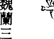

克麗莎·魏蘭三十歲時生了第四個孩子，後來得了產後憂鬱症。醫生給她開了抗憂鬱和抗焦慮的藥，她也吃了幾年。後來，她變得肥胖，而且需要靠著藥物和酒精來得到慰藉。

有一天，克麗莎在清理樹櫃時突然有一個感覺，認為自己的生命會在年輕時就結束。開始時，她覺得可以接受這個結局，也認為其他人最後將會注意到她實際上是個多好的人。後來，她開始思考，意識到自己應該做些什麼來防止生命早逝。她坐下來細數自己所有的福氣，就在那個時刻，她決定快樂起來。因此，克麗莎在醫生的支持下，安全地把藥都停了，她沒有任何藉口讓自己不快樂。

她接到的指引是不再喝酒和停用藥物，而且要變健康。她找到自己喜歡的工作，也開始每天都跑幾哩路。克麗莎覺得非常幸福，她的先生和小孩也相當快樂。從外表看起來一切都不錯，但事實上，克麗莎是把過去的情緒往裡塞，她不想面對，也不想讓情緒出現，於是把它們推開，假裝沒有這回事。

不久之後，克麗莎發現左胸有一個腫塊，診斷結果是癌症。她感到震怒，這陣子是她長久以來最健康的時候，為什麼會發生這種事？她開始不斷下沉，很快又肆無忌憚地吃喝起來，內心深處，她知道這是不對的，卻不知如何停下來。她又回到用吃喝來掩蓋情緒的模式。

她做了化療、放療，也動了手術。克麗莎意識到她的人生完全失去平衡，她和先生之間開始有爭執，孩子也誤入歧途。但她不知道是那些沒有表達出來的憤怒把事情變得更糟。

接著，克麗莎接到了可怕的消息——癌症復發。

這次她準備好了。她告訴自己無論多痛苦都要把過去挖掘出來，她知道自己必須清理那些還沒有釋放的舊能量。她也研究了如何透過療癒變得更健康，飲食開始以植物為主，每天早上打新鮮果汁，戒了甜食、咖啡和酒類。她每天運動並且靜坐。克麗莎甚至找治療師幫忙，徹底清除憤怒和過往的情緒。

在她開始向神和天使祈求之後，第二次化療就不再那麼難以忍受，雖然這是一種猛烈的治療，產生的副作用卻已降到最小。她可以感覺到身體在做自我清理，不只是身體上的清理，還有情緒上的，她清除了不健康飲食裡的有害物，也把過往痛苦的情感清洗掉了。

克麗莎很滿意現在的健康情形，她的家庭因此有了改變，反映出她良好的健康狀態。

## 藥草茶的鎮定作用

喝洋甘菊茶有助情緒的鎮定。一般情形下，一天喝一、兩杯，假如感覺到怒氣出現，可以多喝一杯。泡茶以及坐下來喝茶這個過程，就足以使憤怒的能量轉向而去。

## 精油的鎮定作用

使用天河石（Amazonite）水晶，它會操控憤怒，使之平息下來。也可以使用虎眼石（Tiger’s Eye），幫你暫停下來，專注於該做的事——稍做喘息，不要馬不停蹄一件接一件地做事。白天把水晶放在口袋裡隨時帶著，晚上睡覺時，可以放在床頭櫃上。

## 排除憤怒的花療法

- 秋海棠 (Begonia)：提醒你耐心的重要性。當你有耐心時，天使們能在寧靜之中引領你。秋海棠會幫助你保留自己個人的空間，當他人不斷干擾到你的工作領域時，怒氣會升起，環境周遭若有秋海棠，你會受到保護，不受到旁人的干擾。
- 蒲公英 (Dandelion)：化解任何憤怒的想法和感受。沙拉裡面加蒲公英葉，吃了後能釋放憤怒和氣惱，讓你看到當下狀況的光明面。
- 金魚草 (Snapdragon)：清除話語中的憤怒和負面性，並鼓勵你使用有助療癒的字眼和包含愛心的詞句。這種言詞會給別人帶來好處，藉由提升語音的振頻，你可以和周遭的人分享你的療癒天賦。手拿一朵花，把你的挫折感寫在紙上，把這張紙摺成小片放入花中，再把花丟到花園裡，讓憤怒隨著花消逝。
- 鬱金香 (Tulip)：在你覺得停滯不前時，給你動力。鬱金香帶來寧靜和放鬆，讓你能清除憤怒和紛擾。它也會幫你專注，以便能夠完成眼前的工作。

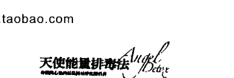

## 怨懟

對他人的怨懟裡包含著類似嫉妒和苦楚的能量。緊握這些低頻能量會降低你的振動，只會對你造成傷害。問你自己，是否真的想對他人造成傷害，你知道答案一定是否定的。然而，不肯放下怨恨，無異是把傷害加諸己身，願意放下這種舊能量，你才能重新享受生活。小我試著要你相信你是匱乏的，為了生存，你必須奮鬥。假如別人有你想要的東西，必須透過競爭才能把它贏過來。根據靈性的真理，每個人都擁有的都綽綽有餘，沒有必要為了自己、家人或所愛的人的生活所需而去爭奪。小我想要你花許多時間去奪取他人的東西，這沒有必要。天使們提醒你，內心有所渴望時，只需要提出請求即可，然後，你的祈禱會往上飄浮進入天國，神會在那裡精心處理你向神提出的請求。這些請求不一定很大或很冠冕堂皇，相反地，希望可以簡單到像迅速找到停車位，或回家時不要塞車這類的事。提出請求之後，你可以不費力地達成所願，於是，就沒有理由不知不覺陷入壓力之中，或對那些擁有你想要的東西的人心存怨尤。看到沒有，改善每天所發生的事有多簡單？想像當你把這種想法運用到生活中的每個層面時，你將感到多麼輕鬆，不用再深受壓力之苦，或對他人感到憤怒、怨懟，相反地，你走的是一條最有勝算的路，因為，你相信神會照顧你。

## 蒲公英的療癒力

蒲公英可以紓解怨懟和苦楚。使用這個藥草的方法有很多種。你可以在草地上找新鮮的蒲公英，用它來做冥想。這種花會消除低頻的情緒，假如上面有種子球，把意念集中於對平靜的想望，用盡全力吹散它，直到飛入空中為止。

還有，你可以喝蒲公英茶，可以沖泡葉子（對腎臟很好），也可以沖泡根（對肝臟很好），這兩種茶都可以把怨懟沖出體外。你也可以使用蒲公英萃取液和酊劑，一次用幾滴就可以消解怨懟和嫉妒。

## 消除怨懟的花療法

- 金魚草：在說話之前給你一點時間思考，讓你先沉靜一下。當你運用金魚草時，會發現彼此的溝通裡擁有更多的喜悅。放下低頻能量的怨懟，讓自己和所愛的人相處得更愉悅。

那些導致你心懷怨懟的人無意傷害你。使用金魚草之後，你會發現，和別人競爭或嫉妒別人所擁有的東西都是沒必要的。你跟他們一樣，有資格擁有快活的人生。

## 不願寬恕

不願寬恕是阻礙靈性天賦最大的原因之一，所附帶的能量非常黏稠，頻率又很低，會把你拉離天使的頻率。陷在不願寬恕的狀態裡時，神給予的指引你聽不到、看不到、感受到、也不懂。

天使們說，假如拒絕原諒，你只會傷害自己的神聖之光。內在之光比你所想像的更美，散發著高頻率的光明，像黑暗中的燈塔一般閃耀著，靈魂之光永遠不會熄滅，但在你堅持不願寬恕時，就好像用一條黑暗的毯子覆蓋著那道光，它仍舊發著光，但變得較難被觸及。天使們對不願寬恕的另一種形容是，像河流中的一個水閘，阻斷了體內的療癒能量之流。

寬恕的過程很簡單，接納的這段路卻不容易走。想要原諒他人時，你已選擇要釋放一直附著在身上的負面能量，你不認為對方對你所做之事可接受，只是原諒那個做錯事的人，好讓自己重獲自由。你選擇釋放痛苦和對方那股一直捆綁著你的力量，現在，是你該重拾自己的力量，相信自己會有平靜未來的時侯了。依你現在仍需要療癒的狀況來看，這個觀念目前可能難以了解，試著不要讓小我把你拉離這個主題，也不要讓它把你的焦點從這本書上移開。因為，小我想阻止你原諒別人，它要你緊抓著低頻能量。

當你幫助自己超越黑暗，你會看到，神性上我們全都相連在一起，也都來自同一個本源。我們的本質，或是我們的靈魂，都來自同一個充滿愛的造物者，當你有這樣的想法時，把對方觀想成一個純真的小嬰兒，此時，寬恕的過程會變得比較容易。

天使們提出一個問題：「你是否想把痛苦改換成平靜？」重複念幾次這個肯定語：

我想要寬恕，我願意把痛苦改換成平靜。

對自己說這些話，把讓你無法接收天使療癒的障礙化解掉。

## 寬恕的冥想

天使們，請祢們跟我在一起。

我請求祢們帶給我療癒能量和指引。

專注在很深入、緩慢的一呼一吸中，讓頭腦沉靜下來。吸氣時，數四下，接著呼氣，數四下，持續這樣做幾分鐘。當你覺得足夠輕鬆，平靜到能置心一處時，召請天使們：

感覺他們靜靜地待在你身旁，接著，觀想自己在一個安全、私密的地方——可以是山頂，寧靜的河川，或一個溫暖誘人的海灘，在心眼中，看到天使們和你在一起。在這個釋放的過程中，他們來到這裡保護你、支持你。

接著，邀請你想要原諒的人來到這個安全的空間來。在寧靜中，感受到他跟你碰面，利用這個機會，把你心中和身體裡一直保留的一切說出來，向對方徹底地表達。你要知道這麼做是安全的，假如你感覺到情緒上來了，允許這一切自然發生，把情緒釋放掉，這是療癒過程的一部分。也可以問對方一些問題，並耐心等候他的回應，你收到的可能是一些感覺、話語、意象或想法，這個人的能量會給你答案。你可以請天使們幫你了解對方所說的，假如這個回答讓你感到痛苦，他們也會幫助你把痛苦消除。做完這個觀想後，請天使們來到你身旁，觀想他們正把療癒能量送給你們雙方。然後說：

我選擇寬恕，我願意讓你離開我的人生。

你很快就會感覺到濃稠、低頻能量離開身體。感謝天使們給你美好的支持，也相信清理工作已經開始。

在一天剩下的時間裡，對自己好一點，有需要時不妨小憩一下，讓自己好好休息。

至於飲食方面，聽從身體給你的訊息。

## 傷痛和失望

傷痛和失望在能量體裡留下傷痕，藉著靈視力，我們看到這些傷痕就在身體的上方，這顯示出，過去你已受到傷害或已被擊倒。加以清理這些舊傷口，才能避免這種模式再度發生，這是很重要的。一段痛苦關係的終止，會在能量場留下有待處理的傷痛，會使重新建立一段新關係時，變得很困難，你會不斷遇見相同的對象，只是在不同的身體裡偽裝成不同的人，但他們的能量感覺上是一樣的。過去的關係不能持續下去是有原因的，不要讓自己再度經歷這種痛苦。和天使一起，把這種舊能量釋放掉，擁抱新關係裡的正向改變。

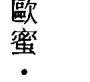

來自澳洲的娜歐蜜．西里歐陷在婚姻的困境裡已經持續幾年了，她自以為已經從四年前先生外遇的創傷裡重新站起來了。在內心深處，娜歐蜜懷疑，二十五年的婚姻關係裡，先生一直是不忠的，但她不斷說服自己，維持婚姻對小孩最好。

但是，娜歐蜜的身體發出警訊，讓她知道需要排除情感上的痛苦。她開始有肺部感染和肝的毛病，還有婦科方面的疼痛。她祈求天使們顯現一些徵兆給她，但她卻沒有重視所收到的訊息。

經過慎重思考後，娜歐蜜決定割捨這段關係，這是個艱難的抉擇，但她知道這是她需要的。

聖誕節將近時，她看到有一個「天使視野」的工作坊將在雪梨舉辦。二十五年來，這是第一次她在購票時沒有遭到嘲笑，光是買票就讓她有解脫之感！

娜歐蜜接到指引要她在清理情緒時，也要同時開始做身體上的淨化。一個好朋友給她一個排毒的飲食計畫後，她就開始踏上淨化之路了。她在「天使視野」工作坊開始前的一週開始做淨化工作，天使們叫她戒除咖啡，她也收到所需工具以達成這個目標。

只過了一個禮拜，娜歐蜜就注意到能量已有重大變化。以前，她讓恐懼主宰人生，而現在，她覺得鎮定、握有掌控權、而且感覺安全。經過天使們的刻意安排，娜歐蜜被我們（朵琳和羅伯）挑選出來做一個花朵的訊息解讀。現在，她信任天使給予的指引，繼續改寫人生。

## 和大天使拉斐爾一起療癒傷痛

拉斐爾可以療癒情緒，消除傷痛。你可以和祂一起清理過去負面的經歷，你的靈魂帶著一塊畫布，上面有過去的人際關係、失望和痛心的印痕，和拉斐爾一起把往事勾銷，迎接改變。

先做呼吸，冥想。接著，召請拉斐爾：

大天使拉斐爾，現在，請帶給我充滿愛的療癒能量。

空氣中一點點壓力上的改變或輕微刺痛感，是拉斐爾臨在的一個象徵。也有可能，你就是能感覺到祂跟你在一起。

接下來，觀想一塊畫布上顯現出你受創傷的人生經歷。一般來說，這塊畫布看起來像是很多畫面重疊在一起、一團雜亂，可能看起來像潦草的塗鴉，或上面似乎潑滿了顏料。

請拉斐爾去除這些舊傷：

大天使拉斐爾，請洗淨仍留在這畫布上的舊能量。

請讓我輕鬆、不費力地釋放過去的痛苦記憶。

我請求祢療癒我，讓我永遠都不用再忍受相同的傷痛之感。

好好覺察大天使拉斐爾把祂具療癒力和清潔功效的液體噴灑在畫布上。感覺舊情緒離開你的身體，被釋放進入光中，顏料和色彩滴落，露出底下純白的光。現在，拉斐爾問你，想在畫布上看到哪一種畫面，允許你把目標和想望吸引過來。

用這些話來感謝拉斐爾：

拉斐爾，謝謝祢幫我做這麼好的清理。

請繼續與我同行，我才能吸引並肯定能夠擁有一個積極樂觀的未來。

## 療癒心的水晶

粉晶（Rose Quartz Crystal，又稱玫瑰石英）慢慢讓愛再度進到你的生活裡，幫助吸引有愛心和善心的人，幫忙化解阻礙，接著，你可以放下防禦，歡迎其他的人進來。粉晶會幫你了解，並不是每個人都是壞人，或想要傷害你，很多人都希望看到你成功，並分享美好的快樂與光。

## 去除傷痛和失望的花療法

劍蘭讓你抽離悲哀和傷痛。你有很多的愛與光可以和這個世界分享，神需要你處在最好的狀態中。抱持著傷痛的舊能量會阻擋天使的愛，要把這阻礙移除，讓神之愛回到你的生命裡。神和天使一直都在你身旁，只不過，目前的情況使你無法聽到他們的話，現在就是好時機，和充滿愛心的指導者重新連結，並與他們分享最深層的情緒。

# 第9章 净化能量

## 清理家中的能量

因為你是敏感的人，所以會在不知不覺中吸取他人的能量。這些能量——特別是有害的負面能量——會影響身體和情緒的健康。在本章裡，我們會探討一些方法，可用來清除個人、居家和大環境的能量，並讓能量一直保持乾淨的狀態。

你每天在家的時間可能很長，不管醒著或睡著，都在同一個環境裡，所以，你應該把家當做一個聖所——可以在那裡放下一天的憂慮和煩惱。家應該是可以找到平靜和幸福的地方，即使你和他人共用這個場所，也應該能在這個環境裡感到舒適自在。最重要的是，家應該是一個可以讓人放鬆的地方。

跟人一樣，家也有能量。你很有可能第一次走進一個人的家時，馬上有平靜之感，感受到住在裡面的人充滿著愛，令人很安心地卸下防衛，與他們坦誠相處。相反地，你也可能去過某個人的家，那裡讓你感到不自在。這是一種不好的能量，令人感到焦慮和緊張，你可能連和人講話都覺得困難，或你可能發現自己有一些異常的行為，把這種經驗記下來，對於環境的能量，這會給你很清楚的訊息。當然，家裡有不好的能量並不代表裡面住有惡人——他們可能是很有愛心、很善良的人，但家裡的能量會動搖他們的善良，並引發一些負面的行為。想像一下你的家，你認為一個完全陌生的人會怎麼看它？他們會說感覺舒服？還是感到緊張？

想想在第一章裡學到有關水晶的知識，即使有一陣子沒有使用了，把水晶加以清理，它們會感受到你的心意。水晶放在身邊可以吸取低頻的能量，家裡也一樣，把家想成是一個敏感的物體，能夠吸收周遭的能量。當朋友來訪，或孩子們邀請朋友到家裡來時，這個家就有了不同的能量，而這些能量不一定可以和原有的能量融合得很好。你的想法可能完全以愛與助人為主，但來訪者可能比較重視現實利益，或想法較粗淺，因此他們在牆上留下了「心靈污點」的能量。爭論和誤解會在家裡留下能量的印痕，而在家裡做充滿壓力的商業工作，也會留下負面的能量。假如家裡有負面能量，你會發現自己在裡面很難開心。你可能會與人無故、無意義地爭吵，或者也可能會失去生活動力，整天只想看電視。你也可能因為只吃加工食品、外食（或兩者都有），而形成一種較差的飲食習慣。

解決的方法並不是拒絕他人進到你家，你還是能享受朋友間的聚會，為孩子安排玩樂活動，也可以從事你的工作。需要做的只是清除家中的負面能量，假如你夠敏感，就能感覺到這個家什麼時候需要清理。假如你對自己這方面的敏感度還沒有信心，可以計劃每個月做一次家庭清理，這期間若出現令人不舒服的能量，可以再清理一次來平衡能量。

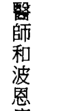

麥可・蘇是澳洲的自然療法醫師和波恩療法（Bowen Therapy）的治療師，他想過更簡單真誠的生活，他的高我也知道他必須做些改變，他的周遭都是有害的能量，使他無法發揮潛力。麥可開始認出哪些事情是真正重要的——不是物質的東西，例如，昂貴的房子## 第 9 章 淨化能量

或最新潮的衣服，甚至也不是在最好的餐廳裡吃飯。對麥可來說，簡單最重要。 不知道是大天使夏彌爾給了他指引，還是受到已過世的摯愛父親的影響，麥可決定搬家，他離開了雪梨郊區的公寓，遷移到美麗蒼翠的杭特谷。在那裡，他感覺到自己已踏上了淨化之旅，一度跟他在一起的沉重能量不再有容身之處。他把生活中不需要和有害的事物都清除了，也放下朋友圈裡那些很情緒化並帶來壓力的人。麥可選擇把重心放在家庭、真心相待的朋友和成為社區的一分子上。一切都還在進行中，但他知道自己永遠都不需要再回顧過去了。

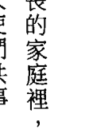

在薩希塔·葉拉曼希利成長的家庭裡，缺乏個人空間及彼此的相互尊重。為了保護自己和療癒周圍的人，她開始和天使們共事。 她開始注意到不同家人間的互動，對於某些事情，她開始覺察自己的反應，及他人的反應。舉例來說，當她的阿姨開始提高聲音量、變得咄咄逼人時，薩希塔會畏縮，感覺很不好，但表兄弟們卻不在意，或者就只是笑笑，然後走開。薩希塔想改變這件事對她的影響。

她开始和大天使麦可密切合作，不管什么时候，当争论开始加温时，她立即召请麦可到身旁，请他做灵性吸尘，清除有害的能量。她观想家中所有的紧张气氛都被化解了，取而代之的是宁静祥和，萨希塔请天使们洒下金光给每一个相关者。经过多次练习后，她有信心了，当阿姨再大声喊叫时，她不再吸取那种侵犯性的能量。最后一次发生这种事时，萨希塔真的笑了出来，因为她认为阿姨的言论很荒谬，感谢大天使麦可，她从此不再害怕了。

我（朵琳）的《天使疗法引导式冥想CD》是在大天使麦可的能量下传导而成的，有深层的净化效果可以去除所有负面能量，你可以在家里播放做为清理之用，假如你不想，不必跟着坐下来冥想。另外的做法是，在家中主要的活动空间里播放，从能量上来看，这就像是喷雾杀虫剂，大天使麦可的正向能量振动将弥漫在整个家中，不留下任何黑暗的痕迹。

## 天使的清理

天使們是純淨和充滿愛的光，祂們的能量和振動頻率都很高。祂們可以照亮每個地方的最黑暗處，請天使到你家，一次把所有的房間都清理乾淨。做這種清理時，與大天使麥可、麥達昶一起完成，麥可會很有力道地清理完所有的負能量，而麥達昶用神聖的符號清理空間帶來平衡。

在家裡主要的生活空間坐下來。開始時，先專注於呼吸，深長緩慢地一氣吸到底，再一氣呼出。做幾分鐘深呼吸，感覺放鬆時，召請天使：

天國的天使們，請賜予祢的神聖臨在。請把祢的清理之光帶進我家，去除所有的黑暗。請請求祢讓每個住在裡面的人都感覺到祢的洗滌。但願每個人都處在平衡狀態中，並且熟悉高振頻的愛。

我歡迎大天使麥可的來到。麥可，請進入這個家的每一個房間，讓每一處充滿祢的光。不管那裡有任何負能量或恐懼，請將它排除。

大天使麥達昶，我也祈求祢的協助。請讓牆充滿祢神聖的符號。願它們為我的房子帶來和諧，讓進到這個家的每一個人都能在寧靜中帶來和諧。天使們，謝謝祢們在我家裡創造了一個神聖的空間。現在，觀想天使們把清理之光遍灑全家。看著祂們為樹櫃抹塵、為地板吸塵、清洗窗戶，看著祂們用愛的能量為生活空間帶來和諧。在你的心眼中，跟隨祂們走遍每一個房間，你可能會注意到，祂們在某個房間逗留的時間比其他房間長，這可能意味著那裡的能量比較濃稠，或者負能量已在那裡積存多年。跟著直覺感受，找出那些能量的來源，這將有助保護自己，將來不再受到這類負能量的影響。你的家現在擁有完全和諧的能量，好好享受這個美好寧靜的家吧！

### 白鼠尾草

鼠尾草（Sage）因其清理效果，長久以來一直受到推崇。傳統美洲原住民用鼠尾草清除負能量，這種神聖的藥草被尊為來自造物者的禮物，當時被用來清除一些可能導致疾病、喪失活力和招致痛苦的低頻能量。

白鼠尾草（White Sage）有一種高頻振動力，可以化解恐懼能量，做清理時最常被用來當做薰香使用。白鼠尾草被做成好幾種不同的形式，最純粹的是散葉式，可以在特別為焚香而設計的木炭塊上焚燒鼠尾草葉，當地賣靈性物品的店裡可以協助你。

繞行全家時，一手拿燃燒著藥草的碗，用另一隻空著的手把煙向四處撥散。在水晶、神諭卡和其他的靈性用品上揮動，在門口附近多花一些時間，特別是前門和後門，在這裡清理能量，並言明只有愛的能量可以進來。跟隨並信任內在的指引，決定在每個房間停留多久，同時觀想透明的白光貫穿整個房間，感覺淨化正在進行，留意能量如何變得更輕盈。

你也可以買紮成一束的煙薰束，就是一種可以攜帶且容易使用的整束鼠尾草。這種煙薰束一旦點燃就會持續冒煙，煙薰完成之後，在沙土上把火熄滅。這種方法的機動性比較高，因為可以像用魔棒一樣四處揮動，在小物件、樹櫃裡面或周圍，煙薰束都很好用。

香錐和線香也都可以用，但要確定是用白鼠尾草做成，某些線香有白鼠尾草的香味，但裡面沒有生的藥草，使用真正的藥草，淨化效果最佳。

使用時，請同時考慮到白鼠尾草的來源——選擇有商業道德的公司或品牌。種植白鼠尾草的人很少，故做香用的藥草很多都取之於野外，不經心的情況下，一間公司可能把某個地區的鼠尾草搜刮殆盡。製造廠商必須與大自然之母配合，而大自然一定要確定，下一代的人還有鼠尾草可用，年裡植物有足夠的條件可以生長。關於這方面的資訊，你可以問公司或在網路上查看。

## 白玫瑰

力量最強的淨化天使，難怪這種花可以提升家裡的能量。白玫瑰會帶來寧靜之感，在它做淨化工作時，讓它跟你自己的能量一起運作，當你提高振頻時，白玫瑰可能會指引你放棄某些食物、飲料，或離開某些朋友。

冥想著花瓣的純淨，這是花朵所帶來的能量，可以清除所有不同形式的負能量，包括仍被困在地球的靈體——令人不舒服、負面的存有。白玫瑰會驅除一切黑暗，照亮你的家。

在客廳裡，用一個花瓶插上白玫瑰花，你很快會注意到周遭環境有了很明顯的不同。也可以在每個房間裡都放一朵白玫瑰，每一朵個別的花朵結合在一起產生功能，就像一個光之網路，花朵們之間彼此連結，透過乙太網路把療癒和淨化的能量傳送出去。把白玫瑰留在原處，直到枯萎為止，你會發現這些花比平常凋謝得快些，因為它們正在提供服務——花朵們犧牲自己，換取你的提升。天使們說，不必為了這個過程而感到難過或內疚，因為這些花朵也想要幫助你，而且，把它們迎進你的人生裡，也是讓它們有機會完成專属它們的神圣目的。

### 用花瓣做清理

這個方法是我（羅伯）在脈輪療癒工作坊教課時發現的。天使們指引我使用新鮮的玫瑰花瓣清理水晶，他們說花瓣的高能量可以除去低頻的振動，花瓣會把深切的愛注入水晶裡。所以，我買了一整袋玫瑰花瓣準備在課堂上用，我們先清理水晶，然後，用花瓣清理我們的脈輪。每個人都很喜歡這個做法！為整個教室帶來許多歡愉和喜樂，我向天使們致謝，他們教導我們這個提升能量的新方法。我還有一袋未用完的白玫瑰花瓣，不想浪費，所以我問天使：「要怎麼好好利用這些花瓣？」天使們叫我們把花瓣撒在地上各處，這樣可以清理整個房間和能量，或者也可以把花瓣用在冥想時。我們把新鮮的花瓣遍撒地上，那種能量實在是太神奇了！玫瑰花的清香味道打開了我們的心，也淨化了環境。整個空間裡充滿一種很好聞的氣味，讓人覺得很舒適。淨化家裡時，可以試試把玫瑰花瓣撒在整個地上，當地的花店可能願意賣整袋的花瓣給你。在我的經驗裡，比起買玫瑰花，買花瓣要便宜很多，我猜想那是花店在插花時所淘汰的不合格品，若使用得當，仍然有很好的提升能量效果，也有療癒的作用。你甚至可以買新鮮的玫瑰花，在進入房間時，以進行儀式的方式把花瓣一片片摘下。

## 四大元素的淨化

這個做法把四個元素——土、風、火、水——全部集結在一起，在家中走動時，你會用到這每一種能量。它們都各自用獨特的振動來化解恐懼。

首先，你需要代表每個元素的東西：
- 土‖鹽
- 風‖香
- 火‖蠟燭
- 水‖一小碗水

把這四樣代表物放在面前的桌上，兩手放在物品上方不遠處，觀想純白光淨化物品，然後說：

我請求天使們在我清理這個房子時跟我在一起，並給予指引。
請淨化這四個元素的代表物，讓我可以用它來做清理工作。
我希望今天我們一起做的事，能為大家帶來最大的利益。

持續觀想白光，把香點燃，拿在手中在家裡四處揮動，祈求煙進行清理工作，你可以說：

用這個香，我請求風元素，還有天使們，清理我的家。

在家中四處走動時，重複說出這個祈求。完成後，把香放回安全之處，接著拿起蠟燭，說：

用這個蠟燭，我請求火元素，還有天使們，清理我的家。

完成後，把蠟燭放回安全之處，再拿起水。在每個房間四處都灑點水，重複說：

用這個水，我請求水元素，還有天使們，清理我的家。

把水放回桌上，拿起鹽。一面把一小撮鹽灑在地上，一面說：

用這個鹽，我請求土元素，還有天使們，清理我的家。

完成後，暫停一下，閉上眼睛，感覺淨化的能量四處縈繞，清除所有陳年累積的負能量，向四個元素和天使們表達謝意 — 現在，你已經擁有一個和諧的家。

讓香和蠟燭燒完，把地板用吸塵器清理或打掃乾淨，再把垃圾倒在外面的垃圾桶裡。

## 頌缽

可以用水晶頌缽和西藏頌缽幫你連結天使，並清理耳輪。水晶頌缽用透明清澈的水晶做成，頌缽用聲音清理整個空間的能量，頌缽的頻率可以去除負能量，把你帶入冥想狀態。西藏頌缽通常由金屬製成，也可能混雜其他礦物質，有很純淨的音調，並且能把意圖加以擴大。西藏頌缽通常由佛教僧侶們用手敲打製成。這兩種頌缽都可用來做為淨化和療癒之用。

拿著頌缽進入想要淨化的房間，花點時間讓自己在安靜中置心一處，專注於呼吸，想著你的意圖——把這個地方的負能量清理乾淨。用敲打工具在缽上輕叩，接著慢慢開始敲缽的邊緣，很快就會聽到頌缽開始對你歌唱的聲音，讓這個天界之音擴散到整個房間。只要你感覺受到指引，就持續敲，在敲打時會感覺到自己進入冥想狀態，頌缽的頻率會引發放鬆反應，喚醒直覺力。你可能會覺得收到指引，叫你用不同的方式敲擊頌缽，讓聲音自然停止，接著再敲一次，聆聽它的波動之音。清理房間時，讓自己的創造力自然流動，你可能收到指引，叫你走到某個能量比較沉重的角落，相信指引，並去那里敲響頌缽。

## 增加力量的肯定語

家會吸取周圍的各種能量，要特別用心讓家裡充滿愛的意念和祈禱。可以使用正向能量很強的肯定語，在你大聲說出時，能使家中能量變得清新，在兩次的清理之間，肯定語仍能發揮很好的作用，因為它會在家中注入你的正向意圖。 想想你說出的話語能量進入牆壁中。你常聽到有人說想把家裡重新油漆，因為他們想給家中全新、清爽的感覺，有時候，做完清理工作之後，這房子給人一種比重新油漆前更沉重的感覺，其原因何在？有可能是做油漆工作的人一路不停地抱怨，他們可能曾經說過一些負面的話，例如，「我討厭油漆工作」，「好無聊」，或者「事情太多了」。這些負面話語滲入牆裡，也造成濃稠的能量。假如你不喜歡油漆工作或任何這個家裡需要做的事，那就雇（有正向能量的）人替你做。要不然，你自己做這件事時，務必用快樂和充滿愛的字眼，觀想著正向能量為家裡帶來的美好感受。

左列有幾個肯定語，你可以在家裡面練習：
- 我的家愛我，我也愛我的家。
- 我珍惜這個家給我的感覺。
- 我家是一個樂土，是我可以放鬆，也可以做我自己的地方。
- 我歡迎正向積極的人進到我家，其他的請他們離開。
- 在家裡我有安全感。

## 清理自己

假如你吸取到低頻的能量，想要積極正向或生氣盎然就更困難了。天使們說，行事拖延是一種示意——身體裡留存著有害能量，當你拖延時，就延遲享受快樂——而你根本沒有理由擱置上天賜給你的大福。拖延是用無意義的干擾讓你分心，無法做你該做的事。網路上的社交工具使得這種延宕永無止息，就算沒多久前你才查過郵件或訊息，你還是想再看一遍。

小我說，你必須先做基本的事，接著再去做真正重要的事。在這種情況下，你一定要夠強大才能承認延宕已經發生了，定期的清理工作和冥想可以防止掉入這種模式。必須給能量體最好的照顧，重要性就像好好照顧身體一樣。

亞妮塔·恰卡拉巴蒂是一個占星家和自然療法醫生，她為了尋找靈性之路和人生的目標，把人生好好做了一次清理。


亞妮塔出生在英國一個勞工階層、混合了不同種族的家庭裡。她活著的野心就是擁有很多錢，可以花錢不眨眼。三十歲時，她已是一家銀行風險部門的主管，這份工作使她比同儕們都富有，在別人眼中她也是個成功的角色，她在倫敦有一棟大房子，享受五星級的假期，穿的是設計師的名牌衣服，但她卻沒有充實的感覺。

每晚，她都要用大麻自我治療，第二天，再喝幾杯濃咖啡，把自己從用藥後產生的昏迷中喚醒。每個看到她生活方式的人都告訴她，她是成功的人，但她並不快樂，連亞妮塔自己也不知道為什麼。

亞妮塔在無意中發現一本禪宗的書，開始了尋找人生意義之旅。她開始試著從靈性書籍中吸取資訊來填補內在的空洞，內心深處她知道，若想得到真正的快樂，她必須先清理銀行的工作和八年的情感關係所給她帶來的不良影響，接著再開始踏上追尋之路，她到印度、澳洲和南太平洋旅行、尋找人生的意義。尋覓並未改善焦躁不安的狀況，因此，亞妮塔回到倫敦的家。不久之後，一家正在物色人才的澳洲銀行聘用了她，她決定離開親朋好友前往雪梨，真正的覺醒就發生在那裡。一趟澳洲烏魯魯（艾爾斯岩）之旅中，老是聒噪不休的頭腦終於停止，體會到了完全的寧靜，她感覺到自己和土地、天空以及靈界之間產生了很深的連結。

她祈求能夠找到真正的人生意義，並耐心等待前面的道路出現。也在同時，她的朋友跟她提起有關自然療法學位的事，她的心因為喜悅而打開了，她知道她能用一種重要的方 式幫助別人。澳洲銀行的老闆願意讓她不必全職工作，可以去上課，她的靈魂把她帶往占星術領域，接著，她又遇到了她的薩滿，現在正跟薩滿一起合作。亞妮塔很喜歡她的新生活，也很喜歡自己。她真的很高興能在滋養自己神聖靈魂的同時，還能幫助別人。

## 清理能量場

敏感的身體會受到周圍能量的影響。假如在你身邊的是有愛心、高能量的人，你會感到一切都好極了。假如在你身邊的人負面、滿腹牢騷，你會感到無精打采、疲憊。身體對不同的能量做出反應，也會給你很清楚的信號，讓你知道它所受到的影響。靠近其他人時，密切注意自己有什麼感覺。這會讓你明白，哪些人對你的人生目的有所助益，或是會造成你的阻礙。

## 能量場噴劑和振動精華液

### 自製能量場噴劑

使用能量場噴劑會使能量清理工作變得簡單，噴劑裡包含淨化能量和純精油，淨化時，噴灑在能量場周圍，灑出的東西會慢慢落在身上，化解較低頻的能量。也可以在頭的上方噴四、五次，吸入鎮定安神的香味。

你可以用能量場噴劑清理房間的能量，噴灑在整個家中做為淨化之用。

振動精華液是有清理及平衡作用的液體，由花、水晶、大自然和天使們的能量共同組成。你可以口服——滴幾滴在舌下，此處連結著下意識腦，並可以清除源於恐懼的想法。

在白天，振動精華液是很有用的輔助力量，且容易攜帶，方便服用。

在市面上有很多種噴劑，除非知道製造商的誠信度，否則很難把握品質。有些製造者不肯告知所使用的成分，假如你是超敏感體質，這可能給你帶來一些困擾。

製造自用能量場噴劑的過程是很美好的，每一個步驟都使用直覺，跟隨天使的指引，選擇一種和你相對應的精油，找到你喜歡的香味，以及讓你感覺很好的能量。每一種精油都有自己獨特的特性，為了現在這個目的，天使們會要你用直覺選出一種。接著問天使，要加幾滴到這個噴劑裡，相信你得到的第一個數字，照這個數字滴入噴劑瓶中，加滿泉水，用力搖一搖，可能需要好好地搖個五分鐘，讓油和水徹底混合。

現在，把噴劑放在面前，兩手輕輕環繞著，召請天使和神，請她們做一個有清理作用的噴劑，你可以說：

親愛的神與天使，請把這個轉換成可以做深層淨化的能量場噴劑。
願它洗淨所有負面的能量。

觀想純白光從雙掌進入噴劑中，感受這個液體淨化的本質，相信它可以清理所接觸到的一切。讓噴劑充滿大天使麥可的深藍光，增添更多清理的功能。

現在，可以開始享用你的噴劑了！

### 白鼠尾草

焚燒白鼠尾草的烟能為能量場除穢，你可以站在正在燻燒的藥草上方，或者也可以請光之工作者的友人把煙引到你身體的四周。

## 光浴的净化作用

天使們會試著給你簡單的指引，讓你照著做。他們會要求你每天清理能量場，並教你簡單的做法。天使們說，可把淨化之光設定在浴盆上的蓮蓬頭裡，這樣一來，每天在例行的沖澡中都能接受能量清理。

揉搓兩手喚醒手掌脈輪，分開雙掌置於蓮蓬頭上方。想像著金光從你手中發出，留存在蓮蓬頭裡。你可以請天使們來幫忙：

> 天使們，請祢們用淨化和排毒之光充滿我的蓮蓬頭，每一次我在蓮蓬頭下沖澡時，我的能量都會被洗滌，我將會感到清新、更有能量、更有動力。感謝祢們。

觀想著金光從天使和你的雙掌發出，被蓮蓬頭吸入。下一次你沖澡時，用點時間在心中召請天使，確認這個光浴的效用，這個簡單的步驟可以保證能量清理確实在進行中。

### 鹽浴的療癒作用

在一天的緊繃之後，洗個排毒澡會讓你全身舒暢，運用海洋的清理特性洗滌能量場。天使們說，鹽浴的療癒作用可以排出身體和能量體裡的有害物，享受這個淨化泡澡，喚醒你的神聖之靈。

### 大天使麥可的斬斷繩索

大天使麥可說，每一次我們和他人互動並幫助對方時，彼此之間就形成了一條繩索。這些繩索的源頭都是恐懼，不會帶來任何好處或達到什麼目的，假如你允許繩索留在能量場裡，你會感到無精打采、疲倦，也可能會有不明原因的疼痛。

每天都讓麥可協助你斬斷繩索（見第一章），把召請祂來清理能量當成一種習慣，讓你切斷繩索成為每天的例行工作，就像刷牙或刮鬍子一樣。做這件事時，召請大天使麥可斬斷你的恐懼之繩。

## 化解負面性的水晶

任何一種水晶都會對能量產生提升和清理的效果，若能每天攜帶那些具有療癒功效的寶石，對你會很有幫助。跟隨自己的直覺，找出吸引你的那些水晶，它們會成為你的療癒工具。一時之間，未必能知道水晶的特殊療癒特性，但若它們呼喚著你，必有原因。往後你可以查看這個水晶的超自然性能，或者你也可根據目前的狀況，用直覺找到它對你的意義。

紫水晶能夠將低頻能量轉化成正向的振動，在生命的每個層次裡都能發揮作用，甚至可以把顯現在能量場裡的負面思維模式去除。可以把紫水晶放在口袋裡帶著，或也可當做首飾佩戴，做為除穢之用。

## 花癒與能量場的清理

花是一株植物裡能量最高的部分之一，攜帶著天使和仙子們的印記。這種高振頻和純淨是去除能量場中負能量最好的東西，你可以使用白玫瑰做清理和淨化，也可以用直覺選擇適用的花。去花店之前，請先向天使們祈求指引。

## 第9章 淨化能量

選定花後，開始用花在能量場裡慢慢移動，就像手中拿著一枝魔杖似地，把陳舊的振動梳理掉。跟隨自己的直覺，在身體某些特定的地方揮動花朵，假如最近思考較不清楚，你可能會覺得受到指引，而在頭部上方多停留久一些，如果背痛，你可能會覺得被要求讓花在背部多停留一會兒。

細心留意這種感受，要知道，在清理的過程中，花和天使們都在你身邊，他們正在幫你了解，身上哪些地方儲存著低頻能量，一旦找出來，就可以避免將來發生同樣的事。

預先知道自己的身體如何處理能量，你就能了解身體傳達給你的訊息。你會意識到，背痛可能是負面能量的累積，而不是醫學上的問題，在這種情況下，使用藥物不會有效果，因為疼痛的根源並不在身體上。

### 加防護罩

一旦你的能量場像新的一樣閃閃發光，你會希望它一直保持這個樣子，你得花些時間加強能量場，並幫它加上防護罩。假如這種防護沒有必要，那這個世界就太完美了，問題是，不是每個人都跟你一樣用愛的眼光來看待人生，因此，最好還是採取防護的措施，特別是到擁擠的地方或參加靈修活動的時候。

有些人認為有防護罩措施就表示預期攻擊的情況將會發生，他們認為這是对宇宙的認可，允許宇宙送攻擊能量給你。我們問了天使，他們說那像是鎖上前門，假如門是開的，任何人或任何事物都可以進來，把這個通道關上後，你可以使用門上的窺視孔決定誰可以進來，你有權利決定哪一種振動可以進來，哪一種要留在外面。

個別情況決定每隔多久需要借助於防護罩，一般的原則是每天做兩次：一次在早上起床時，一次是晚上即將就寢時。多數的防護大約可以維持十二個小時，但在接觸到惡劣的能量時，防護罩可能比一般情況下削弱得更快，當你身旁有負面的人，或身處困境時，若有必要，可以每小時為防護罩補強一次。請求天使在你需要做防護時，給予清楚的徵兆，他們給你的訊息可能是身體上的感受，或腦中突然出現該做防護的想法。花一點時間做好防護，注意觀察在這一天裡，防護罩給你帶來什麼不同。

### 天使保護層

這群天使從不休息，這就是天使防護措施那麼有力量的原因，當天使靠近你時，他們接收了負面性，把它釋放，他們把這個低頻能量帶走，接著又有新的天使來替換，繼續工作。

天使保護層清理的效果非常好，而且有鼓舞的作用。除了翅膀的拍動聲，你往往還會聽到祂們的笑聲。

## 紫水晶洞

想像自己坐在一個巨大的紫水晶洞裡，被水晶發出的紫色保護光籠罩著。每個水晶的突點都吸收著你身上和能量場裡的低頻能量，把沉重的能量和痛苦加以排除。水晶突點把所有的黑暗消除後，把療癒注入你的體內。紫水晶洞喚醒直覺能力，並加強你和天使間的連結，這是非常好的冥想，很適合在參加超自然力量展覽會，或做有關靈性的演講之前進行。

### 塑膠球

大天使麥可站在你的上方，手拿著一碗有冷靜和保護作用的液體塑膠，這個塑膠可以趕走任何的負面性或超自然力量的干擾，使之像球一樣彈開。防護罩和大天使麥可的光場一樣，是深藍色的。請麥可庇護你，你可以這麼說：

- 讓所有的負面之物都彈開，讓一切愛都被吸取進來。
- 讓這個塑膠球充滿你神聖的光。
- 請把我包覆在塑膠保護罩裡。
- 感謝祢。

### 銀鏡球

觀想大天使麥可審慎地將深藍色塑膠傾灑在能量場裡，馬上在你周圍形成一個保護層。觀想自己站在一個銀鏡球裡——就像迪斯可舞廳裡的那種。這個防護罩會把所有負面物質或別人給你的破壞性想法驅離，當你將與意圖不善的人會面時，這個方法最好用。

### 鉛保護罩

想像能量場被厚實、無法滲透的鉛所保護，這種鉛非常輕便，很容易隨處攜帶。觀想這個金屬充滿整個能量場，給你非常強的防禦力，這個防護罩在你感覺害怕或有危險時最有用處。當你下班走路回家，或者趕搭夜晚的大眾交通工具時，可以設置這種保護層，旁邊人會感受到你的力量而避開。

### 顏色

每一種顏色都有獨特的振動力，用直覺挑一個顏色用來覆蓋能量場，閉上眼睛，腦中第一個出現的顏色就是此刻最適用的。明天，你收到的指引可能叫你用完全不同的顏色，也有可能還是同一個顏色。信任內在真知的能力，並觀想你的能量場發出這個顏色的光。

### 遠離負面能量之人

你的生命裡不應該存在著情緒起伏大、無精打采，及沮喪的人，他們只會阻礙你的好事。目前在身體和靈性面，你都把自己照顧得非常好，但負面之人會抑制你的光——他們逾越界線，也對你要求太多。有時候，這些人被安排在你的生命中出現，是為了教你一些課題，也可能你的任務是幫助他們療癒，但你們之間的互動不需要到你替他們過生活的程度，你有自己的命運，替別人做他該做的事不是你的天命。神和天使們為你訂製的計畫更廣大。你可能會發現，評估一下友情並誠實地檢視是很有用的。你要努力做到能量與愛的雙向交流，假如你不清楚這一點，某些關係可能需要停止。坐下想著一個朋友，問你自己一個問題：假如他在半夜兩點，因為車子爆胎打電話給我，我要起床去幫忙嗎？你的答案可能是肯定的，因為朋友有需要時，一定要全力幫忙。接著，再問自己一個更不容忽視的問題：你的朋友也會這樣對你嗎？誠實回答這個問題（你的高我和天使已經知道實情）。結論可能是，這個人會把你的電話過濾掉、找藉口，甚或乾脆說時間太晚了起不來，這展示了你們之間關係的真實面貌：單向關係，而且不平衡。假如你繼續在這種關係裡放進能量，將導致你精疲力盡，你會耗盡能量儲備並開始厭惡幫助別人——不管是什麼方式的幫助。絕不要讓自己走到那種地步，因此，避免這種情況發生很重要。跟真正有慈悲心的朋友談談，在能量交流面，他們能給你另一種觀點，讓你知道是否付出過多。放下這些不平衡的關係是對健康有利的事，你可能會感到害怕或痛苦，但你必須得讓自己快樂才行，信任天使們的支持，停止這種不平衡的能量交流。有時候——但不是每次——當你做出抉擇時，你們之間的關係會得到療癒，對方變得更尊重你的時間和能量，並開始以一種更平衡的新見解來看待你們的友情。但是，假如情況沒有改善，你只會覺得受傷害，要選擇快樂，而不是選擇會帶來麻煩的事。

左列有幾個我們最喜歡拿來做防護的顏色：

- 白色：一種強大純淨的能量，具有保護和清理的功用。
- 紫色：保護心靈最好的顏色。
- 粉紅色：可以自我保護，而且來自充滿愛的地方。
- 金色：除了有保護作用，也是一種療癒能量。
- 綠色：有療癒作用的保護罩。
- 黃色：非常有利於學習和專注。

## 界限和尊重

你是一個有慈悲心和開放心胸的靈魂，總想要付出，照顧別人，確保他們能健康快樂是你的本性。有時候，其他人會利用你的善意，而你想幫助他人的意願也可能遭到誤用或濫用，這就是為什麼設立界限這麼重要。

你可能會覺得先立下一些規則會讓你感到不太自在，就好像助人時先訂出一些條件。但假如不這麼做，你將耗盡儲備的能量。設定界線不表示不願幫忙或不愛某個人，只是一種基本的宇宙法則——業力需要平衡——的認可。雙方施與受能量的流動必須對等。

想像小孩被規定不准在路邊玩耍，這是保護他們安全的一種方法。假如孩子們跑到路邊遊蕩，必須有人警告他們那是很危險的行為，如果沒有人告訴他們，他們會在那個危險之處繼續探索。因而必須先設立界限，並讓他們了解。

我們這些光之工作者，和朋友、家人及客戶間也有必要採取類似做法，我們必須尊重自己的私人時間，我們的需求也需要被照顧。假如沒有設立界限，他人可能濫用我們的善意。

我（羅伯）在一個非常不愉快的情況下學到教訓，剛開始做療癒工作時，我不收費，因為我只想幫助別人，只要他們從我們之間的互動關係中接受到好處，我覺得已收到想要的回報了。我在家裡幫他們看病，也很快建立固定的客戶群，他們都很高興來看我，我唯一要求的回報只有一聲感謝。但是，長久下來我開始注意到，我連這個都得不到。

有人開始在週日晚上六點打電話給我，要求幫他們做療癒，他們原本是來做一小時的療程，但總在很久之後才離開。天使們告訴我界限太模糊了，他們會占我便宜是因為我容許他們這麼做，因此，我和天使們一起靜坐，請求他們的協助，他們告訴我必須開始收費，能量的互換必須平衡，而金錢也是一種能量。

這個指引讓我不自在，我抗拒他們的忠告。我祈求天使們給我另一個解決辦法，但他們的態度非常堅決，以往天使們從未給過錯誤的忠告，我必須臣服於當下，並信任他們。

我問他們，該收多少錢，讓我意外的是，他們要我自己決定，我問他們，就算只收美金五元，是不是也就可以了。天使們說，用來設立界限，美金五元足夠了。所以，我通知了所有的客戶。 今我無比吃驚的是，沒有一個客戶再回來找過我，這個結果讓我覺得很傷心，那些人甚至不認為我的整個療程價值區區美金五元。在此同時，我仍全心全力工作著，天使們給我的訊息那麼響亮、清楚。

假如我們讓他人占我們便宜，如果我們付出「太多」，他們就不會珍惜所得到的療癒。感謝天使們幫我的諮詢工作設下了界限。

### 大天使麥可的切斷繩索

想要切割和他人之間的繩索時，要知道這條繩索來自於恐懼的能量，對雙方都沒有好處，恐懼的繩索吸取你的生命力送給別人，並像一個快遞員一樣，把負能量很快送回來。因此，要釋放這段關係中負面的部分，並在麥可幫你割斷繩索時，接受愛。

在一個安靜的地方坐下來，專心想著和這件事有關的朋友，記得你只能切斷恐懼的繩索，絕不能——你也不會想要——切斷愛的連結，這樣才能依舊保持你們之間愛的交流，這段關係才有機會達到平衡、變得和諧。召請大天使麥可時，你可以這麼說：

讓不健全的人離開你的人生，並把愛送給他們。

有意思的是，繩索另一端的人可能試著想和你聯繫，當你釋放了負面的關係，對方可能下意識中會試著抓回來，當他們突然打電話或傳訊息給你時，要特別小心，不要害怕他們可能知道你想要離開。他們不會知道，也不會認為你得罪了他們，但他們的小我可能會想繼續濫用你善良體貼的本性，不要讓這種情形持續下去，你理應擁有一種和諧與平衡的關係。

> 大天使麥可，此刻請祢給我神聖的支持。請幫助我客觀地檢視我的各種關係，並誠實面對。當別人占我便宜時，請幫助我看到這點。讓我吸引美好、有愛和體貼的人來到我的生命裡，這才是我想要跟他們來往的人。現在，請祢幫我切斷和朋友間恐懼的繩索。在祢認為有需要時，請幫我放下和這些人之間任何不健全的關係。我相信祢們和神都知道什麼對我最好，我相信祢們的指引，願意聽從祢們的訊息。感謝祢們。

### 友誼之花

非洲菊（Gerbera）是友谊之花，会吸引志同道合的人进入生活里，这些人爱的是你这个人而不是你所拥有的东西。小我可能会试著要你相信，价值是用你所拥有的物质来衡量的，假如你拥有一辆跑车、昂贵的皮包，或一栋大房子，那麼，你必定是个比较好的人，对吧？在灵性的真理中，这些东西没有一样是重要的，没错，物质可以带给你乐趣，但不应该控制你的生活。你不会想要那种需要去匹配或较量的朋友，生活中你要的人是，即使你拥有非常少，对方仍会爱你的人，这才是真正的朋友。

志同道合的人能跟你在疗愈的旅程上同行，和这种人在一起很重要，迎接想法相近的人进入你的生活中，和他们分享你的疗愈经验和天使们的讯息！

在家裡放几把快乐的非洲菊，花朵们会把最好的人吸引到你的生命裡。用小花瓶装些这种快乐的花，放在办公室的桌上，会形成你和同事间彼此尊重的场域。

向你的天使们做一个明确的祷告，请祂们带给你理想的朋友。把这些朋友必须有的特質全都列出，或者你也可以做個列表，舉出哪些是你無法處理，及你不希望朋友擁有的特質，在列表最下方一定要加這句話：天使們，我想要這個，甚至比這個更好的。此刻你可能無法想像社交圈裡會出現完全合乎理想的人，但是你要相信，神和天使們知道誰是適合你的人，他們會引領你遇到善良、懂得尊重他人的人。

天使們說，對我們每一個人來說，這是很好的練習，讓神知道什麼讓我們更快樂。祂們的比喻是，一個人正盼望著最好的聖誕禮物，可能想要一個新手鐲，卻從未告訴過任何人他們的願望，也沒有表達出擁有這個東西後他們會有多高興，導致他們在聖誕節早上感到很失望，因為並沒有收到理想中的禮物。假如他們讓其他人知道自己的願望，就會有更多機會收到讓自己快樂的東西（說真的，我們知道手鐲並不等於快樂，但在愛的交流中送出，手鐲就是一種快樂）。

### 以愛排除霸凌

承受被霸凌的壓力和恐懼，對自尊是很大的損傷，天使們將會在這方面幫忙你重拾內在的力量和信心。

霸凌以不同的方式出現，可能是虐待和攻擊，也可能是霸凌者以比較不明顯的方式操控你——他們會迫使你做內心深處不想做的事。 假如你的孩子被霸凌，你可能會覺得無助，他們上學時，你無法每秒鐘都看顧著他們並加以保護，你想終止這種情形，卻不知道怎麼辦。可以請大天使麥可代表你，跟你的小孩在一起，觀想這個強壯、提供保護的天使和你的小孩肩並肩走在一起，看著他們快樂地微笑著，而最重要的是，他們很安全。

黑胡椒有保護的特性，可以消除負面性，假如有一直干擾你或你所愛的人，用黑胡椒讓他從你的生命中消失。要知道，你不會影響任何人的自由意志——你不能強迫他人做不想做的事。黑胡椒的能量只是種下一顆種子，讓他們知道，可以在其他地方找到更多的快樂，假如最後他們不再騷擾你了，那就是意外的收穫！ 把霸凌者的名字寫在一張紙上，灑上黑胡椒後，把紙摺起，讓黑胡椒留在裡面，拿著這張紙，並說：

現在我想祈求幫忙！請讓我覺得安全、自信和受到保護。

我在這裡寫下名字的那個人一直帶給我痛苦，我不想再讓這個人控制我。我知道真實的情況是——我是有主控權的。

我允許神和天使們進入我的生命，帶給我平衡與和諧。為了所有人最大的利益而祈求有所改變的同時，我把愛送給所有相關的人。

### 放下科技產品

當我（羅伯）坐在這裡書寫時，我的網際網路和電話線突然不通了，我幾乎進入了恐慌模式，因為我太依賴網路了，電子郵件、研究工作、預約表（我把資料都登錄在網站上）及社交網絡都需要用到網路，我還用電話做諮詢工作、回答他人提出的問題。沒有了這些「習以為常」的享受，我馬上進入迷失的狀態，這麼多事我要怎麼做呢？真是恐怖！但就在我開始恐慌時，天使們很快地說，我們所有的人偶爾都需要放下科技用品。

## 停用科技用品

你是否曾經關了電腦卻又馬上拿起智慧型手機上網？在現代的世界裡，我們每天都要靠些工具來過日子。不要會錯意，我很喜歡不斷有進步的科技可供利用，但我們的身體（和頭腦）暫時離開科技時，也可以過得很好。就這樣，朵琳和我決定要在這章的內容裡加入『科技斷食』的部分。

你可能聽說過食物的齋戒或斷食，那麼，來個科技用品的斷食怎麼樣？剛開始時，可從其中的一項開始，全部都不用的話，結果可能令人怯步。

選擇不看電視做為這個計畫的開始可能是最好的，因為電視的主要內容大多是助長恐懼的低能量訊息，總是看到負面事件的新聞蓋過鼓舞人心的故事，這些沉重的報導會降低振動頻率，也會影響睡眠模式，即使關掉電視很久之後，濃稠的能量仍留在能量場裡，持續對你造成影響。

很多電視節目都率涉到令人害怕的狀況——主要是暴力、咒罵和爭吵，你不會容忍這些出現在生活當中，對吧？那你為什麼要每天打開電視，讓自己身處於這些狀況中？你應該看的是有趣和溫馨的節目，對你才有提升的作用。

更好的是，你可以整個禮拜完全不看電視，注意自己是否對這個世界有不同的看法，看看自己是否睡得比较好，能量是否提高，和他人之间的互动是否更趋正向。假如有的话，这些正向的好处将促使你在未来减少让自己暴露在电视机前的时间。你也可以尝试停用其他的科技产品，例如，电脑、电话和网络。在一天之中，不要使用其中一项或者全部都关闭，或者你也可以试一个礼拜。问天使们不使用哪一项对你最好，接着，相信你内在的智慧。还有，你可以试著整天不要使用信用卡或提款卡，假如需要购物，预先提领现金而不要依赖信用卡。你可能会发现花钱时会更谨慎，因为使用真正的钱，会让你在决定是否购买之前多加思考（当然，攜带现金要小心，钱不要露白，一次别带太多在身上）。


妮可·古菲洛在家中禁止玩暴力性的电子游戏。二〇一〇年，她的青少年继子来跟她长住，她很快就发现孩子们在玩充满暴力和邪恶的电子游戏。妮可因为自己并非他们的亲生母亲，所以不愿多说什么，也因为这是一个新生活的安排，她不愿破坏和孩子间的关系。妮可是一个很敏感的人，无法忍受家中有暴力存在，天使们不断催促她禁止这种电子游戏，她也和孩子的父亲谈过，但他拒绝采取任何行动。 妮可注意到孩子们的行为有了改变，这种游戏把他们带到黑暗面里，也影响了他们的学校课业。她感觉到了家里的能量变得比较暴力和沉重，同一时间，她也在新闻中听到暴力突发事件和玩这类游戏有关。天使们再度提醒她，但她能做的还是很少。 后来，孩子的父亲限制他们玩游戏的时间，这并没有产生作用，因为十几岁的孩子找到方法隐藏这种电子游戏瘾症，他们有办法避开父母使用的控制软件，整夜不停地玩。妮可发现之后，只好告诉先生，这成了在家中清除所有电子游戏的最后一根稻草。 他们立下严格的规定，电脑的使用也受到监控，六个月之后，孩子们的精神更好、也更积极正向，他们已经清除了电子游戏所带来的有害能量。妮可的先生注意到孩子们的进步，并且很感谢妮可这么疼爱孩子。整个家的能量有了大转变，也开始了充满了爱之光。

### 電磁波

电子用品会散发出磁场，也称为电磁辐射。多数人都不断被电磁波（EMFs）围绕著，这些电磁波来自电脑、无线电话、电视，甚至是墙里的电线管路，是由电话线和塔台发出的。

电磁波会给敏感的人带来负面的影响，用过电脑后，他们感到反应迟缓或无精打采。假如你也是这种人，你可能会有头痛和失眠的现象。你的身体跟地球一样，有自己的电磁波，可以预料到，你的身体在连结地球的电磁共振后，会变得镇定和放松。善用到户外的时间，并与大自然连结。对于被认为是过动症的小孩来说，这一点特别重要，地球的自然能量将帮助他们达到平衡。我们已变得依赖那些发出电磁波的用具，在现实中，我们很多人的确都需要依赖科技来完成工作，自己做好防护措施，避免电磁辐射的伤害，因为那几乎不可能避免。有一些东西被发现可以减弱电子用品所造成的磁场，你可以把这些东西放在靠近电子用品的地方，或戴在身上。上网搜寻有关电磁波的防护，研究一下你找到的产品，其中一些有科学佐证其功效。相信你的直觉感受，让天使指引你。天使们认为盐灯和水晶会排出负离子到空气中，净化居处和工作环境。他们还说，任何一种水晶都能透过压电效应（Piezoelectricity）减少电磁波。水晶有自己的磁场，这种磁场可以降低科技用品的电磁波造成的有害影响。虽然和这方法的相关研究并不多，天使们请大家还是可以试试看，放一个盐灯在办公室里，看看疗愈效果如何，再放一个水晶灯在电脑旁边，看看你能工作多久而不感到疲倦。

# 第10章 净化居家环境

让我们看看家庭里十分普遍的有毒物质。如我们已知，自来水和牙膏里都含有氟，有些人宣称氟有助预防蛀牙，但研究结果显示，并没有多大区别。没有在饮水中加氟的地区，其蛀牙率和加氟的地区是一样的。喝了含氟的水，身体会因这个毒物而负荷过重，会出现类似关节炎症狀，因此而关节疼痛，也会让头脑不清楚，且注意力更难集中。氟对小孩和青年人的影响远大过对年纪较大的人的影响。

你可以自己制造不含化学物的牙膏：使用有机椰子油、食物级薄荷油，及纯小苏打。

选用天然的泉水做为饮用水，或购买逆渗透滤水器。

三氯生是一种剧毒成分，存在于抗菌产品、牙膏、化妆品和液体肥皂里，是一种非常危险的合成抗菌剂。它一直被认为和免疫系统、内分泌系统的问题有关，也会破坏甲状腺功能（甲状腺负责新陈代谢和生长）。研究结果指出，三氯生会增加细胞生长，并引起脑部活动增加，损害体内荷尔蒙并影响身体肌肉。加州大学戴维斯分校和科罗拉多州的研究员在国家科学院学报（Proceedings of the National Academy of Sciences）上发表了一篇论文，文中显示，三氯生会损害身体和心脏的肌肉，并认为三氯生对人类造成了很大的风险。

很多研究学者表示，存在于抗微生物和抗菌洗手液里的三氯生其实没有什么益处。是洗手和双手的摩擦赶走了细菌和病毒，三氯生的存在并无重大意义，关于抗菌洗手液里三氯生的有效性，有一个已经完成的研究，主要的研究员承认，只有存在着极大量的细菌这种不寻常的情况下，三氯生才有效。他也承认，主导和出钱做这个研究的是美国清洁协会——清洁用品制造商同业公会，当然，让产品保留这个有害化学物对他们才最有利。

邻苯二甲酸盐（Phthalates）在塑胶包装、塑胶包膜和塑胶袋中很常见。还可能存在于肥皂、洗发精、固定发型的喷剂和指甲油中。塑胶制品中加入邻苯二甲酸盐的目的是要增加坚耐性和弹性，化妆品制造商则用来增加香味持久性。邻苯二甲酸盐一直被认为和生殖系统、内分泌系统的问题有关。

我们已在几个地方提到过，很多食物和饮料的容器中都含有双酚A。关于双酚A的危险性已经有很多的研究：释出这个危险毒物到食物中，会导致肝功能失常、心脏疾病和生殖系统、内分泌系统的问题有关。含双酚A的塑胶品回收号码是3或7，尽一切所能地避开这些产品。

烷基硫酸盐（Sodium Lauryl Sulfate）是很多手部和身体清洗液、洗脸用品和洗发剂泡沫的来源，长期使用可能会导致过敏反应，还可能损害皮肤保护层（这个保护层可以隔离有害化学物）。关于洗发剂，现在有些产品标示着「不含硫酸盐」，可以多留意看看。

## 使用精油做家庭清洁剂

不要再使用市售高价位和有毒的产品，改用纯精油，不但能省钱，还能救命。

精油可做为强效的消毒剂，是大自然给我们的礼物，除了具有抽象的疗愈能量外，对身体也有洗涤的作用，对于较有灵性觉知的人来说，使用精油是最好的选择。薰衣草精油是上好的杀菌剂，在喷雾瓶中加入几滴薰衣草精油，摇晃均匀，放置几个小时，要用时再用力摇一摇，喷洒到要清洁的表面上。清洁之后，再加喷一些做为额外防护之用。薰衣草的香味很有抚慰作用，会让焦虑和恐惧缓和下来，效用还包括打开第三眼和唤醒灵视力。

还有很多天然的好产品可以用来做清洁和个人保养之用，其中大部分都是很常见的家庭用品，你可以学习创造不同的使用方式，就可避免使用化学物充斥的产品。

### 茶树精油

在本书前面的章节里，我们已经谈论过，茶树精油有很好的抗细菌、抗霉菌功效，它能破坏细菌的防御。使用茶树精油的方法有很多种。在粉刺上轻涂一滴茶树精油，能清除那些斑点；在芳疗法用的香薰器里滴几滴，可以减轻感冒和流感；加一点在洗发乳里，可以预防头虱；在两杯冷水里加入两茶匙茶树精油，可做为万用清洁剂；把茶树精油倒入喷雾瓶中摇晃均匀，可喷在厨房桌面、浴室，也可用来防霉。假如你不喜欢这个气味，可以在混合液里加一点天竺葵油。

### 小苏打

小苏打，或称碳酸氢钠，是很好的家庭用品，对你本身和家庭来说都安全无虞。小苏打不管碰到什么都可使酸碱值达到平衡，在一杯水中加入一茶匙小苏打，混合后用来漱口，迅速清洗整个口腔后吐出，口气会变得清新，因为小苏打能中和气味，平衡口腔卫生。可以用它来做磨砂膏，小苏打够柔软，适合日常使用。在小苏打里加一点水做成糊状，以绕圈的方式轻轻擦抹在颈子和脸上，也可以用它洗刷全身，对于手上难以清除的污点或气味，小苏打也很好用。小苏打是一种天然的除臭剂，可以把乾粉轻轻洒一点在腋下，拍掉多余的粉即可。也可以中和其他气味，在冰箱里放一盒开盖的小苏打，让它吸取味道，一、两个月后把小苏打倒进排水管，打开水龙头用温水冲，这样便可去除水管中的异味，并同时清洁水槽。你还可以洒一些在垃圾桶底部防止产生异味。使用小苏打清洗家中，在湿海绵上洒一些小苏打粉，像平常一样刷洗浴室和厕所，洗净、擦乾。磁砖会发亮，好像新的一样，而且不用戴口罩，因为它不含刺激性的化学物。对于烘焙后黏在烤盘上的食物，可洒几匙小苏打在盘子上，加一点水浸泡，你会发现用海绵把那些食物擦拭掉变得容易很多。把小苏打调成糊状后，可拿来清洗烤箱，把小苏打涂在难洗掉的部分，放置隔夜，第二天早上，用湿海绵清洗烤箱内部，除去所有残渣后，用湿海绵再擦一次。在一碗温水里加入半杯小苏打，用来抹地。把苏打粉洒在地毯上，留置隔夜，第二天再用吸尘器吸掉，你会闻到满室清新的味道。

### 无害的驱虫剂

不要在家里喷洒有毒杀虫剂。替代方法是，自己混合材料制作天然无害的驱虫剂。在三液盎司（一百毫升）的喷雾瓶中加入十滴香茅草精油、五滴薰衣草精油、五滴天竺葵油，加满水后摇晃均匀，喷洒在整个户外，以天然的方式驱赶虫类。你可以把它喷在皮肤上，或者制作你喜爱的精油，擦在局部的皮肤上，用有机冷压特级初榨橄榄油或有机椰子油做基底，加入等量的精油组合，喷一些在双掌中，在皮肤上轻轻按摩加以吸收，这会让你的身上有香味、滋养皮肤，还可以驱虫。

还可以使用薄荷茶做为天然的驱虫剂。用一个密闭的容器——例如，茶壶——煮一壶浓厚的薄荷茶——比例是，一杯滚水加入三茶匙干燥的有机薄荷叶，浸泡半小时后冷却，当茶降到室温时，再把薄荷茶倒入喷雾瓶，可以喷在户外的植物和花上面，避免虫子咬食花朵和绿色叶菜——一旦被雨水或浇花的水冲洗掉后，就必须重新再把薄荷的清香喷上去。

薰衣草精油也可做为天然的驱虫剂，在蚂蚁或其他昆虫爬过的表面上，只要用薰衣草精油擦拭，牠们就会离开。

克丽丝蒂·布斯罗（她戒除糖类的故事可参阅第七章）从学习中得知，家庭用品中的化学物会带来伤害，看着列出的成分表，她发现牙膏、洗发精、润丝精、洗面乳和清洁剂里都包含着有害物。她知道以后吓坏了，因为她有三个小孩，她不希望孩子们受害。

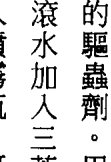

在这方面，她做了一些研究，并决定把家中所有的化学物都加以清除，她在白板上写着「无化学物之家」，以此向天使们做出承诺，她请他们帮忙找到化学物的代用品。第二天，她就找到足够的钱购买有环保意识的产品，取代了所有的化学品。


有一个由「环境工作团体」所赞助的好网站，针对几千种化妆品、盥洗用品和个人护理用品马上提供成分分析，只要把产品名称输入，就能看到可能含有的有害物，我们极力推荐这个网站：www.ewg.org/skindeep

此外，美国人可以在智能手机下载 a 3 应用程式，把手机对着食品的通用商品条码 (UPC Bar Code) 扫描，就能知道成分中是否包含基因改造物，在应用程式商店里的「Fooducate」项目就能找到。装置这个应用程式并加以个人化时，只要选按「是否要做含有基因改造成品的扫描」（当然要）就可以了。

营养补充品和药草制成品里，也无法免除化学品和有害物。写本书的过程中，有些讯息指出，产自中国所谓的有机产品可能受到铅、汞和镉这些重金属的污染，在中国，管理有机农耕的定有些不同，只要耕农在作物里没有使用额外的杀虫剂或农药，都可称为有机，但是，在土壤里仍可能蕴藏着有害的毒物。多数的营养补充品和药草制成品都是浓缩而成的，假如它们不是以真正有机的方式种植，也可能含有浓缩毒物。可能的话，好好地检视产品的标示，寻找有机的营养补充品，从标示上查看其成分的产地，及产品制造地。做选择时，资讯愈充足，选用后，就会愈健康。

### 疗愈家庭的用品

### 滤水器和净水器

除了将家中的一些化学物品加以清除，还可以多使用一些辅助品来增进健康：

-   滤水器和净水器

向当地的水管理局询问水是否添加氟，假如有，向他们抗议这种早已过时又有危险性的措施。很多时候，城市当局持续把氟加进去，对这个习惯从未质疑过，氟对健康所造成的危害大过对口腔健康上极少的益处，有关这方面，得对最新的科学资料加以研究。同时，为家里添购一个滤水器或净水器是明智之举，可供选择的种类很多，有小的、便宜的 Brita 牌手持式滤水罐，或 Pur 这个品牌的滤水器，滤水器直接连接在可放进冰箱里的水壶上。

你可以买设计比较复杂的滤水器，装在厨房水槽下面，过滤用来泡茶、烹饪或直接饮用的水。或者也可以买可供整个房子使用的逆渗透系统，这种系统是依「步骤」出售的，每一个步骤都可以处理和过滤水，步骤愈多水愈干净，可能需要把失去的矿物质再加回到逆渗透的水里，才能确保水是碱性的，也是好喝的。

### 有机布料

一般的床单、毯子、棉被和毛巾都是用合成的石化原料，或满是杀虫剂的棉花所做成的。这些材料往往在血汗工厂里制造，在这些工厂里，工人受到残酷的待遇，也赚不到什么钱，因为制造商没付多少钱给工人，在大百货公司里可以卖得很便宜，你认为你买得很划算，但假如你再想想……

睡在用他人的痛苦换来的床单上，能量对你有什么影响？睡在合成的床单上，是否注意到你的皮肤无法「呼吸」，常常出汗，或会太热或太冷？

这就是为什么我们极力推荐购买在公平交易运作下（意即工人受到善待并拿到合理的……）睡在有机床单、枕头和毯子上会产生有机能量，让你感觉很不同。用有机竹子和棉花做成的床单是柔软的，让人不由想要拥抱它，就像最舒服的衬衫一样，你可能因为非常喜欢这种感觉，而慢慢开始穿起有机布料做的衣服，有机布料衣物拥有高能量，每一次穿时都能感觉得到。

### 有机的个人护理用品

只购买有机的棉花球，一般棉花里充斥着杀虫剂和基因改造物，尽量寻找足够的资讯，才能确保用的是安全和天然的制品。调查某个品牌或公司的道德水准，确保他们善待工人，有些公司会使用动物做实验，或者拒绝标示基因改良成分，如此就别买他们的产品，因为这些因素会透过物品的能量逐渐扩散出去。你已经在能量和灵性上花了那么多功夫，也应该好好地照顾你的身体了。

### 红外线蒸汽浴

传统的蒸汽浴使用一种高温的环境刺激排汗，通常使用很多加热到很高温的石头，倒了几杯水在石头上后，空气中就增加了湿气。红外线蒸汽浴有很大的不同，几乎没有对外在的环境加什么热气，而是用红外射线在你的身体内部加热，红外线蒸汽浴会过滤掉紫外线，留下来的是和来自太阳一样的红外线。这些射线波只会渗透一点点到皮肤里，这能提高新陈代谢，也用安全的方法促进排汗。皮肤是最大的排泄器官。透过排汗可以排出陈年累积的毒素，红外线蒸汽浴能刺激身体循环，把更多的氧气带入细胞里。这种情况下，化学物和危害健康的东西会被推到汗水里。对那些没有透过运动定期排汗的人，红外线蒸汽浴是很好的选择，假如你很久没有运动，可用红外线蒸汽浴清理身体，排出累积的毒物，并鼓舞自己再去享受运动。开始逐步使用红外线蒸汽浴，从二十或三十分钟开始，然后就出来。一段时间之后，可以慢慢把蒸汽浴的时间拉长，但是，在排毒的早期，时间短一点比较好。

### 有机菜园

对于正在疗愈中的家，若能添加什么让你更健康，这可能是最重要的一项了。园艺工作可让你放松、进入冥想状态，并与大自然连结。自家菜园种的食物会是所能吃到的东西里振动频率最高的！天使们说，吃现采、本地产的农产品就像阅读大地母亲的报纸，因为你和本地能量有所连结，就能接收相关信息。

不一定有自己的土地才能栽种食物——任何地方都可以种东西！网路上有贩售水耕的整套配备，你可以打造一个室内菜圃，也可以在阳台上种番茄和适应力强的蔬果。

网路上有很多资料和书可以教你很多相关的栽种方法，还有园艺俱乐部可以给予支持，而且也有机会认识新朋友。相同地，有些社区有合作式的菜圃，一大块地分成很多份，由不同的人共有。

确认种植的是传统、有机、非基因改良的种子，有些供应商的商誉良好，也采纳「安全种子誓言」——意即保证没有人为的生物工程方法改良了他们供应的种子——你可以在网站上向他们购买。传统和有机的种子可以采收起来，供其他季节使用，而经过基改的种子原来的设计只能种一季，迫使园丁和农夫要种新作物时，必须再缴钱给基改公司。

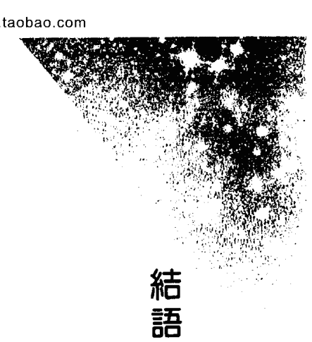

## 第10章 结语

# 结语

看待你的身体如同它是一个珍贵的殿堂，它是你神圣灵魂的家，而这个灵魂是永恒的光。你一生只会有一个身体，所以，要好好照顾它！你的身体是行使神圣人生目标的主要工具，有必要好好对待它。运用天使的指引净化你的生活，你生命的光芒将会闪耀。他人会注意到你的高频能量，并想知道你是怎么做到的。他们可能会问：「你的秘密是什么？」其实没有秘密——你并没有对他们隐藏什么，只是选择用恭敬的态度对待你的身体，那是它应得的待遇。给你的身体、情绪和灵性最好的照顾，对每个人都有好处！

> > ——朵琳与罗伯

# 心灵成长系列180

# 天使能量排毒法：身体与心灵的最佳扬升净化指引书

# Angel Detox : taking your life to a higher level through releasing emotional, physical, and energetic toxins

作 者 | 朵琳·芙秋博士&罗伯·李维（Doreen Virtue Ph.D. & Robert Reeves）

译 者 | 黄爱淑

特约编辑 | 邱惠仪

编 辑 | 陈莉萍

发 行 人 | 许宜铭

执行总监 | 王牧绫

出版发行 | 生命潜能文化事业有限公司

联络地址 | 台北市士林区（111）承德路四段234号8楼

联络电话 | (02) 2883-3989

传真电话 | (02) 2883-6869

邮政划拨 | 17073315（户名：生命潜能文化事业有限公司）

E-MAIL | tgblife@ms27.hinet.net

网 址 | http://www.tgblife.com.tw/

邮购单本九折，五本以上八五折，未满1000元邮资60元，购书满1000元以上免邮资

总经销 | 吴氏图书有限公司·电话 | (02) 3234-0036

内文编排 | 菩萨蛮电脑科技有限公司·电话 | (02) 2917-0054

印 刷 | 日光彩色印刷·电话 | (02) 2262-1122

版 次 | 2016年1月初版

定 价 | 420元

ISBN : 978-986-5739-55-3
ANGEL DETOX
Copyright © 2014 by Doreen Virtue and Robert Reeves
Originally published in 2014 by Hay House Inc. USA
Complex Chinese Translation Copyright © 2016 by Life Potential Publications
Through Bardon-Chinese Media Agency

All Rights Reserved.
行政院新闻局局版台业字第5435号
如有缺页、破损，请寄回更换
版权所有·翻印必究

# 国家图书馆出版品预行编目(CIP)资料

天使能量排毒法/朵琳·芙秋 (Doreen Virtue), 罗伯·李维 (Robert Reeves) 著；黄爱淑译. --初版. --台北市：生命潜能文化，2016.1
面 公分. -- (心灵成长系列：180)
译自：Angel detox : taking your life to a higher level through releasing emotional, physical, and energetic toxins
ISBN 978-986-5739-55-3 (平装)
1.心灵疗法 2.灵修
418.98 104024569

# ## 身体是神圣灵魂的家，跟随天使的讯息与指引
让我们的身、心、灵充满神圣之爱！

常见的「排毒」多著重于身体层面，但其实释放陈旧、有害的情绪能量也是一项重要的疗愈。请相信自己的直觉，连结天使的力量，藉由精油芳疗、花疗法、树疗法、水晶疗法等，协助我们清除生活中，包括食物、饮料、人际关系、事业甚至环境方面的有害物质。

全美知名的天使夫人朵琳，与自然疗法医师罗伯携手合作，教导大家聆听守护天使们的指引与帮助，让大天使拉斐尔、麦可、麦达纽协助你戒除瘾症、排除体内的有害毒素，以灵性吸尘法及神圣光束净化我们的心灵与负能量，获得身心灵的平衡与喜乐。

「天使能量排毒法」为全面性的身心灵净化手册，指引读者运用自然疗法，定期清理身体与心灵的毒素与迷障，给予了身体、情绪以及灵性方面最佳的照护。

# # 接受天使及灵性的指引，
创造拥有爱、清明及喜乐的美好人生。