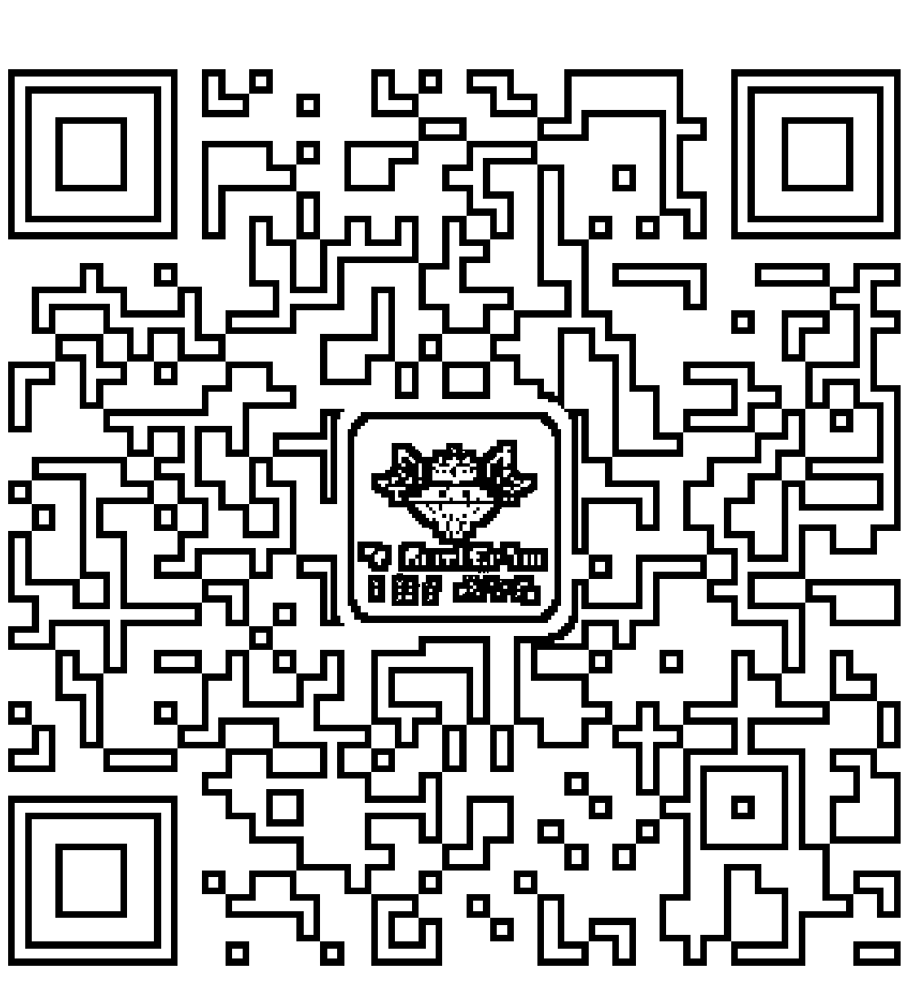
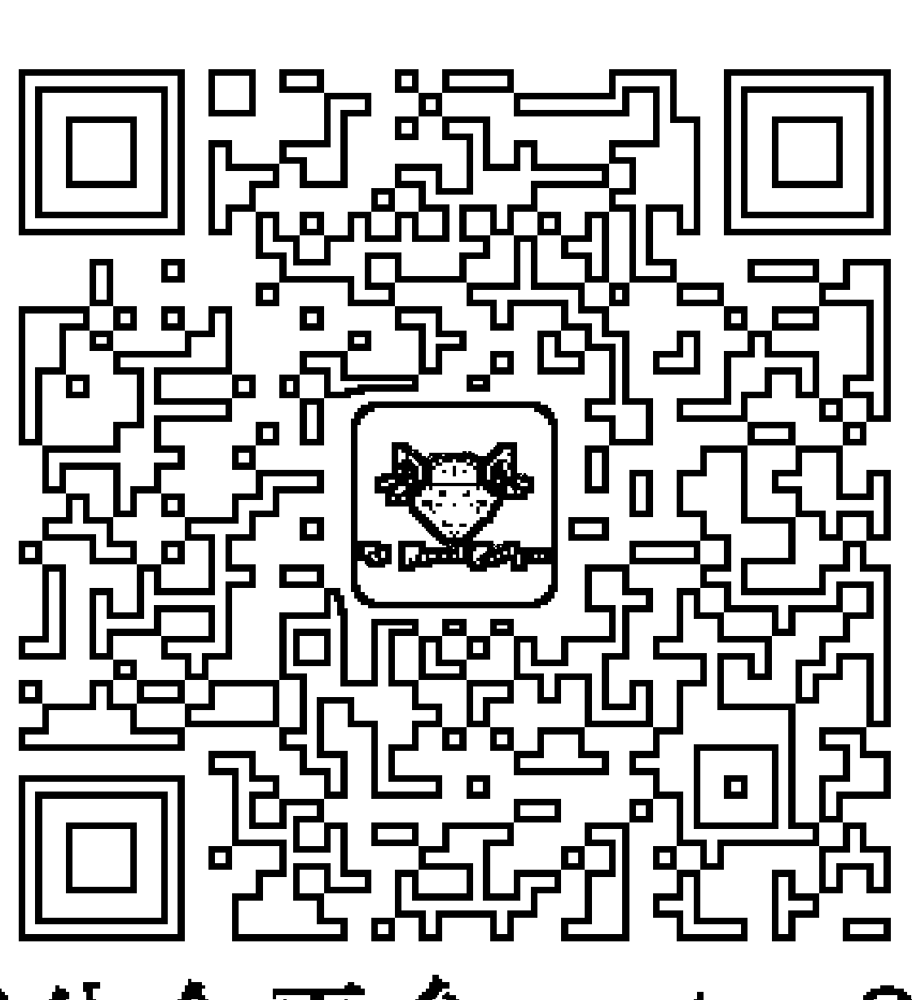
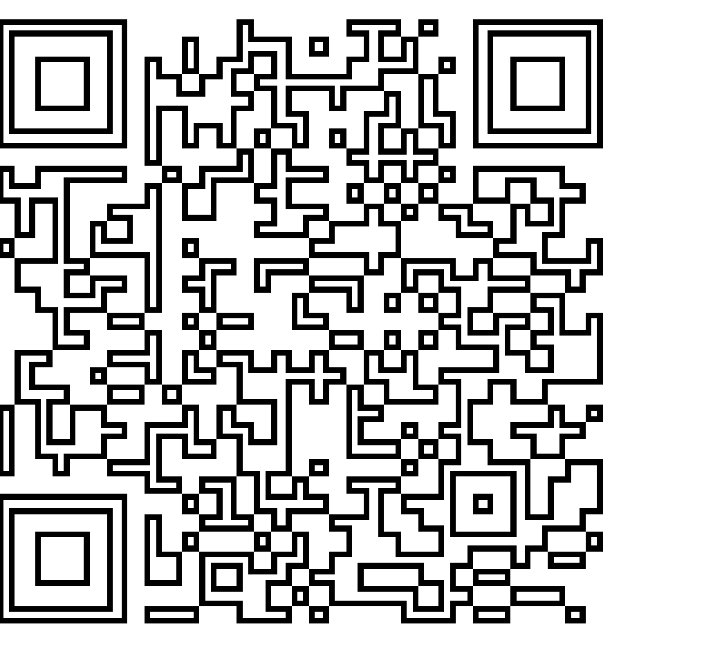
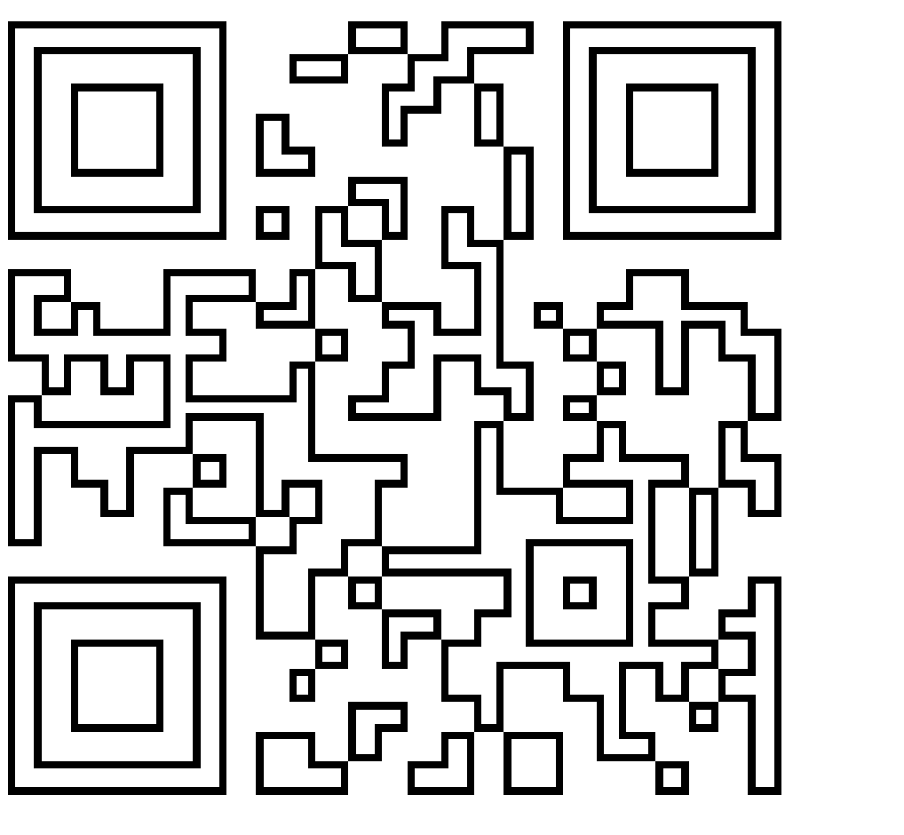
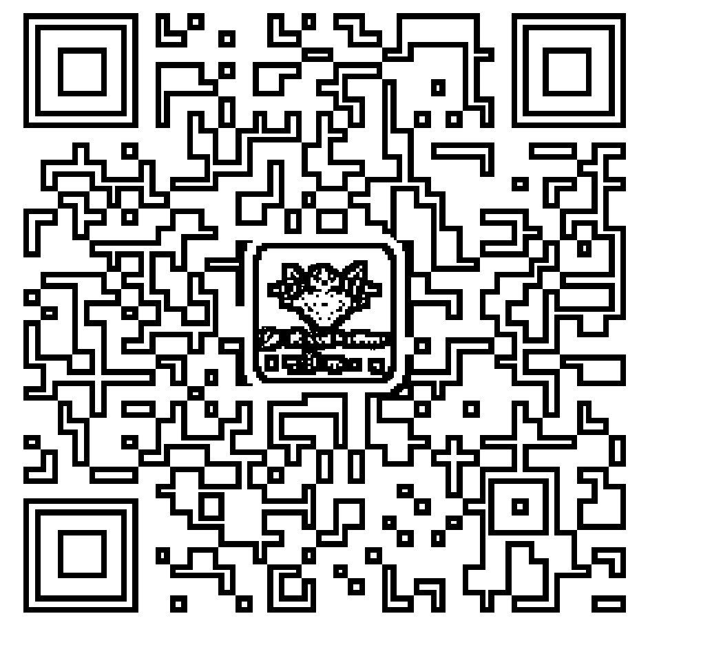
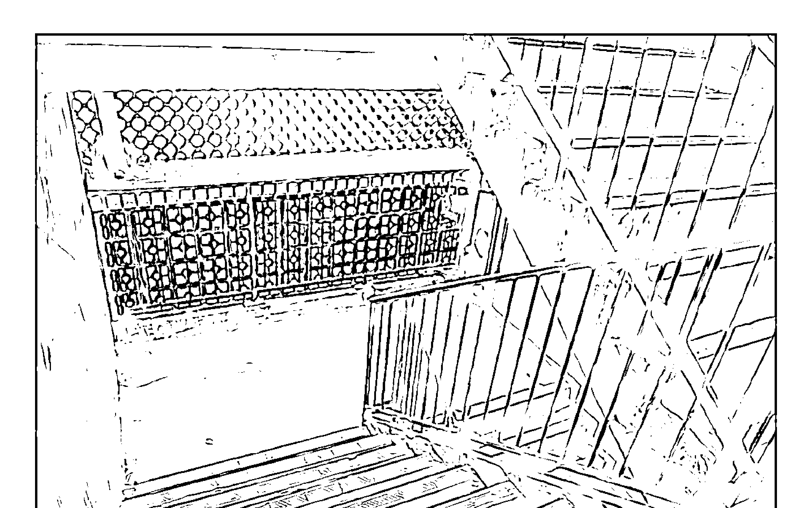
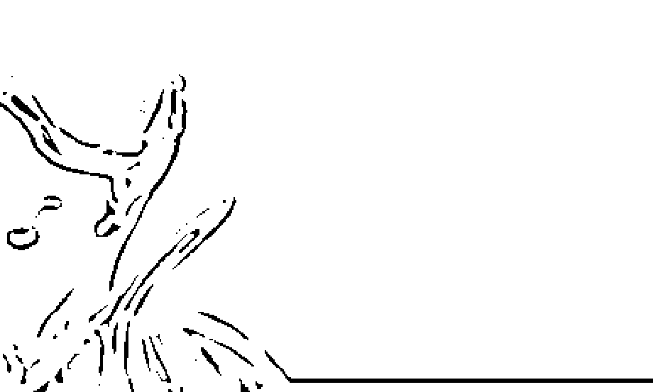

奇幻的通靈印記

詠淇 著

50個靈界接觸經歷

靈性成長三步曲

-   牛下童年—對靈界的「無知」歲月
-   通靈現象—對靈界的「認知」奇遇
-   靈魂出竅—靈界導師啟蒙和導引

## H. Royal College
天使神秘学院

-   ※ 神秘学资料库
-   ※ 神秘学培训机构
-   ※ 水晶能量研究中心
-   ※ 专业占卜预测机构
-   ※ 官方微信：strcdts
-   ※ 微信公众平台：strc2011
-   ※ 官方店铺网址：http://strc.cr.cx
-   ※ 读书交流QQ群：
    -   占星塔罗占卜师交流群：814594478（加入密码：PDF）
    -   神秘学其他综合群：659338717（加入密码：PDF）

微信号：strcdts
天使神秘学院

微信公众平台：strc2011

## 制作说明：

本书由《天使神秘学院》出重金从台湾购入的原版书籍扫描制作完成。为达到最好阅读效果，特地把书全部切开后，再经由专业扫描设备高精度扫描完成，并经过一张张的PS后期处理最终成书，其间花费大量的人力、物力以及时间，只为能给大家提供经济并优质的神秘学学习资料而努力。

本学院强力谴责某些机构和个人，把本学院花心血制作完成的电子书籍，包装后直接放在自家淘宝网上低价倾销的行为，以谋取不劳而获的经济利益。如果长此以往最终将无人愿意再为大家花心思制作电子书，那以后可能大家再无新书可读。

为让大家以后能够读到更多的好书，也为了本学院的良性发展。本学院恳请大家尽量做到如下几点：

-   一、尽量在天使神秘学院的官方网站购买电子书籍。
    官网电脑访问地址：http://strc.cr.cx
    手机微信购买 请扫以下二维码
    
    手机淘宝等购买 请扫以下二维码
    
    加店长微信号 请扫以下二维码
    
-   二、在收到电子书后小范围传阅即可，千万不要公开传播，更别挂到淘宝网上低价销售。

同时为答谢广大支持者，学院电子书将做如下调整：

-   一、学院会把一些早已收回制作成本的电子书折价销售。
-   二、最新制作的电子书籍会开放打印功能，大家购买后有条件的可自行打印成书。

天使神秘学院
2020年5月

## Google Play 圖書書評

Man J：
非常有意思的作品……適逢本人近期有至親過身，看到外婆一篇時亦略有感受，就好像作者為我解答了一些問題一樣，感恩。

晉鴻文：
《奇幻的通靈印記》書中豐富而引人入勝的奇異經歷，真是無比精彩絕倫，讓人愛不釋卷。讀完這本書，感覺像從多個維度的浩瀚宇宙中遊歷歸來，讓人大呼過癮、大飽眼福。

Ka Ming Yim：
真、善、美，盡在此書矣！近十年有所感動、有所啟發的書不多，這本必極力推薦！

## Fanny Sin：

作者用詞活潑，態度謙恭，並沒有擁有超能力自居，她的經歷印證了佛教義理，因果業力、輪迴等等，透過作者的親身經驗，更加明白如何積極正面處理心識，佛經所說「一切唯心造」，一念善即淨土、一念惡即地獄……此書極度推薦。

## Amy Lau：

一本真人真事，具趣味性、啟發性的人生故事。作者從小擁有不為人知的超人能力及靈視，童年時活在種種的惶恐、不安、無助之下，憑藉堅強的信念及意志力，仍能走出精彩人生，活在當下；不斷探索生命的意義，跟廣大的讀者分享種種凡人以外之體驗與奇幻經歷，實在是一件難能可貴之事。

## Barbara Chun：

作者的不一樣童年經歷，令我感到自己原來一直身在福中。作者小小年紀面對生活的艱苦、不被父母諒解，接觸到那些不屬於我們空間出現的事物下成長，居然可以勇敢及堅強地創造她的人生。她精彩的文筆帶讀者認識到另類空間的資料，我有緣接觸到《奇幻的通靈印記》。個人意見，我衷心推薦給所有人，如果是小朋友必需由家長陪同觀看。希望作者繼續給讀者帶來她的正面能量，期待她的下一本書。

## Lee Kam Kee：

Very good！內容豐富，值回票價。充滿啟發性，能解開對人生意義及靈魂的本質，了解死前死後世界，獲得不能外求的智慧。

## Max Ng：

這是我第一本完全覺得唔悶，而且非常好睇嘅書。書中嘅揭示，作者嘅經歷皆非常珍貴。而家我嘅想法係，將此書慢慢睇，邊睇邊構想書中描述嘅情境。

## Lily Koo：

The amazing experiences that the author has been through brought hope and love to regular people like me when we can finally believe that there is another dimension, a heaven or a different world out there after we leave our body and go to the other side. Her writing depicts and explains why and how paranormal events happen and how spiritual entities stay on earth for unfinished business. While we go on doing business on earth, maybe we should be mindful of our conduct or actions to people around us as there is the other side after we leave here.

## 序言

活到這個年頭，此刻只想說故事，訴說一個平生的傳奇故事……在成長的歲月中實在有太多不足為外人道的奇遇和發現，這些獨特經歷著實為我的人生帶來豐饒的啟迪！

自問並不是耀目聰慧的傢伙，亦無優裕令人稱羨的成長背景；但能有幸生存於世、能夠參與這趟人世學習的歷練，實在心存感恩！概括半生所經歷的種種喜樂悲憂，對此次人世學習的際遇和責任，有更深切的體會和感悟！只緣在投生前……在靈界（非物質的意識界）出現某突如其來的枝節，致令我並未按一貫程序刪掉這段……靈界層面中參與「轉世安排」的前期記憶！故在投生後在我的意識上；還殘存轉世前的靈界記憶，和某些超覺感應。並能看見某些，來自不同空間層面的，各類非物質界生靈。綜觀這些經歷，和各種奇遇與發現；令我更深切體會，這趟人世學習之旅的機遇，是何等珍貴和難得！

在成長的歲月中，常面對現界與靈界的各種紛紜纏繞！回憶當初要獨自面對這麼深刻和層出不窮的異象時，那種無從表達和孤立無援的困窘感覺，果真令我吃盡不少苦頭和責備！只緣小時候……不曾了解到，原來不是每人都擁有這種超覺感應，因而不懂何以總會招來長輩的責備和不悅？常獨自面對那些突如其來的靈異現象，使我常感到百般迷惘與失落！慨嘆世間詞彙，並不足以表達……各類靈界空間的所見所聞！及後因父母長輩終於察覺到某些端倪後，無奈只會以別的話題來打發，或是乾脆選擇以打罵來了結！而我後來為免又再招來長輩生氣和壓力，亦只好以「幻覺」來作自我催眠和逃避的藉口！

直至初中那年首次舉家回鄉，竟赫然驚見滿堂盡是舉杯歡慶的亡靈；當這一直以為只是童年「夢魘幻象」的畫面重臨時，頓時對成長中的心靈帶來深刻醒悟和反思！再一次敲醒靈魂深處的覺性，令我從新審視多年來發生在自身的種種不解的通靈現象，令我決意尋找潛藏在生命旅途中的各種迷思和答案！

我是成長於七八十年代的香港土產，那時候坊間資訊還是處於新舊交接的框架內；對一些超自然現象的解讀，人們還普遍圍繞在……舊日迷信祭祀的思想架構中！由於本身對投胎前的靈界空間，還潛藏著鮮明印記！再加上歷年成長中的各種感應與奇遇，致令我對超覺現象的態度從刻意否定的「無視」，轉變為不得不對其「注視」！後來繼而決心尋找和探索，它為我帶來何種人生啟迪！幸運地在生命多段的生關死劫磨煉中，總能得到靈界導師給予一次又一次的幫忙和導引。在其循循善誘的教導和鼓勵下，藉著靈魂出竅的方式帶領下；穿越不同時空次元，從而了知生命架構的真實義！從多年的超覺感應體驗下，更令我確切認知到除卻塵世之外，果真還存在著萬千的意識層次空間。故此我對人世間的得失際遇看得淡然，卻對寰宇浩瀚的世外感到無比嚮往！

而我自知這些異世經歷並不為各人所接受和了解，故此多年來我選擇三緘其口，並無打算對外公開！然而當看見每天的報章、電視總會報導著林林總總的自殺、他殺、意外，或因宗教仇恨而引致的報復殺戮及人禍戰爭的新聞後，內心只感到莫名的悲慟和嘆息！對那些輕易放棄自身生命的人感到惋惜！對那些輕易殘害別人生命的人感到難過和痛恨！

另外……近年網絡科技帶來普及與豐富的資訊，令我更能認識到原來擁有相同經歷的通靈人士在西方非常普遍，從中發現他們所描述的靈界架構竟跟我從小所認知到的內容吻合，這亦令我對過去的各種靈界異象和出體見聞增多一重有力印證！

數年前更得到靈界導師的鼓勵並指示……現在是適當的發表時空。導師告知：「在地球教室的眾多轉世生命體，在經歷若干時空下，還抱持著各種謬誤和狹隘的觀念……還在撥弄著重重迷霧而不見歸期！」故此我真誠地……把自身的真實奇遇和靈異見聞，原原本本的跟各界分享。期盼此書能為大家對「投生地球教室」的學習意義和責任，有多一份了解和珍惜，感謝！

本書可分為三個部分：

## 第一章・牛下童年

記錄出生至童年時，居於牛頭角下村（簡稱：牛下）時對靈界的「無知」歲月（靈異經歷）

## 第二章・通靈現象

記錄成長期對靈界的「認知」見聞（靈性學習）

## 第三章・靈魂出竅

記錄成長後靈界導師怎樣給予啟蒙和導引
讓我藉著「靈魂出竅」的方式
「覺知」到不同次元的轉世面貌
從而感受這「宇宙本源」的大愛真實義！

## 画个火柴人占点黑

## 投生前的靈界起點

古時的東方傳說……每個投生世間的生靈都要飲過「孟婆湯」後才可上路，好讓各式前塵往事清洗得一乾二淨，才展開瀟灑平生。可惜這個傳說套用在我身上，某程度可說是失效的！只因自出生後，我還存在未被涮去的靈界轉世記憶……可惜這些先天記憶和通靈感應，並沒為我帶來不錯的做人優勢，卻反而為我帶來不足為外人道的世間磨煉，令崎嶇的人生路走來更顯艱辛和孤困！

說起這段投生前的光景，印象中這是一個非以人類單純文字和筆墨可以描述得透徹的空間層面……是一片非物質、非形相示現的虛無境地。而是以「光波」與「聲韻」（Sound and Light）為涵蓋溝通的境界！雖然無形相，但當中的溝通架構是以「多重的超覺感知」來呈現的。這多彩亮麗的聲光，蘊涵著極致的巨大意識——宇宙本源。它包含至善智慧與無私大愛的成分，亦是整體宇宙運作的重要能量元素！

在朦朧的歲月中「靈明一點」的意識被喚醒……由「本源光」中化現而成。從極致的空間中穿越重重的能量架構，剎那間閃現至由一眾「宇宙高靈」（亦可稱為：靈界導師）所共同創造的遼闊宏大空間中……（註：直至投進此空間的一霎，才示現出類似世間的形相意識）。這空間是結集來自不同「星光架構」的「意識體」，是投生「地球教室」即「物質界」前的議事和規劃空間，這亦是那些剛從地球離世歸來的「靈魂意識」被接引回家的中轉站，亦是某些在地球還擁有肉身軀體的靈魂出竅者，進出靈界探索的最終站。這是集一切意念和形相構建而成的意識舞台，這個不可思議的神奇國度，我將它稱為「靈界中轉站」……西方的通靈學者稱為：「星光平台」（Astral Plane）。

**********

直至到達「靈界中轉站」後，這顆「靈明意識」此刻才有一個「我」的概念感念而生。一眾靈界導師和這個剛化現而成的「我」，隨即參與這個共同規劃和議定的「人世藍圖」（註：還記得在靈界規劃議定時，這些導師皆以古希臘長袍智者形相示現。但值得一提的是，導師所示現的形相是因應各自因緣感念而生，故此當然會各有不同形象。）藉著投生「地球教室」，期望能為靈界團隊帶來豐富多樣的靈性進程和體驗！因這個以物質架構為用、時間運作單向線性的「地球教室」，有來自種不同輪迴架構的轉世團隊。「我們——靈界團隊」，共同規劃和議定這幅「生命藍圖」應以何種性別、樣貌、智慧和父母眷屬為組合。可能大家會奇怪，當然人人都希望選擇樣貌娟好、智慧和身分優越的條件來作為投生人世的裝備，可是當你身處這個「靈界當下」，順向或逆向的規劃模式都可成為被選取的手段。而所有規劃，只會著重於此趟轉世經驗能為「靈界團隊」帶來怎樣的靈命進程和體會！不同組合的「靈界團隊」大多來自不同次元，由不同的「輪迴圈」頻譜的屬性組合而成。

「我們——靈界團隊」剎那間已進入了快速回溯的時空中，檢視多重次元的各種轉世經驗……現在只隱約憶及當時「靈界團隊」表示，過去因為逃避「地球教室」某段不忍的殺戮時空，已跳過了幾次應該起行的轉世安排……所以已與靈命進程發展得較和諧、頻譜較一致的「輪轉成員」相去漸遠。所以如這次還再遲疑，下回的轉世組合只能與較疏離、靈性光波震動較不一致的輪轉組合結緣！及後「我們——靈界團隊」共同議定，這趟以女性的角色來參與這次的人世之旅，這將會更能體現出某些靈性感知！選取樸實平庸的外貌及智慧，將可經歷到另一種的人世體驗。在這個光明亮麗的靈界層面中……「靈界團隊」所著重的是整體的靈命進程，以及採集和完備不同的經歷及情感面貌！

還記得這廣闊無垠的「靈界中轉站」有一座宏偉光亮、高聳無際的記錄大廳，是儲存和記錄眾多轉世資料的地方（註：西方通靈學者稱為……阿卡西紀錄 Akashic Records）。當「我」進入這個巨碩無垠、有如圖書館般的資料庫後，極目是無盡無邊的光體書冊；而當中最矚目的當然是放在中央高臺位置的那冊……散發著純金亮光的厚厚巨冊！當飄近這巨冊的一霎，「我」已即時感知到當中所記錄的內容！這是記錄著為地球教室，帶來啟蒙的一眾圓滿者的，轉世記錄內容。此刻「我」只感悟到一股由衷的讚嘆與欣喜！

往後，這個還是處於粗略意識階段的「我」，被引領飄至其中一個展示台前停下。一本屬於「我」此趟轉世歷程大綱的書冊，在虛空中緩緩浮現！此刻「我」亦深諳如能圓滿這趟「人世之旅」，將會是加快修畢「地球教室」課題的關鍵，將是前往另一個更為微細的星空架構的……轉世契機。

由於快將投生人世，所以在剎那間「我」已閃現至另一個場景，這是那些將要進入「地球教室」轉世者的學習班。這時的「我」已不知不覺間感現出一個人形光體，同時亦隱約傳來與物質界相連繫的生命聲音……卜卜的心跳脈搏聲此刻正式開展了！

## 意外地來到人世

前塵至此……竟發生一件，現在回想起來很是慚愧的事情！因隨著轉世部署漸趨明確，「我」對將投進人世的布局與組合充滿期盼……對此趟的學習進程，會以何種方向實踐感到好奇。故在熱切的好奇心驅使下，「我」竟私下溜進記錄大廳，偷看規劃中的「記錄冊」內容。「我」靜靠在記錄大廳前不遠處的一座……名為「靈界花園」的池畔，但當「我」正想打開細閱大綱時，這「記錄冊」竟突然迸射出奪目亮光，而「我」竟猛然被身後一股巨大的吸力扯進這光波池中！這突如其來的意外，自詡時機未至卻突然掉進世間迷陣；慌亂的意識隨即發出強大的召喚，請求靈界導師前來解救……可惜一切卻為時已晚！

現在還深刻記得當初掉進「地球教室」時，對此塵世空間驚鴻一瞥的情景……那是一股巨大強烈的急速跌墜感，恍如火箭升空失敗意外後，由萬里宇外跌回地球的震撼衝力！在經歷沒完沒了的天旋地轉和衝擊跌宕後，「我」驚訝的發現……何以「地球教室」竟結集著，眾多不同的黑暗意識？當中寄居著為數不少、無以名狀的「片段體」和「意識體」！若干年後靈界導師告知……這是那些忘卻回家路……沒返回「靈界中轉站」接受「宇宙本源光」淨化的殘存意識。這亦是窒礙「地球教室」整體生靈進化的巨大阻力！

經過這有如猛烈暴風及非比尋常的一輪跌宕後，一股強大迫力把「我」這團意識；瞬間壓榨進一個昏黑和侷促的空間之內。那是一股無比的壓迫感，「我」隨即感受到一股有如粉身碎骨般的巨創，並在強烈的暈眩感中不斷轉向！經過這麼多的折騰後，只感到意識漸次模糊，最後昏歿在不知不覺的時空中。

> ********

先來簡介一下我的成長背景，出生時家中有親切的外婆、父母、姊姊（若干年後再添兩妹）。聽母親細說從前，在我出世那天的早上，母親還頂著七個月的身孕為父親在廚房煮早飯。由於當時一家幾口租住在旺角那些廚廁共用的分租房中，那朝母親卻意外地；在廚房因誤踏火水，而從後翻倒，因而被急送至醫院催生（註：這點竟跟我在靈界時所遇上的意外吻合）。由於是早產嬰關係，自小便感到體質不佳！母親曾告知由於我是早產，初出生時我的雙眼還是整天緊閉昏睡。直至三個月後那次到健康院體檢時，發生了一些小枝節，才令我首度睜開眼睛。

至於當年這個健康院體檢的小枝節，亦可說是我平生第一個景象記憶……還記得當時，我是突然被背後一股寒徹骨髓的冰冷感覺所驚醒！原來體檢護士，在輪到為我磅體重時；竟一時忘記在嬰兒磅上墊薄毛巾，就快手快腳地把我直接置於冰冷的金屬磅盤內。由於我被這突然而來的徹骨冰感所驚醒，因此被驚嚇得睜眼嚎哭！這刻護士卻發現我的雙眼竟可睜得這樣明亮時，即時送上驚喜的歡呼，還急不及待叫喚母親快來察看！

這可說是我投生人世的第一個畫面……朦朧中看見多張笑臉……高掛在健康院天花上一把呼呼吹著的大型三葉吊扇……面對這突然而來的陌生喧鬧場景和刺眼的光線，早把我驚嚇得涕淚漣漣！直至感覺到一股溫暖親切和芳郁暖流襲來，眼前朦朧出現一個全身籠罩著粉亮光波的女士身影時，我的意識心靈早已辨別出這是「母親」的氣味！從她身上所透出的熟悉體香和在其輕柔的聲音安撫下，我即時感到無比的溫暖和安穩；頓時止住哭聲倦躺在其懷抱中，並傾聽著這親切熟悉的卜卜心跳聲！

剎那間我又再沉醉在這個來自母親與孩子間的心靈連繫，感受這濃郁的愛意甘霖！我從心底報上默默的感恩……感激這來自塵世遠方的真摯相迎！但不久我又再被頭顱內不適的困倦感犯著，又再倦極昏睡了。

## 目錄

-   **Google Play 圖書書評** 2
-   **序言** 6
-   **投生前的靈界起點** 12
-   **意外地來到人世** 17

## 第一章：牛下童年

-   **牛下童年 · 導讀** 26
-   **1. 牛下童年** 27
-   **2. 神秘玩伴** 34
-   **3. 穿紅棉襖的小女孩** 41
-   **4. 床頭婆婆** 49
-   **5. 父親的宵夜** 53
-   **6. 坐在門邊的伯伯** 58
-   **7. 觀塘外婆的家** 66
-   **8. 廣華醫院** 70
-   **9. 道壇驅煞** 79
-   **10. 幼稚園高班廁所** 84
-   **11. 白衣姐姐** 91## 第二章：通靈現象

### 導讀

- 1. 第一次回鄉 136
- 2. 紅磡觀音街 143
- 3. 德福花園 147
- 4. 母親的心結 156
- 5. 上海來的二舅父 161
- 6. QE 後山 167
- 7. 平武報恩寺 173
- 8. 天山天池 183
- 9. 伊犁庫車 188
- 10. 容府太夫人 196
- 11. 帶外婆回家 202
- 12. 瀕死經歷 213
- 13. 靜坐班的發現 219
- 14. 好友父親的異象 225
- 15. 穿禮服的黑衣人 231
- 16. 第二次生命關口 234
- 結語・通靈現象 243

## 第三章：靈魂出竅

### 導讀

- 1. 飛行夢 247
- 2. 出體訓練 253
- 3. 靈界導師 257
- 4. 不斷重複的神秘夢境 262
- 5. 誤入歧途 266
- 6. 被遺忘的聖地 271
- 7. 前世今生 275
- 8. 探訪靈界的外婆 282
- 9. 飛蛾 287
- 10. 出體事件簿（巴士上的神秘來電／元朗村屋／法國手信／神秘地道／毒氣村） 295
- 11. 藍地義工 311
- 12. 通靈雜感（荔枝角商廈／華懋廣場／找零錢） 315
- 13. 朝聖之旅 326
- 14. 拜見創古仁波切 330
- 15. 出體度亡 333
- 16. 西藏瑜伽士 340
- 17. 尋訪聖跡 348
- 18. 結上蝴蝶結的救護車 352
- 結語．人世學習 358

### 目錄

# # 牛下童年·導讀

第一章記錄投生前（靈界起點）、出生後至小學時期的種種異象見聞；內容全屬真人真事的第一身形式記載。誠希藉著此書能給予大家多一個角度窺視……種種超覺現象和通靈感應的某些面貌，謝！

# # 牛下童年

牛下……這是前牛頭角下村（Lower Ngau Tau Kok Estate）清拆時坊間對此屋村的暱稱。在我三四歲時（七十年代中期）便舉家搬進牛頭角下村第十四座，亦是童年時留下最深刻回憶印記的地方！

早期牛頭角下村一帶的環境，還是荒蕪簡樸的一片臨海地；而現在九龍灣港鐵站至德福花園一帶，還是一片汪洋。還記得年幼時每到黃昏，總可從相連的十三座公共圍欄中，看到那像鹹蛋黃般的黃金夕陽，當中還夾雜著不少歸帆。當年這片臨海地一帶設有不少修船廠和打鐵廠，故此沿岸經常集結著不少修船用的浮木。間中還有一些外國教會所組織的醫療船泊岸，為牛下一帶的坊眾提供廉宜的基本門診；這些洋醫生除了為基層市民提供廉價的醫療服務和傳道外，還會送贈一些奶粉或麵線等救濟物品，居民更可經由岸邊的一道長木橋往來出入。

在牛下老家的另一方，則是淘化大同醬油廠及工業村、國慶樓（現為淘大花園一帶）和前方的綠寶汽水廠（現為得寶花園）的所在地。至於再後方則是鋼鐵廠、玻璃廠和荒僻的石礦場（現為彩盈村一帶）。那時這一代人跡罕至，入夜後山上更會傳來野狗的嘶吠聲。還記得直至小學時代，這間醬油廠每天都會在上下午兩個時段，傳來響亮的汽笛聲來提示該廠工友到了午飯和放工時間。而附近的牛下鄰里亦會以此作為煮飯燒菜的提示！

回憶至此……令我想起當年一則來自這醬油廠汽笛聲的不解片段！這發生在我還未入學前的某個陰沉中午（大約三四歲），當時母親正在廚房忙著家務，而我就獨個兒坐在廳中玩耍。但當醬油廠的一聲汽笛長鳴過後，我的身後……即大門方向，忽然傳來慌亂嘈吵的急步和人聲！在我還來不及轉身察看之際，只見眾多灰黑身影竟瞬間由大門那方急竄進來；而這些不明來歷闖進的黑影，卻又迅速隱沒在家中牆角和房間並立時消散！由於那時年紀偏小，面對這批穿牆過壁突闖進來的陌生人只感到紛亂；小孩的本能反應，當然立刻想撲回母親懷中尋找保護。可是母親是個急性子和暴躁的人，早已為家務做飯忙得一頭煙，故此對我這突然的哭鬧顯得極不耐煩！但她還是按捺著情緒，用背帶將我背在身後繼續忙著。由於我對眼前光景不懂表達，因此母親總認為我是一個愛撒嬌的孩子！但自覺經此突然驚遽的一霎後，我恍惚開啟了某種感知大門，開始對世間生出特殊的概念和認知！

## 第一章：牛下童年

如是者還記得當時每到某些陰晦的日子，家中又會像上回那樣突然闖進某些陌生坊眾！他們大多是上年紀及衣飾守舊的一群，以灰黑粗布衣及黑布鞋為主，有些更會戴著黑灰帽……直至後來，我才意會到這些人物衣著，原來屬於香港三四十年代普羅大眾基層市民的衣飾（註：可參看黑白粵語片中吳楚帆的早期作品）。而我還發覺這些陌生人身上，總是籠罩著團團暗晦的霾霧，樣貌和表情總是木訥與灰沉！又一回，因我發覺房間又躲著某些令人感到寒慄的陌生人，我竟害怕得不肯進入房間午睡！而母親對我時常無緣故的情緒哭鬧，對我的管教態度；早已變得不耐煩，漸漸地打罵的日子增多了！

在我的成長年代，小孩子對父母只有濃濃的敬畏，所以對被打罵的歲月總不太在意。而我在打罵過後，內心總會尋找答案，在幼小的心靈猜想一定是不乖巧，才會令父母生氣而招來打罵！故此心中總嘀咕著下回一定要更為努力去改善……

另一個成長片段是及後稍長，父母開始教導我們，面對長輩要懂得禮貌和問好，教導我們叔叔伯伯和嬸嬸婆婆的稱謂。而我對剛學懂怎樣向長輩招呼問好，顯得非常主動和雀躍，所以每當在長輩面前，我總會主動上前問好。由於當時還未入學讀書，母親每朝總會帶我一起到菜市場去，而我總被安置在棚屋街市前等候（即牛下八座聖馬太學校前），好讓母親買菜後到來接我回家！這時候我已懂得向親切的攤販叔叔問好，很多時還會得到某些食物作獎勵！那些年街坊鄰里人情味濃，就算一個平常早晨；我也跟不少長輩禮貌問好，被讚賞乖巧的感覺著實令我感到無比開懷！

其實每次從菜市場返家，我們總會經由十三座的樓梯回來；只因十三與十四座是呈「T字形」的雙連設計，形成一個四通八達出入方便的居住環境。但很多時，我總是發現十三座那些設於公共位置的蜂窩石牆前面（街坊稱為大廳），經常聚集著一班年老坊眾。而每次經過，他們總會向著我緩緩招手，很多時我亦會禮貌地揮手回應！母親當初對我的舉動還是不以為意，直至她發現我每次經過時總會向此方揮手。某次她終於按捺不住，詢問我跟誰在打招呼？我如實告知：「媽，我跟前方坐著的婆婆揮手，有很多公公婆婆在一起！」可是母親竟露出驚駭的神情並怒掌我的嘴，然後便急步拉扯著我歸家！剛巧那朝早是一個陰晦雨天，因而母親對此有所意會，所以自此以後便命令我和大姊切不可步近此區域玩耍。可是每天當我步出家門，還是會直望到前方這片中間位置，況且這亦是通往必經的樓梯和垃圾房的出入口！故此雖然人沒步近，但我還是時常看見這批「神秘坊眾」聚集在這兒的情景。由於他們的神情和態度實在令人感到陰沉古怪，到後來我亦對他們的出現產生疑問！

回憶當年……每當夜闌人靜，這片神秘空間總會傳來不少耳語或是幽幽歌聲！當年我雖是年紀小，亦慢慢地開始對這班總是滲著一股不安感覺的「神秘坊眾」畏避起來！

又一回，同樣是跟隨母親到菜市場的早上，由於颱風剛過，街上還是比較大風和濕漉漉的。所以每當經過一些頭頂開揚、全無遮擋位置的地方時，母親總會喚我緊捉其衣角跟隨。原因是當年那些公屋居民習慣在窗外掛滿雜物，如：膠盆、掃帚、鍋蓋等……故此常有垃圾、花盆、玻璃瓶等物品，被刻意或意外地拋出窗外！（註：若干年後，牛下真的發生了好幾宗高空雜物造成意外傷亡的不幸事件，之後更傳出不少靈異傳聞，一眾牛下街坊更要集資超幽！）

忽然人群中傳來老人家的呼喊聲，原來有位婆婆背著幼小孫兒買菜途中，孫兒不幸被樓上吹跌下來的竹掃帚擊中頭部；老人家直至發現何以衣角會無故的滲著鮮血時，才驚覺身後孫兒情況嚴重，因而嚇得方寸大亂急向途人求救！只見街上坊眾有的上前安慰老人家，有的細心察看嬰孩傷勢，有男士更即時撕開煙包取出煙絲捂著孫兒傷口，有的更跑到附近藥房購來雲南白藥為孫兒止血。當時只見孫兒頭顱上不斷滲出鮮血，昏沉睡著，各人都神情緊張地料理著！而我早被當前景況嚇怕得躲靠在母親身後，亦首次認知到體內血液是鮮紅色的事實！這時母親和其他坊眾看見孫兒傷口還未能止血，紛紛提議應盡早召喚救護車趕送醫院治理。可惜當年的普羅大眾對召喚「白車」甚為忌諱，綜合原因很多……如醫療費用、貪污風氣和惡劣的醫護人員態度等……都令市民對公營機構卻步和害怕！

正當眾人為著孩子傷勢擔憂不已時，我卻好奇地拉著母親的手並指向半空嚷著：「媽，你看……前方很美！」母親聽罷隨即捂著我的嘴巴，並悄聲告誡著我此刻不要胡言亂語！而我因被母親厲言訓斥後頓時感到不安，但我卻對眼前所見的不解景象十分眩惑！皆因這刻我竟看見前方虛空，出現另一個狀如霧氣般的孫兒在半空中飄浮。只見這飄出的孫兒，恍如懷胎時期的胎兒般蜷曲沉睡著，其身旁更出現亮麗光人護著！由於前來幫忙的街坊漸多，母親為免我又再亂說話，因此已急步把我從人群中拉走。

**********

後記：由於當時面對很多奇異事情都得不到解答和長輩的認同，因此我只能用一個簡單的小腦袋來推敲思維。後來我竟將當日所見……「虛空中的霧氣孫兒」異象，與氫氣球和風箏等物品聯想在一起！只因當年的氫氣球大多印有可愛娃娃笑臉圖像，令我誤以為……當時孫兒只是變成有趣的氫氣球或風箏飄走外遊而已！

### 神秘玩伴

小時候家家戶戶經濟環境一般，所以很多鄰里都會拿些外判手作回來製作，以求幫補生計。當年父親只是一個旅遊車司機，收入僅能勉強糊口，但因性格十分大男人和顧面子關係，就算眼見收入不多也不願正視實況，不讓母親參與這些手作。因此母親只能趁父親不在家時，暗中向鄰居拿些膠花回來串製，以求幫補家用。而我自小對手工藝和色彩鮮豔的東西非常喜愛，因此我和姊姊總是雀躍地跟隨母親一起幹著這些手作玩意；很多時我們都可趕在做晚飯前，把完工的物件送回鄰居代為交收，而又令父親不察覺！

有一回因臨近年尾工廠快將收爐，各鄰居都有不少成品要趕送至收發站交收，所以這次母親要親自將整大袋成品拿至該處。當日母親要求要我午睡過後才會帶同前往，於是我便乖乖地入房午睡。當我睡至朦朧間，忽被客廳傳來的叮咚聲喚醒，我馬上知道這聲音是來自家中的一件國產玩具——不倒翁娃娃所發出的聲響！於是我立刻起床步至廳中查看，這時才驚覺家中原來早已空無一人，兼且大門鐵閘同被鎖上！我當然隨即失望得不斷的哭鬧著……埋怨母親為何不守承諾丟下我獨自一人在家？那刻我既感到驚慌，又懊悔因午睡礙事！就在我放聲大哭之際，竟發覺身後房間竟然出現兩名女孩，她們一同倚靠在睡房門邊窺看著我的哭鬧傻勁！這兩名年紀跟我和姊姊相若的女孩，看來亦好像是姊妹關係，擁有相同的衣飾和髮型，穿著同款的背心短裙和大花拖鞋。正當我打算轉身細看清楚時，小姊姊已即時躲回房間。我當然立即走進房間察看，可是卻驚見一位像是她們母親或姐姐般的「監護者」，正盤坐在床上對我虎視！而這兩名女孩早已躲靠在其身後。而我正打算上前再看清楚時，小姊姊又瞬間飄閃至廳外去！那刻我既高興不再孤單一人在家，又雀躍家中無故出現兩名同齡玩伴，於是主動拿出玩具要求一同玩耍。正當我們玩得忘形之際，只見小姊姊竟然剎那間幻化為另一個不倒翁娃娃，而我和小妹妹則樂得推玩著各自的不倒翁娃娃來比拼！至於那位「監護者」，則高坐在家中櫃頂上，看著我們玩耍的情景。後來小姊姊更輪流變現為家中的不同物件……如積木玩具、水壺茶杯，以至其他小物件等……而我更被這神變遊戲逗樂得嘻笑聲不絕！

就在我們玩至不知不覺間，門廊遠遠傳來母親和大姊回來與鄰居問好的聲音；鄰居嬤嬤告知剛才從門廊外也聽到我放聲大哭的聲音，還急嚷母親趕快開門入內查看！當時我正高興母親回家可第一時間認識這些新朋友，於是我雀躍地迎向大門急著向母親介紹！可是這些新朋友卻在剎那間飄閃四散，其中最深刻的一個畫面，就是小姊姊竟然遁閃進一包掛在廚房窗邊的「白貓」洗粉袋內。可惜當我緊隨撲至時，卻發現這包洗粉袋上的圖像又變回原本的平面圖像（註：巧合地……在若干年後，竟出現跟此意會類似的廣告，因此多年來總被家人質疑這些異象的真偽）！

眼看著這對小姊妹竟可剎那間消失得了無痕跡，我對眼前現象當然感到相當不解，但又礙於言語上不懂表達，因此我只是疑惑片刻，便隨即奔回母親懷中！況且母親和姊姊又買來味美可口的小吃，故此我早已把之前的懸念忘掉一二，再加上小孩子的感受，沒甚麼比迎接母親回家來得滿足和愉快！

自從那次家中突然出現這些神秘玩伴後，在往後日子亦曾出現過好幾次，但都巧合地只待父母長輩不在家時，她們才會悄悄出現。而最有趣深刻是有回她們竟化現為我親姊姊模樣來跟我玩上一個早上，直至門廊外傳來母親接大姊放學回家時跟鄰居問好的聲音時，只見那「影子姊姊」霎時顯露出緊張的神情，兼且鼻頭頓然變黑，然後耳殼慢慢上移，接著身後竟露出雪白的小尾巴，就隨即急竄逃遁至房間床尾的牆角內！此刻我才意會到跟我玩上一個早上的大姊，原來是那個懂得神變遊戲的小女孩玩伴，我此刻只有傻呵呵的緊隨其後想把她從牆角間拉回來！可是那牆角突然被擠開的缺口卻又在剎那間悄然消失。由於事出突然，我的整段手臂竟被卡在床尾與牆角間的邊縫位置內，導致我動彈不得！由於這空間位置極之有限，母親後來更要召來鄰居合力將某些傢俱搬移才可將我解救出來！事後各人都奇怪為何我竟可將手臂伸進這狹小的邊縫位置？最後得出結論是……可能是小孩子手幼骨軟吧！

對於這些神秘玩伴雖感極其真摯友善，可惜那嚴肅的監護者卻除外！由於她們從沒跟我說過任何一句話，只是發著吱吱啞啞的單音，因此我們的溝通方式像是用心靈上的真摯情感來交流。現在回想當年的牛下相遇，看來是那位監護者藉此訓練小姊妹各類神變學習的遊戲課題。

*******

另外，還有一類靈界生物，我將其歸類為「小精靈」。由於它們每次出現總是一大群的簇擁著，浩浩蕩蕩的伴隨著某種光波聲韻，於黃昏前或雨後於窗外飄然而至。這些紅紅的亮麗的小圓光團，像實帶虛般經常圍攏在家中天花、窗邊或牆角間追逐遊戲。而當年牛下眾多的家居布局，大多在方正斗室內（即大門旁）加建一間用布簾遮擋入口的板間房，又為著通風和採光理想，大多在上方位置設鏤空木柵。而小時候我總發現，這些小圓光精靈，經常圍攏在這些鏤空的木柵間穿梭。當時由於不明白這是來自非物質界的小生物，竟天真地嘗試用小手捉來幾顆不成功後，急嚷著要求父親代捉幾顆看看！可是這又換來父母對我莫名的感嘆，並取笑我定是個天真愛幻想的孩子！

**********

另一個深刻的回憶片段……發生在大約五歲時某日上午，母親將我安置在家中廚房窗前那組僭建的鳥籠式花棚上，因此位置母親認為我既可看見窗外景物，又能方便她在廚房做飯。而我對這個可眺望高處的新視點感到既驚且喜！還記得當時我是坐在面向母親的廚房方向，但突然從身後傳來一股尖銳聲音，隨即感到整片晴空也驟然晦暗及喧鬧起來。我即時轉身望向窗外卻發現整片晴空、樓房以至樓下地面，竟湧現著一大批來自四面八方的奇怪生物！

## 第一章：牛下童年

这众多无以名状、半人半兽的奇怪生物竟朝我家窗前方向急速掠过……当中有飞行的，有弹跳的，有些更是半蹲带爬……似在大逃亡般奔向不远处的海边！

还记得其中一个深刻画面……一头半人半鹰的巨大生物，瞬间跃立在隔壁窗外那组衣裳竹上，跟我对望！我当时早被这震撼场景吓退至窗旁，只懂呼嚷要求母亲将我抱回屋内，可是当时母亲正忙着做饭，又哪会应要求将我解救下来呢！

**********

后记：小时候误以为所有人都能看见所有异象，可是到后来却发觉每当提出某些好奇发现时，却反遭长辈责难和误解！因此在往后的一段漫长岁月中，我唯有选择沉默，及后更将种种异象见闻认定为无稽幻象！

关于这篇内容中所提及的“过百精灵大逃亡”。在过去一段漫长日子中曾令我百思不得其解地困惑着！我只能将它默默封存在潜藏的记忆内，直到近年从电台灵异节目某段访问中，才找到某些端倪……话说一位早已过身的老道人（居于秀茂坪区），生前曾向门人提及过这次百妖逃亡的“香江异象”！当中所提及的年分及时间，正正是我当年所见闻的七十年代中某个上午，老道人更曾表示这批从中原境内远道过境香江的山精妖魅，后来全都东渡至台湾及日本那儿盘踞呢！

这刻令我即时想起某日本动画大师的一部经典作品，并猜想这位大师定必跟我同样拥有某些异界感知，因此能够创作出这么多生动和另类的经典作品！

### 穿红棉袄的小女孩

这故事发生在四岁那年的一个冬日晚上，这晚我应父母要求搬往上格床跟姊姊同睡。这对一直以来只跟母亲同睡的我来说，显得格外为难！更何况这高架床是那种悬吊在天花顶上的铁床，上下位置并无设置任何扶手及梯级，因此每次上下床都要父母帮忙才可就寝。只因母亲哄说只有听话的“好孩子”才有资格入学读书！因我极羡慕姊姊每朝都可穿着漂亮校服和乘坐校车上学，还可认识到这么多同学好友！所以就算我的内心极不情愿，也只好就范。这对一个小孩来说，忽然换上新环境又缺少母亲在旁，故此初时总睡得不太安枕。但小孩适应力强，到后来我却反过来爱上这个有如树屋般的小天地！

可是，到了第三晚一件不可思议的难忘怪事发生了……这晚我如常入睡至夜深，却突然被窗外传来的一声响雷所惊醒。我从上格床位置望向窗外时，发觉当时正下着倾盆大雨。由于暴雨夹杂着雷声在夜深时分显得格外可怕，这刻我极之渴望重投母亲怀中安睡！可是当我探头往下察望时，只见父母亲好梦正酣，任我连声呼唤亦未能唤醒家中各人！正感困乏无助之际，忽从床尾近天花的一列气窗外，赫然发现门外的公共长廊竟如街外景况一样，同样下着倾盆大雨！（注：这是旧式公共房屋一层十多伙门对门的设计，而我家排列在长廊的中前段。）我还发觉那些打在门外长廊地面的雨声，比落在街上的雨声还要来得响彻！面对这般奇幻的室内雨景，就算是怎样年幼无知都会感到异常迷惑！

一颗强烈的好奇心所驱使下，我静静地爬至床尾方向并挨靠在气窗旁，只想更为清楚窥看这场发生在长廊外的奇幻雨景！可是突然间从长廊外的尽头……亦即是电压房方向传来一声震耳欲聋的隆隆巨响。而同一时间眼底下仿佛看到某种庞然巨物从长廊中急速掠过！由于其速度太快和气窗处于高位，我只能隐约意会像是一辆高速奋进的黑钢列车在门廊外以音速掠过！但那种地动山摇般的震荡声响，活像一列全是用精钢打造轮轴的列车极速驶过地面所形成的重金属拖刮声。在这顷刻过后，室内外雨声却逐渐隐去，形成一个静极的巨大反差，可是我却感到空气间弥漫着一股极为不安的震慑感！

片刻寂静过后，看见众多急速飞奔的团团黑影从气窗外高速掠过；门廊远方又再隐约传来金属拖刮地面的声音，那是一种极为刺耳的拖刮声，并夹杂着众多微细尖锐絮叨的耳语声！当这些声音由远至近经过气窗前，我竟然惊见眼前出现一个手拖拉着尖刺铁棒、外形魁梧威吓的蓝眼巨人在门廊外经过！这个活像从远古闯来的健硕巨人，在其头颅间更伴围着一群拍着半透明蛾翼、提着绿萤提灯的“小妖侍从”为其沿途开路与报讯。

此刻我才意识到……那刺耳猛烈的金属拖刮声响，原来是这魁梧巨人手上所持的铁棒所发出。而这群簇拥在巨人头肩位置的狡谪小妖，在这深宵时分；沿着窄窄的长廊来回飞舞巡察，并不停絮叨汇报着其追捕目标的所处位置。而我早已被这眼前不可思议景象吓煞得只懂退缩至气窗旁！可是我还是被那些依傍在巨人四周的狡谪小妖所发现，它们随即从长廊外飞至我的身旁检视，我害怕得即时躲回被窝内装睡！但众小妖已瞬间飞至巨人身旁急嚷着：“原来有人未睡……原来还有人未睡呢，有一阳居小孩居然看见我们……？居然有阳居小孩在装睡呢！”此刻只见巨人即时转回至我家气窗前，并挨近窗边用那双蔚蓝巨目往内查找我的位置；那刻我早已被吓至脑内一片空白，只感到极之惶恐及无助，并蜷缩在被窝内不停惊泣凄号！可惜我还是被巨人那深邃蔚蓝的双瞳瞬间盯紧发现……

**********

刹那间一个充满山林瘴气的蛮荒黑夜森林画面……整片山林只余黯淡的月色映照，林木尽头传来野兽追捕猎物的嘶吼声；只见远方跑来众多跟我年纪相若的小孩（三四岁模样），被多辆由三头怪物所拖拉着的战车搜捕驱赶。战车上那黑匣将领，手执皮鞭不断的抽打着三头怪物；着其加速围捕，只感到这是一个触目惊心的凄沧画面！突然天际传来一声响彻雷声并夹杂着重重闪电，阵阵的狂风暴雨瞬间又再随即紧至，眼前的一众小孩被追赶得既惊且累！有些小孩更被地上的树根绊倒受伤，有些更失足掉进泥沼中，各人身上尽是湿漉漉的泥垢！

此刻画面又突然地跳回牛下家门廊外的室内雨景……只见那些被追赶着的小孩竟从长廊远方跑来！当中有一身穿碎花红棉袄、头梳两根红绳小辫的小女孩，跑至我家门前拼命地捶叩着铁闸大门哀求解救！女孩身上早被雨水泥泞折腾得湿脏不堪，惊栗抖震的小手不停拍打着我家大门，并涕泪涟涟地不断哀嚷着：“很冷……很寒冷……开门……快些开门呀！”眼看小女孩正处于危急关头，我当然不由分说即从高格床上赶至门前，并且迅速打开家门将女孩营救进内。可是当我把大门关上回头察看之际，却发觉浑身湿透的小女孩早把家中地板弄得泥泞脏乱，这令我即时忧虑明早起床定必招致父母责备……责备我何解于深宵时分将街外小孩迎进屋内！正感彷徨如何是好之际，只见小女孩却迅速步进房间，并一骨碌的钻进父母床中的暖被窝内！我冷不防有此情况出现，当然拼命地从后紧捉着女孩的双脚只想将她强拉出来！可是刹那间却从被窝中闪现出一团强光把女孩吸扯进光里去，而我却被强光反过来推弹在外……

*********

我惊遽地爬起身时竟发现原来已是第二朝早晨！此时此刻果真令我一时间摸不着头脑般满是疑问……内心更不断自忖何解我竟还在高架床上？但一想到昨晚湿透的小女孩时，我已急嚷着请求父亲把我抱回地面，并随即冲至大门旁查看昨晚被弄至泥泞狼藉的地板景况。但此刻我却发觉并没半点雨水和泥泞，于是我又立刻跑至父母的被窝和厨厕寻找，试图寻找昨晚逃躲进来、湿透的女孩之踪影，可是却竟然一无所获。

由于昨晚的经历着实匪夷所思，再加上心中亦对某些细节感到眩惑迷离……例如：我竟然能够独自来回高架床不用父母协助？还有竟然不用锁匙就能打开上锁的家门……？

如是者日子又再飞快的溜至多月后，某天外婆忽然从观塘搬来跟我们住上几天；她还特意告诫着我不要老是嚷着要求母亲抱抱，而是应该让母亲多些时间休息……！另外，外婆还不时向我询问一些奇怪问题……如：“你快要 做姐姐，将要做二家姐啦！”后来当我意会到快将拥有这个新名衔时，心中顿然感到无比神气和兴奋！当然立刻追问外婆何解时，外婆随即表示：“因你妈肚中藏着一个小 孩子，定是一个小男孩……是你的亲弟弟呢！”当听到原来母亲腹中藏着一个小孩时，令我立刻意会到……这定是早前半夜闯进家门、湿透的女孩！于是我满心兴奋的跟母亲说：“原来当晚她是躲进妈妈的肚中，怪不得我找了多天也找不到她呢！”接着我还急嚷着：“妈妈肚中的不是弟弟，而是妹妹！还是个身穿红棉袄的小妹妹！”听罢外婆和母亲已即时着我不要乱说话，应立即向地主伯伯祈求送一个弟弟至家门！

## 第一章：牛下童年

后记：在母亲怀着胎儿的时候，其实我亦曾见过某些异象……某晚梦中看见一个老翁带着当晚那名头上梳着两根红绳小辫、身穿碎花红棉袄小女孩在荒瘠的雪地山上拾取柴枝，及后爷孙俩人却因饥寒和雪地湿滑而失足堕毙于崖下的梦境。梦中感觉像是闹着饥荒的北方山区（注：及后稍长我才解读到当年这梦境情节……应是属于北方那些贫瘠的窑洞画面）。

又一回某个星期天，一家打算到对面街的国庆楼饮早茶。我由姊姊手拖着，沿十三座楼梯最先到达地面后；随即回头察看顶着巨肚的母亲下来的情况时，却赫然看见楼梯间的石屎墙中；竟突然伸出一双苍老乾枯的怪手，竟将母亲从楼梯上推倒至楼梯下方！但在这千钧一发之际，只见母亲身上突然闪现出一团大圆白光！这光亮的大圆球体光芒竟瞬间将她笼罩护着，因此母亲虽被无故的推跌并滑倒在楼梯下方，但竟可神奇地安然无恙！可是这早已吓煞了从其身后赶至的父亲！

后来母亲果真诞下一名女婴……三妹。这对拥有传统思想的潮州人家庭来说，当然感到非常失望！故此父母对我当年戏说这妹妹是我带她回家的童言，难免有些不悦。而当晚所见的其他林中被追赶的小孩亦分别投进别的邻家中，所以这批同年同月出生的小孩在各邻舍家中倒也不少！

*******

后记：现在回想……可能这妹妹当初的“入胎经历”被投生幻象吓煞得实在深刻，故此自小性格比较偏执和欠缺安全感！而且很多事情都不愿与人分享，小时候总要求母亲无时无刻的守在她的身旁才可使其安睡，所以照顾这名家中新成员对母亲来说，可谓格外劳心和吃力！

### 床头婆婆

自家中添多一位新成员……即三妹后，父母经常告诫我和姊姊定要好好疼爱和保护妹妹，还叮嘱我们要努力学习和分担家务，这样才是疼爱父母的好孩子！而我总喜爱观看长辈如何替新生婴儿扫风、喂奶和洗澡，对这一切总是感到新奇有趣！当时我这小脑袋，只感到这是家中一个会动及吃喝的玩具娃娃！再加上年幼的心灵中，总想成为父母心目中的好帮手，故此每当母亲着我替妹妹拿甚么奶瓶或其他时，我总会一马当先马上效劳。

某天中午妹妹正在房内的婴儿床上午睡，这时母亲见天色渐暗预料快将下雨，于是赶紧将晾晒在窗外的衣服收回室内，并命我把这批折好的衣服放回房内衣橱。可是当我拿着衣服步入房间时，却赫然惊见妹妹的床头前，竟突然出现一头全身笼罩着一团晦暗萤光、满头斑白银发和样子丑恶的老婆婆怪物……这是一头拥有人类上半身，但下身却是毛茸多足的昆虫躯体怪物！怪物悄悄地附伏在婴儿床头，看来像在吸吮着初生婴儿身上的纯厚灵光！只见正在酣睡的妹妹，刹那间手摇脚曳的身子一阵抖震；活像在梦中被某些东西惊吓偷袭般，随即从梦中乍醒并放声啼哭。

哭！与此同时，这头怪物亦察觉到有人步近，亦马上退闪回父母的床下隐去！

由于这突然的“惊鸿一瞥”来得太过突然，对年幼的我来说；果真不懂解读和描述，因此在那一刻我只是呆站着不及反应！这时母亲在客厅听到婴儿突然无故哭闹不止，已即时赶至房间查看原因。母亲竟发现婴儿无故微微发烧，因此随即责骂我……缘何无故把妹妹吓病！

我顿然感到无比委屈！马上向母亲解释并不是我的过错，而是躲在床下底的那个怪婆婆所为！母亲虽然对我的解释显得有些气忿，但又忙着给妹妹喂药退烧，因此母亲只唤我将柜内那盒“保婴丹”和暖水拿来，就不再追究！可是在往后日子，妹妹同样无故惊醒，哭闹发烧的情况渐多，母亲就不再接纳我的解释了！还认为我可能是因妹妹出生后，自觉某些关注被夺而心生妒忌的行为，从而编出种种大话来开脱过失！

至于我……有感于守护妹妹不力和真正过错是另有其人，故此决心揪出元凶还自己一个清白！有次我跟一位家中亦有新生男婴和年纪相若的邻居小孩谈及时，邻居小孩亦表示过去曾发现家中床下出现怪物，于是我们孩子间暗地互相告诫，如有任何发现大家定要好好将它逮住！

## 第一章：牛下童年

某天母亲跟邻居婶婶谈及妹妹，时常午夜惊哭生病的现象，而我却时常胡说床下经常出现一个怪婆婆……邻居婶婶于是请教家中老人家，告知母亲这可能是旧时坊间传说是守护初生婴孩的“床头婆婆”！她们还着母亲应购备香烛祭品好好恭迎这神灵进来守护孩子。于是第二天母亲真的备来种种香烛祭品，还命我们孩子要对着床头诚心叩拜！可是往后妹妹还是时有被惊吓致病的情况出现，而我却发觉那所谓的“床头婆婆”往后不再因怕被发现而马上退闪床下，反而是光明正大的盘坐在父母的床上受供呢！到后来我亦对步入房间睡觉也显得非常惧怕，因为我发现这所谓的“床头婆婆”并不如长辈所描述的善良和亲切！

又某天到对户邻居的小孩家中玩耍时，突然从心间传来一股无以名状的不安感觉；与此同时竟发现这头形丑貌恶的“床头婆婆”竟出现在邻家房内的婴儿床边，于是我和邻居小孩立刻冲进房内解救，可是这头怪物却即时逃遁到墙壁中隐去！但不多久却传来我家妹妹的哭喊声，可惜当我奔回家中赶至妹妹床边时，却被“床头婆婆”那血红怒目一瞪后，我随即感到体内那股能量像被瞬间抽掉溃散，接着竟换来虚弱昏眩的发着高烧。

# ********

后记：自这事件发生后，我和这邻居小孩都因此而生了一场大病，可是当他痊愈后对之前种种“看见”竟然了无记忆和印象！

## 第一章：生下童年

### 父亲的宵夜

自三妹出生后家中开销渐多，故此父亲除了日间的司机正职外，亦购置一台二手房车作为晚间兼做“白牌”的生意。由于每晚总工作至深宵时才回家，我们孩子只能待周末晚才能看见父亲。因此我们总是期待每星期一次共尝宵夜的时段，而母亲每次总会为父亲送上亲自烹调的热腾腾美食！

这晚父亲预先致电母亲，告知宵夜只须预备一窝明白火白粥和若干姜葱，因他已在菜市场买来新鲜食材作主料。及至父亲回家后，母亲才知原来这晚的宵夜食材，竟是几只活生生的田鸡……这种生物对我们小孩来说倒是首次见闻，我和姊姊都对这种生物感到既好奇又害怕，而我更不明白何以这些小生物跟今晚的宵夜有何关联？未几母亲却埋怨父亲为何不请档贩代为屠宰，因为她对这些跳脱田鸡亦感到相当害怕，更遑论亲自主理！父亲正苦恼谁可担此重任时，在思索一会后随即想起住在隔壁的同乡邻居——吴伯！因吴伯是南北行某海味店的主厨伙头，他定能帮忙解决这批鲜活食材，于是母亲只好冒昧的相请吴伯到家中厨内操刀。

吴伯是一位和蔼敦厚的传统潮州长者，时常送上可口的家乡菜式给我们邻里分享！可是这晚一向热心助人的吴伯却表示对屠宰田鸡不太在行，所以他也显得有些为难，故此只好硬着头皮举刀尝试！只见吴伯一手将田鸡反转，并按着它的腹部；然后打算将其宰颈放血，可是却令田鸡更为手抓脚握奋力顽抗的挣扎！正当吴伯打算补上第二刀的刹那，我却看见正想举刀砍劈的吴伯在其心轮间竟闪现出一团晦暗的血红光波，而那只被按着待宰的田鸡；却从双眼及心轮间，同时闪出一道状如箭尖的光波，直射向吴伯！一时间，我对这骤然闪现的奇幻画面，感到万分迷惑和害怕！只因不曾见闻宰杀动物的画面，更为这场面感到万分难过和不愿！此刻我才发现，原来这些外形奇怪的小生物；竟跟我们一样，拥有相同颜色的血液和四肢，内心只感到难以接受和充满疑问。

及后父亲忆起菜市场那些卖田鸡摊贩的屠宰方式，是先从田鸡背后劈去头部，才屠宰其余部分；吴伯经此提示终能掌握当中窍门，因此在宰杀其余田鸡时手法也比较顺畅和利落，眼见吴伯手起刀落，田鸡随即身首二处。可是与此同时，我却看见一个奇怪现象：就在宰刀一霎间；却看见当中跳出某些光影，从湿漉漉的厨房地面跃弹进另一边的厕所方向！我随即询问长辈这些田鸡是否全都跃进厕所内？还请求他们放生这些小生物……今晚只吃白粥吧！

众人均对我的说话感到奇怪，吴伯随即向我展示那些被宰后还在微微抖动的田鸡时，还笑说问我是否眼睛长有毛病？可是我实在对刚才的血腥情景感到难以忘却，所以往后来，任凭他们怎样哄骗，我也不吃今晚的宵夜！

可是在往后日子，我却时常感到厕内渠位暗处；总是传来隐约怪声！还感到某些闪烁小眼，正瑟缩于暗角在偷看着！直至某天午后我和姊姊正在厅中赶功课，突然从身后传来“咯咯”的怪声；正想转身往后察看时，却被四方八面突然跳至的某些发光生物吓煞！当我定神细看时才惊觉原来是当晚宵夜的田鸡！我当然害怕得即时跳上椅子并呼喊母亲快来解救！可是母亲对我突然声称家中再现田鸡踪影感到非常不满！更即时厉声斥责我是否脑袋长出毛病？还表示当晚的田鸡早被吃掉，试问又何来一室弹跳田鸡呢？可是我对母亲竟无视这混乱情况，深感疑惑和无奈！我只有一直站于椅上无助的哭闹！可是自这天后，我已如惊弓鸟般；害怕家中又再突然跳出田鸡，因此连日来只屈缩在椅上活动，而我这种行为当然招来母亲责备和打骂！

往后一个不为意的中午，这些小生物又突然在家中闪现，但这回却在顷刻间于半空弹跳后消失！但最奇怪的是……我发觉它们各自身后都被一道多重发亮的光团追捕着……当中还发出有如高频率回音的“时！时！”声。而这些带着光影的田鸡随即急窜乱跳，可是却怎也逃不过这些光团的吸力，不消一会已全被吸进这些光团中消失！

后来父母认为我这次的胡闹举动，可能是源于小孩首次惊见屠宰画面而心生幻觉，故此往后亦尽量避免购买须自行宰杀的食材回家。

*******

后记：有一回因临近新年家中要赶购鸡只过年，早上我跟随母亲到比较大型的牛下临时街市去（注：此街市早已清拆，但旧图片可在港铁蓝田站月台回顾）。由于市场实在太过挤迫，母亲着我拿着一片小竹牌“鸡牌”站于场内某角落等候，而她就背着妹妹自行挤进其他摊档去。正当我呆站着等候母亲回来的时候，突然感到身后的门缝间传来一股令人惊遽不安的情绪！在好奇心的驱使下，我迳自转身查看身后这间由两扇木门虚掩着的肮脏房间内是何景况？

## 第一章：牛下童年

当我从门缝往内察看时，赫然惊见房内墙角近天花顶的上方，竟出现一团拖着长长飘絮、半虚带实的暗黑怪物附伏在墙角上！只见当时这头怪物正张着尖牙巨口吸嗉着那些刚从大圆铁锅内飘升浮至的众多小光团。

由于那是处于年幼无知的五至六岁阶段，因此对这个惊愕深刻的画面一直不懂解读及描述！直至多年后我才明了房内那些大圆铁锅的用途，原来这是用作放置刚被割喉放血的家禽。这刻我才醒悟到那团怪物可能是……一头专以吸食家禽灵识为生的灵界生物！

### 坐在门边的伯伯

自荣升二家姐后不久，父母即安排我跟随姊姊入读同一所学校。这是位于观塘外婆家附近的雅各英文幼稚园，此校更开设小学及初中课程。而我当初正是被校内那些陈列在玻璃窗橱中的玩具所吸引，因此时常嚷着要跟随姊姊一同上学去，可惜当入读后却发觉美好的感觉全是假象！最明显是那些在长辈面前表现亲切关怀的师长，在只剩小孩学生时却常以责骂和体罚来作为教学手段，只能嗟叹体罚学生在当年亦算普遍！与其说这是一所学校，倒不如称它为学店较为贴切，因学校每月总会开出林林总总的名目和节庆聚会来向家长收费！

而这故事是发生在刚入读幼稚园那年，母亲要我戒掉晚间用尿布的习惯。可惜自几次尿床被打骂过后，我的情况亦未见改善！所以每晚当我睡至半夜时分，母亲都会用脚轻踢睡在床尾的我起床如厕，这对我来说倒是一件苦事！皆因熟睡中被唤醒的滋味并不好受，特别在寒冷冬天的晚上要独自步向漆黑的厕所！而且在睡眼惺忪间经常会发现客厅中竟会坐着某些陌生人，他们大多如古老摄影馆照黑白相片般的模式坐着！而这些夜半出现家中的陌生访## 第一章：牛下童年

客人大多穿着陈旧、神态诡异地坐在客厅，观看着电视荧幕的黑白雪花！及至后来我方意识到……在这深宵时段电视台早已休台，试问当时又何来节目观赏？但以当年的小脑袋思维只联想到……这些人明天定是不用上班，所以才可延迟就寝，因而齐集厅中观看雪花画面！

直至某一晚我又被母亲半夜唤醒，当步出客厅时，竟看见一位服饰有如旧日乡居庄稼的老伯，蹲坐在通往厨厕的门阶边唱歌（注：旧式政府屋村布局大多是厨厕一左一右并排）。当时老伯手中更拿着一根木筷和一个空碗，正在边敲边拍，在唱和着那满带乡音的歌谣！眼看通往厕所的通道被这老伯占坐着，于是我站至他的身旁并礼貌地说：“伯伯，请给我让路吧，因我要前往厕所！”老伯看来有些错愕，但也友善地给我让出通道前往。待我完事后老伯还称赞我是一名有礼貌的孩子！到了第二天我竟模仿起老伯用筷子敲打着家中饭碗唱歌，可是却立刻被母亲严加训斥和阻止！

往后某晚我又如常起床如厕，但当步出客厅时已发觉窗外传来喧闹人声；而早前出现过的老伯亦坐在相同位置抽水烟，我礼貌地唤过老伯后，和蔼的他告诫我不用理会街上情况，只须如厕后快快上床就寝。可惜我在完事后，却出于好奇；竟迳自蹲在窗缝下的通风石栏边窥看，竟发现窗外那泊满车辆的街道上，聚集着众多年青男女活像举行派对般狂恣歌舞！有些边跳边唱，有些更索性站在停泊在路边的车身或车顶上跳舞，有更甚的还对车身不断砸打发泄！正当我对眼前所见感到茫然万分之际，心中突然想起父亲刚买来的那辆称为“钱七”的房车，会否遭到同样破坏？因此我蹲在石栏边盯着街道上的车辆寻找！正当我生起这“寻车”念头时，刹那间却惊见这批恣意男女；竟顷刻间停顿所有声音和动作，然后竟一致地举头怒瞪着我的位置！由于他们都露出诡异和敌意的神态，我即时被此情景吓煞得慌忙后退！但刹那间却发现窗前闪现一狰狞男子，更伸出长长手臂想把我捉逮！就在这危乱关头，老伯迅速地丢出一根筷子将这男子打退，接着老伯随即用手遮挡着我的双眼并说：“乖，不要看，快些上床安睡吧！”之后老伯还一直护送我至睡房门边才跟我道别！

及至天亮后母亲起床煮早餐时，更投诉差点被掉在厨房地上的筷子绊倒，还责骂我们不好好收拾地方！我即时向母亲解释这是伯伯昨晚丢出的，但母亲因忙于早饭和给妹妹冲奶，所以并没理会我所说的内容！又一晚在差不多时段，只见老伯坐在相同位置吃橙，他还特意将橙分成两份留待与我分享！但以当年家境来说……我们全屋只有神柜上下位置供奉着两份水果（即：关帝和地主神位），而平日只有父亲才可享有，在神柜取吃水果的特权；只因潮州人重男轻女观念，认为只有一家之主“男主人”才有资格向神灵换供撤供，而我们小孩；只能留待初一十五换供时，才能要求分享。

因此当我看见伯伯竟可独个儿享用时，即急着追问这些水果是从何而来？老伯随即指着神柜下方的地主神位笑说：“是从这儿拿来的！”我即时告知：“这些橙是父母买来给地主伯伯享用。”老伯听罢随即笑说：“正是这缘故，所以我现在拿来请你吃呢！”可是我对老伯这番说话感到万分不解，再加上父母时常告诫我们孩子，不可随意接受陌生人的东西和食物；故此我礼貌地推却，然后赶紧到厕所完事后便急急返回房间就寝。直至某天晚饭后母亲要求父亲向神位换供；我们孩子立即兴奋地围拢着，等待分享水果！但此刻亦令我忆起早前老伯请吃橙的情景，内心不禁暗忖着……为何当晚给吃掉的水果，现在还存在着呢？这时父亲亦撕开这颗放在最顶位置的橙时，却发觉这颗橙外貌虽然无异，但内里却是干涸无味，但另外四颗却是完好，多汁并无异样！姊姊好奇询问何解时，父亲带笑告知这颗橙定是给地主伯伯尝过吧！此刻我兴奋地告知父亲我当晚正正看见地主伯伯在吃这颗橙呢！父亲听罢后随即讥笑着说：“你看见地主伯伯吃橙？想不到你和地主伯伯这么投缘……！”父母还着我要多加努力学习，还说地主伯伯只疼爱乖巧听话和勤力读书的小孩！

自此以后我不再害怕每晚深宵的起床时段，因为知道有位和蔼慈祥的地主伯伯在家中守护着。有回伯伯着我如厕后快些赶回床上安睡，待晚些会带我到其家中作客……

及后时段伯伯真的前来将我唤醒，他牵着我的小手一起穿过家中锁着的大门铁闸；但当穿过铁闸后我竟发现本来熟悉的门外长廊，左右两边却出现不少比例偏小的旧日农户（注：就在穿越门墙的同时，我和伯伯竟在不知不觉间身形由原来的比例渐缩小至跟这些偏小农户吻合的身形）。
只见各农户的大门两旁均贴有红联（注：如电视古装剧的两扇木桦门）……而这些旧日农户，却是化现在牛下现居的两户邻居间，那一组组水錶设施下方位置。只见长廊间的各户村民熙来攘往的出入，热闹情况俨如一条繁盛村落；当步至对面某家农户门前时，伯伯随即轻叩大门；未几一位态度跟伯伯同样亲切的老婆婆启门相迎，我马上被迎至简朴的室内；并看见小厅堂内的桌上放满不同的果品与清茶，伯伯告知这是他和妻子……“地主婆婆”特意为我所准备的果品！这对一个小孩来说能受到这般盛情招待，当然令我深感忐忑和感谢！他们着我随意享用时，我才留意到桌上某些果品；正是今天黄昏时，母亲敬拜地主时，所奉上的蒸糕和水果。伯伯即时意会到我内心所想，故此亲切表示某些果品确是早前所供之物，但某些是其他邻居所供的果品！还表示这是在人世时广修善行，因此可守一方之土。言谈间还指出现今阳居人常把地主方位错向，理应设在面对家门的方向才有守护门扉的作用……

（题外话：多年后在国内旅游时曾刻意考证这些内容，发现原来古时房舍的土地神位，果真是建在可照见家门的对面或门侧）。

还有和蔼慈祥的地主婆婆多番促我多吃多尝，更表示日常供品只需蒸糕和果品，因老人家不喜酒肉只爱清淡的素品！后来伯伯更向我透露……原来早在我们刚搬来的时候，彼此的缘分原来早已接通……原来当初父亲手抱着三岁的我向地主神位上香和卜杯禀请其到位，伯伯深感投缘便应我家请求前来照应。可惜我对此真的了无印象！伯伯更表示及后某晚上，我要求让路时；那刻才发现我竟能看见其形象，并能与之交谈，对此更是深感错愕！因此伯伯好奇地向我询问，是否来自传说中的“界外境地”？可是我对甚么界内界外真的并无概念，只告知自觉初出生时因犯着某些过失；因此在一个充满亮光的高空急堕下来！但当再次回忆时脑间只感到像被某些东西隐蔽着，只余某些朦胧印记。伯伯听罢随即向妻子表示，过去曾听说过某些关于“界外”的传说！

只可惜这次拜会地主家的其他内容，于天亮睡醒时却被我忘掉不少！只隐约记得伯伯要我保守一切跟其交往的秘密，因这只会为我招来灾厄！

后记：地主伯伯在我幼年时曾给予多次保护，后来才知悉，几次出现在妹妹婴儿床边的……甚么“床头婆婆”，是被伯伯驱离轰走。后来伯伯还感叹告知：“只怪我们阳居人一股傻劲将这‘织娘’恭请进来！”直至很多年后我才推敲到当年伯伯所指的甚么“织娘”意会，因从这怪物的肢体外形上臆猜，这可能是指某昆虫的旧称。

至于那些神秘农户村落的出现并不是每晚如是，有时候多晚不见地主伯伯前来；及后伯伯告知因彼此境地不同，要藉某些时段才有连接两界的道路前往……还有过去牛下一带地域，全属荒燕清幽的海角，属于中土南方尽处；此间山郁茂密又人迹罕至，因而结集不少山魅精灵在此间盘踞修真。地主伯伯更表示，早前曾跟我有所接触的神秘玩伴，正是来自后山一带的精灵族群。

据资料记载……在开埠初期英军在这一海域一带及山上都修筑了不少军营和碉堡。而位于坪石前方，三山国王庙的山上，现还保存着当年军营的部分建筑。从百多年前开始，这宁静荒燕的海湾地貌，正式被人为彻底的改变过来。

### 观塘外婆的家

小时候跟外婆相处的机会比较多，虽然我们并不是住在同一地区，但外婆总会隔些日子应母亲要求到我家留宿，而我们亦会不时到其位于观塘的家中探访。但每次到外婆家时，我总会发现某些神情和外貌古怪的陌生人，经常出现在其中！早期碍于年纪小不懂表达，只是好奇为何外婆家的门窗后，常会躲着某些总是带着阴沉寒慄感觉的陌生人！

回顾这故事前，先来简介一下外婆居所内外的某些布局环境。外婆与三舅同住在观塘崇仁街某唐楼低层单位，当年这方一带只开发了前排街道，而后方一带还是无路通往的漆黑山野。这是一栋没有升降机设备的战后唐楼，而当年某些住户；总会在窗外加建鸟笼式平台，以增可用空间。故此外婆家，亦加建了一道围绕在整个单位外墙，呈 L 形的鸟笼大平台。而我和姐姐，亦一同就读位于外婆家楼下的一所学校（前文曾提及）。

外婆家中陈设着很多不同的家居饰品和旧物，大多都是别人送赠，由于老人家持来者不拒的心态来接收，慢慢地把本来明亮的睡房和门廊，堆得幽暗狭隘！由于从大门步入可直望到外婆睡房内的窗口，故此我每次进屋；总会看见这窗外的鸟笼平台上，经常躲着一外貌灰沉、神态厄异古怪的中年女人。后来由于发现的次数着实太多，令我对这陌生人的存在也充满疑惑，曾向姊姊询问何解有些人；总爱躲于大门及窗后位置，兼且默不作声的偷望？他们到底在玩着甚么游戏？由于姊姊跟我只差一岁，故此她的小脑袋在思索了一会后；马上猜想到，这可能是玩“捉迷藏”的游戏模式。还告知她在校内曾和同学亦玩过此游戏几回！自此我渐对那些常躲在门窗暗角的陌生人，意会为……“这些人一定又是在玩捉迷藏了”！又一回我们小孩无意间发现外婆睡房门后那堆旧物中，有一顶用旧报纸裹着的英式礼帽，我和姊姊立即联想到这定是会变出白兔的魔术师帽！因此我们立刻拿出来争相试戴和把玩，期间姊姊更一手把我按坐在帽上，还戏说要将我由帽中变走。可是外婆对我俩这般胡闹深感不悦！更立刻夺回，并告知……这礼帽是某位远亲的女儿所送赠，还表示这是那名远亲父亲的心爱旧物，更是当年在英国打工时所买来的外国货。

其实在我们孩子间闹哄哄在房门后争相把玩礼帽的同时，我是看见一个恍似早期“黑人牙膏”包装上，那咧嘴男人图样的老头站于门后！此是一身黑色西洋燕尾礼服，瘦骨嶙峋和皮肤黝黑的怪老头。由于当时我早被这顶魔术师帽所吸引，因此我对躲在门后这怪老头只意会为……可能他跟躲在窗外的怪女人正玩着捉迷藏！但说来奇怪的是……每次到外婆家留宿或午睡后，我们孩子间总会遇到或多或少的不适或发烧生病，而我往往是不适感最严重的那位！及后父母亲认为，这可能是小孩对陌生环境不适应，或日间玩得太热烈的正常反应。

还记得当年母亲因忙于照料初生的妹妹，曾把我寄住在外婆家个多星期，况且我所就读的幼稚园是座落在外婆的住宅楼下。在这段日子中外婆总为我制作喜爱的食品，更会买来父母严禁多吃的汽水和雪糕，因此我就算发现她家中；常出现某些怪客或奇怪生物，亦不太理会。直至某天晚上，我、外婆和间中回家留宿的三舅父一起看完《欢乐今宵》后关灯就寝，但不久大门廊外的后楼梯；突然传来一男子呼叫“救命”的声音，可是同楼的其他住户，却迅速地各自关上铁闸内的木门和灯光！而外婆亦不断地哄着我，不要理会只须赶快入睡！但奇怪地……我却感到头颅内的前额位置的脑海中，竟浮现出一个鲜明画面……看见一个男人从后楼梯回家时，被一早躲在暗角的吸毒歹徒从后跟踪行劫；男人被抢劫财物后，还遭对方狂刺多刀后负伤求救的情节……！呼叫声过后门廊内外气氛沉寂，不久街外就传来警车与救护车辆由远而至的响号声，更从窗外映入红蓝闪曳的转动灯影，这时各楼层的住户才敢攀近窗边探头外望。由于这晚所发生的一切，着实令这小区街坊感到相当沉重和不安，所以到了清晨附近各坊众和商户都在暗自谈论着。后来从长辈的话语中了解到……这晚劫案中的男子最后因失血过多失救而亡，而当晚持刀抢劫的元凶果真是一名瘾君子。

还有说来奇怪的是，自此命案发生后一段冗长时间，这后楼梯的电灯就经常无故的短路失灵，故此往后此段位置亦经常变成漆黑一片，渐渐地各住户都不再使用此后排楼梯出入，及后年月还堵塞着不少垃圾与杂物。

后记：至于外婆家中时常出现这些不速之客的现象，经过往后另一次经历后，我才了知到这是某种现象内容。至于这栋大厦在多年前曾发生过一次造成人命伤亡的火灾，再加上这类大厦设施已显得落后和陈旧，故此早已不复童年时那种光洁环境！

### 广华医院

这经历的开端对现在的我来说已有些模糊，只依稀记得自经历那次床头婆婆事件而病了一场后，我的体质变得比较孱弱。有一回适逢观塘区举办，潮州人最为看重的；一连三天盂兰盆会祭祀，于是我们举家迁往外婆的家中帮忙和留宿。由于母亲和外婆都非常喜爱观看，当中现场演出的潮语神功戏；因此在最后的一晚的通宵戏，她们已早早安排我们孩子上床就寝以方便她们前往。

但当睡至深宵某时段，在半梦半醒间我却突然被一个从房间某角闪出的黑影所惊醒，我即时护着睡在床尾的妹妹，只见那黑影随即闪回某角消失！未几我却在梦中被一个异常阴深的黑衣老人扼着颈项和唬吓怒哮……几经挣扎方从梦中醒来并哭丧着急唤母亲！幸运地刚巧母亲回家并听到房间传来我的呼救声，于是立刻冲进房间给我安慰。但此刻我只懂不停的哭嚷着……害怕！双手更紧紧地抱着母亲并在其怀中不断抖震！只因当下的我……感觉围绕在身上的那团“精神能量”像被瞬间抽掉溃散一样，恍如一颗耗尽能源的泄气电池！母亲从我惊骇的神情中，看出我定是在梦中被某种东西所吓煞着；于是她立即向着虚空中比划出一个斩劈手势，并大声怒斥：“斩……斩死一切妖魔鬼怪……！” 可是自这天后，我总会在黄昏至晚间时段；无原故的发高热，随着日子过去我在日间的表现总是昏瞶落魄；可惜父亲只懂埋怨母亲照顾不周，令本来捉襟见肘的家用又为着孩子生病而多花！眼看父母亲为着我的患病问题而终日吵架，我的内心亦对自己的不济，而感到无比不安和难受！即使就诊了一段日子，我的健康情况也没有好转，而我总会在黄昏过后；看到一众狰狞和不怀好意的家伙，聚结在四周的天花与墙角角落，对我讥笑或吓唬。直至某个星期天，父母亲特意带我们饮早茶后，就把妹妹暂交邻居托管。最意外的是，母亲在茶楼门外的摊档，买来一件铁皮玩具给我。这是一辆上发条后，可行走的卖雪糕单车玩具。可是姊姊对母亲突然给我买新玩具，显得有些醋意！只因她自觉是家中长女，给我所享用的衣物玩具，都应该由她占先，而父亲亦对母亲的花钱举动略带微言！

及后我们乘车到达一个当时我并不知道是哪儿的地点，未几有位亲切和蔼的白衣姐姐带我到一个光洁的地方洗澡和换上一套全白衣裳；还记得我当时竟天真地询问现在又不是过新年，何解会突然为我准备新衣裳呢？白衣姐姐笑说：因你是听父母话的好孩子，所以我们特意送你新衣和写有你姓名的新手带……说罢还着我赶快展示给父母看看。接着我被带进一个寄住着众多小孩和睡床式样一致的房间，我傻乎乎的听从指示，走到父母跟前展示着这新造型。只见父亲对早已涨红了双眼的母亲耳语一番后，就带同姊姊离去。而我立刻赶上前拖着母亲的手，亦打算跟随！但母亲向我表示要先行回家喂妹妹喝奶，着我好好午睡后就会回来接我回家。此时另一位白衣姐姐带我到达一张床边安顿……这是一张两边连有挂轴栏栅的白铁床。接着母亲把刚买来的玩具和一些衣物水果，放入床边的小木柜内。此刻我对自己竟拥有一张私人睡床和小木家具，感到意外万分；但又为着要跟妈妈暂别感到伤心难过！最后她们只有半哄带骗的把我留置在这陌生的地方，亦在这一晚一件令我永世难忘的惊骇事件发生！

在我午睡过后也不见母亲踪影，所以又为此而哭了一场！可是我随即被另一位白衣姐姐严斥一番后只勉强吃过一点晚饭，她们又再哄说只因现已夜深所有车辆早已停驶，所以我的母亲要到明天才可前来接我回家……还说好孩子应早睡早起和听话等……听罢我只有乖乖的跟从指示，一心期盼明早快来可跟母亲团聚！

就在这晚正当睡至深宵某个时段，窗外突然刮起一阵寒风和传来人声嘶吼的尖声；我随即起床却看见对面那列大窗外的灌木丛中，竟突然闪现出众多目露凶光的狰狞坊众！这众多深宵闯进来的中老年男女坊众，均是穿着旧时那薄衣粗布的中式服装；他们怒闯进来后随即闪至床边并附伏在各睡着的小孩旁，肆意地吸嗦着小孩身上的那团光感能量……“精神气”。此刻除了我之外，但见还有二三小孩都被这批突然闯至的陌生人所惊醒，而啼哭不止！当然亦有不知就里还在憣然安睡的孩子。现还记得那时我对这批“不速之客”竟意会为长辈口中所说的“拐子佬”和“鸦乌婆”……臆猜定是要来捉拿那些晚间不睡觉和不听话孩子！当中最深刻的是那双眼亮着厉白萤光的嬷嬷正想扑至我的床边时，在极度惶恐的本能反应下我只懂力竭声嘶的哀求这“鸦乌婆嬷嬷”……不要靠近！更试图拉开围在铁床两旁的栏栅逃走，可惜因力气不济只能无助地退缩在床角边缘绝望惊泣！此刻房间内的啼哭声渐多，就在一片孩子的惊喊哭声不绝下，房间的灯光忽然重新亮起！只见那批狰狞坊众刹那间从四方闪逃，各自遁回窗外那堆灌木丛中消失隐去！两名白衣姐姐跑来查看，均奇怪何以众多小孩，在夜深时分无故惊醒还哭闹不已？好不容易终于捱至天亮一心等待母亲前来，可是白衣姐姐发现我和房中某些小孩的健康情况反趋严重，其中有些本可早上归家的小孩却因此而延期！于是她们立刻召来一位身被灰斗篷的中年女人到来……由于我热切期盼母亲到来，所以我拒绝跟随其他小孩到另一房间吃早餐。

当那位身穿灰斗篷的女人听取过众人汇报后，竟气冲冲的挥着一根像是某仪器附件的长铁棒来至我面前，语气非常严厉的对我训诫着：“我是这儿童病房的护士长，从来没见过像你这么捣蛋和不听话的孩子，第一晚进来竟不好好安睡还整夜胡闹，更把房中其他孩子也弄至发烧生病……这么不听话的孩子……所以你的父母才会把你丢弃在这医院！”此刻我才恍然知道身在的地方原来是医院内的儿童病房，小小心灵中顿感忐忑害怕……猜想也许是因为我时常生病而虚耗金钱，所以父母亲只想养育姊姊和刚出生的妹妹，因此决意把我遗弃在这所医院！（注：当年我的小脑袋竟将医院和孤儿院联想在一起！）臆想至此我内心的悲郁感觉顿然加剧，此刻我又按捺不住即时嚎啕大哭！可是到后来我还是被她们强拉进一间被称为“黑房”的房间内以作惩罚。

> “我是这儿童病房的护士长，从来没见过像你这么捣蛋和不听话的孩子，第一晚进来竟不好好安睡还整夜胡闹，更把房中其他孩子也弄至发烧生病……这么不听话的孩子……所以你的父母才会把你丢弃在这医院！”

这是一间堆放着病人衣服和床单杂物的小房间，当房门关上后可谓伸手不见五指的漆黑一片。我声泪俱下的不断哀求她们原谅和释放，无奈只换来更严厉的苛责！我歇斯底里地不停敲打着房门哀求，可惜那护士长还是认为这是给我最恰当的惩罚和教导！就在我无助地不断抽泣槌门的一霎，忽从暗黑的身后传来一把细语嘀咕的凄戚声，我随即转身后望，竟赫然发现房中某角亮着一团晦绿萤光！我循那萤光方向步往寻看时，竟看见一个和我穿戴相同（白色服装和手带）的老伯正抱头蹲坐在房中暗角凄泣痛哭！当老伯发现房中不止他一人时即时向我招手及叫嚷：“你看见我吗？你是见到我的……！求你告诉他们我还未死，叫医生快来解救我吧！求求你告知医生……我还没死的……！求他们不要带走我……！不要带走我！”说罢这苍白老伯随即起来并想扑附过来！我对老伯所嘀咕哭诉的内容似懂非懂的疑虑着，再加上他身上笼罩着一股令人深感惊骇不安的氛围！令我感到极之惧怕，随即急跑回门边奋力槌门与哀求……！这时门外隐约传来众多人声，原来是院长带同几位外国人巡院参观，所以那位护士长才急召其他人来把我释放和安顿在房外某一位置。

我在这医院住了个多星期可是健康情况反趋严重。而某些日子母亲又为着照顾患流感的妹妹没有前来，还有每晚我总是提心吊胆的害怕又再遇到令我惊遽的“鸦乌婆”。重臨；再加上剛入院時母親送我的唯一玩具又被不知名的病房小孩強搶去……面對種種不足為外人道的內外壓力下，年幼的我亦感到日子和健康過得不太樂觀！

直至某天下午的探病時間，我如常安坐在病房大廳等候母親到來，雙眼總是緊盯著長廊的入口，期盼第一時間能看見母親前來接我歸家！就在我熱切期盼等候的一霎，竟看見身穿校服的姊姊從長廊那方進來並與我招手！看見多日不見的親人，我當然非常興奮地往前相迎，還立即從衣袋中取出剛分發得來的糖果與她分享！還好奇詢問姊姊為何只有她獨自前來卻不見母親同行？但奇怪的是姊姊由始至終都不發一言，只是面帶微笑的揮手示意我跟隨其後，眼看姊姊瞬間又跑回長廊遠處，我當然亦步亦趨的緊貼跟隨……就在我快將追至姊姊的一霎，忽從身後傳來母親急喚我乳名的聲音，我隨即轉身尋找母親身影，可是並無所見，再回過頭來再尋找姊姊時，卻發現原來我已危站在長廊盡頭往下方向的樓梯邊緣！由於瞬間所有親人突然消失於眼前，而自己又要孤單地被留置在這冷漠陌生的醫院，此刻我又再按捺不住放聲痛哭！後來由於我又被投訴離群亂跑及經常哭鬧，於是那嚴厲的護士長竟命人把我捆綁在床上並禁止所有活動！在往後的記憶中由於精神和健康已漸趨萎靡，所以往後內容是母親在多年後應我的查問而道來的……

母親後來發現我的健康非但得不到改善，還在醫院受了這麼多不仁待遇後；所以堅持要接我出院，但院方以種種理由阻撓致雙方鬧得極之不快！

後記：關於童年時此段如夢魘般的深刻回憶，直至成長後，當年所遭遇的種種靈異片段仍在我內心縈繞不散！總想探究這所醫院過去曾發生過甚麼故事而導致寄存著這麼多的冤靈坊眾？直至早幾年適逢這醫院建院一百周紀念，有關機構舉辦了一些回顧歷史，這抑壓在內心多年的疑團終於解開了……
原來這醫院在二戰期間部分建築不幸被日軍戰機炸彈擊中，當警報響起時有不少居民坊眾逃至急症室躲避（註：因國際條約明示敵方不可對醫院進行轟炸），可惜當年日軍無視這制約而導致生靈塗炭！
另：去年終於再重臨此院探望一位患病朋友，臨離去前順道到院外林區閒逛；其間發現兩棵大樹間建有一所中式建築物——「東華三院文物館」。正想上前細看時，卻感到此間存著一股強烈的壓迫力和不安感；發現原來這庭前兩樹和建築物之間，還寄存著某些靈界生物，故此我並無再進一步的入內觀看便馬上離開了。

### 道壇驅煞

在留院多日後終於祈盼得到母親前來解救，臨出院前她還親自餵我飲了一些清水後，就把我帶至觀塘會合一位牛下街坊……若干年後我才知悉這是事先安排好的符水。這街坊是一位住在牛下十三座的同鄉年長嬤嬤，我們尊稱她三姑。原來之前多日不見母親前來醫院探望，是跟隨這位同鄉嬤嬤到一處位於觀塘的道壇求助問事。

事緣這位年長嬤嬤早前應母親要求曾到醫院探望，嬤嬤發覺我的病情可能是犯著甚麼陰煞邪靈，故此她著母親先帶同我的衣物和出生資料到此道壇扶乩問事。及後母親更應這位同鄉老道人「壇主」要求在壇前跪拜三天來為我解厄！老道人從乩文得知我因好惹閒事而犯煞，故此叮囑母親應設法接我出院並親至壇前為我解厄，並告知事情已發展到非常危急的地步，如再耽誤恐會性命不保！故此我就在狀態頗為不佳的情況下，被帶到這個位於觀塘某單棟唐樓的道壇（註：因此道壇現還在經營，故只好隱去其名，所供奉的主位是八仙中的某大師神祇）。

還記得當時的我自覺體虛乏力由母親手抱著，在到達該道壇的地下入口大閘時；我已發現大廈四周及天花門頂間；均出現眾多拖著大白尾巴的小白貓、小人兒和眾多紙鳥，在這棟樓層間的天花與牆垣間來回穿梭與飛舞……

（註：這些小人兒體積有如 LEGO 樂高小玩偶般大小，而那些紙鳥全是由黃色的符紙所摺成；而當時我誤以為是白貓的動物，至若干年後我才意會到，這應是道教傳說中的狐族信使。）

這個看來忙而有序的場景當中，還夾雜著熱鬧的踏步聲與「熠熠」紙聲。但發覺……當越是接近目的地時，耳邊傳來越發響亮的高階音頻迴聲。及至該道壇時，我看見有位穿戴得像電影中的古裝仙人，正襟垂目盤坐在神壇之上！這是一個頭頂盤有髮髻、身穿道服和黑髮長鬚的清瘦神仙形象，但是其整體外形及比例卻跟真實人物偏細。只見那仙人頭頂上方及左右，均發出幾柱耀目強光，手執塵拂安然寂坐在壇中主位！而在他身後更化現出一個亮麗多彩的大圓旋轉光圈，那急速轉動的光圈看來像是某個異度空間的出入口！而此刻我才明白原來那些高階音頻迴聲，是由這個光速旋轉的大圓光圈所發出！（註：在非降乩時段，沒有仙人坐壇的現實環境時；神壇背面牆壁，只是繪著一巨型「陰陽八卦」的黑白圖案而已）。

此時我對這眼前光景只感到相當眩迷，對母親何解將我帶至此地更感迷妄，只知心中懼怕又被送至一個令我驚遽的陌生地方！這時三姑領著母親和我來到壇前，在稟明來意後我們隨即上香跪拜，只見壇前設有一排供桌和築有一道木圍柵分隔著眾多前來問事的善信。當時壇前站著幾位道人各自忙著不同程序……有的在抄寫、有的在宣讀、有的手執丫形樹枝圍攏在一張八角形的雲石小几前撥弄推拉，可是那時我並不知道這些人原來正在扶乩問事！

當前的熱鬧畫面，更有天花牆垣間；來回穿梭的眾多小人兒……全是手執朝笏、腳踏長靴和身穿古長袍的文官模樣，其排列及步伐一致並大步行走於壇前及室內所有空間，像是忙於執領甚麼法旨！再加上那眾多在壇前與供桌間來回走動的大尾白貓，還有在門窗之間虛空往返飛翔的「熠熠」紙鳥……就在我對這眼前迷亂玄奇的光景感到極度茫然之際，只見老道人壇主口中唸唸有詞稟請，並從壇中請來一個古舊的大木方印，然後猛力地在我的頭頂蓋上一個朱砂紅印……被這出其不意的猛力一擊後，我頓覺潰散昏聵的意識，竟在瞬間從四方八面的虛空中全都收攝回來！還感覺頭顱上方那恍如張開布袋般的缺口，瞬間像被捆綁封緊！而那潰敗的精神意識，頃刻間從新薈聚、頓覺沉痾頓癒！

回家昏睡多日以後，自覺腦袋沒像過去般機靈……並感到顱內腦袋某些區域像被濛蓋關掉，但對能與家人團聚已感到無比珍貴！而我對何解要進出醫院和到道壇的緣由及經歷亦漸感迷糊，再加上母親往後亦不願再談及此次驅煞事件……故此我從不知原來當年壇前所見的種種仙人及扶乩異象，並不是每人都可窺見的異界內容！再加上老道人曾私下對我細語叮嚀，再三吩咐我往後不要再好管閒事……對看見某些東西和現象也不要多言，只須寄存在內心深處，將來自會明白……這樣我才能健康成長！

此後，在某段年月中，長輩經常帶同我們到此道壇參拜和祈福。由於慈祥和藹的老道人與父母是同鄉關係，故此他們的對話和扶乩內容，全都是我聽不懂的潮州話；只知每年母親都會為家人請來一張寫滿流年事項的紅帖，作為我們一家來年的注意提點。母親曾對老道人表示擔心我的危難比別人多，因母親認為這是不足月出生體質虛弱所致，更擔心往後可能再誤犯甚麼陰煞邪靈！於是，老道人應母親要求請來靈符幾道；著各人帶在身上，並吩咐於家門高掛令旗和葫蘆，這樣就可免除陰煞來犯。但自家中貼上靈符後，我卻發覺那些壇前白貓（小白狐）往返出現在家中的情況漸多。間中還會飛來那些壇前紙鳥，到後來；我亦漸意會到每當聽到「熠熠」紙聲出現時，我就知道這些壇前小侍，又要忙於為道壇報訊……每次看見這現象時，著實令我深感別緻和有趣！

還有另一個有趣發現，就是只有老道人「壇主」親自主持當天的扶乩問事時，我才會看見那壇前仙人出現……即前段所述情況！但如果是由其門下主持這類儀式時，卻只有壇前往來相告的小量白貓、小人兒和紙鳥！在若干年後老道人駕鶴西歸後，這道壇就由其門下後人主持；而我亦發覺這些壇前小侍，卻僅餘零星往來！

*********

後記：往後多年家中長輩已不曾到此道壇參拜，近年在我好奇詢問下，母親表示自老道人駕鶴西歸後，門下後人在每次祈福問事的內容和結果，都只是囑咐多添香油；表示這樣才能安撫陰間祖先得到庇蔭，還有對一些提點事項每次亦只是些模稜兩可的內容，久而久之母親及其餘長輩亦不再前往了！

## 第一章：牛下童年

### 幼稚園高班廁所

自那次因發高熱入院至道壇驅煞事件後，自覺康復後的我在學習和體能上退步不少，故此在經常缺課的情況下……我在不知不覺間已躋身至幼稚園高班。

直到現在相隔這麼多年，我亦對這所位於觀塘外婆家樓下的幼稚園，那種種教學和經營手法非常不滿！因這校每月總會開出林林總總的名目來向學生家長徵費，但校方卻為著節省影印開支；而經常在上課時段內，要學生抄錄冗長的課文或通告內容，這樣卻大大的佔據了真正學習的教學時段！還有校內不設茶點安排，反而在每節小息時段；由校工嬤嬤到每班兜售各式零食和飲品，價錢還比外購的昂貴……而每季的生日會，校方都會要求生日的學生自備蛋糕前來，美其名說保證每人均會被安排參與，實質是可藉此機會增加額外收費！更無奈的是……老師更會事先向學生要求，須帶來哪種口味的蛋糕，和甚麼磅數的蛋糕參與！

還記得在高班這年的生日會前期，我被老師埋怨去年因病缺席而沒有參加，故此這次是我在幼稚園就讀的最後一年，所以我被要求生日會那天，須要帶來最重磅數的蛋糕來慰勞老師和同學！就算我當時年紀雖小，但也深諳家中的資金並不充裕，對這個人生第一次的生日會感到有些矛盾！回家後如實告知母親時，母親才意會到這是我的首個生日會，故此她亦想為我帶來愉快的回憶與分享，所以母親在這段時間默默的為我籌措和安排當天的禮物……一個分量十足的朱古力蛋糕！還記得當時母親對我表示這個蛋糕比普通口味的價格貴些，期望我能於生日會完結後帶回一些給妹妹品嚐！因此當天我喜孜孜的帶同這個名貴蛋糕回校，更暗地裡跟幾位要好的同學表示今天會有朱古力蛋糕吃，只因當年這種味道的蛋糕是屬於貴價口味！但可惜到後來卻發現我們學生只能分享到普通口味的蛋糕，而我帶來那個全場最大和最貴的朱古力蛋糕，卻早被搬至教員室內某角了！

好了……說了這麼大篇幅的內容來表達對這所校店的不滿，現在就回到這篇靈異經歷的內容吧……還記得這是將升讀高班前的一個暑假中午，母親突然接到校方來電告知，因校內要進行緊急維修所以這個學期要延遲上課。

這年我們全班同學被安排至另一個與小學部相連的課室上課，校方表示由於我們已升讀至高班關係，故此不能再佔用低班那邊的廁所，所以要求我們轉至與隔鄰課室共用一組廁所。由於兩組學生的上課時段有所分別（一組幼稚園、一組小學）而相隔的小息和下課時段也各自不同，所以我們學生並不能每次都可輪候到上廁所的機會；因此從這學期開始我亦刻意的告誡自己，應避免因多飲水而要頻至別班叩門！

直至某星期因隔鄰小學部舉行中期測驗，班主任特意事先聲明：「上課時，你們應盡量避免到隔班借用廁所；如不得已非借用不可時，亦只可一個跟一個舉手輪候和禮貌地肅靜前往。」可是由於僧多粥少，班上很多同學都爭相在課堂中舉手，故此在學期中段時班上已有幾位同學在課室內尿濕褲子，還因此而被記上多個藍豬印章！

如是者，同學間對向隔班借用廁所早已心生壓力和懼怕，可是某次我因一時忘卻在小息時多喝開水，故此在上課途中都要迫於無奈舉手！這刻隔班老師早已對我們多次在授課途中借廁要求深感不滿和厭煩，但礙於這是學校的行政問題而把矛頭指向學生發洩！這次可說是我首次踏足該班的廁所，當叩門後小學部老師已擺出一副不滿的眼神和語氣嚴厲訓誡不要製造聲浪，還要求應雙手放後；沿課室外圍右行至末段的廁所後，再循左方向老師躬身行禮，方可離開。

現在還深刻記得當時這課室給我的第一個印象……其實，當我戰戰兢兢的進入該課室時，已深感奇怪何解室內這般昏暗和嘈吵？當中有一把近乎歇斯底里的女聲在咆哮泣叫和傳出陣陣燒焦氣味……！故此當我被這位老師投訴擾人時，自忖這課室當中的咆哮女聲還比我更擾人學習呢？就在我沿右邊牆壁慢慢步往後排廁所方向時，我看見多月不見的校工嬢嬢；竟披頭散髮的坐在牆邊某暗角……驚呼泣嚷！在其身邊更圍攏著一堆堆用麻繩綑著的發黃報紙，但我卻發覺這堆數目眾多的舊報紙，全都有被火燒過或被水沾濕過的痕跡。只見那本來乾癭的校工嬢嬢，不停地把手中報紙撕成長條狀；然後伸出長長尖細的舌頭，把手上的報紙舔濕多遍後吞掉……當時我還奇怪原來「我們」（人類）的舌頭竟然可如青蛙般伸至胸膛長度？還有我發現當越是步近她的身旁時，那股燒焦的氣味就越顯濃烈，只見校工嬢嬢向著我如發狂似的驚呼泣嚷著，我聽不懂的家鄉話！此刻我對出現在眼前的校工嬢嬢，感到相當迷惑和陌生！皆因這並不像平日小息時，向我們兜售零食文具時的平實模樣（註：嬢嬢是女校長的鄉間親戚，蓄著髮髻、黑衣素服的一副鄉間中年婦人模樣。）我雖對這眼前光景感到狐疑懼怕，但還是鼓著勇氣默然前往廁所那方。

到達後我才發現這是一個屬於成年人身高才適用的坐廁，對幼稚園班級的學生並不適合！再加上這不是當時牛下家中的那類蹲廁，因此我在折騰了一會後才勉強成事；就在打算沖水離開時，我才發覺抽水箱內並沒有沖廁水供應，故此只好硬著頭皮向老師表示抱歉！這當然招來更多不滿批評，最後老師著後排一位男學生到男廁取來一個膠盆給我盛水，就在我打開水龍頭盛水時，卻驚見這組高掛式的廁所水箱頂上方；那組通往後巷的氣窗上，突然出現一個身穿薄背心的嶇老頭對我不斷怒吼！只見老頭一手扼著氣窗鐵枝、一手伸前亂抓並氣急敗亂地叫嚷著：「水……水呀……拿水來……！」由於我對老頭所說的家鄉話並不明白，後來我更赫見這老頭竟激動咆哮至全身燃著一團橙紅烈餕！我冷不防被這伏在窗外的老頭嚇煞著，所以一下子驚惶得把盆中的水打翻，而弄致地上濕漉一片！這當然把早已火冒厭煩的老師氣得七竅生煙，此刻我自覺孤立無援的請求老師原諒，但內心狐疑何解在這課室內，吵嚷的兩位元兇卻不被老師責怪？至後來我更被這位老師投訴至班主任那方！自經此一役後我對重臨此課室廁所視為畏途，故此往後另一次我寧願硬著頭皮在課室椅子上解決……當然事後換來見家長和記過的命運！

另某天放學回家不久，母親因急於把完工的膠花送往收發站；所以我被暫託在鄰居吳伯伯家中，由於母親臨行前表示，須等待讀小學的姊姊放學後才一起煮午飯……實情是家中缺錢，要等母親把工錢收取後才能買菜。所以我只好和鄰居女兒一邊做功課一邊等著母親回來。及至個多小時後我們均感到有些餓，但當其時家中只有正在午睡的吳嬤嬤，故此我們在思索著還有甚麼東西可以果腹時，我才猛然想起那回見識過，校工嬤嬤捲吞報紙的情景！於是我依葫蘆畫瓢的模仿著……把鄰居家中的報紙撕成細條狀後，就伸出舌頭把報紙來回舔濕……然後慢慢的吞進肚裡……就在我們把報紙撕掉捲搓得興致勃勃時，吳嬤嬤在房間內忽聞廳中傳來嘈吵的撕紙聲，才知我們孩子間竟然胡鬧得在撕吃報紙！這當然又換來對我的投訴和教訓，再加上母親對我近來的種種反叛行徑感到非常丟臉，所以到最後我還是被狠狠地痛摑一場！

及後我如實告訴母親只是模仿校工嬤嬤的行為，誤以為這是可以作為果腹充飢的食材！母親當然轉向校方投訴，校長還堅稱校工夫婦早已回鄉養老，你家女兒又怎可能在學校再見這位嬤嬤呢！

**********

後記：原來在學期初延遲開學的原因是……居於後巷的校工嬤嬤老夫婦有晚打翻了火水燈，從而燒著雜物繼而引發大火，因此被雙雙燒死（註：廁所上的氣窗是後巷的唯一通風口，亦是當晚失火現場）。

及至後來這課室又再無故丟空封鎖，好像是因某日下午班師生集體見鬼！再若干年後該校亦因收生不足而停辦。但不知何故該校原址……崇仁街一列地舖在空置多年後才由校長一家改建為酒樓，由於外婆與校長關係熟稔，故此當年我們一家亦獲邀試菜；而我對當年該廁所的恐怖經歷還記憶猶新，故此我藉這次機會借意打探一番！

原來：校工夫婦自鄉間來港後即投靠校長一家，故此被安排在後巷內某角窩居；他們負責校內一切雜役和垃圾清理，兩夫婦膝下無兒過著省吃儉用的簡樸生活，只寄望鄉間的過繼女兒早日獲批來港定居。可惜就在其乾女兒如願到港後不久，某晚卻意外離世了！

經過這次再舊地重遊和了知那場起火原因後，我頓然明白何解當年校工嬤嬤到死後化為怨靈時，亦要圍守坐在那堆滿滿的舊報廢紙中？現在回想那堆起火源頭……「舊報廢紙」在其心靈深處是一堆堆可變換財帛的果腹家當，是她所珍視的人間財產！

### 白衣姐姐

這是一個難以磨滅和帶傷感的靈異經歷，大概發生在同年某個炎夏。當年屋村生活條件貧乏再加上電壓設施不足，炎夏晚上各戶只能以電風扇作為解暑工具，因此各鄰舍都會選擇席地而睡；而個别人數多的家庭更會選擇睡在各樓層間的通風位置，故此每晚門廊內外都顯得熱鬧處處。

由於這年夏季著實熱得難熬，眼看各鄰舍都找到解暑安睡之法；故此母親不理父親反對，某晚帶著妹妹一同在門前鐵閘內席地而睡。由於這位置是家中最通風涼快的好位置，所以妹妹此夜不用再多番安撫就能乖乖入睡。可是當睡至半夜時，我突然被一股不安情緒弄醒；在直覺反應驅使下，帶著惺忪睡眼尋向母親睡覺的方向時；只見本來安睡著的妹妹，突然手腳無故抖動繼而驚醒啼哭！母親隨即從夢中醒來並加以安慰，可惜妹妹又如過往被驚嚇過後的情況一樣，又無故發燒！至第二天長輩們均認為可能是幼兒體質弱不宜睡在當風位置，所以母親只好帶同妹妹撤回廳內安睡。至第二晚這個清涼位置已被姐姐迫不及待的早佔先機了。但不知何故，至天亮時我卻發現姐姐竟悄悄地睡回廳內的舊位置。我好奇詢問何解願意放棄這涼快位置時，姊姊只表示下一晚可以將此位置讓給我睡，我聽罷當然欣喜接受呢！於是這晚我早早擺好枕頭薄被不消一會就能清涼入睡……

*******

但在朦朧夢中，竟看見門外出現一穿著如「古裝大戲」般的白衣長袍的長髮姐姐經過。這夜半出現在家門前的白衣姐姐樣子秀麗，但面色卻異常蒼白而且身材纖瘦。她蹲在家門鐵閘前柔聲細語地呼喚著我起來到其家中作客，我當時雖然身處夢中，亦感到這陌生的白衣姐姐身傳來一股莫名的驚遽感！我不為所動的正想退回廳內再睡時，白衣姐姐忽從衣袖內取出一個兩邊繫著小圓珠子的小搖鼓來向我展示搖動！（註：這是一種底下連著一根木把手的小搖鼓，前後鼓面均有手繪圖畫。）並哄騙著說其家中還有更多比這搖鼓更精緻的玩具和好吃的東西，更著我快些起來到其家中親自挑選……說罷即從門欄外捎進來給我把玩。但不知何解這搖鼓在搖動幾次後，卻慢慢地變得異常骯髒陳舊，及後我還發現鼓身更黏附著不少泥土，活像剛從地底深溝挖出一樣！

這時我自覺應快些掉頭離開，並繼續安睡。白衣姐姐眼看我對其手上的小搖鼓不為所動時，於是隨即從衣袖內取出一枝藍原子筆來（這是早幾天中午時，我坐在家門前做功課期間無故丟失的文具）。此刻心中不禁狐疑著何解當天遍尋不獲，而這刻竟在夢中尋覓得見？就在我猶豫是否應聽其指示開門取回此失物時，耳邊卻傳來幽幽淒怨的弦樂歌聲！當這些歌聲生起時但覺泛起一股令人悲傷的情感來，這時白衣姐姐訴說著希望我能做她的兒女，還承諾會比現世父母更為照料和愛護孩子……！聽罷我自覺感到有些難堪，回想生活中時常招來父母責備和打罵，究其主因是家中經濟環境欠佳所致，故此心坎中總希望能快些長大自立，這樣就能外出工作掙錢養家！

就在我思索應怎婉拒其好意時，白衣姐姐已逕自走向往十三座方向的一個公眾位置前停下……是街坊稱為大廳的地方並向我招手。由於想到這枝原子筆是從姊姊那兒借來暫用……最主要是明天上默書課急於使用。所以此刻我只好亦步亦趨的跟隨其後，但當步至其家門時卻發現這個本屬牆壁位置的地方（註：牆的另一面為地下至高層的升降機位置，因我家處於低層，故此這樓層只是一面牆壁）。在夢中卻是白衣姐姐家門所在之處……古舊簡樸的農村門## 第一章：牛下童年

那模樣，當白衣姐姐打開家門時只見屋內佈置陳舊和異常昏暗，這細小的室內正中放著一小方桌，桌上放著滿盆食物和點著一盞小油燈。而桌前更坐著一小男孩正在捧著碗筷大口大口地吃著桌上的食物。我站在其家門前要求討回失物時，白衣姐姐轉身急喚我快些進來，還在桌上摺出滿碗食物來給我享用（註：是用舊時農村那種公雞圖樣的大口碗盛著）。

此刻我終於憶起屋內這個令我深感眼熟的小男孩是誰……原來是與母親同鄉的一位鄰居嬤嬤的么兒子，他是住在同一樓層的十三座尾房鄰居。就在我好奇何解這個跟我差不多年歲的小男孩會在我的夢境中出現時？只見地主伯伯突從我家方向趕來將我從白衣姐姐身旁拉開。

地主伯伯語氣非常嚴肅的訓誡著我何以獨自步進這陌生境地？並著我千萬不要接收任何東西和食物！此時我才驚見剛才那滿碗食物原來是蛆蟲滿布的髒東西，而我身後的十三座大廳空間；更即時化現出眾多，對我咧笑不已的舊衣飾老人和古舊村屋（註：此位置之前某篇曾提及過，我在某些陰沉日間亦曾看見這些古舊村民出現），這時白衣姐姐隨即厲目怒瞪著伯伯更想強行將我拉進屋內。伯伯立刻緊拉著我並命我快些掉頭回家安睡，但我的內心還是記掛著想取回失物，只見那支失筆正正擱在眼前這丁方室內的木桌上，於是我向伯伯承諾，讓我進內取回失物後便會立刻回來！但伯伯眼看我還是這麼決意時，竟嚷著要喚醒我的母親前來，好讓她能給我好好的教訓一番……！當聽到「母親」兩字我頓覺心頭一陣驚遽，已趕緊跟隨伯伯步伐急步回家安睡！這時自覺身後傳來一陣怒吼和狂飆暴風，霎時間一切農村舊物霧化消失！

*******

至天亮時我對昨晚的深刻夢境感到萬分不解和難忘，對夢中的眾多內容，自覺太過匪夷所思難向別人啟齒！直至中午放學回家做功課時，姊姊才悄悄的詢問我昨晚所睡的位置有否夢到甚麼怪東西？是否夢見門外有一身穿白衣的女子出現……這時我才放心將夢境中白衣姐姐向我送上搖鼓和失筆內容大致說出！但我並沒將地主伯伯出現那段說出，因這是伯伯要我保守的秘密！而姊姊亦告之在其夢中，那白衣女子亦是多番軟語利誘著要她跟隨外出。綜觀我們姊妹三人在这多晚所發生的怪現象，最後姊姊總括認為我們夢中所見的白衣女子定是「鬼物」無疑！這個「鬼」概念對當時的我來說，倒感到十分震撼……可是這時我們姊妹間的悄悄話剛巧被母親聽見，母親聽罷隨即厲聲的責備我們在胡謅瞎說甚麼「鬼話」，更告誡著：「我們一家向來都是家宅平安，一切順遂！如往後何人再在家中鬼話連篇，定必將其好好教訓！」

如是者我們孩子間亦不敢重提這次經歷。然而時間日子又再嘩啦啦耗在上學和家課間游走掉，直至某日中午姊姊因參加課外活動要遲歸，母親著我趁此良機可到門外踏玩一會兒三輪車。由於這三輪車是因姊姊考獲好成績父親買來獎她的禮物，平日她極為吝嗇不願借玩！所以這刻我歡天喜地載同妹妹一起在門廊外踏玩著，這樣可讓母親安心在家趕縫外判童裝來幫補家計。可是不消一會兒妹妹又鬧著要回家找母親，由於母親忙於趕工，我被要求與妹妹多玩片刻！所以我只好順應哭鬧著的妹妹要求，踏著三輪車與她一同到十三座長廊那方去「歷險」！這區域是父母不准許我們隨便闖至的地方，因為這類舊式屋村，就算平日中午，長廊總是給人暗沉感覺！再加上常有一些不速的小流氓，總喜歡對其他孩子欺負！可是我為著好好安撫妹妹，只好以戰戰兢兢的心情前往！但當踏至十三座時，竟看見長廊盡頭透著一點小光；及至踏近時才發現原來是這家門外，置放著一個內裡燃點著一根白蠟燭的方形鐵桶。此刻我才憶起這戶是早前夢中那個曾到白衣姐姐家中作客的小男孩家門，由於我跟這位鄰居嬸嬸不太熟絡，故此我只在其家門外巡察一會便打道回家。

回家後我第一時間詢問母親去年收藏的中秋燈籠和蠟燭放於何處？母親對我的提問感到不是味兒，告訴我還有兩個多月才到中秋佳節，因何要這麼早就鬧著把玩呢！於是我道出剛才所見……那門前點燃的白蠟燭燈火！而母親亦若有所思及好奇我的發現，故此隨即步至此家門外了解。由於三姑跟這位尾房嬸嬸關係比較熟絡，母親隨即致電住在同座的三姑細問原因。及後母親向我表示，剛才所見那門前點著的白蠟燭；並不是甚麼中秋玩意，而是代表這戶人家有人過身的意思！可是當年我對「過身」的真正意思其實亦不太明白！於是在我再三追問下，母親才道出「過身」的是那鄰居嬸嬸的么兒子，是發生在早前某晚，無故一睡不起而離開！

這刻我的小腦袋又再因一時衝動，忘記早前母親禁令而道出當晚夢中所見，我還天真地向母親表示，小男孩只是到白衣姐姐家中作客未返而已！讓我下次夢中再見面時喚他盡快回家吧！母親聽罷卻馬上怒斥著我又再好管閒事，還著我千萬不要再在家中胡說這些「荒誕鬼話」！
其實這年除了我們一家外，還有對戶的鄰居叔叔亦曾因晚間睡在門前出事，而這位鄰居叔叔更是體格強壯的修船工人。某晚他亦如妹妹當晚情況一樣，像在夢中被甚麼東西犯著而驚醒病倒！直至後來另一位年長的同鄉叔叔表示……舊時鄉間只有等候舉殯的先人或垂死之人才會被置擱在家門前，而我們卻不知就裡犯著這些忌諱，因此招來陰人前來勾魂騷擾！

*******

另一則奇聞是有位居於別座的青年，某年夏天亦同樣因為睡在這個公共大廳一段日子後，整個人竟變得暮氣沉沉和怪異，及至後來甚至大白天亦睡在相同位置不思飲食！後來他的家人終聯同多名親友，採取強硬態度才能將其強接回家。但不多久這青年又再故態復萌潛回在老地方，聽說後來好像還要請來甚麼術士道長前來驅邪安魂，其神智才得以回轉過來！

*******

關於無故「夢中猝死」而過身的案例，在早期牛下的十幾年間常在鄰里間出現！而令我感到奇怪的主因是……當年生活簡樸飲食清寡，人們極少患上現代的「三高」都市病！其中比較深刻的一則是發生在小四時同班某同學的父親身上。這同學的父親年紀不大，健康一直不錯但亦在某晚無故「夢中猝死」過身，當年全校師生更曾為這同學的父親籌措殮葬費！此事發生後令我即時聯想到「白衣姐姐事件」，直至現在我亦對這類「小摺鼓」心存陰影！

後記：這次經歷全賴地主伯伯及時出手相救！回想人生中的眾多奇遇，當初大多只意會為「做夢情節」而已，但很多時夢醒後卻發現竟能與現實世界中的人和事相呼應！直至年長後我才認知到這是「靈魂出竅」現象……地主伯伯稱「離魂」！而這位在我童年時給予多番保護的地主伯伯，可惜到後來也要跟他別離（往後另一次奇遇將會提及與地主伯伯的故事）！ 至於當年那白衣姐姐的出現，地主伯伯只略提及到她是「紅船人」。現在我終於明白是怎麼一回事……從其衣飾和行徑中推敲……這是早期廣東沿海一帶對戲班中人的統稱。

另外，由於跟小男孩是同鄉關係，故此長輩們在年頭往道壇祈福問事時，乩文早已告誡我們不要接收任何陌生人給予的食物和用品，但在此事件發生後我才意會到，這告誡原來還包括在「夢中」亦不可犯禁呢！

而另一個令我深感好奇的是夢中白衣姐姐所示的家門所在地，這是由地面至九樓的升降機位置；原因是當年這類舊式屋村並不是每層都設有升降機直達，而我家所屬的低層……此位置只是一個表面是牆壁內裡卻是一個密閉的升降機槽空間。對於這些內部中空的密封式結構，我發現很多時卻成為某些靈異生物的神秘空間出入口！

在我現職的工作地點亦同樣出現這類現象！從多年觀察所了解……如家居環境同遇這些位置時，請盡量不要在這些牆垣那方放置睡床或座椅，免得與某些異界生物撞個正著呢！

### 汀九海灘

自從父親購置一部稱為「錢七」的二手房車後，他於晚間兼做白牌生意以圖增加收入；因此我們跟父親相處和見面的日子漸少，故在某些假期他總會抽空帶我們一家到新界郊遊。

某次父母帶同我們到新界汀九海灘游泳。由於這是我们小孩間第一次接觸沙灘大自然，對這次到海邊暢泳感到既興奮又陌生，可是我在剛開始不久即被海水嗆著連飲幾口後，我竟是第一個嚷著要回家的人！相反姊姊隨父親在海灘另一邊玩得不亦樂乎，而我卻成了這次舉家郊遊的掃興傢伙！故此母親邊哄邊拉的將我和三妹安頓在海灘一個淺水的石堆旁玩耍。當時石堆上布滿擁擠忙亂的螞蟻，母親為使我們盡快克服對海水的恐懼，於是提議我們試將海水濺向石堆上的螞蟻……於是我们三人齊齊在玩著濺濺螞蟻落水的遊戲，就在我們玩得極為興起的時候，我卻驚見頭頂上空突然閃現出一個透閃著銀光的意念光球，光球中竟傳來一把女性聲音……大意像是慨嘆我……何以相隔這麼短時日……竟在玩著這種「殺生」遊戲！我當下即從心底湧出一股無名的內疚與慚愧情感來，再眼看那些被沖掉落水的螞蟻在水上多番掙扎的情景時，我心中即時感到非常後悔和害怕，只懂依偎在母親身旁尋找安慰並要求離開！

就在我們玩至中午過後，但覺晴空驟變擔心隨時會下起大雨，於是我們只好收拾行裝提早回家。而父親總會在回程時順道接載些散客出市區，這既可幫補生計亦可減省燃油開支，實屬一舉兩得的妙法！而每次我和姊姊總會沿路為父親留意，如發覺誰人在路上揮手截車；總會第一時間通知父親，我們小姊妹都視這爭先匯報行動為遊戲之一。但每次姊姊定會眼明口快的第一時間知會父親，她總能得到父母第一時間稱讚！在我心中暗忖定要加倍留心路上的截車情況，定要給父母看看我的能耐！

還記得當車輛行經青山公路時，眼看車窗外的雨水越落越大，故此望向窗外的視線亦變得朦朧，但是沿路上我亦不敢鬆懈的掃視著路旁位置。就在一個彎位過後我看見路旁樹蔭下，站著一個背負著嬰兒的婦人向著我們揮手。她當其時只穿著單薄衣衫；而且全身早被雨水打得濕透，外表看來像是剛從鄉下到來尋親的村婦模樣。我隨即通知父親路旁有一個背負嬰兒的女人，正向著我們揮手。父母親即時循我所指的方向望去時，卻未有發現我所指的一切；我當時意會為可能是他們坐在車輛前方位置，並未如我在後排位置所看得清楚！

但是，在接著的沿路上，我發現兩旁揮手的人群漸多；何解父母又沒看見，而姊姊卻不知會父親停車載客？此刻我終按捺不住向父母提出，但母親在思索一會後隨即在父親耳邊悄悄說了一些話後，就命我應在車上好好安睡養神和不要再亂說話！而姊姊亦狐疑著說，下這麼大雨又怎會有人還危站在公路上截車呢……還取笑我是否眼花兼愛幻想的毛病又發作呢！

+   **********

後記：說起公路上的其他有趣發現……還記得在九零年代初每逢假日常會途經屯門公路，當時正值這條公路進行拓展改造時期，故此每次經過時；路上總會遇上林林總總因工程而導致的塞車，當年公路兩旁除有不少山石林木外，還見零星民居座落其中。

那時常在午後黃昏時段，總會看見四名大漢定時出現在公路旁耍麻雀……這是一個光亮景象，有種恍如拍電影外景，打燈般的透亮效果。只見眾人身上都圍著一團藍白光暈。當中最令我深感奇怪的是，這批人的衣飾甚為過時浮誇……竟是早年「溫拿樂隊」剛出道時期的髮型衣飾，再加麻雀桌上那盞垂吊著的亮紅觸目的膠燈……這是街市常見那種紅燈罩式樣。故此每次老遠途經時心中總會暗忖……可能是鄉郊村民衣飾潮流跟市區脫節吧！直至某次發現該段公路因改道而將路旁封了，卻見這枱耍樂人士竟移師至公路中央的行車線中繼續時，這刻我的內心才對此現象提出強烈疑問？

第一個疑問……公路上各車往來頻繁，這麼危險的舉動何以不會招來交警阻止或查問？而麻雀桌上那盞吊燈的電源又從何而來？還有公路中央並沒有任何可供承托此吊燈的物件，但竟可凌空懸掛在半空之中？

由於這次途經該段路時，因路面相當擠塞的關係；各車輛只能以緩慢的車速前行，所以這回我終可近距離的觀察到這枱耍樂人士的一舉一動和當中細節！我終按捺不住向身旁的友人提出連串疑問，友人竟錯愕地向我表示對此描述並無所見，還表示車窗外只有幽暗泛黃的街燈而已！但我們的對話卻招來車上其他乘客向我投以奇怪目光，這刻我才了解到原來又是舊病發作……又跟靈界頻道接通了！

### 外婆家窗前的鴉鳥婆

雖然之前有過這麼多深刻的靈異經歷，但由始至終小腦袋從沒甚麼靈鬼概念，更不曾意識到這是某種超覺感應！再加上家中長輩只會用嚴苛打罵的態度來管教孩子，致令我每次都將突然出現眼前的「惡靈」解讀為又再遇上……鴉鳥公或鴉鳥婆吧！

而這靈異事件是發生於外婆家中留宿的另一次見聞，那是剛升讀小學初年級。自經過那次被驚嚇致發高燒留院事件後，母親已不允我們孩子再到外婆家留宿了！但外婆以再到該區神社還願為由，定要母親批准我再參與觀塘區的盂蘭盆會；故此母親在事前，特意拿出年初時向道壇祈福問事的乩文查看，發現某些月份我是不宜在外留宿……但外婆以她家中和床頭亦同樣貼有道壇符籙，故此已保家宅康寧為由將我接來！而我其實非常喜歡跟外婆一起生活，皆因外婆居所活動空間比較大，還有每朝不用見到父母常因家用問題而吵鬧或對我們打罵的場景！故此我雖在心靈深處對外婆家存有某種畏避的懼怕外，卻從心坎中對慈祥的外婆懷有無比的親切感！

在一連多天的祭祀活動過後，外婆家中亦宴請過幾次三舅帶來的同鄉地盤工友，我們兩婆孫亦忙得不亦樂乎！直至某晚因氣溫實在太熱，以至晚間難以入睡，因此外婆只好順應要求，與我一同遷至隔壁那擁有兩扇大窗的房間。就在我們睡至深宵某時，忽從睡夢中感到一股來意不善的情緒襲來，因此我隨即從夢中乍醒，卻赫然驚見床側窗外的平台上；站著一個氣色灰暗且顴骨高峭的「鴉烏婆」，正怒瞪著我（註：此窗外設有一組僭建的鳥籠式平台）！這個不時出现在外婆睡房窗前的陰沉女人，這夜卻厲色怒目的徘徊在窗外，卻不像過去般只是閃退於窗邊消失！只見這「鴉烏婆」瞬間飄閃至床尾窗邊時，這刻我才清楚看見其身上所穿的竟是一套中式的大紅裙褂，並且在髮髻上還插戴著一朵枯黑的乾玫瑰……（註：現回想其外貌，像是舊日那些中年蚤家婦人模樣）。當時只見這「老新娘」一手抓著窗花；一手不斷地向我身處的方向伸抓過來，而我早已被那不斷伸延亂抓的血紅十指嚇煞得……只懂瑟縮在床邊驚泣！我不停地推拉著睡在身旁的外婆快些醒來，可惜外婆卻狀如逝去似的一直昏睡，這一刻我又再陷入絕望的震慄哀戚中……只感到無比孤寂和無助！

就在這絕望的當下，突然從廳外闖進一形貌醜惡的矮老頭；老頭穿著一襲中式的黑短布衣，身高卻跟西方童話故事書中所描述的小矮人相似……但卻是邪惡版！其頭顱比例雖跟成年人相若，下顎卻出奇地長至胸膛位置。矮老頭看來像對此刻情景感到甚為興奮雀躍，因此在床邊不停地報以幸災樂禍的譏笑！這刻我心中只感到無比驚遽和悔疚……定是因我不聽母親說話，硬要到外婆家留宿而招致「鴉烏婆」前來捉拿不乖的小孩！我只有絕望地央求著「鴉烏婆」不要逮捉，並承諾會用功學習……！幾經掙扎終捱至天亮時，外婆被我再三推拉才驚醒起床，並發覺我滿面涕淚並發著高熱！於是立即到藥房買來藥片給我服用，外婆還嘀咕著這定必招來母親怪責，並擔心會案件重演又再出入醫院！後來我對外婆表示昨晚窗外驚現前來捉拿小孩的「老新娘——鴉烏婆」後，外婆便立刻備上香燭祭品，在其家門前的地主神位上香跪拜，祈請保佑家宅安寧！可是這時我卻赫然發現昨晚那矮老頭竟從大門後的暗角閃出，然後大搖大擺地端坐在地主神位內。這實在是我萬沒想到的現象……怎麼外婆家的地主公和我家所出現的親切地主伯伯不同？！此刻我才回想起某次因外婆忙於抹地，命我暫至窗外平台上安坐，留待地板吹乾後再返回客廳。就在我經過平台門邊時，眼前突然閃現這矮老頭的情景……他躲伏在門邊把我一腳踢跌在地後，還歡喜得不停地頓足竊笑後才消失！當天雖是陽光普照的中午，可是我早已對這迷亂陰森的環境感到無比不安和懼怕，所以我已即時嚷著要趕回牛下家中。

後來我曾就此事向家中的地主伯伯查詢……何解外婆家中的地主公卻是惡老頭？地主伯伯告知那是以吸取陽居人「命氣」來賴以為生的地精……地鄉靈而已。

**********

後記：此靈異經歷中所發現的大紅裙褂怨靈，是穿著一套舊日的黑褂紅裙衣飾。當年我的小腦袋只意會為……「老新娘裝扮的鴉烏婆」！直至小學四年級，平生第一次參加長輩的出殯儀式時……那是慈祥的大伯娘去世的喪禮。我才發現這原來是傳統潮州女性長輩的壽衣式樣。此刻我才憶起……那經常盤踞在外婆家窗外的「鴉烏婆新娘」，原來其身上所穿的是整套「殮葬壽衣」！現在回想這可真是傻有傻福的得著，慶幸那時思想單純懵懂，面對那些驚嚇現象時，內心亦不存在沉鬱的傷害！

至於那類形貌醜惡的矮老頭……我將其諱稱為「魔界小矮人」。在過去亦曾在很多地方發現過這類山野精靈的跈影……記得小時候父母曾帶我們郊遊時，曾發現在慈雲山一帶山邊；某些道觀和廟宇的樹叢林木間，亦寄居著不少這類「邪惡的矮小地精」；當然還有別的小白狐與新舊靈體，這亦令我深深感受到那一帶的熱鬧喧雜！

關於「地精」現象，現回想令我有些慨嘆……何解西方的地精傳說多帶純真善良的色彩？反觀我們亞洲一帶的地精卻多是這類帶著陰沉邪惡現象！這時「守護靈導師」傳來一個答案……西方精靈大多居於原始無染的森林中，大多吸取山林植物靈氣！反觀我們這方一帶的地精，卻以吸取活人命氣為主；在物以類聚相互吸引下，當然會形醜心惡呢！

這刻卻又令我想起日本動畫大師的《千與千尋》中那位戴著面具的黑衣妖怪！

### 人世關口

自從在外婆家帶病回來後，母親為此而對外婆心生埋怨，而父親又為著我時常生病及花錢而感到非常不滿，眼看自己總成家中最不濟的傢伙時內心倍感難受！現回憶那段難堪歲月時，幸獲地主伯伯給予安慰和開解！

直至某晚睡前，無意間聽到父母私語；訴說我的狀況時，母親暗地向父親抱怨我究竟是甚麼妖怪託世？何解時常招惹靈鬼生病！但父親卻反而認為我該是養不大的孩子，還認為我是來向父母討債的短命兒……當聽到至親這段恍如冰雹雷擊的對話後，在年幼的心靈中頓感失落和愧疚，只想剎那間悄然遠去，不再增添家人煩惱與負累……！

就在這沉鬱的心結下我的病情又再加重，終日昏眩的發著高熱沉睡。直至某夜在恍惚夢中看見地主伯伯應我的要求，將我帶至其所處的境地去求教智者……因我曾表示對那些「靈異感應」深感負累！

**********

於是伯伯帶著我一同到境地去拜會十年一遇的廟會，因為廟會期間會敦請來自傳說中「界外」的「鬼王大士」昇座說法，伯伯告知到其時我定可向其請益求教！於是我們一老一小踏著漆黑的夜路，轉折間來到一個熱鬧喧雜的古典中式建築群……感覺跟我們陽間的大型廟會形式差不多，只是各人的衣著和建築環境比較古舊和樸實。

其實我的跟隨，在沿路上已招來眾多「境地人」好奇提問，伯伯都一一禮貌應對。當他們發現我這個「陽居人」可能同樣是來自傳說中「界外」時，眾人對我的反應更顯得格外好奇！由於各種前來參與廟會的動機不同，當中大多數都只是湊熱鬧者，當然還有一心諦聽「界外」智者開示的亦為數不少。但當中亦同時流傳著一個聽來令人不安的傳說……話說那些曾諦聽過「鬼王大士」說法的「境地生靈」都會一去不返的在「境地」中消失，故此這亦令不少「境地中人」對此卻步！

而我由於個子小，早被夾雜在重重的「境地人海」當中，因此伯伯一直把我緊緊的護在身旁。但可惜我們在整個說法時段，均被擠壓在人山人海的喧雜台階外圍；只能遙望遠方盡頭的丁點景況，更遑論能靜參開示和向「鬼王大士」親自求教！眼看法會快將完結而「鬼王大士」亦將返回「界外」時，這刻伯伯終按捺不住把我高舉在其肩上，並高聲向遠方的台上有意有一來自「陽居」的小孩要求幫忙！這時但見台上放射出一道耀眼強光，把我們跟重重的人群中分隔開來，我和伯伯瞬間被吸召進台階前方……這刻我終能一睹據說是來自「界外」智者的真容！當我非常戰戰兢兢、抖震的舉頭上望時，驀然驚見智者原來是一湛藍魁梧的巨人，身形有如山岳般巍峨，其高聳的頭顱髮髻上，還驚現出層層的不同面目！我冷不防被這震懾形貌嚇煞得腦袋只餘一片空白，只有目定口呆地凝視著「鬼王大士」那深邃的蔚藍雙瞳！此刻只感到整體意識在剎那間被攝進其寰宇浩瀚的眼波中……幕幕如光速般浮現著投生前我在靈界時空的種種片段！在瞬間回溯中，我從新被提醒此生的重點和學習內容……！但當念及我的出現總是帶給現世父母不安和負累時，我請求「靈界導師」給予另一次的轉世選擇！因自覺在此段投生過程中，某些靈界記憶未被清洗，還有未被刪去的超覺感應！

就在這「另擇轉世安排」意願提出的一霎，眼前畫面竟轉為一個漆黑的中式古老庭園，眼前盡是荒涼的郊野園林景象。當下我的意識和形相，又重新回到現世的小孩身分；並獨自一人在這陌生荒僻的野外尋覓去向出路，轉折間，來到一古舊的中式園林間的牆垣照壁前。（註：這是一面中間築有大圓出口的牆垣，圓門兩旁更刻有芭蕉圖樣的對聯。這時忽從樹下傳來一把尖細聲音，告知這道拱門是離開「境地」的出口。我隨即應聲尋向，方發覺原來樹下蹲坐著一頭戴尖頂竹笠的瘦弱老頭。（註：只因此人物外形古怪特別，故此在多年後亦對其外貌留有深刻記憶。）只見他吮著一根細長煙斗，兩邊額角均貼著小片圓黑膏貼；頭顱後方還拖著一根小翹辮，面容尖細如鼠，活像某些書中所描述的清末窮酸書生模樣。老頭對我的來意好像早已洞悉，並告知其司職是看守這「境地」出口的結算官員；任何「境地生靈」定要經他計算過黑白業後（善惡債務）即：外無負債、內無舉貸後方可離開。聽罷，我隨即在心中暗忖……我此生只是一名幾歲孩童，當然是清白無貸的無債眾生！

頃刻間當前畫面一轉，只見圓門前方的出口已被無數的黑和白色的罈子排排的堵塞著，這是那些外形恍如舊日鄉間的醃醬油用的陶罈。矮老頭早已坐在樹下的案桌前準備清算，細長的木案桌上擺放著毛筆墨硯、算盤和多本結帳數簿。未幾老頭要求我親自點算排在面前的黑白罈子數量！可是我卻發覺在點算期間，眼前的黑白罈子卻在不停地變動轉換，令本來白色為主的罈子，卻剎那間變成黑比白多的現象！我對眼前的變化結果感到無比錯愕，因意會到這代表著此生的黑業比白業還多！我當然對這點算結果感到不公……自忖投生至此只是短短的幾個年頭，何以竟會招來這麼多的人間債務？

矮老頭對我這暴烈不滿的反應，還是以細慢淡然的態度來回應。他一邊打著算盤結算，一邊徐徐念誦著如經偈般的內容……甚麼未報父母生恩……養育恩……幾錢幾兩、未報天恩地恩……山川靈嶽恩……幾錢幾兩、未報師長教導恩……幾錢幾兩……！聽著聽著，令我不期然感到無比傷心，繼而只懂號啕大哭！矮老頭手執煙斗呼出長煙表示……經結算後發覺我還囤積著大量的人間債務尚未清還，故此我只能重回陽居……就這樣，我又從朦朧昏眩的夢鄉中，慢慢清醒過來！

*********

還記得，就在這個快將醒來的迷濛夢境時空中，意識中傳來一清亮的聲音告知……不要灰心懊惱……我們對於這次投生時所遇上的意外感到非常抱歉，但從中卻發覺這是「意料之外」的得著……如日後在生命中段時，我們發覺未能達到「原來」所定的人世學習和體驗時，我們會安排另一轉世組合……將會分別給予三次的「選擇權」（註：這些「人世關口」可藉由意外、病難或壽殞等現象來示現）。事實上我們對你現在堅決離去的心願感到有趣，因在不久的將來，你卻會反過來要求留下呢！況且這人世時空，只如彈指合眼般飛快掠過，一剎那就到此生完結之時……！這樣，我又再繼續著……那蹣跚的人世體驗了。

**********

自此經歷後，我的通靈現象得以緩和；不再終日跟某些異度空間相連繫。但可惜的是……此還包括在這段齷齪時光中，一直守護著我的「地主伯伯」！直至大病痊癒後的某天清晨，伯伯夫婦忽然再重臨夢中……只見伯伯仍是一貫的簡樸布衣，但肩上卻挑著一杆粗布包袱，看來像是要出遠門的樣子。在夢中伯伯跟我說了很多臨別叮嚀……如寄語我將來長大後要對雙親盡孝，出嫁後要對丈夫盡忠對公婆盡賢等……。可是我對伯伯當時的話語感到萬分莫名，只想伯伯此生一直守護不要分離！可是伯伯告知原來當日在「境地法會」見過鬼王大士後，令他和部分鄉人感到無比驚嘆……因窺見到這天外有天的異空境界！此刻才了知到原來「界外」果真是廣闊無垠與明亮！故此決意帶同妻子一起前往……投胎（註：後來我才明白……伯伯那時定是返回「宇宙本源」重新接受淨光啟迪，往生上界）。可是那時年幼的我，內心只感到萬般難受，淒咽著只懂緊攬著伯伯要求他不要離開！伯伯亦語帶不捨的著我應好好在人世學習並上進。臨別前伯伯還告知，特意為我向「境地府君」查探可保我日後平安成長之法……府君告知因我是先天不足月下生之人，由於天地人三氣不均，故此魂頭地氣不足常有飛昇離魂現象出現，所以我應多吃地種根生的食物以長「地氣」。最後伯伯還特意叮囑我不要對陽界說出任何關於異界的見聞，這樣才可保障日後健康成長！我當時只懂不停抽泣與嗚咽，對伯伯所告知的內容更顯得茫然！就在快將天亮之際，伯伯亦顯得有些急迫，此時只見他從衣襟中取出一包大圓粉團，扯曳著奮力地想將粉團強塞進我的嘴內。（註：現在回憶……這可能是確保我不會泄漏秘密的方法！）可是在本能反應的驅使下，卻被我不停地掙扎推開！就在我不斷揮舞手腳掙扎的同時，朦朧間亦傳來清晨鬧鐘連番催闘的聲音，剎那間我又從這深刻而荒誕的夢境中醒來了！

早上母親還是如常一貫的急性子，她不停的催促著我們起床梳洗上學。我還記得那刻從迷離的夢境中醒過來後，思緒間還帶著強烈的淒泣情緒！只因害怕急躁的母親責難，故此我稍為定神後就趕緊的走向鏡前梳洗。可是此刻我才意會到……何解早上醒來發覺呼吸間有些不順暢？我隨即轉向身旁的姊姊查問何解？姊姊瞄了我一眼後以不屑的態度告知：「定是你昨晚頑皮，把紙卷塞進了自己右鼻孔還不自知，還不快快將它取出！」聽罷我隨即轉看鏡前，竟發現右鼻孔被某些不明異物堵著！我當然第一時間將其清理，可是在心靈間還不斷的浮現著剛才與地主伯伯臨別的夢境！

後記：自此以後地主伯伯真的不曾入夢，看來他和妻子和某些境地鄉人正如臨別夢示所提及……已跟隨那來自「界外」智者「鬼王大士」的靈光照引重新上路，投進一個靈性覺性更高的境界中！回首那段發生在幼年時光的種種危難困境，幸得伯伯多番照護和導引才能平安成長！地主伯伯和地主婆婆是我童年時的慈祥守護者，直至現在我還是對他們充滿懷念和感恩呢！

### 邻居三姑的白饭

这经历是发生在小四那年的一个炎夏，那时我们已是六口之家……跟我最投缘的四妹出生了！可是家中经济还是捉襟见肘，所以每年夏天的午饭时段多数以白粥作为主食，再配以简单的咸菜豆芽。母亲说这样既可减轻家中的开销负担，又可滋养肠胃。可是当年的我果真年少无知，并不了解母亲操持家计之苦况，常对午饭总是吃粥感到抱怨。初期我还可以跟随各人一同饮食，可是到后来我着实感到难以接受，因此宁愿饿着空肚子也不愿跟随！

我这种行为当然惹来母亲棒喝打骂，但母亲眼看我在打骂过后态度还是这么坚决时，她只好硬着头皮致电住在十三座的同乡长辈「三姑」那儿商借一碗白饭。由于三姑嬷嬷每天都会备有新鲜热饭，供其正攻读预科的幺儿子放学后回家享用，而且我们又是同乡关系感情当然比其他邻里熟络，故此母亲才放心让我到其家中添饭。但临行前母亲还是特意的告诫我要有礼貌，到长辈家里时要主动向人家问好！于是我满心欢喜地拿着饭碗到三姑嬷嬷那儿叩门，到步后我发觉原来三姑早把家门虚掩，好让我能直接进来迳自步往厨房。但当大门铁闸打开后我却发现其家中的客廳長木椅上，坐著一位身穿棕黑色唐裝衫褲的中年大叔，那位面容和態度極為嚴肅的中年大叔骨架相當魁梧；看樣子像是舊式城鄉人物，在我看來他對我的出現好像帶些不滿，而且我還發現當我打算步近經過時，這位大叔更即時對我瞪目怒視呢！

舊式屋村間隔多數在近大門側設置房間，還會在房門口掛上布簾遮擋。但由於大叔所處的位置是房間與客廳之間的必經通道，故此我必須禮貌地請求他讓路才可前行！但當時我的內心著實對這大叔深感懼怕，只在心靈間嘀咕著應以怎樣言詞請其讓路！這時早在廚房準備為我添飯的三姑，眼看我站在廳房通道前還不進來感到相當奇怪，因此她帶笑打趣地說：「這兒並沒有養狗，不會放狗咬你，大可放心進來不要再站在房門邊嬉戲！」眼看三姑再三催促但身旁大叔又不願讓路的困窘處境下，令我一時間忘卻了母親臨行前的吩咐……到別人家要懂得向長輩問好的教導！我只有躡足屏息的依在房門邊挨靠著木板牆前行，盡量希望不要打擾這位厲色怒目的擋架大叔！

正當打算步向廚房方向時，我才發現其廳中的神櫃前置有整桌的食物祭品，心忖原來三姑正在上香拜神……！及後三姑親切地在我帶來的碗內壓上厚厚熱飯，她還著我如吃過後感到回味可以再來添取！正當我滿心喜悅地捧著熱飯打算打道回府之際，轉身卻看見剛才那位擋路大叔已從座位上移開，並寬步叉腰的站在不遠位置對我更為怒瞪！面對這樣的窘局我的內心更為懼怕，只懂低頭急竄迅步的奔跑回家！回家後我才覺釋懷，正當打算享用手上熱飯之際，母親著急的查問我有否向三姑說出我們每天午飯都只是吃白粥的真相！只因母親早前致電時所持的理由是……剛巧吃光飯鍋內的白飯，但又趕不及來為一碗半碗米飯重新下鍋……！因母親害怕被人家看穿我們家中開銷緊絀的實況！後來母親眼看我拿了人家這麼大碗的熱飯，心想到了三姑兒子放學回家後，豈不要勞煩人家再煮？於是我將剛才所見向母親說：「三姑今天家裡拜神，桌上放滿各種美食，有燒鵝、燒肉……而且她家中更有客人到訪，所以我看見她家中的飯鍋，還有半鍋熱飯呢！」

當母親聽到三姑家裡今天來了訪客和正在拜神時，即時查問我面對長輩有沒有主動打招呼和問好？我面有難色的坦言只因這位客人樣子實在太惡，所以令我膽怯不敢跟其問好的事實！母親聽罷即時怪責我怎能如斯失禮，但同時亦奇怪何以彼此同鄉理應所有習俗和拜神日子一盡相同！會否是她一時大意忘卻而疏漏了某些祭祀呢？（註：因傳統潮州人普遍偏向迷信，對一切鄉間所定的祭祀和習俗定必盡量跟隨。）於是母親隨即致電三姑先來報上感謝熱飯的給予，然後就詢問今天是甚麼的拜神日子？還詢問是否有同鄉親友到來探訪？

只見母親在聽罷原因後就平靜地將電話聽筒放下，並敦促我快些吃飯，然後應馬上做功課，最後更叮囑我不要養成講大話的習慣！我順從的應了一聲後，就大口大口的吃著甘甜的熱飯了。接著在往後多天，三姑都親切主動的來電喚我到其家中添飯，於是我又拿著家中飯碗迎接我的熱飯！可是這回我又看見當天的大叔，獨自一人坐在暗黑的房間某角；我原本打算這次會鼓起勇氣跟他打招呼，可是當被他雷厲的眼神再次瞄著時，著實令我感到膽怯！因此我每次都選擇快步的低頭掠過，只想快快添飯後快步的趕回家去。還有當嚐過這些白飯後，我們姊妹間都認為三姑家中的白飯果真與眾不同，後來母親告知三姑家中的白米還是她親自混合的配方！

又一回中午，三姑來電表示家中剛買來雪櫃並著我們前來觀看（註：雪櫃在當年並不是每家都可擁有的家庭電器）。我和母親當然第一時間趕至其家中觀賞這新產品……現在回想真可笑！眼看這電器可製出各種冰品和冷飲，當然令我們十分羨慕！就在長輩間互相閒聊的時候，我無意間發現三姑家中神櫃上，竟放著當天在其家中作客的厲目大叔的相片！我即時告知母親那天我並沒有講大話，當天的客人正是這位相中人時，剎那間本來熱鬧的氣氛頓時變得死寂！母親即時喝罵我不可以胡謅甚麼鬼話！於是我將拜神當日，這位大叔所處位置和當時的動作再描述一次，母親即時拉趕著我一同回家！而三姑亦煞有介事地表示要到菜市場補買東西，瞬間竟各自急步離開。

及後某晚夢中，那位厲目大叔對我多次到三姑家中添飯表示極為不滿；他不斷重複的恐嚇著我並表示如有再犯必定前來算帳！而當晚我早被這夢境驚嚇出病來，因此任憑三姑往後怎樣誠意邀請，我也不敢再貪吃美味的熱飯了！

*********

後記：現在回想當年的傻勁果真不少，小時候並不知道原來放在神櫃上的照片是逝去先人的遺照，只因當年大多數的照片都是黑白關係。還有過去亦曾好奇向父母詢問鄰居那些放在神櫃上的照片用意？父親在思索一會後表示，這代表是家中最受尊敬的人。可笑是某次我們孩子間趁母親午睡時段，在提議玩拜神賞月模仿遊戲時，竟將父親的照片也放在神櫃上，玩著膜拜的遊戲；因為在我們心靈間，父親當然是家中最受尊敬的人物！

至於當年在三姑家中所意會的拜神事件，原來那日是三姑亡夫的忌辰，故此桌上豐富的食物是供先人享用的祭品！現在回想，怪不知在我剛進三姑家門時，那厲目大叔正坐在神櫃前那桌祭品旁的木長椅上。

另外，從小認識三姑只知道是三口子家庭（母親和兩名兒子），但其兄弟間的年齡差距卻有七八年以上。在我讀小四當年，大兒子早已出來工作，而小兒子卻仍攻讀預科。至於那位我稱為「厲目大叔」的先人，其生前是怎樣的人物背景，多年來亦常令我深感好奇！

直至去年我終向母親打聽到……有關這位幾年前才過身的三姑資料及那位亡夫生平。原來這位大叔生前是一名在上環經營米行的傳統潮州商人，而三姑則是一名剛從鄉間來港打工的中年婦女，並帶著因戰亂而失去生父的大兒子。緣由這潮籍商人深感髮妻早亡又膝下無兒，看見三姑同是新寡而眼見她的兒子又長得伶俐，再加上認為三姑面相是屬於那種「宜男相」格局……必生貴子，因此就續弦將其納為繼室。可是過了一段安定日子後，萬沒想到好景不長！就在三姑懷孕期間，某天這米行商人卻突然心臟病發暴亡！未幾那些男家的長老親屬，卻趁機將米行及其他產業統統奪去，還將這些孤兒寡婦一併轟走！可憐三姑帶著大兒子和後來出生的遺腹子，過了多年艱辛歲月後，才獲編配至牛下安居。

在我聽罷母親向我述說的這些陳年往事後，當下我才意識到……當年常遭這位「厲目大叔」無故怨懟的原因為啥？可能是不捨他一生最珍視的白米又落在外人手上！這刻亦令我猜想想到……這先人多年來還對塵世這麼依戀的另一原因……莫非是要看望著唯一的親兒子康健成長？還有三姑早年是一位傳統的燒香拜拜婦人，但多年後卻改作基督徒；主因是深感拜拜多年，家中常感陰靈騷擾……因大兒子婚後其妻常有家中意外；及後更多次流產，某次還險些兒送命！相反小兒子卻情路幾回坎坷，終日借酒消愁！其實在我心中明白，多年來他們一家所發生過的某些意外事端，緣由都是出自這位先人對非親生兒子心存芥蒂，可能是出於一種自私的傳統偏見思想吧！

### 十三座的神秘坊众

这是寻常的一个晚上，家中各人早已就寝，只余母亲和我还在忙着父亲的宵夜。总括而言我对踏入晚间时段的牛下总带几分警觉！一来此屋村的人口和治安开始变得复杂，二来某些经常盘踞在十三座公共大厅的神秘坊众还是经常出现。

因此我总害怕晚间到这位置前的垃圾房倾倒垃圾，每次都会速来速往绝不多加回望。直至某日姊姊暗中透露某晚曾生恶梦，梦见这位置竟是乡间祠堂，供奉着一排排的神主牌……于是我将多年所见与之透露，因此我们姊妹间暗自警惕，尽量回避这生人勿近的鬼地方！

这夜在差不多煮好宵夜时父亲刚好回家，在我正想开门之际；姊姊却突然从上格床中起来开门，当时我和母亲都不以为意，只管在厨房继续忙乱。可是姊姊却在开门给父亲进来后，她却径自赤着脚往家门外一直走去！我对姊姊这突如其来的举动，当然感到非常诧异！随即急唤着她快些回来，与此同时，我亦看见那些神秘坊众，列坐在老地方向其招手和咧笑！那刻我的内心感到非常害怕，但又碍于不便向双亲言明（注：因为灵鬼话题一向是家中禁忌），因此只懂涨红着眼转向父母召援！这时正在房中更衣的父亲吩咐我只须把姐姐拉回便可，不要在夜深人静时还在门外喧嚷！可是我对当前景象真的感到相当惧怕和惶恐，眼看姐姐越步越近这神秘异域时；外边的风也越刮越大，而此刻这批神秘坊众亦露出阴晦冷峻的笑容！我向父亲言明害怕独自步往，还遭父亲埋怨是否门外有鬼会将你强行拉走？这刻我早已被迫吓得双眼涨红，只好直认对当前景象相当惧怕！于是父亲只好从房中急跑至姐姐身旁，将其强行拉回！

正当父亲赶至解救姐姐一刻，站在家门前的我正好将此忙乱情景望个正着；只见那批神秘坊众一看到父亲步近时，各人均露出狰狞怒怨的眼神，然后竟徐徐隐没淡化在迷雾中消失！回家后姐姐却像对刚才所发生的一切了无知觉，竟一个骨碌重返床上继续梦乡！出奇地，父母并没责备姐姐脚上满是尘垢，还让她徐徐安睡。面对这番异象令我百思不得其解之际，父亲解释这可能是日间玩乐太过或是功课压力，而导致出现梦游现象，还示意不可将她随意惊醒，让她睡至天亮！

到了第二天我当然第一时间向姐姐查探昨晚的异象，姐姐对我所询问的一切显得茫然万分，而她却向我诉说着一个跟现实相反的梦境内容……

梦中到了一个风光明媚和阳光灿烂的沙滩中游玩，清凉海风徐徐轻送；沙滩上还见到众多男女向她表示欢迎，及后她还打算步向清澈的海中畅泳的情节……！

听罢我真的打从心底里抹把冷汗，但又好奇一向与灵界绝缘的父亲，这晚竟拥有吓退那批神秘坊众的能耐？当然这都只能在我的内心暗自疑问！

直至某日不知父亲何来雅兴，竟然跟我们闲话家常时向我们透露了一件人生小秘密！父亲曾自夸……「平生不作亏心事，夜半敲门也不惊」！就在我们再三好奇询问他人生中果真没有污点时，父亲才淡然表示过去曾作过一件亏心事……！

这是十五岁时在乡间参与土改劳动时，跟随乡亲族人到山上；将漫山遍野的山坟移平，以求腾出更多耕地作为粮食增长之用。及至清理一个明朝将军的墓地时，竟发觉将军尸身居然多年不腐，并在魁梧的胸前伴有一把长长古剑陪葬。父亲还说：「从其魁梧身形来看，这将军生前应是关外人士；并且长年马上驰骋，因而导至其大腿骨呈半月形弯曲，而那把陪葬古剑更有千斤之重……！」当前这番景象早把众乡亲吓至胆颤心惊！正当众人不知应如何处置之际，父亲却一马当先自告奋勇地将古尸一把从棺榔中拉出……！父亲告知可能当时只是一名十五岁小伙子，正是年青人天不怕地不怕的反叛时期！后来他还命众乡人堆来一把大柴火将尸体烧掉后再用作堆肥，只可惜那把古剑亦只当废铁般烧溶，自此以后众乡亲亦对父亲的大胆作风传颂多时！

往后又隔了一段时日，某天父亲跟随祖父到山上劈斩柴枝时，却因天色渐晚祖父要他独个儿留在山上看守柴堆。当晚可说是父亲有生以来最惶恐的一晚！只因当年山上时有老虎出没，还有漆黑的山上传来众多不知名的动物叫声；因此父亲整夜根本不能安心入睡，及至天亮时才觉稍为安心，最后终敌不过睡魔悄然睡着……可是在梦中竟突然现出五隻小鬼，强拉其头首四肢，像要将他五马分尸般处置！犹幸父亲在梦中还懂奋力顽抗，所以才得以脱险从梦中挣扎醒来！

听罢，我当时已即时慨叹：「真可惜，乡下人不懂珍惜文物，大好古剑却落在一帮愚钝乡人手中。」但父亲却对我续说：「当年乡间处处闹着大饥荒，那种惨况连人吃人亦时有出现；正所谓人比鬼更恶，试问又怎会怕那梦中区区的五隻小鬼呢！」哈……这种强顽精神，就是父亲青年岁月时的人生哲理！

**********

后记：听罢父亲当年的成长实况后，我的内心亦终明白到……何以那次父亲，竟可无声无息地将那批一直盘踞在十三座的神秘坊众吓退？可能就是……因为过去父亲曾经干过破山坟、烧古尸的往事……？因此连鬼亦惧其三分呢！

### 结语·牛下童年

过去父亲曾对我们坚决肯定……世上是没有鬼魂这回事！更表示这只是意志低迷的人才会相信的现象。但可惜随着年月的增长，我对这方的感应和发现还是相当敏感！但碍于父母的权威和引导下，我亦对此方现象选以掩耳盗铃式的鸵鸟政策来面对……以眼花、幻觉来作为对自我解说的答案。实情是内心害怕被标籤为异类，被父母及家人厌弃！如是者，自觉经历了多年风平浪静的时光！

直至初中那年，第一次回乡省亲时，竟看见满室灵界乡亲！当晚的经历，令我又再度跌回深沉的迷思中！对过去种种出现在自身的灵异现象，又再重提问号！令封存在内心深处的那段童年梦魘般的困惑，又被重新发掘出土！

亦从那时开始，感觉有某种背后力量一直导引着我继续前行……鼓励着我从新探求生命中的各种灵性内容！

## 第二章 遙感圖像的視覺效果

### 通靈現象導讀

這是承接《牛下童年》的第二章延續，由一開始記錄初中時第一次回鄉省親時被再度喚醒的通靈現象，直至往後無有間斷的種種奇遇經歷和不可思議發現……

那些年……在經歷了十多年的人世生活後，我亦逐漸對潛伏在心靈間的通靈感應；視為荒誕不經的幻覺塵想，心底害怕再度觸及和面對！自以為終可告一段落的時候，可是竟又傳來層出不窮的異界感知！

經過這些特別體驗後，令我終於明白到……每人的生命藍圖各有不同的規劃，有些與生俱來是專注「外在世界」、但有些卻反過來「探索內在」呢！

**********

> 「記憶」是一種很微妙的運作，可將種種快樂或不想回顧的內容分門別類存放著；快樂回憶每時每刻都可從腦際間輕易滲出，藉以滋養生命。相反不快或難抵傷害的印記，卻可從腦際間隱沒封存！但我卻在無意間將這久被遺忘的夢魘記憶，又從腦海中被突然按鍵重現！

自經歷那趟回鄉「見聞」後，一些早被煙沒遺忘的感受和回憶竟又再慢慢滲出，令我的視野不再單純只放眼人世的片面景象，後來更令我逐漸邁向宗教層面追尋探索。至後來才發現這原來亦是人世藍圖上「規劃課題」的某種試煉！

及後跟我感情要好的外婆過身，觸發我向靈界提出大膽的請求，使我能親身經歷和見聞這靈界度亡的奇幻，亦藉此機緣令我發現這靈異國度的種種面貌！

我亦從那刻開始……發覺原來活於世上並不孤單，因為明白到心靈深處存在著某種靈性依歸……令我樂觀探索這精彩世界中各種生命意義！

### 第一次回鄉

想當年對祖國對家鄉的認識真的非常貧乏，印象中這是廣東沿海的某個潮州窮鄉而已。因每次鄉親來信都只是要求財帛或物資的訴求，因此印象中這是一個欠缺吸引的地方。

可是某年初中的一個暑假，母親帶著我們首度回鄉省親；這在我們孩子來看可真是一個不討好的活動，但又不能違抗和推卻！還記得初時被母親哄騙誤導……表示這潮州娘家是一個風光明媚的地方，有山有水還有恍如《飄零燕》卡通中的瑞士山區面貌……。由於當年極之嚮往陶醉這動畫內容，聽罷我反而是嚷著要求早日出發的一員呢！

其實這次回鄉是有其目的和任務，因這年正是父親鄉間祖屋落成的日子。所以祖父的每房子孫均要親至祝賀，只可惜父親正處於創業初期，業務繁重不能貿然前往，因此母親就成了這次任務的帶領者！

由於當年國內還處於改革開放初期，因此交通配套上非常不足，車程十多小時才能到達父親的家鄉。但此刻我們才驚悉，這村落還是水電供應不足和基建貧乏落後！晚間只餘簡單的火水燈照明，每房床邊更置有馬桶作為解決內急之用，縱觀這些簡陋裝置著實令我們感到非常詫異和不習慣！只可惜已不能回港，只好期望下回到母親娘家作客時，我就可好好欣賞母親所描述如《飄零燕》般的翠綠青蔥的田園景致！在此寄住多日後，好不容易終於捱到往母親家鄉作客的日子。前來接載的只是幾輛臨時租借的三輪車，可是，在半路中途年僅七歲的四妹；卻被車輪夾傷左腳被緊急送至一間簡陋的醫療站治理，由於妹妹的傷勢看來頗令人擔心關係！因此本來滿有期待的心情頓然失卻，而我們亦漸察覺沿途的風景、氣氛全不是母親口中所描述的那回事，已令我們感到失望和無奈！但無可否應母親的家鄉著實比較先進些，起碼每家每戶都有簡單的電力供應，而且在村口位置亦建有某些供村民聚集的廣場和籃球場，可是這亦不足以媲美《飄零燕》中那瑞士鄉村景致呢！

還記得這天因四妹的腳傷關係，我們延至很晚才到達；母家的鄉親鄰里早已齊集在村口相迎，當然還有多月前從香港出發在此會合的外婆。由於母親當年離鄉時的年紀還小，因此我們被熱情的鄉親簇擁著帶至鄉間三舅家。到達後才發現這是一間共住了四組來自不同家庭的舊平房，前半部分兩戶人家更將居室用作兼製鞭炮的小工場；而舅家雖佔住後排整個部分，可是亦在中庭位置圈養著不少豬隻和家禽。環顧這紛雜和帶點異味的環境和布局，整體而言果真令我們的心情失落至冰點，有被騙上賊船的感覺！

潮州人是一個對傳統文化極為尊重和保守的一群，因此我們首先被要求的事項……便是向祖先神位上香及叩拜，只見供桌上早已放滿豐富多樣的祭品，當中還有我們從香港遠道帶來的日本即食麵。而當晚由於前來相迎的鄉親實在太多，因此我們被折騰至很晚才可就寢。由於舅家地方有限，因此我們一行六人被安置在表哥的房間內休息，而表哥則暫往同學家中借宿。而我、大姊及外婆共睡在一張面向房門的臨時板床上，母親和兩名妹妹則睡在另一張床。其實我在當晚較早時段，早已感到有些發燒不適，但念及母親要照顧腳傷的四妹而不敢提出！

可是當睡至深宵時分漸覺體溫上升，並感到頭昏腦脹的不適感加劇，於是只好獨個兒步出房間飲水降溫。由於鄉間房屋的門全是中式古老兩扇的扣門設計，因此在開關上會很嘈吵和笨重；有見及此所以宅內房門多數只是虛掩著，只因不想造成嘈音但卻出現一條粗大的門縫。可是由於不適的感覺漸趨嚴重，所以回房間後我並不能安然入睡，只期望明早尋找醫生治理！

### 奇幻的通靈印記

正當苦惱不適難眠之際，卻無意間從房間門縫中；看到廳外竟然坐著正在舉杯吃喝的賓客，這個場面當然令我感到十分詭異！原因是因為我剛從廳外飲水回來，前後只是一個轉身的片刻而已；試問又何來趕及設置滿室筵席和賓客呢？眼看這席間賓客全是灰黑素服的莊稼漢，整體景象更泛罩著團團的銀白光影，他們大都操著我聽得不太明白的潮州話，只見席上各人均露出歡敘暢飲的神情……此刻我的腦袋只餘一片迷惘和空白，內心不斷向自己解釋……可能這是鄉間人清晨趕田關係，要在這深宵時刻吃早飯呢！

正當我以為大可嘗試放緩情緒試圖安心再睡之際，忽從廳外傳來一把尖細的女子聲音；接著竟看見一名長髮的白衣女子拿著一盞小油燈，身後還伴著一名白衣小孩，從廳外飄然而至。這刻我打從心底有種說不出的意會和懼怕，但卻又以理智的心神不斷地重複著……這是幻象……只是幻象……再不然應該是一個真實的人物吧！

可是當那女子越步越近房間之際，我卻清楚看見這是一名只餘上半身虛現的鬼物！眼看白衣女子及身後小孩一再步近，像要掀開我正身處的床上蚊帳時，躲在蚊帳內的我終按捺不住，在床上不斷叫嚷著：「有鬼……有鬼呀……快些起來……大家快些起來吧……！」那刻真的把我嚇至驚駭失措，刹那間童年時的種種如夢魘般的舊記憶，忽從腦海深處洶湧襲來……！可是任憑我再三厲聲疾呼，整棟平房內的所有人卻還在繼續昏睡。可笑是那白衣女子卻反過來被我驚退在外！這刻我如瘋了似的不斷推擠床上各人，期望可將外婆或大姊弄醒。

還記得那刻在腦際間，竟胡思亂想地將多年前那電視劇《幻海奇情》內某集聯想在一起……是講述男主角周潤發回鄉飲宴的劇情，但其實全村人口早已患鼠疫離世，但眾鄉間鬼魂卻還在陽間盤踞的故事……當晚我只感到絕望、孤独和陌生，整晚涕泗縱橫！

及至後來，忽從梁瓦間傳來一聲帶著深弦迴音的嘹亮雞啼後，廳外同時傳來散席退筵的起哄雜亂人聲，當中夾著一把老人笑聲後一切頓然歸於寧靜！這刻房外才陸續傳來庭中飼養的家禽叫聲，我隨即再嘗試大叫著：「有鬼……有鬼呀……！」房中各人即時被我的呼叫聲弄醒，母親和外婆看見我這涕淚漣漣的驚遽模樣後，即時安撫著我不要胡思亂想，可是我還是不斷地抱怨著……因何昨晚你們像是昏死似的一直沉睡？這房子滿布鬼物你們又可曾察覺！這刻我更不斷要求母親應召車輛讓我們趕回香港，可是長輩們對我所說的一切感到非常尷尬；因為這是三舅母一家人共處多年的居所，而我身為訪客卻在大清早一股勁兒地嚷著「鬧鬼」並要求離開！及後母親喚來醫生給我和腳傷的四妹一同治理，還要求我將一條畫滿墨印的手帕帶在身旁；母親還千叮萬囑這條手帕要時刻帶在身邊，這樣就能保佑安寧無恙！

當時對於母親背後為我做了甚麼改善方法了無所知，只是順應要求照辦而已；及後雖然還在舅家多住幾天，但對我來說只感服刑般難受！其實在鄉間還有其他零碎發現……如這個位於村口的廣場和籃球場，常發現在中午過後總會看見某些晃動黑影，當中還夾附著某些令人不安害怕的情緒！所以在母親娘家乡間的那段日子，我反而是只愛閒坐在中庭看豬！

**********

後記：這個令我難以磨滅的回鄉旅程，在重重的心靈顛簸下終順利回港。但當中卻察覺到長輩之間定有某些內情刻意隱瞞！直至多年後在我多番追問下母親才將當中內容悄悄告知……原來母親家鄉一帶在當年文革時，是一個規模頗大的批鬥和行刑場地。而當初我們所寄住的鄉間舅家亦不是原來的祖屋，這全是從被批鬥的地主手上分發得來的居所。由於當年全國都處於瘋狂的浩劫當中，因此當年舅母和表哥一家都不知道這房子原本來歷！及至我當晚驚見一室鬼物後，母親在往後多次回鄉時，從年老鄉人口中打聽到這房子一些不為人知的內容……

這房子的原來主人當年因為大地主的身分，全家同被捉至村口廣場中批鬥和毒打；及後因抵受不住日復日的酷刑，因而有的在家上吊自殺、有的服毒了結……而當晚我們所安頓的房間，原來是這家人原本安放祖先靈位及集體自殺的地方！

還有，另一樣令我出乎意料之外的事情，竟是我當晚驚嚷著房子鬧鬼的消息；被前兩戶的鄰里傳揚出外，因而導致一些好奇的鄉人，特意前來窺看這個從香港來的「見鬼」異人！

### 紅磡觀音街

由於中學時就讀的學校位於紅磡區，因此每天均要大清早趕巴士上學；但當遇著夏令時間天色還是漆黑一片時，個別同學更會自備電筒出門，以備上落巴士時免生意外之用。那時候由於每天只有少量的早餐錢，因此每朝能夠選擇的種類不多，只能到學校附近那濕漉髒亂的街市排檔內解決！

有時候遇著友好同學提議到茶餐廳共進早餐時，我只能婉轉地推卻……只因口袋錢不足著實負擔不來，但又礙於面子問題不好意思言明！直至某天同學告知離校不遠處的某條街道上，新開了一間價錢大眾化的日式麵包店，並邀請我聯袂前往。而當中最令我欣喜的是……這回我終可跟隨大家的步伐了！

這間麵包店的經營模式是模仿日本風格，每款產品均小巧精緻，果真切合一眾貪新愛奇的年青人口味。於是每朝早我們同學間均會買些不同款式的麵包回校，然後彼此交換品嚐。

某天我正打算橫過馬路購買麵包時，無意間看見昏暗的路旁，出現一名步伐緩慢和神情帶些恍惚的女子在徘徊。但令我深感好奇的是……這名女子身後，像是依附著一團朦朧和飄渺的一個男人身影！由於我急於購物關係，因此沒再多加回望；就逕自步往對面的麵包店去。及至回程再步回原先位置時，竟看見剛才那名女子還在路邊遊晃著。此刻才勾起我的好奇心，對其多加留意！這時我才發現其身後的那團人影，竟欲從後強行將這女子推出馬路！就在電光火石間……我在本能反應下，迅速上前將她緊拉回來；在我還未來得及定神一刻，路旁隨即閃過一輛急速汽車！事後我亦被此危亂情景捏出一把汗來，可是那名被我強拉回來的女子；卻在神態上還是處於迷惘呆滯，之後更一聲不響在我的視線範圍內慢慢步遠！我雖然對此情景深感眩奇，卻礙於趕時間關係；因此亦無暇細想，便急步跑回學校方向。

到了第二朝我又如常步往購買麵包，回程打算橫過馬路時看見前面有車輛駛至，於是我便站在馬路當中的安全島上等候。及後看見昏暗的馬路上冷清一片，正打算再步出時，卻看見腳上的鞋帶鬆脫；於是我馬上退回安全島上，打算綁好後才繼續前行。正當我退回一霎，前方竟無聲無息地飛馳著一輛汽車，這刻不禁暗忖非常幸運！

至第三朝又在差不多位置，同樣在我打算橫過馬路時，忽從身後傳來一聲母親急喚的聲音（叫喚著我的乳名）！對此我當然感到十分錯愕並不禁暗忖著……母親何以跟隨我乘車至紅磡區上學呢？於是我隨即回望身後，只見冷清的街道上閑逛著零星年老坊眾，大多忙於趕晨運或前往早茶品茗而已。奇怪是……在我剛退回行人道的一刻，身旁又突然掠過一輛飛馳車輛！如是者連接多天均有類似情況發生，而我卻幸運地；每次均被某些突然聲音或提示所攔阻，從而令我避過這些車禍災厄！

由於連續幾天均有類此驚險情況出現，著實令我感到非常費解。只感到……背後像存有某種不為所知的力量在眷顧！因此回家後急向母親提及這幾天的遭遇……我還好奇詢問是否母親對我顧念的心靈意會？母親聽罷隨即對我厲言訓斥，還嚴詞告誡我是否忘了早前回鄉的遭遇？這刻我才意會到……莫非又在不經意情況下跟某些異界空間連接上？母親還再三提醒我，不要忘掉當年在道壇驅煞的往事！這刻我的腦袋，又再被迷濛的封塵回憶，縈繞得困顿沉默！

又相隔一段時日，某天清晨同樣乘車上學途中；當巴士行經燕湖街某燈位時，我從車廂中驚見對面行車線一名過路男子被一輛淺色房車撞倒後，該車絕塵而去的畫面！由於被這出其不意的畫面所震懾，因此我驚訝得只懂不停比劃著前方，並即時告知同車的同學。沒想到我的話音剛落，巴士司機更即時把行駛中的巴士煞停，全車乘客隨即循我所示的方向掃視尋看！可是我卻發現當巴士停下來後，對面行車線並沒看到甚麼車禍傷者！那刻我早已被全車乘客譏誚得漲紅慚愧，還被同行的同學不斷抱怨呢！

**********

後記：自以為那次燕湖街驚見的車禍，只是一時眼花的誤會，在我心中本已忘卻之際；卻在某天《警訊》節目內看見一則警方呼籲車禍目擊者的廣播……發生在同一地點，雷同版本是……這名過路男子被撞倒後，肇事房車亦是不顧而去，據報那名男子後來更傷重死亡！

由於這則呼籲著實令我非常深刻，因此早就聚精會神靠在電視機旁細聽當中內容。原來這奪命車禍是發生在我所指的同日早上，我所看見的時間為上午六時多。但實際上這車禍是發生在上午十時多……這豈不是在車禍發生前四小時前被我無意「預見」？那刻我的內心不停嘀咕：如果能早些看見當中一切，能否把這宗不幸事件改變過來？

### 德福花園

大約在八零年代中，我們便搬進這個位於九龍灣港鐵站的新建屋苑……「德福花園」內居住，這是座落於當年牛下前臨的填海地段。由於這私人屋苑的地面部分是港鐵車廠位置，因此整個屋苑均興建在龐大的車廠上方；每棟樓宇均設置在花園平台之上，故此形成一個環境清幽的綠化地帶。雖然日間這平台空間明亮恬靜，但晚間時段平台花園間的燈光卻顯得頗為幽暗！

對於驟然搬至這新居所，卻感到缺少如牛下般親切的鄰里情感；但居住面積卻比舊居寬敞和簇新，因此我們亦慢慢地適應過來！可是入住後卻發覺父母間常為家事時生齟齬，而父親對我們的態度亦變得冷漠嚴肅。直至多年後我們孩子間才了解到，原來這是父親的婚外情影響！

> *******

如是者大概入住一段時日，及至就業不久因感到競爭能力有所不足，因此晚間還會繼續進修以求自我增值。但每當夜深歸家時，總發覺每次行經這個燈光昏暗的平台花園時，總會聽到身後傳來某些細語人聲；某幾次我因出於好奇刻意回望，竟看見某些黑影急閃入花叢灌木內……說實話……面對這些情景我早已習以為常，只要不帶傷害性就不當一回事。直至某晚放學後十一時多回家，家中各人早已入睡；那時就只有父親還未歸家，我當然第一時間趕往淋浴，好讓及早上床就寢以備明早上班……當我從浴室出來打算上床就寢之際，看見父親已回家中並閒坐在廳中看電視，因此我跟父親簡單問好後打算趕回房間休息。可是原來當晚父親心情不佳（源於「舊式潮州大男人」老毛病又發作），竟將家中雜物亂放及其他細碎事項借意發揮！我當時只想趕快就寢，不為意地回應著我亦是剛回家，所以這些亂象並不是我所為！誰知我這不經意的回應卻沖著其怒意令他更為光火，隨即對我罵出一些難堪說話：「晚晚只懂外出玩樂……」由於父親並不知悉我夜歸原因是晚間進修關係，只因他對兒女從來都漠不關心，只可說這是源於積存著那「重男輕女」的舊觀念！

這時母親早被客廳中的聲浪吵醒，故此亦從房間步出了解。這時父親卻將矛頭指向家用和管教問題，亦把母親一同罵上！還對我「晚間進修」的解釋視為狡辯藉口！父親言下間更說出一些晦氣話……還譏諷我讀甚麼書竟可目中無人？當中更怒指向廳前的窗說：

> 「長輩管教理應虛心受教……女兒只是蝕本貨……不服氣何不就此跳下去……！」

此刻我真的對家事感到壓力，故此念頭剎那間真的浮現出「跳下去」的衝動！

就在生起「跳下去」這念頭的剎那，我竟看見窗下那平台花園某花叢中閃現出六隻怨靈！他們身上均籠罩著團團晦暗的綠螢光，當中有些更頭戴地盤的黃色工業帽；只見各怨靈身上均顯得傷痕累累，其中站在靠近前方位置的怨靈，我更清楚發現其右肩膊骨，竟折掉而露出體外的恐怖畫面！另一深刻是……當中還有一名戴粗黑眼鏡框的少年在其中，其餘看來都是四五十歲的中年男子。

此刻，我已被窗外這突然驚現的一幕所震懾得驚悸無言！而這批來歷不明的怨靈，更同一時間淒鳴著的舉頭上望，並向我招手哀求：

> 「你不想要這軀殼就留給我們吧……我們每人都死得很慘！求你快些跳下來做我們的替身吧……！」

怨靈的哭聲和哀號顯得越來越大和淒厲，面對這驚遽一幕，我頓然被嚇至呆若木雞般震顫無言……這時四妹亦被客廳的聲浪吵醒，看見父親又因小事借意謾罵感到氣忿，還發現我在深宵時段被無故罵至涕淚漣漣的模樣！於是四妹隨即將我拉回房中躲避。這刻就算父親還在廳中對我惡言謾罵；我早已顧不及此，只想即時跳進被窩中躲藏逃避！進房後我隨即詢問四妹是否聽到窗外聲響？四妹顯得茫然回應：「甚麼？外邊有聲音嗎？窗外寧靜一片！」這時四妹正想探頭往窗外，看看有何發現時；已被我即時呼喝著：「快些把窗簾和窗門關上，切記不可往窗下望……樓下有鬼！」

自從這晚經歷後，我才了知到原來這屋苑間是寄存著某些怨靈。當然那時我還未清楚這些怨靈的來歷，但每當屋苑間從鄰里處打聽回來的消息告知……哪座又有人跳樓時，物業管理公司每次都會低調處理，因此只有少部分街坊知道。而在每次跳樓事件發生後，我總會想起當晚窗外怨靈淒喊的畫面！但這些意會都只在心中暗自猜度，多年來從不對人提及，直至多年後……

直至多年後……轟動一時的「德福五屍命案」發生，當時本港各大報章均鋪天蓋地式大事報導，而當中某份報章；更將過去曾在此屋苑發生過的人命意外，圖文並茂詳細道來……话说！原來在興建德福初期，某日中午飯後有六名建築工人共同擠進一部工業升降機上，因機件故障而發生急促下墜意外，並導致六死慘劇發生。

還記得當時四妹從報章知悉這些報導後，第一時間詢問我多年前某晚曾跟她提及……某晚六名地盤工人於窗外淒喊的往事！四妹更即時給我捎來這篇報導，並急於詢問著我：「這報章刊登了當年六名意外喪生的工人相片，你看看當晚所見是否如相中人一樣？」當我細看報章相片後，第一時間已認出那名肩膊骨折和戴黑框眼鏡少年的相片，竟是當晚所見的淒厲怨靈！

> 這報章刊登了當年六名意外喪生的工人相片，你看看當晚所見是否如相中人一樣？

而多年來令我非常好奇疑問是……何解地盤工友會有這名年紀偏小的少青在其中？這刻我才從報章內容了解到……自經歷這次地盤「工業升降機意外」慘劇後，政府才立例地盤不可聘請暑期工。原來這名戴黑框眼鏡的十五歲少年，當年是跟隨其親友到地盤做暑期工；而這名親友，亦正是當晚我所見的那名肩膊骨折的怨靈！

以下是回顧當年的新聞報導：

### **德福花園地盤升降機墜下事故（摘自維基百科）**

1979 年 7 月 22 日，德福花園 C 座發生嚴重工業意外，六名工人於 C 座地盤乘吊機前往高層工作，當上升至八樓時突然下墜，工人全部死亡，事後調查報告指出當吊機上升時，吊機的吊板與搭碼互碰，釀成悲劇。

### **德福花園五屍命案（摘自維基百科）**

德福花園五屍命案是一宗轟動香港的謀殺案，發生於1998 年 7 月 21 日，此案中五名女性因喝下兇手混合礦泉水及山埃的符水而死於 C 座五樓一單位內。兇手被中國內地的法院判處死刑。

### **案件背景：**

兇手李育輝來自汕頭，自稱「風水大師」。他的妹妹在位於九龍西九龍城侯王道的住所設壇。該壇吸引大批已婚婦人祈福，為家人驅除魔鬼、趕走二奶、添福添壽，家宅平安。婦人林春麗與兩名朋友蔡秀珍、徐順琴前往找李育輝相命，並到徐順琴位於九龍東九龍灣德福花園的住所看風水。兇手得知三人家財豐厚，設下謀財害命的企圖。

1998年7月22日下午二時，一名41歲姚姓婦女，在德福花園T座跳樓死亡，警方接獲通知，於是到現場調查，在調查初期，警方對此案件並不感到特別奇怪。但當發現女死者留下了三封遺書而內容又關連到幾天前一宗婦人失蹤案的資料時，警方便感到案件內情並不簡單，於是開始四出追查。

7月23日，CID在德福花園C座五樓一個單位破門入屋調查時，揭發了近年香港罕見的一宗五名女子集體死亡事件。

### **案件大略：**

1998年7月21日，李育輝在徐順琴家設壇作法，事前調製好從鍍電廠友人處以清理魚池為由取得的劇毒氰化鈉的「符水」，並囑咐三人和徐順琴的兩個女兒在事發單位的不同房間中飲用。

上述五人在喝下符水後不久相繼死去。兇手把他們求神用的願望寫在紙上置於廳中，佈置成自殺假象；其後掠去130萬港元（作法前要求三人每人按自己年齡，每年一萬港元的款項作「貢品」）後與妻子連夜潛逃到汕頭。

### **偵查與判決：**

香港警方開始認為案件為集體自殺案，於後續的調查中發現自殺器具不在現場及李育輝答應作證後失約，斷定此案為謀殺案，李育輝有重大嫌疑。至此向內地公安機關請求協助。

8月4日，汕頭市公安局刑警支隊副支隊長帶領民警在其妻武漢家查獲無果後，9月15日至湖北省通城縣李育輝朋友王某的家中，李育輝與妻雙雙落網。

在香港完成偵查後，緝拿和審訊交由內地公安機關執行。內地法院經審訊後判處他死刑，1999年4月被槍決。

案件偵破後，公安機關追回港幣60萬元和人民幣66.6萬元的贓款，移交香港警方發還被害人家。

### **後記：**

回顧這篇深刻和靈異的經歷時，特意從網上搜尋這批新聞資料，卻意外發現原來當年這兩宗發生在同一屋苑的轟動命案，其案發日子、時間、地點、年齡和死者人數竟然出現這麼多的迷離吻合！這刻不禁令我再次感到眩惑震撼！

### 地盤升降機墮下事故

時間：1979 年 7 月 22 日（下午二至三時）

地點：德福花園 C 座八樓

人數：六名男性工人（年齡介乎 15 至 50 歲之間）

### 德福花園五屍命案

時間：1998 年 7 月 21 日

地點：德福花園 C 座五樓

人數：五名女性（年齡介乎 15 至 49 歲之間）

### 姚姓婦人跳樓事件

時間：1998 年 7 月 22 日（下午二時）

地點：德福花園 T 座

人數：一名 41 歲婦女

### 奇幻的通靈印記

### 母親的心結

由於不堪家中永無寧日的吵鬧，因此不久便搬回舊居；這既可減少磨擦和寧靜地應付晚間進修的功課，但亦會維持著每星期回家跟母親飯聚的時光。

回想那些年雙親關係決裂的內容，他們著實以互相推諉和抱怨的態度來面對；就算怎樣給予開解和引導只換來徒勞失望，很多時還演化為更多的矛盾和責難！因此每次回家飯聚我只會跟母親談些小品話題，但每次總會叮囑她飲食烹調上盡量清淡健康。由於其偏執性格任我們怎樣解釋和善誘，很多時只換來母親更多不滿和抱怨，接著又會引伸出另一層煩惱怨懟！現在回想可能當時母親已患上了甚麼情緒病或鬱躁症……可惜當年我們著實對此無從認識！

有段時期母親時常偕同親友回鄉旅遊散心，直至多年後我們才了解到；原來每次行程總會順道尋找甚麼出名的仙姑靈媒求教問事，內容當然離不開夫妻感情和自身的高血壓問題。當中所花費的不單止金錢和精神，當然還有心靈上的起落得失！

記得某年曾與四妹跟隨母親回鄉祭祖，至某潮州鄉鎮時，母親的友人極力推介一位居於當地的靈媒問事……此人自稱某天家仙女。及至到步後我們卻發現這位仙女只是一名中年村婦，身形略胖且言談粗野；但這位仙女卻對我們一行人的衣飾相當在意打量，且不停詢問這些物品價值如何？我和妹妹當然對此感到無奈及忍俊不禁！只有母親滿心祈盼地諦聽著仙音開示，聽其吩咐誠心持香閉目叩拜個多小時；及後某些情節當然離不開要求誠心祭獻、超幽祖先……！靈媒聲稱藉著供奉金銀財帛，可代為打通陰司迷路；並能疏通「城隍」為「命主」（母親）扶正生基、改善健康，更能趕走父親身旁的野花雜草。對於這些「天機」內容，我們姊妹間亦感到相當愚弄，可是滿腹心結的母親卻感到無比嚮往！任我們怎樣勸諫卻招來長輩不滿，自此以後母親再沒帶同我們參與這類活動，並要我們守口如瓶。

直至幾年過後，母親又隨大隊親友趕赴家鄉祭祖，此行又應另一位遠親推介拜訪一間百年古廟。當中註廟的解簽靈媒更被一帶鄉親公認相當靈驗！由於母親過去亦尋訪過不少靈能異士，但自覺每次錢財花掉後健康及婚姻卻無半點改善，因此這回反過來表示無意參與，害怕換來又一次失望無奈！故此遠親暗把自身問事內容與之分享，於是母親這回又再踏著姑且一試的心情順道拜訪！

到步當日適逢廟慶，因此古廟早被各方香客擠擁得人山人海；母親一行人等亦要折騰至若干小時，才能得償所願拜訪廟中靈媒。由於時間有限，靈媒表示只能為各香客解答一條問題，因此母親只有向其詢問解救健康的指引！靈媒隨即閉目為母親觀照，未幾語帶微笑並感慨世事玄奇！靈媒向母親表示此生報恩與討債的兒女各一雙，還嗟嘆她跑至大江南北尋求解救健康之法，但原來上天早已安排解救之人在其身旁，卻奇怪地此人一次又一次反被她本人喝罵及驅走！母親聽罷內容後當然感到茫然不解，隨即詢問此人是誰？靈媒又再任運觀照後表示……按神靈指引此人正是家中老二，但可惜「此人」生來多劫，被眾多父母族系怨親暗中搯掐（註：母親先祖是唐朝名將，一生馳騁沙場殺戮，後人歷代均從武職）。因此靈媒贈與母親靈符三服，吩咐回港後務必第一時間給予「此人」服用（符水）。靈媒還即場施法敕令，表示神靈會借用「此人」向其說出「解救健康之法」，還著母親回家後第一時間向此人詢問即可！這次問事經歷對母親來說當然感到不是味兒，皆因過往印象眾仙靈媒總會送上令其陶醉的內容，並會投其所好說些歌頌對白，可惜眼前這古廟靈媒言簡意賅，並無甚麼討好橋段；更沒要求財帛獻供，只收取隨心供養之香油錢或清香一束。但隨行的其他親友均感此靈媒言之有物，竟能言中不少私隱內容！

還記得那段時期的我，正身處香港忙於工作及家務瑣事，對母親此行鄉間動向了無所知！但不知何故某天中午，突然感念到一股莫名感召，對多日不見的母親湧出掛念之情，因此那天特意將母親房間打掃一番，期望倦透回港的母親能早些回家享用。及至母親回港後著我放工馬上前來，表示有要事向我提問，因此那天我隨即趕赴母家了解！

出奇地母親對我的前來表現得非常雀躍，並不如往常般盡是投訴語調，反而稱讚我將家中打掃得井然光潔！接著母親從廚房捧來一杯冷開水（符水）著我一飲而盡，然後吩咐我安坐在沙發上，並詢問此刻最想跟她訴說的內容為啥？我對母親當前的反應感到相當奇怪，因為跟平日所相處的態度明顯不同！我滿腹疑惑地表示害怕說出實際感受又會觸怒大家情感！但母親堅決表示這回一定不予怪責後，於是我便重提舊調……勸戒母親應以飲食清淡和適當運動來改善血壓毛病，並指出如不好好控制將來會引致心臟及中風的危險……！母親好奇詢問我何以跟她提及的竟是健康內容？我如實表示這是對她一直擔憂的問題！母親聽罷我的回覆後表現得有些失望，但我當時對背後所藏之「玄機」了無所知。直至幾天後同行的親友致電母親詢問結果時，被我無意間聽到當中內容！母親更向親友表示這古廟靈媒言過其實，並無甚麼靈驗云云……！

不久母親又回復往常的飲食和生活態度，又再糾纏在不如意婚姻的怨念中，並感到諸事不順遂，又再東尋西訪其他解求良方，早將我的溫馨提示拒於千里！

***

後記：人總渴望神蹟能夠降臨身上，期望神仙棒能一揮而就滿足各種願望！可惜現實生活的足跡往往缺乏這些精采劇情，反而看輕那些老生常談的點滴忠告！更從來無意拆解積存心間的各種矛盾與負面情緒，只忙於往外的營營追攀！

直至若干年月後，母親的健康已被眾多病難所控制，出現各種不同程度的心腦血管病變，到頭來只能以另一種模式的生活來體現餘下的人生，這刻她才逐漸醒覺當中的生命啟示！

### 上海來的二舅父

這經歷是發生在剛出來社會工作初期，那時候我的工作是需要輪班的售貨行業，因此能參與家人間的假日聚會相對減少。某天母親特意告知長居上海的二舅父；已成功申請來港旅遊探親三個月，故此叮囑我務必要參與下星期中的歡迎飯局。

關於這位上海來的長輩，在我們孩子間對其快將來港感到相當期待！皆因母親當初來港時的船票和其他瑣碎開支，全賴這位二哥不惜賣掉賴以代步的單車和棉褸（註：那時國內還是物資缺乏的年代），才能使母親如願來港實踐打拼新生。因此我們對能夠認識這位令人尊敬的長輩感到萬分雀躍，早已和大姊訂出各種接待安排。

由於二舅父突然提早一天到步，我無緣參與當晚的歡迎飯局，只好計劃明早帶他品嚐廣東點心以表心意！可是當晚大姊告知晚飯後二舅已被三舅帶至秀茂坪的地盤管工家，打算明早往建築工地上班，因此只能留待個多星期後才能為他洗塵接風……！聽罷這番內容後令我感到相當愕然，奇怪何以來港旅遊竟變成地盤上班？

這時母親板著面表示：「二舅來港旅遊的原意是做短工，这才可满足上海家人所嘱托的要求……购买什么家电、手表、相机和其他药品……因此在晚饭后由三舅推荐他到地盘上班。」这刻我的内心只感到难以接受，一来担心年纪不轻的二舅在地盘上班实在危险，二来对早前排满了的接待安排未能实现感到失望！还有就是心灵间突然冒出一股极之不安的无名感觉，深深的敲打着我的心扉告诫著……务必要将二舅带离险地！因此我当晚不断的催逼母亲代为致电三舅，可是竟换来三舅不友善的责骂！那刻我不知从哪儿来的蛮横愚勇，竟气冲冲的对其表示二舅居港期间的食宿开支由我和大姊负责，当晚更拜托表哥（三舅儿子）到管工家接回二舅，并代为安排住处！

第二天我满心欢喜一早到达表哥家门，亲自迎接二舅到茶楼品茗；可是当大门打开时我对出现眼前的这位长辈，有种难以言喻的忧伤感觉袭来！二舅看来是一位敦厚朴实的善良长辈，跟粗鲁暴躁的三舅果真是截然不同性格的人物！初次见面二舅却向我表达不安和抱歉……因昨晚工作问题而闹出风波！我当然对其安慰，并告知这类工种；由未经训练的人来干，是非常危险和不智的！我还著他不用担心，因母亲认识一位朋友可代为安排短工；这几天就让我们带你到处游览，并顺道拍多些照片留念吧！於是这几天，我們姊妹間帶著二舅到處觀光遊歷香港名勝。個多星期後，母親的朋友亦為二舅安排了一份糧油雜貨店的短工職位，因此二舅亦如願在港展開另一個工作換薪的旅程。

這間由同鄉經營的糧油雜貨店，老板和員工上下都對二舅照顧有加，但如遇上繁忙時段亦會要求二舅幫忙一些送貨工作。由於附近一帶屬老區地段，大多樓宇並無升降機設備，因此在搬運上時有吃力的情況出現，可惜在當時我們並不知道這實況！

而我亦只能在假日時才能跟二舅見面和問好，可是每次見面時，從心底傳來的憂傷感覺卻不曾減少。如是者亦令我開始留意這心靈間的微妙感覺，從而在內心反覆追問著自己……這是何解？

某天和二舅在家吃著中午飯，但我的內心又無故生起憂傷的感覺來！我不禁對這不詳情緒產生怨懟，並在內心暗忖這胡思亂想因由為何？就在「撫心自問」的念頭生起一霎，我竟看見坐在對面的二舅身旁，突然閃現出有如燃燒煙花般的亮光字「心臟病」……並以隸書形式顯現！由於這景象顯現得太過突然，至今我一時間竟對著二舅衝口提問相同內容？可是我隨即被母親怒罵喝止！可能是我近來過於關心二舅父的事務，早已令她心生埋怨和不滿！並刻意說出一些語帶雙關的譏諷內容！二舅看見這般情況當然感到不好意思，只連番表示身體向來康健並著我繼續吃飯，不應讓母親生氣！

可能那時正值新年將至，每家每戶都在籌備年夜飯的內容，而我卻不知好歹竟說出一些令人掃興的說話，因此我亦不再爭持；堅持帶二舅做心臟檢查，只一再叮囑他應要明白病向淺中醫的道理！

又某日假期，二舅下班後帶著一些零食來我家探望；可是母親對二舅的態度早已不復親切，原來是三舅在背後搬弄挑撥！可是當時我對此背後情況並不了解，我如常對二舅熱情招呼，並拿出一些家庭照片與之細說分享，可是不多久卻換來母親無故的言語怨懟！更表示「因身體不適這晚並無準備晚飯」，並將二舅借故打發！敦厚善良的二舅可能亦察覺到某些內容，隨即向母親細語慰問後便與我親切話別離去！

可是就在二舅別去大門關上一刻，我不知怎來的情感失控，淚水竟在眼眶之間不停徘徊打轉，內心早被一股難以言喻的無名感傷籠罩著！我只有無奈地靠在窗邊目送著二舅離去的身影，心中不停為二舅默默送上祈禱與祝福！

某天母親喚我待二舅六時放工後，致電告知他明晚前來吃年夜飯，正當我為母親不再對二舅無故怨懟感到欣喜之際！可是卻在大約五時多時，一位居於糧油店附近的親友來電告知……二舅突然身體不適被急送至醫院去，還著我們快些前來了解！

於是我和母親隨即趕赴伊利沙伯醫院，只見一眾醫護正為陷於昏迷的二舅進行救治，我從屏風邊緣看見汗流浹背的醫生正為二舅做著心臟電擊急救，但不知何故在我的心靈間好像已對某些內容了解……多月來在內心那團無名傷感此刻終於明白過來，並深刻感覺到這晚將是二舅離世的大限！那刻我卻出奇地鎮定和平靜，相反母親卻早被嚇至面色蒼白，並喃喃向醫護訴說著抵受不住眼前景況，要求他們轉向其他親友查詢了解！不多久三舅和表哥亦相繼到達，表哥隨即被主診醫生帶至某房間查問病者資料。只見母親不斷自艾埋怨為何人生總會遇上各種煩惱事！這晚我對發生在寒冬的眼前光景感到無比難過，淚水早已在雙瞳間淒然落下！

突然間只見眼前出現團團明亮光譜，把暗沉的病房映照出段段不可思議的暖意光波。原來這些光波是從醫護和其他留院病人的心靈間迸發而來，我的內心隨即感到一股無以言狀的感悟和欣慰！

**********

後記：可能二舅病歿是發生在中國人最珍視的吃團年飯日子前夕，因此當晚的留院病人及醫護亦對這客死異鄉的二舅感到惋惜！因此各自的心靈間拼現出真摯亮麗的祝禱意念，從而形成這晚一個令我難以忘卻的亮麗「大愛」光波頻譜！

直到現在我還深切難忘當晚主診醫生的搶救畫面，因在其心輪間所發放如青草嫩綠的光波，是何等奪目和充滿關愛的能量發放，是一股無私的「大愛」甘霖！

### QE 後山

從小經歷種種不平凡的靈異見聞，再加上投胎前的朦朧印記，令成長後的我決心尋找宗教啟迪，期望可從中發掘到人世旅途中，某些吻合內容和靈性答案！

因認識一位同事本身對佛教有興趣，所以閒時總會向我提及相關內容。由於我本身的固有意識，對「輪迴概念」抱有鮮明的認同感；所以我順理成章對佛教某些「輪迴」思想心感親切，因而某段時期每逢假期，總會跟隨其步伐到郊外寺院參觀結緣。

而這位比我年長的同事對我這個初出茅廬的小傢伙，居然對佛教這麼興致也深感意外！在熟絡一段時日後，我才悄悄告知因自小曾有不少的靈界接觸；所以明白要努力圓滿人世責任，來生才不致落入其他不濟的境地！同事對我的現象解讀為……我的前生定是從地獄而來的罪障眾生，還著我定要勤加拂拭心田和懺悔罪障，才可遠離靈界鬼物！

而每年農曆七月即佛教稱為「結夏安居月」的日子，佛寺總會舉辦一連七天的拜懺法會（在佛前發露懺悔己過），因此這年我們亦一同報名，誠心參與！

*********

以下篇幅，將會分享一則……關於早年參與寺中拜懺活動時，某靈異見聞。故事主角是一位年青男子，他是這位同事姐夫的親弟弟。這天姐夫聯同弟弟和母親特意前來拜見住持，在住持接見過他們後，還特意安排一同參與這一連七天的拜懺法會。

在吃午齋時，同事介紹姐夫家人給我們朋友間認識。就在飯後整理收拾桌椅期間，同事突然煞有介事地拉著我和另一位朋友站在一旁，然後悄悄問我剛才可否留意到坐在其姐夫身旁的弟弟！還好奇詢問我是否感應到甚麼內容？在回想一會後我就將剛才感覺如實告知：「感覺你這位親友整個人像是給一團灰濛濛的濃霧包圍，而且發現其眼神閃爍迴避，這人是否屬於愛鑽牛角尖和性格偏執類型？」同事聽罷我的分析後，就挨近耳邊然後悄聲表示：「你沒有看見其身旁有鬼物跟隨？」

聽罷這番內容後我們朋友間都感到十分愕然，我隨即表示真的沒看見！這時另一位朋友隨即表示這裡是佛寺，鬼物理應不能進來！可是我卻在內心暗忖……倒也未必！於是同事就向我們講述關於這位親友的事情……

原來這男子某天中午和相戀多年的女友在 QE（伊利沙伯醫院）後山求婚，可惜竟被女友一口拒絕！男子剎那間只感到萬念俱灰，並在胡思亂想間更想到自殺！但呆坐個多小時後，他終於想起相依為命的母親便沒有付之行動，但回家後卻變得灰沉沉地，終日只愛躲在房間沉睡！

後來他的母親亦漸察覺到兒子異樣，因兒子在房內竟時常獨自對談，又買來很多女人衣衫和女性飾物回家，全是一份份如禮物般包裹著。這刻母親終於按捺不住詢問兒子這些禮物是啥用途？這時兒子才告知母親這些物品全是留待結婚時過大禮之用！兒子還叮囑母親代為購置龍鳳金鐲和一對金碗金筷……母親聽罷當然感到十分意外，因為兒子才剛與相戀多年的女友分手，又剛大病了一場，試問霎時間又怎會舉辦婚禮呢？但兒子一再對其表示這是一名賢淑女子，更表示與其早訂山盟待完婚後會隨妻子遠走他鄉……！這番話語早把年邁母親嚇至手足無措，急忙致電大兒子前來解救！雖然這男子後來被家人帶往精神科醫生那兒治理，但在診治了一段日子後其精神狀態反趨昏亂！這時某位年長鄰居介紹年邁母親前往拜訪一位靈媒親友。

當靈媒看見這男子的相片後即對其母親表示……你的兒子在山頭野嶺被一名女鬼戀上，還表示這鬼物是你兒子奇幻的通靈印記

主動招引回來，靈媒更表示兩人早已行了夫妻之禮！母親及後才了解到……原來當日兒子在 QE 後山時，那個尋死的念頭給一名棲身於山林樹木間的女鬼探知到。女鬼感觸自己未婚早喪而這男子又對愛情痴心，於是晚間入夢與之纏綿，就這樣男子決心迎娶此女鬼為妻……靈媒還慨嘆表示這男子早已一腳踏進了棺材！

由於靈媒是從大陸來港短期探親，因此不久後便要返回國內，臨別前靈媒只能給予幾道符咒並語重心長地表示……由於你的兒子已整片心神迷戀下去，自覺無能為其解救，因此轉而提議帶到佛寺看看能否給予幫忙？於是這家人便前來拜見住持。可惜這男子卻在拜懺開始後不久，就表示頭暈嘔吐急於告辭離去，往後就沒再看見其出現了！

話說之後這男子家人，只好寸步不離日夜在家中看守著，並動員眾親友輪流接力。直至這男子聲稱過大禮當日，其母親早已在家中反鎖大門和窗戶陪伴左右。但出奇地……這幾天男子反而變得比較安寧平常，吃過午飯後不久更向母親表示要回房間午睡。就在母親以為應可放下心頭大石時，看見廚房內整盆剛洗好的衣物還未處理，於是用鑰匙打開窗花打算晾曬衣物，因其居所的曬衣設施是那種俗稱三枝香的晾曬模式，所以要將窗戶盡量打開才能配合。就在這刻正在房中午睡的兒子，卻突然表現得非常雀躍的跑至母親面前，並指望著打開窗戶的虛空說：「媽你看……你的新抱穿上整套新娘禮服來跟我行禮呢！」接著兒子就一股勁兒的衝向窗戶，剎那間從十多層高樓上一躍而下了！

********

後記：由於這故事的青年與女鬼的結緣地點是發生在 QE 後山，因此多年來令我對這地方的過去歷史深感好奇。及後慶幸互聯網興起帶來不少資訊，因此在此事發生後多年我才了解到關於此方一帶的歷史內容。

原來這方一帶曾經是二戰時著名的「京士柏萬人塚」，當時日軍將一批批無辜的平民，以軍車運送到該處集體殺害，數目應超過萬人以上（資料摘自《百年九龍城》）。

## 第二章：通靈現象

平武報恩寺

當年對中國大陸的名城歷史認識不多，大多只從電視內容中了解；特別是當年電視上首播中日合作節目《絲綢之路》後，再加上適逢大陸改革開放時期，因此在港人心中掀起一陣到國內旅遊探索的熱潮。故此在年青時經常參與友儕間的長短途旅遊，大多以背包自由行模式進行；沿途上既可結識到不同國籍的背包客，又可隨意組合成員或行程，實屬與一般旅行社所議訂的遊覽模式來得充實和經濟。

而這篇奇幻經歷是發生在某年到國內旅遊時的見聞（大約八零年代中後期）。計劃初期本來只和好友二人結伴到北京、西安及四川旅遊，但在臨出發前三天因大姊表示有興趣參與，所以我們才結伴同遊。

我們先從北京出發再至西安，尾站就是四川成都。沿路上我們都玩得非常盡興！及至四川第二天，我們被一群新結識的背包客遊說組團到九寨溝參觀；由於當年「九寨溝」屬新開發的旅遊景點。那時候前往此方的遊客，大多只有歐美及日本的背包客為主；因此當地的旅行社亦想藉此次成團來增加本身的叫賣力和生意額，所以無論在司機及汽車安排上均令人感到滿意。因此第三天我們一行人便興致勃勃地往四川的市郊進發！

可是當車行不久，我的內心卻無故地生起某些不安的驚悸感覺；由於這些不祥感應對我來說並不陌生，因此我的內心早已對此行抖擻精神，並暗自為這趟旅程沿途默禱！

當汽車行至都江堰往二王廟參觀後打算離開時，我應友人要求為其在一道吊橋上拍照留影，卻發覺在我按下相機快門一霎，鏡頭前竟閃出一團強烈白光。我當下意會為相機閃燈問題，並主動向友人提問……何故這手動相機，會無故自閃？而一直站於鏡頭前的友人和大姊，卻對我的提問感到相當不解；並異口同聲表示剛才並沒有出現甚麼閃光云云！由於要趕車程關係我對此亦不再細問，可是當再踏上汽車準備再次開行時，早前那不安的感覺卻又再無故襲來，並感到比早前的反應還要來得強烈，此刻我只有不停默念著……觀音心咒「六字大明」！

及至車行個多小時後，雖然車上各人一直在嬉戲喧鬧，但我還是閉目默念著六字真言！朦朧間我卻驚見左崖邊山路上，有輛急駛而至的運木機車正高速地迎頭相撞過來！在本能反應驅使下我早被嚇煞得即時張眼驚呼：「小心……前面有輛運木貨車急撞過來，大家快些伏下閃避！」就在我話音剛落的剎那，崖邊的山路上竟如剎那前的心象畫面一樣，一輛運木貨車突從彎角閃出並急撞過來！幸運地旅遊車司機因早被提醒，因而能夠迅速地將汽車急轉至右邊；但在餘速下我們的汽車卻向著另一方向衝前百米，被擱在山路旁邊斜坡上的一片粟米田中。雖然全車玻璃被撞至粉碎，但因車上各人對此早有防範關係，所以只有坐在客車前方的司機和兩三位乘客擦傷頭手之外，其餘坐在後半部的乘客全都安全無恙，這實屬萬幸和感恩！

**********

而這篇奇幻經歷所提及的「報恩寺」是位於四川綿陽市平武縣，能到此一遊可說是全因一連串事件後的偶然組合！只因交通意外後旅行社要再安排另一輛客車及司機關係，於是將本來的行程推遲了半天，因此這晚我們只好在臨時途經的平武縣留宿一晚，至此我們才得以順道參觀這個非行程安排下的名勝景點。

晚飯後我們三人（我、大姊及友人）眼看天色還早，於是提議到離住處不遠的村鎮遊覽。只見這山城一帶沿路上滿目皆是古色古香的街道和舊建築，當中還保留著昔日明清時代的木構風格和布局，因此令我們感到非常雀躍和驚喜！就在不知不覺間，我們竟意外地溜至一個令我感到有些眼熟的地方，剎那從心坎間更傳來一陣莫名的震眩感覺！

由於眼前這組建於明朝中葉時期的「報恩寺」，卻出奇地……在前方位置出現一個格格不入的現代版籃球場！因而令我不期然對此突兀場景欲提出批評話語時，卻突然憶起一個發生在某日清晨的沉常夢境……還記得夢醒後我還奇怪夢中的人物組合全是互不相識的安排，因而認為這只是一個虛幻的夢境而已！

*********

夢中我與大姊及友人來到一個陌生的古樸村落，正當我們欲步向前方一組古老建築參觀時，卻發覺門前廣場竟然建了一個破落的籃球場！並且更看見這組舊建築的圍牆上，被人塗上一系列文革式的政治標語。夢中我對此破壞文物的行徑感到十分氣忿，因此不禁罵道：「怎可能會在此塗上文革標語？大好文物也不懂珍惜，怎能這樣肆意破壞古建築呢？」

> （現實版：此時我決意要跟夢境來個轉變，所以這番話語我刻意不提出，但奇怪地卻改由大姊說出同一番夢中內容！）

夢中……就在邊行邊說的同時，我們一行人已來到這所古建築的正門前，正當打算從大門外步進參觀時，剎那間畫面一轉……

眼前所有的人物景致竟全化現為古裝場景。奇怪地……這刻夢中視點亦瞬間轉為以第三身的角度運作……看見一位身穿古時文人衣飾的書生，其身後更有一名童僕為其挑著一杆行李。這名樣子機靈的童僕頭上還紮有幾根細小的紅繩小辮。他們從大門進內後只見書生與場內眾人作揖一番後，就被一位老者迎進院內。

從夢中情節所見這是一所建築考究的園林寺廟，而這位老者看來像是一位博學儒雅的寺廟住持。從當中的氣氛發覺此日像是舉辦著甚麼值得稱慶的日子（註：夢中感覺像是開光重修的誌慶）。當老住持看見書生出現後，隨即將他迎向園中一組偏殿前，然後向寺中眾人介紹一組矗立在殿內的經塔建築。這組高廣巍峨的「經輪佛塔」全以木樺嵌接作主要結構，當中布局運作非常精緻和講究；但原來這組華美的經塔背後還暗藏著某些內裡玄機！因此老住持急召眾人前來參觀並揭示當中內容……

老住持表示……修建此經塔的佈局和理念是來自西域異域……原來此巍峨的經塔內蘊藏三藏十二部正法經典，信眾只須齊心轉動經塔就等同攝受到佛陀正法的智慧功德一樣……！這是老住持體恤到文字學問並不普及，對一般目不識丁的布衣百姓來說，可藉著敬誠轉動經塔的功德……上根者可種下識田間的慧命種子，下根者亦能投生於高廣智慧的府第中，同樣能成就出世間之慧命增長……！只見眾人聽罷隨即爭相上前嘗試將經塔轉動，可是由於這經塔實在壯闊宏偉，因此要結集眾人力量才可將其勉強轉動！

此時夢中意識對書生身分感到有些好奇，就在這意念生起的剎那間畫面一轉……下雪紛飛的寒冷冬夜，書生聯同各畫師工匠正為寺院某殿的牆垣描繪壁畫，其間所繪畫的內容全以佛經故事為題材。有忙著研磨礦石作為顏料，有忙在火爐邊燒燃樹枝作為描摹之用……從夢中意識瞬間感念到某些人物背景，瞭解到這些畫匠（包括書生）均是師承自當朝一位著名的御前宮廷畫匠大師。多年來能追隨其門下的學生不多，因此各名山寺院及大宅名樓壁畫的顯赫主人，以能邀得這些畫匠為其府第「增光添彩」為榮。意識間只感到……這些畫師在當時的社會地位上存在著不錯的名聲和地位，是頗受尊敬和器重的人物。
就在意識瞬間探知過後，夢中畫面又再跳回剛才那熱鬧紛紜……比喻為「初轉法輪」的熱義場景中。這時老住持提議書生也加入這場「初轉法輪」的熱鬧人潮中試試身手？書生自知力有不逮只有微笑婉拒，而是退到一旁對著經塔閉目祈念……願此「法輪初轉」之功德，普及利樂一切有情眾；悉令智慧開顯，澤及布衣婦孺，同登彼岸證菩提……！就在默禱剛過一霎，只見虛空中突然出現祥雲無數，雲上更聳立著手持豎琴的蟒身天女，只見此天女漫舞輕舒並彈奏著美妙清音。這奇異景致還伴隨著無數多彩亮麗的花雨顯現，及後才慢慢從虛空中隱遁消失！寺中眾人皆對這眼前異象讚嘆不已，老住持更欣喜地即時提上一首感念詩！

**********

這刻我呆站於廟前回憶著這鮮明夢境，大姊看見我的凝望反應後隨即上前細問，我即向其表示曾在夢中到此一遊！大姊和友人對此亦感到相當好奇，為著證實是否真的如我所見，因此要求我先將寺中布局細說，再由他們入內印證！於是我將寺中佈局概況一一說出……當中有一供奉著千手觀音的偏殿，殿內的壁畫是「佛祖涅槃圖」，而另一組會轉動的巨型木經塔則建於另一殿內……及後他們均表示當中佈局竟如我所描述的內容一樣，我當然亦對此感到不可思議呢！

*********

後記：這個夢境成真的奇幻經歷，對當時的我來說可真是充滿疑竇！只感到當中的一切似是一連串的意外事件下所組合的佈局呈現，當時我對此次奇遇所給予的啟示還是迷惑無知！

*********

> 以下是關於「報恩寺」的簡介（摘自「中華百科在線」）：
報恩寺風景區位於綿陽市平武縣境內，距綿陽市區184公里。是目前我國保存最完整的明代古建築群之一。全稱為「敕修報恩寺」，始建於明正統五年（1440年），完工於天順四年（1446年），迄今已有五百六十多年歷史。相傅龍州宣撫司土官僉事王璽圖謀為王，暗地裡仿北京宮殿修造王府，後被朝廷察覺，以「報答皇恩」而奏建改作廟宇，名報恩寺。報恩寺布局結構酷似北京紫禁城，所以又稱「深山王宮」。

寺院坐西向東，由廣場、山門、鐘樓、天王殿、大悲殿、華嚴藏、大雄寶殿、回廊、碑亭和萬佛閣等主要建築組成，有「深山宮殿」及「小故宮」之稱，在建築史、宗教史和繪畫史上都具有很高的研究價值。寺內佛像造型優美，形象生動，大悲殿的千手觀音，正身是用一根巨大楠木雕成，身後千手千姿百態，美麗壯觀。華嚴殿內的轉輪經藏更是精美絕倫，猶如一座凌空托起的七級浮屠。

報恩寺更是一座精美絕倫的藝術寶庫，它融建築、雕塑、繪畫等藝術為一爐，為中國罕見。報恩寺內除佛像欣賞外，還有那三百多平方米的精美壁畫最為精彩動人。畫面上有身材高大、情態肅穆的帝王君主。有手捧貢品、端莊秀麗的天神玉女，有體形驃悍、面目猙獰的天王力士。還有兩手合十、神情謙恭的寺廟僧侶。各種人物畫像高達三米，高低錯落，左右顧盼，周圍襯以流雲仙氣，並與閣內供奉的金身佛像有如眾星拱月，前後呼應，動靜相襯，生動地構成了一幅莊嚴的「護法圖」。

這批壁畫構圖生動，筆法精鍊，線條流暢，色澤豔麗，窮工極態，真是出神入化。它是報恩寺中的珍貴遺存，也是中國明代壁畫遺產中的精品。據考證閣內全部壁畫均為明代所繪制，採用瀝金貼金和金線描的手法和礦物質顏料，因而至今線條清晰，色澤豔麗，金碧輝煌，完好如初。萬佛閣集建築、雕刻、泥塑、壁畫四種藝術的精華於一處，真是一座「藝術之宮」。

天山天池

這回終可一嘗夙願參與「絲綢之路」的遊歷了！因此行是大伙兒的旅程，所以在行程安排上要遷就某些參與者的假期，因此我們選擇從國內直飛新疆首府——烏魯木齊。這可將珍貴的時間和絲路景點把握得更為濃縮，所以第二天我們已到達目的地，並向名聞遐邇的天山天池進發！

到達天山時已接近黃昏時段，因此我們一行人分別租住由山上「哈薩克族」牧民主理的蒙古包。當晚我們已感受到當地人的熱情招待，還有來自不同國籍的背包客相互交流旅途上的見聞，這實在是不可多得的珍貴體驗！

第二天早上，我們應當地人的推介；騎馬登上天山觀看天池美景。這些「哈薩克族」的牧民和嚮導，他們從小訓練已善於策騎不同馬匹；但對於我們城市人來說，驟然面對這種挑戰實在感到壓力，只有在臨出發前簡單地跟隨學習上落馬匹的技巧！由於早前嚮導保證每匹馬都會伴隨一名馬伕照料，因此我們此行便斗膽地跟隨馬隊出發，早把前一晚英國背包客給我們的忠告都忘掉！

在吃過早飯後，我們興致勃勃地各自騎著馬匹，準備向山上進發。沿路上風景和氣候相當宜人；但可笑是原來我們的馬伕只是一班年紀不超過十歲的男孩。我的馬伕更只有七歲，因此每次上馬；總要我將他抱上馬鞍，他才可操控韁繩！而我後來更發現所策騎的那匹馬，原來是整群馬隊中最不歡迎的壞分子，常被其他馬兒欺壓因而被咬去一小片耳殼，故此在整個行程當中，我總是滯後和被取笑的一員！在幾經努力下，小馬伕終讓這懶散和任性的馬兒乖乖歸隊，而我亦掏出美味的糖果作為給予小馬伕的獎勵！

在快將到達位於雪線上的天池路段時，已聽見不遠處傳來天池瀑布的宏亮水聲，我們的心情當然感到相當興奮，期望快些到達……欣賞這名聞遐邇的天池聖景！但由於此段山路相當陡斜，再加上前晚下一場雨雪關係，因此嚮導要求我們須要各自下馬並徒步登山。其实在馬背上騎了一段時間後，已感到手腳四肢酸軟乏力，再加上山路泥濘早把我的鞋底黏附著一層濕泥，因此漸漸地跟同來的夥伴相去漸遠。還有越接近瀑布，四周的聲音；就只有猛烈的水打岩石聲，因此這刻我並不能聽見前方嚮導和隊友們的提示話語，我只有亦步亦趨地捉緊樹枝小心跟隨。由於太過全神貫注這段險路，卻意外地令我有種處於世外的寧謐感覺！

可是當我試圖跟著前方隊伍所留下的步伐前行時，卻因手酸腳軟體力不繼下，竟失足從崖邊滑下！由於這意外來得太過突然和迅速，再加上身處澎湃激昂的瀑布旁，因此前方的夥伴並不知道我的境況！當下我的腦袋只餘空白一片，並認定這兒是我葬身之地！就在這絕望念頭生起的一霎，突然感到四周傳來一陣像是「六字大明」梵咒的震弦音頻將我包圍，剎那間竟感到一片光明和輕安！

正當急速滑落快將掉至崖下之際，在這千鈞一髮間；突然感到腰肋間被一股外來力量從後猛力抓勒，原來有一陌生青年奮力地從後將我抱緊！其實這人當時的處境亦相當危險，只餘一腿勾在一根斷裂的樹幹上，而整個身軀卻倒掛著並用雙手大力地將我抱緊！由於當時我倆都身處險境，同時亦受著崖邊激起的水花沖擦的壓力，如不趕緊召來救援，恐會因體力不支，一同墜於險峻的山崖下！我們奮力地連呼數聲後，崖上的人終於聽到我們的求救聲前來救援，這刻同伴和嚮導才察覺到有人意外墜崖！幾經努力下眾人終把我們拉回崖邊的安全位置，同伴更即時為我們檢查有否受傷，幸運地我們只因驚魂未定，只須攤坐在地上一會就可從新出發。而我亦對本來充滿期待的天池美景頓感興緻失卻！只渾噩觀看一會後，就隨大隊回到山下的營地午飯。

至營地餐廳同伴為我這次大難不死舉杯祝賀，而我當然要第一時間親自感謝那陌生青年的救命大恩！眾人對青年的敏捷身手讚嘆不已，青年表示本身在電視台是從事特技演出（即俗稱「龍虎舞師」），所以身手一向相當矯健和敏捷。但在言談間，青年卻表示這次能於千鈞一髮出手相救，自己亦感到非常奇怪！原來當時青年並不知道有人意外墜崖，因為一切實在發生得太過無聲無息及瞬間！而他更是另一隊自組行程的三人隊伍，當時他正和兩名夥伴自行登山。在邊行邊談的剎那間只感到背後被人猛力一推，就整個人失重心地向前仆倒；危亂間當然雙手往前亂抓，就這樣他卻意外地把我從後抓住，更在誤打誤撞下做了救人英雄！但眾人都認為這救人經過雖然來得偶然，但總算是成就一件好事，於是由我主動宴請眾人作為報答救命大恩的心意！就這樣我被大家冠上幸運星的暱稱，更取笑我是個傻呵呵的福星！

*********

後記：在我的心底對這次意外獲救，感到無比神奇和感恩！亦對年青時那種對每事每物過分樂觀，甚麼事情都只憑一鼓作氣的盲從跟隨；從沒細心衡量自身能力及整體裝備是否配合，就只憑那股熱情亂闖，現在回憶實應為當時年少無知的行徑感到慚愧！

伊犁庫車

這是延續絲路之旅的另一個深刻的靈異經歷。我們一行人由新疆首府出發，先後參觀過天山、巴音布魯克和中蘇邊境霍爾果斯，這一站終到達伊犁庫車，並下榻於市郊一間名為「庫車賓館」的四合院式平房。

到達房間後，看見一批剛退房的港人背包客；正忙於收拾行裝，我們當然相互交流絲路線上的最新情報，並打聽庫車這兒的相關景點資料。但奇怪地這批男女港人卻對我們將入住這兒顯得有些意見，更在言談間不斷要求我們應趁未入黑前趕快尋找別間旅館！由於我們連日來趕車至此已是筋疲力盡，只期待快些來個沐浴更衣一洗多日疲累！所以雖對這賓館的簡陋有所微言，但卻慶幸這回終可找到一間可容納十多人的大房間，更附設一個大浴室，因此對我們來說這是意料之外的得著。對方看見我們還是這麼堅決入住後，只強顏地給我們祝福後，便起行趕午後火車到下一個絲路景點——敦煌進發。臨別前這夥人當中兩名成員因為按捺不住，悄悄告知我們這兒是一處惡靈滿布的荒僻地方！可是卻隨即換來我方同伴取笑這無稽之談！而我當時因趕著清洗髒衣，因此並沒在場了知這些內容！

第二章：通靈現象

後來這兩人只好悻然離開並譏諷著：「不聽老人言，吃虧在眼前！」及後更反過來戲謔：「有緣再見的話，可到下一站敦煌賓館報平安。」

由於連日來都在旅途中風塵僕僕趕車程，因此這晚是我們一星期以來首個淋浴機會，更要趕在日落前清洗所有髒衣物，所以當晚我們吃過晚飯後各人早已倦極而睡，不消一會已投進沉沉夢鄉！由於入黑後心靈間漸感到有些異樣，在臨睡前這不安感覺更趨明顯：因此我從腦海中默想一團來自宇宙間的光芒，把整個房間都包裹著，然後便安然入睡（註：這是腦際間突然閃現的「結界」靈感）！但睡至深宵時分，門外突然傳來急速的摑門聲……應該用拳打腳踢來形容比較貼切！由於我所睡的位置是靠近房門的第二張床，因此早被這猛烈的摑門聲所驚醒，但由於身軀實在太過疲累；所以我並沒有即時起來，只在心中暗忖……定是賓館服務員晚間給我們送來熱開水！於是我只是惺忪回應「不需要」後又再沉進夢鄉。可是門外的摑門聲卻沒有停止，反而更有加劇趨勢！那刻我只感到非常煩擾並期望睡在近房門的伙伴可代為應付！可是出奇地，睡在房中的十多人這刻卻只餘我一人被吵醒。由於我實在太過睏倦所以在半夢半醒間，心中不期然生起一個異想的折衷念頭……「如可用一半意識安睡、一半意識起床應門那就太完美了！」

不知不覺間……我終於按捺不住從床上起來，然後氣沖沖地前往應門；可是當房門打開的一霎，我卻驚見門外竟站著一名全身籠罩著一團綠螢光的古代將軍對我怒目而視！只見對方貌貌似維吾爾族的西方面孔，頭戴一頂飾有翠綠羽毛帽子，腰間更繫有一把綴有七彩寶石的大彎刀，而最特別是其眉毛、鬍鬚和腳上的長靴末端都是呈新月的彎弓形態。同時間從對方的眼神觀照中，更即時感念到怨靈對我滿帶怒意，對我這好管閒事的行徑相當不滿！這深宵怒闖而至的將軍怨靈，更從腰間抽出大刀向我怒刺過來……！

我冷不防這荒野門外，夜深時分竟佇立著這不速之客！當那彎刀來勢洶洶怒刺過來的一霎，在本能反應下我隨即被嚇至往後急退……但奇怪地我卻感到背後像被一根繩索繫著似的被猛力一抽，剎那間只感到隨即被急扯回床中一震，我竟從床中驚醒過來！

但不幸地……我卻發現醒來後門外那陣暴烈的叩門聲還在持續，當中更夾雜著不少驚遽哀惻的狗吠聲。此刻我只感到心神震悸，腦袋即時憶起剛才夢境，只好偷偷從床上鑽往門縫下方瞄去，卻發覺漆黑荒野的門外竟透現著眾多晃動的人影，門縫中並滲現著跟夢境相同的綠螢光！我即時被驚嚇得轉往房間另一方向的窗邊眺望，在慘白的窗紗映照下那原是迷濛黑暗的荒野，竟同樣被整片綠螢光芒所籠罩，當中更傳來眾多沸騰人聲、兵器擊打聲和馬嘶奔騰聲……彷彿一場千軍萬馬的古代戰爭正在窗外發生一樣！那刻我的思緒只感到無比震駭和懼怕，只感到童年時那久遠的孤寂和害怕的感覺又再驟然襲來！無助的我隨即從腰包取出念珠祈求神靈速至將我救離險地！就在我唸完三篇六字真言後，奇怪地竟頃刻傳來一陣強烈睡意，剎那掉進深沉的夢鄉中直至天亮！

第二天一覺醒來當然即時探問伙伴昨晚是否睡得安寧，有否被昨晚的叩門聲弄醒？可是房間內的十多位伙伴均表示並無異樣！其中某些伙伴卻反過來向我查問原因，於是我將昨晚所見一一告知！這時伙伴才告知剛入住時那批港人的忠告，並對昨晚那叩門的古代將軍身分和這兒的歷史深感好奇！並提議往賓館餐廳吃早餐時向侍應詢問。可是由於這裡的侍應全是維吾爾族人，只懂應對簡單的漢語，因此我們只勉強打聽到賓館後方是一個古戰場的遺址，於是我們餐後便前往那兒參觀，期望可尋找到某些夢中答案。

奇幻的通靈印記

由於這賓館所處位置荒僻，四周只有後排某些維族圍牆建築；於是我們循此方大門步進，竟發現牆內原來是一整片幅員甚廣的維族墳場，極目所見很多墳墓都顯得破敗不堪，其中更有不少居於附近的維族小童，頑皮地拿出部分墓穴骸骨互相玩擲耍樂！我們都被眼前所見的景象震懾得啞口無言，只見當中最矚目的一所墓室更披掛著不少漂亮的維族墓飾，猜想當中定是埋葬著一位身分特別的墓室主人。我們在外圍環顧一會後，伙伴提議向門前經過的維族人打聽當中資料；可是由於言語上的溝通問題，我們只隱約了解到這墓室主人生前是一名驍勇善戰的部族將領。及後正當打算離開時，我們才發現圍牆外某角懸掛著一塊簡介木牌，內容分別是漢回兩文寫成，此刻我亦終於明瞭昨晚那深邃靈異的夢魘謎團了！

原來這方原一帶，是發生在清乾隆年間的一場重要戰役的所在地；歷史上稱為乾隆「十全武功」之一的「平定準噶爾及大小和卓之亂」。當年這場廝殺多月的慘烈戰役造成死傷者無數，而這場戰役的所有屍首，亦全被就地埋葬在原來的陣亡地方。

及後每晚，伙伴們都要求我務必為房間「結界」過後才安心就寢，幸運地再沒發生靈異事件！我們亦同時訪問了其他賓館住客，分別向日本和德國旅客打聽可曾發生過類似現象？但大多表示入住多日並無異樣！往後伙伴們得出的結論是……那些戰死的回族亡靈只會對漢人作祟騷擾，因我們與上手港人旅客同樣是——漢人，可能因此而成為被那批「滅族怨靈」所仇隙討伐的對象！

********

後記：在完成這一站的遊歷後，我們再暢遊了某些景點，下一回終到達另一個絲路熱點——敦煌。由於當年的自助旅遊書所推介的住宿資料只得寥寥數間，主因改革開放初期國內旅館可供海外遊客選擇的不多；因此大部分絲路旅客都只會進駐熱點推介的某幾間旅館，這回我們亦無意間跟庫車時那批臨別港人重遇上！再度見面時對方已第一時間跑來向我們了解首晚入住後的情況，伙伴們已即時將我的夢境遭遇和古戰場內容告知，眾人聽後無不嘖嘖稱奇！他們這刻才明白原來賓館後方一帶是古戰場遺址及墳地！
我們當然反問對方的遇鬼經歷是怎麼一回事……原來他們首晚入住後亦同樣遇上不可思議的靈異現象，十多人晚上竟同樣夢見一場廝殺慘烈的古代戰爭，而女性伙伴更感到身體有被性騷擾似的欺壓現象和惡夢連連……！

*******

以下是關於「大小和卓之亂」的歷史資料（摘自維基百科）：

大小和卓之亂，是清乾隆二十二年（1757年）中國新疆回部白山派首領霍集占兄弟發動的叛亂，清代文獻稱之為「平定回部」。霍集占與其兄波羅尼都出自中亞伊斯蘭教白山派和卓家族，故稱波羅尼都為大和卓，霍集占為小和卓。

乾隆二十年（1755年）清軍平定準噶爾後，將被準噶爾囚禁的大小和卓釋放，並派波羅尼都招撫西域天山南路各城。不久阿睦爾撒納反叛，大小和卓乘機控制了新疆西南部一帶。乾隆二十二年（1757年），霍集占殺死清軍副都統阿敏道，舉兵自立。次年（1758年），乾隆皇帝發兵征討霍集占，清軍在庫車、葉爾羌（今莎車）、和闐等地與大小和卓交戰。乾隆二十四年（1759年），大小和卓兵敗西逃，經蔥嶺進入巴達克山（在今阿富汗東北部）境內，被巴達克山首領素勒坦沙擒殺，叛亂遂平。

大小和卓之亂的平定標誌著清朝全國統一戰爭的完成，是乾隆皇帝的十全武功之一。此役之後，西域天山南路重新納入中國版圖，清朝疆域臻於極盛。回部平定後，清廷設伊犁將軍統轄新疆各部，設總理回疆事務參贊大臣管理回部。此後的六十多年中新疆沒有發生大的動亂。

### 容府太夫人

這是一個充滿迷離和深刻的經歷……是發生在剛接觸佛教的那些年（約九十年代初）。那時每星期總會跟隨同事到郊外不同的寺院名勝遊覽，一來可了解當中的文化歷史；二來更可到處試味不同的可口素菜，實屬有益身心的假日活動。

某次我們一行人前往位於荃灣的竹林禪院參觀，順道到附近一所新經營的素菜館品嚐齋菜；由於當天我們比預訂素席的時間提早到達，於是我们只好在禪院一帶閒逛或靜靠一旁看書打發時間。

無意間，我被供奉在偏殿壇前的一尊造型優美的觀音像所吸引，心靈間突然感念到某次參與佛課時，所念及的一段饒有意思經文！於是，我獨個兒站於像前默念經文七篇後，更誠心奉上迴向偈文……「願以此功德，莊嚴佛淨土；上報四重恩，下濟三途苦；現世父母增福壽，七世父母生淨土……！」對這當中感悟，確實令人開懷！這天就在一片歡欣暢快的氛圍中結束。至當晚回家後，我早已滿足得倦透，不消一會已投進沉沉夢鄉。及至深宵時段……

---

朦朧間，看見窗前突然闖進一外形恍如撲克咭中的小丑精靈（Joker）。此精靈進來後，隨即轉至床邊，向我行了一個西式敬禮；然後手握帽子單膝下跪，並恭敬尖聲地說：「小姐你好！小僕名喚『鬼奴』，應我家夫人吩咐……相請小姐到夫人府中一聚！」我對這夜半突然闖至床邊的鬼奴感到萬分詫異，意識間正迷惘何以在夢中竟有陌生人前來邀約？於是我帶著惺忪睡眼向其提問：「奇怪！我與你家夫人並不認識，何以會在深夜時段前來邀請？」這時鬼奴又再禮貌地回應：「啊，小姐難道你忘掉今天在佛前立誓，祈願誦經功德迴施七世父母？我家夫人正是小姐前四世母，今午適逢於寺中安奉蓮位，聞得小姐至誠發願，因此特命小僕前來恭請小姐到府中還願！」

聽罷原因後我當然隨即起床前往應約，於是便跟隨鬼奴步至街上；此刻竟發覺路邊早已停泊著一輛簇新的黑色開篷四驅房車，鬼奴彬彬有禮地將我迎上駕駛座後，便安靜地坐在側位，然後示意我親自駕車前往……最奇怪是沒有駕駛執照的我，夢中竟然懂得駕駛車輛？還記得沿路上風景著實令我感到有些眼熟，未幾才憶起這原來是中學時期經常出入的紅磡區。及至到達一棟多層大樓外，我的夢中意識還在疑惑著……這地方不似甚麼人家府宅？至甫下車時，我才意識到……這是該區一所著名的殯儀館所在地……紅磡世界殯儀館。

但奇怪的是……眼前此大廈正門頂卻高聳著一幅有如舊日電影院那款「是日放映」及「不日放映」的巨型招牌，這些招牌四邊更圍上整串不停閃爍的彩色燈泡。只見舉頭正中的那塊「是日放映」招牌上寫有「容府出殯」四字，字旁更畫有一幅嚴如舊日電影女主角的造型畫像……相中人恍似年青時期的白燕形象。

我由鬼奴畢恭畢敬地引領著，拾級而至步進這位於地下的中央禮堂中。只見這燈火通明的偌大禮堂中央，掛著一張跟正門外，那巨型招牌相同的中年女子黑白相片。而在相片前方，置有一張放滿各類糕點果品的祭桌，還有左右各置放著一對手工精緻的紮作紙人……男女僕人。明顯地這是一組布置顯赫堂皇的靈堂布局！而在祭桌兩旁分別設有一道圓拱門入口，只見拱門後各掛上一道白雪輕紗遮掩；隱約間更看見左邊拱門的輕紗背後，正端坐著一位神態安閒的中年婦人身影，其身後更站著一名女僕正恭敬地為女主人撥扇奉茶。這刻我的內心不禁暗忖……這位態度雍容雅逸的婦人，定是鬼奴所指的夫人了！

這時鬼奴將我迎至靈前中央後，隨即恭敬地面向拱門內的夫人躬身稟報：「夫人，小僕已應吩咐，將小姐請來為夫人誦經！」說罷只見輕紗背後夫人淡雅地回應：「就請開始吧！」於是鬼奴隨即向我揖謝示意後，竟逕自步向靈前，隱入那祭桌旁的男紙人中消失。當下……心神間對此現象果真感到有些震駭愕然！但又念到這是佛前立誓施願至親的善緣時，我便抖擻心神奉上虔敬之心，獨個兒站在這偌大而寧靜的靈前，為這輕紗後的夫人誦經！

如是者，我在靈前至誠誦念經文七篇，接著奉誦著白天時在寺中所唸的迴向文……願以此功德，莊嚴佛淨土；上報四重恩，下濟三途苦；現世父母增福壽，七世父母生淨土……！就在我念過一篇又一篇的同時，我卻發覺拱門後的輕紗內，竟迸現出多道瑰麗耀目的亮光，當中還夾雜著無數從天而降的晶瑩花雨！及至最後念至迴向文中……「七世父母生淨土」時，我更發現重重亮光及瑩花更把門後整片空間投映得極目一片！及念至完結時，一切光彩異象和人物亦跟隨經文聲音一併消失於渺然！

及後……我獨自步出靈堂，並駕回剛才的四驅房車順利歸家；然後滿有意思地爬回床上，繼續我未完的睡眠。

至第二天我一覺醒來，第一時間從床上急跳起來，才發現昨晚那迷離而深刻的經歷，原來只是一場南柯夢境。回想夢中那鮮明的一切，果真令我沉思良久才能釋懷！

第二天我悄悄地，跟當天同到寺中郊遊的同事提及這夢境內容；可是卻被友儕間視為鬼魅纏身的陰沉意會！還結論為……我的前身定是從鬼域投至，帶著不少餘孽的罪障眾生！

後記：直至個多月後，某次母親命我將家居雜物清理時，我卻無意間發現一堆積存在某角的舊報紙中，當中某份舊報章，竟刊登了一則頗令人注目的整版「訃聞」廣告！由於其標題竟是當晚夢中；所示現的矚目大字「容府出殯」，因此令我即時對此則內容注視詳閱……

原來這則訃聞，是源自一顯赫大戶九十多歲高齡老太仙遊內容（看來夢中所見的夫人和靈堂照片，是亡者早年時的美貌形象），文中以「容府太夫人」來作為對亡者的尊稱，我更從當中的一眾中外國籍姻親名冊中了解到，這是一位兒孫繁繞、宗親顯赫，且盡享世壽福澤的貴婦人物！

而最不可思議的是……訃聞中出現的設靈及舉殯日子，竟是個多月前這迷離夢境的相同日子，此刻又令我陷入一片震惑的思緒意識中！皆因本來被我視為南柯無稽的內容，竟然是真有其事，並能與現實時間、地點相互吻合及印證的通靈奇遇！這確實令我又再跌進深邃的迷思深淵中，剎那間閃現出很多疑問！

自經歷此奇遇後的若干年，令我一直疑懸著的卻是夢中「鬼奴」來歷……因其形象竟如撲克咭中小丑模樣。直至某次，無意間收聽早期電台有關靈異節目時，某集請來一位從事殯儀紮作的師傅訪問。節目中訪問嘉賓娓娓道出其入行經過及某些難忘事項，並提及早年師公輩的紮作師傅很多都精通道術；而每當紮作那些帶有意象的紙品時，如：司機、僕人或動物等……會將某些魂頭及敕令施放其中！而最令其難忘是傳聞某師公人物，更將符咒敕入撲克咭內藉此作為驅役差遣……嘉賓亦同時嗟嘆隨著前人作古，此種「道術」現已失傳！

這刻當然令我聯想到……莫非這可解答到夢中「鬼奴」來歷？

### 帶外婆回家

外婆是童年時給予我溫馨回憶最多的親人，可是由於母親多年來對外婆都心存嫌隙，源於鄉間成長時那種重男輕女的觀念影響，再加上後來暴烈的三舅搬來跟外婆共住關係，令到往後我們跟外婆相處的機會不多！

直至某年七十多歲的外婆因再次中風，同住的三舅有意將外婆移送鄉間，交由其他親友代為照料！可是我卻發現外婆雖然不能言語，卻表現出極不情願的神情，因此我懇求母親可否由我們安排外婆往後的照料？可是卻換來父母長輩的冷言呵斥！直至幾個月後從鄉間傳來一通令人心碎的電話，告知外婆離世的日子不遠，著母親及孫兒應盡快趕赴鄉間探望……此刻可說是我一直所害怕面對的事實，第二天我隨即向工作的機構請假並與母親趕赴潮州鄉間。

車程了大半天終於到達外婆的養病所在地，這是外婆多年前在鄉間新建的平房。我當然第一時間走進房間探望多月不見的外婆，可是卻驚見瘦骨嶙峋的外婆竟躺在一張簡陋的木板床上迷惘呻吟，並從身傳來陣陣敗潰的褥瘡惡臭，面對如斯景況令我即時難過得淚眼漣漣！可是我卻隨即被鄉間親友連哄帶斥將我帶離房間。眼見外婆在臨終時段，還要承受著種種不必要的煎熬，全因鄉間各種醫療及護理物資不足所致！看見鄉間親友當下所著緊的事情，竟然是部署外婆身故後的舉殯祭奠儀式、山墳風水怎樣佈局來顯達後人、怎樣才能夠辦得體面風光，令鄉間人人稱頌！那刻我的內心只感到萬分悲憫，痛恨這充滿愚昧的世間現象，盡是虛偽冷漠的情感！

面對這種顛倒的俗世現象我只有選擇沉默，獨個兒靜靠在外婆的房間中，為她送上一篇又一篇的六字真言；並從心靈間生出極大的意念……祈求慈悲的觀世音菩薩前來照護！只因觀世音菩薩是外婆和我最感親切的神靈。其實在我首次踏進外婆的房間時，早已感到房內充斥著擁擠的無明壓迫；及至在床邊閉目默念經文時，才驚覺原來房中結集著眾多鄉間亡靈（註：這是一些遊魂及祖先群靈）！這批陌生的先人，有的來回穿梭在牆垣與屋樑間；有的更躲靠在床邊的蚊帳外，偷窺著我的一舉一動！我只好再一次調整心神，全神貫注在心靈間的真誠祈禱！

由於外婆的長子「大舅父」一家遠在上海還未趕至，眾人亦明白這是彌留間外婆一直所苦撐著的心願，因此鄉間親友只有不斷在其床邊作出安慰！而我亦悄悄在外婆的耳邊叮囑著：「婆婆，不用害怕；亦毋須理會前來騷擾的鄉間先人。因我已請求慈悲的觀世音菩薩接引，懇請菩薩讓我能夠在靈界的路上……帶外婆回家！」

轉眼間我的七天事假終告完結，因此亦必須回港繼續工作，而我亦意會到這是我跟外婆的訣別時刻！臨別清晨我在處於昏眩的外婆額上輕吻，然後再一次在其耳邊細語叮嚀：「婆婆……不要被各種幻象迷惑，要一心等待觀世音菩薩前來帶領……！」

********

在我和母親回港後的第三天，外婆終於如願；在臨終前的中午時分，見過大舅父一家後，並於同日晚上八時多便撒手塵寰！於是母親聯袂大姊隨即又再動身回鄉出席喪葬祭奠。自從回港後我與四妹每晚臨睡前總會為外婆送上一篇又一篇的六字大明及經文，並誠心祈禱外婆能夠投向光明境地！但奇怪地每當我專心持念的時候，總會在不知不覺間嗅到一股腐臭的異味，後來才憶起這是臨終前外婆身上的褥瘡氣味！初時我還認為可能是心理上的投射，但隨著日子進程下這氣味卻越趨強烈……可是四妹卻沒有此意會！到了第四至五天每當我閉目念誦六字真言時，朦朧間竟看見身穿黑衣的外婆站在漆黑的古老街角中，像是等候著我兌現承諾前來相送！那刻我的內心顯得更為堅定，並多次請求慈悲的觀世音菩薩助我如願！

至第七天晚上，我如常為外婆誦經及懺悔，突感心靈間傳來一明確訊息……慈悲的觀世音菩薩今夜將會助我實踐諾言……親送外婆一程！於是我便逕自提早上床就寢了！

**********

當睡至深宵某時，窗外突然走進一位身穿藍衫白線運動服的青年，其手上更持著一面黃色的三角小旗。青年隨即轉至床邊把我推醒，由於處於半睡半醒間我顯得有些茫然！青年眼看我還在夢鄉徘徊，便埋怨著說：「你不是說好今夜要親送外婆一程嗎？何以現在你卻還在懶床？」當聽到「親送外婆一程」時，我即從床中驚醒過來，馬上跟隨青年一同飄至窗外那浮現在虛空的光團中……（註：這是一團四周透罩著銀白亮光的奇幻空間）

畫面一轉……青年將我帶至一漆黑的古老街道上，只見各種景物及建築恍似四五十年代的舊日香港；那刻同在街上的還有十多名陌生男女，當中大部分是中老年人。青年自稱是旅行社領隊，並向在場人士簡介這次行程的景點和其他入住安排。聽罷青年這番介紹後，我真的對當前境況感到茫然萬分！並且環顧在場人士卻不見外婆蹤影，於是隨即上前向這位青年領隊求問？青年隨即指向對面街角並喚我快把外婆接來，好讓大伙兒一同前往辦理入境手續……

由於青年領隊跟我交談時的神態和語氣表現得極為親切，令我不禁好奇發問：「我們之前是否認識嗎？」青年領隊隨即向我笑說：「我們其實已一早認識，只是你一時之間忘記了！」當聽到這答案時，那刻果真令我顯得更感迷惘，嘗試再三細想卻還是了無印象！這時青年領隊著我快把外婆攙扶過來，因入境部門將要下班……

於是我便橫過漆黑的馬路，打算將外婆慢慢攙扶過來；可是我卻發現眼前的外婆，不論樣貌和衣飾都跟往日所見不同！只因其身穿一襲黑綢衣，頸繫一條深藍布條和掛著一白布袋……全都不是外婆生前的一貫裝束！但一想到終能如願跟外婆再次相見，我亦不禁報上歡恩的熱淚！由於外婆生前一大段時間，均不能言語和只能以輪椅代步；因此一時之間顯行步履不穩，有見及此我馬上向外婆解釋當前處境並攙扶著她緩步前行……## 第二章：通靈現象

前現象：「婆婆，你現在已經跨過死亡，過去身體上的毛病現已成為幻象，因此你現可大步行走，甚至可用意念飛行！」可是外婆對我的提示還是一臉惘然，在行動上更顯得有些力不從心！這時青年領隊不禁上前向我解釋：「你太心急了！你外婆才剛身故數天，在她的思維意識中還未察覺到這些變化，心念中還認為自己有病在身……」

接著我們一團人到達一座高門大樓前，我又再好奇向青年領隊發問：「何以地府會跟舊日的香港相似？」青年領隊：「真實情況並非如此，由於這次你是陪伴外婆上路，因此你所看見的景象是外婆心念間的意識畫面……」這時在我的意識間竟立時出現一個畫面……看見年青時外婆隻身從鄉間來港打工時的舊日景況！原來在外婆的潛意識當中，還是寄望能夠回來這片生活多年的香港老家！

這時青年領隊指著面前的團友續說：「眼前各人所看見的畫面不盡相同，全是各自心念間所化現出不同的場景和意會。」那刻我只感到思緒間湧出一股豁然的清新，對靈界引度亡靈的細意安排，感到無比的感恩和讚歎！

接著我們一行人進入一棟高門大樓內辦理入境手續，只見明亮的大堂中端坐著三位樣貌威嚴的入境官員。最感深刻的是，當中布局恍如舊日的香港警署，正中高臺並置有一張高身辦公櫃台。而我們亦按領隊要求排隊等候，並從領隊手上接過證件，準備給入境官員蓋印。由於我對當前這香港舊貌充滿好奇，因此早被高臺上的入境官員察覺到我的存在；這時台上的入境官員隨即召來領隊細問原由，詢問何解在靈界路上會有「此人」出現？

只見領隊露出歉意走近高臺，向入境官員細語回答：「這是破例的一次安排，只因此『人』在觀世音菩薩坐前央求多天……！」可是入境官員卻對此抗議著說：「如果是安排其他人到訪，我們對此並無異議；可是這次到訪的『人』卻跟其他人有明顯分別……很多人到了明天會將靈界所見所聞一併忘掉！可是這『人』將是一個麻煩的傢伙，意識中還會留有深刻的記憶呢！」這時我雖然身處高臺下，卻隱約聽見他們對我一致的抱怨；那刻我只感到汗顏和不安，害怕會被他們突然轟走！這時我亦察覺到領隊面有難色著我快些遞上外婆的證件給官員蓋印，而官員在蓋過印後亦隨即將大樓燈光關上，並表示辦工的時間到此為止……！更表示由於天色已晚，其他的入境安排留待明天繼續吧！領隊只好著我們轉到酒店休息，於是我们一行人被帶至另一場景……

畫面一轉，一個雪白明亮、沒有天際和地平線的一片光幕空間；只見全白透亮的場景中，置放著一張有如舊日醫院式樣的白鐵床，當中還有一扇閉合著的白色木百葉窗。我小心攙扶外婆至床邊安頓，這刻才看清楚外婆身上的奇怪衣飾，發覺外婆竟然穿上一雙過大尺碼的黑布鞋，我隨即明白外婆步履緩慢的另一原因，並責怪鄉間親人這操心大意的安排！並將外婆身上的唯一行李……藍布條和白布袋放置在床上，一時間我對此布袋好奇不已，隨即翻出袋中物品查看！當中全是一些線條描繪粗糙的黑白圖像……手鐲、項鍊、耳環、衣服、手袋、摺扇和鞋類小紙片。看見這些為數不少……有如小孩塗鴉般的小紙片後，令我不禁對此譏笑並滿帶疑問？青年領隊耐心地為我解釋著：「這是在世親人所給予的心意，期望這些物品可作為外婆身故後的世界中享用！」領隊續說：「在你眼中這只是平面圖像，但在外婆意識層面中這是實物一樣的東西！」這時我才了知到原來「心靈意識的力量」是可以這般宏大，並不須要借用甚麼焚燒火化途徑的假像來實踐，那些逝去的親友亦可接收到這份「意念」心意！此刻亦令我不期然想起……每年清明、重陽時節中，人們常因祭祀習俗而焚燒冥鍰時不小心造成的山林火災，是多麼不濟的破壞環境愚行！

### 奇幻的通靈印記

這時領隊表示時空上並不容許我再作停留，並表示這是我該回去的時候！可是在我的心靈間還有很多疑問，因此我又再發問：「何以外婆還要安排入往醫院？」領隊還是親切地解釋著：「由於外婆生前是病歿，所以我們這兒會有飾演醫生和護士的團隊為外婆繼續治療，直至外婆慢慢康復出院，這可讓亡者意識慢慢過渡……！」這時我的視點竟隨著領隊的話語飄向那白色的百葉窗旁，看見窗戶慢慢打開後所掘現出一個……色彩鮮豔和明媚的美麗花園，只見這片廣闊的花園上空；飛舞著色彩斑斕的蝴蝶和彩虹，遠方還隱約看見一片光波閃爍的池水……這刻我的意識卻像被重錘突然擊醒一樣，剎那間驚悉到原來這個優美耀目的池畔，正是我出生前從靈界花園倒跌下來的地點！頃刻間我的視點被不斷地往後一抽，我竟急速地跌回床上，隨即猛然一震又回到現實的世界了！

*******

我隨即起床掙揉著雙眼，對這深刻和奇幻的夢境一再驚嘆，對夢中所給予的啟示百感交集！一遍又一遍感恩這慈悲的照護，並對這次靈界見聞深感玄奇！那刻只想第一時間打聽鄉間的真實情況，是否如夢中所見跟某些內容接近？直至當晚六時多，母親從鄉間打來長途來電，表示明早將與大姊啟程回港。我當然急不及待詢問鄉間的舉殯情況？原來這天早上剛巧是外婆出殯落葬的日子，我滿心歡喜告知母親今早夢見外婆的內容，可是我隨即被母親喝止並表示不要胡謅！只表示待她們回港後才跟我了解，可是當晚我還是因此夢境被父親責罵……對父親來說這全是荒誕不經的痴人夢話內容，並視此為不祥的現象！

*******

直至個多星期後，母親才要求我將夢中內容告知她和大姊。當我描述到外婆身上的奇特衣飾時，大姊隨即告知這正是外婆出殯大殮時的模樣……全套黑綢衣！至於夢中外婆頸上所掛著的藍布條，原來是大殮時覆蓋在外婆下半身的裙擺。及後當我提及夢中外婆頸上所掛著的白布袋，並發現內藏著很多線條粗糙的圖像小紙片時，母親即時露出驚訝的神情！這時大姊隨即向我解說這是鄉間習俗，這是外嫁女兒……即母親送給亡者的陪葬品，寓意帶赴陰間生活所享用的財物。直至我提及外婆的布鞋尺碼過大時，大姊表示因鄉間親友忘了這項入殮準備，所以這是在外婆入棺後才趕忙購置的後補物品，因此在尺碼上真的過大！

**********

後記：由於外婆生前至往生後並沒有留下一言半語，因此在我們的心靈中始終還帶著不少遺憾！直至我將夢中相送的內容告知各人後，總算給我們帶來絲絲感恩和釋懷！

但人始終是好奇的生靈，因此在幾年後我於一次的靈魂出竅遊歷中，試圖再次尋訪在靈界生活與學習的外婆……（將收錄在第三章〈靈魂出竅〉內）。

當年，我對這些出現在身上的種種靈異感應還是懵懂無知，更不曾了解到原來這些現象並不是單純的夢境意會！直至多年來相繼出現其他奇幻經歷後，我才明白原來這是人體某種自然現象……靈魂出竅。

### 瀕死經歷

這是一個突如其來的經歷，但亦令我深切體會到原來死亡可發生在一呼一吸的「無常」咫尺間！

這是發生在早年一個尋常的炎夏中午，當天與幾位朋友結伴到新界參加一個屬於私人籌建道場的宗教活動。由於事前交通趕急再加上天氣酷熱關係，因此到步後我早已感到空氣非常悶熱和侷促；可是由於場地空間所限，再加上參與人數眾多，因此我們隨即被安排擠坐在人群中等候。

那時我已感到胸口翳悶，及至活動開始時又要隨信眾一起頂禮，在三叩三拜的頂禮儀式後只感到情況更為嚴重，慢慢地更感到兩手間的指尖麻痹感漸趨加劇，那時我還強作鎮定；心諳這只時短暫的不適，過些時間應可調節過來！

可是實際情況並非如此樂觀，慢慢地只感到四肢沉重，聽覺散失兼且視覺模糊。由於會場上各人都聚焦在主講內容上，因此我的不適反應連坐在身旁的友人亦未察覺，另一原因是我不想打擾大家帶來不便！

突然間只感到身上所有水分像被瞬間抽掉，眼前景象竟如電視屏幕般剎那間被關掉似的驟失；接著一股來自四面八方的巨大壓力，從四肢腳底及掌心位置同一時間往身體內部擠壓，只感到整體的「心靈意識」像被一併收攝擠壓進身體中央的「心輪」間的位置內，並迅速匯壓濃縮為一點「意識能量」！這種「內在感觀」漸次解體的暴烈情況，有如巨浪般一浪接一浪的強烈湧至……當下只感到這點「意識能量」有如一顆漲滿的汽球，被外力強行壓進水底一樣，然後汽球因被壓至最低點後出現猛烈回彈出水面的強大衝力的感覺……剎那間只感到這點「意識能量」有如子彈般從頭頂上方猛烈地飛彈出來，頃刻間落入一個寧靜廣闊的陌生空間中！

接著換來一切靜止，時間也彷彿停頓……只感到十多秒後這漆黑虛無的空間中現出一點閃光，閃光瞬間呈「米」字般擴散為一片廣闊無垠的明亮空間。那刻只想確定身處何方，於是第一時間打算檢視自身及雙手時，竟發現是空無一物……只餘「我」這點意識運作而已！奇怪地此刻的「我」對當前一切並未感到害怕，相反竟有一種豁然開朗的清新感受，有種不再受困於肉身枷鎖的自由氣息……！

「我」對當前景況只感到冥然寂靜，突然發覺從上而下竟飄來某些狀如初雪般的眾多小圓光球！這些籠罩著虹光的光球大小不一，初時「我」還不以為意地看著它徐徐掠過；但後來才發覺原來每顆小光球中，都映現著此生過去不同時期的影象片段在其中！初時「我」還像路旁群眾般用淡然角度來觀看，但及至看到其中一顆光球中竟出現一個令「我」感到熟悉的身影時……當前在會場中昏坐一角的肉身！此刻「我」才恍然生出與之聯繫的感覺來，剎那間意識只感到一片驚愕迷亂，並對此不斷疑問著……「莫非我已經歷死亡現象嗎？」並喃喃自忖……「死亡……我已經死亡了嗎……？」無奈面對「死亡」驟然降臨身上的震駭！「我」只懂喃喃抱怨著……「死亡……怎可能在頃刻間無聲的發生在我的身上？我怎能這樣年輕就離開塵世步向死亡呢？」

那刻「我」只感到彷徨困頓，突然意識間傳來一個明確清亮的意念指引……

> 「從過去到現在，這眼前光景對你來說不應感到陌生！這當前一切現象，你其實亦曾經歷過無數遍！因此這刻你應收攝心神，並將萬緣放下，準備投向這個光明匯聚的空間內……！」

當下我卻感到千般不願，對自己在世間白走一圈深感愧疚，並立時想起兒時那回夢中計算「黑白鐲子」的啟示！又念想到剛出生時在心靈間向母親所許下……對其照料一生的諾言未能實踐感到悲傷！當顧念到還有很多人世責任未圓滿時，著實有必要重回世間好好學習！於是在意念間生出極大祈請及哀求，請求宇宙間的「巨大意識」給予幫忙，請求「偉大神靈」給予指引！奇怪地突然感到一股巨大能量意識靠近，並傳來一把明澈清亮的男聲……傳來一段帶著震絃聲韻的宇宙元音！

此刻只感到這點「意識能量」被這深邃的音頻籠罩著，隨即被一股巨大的力量把「我」瞬間吸扯進軀殼內……這是一股恍似帶著強勁磁力的電流吸力！只感到剛投回肉身時這「意識能量」還如氫氣球般飄蕩無力，並有隨時又會再飄出肉身外的失重無力感！但當隨著音頻傳來最後一顆元音後，只覺肩膊間生出兩股如抓勒般的力量將其套鎖著，並把這顆還處於輕浮的「意識能量」融匯進心輪內再散向四肢還原。突然間頭頂更傳來奇怪的「卜」一聲……恍似開香檳酒般木塞彈出的聲音！並在頭頂間灑下如雨般湧下的水滴，頃刻間只感到早前體內所有乾涸抽掉的水分，剎那間又再頃刻補充回來！

重回肉身的一霎，我當然萬分雀躍和感恩！只懂不斷地跟同行友人訴說著剛才所驚遇到的神奇異象！這刻友人才察覺到我何以一面濕透的說著異世內容，並為不曾察覺到我的不適感到抱歉！那刻我只感到一種身心輕盈的欣喜情緒一直籠罩著，並為自己能夠重返塵世；再繼續人世學習，倍感珍惜和欣慰！

後記：由於這次所經歷的奇幻見聞，著實令我感到匪夷所思！因此令我不斷探索中外各類有關「瀕死經歷」的資料！直至某次跟一位朋友提及這次瀕死現象時……有關體內各能量元素漸次解體的現象！對方竟提議我應拜讀……古時印度一位智者「蓮花生大士」所著的《西藏度亡經》。及至細閱書中內容所提及有關死亡初現時，體內各種能量元素……地水火風空及光明現象出現，不禁令我有種欣喜頓悟的覺受！然而《度亡經》中後半部描述中陰末被各種恐怖幻景追逐的內容時，卻又令我憶起小時候某晚，無意間看見三妹入胎前所經歷的被追趕幻象（此故事收錄在第一章〈穿紅棉襖的小女孩〉）。但無可否認，經中某些內容是因應著古時的人文生活現象來解讀，因此在某些情節上採用大量的宗教神祇為觀想對象內容；個人認為這只是作為意識投放的專注手段，全是以念止念的一套權宜方法。

********

另：自這次大難不死經歷後，不知不覺間像是開啟了一道通往異界探索的大門，常有預知或飛行夢的現象發生……夢中穿梭於不同時空，但醒後卻又能跟現實世界相互印證及呼應！可是當年我對此確實認知有限！直至後來才了知到……這是靈界導師所賦予的歷煉課題（詳細內容收錄在第三章〈靈魂出竅〉內）。

### 靜坐班的發現

這是早年參與靜坐班時的某段見聞（大約九十年代中），這時期我跟隨同行的朋輩轉至另一道場參學。那是每月兩次的靈修項目，由於有來自初基及經驗的同修，因此每次靜坐總會形成各自盤踞在不同位置的有趣場面。

對於我這個新學員來說，很快便察覺到當中存在著某種氛圍，蘊藏著不少山頭主義在其中。差不多同一時間班上亦來了一對年輕夫婦，但論熱衷參與程度反而是妻子佔先；這位同修太太後來更刻意調職轉為下午工作，務求能參與每天的早課及靜坐。

恰巧那時我亦趁轉職新工前的短期休假，也曾參與過這些早課及靜坐項目，因此慢慢地跟某些同修及堂主夫婦漸趨熟稔。及至某天早上如常參與靜坐後，無意間看見這位同修太太身上閃現出多團奇怪的暗紅光波……如眾多不規律的血球細胞亂竄景象！坦白說很多時驚見這些出奇不已的景象時……即這種意識心靈上的奇幻畫面！大多感到茫然困惑並自愧病理常識不足！但亦深深察覺到這定是某些跟健康有關的病變訊息。但由於我跟這位同修太太不太熟稔，因此那刻我只是在心中暗自臆測！直至往後多日，發現這女士因連日微微發燒及關節疼痛病倒缺席，但她只打算配些草藥方劑來作根治方法時。我終按捺不住鼓起勇氣，冒昧向堂主說出當日所見之異象內容。只因不想重蹈當年某次目睹二舅父身上閃現出病難提示，卻未能及早治療而導致意外病歿於香港的憾事！

由於當日所見之異象感覺跟血液、細胞有關，因此我提議應到醫院抽血檢驗來了解！於是堂主將我所提議的內容轉向這位同修太太提出，當時她還誤以為這是堂主的「天眼」神通發現，因而隨即聽從指示前往醫院求診！其診治結果證實患上「紅斑狼瘡症」……這是很多年青女士都可能患上的疾病。

及後我亦因工作關係只能間中參與早課項目，因此後來只跟這位同修太太偶然遇上一兩次；可是我不但發覺她的健康沒改善之餘，更有轉趨嚴重之趨勢！往後從其他同修傳來消息……她已轉至醫院的深切治療病房進入生命倒數的時刻！此時女士的丈夫更向堂主表示……處於意識昏亂的太太常會出現迷糊夢囈……甚麼前世冤今世還……因此請求堂主前往探望了解！可是堂主卻以事忙為由只委託其他同修代為前往！

由於自覺跟這位同修太太有數面之緣，因此我亦主動要求前往探望，並藉此慰問其家人。及至分批進入 ICU 病房時，看見躺在病床上的同修太太早已被病魔弄至面容靡萎；身上更接駁著不同維生儀器，那半合垂死的空洞眼神、彷彿早被掏空的迷亂意識，斷續地訴說著一個匪夷所思的前世怨今生還的靈異故事！

**********

以下內容是這位女士的丈夫在其床榻旁，每天點滴收錄下來的資料……故事由一個陌生的名字從意識昏亂的妻子口中說出，丈夫及其家人最初對此不太為意。及至訴說內容漸趨明確時，家人才不得不對此多加留意和正視！

話說這「陌生名字」是同修太太前生的姓名，當年是某府第大宅的其中一位丫環；及後因私自偷取主人某傳家寶物被告發後，隨即被鎖在柴房中留待明早報官送辦！可是當晚這名犯人竟潛逃在外，並暗中於大宅水井中落毒，致令當中枉死毒害者眾，因而聚結不少怨魂等待時機齊來索命！至於這落毒元凶往後亦因惡運纏身，終日潛心禮佛求望解劫災厄！但由於罪孽深重死傷者眾，陰司路上一眾怨靈以為待其壽元享盡應可聚首緝拿時，卻又被她成功逃脫在外，跳進輪迴人間的塵世內。而這批枉死怨靈等待至此，亦有不少選擇轉世安排……話說在陰間給菩薩點化，願意放下宿怨從新上路！可是還有一眾怨靈繼續纏結在這元凶身旁……即現世中這位同修太太，等待時機伺機報仇！

而這名寄纏在「同修太太」身上的怨靈，原來亦是當年府中某被毒害枉死的丫環之一，死前正值有孕在身，因而怨念甚大。怨靈更表示為報宿怨，不惜蟄伏其窗外多時；抵受無數淒風怒雨，並躲藏於綠葉底下，最後才可如願報仇……附身其中！

*******

由於一眾怨靈誓言索命，因此「同修太太」的病情已處於藥石無靈的邊緣！後來她的父親只有尋求鄉間靈媒幫忙，請來「同修太太」的亡母在陰間代向一眾怨靈求情！及後怨靈開出若干條件……要求於一定日子內為他們廣立功德才有望轉出生機！於是一眾親友於這段日子內以「無名氏」名義廣結善緣、布施孤寡、齋僧放生、廣修一切水陸佛懺……及後情況才轉趨穩定！

## 第二章：通靈現象

當中最感到不可思議的是……由於眾怨靈及後要求若干數目的附薦包……附薦數目及內容均由處於意識紛亂的「同修太太」口中斷續透露。但其中辦理某項要求時……金銀橋及冥錢數目卻有所失誤，只因家屬辦理時忙中有錯，竟從「同修太太」口中說出當中某些失誤的投訴，奇怪是……當時病人還一直躺在 ICU 病房中！

*******

後記：在一眾怨靈所要求的事項辦妥後，同修太太的病情竟然出現奇妙轉機；當日早被醫生宣告藥石無靈的病難，竟可在兩三日之間轉趨穩定，及後並能康復出院！而事後回憶當中情節，同修太太表示對此了無印象。她的丈夫嘗試將那些錄音內容給予了解時，她只表現出不願相信的態度！

而當中最令我們不解的是……那名寄纏在身上的怨靈曾提及甚麼「不惜蟄伏窗外多時，抵受無數淒風怒雨並躲藏於綠葉底下」的內容時……她才憶起某天如常打理家中窗邊的小盆栽，並為心愛的植物除蟲施肥時，其指尖的一個小傷口可能滲入農藥化學液，因而引發此症！（註：化學物感染亦是患上「紅斑狼瘡症」的其中因素。） 事後我們再三推論……如這感染途徑屬實，怨靈隱遁在花間葉底一段時日，藉著小傷口寄附身上……豈不是那些存在於微量世界中的病毒惡菌，亦即是靈鬼怨靈所寄伏的異度空間？

### 好友父親的異象

這經歷是發生在一位認識多年的好友父親身上（同樣發生在九十年代中）。自這位好友的母親於某年前癌症過身後，朋友便增聘女傭照顧家中年長的父親；可是大半年過去後，發覺父親慢慢變得憂鬱寡歡經常嗟嘆；因而提議我們假日到其家中舉行飯聚，期望可藉此為父親添些歡樂！

某個周末下午，我們一行人到達其位於牛池灣彩雲村的家中時，發覺世伯還在床上午睡；及至我們弄好所有食物並要求一同品嚐時，世伯卻以其他理由推搪，及後在我們再三盛情要求下，老人家只淺嚐幾口後又逕自返回房間。這時我們友儕間亦感到相當掃興和擔心！

好友亦向我們暗自議論著父親當中的轉變……此刻我亦不知不覺間憶記對上看見世伯時的景況，正是之前一年伯母大殮時在靈堂致祭及誦經的時候……還記當晚我們友儕間向喪家告辭時，世伯領著家人向我們送行致謝時的情景！那刻我的心靈間竟然感應到一股不祥預感，明確感知到這刻的未亡人，將是下一年的後繼者！當下只感到百般震懾，並在內心不斷暗罵著這不祥念頭，更試圖將此## 奇幻的通靈印記

不安思緒瞬間抹掉！可是此回再遇見這位老人家時，當時的忐忑又再徘徊浮現！

另外，當日在好友家中亦察覺到另一奇怪現象，就是於午後時段其家中的牆垣間，竟然出現某些晃動急竄的黑影！由於那些黑影總是在各人忙著時才閃現，因此初時我對此並不為意；直至夜幕徐至，這些影象竟然加深聚集成各種動物形態後，在我的心靈間卻增多了一重意會！對於當前所感應到的內容，我著實沒有勇氣向好友說出，因為不想增添其心理壓力！

及至後來我們亦各自散席歸家，可是內心卻有把聲音鼓動著我應該坦然說出當中感知！由於只是某些零碎感應，我著實不懂得消化當中內容，最後我猶豫了一會後亦告辭離開！可是在回家的車程上，內心那把聲音又再不斷地驅策著我應馬上返回好友家中……趁機再審視「好友父親的異象」！於是我內心多番掙扎下，轉乘車輛再折返好友家中。友人當然對此感到疑問，並詢問我是否忘了甚麼物品未取？我只有順應著支吾以對，並表示有些說話想私下與之細說！

就在此時，其家中女傭面有難色向主人表示老人家又不肯吃藥（註：屬一般的血壓和糖尿藥）！後來好友提議嘗試由我拿藥給其父親，認為老人家應該不好意思推卻。奇怪地……當我輕握著世伯的手腕為其遞上藥物的時候，竟然剎那間感現到一幅內容複雜的景象……首先傳來一陣強烈的腐臭氣味，令我即時憶起這是外婆臨終前出現在她身上的氣味！接著我竟如X光學儀般，透視到世伯體內，閃現出眾多細小而亂竄的毛茸黑點，由於這些奇異畫面來得迅速並帶著如電流般的光影，再加上我發現這些毛茸狀的小黑點已滲進體內肝肺與腦間！因此剎那間我對當前的發現只感到惶恐和困惑，令我一時間不知怎樣解釋當中意會！

此刻好友亦察覺到我的異樣，並詢問我再次折返所提及的要事為啥？於是我領著好友退回客廳，輕聲表示應盡快帶世伯到醫院檢查！好友對我所提出的內容感到相當意外，並急問我究竟是何種意會？於是我只好再鼓起勇氣將剛才所見一一說出，怎料竟換來對方的狠狠責罵，隨即下逐客令命我馬上離開！那刻我只感到無比難堪和內疚，內心不斷暗斥著我這種自招煩惱的愚笨行為，並為多年友誼就此失去感到後悔不已！

當晚我徹夜難眠只能以哭泣來為自己解鬱！至第二天內心還為昨晚的失言感到難過，內心不停嘀唸著應怎向好友致歉慰問！可是當回憶那厲言的逐客內容時，我又缺乏勇氣致電求諒！如是者整天被這陰霾忐忑的心情左右著，不斷暗罵那些誤人的不祥感應！直至快將下班的時段，好友竟然主動致電賠罪，我當然感到無比汗顏並為昨天的失言道歉！

好友表示昨晚亦徹夜難眠，腦海中不停閃出我所提及的病變內容；及至天亮後馬上致電親姐，並要求代送父親到醫院作身體檢查，因親姐一家認識某醫院專科教授。親姐當然奇怪這是何種內容竟要如此趕急？於是好友將父親近來的性格轉變與之提及，並應我的告誡定要安排父親檢驗肝臟和腦部，如是者好友亦帶著忐忑的心情等候檢驗結果。直至午後四五時終於收到親姐的來電匯報……專科教授首先安排老人家驗血和照肺片已發現到患癌跡象，及至再檢查其他臟腑器官，已初步診斷出這是步向癌症末期的階段，癌細胞已由肺轉移至肝腦，並要求患者盡快辦理入院手續，再作進一步的臨床治療！

聽罷所有內容後，我亦為好友感到無比難過！好友更表示實在接受不到兩年間雙親離世的打擊！當下我亦不懂得怎樣開解其心間愁緒，只懂不停寬慰著會為世伯誦經祈禱。及後因世伯病情急轉惡化，頭顱間更長出多顆腫瘤；臨終前已失去視力和言語，因此後期家屬只想給老人家安寧靜養，謝絕一切探訪。

**********

後記：由於我曾向好友提及其中牆垣間，寄存著某些晃動的動物形態黑影，再加上害怕面對雙親離世後睹物思人的傷痛；因此不久後便搬離這居住了廿多年的房子，好讓身心靈可重新奮發！

往後某次聚舊，好友主動提及其中舊居的晃動黑影。這是從舊居鄰里嬤嬤那兒打聽到的內容……原來早年好友雙親經常到舊居後山一帶晨運，但每當看見山邊荒野棄置很多舊神像時，總會奉上清香及拜拜。而這方一帶亦常吸引到某些神功弟子前到來練法請僮，而當中最常請來的竟是《西遊記》中的一眾主角，如……齊天大聖、豬八戒、玉兔或狐仙等。漸漸地每朝總結集著前來試刀演練、請符及好奇的信眾！因此好友懷疑我所提及舊居的動物黑影，猜測應該跟此內容有關！

由於當年我對這方一帶的地域歷史所知有限，直至近年互聯網上資訊齊備，因此令我刻意尋找當中答案……（摘自維基百科）：

七號墳場，原稱新九龍七號墳場，是香港一個已消失的墳場，根據 1936 年報章報道，是位於「九龍牛奶房」（即九龍維記牛奶有限公司，今日之彩雲村所在地）對上一千呎之山地，東面接近晏打臣道（今日之安達臣道），南面近大同罐頭公司工場（即今日之茶寮坳），西邊近九龍直通西貢市之陸軍公路，北面靠近往西貢之公路（即今日清水灣道）。整體位置大概是今日順利村之所在地。

七號墳場的歷史相當悠久，在 1930 年代的九龍地圖上已有記載此地方，在 1960 年代，該處變成了一個徙置區，搭建了不少木屋，直至 1970 年代政府興建順利村，七號墳場隨之成為歷史名詞。

### 穿禮服的黑衣人

由於我們姊妹間先後遷出自住，因此後來跟母親一起生活的就只餘大姊和晚歸的父親，所以差不多每星期的飯聚只有我、母親和妹妹幾人。某星期如常回家晚飯後準備離開，正想推開大門鐵閘步出時，卻看見前方對戶站著一位面向著我家方向的陌生男士。最特別是這人頭戴西式黑禮帽及一身筆直的黑色燕尾禮服，其間更主動除下禮帽向我點頭微笑！當下一刻我萬沒想到一個尋常住家，門前竟會出現一位翩翩紳士；腦海中的第一個反應竟意會為……「可能這是前來拜候對戶鄰居的訪客，只因無人應門因而打算轉向我家打聽消息？」那刻心中不禁猶豫了一會……是否繼續如常步出？但我最後還是繼續動作把大門鐵閘從右至左向前推開。就在視線因鐵閘推開時被遮擋的剎那間，眼前這陌生男士竟瞬間消失無痕！那刻心中不禁疑惑著……莫非這只是一個亮麗迫真的幻覺？但何以這幻覺卻能鮮明地展現得這麼實在連貫？這刻不禁令我從心底反覆自問……究竟這幻覺有何啟示？突然從心靈間傳來意念感應……對方自我介紹是我家某人之守護靈，但礙於此人一直過於專注現世層面，所以從來不曾察覺到守護靈的存在，因此這晚只好向我顯示並著我代為知會他……「留意健康」！還表示這是其生命旅程中的首回「通知」、第二階段為「準備」、第三階段為「起程」。

由於這些心靈訊息的接收，往往出現在電光火石的瞬間；還有當中內容並不是單純的言語畫面，而是一整團包含著多樣層面的覺知靈感。那刻我的思緒不斷推敲所指何人？而當時居於上址的就只有三人！如果所指的是母親的話，剛才晚飯時見她精神奕奕並無異樣，因此餘下的就只有父親和與其共事的大姊！

所以第二天我刻意致電父親店中慰問，打聽當中何人近來身體抱恙？大姊應我的要求詢問父親健康如何？這時父親才表示這兩天感到微燒不適，已吃過一些退熱藥理應並無大礙！可是我由於昨晚驚見門前異象關係，因此對此內容感到極為擔心，並請求大姊立即帶父親到醫院治理！可是大姊對我的要求感到小題大做並隨即掛線，於是我唯有轉而致電母親代為勸喻。母親亦被我的舉措感到有些莫名，於是我只好隱約告知源於昨晚某些感應……！由於母親一向對父親甚為著緊，並想起當年二舅離世前我亦曾看見某些異象，因此她隨即致電父親慰問了解！可能礙於面子私隱，此刻父親才悄悄向母親表示其實除了微燒不適外，原來近日還有排尿困難的情況出現！於是母親立即安排父親進院檢驗，及至診斷後竟發現父親出現輕微腦中風現象！院方表示慶幸治理及時只須排清血尿，並再作詳細檢查便可根治。於是父親在入院個多星期後便可康復出院，到現在更沒出現其他後遺症呢！

後記：自從二舅意外離世後，多年來在我的心間滿是悔疚！自覺當初太過看輕心靈提示的緣故，才導致失去這位慈顏敦厚的長輩。因此曾發願祈望能盡一分力，望能及早發現病難做到助人自助。想像不到日後竟可應用到家人及自己身上！

### 第二次生命關口

多年來自以為正循著「人世藍圖」來建構積極人生，可惜原來所追尋的是一段錯向路途！

可能自少所知所見，並不是一般人所能感受和明白的歷程，因此非常珍惜這得來不易的人世之旅，努力尋找心靈事相中所發現的內容和答案，以為可藉著宗教尋找當中某些概況，可惜原來已誤進歧途！

自從那次向堂主透露能看見某些異象後……即那趟靜坐班同修太太見聞。這位自稱擁有不少神通異能的堂主便對我非常留意，主動詢問我過往的其他經歷，並要求我利用這些天賦幫助同修……並指令我必先向其匯報，然後由他來處理辨別！當初我亦本著這單純的助人動機來面對，及後追隨學習的同修漸多；堂主夫婦的生活亦轉趨富饒，慢慢地一切行儀生活亦開始講求排場，所教授的義理亦不如當初所推崇……以勤儉簡樸為主的佛行教誨！

**********

某晚睡前我如常在家中靈修靜坐，至一片安寧逸靜的冥想中段時，突然從意識間閃出一團心象畫面……是一亂髮咧笑的女子模樣！並瞬間從左邊身上閃出兩組大小光團，只見光團是由眾多人面匯聚而成，由安然神情剎那化現為痛苦猙獰！當下只感到極之意外，對此異象不禁疑惑非常？接著還隱約嗅到空氣中飄來一陣腐臭異味！此時此刻內心不禁對此產生疑問？突然心靈層面聲音響起……「這是細胞變異，是你們世間所稱為『癌症』的意思！」我對這當前的甚麼「癌症」內容感到萬分錯愕，只感到剎那間並不能接受當中現象，隨即抖擻心神徐徐散坐。可是這刻我卻赫然發現，頭頂上方閃現著一團發光影像……從這團四邊籠罩著閃耀光波的影像中，看見一個古代的狩獵場景……！

由於這晚的經歷著實來得太過突然，所以那刻我只想盡快跳進床中蒙頭安睡；因此我並沒細看影像內容，並不斷自我安慰著……這只是幻象……幻象而已……！可是一連三天都有差不多情況發生，這時我終於接受這病變現實，並向內心層面詢問靈界導師（註：自經歷過「瀕死經歷」後，我已懂得跟守護靈「靈界導師」溝通）。靈界導師告知這是投生前「人世計劃」所共同議定的結果……「假如此生『人世學習』達不到預期的靈性進程時，可選擇另行議定轉世安排」！可是此刻我只感到難以接受，並滿腹疑問表示……一直以來我不是正循著「人世藍圖」，來建構並開展人生嗎？可是這刻導師卻表示我是踏上另外的歧途時，我果真感到無比錯愕！

（註：關於緣何感知到這些靈界導師「守護靈」的內容，將收錄在第三章〈靈魂出竅〉中自有詳細分享。）

********

對於過往能夠感應到別人身上的病變，但現在卻在自己身上出現相同的感應時，那種五味雜陳的感受果真令人意外（註：從多年感應所了解到，癌症患者身上會出現一種強烈的腐臭異味，因此擁有靈敏嗅覺的動物當然可辨別到這種「細胞變異」現象！只可說這是人類先天感應所散失的遺憾）！

回想過往經歷……這次「生死現象」又不算甚麼難以接受！但當中最令我不捨的卻是顧念到……母親老來無依的擔憂！於是我不斷向靈界導師尋求指引，導師瞬間給我傳來一個心象畫面……

只見一隊奔騰馬隊在野外馳騁狩獵（清代衣飾），當中貴族女子拉弓遠射命中野兔的場景！可是當女子上前搜獲獵物時，才發現這是一隻哺育著一群小兔的母兔，女子當下感到萬般懊惱並悔疚不已……！導師表示這是當初種下斷乳殺生的「因」，現在是償還業報的「果」！對於償還業報……我當然並無異議！因為以一個快將修畢地球功過的畢業者來說，這是終結清算的大好機緣。可是當中還存在著另一主因……誤入歧途？卻使我感到滿腹疑問！於是導師再度引領重啟一個多年夢示……那刻我只感到這場「人間遊戲」給我的題目是何其艱深！導師表示我可選擇留下或離開，更預先給我傳來即將轉世的身分感應。可是我還是堅決選擇……繼續圓滿這齣齟齬的人生！

**********

於是我應導師給我的一連串指引到醫院求診，主診醫生初步認為這只是一些乳腺增生小毛病；只須每年觀察無須動手術切除，可是我堅決表示要馬上入院進行手術！奇跡地一切進程竟能在個多星期內如願進行。就在等候檢驗報告的日子中，我悄悄向妹妹表示這將會是癌症的結果時，還被妹妹譏諷我太過杞人憂天！及後院方來電表示當中的檢驗結果要再一次核實，並要求聯同直系親人一起接收報告時，四妹知道後竟主動要求跟我一起前往。

及至會見另一位主任級醫生時，這位年長的醫生向我表示……

定是幸運之神降臨在我身上！因為在化驗結果時發現當中存在著兩組「癌前病變」細胞在其中，主任醫生更表示：「正常細胞轉變為惡性細胞的關鍵期，大多只在個多星期左右；因此你竟然能夠及時進院接受切除腫瘤手術，時機上真的非常幸運！」並好奇詢問可有任何跡象發現此症？這對於我來說當中所蘊含的玄機，並不是三言兩語可表達清楚於是我指一指腦袋並表示：「如果是內裡有股聲音和畫面告知，請問醫生你會否相信？」只見醫生和護士均現出錯愕表情，未幾醫生更表示有意邀請我參與一個有關人體潛能的測試，但這個測試場地是設在青山醫院某部門內。

其實由這位醫生主動向我提問一刻，早已感念其身上籠罩著的是整團暗藍的氣場光，並不是守護生命仁醫的清亮綠光！只能表示這是對學術或宗教帶有頑固保守特質的氣場光而已。因此我對其邀請背後所持的心態；直覺上早已感應到當中意會，明白這是對我「譏諷」的某種態度。

## 第二章：通靈現象

由於要再度入院進行摘除某些腋下淋巴手術，因此個多星期後再度安排進院。而在整件事情上我更是瞞著家人低調進行，只餘妹妹兩人知道而已！那天我獨個兒步進病房，由護士引領我在一處靠近醫護櫃台的臨窗床邊安頓。

此時住在鄰房某位女病人竟主動上前向我問好，還送上一些雜誌報章給我解悶，我當然第一時間感謝這番美意！可是這女病人眉宇間卻透現著陣陣憂思，並向我悄聲表示害怕其身上的乳腺瘤會是癌症結果！於是我轉身示意她筆直站前，並在大約兩三步距下聚精會神地從她身上掃視一遍後，隨即向她表示其身上只是良性水瘤，並著她不用過於擔心！女病人對我的舉動感到十分好奇，並詢問我可會知道腫瘤部位是屬於左或右方？我回答是左前方位置時，女病人立即露出錯愕神情，並詢問我是否擁有透視能力？對於這個新名詞真的使我感到慚愧汗顏，我只感到不好意思並繼續執拾帶來物品。

可是這女病人竟又牽來同房另一位年紀比較大的女病人，再一次要我透視這位女士屬哪兒患病？我只好又再掃瞄一番，並發覺這女士的毛病是出現於身體下半部分。於是我隨即指向其身體下方並表示應是子宮毛病，看來是某些管道出現阻塞！只見各人不禁發出陣陣驚呼，接著竟一下間擁進其他好奇病人要求透視測試，這可真把沉寂的病房帶來一陣騷動！

可是不多久，這情況給不遠處櫃台中那些醫護人員看見，立即召來當值的護士長給我訓誡！護士長板著臉向我嚴正聲明，告知我的主診醫生已一早向其表示：「你是一名患有精神妄想症的病人，因此被安排需要特別看顧的病床……即醫護櫃台前方！況且我們這兒是一所基督教醫院，並不容許有人在此行使異端！」還譏諷我這病變在日後會有隨時惡化或復發的危機，理應將心神放在出院後的康復料理上，如一連串的電療、化療和預約試戴假髮等……！接著在手術前後的日子中，當中某護士更主動向我傳福音；可是當我表示本身已擁有別的宗教信仰時，卻換來不少言語傷害和揶揄！

面對這場生命路途中的突發考驗，及後又在醫院面對若干醫護的冷言對待；此刻心靈間只感到陣陣憂思，令一向樂觀的我不禁憂慮往後的生命步伐！就在手術完成後的那個昏沉晚上，我向靈界導師請求給予預視九七後的香港景況，希望能提早看看當年被討論得熱鬧熙攘的回歸歲月！當晚從鮮明亮麗的夢境內容中，竟看見香港出現很多新型鐵路及姊妹間暢遊香港迪士尼樂園……！

至第二天我迫不及待告知前來探病的妹妹，興奮表示這是靈界導師所給予的夢示鼓舞，這作為樂觀面對未來的禮物！可是兩位妹妹均一致認為香港這個彈丸小城，怎可能出現這些重量級的主題樂園？還認為這可能只是暗示將來或會到……東京或其他國家的迪士尼樂園遊玩的意思！

**********

後記：由於我堅決繼續此趟人世旅程的挑戰，靈界導師答應定會給予守護和引領！因此在手術以至一切往後的復康治療上，竟奇跡地並沒感到任何傷痛及不適；及後只須完成電療程序；便可從新出發，更不用接受化療診治。而我更藉此機緣瞭解到這類康復治療的面貌，當中更見聞到不同癌症患者的心路歷程，這著實是上了一堂寶貴的生命課題！

幾年後另一位年長的摯友癌症過身，在其臨終前一段寧養時光中，我們友儕間經常到善終醫院給予慰問和探望。但多數只以談天說地來作為當中的話語氣氛，直至後來病人亦瞭解到大限日子不遠時，某天向我悄聲透露其心坎間存在不少死亡擔憂！於是我將多年前那次的瀕死經歷與之分享，並告知靈界老家是一個充滿樂觀和至善光明的境地！並教導她應怎樣把握初進靈界時那「淨光初現」的珍貴內容……！

及後當我與其道別準備離開時，摯友及其他同房的善終病人，竟紛紛向我送上感謝的微笑及揮手說再見！原來剛才跟摯友所提及的「瀕死經歷」和「內在感觀」的解體內容，竟被其他同房病人聽到並報上歡欣的感謝！此刻心弦間只感到無比震懾，並發現虛空中飄來陣陣的耀目光團，剎那間整個末期病房，竟充滿著慈愛溫馨的能量光波！

### 結語。通靈現象

由於多年來經常出現一個重複的神秘夢示，因此令我踏上靈性探求的異路。在某段時光中……自以為將尋至謎底那方，可是到頭來原來已誤進迷霧。直至後來再次被「靈界本源」那方的「靈界導師」喚醒時，方知此趟人世之旅果真充滿荊棘與波濤！

第三章《靈魂出竅》將會記載「靈界導師」怎樣利用靈魂出竅的方式給我帶來引領與學習。從而令我發現到更多不可思議的見聞及探索，並能超越時空了知前世今生……最終把縈繞多年的夢示解密呈現……！

## 第3章：定义问题（问题域）

### 靈魂出竅。導讀

這是承接〈通靈現象〉的第三章延續，當中記錄「我」與「靈界導師」的轉世關係。回想當初「我」對靈界現象還是一個懵懂無知的傢伙，被一次又一次的通靈遭遇及見聞弄至疲憊難堪之際，總能發現某些神秘力量在背後給予守護！

及後終明白這是靈界導師對我的解救及照護，令我能在人生的不同階段中繼續人世步伐。回憶當年靈界導師更以「靈魂出竅」的方式，帶領著我穿越不同次元，從而了知各種時空的學習面貌。藉著靈界的見聞及學習，讓我認知到更多超越現界的奇幻經歷，令我從而認識到各種人世學習與轉世關係的種種面貌。

當然在學習的過程中充滿挫折和氣餒，從而使我感到失落和放棄；但每當關鍵時刻「靈界導師」總會安排不同的導引方式，讓我能夠以樂觀和積極的態度來欣然面對。

### 飛行夢

那些年，雖然時常經歷突如其來的通靈現象，和非比尋常的夢境；卻礙於得不到正確引領，因此在早期的一段年月中，只能將它意會為一些鮮明逼真的幻象或夢境而已！

直至經歷過「瀕死經歷」後，在心靈深處開始對內在提示和聲音重視，及後更對那些越見鮮明的飛翔和飄升的夢境注意。回憶這些「飛行夢」可追溯至小四那年某個深刻的清晨，那天因假期關係不用早起，因此懶洋洋地一直賴床至母親買菜回家！那時只感到意識還徘徊在夢境與醒來之間，並在迷濛間發現自己竟如氫氣球般飄浮在家中游走！當中視點更是以高空鳥瞰的角度來運作，這種隨心所欲式的飛翔令人感到煥發清新，皆因當中的色彩及光影比日常生活更為廣闊！

那朝早……意識飄蕩至正於廚中忙煮早飯的母親上方，更清楚看見爐上煎魚的情景，而父親則站於廚房的鏡前整理儀容準備上班。及後由於內心對此「飛升」能耐的好奇感增加，於是嘗試飄上樓層上方來個探索！當意識飄升至樓上單位時，第一幕映入眼簾的竟然是那花俏的地板圖案。在我打算再飄高一點來個環迴參觀這家佈局時，迎面竟撲至一隻大狗對我狂吠！

我冷不防被這突然情節所驚嚇，因此心神悸動瞬間從床上猛然一震，隨即揉眼醒來！初醒來時腦間對剛才夢中內容只視為較鮮明的夢境看待，可是當我步進廚房時，發現父母竟如夢境情節般幹著相同的事情！那刻只感到相當玄奇，但礙於這些全屬個人的虛無感受，因此後來只意會為一個「心想事成」的夢境而已，雖然在內心帶著懸念，可是後來又淡忘於現實的學習與生活上！

直至學期中結識了班中一位居於樓上某單位的一位新同學，這位深得母親欣賞的同學更常到家中一起溫習功課；再加上彼此同屬潮州人，因此長輩間的交往比我們孩子間還要親近！某天因這位同學因病缺課，因此放學後我帶同上堂筆記親至其家中。由於父母管教一向嚴厲，所以我們平日很少機會前往同學家中探訪；這回都是先徵得母親首肯才敢貿然前往，更要求我速去速回不可借機蹓躂！

可是當我把一切事情辦妥後，內心突然對那次「飛行夢」中；那伙地板花俏的單位心生好奇，於是趁這良機刻意轉至該伙人家門口查看！在隔著鐵閘的大門外竟發現這伙人家的地板圖案竟如夢中吻合，那刻不禁令我再次對這玄奇夢境充滿疑竇！就在我打算離開時竟如夢中情節一樣，突然撲出一隻大狗對我狂吠，猶幸前方有一道鐵閘隔著否則後果堪虞！可是那刻我還是被嚇唬得心跳不已急步回家。

至往後某些年月中這類「飛行夢」現象時有發生，慢慢地我亦開始掌握到當中某些技巧。只要在睡與醒之間的「意識轉換」前保持合眼狀態，當中或會出現一種恍如電流磁力般的引力及顱內聽覺間傳來一些雜訊。只須在心靈意識上向自己作出內心提示……即慢慢飄出肉體的意念！

當然在睡前的顯意識狀態下，多作思想訓練與準備是何其重要；而最關鍵是要從內心深處告訴自己，這是自然不過的生物現象！因為回想年幼時曾於深宵時分驟然醒來，卻好奇於窗外對面的樓層間……那些狀如「氫氣球」般的飄浮人影！當時由於年紀小對此景象不懂描述，因此大多只在內心意會為……「紙鳶人」！因為每名由窗外飄升至天邊的人影身上，都繫有一條發光的銀亮光線，所以在形態上令我對此產生這樣的稱呼。

********

及至成長後又因某次奇幻逼真的「夢境」發生，令我對這種現象增添另一重迷思和注視！

某朝清晨鬧鐘傳來連聲的轟鬧後，我隨即起來卻發現已是九時多；因此只好急忙梳洗穿衣，並在萬分趕急的情況下，步出家門趕車上班！但卻在行駛中的巴士上，赫然發現因趕出門而忘記穿鞋子，內心更即時生起無比的尷尬情緒！沿途心情忐忑不安，只想避開別人目光，因此整程行車時間都如坐針氈般，將雙腳縮靠在座椅旁！好不容易終於捱至到站，當然立即匆忙下車，一路疾走至辦公的大樓後，心情才稍作放緩……因為一想到，可以向其他同事暫借鞋子應急，我的驚魂至此才覺稍定！

可是當步至辦公桌旁，竟看見擺滿桌面的文件夾後，當中更附有寫滿上司工作指令的便條，令我對今早所發生的一切感到無比壓力，只懂連聲抱怨！

可是突然耳邊又傳來鬧鐘急促的轟鬧，隨即感到一股像從高處急墮下來的跌宕感，我竟又在床中抖震乍醒！那刻我只感到如丈八金剛摸不著頭腦般錯愕，再三思索是否還在夢中？及至回到工作地點，並發覺現實情景竟如夢中吻合！但不同的是這回我是穿戴整齊，而那堆放滿一桌的文件夾，原來是某同事昨晚執拾地方時，借用我的桌面暫放而已！至於那張寫滿工作指令的便條，卻如同夢中情節一樣，看來今天又是一個忙碌而繁重的工作天！但這刻我卻將注意力放在今早那充滿玄奇的「夢境」迷思中！

*******

後記：由於那時期我對這類「夢中夢」現象所知有限，但往後卻因這類特殊夢境，從而令我避過幾次突發的交通事故！因此我開始積極探究這充滿玄奇色彩的「預知」夢境！直至後來「神奇」的事情出現，終於將我多年所積存的疑竇解開！

### 覺性與形相之結構圖

> * 借用某靜坐刊物所描繪的不同「能量身體」面貌
> （圖中：第二項所標示的「中陰身」即為文中所指的「夢身意識」，
> 第三為「星光身意識」，第四為「純意識能量」的「聲、光架構」）

### 出體訓練

這是在經歷過「瀕死經歷」後的某個神奇發現（大約在九零年代初）……還記得某些深宵時分，在朦朧夢中經常有一「光人」前來探視！並發現這位透亮「光人」更曾為我解開某些糾結的「心輪」脈結！及後更把我從昏沉的「夢身意識」中喚醒，並導引著我怎樣將一個更為精純的「能量身體」投射出肉身以外（註：這是一個比粗淺雜亂的「夢身意識」更趨精純的能量身體……「星光身意識」）！

可是在初期我這個愚魯傢伙，竟對這些奇遇解讀為……科幻橋段內跟「外星人接觸」的夢境，並於醒後自我安慰為……可能是潛意識中對外星影片有所著意的結果！可是後來卻發現多次被喚醒後，「光人」都會從中教導各種「出竅」技巧……如何利用意念導引著這「星光身」飄出軀體以外！初期時只感到這團輕盈如煙的「星光身」並不習慣這物質世界的空間氣流，因而被吹襲得有如巨風凜冽般跌宕及懼怕！更曾試過被「光人」強行拉出肉身時，我卻還在手抓腳撐的拒絕這奇幻的安排！

回憶這段經歷，當中的醜態果真千奇百趣！某次我幾經努力還是只餘上半身浮出，而下半身卻還被「卡」在肉身內，在這尷尬狼狽的場景中；我只能雙手按著床沿，靠向地板滑去；有如螃蟹脫殼般，將這個「能量身體」抽出！及後在「光人」多番教導下，我亦終於對某些技巧生出竅門。及後我的意識焦點和好奇膽子，亦越趨穩定和成熟，不多久我已懂得運用這種「出竅」能力，進行多方面的能耐嘗試！

當其時每晚睡前，我總會在內心作一次「自我提示」訓練；並自我告誡著將會在清晨五時多，自動醒來並進行「出體遊歷」！那時我已搬回舊居單獨居住，因此在整個「出體安排」上，毋須懼怕會被突如其來的聲浪或人物打擾，而影響行程。早期我只嘗試在居所內活動，甚麼穿牆過壁和照鏡握物的嘗試；早已令我感到乏味，因此後來將注意力放在對外探索的活動上！可是當我穿過大門鐵閘，打算沿樓梯落樓外出時，卻因不懂駕馭這輕盈如煙的「能量身體」，有幾回更陷進樓層間浮沉！及後只感到身後傳來一團意念提示，著我可嘗試從窗戶中飛升出外。這回我終可變身「超人」嘗試翱翔天際的體驗了！

在嘗試飛升的初期，首要克服的是那強烈的失重感與離心力，還有出體時意識焦點的持續與穩定性，這都是影響出體活動的關鍵！因此早期的出體遊歷只能維持在短暫的時限內，回體時亦往往因精神能量不足；或肉身附近被某些突發聲浪影響，而導致急速掉回肉身！在嘗試過多次失敗引致急速回體的日子後，我開始進行事先計劃的「出體實驗」！

當我能夠掌握到飛升技巧後，我的飛行速度和高度亦大有進步。首先嘗試在居所外圍飛行，並鳥瞰這個從小生活的牛下一帶。由於臨近九龍灣港鐵站關係，因此那天清晨我從窗戶飛出時，早被那列剛從彩虹站山邊方向駛出的列車所吸引！再加上那段鐵路是架空形式興建，而我當時的飛行高度更在列車之上；因此能夠清楚看見這組行駛中的列車整體模樣，並發現原來行駛中的列車；在外圍及所觸及的電纜間，均會閃耀出一團強烈的藍色電流光波。此刻忽然生起與列車比拼車速的測試實驗，看看這種以意念為主導的「出體飛行」，其能耐與極限會有多大！於是我跟隨列車一直往前飛，意念間已迅速飛至藍田站位置；可是回頭卻發現列車還未到達牛頭角站，因此打量還有甚麼玩意可讓我再作測試！此時，剛巧看見「藍田站」前方的匯景商場外圍；某些裝修圍板裝置，發現一所出名的日本百貨「八佰伴」快將進駐的消息；此時心念間認為這可作為測試出竅能力真偽的資料，待我明晚放工後刻意轉至上址印證，看看是否吻合！

如是者那段時間，我卻忙於這種看似無聊的「出體」實驗遊戲，直至某天終於踫壁了……！

**********

後記：發現坊間很多人誤將睡眠時段所出現的「意識互換」現象，解讀為「鬼壓床」的靈鬼騷擾內容來看；因此令到一些別有用心的神棍騙子，對此借題發揮；從而達到騙財或宗教洗腦的手段！有趣是西方人多數將這類俗稱「鬼壓床」的現象，意會為被「外星人綁架事件」；而我們亞洲人，卻將其套上陰晦驚邁的鬼魅纏擾的現象來看！雖然從小經歷不少「見鬼」見聞，但我並不是將所有「超自然現象」全偏向鬼神方向來意會！反而是從不同的角度來思考，從而啟發更多研究與探討！

### 靈界導師

其實在早期的出體遊歷中，總發覺背後經常伴隨著一團充滿光感能量的「巨大意識」，並在遊歷當中隨時為我送上答案和導引。

某天雖然下著毛毛細雨，但卻感覺今早的出體狀態大好；意識焦點清晰，並感覺生出一種特殊的光影覺受！

我從牛下居所飄出後，瞬間轉至九龍灣港鐵站的那條行人天橋方向。那時候這段天橋還未加建頂部，因此我從高空可鳥瞰橋上，眾多撐著雨傘的行人；卻發現每把雨傘的頂部，卻如煙花般拼現出一團團亮麗的光影畫面！就在這好奇思想產生的一霎，從意識間竟傳來一團「意念」答案……「這些發放著耀目光波的源頭，是源自那些往來如鯽行人的頂輪光。」我更即時感念到……橋上某小學生與同行母親身上，所相互共融的真摯情感光譜能量。並發現公園內林木間，小如一片葉子的光影也是格外亮麗！由千百葉片光影共振所匯聚而成的一顆樹，這種奇妙組合已令我驟然感念出，一種宇宙間無私「大愛」的情感覺悟！

這時感到身後的那團「巨大意識」一直引領著我飛至更遠更高的天際，來到一個呈現半圓畫面的浩瀚海洋上空，隨即發現遠方竟出現兩條亮麗飄帶，並從大海蜿蜒至天際盡處。就在意識間生出疑問的一霎，已即時傳來一個捕魚畫面……看見幾艘西方的先進捕魚船，從湛藍深海圍捕魚獲的壯觀畫面。百千萬億的魚獲，源源不絕被拖上船艙即時保鮮……這時只見船艙已即時飄出億萬光點，遁向天際那條亮麗蜿蜒的飄帶中去！這刻我才恍然驚覺，原來這是兩度進出「地球」的空間通道；霎時間被這運行在宇宙間的生死法則，震懾得嘆喟無言！

那時期……只感到這些獨特非凡的出體體驗，大大地為我的人生視野和思想層面，增廣不少領域和見聞！那時還是互聯網和手提電話還未普及出現的年代，況且我這個從小在牛下屋村長大的土傢伙，在意識層面和生活上不曾涉獵這些「超然」的「物外」內容。還有那時候人們對所謂的「靈魂出竅」現象產生兩極化的意會，一類是偏向悲觀陰沉的靈鬼意會，另一類卻過分神化為……只有深山叢林間的高僧隱士，才會出現的神仙境界！因此我對這玄奇深邃的一段見聞，視之為珍貴體驗，並努力探索當中的宇宙真相！

**********

## 第三章：靈魂出竅

某天我又好奇一些出體見聞，正在內心生出疑問的一霎，背後已傳來一團感知答案……感知到這是一條連接著肉身和意識身體的一條靈線（註：這是西方通靈者稱為「銀帶silver cord」的東西）。我隨即好奇那束從身後不斷伸延的發光帶子可伸至甚麼極限，因此嘗試一直往上空飛升，看看這「銀帶」能耐！就在我的熱切實驗情感驅使下，我一直飛升至地球以外……可是卻被迎面飛來的一團銀光異物所穿過，我隨即回望，竟發現原來是一些環繞在地球外圍的太空垃圾！

又某次出體遊歷，我又生起無聊的探究情感！竟然想到探訪一位居於遠方的友人，並打算從床中將其喚醒並抽出；好讓她能體驗甚麼是「靈魂出竅」，不再對這種現象否定抗拒！可是在我嘗試過三天，最後終於成功到達其居所；就在我從她的睡房窗戶飛至床邊，打算將其抽出的一霎；竟發現我反被身後那團「巨大意識」所急速抽回，並瞬間傳來一團責怪意念……並訓誡著我「不能將那些時機未至的『靈性沉睡者』揠苗喚醒！」並在頃刻間我更發現身後虛空，竟突然閃現五位樣貌傲慢、外形冷峻的男女！這批穿戴著歐洲中古衣飾的「怪客」更圍攏在一起，譏諷著我這愚妄無知的舉動！

由於過去多次的出體現象中不曾遇上其他的出竅者，
更何況這批看似不同世代的中古人物，竟然當面議論著我
的狂妄時，那刻我只感到羞愧與錯愕！而我更被這批「怪
客」瞬間領回牛下居所訓斥！他們自稱是從我那個「未馴
服調和的內心」所化現而來，並各自簡介五種不同心性的
特質……分別是：

- 貪
- 瞋
- 痴
- 慢
- 疑

一想到營營人生，被這五種煩惱所充斥佔據的生命是何其失敗！那刻我只想立刻鑽進那條離開地球的飄帶中，從此隱沒消失於地球時空之外！可是我卻被告知解救的手段及方法，並不是「滅絕」這些五毒煩惱的存在，而是學習將這些心性「轉化」為正向的力量……將「五蘊」化為「五智」！

話畢，這五名「怪客」更隨即各自化現為五道不同色彩的光圈，並瞬間遁入地面消失！

*******

後記：初出體時曾對躺於床上的肉身好奇回望，發現包圍在外的那團蛋形氣場光波是何其亮麗！並對能擁有這個神奇身體（軀殼）及人世生命何其感恩！從「星光層次」的出體見聞中，令我更為讚嘆這個宇宙間複雜多樣的特殊能量景象！

（註：坊間那些所謂的氣場能量相片，只是一部能偵測濕度的光影儀器而已！真實的氣場能量並不如這般迷濛色塊般呈現！）

還有，我總為那些因微小塵世憂思情傷；而輕易放棄生命的人感到可惜！並為那些因宗教觀念不同，而掀起仇殺及怨懟的團體或個人感到忿怒！只源於人類從來只著眼於塵世表面的幻變假象，反而對心靈層次的昇華探究，視為無稽與荒誕！

### 不斷重複的神秘夢境

其實在剛步進社會工作後不久，我便在機緣下跟隨某同事到佛教寺院參學。可惜幾年過去後自覺應該向另一個領域邁進和探索！

只因當時所接觸的寺院所奉行的，是一大套拜懺唱誦行儀。在學習了一段日子後，内心常感若有所失般困惑！當中主因是緣自那個不斷重複的神秘夢境，從而令我轉向夢中提示尋找答案，期望能尋覓到啓迪生命靈性和智慧的良劑！

*******

夢中來到一所寬敞高廣的東方寺院，我跟隨衆人一同在某個偏殿恭候著。當中衆人均雙手捧著一條長白絲巾及若干用絲綢包裹著的禮物，像是在等待謹見甚麼大人物的安排！就在衆人佇候了一段時間後，殿外傳來一連串低沉的長號角聲，接着一隊穿着藏紅僧袍的年輕僧人一邊吹奏著手中的樂器，一邊徐徐步進主殿後並列站於殿內兩旁。由於現場人數衆多，因此我只能在長長的人龍後窺見遠方主位高臺上的隱約情景！可是由於位置與距離實在太遠，所以我只能看見主位者……頭上所戴的一頂……用絲綢織成的……五彩寶冠。但奇怪地隨著我的步伐越行越前，我卻還未能一睹臺上人物究是何方真容？直至輪至我親自獻供，並在內心暗諳著終可窺見的時候，我卻發現那位頭戴寶冠的主位者，竟化為一團不斷擴散的強烈白光，並把我從夢中驚醒！

**********

如是者這個神秘夢境在往後多年更是經常出現，致令夢中的我還懂得再三提醒……這回我定要一睹臺上主位者的真容才肯醒來！可是我還是一次又一次被夢內那團強烈白光弄醒，綜合多次的結果……反而是那頂「五彩寶冠」，變成最為深刻的一環！

在經過一段時間游走於中國東西南北的遊歷後，及至絲路其中一個景點「西寧」塔爾寺參觀時，那刻我才明白這個神秘夢境，所提及的內容和夢中人物衣著景物等……原來是與藏傳佛教有關連！那刻並在意識間傳來一個明確提示……著我應趕快回港，自有這方面的學習引領與安排！於是我並沒跟隨同行旅伴繼續行程而是獨自回港，不久那位早前同在寺院參學的同事竟然來電告知，原來他們大伙兒已轉往另外的藏傳佛教（密宗）道場參學，並邀請我一同前往！我亦在好奇心熱切驅使的情況下，跟隨眾人一起參學於這些大小道場。

當時這些道場均出現與「夢境」及「塔爾寺」所吻合的「雙鹿法輪」圖案提示，因此一時之間令我不知應往那方向駐紮！可是後來某「密宗」道場因來往參學的人數增多，導至那些主理的弟子應接不暇，及後更演化為只招待那些跟他們投緣的一群，我們這些後來者卻反被攆逐在外！因此我們輾轉下就轉至另一所小型道場參學，可是在若干時日後，那堂主的主理態度和面目卻生起變化（註：可參看第二章〈靜座班的發現〉），從而令到某些弟子相繼退修！

*******

後記：關於那不斷重複的神秘夢境，在我轉至新道場參學後的一段時日，還經常出現！令我不斷反思是否當中還存在著某些錯向步伐？及至「第二次生命關口」出現時，我被靈界導師告知這是當初共同議定的「人世計劃」……

> 「假若此生學習達不到預期的靈性進程時，可選擇另行議定的轉世安排！」

在此只想告誡大家……尋找宗教應要多方觀察和主動勤勉，並要時刻用智慧來分辨真偽！

### 誤入歧途

當年跟隨眾人來到這所新道場參學，其中吸引之處是標榜勤儉簡樸的心性修持和靜坐修真課程，更沒有那些堆砌的禪公偈語般的「口頭禪」賣弄。因此當中的同修大多是年青的一群，在講經說法上更能捉緊大眾的話題和生活體驗。

及後隨著堂主名聲日顯追隨者眾，遠至海外亦有其他弟子廣邀開示和說法；因此後來堂主更不斷從眾弟子中挑選若干忠心的作為侍從心腹，負責協調各種大小事務。而我後來因被堂主發現有某種「通靈」能力，因此亦有幸參與堂中後勤雜務！可是亦正因這些近距離觀察，令我窺探到非一般弟子所能發現的內容！

這時期堂主更以專心修持為由宣告提早退休，並對外公布計劃於若干年月後有意歸隱。而這時的堂主更一改以往以勤儉樸實為教誨的修持態度，反過來主張應以財帛供養的功德，來作為增福添慧和消除業障的捷徑！更經常在言談間不時吹噓擁有不少神通異能，並對一些抱持懷疑態度的弟子或信眾唬嚇……暗示其身邊有隱形護法會為他懲治執法！

由於那時我還是一名懵懂傢伙，萬沒料到原來宗教間；竟會充斥著各種斂財行騙，以洗腦手段為用的神棍騙子！當初某段時期，我還誤以為那些「出竅奇遇」和經常救我於危難的那團「巨大意識」，是這位堂主的背後引領！可是我在某次向其透露一些「靈魂出竅」現象及見聞後，他竟表現出極其興致及新奇，但對我刻意隱密的其他通靈見聞卻談不上嘴……如某次堂主於每周的弟子茶聚時，高調地拿著一片白水晶，在眾人面前表演以水晶治療手上的受傷脈結。可是我卻看見他只是用那片水晶，反覆按壓著其手腕上的皮肉而已！當其時有弟子不明所以詢問時，他卻還意充志滿地表示，這是其運用「天眼」加「水晶」，來治療近年因寫講義及法本所積勞的受傷脈輪！當時我對堂主所表演的「水晶治療」感到極度懷疑和錯愕，內心不禁暗諳著原來堂主口中所謂的「天眼」……竟然將那團籠罩在人體外圍的一團氣場能量，誤以為是藏於體內的皮肉產物？對脈輪脈結的放射位置和光譜距離還未弄清楚就高調表演？及後我曾向某些同修表示懷疑後，未幾堂主藉著應邀到外地講經說法時；借機購置了一批外國的通靈書籍回來，當中有些是教授水晶治療的「新時代」類書籍（New Age）。此刻堂主卻反過來暗示，早前的那次「水晶治療」只是用來測試某些弟子對其忠誠的手段而已，並表示他是刻意在人前表演及說些錯誤訊息來令人誤會，藉此作為增長各人智慧及開悟的試煉！

另外，堂主夫婦經常應邀出席信眾安排的各類外訪及晚宴酬酢，但席間卻常以即宰海鮮及肉類為主，更吹噓這是藉此賜福予桌上生靈，令其超升早脫輪迴之苦！而這位堂主夫人每次外訪或酬酢歸來，其身上總會出現各式名貴禮物，某次更向身邊侍從吹噓這是夫婦間累世修持之殊勝「福報」功德！那時候其實除了我之外，還有其他同修都暗自對其言行感到失望，因此已陸續低調離開！可是每當類似情況出現時，這位堂主卻如深閨怨婦般終日絮叨，並報上悻然於色的言詞來宣泄及譏諷！可能這就正如古希臘悲劇作家所云：「神要其滅亡，必先令其瘋狂！」因此後來這堂主更以玩弄人性猜疑與貪婪的弱點，來作為操控和收賣心腹的手段！

＊＊＊＊＊＊＊

某次堂主其中一位侍從的父親離世，堂主只安排妻子及一眾親近弟子出席當晚的致祭。而當晚我和友人卻在不知情的情況下，臨時要求陪伴師母往辦理某些事務為由，被送到某殯儀館外。隨即會合一眾弟子到達某樓層的靈堂致祭時，我還未弄清楚是何人的家屬設靈？那時只見靈堂中央掛著一位老伯的黑白照片，而一眾家屬全靠坐在靈前左邊位置叩泣致謝！這時我才知道原來當晚的喪家是堂主的某位資深侍從！

就在我们一行人上香致祭後，正打算步向右邊一列空置的座椅時，我卻看見此排前方端坐著一位透現著亮白光暈的慈顏長者，其身後更佇立著一位光人在旁！我在意識一轉間才意會到這是靈前的相中人時，因此當然選擇坐在此行中間的座椅位置。可是隨我身後的一列弟子及師母眾人，卻奇怪我這樣的座位選擇，竟同聲指點著我應再移向前方就坐！當下我的內心不禁疑問著……「這批在堂主口中出類拔萃的弟子及妻子，當中某位弟子更是堂主所聲稱修持「天眼」略見成就的「大弟子」、而這位師母更被吹捧為「天女」轉世的不凡人物……何以此刻的「天眼」功力竟不能看見前方異象？」

在我「堅定不移」的態度下，這位「大弟子」竟自告奮勇跨向前方就坐，那刻只見老伯和光人剎那間消失隱沒其中！這時剛好現場的誦經環節告一段落，因此喪家的親人及侍者，拿出數張早前拍攝祭帳記錄的照片時；卻意外發現多張照片中竟然出現一團白光，當中更隱約顯現出一個人形影像，同是出現在相同位置的右前排座位！因此喪家對我剛才不願坐前的舉動感到好奇！當然後來又招來堂主背後大做文章，吹噓解釋其妻子及親眾「天眼」一時失效的內情！

後記：當年這位打著「道顯密」三教（註：道教、佛教顯宗、藏傳佛教／密宗）融匯修真旗號的堂主，後來更因大部分弟子先後離開，其言行表現得更為乖狂！再加上海外信眾曾在某些法會上，見識過真正藏傳佛教的行儀及修持後，出現集體退修的情況！因此堂主害怕本地及其他海外信眾亦可能在獲悉有關消息後，將來亦會出現更多退修的情況發生，所以不惜以教授甚麼諱眾異端的不傳密法來唬人！更點選一些男女弟子戲稱為其前世眷屬及護法大將。可是當時竟還有一部分人還在迷信這些荒唐夢話！

### 被遺忘的聖地

由於那時我對這個追隨多年的宗教充滿疑問，並為那個經常出現的神秘夢境感到玄奇；因此某天清晨我便利用出體機會，飛到那遙遠的西藏去尋找答案。當中首選目標當然是那個悠久又神秘的布達拉宮！

**********

我穿越團團眩光，並如飛鳥般從高空驟降至一座宏偉古老的藏式廟宇。我在這個看來不像現世時空的陌生地域打量了一會，瞬間便來到滿布房間的窄長門廊中，並透視某個房間的小門，發現原來是一所佛堂小課室。當中有位老喇嘛正授課予幾名小喇嘛「中脈與打坐」的內容。我當然對這題目好奇不已，因此隨即隔著門板牆垣往內窺探，卻發現這幅恍如人體經絡布局的脈輪圖畫，當中某些脈輪數目與我所認知的不同，因此不禁在內心有所疑問？可是我這個念頭隨即被老喇嘛察覺，並從意念間傳來一團訓斥內容：

> > 「經律咒印未純，亦無根基傳承，竟妄圖窺探『密宗』奧義，這實在顛倒夢想……！」

霎時間我只感到十分慚愧，並瞬間被一股力量從背後急速拉走，只感到身軀隨之一震並剎那醒來！

**********

往後我曾向堂主提及當中概況，並向其詢問「根基」與「傳承」等問題，可惜我只被支吾打發離開！於是我試圖轉向那團「巨大意識」請求幫忙及解答！

某天清晨我被帶至一個神秘國度，身旁更出現一位閃耀著重重亮光的「光人」，出奇地我的意識竟突然意會到這就是一直在出體活動中時刻守護和教導的那團「巨大意識」顯現……「靈界導師」！

如光速般穿越重重的山巒與江河後，我從高空鳥瞰地面時，竟發現眾多藏式廟宇和房屋均被戰火包圍！看見無數軍人、僧侶、藏民、煙火……所生出的一片愁煞景象後，我對此被譽為人間淨土般的國度深感錯愕與難過！對我來說這是不曾明白和無知的歲月，是一段遙遠和陌生的歷史！

看見這瘡痍滿目的情景，我早已嚇煞得震撼無言！只想快些離開！因此淚流滿面地轉往身後向那「光人」詢問，

## 第三章：靈魂出竅

可是「光人」卻樂觀表示：「這些只是表面的破壞，內在智慧是破壞不倒的！」「光人」更將我領至一個邊遠荒蕪的山區，只見當中布滿若干破落失修的藏式廟宇在其中。我瞬間從天際飄降至地面，並從那些瓦石廢堆中嘗試了解某些失落前的片段！只能從部分殘缺的牆垣壁畫，及地上紋飾來意會曾經光輝的歲月。並從某些荒廢的石臺痕跡和洞穴來認知，這個地方從前應是一個繁衍著眾多清修隱士的聖地！

瞬間突然畫面一轉，我被帶到一個神秘的洞窟之中；只見這個摩崖廣闊的洞窟內，岩石間滿布點點閃爍晶瑩的晶石，因此我能清晰發現洞內中央位置間，竟聳立著一座由晶簇所形成的寶座！我一時好奇正想靠坐這寶座時，卻被「光人」立刻制止，並從意識間傳來一個意會……這是一個結集八千萬億咒印成就和智慧功德的寶座，未成就者是不能尋覓得見及靠近……！這時前方虛空同時出現兩幅不同內容的「曼陀羅」，並瞬間合併驟放出一團光感滿布的空間入口。我被「光人」領進這個以「聲光架構」運作的多重意識空間內！

> > （註：這是跟地球物質世界截然不同的溝通和學習模式，是一念多重感應的超然運作！可惜當「意識」重返地球跳回肉身時，因兩種不同時空及能量轉換的運作下，這些超然的感觀和記憶會被隱沒！）

又剎那間……當我再回神時，我竟佇立在另一組廢墟前方，這是一組看來像是某種藏式靈塔建築的景象。從塔上那些斑駁殘存的紋飾及佈局來看，應是古時某位大成就者的靈骨紀念塔！這時只感到山下傳來某些唱著藏歌的人聲步語，我正好奇是那些景致時，竟隨即被「光人」一把拉回飛走……於是我只能在這個瞬間機緣從空中向下窺看，發現原來是一班老中青藏民騎驢踏步來到這個荒燕廢墟。那刻我只能在內心猜度這些藏民是來「朝聖」還是純粹路過而已？

**********

後記：很多時在出體遊歷中所到過的眾多地方，只能意會是存在某些國家而已！對正確的地點、方向和名稱所知甚少，更遑論能「真實地」到此一遊來印證「出體見聞」中的各種內容及啟迪！幸運地……這個出現在多年前的「出體見聞」，在若干年月後竟被我無意間發現，並為我造就出另一段奇異的結緣！

### 前世今生

自從那回出體遊歷中，被五名身穿歐洲中古服飾的怪客教訓後；我便發現往後每次的出體活動，似被監控的規範著！但亦因此令我對背後那團循循善誘的「巨大意識」開始注視及留意，因而覺知到這「光人——靈界導師」就是「巨大意識」的顯現！再加上某次被引領至藏族聖地廢墟遊歷後，令我不禁好奇彼此間的轉世關係？

**********

某天清晨我又在「光人——靈界導師」的引領下，穿過那團飄浮在窗外的銀白光波的空間入口，來到地球另一面的漆黑倫敦街頭。這是一條濕漉漉的石板小街，可是對於我這個當年不曾遊歷過西方國家的土傢伙來說，對每樣東西及景致，還是顯得充滿好奇和興奮！我更因發現一個與《芝麻街》節目中同款的垃圾桶，而驚喜雀躍地圍著它細意研究，現在回想這實在是過於失態了！

當時我並未意會到這是「靈界導師」給我回溯彼此結緣的人世時空！只是茫然無知地跟隨在「導師」的穿梭引領下，飛到那些英、法、歐洲和其他古老國度的片段重遊！
直至某次，我們來到一組看來是歐洲某國的偌大歌德式古建築前；首先發現是那眾多巨石人像，佇建在這組建築物的內外，處處流露出雕樑畫棟的中古歐洲瑰麗風格。在我們飛越穿梭眾多由大石築成的圓拱長廊的通道後，發現當中闢有精緻的西式小花園和給遊人閑適休憩的園林小區。並看見不少從各地前來參觀的遊客，當中更有為數不少的上年紀日本旅客，在旅遊領隊帶領下魚貫進內（註：那些年日本遊客是屬於高消費類別的一群）。從這些中古景致和充滿藝術氛圍的環境看來，這裡應是歐洲某國一所出名的名勝建築。

但當我跟隨「靈界導師」飛至另一區域參觀時，卻發現這是一片幽靜荒僻的林區。當中滿布著一些錯落有序及充滿宗教意味的墓飾和誌銘，此刻我才意會到……原來這是一所建於中古時代的修道院！但奇怪地當我靠近林區某角時，竟對其中某塊隱沒在雜草叢中的墓碑注目留意；當我嘗試用指尖輕拭這荒墳墓碑上的字母雕刻時，我竟然明白這些用拉丁文寫成的墓誌銘文內容！原來這是一位生於中古時期的某年輕修士的墳墓，當下一刻只感到意識間傳來一陣無名傷感！這時「靈界導師」引領我步至前方另一組比較大的墓群，並從意識間傳來答案……這是修道院內的修士墓園區。

此刻我對當前一切更感茫然，正玄奇何解會被安排參觀這些遠方景致？就在這疑竇生起的剎那，我已被「導師」牽領著，飛至前方另一組高聳的拱門大石建築前，並瞬間穿過那些由大石磚砌成的圍牆……剎那間我的視點竟化為「第三身」的旁觀者姿態出現，意識間只感到像是觀看螢幕畫面的角度來運作……

畫面開始……一個由石磚構成的黑漆室內，看見一身形瘦削的年青黑袍修士，手執雪白羽毛筆桿在一張細長的木桌前忙於抄寫。由於這石室的窗戶實在細小，因此就算是大白天，還得倚仗桌上的小蠟燭來照明！只見滿室滿桌，擺放著各種羊皮卷軸和各式捆作一團的文物和圖畫。這位看來像是十八九歲的年青修士，擁有歐洲人的高鉤鼻型；加上滿面暗瘡，再配以一頭地中海式的修士髮型，果真令人感到印象深刻！未幾一位中年修士進來審視當中的抄寫進度，並為年青修士解答某些疑問，此刻只感到他們彼此間早已構建出一種，亦父亦子的深厚師徒情誼！

在看著的同時，我的念頭不期然生出對這個中古時代背景的好奇！霎時間畫面一轉看見教庭審判、捉拿、焚燒和虐殺畫面……看見某些修士背著教庭命令，暗中營救被認為「異瑞」或「不貞」的無辜者……亦看到盡力營救收藏和保護的部分古卷歷史文獻！關於這些古卷文獻的來歷，從意識間傳來一團複習內容……原來這是從土耳其人手上奪過來的古埃及法老珍寶，只因當中涉及被認為會危害整個教庭教皇統治的宗教內容，因而被有關方面有計劃地燒毀湮滅！可是這卻是關係到某些「根源」的珍貴文物，因此某些修士只好暗中把這批將被毀滅的文物，盡量繙譯及抄寫收藏！

而這位「年青修士」和他的教長「中年修士」，原來正是這些暗中營救的修士成員之一。在他們的心坎中認為這些「營救行動」是更「接近神的旨意」……神是希望人類用智慧和愛來為其服務，而不是利用殺戮和神權來唬嚇傳道！並認為保存這些文物亦是身為「神的侍者、僕人」……修士的天職！

及後畫面一轉……只怪東窗事發年青修士被監禁於一所漆黑的牢房內，一位穿戴華麗的貴族公爵到來探望這位獄中人。只見兩人同樣擁有相同的高鉤鼻型，可是年青修士對這位貴族中人，所知甚少及陌生！這時我的八卦意識又再無名閃現，因此剎那間竟看見這名鉤鼻公爵，當年杯酒貪歡跟某情人幽會的場景！此刻我才明白原來年青修士是公爵的「私生子」，因其貴族血統故此在出生後被暗中送進修道院撫養，但這段秘密卻在其一生亦不曾道破！相反年青修士卻跟那位中年的修士教長；師徒情誼深厚，不惜冒死追隨及忠誠學習其教誨！後來我更看到這批「營救修士」分別被安排不同方式的處決，年青修士和教長則被處以服毒正法的刑罰。只見年青修士抖震的雙手接過那盛著綠色毒液的石碗一飲而盡！遺願只是要求能夠死在修士教長之前，並認為一生中能夠得到這位如慈父般照料的教長；為其主持臨終祈禱及祝福，實在是何其幸福的結局！

看到這裡，我的「第三身視點」忽然被調回原來的「第一身視點」運作，我竟然又再出現在剛才的修士墓園區！由於剛才看見的全是淒然難堪的遠古印記，因此我的目光早被面前不遠的一組亮麗新墳所吸引！並發現墳前圍飾著不少奪目鮮豔的鮮花和活潑飛舞的蝴蝶。就在我驚豔不已打算再靠前觀看時，卻看見一身穿神父袍模樣的西方男士從墓碑後閃至！只見這名看來像是六七十歲的神職人員身上同樣籠罩著一團亮光，但其光顯程度卻遠比「光人——靈界導師」遜色百倍！可是對方卻對我和導師的出現表現得欣喜萬分，更不斷手舞足蹈地表示：「在這段期間每天都誠心守候和打理這片新墳上的一花一草，並祈禱天使降臨前來接引……！」只感到對方竟然將「我」誤會為前來接引他往生天堂的天使？

此時此刻……意識間突然傳來「應該離去」的指示！我當然不忍在這關鍵時刻被召回肉身的安排！可是我還是被背後那股無形力量強行拉走！就在這千鈞一髮的倥傯時空下，我驀然回望鳥瞰那新墳主人的去向！可是我卻驚見「靈界導師」竟頃刻間化現出一幕「天使降臨」接引新魂飄進天堂的震撼奪魄壯麗情景！這是恍如文藝復興時期宗教名畫般刻劃的場景，只見一眾天使、彩虹、鮮花和音樂、耀目祥光同時拼現……！

當下我只感到無比震惑，一時之間難以接受這奇幻的見聞，並對「靈界導師」的身分感到茫然萬分！就在我還處於靈魂狀態懷有「五感神通」的一霎，我趕緊從意識間搜索這古修道院究竟是位處歐洲何國？好待我將來能夠「到此一遊」作出印證！就在快將被吸回肉身的千鈞一髮間，意識傳來「西班牙」的意會！

*********

後記：這是發生在九零年代初的一次出體經歷，亦因此而令我刻意逃避往後幾回的出體學習！只因當時我對「靈界導師」接引這新魂「神父」，所幻化的「接引天使」身分感到迷惘！因一直以來在我的心靈層面中，不曾想像到某段前生印記，竟然會跟西方宗教結緣？並對此段發生在遠古時空的「師徒」情誼感到震撼！

### 探訪靈界的外婆

自從當年在「夢中」跟隨藍衣導遊相送外婆至靈界後（收錄在第二章：〈帶外婆回家〉），我對外婆的思念還是那麼鮮明。至若干年後我才意識到這是珍貴的「出體經歷」！實在感恩來自靈界層面中的「高靈」和「導師」的細意幫忙，令我能透過這殊勝機緣，窺見靈界度亡的真實面貌！

及後自諳掌握到不少「靈魂出竅」的技巧和能力，因此某晚我又在進行我的「出體實驗」了！那時候可說是我的「出體遊歷」黃金期，某次我無意之間認知到人世時空以外的「時空流」，更曾嘗試藉此為我實踐某些探究願望！

*********

這晚我又在「靈界導師」的安排下飛進「聲光架構」內學習，在我重返人世時空經過「時空流」期間，我忽然心生一個大膽念頭，嘗試利用這個特殊的時空架構來探望「靈界」中生活和學習的外婆！

於是我刻意放緩並沒跳回人世時空，而是趁著還身處「時空流」的微妙瞬間，發放這團強烈的意念願望！剎那間只感到整體空間和意識急速流竄，瞬間過後我發現已身處一列布滿房間的光感長廊中！

我隨意打開前方某道房門，卻已即時傳來熱鬧熙攘的人聲！當我定神細看時，竟發現父母、外婆及家人正歡天喜地圍坐在一起閒談品茗。由於眼前光景實在使我感到錯愕萬分，因此即時打量這究竟是何種場合？這刻方發現原來是身處某酒樓的貴賓廳！

當下我只感到悵然若失，心諳莫非我的「意識焦點」能量不足，以至誤墮「夢身意識」內的夢境而已？只見外婆身穿一襲深啡織錦綴以金線的中式棉襖，整體看來像是吃團年飯前等待家人的熱鬧光景！

這時坐於外婆身旁的母親更喫我快些進來，還埋怨我是否因交通阻塞而遲到！我就在這充滿疑竇的情況下跟家人圍席而坐！而我當然第一時間向多年不見的外婆親切問候，並急不及待詢問她在靈界生活的情況如何？可是外婆卻對我的問題表現得置若罔聞，只是一直微笑閒逸地坐於席間細聽家人間的閒談！這時母親向外婆抱怨三舅為何還未前來，還是待我們邊吃邊等吧！於是父親召來酒樓部長告知可即時起菜。

可是我竟發現這名西裝筆挺的酒樓部長進來後，卻一直對我怒目瞪視！由於我對當前景況還是處於「混亂」思緒，再加上被這陌生人無故怒目注視時，頓然令我感到尷尬奇怪！未幾這名部長再次進來，表示剛收到一通找我的來電，並要求我隨他往外接聽電話。這回我的內心疑竇果真急速加劇，並在意識間不斷思索……何解在虛無夢中竟可接聽世間來電？

在我隨部長步出貴賓廳時，我已即時被他拉作一旁輕聲怪責！

當下一個我茫然地圓瞪著空洞的眼神，未及反應和意會！剎那間只見身後房間和這光感長廊已即時隱滅消失，而眼前那位酒樓部長原來是「光人」導師的幻化！此刻我只感到「原形敗露」羞愧莫名！

「導師」訓誡著我這樣的妄為是會打擾「外婆」在靈界的淨化和回溯學習，更表示這不是當初將我「喚醒」的原意！

後記：這則經歷曾於某個關於「新時代 New Age」為主題的網上討論區發表。當時某位持 New Age 理念的版友認為，我這次的「靈界探訪」可能是進入了「外婆」某段時空的意識層中……但這段「意識」可能是來自外婆某個「或然」的演化！

### 飛蛾

這是發生在九零年代中的一個驚險和突然的試煉，直至往後多年就算這屋村早已清拆，但每當我舊地重遊還是對此經歷留下深刻印記！

某晚回母家飯後與妹妹一同返回牛下舊居，在大約八時多途經牛下十三座對出的行人天橋回家時，從橋上方已發覺有一身穿短袖黃色 T 恤的男子，蹲在那些擺放在欄杆前方的盂蘭化寶桶旁！那刻才令我想起牛下一年一度的盂蘭神功戲即將舉行的日子！由於樓梯前方晚上經常聚集某些賣小吃的流動攤販在這兒擺賣，因此當初我對這奇怪行徑的黃衣男子，意會為某些吃路邊攤的居民而已！（如圖示：當年這些位置還未加設大型鐵閘，是一組開放的屋村平台）。

可是當我從行人天橋步近這位置時，方發現這些化寶桶原來正點燃著不少祭奠紙品在其中，而這黃衣男子竟可挨靠在這些熱烘烘的鐵桶旁而不被灼傷？故此才令我對此好奇不已！就在我經過其身旁時，那刻才發覺原來男子身上穿的是一件髒兮兮的 T 恤，由於當時他是蹲在一旁的關係，所以猜想應是穿著一條短褲吧！再加上這男子不停發出尖細低沉的……嘿嘿笑聲，因此我刻意護著身後的妹妹，The request was rejected because it was considered high risk還處於靈魂狀態下的「神通感應」，努力探究這晚發生的是甚麼生態災難？瞬間傳來……「毒氣滲漏」事故的答案！
於是我再爭分奪秒嘗試再感應是發生在甚麼地方？就在回體前的一霎靈感只隱約傳來一個名叫「河源」的名稱。

＊＊＊＊＊＊＊

後記：由於這個發生在九零年中的「出體見聞」實在鮮明深刻，因此第二天我隨即打聽甚麼跟「河源」有關的地方資料；由於那時互聯網還未普及，因此我只能到圖書館找尋相關資料來了解，可惜竟發現地圖上充斥著相同地方名的國家亦有幾個之多……如：中國、越南、韓國和台灣等！
及至若干年後某天，電視新聞突然傳來國內甚麼化工廠礦坑毒氣滲漏的內容時，當下一刻已令我即時聯想到當年那個相關的「出體見聞」，更發現這與當年出體時所感知到的「河源」地方名相吻合！
由於這場造成大量人命牲口傷亡的中毒事件情況嚴重，官方早已對外封鎖並派出軍隊到來協助清理及善後，因此國內外新聞傳媒全被摒逐在外不得入內採訪！後來官方只公佈有限的傷亡名單，所以後來逐漸被人們淡忘而了無印象！

### 藍地義工

當年經常跟隨某些好友或同修自發到一些鄉郊地方做義工，多數為一些年老無依的長者送上溫馨探訪，或年尾時為一些家居或院舍清潔維修。

某年年終，我們一行人來到屯門藍地某間位於山上的庵堂進行大掃除，這是一所古舊荒僻的戰前三層式建築；據老住持所憶述全盛時期這裡居住過百女尼、居士和香客；可惜現在只餘這位年邁尼師住持，和一名剛從國內到來參學的中年女尼居住。由於位處偏僻因此她們日常生活上的基本配套，只能以簡單的方式運作和飲食，故此這些尼師多數不甚健康！

當日我跟隨大家初次來到這地方時，早被那感覺似曾到訪的山路所警醒，因此沿路上我於腦中極力追尋這是何種現象時，腦袋才憶及這是某些「夢中景致」！

及至到步後發生了一段小插曲……我們站在鐵絲網前那白木籬笆門外等候進內時，我已急不及待向友人表示，這是我某次夢中「到此一遊」的地方！還向他們表示：「夢中顯示……當我進入此籬笆門後，會被突然從左邊撲至的一頭黑色惡犬所咬傷，因此我害怕會惡夢成真！」此刻另一位曾到訪多次的同修表示：「這裡從沒有你所提及的甚麼黑犬，你這種多疑的性格實在是庸人自擾！」於是他還主動跟我掉換位置，只為證實我的愚昧！可是當我們步進籬笆門內的剎那，左方竟然真的撲出一頭凶惡異常的黑犬；由於我對此情景早有防備，因此我並沒如夢中受到傷害！相反那位跟我調換位置的同修卻被那黑犬噬個正著，猶幸他及時用背包阻擋，因此只是被咬破背包某角因而避過一劫！而這突然闖至的黑犬則被其他同修用竹竿合力轟走！細問之下女尼表示此應為山上野犬，可能是從某角籬笆缺口潛入，因此要求我們儘早修繕以防再有同類事件發生！
接著我們先向老住持問訊寒暄，然後由女尼帶領進入室內向主佛壇頂禮後便各自幹活。有些清潔廚房、有些拭抹門窗、有些為戶外鐵器上漆，一時間忙個不亦樂乎！
至大約下午四時左右，老住持要求我們一同參與庵堂晚課，因此我們便放下手上工作潔淨雙手跟隨。眾人均手持清香一枝，然後魚貫跟隨住持及女尼，到各樓層間的佛壇繞佛及頂禮！由於這些儀式要配合經偈及佛號念誦，而我自覺對這些唱誦不太熟悉，因此我被安排在一行人的末端位置，只須跟隨合十頂禮便可！
就在老住持敲打數下拍板，示意我們攝心準備之時；我看見有位身穿袈裟、身形矮小，及有些背彎的老尼從某房間緩緩步出，然後逕自加入這晚課的拜誦行列當中。當下我只想到……「原來這庵堂中的尼師還有這年邁的一位，合共三人呢！」

於是我沿著一眾步伐手持清香，一唸一拜行遍各樓層間的佛壇頂禮；直至轉至地面向主佛壇頂禮後，前方這位矮小老尼卻逕自步向戶外一所另建的矮門小屋中。由於我一直緊隨其後因此亦順應步向這小屋，可是中年女尼卻從後將我請回，然後更將這小屋重門深鎖！對此情景當然令我感到相當奇怪，因為這樣豈不會將那矮小老尼鎖於其中？只因這是一組不設窗戶恍似密室的建築。於是我隨即向中年女尼示意還有另一位背彎老尼在內還未步出！可是中年女尼聽罷隨即否定我的話語，並語帶微笑認為我可能是忙了整天體力透支，所以才會心生幻覺！並向我表示已預備了某些素點請移步前往分享！

可是當時我只想到「人命攸關」，定要重開小屋之門好好檢視一番！於是女尼只好悄悄地將我再領至小屋前，然後重啟鐵門讓我看個明白！當小屋燈光再次開啟後，眼前出現的竟然是排列整齊的一組組靈骨龕塔，原來這是安置及供奉庵堂歷任出家女尼的靈骨墓塚！當下我的思緒頓然明白一切，只好默不作聲辯說……可能我真是一時眼花而看錯！當然這又或多或少招來某些同修言語譏諷！

*******

後記：這次經歷，令我即時想起……某次跟隨「靈界導師」出體飛到遙遠的西班牙回溯前生後，在修士墓園區所遇見某位剛離世的西方神父新魂事件。這些生前為宗教奉上一生的神職人員，死後還禁錮在某些教條中等待救贖或審判！再不然像這庵堂老尼舊魂情況，還盤踞在庵中繼續拜唱行儀！可能這是過於追尋宗教上的「文字義」而忽略心靈智慧參悟的結果，因此導致死後意識還執迷於形相物質，因而無法超升至光明清亮的靈界層面中，結果還蒙蔽在塵世年月內而不自知！

### 通靈雜感（一）
#### 荔枝角商廈

此經歷大約發生在九七年後，當時我已是一名廣告設計從業員。由於工作關係每天總要加班至若干時數方可下班，猶幸這間剛入職的新公司超時情況並不嚴重，此實屬這行業的異數！

這間新入職的公司，是座落於荔枝角某棟新式商廈，一切布局清新時尚；可惜洗手間卻屬於共用模式，並設置於前後梯間。由於男廁設在偏遠的後樓梯某角，因此男同事大多貪求方便，經常使用設於近電梯那方的「輪椅使用者廁所」……簡稱「殘廁」。

某天午飯時與幾位同事準備一起外出用膳，臨行前某男同事要求；待他先到洗手間後才起行，於是我们一同站立於電梯旁閒談等待。只見這位男同事一手推開「殘廁」門進入時，我已看見當中還有一位戴眼鏡的中年男士在其中。由於我不曾進入過這類「殘廁」因此對此不以為意，直至某次因女廁進行緊急維修，因此只好轉而使用這「殘廁」時，我才發現原來這類廁所布局只是供一人使用。因此那刻才令我奇怪……「何以某次那男同事使用時，卻對那戴眼鏡的中年男士無視，竟會兩人於同一時間使用？」於是我將此疑問向這位男同事提出時，卻被對方質疑我應該檢查視力！

直至個多月後，要為某戶外服裝品牌的知名客戶；趕製新季度的一系列宣傳刊物，因此我和團隊同事早為這些製作而忙了一段日子。可是由於客方在臨煞科前，還有大量資料需要加入；因此這段時間各同事已加緊努力，務求於死線前順利完成。

在忙了多個晚上後，這晚只餘下我一人留下繼續工作。另一部門某位親切同事獲悉此事後，特意前來向我送上溫馨提示……叮囑我務必要在晚上十二時前離開，因為此為這棟商廈間的共識！可是由於專注於工作上，因此我並未留意時間的過去；直至突然聽到不遠處，傳來推拉座椅及一聲長長的嘆氣聲後；我才意會到原來已是凌晨一時多！當下我只猜想到是否還有同事未及離開？因此我隨即轉向身後查看，卻看見不遠處有位戴眼鏡的陌生男子，坐在某座位前低頭不語！於是我隨即向著這方詢問是否還有同事加班？可是對方卻對我不言不語於是我只好步近查看，卻發現原來空無一人！

我只好再步回座位，打算再多拼一會才下班回家。可是就在我對著電腦，準備按鍵之際；竟從右側角度看見這男子早已端坐在我的身旁。當下一霎腦際間更即時傳來一團哀求意念和畫面！我隨即感知到這男子原來是這棟商廈建築時期的某工程師，只因某次安裝升降機時；進行鋼纜承重測試期間發生意外，因而命喪於升降機槽底！此刻我終於明白，原來這名男子就是經常在這商廈間盤踞出現的亡魂，而此際現身只想我給予幫忙助其圓願！於是我隨即默唸六字大明並祈請宇宙高靈（而我自覺最投緣的當然是：觀世音菩薩）攝召此亡魂到光明清亮的靈界！可是對方卻表現出極不情願，並傳來一團讓其攝進門邊雨傘內的意念，請求我將其魂魄，送回他的妻子和小女兒身旁！

可是我向其表示無意為其效勞，因為「靈界導師」從另一空間層面給我傳來一個心象畫面……「背後已列站著更多類似要求的亡魂，前來請求差不多的心願！」於是我只好用意念告知：「現在應要萬緣放下，盡釋塵緣回到靈界老家！」可是對方卻隨即消失，因此我只好收拾行裝打算回家作息。就在我準備關燈離開之際，這時卻看見那男子已轉至窗前呆望夜深的街景，並繼續那無止境的嘆息！

至第二天，同事發現我昨晚竟然超過十二時離開，已即時簇擁著我查問昨晚有否出現異象？我故作無知反問原因，同事只好將過去樓層間的種種異聲異象一一說出！於是我向他們訴說昨晚景況，並表示我對這男子亡魂的請求心存抱歉！

********

後記：關於「宇宙高靈」的意會，我認為每人都有心靈間最投緣的選擇！只因這是無形相的「宇宙意識」所發放的智慧投射，因應各式眾生的認知和屬性來作權宜示現！

### 通靈雜感（二）
#### 華懋廣場

大約在 1999 至 2000 年初，每星期總會到尖東華懋廣場與某客戶開會，而每次進出這商廈間，總被置於大堂中的某組巨型裝置所吸引。這是一組以廣場主人「龔如心女士」為藍本的人偶模型，小辮子加上飛舞短裙造型，盡顯活潑歡欣形象。

以普羅市民來說，對於那些公眾人物的認識和印象；只限於報章雜誌的片面描述，因此在印象中，只知道這「模型主人」是當時的亞洲女首富而已！是一名成功和勤奮的富有女士。

直至某次跟這商廈的客戶開會完畢，我正循電梯下達地面大堂之際，卻巧遇剛從外歸來的「王太……龔女士」。那刻只見大堂中的接待處職員立刻向她躬身行禮，還有四名西裝筆挺的保安人員左右護駕，並迅速列站於大堂外圍，並攔出一個大範圍以供女主人使用。由於當時我並不是第一時間察覺到對方的身分，因此我在步出電梯後轉至大堂時已被某保安有意攔阻！只見龔女士態度從容地向我主動點頭微笑，並示意保安給我讓出通道。

當下一刻我只感到如沐春風，心底裡有種說不出的開懷！我的開懷感覺並不是因對方身分特殊、財產豐厚而來，而是感受到對方對一個路過的陌生者也如此真誠尊重，欣賞她擁有一顆溫婉敦厚的人生態度！就在我從心底暗中讚賞的一霎，竟突然看見她身上閃現出一團多彩耀眼的光感能量；那是一組恍似由七彩晶石所組成的萬花筒式心象畫面，因此令我不期然想到有福有祿者當然有此意會呢！

可是就在我自以為明白箇中玄機之際，突然間這亮麗畫面卻化作一團烏黑濁霧，還不斷擴散將她濃濃緊蔽！對於這瞬間驟然的急劇變化，著實令我感到相當驚訝，一時間腦中充斥著眾多問號？我隨即回望剛從身旁經過的她，只見一干人士已步進電梯揚場離去！

就在我邊行邊回想剛才境況的時候，心靈間已感念出一股不祥預感，只感到不久將來這位女士將會發生很多不如意的病難和惡運！那刻只想將一切靈感內容向其真切提醒！可是「靈界導師」卻從另一空間層面給我傳來忠告……著我不要介入這組「因果遊戲」當中！還表示這是醞釀了若干不同轉世組合的「局中局」業力關係，叮囑我切不可陷進這個危險的漩渦中！

而我當晚回家後亦曾向妹妹提及這番靈感見聞，並打算最低限度可從其他途徑知會「龔女士」多作身體檢查！只因我強烈感應到有關賀爾蒙的病難將會降臨其身上，只希望她能早作防備！可是妹妹竟然抱持與「靈界導師」相同的意見，並向我細意分析箇中利弊內容，因此我只好放棄相關行動！

只因後來「靈界導師」曾向我清楚表示，如我真的一意孤行闖進這組「因果漩渦」當中，我將會得到一筆大回報的金錢，但我的人世計劃亦會產生急劇變化！並一再忠告我絕不可貪求世間財帛及一切名聞利養，因為這定會失去珍貴的通靈能力，靈性生命亦會退卻廢斃！

**********

後記：從小到大不斷被提醒不要「好管閒事」，可惜我還是在很多不為意的情況下犯上！直至這案例發生後；我亦曾在心靈間掙扎了一段日子，直至後來在「靈界導師」多番忠告下，只好將其慢慢淡忘！

直至兩年後某天，從報章知悉「龔女士」捲入與家翁的爭產案時；我還以為這就是當初靈感所意會到的內容，直至後來事情發展到大家所熟悉的一切後，那刻我才明白「靈界導師」所給予的忠告答案，原來是蘊含著這麼多的千絲萬縷的「因果關係」在其中！

此刻，我才明白「靈界導師」所描述的甚麼「局中局」真正內容為啥！

### 通靈雜感（三）
#### 找零錢

很多時「通靈感應」經常出現在不為意的瞬間，因此常令我於日常生活中，遇上很多不足向外人道的尷尬情況或趣事！

某晚與好友飯聚後打算乘車回家，於是步行至始創中心門外那組巴士站候車，可是在等候一段時間後還不見所需的巴士出現！再加上十時半後附近一帶的商店亦陸續關門，因此街上的燈光亦開始變得昏暗，而排隊候車的人龍亦漸多！

就在我呆站等候期間，身後突然傳來一股令人不安的靈感反應！因此我隨即望向身後查找，卻發現原來是來自前方不遠處的某位女途人！只見此人身上籠罩著一團灰白的光暈，令我不期然暗諳著……「擁有如此灰調光暈的人，如果不是鬼物，應該是病入膏肓離死不遠的重病患者！可是此人從外觀上，卻又不像如斯景況？」就在我還在推敲懷疑之際，突然傳來兩聲幽幽喊聲……「小姐，小姐！」我不為意地往後一看，原來這名女途人已站在我的身旁，並聲線細弱地說：「小姐，我剛看畢醫生準備乘車回家，可是卻發現身上沒有零錢，請問可否給我幫忙呢？」此刻我才看清楚此人的外觀及衣飾，這是一位身形瘦削和面色蒼白的女士，在炎炎盛夏的晚上穿了一件淺紫色的薄毛衣，她左手挽著一個精緻的繡花藤籃手袋，右手拿著一張廿元紙幣。細聽之下此女士原來是看畢醫生回程中，因此令我不禁對剛才那灰白氣場的意會感到吻合！就在我打算拿出錢包為其效勞之際，突然從意識間傳來「靈界導師」的猛烈警告……「不要，千萬不要接過此人身上的任何物件！」由於這提示驟然急至和強烈，因此令我一時之間心跳亦為之加速和震惑！於是我只好向其辯稱身上的零錢不足，可是此女士卻向我表示：「可否用此廿元紙幣作合併車資？」我隨即拿出身上的「八達通」車票向其展示，並表示沒此需要及抱歉！

由於這女士看來非常失望，因此令我一時之間忘卻「靈界導師」的警醒，反而提議她向其他候車人士查詢！可是我卻發現她並沒向其他人提問，而是逕自的慢慢步遠！這時我才发现，排在我身後的那對年長夫婦，竟然對我露出錯愕和害怕的神情，兼且整個候車隊伍竟然跟我開出某些距離！有些更對我指劃及耳語，令我一時間感到非常尷尬！

及至巴士到來行車期間，那對年長夫婦還對我表現得非常敵視及迴避！令我不期然回憶剛才情景，莫非他們因看不見紫衣女士而誤會我對著空氣說話，因而認為我是一名精神病患者？

********

後記：自知不是天資聰慧之人，做人處世只本著良心而為；雖然嚐過不少失敗和訕笑，猶幸總能得到上天眷顧……「宇宙高靈」和「靈界導師」總能及時助我遠離一切災厄和苦困，實在令我深感恩澤和感動！

### 朝聖之旅

在 2000 年初，我和妹妹參加了一個由某藏傳佛教團體所舉辦的「朝聖之旅」。整個行程約時半個月，主要圍繞參觀「佛陀」一生足跡聖地，因此會跨越尼泊爾和印度兩國。

關於這次活動是由該佛教團體的兩位主事喇嘛親自帶領，因此會以修持禮拜為主、消閒為副，並會參與該佛教團體於印度所舉行的祈福法會。

沿路上我們先後參觀過位於尼泊爾的「佛陀」出生地（藍毗尼 Lumbini）、印度北的「菩提金剛座」（菩提迦耶 Bodhgaya）並瞻仰斯理蘭卡國寶「佛陀舍利」、初輪法輪之地「鹿野苑」（瓦拉納西 Varanasi）、佛陀講授《法華經》聖地（靈鷲山 Gridhakuta）、佛學聖地「那爛陀寺」遺址（那爛陀大學 Nalanda）以及「佛陀」涅槃地（拘尸那羅 Kushinagar）等。

兩位喇嘛除了安排我們食住及交通，沿路上更為我們講解佛陀一生事跡及教授正確的修持理念，因此眾團友均感到這是一次極其意義的行程！可惜由於我們對當地的天氣及飲食不太習慣，因此在行程中段已有不少團友患上小毛病及顯現疲憊，這當然包括我在內！

及後轉至藏傳佛教聖地之一「帕平」（Pharping）的「蓮師洞」參觀。這是密教祖師「蓮華花生大士」當年閉關修行的地方，在洞內岩石間更留有「蓮師」手印在其中，因此各團友均熱切爭相進內朝聖及頂禮！可是主事喇嘛卻發現我只是步入洞中片刻，便逕自納悶的安坐一旁休息，於是便親切地上前慰問！

我只好向他坦言交代，曾於夢中到訪過這聖地，更表示這種現象時常出現在我的生命中！當中還經常出現一個與藏傳佛教有關的神秘夢示，因此令我多年來對這深感疑問！然而我亦明白這是一種自然的「通靈」現象，屬於「靈魂出竅」的能耐！

由於旅程中我曾向另一位喇嘛好奇發問，詢問他是否十五歲前曾經歷人生大劫？因為我發現他理應不在人世，現在竟可出家修行圓滿無礙？因此兩位喇嘛早已對我的靈感好奇，現在聽罷我對其表示……曾到此「夢中一遊」的內容後，因此喇嘛刻意向我查詢關於這聖地的其他資料！於是我向其表示：「夢中經常跟隨『靈界導師』出外遊歷及學習，而這『蓮師洞』亦是過去曾到訪的其中一站！可惜夢中打算步向前方參觀另一所印度教的廟宇時，卻被鬧鐘無情地轟鬧弄醒，故此前方景致反而是我好奇的地方！只感到這廟中供奉的神祇，亦是藏傳佛教中某位以女性形象顯現的主尊！

喇嘛聽罷隨即提議我們一起前往印證，看看是否如我夢中所見般吻合！於是喇嘛領著我和妹妹向這廟宇的印度工作人員查詢，對方表示這廟所供奉的是古印度瑜伽修行者的某位主尊，更表示歡迎我們進內參觀及頂禮！於是我们便在喇嘛帶令下進入這陌生廟宇，並由喇嘛發現壇上所供奉的亦是藏傳佛教八大本尊之一「金剛亥母」。及後才知道原來這廟名為「金剛亥母瑜伽廟」（Vajrayogini Temple）。故此喇嘛及妹妹均對我所言的「夢中見聞」感到玄奇不已！

*******

另一則關於這次朝聖之旅的有趣見聞，某天我們一行人前往尼泊爾的「帕坦古城」（Patan）遊覽，及至「舊皇宮廣場」（Durbar Square）參觀那些古色古香的尼泊爾式建築和神廟時，我早已被某組木製涼亭所吸引，只因我發覺那些尼泊爾式的木雕圖案中，竟然顯現出各種閃爍轉動的動物眼球在其中！當然這是一幕頗為詭異靈幻的畫面，再加上那團團籠罩在某些建築物之間的灰黑光暈，早已令我對此地域感到內有乾坤！

於是我隨即向當地導遊詢問前方這組建築物資料，導遊告知：「這是屠宰牲畜作為祭祀的地方，因為神廟每年都會舉行各種大大小小的祭祀儀式，須要宰殺過千萬牲口作為神廟獻祭供品。」我隨即好奇詢問這是屬於何方神祇？導遊續說：「這是某位掌管雷電的印度主神，其形象是身上長滿過千眼睛。」聽罷令我即時意會到，那些不停閃爍轉動的「動物眼球」異象緣由；看來當中確是寄存著，眾多被屠宰作為宗教獻祭的動物靈識在其中！

只感到上天有好生之德，何須借用殺戮來作為宗教獻祭的手段！可惜這些愚昧行徑，千百年來還在人世間繼續奉行！

*********

後記：自這次朝聖之旅後，令我對「佛陀」的生平和「藏傳佛教」的修持，加深了認識和參悟。當中充滿令人感動和珍惜的緣分！

### 拜見創古仁波切

自「朝聖之旅」後令我對藏傳佛教的認識加深不少，從而跟這個傳承了千年歷史的藏傳佛教「噶舉派」正式結緣（簡稱為「白教」）。及後更因經常參與義務工作而跟那些出家僧侶有所接觸，從而令我對「金剛乘」的嚴謹修持和戒律有更進一步的了解和讚嘆。

雖然那些早期的「金剛乘」宗教故事中，所流傳下來大都充滿奇幻的神話色彩，可是對於弟子的教誨，卻著重以智慧開悟、慈悲喜捨為用。對於那些靈幻玄虛的「神通」內容，則被視為修行上的自然產物不值宣揚。因此我亦秉持這種理念，樂於「活在當下」！可是那持續多年的「神秘夢示」，卻一直在年月中不時造訪；因此令我不期然對這個似是蘊含著某些訊息的「夢示」，總是感到悵然若失！

後來在若干年月的相處和交往下，我終於拿出勇氣向喇嘛（Lama）及女尼（Ani）透露內心感受，幸得 Ani 幫忙下為我約見他們的上師……適逢來港弘法的「創古仁波切」（是噶舉派一位偉大的修持者及教育家）。仁波切是一位集弘法、教育與慈悲濟世為己任的金剛乘上師，每年巡迴世界各地弘法，饒益眾生無數。因此我實在不敢想像能夠拜見這位尊貴的聖者，並能得到他百忙之中親自接見！

由於過去種種遭遇，令我一時之間只感到忐忑和汗顏！只因從小被各種世間成見所誤解，令我不曾向外界透露；這些不為世人所了解和接受的現象和感受，剎那間我只感到顫慄哆嗦！

由於通知來得太過突然，因此當晚我放工後隨即趕至仁波切所下塌的地方求見。這是公務繁忙的仁波切私下作息的時間，只見當時還有不少僧眾在整理明早法會上的講義和翻譯。而我就在親切的 Ani 引領下，並藉某位來自台灣的「堪布」（Khenpo 即：佛學博士）為我作藏語翻譯。

我先向仁波切合十頂禮後，便坦誠訴說著過往出現在生命中的某些靈異往事……包括：夜半鬼奴來訪要求為其夫人誦經、二舅父暴亡前的「心臟病」提示；和以「靈魂出竅」的方式，親送外婆至靈界花園等見聞！

慈悲的仁波切耐心聽罷我的異象故事後，隨即對我嚴肅凝視片刻，之後更進入禪定狀態以另一種意識層面觀照。那一刻只感到眾息屏聚、四周空氣也為之凝固，而我在這寂靜的接見室中，腦海就只有轟隆轟隆的心跳聲！我的內心只餘一片緊張情緒，只懂瑟縮一旁低頭忐忑，只因害怕被歸類為「妄想症或異類」的擔憂；令我感到無比耳熱，這時幸得身旁的 Ani 給予安慰！只見仁波切出定後隨即用念珠再次占問結果三遍，然後向我再次展露笑容；並向「堪布」傳話授予我某本尊的心咒，並勉勵我要好好發展和運用此「通靈」能力，自度度他幫助更多眾生！

那一刻只感到心花綻放，有種說不出的感動！仁波切更向我表示，可藉由勤念此「心咒」的力量，為我實踐更多菩提願力！

＊＊＊＊＊＊＊

後記：能夠與這麼尊貴的智者見面，還得到仁波切授予密咒和祝福勉勵，頓然使我將抑藏在內心的種種疑慮一掃而空，這著實是殊勝難得的機緣！

除此之外，我當然由衷感謝「宇宙高靈」及「靈界導師」的多年指引，令我曾經迷失的心靈再次收攝回來，並期望早日揭示那「神秘夢示」的謎底。

### 出體度亡

這是一個大膽的度亡嘗試……只因半年多以來心靈間時常出現一個奇怪訊息！不斷催喚著我務必致電某位久違的舊同事，可是當我嘗試多次致電對方時，卻發覺經常訊號不通或斷線；就這樣事情被推拉了一段日子後，及後又因抵受不住內心的莫名壓力下又再嘗試，這回終於順利致電對方了！

電話接通的一霎，對方亦即時表示在這段日子期間，也曾多次致電不果！細問之下才知悉這同事的高齡母親，約於半年前病逝；打算喚我代為聯絡藏傳佛教僧侶，為其亡母安排誦經及超度等事宜。可惜因多次聯絡不果，所以曾為此感到傍徨不已！幸運地終亦請來大嶼山某寺院住持法師為其母親以佛教形式舉殯，因此一眾家屬亦感到十分安慰。

*******

可是……就在半年後的某天，奇怪的事情發生了！事緣舊同事為亡母執拾房間遺物時，發覺積存了很多簇新的衣物；因此將其轉贈某位生前經常給予亡母幫忙和照應的鄰居老太，難得這位鄰居不介意，因此這實在是完美的環保安排！

可惜往後日子，舊同事卻時常發覺亡母的房間中，不時傳出衣櫃門被大力關上的聲音，還有推拉椅子或翻找其他像俱雜物的怪聲。初時這舊同事亦對此不以為意，直至某天清晨，耳邊突然傳來亡母竟如生前般向其呼喊……「早起上班」的提示聲音！

接著一陣恍似耳鳴般的雜訊聲頻出現後，隨即發覺身體動彈不得（註：這是腦波左右調頻的狀態，即是睡眠時的「潛意識」轉至睡醒狀態的「顯意識」調頻，可惜大多時卻被誤為「鬼壓床」意會，如能把握此狀態，再作進一步的練習這是造就「靈魂出竅」的契機）。

朦朧中……舊同事早意會到母親已在半年前病亡，因此對此景象頓然感到迷離萬分！但一想到母親臨終前口鼻插滿管子不能言語，因此期望能藉此機緣接收到母親遺言，於是只好大膽地向母親提出慰問！此時卻發覺母親，竟然坐於廳中那部擱置一角多年的陳舊打字機前，流暢地「的達」打字（註：舊同事表示，其亡母生前是不懂得使用打字機）。

## 第三章：靈魂出竅

不一會只見母親已將信件打好，而她正想接過這封珍貴的信件時，卻被無情的鬧鐘轟鬧弄醒！

*******

因此舊同事對此感到非常失望，並為亡母還未能順利往生感到擔心及難過！由於過往她曾經聽聞過……我親送外婆至靈界的往事，所以期望我能助其如願！於是我與她相約某晚以「靈魂出竅」的方式飛至其家中，並由我喚醒她一同參與，引領伯母至「靈界花園」的安排（註：這是一個屬於「靈界中轉站」的地方，西方稱為：星光平台 Astral Plane）。

由於要保持出體時的「意識焦點」清明和「星光身意識」能量充沛，所以先要一連七天的靜修準備；可惜正當打算於第八天清晨起程時，卻遇上整晚雷電交加使我難以成行！只因轟隆雷聲及閃電使我難以進入深沉的睡眠狀態，因此我只好將度亡計劃改期！可是往後多天又因工作加班需要，令我未能進入如期的「出體狀態」，因此事情又再押後至某天一個偶然清晨！

夢中來到一間醫務診所，由於登記的護士小姐表示應診時間未至；因此我被安排坐在診所內翻看雜誌，但奇怪地我卻發覺這些內容，竟然全是用藏文所編寫；因此極希望能夠將這些雜誌，由夢中帶至現實世界，這樣便可以請求懂藏文的喇嘛給我翻譯！

因此當時我的夢中意識，只拼命想著如何將夢中的虛無物件帶至現實世界！就在這忙亂迷惘的剎那間，意識間突然有種被「叮」醒般的覺醒！於是我馬上從「夢身意識」中掙脫出來，瞬間轉至「星光身意識」並將這個充滿光芒的「能量身體」投射出肉身以外！

我第一時間飄至鬧鐘前查看時間，發覺原來是早上七時多；因此那舊同事現在應是上班途中，這樣豈不是未能如期一起參與度亡計劃！所以我只好獨自飛至這同事的家中打算將伯母喚醒，並告訴她人世旅途早在半年前結束，現在就由我來帶她進入另一個「靈界時空」吧！

於是我在探索一會後，意念間忽然傳來「瞬移」的指引；因此令我竟能在轉眼間，來到這同事位於荔景的屋苑上空，可惜我卻一時忘掉對方的單位地址，因而令我慌忙失措處於這窘態中！我嘗試請求「靈界導師」前來幫忙，可惜這回我的召喚並不見效，只因我清楚明白這是「導師」所給予的鍛鍊，要我獨自開顯這種「度亡」能力！於是我嘗試再三推敲回想，可惜只能思索這舊同事的電話號碼，那刻只期望能致電該同事詢問有關單位資料！可能這組意念過於強烈，因此我竟然發現手中突然變現出一部手提電話來！

於是我只好嘗試在這意念世界中，冒昧致電舊同事家中的亡母；幸運地電話在連響兩聲後順利接通，並且亦同時出現接通對方的畫面……

只見半空中浮現出一光團畫面，一名看來五六十歲的女士接聽電話（註：伯母的形相跟往生時的年紀較年輕）……「喂，請問誰人致電？」我答：「伯母，你好！我是你最小那位女兒的舊同事，過去曾到訪拜會過伯母兩次！」伯母：「是麼？抱歉老人家健忘！她正在上班，請致電她的手提電話吧！」我答：「伯母，是你的女兒要求我來跟你聯絡，這次我是專誠致電伯母！」伯母：「甚麼，請問有何貴幹？」我答：「伯母，請你先鎮定情緒，有一個消息要告知閣下……只因伯母其實在人間時間大約半年前已逝世，現在我是專誠來帶領伯母到靈界花園去！」

這時但見畫面中的伯母面色突轉蒼白，隨即現出驚震錯愕的神情，接著只餘一聲低沉聲調：「是麼？那我明白了……」說罷隨即驟然掛線，而那團畫面亦即時消失渺然！那刻我只感到百般意外，萬沒想到就這樣跟伯母失去聯絡，心中頓然感到十分遺憾！

我只好失望地從荔景上空瞬回飛返家中，隨即跳回肉身致電給正在上班的舊同事。

舊同事聽罷我所描述的出體見聞後，隨即向我詢問當中細節；而我亦對當中內容感到疑問重重，因此各自提出不少查詢……由於出體畫面中伯母年紀，看來跟臨終時年輕廿載；再加上這同事的家居布局，竟然是整齊明亮；如梳化和餐桌均蓋上某些簇新布飾，而伯母當時卻不是印象中每天都在搓麻雀，反而是優雅地整理餐桌上的花卉和盆栽！ 只因舊同事曾表示在上回那個清晨夢中，所見的亡母容貌是醫院臨終前，因口鼻曾經插上管子而遺留下來的受傷形象！可是我卻反而是看見一個開懷、年輕和健康的伯母？而且同事為了證實我這回出體所見的真偽，因此隨即詢問我當時所見的伯母身上衣飾是何模樣？我如實告知那是一件白底印有紫色和紅色細花的中式服裝，再配以一條黑褲……當我說罷這一切，電話另一方卻沉默一片！那刻我只有懷著抱歉的心情，意會到這次出體任務定是失敗告終！

就在我不停地向對方表示抱歉之際，電話中傳來舊同事飲泣哭喊的聲音；並表示我所描述的衣飾，正是當日亡母大殮入棺時的衣飾模樣！而她亦透露亡母生前喜歡栽種植物，還有我所描述現在的家居布局，亦如我出體時所見般吻合！可是當舊同事向我查詢其亡母於那光團畫面消失後的去向時，我卻表示不知道！就這樣我懷著愧疚的心情期望能再嘗試借用「出體」能力再作尋訪，可惜在往後日子中卻不曾如願！

＊＊＊＊＊＊＊

### 後記：

對於這次「出體度亡」任務未能成功，令我感到十分遺憾！而舊同事雖然沒當面怪罪於我，但從眉宇言談間卻帶些抱怨和傷感！

於是我只好將這次「出體」內容，悄悄地向某資深的同修提及；因此才做就後來，北上拜見另一位適逢南下弘法的「西藏瑜伽士」！

### 西藏瑜伽士

為了趕赴國內拜會這位從西藏遠道南下的「瑜伽士」，因此我特意申請特快證件，於某個周末專誠前往。就在某資深同修帶領下，聯同我和那位滿帶亡母去向疑問的「舊同事」，一同到達位於深圳某棟樓宇中。

話說這位從西藏而來的「瑜伽士仁波切」，是一位終年於海拔高原之山洞中，斷食閉關的禪修者。並曾遊歷於一百零八個大大小小的天葬台修行，只因背負著重建千年傳承廟宇的重任，所以特意南下廣結善緣，因此前來求見的人群，整天都絡繹不絕。

當日下午，只見現場早已坐滿一室求見的訪客和弟子；由於這位資深同修與「瑜伽士仁波切」結緣非淺，因此我們只須在預約時間之中，再等候一會便可入內拜訪。當接見室房門打開的一霎，迎面所見當中盤坐著一位頭頂盤有長髮的「瑜伽士仁波切」；身旁還有另一位年青的「仁波切」為我們作漢語翻譯。我們恭敬地合十頂禮後便坐在一旁，由這位資深同修向年青「仁波切」道明來意；請求給予幫忙和指引，讓這位「舊同事」能夠知悉亡母去向！

「瑜伽士仁波切」聽罷「舊同事」親述關於亡母往生超度後，卻在半年後再現家中！並於夢中瞥見亡母的內容後，慨嘆這是源於「我執」原故！因此指示其親人兒女，應為亡母多作誦經迴向；並於各大寺院的超度法會中，多為亡母報名超度，令其早日開悟投向光明境地！

## 第三章：靈魂出竅

由於「瑜伽士仁波切」此行，以利樂眾生廣結善緣為任；因此亦詢問我有甚麼問題，可向其提出！這時同行的資深同修向我悄聲提議，可藉此機緣向這位「仁波切」詢問……那抑壓在內心多年的「神秘夢示」指引（註：詳見第四篇〈不斷重複的神秘夢境〉）！

於是我只好坦誠地向面前兩位「仁波切」道出不少「人生秘密」，並提及轉世前在「靈界」的某些記憶和「出竅」見聞。想像不到這位從西藏而來的禪修者，竟然耐心聆聽我的「通靈故事」；更因接見我而推卻往後的預約者，當中包括某些有分量、有背景的求見人士！「瑜伽士仁波切」更向我表示，從西藏沿路南下而來，接見了很多來自不同階層的求見者，大都只為滿足「世間八法」而來；求姻緣、求福報、求取世間物慾滿足……而只有我是唯一向其表示，要努力修行超脫輪迴、自度度他。所以對此感到非常高興！

及至提及自經歷過「瀕死經歷」後，竟發現夢中經常出現一位「光人導師」向我教授「靈魂出竅」技巧，並跟隨他穿越不同時空參與回溯與學習！這時「瑜伽士仁波切」向我提問：「如你所言非虛，能否說出『死亡』現前時『五內解體』（地水火風空）的各種現象？」於是我逐一道出體內各能量元素解體時，所產生的超覺感官現象和見聞！當他們聽到我因塵世心願未了誓要重返人間，竟然是藉著那宇宙三元音頻……「嗡啊吽」（OM AH HUNG）而回來！此時這位一直閉目盤坐著唸咒的「瑜伽士仁波切」竟發出像是感到意外的一聲「哦……」後，隨即對我好奇凝視！

接著「瑜伽士仁波切」詢問我首次參與密宗法會時，可曾看見甚麼異象？我隨即回憶早年某次關於「觀音寶冠」法會往事……當時在我看來還誤會這是某些舞台特效！因為當與會眾人及台上那位戴上「寶冠」的「大胖子仁波切」（來自錫金）一同唸著「六字大明咒」時，我竟然看見那「大胖子仁波切」真的幻化為一尊美麗莊嚴的觀世音！還發現菩薩手中的淨瓶，更緩緩向下流出縷縷雲霧，並且由台上飄至會場中湧向各人跟前！只可惜當年我對「密宗」存有某些偏見和誤解，所以誤以為這是取悅信眾的手法！及至法會結束後，我向同行友人提問時才意會到，原來這殊勝場景只是我個人的「見聞」而已！萬沒想到這位「瑜伽士仁波切」在若干年後；竟向我詢問這陳年往事，此刻才令我意會到莫非當中存在著某些含意？

接著我向「瑜伽士仁波切」訴說：「可惜過去就算曾參與過不少靈界的度亡活動，如：親送外婆往靈界等……我卻還未能尋找到……那個縈繞多年的『神秘夢示』答案！」聽罷「瑜伽士仁波切」向我表示：「世間上眾多形式的傳法上師，並不能明白和了解你的現象！因此一般的人間導師並不能真正滿足於你！」於是我請求「瑜伽士仁波切」給我當中指引！可是卻被他譏道：「既然你說過去經常得到菩薩、護法的幫忙和指示，你又何不亦向祂們提問呢？」我只有低頭慚愧地表示：「早已嘗試過多遍，可惜還是未能如願！」

於是我向兩位「仁波切」道出夢示內容，及至提及夢中那頂最為深刻的「五彩寶冠」時，「仁波切」要求我將「寶冠」外貌形態和構造清楚描述！因此我將其細說一遍後，更表示因這「寶冠」影像多年來經常出現在夢中，故此心諳如再次發現，我定能將其清楚辨認！這時那位擔任翻譯的年青「仁波切」；竟然對我顯露出驚喜的神情，接著神祕兮兮地轉向身旁的「瑜伽士仁波切」用藏語交談了一會。只感到他們在談論了一些時間後，接著「瑜伽士仁波切」忽然指示年青「仁波切」從房間某角的高櫃頂，取下一個用白色「哈達」（藏族吉祥絲巾 Kha Ta）包裹著的方盒物體。
當時我只感到奇怪納悶，猜想定是兩位「仁波切」因為意會到接見了這麼一段時間後，所以從櫃頂拿來一罐家庭裝什餅來給我們作為小休的茶點！

於是我拿出紙巾；恭敬地準備接過從這方盒所分發的餅乾，卻發現原來這是一個四邊均繪上藏式吉祥圖案的木盒。只見年青「仁波切」一邊念著密咒，一邊躬身禮貌地，從盒中再拿出某團裹上名貴絲綢的物體。接著再由「瑜伽士仁波切」小心翼翼地打開裹著的絲綢，並拿出一頂古舊陳樣的布造帽子！

由於當時我的遲鈍腦袋還未懂得反應，還在懵懂地癡癡凝望這破舊物體！反觀坐在我身旁的兩位友人，卻對此情景顯得雀躍萬分！這時「瑜伽士仁波切」喚我上前，細辨其手上的「帽子」是否如夢中模樣？當下我才意會到是怎麼一回事！於是我恭敬地將「帽子」細看一遍後，如實地表示：「仁波切……雖然這『帽子』從頂到底的構造和外形上跟夢境吻合！可惜夢中所見的是一頂簇新和色彩亮麗，並由五色綢緞所製成的『寶冠帽子』！還有一重點是……那『五彩寶冠』在夢中，感到是來自密宗祖師『蓮華花生大士』所擁有！自諳這位滿帶神話色彩的宗教人物所佩戴之物，又怎會輕易落入凡塵，並留傳至現代時空呢！」經翻譯後，但見兩位「仁波切」相視而笑，然後悄聲向我們透露其手上這破舊「寶冠」的來歷！原來這是一頂珍藏經年的「蓮師伏藏」聖物，一直被藏於某雪域深山洞穴之中，再經由「伏藏師」從禪定中尋找而來！因此當然跟簇新時的模樣大有出入！

由於那多年夢示中的「五彩寶冠」擁有者，是代表作為我的「人間導師」暗示；故此在我尋訪多年遊歷不少地方，猶如《西遊記》眾主角般嚐遍種種磨煉……因此剎那間我的腦海中，不禁將夢境與現實兩者的人物身形；再相互推敲思考，只感到這是一個精妙玄奇的結緣故事！

「瑜伽士仁波切」看見我還在茫然思索，於是輕喚門外侍者拿來飲品茶點給我們享用。這時門外侍者向「仁波切」表示還有很多求見者不願離開，全是要求為其加持祝福！於是我们禮貌地表示告辭，可是卻被「瑜伽士仁波切」要求在會客室外小休片刻，待其為求見者祝福加持後，再接見我們。

於是我们一邊吃著茶點，一邊觀看「仁波切」從西藏帶來那些重建「千年傳承廟宇」的籌建照片。從資料得悉，原來這組「千年廟宇」是位於西藏與不丹邊境的「噶舉派」（密宗白教）發祥地，是「白教」藏傳祖師「馬爾巴」大譯師於十一世紀前期所創建，亦是噶舉傳承的第一間寺廟。當中更記載著一個千年傳說：甚麼隱藏於某時空中的一組神秘的水晶法座……這裡更充滿著「馬爾巴」與其某位大成就弟子「密勒日巴」尊者師徒之間的足跡。因此我們均對這些照片看得分外入神！

突然間我被其中某張照片所吸引，這是多年前「仁波切」一行人初抵達此聖地時，這組傳承廟宇的失修荒燕景象（即是籌建初期）。當下令我不期然回憶起某次在「靈界導師」所引領下的「出體」見聞，現在回想同樣是發生在多年前的某個清晨（註：詳見第六篇〈被遺忘的聖地〉）！

於是我拿著這些照片向加持完信眾後的「瑜伽士仁波切」詢問，並將那次的「出體」見聞向其細說！只見「瑜伽士仁波切」不斷吩咐我明年定必要親臨此聖地，還表示讓我回家細想三天，如認為彼此可結師徒緣分的話，可於第四天早上九時前到達！至晚上臨別前「仁波切」更向我送上一些小布塊和吉祥草，並囑咐我將其置於枕頭內，並在這段日子中勤唸某本尊的心咒！

說來奇怪的是，在這三天的臨清晨時段中，竟然生了三個跟修持和密法有關的奇怪夢境！至第四天我於早上再見「瑜伽士仁波切」時，他竟然細問我這幾天以來的夢境內容！

就這樣……我跟這位來自西藏邊陲雪域的「瑜伽士仁波切」正式結上師徒緣，從此展開人生另一頁的修持與見聞！

********

後記：世事總是充滿著意料以外的玄奇！本來此行是為著「舊同事」的亡母往生去向；而求見這位「瑜伽士仁波切」，卻因此而造就了我的一段拜師奇遇！

同時亦見證了十多年前某次藉「靈魂出竅」飛至「不知名聖地」的真實印證！原來當年我在「聖地」將回體時，曾於高空鳥瞰發現一隊從山下騎驢踏唱、哼著藏歌而來的朝聖藏民……竟然就是「瑜伽士仁波切」這一行人當初到達此「聖地」的同一時刻！

從那天開始，他們正式擔起重建這「千年傳承廟宇」的艱苦重任，包括付出金錢、血汗和親人生命！

### 尋訪聖跡

自從跟「瑜伽士仁波切」結上師徒緣之後，翌年我和妹妹及幾位同修更親抵西藏朝聖，並能親身印證到早年在「靈魂出竅」狀態下的所見所聞，竟然跟現實景象相互吻合。可惜在「現實世界」的首次西藏朝聖到訪，卻令我患上輕微的高原不適；終日只感到頭痛目眩，看見很多充滿西藏意境的神奇景象！及至到達位於海拔高原的「聖地祖廟」時，卻發現眼前所見的異象更甚！但我還是選擇默不作聲，直至此行終結前「瑜伽士仁波切」為我們一行人送上感謝慰問時，我才向他表示：「仁波切，是否還有一些禪修山洞聖跡此行不曾到訪？」「瑜伽士仁波切」向我親切表示：「這方一帶充滿過百以上的禪修山洞，圍繞祖廟四周各處的山上；均有不少歷代修建的禪洞，你想參觀的是哪個山洞？」此刻我只感到「意識」竟如坐在直升機上，從高空鳥瞰地面般的狀況出現，並能瞬間搜尋那個殊勝特別的禪修洞位置！於是我向「仁波切」表示：「應該是位於寺廟後方位置，再跨越兩山後的距離！」此刻但見「仁波切」表現欣喜的要我道出是何因緣，會對此禪修洞這般興趣和了知！是否又是過往「靈魂出竅」時的某些見聞？

於是我向其道出……這是學佛初期某次禪修打坐時的無意發現！當時只感到身處環境，竟然剎那間化現為一個原始洞穴！並表示這是今早從心靈間突然湧現的「意念」聲音，並不停催喚著我務必向「仁波切」提出這個請求！

於是「仁波切」要求我將此洞穴環境布局描述一遍，於是我如實地道出當中內容！只見「仁波切」聽罷微笑告知：「只因這是海拔高原更嚴峻的山上，還是留待下年你的高原不適減輕痊癒後才一起前往吧！」可是我卻發現當時同處一室的其他藏族僧侶和眷屬，卻突然間全湧向前方並對我報以好奇目光！

如是者第二年的朝聖之旅又如期展開，這回當然要實現親臨這個令我感到神秘和好奇的「禪修洞」行程！原來「瑜伽士仁波切」事前曾對此行卜修一遍，並選定某個吉祥日與一眾僧侶浩蕩出發，並打算在目的地舉行一場薈供法會。沿路上山路險要陡斜再加上高原空氣稀薄，只感到每跨出一步均令人氣喘如牛，看來我真的把此行程看輕了！幾經艱辛終於順利抵達「禪修洞」，我當然要對此好好印證一番！而同行那位親切的「年青仁波切」更向我悄聲笑說：「人生難得今已得……是否感到領著這個『肉身』前來充滿艱辛，還是以『靈魂出竅』的方式飛來比較自在！」我當然對此感到認同，並表示這回太低估這些山路險要！「年青仁波切」續說：「四大假合肉身雖然不甚完美，但還須藉著這個臭皮囊來體驗世間種種，從而引領靈性和智慧開悟！但你們還是首批到達此『禪修洞』聖跡的漢人，這是一次非常殊勝的因緣！」

接著在兩位「仁波切」的帶領下，我們一行人在「禪修洞」外共修了一場薈供法會！而我竟然又一次看見某些異象，當然我又對此保持緘默，並在心靈間感激在過去曾給予幫助和引領的一切善緣、善知識、高靈和靈界導師！

**********

後記：當年在「靈魂出竅」狀態下所看見的「藏式廟宇廢墟」和「藏式靈塔」，原來就是「白教」藏傳祖師「馬爾巴」大譯師，所建立的第一間祖廟和他的靈塔所在地。至於那個殊勝特別的「禪修洞」來歷，原來是其大成就弟子「密勒日巴」尊者由「空行授記」的禪洞。因此千百年來，這些勝跡曾經相當輝煌！可惜後來經歷戰火和政治洗禮下，被時間洪流湮沒從而令其破敗不堪！

*******

### 註解：

「馬爾巴」大譯師（Marpa Chökyi Lodrö，1012 年至 1097 年），西藏重要的譯經家。他將時輪金剛等密法傳入西藏，建立西藏噶舉傳承，是噶舉派在西藏的第一位上師。

「密勒日巴」尊者是一位深受藏人愛戴的瑜珈修行者、哲人及詩人。

空行：藏傳佛教中的天神。

### 結上蝴蝶結的救護車

某年冬天，愛狗如命的三妹突然帶著愛犬「比 B」搬來小住；作為姊姊的我當然要作出包容和遷就，因此在那段日子中，我的禪修和打坐時段因而暫停。

可能陌生環境對小動物來說不易適應，因此小狗「比 B」晚上只是小睡片刻，然後整晚不停穿梭我和三妹的床邊搗蛋嬉戲，這情況對我來說真的感到不是味兒！由於自西藏朝聖之旅後，「瑜伽士仁波切」傳授了一些功課給我們，因此在這段日子中不但未能如期進行，還大大影響晚間的睡眠質素，對此漸感兩難和壓力！因此只好向三妹提出改善建議，請其將房門好好關上免卻小狗於晚間四處游走，可惜愛狗如命的三妹；卻認為這樣會嚴重影響愛犬晚間進出，及飲水等活動的自由和興致！

某晚氣溫驟降，睡在近北面窗戶房間的「比 B」可能因為寒冷關係，這晚卻從主人的床邊溜進我的房門位置，整晚更不停地摺門哀號，嚷著要睡在我的身旁！我帶著惺忪倦意只好勉為其難給牠如願，因此滿帶雀躍感恩的「比 B」竟骨碌地跳上床來，還給我熱情的搖尾及擁抱，更把我吻得滿面口水！那刻，我在內心不期然地暗諳著……「唉『比B』居然在我滿懷睡意的時候將我喚醒，這樣是很容易造成『靈魂出竅』呢！」

可惜說時遲那時快，頃刻間我竟發現自己身穿睡衣、光著腳板，已佇立於陌生的深宵街道上！

********

那刻只感到一片迷惘，隨即打量身處位置……從意念間瞬間傳來「將軍澳」某個迴旋的馬路邊！

於是我只好定神觀察這陌生的街道，竟發現右邊身旁，停靠著一輛閃動著車頂燈的救護車；並看見兩名身穿白衣制服的救護員，抬著擔架床從車廂中步出，然後趕往前方不遠處的一組馬路燈柱前停下！這情景使我感到相當奇怪，因為現場所見，並沒發現甚麼傷者或意外發生；只有寒冷冬夜伴著幾盞昏黃街燈，所映照下的冷清街景而已！

就在我還在滿腹疑竇之際，只見這兩名白衣救護員竟然靠在某燈柱旁輕聲慰問！未幾我卻赫然驚見一名抱按著頭顱、像是受傷待救的年輕男子，從這組燈柱中曳然跳出，接著被救護員送上擔架床，並作初步檢驗。

看罷此情此景，使我不期然對眼前景象生起疑問？剎那間……身後突然感到一團充滿智慧的「巨大意識」降臨，我知道這是一直給予守護和多方教導的「靈界導師」！「光人導師」傳來一團意念內容……令我瞬間明白這是甚麼一回事！

原來這是發生在半年前的某單交通意外，一名報館記者某天駕著一輛電單車；途經此迴旋路段時不幸發生意外，頭部更撞向路邊燈柱即場喪生……！因此靈界團隊於今夜時空，幻化為「白衣救護員」將其迎向靈界安頓！

（註：大多數人意會往生之期，應在七七期限內出現。但實情是這些時空上的感觀現象，不是單純以地球所意會的時間來計算！而是因人而異……還有因業力而左右！）

由於這輛救護車的車身紋式過於特別，因此使我對此產生另一重好奇和疑問；因為我發現這救護車上的左右車身中的「十字」紋式，竟然是一組亮麗多彩、恍似禮物包上的「蝴蝶結」圖樣！

當這疑團閃現的一霎「靈界導師」已即時送上解答內容：「在你們世界中意會『死亡』是一個哀傷的終結，但在靈界層面來看，『死亡』是塵勞釋盡，迎向新生的另一個開始！是人世學習任務告一段落，融返『靈界老家』的『迎新』時刻，當然是一個充滿歡欣大愛的喜樂層面！

就在我還在消化「導師」傳來這「靈界訊息」的時候，突然感到頭頂上空，像被某團東西緊盯似的感覺出現！我當然即時轉往上空凝望尋找，竟發現漆黑的虛空中現出一雙圓亮的大眼！我當下第一個意念反應，竟將此意會為「尼泊爾」加德滿都「八眼塔」之聯想！就在我滿心歡喜自以為瞥見「佛眼」之際，「導師」竟然責問我何以近來借故偷閒放逸，不禪修打坐！

我冷不防被「導師」這麼當頭棒喝，因此剎那心神悸動，瞬間被一股力量吸回肉身之內！由於這回是由前額位置返回肉身關係，因此我卻意外發現前額位置，那組恍似蓮花瓣的脈輪光暈組合模樣！

**********

一個意念間，我又從漆黑的某個「將軍澳」迴旋街道，瞬間掉回肉身，並安躺於溫暖的床上。我隨即睜開雙眼看是何種景況，還在對我一直緊盯凝視？

眼前驚現一雙圓圓大眼，接著只感到滿面盡是口水的痕跡！原來滿以為是「出體」中瞥見「佛眼」的殊勝光景，竟然只是頑皮小狗「比 B」的一雙圓圓大眼而已！這刻只感到哭笑不得，唯有自我安慰抖擻情神重新再睡！

**********

### 後記：

可能大眾千百年來受到戲劇故事或字面所影響，以為「靈魂出竅」是整團靈魂意識，一併抽離跳出肉身之外的活動，只留下一具恍如屍體般冰冷的軀殼現象。實情是……「出體現象」只是將某部分「意識」被投射於體外而已，因此躺在床上的身體，還是存有體溫及呼吸運作（只是進入微細的呼吸層面）！故此西方「新時代學說」將此現象稱為「意識投射」（Projection of Consiousness）活動，如同投影機般往外投射出一團「意識能量身體」，進入非物質次元中旅行或探索。

「人世生命」是一團由不同「靈覺意識」所構成的「身心靈」生命體，當中可粗略概括為「可隨意」（五感思考和肢體上的自主活動範疇）和不能自主的「非隨意」（心跳脈搏髓液微循環等……）兩組意識所構成！因此正好說明……這個擁有複雜構造的「身心靈」生命體之所以能夠在「地球教室」出現，所肩負的使命是跟另一重廣大無垠的「靈性世界」（純意識非物質界）有所聯繫和肩負著某些轉世責任。

從整體「靈性生命體」的角度來看，跳進人世學習的那些「比例」猶如伸入池塘輕觸水面的指尖般，只佔整個「靈性生命體」的極微小部分的觸感而已！因此從另一個層面來看，這個現實世界卻反被視為幻象！一個平衡宇宙法則，與業力試煉的學習場所、體驗教室。

### 結語：人世學習

書中對「靈界」的描寫，是刻意避開某些宗教言詞上的借用！原因是這個浩瀚無垠的「靈界空間」，當中的「宇宙高靈」或「靈界導師」；從來都只是世人或宗教將其劃分和套入某些「神祇」名相來專利，這實在將整個「靈界」層面狹義化和褪色失真！

當然讀者還是從文章中，可看到有關故事；亦曾採用某些宗教詞彙的名相，來描述當中的人與事。只源於想盡量保留當初我對「靈界」認知的早期意會！

還有一重點，就是這個「人世之旅」是「靈界團體」的整體安排，是共同所議定的體驗旅程！因此當中的正反向計劃，都可作為被議定的學習重點！故此世人所鄙棄的困乏災厄的人生，在背後可能是肩負多生所濃縮學習和體驗的重點！相反那些富饒康莊的平順人生，可能只是延長人世學習的避風港！

只因世間上的人和事，可說是一場角色扮演的幻境遊戲而已！背後的統籌議定和程式編寫，還可藉每晚夢鄉；跟「靈界團體」互動交流，來豐富或更新這「生命藍圖」（意識創造實相）。

所以我們應該積極建構和創造各自的「人世劇本」，努力做好人世角色上的任務！世人不須擔當宗教救世主的角色，更不須藉宗教犧牲、奉獻或參與聖戰才可得到上天眷顧！只須踏實認真的發揮樂觀正向的人生態度，這樣才能跟「光明靈界」結緣，這正是「物以類聚」的「吸引力」法則！

*******

註：文中所指的「靈界」一詞，是形容充滿宇宙大愛能量（同理心、慈愛心）的「靈界空間」（純意識、非物質界）（並不是中國人一向所意會的幽冥陰間）。而這個浩瀚無垠的「靈界空間」當中有被我稱為「靈界中轉站」的地方（西方的通靈學者稱為：星光平台 Astral Plane）。
這正是人世旅程的開端和回歸的地方，期望藉書中故事，可給各界多一個角度了知「靈界面貌」！這是一個以心靈意識所主導的亮麗空間、是一個充滿正面能量的光明境界！因此應該摒棄那些古老不實的暗沉陰間傳說，用積極樂觀的心靈來發放歸向能量，創造出通往這片空間的神奇力量！

### 奇幻的通靈印記

| 項目 | 內容 |
| :--- | :--- |
| 作者 | 詠淇 apple |
| 編輯 | Julie |
| 校對 | 阿康 |
| 青森文化編輯組 | |
| 設計 | 2D Workshop |
| 出版 | 紅出版（青森文化） |
| 地址 | 香港灣仔道133號卓凌中心11樓 |
| 出版計劃查詢電話 | (852) 2540 7517 |
| 電郵 | editor@red-publish.com |
| 網址 | http://www.red-publish.com |
| 出版日期 | 2015年7月 2017年9月（第二版） |
| 圖書分類 | 心靈／靈異／新時代／傳記與回憶錄／健康、心智與身體／流行讀物 |
| ISBN | 978-988-14390-9-3 |