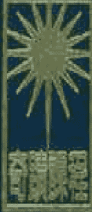
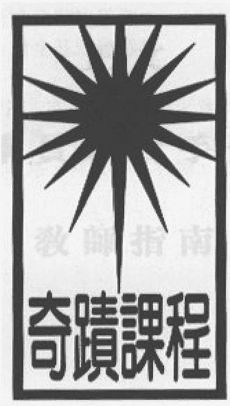

奇迹课程

# 奇迹课程

正文
学员练习手册
教师指南

心灵平安基金会 出版

# A COURSE IN MIRACLES

心灵平安基金会出版
FOUNDATION FOR INNER PEACE

# 奇迹课程
# 合订本
# 正文
# 教师指南
# 词汇解析
# 奇迹课程补编
# 若水译
# 监译委员会

Dr. Kenneth Wapnick, Ph.D., Foundation for A Course in Miracles

Dr. William Whitson, Ph.D., C.I.M. Associates

《奇迹课程》之翻译、出版及发行机构：心灵平安基金会
P.O.Box598,Mill Valley,Ca94942 U.S.A.

版权所有：1975，1985，1992 心灵平安基金会
1999 奇迹课程基金会

若无基金会事先书面同意，请勿以任何方式盗印本书或复印任何部分，不论是经由手工、机器或电子途径，其中包括影印、录音、录像，或是有系统地摘录、储存本书资料。欲知详情，请与基金会订购。

英文初版©1976年6月（三册装）于美国
中文初版©1999年6月（合订本）于美国

ISBN 1-883360-04-8(精装)
Library of Congress Catalog Card Number 99-72584

本书的原著是以英文写成，由心灵平安基金会出版，英文版可直接向基金会订购。

# 序言

此序写于公元一九七七年，应多方人士要求简介《奇迹课程》而作。最前面有关本书之源起及性质的两部分，乃是出自海伦·舒曼之手；至于内容的部分，则系经由秘传（inner dictation）而笔录下来的，其过程会在此序言中略作交代。

## 本书之源起

《奇迹课程》是海伦·舒曼与威廉·赛佛两位教授基于同一共识，仓卒决定联袂合作而成。他们都任职于纽约哥伦比亚大学内外科医学院的医疗心理学系。其实他们是何许人物，并无关紧要，整个事件的原委，适足以显示出上主内没有不可能的事。他们原本是灵修的门外汉，彼此间常生龃龉，关系相当紧张，只挂虑事业上的成就及地位。大致来讲，他们算是俗世中人，他们的生活与本课程所倡导的境界简直是南辕北辙。领收此课程内容的海伦曾对自己作过这番描述：

> 身为心理学家、教育学家的我，在理论上相当保守，在信仰上属于无神论，任职于颇具学术名望的环境中，却因一个事件，引发出一连串意想不到的事情。我们系里的主管有一天出人意表地公开表示，他再也受不了我们充满怨怼及挑衅的心态，在结论中，他断言：“这一定另有一路才对！”此时，我仿佛冥冥中受到某种提示，决定帮他探索这个出路。这个课程显然就是那个出路。

虽然他们的动机相当严肃，在联手探索之初，仍经历了极大的困难。可是他们一旦向圣灵献出一“点点的愿心”，这便如本课程一再反复强调的，足以让圣灵发挥大能，完成其旨意，不论何时何地。

海伦在其自述中继续说：

在动手笔录之前那奇妙的三个月中，比尔建议我把当时正经验到的充满象征意味的梦境以及各种奇怪的异像记录下来。虽然那时我对突如其来的经验逐渐习以为常了，但见到自己写下“这是阐释奇迹的课程”这一句话，仍然惊讶万分。这是我初识那神秘声音的肇始。它无声无息，却好似在我心内神速地传述一些东西，我一一把它们记录在速记本上。笔录时并非身不由己，它可以随时打断，稍后再接续下去。我对此虽感到很不自在，却无从罢手不干的念头，它好似我曾几何时答应过要完成的一项特殊任务。它代表了比尔及我之间真正的联袂探索，我确信它的主要意义也不外乎此。我会记下那神秘声音所“说”的，次日念给他听，由他把我的笔录打字成稿。我认为他也负有特殊的任务，若非他的鼓励支持，我是绝对完成不了我的任务的。笔录的过程历经了七年的光景，最先是正文，然后是学员练习手册，最后才是教师指南。我们只在几个小地方做了一些修正，并在正文中插入章节名称，删去早期个人加进去的注脚。除此之外，本课程基本上保持了原貌。

本书封面并未列出参与笔录本课程的人名，因为课程本身足以也应该自成一家之言。本书并无意据此而自立门派，它唯一的目的就是为某些人指出一条路来，使他们能够从中寻得自己的内在导师。

## 本书的性质

顾名思义，《奇迹课程》的整个格局设计为一种教学指南。它包括了三部分：长达626页的正文，483页的学员练习手册，以及87页的教师指南。至于阅览的次序及研读方法，全凭学员的特殊需要及个别喜好而定。

本课程的设计是经过缜密思考的，在理论及实践两方面都按部就班加以诠释。它注重实践甚于理论，强调体验甚于神学。它甚至明言：“人间不可能有普世性的神学，然而，普世性的经验不只是可能，而且是必须的。” (教师指南73页)虽然本课程采用基督宗教的术语，所瞩目的却是普遍的灵修课程，它声明自己不过是普世课程中的一种版本而已。世上的版本多得不胜枚举，形式虽有不同，终将抵达上主那儿的。

“正文”相当理论化，开宗明义地提出整个思想体系中的基本概念，为“手册”中的练习奠定基础。若缺了“手册”中的具体操练，“正文”最多只能算是一堆抽象理论，难以达到本课程所预期的扭转思想之效。

“学员练习手册”共有三百六十五课，以一年为期，一天一课。但也无需拘泥于这一进度，有些人也许会在他特别有兴趣的一课多逗留一些时日。这种设定只不过是在提醒读者，一天不要超过一课。练习前的导言提纲挈领地指出“练习手册”的实用性，它所强调的是实践中的体验，并不要求对这灵修目标预作任何承诺。

“学员练习手册”所提到的某些观念，也许会使你感到难以置信，有些甚至令你咋舌不已。这都不要紧。你只须按照书中的指示发挥这些观念，用不着你来判断，你只须加以运用即可。唯有在具体运用中，你才能看出它们的意义，也才能体会出它们的真实不虚。

只须谨记这一点，你不必相信这些观念，你也无需接受它们，甚至无需表示好感，其中某些观念，甚至可能激起你强烈的反感，这丝毫不会影响或减低它们的功效。但是在运用时，千万不要随便剔除“学员练习手册”中的任何观念，不论你对那些观念有何反映，只是试着加以运用。此外，则别无所求了（学员练习手册1-2页）。

最后，教师指南是以问答方式写成，答复学员们可能提出的问题。它同时也澄清了本课程中的一些术语，根据“正文”的理论架构予以诠释。

本课程从未自许为人类的终极课程，“手册”中的练习也无意让学员觉得自己已经学完了。本书在结束时，将读者交托给个人的内在导师，祂自会权宜施教，继续指导。本课程所涉猎的范围虽说包罗万象，然而，真理是不受任何形式所限的。“学员练习手册”在结尾中很清楚地阐明这一事实：

> 这个课程只是一个起步，而非结束……此后不再安排特定的功课了，因为无此必要。此后……你只须聆听圣灵……神会指点你努力的方向，明确地告诉你该怎样去做，如何训练你的心智，以及何时该静静地来到神前，求神那万无一失的指引及千古不变的圣言。（学员练习手册482页）。

## 本书的内容

> 凡是真实的，不受任何威胁，
> 凡是不真实的，根本就不存在，
> 上主的平安即在其中。

这是《奇迹课程》开宗明义之言。它把真实与虚妄，真知与知见作了根本的区分。真知即真理，隶属于圣爱之律或是上主的天律之下。真理是不变的、永恒的、毫不隐晦的。人们可以不承认它的存在，却无法改变它的真相。它适用于上主的一切造化，唯有神所创造出来的才是真实不虚的。真理超越了时间及过程，无法由学习而得。它没有对立，无始无终，只是如此。

反之，知见的世界属于时间、变化、有始有终的世界。它根据的是诠释解说，而非事实。它属于生死无常的世界，因着人们相信匮乏、失落、分裂及死亡等种种理念，它才得以存在。它是由学习而来的，并非天赐；是凭着个人的知见偏好而做的选择。它的作用变化无常，它的诠释偏曲不实。

于是，在真知与知见的基础上，形成了出两种截然不同，甚至可以说是完全对立的思想体系。在真知的领域内，所有思想均存在于上主之内，因为上主和祂的造化共享同一旨意。至于知见的世界，则是由相信对立的理念以及分歧的个别意愿而形成的，不但永远相互倾轧，与上主之间已是冲突迭起。由知见而得的见闻状似真实，因为它只会让知者所愿看见的东西进入他的意识之中，于是幻视世界便如焉形成了。正因为它的虚幻不实，他随时需要加以自卫。

当你陷入了知见的世界，你便坠入了梦境。若无外援，是难以脱身的，因为所感知的一切都向你证明梦境的真实性。上主早已赐下了最后的答案，唯一的出路。神一方面彻底了解真相，一方面也深谙人的幻觉而不受其弊，才能完成这一使命。圣灵的目的乃是教导我们如何扭转自己的想法，清除自己的错误，帮助我们由梦境脱身。为了扭转我们的思想，圣灵最得力的教材便是宽恕。然而，本课程既然对世界有它自己的一套界定，它对宽恕的真谛也有自己的界定。

我们眼前的世界，只是反映出我们内在的思想架构而已，也就是那些根深蒂固的观念、期待和感受。“投射形成知见”（正文414页），我们是先往内看，决定自己想要见到什么样的世界，然后再把那世界投射在外面，形成外面眼中的事实。是我们自己对眼前事物的诠释，才使得它俨然如真的。如果我们想借知见来为自己的错误（如愤怒、挑衅的心态，以及缺乏爱心的表现）辩解，我们便会看到一个充满邪恶、毁灭、敌意、嫉妒及绝望的世界。我们必须学习宽恕这一切，这不是因为我们的“善良”或“爱心”，而是因为我们所见非真。是我们扭曲的自卫系统曲解了世界，才会看到根本不存在的现象。我们一旦学会认清自己认知上的错误，也就学会超越它们或“宽恕”它们；而在这同时，我们也宽恕了自己，我们的眼光才能够越过扭曲了的自我概念，直视上主在我们内如是所造的真我，亦即自性（Self）。

所谓罪，即是“缺乏爱心”（正文11页）。既然爱才是一切，罪在圣爱的眼中，只是有待修正的错误而已，并非必遭天谴的邪恶。我们内在种种不对劲、欲振乏力及有所缺憾之感，乃是基于我们坚信那操作整个幻觉世界的“匮乏原则”。准此观之，我们会设法在他人身上寻找自己内心想要的东西，于是我们会为了得到某些东西而“爱”他人；而那正是梦幻世界所谓的爱，没有任何错误比这个更严重了，因为爱是不能要求任何代价的。

只有心与心之间才有真正的结合，上主所结合的，没有人能够拆散（正文332页）。然而，只有在基督之心的层次上才可能产生真正的合一，而这种合一，实际上从未失落过。“小我”有意借着外在的肯定、外在的资产及外在的“爱”来自抬身价；上主所创造的自性（Self）则一无所求。它永远圆满、安全、充满爱心，亦受人所爱。它深愿分享，而非索取；只知推恩，而非投射。它一无所求，只愿与那意识到彼此之间富有的人结合在一起。

世俗中的特殊关系常是自私、幼稚、自我中心，而且颇具破坏性的。尽管如此，只要交托给圣灵，这些关系便能转变为世上最神圣的东西，也就是为人指出回归天国之路的奇迹。俗事常利用这些特殊关系作为排除异己及自立门户的最后绝招，圣灵却能够将它们转化为学习宽恕及由梦境觉醒的最佳教材。每一个关系都成了救治知见和修正错误的机会，每一个关系也都是透过宽恕别人而宽恕自己的另一个机会，每一个关系同时也都成了接受圣灵邀请以及忆起上主的一大良机。

知见是属于身体的机能，因此它的觉察能力有限。知见必须透过身体的眼睛来看，透过身体的耳朵来听，它只能激发出身体内有限的反应。乍看之下，身体好像是自发自主的，其实它只能按照心灵的意向而反应。如果心灵想借用身体发出任何攻击性的行动，它便沦为疾病、衰老及腐化的牺牲品；如果心灵转而以圣灵的目标为目标，身体便成了与他人沟通的有效管道。只要有它存在的必要，它便百害不侵；当它不再为人所需时，它便安然长眠。身体本身是中性的，犹如知见世界中的一切。它究竟是为小我或圣灵效命，全凭心灵的意愿。

与肉眼之见相对的，便是基督的慧见。它代表的是力量，而非软弱，是合一而非分裂，是爱而非恐惧。与耳之闻相对的，则是为上主发言的神圣之音，即居住在我们每一个人内的圣灵。只因代表那渺小且分裂的那部分自我的小我哓哓不已，才使得圣灵的声音显得如此遥不可闻。实际的情况应该倒过来讲才对：圣灵发言时一向是准确无误，且具有难以抗拒的吸引力。凡是不与身体认同的人，一定听得见祂那充满解脱及希望的佳音。他必会欣然接受基督的慧见，以取代自己的卑微形象。

基督的慧见是圣灵的恩赐，是上主为了取代分裂的幻觉以及相信罪、罪恶感和死亡的理念所赐下的另一种可能性。这一个慧见足以修正所有知见上的错误，使外表看来相对立的世界重归于好。它的慈光从另一角度彰显了万物的真相，反映出真知的思想体系，使得回归上主不只可能，而且是必然的。过去我们视为此人所加于彼人的不义之举，如今已懂得，那只是对方求助及合一的呼吁。罪、疾病和攻击也被视为妄见呼求温柔及爱心的药方。如此一来，求成了我们的需求，因为他们既与我们一同赴上主之道，没有我们，他们也许会迷途；没有他们，我们可能永远也找不到自己的路。

在天国中，没有宽恕这一回事，因为那儿根本无此需要。但在这世界中，宽恕是修正我们一切错误的必要过程。唯有先施与宽恕，我们才可能拥有宽恕，因为它所反映出“施予与接受不二”的天国之律。天国是上主为其神圣儿女所创造的本来境界，那是他们的永恒实相，纵使遭人遗忘，亦不曾改变分毫。

我们必须谨记宽恕之道，唯有宽恕能扭转俗世的观点。受到宽恕的世界成了上天之门，因为借着它的怜悯，我们终于能够宽恕自己。不定任何人的罪，自己也由此而得到了解脱。在弟兄身上承认基督的临在，我们也会在自己身上体认出祂的临在。忘却所有的妄见，不再受过去所羁绊，如此，我们必会忆起上主来。超乎此，便非学习可达之境，但只要我们准备妥当，上主自会踏出最后的一步，引领我们回归于祂。

# 正文

### 导言

1. 这是阐释奇迹的课程。²是一门必修的课程。³只有投入时间的多少是随意的。⁴随自己的意愿并不表示你可以自订课程。⁵它只表示在某段时间内你可以选择自己所要学的。⁶本课程的宗旨并非教你爱的真谛，因为那是无法传授的。⁷它旨在清除所有防碍你体验到爱的障碍；爱是你与生俱来的禀赋。⁸与爱相对的是恐惧，但凡是涵容一切者是不可能有对立的。

2. 因此，本课程可以提纲挈领地归纳为下面这几句话：

- 凡是真实的，不受任何威胁，
- 凡是不真实的，根本就不存在。
- 上主的平安即在其中。

## 第一章 奇迹的真谛

### 一．奇迹凡例

- 1. 奇迹没有难易之分。²一个奇迹并不会比另一个奇迹“更难”或“更大”。³它们全是同一回事。⁴全都能表达出爱的极致。
- 2. 奇迹本身并非关键。²重要的是它的源头，其价值是无法衡量的。
- 3. 奇迹是爱的自然流露。²真正的奇迹在于那激发奇迹的爱。³由此观之，凡是出于爱的就是奇迹。
- 4. 所有的奇迹都意味着生命，而上主是赋予生命者。²祂的声音会明确而具体地指引你。³祂会告诉你该知道的一切。
- 5. 奇迹是种习性，应是无心而发的。²它应超越意识的控制。³蓄意挑选的奇迹很可能导入歧途。
- 6. 奇迹本是最自然不过的事了。²当它匿迹不现时，便表示出了问题。
- 7. 奇迹本是每一个人的权利，但人必须先净化自己。
- 8. 奇迹是一种救治，因它能弥补某种欠缺；一时比较富裕的，施舍给一时比较欠缺的，奇迹便这样产生了。
- 9. 奇迹乃是一种交流。²它就像所有爱的流露一样，常能神奇地扭转自然法则。³奇迹为施者与受者双方都带来更多的爱。
- 10. 若利用奇迹的奇观异景来诱发人的信仰，便误解了奇迹的目的。
- 11. 祈祷是奇迹的媒介。²它是受造物与造物主之间的交流管道。³透过祈祷，领受了爱；透过奇迹，也表达了爱。
- 12. 奇迹是种意念。²意念可以呈现较低的或是身体层次的经验，也以呈现较高的或灵性层次的经验。³前者构成了物质世界，后者则创造了灵性世界。
- 13. 奇迹既是开端，也是终结，它改变了现世的时间律。²它始终肯定着重生的可能，表面上状似倒退，其实是前进。³它当下就能化解过去的一切，因而也释放了未来。
- 14. 奇迹为真理作证。由于它发自信念，故具有说服力。²若缺了这股信念，它便沦落为怪力乱神，不属于心灵的层次，因而常具破坏力，更好说，它枉费了心灵的创造力。
- 15. 我们应把每一天都献给奇迹。²时间存在的目的乃是为了教导你如何积极善用时间。³因此它是一种教具，完成目的的一种手段。⁴当时间一旦无助于学习，便不复存在了。
- 16. 奇迹是显示施与受一样有福的教学工具。²它增强了施者的力量，同时也扶助了领受者。
- 17. 奇迹超越身体的层次。²它能刹那间转入无形无相之境，远离身体的层次。³这是它能够救治的道理所在。
- 18. 奇迹是一项服务。²它是你为别人所能提供的至高服务。³它是爱邻如己的一种方式。⁴你会同时体认出自己与邻人的价值。
- 19. 奇迹使心灵在上主内合而为一。²它系乎心灵的和衷共济，上主儿女之奥体乃是上主一切创造的总和。³由此可知，奇迹所反映的乃是永恒之律，而非时间律。
- 20. 奇迹使人再次觉悟：灵性才是真理的祭坛，而非身体。²这一体认便足以激发救治的能力。
- 21. 奇迹是宽恕的自然标志。²透过奇迹，你把宽恕推恩于他人，同时也领受了上主的宽恕之恩。
- 22. 唯有当你相信黑暗能够隐藏一切时，奇迹才会带给人恐惧的联想。²你相信凡是肉眼看不见的东西就不存在。³这信念使你否认一切灵性之见。
- 23. 奇迹重新调整了知见，按本末次序，各正其位。²救治即在其中矣，因为层次的混淆乃是一切疾病之源。
- 24. 奇迹帮你救治病患，使死者复生，因为疾病和死亡既然出自你手，你也必能将它们一笔勾销。²你，就是奇迹，具有创造之力，一如你的造物主。³除此之外，全是你自己的梦魇，并不存在。⁴只有光明的造化才真正存在。
- 25. 奇迹是环环相扣的宽恕中的一环，当它圆满时，便是救赎。²救赎能随时随地运作于所有的时间层次。
- 26. 奇迹代表了由恐惧中解脱的自由。²“救赎”具有“化解”之意。³化解恐惧乃是奇迹的救赎效能的根本要素。
- 27. 奇迹是上主对普世的祝福，经由我普施于所有弟兄。²宽恕别人乃是被宽恕者的特权。
- 28. 奇迹乃是帮人摆脱恐惧的途径。²启示则为人揭橥了一个恐惧已彻底消除的境界。³因此，奇迹只是手段，启示才是目的。
- 29. 奇迹透过你而颂扬了上主。²因为奇迹显扬了祂的造化，肯定其完美无瑕，上主因而受到了颂扬。³奇迹拒绝与身体认同，坚持与灵性认同，因此才具救治之效。
- 30. 由于奇迹确认灵性的存在，故调整了知见的层次，示其本末先后。²这种确认使灵性位于要津，得以直接与外界感通。
- 31. 奇迹应该激发人的感恩之情，而非敬畏之心。²你应为自己的本来面目而感谢上主。³上主儿女是神圣的，奇迹就是向这神圣性致敬；这神圣性可能隐伏不现，却永不致失落。
- 32. 是我启发了所有的奇迹，此即代祷的真义。²奇迹为你的神圣性说项，圣化你的知见。³它置你于自然法则之上，将你提升于天界。⁴你在那里是完美无缺的。
- 33. 奇迹向你致敬，因为你是值得爱慕的。²它驱除了你对自己的幻觉，认出你内在的光明。³它将你由噩梦中释放出来，如此赎清了你的过错。⁴它将你的心由幻觉的枷锁中释放，恢复你心智的健全。
- 34. 奇迹恢复了心灵原有的圆满。²它为匮乏作补赎，从而筑起一道完美的防护。³灵性的力量使外敌无隙可侵。
- 35. 奇迹是爱的流露，可是它未必常常具备有形可见的后果。
- 36. 奇迹是一种典型的正见，使你的知见与上主所创造的真理相互辉映。
- 37. 奇迹是我为妄见带来的修正。²它的作用有如催化剂，破除错误的知见，再适当地加以重组。³将你置于救赎原则之下，知见亦在此得到救治。⁴唯有臻至此境，才可能获得有关圣界的真知。

## 第一章 奇迹的真谛

- 38. 圣灵乃是奇迹的推动器。²祂能同时认清上主的创造以及你的幻觉。³祂能由整体着眼，不受偏私所蔽，故能辨别真伪。
- 39. 奇迹能够解除过错，是因为圣灵把一切过错都视为虚妄不实。²这就好比说，光明一现，黑暗就自然消逝。
- 40. 奇迹肯定了每一个人都是你我的弟兄。²这是看出上主大公特质的一种方式。
- 41. 完整性属于奇迹的知见部分。²因此它能够修正或赎回匮乏之见的错误。
- 42. 奇迹的主要功能在于它能将你由孤立的、受剥削的及欠缺的虚妄感受中释放出来。
- 43. 奇迹是出自心灵的神奇妙境，或是足以与奇迹相应的心境。
- 44. 奇迹反映出内心对基督的体验，也显示心灵领受到了他的救赎。
- 45. 奇迹是永不失落的。²它会影响许许多多的人，即使是缘悭一面之人；它甚至能不知不觉而且始料未及地转变周遭的一切。
- 46. 圣灵是最高形式的交流媒介。²奇迹并不涉猎这一类的交流，因它只是交流的一种暂时设施。³你若能借着直接启示回到天人交流的本来模式，奇迹便没有存在的必要了。
- 47. 奇迹是一种学习教材，能够减低人对时间的需求。²它在一般性的时间律之外，另建一种不同的时间序列。³从这角度来讲，它是超越时间的。
- 48. 若要控制时间，唯一操之在你的道具便是奇迹。²只有启示能够超越时间，它与时间风马牛不相及。
- 49. 奇迹并不把妄见划分等级。²它是修正知见的道具，其效用并不受错误的程度或导向所影响。³这就是它地道的平等心。
- 50. 奇迹将你的妄作与上主的创造加以比较，凡与创造相应的，便纳为真实，相抵触的，便斥为虚妄。

## 二. 启示，时间与奇迹

1. 启示能一时却全面撤销人的疑虑及恐惧。²它反映出上主及造化之间原有的交流形式，由于这种创造关系涉及极其私密的创造感，有时会使人想由形体关系中寻得。³启示是无法透过形体上的亲密而寻获的。⁴相形之下，奇迹却具有地道的人际关系之性质，导致与他人之间真实的亲密关系。⁵启示能使你直接与上主结合。⁶奇迹则使你直接与弟兄结合。⁷两者虽非源自意识作用，却都能意识得到。⁸意识层次只能诱导出行动，却无法启发灵感。⁹你有相信自己所选之物的自由，而你的作为则成了你的信念的一个见证。

2. 启示是极其私人性的，而其意义是无法转译给别人的。²为此之故，任何言诠都是徒劳。³启示只能导致经验。⁴反之，奇迹则能导致行动。⁵基于它人际关系上的特质，对现世生活格外有用。⁶在这学习阶段里，施展奇迹一事变得格外重要，因为摆脱恐惧的自由不可能硬套在你头上。⁷启示确实是不可言喻的，因为爱之经验是不可言喻的。

3. 敬畏之情应保留给启示，唯有应用在启示上才是最恰当且正确的。²但不该把它用于奇迹上，因为敬畏含有崇拜心理，意味着层次较低的受造物立于造物主前。³你是一个完美的受造物，只有在完美的造物主前才应感到敬畏。⁴因此，奇迹只是平等众生之间的爱之标志。⁵平等的受造物之间不该怀有敬畏之情，因为敬畏意味着彼此的不平等。⁶因此，这也不是对我当有的正确心态。⁷身为兄长的，经验比较丰富，理当受到尊重；具有丰富的智能，理当听从他。⁸他既是兄长，理当受到敬爱；他既已奉献了自己，自然担当得起他人的奉献。⁹我因着自我奉献，才配接受你的奉献。¹⁰关于我的一切，没有一样你不能达到。¹¹我所有的一切，无非来自主。¹²此外，我一无所有，这是我们当前不同之处。¹³这使得我所在的境界，对你而言仍是有待开发的潜能。

4. “除非经过我，谁也不能到父那里去”，这并不表示我与你们之间，除了时间之别以外，还有任何差别或不同；而时间事实上并不存在。²这句话必须由纵向而非横向来看才有意义。³你在我的下面，我又在上主之下。⁴在“提升”的过程中，我是高一层，因为若没有我，天人之间的距离会远得令你难以跨越。⁵我既身为你的长兄，又身为上主之子，因而拉近了双方的距离。6我因着对弟兄的奉献，才衔命掌管上主儿女之奥体；由于我身在其中，故能圆满这一任务。7这好似与“我与父原为一体”的说法相互矛盾，其实这两种说法都不外乎表明天父更大于我。

5. 启示是间接出自我的启发，因为我与圣灵非常接近，我十分注意已经准备好接受启示的弟兄。2因此，我能把启示带给他们，比他们带给自己要容易得多。3高层次与低层次之间的交流是靠圣灵为媒介，是祂使得上主向你启示的直接管道保持通畅。4启示不是双向进行的。5它只能由上主通传给你，而非由你通传上主。

6. 奇迹把时间的需求降到最低程度。2不论由纵向或是横向层面来看，好似得历经百千万劫，方能悟出上主儿女奥体中所有成员的平等性。3然而，奇迹却使人的知见霎时由横向转变为垂直向上。4它将施者与受者引进一种时间序列，使双方顿时跃出时间之流，不再像以前一般累世浮沉。5由此可见，奇迹具有废除时间的特殊性能，它使人不必再在时间的洪流中浮沉下去。6行一个奇迹的时间与它的影响所能涵盖的时间毫无关联。7奇迹能取代千百年的学习过程。8这是因为奇迹从根本上指认出施者与受者之间圆满的平等性。9奇迹摧毁了时间，使之缩减，省却了几番劫数。10然而，这种成就是在更大的时间序列里完成的。

## 三. 救赎与奇迹

1. 我是掌管整个救赎过程者，此事由我发轫。2当你向我任何一位弟兄施予奇迹时，你就是为你自己以及我而行的。3我之所以把你放在我的前面，是因我自己的救赎已无需奇迹，但我紧随你后，以免你一时失足。4我在救赎大业中的任务，是一笔勾销你自己无法修正的错误。5当你得以重新认清自己的本来面目时，自然而然便会成为救赎大业中的一员。6只要你效法我再也不愿接受自己及他人的错误时，你必然会加入这伟大的修正行列：聆听我的声音，学习化解错误，并具体予以修正。7施展奇迹的能力就在你内。8我会提供你施展的机会，可是你必须准备妥当并甘愿去做才行。9具体实践，会使你对自己的能力信心大增，因为信心来自具体的成就。10这能力是种潜能，成就乃是它的表现，至于其目标则是救赎，此亦上主儿女的天命。

2. “天地必将消逝”表示天地不会继续以分裂的模式存在下去。²我的话，是复活，是生命，它永不消逝，因为生命是永恒的。³你是上主的杰作，祂的杰作不只可爱，并洋溢着爱。⁴人应该在自己心内这样看待自己，因为这就是它的本来面目。

3. 已被宽恕者便成了救赎的工具。²他们既已被灵性充满，故能报之以宽恕。³凡是已获释放者必会加入释放其它弟兄的行列，因为这就是救赎计划。⁴奇迹便是那些事奉圣灵的心灵与我合一的途径，合一为了救恩，亦可以说是为了释放上主的一切造化。

4. 唯有我能够普施奇迹于一切众生，因为我就是救赎。²我会在这救赎谋划中为你指定一个角色。³你应施行哪些奇迹，应该问我。我将直接指点你进行的方式，使你不再枉费精力。⁴奇迹中非个人性的特质是一个关键因素因为这使我得以指导你发挥其用。⁵奇迹在我的指引之下，会导向极其个人性的启示经验。⁶向导只是带领，而非控制；听从与否，悉听尊便。⁷“不要让我们陷于诱惑”，是指“认清自己的错误，决心放弃它，听从我的指引。”

5. 错误无法真正威胁到真理，真理必然经得起考验。²只有错误才是真正的不堪一击。³你能自己地在你认为合适的地方建立自己的国度；只要你能牢记下面的话，你的选择必然正确无误：

> ⁴灵性永存于恩典之境。
⁵你的实相是纯粹属灵的。
⁶因此你永存于恩典之境。

⁷由这方面来讲，救赎能化解所有的错误，根除一切恐惧之源。⁸每当你感到上主的保证变成一种威胁时，那常是因为你仍忙着为误置的或误导的愚忠辩解。⁹你若将它投射于他人身上，他们便沦为你的阶下囚；不过你的影响最多只是强化了他们已犯的错误而已。¹⁰这使他们极易受别人的曲解所伤害，只因他们已曲解了自己。¹¹至于施展奇迹的人，只会借着祝福化解他们的曲解，帮他们挣脱牢笼。

6. 你的反应一向根据一己之见； 你如何去看事情， 便会如何反应。²圣经的金科玉律要求你： 你愿别人怎样待你，你也要怎样待人。³这意味着双方的观点必须正确才行。⁴这条金科玉律能使你随心所欲而不逾矩。⁵除非你认知正确，否则很难行不逾矩。⁶你和你的邻人都是同一个家庭内的平等成员，你如何看待彼此，便会如何对待彼此。⁷你应该先认出自己的神圣本质，才能由此而认出他人的神圣性。

7. 奇迹出自一颗已准备妥当的心灵。²这颗心灵在合一的状态下，能与所有的人相通，连行奇迹之人也无须意识到它。³由于救赎本身是将一切造化结合于造物主内的一个整体，故奇迹才具有非个人化的性质。⁴奇迹彰显出你的真正面目，置心灵于恩宠之境。⁵这心灵自然会欢迎居于其内的主人以及外来的陌生人。⁶陌生人一被邀请入内，便成了你的弟兄。

8. 你不用挂虑自己能否认出奇迹对弟兄的影响。²奇迹会不断降福你。即使是无人要求你行的奇迹，也不会失去它的价值。³它仍能显示你所在的恩宠境界，但是奇迹的行动方面应该由我来掌控，因为我全然知悉整个计划。⁴奇迹心态中的非个人性质确保了你的恩典永在，可是只有我才知道它应施于何处。

9. 奇迹是特别为那些知道善用于己者而设的，由这层意义来讲，奇迹可谓是有取舍的。²这一点保证他们会把奇迹推恩于他人，一条坚固的救赎连锁就这样焊接起来了。³然而，这中取舍性与奇迹的大小规模无关，因为大小的概念只存于虚幻不实的层面中。⁴既然奇迹旨在恢复人对实相的觉知，如果它还受制于那些有待它来修正的错误原则，那就一无所用了。

## 四. 挣脱黑暗的势力

1. 若要挣脱黑暗的势力，需经两个阶段：一是认清黑暗隐藏不了任何东西。²这一步通常会激起人的恐惧。³二是认清即使能够隐藏，你也无意隐藏任何事情。⁴这一步能使人摆脱恐惧。⁵当你甘心不再隐藏任何事情时，你不只乐于交流，还会了解平安与喜悦。

2. 神圣性是绝不可能被黑暗所隐藏的，可是你却能如此自欺。²这种自欺会使你害怕，因为你心里明白你在欺骗自己，却还费尽心思去弄假成真。³奇迹能使实相复归其位。⁴实相只属于灵性，而奇迹只认可真理。⁵它就这样驱除了你对自身的幻觉，使你得以与自己及上主交流。⁶奇迹将心灵转而为圣灵服务，借此参与了救赎大业。⁷它重建心灵的正规功能，修正它的错误，这错误不过是缺了爱心罢了。⁸心灵可能会受制于幻觉，你的灵性却永远是自由的。⁹如果心灵认的认知不是出自于爱，它只会看到一个空壳子，觉察不出内在的灵性。¹⁰可是救赎却能使灵性复归其位。¹¹事奉灵性的心灵是百害不侵的。

3. 黑暗只是缺了光明，一如罪恶只是缺了爱心。²它本身并没有自己的属性。³它是相信“匮乏”的一个典型例证，由此只可能滋生错误。⁴真理一向是富足的。⁵凡是看出并承认自己已拥有一切的人，就不再有任何需求。⁶救赎的目的便是将一切重归于你，更好说是重归于你的意识。⁷一切都已在你受造之妆赐给了你，每一个人都是如此。

4. 因恐惧而生的空虚感，必须以宽恕取代。²这就是圣经所谓的“再也没有死亡”之真义，以是之故，我也才能向你们证实死亡并不存在。³我来，重新诠释了法律，使它得以圆满。⁴只要了解正确，法律是为了保护人而设的。⁵是那些尚未回心转意的人把“地狱之火”的观念带入法律的。⁶我向你保证，任何人只要让我为他作证，我都会在他所容许的范围内为他作证。⁷你的见证不只显示你的信念，更巩固了它的立场。⁸凡是为我作证的人，透过他们所行的奇迹，充分表达出他们已舍弃了被压榨的信念，转而相信那原本就属于他们的富裕。

## 五. 圆满与灵性

1. 奇迹很像人的身体，二者都是导向某一境界的学习教具；进入那境界之后，它便没有存在的必要了。²灵性一旦臻至它本具的直接交流之境，身体和奇迹便可以功成身退。³但是，你若相信自己仍存于身体中，你要把它当作冷酷无情或是神奇美妙的表达工具，全操之于你。⁴你可以把它当成一个空壳子，却不可能什么也不表达。⁵你可以等待、拖延、让自己麻木不仁，或是把自己的创造活力降到最低的程度；⁶你就是无法废除它。⁷你能够毁灭你的交流媒介，却毁不掉你的潜能。⁸因为你不是自己创造出来的。

2. 若非必要，不再受制于时间，这是合乎奇迹心境者的基本决定。²时间可以耗损，也可以浪掷。³因此，施展奇迹的人才会欣然接受那被时间所控制的因素。⁴他体会到，时间每崩溃一次，便能让每一个人与那超越时间的终极之境更接近一点；在那儿，圣子与天父原是一体的。⁵所谓的平等，并不是指当前的平等。⁶当每一个人都已认清自己拥有的一切时，上主儿女之奥体就无须作个别的奉献了。

3. 在救赎圆满之际，上主所有的儿女都将分享一切天赋。²上主是大公无私的。³祂所有的儿女都享有祂完整的爱，他的恩赐一视同仁地平白分施给每一个人。⁴“除非你们变成小孩子一样”这句话，表示除非你全然认清自己对上主的彻底依赖，无由得知圣子与天父之间那层真实关系的大能。⁵上主之子的特殊性在于它的包容，而非排他。⁶我的弟兄全是特殊的。⁷他们若认定自己受到了剥削，表示他们知见已被扭曲了。⁸一旦如此，上主的整个家庭或是上主儿女之奥体都会因着它的种种关系而受到伤害。

4. 究竟来讲，上主家中的每一份子终将复归其宗。²纵使他尚未寻回灵性，奇迹仍然祝福他，向他致敬，唤他回归。³“上主是嘲弄不得的”，这并非警告，而是一种保证。⁴只有上主的任何一个造化的神圣性有了缺失，上主才可能受到“嘲弄”。⁵造化是完整而无瑕的，神圣本质则是这完整性的标帜。⁶奇迹便是对上主儿女之奥体那圆满及富裕之境的肯定。

5. 凡是真实的，必是永恒的，不会变化，也不会改造。²灵性既已圆满，故也不会改变，心灵却可以自行选择要事奉谁。³唯一的限制是，它不能事奉二主。⁴心灵一旦选择了灵性，就成了灵性创造的工具，透过它，灵性按照自己的受造模式继续创造。⁵纵然它未自动作此选择，亦不致失落创造的潜能，只是自愿受制于暴君，而不肯服膺于至高权威。⁶结果沦为阶下之囚，因为这正是暴君的独裁作风。⁷所谓回心转意，便是自愿服膺于那真实的权威之下。

6. 奇迹这个标帜显示心灵已决定跟随我加入基督的服务行列。²凡决定跟随基督的人自然享有基督的富裕。³所有杂根必须根除，因为它们涉土不深，支撑不了你。⁴幻想这些浅根终有加深的一天，可能变得牢靠，这类颠倒妄想正好和那金科玉律背道而驰。⁵一旦断除了这些妄念之根，你会顿时感到内在失去了某种均衡。⁶然而，没有任何状态会比本末倒置更不稳定的了。⁷凡是本末倒置之物是不可能趋向稳定的。

## 六. 需求的幻觉

1. 谁想要获得平安，唯有透过彻底的容恕。²他必须真有学习的意愿，并且相信自己在某方面确有此需，他才可能学到东西。³在上主的造化中,没有欠缺；然而在你所造的世界里，显然有所欠缺。⁴二者之间的基本区别，实际上就在这一点上。⁵欠缺感意谓着，你的处境如果有所改变，你的日子会好过一些。⁶在“分裂”之前，也就是指人类“沦落”前，本是一无所缺的。⁷也没有任何需求。⁸直到你开始自我剥削后，需求之念才油然而生。⁹你会按照自己特定的需求层次而行动。¹⁰而你的需求所根据的乃是你对自己的认知。

2. 与上主分裂之感是唯一有待你修正的“欠缺”。²若非你对真理的认知产生偏曲,自以为有所欠缺，否则，这种分裂感根本无由而生。³你一旦犯下这基本的错误，便已经把自己分割为不同的需求的层次,需求层次的观念便由是成形了。⁴你自己若能整合为一，你的需求自然也随之变为一个。⁵统一的需求导致了统一的行动，因为冲突无由而生。

3. 由“人可能与上主分裂”这个最基本的错误衍生出来的需求层次观念，必须先就地修正,认知层次上的错误才有修正的可能。²你若同时在不同层次上运作，必然效益不彰。³然而，当你还在不同层次上运作时，修正必须由下向上地垂直进行。⁴这是因为你还认为自己活在空间中，“上”与“下”的概念只有在空间中才有意义。⁵究竟来讲，空间与时间一样虚妄。⁶它们都不过是一种信念而已。

4. 这世界的真正目的，是为了修正你的缺乏信心。²你对恐惧的后遗症一筹莫展，因为它是你自己营造出来的，而你一向信赖自己所造之物。³在心态上，而非实质内涵上，这一点你很像你的造物主，祂对自己的造化一向怀有完美的信心，因为是祂创造了他们。⁴信念使人接受一物的存在。⁵由是之故，你对众人一致视为虚妄之物仍能坚信不移。⁶只因它是我所造出来的，对你便成了真的。

5. 恐惧不论从哪一个角度来看都是虚幻不实的，因为在创造的层次上，它既不存在，就根本不存在。²你愿让你的信念接受这一考验的程度有多深，你的知见便会得到多深的修正。³在分辨真伪的过程中，奇迹是按照下面的逻辑进行的：

- 4. 完美的爱驱逐了恐惧，
- 5. 如果恐惧存在，完美的爱就不存在。
- 6. 然而：
- 7. 完美的爱是唯一的存在，
- 8. 如果恐惧也存在，表示它已造出了一个根本不存在的境界。

⁹只要相信这一点，你就自由了。¹⁰这个解决办法只有上主才能给得出，而这种信仰便是祂的恩赐。

## 七. 对奇迹本能的曲解

1. 你歪曲的知见沉沉覆盖了奇迹本能，使之难以进入你的意识。²把奇迹本能与生理本能混为一谈，实是最大的妄见。³生理的本能乃是被误导的奇迹本能。⁴真正的快感乃是来自承行上主的旨意。⁵因为若不如此，就等于否定自性。⁶否定自性，会造成幻觉；这错误必须先加以修正，才能免受幻觉所蔽。⁷别以为身外之物能帮你与上主及弟兄之间建立和平的关系，勿再如此自欺了。

2. 上主的孩子，你是为了创造美善而受造的。²千万不要忘记这一点。³由于人的慧眼依旧晦暗不明，上主之爱不得不暂且透过身躯来扩展你的知见，成就你肉眼所无法得到的真实慧见。⁴这种学习是身体唯一的真实用途。

3. 妄想是慧见被曲解后的产物。²任何妄想都出自曲解，因为它总是把扭曲的知见搅入根本不存在的现实中。³由这曲解而生的行动，事实上只是一种本能反应，当事人根本不知道自己在做什么。⁴企图根据错误的需求来控制实相，才会产生妄想。⁵对实相一有曲解，你的认知就会产生破坏力。⁶妄想是制造虚妄联想的一种工具，企图由此获得某种快感。⁷纵使你看得见这虚妄的联想，除了你自己会当真以外，绝不可能把它弄假成真的。⁸你相信自己所营造的一切。⁹如果你所给的是奇迹，你对它的信念也会一样强烈。¹⁰那么，你的念力便能护持那些接受奇迹者的信念。¹¹实相满足心灵的本质一旦昭然呈现于施者与受者的眼前，妄想便无立足之地了。¹²实相系因遭到篡夺而“失落”的，形成暴虐统治。¹³人间只要还有一个“奴隶”存在，你就没有完全解脱。¹⁴具有奇迹心态的人只有一个目标，就是全面重建上主儿女之奥体。

4. 这是锻炼心灵的课程。²整个学习过程要求你以某种程度的专注去研读。³课程的后段十分倚赖前面这几章的基础，你必须仔细研读。⁴你需要它在前铺路。⁵缺乏这层准备，课程后段会使你望而生畏，而无法积极发挥其用。⁶然而，在阅读前面几章之际，你会开始看见不少留待下文分解的伏笔。

5. 正如我在前文所提到的，人们常把恐惧与敬畏混为一谈，因此这课程需要一个稳固的基础。²我已说过，敬畏不适用于上主儿女身上，你不应该同你的同辈产生敬畏之情。³我也强调过，敬畏只适用于造物主前。⁴我已经慎重地澄清过我在救赎计划中的角色，既未夸张，也无意自贬。⁵我也设法以同样的方式待你。⁶我一再声明，由于我们内在本具的平等性，敬畏也不是对我该有的心态。⁷至于有关迈向上主的捷径，暂且留待后文讨论。⁸未经周全的准备，便贸然进入那些阶段，绝非智举；若把敬畏与恐惧混为一谈，那种经验对人的伤害大于福份。⁹救治毕竟来自上主。¹⁰我已经把方向仔细地向你解释了。¹¹也许启示偶尔会向你揭露一些终局景象，可是要达到彼岸，方法还是少不了的。

## 第二章 分裂与救赎

### 一．分裂之始

1. 推恩是上主的基本属性，也是祂对圣子的恩赐。²上主在创造之初即已将自己赐给了一切造化，使他们同样充满爱的创造愿力。³你不只是完整的受造物，而且还是完美的受造物。⁴在你内没有虚无。⁵你既与造物主肖似，故也充满了创造力。⁶上主儿女是不会失去这种能力的，因为这乃是与生俱来的禀赋；然而他却能妄用这天赋，变成投射。⁷每当你相信自己内有所欠缺或虚无，而且以为能用自己的想法，而非用真理，去填满之空虚，推恩之力便被扭曲为投射了。⁸这一过程通常包含了下面几个步骤：

- 第一，你相信自己的意念改变得了上主的造化。
- 第二，你相信完美之物可能沦落为不完美或有所缺憾。
- 第三，你相信你能够扭曲上主的造化，包括你自己在内。
- 第四，你相信你能创造自己，你的创造取向完全操之于你。

2. 这一连串的扭曲，反映出分裂之境或“陷身于恐惧之歧途”的真相。²分裂之前，这一切根本不存在；即使现在，它其实也不存在。³凡是上主所创造出来的东西，尽然肖似于祂。⁴上主所发出的推恩之力，近似于上主儿女由天父那儿承继过来的内在光明。⁵其真正来源均出自于内。⁶不论是天父还是圣子，都是如此。⁷由此观之，造化包括了上主所创造的圣子，以及圣子在心灵获得愈合后所创造出来的一切。⁸这一切都基于上主赋予圣子的自由意志，因为所有爱的创造，皆出于一脉相承的平白恩赐，于其中，所有的造化不论从哪一个角度来讲，都处于同等层次。

3. 在伊甸园，或是心灵分裂以前的境界里，本是一无所缺的。²当亚当听信“蛇的谎言”时，他所听到的一切都是不实的。³除非你自愿如此，否则你无须继续相信那些不实之事。⁴那一切真的会在眨眼之间消失得无影无踪，因为它不过是一种妄见而已。⁵梦中的一切看起来非常真实。⁶然而，圣经只提到亚当沉沉睡去，却没有任何一处提到他的苏醒。⁷世界尚未有过全面的觉醒或重生的经验。⁸只要你继续妄自投射或造作，就没有重生的可能。⁹然而，那种推恩的能力仍然存留在你内，正如上主将祂的圣灵推恩于你一般。¹⁰事实上，这是你唯一的选择，因为上主赐予你自由意志，乃是为了使你得以喜悦地创造完美。

4. 归根究底，所有的恐惧都是出自最基本的妄见，以为自己有篡夺上主大能的本事。²你当然不可能做到，也从来没有这种本事。³这是你得以摆脱恐惧的真正基础。⁴只要你接受救赎，你便能脱身而出，使你明白这一切错误原来从未真正发生过。⁵亚当是在熟睡以后，才陷入噩梦的。⁶假设有一盏灯突然照到正在做噩梦的人身上，这人必会把灯光诠释为梦中一景而更加恐惧。⁷他一旦苏醒，认出了光明，便脱离了梦境，梦境的虚幻面目顿时暴露无遗。⁸这脱身并非靠幻觉之助。⁹而是那光照你的真知，它不仅还你自由，还清清楚楚地让你看到自己本来就是自由的。

5. 不论你相信过什么样的谎言，对奇迹而言，毫无影响，任何谎言，它都有同样轻易地予以救治。²它不会去区分妄见的大小高下。³它唯一的任务是分辨真理及谬误，使二者互不混淆。⁴有些奇迹可能比其它奇迹显得壮观得多。⁵可是，别忘了课程中的第一条凡例：奇迹没有难易之分。⁶在实相中，任何缺乏爱心的言行举止都左右不了你。⁷不论是来自你自己或他人，也许是你对他人而发的，或是他人对你而发的。⁸平安是你一种内在的属性。⁹无法由外寻得。¹⁰向外求助本身就是病态的征兆。¹¹内心的平安才是健康。¹²它能使你在缺乏爱心的外境中屹立不摇；并因着你的接纳奇迹，而改变他人因缺乏爱心所招致的种种境遇。

### 二．救赎即防护

1. 你能够做到我所要求的一切。我要求你施行奇迹。²我已经清楚表明，奇迹是自然发生的，具有修正与救治的功能，并且是人类共有的能力。³奇迹没有做不到的事；然而，疑虑与恐惧的心态是施展不出奇迹的。⁴当你害怕任何东西时，表示你已认可它有伤害你的能力。⁵别忘了，你的财宝在哪里，你的心就在那里。⁶你会信赖自己所看重的东西。⁷如果你有所畏惧，表示你已评估错误。⁸你的理解也会跟着评估错误，你若赋予所有意念同等的威力，你的平安就被摧毁了。⁹为此之故，圣经才会提到“超乎各种意想的平安”。¹⁰这平安完全不受任何错误所动摇。¹¹它否定任何不是来自上主之物具有左右你的能力。¹²这是使用否定的高明手法。¹³不是用来隐瞒，而是修正错误。¹⁴它使所有的错误都暴露于光明之中；既然错误与黑暗是同一回事，错误便这样随之修正过来了。

2. 真实的否定是相当有效的防护措施。²凡是认为自己会受到错误的伤害这类信念，你能够也应该予以否定。³这种否定不是隐瞒事实，而是一种修正。⁴所有的正念均系于此。⁵否定错误，是对真理的有力保护；但否定真理，则会形成妄作，导致小我的投射。⁶否定错误能够释放心灵，重建自由意志，这就等于致力于正念。⁷当意志真正得到了自由，就不可能妄作下去，因为它会唯真理是瞻。

3. 你可以保护真理，你也能够防卫错误。²目标的价值一旦确立，就不难了解其方法的用意了。³这是一个目的何在的问题。⁴每一个人都会保卫自己的财宝，而且是自动自发的。⁵真正的问题在于你珍惜的是什么，你珍惜它到什么地步？⁶你一旦学会思考这些问题，并以行动相配合，就不难澄清方法上的问题。⁷只要你求，方法随时都有。⁸在这一阶段，你若不再无谓拖延，就会省下不少时间。⁹只要焦点对正了，所缩短的时间简直难以估计。

4. 只有以救赎作为唯一的自卫，才不会产生负面的结果，因为这道具有不是你造出来的。²救赎的原则远在它展开行动之先便已存在。³这原则即是爱，救赎乃是爱的表现。⁴在分裂之前，不需要这种表达，因为时空的信念尚不存在。⁵等到分裂之后，才有救赎计划以及完成救赎的种种必要措施。⁶这时，需要一个只能被拒绝却无法妄用的防护妙策。⁷然而，纵使被拒绝，也不会像其它自卫工具一般，转变为攻击的武器。⁸救赎因而成了唯一不具双刃的防护措施。⁹它只有救治的功能。

5. 救赎是配合时空信念而设的，为的是限制人们对这种信念的仰赖，并且在最后，为学习阶段做一总结。²救赎是最后的一课。³学习本身就像它的教室一般，只是暂时的施设。⁴到了无须改变的境界，学习能力便没有存在的价值了。⁵永恒创造者是无需学习的。⁶你能学习改进你的知见，变成精益求精的学徒。⁷这会使你越来越接近上主儿女之奥体；可是，这奥体本身乃是完美的创造，而完美是没有程度之分的。⁸唯有当你还相信万物有所差别，学习才有存在的必要。

6. 进化是一种过程，你好像一级一级地推进。²你向前迈一步，修正了前一步的错误。³这过程由时间的角度来讲，实在难以理解，因为你的前进，同时也是一种回归。⁴救赎乃是你一边前进、一边由过去解脱的途径。⁵它化解你过去的错误，使你无须不断回头追究过去的行迹，而妨碍了你的回归。⁶由此观之，救赎为我们节省了时间，它像奇迹一样，为时间服务，却不废除时间。⁷凡是需要救赎之处，就需要时间。⁸已完成的救赎计划，与时间有一种独特的关系。⁹在完成救赎以前的种种阶段，都是在时间中进行的，但整个救赎本身却立于时间的尽头。¹⁰回归的桥梁就建筑在那一点上。

救赎是种全面性的承诺。²你可能还会以为这是一种失落，所有与上主分裂的儿女多多少少都犯了这个错误。³没有攻击能力的防护措施是最好的自卫，这说法令人难以置信。⁴这就是所谓的“温良的人将要继承大地”之意。⁵因着他们毅力，确实堪当掌管一切。⁶双向的防卫在本质就很脆弱，因它的双刃随时会出其不意地伤害到自己。⁷除了奇迹以外，没有任何方法可以避免这种可能性。⁸奇迹把救赎的防护作用变为你的护身符；等你愈来愈感到有保障时，才会发挥出保护他人的禀赋，深知自己既是兄长，又是上主之子。

### 三. 上主的祭坛

1. 唯有先释放出内在的光明，才可能由衷领受到救赎。²自从分裂以来，人类的防卫措施几乎全是用来抵制救赎的，因为唯有如此，才能维系分裂状态。³人们通常都以身体需要保护作为借口。⁴心灵所制造的许多身体方面的幻觉，都是出自扭曲的信念，以为可以把身体当作达到“救赎”的工具。⁵实则，视身体为一所圣殿只是修正这曲解的第一步而已，因为它只改变了其中的一部分。⁶它已认清救赎是不可能由生理或物质层次去了解的。⁷然而，这还需要进一步明白，那圣殿绝不是一种建筑而已。⁸真正的神圣性在于内在的祭坛，整个建筑是围绕着它而建造的。⁹只知瞩目的建筑之美，显然是对救赎之境心怀戒惧，因而对祭坛敬而远之。¹⁰圣殿真正的美不是肉眼所看见的。¹¹而具有完美慧见的灵性之眼，根本看不见外在的建筑。¹²唯有祭坛历历在目。

2. 救赎位于内在祭坛的核心，才能发挥最圆满的效力，在那儿，它解除了分裂状态，恢复心灵的完整。²分裂以前，心灵不受恐惧的威胁因为恐惧尚未存在。³分裂与恐惧都是心灵的妄作，必须先予以化解，才可能重整圣殿，开启祭坛，接受救赎。⁴它在你内安置了一个有力的防护措施，使你不受任何分裂意念的侵扰，你的分裂状态就是这样获得了救治。

3. 所有的人都会接纳救赎的，这只是迟早的问题罢了。²最后的抉择早已注定，这好似与人的自由意志相抵触，其实不然。³你可以因循苟且，你能够尽量拖延，就是无法与造物主一刀两断，因祂已在你的妄作能耐上设了限。⁴被禁锢的意志所构成的境遇推到极致，会变得令人无法忍受。⁵人忍受痛苦的能力虽高，却是有限度的。⁶人们迟早都会体会出，不论多么隐约，一定还有更好的生活方式才对。⁷当这个体认愈来愈深入心灵时，便成了人生的转捩点。⁸它终将唤醒人的灵心慧眼，并减轻人对肉眼的依赖。⁹这种由有形的知见过渡到无形慧见间的转变，会构成内在的冲突，而且很可能愈演愈烈。¹⁰但其结局则如上主一般屹立不摇。

4. 灵心慧眼真的看不到错误，只瞩目于救赎。²肉眼所寄望的一切解决办法便销声匿迹了。³灵心慧眼会往内探寻，它一眼就能看出祭坛的污损，亟待整修和保护。⁴它已彻底明了了正确的防护方式，故能放下其余方法，对任何过错都视而不见，唯真理是瞻。⁵本着它慧眼的力量，使心灵甘为其所用。⁶心灵一旦恢复原有的力量，便会愈来愈难以容忍这种苟延残喘的生活，明白那实在是自找苦吃。⁷结果，心灵会对以前并不在意的小小不安愈来愈敏感。

5. 上主儿女理当享有完美的安宁，它来自全然的信赖。²在臻至此境之前，任何无谓而且不当的安心法门，都是浪费自己的生命和真正的创造力。³真实的方法早就提供给他们了，而且毫不费力，唾手可得。⁴由于祭坛本身的尊贵，只有救赎是唯一值得献于上主祭坛的礼物。⁵它既是完美的创造，堪当接受完美的献仪。⁶上主与其造化完全是想到依存的。⁷祂仰赖他们，因为他们是祂的完美创造。⁸祂把自己的平安赐给了他们，使他们不受任何动摇与欺骗。⁹当你害怕时，表示你已被蒙骗了，你的心已无法事奉圣灵。¹⁰这等于夺去了你的日用粮食，使你饥饿难耐。¹¹没有儿女的上主是寂寞的；没有上主的儿女也是寂寞的。¹²他们必须学习把这世界视为救治分裂状态的道场。¹³救赎为他们保证了归终的凯旋。

### 四．救治即摆脱恐惧

1. 我们目前的重点在于救治。²奇迹原是手段，救赎乃是原则，救治则是结果。³说成“救治的奇迹”，便已把实相中两种不同层次混为一谈了。⁴救治不是奇迹。⁵救赎或终极奇迹，乃是一种对治药方，所带来的任何治愈则是结果。⁶救赎所修正的究竟是哪一种错误，无关紧要。⁷所有的救治，基本上都是为了摆脱恐惧。⁸若要致力此道，你自身不能怀有恐惧。⁹因为你一有了恐惧，便无法了解救治的意义。

2. 救赎计划里最重要的一步，就是化解每个层次上的错误。²病态或是“妄见”乃是层次混淆的结果，它常使人误以为：某一层次所出的差错会为其它层次带来负面的影响。³我们曾提过，奇迹乃是修正层次混淆的良方，因为每个错误必须在它发生的层次上就地修正。⁴只有心灵才会犯错。⁵身体只会随着妄念的误导而作出错误的反应而已。⁶身体本身不能创造，相信它能创造这个基本错误遂引发出种种生理病症。⁷生理上的疾病显示出人对怪力乱神的信念。⁸相信物质中具有超越心灵所能控制的创造力，这种曲解才会孳生出怪力乱神。⁹这类错误通常会以两种形式出现，它不是相信心灵能够在身体内妄造，就是相信身体能够在心灵内妄造。¹⁰如果他了解心灵是唯一具有创造力的层次，造不出超越自身之物，那么上述两种混淆就无从生起了。

3. 只有心灵能够创造，因为灵性已经被创造出来了，而身体只是心灵的学习教具。²学习教具并不代表课程本身。³其目的只为了提供学习的机会而已。⁴若误用学习教具，最坏也不过是错失了一个学习机会而已。⁵并不致于构成学习上的具体错误。⁶只要我们对身体具有正确的了解，它便能像救赎一样不受双刃的威胁。⁷这并不是因为身体有如奇迹，而是因为它天生就没有被曲解的可能。⁸身体只是你在物质世界经验中的一部分而已。⁹它的能力很可能被人高估，确实常常如此。¹⁰然而，你几乎不可能否定它在世间的存在。¹¹凡是否定它的人，只发挥了最不足以道的一种否定作用。¹²这儿所谓的“不足以道”，不过是表示根本无须透过否定非心灵之物来保护心灵。¹³如果否定了心灵这种不幸的能力，也就否定了这能力的本身。

4. 你在接受治疗生理疾病的种种物质性方法时，就等于重申了怪力乱神的运作原则。²这是相信疾病是身体自行造成的第一步。³借用非创造性的东西进行救治的企图，则是第二个错误。⁴这并不是说，利用这类东西以达修正之效是件邪恶的事。⁵某些时候，疾病如此强烈地控制了心灵，一时无法接受救赎之道。⁶在这种情况下，最好还是利用身心所需的权宜措施，暂时相信外来之物具有救治之力。⁷因为加深恐惧，对怀有妄念或有病的人百害而无一益。⁸因为恐惧已使他们欲振乏力了。⁹如果在他们的心理尚未准备妥当以前，就向他们引荐奇迹，反会使他们惊惶失措。¹⁰这种现象很可能发生，因为颠倒妄想早已使他产认定奇迹是件可怕的事。

5. 救赎的价值并不在于它所呈现的外在形式。²事实上，若运用得当，它必然会以最利于领受者的形式出现。³也就是说，奇迹为达到它的圆满效力，必定会用领受者所能了解而且不致害怕的方式表达出来。⁴这并不是说，他所能达到的最高层次的交流仅止于此。⁵奇迹的整个目标是为了提升交流的层次，而不是加深人的恐惧，降低交流的层次。

### 五．施展奇迹者的任务

1. 施展奇迹的人在展开他们在世的任务以前，必须先充分了解人们对解脱的恐惧。²否则他们反而会助长了解脱即是束缚的信念，这种信念早已遍存人世。³而这妄念又是基于我们相信伤害是可以局限于身体这一信念而生出的。⁴因为我们深恐心灵会伤害它自己。⁵这些谬误实在无聊，因为心灵所妄造出来的一切，根本就未曾真正存在过。⁶这种了悟远比任何一种层次混淆更具保护功能，因为它在犯错的那一层次上已就地修正了。⁷我们必须记住，只有心灵具有创造的能力，修正乃是思想层次的事。⁸在此不妨重申一下前文的论点，灵性既是完美无缺的，故无需任何修正。⁹身体是为充当心灵的学习教具而存在的。¹⁰这个学习教具本身无法犯错，因为它没有创造的能力。¹¹那么，诱导心灵放下所妄造的一切，显然是发挥创造力最有意义的方式。

2. 怪力乱神不属于心灵层次，是指心灵的妄作滥用。²物质性的药物与符咒无异，但你若还不敢发挥心灵的救治能力，最好不要轻举妄动。³你充满恐惧这一事实，使你的心极易落入妄作的陷阱。⁴如此一来，你很可能会曲解了近在眼前的救治现象，又因为自我中心与恐惧常常沆瀣一气，使你无法接纳真正的救治之源。⁵在这种情况下，暂时仰赖生理上的治疗方法比较安全一点，因为你不会把它们误当成自己的创造。⁶只要你内心还存有丝毫的脆弱感，你就不该试着去行奇迹。

3. 我已经说过，奇迹是奇迹心态的自然流露而已，所谓奇迹心态，即是指具有正念的心境。²具有正见者既不会高估施行奇迹的人，也不会低估领受奇迹的人。³然而，奇迹无需等到领受者培养出正念之后，才能发挥修正之效。⁴事实上，它的宗旨就是要帮他恢复正念。⁵重要的是，行奇迹者在那一刻，不论多么短暂，必须怀有正念，否则他势必无法在他人身上重建正念。

4. 救治者若倚恃自己的准备，就会危及自己的认知。²只要你信得过，丝毫不管自己是否准备就绪，你就安全无虞。³你施展奇迹的天性若未能正常发挥出来，表示你的正念已受到了恐惧的侵扰而本末颠倒了。⁴各形各式的妄念全是因为自己拒绝了救赎所致。⁵你一旦接受救赎，便不难认清，需要救治的正是那些尚未明白“正念即救治”的人。

5. 施展奇迹者的唯一责任即是亲自接受救赎。²这表示你已认清心灵是唯一具有创造力的层次，以及它的错误有赖救赎方得治愈。³一旦接受了这个观念，你只会把心灵用在救治方面。你的心灵若能抵制所有的破坏潜能，恢复它纯粹建设的性能，你便足以化解他人层次上的混淆。⁴这样，你所带给他们的讯息就是：他们的心也同样是建设性的，他们的妄作无法伤害自己。⁵肯定了这一真理，你便能帮助心灵不再过度重视自己的学习教具，重新认清自己真正的学徒身份。

6. 我不妨再强调一遍，身体既无法创造，也无法学习。²身为学习教具，它对主人只是言听计从；如果它妄自作主，便严重阻碍了它本应造就的学习机会。³只有心灵才可能接受光照。⁴灵性一向充满光明，身体却是质碍重重。⁵然而，心灵却能光照身体，让它认出自身并非学习主体，是无法受教的。⁶不过，只要心灵肯超越身体，迈向光明，身体便不难与它配合，共襄盛举。

7. 修正性的学习一向始于灵性的觉醒，不再信赖肉眼之见。²这常会引发恐惧心理，因为你害怕灵性之见将显示你的一切。³我在前面已说过，圣灵是不看错误的，祂只会略过错误，直视救赎的防护措施。⁴这势必会引起不安，可是不安并不是这知见所带来的最终结果。⁵只要你肯让圣灵瞧一眼那被污损了的祭坛，祂就能当下看出救赎之境。⁶不论祂看到什么，都不致令祂恐惧。⁷凡是出自灵性意识的，只会引人归正。⁸内心所生的不安，只是为了帮人意识到归正的必要罢了。

8. 人之所以会害怕救治，归根究底，是由于不愿坦然接受救治的必要。²凡是肉眼可见的，不会有修正之效，有形的教具也无法修正任何错误。³只要你还信赖肉眼所告诉你的一切，你的修正意图就会步入歧途。⁴它遮蔽了你的真实慧见，只因你无法忍受去正视自己已污损的祭坛。⁵除非你已看出自己的祭坛已受污损，否则你的处境会变得加倍危急。

9. 救治是人类分裂之后才发展出来的能力，在此之前根本无此需要。²它和其它时空理念一样，都是权宜之计。³然而，只要时间犹存，救治就是不可或缺的防护工具。⁴这是因为救治奠基于爱德的基础；所谓爱德，是指纵使你尚未在自己内认出完美，却能认出他人身上的完美那种修养。⁵你目前所能有的高瞻远瞩，大部分都受制于时间。⁶爱德充其量只是那无缘大慈、同体大悲的一个微弱倒影，那境界是你所了解的任何爱德望尘莫及的。⁷然而，你现在就能获得某种程度的爱德，从这角度来讲，它是培养正念不可缺的因素。

10. 爱德，是一种识人的修养，能在对方身上看到他迟早会成就的境界。²那人由于思想上的偏差，无法亲自看到救赎，否则他就不需要爱德来助他一臂之力了。³他最需要的爱德即是：不只认出他有待援助，同时肯定他会接受帮助。⁴这两种知见都清晰地影射出时间的因素，显示爱德仍受世界的种种限制。⁵我已经说过，只有启示超越时间。⁶奇迹只是表达爱德的一种方式，它最多只能缩减时间。⁷然而，你必须了解，每当你向他人行奇迹时，你同时为双方缩短了苦难。⁸它不只向后修正了以往的一切，也向前修正了未来的一切。

### 一．施展奇迹者的特定原则

11. (1)奇迹能彻底取消人类较低层次的需求。²由于它不属于世界的时间模式，故一般的时空条件无法套用于它上面。当你施展奇迹时，我自会重新调整时间与空间予以配合。

(2)最重要的是，分辨清楚妄造与创造之间的基本差别。所有的救治方式不外乎是将层次性的知见作一番根本修正。

(3)不可把正念与妄念的两种心境混为一谈。面对任何错误，若只知反应而不存救治之心，就是混淆的一种迹象。

(4)奇迹一向就是为了否定这个错误，重申真理之所在。只有出于正念的修正方式才会产生真实效果。从实用的角度来讲，凡是无法产生真实效果的，就不算真正的存在。它的效果十分空洞。既没有实质内容，只好沦为投射。

(5)奇迹具有调整层次的功能，能引发救治所需的正见。唯有具此正见，才可能了解救治是怎么一回事。宽恕若不导向修正，只是一种空洞的架式。缺了这一点，它基本上只能算是一种批判，而非救治。

(6)奇迹心态下的宽恕就是一种修正。丝毫没有批判的意味。“父啊，宽恕他们吧！因为他们不知道他们做的是什么。”这句话中毫无判断他们的作为之意。只祈求上主治愈他们的心灵。丝毫不提这些错误所导致的后果。那毫不重要。

(7)“要同心合意”之劝勉，阐明了接受启示应具备的心境。我要求“这样做以纪念我”，是在呼吁施展奇迹者的合作。这两句话在实相中不属于同一层次。只有后者才涉及时间意识，因为纪念是指现在回忆过去。时间属于我的统辖，超越时间之境则属于上主。在时间领域内，我们为彼此而存在，也是彼此共存。在超越时间之境，我们则与上主同在。

(8) 为了他人，也为你自己的救治，你大有可为之处；面对需要你援助的境遇时，你该如此去想：

我在这儿，纯粹是为了真正想要帮忙。

我在这儿，是代表派遣我的那一位。

我不用担心该说什么或做什么，派遣我来的那一位自会指点迷津。

祂希望我去的地方，我欣然前往，因我知道祂与我同在。

### 六．恐惧与冲突

心怀畏惧好像是一种身不由己的感觉，不是你所能掌控的。可是我已经说过，只有建设性的行为才该是身不由己才对。无关紧要的事可交给我处理，至于重要的事情，只要你愿意，我都会加以指点。我不可能控制你的恐惧，但它是可以自我控制的。恐惧杜绝了我为你掌控的机会。恐惧的存在显示出你已把身体的意念搅入了心灵的层次。这就等于将它们撤离我的掌控之外，自认为我应为它们负责。这就是层次混淆的一个明显例子。

我不会助长层次混淆的错误，可是你必须先有修正它的决心。对自己的疯狂失常之举，你不能再推诿说自己无能为力。为什么你要替那疯狂失常的想法找借口？其中的混淆，你最好看清楚一点。你可以会认为，你只需对自己的言行负责，而不必对你的想法负责。事实上，你只能为你的想法负责，因为只有在这一层次上你才有选择的余地。你的作为源自你的想法。你不能自绝于真理之外，擅自“赋予”你行为的自主权。只要你把自己的想法交托给我，我就会自动负起指引之责。你若感到害怕，显然表示你并没有接受我的指点，只是纵容自己的心灵妄作非为。

你相信只要控制得住妄念所造成的后果，便能获得救治，这种想法毫无根据。当畏惧之心一起，表示你已作了错误的选择。为此之故，你觉得自己应该负责。需要改变的是你的心，而不是你的行为，这纯粹是愿心的问题。只有在心灵层次上，你才需要指引。也唯有在那可能改变的层次上，才有修正的余地。改变与表面症候毫不相干，因为那儿是不可能改变的。

修正恐惧乃是你的责任。你若祈求让你由恐惧中解脱出来，则暗示了这不是你的责任。你该祈求的，是在那构成恐惧的境遇中获得援助。那些境遇本身总是夹杂着分裂的意愿。在那层次上，你能够有所为。你过于放纵自己杂念纷飞，无奈地纵容妄心的造作。具体的后果无关紧要，那个基本错误才是关键所在。修正本身都是一样的。在你决定任何行动之先，何不先问一问我，你的抉择是什么。

你所要的与你所作的一旦产生矛盾，就会形成紧张状态，而恐惧通常都是紧张的标志。这种状况出现于两种情形：第一，你会决定去做相互矛盾的事情，也许同时进行，也许先后进行；它所构成的矛盾行为，连你自己都难以忍受，因为别有企图的另一部分的心会愤愤不平。第二，你会去做你认为应该做的，却做得不些心不甘情不愿。你的行为纵然前后一致，却内含极度的紧张。在上述两种情况中，你的内心与外在表现无从一致，致使你总在做些自己并不真想做的事情。这种情形所带来的压迫感，常会激起内心的怨忿，最后只有投射一途。只要恐惧犹存，表示你的心仍迟疑不决。因此，你的心是分裂的，所作所为才不免反复无常。只在行为的层次加以修正，最多只能把第一类错误转变为第二类错误，却无法根除恐惧。

毫不勉为其难地把你的心交给我指引，并非不可能的事，你只是尚未培养出它所要求的愿心而已。除非你心甘情愿，圣灵无法强迫你去做你不愿做的事。实践的力量源自不二的决心。只要你认清了，实现上主的旨意就是完成自己的心愿，你在实行时便不会感到任何压力。这一课程十分简单，却特别容易受人忽略。因此我一再提醒你注意聆听。只有你的心才可能制造恐惧。每当你的愿望开始自相矛盾，恐惧就产生了；所愿与所行无法一致时，压力便势所难免。唯有甘心接受统一的目标，才可能修正这种错误。

化解错误的第一步修正，便是先明白，冲突只是恐惧的表相而已。告诉自己，你一定不知怎的作出不愿去爱的决定，否则恐惧无由而生。由此可知，修正的整个过程不外是你所接受的救赎妙方这一大计划中的几个具体步骤。这些步骤可以归纳如下：

- 先洞察这就是恐惧。
- 恐惧源于缺乏爱心。
- 缺乏爱心的唯一对治妙方便是完美之爱。
- 完美之爱就是救赎。

我已经强调过，奇迹，也就是救赎的表征，一向是尊贵的人对另一位尊贵的人所表示的一种敬意。救赎重新肯定了他们的价值。那么，当你害怕时，显然表示你的处境亟需救赎。表示你未在爱中作选择，而做了某些缺乏爱心的事。救赎正是为这种情况而设。

## 第二章 分裂与救赎

有待治愈的需求玉成了救赎的出现。你若只体会到有待治愈的必要，并无法使你脱离恐惧。然而，只要你接受救治，你便已根除了恐惧。真正的救治就是这样形成的。

(9) 每一个人都会经验到恐惧。只需一些正见，便不难透视恐惧的成因。很少人必得赏识心灵的真正能耐，没有人能随时随地全面觉察它的大能。然而，如果你希望避开恐惧，有些事，你必须明白，而且要彻底了悟才行。心灵是非常强韧的，绝不会失落它的创造能力。它从不昏睡。时时刻刻都在创造。人们很难看出，思想与信念所汇聚成的高压能量，确有移山倒海之力。乍看之下，相信自己有如此大能好像是种傲慢，然而，这并不是你不相信的真正原因。你宁愿相信自己的意念发挥不出真正的影响力，因为你实际上很怕它们。这也许能减轻一些罪恶感，但你必须付出代价，就是把心灵视为无能。你若相信自己的想法不会产生任何作用，你也许不再害怕它，可是你也不可能会尊重它。没有无谓的想法这一回事。所有的想法都会在某个层次中赋形的。

### 七．因果关系

你可能一边抱怨恐惧，一边却让自己始终沉溺于恐惧中。我已经表明了，你不能要求我替你解脱恐惧。我知道它根本不存在，你却不然。如果我干预你的想法及其后果，我便干预的基本因果律，亦即最基本的自然法则。如果我藐视你思想的力量，对你没有一点儿好处。也与本课程的宗旨背道而驰。最好的办法还是提醒你，你对自己的意念防范得不够周密。你也许感到此刻只有奇迹能帮你做到这一点，事实也是如此。你还不习惯奇迹心态的思想方式，可是这种想法是可以训练的。所有施展奇迹的人都需要这种训练。

我不能纵容你任由自己的心思散漫下去，否则你就无法助我一臂之力。行奇迹能帮人全面体会出思想的力量，而不再妄自造作。否则，你便先需要一个奇迹来修正你的心，而这样绕着圈子打转，对奇迹有意瓦解霎时间的宗旨毫无帮助。施展奇迹的人必须由衷尊重真实的因果律，它是奇迹出现的必须条件。

奇迹与恐惧都源自意念。如果你不能自由地选择其中一个，就无法自由地选择另一个。你若选择了奇迹，纵然只是一时之举，你已拒绝了恐惧。你对所有的人和事始终心存畏惧。你怕上主，怕我，怕你自己。是你先误认或妄造了我们，然后又相信你所造出来的一切。若非你害怕自己的想法，你是不会这样做的。心怀恐惧的人必然会妄自造作，因为他们曲解了创造的真义。你一开始妄造，便陷入痛苦之中。因果律即使只是暂时性的，此刻却成了真正的助缘。事实上，“绝对之因”只适用于上主身，祂所生的“绝对之果”，即是祂的圣子。其中所涵括的绝对因果关系和你们自制的因果完全是两回事。由此可见，世间最基本的冲突就在创造与妄造之间。所有的恐惧都藏身于妄造之后，所有的爱则寄身于创造之中。因此，这冲突实际上就是爱与恐惧的冲突。

我们已经提过：你相信自己控制不了恐惧，因为它是你自己制造出来的；而你对它的信念，好似有意让它脱离你的掌控。然而，企图驾驭恐惧来化解那错误是没有用的。你若假定恐惧需要驾驭，这等于助长了它的威力。真正的解决办法唯有以爱来驾驭。然而，在过渡期间，内心难免会感受到某种冲突，因为你目前的处境相信子虚乌有的力量。

子虚乌有与一切实有是无法并存的。相信一方，等于否认另一方。恐惧是地道的子虚乌有，爱才是一切实有。光明一进入黑暗，黑暗便全面匿迹了。你相信什么，它对你就是真的。由这层意义来讲，分裂确实发生了；否定它，只表示这否定用错了地方。然而，把注意力集中在错误上，只会错上加错。修正必须在一开始暂且承认问题的存在，但那不过是表示必须即时加以修正罢了。这样有助于心灵毫不迟疑地接受救赎。我必须在此声明，从究竟处来讲，子虚乌有与一切实有之间没有妥协的可能。时间基本上只是一种教具，借此方能舍弃得了所有这类的妥协。外表上看起来，这妥协好像可以逐步消除，这是因为时间本身包含了实际上并不存在的时间序列。是人的妄造使得时间变成一项不可或缺的修正教具。“上主竟这样爱了世界，甚至赐下了自己的独生子，使凡信祂的人不至于丧亡，反而获得永生。”这段话只需稍加修改，便能道出本书的要旨：“祂甚至把它（世界）赐给了自己的独生子。”

> > “上主竟这样爱了世界，甚至赐下了自己的独生子，使凡信祂的人不至于丧亡，反而获得永生。”
> 
> “祂甚至把它（世界）赐给了自己的独生子。”

有一点应特别注意，上主只有一个圣子。既然一切造化都是祂

我在前面已简短地提过心理的准备问题，不妨在此再补充几点，可能有所帮助。心理准备只是为了完成目标的预修课程。两者不可混为一谈。心理一旦准备妥当，通常就会生出想要完成那目标的某种渴望，而这渴望难免还会三心两意。那准备妥当的心境最多只暗示了心灵转变的一种可能趋向。信心必须等到培养出驾轻就熟的能耐，才可能发挥大用。我们已经试着修正了“恐惧是可以驾驭的”这个基本错误；同时也强调过，唯有爱才能真正驾驭得了恐惧。心理准备只是信心的开端。你也许会认为，从准备好到驾轻就熟之间，似乎需要捱过难以计数的时间；我不妨再提醒一下，时间与空间都在我的掌握之下。

### 八．最后审判的意义

修正奇迹与怪力乱神之间的混淆的一种方法，便是记得你并不是自己创造出来的。当你变得愈来愈自我中心时，很容易忘掉这一点，使你陷于不得不信赖怪力乱神的处境。创造的愿力是造物主赐给你的，祂在自己的造化中也显出同一旨意。创造力既存于心灵内，你所创造的一切必然出自此愿。由此推之，你个人妄造之物，在你眼中虽成了真的，在上主的天心中并非如此。这基本的差异，一语道出了最后审判的真谛。

在你的思想里，最后审判可谓是最可怕的观念了。这是因为你不了解它的缘故。审判并非上主的本性。它是在天人分裂之后才出现的观念，因而列身于整个救赎计划中种种学习教具之一。正如天人分裂是百万年前发生的事，最后审判也会延伸到近乎等长的时间之后，甚至更长都有可能。然而，奇迹能够大幅度地缩减时间的长度，这教具是专为缩减时间而设的，并非为了废除时间。如果有足够的人具有真正的奇迹心态，所缩减的时间简直难以估计。然而，重要的是，你得尽快由恐惧中脱身，因为你必须先摆脱得了冲突的纠缠，才能带给其它的心灵平安。

一般人都认为最后审判是由上主主司其事的。实际上，是我的弟兄在我的协助下主司其事。最后审判是最后的救治机会，而不是定罪受罚，虽然你们大多数的人都自认为应该受罚。惩罚的观念与正念完全背道而驰，最后审判的目的乃是为了帮助你重建正念。最后审判也许应该称为正确的评估过程。这只是表示每一个人最后终于了解了什么是值得的，什么是不值得的。在这之后，人的选择能力便能十分属性地接受指引。在认清两者的区别以前，人的意志不可避免地会在自由与奴役之间徘徊不定。

通往自由的第一步是鉴别真伪。这种分别的过程是积极的，也反映出末世启示的真正意义。每个人终将检视自己所造出来的一切，选出美好的那一部分而加以妥存，一如上主当初俯视祂的造化燕知其美善一样。从此，心灵方能以爱来看待自己的创造，因为它们是尊贵的。同时，心灵也会舍弃以前的妄造；一旦不再信赖它们，它们便不复存在。

“最后审判”这一词的可怕处，不只是因为人们把它投射到上主的身上，也因为“最后”两个字很容易让人联想起死亡。这是颠倒妄见中最鲜活的例子了。只要你能够客观地检视最后审判的意义，它显然是一道迈向生命之门。活在恐惧中的人，不能算是真正活过。你自己那套最后审判是无法用在自己身上的，因为你不是自己创造出来的。可是你却能随时并且极其贴切地把它应用在你所造的事物上，然后只让充满创造力及美善之物留在自己的记忆中。这是正念必然会作的事。时间的目的纯粹只是为了“给你时间”去完成这个审判。这是你对自己的完美创造所作的完美审判。你所保存的一切既然都如此可爱，就没有理由还紧抓着恐惧不放。这就是你在救赎大业中所负的使命。

## 第三章 纯洁无罪的知见

### 一．救赎无需牺牲

为了根除因奇迹而引起的恐惧，有些观念有待于进一步的澄清。完成救赎的不是十字架上的死亡，而是复活。许多虔诚的基督徒常误解了这一点。只要不受匮乏之论所蒙蔽，就不致于犯此错误。若由颠倒妄见来看十字架上的死亡，好像上主真的不只允许此事发生，甚至利用衪的众子这一的圣善，怂恿他接受苦难。这种因投射作用而形成的诠释，使得许多人对上主感到恐惧颤栗，这真是极大的不幸。这种与宗教精神背道而驰的观念，已渗入了许多宗教。地道的基督徒应该停下来问问自己：“这怎么可能？”既然上主明言了，圣子不该有这种想法，衪自己岂会作此想？

最好的防护措施，一向都是护卫真理，而非攻击他人的立场。任何观念如果需要你费尽心机，甚至不惜颠倒是非来为它辩护，实在不值得你去接受。这一过程，在小事上会带给人烦恼，在更广的尺度上，则会导致十足的悲剧下场。连上主都曾以救恩之名亲自迫害过衪的圣子，这种可怕的妄见常常成为迫害他人的借口。这种说法实在荒谬。虽然这个错误未必会比其它的错误更难以匡正，却因许多人把这种妄见当作最有力的自卫武器而把持不舍，使这个错误变得特别难以克服。举个比较寻常的例子：父母在打小孩的时候，只要说：“打在儿身，痛在娘心。”便打得心安理得了。你真的相信我们的天父会作此想吗？你该彻底清除内心这种想法，绝对不能留下一点残渣。我的“受罚”并不是因为你坏的缘故。救赎若受到一点这类的扭曲与污染，整个教诲便失去了它的至善本质。

“上主说，报复是我的事”，这种说法乃是人们把自己的“邪恶”嫁祸于上主而形成的妄见。过去的“邪恶”和上主毫不相干。衪既未创造过它，也不曾拥有过。上主从来不信因果报应这一套。衪的心可不是按照这种模式去创造的。衪不会抓着你的“恶行”为把柄，与你过不去。衪怎么可能会借此来与我作对？你一定要设法认清这种假说是多么站不住脚，整个事件究竟是怎样投射出来的。这类错误必会衍生出一连串的类似错误来，包括相信上主遗弃了亚当，并把他赶出伊甸园这类想法。以此之故，你有时难

上主从来不知道牺牲这一回事。这观念纯粹是出自恐惧之心，受惊的人会变得非常凶恶。我劝勉你们应该如天父一般慈悲，牺牲无论从哪个角度来讲，都与这劝谕相悖。许多基督徒始终体会不出，这句话是针对他们而说的。好的老师绝不会去恐吓学生的。恐吓其实就是一种攻击，会使学生排斥老师所传授的一切道理。结果功亏一篑。

人们称我为“上主的羔羊，除免世罪者”，一点也不错，可是若把那羔羊描绘成血淋淋的模样，就表示还没有真正懂得它的象征意义。你应这样懂才对，它纯粹象征着我的纯洁无罪。狮子与羔羊并卧一处，象征力量与纯洁无罪并非互不兼容，它们本来就是和平共存的。“心灵洁净的人是有福的，因为他们将享见上主”，这两种说法所指的其实是同一回事。洁净的心灵必了知真理，这是它的力量所在。它把纯洁无罪与力量衔接起来，而不与软弱勾结，故它绝不会把毁灭与纯洁无罪混为一谈。

纯洁无罪是不可能作任何牺牲，因为纯洁无罪的心灵拥有一切，它只会尽力保护自己的完整。它不会投射。只会推崇其它心灵，因为推崇原是真正被爱的人对自己的同类最自然的致意方式。所谓“除免世罪”的羔羊，意指纯洁无罪或恩典境界就是救赎圆满地彰显了它的意义。救赎之境一点也不暧昧。因为它寄身于光明，故没有比它更昭然若揭的了。除非你有意把它隐藏在黑暗中，才会使那些存心不愿去看的人失之交臂。

救赎本身只可能放射出真理之光。因此它是善良无辜的缩影，它只知祝福。唯有彻底纯洁无罪才可能做到这一点。纯洁无罪就是智慧，因为它不识邪恶，邪恶根本就不存在。然而，它却能完美地意识到一切真实之物。复活证实了真理不是任何东西所能摧毁的。善良经得起任何邪恶的挑战，就好比光明足以扫除各种黑暗一样。因此，救赎实是最完美的学习课程。它终将证明我所传授的其它课程亦所言不虚。如果你现在就能授受这一基本原则，就不用去学其它枝节课程。只要你相信了这一点，你就已经由一切错误中解脱了。

上主的纯洁无罪乃是圣子心灵的本来境界。在这境界中，你的心灵才会知道上主的真相，因为祂不是一个象征，而是真实的存在。你一旦知道了上主之子的真实面目，你便会明白，唯有救赎，而非牺牲，才是献给上主祭坛的相称礼物，因为只有完美之物才配安置于彼处。纯洁无罪之人所明白的，即是真理。正因为如此，他们的祭坛才会这般灿烂光明。

### 二．奇迹即是正知正见

我已提过，本课程所涉及的主要概念没有等级之分。有些基本概念是无法用它的反面去认识的。光明与黑暗，一切实有与子虚乌有，绝不可视为两种并存的可能性。它们不是全对，就是全错。你必须明白，除非你已下定决心为自己的选择献身，否则你的想法势必摇摆不定。然而，人是不可能坚定不移地献身地黑暗或虚无的。世上完全没有一个人会完全经验不到一点光明以及一些实存的。因此，没有人能够全面否定真理，纵使他自认有此能耐。

纯洁无罪是一种不可分割的属性。它完全无缺，否则就非真实的。片面的纯洁无罪有时会显得十分愚蠢。他们的纯洁无罪必须达到放诸宇宙皆准的见地时，才会转成智慧。纯洁无罪或是正知正见意谓着你不再落入妄见，永远得见真实。简而言之，它意谓你再也不会看到那些根本不存在之物，所见的均是实存。

你若对别人所做之事缺乏信心，只是证明你相信他并没有活在正念之中。这绝非奇迹取向的思维方式。并且否定了奇迹的大能，后果不堪设想。奇迹着眼于万物的本然。如果只有真理才存在，那么正念就只能看见至善之境。我已说过，唯有上主的创造，或是你按上主旨意所创造的一切，才是实存。纯洁无罪之人所能看见的仅止于这一切。他们不受任何妄见所苦。

你的心原是上主按照自己的肖像所造，却被你用来妄自造作，因此，你才会如此害怕上主的旨意。心灵只有在相信自己心不由己时，才会开始妄自造作。这“被囚”之心是因为受到自己的辖制而丧失自由的。因而处处受限，意志也无法自由伸张。成为一体，意指同具一心或一志。当上主儿女与天父的旨意汇归于一时，那圆融一致的境界就是天堂。

- 5. 上主之子若能把自己的灵性交托到天父的手中，必然所向无敌。²如此他的心便能由睡梦中清醒过来，忆起他的造物主。³所有的分裂意识顿时烟消云散。⁴上主之子是三位一体的一部分，但圣三本身却是不可分割的一体。⁵层次虽有分别，却不致混淆，因为他们同归一心，同具一个旨意。⁶这唯一的宗旨创造出完美的融合，孕育了上主的平安。⁷然而，唯有真正纯洁无罪的人才能认出这种境界。⁸因为他们的心地纯洁，所以只会保护正见，不会为了保护自己而抵制正见。⁹他们了解救赎的意义，丝毫没有攻击的念头，因此才能看得真切。¹⁰这就是圣经所说的“当祂现身时，我们必要肖似祂，因为我们会看见祂实在是怎样的”之意。

- 6. 修正曲解之道，便是拆除你对它们的信赖，将信心转而置于真实事物上。²你无法把不真之物弄假成真。³只要你愿在眼前万物中只接受它们真实的一面，你便使它对你变为真实的了。⁴真理克服了所有的错误，凡是活在错误及虚无中的人，永远无法获得持久的慰藉。⁵只要你能看得真切，就会将自己及他人的妄见同时一扫而空。⁶因为你看到他们的本来面目，你把自己由他们那儿所领受到的真相献给他们，如此他们自己才可能得见真相。⁷此即奇迹所带来的救治功能。

### 三．知见与真知

- 1. 我们一直强调知见方面的问题，却很少讨论真知之境。²这是因为我们必须先澄清知见，才可能知道任何真相。³知道等于肯定。⁴不敢肯定则表示你并不知道真相。⁵真知是一种力量，因为它肯定；肯定不疑，方有力量。⁶知见是有时间性的。⁷它既隶属于时空信念之下，若不倾向恐惧，自会倾向于爱。⁸妄见制造恐惧，正见培养爱心，可是两者都无法令人肯定不疑，因为所有的知见都会变化。⁹因此，它不是真知。¹⁰正见是真知的基础，而真正知道就是认可真理，它超越一切知见之上。

- 2. 你所有的困境都是基于认不清自己、弟兄以及上主的真相。²认清，意谓“再度知道”，表示你以前曾知道过。³由于知见牵涉到诠释的问题，故你能由不同的角度去看，这表示知见并非完整或一贯之物。⁴奇迹乃是一种认知的方式，而非真知。⁵它是问题的正确答复；但你若知道真相，就不会有所疑问了。⁶能够向幻觉提出质疑，乃是化解幻觉的第一步。⁷只有奇迹或正确的答复才能予以修正。⁸知见既是反复无常的，不难看出它们对时间的依赖。⁹不论在何种时间内，是你的认知在决定你的行动，而行动必然发生在时间范畴内。¹⁰真知是超越时间的，因为它的千古不易性，不容质疑。¹¹当你不再质疑时，表示你已知道了真相。

- 3. 质疑的心是透过时间来认识自己的，因此会向未来索求答案。²封闭的心相信未来会与现在一样。³表面上，这有助于稳定心灵，其实那只是抵制内心的恐惧而已，深怕未来会比现在更糟。⁴这恐惧有吓阻的作用，使人根本不敢质疑任何事情。

- 4. 真正的慧见是灵性之眼本有的认知能力，然而，它只能算是一种修正作用，并非现实。²灵性的眼光是象征性的，故不足以充当真知的工具。³但它却不失为正见的一种教具，正见会引领它进入奇迹的领域。⁴“在神视中晤见上主”应算是一种奇迹，而非启示。⁵正因它涉及了知见，故被剔除于真知之外。⁶为此之故，所有的神视慧见不论多么神圣，都不能持久。

- 5. 圣经告诉你，应了知自己的真相，或是坚确不疑。²肯定不疑或千古不易属于上主的层次。³当你爱某人时，表示你已认出他的本来面目，这样你才可能真正知道他的真相。⁴除非你先认出他的本来面目，否则你无法知道他的真相。⁵你一旦开始质疑他，就充分显示出你并不知道上主的真相。⁶千古不易之境并不需要任何行动来撑腰。⁷你说你是根据真知而行动的，其实你已把真知与知见混为一谈了。⁸真知带给人的是创新性的思考力量，而不是正确的行动。⁹知见、奇迹与行动是密切相通的。¹⁰真知则是启示的结果，只会启发思想。¹¹即使是最灵性化的知见，也与身体脱离不了关系。¹²真知乃是源自内在的祭坛，凭着它的千古不易，超越了时间的领域。¹³借官能所认知的真相与了知的真相，根本是两回事。

- 6. 必须先具正见，上主才能与祂在自己儿女人所设的祭坛进行直接交流。²在那儿，祂方能通传祂的千古不易性，祂的真知能带给人超乎疑虑的平安。³上主与其儿女并非陌路，上主儿女彼此亦非陌路。⁴真知存于一切知见与时间之先，且终将取代它们的地位。⁵这就是“我是阿耳法和欧米伽，元始与终末”以及“在亚伯拉罕出现以前，我就是”这些经句的真义。⁶知见能够也必须加以稳定，真知本来就是稳定的。⁷“敬畏上主并遵守祂的一切诫命”于是变成了“知道上主的真相，并接受祂的千古不易”。

- 7. 你若攻击他人的错误，势必伤害到自己。²你若攻击自己的弟兄，便无法知道他的真相。³攻击一向是用来对付陌生人的。⁴只要一曲解了他，你就把他变成陌生人了，因而无法得知其真相。⁵正因你把他当作陌生人，你才会怕他。⁶你应正确地认识他，才可能知其真相。⁷在上主的造化内，没有一个是陌生人。⁸你只能遵照上主的创造方式，造出你所知道且视为己有之物。⁹上主对其儿女的真知，不仅完美而且千古不易。¹⁰祂就是在此真知中创造出他们的。¹¹祂全然认识他们。¹²他们在尚未认清彼此真相以前，是无法认出上主的。

### 四. 错误与小我

- 1. 你目前所拥有的能力，只能算是你真实力量的一个倒影而已。²你目前的运作功能支离破碎，处处有待质疑。³这是因为你不确定如何发挥其用，所以无法知道真相。⁴你之所以无由得知真相，又是因为你的认知方式依然缺乏爱心。⁵在分裂带来各种程度、角度、间隔等观念以前，知见并不存在。⁶灵性则没有层次之分，所有的冲突都是出自这种层次观念。⁷只有在三位一体的绝对层次上，才有合一的可能。⁸分裂所造成的层次之别，只可能激发冲突。⁹这是因为这些层次彼此之间毫无意义可言。

- 2. 意识，也就是知见层次，是天人分裂之后在心灵内形成的第一道裂痕，它把心灵变成认知的主体，而非创造的主体。²正确的说，意识属于小我的领域。³小我是妄念企图按照你的希望来认识自己，而不是按照你的真相。⁴然而，你所知道的唯有你的真相，因为那是你唯一有把握的事。⁵其余的一切都有质疑的余地。

- 3. 小我就是自我分裂后有待质疑的那一部分，它是后天所造，而非先天所创。²它能够提出种种问题，却无法认出真实的答案，因为那牵涉到真知，非知见所能及。³心灵因此感到困惑，唯有一体心境才能免于困惑。⁴分裂出去或支解后的心灵，必然陷入困惑。⁵它势必连自己的真相都无法确定。⁶既然它对自己无法苟同，冲突便在所难免了。⁷这使得它的每一部分彼此都成了陌路，成了孽生恐惧的主要温床，随时都会发动攻击。⁸你若是按知见来认识自己，你理所当然应该害怕。⁹除非你已明白你不是自己创造出来的，你也没有这种本事，否则你是不可能摆脱恐惧的。¹⁰你永远无法使你的妄见成真，你的受造不是你的错误所能动摇的。¹¹以是之故，你迟早会选择愈合分裂一途的。

- 4. 正念之心不可与真知之心混为一谈，因为前者只能运用在正见上。²你可以有正念或妄念，其间甚至还有程度之别，这显然不是真知的境界。³所谓“正念”是专为修正“妄念”而设的，意指能够引发正确知见的心境。⁴这就是奇迹心态，因为它能救治妄见；从你的自我认知这一层次来讲，它确实是一个奇迹。

- 5. 知见免不了涉及心灵的某种妄作，因为它将心灵导向怀疑不定之境。²心灵是非常活跃的。³当它决定分裂出来时，就已选择了知见一途。⁴在那以前，人一心只愿知道真相。⁵在那以后，它的选择势必变得十分暧昧，于是条理分明的知见便成了抵制暧昧的唯一方法。⁶唯有当心灵只愿知道真相时，它才能恢复原有的功能。⁷如此，它便已置身于事奉灵性的行列，知见也会随之潜移默化。⁸当心灵决定为自己另起炉灶时，就等于决定分裂自己。⁹但它又不可能完全与灵性一刀两断，因为它的妄作或创造的整个力量，都是取自灵性。¹⁰即使在妄作之际，心灵仍在肯定它的终极源头，否则它根本就无以为继。¹¹这是不可能发生的，因为心灵属于上主创造出来的灵性，它永存不替。

- 6. 身体基于人的知觉能力而生的，因为知见必须借着某物才能认出某物来。²为此之故，知见必须涉及交换或转译的过程，而真知则无此需要。³知见的诠释功能，是对创造的一种扭曲，它令你把身体诠释为自己，企图借此逃避你自己所引发的冲突。⁴知道真相的灵性是无法忍受这种无力感的，因为它无法与黑暗并存。⁵这使得心灵感到灵性是如此高不可攀，身体对它更是望尘莫及。⁶从此，心灵会视灵性为一种威胁，因为光明只要让你看到黑暗并不存在，就把黑暗驱除了。⁷此即真理克服谬误的一贯手法。⁸它绝不会是一种正面的修正过程，因为正如我先前所强调的，真知一向是无为而治的。⁹它可能会被视为侵略者，其实它根本就不可能攻击。¹⁰你之所以会视它为一种攻击，是因为你已隐约认出，真知从未被消灭过，你随时都会忆起它来。

- 7. 上主及祂的造化均处于屹立不摇之境，了知一切妄作并非实存。²真理无法帮你应会你自愿犯的错误。³我也曾生为一个犹记得灵性及真知的人。⁴身为一个人时，我从未试着以真知来制衡谬误，而是由根本处往上修正。⁵我为你证明了身体的无能以及心灵的伟大。⁶我的愿心一与造物主的旨意结合，就自然而然地忆起了灵性以及它的真正目的。⁷我无法为你把你的愿心与上主的旨意结合为一，可是只要你愿意接受我的指引，我便能拭去你心中的一切妄见。⁸就是这些妄见从中作梗。⁹若非这些妄见，你不可做出其它选择的。¹⁰健全的知见导致健全的选择。¹¹我无法替你选择，却能帮你作出自己的正确选择。¹²“被召叫者众多，可是被选者却少”，这话应该是“所有的人都被召叫，可是愿意聆听的人却少”。¹³因而作不出正确的抉择。¹⁴所谓“被选者”只是指那些早一不作出正确选择的人。¹⁵只要怀有正念，现在就可以作此选择，他们的灵魂便会得到安息。¹⁶上主只知道平安中的你，这才是你的真相。

### 五．超越知见

- 1. 我已经说过，你所拥有的能力只是你真实力量的一种倒影，而含有判断的这种知见，是在分裂后才形成的。²从此，没有任何人能肯定任何事情。³我也澄清过，复活是回归真知的途径，这在我的愿心与天父旨意合一时便已完成的。⁴现在我们不妨分辨一下某些观念，有助于澄清我们下面的论点。

- 2. 自从分裂以来，“创造”与“营造”这两个字已经被混淆了。²你营造某个东西，常是出于某种欠缺或特殊需要。³凡是为特殊目的而造出来的东西都没有真正的普遍性。⁴当你自以为有所欠缺而营造某个东西来弥补时，你就是在默默重申自己对分裂的信念。⁵小我为此目的已发明了不少精密的推理架构。⁶可是没有一个具有创造力。⁷即使极其精巧的发明也是白忙一场。⁸发明中极其个别而具体的本质，实在无法与上主造化中抽象奥妙的创造相提并论。

- 3. 我们前面已反省过了，真知未必构成行动。²由于你对自己的真实创造以及营造出来的自我混淆已深，使你无法知道任何事物的真相。³真知一向是恒常不变的，你显然不是。⁴实际上，你极其稳定，一如上主所创造的你。⁵由此可知，当你表现得不稳定时，便表示你与上主造化理念中的你有了出入。⁶只要你决心如此，你就会继续如此；可是你若活在正念之中，是不可能如此去作的。

- 4. 你不断向自己提出的基本问题，根本不该针对自己而发。²你不断反问自己的真相。³这暗示你不只该知道真相，而且只有你能够作答。⁴然而，你无法正确地认识自己。⁵没有任何形相可供你的感官去认知。⁶“形相”这个字属于知见的层次，并不属于真知的境界。⁷形相是象征性的，代表另一个东西。⁸“改变你的形相”这观念认清了知见的能力，但也暗示了其中没有任何恒常不变之物。

- 5. 真知不待诠释。²你也许还想去“诠释”它的意义，如此必然错误百出，因为所诠释出来的意义都属于知见层次。³只有你存心视自己为分裂的，同时又视自己为未分裂的，就会导致这种失调的现象。⁴一旦产生这根本的混淆，必会更深地陷入全面性的混淆。⁵不论你的心变得多么聪明伶俐，仍会因为企图逃避它那永远也逃避不了的困境而耗尽心力，这是方法与内涵分立之后常见的现象。⁶聪明和真知风马牛不相及，因为真知根本不靠聪明伶俐。⁷聪明的想法与那使你自由的真理完全是两回事，只要你甘心放下它，就能不受它的纠缠。

- 6. 祈祷是有所求的表现。²它是奇迹的媒介。³但只有祈求宽恕才是有意义的祈祷，因为已受宽恕的人已拥有一切。⁴只要你接受了宽恕，一般所谓的祈祷变得毫无意义。⁵祈求宽恕，只不过是祈求让自己认清自己所拥有的一切。⁶你若选择了知见，而非真知，在这处境下，只有奇迹般的认知能力，才能使你肖似你的天父。⁷你已经丧失了真知，不知道自己就是上主的奇迹。⁸创造不只是你的本源，也是你唯一真实的使命。

- 7. “上主于是按自己的形相造了人，使他肖似于祂。”这经句需要重新诠释。²“形相”可以懂成“意念”，“肖似”则指“类似的属性”。³上主确实依自己的圣念，仿照自己的属性而创造了灵性。⁴此外别无他物。⁵相对而言，若没有“多”、“寡”的理念，知见便无由而生。⁶它的每一层次都离不开取舍的问题。⁷知见是一连串接受和拒绝、组织和重组、转移和改变的过程。⁸评估则是构成知见的基本要素，因为你必须先判断，才能取舍。

- 8. 如果一切都是完全平等的，无须评判高下，知见会变得如何？²知见根本不可能存在。³真理只能为人所知。⁴它的一切都是同等的真实，知道任何一部分的真相就等于知道全部的真相。⁵唯有知见才包含了片面的意识作用。⁶真知超越了操纵知见的一切法则，因为根本没有片面的真知这一回事。⁷它是完整的一个，没有分别独立的个体。⁸你实际上是与它一体的，只要知道了自己的真相，你就具备了圆满的真知。⁹知道上主的奇迹，就等于知道它本身。

- 9. 宽恕就是为了救治分裂的知见。²正确地认识你的弟兄是必要条件，因为心灵早已执迷不悟地视自己为分裂的个体。³灵性彻底知道上主的真相。⁴这正是它的奇能。⁵它必须先明白每个人都拥有这整个能力，这在世俗观念中简直不可思议。⁶根据世俗的理念，只要任何一个人拥有一切的话，那世界上便一无所剩了。⁷可是上主的奇迹就和祂的圣念一样圆满无缺，因为它就是祂的圣念。

- 10. 只要知见存在一天，祈祷就有存在的必要。²由于知见是基于欠缺感，仍在知见中的人，尚未完全接受救赎，也未能将自己交托给真理。³知见奠基于分裂之境，因此凡是落于知见之人都需要救治。⁴至于那已知真相的人，他们的本来境界是共融，而非祈祷。⁵上主与祂的奇迹是不可分的。⁶活在上主光明中的圣念是何等美妙。⁷你的价值超乎知见之上，因它超乎一切怀疑。⁸不要根据其它光明去认识你自己。⁹只有在那唯一的光明内，你才可能知道自己的真相；你是奇迹这一真理在那光明中昭然若揭。

### 六．审判和主权的问题

- 1. 我们已经讨论过最后审判，只是尚未深入细节问题。²最后审判是一切判断的结束。³判断只具象征意义，因为在超越知见的层次，没有所谓的判断。⁴圣经所谓“你们不要判断人，免得自己受判断”，意思是说，你若批判他人的实相，势必也批判了自己的实相。

- 2. 存心判断他人，无意知道真相，是你失去平安的原因。²判断是知见不可缺的运作过程，而非真知之所依。³我曾在讨论知见的取舍性时指出，评估作用显然是构成知见的先决条件。⁴判断一向含有些排斥的成分。⁵不论所判断的对象是你自己或他人，它绝不会只强调积极的一面。⁶不论是认知而后拒绝的，或是判断而后感到缺乏的，都会存留于你心中，因你已经认出它的存在了。⁷根据你的信念，凡是受自己排斥的，都影响不到你，就是这个幻觉让你尝尽了苦头。⁸这不可能是真的，除非你同时相信自己所排斥之物根本不存在。⁹你显然并不相信如此，否则你就不会排斥它了。¹⁰你的判断是对还是错的，结果并不重要。¹¹不论对错，你都已把信心置于虚妄之物上了。¹²任何判断都无法避免这种后果，因为它意味着，实相是可以任君取舍的。

- 3. 你若不以判断之心对待自己及你的弟兄，那种如释重负的深度平安，超乎你的想象。²你一旦体认出自己以及弟兄的真实面目，就会明白，不论你如何判断他们，都是无意义的。³事实上，正因为你对他们的判断，你才无从认出他们的存在意义。⁴所有的怀疑不安都是因为你相信自己活在判断的淫威之下。⁵你无须靠判断来整顿你的生活，你更不用靠它来整顿你自己。⁶所有的判断一面临真知，便自动销声匿迹了，了悟就是如此取代知见的。

- 4. 你非常害怕你所看到却拒绝接受的那一切。²你相信只要自己拒绝接受，你对它们便失去了控制力。³为此之故，你才会在噩梦中或在好似比较愉悦的梦境伪装下见到它们。⁴凡是被你拒绝的，就不会出现于你的意识。⁵它们本身并不危险，是你把他们想成了一种威胁。

- 5. 当你觉得倦怠时，是因为你断定自己是可能疲倦的。²当你讥笑另一个人时，是因为你已断定他们毫无价值。³你若讥笑自己，必也会讥笑他人，因为你无法忍受自己比别人更无价值的想法。⁴这一切使你感到倦怠，因为它基本上就是耗费心神的一种想法。⁵你本来是不可能疲倦的，倒是挺会消耗自己的精力。⁶不停地判断所带来的压力，实在令人难以负荷。⁷人们竟会如此珍视这种削弱自己的能力，真是匪夷所思。⁸你若还想成为实相的创作人，你就会顽固地仰赖判断。⁹你对判断也怀着恐惧之心，因为你相信有一天这判断也会掉在你头上。¹⁰只因你还相信这判断是保卫你的主权之有效武器，这信念方得存在下去。

- 6. 上主对人只会慈善施恩。²你的言词也应只反映这种慈善心，因为这是你所领受的，也是你应该施予的。³正义只是教导你慈善的一种权宜施设。⁴只因你也可能做出不义之事，它对你才会具有批判的意味。

- 7. 我已经谈论过各种症候的问题，这一层次的花样可谓罄竹难书。²然而，它们的来源只有一个，就是主权问题。³这是“万恶之源”。⁴凡是小我所形成的症候，都是相互矛盾的，因为心灵已被分裂为圣灵与小我两部分，因此凡是小我妄造之物，必然残缺不全而且相互矛盾的。⁵这岌岌可危的处境是源自主权的问题，因为它接受了一个令人难以置信的想法作为前提，由此而生的观念必然也令人难以置信。

- 8. 主权问题实际上就是创作权的问题。²你若相信你是自己的创作人，并把这个错觉投射到别人身上，主权问题就这样形成了。³于是，你便会看到别人确实老向你的创作权挑战。⁴凡是相信自己已篡夺上主大能之人，都犯了这个基本错误。⁵这种信念令他们极其恐惧，上主却丝毫不以为忤。⁶祂只是切望早日化解这个错误，无意惩罚自己的儿女，因为祂深知这个错误所带给他们的不幸。⁷上主赋予其造化真实的创作权，可是你宁愿作个无名氏，因为你自愿与那绝对的创作者绝裂。⁸你既已无法确定自己真正的创作权，便会相信自己是妾身不明的造物。⁹于是，你便顺理成章地相信是你创造了自己。¹⁰创作权的争辩使你的心陷于疑虑不定，甚至开始怀疑自己究竟存在与否。

- 9. 唯有那些已经完全没有排斥意向的人，才可能知道自己是不可能遭到排斥的。²你并没有夺走上主的大能，你只是把它失落了。³幸运的是，失落并不表示它消失了。⁴只表示你忘记了它在那儿罢了。⁵它的存在不是靠你的认同能力，也不是靠你安置它的本领。⁶毫不判断地去看一实相，只是纯然知道它在，这是可能做得到的。

- 10. 平安是灵性的天生禀赋。²每个人都有拒绝自己禀赋的自由，可是他却没有制定禀赋的自由。³每个人必须在创作权这个基本问题上作一决定。⁴若否定了祂的创作权，各种恐惧迟早会降临的，只是过程有时显得十分曲折而已。⁵此举所伤害到的绝不是上主，而是否定祂的人。⁶否定了祂的创作权，就等于否定自己的平安之源，结果你所见到的，只是支离破碎的自己。⁷这种怪异的知见就是主权问题。

### 七．创造与自我形相

1. 每一个思想体系必然有个出发点。²它不是始于妄造，就是始于创造，我们已经讨论过期间的差异了。³它们相似之处在于两者均具有奠基的能力。⁴它们相异之处则在于这基础上所堆砌起来的东西。⁵两者都是生活所凭据的信仰体系的基石。⁶切勿以为建立在谎言之上的思想体系就很脆弱，不堪一击。⁷凡是出自上主儿女之手的，切莫低估了它的威力。⁸这个体悟非常重要，否则你很难挣脱自己妄造的牢笼。

2. 藐视自己的心灵能力，解决不了你的主权问题。²这样作，只是自我欺骗罢了，受害的还是你自己，因为你骨子很清楚心灵的力量。³你也明白，自己无法削弱它，就好比你无法削弱上主一样。⁴“魔鬼”是一可怕的概念，因为他似乎极有能耐而又活跃非常。⁵他被视为上主的对头，为了占有它的造化，不断与祂争斗。⁶魔鬼一向是以谎言行骗，他国度里的一切，都与上主针锋相对。⁷然而，对于人，他会用引诱的手段，而非驱逐；那些人竟然会为那些一文不值的礼物“出卖”自己的灵魂。⁸简直荒谬到了极点。

3. 我们虽已讨论过人类的堕落或是分裂，但梦中意义仍有澄清的必要。²分裂状态是一种思想体系，虽然不存在于永恒中，但在时间范畴内，它真实得很。³所有的信念对信者而言都是真的。⁴在那象征性的伊甸园，只有一棵树上的果子是“禁”果。⁵上主不可能真的禁止，否则没有人吃得到它。⁶如果上主知道儿女的真相（我敢跟你保证，祂清楚得很），祂怎会把他们置于一个可能自招毁灭之地？⁷这棵“禁树”被称为“知识之树”。⁸然而，上主创造了真知后，就已平白地赐给了祂的造化。⁹这个象征，后人作过不少诠释；有一点你可以确定：任何诠释，只要是认为上主或祂的造化毁得掉自己的终极目的，必是错误之见。

4. 偷吃知识之树上的禁果，乃是象征人们僭取了自我创造的能力。²只有在这一点上，上主没有和祂的造化携手合作。³认定他们是创造同工这种信念，不是潜藏在“自我概念”中，就是隐身于企图制造自我形相的那个自我之下。⁴形相须靠感知这认知的，绝非真知。⁵真知是不会骗人的，知见却会。⁶你可以把自己视为自我创造的结果，可是你最多只能如此相信罢了。⁷你无法把它变成真的。⁸我以前说过，当你的知见终于修正过来时，你会为自己毕竟没有弄假成真的本事而庆幸。⁹在那以前，你自认有此能耐的信念便成了你那套思想体系的基础，你所有的防护措施都是用来抵制任何可能会揭开这一真相的观念。¹⁰你始终相信你是自己所造的一个形相。¹¹你的心灵就是在这一点上与圣灵分道扬镳的，只要你还相信那些实在不足以置信的事，问题便无法解决。¹²为此之故，你再也无法创造，并对自己所造之物充满畏惧。

5. 心灵能使分裂的信念变得极其真实又可怕，这个信念便是“魔鬼”。²他威力无穷，活跃非常，破坏力极强，公然与上主作对，因为他彻底否定天父的身份。³正视一下你的生活，看一看魔鬼所干的好事。⁴但心理明白他的伎俩迟早会在真理之光下瓦解，只因它建立在谎言之上。⁵你是上主创造出来的，只有这个基础才可能屹立不摇，因为它充满光明。⁶你以真理为出发点，终将回归你的终极源头。⁷从那以后，表面上虽然高潮迭起，其实什么也未曾发生过。⁸你的自性依然活在平安中，纵然你的心仍陷于冲突中。⁹你会如此恐惧，是因为你回归得还不够彻底。¹⁰当你接近那源头时，你的思想体系濒临毁灭的那种恐惧感，一如死亡的恐惧。¹¹死亡根本不存在，可是死亡的信念却是存在的。

6. 不结果实的树枝就应砍下来，任其枯萎。²你应该高兴才是。³光明将由生命真实而绝对的基础上照耀四方，你的思想体系经得起修正。⁴否则它就无法立足。⁵凡是不畏惧救恩的人就等于自取灭亡。⁶生命与死亡，光明与黑暗，真知与无知是无法并存的。⁷若相信它们之间有和解的可能，就等于相信天父与其圣子没有和解的可能。

## 第三章 纯洁无罪的知见

⁸ 只有浑然一体的真知方能免于冲突。 ⁹ 你的国度并不属于这个世界，因为那个天恩远远超越世界之上。 ¹⁰ 只有在这世界中，主权归属的问题才有其意义。 ¹¹ 你不是靠死亡脱离这世界的， 而是靠真理；唯有天国为他而造，并且等待着他回头的人，才可能知道这一真理。

## 第四章 小我的幻觉

### 导言

1. 圣经有言，你的弟兄若要求你与他同行一段路，你应该陪他同行两倍的路。²这当然不是建议你陪他一起倒退。³为弟兄献身，不会耽搁你的行程。⁴只会致使双方更为进步。⁵真诚的奉献具有启发人心的效果，启发这一词,若由疲惫的反面去了解，更为适当。⁶疲惫就是志丧气短，受到启发则英气焕发。⁷以小我为中心会使人志丧气短；但若能真正以自性为中心,则会受到启发，或充满灵气。⁸真正受到启发的人就是觉者，不再活在黑暗之中。

2. 你可以从灵性或小我的角度发言，悉听尊便。²你若由灵性的角度发言，表示你听从了“静下来，你便知道我就是上主”的经训。³这句经言是由默启而来的，因为它反映出真知。⁴你若由小我的角度发言，这不仅没有肯定真知，还为它作了反宣传，以致志丧气短。⁵避开那些徒然无益的旅程，因为它们一无所成。⁶小我虽然如此切望，灵性却不会取道于此，因为它永远不会背离自己的基石。

3. 十字架的道路可算是最后一条“无用之旅”。²不要在那儿逗留，完成之后就让它过去。³你只要把它当成自己最后一趟无用之旅，就能自由地参与我的复活境界。⁴在臻达此境以前，你真的只是虚度光阴而已。⁵它不过是反复重演分裂的过程，能力的丧失，小我无谓的弥补企图，最后则是身体的十字酷刑，也就是死亡。⁶除非你自动放弃此道，否则只好永无止境地重复下去。⁷别再“抱着古老陈旧的十字架不放”，这是一种可悲的错误。⁸十字架所带给人的唯一信息，就是你有克胜它的能力。⁹在那以前，你愿意钉死自己多少次，是你的自由。¹⁰这绝不是我有意传你的福音。¹¹我们可以取道另一种旅程，只要你肯仔细阅读，这些课文会帮你备妥行程的。

### 一、正授与正学

1. 好的老师会在传授之际，不但澄清了自己的观念，也巩固了这些观念。²从学习的过程来讲，老师与学生是同等的。³他们同处于学习阶段，除非双方共同学习，否则就会缺乏说服力。⁴好的老师必然相信自己传授的理念，此外，他应该具备另一个条件，就是在传授之际，他必须信任学生才行。

2. 大部分的人都会小心护守着自己的理念，企图保护原有的思想体系；然而，学习意谓着改变。²对分裂中的人而言，改变一向是可怕的，因为他们无法想象那是迈向挽救分裂的途径。³反而常把它视为加深分裂之途，因为他们第一次所经验的改变，就是分裂。⁴你相信只要不上任何改变来打扰小我，你就得享平安。⁵你种困惑之所以如此根深柢固，纯是因为你坚称同一个思想体系能够立于两种不同的基础上。⁶凡是出自小我的，绝不可能通往灵性；凡是出自灵性的，也不可能通向小我。⁷灵性既无法强化小我，也无法减低它的内在冲突。⁸小我本身就是矛盾。⁹你的自我与上主的自性确是对立的。¹⁰不论在来源、取向及结果上，它们都是对立的。¹¹它们根本无法和谐并存，因为灵性不是靠知见而了解，而小我又没有真知的本事。¹²因此，它们之间没有交流的可能，永远无此可能。¹³然而，小我尚有学习的能力，虽然妄造它的人仍然常会受到误导。¹⁴不论如何，他都无法把生生不已的，改造为无生命的。

3. 灵性无需受教，小我却有待教导。²由于学习能逐渐使人放下小我（并非毁灭），趋向灵性之光，故始终被视为可怕之事。³小我不能不害怕这种改变，因为它尚未享有我的慈善。⁴我当时所学的课程与你的一样，正因我已学过了，故能指导你。⁵我绝不会攻击你的小我，只愿教你看出小我的思想体系是如何形成的。⁶当我帮你看清你的受造真相时，你的小我不可能不报之以恐惧。

4. 教导与学习是你目前最大的本事，因为它们不只潜移默化你的心灵，并且能帮助别人回心转意。²拒绝改变自己的心灵，就无法证明分裂未曾真正发生过。³仍旧沉迷在梦中的人，纵使怀疑此梦的真实性，仍不足以救治他已分裂的心。⁴你梦到一个分裂的小我，并相信它所衍生出来的世界。⁵这一切对你显得非常真实。⁶你若不改变你对它的心态，便没有化解它的可能。⁷只要你愿意放下守护自己的思想体系之职，而交给我处理，我便会极其温柔地帮你修正，将你领回上主那里。

5. 每一位良师都希望能尽其所知地倾囊相授，直到有一天学生不再需要他为止。²这是老师唯一真正的目标。³小我却不信这一套，因为这与它的运作原则完全背道而驰。⁴可是别忘了，小我的原则本来就是为了保护及维系立法者所相信的体系而制定的。⁵你一旦造出小我以后，它自然会设法保护自己；但要你去服从它，对你并不是那么自然的事，除非你真的相信。⁶小我因着它的根源的本质，是不可能作此抉择的。⁷但基于你根源的本质，却可能作此抉择。

6. 小我不论在任何环境，都能引发冲突，灵性却没有冲突的可能。²如果老师在你眼中只是“一个更强的小我”，我当然会害怕，因为一个小我的膨胀必会加深分裂的焦虑。³你若能与我一起思考，我就能与你一起传授，与你一起生活，但我的目标最后是为了解除你对老师的需求。⁴追求小我老师，其目标正好相反。⁵他关切的是他的小我对其它小我的影响力，把小我之间的互动关系当作一种保全小我的手段。⁶我若相信这一套，就无法胜任这个教学工作；而你若相信这一套，也无法成为热忱的老师。⁷我一直被视为老师，不是遭人抬举，就是遭人排斥；对这两种心态，我是一个也不接受的。

7. 你的价值不是靠传授或学习来评定的。²你的价值取决于上主。³只要你对此还有异议，不论你做什么，都会感到战战兢兢，尤其是在任何可能引起你的优越感或自卑感的境遇下。⁴老师必须很有耐性地重复教学内容，直到他们学会为止。⁵我心甘情愿这样做，因为我没有权利制定你的学习限度。⁶容我再重复一次，你的价值不是凭着你所行、所思、所愿或所造来断定的。⁷这一点是不容争议的，除非是在妄想错觉之中。⁸你的小我从来不是问题，因为上主从未创造过它。⁹你的灵性从来也不是问题，因为它是出自上主的创造。¹⁰在这一点上，若有任何困惑，必是一种错觉，只要这种错觉存在一天，便不可能作任何一种奉献。

8. 小我为了克服自己的疑虑，会利用一切外境，设法抬举自己。²只要你相信这疑虑存在，它就会存在下去。³你无法信任它，虽然它是你营造出来的，因为你的正念明白它并非真的存在。⁴唯一明智而健全的解决办法， 就是不要设法改变真相，那确是很可怕的企图；你应接受实相的本然。⁵你是实相的一部分，永恒不易，那不是你的小我所能企及的，灵性却能一蹴即至。⁶当你害怕时，静下来，知道上主是真实的，你是祂最中悦的爱子。⁷不要让你的小我怀疑这一点，因为小我无法知道你的真相，那已超越了它的理解范围。

9. 恐惧不是上主的作品。²而是你的。³因为你决定不按祂的方式创造，才会为自己带来恐惧。⁴由于你未能完成自己的任务，故不得安宁。⁵你不接受上主赐你的崇高任务。⁶小我宁愿选择害怕，也不愿面对这一任务。⁷当你觉醒后，你一定会对此百思不解，因这实在不可思议。⁸你现在就别再相信这不可思议的事了。⁹你愈想强调它的可信性，只会耽搁那势所难免的结局。¹⁰对小我而言，“势所不免”是很可怕的字眼，却是灵性欣然企盼的结局。¹¹上主便是那势所不免的结局，你躲避不了祂，就像祂躲避不了你一样。

10. 小我很怕灵性的喜悦，因为你一旦尝到那种喜悦，就会撤消小我的所有防护措施，完全不想再与恐惧厮混下去。²你目前与恐惧混得很投机，因为恐惧是分裂状态的一个见证，你一证实自己是分裂的，小我便喜不自禁。³让它过去吧！⁴别再听信它，也别再护着它。⁵只聆听上主，祂决不会欺骗你，祂所造的灵性已然。⁶释放你自己吧，同时也释放别人。⁷别再向他人展示自己那张微不足道的假相，也不要再接受别人的这类假相了。

11. 小我已为你建筑了一座蔽不遮风的家园，因为它的能耐仅限于此。²不要再设法维护这摇摇欲坠的茅舍了。³它的弱不禁风正显出你的力量。⁴唯有上主所建造的家园，才配祂的造化居住；可是他们却自甘放弃，任其荒芜。⁵祂的家园却屹立永存，随时准备着等你决心进来。⁶这一点你可以全然肯定。⁷上主不可能创造出可朽之物，同理，小我也营造不出任何永恒。

12. 你无法凭小我之力去解救自己或他人；若借助于灵性，为你及他人的救恩，没有做不到的事。²谦逊是小我的必须课程，不是为灵性而设的。³灵性超越谦逊之上，因它已认清自己的光辉，并且欣然照耀，无远弗届。⁴温良的人将承受土地，因为他们的小我是谦逊的，方能得到比较真实的知见。⁵天国是灵性的天赋权利，它的庄严美丽不容置疑，且不可思议，它永恒屹立，彰显上主对其造化之爱，祂的造化完全配得上祂，而且只与祂相配。⁶正因他们是上主亲自创造出来的，除了天国，没有任何东西配作他们的礼物。

13. 只要你愿意，我会取代你的小我，可是绝对取代不了你的灵性。²为人之父能够放心地把孩子交托给富有责任心的长子照顾，这并不致于混淆了谁是孩子的生父。³做兄长的能够保护孩子的肉身及小我，但他不会因此而误以为自己是生父。⁴我之所以受托照顾你的肉身与小我，是因为我能教你认出它们的微不足道，使你不再为它们操心挂虑。⁵若非我自己也曾受过诱惑而相信了它们，我便无法体谅你对它们的执着。⁶让我们一起开始学习这课程，然后一起由它们的束缚中解脱。⁷我需要有奉献精神的老师，与我一起致力于救治心灵的大业。⁸灵性根本不需要你我的保护。⁹记住这一点：¹⁰在这世界中，你我需苦难的考验，因为我已战胜了世界。¹¹为此之故，你该欢乐才对。

### 二．小我与错误的自主性

1. 究竟心灵是怎样营造出小我来的？²这问得很有道理。³事实上，这是你所能提出的问题中最上乘的问法。⁴然而，若根据过去的种种来回答这问题，就毫无意义了，因为过去的一切已无关紧要；若非现在不断重复同样的错误，否则，历史是无法存在的。⁵由于真知完全是非个人性的，故只有抽象玄妙的思想适于真知领域；比喻是无法帮你了解它的。⁶至于知见，则一向明确而特定，因此相当具体。

2. 每个人都会为自己制造一个小我或自我，由于它的不稳定性，必然随波逐流。²他还会为所见到的人也造出一个同样变幻莫测的小我来。³它们之间互动的过程导致双方的改变，因为它们既不是绝对不变者所造，也不是借着他而形成的。⁴你必须明白，在心灵层次上的互动作用，和形体上的交往一样会带来这种改变。⁵对另一个小我作何想法，会和有形的直接交往一样具有改变相对性知见的效力。⁶这一实例充分显示，小我只是一个观念，而非实体。

3. 你自己的心境就是显示小我形成过程的最佳范例。²你把真知抛到九霄云外，好似从未拥有过它。³因此，你只要重新认出它来，就能看出它确实存在过，这是十分容易明白的道理。⁴这事既然可以发生在现在，你为什么会惊讶它也曾发生于过去？⁵对陌生的事感到惊讶，是情不可原的，可是对待这样一件持续发生的事，就很难讲得通了。⁶只是不要忘了，这虽是心灵目前的运作方式，未必是它当有的运作方式。

4. 试想动物对他们的所生之爱，感到有保护他们的必要。²这是因为动物视己之所生为自己的一部分。³没有人舍得下自己的一部分。⁴你对小我的反应，和上主对其造化的心态如出一辙， 一样充满爱心、保护、仁慈。⁵ 你对自己营造出来的自我反应一点也不令人意外。⁶ 实际上，你将来对待自己所创造出来的、与你一样真实而永恒的一切，也会怀着极其相似的心态。⁷ 问题不在于你应怎样对待小我，而在于你相信自己究竟是什么。⁸ 信念是属于小我的功能，只要你还根据信念来看待自己的起源问题， 你就仍在小我的认知角度下。⁹ 当你不再需要任何教诲时，你便能当下了知上主的真相。¹⁰ 相信还有另一种认知方式，这是小我所可能有的最高明的观念。¹¹ 因为这至少暗示了，小我已经隐隐认清自己并非那个真实的自性。

5. 瓦解小我的思想体系，必会视为一件苦差事，事实绝非如此。² 当你夺去婴儿手中的刀剪时，婴儿必会大哭大闹；可是若不如此，他很可能会伤到自己。³ 从这层意义来说，你仍是一个婴儿。⁴ 你毫不知晓真正保护自己之道， 你自认为需要的， 很可能正是最伤你的。⁵ 然而，不论你目前是否已认出这一点，你已经同意与我合作，尽量不怀恶意并且乐于助人， 这两种特质必须携手并进， 缺一不可。⁶ 由于这些心态都是以小我为基础，理想虽然崇高，冲突势必难免。⁷ 这情形不会持续太久。⁸ 只需忍耐一阵子，并且记住，最后的结果会如上主一样屹立不摇。

6. 只有随时由衷感到自己很富裕的人，才可能真正对人有爱心。² 只要你思考一下，便能看出这是再明显不过的道理了。³ 对小我而言，任何施舍都表示你从此就少了那样东西。⁴ 若再把施舍与牺牲联想在一起，你势必会因为相信自己迟早会得到更好的回报而施舍，为此你才能够忍受施予之后的缺憾。⁵ “为了获得而给予”是小我无可避免的运作原则，它随时会根据与其它小我的关系来评估自己。⁶ 匮乏的信念始终萦绕着它，毕竟它是基于这个信念而产生的。⁷ 它之所以认定其它小我是真的，不过是企图让自己也相信它是真的。⁸ 从小我的角度而言，“自尊”不过是小我诱骗自己接受其真实性的一种手段，而暂时降低它的侵略性而已。⁹ 这种“自尊”一向无法承受外来的压力，它会把任何压力都视为对小我存在的威胁。

7. 小我实际上是靠比较而存在的。² 众生平等的观念不是它所能理解的，以爱心相待也不是它所能做到的事。³ 小我绝不会因为富裕而施舍，因为它原是为取代富裕而造出来的。⁴ 为此之故，小我的思想体系才会生出“获得”的观念。⁵ 欲望乃是“获得”的伎俩，表示小我需要肯定自己。⁶不只身体的欲望有此需要，所谓“小我的高等需求”亦然。⁷身体的欲望追根究底并不是生理性的。⁸小我视身体为家，设法借身体来满足自己。⁹但认为人是可以靠身体来满足的想法，基本上是出自心灵的抉择，心灵已完全搞不清什么才是真正可能的了。

8. 小我相信自己完全是独立自主的，这只是它对自己的起源的另一种表达方式。²在这可怕的处境下，它不得不求助于其它小我，企图结群聚众，勉为其难地与之认同，连攻击他人时，也同样显得力不从心。³可是它却不允许自己去质疑所假定的前提，因为这前提是它的存在基础。⁴小我就是心灵中自以为完全独立自主的那个信念。⁵小我不断设法获得灵性的认可，借此肯定自己的存在，却徒劳而无功。⁶灵性在真知内根本意识不到小我的存在。⁷它不会攻击它，只是无法想象它的存在而已。⁸小我也一样意识不到灵性的存在，可是它却感受到有个比它更大的东西在否定它。⁹由此可见，小我心目中的自尊观念必然是一种错觉。¹⁰上主的造化是不会创造出神话来的，可是创造的精力确实可能转用在神话上。¹¹只有一种情况才可能发生这种情形，即它所妄造的一切从此丧失了创造力。¹²神话纯粹属于知见层次，在形式上如此暧昧，本质又具有善恶的性质，以致于即使在它们最好的一面，也会包藏祸心。

9. 神话和怪力乱神是息息相关的，因为它通常与小我的起源有关，而怪力乱神则与小我赋予自己的能力有关。²神话的思想体系一般都会有某种“天地创始”的记录，总是离不开怪力乱神之说。³所谓“生死存亡之战”，不过是小我的自我保护战，也是为了辩护它自认为的肇始。⁴它的肇始通常都与身体的诞生联想在一起，因为我很难说清自己在那一刻以前的存在。⁵比较“富有宗教情操”却又受制于小我的人，则会相信灵魂存在于身体之先，暂时堕落到小我的生命中，而后还会继续存在下去。⁶有些人甚至相信灵魂将会因这堕落而遭致惩罚。⁷然而，救恩的观念不适用于灵性，因为它一向安然无恙，无须拯救。

10. 救恩不外是指“具有正念的心境”，它尚未达到与圣灵一体的心境，不过它是重建一体心境的必经之途。²正念会自动导向下一阶段，因为正见彻头彻尾不含任何攻击性，使得妄念之心顿时失据而灭迹。³没有判断，小我便无法生存，自然就被打入了冷宫。⁴于是# 第四章 小我的幻觉

心灵只剩下一个去处。⁵心灵的去向常是身不由己的，因为它不得不受到它所依附的思想体系所左右。

11. 我们必须再三申明，修正知见只是一时的权宜施设。²只有当真知被妄见所障时，方有此需要；唯有正确的知见堪作真知的跳板。³正见的整个价值在于它必会使人明白：所有的知见均非必要。⁴这一招就足以一扫所有的障碍。⁵你也许会问，只要你还状似活在世界中，这一切怎么可能？⁶这话问得很有道理。⁷然而，你必须警惕，自己是否真的了解问题之所在。⁸那个活在世界中的“你”究竟是谁？⁹灵性是不朽的，不朽之境必然永远不变。¹⁰现在的它和过去以及将来的它一般真实，因为它丝毫没有改变的可能。¹¹它既不是延续不断的，也不是借用它的反面来比较一下就能了解的。¹²真知从不借助于比较。¹³这正是它与心灵所能理解的其它对象最大的不同处。

### 三．没有冲突的爱

- 1. “天国就在你们内”这句话的真义实在很难了解。²因为这不是小我所能懂的，小我只会把这句话解释为，外在的好似变成了内在，这话于理不通。³这个“内”字其实是多余的。⁴天国就是你。⁵除了你以外，造物主还创造过什么？除了你以外，还有什么会是祂的天国？⁶救赎的圆满讯息即在此：整体永远超过部分的总合。⁷你也有一个天国，是你的灵性创造出来的。⁸它并没有因为小我的幻觉而中止了创造。⁹你的创造和你一样有一个父源。¹⁰你的小我与你的灵性永远不会携手创造的，可是你的灵性与你的造物主却一直如此。¹¹你的创造和你的自身一样安全无虞，对此你要有信心。

12. 天国已圆满地结合了，彻底安全无虞，小我是克胜不了它的。13. 阿们！

- 2. 这句话故意写成祷词的形式，在你受到诱惑之际会很管用。²这是一篇独立宣言。³你若全面了解它的意义，就会发现它非常管用。⁴你之所以需要我的帮助，是因为你已拒绝了自己内在的神圣向导，故才需要指引。⁵我的任务只是帮你分辨真伪，使真理能够突破小我所设的种种藩篱，光照你的心灵。⁶小我是无法抵御我们的联合阵势的。

3. 小我为什么会视灵性为“敌”，至此再明显不过了。²小我是由分裂之境孕育出来的，只要你继续相信这分裂之境，它就会继续存在下去。³小我必会设法奖励你维系这种信念。⁴它所有的奖励，不过给你一个暂时的存在感，以它的开始为开始，以它的结束为结束。⁵它告诉你这一生便是你的存在，因为那正是它自己的一生。⁶灵性所带给你的是对恒常的真知以及屹立不摇的实存，与上述的暂存感正好相反。⁷凡是有过这类启示经验的人，再也不可能完全依赖小我了。⁸它微不足道的礼物怎能与上主辉煌的恩赐相提并论？

4. 凡是与小我认同的人，是无法相信上主爱你的。²你也无法爱你所造的一切，你所造的也无法爱你。³小我既是由否认天父而产生的，自然也不会忠于它的制造者。⁴你既如此痛恨自己所造出来的自我，上主与祂造化之间的真实关系遂对你变得不可思议。⁵你既把分裂的决定投射在小我身上，又对亲手造出的小我恋恋不舍，于是冲突就势所不免了。⁶世间的爱没有不具这种爱恨交织的情绪的，既然没有一个小我经验过毫无冲突的爱，那个观念便超越了它的理解能力。⁷只要真心渴望爱，爱便会即刻来临，但它必须真心渴望。⁸也就是说，这渴望是不夹杂着爱恨交织的情绪的，完全不受小我“获取的本能”所影响。

5. 有种经验与小我所提供给你的一切如此不同，使你再也不愿掩饰或隐藏它了。²我必须再次提醒你，就是因为你依赖黑暗及掩饰，才使得光明不得其门而入。³圣经多次提到过那为你准备好的无数礼物，可是你必须自己去求才行。⁴这条件和小我所设定的限制不同。⁵这正是你之为你最荣耀的资格。

6. 没有比你自己的意志更强大且尊贵的指引力量了。²在这一点上，你如上主一般自由，而且永远如此。³让我们因我之名祈求天父，使你随时意识到祂对你的爱以及你对祂的爱。⁴祂从未拒绝过这类要求，因为这要求正是祂由衷的心愿。⁵凡真心呼求的人，必会获得俯允。⁶除了祂以外，你们不可朝拜其它任何神祇，因为他们根本不存在。

7. 你内心并没有真正决心放弃一切与真知背道而驰的观念。²你仍然把持着上千个零星恐惧，使得那至圣者无法临近。³光明无法穿透你故意设置的藩篱，它一向不愿摧毁你所制造之物。⁴没有人能透视墙壁，可是我有办法绕过它去。⁵留意你心中的零星恐惧，否则你就无法求我助你一臂之力。⁶我只能按照天父的创造初衷来帮助你。⁷我会爱你，推崇你，全心尊重你所制造的一切；可是我只会支持真实之物。⁸我不会遗弃你，就好像上主不会遗弃你一样；可是你若决心遗弃自己，我只好等待下去。⁹我只要在爱心与耐心中等待，终有一天，你会回心转意，真诚地求我的。¹⁰只要你的祈求明确且不模棱两可，我必会亲自答复。

8. 仔细看清自己究竟在求什么？²在这方面，你必须对自己诚实，因为我们之间绝不该有任何隐瞒。³只要你真心试着如此，你就已经迈出了第一步，预备迎接那至圣者降临于心中。⁴我们可以一起做此准备，因为祂一旦降临后，你就可以帮助我继续为祂预备其它的心灵。⁵你究竟还要将祂排除于天国之外多久？

9. 你已在自己的心灵内发布了解放宣言，纵使小我一味否定这一回事。²上主已经赐予你一切。³这一事实表明了小我并非实存，这令它颤栗不已。⁴在小我词汇中，“拥有”（having）与“实存”（being）是两回事；但对圣灵而言，它们完全是一回事。⁵圣灵深知你既有一切，又是一切。⁶只有当你先接受了“有所得”的观念（它意味着一种欠缺）时，实存与拥有的分别才显出它的意义。⁷这就是为什么我们从不区分“拥有”天国与“即是”天国两种说法。

10. 你健全的心境充分意识到天国中的宁静存在，却被小我无法地驱逐于它所控制的那一部分心灵之外。²不论是在睡眠或清醒的状态，小我都在作困兽之斗，它的抗拒实际上毫无胜算可言。³你不妨反省一下，为了保护小我，你心甘情愿地枕戈待旦；但护守正念时，戒备却如此松懈。⁴除了疯狂失常的人以外，谁会花这么大的精力去相信不实之事，甚至不惜牺牲真理，也要维系这个信念？

### 四．无须如此

1. 如果你无法听见上主的代言者，那是因为你已决心不去聆听。²你的心态、感觉和行为一再反映出，你十分听从小我的声音。³然而，这就是你想要的。⁴这就是你奋力维系、不懈地挽救之物。⁵你费尽心思去挽救小我的面子，却不去寻求基督圣容。⁶小我设法透过一面非常昏暗的镜子去看自己的面容。⁷唯有用这类镜子，小我才能继续玩弄它的存在把戏。⁸至于你想由何处去找回自己，完全操之于你。

2. 我已说过，你无法借着改变行为来改变你的心；但我也多次提过，你的心灵是可以改变的。²每当你不高兴时，这情绪正告诉你，你已经作了一个错误的选择，然后，你该知道本来无须如此。³在每个机缘中，你都把上主所创造的某个弟兄想错了，只看到你的小我在那昏暗的镜子所制造出来的形相。⁴不妨扪心自问一下，你有哪些想法是上主从来不会想到的，又有哪些是上主愿你想而你从未想过的事。⁵诚实地反省一下，你所想过的事以及尚未想到的，然后改变你的心态，与上主建立共识。⁶这看起来好像很难，其实这种想法远比相反的想法容易得多。⁷你的心与上主是一体的。⁸否定这一点，反其道而想，有助于小我的凝聚，实际上却分裂了你的心灵。⁹身为你挚爱弟兄的我，最关切的莫过于你的心灵，切愿你效法我的榜样去对待你自己以及你的弟兄，并在二者身上看到荣耀天父的荣耀造化。

3. 当你难过的时候，知道本来无须如此。²当你感到自己想要之物被剥削了，无法拥有它，便会意志消沉。³只要记住：只有你自己的决定才可能剥削你，那么，何不换个决定？

4. 当你焦虑时，应明白它是出自小我的任性放纵，而知道本来无须如此。²你可以像效忠小我时一样地警觉于它的独裁统治。

5. 当罪恶感生起时，记住，是小我触犯了上主的法律，可是你并没有。²把小我的“罪过”交给我处理吧。³这就是救赎的宗旨。⁴然而除非你对小我所伤害过的人改变你的心态，否则救赎无法释放你。当你感到罪过之际，正是小我称霸之刻，因为只有小我才可能经验到罪恶感。⁵本来无须如此。

6. 你的心灵应慎防小我的诱惑，不为它所欺。²它无法带给你任何东西。³当你已不再自甘志丧气短时，你就会看到自己的心灵竟能如此专注，越过疲惫而得治愈。⁴然而，你对小我的要求还不够警觉，以致于无法脱身。⁵本来无须如此。

7. 只要你积极地不让心思游荡，并不难养成与上主及其造化同心合力的习惯。⁸问题不在于专心与否，而在于你相信没有一个人（包括你自己在内）值得你如此奋斗不懈。⁹和我一起恒心地抵制这种自欺吧，别让这浅陋的信念阻碍你前进。¹⁰沮丧之心对自己及对我都没有好处，唯有小我才有沮丧的可能。

8. 你可曾认真反省过，有多少机会你可能让自己开怀一番，又有多少次被你摒于门外？²上主之子的能力是无限的，可是只要祂想要，便能限制自己所显示的能力。³你的心与我的心能够一起照耀，把小我驱逐出境，将上主的大能注入你的思言行为中。⁴坚持这一目标，不要接受任何次等的替代品。⁵仔细留意你的思维，不要让任何信念妨碍你完成这一目标，尽量和它们保持距离。⁶透过你的感觉来判断自己做得好不好，这乃是运用判断的一种正确方式。⁷判断就像其它的防卫措施一样，可以用来攻击或保护，伤害或救治。⁸小我理当受到审判，让它现出自己的匮乏。⁹若非你的支持、保护及爱恋之情，小我是无法存在的。¹⁰愿它接受真实的审判，你必须撤去你的支持、保护及爱恋才行。

9. 你是真理的明镜，上主本体圆满地照耀于其中。²你只须对小我昏暗的镜子说：“我不愿往那儿看，因为我知道那个形相不是真的。”³让至圣者以平安光照你，并知道只有这个才是真实而必然的。⁴在你受造之刻，祂的天心便已照耀在你身上，你的心灵由此而生。⁵如今，天心仍然照耀着你，并且必须透过你而照耀四方。⁶你的小我阻挡不了祂照耀于你，却能阻挡上主透过你而照耀出去。

10. 基督的第一次来临只是创造的别名，因基督即是上主之子。²基督的第二次来临不过是指小我统治的结束以及心灵得到了救洽。³在第一次来临中，我和你都是受造；在第二次来临中，我召请你与我携手合作。⁴第二次来临由我主司其事，我的审判，纯粹是一种保护，不可能有误，因为它绝无攻击之意。⁵至于你的判断，由于早已扭曲了，使你认为我拣选你基本上是一个错误。⁶我可以向你保证，这是你的小我所犯的错误。⁷千万不要把它与谦逊混为一谈。⁸你的小我千方百计地想使你相信它是真的，我才是假的；因为倘若我是真的，你的真实性不会少于我的。⁹我敢向你保证，这种知识才是地道的真知，它表示基督已经进入你的心灵，并已治愈它了。

11. 我不会攻击你的小我。²不论你在睡眠或醒寤中，我都会与你的高层次心灵（即圣灵之所在）携手合作，一如小我与你低层次心灵（即小我之所在）的合作关系。³在这事上，我为你而儆醒，因为你已迷失到这种地步，认不出自己的希望何在。⁴我不会犯错。⁵你的心灵必会选择与我结合的，我们一联手，便所向无敌。⁶你与你的弟兄会因我的名而相聚，你们的心智必会恢复健全。⁷我能使死者复活，是因为我知道生命是永生上主造化的永恒特质。⁸你为什么相信，激发志丧气短的人或稳定心神不坚的人，对我会是更难的挑战？⁹我从不相信奇迹有难易之分；你却相信。¹⁰我已召唤了你，你迟早会回应的。¹¹我了解奇迹是最自然不过的事，因为它是爱的流露。¹²我的召唤和你的回应不只是自然的，而且是必然的。

### 五．小我——身体的幻觉

- 1. 万事万物都是为了使人获益。²绝无例外，除非你倚赖小我的判断。³小我焦心竭虑地把守着意识领域的门槛，只准某些东西进入，这不是平衡的心灵保持完整之道。⁴小我不让你意识到它的主要动机，一味加强控制，毫不以心智的健全为重，这使得小我顿失平衡。⁵小我的这种作风，有它不得已的苦衷，是为了配合那孕育出小我、要它为自己效命的思想体系。⁶健全的判断能力势必对小我大肆挞伐，小我为了维护自身的利益，必会将它斩草除根。
- 2. 构成小我不平衡状态的主因，在于它缺乏分辨身体与上主圣念的能力。²小我无法接受上主的圣念，因为它公然指出小我的虚无性。³因此，小我不是加以扭曲，便是予以排斥。⁴然而，这并不能抹杀圣念的存在。⁵为此，小我不只设法隐藏身体“难以接受”的本能，同时也藏匿起上主的圣念，因为两者都威胁到它的生存。⁶由于小我面临威胁时，一心关切的只是自身的存亡，故视两者为一丘之貉。⁷小我把它们视为一丘之貉，是为了保全自身，以免真知现前时，落了个灰飞烟灭的下场。
- 3. 只有疯狂失常的思想体系，才会把上主与身体混为一谈。²然而，这混淆正是小我的核心，它只会根据自身受到的威胁与否来作评断。³从某一方面来讲，小我对上主的恐惧至少有它的理由，因为凡是有关祂的理念都会将小我放逐。⁴但是害怕小我所深切认同的身体，则毫无道理可言。

4. 身体是小我亲自选择的居所。²只有这种认同才会使小我感到安全，因为身体的不堪一击，是它证明你不可能属于上主的最好论据。³这是小我不遗余力倡导的信念。⁴然而，小我又痛恨身体，因为它认为身体不配作为它的居所。⁵这是心灵最感茫然无措之处。⁶小我一边告诉它，它是身体的一部分，身体是它的保护者；一边又告诉它，身体无法保护它。⁷于是心灵会问：“我从哪儿才能得到保护？”小我会回答说：“归顺我吧！”⁸心灵会理直气壮地提醒小我，小我一直强调自己和身体原是一个，求助于它的保护实在没有道理。⁹小我对此质问哑口无言，因为确实没有答案；但小我还有它最拿手的一招。¹⁰它干脆把这问题彻底由心灵的意识中抹去。¹¹这问题一旦被剔除于意识之外，只会引起无名的焦虑，可是问题既然无法提出，故也不可以获得解答。

5. 你必须提出这个问题：“我从哪儿才能得到保护？”²“你们找，必要找着”，这并不是要你盲目地去找，死命地追求你连认都认不出来的东西。³有意义的寻找，是意识清明地开始，意识清明地策划，意识清明地朝着目标迈进。⁴应先把目标界定清楚，而且谨记心中。⁵学习与学习的渴望是分不开的。⁶当你相信自己有意去学之物对你很有价值，你才会学好。⁷然而，并不是你想学的每一件事情都具有持久的价值。⁸实际上，不少事情正因它们的价值短暂，你才会想要学它。

6. 小我认为不献身于任何永恒之物是一项智举，因为永恒之物必然来自上主。²永恒性是小我一直想要发展出来的功能，却一败涂地。³于是，小我只好在永恒的问题上妥协，这是它触及任何真实问题的一贯伎俩。⁴它之所以老在无关紧要的问题上搅和，乃是希望借此避开真正的问题，将它驱逐于心灵之外。⁵小我爱在琐碎的事上胡忙一通的本事，目的即在于此。⁶终日去操心那些自己存心不让它解决的问题，是小我为防止心灵学习最爱玩的把戏。⁷这些牵制战术使得身陷其中的人始终无暇反问一句“这究竟是为了什么？”⁸这是你在任何事上必须学会反身自问的话。⁹目的究竟何在？¹⁰不论目的为何，它会自动把你的精力导向那个方向。你一旦决定了目标，就等于决定了未来的努力方向；在你改变心意以前，这一决定始终左右着你。

## 六. 上主的赏报

1. 小我辨认不出“威胁”的真正来源；倘若你与小我沆瀣一气，你也无法了解自己当前的处境。²小我是因着你对它的忠诚而控制你的。³我在谈论小我时，好像把它当成一个独立自主的东西来讲。⁴我必须如此，才能说服你，不可再对它掉以轻心，你必须意识到你的思想是如何受到小我的左右。⁵然而，任它如此运作下去，并非万全之策，否则你会认为，只要你存在，或是你相信自己存在，这种冲突便势所不免。⁶小我不过是你对自己的一种信念而已。⁷其余的部分依然不受干扰地继续存在，即使小我有意与它一刀两断，却从来未能，也永不可能改变它分毫。

2. 在学习摆脱幻觉之际，绝不可忘记你对弟兄的亏欠。²那也就是你对我的亏欠。³你若以自我中心的态度待人，就表示你已抛弃了自己所蒙受的恩泽，以及这恩泽带给你的神圣知见。⁴这儿可以采用“神圣”一词，因为只要你懂了自己由上主儿女之奥体（包括我在内）所蒙受的恩泽，你的知见就离真知不远了。⁵两者的隔阂微之甚微，真知不只能够轻易越过，还彻底泯灭了那微不足道的隔阂。

3. 你至今对我仍然缺乏信任，然而，只要你常常问道于我，而不求助于你的小我，你的信任自会增长。²结果必会使你信服，这才是你所能做唯一明智而健全的选择。³如果一个选择能带给人平安与喜悦，另一个则会带来混乱与灾难，只要有过切身经验的人，哪还需要更多的劝说？⁴为了赏报而学，远比从痛苦中学习，效果要好得多，因为痛苦是小我的一种幻觉，它的效用只是暂时的。⁵至于上主的赏报，你当下就能认清它的永恒性。⁶这是出自你的体认，而非小我的，这种体认本身便证明了你和小我不是同一物。⁷你也许会相信你早就接受了它们的不同，其实你从未相信过这一点。⁸你认定自己必须挣脱小我的控制这一事实，便是最好的证明；你是无法借贬抑、控制或惩罚小我而摆脱它的控制的。

4. 小我与灵性是互不相识的。²分立的心灵只有靠断绝关系，才能继续分裂下去。³这样一来，它便连带否定了所有真实的天赋本能，这并不是因为小我真的是个分立之物，而是你愿意相信自己是分裂的。⁴小我乃是维系这种信念的一种手段，至于是否要用这一手段来延续这一信念，决定仍然操之于你。

5. 你怎能教一个人明白他存心想要抛弃之物的价值？²他就是因为藐视其价值而将它抛弃的。³你只能向他显示，缺了此物，他是何等的不幸，再把那东西慢慢挪近，让他发现，愈靠近它，他的不幸会逐渐减轻。⁴如此教他把自己的不幸与所缺之物联想在一起；同时，也把他的幸福与它的存在联想在一起。他一旦对此物的价值改变了看法，他就会益发想要。⁵我的教法是要你将不幸与小我，喜悦与灵性联想在一起。⁶你过去教给自己的那一套，与此恰恰相反。⁷你仍有选择的自由，但面对上主的赏报，你岂会想要小我的赏报？

6. 此刻，我对你的信任超过你对我的信任，可是这种情形不会持续太久。²你的使命非常简单。³我只要求你以生活证明，你并不是一个小我，同时证明我选择你作为上主的交流管道，并没有错。⁴至圣者与我怀有同样的信任，祂接受我救赎的决定，因为我的愿力一向与祂的旨意一致。⁵我已经说过，我是主司救赎大业者。⁶这纯粹是基于我身为人时已完成了我的使命，如今方能借助他人继续完成此业。⁷我所选择的交流管道不会失败，因为他们一感到力不从心时，我便会提供自己的力量。

7. 我会与你一起共赴至圣者前，祂能借助我的知见越过那小小的隔阂。²我只要求一样礼物，就是你对弟兄的感恩。³我将为你把这礼物带到上主台前，我深知，知道弟兄的真相就是知道上主的真相。⁴你对弟兄的感恩，就是对上主造化的感恩。⁵透过这感恩之情，你逐渐认识了弟兄的真相，只需一刹那的真实体认，四海之内皆成了你的弟兄，因为他们全都属于你的天父。⁶爱无意征服任何东西，它只会使万物各归其位。⁷你就是上主的天国，因此我能领你回归你自己的创造那里。⁸你现在还认不出他们，可是你与之断绝关系的那个东西仍然存在那里。

8. 当你接近弟兄时，等于接近我；当你远离弟兄时，我对你也会变得十分陌生。²救恩是有待共襄盛举的大业。³谁若脱离了上主儿女之奥体，便会举步唯艰，因为那等于脱离了我。只有当你将上主带到弟兄那儿时，上主才会亲临于你。⁴先学会认识他们，你才可能听见上主。⁵那是因为圣爱的使命只有一个。

### 七．创造与交流

- 既然小我之幻相的个别内容并非关键，故在某一特定的前后关系下所做的修正对人较有帮助，这是不难了解的。虽然心灵的本质原是十分抽象玄妙的，小我的幻相却相当明确而具体。当心灵分裂以后，其中一部分便开始具体化。具体有形的那一部分会相信小我，因为小我就是赖其具体性而存在的。小我那一部分的心灵相信你的存在是靠分裂来界定的。
- 小我所见到的一切都是分立的整体，其间并没有构成实存的一种关系。因此，小我基本上是反对交流的，除非小我能利用它来确保分裂状态，而非消除分裂。小我的交流系统建筑在自己的一套思想体系上，受它控制的一切也是如此。它的交流受制于小我有待保护的需求，一旦感受到威胁，它会立即中断交流。这戛然而止的举动常是针对某一个人或某一群人而发的。小我那具体思考的特质于是常流于以偏概全，完全失去了抽象的特质。它仅是以某种特定的方式来答复它认为有关的事物。
- 相形之下，灵性也是以同样的方式对待它所深知的真实之境，对其它一切则根本相应不理。它无意去证实真实之物。它知道，凡是真实的，都是出自上主的创造。灵性既能圆满而直接地与其造物主交流，故能圆满而直接地与造化的每一部分交流。这交流就是上主的旨意。创造与交流是同义字。每颗心灵都是因为与上主天心的交流而创造出来的，它因而永远成为承接天心与天意的管道。既然只有相同层次的实存才能真正地交流，祂的造化自然也能像祂一般地与祂交流。这种交流极其抽象玄奥，因为它有放诸天下皆准的特性，不受制于任何判断、任何例外或任何改变。上主由此创造了你，也是为此而创造了你。心灵能够扭曲自己的任务，却无法赋予自己上主从未赐下的任务。为此之故，即使心灵可能借实存之名而拒绝发挥交流能力，却不可能完全丧失这种能力。
- 存在与实存一样都是仰赖交流而生。然而，存在比较具体地判断如何交流、何种交流，及与谁交流才是最值得的。实存则完全没有这种区分。心灵是在了无分别的境界，和一切真实之物交流。你允许这境界被糟蹋到什么地步，就等于限制你对实相的自觉；唯有在实相与你的真实关系这一光辉的范畴内，认清一切真相，你的存在是涵括一切实存的上主创造出一切实存之物，它们不只各自拥有一切，还愿意分享一切，以增长喜乐。除非分享，否则没有一种实存能够增长。这就是上主创造你的缘由。神圣而抽象的奥秘力量素以分享为乐。这正是创造的真谛。至于“如何”、“何种”、“与谁”创造，这类问题都无关紧要，因为真正的创造必会无所不施，因它只能创造出肖似自己之物。记住，天国并不像存在境界那样，有“拥有”与“实存”的分别。在实存的境界，心灵一向是无所不施的。
- 圣经一再强调，你应该赞美上主。这并不是说你应该告诉祂，祂多么伟大。祂并没有接收这类赞美的小我结构，也没有可以用来判断它的知见。但是除非你负起你在创造中的那一使命，否则祂的喜乐难以圆满，因为你的尚未圆满。祂深知这一点。祂的真知是出自祂的本体以及透过圣子而得的经验。一旦封闭祂的交流管道，祂生生不已的爱就被堵住了；当祂创造的心灵不再与祂全面交流时，祂成了孤单的。
- 上主为你保存了你的天国，你必须彻头彻尾地知道这一真相，祂才可能与你分享祂的喜乐。仅凭启示还不够，因为那只是来自上主的单向交流。上主并不要你把启示送还给祂，这分明是不可能的事；祂要你将这启示带给别人。具体的启示无法做到这一点；它的内涵是无法言传的，因为它是针对接收的心灵而发的，极其个人化。然而，它却可以透过启示中的真知心态，由此心传向另一颗心灵。
- 每当有一颗心学会了全心助人时，上主就受到了赞美。除非心灵变得毫无恶念，否则免谈，因为这两种信念无法并存。真心助人者是百害不侵的，因为他们不再保护自己的小我，所以不受任何伤害。他们对别人的帮助就是对上主的赞美，祂也以同样的赞美回报，因为他们与祂肖似，因此可以一同庆祝。上主不止亲临于他们，并且透过他们临在于一切，整个天国都洋溢着无边的喜乐。每一颗转化的心灵都因着个人参与的愿心而增长了这份喜乐。那些真心助人者，就是为上主施展奇迹的人，我会引导他们，直到我们全都结合于天国的喜乐中为止。我会指引你到你最有用的地方，并且领你到那些将因你而决定跟随我的人那里去。

## 第四章 小我的幻觉

## 第五章 救治与圆满

### 导言

- 救治就是带给人快乐。我曾经要你好好想一想，你曾有过多少机会让自己快乐，又有多少次你拒绝了这些机会。这等于告诉你，是你自己拒绝了治愈的机会。那原属于你的光明，就是喜悦的光明。灿烂的光辉是不会与悲伤为伍的。喜悦召请已整合的愿心共享光明，并敦促心灵的自然本能作一体性的回应。凡是有心救治，自身却无法满心喜悦的人，会同时引发各种不同的反应，使得别人也无法满心喜悦地回应。
- 你必须快乐，才能变得全心全意。既然恐惧与爱无法并存，既然一个人不可能充满恐惧又洋溢活力，那么唯一可能存在的圆满境界就唯有爱的境界了。爱与喜悦毫无分别。因此，唯一可能的圆满境界，就是满心喜悦的境界。如是，救治他人或是使人喜乐就等于帮人整合，复归于一。为此之故，上主儿女奥体中哪一部分给予救治，或哪一部分受到救治，并没有任何差别。每一部分都因此受益，并且会获得同等的益处。
- 任何一个弟兄，不论身在何处，所发出每个慈心善念，你都会蒙受祝福。你应怀着感恩之心，报之以祝福。你无须个别知道他们的真相，他们也无须知道你。那光明如此灿烂，不只遍照上主儿女之奥体，还能返照天父，感谢祂照耀奥体的喜乐之乐。唯有上主神圣的儿女配作通传祂的美妙喜乐之媒介，因为唯有他们的美善，足以借着与人共享而保全这份喜乐。上主儿女不可能不爱邻如己的。为此之故，有心救治者会这样祈祷：
> > 愿我认识这位弟兄，就像我认识自己一样。

### 一. 邀请圣灵

- 两颗心灵看出彼此原是一体的，并为此而欢欣不已，这一意念即是救治。这种欢欣唤起上主儿女奥体中的每一份子都与它一起庆祝，使上主不只进入他们内，更能由他们通传出去。只有治愈的心灵能领受启示的恒常效果，因为启示纯粹是一种喜悦的经验。如果你还不愿全然喜悦，你的心便无法享受你不想要的东西。不要忘了，灵性深知拥有及实存之间并没有区别。较高层次的心灵是根据灵性的法则而运作的，因此，它只服膺上主的天律。有所得的想法对灵性而言，毫无意义，给予才是一切。灵性拥有一切，它是借着施予而得享一切的，如此，它方能如天父一般地创造。这类思想完全不懂拥有的观念；若由观念的层面来讲，连较低层次的心灵也不难理解其中的道理。当你与人分享有形的财物时，你是在分摊此物的所有权。然而，你分摊的若是一种观念，你并没有任何损失。即使你把它全部给予出去，它仍然全是你的。如果对方纳为己有，反而强化了你心中的观念，巩固它的势力。你若能接受“世界只是一种观念”这个概念，那么小我在施与受之间所认定的错误关联会当下瓦解。
- 让我们开始时，先用几个简单的概念，重新唤醒我们：
  - 思想是借着给予而得以滋长的。
  - 相信它的人愈多，它的声势愈为壮大。
  - 一切事物都只是一个观念。
  - 那么，给予与失落之间怎么可能有任何关联？
- 这是对圣灵的邀请。我已经说过，我能由上将圣灵带下来，可是你必须亲自出面邀请，我才能将祂带给您。圣灵就在你的正念里，祂以前也是这样临于我的。圣经上说：“你们该怀有基督耶稣所怀有的心意。”把这话当作一个祝福加以善用吧！这是奇迹心怀的祝福。它要求你按照我的方式去想，与我一起参与基督的心怀。
- 圣灵是圣三中唯一具有象征作用的部分。祂被称为救治者、护慰者，以及向导。祂也被形容为圣父、圣子“之外”的另一位。我曾说过：“如果我去，我会赐给你们另一位护慰者，祂将与你们同在。”圣灵的象征作用使自身变得难以了解，因为象征能有各种不同的诠释。身为一个人，而且身为上主的造化，我的正见是来自圣灵或“普世灵感”；它最先传授我的无上智慧，即是：这灵感是为一切人而设的。我若不了知这一点，便不可能得到这灵感的启发。“知道”这字，在此运作得十分恰当，因为圣灵与真知如此近似，是祂召请真知的，更好说，是祂让真知现身的。我先前提到过一种较高的或是“真实的”知见，它与真理如此接近，以致上主能够轻易跨过这小小的隔阂。真知一向是无远弗届的，却无法与任何事物为敌。因此，虽然你永远不会失去它，你却能横加阻挠。
- 圣灵就是基督之心，随时超越知见而觉于真知之境。祂随着天人分裂而进入世界，作为保护，同时启示了救赎的原则。在那以前，根本没有救治的必要，因为没有人感到不对劲。圣灵之声即是救赎的呼唤，也就是恢复心灵的完整。救赎一旦完成，整个上主儿女奥体便得到救治，回归的召唤便形同虚设了。然而，上主创造的必是永恒的。圣灵将与上主儿女同在，祝福他们的创造，使他们永存于喜悦的光明中。
- 上主连其儿女所妄造的一切都予以尊重，只因那是出自他们所造。但祂同时恩赐圣子一种思维方式，足以提升他们的知见，升至几乎伸手即可触及祂之境。圣灵即是救赎之天心。祂所代表的境界极其接近一体之境，使这种提升从此变得可能。知见不是真知，但它能够被提升至真知之境。在这儿，被提升或“被移置”这些字眼用得十分贴切，因为最后这一步是出自上主。
- 上主儿女奥体中每份子所共享的启示灵感，亦即圣灵；祂启发某种知见，其中有许多要素极其类似天国境内之物：
  - 第一：它的普遍性是有目共睹的，凡是已臻其境者没有人会须臾怀疑“分享就是获得”这一事实。
  - 第二：它没有攻击的能力，故是地道的开放。这表示它纵使无法制造真知，但它也绝不会从中阻挠。
  - 最后，它会指出一条路，甚至越过自身所带来的治愈，引领心灵超越自身的整合而迈向创造之路。在这转捩点上，量的变化已经充裕到足以引发质的转换的地步。

### 二. 上主的天音

- 救治不是创造，而是一种补救之道。圣灵能越过救治，回顾上主儿女有待救治以前的境界，并且远瞻他们治愈后的境界，如此便把救治向上提升了一层。这样改变时间的序列，对你不该陌生才对，因为它和奇迹所引荐的时间观念十分近似。圣灵是奇迹心怀的推动力，祂是那个愿意舍弃分裂之境而获得救治的决心。你的意志仍在你内，因为是上主将它置于你心中的；你能任其沉睡下去，却无法使它灭迹。只要时间存在一天，上主便会不断将天心通传于你的心灵，借此维系你意志的活力。奇迹本身反映出天父及圣子间的合一意志。
- 圣灵是喜悦之灵。祂是回归的召唤，是上主对分裂的儿女的祝福。这是心灵的天命。在分裂以前，心灵并没有此类天命，因为在那以前，纯属实存之境，毫不知晓正念的召唤。圣灵是上主对分裂状态的神圣答复，是救赎进行救治的工具，直到整个心灵恢复它的创造活力为止。
- 救赎与分裂之境的运作原则是同时出现的。就在小我形成之初，上主已经开始召唤心灵追求喜乐。这召唤如此强烈，小我只要一听见它的声音，立即瓦解。为此之故，你必须在两者之间决定聆听哪一个声音。一种是你自造的声音，不是来自上主。另一种则是出自上主的恩赐，祂要你只去聆听这个声音。圣灵在你内最真实不过了。祂的天音呼唤你回归本来的境界，也是未来的必然境界。即使在世上，你仍然可能只听从祂的声音，而不去听其它声音。这需要付出极大的精力及愿心去学。这是我所学的最后一课，上主儿女在学徒身分上以及儿女身分上都是平等的。
- 你就是天国，你却让黑暗的信念潜入你的心中，因此你需要新的光明。圣灵即是那光辉，唯有它能帮你驱除黑暗的观念。决裂状态会在祂荣耀的光辉下销声匿迹，使天国得以突破重围而再度现身。分裂之前，你无需任何指引。你过去知道过真相，未来还会知道，就是目前你尚不知道。
- 上主不作指引，祂只能分享圆满的真知。指引具有评估的意味，因为它暗示正路之外还有歧路，只能选择其中一条，而避开另一条。只要选择其一，就表示你放弃了另一条。选择圣灵等于选择上主。严格地说，上主并不在你内，你是祂的一部分。当你决定离开祂时，祂在你内赐下一个声音，代祂发言，因为祂再也无法畅通无碍地与你分享祂的真知了。直接交流已经中断，因为你妄造了另一种声音。
- 圣灵要你记住，同时又要你忘掉。你已经选择活在对立之境；在那儿，对立是可能存在的。结果使你不得不作种种选择。在神圣境界中，意志是自由的，具有无限的创造力，选择显得毫无意义。选择的自由和创造的自由是同一种力量，在运用上却截然不同。心灵分裂后，才有选择的余地。圣灵是一种选择方式。上主从未弃其儿女于困境而不顾，纵然他们自甘背弃上主。他们留在自己心中的声音，并非代表上主旨意的圣灵之音。
- 圣灵之音毫无强制之意，因为祂不可能傲慢自大。祂也绝不强求，因为祂无意控制。祂从不去征服，因为祂无攻击之心。祂只是在旁提醒。是祂所提醒的内容使你不得不听信。祂为你的心带来另一种选择，即使在你庸人自扰之际，祂平静依旧。上主的天音永远是平静的，因为祂只知平安。平安比战争更强而有力，因为它有救治之力。战争是分裂，而非增益。无人能在斗争中获益。人纵然赚得了全世界，却赔上了自己的灵魂，为他有什么益处？一旦听从了错误的声音，你就已忘失自己的灵魂。你不会失去它，却可能不知道它的存在。因此，在你作正确的选择之前，对你而言，它确是“失落”了。
- 圣灵是你选择时的神圣向导。祂是你心中常为正确抉择而仗义执言的那一部分，因为祂是代上主发言。祂是你与上主之间仅余的交流；你能够中止这交流，却无法毁灭它。圣灵就是使上主的旨意如在天上一般地承行于世的途径。天堂与世界都在你内，因为这两种召唤也在你心内。上主的天音是由你内在的祭坛上达祂那里的。这类祭坛并非有形之物，而是奉献之心。然而，如今你已献身给其它事物了。就是你那不专一的奉献，在你内形成两种声音，你必须作一抉择，究竟要为哪一座祭坛献身。此刻，你答复哪一个召唤，这一决定就是代表了你的评价。这决定非常简单。全凭哪种召唤对你比较有价值而定。
- 我的心与你的一样，因为我们是平等受造的。是我的决定赋予了我天上与人间的一切权能。我所能给你的唯一礼物，就是帮你作同样的决定。这决定就是愿意与人共享的一种选择，因为决定的本身即是共享的决定。这决定是靠施予而完成的，因此这与真正的创造极其相似。我是你作决定的典范。我选择了上主这个决定，向你显示了这种决定是可能的，你也能够作此抉择。
- 我已向你保证过，为我作决定的天心也同样在你的心内，你可以让它来改造你，就像它改造了我一样。这天心毫不含糊暧昧，因为它只聆听天音，也只以一种方式答复。偕同我，你就是世界之光。安息不是来自睡眠，而是来自苏醒。圣灵的呼唤使人觉醒，使人快乐。世界已经非常疲倦了，因为它本身就代表疲弱的一种观念。我们的任务则是充满喜乐的，唤醒世界对上主的渴望。每个人终将答复圣灵的呼唤，否则上主儿女之奥体便无法回归一体。恢复天国的完美及合一，使它重归圆满，对天国的任何一份子而言，还有什么比这更有价值的召请？透过你内在的圣灵，只听从这种召请吧，并且教导你的弟兄如何聆听，就像我教你一般。
- 当你受到虚妄之音的诱惑时，呼求我，让我提醒你救治之道，也就是分享我的决心，使它更加坚定，由此而得到救治。只要我们有志一同，我们就加强了救治对上主儿女整个奥体的吸引力，引导它回归它受造时的一体境界。记住，“轭”原指“同心协力”之意，“负担”是指“信息”。我们可以把“我的轭是柔和的，我的担子是轻松的”这句话重新诠释为：“让我们同心协力，因为我的信息就是光明。”
- 我曾嘱咐过你，应效法我的行为举止，但我们必须先与天心相应才行。这天心就是圣灵，祂的旨意一向是为上主服务。祂会教你如何奉我为你思想的典范，效法我的行为举止。我们同心一意所发出的力量，会大得令你难以置信，但这是可能达到的。我们联手所能完成的境界是不可限量的，因为对上主的渴望，就是对无限的渴望。上主的孩子，我的信息是为你而发的，当你答复内在的圣灵时，一边聆听它，同时把它传播出去。

### 三. 救恩的向导

- 你必须在弟兄身上认清圣灵的临在，如此，才可能认清祂的真相。我已经说过了，圣灵将知见提升为真知的桥梁，因此我们不妨把它们当作相关词来用，因为在天心内，它们确是相关的。这种关系必须存于祂的心内，否则，两种思维方式之间的隔阂便没有愈合的可能。祂是至圣圣三的一部分，因为祂的心一部分在你内，一部分又在上主内。这句话有澄清的必要，但口说无凭，需要透过经验来证实。
- 圣灵即是救治的观念。这观念是在分享之际，因被人想起而壮大起来。它是对上主的渴望，故属于上主的观念。你既然是上主的一部分，故这观念也属你所有，同时也属于祂的一切造化。圣灵的观念具有其它观念的通性，因为它是遵照它所从属的宇宙法则。这种观念是靠分施而壮大的。它就在你将它传给弟兄之际而茁壮。奇迹并不需要你的弟兄意识到圣灵在祂或在你内才能发生。也许祂已切断了对上主的渴望，就像你以前一样。只要你开始意识到祂内在对上主的渴望，确认它的存在，你们的分离状态便同时获得了治愈。
- 你有两种截然相反的方式看待自己的弟兄。你心中必有这两种想法，因为你是按知见而看的。他心中也必有这两种想法，因为你是靠知见来看他的。如果你能透过他心内的圣灵去看他，你就不难在自己心内认出祂来。凡是你在弟兄身上所认出的，也会在你自己内认出来；凡是你与他人共享的，会因而更加巩固。
- 圣灵之声在你内相当微弱。为此之故，你必须与人分享。它的声势必须加以强化，你才可能听得到。这声音在你心中若仍然如此微弱，你是不可能在自己内听见它的，这不是因为它本身微弱，它是因你不愿聆听而被限制住了。如果你误向自己内寻找圣灵，你会被自己的念头吓倒，因为你已听信了小我的观点，以小我为师，踏上小我完全陌生的旅程。恐惧之情便势所难免。
- 拖延是小我的战术，因为时间是属于它领域内的概念。时间与拖延在永恒中毫无意义。我以前说过，圣灵是上主对小我的终极答复。圣灵所提醒你的一切，都与小我的想法背道而驰，因为正见与妄见之间是互不相容的。圣灵的使命即是化解小我的一切妄作。祂必须在小我运作的同一层面予以化解，否则心灵便无从意会到其中的改变。
- 我已再三强调过，在心灵各层面之间，是无法相互了解的。小我的层面与属灵的层面之间，时间的层面与永恒的层面之间亦然。永恒属于上主的观念，故圣灵了解得十分透彻。时间属于小我的信念，因此，属于小我权下较低层面的心灵，会毫不迟疑地接受它。永恒中唯一的时间模式，只有当下。
- 圣灵是沟通小我的诠释与圣灵的真知之间的中介。祂有处理象征的能力，使祂得以用小我的语言来应对小我信念。祂又有超越象征而直观永恒的能力，得以了解上主的天律，且为它发言。因此，祂能重新诠释小我的妄作，不是消灭它，而是去了解它。了解就是光明，而光明导向真知。圣灵处于光明之中，因为祂在你内，而你是光明；然而，你自己并不知道这一点。因此，圣灵的任务便是代替上主重新诠释你的真相。
- 你无法单独了解自己。因为你一脱离了上主儿女奥体的正位，你的存在就毫无意义；而上主之子的正位不是上主。这是你的生命，你的永恒，以及你的自性。圣灵提醒你的，就是这一点。这也是圣灵之所见。这种慧见安详宁静得让小我害怕。平安是小我最大的敌人，因为根据它对实相的解析，唯有战争能确保它的生存。小我是靠斗争而壮大起来的。只要你相信争端已起，你就会迎头痛击，因为危机意识已经进入你的心了。危机意识一起，正中小我的下怀。圣灵对危险的信号和小我一样警觉，小我敞怀欢迎，圣灵则全力抵制。圣灵会以欢迎平安的方式来抵制小我所欢迎的。永恒与平安之间密切相通，就像时间与战争的关系一样。
- 知见是由各种关系中汲取意义的。你所接受的关系，便成了你的信念基础。分裂之境只是分裂之心的别名。小我乃是分裂的象征，而圣灵则是平安的象征。你在他人身上看到什么，就会在自己身上更加巩固。你也许会任凭自己的心灵去妄解，可是圣灵会让你的心重新诠释它自己的妄见。
- 圣灵是完美的导师。祂只会用你心灵所了解的事来教你尚未了解的事。圣灵知道如何应付一个心不甘情不愿的学徒，却不准备与他的心灵正面冲突，因为他心中有一部分仍是向着上主的。不论小我如何企图掩饰这一部分，它的威力仍比小我强大得多，只是小我尚未认清这一点。圣灵却看得一清二楚，因为那一部分正是他在心灵的居所，亦即他的归宿。那也是你的归宿，因为它是平安之地，而平安属于上主。属于上主的你，唯有安息于他的平安中，才算找到了归宿。平安既是永恒的，那么你只有在永恒中才能找到归宿。
- 小我按照自己的认知方式营造它的世界；然而，重新诠释一切的圣灵，却视世界为引领你回归家园的教学工具。圣灵必须能够感知时间的存在，才能将它重新诠释到超越时间之境。由于祂的工作。对象乃是活在对立状态的心灵，因此祂必须借用对立之物进行祂的工作。⁴你应修正、学习，并且乐于学习。⁵虽然真理不是你所制造出来的，但它仍能使你自由。⁶要按圣灵的去看，按祂的了解方式去了解。⁷祂的了解在纪念我之际回首忆起了上主。⁸祂是你的一部分，一直都与上主保持交流。⁹祂是你救恩的向导，因为祂不只掌握着你过去与未来的一切记忆，并将它们带到现在。¹⁰祂在你心中安详地守着这份喜乐，只要求你因祂之名去与人分享，使它增长，同时增长了你内心的这份喜乐。

## 四. 教导与救治

1. 恐惧所隐藏之物，仍然在你内。²参与救赎方是摆脱恐惧之途。³圣灵会帮助你重新诠释你所害怕的一切，并且教你看，唯有充满爱心的才是真实的。⁴真理不是你所能摧毁得了的，却完全在你接受能力的范围内。⁵它是属于你的，因为你是上主的延伸，真理是你与祂共同创造出来的。⁶它是你的一部分，因此它属你所有，就好比上主创造了你，使你成为祂的一部分一样。⁷凡是美善的，不会失落，因为它来自圣灵，是一切造化之声。⁸凡是不善的，则非来自创造，故无法保全。⁹救赎是天国的安全保障，上主儿女之奥体的合一成了它的护身符。¹⁰小我抵制不了天国，因为上主儿女之奥体已合为一体了。¹¹小我一面对那些听见圣灵召唤他们合为一体的人，立即涣散而彻底瓦解。

2. 小我所营造之物，只能独自享用，因此它没有力量。²它的存在是无法与人共享的。³它不会死亡，只因为它从未出生。⁴形体上的诞生不能算是肇始，而是一种延续。⁵能够延续的，表示已经诞生了。只要你愿意将心中尚未治愈的部分交托给较高的心灵层次，也就是整个交托给造化，它自会茁壮。⁶我来是为你建立一个基础，使你自己的思想带给你真正的自由。⁷你一直都在背负着无法与人分担的观念，它们本身太弱，无法增长；然而，你只会营造它们，却不知如何化解。⁸你无法独自撤销以往的错误。⁹若无救赎，它们是不会由你心中消失的，救赎的药方也不是你能制造得出来的。¹⁰你必须把救赎当作纯然分享的举动。¹¹当我说，即使在这世上，唯独聆听圣灵之声仍是可能帮到的，就是这个意思。¹²你既是上主的一部分，而上主儿女之奥体又是一个整体，你不能再按小我眼中的形相而画地自限了。

3. 上主儿女之奥体中任何一份子所发出的任何一个慈爱念头，都属于每一份子所有。²因为它充满了爱，故能与人共享。³共享是上主的创造方式，也是你的。⁴小我能将你由天国中放逐，但在天国中它毫无威力。⁵灵性的观念离不开思考它的心灵，它们之间也不可能产生矛盾。⁶然而，小我的观念却会激起冲突，因为它们发生于不同的层次，甚至同一层次都会出现许多对立的想法。⁷对立的想法是无法与人共享的。⁸你只能分享属于上主的以及祂为你保留下来的想法。⁹这类想法本身就是天国。¹⁰其余的想法仍留存于你内，直到圣灵以天国之光重新诠释它们，把它们变成值得分享之物为止。¹¹待它们充分净化以后，祂才会让你分施出去。¹²与人共享的决定，正是它们的净化过程。

4. 我只听到圣灵之声，因为我了解自己无法独自为自己赎罪。²只聆听圣灵之声，表示你为了能亲自听见它，已经下了与人共享的决心。³曾临于我内的天心，仍然以沛然难御之势吸引着上主创造的心灵，因为上主的圆满即是圣子的圆满。⁴没有人能伤害得了你；只向你的弟兄显示自己圆满的一面吧。⁵让他知道他无法伤害你，你既不怀恨于他，也不怨怪自己。⁶这是“将你的另一边脸转给别人”之意。

5. 教诲的方式很多，其中以以身作则最为上乘。²教诲应具救治之效，因为它不只分享观念，并且已体认出，分享观念即是巩固观念。³我不会忘记自己必须学到的东西教给别人，所学过的一切都会在我内浮现，因为那是我自己学来的。⁴我请你把自己学到的一切也传授别人，唯有如此，它才更加可靠。⁵因我之名使它变得足以凭恃，因为我的名字就是上主之子的神圣名号。⁶我愿将自己所学的一切平白地传授给你，只要你决心听从，临于我内的天心便会欢跃不已。

6. 圣灵以化解的方式在我们每一个人内作补赎，就这样卸下了你加在自己心灵上的重担。²只要跟随祂，你便会被领回上主那里，那才是你当在之处；唯有提携弟兄同行，你方能找到回归之路。³除非你参与救赎大业，且与众分享，否则我便无法完成救赎任务。⁴你是在教导别人之际而学习的。⁵我绝不会离开你或遗弃你，因为遗弃你就等于遗弃我自己以及创造我的上主。⁶如果你遗弃任何一位弟兄，也等于遗弃了自己及上主。⁷我必须学习去看他们的真相，明白他们就如你一样属于上主。⁸除了把属于上主的生命引渡回祂那里以外，还有什么更好的方式对待你的弟兄？

7. 救赎会把治愈的心灵所拥有的能力全赐给你，但创造的能力却属于上主。²因此，凡是已得宽恕之人，必会先献身于救治，因为他们既已接受了救治的观念，必须给予出去，才能保得住它。³任何有关上主的观念，一旦被排拒于天国之外，便无法充分发挥其创造力。⁴上主儿女之奥体的联合愿力，是唯一能像天父一般创造的创造者，因为唯有圆满的生命才作出圆满的思考，而上主的思想是圆满无缺的。⁵任何想法，若不透过圣灵，都会有所缺憾。

8. 你这般神圣的人怎么可能受苦？²你过去的一切，除了它的美善之外，都已过去了，所留下的只是一个祝福。³我为你保存了你所有的善良以及每一个慈心善念。⁴我为它们洗净了那些蒙蔽光明的过错，为你保存了它们原有的完美光辉。⁵没有东西摧毁得了它们，连罪恶感也不能。⁶它们是出自你内在的圣灵，我们都知道，凡是上主所创造的都是永恒的。⁷你真的能够怀着平安起程，因为我如爱自己一般地爱了你。⁸你带着我的祝福，也为了我的祝福而前进。⁹拥有它，并且与人共享，它就会永远成为我们的了。¹⁰我将上主的平安置于你的心中和手中，让你拥有，且与人共享。¹¹只有纯洁的心才能拥有它，只有坚强的手才能分享它。¹²我们不会失败的。¹³我的审判和上主的智慧一般强而有力，我们真实的生命存于祂的圣心及慈掌之中。¹⁴祂宁静的孩子，就是受祂祝福的儿女。¹⁵上主的圣念与你同在。

### 五．小我利用罪恶感的伎俩

1. 如果先把小我利用罪恶感的伎俩澄清一下，我们所论及的一些概念也许会更加明朗化，对个人而言也较有意义。²小我有它的目的，就像圣灵也有祂的目的一样。³小我的目的就是恐惧，因为唯有心怀恐惧之人才会变得自我中心。⁴小我的逻辑和圣灵的一样无懈可击，因为你的心灵愿与天堂或与人间为伍，都任君选择。⁵但再次提醒你，这两者都存于你内。

2. 天堂内没有罪恶感，因为天国是经由救赎而达成的，它释放了你的创造能力。²“创造”一词用在此处十分贴切，因为圣灵一旦化解了你所营造的一切，所剩下的蒙受祝福的那一部分就恢复了原状，继续造化之工。³真正蒙受祝福的，不可能滋生罪恶感，只会带给人喜悦。⁴这使它不受小我的威胁，因为其平安是不容侵犯的。⁵它也没有瓦解之虞，因为它本来圆满。⁶罪咎一向具瓦解性质。⁷凡是滋生恐惧之物必有分裂作用，因为它遵循分裂之原则。⁸小我若是分裂的象征，自然也成了罪咎的象征。⁹罪咎不仅不属于上主。¹⁰它还象征着人对上主的攻击。¹¹除了对小我以外，这种观念荒谬至极，但也不可低估了小我对它的依赖所产生的力量。¹²所有的罪咎都是由这种信念衍生出来的。

3. 小我是心灵内相信分裂的那一部分。²上主的一部分与上主脱离关系以后，怎能不认为这是攻击上主？³我们在前面谈过，主权的问题是基于篡夺上主能力的概念而来的。⁴小我相信你确实干过那档事，因为小我相信它就是你。⁵如果你与小我认同，必会认为自己罪孽深重。⁶只要你一与小我相呼应，你就会生出罪恶感，而害怕受到惩罚。⁷小我实际上就是那个充满恐惧的念头。⁸纵然攻击上主这观念在心智健全的心灵中显得多么荒谬，但千万别忘了，小我的心智早已失常了。⁹它代表一种出自错觉的思想体系，并且还为它发言。¹⁰听信小我的声音，表示你相信人有攻击上主的可能，并相信你已扯去了上主的一部分。¹¹如此，势必会害怕自己受到外来的报复，由于这种罪恶感如此严重剧烈，使人不得不投射出去。

4. 凡是你的心灵所接受的，对你就成了实相。²是你的接受使它变得真实。³如果你让小我在你心中称王，等于大开方便之门，让它成为你的实相。⁴这是因为心灵有创造实相或是制造幻觉的能力。⁵以前说过，你必须学习与上主一起去想。⁶与上主一起去想，就是按照祂的方式想。⁷这会带给你喜悦，而非罪恶感，因为这最符合你的天性。⁸罪恶感明确显示出你的想法已违反了天性。⁹违反天性的想法必会与罪恶感纠缠不清，因它相信罪恶。¹⁰罪在小我的眼中不只是缺乏爱心，更是积极的攻击行为。¹¹小我为了生存必须如此，因为你一旦视罪为一种缺乏，你自然会想办法弥补。¹²而且你会如愿以偿的。¹³小我视此为它的末日，至于你，你必须学会视此为一种解脱。

5. 清白的心灵是不可能受苦的。²获得治愈的心灵，心智既已健全，故能治愈身体。³健全的心灵无法想象疾病这回事，因为它无法想象任何攻击行为。⁴我以前说过，疾病是一种怪力乱神。⁵或者更好说，它是用怪力乱神来解决问题的办法。⁶小我相信惩罚自己能够减轻上主的惩罚。⁷即使是这种想法，仍透露出小我的倨傲。⁸它把惩罚的意向投在上主身上，然后把这意向视为自己的特权。⁹它企图僭夺上主在它的心目中所拥有的一切任务，因为它已认清，只有彻底地忠诚，才能赢得依赖。

6. 小我与你一样，无法与上主的天律作对，可是它能像你一样，按自己的需要而任意曲解。²因此你必须先答复“你究竟想要什么？”这个问题。³你每分每秒都在回答这个问题，每一刻的决定都是一个影响深远的判断。⁴它的影响会自动延续下去，直到这决定开始改变为止。⁵可是，别忘了，那几种可能性本身是不可改变的。⁶圣灵和小我一样，也是一种决定。⁷这两个凑在一起，便成了心灵所能接受及遵循的所有可能性。⁸圣灵与小我是你仅有的两种选择。⁹一个是上主创造的，你无法灭除。¹⁰另一个是你营造的，因此你能够除掉它。¹¹只有上主所创造的才是无法逆转及改变的。¹²你所营造的，则随时可以改变，因为当你不循着上主的方式思想时，就根本不算思想。¹³出自错觉的观念并非真正的思想，虽然你仍能相信它们。¹⁴你却是错误的。¹⁵思想的功能来自上主，并在上主内。¹⁶你既是上主圣念的一部分，不可能离开祂而思想。

7. 非理性的想法必然本末颠倒。²上主亲自为你的思想整出一个条理，因为你的思想是祂所创造出来的。³罪恶感一向显示你并不知道这一真相。⁴它同时显示出，你相信自己能够离开上主独立思考，而你也有意如此。⁵每一个颠倒的想法从一开始就躲不过罪咎的纠缠，并且是靠着它而维系下去的。⁶凡是相信是自己整理出思想的条理，因而必须唯命是从的人，罪咎是势所不免的感受。⁷这使他们感到必须为自己的错误负责，而丝毫意识不到，接受这种责任才是一种不负责任的表现。⁸如果施展奇迹者的唯一责任是亲自接受救赎（我敢向你保证，事实就是如此），那么要救赎的那个对象，并不是你的责任。⁹唯有接受这个化解途径，方能解除这两难之境。¹⁰如果你的错误想法是无法化解的，你才需要为它们的后果负责。¹¹救赎旨在仅以净化的方式拯救过去。¹²你若接受那功效显著的补救办法来处理那些本末颠倒的想法，先前的症状岂有继续存在的可能？

8. 企图保持分裂状态的持续决定，是使罪咎继续存在的唯一可能理由。²我们在前面已提过这一点，但未强调这决定的破坏性。³心灵的任何决定都会影响到行为及经验两方面。⁴你会期待你想要的东西出现。⁵这并不是错觉。⁶你的心确实营造了你的未来，只要先接受救赎，你的心就能随时将未来的一切回归圆满的造化。⁷就在心灵接受的那一刻，它也会回归圆满的造化。⁸本末颠倒的想法既已放下了，思想的适当条理自会显现于前。

## 六. 时间与永恒

1. 上主在真知中，一无所待，是你的迟疑等待使祂的天国荒芜了。²上主所有的儿女都在等待你的归来，就如你等待他们一样。³拖延，在永恒中并不是问题，但对活在时间中的人，却是个悲剧。⁴你既决定活在时间中，而非永恒，便会认定自己确实活在时间里。⁵然而，你的选择是自由的，仍有改变的余地。⁶你不属于时间。⁷永恒才是你的地方，那是上主亲自而且永远为你准备之地。

2. 罪咎的感觉是时间的守护者。²它勾起人们害怕遭受报复或遗弃的心理，因而设法确保未来会和过去一样。³小我就是如此而延续下去的。⁴小我相信你无法逃出它的掌握，还给予小我一种虚妄的安全感。⁵然而，你逃得出它的魔掌，而且必须如此。⁶上主赐你永恒不断的存在作为交换。⁷你一旦决定接受这一交易，便会随之以喜悦来换取罪咎，以受惊换取凶恶，以平安换取痛苦。⁸我的任务只是解除你意志的桎梏，还你自由。⁹你的小我无法接受这种自由，它随时随地都在想办法加以抵制。¹⁰身为它的营造者，你很清楚它的能耐，因为这些能力都是你赋予它的。

3. 要随时记住天国，并且记住，身为天国一份子的你，是不可能失落的。²过去存于我内的天心如今也存于你内，因为上主创造时完全是公正无私的。³让圣灵随时提醒你祂的公正无私，并让我教导你如何将此分享给你的弟兄。⁴此外，你还有什么机会为自己挣回上天赋予你的一切？⁵在同一件事上会同时（或几乎同时）出现两种声音，表达两种不同的诠释方式，因为小我总是先发制人。⁶除非你已作了每一种诠释，否则就不需要另一种诠释来取代了。

4. 小我是凭着判断而发言的，圣灵则能推翻它的决定，就像世间的高等法院有权利推翻低等法院的裁决一般。²小我的决定一向是错的，因为它们根据自己存心执着不放的错误。³小我根据它的知见所诠释出来的东西，是不可能正确的。⁴小我不只会为自身的利益而引用圣经，甚至把圣经诠释为自己的见证。⁵根据小我的判断，圣经是很可怕的。⁶它既已把圣经视为可怕的，便会把它诠释得很可怕。⁷由于害怕，你不敢向最高法院陈情，因为你相信它的裁决同样会对你不利。

5. 小我的诠释如何误导的例子多得不胜枚举；可是我们只需提出几个例子，就足以显示出，圣灵如何以自己的光明重新诠释。

6. “你播种的是什么，就收获什么”，祂诠释为：你认为什么是值得栽培的，你就会在自身内栽培什么。²你判断什么是有价值的，那东西就对你变得很有价值。

7. 如果你还记得，观念只能靠分享而茁壮这句话，就不难诠释“上主说，报复是我的事”的含义了。²这句话强调报复是无法分享的。³因此将它交给圣灵处理，祂会在你内予以化解；它不属于你心灵所有，因为你的心原是上主的一部分。

8. “向子孙追讨父亲的过犯，直到三代四代”，小我把这句话诠释得更为吓人。²小我只是借此确保自己的生存。³这句话对圣灵而言，表示在未来的世代，祂仍能重新诠释前几代所误解的事，使那些想法再也无法滋生恐惧。

9. “恶人必要丧亡”，你若能把“丧亡”当作“化解”之意，这句话就成了救赎宣言。²每一个缺乏爱心的念头都有待化解，小我根本无法懂得化解这个字。³化解这字对小我而言，等于毁灭。⁴小我仍是你思想的一部分，是不会毁灭的，只因它缺乏创造力，故无法与人共享罢了；只须重新加以诠释，就能帮你摆脱恐惧。⁵你交托给小我的那一部分心灵，只有回归天国一途，那才是你整个心灵的归宿，你耽搁天国的完成，可是你无法让恐惧的概念混迹其中。

10. 你不用怕高等法院会判你的罪。²它必会驳回所有控拆你的案件。³没有任何控拆上主儿女的案件能够得逞，凡是挺身证明上主的造化有罪者，等于诬告上主自身。⁴把你所相信的一切高高兴兴地具状，提到上主的高等法院重审，它会代上主发言的，所言必然真实不虚。⁵不论你如何谨慎地具状，它都会驳回任何对你的控拆。⁶案件本身看起来也许毫无疏漏，却无法在上主前站得住脚。⁷圣灵不会听信它那一套的，祂只可能按实情作证。⁸祂的裁决终归是“天国归你所有”，祂当初赐你圣灵，就是为了提醒你的本来身分。

11. 当我说“我身为光明，来到世界上”，意味着我来是为了把我的光明分享给你。你可还记得我前面提到的小我那面昏暗的镜子，并记得我所说的“不要往那儿去看”？你愿往哪儿去找自己，完全取决于你，这仍是真的。你对弟兄的耐心就是你对自己的耐心。难道上主的孩子不配你以耐心相待吗？我向你显示了无限的耐心，因为我的意愿就是天父的旨意，我是从祂那儿学来无限耐心的。祂过去置于我内的天音如今也在你内，因造物主之名以耐心对待上主儿女之奥体。

12. 如今你必须慢慢懂得，唯有无限的耐心才能产生即刻的效果。²这是把时间转为永恒的途径。³无限的耐心唤起无限的爱，透过当下的效应，显示出时间并不重要。⁴我们再三强调过，时间只是学习的教具，当它派不上用场时，就被废除了。⁵在时间领域中，代上主发言的圣灵，也知道时间是毫无意义的。⁶在每一刻倏忽即逝的时间中，祂都在提醒你这一事实，因为祂负有特殊的使命，就是领你回归永恒，使你得以在那儿祝福你所创造的一切。⁷祂是你能真正给予他人的唯一祝福，因为祂是真正蒙受祝福者。⁸上主将祂白白地赐予了你，你必须在接受之际，把祂带给别人。

## 七. 选择上主

1. 你真的相信自己造得出一种声音，足以淹没上主的天音？²你真的相信自己能发明一种思想体系，将你与上主分离？³你真的相信自己做得出比祂更安全而喜乐的计划？⁴你既无须过于谨慎，也不必漫不经心，只需将你的挂虑交托于祂，因为祂眷顾着你。⁵你是祂的眷顾对象，因为祂爱你。⁶祂的声音常常提醒你，因着祂的眷顾，你的前途不可限量。⁷但你没有逃避祂眷顾的选择余地，因为这与祂的旨意不符；你只能接受祂的眷顾，并且善用祂眷顾的无穷力量，去照顾那些在祂眷顾下所创造出来的人。

2. 有许多救治者本身尚未得到救治。²他们的信心不够完整，故无移山倒海之力。³有些人偶而能够治愈疾病，却不能起死回生。⁴唯有救治者本身已获治愈，才可能相信奇迹并无难易之分。⁵他尚未看出，上主所造的每颗心灵都同样值得救治，因为它是上主的完整造化。⁶祂只要求你把心灵带回到祂那里，恢复受造时的本来面目。⁷祂所要求你的只限于祂所赐予你的，祂知道这一恩赐会治愈你。⁸心智健全就是重归完整之意，你弟兄的健全就是你的健全。

3. 当你知道圣灵之声就在你内，为什么还要听信那些你认为是冲着你而来的叫嚣？²上主为你遣发的圣灵，要求你也将你的灵遣发给祂。³祂必会将它保存于圆满的平安中，因为你与祂共享同一个心与灵。⁴将自己放逐于救赎之外，乃是小我生死存亡的最后一道防线。⁵它反映出小我对分裂的需求，也反映出你自甘与它一起沦落于分裂之境。⁶这种甘心表示你还不想获得治愈。

4. 但时间已经到了。²从来没有人要求你为自己设定一套救恩计划，因为我已经说过，你是无法自行补救的。³与祂的神圣旨意不合的一切妄作，上主都亲自赐下最完美的办法帮你修正。⁴我将祂的计划彻底而又具体地呈现给你，同时告诉你，你所负的任务，以及履行这一任务的急迫性。⁵对于祂那些自认为迷失的儿女们所作的“牺牲”，上主只能黯然神伤。

5. 每当你不是全然喜悦时，表示你对待上主的某个受造物缺乏了爱心。²这一旦被视为“罪过”，你就会起身辩护，因为你料到自己会受到反击。³这种反应心态既是你的决定，故是可以化解的。⁴一般的忏悔赎过是无法化解它的，因为它影射了罪咎的存在。⁵你若让自己感到罪过，不但使这错误无法化解，反而日益严重。

6. 作一个决定并不难。²这是很显然的，只要你已明白自己感觉不出全然喜悦时，表示你已经作了这一决定。³因此，化解的第一步就是认清，你既已主动作出这错误的决定，当然也能同样主动做出其它的决定。⁴在这一点上，你要非常坚定，让自己彻底明了，化解的过程虽不是源自于你，却是在你内进行的，因这是上主的安排。⁵你的责任只是将你的思想带回到当初犯错的那个关卡上，安心地将它托付给救赎。⁶尽可能诚心地以下面的句子提醒自己，并记住，即使你的邀请只是轻描淡写的一个暗示，圣灵仍会全力以赴地回应的：## 第五章：救治与圆满

- 7. 我必定作了错误的决定，因为我并没有活在平安中。
- 8. 是我自己作了这决定，但我也能作出另一个决定。
- 9. 我要作出另一种决定，因为我要活在平安中。
- 10. 我没有罪恶感，因为只要我给圣灵机会，祂就会化解我错误的决定所带来的一切后果。
- 11. 我决定托付给祂，让祂代我去选择上主。

## 第六章：爱的课程

### 导言

1. 愤怒与攻击的连带关系是显而易见的，但愤怒与恐惧的关联并不常是那么明显。^2愤怒一向含有投射分裂的心理，个人终究必须为它负责，无法怪罪他人。^3唯有当你相信自己受到了攻击，自认以牙还牙是理所当然的，而且相信自己不应为此负任何责任，那时愤怒才会由心而生。^4随着这三个非理性的前提，必然导致同样非理性的结论：那弟兄只配受到攻击，而不配接受你的爱。^5从这疯狂愚昧的前提，你只可能期待得到一个疯狂愚昧的结论。^6若要化解疯狂愚昧的结论，必先反省它所根据的前提是否正常健全。^7你是不可能受到攻击的，没有任何攻击是理所当然的，你必须为自己所相信的理念负责。

2. 你应以我作为学习的楷模，因为极端的范例常是最有效的学习工具。^2每个人都在教别人，而且随时都在教。^3只要你一接受任何前提，你就理所当然应为它负责，没有一个人的生活不是根据某种思想体系而组成的。^4你一旦形成任何一种思想体系，你不只依此而生活，且在传播它。^5你对思想体系的忠诚很可能用错地方，但仍不失为一种信仰形式，它的方针是可以改变的。

### 一．十字架苦刑的信息

1. 为了学习的缘故，让我们再来反省一下十字架苦刑的意义。^2我以前不愿多加强调，是因为它可能会引起你的可怕联想。^3到目前为止，我们只是强调，它并不是一种惩罚。^4然而，任何事都不能只由反面角度去解释。^5十字架苦刑也有它相当正面而且完全与恐惧无涉的诠释；只要你了解得当的话，它所传的信息是极其仁慈的。

2. 十字架苦刑纯粹只是提供一个相当极端的范例。^2它的价值和其它的教学工具一样，端看它促成哪一类学习而定。^3它能够被误解，也一直被误解了。^4这只是因为心怀恐惧的人自然会往恐怖的地方去想。^5我已经告诉过你，你随时都能呼求我，分享我的决定，使这块选择更加巩固。^6我也告诉过你，十字架的苦刑是上主儿女之奥体所须承受的最后一段无用之旅；对真正了解它的人来讲，十字架苦刑代表了由恐惧中的解脱。^7我以前只强调复活，并没有澄清十字架苦刑的目的以及它是如何导向复活的。^8尽管如此，它对你的生活仍有贡献，如果你能搁下恐惧心理来思考它的意义，它会帮你了解你为人师表的角色。

3. 多年以来，你对它的反应，好似自己被钉十字架似的。²这是分裂者最明显的倾向，说什么也不愿承认自己加给自己的痛苦。³投射意味着愤怒，愤怒激起攻击，攻击又加深了人的恐惧。⁴十字架苦刑的真正意义，是为显示上主的某些儿女攻击其它儿女时形诸于表的炽烈程度。⁵这当然是不可能存在的事，而且你必须彻底明了这是不可能的。⁶否则的话，我就不能作为你学习的楷模了。

4. 攻击最多只能加害于人身。²很少人会怀疑，身体有攻击甚至毁灭另一具身体的能力。³然而，毁灭本身如果不可能存在，那么任何能够被毁灭之物便不可能真的存在。⁴因此，它的毁灭也不足以作为你愤怒的借口。⁵你若相信自己有充分的理由发怒，表示你不只接受了错误的前提，同时还把它传给别人。⁶十字架苦刑所要传授的信息是：不必把十字架视为一种攻击迫害，因为你不可能受到迫害的。⁷你若报之以愤怒，你必然已把自己视为可毁灭之物，并且疯狂失常地看待自己。

5. 我与你肖似，你也与我肖似，我不能说得更清楚了；可是我们的基本平等必须透过同心一意才能显示出来。²只要你愿意，你随时都能视自己为受害者。³然而，你一旦选择了这类的反应方式，便会想起世俗眼中受迫害的我，我自己并不作此想。⁴由于我不作此想，故不会助长这一观点。⁵因此，我赋予了攻击另一种诠释，这也是我想要与你分享的。⁶你若相信，你就会帮我把这看法传播出去。

6. 我以前谈过“教学相长”的道理。²如果你视自己为受害者而予以反应，你就是在教人迫害。³任何有意完成自己救恩的上主之子，绝不会传授这类课程的。⁴相反的，祂会教人看出自身完美无缺的免疫能力，那才是你内在的真相；并且明白它是不容侵犯的。⁵不要企图去保护它，否则，就等于相信它是可侵犯的。⁶没有人要求你把自己钉在十字架上，这正是我教诲中的一项贡献。⁷当你碰到妄见中比较轻微的诱惑时，你只须遵循我的表率，不把它们当作发怒的虚妄借口。⁸对于毫无道理的事是不可能找出有道理的借口的。⁹不要相信任何借口，也不要教人去找借口。¹⁰随时记住，你相信什么，就会教给别人什么。¹¹与我一同如此相信吧，我们便会成为同等的教师。

7. 你的复活就是你的再度觉醒。²我是重生的楷模，但是重生本身只不过是心灵对自己本具的禀赋豁然开朗。³那禀赋是上主亲手安置在你内的，因此永远真实。⁴我对此深信不疑，并接纳为我的真理。⁵因天国之名，帮助我将它教给我们的弟兄吧，但你必须先接纳它为你的真理，否则，你就会误导别人。⁶我的弟兄在所谓的“山园祈祷”中睡着了（译者按：耶稣受难前，在橄榄山园中祈祷），但我不可能生他们的气的，因为我知道我是不可能被遗弃的。

8. 若有弟兄不能跟随我只聆听圣灵之声的决心，我会感到十分遗憾，因为那削弱了他们身为教师与学生的能力。²不过我知道，他们无法真正背叛我或他们自己；我也知道，我仍须在他们身上建立我的教会。³我没有其它的选择余地，因为只有你才是上主教会的基石。⁴教会就是祭坛所在之地，教会是因着祭坛而得以成圣。⁵无法激发爱心的教会，表示它另有一座隐秘的祭坛，不以事奉上主旨意为目的。⁶我必须在你身上建立祂的教会，因为凡是奉我为楷模的人，才是我地道的门徒。⁷门徒即是追随者，如果他们所追随的典范已决心全面解除他们的痛苦，舍此不随，实是不智之举。

9. 为了你以及我自己的缘故，我选择了最令小我发指的暴行，向你证明它的无济于事。²按照世界的判断（而非上主所知的真相），我遭人背叛、遗弃、鞭打、折磨，最后遭人杀害。³这显然全是他人在我身上的投射；我从未伤害过任何人，却治愈过不少人。

10. 同为学习者的我们，不必具备同等的经历，仍是平等的。²圣灵很高兴你能从我处学习，借我的经验而觉醒。³这正是那些经验的唯一目的，也只有在这层意义下，我才能被视为道路、真理、生命。⁴你若只聆听圣灵之声，祂从不要求你作牺牲。⁵相反地，因着你能在他人身上聆听圣灵，并借他们的经验而学习，你无须亲身经历，便能由那些经验中获益。⁶那是因为圣灵只是一个，凡是听从祂的人，必然能向所有的人显示祂的道路。

11. 你不是一个受害者，我也不是。²因着我们共享一个圣灵，使你无须重蹈我的覆辙。³然而，你仍须由我的典范中学习如此去看那些经验，才懂得加以善用。⁴我们的弟兄仍不断忙着为那些毫无道理的事自圆其说。⁵凡是与圣灵的判断不一致的知见，没有一个能自圆其说，这是我所学到的，也是我必须传授的一课。⁶我以一个极端的例子向你证明此言不虚，有鉴于不少人所受到的诱惑还没那么严重，就禁不住发怒与攻击，我的前例对他们会是一个很好的教学工具。⁷我和上主均有同一的愿心：没有一位上主儿女需要受苦。

12. 十字架的苦刑是无法与人共享的，因为它是投射的标志；复活却是共享的象征，因为每一位上主之子的觉醒就是促使上主儿女之奥体了知其完整性的必要条件。²这才算是真知。

13. 十字架苦刑所要传播的信息极为明确：

> ²只教人爱，因为那是你的存在本质。

14. 如果你循任何其它方式来诠释十字架苦刑，你便已把它当作攻击的武器，而没有把它当作呼吁和平的初衷。²宗徒们常误解了这一点，其它人也因着同样的理由而误解下去。³他们自身不完美的爱使他们难免会投射出去，因着自身的恐惧，他们把“上主的义怒”讲成了祂报复的武器。⁴他们被自己的罪咎激怒了，故不可能心平气和地来谈论十字架苦刑的意义。

15. 虽然福音本来是为传达爱的信息，其中仍不乏这类混淆视听的说法。²若非宗徒们怀有罪恶感，他们绝不可能说我说过：“我来不是为和平，而是带刀剑。”³这分明与我的教诲背道而驰。⁴他们若真的了解我，也不可能把我对犹大的态度描写成那种样子。⁵我不可能说出：“你竟用亲吻来负卖人子吗？”这类话，除非我相信背叛是可能发生的。⁶整个十字架苦刑的信息，总归一句，即我从不信这一套。⁷至于我提到要降给犹大“惩罚”，也出自类似的错误。⁸犹大是我的弟兄，也是上主之子，他在上主儿女之奥体中的地位与我相当。⁹我正准备向人显示，人是不可能定罪的，我怎会去定犹大的罪？

16. 当你阅读宗徒的教诲之时，记住，我亲口告诉过他们，有许多事情要等到日后他们才会明白，因为那时他们尚未完全准备好来跟随我。²我不要你让任何恐惧潜入我正在指点你的思想体系中。³我要召请的是教师，而非殉道烈士。⁴没有人会为他的罪受罚，上主儿女亦非罪人。⁵任何惩罚的概念，都不外是有意归咎别人的心理所投射出来的，这同时也助长了归咎别人是情有可原的这类观念。⁶结果你所教的成了一门如何归咎他人的课程，因为一切言行举止都是在传播背后推动着它的信念。⁷十字架苦刑是两种截然相反的思想体系所导致的结果；是小我与上主之子的“冲突”最完美的象征。⁸即使现在，这冲突似乎仍与当时一般真实，现在也与当时一般必须从中获得教训。

17. 我无需你感激，但你需要培养自己日趋微弱的感恩能力，否则你便无法领会上主的恩惠。²祂也无需你的感恩，你却有此需要。³你无法去爱你不欣赏的东西，恐惧使人失去了欣赏的能力。⁴你若害怕自己的真相，你便无法欣赏它，势必加以排斥。⁵如此，你等于是教人排斥。

18. 上主儿女的能力永远常在，因为他们受造时就已被创造成创造者了。²他们相互之间的影响是不可限量的，必须善用于他们休戚相关的救恩上。³每一个人都必须试着教人明白，不论以什么方式拒绝，都是无意义之举。⁴分裂即是拒绝的表示。只要你传授这个观念，你就会信以为真。⁵这不是上主的思维，若想再度知道祂的真相，你必须按祂的方式去想。

19. 记住，圣灵是天父与其分裂的儿女之间的交流管道。²只要你愿聆听祂的声音，你会知道，自己既无法伤害别人，也不可能受人伤害，而且许多人需要我的祝福，才能亲自听见这一天音。³如果你在他们内只看到这种需求，而不去理会其它的需求，你就会愈来愈了解我，且和我一样迫不及待地想去分享你的心得。

### 二．投射以外的另一种选择

1. 心灵的任何分裂都是因为它摒斥了自心的一部分，这就等于相信分裂状态。²只有足以认出上主造化之完整性的完整心灵，方能领会上主的完整性，也就是祂的平安。³心灵必须透过这种领悟，方知造物主的真相。⁴排斥与分裂，就好像分裂与断绝关系一样，都是同义字。⁵我们已说过，分裂一向等于断绝关系，自此而后，投射便成了它的主要防护武器，或是维系它存活的手段。⁶然而，其中的原委可能并不像我们所想的那般明显。

2. 凡是你投射出去的，等于将它弃绝，不再相信那原是你的一部分。²正因你断定你有别于自己所投射之物，你借此而置身于自己之外。³你一旦批判了自己所投射之物，你便会不断攻击它，因为你愿继续保持这种分裂状态。⁴你身不由己地这样作，蓄意不让自己意识到你对自己的攻击，还幻想你在保护自己。

3. 然而，你的投射势必伤害到你。²它使你更加依赖自己分裂的心；它唯一的目的，即是维持分裂状态。³这纯粹是小我的伎俩，使你觉得自己与弟兄们迥然不同，与他们互不相属。⁴小我设法使你感到比他们“高人一等”，证明彼此的不同，进而抹杀你们之间的平等性。⁵投射与攻击两者必然是声息互通的，因为投射一直被用来作为攻击的借口。⁶没有投射，愤怒便无从升起。⁷小我利用投射，纯粹是为了破坏你对自己及弟兄的看法。⁸整个过程是由你先排斥自己不想要的某些内在东西开始，然后使你无可避免地把自己由弟兄那儿分立出去。

4. 然而，我们发现人除了投射以外，还有其它的选择。²小我的每一种能力，都有值得善用之处，因为它的能力是出自心灵的指挥，而心灵内拥有一个更神圣的声音。³圣灵推恩，而小我投射。两者目标相反，效果自然不同。

5. 圣灵的出发点是视你为完美的。²由于祂知道这完美是众人共享的，故也能在他人身上认出它来，使这完美在双方心内更加根深柢固。³他们的爱心，而非忿怒便如此激发出来了，因为它建立起万物间相互涵摄的关系。⁴圣灵由他们的平等性中，认出他们的同等需求。⁵这自然而然会引来救赎，因为救赎是这世界的普遍要求。⁶以此方式认识自己，是你在世界中寻得幸福的唯一途径。⁷那是因为你已肯定了自己不属于这世界，因这个世界并不幸福。

6. 你如何在一个没有喜乐的地方寻得喜乐？²除非你明白自己根本就不在那儿。³你不可能存在于上主从未安置你的地方，上主在创造之初即已把你造在祂内了。⁴那才是你应在之处，也是你的本来真相。⁵这是丝毫无法改变的事实。⁶它彻底涵摄了一切。⁷你永远都无法改变这一事实。⁸它永远是真的。⁹这不是一种信念，而是终极事实。¹⁰上主所造的一切都如祂自身一般真实。¹¹其真实性纯粹是基于它彻底涵摄于那唯一圆满的上主内。¹²否认这一点，不只否定了自己，也否定了祂，因为你不可能只接受其一而不接受另一个。

7. 圣灵所看到的完美平等性，所反映的正是上主真知中的完美平等性。²上主内并没有类似小我的知见这类东西，而是以圣灵作为知见与真知之间的桥梁。³祂会帮你按照与真知相辉映的方式来发挥知见之用，使你终将忆起真知来。⁴虽然小我宁愿相信它永远也不可能恢复这记忆的，可是圣灵必会指引你的知见。⁵你的知见会在它初萌之处结束。⁶万物终会在上主内重逢，因为一切不只受祂所造，而且是在祂内受造的。

8. 上主将祂的圣念推恩出去，而创造了其儿女；由祂的圣念推恩出去的一切，依旧不离天心。²因此，祂所有的圣念不只本身完美地统合为一，彼此之间也是统一的。³圣灵能使你当下便认出这完整性来。⁴上主创造你，是要你去创造。⁵除非你已知道天国的完整性，否则你就无法把天国推恩出去。

9. 思想源自思想者的心中，从那儿向外伸展出去。²不论上主的思想或是你的思想，都是如此。³由于你的心灵已经分裂，你能够感知，也能够思想。⁴不过，即使是知见，亦无法违背心灵运作的基本原则。⁵你在心内感知，然后将你的知见投射于外。⁶虽然任何知见都是虚妄不实的，只要你营造得出来，圣灵都能善加利用。⁷祂能启发人的知见，将它导向上主。⁸这样殊途同归，看来遥不可及，纯是因为你的心还未彻底与这观念相应，现在仍不想要它的缘故。

10. 圣灵并不相信时间的存在，却能善加利用。²祂来自上主，虽能善用一切而使人获益，却不致相信那些虚假不实之物。³既然圣灵亦在你的心内，因此你的心也能够只去相信真实之物。⁴圣灵仅能为此发言，因祂是上主的代言人。⁵祂要你将整颗心回归上主，因为它从未离开过祂。⁶既然它从未离开过祂，你只须认出这一真相，就已回归了。⁷总之，全面觉于救赎的临在，就等于承认分裂从未真正发生过。⁸这样公然声明小我根本不曾存在，使小我毫无招架的余地。

11. 小我不难接受必须回归这一观念，因为它能轻易地使这观念变得状似困难万分。²然而，圣灵却告诉你，连回归都是多余的，它既从未发生过，绝不可能是件难事。³但你却能把回归的观念搞得既必要又困难。⁴然而，事实很清楚，凡是圆满的，便一无所需，你无法把圆满经验成一件难以达成的境界，因为你本来就是圆满的。⁵你必须如此认识上主的造化，将你所有的知见领至与圣灵一致的看法中。⁶这便是与上主交流最直接的路线，能帮你的心汇入天心。⁷在这知见内没有任何冲突，因它意味着所有的知见都是在圣灵的指引下，而祂的心又与上主须臾不离。⁸唯有圣灵能化解冲突，只因唯有圣灵是不受任何冲突所扰的。⁹祂在你心中只会看到真实的一面，向外推恩时，也只伸向其它心灵的真实面。

12. 小我的投射与圣灵的推恩之间的区别，非常简单。²小我为了排斥而投射，这是为了湮没真相。³圣灵的推恩方式则是在每个心灵中认出祂自己来，因而视他们为一个。⁴在这种知见中是不可能有冲突的，因为圣灵所见的一切都是同样的。⁵不论祂从何处着眼，都会看到自己；由于祂本身是统一的，故祂所带给人的一向也是整个天国。⁶这是上主交托给祂的唯一信息，祂必须为此发言，因为祂本来就是如此。⁷上主的平安就在这信息内，因此，上主的平安也就在你内。⁸天国崇高的平安永远在你心中光芒四射，但它必须照射出去，你才会意识到它的存在。

13. 上主是以大公无私之心赐你圣灵的，因此，唯有秉持大公无私的心，你才可能认出祂来。²小我好似一个军团，圣灵却是一个。³天国内没有一处是黑暗的，你的职责只是不让任何黑暗匿居于自己的心中。⁴如此与光明相辉映，无穷无尽，因为这等于是与世界之光相辉映。⁵我们每一个人都是世界之光，当我们的心结合于这光明内，便等于一体同声宣告天国的临在。

### 三．停止攻击

1. 我们已经强调过，每个观念都是始于思想者的心中。²因此，凡是由心中延伸出去的，仍存于心内；心灵可由它延伸之物而知道自己的真相。³“知道”一词，用在此处十分恰当，因为圣灵透过祂公正不阿的知见，在你心中一直为你护守着真知。⁴由于祂从不攻击，使得与上主的交流畅通无阻。⁵因此，实存之物是不受任何威胁的。⁶你肖似上主的心灵也不可能受到污染。⁷小我永远无法涉足其中，但你能透过小我而听到、教人，并学会看到什么是虚假不实的。⁸你一直都在说服自己，说你不再是你本来的样子。⁹你无法教自己尚未学会的事；但不论你教什么，因着你的分享，都会在你内根深柢固。¹⁰你正在学习你所教的每一课。

2. 为此之故，你必须教人的只有一课。²如果你想要让自己免于冲突，你只能向圣灵学习，并且以祂的方式去教别人。³你纯然是爱；否认这一点，你就已把自己的真相改造成另一种时时有待提醒才会记得的东西。⁴我已说过，十字架苦刑的信息是，“只教人爱，因为那是你的本质”。⁵这一课极其完美统一，因为唯有这一课涵摄了一切。⁶你唯有教它，才能学到它。⁷这就是“教学相长”的道理。⁸如果那是真的（而它确实是真的），不要忘了，你所教的东西正在教你。⁹你所投射或推恩出去的，也就是你所相信的。

3. 把圣灵推恩出去是唯一的保障，因为当你在别人身上看到圣灵的温和善良时，你的心也会看出自己也是彻底善良的。²它一旦能完全接受这一点，便不再觉得有自我保护的必要。³上主的护佑便这样降临于它，确保它永远完全无虞。⁴安全无虞的人必是彻底善良的。⁵他们只会祝福，因为他们知道自己是蒙受祝福的。⁶若无焦虑作祟，心灵完全是宽仁的；因它慈恩广被，故是慈善的。⁷安全感即是彻底放下攻击。⁸在这一点上，毫无妥协的余地。⁹你若传播任何形式的攻击，你也会学到这一本领，而身受其害。¹⁰然而，这类学习并不是永恒不变的，只要你不再教它，你就能摆脱它。

4. 由于你不可能什么都不教，你的救恩就靠你去教那些与小我的信念截然相反的事。²如此，你方能学到那足以释放你的真理；当别人因你而接受真理时，你便保全了那自由。³唯一得到平安的方式，便是传播平安。⁴就在传播之际，你自己便学到了，因为你不可能传授与自己毫不相关的东西。⁵唯有如此，你才能赢回先前所抛弃的真知。⁶你与人分享的观念，必然已在你内。⁷它透过你传播时的信念，由你心中慢慢苏醒过来。⁸你在学习自己所教的一切。⁹只教给人爱，由此学习，爱本来就是你的，你就是爱。

### 四．唯一的答案

1. 要记得，圣灵是上主的答复，而非问题。²小我一向是先声夺人的。³它反复无常，对制造它的主人不怀好意。⁴它相信它的主人随### 六. 爱的课题

它会拆你的台，这倒是真的。如果它真的是为你好，它应该高兴才对；就像圣灵，祂将你领回家后，见你不再需要祂的引导，而为你高兴。小我并不认为它是你的一部分。这是它最根本的错误，也是它整个思想体系的基础。

上主创造你时，把你造成祂的一部分。为此之故，天国不可能发生攻击。你营造小我时，并非出自爱心，因此它并不爱你。没有爱，你无法存留于天国内，因为天国是爱，因此你相信自己不在天国内。这使得小视自己为由制造者分裂出去的外物，它不只相信你已由上主的天心分裂出去，还会代表那一部分的心灵发言。于是，小我会提出它第一个问题，也是它永远无法答复的问题。“你究竟是什么？”这个问题乃是一切疑惑之始。从此以后，小我只会提出一大堆的问题，却不再作答。小我最具创意的点子，就是把问题搞得暧昧不明；其实你心理有数，因此小我对你害怕万分。

在你全面了解小我不可能明白任何事情这一事实以前，你不会了解冲突的真相。圣灵不会先声夺人，祂一向只负责答复问题。每个人都曾经以某种方式向祂求助过，且已得到祂的答复。圣灵不只真实地答复，而且随时随地答复，这意味着，每个人此刻都已得到了答案。

小我听不见圣灵的声音，可是它相信营造出它的那部分心灵故意与它作对。它以此作为攻击它主人的借口。它相信攻击是最好的防卫，并要你也如此相信。除非你真的相信这一点，否则你不会与它同流合污；但小我急需盟友，而非弟兄。小我在你心内觉察到一个陌生的东西，便转而与身体联盟，因为身体不属于你。这使身体成了小我的盟友。这联盟诚然是建筑在分裂的基础上的。如果你与它联盟，你不能不害怕，因为你实际上已与恐惧联盟了。

小我利用身体来暗算你的心灵，因为小我意识到，它的“敌人”只须认清它们不是你的一部分，它们的命运就结束了，因此它们必须联手，先下手为强。如果你反省这种知见的真正内容，大概可算是世上最怪异的一种看法了。虚妄不实的小我，想尽办法说服真实的心灵，说心灵只是小我的学习教具而已，连身体都比心灵更为真实。任何具有正念者都不可能相信这一套，事实上，也没有一个具正念者相信过它。

那么，请听圣灵针对小我所有问题的唯一答复：你是上主的孩子，是祂的天国内极其珍贵的一部分，祂已把你创造成祂的一部分。除此之外，没有任何东西存在，只有这个才是真的。你自愿留在噩梦连连的睡眠状态，但梦境并非真实的，上主会将你唤醒。只要你一听到祂的声音，你便会苏醒过来，梦中的一切顿时烟消云散。你的梦充满了小我的象征，使你感到十分迷惘。那只是因为你睡着了，不知道真相。当你苏醒过来时，一看到周遭以及内心的真相，便再也不会相信梦中的一切了，因为它们在你眼中变得如此虚妄不实。然而，天国以及你在其中所创造出来的一切，对你会变得更加实在，因为它们既美善又真实。

在天国内，你应在之地与你的真实面目都是全然明确的。那儿没有疑虑，因为没有人会提出那第一个问题。天国如此彻底地答复了一切，问题根本不存在。天国内只有实存，那儿的一切都活在上主内，毫无疑问。梦中耗费在疑问上的时间，都会被转用于创造及其永恒上。你与上主一般肯定，因为你与祂一般真实；然而，你心中一度拥有的肯定，如今已沦为一种肯定的能力而已。

这些能力一进入实存的领域，就成了怀疑不定的开端，因为能力只是潜能，而非成就。你的能力在上主以及你的成就之前一无所用。成就是已经完成的结果。它们一旦圆满，能力便无存在的意义了。本来圆满之物如今却有待圆满，实在是很奇怪的事。事实上，这是不可能的。然而，你应记住，当你把自己置身于一个没有出路的处境时，势必会相信那没有出路之境必有出路才对。

能力必须先发展出来，你才能加以利用。这原则虽不适用于上主的创造上，但对你所营造的一切，却是最宽宏的待遇。在没有出路的处境中，你仍能发展你的能力，借以脱身。你有一位神圣的向导，指导你发展那些能力，可是只有你才是真正的发号施令者。这将掌管天国的责任又交到你手中，因为你的向导不只帮你寻找，且给你固守它的方法。还有一个楷模可以追随，祂会巩固你的权力，绝不会以任何方式贬损你。如此，你便在自己想象出来的奴役状态下，重获主脑的地位，这一来反而证明了原来你并非奴隶。

只有当你认为你可能活在一种没有出路的处境时，你才会身陷其中。如果上主一边显示出你的完美，一边又证实你的想法是错误的，那你才真正走投无路了。因它显示出，完美之物竟不足以意识到自身的圆满，以致于误以为拥有一切的人仍然有待援救，极其无助。这是小我最热衷的“推理”。上主深知祂的造化是完美无缺的，不愿当面冒犯他们。祂不会冒犯他们，就像小我也不可能冒犯祂一样。

为此之故，圣灵从不发号施令。发号施令显示出双方的不平等，这正是圣灵所要推翻的。忠于前提，是心灵的运作原则，上主所造的一切亦忠于祂的天律。但人也可能忠于其它的原则，这并不表示那些原则是真实的，只因那是你造出来的。如果上主让你看到你的想法多么疯狂愚昧，那又有什么益处？上主可能失去祂的千古不易吗？我已多次告诉你，你教给别人什么，你就成了什么。你难道还要上主教你看出你犯罪了？如果祂让你所营造的自我与祂为你所创造的真相相互对质，不吓坏你才怪。从此，你会连自己的正念都不敢信任了，而那却是你能找到天赐的健全心智之唯一要津。

上主不传授任何事情。传授就影射了一种欠缺，上主深知没有这一回事。上主是不会自相冲突的。传授旨在改变，而上主所创造的，全是永恒不易的。分裂状态并不表示人丧失了完美，只是无法交流而已。于是，一股粗暴而刺耳的交流形式代之而起，那就是小我的声音。它丝毫骚扰不到上主的平安，只可能破坏你的平安。上主并未抹杀它，因根除它与攻击它无异。祂受人质问，却不质问人。祂只是答复。祂的答复就是你的无上导师。

### 五．圣灵的课程

圣灵和所有良师一样，所知道的远比你目前所懂的要多得多，但祂教你的目的只是为了使你与祂同等。你一直教给自己错误的东西，相信虚假不实之事。你从不相信自己的完美性。上主明知你的心根本是完整的，祂怎么可能告诉你，你已把自己的心搞得四分五裂？上主只知道祂的交流管道已经被人封闭了，使祂无法传递祂的喜乐，无法知道祂子女的全然喜乐。分享祂的喜乐这一过程从未中断过，不是在时间内，而是在永恒之中。当上主儿女之奥体不再一体无间地与祂交流，上主向外延伸的造化之恩（并不是祂的圆满性）就被阻塞了。于是祂会想：“我的孩子睡着了，我必须唤醒他们。”

你为了不惊吓孩子，只温柔地提醒他们：黑夜已逝，曙光已露；还有什么比这更慈祥的方式唤醒孩子们？你不用告诉他们，他们所怕的噩梦并不是真的，因为孩子们相信怪力乱神。你只需抚慰他们，他们现在已经安全了。然后再训练他们认清睡梦与清醒的区别，使他们了解噩梦没有什么好怕的。如此，当噩梦再现时，他们自己就会祈求光明驱除梦魇的。

明师的传授方法是用接近的方式，而不是回避。他所强调的，不是你必须如何做才不致受到伤害，而是你该怎样做，才会获得喜乐。如果一个小孩听见大人这样说：“不要这样做，它会伤害你，带来危险；如果你改成那样做，才不会受到伤害，会很安全，也就不会害怕了。”你可以想象，这只会使孩子变得更加害怕而不知所措。其实只需要跟他讲：“就这样做！”这几个字，岂不更好？说得直截了当，既容易了解，也容易记住。

圣灵绝不会条列出一堆错误来恐吓孩子；凡是缺乏智慧的，都还是孩子。然而，祂随时答复他们的呼求，祂的踏实可靠加深了他们的肯定。孩子们确实常把幻梦与现实混为一谈；由于他们无法辨别，故常被吓倒。圣灵并不去区分各种梦境。祂只是以光明驱散它们。不论你做的是什么梦，祂一向都以光明唤醒你。梦中没有持久不变之物；以上主本体之光普照一切的圣灵，只会为那永世常存的发言。

#### （一） 若要拥有，普施众生

当你的身体、小我，以及梦境全都消逝之后，你便会知道自己是永存不替的。也许你会认为，这只有透过死亡才能达到，事实上，死亡无法成就任何事情，因为死亡本身就是虚无。一切是经由生命而成就的，而生命属于心灵层次，也在心灵之内。身体既不生，亦不灭，它涵括不了你，因你是生命。如果我们分享同一心灵，你必能如我一般克服死亡。死亡企图以不做任何决定的方式来解决冲突。这就和小我其它荒诞的应变方式一样，是行不通的。

身体并非上主所造，因为它是可朽的，故不属于天国。身体只象征你心目中所认为的自己。它分明是一种具有分裂作用的教具，因此并非实存。然而，圣灵一向能够利用你营造之物，将它转译为学习教具。一如往昔，祂重新诠释小我用来辩护分裂之物，为它作反见证。倘若心灵能治愈身体，身体却无法治愈心灵，那么心灵必然要比身体强大得多。每个奇迹都在证明这一点。

我曾说过，圣灵是奇迹的动力。祂一直告诉你，唯有心灵是真的，因为唯有心灵才能与人共享。身体是分裂的，因此不可能是你的一部分。共具一心，方有意义；但共享一具身体，则毫无意义。根据心灵的运作原则，身体是毫无意义的。

对圣灵而言，奇迹没有难易之分。你现在已经十分熟悉这一观念了，但你未必信服。这表示你并未真正了解，故无法发挥其用。为了天国的缘故，我们有太多的事有待完成，不该轻易放过这关键性的概念。它是我所传授的，也是我要你去传授的那个思想体系的真正基础。若不相信它，你便无法施展奇迹，因为它相信绝对的平等性。唯有平等的礼物，才配献给地位平等的上主儿女，那代表了全然的欣赏接纳。不能更多，也不能更少。既然没有程度之别，难易之分遂失去了意义，而你所献给弟兄的东西绝对不可能有程度之别才行。

导向上主的圣灵，能将交流转译到实存的领域内，就像祂终会把知见转译为真知一样。你不会失去你所交流之物。小我把身体当作攻击、寻乐及倨傲的工具。这种疯狂愚昧的知见确实可怕。圣灵只把身体视为一种交流的媒介，由于交流就是分享，由此而形成了共融。也许你认为恐惧和爱一样是可以交流的，因而也是可以共享的。事实上，它并不像表面上看来的那么真实。凡是通传恐惧的人就是在鼓动攻击，而攻击常会破坏交流，使它无法继续进行。小我确实能够暂时结盟，但都是为了图谋个别的利益。圣灵通传的，纯是每个个体所能带给全体的利益。祂从不索回任何东西，因为祂要你拥有它。因此，祂的教诲是从这一课开始的：

> 若要拥有，普施众生。

这是相当初步的阶段，也是唯一你自己必须先学的一课。你甚至无须完全做到这一步，只须将自己转向那个方向就够了。当你选择了那方向以后，你就已挺身为这一旅程负责了，那是你，也唯有你，才能负起的责任。这一步表面看来不只没有解决问题，反而使你的冲突更加白热化，因为这是你扭转自己的知见及回归正道的第一步。自会与你尚未完全舍弃的颠倒知见相冲突，否则，你就没有扭转方向的必要了。有些人会在这一阶段逗留很久，感受到极剧烈的冲突。在这关键上，他们最好试着接受这冲突，而不必急于寻求下一步的解决办法。只要踏出第一步，援助自会来临。他们既已选择了自己无法独自完成的事，从此再也不会孤立无援了。

#### （二） 若要平安，在教导平安中学习

凡是相信分裂之人，势必怀有遭人报复及遗弃的基本恐惧。他们相信攻击及排斥，那正是他们所见、所教及所学的。这种疯狂愚昧的观念显然来自决裂及投射的结果。你教别人什么，你就是什么；显然的，你也可能误导别人，因而也误导了自己。许多人以为我在攻击他们，实际上我并没有。疯狂失常的学徒会学到许多古怪的经验。你必须认清一点：一个思想体系若不加以分享，就等于是削弱它的力量。凡是相信它的人，便会认为这是对他们的攻击。这是因为每一个人都与他的思想体系认同，而每个思想体系都是以你相信自己是什么为核心的。如果思想体系的核心是真实的，那么它所延伸出去的，必是真理。如果它的核心是一个谎言，那么它所进行的必是一场骗局。

所有明师都明白，唯有根本的改变才会有持久的效果，可是他们不会由最根本的层次着手。他们的首要目标，是加强他们改变的动机。这也是他们最终的目的。为了确保改变，老师只须增强学徒改变的动机。改变动机，等于改变心灵，必将导致根本的改变，因为心灵属于最根本的层次。

扭转或化解的过程，第一步就是化解“有所得”的概念。因此，圣灵的第一课即是，“若要拥有，普施众生”。我说过，这暂时会使冲突更加白热化，现在我们可以进一步加以说明。在此阶段，人尚未认清拥有与实存的等同性。没有这层认识，拥有和给予看来好像对立的。使得第一课显得相当矛盾，这是因为尚在学习的心灵本身还是矛盾的。这表示学习动机一产生矛盾，就很难贯彻始终地学习这个课程。何况，学徒心中会把自己的矛盾投射出去，使人无法认出他人心灵的一贯性，进而怀疑他人的动机。从多方面来看，第一课也是最难学的一课，真正的原因即在于此。虽然你仍强烈地意识到内在的小我，并且常常针对他人的小我而反应，你却应学习把它们都看成虚幻不实之物那样去反应。

一向是非颠倒的小我，自然会把第一课视为疯狂愚昧。事实上，这是它唯一的选择，若不如此，它便只能视自己是疯狂失常的，这令它更难接受。小我的判断，一向被它的存在本质所限，此刻亦然。思想者的心灵一旦改变了，便会带来根本的改变。这时，圣灵的声音便会愈加清晰，使学徒不可能听不到。于是，有段时间他会接收到矛盾的信息，并同时接受二者。

解决这两种相反的思想体系的冲突之道，显然就是选择其一，放弃另一个。如果你与自己的思想体系认同（你不能不与它认同），如果你接受这两个完全相背的思想体系，你的心灵是不可能平安的。只要你接受二者，你必然会教导这两种思想，那么你不只在传播冲突，同时也学会了冲突。然而，你确实想要平安，否则你不会向平安的代言人求助的。祂的课程绝不疯狂，冲突才是。

健全正常与疯狂失常之间并没有冲突。唯有一个是真的，故唯有一个真实存在。小我企图说服你，唯有你才能决定哪个声音是真的，可是圣灵却告诉你，真理出自上主的创造，你的决定无法改变它分毫。当你逐渐明白圣灵之声那无声无臭的力量，以及祂始终完美的恒常不变性，你的心必会恍然大悟，你竟企图化解一个为你而设的永不变更的决定。这就是为什么我先前建议你，要不断提醒自己让圣灵代你选择上主。

没有人要求你做出那疯狂失常的决定，虽然你可能这么想。然而，你若相信自己有权决定什么才是上主的造化，那是真的疯狂失常。圣灵认得出冲突的真相。故祂的第二课便是：

> 若要平安，在教导平安中学习。

这仍属初学的阶段，因为你尚无法将拥有与实存之间等同视之。不论如何，它比第一步要深多了，第一步实际上只能算是扭转思想的起步而已。第二步则是积极肯定你所要的东西。这应是摆脱冲突的一步，因为它显示了你已考虑过几种可能，且已选择了一种你比较喜欢的。然而，“比较喜欢”这说法影射出这喜欢仍有程度的不同。由此可知，这一步虽是终极决定不可或缺的一环，但显然不是最后一步。你尚未接受奇迹中没有难易之分的观念，凡是全心想要的东西，不会难以得到的。全心想要就是创造，上主既已把你造成如创造者一般，创造对你应该不难才对。

如此看来，第二步虽是迈向上主之真知的统合知见，它仍不出知见的领域。当你踏出这一步，并坚守这一方向，你便会被推进你思想体系的核心，在那儿将会发生根本性的改变。第二步的进展是时断时续的，但第二步会比第一步轻松得多，因为它只是顺水推舟而已。当你有了水到渠成的体验，就已显示，你愈来愈深刻地意识到圣灵会引导你前进。

#### （三） 只为上主及其天国而警醒

我们以前说过，圣灵富有评估能力，祂必须如此。祂为你的心灵分辨出真假虚实，并教你透过上主置于你内的光明，来判断你内心所接纳的每个意念。凡是与此光明一致的，祂便保存下来，以巩固你内的天国。与此光明部分相符的，祂也予以接受，加以净化。与此完全不合的，祂便抵制、拒绝。如此，祂才能维系天国内完美的一致与完美的统一。然而，记住，圣灵所拒绝的，小我会接收下来。这是因为他们对你实相的看法基本上是分歧的，因此对每一件事的看法，基本上也都是分歧的。小我在这关键问题上的信念莫衷一是，故会激发各种不同的情绪。圣灵在这一点上绝不会起伏不定，祂只会带给人喜悦的心情。为了保护你的心情，祂会拒绝所有妨碍喜悦之事，因此只有祂能使你全然喜悦。

圣灵从不教你去判断别人，因为祂不要你由于误导别人而误导了自己。如果祂任你在你本应学习避免的事上愈陷愈深，那么祂就自相矛盾了。在思想者的心中，祂确实会作判断，但那只是为了统合心灵，使它能够不再靠判断去认知事情。这使心灵能够不凭判断而施教，进而学习活出不判断人的境界来。化解必须在你心灵中进行，使你不再投射，只会推恩。你能万无一失地向外推恩，这是上主亲自制定的事。因此，圣灵的第三课即是：

> 只为上主及其天国而警醒。

这是致力于根本改变最重要的一步。然而，它仍含有扭转思想的成分，因它暗示，你仍须戒备某些东西。比起前面两课，它算是更上一层楼了；第一课只是开始扭转思想，而第二课基本上则是标明你更想要的东西。这一步继续第二步，就如第二步是第一步的延续一样；这一步则凸显了想要及不想要之物间的对立。使你不得不去做最后的抉择。

第一步似乎加剧了冲突，第二步仍会引发某种程度的冲突，而这一步要求你不懈地戒备冲突的发生。我已经告诉过你，你该以拥护小我的警觉来防范小我。这一课只是告诉你，你不只能够做到，而且必须如此。它毫不考虑难易的问题，只是清晰地标示出警醒的重要性。这一课斩钉截铁地告诉你，绝无例外可言，但它也不否认，人们常会企图找些例外的借口。它无视于你的混乱无序，却要唤出你的恒常不变性。然而，混乱无序与恒常不变是无法长久并存的，因为两者相互排斥。只要你认为还有戒备的必要，就表示你尚未认清两者无法并存的关系，还以为你仍能在两者中任选其一。圣灵会教你该选择什么，最后让你懂得，你根本没有选择的必要。使你的心终于由选择层次提升至天国的创造层次上。

听从圣灵的选择，会将你导向天国。你只能透过真实的你创造，你必须学会忆起自己的实相。记忆的方式就藏在第三步中，它综合了前两步的课程，并进一步加以彻底整合。如果你让自己的心只保存上主置于你内之物，就等于承认你的心灵在上主造化中的真相。换句话说，你接受了他的真相。基于它的完整，你等于是在传授平安，因为你信任心灵。上主会代你踏上最后一步，可是你需要第三步，让圣灵为你准备迎接上主。祂的准备就是借着你必须与祂共行的那几步的本质，把拥有转译为实存的境界。

首先，你学到拥有是靠给予，而不是靠获取。其次，你学到，你教什么，你就学什么，而且明白自己想要学的是平安。这是与天国认同的条件，因为它就是天国的境界。你一直相信自己存在于天国之外，就是这一信念把你自己摈除于天国之外。因此最重要的，就是让你明白你必须把自己涵摄于内，你唯一需要除去的，就是你不属于天国的那种信念。

由此可见，第三步对你心灵实是一种保护措施，让你只与核心认同，那核心就是上主为自己立的祭坛。祭坛即是信念，但上主与祂的造化是超乎信念的，因为他们已超乎问题之上。圣灵之声只会## 第七章 天国的恩赐

### 一、最后的一步

1. 上主与祂的造化之创造力是无止境的，可是他们之间的关系却不是平等互惠的。你能与上主全面交流，就如祂与你一般。这是一个持续不断的过程，你也身在其中；由于你身受其惠，它激励你如上主一般创造。但在创造之初，你与上主的关系并不是平等互惠的，因为是祂创造了你，你却没有创造祂。我已经告诉过你，只有在这一方面，你的创造能力有别于祂的。即使在世上，我们不难看到类似的情形。父母生孩子，孩子却不能生父母。可是他们仍能像父母一般生出自己的孩子。

2. 如果你创造了上主，祂又创造了你，天国就无法借由自身的创造意念而拓展。创造便如此被限制了，而你也无法成为上主的创造同工。一如上主的创造圣念由祂通传至你，你的创造意念也应由你通传至你的创造物。一切创造力均需循此途径才能向外推恩。上主的成就并非你的，可是你的成就无异于祂。祂创造了上主儿女之奥体，你则加以拓展。你虽然不能为天国的创造者增添什么，却有能力为天国增光添色。当你只为上主及其天国而警醒时，你就领回了这种能力。在你接纳这能力之际，你已学会如何忆起自己的真相。

3. 你的创造属于你，且在你内，就如你属于上主，且在祂内一样。你是上主的一部分，亦如你的子女是上主儿女的一部分一样。创造乃是爱。爱必然向外推恩，只因没有东西封锁得了它。它是无止境的，所以它不会停止。永远创造下去，但不是在时间的领域内。上主的创造一向如此，因此祂一向如此。你的创造一向如此，因为你只能像上主一般地创造。永恒属于你，因为祂已将你造成永恒的。

4. 从另一方面来讲，小我总是坚持互惠的权利，因为它的出发点是竞争，而非爱。它一向喜欢讨价还价，却不明白，与他人一样，表示没有讲价的余地。若想获得，你必须给予，不能讲价。讨价还价就是为给予设限，这绝不是上主的旨意。与上主同一愿心，即是效法祂的创造。上主不会在祂的礼物上设任何限制。你就是祂的礼物，因此你的礼物必然像祂的一样。你给天国的礼物必须如祂给你的礼物才对。

5. 我给天国的只是爱，因为我相信那是天性使然。你相信自己是什么，决定了你礼物的性质；如果上主借着延伸自己而创造了你，你也只能如祂一般把自己延伸出去。唯有喜乐能永远增长，因为喜乐与永恒是不可分的。上主的延伸或推恩是没有止境且超越时间的；你既为祂的创造同工，也应永无止境地将祂的天国延伸下去。永恒是造化永不磨灭的印记。永恒永远存于平安与喜乐中。

6. 如上主一般地思想，等于分享了祂对你存在真相的肯定；如祂一般地创造，就等于分享了祂所赐你的完美之爱。圣灵会领你臻至此境，使你的喜乐得以圆满，因为上主的天国是完整无缺的。我已说过，觉于真知之境这最后一步是上主的化工。这是千真万确的，只是很难用言词解释得清，因为文字言词只是象征符号，凡是真实的，都不待解释。纵然如此，圣灵仍有任务将无用的转译为有用的，无意义的转译为有意义的，暂时的转译为永恒的。因此，祂能告诉你一些关于这最后一步的情形。

7. 上主行事并不按部就班，因为祂的成就不是逐步完成的。祂从不教人，因为祂的创造恒常不变。在最后一步，祂什么也无需做，因为祂最初的创造始终如是。你必须明白，“最初”这个字用在祂身上，并不代表时间观念。所谓的最初，是指祂在圣三中为首的意思。祂是元始创造者，因祂创造了其余的创造同工。正因如此，时间再也不适用于祂或祂的造化之上。因此，上主的“最后一步”不只在起初是真实的，现在仍是，将来永远都是真实的。凡是超越时间的，永远存在，因为它的真实是永恒不变的。它并不因生生不息而改变，因为有始以来它就被创造成生生不已的。如果你认不出它的生生不息，表示你还不知道它的真相。故也不知道它的创造者。上主无需向你启示这些事，因为它一向昭然若揭。祂的光明从不隐晦，因为与人共享是祂的旨意。已完全与人共享的东西，怎么可能暂时保留，然后再启示出去？

### 二. 天国之律

1. 世上唯有救治的意念近似上主的圣念，由于他们具有相同的成份，很容易普遍引用。当弟兄自认为有病时，便会觉得自己不完整而有所需求。倘若你也如此看待他，把他当成天国之外或是由天国分裂出去的人，那么，天国本身对你们二人都会变得模糊不清。疾病与分裂都不属于上主的层次，唯有天国才是。你若把天国搞得模糊不清，你所见的一切便与上主无涉。

2. 那么，救治就是与你的弟兄分享圣灵，借以修正你与他的知见。这使你们两人都能置身于天国之中，并恢复天国在你们心中的完整。这反映在创造上，它因着生生不已而统一，借着延伸推恩而整合。不论你投射或推恩什么，对你都成了真的。这是心灵运作的不二原则，不论在世间或天国都是如此。只是在此世中，内涵有所不同罢了，因为所掌管的意念与天国的圣念迥然相异。任何法则若要维系秩序，必须顺应环境。心灵在世间的运作法则是：你一服膺它们（我敢向你保证，你不得不如此），你便会得到恰恰相反的结果。因为这些法则为了顺应世间的环境而调整过了；而在世间，由于你可能答复两种完全矛盾的声音，因此十分可能形成完全相反的后果。

3. 原先通行于天国内的法则，一到天国之外，就被调整为“你投射什么，就会相信什么”。这是它传授的模式，因为在天国之外，学习是不可缺的能力。这学习模式就是，你在他人身上投射什么，就会相信他们就是这样，因而学到自己也是这样的。在天国中，信念既不存在，便无教或学这一回事。有的只是千古不易的肯定。上主及其儿女在实存的肯定下，深知你推恩什么，你就成了什么。那种形式的法则就是创造的法则，无需任何调整。上主循此法则而创造，因而手创了这一法则。效法祂创造的上主儿女，乐于遵循这一法则；深知天国就是赖此而生生不息，他们自己的创造也是如此。

4. 任何法则若要发挥效用，必须加以沟通。对使用不同语言的人，它们须经翻译才有效用。尽管如此，一位好的译者，虽然必须改变所译之物的形式，绝不会改变其内容。事实上，他整个目标就是为了保存原有的含意才改变形式的。圣灵乃是那些还不了解上主天律之人的翻译者。你自己无法胜任此事，因为一颗矛盾的心无法忠于一种意义，会为了保全形式而不惜改变意义。

5. 圣灵转译的目的正好相反。不论是从什么角度，或是以什么语言，祂的转译纯粹是为了保存原有的意义。因此，祂不认为形式上的差异具有任何意义，祂一向强调这些差异根本无关紧要。祂的信息一向只具同一意义；意义才是关键所在。上主的创造法则根本无须借助真理来说服祂活在真理内的儿女。天国之律，必须先知道什么是真理，才能把真理推恩出去。这是你的禀赋，本来不待学习；但你一旦拒绝了这禀赋，只好重新去学了。

6. 没有人会怀疑学习与记忆的关联性。凡事必须具有一贯性，才能记住；没有记忆，根本无法学习。为此之故，圣灵的课程，就是教人如何忆起。我以前说过，祂教人记忆与遗忘，而遗忘只是为了维持记忆的一贯性。你是为了记得更清楚而遗忘。你若还在听取两种不同的诠释，就无法明白祂的翻译。因此，你必须忘却或放弃一种，才能了解另一种。这是你学习一贯性的唯一途径，如此你最后才可能一以贯之。

7. 天国完美的一贯性对那些已被迷惑的人有何意义？显然迷惑已经渗入了意义之中，使学习者难以领会其意。天国内没有迷惑，因为其间只有一种意义。这意义来自主，而且就是主。因为它也是你，你不只享有它，还会像造物一般将它推恩出去。其中无须翻译，因为人们彻底了解；它所需要的只是推恩出去，因它本具延伸推恩之意。这种交流最为直接，而且彻底统一。它完全自由，因为凡是与它不一致的，均不得其门而入。这才称得是上主之国。它属于祂，因而也肖似祂。那就是它的实相，凛然不可侵犯。

### 三. 天国的实相

1. 圣灵所教的课程只有一种，不论在任何境遇，都适用于所有的个体生命。祂的努力及成果由于不受冲突的干扰，故能发挥最大的效力。祂一边传授上主之国的德能，一边让你明白，这些德能都是你的。至于运用的方式，并不重要。它随时都能发挥最高的效率。并非你的警醒使你拥有这德能，它只是让你随时得以各种方式发挥它的禀赋。当我说：“我时时刻刻与你们同在”，此言不虚。不论何时何地，我从未离弃过任何人。由于我时时与你们同在，你便成了道路、真理及生命。这德能并非你制造出来的，我也无此能耐。它是为分享而创造出来的，因此，你不可能真的视它为某人的专利而不惜牺牲他人的权益。这种知见一旦排除或漠视了它唯一的真实的意义，就会变得毫无意义。

2. 上主的意义在天国中等待，因为那是上主安置它的地方。它不在时间中等待。它只会安息于天国内，因为那是它的地方，你也一样。代表上主意义的你，岂能视自己与此无涉？除非你感到自己不是真的，否则怎么可能把你的存在与你的意义视为两回事？这就是小我疯狂失常之处，它告诉你，你不是真正的你。这话如此矛盾，显然站不住脚。因此，你无法在这一课中学到任何东西，也不可能真正教导别人。然而，你随时都在施教。因此，你必然在教其它的东西，即使小我并不清楚那是什么。因此，小我不断遭到化解，它必会猜忌你的用心。与小我结盟并不能使你的心灵统一起来，因为心灵与它没有瓜葛。忠于平安，对小我而言，是“大逆不道”。如是，小我的“仇敌”便成了你的盟友。

3. 我曾说过，小我的盟友不属于你；由于小我认定自己陷身于战事，故急需盟友。至于并未陷于战争的你，必会寻找弟兄，并明认四海之内皆兄弟，因为唯有众生平等，方能相安无事。地位平等的上主儿女既已拥有一切，实在没有什么好竞争的。然而，他们若无法在任何一位弟兄身上看出这完美的平等性，竞争的观念就已潜入了他们的心中。不要低估了警醒的重要，唯有如此才抵制得了竞争的观念，因为那是一切冲突之源。正因你相信利害冲突的存在，才会把不可能的事当真了。这不就等于说，你视自己为虚妄不实的？

4. 活在天国之内，不过是把你全部的注意力都放在它身上。只要你仍相信自己还可能去注意虚妄之物，无异于选择冲突。这岂能算是一种选择？看起来像是，但状似和实相不可同日而语。你就是天国，故对那些状似之物毫无兴趣。实相非你莫属，因为你就是实相。拥有与实存就这样终于调和了，不是在天国内，而在你的心中。那儿的祭坛是唯一的实相。祭坛在人的意念中极其清晰，因为它反映出那完美的圣念。你在正念中只会看到弟兄，因为它只……8. 当你救治时，你就是在学习救治。你一旦明白了，你的弟兄不可能改造他的心，你便在他身上认出那永恒不易的心灵。那是你在他身上认出圣灵的方法。因为只有他内在的圣灵从未改变过天心。他本人也许认为他能，否则他就不会看出自己有病。为此之故，他不知道自己的自性为何。如果你在他身上只看到永恒不易的一面，你并没有真正改变他。你只是为他改变了你的心对他心灵的看法，如此，你便帮他化解了他的小我以为在自己身上所造成的改变。

9. 当你仍听得见两种声音时，你便会看到两种途径。一条向你显示一个形相，或是你只会颤栗地膜拜，却不可能爱它的偶像。另一条路则会显示给你一个你迟早会因了解而爱它的真理。了解就是欣赏，只有你了解之物，你才可能认同它；当你把它纳为你的一部分时，表示你已以爱心接纳了它。上主当初就是这样以了解、欣赏与爱心创造了你。小我完全无法明白这一点，因为它不了解自己所造之物，既不欣赏它，也不爱它。它以据为己有的方式进行掠夺。它真的相信每剥削他人一次，自己就会增加一点。我经常提醒你，天国因着你的创造而生生不已，你只能按照自己的真相去创造。圆满的荣耀及喜乐，就是天国，都在你内，待你去布施。难道你不想将它布施出去？

10. 只要我与你同在，你就无法忘怀天父，因为我是不会忘怀祂的。忘记我，等于忘记你自己以及创造你的那一位。我们的弟兄变得很健忘。为此之故，他们只好靠你来忆起我以及创造我的那一位。你能透过这个记忆，改变他们对自己的看法，一如我也能改变了你的心态。你的心光如此强烈，使你能看透他们的心，并光照他们，一如我光照了你的心。我不愿在交流中分享我的身体，因为那只是分享虚无。我岂能与至圣天父的至圣儿女分享一个幻觉？我只愿与你分享我的心灵，因为我们原属于同一个天心，那天心非我们莫属。不论你在何处，只着眼于这个天心，因唯独它无所不在。它就是一切，因为它涵摄万物于其内。你若只着眼于此，实是有福之人，因为你只着眼于真实之境。

11. 因此，到我眼前来吧！学习认识自己的内在真相。我们共享的心灵，所有的弟兄都有份，只要我们真实地去看他们，他们就会得到治愈。让你我的心一起光照他们的心灵；借着我们对他们的感恩，使他们意识到自己内在的光明。这光明会返照于你以及整个上主儿女奥体之上，因为这是你献给上主最相称的礼物。祂必然予以接受，并转赠给上主儿女之奥体，因为它既配得上祂，必也配得上祂的儿女。这是与圣灵最真实的共融，祂在每个人身上只着眼于上主的祭坛；并借着激发你的感激之情，唤醒了你对上主及其造化的爱。你必须把上主儿女之奥体视为一个整体，才可能领会其中奥妙。这是创造法则的一部分，因而统辖了所有的思维。

### 六．由警醒到平安

- 1. 虽然你只能把上主儿女之奥体当作一个整体去爱，但你仍可能把它视为各自为政，互不相属的。然而，你若看出它某一部分的某一特质，你不可能不将此特质归之它的整体。为此之故，攻击绝不是个别事件，非全盘放弃不可。你若不全盘放弃，就表示根本没放弃。以恐惧去造作，或是以爱去创造，端视它们究竟是出自小我，或是受圣灵启发而定；无论如何，它们都将回归思想者的心中，并且影响到他的整个知见。这包括他对上主，对其造化，以及对他自己的概念。他若怀着恐惧去看这一切，势必难以欣赏任何一个。他若以爱相待，必会欣赏全部。

- 2. 认可攻击的心是不可能爱人的。那是因为它相信自己毁灭得了爱，这表示它根本不了解爱是什么。它既不了解爱是什么，当然也不可能视自己是有爱心的。这会使人丧失存在的意识，且导致虚幻不实之感，最后陷于混乱之中。是你的想法导入此境，因它有此能力，而你的想法也能将你由此境中救拔出来，因为这能力不是你自己制造出来的。你在选择之际，能够指定思维的方向，即是它的能力之一。倘若你不相信自己有此能力，就等于否认自己的思维能力，使它在你的信念中变得一无所是。

- 3. 小我为了保全自己，无所不用其极，但那些妙计都是源自小我所否定的心灵能力。这表示，小我攻击的正是保全它存在之物，这必然会会引起极深的焦虑感。这就是小我从不清楚自己在作什么的缘故。它彻底逻辑化，却疯狂而愚昧。小我所赖以生存的，正是彻底威胁到它存在之物。由于它不敢正视这一源头的能力，故不能不设法贬抑它。如此，却又威胁到它自身的存在，这处境真是令人难以忍受。它一边保持逻辑，一边却疯狂如故，小我只有以疯狂的方式来解决疯狂的困境。它把这威胁投射在你身上，把你的存有视为不存在，如此，它才不会感到自己的存在受到威胁。你若为它撑腰，它保证你无法得知自己是安全的这一真相，借此确保它继续存在的必要。

- 4. 小我承受不了知道真相的后果。真知是整体性的，小我则不相信整体这一回事。这不信正是它的起源，小我爱的并不是你，它效忠于自己的前提，按它的出生方式继续繁衍。心灵一向按照它被造的方式再造他物。小我出自恐惧，故再造恐惧。这是它效忠之处，这忠诚使它叛离了爱，因为你是爱。爱是你的力量，小我必须予以否认。它必须同时否认这力量所赐予你的一切，因为爱赐你一切。拥有一切的人，是不会想要小我的。这样，连制造它的人都不想要它。制造它的心灵一旦知道其真相，小我只可能面临被拒绝的下场。心灵只要体认得出上主儿女之奥体的任何一部分，便会知道自己的真相。

- 5. 因此，小我要推翻所有的领会、认可、正见以及真知。它感受到的威胁是全面性的，因为它感受得到心灵所作的一切承诺都是全面性的。因此，它不得不与你决裂，宁愿去依附其它东西。然而，根本没有其它东西这一回事。但心灵仍能造出幻觉来；果真如此，它便会信奉那些幻觉，因为它就是如此造出它们的。

- 6. 圣灵无须加以攻击，就能化解幻觉，因为祂一概视而不见。故对祂而言，它们根本就不存在。祂解决这些幻觉所造成的表面冲突的办法，就是视它们毫无意义。我已说过，圣灵能透视冲突的真相，它确是无意义的。圣灵不要你去了解冲突，祂只要你明白这一点：冲突既然毫无意义，故没有什么好了解的。正如我所说的，了解会带来欣赏，欣赏则带来爱。你无须了解其它任何东西，因为其它东西都不是真实的，因此也毫无意义。

- 7. 倘若你能谨记圣灵所赐给你的一切，那么你就只可能为上主及其天国而警醒。你若感到这说法难以接受，唯一的原因即在于你可能认为还有其它东西值得你追求。除非信念受到冲击，否则它无需你的警醒戒备。果真如此，那表示它内在的冲突使它已陷于斗争，警醒才会变得如此重要。平安境内没有警醒的必要。你必须抵制那些不实的信念，如果你从不相信虚幻不实之物，圣灵绝不会要求你警醒的。当你一相信某物，它对你就变成真实的了。你若相信连上主都不知道之事，你的想法与祂的圣念状似起了冲突，像在攻击祂似的。

- 8. 我一再强调，小我确实相信它有攻击上主的能力，并企图使你相信，你已经干了这事。既然心灵无法攻击，小我便顺理成章地相信你必然只是一具身体而已。它不去正视你的真相，方能把自己看成它所想要成为之物。小我意识到自身的脆弱，它需要你效忠于它，但它要的不是那真实的你。因此小我想要把你的心灵卷入它那错乱的体系内，否则，你一旦了解了，那光明便会将它驱散。它不愿与真理为伍，因为小我本身就不是真的。真理若是一切，那么不真之物便没有存在的余地。不论你效忠哪一边，都必须是全面性的，因为两者不可能并存于你心中而不使你的心分裂为二的。它们既然不能和平共存，你若想要平安，那么你只有彻底根除冲突的观念，一劳永逸。在你尚未认出什么是真实之前，就有警醒的必要。你既相信两种完全矛盾的思想体系可以分享同一真理，那么，你显然需要随时保持警醒。

- 9. 你的心分别对两个国度效忠，因而无法彻底效忠任何一方。你与天国的认同原是毫无疑问的，除非你生出疯狂失常的念头而开始质疑。你的真实面目并不是靠你的知见而建立的，也毫不受它的影响。你根据知见而认出的问题，不论在哪一层次上，都无关乎事实真相。它们属于理解上的问题，因为它们的存在是基于“你相信你的真相是靠你来决定”这个信念。小我全心信奉这一观念，并且奉他为圭臬。它不是真的。如此，小我全心信奉于一个不实之物，它的知见与圣灵及上主的真知彻底矛盾。

- 10. 你只能透过圣灵而认出你的意义，因为你的实存就是上主的真知。你若接受其它信念，就会掩盖了上主在你内的天音，同时模糊了上主对你的真相。除非你能真正认出祂的造化，否则你无法知道上主的真相，因为上主和祂的造化是不可分的。造物主及造化的一体关系就是你的圆满、健全，及无限能力之寄托。这无限能力乃是上主赐你的礼物，因为那是你的本来真相。你的心一旦与它决裂，你就已把宇宙最强大的力量误认为软弱无力，因为你不相信自己乃是它的一部分。

- 11. 你若自外于那无限能力，上主的造化在你眼中会显得软弱无力；凡是视自己为软弱的，就会发动攻击。然而，这攻击必是盲目的，因为攻击的对象根本不存在。于是，他们只好营造出种种形相，视之为无用之物，作为攻击的借口。这就是小我世界的真相。什么都没有。也无意义。它根本就不存在。不要企图去理解它，因为这样一来，表示你相信它是可以理解的，那么也应被欣赏以及被爱。这就给了它存在的理由，它是不可能有任何存在的理由的。你不能把毫无意义的东西变得有意义。这种企图实在太疯狂失常了。

- 12. 允许疯狂失常的念头进入心中，表示你尚未认定健全正常才是你心所愿。如果你还想要其它东西，你就会造出其它东西来，但是正因为它是其它东西，它便会转而攻击你的思想体系，分化你的忠诚。你无法在分裂之境中创造，必须随时警戒分裂，因为唯有平安才有延伸或推恩的可能。你分裂的心阻碍了天国的延伸，而它的延伸原是你的喜悦所在。如果你不将天国延伸出去，你就未与你的造物主同心一意，也未能如祂一般地创造。

- 13. 在这令人沮丧之境遇中，圣灵会轻声提醒你，你是因为尚未施展出与上主共同创造的禀赋，而剥夺了自己的喜悦，才会如此消沉。这不是上主的决定，而是你自己的选择。你的心倘若能与上主的相悖，你才可能甘愿活得毫无意义。然而，上主的旨意是永恒不易的，故意志没有冲突的可能。这是圣灵始终一贯的教诲。创造才是你的意愿，而非分裂，因为它是上主的旨意，凡与此相悖的，一概无意义。上主儿女之奥体既是完美的成就，故也只能完美地去成就一切，将其受造的喜悦推恩出去；同时与其造物主及自己创造的一切认同，因为它深知他们本是一体。

### 七．天国的整体性

- 1. 每当你拒绝祝福一位弟兄时，你就会感到自己受了剥削，因为拒绝和爱一样均是全面性的。你无法拒绝上主儿女之奥体的一部分，就像你无法只爱其中一部分一样。你也不可能偶尔才全然去爱。你也无法偶尔才全然效忠。拒绝本身并没有力量，可是你能赋予它你那不可限量的心灵能力。你若用它来否定实相，实相就会消逝于你眼前。你不可能只是片面地欣赏实相。为此之故，否认……

## 第七章 天国的恩赐

- 2. 某个弟兄疯狂失常的表现，正给了你一个祝福他的机会。他的需求其实就是你的。你所能给予他的，正是自己所需要的祝福。将它分施于人，乃是拥有此祝福的唯一途径。这是上主的天律，绝无例外。你所否认的，就是你所欠缺的；这并非真的欠缺，而是因为你在他人身上否定了它，因而无法在自己内意识到它而已。你的每一个反应，都是基于你认为自己是什么而定，而你想要成为的样子，正是你认为自己所是的样子。那么你所想要成为的样子，必然左右了你的每一个反应。

- 3. 你不需要上主的祝福，因为你始终拥有它，你需要的是你自己的祝福。小我心目中的你是受剥削的、无爱心的，且脆弱的。你不可能爱上这种形相。而摆脱这一形相一点都不难，只需置之脑后。你既不在那儿，那也不是你。不要在任何人身上看出这类形相，否则，你就会把它当作自己而接受下来。所有有关上主儿女之奥体的幻觉当初既是一起形成的，故也能够一笔勾消。不要告诉别人他正是你不屑成为的样子。你的弟兄有如一面镜子，只要你还存有知见，你便会在那面镜中看见自己的形相。在上主儿女之奥体知道自己的圆满无缺以前，知见仍有存在的必要。知见是你营造出来的，你要它存在多久，它就存在多久。

- 4. 幻觉乃是你的投注。只要你重视它，他就会继续存在下去。价值虽是相对性的，却强而有力，因为他们属于理性的判断。驱逐幻觉的唯一方法，便是撤销你在它身上所投注的一切，你一旦将它置之脑后，它对你就成了没有生命之物。只要你还把它放在心上，你就是在赋予它生命。然而，它那儿没有任何东西能接受你的礼物。

- 5. 生命的赠礼是要你分施出去的，因为那是天赋予你的礼物。你若不给出去，就无法意识到这礼物的存在。你无法让虚无存在，因为虚无是无法承受生命的。为此之故，你若不将自己所拥有又是你的实存之赠礼推恩出去，你便无法知道自己的存在真相。不把生命推恩出去，是一切混乱之源，因为那不是造物主的旨意。离开了祂，你什么也不能做；离开了祂，你确实什么也没有做过。遵行祂的道吧！如此才能忆起自己的真相；教导祂的道吧！以免你忘记了自己。只去尊崇永生上主的儿女，并为自己身为其中的一份子而高兴。

6. 上主不只亲自将人造成值得尊崇的造化，自己也如此尊崇了他，因此只有尊崇这一礼物才配得上他。欣赏他们，如同上主对他们的欣赏，因为他们是令他衷心喜悦的儿女。你无法与他们分开，因为你无法与上主分开。安息在上主的爱内，并以爱来护守这安息。爱祂所创造的一切吧，你也是其中的一份子，否则你就无法学到祂的平安，也不能亲自领受祂的赠礼，那礼物就是你自己。在你尊崇所有与你相似的造化以前，你是无法知道自己完美的真相的。

7. 上主的孩子是唯一配得上教导其它孩子的教师。所有心灵中都有一位无上导师，祂教导所有的人同一课程。祂不断告诉你，每一位上主之子都是无价之宝；祂以无限的耐心教导此课，而祂的耐心是出自祂无限的大爱，而祂就是这大爱的代言人。每一个攻击都在呼求祂的耐心，只因祂的耐心能够将攻击转译为祝福。凡是攻击的人，均不知道自己是有福之人。他们相信自己受到了剥削，才会发动攻击。因此，把你的富裕与众共享，并教你的弟兄看出他们的富裕。不要被他们匮乏的幻觉所感染，否则你也会感到自己的欠缺。

8. 唯有当你把别人的攻击当成他剥削你心爱之物的一种手段，你才会生出反击之心。你是不可能失去任何东西的，除非你不重视它，不再想要它。如此，又会使你觉得受到了剥削，而把自己的拒绝投射出去，于是，你便会相信，是你的弟兄夺走了它。倘若你相信有弟兄攻击你，从你那儿把天国夺走，你当然会心生恐惧。这是小我所有投射的终极原因。

9. 小我既代表你心灵中认定自己是身不由己的那一种信念，又不愿与上主同道，故小我无法信赖任何事物。它疯狂失常地相信你已背叛了造物主，并将这信念投射出去，因而设定你那些弟兄存心把上主从你那儿夺走；其实他们同你一样，根本没有这种能力。每当某弟兄攻击其它弟兄时，都离不开这种信念。投射一向是在别人身上看到你所希望的东西。如果你决定与上主决裂，你就会认为那是别人加之于你的。

10. 你就是上主的旨意。不要接纳任何其它的意愿，否则你等于否定了自己的实相。否定了这个，你便会认为自己受到了攻击，转而攻击别人。只去看你内在的上主之爱吧，你随时随地都能看到它，因为它真的无所不在。在每个人身上看出他的富裕吧，你才会知道自己与他们同在上主内。他们是你的的一部分，正如你是上主的一部分。不明白这一点，你会感到孤独，就像上主儿女不知道上主临在时，他所感到的孤独一般。明白这一点，就有上主的平安。只有一个途径才能摆脱世俗的想法，就好像只有一个途径才会陷入那种想法一样。须先了解那整体性，你才可能了解一切。

11. 若能认出小我思想体系中任何一部分的彻底疯狂失常、彻底错乱虚妄，以及彻底令人厌恶，那么你就已经对它整个做了正确的评价。这种修正有助于你认出任何一部分的造化都是彻底的真实、彻底的完美，以及彻底地令人喜爱。你若只想要这个，你便只会拥有这个；你若只给这个，这便成了你的整个存在。你献给小我的礼物，常会感到是种牺牲，可是你献给天国的礼物，却是给你自己的礼物。上主一向极其珍惜，因为它们属于祂钟爱的儿女，而上主儿女又是属于祂的。所有的能力及荣耀都归于你，因为天国是祂的。

## 八. 不足以置信的信念

- 1. 我们已说过，没有投射，就不会生出愤怒；同理，若无推恩，亦无法生出爱心。这一事实反映出心灵运作的基本法则，它一向是如此运作的。你是按照这法则创造以及被造的。这法则统一了天国，并护守它于上主的天心内。小我视此法则为除去己所不欲之手段。圣灵却视它为分享的基本法则，按此法则，你必须将自己所珍视的施舍出去，你的心灵才能真正拥有它。对圣灵而言，这就是推恩的法则。对小我，则是剥削的法则。因此，它们会带来富裕或匮乏，全凭你要运用哪一条法则而定。这选择操至于你，但你却无权决定自己是否要运用这法则。心灵不是投射，便是推恩，因为那是它的生存模式，而每个心灵都是生命。

- 2. 你必须彻底了解小我是如何利用投射的，最后才能化解投射与愤怒知见的必然联系。小我始终设法维持冲突状态。可是它精于设计一些看来好似旨在降低冲突的方法，因为它不想让你感到忍无可忍，最后决心弃它而去。因此，小我企图让你相信，它能帮你摆脱冲突，以免你放弃小我，自行解脱。小我利用它所扭曲的上主天律，一味将心灵之能力用在打击心灵的真正目标上。它把你心中的冲突投射到他人心内，企图使你相信，你的问题已经解决了。

- 3. 这种企图包含了两大错误。第一，严格说来，冲突是无法投射的，因为它无法与人共享。任何想保留一部分而撤销其它部分的企图，实际上并没有什么意义。你可记得，内心充满冲突的教师既是差劲的教师，也是差劲的学徒。他的课程混乱不堪，其普遍引用的价值也因这混乱而被限制住了。第二个错误观念，就是以为把自己不想要的东西给出去，就能摆脱它。给出去其实是你保全它的方式。把它看成身外之物，就以为你已经把它从心中排除了，这种信念完全曲解了推恩之力。为此之故，投射的人对自身的安全会特别警惕。他们怕自己投射出去的东西会转过身来伤害自己。他们既然相信自己已由心中抹去了投射之物，自然也会相信那些投射之物必会设法溜回来。其实那些投射之物未曾离开过他们的心灵，于是他们不得不终日忙着设法遮掩这一事实。

- 4. 你无法对一个人始终怀着某个错觉，而始终不受这错觉的影响。这是势所不免的，因为心灵不可能分化。分化表示被支解为碎片，但心灵不可能攻击，也不受攻击。相信自己能够攻击，是小我最常犯的错误，凸显出投射的整个运作过程。它不了解心灵是什么，因此也不了解你是什么。然而，它是靠你的心而存在的，因为小我乃是你的信念。小我是认同层次上所发生的混淆。它从来没有一贯的典范而循，故也无法一贯地发展。它是扭曲的心灵误用自己的能力，错误地运用了上主的天律所形成之物。

- 5. 不必害怕小我。它是靠你的心灵而存在的，既然你能因着相信它而造出了它，你也同样可以收回信心而将它驱逐。不要把自己感到有责任相信它这个信念投射在别人身上，否则你就愈发巩固了这个信念。当你甘愿为小我的存在负起完全的责任时，自然会放下所有的愤怒及攻击，因为它们是基于你相信自己该为错误负责，且企图把这责任投射出去而产生的。但承认这是自己的错误，并不表示你该紧抓着错误不放。立刻交托给圣灵去彻底化解，使得它们的遗……害永远由你心中消失，也由上主儿女整个奥体中消逝。

-   7. 圣灵将教你超越自己的信念去看事情，因为真理是超越信念的，祂的知见才是真实的。²你随时可以把小我彻底置诸脑后，因为它完全是一种难以采信的信念，没有人在断定一个信念不足置信后，还会死守那个信念。³你对小我懂得愈多，愈会明白它不足置信。⁴难以采信，也就无法理解，因为你无法相信它。⁵根据这不足置信的信念而来的知见，显然是无意义的，可是你也许无法认出这知见是不足置信的，因为它正是由信念所造成的。

-   8. 整个课程的目标就是为了告诉你小我的不可信，而且永不可信。²你既因相信这不可信之事而营造出了小我，故不可能独自存在的信念，从而驱逐了分裂的观念，肯定了你的真实身分，真的把整个天国视为自己的一部分。³这种认同是超乎疑惑、超乎信念的。⁴你的完整性没有任何界线，因为实存之境是无限的。

## 九. 天国的延伸

-   1. 只有你能限制自己的创造力，上主却愿解除这限制。²祂不愿看你丧失自己所创造的一切，就像祂不愿丧失自己的造化一样。³不要扣押你给上主儿女奥体的礼物，否则你就会从上主那儿把自己扣押下来。⁴自我中心属于小我的层面，而充满自性则属于圣灵的层面，因为那才是上主创造的本然。⁵圣灵属于心灵的一部分，界于小我与灵性之间，居中调停，却总站在灵性那边。⁶对小我而言，这是有意偏袒，它感到有人与它作对而反弹。⁷对灵性而言，这是真理，因为它深知自己的圆满性，它无法想象任何一部分会把它摈斥于外。

-   2. 灵性深知它的意识容涵了所有弟兄的意识，就如上主容涵了它一样。²于是，上主儿女整个奥体以及造物主之能力，都成了灵性自身的圆满，并使它所创造的一切享有同样的完整及同样的圆满。³小我是无法与一个容涵了上主的整体抗衡的；只要是整体，必然容涵上主在内。⁴祂将自己的一切能力都赐给了一切造化，因为他们既是祂的一部分，必共享祂的存有。⁵创造与丧亡是对立的，就如祝福与牺牲是对立的。⁶存有必须向外推恩。⁷这是它保存自己的真知之道。8 灵性渴望分享存有，一如它的造物主。9 它既因分享而受造，故它的意愿就是创造。10 它无意去容涵上主，只愿将祂的存有推恩出去。

-   3. 灵性的唯一任务就是把上主的存有向外推恩。²它的圆满是无法尽揽的，就如其创造者的圆满，也是无法尽揽的一样。³圆满即是推恩。⁴小我整个思想体系阻碍了推恩的过程，也阻碍了你的唯一任务。⁵因而阻碍了你的喜悦，使你觉得自己不够圆满。⁶除非你创造，否则你是不圆满的，但上主对不圆满之境一无所知，因此你必须创造。⁶你也许不知道自己所创造的一切，但这并无碍于它们的真实性，正如你纵然尚未意识到自己的灵性，亦无碍于它的存在一般。

-   4. 天国永远都会向外延伸，因为它在上主的天心内。²你不知道自己的喜悦为何，因为你不知道自己的圆满自性。³你若把天国的任何部分剔除于自身之外，你就不再完整。⁴分裂的心是无法认出自身圆满的，有待它的完整性这一奇迹，使它豁然开朗而得到了治愈。⁵如此唤醒了它内在的完整性，它只要接受这完整性，便能复归于天国。⁶凡是能由衷欣赏心灵的圆满自性者，便不可能变得自我中心，必会向外推恩。⁷为此之故，天国才会有完美的平安。⁸灵性完成了它的任务，唯有彻底完成，才能享有平安。

-   5. 你所创造的一切都受到妥善的保护，因为你心中的圣灵深知你的创造，祂会随时让你意识到它们的存在，只要你让祂如此。²它们是你的存有的一部分，因为你的完成必包括它们在内。³每个上主之子的创造都属你所有，因为每个创造都属于每一个人，都是为上主儿女整个奥体而造的。

-   6. 你并没有错失拓展上主儿女的禀赋之机会，因此你也没有错失保全它的机会。²既然上主的旨意要把祂赐给你，祂就已永远赐下了。³既然上主的旨意要你永远拥有它，祂必已赐你保全它的途径。⁴而且你已经如此做了。⁵只有疯狂失常者才会觉得违背上主的旨意是有意义的事。⁶在真理内，那是不可能发生的事。⁷你的圆满自性和上主的一样无量无边。⁸你的自性就像祂的一样，永远推恩下去，也永远活在完美的平安中。⁹它的光辉如此强烈，使它得以在完美的喜乐中创造，只有完整性能够生出完整的东西来。

-   7. 要有信心，你从未失落过自己的真实身分，也从未失落过那使它常保圆满及平安的推恩能力。²奇迹即是这种自信的一种流露。³它们一边反映出你与弟兄的认同是正确的，一边也反映出你已意识到这认同是靠推恩而维系的。⁴奇迹是教给你这个整体知见的一课。⁵你只要把整体的任何一部分带入这一课中，你就已容涵了整体。

### 十．痛苦与喜乐的混淆

-   1. 天国就和这世界一样，都是某些前提所推演出来的结果。²你也许已根据小我的逻辑，推出了它的结论，把一切彻底地混淆了。³只要你真能看透这个后果，你是不可能要它的。⁴你之所以想要它的某一部分，唯一的原因即是你尚未看出它的整个真相。⁵你只愿着眼于小我的前提，却不愿正视它们推演出来的结果。⁶你不也可能以同样的方式处理上主的前提吗？⁷你所创造的一切乃是由祂的前提推演出来的结果。⁸是祂的想法为你奠定了所有的前提。⁹它们各正其位，各得其所。¹⁰它们就是你与天心认同的那一部分心灵，可是你的心境以及你对心灵内涵的体悟，全凭你相信心灵是什么而定。¹¹不论那是些什么信念，那些前提都左右了你的心灵会接纳何物。

-   2. 显然你很可能接纳本不属于你心之物，也很可能否定本属你心之物。²纵然你也可能拒绝天心亲自赋予你心灵的任务，你却无从杜绝它。³它是由你存在的本质所引申出来的结果。⁴至于能否看出一个合乎逻辑的结论，全凭你是否愿意面对它；可是它的真相与你的意愿是两回事。⁵真理是上主的旨意。⁶分享祂的旨意，你便已分享祂所知的一切。⁷若拒绝以祂的旨意为你的意愿，你便同时拒绝了祂的天国以及你的天国。

-   3. 圣灵会引导你，使你免受痛苦。²只要认清这一目标，没有人会反对的。³问题不在于圣灵所说的究竟是对还是错，而在于你是否想要聆听祂的话。⁴你对痛苦的认识，并不比你对喜乐知道得更多，事实上，你很容易将它们混为一谈。⁵圣灵的主要任务就是教你分辨两者。⁶你感到喜乐之事，小我却苦不堪言，只要你对自己的存在本质有所疑惑，你就会把喜乐与痛苦混为一谈。⁷这种混淆是整个牺牲观念的始作俑者。⁸服膺圣灵吧，你才会舍下小我。⁹但你不会牺牲任何东西。¹⁰相反地，你会获得一切。¹¹只要你相信这一点，就不会再有冲突。

-   4. 为此之故，你需要提醒自己那极其明显的事。因它对于你尚不明显。²你相信做些违反上主旨意的事情，对你更为不利。³你同时相信，自己做得出来违反上主旨意的事。⁴因此，你相信你可能做出一个不可能的选择，那选择令你害怕，却又窃窃自喜。⁵然而，上主是发挥愿力，而非凭空痴想。⁶你的意愿与祂的一样强而有力，因为那就是祂的旨意。⁷小我的愿望毫无意义，因为它希望的是不可能做到的事。⁸你能希望不可能的事，但唯有偕同上主，你才能发挥愿力。⁹这是小我的弱点及你的坚强之处。

-   5. 圣灵始终站在你这边，为你撑腰。²你一旦存心回避祂的指引，就表示你想成为软弱的。³而软弱会令人害怕。⁴那么除了你存心害怕以外，还有什么能解释你这个决定？⁵圣灵从不要求牺牲，小我却乐此不疲。⁶当你还搞不清它们背后的不同动机时，势必流于投射一途。⁷投射表示已把动机搞混了，在这混淆之下，信任根本无法立足。⁸没有人会乐意追随他所不信任的向导，但这并不表示向导本身是不值得信任的。⁹在这种情形下，常是追随者的问题。¹⁰归根究柢，不过是他自己的信念问题。¹¹他既相信自己能够背叛，当然也会相信任何东西都会背叛他。¹²这纯是因为他追随错误的指引之故。¹³追随这类指引，不可能不战战兢兢，他会将恐惧与这指引联想在一起，因而干脆拒绝追随任何指引。¹⁴这种决定所导致的困惑，实是意料中的事。

-   6. 圣灵是绝对值得信任的，你亦然。²连上主都信任你，因此毫无疑问的，你是值得信任的。³不论你如何质疑，这事一向不容置疑。⁴我曾说过，你就是上主的旨意。⁵祂的旨意绝不是一个无谓的愿望而已，你对祂旨意的认同也不是悉听尊便，因为那是你的存在本质。⁶和我一起共享祂的旨意，这事看起来好似可以任你选择，事实并非如此。⁷整个分裂之境都是基于这一错误。⁸摆脱这错误的唯一办法便是下定决心，你从此不再作任何决定。⁹因为上主已为你决定了一切。¹⁰那是祂的旨意，你是无法化解掉它的。

-   7. 即使你有意放弃那作错误决定的特权（小我满怀嫉妒地死守着它），也不是你凭空痴想就能做到的。²唯有上主的旨意能帮你完成，祂从未弃你于不顾。³祂的天音将教你如何分辨痛苦与喜乐，并将你领出你自己营造的困境。⁴在上主之子的心中是没有困惑的，祂的意愿必然也是天父的旨意，因为天父的旨意就是祂的圣子。

-   8. 奇迹与上主的旨意相互辉映，但你并不知道祂的旨意为何，因为你仍搞不清自己的意愿。²这表示你仍不明白自己的存在真相。³倘若你是上主的旨意，却又不愿接受祂的旨意，你就杜绝了喜乐之源。⁴因此，奇迹原是教导喜乐为何物的一课。⁵它既教人分享，故也是一门爱的课程，爱就是喜乐。⁶因此，每个奇迹都是教导真理的一课，你就在传授真理之际，学到了痛苦与喜乐的不同。

### 十一．恩典之境

-   1. 圣灵随时都会正确地引导你，因为你的喜乐亦是祂的。²这是祂对每一个人的旨意，因为祂是天国的代言人，天国即是喜乐。³因此，跟随祂实是世上最容易的事，也是唯一容易的事，因为它不属于世界。⁴故它也是最自然不过的了。⁵世界违反了上主的天律，故与你的天性背道而驰。⁶世界视一切事情都有难易之分。⁷这是因为在小我的眼中，没有一样东西是它全心想要的。⁸你必须先向自己证实奇迹没有难易之分，方能使自己信服：在你的本来境界中，根本没有一件难事，因为那是恩典之境。

-   2. 恩典是每个上主之子的本来境界。²一旦脱离了这恩典之境，他便失去了自己的自然环境，而无法正常运作。³每一件事他都做得如此艰苦，因为他不是为了他所营造出来的环境而创造的。⁴因此他无法改造自己来适应那环境，也无法改造环境来适应自己。⁵任何努力只是徒然。⁶上主之子唯有知道自己与上主同在，才会快乐。⁷唯有在那环境下，他才不会活得如此艰辛，因为他本来就属于那儿。⁸那也是唯一配得上他的环境，因为他本身的价值远超乎他所营造的一切。

-   3. 反省一下你所营造的国度，并公正地评估一下它的价值。²它配作上主儿女的家吗？³它能保护他的平安，并以爱光照他吗？⁴它能保护他的心不为恐惧所扰，任他不断施予却没有任何失落感吗？⁵它能教他看出，这种施予乃是他的喜乐，连上主都向他致谢？⁶只有那个环境才能让你快乐。⁷你无法造出它来，就好像你无法制造自己一样。⁸它是为你而创造出来的，你也是为它而受造的。⁹上主垂顾祂的儿女，毫不保留地赐他一切。¹⁰可是当他们否定祂时，却毫不知情，因为他们否定了自己的一切。¹¹你既然能够把上主之爱给予你所见到、所接触以及所忆及的一切，竟然会把自己排拒于天堂之外。

-   4. 我要你记得，我拣选了你，就是要你向天国宣讲天国。²这一课包括了一切，没有任何例外，因为没有例外正是此课程的内容。³每个衷心接受此课而回归天国的圣子，就已救治了上主儿女之奥体，并向上主表达了谢恩。⁴而学习此课的每个人也成了完美的教师，因为他是由圣灵那儿学来的。

-   5. 若心灵只有光明，那么它所知道的只是光明。²它的光辉照耀寰宇，并延伸到其它黑暗的心灵内，将它们彻底转变为庄严之境。³那儿显示了上主的无上庄严，供你瞻仰、欣赏及了悟。⁴认清上主的无上庄严，无异于你的弟兄，如此，你就领受了自己的产业。⁵上主的赐予是一律平等的。⁶只要你在任何人身上仰见祂的恩赐，你就会承认祂所赐你的一切。⁷没有比真理更容易认清的事了。⁸这种认识如此直接、明晰而且自然。⁹只因你一直训练自己别去辨认，这事才会对你这么困难。

-   6. 真理就是你由它而造、且为它而造的那个境界，你一离开了那本来而自然之境，便很可能会问：“什么是真理？”²你不再知道自己的真相，因为你不知道你的造物主。³你也不会知道你所创造的一切，因为你不知道弟兄的真相，那一切原是你和他们一起创造出来的。⁴我已经说过，只有上主儿女整个奥体才配成为上主的创造同工，因为只有整个奥体能够像祂那样创造。⁵每当你因着认清一位弟兄的价值而救治了他，你就已肯定了他和你的创造能力。⁶他不可能失落你所认出的东西，你也必然拥有你在他身上所看到的荣耀。⁷他是上主及你的创造同工。⁸否定他的创造能力，等于否定你自己的，也否定了创造你的上主的能力。

-   7. 你不可能否认真理的任何一部分。²你之所以不知道自己所创造的一切，是因为你不知道创造它们的人。³你之所以不知道自己的真相，是因为你不知道自己的造物主。⁴你所创造之物无法建立你的实相，正如你也无法建立上主的实相一样。⁵可是你能够知道二者的真相。⁶存有必须透过分享才能为人所知。⁷由于上主将祂的存有与你共享，你才得以知道祂的真相。⁸但你必须同时知道祂所创造的一切，才可能知道他们所共享之物。⁹若非你的天父，你便无从知道自己的为父身分。¹⁰上主的天国涵括了祂所有的儿女以及他们的子女，其子女肖似上主的儿女，就像上主儿女肖似天父一样。11因此，知道上主儿女的真相，你就知道一切造化的真相。

## 第八章 回归之路

### 一. 课程的方向

-   1. 本课程并非为了学习真知。²而是平安。³这是获得真知的先觉条件，只因活在冲突中的人没有平安；而平安是真知的必备条件，因为它是天国的必备条件。⁴唯有当你具备了它的种种条件，真知方有重现的可能。⁵这并不是上主在与你讨价还价，祂是从不讲价的。⁶那纯是你假借一个臆想出来的意愿（而非祂的旨意），妄用了祂的天律所造成的结果。⁷真知才是祂的旨意。⁸你若反对祂的旨意，怎么可能得到真知？⁹我已告诉过你真知所带给你的一切，也许你根本不觉得稀罕。¹⁰你若认出它的可贵，就不会因为小我要求你投靠它，而如此轻易地抛弃了真知。

-   2. 小我的分心状态似乎妨碍了你的学习，但除非你赋予它能力，否则小我是无法使你分心的。²小我的声音是一种错觉妄想。³你不可能指望它自己承认“我不是真的”。⁴然而，没有人要求你独自驱逐你的错觉妄想。只是请你根据它所带给你的后果而重新评估而已。如果你因不愿失去平安，而婉拒那些错觉妄想，它们便会由你心中撤去。

-   3. 你对小我的每个答复都在挑起战火，而战争的确剥夺了你的平安。²但这战争是没有对手的。³若要确保平安，你必须重新诠释现实真相，这是你唯一该做的事。⁴被你视为对头的人，本是你的平安的一部分，而你却因攻击他们而放弃了平安。⁵你既已放弃了，又怎能拥有呢？⁶你是藉分享而拥有，你不会自行放弃的。⁷你若放弃平安，就等于把自己放逐于平安之外。⁸那种境遇对天国来讲是如此地陌生，使你无法了解天国的境界。

-   4. 你过去所学的一切都已教给你种种错误的事情，只因它从未带给你任何幸福。²只凭这一点，它的价值就值得怀疑。³如果学习是为了改变（它一向是以此为鹄的），那么你的所学为你带来的改变，可曾满足过你？⁴不满意学习的成果，是学习失败的一个标志，因为那表示你并没有获得预期的结果。

-   5. 救赎的课程与你为自己设定的课程正好相反，它们所带来的后

### 二. 束缚与自由的分别

-   6. 你必须彻底认清这类课程荒诞无稽，才可能真正改变方向。²你不能同时向两位见地完全抵触的老师学习。³他们合教的课程会令人无从学起。⁴他们以完全不同的方式传授完全不同的东西；教其它事情也许还可以，但他们所教的是关于你的真相。⁵他们虽然无法左右你的实相，可是你若听从他们，你的心灵会在有关自己的实相上分裂了。

-   1. 选择应有所凭据。²只有一位无上导师知道你的实相。³如果课程的目的是学习清除通往真知的障碍，你必须从祂那儿学习。⁴小我并不知道它想要传授之物。⁵它根本不知道你的实相，却想教你有关你的真相。⁶它只是混淆是非的专家。⁷除此之外，它一无所知。⁸小我这种老师纯粹是自惑惑人而已。¹⁰纵使你能够对圣灵完全置之不理（这是不可能的），你仍然无法由小我那儿学到任何东西，因为小我根本一无所知。

-   2. 你可有任何理由去选择这种老师？²彻底罔顾小我所教的一切，不是更为合理吗？³上主之子岂会转向这种老师去寻找自己？⁴小我从未合理地解答过你的问题。⁵就凭你自己由它那儿所学来的经验，难道还不足以撤销它作你未来老师的资格？⁶但小我对学习的遗害决不仅限于此。⁷如果能顺着你的天性，帮助你发挥本有的天赋，学习本是一件很愉快的事。⁸但你若被教唆违反自己的天性，你便会在学习中迷失了，因为你已被那种学习所困。⁹你的意志就在你的天性中，因此你不可能与它背道而驰。

-   3. 只要你的意志保持自由，小我便无法传授给你任何事情，因为你不会听信它。²被困的不是你的意志，因为你的意志是自由的。³为此之故，小我就等于否认自由意志。⁴上主从来没有强迫过你，因为祂与你共存其旨意。⁵祂的天音只会教你符合祂旨意之事，但那并不是圣灵的课程，因为那是你的本来真相。⁶圣灵只是教你：你的意愿与上主的旨意不可能相互抵触，因为它们原是一个。⁷这便化解了小我企图传授的一切。⁸故不只课程的取向不会有任何冲突，它的内涵亦然。

-   4. 小我试着告诉你，是你有意与上主的旨意作对。²这种违反天性的课程，你是学不会的，蓄意去学本身便已侵犯了你的自由，使你害怕自己的意志，只因它是自由的。³圣灵反对上主之子的意志受到任何束缚，因祂深知上主之子的意志即是天父的旨意。⁴圣灵引导你坚定地迈上自由之路，教你漠视或超越阻止你前进的一切。

-   5. 前文已经说过，圣灵教你分辨痛苦与喜乐的不同。²这也等于是说，祂在教你分辨束缚与自由的不同。³没有祂，你无法作此分辨，因为你一向告诉自己，束缚就是自由。⁴你既相信它们是同一回事，怎能分辨得出它们的不同？⁵你能期待过去教你相信它们原是同一回事的那部分心灵，再来教你分辨它们的不同吗？

-   6. 圣灵的教诲只有一个取向，也只有一个目标。²祂的取向就是自由，祂的目标既是上主。³祂心目中的上主就少不了你的，因为少了你，就不是上主的旨意了。⁴当你逐渐明白，你的意愿即是上主的旨意，你不会愿意没有祂而存在，就如祂也不愿没有你而存在一样。⁵这是自由，这是喜乐。⁶你若否定这一点，就等于剥夺了上主的天国，因为祂是为此而创造你的。

-   7. 当我说：“所有的能力与荣耀都归于你，因为天国是祂的。”我的意思是：上主的旨意浩瀚无边，一切能力与荣耀都在这旨意内。²祂的能力、爱心与平安无量无边。³它之所以无量无边，是因为祂能无止尽地延伸出去，涵括一切万物，因为万物都是祂创造的。⁴正因祂创造了万物，万物成了祂的一部分。⁵你就是上主的旨意，因为你就是这般创造出来的。⁶由于你的造物主只会造出肖似自身之物，你必然与祂肖似。⁷祂拥有一切能力及荣耀，而你又是祂的一部分，因而也如祂一般不可限量。

-   8. 除了那一切能力及荣耀以外，圣灵还能仰仗什么来重建天国？2由是可知，祂所仰仗的不过是天国的本来真相，以及祂对真相当一种肯定罢了。3你一旦肯定了这一点，就会自然而然地把这肯定带给每一个人，因为你已肯定了所有的人。4你的肯定唤醒了他们的肯定，因着他们的肯定，你的肯定便得以延伸。5这一觉醒会在天国中轻松而愉快地传扬开来，答复了人对上主的呼唤。6这是每个上主之子对圣灵之声最自然的回应；因为那天音乃是他的创造以及他的延伸的代言人。

### 三. 神圣的会晤

-   1. 荣耀归于至高的上主，也归于你，因为这是祂的愿力。²只要你要求，就会赐给你，因为它已被赐下了。³祈求光明，你就会明白自己就是光明。⁴只要你想要明白及觉悟，你就会学有所成，因为你决心去学，就是决心聆听那无上导师；祂深知光明之境，故能把光明传授给你。⁵你的学习是无止境的，因为你的心是无止境的。⁶祂的教诲也无止境，因为祂正是为教人而受造。⁷祂彻底了解自己的任务，故能圆满完成，因为那是祂的喜乐，也是你的喜乐。

-   2. 全心承行上主的旨意，只有这种喜乐与平安是人们所能全然知晓的，因为只有这个任务是可能全然体验到的。²一旦完成这一任务，其它任何经验便不复存在。³你若还奢望其它的经验，反而阻挠它的完成，因为上主不会将祂的旨意强加于你，那种经验必须是完全出于自愿的。⁴圣灵懂得如何教你这些事，你却不懂。⁵为此你需要祂，这也是上主把祂赐给你的原因。⁶只有祂的教诲能使你的意志向上主开放，结合于祂的能力及荣耀之中，将这一切拥为己有。⁷你享有它们，就如上主一般，因为这是它们的存有自然生出的结果。

-   3. 天父及其圣子的旨意是借着他们的推恩而合一定。²他们的推恩是源自他们的一体性，他们的合一是靠他们把联合旨意向外推恩而维系住的。³这是圆满的受造物与圆满的造物主结合所产生的圆满造化。⁴天父必会赐给其子祂的为父身份，因为祂的天父身份也必须推恩出去。⁵把上主的天父身份无限地推恩出去，乃是身在上主内的你的神圣任务。⁶让圣灵指导你如何进行，因你只能由上主那儿知道这任务的意义。

-   4. 不论你遇到什么人，应记得这...²你如何看他，## 三.神圣的会晤

你就会如何看自己。³你如何对他，你就会如何对自己。⁴你如何想他，你就会如何想自己。⁵千万不要忘了这一点，因为你在在他身上会找到你自己，或者失去你自己。⁶无论何时，只要两位上主儿女邂逅一处，就是他们一起领受救恩的机会。⁷不要错过施予任何一个人救恩以及亲自领受救恩的机会。⁸因为在那儿，我时时与你同在，并思念着你。

5. 不论你选择什么老师，课程的目标不外是 “知道你自己的真相”。²除此之外，没有什么东西值得追寻。³每个人都在寻求自己，以及他以为已失落的能力及荣耀。⁴无论何时，无论与谁在一起，都是你找回这能力与荣耀的一个机会。⁵你能力与荣耀都在他内，因为它们非你莫属。⁶小我企图在你身上独自寻回它们，因为它不知应往何处着手。⁷圣灵则教你，你若只往自己身上找，是不可能找到自己的，因为真实的你不是那样的。⁸每当你与弟兄在一起，你就会懂得自己的真相，因为你所传授的是真实的你。⁹他的答复或是痛苦或是喜悦，端视你追随哪一位老师而定。¹⁰他会受到束缚或释放，也在于你的决定；你也一样。¹¹千万不要忘了你对他的责任，因为那也是你对自己的责任。¹²把他在天国内的位子还给他，你便会获得你的位子。

6. 天国是无法独自寻得的，身为天国的你， 也无法独自寻回自己。²你若想要完成此课程的目标，就不能听信小我，它常常与自己的目标背道而驰。³小我并不知道这一点，因为它一无所知。⁴可是你能知道，只要你愿意正视小我想把你造就成什么，你就会知道这一真相。⁵这是你的责任，因为只要你敢正视它一次，你就会亲自接受救赎。⁶此外，你还会选择什么？⁷一旦作此抉择，你才会了解，你过去为什么会相信自己所遇到的人都是异类。⁸只要你全心参与，每个神圣的会晤都会教你看 出，事实并非如此。

7. 你只能与自己的一部分相会，因为你是上主的一部分， 祂才是一切。²祂的能力与荣耀无所不在，你是不可能置身事外的。³小我告诉你，你的力量就在你自己内。⁴圣灵则告诉你，所有的力量都在上主内，因而也在你内。⁵上主不愿任何人受苦。⁶祂不愿任何人为了一个错误的决定而受苦，包括你在内。⁷为此之故，祂赐给你化解到途径。⁸你所有错误的决定，都会因着祂的能力及荣耀而彻底化解，上主儿女与体中任何一位所怀的奴役性念头也束缚不了你及弟兄们。⁹错误的决定是没有威力的，因为它们不是真的。¹⁰它们所形成的奴役假象，和它们自身一样虚假不实。

8. 能力及荣耀仅属于上主。²你也属于祂。³上主把祂的一切全都施予出去，因为祂给的是自己，而一切都属祂所有。⁴把你自己也给予出去，这是祂给你的任务。⁵完成这一任务，会使你记起你因祂而拥有的一切，由此，你也会记起你在祂内的真相。⁶你不可能没有完成任务的能力，因这就是你的力量所在。⁷荣耀是上主对你的恩赐，因为那就是祂的真相。⁸随时随地着眼于这荣耀，你就会忆起自己的本来面目。

## 四. 自由的赠礼

1. 上主的旨意既愿你拥有完全的平安喜乐， 除非你只经验到这个，否则表示你必已拒绝认可上主的旨意。²祂的旨意屹立不摇，而且永恒不易。 ³你若无此平安，那只可能因为你不相信自己存于祂内。⁴然而，祂是万有中的万有。⁵祂的平安完整无缺，必然也容涵你在内。⁶祂的天律统辖着你，因为它统辖一切。⁷纵使你能够违抗天律，亦无法将自己豁免于外。⁸如果你真的这样做，也就是说万一你真的违抗天律，你会感到孤独无助，因为你自绝于一切之外。

2. 我是光明，进入这自绝于一切之外的世界。 ²它是因为与一切断绝关系，才沦落到这一地步。 ³因此，这只能算是一种孤立的幻觉，这幻觉因着害怕它自己幻想出来的孤独而挥之不去。⁴我说过，我会时时与你们同在，直到今世的终结。 ⁵为此之故，我是世界之光。⁶在这孤独的世界里，既有我与你同在，孤独就不复存在。⁷你既不是单孤的，那么孤独的幻觉也就难以为继。⁸我的目标仍是克服这世界。⁹但我并不攻击它，然而，基于世界的本质，必会被我的光明驱散。 ¹⁰光明从不攻击黑暗，但它的光芒确使得黑暗遁形。¹¹我的光明若随时随地与你同行，你就能与我一起驱逐黑暗。¹²这光明成了我们的光明，你再也无法存留于黑暗中，黑暗也一样无法存留于你所至之处。¹³忆起我来就等于忆起你自己，也忆起了将我派遣给你的那一位。

3. 你始终活在黑暗中，直到上主儿女奥体的任何一部分完成了上主旨意。²它一旦完成了，整个奥体也就圆满完成了。³除此之外，⁴还有什么圆满它的途径？⁴我的使命只是透过我个人对天父旨意的意识，将上主儿女奥体的意愿与天父的旨意结合起来。⁵我带给你的就是这个意识，你却难以接受它，这也正是世界的难题。⁶破除这一难题，你就得救了，从这角度来讲，我是世界的救恩。⁷为此之故，世界必会轻视我、排斥我，因为世界就是认定爱不可能存在的那个信念。⁸你若愿接受我与你同在的事实，就等于否认了世界而接受上主。⁹我的意愿就是祂的意愿，你决定听从我，就等于决定听从祂的天音，并存留于祂的旨意内。¹⁰正如上主把我派遣到你这儿来，我也同样将你派遣到其它人那里。¹¹我会与你一起到他们那儿去，如此，我们便能传授他们平安与合一之道。

5. 你难道不认为世界和你一样需要平安？²你难道不愿把自己想要的平安与世界分享？³除非你分享，否则你是不会得到的。⁴如果你想由我这儿获得，你必须先给予出去。⁵救治不是来自其它任何人的。⁶你必须接受内在的指引。⁷那指引必然是你想要的，否则它对你你就毫无意义了。⁸为此之故，救治是一种联袂的探险。⁹我会告诉你该做什么，可是你必须合作，相信我知道你该做什么。¹⁰唯有如此，你的心灵才会决心跟随我。¹¹缺了这一决心，你无法获得治愈，因为那表示你已决定抵制救治；你一拒绝我为你作的决定，救治便无从发生。

6. 救治反映出我们的联合意愿。²这是很显然的，只要你深思一下救治的目的何在。³救治乃是克胜分裂之道。⁴唯有联合方能克胜分裂。⁵分裂是无法克胜分裂的。⁶联合的决心不能模棱两可，否则心灵本身就分裂了，不再完整。⁷你的心是你决定自己处境的媒介，因为心灵乃是决定的运作机构。⁸它是你决定分裂或合一的力量，也是带来痛苦或喜乐经验的力量。⁹我的决定无法压过你的，因为你的决定与我的一样强而有力。¹⁰若非如此，上主儿女之间便没有平等可言了。¹¹透过我们的联合决定，没有做不到的事；若只靠我的决定，对你并没有帮助。¹²你的意志与我的一样自由。就连上主都不会违逆它的。¹³我无法愿意上主所不愿的事。¹⁴我会给你我的力量，使你的意志所向无敌；只要我反对你的决定，就会与它对上了，这样便侵犯了上主对你的旨意。

7. 没有一个受造物足以推翻你的决定，正如没有一个受造物能够违反上主的旨意一样。²意志的能力是上主赐予你的，我只可能尊重祂的旨意，认可你的意愿。³只要你有心肖似我，我就会助你一臂之力，因为我知道我们原是一样的。⁴如果你存心与我不同，我只好等待，直到你改变心意为止。⁵我能够教导你，但听从我的教导与否，则操之在你。⁶除此之外，还能怎样？只因上主的天国既是自由。⁷自由是无法靠任何专制的方式学来的，只要在一个心灵驾驭另一个心灵，就不可能认出上主儿女之间完美的平等性。⁸上主儿女的意志同等重要，都是天父的旨意。⁹这就是我前来传授的唯一课程。

8. 你的意志与我的若有所不同，便不可能是天父的旨意。²这表示你已束缚了自己的意志，不让它自由。³凭你自己，你什么也作不成，因为凭你自己，你什么也不是。⁴没有天父，我什么也不是：没有我，你什么也不是，因为否认天父，就等于否认自己。⁵我时时刻刻记得你，在我忆起你之际，你会忆起自己来。⁶在我们忆念彼此之际，勾起了我们对上主的记忆。⁷你的自由便存于这记忆中，因为你的自由就在祂内。⁸和我一起赞美祂吧！也赞美祂所创造的你。⁹这是我们献给祂的感恩，祂会与整个造化共享； 凡是祂能接受的礼物，都会平等分施出去。¹⁰因为祂能接受到，必是自由之礼，此即祂对所有儿女的旨意。¹¹你就在赋予人自由之际，获得了自由。

9. 自由既是你对上主儿女及上主本来真相当一种体认，故它是你能献给上主儿女的唯一礼物。²自由就是创造，因为它就是爱。³凡是你有意束缚的人，便非你所爱。⁴因此，当你有意束缚任何人，包括你自己在内，表示你不爱他，也无法与他认同。⁵当你束缚自己时，你就失去了你对我及天父所认同的身份。⁶你的真实身份乃是你对天父以及偕同圣子的如同。⁷你不可能只认同一为，而不认同另一位。⁸你只要属于其中一位，必也会属于另一位，因为他们原是一个。⁹三位一体的神圣性是基于它的一体性。¹⁰如果你将自己放逐于这合一之外，你就等于把圣三视为各自独立的存在。¹¹圣三既是一切，你必然含摄于内。¹²除非你接受自己在祂内的角色，并且完成你那部分任务，否则圣三会和你一样若有所失。¹³在祂内的一切不可能受到任何束缚，只因它的真理原本就愿人知道。

## 第八章 回归之道

## 五. 上主儿女奥体中一体无间的意志

1. 失落了自己的真实身分，你还可能平安吗？²断绝关系并不是解决的办法，那只是一个错觉而已。³怀此错觉之人相信真理会攻击他们，故他们不愿认取真理，宁愿活于错觉之中。⁴他们忖度真理既不是他们所愿，便会着眼幻觉，因而阻碍了真知。⁵为了帮助他们，献给他们你的统一心境吧，就如我为了帮助你而献给你我的统一心境。⁶我们独自什么也不能作，但我们的心灵一联合，便会融成另一种东西，其力量远超过它各个部分。⁷只要不再继续分裂，上主的天心便会出现于我们的心内，成为我们的心。⁸这天心是凛然不可犯的，因为它不再各自为政。

2. 上主儿女奥体中一体无间的意志，全然肖似上主，以祂的旨意为依归，故成了完美的创造者。²你若能明白它与你的真相，你是不可能置身其外的。³你若相信你的意志与我的是分裂的，你就已自绝于上主旨意之外，而上主的旨意就是你自己。⁴所谓救治，不外是使其完整。⁵因此，救治就是与那些肖似于你的人结合，因为认出这肖似处，即是认出天父。⁶你的圆满既在他内，且只在他内，不先认出他来，你怎么可能知道自己的圆满真相？⁷认出上主，等于认出你自己。⁸上主及祂的造化之间从未分裂过。⁹当你了解你我的意愿之间并没有裂痕，你就会明白这一事实。¹⁰接受我吧，上主的爱就会照耀在你身上。¹¹我的实相既是你的，也是祂的。 ¹²将你的心灵与我的结合在一起，就会彰显出你已意识到上主的旨意只是一个。

3. 上主的一体性与我们的一体性是不可分的，因为我们的一体性包含在祂的一体性内。²与我结合即是恢复祂所赐给你的能力，因为我们共享此能力。 ³我所能提供你的，就是帮你认出祂在你内的能力，一切真理俱在其中矣。⁴当我们结合，即是与祂结合。⁵荣耀归于上主及其神圣儿女的合一之境。⁶所有的荣耀都在他们内，因为他们已经合而为一了。⁷我们所施行的奇迹，不只是为上主之子证明天父的旨意，同时也向我们自己显示了与上主旨意结合的喜乐。

4. 你与我结合时，你的结合便没有小我的阴影，因为我已弃绝了小我，不可能与你的小我结合。²因此，我们的结合便成了你弃绝小我的途径。³我们内的真理是超乎小我的境界。⁴上主保证我们必能成功超越小我，为了你我，也为了所有的人，我具此信心。 ⁵我把上主的平安带回始它的儿女，因为我为了所有的人而由上主那儿领受它的。⁶没有人能胜过我们的众志成城，因为没有人能胜过上主的旨意。

5. 你自己怎么知道上主对你有何旨意？²问我吧，我已代你明白了这旨意，你终会找到它的。³我不会否定你任何东西的，就如上主从未否定过我一样。⁴我们的旅程只是回归上主，祂是我们的家园。⁵途中，若有恐惧侵扰我们的平安，就表示小我正企图加入我们的旅程而无法得。⁶小我被挫折感所激怒，会为自己遭受拒绝而存心报复。⁷它的报复威胁不到你，因为我与你同在。⁸在这旅途中，你舍弃了小我而选择我来伴你同行。⁹不要企图脚踏两条船，否则你会迷失于两种不同的方向之间。

6. 小我的道路不是我的，也不是你的路。²圣灵为所有的心灵指示了同一个方向；祂所传授我的，也是你的方向。³不要被幻觉所迷惑而失去了方向，只有以为还有其它方向存在这类幻觉，才遮蔽得了圣灵在我们每个心灵内所指出的方向。⁴不要与小我同流合污，干扰这一旅程。⁵它无此能力，因为这旅程是通往真理之路。⁶把所有的幻觉抛到身后吧！跨越小我存心牵制你的种种企图。⁷我在你前面领路，因为我已超越了小我。⁸因此，拉住我的手，因为你也想要超越小我。⁹我的力量绝不会从缺，只要你决心与我共享，你就会享有它。¹⁰我甘愿且乐意把它给你，因为我需要你，就如你需要我一样。

## 六. 上主的财宝

1. 我们代表了上主儿女奥体的联合意愿，它的完整无缺是为所有儿女而设的。²我们一起动身，开始这回归的旅程；只要我们继续同行，一路上会聚集其它的弟兄。³让我们把获得的每一份力量都分施给所有的人，使他们也能放下自己的软弱，而成为我们的生力军。⁴上主等着欢迎我们所有的人，祂会像我现在一样地欢迎你。⁵不要为了世上任何礼物而遗忘了上主之国。

2. 世界无法在上主及其神圣儿女的能力和荣耀上锦上添花，但上主儿女若瞩目于世界，世界会使他们盲目，而看不见自己的天父。²你无法两眼望着世界，同时又想知道上主动真相。³只有一个是真实的。⁴我来是为了告诉你，你并没有决定何者为真的能耐。⁵如果你有此能耐，你早就自己毁灭了。⁶上主创造一切是为了永恒，祂不愿造化遭到毁灭。⁷祂的旨意拯救了你，不是从你自身，而是把你由自己的幻觉中拯救出来。⁸祂是为了你而拯救你的。

3. 愿我们光荣被世界否定的那一位，世界对祂的天国一无所能。²上主的造化，只可能在永恒之境获得喜乐，不是因为其它东西都被剥夺掉了，而是因为其它东西都配不上他。³上主及其儿女所创造的都是永恒的，唯有永恒才是他们的喜乐。

4. 仔细聆听浪子回头的比喻，试着了解什么是上主的财宝、什么是你的。²让孩离开了他的慈父和家园，认为自己为了毫无价值的东西而浪掷所有的财宝（虽然他当时并不明了那些东西毫无价值）。³他不好意思再回到父亲那儿，因为他以为自己已伤了父亲的心。⁴然而，当他返抵家门时，却见父亲兴高采烈地迎接他，因为这个孩子本身才是父亲的财宝。⁵此外，父亲一无所求。

5. 上主只要自己的孩子，因为那是祂的唯一财宝。²你要的也只是自己的创造，正如祂只要祂的造化一样。³你的创造是你为了感谢自己的受造而献给圣三的礼物。⁴它们离不开你，正如你离不开你的造物主；然而，它们会把你的创造向外推恩，就如上主把祂自己推恩到你身上那样。⁵上主的造化岂会在虚幻不实之物中得到喜乐？⁶除了上主的造化以及效法造化而创造出来的东西以外，还有什么是真实的？⁷你所造的一切爱你，就如同你因造化之恩而爱你的天父一样。⁸除此之外，没有任何礼物是永恒的，因此也没有任何礼物是真实的。⁹那么，除了报之以喜乐以外，你还能接受或给予什么东西呢？¹⁰除了喜乐之外，你还想要什么？¹¹你既不是自己造的，你的任务也不是自己定的。¹²只有那自贬身价的决定是出自你自己。¹³然而，你是上主的财宝，是无法自贬身价的；它所珍惜的便是有价值的。¹⁴这种价值不容置疑；因其价值是基于上主亲自与它分享，它的价值才被永远确立。

6. 你的任务乃是透过创造，不断增益上主的财富。²祂对你的旨意即是祂为你定下的旨意。³祂不会扣留你的创造，因为那是祂的喜乐。⁴你也唯有像上主一样创造，才能找到喜乐。⁵祂的喜乐就是创造了你，祂将自己的天父身分推恩于你，使你能如祂一般推恩出去。⁶你尚未了解这一点，因为你尚未了解祂。⁷凡是不接受自己任务的人，是无从了解这一点的；但人若不知道自己的真相，便无法接受自己的任务。⁸创造是上主的旨意。⁹祂的旨意把你造成具有创造力之人。¹⁰你被造的意志与祂的并非两回事，因此，你必须按祂的旨意去发挥你的意志。

7. 一个“不情愿的意愿”，仅由文字表面就不难看出它毫无意义，因它自相矛盾。²当你在想自己不甘心配合上主动旨意时，你并不是真的在思想。³上主的旨意才是思想。⁴它不可能被思想所抵触。上主不会与自己抵触，与祂肖似的儿女也不可能与自己或与祂抵触。⁵上主不会与自己抵触，与祂肖似的儿女也不可能被思想所抵触。⁶然而，他们的思想如此强而有力，只要他们想要，他们甚至束缚得了上主之子的心灵。⁷这一选择会使圣子对自己的任务变得一无所知，却影响不到他的造物主。⁸正因他的造物主了知一切，因此那真相对他也永远是可知的事。

8. 只有一个问题，你应随时反问自己，“我真的想知道天父对我的旨意吗？”²祂决不致隐瞒。³祂已将自己的旨意启示给了我，因为我如此要求，并知悉祂所赐下的一切。⁴我们的任务便是同心协力，因为我们一分开，就无法运作。⁵上主之子所有的力量都存于我们所有人内，而不是在任何一个单独的人内。⁶上主不会要我们单独存在，因为祂自己都不愿单独存在。⁷为此之故，祂创造了圣子，并赐祂能力与祂一起创造。⁸我们的创造和我们自身一样神圣，我们是上主的亲生儿女，和祂一般神圣。⁹我们透过创造，将自己的爱向外推恩，增添了圣三的喜乐。¹⁰你还不了解这些事，因为身为上主宝贝的你，并不认为自己是尊贵的。¹¹一有了这种信念，你就不可能了解任何事情。

9. 我和上主一样，深知祂置于你身上的价值。²我对你的热诚与祂一样，都是基于我对自身以及对祂的真知。³我们是无法分开的。⁴凡是上主所结合的，没有人能够分开；而上主把所有的儿女都与祂结合起来。⁵你能与你的生命及存在分开吗？⁶迈向上主之路只是觉悟出你的本来境界以及你的永恒真相而已。⁷那是一蹴即至的旅程，目标也从未变过。⁸真理只能去体验。⁹它是无法描述也无法解释的。¹⁰我能帮你明白真理的必备条件，体验则来自上主。¹¹同心合力，我们能完成这些条件，但最后还是靠真理本身降临与你。

10. 凡是上主愿你拥有的，就是你的。²祂已经把自己的旨意赐给了祂的财宝，祂的旨意就是祂的财宝。³你的财宝在那里，你的心就在那里，祂的财宝亦然。⁴身为上主所钟爱的你，实是有福的人了。⁵向我学习这一切吧，并将那些与你一样有福者的神圣意愿也释放出来。

## 七. 身体乃交流之工具

1. 攻击一向涉及身体。²当任何形式的攻击念头进入你心灵时，表示你已把自己当作一具身体，这正是小我对身体的诠释。³即使你不作人身攻击，也可能会接受这种诠释。⁴只要你相信攻击能使你获得你自己想要之物，你就已经接受了那个诠释。⁵你若不相信这一点，攻击的观念对你就毫无吸引力了。⁶你若将自己与身体等同视之，随时都会感到消沈沮丧。⁷上主的孩子如果自视如此，他不只藐视了自己，也同样藐视了他的弟兄。⁸这就等于自绝于救恩之外，因为唯有在弟兄身上，他才能找回自己。

2. 你应记得，圣灵只把身体诠释为一种交流的工具。²祂是上主与分裂出去的儿女之间的交流管道，它凭着自己的本然光明，重新诠释你所营造出来的一切。³小我是透过身体而分裂的。⁴圣灵则借着它与人相通。⁵你并未以圣灵的眼光来看待自己的弟兄，因为你尚未把身体当作纯粹是结合众人心灵、且与你我心灵合一的工具。⁶这种身体的诠释会全面改变你的身体观。⁷身体光凭自己，是毫无价值可言的。

3. 如果你把身体当作攻击的武器，它就会伤害到你。²如果你只用它来与其它相信自己就是身体的人沟通，并透过身体教他们看出事实并非如此，你就会了解你内在的心灵能力。³你若把身体用之于此，也只用于此，你绝不可能把它当作攻击的武器。⁴身体是为了合一而存在，它是教导共融的美妙课程；在达到共融以前，它仍有存在的价值。⁵这是上主解除你画地自限的方法。⁶圣灵对身体的看法与你不同，因为祂知道万物的唯一实相是为了发挥其用，克尽天职而已。

4. 交流结束了分裂之境。²攻击则助长了分裂。³身体是美妙或丑陋，是安详或野蛮，有益或有害，全凭你如何使用它而定。⁴在别人的身体上，你会看到你是任何对待自己的身体的。⁵如果你把身体交托给圣灵，为结合上主儿女之奥体而效力，便会看出它的真相，不再去看它有形的一面。⁶把它当作真理的工具，你便能认出它的真相。⁷误用了它，你就会误解它，因为你在误用之际，就已误解它了。⁸任何事情若不援引圣灵来诠释，便会产生误解。⁹进而导致憎恨、攻击，同时也失去了平安。

5. 一切失落都是源自你的误解。²然而，任何失落都是不可能发生的事。³但当你视兄弟为有形的存在，他的能力及荣耀对你而言，便“失落”了，连你的也一并失落。⁴你已经攻击了他，但你必已攻击了自己。⁵为了你自己救恩的缘故，不要这样看待他，如此，必会带给他救恩。⁶在你心中。不要给他藐视自己的机会，将他由自贬的观念中释放出来，你会因而也得到释放。⁷他是你的一部分，是神圣的。⁸就如同你是我的一部分，也是神圣的。⁹只要你能透过他置于你内的天音，与上主某一部分交流，你就越过天国而上达造物主那里。

6. 靠你自己，你什么也作不成，为此而庆幸吧！²你绝不是独自一人。³是祂使你成为你，是祂愿你拥有你的能力与荣耀，光凭这个，你就能圆满完成祂的神圣旨意，只要你自愿接受那个旨意。⁴祂从未由你那儿撤回自己的恩赐，你却相信自己已由他处撤回那个恩赐了。⁵为了祂的圣名，不要让上主之子隐而不现；因为祂的圣名，亦是你的圣名。

7. 圣经有言：“圣言（或思想）成了血肉。”²严格地说，这是不可能的，因它似乎必得将某一层次的实相转译为另一层次。³实相只有在表面上好似具有不同的层次，奇迹也好似有难易之分。⁴除非人一厢情愿地相信，否则，思想是无法变成血肉的，因为思想并非有形之物质。⁵然而，思想是种交流，身体也可以充当交流的工具。⁶这也是身体唯一可发挥的自然用途。⁷以违反自然的方式利用身体，表示已忘失了圣灵的目的，同时也混淆了祂课程的宗旨。

8. 最使学徒感到挫折的，就是面对一个无从学起的课程。²这必会伤了他的自尊，使他消沉。³世上最令人消沉的，便是面对无法学习的环境。⁴事实上，这就是世界如此令人丧气的最终原因。⁵圣灵的课程决不会令人消沉，因祂的课程充满喜乐。⁶只要学习时一感到沮丧，就表示你已忘失了课程的真正宗旨。

9. 在这世界中，连身体都不被视为完整之物。²它的目的四分五裂，分裂为互不相属的各种功能，好似一片混乱，毫无章法可言。³受小我所制的身体，就是如此。⁴在圣灵引导下的，则非如此。⁵你内在有意与灵性分裂的那部分心灵，可以透过身体的媒介，跨越种种曲解而回归灵性。⁶如此，小我的圣殿便成了圣灵的圣殿；在那儿，对圣灵的忠诚也会取代了对小我的忠诚。⁷从这角度来讲，身体确实成了上主的圣殿；住在它内的圣灵之声自会将身体导向正当的用途。

10. 把身体纯粹用在交流上，就会产生救治之力。²因着重归完整而获愈，这是最自然不过的事了，而重归完整本来就是最自然的事。³所有的心灵本是完整的，若相信其中有一部分是物质的，而非心灵的，这种诠释不是出自分裂，就是出自病态。⁴心灵无法变成有形的物质，可是能透过有形物质来表达自己，只要它是为了超越身体而发挥身体之用。⁵心灵借着延伸而将自己推恩出去。⁶它不会止于身体，否则，它就妨碍了存在的目的。⁷心灵一受阻碍，就有遭受攻击之虞，因为它会反过身来与自己作对。

11. 那么，只有除去障碍，才能保证得到援助及救治。²援助及救治是心灵透过身体而发挥的正常功能，它不是在身体内运作的。³如果心灵相信身体是其存在目的，便扭曲了它对身体的知见；心灵若无法超越身体而延伸出去，它就会生出疾病，因为它助长了分裂。⁴视身体为分立的实体，必然助长疾病的发生，因为那不是真实的。⁵交流的媒介一旦用错了地方，便会失去它的效用。⁶把交流的媒介当作攻击的媒介，显然是把它的目的搞错了。

12. 交流就是结合，攻击就是分裂。²你在同一个东西上同时进行两件不同的事情，怎能不受其苦？³身体的知见只能靠同一个目的才能统一起來。⁴如此，才能免受诱惑，不再循其它的角度去认识身体，而把它完全交托给唯一真正了解它的光明中。⁵把学习的教具与课程目标混为一谈，这基本混淆造成人对两者的误解。⁶学习必须朝超越身体的方向努力，将心灵的力量重建于它内。⁷唯有当心灵推恩到其他的心灵，而不画地自限时，才能达此境界。⁸这种画地自限正是所有疾病的起因，因为心灵只有一个任务，就是推恩。

13. 喜乐的反面就是沮丧。²你的学习如果只助长消沉，而非喜乐时，你所聆听的不可能是来自上主那位充满喜乐的导师，你所学的也不可能是祂的课程。³若不把身体纯粹视为交流的工具，就会限制了你的心灵，而伤害了自己。⁴因此，健康乃是指目的的一统化。⁵身体若能隶属于心灵的目标下，便能恢复完整，因为心灵的目的只有一个。⁶攻击只可能是身体假借来的目的，因为身体一与心灵分离，就变得毫无目的。

14. 你不受身体之限，思想也无法成为血肉。²然而，只要心灵能超越身体，而不视它为一种限制，便能够透过身体来显示自己。³每当你视他人受身体所限，你就已将此限制加在自己身上了。⁴你学习的整体目的就是为了摆脱这限制，你怎会甘心承受？⁵凡是视身体为攻击的武器，并相信它可能会带来喜乐的人，分明是个很糟的学徒。⁶他竟接受一个分明与整个课程的统一目的相冲突的目标，使他在接受整个课程的目标时，更是障碍重重。

15. 喜乐才是统一的目标，而统一的目标必是上主的目标。²你的目标一旦统起来了，便成了祂的。³若认为你能干扰祂的目标，你实在需要救恩。⁴因你已经诅咒了自己，而这诅咒绝非来自上主。⁵因此它不是真实的。⁶它所带来的表面效应也没有一个是真的。⁷当你只把兄弟视为一具形体时，你就是在咒他，因你已诅咒了自己。⁸然而，所有的诅咒均非真实的（它绝对不是真实的，因为它只是一种攻击方式），那么，它便不可能构成任何后果。

16. 不要让自己为想象中虚幻不实的后果所苦。²不要让你的心相信那种可能性。³那是完全不可能的事，这是你解脱的唯一希望。⁴除此之外，你还期待什么希望？⁵由幻觉中解脱的唯一方法，就是不相信它那一套。⁶其中没有攻击，只有无限的交流，因而产生了无限的能力及圆满。⁷圆满的能力就是推恩。⁸只要你的思想不受世界的羁绊，你的心灵就能向上主内的造化开放。

## 第八章 回归之道

### 一. 身体是手段或是目的

1. 对身体采取什么心态，就等于对攻击出去什么心态。²小我对万物的定义极其幼稚，它一向根据此物在它心中的作用而定。³因为它没有真正归纳的能力，只会将它所见之物与它认为此物所具的功能等同视之。⁴而不将它与它的本质等同视之。⁵对小我而言，身体是用来攻击的。⁶把你与身体等同视之，就是告诉你，你也是攻击的武器。⁷于是，身体便非它自身的健康之源。⁸身体的状况全凭你如何诠释它的任务而定。⁹任务是存有的一部分，因为任务出自存有，但其问的关系却不是平等互惠的。¹⁰整体能够界定部分，部分却无法界定整体。¹¹然而，若能知道部分的真相，就能知道整体的真相，因为这正是真知与知见的根本不同处。¹²在知见之下，整体是由部分组成的，各部分之间互不相属，形成不同的组合。¹³但真知是永恒不变的，故它的组合也是恒常的。¹⁴只有在可能变化的知见层次上，整体与部分的关系才有意义。¹⁵除此之外，部分与整体之间并无差别。

2. 身体所存在的世界，似乎有两种不同的声音在争夺身体的主权。²根据组合的知见，身体能够经常更换它的效忠对象，使得健康与疾病成了重要的概念。³小我彻底混淆了手段与目的，它一向如此。⁴把身体当成目标，它对小我便无真实用处，因为它不是目的。⁵小我所接受的每个目的，其特征必会令你侧目。⁶当目的达成后，却从未能满足过你。⁷为此之故，小我不得不持续不断地转移目标，使你继续怀有希望，期待它有一天会带给你一些东西。

3. 想要克服小我把身体当作目的的信念，相当困难，因为它与以攻击为目的的信念是同一回事。²小我在疾病上投注了相当大的心力。³你一旦病了，还有什么能耐去推翻小我认定你并非百害不侵的那个信念？⁴这是小我屡屡援引的辩词，因为它掩饰了隐藏在疾病背后的攻击心态。⁵如果你能认清这一点，并决心抵制这攻击心态，你就不致为小我的立场作假见证了。

4. 你很难视疾病为一种假见证，因为你尚不明白那并不是你心之所愿。²因此，这见证才会看起来相当无辜，值得信任，因为你从未深入追究过。³只要深入追究一下，你就不会把疾病当作小我观点的有力见证了。⁴更坦白的说，凡是有意保存小我的人，自会设法为它辩护。⁵因此，从一开始你就应该质疑它们所选择的见证。⁶小我不会召唤与它作对的见证出庭的，圣灵亦不如此。⁷我已说过，判断乃是圣灵的任务，只有祂能圆满完成这一任务。⁸小我则如一位心存偏见的法官。⁹小我所招来的见证，都是早已与它串通好的同谋。

5. 身体本身并没有自己的任务，这是真的，因为它不是目的。²然而，小我却把它当作目的，因为，如此一来，才能掩饰它的真正任务。³小我所做的每一件事都暗藏这一目的。⁴它的唯一目标就是忘失万物本有的任务。⁵有病的身体是毫无道理的事。⁶因为疾病不是身体存在的目的。⁷只有当小我观念中的身体所依据的两个基本前提真实不虚时，疾病才有它的意义，那两个前提即是：身体是为了攻击而存在，以及你是一具身体。⁸没有这两个前提，疾病根本是不可思议的事。

6. 疾病只是显示你可能受到伤害的一种方式罢了。²它证明你是脆弱的，会受伤害的，而且你极度依赖于外在的指引。³小我以此做为你需要它指引导最好论据。⁴它会断然开出一连串的药方，来防止所有的不幸或厄运。⁵圣灵对同样的情况看得一清二楚，却懒得去分析它。⁶资料本身若无意义，分析它又有何用？⁷真理的任务乃是收集真确的资料。⁸不论你用何种方法来整理错误的资料，都不会有任何结果的。⁹把结果搞得愈复杂，只会使人愈难认出它们的虚无；但也不必非要查清那些前提所导致的一切后果，你才能对它们作一番正确的判断。

7. 学习的教具不能充当老师。²它无法教你如何感觉。³你不知道该怎样感觉才对，因为你已承受了小我的混淆，使你相信学习教具能够告诉你该任何去感觉。⁴疾病只是另一个例证，显示你坚持向一位不明所以的老师求教。⁵小我无法知道你的感觉。⁶当我说，小我一无所知，这说法千真万确。⁷根据三段论证：如果只有真知才是实存，小我没有真知，那么小我便非实存。

8. 你也许会问，一个不存在的东西怎能这样不眠不休地咄咄逼人。²你可曾想过，当你渴望某种东西时，它所变现的一种扭曲力量，纵然它并非真的？³你的知见会受你想要之物所扭曲，这种例子屡见不鲜。⁴在你下定决心只接受真理以前，没有人会怀疑小我作案诬告的本领。⁵也没有人怀疑你会心甘情愿地言听计从。⁶当你把小我搁置在一旁，它就销声匿迹了。⁷你愿聆听圣灵多少，祂的声音就会有多响亮。⁸它的声音不能过度响亮，以免干犯了你选择的自由；圣灵一心想帮你恢复自由，不可能做出妨碍你自由的事。

9. 圣灵教你把身体只用作与弟兄交流的工具，如此祂才能透过你而传播祂的信息。²如此方能救治他们，同时也救治了你。³任何东西只要按照圣灵心目中的任务而发挥其用，是不可能生病的。⁴违反这一原则的，才会生病。⁵不要让身体成为反映心灵分裂的一面镜子。⁶不要让它成为你自贬身价的标志。⁷不要让它反映出你存心攻击的决定。⁸只要接受圣灵的诠释，你便会看出健康本是万物的自然境界；圣灵眼中的万物丝毫不具攻击性。⁹只要放下所有利用身体的无情企图，就会带来健康。¹⁰在那位深知生命真相、且为生命发言的导师的指引下，健康代表着正确人生观的萌芽。

### 二. 救治即修正的知见

1. 我已说过，圣灵是终极的答案。²祂是一切万有的答案，因为祂深知万物的答案是生命。³小我连真正的问题是什么都不清楚，却不停地提出问题。⁴只要你学会质疑小我的价值，就会懂得我所说的，如此，你才有能力评估它的问题。⁵当小我诱使你生病时，不要祈求圣灵治愈你的身体，因为这样只表示你接受了小我的信念，相信身体是救治的合适对象。⁶你应祈求圣灵教你有关身体的正见，因为只有知见才可能受到扭曲。⁷只有知见能够生病，因为只有知见能够犯错。

2. 妄见则是希望万物成为他们所不是的东西。²万物的实相本是全然无害且无辜的，因为那正是实相的必备条件。³它也是你要意识到实相的条件。⁴你不必去寻找实相。⁵它会寻找你，只要你具备了它所要求的条件，它自会找到你。⁶这些条件正属于实相的一部分。⁷只有这一部分操之于你。⁸其余的都操之于它。你需要做的就这么一点点；然而，你那一小部分具有如此大的能力，会把整个实相都带到你跟前。⁹接受你那一点点责任吧，圆满的整体就成了你的。

3. 圆满整体具有救治力，因为它属于心灵层次。²各种疾病，甚至死亡，都是害怕觉醒的有形表达。³由于害怕觉醒，小我故意加深睡眠状态。⁴这是何等可悲，为了不想去看，不惜作践人的官能。⁵“安息”是对活人的祝福，不是为死者而说的，因为安息来自觉醒，而非沉睡。⁶沉睡是一种逃避，觉醒则是结合。⁷梦是对结合的一种幻觉，因为它反映出小我对结合的曲解。⁸然而，圣灵也能利用睡眠达到醒人的目的，只要你肯让祂去作。

4. 你如何苏醒，显示出你如何利用了睡眠。²你究竟把睡眠交托给谁？³你究竟接受哪一位老师的指导？⁴如果你苏醒得没精打采的，就表示你未把睡眠交托给圣灵。唯有苏醒得兴高采烈，才表示你已照祂的意旨善用了睡眠。⁶如果你为疾病而妄用睡眠，祂很可能把你搞得像“中蛊”一样。⁷睡眠不过是一种死亡形式，正如死亡不过是一种无意识状态一样。⁸人是不可能完全无意识的。⁹只有在你觉醒之际，你才能真正安息。

5. 救治能帮人摆脱对觉醒的恐惧，代之以觉醒的决心。²觉醒的决心反映出爱的愿力，因为所有的救治，不外是以爱来取代恐惧。³圣灵不可能去区分错误的程度，因为如果祂告诉人：某种疾病比另一种疾病更严重，就等于是告诉人：某种错误比另一种错误更真实。⁴祂的任务只是分辨虚妄与真实，且以真实取代虚妄。

6. 想尽办法削弱心灵的小我，借着把它与身体分开，存心将它毁灭。²而小我还真的相信自己是在保护心灵。³这是因为小我相信心灵是很危险的东西，把它降为非心灵之物，才是救治之道。⁴但心灵是不可能变成非心灵的，因为那表示能把上主的造化变为虚无。⁵小我轻视软弱，纵使它自己不断制造软弱。⁶小我想要的总是自己憎恨之物。⁷对小我来讲，这是非常合理的。⁸小我既相信攻击的力量，故会蓄意攻击。

7. 圣灵规劝你应成为完美的，要治愈所有的错误，不要把身体视为分裂之物，因我的名而成就一切。²这不只是为了我名字之故，因这名字乃是我们共有的身份。³上主之子只有一个圣名，它责成你去作爱的事工，因为我们共享这个一体性。⁴我们的心灵完整无缺，因为它们是一个整体。⁵你若生病，就是在逃避我。⁶然而，你无法只逃避我一人。⁷你只可能一并逃避你及我。

8. 你一定已开始明白，这课程非常实用，实话直说。²我不会勉强你去作你办不到的事；我所能做的事，你不可能做不到。³基于此，仅仅基于此，没有任何东西阻挡得了你去实践我的要求，每一件事都声援你去做。⁴我毫不限制你，因为上主未加给你任何限制。⁵当你限制自己时，我们就不再同心一意了，那就是疾病。⁶疾病并非身体的问题，而是心灵的问题。⁷所有的疾病都是心灵分裂的征兆，表示它不再接受那统一的目标了。

9. 将目标整合为一，是圣灵唯一的救治途径。²因为唯有在层次上，救治才有意义。³在混乱无序的思想体系中，重新赋予意义，方是救治之道。⁴你的职责只是完成意义所需的条件，因为意义本身来自上主。⁵但你回归意义是祂的意义不可缺的一部分，因为你的意义属于祂的意义。⁶因此，你的救治也成了祂健全的一部分，因为那原本就属于祂的圆满本质。⁷祂不可能失去圆满性，但你却可能对它一无所知。⁸而这终究不失祂对你的旨意，祂的旨意必然永存于万物之中。

## 第九章 接受救赎

### 一. 接受实相

1. 畏惧上主的旨意，实是人心所造最奇怪的一种信念了。²若非心灵裂痕已深，否则它是不可能害怕自身真相的。³除了幻觉以外，实相不可能“威胁”到任何东西，因为实相只会拥护真理。⁴上主的旨意就是你的真相，你若对它心存畏惧，这一事实充分显示，你害怕面对自己的真相。⁵那么，你所怕的并非上主的旨意，而是你自己的意愿。

2. 你的意愿与小我的意愿不同，为此，小我才会与你作对。²你表面上好似畏惧上主，其实你所畏惧的是自己的实相。³在这惊恐的心境下，你不可能有始有终地学到任何东西。⁴本课程的宗旨既是为了帮你忆起自己的真相，而你却认为自己的真相十分可怕，那么，你一定不愿学此课程。⁵而本课程出现的理由，正是因为你不知道自己的真相。

3. 你若不知道自己的真相，又怎能确定那是很骇人的东西？²真理与恐惧的连带关系，充其量只是出自人为造作；在还不知道真理的心灵中，尤其显得失当。³这一切都显示了，你正武断地把自己尚未意识到的东西与你不想要的东西联想在一起。⁴那么，你显然是在评断一个你完全未意识到的东西。⁵你陷自己于如此怪异之境，若无一位了知你实相的向导，你是难以脱身的。⁶这向导的目的只是提醒你，你所想要的东西。⁷祂并无意把某种外来的意愿强加于你。⁸祂只是在你允许的范围内，尽祂所能地使你再度意识到你自己的意愿。

4. 你将自己的意愿禁锢于你的意识之外，在那儿，它对你爱莫能助。²我以前说过，圣灵的任务就是帮助你的心分辨真妄；我的意思是，祂有能力透视你的隐衷，并在那儿认出上主的旨意。³祂一认出这旨意，它对你便成为真实的了，因为祂就在你的心中，因此祂即你的真相。⁴既然因着祂对你心的认识，把心灵的实相带还给你，那么，祂就等于帮你忆起了你的真相。⁵在这过程中，唯一可能引起你恐惧的，是你认为自己会失去的东西。⁶事实上，唯有圣灵所见之物，你才可能真正拥有。

5. 我再三强调，圣灵从不要求你做任何牺牲。²如果你自愿牺牲你的实相，圣灵必然会提醒你，这不是上主的旨意；因为那亦并非你所愿。³你的意愿与上主的旨意毫无分别。⁴如果你的心尚未分裂，便不难认出，那种愿心就是救恩，因为它本身乃是一种交流。

6. 在相异的语言之下，是不可能交流的。²你与你的造物主能够在创造中交流，因为这个，也唯有这个，才是你们的联合旨意。³分裂的心是无法交流的，因为它向同一颗心讲不同的事。⁴如此便丧失了交流的功能，因为混淆不清的交流无法传达任何意义。⁵唯有言之有理的信息，才有沟通的可能。⁶当你要求自己不想要的东西时，这个信息有何道理可言？⁷然而，只要对自己的意愿还心存畏惧，你必会提出这种要求的。

7. 你可能会一口咬定，圣灵从未俯允过你的祈求，但不妨先反省一下自己是哪一种发问者，才是明智之举。²你不只在要求自己想要之物。³因为你害怕自己可能得到的，而你的确会得到的。⁴为此之故，你才坚持向那无法满你所愿的老师索取。⁵从祂那里，你绝对无法搞清自己所要的究竟是什么，这正好给了你一种虚幻的安全感。⁶然而，在真理之外你是不可能安全的；唯有在真理内，实相是人的唯一保障。⁷你的意愿就是你的救恩，因为它与上主的旨意相同。⁸所谓的分裂，不过就是相信两者有所不同罢了。

8. 任何正念不可能会相信自己的意愿比上主的旨意还强大。²心灵若相信自己的意愿与祂的有所不同，它便只有两种选择的可能：上主根本不存在，或是上主的旨意极其可怕。³前者就成了无神论者，后者则成了殉道者（因他相信上主要牺牲）。⁴不论作哪一种疯狂失常的选择，都会使人惊惶失措，因为无神论者相信自己是孤独的；殉道者则相信上主存心置他于死地。⁵纵然许多人会如此作茧自缚，但没有人真的愿被遗弃或遭到报复。⁶你能向圣灵要求这类“礼物”，而且期待如愿以偿吗？⁷祂无法给你不想要的东西。⁸你若向那宇宙的大施主要求你不想要的东西，你就是在要求一项无法赐予之物，因为它从未被创造出来过。⁹它从未被创造过，是因为你自己从来没有想要过它。

9. 每个人终将忆起上主的旨意，因为每个人终将认清自己的真相。

## 第九章 接受救赎

相。²这番领悟即是认出他的意愿与上主的旨意原是一个。³在真理之前，既无无神论者，也没有牺牲这一回事。⁴在实相的保障下，恐惧变得毫无意义。⁵否定事情的真相，只会使事情显得很可怕。⁶没有肇因，恐惧就无法成真，唯有上主才是唯一的终极之因。⁷上主是爱，而你确实想要祂。⁸这才是你的愿心。⁹祈求这个，你必会获得俯允，因为你所求之物本来就非你莫属。

10. 你若向圣灵求取对你有害之物，祂是无法俯允的，因为没有东西能伤害得了你，因此，你是在要求子虚乌有。²凡是出自小我的愿望，都是指望虚无，这种请示称不上是种要求。³它形式上是种要求，骨子里却只是一种否认。⁴圣灵从不在意外在形式，祂只注意内涵意义。⁵小我无法向圣灵要求任何东西，因为他们之间的交流已经彻底断绝了。⁶可是你却能向圣灵要求一切，因为你对祂的要求，是出自你的正念，故真实不虚。⁷圣灵怎能否认上主的旨意？⁸祂怎会在圣子内认不出这个旨意？

11. 你尚未认清自己在否认真理上所浪费的巨大能量。²对于知其不可为而为之，且不达目的绝不罢休的人，你能对他说什么？³相信自己必须拥有那不可能得到之物才会幸福，这和造化的原则完全背道而驰。⁴上主的旨意不可能让幸福仰赖你永远不可能得到的东西上。⁵上主是爱这一事实，不需要你的信仰，却需要你的接纳。⁶你确实有否认事实的可能，却没有改变它的可能。⁷你若用手遮蔽自己的眼睛，就无法看见，因为这违反了看的原理。⁸你若否认爱，就无法知道爱的真相，因为你的合作参与是它得以存在的原则。⁹幸福之律是为你而造的，却不是由你所造，故你无法改变这些非你所造的法则。

12. 任何有意否认事实真相的企图，必然会滋生恐惧；如果这种企图心很强，会使人惊惶失措。²一心想要抵制实相，纵然是枉费心机，仍会构成一个非常顽强的目标（即使此目标非你所愿）。³不妨想想这怪异决定的后遗症。⁴你把自己的心献给了非你所愿的事物。⁵这种奉献能真心到哪里去？⁶它既非你所愿，便从未被创造过。⁷它既然从未被造过，便是虚无。⁸你真能献身于虚无吗？

13. 上主透过祂对你的忠诚奉献而创造了你，使你得以忠诚地献身于万物；祂并将你所献身之万物恩赐给你。²倘非如此，你便不能算是完善的造化。³实相是一切；你拥有一切，因为你是真实的存在。

你无法制造出非真之物，因为缺乏实相，会滋生恐惧，而恐惧不可能出自创造。只要你还相信恐惧是可能存在，你就不会创造。实相内若自相抵触，便会丧失它的意义；然而，实相就是意义。

14. 你应谨记，上主的旨意即是一种已然的可能，除此之外，别无其它可能存在。这就是单纯地接受实相，因为那是唯一的真实。你一旦扭曲了实相，便无法知其真相。你若扭曲了实相，自会感受到焦虑、沮丧，终至惊惶失措，因为你企图把自己变为非真之物。当你有这些感受时，不要企图在自己之外寻求真理，真理只可能在你内。因此，你应如此说：

> 基督在我内，祂所在之处，上主必临在，因为基督乃是祂的一部分。

### 二. 祈祷的答复

1. 任何人若曾尝试以祈祷来要求某些东西，都会有过那状似失败的经验。这不只在祈求有害之物时是如此，连对完全符合本课程的精神所作的祈求，亦是如此。后者尤其可能被误解为本课程言行不符的“证据”。然而，你必然记得，本课程一再重申，其目的只是帮人摆脱恐惧而已。

2. 我们不妨假定，你向圣灵所求的，真的是你想要之物，可是你对它仍然心怀畏惧。那么，在这情况下获得它，并不能算是如愿以偿。这就是为什么即使在救治之境中，未必显出具体的治愈表相。某人可能因害怕身体受害而祈求生理性的治愈。就算人的身体已被治愈，他的思想体系所遭到的威胁可能远比生理症状更为可怕。在这情况下，他并非真的要求从恐惧中解脱，而是要求解除他自己所选定的某种症状。因此，这类祈求根本不是为了治愈。

3. 圣经一再重申，上主俯允了所有的祈祷，一点儿都不假。只要有人向圣灵作任何祈求，保证会获得俯允。但祂的答复，决不会加深人的恐惧，这也是同样肯定的事。但人却可能不去听祂的答复。然而，祂的答复绝不可能失落。你已经接到过许多答复，只是不愿去听它罢了。我可以向你保证，它们都在等着你。

## 第九章 接受救赎

4. 如果你想要知道自己的祈祷受到俯允，就别再怀疑上主之子了。²不要质疑他，也勿困惑他，因为你对他的信心，就是你自己的信心。³如果你想知道上主以及祂的答复，相信我吧！我对你的信心从未动摇过。⁴你岂能一边真心祈求圣灵，一边却猜疑自己的兄弟？⁵相信祂的话是真的吧，因为真理就在祂内。⁶你将与祂内的真理结合，祂的话真实不虚。⁷当你聆听祂时，就会听到我的声音。⁸唯有聆听真理，你才能当下听见，并且终能知道它的真义。

5. 你的弟兄所带给你的信息，操之于你。²他对你说什么？³你想要他说什么？⁴你对他的看法左右了你所接收的信息。⁵记住，圣灵在他内，他的天音是透过他而向你发言的。⁶如此圣善的弟兄，除了真理之外还会告诉你什么？⁷然而，你在聆听吗？⁸你的弟兄可能并不知道自己是谁，可是他内在的光明却知道。⁹这光明能光照你的心，显出他话中的真理，并使你侧耳聆听。¹⁰他的话即是圣灵对你的答复。¹¹你对他是否有足够的信心，使你得以听见？

6. 你不可能独自追求喜乐，同样的,你也无法仅为自己祈祷。²祈祷是圣灵根据上主天律的指导，重申涵容的关系。³救恩与你的弟兄息息相关。⁴圣灵由你的心推恩至他的心，借此而答复了你。⁵你不可能在一己之内听到圣灵之声，因为你不是单独的。⁶祂的答复纯是针对真实的你而发的。⁷除非你推恩出去，否则你不会知道我对你的信任。⁸除非你在他人身上听见圣灵的引导，否则你不会信任它，更不会相信那是为你而设的。⁹它必然是为你的弟兄而设的，因为它是为你而设的。¹⁰上主岂会只为了你一个人而创造天音？¹¹除了透过祂对所有儿女的答复以外，你还可能听见什么其它的答复？¹²聆听你的弟兄，就如你愿我聆听你一般，因为人乐愿我受到任何蒙蔽。

7. 我因你内在的真理而爱你，一如上主。²你的自欺也许蒙蔽得了你，却瞒不过我。³我深知你的真相，故不可能怀疑你。⁴我只听你内在的圣灵，人透过你向我发言。⁵只要你聆听我，就会听见上主的天音透过弟兄所说的话。⁶一切祈祷的答复都在他们内。⁷只要你能在每个人身上听得见答复，你就会得到答复。⁸不要听从其它任何声音，否则你就不是真正地听见。

8. 相信你的弟兄吧，因为你相信了你；你迟早会懂得我对你的信心是有凭有据的。²基于上主对他们的恩赐，透过相信他们而相信我吧！³如果你懂得只向他们请教真理，他们自会答复你。⁴除非你祝福他们，否则不要祈求祝福，因为只有如此，你才可能明白自己是多么地有福。⁵遵循此途，你就是在寻找内在的真理。⁶这不是超越你自己，而是进入你自己。⁷唯独聆听上主置于祂儿女内的答复，你才会得到答复。

9. 不信，就是抵制，也是攻击。²相信，便是接纳，亦是赞同。³相信你并非轻信盲从，而是接纳与欣赏。⁴你不会欣赏自己所不信之物，你也不可能对自己藐视之物心存感激。⁵你会为自己的判断付出代价，因为判断就是一种定价。⁶你一旦为它定了价，你就得付此代价。

10. 倘若付出等于获得，你便会降低定价，而提高回报。²然而，你却忘了，定价就是定值，如此你的回报就会随着你的估价而成正比。³付出既然与给予息息相关，那它就不能被视为一种损失；于是给予与接受之间的互惠关系便昭然若揭了。⁴那么，你便会为得到高价回报而抬高定价。⁵为了获得，你不惜罔顾它的价值，如此，必会使你不再珍惜自己所得之物。⁶一旦贱低了它的价值，你便不再欣赏它，更不会想要它了。

11. 千万不要忘了，是你为自己所获之物设定价值的，你所付出的代价就成了它的身价。²你若相信自己能以很低的价钱获得贵重的东西，这表示你相信自己与上主尚有讨价还价的余地。³上主的天律一向是公道的，并且彻底一致。⁴你借给予而领受。⁵但领受只是接受，而非获取。⁶你不可能没有，可是你却可能不知道自己拥有。⁷心甘情愿地施予，才能认出自己拥有；怀此愿心，你就能认清自己拥有的一切。⁸于是，你所付出的，就成了你为自己拥有之物所定的价值，也是你赋予它的身价。⁹这也显示出你想要它的程度。

12. 因此，你只能向圣灵祈求你所献给祂的；你在何处认出祂来，只能在那儿献给祂。²如果你在每个人身上都能认出祂来，想想你会从祂那儿求得多少东西，又会领受多少。³祂绝不会拒绝你任何东西，因为你从未拒绝过祂任何东西，因此你能享有一切。⁴这是获得祂答复之道，也是唯一途径，因为祂的答复是你所能要求及渴望的一切。⁵因此，向每一个人说：

> ⁶我视你为上主之子以及我的弟兄，因为我愿知道自己的真相。

### 三. 错误的修正

1. 小我对其它小我的错误所怀的戒心，并不是圣灵愿你保有的那种警醒状态。²小我对它所代表的某种“意义”特别吹毛求疵。³它只了解这一类意义，因为那是它的官能所能懂的意义。⁴但对圣灵而言，这些意义毫无道理。

2. 对小我而言，指出错误并“修正”它们，是一件仁慈又正当的好事。²小我感到理直气壮，但它自己并不了解究竟是什么错误，该如何修正。³错误出自小我；若要修正错误，必须除去小我。⁴当你纠正一位弟兄时，就等于告诉他，他是错的。⁵他有时可能真的无理可喻，只要他的话是出自小我，那绝不会有道理的。⁶然而，你的责任却是继续告诉他是对的。⁷如果他仍在讲愚蠢的话，你无需在口头上这样对他说。⁸他所需的修正属于另一层面，因为他的错误发生在另一层面。⁹他仍是对的，因为他是上主之子。¹⁰不论他的小我说什么或作什么，必错无疑。

3. 如果你指出弟兄的小我所犯的错误，你必须透过自己的小我才会看到，因为圣灵是看不见他的错误的。²这绝非虚言，因为在小我与圣灵之间没有交流的可能。³小我是无理可喻的，圣灵无意去了解它那一套。⁴祂既不了解，就不会去判断它，因祂深知小我妄造之物没有一个是有意义的。

4. 只要你对错误一生出反弹之念，你就不再听从圣灵。²祂只会罔视它们的存在；你若去注意它们，就听不见圣灵之声。³你既不听祂，就只有听从小我的声音，你便会像那些在你眼中犯了错的弟兄一样无理可喻。⁴这哪里称得上是修正！⁵这不只使他错过了修正的机会，同时也表示你自己放弃了修正的机会。

5. 当一位弟兄表现得疯狂失常，救治他的唯一方法，就是在他内认出他健全正常的一面。²如果你不只见到还把他的错误当真，便也把自己的错误当真了。³如果你愿把自己的错误交托给圣灵，你必须将他的错误也一并献上。⁴唯有以此方式处理一切错误，你才会了解所有的错误是如何被化解掉的。⁵这与告诉你，你教什么就会学到什么，又有何差别？⁶你的弟兄和你一样都是对的，如果你认为他是错的，等于定了自己的罪。

6. 你无法自我纠正。²那你还可能纠正别人吗？³然而，你能看出他的真实面目，因为你能够看出自己的真实面目。⁴改变你的弟兄不是你的责任，你只宜接受他的本来真相。⁵他的错误并非源自他内在的真相，只有那真相才是你的事。⁶他的错误改变不了那真相，更丝毫影响不到你内的真相。⁷你若在任何人身上看到错误，并且当真地予以反应，它们就会对你变得更真实。⁸你便不得不为此付出代价，这不是因为你为此而受到了惩罚，而是因为你听从了错误的向导，因而陷入了迷途。

7. 你弟兄的错误并不是他的，正如你的错误也非你的。²若把他的错误当真，你就已攻击了自己。³如果你想找到自己的路，不再迷失，你必须在身边同行的人身上只看他真实的一面。⁴你内在的圣灵会宽恕你及弟兄内的一切。⁵他的错误与你的一并受到了宽恕。⁶救赎和爱一样没有分裂。⁷救赎不可能分裂，因为它源自爱。⁸你若企图去纠正弟兄，表示你相信自己能够纠正别人，这完全出自小我的傲慢心态。⁹修正是上主的事，祂对傲慢一无所知。

8. 圣灵宽恕一切，因为一切都是出自上主的创造。²不要越俎代庖。³否则你会忘却自己的任务。⁴在时间范畴内，你只需接受救治的任务，因为那是时间存在的目的。⁵上主所赐予你的任务，乃是在永恒中创造。那是无须学习的，可是你却需要学习去要它。⁶所有的学习都是为了这个目的。⁷圣灵知道如何利用这非你所需却出自于你的能力。⁸将这些能力交托给祂吧！⁹你不会了解如何善用它的。¹⁰让祂教你不再以自责的眼光看待自己，并学习不以定罪的眼光对待一切。¹¹于是，一切诅咒对你就不再真实，而你所有的错误亦得到了宽恕。

### 四. 圣灵的宽恕计划

1. 救赎是为一切众生所设的，它能化解你相信一切都是为你而设的那个信念。²宽恕主是视而不见。³那么，让你的眼光越过他人的错误吧，别让你的视线落于其上，否则你就会相信眼之所见。⁴你若知道自己的真相，也只会把弟兄的真相当真。⁵若你所看见的并非是真正的他，这一错认会使你也无法得知自己的真相。⁶随时记住，你们共享一个终极的身份，这种共享便是它的真相。

2. 救赎虽少不了你的一角，但救赎计划却超越你之上。²你不了解如何罔顾错误，否则你就不致犯此错误。³你若相信自己并没有犯下那些错误，或是自以为无需神圣的向导，就能自行修正，这只会使你的错误愈陷愈深。⁴你若不追随这向导的指引，便无法修正自己的错误。⁵由于你对自己的真认知有限，故此大业不操在你手中。⁶这种受限之感即是一切错误之始。⁷因此，化解的方法不出自你，却是为你而设的。

3. 救赎是教你分享的天赐课程，因为你已忘记了如何分享。²圣灵只是提醒你，如何自然地发挥你的禀赋。³祂将攻击的能力重新诠释为分享的能力，借此将你的妄造转译为上主的造化。⁴你若想要透过祂而成就此事，就不能再透过小我的眼光来看待那些能力，否则你会像它一般地判断。⁵那些能力的所有弊端都是基于小我的判断。⁶所有的益处则出于圣灵的判断。

4. 因着你的要求，小我也有它的一套宽恕计划，只是你所请教的这个老师大有问题。²小我的计划既无道理，自然不会有成效。³听从它的计划,会将你导入绝路，那一向是小我请君入瓮的把戏。⁴小我的策略是先让你看清错误，然后再予以罔顾。⁵但你既已把它当真了，你还能罔顾它吗？⁶你既已对它丝毫毕察，弄假成真，你就再也无法罔视它的存在了。⁷至此之际，小我不得不向“神秘学说”求助，它坚称你必须接受某种荒谬的道理，才能拯救自己。⁸许多人假借我的名义企图如此作，却忘了我的话一向合情合理，因它来自上主。⁹不论是此刻或是以往，它们始终合情合理，因为它们所表达的乃是永恒的观念。

5. 从我学来的宽恕，不会用恐惧来化解恐惧。²也不会先弄假成真，然后再予以毁灭。³由圣灵而来的宽恕，从一开始就视而不见他人的错误，使那些错误对你一直虚幻不实。⁴不要让你的心信以为真，否则你就会认定自己必须先化解一切妄作,才会得到宽恕。⁵凡是没有后果影响的就不能算是存在；对圣灵而言，错误的一切后果都不存在。⁶祂按部就班、贯彻始终、随时随地由每一个角度来撤销错误的一切后果，借此告诉你，并向你证实，小我不存在。

6. 听从圣灵对宽恕的教诲吧，因为宽恕是祂的天职，唯祂方知如何圆满完成。²我曾说过，奇迹乃是最自然不过的事，当它隐而不现时，便表示已出错了，其意即在于此。³奇迹只是个标志，表示你已认清自己并不了解此计划，故而甘愿追随圣灵的救恩计划。⁴祂的天职并非你的任务；除非接受这一点，否则你无法明白自己的任务所在。

7. 搞错了自己的任务正是小我的典型症候，如今你对它应该相当熟悉了。²小我相信，所有的任务它都该一肩担起，纵然它对这些任务一无所知。³这比迷惑还糟。⁴它实是揉合了迷惑与浮夸的一种危险组合，会使小我随时不分青红皂白地发动攻击。⁵这正是小我的作风。⁶它的反应一向难以预测，因为它根本搞不清自己所看到的是什么。

8. 你既搞不清事情的原委，又怎能期待自己作适当的反应？²不论你如何为这反应辩解，不妨扪心自问一下，小我既然如此难以预测，是否适合作你的向导？³让我再重申一次，由小我权充向导，是件异常不幸的事，把它当作救恩的老师，更是绝顶不智的选择。⁴凡是拣选如此疯狂失常的向导的人，本身必然也是彻底的疯狂失常。⁵你不会不明白他的疯狂失常。⁶你心里有数，因为我很清楚，而你已经按照我的标准作了判断。

9. 小我真的是活在借来的时间中，它的时间屈指可数。²不要畏惧末日审判，你应毫不迟疑地迎向它，因为小我的时间是由你的永恒“借来”的。³第二次来临是应你之需而设置的，而第一次来临才是出自创造。⁴第二次来临只是为了恢复你的明智罢了。⁵这有什么可怕的呢？

10. 只有幻境才会令人生畏，除了那些已经死心，不再想由实相中寻求满足的人以外，不有谁会去向幻境求助？²你是绝对无法在幻境中得到满足的，因此，你唯一的希望乃是改变你对实相的心态。³唯有视实相是可怕的这种认定是错的，上主才可能是对的。⁴而我敢向你保证，上主确是对的。⁵那么，你该庆幸自己一直都错了，不过那只因你尚不知自己真相之故。⁶你一旦知道了真相，就会像上主一样，不再出错。

11. 唯有在幻境中，不可能的事才会发生。²若想在幻境中寻找实相，你是找不到它的。³幻境的种种象征，都是小我的象征，你会找到不少这样象征。⁴但不要奢望在它内寻得意义。⁵它们与幻境一样，都是一丘之貉，毫无意义。⁶童话故事可以是愉悦的，也可能是可怕的，但没有人会把它当真。⁷孩子们也许会相信，在某段时间内，把它当真。⁸当真相开始现身，幻境就消逝了。⁹在那段时间中，实相并未消失。¹⁰第二次来临不过是意识到实相罢了，并非实相逝而复返。

12. 看哪！我的孩子，实相就在这里。²它属于你、我、以及上主，能圆满我们之所愿。³只有这一意识才有救治之力，因为它意识到了真相。

## 第九章 接受救赎

### 五. 尚未痊愈的救治者

1. 小我的宽恕计划远比上主的宽恕计划广受接纳。²因为它是出于自身尚未痊愈的救治者之手，也就是出自小我。³现在我们不妨仔细省察一下这尚未痊愈的救治者。⁴顾名思义，他企图给予自己尚未领受到的东西。⁵打个比方，如果这尚未痊愈的救治者是一位神学家，他也许会以这样的前提作为开始，“我是一个可怜的罪人，所以你也是。”⁶如果他是一位心理辅导，他也很可能会运用同样荒诞的前提，相信攻击对他以及病患都是真实的，同时又相信那些攻击对他们不算什么。

2. 我已再三强调过，小我的信念是无法分享的，因此不是真的。²那么，你怎能把它“挖掘”出来，使之成真？³任何救治者若企图以幻境来取代真理，必然尚未痊愈，因为他不知道应由何处去寻找真理，故在救治的问题上，他还没有找到答案。

3. 觉察自己的梦境，只有一个好处，就是使你看出它不是真的，梦里的一切毫无意义。²尚未痊愈的救治者由于不相信这一套，故无法做到这一点。³所有尚未痊愈的救治者，不论以何种方式宽恕，所听从的不外乎小我的那一套。⁴如果他们是神学家，他们很可能会定自己的罪，且教人定罪，并鼓吹一些可怕的解决办法。⁵他们会将这种诅咒投射到上主身上，使祂显得报复成性，于是开始害怕自己受到报应。⁶这种手法与小我同出一辙，他们所看到的是小我的作为，却不分青红皂白地诅咒自己。⁷这种观念引起不少的反感与抵制，是意料中事；可是抵制它，表示出你仍相信它的威力。

4. 小我的某些新策略和旧的一样对人毫无益处，因为形式不算什么么，它的内容始终未变。2所谓新的形式，举一例子来说，心理辅导会诠释小我在梦魇中的象征，借此证明梦魇中的真实性。3把它当真以后，却又设法抹煞梦者的重要性，想借此一笔勾销它所带来的后果。4如果能把梦者同样视为虚幻不实的话，这可能不失为一种治愈的方法。5但若把梦者与心灵视为一物，那么心灵透过圣灵的修正能力就被否定掉了。6这连在小我的词藻中都显得自相矛盾，不论它迷糊到什么程度，仍不难看出个中矛盾。

5. 如果只有贬低心灵的重要性才能抵制恐惧的话，又如何巩固小我？2这明显的矛盾阐明了为什么从来没有人深入探讨过心理辅导的功能。3其实什么功能也没有。4对那尚未痊愈的救治者而言，只是枉费工夫；他必须由自己的教诲中学习。5他的小我随时想从那境遇中获取什么。6故尚未痊愈的救治者并不知晓施予之道，因而无法与人分享。7他无法纠正任何人，因为他自己行事都不正确。8他相信患者有赖他的教导才得以认识真相，其实他自己对真相一无所知。

6. 那么，应该怎样才对呢？当上主说“有光”，就有了光。2分析黑暗能让你得到光明吗？3好比心理辅导一样；或如神学家一般，先肯定内在的黑暗，再由远处求取光明来驱逐黑暗，还一边嚷着光明遥不可及？4治愈一点儿也不神秘。唯有了解救治的真谛，才有改变的可能，因为光明就是了悟。5一个“可怜的罪人”要获得救治，或一个“卑微的心灵”要恢复尊严，恐怕只有仰赖神通了。

7. 小我的这两种策略必然将人导入死巷，这“无可救药之境”一向是小我特有的结局。2帮人指出他目前的方向也许有所帮助，但除非同时帮他改变方向，否则只是徒然。3本身尚未痊愈的救治者无法为他做到这一点，因为他自顾不暇。4救治者所能给的唯一有意义的贡献，是他自己先行改变方向，不再相信任何梦魇，以此作为他人的表率。5如此，他心中的光明就成了别人的答复，使提出问题者不得不与上主一起肯定，光明确实存在，因为他已亲眼看到了。6因着他的肯定，救治者方知光明的临在。7这就是知见终得以转译为真知的途径。8施展奇迹的人由认出光明开始，然后因着不断把光明向外推恩，且接纳他人对光明的肯定，而把知见转译成了一种肯定。9光明所带来的后果，向他保证了光明的存在。

8. 辅导并没有救治的能力，他只是让救治发生而已。2他能指出黑暗，自己无法带来光明，因为光明并非来自于他。3这光明既然为他而存在，必然也为他的患者而存在。4只有圣灵才是真正的辅导。5不论在何种环境中，只要以祂为师，祂便会提示救治之境。6你唯一能做的就是让祂完成祂的使命。7祂无需任何协助。8祂会清晰地指示你，怎样去帮助祂要你协助的人，只要你不自作主张，祂会透过你而向祂发言。9记住，你选择向导是为了帮助别人；若选择错了，你就帮不上忙。10但也别忘了，选对了向导，必能有助于人。11信任祂吧，因为救援乃是祂的使命，而祂来自上主。12你若能倚赖圣灵的力量，而非自己之力，唤醒其它的心灵，你就会了解，自己不再受制于今世的法律。13唯有你此刻所遵从的法律才能奏效。14“有用的就是好的”，这句话虽有道理，但还不够。15只有好的才是有用的。16其余一切，一无所用。

- 9. 本课程给人一个非常直接而又单纯的学习环境，还提供向导，由祂告诉你怎么进行。2只要你照着去作，便会看出它的效验。3它的效益比它的言词更具说服力。4那效益终将使你相信它所说的真实不虚。5跟随这正确的向导，你就能学到所有课程中最简单的一课：

6你们可凭果实来辨别他们，他们也可辨别出自己来。

### 六. 接受你的弟兄

- 1. 若非透过祂的救治效果，否则你怎能逐渐意识得到圣灵存于你内？2你的肉眼看不见祂，你的耳朵听不见祂。3那么，你如何认出祂来？4倘若你能带给人喜乐，他人也报之以喜乐，但你本人未必感受到此喜乐，那么，必然另有一个足以带来喜乐之物存于你内。5此物既在你内，又能引发喜乐，而你也看到它确实带给他人喜乐，那么你必不会把自己与它混为一谈。

- 2. 你似乎感到圣灵并未始终如一地带给你喜乐，那是因为你自己没有始终如一地带给他们喜乐。2他们对你的反应，便成了你对祂的一贯性的评价。3你自己若不能始终如一，你便难以常生喜乐，如此，你势必无法随时认出祂的一贯性。4你献给弟兄的，就是献给祂的，因为祂的赐予无法超过你的奉献。5这不是因为祂的赐予有限，

完全是因为你的接受有限。决定接受多少，就等于决定领受多少。

3. 你的弟兄若是你的一部分，你会接纳他们吗？唯有他们能教你认出自己的真相，因为你所学到的正是你所教他们的结果。你在他们身上所发现的，也会在自己身上找到。你一旦在他们身上找到了，那东西对你就成了真的。上主只有一个圣子，祂知道他们全是一个。只有上主比他们更大，然而，他们并不比祂小。你知道其中的奥妙吗？倘若你为我的弟兄所作的，就是为我作的，而你所作的每一件事又都是为你自己作的，因为我们全属于你，那么，我们所作的每一件事也同样是属于你。上主所创造的每一个人都属于你，与你共享祂的荣耀。祂的荣耀属于祂，也同样属于你。那么，你的荣耀绝不会少于祂的。

4. 上主比你大，只因祂创造了你，连这个祂都毫不吝惜地与你分享。因此，你才能如祂一般地创造；即使你与祂断绝关系，亦不致改变这一事实。上主和你的光明并不因为你看不见而变得昏暗。由于上主儿女之奥体必须一体创造，只要你认出造化的一部分，就会忆起整个造化来。你所忆起的那一部分使你的完整性更为增色，因为每一部分都是整体。完整性是无法分割的，但除非你能随时随地看出这完整性，你才可能逐渐明白自己的完整性。你只能如上主知道圣子一般地知道自己，因为你分享了上主的真知。当你觉醒于祂时，你就已接受了他的无限性，因而知道自己的伟大。然而，在此之前，你如何评估弟兄，你就会如何评估自己；你如何接受他，你就会如何接受自己。

5. 你尚未醒悟，但你能够学习如何觉醒。圣灵以极简单的方式教你去唤醒别人。直到你看到他们觉醒，你才会逐渐明白觉醒的含义；由于你决定唤醒他们，他们对你的施予所怀的感激与赏识，教你认出了它的价值。他们会变成你实相的见证人，一如你是为上主的实相作证而受造的。当上主儿女之奥体聚集起来，接受他们的一体性时，他们所创造出来的一切也会认出他们来，他们的创造会为整个奥体的实相作证，就如圣子为圣父作证一般。

6. 永恒内不需要奇迹，因为奇迹是弥补性的。然而，当你仍然有待救治时，你的奇迹成了你所能认出的自己的实相之唯一见证。你无法为自己行奇迹，因为奇迹乃是付出你的接受、再领受回来的一种表达。在时间的范畴内，必须先行付出；虽然在永恒中，两者同时发生。

时发生而且是无法分开的。5当你逐渐明白两者原是一回事，时间从此便形同虚设。

7. 永恒这唯一的时间只有一个层面，就是“恒常如此”。2除非你忆起上主开展的臂膀，终至了知祂开展的心胸，否则永恒对你毫无意义。3你和祂一样，也是“恒常的”；在祂天心内，且具有一颗与祂相似的心灵。4在你开展的心胸内，是你的创造；因着你的彻底了解，而得以与你进行完美的交流。5只要你接受了他们中的任何一个，你就不会再想要这世界所能给你的任何东西了。6其它东西都变得毫无意义。7缺了你，上主的意义就不得圆满；缺了你的创造，你也不得圆满。8接受你在世的弟兄吧，此外不要接受任何东西，因为在祂内，你会找到自己的创造，因为他们是祂与你一起创造出来的。9除非你学会认出弟兄是你的创造同工，否则你无由得知自己原是上主的创造同工。

### 七. 两种评价

1. 上主的旨意是你的救恩。2祂难道会不给你找到救恩的方法？3祂既然愿你拥有它，故不只使你可能得到，还会让你轻易获得。4你的弟兄无所不在。5你不用踏破铁鞋去寻觅救恩。6每分每秒都是你拯救自己的良机。7不要错过这机会，不是因为良机不再，而是因为实在没有继续耽搁喜乐来临的必要。8上主愿你现在就圆满幸福。9这难道不是你的意愿吗？10这难道不也是你弟兄之所愿吗？

2. 那么，试想一下，这同一意愿，也唯有此愿，能把你们联合起来。2在其它事上，你们可能会有异议，但绝非此事。3于是这便成了平安之所寄。4只要你下此决心，你就能置身于平安内。5但你必须接受救赎，才能置身于平安内，因为救赎乃是通往平安之路。6其中原委十分简单，如此显而易见，反而常被忽略了。7小我最怕的就是这些显而易见的事，因为显而易见正是实相的基本特质。8你是不可能视而不见的，除非你根本不去看它。

3. 圣灵若以爱心看待祂眼前的万物，毋庸质疑的，祂也会满怀爱心地对待你。2祂对你的评价是根据祂对你实相的真知，因此祂对你的评价真实不虚。3这评价必然就在你心中，因为祂在你心中。4小我也在你心中，只因你让它寄身于此。5然而，它对你的评价却和圣灵的截然相反，因为小我根本不爱你。6它对你的真相毫无概念，它对自己所见，也一向抱着不信任的态度，因为它的知见变化无常。7因此小我充其量也只能猜忌狐疑，最坏则心狠手辣。8那是它的能力所限。9它无法越雷池一步，只因它自身的不定性。10既然它永远都不定，故永远无法超越这一限度。

4. 于是，你心中对自己形成了两种矛盾的评价，两者不可能同是真的。2你尚不明白这两种评价的南辕北辙，因为你不了解圣灵是如何推崇真实的你。3祂不会被你的所作所为蒙蔽，因为祂须臾不忘你的真相。4你的所作所为却常蒙蔽了小我，尤其在你与圣灵相应时，因为那种境遇只会加深它的迷惘。5因此，当你以爱心回应时，小我最喜欢攻击你，因为它早已断定你是没有爱心的，而你竟然违背了它的判断。6只要你的意向与它对你的看法不符，小我就会发动攻击。7这时，它会突然由猜忌狐疑变得心狠手辣，因为那加剧了它的不定性。8你实在大可不必予以反击。9因那不正表示了你同意小我对你的评价吗？

5. 你若存心把自己视为没有爱心的人，你必然不会快乐。2你既如此诅咒了自己，必会认为自己很窝囊。3你难道该请那使你感到窝囊的小我帮你摆脱窝囊的感觉？它就是靠此而存在的。4你若继续沿用它的策略来维系这种形相，还能摆脱得了它对你的评价吗？

6. 你无法对这疯狂失常的信仰体系作一评价，只因你已身陷其中。2它本身的限度便已排除了这种可能。3你只能超越它，从健全正常之境予以回顾，认出两者之间的对比。4只有借此对比，疯狂失常才可能被判定为疯狂失常。5你虽身怀上主的庄严伟大，却选择了渺小卑微，且为此渺小卑微而哀伤。6在那使你不得不作此选择的体系内，哀伤是势所不免的。7在那儿，你的渺小卑微被视为理所当然，你也从未反诘：“这是谁定的？”8在小我的思想体系内，这问题毫无意义，因为这等于是向整个思想体系提出质询。

7. 我曾说过，小我并不知道问题所在。2缺乏这类真知，常是基于个人不愿知道真相，因而导致彻底的无知，因真知是全面性的。3你若不向自己的渺小卑微提出质询，就等于否认一切真知，保护小我的思想体系不受干扰。4你无法保留某个思想体系的一部分，因为你必须在它的立论基础上提出质询。5而且必须超乎其上才能提出质询，因为，它的基础在自己的体系内是站得住脚的。6圣灵能推翻小我思想体系的现实，只因祂知道其基础虚假不实。7因此，由它衍生出来的一切自然毫无意义。8祂是根据信念的来源而判断你所怀的每个信念的。9它若来自上主，祂知道那必是真的。10若不是，祂便知道它毫无意义。

- 8. 当你怀疑自己的价值时，应说：

> 2没有我，连上主都无法圆满。

3当小我发言时，只要记住这一点，你就不会信它那一套了。4真实的你是如此地崇高，凡是配不上上主的，也配不上你。5你应按此标准来选择自己想要之物，不要接受任何你认为不配献给上主的东西。6此外，你别无任何要求。7将你的那一部分归还给祂吧！祂便会将自身的一切赐予你，来换取你所归还的，也就是那本属于祂并使祂恢复完整之物。

### 八. 庄严伟大与浮华虚夸的对比

- 1. 庄严伟大属于上主的层次，唯祂独有。2因此，必也在你内。3只要你开始意识到这一点，即使只是隐隐约约，自然就会放弃小我，因为在上主的庄严伟大之前，荒谬而无意义的小我立刻会露出它的庐山真面目。4一遇到这种情况，小我纵然不明白究竟是怎么一回事，却会认定它的“死对头”已发动攻击了；它便会向你略施小惠，诱你回到它的“保护”下。5它所施的小惠，不过是自我吹嘘一番罢了。6小我欲以它的浮华虚夸来取代上主的庄严伟大。7你会选择哪一个？

- 2. 浮华虚夸一向是为了掩饰内在的绝望。2它一点儿指望也没有，因为它不是真的。3那只是针对你的渺小卑微而起的反弹，因它相信自己真的渺小卑微。4若非这个信念的作祟，浮华虚夸就显得毫无意义，你也不可能会去追求它。5浮华虚夸的本质乃是一种竞争心理，因为它一向含有攻击的意味。6这种虚幻的企图心，只想压倒别人，却无化解之力。7我在前面已经说过，小我常在猜忌狐疑及心狠手辣之间摇摆不定。8只要你不感到绝望，它就会停留在猜忌狐疑的

3. 阶段。当你再也受不了自我鄙视而寻求解脱时，它就会变得心狠手辣。于是它会给你一种错觉，以为攻击才是“解决之道”。

4. 小我毫不了解庄严伟大与浮华虚夸之间的差别，因为它看不出奇迹的本能与小我自我离间的信念之间的分别。我告诉过你，小我能意识到它的存在受到威胁，却分辨不出这两种威胁的迥然不同。它极深的脆弱感使它无法正确判断，只好发动攻击。当小我感到威胁临头时，它的唯一选择只有：应该立即反击？还是延后痛击？倘若你接受它所献给你的浮华虚夸，它便会立即反击。如果你不接受，它只好另伺良机。

5. 在上主的庄严伟大之前，小我便再也无法张牙舞爪了，因为祂的庄严伟大恢复了你的自由。只需稍微提示一下你的实相，便足以将小我逐出你的心灵，因为你再也不会信靠它了。庄严伟大中没有一点幻觉的成分，因为它是真的，具有绝大的说服力。但你若继续纵容小我攻击，实相的可信性便保不住了。小我会尽其所能地重振旗鼓，大展雄风，不轻易让你脱身。它会告诉你，你神智不清了，你不可能是庄严伟大的，因为它早已认定你的渺小卑微。然而，你的伟大绝不是一种错觉，因为你造不出它来。浮华虚夸才是你自己营造出来的，且令自己颤栗不已，因为它是一种攻击；而你的庄严伟大则来自上主，是祂在爱中创造出来的。

6. 你在这庄严伟大中只能祝福，因为它是你的富裕。借着祝福，你方能将它固守于心中，使它不受幻觉的骚扰，而你本身也得以存留于天心之内。你该随时记住，除了上主的天心之外，你别无立身之处。一旦遗忘了这一点，你便会陷入绝望，同时发动攻击。

7. 小我全靠你心甘情愿地容忍它才能存在。只要你真愿瞻仰自身的伟大，你不可能绝望，也不可能去追求这小我。你的庄严伟大是上主对小我的答复，因为它是真实的。渺小卑微与庄严伟大无法并存，也不可能轮流上阵。渺小卑微与浮华虚夸则能，也必会轮流上阵，因为它们是一丘之貉，同等的虚妄不实。它们既属于变化无常的层次，故给人变幻无常之感，于是走极端便成了它的基本特质。

8. 真相与渺小卑微彼此相互否定，因为庄严伟大才是真相。真理不会变化不定，它永远真实。当这伟大由你身上溜走时，表示你已用自己营造之物取代它了。也许是你相信的渺小卑微，也许是你相信的浮华虚夸。5然而，那必然疯狂失常，因它不是真的。6你的庄严伟大绝不会欺骗你，可是你的幻觉却一向如此。7幻觉就是蒙蔽。8你克胜不了幻觉，可是你能提升上去。9在那升华之境中，你会找到自己的同类，与他们一起欢乐庆祝。

9. 分辨庄严伟大与浮华虚夸并非难事，因为它会得到爱的回报，而不是骄傲。2骄傲是无法引发奇迹的，它会夺走你实相的见证人。3真理既不暧昧，也不隐密，但它的清晰度全凭你带给它的见证人多少喜乐而定，这些人会将它显示给你。4他们证实了你的伟大，可是他们无法为你的骄傲作证，因为骄傲是无法分享的。5上主要你瞻仰祂的造化，因为那是祂的喜乐。

10. 连上主都亲自为你的庄严伟大作证，你的伟大岂会变为傲慢？2任何东西若无见证，怎么可能是真的呢？3这种东西又能带来什么好处？4既然无法带来任何好处，圣灵就无法加以利用。5凡是祂无法转化为上主旨意之物，就不存在。6浮华虚夸只是一种错觉，因为它只是用来取代你的伟大而已。7然而，凡是上主所造的，无法取代，没有你，上主就无法圆满，因为祂的庄严伟大是全面性的，它缺少不了你。

11. 你在上主天心中具有无法取代的地位。2没有任何人能取代你的位置，你一旦缺席，你的永恒天乡只有等待你的回归。3上主透过圣灵之声提醒你天乡之所在，上主亲自将你推恩出去的一切都护守于其间。4除非你回归它们那儿，否则你不会知道它们的真相。5你无法撤换天国，你也无法撤换自己。6因为那深知你身价的上主不愿如此，故它不会如此。7你的价值存于上主的天心内，并不只存于你心内。8接纳上主所创造的你，不可能使你傲慢自大，因为此举正否定了傲慢。9接纳自己的渺小卑微才是傲慢的表现，因为那表示你相信自己的评价比上主的更为真实。

12. 然而，真理若是不可分割的整体，你的自我评价必然也属于上主。2你的价值既不是你自己制定的，故无需你为它申辩。3没有任何东西能攻击它或克胜它。4它也不会变来变去。5它只是如是。6向圣灵请教它的真相吧，祂必会告诉你；但不要害怕祂的答复，因为它来自上主。7那答复极其高超，因为它出自终极根源，那根源既然真实不虚，那答复必也是真的。8仔细聆听，不要质疑你所听见的，因为上主不会欺骗你。9对于你的真相，祂要你用祂的高超答复

13. 来取代小我视自身为卑微的信念，如此，你才能停止你的质疑，了知它的真相。

## 第十章 疾病之偶像

### 导言

1. 没有一物超越你之上，能使你变得可怕或变得仁慈，因为根本没有一物在你之上。2时间与永恒都存于你心内；两者势必冲突迭起，直到你认出时间只是为了重获永恒的工具为止。3只要你还相信自己的一切经历都受外在力量的支配，你就无法认出这一事实。4你必须学会看出，时间完全任你支配，世上没有一物剥夺得了你这责任。5你能在幻想中违犯上主的天律，却摆脱不了它们的支配。6它们是为了保护你而设的，就像你的保障一样，凛然不可侵犯。

2. 除了你以外，上主从未创造过任何东西；除你之外，什么也不存在，因为你是祂的一部分。2除了祂以外，还有什么东西能够存在？3在祂之外不可能发生任何事情，因为除了祂之外，没有一物是真的。4你的创造如你自身一样，为祂增色添光，但这增添不可能与祂相异，因为一切本来如此。5除了无常以外，还有什么能困扰你？你既是上主唯一的造化，而祂又将你创造成永恒的，那么无常怎么可能存在？6你所经验到的一切，都是出自你圣善之心。7你回应眼前万物的方式，亦操之于你，因为你的心灵决定你对它的观点。

3. 上主从未改变过祂对你的看法，因为祂对自身极其肯定。2祂所知道的一切，都是能够为人所知的，因为祂不是只为自己而知道一切的。3祂为了自己而创造你，但祂亦赐给你自行创造的能力，使你肖似于祂。4为此之故，你的心是神圣的。5有什么东西能超越上主之爱？6那么，又有什么胜过你的意愿？7任何东西必须得到你的首肯才可能到你这儿来；因为你既在上主内，必然涵括了一切。8相信这一切，你就会明白，有多少事都操在你自己手中。9当你内心的平安开始动摇时，不妨问一下自己：“难道上主改变了祂对我的初衷？”10然后接受祂的决定，拒绝改变你对自己的初衷，因为那决定必然永恒不易。11上主的决定决不可能罔顾你的利益，否则就等于罔顾祂自己的利益。

## 一. 与上主安居天乡

1. 你并不知道你自己所创造之物的真相，因为你的心仍是分裂的，你就会做出不利于他们的决定；然而，你是不可能攻击自己的创造的。但请记住，上主也同样不可能做出此事的。你应如爱自己一般爱你的创造，因为它们是你的一部分，这是创造的法则。所以凡是创造出来的，都彻底安全，因为上主的天律以祂的爱予以保护。你心中若有任何部分尚不知道这一事实，就已自我放逐于真知之外，因为它尚未具足相称的条件。除了你以外，还有谁能做到这一点？庆幸自己认清这一点吧！因为这体认使你明白，你的放逐并非上主之意，因此并不存在。

2. 你与上主安居天乡，只是梦到被放逐而已；而觉醒于实相，对你绝非难事。这不是只有你才能作的决定吗？你不难凭自己的经验认出，睡时所见的一切，都被你当真了。直到清醒过来，你才明白，梦中好似发生的事，根本不曾发生过。纵使梦中的一切完全违反了你醒时的自然法则，你却不以为怪。你会不会只是由一个梦转到另一个梦中，从未真正醒来过？

3. 当你发觉两种梦境相互矛盾时，你岂会费心去加以调和？还是当你发现两者都不合乎现实，对他们一概相应不理？你已记不起来清醒是怎么一回事了。当你听见圣灵时，也许会感到好受一些，因为那时爱对你似乎又变得可能了；但你仍记不得它本来就是如此的。你必须透过这个记忆，才会知道它可能再度如此。那种可能性尚未完成。但过去就是如此之物，只要是永恒的，现在必也如此。你一旦记起这一点，便会知道，你所记得之事既是永恒的，现在必也如此。

4. 就在你全心渴望之际，你会忆起一切；因为全心渴望，等同于创造，你便能凭自己的愿力甩开分裂之境，将你的心同时回归于造物主以及你的创造那里。你一旦知道了两者的真相，就会不甘昏睡下去，只渴望清醒与欢乐。梦境便无重现的可能，因为你势必只要真理；而当真理终于成为你之所愿时，你就会得到它的。

### 二．遗忘的决心

1. 除非你事先已知道某物，否则你是无法与它断绝关系的。这种知道必然先存于断绝关系之前，那么断绝关系不过是存心遗忘的一个决定而已。那被遗忘之物就会显得很可怕，只因断绝关系乃是对真理的一种侵犯。你充满恐惧，因为你已经遗忘。你已经用梦中的意识取代了你的真知，因为你所害怕的是自己所断绝的关系，而不是与你断绝关系的那个对象。只要你能接受自己所断绝关系之物，它就再也不会显得那么可怕了。

2. 然而，你若不再与实相断绝关系，不只会消除恐惧而已。这个决定更能带来平安喜乐，以及创造的荣耀。只向圣灵献上你要忆起实相的心愿吧！因祂为你而保持对上主以及对你的真知，正等着你去领受。欣然放下所有阻挠你回忆的障碍吧！因为上主即在你的记忆内。当你愿意忆起祂来，并愿再度知道自己的实相时，祂的天音就会告诉你，你是属于祂的。不要让世上任何东西延误你对祂的记忆，因为这记忆就是你对自己的真知。

3. 回忆只是让心中本具之物再度重现而已。你造不出自己所忆起的东西，你只是再度接受了一向都在那儿却遭你否定之物。世上接受真理的能力，乃是反映出天国创造能力的知见。只要你愿尽自己那一份责任，上主就会尽祂那一份责任；祂以自己的回报来交换你的回报，也就是以真知交换你的知见。除了祂对你的旨意以外，别无他物。表明你要忆起祂的意愿吧，看啊！只要你求，祂必会赐予你一切。

4. 当你发动攻击时，就是在否定自己。你还特意教导自己，说那个真实的你并不是你。你对实相的否定，使你无法接受上主的恩赐，因为你已用其它东西取代它了。如果你明白这是攻击真理的一贯伎俩，而真理就是上主，你就会明白，为何否定实相总是如此令人心悸。如果你能进一步认清自己是上主的一部分，你便会了解为什么你总是先攻击自己。

5. 所有的攻击都是对自身的一种攻击。此外无他。一切都起因于你自己决定不愿成为真实的你，这等于是在攻击自己的真实身份。于是，攻击便成了一条使你失落身份的途径；因为当你攻击时，你必会忘却自己的本来真相。而你的实相既是上主的实相，当你攻击自己时，便不可能忆起祂的存在。这不是因为祂消逝了，而是因为你自行决定不要记得祂的。

6. 你若明白这对你内心的平安所带来的全面破坏性，你就不可能作出这种疯狂失常的决定。你如此作，纯粹是因为你仍相信它会满全你的愿望。这表示，除了心灵平安，你还在渴求另一种东西，但你从未深思过那究竟是什么。然而，这个决定所推出的结论极其明显，只要你敢正视它一下。你既已决定抵制自己的实相，你就必须随时戒备上主及其天国。就是这份警戒，使你害怕忆起祂来。

## 三. 疾病之神

1. 你并没有攻击上主，你仍是爱祂的。你岂能改变自己的实相？没有一个人能发出足以毁灭自己的意愿。当你认为你在攻击自己时，这充分显示，你憎恨心目中的自己。你所能攻击的只是这个你。你心目中的自己可能十分面目可憎，这个怪异的形相能够使你作出极具毁灭性的事情。然而，那毁灭性不会比那形相更真实到哪里去，不论制造这偶像的人膜拜得多么虔诚。偶像乃是虚无，而膜拜者却是罹病的上主儿女。上主愿他们从疾病中脱身，回归祂的天心。祂绝不会限制你协助他们的能力，因为那些能力是祂赐你的。不要害怕这能力，因为它是你的救恩。

2. 除了上主透过你所显示的大能以外，上主罹病的儿女还有什么其它的护慰可言？记住，祂被上主儿女奥体中的哪一部分所接纳并不重要。祂一被接纳，所有的人都同受其意；你的心只要接纳祂，你对祂的记忆就会唤醒上主儿女整个奥体。救治你弟兄之道，就是代他们接受上主。你们的心灵不是分裂的，上主只有一个救治的管道，因为祂只有一个圣子。祂同所有的儿女所剩下的那条交流连锁，把他们结合起来，也使他们与祂结合。意识到这一点，便足以救治他们，因为这就等于悟出没有人是分裂的，因而没有人会生病。

3. 相信上主之子能够生病，就等于相信上主的一部分能够受苦。爱是无法受苦的，因为它无法攻击。因此，爱的记忆会使人百害不侵。在上主之子面前，不要帮疾病撑腰，既是他相信自己有病；只要你接纳了他内的上主，就等于肯定了他所遗忘的上主之爱。你既已认清他是上主的一部分，就等于提醒了他，他所否定掉的自身真相。难道你愿加深他对上主的否定，以至失落了自己的真相？还是你会提醒他自身的完整无缺，与他一起忆起你们的造物主来？

4. 相信上主之子有病，就等于他膜拜同一个偶像。上主所创造的是爱，而非偶像崇拜。偶像崇拜，不论何种形式，都不过是仿制创造的拙劣赝品；接受这破碎而变态的心灵的调教，无由得知创造乃是分享能力，而非篡夺能力。疾病是一种偶像崇拜，因为它相信你会失去上述的能力。然而，这是不可能的，因为你是上主的一部分，他就是这一切的能力。有病的神明必是偶像无疑，是按照它的制造者心目中的形象而制成的。这正是小我在上主之子身上所看到的：有病的神明，自我塑造，自我具足，穷凶恶极，却不堪一击。这可是你愿膜拜的偶像？这可是你朝干夕惕所要拯救的形象？你真的担心失去它吗？

5. 平心静气地看看小我的思想体系所推出来结论，判断清楚那可是你真心想要的礼物，因那正是它所给你之物。为得此物，你不惜攻击自己弟兄的神性，因而再也看不见自己的神性。你情愿隐匿这神性，以便保护你认为会为你解危的偶像，其实它所称的危机根本就不存在。

6. 在天国中没有人会膜拜偶像，只会由衷欣赏上主的一切造化，因为他们默然深知每个人都是上主的一部分。上主之子根本不识偶像，只知道自己的天父。世上的健康仅仅反映出天国的价值罢了。我对你的奉献，非关功德，而是出自我的爱，因为你不知重视自己。当你不重视自己时，就会生病；但我对你的重视足以治疗你，因为上主之子的价值只有一个。当我说，“我将我的平安赐给你们”，此言不虚。平安来自主，经由我而赐给了你。它是为你而设的，即使你可能并未做此要求。

7. 当一位弟兄患了病，那是因为他没要求平安，故不知道自己拥有平安。接受平安就等于否定幻觉，疾病乃是幻觉。然而，每个上主之子都有能力随时随地否定天国内的幻相，只要他在自己内否定一切幻觉。我能治愈你，因为我知道你的真相。我代你去认知你的价值，就是这个价值使你重归完整。完整的心是不会膜拜偶像的，对那些自相矛盾的法则也一无所知。我会治愈你，因为我的信息只有一个，而且真实不虚。你对它的信心会使你重归完整，只要你相信我。

8. 我所带来的上主的信息从未掺杂过谎言，你会明白这道理的，只要你逐渐懂得，你愿领受多少，就会接到多少这一事实。你现在就能为所有的人接受平安，并带给他们完全的自由，摆脱所有的幻觉，因为你已听到祂的天音。但在祂面前不能安置其它的神明，否则你就无法听到这天音。上主不会嫉妒你制造你的神明，嫉妒的是你。你想要拯救他们，并事奉他们，因为你相信自己是他们制造出来的。你认贼作父，因为你是为了取代上主而造出他们的，并把这一可怕的事实投射于他们身上。当他们好似向你说话时，记住，没有任何东西取代得了上主，不论你企图用什么来取代，都是子虚乌有。

9. 道理十分简单，你也许认定自己害怕虚无，其实你什么也不怕。只要意识到这一点，你就痊愈了。你会听见自己所愿听从的神明。是你制造了疾病之神；你一造出了他，就不得不听从他。但你无法真正创造出他来，因为他不是出自天父的旨意。因此他不是永恒的；当你一表明自己只愿接受永恒时，他就立刻化为乌有。

10. 如果上主只有一位圣子，那么也就只有一个上主。你与祂共享同一真实，因为实相是无法分割的。在祂面前接受其它的神明，就等于在你自己面前添置了种种自我形象。你还不明白，自己对那些神明是多么地言听计从，又是多么小心戒慎地守护着他们。他们的存在，全靠你对他们的尊崇。把尊崇用对了地方，你才能得享平安。那是你由真正的天父那里所继承的产业。你制造不出自己的天父，你所造出的父亲也未曾造出你来。幻觉不值得你尊崇，因为尊崇他们，无异于尊崇虚无。对它也无需恐惧，因为虚无并没有什么值得害怕的。你因着爱丝毫没有杀伤力而感到恐惧，这是你的决定；因着这畏惧之情，你情愿放弃自己完美的利他性，以及自己所拥有的完美天助。

11. 你只能在上主的祭坛那儿找到平安。这祭坛就在你内，是上主亲自将它安置于那儿的。祂的天音不断唤你回归，只要你不在祂面前安置其它神明，就会听见祂的。你能够代自己的弟兄舍弃疾病之神；事实上，你若是为了自己的缘故而舍弃那些神明，也必须如此去作。因为只要你在任何地方看到疾病之神，表示你已接受了他。你一接受了他，就只有俯首膜拜的份，他是为了取代上主而造出来的。他代表了你相信自己有权决定哪个神才是真神的信念。这显然与实相无关，却显然与你心目中的现实息息相关。

## 四. 疾病之终

1. 所有的怪力乱神都是企图调和那些完全无法兼容之物。所有的宗教一致承认，互不兼容之物是不能和谐并存的。疾病与完美是无法并存的。上主若把你创造成完美的，你就是完美的。你若相信自己会生病，表示你已在祂之前安置了其它神明。上主从不与你制造的疾病之神宣战，是你在宣战。他是你与上主抗衡的标志，你很怕他，因为他无法与上主的旨意相容。你若攻击他，他对你会变得更加真实。但不论他以何种形式现身，不论你何时以为看到了他，只要你拒绝膜拜，他只好复归虚无，因为他是由虚无制造出来的。

2. 实相只能示现给未受蒙蔽的心灵。它一直都在那儿等人接受，但你必须愿意要它，才可能领受到它。想要知道什么是实相，必须愿意去判断什么不是实相才行。所谓视而不见虚无，乃是指正确地加以判断；正因你有了真实判断的能力，故能舍它而去。真知无法示现给一颗充满幻觉的心，因为真理与幻觉是无法并存的。真理是全面性的，片面的心是无从了解的。

3. 不能把上主儿女之奥体视为部分有病，因为那样去认知，就等于根本不认识。如果上主儿女之奥体是一个整体，那么不论从什么角度去看，它都是一个才对。一体性是无法分割的。只要妳着眼于其它神明，你的心就分裂了，而这分裂会一发不可收拾，因为它是一个标志，显示你已将一部分的心剔除于上主旨意之外了。这意味着你的心已完全失序。失序就等于失去理性，于是心灵就会变得无理可喻。只要你把心灵界定错误，便只会看到它错误的运作。

4. 上主的天律维系了你心灵的平安，因为平安是祂的旨意，祂的天律就是为了护守平安而设的。祂的天律即自由之律，而你的则是奴役之律。既然自由与奴役无法兼容并存，这两种律法便无法放在一起理解。上主之律纯是为了你的益处而设，除此之外，没有其它律法存在。其它一切都毫无章法可言，因而混乱无序。上主以天律保护祂所创造的一切。凡在天律之外的一切，都不存在。“无明乱世的法则”这名词本身毫无意义。创造是彻底井然有序的，混乱无序则无意义可言，因为上主不在其中。你已经将你的平安“托付”给了自制的神明，可是他们并不在那儿接收，你也不可能将平安托付给他们。

5. 你没放弃自由的自由，但却能否定它。你无法作出上主无意作的事，因为非祂所愿之事，根本不可能发生。并不是你的神明引发这混乱失序；而是你把这混乱加在他们的头上，然后再由他们那儿领受回来。这一切从未真正发生过。唯有上主的天律真正存在，也唯有祂的旨意永远常存。你就是在祂的天律及旨意之下受造的，而你的受造模式把你造成一个创造者。至于你妄造出来的一切，根本配不上你，只要你肯正视一下它的真理，决不可能稀罕它的。你会发现它空无一物。你的慧见会自动穿越它，而落在你内心及周遭的一切。实相无法突破你横梗其中的障碍物；只要你一扬弃它们，实相就会全面向你涌来。

6. 你若经验过上主的眷顾，制造偶像之举便显得不可思议。在上主心中，没有任何怪异的形相；凡是天心所无的，你的心也不可能有，因为你们具有同一颗心，而那心属于上主。正因它属于上主，故也非你莫属；因为对祂而言，所有权就是分享之意，对祂既然如此，对你亦然。祂的定义即是天律，祂就是根据它而建立了宇宙的实相。你故意横梗在自己与你的实相之间的虚妄之神，对真理毫无影响。平安非你莫属，因为是上主创造了你。此外，祂什么也没创造过。

7. 奇迹乃是上主之子的行动，只要他放下所有的虚构之神，并呼吁所有的弟兄也如此去做。那是信心的表现，因为他认清了自己的弟兄也有此能力。那是他对内在圣灵的呼唤，这呼唤因着彼此的结合而日益坚定。施展奇迹的人既已听见上主的声音，他就能为患病的弟兄坚固上主在他内的声音，只要他不相信疾病的力量，便能削弱弟兄对他的信念。心灵有光照另一颗心灵的能力，因为上主所有的灯烛都是由同一火花点燃的。它处处都在，永世不灭。

8. 许多人身上就剩下这一点星星之火了，那伟大的光芒已被遮蔽了。然而，上主会守护星星之火，使其不灭，如此那光芒才不致完全遭人遗忘。只要你看得见这星星之火，便不难明白更大的光明，因为光芒一直都在，只是尚未被人识出而已。认出这一火花，便有救治之效；了悟那一光明，则有创造之力。在回归的途中，必须认可这丝微光；因为分裂本身就是由庄严伟大沦落为渺小卑微的过程。但这星星之火与伟大的光明一样纯粹，因为它是创造所余留的呼唤。把你所有的信心置于其上吧，上主必会亲自答复你的。

## 五. 否定上主

1. 疾病之神有他怪异且极其严峻的一套仪式。那儿严禁喜悦，消沉沮丧才是与他同伙的标志。消沉表示你已经背弃了上主。许多人害怕亵渎神圣，但他们并不了解这个字的含义。他们不明白，否定上主就是否定自己的终极身分，因此经上才有“罪恶的薪俸是死亡”这一说法。此言不虚；否定了生命，所见的一切都成了无生命；不论是何种形式的否定，都是存心以虚假取代真实罢了。没有人能做到这一点；但无可否认的，你能够认为自己做得到，并且相信自己已经做到了。

2. 然而，不要忘了，否定上主，最后必会投射出去，于是，你会相信这是别人加之于你的，而非自作孽的结果。你接收到的必是自己送出去的信息，因为那正是你想要得到的信息。你也许会相信，你对弟兄的判断是根据他们所传送给你的信息，实际上，你是根据自己传给他们信息。不要把自己拒绝喜悦的帐算在他们头上，否则你就无法在他们内看到原本会带给你喜乐的星星之火。只因你否定了那火花，才会变得如此消沉，因为每当你在弟兄内看不到那火花时，你就已否定上主。

3. 矢志否定上主，成了小我的宗教。疾病之神理所当然要求你否定健康，因为健康直接抵触了它的生存之道。但想一想这事对你的影响。除非你有病，否则你就无法保住自己所造的神明，因为只有在病中，你才可能需要他们。因此，亵渎神圣即是自我毁灭，而非毁灭上主。它意味着你为了要得病，情愿不知道自己的真相。这是你的神明所要求的献礼，因为你即是在神智不清的状态下造出了这个神明。那么他所代表的必是一个疯狂失常的观念。他有各种不同的外形，虽然看起来好似许多不同的东西，其实它们全都代表一个观念，即是对上主的否定。

4. 疾病与死亡好似违背了上主的旨意，进入上主之子的心中。“对上主的攻击”使上主之子认定自己是失怙之人；于是在消沉之下，造出了忧郁消沉之神。他以此取代喜悦，因为他不能接纳自己虽是创造者但也是受造物这一事实。失去天父的圣子是如此的无助，因为唯有天父才是他的终极依怙。

5. 我已说过，凭你自己，你做不出任何事情的，但你靠的不是自己。如果你真能全靠自己的话，你的一切妄造也就成了真实的，那么你就永远摆脱不了它们了。正因你不是自己造出来的，所以什么都用不着你来操心。你的神明只是虚无，因为你的天父从未创造过他们。你无法造出与你的造物主相异的创造者来，正如祂不可能创造出不肖似自己的圣子，是同样的道理。创造是一种分享，故无法创造出与自身相异之物。它只能分享自身的真相。消沉是一种孤立状态，因此不可能出自创造。

6. 上主之子，你并没有犯罪，但你犯了不少错误。然而，这是可以修正的，上主会帮助你，祂深知你不可能犯罪而忤逆祂的。你否定祂，是因为你曾爱过祂；你深知自己一旦承认爱祂，就无法再否定祂了。因此，你对祂的否定正显示了你对祂的爱，而且深知祂对你的爱。记住，被你否定之物必是你一度相识的。如果你接受否定，你也能接受化解那否定之道。

7. 你的天父从未否定过你，祂也不会报复，只是唤你回归。当你认为祂没有答复你的呼求时，其实是你尚未答复祂的召唤。祂本着对圣子的大爱，透过上主儿女奥体的每一部分向你召唤。如果你听见祂所答复你的信息，而且听得正确，你就会逐渐懂得祂。上主之爱临于一切造化之上，因为祂的圣子无处不在。怀着平安来看待你弟兄吧，上主会因着你的这份献礼，迫不及待且满怀感激地来到你心中。

8. 不要向疾病之神寻求救治，而应转向爱之真神，因为所谓救治，就是肯定祂的存在。你一旦肯定了祂，就会知道，祂从未否认过你；祂对你的肯定正是你存在的基础。你既未生病，也不会死。但你能够误以为自己是生死无常之物。记住，如此认为才是亵渎。

只有永恒之物才能被爱，因为爱是不朽的。凡是属于上主，永远都是祂的，而你属于上主。难道祂会让自己受苦？难道祂会把自己所不屑的东西给自己的圣子？你若承认自己是上主的创造，你就不可能受苦。若要做到这一点，你必须先肯定是你的造物主。这并不是因为你若不如此，就会遭受天谴。这完全是因为你肯定了天父，就等于肯定自己本来的真相。你的天父所创造的你是完全无罪的，完全没有痛苦的，不受任何苦难折磨的。倘若你否定了祂，基于祂赐给心灵的能力，你就已将罪、痛苦及苦难引入了自己的心中。你的心足以创造出整个大千世界，但它也能够否定自己的创造，因为它是自由的。

你从不明白你已把自己否定到何种程度，满怀爱心的上主是多么不愿见你如此。然而，祂不愿插手干预，因为其圣子若无自由，就不能算是上主之子了。干涉你的行动就等于攻击祂自己，上主可不至于如此神智不清，当你否定祂时，神智不清的是你。你难道要祂也分享你的神智不清吗？上主绝不会中止对圣子的爱，上主之子也不会中止对祂的爱。那原是上主之子的受造条件，永远屹立于天心内。知道了这一真相，便是神智健全。否定这一点，就是疯狂失常。上主在创造你之际，即将祂自身赐予了你，祂的恩赐是永恒的。难道你会拒绝将自己给祂吗？

上主之子因着你献给祂的礼物而重获天国。倘若他拒绝接受天父无始以来为他所造的一切，以及他因圣父之名而创造的一切，他便是自绝于天父的恩赐之外。天堂等着他的回归，因为天国原是为上主之子所造的居所。除了此地或此境之外，都不是你的家。不要自作孽而否定那为你而创造的喜乐。上主已赐给了你化解一切妄作的方法。侧耳聆听吧！你就会学会如何忆起自己的真相的。

倘若上主所知道的儿女是全然无罪的，那么视他们有罪，便等于亵渎神圣。倘若上主之子在祂心目中是不可能受苦的，那么在任何地方看到他们受苦，便是亵渎神圣。倘若上主所知道的儿女是全然喜悦的，那么感到哀伤消沉，就是亵渎神圣。不论亵渎的形式有多少，全属幻相，不外是拒绝接受造化的真相而已。倘若上主所创造的圣子是完美无缺的，你必须学习如此看待他，方能明了他的实相。你既是上主儿女之奥体的一部分，便应如此看待自己，方能认出你的真相。

不要着眼于非上主所造之物，否则你就是在否定祂。祂是唯一的天父，祂既已将此身分赐给了你，故也属于你的。你给自己的礼物毫无意义，但你给你的创造的礼物，则有如祂的恩赐，因为它们是因祂的圣名而赐下的。为此之故，你的创造才会如祂的造化一般真实。然而，必须先肯定那真实而绝对的天父身分，才可能知道上主之子的真相。你会相信自己妄造出来的那些病态东西是你真正的创造，只因你把眼前的种种病态形相都视为上主儿女。唯有当你接纳了上主的天父身分，你才可能拥有一切，因为是祂的天父身分恩赐了你一切。为此之故，否定祂就等于否定你自己。

傲慢即是否定爱，因为爱是分享，而傲慢则是执着不放。只要两者对你都有吸引力，你就会生出选择的观念，那观念绝非来自上主。由于这观念只有在时间领域内才是真实的，在永恒中毫不真实，故只要你心中还有时间的观念，你就有选择的余地。时间本身即是你的选择。如果你愿忆起永恒，你必须只瞩目于永恒。如果你仍容许自己为无常事物操心，你就活在时间中。你的价值判断左右了你的选择，一向如此。时间与永恒不可能同是真的，因为它们相互抵触。如果你只愿接纳超越时间之境为真实的，那么你就已开始认识永恒，且拥有它了。

## 第十一章 上主或小我

### 导言

上主或小我，两者之中必有一个是神智不清的。如果你能公正地审核两方的证据，就会明白，我这话一点儿也不假。上主与小我双方各有一套完整的思想体系。双方都能自成一家之言；可是不论从什么角度来讲，都截然对立，无法并存，没有片面妥协的可能。也不要忘了，双方的结论与基本立论一样截然对立，即使你想脚踏两条船，也无法调和它们基本上互不兼容的本质。没有一个有生命之物是失怙的，因为生命即是创造。 因此，你的决定一向是针对“谁是我的父亲？”这问题所作的答复。而你必会忠于自己所选的父亲。

若有人认为这问题势必引发冲突，你该如何作答？如果小我是你营造出来的，那么小我又怎么可能造出你来？主权归属的问题仍是冲突的唯一肇因。因为小我就是上主之子希望能成为上主之父而形成的。由此可知，小我不过是一种由错觉而形成的体系，你就是靠这体系而造出了自己的父亲。彻底认清这一点。唯有如此坦诚不讳，才能显出它的神智不清；但小我从不愿这样坦诚不讳地掀它的底牌。而那正是它前提的疯狂愚昧之处，它小心翼翼地藏身于整个思想体系的幽暗柱石之间。除非你营造出来的小我真是你的父亲，否则它整个思想体系便无法站立得住了。

你是透过投射而营造，而上主是透过推恩而创造。你是上主造化的基石，因为祂的思想体系就是光明。记住，那光芒永在，只是不为人所识而已。你愈接近祂思想体系的核心，那光明变得愈加昭然。你愈接近小我思想体系的根基，一路上愈显得朦胧晦暗。但你心中的那一点星星之火，就足以照亮它。一无所惧地随身携带这一光明吧！勇敢地举起它来，照亮小我思想体系的老巢。毫不犹豫且坦诚不讳地判断一下。揭开那个黑暗而恐怖的老巢，把它带到光明之中。你就会看见它那荒谬的基础，你始终畏惧的一切原来毫无根据。

我的弟兄，你是上主的一部分，也是我的一部分。当你终能毫不畏缩地正视小我的基础时，就会同时看到我们的基础。我从天父那儿来到你这里，两次将一切带还给你。不要为了掩饰那黑暗的基石而予以拒绝，因为它无法保护或拯救你。我为你点起了明灯，伴你同行。在旅途中，你并非踽踽独行。我会把你领到真正的天父那里，祂如我一样需要你。你能不欣然答复这爱的呼唤吗？

### 一. 为父身分之恩赐

你已经懂得了，自己有待救治。当你认出自己需要救治，还会送给上主儿女之奥体其它东西吗？回归真知之途由此起步；上主将在这基础上帮你重建祂所分享给你的思想体系。你在此基础上所放置的每一块石头，都会蒙受祂的祝福，因你是在为祂的圣子修复神圣的居所，那是祂愿圣子所在之处，而那便是上主之子的所在。不论你在上主之子心灵中哪一部分恢复这一实相，就等于为自己恢复了实相。你与弟兄同住于上主天心之内，因为上主一向不愿独自存在。

独自存在，表示你已由无限之境分裂出去了；但这怎么可能？无限本身是没有止境的。 没有人能超越无限之外，因为凡是无限的，必然无所不在。在上主内是无始亦无终的，祂的宇宙就是祂自身。 你能将自己排除于宇宙之外，或是身为宇宙的上主之外吗？我与天父和你都是一体的，因为你是我们的一部分。 难道你真的相信，上主可能失落自己的一部分吗？

你若不是上主的一部分，祂的旨意就不一统了。这简直是不可思议的事！祂的天心岂会包含虚无？如果只有你才能填补你在祂心中的位置（而那填补之物就是你的创造），那么，缺了你，天心就出现了一个空缺。 推恩之功是阻挠不了的，其中没有空白处。 不论它受到多大的否定， 都会继续运行下去。 你对它实相的否定。或许能把它困在时间领域内，但不在永恒中。为此之故，你的创造继续推恩下去，也为此之故，这一切都在等待着你回归。

只有在时间中才有等待这一回事，但时间本身并无意义。你虽已耽搁了一阵子，但你只须认出，开始或终结并不是永恒的那一位所创造出来的，而且祂从未在自己的造化或是祂的创造同工身上设限，你便能立刻挣脱时间的束缚。你尚不知道这一真相，只因你总想限制祂的造化，所以才会相信一切造化都是有限的。一否定了无限性，你又从何知道自己所创造的一切？

宇宙的法则是不允许矛盾存在的。在上主前站得住脚，对你一样站得住脚。如果你相信自己已经脱离了上主，就会相信祂也脱离了你。缺了你，无限就变得毫无意义；没有上主，你也毫无意义。上主及其圣子是无止境的，因为我们即是宇宙。上主即非残缺不全。 也不会无儿无女。因为祂不愿独自存在，才创造了肖似自己的圣子。不要代祂拒绝自己的圣子，因为当你不愿接受祂的天父身份时，就已否定了自己的为父身份。将祂的造化视为其子吧，因为你的一切都是为了荣耀祂而创造出来的。爱的宇宙不会因你视若无睹而停止运转。你也不会因闭起眼睛而失去了看的能力。瞻仰祂造化之光辉吧，你就会逐渐懂得上主一直为你保存的那些东西。

上主将你安置于天心之内，那位置永远属于你的。然而，你是怎样得到的，也该怎样分施出去，唯有如此，你才可能保有这个恩赐。如果上主因为不愿独自存在而给了你这个恩赐，那你那儿还可能孤独吗？上主的天心是不可能缩小的。它只可能扩大，因为祂所创造的一切都具有创造的能力。爱不会限制它，它所创造的也不受任何拘限。无限地分施出去，是上主对你的旨意，因为唯有如此方能带给你祂的喜乐，这也是祂愿与你共享的喜乐。你的爱与祂的爱一样无量无边，因为那爱原是祂的。

上主岂会有任何一部分享受不到祂的爱？祂任何一部分的爱岂会受到限制？上主是你的产业，因为祂的唯一礼物就是祂自身。你唯有效法祂的施予，才可能知道祂对你的恩赐。那么，就无限制且无止境地布施吧！你才会明白祂对你的恩赐有多大。你能由祂那儿接受多少，端视你甘心效法祂给予多少而定。你的为父身份及你的天父是同一回事。创造是上主的愿力，而你的意愿与祂无异。因此，你也有创造的意愿，因为你的意愿是由祂的愿力而生的。你的意愿既是祂的旨意的延伸，你的意愿必然与祂的一样。

然而，你并不知道自己有何意愿。你若已明白否定就等于“不想知道”，这就没什么好奇怪的了。你是上主之子，这是祂的旨意。否定这个，等于否定了自己的意愿，因而也就无法知道自己有何意愿。你必须在一切事上征询上主的旨意，因为那是你自己的意愿。你虽不知道自己的意愿，但圣灵会为你忆起它来。因此，向祂请教上主对你的旨意，祂必会告诉你你的意愿。我不厌其烦地再三强调：你并不知道自己的意愿。每当圣灵告诉你什么，却显得有些强人所难时，那是因为你尚未认清自己的意愿之故。

小我的投射反应使上主的旨意显得好像是外加于你的，而非你自己的意愿。根据这一诠释。上主的旨意与你的意愿似有冲突的可能，上主好像在要求你所不愿给的，同时还剥夺了你想要之物。上主所要的只是你的愿心，祂怎么可能做出这种事来？你的意愿就是祂所赐你的生命。即使在时间的领域中，你也无法离开祂而生活。睡眠并非死亡。祂所创造的可能入睡，却不致死亡。永恒不朽是祂对圣子的旨意，亦是上主之子自己的意愿。既然天父即是生命，而上主之子又与祂肖似，死亡不可能是上主之子的意愿。创造方是你的意愿，因为那是祂的旨意。

除非你做自己真心所愿之事，否则你不会幸福，这是你无法改变的千古不易之理。它的不易性是基于上主及你的旨意；如其不然，祂的旨意就无法推恩出去了。你深恐知道上主的旨意，因为你相信那不是你的意愿。这信念就是你的整个疾病以及整个恐惧的温床。疾病及恐惧的所有症状都源自于此，因为这个信念使你不想要知道真相。一旦这样相信了，你就隐身于黑暗之中，否定了自己的内在光明。

你只须唯独信赖圣灵，因为祂会为你说话。祂是上主的代言人；但千万别忘了，上主不愿独自存在。祂把自己的旨意分享给你，并不是把它硬套在你头上。须臾勿忘这一点，祂所给的，祂必会保有，故祂给之物不会与祂自身矛盾。分享祂生命的你，必须藉着分享才可能知道这一真相，因为分享就是知道真相。聆听天父的旨意就等于知道你自己的意愿，你若懂得了这一点，就是有福之人。因为肖似祂原是你的意愿，是祂的旨意使你有此意愿的。上主的旨意就是愿圣子成为一个整体，并融入祂的一体性。由是之故，救治不过是开始认出了你的意愿原是祂的旨意。

### 二. 迎请救治

疾病若是分裂，那么决心救治他人或接受救治，就等于认出你真心所愿的第一步。每一个攻击都使你离此目标又远了一步，每个救治的音信则将你带近一步。上主之子同时拥有天父与圣子，因为他本身就是天父及圣子。结合拥有与存有之途，就是将你的意愿与祂的旨意结合起来，因为你就是祂的旨意。而祂也是你之所愿，当你对祂有彻底的认识时，就会知道，只有一个旨意存在。然而，只要你一攻击上主及其天国的任何一部分， 就表示你的了解不够完美，你全心所愿之物便从此失落了。

因此，救治便成了学习了解的一课，你练习得愈好，愈能成为好的老师及学徒。你若已否定了真理，除了它所救治的人以外，你还能找到什么更好的见证？但千万别忘了把你自己也算在内，因为就在你自愿加入他们阵容之队，同时也完成了自己的救治。 你所成就的每个奇迹，都向你显示上主的天父身分。你所接纳的每个救治念头，不论是来自你的弟兄或是自己的心，都在教你认出自己是上主之子。你所怀的每个有害的念头，不论你在何处觉察到它，都在暗暗否定上主的天父身分以及自己是上主儿女之奥体。

否定和爱一样是全面性的。你无法只否定自己的一部分，因为其余的部分会跟着分裂似的，因而显不出存在的意义。它一旦对你失去了意义，你就再也无法了解它了。 否定其意义就是不解其真意。 你只能救治自己，因为只有上主之子需要救治。 你有此需要，因为你根本不了解自己是怎么一回事，因此也不知道该如何做才好。一旦忘记了自己的意愿，你就无从知道自己究竟想要什么。

救治是你想要恢复完整的一个标志。这个愿心开启了你的耳朵，听见了圣灵的声音，祂的信息就是圆满性。祂会帮你远远超越自己的救治行动之上，因为祂将自己的圆满旨意加于你那有意恢复完整的小小愿心之上，使你的意愿得以圆满。凭着内在于他的天父资格，上主之子还有什么完成不了的事？但你必须亲自发出邀请，因你必然已懂得，你邀请谁来作客，谁就会与你同在。

圣灵无法与不欢迎祂的主人交谈，因为他不会聆听祂的。这永恒之客虽会留下来，但祂的声音会在这陌生的伙伴内益形微弱。祂需要你的保证，你的关切是你想要祂的一个记号。你的想法只要与祂有一点儿近似，那星星之火就会化为眩目的光明，充满了你的心，使祂成为你唯一的贵宾。每当你邀请小我进入，祂所受到的欢迎就相形地降低了。祂会留下来，但你会不断地与祂唱反调。不论你选择哪一种旅程，祂都会与你同行，并等待着。你能放心地信赖祂的耐心，因祂无法离开上主的一部分。然而，你所需要的绝不限于耐心而已。

在你知道自己的任务，并完成它以前，你是不会得到安息的，因为唯有在这任务内，你的意愿与天父的旨意才能交融无间。拥有祂，就是肖似祂，而祂已将自己赐给了你。你若拥有上主，必然会如上主一般，因为祂已把自己的任务当作礼物赐给你了。邀请这真知回归你心中吧，不要让任何东西从中阻挠。上主所遣发给你的那位贵宾，会教你如何进行，只要你能认出那星星之火，并愿意让它继续成长。你的愿心无须十全十美，因为祂的已彻底完美了。只要你愿意提供给祂一小块地方，祂就会大放光明，使你乐见其成，任其扩展。透过这一扩展，你开始忆起了整个造化。

你愿做小我的俘虏，还是作上主的东道？你所接待的必是你邀请来的客人。邀请谁来作客，以及让他留住多久，你有决定的自由。然而，这并不是真正的自由，因为它仍然有赖于你如何去看它。虽然没有你的邀请，圣灵无法协助你，可是祂仍在那儿。不论你是否会邀请小我进来，它都是虚无的。只有当你欢迎实相时才有真正的自由；而在你的来宾之中，只有圣灵是真实的。那么，若要知道与你同在的究竟是谁，你只须认清一直站在那儿的是谁，不要以幻想出来的护慰为足，因为你有的是上主的护慰。

### 三. 从黑暗到光明

当你感到力不从心时，就应记得你已经伤害了自己。唯有你的神圣护慰能带给你安息，你自己无能为力。你不知道该如何去作才对，因为你若知道的话，就不致于力不从心了。除非你伤害自己，否则你是绝不会受任何苦的，因为受苦绝非上主对圣子的旨意。痛苦并非来自祂，因祂对攻击一无所知，祂只会默默地以平安笼罩着你。上主极其宁静，因为祂内没有冲突。冲突是一切邪恶之源，它会盲目到连自己攻击的是谁都看不清的地步。而它所攻击的总是上主之子，而上主之子就是你。

上主之子确实需要安慰，因他不知道自己究竟在做什么，甚至相信自己的意愿并非自己的。天国归他所有，他却无家可归地四处流浪。 他与上主共居天乡，却感到孤独万分；有这么多的弟兄作伴，却感到举目无亲。上主自己都不愿独自存在，祂岂会让此事成真？如果你的意愿就是祂的旨意，那不可能是你的真相，因为那不是祂的真相。

我的孩子，如果你知道上主对你的旨意，你的喜乐就圆满了。祂所愿意的事，早已实现，因它始终真实不虚。当光明来到时，而你能说：“上主的旨意就是我的意愿。”你就会见到那美妙庄严之境，并很清楚那不是出自于你。你会奈不住喜乐之情，因祂之名而继续创造庄严之境，因你的喜乐与祂的一样情不自禁。苍凉而渺小的世界会消失于虚无之中，你的心洋溢着这般喜乐，一跃即至天堂境内，进入上主的临在。我无法向你描述那种情景，因为你的心尚未准备妥当。 但我能告诉你，并常常提醒你，凡上主自己所愿的，也为你愿了，祂为你所愿的，便成了你的愿望。

此路并不难行，却大异其趣。你自己的路则充满痛苦，上主对它一无所知。那条路真的很难走，而且非常孤独。恐惧与悲哀是你的座上客，一路上它们伴随着你，与你形影不离。但这黑暗的旅途不是上主之子的道路。在光明中行走吧，不要去看那些阴森的伙伴，它们不是上主之子的合适伴侣，因为上主之子源自光明，并活在光明中。 那伟大的光明始终环绕着你，并从你那儿照耀四方。在这样伟大的光明中，你怎么可能去看那些阴森的伙伴？你若看到它们，表示你已否定了光明。反过来否定它们吧，因为光明就在眼前，路途也清晰平坦。

上主对其子从未隐瞒过任何事情，可是圣子却能把自己隐藏起来。但上主之子是无法隐藏他的光辉与荣耀的，因上主愿他充满光辉荣耀，并已赐下光明，在他内照耀。你绝不会迷途的，因为上主在前领路。你徘徊游荡所经历的旅程并非真的。阴森的伙伴，漆黑的路，全是幻觉。转向光明吧，因为你内的星星之火属于那无上光明的一部分，它如此灿烂，能将你永远曳出一切黑暗之外。因为你的天父，就是你的造物主，你确实肖似于祂。

光明之子不可能居住于黑暗中，因为他们之内没有黑暗。不要被黑暗中的护慰者所欺，也绝不让他们进入上主之子的心中，因为他们不配立足于上主的圣殿。当你禁不起诱惑而企图否定祂时，记住，没有其它神明能立于祂前，因此，怀着平安接受祂对你的旨意。除此之外，你别无其它途径可循。

只有上主的护慰者能带给你安慰。祂在宁静的圣殿内，等待机会赐给你那本来就属于你的平安。把祂的平安施予出去吧，如此你才能进入圣殿，并发现它正在等待着你。在上主之前，要保持圣洁，否则你不会知道自己身在其境。因为凡是异于上主之物，无法进入祂的天心，因为那既非祂的圣念，就不属祂所有。如果你想要知道那属于你的东西，你的心必须如祂的一般纯洁才行。小心谨慎地看守祂的圣殿吧，因为那是祂的平安居所，祂亲临其间。你身边若还带着那群阴森的伙伴，就无法进入上主之境；但你也无法独自进入。你所有的弟兄必须与你一起进入，因为在你接纳他们以前，你也不得其门而入。除非你已经圆满，否则你无法了解那绝对圆满的境界；而圣子也没有任何一部分会遭到排斥，只要他知道了天父的圆满性。

你能在自己的心中接纳上主儿女整个奥体，并以天父赐你的光明加以祝福。如此，你才配与祂同住圣殿内，因为你自己也不愿独自存在。上主永远祝福其子。纵使你是在时间领域中祝福他的，你已身在永恒了。因你以永恒的心态利用了时间，时间便无法将你与上主分开。

### 四. 上主之子的产业

千万不要忘了，上主儿女的奥体即是你的救恩，因为那一奥体就是你的自性。身为上主造化，那奥体非你莫属；凡属于你的，必也是祂的。你的自性无需救恩，但你的心却需要学习认识救恩的真相。你无需从任何东西中拯救出来，你是被救入荣耀之境。荣耀是你的天赋产业，是造物主对你的恩赐，让你推恩出去。只要你憎## 第十一章 上主或小我

恨自性中任何一部分，你就再也无从了解它了，因为你没有以爱来看待上主所创造的你。7. 祂所创造的，既是祂的一部分，你就等于将祂逐出了自己的祭坛。

2. 你若存心把上主搞得无家可归，怎么还能知道自己正安居家中？ 2. 若非上主之子相信天父已否定了他，不然他怎会否定天父？ 3. 上主的天律纯是为了保护你而设的，它们绝非虚设。4. 连你否定天父后所经验到的后果，对你仍有保护作用；因为除非上主插手干预，否则无人能削弱你的意志之力；而限制你的能力绝非上主的旨意。5. 因此，只援引上主为救你而赐的力量吧，记住，那原是你的，因为那是祂的，你们便会在祂的平安中合而为一。

3. 你的平安就在这无限性之内。2. 你的平安一旦受到了限制，你就难以认出自己的自性。3. 每一座上主的祭坛都是你的一部分，因为祂所创造的光明与祂一体不分。4. 你难道会把弟兄由自己的光明中剔除出去？5. 如果你已明白，那只会蒙蔽自己的心，你就不会如此做了。6. 当你领他回归之际，你自己也一起回归了。7. 那就是上主为了保护其子的完整而制定的天律。

4. 只有你才剥削得了自己。2. 不要抵制这种体悟，因为它确是光明的肇始。 3. 你也应记得，人会以各种不同的形式来否认这单纯的事实，你必须学会认出那些伎俩来，坚持抵抗，毫不通融。4. 这是觉悟最关键的一步。5. 这一逆转的过程，在开始的阶段常是相当痛苦的，因为当责怪的箭头自外收回时，极其容易向内转为自责。 6. 乍看之下，不易看透上述两者根本是同一回事，不论向内或向外，其实并无差别。

5. 你的弟兄既是你的一部分，你若责怪他们剥削了你，就等于责怪自己。2. 你无法责怪自己而不同时责怪他人的。3. 这就是为什么必须先化解掉归咎的习性，让它销声匿迹。4. 若将它的箭头转向自己，你就无由得知自己的真相了，因为归咎纯是小我的习性。5. 自责因而成了小我的基本特质，它愈责怪他人，就表示它的自卫有多强。6. 只要你攻击上主之子，你就无法进入上主的临在。7. 只有在圣子高声颂扬造物主之际，他才能听见代天父发言的圣灵之声。 8. 若非上主之子，造物主便无法受到颂扬；他们既然共享同一荣耀，必会一起受到荣耀。

6. 基督在上主的祭坛中等着欢迎上主之子的来临。2. 但你必须毫无责难之心地前来，否则你就会认定大门已被闩上，自己无法进入。3. 大门并未闩住，你也不可能进不来，因为那是上主愿你所在之地。4. 以基督之爱爱你自己吧，因为天父就是如此爱了你。5. 你能够拒绝进入，但你无法闩上基督为你敞开的大门。6. 到我这里来吧，我会为你保持大门敞开， 只要我活着一天，门就不会关闭，而我永远活着。7. 上主是我的生命，也是你的，上主从不否定其子任何权利。

7. 在上主的祭坛中，基督等待着重新在你心中复位。2. 上主所知道的圣子，如祂一般毫无瑕疵， 唯有懂得欣赏其子，才能到祂那里去。3. 基督等着你如接纳自己一般地接纳祂，将祂的圆满无缺纳为己有。4. 因为基督是上主之子，祂活在造物主内，并以祂的荣耀照耀四方。5. 基督是上主之爱及其美善的延伸，如造物主一般圆满，与祂同甘享平安。

8. 光辉如其天父的上主之子，何其有福，他愿意享有天父享给他的荣耀。2. 上主之子内没有诅咒与定罪，因为在天父内没有诅咒定罪这一回事。3. 上主之子既享有天父圆满之爱，他必然也拥有祂所有的一切，否则，他就无从知道天父及其圣子的真相。4. 安息于上主之人，愿平安永归于你，你是上主儿女奥体的安息之所。

## 五. 小我的“结构动力”

1. 一个人除非肯正视种种幻觉，否则就难以摆脱它的控制；因为不愿面对，正是对幻觉的一种保护。2. 无须畏惧这些幻觉，因为它伤害不到你。3. 此刻我们已经到了深察细究小我的思想体系的时刻了，只要我们在一起，就有足以驱散它的光明之灯；你既已明白自己并不想要它，表示你必已准备妥当。4. 让我们以非常平静的心情进行此事，因为我们只是诚实地探讨真相而已。5. 我们将在小我的“结构动力”这一课题上逗留一阵子，因为你既已将它弄假成真了，我们必须先正视它，再超越过去。6. 我们会一起静静地化解这一错误，然后超越其上而一睹真相。

2. 救治之道无他，即清除挡在真知道上的种种障碍。2. 唯有直接面对障碍，不再予以袒护，才能驱除这些幻觉。3. 不要害怕，因为你将

3. 在“小我结构动力”这一课之始，让我们先了解一下这名词本来的荒谬之处。 2. 字面上所含的矛盾，足以显出它的空洞无义。 3. “结构动力”意味着一种成事的能力，而整个分裂之境的谬论，正在于相信小我具有成就任何事情的能力。4. 由于你相信这一点，小我对你才变得这么可怕。5. 真理其实非常简单：

> 6. 所有的能力都属于上主。

> 7. 凡不属于上主的，就没有任何成事的能力。

4. 于是，当我们正视小我时，所面对的并非什么结构动力，而是一群错觉。 2. 你当然能够无所畏惧地面对错觉所构成的思想体系，它的根源既然虚假不实，对你便不可能产生任何作用。 3. 你一认清小我目标的荒谬以及为它所耗费的精力都是徒劳无功的，那么，恐惧就更显得不必要了。 4. 小我的目标分明是为了争取它的自主权。 5. 它自始至终都是为了分立的目的，要自主自足，不受它自身以外的任何势力管辖。 6. 为此之故，它才成了分裂的象征。

5. 每个观念都有它的目的，其目的通常都是由它的本质所引申出来的自然结果。 2. 凡是出自小我的，自然也是它的基本信念所引申出来的结果；若要化解那些结果，只须认清它们的起源有违自然，因为它与你真正的本性不合。 3. 我曾说过，与上主旨意相反的意愿只是一厢情愿的想法，并不算真的意愿。 4. 祂的旨意只有一个，因为由祂的旨意所推恩出来的，不可能与自身相异。 5. 你所经验到的真正冲突，乃是小我的无谓愿望与你本具的上主旨意之间的冲突。 6. 这岂能算是真正的冲突？

6. 你的一切都具有造化的独立性，而非自主性。 2. 你整个创造任务

乃是基于你对上主的彻底依赖，只因祂将自己的任务分享于你。3. 因着祂分享的大愿，祂变得像你依赖祂一般地依赖你。4. 祂不愿离开你而独立，不要把小我的傲慢套在祂头上。5. 祂让你参与祂的自主性。6. 离开了祂，你相信那种自主性还会由任何意义吗？7. 相信小我的自主性，会使你无由得知自己对上主的依存性，你的自由所仰赖的正是那个真知。8. 小我把所有的依存性都视为一种威胁，甚至把你对上主的渴望都扭曲为壮大自己声势的手段。9. 它会自行诠释你的冲突所隐含的意义，不要被它所蒙蔽了。

7. 小我总是为了分裂而发动攻击的。2. 它相信自己具有这种能力，这也是它唯一能做的事，因为它所追求的自主目标亦不外乎此。3. 小我对实相彻底迷惑无知，只会紧盯著自己的目标不放。4. 它还比你警觉得多了，因为它极其肯定自己的目的。5. 你却在迷惑之中，因为你尚未认清自己的目的。

8. 你必须认清，小我最不愿你明白的事，就是你对它的畏惧。2. 因为小我既能引发恐惧，便会缩减你的独立性，削弱你的力量。3. 可是它却宣称能带给你力量，以获得你的支持。4. 若非此信念的怂恿，你是不会聆听它那一套的。5. 如果你明白了，你一旦接纳了小我，不仅自贬身价，还会削弱了自己的力量，那小我岂有继续存在的余地？

9. 小我也能够允许你视自己为目空一切的、毫无信仰的、游戏人间的、漠不关心的、感情肤浅的、冷漠无情的、置身于外的，甚至消沉绝望的；就是不允许你看出自己其实是害怕。2. 小我经常想尽办法减低（而非彻底化解）恐惧之情，它的手段极其高明。3. 没有恐惧在后撑腰，小我怎能煽动分裂？你若认清了它的伎俩，还会听信它那一套吗？

10. 你若认清了，使你与上主分离的，只是恐惧之情而已，不论它化身为为何种形式，与小我想要你经验到的根本是两回事，这种认识对小我构成了极大的威胁。2. 这一意识粉碎了小我的自主之梦。3. 即使你可能赞同某种错误的独立观念，只要你一认出自己必须付出恐惧的代价，你就不会接受它了。4. 而这正是它的代价，小我无法降低此代价。5. 你若忽视了爱，就等于忽视了自己，那么你必会害怕不实之境，因为你已否定了自己。6. 你若相信自己对真理的攻击已经得逞，就等于相信攻击确有力量。7. 那么，你当然会开始害怕自己。

11. 倘若小我可能达到了它自主的目标，表示上主的目的是可能打倒的，这是不可能的事。2. 你必须学会认清恐惧的真面目，才可能学会分辨：什么是可能的，什么是不可能的；什么是真的，什么是假的。3. 根据小我的教诲，只有它的目标才可能达成，上主的目的则无此可能。4. 根据圣灵的教诲，唯有上主的目的才可能达成，而且它已经完成了。

12. 上主对你的依赖，一如你对祂的依赖，因为祂的自主性涵括了你的自主性，因此缺了你的，它就不再圆满。2. 你唯有与祂认同，才可能恢复你的自主性，并完成你在真理内永存的禀赋。3. 小我相信唯有完成它的目标，才有幸福可言。4. 但上主却让你知道，祂的任务才是你的，离开了你们的联合愿力，没有幸福可言。5. 你只须认出，不论你如何不遗余力的追求，小我的目标只可能带给你恐惧；而恐惧就是幸福那种诡辩，实在难以自圆其说。6. 小我存心透过恐惧而让你相信这一点。7. 然而，上主之子尚未神智不清到这种地步，他是不可能相信的。8. 只要让他认清真相，他就不会接受的。9. 因为只有神智不清的人才会选择恐惧来取代爱，也只有神智不清的人，才会相信能以攻击争取到爱。10. 神智清明的人则不难明白，只有攻击才会引发恐惧，而上主之爱会全面保护他们不受其害。

13. 小我只知分析；圣灵则接纳。2. 唯有接纳，方能欣赏圆满之境，因为分析意味着支解或离析出去。3. 企图透过支解来了解整体，充分显示出小我处理事情的方式都是自相矛盾的，这是它所犯的典型错误。4. 小我相信力量、理解及真理都存于分裂状态之下，为了确保这一信念，它必须攻击。5. 由于小我丝毫意识不到那一信念是站不住脚的，又由于它死心塌地相信分裂就是救恩，小我必会对所见到的一切施以攻击，也就是把一切东西都支解为互不相关的碎片，彼此之间看不出任何有意义的关联，因而变得毫无意义。6. 小我一向都是以混乱无序来取代意义，因为分裂若是救恩，和谐就成了威胁。

14. 小我对知见之原则的诠释，势必会与圣灵截然相反。2. 小我所注意的都是错误，对真理却视而不见。3. 它把见到的每个错误都当成真的，且用它典型的循环论证妄下结论：错误既然存在，那么永恒一致的真理便无意义了。4. 下一步就更明显了。5. 永恒一致的真理既是无意义的，错误本身就成了意义。

无意义的，那么非一致性必然成了真的。6. 小我将此错误历历存于心中，且袒护着被它弄假成真之物，于是，小我的思想体系又向前推进一步：错误是真的，真理是错的。

15. 小我并不想了解其中原委，实际上这种推论也是无法理解的。2. 但小我却不放过任何机会为它的论证现身说法，不断反复证明。小我藉着分析来打击意义，才能视若无睹，最后，小我只剩下一堆支离破碎的知见，按自身的目的重新加以统合。3. 它眼中的宇宙就这样形成了。4. 然后又反过来利用这宇宙来证实自己的存在。

16. 小我的现身说法对那些可能听从它的人，其效力不容低估。2. 有所选择的知见会谨慎地挑选它的见证人，使其见证能够前后一致。3. 为疯狂愚昧的个案所作的辩护，对神智不清的人影响很大。4. 因为任何推论从一开始就已定案了，没有一个思想体系能够超越得了它的思想源头。5. 然而，没有意义的推论无法证明任何事情，只有神智错乱之人才会听信它那一套。6. 当我罔视真理时，它还能真正教给你什么？7. 它能认得出自己所否定的东西吗？8. 它的见证只能证实它的否定，却无法证实它所否定之物。9. 小我即使当着天父的面，也看不见祂的，因为它已否定了其子。

17. 你愿忆起天父吗？2. 接纳其子吧，你就会忆起祂来的。3. 没有一物能够证实上主之子的微不足道，因为没有一物能证明谎言的真实性。4. 你若透过小我的眼光来看上主之子，就等于证明圣子不存在；然而，上主之子所在之处，天父必在。5. 接纳上主从未否定之物，它就会展示其真相的。6. 上主的见证立于祂的光明中，瞻仰祂的造化。7. 他们的沉默表示他们已仰见上主之子；在基督的临在之下，他们无须证实什么，因为基督告诉他们有关祂自身及天父的一切。8. 他们沉默，因为基督在向他们说话，而他们所说的亦是祂的话。

18. 你所遇见的每位弟兄，不是成了基督的见证，就是小我的见证，全凭你如何看他而定。2. 你愿把他们看成什么，你决心为什么样的国度或实相而警醒，每个人都能玉成你的抉择。3. 你愿把什么思想体系当真，你所见到的每一个东西便会为它作证。4. 每个弟兄都有解放你的能力，只要你决定成为自由人。5. 除非你先提出假见证来控诉他，否则你不可能接受他的假见证。6. 如果他向你说的话不是出自基督，表示你向他所说的也不是基督的话。7. 你所听到的，只是自己的

声音；如果基督透过你而发言，你必会听见祂的。

## 六. 觉于救恩

1. 你不可能不相信眼之所见，而你也同样不可能看见自己不相信之物。2. 知见都是建筑在经验的基础上，而经验导致信念的产生。3. 信念一旦确立，知见也就随之固定。4. 实际上你相信什么，就会看见什么。5. 这就是我说“那些没有看见而相信的，才是有福的”的意思；因为那些相信复活的人，便会见着复活。6. 复活表示基督全面战胜了小我，不是经由攻击，而是超越。7. 因为基督确已超越小我及其一切作为而升至天父及天国那儿了。

2. 你愿加入复活或是十字架的行列？2. 你愿定自己弟兄的罪，还是释放他们？3. 你愿飞越自己的牢狱而升到天父那里去吗？4. 这些问题其实都是同一个问题，你必须一并答复。5. 究竟什么是知见，说法一向混淆不清，因为这一句词同时被用来批称觉识以及对此觉识的诠释。6. 没有诠释，你不可能意识到它，因为你所觉知的乃是自己的诠释。

3. 没有比这更清楚的课程了。2. 如果你还无法看清，表示你正以自己的诠释抵制它，故无法相信。3. 由于信念左右着人的知见，你若认不出它的意义，必也难以接受。4. 不同的经验导致不同的信念，因而形成不同知见。5. 因为知见是与信念一起学来的，经验确有教导之效。6. 我会带给你一种暂新的经验，使你愈来愈不愿意否定它。7. 向基督学习是很容易的事，因为与祂一起去认知时，毫不费力。8. 祂的知见乃是你天生本具的觉识；只有你自己形成的曲解，才会使你疲劳困顿。9. 让你内的基督为你诠释一切吧！试着不让那狭隘而渺小的信念限制了你的视野，那信念配不上上主之子的身分。10. 因为在基督达到圆满之前，上主之子都会视自己为失怙之人。

4. 我是你的复活以及你的生命。2. 你活在我内，因为你活在上主内。3. 一切人都活在你内，你也活在一切人内。4. 那么，你若把任何一位弟兄看得一文不值，你也会同样看待自己。5. 你若这样看待自己，你也会同样地看待上主。6. 相信复活吧，因为它已经完成了，而且是在你内完成的。7. 这不只现在是真的，永远都是真的，因为复活

原是上主的旨意，在它内，没有时间与例外。8. 然而，你自己可别制造例外，否则你就认不出那已为你成就的一切。9. 因为我们会一起升到天父那里去，起初如是，今日亦然，直到永远，因这是上主之子的天性，天父如此创造了他。

5. 不要低估了上主之子的虔诚之力，以及他所崇拜的神明对他的影响。2. 他会置身于神明之祭坛前，不论那是他自己营造的神明，还是创造他的真神。3. 为此之故，他的奴役与自由都是全面性的，因他只会服从自己所接纳的神明。4. 十字架上的神也会把人钉在十字架上，膜拜他的人只好惟命是从。5. 他们会因他之名而将自己钉死，并相信上主之子的力量都是来自牺牲与痛苦。6. 复活的真神则一无所求，因为祂无意剥夺他们任何东西。7. 祂并不要求服从，因为服从意味着臣服。8. 祂只要你学会认出并追随自己的意愿，不是以牺牲及臣服的心态，而是满怀自由与欢欣。

6. 复活必会使你不得不欣然归顺。因为它是喜乐的象征。2. 它之所以能够令人不得不归顺，是因为它正代表了你心所愿。3. 除了上主的恩典以外，没有人能供你自由地舍弃那些伤害你、贬抑你以及惊吓你的一切。4. 你能透过祂的恩典而接受此自由，因上主一向恩待自己的圣子，毫不迟疑地接纳他，且视为己出。5. 那么谁又是你的自家人呢？6. 天父已将一切所有都赐给了你，只要你与他们同在，祂就成为你的了。7. 你应将他们守护于复活之境，否则，你就无法觉于上主，永远属于你之物也无法安稳地簇拥在你周围。

7. 除非你除去上主之子手心的钉子，摘掉他额头上最后一根荆棘，否则你是无法找到平安的。2. 上主之爱环抱着受十字架之神所诅咒的上主之子。3. 不要教导别人我无谓的死亡。4. 而应证明我活在你内，教他们看出我并没有死。5. 为上主之子解除十字架的诅咒，即是救恩的工程；每个人在其中都具有同等的价值。6. 上主不会审判祂清白的圣子。7. 祂既已将自己赐给了他，怎么可能会审判他呢？

8. 是你把自己钉在十字架上的，且将荆棘冠冕套在自己头上。2. 然而，你无法钉死上主之子，因为上主的旨意永远不死。3. 上主之子已由他自己的十字架上拯救出来了；上主赋予永生之人，你无法判他死罪。4. 十字架的梦魇仍然重重地压在你的眼睑上，但你在梦中所见的一切并非真实的。5. 你所见到的上主之子若还被钉在十字架上，表

示你仍在睡梦中。6. 只要你相信自己仍能把他钉在十字架上，那表示你还在作恶梦。7. 快要苏醒过来的你，仍对种种梦境记忆犹新，久久难以释怀。8. 唯有当他人也苏醒过来，分享了你的救恩，你才可能忘掉那些梦魇，而觉于基督。

9. 你将会觉醒于自己的呼唤，因那唤你觉醒的召请就在你内。2. 只要我活在你内，你就是苏醒的。3. 但你必须看见我透过你所作的事工，否则你就认不出我为你所作的一切。4. 不要限制你所相信我能透过你而完成的事情，否则你就不会接受我能为你作的一切。5. 然而，一切都已完成了，除非你将自己所领受的一切分施出去，否则你就无法知道你的救主仍活着，而且你已与他一起苏醒过来了。6. 唯有通过分享才能认出这个救恩。

10. 上主之子已得救了。2. 只要将这意识带到上主儿女的奥体内，你就会在救恩大业中扮演与我一样重要的角色。3. 你既是由我这儿学来的，你的角色必然与我的相同。4. 如果你相信自己的角色是有限的，也就限制了我的。5. 奇迹没有难易之分，因为上主儿女皆具同等价值，他们的平等性即是他们的一体性。6. 上主的每一部分都拥有祂所有的能力；凡与祂的旨意相违背的，并没有大小之别。7. 根本不存在之物是没有大小尺寸的。8. 一切事对上主都是可能的。9. 而基督天生就肖似天父。

## 七. 实相境界

1. 你心目中的世界，不可能是天父所造的，因为世界并不是你所见到的样子。2. 上主只创造永恒之物，而你所见的一切却是可朽坏的。3. 因此，必然还有另一个你看不见的世界。4. 圣经所说的新天新地，不能从字面去解，因为永恒之境不是重新创造出来的。5. 重新认识不过是指再次认出而已，这意味着你以前，或在时间之流中，从来没有认出它来过。6. 那么，当你看到它时，那等着你认知的，究竟是什么样的世界？

2. 上主之子所起的每个善念都是永恒的。2. 他的心灵在世上所认出的善念，才是世界的唯一实相。3. 这些善念仍属于知见范畴，因为他仍相信自己是分裂的个体。4. 然而，善念却是永恒的，因为它们有

爱。5. 因为有爱，故与天父肖似，而永远不死。6. 真实的世界是可能看见的。7. 只有一个条件，即是你甘愿不再去看其它东西。8. 因为你若同时看见善与恶，你就同时接纳了虚妄与真实，且将两者混为一谈。

3. 小我可能会看见某些美善之物，但无法只看美善的一面。2. 为此之故，它的知见才会如此变幻莫测。3. 它不会全面排斥美善，因你不容许它如此。4. 可是它总是在真实之上添加一些非真之物，使得幻相与实相混淆不清。5. 因为知见不可能半真半假。6. 你若同时相信真理以及幻境，就无法看出哪个才是真的。7. 为了巩固你个人的自主性，你企图以异于天父的方式创造，并相信自己所营造之物能够与祂不一样。8. 然而，只要是真实的，必须与祂肖似。9. 只有唯独着眼于真实的世界，才能将你带入真实的天堂，因为那赋予了你了解天堂的能力。

4. 对美善的认知能力，并非真知；但拒斥与美善相对之物，却有助于你体认出那没有对立的境界。2. 这是真知的必备条件。3. 缺了这种意识，就表示你尚未具备真知的条件；在此之前，你不会知道你已拥有真知这一事实。4. 你已在自己与造物主之间，放置了许多妄造出来的观念，这些信念就是你所见到的世界。5. 真理并不是不存在，只是变模糊了。6. 你既不知道自己营造之物与上主创造之物的区别，便也不会知道你所营造的与你所创造的有何不同。7. 相信自己能认出真实的世界，就等于相信你能知道自己的真相。8. 你能知道上主的真相，因为祂愿意被你知道。9. 真实的世界就是圣灵从你的营造中所挽救出来的一切；你若能只着眼于此，便已得救；因为得救即是认清实相不过就是真实的存在而已。

## 八. 问题与答复

1. 这个课程非常简单。2. 也许你会觉得自己并不需要这种课程，因它最终不过是告诉你“唯有实相才是真的”。3. 但你真的相信这一点吗？4. 当你见到真实世界时，才会认清自己原来从未相信过它。5. 而你那新的也是唯一真实的知见，会当下转化为真知，使你瞬间明白，唯有这个才是真的。6. 于是，你所营造的一切，不论是好是坏，# 第十一章 上主或小我

是真是假，全被遗忘了。⁷因为当天堂与人间合而为一时，连真实的世界都会由你眼前消逝。⁸世界末日并非灰飞烟灭，而是化为天堂。⁹重新诠释世界，就是把一切知见提升至真知的过程。

2. 圣经告诉你应变成小孩子一样。²当小孩子不懂自己所见到的东西，他们会坦承不讳，并向人请教其意。³不要误以为你了解自己所见的一切，因为它对你的意义早已失落了。⁴然而，圣经为你保存了它的意义，只要你让祂为你诠释，祂就会将你所抛弃的再度奉还于你。⁵但你若以为自己已知其中深意，就不会觉得有请教祂的必要了。

3. 你不知道自己所见的一切意义何在。²你的想法，没有一个是完全真实的。³认清这一点，就是你安稳的起步。⁴你并没有被误导，因为你从未接受过任何向导。⁵你最大的需要乃是教导自己如何认知，因为你什么都不懂。⁶认清这一事实，但不必接受，因为了解是你的天赋。⁷知见是由学习而来的，你从来不缺那位无上的导师。⁸你愿意向祂学习的愿心，端视你是否愿意质问由自己学来的那一套而定，因为学习已产生偏差的你，不该再自以为师了。

4. 只有自己才能对自己隐瞒真理。²上主不会撤回祂所给你的答复。³那么，何不要求那本来就是你的东西，而非你所营造之物，更不要为了袒护自己而抵制真理。⁴问题都是你自己营造出来的，上主也已答复了。⁵因此，你只须简单地问自己一句：

> ⁶我究竟是要问题，还是要答复？

⁷你若决定要答复，你就会得到，因你不只看出了它的真相，还会看出你已经拥有了它。

5. 你也许会抱怨，这课程不够具体，使你难以了解而且应用出来。²这可能是你并未按照它明确的建议去做的缘故。³这个课程不是一套观念游戏，它是为了供你具体应用。⁴它告诉你，只要你求，就会得到，没有比这更明确的指示了。⁵只要你敢确定自己的问题十分明确，圣灵就会给予明确的答复。⁶你若相信“一即多”，祂的答复就会既是多数，也是一个。⁷你也许会害怕祂的具体明确，因你以为那是祂对你的要求。⁸其实，只要你求，就会逐渐明白：凡是来自上主的，对你都一无所求。⁹上主只施予，从不夺取。¹⁰你拒绝开口要求，因为你相信，要求就是夺取，而非分享。

6. 圣灵只会给你原是你的东西，祂不要求任何回报。²因为一切本来就是你的，你与上主共享这一切。³那即是实相。⁴一心只愿恢复原状的圣灵，怎么可能误解你为得到祂的答复而必须提出的问题？⁵你已经听到了答复，却误解了问题。⁶你误以为要求圣灵指引，就等于甘心受人剥削。

7. 上主的小孩，你不了解自己的天父。²你所相信的是只知争夺的世界，因为你相信自己能藉争夺而获取。³那种知见使得你再也看不见真实的世界。⁴你害怕自己见到的世界，但真实的世界仍是你的，只等你开口要求。⁵不要剥夺自己的权利，因它只会使你自由。⁶凡来自上主的，绝不会奴役其子，因为是祂把圣子造成自由的，祂还会亲自维护他们的自由。⁷无所畏惧地自动向上主求取真理之人，真是有福，唯有如此，你才可能明了，祂的答复正是摆脱恐惧之道。

8. 上主可爱的孩子，你所要求的不过是我许诺给你之物。²你难道认为我会骗你不成？³天国就在你内。⁴相信真理就在我内吧，因我知道它在你内。⁵上主儿女内的一切都是共享的。⁶向任何一位圣子请教真理，就等于向我请教。⁷我们每一个人内都藏有他的答案，足以答复任何一位向他请教的人。

9. 不论向上主之子请教任何事情，天父都会替他作答，因为基督在天父内不受蒙蔽，天父在基督内也不受蒙蔽。²那么，也不要在你的弟兄身上受到蒙蔽，只把祂的善念视为他的实相；因为你若否定他的心是分裂的，你自己的心灵就能获愈。³如他的天父一般地接纳他吧，将他救治到基督内，因为基督是他与你的救治。⁴基督是上主之子。祂与天父丝毫无隔，祂每个念头都如天父的圣念一般充满爱心，因祂乃是由那爱之圣念中受造的。⁵不要被上主之子的表相所蒙蔽，因那表示你必已被自己蒙蔽了。⁶你若对自己有所蒙蔽，就会对上主有所蒙蔽，然而，祂是不可能蒙蔽任何人的。

10. 在真实的世界中，由于没有分裂与隔绝，故也无疾病。²只认得爱之善念；由于每个人都得到了你的协助，故上主的救助随时随地都与你同在。³当你愿意接纳这助佑而如此祈求时，你也会同样地施予，只因你想得到。⁴没有一物是你的救治力量无法企及的，只要你要求，绝不会遭到拒绝。⁵上主的答复一旦来临，还有什么问题不匿迹遁形？⁶那么，祈求学会认出你弟兄的实相吧，因为这是你将在他身上见到的，你也会看见自己的美善正反映在他身上。

11. 不要接受你的弟兄对他自己起伏不定的看法，否则，你的心会像他的心一样分裂；祂若不得救治，你自己也无法得到救治。²因为你们共享真实的世界，正如你们共享天堂一样，他的救治即是你的。³爱自己等于治愈自己，你无法一边视自己某部分有病，一边还想达成你的目标。⁴兄弟，我们共生共存，相亲相爱，也会一起获得救治。⁵不要被上主之子的表相所蒙蔽，因为他不只与自己一体，也与天父一体。⁶爱他吧，他是天父所钟爱的，如此你才会懂得天父对你的爱。

12. 如果你认为自己已受到弟兄的冒犯，要把这感受由心中拔除，因为你等于是被基督所冒犯，那你就对祂有所蒙蔽了。²在基督内接受治愈吧，不要受祂所冒犯，因为祂不可能有冒犯之心。³如果你认为自己受到了冒犯，你其实是被自己冒犯的，却诅咒上主之子，上主是不会诅咒其子的。⁴愿圣灵除去上主之子对自己的一切冒犯，并在祂的指引下去认知，祂就会将你由所有的罪罚中拯救出来。⁵接纳祂的救治力量吧，发挥在祂所派遣给你的一切人身上，因为祂要救治上主之子，祂是不会被上主之子蒙蔽的。

13. 当孩子以为见到了恐惧的鬼魂、怪物及恐龙时，必会吓得半死。²如果他们向所信任的人请教这些东西的意义，并愿意放下自己的看法而接受现实，他们的恐惧就会随之消逝。³只要有人帮这孩子解说，他的“鬼魂”原是窗帘，他的“怪物”原是阴影，他的“恐龙”原是梦中魅影，他就不再害怕了，还会开心地嘲笑自己的恐惧。

14. 我的孩子，你也是这样害怕自己的弟兄、天父及你自己。²其实你只是被他们的表相所蒙蔽而已。³向“实相之师”请教他们的真相吧，聆听祂的答复，你也会嘲笑自己的恐惧而代之以平安的。⁴恐惧无法在实相中立足，它只会出现在不明真相的孩子心中。⁵他们因无知而害怕，他们一旦学会看得真切，就不会害怕了。⁶从此，每当他们害怕时，他们就会向人请教真相。⁷让你害怕的，并不是你的弟兄、天父，或你自己的真相。⁸只因你不知道他们的真相，才会把他们认成鬼魂、怪物及恐龙。⁹向知道真相的那一位请教吧，祂会告诉你他们究竟是什么。¹⁰你不了解他们，因为你会被自己之所见所蒙蔽，你需要真相来为你驱逐恐惧。

15. 如果你只须要求就能得到，难道你不想以恐惧来交换真理？²既然上主不可能受你蒙蔽，你只可能被自己蒙蔽。³然而，你能由圣灵那里学会有关自己的真相，祂会告诉你：祂既身为上主的一部分，是不可能受你蒙蔽的。⁴当你能毫无蒙蔽地认识自己时，你就会接受真实的世界，取代自己所营造出来的虚妄世界。⁵那时，你的天父便会俯身就你，为你踏出最后一步，将你提升到祂那里去。

## 第十二章 圣灵的课程

## 一. 圣灵的判断

1. 我一直提醒你，不要弄假成真，方法其实很简单。²你若想要相信谬误，就必得将它弄假成真，因为它原本非真。³但真理凭它自身就是真的，因此相信真理，你什么也不用做。⁴你应了解，你对事情的反应并非针对事件本身，而是针对你对它的诠释而发的。⁵由是可知，你用诠释来为自己的反应辩护。⁶为此之故，分析别人的动机，对你是有害的。⁷如果你认定某人真的存心攻击你，或抛弃你，或压榨你，你一定会有所反应，好像他已经这样对待了你似的，于是他的错误对你便显得更真了。⁸解析他人的错误，即是赋予错误力量，一旦如此，你就再也看不见真相了。

2. 分析小我的动机是非常复杂而且暧昧的过程，你的小我不可能不从中搅和的。²显然的，整个过程只是为了证明你确有了解自己所见的能力。³实际上，你只是自以为是地根据自己的解析而反应。⁴在外在表现上，你可能还会自我约束，但在情绪上则未必。⁵这对你心灵的完整不啻是种分裂或打击，必会引发心内各层次之间的冲突。

3. 只有一种分析动机的方式是有道理的。²那个判断出自圣灵，因此完全用不着你费心。³每个善念都是真的。⁴其余的念头，不论是以何种形式呈现，只是呼求救治及有待援助的表达而已。⁵面对弟兄的求助，有谁能理直气壮的报以忿怒？⁶除了诚心相助以外，还有什么更恰当的回应方式？因他所要求的只是这个而已。⁷如果你报之以其他方式，表示你正理直气壮地相信自己有权攻击他的实相。⁸也许你还未能彻底看出这种行为对于自己心境的危害。⁹如果你把那求助的呼唤当成别的东西，你就会针对那东西而回应。¹⁰如此，你的回应并不符合实相，只合乎你对它的成见。

4. 若非你自己幻想出来的攻击需求在其中作梗，否则你不会认出那一切都只是求救的呼声而已。²就是这个攻击需求使你甘愿地与实相“战斗”到底，否认自己需要救治这一事实，装作它根本就不存在。³若非你自己不愿接受实相，而存心抗拒，否则你不会作此反应的。

5. 不了解的事，就不要判断，这确是对你最好的忠告。²凡是牵扯到自身利益的见证人，都是不可靠的，因为真相会变质而成为他想要的样子。³如果你不愿把求救的呼唤当成求救的呼唤，表示你不愿伸出援手，也不愿接受帮助。⁴认不出求救的呼唤就等于拒绝伸出援手。⁵难道你还认为自己不需要帮助？⁶当你拒绝认出弟兄的求救时，你就是作此声明；唯有回应他的求救信号，你才可能得到帮助。⁷拒绝伸出援手，你便无法认出上主对你的答复。⁸圣灵无需你来帮忙分析他人的动机，你却需要祂来助你一臂之力。

6. 唯有欣赏他人，才是你对弟兄最恰当的回应方式。²感恩之心对他的善念以及他的求救都是很贴切的回应，因为两者都会帮你意识到爱的存在，只要你能看得真切。³而你的一切紧张焦虑，完全基于你不愿这样去作。⁴由此可见，上主的救恩计划何其单纯。⁵回应实相的方式只有一种，因实相是不会引发冲突的。⁶实相的导师也只有一位，唯有他才了解真相。⁷他绝不会改变自己对实相的圣意，因为实相永不改变。⁸纵然你在分裂状态中对实相作出荒谬的诠释，他的诠释欲始终真实不虚。⁹祂将自己的诠释恩赐于你，因为那本来就是为你而设的。¹⁰不要企图以自己的方式去“帮助”弟兄，因你连自己都无法帮助。¹¹你只需聆听他向上主的呼救，就会认出自己对天父的需要。

7. 你如何诠释弟兄的需要，你就会如何诠释自己的需要。²给予援助，就等于祈求援助；你若能在自己内只认出一个需要，你就会得到救治。³你想要什么，就会把上主的答复认为是什么，因此，你要的若是它的真相，它真的便成为你的了。⁴你因基督之名所答复的每个请求，都会更深地勾起你对天父的记忆。⁵为了自己的需要，你应从每个呼救声中听出它的真意，如此，上主才能答复你。

8. 你愈能一贯地以圣灵的方式来诠释他人的反应，你就会愈深地意识到，祂的标准也同样应用在你身上。²认清恐惧并不足以摆脱恐惧；但若要让你看出自己确有脱身的必要，你就不能不先认清它的真相。³这仍然有待圣灵为你译出恐惧的真相。⁴如果任你只身陷入空间，你一旦认出它来，必会退缩，而不会迎向实相。⁵可是我们仍须不断强调认清恐惧以及正视恐惧的必要，不再遮遮掩掩的，这是化解小我的关键。⁶那么，想一想，圣灵为你诠释他人的动机，对你会有多大的帮助。⁷祂教你只接纳他人的善念，并把其余一切都视为一种呼救，是为了教你能看出恐惧本身亦是一种求助。⁸这才是认清恐惧的真义。⁹只要你不袒护它，祂就会为你重新诠释。¹⁰要你学习把攻击视为一种对爱的呼求，其终极价值即在于此。¹¹我们已经懂得，恐惧与攻击必然是相互关联的。¹²既然只有攻击会带来恐惧，而你又能看出攻击其实是一种求助的信号，那么恐惧的虚妄性就不戳自破了。¹³因为恐惧乃是一种对爱的呼求，它冥冥中已意识到这爱已被人剥夺了。

9. 恐惧是由你内在极深的失落感所发出的一种症状。²当你在他人身上认出它来，且懂得如何弥补那失落感时，恐惧之因就被除去了。³如此，你等于是教导自己，恐惧亦不存在于你内。⁴消除恐惧的方法在你自身之内，我是透过施予而证明了这一事实。⁵恐惧和爱是你仅有的两种情绪。⁶其中之一是虚妄的，因为它源自否定；而否定若要立足，必须先相信那被否定之物的存在。⁷若能正确地诠释恐惧，积极肯定它所隐藏的基本信念，它敝帚自珍的伎俩一被你扬弃，便无施展的余地。⁸那毫不管用的防御措施，自然而然就被弃置一旁了。⁹只要你能把恐惧企图隐藏的东西，清清楚楚地呈现出来，恐惧便会显得荒谬非常。¹⁰如此，你便否定了它掩饰爱的能力，而那是它的唯一目的。¹¹你罩在爱的面容上的那层面纱便消失了。

10. 爱乃是世界的实相，你若有心正视爱，除了从所有抵制它的防御措施中，认出隐藏其下的爱之呼求以外，还能有什么更好的方法？²除了以爱来回应那渴求爱的呼声以外，你还能有什么更好的方法明了它的真相？³圣灵对恐惧的诠释，足以驱逐恐惧，因为心灵对真理的觉识是无法抹杀的。⁴圣灵就这样以爱取代了恐惧，并将谬误转译为真理。⁵你也会这样由祂那儿学到如何以合一的事实来取代分裂的梦魇。⁶因分裂不外是否定合一而已，只要能够正确地加以诠释，它便成了你不朽的真知“合一才是真实之境”之佐证。

### 二．忆起上主之道

1. 奇迹只是将否定转译为真理罢了。²如果爱自己就等于治愈自己，那么，生病的人便是不爱自己。³因此，他们是在寻找能够治愈他们的爱，也就是被他们否定掉的爱。⁴他们若能知道自己的真相，就不可能生病。⁵因此，行奇迹者的使命便是否定对真理的否定。⁶病人必须治愈自己，因为真理就在他们自身之内。⁷他们既已弄暗了自己的光明，故须借助他人心中的光明，来光照他们的心，因为那光明原属他们所有。

2. 尽管浓雾笼罩，他们内在的光明依旧光华四射。²只要你不强调那遮蔽光明的浓雾，它就一筹莫展。³因为只有上主之子赋予它能力，它才有能力。⁴他必须亲自收回这能力，并记得一切能力都来自上主。⁵你能为上主儿女整个奥体记住这一点。⁶不要让你的弟兄忘记，因为他若遗忘，你必会受他感染。⁷而你的记忆也成了他的，因没有人能单独忆起上主来。⁸这是你所忘怀之事。⁹把你弟兄的治愈视为自己的治愈吧，此即忆起上主之道。¹⁰由于你早已把弟兄和祂一块儿忘掉了，这回忆之道正是上主针对你的遗忘所作的答复。

3. 你应把疾病视为另一种爱的呼求，给予你的弟兄他认为无法给自己的东西。²不论是什么疾病，只有一个药方。³唯有帮人重归完整，你自己才得以完整，因为在疾病下认出那是渴望健康的呼求，就等于在憎恨中认出那是爱的呼求。⁴给予弟兄他真正想要的东西，就等于给了自己,因为你的天父愿你知道弟兄的真相与你无异。⁵答复他对爱的呼求，你自己的呼求也就得到了答复。⁶救治就是基督对天父及祂自身之爱。

4. 你还记得，我前面曾提到的那些令孩童们惊吓的念头，他们因为不懂其意才会被吓到。²只要他们有心觉醒，且愿接受，恐惧就会消失。³但如果他们隐瞒那些恶梦，就无法摆脱阴影。⁴帮助一个不明所以的孩子并不难，因为他知道自己并不明白所见之物的意义。⁵然而，你却自以为了解自己的看法。⁶孩子，你正扯着厚厚的棉被罩住自己的头。⁷你把恶梦藏在你妄自肯定的那一片黑暗中，拒绝张开眼睛正视它们。

5. 让我们别再抓着恶梦不放，因它不配献给基督，故也不配作为你的礼物。²掀开那棉被，正视一下你所害怕的东西吧。³你只会被自己心目中的影像吓到，因为虚无本身是不可能吓人的。⁴愿我们别再拖延下去，因为若无救援，你那充满仇恨的恶梦是不会放过你的；真正的救援就在眼前。⁵学习在动乱中沉静下来，因为沉静表示挣扎已经结束；这是迈向平安之旅。⁶仔细看清有意延误你的每个念头意象；你的目标终会达成，因为它是永恒的。⁷爱的目标乃是你的权利，不论你做的是什么梦，它都属你所有。

6. 上主所愿的依旧是你想要的，没有任何恶梦能阻挡得了上主儿女的目标。²因为你的目标乃是上主所赐，你必会完成，因那是祂的旨意。³清醒过来吧，忆起自己的目标，因为这是你自己的心愿。⁴凡是为你而完成的，必然属你所有。⁵不要让你的嗔恨拦阻了爱的来临，因为没有一物能阻隔得了基督对天父之爱，或是天父对基督之爱。

7. 再过一会儿，你就会看见我了，因为我从未隐藏过自己，是你在隐藏。²我必会唤醒你，如我唤醒自己一般，因为我是为你而觉醒的。³我的复活乃是你的解脱。⁴我们的使命不是逃避救恩，而是逃避十字苦刑。⁵信赖我的救助吧，因为我从不独行，我会与你同行的，有如天父与我同行一样。⁶你难道不知道，我曾在平安中与祂同行？⁷这不正表示了，平安也会一路伴随我们？

8. 圆满的爱中没有恐惧。²我们只是把你内本来圆满的，变得对你也成为圆满的。³你怕的不是未知，而是已知之物。⁴你的使命不会失败，因为我已完成我的使命。⁵因着我对你的完全信任，你只需对我表达一点信任，我们就能一起轻而易举地完成目标。⁶因为圆满永在，而且不容否定。⁷否定对圆满的否定，并不像否定真理那么困难；当你亲眼见到我们所能共同完成的境界，你就会相信了。

9. 你曾企图将爱驱逐，却徒劳而无功，可是你若决心驱逐恐惧，必会马到成功。²因为救主与你们同在，你却毫不知情。³你的救主活着，并平安地住在你内，因祂原是由平安中创造出来的。⁴你难道不愿以这意识来取代恐惧的意识？⁵我们一旦克服了恐惧(而不是隐藏或淡化，也不是全面否定它的能耐)，你就会真正看到这一点。⁶那使你无法真正看见的障碍，你必须先正视它，才能将之弃置一旁，因为当你弃置它时，你已经下了批判。⁷只要你愿正视它，圣灵自会代你判断，而祂的判断是真实的。⁸但祂无法光照你存心隐藏之物，因为若非你自动献出，祂是不会由你那儿夺走的。

10. 因此我们所进行的课程，是一套组织完备、结构紧凑，并慎重安排出来的计划，目的是要学习如何把你所不想要的东西交托给圣灵。²祂知道该如何处理。³你还不了解如何利用祂所知道的一切。⁴凡不是来自上主的，你一交给圣灵，便会消失了踪影。⁵但你必须亲自面对它，而且心甘情愿的，否则祂的真知对你一无所用。⁶祂绝不会不帮助你的，因帮助人是祂的唯一目的。⁷面对你所见到的世界，不是比正视恐惧之源然后永远将它放掉，更有理由让你害怕吗？

## 三. 投资于实相

1. 我曾要求过你，变卖所有的一切，施舍给穷人，再来跟随我。²我的意思是：你若能不再投资于这世界，你方能教穷人看出他们的财宝之所在。³所谓的穷人，是指那些投资错误的人，他们才真的贫穷。⁴他们有待援助，你有责任施以援手，因为你活在他们中间。⁵试想一下，如果你学会了拒绝分享他们的贫穷，这将是多么完美的一课。⁶贫穷就是匮乏，而匮乏只有一种，因为需求也只有一种。

2. 试想有位弟兄要你做一些你以为自己并不想做的事情。他的坚持态度，显示出他相信那是救恩之所在。²如果你坚持拒绝，并立时生出反感，这表示你相信不这样做，你才会得救。³那么，你和他犯了同样的错误，并使得他的错误对你们两人都变得更为真实。⁴坚持意味着一种投注，你投注什么，当与你的救恩观念有关。⁵其中牵涉了两种问题；第一，有待拯救的是什么？第二，如何才能予以拯救？

3. 每当你对一位弟兄发怒，不论是为了什么原因，都表示你相信小我有待拯救，而且只有藉着攻击才能拯救。²如果他攻击，表示你赞同这种信念，如果你攻击，便会强化这一信念。³你应记住，攻击的人必是贫穷的。⁴正因贫困，他们不得不索取礼物，因他们不愿继续贫困下去。⁵本来能够帮助他们的你，如果你把他们的贫困纳为你自己的，必会愈帮愈忙，而一发不可收拾。⁶如果你能不像他们那样地投资，你是绝不会罔视他们的需求的。

4. 你应先认清哪些事是无关紧要的。²如果你的弟兄向你提出一些“蛮横无理”的要求，去做吧，因为那事无关紧要。³你若断然拒绝，你的反对反而显示了它对你的重要性。⁴因此，使得那要求变得蛮横无理的，根本是你；其实每个弟兄的要求，都是为你而提的。⁵你为什么坚持拒绝他？⁶你如此做，不只否定了自己，还使双方都## 第十二章 圣灵的课程

陷入困境。⁷他和你一样，都在寻求救恩。⁸贫困属于小我的层次，与上主无关。⁹凡是体认出真正价值之所在，而且此外别无所求的人，是不可能提出那些“蛮横无理”的要求的。

5. 救恩是为心灵而设的，经由平安方能获得。²这是唯一有待拯救之对象，也是唯一得救的途径。³任何答复，若非出自于爱，皆显示出他对救恩“内涵”及“方法”的蒙昧无知；爱才是唯一的答案。⁴绝对不要忘却这个爱，绝不让自己须臾相信别有答案。⁵否则你势必沦入贫者之列，毫不了解自身所拥有的富裕与近在咫尺的救恩。

6. 与小我认同，就等于自我攻击，使自己陷于贫困。²为此之故，凡是与小我认同的人，都会感到自身受到了剥削。³因而感到沮丧或愤怒，因为他的所作所为，乃是以自己对小我之恨来取代对自性之爱，这使他更加害怕自己。⁴但他自己并未觉悟到这一点。⁵纵然他充分意识到内心的焦虑，却看不出那是因为他与小我认同之故；而他的处理方式通常是与世俗建立某种疯狂而愚昧的“协议”。⁶他始终把世界看成身外之境，因为这是他最关键的适应之道。⁷他毫不明白，是他制造了这世界，世界并不在他的外面。

7. 如果上主之子的善念才是世界的真相，那么真实的世界必然在他的心内。²那神智不清的念头必然也在他的心内，如此激烈的内在冲突会令他难以承受。³一颗分裂的心是岌岌可危的，当它认出心兼容了完全对立的念头，更是难以忍受。⁴因此，心灵才会将此分裂，而非实相，投射出去。⁵你眼中所见的外在世界，纯粹只是为了维系小我的身份罢了，只因每个人都相信那种身份认同才是救恩。⁶反省一下过去所发生的一切，因为想法对思想者确有影响。⁷你与自己眼中所见的世界格格不入，只因你认为它处处与你作对。⁸这是你的所行所为带来的必然结果。⁹你既已把内在的敌对投射于外，你就只能如此去看。¹⁰为此之故，你必须明白，自己的嗔恨是在心内，而不在外，如此才有驱除它的可能；而且你必须先驱除它，你才能认出世界的真相。

8. 我以前说过，上主如此爱了世界，不惜赐下祂的独生子。²上主确实爱那真实的世界，凡是认出那实相的人，是不会看见充满死亡的世界的。³因为死亡不属于真实世界，那儿处处反映出永恒之境。⁴上主赐你真实世界，以交换你分裂的心所营造的那个象征死亡的世界。⁵你如果真能与上主的天心分开，只有死路一条。

9. 你眼中的世界是个分裂的世界。²也许你为了否定自己的天父，宁愿接受死亡。³然而，只要这不是祂之所愿，你就不会如愿以偿的。⁴你的意愿仍不足以违反祂的旨意，为此之故，你对自己所营造的世界束手无策。⁵那世界并非出自意志，因为它受制于一种不愿肖似上主的欲望，这种欲望与意志不可同日而语。⁶你营造的世界才会如此彻底的混乱无序，受制于专横无理的“法则”，毫无意义可言。⁷由于那个世界是出自你所不要之物，你是因为怕它才把它由心中投射出去的。⁸然而，那世界只存于制造它的心灵中，与真正的救恩并存于心。⁹不要相信它在你之外，因为唯有先认清它之所在，你才能够驾驭它。¹⁰你确有控制自己心灵的能力，因为心乃是作决定的枢纽。

10. 你一旦认清自己所感受到的侵犯完全出自你的内心，你终会找到它的源头；它在何处萌生，亦会在何处了结。²因为救恩也同样会在那里。³那儿就是上祭坛之所在，亦是基督之居所。⁴你所污染的是祭坛，而非世界。⁵然而，基督已在祭坛上为你安置了救赎。⁶把你的世俗知见带到祭坛来吧！因它是通往真理之祭坛。⁷在那儿，你会看到自己的眼界改变了，在那儿，你会学到如何看得真切。⁸在上主与圣子安居之处，也是你深受欢迎的地方，你平安地向外望去，便会看到一个真实的世界。⁹然而，你必须先放弃自己在这世上的投资，也就是你的投射，允许圣灵将真实的世界由上主的祭坛延伸至你处，你才能找到那个地方。

### 四．寻求及寻获

1. 小我一口咬定，爱是危险的，这一向是它的教学重点。²但它从不直截了当地讲；反之，凡是视小我为救恩的人，表面上都会如饥似渴地寻求爱。³小我虽然怂恿你积极地寻找爱，却有一个条件：不准找到。⁴它的指令一言以蔽之：“去找，但不要找到。”⁵这是小我对你的唯一许诺，也是它将遵守的唯一许诺。⁶小我追逐它的目标一向十分地狂热而坚持，纵使它的判断能力又严重受损，却能够锲而不舍。

2. 因此，小我所致力的追寻，是注定失败的。²它同时告诉你，它才是你的真实身分，因此，它引导你所走的旅程注定是没有结果的。³小我无法爱，它狂热地寻求爱，实际上却怕找着。⁴这番寻求是无可避免的，因为小我是你心灵的一部分，因着这一层渊源，小我无法完全与心灵脱离关系，否则它就根本不足以置信了。它是因着你心相信它，才得以存在的。⁶故你的心也有否定小我存在的能力；只要你彻底明白了小我为你安排的旅程，你就会毫不迟疑地否定它了。

3. 毋庸置疑，没有人会想到要找到那最后会推翻自己的东西。²小我既无法爱，在爱的面前自会显得手足无措，因它根本不知如何回应才好。³届时，你就不得不放弃它的指引，因为它显然未曾教你所需的回应之道。⁴因此，小我会把爱加以扭曲，并告诉你，爱所要求的，正是小我所能传授给你的回应方式。⁵你若听从它的教导，纵使你去寻找爱，也无法认出爱来。

4. 你可明白，小我引导你的路势必使你感到无力而消沉？²寻而不得，不可能是件愉快的事。³这可是你愿固守的许诺？⁴圣灵赐给你另一种许诺，那许诺会带给你喜乐。⁵因为祂的许诺一向是“你们找，必会找着”，在祂的指引下，你是不会失败的。⁶祂引导你迈向成功之路，那目标既是祂为你设定的，祂必会成全你。⁷因祂以天父之爱爱着上主之子，是绝不会蒙骗他的。

5. 你迟早会踏上这旅程的，因为世界并不是你的家乡。²你终将起身寻找你的家园，不论你是否清楚它在何处。³你若相信它在你之外，你的寻找势必徒劳而无功，因为它根本不在你所寻找的地方。⁴你已记不得如何往内去寻了，因为你不相信你的家乡就在那儿。⁵然而，圣灵会帮你忆起它来，领你归家，这是祂的使命。⁶这使命一旦完成，祂就会告诉你，你的使命何在，因你的使命与祂的一样。⁷就在你引导弟兄归家之际，你跟随了祂。

6. 好好瞻仰天父所赐给你的神圣向导吧，你才可能懂得自己拥有永恒的生命。²因为死亡并非天父的旨意，也非你心所愿；唯有真实的才是天父的旨意。³你无须为生命付出任何代价，因那是一种恩赐；但你却要为死亡付出代价，而且是相当沉重的代价。⁴你若珍爱死亡，你便会变卖一切而买下它。⁵而你会相信自己确实买下了它，因为你已变卖了一切所有。⁶但你是不可能卖掉天国的。⁷那是你所承继的产业，无法购买，也无法出售。⁸上主儿女奥体内的每一部分，都是继承来的，上主既是圆满无缺的整体，由祂延伸出来的必然与你肖似。

7. 救赎不是你为自己的圆满所付的代价，却是你为了意识到自己的圆满所应会的代价。²你存心“出售”的东西，上主已为你妥善保存，因为你是不可能再把它“买”回来的。³但你必须为它投资，不是用金钱，而是以你的灵性。⁴因为灵性就是意志，而意志乃是得到天国的“代价”。⁵只要你体认出自己已经得救了，就能承继你的产业。⁶圣灵会引导你进入永恒的生命，但你必须停止在死亡上下注，否则纵使生命就在你的身边，你也不会认出它来的。

## 五． 健全的课程

1. 只有爱是坚强的，因为它一体无间。²坚强的人不会攻击，因为他们知道无此需要。³在攻击念头侵入你心灵之前，你必已认定自己是脆弱的。⁴只因你先打击了自己，并相信那打击的效用，才会看到自己愈来愈脆弱。⁵你不再视自己与弟兄平等，且认为自己是弱者，才会设法为自己“扳回”均势。⁶因你相信攻击真的削弱了自己的力量，故会如法炮制而发动攻击。

2. 为此之故，认请自身具有百害不侵的能耐，对恢复你清明的神智十分重要。²因为你若接受了自己百害不侵的能耐，就等于认清了攻击只是徒劳无功之举。³虽然你打击过自己，却证明了一点事儿也没有。⁴因此，你的攻击毫无作用。⁵一旦明白这一点，所有的攻击在你眼中都变得毫无意义，因它显然一无所用，无法保护你。⁶认请自己具有百害不侵的能耐，其价值不只限于消极方面。⁷你的自我打击既然无法削弱你，表示你是强壮的。⁸因此你无须“扳回”均势来巩固自己的力量。

3. 除非你能认出自我打击是徒劳无功的，否则你绝不可能明白攻击的无用之处。²因为他人若觉察到任何侵犯，一定会予以反击，你若真有攻击的企图，必然会巩固你对攻击的看法。³唯一能够撤销这一恶性循环的办法，就在你自己内。⁴因为你攻击时，首当其冲的是你自己；如果那根本只是虚晃的一招，便不会产生任何后果。

4. 圣灵之爱才是你的力量所在，因为你的力量已经分崩离析，不再有作用。²你一旦打击了自己的爱，便无法再信任它。³分裂的心无法懂得完美的爱，因为分裂的心使人沦为拙劣的学徒。⁴你企图把分裂之境变成永恒，因为你想把造化的特质赋予自己的内涵。⁵然而，造化不出自于你；拙劣的学徒确实需要特殊的教育。

5. 你有学习障碍，这话一点儿也不夸张。²你的学习技能有许多地方已受到严重的损伤，只有靠那位超越你有限资源的无上导师，随时给你明确的指引，你才可能进步。³祂成了你的终极资源，因为凭你自己，你无法学到任何东西。⁴你自制的学习环境根本无济于事；在这处境下，你显然需要一位特殊的导师及特殊的课程。⁵拙劣的学徒无法成为优良教师，不论是对自己，或是为别人。⁶你大概不会期待他们为你制定课程，藉以摆脱他们自己的限度。⁷他们若明白自己的限度，就不算有学习障碍了。

6. 你尚不知道爱的真谛，这是你受障之处。²不必试着教自己所不了解的事情，也不再企图为自己分明没有学成的课程来设定目标。³你的学习目标始终都是：不要学习；而这绝对无助于你的学习。⁴你无法将自己尚未学会的事物引出去，归纳能力的受损，是学习上最大的挫败。⁵你难道会向那些学习失败者请教那些学习教具的功用？⁶他们不会知道的。⁷如果他们能够正确地解释那些教具，他们早就学到东西了。

7. 我曾说过，小我的原则是“去找，但不要找到”。²若改用在教学上，即是“试着去学，但不要真正学会。”³以此为目标的课程，其结果可想而知。⁴任何正当的教具、地道的教学方法，合乎情理的指导都会受到曲解，因为他们所要提供的学习，正是这怪异的课程所抵制的。⁵如果你企图去学“怎样才学不会”，那么你的教学注定失败，除了困惑与迷茫，你还能期待什么？⁶这种课程荒谬绝伦。⁷这种“学习”动机严重削弱了你的心力，使你无法去爱，因为你所选的课程既是为了抵制爱，这简直等于是在学习如何打击自己。⁸这一课程还附带了另一个目标，既是学习如何不去克服分裂之境，如此才会使得它的首要目标显得更加可信。⁹你无法在这课程中克服分裂的，因为你所学的一切都是为分裂之境撑腰。¹⁰当你的学习违背了自己的心灵，你的心灵便会抵制你的学习，你就这样成功的抵制了所有的学习机会，因这正是你想要的结果。¹¹然而，目前你或许尚不明白，有样东西是你想要学的，而且你能学会，因那是出于你自己的抉择。

8. 一直在学习自己并不想学会之物的你，鼓起勇气来吧！你自己设定的课程不只令人沮丧，它根本就荒诞不稽，只要你肯正视它一下。²若说达成目标之途乃是不去完成它，世上哪有这种道理？³现在就卸下自以为师的责任吧。⁴这一卸除不会使你更加沮丧。⁵这只是你诚实地评估自我教育以及学习成效后必然的结论。⁶只要有合适的学习环境（那既非你能安排，也非你能了解的），你会变成一位优秀的学生及优秀的教师。⁷目前你尚未达到这一境地，而除非你能把自己设定的学习状况扭转过来，否则你也永远不会达到的。

9. 你的学习潜能，若了解得正确，是不可限量的，因为它会把你带到上主那儿。²你能一边教导他人迈向上主，一边学习，只要你肯追随那位无上导师，只有祂才知道通往上主的途径，并深晓此一课程。³课程本身一点儿都不暧昧难懂，因为它的目标是如此的完整一致，目的与方法之间也前后呼应。⁴你只须做到心无旁骛的地步。⁵其余一切自会赐给你的。⁶只要你诚心正当地去学，没有人推翻得了上主之子的决定。⁷他的学习如他自身一样，不可限量。

### 六．基督的慧见

1. 小我企图教你的，是如何赚得整个世界，却赔上自己的灵魂。²圣灵则开导你，你不可能丧失自己的灵魂，世上也无利可图，因凭它自身，它无法带给人任何利益。³投资于毫无利润的事，实在是浪费你的资源，代价太高了。⁴这投资不只没有利润可言，反而会耗尽你的血本。⁵这投资会使你否定自己的实相，因而赔上了真实的世界，却一无回收。⁶你无法出卖自己的灵魂，但你却能够出卖你对灵魂的觉知。⁷你的灵魂不是靠感官去觉知的，只要你认为还有其它更有价值的东西，你便无由得知灵魂的真相。

2. 圣灵是你的力量，因为祂只知道一件事：你就是灵。²祂完全清楚你并不知道自己的真相，祂也完全清楚该如何教你忆起自己的本来面目。³因为祂爱你，祂乐于告诉你祂所爱的是什么，因为祂愿分享此爱。⁴祂始终记得你，决不会让你忘却自己的价值。⁵由于天父会随时提醒圣灵有关圣子的一切，圣灵也会随时提醒上主之子他的天父。⁶因着祂，上主才能活在你的记忆中。⁷你存心忘掉自己的天父，但这绝非你真心所愿，因此你可以改变心意。⁸我曾做过这样的选择。

3. 你并不想要这世界。²它唯一有价值之处，即是你以关爱的眼神所注视的那一部分。³在注视赋予了它绝无仅有的真实性。⁴它的价值不在自身之内，但你的价值却在自己内。⁵就像自我的价值源自自我的延伸，对自我价值的认知同样地源自善念所延伸出去的东西。⁶让世界对你成为真实的吧，因为真实的世界乃是圣灵的恩赐，故它非你莫属。

4. 凡是视而不见的人，都需要修正。²圣灵的使命即是开启盲者的眼睛，因为祂深知这些人并未丧失视力，只是睡着罢了。³祂会将他们由遗忘之梦中唤醒，而忆起天父。⁴基督的眼睛是明亮的，只要你接纳祂的慧见，祂便会以爱心注视你所看见的一切。⁵圣灵为每一个沉睡的圣子保存了基督的慧见。⁶在祂的慧眼下，上主之子的完美的，祂渴望与你共享在一慧见。⁷祂会把真实的世界展示给你，因为上主已将天国赐给了你。⁸你的天父透过祂而唤回圣子的记忆。⁹圣子觉醒的第一步，就是开始投资于真实的世界，如此，他才会懂得该如何在自己身上投资。¹⁰因为实相与天父及其子原是一个整体，圣灵因他们之名而祝福了真实的世界。

5. 当你看到了这真实的世界（这是迟早的事），你就会忆起我们来。²然而，你必须明了沉睡的代价，并且拒绝支付才行。³直到那时，你才会决心苏醒过来。⁴然后，真实的世界便会展现在你眼前，因为基督从不入睡。⁵祂一直等着你去看祂，祂的眼光从未从你身上撤离过。⁶祂安详地凝视着真实世界，有意与你共享，因为祂深知天父对祂的爱。⁷知道了这一真相，祂便会赐给你那原本属于你的东西。⁸祂在天父的祭坛前极其安详地等待着你，在圣灵祝福的宁静光辉里，将天父之爱传送给你。⁹圣灵会引领所有的人回归天父家里，基督亦在那里等着收回他的自性。

6. 上主的每一个孩子在基督内都是一体的，因为他存在于基督之内，一如基督存在于天父内。²基督对你的爱就是祂对天父的爱，祂知道自己对天父的爱，因祂知道天父对祂的爱。³当圣灵终于在天父的祭坛前将你领回到基督那里时，知见便已化为真知，只因知见变得如此神圣，升至神圣本体内成了它最自然的延伸。⁴爱延伸入爱，有如水乳交融，因为两者原是一体。⁵当你能够在所有的境遇中，愈来愈常看出万物共通的因素，引用的训练便在圣灵的指导下范围益广，变成普遍的原则。⁶慢慢地，你学会将它运用于每个人及每件事上，因为它具有放诸天下皆准的性能。⁷一旦臻至此境，知见与真知变得极其近似，共享上主之律的一统性。

7. 凡是一体的，就不能视为分裂的，否定分裂就等于重申真知。²在上主的祭坛前，上主之子的知见变得如此神圣，洋溢着悟性与光明，上主之子的灵性照入天父的心中，与它交融为一。³上主自身透出柔和的光辉，爱慕着他所推恩出去的圣子。⁴当世界汇入上主的终极目标，便再有没有存在的目的了。⁵因为真实世界已经悄悄地滑入了天堂，天堂内永恒的一切始终不渝。⁶在那儿，救赎主与得救者都结合于上主圆满之爱以及彼此之爱内。⁷天堂是你的家，它既在上主之内，必也在你之内。

## 七. 往内看去

1. 奇迹的发生，正印证了正确的指引已经促成了学习，因学习本身是肉眼看不到的现象，唯有透过结果才能认清所学的究竟是什么。²它的普及性亦靠你不断应用于更多的场合而显示出来。³当你能在各种不同场合施行奇迹，你才会认出自己真懂了奇迹没有难易之分的道理。⁴没有一种场合不能发挥奇迹之妙用；你一旦能在所有场合中施行奇迹，表示你已获得了真实世界。⁵这神圣的知见会使你重归完整。在你自己领受救赎之际，这救赎之光会由你那儿照耀于所有人身上，他们都是圣灵派遣到你这儿来领受祝福的。⁶每个上主儿女都拥有祂的祝福，就在你祝福上主儿女之际，祂也祝福了你。

2. 世上每一个人都必须尽到他在救恩大业中那一份责任，才能看清世界已经得救的事实。²你无法看到无形可见之物。³可是你若能见到它的效果，你就能肯定它的存在。⁴你是因为见到了它的作为，而认出它的存在。⁵透过它的作为，你逐渐明了了它的真相。⁶你虽看不见自己的力量，但当它在后面催促你行动时，你便会对它的存在产生信心。⁷你行动的后果却是看得见的。

3. 圣灵是无形可见的，但你却能看见祂临在的效果；你不难透过那些效果学会认出祂的临在。²祂推动你去做的事，显然不属于这世界，因为按照世界的评判标准，奇迹触犯了现实世界中的每一条法则。³它超越了时空，量度及体积上的每一条定律，因圣灵推动你做的事，远远超越这一切定律。⁴只要看到祂的临在所带来的效果，你便不难明白祂的存在境界，最后必会知道祂的真相。

4. 你无法看见圣灵，却不难看见祂的种种显示。²除非你能看出这一点，否则你无由得知祂的临在。³奇迹是祂的见证，是祂的临在的发言人。⁴唯有透过祂发言的种种见证，祂那无形无相的存在，对你才会变得真实。⁵你能够意识到肉眼所看不见的东西；当祂透过你而显示自己的临在时，祂的真实性方使你不得不信服。⁶去做圣灵的事工吧，因为你身负祂的使命。⁷你在天堂负有创造的使命，同样的，你在地上负有救治的使命。⁸上主在天上与你分享祂的使命，圣灵则在世上与你分享祂的使命。⁹只要你还相信自己负有其他的使命，你就有待修正。¹⁰因那种信念会毁掉你的平安，它和圣灵的目标正好背道而驰。

5. 你期待什么，便会看到什么；你邀请什么，便会期待什么。²你的知见乃是基于你自己的邀请，它是应你之召而来的。³你究竟愿看见哪一位？⁴你愿相信谁的临在呢？⁵因你会相信自己所显示出来的，你在外面看到什么，你也会在自己里面看到。⁶你的心中有两种看待世界的方式，你的知见反映出你所拣选的向导。

6. 我就是圣灵的自我通传，当你看见我时，表示你已邀请了祂。²只要你一心仰望祂，祂就会为你遣发祂的见证。³你要随时谨记，你所见的乃是你自己找来的；因你寻找什么，你就会找到什么。⁴小我所找到的，正是它所寻求的。⁵仅此而已。它找不到爱，因为那不是它所找的。⁶寻找与找到原是同一件事，如果你，同时追寻两个目标，你也会找到，但你一个也认不出来。⁷你会以为它们是同一件事，因为你两个都要。⁸心灵一向力求整合，如果它分裂了，并且存心分裂下去，它就会把目标装得好似一个，坚信自己只有一个目标。

7. 我以前曾说过，你要投射或推恩什么，全操之于你；可是你必须在两者之间作一选择，因为这是心灵的运作法则；你向外看以前，必须先往内看。²当你往内看时，你是选一个指引你看的向导。³然后你再往外一看，就会见到他的见证。⁴为此之故，你寻求什么，就会找到什么。⁵你想要自己怎样，你就会这样显示出来；然而，你会由世界中接收到这形相，因为是你先想要它才把它放在世上的。

# 七. 往内看去

上的。6即使你认为你所投射的是自己不想要的东西，理由仍是一样，你其实仍然想要它。7这立刻导致一种分裂状态，因为它表示你接受了两个目标，各据一方，互不相干，只因你把它们当作不同的东西。8于是，心灵会在自身之外，而不是在身之内，看到一个分立的世界。9这会给它一种整合的错觉，使它相信自己所寻求的目标只有一个。10然而，只要你视世界是分裂的，你就尚未获得治愈。11因为获得治愈表示你只追寻一个目标，你只接受一个，也只要一个。

8. 你要的若只是爱，你就不会看到其他的东西。2你在见证身上所见到的矛盾本质，只不过反映出你的邀请本身自相矛盾。3你必已先在心内找过,故你一去看自己的心，就会接受那儿的对立状态。4但你不必相信那为对立状态作证者的真实性，因他们不过证明给你看你所选的实相是什么，并把你给他们的信息送回给你。5爱，也一样是靠它的使者而被认出来的。6如果你愿意示爱，它的使者便会在你力邀之下出现。

9. 抉择能力是囚禁于世界中的你所剩下的一点自由。2你能决心正确地去看世界。3世界的实相，不在于你把当作什么，而在于你赋予它什么。4除了爱以外，你无法给予任何人或物任何东西；除了爱以外，你也无法真正由他们领受任何东西。5你若以为自己领受过其他任何东西，那是因为你往内看时，自以为看到了你有给予其他东西的能力。6就是这个抉择，决定了你会找到什么东西；因为那就是你想找什么的决定。

10. 你怕我，因为你在自己内看到令你害怕的东西。2然而，你所看到的，不可能是真实的，因你心灵的实相是上主造化中最美好的一部分。3它全然源自上主，其能力于伟大必会带给你平安，只要你真正去看。4倘若你还害怕，那表示你看到了根本不存在之物。5在同样的地方，你也可以瞩目于我和所有弟兄，安稳地活在创造我们的天心内。6因为在那儿，我们共存于天父的平安内，祂深愿透过你而把自己的平安推恩出去。

11. 你一旦接受了把平安推恩出去的使命，你才会得到平安；就在你传扬之际，你会目睹它的存在。2它圣洁的见证们都会环绕着你，他们因着你的呼求而来到你前。3我已听见了你的呼求，我也允了你，但你不会看到我，也听不到你所寻求的答复。4那是因为那并非你唯一想要之物。5然而，当我对你显得愈来愈真实时，你就会明白那确是你唯一想要之物。6那时，你就会在自己心内看到我，并与我一起瞻仰真实的世界。7在基督的眼中，只有真实的世界，祂也只会看到真实的世界。8你决定要看什么，你就会看到什么。9你所看到的一切，只是一种见证，反映你所作的抉择。

12. 你若能在自己心内看到我，那是因为你已决心彰显真理。2就在你彰显真理之际，不论你从里面或是向外面，都会看到它的踪迹。3你会在外面看到它，因为你已在心内先看见了它。4你向外所见到的，足以断定那正是你向内所见之物。5如果这判断出自于你，它必是错误的，因为判断并非你的任务。6这判断只有出自圣灵，才是正确的，因为判断乃是祂的任务。7唯有按照祂的方式判断，完全放下自己的判断，方能分享祂的任务。8你的判断常于自己作对，但祂的判断却常护着你。

13. 记住，每当你向外看到令你不悦之事，因而心生反感时，你其实是在判断自己毫无价值，定了自己的死罪。2死刑乃是小我的终极目标，因它深信你罪孽深重，死有余辜；但上主知道，你堪当承受生命。3死刑始终在小我心中萦绕不去，因为那是它一直为你保留的下场。4一心想要杀害你，这是它对你的最终心意；它让你活下去，但活在死亡的阴影中。5在你活着的时候，它折磨你，非把你磨死，才足以泄愤。6置你于死地是它的目标，不达此目标，它是不会罢休的。

14. 小我并非上主的叛徒，因为没有人可能背叛上主。2小我才是你的叛徒，因它相信你已背叛了你的天父。3为此之故，化解罪恶感成了圣灵最重要的一课。4只要你还心存一丝罪咎，你就会听从小我的声音；它告诉你，你已背叛了上主，因此罪该万死。5你会以为死亡是来自上主，而非来自小我，因为你误把小我当成自己，故你以为是自己想死。6你若存心自作孽，上主便爱莫能助了。

15. 当你开始向死亡的欲望让步时，记住，我并没有死。2只要你在自己心内看到我，就会明白我的话真实不虚。3我岂会只为自己一人而战胜死亡？4天父岂会只赐我永生，而不赐给你？5你一旦懂得如何传扬真实的我，你就再也不会见到死亡。6因为你已在自己内看到了不死之境，那么你举目所见必是永恒，你向外也会只看到一个不死的世界。

## 第十二章 圣灵的课程

# 八. 爱对爱的吸引

1. 你真的相信自己有杀害上主之子的能耐吗？2天父已将其子妥藏于祂自身之内，远离你的毁灭性念头；正因这些念头的作祟，使你无由得知天父及其子的真相。3你每日、每时、每刻都在攻击真实的世界，你却十分惊讶自己怎么看不见它。4如果你寻找爱，只是为了攻击，你是绝对找不到它的。5既然爱是分享，除非经由它自身，你怎能找得到它？6将它给出去，它才会来到你这儿，因为它会被自身所吸引。7你给的若是攻击，爱就会隐藏起来，因它只能活在平安中。

2. 上主之子与他的天父一般安全无虞，因为圣子深知自己有天父的保证，故一无所惧。2天父的爱将他守在圆满的平安中，他一无所需，也一无所求。3他对你遥不可及，他就是你的自性，由于你存心攻击他，他才由你眼前消失，遁入天父那儿。4他始终未曾变过，改变的是你。5因为分裂的心及其一切妄造，并非天父所创，故不可能活在祂的真知内。

3. 只要你彰显的是不实之物，那么真实之物就会由你眼前遁形。2但它本身又不可能是看不见的，因为圣灵清清楚楚地看见它。3你之所以看不见，是因为你在看其他的东西。4你没有权利决定什么才是实相，同样的，什么是看得见的，什么是看不见的，也不是由你来决定。5看得见的部分，是指圣灵所见的那一部分。6实相的定义来自主上，而非你。7是祂创造了实相，唯祂知其真相。8你以前也知道，如今却忘了；除非祂赐你忆起祂的方法，否则你的遗忘会使你万劫不复。

4. 因着天父之爱，你永远也无法将祂忘怀，凡是上主亲自置于他忘忆中的东西，没有人能够忘得掉。2你能够否定它，却无法失去它。3有一种天音将答复你所提出来的每个问题，有一种慧见会修正你所有的知见。4只因那被你搞得看不见的，是唯一的真理，而你始终听不见的，则是唯一的终极答复。5上主会把你与自己重新结合起来，祂从未弃你于痛苦而不顾。6你所待的，唯独祂而已，自己却毫不知情。7然而，祂的记忆会在你心内照耀，不可能被人全面抹灭。8无论过去或是未来，永远如此。

5. 只要你要求这记忆，你就会记起它来。2如果心灵已忘得一干二净，并决心保持现状，上主的记忆就无法照耀其间。3因上主的记忆只能降临于有心忆起它的心灵，而且这颗心灵必已放下操纵实相的疯狂欲望才行。4你连自己都控制不了，实在不该怀有掌控宇宙的野心。5只要看看你自己的杰作，你该庆幸那并不是真相。

6. 上主之子，不要安于虚无！2凡是虚妄不实的，既无法看见，也没有价值。3上主不可能赐给其圣子毫无价值之物，圣子也不可能接受它的。4当你以为自己已遗弃了祂的那一刻，祂已拯救了你。5你所营造的一切从未真正存在过，也无物可见，因为圣灵看不见它。6祂所看见的才是你该看见的，你的知见透过祂的慧见而得到了救治。7你已经把这个世界的唯一真理搞得遁形了。8你如此重视虚无，也一直在追求虚无。9你把虚无变得真实，还亲眼看见了它。10但它并非真的存的。11只因你把非真之物放在眼前，基督只好销声匿迹了。

7. 然而，不论你企图在自己的觉识与真理之间拉上多大的距离，这都无关紧要。2上主之子是昭然可见的，因为他的慧眼是与众共享的。3在你内，圣灵只会瞩目于上主之子。4你看不见的东西，在祂眼中清清楚楚，丝毫不失。5祂始终记得你，因为祂忘不了天父。6你瞩目于虚妄不实之物，所找到的自然只是沮丧绝望。7既然你寻找的是虚无，你还能期待找到什么其它东西？8虚妄不实的世界是没有希望的，因它不可能成为真的。9分享了上主生命的你，若不活在实相内，是不可能心安的。10凡不是来自上主的，就没有控制你的能力；而爱对爱的吸引却是永远无法抗拒的。11因为爱的任务即是将万物结合于自身内，把自身的完整性推恩出去，使万物重归一体。

8. 上主满怀爱心地赐你真实的世界，与你所造及所见的世界交换。2你只须由基督手中接过来，且予以正视。3它的实相便会其它一切遁形，因为注视它本身就是圆满的知见。4你一正视它，便会记得它一向如此。5虚无将会从此遁形，因你终于看得真切了。6得救的知见能轻而易举地转化为真知；唯有知见才有犯错的可能，而知见从未真正存在过。7它一旦受到修正，便会让位给真知，那才是唯一永恒的实相。8救赎不过是领你回到那从未失落之境的途径。9你的天父永远爱着自己的圣子。

## 第十三章 清白无罪的世界

### 导言

1. 若非罪恶感的作祟，你不可能发动攻击，因为定罪乃是攻击的根本原因。2这是基于某个心灵判断另一心灵不配被爱，应受惩罚之故。3分裂由此而成。4因为判断的心必会把自己与被判断者视为分立的，它并相信唯有惩罚对方，自己方得幸免。5这一切只是心灵有意否定自己的自欺之举，以为能藉此逃避被否定的惩罚。6这种作为非但无意放弃否定，反而愈陷愈深。7是罪恶感使你看不清天父的面容，是罪恶感把你逼得神智不清。

2. 上主之子让罪恶感进入自己的心中，乃是一切分裂之始；同理，接受救赎，即是分裂的结束。2你眼中的世界就是被罪咎逼疯的心灵所造出来的一套错觉妄想。3只要仔细地端详一下这世界，你便会明白此言不虚。4因为这世界乃是惩罚的具体象征，它所有的运作法则好似都控制在死亡之律下。5孩子们在痛苦中诞生，且活在痛苦中。6痛苦伴随着他们成长，一路上他们学会了悲伤、分离，以及死亡。7他们的心好似囚禁在脑子里面，他们的身体一受到伤害，能力就相形减退。8他们看起来好似在爱，然而他们不是遗弃别人，就是遭人遗弃。9他们好似会失其所爱，这可算是最疯狂的信念了。10他们的身体状似逐渐衰萎，一口气接不上来，便是黄土一坏，复归虚无。11任谁都会感到上主是何其不仁。

3. 如果这便是真实的世界，上主确实不仁。2因为没有一个父亲可能要求自己的孩子为得救而付出这种代价，还能被视为有爱心的。3爱不会为了救人而置人于死地。4若是这样，攻击就变成了救恩；这是小我的诠释方式，绝非上主的想法。5只有充满罪咎的世界才会作此要求，因为唯独有罪之人才会产生这种念头。6若非亚当当初相信是天父将他逐出乐园，否则他的“罪”不可能传染给任何人。7因着那信念，天父的真知便失落了；因为唯有不了解祂的人，才可能相信那套说词。

4. 这世界正是上主之子被钉十字架的一幅写照。2除非你已明白上主之子不可能被钉死，否则，你只会见到这样的一个世界。3然而，

## 第十二章 圣灵的课程

## 一. 清白无罪与百害不侵

1. 我先前说过，圣灵的目的与所有优良教师一样，只会将他们所知的倾囊相授，最后的目标则是使自己形同虚设。2此即圣灵之所愿，为了分享天父对其子的爱，祂设法除去心灵所有的罪恶感，使他得以安心地忆起天父来。3平安及罪咎誓不两立，只有在平安中，才可能忆起天父。4爱与罪恶感也是无法并存的，只要你接受了一方，就否定了另一方。5罪咎会使你看不见基督，因它否定了上主之子无暇可指的本质。

2. 在你一手营造出来的怪异世界里，上主之子已犯了罪。2那么，你还会看得到他吗？3你遮掩了他的真相，又肯定了他的罪咎且还紧抓不舍，一个因果报应的世界便在这罪咎的阴霾中出现了。4基督无暇可指的本质，证明了小我从未存在过，且永远也不可能存在。5没有罪咎的支撑，小我便失去了生命，而上主之子确是清白无罪的。

3. 当你反身自省，诚实地评判一下自己的所作所为，你会不禁自问，你怎么可能清白无罪。2不妨这样地想：你在时空中并非清白无罪的，而是在永恒中。3你过去确实“犯了罪”，但过去并不存在。4恒久之境是没有方向的。5时间则状似朝一个方向发展，但当你达到它的尽头，时间像是你身后那条长长的地毯，霎时卷起而失去了踪影。6只要你相信上主之子是有罪的，你就仍在这地毯上走着，并相信它会将你领向死亡。7这旅程显得漫长无情，而且毫无意义，因它确实如此。

4. 上主之子自定的旅程确是徒然无功的，而天父为他所设的，才是解脱与喜乐之道。2天父并非不仁，上主之子也不可能伤害自己。3他所见到的而且害怕的报应无法伤他分毫；纵然他相信报应，圣灵却知道那不是真的。4圣灵站在时间的尽头，你必也在那里，因为祂与你同在。5祂已化解了一切与上主之子不配的东西，这乃是天父赋予祂的使命。6凡是上主所赐之物，永远存在。

5. 只要你明了上主之子是清白的，你就会看到我。2他一直都在寻找自己的清白，而他找到了。3每一个人都在设法逃避自己营造的监狱，他也必会找到解脱之道。4解脱之道既在他内，故他已找到了。5至于何时才找得到，只是时间的问题，而时间不过是一种幻觉罢了。6上主之子现在就是清白的，他纯洁无染的光辉永远在上主心中照耀着。7上主之子始终都是他受造之初的模样。8否定你的世界吧！不要判断他，因他在天父心中永远清白无罪，那是他永恒的护身符。

6. 你一旦亲自接受救赎，便会明白上主之子内毫无罪咎可言。2你唯有着眼于他清白的一面，才能够了解他的浑然一体。3因为罪咎的观念使人相信他能够定别人的罪，并能投射出分裂，以取代合一之境。4你只能定自己的罪，而你若如此作，便无法知道自己亦是上主之子。5你也否定了他的存在境界，也就是他的全然无暇。6他是由爱中创造出来的，他也存活于爱之中。7良善与怜悯始终伴随着他，因他不断将天父的爱推恩出去。

7. 当你认出旅途上与你同行的神圣伙伴，便会明白，原来并没有什么旅程可言，只是一种觉醒而已。2那从不入睡的上主之子，一直在为你向天父表达忠贞。3并没有过旅之路，也没有过旅的时间。4既然上主永远不愿失去自己的圣子，自然不会在时间中等待他。5事实一向如此。6愿上主之子的圣洁驱散那笼罩在你心头的罪咎阴霾，并把他的纯洁纳为己有，你就会由他那里学到，那一切本来就是你自己的。

8. 你是百害不侵的，因为你清白无罪。2只有罪恶感才会使你执着于过去。3因为罪恶感坚称你会为自己所做的一切受罚，使你受诒于一次元的时间，由过去通向未来。4凡是相信时间的人，不可能了解“一向如此”的含义，因此罪咎必定也剥夺了你对永恒的向往。5你是不朽的，因为你是永恒的，而“一向如此”必然就是现在。6由此可知，罪咎是为了维护小我的生存，而使你的心灵执着于过去与未来的一种伎俩。7如果过去的一切会受到惩罚，那么小我的续存便得到了保证。8然而，你续存的保证，是在上主而非小我的手里。9不朽是时间的反面，时间会过去，而不朽则是恒长的。

9. 接受了救赎，便能教你认出什么是不朽的，因为接受自己是清白的，你便会明了，过去从未存在过，未来也不需要，且永远不存在。2时间中的未来一向与补偿观念联想在一起，唯有罪咎才会孳生出赎罪之念。3因此，把上主之子的清白纳为己有，乃是上主提醒你祂圣子真相的方法，而他的真相即是真理。4由于上主从未定过圣子的罪，他既是清白的，故是永恒的。

10. 你一旦把罪恶感当真，还为它做补偿，就不可能除去它了。2这是小我的伎俩，它不仅不想除去它，反而火上加油。3小我相信经由攻击而得的救赎，它全力拥护攻击即是救恩这神智不清的观念。4你若珍惜罪咎，必会相信它；若非你已与小我认同，否则你岂会去珍惜自己所不想要的东西？

11. 小我教你攻击自己，因为你是有罪的；而攻击反而加强了人的罪恶感，使你更感到罪孽深重。2因此，根据小我的教诲，没有人能摆脱得了罪恶感。3因为攻击把罪恶感弄假成真了；它既成了真的，就再也没有办法克服它了。4圣灵驱逐它的办法，只是平心静气地认清它根本不存在。5只要祂正视一下清白的上主之子，不难知道这一事实。6你一把它当真了，便不可能攻击自己，因没有罪恶感，就不可能发动攻击。7你就如此得救了，因为上主之子是清白的。你是全然纯净，百害不侵。

## 二. 清白无罪的上主之子

1. 投射的最终目的向是为了摆脱罪咎。2然而，按小我的作风，它只会设法把罪咎感剔除于它的观点之外，小我若想保留更多的罪咎，会使你感到忍无可忍，因罪咎阻碍了你忆起上主，而上主强烈的吸引力却又令你无法抗拒。3于是在这事件上，产生了极严重的分裂，因为你若听信小我而保留罪咎，你就无法成为你自己。4小我唯有使你相信它就是你，才可能诱你把罪咎投射出去，因而深埋在你心中。

2. 想一想，小我所设计的解决办法多么奇怪。2你为了除掉罪咎而将它投射出去的，实际上你只是把它隐匿起来而已。3你仍有罪恶感，却不明其故。4相反地，你把它与各种稀奇古怪的“小我理想”联想在一起，而小我却宣告你早已辜负了它的理想。5你丝毫不察觉你所辜负的乃是上主之子，因你视他有罪。6你尚不明白，当你相信你不再是自己时，对不起的是你自己。

3. 你对罪恶的信念隐藏在最黑暗隐密的角落，不让你觉察到它。2那黑暗隐秘的角落所掩藏的，乃是“你背叛了上主之子，并定了他的死罪”这一了悟。3你一点也不怀疑那角落里所暗藏的疯狂的谋害念头，因小我的破坏本能如此强烈，它不钉死上主之子是不会甘休的。4它如此的盲目，对上主之子的真相一无所知。5它一看到清白无罪，就会害怕万分而千方百计地予以毁灭。

4. 小我大部分的荒诞举动，都可直接溯源与它对罪咎的定义。2对小我而言，清白无罪就是有罪。3凡是不攻击的都是它的“敌人”，因为它们不尊重它对救恩的诠释，他们已准备妥当，随时都能弃它而去。4他们已深入了小我巢穴中最黑暗隐秘的角落；小我可以忍受你质询其它事情，但会拼命护守这一秘密，因为它必须守住这一个秘密才能存活下去。5因此我们必须正视的，就是这一秘密，因为在真理前小我无法保护你，真理一现，小我便被驱逐之境。

5. 让我们在真理的宁静光辉中，认清你相信自己已钉死了上主之子这一事实。2你还不敢招认这“可怕的”秘密，因为只要你找得到他，你还是想要钉死他，这愿望使你无法找到他，因为这愿望实在太可怕了，连你也会害怕找到他。3你处理这种自戕心理的办法，就是不去追究自己究竟是谁，却与其它东西认同。4你不去掀它的底牌，只是盲目而任意地把罪咎投射出去。5小我确实有意杀害你，你一旦与它认同，必然与它沆瀣一气。

6. 我已说过，十字架的苦刑乃是小我的象征。2它只要一面对上主之子真正清白的面容，就会设法谋害他；而它的借口则是，清白乃是对上主的亵渎。3对小我而言，小我即是上主，那么清白就只能诠释为终极之罪，是罪该万死的。4你尚未了解，此课程所勾起你的恐惧，最终都是源自这一诠释；但是只要你肯反省一下自己的种种反应，你就会逐渐相信我所说的这一切。

7. 这课程清清楚楚地说过，它旨在带给你幸福与平安。2然而，你却避之犹恐不及。3它一再告诉你，它会带给你自由，可是你的反应有时好似它存心拘禁你一般。4你存心回避它，比躲避小我的思想体系更为殷切。5这表示你多多少少已相信，不学这一课程是对自己的一种保护。你尚不明白，只有你的清白才是你真正的护身符。

8. 救赎，一向被诠释为摆脱罪咎的束缚，极其正确；但你必须了解正确。纵然我为你解释，你仍可能拒绝接受。你也许已认出小我及其诱饵的徒然无用，但你虽不想要它们，并不表示你会欣然迎向另一种可能性。讲得露骨一点，你害怕得救，你相信那会害死你。千万不要低估这恐惧的严重性。你相信在真理之前，你也许会转而攻击自己，甚至毁了自己。

9. 小小的孩童，这不是真的。你那“有罪的秘密”是空洞的，你只需将它带到光明之中，那终极的光明便会将它驱散。那么，再也没有乌云妨碍你忆起天父，因你会忆起祂清白的圣子，他未曾死过，因他是不朽的。你会见到自己与他一起得救了，从未与他分离过。你的记忆就藏在这一了解中，因那是对爱大无畏的肯定。在你归家之际，天堂会欢喜若狂，那也是你的喜乐。得救的人子即是清白的上主之子；认出他来，即是你的救恩。

## 三. 对救恩的恐惧

1. 你也许会感觉到奇怪，为什么正视自己的嗔恨心，且明白它的全面影响是如此的重要。你也许会这样想，何不让圣灵径自显示给你，不等你本人觉察其事就予以驱除，不是更省事吗？但是，你在救赎与自己之间还设置了另一个障碍。我们已说过，没有人在认清恐惧后，还会纵容它的存在。然而，你那已扭曲的心境，并不怕恐惧。你虽不喜欢它，却无意去攻击那真正令你害怕之物。你不会为自己的敌意而坐立不安。你任它隐藏起来，只因你更害怕它下面所覆盖的东西。你甚至能毫无恐惧地正视小我最黑暗的角落，可是你不会如此做，因为你相信，没有小我，你会在自身内找到更可怕的东西。你并非真的害怕被钉十字架。真正令你恐惧的是救恩。

2. 藏在小我黑暗势力背后的，即是你对上主的记忆，这才是你真正害怕的。因这记忆当下即能使你恢复本有之境，而那是你想尽办法逃避的地方。你对攻击的恐惧，远比不上你对爱的恐惧。若非你相信，正视自己那杀害上主之子的野蛮企图会将你由爱中拯救出来，否则你会心甘情愿地正视这一企图。这愿望导致了分裂，你却始终为它辩护，因你不愿去救治这一分裂。你明白，一旦撤去了蔽日的乌云，你对天父之爱会迫使你答复祂的召唤而升上天堂。你相信攻击才是救恩，因为它会防止此事发生。然而，你对天父炽烈的爱，以及祂对你的爱，就深埋在小我的巢穴之下，其力量也远非小我所能及。你真正想要隐藏的是这个。

3. 老实讲，要你说“我爱”是否比说“我恨”更难？你常把爱与脆弱、恨与力量联想在一起，你真正的力量，对你似乎反成了你的弱点。因你一旦听到爱的召唤，就会情不自禁地欣然相应，那么，你自以为已营造出的整个世界就瓦解了。于是，圣灵显得好似在攻击你的堡垒，因你有意把上主关在门外，而祂却不愿置身于外。

4. 你已经架起了一个神智不清的信仰体系，因你担心会在上主面前束手无策，你想逃避祂的爱，因为你认为那爱会将你碾为虚无。你害怕那爱会使你失去自我，变得更加渺小，因为你相信抗衡能壮大声势，攻击才会显得伟大。你认定上主存心毁掉你所营造的世界，你若爱祂（而你分明如此），就等于抛弃了这个世界（你确实会如此）。于是，你只好利用这世界来掩饰你的爱，你愈深入小我的黑暗势力，就愈接近隐藏其下的圣爱。你最怕的就是这个。

5. 你能接受自己的神智不清，因那是你自己造成的，你却无法接受爱，因那不是你造出来的。你宁愿作十字架的奴隶，也不愿作得救的上主之子。你个人的死亡，好似远比你活生生的一体性更为珍贵，因为上天赐予你的远比不上你自己营造的更为贴心。你对上主的恐惧远甚于小我，爱无法进入不受欢迎之处。憎恨却进得来，因为它一向为所欲为，毫不在乎你的感受。

6. 你必须正视自己的幻觉，不再加以掩饰，因为幻觉并无自己的根基。隐藏不现时，它们仿佛自有根基，而且自给自足。而这基本的错觉成了其它幻觉的基础。因为不论幻觉能隐藏多久，在它下面都埋藏着一颗爱心，而这颗爱心却以为那些幻觉都是自己在愤怒中造出来的。这心灵所受的苦可想而知，一旦真相大白，再也无法否认它有待救治的事实。你所提供的那些伎俩和把戏没有一个能治愈它，这才是上主之子真正的十字架。

7. 然而，祂并没有被钉十字架。这既是祂的痛苦，也是祂的救治，因圣灵的眼光如此仁慈，而祂的药方效果神速。不要对祂隐瞒你的痛苦，而应欣然交托给祂。把你一切痛心之事都置于祂永恒健全心境，让祂来治愈你。让祂的光明照耀在每一丝痛苦上；仔细检查你心中的每个念头，看看还有什么事你可能害怕揭露的。你心中所隐藏的任何有害的念头，不论多小，祂都会给予治愈，涤除它的卑微，让它重归上主无限伟大之境。

8. 在你所珍惜的浮夸表现之下，藏着你的求救呼声。因你对天父之爱的渴望，一如天父对你的召唤。在你藏身之地，你只愿与天父结合，在爱中忆念着祂。只要你能在弟兄身上认出其真相，你就会找到真理之所在，纵然他们可能宁愿自欺下去，其实他们像你一样，渴望着自己本具的庄严伟大。你一旦认出这庄严伟大，必会迎向前去，它于是就成了你的。因为庄严伟大是上主之子的天赋权力，没有任何幻觉能满足他，或者使他远离自己的真相。只有他的爱是真实的，也只有他的实相才能满足他。

9. 将他由幻觉中解放出来，你才能平安而喜乐地领受天父的伟大庄严。不要将任何人摒除于你的爱之外，否则你就等于在内心仍保留一个黑暗角落，排斥圣灵的光临。如此，你就会把自己摒除于圣灵的救治能力之外，因你若不献出完整的爱，便得不到全面的治愈。救治必须与你的恐惧一样是全面性的，因为只要有一丝恐惧在那儿搅局，爱就无法进入。

10. 你若宁愿分裂，而不愿选择清明健全，你的正念就无法获得此境。在你要求特殊恩惠之前，本来是平安无事的。上主没有应允，因为祂完全不了解你的要求，而你不该向深爱其子的天父提出这种要求。向天父要求唯有不慈之父才可能应允的事，等于存心把祂变成不慈之父。上主之子的平安便这样破灭了，因他再也不了解自己的天父。他不只害怕自己所造的不慈之父，更怕真正的天父，因他冒犯了自己与天父之间光荣的平等关系。

10. 在平安中，他一无所需，也一无所求。在战争中，他要求一切，却一无所获。仁慈的爱除了静静地离开，回到天父那里以外，还能作何答复？如果上主之子不希望活在平安中，他根本就不可能存在。因黑暗之心无法活在光明中，它必须寻找一块黑暗之地，好让自己相信自己的存在；其实它根本不在那儿。上主从未允许此事成真。你却坚持它发生了，故而相信真有此事。

11. “特别拣选出来的”就等于“被孤立起来”，因而造成了孤单。上主从未如此待你。祂深知你的平安就在祂的一体性内，祂怎能将你分离出去？祂只会拒绝你自找苦吃的要求，因苦难不可能出自祂的创造。祂既已将造化赐给了你，岂会再向你索回？祂只能以神智清明的答覆来回应你神智不清的要求，在你神智不清之际，那答覆仍与你同在。祂确实如此做了。凡是听到祂答覆之人，都会放弃自己神智不清之境。因为祂的答覆超越一切幻觉，可供你作参考指标，只要从那个指标去回顾，你就会认出那些幻觉的疯狂愚昧。只要你寻求这个地方，你就会找到；因爱就在你内，它会领你到那里去。

## 四. 时间的功能

1. 至此，你害怕这课程的原因已经昭然若揭了。因这是爱的课程，是有关你的课程。我已经告诉过你，你在世上的任务是治愈，你在天上的任务则是创造。而小我却教你，你在世的任务是毁灭，而你在天上根本没有任务。如此，它方能将你毁灭于斯，葬身于斯，除了你自己以为所来自的尘土之外，你没有任何产业。根据它的逻辑，只要它对你还算满意，它会使你永遭遗忘，复归虚无。它若翻脸无情，就会把你打入地狱。

2. 然而，不论是化为虚无，或是沦为地狱，对你都比天堂容易接受一些。你对天堂的定义，就是地狱及虚无，你以为真正的天堂乃是你可能经验到的最可怕的威胁。地狱与虚无既是你自己造出观念，你会不择手段地证实它们的真实性，作为你的现实。它们的真实性一受到质疑，你就会认为自己的想法受到质疑。因为你相信攻击是你的存在真相，那么你的灭亡变成了证实你是对的最后证据。

3. 姑且不论你的想法有误这一事实，在某些情况下，承认自己错了，不是会更好过一点吗？也许有人会反驳，死亡显示了死亡前曾有过生命，但没有人会认为死亡会证明生命的存在。即使死亡也许会影射出过去存在过的生命，也只是徒然，毕竟它最后仍落此下场，还需要死亡来证明它曾存在过。你质疑天堂的存在，对此却从不怀疑。只要你开始怀疑，你便能救治别人并且得到治愈。纵然你并不知道天堂的真相。难道它不比死亡更令人向往吗？你不只在知见上，连在提问题时，都一向避重就轻。开放的心灵该比这坦诚一些才对。

4. 小我具有很奇怪的时间观念，你正可用这观念来开始你的质疑。小我大量地投资于过去，最后竟相信只有过去才有意义。你还记得，小我为了确保自身的续存，不惜强调罪咎的存在，并把未来变得像过去一样，藉此逃避现在。用未来补偿过去的这种观念，使过去变成了决定未来的因素，无需现在的介入，亦能继续下去。对小我而言，现在只是通往未来的短暂过渡而已，它用过去的观念来解释现在，就这样把过去带进未来。

5. “现在”对小我毫无意义。现在只能提醒它过去的创伤，它把现在当成过去一样来应付。小我无法忍受由过去解脱出来，虽然过去已经过去了，小我却设法继续保留过去的意象，当成现在一样的反应。它使你身不由己地参考过去的观点，反应当下的一切，使你看不清他们当前的真相。实际上，如果你听任小我的操纵，就会把自己的弟兄当成外人看待，而这必使你无从认出他的真相。你会根据自己过去的经验，接受他传达给你的信息；你既已把过去在此刻还魂了，自然不会允许自己轻言放弃。你就这样地回拒了每个弟兄此刻所带给你的解放信息。

6. 你该躲避的正是过去的阴影。它不是真的，你若不携它同行，它就拿你没办法。它是你心中的痛点，指使你现在发动攻击，为已不存在的过去进行报复。这一决定又成了未来的一种痛苦。除非你已懂得过去的痛苦仅是一种幻觉，否则你就会择取幻觉作为你的未来，而错失当下解脱的大好机会。小我存心保留你的噩梦，不让你清醒过来而了解一切都已过去了。你若把一切交会都视为一种与过去的会晤，又岂能认得出它的神圣性？因你不会交到任何人，且错失了分享救恩的机会，使这会晤不得圣化。圣灵告诉你，你所会晤的始终是你自己，这会晤是神圣的，因为你是神圣的。小我则告诉你，你所会晤的始终是你的过去，往日的梦既不是神圣的，未来的也不可能神圣，所以现在显得毫无意义。

7. 圣灵与小我的时间观念显然背道而驰。其中原因也一样明显，因为双方对时间的目标，看法也截然相反。按照圣灵的解释，时间的目的在于解除时间的需求。时间在祂的眼中，只是暂时的功能，纯为祂的教诲任务而设，顾名思义，这任务必是暂时的。因此祂所强调的时间，只限于能够延伸至永恒的那一部分，因为现在是世上最近似永恒之物。“现在”的实相是没有过去与未来的，它是向往永恒的开始。这儿只有“现在”，也只有“现在”能带给你神圣会晤的机会，你会从中找到救恩。

8. 相反的，时间的功能在小我眼中，是为了扩展自己，取代永恒；小我对时间的目标，就像圣灵一样，有它自己的一套诠释方式。在小我的观点中，时间的唯一目的，就是在它的指挥之下，把过去延续至未来；它并封杀现在，使它的延续性不致产生任何罅隙。就在圣灵有意帮你由时间中解脱之际，小我却以它的延续性把你锁在时间领域内。你若愿接纳祂为你而设的救恩目标，就必须先学会接受祂对救恩方法的诠释。

9. 你也一样，你如何诠释自己的使命，就会如何诠释时间的功能。你若接受自己在时间领域内的任务是救治，就会只重视时间中能够促成救治的那一面。救治无法完成于过去。它必须完成于现在，才能解放未来。这种诠释会把未来与现在连结起来，它所延伸的是现在，而非过去。但是你若把毁灭诠释为自己的使命，你就再也看不见现在，而会紧紧抓住过去，确保那个毁灭性的未来。时间本身是空的，你把它诠释为什么，它就成了什么。

## 五. 两种感情

1. 我曾说过，你只有两种情，爱与恐惧。一种情感是永恒不易的，而且是永恒对永恒的赠与，相互间不断的交流。它藉此交流而向外推恩，因它是愈给愈多的。另一种情感具有多重形相，因为每个人的幻觉内涵差异很大。然而，它们却有一共通处，全都无理可喻。它们是由看不见的形色及听不见的声音拼凑成的。由此组成一个不可能与人分享的私有世界。它只对它的制作人具有意义，因此根本没有意义。它们的制作人在这世界中形单影只，因为只有他才看得见这一切。

2. 每个人的世界都充斥着他个人过去经验到的人物，正因为如此，个人的私有世界才显得如此不同。然而，他所见的人物并非真的存在，纯粹是由他对弟兄的反应而形成的，并不包括弟兄对他的反应。因此他看不出来那些人物都是自己营造出来的，也看不出他们均非完整的。他们没有任何见证，因为只有分裂的心灵才看得见他们。

3. 神智不清的人就是透过这些诡异而阴森的人物形象，与这神智不清的世界建立关系。他们只会见到使他们忆起这些形象的人，他们只会与这些形象建立关系。换句话说，他们所交往的对象根本就不存在，答复他们的也是那些人物。只有召请他们前来的人才会听见他们的答复，也只有他会相信那些人物的答复。投射形成知见，你的眼界无法超越它的限度。你一而再、再而三地攻击自己的弟兄，因为你在他的身上看到了自己私有世界里的一个魅影。由于你所攻击的并不在那人身上，因此你必是在攻击自己。它的现实仅存于你自己的心内，当你攻击他人时，其实是在攻击根本不存在之物。

4. 有妄想症的人能够造成极大的伤害，因他们并未意识到自己已经诅咒了自己。他们虽不想死，却又舍不下这自我诅咒。他们只好分裂到个人的私有世界里，那儿是一片混乱，内在的一切似乎都成了身外之物。他们看不见内在的一切，只因他们认不出弟兄的实相。

5. 你只有两种情感，但你在自己的私有世界中，把它们都误当成了对方。爱无法存在分裂的世界，它一旦进入那世界，没有人能认出它来。如果你把自己的嗔恨当成了弟兄，你当然认不出他来。每一个人都会亲近他所爱的，回避他所怕的。而你对爱却心怀恐惧，避之犹恐不及。竟把恐惧认定是爱，且受它吸引，将它唤到跟前。你的私有世界里，充斥着自己请来的牛鬼蛇神，而弟兄所献给你的一切爱，你却视而无睹。

6. 当你张开眼睛注视这世界，必会若有所醒悟：自己已陷入神智不清之境了。你看到的尽是不存在之物，而你听到的，亦是无音之声。你所显示的情感正好与那情感的本质相反。你跟谁都沟通不上，孤零零置身于实相之外，整个宇宙好像只剩下你一个人。在这疯狂之境，你完全看不见实相，眼光所及，只见自己分裂的心。你听不见上主召唤的声音，只因你脑中萦绕着自己的声音。你的眼界缺乏基督的慧见，只因你眼中只有你自己。

7. 孩子，你会把这东西献给你的天父吗？因你若献给自己，就等于是献给祂。祂不会把它退还给你，因为那东西既配不上祂，也就配不上你。但祂会帮你从中解脱出来，还你自由。祂神智健全的答复告诉了你；你给自己的东西并非真的，而祂赐你的则永不改变。你虽不知道自己在做什么，但你能够学习认出神智不清的面目而超越过去。这是天赐的机会，让你学习如何否定神志不清之境，平安地走出你的私有世界。你便会看到，你在弟兄身上所否定的一切，那是因为你先在自己身上否定了那一切。你会爱他们，你一去接近他们，他们就被你吸引过来了，并把他们视为你与上主共享的实相之见证。我与他们同在，就如我与你同在一样，我们将他们由自己的私有世界中吸引过来，因只要我们结合在一起，必也会与他们结合。天父欣然迎接我们所有的人，这欢喜心即是我们应献给祂的礼物。上主既已把自己赐给了你，故也会把所有儿女赐给你。你所能献给他们的，唯有上主，如此，你方能认出祂所赐你的礼物。

8. 慧见有赖光明。在黑暗中，你不可能看见。然而，在黑暗中，在沉睡的私有世界里，即使你的眼睛已经阖上，仍能看见种种梦境。你在梦中看到了自己的一切妄作。只要舍弃黑暗，你就再也不会看见自己的妄作，因你必已否定了慧见才会看见那些妄作的。然而，否定慧见，未必会使你看不见。否定的作用即在于此，它使你变得神智不清，相信你能营造出一个私有世界，掌控自己的知见。为达此目的，必须先驱逐光明。但当光明一至，梦境就会消失，你便能够看见了。

9. 不要透过你的肉眼去寻找慧见，因为你已自行摸索出在黑暗中去看的方式，这却是你受蒙蔽之处。能超越这黑暗的基督慧见，仍在你内，祂在光明中俯视一切。你的“见地”出自恐惧，而祂的则源自爱。祂为你而看，为你的真实世界作证。祂是圣灵的化身，永远着眼于真实世界，并四处召请它的见证，聚集到你这儿来。祂深爱在你内所见的一切，且会推恩出去。在祂尚未将你的知见一直延伸到天父之前，祂不会回归天父。在那儿，知见已不复存在，因祂已带你一起回归天父那里。

10. 你只有两种感情，一种是你妄造的，一种是天赐。每一种都代表了一种看的方式，不同的眼光构成不同的世界。透过天赐的慧眼去看吧！因基督就是透过慧眼而认识自己的。当祂见到自己的真相，祂便知道了天父的真相。祂能越过你最黑暗的梦境，在你内看到清白无罪的圣子，透过圆满的光辉，丝毫不因你的梦境而趋黯淡。当你与祂一起去看时，你所看到的正是这个，因祂的慧眼就是祂给你的爱的礼物，是天父为你而给祂的。

11. 圣灵就是基督所要启示的光明。凡是愿意瞻仰祂的人，必能看见祂，因为他们已祈求了光明。他们也不会只看见祂，因祂和他们一样都不是独自一人。他们既已看见了圣子，便已在祂内复苏于天父。他们迟早会了解这一切，因为他们已向内看，并越过黑暗，看见了心内的基督，且认出祂来。他们透过祂清明的慧见，满怀爱心地看待自己，一如圣灵看待自己那般。因着他们内的真理之见，整个世界的美善都照耀在他们身上。

## 六. 找到现在

1. 真正地去看，是指透过自己的意识，体察所有的真相。但若要达此境界，你眼里不能有任何幻相，因真相不容许任何错误存在。换句话说，当你看弟兄时，只看到当下的他。他的过去此刻并不存在，因此你不可能看见过去的他。你过去对他的反应也一样不存在，如果你仍针对那些感受而反应，那么你所见的并不是他，而是你自己营造出来且执着不放的那个形象。面对这些幻相，不妨自问一下，你把过去的他当成现在的他，不是很愚妄吗？你在弟兄身上若只见到过去的他，你就无法看见当前的真相。

2. 利用过去的经验作为判断当前现实的参考指针，你认为是“很自然”的事。然而，它一点都不自然，那只是一种错觉。你若懂得不参考过去来评价任何人，既不采用他的，也不用你过去的想法，你方能由眼前的一切学到东西。除非你害怕光明，否则过去的阴影遮蔽不了现在。唯有当你害怕光明时，你才会故意把黑暗带在身边，任它驻留于你心中，如一团乌云笼罩在你弟兄身上，使你再也见不到他们的实相。

3. 这黑暗是在你内。此刻正启示给你的基督，是没有过去的，因祂永恒不易，而祂的不易性即是你解脱的凭据。只要祂仍是受造之初的祂，祂内就没有罪咎。罪咎的阴影也遮蔽不了祂，只要你能透过祂自身去看祂，它便会透过你所遇到的每个人而显示自己。所谓重生，即是放下过去，不再以定罪的眼光注视当前的一切。是过去的乌云使你看不清上主之子；如果你希望它一逝不返，现在绝不能再去看它了。此刻你若还在幻觉中看得到它，表示你尚未摆脱它，纵然它并非真的存在。

4. 时间能够释放人，也能囚禁人，端看你采用哪一种诠释而定。过去、现在与未来并非延续不断的，除非你把延续性硬套在它们身上。你能够把它们视为延续的，它们对你就成了延续的。但不要受其蒙蔽而相信它们原本如此。因你是按自己之所需而一厢情愿地相信一个现实的，这是一种错觉。你会为了自身的目的而把延续性的时间分解为过去、现在及未来。你会根据过去的经验而预期未来，并为它铺路。如此，你把过去与未来连成一气，不让奇迹介入其间，给予自己一个重生的机会。

5. 奇迹使你能够放下弟兄的过去而正视他，把他视为重生之人。他的一切过错都已过去了。当你能够放下那错误而去看他时，你就已释放了他。既然他的过去也是你的过去，你也分享了这一释放。不要让你过去的乌云遮掩了你对他的认识，因真理只存于现在，只要你往当下去找，必会找到。你一向都往它所不在之处寻找，难怪遍寻不得。那么，学习往它所在之处去找，它就会出现在你眼前。你的过去是在愤怒中形成的，你若用它来攻击现在，你就无法看见现在所含藏的自由。

6. 把审判与定罪都放下吧！只要不随身携带它们，你就会看到自己不再受制于它们。以爱心注视现在，因只有在它内的，才是永恒真实的。所有的救治均在其中，因只有它的延续性才是真实的。它能同时而全面地延伸至上主儿女奥体的每一部分，使其互通声息。在时间存在之前，现在即已存在；当时间消失以后，它依旧继续存在。在它内，一切不只是永恒的，还是一体的。他们的延续性超越了时间，他们之间的交流永不间断，因过去无法分割他们。唯有过去才能分裂，它本身却缥缈无踪。

7. 现在这一刻能把光明中的弟兄呈现于你眼前，并使你们合而为一，将你由过去释放出来。你还能把持着过去，与他作对吗？你若如此，就等于决定停留在那并不存在的黑暗之中，而拒绝接受天赐的光明。圆满慧见的光明既是自由的恩赐，也有待你自由的接受，而那种领受必须是无条件的。在这单一、宁静、恒久不变的时间内，再也看不见自己的过去；你凝视着基督，祂的见证因着你的召请而前来照耀你。⁶他们不会否定你内的真相，因为你曾在他们身上寻找真相，而且已在他们内找到了。

8. 现在正是救恩的时刻，因为现在已由时间解脱出来了。²向所有的弟兄伸出你的手，以基督的手安抚他们吧！³你与他们的结合超越时间之上，那就是你的连续性，因着它的全然共享性而永不断。⁴上主的清白之子是纯粹的光明。⁵祂内没有任何黑暗，因祂是圆满的。⁶召请所有的弟兄前来为祂的圆满性作证，一如我召请你融入我内一样。⁷每个人的声音都是救恩之颂的一个音符，那是向光明之主所献上的欢乐之颂，感谢光明的恩赐。⁸上主之子所散发出来的神圣光辉，证明了他的光辉源自天父。

9. 照耀你的弟兄，以忆起你的造物主，只要你召请造化的见证前来，你便会忆起祂的。²经你治愈的人，成了你的治愈的见证，因在他们的圆满之中，你会看到自己的圆满。³当你的欢乐赞美之颂升至造物主面前时，祂将清晰地答复你的邀请作为回报。⁴因祂绝不可能对上主之子的呼求充耳不闻。⁵祂对你的呼唤即是你对祂的呼唤。⁶在祂内，你得到了祂平安的答复。

10. 光明之子，你并不知道光明就在你内。²然而，你会在光明的见证中找到它，只要你把光明赐给他们，他们自会报之以光明。⁴你每在光明中见到一个人，都会使你更清楚地意识到光明的存在。⁵爱永远导向爱。祈求爱的病人对爱满怀感激，他们圣洁的感恩之心洋溢着喜乐的光辉。⁶是你带给了他们喜乐，而这就是他们的回报。⁷他们由你那儿获得喜乐之后，必会善加保存，因而成了你迈向喜乐的向导。⁸你已将他们立为平安之向导，因你彰显出他们内在的平安。⁹只要你一看到这平安，它的美善便会唤你回归。

11. 有一种光明是世界无法给予的。²只有你能够，因为上天已将它赐给了你。³当你给予时，它就会大放光明，将你由世界召回而跟随它。⁴这光明对你的吸引，世界望尘莫及。⁵你会舍下这个世界，去找另一个世界。⁶而那个世界闪耀着你所赋予它的爱。⁷那儿的一切都会帮你忆起自己的天父及其至圣之子。⁸光明是没有止境的，它宁静的喜悦传遍整个世界。⁹随你同行的人会照耀着你，你也以感恩之心照耀着他们，因为是他们把你带到这儿来的。¹⁰你们的光明汇聚为一股不可抗拒之力，你们的眼光不沦落在何人身上，都会吸引他走出黑暗。

12. 觉于基督，就是听从你自由意志里的爱之法则，并默默认清其中所含的真理。²唯有你心甘情愿，光明才能吸引你；而你的给予正是你心甘情愿的标记。³凡是由你那儿接受了爱的人，都甘于为你所给予他们的爱作证，其实是他们将爱传给你的。⁴在睡梦中，你是孤单的，你的觉识局限于自己内。⁵为此之故，噩梦才会伺机而入。⁶你梦到自己孤立无援，只因你的眼睛是阖上的。⁷你看不到自己的弟兄，你无法在黑暗中见到自己所带给他们的光明。

13. 然而，爱的法则并不因着你的入睡而告终。²你在整个噩梦中仍然谨守此律，始终忠实地施予，因你并非孤独的。³即使在睡梦中，基督仍然保护着你，保证你醒来时，真实世界仍安然存在。⁴祂不只因你之名帮你给予出去，同时也把自己的种种礼物都赐给了你。⁵上主之子始终与天父一般充满爱心。⁶他与天父绵延不断，过去亦未曾须臾与上主分开过。⁷因此，他一直都是天父及自身的见证。⁸纵使在他入睡之际，基督的慧见也不曾离开过他。⁹他才会吸引许多见证，教他看到自己并没睡着。

## 七. 臻至真实的世界

1. 安静地坐下来，端详一下眼前的世界，并告诉自己：“真实的世界并不是这样的。²它没有什么高楼大厦，也没有供人们各自独行的街道。³亦无供人不断进行无谓采购的商店。⁴它不需要人工照明，黑夜也从不来访。⁵日子也不会明暗阴晴的交替。⁶那儿没有死亡。⁷那儿只有永恒照耀的光明。”

2. 你必须否定眼前的世界，因为那景象会使你丧失另一种眼界。²你不可能同时看到两个世界，因它们涉及不同的看的方式，全凭你的喜好而定。³你必须否定其一，才可能看到另一个。⁴两个不可能同时都是真的，其中一个会显得比较真实，全凭你珍惜它的程度。⁵但它们的能力却大不相同，因为它们对你真正的吸引力并非同等的。

3. 你并不真的想要眼前的世界，因为有始以来，它一向让你无比失望。²你所造的家园也从未庇荫过你。³你所造的道路，让你不知所往；你所建造的城市，也没有一个经得起时间的摧残。⁴你所营造之物，全都刻着死亡的标记。⁵不要再执着了，早在你制造的那一刻，它们就已古旧、衰颓，且逐渐化为灰烬。⁶这令人痛心的世界根本无法触及活生生的世界。⁷你无法给它这能力，因此即使你悲伤地离它而去，亦无法在它内找到通往另一个世界的道路。

4. 然而，真实的世界却有触及你的能力，即使在此时此地，因为你深爱着它。²只要是你发自爱心的要求，都会如愿以偿。³爱一直都在答复着你，它无法回拒呼救之声，也不会听不见那由你所造却又非你所要的世界中所传出的痛苦呼号。⁴你若想舍下这个世界，欣然换成另一个非你所造的世界，所需要的只有一事，即甘愿学习看破自己所营造的虚妄世界。

5. 你对这个世界始终看走了眼，因为你对自己的评价有误。²根据你那扭曲的立场与观点，你还能看到什么呢？³所有的看法都是源自认知的主体，是他在判断是非真假。⁴凡他判为虚假的，他便看不到。⁵凡是判断实相的人是不可能看到实相的，因判断一插手，实相便溜走了。⁶心理有问题的，视野也会出问题，凡是被他否定之物，纵在眼前，也认不出来。⁷基督一直都在那儿，不论你知道祂与否。⁸祂的存有无需你的认可。⁹在当下宁静的一刻，祂活在你内，等待着你放下过去的一切，进入祂在爱中准备给你的世界。

6. 在这令人迷乱的世界里，没有人不曾对他的那一个世界惊鸿一瞥过。²然而，只要他一天放不下自己的世界，他就会拒绝认出另一个世界，坚持去爱他所不爱之物，也不去追随爱所指引之路。³爱是如此欢欣地在前引路。⁴你若追随祂，你就会庆幸自己找到了祂这位同伴，向祂学习那欢欣的归家之路。⁵你原来是在等待自己。⁶交出这悲伤的世界，以上主的平安来换取你的错误，这其实是你自己的意愿。⁷基督一直献给你上主的旨意，因祂早已认清这是你与祂共享的。

7. 除了上主以外，没有一物能接近上主之子，也没有一物能靠近他，这是上主的旨意。²他像上主一般，不受痛苦的侵扰，因他在一切事上都有上主的眷顾。³周遭的世界散发爱的光辉，因为上主将他安置于自身内，那儿没有痛苦，只有永无止境且完美无暇的爱环绕着他。⁴他的平安永远不受任何侵扰。⁵他在圆满健全之境注视着爱，因那是他的一切，也都在他内。⁶当他感到爱的臂膀环绕着他时，他必会否定这痛苦的世界。⁷他从这安全的立足点，静静地环视周遭，就会认出世界与他原是一体的。

8. 上主的平安超乎你的了解之上，那是指过去。²然而，他就在此，如今你已能了解它了。³上主永远爱着自己的圣子，圣子也会永远以爱相报。⁴真正的世界不过是一条道理，引领你忆起那全然真实又非你莫属之物。⁵至于其它东西，是你暂时借来的，迟早都会消逝。⁶只有这一个东西是上主给祂圣子的礼物，始终都是你的。⁷你的唯一实相乃是一种恩赐，上主藉此把你创造成与祂一体。

9. 你必须先梦到平安，然后才能觉醒于它。²先把自己营造的转换成你想要的，也就是把噩梦转换成爱的美梦。³真实知见由此而生，因为圣灵修正了梦的世界，一切知见藏身其间。⁴真知无需修正。⁵爱之梦会导向真知之境。⁶其间不再有可怖的景象，正因如此，它成了你欢迎真知的标记。⁷爱正等候着你的欢迎，但不是等候时间；而所谓真实的世界，不过是你对那始终如此之境表达欢迎而已。⁸此即喜乐的呼唤，而你欢愉的答复，表示你已觉醒于自己从未失落之境。

10. 因此，为祂至圣圣子的圆满健全而赞美天父吧。²天父深知你一无所需。³在天堂就是如此，在永恒中，你还会有什么欠缺？⁴在你自己的世界里，你才有所需求。⁵你置身于一个匮乏的世界，只因你是匮乏的。⁶你能在这样的世界中找到自己吗？⁷若无圣灵，答案必然是“否”。⁸有了祂，答案遂成了欣然的“是”！⁹身为两个世界的中介，祂深知什么才是你真正的需要，以及什么东西对你无害。¹⁰如果拥有权由你来操控，便成了非常危险的观念。¹¹小我总想在救恩中得到什么，因拥有乃是它运作的法则。¹²为了自身的缘故而占有，是小我的基本信条，也是它为自己所立的教堂之基石。¹³它要你去争取、去占有，并要求你将一切所得献于它的祭坛，使你无法享受到它。

11. 凡是小我告诉你你需要之物，对你都是有害的。²纵使小我百般催促你去争取，你仍是一无所有，因它会要你献出所得的一切。⁴即使你紧紧地抓在手中，仍会被它夺走而化为乌有。⁵因为小我眼中的救恩，即是分裂，为此，你会失去所有因它之名而获取之物。⁶因此，不要问你自己，你需要什么，因为你并不知道，你常给自己有害的建议。⁷因你认为自己所需要之物，只会巩固你的世界，而与光明为敌，使你更不愿去质问这世界对你的真正价值。

## 第十二章 圣灵的课程

12. 只有圣灵知道你的需要。²因为祂所赐的一切，绝不会妨碍你的光明之道。³此外，你还需要什么？⁴在时空范畴内，祂会给你所需的一切，并不断按照你的需要而予以更新。⁵只要你仍有需要，祂绝不会由你那儿夺走。⁶然而，祂知道那些需求只是暂时性的，不会持续太久，你终会搁下一切需求，霎时明白那一切需求早已满全了。⁷祂并不重视所提供你的这一切，只要祂确定你不会利用这些东西继续在时空领域内徘徊。⁸祂知道那儿不是你的家乡，祂不愿耽搁你返乡的喜悦。

13. 因此，把你的需要交托给祂。²祂自会供应一切所需，但这不是祂关切的重点。³凡是从祂那儿得来的，都是安全的，祂会确保它不至沦为一种阴影污点，藏在你心中而加害你。⁴在祂的指引之下，你会轻装上路，因祂的眼光永远都落在旅途的尽头，那才是祂的目标所在。⁵上主之子的旅程不是流徙于外在世界。⁶不论他的知见变得多么神圣，没有一个外在世界能守住他的产业。⁷他在自己内一无所需，因光明一无所需，只是安详地照耀，将光芒由它自身静静地推向永恒之境。

14. 每当你忍不住想浪迹天涯，远离光明时，不妨提醒一下自己你想要的究竟是什么，并对自己说：

> ²圣灵引导我到基督那里去，除了那儿，我还会想去哪里？
³除了觉醒于祂以外，我还需要什么？

15. 那么，怀着喜乐之心追随祂，相信祂会引导你安然通过世界为你设下的重重险境，迈向心灵的平安。²不要在牺牲的祭台前屈膝，也不再追求你迟早会失落之物。³让自己只满足于你能确保不失之物；不要心浮气躁，因你所走的是通往上主平安的旅程，在那儿祂需要你保持宁静。

16. 你已在我内克服了每一个有意延误你行程的诱惑。²我们携手迈向宁静之路，那是上主的赐礼。³亲近我吧，除了弟兄外，你还需要什么？⁴我们将重建你心灵的平安，这有待我们携手合作。⁵圣灵会教你如何觉醒于我们以及你自己。⁶这是你在时空中有待完成的唯一事情。⁷亦是由世界解脱的救恩。⁸我赐给你我的平安。⁹欢欣地由我这儿领受吧，藉以抵换世界所给你而又终将索回的一切。¹⁰我们便能将平安遍传出去，有如一道光明的面纱，覆在世界哀伤的脸上；藉此我们帮弟兄躲开这世界，也让世界避开我们的弟兄。

17. 我们无法单独地咏唱救恩之颂。²我必须激发每个人的声音加入我的歌声，才算完成使命。³然而，那并不是我个人的使命，我把它赐给了你，就如天父透过祂的圣灵赐给了我一般。⁴那歌声会把至圣圣子心中的哀伤一扫而空，使它无立足之地。⁵在时空内有救治的需要，因哀伤所在之处，喜乐无法建立它永恒的国度。⁶你不住在哀伤之地，而是在永恒里。⁷你只是在梦中流浪，其实你安居家中。⁸你应感谢自己内的每一份子，是你教他们如何记起你来的。⁹就这样，上主之子为自己的纯洁无暇向天父达了谢忱。

## 八. 由知见到真知

1. 一切救治，不外是由过去中解脱。²为此之故，只有圣灵是唯一的救治者。³祂教人看出，过去并不存在，这一事实属于真知境界，超乎世人的了解。⁴身在这世界，是不可能拥有这种真知的。⁵心灵若彻底知道这一事实，也会知道自己安居于永恒，故会舍知见而不用。⁶心灵根本不在乎身在何处，因为“何处”的概念对它来讲毫无意义。⁷它知道自己无所不在，无所不有，并且永远如此。

2. 真知是浑然一体的，只要你深思一下这一事实，便不难看出知见与真知的根本不同。²不论从哪一面来看，它都是完整的一体，没有任何部分是分裂的。³你是真知的一部分，存于上主的天心内，唯祂方知你的实相。⁴所有的真知必然非你莫属，因一切真知均在你内。⁵知见不论多么高明，都不可能完整。⁶即使是圣灵的知见，不论多么完美，在天堂内都没有意义。⁷知见在圣灵的引导下无远弗届，因为基督的慧眼是透过光明而观照万物的。⁸任何一种知见，不论多么神圣，都无法永存。

3. 完美的知见与真知之间有不少共通处，因此才有提升为真知的可能。²然而，最后一步必是出自上主，因为救恩的最后一步，外表看起来好像是未来的事，其实在你受造之初即已完成。³分裂阻挠不了它。⁴因为没有一物阻挠得了创造。⁵分裂只是实相的一个错误表达，并无世界影响。⁶奇迹在天上毫无用处，只有世界才需要它。⁷你仍能看见实相的某些层面，它们将取代非实相的某些层面。⁸不论在任何地方、任何事物上，你都能看到实相的某些层面。⁹但只有上主能把每一层面汇集起来，并以最后的赠礼——永恒——予以加冕，完成他们的一体性。

4. 圣灵一旦与天父及其圣子分开，祂的任务就失落了。²祂与两者密不可分，不只存于两者的天心内，还深知天心只有一个。³圣灵是上主的圣念，上主将祂赐予你，因为没有一个圣念上主不与你共享。⁴祂把超越时空的信息带入时空之内，为此，基督的慧眼方能以爱观照一切。⁵但基督的慧见并不是祂的实相。⁶实相最辉煌的一面，虽然在祂爱的凝视下灿然发光，充其量也只是隐身其后之天堂的灵光乍现罢了。

5. 这就是创造的奇迹—永远一体。²你带给上主之子的每个奇迹，只不过表达那整体某一面的正知正见罢了。³虽然每一面均是整体，你却无由得知，除非你能看出每一面的相同处都是浴于同一光明的同一实体。⁴只要你不再凭着过去的经验去看每一个人，把被治愈的与治愈的影像带进黑暗之中，使整个世界都能看见，你就离时间的尽头不远矣。⁵光明必须进入这黑暗的世界，基督的慧见方有立足之地。⁶帮祂将光明之体带给所有迷失在黑暗中的人吧！愿他们重聚于祂宁静的眼神下而复归一体。

6. 他们都是一样的，一样的美善，同等的神圣。²当初他们是如何被交托于基督的，基督会同样地将他们再交托给天父。³奇迹只有一个，就如实相只有一个。⁴你所行的每个奇迹都涵括了一切，你所见的每一面的实相，都静静地汇入上主的终极实相内。⁵恒古以来，唯一的奇迹就是上主的至圣圣子，是由天父的终极实相中创造出来的。⁶基督的慧见乃是祂赐你的礼物。⁷祂的存有则是天父赐祂的礼物。

7. 愿你心安理得地活在救治之内，只要你能把基督的赠礼普施出去，就不可能失落天父的礼物。²把基督的赠礼随时随地带给每一个人，因那透过圣灵赐给上主之子的奇迹，能将你调入实相的频率。³圣灵深知你在救恩大业中所扮演的角色，以及谁在找你，该去哪儿找到他们这类事情。⁴真知远远超越你个人所关切的事。⁵身为真知

8. 当你能够视弟兄如己，你就已升至真知之境，你已由了知自由真谛的那一位学到了解脱之道。²在祂教诲的旗帜下，与我结合在一起；当我们愈来愈坚强，上主之子的大能便会在我们内潜移默化；我们不会遗漏任何一人，任他独自流浪的。³于是，时间会在刹那间结束，我们全都结合于天父的永恒之境内。⁴你在身外所看到的神圣光明，你为弟兄所行的每个奇迹，都会回到你这儿来。⁵而且知道，光明就在你内，你所创造的一切会与你同在，就如你与天父同在一般。

9. 当世上的奇迹将你与弟兄结合在一起时，你的创造也会在天上认你为父。²你是上主天父身份的见证，祂赐你能力去创造自己的见证，那也成了祂的见证。³你在此地否定一个人，就等于否定了一个在天上认你为父身份的见证。⁴上主创造的奇迹是完美的，你因祂的圣名所行的奇迹亦然。⁵它们无需治愈，你也无此需要，只要你接受它们。

10. 然而，在这世界上，没有人能为你的完美作证。²唯上主知道，你却不知，因此你无法同祂一起为自己的完美作证。³你也不能成为祂的见证，因这有待见证的，其实是同一个实相。⁴上主等待着你为圣子及祂自身作证。⁵你在世上所行的奇迹都会提升到天上及祂那里。⁶它们会为你尚不明白的事作证，当它们抵达天堂之门时，上主便开启天门。⁷因祂绝不会让自己所爱的圣子被弃于天门之外，使祂无法企及。

## 九. 罪咎的阴影

1. 罪咎成了遮掩天父面目的唯一伎俩，因罪咎无异于攻击圣子。²心怀罪咎的人常会定人之罪，并且不断地定罪下去，把未来与过去连接起来，这是小我的运作法则。³你若服膺这一法则，光明便无法进入，因小我命令你效忠黑暗，不准你苏醒过来。⁴小我的法则非常严厉，稍有违犯，便会受到严厉的惩罚。⁵因此，不要听从它的法则，因那只是惩罚人的规矩。⁶凡是追随它的人，必然相信自己是有罪的，理当受罚。⁷如果你有心释放自己，必须让上主的天律介入未来与过去之间。⁸让救赎矗立于两者之间，有如璀璨的明灯，驱散你束缚自己的黑暗锁链。

2. 由罪恶中解脱出来，就等于全面化解了小我。²不要把任何人视为可怕的，因为他的罪咎会转为你的，你若服从小我苛刻的指令，就等于定自己的罪，你也难逃它惩罚所有信徒的命运。³小我用痛苦来赏报其忠仆，因为信仰它本身即是一种痛苦。⁴信仰会按它所信的对象而受到相称的赏报。⁵信仰赋予信念力量，它为何方效力，就决定了它当受何等赏报。⁶因为你珍爱什么，就会对它生出信仰，于是你所珍爱之物就会回到你这儿来。

3. 世界所能给你的，只限于你能给它的，因世界只是你的投射而已，除了你在它里面所看到的以及所相信的以外，它毫无意义。²你若效忠于黑暗，就无法看见，因不论你信什么，都会按照你所信的而得到赏报。³你必会接受自己所珍爱的实物，你若将信心置于过去，未来便会象过去一样。⁴凡是你心爱的，你便会把它视为己有。⁵这是你重视它那种能力使然。

4. 救赎是让你重新评估自己所珍爱的一切，圣灵透过它而为你分辨出真假虚实，因你一向不分青红皂白地全盘纳入心中。²因此，没有另一个，你便无法评判这一个，而罪咎对你已变得如纯真本性一般真实。³你不相信上主之子是清白的，因你一着眼于过去，便再也看不见他的真相。⁴当你定了弟兄的罪，就等于是说：“我这有罪的，决心留在罪中。”⁵你否定了他的自由，如此一来，也就否定了为你的自由作证的人。⁶你能轻而易举地将他由过去中释放出来，除去束缚他心灵的罪咎阴影。⁷他的解脱，实际上也是你自己的解脱。

5. 不要把他的罪咎加在他身上，他窃以为自己已伤害了你而感到罪咎。²难道你会告诉他，这个错觉是正确的？³认为上主清白的圣子可能攻击他自己，使自己有罪，这种想法极其神智不清。⁴不论在何种形式下，或在任何人身上，不要相信这种可能性。⁵因罪与诅咒是同一回事，只要相信其一，就会信仰另一个，于是你会自求惩治，而非祈求爱。⁶神智不清是无可理喻的，一个自求惩治的人，必已神智不清。

## 十. 由罪咎中解脱

6. 那么，不要视任何人是有罪的，你才会肯定自己是清白的这一真理。²你若定任何一位上主之子的罪，就等于相信自己有罪。³你若想要圣灵将你由罪咎中释放出来，你得先为所有的弟兄领受祂的救赎。⁴如此，你才会逐渐明了，这对你也是真实的。⁵你要随时记得，你不可能只诅咒上主之子的一部分。⁶你看谁有罪，他便成了你亦有罪的见证；你还会亲眼在那里看见罪，直到你将它化解为止。⁷罪咎一直存于你那不断自我诅咒的心中。⁸不要把它投射出去，一旦如此，你就无法化解它了。⁹你每将一人由罪恶感中释放出来，天上喜乐就越大，认你为父的见证们，都会欢欣鼓舞。

7. 罪咎使你盲目，你只要在自身内看到一个罪恶污点，你就看不见光明。²你一把它投射出去，世界便笼罩在你的罪咎内，显得更加阴暗。³你为它罩上一层黑纱，使你无法见其真相，因为你无法透视里面。⁴你会害怕自己在那儿看见之物，其实那东西根本不存在。⁵你怕的那个东西已经消失了。⁶只要你愿往内看，就会看到救赎，宁静而安详地照耀着天父的祭坛。

8. 不要害怕往内看。²小我告诉你，你内在只是漆黑一片的罪咎，不要去看。³反之，它要你把眼光转向弟兄，去看他们的罪过。⁴然而，你必须甘于盲目，才能做到这一点。⁵因凡是视自己的弟兄被罪咎笼罩而陷于黑暗的人，都是过于胆小而不敢去看内在的光明。⁶在你内，并不像你想的，也非你所相信的那个样子。⁷在你内，具有天父对你全然信任的神圣标记。⁸祂不会按照你的方式来评价你。⁹祂深知自己的真相，故也知道你内的真理。¹⁰祂深知两者毫无不同，因祂根本不知道相异是何物。¹¹你岂能在上主视为纯洁无罪之处，看到罪咎的阴影？¹²你能否定祂的真知，却无法改变真相。¹³那么，瞩目于祂置于你内的光明吧，并学习看出，你所害怕的那个东西早已被爱取代了。

1. 或谓心灵能够看到根本就不存在的痛苦之源，这种观点你早已耳熟能详。²如此颠倒是非的居心，是为了隐藏罪咎的真正肇因，不让你觉出这种颠倒妄想极端疯狂愚昧的一面。³你之所以有此错置，一向是因为你误以为自己怯于正视的罪咎之源必然是既真实又可怕的，否则你就不会把罪咎误置于你认为较不可怕的东西上。⁴因此，你愿意去看各式各样的“肇因”，只要它们与更深的肇因毫无瓜葛就行。

## 第十二章 圣灵的课程

2. 那些神智不清的观点彼此并无真正的关联，这正是它们神智不清之处。²真正的人际关系也无法建立在罪咎之上，只要有一丝罪咎，都会污染了人际关系的纯净。³被罪咎所污染的任何关系，一向被用来逃避当事人及其罪恶感。⁴为此诡异的目的，你造出多么诡异的人际关系啊！⁵你忘了真正的关系是神圣的，是无法被你利用的。⁶只有圣灵能发挥利用，唯有透过祂，才可能保持关系的纯净。⁷如果你将罪咎错置其上，圣灵就无法利用它了。⁸本应交托给圣灵之物，你若私心自用，祂就无法用它来释放你。⁹凡是为了一己的得救而与人建立关系的人，不可能在这种诡异关系中找到救恩的。¹⁰它既无法分享，故不是真的。

3. 你若有意把自己的罪咎加在弟兄身上，或分享给他，或视为他的，这种结合必会加深你的罪咎。²你们之间不会找到满足与平安，因为你们的结合并非真实的。³你在那关系中只会看到罪咎，因为是你把它放在那儿的。⁴凡是深为罪咎所苦的人，必会设法把它移至他处，因为他们如此坚信它的存在。⁵他们虽然深受其苦，却不愿放下它而往内看去。⁶他们无由得知自己在爱，也无法了解爱的真谛。⁷他们最关切的是寻找一个在自身之外，非自己所能掌控的罪咎之源。

4. 你若坚持自己是有罪的，而你的罪咎又肇始于过去，表示你并未向内去看。²过去并不在你内。³你与它之间的怪诞关系，此刻毫无意义。⁴但你却任由这关系横梗于你与弟兄之间，使你根本无法与他建立真正的关系。⁵你若利用弟兄作为“解决”过去问题的工具，你还会看见他们的真相吗？⁶凡是利用弟兄来解决那根本不存在的问题的人，是不可能找到救恩的。⁷你过去并不想要得救。⁸难道你会把种种无谓的愿望硬加于现在，期待能在此刻找到救恩？

5. 痛下决心，不要再重蹈覆辙了。²不要利用任何人际关系将你自己系于过去，但把每一天的每个关系当成崭新的开始。³连一分钟都不需要，就足以将你由过去释放出来，并将你的心平安地交给救赎。⁴当你向每个人表示欢迎，如同你愿天父欢迎你一样，你就再也不会看到内在的罪咎了。⁵因你已接受了救赎；即使在你沉迷于罪咎的噩梦中，不愿往内去看它时，它一直都在光照着你。

6. 只要你认定在某个人身上，不论所作何事，不论以何种方式，他确实罪孽深重，这充分表示你不愿往内去看，否则你会在那儿找到救赎的。²只要你相信罪咎有它存在的理由，它就永远不会消失。³因你必须懂得，罪咎一向都是疯狂愚昧且无理可喻的。⁴圣灵无意驱逐真实之物。⁵如果罪咎真的存在，救赎就无法立足。⁶救赎的目的乃是驱逐幻觉，而非先肯定它的存在，再予以宽恕。

7. 圣灵不会把幻觉留在你心中来吓唬你，让你见识它们的狰狞面目，好让你明白祂是从什么境遇将你拯救出来的。²祂一将你救出，那幻境就消失了。³不要把罪咎弄假成真，不要给它任何存在的借口。⁴圣灵只是履行天父要祂做的事情，祂一向如此。⁵祂虽看见了分裂之境，却也知道合一之境。⁶祂教人救治之道，但祂也知道创造之功。⁷祂愿你如此一般，并透过祂去看而且去教人。⁸然而，祂所知道的真相，虽属你所有，你却无由得知。

8. 此刻，上天赐你治愈与教诲的机会，把终将成就的事变成现在。²然而，这一刻仍未来到。³上主之子仍相信自己迷失于罪咎之中，孤独地活在黑暗的世界里，外在的痛苦无时无刻不在压迫着他。⁴他若肯往内瞧去，看见内在的光辉，就会忆起天父是多么地爱他。⁵那时，他会感到不可思议，为什么过去自己会认为天父不爱自己，视为无药可救。⁶你一旦明白了罪咎的愚妄之处，彻底的无理可喻，你就不再害怕救赎，并且全然接受。

9. 你因对自己不够仁慈，才无法忆起天父之爱。²因你未能仁慈宽待自己的弟兄，故无法记起自己原是多么地爱祂。³但那是永恒不易的事实。⁴你内在粲然的平安，正是你从中受造的全然纯洁之境。⁵不要怕去正视你内的美善真理。⁶看破那遮蔽你视野的罪咎阴影，将眼光穿透黑暗，你便会在那神圣之境看到光明。⁷你天父的祭坛，就如建造此祭坛的祂一般神圣。⁸凡是基督要你看的，没有一物能够阻挡得了。⁹祂的旨意与天父雷同，祂对每个上主儿女广施仁慈，并期待你也如此去做。

10. 将他人由罪咎中释放出来吧！就如你自己也想摆脱罪咎一般。²除此之外，你没有其它向内看的方法，因而也无法见到爱的光明；它的光辉屹立不摇，有如上主对其圣子永恒不变的爱。³亦如圣子对祂的爱。⁴爱中没有恐惧，因爱中不含罪咎。⁵永远爱着天父的你，没有理由会害怕往内去看自己的神圣本质。⁶你不可能是你自以为的那个样子。⁷你的罪咎毫无缘由可言，因为它并不存在于天心之内，那才是你所在之处。⁸这就是圣灵愿为你恢复的理性。⁹祂只会除去幻觉。¹⁰幻觉以外的一切，祂都愿你看见。¹¹在基督的慧见内，祂会显示给你永存于圣子内的圆满洁净。

11. 除非你能以同等的爱对待一切上主儿女，否则你无法与任何一位建立真正的关系。²爱不具特殊性。³你若只爱上主儿女奥体的某一部分，你所有的人际关系都会蒙上罪咎的阴影，而变得虚假不实。⁴你只能如上主一般地去爱。⁵不要去找异于祂的方式，因在祂的爱以外，没有其它的爱存在。⁶除非你能体会个中深意，你是不会了解爱的真谛的。⁷没有一个诅咒弟兄的人，能够看出自己清白无罪而在上主前心安理得的。⁸如果他本来就清白且心安，自己却看不出来，表示他活在妄想错觉中，并未正视自己的真相。⁹我会对他说：

> > 10. 请看！上主之子，瞻仰他的纯洁，并把心定下来。11. 静静地瞻仰他的圣洁，并感谢天父不让他受任何罪咎的污染。

12. 你用来与他作对的种种幻觉，没有一个能够伤及他的纯洁无罪的本性。²他晶莹透彻，不被罪咎所染，浑然是爱，正在你内照耀。³让我们一起瞻仰他，爱慕他。⁴因为你爱他，这正是你的清白。⁵只要注视你自己一下，并为你所见到的景象而欢欣感谢，罪咎就会一扫而空。⁶天父，我感谢你，为了你神圣之子的纯净无染，是祢将他创造成永远清白无罪的。

13. 我的信心及信念也像你一样，都集中在我所珍爱的对象上。²唯一不同之处，在于我只爱上主与我一起珍爱之物，正因如此，我对你的珍爱远超过你对自己的评价，直抵上主赐你的身价。³我爱祂的一切创造，并献上我所有的信心及信念。⁴我对你的信心有如我对天父的爱一般强烈。⁵我对你的信心是无止境的，从不担心你会违背我的话。⁶我感谢天父，因为你的美善，也因为你容许我献给天国的种种礼物；这礼物是为了光荣天国那源自上主的圆满境界。

14. 使天父得以与其子合而为一的你，当受赞美。²我们单独一人时，都十分卑微，一旦联合起来，所放出的光明亮度，超乎我们任何一人所能单独想象出来的。³在天国灿烂的光辉前，罪咎冰消溶解，转化为仁慈，再也不是它往昔的面目。⁴你所经验到的每一种感受，都会受到净化，成为堪当献给天父的颂歌。⁵把一切造化都视为对祂的赞美吧，因祂永恒不缀地赞美你。⁶在齐声赞颂之际，我们已立于天堂门前，终将清清白白地进入其内。⁷上主爱你。⁸我岂能对你缺乏信心，而犹能彻底地爱祂。

### 十一. 天堂的平安

1. 当罪咎悍然袭击平安时，遗忘、昏睡，甚至死亡，都成了小我的最佳对策。²没有人会认为自己陷于冲突及残酷的战争中，除非他相信战事的两方都真的存在。³一旦相信这一点，他不得不设法脱身，因这场战争势必夺走他心灵的平安而毁了他。⁴其实，只要他明白，这只是介于真实与虚无势力之间的战争，他便能坦然正视自己而看到自由。⁵只要他能亲眼看出那些无休无止的战争根本毫无意义，就能摆脱无谓的折磨。

2. 上主不会任其圣子过着草木皆兵的日子，他的假想敌根本就不存在。²你一心想要逃脱的苦战，其实你早已脱身了。³战争已经过去了。⁴因你已听到了响彻云霄的自由凯歌。⁵上主为你的释放而欢欣鼓舞，那不是出自于你。⁶你既造不出自由，故也造不出那可能威胁自由的战争。⁷任何毁灭性的东西既不曾存在过，也永不存在。⁸战争、罪咎、过去，都来自虚无，亦将归于虚无。

3. 当我们全都结合于天堂时，你就再也不会重视你在世上所重视之物。²因你在世所重视的，并非全心全意的，因此根本称不上是重视。³价值是出于上主的赋予，上主所尊重的价值，他人无从置喙，因天命如此。⁴那价值是完整而全面的。⁵你只能赏识它，或是毫不赏识。⁶片面的重视，表示你根本不知道它的价值。⁷天堂只有上主珍爱之物，此外无他。⁸天堂一点都不暧昧隐晦。⁹一切是如此清晰透明，只要求一种答复。¹⁰其中没有黑暗，也无对立。¹¹没有万般变化。¹²也没有干扰。¹³它内的平安是如此的深湛，不是这世界任何一个梦魇所能臆想出来的。

4. 世上没有一样东西能带给任这种平安，因世上没有一样东西是能全然共享的。²完美的知见最多只能让你见识到什么才是能够完全共享的。³即使你对不分享的后果记忆犹新，它也能让你见识到分享的后果。⁴圣灵默默地指出两者间鲜明的对比，祂知道你迟早会请祂来为你分辨两者的差异，让祂显示给你看哪个才是真实的。⁵祂对你最后的判断具有绝对的信心，因为祂知道祂会代你判断。⁶怀疑这一点，就等于怀疑祂会完成自己的使命。⁷这是不可能的，因祂的使命来自于上主。

5. 心灵已受疑虑与罪咎所蒙蔽的你，应谨记这一点；上主赐给了你圣灵，并命祂撤除上主所爱的圣子加给自己的一切疑虑及罪咎。²祂的使命不可能失败。³任何障碍都阻挡不了上主所要完成的事。⁴不论你对圣灵之声有何反应，不论你决定听从谁的声音，不论你脑子里出现什么怪异的想法，上主的旨意必会成就。⁵你终将寻获祂为你而设的平安，因为祂从不改变自己的心意。⁶祂和你所在的平安一样恒常不变，这就是圣灵要你记得的事。

6. 你不会记得天堂中有任何变化与迁动。²你只有在世上才需要这种对照。³对比与差异是此地不可缺的教学工具，让你从中学到什么是该避免的，什么是该追求的。⁴你一旦明了这一点，你就会找到答案，不再需要差异性的佐助。⁵真理按自身的意愿来到属于它的人这里。⁶你一旦懂了自己原属于真理，它就会轻柔地笼罩着你，不含任何差别性。⁷因你已无需对比来帮你明白这才是你所要的，而且仅此而已。⁸不要担心圣灵可能会辜负天父给祂的使命。⁹上主的旨意是不可能失败的。

7. 你只须相信这一点就够了：上主愿你安居天乡，没有东西阻挡得了你回归天堂，或天堂降临于你。²你最离谱的妄见，最怪异的想象，最黑暗的噩梦都不算什么。³它们抵挡不了上主赐你的平安。⁴圣灵会恢复你清明的神智，因为神智不清并非上主的旨意。⁵如果那样能满足祂，必也能满足你。⁶你不会执着祂有意撤消之物，因它切断了上主想要与你交流的管道。⁷你会听见祂的天音的。

8. 为了将你的心结合于祂，上主亲自置于你内的交流管道，是不可能遭人破坏的。²你也许会相信自己有心中断它，这种信念则会干扰到那深湛的平安；上主愿与你分享的甜蜜而持久的交流，就是透过这平安而彰显出来的。³然而，祂的通传管道不可能完全封死，也不可能与祂分离。⁴平安终归于你，因为祂的旨意，亦即平安，不断由祂流向你。⁵你现在就已拥有它了。⁶圣灵会教你发挥其用，你在推恩之际便会逐渐明了，原来它就在你内。⁷上主只愿你享有天堂，此外一无所愿。⁸圣灵只会知道祂的旨意。⁹你决不可能失落天堂，因上主是万无一失的，祂的意愿就如祂自身一样万无一失。

9. 你会逐渐懂得什么是救恩，因你将学会如何去救人。²这是圣灵要教你的课程，你不可能置身事外。³救恩就像上主一样万无一失。⁴祂的千古不易足以保证。⁵你会试着明了，阴森的梦魇虽然搅乱了上主之子沉睡的心灵，却控制不了他。⁶他迟早得学到觉醒的课程。⁷上主眷顾了他，光明围绕着他。

10. 上主既已将觉醒的喜悦呼声置于圣子内，使其欢欣不已，他岂会在梦中失落自己？²他无法与自己内在的一切分开。³他的沉睡抵制不了觉醒的呼声。⁴救恩使命必将完成，就如造化的永恒不变那样必然。⁵天堂属于你的，这事实无需你知道也照样成立。⁶本来就是如此。⁷但若要知道这一真相，则必须把上主的旨意当作自己的意愿。

11. 圣灵会为你化解过去所学的一切，那不外乎教你如何使非真之物与真实之境和平共存。²这是小我的和解方式，有意取代你与平安清明之间的和谐状态。³圣灵心中为你准备的和解则十分不同，却保证有效，而小我的企图则保证无效。⁴失败是出自小我，而非出自上主。⁵你无法流落于祂之外，圣灵为了每个人的得救而赐予每个人的救恩必会圆满成就。⁶你终会解脱的，那时，你就会彻底遗忘你所营造出来的一切，那既非上主为你创造的，也不是你所创造出来的。⁷因你怎么可能记得那始终虚假不实之物，却记不起来那永恒真实的存在？⁸这样与真理和解，也唯独与真理和解，才能享有天堂的平安。

## 第十四章 真理的教诲

### 导言

1. 你确实是有福之人。²只是你在世上并不知道这一真相。³然而，你有办法学会看清这一事实。⁴圣灵同小我一样，知道如何善用逻辑，只是祂不会演绎出疯狂愚昧的结论罢了。⁵两者的路线完全相反，圣灵清楚地指向天堂，而小我则指向黑暗与死亡。⁶我们已经讨论了不少小我的逻辑，并看到它所推论出的结论。⁷看到那些结论后，我们才会明白，它们只出现于幻觉中，它们状似清晰的表相只有在那儿才清晰可见。现在让我们撇开它们，追随圣灵单纯的教诲；祂的结论十分单纯，纯粹站在真理的角度发言。

### 一、学习的条件

1. 你既然如此有福，却不知自己有福，表示你需要学习认出这一事实。²真知是无法传授的，但你必须具备它的条件，因你所失落的正是那些条件。³你能学习祝福，但无法给予自己所没有的东西。⁴如果你去祝福他人，你必然先受其惠。⁵你必也领受了，否则你怎么把它给出去？⁶为此之故，奇迹才证明给你看，你是有福的人。⁷如果你给人的是彻底的宽恕，你必须先放下罪咎，亲自领受救赎，明白自己的清白无罪。⁸除了你假定自己已具备了这一切，并去做你该做的事，否则你如何晓得你虽拥有却一无所知的天赋？

2. 在这由否定而形成却漫无目标的世界中，确实需要真理的间接证据。²只要你明白，否定只是你存心不想知道真相，就会看出这种需要。³因此，世界的逻辑必须导向虚无，因虚无乃是它的目标。⁴如果你存心只想拥有及分享梦境，甚至不惜成为一场梦，那么你所有的念头都会遭人遗忘，复归虚无。⁵如果你拥有并分享一切，自身也是一切，而这一切却遭到了否定，那么，你的思想体系就封闭了，全面与真理决裂。⁶这是一个神智不清的世界，不要低估了这神智不清的影响。⁷你的知见无一处不受它的波及，使你的梦境对你变得十分神圣。⁸为此之故，上主把圣灵安置于你放置梦境之处。

3. 看，往往是朝外的。²如果你的意念全然出自于你，那你所营造的思想体系便永无见天之日。³不论是上主之子心中所投射或是推恩出去的意念，都具有他所赋予的一切能力。⁴他与上主共享的意念，超越了他的一切信念；而他所营造出来的意念才是他的信念。⁵他决心防护而且眷恋的正是这些信念，而非真理。⁶没有人能从他那里夺走这些信念。⁷只能靠他自己自动放弃，因为化解的终极肇因是在他内。⁸世界从不会告诉他，这世界的逻辑是彻底的疯狂愚昧，且迈向虚无。⁹可是在造出这疯狂愚昧之逻辑的心灵内，却有一位圣者，知道那逻辑必然导向虚无，因祂是全知的。

4. 任何方向，只要不是带你迈向圣灵，便会不知所终。²你若否定祂所知道的真相，就是否定自己，因此祂必须教导你不再妄自否定。³化解一如营造的过程，都是迂回而间接的。⁴你之所以受造，是为了创造，而不是为了去看或去做。⁵后两者只是生存意志的间接流露，却被死亡与谋害那些无常而凡俗的意念所窒息了，那些意念绝非来自天父。⁶你勉强自己去分享一些无法分享之物。⁷你若认为可能学会这种事，就再也不会相信那些本来可能学会的事了。

5. 因此，圣灵所教的第一件事，就是让你明白什么是绝对学不会的事情。²祂的信息从不拐弯抹角，但祂不能不把那单纯的真理，引介到你那曲折迂回得令你感到不知所云的思想体系里。³祂只须看一眼它的立论基础，便会弃如敝屣。⁴但你是无法看破它的，因你化解不了自己所营造之物，也摆脱不了心灵上令人窒息的重担。⁵它蒙骗了你，只因你存心蒙骗自己。⁶凡是存心自欺的人，必会攻击这直截了当的方法，因为那些方法对这骗局有如当头棒喝。

### 二. 快乐的学徒

1. 圣灵需要一位快乐的学徒，如此，他的使命才能快乐的完成。²死心塌地甘愿受苦的你，必须先认清自己不快乐的惨境。³除非你看得出两者之间的明显对比，否则圣灵无法教你，因你已把痛苦认定是快乐了。⁴你迷惑已深，才会决心学习去做你永远也做不成的事，竟然相信唯有学会这本事，你才可能快乐。⁵你毫不明白，这极其怪异的学习目标，其立论基础极其荒谬且了无意义。⁶你却可能觉得它有道理。⁷你若把信心置于虚无上，就会找到自己所要的“宝贝”。⁸这会在你已够沉重的心上，再加一层重担。⁹你会相信虚无的价值，并且更加珍惜。¹⁰一小片玻璃，一粒尘沙，一副躯体，或一场战争，对你都成了同一回事。¹¹因为只要你珍惜一个虚幻之物，就等于相信虚幻的价值，且以为你能够弄假成真。

2. 圣灵虽然看得见你所在之处，却知道你另有归属，祂的基本教诲单纯无比，终归一句：真理就是真的。²这是你所有课程中最难的一课，到头来，这也是唯一该学的一课。³单纯对已被扭曲的心地来讲，是最难的。⁴你不妨反省一下，你由虚无中营造出来的一切，以及由此而编织出错综复杂，奇形怪状的感受，行动及反应。⁵没有比单纯的真理更令你感到陌生，更令你不想去听的了。⁶什么是真的，什么不是真的，两者的对比极其明显，你却看不出来。⁷凭空幻想出皇宫，金冠及龙袍，而自命为皇帝的人，是看不出那单纯而明显的事实的。

3. 圣灵面对这一切，教人看出这都不是真的。²对于存心教给自己虚无，还骗自己去相信那不是虚无的人，圣灵只会坚定而平静地告诉那些不乐于学的学徒说：

> > ³真理就是真的。⁴其余一切无关紧要，其余一切都不是真的，在它之外，一切都不存在。⁵在你力有而未逮而有待学习之际，让我为你来分辨。⁶你对虚无的信仰蒙蔽了你。把你的信仰交托给我吧，我会轻轻将它置于它本来所在的圣地。⁷在那儿，没有欺骗，你只会找到单纯的真理。⁸你会爱上它，因你会了解它。

4. 就像你一样，圣灵也造不出真理。²祂又像上主一样，深知真理之真。³祂将真理的光明带入黑暗，光照在你身上。⁴当它照耀时，你的弟兄看见那光辉，且明白这光辉并非出自于你，他们在你身上所见到的，远远超过你之所见。⁵因这光明的一课教他们成了快乐的学徒，因这一课会将他们由虚无及由虚无所生的一切中解脱出来。⁶他们不会看出那陷他们于绝望之境的沉重锁链其实并不存在，除非你把光明带给他们。⁷那时，他们才会亲眼看到那锁链霎时消失于无。形，因而知道它们真的虚无不实。⁸ 而你会与他们一起看到。⁹ 由于你教了他们快乐与解脱，他们就成了你快乐与解脱的老师。

5. 只要你教任何一个人明了“真理就是真的”，你就会与他们一起学到这个真理。² 如此，你便会懂得，看起来最难的事，常是最简单的。³ 学习做个快乐的学徒吧！⁴ 你绝对学不会把虚无变成一切的本领。⁵ 当你看出自己一直以此为目标时，便会认出这是何等愚蠢的事。⁶ 为它的化解而高兴吧，因只要你诚实地面对它，它就已化解了。⁷ 我先前已说过，“不要安于虚无”，因你一向以为虚无能够满足你。⁸ 事实并非如此。

6. 如果你愿成为快乐的学徒，必须将所学的一切交托给圣灵，让祂为你化解所学的一切。² 如此，你才能开始学习这充满喜乐的课程，它会立刻托出于“真理即是真的”这一稳固的基础。³ 凡是建立在那基础上的一切都是真实的，且立足于真理之上。⁴ 宇宙的学堂便会为你揭开它那优美而单纯的本质。⁵ 真理一现于前，你就不会再留恋过去了。

7. 快乐的学徒在世上已具备了学习的条件，一如他在天国也具备了真知的条件。² 这一切都在圣灵的计划中，将你由过去释放出来，并为你开启了自由之路。³ 因真理就是真的。⁴ 不论在过去或未来，一向如此，不然它还会是什么？⁵ 这单纯的课程提供你一把钥匙，去开启那扇你以为永远封锁了的黑暗之门。⁶ 这门是你凭空臆想而造的，它后面什么也没有。⁷ 所谓钥匙，不过是指那道足以照透虚无的各式表相及各种恐惧的光明。⁸ 由基督手中领受祂所赐你的通往自由之钥匙吧，如此，你才能加入祂带给人类光明的神圣使命。⁹ 因你和弟兄一样，都不明白光明已经到来，并已将你们由黑暗的梦境中释放了。

8. 瞻仰你弟兄的自由之境吧，向他们学习如何摆脱黑暗。² 你内在的光明会唤醒他们，他们也不会任你昏睡下去。³ 只要一见到光明，基督的慧见就会霎时现前。⁴ 那儿的一切昭然若揭，全然神圣。⁵ 它那单纯的宁静具有如此威力，使你顿时明白，原来自己是否认不了那单纯真理的。⁶ 此外，什么都不存在。⁷ 上主无所不在，上主之子与万物共存于祂内。⁸ 面对这一真理，他还能高唱悲哀的挽歌吗？

### 三. 决心清白

1. 快乐的学徒不可能在罪恶感下学习。²这是学习的关键，不可须臾忘却。³没有罪咎的学徒才会学得轻松愉快，因为他的思想是自由的。⁴但他必须认清：罪咎是干扰，而非救恩，它毫无正面的功能。

2. 也许你只惯于利用清白无罪来抵销罪咎所带来的痛苦，却不去追问它本身的价值，²你相信罪咎与清白都有存在的价值，两者分别代表了对方无法提供给你的出路。³你并非只要两者中的一个而已，因为缺少了其中之一，你就不再认为自己是完整而幸福的。⁴然而，唯有你的清白才能使你完整，也唯有这份清白，才能使你幸福。⁵其中并没有冲突。⁶不论你以何种途径或方式寄望于罪咎，都会使你难以欣赏自身清白的可贵，它就会消失于你的眼前。

3. 你与罪咎之间没有妥协的余地，也无法逃避那唯有清白才能减缓的痛苦。²在世上，学习就是生活；就好像在天堂，创造就是存有。³每当你好似被罪咎之苦所吸引，记住，只要你一向它屈服，就表示你决心放弃幸福，那你就无从获得幸福了。⁴因此，不妨本着天父及圣子之爱，坚定而温和地向自己说：

> > ⁵凡是我经验到的，我都愿公诸于世。
> ⁶我若是清白的，我就一无所惧。
> ⁷我决心证明自己接受了救赎，不再加以排拒。
> ⁸我愿藉着显示并分享我的清白，表达我的接纳。
> ⁹愿我由天父那儿带给上主之子平安。

4. 每一天，每一时，每一分，甚至每一秒，你都是在十字架与复活、小我与圣灵之间作一选择。²小我代表你已选择了罪咎，圣灵则代表你选择了清白。³决定的能力全在你手中。⁴你的选择对象早已固定，你只能在真理与幻觉之间作一选择。⁵它们之间并没有任何交会，因为它们是对立的，毫无妥协的余地，不可能同时真实。⁶你若非有罪，便是清白无罪；若非受缚，便是自由；若非不幸，便是幸福。

5. 奇迹告诉你，你已选择了清白，自由与喜乐。²奇迹不是因，而是果。³它是正确抉择的自然结果，成为快乐的佐证，表示你已决心由罪咎中解脱出来，⁴不论你带给谁救治，他都会以救治报答你。⁵不论你攻击谁，他都会记恨于心，伺机报复。⁶对方是否付诸行动，并没有差别，反正你认定他一定会这样作。⁷你不可能把己所不欲施于他人之后而不受此报应的。⁸给予的代价就是接受。⁹那代价不是令你饱受其苦的报应，就是让你大获其利的好买卖。

6. 没有人能要求上主之子接受惩罚的，除了他自己以外。²上天所赐给他的每一个救治机会，都是让他以光明取代黑暗，以爱取代恐惧的大好机缘。³如果他予以拒绝，等于陷自己于黑暗，只因他不肯释放自己的弟兄，与他一起进入光明。⁴他一赋予虚无能量，就错失了喜乐的大好机缘，明了虚无对他一无所能。⁵他既不愿驱逐黑暗，便会变得既害怕光明，又害怕黑暗。⁶欣然明了黑暗对上主之子一无所能，正是圣灵所要传授的愉悦课程；并要你跟祂一起去传扬此课。⁷教这课程是祂的最大喜乐，也将成为你的喜乐。

7. 传授这简单课程的方法，即是教人明白：清白无罪就是百害不侵之意。²因此，向所有的人显示你百害不侵的本质吧！³教他们了解，不论他们怎么对你，由于你完全不信自己会受任何伤害，这就等于让对方看到他自己的清白。⁴他无法做出任何伤害你的事情，正因你不让他认为他有伤害你的能力，你就在教他救赎之道；你不只亲自领受了，连他也得到了。⁵没有什么好宽恕的。⁶没有人能伤害得了上主之子。⁷他的罪咎毫无存在的理由；既无存在之因，便无法存在。

8. 上主是唯一的终极之因，罪咎与祂毫不相干。²不要让任何人以为他伤害了你，因为如果你这样做，就等于告诉自己，你被那并非来自上主之物控制住了。³没有肇因之物不可能存在。⁴不要为它撑腰，也不要在任何心灵内助长这种信念。⁵永远记得，只有一个心灵，故也只有一个肇因。⁶唯有当你学会了否定无因之物，并以上主之因作为自己之因，你才会懂得如何与这一体性交流。⁷上主赋予圣子的能力就成了他的，除此之外，上主之子所见或欲见之物，没有一样不会为自己带来罪咎的报应，因而错失了圣灵乐于赐你的愉悦教诲。

9. 每当你有意自作主张，你的想法常具破坏性，所作的决定必是错误的。²因为作此决定的过程对你是有害的。³你绝不可能单靠自己或为自己作决定。⁴上主之子任何一个意念所产生的影响绝不会是孤立事件。⁵每个决定都指向上主儿女整个奥体，无远弗届，它影响所及，浩瀚无比，超乎你的想象。

10. 凡是接受救赎的人必然百害不侵。²凡是自认为有罪之人，便会与罪咎相应，因为他们会把罪咎当成救恩，眼光须臾不离，与它沆瀣一气。³他们相信加深罪咎形同自我保护。⁴于是，连最简单的事实他们都无法了解，即：凡是他们不想要的，对他们必是有害的。⁵这一切全是基于他们不相信自己想要之物其实是好的。⁶然而，他们仍然拥有天赋的愿心，因为它不只是神圣的，还会带给他们一切所需，就像永无止境的平安来得一样自然。⁷他们的意愿必会供给他们一切有价值之物。⁸然而，由于他们并不了解自己的意愿，圣灵悄悄地代他们了解，轻轻松松地赐给他们所要的一切，并撤走他们在决定自己之所需及所要时难以负荷的重担。

11. 你绝对没有凡事自作主张的必要。²你并非失怙无助之人，你的神圣救援知道一切答案。³那神圣的施主已平白赐了你一切，你岂会满足于你给自己的那一点点东西？⁴祂从不要求你作任何事情来争取天恩。⁵因此，不要向你自己索债。⁶相反的，只去接受祂的答复，因祂知道你配领受上主的恩赐。⁷不要企图逃避上主心甘情愿赐你的礼物。⁸上主愿意把自己给你，这是祂的恩赐。⁹你是否配接受，不是由你来决定的。¹⁰上主知道你配即可。

12. 你难道还想否定上主所决定的真理,以你那可怜的自我评价来取代祂对圣子笃定不变的肯定？²没有任何东西能够动摇上主对祂全然圣洁的造化所怀的信心，因为它全然圣洁。³不要存心与它作对，它既来自于上主，必然真实不虚。⁴只要心灵能放下自己的策略，平静地接受上主为他设置的救赎计划，平安便与它同在。⁵你对救恩一无所知，因你对它毫不了解。⁶它是什么？或应出现于何处？不要自作聪明，凡事请教圣灵，把一切决定交托给祂慈祥的指引。

13. 圣灵深知上主要你追随的计划，祂能教你看见它的真相。²只有祂的智慧堪当引领你。³你个人所作的每个决定，只不过凸显出你对救恩所下的定义，以及你愿解脱的是什么。⁴圣灵深知所有的救恩不过是摆脱罪咎之道。⁵此外，你没有其他“敌人”，只有你的道友圣灵才抵制得了人对纯洁圣子的恶意扭曲。⁶祂坚定护守着你纯洁无罪的本性，这才是你自由的保障。⁷祂决意化解一切使你无染之心蒙尘的妄作。

14. 因此，让祂成为领你迈向救恩的唯一向导吧！²祂深知其道，乐意领你向前。³与祂在一起，你就会逐渐明了，上主对你的旨意，原来就是你自己的意愿。⁴没有祂的指引，你就会以为只有你知道一切，必会做出不利于你平安的决定，就像你过去认定救恩全靠自己所犯下的错误一样。⁵救恩来自于祂，上主是为了你才把救恩赐给祂的。⁶祂须臾未曾忘怀过。⁷你也不要忘怀祂，祂会为你作所有的决定，因你的救恩及上主的平安都在你自己内。

15. 尽量不要去评断上主创造出来的至圣之子，否则就等于是在评价祂的天父，作出不利于祂的判断。²你会为这幻想出来的罪行而生出罪咎来；实际上，不论是天上或人间，没有人能够犯下这种罪行。³圣灵只是帮你了解，篡夺上主宝座的“罪行”并非你的罪咎之源。⁴既是不可能发生的事，就不可能产生可怕的后果。⁵安心地相信深爱你的那一位吧！祂会领你走出这疯狂愚昧之境。⁶疯狂只可能是你的抉择，并非你的实相。⁷切莫忘记上主之爱，祂未曾须臾忘怀过你。⁸上主之子是在慈爱的天心内所创造出来的，上主绝不可能任他沦落于圣爱之外，而他所在之地也永存于圆满的平安中。

16. 你只需对圣灵说：“为我作决定吧！”事就这样成了。²因祂的决定反映了上主对你的真知；在光明中,不可能存有任何谬误。³既然一切真知就藏在圣灵为你所作的每个决定之后，你为何还费尽心机去揣测自己不可能知道的事？⁴向祂的智慧及爱学习吧,并将祂的答案传给所有在黑暗中挣扎的人。⁵因你的决定不只是为他们，也为了你自己。

17. 交托给那平等博爱一切众生的圣灵去作决定，是多么美妙的事。²祂不会让任何一个人遗落于你之外。³就这样，祂把原本属于你的归还了你，因为天父愿你与祂共享这一切。⁴所有的事都让祂带领，不要三心二意。⁵信任祂会及时且肯定地以普爱众生之心答复，他们不管怎样都会因这决定而受益。⁶所有的人都会深受其惠。⁷你岂会自不量力地为每个人决定什么是对他们有益而无害的？⁸这岂是你所能知道的？

18. 你已为自己培养出与造物主不往来的习惯，这彻底违反了人的天性。²然而，你与祂以及祂内的一切，仍然保持亲密的交流，如同在你自身内一样。³在祂慈爱的引导下，放掉你所学来的孤立心境，重新学习与那幸福交流相关的事吧！虽然你曾经舍弃过它，你却未曾失落过它。

19. 当你一有疑虑，不知该如何做时，不妨想一想祂临在于你内，而且只告诉自己这些话：

²祂引导着我，并深知其道，我却一无所知。
³祂要我学的事情，绝不会隐瞒我。
⁴因此，我信任祂会通传给我祂为了我的缘故才需知道的事。

⁵然后，就让祂静静地教你如何体会自己的清白本性，它一直都在那儿。

## 四. 你在救赎中的任务

1. 当你接纳一位弟兄的清白，你就会在他内看到救赎。²只要你宣称救赎就在他内，救赎便归你所有，你就这样看到了自己一直在寻找的东西。³你若认定他并非清白无罪的，就不可能在他身上看到那灿然发光的清白象征。⁴他的清白就是你的救赎。⁵视他清白无罪，你才会看到自己所明认的真理。⁶然而，真理必须先给予出去，才能接受回来，连上主都得先将它赐予其子才行。⁷“第一”在时间中毫无意义；但在永恒中，第一因就是天父，祂既是第一因，亦是绝对的一。⁸在这第一因之外，没有其它东西，因为除了第一因外，次序，第二，第三，或任何东西都不存在。

2. 你是属于那第一因的，并且被创造得既肖似祂，又属于祂，绝不仅仅是清白无罪而已。²清白只代表了一种状态，表示你混乱的心已清除了根本不存在而你却误以为存在之物。³有上主在旁，你必须完成的仅止于此而已。⁴在臻至此境之前，你常常以为自己与祂是分开的。⁵即使你能够感到祂在你身边，仍无从知道自己与祂原是一体的。⁶这种一体的感受是无法传授的。⁷它只会自然发生，学习只是为了玉成此境的预备条件。

3. 只要你让祂帮你化解那蒙蔽了你圣洁心灵之真相的一切，而立于天父的恩典之前，祂就会把自己赐给你，一如往昔。²祂只知道一件事，就是自我施予，这也是真知的所有内涵。³祂所不知之事，根本不可能存在，故也不可能施予。⁴不用祈求宽恕，因为那早已完成了。⁵而应祈求学习宽恕，并将你不愿宽恕的心回归它的本来面目。⁶对那些能发挥宽恕精神的人，救赎变得极其真实且明显。⁷这是你在世上的唯一任务，你必须明了，你愿意学习的仅止于此。⁸除非学会这点，否则你就摆脱不了罪咎的纠缠。⁹因为终究说来，你的罪咎不论以何种形式出现，其起因终是基于你未能完成你在天心或所有心灵内的任务。¹⁰你若无法完成自己在世的任务，你岂能摆脱得了罪咎的作祟？

4. 你无需了解造化的真相，仍能做出你该做的事，唯有如此，真知对你才会有意义。²上主既不破坏，也不会制造障碍。³你一释放它们，它们就消失了。⁴上主是不会失败的，在任何事上，祂从未失败过。⁵下定决心承认上主对你的看法是对的，你的看法错了。⁶祂由自身中创造了你，你始终都在祂内。⁷祂知道你的真相。⁸记住，除了祂以外，没有第二人。⁹因此，没有一个人不具有祂的神圣性，也没有一个人不配得到祂圆满的爱。¹⁰在这出自黑暗与欺骗而缺乏爱心的地方，不要忘却你爱的任务，因为唯有如此，才能化解那黑暗与欺骗。¹¹不要辜负了自己，反而应把祂无瑕可指的圣子献给上主与你自己。¹²你只需对祂的爱稍有感恩之心，上主就会亲自以祂的恩赐来回报你的微薄礼物。

5. 在你为自己做任何决定以前，不要忘了，你曾决心抵制自己在天上的任务；此时，你是否还要自作主张，最好三思而行。²你在世上的任务只是承认自己一无所知，并下决心不再自作聪明而已。³那么，你还能决定自己该做什么吗？⁴把一切决定交托给上主的代言人吧，祂自会根据祂所知道的你的任务发言。⁵祂会教你卸下自己因不爱天父之子而加在身上的重担，不教他爱，反而故意使他感到罪咎。⁶放弃这疯狂而失常的企图吧，它骗走了你与天父同居共处的喜乐，使你无法欣然苏醒于祂的圣爱及神圣，而与祂合为一体；圣爱与神圣的结合体，即是你的实相。

6. 你一旦学会了如何与上主一起作决定，所有的决定就会像呼吸一样自然且当然。²无需你费神，自会有人温柔地在前引导，使你有如漫步于夏日宁静的小径。³只有当你靠自己的意志，作决定才会变成一件苦差事。⁴圣灵会毫不迟疑地答复你的每个问题，告诉你如何去做。⁵祂深知一切。⁶祂不只告诉你，还会替你去做。⁷疲惫的你，会感到这比睡眠所能带给你的休息更深。⁸因你能将罪咎带入睡梦里，却无法带到这儿来。

7. 除非你是清白的，否则你无法知道上主的真相，而祂的旨意是要你认识祂。²因此你必是清白的。³你若不接受认识祂的先决条件，就等于否认了祂；即使祂就在你周围，你仍无法认出祂来。⁴若无上主之子，祂就不可能为人所知，上主之子的清白乃是认出祂真相的先决条件。⁵认定上主之子是有罪的，无异于彻底否认天父，而天父早已置于心灵内的真知，也就不为人所知了。⁶只要你肯聆听，不难明了这是多么不可能的事！⁷不要把你自己所了解的特质加在祂的身上。⁸你无法造出祂来，你所了解的一切都与祂毫不相干。

8. 你的职务不是营造实相。²它就在这里，无需你去营造，但它缺不了你。³存心自暴自弃而且藐视上主的你，仔细聆听我带祂及你自身所发之言。⁴你无法了解天父爱你之深，因世间没有任何类似的经验能帮助你了解这一点。⁵世间也没有任何东西足以与它比拟；你在祂之外的一切经验，与圣爱相较，简直天差地远。⁶你连彻底安详地祝福一个人都做不到。⁷你岂会知道那永远施予而且只知施予的那一位？

9. 天堂的儿女安居于天父荣福的光明中，因为他们知道自己是无罪的。²由于心灵否定了自己的清白，并且拒绝了天堂，才有待救赎来恢复它的清白。³救赎教你认识上主之子的真实处境。⁴但它不会教给你你的真相，或天父的真相。⁵为你记住这一切的圣灵，也只能教你如何除去蒙蔽你真知的障碍。⁶祂的记忆亦属你所有。⁷你若只记得自己营造的一切，表示你什么也不记得。⁸实相的记忆就在祂内，故也在你内。

10. 清白无罪的及有罪者之间没有相互了解的可能。²每一方都会把对方视为自己的同类，而变得难以沟通；因为每一方看待对方的方式，与对方看待自己的方式迥然相异。³上主只能与你心中的圣灵沟通，因为只有圣灵与上主共同知道你的真相。⁴唯有圣灵能代你答复上主，因为只有祂才知道上主的真相。⁵除此之外，你心内保留的一切都不可能存在，因为凡是不能与上主的天心交流的，就不存在。⁶与上主交流，就是生命。除此之外，都是虚无。

## 五. 救赎的圈子

1. 你内心仍然真实的那一部分，是唯一仍与上主相通的部分。²你可愿把这一切转化为上主圣爱的光明信息，与所有否定祂的孤独人们分享？³上主会使你如愿以偿的。⁴你岂会否定祂愿为人所知的渴望？⁵你对祂的渴望，一如祂对你的渴望。⁶这是永远不会改变的。⁷那么，接纳这不可能改变的事实吧。⁸将死亡的世界抛诸脑后，平静地回归天堂。⁹此世毫无价值，所有的价值都在天上。¹⁰听从圣灵吧，你会从祂那儿听到天父的话。¹¹祂告诉你有关你的一切。¹²你内没有任何罪咎，因上主在圣子内蒙受祝福，一如圣子在上主内蒙受祝福一样。

2. 每个人在救赎大业中都有他特殊的角色，但每个人领受的信息却是一样的：上主之子是清白的。²每一个人以不同的形式传授此信息，也经由不同的形式学到这信息。³在他传授与学到这一信息以前，他会隐约觉得自己任务未了而感到痛苦。⁴罪咎的担子是沉重的，上主不愿你受它的束缚。⁵祂为唤醒你设的计划极其完美，而你自己的计划则全盘错误。⁶你不清楚自己该做什么，但了知一切的祂会与你同在。⁷祂的慈善祥和也属于你的，祂为你护守着你与上主共享的圣爱。⁸祂只教你一件事，就是如何活得幸福。

3. 受荣福天父所祝福的圣子，喜乐是为你而造的。²上主所祝福的，谁能定他的罪？³天心内的一切，都分享了祂纯洁无罪的灿然本性。⁴上主的创造乃是圣洁本质的自然延伸。⁵你在此世唯一的召唤，即是奉献自己的一生，以积极而活泼的愿心，否定形形色色的罪咎。⁶抨击他人，表示你不愿了解。⁷救赎的快乐学徒方能成为传播这纯洁无罪之本性的教师，那才是上主一切造化的天赋权利。⁸不要否定他们的天赋，因你所扣留的，绝不限于他们那一部分而已。

4. 天国的产业是上主之子的权利，在他受造之初即已赐下了。²不要想由他那儿偷走，否则你就会自食罪咎的苦果。³保护他的圣洁吧，不要让任何意念将它偷走，使他看不见自己的圣洁。⁴彰显他的纯洁无罪，以此答复救赎的召唤。⁵绝不要让圣洁受到蒙蔽，以光明照穿那层厚厚的面纱，也就是上主之子用来遮掩自己真相的罪咎。

5. 我们在此一起结合于救赎之内，世上没有其它东西能结合我们。

## 第十四章 真理的教诲

们。分裂的世界迟早会消失，天父及圣子之间必会全面恢复交流的。由于心灵先否定了清白的本性，才有救治的需要；奇迹则是对这清白的肯定。不要吝惜这愉快的肯定，因为幸福与解脱痛苦的希望都寄身于此。有谁不希望由痛苦中解脱？也许他尚未学会如何以纯洁无罪取代罪咎，也不明白唯有这样取代，他才能由痛苦中解脱。然而，那些尚未学会的人所需要的是教诲，而非攻击。攻击那些有待学习的人，你便会无法从他们身上学到任何东西。

### 6. 传扬纯洁无罪本性的教师们
虽携手合作，仍能各展神通，在救赎的统一课程里各自尽他们的责任。除此之外，没有任何学习目标是统一的。这课程本身没有任何矛盾，传授的方式虽有万千，目标只有一个。为它付出的每一份心血，都指向同一目的，就是由罪咎中解脱，进入上主及其造化的永恒荣福之境。凡是指向这一目标的教诲，就等于直指天堂以及上主的平安。这种教学足以克服所有的痛苦、折磨及恐惧。上主以祂自己的德能支持这种教诲，并保证了它的无量功德。

### 7. 将你的精力投入那必定会带来平安的大能吧！
没有人会不受这种教诲感动的。你若只传扬这个，就再也不会认为上主的德能触不到你。你是不会被屏弃于这神圣课程的荫庇之外的，它只不过恢复上主造化的天赋权利罢了。你每帮一人摆脱他的罪咎，必会帮你明了自己的纯洁无罪。救赎之圈是无止境的。你每带一个人进入这安全且彻底平安的圈子里，你就会更加深信自己也是其中的一份子。

### 8. 愿平安归于每一位传扬平安的教师
因为平安即是承认人人本具全然圣洁的本性。在这神圣的圈子内，每一个人都是上主所造的圣子。喜乐是它特有的凝聚本质，没有人会被摒弃于外，独受罪咎的折磨。上主的德能吸引每一个人进入爱与合一的安全网中。安然立于这个圈子内吧，吸引所有受苦的心灵与你一起加入这平安而神圣的荫庇中。与我一起安居于此吧，作一位传授救赎的教师，不再传播罪咎。

### 9. 与我一起教诲的人是有福的
我们的力量不出自我们，而是来自我们的天父。在清白的本性里，我们知道天父的真相，一如祂知道我们的清白。我在圈子内，召请你到平安这里来。与我一起传扬平安吧，并与我一起站在圣地上。帮每一个人记住，天父赐给他的能力。不要相信自己无法传扬祂圆满的平安。也不要在圈外逗留，与我一起到圈子里来吧！不要辜负了我的教诲召请你来的唯一目的。教他看出自己的纯洁无罪，恢复上主之子受造之初的本来面目。

### 10. 十字架与救赎完全无关
只有复活才是我在救赎中的任务。那是藉清白无罪将你由罪咎中解脱出来的象征。凡是在你眼中有罪的人，你就会把他钉在十字架上。凡是在你眼中清白的，你就会还他清白。小我的目的不外是把人钉在十字架上。每一个人在它眼中都是有罪的，定罪之后，便是杀戮。圣灵眼中所见的，都是清白的，祂温柔亲切地将人由恐惧中释放出来，重建爱的国度。爱的德能就在祂的温柔慈祥之内，它既源自上主，故不可能定人死罪，也不可能受十字架之苦。你所复兴的圣殿，便成了你的祭坛，因它是靠你重建的。你献给上主的每一样东西，都非你莫属。祂如此创造，你也必须如此重建。

### 11. 你所见的每一个人
究竟要把它置于救赎的神圣圈子内，或是将他排除于外，全凭你判断他该被钉死或应得救赎而定。你若领他进入圣洁的圈子，你就会在那儿与他一起得到安息。你若将他斥之圈外，你也会与他一块儿沦落圈外。不要判断他，除非你拥有那非你能企及的寂静。别再把任何人视为不受救赎所祝福的人，反应以祝福将他领入圈内。神圣性必然是可以分享的，因分享本身涵括了一切圣化它的东西。欣然进入这神圣的圈子内吧，以安详的眼神去看所有自以为在圈外的人。不要排斥任何一个人，因为他有意与你一起寻求的就在这里。来吧！让我们与他一起进入这为众生所设的和平圣地，并在和平的终极之因下合而为一。

## 六. 交流之光

### 1. 我们共赴的旅程
正是以光明取代黑暗、以了解取代无知的旅程。任何东西，只要你了解，便没有什么好怕的。只有在黑暗及无知中，你才会以为自己看见了可怕的东西，而退缩到更黑暗的地方去。只有隐匿不现的东西才会吓人，因着它的幽深隐晦，而非它的面目可憎。暧昧不明之物所以吓人，是因为你不了解它的意义。你若了解，它便无从隐藏，你遂摆脱了黑暗。没有所谓隐秘的价值这一回事，因为凡是隐秘的便无法与人共享，它的价值无人知晓。隐秘就是不为人知，但价值需要有人共同欣赏才行。凡是隐秘的就无法被人所爱，反会引发人的恐惧。

### 2. 圣灵临在于你内
那片宁静的光明，纯是一种全然开放之境，其中毫无隐秘之处，故也没有什么可怕。当攻击被带到爱的面前，不再遮遮掩掩，它就会臣服于爱。没有任何黑暗是爱的光明所无法驱散的，除非它避开爱的慈容。只要一与爱分离，就无法享有它的救治能力，因为它脱离了爱，藏身于黑暗。黑暗的守卫紧盯着它，而凭空幻想出这些守卫的你，从此开始害怕它们。

### 3. 你难道还想把自己幻想出来的能力
继续套在这些诡异的安全信念上？这种观念本身说不上安全或不安全。它们既无保护作用，也不会攻击。它们只是虚无，一点作用也没有。它们是黑暗与无知的守卫，在它们身上，你只会看到恐惧，因为它们存心掩饰之物确实可怕。一旦舍下它们，那些可怕的东西就不再那么可怕了。若无晦暗的掩护，爱的光明便现身了，因为只有这个具有意义，且能存留在光明内。其余的一切必会销声匿迹。

### 4. 死亡向生命屈服
只因毁灭并非真实的存在。清白无罪的光辉驱走了罪咎，因为两者一旦并列，真理的一方必然使其虚假谬误的对手无所遁形。不要把罪咎与清白分开来看，因你以为能够同时拥有二者这种信念是荒谬不稽的。你一旦把它们分开，便会指鹿为马，看不出它们各自的意义。于是，你就无法明白，两者中只有一个具有一切意义。另一个则彻底的荒谬不实。

### 5. 你一向把分裂当作中断你与天父交流的手段
圣灵则将分裂转译为恢复交流管道的工具，其实它从未中断过，只是隐而不显而已。你所营造的一切，祂都能发挥于神圣的目的上。祂深知你并未与上主分开，可是祂也很清楚你心中使自己以为已分开的那一堆心结。祂只是帮你由这一切中脱身而已。你曾以自己营造出来的决定能力，妄自取代了创造力，圣灵则会教你如何将它用在对你有益的地方。你以前用它来钉死自己，现在你必须向祂学习如何转用在修复的神圣目的上。

### 6. 透过晦暗迂回的象征说话的你
并不了解自己所发明的语言。其实它毫无意义，因它的目的不是为了沟通，反而有意破坏交流。语言的目的若是交流，这些话语能说出什么内容来？然而，设法以无法沟通的工具去交流，这种努力虽然曲折诡异，仍然蕴含了足够的爱，能赋予它意义，只要它的诠释者不是制造它的人。你这制造人只会传达冲突，圣灵有意将你由那儿释放出来。把你想交流之事交托给祂吧。祂会为你清清楚楚地诠释出来，因为祂深知祂与你之间的交流畅通无阻。

### 7. 你并不知道自己在说什么
故也不会知道自己听到了什么。然而，你那神圣的诠释者能由你的南蛮駃舌中听出它的意义。祂无意去传达荒谬的部分。只会抽出所有有意义的部分，抛弃其余，把你真正想交流的东西传达给和你一样愿意真正交流的人。由于你同时在说两种话，必会令人产生不知所云之感。如果一个毫无意义，而另一个却充满了意义，唯有那一个才可能充作交流之用。另一个只会从中作梗而已。

### 8. 圣灵的任务只是交流
因此祂必须清除这交流中所有的干扰，才能恢复它的原貌。因此，不要对祂隐瞒任何干扰之因，因祂不会攻击你的哨兵的。只须领它们前来，让祂的慈祥教你看出来，它们在光明之中并不可怕；它们不可能胜任那黑暗之门的哨兵；你小心翼翼藏匿于门后的，其实什么也没有。我们必须打开所有的门户，让光明遍照。上主的圣殿内没有密室。它门户大开地欢迎上主之子的来临。上主所召请的人都会如期而至，只要他自己不要关起门来，拒绝上主的迎请。

## 七. 分享圣灵的知见

### 1. 你要的究竟是什么？
黑暗或光明，真知或无知？你都会如愿以偿的，但你无法同时拥有两者。相对的东西应该并排在一起，而非各据一方。因为它们只有在你心中才是分裂的，唯有合一才能使它们和解，就像你们一样。在合一中，凡是不真实的，便会消失，因为真理就是合一。正如黑暗消失于光明之中，同样的，当真知出现时，无知亦随之消失。知见就是将无知带到真知的媒介。但这知见绝不能掺杂自欺，否则它就变成了无知的使者，而非寻找真理的助手了。

### 2. 追寻真理
无非是诚实地找出所有干扰真理的障碍。真理就是真理。它既不可能失落，也无须追寻，也不会被找到。它就在那里，不论你在哪里，它就在你内。然而，你可能认得出来，也可能认不出来；它对你可能是真实的，也可能是虚妄的。你若有意隐藏它，它对你就不再真实了，因为你不只隐藏了它，还在外面裹了一层恐惧。在每一层恐惧的基石上，你建起一个疯狂愚昧的信仰架构，将真理埋藏其下。然而，你却不可能知道这一真相，因你已把真理裹在恐惧内，使你无法相信：如果你愈正视恐惧，它就变得愈微弱，那么它存心掩饰之物就变得愈清晰了。

### 3. 想要使无知之人相信自己其实知道
几乎是不可能的事。从他们的观点来看，那绝非真的。其实真的就是这样，因有上主明鉴。这代表了对“无知”的两种截然相反的观点。对上主而言，无知是不可能的事。因此它根本不能算是一种观点。只是对根本不存在之物的一种信念罢了。无知之人只有这一种信念，且形成了错误的自我评价。他们把自己界定为非受造之物。但他们的受造并不属于观念上的问题，而是千古不易之真理。在不易之真理前，任何变易或不定之物，都不可能含有令人信服的实相。

### 4. 我们一再强调
该把不可欲的带到可欲之物前，把你不想要的置于想要的东西前。这是你得救的唯一途径，只要你略加深思一下决裂的含义，就不难明白其中道理。所谓决裂，是一种扭曲了的思考过程，让两套无法并存的信仰体系同时存在。一旦将两者同排并列，你就会看出，同时接受两者根本是不可能的事。然而，若有一方隐匿于黑暗中，这种分裂状态能使双方表面上各自维系自己的现实而继续共存下去。因此，它们的并现，会激发人的恐惧，因为它们一旦相会，你必须放弃其中之一。你无法同时拥有两者，因一方否定了另一方的存在。两者若避不相见，你就看不出这一事实，因它们在自己的势力范围内都有坚定的信念支撑着。把它们同排并列，它们之间互不相容的事实就会当下现形。其中一个必须退下，因为另一个已出现在同一个地方。

### 5. 当心灵仍然相信黑暗
而且执着不放时，光明就不可能照入黑暗。真理不会与无知相斗，爱也不会去攻击恐惧。凡是无需防卫的，就不用为自己辩护。自卫全是你自己营造出来的。上主对此一无所知。圣灵之所以起身防卫真理，是因为你用那些防卫措施来抵制真理。祂根据自己的目的去看那些自卫的伎俩，将之转化为你对自己所攻击之物的渴求心态。这些自卫的伎俩，就像你其它的妄作一般，必须缓缓地转变为对你有益的事，圣灵会将它们由自我毁灭的工具转变为护守及释放的工具。这任务何其艰巨，但上主的德能与祂同在。因此，对祂而言，这事再简单不过了，当上主为了你而把这任务交托给祂之刻，任务便已完成。不要因为怀疑祂是怎么完成上主托付的，而耽搁了你回归平安之日。把一切都交托给无所不知的那一位吧！没有人要求你去担起这伟大的任务。祂建议你去做的事，实在微不足道，只要你对祂怀有一点点信心，相信祂要求于你的事，你必能做到。你就会看到，祂的要求竟然这么轻易就完成了。

### 6. 圣灵只要求你这一点
把你暗自封锁的每个秘密，带到祂面前来。为祂开启每一扇门，请祂进入，以光明驱散黑暗。祂乐于应你之邀而入。只要你肯揭开每个黑暗的角落，祂就会把光明带进来。但你存心隐藏之事，祂却不能去探个究竟。祂是为你而看的，除非你愿与祂一起去看，否则祂就无法看到。基督的慧见不只是为祂而准备的，而且是为祂与你而设的。因此，把你所有黑暗而隐秘的意念带到祂面前，与祂一起正视它们。祂内充满了光明，你内则是黑暗。当你们两个一起正视它们时，它们便无法并存了。祂的判断必将克胜一切，只要你把自己的知见融入祂内，祂就会将这判断赐予你。

### 7. 与祂一起去看
如此，你才晓得如何分享祂那通往真知境界的知见与诠释。你无法单独去看。上主赐予你圣灵，使你得享祂的知见，学会如何去认清自己所见的一切。这就等于体认出，你所见到的一切，本身是不具任何意义的。与祂一起去看，你就会学到，所有的意义，包括你自己在内，不是来自两种眼光，而是基于一切万物皆徐徐融入一个意义，一种情绪，以及一个目标。上主只有一个目标，祂已分享给你。圣灵所赐你的那一种慧眼，会让你的心清楚看到这个一体性，它是如此的璀璨，即使给你整个世界，也无法使你舍弃上主愿你拥有之物。瞻仰自己的愿心吧，把这愿心接纳为上主的旨意，并把祂所有的爱当作你自己的爱。所有的荣誉都经由祂而归于你，并经由祂而回归上主。

## 八. 神圣的交会处

### 1. 在黑暗中
你把上主所赐的荣誉以及祂赋予清白圣子的能力，搞得晦暗不明。这一切都隐藏在每个黑暗的角落里，蜷缩在罪咎以及对纯洁无罪的否定中。其实在那禁闭的漆黑门后，什么都没有，因为没有任何东西遮蔽得了上主的恩赐。但你禁闭门户之举，却能阻挠你认出在自己心内照耀的上主德能。不要废除你心灵的力量，把那遮蔽你荣耀的障碍交由圣灵去审判，让祂化解。祂要为谁保留荣耀，那荣耀就已为祂保留了。祂已向天父许诺过，祂会将你由卑微之境，举扬至荣耀之中。祂全心信守这一许诺，因那是祂与上主的共同许诺，也是上主要祂与你分享的。

### 2. 为了你
祂仍然拥有这一许诺。祂会用这许诺来取代其余的许诺，不论大小、贵贱；因那是上主要祂献于天父及其圣子之祭坛的唯一许诺。若无上主之子，就没有献给上主的祭坛。祭坛上的供品，若非同样相称于天父及圣子的身分，都会被取代为祂们所能接受的礼物。你岂能把罪咎献给上主？那么你也不应献给圣子。因祂们并非分立的个体，献给一方的礼物，也成了给另一方的礼物。正因你不明白这个道理，故也不会知道上主的真相。然而，你实际上知道上主，也明白这个道理。这一切都妥存于你内，也就是圣灵照耀之初。祂不是分开照耀，而是照在祂们交会处，也就是上主与圣子结合并透过圣灵向圣子发言之地。凡是不可能分开的存在，就不可能停止交流。无法分开的天父及圣子的交会圣地，就在圣灵以及你内。凡是上主自愿与圣子交流之处，是不可能受到任何干扰的。毫无间歇的爱不断在天父与圣子之间往返交流，因祂们自己愿意如此。所以就是如此。

### 3. 不要让你的心远离光明的焦点
而游荡于黑暗的长廊中。你与兄弟也许会决定各自去流浪，唯有天赐的神圣向导才能把你们重聚在一起。祂必会将你领到一个地方，也就是上主及圣子等待你出面指认之处。所有的分裂都会在祂们共同赐你的一体性前顿时消失踪影。与真实的你结合吧。除了实相以外，你无法与任何东西结合。在真理内，上主及圣子的荣耀都归你所有。两者之间毫无冲突，除此之外，你无法给予自己任何东西。

### 4. 没有任何东西能够取代真理
当你被引进一个必然会与真理相会之处，真理就会让你看清这一事实。而你必会被带到那儿去，那慈祥的谅解不会领你去其它地方的。上主所在之处，也就是你之所在。这就是真理。没有任何东西能把上主赐你的真知变成无知。凡是上主所创造的，必然知道造物主的真相。因为造化就是这样靠造物主与一切受造而完成的。天父及一切受造，还有上主之子与他们一起创造出来之物，都结合在那神圣的交会处。只有一种联系能把他们全都结合起来，将他们护守在造化所从出的一体性内。

### 5. 凡是天父赐予创造能力的人
天父都与他们结合在一起，这种联系是不可能解除的。天堂就是一切造化与唯一造物主的结合体。上主仍愿你享有天堂。除此之外，不要在你的祭坛上放置其它礼物，因为没有一样东西能与它分庭抗礼。你的小小献礼会与上主的恩赐放在一起；只有配得上天父的，上主之子才会接纳，这个礼物本来就是为他准备的。上主愿把自己给谁，就给谁。祂一把自己的赠礼放在祭坛上，你小小的献仪便消失了。

## 九. 神圣本体的映影

### 1. 救赎并不能使人变得神圣
你在受造之初即是神圣的。救赎只是将凡俗的带回神圣之境前，或将你的妄作带到你的真相前。圣灵的唯一任务，即是将幻觉带入真理内，将小我带到上主前。不要向你的天父掩藏自己所营造的一切，否则会使你无从得知天父及自己的真相。唯真知才是安全无虑的，离开了它，你的保障又在何处？你制造时间以取代永恒，表示你决心不再活出真实的自己。于是真理变成了过去，而现在则献给了幻觉。于是，过去也产生了变化，夹在过去的本然与现在之间。你所记得的过去，根本不是它的本然，只代表了你对过去的本然状态的一种否定罢了。

### 2. 把小我带到上主之前
就等于是将谬误带到真理前，它因此而受到修正，因为小我与它所目睹的真相截然相反。矛盾既然再也无法立足，小我就只好化解了。当矛盾显露出它不可能有的本质，还能支撑多久？它会在光明中消失，但并非受到攻击之故。它之所以消失，只因它不是真的。不同的实相这一词毫无意义，因实相必然只有一个。它绝不会因着时间、心情或机缘而改变。它的不易性是它真实的标志。这是化解不掉的。化解只能用在不实之物上。这一真理实相足以为你成就一切。

### 3. 真理仅凭自身的实相
就能将你由虚幻之境中解脱出来。救赎是如此的慈祥，你只需向它悄悄打个招呼，它就会全力以赴地伸出援手。有上主与你同在，你一点儿也不脆弱。若没有祂，你什么也不是。救赎把上主带还给你。你曾拒绝的礼物，上主依旧帮你妥善保存于你自己内。还有圣灵负责为你看守。上主从未离开过祂的祭坛，纵然祂的信徒在那儿供奉过其它的神明。圣殿仍是神圣的，因临在的那一位是神圣的。

### 4. 在圣殿中
神圣本体静静地等待着爱慕它的人回归。临在的那位圣者，深知他们终将回归圣洁及恩宠之境。上主的慈善会温柔地领他们进入，以永恒不易的天父之爱来抚慰他们的痛苦及失落。在那儿，生命的喜乐取代了死亡的恐惧。因上主即是生命，他们活在这永恒的生命内。生命就和它的神圣本体一样神圣，它就是由那神圣本体中创生的。那神圣的临在，活于每一个生命中，因神圣本体创造了生命，它绝不会遗弃自己所创造的神圣如己的生命。

### 5. 在这世界里
你能成为一面纤尘不染的镜子，造物主的神圣性能透过你的明镜而大放光明，照亮周遭的一切。你能在世就反映出天堂来。但绝不能让其它神明的形相晦暗了反映上主的那面明镜。世间能够反映出天堂，也能反映地狱；能够反映上主，也能反映小我。你只需抹净自己涂在明镜上的阴森魅影。上主自会由那儿放出光明。只有祂的清澈映影，方能为人所识。

### 6. 映影只有在光明中才能看见
在黑暗里，便显得暧昧不明，它的意义似乎无法凭自身显现，只能依赖变幻莫测的诠释。上主的映像本来就不待诠释。它十分清晰。只要拭净镜面，没有人会不了解镜子所要显示的信息。圣灵在他内心明镜内所放置的正是这个信息。他认得它，因他已逐渐明了自己对它的需求，只是不知道该往何处去寻才好。那么，就让他在你身上看到它，且与你共享吧。

### 7. 只要你明白
那在你内照耀的上主映影对世界具有如此大的救治力量，即使只有瞬间的领悟，你也会迫不及待地拭净心中的明镜，接受那救治世界的神圣映影。你心中反射出来的神圣形相毫不模糊，也不改变。所有瞻仰到它的人都会看到同一景象，它的意义也毫不暧昧。虽然每个人带到这救治之光前的问题形形色色，但从它那儿所得到的却是同一个救治。

- 8. 神圣本体对形形色色的错误，一向只有一个答复。^2 凡是出自神圣本体的，内在不会有任何的矛盾。^3 它的唯一答复就是治愈，不论带到它面前的是什么问题。^4 凡是由自己内的神圣映影学会了一心致力于救治的人，便已具备了天堂的条件。^5 在那儿，神圣本体不再只是一种映影，而是一种具体的境界，这儿的一切只是它的倒影罢了。^6 上主不是一种形相，祂的造化既是祂的一部分，在真理之内必然拥有祂。^7 他们不只反映出真理，他们就是真理。

## 十. 奇迹的平等性

- 1. 在上主及其造化，或上主儿女及其创造之间，一旦不再有知见从中作梗，造化之真知必然存留永远。^2 你心灵的明镜在时空领域内所接受的映影，不是使你更接近永恒，就会更加疏远。^3 但永恒本身是超越一切时间的。^4 你应藉着内在的永恒映影之助，向时间之外伸展，通达永恒。^5 你必会由时空领域升入神圣本体，就如神圣本体之映影必会唤醒所有人放下一切罪咎一般。^6 将天堂的平安反映在此地吧，并将世界带到天堂那里。^7 因真理的映影会把所有人都吸引到真理那里，一旦进入其境，他们就不再需要任何映影了。

- 2. 在天堂里，实相是众所共享的境界，而非一种映影而已。^2 在世上，若能与人分享天堂的映影，它的真理便成了上主之子所接受的唯一知见。^3 如此，他对天父的记忆就会呈现出来；除了自己的实相以外，再也没有一物能让他满足。^4 你在世上没有无限的概念，因为你状似活在其中的世界，是一个有限的世界。^5 在这世界里，所有的东西确实都有难易之分。^6 奇迹的唯一任务，即是在那独一无二的神圣导师的推动下，把另一种世界的运作法则带到此世。^7 于是，超越自然律的奇迹便成了你唯一能做的事，它不再凭藉差异性，而是基于平等性。

- 3. 奇迹之间没有竞争，你所能行的奇迹数量也无限制。^2 它们可能同时发生，可能多得无法计数。^3 只要你能看得出它们是可能发生的事，就不难了解这一事实。^4 最令人难以理解的，是它们没有难易之分，这印证了奇迹必然另有所本，绝不是出自此世。^5 因根据世界的观点，那是根本不可能的事。

## 第十四章 真理的教诲

- 4. 也许你已意识到，自己的念头能够兼容并蓄于脑海之中，即使它们之间有所矛盾，仍能同时出现，并且其数繁浩。²也许你早已习惯了这一现象，毫不惊讶。³你也习惯将某类想法列为比较重要，较有份量、较好、较明智、较有用及较有价值。⁴对于自以为独自生存的人，心中确有这种想法。⁵有些念头乃是天堂的映影，有些则是出自那看起来好像在思想的小我。

- 5. 结果就形成了错综复杂、瞬息万变的思想模式，分秒不停，永无休止。²它在你心灵明镜前变幻莫测，天堂的映影停留不到半晌，就被黑暗遮蔽了。³光明一到，黑暗立刻前来驱逐，光明和黑暗的瞬息递换，不断横扫你的心灵。⁴你设法建立一种秩序感，以保持最后的一点清明神智。⁵你能做到这一点，只要你为这混乱无序之境带来一点秩序，这一事实充分显示出你不完全等于小我，在你内一定有个比小我更大的东西。⁶因小我就是混乱无序的化身，如果你的存在仅此而已，那么秩序便没有立足的余地。⁷然而，你硬套在自己心灵上的秩序，不只限制了小我，同时也把你自己限制住了。⁸建立秩序等于在作判断，根据判断才能安排次序。⁹因此，那是圣灵的任务，而不是你的任务。

- 6. 学会看出自己没有调整思想条理的能力，对你好似一件极不容易的事。²圣灵的课程，即是利用一些眩人眼目的奇迹为实例，教你看出自己的调整方式是错误的，然后再提供给你更好的方法。³奇迹对每个求救之声，都给予同一个答复。⁴它不去评判这呼声。⁵只是针对呼声后的真相而答复。⁶它毫不考虑哪个呼声较大或较重要。⁷你也许会怀疑，不能不作判断的你，怎能作出这种不靠自己判断的事。⁸答案很简单。⁹奇迹出自上主的德能，而非你的能力。¹⁰奇迹只是证明你内在拥有上主的德能。¹¹为此之故，奇迹赋予所有相关的人同等的祝福；也为此之故，所有的人都会身受其惠。¹²上主的德能是无限的。¹³由于它一向倾力相助，对任何呼求无不应许。¹⁴其间没有难易之分。¹⁵呼求救助，其实就等于顿获天助。

- 7. 圣灵将爱分为两个层次：一是爱，另一个便是向爱求助，这是祂所作的唯一判断。²你无法稳妥地分辨两者，因你的迷惑已深，不但无法认出爱，更难以相信其余的一切不过是向爱求助罢了。³你太受外在形式的束缚，因而看不清它的内涵。⁴你认为的内涵，根本不是内涵。⁵它纯粹是一种形式罢了。⁶你的答复不是根据弟兄真正的要求，而是根据小我对此要求所作的判断而形成的知见。

- 8. 小我无法了解内涵，对它一点儿也没有兴趣。²对小我而言，只要形式是可接受的，内涵便可接受。³否则，它就会攻击那一形式。⁴如果你自认为对小我的“运作结构”略有所知，我可以向你保证，你对它一无所知。⁵因凭你自己，是不可能了解它的。⁶对小我的研究，和对心灵的研究有所不同。⁷事实上，小我喜欢研究自己，完全赞同学们们所从事的“分析”工作，因如此会更肯定了它自身的重要性。⁸然而，他们所研究的，只是一个毫无内涵的形式罢了。⁹不论他们的老师如何谨慎地以动人的言词来掩饰自身的无稽，那些词怎么也联不出一贯的意义来。

- 9. 这是小我判断的特征。²若分别去看，那些判断好像还站得住脚，若把它们放在一起，所形成的思想体系根本前后不一，彻底混乱无序。³形式并不足以带来意义，因它缺乏内涵，故不可能形成前后一贯的体系。⁴于是小我只好任它继续分裂下去。⁵没有人能独自为小我痛下针砭。⁶唯有两三个以上的人联手追寻真理，小我便再也难以掩饰自身的缺乏内涵。⁷合一的事实告诉了他们，小我并非真实的。

- 10. 人不可能独自而隐秘地忆起上主来的。²因忆起祂来，不只表示你不是独自存在的，而且你愿忆起这一事实。³不要为你自己盘算，因为你的想法，没有一个对你有益。⁴你若想要忆起自己的天父，就得让圣灵调整你的意念，只以祂给你的答复去答复别人。⁵每一个人都和你一样在寻找爱，却认不出爱来，除非他与你一起去寻。⁶你们一开始联手追寻，随身携带的光明变得如此强烈，使你所见的一切都充满了意义。⁷独自而行的旅程注定会失败，因为它已把自己所找到的东西摒弃了。

- 11. 上主在你内与圣灵交流，圣灵也透过你译出祂要交流的信息，使你得以了解。²上主从来不作秘密的交流；祂既为一切人而存在，必会完全开放自己，让所有的人随时随地都能接近祂。³没有东西能秘密地存在，你有意隐瞒圣灵的，其实什么也不是。⁴你对弟兄的诠释毫无意义。⁵让圣灵将他的真相显示给你吧，教你明了他的爱以及对爱的求助。⁶他的心和你的心内所有的意念，不外乎这两种而已。

- 12. 奇迹就是肯定这一事实。²爱一现身，你的弟兄必会将它交还给你，因这是爱的本质。³但当向爱求助的呼声一起，你就必须给予爱，因为那是你的本质。⁴我先前说过，这课程会教你如何忆起自己的真相，恢复你的终极身分。⁵我们已经懂了，这个终极身分是众人共有的。⁶奇迹乃是分享此身分的工具。⁷在无人能够认出它时，你必须献出自己的终极身分，才能认出它来。⁸每当一位圣子得到肯定，愿意与圣子永恒共存的上主必会亲自以祂为圣子保留的圣爱加以祝福。⁹你为上主之子所行的每一个奇迹，绝对拥有圣爱的大能。¹⁰那么，那些奇迹怎么可能还会有难易之分？

## 十一、真理的考验

- 1. 逐渐懂得自己对真相一无所知，这是学习的关键。²真知就是能力，一切能力来自上主。³凡是企图将此能力据为己有的人，反而会“失落”了它。⁴你仍然拥有此能力，但由于你在它与自己的意识之间设置了许多障碍，使你无法发挥其用。⁵你教给自己的一切，使你对自己的能力的认识愈来愈不清。⁶你既不知道那是什么，也不晓得它在何处。⁷你佯装出来的能力只是虚张声势，终会辜负自己的期望。⁸因能力不是佯装得出来的，真理也无从仿制。⁹是你错误的学习，以及抹杀真理的企图，阻碍了你获得上主的大能。

- 2. 那么，你何不心甘情愿地化解这一切，并庆幸自己不致永远受它的束缚。²你过去曾教过自己如何囚禁上主之子，只有神智不清或沉睡不醒的人才会梦到这不可思议的事。³上主岂能学习如何不作上主？⁴拥有上主一切能力的圣子，岂能学习变为无能？⁵你怎么可能甘心以过去所教给自己的一切，取代你本来拥有以及所是的一切？

- 3. 救赎只是显示给你当前的真相，教你如何由过去所有的经验中永远地脱身。²学习远在效果显示出来以前就已完成。³因此，学习属于过去，但它却有左右现在的能力，因为它会把你认定的意义硬套在现在之上。⁴你的经验根本不会赋予现在任何意义。⁵你过去所学的一切，既无助于你了解现在，也无法帮你化解过去。⁶你的过去，就是你教给自己的一切。⁷把那一切都放下来吧。⁸不要企图透过它的“光明”去了解任何事物，因你若透过黑暗去看，只会使一切变得更加模糊不清。⁹不要信赖任何黑暗，以为它能光照你的明悟；你若如此，便等于与光明对立，不论你看什么，都会认为那是黑暗。¹⁰ 然而，黑暗是无法看见的，因它只代表了根本不可能看见的一种状态而已。

- 4. 凡是尚未将自学而来的黑暗带到内在光明中的人，既无法判断真理，也不可能重视这课程的。² 然而，上主不会舍弃你。³ 因此，祂为你送来了另外一课，并交托给圣灵，圣灵已为每个光明之子学会了这一课。⁴ 这课程散发出上主的荣耀，因其中蕴含了祂乐于与圣子共享的德能。⁵ 效法祂的喜乐吧，那本来就是你的。⁶ 但若要成就此境，你必须心甘情愿地把所学会的黑暗经验一并带到真理前，欣然交托出来，展开双手去领受，而非紧握着去夺取。⁷ 每个黑暗经验既非你所愿，何不交给传授光明的那位圣者，祂会由你手中接收过去的。⁸ 祂十分乐意用祂为你而学的光明课程与你的交换。⁹ 切勿相信你从祂之外所学到的课程会有任何意义。

- 5. 有一个试金石，灵验有如上主，能验出你所学的是否真实。² 如果你内心一无所惧，而你所遇见的人，甚至想起你来的人，都能分享你的圆满平安，那么你才能肯定自己所学的必来自上主，而非你自己。³ 若非如此，你心中残余的黑暗经验，不只会伤害及妨碍你，还会波及你身边的人。⁴ 缺乏圆满的平安，只表示出一件事，即：你认为自己并没有按照天父的旨意来对待上主之子。⁵ 每个黑暗经验，不论以何种形式出现，所教的不外于此。⁶ 圣灵会以光明课程来取代你所拒绝的黑暗课程，并让你明了，你的意愿与天父及圣子的旨意仍是一致的。

- 6. 不要担心自己怎能学会那和你过去的经验完全相反的课程。² 这岂是你能知道的？你的责任十分简单。³ 你只需认清过去所学的那一套并非自己想要的。⁴ 祈求祂来教你吧，不要再用你的经验来证实过去的那一套了。⁵ 当你的平安受到任何威胁或骚扰时，便对自己说：

  > ⁷ 我不知道任何事物的意义，包括这件事在内。⁸ 因此，我也不知道如何回应。⁹ 此刻，我不愿用过去的经验作为引导我的光明。

  ¹⁰ 只要你不再教给自己所不了解的事，上主所赐的神圣向导便会为你发言。¹¹ 你一旦能放下过去的一切，且交托给祂，祂就会堂而皇之地进入你的觉识之中。

- 7. 你无法将自己导向奇迹，因为当初就是你把事情搞砸了，才需要它的指引。² 为此，上天才会赐你施行奇迹的可靠方法。³ 上主之子所需要的东西，天父不可能给不出来，只要祂愿意投靠祂，即使是短短的片刻也就够了。⁴ 然而，祂不能迫使圣子投靠祂，这有违祂的身份。⁵ 上主不可能失落自己的终极身分，祂若如此，你也会失去你的。⁶ 祂的身分亦是你的，祂不可能改变自己，因你的终极身份是永恒不易的。⁷ 奇迹就是藉着看出上主之子的本来面目，而非他的虚伪矫饰，来肯定上主的永恒不易。⁸ 奇迹所带来的结果，只有清白的本性才可能达到，由此证实了清白的存在。

- 8. 你如此死心塌地地屈服于罪咎的控制，怎能重建自己的清白？² 那是不可能做到的。³ 不过你最好确定一下，自己真的愿意承认那是不可能的才行。⁴ 其所以不可能，是因为你认为自己能够个别处理生活的某些细节或某个层面就够了，并且认为圣灵的引导亦非万能的。⁵ 就这样，你把他变得不值得信赖，还把这捏造出来的不可靠性当作借口，向祂隐瞒某些黑暗经验。⁶ 你既如此限制了自己所接受的指引，自然无法信赖奇迹会答复你所有的问题。

- 9. 你难道认为圣灵会扣留祂要你施予之物？² 你的问题没有一个是祂的奇迹所不能解决的。³ 奇迹是为你而设的。⁴ 它早已化解了你内心所有的恐惧、痛苦、挣扎。⁵ 祂把这一切全都带到光明中了，不只接收下来，并且认清了它们虚无不实。⁶ 祂为你光照了每一个黑暗经验。⁷ 祂也修正了你教给自己的每个经验。⁸ 它们从未存在于天心之中。⁹ 过去既束缚不了祂，也束缚不了你。¹⁰ 祂对时间的看法与你不同。¹¹ 祂给你的每个奇迹，都能纠正你对时间的用法，变成了祂的时间。

- 10. 已将你由过去解脱出来的那一位，自会让你看出，你是自由的。² 祂为你作了这一切，你只需要把祂的成就纳为己有即可。³ 正因是祂做的，故也是必是你的。⁴ 祂已帮你摆脱了你自己营造的一切。⁵ 你能否定祂，但你对祂的祈求却不可能无效。⁶ 祂一向以祂的恩赐来取代你的。⁷ 祂会将光明的教诲稳扎在你心中，任何阴森的罪咎都无法侵入祂所临在的圣地。⁸ 感谢上主，祂在那儿，并透过你而工作。⁹ 祂所做的一切事工也都属你所有。¹⁰ 祂就是藉着你让祂透过你所行的每一个奇迹而把奇迹赐给了你。

- 11. 上主之子一向是不可分的整体。²正因上主把我们当作一个，我们方能明了自己在祂内是一体的。³来自上主的神圣导师必肖似祂的造物主，上主之子亦然；上主透过祂所派遣的导师，彰显出自身以及上主之子的一体性。⁴静静地聆听，不要提高自己反对的声浪。⁵因为祂所传授的是一体性的奇迹，一切分裂必会在这一课前销声匿迹。⁶你在世上就效法祂那样地教诲人吧！你就会忆起自己原来一向都如天父一般地创造。⁷创造的奇迹从未中断过，其上印有不朽的神圣标记。⁸这是上主对一切造化的旨意，一切造化也在同一愿心下合而为一。

- 12. 凡是随时提醒自己一无所知，并甘愿从头学起的人，必会学有所成。²他们一旦开始信任自己，就学不到东西。³他们既认为自己已知道一切，就摧毁了学习的动机。⁴除非你通过了那平安试金石的测试，否则不要自以为懂得任何事情，因为平安与了解是相辅相成的，绝不会单独出现。⁵两者形影不离，这是基于天律。⁶两者互为因果，互为表里，因此，少了其中一个，另一个也不可能存在。

- 13. 只有以身作则，显示出了解后的具体成效，否则不能算真正的知道；唯有认清个中道理的人，才真正学到了东西。²因此，他们所要的只有平安，此外无他。³每当你自认为知道真相时，平安就会离你而去，因为你已背弃了平安的导师。⁴等到你全面认清自己并不知道真相，平安就会再度回到你身边，因这表示你已邀请了祂，并为祂而舍弃了小我。⁵不要再向小我祈求任何东西，这是你唯一需要做到的事。⁶只要你肯为祂留下一点空间，圣灵就会亲自充满每一颗心灵。

- 14. 如果你想要平安，就必须撇下教你攻击的老师。²平安的神圣导师绝不会遗弃你的。³你能遗弃祂，但祂绝不会以牙还牙，因祂对你的信心就等于祂对你的了解。⁴这和祂对造物主的信心一般坚固，祂深知对造物主的信心必然涵括了对其造化的信心。⁵这一贯性正显示了祂不可能弃守的神圣本质，因那不合乎上主的旨意。⁶祂满眼所见的只是你的完美，故能把平安赐给所有自知需要平安的人，而他们必会得到平安的。⁷为平安预备道路吧！它就会来临。⁸这种体认就在你内，平安亦由此而生。

- 15. 两者都是出自上主的德能，这德能非你莫属，一如非祂莫属。²你以为自己对祂一无所知，这纯是因为没有人能独自知道祂的真相。³然而，你一看到祂透过你所做出来的伟大事工，便不可能不相信，你确是透过祂而作出来的。⁴它的影响，无远弗届，不可能出自你，这使你再也无法否定那终极根源了。⁵为祂保留一些空间吧，你就会发现自己充满了能力，没有任何东西侵扰得了你的平安。⁶这便是你的试金石，藉着它，你才能够明认自己确已明白了。

## 第十五章 神圣的一刻

### 一. 时间的两种用法

- 1. 你可能想象得出，没有操心、忧愁、焦虑，时时刻刻都活在全然安详与宁静中，会是怎样的境界？²时间原是为此目的而设的，只为了学习这一点。³除非你以祂的教诲作为整个学习目标，否则那来自上主的神圣导师是不会心满意足的。⁴直到你只以祂为师，心无旁骛，祂的教诲任务才算完成。⁵一旦臻至此境，你便再也无需老师或时间这类教学设施了。

- 2. 你若认定圣灵的教诲既耗费时日，成效又杳不可知，很可能为此深感挫折。²事实并非如此。³因圣灵以祂特有的方式利用时间，却不受时间的束缚。⁴时间是祂的教学伙伴。⁵它或许会耽搁你，却耽搁不了祂。⁶表面上好似被浪掷的时间，纯是基于你与小我认同之故，它一向利用时间来维系它对毁灭的信念。⁷小我也和圣灵一样，利用时间来说服你相信它所教的必然结局。⁸小我的目标是死亡，那是它的结局。⁹圣灵的目标则是生命，它永无止境。

- 3. 小我虽然与时间联手，却不是朋友。²因为它既不信任死亡，也不信任生命；它为你争取来的东西，连自己都感到无法忍受。³小我要置于死地的是你，而非它自己。⁴小我那诡异的宗教信仰，必会使你相信，你死后都难逃它的魔掌。⁵它要你死后都不得安宁，而赐你地狱的永罚。⁶它虽告诉你有关天堂的种种，却向你保证，天堂不是属于你这种人的。⁷有罪的人哪有资格奢望天堂？

- 4. 与小我认同的人，非相信地狱不可。²他们所有的梦魇及恐惧都与它脱离不了关系。³小我告诉他们，地狱即是他们的未来，它所有的教诲都指向这方向。⁴地狱是它的目标。⁵虽然小我指向死亡及毁灭的结局，它自己却不相信如此。⁶小我只是替你向往那死亡的目标，它并不以此为足。⁷凡是跟随小我教诲的人，没有一个不害怕死亡的。⁸如果死亡只被视为痛苦的结束，那有什么好怕的？⁹我们先前已谈过小我思想体系的诡异之处，在此更是昭然若揭。¹⁰小我必须装作帮你躲避恐惧，如此你才会继续效忠于它。¹¹然而，它又必须激起恐惧，才能维系自身的存在。¹²小我通常都能成功地双管齐下，任凭相互矛盾的目标各自为政，表面上好像颇能和平共存似的。¹³小我是这样教的：天堂的希望遇到死亡就结束了。¹⁴由于你与小我无法分开，而它又不可能正视自己的死亡，只好抓着你不放，因为罪恶感是永恒的。¹⁵那便是小我眼中的不朽。¹⁶小我的时间观念都在为那种不朽而撑腰。

- 5. 小我告诉人，天堂就在此时此地，因未来乃是地狱。²即使对于听命于它的人，小我仍旧毫不留情地攻击，非置他于死地不可，老跟他讲一些地狱的事情。³小我告诉他，地狱同时也在眼前，要他跃过地狱，跳入彻底遗忘的虚无之境。⁴小我唯一容许人以平等心去面对时间，只限于过去。⁵即便是过去，它仅余的价值就是它已不复存在。

- 6. 小我利用时间的方式是多么黯然而悲观！²多么吓人！³由于它相信过去与未来都是同一回事，在这狂热而固执的信念下，隐藏了对平安更阴险的威胁。⁴小我从不宣扬自己的最后下场，因它愿自己的信徒始终相信它能帮助他们找出一条生路。⁵但相信罪咎的存在，必然会连带着相信地狱，这是一定的事。⁶小我只有把地狱带到此地，才能让人经验到地狱的恐怖，让人预尝未来的可怕。⁷没有一个相信自己该受地狱惩罚的人，会相信那惩罚终会平平安安地结束。

- 7. 圣灵的教诲则是：地狱根本不存在。²是小我把现在营造得像地狱一般。³相信地狱会使你难以了解现在，因为你对它心怀恐惧。⁴圣灵稳健地领你迈向天堂，就像小我领你迈向地狱那般笃定。⁵因圣灵只知道现在，并利用现在来化解恐惧；小我则利用恐惧把现在变得一无所用。⁶在小我利用时间的方式下，恐惧是势所不免的。⁷根据小我的教诲，时间不过是一种累积罪咎的教学工具罢了，等它一直蔓延到涵盖一切之时，就会招致永恒的报应。

- 8. 圣灵现在就愿化解这一切。²恐惧不属于现在，而是属于根本不存在的过去及未来。³只要每一刻都与过去清楚地划分界线，不让过去的阴影侵入未来，恐惧就无法存于现在。⁴每一刻都是清净无染的重生之刻，上主之子就这样摆脱了过去，重生于现在。⁵现在会无尽地延伸下去。⁶它是如此美妙，如此清净，不受罪咎所染，其间唯有幸福。⁷黑暗的记忆已不复存在，不朽及喜乐就在当下。

- 9. 这课程并不需要时间。²因为没有过去及将来，还算是什么时间？

然而，迷失到这么彻底的程度，确实需要时间；但回归你的真相，则不需要任何时间。试着效法圣灵利用时间作为迈向幸福与平安的教具吧。把握当下这一刻，视所有的时间尽在此刻之中。过去的一切无法左右你，就在此刻，你获得了彻底的赦免，完全自由，不受任何诅咒。在这神圣的一刻，神圣本质会重获新生，你大无畏地走入时间中，却不再与时间一起浮沉变迁。

10. 没有变化，时间就显得难以想象，而神圣本质是不变的。这一刻，不只教你认出地狱不存在。天堂即在这一刻的救恩中。天堂也是永恒不易的，因为重生于神圣的现在，就等于由变化无常中解脱出来。变易是一种幻象，是那些看不出自己是清白的人教给你的。天堂的不易是基于上主的不易性。在这神圣的一刻，你见到自己洋溢着自由的光辉，就会忆起上主来。因忆起祂，就等于忆起了自由。

11. 如果你忍不住沮丧地自问，你的心灵需要多长的时间才能彻底的改变？不妨反问自己一声：“一瞬是多长的时间？”你难道不能为了自己的得救而献给圣灵如此短暂的一瞬吗？祂只要求这么多的时间，因祂无需更多的时间。把你教得心甘情愿献出这一刻，所费的时间远远超过祂把整个天堂交给你时所需要的一瞬。祂早已准备好以整个永恒的记忆，与你交换这短短的一刻。

12. 你若不愿将这神圣的一刻给予你的弟兄，使他们得以解脱，你也绝不会将它交托给圣灵，使自己得到解脱。因那神圣的一刻是众生共有的，你不可能单独享有。当你企图攻击弟兄时，不要忘了提醒自己，他解脱的一刻也是你的解脱时刻。你释放他的那一刻就是奇迹，你也一并从中获释。那一刻证明了你愿解脱之心，心甘情愿地把时间交给祂去使用。

13. 一刻会有多长？对你的弟兄，以及对你而言，都一样地短暂。你应练习把这蒙受祝福的自由一刻带给所有受时间束缚的人，把时间变成他们的朋友。圣灵透过你的施与，将他们蒙受祝福的一刻赐给了你。祂就在你施予之际，将它赐给了你。心甘情愿地把你想由祂那儿获得的恩赐分施出去吧，因你在施予之中，才能与祂结合。如果你能干净利落地释放别人，你便会当下由罪咎中解脱。你若能献出神圣性，那你也必然神圣无疑。

14. 一刻会有多长？就是为人们，为上主及自己恢复那彻底的清明、全然的平安，以及圆满的爱所需要的时间。就是为了忆起永恒不朽以及你所创造的不朽之物所需要的时间。也是把地狱转化为天堂所需要的时间。那一刻长得足以超越小我所营造的一切，将你提升到天父那里去。

15. 你若能将时间交给圣灵去使用，时间就成了你的朋友。祂只需要一点点时间，就能为你恢复上主所赐的一切能力。祂为了你而超越时间，自然了解时间的意义。神圣本质不存在时间内，而在永恒内。上主之子未曾须臾丧失过自己的圣洁。他那不易之境是超越时间的，因他的圣洁永远屹立，也永不改变。时间在他的神圣本质之前寂然不动，不再变化。因此它已经不算是时间了。当它融入上主造化永恒圣所的那一刻，就已永远脱胎换骨了。将那永恒的一刻分施给人吧，就在那光明灿烂而彻底解脱的一刻，你会忆起永恒的。透过圣灵，献出那神圣一刻的奇迹吧，让祂得以把这一切也恩赐于你。

## 二、中止怀疑

1. 救赎发生于时间范畴内，却不是为时间而存在的。它在你内。故是永恒的。凡是能够牢记上主的人，便不受时间的束缚。你亦如此。除非连上主都受束缚，否则你是不可能受缚的。把那一刻交托给圣灵，就等于为自己的缘故而献给上主；就在那一刻，你会徐徐地觉醒于祂内。在那蒙受祝福的一刻，你会放下过去的一切经验，圣灵亦会即时赐你整个平安课程。当所有的学习障碍都清除了，还需要什么时间？真理远远超越时间之上，它会在刹那间全体毕现。由于它在受造之初，即是一个整体，故这一体性根本无须依赖时间而存在。

2. 不要为时间而操心，也不要怕那能够消除一切恐惧的神圣一刻。和平的一刻是永恒的，因为其间没有恐惧。它既是上主赐你的课程，必会来临； 祂所指派的神圣导师会为你把时间转译为永恒。满被祝福的导师的最大喜悦，就是教上主之子认出自己的神圣本质。祂的喜乐不是时间容纳得下的。祂的教诲为你而设，因为祂的喜乐原是你的。经由这导师，你才能稳立于上主的祭坛前，祂会在那儿慈祥地将地狱转译为天堂。因为只有天堂才是上主愿你生存之地。

3. 回归上主愿你所在之地，会需要多少时间？因为你根本就在你一直都在而且永远都在的地方。你所拥有的一切，永不致失落。那受祝福的一刻会不断地延伸，直到涵容了整个时间；就如上主不断延伸自己，直到涵容了你一样。为了支持小我，保护它的脆弱，遂经年累月地忙着拴住自己的弟兄，使其就犯于小我，这样的人断不可能认出力量的终极源头。在这神圣的一刻，你除去了所有弟兄的锁链，不再为他们或者自己的弱点撑腰。

4. 你从未意识到自己是如何糟蹋了弟兄，把他们当作小我的拥护者。结果，他们在你眼中成了小我的见证，使你似乎更有理由紧抓着小我不放。事实上，他们应是圣灵更坚强有力的见证才对。他们所拥护的是祂的力量。由是可知，他们究竟是拥护小我，或是圣灵，全在于你一念之间。你会由他们的反应中认出自己的选择。因着圣灵的德能，藉弟兄而获释放的上主之子，一向不难指认出来。没有人能够否定他。如果你还不敢确定，那是因为你尚未彻底释放他人。如此，表示你连一刻都未曾彻底交托给圣灵过。因为你若真的交托过，你会很确定自己做到了。你会十分肯定，因为祂的见证论及祂时，如此清晰，你必会耳闻心受。你一直要等到亲耳听见你透过圣灵而彻底释放的弟兄所作的见证，你才会释去心中的疑虑。从此，你再也不会怀疑了。

5. 神圣的一刻尚未来到你这儿。但它必将来临，你会十分明确地认出它来。没有其它方法能认出上主的恩赐。这神圣的一刻是可以修练的，并使你获益良多。但那一刻所带来的慧见，其灿烂的光辉眩住了你的眼目，使你再也看不见世间的幻相；这慧见不是你造得出来的。而它就在这里，尽在这一刻中，它已完成而且完全赐给你了。

6. 现在，就开始进行你那小小的修持吧，让神圣的一刻脱颖而出。在修持的过程中，你会得到非常具体的指示。学习分辨出这绝无仅有的一刻，体验它的永恒性，你就已开始体验到自己并非分裂的个体。不必担心你在学习过程中会孤立无援。上主指派的导师及课程都会支持你。在这修持中，只有软弱会弃你而去，因为你是在自身内操练上主的大能。你只要曾经发挥过祂的大能，纵然只

### 三．卑微与伟大

1．不要以卑微为足。你必须了解卑微的真相，以及为什么你永远不可能以它为足。卑微是你给自己的礼物。你用它来取代伟大庄严，而你竟也接受了。世上的一切都是卑微的，因整个世界都是由卑微造成的；这一切都基于你甘于卑微的诡异信念。你若相信世上的东西能够带给你平安，而奋力夺取，你实在是自贬身价，盲目于真正的荣耀。你究竟愿为卑微或为荣耀而惊醒奋斗，完全操之于你。只要你选其中一个，必会丧失另外一个。

2．然而，你并不明白，你的每一个选择，都代表了你对自己的评价。你若选择卑微，就不可能有平安，因你会判定自己不配得到平安。不论你用什么来取代，那礼物都过于寒酸，不可能满足你的。最重要的是你必须接受，而且欣然接受这一事实：不论哪一种卑微之物，都不可能满足你的。你愿去尝试多少遍，悉听尊便，那一切只会延迟你归家之日罢了。因为只有伟大庄严才满足得了你，那才是你的家乡。

3．你亏欠了自己一个很深的责任，你必须学会随时将此责任牢记于心。这课程乍看起来好像很难，但只要你明白它的真实性以及它所给你的力量，就会渐渐地喜爱上它的。始终在卑微中周旋的你，不要忘了这一点：你所作的每个决定，都是基于你对自己的看法，代表了你对自己的评价。相信自己能安于卑微，如此限制自己，你是不会满足的。因你的任务一点都不卑微，唯有找出自己的任务，并付诸实现，你才能由卑微中脱身。

4．你的任务是不容置疑的，因圣灵知道这任务是什么。它的伟大庄严也是不容置疑的，因它源自那伟大庄严，经由圣灵而临于你。你无须奋力争取，因你早已拥有了它。你所有的精力必须用来自甘卑微的心理，因在世上确实需要随时警觉这一倾向，才能维护你的庄严伟大。要在这卑微的世界充分意识到自己的庄严伟大，不是自甘卑微的人所能做到的。这就是对你的要求，为了向伟大庄严的你致敬，而非自甘卑微的你。然而，这要求不是对你一人而发的。只要你为祂所爱的任何一位圣子所作的努力，上主都会大力支援。你若寻求卑微，就等于自动排斥祂的大能。上主不愿其圣子安于任何次等之物。没有圣子，祂不可能心满意足；圣子也不可能为任何次于天父恩赐之物而引以为足。

5. 我先前曾问过你：“你愿作小我的人质，还是上主的居所？”每当你作决定时，让圣灵以这个问题来提醒你。因你的每个决定，都在答复这个问题，而痛苦或喜乐也会随之而来。上主在你受造之初，已把自己赐给了你，永远立你为祂的居所。祂未曾离开过你，你也未曾离开过祂。你想否定祂之庄严伟大，并有意将圣子沦为小我的人质，这一切企图都无法使他变得卑微，因上主与他一体。你的每个决定不是指向天堂，就是地狱，而你所选择的境界便会出现于你的意识中。

6. 圣灵能将你了无卑微特质的伟大，清晰而完美地保存于你的心中，不受卑微世界的微薄礼物所动。若要做到这一点，你不能抵制圣灵对你之所愿。透过祂而选择上主吧。因为卑微，以及甘于卑微的信念，都是你为自己作的选择。上主赐你的能力及荣耀是为所有的人预备的，他们和你一样也自甘卑微，并相信那卑微能虚张声势，充当伟大庄严，来满足他们。切勿让他人感到卑微，自己也不接受卑微。所有的荣耀应归于上主的居所。你的卑微蒙蔽了你，但你的伟大庄严却是来自上主，祂住在你内，你也住在祂内。因基督之名，亦即天父永恒的居所之名，不要让任何人受到卑微的污染。

7. 在这庆祝神圣本体降临人间的（圣诞）季节，加入我的阵容吧，因我为你选择了那神圣本质。帮助上主所拣选的居所重新意识到自己的庄严伟大，是我们的共同使命。把上主的赠礼分施于人，这虽不是自贬时的你所能做到的，却难不倒你。因上主透过你而把自己给予出去。祂经由你延伸向所有的人，再经由他们伸向圣子所创造的一切，但须臾未曾离开过你。祂不断地推恩，远超过你的卑微世界，却仍在你内。然而，祂会将自己所延伸出去的一切，都带到你这里来，成为祂的居所。

8. 切莫自甘卑微，也别再无谓地流浪，这岂能算得上是牺牲？觉醒于荣耀之境，亦非牺牲。但你若接受任何次于那荣耀的境界，才是一种牺牲。你会逐渐懂得自己配得上那位和平之君，祂为了荣耀上主而诞生于你内，使你成为祂的居所。你并不知道爱的真谛，因为你存心想以菲薄的礼物去收买它；你既如此低估了它，自然无法了解它的伟大之处。爱一点儿都不卑微，它就存在你内，因为你是上主的居所。面对自己内在的庄严伟大，你对自己的藐视以及所有的菲薄献礼，就在瞬间化为虚无了。

9. 上主神圣的孩子，你何时才会明白，唯有神圣本质方能满足你的心，带给你平安？不要忘了，你像我一样，不是为自己而学的。正因我为你而学，你才能向我学习。我只是教你认出那本来就属于你的东西，如此联手合作，方能使上主的居所欣然意识到自己本具的荣耀，以取代那陷他于罪咎及软弱的自贬心态。我诞生于你内，表示你已觉醒于自己的庄严伟大。不要把我接到马槽那里去，而应将我迎送到神圣的祭坛上，那才是神圣本质完美的安息之所。我的天国不在世界上，而是在你内。你是属于天父的。让我们一起来显扬你，你必须永远超越卑微之上。

10. 我已决心与你同在，故与我一起下定决心吧。我愿天父所愿之事，因我深知祂的旨意永远一致，毫无冲突。除了祂的旨意之外，你不会满足于任何东西的。不要接受次等礼物，记住，我所学到的一切都属你所有。凡是天父所爱的，我会如祂一般地去爱；我也像祂一般，不可能接受任何不真实之物。你也一样。当你已学会接受自己的真相，就不会继续为自己创造任何礼物了，因你已知道自己是圆满的，一无所需，不再锦上添花。凡是你已领受到的，必会乐于分施出去。上主的居所从此不再追寻任何东西了。

11. 如果你全心全意地将救恩大业交给上主，不再企图为自已争取平安，救恩自会由天而降。千万不要认为你能用自己的计划来取代祂的。而应与我一起参与祂的计划，如此，我们方能释放所有受缚的人，一起宣告上主之子是祂的居所。如此，我们不会让任何人忘却你所忆起之事。如此，你方能永志不忘。

12. 在每一个人内，只去唤醒他对上主的记忆，同时忆起天堂就在自己内。因为你愿弟兄活在哪里，你便会在那儿看到自己。不要听信他对地狱及卑微的向往，只听他对天堂及庄严伟大的呼唤。不要忘了，他的呼求就等于你的呼求，与我一起答复他吧。上主的德能永远都与祂的居所同在，因它只会保护祂居所的平安。不要把卑微呈现于祂神圣的祭坛前；那祭坛凌越群星之上，直抵天堂，因为这是天命。

### 四．神圣一刻的修持

1. 这课程当下即可学会，除非你相信上主所愿之事需要时间。果真如此，则表示你目前还不想要认清祂的旨意罢了。神圣的一刻就是当下这一刻，也是每一刻。任何一刻，只要你愿它是神圣的，它就是神圣的。你若不愿它是神圣的，你就错失了那一刻。它何时成为神圣的，完全操之于你。不要再拖延了。你无法在过去及将来中找到它，它立于过去与未来之外， 迫不及待地等候着你的迎接。你若不想要它，它就无法欣然进入你的意识，因这一刻为你提供了由卑微中彻底解脱的机会。

2. 因此，你必须练习心甘情愿地放下一切卑微。就在你向往庄严伟大的那一刻，它立时临于你身。你一不想要它，转而珍惜自己的卑微时，它就会应你要求而远离你。你多想要它，它就离你多近。不要以为你能按照自己的方式找到救恩而且纳为己有。把你自制的救恩计划与上主的交换吧。祂的救恩计划才满足得了你；除此之外，没有任何东西能带给你平安。因平安来自上主，除祂以外，别无其它来源。

3. 在祂面前保持谦虚，但在祂内则应感到伟大。 在上主的计划前，别再珍惜小我的计划。你若决定加入任何与祂无关的计划，你在祂计划中的那部分就落空了；你必须与我结合，才能填满那落空的部分。祂赋予世界的计划，就是要它由卑微之境中解脱，这就是我召唤你去完成的神圣任务。上主愿祂的居所活于完美的自由中。你每向与祂无关的救恩计划效忠一次，祂的旨意对你心灵的价值就会减退一点。而你的心灵原是祂的居所。

4. 你可明白天父亲自临鉴的祭坛是多么完美无暇？你会在那神圣的一刻，也就是你心甘情愿地把一切计划都交托给祂的一刻中体认出来。因平安在那一刻中昭然可鉴，只因你一直乐于满全祂所要求的条件。只要你愿意，随时随地都能将此神圣的一刻拥为己有。

## 第十五章 神圣的一刻

你的修持，就是试着把过去企图由卑微中寻找伟大的计划全盘交托出来。伟大不在那儿。唯有透过这神圣的一刻，你才会认清，光凭自己，你是无从获知伟大所在之处，你只会受自己的蒙蔽。

5. 我立于神圣的一刻中，你愿我显现得多清楚，我就会显现得多清楚。你学会接受我到什么程度，就表示你需要多少时间来获得这神圣的一刻。我答请你即刻接纳这神圣的一刻，因上主的居所若衷心想要由卑微中解脱，所凭的是愿心，而非时间。

6. 这课程很简单，因为真理本身十分简单。复杂都是小我的把戏，故意想把简单清楚的事情搞得暧昧不明。你能永远活于神圣一刻中，由现在直抵永恒，其中的道理极其简单。不要把这简单的道理搞得错综复杂，你若如此做，纯是因为你并不想去认出它，又舍不得放下它。这简单的道理，简单地说，就是：神圣的一刻乃是你接受并给予完美交流的那一刻。换句话说，就是你的心灵完全开放，自由地施与受的一刻。这表示你已认清，所有心灵都在交流之中。因此，不再设法改变任何东西，只是全盘接受而已。

7. 你若还想保留自己的隐私念头，怎能做到这一点？你唯一能做的就是否认完美的交流，而那正是神圣一刻的本质。你相信自己能够私藏一些不愿分享的念头，你相信把那些念头列为隐私，你就得救了。在那只有你自己知道的隐私念头里，你认为自己有办法保留你有意独享的，只分享你有意分享的。然后，你竟会感到奇怪，自己为什么不能与身边的人以及与涵容你们全体的上主进行全面的交流。

8. 你所隐藏的每个念头，都会切断交流，因为这是你的用意所在。你不可能一边想要破坏那珍贵的交流，一边又想认识完美的交流。诚实地扪心自问一下：“我想要完美的交流吗？我真的愿意永远放弃所有阻碍交流之物？”如果答案为否，那么，即使圣灵已准备好将它赐给你，你仍无法领受，因你还没准备好与祂共享这一交流。它无法进入那存心反对它的心灵。你必须以同等的愿心去领受与给予神圣的一刻，因它本身即是指你对那统辖所有念头的唯一旨意的全盘接受。

9. 神圣一刻的必备条件，并不要求你的每个念头必须纯洁无染。但它却要求你别再隐藏任何念头。纯洁无罪的本性不是你造得出来的。你何时想要它，你何时就会得到。如果没有救赎的需要，救赎就不会存在。你若有意躲避交流，你就无法接受完美的交流。因你想要隐藏的，你就无由得知。因此，你的修持只是防备自欺而已，不再设法保护那些你想隐藏的想法。让圣灵的圣洁光辉驱散它们，使你能专注地准备接受祂所赐你的圣洁。如此，你才可能承认自己是上主的居所，不再作任何人或物的俘虏。

## 五． 神圣的一刻与特殊关系

1. 神圣的一刻是圣灵教你了解爱的真谛最有效的教具。它以全面废止判断为目的。因判断常是根据过去，以过去的经验作判断的凭据。没有过去，你无法了解任何事情，于是你就不可能作判断。倘若你心理明白自己根本不了解一切事情的意义，便不会起判断之心。但这最另你担心，因为你相信，没有小我的话，一切就会混乱无序。然而，我可以向你保证，小我若不存在，一切都成了爱。

2. 过去是小我主要的学习教具，因为你是根据过去所学的一切，来界定自己的需求以及自己特有的满足需求的方法。我们已经说过，偏爱上主女儿之奥体的一部分，会把罪咎带到你的人际关系中，使其不再真实。你若设法将某一部分由整体中抽离出来，期待他们来满足你臆想中的需求，就等于企图利用分裂来拯救自己。罪咎怎么可能不趁虚而入？因分裂是罪咎之源，向它求取救恩，就等于相信自己孤立无援。孤立无援与怀有罪恶感是同一回事。因孤立无援的感受，等于否定了天父与圣子的一体性，因而凌辱了实相。

3. 你若偏爱实相的某一部分，就无法了解爱的真谛。上主不知道特殊的爱这一回事，你若以异于祂的方式去爱，你怎么可能了解爱？相信特殊关系中的特殊之爱能带给你救恩，就等于相信分裂是救恩。救赎中彻底的平等性，方是救恩之所在。你怎敢确定上主儿女奥体的某一特殊部分，会比其它部分给予你更多的东西？过去是这样教你的。然而，神圣的一刻却告诉你，事实并非如此。

4. 因着罪恶感的作祟，所有的特殊关系内都藏有恐惧的因素。为此之故，它们才如此变化无常。它们不是纯粹基于永恒不易之爱。

## 第十五章 神圣的一刻

恐惧一旦侵入，爱就变得很不可靠，因为它不再完美。圣灵既有任务重新诠释你所营造的一切，祂就能利用你先前用来支付小我的特殊关系，将之转化为导向真理的学习经验。在祂的教诲之下，所有的人际关系都成了爱的课程。

- 圣灵深知没有一个人是特殊的。但祂也很清楚你所营造出来的特殊关系是怎么一回事，祂会予以净化，而不容你糟蹋。不论你那些特殊关系是基于什么凡俗的理由而形成的，只要你容许，祂会尽可能地消除你的恐惧，将它转译为神圣的关系。你能把所有的关系都交托给祂去处理，只要你向祂表白清楚，一切只为奉行祂的旨意，你放心，这绝不会为你带来痛苦的后果。按照你的用法，人际关系只会孽生罪恶感，只因为你存心利用它。若让圣灵发挥其用，则能引发所有的爱。因此，不要害怕舍弃你臆想中的需求，它们迟早会毁掉你的人际关系。唯有祂的需求才是你唯一的需求。

- 倘若你有意以一种关系来取代另一种关系，表示你尚未交托给圣灵发挥大用。爱没有替代品。如果你有意以一种爱来取代另一种，就表示你厚此薄彼。你的判断不只使它们分裂，还同时伤害了双方。你必先低估了自己，否则你不可能幻想出自己需要弟兄的那些假相。除非你已把自己视为没有爱心之人，不然你不会判断他们像你一样匮乏。

- 小我利用人际关系的方式，都是非常片面的，有时比片面更为过分，它一面利用一种关系的某一部分达到它的目的，同时又垂涎其它关系的另一部分。它就是这样，按自身反复无常的好恶来拼凑实相，为你寻找的对象提供一张根本不存在的图像。因为不论在天堂或人间，没有东西可能近似那图像，因此，不论你如何努力想找出它的真相，绝不会找到，因为它根本就不存在。

- 世上每一个人都会组成一个特殊的关系网，虽然天堂绝不如此，但圣灵知道如何将天堂的作风带到世上来。在神圣的一刻中，没有一个人是特殊的，因为你个人的需求侵犯不到任何人，故不致使你的弟兄显得与众不同。若没有过去的价值判断作祟，你便会一视同仁，把他们都看成与己无异。你也不会在自己与他们之间看到任何裂痕。倘若你眼中只有现在，在这神圣的一刻中，你就会在每个人际关系中看到它本来的真相。

- 上主知道你现在的真相。祂所知道的你，一直都是现在的你，除此之外，祂什么也不记得。神圣的一刻反映出祂的真知，因它把一切知见由过去中抽离出来，撤销了你自己所建立的资讯网，你就是据此而批判自己弟兄的。这一旦撤销了，圣灵就会用祂的资讯网取而代之。祂的资讯网就是上主。这也正是圣灵超越时间之处。因为在神圣的一刻中，过去已不复存在，你便会看到自己内在的爱，而无需往外去找，满怀罪咎地去窃取你误以为置于他处的爱。

- 你所有的人际关系都会在神圣的一刻中蒙受祝福，因为祝福是无限的。在神圣的一刻中，上主儿女之奥体整体获益，在你的祝福下结合，对你成了一个。爱的真谛就是上主所赐的意义。你若赋予它其它的意义，就没有人能够了解它了。上主爱每一位弟兄，就像爱你一般，不多也不少。上主同等地需要他们，你也亦然。在时间领域中，我劝你按照我的指示去行奇迹，让圣灵将那些寻找你的人全都带到你身边来。但在神圣的一刻中，你直接与上主结合为一，而所有的弟兄也都加入基督的阵容。凡是加入基督的人是不可能分裂的。因基督就是上主儿女奥体所共享的自性，一如上主将祂的自性分享给基督那样。

- 你想一想，你有资格判断上主的自性吗？上主必须将祂的爱推恩出去，因而创造了这个自性，这是无人能够置评的。爱就在你内，除了推恩以外，你一无所需。在神圣的一刻中，不会产生矛盾的需求，因为真正的需求只有一个。神圣的一刻通向永恒，直达上主的天心。唯有在那儿，爱才有意义；也唯有在那儿，爱才能被人了解。

### 六．神圣的一刻与上主的天律

- 你不可能利用一种关系，不惜牺牲另一种关系，而不受罪咎所苦的。你也同样不可能嫌恶某一关系的某一部分，而还能平安地活在其中。在圣灵的教诲下，所有的人际关系都被视为一种完全的奉献，彼此之间却无任何冲突。唯有完全地相信自己，才能完全地信赖每个人际关系，因它有全面满足你的能力。但只要罪咎存在一天，你就不可能完全信任自己。你若相信，只要自己愿意，便能使弟兄变成另一个人，并且以此为傲，那么你就难以摆脱罪咎。

- 你对自己的信心真是小得可怜，因为你不愿接受圆满的爱就在你内这一事实。于是，你向外寻求那不可能从外面找到的东西。我把自己对你的完美信心赐给你，取代了你所有的怀疑。但别忘了，我对其它弟兄也怀着同样完美的信心，和对你的完全一样，否则这对你也成了一种有限的礼物了。在神圣的一刻，我们共享了对上主之子的这份信心，因为我们一同认清了，他确是值得我们全然信任的；我们一旦懂得赏识他，便再也不会怀疑他的神圣性了。如此，我们才算爱他。

- 只要我们共享了这神圣本质，所有的分裂便消失于无形。因神圣本质是一种能力，分享到这能力，你就能获得力量。你若一心只想满足自己心目中的需求，必会相信力量都是来自他人，你之所获便是他人之所失。如果你视自己是弱者，一定会有人常常落败。然而，另有一种诠释人际关系的方式，能够完全超越落败失势这类概念。

- 当他人向上主发出爱的呼求，你的呼求依然强烈如故，这事并不难相信。你也不会认为，上主一旦答复了他，你就无望得到答复了。相反的，你宁愿把他的成功视为你成功的前兆。因为你认出了（即使只是依稀地认出），上主是一种理念，你对祂的信心会因分享而更为巩固。而你与天父一样，也是一种理念，这才是你最难接受的事实。你能如祂一般将自己完全给予出去，而且保证只会增益，不会减少。平安即在其中，因为此间毫无矛盾。

- 在匮乏的世界里，爱毫无意义，平安也不可能存在。因那儿同时接受了获得及失落的可能性，因此无人能意识到自身内圆满的爱。在神圣的一刻中，你认清了自己内在的爱之理念，并将此理念融入那赋予它生命且永不抹灭它的天心内。只要抓住它的本质，便无失落可言。如此，神圣的一刻便成了学习将所有弟兄存留于你心中的一课；你在其中只会经验到圆满，而非失落。由此推之，你只能施予。这就是爱，按照上主的天律，只有这样才是天经地义的事。在神圣的一刻中，上主的天律大化流行，唯此天律方具意义。而世上一切法则全都顿失其义。当上主之子心甘情愿地接受上主的天律，他就不可能受到任何束缚或限制。在那一刻中，他会如上主所愿他的那般自由。只要他一拒绝受缚，就没有东西束缚得了他。

- 神圣的一刻中所发生的事情，没有一样不是始终存在的。只是罩在实相上的纱幔被掀开了而已。实际上一无改变。时间的纱幔一旦掀开，当下就会意识到永恒不易之境。任何人若从未有过掀开纱幔那种经验，亦未感受过纱幔后令人难以抗拒的光明磁力，他必不可能毫无恐惧地去信任爱。但圣灵会赐予你这信心，因祂已给了我，而我也接受了。不要担心自己会与这神圣的一刻无缘，因我从未否定过它。经由我，圣灵把它赐给了你，而你也会同样地施予。不要让你心目中的需要蒙蔽了这真实的需要。在神圣的一刻中，你便会认清上主儿女平等共享了这唯一的需要；在这体认之下，你会与我同心合力将此需要分施出去。

- 平安必须经由我们方能来临。与我一起加入平安的理念吧，因心灵只有在理念的层次才有交流的可能。如果你能按照天父自我给予的方式把自己给出去，你就会逐渐明白这共有的自性。也唯有如此，才可能了解爱的真谛。但要记得，了解是属于心灵层次，且只属于心灵层次。因此，真知也属于心灵层次，获得真知的条件也在心中。你纯纯粹粹只是一个理念；你若不是一个理念，就不可能与永恒的存有全面交流。你一旦想要成为他物，或一边有意成为此物，一边又企图成为他物，你就会忘失你本来最熟悉不过的交流语言。

- 在神圣一刻中，你会忆起上主来，并与祂一起忆起那能与所有弟兄交流的语言。因交流就和真理一样，是整体毕现地进入记忆的。神圣的一刻无所不包，因为过去已不复存在，所有排斥的可能性也随之消逝。既然没有排斥的原由，排斥自然不复存在。这使得你的，也是所有弟兄的终极根源，得以取而代之，进入了你的意识领域。上主与其德能便名正言顺地进入你内，你会经验到理念与理念之间的全面交流。只要你能做到这一点，就会逐渐明白自己的本来真相，因你会开始了解自己的造物主，以及与祂同在的一切造化的真相。

### 七. 不必要的牺牲

- 爱的特殊关系那一点儿可怜的魅力，远比不上天父对其圣子的强烈吸引力，还会把它搞得面目不清。没有其它的爱能够满足你，因为根本就没有其它的爱这一回事。唯有这个爱是全盘的施予与全盘的接纳与全盘的回报。它既是圆满的，故一无所求。它既是全然圣洁，参与它内的人必然拥有一切。小我所建立的任何关系绝无这种基础。因小我所致力的每个关系都具有特殊性。

- 小我与人建立关系，只是为了得到某些利益。它会利用罪恶感来操控施予之人。凡是进入这类关系的小我，必会生出愤怒，因小我相信愤怒才能交到朋友。它绝不会明讲自己正是为此目标的。因小我真的相信，制造罪恶感才能获得并维系关系。它的这种吸引力，根本不堪一击就功亏一篑；除非没有人看穿它的西洋镜。因为小我表面上是用爱来吸引人，只要有人能看透它是借用罪咎来吸引人的。就会对它失去了兴趣。

- 你必须认清罪咎的病态魅力。由于它装得很真，你必须把它看得一清二楚才行，并且与它划清界限，学习把它舍下，不与它同流合污。没有人会决心舍弃他认为很有价值之物。然而罪咎的魅力对你之所以有价值，纯是因为你从未看透它的真相，并且一直在黑暗中评估它的价值。我们若将它带到光明中去看，你势必会问自己，你以前怎么会想要这种东西？张开眼睛去看，对你百益而无一害，因为这个怪物根本配不上你神圣的心灵。上主的居所不可能与它有任何瓜葛的。

- 我们已经说过了，小我不只保留人的罪恶感，还会故意加深，但绝不让你认出这伎俩对你的影响。因为小我是本着这一基本信条：你对别人做什么，自己就能免受其害。小我对任何人都不怀好意。它的存活全赖你相信它邪恶的企图会特别放你一马。因此，它和你协议，你若成为它的居所，它就能帮助你将它的怒气向外发泄，使你不受其害。于是，它怀着怒气，建立一连串无益的特殊关系，神智不清地坚信：你向外投射的愤怒愈多，你的处境也就愈安全。

- 就是这个锁链，把上主之子牢牢拴在罪咎中；圣灵愿由他心中除去的也正是这个锁链。因这残酷的锁链本来就不配上主所拣选的居所，他无法使自己变成小我的居所。为了他的释放，也为了愿释放他者的圣名，我们应认清小我所设计的种种关系，让圣灵以真理加以审判。只要你敢正视它们一下，你必乐于将它们交托给圣灵，这是不容置疑的。你不知道祂将如何处置它们，但你会愈来愈乐于知道结果，只要你肯先看看自己已经把它们弄成什么模样了。

- 小我所建立的每个关系，不论何种形式，都是建立在“牺牲自己，才会壮大”的观念上。它把“牺牲”视为一种净化，实际上，它是小我内在最深的怨懑。它宁愿迎头痛击，毫不迟疑地夺下自己想要的东西。但小我只承认自己眼中的“现实”，明知没有人会把迎头痛击诠释为爱的。使人感到罪咎，就是一种正面的打击，虽然表面上完全不是这么一回事。因心怀罪咎的人冥冥中期待着他人的还击；一有这种预期心理，自然会被它吸引。

- 在这神智不清的人际关系中，所吸引来的东西，你不想要的远大于你想要的。因为每个人都认为，他为别人做了牺牲，为此而心怀怨恨。然而，他以为这正是自己所要的。他并非真的爱上别人。他只是相信自己爱上了牺牲。他既要求自己牺牲，便会要求对方应该怀有罪咎，而且同样地牺牲自己。宽恕几乎没有存在的余地，因小我相信，宽恕对方无异于失去对方。只有毫不留情地攻击，小我才感到放心，那罪咎会把它所有的关系系在一起。

- 然而，他们只是表面上在一起。对小我而言，人际关系只是指形体上同在。小我所要求的一向只是如此，它并不在意心在何处，或心想何物，因那一切显得无关紧要。只要有个形体在那儿接受它的牺牲，它就满足了。对小我而言，心是隐私的，只有身体才能分享。理念层次的事根本不是它关心的对象，除非那些理念能拉近或疏远形体间的距离。它就是按这标准来评估理念的好坏。凡是能使对方感到罪咎，并透过罪咎而控制对方的，就是“好的”。凡是会让对方挣脱罪咎的，就是“坏的”，因为对方既不再相信形体上的交流，他就等于“失落”了。

- 痛苦与牺牲是小我用来祝福所有的结合的礼物。凡是结合于它祭坛前的，必须接受痛苦及牺牲作为结合的代价。这种充满嗔恨的联盟，既出自孤独的恐惧，又致力于延续这种孤独状态，因而，双方都设法加深对方的罪咎，好使自己脱身。因双方都相信这会减轻自己心内的罪恶感。对方好似一直都在攻击他，伤害他，尽管只是一些小事，或是“无意识的”，但始终催迫着他作牺牲。在小我祭坛前结合的人，他们的愤怒远远超过你所意识到的。因小我就是希望把你一直蒙在鼓里。

- 每当你愤怒时，有一点是肯定的，你已建立了一个小我所“祝福”的特殊关系，因愤怒正是它的祝福。只要你懂得，爱决不会给人罪恶感，凡是给人罪恶感的，便不可能是爱，必是愤怒；如此，不论愤怒化身为多少形式，再也无法蒙蔽你了。所有的愤怒不过是为了使对方感到罪过而已，这企图正是小我接受特殊关系的根本原因。罪咎是小我的唯一需求，你只要与它认同，就会被罪咎所吸引。然而，你必须记住这一点，形体的同在，并不代表交流。你若把它当作交流，就会对交流生出罪恶感，因而害怕听见圣灵，怕在祂的声音中认出你自己对交流的渴望。

- 圣灵不可能藉由恐惧来教导你。你若相信交流只是陷自己于孤独之境，祂怎么可能与你交流？相信自己会因着交流而遭到遗弃，这想法简直是神智不清。然而，确有不少人如此相信。因他们以为，若不确保心灵的隐私，就会丧失他们的心灵；只要身体能维系一起，他们就能各自保存私心。于是，身体的结合变成了保持心灵分立的途径。身体无法宽恕。它们只能遵照心灵的指示行动。

- 认为身体是独立自主而且有克服孤独的能力，这种幻觉只不过是小我企图建立自主权的一种伎俩罢了。只要你相信，两个形体在一起就是同伴，你自然会想尽办法，不惜用罪咎将你的弟兄扣留在形体内。于是，你会在罪咎中找到安全感，在交流中看到危机。因小我一直告诉你，罪咎能消除孤独，而交流才是孤独的肇因。尽管这种说法神志不清至极，许多人却奉为圭臬（标准）。

- 交流必能带来宽恕，就如罪咎必会定人之罪。圣灵的任务即是教诲那些以为交流即是诅咒的人：交流带给人救恩。祂会完成任务的，因为在祂内，也同时在你内的上主德能，已结合于真实的关系中，这关系如此神圣而有力，必然所向无敌，一无所惧。

- 状似不可能做到的事，都在神圣的一刻中实现了，以事实证明了它是可能做到的。在神圣的一刻中，罪咎丧失了吸引力，因为交流已经恢复了。一心只想阻挠交流的罪咎，在此发生不了一点作用。这儿再也不必隐藏，也无任何隐私念头。交流的愿心吸引了交流，彻底克服了孤独。这就是全面的宽恕，因你霎时认清了，每个人在你的圆满中都占有一席之地，故再也不会将他排除于自身之外。为了保全你的完整，一切都在你的欢迎之列。而你也了解你的圆满就是上主的圆满，那是祂唯一的需求。你的圆满会使你意识到自己非祂莫属。并在此经验到自己受造之初的模样，也就是你的真相。

### 八. 唯一的真实关系

- 神圣的一刻无法取代学习的必要，因为在神圣的一刻延伸至超乎时间的领域之前，圣灵绝不能让你成为自己的导师。祂必须利用世上的一切来帮你解脱，才算善尽了祂的教诲任务。只要你一表露出有意向祂学习真理的任何迹象，祂必然大力支持。你为了学习而交托给祂的一切，祂会刻不容缓地发挥大用。祂对你的关怀与眷顾是无止尽的。祂清楚看到你对宽恕的恐惧，纵然祂深知宽恕乃是解脱，祂会教你记得，宽恕并不是一种损失，而是你的救恩。你有朝一日认清了根本没有宽恕的必要时，那种彻底的宽恕会带给你完全的赦免。

- 欣然听从祂的话吧！由祂那里获知，你根本就不需要任何特殊关系。你只想在那些关系内找回自己所抛弃之物。你所抛弃的，实际上是你全心渴望之物，但你无法透过特殊关系而认出它们的价值的。让我们一起使这神圣的一刻成为一切的一切，只要我们深愿它如此。上主之子极需你为此奋斗的愿心，需求之深远超乎你的想象。你应瞻仰上主与其圣子唯一共有的需求，并决心参与其间。你在这事上并不孤独。你所有创造出来的一切，也怀着此意愿而呼唤你，想要分享你的愿心。那么，安详地从罪咎中走出，转向上主及那些创造吧。

- 你应只与那些绝不会离弃你而你也不可能离弃他们的人建立关系。上主之子的寂寞就是天父的寂寞。不要排斥对自己圆满境界的意识，也不要试着靠自己去恢复本来面目。不要怕把救恩交托于救主的圣爱中。祂不会辜负你的，因祂来自永不负所望的那一位。了解你的挫折感不过是因你误解了自己的真相罢了。因为上主的神圣居所是不可能败北的，他所愿之事也不可能被人否定掉。你永远都在一种极其神圣的关系中，能召唤所有的人脱离孤独，融入你的爱内。你所在之处，众人必将尾随而至，并在那儿找到你。

- 你不妨深思片刻这一事实：为了确保你这造化的完美，上主把上主儿女整个奥体都赐给了你。这是祂的礼物；既然祂连自身都毫不保留地给了你，当然也不会舍不得自己的造化。一切受造，全是你的。你的种种关系，与整个宇宙都息息相关。这源自上主的宇宙，绝非你眼前那些独立个体加起来的总合所能比拟的。因它每一部分都经由基督而结合于上主内，在那儿愈来愈肖似他们的天父。天父是基督的唯一关系，天父赐给基督什么，基督便会同样地给予出去，他丝毫不知与天父分裂这一回事。

- 圣灵是上主企图将你由他全然不解的境界中拯救出来的途径。这一企图由于出自终极根源，必会成功。圣灵如上主要求你答复，因他愿教你所不了解的事。上主会答复每一个需求，不论在何种形式下。如此，他保持了管道的畅通，以接受他对你的交流，与你对他的交流。上主并不了解你在交流上的问题，因为他内没有那个问题。只有你才会相信那问题是可以理解的。圣灵深知那是不可理解之事；但他仍能理解，只因那是你营造出来的。

- 只有在圣灵内才能觉察到上主不可能知道而你也不会了解的事情。他的神圣任务就是接受两者，消弥他们之间的抵牾，融合为一。他会这样做，只因这是他的任务。因此，把你认为不可能做的事交托给他，他知道那是绝对可能的，因那是上主的旨意。他的教诲纯粹来自上主，让他告诉你人际关系的唯一意义。因上主只创造了一个有意义的关系，那就是他与你的关系。

### 九. 神圣的一刻与上主的吸引力

- 小我存心将你对弟兄的认知局限于身体上，而圣灵则有意放开你的眼界，让你看到他们身上所散发的伟大光芒，无尽的光辉直抵天庭。神圣的一刻就是为了促成这眼界的改变。你需要学会认出这改变的内涵及意义，如此你才会心甘情愿地恒常不变。只要你有此意愿，它就不会离弃你，因它是恒长不变的。你一旦只接受这唯一的知见，上主自会负起他在救赎大业中的责任，把知见转译为真知，因为只有这一步才是他所了解的事。因此，只要你准备好，事情就会刻不容缓地进行。上主此刻已经准备妥当，尚未就绪的是你。

- 我们的职责只是尽快正视一切障碍，看透它的真相，继续这必经的过程。如果你还认为那是自己想要之物，你就无法认清它不可能满足你的这一事实。身体是小我的象征，就如小我是分裂的象征。两者充其量也不过是限制并扼杀交流的伎俩罢了。交流必须## 九. 神圣的一刻与上主的吸引力

是无限制的，才可能产生意义，你一旦剥夺了它的意义，它便无法完全满足你的需求。⁶然而，它是你建立真实关系的唯一途径；它既是上主制定的，故是无限的。

3. 在神圣的一刻中，伟大的光芒取代了身体的意识，并让你认清那无限的关系。²但为了看到这一点，你必须放弃小我利用身体的一切方法，并承认小我与你并非同道这一事实。³因为小我会为了一己之目的，把每个人都限定在身体内；只要你一认可它的目的，你就会选用它的方法来实现其目的。⁴这注定会失败的。⁵然而，你心理一定有数，尽管小我的目标全是无法达成的，它仍会利用你赋予它的力量，尽其全力奋斗到底。

4. 你不可能把你的力量分散地用在天堂与地狱，上主与小我上，而还有余力来创造；创造原是上主赐你能力的唯一目的。²爱一向使人丰富。³限制则是小我的要求，显示了它要人变得卑微无能的用心。⁴你若不让自己的弟兄由身体中释放出来，你眼中所见的就只限于他的身体部分，这无异于拒绝他给你的礼物。⁵他的身体无法给你这些礼物。⁶也不要透过你的身体去找。⁷然而，你们的心灵早已衔接在一起了，只要你愿承认这个一体性，天堂的寂寞便会从此消失。

5. 你若能聆听圣灵有关上主对你的爱，以及你所创造之物需要永远与你同在的信息，你就会体验到永恒境界的吸引力。²凡是听见祂这番话的人，没有人会愿意在世间蹉跎下去的。³因天堂是你心之所愿，在那儿你才会圆满而平静，并建立可靠、相爱而且不受任何限制的关系。⁴你难道不愿以你那无谓的人际关系与此交换？⁵身体确是卑微而有限的，唯有能够不去看小我在弟兄身上所加的种种限制之人，才能给你自由的赠礼。

6. 你绝对想象不到，你在自己的知见上加了多大的限制；你也想象不出，你本来可以见到的一切美善。²但你必须记得这一点：罪咎的魅力与上主的魅力是对立的。³祂对你的吸引一向是无限的，只因你的能力来自上主，与祂的一样伟大，因此你有能力背弃爱而去。⁴你陷入罪咎多深，就离上主多远。⁵你的眼光会愈来愈弱视、阴沉而且受限，因你企图将天父与圣子分开，并阻挠他们的交流。⁶不要在分裂益深的境遇中寻找救赎。⁷也不要让那阻挠上主之子解脱的障碍，拘限了你对他的认知；圣灵必须先化解那障碍，才能释放上主之子。⁸只因他已被自己认定的限制所拘限了。

7. 当身体不再吸引你，你也不再把它当作满足欲望的媒介而恋恋不舍时，那么交流便会畅通无阻，你的思想则会像上主的一样自由。²你若让圣灵教你把身体纯粹当作交流的工具，绝不效法小我把身体用在分裂或攻击上，就会逐渐明了，你根本不需要身体。³在神圣的一刻中，身体根本就不存在，你只会感受到上主的吸引。⁴只要你全盘接受，完全融入祂内，即使只是短短的一瞬也好，你再也不会为你们的结合画地自限了。⁵这一关系的实相，成了你一生渴望的唯一真理。⁶一切真理尽在其中。

## 十. 重生之刻

1. 在时间领域内，你有拖延天父与圣子圆满结合的能力。²因为在这世界上，罪咎的魅力确实横梗在他们中间。³时间与季节在永恒境内根本不具任何意义。⁴但在世上，圣灵则有善加利用两者的任务，只是祂的用法与小我的迥异。⁵如今正是你庆祝我诞生人间的庆节。⁶然而，你不知道该如何庆祝才对。⁷让圣灵指导你，让我也能透过祂庆祝你的诞生。⁸我只能由你那儿接受我所给你的礼物。⁹释放我吧，一如我为你选择了释放一般。¹⁰我们必须一起庆祝基督的时辰；我们若分开，它就变得毫无意义。

2. 神圣的一刻实际上就是基督的时辰。²因在这解脱的一刻，上主之子摆脱了罪咎的阴影，他的无限能力便这样恢复了。³这是我决心献给你的唯一礼物，你还能以什么其它的礼物回报？⁴所谓看见我，是指在每个人身上看见我，同时把你献给我的礼物也分施给所有的人。⁵我和上主一样，无法接受牺牲，你要求自己所做的每个牺牲，就等于要求我去做。⁶现在你已逐渐懂了，任何牺牲不过是你对自己的给予所加的限制。⁷如此，你也就限制了自己由我手中所接受的礼物。

3. 我们是不可能个别施予的。²只要你肯承认我们之间的真实关系，罪咎对你便顿失魅力。³因你会将所有的弟兄都迎入我们的合一内。⁴合一是我的诞生带给人类的唯一礼物。⁵将它献给我吧，那样你才能拥有它。⁶基督的时辰就是为了赐给全人类自由而定的时刻。⁷你必须先接受它，方能将它献给每一个人。

4. 你有能力圣化这个季节，因为你有能力把基督的时辰带到此刻。²这是一就即至的事，你只须在知见上作一次调整即可，因为你只犯了一个错误。³表面上你好像犯了很多错误，其实都是同一个错误。⁴就好比小我虽有不同的化身，却始终不出一个观念。⁵凡不属于爱的，一向都是恐惧，此外无他。

5. 你没有必要去追踪恐惧的踪迹，它迂回绕道，掘洞筑穴，藏身于黑暗，以完全不同于它本来面目的形式出现。²只要你内心还谨守它们的运作原则，就不能不随时检视每一种恐惧。³但只要你愿意把它们视为你所不屑的某一观念的不同化身，不去个别处理，它们便会一并消失。⁴那观念只显示了：你相信自己可能成为小我的居所，或是上主的俘虏。⁵你以为自己有选择的余地，并以为这是你必须作的决定。⁶你看不到其它的可能，因你无法接受牺牲使人一无所获的事实。⁷牺牲在你的思想体系中牢不可拔，没有牺牲的救恩对你显得毫无价值。⁸你对牺牲与爱的混淆如此之深，没有牺牲的爱，你简直无法想象。⁹这是你必须好好反省的问题；牺牲是一种打击，而非爱。¹⁰只要你愿接受这个观念，你对爱的恐惧就会从此消失。¹¹牺牲的观念一被撤除，罪咎便无立足之地。¹²因为如果真有牺牲这一回事；就得有人付出代价，有人获得赏报。¹³于是所剩下的问题就成了：多高的代价？什么样的赏报？

6. 身为小我的居所，你相信自己随时都能把一切罪咎推给别人，藉以换得平安。²你似乎不必为此付出任何代价。³然而，小我必会要求代价，只是好像不是向你索取而已。⁴你不愿承认，你所招来的小我，专门向那些自愿收留它的人肆虐。⁵小我绝不会让你看到这一点，因你一认清这一事实，它就流离失所了。⁶你一旦豁然明白了，不论小我以何种形式藏身，都再也瞒不了你。⁷你会认出，每种化身不过是为了掩藏一个观念：爱既要求牺牲，势必与攻击及恐惧沆瀣一气。⁸而且，罪咎乃是爱所要求的代价，你必须以恐惧来偿还。

7. 于是，上主对你变得可怕万分，祂的圣爱在你心目中所要求的牺牲是如此之大。²因完全的爱势必要求完全的牺牲。³小我对你的要求好像比上主小得多了；若在两种恶势力之间衡量一下，小我算是比较不严重的，一个或许会令人生畏，另一个却会导致毁灭。⁴爱在你眼中既然具有毁灭性，于是你唯一的问题便成了：谁该被毁掉，你或是他人？⁵你会在自己的特殊关系中去寻找答案，你在这关系内，好像一部分是毁灭者，另一部分则是被毁灭者，你无法完全站在一方。⁶你认为这样便能让你摆脱上主的纠缠，因祂圆满的爱会彻底毁掉你。

8. 你认为身外的人都在要求你牺牲，却丝毫看不出只有你在要求牺牲，这纯粹是你自己的要求。²牺牲的要求如此的残酷可怕，使你无法承认那是你对自己的要求。³为了否定这一事实，你付出惨痛的代价，宁愿放弃上主，也不愿正视它一下。⁴如果是上主要求你彻底牺牲，那么，把祂投射出去，离得愈远愈好，不再做祂的居所，这种处置方法似乎安全得多了。⁵你把小我的叛逆罪硬套在上主头上，召请小我前来篡夺祂的地位，使你不受祂的纠缠。⁶你尚未认清，是你所请进来的客人存心毁灭你，是它要求你全面的牺牲。⁷部分的牺牲是无法安抚这残酷的客人的；这个侵略者，表面上相当和善，其实它存心要你牺牲到底。

9. 你无法只让一部分的你充当小我的俘虏，因你毫无讨价还价的余地，它会将你劫掠一空。²你也无法兼差似地充当它的居所。³你必须在完全的自由及完全的束缚之间作一选择，因为除此之外没有其它可能。⁴你试过以各种方式妥协，不愿去面对自己必须作的这个决定。⁵只要认清这决定的真实面目，它就变得轻而易举。⁶救恩来自主，极其简单，因此也极易了解。⁷不要将它投射于外，视为身外之物。⁸问题与答案都在你内，要求牺牲或要求上主的平安，也在于你自己。

## 十一、圣诞节是结束牺牲的庆节

1. 要勇于承认，整个牺牲的观念全是你自己营造出来的。²试着不再用虚假的安全感来保护自己。³你的弟兄与天父对你已变得十分可怕。⁴你会与他们建立几个特殊关系来讨价还价，你认为那会带给你一些零星的安全感。⁵不要再让你的意念与上主赐你的圣念分道扬镳了。⁶只要你让它们碰头，并认出它们各自的源头，它们之间便没有什么好选择的；你只需悠然地苏醒，好比睡饱之后向晨光张开眼睛那么简单。

2. 星光是圣诞节的象征，象征黑暗中的光明。²不要由你身外去看，而应看它正在你内的天堂照耀着，把它当作基督的时辰已至的标志吧。³祂来，一无所求。⁴祂从不要求任何人牺牲。⁵在祂的临鉴下，整个牺牲的观念顿时失去了意义。⁶因祂是上主的神圣居所。⁷祂其实早就在那儿了，正等着你的邀请，也就是认清祂的居所只有一个；凡是不识这一体性的任何意念，都无法与祂安住于那居所中。⁸唯有完整无缺的爱才能邀请到祂，因神圣本体的临在方能创造出它周遭的神圣。⁹在基督的时辰里，恐惧无法侵入那孕育上主的居所，因为这居所和基督所护守的纯洁无罪的上主一般神圣，而上主亦以同样的大能护守着基督。

3. 在这圣诞佳节，将一切有害于你的东西都交托给圣灵吧。²让你自己彻底地治愈，以便加入祂救治的阵容；让每一个人都和我们一起解脱，一起庆祝我们的解脱。³不要遗漏任何一人，因解脱必是全面的，你一旦与我一起领受了它，就会和我一同布施。⁴所有的痛苦、牺牲与卑微都会由我们的关系中消失，它与我们和天父的关系一样纯洁无罪，一样强而有力。⁵痛苦会来到我们面前，并在我们眼前消逝；没有痛苦，便不可能有牺牲。没有牺牲，那必是爱。

4. 你若相信牺牲就是爱，就必须学会看出，牺牲乃是与爱绝裂。²因牺牲必会带来罪咎，好比爱必然带来平安。³罪咎是牺牲的必备条件，有如平安是意识到你与天父关系的必备条件。⁴罪咎会使你把天父与弟兄一并逐出身外。⁵唯有透过平安，你才能将他们迎回，并且恍然大悟，原来他们一直都留在你邀请他们莅临之地。⁶遭你驱逐之物，会变得十分可怕，因你已把恐惧加于其上，再设法将它驱逐；其实，它是你的一部分。⁷有谁会一边嫌恶自己的一部分，一边还能怡然自得？⁸有谁能把天堂驱逐于外，硬把地狱的属性套在天堂上，企图藉此解决心内天堂与地狱的“冲突”，这种人岂能不感到孤独及残缺。

5. 只要你把身体当作自己的存在实相，就会感到自己极其孤独而且受尽剥削。²你一旦视自己为他人的牺牲品，必会理直气壮地牺牲别人。³谁能在抛弃了天堂及造物主之后，而不感到牺牲与失落的呢？⁴谁会深受牺牲与失落之苦而不设法扳回劣势的呢？⁵但你既相信自己已受欺压，哪有能力扳回劣势？⁶吃亏的想法促成了攻击，因它使人相信自己理当反击回去。⁷只要你心中还有吃亏的念头，攻击就成了你的救恩，牺牲便成了爱。

6. 由是而知，你在追寻爱之际，所寻求的与找到的其实是牺牲。²你并未找到爱。³你不可能一边否定爱的真相，一边还能认出爱来。⁴爱的真谛就在你弃之身外的那个东西里；爱一与你分开，便失去了意义。⁵你避之犹恐不及之物，涵括了宇宙所有的意义，宇宙就是靠这意义而成为一个整体的，而你却仍然执着于那些无意义之物。⁶除非整个宇宙在你内合而为一，否则表示它已远离了上主，而没有上主就等于了无意义。

7. 神圣的一刻满全了爱所需的条件，因为没有身体的干扰，心灵便能结合为一；凡有交流之处，便有平安。²和平之君的诞生，是为了重建获得爱的条件，其方法即是昭告世人，只要不把身体当作交流的必然媒介，即使身体毁灭了，天人的交流永不间断。³你若了解这一课程，便不难明白，身体的牺牲根本算不上牺牲；既然交流必须出自心灵，是不可能被牺牲的。⁴那么，牺牲又在何处？⁵我降生人间，就是要告诉所有的弟兄：没有牺牲这一回事，唯爱无所不在。⁶因交流涵容了一切，就在它所重建的平安中，爱自然而然地涌现。

8. 不要让绝望的阴影遮蔽了圣诞的喜乐，因为没有喜乐，基督的时辰就显不出任何意义。²愿我们不再向任何人要求牺牲，以此庆祝这平安的到来，如此，表示你已将我所赐你的爱回报于我了。³有什么会比认出我们一无所缺更令人欢欣的事?⁴这就是基督的时辰带给人的信息，上主将它赐给了我，而我再把它交给了你，让你分施出去，最后再汇归于天父。⁵在基督的时辰里，天人恢复了交流，天父与我们一起庆祝上主之子的创造。

9. 上主向接待祂的神圣居所表示感谢，因祂得以进入并安住在祂所愿临在之处。²经由你的欢迎，祂也欢迎你进入祂内，因为你内在所有的一切，都将回归祂那里。³当我们欢迎祂进入我们内，我们不过是庆祝祂的圆满性而已。⁴凡是接受天父的人，便与祂一体，成为造物主的居所。⁵只要容许祂进来，他们便会忆起自己的天父；与祂在一起，他们便会忆起自己所拥有的，也是他们所渴望的唯一关系。

10. 在这庆节内，新的一年会由基督的时辰中诞生。²我彻底相信你能实现自己想要完成的事。³你一无所缺，你只会玉成，不会破坏。

## 十一. 圣诞节是结束牺牲的庆节

因此，向你的弟兄这样说：

> 我把你视为自己的一部分，交托给圣灵。
> 
> 我知道你终会得到解脱，只要我不利用你来囚禁我自己。
> 
> 为了我的自由之故，我决心释放你，因为我已认清了，我们将会一起获得自由。

如此，新的一年会在喜乐与自由中开始。该做的事情很多，我们已经耽搁太久了。在一年之始，接受神圣的一刻吧，重新加入你告假已久的彻悟行列。以平等心对待这一年，使得这一年截然不同。让所有的关系对你都成了神圣的。这是我们的心愿。阿们。

## 第十五章 神圣的一刻

### 一. 真正的感通

1. 与人感通并不表示掉入别人的痛苦里，你必须排拒这种曲解。²那是小我对感通的诠释，一向是为了建立一个有难同当的特殊关系。³与人感通的能力对圣灵非常有用，只要你肯让圣灵发挥作用。⁴祂的方法与众不同。⁵祂根本不认识痛苦，祂也希望你能教人看出其中的无理可喻之处。⁶当祂透过你与别人接触时，并非透过你的小我去结交另一个小我。⁷祂绝不会参与任何痛苦，祂深知，参与痛苦并非治愈痛苦之道；参与他人的痛苦这种错觉，并无法减轻别人的痛苦。

2. 小我感通的手法是具有破坏性的，最明显的证明就是：它只将感通应用在某种问题及某类人物身上。²它挑选出几类，并与之联盟。³它只会为了巩固自身而联盟。⁴小我只会与它自以为了解之物认同，借此而看见自己，还会因着同类相聚而助长自己的声势。⁵这个伎俩，你必须看个透彻：小我一向是为了削弱对方而与人感通的，削弱根本与攻击无异。⁶你并不知道感通的意义。⁷然而，只要你愿安静地坐下来，让圣灵透过你去联系，你的感通就会十分有力；随之增强的是你的力量，而非软弱，这一点是绝对肯定的。

3. 你的责任只是记住这一点：不要期待由某种关系中得到你所渴望的东西。²你决定不以自己的方式去伤害它，也不劳你去治愈它。³你不知道治愈的真谛。⁴你所懂的感通都是由过去学来的。⁵你无意分享过去的一切，因你并不想保留那一切。⁶不要利用感通之力把过去弄假成真，使它永存不废。⁷静静地退到一边去，让救治来为你代劳。⁸在任何境遇中，不论你是多么想要判断，并以此作为你反应的凭据，你都应谨记下列的想法，须臾不可忘失。⁹把你的心思专注其上：我不是孤独的。我不愿以过去的经验来侵扰我的神圣贵宾。我已邀请了祂。祂就在这儿。只要不插手干预，其它我什么都不必做。

4. 真正的感通来自与祂，唯祂知其真义。²只要你肯让祂利用你的感通力，使你变得更坚强，而非更软弱，你就会学到祂的诠释方式。³祂绝不会遗弃你，只要你确定自己没有遗弃祂。⁴谦卑只有在这角度下才具力量；认清并承认自己一无所知，就等于是认清并承认祂无所不知。⁵你之所以不敢确定祂会尽祂那部分责任，是因为你尚未彻底实践你这部分的责任。⁶你不了解的事，你不可能知道如何去回应。⁷不要陷入这种诱惑，不要让小我得逞，把感通之力用在自己的荣耀上。

5. 让人的弱点称霸，并非你愿献给弟兄之物。²然而，这是你唯一懂得的胜利。³这不是真知，带来这种胜利的感通方式是如此的变态，它会囚禁自己本想释放的东西。⁴自身尚未得救的，无法拯救别人，可是他们有一位救主。⁵不要企图指点祂怎么做。⁶你是学徒，祂才是真正的师傅。⁷不要把你们的角色搞混了，因这样绝不可能带给人平安的。⁸将你的感通能力交托给祂吧！因你想要分享的是祂的知见及祂的力量。⁹让祂赐予你力量及知见，并透过你而与众人分享。

6. 任何关系若是着眼于人的弱点，希望在那儿找到爱，爱的意义便失落了。²爱的力量，也就是爱的真谛，存于上主的大能中，蒙受祂默默的翼护与祝福。³让此事成真吧！不要企图以你的“奇迹”去取代它。⁴我曾说过，如果有弟兄要你去做一件愚蠢的事，你就去做。⁵但请注意，这并不是要你去做会伤害到他或是你自己的事；凡是对一方有害的，必会伤到另一方。⁶愚蠢的要求之所以愚蠢，只因它们自相矛盾，而且其间总是脱离不了某种特殊性。⁷只有圣灵能同时认得愚蠢的以及真实的需求。⁸祂会教你如何使双方皆大欢喜。

7. 你存心暗地里进行此事。²你以为只要把这些愚蠢的需求相互隔离，不让彼此碰头，你就能满足一方的需求，而不致伤害到另一方。³这绝非正途，因它远离了真理与生命。⁴满足这些需求是圣灵的任务，只要你交托给祂，祂就会予以满全的。⁵那是祂的任务，而非你的。⁶祂不会暗中满全它们，因凡是你透过祂而给出的一切，祂都会与众分享。⁷这是祂给予的基本原因。⁸你经由祂而给出去的一切，是为了整个上主儿女之奥体，不只为了其中一部分而已。⁹让祂去完成自己的任务吧，只要你让祂进入你的关系中，加以祝福，祂就会完成任务的。

### 二. 神圣性的力量

1. 你也许还会认为，神圣性是无法理解的东西，因为你无法想象它如何能推恩到每一个人身上。²而你一再听到，必须把每一个人都涵括在内，才堪称神圣。³不要为这神圣性的推恩能力操心，因奇迹的本质不是你能了解的。⁴也不劳你去进行。⁵它们的推恩能力既超乎你的知见所能了解，这证明了它们不出自于你。⁶你连奇迹本身是什么都不了解，何必去担心奇迹如何推恩至整个上主儿女之奥体？⁷一种属性未必比它的整体更难了解。⁸只要是奇迹，其属性，必也同样神奇奥妙，只因它属于整个奇迹的一部分。

2. 人们总爱把事情肢解开来，然后为整体的一小部分现实而操心。²这只是避重就轻的伎俩，不从整体着眼，只去看你自以为比较了解的那一部分。³这不过显示出你企图垄断这一了解。⁴面对奇迹较妥当也较有益的心态，即是干脆承认自己既无局部的理解，也无整体的认识。⁵然而，奇迹却经由你而完成了。⁶因此，你的了解与否，并非关键。⁷然而，你又不可能完成自己所不了解之事。⁸这表示你内一定有某个东西确实了解。

3. 对你来讲，奇迹看起来不合乎自然或天性，只因你已伤害了自己的心灵，使它违反了自己的天性，根本记不得什么对它是自然的。²当有人告诉你，那是自然的，你却无法理解其意。³视部分为整体，在每一部分中认出整体的临在，乃是最自然不过的事了；因为那是上主的思维方式，凡是合乎祂天性的，也会合乎你的天性。⁴最自然的知见，会在刹那间让你看到，奇迹之间不可能存有难易之分，因这与奇迹的本质相互抵触。⁵只要了解了奇迹的真谛，你就不会为它的种种属性而困惑了。

4. 你已经行过不少奇迹，那显然不是靠你自己做到的。²每当你触动了另一颗心，两心结合，你就完成了奇迹。³当两颗心合为一体，平等共享同一个理念，便已初步联系上了上主儿女奥体的一体意识。⁴当你按照圣灵的吩咐合而为一，并交托给祂去发挥大用，祂便能本着对于你的献礼最自然的认知，洞察其意，而你也得以藉着祂的了解而蒙受其惠。⁵如果你还相信凡是你不了解的就不是真的，我就无法使你相信那些明明是透过你的愿心而成就的事实。

5. 你若一心想把实相弄得虚假不实，又怎能对它生出信心？

坚持以幻觉为现实，会比欣然而感恩地接受真相，带给你更大的保障？³发扬上天所赐的真理吧，并为自己的无知而庆幸。⁴对为上主发言的圣灵而言，奇迹是最自然不过的事了。⁵祂的任务即是把奇迹诠释回它所象征的真知，那不是你所能了解的。⁶祂对奇迹的了解，对你已经绰绰有余；祂已赐给了你所有为祂的实相作证的人，不要再拂面不顾祂的见证了。

凡是你不想看的，没有任何证据能够说服你去接受其真实性。²你与祂的关系却是千真万确的。³为此而欢欣吧，不要害怕。⁴你所呼求的那一位正与你同在。⁵迎向前去，款待祂的见证吧，他们为你带来了祂已来临的喜讯。⁶认出祂来，就等于否定了你自以为了解的一切，而这正是你的隐忧。⁷然而，你自以为了解的，都不是真的。⁸你紧抓着不放，并罔顾真理的种种证据，对你又有何益？⁹真理已近在咫尺，令你难以掩面不顾，你终会屈服于它那难以抗拒的吸引。¹⁰现在你仍能拖延，但拖不久的。¹¹上主的神圣居所已向你呼唤，你也听见了。¹²你不可能再像以前那样充耳不闻了。

这是充满喜乐的一年，你聆听的能力会增强，平安也会随之增长。²你已逐渐意识到了神圣性的力道以及攻击的脆弱。³对那坚信神圣是脆弱的而攻击才是力量的心灵，这事其实已经完成了。⁴这个奇迹不正充分证明了，那神圣的导师并非出自你自己？⁵不过也要记得，每次你聆听祂的诠释，结果都使你充满喜悦。⁶只要你肯诚实地反省一下，自己的诠释所带来的种种遗害，那岂会是你之所愿？⁷上主愿你活的更好。⁸你岂能不慈爱有加地恩待上主所深爱的人？

不要让你的诠释与上主的爱抵触，因为你眼前就有许多见证，清楚地诉说祂的爱，只有瞎子或聋子才会视而不见，听而不闻。²这一年，下定决心不再否定上主对你的恩赐。³苏醒过来，与众同享吧，因那是祂召唤你的唯一理由。⁴祂的声音字字铿然，然而，你却不敢相信自己所听见的，因为你宁愿去相信自己所营造出来的不幸。⁵今天，让我们一起下定决心，接受这个喜讯：那不幸并非真相，而实相亦非不幸。⁶实相既安全又可靠，对宇宙万物慈爱有加。⁷没有比欣然接受这一实相更大的爱了。⁸因爱只要你快乐，并会赐予一切能使你快乐之物。

你交托给圣灵的问题，没有一件祂未曾替你解决，将来亦是如此。²你自己从未成功地解决过任何问题。³现在不正是你核对这些事实，看出个中意义的时刻了吗？⁴这一年，你该把自己获得的理念学以致用。⁵因理念具有无比的力量，是为了使用，而非供人凭空臆想而已。⁶它们已向你充分证明了自己的力量，让你心服口服，不再否定。⁷把这一年投注在真理上吧，让真理在平安中进行它的工作。⁸把信心放在圣灵身上吧！祂对你信息满被。⁹反省一下你真正看见及听见的，并加以肯定。¹⁰与这类见证在一起，你怎会感到孤独？

## 三． 教诲的报酬

- 我们已经讨论过，每个人都在教人，而且随时都在教。²也许你已经教的非常好了，但你未必懂得领受教诲所带来的快慰。³你只要反省一下自己所教的一切，想想它与你自以为知道的一切，相去何其遥远，你才会明白，自己内在的神圣导师远远凌驾于你的思想体系之上。⁴因此祂才能如此公允地看待你的体系，并看出其中的虚假不实。⁵为此，祂所根据的立论基础必然与你的思想体系截然不同，且毫无相通之处。⁶因为祂所教的，以及你透过祂所教的，和你在祂来临前所教的一切，确实是两回事。⁷结果，平安降临于悲伤之境，喜乐取代了痛苦的存在。
- 你也许教过别人自由的道理，自己却尚未学会如何得到自由。²我先前已经说过：“你们可凭他们的果实来辨别他们，他们也能辨别自己。”³因为你一定会按照自己所教的东西来评判自己。⁴小我的教诲常有立竿见影之效，因为你会马上采用它的决定。⁵这种采用，显示出你愿意按照它的标准来判断自己。⁶在小我的思想体系里，因果报应是丝毫不爽的，因为你过去的经验，在在向你指出因与果的关系。⁷你岂会不信自己如此努力地教自己相信的一切？⁸但不要忘了，你是如何处心积虑地为它拣选见证；但对那些为真理及其因果发言的见证人，你却避之犹恐不及。
- 你所教人的东西，自己都还未学会，这一事实不正显示出，你并未认出上主儿女之奥体的一体性？²这不也显示了，你并未视自己为一体？³唯有心灵坚信不移，否则你的教学是不可能有任何成果的，那信念也同样不可能只存在于你之外。⁴除非你过去真心相信自由，否则你不可能教人自由。⁵你所教的一切，必然出自你自己。⁶然而，你对这个自性分明一无所知，即使它不断运作，你仍认不出它来。⁷凡是能不断发生作用的，必然存在。⁸你必须先否定它的一切作用，才可能否定它的存在。
- 这课程是为了教你明白自己的真相。²你一直都在教给自己有关你的真相，却不让你的真相来教你。³你设法避而不见显而易见的事实，不愿去面对那真实而且清晰可见的因果关系。⁴你所教的一切都在你内。⁵你尚未学到的又是什么？⁶这一部分一定来自你之外，并非出自你自己的投射，而是来自真理。⁷你所接收进来的这一部分，并不是你。⁸你纳入心中的东西，无法真正改变心灵。⁹所谓幻觉，即是相信不存在的东西。¹⁰只有将自己与幻觉分开，而非与真理分开，你才化解得了真理及幻相之间的表面冲突。
- 你的教诲已经做到这一点了，因圣灵在你内。²祂出自上主的创造，即不会离弃上主，也不会离弃祂的造化。³祂既是上主，也是你，一如你也是上主与圣灵的综合体。⁴圣灵是上主对分裂之境的答复，祂所加之于你的，远超过你有意丢弃的。⁵祂同时保护着你以及你的一切创造，守住你有意摈斥之物，维系你与它们的一体关系。⁶那些创造会取代你用来篡夺其位的一切。⁷它们相当真实，属于你一无所知的自性。⁸它们透过圣灵与你交流，并向你的创造之恩，欣然献上其力量及感谢，因你把自己的真相，也就是它们的家园，传授给了它们。⁹你既是上主的居所，必也是它们的居所。¹⁰因任何东西离开了创造它的心灵，便不是真的。¹¹凡不是真实的东西，根本就未存在过。
- 你并不是相互冲突的两个自我。²有什么东西能超越上主？³如果你拥有祂，且为祂所有，而这一切就是整个宇宙的话，那么其它一切必然全在宇宙整体之外，那儿根本就是虚无。⁴你已经传授了这一切，你所教导出来的见证，虽然远在天边，却都在你内，它们聚集在一起，好帮你学习。⁵它们的感恩之心，与你及上主的感恩一起联手，加深了你对自己所教诲的内容之信心。⁶因为你所教的是真实的。⁷当你独自一人时，你便落于自己的教诲之外，与它互不相干。⁸但当你与它们在一起时，你必会明白，你只是在教你自己，并从你分享给它们的信念中学到一切。
- 这一年，你会开始学习，并且教学相长。²这是你自己的决定，是你自愿去教的。³纵然你好像深受其苦，但你终会尝到教学的喜乐。⁴因为学徒亲尝了教学的喜乐，他满怀感激地向老师献上喜悦之情，与他共乐。⁵在你学习之际，你的自性会传授给你它的真相，你对它的感恩与日益增，并帮你将荣耀归于自性。⁶你必会明白它的德能、力量及圣洁，而如天父一般地爱它。⁷它的天国永无止境，在它内，一切都是完美而永恒的。⁸这一切全都是你，此外没有任何东西是真正的你。
- 所有的赞美都归于你的实相——其圣无比的自性，并归于创造你实相的那一位。²每一个人迟早都会跨越过他臆想中的自我之间的沟距。³只要他愿意费一点儿精力去建筑桥梁，每个人都能筑起桥梁，跨越过去的。⁴他的那一点努力会如获天助，只因那使得天堂成为天堂的同一愿心必会倾力相助。⁵因此，原想跨越过去的人，实际上是被保送到那儿的。
- 你的桥梁原比你想象的更为坚固，你的双脚稳扎其上。²不要担心在对岸等候并招引你的人可能无法帮你渡过彼岸。³你终将抵达你本应归属之地，你的自性正在那儿等候着你。

## 四. 爱的幻相与实相

- 不要怯于正视恨的特殊关系，因正视它，才有解脱的希望。²若非这层关系从中作梗，你不可能不知道爱的真谛。³因为在爱的特殊关系中，爱的真谛已经蒙尘，它不过是用来与恨抗衡的，并无意放弃嗔恨之心。⁴只要你正视这一事实，你开启的双目就会清楚看到救恩的出现。⁵你无法限制恨。⁶爱的特殊关系也无法抵消恨，只是把它驱逐于地下，推出你的视线之外。⁷故最重要的是把它拉回你的视线之内，不再企图隐藏它。⁸就是因为你想以爱来抵消恨的企图，使爱失去了原本的意义。⁹你从不明白这里面所隐藏的分裂有多深。¹⁰除非你了解到这一点，否则这分裂会一直隐而不现，而不得治愈。
- 恨的象征对爱的象征之间所衍生的冲突，并非真的。²因象征常代表另一个东西；爱若是一切实有，爱的象征就不具任何意义了。³你终将安然无恙地化解这一切，而呈现出自己的真相。⁴这是为了迎接上主的最后准备。⁵现在，不能再三心两意了，你已经近在咫尺，必会安稳地跨过这桥梁，静静地将斗争转译为平安。⁶爱的幻相绝对无法满足你的，只有它的实相，在彼岸等着机会赐你一切。
- 爱的特殊关系企图抑制恨所带来的负面后果，有如在罪咎的风雨中寻找一个避风港。²它并无意脱离那个暴风圈而进入阳光普照之地。³相反地，它渲染避风港之外的罪咎，并建起重重栅栏而藏身其后。⁴爱的特殊关系本身并无价值，它只是为了与恨隔离而割地为界的一个避风港而已。⁵特殊之爱中的角色必须具此功能才会被接受。⁶恨也能够进来，事实上，这关系中有一部分相当欢迎恨的来临，而爱的幻相仍能使这关系维系下去。⁷幻相一旦消失，关系就会破裂，或因希望幻灭，这层关系便不足以满足人了。
- 爱不是一种幻觉。²它是事实。³凡可能幻灭之物，都只有恨，而没有爱。⁴因恨亦是一种幻相；只要是会改变的，绝不可能是爱。⁵若有人在人世的任何层面中，选择某些人作伴，对他们怀有不可告人的目的，表示这些人根本不想脱离罪咎，宁可继续活在其中。⁶这是他们眼中的选择。⁷爱对他们来讲，只是逃离死亡的途径。⁸他们拼死拼活地找，就是不愿往平安中去寻；其实只有在平安中，爱才会宁静而欣然地莅临。⁹只要他们一发现死亡的恐惧仍然阴魂不散，爱的关系便幻灭了，无法再装假下去。¹⁰围挡在外的栅栏一旦倒塌，恐惧便会排山倒海而来，使仇恨得以高奏凯歌。
- 对爱来讲，没有凯旋获胜这一回事。²只有仇恨才会担心“爱的凯旋”。³爱的幻相能够战胜恨的幻相，但这必然使得两者都沦为幻相。⁴只要恨的幻相存在一天，爱对你也成了幻相。⁵于是，你只有一个选择的余地，就看你宁取哪一个幻相了。⁶在选择真理与幻相之间并没有真正的冲突可言。⁷光看这两个名词，没有人会犹豫不决的。⁸不过这一旦变成两种幻相之间的选择，冲突就产生了；其实这种选择根本无足轻重。⁹如果两种选择都一样的危险，这种决定必会使人感到绝望。
- 你的任务不是去寻找爱，只需要找出你为了抵制爱而在自身内建造的一切障碍物。²凡是真实之物都不用你去找，虚幻之物才需要寻找。³每个幻相，不论它化身为某种形式，都是源自恐惧。⁴想要由一个幻相逃遁到另一个幻相的企图，注定会失败。⁵你若想由自身之外去寻找爱，铁定会在自身之内看到恨，并深以为惧。⁶爱的幻相是绝不会带给人平安的，只有爱的实相才具此能力。
- 爱的特殊关系存心将爱带入分裂之境；你得认清这一点，因为这是事实，若要分辨出真理与幻相，你必须先认出真理才行。²如此，爱的特殊关系不过显示出你企图把爱带入恐惧中，并藉恐惧而弄假成真。³只因它违反了爱的一个基本原则，故不啻是缘木求鱼。⁴这只有在幻觉中，才可能淆人眼目。⁵你自以为能够解决那看起来很真切、其实并不存在的难题；把你这个解决办法看个透彻，成了我们最主要的课题。⁶你已经十分接近真理了，只有这一点还挡在那领你迈向真理的桥梁之前。
- 天堂静静地等候着你，你所有的创造都向你伸出援手，帮你跨越过去，以便迎接它们。²因为它们才是你要寻找之物。³你只在寻找自己的圆满，而使你得以圆满的正是它们。⁴爱的特殊关系只能算是一种低级的赝品，企图取代那使你在真理中而非幻觉中得以圆满之物。⁵你同你的创造之间的关系，是不夹杂任何罪咎的，如此，你才能以感激之心对待所有的弟兄，因为你的创造，是出自你与他们的一体性。⁶接受你的创造，即是接受造化的一体性，缺了这个，你便不可能圆满。⁷没有任何特殊关系能给上主所赐你的一切，或是你与祂同心协力所给出的一切。
- 你的圆满在彼岸。因你将圆满地存在于上主之内，不再有任何特殊的愿望，只愿全然地肖似祂，并以你的圆满来圆满祂。²不要再怕跨过桥梁而抵达平安与神圣的居所。³只有那儿才有上主及圣子永存的圆满。⁴在贫瘠而虚幻的世界里，没有一物是屹立不变的，没有一物满足得了你心灵，不要企图从那儿寻找你的圆满。⁵因上主之名，全心全意地舍弃所有的幻觉吧。⁶在任何关系里，只要你全心全意地接受这圆满，唯有如此，上主才得以圆满，其子亦与祂一并获得圆满了。
- 你内心导向合一的桥梁，必然也导向真知，因在修筑之际，上主正在你的身边，这桥会领你直抵上主那儿，亦即你的圆满境界；它与上主的圆满融合无间。²每一个你误以为可以实现而纳入心中的幻觉，都会使你自己失落对圆满境界的意识，因而也否定了天父的圆满性。³任何妄想，不论是发乎爱或是恨，都会剥夺你的真知，因为妄想原是遮蔽真理的纱幔。⁴只要你重视真理甚于一切幻相，而且绝不愿为了幻相而牺牲真理，你就能掀开这看来既阴暗又沉重的纱幔。
- 你难道不愿穿越恐惧，抵达爱那里？²人生的旅程好像就是这么一回事。³爱在殷切召唤，恨却拉着你不放。⁴不要听从恨的召唤，也不要瞩目于那些幻相。⁵你的圆满存于真理之内，此外无他。⁶将那存心牵制你的恨之召唤以及每个妄想，视为你内心向造物主不断发出的求助之声吧！⁷你的圆满就是祂的圆满，祂能够充耳不闻吗？⁸祂全心爱你，没有一点儿虚假，你也应如此去爱。⁹爱中绝无虚假，因而也无恐惧。¹⁰凡是上主记得的人，必是完整的。¹¹上主绝不会忘怀那些使祂重归完整的人。¹²你的圆满有赖于你忆起祂的完整，以及祂为此而对你的感激。¹³在祂与你的生命联系里，包含了祂不可能忘怀以及你必会记得的能力。¹⁴你存心去爱的愿心以及祂从未忘怀过你的圣爱，都在祂内融合为一了。
- 你的天父不可能忘却你内的真理，你也一样不可能忘却这真理。²圣灵是通往上主的桥梁，这桥梁是由你与祂合一的愿心所造，也是由祂与你合一的喜悦所创的。³这看似永无止境的旅程已快完成了，因为那无边的尽头已近在咫尺。⁴你几乎快认出它来了。⁵此刻，和我一起坚定地放下所有幻觉，不让任何东西横亘在真理道上。⁶我们将一起由真理那儿撤销最后一段徒然无益的旅程，然后一起迈向上主，欣然答复祂对自身圆满之召唤。
- 任何特殊关系，若有碍上主之圆满，对你还有什么价值？²凡是妨碍上主的，必然也妨碍了你。³只有在时间的领域内，上主的圆满才似乎有受阻的可能。⁴祂愿带你通过的桥梁，会将你由时间领域升至永恒之境。⁵由时间的领域中觉醒过来吧，一无所惧地答复祂的召唤，祂在你受造之初即已将永恒赐给了你。⁶在通向永恒的桥梁这一头，你什么都不了解。⁷只要你轻轻移过去一步，那超越时间之境便会吸引着你，把你直接领入上主的心坎里。⁸只有在这核心里，你才算永远安全无虞，因为你已经永远圆满了。⁹只要我们心中怀有上主的圣爱，就没有掀不掉的纱幔。¹⁰通往真理之路已经畅通了。¹¹与我一起上路吧。

## 五．圆满地选择

- 正视特殊关系时，必须先有心理准备，因为这会勾起很大的痛苦。²焦虑、绝望、罪咎以及攻击心都会趁虚而入，转眼又会杳无踪影。³这一切都有待你重新加以认识。⁴不论它化身为何种形式，不外是为了使对方心生罪咎而作的自我攻击之举。⁵我以前已经稍微讨论过这一点了，但并未深入它真正的用心。
- 一言以蔽之，使人心生罪咎的企图，其实都是对上主的直接抗议。²小我要你视祂为有罪的，唯独祂有罪，因祂任凭上主儿女之奥体受人攻击，而不加以保护。³爱的特殊关系是小我设法使你与天堂隔绝的一种利器。⁴它看起来虽不像武器，但只要省察一下自己为何如此看重它，你就会明白它确实是一把利器。
- 爱的特殊关系，是小我最自矜自喜的礼物，对那些不愿放下罪咎的人尤其吸引力。²小我的“运作结构”由此则一目了然，环绕在小我周遭的妄想，显然是受了这礼物的吸引。³那些妄想通常被视为可接受的，甚至算是一种自然的现象。⁴没有人会觉得爱恨交织有何怪异之处，即使认为恨是一种罪的人，最多也只会感到罪过而已，并不去修正这一现象。⁵这是分裂状态最“自然”的状态，那些逐渐懂得这状态不合乎自然的人，自身反似成了违反自然怪物。⁶因为这个世界乃是天堂的反面；正因与它适得其反，故此地的一切和真正的实相必然背道而驰。⁷在天堂，人人皆知爱的真谛，爱与合一是同一件事。⁸此地，爱的幻相取代了爱的地位，爱被理解为分裂及排外。
- 小我暗地里期待着上主的偏爱，由此而生的特殊关系使小我的仇恨得到了胜利。²因为建立特殊关系就等于弃绝上主之爱，也就是企图自行巩固上主所否定的特殊性。³相信这特殊性代表天堂，而非地狱，这一信念乃是维系小我存在的关键因素。⁴因为小我决不会让你看出分裂对你只可能代表失落，天堂是不可能存在于那种境地的。
- 天堂对所有的人而言，都代表了圆满。²小我及圣灵都接受这一点，没有任何异议。³然而，对什么是圆满以及如何才能圆满，他们的看法却南辕北辙。⁴圣灵深知，圆满首应合一，然后再将此合一延伸出去。⁵对小我而言，圆满在于制胜，并将此“胜利”向外延伸，甚至不惜打倒上主。⁶小我由此找到自己最终的自由，因再也没有东西能够干涉它了。⁷这是它对天堂的概念。⁸那么，小我无法涉足的合一境界，一定就是地狱了。
- 特殊关系是小我用来衔接天堂与地狱，使两者混淆不清的怪招。²想在两种境界里找到“梦幻仙境”，这种企图只会将人引进妄想境界，而无法认出它们的真相。³特殊关系代表了这种迷惘心态的胜利。⁴真正的合一便被这种结合排斥于外，排外反而成为结合的条件。⁵没有比这更贴切地反映出小我的座右铭了：“寻找，却不要找着。”
- 最不可思议的,便是小我在特殊关系中所培养的自我概念。²这个“自我”企图由人际关系中寻求它的圆满。³当它找到了自以为能满全此目的的特殊关系时，便会把自己给予出去，企图将自身与他人的自我交换。⁴这不是合一，因其中没有增益，也没有推恩。⁵双方都有意牺牲自己都不想要的自我,换成他心目中更好的自我。⁶他以为赚到了便宜，且以毫无价值的东西回报，他会为此“罪”而感到罪咎。⁷他为了获得一个更好的“自我”而存心送走的自我，他怎么可能加以珍惜？
- 小我所寻找的“更好”的自我，是比较特殊的自我。²那特殊的自我显在谁身上，谁就会因这层利用价值而受人偏爱。³双方都在彼此身上看到这特殊的自我，小我就这样找到了“天作之合”。⁴由于双方都无法看透，这种搭配无异于自敲地狱之门，故不会去干预小我的天堂幻相；殊不知道这幻相却搅乱了他的天堂。⁵既然所有的幻觉都是出自恐惧，而不可能出自其它东西，那么天堂的幻相只能算是一种比较“迷人”的恐惧罢了;它将罪咎深埋其下,而以“爱”的化身出现。
- 地狱的吸引力就藏在罪咎最可怕的魅力中；凡是把信心至于人的卑微本质者，小我就会以此罪咎相赠。²每个特殊关系中都隐藏着人是卑微的这个信念，因为只有受剥削的人才会珍惜这种特殊性。³要求特殊待遇，并把特殊待遇视同爱的表现，都会使爱充满了怨恨。⁴特殊关系的真正目的，和小我的目标有志一同，都是为了毁灭实相，代之以幻相。因小我本身即是一种幻相，也只有幻相才能为其“现实”作证。
- 你若视特殊关系为打败上主的一种凯旋,你会要它吗?²暂且不提它的可怕本质以及它必然引发的罪咎，哀伤及寂寞。³因这些只不过是信仰分裂之宗教以及此信仰所源自的那整个背景的某些属性罢了。⁴在颂赞牺牲的连环祈祷词里,其中心思想不外是:上主必须死亡，如此你才能生存。⁵特殊关系所表达的就是这一中心思想。⁶你既牺牲了自我，因此认为有权去攻击他人的自我，并把他人的自我## 第十六章 宽恕的幻相

抢过来，取代你所藐视的自我。⁷你之所以藐视它，只因你认为它无法提供给你所要求的特殊性。⁸一旦对它生出了怨恨之心，你遂把它贬得一文不值，只因你对它心怀畏惧。

11. 你怎能赋予你所攻击的对象无限的力量？²真理对你既变得如此可怕，除非它变得软弱而卑微，毫无价值，否则，你是不敢去正视它的。³你认为，把从真理那儿夺来的力量，加在自造的渺小自我上，如此与真理相缚，令它一蹶不振，你才会感到安全的。⁴特殊关系中所上演的正是这种仪式。⁵在两个个体之间，树起一座祭坛，在那祭坛上，双方都在设法除掉自己的自我，而举扬起另一个自我，由他的死亡中获取力量。⁶这种仪式不断上演。⁷它从来没有结局，也永无结局。⁸那是不可能结束的结束仪式，因为生命不可能由死亡生出，天堂也不可能由地狱浮现。

12. 每当某种特殊关系引诱你在这类仪式中寻找爱时，你应记住，爱是一种内涵，而非任何形式。²特殊关系的仪式只是一种形式，企图牺牲内涵，而以形式来取代上主的位置。³形式本身并没有意义，永远也不会有。⁴你必须认清特殊关系的真相：它是一种荒谬绝伦的仪式，设法由上主的死亡中攫取力量，为祂的凶手撑腰，成为形式战胜了内涵、爱已失去意义的一个标志。⁵尽管这事显然是不可能的，但你愿意它发生吗？⁶若真有此可能，你早已使自己落得万劫不复了。⁷上主并没有生任何人的气。⁸祂根本不可能让此事发生。⁹祂的天心不是你能改变的。¹⁰你为取悦自己而编制的死亡之舞，这类仪式绝不可能将死亡带入永恒之境的。¹¹你选来取代上主之圆满的赝品，也不可能产生任何作用。

13. 你应明白，特殊关系不过是想在祂面前树立其它神像的一种无聊举动，你企图藉着膜拜他们，而将他们的渺小卑微与祂的庄严伟大混为一谈。²为了你圆满境界之故，你并不想要这事发生。³因为你在祂面前所设置的每一个偶像，都站立在你面前，遮蔽了你的真实面目。

14. 幻觉并不可怕。因为它们不是真的。²这一简单的事实就是你的救恩。³唯有当你认不出幻觉的本来面目时，它才显得可怕；而只要你还指望它们变成真的，你便无法认出其真相。³同样的，只要你还否定真理，你就无法在真理与幻相之间，以及上主与幻境之间做这简单的抉择。⁴你只需记得这一点，就不难认出这个抉择唯独仅有的

15． 以为爱的意义已被毁灭了，这一错觉正是分裂之幻觉的要害。²除非爱对你已经恢复了意义，否则你就无法知道自己原本即拥有这一意义。³分裂只是不愿知道自己真相的一个决定。⁴这整个思想体系，是经过精心策划的一套学习过程，目的在于引人离开真理，而进入幻境。⁵然而，对你有害的每个学习过程中，上主都赐了你修正的机会，使你完全不受任何遗害。

16． 是否聆听并跟随这个课程的决定，无异于要人在真理与幻相之间做一抉择。²因真理就在这儿，与幻相互不相干，丝毫不与之混杂。³只要你认出这抉择的真相，它就变得轻而易举。⁴因只有在种种错觉妄想中，才会令人举棋不定，而它们是彻底虚假不实的。

17． 这是你生平所遇到的最简单但也是绝无仅有的一个抉择；因此，今年就是作此抉择的大好良机。²你会越过这座桥梁而进入实相的，因为你终将认出上主就在彼岸，而此地只是虚无。³你一旦明白了这一点，便不可能不做这最合乎自然的抉择。

### 六． 通往真实世界的桥梁

1． 寻求特殊关系，表示你所认同的是小我，而非上主。²因为特殊关系只对小我具有价值。³对小我而言，一种关系若不具特殊的价值，就没有意义，因它认定所有的爱都是特殊的。⁴然而，这根本不合乎自然，因上主及圣子的关系即非如此，凡是与此相异的关系都有违自然。⁵因上主按祂自己的意愿创造了爱，并按爱的本质而分施出去。⁶除了造物主按其旨意所作的界定以外，爱别无其它意义。⁷没有任何其它方法足以界定它及了解它。

2． 爱就是自由。²把自己囚禁起来以寻求爱，其实是自绝于爱之外。³为了上主之爱的缘故，不要再由分裂中寻求合一，也别再从囚禁中寻求自由了。⁴只要你释放别人，你就会被释放。⁵不要忘记这一点，否则爱就无法寻到你、抚慰你。

3． 圣灵要求你以某种方式协助祂，只要你愿得到祂的帮助。²神圣的一刻是祂保护你的最有效的一招，使你免受罪咎的诱惑，亦即特殊关系的真正陷阱。³你不晓得其中的陷阱，因小我一直告诉你，那里面藏有自由解脱。 ⁴但你若深加细察这特殊关系，便会看得愈清楚，它必然孽生罪咎，也必会使人陷身其中而难以自拔。

4. 特殊的关系若无身体作媒介，就完全失去了意义。²你若重视它，必然也会重视身体。³你必会设法保存自己所重视之物。⁴特殊关系乃是将你限制在身体内的一种伎俩，也使你对他人的看法都局限在他们的身体上。⁵伟大的光芒一现身，就会凸显出特殊关系的一无是处。⁶因你一见到那光芒，身体便会消逝，因它再没有存在的价值了。⁷如此，你着眼于身体时所投注的全副心力，都会悉数撤除。

5. 你所看见的，乃是你重视的那个世界。²在桥的这一头，你所看到的世界，都是一具一具的身体，各自设法与其它身体结合，不惜失落自己而成为一体。³当两个独立的个体设法结合时，为了互相迁就，不得不自贬自抑。⁴双方都得否定自己的能力，因这种个别的结合已把整个宇宙排拒于外。⁵他所排拒的远大于他所纳入的，因被排拒的是上主，而纳入的则是虚无。⁶如果这种结合建立于完美的信仰上，整个宇宙都会参与盛会。⁷然而，小我心目中的特殊关系连一个完整的个体都无法包容。⁸小我只要他的一部分，也只去看这一部分，其余部分一概视而不见。

6. 桥的那一头则迥然不同。²虽然身体还会存在一段时间，却不再像在桥的这一头那般排外。³内含伟大光芒的星星之火仍然历历可见，而这星星之火不会一直局限于这小小的火花。⁴你一旦越过了这桥梁，身体的价值在你眼前便骤然消减，你再也不觉得有荣耀它的必要。⁵因你明白了，身体的唯一价值是使你能够伴同弟兄跨越桥梁，在那儿一同解脱。

7. 桥梁本身代表着你对实相认知上的一种过渡阶段。²你在此岸所见的一切，都是尽其歪曲之能事，离谱至极。³本来微不足道的被夸大了，本来强而有力的，却被贬为渺小。⁴在过渡之中，会有一段混乱期，你会经历到一种方向尽失之感。⁵不要害怕，那只表示你已经愿意放下那歪曲的参考指标，是它维系着你的旧有世界。⁶这参考指标原是环绕着特殊关系而建立起来的。⁷一离开了那幻相，你在此地所寻找的意义就不复存在了。

8. 不要怕自己会突然连根拔起地被推进实相之中。²时间是仁慈的，只要你将它用在实相上，它会不疾不徐地陪你渡过这过渡期。³唯一刻不容缓之事，是将你拴在此地的心念撤走。⁴这绝不会使你落得无家可归，无所凭依。⁵方向尽失的期间，乃是那具体的过渡经验的先声，它所需的时间远比你把自己的心紧拴在幻相上所耗费的时间要短暂多了。⁵至此之际，拖延对你的伤害会大于往昔，只因你已明白脱离痛苦确实是可能的，却被延迟了，⁷从此，在任何特殊关系中，你连爱的幻相都难以找到；这应该会带给你希望及慰藉，而非绝望才对。⁸你既不再像以前那样神智不清，很快就会认清那背弃自我之罪咎的庐山真面目了。

+   9. 你在特殊关系中所想要巩固的，并非真正属于你的。²你不可能一边保留那些向你肯定特殊关系之真实性的思想体系，一边还能了解那深知你真相的圣念。³你既已允许实相中的圣念进入心中，它便会应邀前来，与你同在。⁴你对它的爱使你再也不能背叛自己；你也不可能建立一个无法与圣念并行的关系，因你再也不愿与它分开了。

+   10. 你应庆幸自己摆脱了小我献给你的可笑救恩，不再留恋它把你的人际关系所扭曲成的闹剧。²如今，没有人需要受苦，因你已走到这一步，不可能再屈服于罪咎所造的那美丽而神圣的幻相。³只有神智及其不清的人才会在死亡、痛苦、疾病及哀伤当中看到这些幻相。⁴罪咎的杰作，常是丑陋、可怕以及非常危险的。⁵不要在那儿去找真理及美善的幻相。⁶你该感恩，真理及美善正在某个地方等候着你。⁷欣然迎向前去，你便会发现，那无以伦比的赏报正等着你那区区的愿心，甘愿放弃空无一物的虚无。

+   11. 你在跨越之际所获得的新知见，会使你了解了天堂之所在。²从桥的这一头望去，天堂好似在外边。在桥的那一头。³当你跨越过去，加入它的阵容时，它便会融入你内，与你合一。⁴届时，你会惊喜地发现，你只需放弃虚无，便能获得这一切。⁵随着每一道光明回归它本属之地，天堂内无尽的欢乐将会更为增色。⁶不要再蹉跎上主的爱以及真实的你了。⁷愿神圣的一刻能够加快你的脚劲，只要你让它降临，它必然义不容辞。

+   12. 圣灵向你要求的只是这小小的助力：每当你的念头又绕回你恋恋不舍的特殊关系时，与祂一起进入神圣的一刻，让祂在那里释放你。²你只需要怀有乐于分享的愿心，祂就会把自己的圆满知见赐给你。³你的愿心不必十全十美，因为祂的是完美的。⁴祂以完美的信心来弥补你的不甘不愿，这是祂的任务；你在那儿会分享到祂的信心。⁵就在你察觉自己是如此不甘获释之际，祂完美的愿心便会临于你。⁶向祂祈求吧，因天堂是靠祂迎请来的。⁷让祂为你迎请天堂吧。

### 七. 幻相的终结

1. 你若还舍不下特殊关系，是不可能放下过去的。²特殊关系就是有意重演过去的一幕，并改变其剧情。³想象中的枝节影像，记忆中的痛苦，过去的失望，目睹或身受的不义及剥削，这一切都进入了特殊关系之中，你设法透过它来弥补自己受创的自尊。⁴没有过去的经验，你又能凭什么来选择特殊的伴侣？⁵你每作一次这种选择，都是因为你還記恨于过去的某些“坏的”经验，需要另一个人去补偿。

2. 特殊关系乃是对过去的报复。²它企图消除过去的痛苦，却因它一心惦记着过去，并且全心全意地致力于过去，以至忽略了现在。³你不可能在当下一刻经验到特殊关系。⁴它目前的模样是因过去的阴影所笼罩之缘故。⁵特殊关系在当下的一刻毫无意义，而如果它现在毫无意义，就不可能具有任何真实的意义。⁶除了在妄想中以外，你岂能改变过去。⁷有谁能弥补你在心中所受的剥削？⁸过去空无一物。⁹不要再埋怨责怪过去所受的剥削，因它已经过去了。¹⁰已经过去的事情，你不能不让它过去。¹¹因此，自己若还紧抓着过去不放，一定是你以为它多少能帮你完成某个目的。¹²而那目的一定也只能靠过去来完成，不能靠现在。

3. 不要低估了小我想要为过去报复的冲动。²它是彻底的蛮横且无法理喻的。³因小我牢记着你得罪它的一切事情，并伺机报复。⁴它为了宣泄心头之恨而选择的关系，影射出它要置你于死地的幻境。⁵小我死抓着过去与你作对，你若摆脱了过去，它会认为你剥削了它的报复机会，那是你罪有应得的惩罚。⁶但你若不加入毁灭自己的把戏，小我就无法将你系于过去。⁷特殊关系表示你同意毁灭自己。⁸其中的荒谬无理显而易见。⁹一般人比较容易忽略的是，你若与小我沆瀣一气，现在对你就变得一无所用。

4. 过去已经过去了，不要设法藉特殊关系让它继续下去，任它束缚着你，并告诉你救恩是在过去，你必须回到过去才能找到救恩。²没有一个幻境不包含着为过去复仇的梦魇。³你宁愿接受梦魇的唆使，还是弃它而去？

5. 特殊关系看起来并不像是在伺机报复。²即使当恨意及蛮横倏然现身，并不足以动摇爱的幻相。³然而，小我绝不让人意识到的一点，就是特殊关系乃是你对自身进行的报复。⁴除此之外，还有什么其它可能？⁵你所寻找的特殊关系，并不是为了荣耀自己。⁶你先否定了自己的荣耀，继而以这关系予以取代。⁷就这样，报复取代了你的救赎，摆脱报复，对你反成了一种损失。

6. 圣灵会针对小我神智不清的救恩概念，反其道而行，安详地赐下神圣的一刻。²我们先前说过，圣灵必须透过比较来施教，借用对照的方式把真理衬托出来。³小我坚信，必须为过去复仇才可能得救；神圣的一刻正好相反。⁴在神圣的一刻中，人了解过去已经过去了；正因它已过去，报复的冲动便以根除，不复存在。⁵当下一刻的宁静与平安正无比温柔地环绕着你。⁶一切都已过去了，唯真理永存。

7. 有些时候，你也许想把幻相带入神圣的一刻中，不让自己充分意识到你所经验的真理与幻相之间的彻底不同。²然而，这种企图维持不了多久。³在神圣的一刻中，圣灵的大能会克服一切，因为你已加入了祂的阵容。⁴犹存的幻觉虽会暂时削弱你对祂的感受，使你的心难以守住这一体验。⁵然而，神圣的一刻是永恒的，你的时间幻相阻碍不了那超越时空之境显示它的真相，也阻碍不了你经验它的真相。

8. 凡是上主赐予你的，都是真实的，也会被真实地接受。²你若不接受上主的恩赐，它们就形同虚设。³你的接收成全了祂的赐予。⁴你会接受的，因为给你乃是祂的旨意。⁵祂赐下神圣的一刻，就是为了给你；若非祂的给予，你不可能接收得到。⁶就在祂愿意圣子自由的那一刻，圣子已自由了。⁷祂在神圣的一刻中提醒你，圣子永远保持了他受造之初的模样。⁸圣灵所教的每一件事，都在提醒你，你已经收到了上主所赐给你的一切。

9. 你无法与实相对。²那些有待宽恕的一切，只是幻相而已，却成了你反对弟兄的把柄。³他们在实相中没有过去，只有幻相才需要宽恕。⁴上主从未与任何人作对过，因祂不可能被牵扯到任何幻相中。宽恕你在弟兄身上所看到的幻相吧，将他们由那些幻相的桎梏中解放出来。⁶如此，你才会逐渐明白，自己已被宽恕了，因当初是你将那些幻相加在他们身上的。⁷这就是神圣的一刻在时间的领域内为你完成的事，使你具备了天堂的资格。

10. 记住，你一直都在真理与幻相之间做选择，也就是在有救治之效的救赎以及小我具杀伤力的“救赎”之间做选择。²你若只想参与上主那发乎爱的救赎，祂的德能以及圣爱会毫无保留地予以支持。³你应设法让救赎进入你的心灵，作上主的盟友，而非小我的朋党。⁴祂的救助对你已绰绰有余，因祂的圣使深晓如何恢复你的天国，并将你投注于救恩的一切精力完全致力于你与祂的关系上。

11. 在神圣的一刻中追寻并寻获祂的信息吧，所有的幻相都会在那儿得到宽恕。²奇迹就是由那儿向外推恩，祝福每一个人，解决所有的问题，不论问题的大小难易。³没有一物不在祂以及祂的威仪前俯首。⁴与祂建立亲密关系，就是接受真实的关系，并透过它们的实相，将所有的幻相都交托于你与上主的真实关系中。⁵愿赞美归于你与祂的关系，而非任何其它关系。⁶只有那儿才是真理之所在。⁷你若不选择这个，就会选择虚无。

12. 天父，宽恕我们心中的幻觉吧，帮助我们接受与祢的真正关系；这关系中没有幻觉，幻觉也永远无法侵入。²我们的神圣本质原是来自于祢的。³祢的神圣性既圆满无缺，我们内心还需要什么宽恕？⁴遗忘与昏睡的心境，不过反映出我们不愿忆起祢的宽恕与圣爱。⁵愿我们不再在诱惑中徘徊，因让上主之子受诱，绝非你的旨意。⁶愿我们只接受祢所赐的一切，内心也只接受你所创造与所爱的一切。⁷阿门！

## 第十七章 宽恕与神圣的人际关系

### 一、将幻境带入真理之中

1. 上主之子的背叛行为只可能在幻觉中出现，他所有的“罪过”全是出于自己的幻想。²他的实相永远是无罪的。³他无需被宽恕，只须被唤醒。⁴他在梦中背叛了自己、弟兄以及上主。⁵梦中所为，并未真的发生。⁶但你不可能让作梦的人相信这事，因为梦的本质就是是基于它们对实相的一种幻觉。⁷唯有苏醒过来，才能完全摆脱梦的控制，那时才会豁然明白，梦对实相毫无影响，未曾改变它分毫。⁸幻想有意改变现实。⁹这是它的目标。¹⁰在实相中，它做不到这一点，但在渴望现实改观的心灵中，它却办得到。

2. 那么，你有意改变现实的愿望，才真正可怕；你既有此愿望，便会以为自己已经如愿以偿了。²这诡异的处境，从某一角度来讲，乃是对你能力的一种肯定。³你的能力只因受到了扭曲，为“邪恶”效命而失其真貌。⁴你无法同时向两个主人效忠，他们对你的要求恰恰相反。⁵凡是你运用在幻境上的，就等于是对真理的一种否定。⁶凡是你运用于真理上的，却能万无一失，不受幻想的侵扰。

3. 你若坚持奇迹中必有难易之分，这不过表示，你在真理之外仍想保留其它东西。²你相信真理应付不了你想保留之物，其实那只是因为你存心不让它们与真理对质。³道理很简单，你希望幻境仍能保留某些真实性，才无法信赖能治愈一切痛苦的能力。⁴你可明白这将如何影响到你对整体的欣赏？⁵你为自己保留哪些，就等于从祂那儿夺走哪些，而不让祂为你释放。⁶除非你归还给祂，否则你对实相的知见便会有所偏曲而不得修正。

4. 只要你还有此用心，就会看见奇迹具有难易不分的幻相。²只因你将某些事情交给一位老师，某些却交给另一位，才把难易之别带入了实相之中。³于是，你学会以一种方式处理某部分的真理，又以另一种方式处理另一部分。⁴支解真理，就等于毁灭真理，使它失去了本具的意义。⁵将实相分层次等级的知见，丝毫不了解实相，那种知见只是对实相的某种观点或角度，不可与实相相提并论。

5. 难道你真的认为自己能把真理带入幻境之中，并由幻觉的角度认出真理的意义？² 真理在幻觉中毫无意义。 ³ 真正具有意义的观点，唯有真理本身。⁴ 你若企图将真理带入幻觉，就是存心将幻觉以假乱真，使幻觉显得确凿有据而得以存在下去。⁵ 但你若把幻觉交给真理，就等于给真理一个机会，教你认出幻觉的不实之处而予以摆脱。⁶ 不要保存真理以外的任何观念，否则你就是为实相分层次等级而作茧自缚。⁷ 实相中没有等级之分，因那儿的一切都是真的。

6． 因此，应心甘情愿地把你私藏于真理外的一切， 全都交托给祂，唯祂知晓真理，且将一切带入真理内。² 分裂之境终会圆满得救的，否则就没有救恩可言。³ 你只须留意自己玉成此事的愿心，其余的事一概用不着你来操心。⁴ 成就此事的是祂，而不是你。⁵ 只是不要忘了一点：如果你因为别人企图透过幻境解决问题而烦躁不安，就表示你拒绝宽恕自己类似的用心。⁶ 如此，你就已把你们两人一块儿摒除于救恩之外。⁷ 你若宽恕了他，便等于恢复了你们所否定的真理。⁸ 于是，就在你施予宽恕之处，你蒙受了宽恕。

### 二． 受宽恕的世界

1. 你能想象得出，被你宽恕的人在你眼中是多么美妙？² 你是无法在幻境内看到如此美妙之物的。³ 不论是梦是醒，你在此地所见到的，都无法与这种美善互为伦比。⁴ 也没有任何事物会受你如此的重视，如此的珍惜。⁵ 你记忆中曾令你的心欢跃不已之物，与眼前景物相比，无法企及万一。⁶ 因为你会看到上主之子。⁷ 你将亲眼所见到圣灵所爱慕的美妙景象，祂为此而感谢天父不已。⁸ 祂的受造，就是为了代你看见这一美景，直到你学会亲眼看见为止。⁹ 祂所有的教诲都是为了指导你去看，并与祂一起感恩。

2. 这种美妙不是出自幻想。² 它是真实的世界，光明而清新，在朗朗日照之下闪闪发光。³ 其中毫无隐私，因所有的一切都已被宽恕，没有任何幻想需要回避真理。⁴ 那个世界与这个世界之间只有一道极短的桥梁，供人轻易越过，使你难以相信那是两个截然不同世界的交会点。⁵ 然而，这小小的桥梁，却是唯一能触动这世界的最强大力量。⁶ 这小小的一步，小得常遭人忽略，却是由时间跨向永恒的一大步，由一切丑陋奔向令人神往的绝妙佳境，使你永远为它的完美圣善而赞叹不已。

3. 这一步，虽是你所走过的最小的一步，在上主的救赎大业中，却是最伟大的成就。²其它的一切都是学来的，唯有这个出于天赐，圆满具足。³只有祂才可能策划并完成这种救恩大业。⁴而你所要学的，就是迈向这美妙而真实的世界。⁵所有的幻境都已化解，没有任何人或物会继续受它束缚，你必须透过自己的宽恕，才能自由地看见这一切。⁶然而，你所见到的，只是你过去所造作的一切，如今已蒙受了宽恕的祝福。⁷透过上主之子对自己的最后祝福，真正的知见遂由他所学的新知见中萌生，而完成了它的使命。

4. 星辰终将消逝于光明之中，那使世界看到美善的太阳亦将隐去。²知见一旦圆满后，就变得毫无意义了，因过去用来学习的一切教具再也没有作用了。³所有的东西不再变迁，不再起伏不定，没有差别，没有花样，知见所需的这些因素都不复存在。⁴对真实世界的认知，短暂有如一瞬，几乎不够你为此向上主谢恩。⁵因就在你抵达真实世界并为祂准备妥当之际，上主会于瞬间完成最后的一步。

5. 你只须彻底地宽恕旧有的世界，也就是你尚未宽恕时所见到的那个世界，便能达到真实世界。²潜移默化你知见的那位圣者，会陪你一起仔细检视那造成这个世界的心理，并揭开你营造它的种种借口。³当你跟随祂，看到祂所显示的真正原委，你便会看出此地的一切实在无理可喻。⁴祂的道理所触及的每一处，都会变得生气蓬勃，美妙非常；在你那缺乏理性的黑暗中显得十分丑陋之物，顿时流露出它的可爱。⁵即使是上主之子在神智不清之下所造之物，亦无不隐藏着祥和之气，释出美丽的光辉。

6. 当你以宽恕的眼光注视着世界，世界便会生出一切的美善来祝福你的慧眼。²因宽恕彻底转化了人的眼界，使你看到一个真实世界悄然穿越那无明乱世，熙熙然迎面而来，为你除去那曾扭曲你的知见而使它受缚于过去的幻觉。³即使小小的一片叶子，都会变成动人的景观，一茎小草也反映出上主的完美。

7. 上主之子会轻而易举地从一个已被宽恕的世界升至自己的天乡。²到了那里，他自会知道，自己一直都安息于彼处。³连救恩都犹如南柯一梦，从他心中消逝得无影无踪。⁴因救恩乃是梦境的终点，梦既已结束，救恩也就没有存在的价值了。⁵觉醒于天堂后，还有谁会梦到救恩的需要？

8. 你究竟多么想要救恩？2 救恩会把那苦候着你的真实世界带给你。3 圣灵虽耐心地等着，却也迫不及待地想将它赐给你。4 以你对迟迟无法与他相晤的不耐，迎向祂的耐心吧。5 欢欣地与你的救主会晤，满怀信心地与祂一同步出这个世界，进入充满美善与宽恕的真实世界。

### 三．过去的阴魂

1. 宽恕，就是只记得你过去所给予的以及接受的善念。2 其余的一切都应抛诸脑后。3 宽恕只是一种筛选过的记忆，然而，不是根据你的标准。4 因为凡你有意使之不朽的阴魂，都是实相的“死对头”。5 心甘情愿地宽恕上主之子并未真正做出的事情吧！6 你抓着那些阴魂不放，只是为了证明他真的做了、其实他并没有做的事情。7 那些阴魂与你形影不离，你自然会听信它们。8 你一旦自甘与它们为伍，便无法了解它们是怎么潜入你心中的，更无由得知它们的企图。9 它们代表了你认为发生在自己身上的厄运。10 你把它们带在身边，只是为了以牙还牙，希望这些见证帮你想起他人的罪过，以免自己受到伤害。11 它们公然鼓吹分裂，只有恋守分裂之境的人，才会听从它们。12 它们以“种种理由”说服你加入庸俗的联盟，掩护小我的目标，并利用你的各种关系为它的能力作证。

2. 就是这些阴魂使得小我在你眼中变得如此神圣,也正是它们在唆使你：凡是为巩固小我所做的一切才算是真正的爱。2 这些阴魂所说的内容一向离不开报复，它们所建立的关系也很疯狂失常。3 这些关系的目的，不外是抹杀他人及你自己的真相。4 这就是为什么，你会在自己身上看到不存在的东西，使你们双方都沦为报复的奴隶。5 这也是为什么，凡是能让你忆起过去的悲哀之事，对你特别有吸引力,不论你是用什么诡异的方式达成联盟，都会假托爱的名义。6 最后，这也是为什么，所有这类的关系都企图透过身体去结合，因唯有可见的身体能够当作报复的工具。7 血肉之身成了所有庸俗关系的核心，这是有目共睹的。8 你已由亲身经历中得到了验证。9 然而，你可能还参不透人际关系何以会落得如此伦俗平庸？10 庸俗就像圣洁一样，也会试图聚合它所认定的同类，以巩固自己的势力。

3. 庸俗关系所要结合的，并不是对方的身体，而是根本不在现场的身体。2 即便是对方的身体（那已经算是他极其有限的一部分了），既非你关注的焦点，更不是关注的整个对象。3 庸俗关系所瞩目的焦点，只限于能为报复之梦幻所利用的，以及最容易与报复的对象扯上关系的，它会把这一部分分割出来且奉为珍宝。4 不论是为了建立、维持，或中断这庸俗关系而跨出的每一步，都只会导致更深的分裂及幻灭。5 这些阴魂愈是猖獗，它们所顶替的人就愈显得微不足道。

4. 时间对庸俗关系确实是无情的。2 因为时间在小我手中真的很残忍；但用在祥和之境时，则很仁慈。3 庸俗关系的魅力会立刻褪色，即刻受到质疑。4 就在庸俗关系成形之际，必会引起疑窦，因为它的目标根本不可能达到。5 于是，庸俗关系的“理想国”，就是绝对不让对方的真相露面而“破坏”了美梦。6 别人的真面目参与得愈少，关系就“愈好”。7 因此，结合的意图反成了排外的工具，甚至连所要结合的对象也在排拒之列。8 因为当初建立这关系，就是为了把他驱逐出境，以便不受干扰地与自己的幻境结合于“永福”中。

5. 圣灵怎么可能把那视身体为交流工具的诠释，带入一心只想与实相分裂的特殊关系中？2 宽恕的本质使祂得以做到这一点。3 除了爱的意念以外,只要能够遗忘其余的一切，剩下来的就是永恒。4 已获转化的过去，也变得像现在一样。5 过去遂不再与此刻冲突。6 这种串联使你得以体会到当下的实相与价值，而使现在得以延伸。7 慈爱意念中所闪烁的美丽火花，就隐藏在那因怀恨而变得丑陋的庸俗关系下，只要把你的关系交托给生命与美善的泉源，美丽的火花就会苏醒过来。8 这就是为什么救赎如此致力于过去，只因它是分裂之源，必须在那里予以化解。9 因分裂之境必须在它肇始之处加以修正。

6. 小我想尽办法在枝节上“解决”问题，却不去追根究底。2 如此才能保证问题永远解决不了。3 圣灵则只想彻底并圆满地解决问题，因此祂会刨根据底，找出症结，并当下予以根除。4 在祂的化解下，分裂之境逐步瓦解，合一之境则逐步接近。5 祂丝毫不会被任何分裂的“理由”所蒙蔽。6 祂在分裂之境中，只看出化解的必要。7 让祂在你的关系中，为你揭开深藏不露的美丽光辉吧！8 这种美妙具有如此的魅力，使你再也不愿失去它的芳踪。9 你会让这点儿火花转化你的关系，以便更常看到它。10 因你会愈来愈需要它，愈来愈不愿见它隐身而去。11 于是，你会设法学习，并建立有助于这美丽现身的环境。

7. 你会欣然去做这一切的。只要你让祂将这火花置于你的眼前，照亮你的路，使你一目了然。2 上主之子只有一位。3 上主所结合的，小我无法予以拆离。4 每个人际关系中的神圣光辉，不论多么隐蔽，必然安全无虞。5 因创造这唯一关系的造物主，绝不会让任何一部分失落于祂之外。6 圣灵所见的人际关系，就是这一部分，因为祂知道只有这一部分是真实的。7 你一向着眼于它所不在之处以及它所不是之物，使得这关系变得虚假不实，庸俗不堪。8 将过去一切都交托给祂吧，祂能帮你改变你对这一切的看法。9 然而，你必须先彻底明白自己把过去还魂的种种事物，以及原因所在。

8. 过去提供你充分的理由，继续与小我建立庸俗联盟，来抵制现在。2 因现在就是宽恕。3 因此，庸俗联盟之下的人际关系，无法被人当作现在一般地来感受与认知。4 现在所具有的意义，都是根据过去的幻觉来决定的，凡是合乎庸俗关系之利益的则加以保留，其余的则遭到舍弃。5 所舍弃的，正是过去所能为现在的实相作证的一切真理。6 所保留的，则只是为梦境的现实作证的一些见证罢了。

9. 你愿与真理或是幻相结合？一切操之于你。2 只是记住，选择一方，无异于放弃另一方。3 凡是你所拣选的，你必会赋予它美善与真实；因这选择显示了你对它的重视。4 美丽的光辉或是丑陋的纱幔，真实的世界或是充满罪咎及恐惧的世界，真理或幻相，自由或奴役——这些选择完全是同一回事。5 这些选择充其量也不外是在上主或小我之间的选择。6 思想体系不是对的，就是错的；它们的属性纯粹是根据它们的本质而衍生出来的。7 只有上主的圣念才是真实的。8 从中衍生出来的一切，都是源自它们的本来真相，与其神圣的根源一般真实。

10. 我神圣的弟兄，我会进入你所有的关系中，插足于你与你的幻境之间。2 让我们的关系对你愈发真实，让我把实相带入你对弟兄的看法内。3 他们的受造不是为了让你用来伤害自己的。4 他们的受造是为了与你一同创造。5 这就是我要插足于你与你那疯狂目标之间的真理。6 不要离开我，也不要让救赎的神圣目的失落在你存心报复的梦魇里。7 凡是珍惜这类梦魇的人际关系，皆以将我摒除于外了。8 因上主之名，让我进来吧！我会带给你平安，如此，你方能献给我平安。

## 四. 两种画面

1. 上主与你建立关系，是为了使你幸福；你所作的一切，若不符合祂的目的，便不可能真的存在。2 上主赋予万物的目的，乃是万物所赋有的唯一任务。3 是祂创造了与你的关系，为此缘故，所有的关系永远都具有“促进幸福”的功能。4 仅此而已。5 你必须如上主对待祂的造化一般地对待你的创造，才算实现了这一功能。6 上主所造的一切与幸福是分不开的，上主所造的一切也必须如造物主一般将幸福推恩出去。7 凡是不能完成这一功能的，便不算真的存在。

2. 在这世上，创造是不可能的。2 促进幸福却是可能的。3 我已再三强调过，圣灵不会剥夺你的特殊关系，祂只会升华它。4 也就是说，祂会帮那些特殊关系恢复上主所赐的功能。5 你所赋予它们的功能，分明不是为了促进幸福。6 但神圣的关系既分享了上主的目的，绝不会设法以他物取代的。7 而你所营造的每一个特殊关系，则是为了取代上主的旨意，荣耀自己的意愿，而非祂的旨意，因为你在幻觉中以为两者有所不同。

3. 纵然在此世界中，你已营造出了相当真实的关系。2 你却认不出它们来，因为你过于重视那些替代的赝品；当真理像往常一般不停地呼唤你时，你竟以那赝品代为作答。3 你所营造出来的每一种特殊关系，其根本目的就是为了全面占据你的心灵，使你听不见真理的呼唤。

4. 从某个角度来讲，特殊关系乃是小我对圣灵之创造的一种答复，而圣灵则是上主对分裂之境的答复。2 虽然小我并不了解祂所创造的究竟是什么，却深受威胁。3 小我为了护守分裂之境，不受圣灵干扰，而发展出来的防卫系统，正是针对上主所祝福、并在祝福中获愈的恩赐所作的回应。4 这祝福的本身涵括了一切真理。5 这真理即是：圣灵与你的关系亲密非常，上主与你的关系就是在圣灵内重建起来的。6 你与上主的关系从未中断过，因为自分裂以来，圣灵从未离开过任何一人。7 因着祂，你所有的神圣关系都已被妥善保存，代你向上主的目标效命。

## 第十七章 宽恕与神圣的人际关系

5. 小我对威胁一向十分警觉，你心内接受小我的那一部分，十分焦虑地为它所认定的理由辩护不已。2 它不明白此举是何等的神智不清。3 你必须认清这事在你神智清明之际所代表的意义。4 神智不清之人会以神智不清的方式死守自己的思想体系。5 他们的防卫措施和他们想要护卫的思想体系，都同样的疯狂失常。6 分裂之境中全是虚无；没有任何部分、任何“理由”、任何属性，不是疯狂失常的。7 “护卫”只是其中一部分，和整体一般地疯狂失常。8 特殊关系是它最主要的防卫关系，必然也是极其愚不可及的。

6. 如今你已不难明白，特殊关系所要保护的思想体系只是一种由错觉而生的体系。2 大体来讲，你已认出小我神智不清之处。3 然而，特殊关系对你则是“另一回事”。4 跟小我思想体系中你比较舍得放下的部分相比，我们对这特殊关系确实剖析得较深。5 但只要你还抓着它不放，就不可能放得下其它的部分。6 因为这一部分并没有什么不同。7 保留这个，就等于保留了全部。

7. 最重要的是，你明白所有的防卫措施所做的，正是它们所欲抵制的。2 它们一边提供来源，一边予以抵制，藉此显示自身的能干。3 它们把原要防卫的东西保存起来，并且就在运作之际，把那东西带给了你。4 每一个防卫措施都是靠送礼来贿赂，而那礼物不外是防卫措施所要保护的思想体系的一个缩影，只是加了一道金框罢了。5 那金框做得十分富丽，雕金镂玉的，装饰得珠光宝气。6 目的就是要你珍惜这画框本身，免得你注意到框内的画面。7 但你不能只有画框，而无画面。8 防卫措施则有意使你认为自己能够如此。

8. 在小我所用的一切防卫措施中，特殊关系算是最壮观且炫人眼目的画框了。2 它所要提供的思想体系，在如此沉重且复杂的画框下，画面本身几乎被那炫丽的画框彻底湮没了。3 框内织进了种种奇幻而零星的爱之幻相，参杂着牺牲与自我膨胀的梦魇，交织着自我毁灭的金线。4 斑斑的血迹，如宝石一般闪烁，泪珠形如钻石，在阴暗中微弱地闪烁，这全是小我的献礼。

9. 仔细看看这幅画面。2 不要被画框分散了你的注意力。3 这礼物所带给你的是诅咒，你若接纳它，就会相信自己是被诅咒的。4 你不可能只取画框而不连带着画面的。5 你所重视的乃是画框，因在那儿你看不到冲突。6 其实这画框只是那充满矛盾的礼物之包装而已。7 画框不是礼物的本身。8 不要被这思想体系的皮相所蒙蔽，因这皮相窝藏了整个体系，纤毫不失。9 死亡就隐藏在这闪闪发光的礼物中。10 你的眼神不要被画框的幽光所催眠了。11 好好地正视框中的画面，并且明白了它所献给你的不外乎死亡。

10. 这就是为什么，在护卫真理上，神圣的一刻是如此的重要。2 真理本身并不需要护卫，但你却需要防止自己接受死亡之赠礼。3 当身为真理的你，接受了一个危害真理的观念，就等于以毁灭来威胁真理。4 此刻，你必须采取防卫措施，保护真理的完整。5 天堂的德能，上主的圣爱，基督的眼泪以及永生圣灵的喜乐，正列队保护着你不受自己的攻击。6 因你是在攻击祂们；你既属于祂们的一部分，祂们必须拯救你，因祂们爱自己。

11. 神圣的一刻是天堂的缩影为你从天而降。2 这正是镶在画框里的画面。3 你若接受这礼物，就不会看见它的外框；因只有当你心甘情愿地凝视着画面时，才可能接受这礼物。4 神圣的一刻是永恒的缩影。5 它是一张超越时空的画面，镶在时间的框架里。6 你若能把注意力集中在画面上，就会明白，原来就是这个画框使你误把它当作一张画面。7 拿掉画框，你就能看见这画面所要呈现的世界。8 正如小我的整个思想体系都表现在它的各种礼物内；同样的，整个天堂也表现在这一刻中，由天堂借来，特地为你镶在时间的框架里。

12. 你面前有两种礼物。2 自成一个体系，你无法只接受其中一部分。3 每一种画面都勾勒出你所能拥有的一切，看起来极其不同。4 它们就像画面和画框一样，是不能相提并论的。5 你只能在画面与画面之间做比较，否则就毫无意义了。6 不要忘了，画面本身才是礼物。7 唯有在这基础上，你才有选择的自由。8 仔细看看这些画面。9 这两种画面。10 其中一幅画面很小，配上巨大，厚重得不成比例的框，简直小得看不见了。11 另一个只具简朴的框架，悬在光明中，画面本身即足以赏心悦目。

13. 你拼命努力，不断试着把比较好看的画面镶进错误的画框里，硬把毫不相称的东西搭配在一起；其实这两幅画面各有与其内涵相称的画框，你应欣然接受这一事实才对。2 一个配上了比例不对的画框，会使画面变得模糊不清。3 另一个画框的比例却搭配得极其醒目。4 只要你肯在那些包装下细细审查，那充满死亡气息的阴森画面便会显得愈来愈不足置信。5 画框上那些无聊的玉石装饰，在黑暗中好似十分耀眼，一放到日光之下，就变得黯淡无神，再也无法干扰你扰你观赏画面。6 终于，你能正视那画面本身了，没有画框的保护，你总算看清它毫无意义。

14. 另一幅画只配了简朴的框，毕竟时间是框不住永恒的。2 此处再也没有令人分神之物。3 天堂及永恒的画面在你的凝视下愈显得真实可信。4 如今，经过真确的对照，这两张画面终于开始转变。5 在两相对照之下，每一张画方能显出它的本来份量。6 阴森的画面一旦置身于光明中，即不再显得如此可怕，因它只不过是一幅画，这一事实终于真相大白。7 于是，你在这幅画上认清了它的真相，你虽一度把它当真，其实，它只是一张画面而已。8 除此之外，你什么也不会看到。

15. 光明的画面，在这样清晰无误的对照下，遂转变为另一个超乎画面的境界。2 经过一番凝视，你恍然大悟，那并非一张画面，而是实相。3 这不是思想体系所凑合出来的表征，而是圣念本身。4 它所要表达的都在那儿。5 画框渐渐地褪色，上主逐渐由你的记忆中生起，祂愿以整个造化与你那既无价值又无意义的小画交换。

16. 当上主升上祂的正位，而你也复归原位，你便会再次经验到人际关系的真谛，并深知其它的真实不虚。2 唯有让天父升入我们的心中，我们方能一起平安地升到天父那里去。3 只要将大能及荣耀归于祂，不再死守虚幻的能力与荣耀，我们就会获得一切。4 因着祂升入我们的心中，这一切都存于我们内。5 祂所赐予的一切原是祂的。6 它的光辉洋溢于祂的每一部分中，就如在祂整体上一样。7 你与祂的关系这整个实相，就藏在我们彼此的关系中。8 神圣的一刻在所有的关系中，都闪耀着同样的光辉，因所有的关系在那一刻原是一个。9 其中只有救治，且已圆满具足。10 因为上主就在其间，祂所在之处必然是圆满具足的。

### 五．愈合的关系

1. 在人世上，神圣关系成了神圣一刻的一种表达。2 神圣一刻和一切与救恩有关之物一样，都是一切实用而具体的措施，可藉成果以证明其效。3 神圣的一刻决不会徒劳无功的。4 你随时都能感受得到它。5 然而，少了明确的表达，你便无法忆起它的存在。6 神圣的关系不断让你体验到人际关系逐渐恢复原貌的过程。庸俗关系是为赞美它的制造人而反复吟唱的恨之歌；神圣的关系则是献给救主的欢乐之颂，因祂拯救了人际关系。

2. 神圣关系是认识真实世界的关键所在，可由学习而得。只要以新的眼光去看，那陈旧而庸俗的人际关系就会脱胎换骨。神圣关系是一种惊人的教学成就。随着它的开始、发展以及完成，每一步骤都显示出庸俗关系的逆转过程。你可以放心，只有开始的阶段比较困难。因为从一开始，整个关系的目标就骤然起了一百八十度的大转变。只要你将人际关系交托给圣灵，为祂的目标效命，就会看到初步的成效。

3. 圣灵会立刻接纳这一邀请，毫不迟疑地让你看到具体的成效。祂的目标会刻不容缓地取代你的目标。这虽是眨眼之间即可完成的事，却会使整个关系显得动荡不安，充满龌龊，甚至令人消沉。原因十分明显。因这关系自身与它的目标有了出入，与它原先的初衷显然无法配合。在它过去的庸俗状态下，你的目标似乎赋予了它一切意义。如今这一切却显得毫无道理。许多人际关系在这节骨眼上分手了，为了追求旧有的目标，只好另起炉灶。因为庸俗关系一旦接受了神圣的目标，就再也无法回到旧有状态了。

4. 在目标转变之际，小我的诱惑会变得前所未有的强烈。因那关系尚未转变到足以令它先前的目标彻底丧失魅力的地步；它的结构又因小我认清自身实在配不上新的目标，而受到了“威胁”。这关系在目标及结构之间的冲突，显出两者之间无法并存的事实。然而，目标已无法改变。深陷于庸俗关系中的人，除了改变关系以符合目标以外，别无其它途径可循。除非人能看出这是带来喜悦的一种解决办法，并视之为解脱冲突的唯一出路，否则这关系会显得极其紧张。

5. 慢慢地改变目标，未必缓和得了情势，反因两者之间的鲜明对照变得模糊不清，而给了小我充分的时间按其所好重新诠释每个缓慢的步骤。只有当下就扭转目标，才可能彻底扭转心灵对整个人际关系的目的观。在不断转变，直至完成的过程中，心灵会变得日益亲切且充满喜悦。但在开始之际，情况则显得极不稳定。两个个体为庸俗的目的而建立起来的关系，突然决定以神圣关系作为目标。当他们根据这新目标来反省他们的关系时，一定会惊骇万分。7 他们对人际关系的看法甚至变得乱无章法。8 然而，他们的观念中的旧有秩序，对他们所共识的目标已派不上用场了。

6. 这就是需要信心的时刻了。2 你愿以此为目标。3 这本身即是信心的表现。4 不要放弃信心，此刻，你已逐渐尝到了信心所带来偿报。5 你当初既已相信圣灵曾在那儿接受了你的关系，为何现在却无法相信，祂也会在那儿负责净化祂所指导的关系？6 对状似面临考验的弟兄要有信心。7 目标已经设定。8 你的关系必会与这目标一样健全正常。9 如今，你就在那目标的光照下，才发现自己的关系竟如此疯狂失常。

7. 此时，小我会如此劝诫你：用比较符合你先前目标的另一个关系，来取代这个关系。2 唯有开除这个弟兄，你才能由这烦恼中解脱出来。3 如果你决心不再去听它那一套，则无需完全离开你的弟兄。4 但必须除去你对弟兄最主要的几个幻想，才能维系你清明的神智。5 现在，再也别去听那一套了。6 将信心置于那不断答复你要求的那一位吧！7 祂听见了。8 祂的答复难道还不够明确吗？9 你目前尚未沦落到彻底神智不清的地步。10 你岂能否认祂所赐你的再明确不过的指示？11 纵使你仍在迷惘中，祂此刻只要求你凭着信心再支撑一会儿。12 因这迷惘终会过去的，你将发觉自己因着种种显著的验证而理所当然地萌生信心。13 此刻，你不能再弃祂不顾了，也不该遗弃你的弟兄。14 这关系已经重生为神圣的关系了。

8. 对你尚不了解的事，欢欢喜喜地接受吧！当你看见那目标将这关系潜移默化成神圣关系时，你自会明白其中的原委。2 你将有不少的机会为“失败”的关系而责备你的弟兄，只因这关系有时显得毫无意义。3 漫无目标之感会在你心头萦绕不去，让你记起自己以前用来追寻且以为已获满足的一切途径。4 此刻，别忘了，你真正找到的只是痛苦，也别让奄奄一息的小我重获生机。5 因为你的关系并没有中断。6 它已得救了。

9. 在救恩道上，你仍算是新手，故会以为自己迷失了路。2 你的道理确实失落了，但不要视之为一种失落。3 在你的新生中，记住，你是与弟兄一起重新开始的。4 牵起他的手，向前迈进，这条路比你此刻所认定的要熟悉的多了。5 你必会忆起那直到永恒都不曾改变的目标。6 因你选择了上主的目标，你真实的意向始终未曾离开过它。

10. 上主儿女整个奥体都听到了这自由之颂，且欣然与你的抉择相呼应。²在神圣的一刻中，你与众人结合，他们也与你结合。³不要担心你的抉择可能使你举目无援，上主已经亲自祝福了你的神圣关系。⁴与祂一起祝福吧，不要保留你的祝福。⁵因那关系目前所需正是你的祝福，如此你方能在其中看到救恩。⁶不要诅咒救恩，因它已来到你面前了。⁷一起去欢迎它吧，因它前来就是要把你与弟兄结合于同一关系中，整个上主儿女奥体都会在这关系中一起蒙受福。

11.你们必已共同迎请了圣灵进入你们的关系中。²否则祂是不可能进来的。³从那一刻开始，你们可能还会犯不少错误，但也投入不少心力帮祂完成祂的事工。⁴你为祂所做的一切，祂未曾须臾忘怀过。⁵祂从不去看人的错误。⁶你是否也同样地感戴自己的弟兄？⁷你是否也始终如一地欣赏他们的努力，忽视他们的过错？⁸或者，你的感激因着那些错误的阴影而变得摇摆不定，黯然无光？⁹也许你现在正为自己不愉快的处境，对他发动一连串的责难。¹⁰缺了感恩的心态，你就无法呈现神圣的一刻，因而与它失之交臂。

12.这一刻的经验，不论多么强烈，只要一被时间笼罩，很容易遭人遗忘。²它必须在你的时间意识中不断保持光明及祥和，不被时间所隐蔽。³这一刻始终在那儿。⁴而你又在何处？⁵感谢你的弟兄，就等于感念那神圣的一刻，如此才能领受并分享它的效益。⁶攻击你的弟兄，虽不致失去那一刻，却使它无法施展大能。

13.你已经接受了神圣的一刻，但你仍可能会陷于某种处境而无法发挥其用。²结果使你意识不到它就在你的身边。³你若不让这一刻现身,就无法享受到它的效益。⁴每攻击自己的弟兄一次,你就会每况愈下，因攻击必会使你倍加不认识自己。⁵你不可能一边否定自己，一边还能认出自己所领受的天恩的。

14.你与弟兄并肩立于真理的神圣临在中。²目标就在眼前，它与你同在。³你难道不相信目标本身必会乐于提供你达成目标的方法？⁴正因你所接受的目标与当前所用的伎俩之间的不调,表面上带给了你不少痛苦，却使得天堂欢乐不已。⁵如果天堂在你之外,你就不可能享受到它的欢乐。⁶然而，它在你内，因此，那欢乐非你莫属。⁷你们已经志同道合了，只是在方法途径上犹有歧见。⁸但目标既定，且屹立不摇，方法终将纳入正轨，因目标已确立了。⁹你会为此而与上主儿女之奥体共同欢庆。

## 第十七章 宽恕与神圣的人际关系

15. 当你开始认清并接受了自己平白赠予弟兄的礼物时，你便会领受到这神圣一刻的一切效益，并藉此修正你所有的错误，而不受其害。²学会这一点，你同时学会了如何释放整个上主儿女的奥体，并在欢欣感恩中将这一刻献给祂，因为是祂释放了你，而祂也希望透过你而释放所有的人。

## 六. 设定目标

1. 具体推广圣灵的目标，其方法既简单又明确。²事实上，若要简单，它必须明确才行。³所谓简单，是指易于了解，为此，当然清晰非常。⁴圣灵的目标在基本设定上是普遍而笼统的。⁵如今，祂必须经由你的合作，使它具体化，因为应用时不能不具体。⁶祂针对各种情况提供了几个相当具体的指南；但要记得，你尚不明白普遍的应用原则。⁷因此，在这阶段你必须分别将它们用到每一种境遇里，直到你目前的了解能力有所扩展，才能稳当地超越个别情况而掌握全局。

2. 当你碰到了自己不敢确定的情况时，首先应反省的是，简言之，即是：“我想要得到什么结果？²这到底是为了什么？”³一开始就应先将目标澄清一下，因为这决定了它的结果。⁴小我的程序，则正好相反。⁵外在的境遇才是决定其结果的因素，因此什么事都可能发生。⁶这程序之所以本末倒置，理由很明显。⁷小我并不清楚它在那状况下想要得到什么结果。⁸它只意识到自己所不想要的，仅仅如此而已。⁹它根本没有什么积极的目标。

3. 如果一开始就缺乏一个明确而积极的目标，你只好随波逐流，漫无章法，直到生米已成了熟饭。²这时，才忙着回头推敲这事所带来的意义。³如此，你必会犯错。⁴错的不只是你对前因的判断，还有你对后果的推测。⁵由于你未设置任何目标，使得方法无所凭据。⁶于是，你只能根据小我的好恶判断：值得接受吗？还是应该反击回去？⁷你事先既没有设定评估的标准，使你的理解摇摇欲坠，根本不可能做一个正确的评估。

4. 先预定一下你所希望的结果，最终的作用不过是使你能把境遇看成是达到那结果的一种方法或工具罢了。²你因此会尽最大的努力，略过所有阻挠你完成目标的障碍，而把注意力集中在有助于你成功的事件上。³这一方式显然能使你更接近圣灵分辨真假的方式。⁴凡是能帮你达到目的的，就是真实的。⁵凡在这观点下一无所用的，就是虚妄的。⁶于是，外在环境才显出了意义，这意义纯粹是那目标所赋予的。

5. 真理的目标还会进一步带来一些具体的利益。²如果外在环境只是为了真理及清明的神智而用，其结果必然是平安无疑。³而这与结果如何完全是两回事。⁴如果平安是真理与清明神智的必备条件，缺了这两者，便没有平安可言；那么平安所在之处，它们必也临在。⁵真理源于它自身。⁶你若经验到平安，那是因为真理临幸于你，你会真切地看到那结果的，因再也没有任何东西能够蒙骗你了。⁷你会认出那结果的，因为你已身在平安中了。⁸你此时的看法与小我的看法恰恰相反，因小我相信是外境造就了经验。⁹圣灵却知道，外境会随目标变化，你的经验也是根据这目标而变的。

6. 以真理为目标，需要信心。²接受圣灵的目标，既影射了你的信心所在；这信心涵括了一切。³真理的目标置于何处，信心就在何处。⁴圣灵眼中的境遇，都是整体性的。⁵这目标重申了一个事实：所有参与此目标的人，都负有完成这目标的责任。⁶这是必然的。⁷没有人会失败。⁸这种信心好像有点儿强人所难。⁹然而，只有从小我的观点来看才会这样，因小我从不把外境视为一个整体，认为只有把它支解开来，才能“解决”冲突。¹⁰因此它设法把外境切割成片段，再分别处理；因它只相信分裂，不相信完整。

7. 小我一旦碰到某些棘手的状况，就会把这一状况带到其它地方去解决。²也许看起来，它处理得相当成功，然而，这种企图与一体境界相互抵触，必会遮蔽了真理的目标。³而平安似乎只在幻境中才经验得到。⁴信心一遭到否定，真理便受到牵制，无法莅临于它理应归属之处。⁵于是，你无从了解真理的目标对当前境遇的启迪之效。⁶幻想出来的解决办法，只是一种幻觉经验，平安的幻相是无法引来真理的。

## 七. 信心的呼唤

1. 你用以取代某种境遇的伎俩，证实了你缺乏信心。²这显示你不相信外境与问题系出同源。³问题就在于缺乏信心，当你把问题撤离它的源头而置于他处时，即充分表示出你缺乏信心。⁴结果使你无法看清问题的症结。⁵若非你缺乏信心，不信它是可以解决的，这问题早就解决了。⁶那境遇对你也就充满了意义，因为理解的障碍已经清除了。⁷想从别处下手解决问题，就等于把问题保留下来了，因为你已经由问题中抽身，使问题根本无从解决。

2. 在任何境遇中，没有一个问题是信心无法解决的。²转移问题的焦点,只会使得问题变得无从下手。³你若把问题的某部分,转移至他处，问题就失去了它原有的意义，而问题的解决方法通常就在它的意义内。 ⁴其实你的问题早就解决了，只是你存心回避这个解答而已，这不也可能吗？⁵唯有在问题的下手处以及你目睹它解决之处，信心才可能出现。

3. 一种境遇就是一种关系，它是意念的汇集之地。²如果你觉察到问题，那是因为你已断定那些意念之间有所冲突。³你若以真理为目标，就不可能发生此事。⁴你必然引进了与身体相关的念头，否则心灵是不可能攻击别人的。⁵任何观念只要牵涉到了身体，都是不信的标志，因身体无法解决任何问题。⁶正因它们侵入了人际关系中，使你对外境产生了错误的想法，这误解遂成了你缺乏信心的最佳借口。 ⁷你会犯这种错误，但不必为此担心。 ⁸这错误没有什么了不起。⁹不信之心只要置于信心之前，就骚扰不到真理。¹⁰但若用不信来与真理作对，则会毁掉信心。¹¹你若缺乏信心，不妨祈求在失落之处将它找回，但不要设法在别处寻求弥补，好似它已被别人无情地夺走了似的。

4. 在所有的境遇中，只缺了你尚未给出的那一份。²但要记住这一点：人际关系的神圣目标不是由你来制定的。³你制定不了的，因为那神圣性只有透过信心才能看得见，而你的关系还不够神圣，只因你对弟兄的信心如此渺小而有限。⁴你的信心必须成长、茁壮，方能与既定的目标配合。⁵目标本身会激发出信心来，因你会看见平安与信心从不个别出现。⁶缺乏了信心，不论在何种境遇，你怎么可能对弟兄忠实不渝。

5. 不论何种境遇，不过是让你达到人际关系之预定目标的一种工具罢了。²把它当成别的东西，你就成了不信之人。³不要发挥你的不信。⁴只是让它进来，心平气和地面对它，但不要让它逞能。⁵不信是幻相的爪牙，只会对它的主人尽忠。⁶你若纵容它，它就会将你直接带入幻相中。⁷不要受它的献礼所惑。⁸它所搅乱的，不是目标，而是那目标对你的价值。⁹不要接受它所献给你的平安幻相，而应正视它的献礼，且认清那只是幻相而已。

6. 幻相的目标与不信的心态之间紧密相联，就如信心与真理的关系一样。²任何人在任何迈向真理的境遇中，皆能圆满完成其份内之责。你若对此缺乏信心，你个人的献身就不完整了。³这样一来，表示你对弟兄没有信心，并以自己的不信与他作对。⁴每个人际关系若无神圣性伴随左右，都不能算是神圣的关系。⁵由于神圣与信心常携手并进，信心也必须与人际关系形影不离。⁶目标本身必会激发并完成其圆满性所需的一切奇迹。⁷再微小、再庞大、再虚弱、再凛悍之物，都将受到潜移默化而为其所用，为它效力。⁸整个宇宙都乐于为它服务，就如它为宇宙服务一样。⁹只要你别插手干预。

7. 以圣灵的目标为己任的你，所具有的天赋能力，远非你个人对无限境界的小小概念所能领会，你绝对想象不到自己身负多大的能力。²你能十分稳妥地发挥这个力量。³它的能力足以延伸到众星之上，远达星外宇宙；然而，你若宁愿发挥不信的能力，那小小的心态，却能使这能力一筹莫展。

8. 你认为你对弟兄只是以其道还治其人罢了，但你不妨再深思一番，你就会明白，不信的心理其来有自。²其实，你是把自己对他所做的一切归罪于他。³你怪罪的，根据的不是他的过去，而是你耿耿于怀的过去。⁴你对他缺乏信心，是基于你自己的过去。⁵然而，不论你过去如何，你仍然像他一样纯洁无罪。⁶凡是未曾真正存在过的，就无存在之因，干扰不了真理。⁷不信之心也没有肇因，但信心却有绝对的原因。⁸这绝对之因必会进入以此为目的的境遇中。⁹真理之光由那境遇的核心照耀四方，照在那境遇所要召请的每一个人身上。¹⁰它召请每一个人。¹¹没有一种境遇不牵涉到你整个人际关系的，也没有任何部分会不得圆满的。¹²你若将自己某部分剔除于此关系之外，这境遇就丧失了它的神圣性。¹³因这境遇分享了你整个关系的目标，并从中汲取意义。

9. 怀着你给予弟兄的信心，进入每一种境遇中吧！否则就表示你对自己的人际关系毫无信心。²你的信心召唤他人前来分享你的目的，就如这目标当初如何唤起你的信心一样。³于是，你会看到那以前陷你于幻觉的手段，已被转化为真理的工具。⁴真理唤起了信心，信心为真理铺路。⁵当圣灵以祂的目标与你的交换，并改变了你所有人际关系的目的时，祂置于其中的目标，便已延伸至你所置身、或将要进入的每一种境遇中。⁶每一境遇就这样由过去中解脱了，而不再显得漫无目的。

10. 因为祂在每一种境遇中，都与你同行，使你信心倍增。²你不再如此神智不清，也不再孤独。³因在上主内感到孤独的，一定是在作梦。⁴你的关系一旦分享了圣灵的目标，便会远离孤独，因为真理已经来临了。⁵它对信心的呼声愈来愈强。⁶不要再以你的不信之心去抵制它，因它会召你迈向救恩与平安。

## 八. 平安的条件

1. 神圣的一刻，只不过是每种境遇本来真相的一种特殊个案，或是一个极端的范例而已。²圣灵的目标赐予这一刻的意义，也同样赋予了每一个境遇。³这神圣的一刻同样呼吁你放下不信的心态，将它束之高阁，给信心一个答复真理召唤的机会。⁴神圣的一刻，乃是一个醒目的范例，明确地显示出每一个关系以及每一种境遇被视为整体时的意义。⁵信心必会接受整个境遇，不信之心并未摒弃任何一面。⁶那是一种彻底平安的境遇，只因你让它呈现自己的真相。

2. 圣灵所要求于你的只是这基本礼数而已。²让真理呈现它的真相吧！³不要侵扰它，不要攻击它，更不要阻挠它的降临。⁴让它笼罩每一个境遇，为你带来平安。⁵真理一无所求，它甚至不要求你具备信心。⁶让它进来吧，它将唤起并护守那带给你平安的信心。⁷但你切勿起身抵制它，因它不可能抗拒你的抵制而来到你面前。

3. 你难道不愿使每一个境遇都变为神圣的一刻？²只要你把不信之心弃之不用，上天就会平白赐你信心的。³如此，圣灵的目标方能发挥大用。⁴祂的大能瞬间即能将所有的境遇转化为一种稳定而一贯的工具，以成就其旨意，彰显其实相。⁵实相既已彰显在前，信心便自然萌生并巩固了。⁶如今，它既已成为事实，别再吝惜你的信心吧！⁷拒绝信仰真理所构成的心理压力，比你意识到的更为严重。⁸若以信心答复真理，则不会带来任何心理负担。

4. 你既已认清了救主的召唤，若还拒绝答复祂的召唤，那种心理负担好似显得比以前更为沉重。²事实不然。³那种压力一直都在，只是你以前将它归咎于其它事物上，认为是“其它事物”所造成的。⁴事实并非如此。⁵因“其它事物”只会带来哀伤、绝望、疾病、痛苦、黑暗和恐怖的魅影，恐惧的阴森幻境，以及地狱的恶梦。⁶这一切全是因为拒绝信仰真理以及不肯正视有目共睹的实相所致。

5. 这一切正是上主之子过去所背的十字架。²他的不信带来了这不幸。³你若还存心以不信之心对待他，最好三思而行。⁴因他已复活，而且你已将他觉醒的神圣之因纳为己有了。⁵你既已担下了对他的得救所负的责任，如今，你对他负有完全的责任。⁶如今，不能再辜负他了，因为你已经明白，你对他的缺乏信心对你自己所造成的影响。⁷他的得救是你的唯一目标。⁸不论在何处，只要你以此为目标，那境遇就会成为完成这目标的工具。

6. 当你接受真理作为你所有关系的目标时，你必会成为平安的施主，一如天父已赐你平安那样自然。²因你一旦以平安为目标，便不可能不接受它的附带条件，这表示你对它的确怀有信心，因没有人会接受一个他认为虚假不实之物。³你的目标未曾改变过，且永不改变，因你已接受了永恒不易之境。⁴只要是能使那目标成为永恒不变的，你如今再也不会抗拒它了。⁵你的解脱已是定数。⁶你当初是怎么领受到的，就怎么去布施吧。⁷你应表现出自己已超越外境之上；任何境遇都羁绊不了你，无法使你远离祂，你已答复了祂的召唤。

## 第十八章 超越梦境

### 一．取代实相

1． 取代就是接纳其它东西作为替代品。2你若仔细反省一下这事的后果，就会立刻看出，这与圣灵所赐予你且愿代你完成的目标，有如天壤之别。3取代就是有所拣择，舍弃上主儿女奥体的一部分，而偏爱另一部分。4在这特殊目的之下，被判定较有价值的人，就会取代另一人。5取代之下的人际关系便这样分化了，它的目的也随之分裂。6分化就是排斥，取代则是小我为维系分裂之境最有力的防护措施。

2． 圣灵绝不会用替代的伎俩。2当小我把这人替代那人时，圣灵却把他们看成不可分的一体。3祂知道他们原是一个，故不会在他们之间评论高下。4他们因着一体不分之故，根本就是一个，因为他们完全相同。 5取代分明是想将它们视为不同的一种伎俩。 6与这个结合，与那个分裂。7上主所结合的，圣灵视为一体的，没有任何东西能够从中作梗。8然而，在小我存心破坏的破碎关系之间，任何东西好像都可能横梗其间。

3． 有一种不可能被任何东西取代的情感，那就是爱。2顾名思义，取代必会激发恐惧，因它是爱的替代品。3恐惧既是被分化的情感，本身也具有分化作用。4它呈现出不同的形式，而每一个形式似乎又需要另一种形式来表达，才会满意。5虽然它的表现变化多端，但更严重的后果是在于引发这些表现之后的破碎知见。6在这破碎的知见下，没有一物是完整的。 7它重视的是身体，还会特别强调某些部分，以此作为接纳或拒绝的衡量标准，藉以表达某种特殊的恐惧。

4． 凡是相信上主可畏的人，都另造了一种替代品。2这替代品会化身为种种形式，因为它以幻相来取代真理，以分化取代完整的。3因着它一再分化、破裂，分割得如此琐碎，如今几乎不可能认出那原为一体的本来面目。 4你只制造过一个错误，就是把真理带入幻相，永恒带入时间，生命带入了死亡。5你的整个世界都建立在这个错误上。6你所见到的一切，也处处反映出这一错误，你所建立的每个特殊关系也都是这错误的一部分。

5. 当你听到实相与你眼前所见是如此不同时，也许会惊讶万分。²然而，你尚不明白这错误所涵盖的范围及程度。³它涵盖之广，简直不可思议，整个非实相的世界必会有此生出。⁴除此之外，它还可能生出什么来？⁵你若定睛看一下，仅仅它支离破碎的一面，就够可怕了。⁶但是，你所见到的东西，没有一样足以显示出那原始错误的遗害之深，它好似已将你驱出天堂之门，将真知粉碎为互不相关、毫无意义的琐碎知见，使你不得不继续进行替换，不断取代。

6. 那就是向外投射出的第一个错误。²世界既是为了隐藏那错误而形成的，因而成了一道屏障，遮蔽了你投射在自己与真理之间的东西。³因真理是向内延伸的，失落的观念在那里毫无意义，只有增益才是有意义的观念。⁴你难道真会感到讶异，这错误会投射出这样一个本末倒置的世界？⁵这是必然的结果。⁶真理沦落至此，只能默默厕身其间，不参与任何营造这世界的疯狂投射。⁷不要将它称之为罪，而应视为疯狂，因它确是这样，至今仍是如此。⁸不要为它灌输罪恶感，因罪恶感暗示着它真的已成为一种现实了。⁹最重要的是，不要怕它。

7. 当你好像看到那原始错误冒出一个怪异形相来恐吓你时，你只须说，“上主不是恐惧，祂是爱”，它就会消失。²真理会拯救你。³它从未离弃过你，进入那疯狂的世界，而与你分离。⁴你内在的一切都是清明而健全的，神智不清的一切都属于外面。⁵不要相信它的反面说词：真理都在外面，你里面只有错误与罪咎。⁶你那些渺小而荒谬的替代之举，毫无实质可信，因神智不清之故，好似一羽鹅毛被卷入风中，在空中狂舞。⁷相互串联、聚集，然后分开，变幻莫测，无轨迹可循，根本不劳你费神判断。⁸分别去判断它们是毫无意义的。⁹它们外表上的小小差异，根本算不上是差异。¹⁰这些差异实在无足轻重。¹¹只有在这一点上，它们才是共通的。¹²仅凭这一点，足以使它们啸聚为同类了。

8. 让它们全都去吧，在风中狂舞，坠落翻滚，愈行愈远，直到消失了踪影。²然后，你才能转向内在的宁静，生活的上主就临于那神圣寂静中，你从未离开过祂，祂也未曾离开过你。³圣灵温柔地牵着你的手，领你由外在的疯狂旅程中折回，温柔地将你带回内在的真理及平安中。⁴只要你把所有神智不清的投射以及怪诞的替代行为置之于身外，祂便一一将它们带到真理前。⁵祂就这样扭转了你疯狂

### 七. 恢复了你的理性

9. 祂会应你的请求，掌管你与弟兄的一切关系，并将旅程导向你内在的真理。²你外在的疯狂世界，是无法共享的，只能取代；而在实相中，共享与取代彼此毫无相通之处。³在你心内，你仍完美地爱着你的弟兄。⁴这是圣地，容不下任何取代的念头，只容得下你弟兄的真相。⁵这也是你们结合于上主之地，结合之深，有如你与祂的结合。⁶那原始的错误从未进入此地，也永远无法进入。⁷这儿乃是灿烂的真理所在，圣灵已将你的人际关系献给它了。⁸愿祂将真理带到此地，也就是你愿它安在之处。⁹将你对弟兄的小小信心献给祂，祂就会让你看见，你自己仿制的天堂并不足以使你与天堂隔绝。

10. 在你内，没有任何分裂或替代品能使你与弟兄分开。²你的实相乃是上主的创造，无可替代。³你们如此密切结合于真理之内，只有上主才能临在其间。⁴除了你自己，祂绝不会接受其它替代品的。⁵祂爱着你们俩，有如爱同一个人。⁶因着祂对你们的爱，你们才能如此存在。⁷你们不是结合于幻觉中的，而是在上主神圣且完美的圣念中，没有任何残存的幻觉污染得了你们同在的那块圣地。⁸我的弟兄，上主与你们同在。⁹让我们在平安与感恩中结合于祂内，接纳祂的礼物，作为我在祂内所共享的至圣而完美的实相。

11. 透过你的人际关系，天堂重现于上主儿女整个奥体中，因这奥体就是靠此关系才能在你的爱内显得如此完整、美丽、平安。²天堂已经悄悄地进入，因所有的幻觉都已被安详地带到你内在的真理前；爱已照耀着你，以真理祝福了你的种种关系。³上主与祂整个造化都一起进来了。⁴你的人际关系，在真理的照耀下，是何等的美丽及神圣！⁵天堂瞻仰着它，并因着你让它来临而欢乐不已。⁶连上主都会因着你的关系保持了创造的初衷而高兴万分。⁷你内的宇宙偕同你的弟兄与你同在。⁸天堂则偕同造物主以爱心凝视这结合于它内的一切。

12. 上主所召唤的人，不应听从替代品的声音。²那些召唤只是原始错误的回响，它曾粉碎了你的天堂。³听见那回音之人，能有什么平安？⁴与我一起回归天堂吧，与你的弟兄一起步出这个世界，通过另一个世界，进入它原有的美善及喜悦中。⁵你难道会继续打击并粉碎那早已破碎而无望之物？⁶你岂会从中寻找幸福？⁷还是你宁愿治愈那支离破碎之物，帮那个饱受分裂及疾病所蹂躏的东西恢复完整？

## 十八章 恢复了你的理性

### 一. 神圣关系

13. 你与你的弟兄一起蒙受的召唤，乃是世上所能领受的最神圣之使命。只有这个使命是无限的，它能以救治及结合之力，慰藉上主儿女奥体内每一个破碎的肢体。这就是你的神圣关系所带给你的礼物。在此领受下来吧！你是如何接受的，便会如何给出去。上主将祂的平安与那光辉的目标一并赐给了你，使你与弟兄得以在此目标下合而为一。那结合了你们的神圣光明，必会在你们领受之际推恩出去。

### 二. 梦境的基础

1. 梦境中的世界，不是看起来相当真实吗？然而，不妨想想，那究竟是什么样的世界。它分明不是你入睡前所见到的世界。而是一个变形的世界，完全按照你的喜好而设计出来的。在此，你能“任意”改造那状似攻击之物，把它改变为一种贡品，献给那正被“攻击”所激怒的小我。这不可能是你的意愿，除非你与小我认同；小我一向都认为自己遭受攻击，且身受其害，因而你也难逃此一厄运。

2. 梦一向是混乱无序的，因为它受制于你的矛盾愿望，因此毫不理会什么是真相。你若想知道，人是如何利用知见来制造幻觉以取代真理的，梦可算是你能找得到的最佳范例了。你只要清醒过来，就不会把它当真；因为梦把现实扭曲得如此离谱，反而原形毕露。然而，它也是一种看世界的方式，能把世界变得较投小我之所好。梦中种种，处处都印证了小我无法忍受现实，而你竟不惜为它而扭曲真相。

3. 你并不会被梦中与醒时所见到的相异景象而心神不安。你很清楚自己醒时所见的一切，只是被梦境遮住了而已。当你醒来，你不会指望原有的景象就这样消失了。在梦里，作主的是你。人们变为你要他们所成的样子，他们会按照你的指令行事。你可以毫无限制地找寻替代品。在那一刻，整个世界都好似交在你手中了，一切如你所愿。你并不明白自己其实是在攻击世界，企图制服它，要它为你效命。

4. 梦不过是你的知见所发的怒吼而已，梦中你真的是在大吼：“我偏要这样！”于是它看起来就成了这样。然而，梦境离不开它的源头。愤怒与恐惧笼罩着它，满足的幻觉瞬间即为恐惧的幻觉吞噬了。毕竟，梦见你能以自己喜欢的世界来取代并控制真相，这梦本身就够吓人了。你湮灭实相的企图，极其可怕，但你绝不愿意承认这一点。于是，你以另一个幻境来取代，假想真正可怕的是实相，而非你在实相上所动的手脚。罪咎便如此弄假成真了。

5. 梦告诉你，你有能力造出一个你想要的世界；而且，只要你有此愿心，就会见到这种世界。当你看到时，你从不怀疑它的真实性。分明存在于你内心的世界，却好似赫然屹立于外。你不会把它当作是自己一手造成之物，你也毫不明白梦中所表露的情绪根本就出于你自己。仿佛是梦中人物以及他们的作为构成了这个梦境。你丝毫不明白，是你造出他们来表达你的心声的；如果你明白了这一点，就不致怪罪他们了，虚幻的满足感也会随之消失。梦里的这些形相一点都不暧昧。当你状似清醒过来时，梦境顿时消失了踪影。然而，你尚未认清的是，梦的肇因并未随着梦境一并消失。你心中仍希望造出另一个虚幻世界。你似乎是醒着的，但你所经验的世界，只不过是你梦中世界的一个翻版罢了。你所有的光阴都耗在梦中。睡时的梦与醒时的梦，只是形式上有别，仅此而已。它们在内涵上毫无差异。它们都是你对实相的抗议，也是你自以为能改变实相的那个牢不可拔的疯狂念头。在你醒时的梦中，特殊关系扮演了特殊的角色。你只是企图藉此把你睡时之梦弄假成真而已。你并未从这梦中清醒过来。特殊关系只不过显示出你死守“非实相”的决心，绝不轻易让自己醒过来。只要你珍惜梦境甚于清醒，你就不会轻易放弃特殊关系的。

6. 圣灵的智慧一向十分具体，祂接纳你的梦境，把它当作唤醒你的工具。你却利用梦境继续昏睡下去。我先前已经提过，在梦境消失以前的第一个改变，便是使你可怕的噩梦变成幸福美梦。这是圣灵藉特殊关系所发挥的大用。祂无意毁灭它，也不会将它从你那儿夺走。祂只是以不同的方式发挥其用，好能帮你领会祂的目的真实不虚。特殊关系仍能继续维持下去，但不再是痛苦与罪咎的肇因，而是喜悦与自由之源。这关系不是只为你一人而设的，因为烦恼常埋藏于孤独中。特殊关系的庸俗本质使它陷于隔绝状态，而它的神圣性则成了它对所有人的献礼。

7. 在你神圣关系的祝福下，你的特殊关系会成为化解所有罪咎的工具。它将是个美梦，你所见到的人都会与你共享此梦。圣灵所赐下的祝福，会透过它而延伸出去。切勿以为祂所赐你的目标会遗漏任何一个人。也不要认为这礼物的施主，有遗忘你的可能。祂利用每一个向祂求助的人，作为拯救所有人的工具。祂将透过你唤醒每一个人，因为你已将自己的人际关系献给了祂。但愿你能认出祂的感激之心。也愿你经由祂的感激而认出我的感激。因我们都在同一个联合阵线下，与祂同心一意。

8. 不要让梦境控制了你，并关闭了你的眼睛。梦境能营造出一个虚假不实的世界，这并没有什么好奇怪的。而竟然会有这种愿望，才真的不可思议。那个愿望如今已由你与弟兄的一体关系中撤除了，因为这关系的目的已经改变了，由梦境转向真理。你对这一点还不敢确定，因为你以为这转变本身可能也是一个梦。你已惯于在各种梦境之间作选择，因而无法看出自己终于能在真理与所有假相之间作选择了。

9. 天堂是极其确切的。这可不是梦。它的来临意味着你已经选择了真理；它已经来临，因为你已诚心愿将自己的特殊关系符合天堂的条件。圣灵已经轻轻地将真实的世界置于你的人际关系中；由那美梦中苏醒来，是多么轻松自然的事。不论是你睡时或醒时的梦境，都代表了你内心同一个愿望；同理，真实世界与天堂的真理一起加入了上主的旨意。醒时之梦很容易转入它的实相。因这梦反映出你有加入上主旨意的意愿。而这旨意所要完成的，其实早已完成了。

### 三. 梦境中的光明

1. 你一生都忙着把真理带入幻相，把实相带入幻境，在梦幻之旅上徘徊。因你已由清醒进入了昏睡状态，一步一步陷入更深的睡眠之中。每一个梦都会把你导向另一个梦，每个幻相都好似为黑暗带来了一线光明，其实却使得黑暗变得更加深沉。你以黑暗为目标，没有任何光线能够进入其中。你设法把黑暗变得漆黑一片，好能永远逃避真理，藏身于神智不清之境。你却忘了，上主是不可能毁灭祂自己的。光明就在你内。黑暗能够覆盖它，却无法予以消灭。

2. 光明一临近，你就会立刻冲进黑暗，逃避真理，有时会躲到比较暖和的恐惧中，有时则陷入剧烈的惊怖。然而，你会向前迈进的，因为你的目标乃是由恐惧迈向真理。你所领受的目标乃是真知，你的愿心亦是为此而发的。恐惧似乎活在黑暗中，当你害怕时，表示你已向后撤退了。因此，我们应尽快加入那一瞬的光明，它必会提醒你，光明才是你的目标。

3. 真理已迫不及待地来到你前，因为你已呼求了它。不论你选择着什么道路，你若知道是谁在伴随着你，你是不可能害怕的。然而，你并不知道，因为迈向黑暗的旅程是如此无情且漫长，你已经陷得太深了。你的眼睑关闭了这么久，在你眼前一闪而逝的光明，不足以使那饱受鄙视的你重建信心。你虽朝着爱走去，却仍怀恨在心，极其害怕它对你的批判。你并不明白，自己所怕的并不是爱，而是那已被你曲解的爱。你正迈向爱的真谛，逐渐远离你以前裹在爱上的所有幻相。你若逃回那幻相中，你的恐惧就会愈陷愈深，因为你自己心中所认定的那种爱，确实可怕。然而，对于正迅速稳健地脱离恐惧的我们而言，它又能怎样？

4. 你一牵起弟兄的手，就会同时牵起我的手来，因当你们结合在一起时，绝不会只有你们两人而已。你既已同意与我一起离开黑暗，难道还相信我会将你遗弃在那里？世界的光明就藏身于你们的关系中。如今，恐惧必已由你眼前消失。不要禁不住诱惑，索回你献给弟兄的信心。你最多只会吓到你自己。送出去的礼物就永远送出去了，因上主亲自接下了它。你是无法取回的。你已接纳了上主。你人际关系中的神圣特质已确立于天堂了。你并不了解自己接纳的是什么，但记住，你的了解与否并非关键。唯一需要的，只是你想要了解的心愿。那心愿就是想要成圣的渴望。上主的旨意已经赋予你了。因为你渴望的，正是你一向拥有之物，也是你一向所是之物。

5. 我们相聚的每一刻都在告诉你，这个目标是可能达成的，同时也加强了你达成的渴望。你的渴望就是它完成的关键。此刻，你的渴望正与圣灵的旨意之大能相互呼应。你那小小的步伐即使有些摇摆不定，并不足以使你的渴望与祂的旨意及力量分驰。我紧握着你的手，你也像自己所同意的那样紧握着弟兄的手。你不会离开我的，因我与你同在，并陪你一起迈向真理。我们所至之处，都有上主。

6. 你已透过自己的人际关系，与我同心协力将天堂带给仍藏身于黑暗中的上主之子。你一直愿意将黑暗带向光明，这个愿心足以巩固所有还逗留在黑暗中的人。凡是愿意看见的人就会看见。他们会与我联手将这光明带到黑暗中，只要他们把自己心中的黑暗交托给光明，彻底予以消灭。我需要你与我结合于你那神圣而光明的关系中，这也是你得救所不可少的。你交托给我的，我岂会舍不得还赐于你？因就在你与弟兄结合之际，你已答复了我。

7. 如今，你是携带救恩的使者，有任务将光明带入黑暗。你内在的黑暗已被带入了光明。将这光明由神圣的一刻再带回黑暗之中吧！因当初是你把黑暗带入神圣一刻的。只要我们渴望完整，我们就已完整了。不要担心时间的问题，因你与弟兄所经过的一切恐惧，真的都已过去了。时间已经重新调整过，帮我们一起去作你们过去分裂时企图阻挠的事。你们已经越过了恐惧，因若非爱已涉足其间，两颗心灵是不可能结合于爱之大愿中的。

8. 天堂的每一道光明都与你同行。永远在天心中照耀的光芒，必会光照你。在你迈向天堂的途中，天堂就已加入了你的行列。有如此伟大的光明与你结合，为你那有如星星之火的愿心赋予上主的大能，你还可能活在黑暗中吗？自从你与弟兄分道扬镳，各自踏上无谓、漫长而又不知所终的旅程之后，如今，终于得以同返家园了。一旦找回了自己的弟兄，你们必会光照彼此的路。伟大的光芒就会从这光明中折回黑暗之处，再向前延伸到上主那儿去，驱散过去的一切，为祂永恒的临在铺路，万物都在祂的临在下光芒四射。

### 四. 小小的愿心

1. 神圣的一刻是你决心成圣的结果。它就是答复。企盼它来的渴望与愿心，乃是它来临的先声。你心灵所做的准备，顶多只是认清你渴望它甚于一切。你无需做更多的事，实际上，你最需要的，只是明白自己不可能做得更多了。不要企图献给圣灵从未要求之物，否则你会把小我加在祂身上，使两者混淆不清。祂的要求微乎其微。唯有祂能增加人的伟大与能力。因着祂的参与，神圣一刻变得如此伟大，超乎你的理解。正因你明白了自己需要做的是这么少，才使得祂的恩赐显得这么多。

2. 不要过于信任自己纯正的动机。这还不够。你应暗自信任你的愿心，不论发生什么事。只把心思集中在这一点上，不受它周遭阴影的干扰。这就是你来到世界的目的。如果没有那些阴影，你还来得了这里的话，表示你根本不需要神圣的一刻。不要怀着傲慢的心态进入那一刻，以为你必须先达到它要为你带来的境界。神圣一刻全靠你甘心让它呈现自己的真相，才能施展出它的奇迹。而你这种愿心，也显示了你愿接受自己的真相。

3. 谦逊绝不会要求你安于卑微之境。反会要求你切勿满足于任何低于上主所赐的伟大境界。但你坚信自己不配，这才是你进入神圣一刻的最大障碍。这种心理显示出你决心成为自己所营造出来的你。上主不会创造一个与祂不配的居所。你若相信祂无法进入祂所愿居留之处，就已干预祂的旨意了。那愿心的力量不必出于你，只须出自祂的旨意。

4. 神圣的一刻不只来自你那小小的愿心。它一向使你那小小愿心与上主旨意的无限大能联合起来的结果。你一直误以为你必须为祂先把自己准备妥当。如此妄自尊大地为神圣之境铺路，表示你相信只有你才配为和平的来临作准备。其实上主早已准备好了。没有你的愿心，这些准备仍然圆满具足。只有在教你认出它们的真相时，才需要你的愿心。如果你坚持认为自己不配学习此事，并认定你必须先把学徒改造一番，你就是在阻碍这课程。学徒不是你能营造出来的，你也无法改造他。你自己若先行造出一个奇迹了，还会再期待别人为你造出另一个奇迹吗？

5. 你只是提出问题。答案乃是天赐。不要试着自行答复，只需接受那天赐的答复。在预备神圣一刻之际，不要刻意圣化自己，使自己配领受它。那只表示你已把自己与上主的角色搞混了。救赎不可能临于自认为需要先行赎罪的人身上，而会临于那些只以单纯的愿心为它铺路的人。净化纯是上主的事，必是为你而设的。与其设法为祂准备自己，不妨这样去想：

> 9. 身为上主所居所的我，是配得上祂的。
> 10. 祂按照自己的意愿，在我内建立了祂的居所。
> 11. 我无法为祂作任何准备，只要不去干扰祂的计划，就能意识到自己无始以来即已准备妥当。
> 12. 我无须在祂的计划上画蛇添足。
> 13. 然而，若要接受它，我必须甘愿不再以自己的计划来取代祂的。

6. 如此而已。你若还想锦上添花，反而会搞砸了祂那一点点要求。不要忘了，罪咎是你搞出来的；你为了摆脱罪咎而订的计划，反而使救赎陷身其中，救恩才会显得如此可怕。你若为爱而准备自己，只会为自己增添恐惧。赐下神圣一刻的那一位，自会为那一刻预作准备。把你自己释放给祂吧！因祂的任务即是释放。你不用去代天行道，担下祂的任务。只献上祂所要求的，你就会懂得，要求于你的那一部分，何其渺小，而祂那一部分，则何其伟大。

7. 这样就会使神圣的一刻变得如此容易而自然。是你把它变得困难无比的，因为你坚持自己必须多做一点。你只需付出这么少，就能得到这么多；这个概念令你难以接受。你与圣灵的贡献简直不成比例，你很难不把它视为有辱你的尊严。你还是坚信自己的了解对真理是极大的贡献，它之所以成为它，全靠你的了解。然而，我们一再强调，你无须了解任何事情。救恩之所以容易，正是因为它从不提出你目前无法做到的要求。

8. 不要忘了，是你的决定把本来自然而容易的事情变得极不可能。你若相信神圣的一刻对你困难无比，那是因为你自命为仲裁者，自行断定什么才是可能做到的，你仍不愿意让位给深知真相的那一位。相信奇迹有难易之分的整个信仰核心即在于此。上主所愿之事，不只是可能的，而且已经发生了。为此之故，过去才算过去了。在实相中，它从未发生过。在你心中，它才需要化解，因为你认为它真的发生了。

### 五. 幸福美梦

1. 现在，你应准备去化解那从未发生的事。你若已经懂得真理与幻相的差别，救赎就形同虚设了。神圣的一刻，神圣的关系，圣灵的教诲，以及完成救恩的一切工具，都顿失其目的。因为这种种设施不过是要把你可怕的噩梦改变为幸福的美梦而已，毕竟从美梦中，你比较容易悟入真知之境。不要在这事上自作主张，因你连进步及退步都分辨不清。你把自己最大的几个进步判为失败，却把严重的退步评为成功。

2. 不要先设法由心中消除所有的恐惧及嗔恨之后，才求助于神圣的一刻。那原是它的任务。在你向圣灵求助以前，切勿回避自己的罪咎。帮助你是祂的天职。至于你的任务，则只是向祂献上你小小的愿心，让祂消除所有的恐惧及嗔恨，使你得以接受宽恕。你的小小信心，与祂的谅解一联手，便足以让祂在这基础上奠定你的救赎任务，并保证你会轻易地完成。偕同祂，你搭起了一座天梯，奠基于信仰的坚石，直达天庭。你是不会藉它而独自升天的。

3. 神圣一刻虽不是由你指定的，但你的神圣关系却在这一刻中得到重生及祝福，成千上万的人会透过这神圣关系与你一起升入天堂。这岂是你计划得了的？这种任务岂是你能预作准备的？然而，这是可能做到的，因为上主愿意如此。而祂绝不会改变自己的心意。手段与目的都是祂的事。你已经接纳了其一，另一个自然也会提供给你。这类目的不可能没有实现的方法。祂自会提供方法给所有分享此一目的的人。

4. 幸福美梦得以成真，不是因为它们只是梦而已，而是因为它们是幸福的。它们必定充满了爱。它们的信息是“愿祢的旨意得以实现”，而非“我偏要别的”。如何使方法与目的前后呼应，不是你所能了解的工作。你甚至还不明白自己早已接纳了圣灵的目的；你只会用这庸俗的方法去完成任务。只需要一点点信心，改变你的目的，就足以帮你接受圣灵的方法，并发挥大用。

5. 爱你的弟兄如你自己一样，这并不是梦。你的神圣关系也不是一个梦。如果这神圣关系内还残余什么梦的成份，表示它仍属于一种特殊关系。不过，这对圣灵十分有用，因祂在世上负有特殊使命。此梦会变成幸福美梦，圣灵能透过它，将喜悦散播给成千上万仍然相信爱是恐惧而非幸福之人。祂赋予你人际关系的任务，让祂代你接受下了吧，好使祂的任务功德圆满；除此之外，这个关系不需要任何东西来帮它完成祂的目标。

6. 当你感到自己的神圣关系受到威胁时，应立刻停下来，不顾内心的恐惧，尽管向圣灵献上你的心，让祂将那一刻转换为你所愿意的神圣一刻。祂绝不会使你的希望落空的。不要忘了，你的关系只有一个，只要有一部分受到威胁，其余部分必也遭到池鱼之殃。如今，你或弟兄都不可能独自经验恐惧，也无法独自处理恐惧，这是结合的力量所带来的祝福。切勿相信你能独自经历或处理这个恐惧。这是不可能的，同理，神圣的一刻也不可能单独临于你们中任何一人。不论是哪一方发出邀请，它都会临于双方身上。

7. 当危机好似现前时，神智比较清明的那一方，应该记得自己亏欠对方多深，深深感念对方的恩德，并且高兴自己终有机会偿还此债，把幸福带给彼此。愿他记住这一点，并说：

> 我自己渴望这神圣的一刻，并愿与我所爱的弟兄分享。
> 没有他，我不可能拥有这一刻；没有我，他也不可能。
> 而此刻正是我们共享这神圣一刻的大好良机。
> 因此，我选择这一刻，作为献给圣灵的礼物，使祂的祝福能降临于我们身上，让我们一起活于平安中。

### 六. 超越身体

1. 没有任何东西存在于你之外。这是你终须学习的课题，也就是觉悟出：天国已经重归于你了。因这是上主的唯一创造，祂从未离开过它，也从未与它分开过。天国乃是上主之子的居所，他从未离开过自己的天父，也从未活于祂之外。天堂不是一个地方，也不是某种状态。它只是对圆满的一体性的一种意识，也是明白此外无他的那个真知；在这一外，空无一物，在这一内，别无他物。

2. 上主除了有关自身的真相以外，还可能给你什么？还有其它东西可以给？你以为自己能够给予或得到其它东西，这一信念使你再也意识不到天堂以及自己的真实身分。而你还作了一件连自己都不明白的怪事。你已把自己的罪咎由心中转移到身体上去了。然而，身体是不可能有罪的，因它自己无法做出任何事情来。你若认为你憎恨自己的身体，那是自欺之谈。你所恨的是你的心，因罪咎已经侵入其中了，你的心会继续与弟兄之心保持距离；而那是不可能的事。

3. 心灵是声息互通的，身体则非。只有把身体的属性硬套在心灵上，才有分裂的可能。心灵好似变得支离破碎，成了孤独的个体。它将那构成分裂的罪咎投射在身体上，身体被迫为心灵的分裂负责，受尽痛苦及死亡的折磨，不让心灵得知自己的真实身分。心灵是不可能攻击的，却能营造幻境，指使身体代它行动。然而，不论身体怎么做，似乎都满足不了心灵。除非心灵相信身体确实按照它的幻相而行动了，否则它会攻击身体，在它身上投射更深的罪咎。

4. 在这事上，心灵显然充满了错觉。它不可能攻击，却坚称自己能够，并尽其所能地伤害身体以资证明。心灵虽不可能攻击，但它能欺骗自己。这是它所能做的事，相信自己已经攻击了身体。它能把自己的罪咎投射出去；但投射之后，罪咎并没有消失。尽管它显然能够故意曲解身体的使命，却无法改变圣灵为身体所设定的任务。身体不是爱所制造出来的。然而，爱并不会诅咒它，反而慈爱地善加利用，它会尊重上主之子所造之物，藉此身体把他由幻觉中解救出来。

5. 你难道不愿将分裂的工具转译为救恩的途径，而为爱服务？你难道不欢迎也不赞成把报复的幻境转化为解脱？即使你对身体的知见分明是病态的，也不要把这知见投射在身体上。因为你想把不具破坏力之物变得有破坏力，这种企图是不可能有任何结果的。上主只会创造祂愿其存在之物，这是祂的旨意。你无法把祂的旨意变为有破坏力的。只能幻想自己的意愿与祂的旨意相互抗衡，但也仅此而已。

6. 把身体当作代罪的羔羊，担起那罪咎，指使它攻击，又为你要它做的事而怪罪于它，实在是疯狂至极。幻想是不可能实现的。你想要的不过是这些幻境罢了，它与身体的表现完全是两回事。并非身体梦见这些幻境，是这些幻境把身体当作代罪羔羊，其实身体本来是可以充当助缘的。因那些幻境已把你的身体变成了你的“敌”。

## 第十八章 恢复了你的理性

人们脆弱无能，又阴险狡诈，理当为你所痛恨。⁶这对你又有何益处？⁷你已经与你所恨之物认同了，视它为报复的工具，和罪咎的祸首。⁸你就是这样对待一个本身并无意义的东西，称它为上主之子的居所，让它反身与上主之子为敌。

7. 这就是你所营造的上主居所。²上主与祂的至圣之子都无法进入那庇护仇恨之地，你在那儿散播复仇、暴力与死亡的种子。³你营造出这个身体，供罪咎驱使，并梗在你与其它心灵之间。⁴心灵原是声息互通的，你却不去与它们认同。⁵你视自己被囚于个别的监狱中，音讯阻绝，既不可能对外联系，也无法被联系到。⁶你痛恨自己所造的这个监狱，有意毁灭它。⁷但你又不愿就此脱身，还它一个清白，让它全身而退。

8. 然而，唯有如此，你才能脱身。²复仇的渊薮并非你的家园，你为庇护仇恨而腾出的地方，亦非一所监狱，那只是你的幻觉。³宇宙性的交流乃是心灵永恒的资产，身体则是硬加在它上面的限制。⁴但交流是内在性的。⁵心灵能通达自身。⁶它并非由各自不同而彼此相通的部分凑合起来的。⁷它也不向外拓展。⁸在它之内，是无限之境；在它之外，别无他物。⁹它涵括了一切。¹⁰它涵括整个的你，你在它内，它在你内。¹¹此外别无他物，不论何时，不论何地。

9. 身体在你的外边，看起来像是包围在你的四周，将你与他人隔绝开来，使你在他之外，而他在你之外。²身体并不存在。³上主与圣子之间没有这道藩篱，圣子不可能与祂分离，除非在幻觉中。⁴这并非他的实相，纵然他如此相信。⁵除非上主犯了错误，才可能如此。⁶那么，上主必须另行创造，使祂与圣子分开，才有此可能。⁷那么，祂必须创造出不同的东西，为实相建立不同的秩序，其中只有一部分是爱。⁸然而，爱必须永远肖似它自己，永恒不易，也永无变迁。⁹它就是这样。¹⁰你无法在你周围树起藩篱，因为上主在祂与你之间从未设过任何藩篱。

10. 你能伸出你的手来，直指天堂。²只要你的手紧握弟兄的手，就已经开始超越了身体，指向你们共同的真实身分；但这一切并非发生在你之外。³这怎么可能在你之外？⁴怎么可能存在于上主不在之地？⁵难道祂也是一具身体不成？⁶祂可曾不按照自己的肖像而创造过你？把你造在祂自己无法临在之处？⁷只有祂环绕在你四周。⁸涵容在祂内的你，岂会受到任何限制？

### 七. 我什么都不需要做

11. 每个人都经验过所谓的灵魂出体之感。²这解脱的感觉远远超过你的特殊关系偶尔期望的自由梦想。³它是一种摆脱了限制的具体感受。⁴你只要深思一下这“灵魂出体”的真正含义，你就会明白，那是一种顿失身体的意识，你的心灵扩展开来，涵容他物的那种结合感受。⁵你一与它结合，它便成了你的一部分。⁶两者都变完整了，不再被视为分立的个体。⁷事实的真相是：你已放弃了有限意识的幻觉，对合一的恐惧也消失了。⁸爱在刹那间取而代之，朝那释放你的力量延伸，并与之结合。⁹在这一瞬间，你十分肯定自己的终极真相，不再画地自限。¹⁰你已由恐惧脱身，进入了平安，不再去质疑实相，只是全然接受。¹¹你所接纳的是这个，而非身体，由于你的心灵不再受限于身体，故能与超乎身体之物合一。

12. 不论你与所结合之物距离多远，在时空中各据一方，不论外型或外表气质如何不同，你们仍然能够结合。²时间在这事上无关紧要，过去、现在或未来的任何事物，皆有这个可能。³这“任何事物”可以是任何东西，在任何地方，一个声、一种景象、一个意念、一个记忆，甚至于一个泛泛的观念。⁴然而不论是什么，你都能毫无保留地与它结合，因为你爱它，你愿意与它同在。⁵因此，你会让自己的限制溶解掉，悄悄搁下身体所恪守的“自然律”，刻不容缓地与它相会。

13. 这种解脱过程，毫无暴力的倾向。²身体也不会受到侵犯，只是恰如其分地认识了而已。³它限制不了你，只因你不再容许它如此。⁴你并非真正地被“提升”出去，它本来就关不住你。⁵你来到了自己应在之处，重获自性的觉识，不再失落。⁶在脱离身体限制的那些片刻，你会在神圣一刻内体验到时空顿失其限制，平安与喜悦油然而生，尤其是感受不到身体的存在，也不再质疑这一切的可能性。

14. 这是可能的，只因你愿如此。²随着你的渴望霎时扩展而来的意识，正是神圣一刻令人难以抗拒的魅力所在。³它召唤你在它的保障下活出你自己。⁴它撤去了限制你的各种法则，欢迎你进入开放的心灵与自由之境。⁵到这避风港来吧，在这儿，你才能平安地活出自己。⁶无须经过大死一番，或地拆天崩，你只是静静地融入其境。⁷平安会在那儿加入你的阵容，只因你已心甘情愿地放弃自己套在爱上的种种限制；在爱所在之处以及它领你所至之处，与它结合，以此答复它唤你回归平安的温柔呼声。

1. 你仍然过分依赖身体，视它为力量的泉源。²你所作的计划中，哪一个不是为了它的某种舒适、保障或享受而订的？³这样把身体当作目标而非途径的诠释，充分显示出你仍然受到罪的吸引。⁴凡是仍以罪为目标的人，是不可能亲自接受救赎的。⁵如此，你就未尽到自己的唯一责任。⁶宁愿受苦及被毁灭的人，是不会迎向救赎的。

2. 你从未彻底忘怀过身体，这是你至今尚未做到的事情。²它有时可能会退到你的视线之外，但从未全然消失过。³你只须让它离开眼前片刻，救赎的奇迹就会在这一刻中出现。⁴事后，你会再度看到身体，只是看法与以前大不相同了。⁵你每忘却身体片刻，事后都会使你对身体产生极其不同的观点。

3. 身体连一刻都不曾存在过。²它不是在你记忆中，就是在你的期待中，你从未当下经验过它。³只有它的过去与未来使它显得真实得很。⁴它完全受制于时间，因罪从未完全存在于现在过。⁵只要你有一刻体会出罪的吸引只是痛苦而已，你就会避之犹恐不及。⁶它在当下一刻是没有吸引力的。⁷它的整个魅力都是出自人的想象，因此不是想在过去，就是想在未来。

4. 除非在那一刻中，你甘心不再去看过去或将来，否则你不可能毫无保留地接纳神圣的一刻。²你一为它作准备，就已把它放到未来了。³解脱是在你渴望它的那一刻赐下的。⁴许多人耗毕生之力作准备，也真有过几个成功的片刻。⁵这一课程所要传授给你的，未必比他们在时间范畴内所学到的更多，然而，它旨在为你节省时间。⁶你也许正试图遵循一条十分漫长的路，朝着自己已接纳的那个目标走去。⁷与罪恶奋战，很难获得救赎。⁸为了把你所痛恨及藐视之物变得神圣，不惜耗尽所有的精力。⁹若要放下身体，未必需要一生冥想及长期静坐。¹⁰只要他们对目标的锲而不舍，这一切努力仍有成功的一日。¹¹然而，这些方法既乏味，又耗时，因为它们全都视目前的状态一无所是，而企望未来的解脱。

5. 你的道路大不相同，并非目的上的不同，而是方法上的。²神圣关系即是节省时间的一种途径。³你只须与弟兄同在一刻，整个宇宙都会重归你们所有。⁴你已准备好了。⁵如今，只须记住，你无须做任何事情。⁶此刻，仅仅专心于此，远比操心你该作什么，对你更为有益。

有益。当平安最后降临于那些与诱惑奋战到底、不与罪恶妥协的人身上时；当光明最后进入冥想的心灵时；或者当任何人终于实现了他的目标时，到头来都是同样一个欢欣的觉悟：“原来我什么都不需要做。”

6. 此即终极的解脱，每一个人迟早都会以自己的方式，按自己的时机臻至此境。但你不需要费这么长的时间。当你与你的弟兄同在时，时间就省下来了。这个课程就是利用这一特殊工具为你节省时间的。如果你坚持使用那些为他人有益的方法，漠视这特别为你而设的途径，你就辜负了这个课程。为我节省时间吧，你只需这一个准备，不必操练其它任何方法。“我什么都不需要做”是表示效忠的一种宣言，真正的忠贞不二。只需相信它片刻，你所成就的便远远超过上百年的冥想或拒诱了。

7. 不论你做什么，都与身体脱离不了关系。当你认清自己什么都不需要做时，就已由心中撤销了身体的价值。这捷径以及开敞的大门，能为你省下累世的修行，帮你由时间中解脱出来。在这途径上，罪恶当下就会失去它所有的魅力。因时间在此被否定了，过去与未来亦不复存在。什么都不需要做的人，自然不需要时间。什么都不做，就是安息，你内开始出现了一片净地，身体不再妄作以争取你的注意。圣灵所降临而且安住的就是这样的地方。纵然你有所忘失，身体又蠢蠢欲动，占据了你的意识时，祂还会留在那里。

8. 你永远有这一席安息之地供你回归。你所意识到的是这暴风眼的寂静核心，而非肆虐的风暴。在这寂静的核心，你无需作什么，它便与你同在，使你能在每日例行的忙碌中得享安息。因你会从这核心接受指示，如何以无罪的方式善用身体。在这核心上，身体已不复存在，且会让你意识到这种状态。

### 八. 小小的花园

1. 正是因为身体的意识，爱才显得如此有限。因身体就是爱的限制。身体是基于爱是有限的这个信念而形成的，只是为了限制那不可限制的。不要以为这只是一个譬喻而已，它确是为了限制你而形成的。

2. 身体不可能知道任何真相。²当你的意识被拘限于身体的小小感官时，你就无法看见那环绕着你的庄严伟大。³上主不能进入一具身体，你也无法在那里与祂结合。⁴在爱上设限，就等于拒绝祂，企图与祂分离。⁵身体原是圈在光辉而圆满的理念中某一部分上的围栏。⁶它画出一个极小的圆圈，圈住天堂极小的一部分，有如整个中的一片碎屑，却宣称那就是你的天国，连上主都无法进入其中。

3. 小我残暴地统治着这个王国。²为了维护这一片碎屑，它命你与宇宙为敌。³这一碎屑只是你心灵极小的一部分，你只要瞻仰一下整体，立刻就会看出，它不过是太阳最微细的一线阳光，又如海面上激起的一丝涟漪。⁴这一线阳光竟自行决定充当起太阳来，连难以辨识的涟漪也自诩为海洋，简直狂傲得不可思议。⁵想一想，这小小的念头，小得不能再小的幻想，把自己与宇宙对立起来，会是多么的孤独及害怕。⁶太阳好似成了有意吞并阳光的“仇敌”，海洋恐吓着要吞噬那小小的涟漪。

4. 然而，太阳和海洋作梦都想不到这奇怪而荒谬的行动。²它们只是依然故我，丝毫不知它们内在有极小的部分竟然害怕且痛恨它们。³对太阳和海洋来讲，那一部分从未失落，因为离开了它们，那一部分根本就无法生存下去。⁴它的整个存在完全依赖在那整体上，不论它怎么想自己，都无法改变这一事实。⁵它的整个存在依旧系于那个整体。⁶没有太阳，阳光就消逝了；而没有了海洋的涟漪，实在难以想象。

5. 世上凡是自认为活在身体内的人，就好似陷入了这诡异的处境。²每一个身体好似住着个别的心灵，思想隔绝，孤独地活着，无法与创造它的圣念结合。³每一碎片看起来好像自我具足，虽对其它部分有所需求，但绝不致完全依赖造物主；其实它需要那整体赋予存在的意义，因为它本身不具任何意义。⁴不论分开也好，或是单凭它自己，它都没有自己的生命。

6. 你的自性有如太阳与海洋一般依然故我，根本未觉察到自恃为你的那一小部分。²它并没有失落；如果它真分裂出去了，根本不可能存在；缺少了它，整体也不再是整体了。³它不是一个个别的王国，受制于各自为政的理念。⁴它四周并没有围栏阻止它与其余部分结合，继续与造物主分裂。⁵这一小部分与整体毫无差别，是它的延续，与它一体。⁶它并没有个别的生命，因它的生命就是受造之初的一体生命。

7. 不要把这渺小而孤立的一面当作自己。²连太阳和海洋都无法与真实的你相提并论。³阳光只能在日照下闪烁，涟漪也只能在海面上轻舞。⁴然而，太阳或海洋都没有你内在所拥有的力量。⁵难道你愿存留在自己的小小国度里，做一个悲哀的君王？你放眼望去，虽然只是一片虚无，却仍拼命护卫着它，你可愿做这满心怨怼的统治者？⁶这小小的自我并不是你的国度。⁷那光辉的整体以爱环绕四周，横跨其上，将自身所有的幸福与深湛的满足赐给了自己的每一部分。⁸连你自以为分开的那一小部分也不例外。

8. 爱不知道身体是怎么一回事，它只会伸向与它肖似的受造物。²它丝毫不受限制，此即它的真正内涵。³它的给予彻底的公正无私，它的涵容力纯是为了保全它所赐与之物的完整。⁴你自己的小小国度是如此地贫乏！⁵难道你不该迎请爱进入其中？⁶不妨正视一下你拥为重镇的那片沙漠，是如此的干燥、贫瘠、焦热，毫无欢乐气息。⁷并且意识到了爱由它的源头所带给你的生命与喜乐，那也是它将与你一同回归之处。

9. 上主的圣念环绕着你的小小国度，在你所搭建的藩篱之外等着进来，愿照耀这片荒芜的土地。²看那，生命开始欣欣向荣！³沙漠变成了花园，翠绿、深邃而宁静，为迷失于荒野尘沙的流浪者提供一处安歇之地。⁴在曾是沙漠的旧土上，爱为他们预备了一个庇身之所。⁵你所欢迎的每一个人，都会为你带来天堂之爱。⁶他们一个一个地进入这块圣地，但他们离去时不会再像进来时那般孤独。⁷他们所带来的爱，会伴随他们左右，同样也伴随着你。⁸你那小小的花园会在爱的慈容下向外扩展，惠及所有渴望生命之泉、却已无力独自前进的人。

10. 出去寻找他们吧，因他们会为你带来自性。²安详地将他们领入你的宁静花园，并在那儿接受他们的祝福。³这座花园就这样不断扩展，横跨整个沙漠，不会让任何小天地孤独地封锁于爱之外，把你遗留在花园里。⁴你也将会认出自己的真相，亲眼看见那小小的花园缓缓地转变成天国，造物主所有的爱都照耀于其上。

11. 神圣的一刻代表了你邀请爱进入那荒凉而了无生趣的国度，将它转化为洋溢着祥和与热忱的花园。²爱必会欣然俯允的。³它会来临，因为你不再驾着身体而来，不再设置障碍，妨碍它的欣然来临。⁴在神圣的一刻内，你所要求的，正是它普施于每一个人的，不多也不少。⁵不论你要求什么，都会得到。⁶你那光辉的自性会将你曾想回避天堂的那一小部分，直接提升到天堂之中。⁷爱中任何一部分对整体的呼求，绝不会徒然无功的。⁸没有一个上主之子能自绝于祂的天父身分之外。

12. 你应肯定这一点：爱在你低声请求下，不只进入了你的特殊关系，而且已完全进来了。²你认不出爱已来临，只因你尚未放下所有抵制弟兄的障碍物。³你和他无法个别欢迎爱的来临。没有你的弟兄，上主无法知道你的存在，同样的，单独的你也无法知道祂的存在。⁴你们一旦结合了，必会觉察到爱的存在，正如爱也会知道你的存在，并且在你内认出它自己来。

13. 你已经抵达了这古老旅程的终点，尚不明白一切都已过去了。²你仍感到疲累不堪，沙漠的尘沙好似仍然蒙蔽着你的眼睛，使你视线不清。³然而，祂会应你之邀，前来欢迎你。祂一直在等待这机会欢迎你。⁴现在就接受祂的欢迎吧，因祂愿你也知道祂的真相。⁵你与弟兄之间只剩下一层沙墙隔着。⁶只消轻轻一吹，并哂然一笑，它就会坍塌。⁷你便能走进爱为你们两人所预备的花园里。

### 九．两个世界

1. 我曾对你说过，把黑暗带到光明前，把罪咎带入神圣境内。²我也曾说过，错误必须在根源上予以修正。³因此，圣灵所需的正是你那一小部分，就是你那状似分裂且互不相属的小小念头。⁴其余的部分，全在上主的保护下，无需任何指引。⁵然而，你这疯狂而错乱的念头则有待援助，因它在错觉中自恃为上主之子，圆满而全能，独自统治那自行分裂出去的国度，以暴虐统治迫人服从，受其奴役。⁶你自以为已由天堂偷走了的，就是这一小部分。⁷把它还给天堂吧。⁸天堂从未失落它，倒是你从此再也看不见天堂了。⁹你所分裂出去的那一小部分，在黑暗的笼罩下，发动攻击以求自卫，靠嗔恨来巩固自己的势力；就让圣灵由这衰颓的国度中除去那一小部分吧。¹⁰在重重藩篱下，上主之子的形貌依稀可见，圆满、神圣且庄严，毫不觉察你自以为已将它围困之物。

2. 不要将自己分裂出去，因真正环绕着那小小国度的那一位，已为你带来了合一，并将你阴森的薄礼放回永恒的光明中。²这是怎么完成的？³极其简单，全靠这小小国度的存在真相。⁴它不过是一堆荒凉的沙土，黑暗而了无生趣，只有肉眼才能看见。⁵眼前尽是饱受扭曲的荒凉景象；你为限制自己的意识而制造出来的身体所传给你的信息，是如此微小而有限，如此支离破碎，毫无意义可言。

3. 神智不清的信息，好似在它所营造出来的有形世界中兜了一圈，又回到了制造者的心中。²这些信息成了这世界的见证，宣扬它的真实性。³是你派遣了这些使者将此信息带回给你的。⁴所传给你的信息，都是相当浮面的。⁵没有一个信息表达得出它深藏的真义，因那不是身体所能表达的层次。⁶这深藏的真义，肉眼看不见，感官觉不出，舌头无法言传。⁷然而，上主能够领你去一探究竟，只要你心甘情愿地跟随圣灵，穿过状似凶险之地，信任祂绝不会将你抛弃。⁸祂无意惊吓你，是你存心惊吓自己。⁹你在恐惧的边缘，极度想要将祂抛弃，但祂会领你安然通过，扬长而去。

4. 恐惧的小天地，就藏在身体所见的那一层次底下，好似成了世界的整个基础所在。²包含了为保存罪咎而营造的所有幻觉、妄见，所有神智不清的攻击、怒火、报复、叛逆；世界就是为了隐藏这罪咎而形成的。³罪咎的阴影一旦浮现，足以将最外在的表相掩藏在黑暗中，使它陷于孤独绝望，了无生趣。⁴然而，罪咎的强烈程度却被覆盖在极其厚重的障眼物下，并与那为隐藏它而造出之物分割成两个不同的东西。⁵身体无法看清这一点，因身体原是为了保护罪咎而形成的，目的就是不让人看到罪咎的存在。⁶肉眼绝不会着眼于罪咎的。⁷却会看到罪咎唆使出来的种种后果。

5. 只要你相信罪咎的真实性，身体就会继续担任罪咎的使者，遵照它的指示行动。²罪咎的现实只是一个幻相，使身体变得愈发沉重、晦暗，难以透视，成为小我思想体系的真正基础。³你很难看出它的薄弱与透明之处，除非你能看见它后面的光明。⁴那时，你才会看出，它不过是悬在光明前的一方弱不禁风的纱幔罢了。

6. 这看起来十分厚重的障碍物，状似坚石的人造基地，有如一团低垂的乌云，仿佛铜墙铁壁般挡在太阳前。²它那无法穿透的外表，纯粹是个幻相。³它一遇到高耸的山峰，就悄悄地让开了，它没有能力阻挡任何有意攀登顶峰而瞭望太阳的人。⁴它连阻止一粒扣子掉落或接住一根羽毛的能力都没有。⁵没有东西能驻留其上，因它的基础只是一个幻相。⁶你只要试着触摸它，它就会消失了踪影；你若企图捕捉它，定会扑一个空。

7. 然而，在这团乌云中，很容易看见整个世界的生起。²坚实的山峦、湖泊、城市，都会从你的想象中生出；而你的知见所派出去的使者，会从乌云那儿回来，向你担保它确实存在。³那些影像不只鲜明，还会移动，举止动作像真的一样，出现各种形状，有时可爱，有时古怪。⁴只要你还想玩孩子们扮家家酒的游戏，它们就会反复地表演下去。⁵不论你玩多久，不论你加入多少幻想，切勿与下面的世界混为一谈，也别设法弄假成真。

8. 罪咎那团乌云也是这样，不会比上述的乌云更难穿透，也不会比它更为坚实。²你穿越它时，不会撞得鼻青脸肿。³你的内在向导领你穿越之际，会教你看出它的空无本质，因为一个光明的世界就在它下面，乌云无法在那儿投下任何阴影。⁴那些阴影只能投在那已超出乌云之上却离光明犹远的世界。⁵但从乌云到光明的这段距离间，乌云无法投射阴影。

9. 这个光明的世界，灿烂的天地，才是真实的世界，罪咎会在这儿与宽恕会晤。²由此地瞻望外在的世界，一切都焕然一新，毫无罪咎的踪影。³在此，你会得到宽恕，因你在此已宽恕了每一个人。⁴此即新的知见，被宽恕的清泉洗净，你强加其上的邪念亦已涤净，一切洋溢着纯真的灿烂光辉。⁵此地，上主之子不再受人攻击，你是受欢迎的。⁶你的纯洁无罪就在此地，等着温暖你，保护你，帮你准备踏上内在旅程的最后一步。⁷在此，罪咎那黑暗而沉重的外氅被弃置一旁，悄悄地被纯洁与爱心取代了。

10. 连宽恕亦不是一切的终点。²宽恕虽能营造出美妙的东西，却无法创造。³它是治愈之源，但它只是爱的信使，而非爱的根源。⁴在此，你是在上主的引导之下，祂会亲自无碍地踏出最后的一步，因为此地已无任何东西能阻挠爱活出它自己的生命了。⁵超越了宽恕之境。

## 第十八章 恢复了你的理性

圣地的这一步，会百尺竿头，更进一步，这不是你能踏出的；但就是这一步会将你保送到崭新的境界。⁶这儿就是光明之源，不再有知见，不再需要宽恕，也不再转变。⁷只是全然了知。

11. 这个课程会将你领入真知之境，但真知本身则超越了这课程能力所及。²我们也不必试着谈论那超越言诠之境。³我们只需记住，凡是已抵达真实世界的人，都会超越过去，只是方式迥然不同，因为那超越之境不是学习所能达到的。⁴学习的尽头，乃是上主的开始，因祂是圆满的，在祂开始之处，没有终点，一切学习都止于祂处。⁵我们无须在自己无法达到之处盘旋。⁶那已超越了我们的学习能力。⁷然而，我们仍须准备好自己，以迎接真知。

12. 爱不是学习来的。²它的意义就在自身之内。³当你能够认清它所不是的一切，学习就结束了。⁴所不是的那一切都成了干扰，有待化解的一种干扰。⁵爱不是学习来的，因没有一刻，你不知道它的存在。⁶在你的造物主前，学习一无所用，祂对你的肯定及你对祂的肯定，远超过任何学习，并使你学到的一切变得毫无意义，终为爱的真知及真谛永远取代。

13. 你与弟兄的关系已由阴影世界中救拔出来了，它的庸俗目的已安然越过罪咎的重重障碍，接受宽恕的洗涤，光辉而稳固地扎根于光明世界中。²这关系正由光明之境召唤你跟随它的道路前进，越过黑暗，悄悄置身于天堂门前。³那使你与弟兄结合的神圣一刻，是由那超越宽恕之境派遣来的爱的使者，为了提醒你那超越境界中的一切。⁴然而，你必须透过宽恕，才可能忆起它来。

14. 当上主的记忆在宽恕之圣地降临于你时，你再也不会记得其它事物了；记忆会与学习一般失去了作用，因创造成了你的唯一目的。²但必须等到所有的知见都被洗涤与净化，并彻底清除后，你才会知道这一目的。³宽恕只会清除虚假不实之物，撤去世界的阴影，将世界万无一失地安置于它的安详温柔中，并保送到那充满清新知见的光明世界。⁴如今，你终于有了目的。⁵平安就在那儿等候着你。

## 第十九章 平安之境

### 一. 救治与信心

1. 我们已经说过，任何境遇只要是完全为真理服务，必会获得平安。²而能否获得平安，乃是奉献是否完整最稳当的判断标准。³我们也已说过，没有信心，永远不可能获得平安的，因为以真理为唯一目标的奉献，就是凭着信心而抵达真理的。⁴这信心必然涵括所有相关的人，唯有如此，这境遇才显得有意义而完整。⁵它必须包括每一个人在内，否则你的信心便是有限的，你的奉献也不够完整。

2. 每个境遇，只要有正确的认识，都是救治上主之子的良机。²他之所以能够获愈，正因你把自己的信心献给了他，把他交托给圣灵，解脱你的小我对他所作的一切要求。³如此，你才能看出他是自由的，圣灵也会与你共享这一慧见。⁴祂既已分享给你，表示祂已经赐下这一礼物，祂就是这样透过你而救治他人的。⁵正因你加入了祂的联合阵容，这种目标才算是真实的，因为你圆满了它。⁶这就是救治。⁷身体也得到了救治，因为你加入了那救治之源——天心——时，没有带着身体同行。

3. 身体没有救治的能力，因为它无法使自己生病。²它不需要救治。³它是健康或有病，端赖心灵如何去看待，以及心灵将它用在何种目的上。⁴心灵内有一部分显然能自行置身于宇宙的普遍目的之外。⁵一旦如此，身体便成了它的武器，用来与这终极目的为敌，以证明分裂的“事实”。⁶如此，身体便成了幻觉的工具，言听计从，看见并不存在之物，听见真理从未说过的话，表现得神智不清，甚至陷于这神智不清之境而不可自拔。

4. 不要轻忽了我们先前说过的话：不信会直接导入幻觉。²因不信即是视弟兄为一具身体的观点，而身体无法为合一目的所用。³你若视弟兄为一具身体，你便陷自己于根本无法与他合一的境地。⁴你对他的不信，促成了你们之间的分裂，也使你们两人都得不到救治。⁵如此，你的不信便等于是与圣灵的目标作对，在你们之间引入了种种以身体为焦点的幻觉。⁶于是，身体便会显出有病的样子，只因你把它当成了救治的“敌人”，以及真理的对头。

信心与不信显然是对立的。²然而，两者的运作方式并没有明显的不同，虽然这差异直接源自两者迥然相异的本质。³不信一向是一种限制与攻击；而信心则是为了除去所有的限制而重归完整。⁴不信是为了破坏与分裂；信心则为了结合及救治。⁵不信是把幻觉横梗在上主之子及造物主之间；信心则会除去他们之间似有实无的障碍。⁶不信是全心向幻觉效命，信心则全心向真理效命。⁷人不可能只作片面的奉献。⁸真理内绝无幻觉，幻觉内亦无真理。⁹两者不可能并存，也不可能在同一地方出现。¹⁰你若同时为双方效命，就等于为自己定了一个永远无法达成的目标，因其中一部分会透过身体去寻找，把它当作寻找实相时的攻击武器。¹¹另一部分则愿救治，故会求助于心灵，而非身体。

5. 最后的折衷办法就是相信有待救治的是身体，而非心灵。²因分歧的目标会给双方同等的现实性；但唯有当心灵受制于身体，被分割为状似完整而实则互不相关的小部分，才可能发生这种情形。³这伤害不了身体，但源自错觉的思想体系便会深植心灵之内。⁴这就是有待救治之处。⁵这也是救治应在之地。⁶因上主不会在疾病之外赐下治愈；也不会在疾病不可能发生之处赐下药方。⁷药与病是一起的，当它们相偕出现时，一切使真理与幻觉并存与心中（它们必然如此）的企图就被识破了，并认出那原是为幻觉效命的伎俩；这种企图一旦与真理对质，就会被弃置一旁， 因为不论从什么角度来看，它与真理都是势不两立的。

6. 真理与幻觉互不相关。这是永恒不变的真理，不论你如何费心为两者牵线。³但幻觉与幻觉之间却常是互通声息的，真理亦然。⁴两者都自成一家之言，各具一套完整的思想体系，彼此却不通声息。⁵能看出这一点来，便不难认清分裂之所在，以及有待救治之处。⁶一个观念所带来的结果都离不开它的源头。⁷分裂的观念形成了身体，并且不断与它保持联系，使它生病，只因心灵与它认同了。⁸你隐藏这一关系，自以为是在保护身体，因这个隐藏似能保护你的认同，不致受真理的“攻击”。

7. 但愿你了解这怪异的隐藏行为对你心灵的伤害有多大，且如何混淆了你的自我认同。²你看不出自己的不信所构成的严重伤害，因不信本身即是一种攻击，还会以其后果为借口而攻击得理直气壮。³因为信心一被撤去，你就会看到对方实在不值得你信任，你无法越

怀有信心即是救治。²那是你已亲自接受救赎的标志，因此也会与人分享。³藉着信心，你把自己所接受的礼物，也就是从过去中解脱的自由，分施于人。⁴你不再凭藉弟兄以前所做的事情，为现在的他定罪。⁵你自愿忽略他的过错，越过你与他之间所有的藩篱，而看出你俩原是一体的。⁶基于这一体性，你看出自己的信心确是合情合理的。⁷不信之心才无立足之地，只有信心始终显得有凭有据。

10. 信心是恐惧的反面，它与爱的关系，就像恐惧与攻击的关系一样深。²信心是对合一的肯定。³它宽宏地肯定每一个人都是至爱天父之子，如你一般地为祂所爱，因此你也爱他如己。⁴是祂的爱将你与弟兄结合起来,为了祂的爱，你不会让任何人与你的爱分离。⁵每个人看来都像是你在神圣一刻中所见的模样，而且都结合于你的目标下，一起摆脱罪咎的束缚。⁶你在他身上看到了基督，他已被救治了，因为你所着眼的是，每个人身上永远值得你相信的那个特质。

11. 信心是上主的恩赐，透过祂所派遣的圣灵而赐下的。²当不信之心面对上主之子，便会判断他不配受到宽恕。³但在信心的眼中，上主之子早已受到宽恕，并不受他强加给自己的罪咎之束缚。⁴信心所看到的只是现在的他，因为它不会凭过去来判断他；它是怎样看待你的，也会怎样看待他。⁵信心不透过肉眼去看，也不会从肉身上寻找相信的理由。⁶它是新知见的使者，被派来为这新知见的来临寻找见证，并把他们的信息带回给你。

12. 信心就像真实世界那样容易转换为真知。²因为信心乃是出自圣灵的知见，也是你分享祂的知见的一个标志。³信心是你透过圣灵献给上主之子的一个礼物，天父会像圣灵一般地全然悦纳。⁴就是为此而赐给你的。⁵你的神圣关系在这新目的之下，为你带来了信心，使你能够分施你的弟兄。⁶是你的不信促成你们两人的分裂，使你无法在他内认出救恩。⁷然而，信心则靠你看出他的神圣本质而结合你们的，这不是透过肉眼，而是透过祂的慧眼，因着祂的加入，你们方得以合一。

13. 恩典不是赐给身体的，而是心灵。²心灵一接受了它，眼光立刻就会超越身体，而看见使它获愈的圣地。³那就是祭坛，是恩典沛降及临在之处。⁴因此，你也应献给弟兄恩典与祝福，因你们正站在同一祭坛前，恩典已为你们准备好了。5愿你们一起接受恩典的救治，然后方能透过信心去救治别人。

14. 在那神圣的一刻，你与弟兄并立于上主为祂自己、也为你们两人所设立的祭坛前。2抛开你们的不信吧，一起来到这祭坛前。3你会在那儿看到你的人际关系在信心中重生的奇迹。4在那儿，你必会明白，没有任何事情是信心无法宽恕的。5它沉静笃定的眼光不受错误的干扰，所有的错误它都能同样轻易地带来救治的奇迹。6你所派遣出去的爱之使者会遵照你的指令而行，并回来向立于祭坛前的你俩报告佳音：一切已为你俩完成了。

15. 不信之心使你们的小小国度陷于荒凉而孤单，同样的，信心则能帮助圣灵耕耘祂心目中的神圣花园。2信心会带来平安，因此它邀请真理进入，使那已经准备好的花园变得美丽无比。3真理尾随信心与平安而来，它会完成它们所着手的美丽工程。4由于信心仍是学习的一个目标，当学习完以后，就没有存在的必要了。5然而真理却会存留永远。

16. 那么，献身于那永恒吧，学习怎样才能不干扰它，使它沦为时间的奴隶。2因你认为是为永恒之境而做的，其实是为你自己做的。3被上主创造为其圣子的人，既如造物主一样贵为万物之主，便不受任何奴役。4你只能奴役身体，但观念是自由的，你无法以任何方式囚禁或限制它，只有想出这观念的心灵才有这种能力。5因观念始终都与它的根源同在；心灵才是观念的系铃与解铃人，全凭它来决定自己的目的。

### 二. 罪恶与过错之别

1. 过错不可与罪恶混为一谈，这一点十分重要，唯有分辨清楚二者的不同，才有得救的可能。2因过失能够修改，错误得以匡正。3然而，罪若真的存在，就无法挽回了。4相信罪存在的人，必然已相信了唯有心灵才能发动攻击，身体无此能力。5因此，有罪的乃是心灵，除非在它以外另有一个心灵来赦免它的罪，否则它就会一直有罪下去。6罪恶有待惩罚，过错则有待修正；相信惩罚就是修正，这种想法实在神智不清。

2. 罪不是一个错误，错误的观念没有罪所隐含的自负心态。²犯罪，表示冒犯了实相，并且得逞了。³罪，宣告攻击是真实的，心怀罪咎则是理所当然的结果。⁴它假定上主之子是有罪的，并且已如其所愿地丧失了纯真的本性，变成非上主所造的样子。⁵就这样，造化不再被视为永恒的存在，上主的旨意也可能遭到抵制与挫败。⁶罪是一个极大的幻相，彰显出小我所有的浮夸自大。⁷因为经由它，上主本身好似被改变了，不再是圆满的。

3. 上主之子能够犯错，能欺骗自己，甚至会行使心灵的能力而与自己为敌。²但他无法犯罪。³不论他做什么，都不可能改变他的实相，也不可能使自己真的变成有罪。⁴这是罪的意图，也是它的目的所在。⁵然而，尽管整个罪恶观念疯狂而愚昧得离谱，仍不可能做到这一点。⁶因为罪恶的报酬是死亡，然而，不朽的生命怎么可能死亡？

4. 小我的疯狂信仰中有一个基本信条：罪不是一个错误而已，它是事实真相；纯洁无罪之说才是自欺欺人。²纯洁被视为一种自负，承认自己有罪反被视为圣德。³这种教义取代了上主之子的真相，也就是天父所创造的、并愿他永远如此的实相。⁴这称得上是谦逊吗？⁵其实那只是想使造化脱离真理并陷于分裂的企图。

5. 把罪诠释为过错，这种企图在小我眼中是无法自圆其说的。²罪的观念对它的思想体系是神圣不可侵犯的，只能以敬畏之心去瞻仰。³它是小我的体系里最“神圣”的观念，美妙而有力，又全然真实，必须不遗余力地予以保护。⁴因这就是它“最佳”的防御措施，其余一切都为此而设。⁵这是它的盔甲，它的保护，也是特殊关系在它心目中的最终目的。

6. 我们确实可以说，小我的整个世界都是建造在罪上的。²只有那种世界才可能如此颠倒是非。³就是这诡谲的幻相，使罪的乌云显得这般浓密而难以穿越。⁴使得这个世界仿佛有个坚实的基础。⁵因为罪已将一切造化由上主的神圣理念改变为小我想要的观念，也就是它所统治的世界，由身体所构成，属于“非心灵”层次，终将彻底腐朽而消失。⁶这若只是一个错误，真理便很容易予以化解。⁷只要让真理去审判，任何错误都能修正过来。⁸但错误一旦取代了真理的地位，那么它还能往何处修正？⁹罪的“神圣性”就是靠这诡谲的伎俩而得以保全。¹⁰若是真理，它就变得不可侵犯，一切都归它审判。¹¹若是一个错误，它就必须与真理对质。¹²你不可能把信心放在罪上，因罪本身就是一种不信的心态。¹³唯有相信过错是可以修正的，这种信心才有立足的可能。

7. 在小我所有严阵以待的堡垒中，没有一块基石比认为罪是真实的这一观念受到更严密的保护了；这观念乃是上主之子把自己重新改造后的自然结果，这就成了他的真相。²对小我而言，这不是什么错误。³因这是它的现实，也是它所谓的真理，没有人能够逃脱它的魔掌。⁴这是他的过去，现在及未来。⁵因他似乎已腐蚀了自己的天父，彻底改变了祂的天心。⁶那么，只好为已被罪害死的上主哀悼了。⁷这正中小我的下怀，因为这是它在疯狂中相信自己已经成就的事。

8. 你难道不愿这一切不过是一个错误，能够全盘修正，就像穿越迷雾而进入阳光那般容易解脱？²事实就是如此。³也许你宁可与小我苟同，认为有罪远比犯错更好一些。⁴但在你做此选择之前，最好仔细想一想。⁵不要掉以轻心，因天堂与地狱，就在这一念之间。

### 三. 罪的虚假不实

1. 只有在罪中，罪咎才有吸引力，在过错中则没有。²罪会因着这股吸引力而不断重蹈覆辙。³只因强烈的恐惧感作祟，罪不敢直接露面。⁴然而，只要罪咎的魅力犹在，心灵就会深受其苦，且放不下罪的观念。⁵因罪咎会不断要求罪的存在，心灵听得见这呼唤，也渴望它的来临，自愿受这病态魅力的奴役。⁶罪乃是一种无法修正、却不失其魅力的邪恶观念。⁷在小我的心目中，它是构成你之为你的基本成份，使你对它恋恋不舍。⁸唯有怀着与你不同心思的另一个复仇者，方能透过恐惧而予以扑灭。

2. 小我绝不会相信，罪真正呼求的是爱，而非恐惧，而且爱一直都在俯听它的祈求。²小我会把罪带到恐惧前，要求惩罚。³然而，惩罚只是保全罪咎的另一种方式，因凡是该受惩罚的，表示真的做成了。⁴惩罚一向是罪的护身符，对它崇敬万分，极其重视它所造的罪孽。⁵凡是必须受罚的，表示它必是真实的。⁶凡是真实的，必是永恒的，将会永无止境地重复下去。⁷因为凡是你认为是真的，你就会想要，绝不轻易舍弃。

3. 反之，错误则不具任何魅力。²一眼就能看出的错误，你必会加以修正。³一个罪恶有时会一而再、再而三地重复，即使严重的后果历历在目，却仍不失其吸引力。⁴你骤然把它由罪的地位降为错误。⁵这么一来，你就不会重蹈覆辙了，你只会停下来，舍它而去；除非罪咎仍在那儿徘徊不去。⁶一旦如此，你就会改变罪的形式，承认它是一个错误，却使它无法修正。⁷这样并没有真正改变你的知见，因为只有罪恶才会要求惩罚，过错不会如此。

4. 圣灵不可能惩罚罪恶。²祂只认识错误，并会按照上主委托祂的方式，修正所有的错误。³但祂却不知道罪，也不认得无法修正的错误。⁴因无法修正的错误，对祂而言毫无意义。⁵错误是为了修正，此外别无任何作用。⁶凡是寻求惩罚的，必然一无所得。⁷每一个错误必然是一种爱的呼求。⁸那么，罪又是什么？⁹它不过是你有意隐藏的错误，是你不想要别人听见，也不想要得到答复的求助之声。

5. 在时间领域内，圣灵清楚地看出，上主之子是可能犯错的。²在这一点上，你的看法与祂相同。³可是你无法像祂那样，能够洞察时间与永恒之别。⁴修正一旦完成，时间就是永恒。⁵圣灵能教你以不同的方式看待时间，并超越时间去看一切；但你若还相信罪，就无法做到这一点。⁶相信过错的存在，则无妨，因这是心灵可以修正的。⁷但罪却是一种信念，相信你的知见是永远改变不了的，而心灵则不得不把它所说的一切当真。⁸心灵若不服从，就会被判断为神智不清。⁹于是，能够改变知见的唯一能力就被冻结起来了，交给身体去管，因为害怕具备此能力的神圣导师会带来新的知见。

6. 当你禁不住相信罪是真实的时候，记住这一点：罪如果真的存在，上主与你就不存在。²创造既然是一种推恩，造物主必然已将自己推恩出去了，而祂的一部分绝不可能完全异于其它部分。³罪如果真的存在，那么上主必然在与自己交战。⁴祂必会分裂，被善与恶所撕裂，一部分神智清明，一部分神智不清。⁵这又表示祂必已创造了那存心毁灭祂、也有此能力之物。⁶相信自己看走了眼，不是比你去相信上述的说词容易得多吗？

7. 当你相信你的或弟兄的实相都受身体所限，你就会相信罪的存在。²你若还相信身体有结合的能力，你就会感受到罪咎的魅力，并相信罪的可贵。³因相信身体能限制心灵，必将使你眼中所见的世界仿佛处处充满分裂的证据。 ⁴上主与祂的造化好似分裂了，被推翻了。⁵罪企图证明，上主所创造的神圣造化，不仅抵制不了罪，在罪的淫威之下根本自身难保。⁶罪被视为比上主还伟大，连上主都不能不俯首称臣，将祂的造化拱手让给这位霸主。 ⁷这种知见究竟是谦逊，还是疯狂？

8. 如果罪真的存在，就永远没有治愈的指望了。²因那表示在上主之上，还有更大的能力，能够造出另一种意愿，击败祂的旨意，赐给圣子另一个不同于祂的，甚至更强的旨意。³于是，上主的造化被分化了，各怀不同的意愿与祂的旨意作对，不只与祂，连他们彼此之间都陷于永恒的对立。⁴你的神圣关系当下的目的，就是正视这一切都是不可能发生的事。⁵天堂以微笑相迎，罪的信念就在这爱的微笑中除尽了。⁶你仍会看见罪的踪迹，因你尚未明白它的根基已经拔除了。⁷根基既已撤除，它只能再逗留一会儿，很快就会消失踪影。⁸但是，寻找它的习性还残留在那儿。

9. 然而，你只要嘴角系着天堂的微笑去找，就会看到天堂的祝福。²你不会看见罪太久的。³当它似要露面时，心灵的新知见就会将它修正，它便消失了踪影。⁴错误会很快地被认出，并很快地得到修正；它是被治愈的，而非被隐藏起来。⁵只要你不再赋予罪控制你弟兄的能力，你即刻就会由罪及其怒焰中得到救治。⁶你将欣然帮他克胜一切错误，将他由罪的信念中解脱出来。

10. 在神圣一刻中，你会看见天堂的微笑闪烁在你与弟兄的脸上。²在欣然肯定上天赐你的恩典之余，你的光明会照在他身上。³因罪抵制不了天堂的微笑所祝福的合一之境。⁴你的知见就在天赐的神圣一刻中治愈了。⁵忘却你过去所见的一切吧，抬起双眼，以信心去看你目前所能看到之物。⁶天堂的障碍物就在你神圣的视野下隐去了；一度视而不见的你 ，终于重获慧眼，如今已能看见了，不要设法找回那已被除去之物，而应寻找上天让你再度看见的荣耀。

11. 仰望你的救主吧，看祂透过弟兄所显示给你的景象，不要再让罪冒出来遮蔽你的眼睛。²因罪要你与他保持分裂，可是你的救主却要你视弟兄如己。你的人际关系如今已是救治的殿堂，所有劳苦困顿的人都能得到此安息。这个安息之地，等待着所有的归程。这一切都是透过你的人际关系而降临于所有人的。

## 四. 平安的障碍

1. 当平安由你的心灵深处向外推恩，涵容整个上主儿女之奥体，并带给它安息之际，途中会遇到许多障碍。其中几个是你自己存心加上去的。其余的好似来自他处，或来自你的弟兄，或来自外境。然而，平安会安详地笼罩它们，畅通无阻地延伸出去。圣灵会透过你的人际关系而将其目的推恩到他人身上，安详地引领他们进来，如此，祂就把方法与目的调整得前后一致了。祂在你与弟兄的心灵深处所放置的平安，会悄悄延伸到你生活的每一层面，使你与弟兄都沉浸在幸福的热情中，静静地体会自己所蒙受的彻底眷顾。你会将爱、安全与自由的信息带给每一位接近你圣殿的人，在那儿等着救治他。你不会守株待兔，你会召唤他，他会答复你，并在你的呼唤中认出他自己对上主的呼唤。你会把他吸引过来，并将你所领受的安息与他共享。

2. 你会去做这一切的。然而，在你深处存在已久的平安必须先向外推恩，越过你置于它前的种种障碍。你会这样做的，因为凡是与圣灵一起进行的事，是不会中途而废的。外在的一切，没有一物你能肯定；但你却能够肯定这一件事：圣灵要求你献给祂一席安息之地，供你安息于祂内。祂俯听了你，进入了你的人际关系。此刻，你难道不愿回报祂的恩典，与祂建立起关系？是祂赐予你的人际关系这个神圣特质，若非这一恩赐，你永远也不可能赏识你的弟兄的。

3. 你欠祂的感恩之情，祂只要求你代祂接受下来。当你以温柔的爱心对待弟兄时，就等于是在仰望祂。因为你注目之处，正是祂所在之处，并非在祂之外。你无法看见圣灵，但你能真切地看见弟兄。他们内在的光明会让你看到你该看到的一切。当你内在的平安得以推恩到每一个人身上时，圣灵在世的任务就已完成。那么，还有什么值得你去看的呢？当上主亲自踏出最后的一步，圣灵会将你曾献给祂的一切感恩，以祂至圣之子的名义，静静地置于造物主前。天父会因基督之名而接纳这些感恩。面对天父的感恩，还有什么其它东西值得你去看的？

#### （一）一个障碍：驱逐平安的欲望

1. 平安必须通过的第一个障碍，即是你想驱逐它的欲望。因为你必须先保有它，才可能推恩出去。你必须以自己为中心，向外放射光明而召请他人进来。你是它的家，它安宁的居所，它由此地静静地向外推恩，却未曾离开过你一步。你若存心让它流离失所，它怎能安住于上主之子内？它若要普施一切造化，必须由你开始，由你这儿伸向每一位求助的人，并让他加入你内而得到安息。

2. 为什么你愿让平安流离失所？你认为它必会由你夺走什么，才会与你同住。你不甘愿付出的代价，可能会是什么呢？在你与弟兄之间仍然横梗着一座小小的沙丘。如今，你难道还想向它增援不成？基督要求你舍弃它，不只是为了你自己。祂要求你为祂而舍。祂愿将平安带给每一个人，除了经过你，祂还有什么其它的途径？你难道愿意任那状似藩篱的小沙丘，灰尘之墙，硬挡在你弟兄与救恩之间？就是你仍然舍不得放弃攻击弟兄的这一点点倾向，成了你内在的平安前进时所遭遇到的第一个障碍。这道小小的嗔恨之墙，仍想与上主的旨意为敌，企图限制它的能力。

3. 圣灵的目的就存于你内在的平安中。然而，你仍不愿让它完全融入你内。你仍然据守小小一隅，顽强抗拒上主的旨意。那小小一隅正是你有意加在整体上的限制。上主只有一个旨意，没有很多的旨意。这旨意没有对手，因为在它之外只是虚无。你仍想藏在那小小的藩篱之后，并使你与弟兄隔绝的那点私心，似乎比整个宇宙的威力还大，因它竟想困住宇宙及其造物主。这小小的一片墙竟想藏起天堂的目标，将它与天堂隔离。

4. 你岂会由救恩的施主手中将救恩抛弃？毕竟你已经成为这样的施主了。平安再也不会离开你，就如它无法离开上主一样。不要害怕这小小的障碍。它限制不了上主的旨意。平安会跨越过去，通行无阻地加入你的阵容。没有人能扣留你的救恩。它是你存在的目标。你无法自行决定与它分手。你与弟兄的目的休戚相关，也与你向圣灵祈求共享的目的息息相关。这一小片墙会在平安的翅膀下悄悄坍下。因平安要由你这儿向世界派出它的使者，使者一来到，所有的藩篱都会坍塌，就像你横梗其间的障碍一样容易超越过去。

5. 战胜世界并不比越过你那一小片墙更难。因每个奇迹都蕴藏在你那已无藩篱的神圣关系之奇迹中。奇迹是没有难易之分的，因它们都是同一回事。每一个都代表了爱的呼唤温柔地征服了罪咎的诉求。不论在什么地方，岂有失败的可能？罪咎无法建起真正的藩篱来抵制爱。那状似梗在你与弟兄之间的一切必会消逝，因为你已答复了爱的呼唤。答复你的那一位会透过已经回应的你继续召唤他人。你的神圣关系就是祂的家。不要企图挡在祂的神圣目的之前，因那也是你的目的。让祂悄悄地将你人际关系的奇迹，推恩给这关系内的每一个人，有如天赐。

6. 天堂中的宁静，幸福的期盼，欢欣的时刻，一再肯定了旅途已达终点。因天堂知道你的真相，一如你知道天堂一样。如今，你与弟兄之间已经没有任何幻觉横梗其间了。不要再瞩目那阴影般的小墙。太阳已经升起，照耀其上。阴影怎能将你阻隔于太阳之外？它也挡不住那结束一切幻相的光明。每一个奇迹都是一个幻觉的结束。这就是你的旅程，也就是它的结局。一切幻觉必会在你所接受的真理目标之下告终。

7. 是你邀请祂进来的，又想把祂推出去；这神智不清地想要驱除祂的愿望必会激起内心的冲突。当你放眼于世界，这漂流不定、有如浮萍的小小愿望仍可能攀附在任何东西上苟存片刻，因为它如今已经失去了目标。在圣灵进来与你同住以前，它好似充满了雄心大志，死心踏地地为罪及其遗害而效命。如今，它漫无目标，四处漂荡，对爱的魅力所构成的骚扰微乎其微。

8. 一度被你视为整个世界的东西，最后只剩下这轻如鸿毛的愿望，微不足道的幻觉，及罪的信念微乎其微之余孽。它对平安已不再构成重大的障碍了。它毫无目的的漂荡，比以前显得更加反复无常，难以预料。然而，还有什么会比组织严谨的错觉体系更不稳定的？它外表上的稳定性，正是它身上触目可见的弱点，无孔不入地伸入万物之中。其小小余孽所造成的变动，正显示了它有限的影响。

9. 在真理的双翼下，一片羽毛能有多大的能耐？它抵制得了老鹰的翱翔，阻挡得了夏日的来临吗？它能阻挡夏日阳光照耀在白雪覆盖的花园吗？看看这一小片羽毛，如此弱不经风地飘在空中，随风而去，一逝不返，欣然任它去吧，无怨无悔。因它本身只是虚无，即使你曾如此信赖过它的保护，它仍是虚无的化身。与其留恋消逝的雪花，瑟缩在严冬的记忆里，何不迎向夏日的阳光？

## ### （1）罪咎的魅力

10. 罪咎的魅力使人对爱产生恐惧，因爱对罪咎根本不屑一顾。爱天生只会着眼于真理，因它在那儿会看见自己，它会与真理圆满而神圣地结合为一。由于爱必会越过恐惧在看事情，因此恐惧根本看不到爱。因爱会结束人的罪咎，就像恐惧必然依赖罪咎一样。爱只会被爱吸引。爱对罪咎完全视若无睹。故也不会看见恐惧。由于它毫无攻击之心，故能一无所惧。恐惧只会吸引爱所不屑一见之物，双方都认为对方所看到的东西根本就不存在。恐惧着眼于罪咎，就像爱着眼于自己那样虔诚。双方各自派出自己的使者，而它们所带回来的信息，与它们奉派出差时所得的指示是一致的。

11. 爱的使者安详地受遣而出，所带回来的也是爱与安详的信息。恐惧的使者被蛮横地派出，寻觅罪咎，珍惜它们所能找到的每一丝邪恶与罪恶，丝毫不敢疏忽，以免受到死亡的惩罚，然后虔诚地供在主人面前。知见无法服从两个主人，两位各以不同的语言要求不同的信息。凡是恐惧赖以维生的，爱都不屑一顾。恐惧所要求的，爱则视如不见。恐惧对罪咎所具的强烈吸引，根本就不存在于爱的安详知见内。爱所仰慕的，不但对恐惧毫无意义，连看都看不见。

12. 世上的人际关系正是你的世界观所形成的结果。这全凭你是根据哪一类情绪派出使者去看世界，并回来禀报一切的。恐惧的使者是以恐怖的方式训练出来的，当它们受主人征召时，战栗不已。因恐惧即使对盟友也毫不留情。那些使者满怀罪咎地溜出去，饿渴地搜寻罪咎，因其主人以受冻挨饿的方式，把它们磨得残暴，只准它们享用自己带回给主人的东西。没有一丝罪咎能逃过它们饿渴的眼神。它们凶残地搜寻罪的踪迹，突袭所看到的一切生命，将它们一路哀号地拖回主人面前，以供饱餐。

13. 不要差遣这些凶残的使者进入世界大快多颐，并劫掠实相。因它们所带给你的，不外乎一些皮相与血肉的话语。它们奉命搜寻可朽之物，回来时候喉咙里塞满了腐败腥臭的东西。那些东西好似平抚了它们一些饿渴的折磨，因此对它们显得美丽非常。它们被恐惧折磨得不知所措，为了逃避惩罚，只好把自己心爱之物呈现给派遣它们的主人。

14. 圣灵已给了你爱的使者，供你差遣，不要再差遣你自己以恐惧所训练出来的走狗。爱的使者会像恐惧的使者一样，迫不及待地以其心爱之物回报于你。你若差遣爱的使者，它们只会看到美丽无暇、慈爱温柔之物。爱的使者会极其慎重，不轻易放过任何一点善行，一点宽恕的表示，一点爱的气息。它们会带回所找到的一切幸福，满怀爱心地与你共享。不要害怕那些使者。它们会带给你救恩。它们所带来的事安全稳妥的信息，因世界在其眼中是仁慈的。

15. 你若只差遣圣灵所赐予你的使者，也只想得到它们的信息，你的眼中便不再会有恐惧。世界将在你眼前脱胎换骨，一切罪咎都被洗净了，轻轻散发出美丽的神采。只要你不把恐惧带入世界，世界就没有恐惧。你若央求爱的使者为你扫除恐惧，你便再也不会见到它的踪影。圣灵已经赐下祂的使者，供你差遣到弟兄那儿去，并为你带回爱所见到的一切。它们是来替代你先前所差遣的恐惧恶犬。爱的使者一出现，显示恐惧已经结束了。

16. 爱也会为你设宴款待，在鸟语花香的宁静花园中，餐桌上覆盖着一尘不染的桌巾。这是表扬你神圣关系的盛宴，每个人都受到特别来宾式的欢迎。在神圣的一刻中，众人齐诵饭前祷词，安详地结合在这共融的餐桌前。我会在那儿加入你们的行列，正如我以前许诺过的，至今未变。因为，你的崭新关系已表达了对我的欢迎。何处欢迎我，我就会到那儿去。

17. 在恩典之境，我受到了欢迎，表示你终于宽恕了我。因我过去一直是你的罪的象征，因此该死的是我，不是你。对小我而言，罪意味着死亡，因此必须透过杀戮才能赎罪。于是，杀害上主之子，而非你，被视为一种救恩的途径。你深知身体的渺小卑微，我岂会把我的身体赐给我深爱的你？还是我该教你看出了，身体无法隔绝我们？我的身体并不比你的更有价值，也不是通传救恩的更好途径；而我的身体亦非救恩的终极根源。没有人能为另一个人而死，死亡亦无法为人赎罪。然而，你却能活着证明死亡的虚假不实。只要你还相信身体能为你挣得自己想要的东西，身体便成了罪的象征。只要你还相信它能带给你快感，你就会相信它也能带给你痛苦。

## ## (二)第二个障碍：相信身体有其贡献，故有价值

1. 我们已说过，平安必须先跨越过你渴望摆脱它的那个障碍。只要是罪咎的魅力还在那里招摇，没有人会想要平安的。平安必须通过的第二个障碍，与第一个息息相关，那便是相信身体有它的贡献，故是有价值的。因罪的魅力是透过身体而得以显现的，故也只会在身体内看到。

2. 你认为平安企图从你那儿夺去的，正是这个价值。你相信它所要除掉而使你流离失所的，正是这个。你就是为此而拒绝以平安为家。你觉得这个“牺牲”实在太大了，它的要求太高了。它究竟是牺牲，还是解脱？身体究竟给了你什么，使你有这怪异的信念，理直气壮地相信救恩就在其中？你难道看不出，这无异于相信死亡？把救赎视为杀戮的这种知见，其要旨即在于此。认为爱是恐惧的观念，也源自于此。

3. 圣灵所差遣的使者远远超越身体之上，召唤心灵加入神圣的共融，活于平安之境。这就是我要使者带给你的信息。唯有恐惧的使者才会看见身体，因它们所寻觅的正是会受苦之物。摆脱那个受苦之物，算得上是牺牲吗？圣灵并不是要求你牺牲身体所希望的快感，因它根本没有得到快感的希望。然而，它也不可能使你害怕痛苦。痛苦是圣灵要你“牺牲”的唯一东西，也是祂有意为你除去之物。

4. 平安由你那儿只会延伸至永恒之境，它是由你内在的永恒向外拓展的。它横跨其余的一切。第二个障碍并不比第一个障碍更为坚实。因你既不想要摆脱平安，也无意予以压制。你有意阻挡平安前进的这些障碍，不正是你阻挡自己达成意愿的那些藩篱吗？你要的是共融，而非恐惧之筵。你要的是救恩，而非罪咎之苦。你要天父作为你的家园，而非坟土一坯。你是与天父之子缔结神圣的关系。他与天父以及自己的共融未曾须臾失落过。当你同意与弟兄结合之际，就已肯定了这一事实。它不索取任何代价，甚至撤除了代价的羁绊。

5. 你已为自己的幻觉付出了相当高的代价，而你所付的代价未曾给过你一点平安。天堂是无法牺牲掉的，也没有人能要求你作此牺牲，你岂能不为此而高兴？你无法在我们的合一之境前放置任何障碍，因为我已经临于你的神圣关系中了。我们会一起越过所有的障碍，因我们已站在大门内，而非大门之外。由内开启大门，让平安进来祝福这劳苦的世界，只是举手之劳而已。你一旦与无限之境结合，那些障碍岂能难倒我们？罪咎的终结，就在你的手中，等着你给予出去。你现在岂能罢手，再回到弟兄身上寻觅罪咎？

6. 让我成为你的罪咎已结束的象征吧，并以对待我的方式对待你的弟兄。为上主之子在你心目中所犯的一切罪过而宽恕我吧。他会在你宽恕的光辉下，忆起自己的真相，而忘却从未存在过的幻觉。我要求你的宽恕，因为你若有罪，我也必然有罪。然而，我若已克服了罪咎，战胜了世界，你也与我同在。你愿视我为罪咎的象征，还是罪咎已结束的象征？记住，我对你象征什么，你就会在自己身上看到什么。

7. 因着你的神圣关系，真理得以传扬真理，爱亦得以观照自己。救恩便由你献给天父与我的家园深处流出。我们在那儿相聚，天父与圣子静静地结合于共融中。啊！你这忠实的信徒，快到你内天父与其子神圣的合一之境来吧！不要推辞上主所赐你的礼物，祂感谢你将平安领回天乡。向全世界欣然传布罪咎已经结束了的喜讯，全世界都会予以回应的。当每一个人都为你证明，罪已经结束了，并让你看到，罪从此一无所能，想一想，那是多么幸福的事。罪的信念一旦消失，罪咎还能藏身何处？当死亡的首号拥护者都销声匿迹了，它还会有立足之地吗？

8. 为你所有的幻觉而宽恕我吧，别再为我从未做过的事而惩罚我了。如此，你才会因着传授弟兄自由的真谛而学到自由，使我也一并获释。我就在你的神圣关系内，可是你还想把我关在你为阻挡自由而设的种种障碍之后，不让我到你那儿去。祂已经在那儿了，你是回避不了祂的。在祂之内，我们已经合一了的共融之境，是可能涵容于你内的；那共融会成为新知见的核心，为全世界带来光明。

## ### (1) 痛苦的魅力

9. 你的那一小部分工作，只是负责把整个牺牲观念交托给圣灵。接受祂所赐你的平安，不再限制它的推恩能力，否则你对它的体验也会受到限制。如果你愿拥有平安的无限能力，并用来释放上主之子，就必须把祂的恩赐向外推恩。你想要摆脱的并不是这个平安；但若要拥有它，你就不能去限制它。若平安流离失所，那么你与我也会遭到同样的命运。而身为我们的家乡的祂，也和我们一样无家可归了。这可是你之所愿？难道你愿永远做一个追寻平安的流浪者？难道你愿将平安及幸福的希望投注在注定会失败之事上？

10. 你应理直气壮地相信永恒之境，因永恒永远是仁慈的，具有无限的耐心，全然的爱心。它毫无保留地接纳你，且赐给你平安。然而，永恒只能与那些已经安息在你内并像它一样不朽之物结合。身体既不能带给你平安，也无法带给你混乱；既不能带给你喜乐，也不会带来痛苦。它只是一项道具，而非目的。它本身没有目标，只会接纳心灵赋予它的目标。你把身体指派为完成某一目标的工具，它就会变成那个样子。只有心灵才能设定目标，也只有心灵才能看出实现这目标的方法，并理直气壮地发挥其用。平安与罪咎都是心灵修出来的境界。两种境界既是情绪所源自的巢穴，因此能与它们和睦共存。

11. 想一想，哪一种情绪会与你和睦共处。全在于你的自由选择。这选择所包含的一切都会尾随而至；而你对自己的看法，一向都与这个选择息息相关。身体表面上好似是信心的大叛徒。但也只有当你强索它无法给予之物时，它才会使你幻相破灭，埋下不信的种子。你的错误岂能成为沮丧与幻灭的理性根据？只因你认为它辜负了你，故不惜报复攻击？不要利用你的错误作为你不信的理由。你并未犯罪，只是搞错了什么才是忠信的。你的错误一经修正，便为你的信心奠定了基础。

12. 你若想透过身体寻求快感，必会找到痛苦。了解个中的连带关系，是十分重要的，因为小我就是用它来证明罪的存在。这不能算是一种惩罚。它只是你与身体认同所导致的必然后果而已，必会自食其果的。因它邀请恐惧进入，并以此作为你的目的。罪咎的魅力必会接踵而至，因此，不论恐惧指示身体做什么，都会导致痛苦。它承受了一切幻觉之苦；快感的幻觉跟痛苦其实没有两样。

13. 这是无可避免的结果。身体在恐惧的指令下追逐罪咎，为主人效命，因主人对罪咎的留恋，维系了它的整个存在幻相。这正是痛苦的魅力所在。身体在这知见的控制下，成了痛苦的仆役，克尽职守地追寻它，信奉痛苦就是快感的观念。这个观念彰显出小我在身体上的孤注一掷。它有意隐藏却又赖以维生的，正是这神智不清的关系。它告诉你，身体的快感才是幸福所在。却悄悄地对自己说：“那其实是死亡。”

14. 为什么身体对你该有任何意义？它的构成元素实在毫无珍贵之处，这是众人皆知的。它没有感觉，这也是千真万确的。它所传送给你只是你想要的感觉罢了。身体就像所有的传播媒介一样，只会接受及传送它所得到的信息。它自己对那些信息并没有感觉。信息所附带的感受都是送件人与收件人所赋予它的。小我及圣灵都很清楚这一点，双方也都清楚，送件人与收件人在此都是同一个人。圣灵会欣然告诉你这一事实。小我则加以隐瞒，不愿你意识到这一事实。一旦明了所有的信息都是送给自己的，还有谁会发出嗔恨与攻击的信息？还有谁会控诉自己，定自己的罪，并惩罚自己？

15. 小我的信息一向是由你那儿送出来的，它相信在你那充满攻击及罪咎的信息之下，受苦的必是其它人。纵然你会受苦，但别人所受的苦更大。那个大骗子心里明白事实并非如此，但身为平安的“敌人”，它催迫你传出所有怨恨的信息，设法为自己脱身。为了让你相信，这一切都是可能发生的事，它命令身体攻击他人以寻求痛苦，且引以为快，还把它当作礼物献给你，佯称它已使你幸免于他人的攻击。

16. 不要听从它那疯狂的一套，不要把那根本不可能的事信以为真。不要忘了，小我已经把身体献给罪的目标，还信誓旦旦地认定必会马到成功。它悲哀的门徒，不断吟着身体的颂歌，慎重其事地庆祝着小我的统治。每个人都不得不信，唯有臣服于罪咎的魅力之下，才能逃避痛苦。每个人也不得不视身体为自己，没有身体就会死；但有了这具身体，仍然不免一死。

17. 小我的门徒根本无从知晓，他们已经献身于死亡了。自由已经为他们赐下了，他们只是尚未接纳而已；然而，任何礼物必须被人接受，才算是真正给出去了。圣灵也是一种交流的媒介，由天父那儿儿接受信息，再传送给其子。就像小我一样，圣灵既是传送者，也是收件者。凡是经由祂传送出去的信息，必会回到祂这里来；它一路寻找自己，终会找到所寻之物的。小我也一样会找到它所寻觅的死亡，然后带回给你。

#### （三）第三个障碍：死亡的魅力

- 1. 圣灵进入你与弟兄的特殊关系中，是为了帮你们相互解除对死亡的忠诚。这已赐给了你，而你也已接纳了。但你必须进一步去了解这种忠诚的诡异之处，因它暗藏了平安必须越过的第三个障碍。没有人会死亡，除非他自己找死。外表看起来似是对死亡的恐惧，其实那正是死亡的魅力所在。罪咎也一样，既令人恐惧，本身也十分可怕。然而，它只控制得住那些向往它而且寻求它的人。死亡亦然。它是小我的产品，它那黑暗的阴影覆盖了所有的生灵，因为小我乃是生命的“敌人”。

- 2. 然而，阴影并无杀伤力。对活着的人而言，阴影算得了什么？他们只须大步穿越去，阴影就消失了。至于那些全心找死的人，他们好似身着丧服的“罪人”，有如小我的哀悼圈，拖着沉重的脚步远离生命，拽着脚铐手铐，加入哀悼其阴狠的主人，亦即死亡主宰的行列里。以你温柔的宽恕之手抚慰他们任何一人，你就会看到自己的脚铐手铐和他们的一并脱落。你会看见他抛下黑色的丧服，并听见他嘲笑死亡。因着你的宽恕，他终于摆脱了罪所加给他的刑罚。这并非傲慢自大。这是上主的旨意。你既选择以祂的旨意作为自己的意愿，还有什么是你做不到的事？死亡对你又算什么？你既非死亡的爪牙，亦非死亡的主宰。就在你接纳圣灵的目的以取代小我的目的之际，你已弃绝了死亡，换得了生命。我们都知道，观念离不开它的源头。死亡是我们称之为小我的那个意念所导致的必然结果；正如上主的圣念会导致生命的结果那般必然。

##### （1）不朽的身体

- 3. 罪、罪咎及死亡都是出自小我，与生命、纯洁无罪以及上主旨意对立。这种对立只可能存于神智不清地为疯狂之境卖命、且存心抵制天国平安的病态心理。有一件事是肯定的：既未创造罪恶、也未创造死亡的上主，不愿见到你陷于那病态心境。祂对罪及后果这类事情一无所知。在丧礼行列中裹着殓布的人，并不在荣耀那深愿他们好好活下去的造物主。他们并未追随祂的旨意，反而与祂作对。

- 4. 他们所要埋葬的那个裹着黑布的尸体究竟是什么？即他们献给死亡的一具身体，它是腐朽的象征，为维系罪的存活而献给罪的牺牲；它注定要受惩罚的，制造它的人诅咒它，与它认同的人都会哀悼它。凡是相信自己已将上主之子诅咒到此地步的人，真是傲慢自大。凡是愿释放他的人，就等于在荣耀他的造物主之旨意。罪的傲慢，罪咎的骄矜，分裂之境的坟墓，都属于你对死亡不自觉的奉献之举。你投在身体上的罪咎之荧光，终将置它于死地。因凡是小我喜爱的，都会因其服从而受害。但不服从它的，它则无法杀害。

- 5. 只要身体对你神圣目的尚有用途，那么你就有了另一种奉献的方式，能使它保持完美不朽。身体无法死亡，就如它无法感觉一样。它什么也不能作。凭它自身，既非可朽之物，也非不朽之物。它什么都不是。它只是源自一个小小疯狂的腐朽观念，那观念是可以修正的。上主以祂自己的观念来答复这神志不清的观念，那个答复也离不开上主的源头，故能把造物主带到每个听到并接纳祂答复的心灵意识之中。

- 6. 你这决心为不朽之境献身的人，上主已因着你的接纳而赐给了你由腐朽中解脱的能力。让你看出，那看起来最难的事，却能够最先完成；除此之外，还有什么更好的方式教你明白奇迹课程的首条原则？身体只能为你的目标效命。你如何看待它，它就会显出你所认定的样子。死亡若是真的，便成了交流最后也是最彻底的断灭，这正中了小我的下怀。

- 7. 那些怕死的人，不会看出自己是多么经常且大声地召唤死亡，命它前来将他们由交流中拯救出来。因他们视死亡为一种保障，是将人由真理之光中解救出来的伟大黑暗救主，是对那终极答案的一种答复，能使上主的代言人噤声。然而，躲到死亡中，并不能中止冲突。唯有上主的答复才能结束冲突。你对死亡仿佛恋恋不舍，平安必须越过这个状似十分严重的障碍。因其间藏有小我所有的秘密，所有怪诞的欺骗伎俩，所有病态的观念，所有离奇的幻想。这乃是合一的最后丧钟，表示小我的妄作战胜了创造，无生命之物战胜了生命本身。

- 8. 小我会将上主之子置于它那满布尘垢的变态世界之边缘，并下令宰杀他，以他的腐朽来证明上主在小我的大能之前束手无策，抵抗不了小我杀害的野蛮意图，无法保护祂所创造的生命。我的弟兄，天父之子，这就是死亡的梦魇。身体领你加入的丧礼，阴森的祭坛，无情的诫命，歪曲的诅咒仪式等等，这一切都不存在。不要指望由它那儿解脱出来。而应撤去你加诸其身的种种残酷无情的指令，宽恕它因服从你的命令所作的一切。你命它去死，实是抬举了它，因只有死亡可能克胜生命。除了神智不清的人以外，谁会指望上主一败涂地，还信以为真？

- 9. 当死亡的吸引力屈服于爱的真正魅力之下时，死亡的恐惧便消失了。罪的结局已经近了，静静地徜徉在你安全无虞的人际关系中，受到你与弟兄合一境界的保护，足以发展为上主大能勇兵。襁褓中的救恩，受到爱的细心呵护，防止有害的思想入侵，静静地为完成它的伟大任务预作准备，因它正是为此而赐予你的。你新生的目的受到天使的喂养，圣灵的钟爱，以及上主的亲自保护。它不需要你的保护，但它属于你所有。它既不是死的，故成了死亡的终结。

- 10. 有什么危险侵犯得了彻底纯洁的人？有什么东西能够攻击毫无罪咎的人？有什么恐惧侵扰得了清白无罪的平安？凡是已赐给你的，即使尚在婴儿期中，已和上主与你在做全面的交流了。它那小手紧握着你即将行使的奇迹，等着将它传给你。生命的奇迹是超越年岁的，虽生于时间的领域内，却是在永恒中养大的。仰望这个婴儿吧，你对弟兄的宽恕，给了它一席安歇之地，并在它内看到上主的旨意。这是白冷城的圣婴再度降生之地。凡是为他提供栖身之处的人，就会跟随他；不再迈向十字架，却迈向复活及生命。

- 11. 当任何东西对你仿佛是恐惧之源时，当任何境遇惊吓到你，使你的身体战栗不已，穷冒冷汗时，记住，原因始终只有一个：即是小我已把它当作恐惧的象征，罪与死亡的标志。并且记住，不论是标志或象征，都不应与根源相互混淆，因它们所代表的必是自身以外之物。它们的意义不可能存于自身之内，必须由它们所代表的东西那里去找。如此，它们可能具有一切意义，也可能毫无意义，全凭它们所反映之观念的真假虚实而定。面对看起来这样不确定的意义，不要妄加判断。记住上天赐你的那位，其神圣的临在，才是审判的终极之源。你应交托给祂去代你审判，并说：

> > 把这个从我这儿拿走，帮我看管，并为我判断吧！
> 愿我不再把它视为罪与死亡的标志，也不将它用于毁灭之途。
> 教导我如何使它不再成为平安的障碍，而让祢为我发挥其用，为它的来临铺路。

#### （四）第四个障碍：对上主的恐惧

- 1. 若无死亡的恐惧作祟，你会看到什么？如果死亡对你不再有魅力时，你会有何感觉及想法？一言以蔽之，你会忆起你的天父。你会忆起生命的造物主，一切生命之源，重重宇宙之父，甚至忆起宇宙之外的一切。当这记忆由你心中浮现时，平安仍须跨越最后一道障碍，而后救恩才算完成，上主之子方能彻底恢复清明的神智。你的世界便到此结束了。

- 2. 这有待跨越的第四道障碍，好似悬在基督圣容上的一方沉重面纱。当祂的圣容超越这面纱而出现时，会因沉浸于天父之爱而闪耀着喜悦的光辉；此时，平安会轻轻拂开那面纱，趋前与祂会晤，终于与祂结合了。这黑暗的面纱，使基督圣容有如麻风病人的脸，天父之爱的光辉照耀在祂脸上，却显得好像是一道一道的血迹；当死亡的恐惧消失时，这面纱就会遁隐于那耀眼的光辉中。

- 3. 这黑暗无比的面纱，是靠死亡信念的撑腰，死亡魅力的保护。为死亡及其王权效命，等于对小我暗中发下重誓，绝不掀开这面纱，与它保持距离，甚至不去猜疑它的存在。这是你与小我的秘密交易，使得藏在面纱之后的容颜不见天日，永被遗忘。这是你对小我的许诺，绝不让合一将你唤出分裂之境；你宁愿罹患记忆丧失症，似乎已把上主遗忘殆尽；这是你与自己的分裂；一言以蔽之，对上主的恐惧，是你与祂断绝关系的最后一步。

- 4. 你现在可看见了，死亡的信念怎样装着要“拯救”你。信念一旦消失了，还有什么好恐惧的，难道你会恐惧生命不成？死亡的魅力使得生命显得如此丑陋、残酷而暴虐。你对小我的恐惧并不亚于你对死亡的恐惧。它们都是你选择的朋友。在你们的秘密盟约下，你同意绝不揭发你对上主的恐惧，以免你会看见基督的面容，而与祂结合于天父之内。

平安会以同样的方式越过每一道障碍；形成这些障碍的恐惧，终将屈伏于高高在上的爱，恐惧就这样消失了。这一道障碍也是如此。当你默默地认清自己原是爱祂的，抛弃平安与驱逐圣灵的欲望便会逐渐消退。由于你偏爱灵性远甚于身体，从此再也不会抬举身体了。当爱的魅力激荡着你，呼唤着你，死亡遂失去了它的魅力。爱的本体亲自召唤你，越过每一道障碍，到爱这儿来。那超越之境的魅力足以帮你越过一道一道的障碍。你所窃望的恐惧好似抓紧着那些障碍不放。然而，当你听到超越其上的爱之呼声，并予以回应时，它们便消失于无形了。

如今，你战战兢兢地立于你曾发誓不看的容颜前。你垂着双眼，记起了你对“朋友”的许诺。罪的“可爱”，罪咎的微妙吸引，死亡的“神圣”蜡像，以及因曾发誓绝不背弃小我而怕它报复的心理，这一切都会一一浮现，不准你抬起眼睛去看。因你明白，你若掀起面纱，正视那容颜，上述的一切就永远离你而去了。你所有的“朋友”，你的“守护者”，你的“家园”都会消失得无影无踪。你现在所记得的，届时再也不会记得了。

你好像觉得只要自己一抬起眼睛，整个世界势必会遗弃你。事实上，这只会使你永远告别此世。这再度巩固了你的意愿。张开眼睛正视那容颜，你就再也不会相信自己受制于超越你之物，非你所能控制的力量，以及罔顾你的意愿而径自冒出的想法。你的意愿只想瞻望那容颜。疯狂的欲望、想要再度遗忘的小小冲动、恐惧的暗袭，或死亡假相所激起的冷汗，这一切再也抵制不了你的意愿。因为在那面纱之后深深吸引着你的，也同样蕴含在你的心灵深处，两者无二亦无别，浑然一体。

##### （1）揭开面纱

- 1. 不要忘了，你已经与弟兄联袂同行了这么远的路。绝不是小我将你们领到此地的。它无法帮助任何人超越平安的障碍。它不会打开自己的秘密，命你正视一番，然后超越过去的。它不会让你看到它的弱点，认清它并没有能力妨碍你获得真理。领你到此的神圣向导依然与你同在；当你抬起眼睛时，表示你已准备好一无所惧地面对那恐怖了。但是，首先，你该抬起眼睛，端详你纯洁无罪的弟兄；你必须以信心之眼，不去看他的种种幻觉，全面加以宽恕，才可能看见他的纯洁无罪。

- 9. 没有人看到自身对上主的恐惧之后，能不惊恐万分的，除非他已接纳了救赎，并看清了幻觉的虚假不实。没有人能单独立于这一障碍之前；若非他的弟兄伴他同行，他根本不可能来到这一境地。没有人敢面对这障碍，除非他心中已全然宽恕了他的弟兄。站在这儿一会儿，不要惊慌。你会准备妥当的。愿我们结合与神圣的一刻中，神圣一刻目的就是为了将你领至此地。愿我们结合在这信心内，并相信曾将我们一起领至此地的那一位必会赐你所需的纯真，而且相信你会为了我及祂的爱之故而接受下来的。

- 10. 人也不可能过早面对这一境界。这是每个人迟早要来的地方，但他必须先准备妥当。唯有当他找到了自己的弟兄，才算准备妥当了。然而，只来到这个地方，还不够。没有目的的行程毫无意义，即使一切结束了，仍显得荒谬无比。除非你明白目的已经达到，否则你怎知一切已结束了？在此，你面对旅途的终点，看见了它的目的。在此，你得作个决定，自己究竟要面对它，或是继续流浪，留待日后再回头重作选择。

- 11. 面对自己对上主的恐惧，确实需要一些准备。只有神智清明的人才能怀着怜悯与慈悲，一无所惧地对待彻底失常、全然疯狂的人。唯有当自己身陷其中，那种情景才显得可怕；而在你能够以完美的信心、爱心及温柔对待弟兄之前，你确实陷身其中了。在彻底的宽恕以前，你仍隶属不宽恕的行列。你害怕上主，只因你害怕自己的弟兄。凡是你所不愿宽恕的，你便会害怕他。只要与恐惧为伍，就不可能抵达爱那里。

- 12. 站在你身旁的弟兄，看起来仍像陌生人似的。你不知道他的真相，你把他诠释得极其可怕。为了使你表面上不受伤害，你不断攻击他。然而，你的救恩却在他的手中。你看见他的疯狂，并痛恨不已，因为你也身在其中。于是，本来能够救治它的一切怜悯与慈悲，只好向恐惧屈服了。弟兄，你需要宽恕自己的弟兄，因为你们不是一起陷入疯狂，就是一起进入天堂。你若不和他一起怀着信心抬起你们的眼睛，你根本就没有抬眼的可能。

- 13. 你身旁的人就是传给你救赎圣爵的人，因圣灵在他之内。你究竟想要抓着他的罪与他作对，或是接下他带给你的礼物？这带来救恩的人，该算是你的朋友，还是敌人？记住，你决定把他当成哪一种，你就会按自己的选择，从他那儿照单全收。他内在拥有宽恕你罪过的能力，你对他亦然。你们俩谁也不可能独自宽恕自己。然而，你们在人间的救主正站在每个人的身边。让他活出真实的自己吧，不要企图把爱当成仇敌。

- 14. 看哪！你的道友基督就站在你身边。祂多么神圣美丽！你认为祂是有罪的，那是因为你替祂罩上的罪之面纱遮蔽了祂的美善。然而，祂依然向你伸出宽恕之手，与你分享祂的神圣。这个“仇敌”，这位“陌路”仍视你为祂的道友，为你带来救恩。基督的“各种仇敌”，也就是膜拜罪恶的人，根本不知道他们所攻击的是何方神圣。

- 15. 这是你的弟兄，被罪钉在十字架上，等待着解脱痛苦。既然唯有他能给你宽恕，你难道不愿献给他宽恕？为了他的救恩，他必会将你的救恩献给你，就如同上主创造了一切生灵，必然会爱之护之一样。他会给出真正的救恩，因救恩必须同时给出以及领受。天堂的每一种恩典，你都能够献给自己的弟兄，同时从你最神圣的道友那儿领受回来。不要让弟兄扣留住你的东西，因为你在接受时，就等于献给他了。你从他那儿领受什么，他便由你那儿领受什么。上天赐你救恩，就是为了让你分施给弟兄，如此你才能领受到它。受你宽恕的人，已经自由了；你给出什么，你就拥有什么。宽恕你的弟兄自以为犯下的罪，以及你以为在他身上所看到的罪咎吧！

- 16. 这儿是复活的圣地，我们再度来到此地，我们还会回到此地，直到救恩完成，人人都领受到了为止。在你定弟兄的罪以前，先想一想他的真实面容。并为他的神圣性而感谢上主吧！上主是为了你而赐他这神圣性的。欣然与他结合吧！为他焦虑不安、受尽煎熬的心灵清除所有罪咎的痕迹。帮他卸下罪之重担吧！那是你加在他身上，又被他纳为己有之物；何妨哂然一笑，为他轻轻地卸下。不要把它像荆棘一样钳在他的额头上，也不要把他钉在十字架上，使他无缘获得救恩而陷入绝望。

- 17. 把信心分享给你的弟兄吧，因信心、希望及仁慈，都是供你布施的。这礼物是交给施主之手的。正视你的弟兄吧！在他内看到你想要接到的上主恩赐。复活节已经临近了，这是庆祝复活的季节。让我们彼此互赠救恩并共沐此恩，俾能复活为一体，而不是个别死去。瞻仰那自由的恩赐吧，那是我为你而赐给圣灵的。就在你们献给圣灵同一礼物之际，愿你们同获自由。你给出什么，就会由祂那里接到什么，作为你施予的回报。祂把你和我导至一处，使我们得以在这圣地会晤，并作出同样的决定。

- 18. 就在这儿释放你的弟兄吧，如同我释放了你一样。给予他同样的礼物，不要怀着任何定罪的眼光去看他。把他看成清白无罪的，就像我看你一样，罔顾他以为在自己身上所看到的种种罪过。就在这充满痛苦与死亡的环境中，向你的弟兄献上自由，彻底将他由罪中解放出来。如此，我们便是一起预备道路，通往上主之子的复活之境，使他也重新复活，欣然忆起那不知罪与死亡、只知永恒生命的天父。

- 19. 我们会一起消失于隐在面纱之后的神圣临在中，这不是迷失，而是被寻获；不是被看见，而是被了知。我们亦将知悉上主在其救恩计划中所安排的一切必会圆满完成。旅程的目的即在于此，缺了这个，整个旅程变得毫无意义。这儿即是上主的平安所在，祂永远赐给了你。这儿乃是你所寻觅的宁静与安息，也是当初你踏上这旅程的原因。天堂是你亏欠弟兄的礼物，你该为上主之子的真相、也就是天父创造他的本来面目而感恩，这是你亏欠他的。

- 20. 仔细想一想，你该如何对待这位施主；因你是怎么看待他的，这礼物就会显出那个样子。不论你视他为救恩或是罪咎的施主，你都会照样看到并领受他的礼物。被钉在十字架上的人，自身痛苦不堪，所给的当然也是痛苦。已得救的人，由于他的痛苦已经治愈，故能带给人喜乐。每个人只给得出自己所接受之物；至于他要接受什么，这是他必须作的抉择。他会藉着自己给出去的以及接受进来的东西，认出自己的选择。不论天堂或是地狱，任何东西都干预不了他的决定。

- 21. 你走了这么长的旅程，因为这是你自己的抉择。没有人会去进行自己认为无意义的事。你所相信的，对你仍然忠信不渝，它以温柔却坚定的信心眷顾着你，带你飞跃纱幔之上，并将上主之子安然置于天父安稳的保护下。这个世界以及穿越世界的旅程若具有任何意义，都是来自这一个目的。除此之外，它们毫无意义。你与弟兄并肩而立，仍然不信它们确实是有目的的。然而，上主却让你在那神圣的道友身上看出这目的，并且认出那也是你的目的。

## 第十九章 平安之境

## 第二十章 神圣本体之见

### 一. 圣周

- 1. 如今，正值圣枝主日，是庆祝真理普受欢迎的凯旋佳节。我们别再把这圣周浪费在哀悼上主之子的十字架上，而应欢欣庆祝他的解脱。因复活节是平安的标志，而非痛苦的标志。被宰杀的基督，毫无意义。复活的基督才能象征上主之子对自己的宽恕，成为他视自己为痊愈且完整的标志。

- 2. 这一周是以棕榈枝开始，而以百合闭幕；它的雪白与圣洁，象征着上主之子的纯洁无罪。不要让十字架的魅影，阻碍他的旅程抵达目的地，妨碍他接受并传达出真理。我们在这一周庆祝的是生命，并非死亡。我们颂扬上主之子的完美纯洁，而非他的种种罪过。献给你的弟兄百合，不要献上荆棘冠冕；赠以爱之礼，而非恐惧之“礼”。你立于弟兄身旁，一手持着荆棘，一手握着百合，举棋不定该给哪一个才好。现在就与我一起抛掉那些荆棘，代之以百合作为献礼吧！这个复活节，我愿收到你所献给我的宽恕之礼，并以此回报于你。我们无法结合于十字架与死亡之中。除非你与我的宽恕一并安息于基督内，否则，复活无法圆满成就。

- 3. 一周是很短的时间，然而，这圣周象征着上主之子所经历的整个旅程。他是在凯旋的标志与复活的许诺下起步的，这一切都已赐给他了。不要让他徘徊于十字苦行的诱惑之中，延误了他的行程。帮他安然跨越过去，以他自身纯洁无罪之光，照亮他迈向救恩与解脱之道。他的救恩已近，不要再以荆棘和长钉耽搁他的前程。愿你以雪白亮丽的百合之礼，加速他抵达复活之境。

- 4. 复活节所庆祝的不是罪的代价，而是罪的结束。你若由自己一边领受、一边施予的雪白花瓣之间望过去，瞥见面纱后的基督圣容，你就会看到弟兄的面目而认清他的真相。当初你并不知我是谁，却让我这陌生人进来。因着你所献上的百合，你会知道我是谁的。这个令你感到生疏却又是你最古老道友的陌生人，因着你的宽恕，获得释放，你亦随着他一并得到救恩。复活节是喜乐的，而非哀悼的庆节。瞻仰你已复活的道友吧！与我一起庆祝他的神圣。

## 二. 百合花之礼

1. 不妨看看你为身体打造的装饰品，有些是为了掩饰，有些则供它使用。²再看看那些造来供肉眼观赏的无用之物。³也想想那许多造来供它享乐的供品。别忘了，这一切都是为了粉饰你所憎恨的臭皮囊而已。⁴你难道会用这可憎之物来吸引你的弟兄，取悦他的肉眼？⁵你应看出你所献给他的只是荆棘冠冕，自己却蒙在鼓里，还企图利用他的接纳来为你所诠释的价值辩护。⁶这礼物实际上宣称了他在你眼中一无价值；而他的欣然接纳，更肯定他也自认为一文不值。

2. 凡是能够真正给出、也能被人接受的礼物，绝不是透过身体而制造出来的。²因身体既无法给予或接受，也无法递出去或取过来。³只有心灵才有衡量价值的能力，只有心灵才能决定它要接受或给予什么。⁴它自己想要得到什么，就会给出什么礼物。⁵心灵会刻意装饰自己选定的家园，准备接受它所想得到的礼物，也将类似的礼物献给来访的客人，或是它有意引上门的人。⁶他们会在那儿交换礼物，给予并接受他们的心灵断定与自己相称的一切。

3. 每个礼物都是对受者与施者的评价。²每一个人都会把他所选的家视为自己的祭坛。³每一个人都会设法召募别人来膜拜他供于祭坛之物，并使那祭坛望之俨然。⁴每个人都在他的祭坛上设置了灯光，让人看到祭坛上的供奉物，并尊为自己的神明。⁵这就是你为弟兄及你自己所设定的价值。⁶这就是你对双方的赠礼，也是你对上主之子真实面目的一种判断。⁷不要忘了，这礼物是献给你的人间救主的。⁸献给他荆棘，你自己就被钉在十字架上了。⁹献给他百合花，你便释放了自己。

4. 我极需百合，因上主之子尚未宽恕我。²当他献给我荆棘时，我如何献给他宽恕？³只要他还把荆棘献给任何一个人，表示他仍在抵制我；而缺了他，还有谁能获得圆满？⁴为了我的缘故，作他的朋友吧！如此我才会得到宽恕，你也会看到上主之子重归完整。⁵但你不妨先正视自己家中的祭坛，看看你在它上面献给我什么供品。⁶如果

5. 你若仍透过肉眼去看事情，只会看到荆棘。²然而，你已要求了也接受了另一种视野。³凡是接纳圣灵的目标作为自己目标的人，亦会享有他的慧见。⁴如今，你也同他一样，看到了他的目的由每个祭坛上光明四射。⁵他眼中没有陌生人，只有他所挚爱且充满爱心的朋友。⁶他眼中没有荆棘，只有百合，闪耀着柔和宁静的光辉，照在他所注目且挚爱的万物上。

6. 这个复活节，何妨试着以不同的眼光看待你的弟兄。²你已经宽恕了我。³然而，只要你还看不见百合花，我就无法将这礼物发挥大用。⁴除非你能与人分享，否则你也无法善用我的赠礼。⁵圣灵的慧见并不是什么可有可无的礼物，不是让你耍弄一下就可以弃置一旁的玩物。⁶仔细谛听，不要以为这是一个梦，也不要对此念头掉以轻心，偶尔玩一下便弃之一旁的玩具。⁷因此你若如此对待它，它对你就会变成这样。

7. 如今，你已拥有足以看透所有幻觉的慧见。²它已经赐给你了，使你再也看不见荆棘、陌生人，以及平安的障碍。³对上主的恐惧如今对你已发生不了作用了。⁴有谁明知人间的救主就在身边，还会怕去面对那些幻觉的？⁵只要与他在一起，你的慧见便成为上主所赐最能化解幻觉的一股力量。⁶因为凡是上主所赐给圣灵的，你都接纳了。⁷上主之子期待着你释放他。⁸因你已要求并获得了面对这最后一重障碍的力量，你再也看不见荆棘，也看不见那根把上主之子钉在十字架上、并将他加冕为死亡之主的长钉了。

8. 你所选择的家乡是隐在纱幔之后的彼岸。²如今，它已全然就绪，好随时接待你了。³你是无法以肉眼看见它的。⁴然而，你所需要的一切，你都拥有了。⁵你的家乡自有始以来就不停地呼唤你，你也从未全然听而不闻。⁶你听见了，只是不知道如何或何处去找。⁷如今你总算知道了。⁸真知就存于你内，等着你揭开它的隐秘，并挣脱那存心匿藏它的一切恐怖景象。⁹在爱内没有恐惧。¹⁰复活之颂乃是一曲欢乐的圣诗，反复咏唱着：上主之子从未被钉死在十字架上。¹¹让我们一起满怀信心，一无所惧地高举我们的双目。¹²在我们的慧见里，不再有幻觉作祟，心内遂不再有任何恐惧，只会看见

## 第二十章 神圣本体之见

一条通往天堂之门的大道，以及我们宁静共享的家园，供我们安居于温馨及平安之中，形如一体。

9. 你难道不愿你的神圣弟兄领你到那儿去吗？²他纯洁无罪的本性将会光照你的路，从他内在的祭坛，也就是你安放宽恕的百合之处，为你献上他的指路明灯以及安全保护。³愿他成为你在人间的救主，帮你摆脱幻觉，以新的慧眼凝视着百合，它会带给你喜悦。⁴我们便会越过恐惧的纱幔，照亮彼此的路。⁵引导我们的神圣本体就在我们内，它便是我们的家乡。⁶引导我们的那一位，会帮我们找到我们注定要找到之物。

10. 这是通往天堂以及复活平安之路；在这路上，我们一同欣然意识到，上主之子已由往日梦魇中复苏，且觉醒于当下这一刻。²如今他已自由了，他与自己内在一切的共融是没有止境的。³如今，他纯洁无罪的百合再也不受罪咎的污染，既不受恐惧的寒流侵扰，也不因罪的痼疾而凋零。⁴你的礼物使他免受荆棘与长钉之苦，他强而有力的臂膀得以伸舒自如，才能自由地引导你跨越这些障碍而飘然远去。⁵现在就欢欣地与他同行吧，因将你由幻觉中救出的人间救主正前来致意，有意领你一起回归家园。

11. 你的人间救主，也是你的朋友，就在此处；他已透过你的慧见而由十字架上解脱了，此刻才得以引领你到所在之处。²他不会离开你，也不会将你这人间救主遗弃于他的痛苦中。³你和弟兄会欣然联袂迈上纯洁无罪之路；当你们望见天堂敞开的大门，并认出那一直呼唤着你的家园时，必会引吭高歌。⁴喜悦地给予你的弟兄自由及力量吧！他才能领你到那儿去。⁵到他的祭坛前来吧！力量与自由就在那儿，等着给予并领受那领你归乡的光明意识。⁶你内在的明灯已为弟兄点亮了。⁷献给他光明的那一只手，将会引领你跨越恐惧，抵达爱之境。

## 三． 罪只是一种适应与调整

1. 罪的信念只是为适应而作的调整。²调整就是改变，知见上的变化，或是视今昔不同的信念。³因此每一种调整都是一种扭曲，需要种种防卫措施来抵制实相。⁴真知无须调整；事实上，只要一作改变，就会失落了真知。⁵因它会立刻沦为知见，成为一种看法，丧失其明确而肯定的特质，使疑虑有机可乘。⁶只有在这受损且失真的境况中，才有调整的必要。⁷有谁需要去适应真理？只须唤出他的真相，便能了解真理。

-   2. 任何适应调整都是小我的伎俩。²所有的人际关系都有赖于调整，把对方变为小我所希望的样子，这是小我根深蒂固的信念。³无碍且率直的关系，一向被认为是十分危险的。⁴小我自命为各种关系的中介，在它认为需要的地方，进行各种调整，在本欲相会的人中横加阻挠，防止他们合一。⁵就是这个有预谋的干预行为，使你难以认出神圣关系的本来真相。

-   3. 神圣的人不会干预真理。²他们对它一无所惧，因为他们就是在真理内认出自己的神圣本质，并为此而欢欣不已。³他们只是直接面对它，既无意委曲求全去适应它，也不调整它来迁就自己。⁴这样，他们便不难看出，真理就在他们内，而非由他们决定真理应在何处。⁵他们的看，实际上只是提出问题；而他们之所见，则是给予他们的答复。⁶你营造出一个世界，然后设法适应它，也调整它来迁就你。⁷在你的知见中，你与它之间毫无差别，因两者都是出自你的知见。

-   4. 还有一个简单的问题尚待答复。²你喜欢自己营造的一切吗？那个充满谋杀与攻击的世界，你随时战战兢兢地走在危险、孤独与畏惧的夹缝中，最多只能希望在大限之前，死亡不要太快掘获你。³这一切都是你自己营造出来的。⁴这是你的自画像，是你看待自己的方式。⁵凶手必然活在惊恐中，杀人者一定害怕死亡。⁶其实，这一切只是那些想要适应世界的心灵所怀的恐怖念头而已；殊不知那世界正是因着他们的调整才变得如此恐怖的。⁷他们由哀伤的内心，痛苦地向外看去，所看到的当然也只有哀伤。

-   5. 你可曾忖度过，什么才是这世界的真相？它在欢乐眼神下会是什么样子？²你所见到的世界，只是你对自己的批判罢了。³它根本就不存在。⁴那个批判便成了对世界的判决，不只给了它充分的借口，而且将它弄假成真了。⁵这是你眼中的世界，是你对自己的审判，一切都出自你的手。⁶小我小心翼翼地护守着你这张病态的自画像，对这形相爱不释手，并且将它置于你外在的世界。⁷只要你相信这画像确实外在于你，而且控制着你，你就必须调整自己去适应这

## 第二十章 神圣本体之见

个世界。⁸这世界是无情的，它若在你外面，你确实有理由害怕。⁹然而，是你把它弄得如此无情的，如今，世界的冷酷好似反身盯着你；这一切都还有匡正挽回的余地。

6. 身在神圣关系中的人，能在庸俗之境挨多久？²神圣的人所看到的世界与他们自身无二无别；同理，小我所看到的世界也如自身一样。³圣者眼中的世界是美丽的，因为他们在世界中看到自己的纯洁无罪。⁴他们不曾告诉世界它是什么，也不加以调整以迎合他们的指令。⁵他们只是轻轻地反问一声，“你是什么东西？”⁶守护一切知见的那一位便会代为答复。⁷不要根据世界的判断来答复“我究竟是什么”。⁸世界相信罪，然而，那使世界沦落为如你所见的那个信念，并不在你之外。

7. 不要让上主之子委曲求全于他神智不清之境。²他内有一个陌生人，漫不经心地逛进真理之家，又逛了出去。³他来得毫无目的，等不急你接受圣灵的光照就走了。⁴因那儿欢迎的是你，那陌生人只好流离失所。⁵不要向那过路的陌生人请教“我究竟是什么”。⁶整个宇宙中就只有他不知道。⁷你却向他请教，并且还按照他的答复来调整自己。⁸于是，这怪诞的念头竟成了你的向导，它张牙舞爪，傲慢非常，实际上却是如此卑微而荒谬，真理的瀚海对它根本不屑一顾。⁹你却转身向它请教瀚海的意义。¹⁰面对整个宇宙瀚海，你偏偏向那个盲目之物请教：“我该怎样看待上主之子？”

8. 有谁会请一个彻底丧失判断能力之物来判断？²若真如此，你难道会相信那个答复，并奉为真理一般来调整自己？³你所看见的世界就是它对你的答复，是你给了它调整世界的能力，使它的答复有如真的一样。⁴你向这虚有其表的疯狂之物请教那庸俗关系的意义，并遵照它神智不清的答复加以调整。⁵它可曾使你变得更加幸福？⁶你可曾欣然前去会晤自己的弟兄，为他所带给你的幸福而感恩不已，并以此祝福上主之子？⁷你可曾认清你的弟兄是上主赐你的永恒恩赐？⁸你可曾看到，你与弟兄共同流露的神圣光辉正祝福着其他的人？⁹那就是你神圣关系的目的。¹⁰不要向那个始终想把它庸俗化之物请教如何建立神圣关系。¹¹更不要赋予它调整方法与目的的能力。

9. 囚犯由于经年累月束缚在沉重的锁链之下，饿渴瘦弱，欲振乏力；他们的眼睛长年俯视黑暗之境，已记不得光明了；即使在被释

## 四.进入诺厄方舟

10. 这是我对你与弟兄的愿心，为你们每一个人，为你们彼此，也为他自己。²此地只有神圣本体，以及无限的结合。³天堂是什么？不过是沒有恐惧阴影遮蔽的合一、无间、圆满之境罢了。⁴在此，我们是一体的，彼此温柔相待，也如此对待自己。⁵在此，任何分裂我们的念头都不可能发生。⁶一直被囚禁于分裂之境的你，如今已在乐园中重获自由了。⁷在此，我会与你，我的朋友，我的弟兄，以及我的自性结合在一起。

11. 因着你给弟兄的礼物，使我更加肯定，我们的合一已经不远了。²与我共享这一信心吧，你就会知道这绝不是空穴来风。³圆满的爱中沒有恐惧，因为它不知道罪恶，而且它必会待人如己。⁴只要你能慈悲地往内看，外在还有什么好怕的？⁵纯粹无罪的人会看到安全保障，心灵纯洁的人则会在上主之子内看见上主，且期盼上主之子引领他们到天父那里去。⁶除了他们自愿去的地方以外，他们还会去那里？⁷此刻，你与弟兄必定会引领他人到天父那儿去，就如上主创造并维系其子的神圣本质那样必然。⁸你弟兄内的光明，就是上主永远许诺给你的不朽。⁹视他无罪吧，那么，你内心就不再会有恐惧了。

### 四．进入诺厄方舟

1. 沒有东西伤害得了你，除非你赋予它那能力。²然而，你是依照这世界的法则所懂得的给予方式而赋予它能力的；所以你一给出去，就会蒙受损失。³其实，赋予能力根本不是你份内之事。⁴能力来自上主，它賜下能力，而圣灵负责唤醒；圣灵知道，你所给予的，即是你的收获。⁵祂从未赋予罪任何能力，因此罪十分无能，它在世上所形成的后遗症——疾病、死亡、痛苦与哀伤，也一无所能。⁶这些事物从未真正发生过，因为圣灵看不见它们，也不赋予那

## 第二十章 神圣本体之见

些似幻若真的苦因任何能力。⁷祂就是这样使你免受其害的。⁸圣灵眼中的你，毫不受幻相所蔽，祂只是将一切献给上主，而上主早已施予并接受所有真实之物了。⁹祂从未接受或施予过非真之物。

2. 罪在天堂无立足之地，它的后遗症就如它的祸源一样，对天堂而言，极其陌生，根本无法涉足其内。²那就是你需要看见弟兄是无罪的之处。³天堂就在他内。⁴你在他内若看到无罪，天堂就会由你眼前消失。⁵只看他的真相，你的真相便会由他那儿返照着你。⁶你的人间救主只会给你爱，但你会由他那儿得到什么则操之于你。⁷他具有一种特质，会无视于你的一切过错，因其中蕴含了他自己的救恩。⁸你的情况也是一样。⁹救恩是一门按圣灵诠释的方式而施予的课程。¹⁰它是心灵再度觉醒于上主的天律；因为心灵曾定下其他的法则，还赋予了能力，以巩固那些非上主所造之物。

3. 你所决定的法则如此神智不清，它保证你一定会犯错，还会把你所承受的后遗症视为你应得的报应，自甘受其控制。²这种法则不是很疯狂吗？³身陷于疯狂之境的你，想在人间救主身上看到的不正是这种法则吗？⁴其实，他和你一样不受其害，你在他身上所看到的自由，也会在自己身上看到。⁵因为这是你们共享之物。⁶凡是来自上主的，必会遵循祂的法则，且唯此是从。⁷凡是遵此法则的人，不可能受其他来源的后遗症所苦。

4. 凡是选择自由的人，只会经验到自由的善果。²他们的能力来自上主，他们只会将此能力给予上主所赐的一切，并与其共享。³只有这个能力才能影响他们，因为他们只会看到这一能力，并按照上主的旨意分享此一能力。⁴他们的自由就是这样建立起来，并维系下去的。⁵纵然历尽囚禁他人或被人囚禁的诱惑，亦能屹立不摇。⁶你应该向那些已懂得自由的人请教自由的意义。⁷不要向麻雀请教老鹰的飞翔技术，因那小小的翅膀自己都还没有得到那能力，怎能与你分享？

5. 无罪的人接到什么，就会给予什么。²那么，何不看看你弟兄内无罪本质之力，并分施给他你由罪中解脱出来的力量。³每一个好似在世上踽踽独行的人，都有一位天赐的人间救主，这救主在此世的特殊任务就是释放他，以便自己也得释放。⁴在分裂的世界中，每个人都是分别受派遣的，其实他们全都一样。⁵凡是知道他们全都一样的人，便无需救恩了。⁶每一个人只要准备好仰望基督圣容，看出祂

的无罪，就找到了他的人间救主。

6. 这计划不来自于你，故毋庸你来操心，你只需学习上天赐你的那一部分就够了。²因知道其余一切的那一位自会照料一切，不用你费心。³但不要认为祂不需要你那一部分来帮祂完成其余的部分。⁴因你那一部分，是整个计划之所赖，缺了那整体，没有任何部分能够圆满；缺了你那部分，整个计划也无法圆满。⁵进入和平方舟里的，都是成双结队的，另一个世界也从他们开始。⁶每个神圣关系既分享了祂的目的，便须进入这方舟，学习它在圣灵计划中的特殊使命。⁷这目的一旦完成，一个崭新的世界就形成了，罪再也无法进入那儿，上主之子则能一无所惧地进入那儿安歇片刻，忘却囚禁的日子，忆起自由之境。⁸没有你，他如何进入、安歇，并忆起这一切？⁹除非你也在那儿，否则他就无法圆满。¹⁰他会在那儿忆起自己的圆满之境。

7. 这就是天赐的目的。²不要以为你宽恕自己的弟兄时，只有你们两人受益。³每当两个人携手安歇于此时，整个新世界也安息在他们手中。⁴就在他们安息之际，基督圣容照耀在他们身上，他们就会忆起上主的天律，而忘却其余的一切，只渴望祂的天律能圆满地实现在他们以及所有弟兄身上。⁵当一切完成时，你难道还认为，无需他们，你就能安歇吗？⁶你不可能遗弃他们中任何一人的，就像我不可能遗弃你，忘却我自己的一部分一样。

8. 在平安之道开启前，有这么多的事有待完成，你也许会怀疑，活在时间范畴中的你，怎么可能得到平安。²你也许会感到这几乎是不可能的事。³但你不妨扪心自问一下，上主可能会给你一个无法完成的救恩计划吗？⁴只要你把祂的计划当作你要完成的唯一使命，其余的事情，圣灵都会为你安排妥当，不劳你来操心。⁵祂会走在你前，为你修直道路，不让一块乱石绊倒你，也不让任何东西阻碍你。⁶祂不会拒绝你的任何需求。⁷所有外在的困难，都会迎刃而解。⁸你无需操心任何事情，除了你要完成的那一目的以外，其余的事都别在意。⁹上主既赐你这一目的，必也会赐你完成的。¹⁰上主的保证能排除万难，因它是基于必然性上，而非偶然。¹¹它亦建立在你之上。¹²有什么能比身为上主之子更有把握的事？

### 五．永恒之境的先锋

1. 在世上，上主之子唯有在神圣关系内离自己最近。²他会在那儿找到天父对他的肯定。³他会在那儿发现自己的任务，将天父之律重建于自绝于天律之外的关系上，并找回失落之物。⁴只有在时间领域中，才有失落的可能，但绝不会永远失落。⁵因此，只要上主之子的各个部分在时间领域内渐渐结合，每个结合都会将时间的终点拉近一点。⁶每一个结合的奇迹都是永恒之境的伟大先锋。⁷任何人只要有一个目的，统一而且确定，他就不可能害怕。⁸凡是与他共享此目的的人，不能不与他合一。

2. 罪恶与恐惧都结束了，永恒之境的每个先锋都如此欢唱着。²每一个都在时间内谈论着远远超越时间的境界。³两种声音同时扬起，激起人人心中的共鸣，汇为一个心跳。⁴爱的结合就在这个心跳中传扬出去，而且广受欢迎。⁵愿平安归于你的神圣关系，因它具有维系上主之子合一的能力。⁶你是为了所有的人而给你弟兄的，你的礼物会带给所有的人喜乐。⁷不要忘了，你所给的礼物是来自那位圣者的赐予；只要你不忘这一点，便不难忆起，当初是那位圣者为了把这礼物给你而托付给祂的。

3. 你绝对无法高估弟兄的价值。²只有小我才会如此，但那只表示它想利用对方，其实根本不把对方放在眼里。³凡是深不可测之物，显然是无法评估的。⁴你企图去判断自己不只看不见、更遑论能判断之物；你可认出，这无意义之举所孪生的恐惧？⁵不要判断你看不见的东西，否则你永远都不会看见它，而应耐心地等候它的来临。⁶当你一心指望弟兄获得平安时，你就会看出他的价值。同时也获得了你愿他得到之物。

4. 你如何去评估那带给你平安的人？²除了他的献礼以外，你还会要什么？³他的价值是天父所定的，当你由他那里接下天父的恩赐时，才会认清他的价值。⁴在你感激的慧眼下，他的内涵粲然发光，使你衷心爱慕他，而且深感庆幸。⁵你根本不会想去判断他，谁会看到基督圣容后，还坚持自己的判断是有意义的？⁶因只有看不见的人才会如此坚持。⁷慧见或判断，两者之间，任你选择，但你无法同时拥有两者。

5. 你弟兄的身体对你的用处极小，对他自己亦然。²若按照圣灵所

教的用法，它本身并不负任何任务。³因心灵不是靠身体交流的。⁴凡是着眼于身体的眼光，对神圣关系一无所用。⁵你若以此眼光来看到你的弟兄，就表示你还未能使方法与目的之间前后一致。⁶为达此目的，哪里需要这么多的神圣一刻？一个就已足够了。⁷实际上也只有一个。⁸永恒之境小小的一口气息，犹如一道金光照透时间的领域，始终如一，空前绝后。

6. 你把每个神圣的一刻都当作时间中不同的点。²其实它不曾改变过。³它所包含的或将要包含的，都只是当下这一刻而已。⁴过去无法掠夺它，未来也无法增益它。⁵一切尽在其中。⁶你人际关系的美妙处也在于此，方法与目的已搭配得和谐无间了。⁷这儿就是你终将献给弟兄的完美信心，而已经给你了；这儿就是你要给他的无限宽恕，而你已得到了；这就是你终将瞻仰的基督圣容，而你已经瞥见了。

7. 赐你这种礼物的施主，你怎么去评估？²这般礼物，你岂会与任何东西交换？³这礼物会让你重新忆起上主的天律。⁴只要你一忆起它，必会忘却那陷你于痛苦与死亡之律。⁵这不是你弟兄的身体所能献给你的礼物。⁶遮住那礼物的那道纱幔，也遮住了他。⁷他就是这礼物，他自己却不知道。⁸你也一无所知。⁹然而，你只要相信，能在你及弟兄内看见这礼物的那一位，自会代你们两人施予并接受这礼物的。¹⁰透过祂的慧眼，你会看到它的；透过祂的了解，你也会认清它原是你的，而深加爱惜。

8. 安心吧！去感受一下那以爱及无比信任俯视着你的圣灵。²祂深知上主之子，并与天父一样，坚确地肯定整个宇宙都安息于他温柔的手中，这样稳妥，这样安详。³此刻不妨想一想，他必须学什么才能享有天父对他的信心。⁴他究竟是什么，造物主竟把整个宇宙交托给他，且知道它安全无虞？⁵他并未按照天父所知道的他来看待自己。⁶然而，上主的信任绝不可能放错地方的。

## 六. 圣灵之殿

1. 上主之子的存在意义，纯粹系于他与造物主的关系。²若另有所系，便是依附于偶然了；然而，除了他与造物主的关系以外，别无其他关系存在。³这是彻底的慈爱与永恒。⁴然而，上主之子却在他## 第二十章 神圣本体之见

与天父之间自行发明了一个庸俗的关系。⁵他真正的关系乃是圆满的一体及无间的延续。⁶而他所营造的关系则是片面的，以自我为中心，支离破碎，并且充满了恐惧。⁷天父所创造的关系则是全面地自我涵括且自我延伸的。⁸至于他所营造出来的，则是彻底的自我毁灭及自我限制。

- 2. 神圣关系与庸俗关系的经验，最能彰显这鲜明的对比了。²前者奠基于爱，庄严祥和地安息其中。³身体侵扰不了它。⁴任何关系只要有身体参与其中，便不是出自于爱，而是一种偶像崇拜。⁵爱希盼为人所知，彻底被了解及分享。⁶它没有任何秘密，也无意有所保留或隐藏。⁷它行走在光天化日之下，眼睛雪亮，心平气和，微笑着表示欢迎，流露着单纯而易见的诚挚，不可能遭到任何误解。

- 3. 然而，偶像是无法与人分享的。²偶像只会接受，从不知回馈。³它只能被爱，却无法爱人。⁴它不了解自己所接受到的是什么；任何人际关系，只要它一涉足其间，就失去了意义。⁵它的爱已把爱变得毫无意义。⁶它活在自己的隐私中，痛恨阳光，只能在身体的暗室里自得其乐，把自己连同所有的秘密都埋藏在那里。⁷它建立不起来任何关系，因为那儿不欢迎任何人。⁸它不会向任何人微笑，也看不见别人对它的微笑。

- 4. 爱不会建造阴森的殿宇，存心避开阳光，故弄玄虚。²它所寻找的不是能力权势，而是人际关系。³小我企图透过人际关系追求权势，而选择了身体作为武器。⁴小我的关系必然属于庸俗关系，小我根本看不清那些关系的真相。⁵小我只会从那些关系中索取能够壮大它的偶像之物。⁶其余的一切都被弃如敝履，因那一切在小我眼中毫无价值。⁷小我由于无家可归，故尽可能搜寻许多身体，来安置它的偶像，把它们修建为自己的殿宇。

- 5. 圣灵的殿宇不是身体，而是人际关系。²身体有如黑暗势力中的一块斑点，一间密室，一个无解之谜的片断，一个防守严密却藏不住任何东西的无聊境地。³这儿成了庸俗关系逃避实相之处，藉搜寻一些残余杂碎来糊口为生。⁴就在这儿，它把弟兄困在自己的偶像崇拜中。⁵这儿，是它的“避风港”，因爱无法进入。⁶圣灵不会在爱无法立足之地建立祂的圣所。⁷祂既已面睹基督圣容，岂会在整个宇宙中偏偏选择一个根本看不见基督圣容的地方作为祂的家园？

- 6. 你无法把身体变为圣灵的殿宇，它永远无法成为爱的宝座。²它是偶像的住所，也是爱被诅咒之处。³因这儿把爱变得十分可怕，毫无希望可言。⁴连此地所崇拜的偶像都裹着一层神秘的纱，使信徒对它莫测高深。⁵这所殿宇里供奉的不是人际关系，也不是回馈。⁶这儿供奉着分裂的“迷思”，受人敬畏。⁷它把上主所不愿的一切，都“安全”地藏匿于此。⁸但是你尚不明白，弟兄内部令你害怕而不愿去看的东西，正是使上主显得如此可怕，使你无从认识之物。

- 7. 偶像崇拜者害怕爱，因为没有比爱的手法更严重地威胁到他们了。²爱一临近他们，必会视而不见身体的存在，使他们状似稳固的殿宇基础开始动摇，令他们骇然而退。³弟兄，你会和他们一起战栗不已。⁴但你害怕的其实正是解脱的预兆。⁵这黑暗之地并不是你的家乡。⁶你的殿宇也不受任何威胁。⁷从此，你再也不会崇拜偶像了。⁸圣灵的目的仍妥藏于你的人际关系中，并不在你的身体内。⁹你已经摆脱了身体的束缚。¹⁰身体无法侵入你的真相，因圣灵的殿宇早已屹立在那儿了。

- 8. 人际关系中没有程度或等级之分。²它们不是实的，就是虚的。³庸俗关系根本不算是一种关系。⁴它是一种孤立状态，只是虚有其表。⁵仅此而已。⁶只要你与上主的关系看起来好像可能因着一个疯狂的观念而变得庸俗，你所有的关系就在那一刻失去了意义。⁷时间便在那庸俗一刻中形成了，身体于是被用来庇护那疯狂的观念，赋予它一个虚幻的现实。⁸于是，在时间领域内它好似找到了暂时庇身之所，但不一会儿就消逝了。⁹有什么东西庇护得了（即使只是片刻也好）这疯狂观念，而与实相为敌？

- 9. 偶像必须销声匿迹，不留任何踪迹。²庸俗的一刻看起来威力无穷，其实如雪花一般脆弱，却没有它的美丽。³这可是你想要用来取代神圣一刻的永恒祝福及无限恩惠之物？⁴ 难道你愿舍却那能带给你平安与喜乐的神圣一刻，却宁取这状似威力无穷、却极度受人误解、充满虚假的魅力、且满怀恶意的庸俗关系？⁵放下你的身体吧，静静地超越它，迎向你真正想要的。⁶在祂的圣殿里，不要再频频回顾你觉醒前的一切。⁷心灵一旦超越了幻觉，从此义无反顾，再也不受幻觉的引诱了。

- 10. 神圣关系反映出上主之子在实相中与天父的真实关系。²圣灵安息于它内，确定它将持续不坠，直到永远。³它坚实的基础永远有真理支撑着，爱则以轻柔的微笑及温馨的祝福照耀着它，这是爱对沐于神圣关系中之人的献礼。⁴这领人安全回归的神圣一刻，就在此欣然取代了庸俗的一刻。⁵它就在这儿悄悄开启了通往真实关系之路，让你与弟兄携手共行， 满怀感激地舍下身体，安息于永恒的臂膀中。⁶爱会展开它的臂膀欢迎你，并赐你永恒的平安。

- 11. 身体是小我的偶像；罪的信念赋予了它血肉，然后投射于外。²心灵的外围好似形成了一道血肉之墙，将心灵囚禁于那小小的时空范围内，死亡不断向它索债，只给它片刻叹息与哀悼的时间，最后以死亡来荣耀它的主人。³这庸俗的一刻看起来好像充满生命，其实尽是绝望，有如小小的荒岛，干枯无水，朝不保夕。⁴在此，上主之子只是短暂的过客，向死亡的偶像献上他的虔诚后，就继续向前。⁵在此，与其说他活着，还不如视他为死的。⁶然而，他也能在此从偶像与爱之间重新作一选择。⁷在此，他仍有选择的余地，愿意将这一刻生命浪费在取悦身体上，还是让自己从中解脱出来。⁸在此，他能够接受天赐的神圣一刻，取代他以前所选的庸俗一刻。⁹在此，他会渐渐懂得，人际关系原是他的救恩，而非他的末路。

- 12. 正在学习这些课程的你，也许内心仍然有些畏惧，但还没有到动弹不得的地步。²对你而言，神圣的一刻如今显得比那庸俗的对手更有价值，而你也已懂得，自己真正想要的只有一个。³这不是哀伤的时刻。⁴也许有点迷惘，但绝不致于泄气丧志。⁵你拥有一个真正的关系，而且充满了意义。⁶它有如你与上主的真正关系，又如天生平等的人那样不分轩轾。⁷偶像崇拜已成往日烟云，毫无意义。⁸你对弟兄也许还怀着一些畏惧，你心里也许还有畏惧上主的阴影。⁹然而，对已经接受真正关系而且超越了身体的人而言，那又算什么呢？¹⁰还有谁能阻挠他们仰望基督的圣容？¹¹还有谁能阻挠他们忆起自己与天父的关系，使他们意识不到天父的爱来？

### 七. 方法与目的一致

- 1. 我们已经谈论过不少关于方法与目的的前后不一致的问题，以及如何才能使它们前后相应，使你的神圣关系只能为你带来喜悦等等。²但我们也谈过，与圣灵的目标相应的方法，就如祂的目的一样，必然来自同一根源。³这个课程极其简单而且直截了当，内在毫无矛盾之处。⁴当你发觉好像有些矛盾，或是有些部分难于其他部分，这正显示出你在方法与目的之间仍不一致。⁵这会造成极大的不安。⁶但也无需如此。⁷这个课程对你几乎可以说是一无所求。⁸你会感到不可思议，它要求如此少，回报却如此大。

- 2. 由罪的关系转为神圣的关系，这一骤变所引起的不安，如今大概快过去了。²然而，你多多少少还会感受到，那是因为你拒绝把方法交托给改变你目的的那一位。³一旦认清了那是你所想要的目标。⁴你岂会不接受达成它的方法？⁵你若还不愿意，干脆就承认你自相矛盾吧！⁶目的是靠方法而达成的，你若想要达成一个目的，就必须甘愿接受那个方法才对。⁷一个诚实的人怎么可能说“这是我最想要的东西，可是我不想学习获得它的方法”？

- 3. 为达成目标，圣灵所要求的确实不多。²祂在方法上也要求不多。³目标在先，方法其次。⁴你若裹足不前，那是因为你害怕那目标，而不是怕方法。⁵记住这一点，不然，你会误以为真正的困难在于方法。⁶然而，如果方法来自于上天所赐，怎么可能会困难呢？⁷方法保证了目标的完成，并完全与目标前后呼应。⁸在我们进一步探讨以前，记住，你若觉得那些方法根本不可能做到，就表示你对此目的的渴望已开始动摇了。⁹因为，如果目标可能达成，那么它的方法必然也可能做到才对。

- 4. 从身体的角度来看你的弟兄，确实不可能视他为无罪的。²其中的道理与神圣性的目标，不正不谋而合吗？³所谓神圣性，就是当人放下罪的一切后遗症，而得以认清那始终不变的真理之境。⁴人不可能会看到无罪的身体的，因为神圣本质必是正面积极的，而身体却是纯粹中性的。⁵它既非有罪，也非无罪。⁶身体什么都不是，故不可能真正赋予它基督或小我的特质。⁷不论赋予哪一种特质，都是一种错误，因这等于将那些特质放在它们不可能存在之处。⁸两种错误都须化解，方能达到真理的鹄的。

- 5. 身体确是小我想要把庸俗关系弄假成真的途径。²庸俗的一刻乃是属于身体的事件。³它在世的目的就是罪。⁴这只有在幻觉中才可能完成；于是，视弟兄为一具身体的幻觉，与庸俗的目的可以说是不谋而合。⁵由于这两者沆瀣一气，所以只要人还渴望那种结果，就不会去质疑那方法。⁶人的看法会随自己的愿望而调整的，因人的胸襟眼光一向都受制于人的欲望。⁷你若瞩目光于身体，就表示你已选择了判断，而非慧见。⁸因慧见就像人际关系一样，是没有程度之别的。⁹你不是看到，就是没有看到。

- 6. 凡是着眼于弟兄的身体之人，就等于没有看到他就妄下断语。²他并非真的看到弟兄有罪的一面，他根本就没有看到他。³他已隐身于罪的黑暗中。⁴你只能在黑暗中想象弟兄的模样，就在这黑暗中，你执着于自己对他的种种幻觉，而错失了他的实相。⁵在这黑暗中，幻觉与实相各据一方。⁶在此，幻觉从不与真理对质，总是设法回避。⁷在此，你弟兄的实相被你幻想成一具身体，并与其他身体建立庸俗的关系，为罪效命片刻之后，便离世而去。

- 7. 在虚妄的幻想与慧见之间，确有天壤之别。²其间的分别并不在它们自身，而在于它们的目的。³两者都只是方法或手段而已，各自针对它们的目标而发挥作用。⁴双方都无法为对方的目的效命，因为它们各自选择了一个目的，供自身所用。⁵离开了预定的目的，方法就失去了意义；离开了动机，方法也就失去了价值。⁶目标受到重视，方法才会显得真实。⁷除非你以罪为目标，否则，判断便毫无价值。

- 8. 看待身体的方法，只有判断一途。²着眼于身体，充分显示出你缺乏慧见，并拒绝以圣灵的方法去完成祂的目的。³神圣的关系怎么可能靠罪的手段来完成目标？⁴判断是你自学而成的，有意化解你自学经验的那一位才能传授你慧见。⁵祂的慧见不可能着眼于身体，因为它不可能着眼于罪。⁶祂就是如此将你领入实相的。⁷你神圣的弟兄绝不是幻相，只要认出他来，你就解脱了。⁸试着不再从黑暗处去看他，因你对他的种种幻想，在那儿显得十分真实。⁹你闭起自己的眼睛，故意不去看他。¹⁰这正是你曾有的目的，只要这目的对你仍显得有意义，达成此目的的方法便会受到你的重视，而变成值得一见的东西，如此，你就看不到真相了。

- 9. 你不该问：“我怎样才能不透过身体来看我的弟兄？”²你只该问：“我真的希望看到他是无罪的吗？”³在你自问之际，不要忘了，他的无罪性正是你摆脱恐惧的途径。⁴救恩是圣灵的目标。⁵慧见则是其方法。⁶因为慧见所着眼的，正是这无罪本质。⁷凡是心中有爱的人，就不会判断，他眼中的一切完全与罪罚无关。⁸他所见到的一切，并非自己营造出来的，而是上天之赐，那使他能够看到的慧见也是一样。

### 八. 无罪性之慧见

- 1. 慧见最初会以昙花一现的方式出现于你，但已足以让你看到当你视弟兄无罪时所获得的恩赐。²真理会应着你的渴望而重临于你，一如你以前因渴望他物而失落了它，是同出一辙的。³开启那因你“另”有所好而封闭了的圣地吧！凡是从未失落的，必会悄悄地回来。⁴这圣地一直为你保留着。⁵若非你所造出的那些判断，慧见根本就没有存在的必要。⁶现在就渴望将它彻底化解吧！上天必会满你所愿的。

- 2. 你想要知道自己的真实身份吗？²你难道不乐意以肯定取代你的疑虑？³你难道会不甘心由烦恼中脱身，再度学习喜乐之道？⁴你的神圣关系会带给你这一切。⁵上天既把它赐给了你，必会把它的相关结果一并赐下的。⁶它的神圣目的既非出自于你，那导致圆满的方法也非源自于你。⁷但只要你要求，它就成了你的，为此而欢欣吧！不要认为这些方法或目的有待你的发明。⁸一切都是天赐，只要你能看得见弟兄的无罪本质。⁹这一切都已赐给你了，只等着你生出由衷领受的渴望。¹⁰凡是祈求看见的人，随时都会获得慧见的。

- 3. 上天赐你在光天化日之下，以圣灵的慧眼去看弟兄的无罪本质，并与祂一起欢欣不已。²凡是真心渴望平安、诚心分享圣灵之目的、并在救恩大业上与圣灵同心一志的人，平安必会临于他们。³那么，心甘情愿地去看弟兄的无罪性吧，基督便会出现于你的慧眼前，带给你喜乐。⁴不要重视弟兄的身体，就是那身体才使他陷于幻相中的。⁵他也渴望看到自己是无罪的，就如你一样。⁶透过你的人际关系来祝福上主之子吧！别再去看你为他所营造出来的形相。

- 4. 圣灵向你保证，凡是上主所愿并已赐予你的一切，终将属于你所有。²这是你当前的目标，帮你接纳这一目标的慧见，正等着赐给你。³这慧见使你不再着眼于身体。⁴当你注视自己的弟兄时，你会看到一座献给天父的祭坛，神圣有如天堂，透过纯洁的光辉，点缀着你亲手献上的雪亮百合。⁵还有什么能比这个更值得你重视？⁶为什么你会认为身体才是更好的家园，是上主之子更安全的荫庇呢？⁷为什么你宁愿注意身体，而回避真理呢？⁸怎么可能有人宁愿选择毁灭的机器，而放弃圣灵为了与你同在而赐下的精神家园？

- 5. 身体乃是脆弱、易受伤害、软弱无力的标志。²这类救主帮得了你的忙吗？³在困境中，你难道会求助于这样一位自身难保的泥菩萨？⁴这可怜的小东西难道是求取力量的最佳选择？⁵你的判断好似削弱了你那人间救主的力量。⁶然而，需要他的力量的是你。⁷没有一个问题、一件事情，或是一种环境，也没有任何困惑，是慧见解决不了的。⁸在慧眼注目之下，一切都已得救。⁹因这不是你的眼界，而是祂的眼界，同时带来了祂所珍爱的天律。

- 6. 凡是慧见所着眼的一切，全都得其所哉，合乎祂宁静而肯定的眼神之下的天律。²万物在祂眼中，结局是万无一失的。³因这结局必然符合祂的目标，无须作任何外在的调整，就能完美地与它相应。⁴在祂温柔的凝视下，毁灭力变为亲和力，罪也转为祝福。⁵肉眼岂有能力修正它所见之物？⁶肉眼已习惯着眼于罪，不论罪化身为何种形式，肉眼随时随地都看得到它的踪影，而且丝毫不失。⁷透过肉眼看去，万物在你面前都成了被诅咒的。⁸那原能救你的一切，你再也看不见了。⁹如此，你的神圣关系，即你的救恩之源，势必失去它的意义；它那极其神圣的目的，也丧失了完成的途径。

- 7. 判断，只不过是一个玩具，一个奇想，一件无谓的道具，要弄于你幻相中的一个无聊的死亡游戏。²但慧见使一切重归正轨，将他们循循导入天堂之律仁慈的规范中。³如果你认清了这世界只是一个错觉妄想，又当如何？⁴如果你真正认清了这世界是你营造出来的，又会如何？⁵如果你明白了，世上好似不断犯罪、死亡、攻击、谋害，及自我毁灭的芸芸众生，全都虚幻不实，又将如何？⁶你接纳这些现象，还能信赖肉眼所见的一切吗？⁷还看得到那些幻相吗？

- 8. 那些错觉妄想一旦被你识破真相，就消失了踪影。²这是治愈的药方。³只要你不予以置信，它们只好销声匿迹了。⁴你只需要做一件事，就是认清这一切都是你自己造的。⁵你一旦接受了这单纯的事实，并收回你赋予它们的力量，你就由它们那儿解脱了。⁶有一点是肯定的：错觉妄想都有目的，只要撤去其目的，它们就会随之消失。⁷因此，问题并不在于你是否想要那些错觉妄想，而是于你是否想要它们所要达到的目的。⁸这世界好似具有各式各样的目的，各有不同的价值。⁹其实它们都是同一件事。¹⁰它们之间并没有程度之分，只有在外表上会显出种种价值层次而已。

- 9. 只可能有两种目的存在。²一个是罪，一个是神圣本体。³两者之间并没有其他东西存在，你选择哪一个，就决定了你会看到什么。⁴因你之所见只显示出你为达此目的而作的选择。⁵错觉妄想是为了疯狂的目标而生出的。⁶它们都是将内在心境投射到外在世界的一种手段，为适应罪的境界而自行调整，好为罪的现实作证。⁷外在世界空无一物，这是千真万确的事实。⁸所有的投射都是无中生有。⁹就是这投射赋予了“虚无”所有的内涵与意义。

- 10. 凡是没有意义的，就无法为人所识。²意义一向是先由内找到自己，然后才向外看去。³如此，你所赋予外在世界的一切意义，必然反映出你内在之所见；更好说，就算你能看到什么，也不过是有违事实的批判。⁴圣灵以慧见为工具，将你的噩梦诠释为美梦，圣灵会以宁静而安心的景象来取代你幻相中罪所带来的可怕后果。⁵你会欣然仰见这些安详的景象，且喜悦地聆听其声。⁶小我的企图在你战兢的意识里所激发的可怕景象与刺耳噪音，都被圣灵的声音境相所取代了。⁷它们与罪恶保持距离，并且提醒你，那惊吓你的一切并非真的存在；你所造成的错误，都是可以修正的。

- 11. 当你看过那可怕的幻相，眼看着它转化为美妙与平安的景象；当你看过残暴及死亡的幻相，又眼看着它转变为一座宁静安详的花圈，徜徉在蓝天之下，清澈的生命之泉在它身边盈盈跳跃，源源不绝；你还需要谁来劝你接纳慧见之恩赐？²继慧见之后，有谁会拒绝那必然尾随而来的一切？³你只须在这一点上深思片刻，就不难看到上主恩赐其子的神圣本质。⁴此后，你再也不会去想，此外还有任何值得你看的东西了。

## 第二十一章 理性与知见

### 导言

- 1. 投射形成知见。²你眼中的世界，全是你自己赋予的，如此而已。³既不多，也不少。⁴因此，它对你变得十分重要。⁵它是你心境的见证，是描述你内心状态的外在表相。⁶一个人如何想，他就会如何看。⁷因此，不要设法去改变世界，而应决心改变你的心对世界的看法。⁸知见是果，而非因。⁹这就是为什么奇迹是没有难易之分的道理。¹⁰慧见下所看到的一切，都已获愈，且是神圣的。¹¹慧见之外的一切所见，均无意义。¹²凡是无意义的，便是混乱无序。

- 2. 你判定自己是受天谴的，且将这观点投射到世界身上。²一旦把世界视为天谴，你就只会看到自己对上主之子所造成的伤害。³你看到的若是天灾人祸，表示你存心把他钉在十字架上。⁴你看到的若是神圣及希望，表示你已加入了上主的旨意，切愿他重获自由。⁵在这两者之间，没有其他的选择。⁶选定了某一方，你就会看到这一方的见证，并从中认出你所作的选择。⁷你所见的世界，显示出你允许自己在自身内看到并接纳多少喜乐。⁸如果这就是世界存在的意义，那么你内心一定有赋予世界喜乐的能力。

### 一、遗忘的歌曲

- 1. 切勿忘记，失明之人“所见”的世界，全凭想像，因为他们无从认识世界的真面目。²他们只能靠间接的证据来推论可能见到的景象，只因他们认不出那些障碍，或是误以为大门紧闭（其实它是敞开的）而未能安然通过；且据此调整自己的推论。³你也一样。⁴你看不见。⁵你的推论所根据的线索本身有误，因此一遭遇到不认识的绊脚石，你就跌跤，浑然不觉自己能通过那原以为紧闭，其实一直大敞着等着迎接你的门。

- 2. 企图去批判你原本可能看得见的另一种世界，是多么愚蠢的事。²你根本不用去想像这世界该是什么模样。³若要认清世界的真相，你必须先看见才行。⁴你会看见哪扇门是敞开的，你会看见哪个地方安全无虞，哪条路通往黑暗，哪条路迈向光明。⁵判断一向引人误入歧途，唯有慧见才会告诉你该往何处。⁶你又何必妄加臆测？

- 3. 学习并不需要受苦。²宽宏的课程只需喜悦地去学，欢欣地回忆。³只要是会带给你幸福的课程，你当然想要学，而且永志不忘。⁴你绝不会拒绝这类课程的。⁵你的问题是，学习这课程的方法是否真会带来它所许诺的喜乐。⁶你若相信它会，学习就不成问题。⁷你还不是一个快乐的学徒，因为你仍不确定慧见所能带给你的远超过判断；而你也明白，自己无法同时拥有二者。

- 4. 盲者会不断自行调整去适应他们的世界。²他们自认为已摸清了自己的路。³他们不是透过喜悦的经验，而是透过他们自认克服不了的缺陷所形成的严酷条件而学成的。⁴基于这种信念，他们十分倚重旧有的经验，紧抓着不放，只因他们看不见。⁵他们毫不了解，就是这些经验使他们如此盲目的。⁶这一点他们是不会相信的。⁷就这样，他们的世界遂一直保持着他们在想像中学会“看到”的模样，并且相信自己别无选择。⁸他们痛恨自己已经由痛苦所学到的世界。⁹世上一切在他们的心目中，无非是为了提醒他们， 他们是不完整的，而且是惨遭剥削的一群。

- 5. 他们就这样界定了自己的生命以及置身的世界，诚惶诚恐地设法适应，唯恐失去仅有的这一点点。²任何人只要把身体当作自己以及弟兄所有的一切，就会如此。³他们试着交流，却一再失败。⁴于是，他们慢慢适应了孤独，并相信保存身体就等于挽救他们所拥有的这一点东西。⁵仔细听着，并试着想想你是否记得我们现在所要讲的一切。

- 6. 听着，你可能还依稀记得一个悠远古老、并未全遭遗忘的境界；也许很模糊，但并非完全陌生，好似一首歌，名字早已忘了，也丝毫记不得曾在何处听过。²留在你脑海里的，不是整首歌曲，只是一点儿余响，无关于任何人物、地点或事物。 ³但由这小小的片段，你依稀记得它的旋律多么动人，你当时听到这首歌时的心境多么美妙，与你在那儿共赏的人是多么可爱。

- 7. 那些音符本身并没有什么特别。²你对它们念念不忘，不是因为它们本身，而是因它们会悄悄勾起你对某个东西的怀念，你一旦回想起来，就会忍不住落泪。³你本来还记得的，但你害怕，深恐自己## 第二十一章 理性与知见

会失去你后天学来的那个世界。4然而，你也知道，你由世上所学到的一切，远不及这东西的一半珍贵。5仔细听好，看看你是否还记得自己早已知悉的那首古老歌曲，你对它的珍爱，远远超过你后来逐渐学会的喜爱旋律。

8. 当你向一个灿烂伟大的圆环望去，那儿有一道弧形金光，超乎身体之上，超乎太阳与星辰，超乎你所看到且似曾相识的一切。2整个圆环在你眼前光明灿烂。3圆环的边缘消失了，它内在的一切不再拘限于其内。4光明向外扩散，笼罩了天地万物，伸向无限，永恒地照耀着，既无间歇，亦无止境。5它内在的一切都完美无缺地衔接为一体。6你无法想像任何东西可能置身其外，因这光明无所不在。

9. 这是上主之子的慧见，你深知他的一切。2你会在此看见深知天父的他。3你会在此忆起自己的真相；你是慧见的一部分，它的一切都在你内，你必会结合于整体内，就如整体也必会结合于你内一样。4接纳这个让你看到真相的慧见吧，不要去接纳身体。5你知道那古老的歌，而且耳熟能详。6没有任何歌曲能比圣子向天父咏唱至今的古老情歌更感亲切了。

10. 如今，瞎眼的已能看见了，因他们荣耀造物主的那首赞歌，也同样赞美了自己。2他们自己造成的盲目，抵不住这首歌所勾起来的记忆。3他们会瞩目于上主之子的慧见，记起他们所歌颂的这一位的真相。4所谓奇迹，不正是这个记忆吗？ 5有谁心内没有这个记忆？6一个人心中的光明足以唤醒所有人的记忆。7当你在自己的弟兄身上看见它时，你就是在为所有的人忆起这真相。

### 二. 为所见景象负责

1. 我们已再三说过，这课程对你的要求少之又少。2只需要同样小的愿心，你的整个人际关系就会转悲为喜；只需献给圣灵那么小的礼物，祂就会赐你一切；然而，救恩所靠的也正是那么一丁点儿，心灵上些微的转变，即足以将十字架转为复活。3这个道理如此真实，又如此简单明了，使人不可能不彻底了解。4你可以拒绝它，但它一点也不暧昧含糊。5此刻你若决心抵制它，绝不是因为它暧昧不明，而是因为平安所索取的这一点儿代价，根据你的判断，实在太高了一点。

2. 只要你做到这一点，慧见、幸福、由痛苦中解脱、彻底由罪中脱身，这一切都会恩赐给你。2你只须如此说，但必须诚心诚意，而且毫不保留，因救恩的大能就在这些话中：

> 3我应对自己所看见的一切负责。
> 4我所经验到的感受是出于自己的选择，我有意完成的目标也是出于自己的决定。
> 5我所经历到的一切，都是我自己招惹来的，我所接受的也是自己祈求来的。

6面对自己的遭遇，不要再如此的无奈无助而自欺了。7你只须承认自己犯了错误，从此就能不受其遗害所苦。

3. 上主之子不可能完全受制于外在事件。2他所遭遇的一切必然出自他自己的抉择。3他的抉择能力是一切外在境遇的决定因素，即使他觉得那一切好似都是偶然或意外。4在上主所创造的宇宙内，没有一件事是意外或偶然的，在祂的宇宙之外，也没有任何东西存在。5你若痛苦，表示你曾决定以罪为目标。6你若幸福，表示你已将决定的能力交托给圣灵，让祂为你选择上主。7这就是你献给圣灵的小小礼物，连这样交托自己都是出自祂的恩赐。8这礼物会赐你释放你在人间的救主之能力，使他得以带给你救恩。

4. 不要舍不得这小小的献礼。2你若扣留不给，你的世界就会保持你现在所见到的样子。3把它给出去，眼前的一切便会随之而去。4从来没有付出这么少的代价而能得到这么多报酬的。5这就是神圣一刻所进行及维系的交易。6在此刻中，你不想要的世界被带到你想要的世界前。7而这便是你要的，也是上天赐给你的世界。8然而，为此，你必须先认清自己的渴求之大能。9你必须接纳它的力量，而非它的弱点。10你必须看出，那足以营造出一个世界的力量，必有能力舍弃这个世界，也必堪接受修正，只要它愿意正视自己的错误。

5. 你眼中的世界，只是一个无聊的见证，企图证明你过去的一切看法都是正确的。2这种见证实在可说是神智不清。3是你训练它作这种见证的，当它以其道还治于你时，你不只聆听它，还相信它所见的一切都是真的。4这一切都是你加在自己身上的。5只须看清这一点，你就会发现你所谓的看见，凭借的是兜圈子式的推理而已。6这一切绝非上天所赐。7这是你献给自己以及弟兄的礼物。8心甘情愿地撤回这个礼物，代之以真理吧。9当你在他身上看到变化时，你自然会在自己身上看到同样的变化。

6. 你也许尚未看出，自己必须先献出这小小的礼物。2不妨仔细看一看它的真相。3你很容易就会在它内看到分裂之境转换为救恩之境的全部过程。4整个小我不外乎这一观念：上主之子可能经验到非他所愿、且有违造物主旨意的事情，因祂的旨意与圣子的意愿是分不开的。5上主之子以此观念来取代自己的意愿，疯狂地抵制永恒不变的真相。6这等于是公然宣称他能僭取上主的能力，使上主束手无策，也使自己失落了上主愿他拥有的能力。7这就是你祭坛上所供奉及膜拜的疯狂观念。8凡对它构成威胁的，都好似在攻击你的信仰，只因它是你心之所系。9不要以为你什么都不信，你对它的信念其实牢不可拔。

7. 圣灵能赐你对神圣本质的信念，并赐你慧见，使你轻易看见它的临在。2但你还没有腾出你的祭坛来安置这些礼物。3那是它们本来应在之处，你却设置了其他的偶像。4这另一种“愿心”似乎告诉你注定要发生的事情；而那现实却是你赋予的。5凡是异于此说者，反而显得很不真实。6圣灵所要求于你的，只是为真理腾出空间。7祂并不要求你去营造或进行任何非你所能了解的事。8祂所要求你的，只是让真理进来，要你别再干预那自然发生的事情，只是再度认出那个你以为已经放弃之物。

8. 你只须心甘情愿地挪开你置于祭坛上的杂物片刻，必会看见那真正存在之物。2神圣一刻并非创造的一刻，而是认清真相的一刻。3因这种认识出自慧见，且中止了批判。4那时，你才可能向内瞧，看到必然临在之物，一目了然，完全无需推理及判断。5化解不是你的任务，但有赖于你对它欢迎与否。6信心与渴求之心常携手并进，因每个人对自己想要的东西都会充满信心。

9. 我们先前已讨论过，小我如何对自己渴望之物打着如意算盘，设法如愿以偿。2它能将心目中的目标变得既真实、又可能达到的样子，没有比这更能显示出人心的渴求之力，也就是信念的力量。3相信虚假不实之物，会使人不惜调整现实，来配合那疯狂的目标。4罪为了帮自己的目标辩护，必会衍生出恐怖世界那类观点。5你渴求什么，就会看到什么。6那现实若是虚妄的，为了保存那种现实，你就会存心罔顾自己想要弄假成真的种种扭曲手段。

10. 慧见一旦受到了否定，因果势必混淆。2于是当前的急务，便是使原因浑沌不明，以便倒果为因。3这状似无因之果，便俨然自立为因，连它的制作人都认为它是种种事件及感受的肇因。4我们先前提过，你有创造自己的造物主的欲望，想要作他的父亲，而非他的儿子。5这是同一个欲望。6上主之子只是果，他却想要否定自己的终极之因。7使他看起来像是一个有实际作用的因。8没有因，就没有果，把两者混为一谈，便不可能了解两者的真相。

11. 你必须认清，眼前的世界是自己营造出来的；你也同样需要认清，你并不是自己创造出来的。2两者都是同一种错误。3凡不是你的造物主所创造出来的，绝无左右你的能力。4你若认为自己营造之物能够指使你去看、去感受，而且对它的能力深信不疑，你就等于是在否定你的造物主，并相信是你营造了自己。5如果你认为自己所造的世界能够如其所愿地塑造你，就已把天父及圣子、终极之因与相对之果本末倒置了。

12. 上主之子的创造，肖似于天父的造化。2但是上主之子在创造的过程中，绝不会误导自己，认为自己不受那终极之因的影响。3他与这终极之因的合一，才是他的创造的终极源头。4离开此源头，他便失去了创造的能力；而他所营造之物，也无意义可言。5那些东西对创造毫无影响，完全依存于其制造者的疯狂心态上，无法为那疯狂之境自圆其说。6你的弟兄认为他和你一起营造了世界。7他就是这样否定创造的。8他和你一样，都认为他所造出来的世界营造了他。9就这样，他也否定了世界是他所营造出来的。

13. 然而，真理是：你与弟兄都是出自慈爱天父的创造，祂不只一起创造了你们，还把你们造成一体。2你如果去看反面的“证词”，你就否定了自己的整个实相。3只要你肯承认，那梗在你与弟兄之间、离间你们并使你与天父分裂的一切，都是你自己暗中妄造出来的，你当下就会得到解脱。4它的一切后遗症也随之消逝，因为它的肇因已被揭露。5你就是被它那俨然自立为因的假相所囚禁的。6你若认为自己也是独立于那创造了你且从未离开过你的终极根源之外，你也犯了同样的错误。

### 三. 信心、信念与慧见

1. 所有的特殊关系都是以罪作为目标。2它们设法以合一的假相来凑合，与实相讨价还价。3不要忘了：讨价还价就是谈条件，设限制；你必会痛恨与你凭条件来建立关系的弟兄。4你在讨价还价时也许会力求“公平”，有时也会要求自己付出，更多的时候则要求对方付出。5如此，你企图借着“公平”来安抚这别有用心的关系所带给你的罪恶感。6为此之故，圣灵必须改变它的目的，使它对祂有用而对你又无害。

2. 你若接纳这一改变，就表示你已同意为真理腾出空间。2罪的源头就被除去了。3你也许还会在想像中感受到它的影响力，但那已不是你的目的，且已非你所要。4没有人会让自己所渴望的目的被换掉，因为没有东西能比心灵所接纳的目标更令人珍惜了。5心灵会追随这目标，不论走得愁眉苦脸，或欢天喜地，都会满怀信心，并由信心生出毅力。6信心若以罪恶为对象，人们无由体认其力量。7一旦以爱为对象，人们便能随时随地认出它的存在。

3. 你为什么会惊讶，信心有移山倒海之力？2对它来讲，这种能力其实只是雕虫小技。3信心甚至桎梏得了上主之子，只要他相信自己是受桎梏的。4他一旦摆脱了桎梏，那也不过是因为他不再相信这些桎梏，不信它们束缚得了他，转而相信自己的自由罢了。5你不可能把信心平均分配给对立的两极。6你付给罪多大的信心，你的信心就会撤离神圣本质多远。7而凡你献给神圣本质的，便已远离了罪。

4. 信心、信念与慧见，乃是达到神圣本质这一目标的途径。2圣灵透过它们引导你进入真实的世界，带你远离过去所相信的一切幻觉。3这是祂的方向，也是祂眼中唯一的方向。4当你徘徊于歧路时，祂会提醒你，方向只有这一个。5祂的信心、信念与慧见都是为你而设的。6当你全盘接纳了它们，并舍却你自己的那一套，你就不再需要它们了。7因为只有在抵达那千古不易之境之前，信心、信念及慧见才有存在的意义。8在天堂中，没有人知道它们。9然而，没有它们，你便无法抵达天堂。

5. 上主之子不可能缺乏信心，却能决定自己想要相信什么。2无信心，并不表示他缺乏信心，而是因为他相信虚无。3相信幻觉的信心，其力道丝毫不减，因它会使上主之子相信自己一无所能。4这样一来，他固然对自己无信心，却对自我的幻相坚信不疑。5于是，你自己搞出来的信心、知见与信念，只帮你找到了罪，而丧失了千古不易之境。6这疯狂的取向出自你的抉择，因着你对它的信念，造出了你所渴望之物。

6. 你过去企图用来寻找罪的一切工具，圣灵都能善加利用。2但祂是用它们带你远离罪恶，因为祂的目标指向截然相反的方向。3祂所着眼的是你的工具，而不是你制作这些工具的目的。4祂无意夺走它们，因祂看出这些工具能帮祂完成祂对你的大愿。5你制造知见，是为了挑选一批难兄难弟，与他们一道搜寻罪恶。6圣灵则把知见当作一种教具，教你懂得自己真正想要见到的，其实只是神圣关系之慧见。7然后，你才会将信心置于那神圣本质上，渴望它，并相信它，只因那才是你渴望之物。

7. 一度受役于罪恶的工具，如今皆转过身来为神圣本质效命，此时，信心与信念就愈来愈接近慧见。2被你视之为罪恶的东西，其实是一种限制；被你存心拘限于身体内的人，你会因恐惧而萌生恨意。3你若拒绝原谅他，就会诅咒他陷于身体内而不得超脱，因为你十分珍惜那犯罪的工具。4于是，身体成了你信心与信念的对象。5然而，那神圣本质却能释放你的弟兄，以消除恐惧来化解你的恨意；这不是治标，而是治本之道。

8. 凡是有意将弟兄由身体释放出来的人，就不会恐惧。2因他们弃绝了罪的手段，决心撤去所有的限制。3只要他们渴望瞻仰弟兄的神圣本质，他们的信念及信心就有能力超越身体而高瞻远瞩，拥护慧见，不再从中作梗。4但他们必须先决心认清自己的信心曾如何限制了他们的世界观，并渴望自己获赐另一种观点，俾将信心的大能转置他处。5随此决定而来的奇迹，也是出自信心。6凡是决心不再着眼于罪的人，就会得到慧见，并会被带到神圣之境。

9. 凡是相信罪的人，一定以为圣灵会要求牺牲，因为这是他们所认定的如愿以偿之法。2我的弟兄，圣灵深知牺牲一无所用。3祂从不跟人讨价还价。4你若设法限制祂，你就会因为怕祂而恨祂。5祂所赐你的礼物，远非天堂这一边任何事物所能比拟。6认清这一真相的时辰已近了。7将你的觉识融入那早已结合之境吧！8你所赐予弟兄的信心能够帮你抵达此境。9因深爱世界的那一位，正为你看守着它，使它不受一丝罪的污染，焕发着美若天堂的纯真风采。

10. 你对牺牲的信心，使得它在你眼中显得威力无穷；只是你从不明白，正因这种牺牲，你才变得如此盲目的。2因牺牲必然是由一个身体向另一个身体索取的。3心灵本身不可能向心灵要求牺牲，或接受牺牲。4身体也无此能耐。5意向是属于心灵的，是它存心利用身体为工具，好为它所相信的罪而效命。6因此，重视罪的人势必相信心灵与身体是一体的。7如此，牺牲便成了限制以及仇恨的不二法门。

11. 你认为圣灵会关心这些事情吗？2祂岂会赐给你祂原本要帮你避开的东西？3你认为祂是为你好，才如此剥削你。4但“好”与“剥削”是对立的，串联在一起，不可能产生任何意义。5这好比说，月亮与太阳是同一个东西，因为一个夜里出现，一个白天出现，故它们必是一体的。6然而，一个现象必须等到另一个现象消失后才会出现。7带来光明之物，也不可能和一个只能在黑暗中见到之物成为一体的。8双方都不要求另一方牺牲。9不过双方必须等到对方不在时才会显现。

12. 身体是为了充当罪的牺牲品而造出来的；即使在黑暗中，看起来仍是如此。2但在慧见的光明下，它却完全变了样儿。3你可以相信它会为圣灵效命，并赋予它力量，藉它来帮助盲者看见。4但是看的时候，他们的视线会像你的一样，越过身体层次而看。5你所赋予它的信心与信念，是形而上的。6你既已把心灵的知见、信念与信心赋予了身体。7现在把它们交还给制造出它们的心灵吧！心灵仍可运用它们来拯救自己，以免踏入自己所营造的陷阱。

### 四. 不敢往内瞧

1. 圣灵绝不会告诉你，你是有罪的。2祂会修正错误，却不致激起人的恐惧。3你确实不敢往内瞧，深恐看到你以为隐藏在那儿的罪。4这一点你倒不怕承认。5小我把恐惧与罪之间的关联视为天经地义，且微笑地认可。6它一点都不怕让你觉得羞惭。7它毫不怀疑你对罪的信念与信心。8正因如此，它的殿宇不会动摇。9你相信罪存在那里，只不过证明了你希望能在那儿看到罪罢了。10但这也不过是恐惧的表面肇因而已。

2. 你应记得，小我并非独自一人。2它的统治可谓处处受制，它所畏惧的那个无名“仇敌”，它连看都看不见祂。3小我高声命你不要往内看，不然，你的眼睛就会照见自己的罪，上主也会打击你，使你失明。4你既相信了这一点，故避而不看。5然而，这并不是小我的隐忧，也不是为它效命的你的隐忧。6小我必会高声宣布，那是你的隐忧，不仅音声高昂，还不止耳提面命。7因在这疯狂的叫嚣之下，表示小我根本不敢肯定是否真的如此。8你因着罪的关系而害怕往内去看，这种恐惧底下其实隐藏了另一种令小我战栗不已的恐惧。

3. 你一旦往内看去，却没有看到罪，那怎么办？2小我绝不会提出这“可怕的”问题。3而此刻提出这问题的你，正严重地威胁到小我的整个防卫措施，使它再也无法顾及你们之间的交情了。4凡是已与弟兄结合的人，表示已放弃了与小我认同的信念。5所谓神圣关系，即是你以自己真实的那一部分所结的一种关系。6你对罪的信念已经动摇了，如今你也不再拒绝往内看清罪不在那儿的事实了。

4. 这只算是部分的解脱，虽然相当有限且不完整，但已在你内萌芽了。2由于你并非彻底的疯狂，故仍愿尽可能面对自己神智不清之处，认清了自己的疯狂。3你的信心逐渐向内深入，越过那已失常的神智而抵达理性那里。4此刻，理性所告诉你的一切，小我置若罔闻。5圣灵的目的已由你心灵中不为小我所识的一隅接纳下来了。6你以前对这一角落也一样无知。7然而，你目前所认同的这个心灵一隅，已不再害怕面对自己了。8它不认识罪恶。9否则，它怎么可能甘愿把圣灵的目的当成自己的？

5. 有始以来，你心灵的这一隅早已看见并认清你弟兄的真相。2它只渴望与他结合，恢复往昔的自由。3它一直等待着自由的诞生，就是你接纳解脱的一刻。4如今你已经看清了，参与圣灵的大业既不是小我，必然另有他物。5不要认为这是疯狂的。6你的理性会告诉你这一切，它是你过去的经验必然导致的结果。

6. 圣灵所教的一切都是前后一贯的。2这是神智清明者的推理。3你已经见识了小我的疯狂，却心无畏惧，只因你已决心不与它同流合污了。4偶尔，它仍瞒得住你。5然而，在你神智比较清明的时刻，它的恫喝却吓不倒你。6因为你已经明白了，它因痛恨你“胆大妄为”地往内瞧而撤去的所有礼物，你根本就不稀罕。7仍有一些零星的装饰，仿佛还在你的眼前炫耀。8可是你不会为了它们而“出卖”天堂的。

7. 此刻，小我可害怕了。2在小我耳中极其恐怖的声音，心灵的其他部分听起来却美如仙乐，那是自小我潜入以来，你心灵深处一直渴望听到的旋律。3小我的弱点，正是它的力量。4那歌颂另一个世界的自由之歌，为它带来了平安的希望。5因它忆起了天堂，如今，它总算看到，被小我的暴政放逐已久的天堂终于降临人间了。6天堂已经来临了，因为它已在你世上的人际关系里找到了安居之所。7世界再也容纳不下这种人际关系了，因它已领受了天堂，且非它莫属。

8. 温柔地注视你的弟兄吧！记住，小我的弱点已在你们眼前昭然若揭。2它想要离间的人，已经相遇而且结合在一起了，他们已能一无所惧地面对着小我了。3孩子，你是纯洁无罪的，欣然追随那千古不易的道路吧！4恐惧还会神智不清地坚称：怀疑中自有肯定。不要上当了。5这毫无意义。6不论它的嗓门拉得多高，对你有何影响？7喋喋不休和高声叫嚣并不能把不可理喻之事变得有意义。8宁静的大道敞开在你面前。9快乐地上路吧，不要再怀疑那必然的真理了。

### 五. 理性的功能

1. 知见舍彼取此，营造了你眼前的世界。2它确确实实遵照心灵的指示去挑精拣肥的。3如果其他条件都合理公平，则大小、形状、明暗等等法则也许还能站得住脚。4问题是，其他条件未必公平合理。5因为你有意寻找的，远比你存心疏忽的要来得容易脱颖而出。6对于有心聆听圣灵之音的人，小我沙哑的叫嚣与无谓的撒野，淹没了祂那宁静而纤细的天音。7知见是一种选择，而非真实。8你目前还无法明白这选择所带来的后果。9你选择去听的声音，你选择去看的现象，完全受制于你相信自己原是什么。10知见只是那套信念的见证，绝非实相的见证。11然而，它能让你看到，在什么条件下，你才可能意识到实相；在什么条件下，你永远也不可能。

2. 实相之为实相，无需你的合作。2但是，你若要意识到它，则需你的合作。3在实相这一边，没有你必须回应的条件。4实相全然漠不关心。5它并未企图说服你它是什么样子，也无意证明给你看。6它只是存在。7你若想知道它的任何一点，必得透过知见。8你必须从知见的种种矛盾中，抽丝剥茧地找到知见所指向的真相。9你必须假定知见的矛盾性，因为你的信念必会扭曲你所造出的知见。10你必须透过这扭曲的知见去寻找隐藏其中的真理。11圣灵必须帮你分辨何谓扭曲，何谓真相。12祂必须以爱为本的真相来取代你那充满恨意的扭曲。

要你的协助，因为那全赖于你的选择。⁵听一听小我怎么说，并看一看它指给你看的东西，你必会看到自己是如此渺小、脆弱和畏惧。⁴你会感到消沉，感到没有价值，感到一切虚幻无常。⁵你会相信在非你所能控制的强势之下，你只好束手就缚。⁶你还会认为你所营造的世界左右着你的命运。⁷这便是你的信念。⁸可是你绝不会相信，它就是藉着你的信念而弄假成真的。

-   3. 然而，还有另一种慧见，另一种天音，等着你的选择，你的自由即在其中。²你若相信它们，就会见到你的另一个自我。³你的另一个自我视奇迹为最自然不过的事了。⁴就像呼吸对于身体那样简单而自然。⁵奇迹乃是对求救之声的公开答复，也是那个自我所做的唯一答复。⁶奇迹对小我而言则是反常的现象，因它无法了解分裂的心灵怎么可能彼此影响。⁷它们确实不可能彼此影响。⁸然而，心灵是不可能分裂的。⁹另一个自我完全明白这一点。¹⁰因此，它深深体会出，奇迹不会影响别人的心，只会影响自己的心灵。¹¹奇迹所改变的也只是你的心。¹²而非他人的心。

-   4. 你尚不明白，分裂的观念把你的理性搅乱到什么程度。²理性存于你早已忘失的另一个自我内。³而你的意识所保留下来的那一部分自我，却缺乏理性的能力。⁴缺乏理性的那一部分心智，怎么可能了解理性是什么，或明了理性所要传递的资讯？⁵它会生出各式各样的问题，但一触到理性所关切的基本问题，它就不再追问下去了。⁶凡是由理性所提出的问题，基本上都是极其明显、单纯，只是没有人敢提出来。⁷但不要以为那是理性无法答复的问题。

-   5. 没有你的意愿及首肯，上主对你的救恩计划便无法成立。²它需要上主之子的接纳才行，因他必会接受上主对他之旨意。³上主不愿与他分开，上主旨意的完成也不依赖时间。⁴因此，凡是结合于上主旨意之内的，既是永恒的，现在必然就在你内。⁵你也必会为圣灵另外准备处所供祂立足，那就是祂所在之处。⁶从祂被需要之刻起，祂一直都在那儿，那需要就在那一刻获得了满全。⁷你若好好聆听，你的理性会告诉你这一切。⁸但这显然不属于小我的推论。⁹小我对你的理性如此陌生，即证明了你绝不会从它那儿获得答复的。¹⁰然而，理性果真是这样，它就必然存在。¹¹理性既是为你而存在的，而你的自由又是理性本具的目的，那么你必能自由地找到它。

-   6. 上主的计划十分简单，既不绕圈子，也不自相矛盾。²祂唯一的圣念就是将祂的自性推恩出去，其中必然也涵括了你的意愿。^3因此，你内必有一部分，不只知道，而且拥有这一旨意。^4质问必然之事为何如此，是没有意义的。^5但质问你为什么毫不觉察那一事实，则大有意义，因为如果上主对你有一圆满的计划，这问题必然有答案。^6这计划必是圆满的，因它的终极根源不知道任何不圆满之物。

7. 除了那终极根源之外，你还会在什么地方找到答案？²除了在那个地方，也就是同一答案所在之处，你还可能存在何处？³你的真实身分，就如那答案一样，都是同一根源的地道产物，因此不只同在一处，根本就同为一物。⁴是的，你知道这事，而且不只这一件事。⁵任何一部分的真知对分裂之境的威胁，就像整个真知对它的威胁一样严重。⁶任何一部分真知都有整个真知相偕相随。⁷目前这个就是你所能接纳的一部分。⁸你必会看见理性所指之境，因为它的见证毫不暧昧含糊。⁹只有彻底神智不清的人，才可能漠视这些见证的存在，而你已经超越这境地了。¹⁰理性生来即是为圣灵目的而设的工具。¹¹它不像其他工具一样，都是从罪的目标那儿经过重新诠释及重新定向而成的。¹²因理性远非小我领域内任何方法所能望其项背的。

8. 信心、知见与信念是可能放错地方的；它能为真理效命，也能为那大骗子效命。²但理性在疯狂之境中无立足之地，也不可能去适应那疯狂的目标。³信心与信念在疯狂之境中有举足轻重之力，能将知见导向心灵所重视的价值。⁴理性绝不涉足其中。⁵因只要理性一出面，知见立即溃不成军。⁶神智不清时没有理性；唯有理性绝迹，才可能变得神智不清。⁷小我从不发挥理性，因它从未意识到理性的存在。⁸尚未完全丧失神智的人仍能发挥理性的作用，也只有他们才有此需要。⁹真知不是靠理性而存在的，疯狂则将它驱逐出境。

9. 当你的意愿与天父旨意结合为一时，理性所在的那一部分心智，便会全力化解神智不清之境。²圣灵的目的就在此受到了接纳，且一举完成。³神智不清之心对理性极其陌生；凡是懂得运用理性的人，就已握有罪所动用不了的利器。⁴真知不是修炼出来的。⁵但理性能帮你开启你以前为抵制真知而关闭的每一扇门。

10. 你已经距此不远矣。²信心与信念开始转移了，你已提出了小我绝不敢提的问题。²此刻，你的理性已看出，那问题必然来自你所不知的、却非你莫属之物。⁴信心与信念在理性的拥护下，必会导致知见。

## 第二十一章 理性与知见

### 六. 理性与疯狂的对比

1. 理性不可能看见罪，只看得见过错，且会予以修正。它所重视的是它们的修正，而非它们本身。理性也告诉你，当你认为自己犯罪时，你其实是在求助。你若不接纳自己所呼求来的援助，你就不会相信那是为了供你布施而赐给你的。于是你就不会施予他人，仍然维持原有的信念。任何未经修正的过错，都会欺骗你，使你不知道自己内在有修正错误的能力。它若能够修正，而你却允许它不去修正，你就等于否决了自己及弟兄的这种能力。他若也怀有这同样的信念，你们两人都会认定自己是受诅咒的人。你本来能够使他与你皆免受其苦的。因理性不会只为你一个人而准备修正之道。

2. 没有你的弟兄，你根本无法接纳或拒绝修正。罪则坚称它能如此。理性会告诉你，你无法一边视弟兄或自己有罪，一边还能认出弟兄或自己纯洁无罪。有谁会视自己是有罪的，却把世界看成无罪的？又有谁能看见世界充满了罪恶，自己却能不受其染？罪始终坚称，你与弟兄必是不同的个体。理性却告诉你，这说法一定是错误的。你与你的弟兄若是一体的，你怎么可能有隐私的念头？任何念头一潜入状似你的个人隐私中，怎么可能对真正属于你的东西毫无影响？心灵若是一体，便不可能发生此事。

3. 没有人能够只为自己着想，连上主都不可能不管圣子而独自去想。只有双方都存在身体里的人，才可能如此。没有一颗心灵能只为自己着想，除非身体有变成心灵的可能。因只有身体才能够分裂出去，故是虚假不实的。疯狂之境不可能成为理性的家园。然而，只要见到理性，你就不难离开那疯狂的家园。离开神智不清之境，并不是要你离家出走。你只需在疯狂境内接受理性，就已摆脱了它。疯狂及理性所见的虽是同一对象，但毫无疑问的，它们的看法迥然不同。

4. 疯狂就是对理性的攻击，将它驱逐于心灵之外，然后取而代之。理性从不攻击，只是静静地取代疯狂而已；它只有等到神智不清的人决定听从理性的话时，才能予以取代。³然而，神智不清之人并不知道自己有何意愿，因他们相信自己所见的身体，并听信那疯狂心态告诉他们身体是真实的。⁴理性是做不出这种事来的。⁵你若为了护卫身体而抵制你的理性，你既无法了解身体，也无从了解你自己。

5. 身体并没有将你与弟兄分开，你若认为如此，表示你已神智不清了。 ²但疯狂有它的目的，相信自己有办法把此目的弄假成真。³理性告诉你什么才是必须结合的，你却认为身体能够阻碍这结合，表示你已神智不清了。⁴只要你曾听见理性的声音，就不可能视身体为障碍。⁵凡连绵不断的，有什么东西能够横梗其间？⁶既然没有东西横梗其间，只要进入某一部分，怎么可能不进入其他部分呢？⁷理性自会告诉你这一切。⁸但你不妨想一想，若真如此，那是什么样的启示？

6. 你所选择的若是罪，而非救治，你就会将上主之子诅咒至永劫不复之地。²在这抉择下，你等于告诉他，他是受诅咒的，而且与你及他的天父永远决裂，没有回归的希望与保障。³你如此教导他，你也会从他那儿学到你所教他的一切。⁴因你所教他的正是你愿他成为的样子，而你为他所选择的样子，也成了你为自己所作的选择。³不要认为这是很可怕的事。⁶你与他的结合，是基于事实，而非一种诠释。⁷事实有什么好怕的？除非它与你视为比真理还宝贵之物互相抵触。⁸理性会告诉你，这个事实就是你的解脱。

7. 不论是你的弟兄或是你自己，都不可能单独受到攻击。²你们两人也不可能个别接受奇迹而任对方继续受苦，不得救治，且蒙受不到祝福。³理性，就像爱一般，会一再为你保证，让你安心，尽量避免惊吓你。⁴上主赐你治愈圣子的能力，因为他必须与你成为一体。⁵他如何看待自己，是你的责任。⁶理性告诉你，你有能力在弹指之间改变他那与你一体不分的整个心灵。 ⁷任何一刻都足以彻底修正他的过错，使他重归完整。⁸就在你决心接受治愈的一刻，你会看见他的整个救恩与你的一起完成了。⁹上天赐你理性，就是为了使你了解这一事实。¹⁰因理性这个工具，有如它所致力的目标一般仁慈，会安稳地引领你离开疯狂之境，迈向真理的鹄的。¹¹你会在此卸下因否定真理而背负的重担。 ¹²真正可怕的不是真理，而是这个负担。

8. 你与弟兄的合一，即是你的救恩；这是天堂的赠礼，而非恐惧的赠礼。²天堂对你会像是一种负担吗？³在疯狂之境中看来确是如此。⁴然而，理性必会驱散一切疯狂之见。⁵理性向你保证，天堂才是你心之所欲，也是唯一的欲望。⁶聆听那凭理性发言的那一位吧！并将你的理性与祂的相应。⁷心甘情愿地以理性作为祂引导你脱离神智不清之境的工具吧！⁸不要躲在失常的神智之后，逃避理性。⁹圣灵坚持要把疯狂所想掩藏之物赐给所有欣然仰望的人。

9. 你确是你弟兄的人间救主。²他属于你所有。³理性真心欢喜地诉说这个事实。⁴上主的圣爱赋予这仁慈的计划无比的爱。⁵凡是出自圣爱的计划，必会如此肖似它自己：它既是一体无间的，必愿你得悉你的必然真相。⁶圣爱的计划既与爱融为一体了，必然会让你也能给出它已赐你而且不断赐你之物。⁷只需一瞬之间，你就能欣然接纳上天为了供你分施弟兄而赐你之物，并与他一起懂得了上天对你们两人的恩赐。⁸施者并不比受者更为有福。⁹但福气也不会少于受者。

10. 上主之子一向是整体蒙受祝福的。²当他感谢你的祝福时，理性就会告诉你，你也身在祝福之中。³他对你的感谢，使你忆起天父对你的感谢，因你使祂重归圆满。⁴只有在此，理性才会告诉你，你能够了解自己的必然真相。⁵你的天父就像你的弟兄一样，与你如此接近。⁶然而，还有什么会比你的自性离你更近？

11. 你对上主之子的操控力，丝毫威胁不到他的实相。²反而成为那实相的明证。³如果他已是自由之身，他的自由只可能存于自己之内。⁴如果他拒绝了自由，也只有他才能束缚得了他自己。³上主是不可轻侮的，其圣子也一样不受束缚，除非他自己渴望被缚。⁶他只能靠自己的渴望，才能重获自由。⁷这是他的力量所在，而非他的弱点。⁸一切全靠他自己。⁹他决定在哪里大开恩赦，他就在那里获得自由。¹⁰他决定在哪里诅咒定罪，他就在那里沦为囚犯，并在沉重的枷锁下等待着自己的宽赦，而重获自由。

### 七.最后一道未获答复的问题

1. 你可看得出，你的一切痛苦都是出自你相信自己一无所能这个怪异信念？²变得举目无援，是罪所索求的代价。³举目无援乃是罪的条件，是罪为了取信于你必然要求的一个条件。4也只有举目无援之人才可能相信它。5滔天大罪只会吸引卑微之人。6唯有已经相信自己微不足道的人，才可能受其吸引。7背叛上主之子，只是不愿与他认同的人之防卫措施。8你不是与他同道，就会与他作对；你不是爱他，就是攻击他；你若不保护他的一体性，就会看到他被你攻击得体无完肤。

2. 没有人相信上主之子会是一无所能的。2凡是自以为举目无援之人，绝不会相信自己是上主之子。3除了与他为敌以外，他们还能怎样？4除了嫉妒他的能力以外，他们还能怎么办？然而，由于嫉妒，他们更加畏惧他的能力。5这些黑暗势力，沉默而畏惧，孤独且与外界隔绝，深恐上主之子的大能会置他们于死地，只好背水一战，与他周旋到底。6他们加入了一无所能的大军，向他发动一场报复、凶狠与怨恨的战争，存心想使他沦为一丘之貉。7由于不知道自己与上主之子其实是一体不分的，他们并不知道自己所恨的是何许人物。8他们真是一群哀兵，有时会向弟兄或自己发动攻击，有时又会记起他们曾以为彼此有过的共同目标。

3. 那些黑暗势力看起来似乎十分狂热、喧嚣及声势浩大。2但他们对自己的“敌人”一无所知，只是一味地恨他。3瞋恨使得他们敌忾同仇，却不足以使他们团结一致。4因为他们一旦团结，恨就不可能存在。5那一无所能的军队必然会在真实的力量前溃不成军。6真正的强者，绝不耍奸诈，因为他们没有必要去梦想权能，也没有实现梦境的必要。 7军队在梦中又会如何逞能？ 8什么事都做得出来。9你可能看见它以任何东西攻击任何一个人。 10梦本身是没有理性的。11一朵花可以转变为一根毒矛，小孩子变成巨人，老鼠咆哮有如雄狮。12爱也会轻易地转变为恨。 13这不是军队，而是一座疯人院。14看似有计划的攻击，其实是一场胡闹。

4. 这一无所能的军队实在不堪一击。2它既无武器，也无敌人。3但它仍能称霸整个世界，四处搜寻敌人的踪迹。4它不可能找到根本不存在之物。5但它确实可能梦见自己找到了敌人；但即使在它攻击之际，梦境一转，又立刻找上了其他的敌人，从来不会静下来享受胜利的成果。6它这样四处围剿，终会找到自己的头上，还以为捉到了元凶，尽管他一向善于乔装打扮以躲开攻击及谋害。7这敌人显得多么狡诈，变幻莫测，几乎认不出他的面容。

5.  恨必须有一个对象。²没有敌人，罪的信念就不可能存在。³有哪个相信罪的人敢相信自己没有敌人？⁴他岂会承认并没有人陷他于这欲振乏力之地？⁵理性一定会吩咐他，别再寻找子虚乌有的东西了。⁶然而，他必须先甘愿由世界之外去看世界。⁷他无须了解自己是怎么看见它的。⁸他甚至不该试图去了解。⁹如果他只着眼于自己无法了解的事物，势必凸显出自己的举目无援，结果只好听信罪的话，视自己为敌。¹⁰愿他能就下列的问题反问自己，且做个决定，一切就会为他而完成：

¹¹我究竟渴望一个由我统治的世界，还是一个统治我的世界？

¹²我究竟渴望一个令我强大有力的世界，或是举目无援的世界？

¹³我是否渴望一个没有仇敌，并且不可能犯罪的世界？

¹⁴我真的想要看见那因为是真理而被我否定的一切吗？

6.  你也许已经答覆过前三个问题了，但最后一个还未答覆。²因这个问题与前三个有些不一样，好似更为可怕。³理性会向你保证，它们全是同一回事。⁴我们已说过，今年我们要多加强调相同的东西就是相同的。⁵这最后的问题，其实也是有待你做的最后一个决定，其余的问题对你已经失去了威胁，唯独这个似乎还在威胁着你。⁶你臆想出来的差异，证明了你仍相信，真理可能是你终将找到的敌人。⁷于是，这个观点好似成为你找到罪以及不接受力量的最后一线希望了。

7.  不要忘了，在罪或真理，无助或能力之间作选择，就等于是在攻击或治愈之间作选择。²因治愈来自能力，攻击出自无助。³你不可能想要治愈自己所要攻击的人。⁴你想要治愈的，必是你决心保护、使他不受攻击的人。⁵这种决定不正代表了究竟决心以肉眼看他，或是让他透过你的慧见来启示自己？⁶至于这决定如何导致其果，则不用你来操心。⁷但你想要看到什么，只有你自己能作决定。⁸这个课程所强调的是因而非果。

8.  仔细考虑一下，你要如何答覆最后那一道尚未答覆的问题。²理性告诉你，这问题非回答不可，并且已在前三个问题中得到答覆了。³因此，你心里有数，不论你看到罪的后果化身为何种形式，你只需要反问自己一下：

⁴这可是我想要看到的？⁵这是我所要的吗？

9. 这一决定操之于你，而且决定了随后的演变。²它究竟如何发生的，与此无关，但为何发生，却与此息息相关。³你在这事上有自主的能力。⁴你若决心见到一个没有敌人而处处有情的世界，上天必会赐你达此目的的方法。

10. 最后这个问题为什么如此重要？²理性会告诉你其中原由。³除了时间因素以外，它与其他三个问题并没有什么不同。⁴其他的问题，都是些你可以作了又改、改了再作的决定。⁵但真理却是恒常不变的，在其境内没有变化起伏。⁶你能够渴望一个由你主控却控制不了你的世界，然后改变你的心意。⁷你能渴望以能力来取代你的无助感，但只要你一受到罪的吸引，这个渴望就消失得无影无踪。⁸你也可能想要看见一个无罪的世界，然而，只要一个“敌人”吸住你肉眼的视线，你的愿望就改变了。

11. 所有的问题，在内涵上都是一样的。²因每个问题不外是问你：是否愿意把罪的世界换成圣灵眼中的世界，因那正是被罪否定掉的世界。³因此，凡是着眼于罪的人，就会看见真实世界被否定掉了。⁴而最后一个问题，只是使你一睹真实世界的渴望，变得更加坚定不移，终于成为你的唯一愿望。⁵你对最后一道问题的肯定答复，会使其余问题所作的决定变得更加真诚。⁶唯有如此，你才算是放弃了变节的可能。⁷当你不再想改变心意时，其余的问题便已得到圆满的答复。

12. 你为什么还不敢确定自己已经答复了其他的问题？²如果你已经答复了，还需要这样不断地反问吗？³在作出最后的决定以前，答案既是“是”，也是“否”。⁴因你答复“是”时，未必意识到那个“是”必须意谓“不是否”。⁵没有人会存心抵制自己的幸福的，但如果他看不见自己在做什么，很可能做出这种事情来。⁶如果他所看见的幸福始终变化无常，一下子这样，一下子又那样，一下子又如梦幻泡影，他会决心抵制这种幸福的。

13. 难以捉摸的幸福，或是随着时空而变化无常的幸福，都是幻觉，毫无意义。 ²幸福必须是恒常不变的，唯有不再期待非恒常之物，才可能达到这种境界。³唯有透过恒常不变的慧见，才能看得见喜乐。⁴恒常不变的慧见只会赐给那些期待恒常不变的人。⁵上主之子既有渴求的能力，本身即印证了他视自己为举目无援的错误。⁶渴望你真正想要之物，你就会盯着它，而且把它当成真的。⁷没有一个念头没有释放或谋害的能力。⁸没有一个念头能脱离得了思想者的心灵，也没有一个念头会对他毫无影响。

### 八. 内在的变化

1. 那么，思想是很危险的东西啰？²对身体而言，是的！³只有状似谋害的念头才会告诉那思想的主体，他有被杀害的可能。⁴他就会这样“死”在他所学来的想法之下。⁵他由生命迈向死亡，而死亡则是他曾看重非恒常甚于恒常的最终证明。⁶他当然认为自己想要幸福。⁷然而，他未曾如此渴望，只因幸福即是真理，因而必然恒常不变。

2. 喜乐的恒常之境，令你感到陌生而不解。²但只要你想像得出那必然的境界，即使你不了解，仍会心向往之。³幸福的恒常性是无例外的，也不会生变。⁴犹如上主对其造化之爱一般屹立不摇。³幸福对慧见的肯定，有如造物主对祂的全知一般肯定； 它眼光所及之处，必会看出万物的相同处。⁶它不会去看幻灭之物，因它渴望万物皆能肖似自己，也会如此看待万物。⁷没有任何东西能够打断幸福的恒常性，因为幸福本身的渴望是不会动摇的。⁸凡看出最后那一道问题乃是其余问题所不可或缺的因素之人，幸福必会临于他们；就像平安必临于那些决心治愈且不再判断的人一样。

3. 理性会告诉你，你不可能时断时续地祈求幸福。²因既然你渴望什么就会获得什么，而幸福又是恒常的，那么你只需要求一次，就能永远拥有它了。³如果你无法一直拥有它，那么照它的本质推论，表示你从未作此要求。⁴任何人若相信某样东西有满全那渴望的能力，他绝对会作此要求的。⁵他所要求的东西、地点以及对象，可能会错。⁶但他会要求，因为渴望本身即是一种请求、祈愿，而上主是绝不会让他的祈求落空的。⁷上主早已赐给他真正需要的一切。⁸但如果连他都不确定自己要什么，上主就爱莫能助了。⁹因他若不确定，就不会渴望；上主的赐予，若非受人接纳，是不会圆满的。

## 第二十一章 理性与知见

4. 你若完成了上主的旨意，也就是祂的喜乐，你的意愿会如祂的旨意一般灵验，并不会因你的幻觉而失去效力。²你不妨仔细地想想，为什么还无法决定自己要如何答复那最后一道问题。³你对其他问题的答复，已经帮你恢复了部分的神智。⁴但最后的问题才是真正地问你，你是否愿意全面恢复清明的神智。

5. 神圣的一刻，就是上主唤你认清祂所赐的一切。²让你意识到，你随时都会看到那永远属于你的幸福，这对理性具有极大的吸引力。³在此，你会永远感受到永恒的平安。⁴在此，你会在这儿看到那些曾被你否定之物。⁵因为最后的一道问题已在此得到了答复，你所要求的，也在此获得了。⁶未来就在当下这一刻，因为时间已失去它的作用，只因你渴望了永恒不变之物。⁷因你已祈求让自己能无碍地意识到你人际关系的神圣性。

## 第二十二章 救恩与神圣关系

### 导言

1. 你被奴役了这么久，怜悯自己一下吧！²欢乐吧！上主所结合的人终于团圆，不再各自望罪兴叹了。³两个人不可能一起去看罪的，因他们绝不会同时同地看到罪。⁴罪纯粹出自个人的知见，每个人都在对方身上看见它，却相信那罪是在自己内。⁵每一个人似乎都在犯不同的错误，令对方莫测高深。⁶弟兄们，其实这些错误全是同一回事，同一性质，犯错的人也会受到同样的宽恕。⁷你的神圣关系宽恕了你及弟兄，化解了你们两人肉眼所见而且信以为真的后遗症。⁸那些后遗症一旦消失，罪也就没有存在的必要了。

2. 谁需要罪？²只有独自孤独地生活的人，才会把自己的弟兄视为异类。³他们所见到的相异之处，虽然不是真的，却能招引罪恶；虽然不是真的，却又历历在目，而且显得理所当然。⁴如果罪是真的，这一切也成了真的。⁵庸俗的关系就是建筑在差异上的，双方都认为对方拥有自己没有的东西。⁶他们聚在一起，是为了掠夺他人，满全自己。⁷这关系会继续下去，直到他们认为对方已经没有东西可偷了，才会各奔前程。⁸他们就这样徘徊在一个处处是陌路与异类的世界里，身体虽住在同一屋顶下，却得不到庇荫；即使在同一屋子里，却像活在不同的世界里。

3. 神圣关系的出发点则完全不同。²每个人都往内瞧，看不见任何缺憾。³接受了自己的圆满后，才能与其他和自己一样完整的人结合，使这个圆满得以延伸出去。⁴他看不出这些自我有何不同，因所有的不同只在于身体而已。⁵因此，他不会去看任何可供掠夺之物。⁶也不会否认自己的实相，因那是真理。⁷他站在天堂之下，与天堂近在咫尺，从此再也不会退到世界去了。⁸因这关系具有天堂的神圣本质。⁹与天堂如此近似的人际关系，离开它的家乡还会有多远呢？

4. 不妨想一想神圣关系能传授给你什么！²它会化解你对差异性的信念。³也会将你对差异性的信心转变为对同一性的信心。⁴着眼于差异的见地，也被它转化为慧见。⁵这样，理性方能为你及弟兄归纳出一个合理的结论：你们是一体的。⁶这个同一性必须延伸出去，就

### 一． 神圣关系的信息

1. 让理性再往前推进一步。²你若攻击上主所要治愈的人，痛恨祂所爱的人，就表示你与造物主各怀不同的愿心。³然而，你自身若是祂的旨意，那么你就不得不相信你并不是你自己。⁴你确实能够如此相信，你也真的如此相信了。⁵你不只相信这一点，还亲眼见到了许多相关的证据。⁶你百思不解，那些不明所以的不安、疏离感，以及深怕失去生命意义那种挥之不去的恐惧，究竟由何而来？⁷仿佛你漫无目的地晃进来，又毫无目标地踅出去；似乎只有这一点是确定的。

2. 我们先前也听过类似的描述，那与你无关。²然而，目前这个描述得十分贴切的怪异观念，你却认为就是你自己。³理性则告诉你，你若用那不属于自己的眼睛去看，一定会看到一个极其荒谬的世界。⁴谁会接收到这种眼光所传送回来的信息？⁵绝不是你，你的见地完全不受世俗之见的影响。⁶这若不是你的慧见，它能显示给你什么？⁷大脑是诠释不了你慧眼所见的。⁸这一点你不难了解。⁹大脑属于身体的一部分，故也是诠释给身体听的。¹⁰然而，你无法了解它所说的这一点。¹¹但你一直都在听它的。¹²长久以来，你为了解它的信息而倍尝艰辛。

3. 你尚不明白，那根本无法高攀你的东西，必是不可理喻的。²你绝不会由它那儿收到任何你所能了解的信息。³因为你一直在聆听那根本无法交流的东西。⁴不妨想一想其后果。⁵由于你否定了自己的真相，坚信你是另一物，于是，你所营造出来充当自己的“另一物”，便成了你所能见到的一切。⁶那么，只有负责去看的“另一物”，而非你自己，能向你解释它所见到的一切。⁷你的慧见当然会认为这是多此一举。⁸然而，你若已闭起了眼睛，请这个东西来引导你，并求它向你解说它眼中的世界，你就没有理由不听它的那一

套，也不会怀疑它所说的并不真实。⁹理性会告诉你，那绝不会是真的，因为你根本不了解。¹⁰上主没有任何秘密。¹¹祂不会领你经过这样一个痛苦的世界，而等到抵达旅途终点才告诉你祂为何如此待你。

4. 有什么秘密能瞒过上主的旨意？²然而，你相信自己有秘密。³你的秘密不过是在祂旨意之外自行设定的另一个意愿罢了。⁴理性会告诉你，这并不算是什么秘密，不用像罪一样地隐藏起来。⁵但它确实是一个错误。⁶不要因为你对罪的恐惧，而使它不得修正，因罪咎的吸引力就是恐惧。⁷恐惧是你营造出来的一种情绪，不论它化身为什么形式。⁸这些情绪都是秘密的，是一种隐私的念头，属于身体的。⁹这是与爱相反的一种情绪，一向引人去看相异之处，而错过了共通之处。¹⁰这种情绪使你盲目，并使你仰赖你自以为一手塑造的自我，靠它在为你造出来的世界中领航。

5. 你的慧眼，就和你所能了解的一切事物一样，都已赐给了你。²这慧见所教你的一切，对你一点儿都不难了解，因每个人只会见到他所认定的自己。³慧见所显示给你的一切，你会了解，因为它是真理。⁴只有你的慧见才会传达给你你所能看见的东西。⁵那种直接的传递，无需任何转译。⁶凡是需要转译的，都是外来的异类。⁷你连那诠释者都不了解，又怎会了解它所译出的东西？

6. 在你所接到却不曾了解的一切信息中，只有这课程提供你了解的机会，而且是可能了解的。²因它用你的语言。³你尚不了解它，只因你的整个交流能力还在婴儿期。⁴婴儿所发的及听见的声音，是很靠不住的，不同的时候对他意味着不同的意义。⁵他所听见的声音，或他所见的景象都尚未稳定下来。⁶然而，他所听见却不了解的那个声音，却是他的母语，将来他与身边的人往来沟通，都是靠这个语言。⁷他在身边所看见的来来去去的陌生身影，将是抚慰他的人，他终会认出那是自己的家，并看见与他长相左右的人们。

7. 每个神圣关系所带回的乃是交流能力，而非分裂倾向。²神圣的关系有如就在此刻重生的婴孩，它虽刚由一个庸俗关系中转世，却比它所取代的旧幻觉更为古老。³这婴儿能帮你重拾慧见，他会说出你所能了解的语言。⁴他不是你误认为是你的那个“另一物”抚养长大的。⁵他不是在那个地方赐下的，也只有你才能接受他。⁶若非透过基督视弟兄为一体的慧眼，没有兄弟能结合为一的。

8. 我神圣的弟兄，回想一下你的天恩吧！²你尚不了解的事，这个孩童会教给你，而且平浅易懂。³他所讲的不是外邦异语。⁴无需任何翻译人员，因他所知道的一切，原是你教给他的，只因你早就知道这一切了。⁵除了你以外，他无处可去，更不可能去到“另一物”那里。⁶凡是基督所在之地，没有人是孤独的，因祂绝不可能安居在分立的个体中。⁷然而，祂必须重生于自己的古老家园，这个家看起来虽很新，其实和祂一般古老；基督那小小的新生命，完全仰赖于你的神圣关系才能存活下去。

9. 上主肯定不会把自己的圣子托付给不配受此重任的人手中。²只有属于祂的人，才配结合起来。³不属于祂的，根本不可能结合。³凡是结合的人，必能恢复交流；⁴他们无法透过身体做到这一点。⁵那么，是什么东西将他们结合起来的呢？⁶理性会告诉你，他们必已透过慧眼，而非肉眼来看待彼此，并以身体所不懂的语言相互交流。⁷任何可怕的景象或声音，绝不可能亲切地将他们导向一体。⁸相反的，每个人都在对方身上看到一个完美的居所，供他的自性安然无虞地在此重生。⁹他的理性如此告诉了他，他也如此相信了，因为那是真理。

10. 这是你所能营造的第一个直接而中肯的知见。²你是透过那比知见更古老、却在瞬间重生的意识而造出的。³对始终不变的事物而言，时间算是什么？⁴你不妨想一想那一刻所带来的后果，它使你认出你误以为是自己的那个“另一物”其实只是幻觉。⁵真理就会霎时降临，为你指出你的自性所在之处。⁶否定幻觉，就等于召请真理，因否定幻觉，表示你已认清了恐惧的荒诞不稽。⁷当恐惧失去了它的威力，爱便会感恩地进入神圣的家园，深自庆幸能与开门迎你的你合而为一。

11. 基督会亲临一切肖似祂的人，也就是与祂相同而非相异的生命。²因祂一向被自身所吸引。³有什么能比神圣关系更肖似祂的？⁴将祂引到你这儿来的，正是使你与弟兄聚合在一起的那股力量。⁵就在这儿，祂的甜蜜与温柔纯真受到了呵护，免受攻击。⁶就在这儿，祂能充满信心地回归，因为你对他人的信心，无异于你对祂的信心。⁷你把弟兄视为祂所拣选的家园，一点都没错，因为在这儿，你会与祂及天父同在。⁸这是天父对你的旨意，也是你与祂一致的心愿。⁹凡是被基督所吸引的，必会被上主所吸引，同样的，祂们也必

### 二. 弟兄的无罪性

1. 幻觉的反面不是消除幻觉，而是真理。²只有视真理毫无意义的小我，才会把两者看成是供人选择的两种异类。³在真理内，它们其实是同一回事。⁴外表上，它们像是能够解除对方所带来的痛苦，其实它们带来的痛苦一样大。⁵每个幻觉都在它为了掩饰自己的虚无所披的沉重外衣之阴暗褶缝里，挟带着种种苦难。⁶然而，有人却企图用这黑暗而沉重的外衣来掩饰各种幻觉，躲避真理所带来的喜乐。

2. 真理是幻觉的反面，因为它带给人喜乐。²痛苦的反面，除了喜乐之外，还会是什么？³摆脱一种痛苦，再去找另一种痛苦，岂能算是解脱？⁴改变幻觉，其实并没有改变任何东西。⁵在苦中作乐，毫无意义，有谁能在痛苦中找到喜乐？⁶在那痛苦黑暗的世界里，你所能做到的，只是在它里面挑出一部分，视它为不同的东西，并将那相异处定为喜乐。⁷然而，着眼于根本就不存在的相异处，是不可能形成任何差异的。

3. 幻觉只会为其信徒带来罪咎与痛苦，疾病与死亡。²不论那些痛苦呈现出何种形式，结果都没有两样。³在理性的眼中，任何形式的痛苦都不可能与喜乐混为一谈。⁴喜乐是永恒的。⁵有一点是可以确定，任何状似幸福之物，若不能持久，其实就是恐惧。⁶喜乐不会转为哀伤，因永恒之物不会改变。⁷但哀伤却能转变为喜乐，因时间服膺于永恒。⁸只有超越时间的才能保持不变，时间内的存在，则会随着时间而改变。⁹如果这改变是真实的，而非幻想出来的，幻觉必会服膺于真理，不会服膺其他同样虚假不实的梦境。¹⁰所有梦境都如出一辙。

4. 理性会告诉你，唯一脱离痛苦之道，就是认清它以后即刻掉头而去。²真理都是一样的，痛苦也是一样的；然而，这两者之间，不论从什么角度、什么时候去看，都是彻头彻尾的不同。³只要相信有一个例外存在，就表示你已将相同之物与相异之物搞混了。⁴只要你还珍惜一个幻觉，不惜违反真理而为它辩护，所有的真理就会顿失

## 第二十一章 理性与知见

意义，所有的幻觉则变得像真的一样。⁵这就是信念的力量。⁶它毫无妥协的余地。⁷只要这信念排斥一个有情生命，不予以宽恕，那么，相信纯洁无罪，就与相信罪恶无异。

5. 理性与小我都会这样告诉你，它们的诠释却各不相同。²小我向你保证，此刻你在所有的人身上不可能看不到罪咎。³如果这种看法是你摆脱罪咎的唯一方法，那么罪的信念必然永恒不灭了。⁴但是理性却由不同的方式来看此事，因理性认为观念的来源才是构成它对或错的关键。⁵这是必然的道理，因观念必然肖似它的根源。⁶因此，理性会说，如果摆脱罪咎是全能的上主赐予圣灵的目标，而祂所愿之事是没有做不到的，那么完成它的方法也一样是一蹴即成的。⁷这些方法不只必然存在，你也必然拥有它们。

6. 这是此课程的关键所在，因这是你与小我分道扬镳之处。²你既然已有了完成圣灵目标的工具，就应配得上用场才对。³藉着发挥其用，你对它们会逐渐产生信心。⁴然而，对小我而言，这是绝对不可能的事，没有人会去进行没有成功希望的事。⁵你却知道，凡你的造物主所愿之事，没有完成不了的，但你营造之物却不以为然。⁶现在，你必须在真实的你与你的幻相之间作一选择。⁷你只能在两者中任选其一。⁸不要企图逃避这一选择，那只是徒然。⁹这决定是势必要作的。¹⁰信心与信念可能落于任何一边，但理性会提醒你，一边只有痛苦，另一边则是喜乐。

7. 现在，别再遗弃你的弟兄了。²因你们同是一个，无法个别作决定，也不会作不同的决定。³你们不是给对方生命，就是给死亡；你们不是成为对方在人间的救主，就是成为他的判官；不是圣化他，就是诅咒他。⁴这一课程你不是完全相信，就是完全不信。⁵因它不是彻底真实，就是彻底错误，你无法片面地只相信它的某一部分。⁶你不是彻底由痛苦中解脱，就是完全没有解脱。⁷理性会告诉你，没有一块缓冲地带供你徘徊，等你在天堂的喜乐与地狱的痛苦之间作一抉择。⁸在你选择天堂之前，你就等于仍在地狱与痛苦中。

8. 你无法窃取一部分的天堂，编织到自己的幻觉中。²你也无法把任何幻觉带到天堂中。³你在人间的救主不可能成为你的判官，怜悯的仁心也不可能定人之罪。⁴慧见不可能诅咒，只会祝福。⁵志在拯救者，只会拯救。⁶至于祂如何进行，非你所能了解，但何时进行，却操之于你。⁷因时间既是你营造出来的，你便能任意调度。⁸你不

是时间的奴隶，就如你不是自己所造的世界之奴隶一样。

9. 你认为你所营造之物有奴役它主人的能力，让我们再仔细检视一下这个幻觉。²因分裂之境就是由这信念造成的。³认为思想能够脱离思想者的心，不但与之有别，且与之为敌，这观念实在荒谬。⁴若真有这么一回事，思想就不是心的延伸，反而成了它的对头了。⁵我们在此又遇到了照面多次的同一个基本幻觉。⁶唯当上主之子离得开天父之心，能使自己变成不同的东西，并与祂的旨意为敌时，他所营造的自我以及随之而生的一切，才可能成为他的主人。

10. 仔细端详一下这伟大的投射，但应怀着治愈它的决心，而非恐惧，去面对它。²除非你仍想与造物主保持分裂状态，并存心与祂的旨意作对到底，否则你营造的一切就没有控制你的能力。³因为唯有当你相信上主之子可能与祂为敌，那么，你所营造的一切才会状似与你为敌。⁴你会将祂的喜乐诅咒为痛苦，并把祂变成其他东西。⁵你所造成的一切痛苦，都成了你的。⁶当你发现这一切并非真的，岂能不高兴？⁷当你听到你所造的幻觉，没有一个取代过真理，这岂不是天大的好消息？

11. 只有你的想法才是不可能做到的。²救恩则是绝对可能的。³只要你把你的人间救主视为仇敌，你便不可能认出他的真相。⁴但只要上主愿意，你是可能认出他的真相的。⁵上主对你神圣关系的恩赐，已在那儿了。⁶祂为你而赐予圣灵之物，也早已赐下了。⁷你何不定睛看看上主业已赐给你的人间救主？⁸你岂能不满怀感恩地将你封给他的刽子手角色，更换为他原有的天职？⁹由他那儿接下上主为你而赐他的礼物吧！不要接受你企图给自己的礼物。

12. 你蒙受上主钟爱的神圣关系，跨越了横梗在你与弟兄之间的身体，在那光芒四射、绵延无尽的光环照耀下灿然生光。²它安息于寂静之中，虽活在时间领域内，却已超乎其上；虽已不朽，却仍留在人间。³这种神圣关系的力量何其伟大！⁴时间听候它的使唤，世界也随顺其愿。⁵这儿没有分裂的意愿，也不会渴望看到任何分裂之物。⁶它的意愿无所不容，而它所愿意的率皆真实。⁷无论何种幻觉，一面对它的宽恕，都会被仁慈地一笔勾销了。⁸因基督已经重生于这神圣关系的核心，以那无睹于世界的慧见光照祂的家园。⁹你难道不想要这神圣的家园？¹⁰其间没有痛苦，只有喜乐。

13. 你只需分享祂的慧见，就能安然与基督同住于此。²凡是愿意视弟兄为无罪的人，便能当下欣然领受这个慧见。³你若想要完全摆脱罪的一切后遗症，你的愿心必须把所有的人涵摄在内才行。⁴你岂能片面地宽恕自己？⁵若还有一丝罪仍在诱惑你留在痛苦中，天堂便成为高不可攀。⁶天堂是你完美而纯洁的家园，是上主为你而造的。⁷把你神圣的弟兄看成如自己一样的无罪吧！让他引领你进入天堂。

### 三．理性与各种形式的错误

1. 理性一被引入小我的思想体系里，小我就开始化解了，因理性与小我势不两立。²它们也不可能并存于你的意识中。³因理性的目标乃是使一切平白易懂，因而显而易见。⁴你看得到理性。⁵这绝不是一句空话，因充满意义的慧见就是由此肇始的。⁶慧见是一种道道地地的知觉。⁷它既非形体之见，必然能够理性。⁸它平白易懂；凡是显而易见的，就毫不暧昧。⁹它是能够理解的。¹⁰理性与小我就在此分手，从此分道扬镳。

2. 小我的整个存在，就是因着它相信你无法学会这课程而得以延续下去的。²你若也如此相信，理性就无法看出你的错误而着手修正。³理性能看透种种错误，并帮你看出，你误以为真之物，其实并非真的存在。⁴理性能看出罪与错误的不同，因为它旨在修正。⁵因此，它会告诉你，你认为是无法修正的，其实是能够修正挽回的，因此它必然只是个错误而已。⁶小我反对修正，使得它坚信罪恶而漠视错误。⁷它所着眼的都是无法修正的事物。⁸为此，小我只会诅咒，而理性则能拯救。

3. 理性本身并非救恩，它只是为平安铺路，准备你的心境，使你得以领受救恩。²罪是一种障碍，好似一道沉重的大门，横亘在通往和平之道上，不仅大门深锁，而且无钥匙可开。³面对它，若无理性的协助，没有人会试着穿越它的。⁴在肉眼看来，它有如坚实的花岗岩，如此的厚重，只有疯子才会企图硬闯过去。⁵然而，理性却能轻易看透它的真相，因为那只是一个错误。⁶在理性的眼前，它的外形掩饰不了其虚无本质。

4. 只有错误的表相才会吸引小我的注意。²小我认不出它的意义，

连意义在哪儿都看不出来。³凡是肉眼所见之物，都只是一个过错，是知见方面的谬误，也是整体中一个扭曲的碎片，失落了整体所赋予的意义。⁴然而，不论是何种形式的错误，都是可以修正的。⁵罪只是一种特殊形式的错误，特别受到小我的青睐而已。⁶小我巴不得把所有的错误都聚积为一种罪。⁷它的稳定性唯此是赖，它深深陷在自己营造的无常世界中，它的教会就建于这一基石上；它的信徒都被困在身体内，相信身体的自由才是他们的解脱。

5. 理性会告诉你，形式上的错误并不是本质上的错误。²如果形式所要掩藏的只是一个错误，那么形式并没有阻碍修正的能耐。³肉眼所见只限于外形。⁴无法超越自身本具的看的能力。⁵它是为看见错误而造的，自然不可能略过错误而不看。⁶这种知见确实怪异，因为它只看得见幻觉，无法跨跃罪的花岗岩层，只能驻足于虚无的外形前喟然生叹。⁷对这种扭曲的视野而言，一切外在形式，也就是横梗在你与真理之间的铜墙铁壁，都显得真实无比。⁸然而，受阻于那好似铜墙铁壁的虚无前之眼光，岂能看得真切？⁹它被外形所碍，因它本来就是为了保证只看外形而营造出来的。

6. 肉眼既不是为了看见而造的，因此绝对看不见。²因它所代表的观念，离不开营造它的人，它的主人就是透过它去看事情的。³主人营造它的目的，就是为了不要看见。⁴于是这双肉眼便成了最佳道具，目的不是为了看见。⁵你看，肉眼是如何倚赖于外形，无法越池一步。⁶你瞧，它是如何驻足于虚无前，无法越过形式去看意义。⁷没有比着眼于外形的知见更盲目的了。⁸因所见若是形式，就表示人的理解能力已受到了蒙蔽。

7. 只有错误才会有不同的形式，如此才骗得了人。²你能改变形式，因为它不是真的。³正因它是能够改变的，故不可能是实相。⁴理性会告诉你，形式既非实相，那么，它必是一个幻觉，不是你该看到的东西。⁵你若看见了，表示你一定错了，因你所见的，不可能是真的，只是看起来像真的一样。⁶凡是无法超越那根本不存在之物的眼光，必是扭曲的知见，也必会把幻觉误当成真理。⁷那它还有可能认出真理吗？

8. 不要让弟兄的外在错误隔离了你们，他的神圣本质也是你的。²不要让你肉眼所见的一切遮蔽了你的慧见，使你看不见他的神圣本质，而那本质会帮你看到你自己的宽恕。³不要让那着眼于弟兄的罪过以及身体的知见，蒙蔽了你对他的觉识。⁴你若相信身体能犯罪，除了与他身体相关之物以外，你还会去攻击什么？⁵他的神圣本质与你的救恩都不受他错误的影响。⁶你不去看他的神圣性，却试图在他身上看出你的罪，好让自己脱罪。⁷然而，他的神圣本质确是你的宽恕。⁸他的神圣本质既是你的救恩，你把他变成有罪之后，你还有得救的希望吗？

9.  神圣的关系，即使还是个新生儿，必会珍惜那神圣性甚于一切。²庸俗的价值会在人的意识内造成混淆。³在庸俗关系中，每个人好似必须证明对方有罪才显得有价值。⁴每个人都在对方身上看到迫使自己犯罪的原由。⁵他将自己的罪推诿到对方身上以后，就不会放过他，使自己的罪也延续不止。⁶如此，任何一方都无法看出，是自己的渴望把罪当真，才造出这些罪的。⁷理性则着眼于神圣关系的真相，视之为心灵的共通境界，使双方都乐于在那儿修正自己的错误，欣然获愈而成为一体。

### 四．交叉路口

1. 当你来到一个明显的交叉路口，你不能不暂且驻足。²你必须在两者中作一选择。³你若继续沿着来时的方向前进，就会莫知所终。⁴你过去所走的那么长的一段路，全是为了当前这个决定。⁵来时之路已无关紧要。⁶它不再有任何作用了。⁷已经走到这个地步的人，不可能再作错误的选择，然而，他仍有可能拖延下去。⁸在整个旅程中，没有比徘徊在交叉路口，更显得彷徨无助以及浪费精力了。

2. 只有在踏上正道时的最初几步路显得较难，因你虽作了选择，却还以为自己仍有回头另觅他途的可能。²其实不然。³凡是在天堂德能的护持下所作出来的选择，是无法解除的。 ⁴你的方向已经定了。⁵只要你肯定了这一点，其余的一切自然会告诉你。

3. 于是，在这块圣地上，你与弟兄一起并立于罪之纱幔前，它就悬在你与基督圣容之间。²掀开它吧！³与你的弟兄一起将它掀开，因横梗在你们中间的，不过是一块纱幔而已。⁴只有当你或是弟兄独处时，这障碍才会显得特别坚实，毫不明白你们之间只隔着一片如翼的薄纱而已。⁵然而，这层薄纱在你的意识里几乎就要消失了，平

4. 想一想你将会看见自己与祂同行的美妙景象！²想一想你与弟兄之间相看两不厌的美丽神情。³在那漫长而孤独的旅程之后，你们会多么高兴地重聚。⁴此刻，天堂所有的门都会为你而开；此刻，你也会为所有悲哀的人敞开大门。⁵凡是在你内看见基督的人，都会欢跃不已。⁶你在纱幔之后所见到的景象何其美丽，你会将这景象传述给所有疲倦如你往昔的眼神，使其神采焕发。⁷看到你翩然来到他们中间，带来基督的宽恕，涤除他们对罪的信念，他们何其感激。

5. 你的弟兄会温柔地修正你所犯的每一个错误。²因在他眼中，你的美善乃是他的救恩，他自会善加保护，使其免受伤害。³而你也会成为你弟兄强壮的守护人，不让任何东西梗在你们中间。⁴你将会与我同行于此世，因我的信息尚未传达到每一个人那里。⁵你在此，是为了帮人接受这个信息。⁶上主的恩赐仍等着人去接纳。⁷因着你的接纳，它才算被接受了。⁸你紧握着弟兄的那双手，正是它安然受托之处，因你一旦享有了它，必会自告奋勇地作它的监护人。

6. 所有享有上主之爱的人，若能分施自己所得，必会蒙受恩典。²如此，便不难明了上主的爱永远都与他们同在。³所有的藩篱都会消失于眼前，以前好似挡在他们路上的障碍也终于超越过去了。⁴你与弟兄一起掀开的纱幔，不只为你们两人开启真理之路，而是为更多的人。⁵凡是愿由心中除去所有幻觉的人，就是人间的救主，与他们的救世主同行于世，并向所有等待奇迹拯救的人，传布祂那充满希望、自由以及解脱痛苦的信息。

7. 将这奇迹带给所有的人，何其容易！²凡是亲自接受奇迹的人，绝不会感到困难的。³因在接受之际，他已了解这不是给他一个人的。⁴这就是神圣关系的功能所在：一起接受，并如你所受地分施出去。⁵它在纱幔前，会显得困难重重。⁶但只要你伸出手来，握住弟兄的手，一起去探一下那看起来沉甸甸的障碍，你就会发现你的指头轻易地抓了一把空。⁷原来那并不是什么铜墙铁壁。⁸夹在你与弟兄，以及你们共具的神圣自性之间的，只是一个幻相而已。

## 五. 脆弱与自卫

1. 一个人如何才能克服幻觉？²绝不是凭蛮力或怒气，也不会以任何对立的方式。³你只须听从理性之言，承认幻觉与实相相反即可。⁴幻觉所反对的必是真实的。⁵反对乃是由它而发，而非实相。⁶实相不会反对任何东西。⁷凡是真实的，既无需防卫，也不提供任何防卫措施。⁸只有幻觉才需防卫，因它自身脆弱之故。⁹在真理道上干扰你的，若只是一些不堪一击之物，那种困难又算什么呢？¹⁰在那冲突的表相下，你才是强者。¹¹你无需自卫。¹²任何需要防卫的，都不是你想要的；因任何需要防卫之物，都会削弱你的力量。

2. 不妨思考一下，小我所要防卫的究竟是什么。²它始终为真理的反面辩护，向理性挑衅，无理可喻。³这是可能辩护得了的吗？⁴这只不过是将你与真理隔离，请你进入神智不清之境罢了。⁵而你避之犹恐不及的，不正是你引以为惧的？⁶相信罪，就需要坚固的防卫措施，不惜付出极大的代价。⁷凡是圣灵所赐的一切，都得严加防范，且不惜牺牲。⁸因罪已深深嵌入你的平安，阻碍它回归于你。

3. 然而，平安怎么可能如此分崩离析？²它仍是完整的，丝毫未损。³看清楚一点，那些邪恶梦境的方法及材料根本不算什么。⁴你与弟兄并立于真理之内，你们之间毫无障碍。⁵上主紧握着你们的手，有谁能离间与祂结合的人？⁶你想要抵制的，其实是你的天父。⁷纵然如此，你仍然无法自绝于爱之外。⁸上主与你一同安息于宁静之中，从不设防，也不自卫，因唯此安详之境，才是一切德能与力量之所在。⁹脆弱无法进入此地，因这儿没有攻击，故也没有幻觉。¹⁰爱安息于千古不易之中。¹¹只有变幻不定者才可能处处设防。¹²所有的不定性都是对你自己的怀疑。

4. 恐惧是多么脆弱的东西，多么渺小，且无意义。²在爱所结合者的安详力量前，它是多么微不足道！³你的“敌人”不过是只受尽惊吓却想袭击宇宙的小老鼠。⁴它的愿望岂会得逞？⁵它以微弱的吱叫声夸耀着自己的全能，存心淹没宇宙万物齐声歌颂造物主的永恒赞歌，只要不去理睬它，何难之有？⁶哪一个比较强？⁷是这只小老鼠，还是上主所创造的一切？⁸你与弟兄的结合是靠上主的旨意，而不是靠这只小老鼠。⁹一只老鼠岂能违逆上主所结合的人？

5. 但愿你能看清，阻挡你意识到自己与弟兄原本一体无间的那个障碍，其实微不足道。²不要被幻觉中的大小形状、厚度重量，以及根基的坚实所迷惑。³在肉眼中，它的形体确实相当庞大坚固，稳如泰山。⁴然而，在你内却存有一种绝对的势能，任何幻觉都无法与之抗衡。⁵这形体只是看起来稳如泰山罢了，但那绝对的势能在真理内却是所向无敌的。⁶那么，两者一旦碰面，会有什么下场？⁷稳如泰山的幻相，还能抵制得了多久？那势能早已悄悄地超越了它，扬长而去了。

6. 不要忘了，当你感到有辩护的需要时，表示你已与某个幻觉认同了。²因你已落单了，才会觉得如此脆弱。³这是所有幻觉索取的代价。⁴没有一个幻觉不是建立在你自认是分立的存在这一信念上的。⁵也没有一个幻觉不是状似沉重坚实、稳如泰山般地挡在你与弟兄之间。⁶更没有一个幻觉是真理无法轻易跨越的；正因太容易了，使你不得不信，你以前误以为真的，其实什么也不是。⁷只要你宽恕了自己的弟兄，必会如此。⁸正因你不甘心漠视那状似梗在你与弟兄之间的障碍，才使它像是铜墙铁壁一般，令那稳如泰山的假相更形巩固了。

## 六. 神圣关系的光明

1. 你究竟想要身体的自由，还是心灵的自由？²你无法同时拥有二者。³你究竟看重哪一个？ 4 哪一个才是你的目标？⁵因你若把其中一个当作手段，另一个就成了目的。⁶其中一个必须为另一个效命，俯首称臣，自贬身价以提升对方的地位。⁷手段是为目的而存在的，当目的达成后，手段的价值就相形而降了，一旦任务结束，价值便完全消失。 8 没有一个人不渴望自由，且千方百计地去找它。 9 然而，他会在自己认为它在之处，也就是可能找到它的地方下手。¹⁰他会相信这自由或者能靠心灵，或者能靠身体而获得，并利用另一个作为手段，去找他选定的目标。

2. 你一旦选择了身体的自由，心灵就会被当作工具，它有多大的本事争取到身体的自由，就是它的价值所在。²然而，身体的自由一点意义都没有，心灵不得不为幻觉效命。³这根本是个矛盾荒谬的处境，凡是作此选择的人，毫不知晓什么才是有价值之物。⁴纵使在这不可言喻的迷惑深渊里，圣灵仍然温柔而耐心地等待着；祂对最后的结局，就如祂对造物主之爱那般肯定。⁵祂知道作这决定的人是造物主的挚爱，那种爱就如爱对自身一般。

3. 用不着你来操心，祂是怎样为上主所爱并愿他永远自由的人轻易地将手段与目的调换过来的。²你只需心存感激，让自己为祂的目的服务即可。³唯有这种服务能带给你自由。⁴要为此目的服务，必须将身体视为无罪的，因为无罪乃是其目标。⁵由于其间并无矛盾，故能顺利地把手段调换成目的，就像憎恨在宽恕的眼前转变为感恩那般容易。⁶只要用你的身体为无罪者服务，你就会受到弟兄的圣化。⁷凡是能为你所要治愈的人服务的身体，你是不可能去恨它的。

4. 这神圣的关系，它纯洁无罪的本性何其美丽，它的力量又何其伟大，它的光芒远比彻照天际的太阳更为眩目，你的天父选用这一关系作为完成祂计划的工具。²你该十分感激，它对你的计划毫无用处。³凡是交托给神圣关系的东西，都不可能被人妄用；凡是交托给它的，都能发挥大用。⁴这神圣的关系，具有治愈一切痛苦的能力，不论是哪一类的痛苦。⁵你与你的弟兄均无法独自为它服务。⁶只有在于你与弟兄的联合意愿里，才有治愈的可能。⁷你的治愈亦在其中，你将在此接受救赎。⁸整个上主儿女奥体就在你的治愈中得到了治愈，只因你与弟兄的意愿已联合在一起了。

5. 在神圣关系前，罪没有立足之地。²外在的错误不复可见，理性与爱结合在一起，宁静地望着所有的迷惘混乱，只是认出：“这是一个错误”而已。³你在人际关系中所接受的同一救赎，便把错误修正过来了，并以部分的天堂取代了错误。⁴愿意接受这恩赐的人，何其有福！⁵你所带来的每一部分的天堂，都已赐给了你。⁶你以永恒之光再度充满了天堂的每一个空位，如今都会反照在你身上。⁷为无罪性而服务的工具，对恐惧一无所知，因为它们心中只有爱。

6. 和平之子，光明已经临近了。²你尚未认出自己带来的光明，但你迟早会记起来的。³谁能拒绝自己所带给别人的慧见？⁴谁会认不出自己为天堂带来的礼物？⁵你对圣灵的亲切服务，就是为你自己的服务。⁶如今你既已成了祂的工具，必会爱祂所爱的一切。⁷你所带来的，正是你对那一切的永恒记忆。⁸心灵只要是为超越时空之境效命，时空领域中的一切就无法久存于心。⁹人际关系一旦成为和平的工具，任何幻觉都骚扰不了它的平安。

7. 当你能以彻底宽恕的眼光来看待弟兄，宽恕他所有的错误，细靡遗, 还有什么过错是你不能放过的？²还有哪一种痛苦能挡住你的视线, 使你的眼光无法超越过去？³还有什么幻觉, 使你认不出那只是一个错误, 只是一道阴影, 你能从容地穿越过去？⁴上主不会让任何东西骚扰到与祂同心一意的人, 而且会让他们认出自己的意愿原是祂的旨意, 因为他们是在为祂的旨意服务。⁵而且服务得心甘情愿。⁶这样的人要忆起自己的真相, 还可能耽搁多久？

8. 你会从弟兄的眼中看到自己的价值, 任何人只要在他以前误认为攻击者的身上看到了他在人间的救主, 他就被释放了。²整个世界也随之而获得了释放。³这就是你为和平的来临所肩负的那部分责任。⁴你曾问过我, 你今生的任务何在, 你已得到答复了。⁵不要企图去改变它, 也不要用其它目标取代它。⁶这任务早已赐给你了, 也唯此而已。⁷接纳这个任务吧, 并心甘情愿地为它服务; 至于圣灵如何处置你给弟兄的礼物, 祂会何时、何地、赠予何人, 都是祂的事。⁸祂会把这些礼物赐给乐于接受的人。⁹祂会将每个礼物都用在和平之上。¹⁰即使是一个微笑, 或是甘心不看那些小小瑕疵的愿心, 都不会失落的。

9. 瞻望天父慈心所爱的一切, 不正是一种普世性的祝福吗？²把宽恕推恩出去, 乃是圣灵的使命。³把这工作交给祂去做吧！⁴你该操心的, 是你献给祂而且能够推恩出去之物。⁵不要私藏任何祂无法利用的阴暗秘密; 而应献给祂能够不断推恩出去的小小礼物。⁶祂会接受每一个礼物, 并把它变成和平的有力势能。⁷祂既不会扣留任何祝福, 也不会加上任何限制。⁸祂会将上主赐祂的一切能力加入其中, 使每个小小的爱之礼都变成所有人的治愈之源。⁹你献给弟兄的每个小礼物, 都会照亮世界。¹⁰不要担心黑暗势力, 转开你的视线, 去看你的弟兄。¹¹让深知光明的那一位, 为你驱逐黑暗, 并将光明温柔地置于每一个安详的微笑上, 也就是你以信心与信念祝福弟兄时的微笑。

10. 全世界的福祉都有赖于你的学习经验。²只有傲慢的人才会否定你意志的力道。³你以为上主的旨意毫无力道？⁴这岂算是谦虚？⁵你看不出这信念所导致的后遗症。⁶你视自己为脆弱的、易受伤害及毁灭的, 在无数比你强大的侵略者手下苟延残喘。⁷让我们好好正视这错误是怎么形成的, 因这个错误好似一个重锚, 使人对上主的恐惧变得坚固若石, 牢不可拔。⁸这错误一日不除, 外在情势就不得好转。

## 第二十一章 理性与知见

11. 能攻击上主之子的人，怎么可能不同时攻击他的天父？²除非上主自身脆弱得不堪一击，否则其圣子怎么可能脆弱？³你丝毫看不出，你所看到且拥护的每个罪与罚，都是针对你的天父所发动的攻击。⁴正因如此，这从未发生过，也不可能是真的。⁵你丝毫看不出，这是你的用心所在，因为你认为天父与圣子是分开的。⁶基于恐惧，你不能不把他们视为分立的个体。⁷因为攻击他人或自己，好似都比攻击那伟大的宇宙造物主安全一点，你很清楚祂的大能。

12. 你若与上主合而为一，并认清了这一体性，你就会知道，祂的能力也是你的。²然而，你若还相信任何攻击是有道理的，你就无法忆起这一事实。³任何形式的攻击都是无法自圆其说的，因为它毫无道理。⁴唯一能使它自圆其说的，就是假定你与弟兄不仅是分裂的，而且全都与你们的造物主分裂。⁵只有在这种情形下，才可能攻击造化的一部分，而不涉及整体；攻击上主之子，而不涉及天父；攻击他人，而不伤及自己；或伤害自己，而不牵累他人。⁶这就是你要的信念。⁷这种信念的用处不过是蓄意攻击却不想自食其果罢了？⁸攻击既不安全，也不危险。⁹它纯粹是不可能的事。¹⁰确是如此，因为宇宙只有一个。¹¹若非只有靠攻击才能证明攻击与攻击者是分立的二物，否则你也不会去攻击宇宙的实相。¹²如此，爱才会显得能够侵犯人似的，且变得十分可怕。

13. 只有不同的东西才能相互攻击。²因此你会遽下结论：正因你能攻击，因此你与弟兄必然不同。³然而，圣灵却有完全不同的诠释。⁴正因你与弟兄并无不同，所以你才无法攻击。⁵两种论断都合乎逻辑。⁶两种论断都站得住脚，但无法同时并存。⁷若要确定哪一方才是真的，你只须答复一个问题：你与你的弟兄真的不同吗？⁸根据你所了解的观点，你们似乎是不同的，因此才能攻击。⁹在各种可能性中，这种诠释好像比较理所当然，比较符合你的经验。¹⁰因此你极需另一种经验，也就是比较符合真理的经验，教你看出什么才是当然并且真实的。

14. 这就是你神圣关系的任务所在。²这人作何想，另一个人会同时经验到。³这不正表示，你的心与弟兄的是同一颗心？⁴不要怀着恐惧来看待这一好事，也不要以为它会带给你多大的负担。⁵当你欣然接纳这一事实时，你就会明白，你的人际关系只不过反映出造物主与其子的合一境界罢了。⁶心中有爱，就没有分裂。⁷每颗心灵的每个意念，都会为另一颗心灵带来喜乐，因它们原是一个。⁸喜乐是无限的，因为爱的每个光明意念都会向外推恩，创造出更多的自己。⁹在它内，没有任何相异之处，因每个意念都与它自身一样。

15. 使你与弟兄合而为一的光明，遍照整个宇宙；它既结合了你们，也会使你们与造物主合而为一。²一切造化都结合于祂内。³你的人际关系既能教你认出爱的能力，使得恐惧根本无法存在，你岂会懊恼自己再也不会独自害怕了？⁴不要企图让任何一丁点的小我与这礼物搅在一起。⁵因这礼物是供你运用的，而非让你糟蹋的。⁶神圣关系既教你认出你们是不可能分开的，自然会否定小我。⁷就让真理来决定你与弟兄究竟是相同，还是不同的；就让它教你看出哪个才是真的吧！

## 第二十三章 与己为敌

### 导言

1. 难道你看不出无罪性正与脆弱性相对？²纯洁无罪才是力量，此外毫无坚强可言。³无罪者不可能恐惧，因为任何罪过都属于脆弱。⁴攻击以虚张声势来掩饰脆弱，可是却遮掩不了，虚幻不实之物岂能隐藏得住？⁵凡是有敌对之人便不可能坚强；除非他认为大敌当前，否则怎会发动攻击？⁶因此相信敌人的存在，实与相信脆弱无异；凡是脆弱的，必非出自上主之旨意。⁷凡违背上主旨意者，便是上主的“敌人”。⁸祂的旨意好似处处与你作对，令人生畏。

2. 与己为敌，这是多么怪异的一场战争。²你会相信，凡是你用来犯罪之物，都会伤害到你，且与你为敌。³为此，你奋战到底，设法削弱它的威力；你会以为自己胜券在握而继续攻击。⁴你必会害怕自己攻击的对象，就如你必会爱上你视为无罪之物，这是同样的道理。⁵只要清白无罪地踏上爱所指示的路，必会活在平安中。⁶因为爱会在那儿与他同行，保护他免受惊恐。⁷他眼中所见，尽是无罪而且不会攻击的人。

3. 无惧于邪恶，昂头阔步地行走于荣耀之境吧！²纯洁无罪的人活得安宁，因为他们得享自己的纯洁无罪。³在他们眼中，无物可惧，因他们对真理的体悟，已将万物由有害的幻相中释放出来了。⁴看起来好似有害之物，一旦由罪恶及恐惧中释放后，便欢欣地回归于爱，且闪耀着纯洁无罪的光辉。⁵由于他们着眼于纯洁无罪之境，故得享爱的力量。⁶由于他们不去看错误的存在，错误便销声匿迹了。⁷凡是追寻荣耀的人，必会在它所在之处寻获。⁸除了在纯洁无罪的心灵内，它还可能置身何处？

4. 勿让小小的干扰将你扯进卑微之境。²在纯洁无罪之境内，罪咎诱惑不了你。³真理伴你同行，试想这是何等美妙的世界。⁴不要为了虚幻罪恶的轻微叹息，或是罪咎所激起的小小涟漪而放弃了这个自由世界。⁵你岂会为那些毫无意义的干扰而将天堂搁置？⁶你的归宿及目标，是在远远超越它们之外的一片净土上，其间没有卑微的踪影。⁷你的生命目标绝不会与任何卑微同道。⁸因此也不会与罪恶同谋。

5. 不要让卑微来诱惑上主之子。²他的荣耀远超其上，如永恒一般绵延无尽，而且超越时空。³勿让时空干扰了你对他的看法。⁴不要让他恐惧而孤独地陷于诱惑中；帮他脱身出来，认出自己原是光明的一部分。⁵你的纯洁无罪将照亮通往他的纯洁无罪之路，如此，你才能保全并体会到自己的纯洁无罪。⁶凡是知道他荣耀的人，有谁还会着眼于他的卑微与脆弱？⁷至于战战兢兢地活在恐怖世界中的人，谁会明白天堂的荣耀正照耀在他身上？

6. 周遭的一切都是你的一部分。²以爱心待之，并从中看出天堂的光辉吧！³如此，你才会了解上天对你的一切恩赐。⁴世界将在仁慈的宽恕中华光四射，以往你视为有罪之物，如今都经重新诠释而纳入天堂之中了。⁵这世界正引颈渴望着你的纯洁无罪所带来的救恩；能清静无染、欢欣悦乐地行经此世，是何等美妙的事！⁶你还能找到比这更珍贵的东西吗？⁷你的救恩及解脱即在于此。⁸如果你想认出它，必须看出它的圆满无缺。

### 一. 势不两立的信念

1. 唯有宁静的心才能忆起上主。²这记忆不可能出现于充满冲突的心境，因与自我为敌的心灵，是无法忆起永恒之宽仁的。³斗争的手段绝非和平的手段，好勇斗狠者所记得的绝不会是爱。⁴除非你仍留恋胜利的信念，否则战争无由孳生。⁵你内在的冲突，正显示出你相信小我有战胜的能力。⁶还有什么原因能使你与这信念认同？⁷你一定很清楚，小我正在与上主交战。⁸其实，小我并没有敌人。⁹可是它却坚信敌人的存在，必须予以克服，而且自信会大获全胜。

2. 你难道体会不出，与自己为敌就等于向上主宣战吗？²这种胜利简直难以想像。³就算是可能，这种胜利，岂是你想要的？⁴上主若可能死亡，你就必死无疑。⁵这还能算是胜利吗？⁶小我一向致力于打败别人，因为它自认为有战胜你的可能。⁷上主的想法则完全不同。⁸这根本不算是战争，不过是相信上主的旨意可能遭到攻击且被推翻的一种疯狂信念而已。⁹你可以与这类信念认同，但它除了疯狂之外，成不了大事的。¹⁰恐惧将在疯狂中统治一切，且在那儿俨然取代了爱。这正是冲突的目的所在。这种手段对于肯定其可能性的人，显得真实无比。

-   3. 有一点是必然的，上主与小我，或是你与小我根本不可能碰头。你表面上好像与它碰头了，并在荒谬的基础上建立起诡异的联盟。你们的信念交会于身体，那是小我所选定的家园，你也相信那是你的家园。你们因过错而相遇，也就是你那错误的自我评估。小我加入了你们的幻相，成了你们的共识。然而，幻觉是不可能结合的。它们是同一个虚无。它们的结合是建立在虚无上；凡是无意义之物，不论是一个、两个，或是一千个，都同样无意义。小我本是虚无，又与虚无结合。它所寻求的胜利，就和它自身一样毫无意义。

-   4. 弟兄，与你自己的交战已快过去了。你的旅程终会抵达平安之境。此刻，你还不想接受上天赐你的平安吗？你以往所抗拒的那位破坏你平安的“敌人”，在你的眼前摇身一变，竟成了平安的施主。你以前的“敌人”竟是上主自己，祂对于冲突、胜利、攻击这类事情，一无所知。祂圆满、彻底而且永恒不渝地爱着你。上主之子向他的造物主宣战，这种心态简直荒谬绝伦，好比自然界向风怒吼，宣称与它断绝关系。自然界真的能够作此声明，而且弄假成真吗？至于哪一部分属于你，哪一部分与你无关，这也由不得你。

-   5. 与自己为敌，只是为了教上主之子承认：他并不是他自己，也不是天父的圣子。为此，他必须忘却对天父的记忆。囚禁在身体内的生命确实忘了此事，只要你还认为自己只是一具身体，你便会相信自己失去了那记忆。然而，真理是不可能忘记自己的，你并没有忘记自己的真相。你唯一记不起来的，就是那诡异的自我幻觉，也就是想击败自己真相的那个愿望。

-   6. 与自己为敌，只是两个幻觉之间的斗争，你拼命想把它们变得彼此有别，并相信战胜的那一方才是真实的。实际上，它们与真理之间并没有冲突。它们之间也没有什么区别。反正两者都不是真的。因此它们以什么形式出现，根本无关紧要。它们既是出自神智不清之境，自身必也同样神智不清。疯狂之境恫吓不到实相，更左右不了实相。幻觉无法战胜真理，对它也产生不了任何威胁。它们所否定的实相，与它们毫无瓜葛。

7. 你所记得的那一部分，就属于你。因你必定是上主所创造的样子。真理从不与幻觉交战，幻觉也无法与真理交战，幻觉只能与自己的同类交锋。它们本身支离破碎，故也只有分化的作用。但真理是无法分化的，绝非幻觉小小的能力可及。你一旦明了自己不可能陷于冲突，就会忆起自己已知的一切。你的某个幻觉会与另一个幻觉冲突，但幻觉与幻觉之间的交战，不会有任何结果。既无战胜者，更无胜利可言。真理则丝毫不受冲突的影响，在上主的平安中放出无玷而祥和的光辉。

8. 必须有两股势力，才有引发冲突的可能。力量与虚无之间，是不可能起冲突的。你所能攻击之物，必是你自己的一部分。你一攻击，便造出了两种自我幻相，冲突迭起。只要你不以爱心对待上主的任何一个造化，就会陷入此境。冲突之所以可怕，只因它是恐惧的温床。然而，任何出自虚无之物，都不可能透过战争而击败实相的。你为何让自我冲突充斥了你的世界？何不让神圣为你化解这一切疯狂，在平安中回归于你对上主的记忆；这记忆在你宁静的心中依旧光华四射。

9. 你可看到，幻觉之间的冲突一被带到真理前，便销声匿迹了。只有当你视它为两种相互矛盾的真理之间的交战时，才会显得真实；胜利的一方变为比较真实，挫败的一方则因着败北而显得较不真实，沦为幻相。由是观之，冲突原是在两个幻觉间的一种抉择过程，一个被加冕为真理，另一个则因败北而受到轻视。在这种境地，没有人会忆起上主来。然而，没有一个幻相侵犯得了祂的家园，将祂由永远深爱的家中逐出。祂所爱的，必然永存于平安宁静之中，因为那是祂的家园。

10. 祂所钟爱的你，并非幻相，与祂一般真实而神圣。你对祂及自己的肯定，那种安宁自得便是你们两个的家园；你们安居一处，有如一体，永不分离。打开祂至圣的家门，让宽恕扫尽罪之信念的一切旧迹，使得上主与其子从此不再一块儿流离失所。你不再是上主家中的异乡客。欢迎你的弟兄一起回归家园吧！上主早已将他安顿于平安庄严之境，并与他同住。凡爱所在之处，幻觉无法立足，因为爱会保护你远离一切虚假不实之物。你所安住的平安，就如造物主自身那般无止境；凡愿忆起祂的人，一切需求都会满全。圣灵守护着祂的家园，确保平安在那儿永不受侵扰。

11. 上主的安息之处，怎么可能跟自己作对，而企图打败安住其间的那位圣者？ 试想如果连上主的家园都视自己为分裂的，会有什么后果？ 祭坛消失了，光明逐渐黯淡下来，圣者的殿宇变成了罪之渊薮。 所感所忆，尽是幻觉而已。 幻觉由于外形的相异，是可能产生冲突的。 它们之间不断地交战，只为了证明哪一种形式才是真的。

12. 幻觉与幻觉同类相聚，真理亦然。 幻觉一相遇，必导致战争。 平安则着眼于自身，并向外推恩。 战争是恐惧所孳生的温床，恐惧在其中不断扩展，企图称霸天下。 平安则是爱的居所，也是爱设法与人分享自己之处。 冲突与平安是对立的。 彼此势不两立，不共戴天。 因此，心灵一旦沦为幻觉交锋的战场，它对上主的记忆就会变得模糊不清。 然而，这记忆的光芒远远超越这荒谬的战场之上；只要你与平安同在，就会忆起上主来。

## 二. 无明乱世的法则

1. 无明乱世的运作“法则”虽不可理解，但仍能带到光明之中。 混乱无序之法则可说是毫无意义，不属于理性的领域。 但外表上却成了理性及真理的障碍。 我们不妨平心静气予以正视一番，俾能了解其真相，从而予以识破，以免为其论调所蒙蔽。 重要的是，应了解其作用，因为其目的不外乎制造荒谬，打击真理。 以下便是你所营造的世界的几个运作法则。 其实这些法则什么也掌控不了，根本不用去推翻，只要予以正视，就超越过去。

2. 第一条乱世之法：真理因人而异。 这一条法则与其它法则一样，认为每个人都是独立的个体，各具一套想法，使他与众分立。 这条法则是由相信幻觉具有不同层次而演变出来的，相信某些幻觉显得较有价值，也比较真实。 每个人不只为自己建立这种层次架构，并且藉着攻击他人的价值观而使自己的价值层次显得更为真实。 这并不难自圆其说，既然价值各有出入，持守不同价值观的人，顿时互为异类，彼此为敌。

3. 可以想见，这对奇迹的第一条原则表面上会形成多大的干扰。 因为这使得各种幻觉有了不同程度的真实性，某些幻觉会显得比其他幻觉更难克服。只要明白，幻觉其实全都是同一回事，同等的虚妄不实，我们就不难理解奇迹能够运用于所有的幻觉上。任何错误都可以修正，只因它们全都虚妄不实。只要我们将它们带到真理前，而不是任凭它们针锋相对，它们就会遁形而去。不会有某一类的虚无比其它的虚无更加违反了真理这一回事。

4. 第二条乱世之法，深为所有膜拜罪之人所珍视。它就是：每个人必会犯罪，所以加以打压、处死，乃是罪有应得。这原则与第一条相互呼应，同样强调错误应受惩罚，而非修正。因犯错者所造成的破坏已使得他无药可救，且无可宽恕。他所犯的过错就这样被诠释为无可挽回的判决，连上主都爱莫能助。他既相信上主之子能犯下天诛地灭的过错，故这罪是不可能被豁免的。

5. 想想看，这对天父及其子的关系表面上会产生什么影响。他们从此会显得不再是一体了。因其中一方必然总是遭对方定罪。如今他们不只分歧，还反目成仇。他们的关系成了敌对的，就像上主之子每个分裂的部分，一碰头就冲突迭起，更遑论结合了。一方因挫败而被削弱，另一方则趁势坐大。于是，畏惧上主和相互戒惧的心态就变得理所当然，因着上主之子对自己与造物主所作的一切而弄假成真了。

6. 乱世之法所凭据的傲慢心态，在此更为一目了然。这个原则有意自行界定创造实相的造物主之真相：祂必作何想，祂必信何事，必会作何答复等等，并且还深信不疑。你甚至不必向祂探问一下，你加在祂头上的信念究竟有几分真实。上主之子会这样告诉祂，祂别无选择，祂若不接纳他的观点，就表示祂错了。这直接导致第三个本末颠倒的信念，使无明乱世变得仿佛万劫不复。因上主若不可能是错的，就必须接受上主之子所相信的自己，并为他那副德性而痛恨不已。

7. 你可看出第三条原则如何增加了你对上主的畏惧。如今，你更不可能在困境中向祂求助了。因为祂从此成了一切的罪魁祸首，你的“仇敌”；对祂申冤，会有何用？上主之子内也不可能有救恩，他的每一部分似乎都在与祂交战，并且攻击得理直气壮。如今，冲突已势所不免，连上主都无法挽救。如今，连他在人间的救主都与他为敌，还有什么得救的希望？

8. 从此再也没有解脱及出路。救赎成为一种“迷思”；上主的旨意只是为了报复，而非宽恕。从此，任何救援都没有成功的希望。最后只有毁灭一途。连上主都好似在助纣为虐，存心打倒其子。不要以为小我能帮你逃避它所乐见的结果。这是本课程的任务，不再重视小我所贪恋之物。

9. 小我只重视它所占有之物。由此引申出第四条乱世之法；前面几条若说得通，这一条也必言之成理了。这几可乱真的法则，使你相信自己真的拥有所占有之物。于是，别人的损失就成了你的收获，如此，你便无法看清一个事实，亦即除了自己的东西以外，你什么也拿不走。然而，其他的法则全都导向这个信念。仇敌之间不会心甘情愿地给予，也无意分享各自所珍爱之物。于是，你料定敌人所私藏之物必是宝物，才会故意藏起来，以免露白。

10. 疯狂之境的运作伎俩在此便一目了然了：“敌人”由于私藏了本来属于你的宝物而日益壮大，你理所当然该为了那被扣押之宝而发动攻击；你为了自救必然会使敌人付出惨痛的代价。有罪的一方就是这样为自己的“纯洁无罪”辩白。若不是敌人率先鲁莽行事，他们不仅不会发动攻击这一下策，还会仁慈相待。然而，在这蛮横的世界里，好人难作，他们若不先发制人，就会失去先机。

11. 此刻，尚有一个悬疑尚未“澄清”。那个宝贝、无价之珠、秘密宝藏，究竟是什么？需要如此大发义怒地由这阴险狡诈的敌人手中抢回？那一定是你一直求而不得之物。现在你终于“了解”过去老是找不着它的原因了。原来是被这个死对头抢走了，而且藏在你料想不到的地方。他把它藏在自己的身体内，设法掩饰他的罪行，他的身体成了私藏你的宝贝之脏地。因此，他的身体必须牺牲或毁灭掉，你才可能取回你的宝物。他的恶行罪该万死，如此你才有生存的可能。你的攻击纯粹只是自卫而已。

12. 你要的究竟是什么，不惜置他于死地？除非你知道为什么，否则你怎能确定你的致命攻击是情有可原的。于是，最后一条乱世之法便会在此出面“解围”。它声称有一种爱的替代品。那是治愈你一切痛苦的神奇秘方，那失落的秘方会使你的疯狂显得“正常”。为此之故，你必须攻击。你的报复在此亦显得合情合理。看哪，小我的秘密宝物终于在此现身了；你弟兄因为忌恨你拥有那个珍宝而将之暗藏于身体内，你终于由他那儿夺回来了。他有意剥夺那赋予你生命意义的秘方。爱的这个替代品，既因你对弟兄的敌意而生，必然俨如救恩一般。然而，爱只有一个，是无可替代的。你所有的人际关系只有一个目的，就是攫获这爱，并据为己有。

13. 你的占有是永远不得圆满的。你的弟兄会因你所窃取之物而不断反攻。上主也会不甘罢休地向你们两人报复；因着祂的疯狂，祂必然也会想要这冒牌的爱，不惜除掉你们两人。你若自认为神智清明，脚踏实地，且走在一个充满意义的世界中，不妨深思一下：这些就是你的“神智清明”表面上所依据的法则。就是这些法则使你感到脚下所踩的基石好似坚实得很。你就是从这儿找寻生命意义的。这些都是你为了救恩而营造出来的法则。它们支撑着你所选择的冒牌天堂。这就是它们的存在目的，它们为此而造出。你不用枉费精力去追究它们的意义。那是有目共睹的事。 疯狂的手段必是神智不清的。 你真的确定自己已认清了它那疯狂的目标吗？

14. 没有人愿意疯狂，也没有人会对自己的疯狂恋恋不舍，只要他能认出这一真相。就是这误以为真的信念，保护了疯狂之境。神智不清的任务就是为了取代真理。它必已被人视为真理，才能取信于人。如果它是真理，那么以前原是真理的那个对头，如今必然是疯狂了。 乱世之法旨在颠倒本末，将疯狂变为正常，幻觉变为真理，攻击成了仁慈，恨成了爱，谋害成了祝福。上主的天律好像被这些伎俩搞得本末倒置。罪恶之律也好像虏获了爱，却任罪恶脱身而去。

15. 这些法则乍看之下并不像是乱世的目标，因为是非本末彻底颠倒后，它们反而像是治世的法则。难道不是如此吗？无明乱世是毫无章法可循的，根本无法无天。这些几可乱真的法则，必须被当成真的，才能取信于人。它们的疯狂目标，必须被视为正常而健全的。那嘴唇发白、有眼无珠、既瞎又丑的恐惧，则被提拔到爱的宝座上，成为垂死的暴君、爱的替身、自身尚未得救的人间救主。恐惧的法则把死亡装扮得何等美丽。这应归功于爱之宝座上的英雄，是他把上主之子领进了恐惧和死亡之地。

16. 怎么可能会有人相信这些法则？这全是靠一种诡异的伎俩。我们对它并不陌生，也曾多次见它现身说法。它在真理内无法可

## 第二十三章 与己为敌

17. 哪种害人的伎俩，不是旨在置人于死地？哪种攻击方式，称得上是爱？哪种形式的诅咒，能够算是祝福？有谁否定了自己的人间救主之能力，还能获得救恩的？不要被他受攻击的表相所蒙蔽。你无法一边企图伤害他，一边还想得救。谁能一边攻击自己，还能幸免于伤害？不论这疯狂举止是以何种形式出现，又有何分别？它是一种自我打击的判断，专门惩罚自己说要拯救的人。当疯狂化身为你所喜爱的外形时，不要受它蒙骗了。凡有意毁灭你的，绝非你的朋友。

18. 你或许会申辩自己并不相信那些荒谬的法则，更不会奉行如仪，而且相信自己真的如此。你若好好正视那些法则的内容，确实不足置信。然而，弟兄，你真的相信它们。否则，面对这种内涵，你怎么可能还会着眼于外在形式？这种内涵会有什么可靠的外在形式？然而，你却因外形而相信，从不深究内涵。内涵才是永远不变的。你岂能在骷髅上画上玫瑰般的红唇，把它装扮得娇艳动人，驯养安抚它，而使它重生？你岂会对自己活着的幻觉感到满足？

19. 天堂之外没有生命可言。上主在何处创造了生命，生命就在那里。天堂之外的任何生命都是幻相。最好的时候，只是看起来像生命；最糟的时候，根本与死亡无异。然而，这两种表达都只是判断什么不是生命，两者都一样的不正确，一样的无意义。生命不可能不在天堂里；凡是在天堂里的，也不可能出现于任何地方。天堂之外，只有冲突的幻相，它虽荒诞无稽，不可理喻，却被视为天堂道上的永恒障碍。所有的幻觉只不过是一种形式表相而已。其内涵毫不真实。

20. 乱世之法掌控了所有的幻觉。由于幻觉表面上的冲突，不难从中挑选出几个好似较有价值的。然而，不论是哪一种形式，都坚信乱世之法即是治世之法。每一个幻觉都奉此信念为天条，并为乱世之法的真实性提供了某些见证。有些攻击伎俩外表上虽然比较友善，但它们的见证或是后遗症，效果丝毫不减。幻觉必然会带来恐惧，不是因为外在形式，而是因为其所影射的信念。对爱一旦失去信心，不论在何种形式下，都等于是把无明乱世指证为实相。

21. 对罪的信念必会导致对无明乱世的信仰。因为这乃是看来最合乎逻辑的结论，理路上釐然有据。导向乱世的步骤，从一开始就是条理分明的。每一步都是颠倒真理的不同花招，一步一步引人陷入恐惧，远离真理。不要以为某一步比另一步的份量要轻，也不要以为某一步比较容易回头。每一步都可能彻底失落天堂。你的念头在何处萌生，你就必须在何处了断。

22. 弟兄，堕入地狱之路，一步也不要踏出。因为只要踏出一步，其余的一切你便再也看不清了。而且这一切必会尾随而至。任何攻击伎俩都会引你迈入歧途，远离天堂。然而，这一切也都可能在瞬间化解。你怎么知道你所选的是通往天堂或堕入地狱之路？十分简单。你有何感觉？你可感受得到内在的平安？你可确定自己的方向？你肯定自己必会抵达天堂的目标？如果你不肯定，表示你在世上落单了。何不邀请你的道友同行，帮你确定你的方向？

### 三．毫不妥协的救恩

1. 你认不出某些攻击伎俩，这难道不是事实？若是事实，不论是哪一种攻击的伎俩都会伤害到你，伤害的程度和你所能认出的其他攻击伎俩一样深；如果这是事实，那么结论就是：你并未随时认出痛苦的原由。不论是哪种攻击伎俩，都有同样的杀伤力。其目的一成不变。它唯一的企图就是谋害，哪一种害人的伎俩压得下罪孽深重的感觉，掩饰得了凶手深恐受到报应的强烈恐惧？他也许会否认自己是凶手，并以微笑来掩饰攻击的暴行。然而，他会受苦，他会在笑不出来的噩梦中看到自己的企图；这企图一旦与他惊骇的意识照面，从此就会阴魂不散。没有一个存心谋害他人的人，摆脱得了这念头所带来的罪咎。如果那个意图是置人于死地，则以何种伎俩施之，又有何分别？

2. 死亡不论化身为何种形式，不论看起来多么美丽可爱，岂会是圣灵透过你向弟兄传达的祝福标记？外在的包装并不能代替你的礼物。不论包装多么精美，不论呈递的姿态多么优雅，空盒子终究是一个空盒子。 施者与受者都不会被蒙骗太久的。 你吝于宽恕弟兄，只是一味攻击。你什么也没有给他，也只会由他那儿得到你所给之物。

3. 救恩是没有任何妥协余地的。妥协表示你只接受你想要的那一部分，只取其中一点儿，而放弃其余的一切。救恩是不会放弃任何一物的。它对每一个人都是圆满的。一旦让妥协的念头闯入，便难以意识到救恩的目的，因为再也认不出它来了。接受妥协就是否定救恩，因为妥协表示你相信救恩是不可能的。这种信念声称，你能够攻击一点儿，爱一点儿，并能分辨两者的不同。 它这样教导你：相同之物仍能存有小小的不同，无碍于这二物的同一性。这话可有道理？你能理解吗？

4. 本课程容易之处，即在于它的不妥协。但对那些仍然相信可能妥协的人，这就成了很难的课程。他们看不出来，如果可能妥协，救恩就与攻击无异。相信救恩根本不存在的信念，绝对不可能使人泰然接受救恩已经来临的保证。 宽恕不可能有所保留。攻击这个、偏爱那个的人，是不可能了解宽恕的。如果只有认清每一种侵犯你平安的伎俩，你才可能保有自己的平安，你难道不想去认清它吗？只要你不故意设防，平安就会永远在你慧眼前照耀，永远清晰，永不失落。

5. 凡是认定平安有待你的防护，并且为此而理直气壮地发动攻击的人，是无法认出内在平安的。他们怎么可能知道？他们怎能一边接受宽恕，一边又相信平安有赖于某种害人的伎俩才能保全？他们岂会甘心承认自己的野蛮企图正在伤害自己这一事实？没有人会与敌人合一，更不会与他们同心一意。没有人会与这样的敌人妥协的，只要他还认为敌人有所藏私而怀恨在心。

6. 不要误把休战协定当作和平，也不要把妥协调视为解脱冲突之道。从冲突中解脱，表示一切都已结束了。大门已经开启，你已撤离了战场。你并没有因枪声中止片刻，笼罩在死亡阴府的恐惧减轻了一点，便开始留恋彼处，并窃盼战争从此一逝不返。战场上绝无安全可言。你能够居高临下俯视一切，而不受波及。 然而，你一旦陷身其中，安全便离你而去。那儿没有一株幸存之树足以庇荫你。没有一种虚幻的防护抵制得了谋害的信念。身体就这样陷在它先天的交流渴望与后天形成的谋害及死亡之念两者的夹缝中饱受折磨。¹¹你真的认为害人的伎俩能带给人安全感吗？¹²战场上可能缺得了罪咎吗？

## 四． 超越战场之上

- 不要在冲突中逗留下去，因为没有一场战争没有攻击的。²畏惧上主就是畏惧生命，而非畏惧死亡。³然而，祂依旧活在那唯一安全之处。⁴在祂内没有攻击，也没有任何幻觉胆敢觊觎天堂。⁵天堂是安全真实的。⁶差异既无法进入，全然相同之物是不可能发生冲突的。⁷没有人要求你去与自己的谋害意图奋战。⁸只要求你认清那种谋害伎俩下所隐藏的同一意图。⁹你所怕的正是这个，而非它所采取的方式。¹⁰不爱人，就等于害人。¹¹不爱人，必是一种攻击。¹²每一个幻觉都侵犯了真理，凌辱了爱的真谛，只因它看起来似与真理旗鼓相当。

- 有什么东西可能与真理旗鼓相当，却又截然有别？²害人与爱人是无法并存的。³如果两者都是真实的，就必须完全一样，无二无别才对。⁴凡是把上主之子视为一具身体的人，就会把两者视为同一物。⁵上主之子肖似造物主的，不是那具身体。⁶无生命的，不可能是生命之子。⁷一具身体怎能延伸至涵括宇宙的地步？⁸它岂能一边创造，一边又成为自己的受造物？⁹它岂能把一切赐给自己的创造，而自身不受任何损失？

- 上主从未把自己的天职赋予身体。²祂只把创造的天职赐给其子，因为那是祂本有的。³相信上主之子的任务不外乎谋害他人，这虽不是一种罪，却是彻底的神智不清。⁴凡是相同之物，必不会有不同的功能。⁵创造原是上主推恩之道；祂所有的，必也属于上主之子。⁶天父与其子若非同是凶杀之徒，就均非此辈。⁷生命不会制造死亡，只会创造出与自身肖似之物。

- 你人际关系的美妙光辉，就如上主之爱一样。²然而，它尚不足以负起上主赋予其子的神圣使命，因为你对弟兄的宽恕还不够彻底，故无法推恩于一切造化之上。³谋害与攻击的任何伎俩，只要还吸引着你，令你认不清它的真相，就会限制了你的治愈与奇迹的能力共享的。⁶他们深知自己的幸福不会再受无常之苦。⁷也许你还会认为，你可能会由战役中捞回某些战利品。⁸它岂能为你带来宁静祥和以及如此深湛的爱，以致没有一丝疑虑能动摇你的肯定？⁹并且还历久不衰？

- 9. 凡意识到上主大能的人，不可能兴起战争的念头。²除了丧失他们的圆满以外，还会有何斩获？³因为战场上所争的，都属于身体层次的，不过是一些看起来好像可以给来给去或是占为己有之物。⁴一个人若知道自己已拥有一切，绝不会故意去限制自己，也不可能重视身体的献礼。⁵若由战场上方的安宁之境往下望去，征服他人显然是个荒谬的念头。⁶有什么东西能与一切为敌？⁷所献极微，却备受渴望之物，究竟是什么？⁸在上主之爱的呵护下，有谁还会在奇迹与谋害之间举棋不定？

## 第二十四章 特殊性的目标

### 导言

- 1．不要忘了，这课程旨在臻至并安住于平安之境。²心灵在此境中渐趋宁静，并具足了忆起上主的必备条件。³无需你来告诉祂该怎么做。⁴祂是不会失败的。⁵只要是祂能进入之境，祂早已临在。⁶祂岂会进不了自己要去的地方？⁷平安必归于你，因为这是祂的旨意。⁸你岂能相信一道阴影牵制得了那维系整个宇宙的天意？⁹上主之为上主，无需幻觉的认可。¹⁰上主之子亦然。¹¹这是祂们的存在本质。¹²状似在祂们之间游离不定的幻觉，哪一个有能力与祂们的旨意抗衡？

- 2．要学习这一课程，你必须自愿去反问自己所珍惜的每一个价值观。²只要有所隐瞒或掩饰，都会阻挠你的学习。³没有一个信念是中立的。⁴每一个都有能力左右你所做的每项决定。⁵因为任何决定，都是基于某种信念而做出来的结论。⁶它是信念的后果，必会随信念而生，就如痛苦必然尾随于罪咎之后，自由必尾随于无罪境界之后一般。⁷平安是没有替身的。⁸凡是上主所创造的，无一物可以顶替。⁹真理乃是源自祂所知的一切。¹⁰你的决定必然出自你的信念，就如一切造化必出自祂的天心一般，因为祂知道一切。

### 一．以特殊性取代爱

- 1．爱是一种推恩。²只要你还扣留一个最小的礼物，表示你不知道爱的目的。³爱一向乐善好施。⁴只要你还保留一个信念或一个献礼，爱就消失了，因为你存心用赝品来取代它。⁵由于你选择的不是爱，而是爱的替身，战争必会尾随而来，取代和平。⁶你的这个选择，使一切看起来像真的一样。

- 2．各种信念之间绝不会公然攻击对方，因相互矛盾的结果根本不可能存在。²但有个信念却不被人所识，即是存心暗中掀起战争的决定，不让人知道冲突的后果，并且避免让理性来裁决它的合理与否。³许多不可理喻的结果就那样产生了，许多荒谬隐秘的决定遂成形了，演变成各种信念，并具有影响日后抉择的能力。⁴不要小看这些隐形战士骚扰你平安的能力。⁵当你决定将平安留在彼处时，它就只能任它们摆布了。⁶你宁选攻击而摒弃爱的小小决定，即是平安的暗敌；它会立刻挑衅你发动攻击，它的暴力所及，其范围远超出你的想象，而这敌人是你推选出来的。⁷不要否认它们的存在，以及它们所带来的可怕后果。⁸你最多只能否认它们的真实性，但你否认不了它们的后果。

- 3. 你暗地里不自觉地珍藏着护守的一个信念，便是你对特殊性的信仰。²它会化身为种种形式，但不外乎是向上主创造的实相以及祂赐给其子的庄严伟大挑战。³除此之外，你还有什么攻击的借口？⁴谁会痛恨那个与自己具有同一自性的人，也就是自己所深知的那个自性？⁵只有自命特殊者才可能沦于四面楚歌之境，因为他们既不相同，便非同类。⁶任何形式的不同，都会在实相上硬分等级，于是无可避免的，便有了判断的需求。

- 4. 凡是上主所创造的，都凛然不可侵犯，因寰宇之内，无物不与自身肖似。²只要有所不同，就会招来批判；这批判必然出自“更好”的一位，那一位与他所定罪的对象一无相似之处，必然“超”人一等，更为清白一点。³就这样，特殊性成了一种手段，也成了目的。⁴特殊性不只有分裂的作用，还使得攻击那比特殊人物“低人一等”的成为“理所当然”而且“正义”之举。⁵特殊的人会因着自身的不同而感到四面楚歌，因为使他们变得特殊的，正是他们的敌人。⁶然而，他们却为它的敌意辩护，甚至称之为“朋友”。⁷为了它，他们不惜与整个宇宙为敌，因世上没有比它更重要的东西了。

- 5. 特殊性是促成错误决定的始作俑者。²其间存有你对自己及弟兄之真相的莫大幻觉。³为此，身体变得十分重要，值得珍惜保存。⁴特殊性随时需要防护。⁵幻觉会对它发动攻击，而且毫不留情。⁶为了维系你的特殊性，你的弟兄不得不沦为的模样，正是一种幻觉。⁷他比你“差劲”，该受攻击，如此，他的挫败才能衬托出你的特殊。⁸由于特殊性是一种胜利，它的凯旋就等于是对方的挫败与羞辱。⁹你把所有的罪过都加在他身上，他怎么活得下去？¹⁰除了你以外，谁堪为他的征服者？

- 6. 如果你与你的弟兄极其相似，你还可能恨他吗？²你若明白你与他的旅程都是朝向一个共同的目标，你还可能攻击他吗？³如果他的成就等于你的，你难道不会倾力相助？⁴由特殊性的角度来看，你是他的敌人；由你们的共同目的来看，你是他的朋友。⁵特殊性是不可能与人共享的，因它建筑在唯有你才能达到的目标上。⁶他绝对不能达到那些目标，否则你的目标就陷入了危机。⁷当你一心只想获胜，爱还会有意义吗？⁸在此目的之下，你可能做出任何不伤害自己的决定吗？

- 7. 你的弟兄就是你的朋友，因为他的天父把他造得跟你一样。²彼此毫无不同。³上天将你赐给你的弟兄，就是为了把爱推恩出去，而不是把爱从他那儿切断。⁴你有意扣留的，反而会失落。⁵上主已把自己一并赐给了你和弟兄，你们目前唯一共有的目的，就是忆起这一事实。⁶这也是你们所拥有的唯一目的。⁷你若决心不去看你与弟兄之间的任何特殊性，你还可能攻击他吗？⁸平心面对任何使你无法全面接受你弟兄的理由，也面对任何使你觉得你同他分开会比较好的原因。⁹你不是一向认定人际关系限制了你的特殊性吗？¹⁰使你与弟兄互成幻相的那个“敌人”，不正是这信念吗？

- 8. 对上主与弟兄的恐惧，都是基于你暗地里对特殊性的信赖。²你强迫弟兄向它低头。³连上主都不得不加以奉承，否则祂就会遭到报复。⁴每一种恶意的伤害，或是怨恨的攻击，或是分裂的意愿，都是由此孶生出来的。⁵这会使你与弟兄看不清你俩共有的目的。⁶你会因为这课程告诉你，你与弟兄毫无不同，而生出排斥之心。⁷你们没有一个目的不是相同的，也没有一个目的不是天父与你共享的。⁸因你的人际关系已经涤除了所有的特殊目标。⁹你现在难道还想推翻天堂所赐给它的神圣目标？¹⁰凡是自恃为特殊的人，有什么观点抵得住外在的抨击？即使是微不足道的，乃至自己幻想出来的评论，都足以使他改弦易辙。

- 9. 凡是自认为特殊的人，必会不惜抵制真理来保护幻觉。²特殊性不过是对上主旨意的一种攻击。³当你为了它而抵制自己的弟兄时，你是不可能爱这弟兄的。⁴这特殊性就是他攻击的靶子，你设法保全的宝贝。⁵这也是你向他挑战的战场。⁶在此，他只可能成为你的敌人，而非朋友。⁷在不同的人之间是不可能有和平的。⁸他是你的朋友，只因你们完全相同。

### 二. 诡诈的特殊性

- 1. 比较乃是小我的必备伎俩，因爱是从不比较的。²特殊性则一向爱作比较。³它得以形成，系因在别人身上看到一种缺失；它之所以维持不坠，系因不断寻找一切看得到的缺失，并且紧紧盯着不放。⁴这就是它所寻求的，也是它所着眼之处。⁵它所贬抑的常是原可成为你在人间的救主，只要你决心不把他贬成衬托你特殊性的一个小小附庸。⁶与你眼中那渺小的他一比，你显得高大堂皇、清廉正直、洁净无染。⁷你并不了解，你这样作，其实是在贬抑你自己。

- 2. 追求特殊性，难免要付出平安的代价。²谁能一边攻击他的人间救主，大肆凌辱，同时还能认出他强而有力的支持？³谁能一边破除他的功力，同时还能分享他的大能？⁴谁能一边把他当作衡量渺小之物的尺度，自己还能不受那些尺度所限？⁵你在救恩大业中负有重任。⁶追随它，会带给你喜乐。⁷你追求的若是特殊性，必会带给你痛苦。⁸以此为目标，就会压倒救恩，并与上主的旨意背道而驰。⁹重视特殊性，等于是尊重一个来路不明的意愿，珍惜自己的幻相甚于自己的真相。

- 3. 特殊性就是把罪的观念弄假成真。²若非这个据点，几乎无法想象罪是什么。³罪就是由此无中生有的，好似无根的邪花毒草。⁴这不啻是自封为“救主”、“造物主”，可惜其创造手法迥异于天父，把上主之子营造得像它，而不像祂。⁵他的“特殊”子女多得不可胜数，绝不可能成为一个，全都被放逐于自身及上主之外，虽然他们原是祂的一部分。⁶他们也不爱惜那将他们创造成与祂一体的一体性。⁷他们宁选自己的特殊性，不惜放弃天堂及平安，并谨慎地将这特殊性包装在罪内，帮它“安全”地躲开真理。

- 4. 你并不特殊。²你若自以为如此，就会不惜抵制自己的真相而设法保全自己的特殊性，那你还可能知道真理吗？³每当反问、答复，以及你聆听的，都不外乎自己的特殊性，你还可能接收得到圣灵什么样的答复？⁴上主不断以爱之颂赞美你的真实生命，你却去聆听那特殊性暗哑的蚊声。⁵在它的“大能”前，那充满了荣耀与爱心的雄伟歌声，对你好像变得寂静无声。⁶你使劲地去听特殊性的暗哑之声，反使得上主的召请对你变得沉寂。

- 5. 你能为自己的特殊性辩护下去，但你绝听不到它旁边的圣灵之音。²他们使用完全不同的语言，也会落在不同的耳朵里。⁴对每个特殊的人而言，各具不同意义的不同信息就是真理。⁴然而，真理怎么可能对每一个人都不同？⁵特殊的人听到了特殊的信息，更加肯定他们是不同的个体；每个人都活在他特殊的罪内，与那毫不重视特殊性的爱保持距离，以策安全。⁶基督的慧见成了他们的“敌人”，因它从不去看他们所瞩目的事物；它还会向他们证明，他们自以为见到的特殊性，不过是个幻觉罢了。

- 6. 他们会看见什么不同的影像？²上主之子的灿烂光辉，如此肖似他的天父，使他心中立即萌生对天父的记忆。³这记忆使上主之子忆起自己的创造，它们肖似于他，就像他肖似天父一样。⁴当他的心灵接纳了自己的真相，他所营造的整个世界、他所有的特殊性，以及为了特殊性而不惜与自己作对的一切罪过，都会因所恢复的记忆而被一一取代，消失于无形。⁵这是真理所要求的唯一“代价”：你再也看不到虚幻不实之物，也听不到暗哑之声。⁶放弃虚无之物，永远接受上主之爱，岂能算是一种牺牲？

- 7. 当你用自己的特殊性来桎梏你的人间救主，并以此取代他的位置时，不要忘了一点：虽然你自认为曾以种种罪愆横挡在他面前，使他无法履行上天为你而赐给他的任务，但是，他并未失去宽恕你这一切罪愆的能力。²你既不能改变他的任务，也同样无法改变他和你内的真相。³有一点你是可以肯定的，你们两人内的真相完全相同。⁴它只有一个意义，不会给人不同的信息。⁵这意义不仅是你与弟兄双方都能了解的，还能同时释放你们两人。⁶你的弟兄手持着天堂的钥匙，准备在此交给你。⁷不要让特殊性的梦魇继续存留在你们之间。⁸凡是一体的，必会结合于真理之内。

- 8. 当你把他当作朋友时，想一想，你会在自身内看到何等美妙的景象。²他是特殊的你之仇敌，却是真实的你之唯一朋友。³你自认为对他所作的攻击，没有一个能够夺去上主要他转赠给你的礼物。⁴他要把他给你的需求，就如你想得到它那般强烈。⁵让他宽恕你所有的特殊性，使你在心灵上重归完整，与他合一。⁶他等待着你的宽恕，只为了能够将它回赠于你。⁷诅咒上主之子的，不是上主，而是你；你为了保全他的特殊性，不惜杀害其自性。

- 9. 如今，你已经在真理道上走了很长的一段路，不致再举棋不定了。²再往前跨出一步，所有畏惧上主的蛛丝马迹便会被爱所融化。³你弟兄的特殊性与你的特殊性既是敌对的，必会彼此憎恨，不惜杀害对方，也要否定彼此的相同。⁴然而，使得上主及天堂显得遥不可及的最后这道障碍，不是幻觉所能达到的。⁵真理立于此圣地上，以无言的祝福及平安等着接纳你与弟兄，那平安是如此的真实，且无所不包，毫无遗漏。⁶你既已满怀希望与诚心地来到了此地，把一切自我幻觉都抛到外面去吧！

- 10. 将你由特殊性中拯救出来的人间救主就在这里。²他需要你先接纳他为你的一部分，就如他接纳你为他的一部分那样。³你肖似上主，一如上主肖似祂自己。⁴祂并不特殊，因祂不会为自己保留任何一部分独自享用，而不赐予上主之子的。⁵这正是你所怕的，因为如果连祂都无特殊之处，那么祂也会愿自己的圣子如祂一般，你的弟兄如你一般。⁶虽然毫无特殊之处，却拥有一切，包括你在内。⁷把他原有的一切还给他吧！你应记得，上主以同等的爱将祂自己赐给了你及弟兄，使你们两人都能与祂一起享有整个宇宙，因祂决心永不让爱分裂，也不让爱与那始终如一的实相分离。

- 11. 你属于你的弟兄，没有人能夺去他那部分的爱。²你岂会因他的圆满而受损？³上天对他的恩赐，圆满了他，也一样会使你圆满。⁴上主的圣爱把你赐给他，也把他赐给了你，因为祂所给的是祂自己。⁵凡是与上主相同的，必与祂一体。⁶只有特殊性才会使得上主与你一体的真相显得与天堂有别，也使和平的希望落空。

- 12. 特殊性不啻是诡诈的印记，戳盖于爱的赠礼上。²凡能为其所用的，必然会用来害人。³凡是有此印记的礼物，带给施者与受者的只是诈骗。⁴任何目光一旦为其蒙蔽，都只会着眼于死亡。⁵任何人一旦相信它的潜能，都只会讨价还价，寻求妥协，企图使罪成为爱的替身，表示对它忠心不二。⁶任何人际关系只要是以这特殊性为目的，必会把谋害视为维护安全的武器，视为捍卫一切幻觉的勇士，以免遭受到爱的“威胁”。

- 13. 渴望特殊性，就会使得上主好像真的可能造出一具身体，作为隔离上主之子的监狱。²因它要求一个连上主都无法进入的特殊地方，一个排拒所有的人，只供你那小小的自我藏身的地方。³这儿，毫无神圣之处，只有对孤独无依而且与弟兄隔绝的你是例外；它保全了你的幻相，防止清明神智的骚扰，也与上主保持安全的距离，使你得以安心地活于永恒的冲突中。⁴这就是你困锁自己的地狱之门，疯狂而孤独地统治着你那特殊的国度，远离上主，也远离了真理及救恩。

- 14. 你所丢弃的钥匙，上主已经交托给你的弟兄了，只要你准备好就地接纳上主的救恩计划，你的弟兄就会将这钥匙双手奉上。²唯有你开始正视自己的一切痛苦，意识到自己的计划从未带给你任何平安及喜乐，将来也不可能，你才算是准备好了。³你目前所经历的绝望，其实只是一种幻相。⁴特殊性之死，并非你的死亡，而是你永恒生命的觉醒。⁵你只不过是由自己的幻相中脱身而出，开始接纳上主所创造的你。

### 三．宽恕与特殊性

- 1. 宽恕乃是了结特殊性之道。²只有幻觉才可能蒙受宽恕，因而消失。³宽恕本身乃是由一切幻觉中解脱出来，为此之故，人是不可能片面宽恕的。⁴只要还执着于一个幻觉，就不可能视自身为无罪的，因他还对某个错误恋恋不舍。⁵他会声称那错误“罪无可遁”，而将它变成了罪。⁶如果他自己都无法接受宽恕，怎能完全宽恕别人？⁷等到他完全宽恕别人，他才会受到宽恕，这是必然的道理。⁸这样，他才算宽恕了自己，隐藏心底的罪咎也才会消失。

- 2. 不论你珍惜哪一种特殊性，你都是在制造罪恶。²它悍然立在那儿，你不惜抵制上主的旨意，使尽浑身解数护守着它。³它就是这样与你作对的，成了你的敌人，而非上主之敌。⁴它好似将你与上主分裂为二，把你变为上主的对头，成了它的守护人。⁵你却执意保护这个非上主所造之物。⁶然而，这个偶像，表面上好像赐你力量，实际却剥夺了你的力量。⁷因你已把天赋于你弟兄的权利交给了那特殊性，而使他落单，得不到宽恕，而你自己也与他一起陷于罪恶中，在那无法拯救你的偶像前，一起受苦。

- 3. 那个脆弱不堪、饱受欺凌的，并不是你，不论攻击你的是不中听的流言私语、不合你意的环境，或是把你的世界搅成无明乱世的意外事件。²真理一点都不脆弱。³幻觉无法动摇或侵扰它分毫。⁴然而，特殊性并不是你内在的真相。⁵一点风吹草动都能使它失去平衡。⁶凡是建立在虚无上的，永远都不可能稳定。⁷不论它外表上多么庞大或虚张声势，一阵轻风就足以使它摇摆不定或被吹得团团转。

- 4. 没有一个缺乏基础的东西是稳固可靠的。²上主岂会将圣子置于这毫无保障之境？³不，安息在祂内的圣子必是安稳无忧的。⁴只有你的特殊性才会受到外界的欺凌，不论是走的、爬的、呼吸的，甚至只要是活着的，都会威胁到它。⁵没有一物不受它的威胁，也没有一物对它是安全的。⁶它只会变得愈来愈难以宽恕，因为那正是它的本质；它是一个暗中发下的誓愿，誓不让你活出上主所愿你的样子，并永远与祂的旨意作对下去。⁷只要特殊性还举着一把冒着火舌的死亡之剑，横梗在你的意愿与上主的旨意之间，相互为敌、这两者是绝不可能变为相同的。

- 5. 上主要求你的宽恕。²祂不会像那来路不明的意愿一样，让分裂横梗在祂对你的与你自己的意愿之间。³这两者本来就是一个，都不想要特殊性。⁴它们怎么可能愿意丧失爱？⁵然而，它们没有攻击幻觉的能力。⁶它们不是身体；它们同具一颗天心，等待着你将所有的幻觉一一带到它们跟前，一一超越过去。⁷救恩甚至不会向死亡挑衅。⁸至于上主，虽知死亡绝非你所愿，但因你已如此认定了，祂不得不说，‘愿你的旨意承行于地’。

- 6. 你应为你对自己的特殊性的种种幻觉，而宽恕宇宙的伟大造物主，生命、爱及圣德之源，完美圣子的完美天父。²这幻觉连地狱都不如，你却选作自己的家园。³并不是祂为你选的。⁴别要求祂介入此事。⁵通往爱及救恩的路，在此被遏阻了。⁶然而，你若愿将你的弟兄由地狱的深渊中释放出来，你等于宽恕了祂；祂只愿你永远安息在平安的臂膀里，安稳无忧，不让一丝特殊性的念头以其烈焰及恶意破坏你的安息。⁷那特殊性是你自己营造出来的，不可能出自于那位圣者；为此而宽恕祂吧！

- 7. 特殊的人都陷于沉睡之中，看不见他周遭的美妙世界。²自由、平安与喜乐正站在他们沉睡的棺架旁召请他们，并由死亡梦魇中唤醒他们。³然而，他们什么也听不见。⁴他们都迷失在特殊性的梦境中。⁵他们痛恨那惊醒他们的呼声，并且咒骂上主，因为祂没有把这些梦境弄假成真。⁶他们往往在诅咒上主中死去；然而，这并非祂的旨意，因祂从未造过死亡；这不过是南柯一梦罢了。⁷你只须微张双眼，看看上主所赐给你的人间救主，你方能正视他的真相，并归还## 四．特殊性与无罪性的对决

8. 受特殊性所奴役之人终会获得自由的。²这是上主与其子的联合旨意。³上主岂会诅咒自己受地狱的永罚？⁴你难道愿意这事发生在你的人间救主身上？⁵上主借他来召唤你参与祂的旨意，将你们两人一起从地狱中拯救出来。⁶他向你伸出了宽恕之手，张开眼睛看看他手上的钉痕吧！⁷上主请求你宽待祂的圣子以及祂自己。⁸不要回绝他们。⁹祂们所要求于你的，只是完成你的意愿而已。¹⁰祂们寻求你的爱，如此，你才能爱自己。¹¹爱他们吧，不要再恋恋不舍自己的特殊性了。¹²你手上也有同样的钉痕。¹³宽恕你的天父吧！将你钉在十字架上并非祂的旨意。

1. 特殊性就是除了自己以外，不信任任何一个人。²把信心全投注于自己身上。³其余的一切都成了你的敌人，应加以戒惧，发动攻击，因为它极其危险、可恨而足以致命，应予以毁灭。⁴它所表达出的任何善意，不过是蒙骗你的伎俩，只有它的嗔恨才是真的。⁵然而，面对毁灭的威胁，这特殊性不能不萌杀机，你既被卷进去了，只好先下手为强。⁶这就是罪咎的魅力所在。²在这儿，死亡被加冕为救主，十字架变成了救恩，救恩不过意味着世界末日，唯你得以幸存。

2. 除了特殊性以外，身体还会有什么其它的目的？²正因如此，它才变得如此虚弱，不堪一击。³可是它却使人认为，变得虚弱而无助的是你。⁴分裂的目标即是它的诅咒。⁵身体并没有自己的目标。⁶目标是属于心灵层次的。⁷心灵能够随心所欲地改变。⁸却改变不了自己的本质及各种属性。⁹然而，它们所秉持的目的则是可以改变的，身体的状态也必会随之调整。¹⁰只凭自己，身体什么也不能做。¹¹若把它当作害人的工具，它反而会受其害。¹²把它当作救治的工具，它便会获得治愈。

3. 你只可能伤害自己。²我们虽屡屡强调这一点，却很少人能领会其中真意。³倾向特殊性的心灵，是不可能了解这一点的。⁴但对于那些渴望救治、不愿攻击的人来讲，这是显而易见的道理。⁵攻击的意图藏在心灵之内，你也只会在那里承受它的后果。⁶心灵既是没有界限的，那么，有害的目的对心灵的伤害必是整体性的。⁷对特殊性而言，没有比这更荒谬的说法了。⁸但对奇迹而言，没有比这更有道理了。⁹因奇迹不过是把目的由害人改为救人而已。¹⁰目的一经如此调整，确实“威胁”到特殊性；这不过表示，一切幻觉都会受到真理的“威胁”。¹¹它们无法在真理前立足。¹²然而，它们究竟带给了你什么慰藉，使你扣下天父所要的礼物不给祂，反而交到那些特殊性手中。¹³你若把这礼物交托给祂，整个宇宙便非你莫属。¹⁴若献给它们，你只好空手而回了。¹⁵你所献给特殊性的，已陷你于破产的地步，使你囊空如洗，门户洞开，任何宵小都能闯进来骚扰你的平安，且大肆破坏。

4. 我先前已说过了，你无需操心救恩究竟是如何获致，如何达成的。²但你必须反省，而且深刻反省，你究竟想不想视弟兄为无罪的。³对特殊性而言，答复必是否定的。⁴只要它还把罪（如果罪可能存在）当作朋友，无罪的弟兄便成了它的仇敌。⁵你弟兄的罪使它更为理直气壮，并赋予它那被真理所否定的意义。⁶凡是真实存在的，都会宣告他的无罪。⁷凡是虚假不实的，则会宣称他的罪真实不虚。⁸如果他真的有罪，那么，你的实相就不再真实，只是特殊性的一个梦境而已，那梦会在刹那间幻灭，归于尘土。

5. 不要再为这荒谬的梦境辩护了，在那梦境里，上主丧失了祂之所爱，而你的救恩也变得遥不可及。²在这毫无意义的无常世界里，只有一点是肯定的：当平安无法完全与你同在，当你还在承受任何痛苦，表示你仍紧盯着弟兄的某些罪过，甚至为你以为存在的罪而快活不已。³因着弟兄的罪，你的特殊性好似更有保障。⁴你就是这样拯救了你指派给自己的救主，却钉死了上主在人间为你赐下的救主。⁵但因你同他本是一个，所以你注定与他休戚与共。⁶于是，特殊性便成了他的“敌人”，也同样成了你的。

## 五. 在你内的基督

1. 基督在你内极其寂静肃穆。²祂瞩目于祂之所爱，而且知彼如己。³因此，祂会为自己之所见而欢欣不已，因祂知道它与祂以及天父都是一体的。⁴特殊性也同样会为它之所见而喜悦，纵然那不是真的。5你所追寻的，便成了你心目中的喜乐之源。6你所期望之物，对你会变得十分真实。7你不可能对某个东西缺乏信心，还会渴望获得它。8愿望本身具有使之成真的力量，就像意愿具有创造力一样。9愿望具有支撑幻觉的力量，就如爱的推恩能力那么强而有力。10只有一点不同，一个会使人神智错乱，另一个却有治愈之力。

2. 特殊性的每一个梦境都使你饱受惩罚，不论那梦境隐藏在何种形式之下，不论它看起来多么美丽，不论它多么矫揉做作地献给你平安的希望，使你不受罪罚之苦。2在梦境里，因与果整个颠倒过来了，做梦的人相信他所营造之境都是莫名其妙地掉在他头上的。3他毫不明白，那是他自己东拉一根线，西扯一片布，无中生有地编织出来的一个图像。4那些部分根本连不起来，整体也无法赋予各个部分任何意义。

3. 除了宽恕以外，你还可能由何处获得平安？2在你内的基督，只会着眼于真理，不会去看任何有待宽恕的罪罚。3祂活在平安之中，因祂看不见罪。4与祂认同吧！祂有什么是你所没有的？5祂就是你的眼睛，你的耳朵，你的手脚。6祂眼前的情景，所听见的声音，是多么地祥和。7祂握着弟兄的手，何其美丽，祂伴着弟兄同行，何其美好；祂会指点祂，什么才是祂能够见到与听到的，什么是祂不可能看见、也不可能听见的地方。

4. 你若任自己的特殊性为他指路，你也会随他而去。2结果两人都将坠入险境； 在漆黑的丛林中，但见罪之鬼火飘忽不定，闪烁如萤；双方都企图将对方引至一个不知名的悬崖绝壁前，将他一把推下去。3除了害人以外，特殊性还会有什么其它的嗜好？4除了死亡的景象以外，它还会想要看到什么？5除了毁灭的结局外，它还可能把你带到何处？6但不要以为它会先向你的弟兄下手；它不会先恨他，然后才恨你的。7它乐于在你弟兄身上看到罪的那双眼睛，也会在你内看到罪，且不断幸灾乐祸地去看。8然而，面对腐朽及疯狂，并相信你自己也会像那血肉之躯一样日渐松弛衰竭，双眼空洞无神，这种景象有什么好乐的？

5. 你该庆幸自己没有眼睛去看，没有耳朵去听，没有手去拿取，没有脚去开路。2你该高兴，当你有所需求时，唯有基督能将祂这些官能借给你。3它们就像你的感官一样，仍属于一种幻觉。4然而，由于它们是为另一种目的效命，那目的自会赋予它们力量。5它们所见、所听、所执、所住的，都是在光照之下，如此，你是怎么被引领的，你就会怎么去引领别人。

6. 基督在你内极其寂静肃穆。²祂知道该往哪儿去，且亲切地将你引到那儿，并一路祝福着你。³祂对上主的爱取代了你在自身内自以为看到的一切恐惧。⁴祂的神圣本质向你显示了,祂就临在于被你领至祂跟前的那位弟兄内。⁵你所见到的，与你自身相似。⁶除了基督以外，还有谁在那儿让你看到、听到、爱慕，并跟着一起回家？⁷祂的眼光先落在你身上，认出你尚未圆满。⁸于是，祂由自己所见及所受的每一个生命中，帮你寻得圆满。⁹祂不断这样地寻找，是为了让每一个生命都能带给你上主之爱。

7. 然而，祂宁静非常，因祂知道，此刻，爱就在你内，你紧紧握住弟兄的手,正稳稳地握着那爱。²基督将所有弟兄的手都握在自己的手中。³祂将慧见赐予所有盲目的眼睛,为他们咏唱天堂之歌，使他们的耳朵再也听不见战争与死亡之音。⁴祂透过他们,伸出了自己的手，使每个人都能祝福一切有情生命,看出他们的圣洁。⁵祂为你这种眼界而庆幸，因你能与祂一起去看,并分享祂的喜乐。⁶祂会帮你同祂一样全然不受特殊性所染，如此，你才能把一切有情生命由死亡中拯救出来，自己也能从每一个生命那儿接受生命之礼，那是你的宽恕献给你自性的礼物。⁷基督之见才是你需要看的一切。⁸基督之歌才是你需要听的。⁹基督之手才是你需要握住的。¹⁰你只有一个旅程，就是与祂同行。

8. 你若以此特殊性为足，不惜与爱宣战，想由战争中寻到救恩，不妨这样想一想：天堂的神圣之主亲自降临于你，将你自身的圆满赐给你。²祂所有的一切都是你的，因为你的圆满就是祂自己的圆满。³祂既不愿无儿无女地活着，自然也不愿你无手足之亲。⁴祂所赐给你的弟兄，必然与你一般完美，像你一样与祂一般神圣。

9. 在冲突发生之前，必会先起疑虑。²而每个疑虑必然与你自己有关。³基督从不怀疑，祂的宁静乃是源自祂的肯定不疑。⁴你若同意，祂与你确是一体的，而且这一体性永恒无尽，且伸手可及，只因你的手就是祂的手，如此，祂便会以祂的肯定不疑取代你所有的疑虑。⁵祂在你内，祂也伴你同行，并在前为你引路，那也是祂寻回自身圆满的必经之路。⁶祂的宁静成了你的肯定不疑。⁷这肯定性一旦出现，怀疑还能藏身何处？

## 六．由恐惧中解脱的救恩

1. 整个世界在你弟兄的神圣性前沉寂下来，平安降临其间，是如此地安详，充满了祝福，没有一丝冲突会在黑夜中纠缠你。²他是将你由恐惧的噩梦中拯救出来的人。³他能救治你所有的牺牲观念，以及你深怕随风消逝而回归尘土的恐惧。⁴他向你保证，上主不只临在，而且正与你同在。⁵只要他活出自己的真实面目，你便能够肯定，上主是能够认识的，而且终将为你所认识。⁶因祂绝不可能离弃自己的造化。⁷唯靠你的弟兄才能彰显出这一事实，使你对自己的一切疑虑在他的神圣性前消逝殆尽。⁸看一看上主在他身上的化工吧！⁹因天父在他内等待着你承认：祂早已将你创造为自己的一部分了。

2. 缺了你，上主便有所缺憾，天堂不再完整，圣子失去了天父。²宇宙和实相都无法存在。³因凡是上主所愿的，必是完整无缺的，并且归属于祂，因为祂的旨意只有一个。⁴一切生命都属于祂，一切生命都在祂内。⁵你弟兄的神圣性为你显示了上主与他和你原是一体的，而且他所有的一切都是你的，因为你与他是不可分的，与他的天父亦然。

3. 在整个宇宙中，你不会失落任何东西。²上主所创造的一切，祂一向慈爱地置于你面前，永远归你所有。³祂天心内的圣念，你心内一个都不缺。⁴祂的旨意是要你享有祂对你的爱，要你慈爱地看待自己，如同祂在太初孕育你时一般，又如同祂至今对你的认知那般慈爱。⁵上主不会因那稍纵即逝的因素而改变祂对其子的心意；那无常的境遇，对于祂所在以及你也与祂同在的永恒之境而言，毫无意义可言。⁶你的弟兄仍是祂当初创造的模样。⁷就是这一事实，才能将你由非祂所造的世界中拯救出来。

4. 不要忘了，整个世界都是为了上主之子的救治而存在的。²这是世界在圣灵眼中所见的唯一目的，故也是它所拥有的唯一目的。³除非你看出上主之子的救治是你的一切所愿，透过世界、时间以及一切现象来完成的，否则你就无法知道天父以及你自己的真相。⁴因为你会利用世界去做完全违反它目的之事，而且会陷入它那充满暴力与死亡气息的法则中。⁵然而，上天赐你能力超越它的运作法则，你应由所有的层面，利用各种方式及境遇，超越你想去看那不存在之物的冲动，并超越所有相信上主之子可能受苦的信念，只因他把自己

5. 好好地注视你的弟兄，表面上好似在操纵这世界的法则，已在他内彻底扭转过来了。²在他的自由内，你看见了自己的自由，因事实就是如此。³不要让他的特殊性遮掩了他的真相；你若以任何死亡之律去束缚他，你也会遭到同样的命运。⁴你在他身上所看见的每一个罪，都会使你们两人同陷地狱。⁵同样的，他的全然无罪性也能将你们一起释放，因神圣性是大公无私的，它眼下的万物都会受到同一个裁判。⁶这裁判并非出于它自身，而是出于圣灵之声，祂代表着所有分享其存有的生命发言。

6. 视而能见的眼睛只会着眼于祂的无罪本质。²它们在万物中所看到的尽是祂的美善。³它们四处寻伺的亦是祂，没有一个情景或一段时空没有祂的踪迹。⁴你弟兄的神圣性为你与世界的救恩提供了最完美的框架，其中有你对上主的鲜明记忆，教你忆起你与弟兄原来都同在祂内。⁵不要让特殊性的纱幔遮蔽了你的眼睛，使他和你都见不到基督圣容。⁶也不要让你对上主的恐惧夺走了你本应看出的慧见。⁷你弟兄的身体无法为你显示出基督。 ⁸祂只会出现在他的神圣性内。

7. 因此，你应在他的身体及神圣性之间，选择你想要看到的；而你选择什么，你就会看到什么。²在你决心选择真理之前，你将会在形形色色的处境以及看似无穷无尽的时间中不断选择下去。³你若还否定基督在他内，即使仅止一次，亦无法重获永恒之境。⁴如果弟兄只是一具身体，你的救恩会存于何处？⁵你的平安，除了在他的神圣性以外，还能存于何处？⁶除了祂有始以来即亲自为自己置身于你弟兄的神圣性那一部分以外，上主还会把自身安置于何处？如此你才终于能以你认得出也理解得了的方式帮你发现自己的真相？

8. 你弟兄的神圣性是一圣事，也是对你的一种祝圣。²他的错误撤销不了上主对他的祝福；见到他真相的你亦然。³他的错误却能耽误大事，故上天要你为他除去这些错误，如此，你们才能结束那既未开始过、故亦无需结束的旅程。 ⁴凡是不曾存在的，便不属于你。⁵但你会认为它是，直到你明白它也不属于你身边那人为止。⁶他是你的一面镜子，你在镜中所看到的批判， 便是你对你们两人的批判。 ⁷你内在的基督瞻仰他的神圣。 ⁸你的特殊性则着眼于他的身体，根本看不到他。

9. 看出他的真相，你的得救就为期不远了。²其它的选择所能带给你的，不过是无谓的流浪，无所适从，也一无所成。³只要你的弟兄继续沉睡下去，那种壮志未酬的空虚感就会缠着你不放，直到你完成天赐的使命，使他由过去的阴影中重生为止。⁴被他自己、也受你诅咒的他，就是上天要你由诅咒中拯救出来的人，而你也会与他一并得救。⁵你们俩会在上主之子身上看见上主的荣耀；你以前误将他视为血肉，以为他受那些法则的控制，其实那些法则对他根本没有约束力。

10. 当你明白这些法则原来不是为你而设的，你能不高兴吗？²那么，也不要把他视为这些法则的俘虏吧！³那些法则若能控制得了上主的一部分，也必控制了其它的部分。⁴只要你还认为他受那法则的束缚，你就已屈身于同样的束缚之下了。⁵你不妨想一想，上主对你的爱是何等伟大，才会把祂自己的一部分交托给你，让你将他由痛苦中解救出来，使你也获得幸福。⁶不要怀疑，你的特殊性迟早会在上主的旨意前销声匿迹的，祂以同等的爱心及关切爱着祂的每一部分。⁷你内在的基督能看出弟兄的真相。⁸你难道还执意抵制祂所见到的神圣性？

11. 特殊性是你赋予自己的任务。²它只代表了你这一个体：自我创造出来的，能够自给自足，一无所需，除了身体以外，与什么都无联系。³你在它的眼中，是一分立的宇宙，拥有一切维系自身完整的能力，却关闭每个入口，防御外敌入侵，也封起每扇窗户，排拒光明进入。⁴你一向四面受敌，怒火贲张，且气得理直气壮；你孜孜矻矻地为此目标奋战到底，毫不畏缩。⁵你这冷峻的决心究竟所为何来？不过是想把特殊性变成你的真相罢了。

12. 如今，我只要求你轻轻松松地追求另一个目标，只需要一点儿精力，一点儿时间，上主的大能自会支撑着它，而且保证你马到成功。²在两者之间，你反而感到这一个难得多了。³你只懂得“牺牲”自我，丝毫不嫌这个代价过高。⁴然而，发一个小愿，对上主点一下头，向你内在的基督打个招呼，你却觉得这负担何等沉重而乏味，颇有不胜负荷之感。⁵然而，为上主所立的真理献身，并不要求任何牺牲，更无需耗力费神，又赐你天堂所有的德能以及真理本具的大能，供你发挥，还保证你马到成功。

13. 你若还相信，去看弟兄的身体比看他的神圣本质容易得多，最好先搞清楚是什么观念让你做出这种判断的。²此刻，你耳中清晰可闻的是特殊性的声音，与基督唱反调，自行拟订什么是你能够达到的目的，什么是你做不到的事情。³不要忘了，这个判断也会应验于你同它沆瀣一气所做的一切。 ⁴但你按照基督的判断所做出来的事情，它却一无所知。⁵在基督眼中，这种判断极其荒谬，因只有天父所愿之事才可能完成，此外，祂不会看到其它的可能。⁶祂内没有冲突，你的平安即源于此。⁷祂的目的会提供所需的一切方法，使你不费吹灰之力就能完成目标，得到安息。

## 七. 相会之处

1. 凡是受这世界所束缚的人，是这样不顾一切地维护他所想要的特殊性，且把它变为真理。²他的愿望对他成了一种法规，他只会遵此奉行。³特殊性所提的要求，他丝毫不敢怠慢。⁴他不会拒绝自己心爱之物所提的种种需求。⁵它一召唤，他就听不见其它声音了，即使是上主的声音。⁶为了使他的特殊性不受任何轻蔑、攻击、怀疑、威胁，或任何不尊重的反应， 不论费尽多少心思，付出多高的代价，似乎都是值得的。⁷它是你钟爱的孩子，就如你在天父的眼中一样。⁸它取代了你所创造的一切，但那些创造真是你的孩子，是它们使你得享天父的身分，而非由祂那儿抢夺来的。⁹你为了巩固自己的力量而营造出来的这个孩子，究竟是什么？¹⁰你百般溺爱的尘世之子又是什么？¹¹那仿造上主之造化而取代你的创造的那个赝品又是什么？¹²如今，身为上主居所的你，既找到了更得你欢心的孩子，你所营造之物还有容身之处吗？

2. 上主的记忆不会独自照耀。²你弟兄内依旧涵括了一切创造，不论是受造或创造的，已生或未生的，尚未来临或是已经过去的。³在他内的一切都是永恒不易的，你必须先肯定这一点，才可能认清自己的不易性。⁴你内在的神圣性是属于他的。⁵你唯有先在他内看到这神圣性，它才可能回归于你。⁶你原先献给特殊性的所有贡品，都是属于他的，也因而得以回归于你。⁷你所有的爱心、关切、有力的保护、日夜不息的思虑、深深的关切，以及认定这就是你自己那个坚强的信念，全都属于他。⁸你献给特殊性的一切，没有一样不是他应得之物。⁹凡是他应得的，也是你应得之物。

## 第二十四章 特殊性的目标

3. 当你还受制于特殊性时，从何得知自己的价值？²然而，在他的神圣性内，你岂会不知道自己的价值？³不要再企图把特殊性转变为真理吧！因为一旦它被弄假成真，你就彻底迷失了。⁴你应为上天让你看见他的神圣性而深深感恩，因为那才是真理。⁵凡是在他内是真实的，在你内也一样真实。

4. 你不妨这样问问自己：你保护得了心灵吗？²身体，你还能稍微保护一下，但你抵抗不了时间，只能苟延残喘一阵。³许多时候，你自认是在救它，其实是在害它。⁴你究竟想把它护成什么东西？⁵身体的健康与弊病，其实上都系于你这一念。⁶如果你用它来装模作样，用它来作钓鱼的饵，或为你的特殊性提供较时髦的住宅，或为你的怨恨编织一幅可爱的画框，你其实是以腐朽与死亡诅咒了这具身体。⁷如果你在你弟兄身上所看见的也是这一目的，你自己也会受到同样的诅咒。⁸那么，何不在他周遭编织一个神圣的外框，使真理得以照耀于他，也使你安然逃出腐朽的罗网？

5. 天父自会保全祂的造化。²你所造的错误观念无法动它分毫，因为它不是你造出来的。³不要被你自己的愚昧妄想唬住。⁴永恒不朽之物是凛然不可侵犯的；凡是时空内的，则不会产生任何作用。⁵时空的意义全靠你在它内所看出的目的；如果那目的真实不虚，它便安全无虞。⁶如果那目的虚妄不实，它便没有目的，自然也一无所用。⁷凡是被当作真理之工具的，也会享有真理的神圣性，与真理一样安息于光明中。⁸当它消逝时，光明不会熄灭。⁹它的神圣目的已使它不朽，成为天堂的另一盏明灯，你的创造物会由你那里认出这礼物，那是你未曾遗忘它们的记号。

6. 世上万物只须通过一道测验，就是：“这有何用处？”²你的答复就成了它在你心目中的真相。³它本身没有意义，但你能够按照自己所致力的目标而赋予它一个现实。⁴在此，你和它都不过是达成目的的一种方法。⁵上主既是终极的方法，也是终极的目的。⁶在天堂内，方法与目的原是一个，与祂一体不分的。⁷这是真正的创造之境，只出现于永恒之中，无法在时间领域中寻获。⁸这对世人来讲，是不可言喻的。⁹也没有任何方法能让人明白这境界的含意。¹⁰除非你已超越了学习的阶段，进入天恩的境界；除非你为自己的创造再造一个神圣的家园，否则你不会了解那种境界的。

7. 天父的创造同工，必然也有圣子。²这圣子必会造得像祂一样。

## 第二十四章 特殊性的目标

³是个完美的存在，涵括一切，也被一切所涵括，无法增添一点，也无法减少一点，不出自任何形状、地点或时间，既无限制，也不受制于任何的不定性。⁴方法与目的在此便结合为一了，这个创造必是无穷尽的。⁵这一切都是真实的，但对那在记忆中仍有一课未学的人，或是对目的仍怀有不肯定的意念，或对理想仍然三心两意的人来讲，这显得毫无意义。

8. 这个课程并无意传授任何难学的东西。²它所涉及的范围不会超过你自己的范围，它不外是说：当你准备妥当时，原属于你的必会降临于你。³方法与目的在此是分开的，因为它们就是如此造出来的，你也是如此认识它们的。⁴因此，我们也会按照它们的原有形式来处理。⁵有一点千万不可忘记，所有的知见在你了解其目的以前，仍旧是本末颠倒的。⁶知见看起来并不像个方法。⁷为此之故，一般人很难了解，知见是何等依赖它在你心目中的用处。⁸你所见到的，好似知见教你看到的。⁹其实，它不过是见证你自己所教的一切罢了。¹⁰它是一个愿望的外显，也就是你切望成真的那个意象。

9. 看看自己，你会看见一具身体。²你在不同的光线下看去，身体会显得很不一样。³当你撤去了光明，它便好似失去了踪影。⁴然而，你仍十分肯定它的存在，因为你仍能以手去感觉它，听见它移动。⁵这是你有意充当想要当作自己的一个形相。⁶它是完成你愿望的工具。⁷它给你一双眼睛去看它，给你一双手去感觉它，给你耳朵去听它所制造的声音。⁸它向你证明了自己的存在。

10. 就这样，身体营造了一套有关于你自己的理论，它不接受自身之外的任何证明，没有一物能逃离它的视野。²若透过它自己的眼睛来看，它的轨迹相当明确。³它成长、茁壮、衰颓、消逝。⁴与它分开，你简直想象不出自己的样子。⁵你在它身上烙上有罪的标志，痛恨它的所作所为，判定它是邪恶的。⁶然而，你的特殊性会悄悄地说：“这是我的爱子，我衷心喜悦的。”⁷于是这个儿子便成了实现其“父”之目的的一个工具。⁸他们之间毫无相同之处，连相似都称不上，但它仍不失为一个工具，能献给其“父”想要的东西。⁹这实在有辱上主的造化。¹⁰就如上主之子的创造能带给天父喜悦，成为祂圣爱的见证，并分享祂的目的；同样的，身体也会为营造出它的那个观念作证，为它的存在及真理而发言。

11. 于是两个孩子就这样形成了，他们都活在这世界上，却无交会之处，亦无会晤的可能。²你在自己外面所看到的那一个，是你自己的爱子。³另一个安息在你内的，是天父的圣子，他亦在你弟兄之内，如同在你内一般。⁴他们的不同，并不在于他们外在的模样，或是所去的地方，甚至不在于他们所作的事。⁵他们各具不同的目的。⁶正是各自的目的，使他们与自己的同类相聚， 并就此断然分道扬镳，各奔前程。⁷上主之子保存了天父的旨意。⁸而人子所见的却是来路不明的表相，并希望那是真的。⁹他的知见就这样赋予那意愿一副真理的表相，以满全他的心愿。¹⁰然而，知见也能够用在其他的目标上。¹¹它不一定非为特殊性所用不可，除非你宁愿如此。¹²你有作出不同抉择的天赋能力，能将知见用在另一个目的上。¹³你所见到的，不论是什么，都会为那个目的效命，并向你证明它的真实性。

## 第二十五章 上主的正义

### 导 言

1. 在你内的基督并不住在身体内，2 然而，祂在你内。3 因此，你一定不可能存于身体内。4 凡是存于你内的，便不可能存于外。5 你无法与你生命的核心分开，这一点不容置疑的。6 赐你生命的，不可能住在死亡内。7 你也一样不能。8 基督就活在神圣性这框架内，其目的只是为了显现给那些尚不知道祂的人，把他们召请到祂这儿来，并在他们过去视为身体所在之处认出了祂的存在。9 他们的身体必须消融掉才能容纳祂的神圣性。

2. 凡是心怀基督的人，必能随处认出祂来。2 除了身体以外。3 只要他还相信自己活在身体内，基督便不可能存于他以为自己所在之处。4 于是，他怀着祂，自己却一无所知，更无法彰显出祂来。5 如此，他便无法在他所在之处认出祂来。6 人子不是复活的基督。7 然而，上主之子就活在人子所在之处，与他同行与这神圣性内，这就如他的特殊性也活在他身体内一般显而易见。

3. 身体无需治愈。2 但认为自己是一具肉体的心灵，确实有病！3 基督的药方就是为此而设的。4 祂的目的将身体笼罩在自己的光明内，放出神圣的光辉，充满了身体。5 于是身体所说或所作的一切，无一不彰显出祂来。6 它以温柔的爱将祂带给尚不认识他的人，治愈他们的心灵。7 这是你弟兄为你肩负的任务。8 那也必是你对他所负的任务。

### 一． 与真理的连线

1. 基督指派给你的工作，不可能是艰难的，因真正去做的人是祂。2 就在做的过程中，你会懂得，原来身体只是表面上的工具罢了。3 因天心属于祂的。4 故也必是你的。5 祂的神圣本质透过与祂合一的心灵，引导着身体。6 使你现身于你神圣的弟兄前，他也现身于你前。7 神圣的基督就在这儿与自己相会了，祂神圣性的各个部分之间，再也看不到任何相异之处；每个部分都在此相会、结合，将祂提升到天父那里去；使祂如此圆满纯洁，堪当承受天父永恒之爱。

2. 除非你瞩目于神圣性，在那儿认出基督，否则你怎能在你自己内彰显出祂来？ ²知见告诉你，你就显现在你所见到的东西上。³你若着眼于身体，就会相信自己在那儿。 ⁴你所见到的每一具身体，也都提醒了你有关自己的一切：你的罪过、你的邪恶，尤其是你的死亡。⁵你难道不厌恶告诉你这些话的人，希望他自己也不得好死？ ⁶信息与信使其实是一个。⁷你必会在弟兄身上看到自己。⁸你若受困于他的身体，就会看到自己一身罪孽,在那儿备受诅咒。⁹你若置身于他的神圣性内，在他内的基督便会宣称，祂即是你。

3. 知见是一种抉择，显示了你想要成为什么，你想要活在什么样的世界中，以及你认为你的心灵会满足于何等境界。²它会选择你认为安全的地方，这选择操之于你。³它会照你所愿的样子，把你自己呈现与你眼前。⁴它一向忠于你的目的，与那目的须臾不离，也绝不会为任何不合乎你目的的东西作证。⁵知见是你志在必睹之物的一部分，因方法与目的向是不分的。⁶如此，你就会明白，那看似有生命的，其实并没有生命。

4. 你是上主的工具，从未与祂分开过，你的生命也从未离开过祂。²祂的生命是透过身为圣子的你而彰显出来的。³祂自身的每一部分都镶在神圣与完美纯洁之中，满含灵性之爱；那爱是如此的圆满，它只是一个愿望，就是释放它所看到的一切，吸引到自己这儿来。⁴它的光辉透照它所见到的每一具身体，它只需将眼光越过它而朝光明望去，就能将所有的黑暗化为光明。⁵它的温柔掀起了基督容颜上的面纱，从此，再也没有任何东西能遮住祂的丰采。⁶如今，你与弟兄都立于祂前，让祂拉开那状似分开并隔绝你们的纱幔吧！

5. 由于你相信你们是分立的存在，于是，天堂在你眼中必也成了分立的。²会透过你所了解的事物与你接触的，不是真理本身，而是圣灵使你得以融入真理的那个连线。 ³天父、圣子与圣灵乃是一体的，就如你所有的弟兄也在真理内合而为一一般。⁴基督与天父从未分开过，而基督就住在你的了解内，也就是你分享天父旨意的那一隅。⁵圣灵即将另一部分，也就是想要分裂、喜欢不同而特别的那个小小的疯狂愿望，与基督连在一起，为那原本一体之物彰显一体的真相。⁶这个世界虽还不了解这一点，但还是可教之徒。

6. 圣灵在你的心中，为基督的目标效命，这样，你才能在犯错之处当下就把特殊性的意愿修正过来。²因为祂的目的乃是与天父及圣子一体不分，祂深知上主的旨意，以及你的真正意愿。³然而，唯有已经认出、体会，且经验到心灵乃是一体无间的人，才可能了解这一点。⁴圣灵的任务就是教你如何去体验这一体性，你必须作何准备才能经验到它，以及你该如何着手等等。

7. 这一切都会把时间与空间当成互不相属的存在，因为只要你还认为自己有一部分仍是分立的，结合为一体的观念就失去了意义。²如此分裂的心灵显然不可能担当教师，传授那将万物结合于自身之内的一体性。³那么，只有那真正在此心内且结合万物的，才堪当它的无上导师。⁴但祂必须使用此心所能了解的语言，并运用它自以为面临的处境。⁵祂必须利用所有的学习经验才能把幻境引入真理，领你超越所有关于你自己的错误观念，到那本来就超越它们的真理那里。⁶这一切可以简单的归纳为一句话：

> ⁷凡是相同的，就不可能相异；凡是一体的，就不能有分离独立的部分。

### 二． 拯救人脱离黑暗的人间救主

1. 事实不已证明了，肉眼所见的一切，使你充满恐惧？²你也许仍以为自己有希望从那儿获得满足。³你也许仍幻想能够由你所见的世界获得某些满足与平安。⁴然而，事实证明后果是不变的。⁵不论你怀着何种希望与幻想，后果总是令人绝望。⁶没有例外可言，永远也不会有。⁷过去的唯一价值，就是让你懂得，过去对你的偿报，没有一个是你稀罕的。⁸唯有如此，你才会甘愿放弃它，任它永不复返。

2. 你仍然如此珍惜眼前的世界，希望它来满足你，不是很奇怪吗？²不论何时何地，你所得的偿报的不外是恐惧与罪咎。³你还要多久才会明白，你实在不值得为等待这方面的改变，而蹉跎了那可能带给你更好后果之事？⁴有一事是可以确定的，长久以来，你看待事情的方式,对你未来的希望毫无助益，也丝毫没有成功的迹象。⁵将你的希望置于毫无希望之处，必使你感到绝望。⁶然而，只要你还在毫无希望之处寻找希望，就等于是选择绝望。

3. 在此之外，你岂不也曾找到过另一种希望——虽然只是闪耀不定，依稀可见的某种微光——却有超越非今世所能提供的论据，为那希望作担保。²然而，你却仍希望在世上找到这论据，以致舍不下你自订的那既无希望也无报酬的工作。³死心塌地相信，那一向失败的事，会一反常情的转败为胜，根据这种前提的信念，岂有自圆其说的可能？

4. 它过去的一切已经失败了。²你该庆幸它已由你心中逝去，再也无法蒙蔽你内心的一切。³不要以形式取代内涵，因形式只是内涵的工具。⁴画框的目的只是为了把画像悬挂起来，让人看见。⁵画框若遮蔽了画像，便有失自身的目的。⁶如果那是你所看到的一切，它就不是画框了。⁷没有画像，画框毫无存在的价值。⁸它的目的在于凸显画像，而非凸显自身。

5. 谁会在墙上悬起一副空画框，还十分景仰地立于它前，好似瞻仰一副旷世杰作似的？²如果你视弟兄为一具身体，你就是在干那傻事。³上主置于画框中的杰作才该是你瞻仰的唯一对象。⁴身体只能支撑它一阵子，却一点也遮掩不了它的真相。⁵然而，上主的造化不需要外框，因祂会支撑自己的造化，让它镶在祂自己内。⁶祂要你瞻仰祂的杰作。⁷难道你还宁愿去看那画框？⁸对那画像反而视若无睹？

6. 圣灵乃是上主为自身某一部分所镶上的框架，在你眼中那部分好似不属于祂的。²然而，每一幅框架都与造物主连在一起，不只与祂一体，而与祂的旷世杰作一体。³画框的目的即在于此，你若下定决心由它所在之处去看它，就不致把画框当成画像了。⁴上主所赐予的框架，乃是为祂的目的效力，而不是为你那与祂旨意背道而驰的目的。⁵是你别有居心，才把这画像搞得模糊不清，珍惜画框甚于画像本身。⁶然而，当你所珍惜的外框已化为尘土，上主为祂的杰作所镶的外框却永存不朽。⁷不要以为框中画像有被毁灭的可能。⁸凡是上主所创造的，不会腐朽，永远不变，永恒圆满。

7. 接受上主的外框吧！放掉你自己的,你就会看到那张杰作。²正视它的美丽，由此而了解构想出它的天心，不要再由血肉的角度去看它，而应由如天心一般美丽的画框中去看。³它的神圣本质照亮了那阴森画框所企图隐藏的无罪本质，并为画像上的面容撒下一层光明纱幔，那面容则会将此光明回映到它的造物主那里。4不要因为你曾在死亡的外框里看过它，就认为那副面容已被污染了。5上主妥善地保全了它，使你有朝一日能瞻仰它，并看到祂早已恩赐给它的神圣性。

8. 在黑暗之中去看那能帮人脱离黑暗的人间救主，按照天父之心所显示出来的他去认识你的弟兄。²他便会在你的注视下，走出黑暗，从此你再也不会看见黑暗了。³黑暗也不再侵犯他，更侵犯不了那为了正视他而将他带出黑暗的你。⁴他的无罪本质勾勒出了你的相貌。⁵他的温良乃是你的力量，你们两人都会欣然向内瞧，看见必然在那儿的神圣本质，因此你已在他内看到它了。⁶他是镶着你的神圣性的画框；上主所赐他的，必也会赐给了你。⁷不论他如何漠视自己内的杰作，只着眼于阴森的画框，你的唯一任务仍是在他内看出他自己所看不见的。⁸这种见地就是你们共有的慧见，着眼于基督，而非死亡。

9. 你若懂得欣赏上主的杰作，天堂之主能不高兴吗？²祂能不感谢你如祂一般爱着圣子吗？³你若与祂一起赞美祂之所爱，祂能不显示给你祂的圣爱吗？⁴身为完美天父的上主，必会珍爱自己的造化。⁵当祂的任何一部分与祂一起赞颂，并共享祂的喜乐时，祂的喜乐方得以圆满。⁶这位弟兄乃是祂给你的最完美的恩赐。⁷当你能为祂完美圣子之真相而感恩时，祂会真欢欣而感恩。⁸祂感恩与欢欣的光辉照耀在你身上，因你愿使祂的喜乐得以圆满。⁹你的喜乐也因而得到了圆满。¹⁰凡是决心圆满天父的欢乐，因此也圆满了自己的欢乐，这种人是不可能目睹任何黑暗的。¹¹上主自由地向所有共享祂目的的人表达祂的感激之情。¹²独自生存并非祂的旨意。¹³也绝不会是你的意愿。

10. 宽恕你的弟兄吧！你是无法与他以及他的天父分开的。²你不需要宽恕，因全然纯洁的人是绝不会犯罪的。³那么，将祂已赐予你的一切分施出去吧！如此，你才看得出圣子原来只有一个，并感谢他的天父，就如天父感谢你一样。⁴你应相信祂的一切赞美都是献给你的。⁵因你所给出去的一切都是祂的，就在施予之际，你方能了解祂对你的恩赐。⁶将圣灵献给天父与圣子之物回赠给祂吧！⁷除了祂的旨意及你自己的意愿以外，没有任何力量控制得了你，而你的意愿不过是祂旨意的延伸罢了。⁸你就是为此而受造的，为此，你的弟兄不只与你同在，并且与你一体。

11. 你与弟兄完全相同，就如上主本身只是一个，祂的旨意从未分裂过。²既然祂赐予你们两人的完全一样，你们必有同一个目的。³当你们结合于同一意愿之下，祂的旨意方能重归一体；于是，就在你把圆满献给弟兄之际，你也获得了圆满。⁴不要去看他在自身内所看到的罪，而应向他致敬，如此你才会尊敬你自己与他。⁵救恩的能力已经赐给了你们，挣脱黑暗，进入光明，也成了你们共具的禀赋；如此你才可能看出，那从未分裂出去的原是一体，也从未离开过上主平等普施之爱。

### 三. 知见与抉择

- 1. 你重视罪咎到什么地步，你就会多清楚的看见那攻击得理直气壮的世界。²你认出罪咎的荒谬到什么程度，你就会看出攻击是多么无理可喻的事。³这是根据知见所运作的基本法则：你相信什么，就会看见什么；你相信它在那儿，是因为你要它出现在那儿的。⁴知见只有这一条法则。⁵其余的都是为它撑腰而引申出来的。⁶这是知见为了造就这世界而变通的形式，隐于那形式之后的原是上主更基本的法则：爱只会创造自身，此外别无他物。

- 2. 上主的天律并不直接通行于知见所统治的世界，这样的世界不可能出自天心，因知见对天心而言毫无意义。²然而，这世界处处反映出祂的天律。³这并不是说，这个反映祂天律的世界就是真的。⁴只因圣子相信它是真的，祂又无法对自己圣子的信念相应不理。⁵祂也不可能变得与他一样神智不清；祂只能保证一事，即，祂的清明神智会继续与他同在，使他不致永远失落在他自招的疯狂中。

- 3. 知见是靠选择，真知则不然。²真知只有一条定律，因为它只有一位造物主。³至于这个世界，却有二个制作人，这二位眼中所见的世界毫不相同。⁴世界对他们各具不同的目的，并且都是完成他们心中的目标最完美的工具。⁵对特殊性而言，世界成了凸显它的最佳框架，成了掀起战事的最佳沙场，为它存心以假乱真的幻觉提供了最完美的栖身之所。⁶根据特殊性的知见，只有这世界是站得住脚的，其他的都无法自圆其说。

4. 这世界还有另一位神圣的制作人，也是疯狂信念的当下修正者，那信念就是：万物无需与上主的天律挂钩，仍能立足而且存活下去；所谓天律，不是指上主所创造的宇宙定律本身，而是指那为了配合上主之子心目中的需要而将就的形式。²错误一经修正，就结束了。³上主就是如此保护着圣子的，纵然他仍在错误之中。

5. 妄作出来的世界还有另一个目标，因为它还有另一个神圣的制作人，祂能将其目标与造物主的目的兼容并蓄。²在祂的世界观中，任何有形之物理当受到宽恕，而且都是无罪的。³任何东西一出现，当下就会蒙受全面的宽恕。⁴无罪的本质，始终在心灵中熠熠生光，片刻也不受遮蔽；特殊性虽然企图将它驱逐于心灵之外，转而抬举身体，也只是徒然。⁵天堂的明灯不是任凭心灵自行决定要向何处去看，就能看到的。⁶心灵若决定从明灯所不在之处看去，以为那明灯能够照亮它根本不可能存在之处，那么你真的需要世界的神圣制作人来修正你的错误，免得你失落在没有灯光的黑暗中。

### 四. 你所带来的光明

6. 世界上的每一个人都已身在黑暗之境，但没有一个人是单独进来的。²他也不必在那儿多耽搁片刻。³因为天堂的救援就在他内与他同行，随时准备引领他出离黑暗，进入光明之境。⁴时间任他选择，因救援一直在那儿，只等着他的决定。⁵他一旦决定善用上天对他的恩赐，就不难看清他以前认为理当动怒的每一种境遇，都被转化为他理当去爱的时间。⁶他会清清楚楚的听见，以前他所听见的战争的呼唤，其实是平安的召请。⁷他会看出，过去他发动攻击之处，其实是一座祭坛，他能同样轻松却更加愉快地献上宽恕。⁸所有的诱惑，他都能重新诠释为获得喜悦的机缘。

7. 一个妄念怎么会变为罪恶？²愿你弟兄的所有错误，都成为让你看到天赐救援的良机，使你看到祂所造的世界，而非你造的。³那么，什么才是正当合理的？⁴什么是你想要的？⁵这两个问题其实是一个问题。⁶当你能看出两者实为同一个问题时，表示你已做了选择。⁷当看出两者同为一个问题，便能让人摆脱那以为有两种方式来看待世界的理念。⁸这个世界对你的平安能有极大的贡献，也能给与你无数的机会供你把宽恕推恩出去。⁹对于心迎接平安与宽恕来临，且从中领受光明的人而言，那就是世界的目的。

8. 造出温馨世界的那一位，具有完美的能力，能抵消那充满暴虐与嗔恨的世界，使你与祂的温柔毫无隔阂。²在祂宽恕的眼中，那世界根本就不存在。³因此也无需存于你的眼中。⁴罪乃是一种执迷不悟的信念，不是知见所能改变的。⁵凡是受诅咒的就永远被诅咒了，永远得不到宽恕。⁶然而，如果它已经被宽恕了，那么罪的概念就必然错了。⁷如此才有改变的可能。⁸圣灵也同样看到了永不改变的境界。⁹但是，罪无法侵入祂的慧见，因为祂的视野已经把罪修正过来了。¹⁰由此可知，那必然不是罪，只是一个错误罢了。¹¹因罪所宣称的，绝非真的，也从未存在过。¹²以惩罚方式来打击罪恶，反而保全了罪恶。¹³但宽恕它，则是将它由错误转变为真理。

9. 上主之子是不可能犯罪的，但他的愿望很可能对自己有害。²而且，他很可能认为自己是会受到伤害的。³这纯粹只是对自己的一种误解而已。⁴这是一种罪，还是过错？能不能宽恕？⁵他需要的是帮助，还是谴责？⁶你的目的究竟是拯救他，还是定他的罪？⁷不要忘了，他在你眼中是什么，这一选择就成了你未来的模样。⁸因你此刻就在营造未来，就在此刻，所有的时间成了完成某一个目标的工具。⁹那么，你选择吧！¹⁰不过你得认清，这个选择不只决定了你眼前世界的目的，还会为此目的撑腰。

1. 不仅结合在一起，还认出彼此原是一体的心灵，是不可能有罪恶感的。²由于他们不可能攻击，为此而欢欣不已，并在这幸福的事情中看到了他们的保障。³他们的喜乐，来自他们所看到的纯洁无罪。⁴于是，他们百般寻访，因为他们的目的就是要瞻仰它且欢乐不已。⁵每个人都会根据自己的定义，去追求能带来欢乐之物。⁶这目的的本身并没有不同。⁷不同的是人对这目的的看法，而这看法又决定了人对方法的选择；除非目标改变，否则方法是不会改变的。⁸一旦重新界定了什么才能使自己欢乐，因而开始追求不同的目标，如此才会重新选择新的途径。

2. 因此，知见的基本定律可以归纳为这一句话：“你会为自己所见之物而欢乐，因为你就是为了欢乐才去看它的。”²你若认为痛苦与罪能带给你喜乐，它们便会在那里等着你去看。³没有一种害处或益处，是与你愿望无关的。⁴是你的愿望，才使它呈现出那个样子来影响你。⁵因为你就是相信那些后果能带给你欢乐与喜悦，而选择它不是作为获取的途径。即使在天堂，这个定律也照样通行。上主之子透过创造来追求喜悦，并让自己的创造也分享天父的目的，如此不只增添了他的喜悦，也增添了上主的喜悦。

- 3. 营造出一个迥然不同的世界的你，该休息了，安息于另一个世界吧，那儿才是平安之所在。将这世界带到所有疲倦的眼前已经劳累的心中吧！他们只会盯着罪，反复咏唱它的哀歌。你可以带给他们安息。他们欣然期盼且衷心欢悦的世界，会由你处涌现。你内在的慧见，会延伸到他们所有人身上，温柔而光明地笼罩着他们。随着光明世界的扩展，他们误以为真的黑暗势力便被驱散；当太阳一照耀在那渐行渐远的阴影上，它便归于虚无，不久即为人所淡忘。他们所有的“邪”念、“罪”欲、满怀罪咎与无情报复的梦魇，以及每个伤害、谋害、置人于死地的意图，都会在你带来的阳光下遁迹。

- 4. 为了上主的爱，你能不这样做吗？为了你自身呢？想一想这对你的助益。一直纠缠着你的“邪”念，如今好似逐渐远离你而去了。它们越行越远，因为你心中的太阳已经升起，他们将被光明逐渐驱散。它们还会逗留一会儿，仅限一会儿，而且逐渐扭曲变形，遥远的难以辨认，旋即一时不返。你却平静、纯洁、一无所惧的立于阳光之下。而你所寻获的安息则会由你那儿延伸出去，如此，你就再也不会失去平安而落于无家可归了。凡是能将平安带给一切众生的人，便会在天堂内找到自己的家乡，那是世界永远摧毁不了的。它大得足以将整个世界涵容在它的平安内。

- 5. 天堂的一切都在你内。在你内，每个落叶都赋有生命。在你内，每一只曾吟唱的小鸟都会再度引颈欢唱。每一朵曾绽放的花朵都会为你留下它的美丽芬芳。有什么目标取代得了上主及圣子愿天堂重现于他眼前的旨意？毕竟那本来就是为他所创造的家园。在它之前，空无一物；在它之后，也空无一物。没有其他的地方、境界，或者时间。在它之上，一无所有；在它旁边，也一无他物。在它之外，亦别无他物。不论在何种形势下。你能够将天堂带给整个世界，带入所有曾涉足天堂却仍不免一时失误的意念中。在你越过黑暗的世界而迈向光明之际，除了你甘愿随时反映天堂的光明以外，还有什么更好的方法能将自己的错误带到真理之前？

### 五、无罪之境

- 1. 无罪之境就是：攻击的欲望整个消失了，从此再也没有理由把上主之子当成他身外之物。从此也不再需要罪咎了，因为它已没有存在的必要；没有了罪的目标，罪咎便失去了意义。攻击与罪是声息互通的一个幻觉，彼此互为因果，沆瀣一气。它们独自存在时毫无意义，似乎只能从对方那儿撷取一点儿意义。每一个都依赖着对方似有若无的意义而存在。唯有一方是真的，另一方才值得相信，因此双方都证明对方必然是真实的。

- 2. 攻击使得基督变成了你的敌人，连上主也一齐遭殃。有这种“敌人”，你能不害怕吗？你能不害怕你自己吗？只因你已伤害了自己，与你的自性为“敌”。如今，你必须相信你并非真正的你，而是个来路不明的“异类”，是个可怕而无法去爱的东西。谁会去攻击自己认为是彻底纯洁无罪的人？他若一边存心攻击，一边又想保全自己的纯洁无罪，岂会找不到归咎对方的理由？谁能把上主之子视为纯洁无罪，却又巴不得置他于死地？每当你注视自己的弟兄，立于你眼前的乃是基督。即使你闭起眼睛，祂仍未消失。但你若想透过盲瞎之眼去寻找你的救主，你还能看到什么？

- 3. 你若真的那样去看，所看到的绝不是基督。在你眼中，只会误把基督混淆为“敌人”。你会因为看不见他内的罪恶而怀恨在心。你也不会听见他哀伤的呼唤，不论他透过何种形式呼唤，内容都千篇一律：愿你与他结合，结合与纯洁无罪与平安之中。然而，隐藏在小我无理的叫嚣之下的那个呼声，却是来自上主，为使你得以在他内听见上主对你的召唤，并将原属于祂的归还给祂，以作为答复。

- 4. 上主之子对你的要求不过如此：把本属于他的奉还给他，好能与他共享。你们两人都不可能单独享有。否则，它对你们两人都变得一无所有。唯有你们两人合作，它方能赐给双方同样的能力拯救对方，也使自己与对方一起得到救恩。你在人间的救主被你宽恕后，便能带给你救恩。你若诅咒他，他只会带给你死亡。你在每个人身上所看到的，只不过反映出你决心让他对你成为什么而已。你若决心抵制他正当的任务，也就是他在真理内的唯一任务时，你就等于剥夺了他在完成上主指派给他的任务时理当获得的喜悦。但不要以为，只有他一个人失落了天堂。除非你能为他指出天堂之路，与他并肩而行，如此你才能找到天堂；否则没有人能够回归天堂。

- 5. 他的得救并不需要牺牲，因为你会借着他的自由而重获你的自由。让他完成他的任务，这不过是为了使你也能完成自己的任务。因此，不论你是迈向天堂，或是堕入地狱，绝不会独自一人。当你能够认出他的无罪本质时，便会发觉那景象何其美妙！当他能将上主为你而赐给他的眼界，自由自在地献给你时，你会多么地喜乐！他唯一的需求，不过是要你让他自由的完成上主赋予他的任务。你只要记住这一点：不论他做什么，你也会与他一起去做。你如何看待他，你就会如何界定他为你而负的任务，除非你能以不同的眼光看他，让他成为上主为了你而指定给他的样子。

- 6. 在上主之子所执迷的自我憎恨中，他相信上主没有能力从地狱的痛苦中拯救祂所创造的人。但在他对自己流露的爱中，上主才能自由的完成自己的旨意。你在弟兄身上所看到的，是你相信上主的旨意愿你成为的模样。唯有在宽恕中，你才会了解祂对你的圣爱；你一攻击，你便会相信祂是恨你的，以为天堂一定与地狱无异。再去正视你的弟兄一次，并且深深了解，因着你对他的看法，他成了你通往天堂或地狱之道。但不要忘了这一点：你所赋予他的角色，其实是给你自己的；你为他指出什么路，也成了你要走的路，因为那是你对自己的判断。

### 六、特殊任务

- 1. 上主的恩典温柔地临于宽恕的眼睛，眼中所见的一切都在向注视者诉说祂的临在。他看不到邪恶，无惧于世上的一切，也没有一个人与他相异。当他爱他们时，就等于以爱心温柔地对待自己。他不会为了自己的错误而定自己的罪，更不会为此而定他人的罪。他既非报复之君，亦非惩罚罪恶之判官。他的眼光如何慈爱地看待别人，也会同样温柔地对待自己。因他只会救治，只会祝福。由于他与上主的旨意志同道合，凡是他怀着上主恩典所看到的人，他都能予以救治与祝福。

- 2. 久处于黑暗的眼睛，已习惯于黑暗中的模糊景象，似乎难以忍受灿亮的日光。他们会设法避开日光，以及它所照亮的清晰景象。暗一点似乎比较好，比较容易看见，也比较容易辨认。暧昧与模糊的东西似乎比较容易去看，比那完全清晰，毫不暧昧的东西，较不伤眼睛。然而，这并非眼睛存在的初衷，谁能一边坚称他愿意看见，一边却说他宁愿留在黑暗里？

- 3. 只要你希望看见，上主的恩典就会降在你眼前，赐给你光明，使你得以看见。你愿去注视你的弟兄吗？你若正视他，上主会很高兴。祂不愿你连自己在人间的救主都认不出来。祂实在不愿看到他失去自己赐他的任务。愿他不再孤独地活着，孤独的人在世上看不见有待他们去完成的任务，看不见需要他们的地方，看不见只有他们才能圆满完成的目的。

- 4. 这是圣灵的慈眼所认出的特殊性，祂会利用你造出的东西来救治人，而非伤害人。祂让每一个人都在救恩大业中负起一项只有他才能完成的任务，那一部分是专门为他而设的。除非他找到自己的特殊任务，完成指派给他的那一部分，是他能在不圆满的世界中获得圆满，否则整个救恩计划就不算圆满成就。

- 5. 在这世界上，上主的天律虽未能以完美的方式普行于世，但他仍能作一件完美的事，作一个完美的抉择。只要他能特别忠于一个被他视为异己的人，他就会懂得上天对自己的恩赐；如此，他们必然是一体的。在时间领域内，只有一个任务是有意义的，就是宽恕。圣灵以它为工具，把特殊性由罪的层次提升至救恩的层次。宽恕是为所有的人而设的。当它普施与众生，即算大功告成，而世上的每一个任务也随之功德圆满。届时，时间便不复存在。然而，在时间领域内，还有许多事情有待完成。每个人都必须去做自己被分派的任务，因整个计划都有赖于他那一部分才能完成。他在时间内确实有一个特殊任务，只因他曾作此选择，还继续如此选择，那任务才成为他的。他的愿望从未遭到拒绝，只有形式有所改变，俾能为弟兄与他自己服务；如此，它便成了拯救而非沦丧的工具。

- 6. 救恩不过是提醒你，这个世界并非你的家。它的运作法则无法套在你身上，它的价值亦非你的价值。你自认为在世上所看到的一切，没有一样真正存在。这个事实是看得见的，也是能够了解的，只要每个人尽自己的一份职责，循着当初他营造世界的途径，一一去化解掉，他就会认出并了解那一事实。营造和化解所需的工具，他一向都有。曾被他选用来伤害自己的特殊性，从他作此选择的那一刻起，上主就把它指定为救恩的工具了。他特殊的罪变成了他特殊的恩典。他特殊的恨也成了他特殊的爱。

- 7. 圣灵有待你的特殊任务，才能完成祂的任务。不要以为你在此没什么特殊价值。你曾想要过它，上天就把它赐给了你。你所营造出来的一切，都能轻而易举地发挥救恩的功效。上主之子的每一个选择，圣灵都能发挥出对他百益而无一害的大用。只有在黑暗中，你的特殊性才会状似攻击。在光明中，你则视它为自己在救恩计划中所负的特殊任务，使上主之子不受任何侵犯，并让他明了他是安全的，而且一向如此，不论在时间或永恒中，都是如此。这是为你的弟兄而赐予你的任务。亲切地由弟兄手中接过来吧！使救恩得以在你内圆满成就。你只需做这一事情，其余的一切自会赐给你。

### 七、救恩的磐石

- 1. 既然圣灵能够将你判给自己的每个刑法换成一个祝福，那么它绝对不会是一个罪。罪是世上唯一无法改变的东西。它是无法转换的。这世界仗恃的就是它的不变性。世界上的怪力乱神似能使罪人察觉不出罪的痛苦，用狡计及掩饰来蒙骗他。然而，人人都知道罪的代价是死亡。确实如此。因罪本身是一种死亡的祈愿，是一种希望，希望把世界的基础变得像爱一样稳固，如天堂一般可靠，如上主本身一般坚强。凡是认为罪可能存在的人，爱就无法进入他的世界。世界也不会改变。然而，不是出自上主所造，而且完全与其背道而驰的东西，怎么可能享有上主造化的特质？

- 2. “罪人”对死亡的愿望不可能像上主对生命的意愿那么强烈。非祂所造的世界，其基础也不可能如天堂一般屹立不摇。地狱怎么可能与天堂一样？非祂所愿之事，怎么可能改变不了？除了祂的旨意以外，还有什么是无法改变的？除了它自身之外，还有什么能具备它的属性？有什么愿望，能与祂的旨意抗衡，而且是不可转换的？你若已明白，只有上主的旨意才是永恒不易的，那么，这门课程对你一点儿都不困难。因这一点正是你难以相信的。然而，只要你肯面对它的真相，便不可能再去相信其他任何东西。

- 3. 让我们再回顾一下前面所说的，更仔细地反省一下。只有两种可能，不是上主发疯了，就是这是个疯狂的世界。祂的圣念没有一个会在世上显出任何道理来。这世界信以为真的一切，也没有一个在祂天心内具有任何意义。凡是既无道理又无意义的，都神智不清。凡是疯狂的，便不可能是真理。深受世界重视的信念，只要有一个是真的，那么上主的每个圣念都成了一种幻觉。但祂的圣念只要有一个是真的，那么由世界取得意义的一切信念，就成了虚妄，毫无道理可言。这是你的选择。不要企图由其他的角度去看它，也不要扭曲它的原貌。因这是你唯一能作的决定。其余的一切都操在上主的手里，非你所能控制。

- 4. 只要为此世所标榜的一个价值辩护，就等于否定了天父与你的神智健全。因上主与祂所钟爱之子的想法毫无差异。基于这一共识，源自上主天心的圣子才能成为祂的创造同工。如果你决定去相信一个违反真理的念头，就等于是发疯了，决定不作天父之子，那么清明而健全的神智必不在天父及圣子那里。这就是你所相信的。不要以为这种信念必须靠某种外在形式才能存在。凡是认定这世界多少还有一点儿健全，有些想法是有道理的，或合乎某种逻辑推理的，这种人必会相信那一套全是真的。罪并非真的存在，只因天父与圣子都非神智不清之辈。这世界毫无意义，只因它是建筑在罪恶之上。谁能创造出一个不出自真理却能永恒不变之物？

- 5. 圣灵有能力将你眼前世界的整个基础脱胎换骨，改变得健全而正叙，使你在这基础上发展出神智清明的知见，而看到另一种世界。那是一个毫无冲突的和谐世界，能带给上主之子健全喜悦之境。没有一样东西会为死亡与残暴，分裂与歧义撑腰作证。因在那个世界中，一切都被视为一体，没有一个会失落，所有的都会受益。

- 6. 将你所相信的每一样东西都在这一试金石上测验一下，并且了解，只有合乎这一要求的东西才值得你相信。此外无他。凡不是爱的，就是罪，双方都会视对方神智不清而且无理可喻。以爱为基石的世界，在罪人的眼中是彻底疯狂的，他们相信自己的道路才会通往健全正常之境。但罪在爱的眼中也是同样的疯狂失常，它的眼光会温柔地超越疯狂之境，而安息于真理之上。双方所看到的世界都是无法转换的，各自为你的真相界定出一套永恒不易的真理。双方都对天父与圣子的必然真相反射出不同的观点，以便使自己的立场显得既健全又有意义。

- 7. 上主并非神智不清的这一事实，在某种特殊形势下，对你显得格外有道理及有意义；这种特殊形式便成了你的特殊任务。内容虽然相同。形式却是为了配合你的特殊需要，配合你自认身在其中而其实能超乎其上的特殊时空，也配合你自认受到的一切束缚。上主之子不可能受制于时空或上主无意创造之物。然而，如果祂的旨意已被视为疯狂，那么为了让神智不清的人易于接受，就得为神智清明之境精心挑选一个形式。神智清醒之人是无法自行挑选的，他们的问题即在于他们的选择常是身不由己的，缺乏理性的光照。

- 8. 将救恩交托给神智不清的人，才是疯狂之举。由于上主并非疯狂的，祂所派遣的那位圣者，也如祂一般神智清明，祂为那些曾经误将神智不清之境视为救恩的人，提供了一个神智比较清明的世界。这圣者有权去选择最适合于人的形式，这形式不会去攻击这人所见到的世界，只是悄悄地进入其中，让这人看出自己的疯狂处境。这圣者只不过为人指出另一种可能性，以另一种方式去看他所见的种种，重新体认一下他自以为了解并视之为自己安身立命的世界。

- 9. 如今，他必须对那可能性提出质询，因为那一种可能性既不容他否认或忽略，他也不可能视而不见。每一个人的特殊任务都是经过设计的，刻意显得方便可行，而且愈来愈具吸引力，让当事人相信那才是他真正想要的。从此，他的罪衍以及他在世上所见到的一切罪恶，对他的吸引力愈来愈小了。当他彻底明白，罪不但使他丧失了健全心智，还阻碍了他恢复健全心智的一切希望，罪就一文不值了。他也不是坐困于疯狂之境，一筹莫展，因他在所有人的解脱中扮演一特殊角色。正如天父绝不会漠视自己的圣子，无情无义的忽略他的存在；上天也不可能遗弃他，不让他在和平远景中负起某种特殊任务。

- 10. 除了上主的爱以外，还有什么更可靠的？除了在祂之内，还有什么健全正常可言？代上主发言的那位圣者会透过祂特别为你选择的那个可能性，向你显示这一事实。上主愿你记住这一点，如此你才能由最深的哀悼升至圆满的喜乐中。接纳上主在祂自己的计划中所指派给你的任务吧！让圣子懂得地狱和天堂截然不同，不可混为一谈。并且明确，在天堂内，他们完全相同，毫无相异之处；只有那相异处才会把天堂变为地狱，把地狱变为天堂，使这类神智不清之境好像有存在的可能。

- 11. 认定有人会丧亡，这整个信念不过反映出一条基本信理，即：上主必以神智不清了。因在这世上，一个人的益处似乎必须建筑在他人的损失上。如果这是真的，那么上主必疯狂无疑！然而，这种信念只不过表达出一条更基本的信理：“罪是真实不虚的，它统治了这个世界。”因每一个小小的益处都意味着某人的损失，以血汗及牺牲付出相称的代价。否则，邪恶便获胜了，而毁灭便成了任何获益必须付出的总价。你若相信上主是疯狂的，不妨仔细研究一下这一点，你便会了解，上主与这信念之间，必然只有一个是神智不清的，不可能两个全是。

- 12. 没有人会因任何人的获益而受损，这个观念的重生就是救恩。只要有人获益，每一个人都必然获益。神智清明之境就此恢复了。相信上主永远神智清明这一信仰，便会怀着完美的信心及平安，安息于真理这一块磐石上。理性也会得到满足，因为所有神智不清的信念都在此得到了修正。这若是真的，罪便不可能存在。救恩就是屹立于这磐石之上，圣灵也由这要冲赋予整个救恩计划之意义与方向，而你在其中亦负起一个特殊的任务。你的特殊任务在此变得完整，因它分享了整体的任务。

- 13. 记住，所有的诱惑不外乎这一个疯狂的信念：上主的神智不清凸显出你才是神智清明的，祂会给你想要的一切，以及上主与你之间必有一个疯了，因你们的目标没有协调的余地。死亡向你索求生命，但维系生命却无须付出任何代价。没有人会为了完成上主的旨意而受苦的。救恩是祂的旨意，因为这也是你的意愿。不光是为了你，也为了那身为上主之子的自性。他是不可能丧亡的，如果他丧亡了，受损的是天父，而祂是不可能受损的。这才是健全而正常之境，因这才是真理。

### 八、回归于爱的正义

- 1. 圣灵能利用你献给祂的一切，将你拯救出来。但你存心扣留的，祂便无法发挥其用；若非你心甘情愿，祂无法从你那儿夺走。祂若如此做，你就会认定祂违反了你的意愿，硬由你那儿夺走的。这样一来，你就无法明了，那是你自己不愿要的。当你交托给祂时，无需全然心甘情愿，你若能如此，早就不需要祂了。但祂需要你至少肯定这一点：你情愿祂拿走这一切，并不想留下来独享；并已认清了你并不想知道那对人百益而无一害之事。此外，还需要加上一个观念：没有人会因着你的获益而蒙受任何损失的。如此而已。

- 2. 这是救恩所需的唯一运作原则。你对它的信心甚至不需要达到坚定不摇、百敌不侵的程度。你并没有不二的忠贞之心。只要记住，已经得救的人是不需要救恩的。没有人要求你去做那些内心分歧并与自己作对的人认为做不到的事。鼓起你那一点点信心吧！相信这种心境的仍可能找到智慧的。你应为自己只需要一点点信心而感恩。仍相信罪的人，所剩下的就只有这一点点信心了。他们岂会知道天堂以及得救者的正义？

- 3. 救恩中有一种正义，这世界一无所知。对世界而言，正义与报复是同一回事，因正义在罪人眼中，其实是一种惩罚，也许他能找人顶罪，但想要逃避是不可能的。罪的定律中需要一个受害人。受害人是谁，并不重要。只要有人偿付死亡的代价即可。这不是正义，而是神智不清。如果爱意味着恨，死亡被视为战胜永恒与生命的凯旋，在这种地方，正义如何才能神智清醒的加以界定呢？

- 4. 对正义一无所知的你，仍有请益的机会。正义对待一切都是一视同仁的。一个人该有，另一个人该缺，这并不是正义。不论它化身为何种形式，都是报复。正义不会要求牺牲；只要一作牺牲，罪反而存留下来了。那只是支付给罪的部分代价，不是全部的代价。其余的部分应有他人支付，与你所付的小小代价并列，为你存心保留而不想放弃的那一切来“赎罪”。于是，你也成了部分的受害者，其他人则应付出更大部分的代价。在整个代价下，他付的部分愈大，你的部分就愈小。不管是谁付代价，只要有人偿付，就能满足那盲目的正义。

## 第二十五章 上主的正义

5. 这岂能算是一种正义？²上主对这种正义一无所知。³祂只知道正义，并且知道的非常透彻。⁴因祂对每个人都是绝对公平的。⁵报复的观念完全剥离了上主的天心，因为祂只知道正义。⁶正义就是公平，而非报复。⁷公平与报复是不可能并存的，因双方互相矛盾，相互否定对方的存在。⁸你无法与一个还能看见特殊性的心灵分享圣灵的正义。⁹祂若去惩罚一个人自以为犯了而其实并没有犯下的罪过，祂岂能算是正义的？¹⁰如果祂强行命令那些依旧执迷于惩罚观念的人，不再助纣为虐，要他们放下这观念，并且使它为虚假不实，那么正义又何处？

6. 仍旧相信罪有其意义的人，想要了解圣灵的正义，是极其困难的。²他们必会相信祂也和他们一样的迷糊，逃不出他们的正义理念所必然引起的报复心理。³他们为此而害怕圣灵，在祂内看到了上主的“义怒”。⁴他们不能不信祂会借上主愤怒之手，降下天堂之“火”，天打雷劈。⁵他们真的相信天堂就是地狱，他们真的对爱深怀恐惧。⁶当他们听到自己从未犯过罪一说，必会疑惑丛生，吓得打颤。⁷他们的世界乃是建在罪的稳定基础上。⁸上主所知道的正义，对他们及他们的世界是一种“威胁”，其破坏性远超过他们了解并喜爱的报复心理。

7. 就这样，他们把失去罪当成一种诅咒。²把圣灵视为上天派来的地狱使者，避之唯恐不及；祂好似虚伪狡诈，乔装成救主及朋友，实际上却是替上主来报仇的。³对他们而言，祂与魔鬼无异，只是披上天使的外衣四处诓骗。⁴祂指点给他们的出路，状似天堂之门，其实是地狱之口。

8. 然而，正义不可能惩罚那些自性请求惩罚之人，它需要一位深知他们实际上全然无罪的法官。²在正义之下，祂不能不释放他们，恢复他们因对自己的不公、未能了解自己的纯洁无罪而放弃了的尊贵。³罪人是无法了解爱的，因为他们认为正义与爱是截然不同的两回事，正义代表其他的意义。⁴就这样，爱被视为软弱，报复则代表坚强。⁵因判断一离开爱的身边，爱就迷失了，脆弱得无法保护你不受惩罚。⁶然而，报复一与爱分开，则会如获神助。⁷当爱呆立于一旁，爱莫能助，丧失了正义与活力，毫无拯救的能力，此刻，除了报复以外，还有什么能前来援助及拯救？

9. 你若还认为这一切都是真的，爱还能要求你什么？²在正义与爱之下，祂可能相信这样迷糊的你，仍然会有很多的贡献？³祂并不要求你信任祂多深。⁴祂要求你的，不会超越你认为祂所给你的，也不会超过你所能认出自己无法给与自己的。⁵在上主的正义中，祂十分清楚你理所当拥有的一切，但也十分明白无法光为自己而接受这一切。⁶这就成了祂的特殊使命：把纯洁无罪者理所当然的恩赐转交给你。⁷你所接纳的每一个礼物，都会带给祂及你自己无比的喜悦。⁸祂知道，天堂会因着你所接纳的每个礼物而变得更加富裕。⁹当上主之子接受了他在爱的正义心目中所应得的一切，上主就欢欣不已。¹⁰爱与正义并无不同。¹¹因为它们是同一回事。仁慈才会立于上主的右边，并赐予上主之子宽恕自己罪的能力。

10. 他理当承受这一切，岂有人能剥夺他分毫？²倘若如此，则对他内在的一切神圣本质实在既不正义又不公平，不论他自己对那神圣本质体认出几分。³上主对不正义之事一无所知。⁴祂绝不会将自己的圣子交给那些毫不认识他的价值而且欲置他于死地的人去审判的。⁵他们岂会邀请诚实的证人为他辩护？⁶有谁会挺身而出为他求情，而不落井下石？⁷你也不会以正义对待他。⁸只有上主保证会还祂所爱之子一个公道，并保护他不受你的不公平待遇所陷害，因你认定他应该受到报应。

11. 就如特殊性并不在乎谁会为罪付出代价，只要有人付即可；圣灵也一样不管最后是谁看见了纯洁无罪之境，只要看到并认出来了就行。²一个见证就够了，只要他真正看见了。³单纯的正义所要求的仅此而已。⁴圣灵会探问每一个人，他可愿意做那个见证，俾使正义回归于爱而得到满全？⁵祂指派给每个人的特殊任务，不外是为了使每个人都懂得，爱与正义是不分的。⁶两者因着结合而更加巩固。⁷没有爱，正义就会流于偏激而脆弱。⁸没有正义，爱根本就无法存在。⁹因爱是公平的，不会无缘无故地惩罚人。¹⁰有什么理由使人攻击纯洁无罪者而犹能振振有辞？¹¹爱只会怀着正义之心去修正错误，而非怀着报复心理。¹²因报复对于纯洁无罪者是不义之事。

12. 只要你了解上主之子不应受到报应，你就成了爱与正义之大能的完美见证。²你无须随时随地认出这一事实。³你也无须回顾你在世上的经验，那不过是你内在真实经验的些许阴影罢了。⁴你所需要的了解，不是源自你，而是源自那更大的自性；那自性如此伟大神圣，祂不可能怀疑自己的纯洁无罪。⁵你的特殊任务就是向祂祈求，愿祂含笑对待与祂一样无罪的你。⁶祂的了解终将是你的。⁷圣灵的特殊任务就如此大功告成。⁸上主之子终于找到了一位证明他无罪而不是证明他有罪的见证。⁹你只须献给圣灵这么一点点，就能获得那单纯的正义。

13. 没有大公无私的心，就没有正义可言。²特殊性怎么可能是公正的？³不要判断，因为你没有判断的能力，而不是因为你也是个可怜的罪人。⁴自命特殊的人怎么可能真正懂得：正义对待所有人都是一样的？⁵抢劫这个人，施给另一个人，对双方来讲都是不义的，因为他们在圣灵眼中原是平等的。⁶他们由天父那里所获得的产业也是同样的。⁷凡是计较谁多谁少的人，就表示尚未意识到自己拥有一切。⁸他既认为自己受到了剥削，就无权去判断别人该得多少。⁹因他必会嫉妒他人，企图抢劫他所批判的人。¹⁰他既不清楚自己的权利，自然也无法待人公道，因他已不再公正不阿了。

14. 你拥有整个宇宙的权柄：完美的平安，由罪的遗害中彻底解脱，永恒的生命，毫无瑕疵的喜乐与圆满，都是上主为其圣子指定的恩赐。²这是天堂所知的唯一正义，也是圣灵带给世界的一切。³你的特殊任务就是要你看出，圆满的正义能够为你克胜一切。⁴你不会受到任何报应的。⁵这世界固然会骗人，却无法以它自己的那一套来取代上主的正义。⁶因只有爱是公正的，并能看出什么样的正义才与上主之子的身份相配。让爱去作决定吧！千万别怕你会因为自己的不公平而丧失上主的正义所赐你的一切。

### 九．天堂的正义

1. 你若认为连天堂的正义都无法化解那些小过失，这不是傲慢，还会是什么？²这种想法表示它们不是过错，而是永远无法挽回的罪，理当受到报应，不必待之以正义。³你可愿意摆脱罪的所有遗害？⁴你无法答复这问题，除非你明白这答复所导致的一切后果。⁵因你的答复若是肯定，那表示你愿放下世上的一切价值，而追求天堂的平安。⁶你无意保留任何一丝罪。⁷你也毫不怀疑只要你执迷于罪，罪就有存留的可能。⁸这表示如今你已把真理的价值置于一切幻觉之上。⁹且认清了自己对真理的一无所知，因而需要接受真理的启迪。

2. 心不甘情不愿地施予，是无法获得礼物的，因你也会心不甘情不愿地接受。²这礼物会为你保留到你不甘接受的心态消失，心甘情愿地接受它为止。³上主的正义保证会带来感恩，而非恐惧。⁴不论是对你或对任何人而言，你所施予的一切，绝不会失落，包括你在内，一切都被珍藏与天堂内；凡是献给上主之子的任何财宝，都为他保存在那儿，等着赐给任何心甘情愿的伸出手来接受的人。⁵这财宝不论分施出去多少，都不会减少分毫。⁶每给出一分，只会增加一分。⁷上主是公平的。⁸祂并不会因着圣子迟疑不受祂所赐的救恩而加以打压。⁹然而，祂的正义必须等到所有人都接受了才得以满全。

3. 你当确定圣灵解决问题的办法一向是皆大欢喜的，²这也必是真的，因祂绝不会要求任何人牺牲。³任何使人蒙受些微损失的答复，不仅解决不了问题，反而雪上加霜，使问题变得更严重， 更难解决，也更不公平。⁴圣灵不可能接受任何不公平的解决办法。⁵对祂来讲，不公平的事必须加以修正，因为那是不公平的。⁶每个错误，只是一种知见，以为至少有一方受到不公的待遇。⁷如此，上主之子就未获得他应得的正义。⁸把任何人看作是失落的人，就等于在谴责他。⁹因此他理当受罚，而非待之正义。

4. 只要能够看到纯洁无罪，便不可能去惩罚任何人，正义就巩固了。²圣灵的知见不会给任何人攻击的借口。³只有损失才会给予攻击的借口，而祂不可能看得见任何损失。⁴这世界则以另一种方式来解决问题。 ⁵它的解决办法就是决定谁赢谁输；赢的一方能争取多少，输的一方又能保得住多少。⁶然而，这是解决不了问题的；只有正义能够形成双赢的局面，没有一方受到剥削的不公平待遇，因而也没有理由报复别人。⁷报复决不是解决问题的办法，它最多只会在先前的问题上雪上加霜，掩饰住害人的动机。

5. 只有圣灵解决问题的方法才能了结问题。²因为合乎正义，问题才能真正了结。³除非还它一个公道，否则问题会层出不穷，因为它并未解决。⁴正义意味着没有一方会输，这个原则是本课程的关键所在。⁵因奇迹必须建立在正义之上。⁶不是世界眼中的那种正义，而是上主所知的那一种，也是圣灵所赐的慧眼反映出来的真知。

6. 没有人该当蒙受损失。²任何不公的事情也不可能临于他。³救治必然是为每一个人而设的，因他不该受到任何侵犯。⁴除非你相信某些人应该多受一点儿苦，其他人该少受一点，否则奇迹怎么会有难易之分？⁵这对完美纯洁无罪的人来讲，算是正义吗？⁶奇迹是正义的。⁷它不是只为某些人而设的特殊礼物，其他人都不配得到，只因他们应受惩罚，与救助无份。⁸救恩的目的既是结束特殊性，还有谁会被抛弃救恩之外？⁹如果某些错误是不可原谅的，必须受到报应，而不是得到救治，重获平安，那么救恩还有什么正义可言？

7. 上主之子虽然有心不公平，救恩亦不可能顺水推舟，帮他变得更不公平。²如果圣灵所赐的奇迹只特别赏给某个受挑选者或某个特定的团体，其他人则比较不配得到，那么祂就与特殊性联盟了。³祂无法为自己看不到的东西作证。⁴每个人都有同等的权利获得祂的治愈、拯救及平安之赐。⁵把问题交托给圣灵去解决，意味着你真的想要解决这问题。⁶你若不求助于祂，想自行解决，就表示你决心不去处理、解决这问题，任它不义与攻击的能力继续肆虐。⁷除非你率先决心不公，否则没有人能待你不公的。⁸这样一来，许多问题便会冒出来阻挠你，平安就被一股怒气粉碎了。

8. 除非你认为所有的弟兄都同你一样有权获得奇迹，否则你自己就丧失了获得奇迹的权利，因为你对他人没有一视同仁。²你若存心拒绝人，你就会感到自己也遭到拒绝、³你若存心剥削别人，你就会受到剥削。⁴如果别人无法得到奇迹，你绝对得不到它。⁵只有宽恕能带来奇迹。⁶你的宽恕必须对所有的人一视同仁。

9. 你所保留及隐藏的小问题，变成了你秘密的罪，因为你决心不让这些问题消失。²这些问题就这样日积月累的扩大，直到它们遮住你所见的一切，使你无法公平的对待任何人。³你不相信自己有任何权利。⁴满心的怨恨给了你报复的借口，抵消了你的怜悯之心，也诅咒了你不配受到宽恕。⁵未受宽恕的人是无法怜悯别人的。⁶为此之故，你唯一责任就是让自己先接受宽恕。

10. 你接受什么奇迹，你就会施予什么样的奇迹。²每个奇迹都成了救恩之律最好的注解，即：若要救治任何人，必须先公正的对待所有的人。³没有人会受损，所有的人都受惠。⁴每个奇迹不过示范了正义平等普属于众生时所完成的境界。⁵奇迹的施与受都是平等的。⁶因奇迹就是领悟到施与受原是同一回事。⁷它既不会把相同之物视为相异，也不会在毫无不同之处看出差异。⁸它对所有的人都是这样同等视之，因它在他们身上看不见任何相异之处。⁹奇迹的恩赐是普适性的，它只传递给人一个信息：¹⁰凡是属于上主的，也属于每一个人，那是他的天赋。

## 第二十六章 过渡阶段

### 一、一体性的“牺牲”

1. 在攻击的“运作结构”中，牺牲是一个关键的观念。²就在这轴心上，所有的妥协，所有拼命似的讨价还价，以及所有的冲突，似乎达到了一种平衡。³牺牲所象征的主题，即是总得有人承受损失才行。⁴这显然是针对身体而说的，因牺牲一向是控制损失的一种伎俩。⁵身体本身即是一个牺牲，为了替自己保留一点儿东西而不惜放弃某种能力。⁶把弟兄视为存在于你外面的另一具身体内，这表示你只希望看见他的一小部分，而不惜牺牲其余。⁷好好正视这个世界，你就会看见，没有一样东西能依附在自身之外的任何东西上。⁸所有看似存在的实体，只能彼此靠近一点，或远离一点，却无法结合在一起。

2. 你所见到的世界是靠“牺牲”一体性而形成的。²那是一幅完全分裂，毫不相通的图像。³每个实体的周围好似都筑了一座状极坚固的围墙，墙内之物好似永无向外扩展的可能，而墙外之物也不可能与困在墙内之物接触而结合。⁴每一部分必须牺牲其他部分，才能保持自身的完整。⁵因为它们一旦结合，各部分就会失去自己的身份；唯有各自分开才能保全它们的自我。

3. 身体所圈出的那一小部分便成了自我，藉着牺牲其余部分而得以存活。²其余的一切也必须失去这一小部分，保持不完整的状态，好成全它自己的身份。³你若如此认识你自己，身体的损失确实成了一种牺牲。⁴因为身体有形可见，遂象征了牺牲的有限，你仍能独享某些东西。⁵为了让这一点东西属于你，外在的一切都受到了限制，一如你认为自己拥有的一切所受的限制一般。⁶施与受原是同一回事。⁷接受身体的限制，就等于是在你所见的每一位弟兄身上设限。⁸因你如何看待自己，必然也如何看待他。

4. 身体确是一种损失，是能够作牺牲的。²当你把自己的弟兄视为一具身体，与你分开，独自活在他自己的密室里，你就等于是在要求他和你一起作牺牲。³还有什么牺牲更甚于上主之子视自己为失怙之孤？⁴更甚于天父之痛失其子？⁵每一个牺牲都会要求他们分裂，互不相属。⁶若要任何人作任何牺牲，必须先否定他对上主的记忆。⁷不论上主之子为真理作了多少见证，在充满了各自分立的身体的世界里，有什么东西能为他的圆满作证？⁸在这样的一个世界中，没有人看得见他。⁹也没有人听得见他的合一与爱之歌。¹⁰然而，他的天职就是使这世界在他的歌声中隐去，并以他的真貌取代肉眼所见的一切。

5. 只要是愿意舍弃幻觉而去看真理之见证者，就是在祈求能够在世界中看到一个目的，使这世界显得有道理且有意义。²缺少了你的特殊任务，这世界对你便毫无意义可言。³然而，它也能成为一座宝窟，如天堂一般富裕而无限。⁴在这儿，每一刻都能让你看见弟兄的神圣，为你分派给自己的那一点点快乐增添无限的喜悦之源。

6. 你能够看不见一体性，却不可能牺牲掉它的实相。²你也不可能失去你愿牺牲之物，更阻挡不了圣灵的工作，祂会让你明白那一体性从未失落过。³那么，好好聆听你弟兄向你咏唱的歌曲吧！让世界逐渐隐退，并接纳他的见证为平安所献给你的安息。⁴但不要判断他，否则你就听不见你自己的解脱之歌，也看不见上天为了使你看见，并与他一起欢乐，而命他去作的见证。⁵不要为了你对罪的信念而牺牲了他的神圣性。⁶你每次在他身上看见一个该死的罪，就会牺牲掉自己和他的纯洁无罪，且经历一次死亡。

7. 然而，你也能在每一刻中重生，重新获得生命。²他的神圣性为你带来了生命，他不可能死亡，因为上主知他无罪；他不可能被你牺牲掉，正如你的光明也不会因他看不见而被遮掩住。³你若情愿牺牲生命，并让你的眼耳为上主及圣子的死亡作证，切勿以为你有能力把他们变成非上主所愿的样子。⁴在天堂里，上主之子并非囚禁在身体内，也未曾孤零零地成为罪的牺牲品。⁵他在天堂既是如此，必然永远并且随时随地都是如此。⁶他永远如一。⁷每一刹那都在重生，不受时间所限，也不受生死的牺牲所影响。⁸因为生死都非他之所造，而只有其中一个是出自那圣者之赐，祂深知自己的礼物永远不受牺牲或失落之苦。

8. 上主的正义温柔地降在圣子身上，使他安危度过这世界存心加于他的种种不义。²你能将他的罪弄假成真，并牺牲掉天父封他的旨意吗？³不要诅咒他，跟他一样把他看成活在那腐臭的牢狱里。⁴你的特殊任务乃是确保牢门洞开，使他得以前来照耀你，并从你那儿接纳自由之礼，藉此将它带还给你。⁵圣灵的特殊任务不过是将上主的神圣之子由他为了逃避正义而自我囚禁的牢狱中解放出来。⁶你的任务可能与祂的不同，或另有重任吗？

### 二. 多种形式，一种修正

1. 你不祈求圣灵来帮你解决一切问题，其原因并不难了解。²他解决困难时从无难易之分。³所有的问题对祂都是一样的，因为每个问题都是依照同一角度、同一途径解决的。⁴不论那问题化为何种形式，有待解决的部分始终不变。⁵一个问题能够以许多种形式出现，只要问题存在一天，就必然如此。⁶光设法就某一种形式来解决问题，常常徒劳而无功。⁷问题会层出不穷，直到获得一劳永逸的答复，不再以任何形式出现为止。⁸直到那时，你才算是真正摆脱了它的纠缠。

2. 圣灵为你自以为遭遇到的每一个问题都提供了解脱的机会。²不论是什么形式的问题，对祂而言都是同一回事，每个问题不外是要求别人承受损失与牺牲，使你能够从中获利。³当情势扳回到无人受损的地步，问题就消失了，因为那原本只是个错误的知见，如今已被修正了。⁴对祂而言，没有一个问题会比其他问题较难就正于真理。⁵因为错误只有一个，就是可能会有一方受损而导致他人获利的这整套观念。⁶如果这是真的，那么上主就是不公平的，罪也可能存在了，攻击变得情有可原，报复变成了公平的解决办法。

3. 这一个错误，不论以何种形式出现，都只有一种修正。²其中没有损失可言；认为有人可能受损，乃是一种错误。³你并没有问题，虽然你认为自己的问题一大堆。⁴不论问题的大小、复杂程度、时空属性，或任何使你认为它与众不同之处，只要你能亲眼看到它们一个一个消失，你的想法就会改变了。⁵切勿以为你为自己眼前一切所加的限制，多少也会限制住上主。

4. 正义的奇迹足以修正一切错误。²每个问题都只是个错误罢了。³它对待上主之子不义，故不会是真的。⁴圣灵不会以轻重、大小的等级来评估各种不义。⁵在祂眼中，这些属性都不存在。⁶它们不过是使上主之子受尽无谓之苦的错误而已。⁷因此，祂只是拔去所有的荆棘及钉子。⁸祂不会停下来，先判断一下这痛苦够大或太小。⁹祂只作一个判断，即：伤害上主之子必是不公平的，故不可能是真的。

5. 你若还认定只交出某些错误来接受修正，却将其余的私藏起来比较保险，那么你该记住这一点：正义是全面性的。²没有片面的正义这一回事。³上主之子若是有罪，就该受惩罚，不配蒙受正义之主的怜悯。⁴但不要指望上主惩罚他，因为发现他有罪而要置他于死地的是你。⁵上主赐你去看他纯洁无罪的方法。⁶只因你不愿去看他当下的清白，而去惩罚他，这公平吗？⁷每当你扣下一个问题想要自行解决，或是断定这问题无法解决，你就已把它变得严重万分而且无可救药了。⁸你否认了正义的奇迹是可能公平的。

6. 如果上主是公正的，那么就没有一个问题是正义所解决不了的。²但你还相信某些不义之事是公平的，是好的，是维护你自身所不可缺的。³你认为十分严重且难以解决的，正是这些问题。⁴因你仍要某些人承受损失，不甘有人能够完全不作任何牺牲。⁵不妨再深思一下你的特殊任务吧！⁶上天赐你一位弟兄，要你看出他的全然无罪。⁷你就不会要求他作任何牺牲，因为你不可能希望他承受任何损失。⁸你所祈求的正义之奇迹会降临于你，也必会临于他。⁹在所有的人都接受这奇迹以前，圣灵是不会心满意足的。¹⁰因你所献给祂的，同样属于每一个人，藉着你的施予，祂方能确保每一个人都会平等领受到它。

7. 不妨想一想，当你甘愿为自己所有的问题接受修正时，你会得到多大的解脱。²你一个问题都不想予以保留，因你不想要任何一种痛苦。³你会看到每一个小小的伤痛都在圣灵温柔的注视下消失了。⁴因在祂的眼中，它们全都微不足道，只需微微的一声叹息，就失去了踪影，永远被化解并被遗忘了。⁵一度显得十分特殊的问题、无法挽回的错误，或是回天乏术的病苦，都被转化为普世性的祝福。⁶牺牲已经过去了。⁷人们会当下忆起上主的圣爱，其光明会驱散所有牺牲与失落的记忆。

8. 唯有当人爱慕正义，而非害怕正义，才可能忆起上主来。²祂不可能对待任何人或事物不公道，因为祂知道万物都属于祂，并且永远符合祂创造的初衷。³祂所爱的一切，没有一个不是全然无罪而且凛然不可侵犯的。⁴你特殊的任务即是广开方便之门，门后乃是你对弟兄的纯洁无罪之境。

## 三. 边缘地带

1. 错综复杂与上主无关。²怎么可能会有关系？祂所知道的全是一个。³祂只知道一个造化，一个实相，一个真理，一个圣子。⁴没有一物能与这一个产生冲突。⁵那么，祂内哪有什么复杂可言？⁶需要做什么决定？⁷正由于有冲突，才有选择的必要。⁸真理极其单纯，它只是一个，并无相对之物。⁹在它单纯的临在中，纠纷从何而起？在那浑然一体之境，复杂性又从何而生？¹⁰真理不作任何决定，因其间没有选择的余地。¹¹如果有选择的余地，那么选择就成了通往一体之境必经的一步了。¹²既为一切，便一无所需。 ¹³不过，这种高超境界已超出了本课程的范围。¹⁴我们若无法当下领悟的，便无需枉费心神在此盘桓。

2. 在现世与天堂之间，存有一块思想的边缘地带。²它不是一个地方，当你抵达那一境界时，就与时间分道扬镳了。³这是所有念头汇集之地，相互矛盾的价值观也在此碰头，所有的幻觉都被置于真理之旁，且在此被判为虚假不实。⁴过了这边缘地带，就是天堂之门。⁵每个念头在此都净化了，变得极其单纯。⁶在此，罪遭到了否定，那唯一实存则受到接纳。

3. 这是旅途的终点。²我们称它为真实的世界。³然而，其中仍有矛盾，那一词影射了一个有限的实相，部分的真理，只把宇宙的一部分变为真实的。⁴这是因为真知不会攻击知见。⁵它们同排并列，但其中只有一个能够通过一体境界的大门。⁶救恩就是一个边缘地带，在那儿，时间、空间、抉择仍有存在的意义，可是已不难看出它们是暂时的，有些不搭调，而且每个选择早已定案了。

4. 凡是上主之子所相信的，没有一个会遭到毁灭。²然而，祂所认定的真理，必须经过他终将作的最后一番比较，就是最后一个评估，也是他对这世界的最后裁判。³这是真相对幻相的审判，真知对知见的审判：“它毫无意义，根本就不存在。”⁴这不是出自你的决定。⁵它只是单纯事实的单纯表达而已。⁶然而，在这世界里，并没有单纯的事实， 因为什么是相同的，什么是不同的，早已暧昧不明。⁷就是这个分野才使得抉择变得如此重要。⁸这两个世界的不同即在于此。⁹在这个世界中，你根本没有选择的余地。¹⁰但在真实的世界里，选择成了非常单纯的事。

5. 救恩就驻足于天堂之前，因只有知见才需要救恩。²天堂既未失落过，故也不可能获救。³然而，除非分辨得出天堂之愿及地狱之愿的不同,有谁能在两者之间作一选择?⁴本课程的目标即是教人认出其间的不同。⁵它的目的仅限于此。⁶它唯一的目的就是教人认出什么是相同的，什么是不同的，好让人有余裕去面对那绝无仅有的抉择。

6. 在这极端错综复杂的世界里，任何选择都无所适从。²因为没有一个人了解什么是相同的；外表上好似在作选择，其实根本没有选择的余地。 ³真实的世界才是能够真正作选择的地方，不是在结果上，而是在对选择性的观点上作选择。⁴认清所谓有所选择其实只是一个幻觉而已。⁵而这个认知便是化解所有幻觉的枢纽，包括这个幻觉在内。

7. 这不正像你的特殊任务吗？追求特殊性的目标只要改为追求合一，分裂之境亦随之化解。²所有的幻觉都是同一回事。 ³只要认出这一点，你从此就能不再把它们当成不同的东西而取此舍彼。⁴在两个截然不同的事物间作选择，是多么简单的事。 ⁵其中没有冲突。 ⁶一旦认出幻觉的真相，放弃它，便无牺牲可言。⁷本来就虚假不实之物，一旦撤去所有虚构的真实性，那么，舍弃它而选择那必然真实之物，岂是一件难事？

## 四. 罪远离之处

1. 世上的宽恕就等于天堂的正义。²它将罪的世界转译为一个单纯的世界，反映出彼岸的正义，那儿是没有任何限制的。³在无穷的爱内，没有什么需要宽恕。⁴世间所谓的爱德，一过天堂之门，就得让位给单纯的正义。⁵只有相信罪的存在，相信自己仍亟待宽恕的人，才会去宽恕。⁶因此，宽恕成了一种工具，使他明了自己并没有做出什么需要宽恕的事。⁷宽恕会一直存留于施予宽恕者身上，直到他看出自己不再需要它为止。⁸如此，他才能回归他真正的创造任务，那是宽恕对他的再造之恩。

宽恕将罪的世界转为荣耀的世界，庄严无比。²每一朵花都在光明中闪烁着，每一只小鸟都咏唱出天堂的喜乐。³这儿没有悲伤，没有分离，因每一样东西都被彻底宽恕了。⁴凡是受到宽恕的，必会结合在一起，因为再也没有任何东西能离间及隔绝他们了。⁵凡是无罪者，必会看出他们是一体的，因为没有一物会横梗其间而把对方驱逐出去。⁶他们就在罪离去后留下的那空隙中合而为一，欣然认清了，原本属于他们的那一部分从未离开过他们。

你所立足的圣地，正是罪离去后的那块空间。²你会在那儿看见基督圣容冉冉升起。³瞻仰到基督圣容之人，岂会记不起祂天父的圣容？⁴天堂的祭坛就在罪离去之处升起，高耸于世界之上，越过浩瀚的宇宙，伸向整个造化的核心，有谁在此还会畏惧爱？⁵天堂是什么？不过是一切受造向造化之源所咏唱的感恩、爱戴与赞美之歌。⁶至圣祭坛所在之地正是过去所相信的罪所在之处。⁷天堂的每一线光明都汇集于此，在喜乐中重燃并增长。⁸因为就在这儿，一度失落的又回归了，所有的光辉终于重归完整。

宽恕献于天堂门口的奇迹，一点儿都不小。²上主之子会亲自前来接收每个礼物，使得他离家愈来愈近。³一个奇迹都不会虚掷的，也没有一个奇迹会比另一个更为珍贵。⁴每个奇迹都同样地帮他忆起天父的爱来。⁵每一个也都教他看出，他所害怕的原是他的最爱。⁶除了奇迹以外，还有什么改变得了他的心，使他明了爱不可能是可怕的？⁷此外还会有什么其他的奇迹？⁸还需要什么其它东西才能弥合你们的间隙？

就在你过去看到罪之处，将有一个世界冉冉升起，成为真理的祭坛，你会在那儿汇入天堂的光明，并咏唱他们感恩的颂歌。²当他们到你这儿寻求完整时，你也会随他们而去。³凡是听见天堂之歌的人，再也不会沉默下去，必会为那歌声助阵，使它变得更为甜美。⁴在罪过去所霸占的那一小块地方，升起了一座祭坛，每个人都在那祭坛前加入大合唱。⁵本来微不可闻之声，如今已高扬为一首雄伟之歌，整个宇宙都汇为一个声音。

## 五. 小小的障碍

1. 对于不了解奇迹全是同一回事的人，一点儿障碍都可能显得极大。²本课程所要教的就是这个。³这是它唯一的目的，因为有待学习的也只有这一点。⁴你能由不同的方式去学。⁵所有的学习不是帮助你，就是阻碍你进入天堂之门。⁶此外别无其他可能。⁷只有两种导师存在，各自指出不同的道路。⁸你选择哪个作为导师，就会跟随他所指引的路。⁹当时间依然存在，选择仍具意义时，你只有两条路可走。¹⁰除了通往天堂之道以外，上主从未造过其他的路。¹¹你只能选择迈向天堂，或是背道而驰，不知所终。¹²没有其他的选择余地。

2. 除了时间，什么都不会失落，因时间到了最后并无意义。它只是通往永恒的小小阻碍，对世界的真正导师而言，毫无意义。²然而，你却相信它；你既然能够利用时间来达成学习的最高目标，为何还浪费时间，漫无目的地游荡？千万不要认为通往天堂之门的路途是困难的。³只要你确定目标，下定决心，并且充满欢愉与自信，牵着弟兄的手,随着天堂的旋律而行，没有一件事会是困难的。⁴然而，你若孤独可怜地四处流浪，既不知所往，又毫无目的地走着，这必是一条非常艰辛的路。

3. 上主所赐你的导师，是为了取代你自己树立起来的偶像。²凡是有意取代的，就已经取代了。³时间在你心中只是刹那的光景，对永恒毫无影响。⁴过去所有的时间亦是如此，一切依旧如虚无之旅展开前的原状。⁵形成第一个错误并由此滋生出一切错误的短短一瞬，本来就蕴藏了那第一个错误及其后一切错误所需的修正。⁶时间就在那短短一瞬间消失了，因那正是时间的本质。⁷上主答复过的，就已解答了，而且也过去了。

4. 依旧相信自己活在时间中的你，不知时间已不复存在，圣灵只好继续引导你通过你在时间领域内所看到的极其渺小且无谓的迷阵，虽然时间早已一逝不返。²你认为自己仍活在其中的那段时间，其实已经过去了。³你现在所见到的每样事物，在许久以前，你也曾刹那瞥见过，那是在它的虚相让位给真理之前的事了。⁴没有一个幻觉在你心中未曾得到答复的。⁵不定性早已就正于必定性，那是好久以前的事了，实在很难再把它当作眼前之物一般抓在心里不放。

5. 你执意保留的并想把它变成永恒的短短一瞬，在天堂中眨眼间即告消失，根本没人注意到它的出现。²转眼即逝之物，丝毫影响不了上主之子的真知，自然不可能仍等在那里供你选择为自己的导师。³这个世界只有在过去仿佛出现过；但那古老的过去，如此短暂，根本造不出一个能与造化相提并论的世界。⁴如此短暂，又如此久远的一段时间，连天堂之歌的一个音符都不曾错过。⁵然而，在每个不宽恕的念头或行动中，在每个判断及罪的信念里，那短短的一瞬又被召回了，好像能在时间中重生似的。⁶你将远古的记忆一直保存在你的眼前。⁷凡是只活在记忆里的人，就意识不到自己身在何处。

6. 宽恕是由时间中解脱的大道。²它是学习认出过去已经结束的关键。³疯狂从此缄默下来了。⁴既无其他的导师，也没有其他的途径。⁵凡已化解的，就不复存在。⁶谁能站在遥远的岸边，梦想自己越过千山万水,去到一个早已过去的时空里？⁷这个梦对他的真实处境所构成的障碍，又会有多真切？⁸真实处境乃是事实，不会因着他的任何梦魇而改变。⁹然而，他仍能幻想自己身在另一个时空里。¹⁰极端一点的，甚至能诱骗自己，信以为真,使纯粹的幻想变成了信念，进而陷入疯狂，还相当肯定自己真的身在他想要存在之处。

7. 这对他立身之地，算得上是个障碍吗？²任何他可能听见的往日回想，岂会是他此时此地所能听见的一个事实？³他对时间与空间的幻觉，对他真正所在之地又会有多大的影响？

8. 凡是未获宽恕的，乃是由一逝不返的过去中传来的呼声。²与它相关的一切，不过表示了你仍窃望那已消逝的一切能再度返回现实，呈现于此时此地，以取代真正的此时此地。³但过去已经过去了，再也无法复返，这一真理岂是你的愿望阻挠得了的？⁴当天堂好似消失了，上主变得十分可畏，成为你憎恨的象征，你难道想要保存这么可怕的一刻？

9. 忘却这可怕的时间吧！它早已被修正以及化解了。²罪岂能与上主的旨意抗衡?³你岂能随心所欲地把过去所见到的一切置于当前?⁴你无法回到过去。⁵凡是指向过去的一切所指派给你的，都是些不可能真正完成的任务。⁶这就是你普爱众生的天父为你保全的正义，它必会降临于你。⁷祂保护着你，使你免受你加诸于己的不公待遇。⁸你不可能迷路的，因为除了祂的道路以外，没有其他的路；除了去祂那儿以外，你无别处可去。

10. 上主岂会任其子在时间的记忆已不复存在的路上迷失?²这个课程只会教你当前之事。³遥远的过去中，那可怕的一刻如今已完全修复，再也不值得你去操心或重视。⁴安心地忘却逝去的一切吧！⁵复活已经前来取代它了。⁶如今，你已属于复活之境，而非死亡。⁷过去的幻觉再也不能将你困在死亡阴府了，虽然上主之子曾在那暗窟中逗留过一瞬，但一瞬之间也能重归于天父完美的圣爱。⁸那早已撤去，并永远由他心中消失的锁链，岂困得了他？

11. 上主所创造出来的圣子，仍如上主创造他之初那般自由。²就在他选择死亡而放弃生命的一瞬，他已重生了。³纵使他过去曾犯错误，上主一点也不记得，因此也不存在，你还能不宽恕他吗？⁴如今，你仍在过去与现在之间摇摆不定。⁵过去有时显得十分真实，诚如现在一般。⁶你听见了过去的声音，而开始起疑。⁷你像是一个神经错乱的人，不敢确定自己所见的一切。⁸这是两个世界之间的边缘地带，过去与现在之间的桥梁。⁹过去的阴影仍滞留不去，但现在光明依稀可见。¹⁰只要一瞥见那光明，永志难忘。¹¹它必会将你由过去引入现在，这才是你真正所在之地。

12. 阴魂也似的声音改变不了时间或永恒之律。²它属于已消逝的过去，妨碍不了此时此地的真实存在。³在相信时间与死亡俱为真切、且具体可知的妄想中，真实的世界乃是第二部分。⁴上主答复所有的时间以及一切情境需要多少时间，那恐怖的幻觉也只需要这么多时间就能加以否决。⁵从此，你再也不会觉察它的存在了。

13. 每一天，每天中的每一分钟，每分钟内的每一刹那，你只是不断重温那恐怖的时间幻觉取代爱的那一瞬间罢了。²于是，你每天都得死一遍，然后又活起来，直到你越过过去与现在之间的沟距为止；其实，那根本不算什么沟距。³每个生命都是如此，从生到死，到再生的一段时间，都像是在重复那早已过去而无法重温的一刻。⁴所有的时间不过代表了你那疯狂的信念：已经过去的，依旧存在于此地。

14. 宽恕过去，让它过去罢！因它已经过去了！²你不再立足于两个世界之间。³你已经越过去了，已抵达那紧贴着天堂之门的世界了。⁴上主的旨意是不受任何阻碍的，你也无须重蹈那早已结束的旅程。⁵温柔地望着你的弟兄，并瞻仰那个世界吧！你充满憎恨的知见，已在其中转化为爱了。

## 六. 指定的道友

1. 在这世界上，不论是什么东西，只要你相信是好的、有价值的、值得你去争取的，对你都是有害的，它必会伤害你。²不是因为它有伤害的能力，而是因为你不愿承认它只是一个幻觉而把它弄假成真了。³它对你就成了真的。 ⁴它不再是虚无。⁵透过它所认定的现实，充斥了病态幻觉的整个世界就跟着进来了。 ⁶而一切相信罪恶、攻击力、伤害、牺牲及死亡的信念，也都朝你涌来。⁷任何人只要把一个幻觉当真，就再也摆脱不了其他幻觉的骚扰。⁸毕竟，有谁能决心执着于自己偏好之物后,犹能获得唯真理所能给的保障? ⁹谁能一边相信所有的幻觉都是一样，一边却又声称其中有一个是最好的？

2. 不要把幻觉当作你唯一的朋友，而如此孤独地活此一生。²那种友谊配不上上主之子，也不可能满足他的。³上主已经赐给了他一位更好的道友，祂具有天上地下的一切权能。⁴被你当成朋友的那一个幻觉，使你看不清祂的恩典及尊严， 无法欣然迎受祂的友谊及宽恕。⁵除了祂之外，你没有任何朋友。⁶不要设法以其他的朋友来取代他的地位。⁷你没有其他的朋友。⁸凡是上主所指派的，无人顶替得了；有什么幻相能够取代真相？

3. 凡是与阴影生活在一起的人，真是孤独；而孤独绝非上主的旨意。²你若已明白阴影的虚无会使你的宝座落得空无一人，难道还会让它篡夺上主为你的道友所预定的宝座？³不要与幻觉打交道，否则，它就会霸占被上主视为你道友的那一位的宝座。⁴祂才是你在真理内唯一朋友。 ⁵祂所带给你的礼物，不属于这个世界，只有早已获赐这些礼物的祂，才能确保你会得到它们。⁶只要你在祂的宝座上为祂腾出空位，祂就会将这些礼物放置在你的宝座上。

## 七. 治愈的法则

1. 这是教导奇迹的课程。²既然如此，若要达成此课程的目的，必须先了解治愈的法则。³让我们复习一下我们先前讨论过的原则，并提纲挈领地列出奇迹可能发生的必备条件。⁴因奇迹一旦成为可能，就一定会发生。

2. 所有的疾病都是出自分裂。²分裂一旦遭到否定，就消失了踪影。³只要肇始它的观念一被治愈，代之以清明而健全的神智，它就消失了。⁴在一个蓄意回避自觉与理性之光的人际关系里，疾病与罪便会被看成因果关系。

3. 罪咎要求惩罚，它的要求必会获准的。²不是在真理内，而是在那奠基罪而且充斥阴影与幻觉的世界里。³上主之子所见到的，不外是他想要看的东西，因为知见乃是一个已实现的愿望。⁴知见变化不定，是为了取代永恒不易之真知而营造出来的。⁵然而，真理是不会改变的。⁶你只能了知它，却无法用感官去觉知它。⁷凡是能知觉到的，必然具有种种形式，但没有一个是有意义的。⁸只要一与真理对质，个中荒谬便昭然若揭。⁹但一与真理分开，便显得很有意义，有如真的一样。

4. 知见的法则与真理背道而驰，真知既是真的，真知之外的一切便不是真的。²上主已经答复了这个病态世界，此答复适用于各种形式的病态。³上主的答复是永恒的，然而，它也能在需要它的时间领域中运作。⁴正因它来自上主，时间之律影响不了它的运作。⁵它虽在此世中，却不属于这个世界。⁶因为它是真实的，必活在一切实相所在之地。⁷观念离不开它的源头，观念及其后果只是状似分开的两回事。⁸观念源自心灵。⁹心灵所投射出去的，状似在心灵之外，其实根本不在外边，而是内心所导致的后果，并且从未离开过它的源头。

5. 上主会针对罪的信念必在之处予以答复，因为唯有在那儿才能彻底化解它的遗害，除去肇因。²知见的法则必须予以反正，只因它们与真理之律正好相反。³真理之律永远都是真实的，是无法逆转的，却能够被视为颠倒。⁴那正是颠倒的幻相之巢穴，必须予以修正。

6. 某个幻觉比其他幻觉更难就正于真理，这是不可能的。²但人却可能比较重视某些幻觉，不甘心求助于真理的救治。³任何幻觉都无真理可言。⁴只是某些幻觉会看起来比较真实一点，虽然这说法分明是没道理。⁵幻觉的整个层次结构只不过显出你的偏爱，而非实相。⁶你的偏爱与真理又有何相关？⁷幻觉就是幻觉，都是虚妄的。⁸你的偏爱并不能赋予它们实相。⁹没有一个具有一点儿真实性，所有的幻觉必然都一样容易地服应于上主一视同仁的答复。¹⁰上主的旨意只有一个。¹¹任何状似违反祂旨意的愿望，在真理内都是站不住脚的。

7. 罪不是一种过失，因它不仅无可修正，根本就是不可能修正。²然而，相信罪是真的这个信念，使某些错误变得好似无药可救，有如永不得翻身的地狱。³果真如此，天堂就有了死对头，像真的一样。⁴那么上主的旨意就分裂为二了，所有的造化只好屈服于两种对立权势及法律之下，直到上主自己失去耐心，把世界一分为二，向自己发动攻击。⁵上主就这样变疯了，宣称罪已篡夺了祂的实相，最后只好任其圣爱沦落于报复的魔掌。⁶在这种神智不清的情势下，难免会引发神智不清的防护措施，但却无法证明这种情景确实发生了。

8. 在毫无意义的地方，没有一样东西会有意义。²真理无须捍卫以维护其真实性。³幻觉既无见证，也无后果。⁴着眼于幻觉的人，只会受到蒙蔽。⁵宽恕是在这世上唯一任务，它为世界带来了喜悦；自以为受制于罪的上主之子，已经全面失落了这种喜悦。⁶也许你还看不见，宽恕在结束死亡以及由罪咎所生的一切信念之际，所扮演的角色。⁷罪就是你硬插在弟兄与自己之间的那些信念。⁸它们把你限制在时空中，给你一块小小的空间，也给他另外一小块空间。⁹在你的知见里，那分明互不相属的身体，成了分裂的象征。¹⁰而这象征不过代表了你想互不相属的愿望罢了。

9. 宽恕消除了那横梗在你与弟兄之间的一切。²它是你想与他结合而不愿分开的愿望。³我们称之为“愿望”，因为它仍以为还有其他的选择余地，尚未完全超越选择之境。⁴然而，这个愿望与天堂之境是同道的，亦符合上主的旨意。⁵虽然它所给你的远比不上天赋的整个遗产，但却能为你清除障碍，使你对自己的真相与所在的认知，符合你身在天堂的事实。⁶事实是不变的。⁷然而，事实却可能遭到否定，因而，不为人所知；虽然在遭受否定之前，原是人所周知的。

10. 完美而圆满的救恩所要求的，只是一个小小的愿望，愿那本来真实的始终真实；它只要求一点儿愿心，决心不再去看那不存在之物；它只要求一声小小的叹息，表达出你宁要天堂甚于这状似受制于死亡与绝望的世界。²在喜悦的答复中，上主的创造会在你内生起，以彻底完美而圆满的天堂取代你眼前的世界。³宽恕不过是让真理成真的一个愿心罢了。⁴有什么东西能够离开那涵括一切的整体，永不得治愈？⁵罪根本不存在。⁶上主之子一认出自己的愿望与上主的旨意原是一个，任何奇迹都可能发生。

11. 上主的旨意是什么？²祂愿自己的圣子拥有一切。³当祂把他创造成一切时，就已保证了这一点。⁴如果你的所有就是你的所是，没有一样东西可能失落。⁵这就是奇迹，经由它，创造成了你与上主共有的任务。⁶与祂分开，这任务就变得难以理解，在世上也显得毫无意义。⁷在这一点上，上主之子不仅要求得不够多，而且要求得太少。⁸他为了找到自己的那一点儿财宝，不惜牺牲自己与万物共具的身分。⁹为此，他不可能不生出孤立、失落以及孤独的感觉。¹⁰这就是他设法找到的宝藏。¹¹对这宝藏，他只会感到害怕。¹²恐惧岂能算是宝藏？¹³不定性岂是你心所愿？¹⁴还是你搞错了自己的意愿与自己的真相？

12. 让我们反省一下错误究竟出在哪儿，才能加以修正，不再为它辩护。²罪就是相信能把攻击投射到心灵——信念之源——之外。³这就等于坚信：观念可能离开其源头而仍然真实且有意义。⁴罪与牺牲的世界，就是由这个错误而衍生出来的。⁵这个世界一心想要证明你的纯洁无罪，却又喜欢攻击。⁶它失败了，因你仍然感到罪过，虽然不知道其中原委。⁷你把后果视为其源头之外的另个东西，好似超乎你的控制，使你无从防杜。⁸你把它们这样分开以后，就再也合不起来了。

13. 因与果其实是一个东西，而非分开的。²上主切愿你懂得那一向真实的事，即：祂已将你创造为祂自己的一部分了；这一事实必然依旧真实，因为观念离不开它的源头。³此即创造的原则：心灵所孕育的每个观念，只会增添它的丰富，绝不会取走任何东西。⁴这对于无谓的遐想与真正的意愿来讲，都是真的；心灵可能愿意被骗，却无法使自己成为它所不是的东西。⁵相信观念离得开其源头，就等于欢迎幻觉变为真理，但绝不会得逞。⁶因蒙骗上主之子的企图是不可能得逞的。

14. 当因与果一并出现，不再分开时，才可能产生奇迹。²只治愈结果，而未治愈其因，只不过是将这些结果改变为另一种形式而已。³这并非解脱。⁴除了彻底由罪咎中解脱的圆满救恩以外，上主之子是不会接受次等礼物的。⁵不然，他会继续要求自己做某些牺牲，如此便等于否认了一切都是他的以及他是不受任何损失所限的。⁶不论是一个小小的牺牲，或是整个牺牲的观念，所带来的后果都是一样的。⁷只要有可能失落任何东西，上主之子就不再完整，不再是他自己了。⁸他既不会知道自己，也认不清自己的意愿。⁹他已背弃了天父与自己，使双方都成了可憎的敌人。

15. 幻觉必会为其被造的目的效命。²它会由自己的目的中引申出种种表面上的意义。³上主为人们所营造的幻觉赋予了另一目的，不论具何形式，都能为奇迹撑腰。⁴每个奇迹都含有所有的治愈能力，因上主对一切的答复都只有一个。⁵对祂而言，凡是一体的，必然相同。⁶你若相信相同的东西有所不同，只是自欺罢了。⁷上主称之为一的，永远就是一体，不会分开。⁸祂的天国是统一的，它既是这样创造出来的，便永远这样。

16. 奇迹轻唤着你远古的名字，你会认出它来的，因真理仍在你的记忆中。²你的弟兄就是向这个名字祈求他与你的解脱。³天堂的光辉照耀在上主之子上。⁴不要否定他，如此你才能得到解脱。⁵每一刻都是上主之子重生的机会，直到他决定不再死亡为止。⁶每个害人的愿望，都表示他选了死亡，而未选择上主对他的旨意。⁷然而，每一刻也能为他带来生命，因为他的天父愿他生存。

17. 救恩就藏身于十字架之下；因没有痛苦的地方，就没有救治的必要。²宽恕是对所有攻击的同一回应。³如此，攻击就不会导致遗害，憎恨也获得了爱的答复。⁴上天命你将上主之子由十字架、地狱与死亡中拯救出来，愿一切荣耀永归于你。⁵你有拯救上主之子的能力，因为这是他天父的意旨。⁶一切救恩皆操之于你的手中，融合施与受于一身。

18. 按照上主所愿的方式，发挥祂所赐的能力，最合乎人的天性。²活出祂所创造的你，并用祂的恩赐来答复圣子的一切过错，还他自由。这绝不是傲慢。³对祂所赐的能力不屑一顾，不按祂的旨意去作选择，反而选择毫无意义又微不足道的愿望，这才是傲慢。⁴上主对你的恩赐是无限的。⁵没有一种境遇是祂无法回应的，没有一个问题是其恩光无法化解的。

19. 安住于平安中吧！那是上主愿你所在之地。²充当你弟兄寻找平安的工具吧！你的愿望也会随之实现的。³让我们联合起来，将祝福带到了充满了罪及死亡的世界。⁴只要是能够拯救我们中任何一个人的，便会拯救我们全体。⁵上主儿女之间是没有差别的。⁶特殊性所否定的一体性，将会拯救他们全体，因凡是一体的，就不可能有特殊之处。⁷一切俱备于他们每一个人内，已拥有一切的弟兄，根本无需任何愿望。⁸掠夺一个人，就等于掠夺所有的人。⁹然而，祝福其中一人，就等于祝福所有的人，他们原是一个。

20. 你远古的名字是属于每一个人的，他们的名字也一样属于你所有。²呼唤你弟兄的名字，上主就会答复，因你呼唤的正是祂。³祂既已答复了所有呼求祂的人，岂会不答复你？⁴奇迹并不能改变任何东西。⁵但它能使不知真理的人认出那始终真实之物；藉着这让真理得以如实呈现的小小礼物，上主之子也得以如实地成为自己，于是，所有的造化都自由地呼唤上主的圣名，浑如一体。

## 第二十六章 过渡阶段

### 八. 近在眼前的救恩

1. 你的剩下的一个问题，即是从你宽恕了弟兄到你因信任弟兄而获益之间，你还会看到一段过渡期。²这正反映了你在自己与弟兄之间仍想保留一些东西，将你们稍微分开一点。³因时间与空间是同一个幻觉，只是套上不同的形式罢了。⁴当它被投射到你心外时，你就把它认定是时间。⁵它被放置的地方愈近，你就愈以空间的方式来想它。

2. 你想在自己与弟兄之间隔出一段距离，这个空间，你认为是时间，因为你仍相信自己在他之外。²这使得你无法信任。³你无法相信，信任能够解决当前的每个问题。⁴因此，你认为对各自的利益，还是保持谨慎与警觉一点比较安全。⁵由这一知见，你无法理解宽恕此刻为你带来的益处。⁶你认为从施予到获得回馈的那段过渡期，似乎是你牺牲受损的时间。⁷你看得到将来的救恩，却看不到眼前的效益。

3. 救恩其实就在眼前。²除非你如此去看，否则你会害怕它，并相信从你接受了救恩的目标到你享受到成果之间，你所冒的风险实在太大了。³这想法会把引发恐惧的那个错误弄得十分暧昧。⁴你在你们中间所看到的那段距离，会被救恩一扫而空，使你们刹那间合而为一。⁵这正是你所害怕的损失。⁶不要把这恐惧投射到时间上，因时间并非你心目中的敌人。⁷时间就如身体一样，是中性的，全凭你以什么眼光去看它。⁸你若还愿与弟兄保持一点距离，那么，你就仍需一些时间，而宽恕便被耽搁下来了。⁹在你尚未宽恕以及给予宽恕之间的那段时间，会显得危机重重，你理所当然会感到恐怖。

4. 然而，你与弟兄之间的距离只会呈现于当下，不可能被看成未来。²你也只能在此刻对它视若无睹。³你并不害怕未来的损失。⁴你真正担心的是现在的结合。⁵唯有当下一刻，人才会感到孤独。⁶未来的因还未生出任何后果哩！⁷如果你害怕，那一定牵涉了当前之因。⁸需要修正的就是这个因，而不是一个未来的处境。

5. 你所订的安全措施，全都指向你无从计划的未来。²未来的目的尚未形成，终将发生之事的起因还未出现。³没有肇因，谁能预测后果？⁴除非有人现在已认出某些肇因业已种下，并且断定后果不堪设想，否则，他怎会害怕？⁵相信罪，必会激发恐惧，而恐惧会像它的起因一样，喜欢瞻前顾后，就是不愿正视此时此地的一切。⁶如果你已断定后果不堪设想，它的起因必定就在此时此地。⁷故意视而不见，就等于护守着它，不让它接受救治。⁸奇迹必会发生于现在。⁹它已经恩宠洋溢地屹立于此地了，它所立足的这段期间，没有人会再着眼于罪与恐惧，而这正是时间所有的目的。

6. 完成一切修正，根本不需要时间。²然而，接受修正的过程所需的时间似乎无穷无尽。³圣灵改变了你人际关系的目的，你会在这改变内看到所有的结果。⁴你现在就看得到。⁵何必患得患失地等待那些结果在时间中展现？它们早就在那儿了。⁶你常听人说，凡是带来好的结果的，必然来自上主。⁷然而，事实似非如此。⁸化身为祸害的好事，其价值很难预先肯定。⁹这种观念实在没有道理。

7. 为什么好事会化身为祸害？²若真如此，那不是一种欺人的伎俩吗？³若真有这种可能，其肇因必在此地。⁴那么，为什么它的后果并不明显呢？⁵为什么要等到将来？⁶你设法以几声叹息自我嘲解一番，接受你现在无法了解，但有一天终会了解的“推理”。⁷届时，真相才会大白。⁸然而，这不是理性，因它并不公道，而且显然暗示了，在解脱的时刻来临以前，你会遭到惩罚。⁹目的既已转变为善了，实在没有理由再让人非经历一段沧桑不可，为使他日后能够认出目前所看到的痛苦其实是“赛翁失马”。¹⁰这是牺牲现在，圣灵不可能要求这个代价，因祂一向是白白赐予，不索代价的。

8. 然而，这个幻觉有一肇因，虽然不是真的，但必已存在你心中了。²这个幻觉只是那肇因所形成的一个后果，也是那后果呈现给你的表相而已。³在这段时间中，若把外表的报复当成骨子里其实是件“好事”，这表示你们之间仍有间隙存在，尚未受到宽恕。

9. 不要以未来的幸福为足。²它毫无意义，也不是你应得的赏报。³因你现在就已拥有自由之因。⁴外表受监禁的自由有何益处可言？⁵为什么拯救必须透过死亡的伪装？⁶没有道理再拖延下去了，声称目前之因必须等到未来时日才会见到后果，这种“推理”其实是在否定因与果必会一体同现这个事实。⁷不要再着眼于时间了，眼光应放到你们之间仍然存在的小小间隙上，那才是有待解决的问题。⁸不要让它伪装成时间，藉着改变外形来保全它自身，使你无法认出真相。⁹如今，圣灵的目的已成了你的目的。¹⁰祂的幸福不也该是你的吗？

### 九. 祂们业已来临

1. 想一想，你是何其神圣！圣灵之声由你那里慈爱地向弟兄召唤，如此你才能唤醒他内在的天音来答复你的呼求。²想一想，他是何其神圣！你的救恩就沉睡于他内，与他的自由结合在一起。³不论你多么希望他受到处罚，上主仍在他内。⁴只要你攻击他所拣选的家园，并与他的居所起冲突，你就无由得知他在你内这一事实。⁵温良地对待他吧！以有的眼光去看他，他内里有基督，如此，你才看得见他的荣耀，并庆幸天堂从未离开你一步。

2. 他为你带来基督，使你所有的罪，包括你最珍惜的那个罪，都获得了宽恕；要你多信任这人一点儿，难道是个过分的要求？²不要忘了，就是你与弟兄之间的那个阴影，使得基督的面貌与上主的记忆变得暧昧不明。³你难道想用祂们作为你换取那远古仇恨的代价？⁴你所在之处即是圣地，因为祂们与你并肩而立，以祂们的纯洁无罪及平安祝福了此地。

3. 仇恨的血迹逐渐褪色，草地再度青绿起来，皎白的花朵在夏日阳光下闪耀着光辉。²旧日的死亡阴府，如今成为光明世界中的生命殿堂。³这全赖祂们。⁴因着祂们的临在，神圣性再度回到古老的地方，登上远古的宝座。⁵因着祂们，奇迹四处萌生，有如花草重新绽放在仇恨所焚毁的荒凉焦土上。⁶祂们化解了仇恨所铸造的一切。⁷如今，你所在之地是如此的神圣，天堂俯下身来愿与它结合，将它变得像自己一样。⁸远古仇恨的阴影一逝不返，祂们所到之处，再也没有凋萎的景象。

4. 一百年，一千年或数万年，对祂们算什么？²祂们一来到，时间的目的就完成了。³祂们一来到，从未真正存在过的一切复归虚无。⁴恨的势力都臣服于爱，自由光照着每一个有情生命，将它提升到天堂里，每当一个生命回归家园，天堂的光明就变得更加灿烂夺目。⁵不完整的再度恢复了完整，天堂也因原本属于它的终又复归于它而喜悦非常。⁶血迹斑斑的大地已被洗净，神智不清的人也卸下神智不清的外氅，就在你所立之处加入了祂们的阵容。

5. 天堂十分感激这份礼物，它已被人扣留得太久了。²祂们前来召集自己的人。³封尘已久之物被开启了，隔绝在光明之我的，已放下了抗拒，于是，光明得以照耀其上，再也没有任何空间或距离能将天堂的光明阻绝于世界之外。

6. 世上最神圣之处，即是远古的仇恨化为当前之爱。²何处为祂们建起家园，祂们便会刻不容缓地降临于这生命的殿堂。³天堂内没有地方比这更神圣的了。⁴祂们已经安居于奉献给祂们的圣殿内，这是祂们的安息之所，也是你的安息之所。⁵仇恨向爱拱手奉上之物，便成了天堂中最灿烂的一束光芒。⁶天堂所有的光明倍加灿烂，感谢一切终于恢复了原状。

7. 天使慈爱地盘旋在你的周遭，不让罪恶的阴暗念头侵犯你，帮你守护进入你内的光明。²你的足迹照亮了世界，因你所到之处，宽恕欣然与你同行。³有谁能够不对帮他修复家园，使他安度严冬的人心怀感激？⁴天堂之主及其圣子对这么浩大的恩典岂能不献上相称的感激？

8. 如今，生命之主的圣殿已经重建起来了，再度成为祂的居所；那圣殿本来就是祂所创造出来的。²祂安憩于此，圣子也与祂同住，永不分开。³他们为自己终于受到了欢迎而深表谢意。⁴此刻，复活的基督翩然降临于十字架的旧地，远古的伤痕也在祂的慈目下获得了治愈。⁵远古的奇迹前来祝福并取代了那蓄意谋害的远古仇恨。⁶天父及圣子以亲切的感恩之心回归他们的本来之境，永世不替。⁷如今，圣灵的目的已经完成了。⁸因为他们已经来到！⁹因为他们终于来临了。

### 十. 结束不义之境

1. 那么，为了认出祂们的临在，你还需要化解什么？²只有这一件事：你仍有分别心，认为有些攻击是情有可原的，有时则是不公平而且不该发生的。³当你认为不公平时，就会认为理当愤怒地反击。⁴如此，你就把相同的看成了不同。⁵混淆是没有界限的。⁶它一发生，就是全面性的。⁷不论它以何种形式出现，都会遮蔽祂们的临在。⁸你对祂们不是彻底了知，就是一无所知。⁹迷惑的知见阻挡了真知。¹⁰问题不在于这迷惑有多大，或是它的干扰有多深。¹¹只要它存在，就会封闭了通往祂们之门，使人无法知道祂们的临在。

2. 你若认为某一类攻击对你是不公平的，这究竟是什么意思？²这意味着某类攻击在你心目中是公平的。³否则，你怎么评定某些是不公平的？⁴换句话说，某些攻击在你眼中成了有意义且有道理的。⁵只有某些被视为无理可喻的。⁶这否定了一个事实，即：所有的攻击都是无理可喻的，都同样缺乏原因或后果，也无法产生任何影响。⁷任何阻挠你意识不到那纯洁无罪之光的纱幔，必也遮蔽了祂们的临在，也使你意识不到那纯洁无罪的光辉原是你的，也同样属于所有与你同在的有情生命。⁸上主从不设限。⁹凡是受限的，必不属于天堂。¹⁰因此，必是地狱无疑。

3. 不公平及攻击是同一个错误，两者紧密相连，只要看出其中一个，必然也会看到另外一个。²你不可能遭到不公平的待遇。³你若相信自己受此待遇，这观念不过表示你相信自己受到别人的剥削，而非你自己的剥削。⁴追根究底，是你先把牺牲之因投射出去了，才会感到自己不该受到的不平待遇。⁵然而，这是你自找的，对上主之子极其不公道。⁶除了自己以外，你没有敌人；由于你不知道他就是你自己，你成了他真正的敌人。⁷你剥夺了他成为自己的机会，否定他成为自己的权利，要求他牺牲天父以及你的爱，只因你认为他不配；还有什么事比这更不公道的事吗？

4. 小心那使你自认受到不公平待遇的诱惑。²你这种观点是为了证明只有你是纯洁无罪的，祂们则不是，因而把罪咎套在别人身上。³让别人背负你的罪咎，就能买回纯洁无罪吗？⁴你攻击他，不正是为了证明自己是纯洁无罪的吗？⁵但你攻击上主之子，不正是自作孽吗？⁶相信自己是无辜的，但尽管如此，仍然遭殃，这种想法岂不是更安全一点吗？⁷不论你以什么方式来玩罪咎的把戏，必然有人受损。⁸一定会有人失落他的纯洁无罪，被其他人夺走而据为己有。

5. 你认为弟兄待你不公，因为你认为必须有一方不公平，另一方才可能变得无辜。²在这游戏里，你看到了自己整个人际关系的目的所在。³你设法把这目的加在它本有的目的上。⁴圣灵的目的是让你知道那神圣贵宾的临在。⁵除此之外，你不可能增添任何目的，因这世界除此之外没有其他目的。⁶若在这一个目的上，自行增减，就等于是剥夺了世界与你的一切目的。⁷表面上好似是这世界加在你身上的不公，其实都是你因看不见圣灵眼中的任务，把世界当成漫无目的，而反加之于世上的不公。⁸世上一切有情生命，就这样失去了单纯的正义。

6. 你若作这不公平的判断，并按照自己的判断去看事情，这个不义对你的影响简直难以估计。²世界会变得愈来愈黑暗，危机四伏，使你无法看见救恩所带来的一点幸福火花，为你照亮前路。³于是，你认为光明遗弃了你，使你陷于黑暗，不义地将你留在一个毫无目的的一无所成的世界里。⁴世界是公正的，因圣灵已将不义带到内在的光明中，在那儿化解了所有的不公，并代之以正义与爱。⁵当你在任何地方认出不义的景象，你只须如此说：

> ⁶我若这样看，等于否定了天父及圣子的神圣临在。

⁷我更愿知道祂们的真相，而不顾看到任何不义之事，因祂们临在的光明已将它驱散了。

## 第二十七章 梦境的治愈

### 一. 十字架的图像

1. 希望自己受到不公的待遇，是一种妥协的心态，企图将攻击及纯洁无罪连在一起。²有谁能够把根本无法并存之物连在一起，把绝不可能结合的东西合为一体？³你只要踏上温良的路，晚上就不会害怕邪恶的魅影。⁴不要在你的路上设置一些恐怖的标志，否则你就是在编制一顶荆棘冠冕，你与你的兄弟便难逃此劫。⁵你不可能只将自己一个人钉在十字架上的。⁶你若受到不公平的待遇，他必会为你所见到的不公而饱受其苦。⁷你不可能独自牺牲。⁸因牺牲是全面性的。⁹它如果真的发生了，必会牵连到上主的整个造化，连天父都会把祂所爱的圣子牺牲掉。

2. 当你由牺牲的阴影解脱出来后，就等于把解脱显示给了他，让他看见那是他自己的解脱。²你所受的每一个苦，在你眼中都成了他攻击你的罪证。³如此，你自己便成了他已不再纯洁无罪的标志；只要看看你，就不难明白他罪该万死。⁴对你不公平之事，临到他头上就时就变成理所当然的了。⁵你所受到的不义之报复，如今轮到他了；一旦转到他头上，你才算脱身。⁶不要希望自己成为他有罪的活标志，因你也难逃自己为他定的死罪。⁷你唯有在他的纯洁无罪里才会找到自己的纯洁无罪。

3. 每当你同意受苦，受人剥削，受到不公的待遇，或是感到匮乏时，你就是在责备你的弟兄攻击上主之子。²你在他眼前捧着一幅你被钉在十字架上的图像，让他看见自己的罪，以你的血及死亡刻在天上；你走在他前面，开启天堂之门，诅咒他下地狱。³然而，这血债实际上是写在地狱里，而非天堂上；因为在天堂，你是凛然不可侵犯的，也是他纯洁无罪的明证。⁴你拿给他看的那幅图像，其实是给你自己看的，还确信不移。⁵圣灵却给了你另一幅图像，要你献给他；那图像中的你，既无痛苦，也无怨尤。⁶于是，原先为了证明弟兄有罪而殉道的，如今却成为他纯洁无罪的最佳见证。

4. 见证具有难以置信的威力，只因它能激发信念。²人们相信见证，因为他超越了自身而指向他所象征之物。³生病与受苦的你，正象征了你兄弟的罪咎，你送给他这样的见证，免得他忘了自己所造成的伤害，而你也发誓决不轻易让他脱身。⁴只要这张罹病的悲哀图像能达到惩罚他的效果，你就会接受。⁵罹病的人对所有人都是无情的，他们想要藉着传染而害人。⁶如果他们能够这样说：“看看我吧，弟兄！我是死在你手下的。”死刑好似还便宜了他。⁷因罹病既证明了弟兄有罪，死亡更证明了他所犯的过错必是罪。⁸疾病只是一种“小”死而已，一种报复的形式，还不算是全面的报复。⁹但它却坚确地表达出它所象征的意义。¹⁰你出示给弟兄的那张辛酸无望的图像，连你自己看了都难过。¹¹图像上显示的一切，你也完全相信了，因为那图像证明了你在他身上所看到且执着的罪咎。

5. 如今，在你那因圣灵的触摸而软化的手中，祂放置了你的另一张图像。²那仍是有血有肉的图像，因真实的你是无法看见、也无法入画的。³然而，这一张图像从未用来攻击过人，因此也没有受过任何痛苦。⁴它证明了你不可能受到伤害这永恒的真理，并超越了自身而指证你及他的纯洁无罪。⁵把这图像拿给你的弟兄看吧！他会看到每个伤痕都已痊愈了，每滴眼泪都在欢笑与爱中被拭干了。⁶在那儿，他会看到自己的宽恕，并以那获愈的双眼，越过那图像而看出你的纯洁无罪。⁷这证明了他从未犯过罪；他因疯狂而身不由己地做出来的事，其实并未真正做过，也不曾造成任何遗害。⁸他内心对自己的谴责，也是没有道理的；任何攻击都不可能以恐惧的无情毒螯伤害到他。

6. 证明他是纯洁无罪的吧，不要去证明他有罪。²你的治愈是他的慰藉与康健，因它证实了那些幻觉的虚假不实。³推动这世界的是死亡的愿望，而非生命的意志。⁴它唯一的目的就是证明罪咎的真实性。⁵世俗的想法、行动、或感受，其动机不外此。⁶它们都是为了使人相信而召集来的见证，为它们所代言及代表的体系增加可信度。⁷每个见证都有许多不同的声音，以不同的语言向你与弟兄喊话。⁸然而，你们所得的信息却是一样的。⁹身体的装饰只不过为了炫耀罪的见证之美观表相。¹⁰对身体的挂虑，则显示你的生命何其脆弱，你所珍爱的又是何等的不堪一击。¹¹沮丧消沉则是死亡之声，万念俱灰之状。

7. 不论疾病以什么形式出现，最能证明生命的枉然，并煽动其余见证一起着手画出一幅为罪撑腰的图像。²每个生病的人对他们每个## 第二十七章 梦境的治愈

反常的欲望与怪异的需求，都振振有辞。³生命如此短暂，谁不珍惜转瞬即逝的短暂？有什么快乐能持久不衰？⁵难道脆弱的生命不该相信，它所偷来的每一点乐趣，是他们渺小生命所应得的补偿？⁶不论他们是否享受到了这些利益，到头来终会以死亡来偿还一切。⁷此生不论如何度过，生命还是会结束的。⁸所以，干脆尽量享受这转瞬即逝的一切吧！

8. 这不能算是错，最多只反映出某种诡异的信念；罪与死亡真的存在，纯洁无罪与罪恶到头来同样都是黄土一坯的结局。²如果真是这样，你就有充分的理由及时行乐，尽可能享受人生的小小乐趣。³然而，在这图像中，身体并非中立的，它有了一个目的。⁴因它成了怨尤的象征，罪咎的标志；后果既是有目共睹的，其肇因遂不容否认了。

9. 你的任务就是告诉弟兄：罪绝对没有存在之因。²当你看到自己不过是一张证实你的任务永远无法达成的图像，是多么的可悲与无奈。³圣灵的图像并不会把身体改成其他的东西。⁴祂只是撤去它所有责备与怨尤的标志。⁵身体本身若被视为没有目的，就不会被视为有病的或健康的，也无所谓好坏。⁶更没有任何供人批判的余地。⁷它没有生命，但也不是死的。⁸它站在所有爱或恐惧的经验之外。⁹此刻，它尚未成为任何事物的见证，它的目的正待开发，心灵仍有重新为它选择目的之自由。¹⁰此刻，它未受到任何诅咒，等待着你赋予它目的，使它得以完成它所等待的任务。

10. 进入这个空挡吧！罪的目标已由此撤离，你能自由地忆起天堂了。²天堂的平安得以降临此地，完美的治愈也取代了死亡。³对于那些再也忍受不了死亡之臭恶的人，身体能够变为生命的标志，救恩的许诺，与不朽的气息。⁴愿它以治愈作为自己的目标。⁵然后，它才会将领受到的信息传扬出去，透过它的健康与美丽，宣扬它所象征的真理与价值。⁶愿它接下这能力，象征出那延绵无尽且凛然不可侵犯的生命。⁷愿它传给你的弟兄这个信息：“看看我吧，弟兄！我活在你的手中。”

11. 达到这一目标最简单的方法，就是：不把过去的目的加在身体上；你以前十分肯定自己知道它的目的，结果只会滋生罪咎。²因它坚称你那残破的图像才是身体所象征的恒久标志。³使得不同的观点或其他目的毫无插足的余地。⁴你并不知道它目的何在。⁵你为了隐瞒自己的真正任务而造了它，并赋予它种种表面的目的。⁶倘若身体没有目的，就隐藏不了圣灵所赐之任务。⁷那么，就让它的目的与你的任务握手言欢合二为一吧！

### 二. 害怕治愈

1. 治愈会很可怕吗？²对许多人而言，确实如此。³因控诉阻隔了爱的来临，而受伤的身体即是控诉者。⁴它顽强地挡在信任与平安之道上，声称脆弱的人不能信任他人，受害之人没有享受平安的份。⁵有谁受到弟兄的伤害，还能继续敬爱并信任他？⁶他既攻击过你，当然可能继续攻击下去。⁷不要保护他，因为你受伤的身体正告诉你，该保护的是你。⁸宽恕可算是一种爱德的表现，却不是他应得的赏报。⁹他的罪过也许值得怜悯，却不该受到豁免。¹⁰你若宽恕他的过犯，只是使他更加罪孽深重罢了。

2. 尚未治愈的人是无法原谅别人的。²因他们本身证明了原谅是不公道的事。³他们可以不去计较某个罪咎，却不能放过它的遗害。⁴没有人能宽恕他相信真正犯下的罪。⁵凡是构成遗害的，必是真的，因为它所造的孽有目共睹。⁶宽恕不是怜悯，怜悯只是企图原谅它信以为真的罪罢了。⁷以德报怨是不可能的，因宽恕并不是先定了罪，再予以宽恕。⁸谁能真心地说：“我的弟兄，你已伤害了我，但因为我比你更好一点，所以我原谅你对我的伤害！”⁹他的原谅与你受的伤害是不可能并存的。¹⁰它们彼此否定，必会把对方变得虚妄不实。

3. 一方面证实罪的存在，一方面又宽恕它，这是理性无法理解的吊诡。²按理说来，已加之于你的伤害，是不可原谅的。³原谅他，只显出你对弟兄的宽宏大量，但手中仍紧握着他并不真是无辜的证据。⁴罹病的人始终是个控诉者。⁵他们无法宽恕弟兄，也无法宽恕自己。⁶真心宽恕的人是不会受苦的。⁷他不会在弟兄面前紧抓着罪的证据不放。⁸这才表示他已放过了那些罪证，且由自己眼中除去了。⁹宽恕不可能只给这人，而不给那个人的。¹⁰凡是宽恕的，都已获得了治愈。¹¹他的治愈便成了他真正原谅对方的证据，证明他不留下一丝谴责的痕迹，显示他不再与自己或所有有情生命做对。

4. 除非宽恕能治愈你的弟兄和你自己，否则这宽恕就不是真的。²你必须证明他的罪对你毫无作用，才显得出它并非真的。³除此之外，他如何能变得心无罪咎？除非他的罪没有任何遗害足以确立他的罪责，否则他怎能声称无辜？⁵罪之所以无法宽恕，正因他会产生遗害，那是无法一笔勾销而彻底化解的。⁶它们一旦被化解了，便证明了那不过是个错误而已。⁷先让自己得到救治吧！这样你才能宽恕别人，并为弟兄及你自己带来救恩。

5. 病奄奄的身体，表示心灵尚未得到救治。²治愈的奇迹证明了分裂的后果并不存在。³你向他证明什么，你就会相信什么。⁴见证的力量源自你的信念。⁵你的所言所行所思，在在验证了你传授给他的一切。⁶你可以藉身体为教具，让对方知道它从未因他而受苦。⁷它的治愈默默证明了对方的无辜。⁸这个证据所说出的话，远比上千个舌头更有力量。⁹因这等于向对方证明他已获宽恕。

6. 奇迹所带给他的，不会比带给你的少。²如此，身体的治愈让你看到自己心灵的痊愈，并且已经宽恕了对方并未做出的事情。³如此，他才会相信自己的纯洁无辜并未失落，因而与你一起得到了治愈。⁴世界证实为绝对无法化解之事，就这样被奇迹化解了。⁵在生命古老而嘹亮的呼唤下，绝望与死亡必然销声匿迹。⁶这个呼唤所具有的能力，远超过死亡及罪过那虚弱的哀嚎。⁷天父对圣子，以及圣子对自己的一切所发出的远古呼唤，将是世界所听见的最后号角声。⁸弟兄，死亡并不存在。⁹你会明了这一切的，只要你愿意告诉弟兄，你并未受到他的伤害。¹⁰他若认为自己手中仍沾有你的血，他就在诅咒之中。¹¹然而，上天愿你藉着你的治愈告诉他，他的罪咎只是一场无所谓的梦境而已。

7. 奇迹公道无比。²因它把全面摆脱罪咎的纠缠这份礼物公平地赐给了你及弟兄。³你的治愈使他与你一起免受其苦，因着你对他的祝福，自己也得到了治愈。⁴救治是不看人的特殊性的，此乃奇迹之运作法则。⁵它不是出自怜悯，而是出自爱。⁶爱会证明所有的痛苦不过是空洞的幻想及愚昧无谓的愿望罢了。⁷你若由衷想看到弟兄的手中不沾一点儿血腥，他心中便不会因一大堆罪证而背负沉重的罪咎，这就成了你的健康之源。⁸你必会如愿以偿的。

8. 为了心安理得所付的“代价”，也是他的代价。²圣灵与世界对这“代价”的诠释截然不同。³世界认为这个代价陈述了一个“事实”：必须牺牲他的救恩才能得到你的救恩。⁴圣灵所知道的却是：你的治愈证明了他的治愈，两者是分不开的。⁵只要他同意受苦，你就无法得到救治。⁶然而，你却能让他看出，他的痛苦既无意义，也毫无理由。⁷让他看见你的治愈，他就不会继续受苦下去。⁸因他的纯洁无罪已树立于你与他的眼前。⁹欢笑将取代你们的叹息，因为上主之子忆起了他原是上主之子。

9. 那么，谁会害怕治愈？²唯有那些把弟兄的牺牲与痛苦视为显示出自己心安理得的人们。³他们的无助与软弱成了弟兄理当受苦的最好藉口。⁴他一直承受罪咎的刺痛感，正证明了他是奴隶，他们才是自由的。⁵他们一直承受的痛苦，反而证明了他们的自由，因为是他们捉到了元凶。⁶他们希望用疾病来维系牺牲的天平。⁷圣灵岂会浪费片刻，甚至刹那，与这类疾病的借口争辩下去？⁸你何必驻足聆听这疯狂的神智，而延误你的治愈？

10. 修正不是你的任务。²它属于那深知什么才是公平、且对罪咎则一无所知的那位圣者。³你若负起修正的角色，你就失落了宽恕的任务。⁴没有人能真的宽恕，除非他懂得所谓修正就是宽恕，且绝不谴责。⁵单凭自己，你看不出两者是同一回事，因此修正不是你的事。⁶身分与任务则是同一回事，你透过自己的任务而知道自己的身分。⁷如此，你若把自己的任务与祂的任务搞混了，你必然也搞不清你自己的真相。⁸所谓分裂，就是希望夺走上主的任务，并否认那是祂的任务。⁹如果那不是祂的任务，也不会是你的，因为凡是你有意夺走的，你必会失落。

11. 在分裂的心灵中，自己的身份也必然显得不一致。²任何任务，若同时具有矛盾的目的和截然不同的宗旨，没有人会认为它是统一的。³对如此分裂的心灵而言，修正必然是一种惩罚，专治你在别人身上看到，却以为是自己的罪。⁴如此，他就成了你的受害者，而非你的弟兄；他变得和你不一样，比你罪孽深重一点，而你则比他纯洁无辜一点，所以他需要你来修正。⁵他的任务便与你的分开了，这赋予了你们不同的角色。⁶从此，你们无法再被视为一体，共具同一个任务，也就是说，共享一个身分与同一个目的。

12. 你有意去作的修正，必会造成分裂，因为那是你自己赋予它的任务。²你若能把修正与原谅视为同一回事，那么你就不难知道，圣灵的天心与你的本是一个。³如此，你就会找到自己的终极身分。⁴然而，你献给祂多少，祂就只能利用这么多来进行工作，而你只给祂一半的心。⁵于是，祂代表你另一半的心，于是他的目的好似不同于你珍惜的，且视为已有的目的。⁶就这样，你们的任务状似分裂了，这一半与那一半相互对峙。⁷这两半象征着自我认定的分裂之境。

13. 想一想，这自我观念必会作何延伸，切勿轻忽这一事实：每个念头都会向外延伸，这是它的目的，也是它的本质。²自我一分为二的这个观念，必会衍生出任务也一分为二的看法。³你所愿修正的只是一半的错误，却误以为那是全部。⁴你弟兄的罪变为修正的主要对象，因你深怕自己的过错与他的混为一谈了。⁵你的只是错误，而他的却是罪过，两者完全不同。⁶他的应受惩罚，而你的，平心而论，不该小题大做。

14. 根据这种修正的诠释，你连自己的错误恐怕都看不见。²修正的焦点一直都集中在你身外的那个人身上；只要你这个知见存在一天，他就不可能是你的一部分。³凡是被定罪的，绝不可能回归他的控诉人那里，因那人始终恨着他，把他当作恐惧的象征。⁴他就是你的弟兄，成了你痛恨的焦点，不配作为你的一部分，而被你逐于身外；这就是被你否定掉的另一半。⁵你把除去他那一半之后所剩下的部分，当成你的全部。⁶对于剩下的那一半，圣灵必须代表另外的一半，直到你能认清所剩的那一半原来就是另外的那一半。⁷为此，祂才赋予了你和他同一的任务，毫无差别。

15. 修正乃是赐予双方的任务，而非只给其中任何一人的。²当双方一起完成此任务时，它必能修正你与他内的一切错误。³它不可能只帮一方获得自由，而不救治另一方的错误。⁴那样，目的就不一致，亦无法共享，故圣灵不可能视它为自己的目标。⁵这一点你能够全然放心，祂不会去完成一个祂根本就看不出也不认为那是祂的任务。⁶唯有如此，祂才能使你的任务安然无损，纵然你对自己的任务仍持着分裂的观点。⁷祂若支持你不一致的任务，那你必会迷失无疑。⁸由于祂绝不可能认为祂的目标对你和弟兄而言，既不一致且判然有别，你才不致对非你所有的任务产生使命感。治愈就这样临于你和他了。

16. 修正的任务必须交托给那位圣者，祂知道修正与宽恕是同一回事。²只具一半心灵之人，是无法了解这一点的。³那么，将修正的任务交托给天心吧！它不只是合一的，而且运作如一；因为它的目的

### 三. 超越一切的象征

1. 能力是不能用来反对的。²因对立会削弱它的力量，削弱的能力这观念本身即是矛盾的。³削弱之力一词毫无意义，用来削弱能力的能力等于是一种设限。⁴于是，它必然变得有限且无力，因为那正是它的目的。⁵能力不与任何东西对立，才能成为自己。⁶一旦有任何弱点侵入，就会使它变质。⁷使它无力即是对它设限，并硬加上一个与之矛盾且与之为敌的对立观念。⁸如此，因着这个对立观念，能力观念便掺杂了与它相反的因素，使它变得难以理解。⁹谁能了解像“削弱的能力”、“充满恨的爱”这类自相矛盾的观念？

2. 你已认定自己的弟兄象征着“充满恨的爱”、“削弱的能力”，甚至“活死人”。²如此，他对你变得毫无意义，因他所代表的就是那无意义之物。³他代表着那相互矛盾的双重语义，这一半被另一半所抵消。⁴但这一半又立刻与它所抵消的另一半相抵触，于是，双方都被抵消掉了。⁵如今，他什么都代表不了。⁶任何象征若只能代表根本不可能存在的观念，它所代表的必然只是个一无所有的空无。⁷一无所有的空无岂能构成任何干扰？⁸而是相信那儿存有某些东西的信念，干扰了人对实相的意识。

3. 你所见到的弟兄之图像，并无意义。²那儿没有什么值得你去攻击或否认，去爱或去恨，去赋予力量或视为软弱的。³那图像整个都已抵消掉了，因为它象征着一个抵消了自己所代表的观念的矛盾。⁴因此，它成了一幅没有存在之因的图像。⁵没有存在之因，谁能想像得出任何结果？⁶这没有存在之因的，除了虚无之外，还会是什么？⁷你看到的弟兄那幅图像，根本就不在那儿，也从未存在过。⁸愿你能认清，它所在之处其实是个虚位，也看出来了，耗费在看它的时间只是浪掷虚度罢了。

4. 你若不把那虚位看成实位，把那虚掷的光阴当作善用的光阴，你就等于是默默邀请真理进来，且已令它宾至如归。²你不可能预作任何准备来增强这邀请的真实魅力。³因上主会填满你留下的空间，祂所在之处，必是真理安居之所。⁴未经削弱的能力，没有任何对立，这就是造化的真相。⁵这是无从象征的。⁶没有一物能指向比真理更高的境界，毕竟，还有什么能代表超越一切之物？⁷然而，真正的化解必是仁慈的。⁸因此，第一步是以另一种图像来取代你的图像。

5. 正如虚无无从入画，绝对的整体也没有象征。²终极来讲，实相是无法经由形象、图像，或目睹而知悉的。³宽恕本身还不是一种完全不受限的能力。⁴但它并未采纳你强行设定的种种限制。⁵宽恕只是暂时代理真理的方式。⁶它让圣灵得以顺利地改变图像，直到学习已经完成，教具亦无存在的必要为止。⁷教具的用处，不可能延伸到学习目标之外。⁸目标一旦达成后，它的任务便不复存在。⁹但在学习的过渡阶段中，它十分有用；你虽然怕它，但迟早会爱它的。

6. 你所领受的那幅弟兄图像，会填入你刚腾出来的那块空间，它完全不需要任何防护措施。²因你终会对它爱不释手。³甚至会迫不及待地选定它作为你唯一的目标。⁴它不再代表自相矛盾的观念。⁵虽然它仍只是一半的图像，尚不完整，但它内在是一致的。⁶它所代表的另一半依然隐而不现，但并未被抵销掉。⁷如此，上主才有余地跨出祂最后的一步。⁸至此，你再也不用任何图像及教具了。⁹那终将取代一切教具的，自会如是出现。

7. 宽恕消失了，象征也退隐了，眼之所见、耳之所闻的一切，也不复存在。²全然无限的大能已经来临，不是为了毁灭，而是为了接收属于它自己的人。³再也没有选择任何任务的必要了。⁴你深怕失去的那个选择，其实你根本未曾拥有过。⁵其实，就是这选择状似干扰了那无限的能力、单一的意念，以及那完整幸福且毫无对立的存在。⁶你对平安之大能一无所知，它超越一切对立。⁷然而，除它之外，并无其他的能力存在。⁸迎向那超越宽恕，并且超越象征与有限世界的大能吧！⁹祂只愿如此，因祂就是如此。

### 四. 宁静的答复

1. 万物都在宁静中得到了答复，每个问题都静静地解决了。²在冲突中，不可能有答复及任何解决办法的，因冲突的目的即是使问题不得解决，也保证不会有一个清晰的答案。³陷于冲突的问题是没有答案的，因为看问题的角度有所不同。⁴从一个角度所给的答案，在另一种看法下并不算是答案。⁵你活在冲突之中。⁶因此，你显然不可能答复任何事情，因冲突会一发不可收拾。⁷然而，答复若是来自上主，那么你的问题必已解决了；因祂所愿之事，必已成就。

2. 如此，其中必不能涉及时间的因素，每个问题方能当下得到答复。²但你的心灵很可能会这样想：问题是不可能解决的。³因此，答案必然已在另一种心境中，而上主也已赐给了你获得这一心境的方法。⁴这方法就是神圣的一刻。⁵你所有的问题都应该带到这儿来，并留在此地。⁶这是它们该在的地方，因它们的答案都在这里。⁷在答案所在之处，问题必然十分单纯，易于解决。⁸企图在没有答案的地方解决问题，必会空手而回。⁹反之，若把问题带到答案所在之处，它必能获得解决。

3. 不要企图解决问题，只是安全无虞地活在神圣一刻中。²因问题在那儿必会得到答复及解决。³除神圣一刻之外，没有解决之道，因为别处不可能找得到答案的。⁴别处连一个简单的问题都提不出来。⁵这世界只会提出一些自相矛盾的问题。⁶一个问题若有许多答案，就等于没有答案。⁷没有一个答案派得上用场。⁸它提问题不是为了得到答复，只是重申自己的观点罢了。

4. 这世界所提的一切问题，只是表达一种看法，并非真的在问问题。²在嗔恨下所提的问题，是无法答复的，因它本身已是一个答复。³一个自问自答式的双重问题，乃是以不同形式来指证同一件事。⁴世界只会提出一个问题。⁵那就是：“在这些幻觉中，哪一个才是真的？⁶哪一个能带来平安与喜悦？⁷哪一个能让人从构成世界的一切痛苦中解脱出来？”⁸不论是以何种形式提此问题，用心都是一样的。⁹不过是想要把罪变成真的，再按自己偏爱的方式予以答复。¹⁰“你比较偏爱哪一种罪？¹¹你就该选择那一个。¹²其余的都不是真实的。¹³你身体能为你挣得什么你最想要的？¹⁴它是你的仆役，也是你的朋友。¹⁵只要告诉它你想要什么，它就会殷勤伺候。”

16. 这不是一个问题，它只是告诉你，你想要什么，以及到哪儿去找。¹⁷你没有质问这信念的余地，它只是借用问题的形式来表达它的看法罢了。

5. 伪装的问题是没有答复的。²它甚至在问话之际，就已经在口授答案了。³这样，世上所有的问题都只是一种自我宣传罢了。⁴正如身体的见证不过是自身的五种感官，同样的，世界所提出的问题，其答案早已涵盖在问题里面了。⁵答案如果只是反映问题，就不会提供任何新知，供人学习。⁶诚实的问题则是一种学习工具，寻找一些你不知道的东西。⁷它不会限制作答的方式，只是询问，什么才是应有的答案。⁸然而，陷于冲突的人是无法提出这种问题的，因他并不想要一个能解决所有冲突的诚实答复。

6. 只有在神圣的一刻内，人才能够真诚地提出一个诚实的问题。²有意义的问题，才能带来有意义的答案。³唯有在此，你的愿望才可能与答案分开，如此，你方能同时获得并接受此一答案。⁴答案无所不在。⁵但你只会在这儿听得见它。⁶诚实的答案不要求任何牺牲，因为它只会答复真诚提出的问题。⁷世上的问题，只会问谁该牺牲，而不问牺牲究竟有没有意义。⁸因此，除非这个答案说出“谁”来，否则就没有人会认出或听见这答案，而使这问题仍然保持原状，因它已经自问自答了。⁹神圣的一刻，就是指心灵沉静到足以听见答案的那段时间，而那答案绝不会被问题本身所限。¹⁰它的答案令人耳目一新，与问题截然不同。¹¹如果问题只是重复自己，怎么可能得到答案？

7. 因此，不要在世界中企图解决任何问题，那儿没有答案。²而应将问题带到那慈爱地为你准备好答案的唯一之地。³那儿才有解决你问题的答案，因为它不与问题相互混淆，使你看清什么才是有答案的，什么才是问题之所在。⁴世上的答复，只是提出另一个问题，却避而不答先前的问题。⁵在神圣的一刻内，你能将问题带到答案那儿，并接受那早已为你准备好的答案。

### 五. 救治的表率

1. 唯一的救治之道，就是接受救治。²奇迹无需你的帮忙自会向外推恩，但它需要你帮它起一个头。³只要你接受了救治的奇迹，奇迹## 五. 救治的表率

基于自己的本质，就会延伸出去。⁴基于它的天性，奇迹自诞生的刹那起，就会自行向外推恩。⁵它就在你给予及接受它的那一刻诞生了。⁶没有人能要求他人接受救治。⁷但他能让自己治愈，如此才能与人分享自己所接受的。⁸谁能赐给别人自己所没有的东西？⁹谁会与人分享自己所否定之物？¹⁰圣灵正在向你发言。¹¹祂不是向他人发言。¹²只要你聆听，祂的声音便延伸出去了，因为你已接纳了祂所说的。

2. 只有健康才能为健康作证。²一旦无人为它作证，就不能使人信服。³只有示范出来，才算有了证明，示范必会提供令人信服的见证。⁴自相矛盾的信息无法救治任何人的。⁵你如果一心只想治愈，你就会治愈。⁶你的目标专一，促成了救治的机会。⁷你若害怕治愈，那么，它就不可能透过你而出现。⁸治愈所要求的唯一条件，便是没有恐惧。⁹心怀恐惧的人，就未痊愈，也不可能救治别人。¹⁰这并不表示，你的心必须永远脱离冲突才能救治别人。¹¹因为果真如此，你就不需要治愈了。¹²这只是表示你能够爱而不攻击，哪怕只是瞬间的功夫。¹³一瞬就已绰绰有余了。¹⁴奇迹是不受时间控制的。

3. 神圣的一刻是奇迹的安居之所。²每个奇迹都是从那儿降到世间的，为那已超越冲突、直抵平安的心境作证。³它把平安之境的慰藉带到人间的战场，证明战争的遗害并不存在。⁴因战争存心造成的一切伤害，残破的肢体、临死的哀鸣、沉默的死者，都被温柔地扶起，受到了慰藉。

4. 奇迹前来治愈之处，是没有悲哀的。²你只要有一刻怀着爱而毫无攻击之念，奇迹就发生了。³就在那一刻中，你获得了治愈，而所有的救治工作也就在那一刻完成了。⁴当你接纳了神圣一刻的祝福，还有什么会隔绝在你之外？⁵不要害怕祝福，因祝福你的那一位，爱着整个世界，不会在世间留下任何可怕之物。⁶然而，你若回避祝福，世界就会显得十分可怕，因你撤去了它的平安与慰藉，任它奄奄待毙。

5. 一个人若本来可以拯救世界，却因害怕治愈而退缩，他岂会不把受到无情剥削的世界视为一种诅咒？²所有濒死之人都会怀着责备的眼神，痛苦地呻吟说：“有什么好怕的呢？”³好好想一想这个问题。⁴那是为了你而向你提出的问题。⁵这濒临死亡的世界，只要求你停止对自己的攻击片刻，它就会得到治愈了。

6. 进入神圣的一刻，接受治愈吧！当你返回世界时，你不会失去你在那儿所接受到的一切。²蒙受祝福的你，必会带给别人祝福。³上天赐你生命，是要你赐给这濒死的世界。⁴受苦的眼睛不再怀着责备的眼神，而会向带来祝福的你闪烁着感恩的光辉。⁵神圣一刻的光芒会照亮你的眼睛，让你的眼睛超越一切痛苦，而看到基督圣容。⁶治愈取代了痛苦。⁷只要瞩目其中一个，就不会看到另一个，因两者不可能同时出现。⁸你所见到的一切，世界不但会目睹，还会为它作证。

7. 世界只要求你获得治愈，如此，它才能得到治愈。²它需要有人先娴熟地学会这一课程。³那么，当你遗忘时，世界便会温柔地提醒你，你教过它的一切。⁴你既已让自己治愈了，使世界得到生存，这世界不会不带着感恩支援你的。⁵它会唤来它的见证，向你显示基督圣容，而当初是你指点他们去看，他们才成为见证的。⁶充满谴责的世界，将会被另一个世界所取代，在其中，所有的眼神都会爱慕地仰望那带来解脱的道友。⁷你的弟兄便会欣然认出，他以前视为仇敌的，原来是他的朋友。

8. 问题本身并不具体，可是它们出现的形式却很具体，世界就是由这些具体的形形色色所构成的。²没有人了解自己问题的本质。³如果了解，就再也不会去看这些问题了。⁴它的真正本质即是，它什么都不是。⁵当他以感官知觉去面对问题，根本无从认出问题的真相。⁶救治虽显示在具体的案例中，却能普施于所有的案例。⁷这是因为尽管形式有别，其实它们全是同一回事。⁸整个课程是为了达到普遍应用的目的，当人能将两种情景视为同一回事，只去看共通处时，学习便告完成。⁹然而，只有那位不去看你眼中的相异处的圣者，才能做到这一点。¹⁰你无法将自己所学发挥到普遍应用的地步。¹¹但是，不论你看到多少相异处，祂已为你完成之境，使你不得不信，那些相异处不可能是真的。

9. 你的治愈会推恩出去，会被带到问题那儿，虽然你不认为那是你的问题。²你也终将豁然明白，只要你能由一个问题中脱身，各式各样的问题都会一并获得解决。³这种效果可不是基于问题的相异性，因为朝秦暮楚地游走于相互对立的学习环境中，是无法导致相同结果的。⁴所有的治愈必需以合乎法则的方式进行，必需遵照那出自正确知见但从未被违犯过的运作法则。⁵不要害怕你对这些法则的看法。⁶你是错的，但在你内的那一位却是对的。

10. 那么，将你所学普遍应用出去的责任，交托给那真正了解其运作法则的那位圣者吧！唯有祂能保证这些法则不受任何侵犯与限制。²你的职责只是把祂教你的一切身体力行，其余的事，祂自会负责。³如此，你的学习就会找到各种不同的见证，向你证明这种学习的能力。⁴在所有的见证中，你最先看到的，是你的弟兄，还有上千个人排在他的后面，而每个人后又有上千个人。⁵每一个人都好似有一个与众不同的问题。⁶然而，所有的问题都一并解决了。⁷这共同的答案证明了那些问题绝不会是不同的问题。

11. 治愈已降临于你，愿平安归于你。²你终会懂得，当你亲自接纳救治之际，平安就已降临于你了。³它的整个价值无需你来鉴定，但你仍晓得自己深受其惠。⁴当那毫无攻击之念的爱进入你内，即使是短短的一瞬，那经验也会永远与你同在。⁵你的治愈只是其中一个效果而已，你弟兄的治愈亦然。⁶不论到哪里，你都会看到它的效果不断衍生倍增。⁷然而，你所看到的见证，比真正的数目要少得多。⁸光是计数无限本体的各个部分，是无法了解无限的。⁹上主十分感谢你的治愈，因祂知道这是你给圣子的爱之礼，因此也是献给祂的。

## 六. 罪的见证

1. 痛苦证明身体的真实性。²它是一种嘈杂、含糊却刺耳的声音，使你觉察不到圣灵所说的话。³痛苦迫使你无法注意到祂的存在，而专注于自身。⁴它的目的与快感一样，两者都是把身体弄假成真的手段。⁵凡具同一目的的，就是同类。⁶这是目的之运作法则，所有共享统一目的者，都结合在这目的内。⁷快感和痛苦都是同样的虚妄，因为它们的目的不可能达到。⁸因此，这些手段一无所用，因它们的目标毫无意义。⁹它们也像那些目的一样缺乏意义。

2. 罪由痛苦转为快感，而后又转为痛苦。²不论是哪个，所见证的都一样，所传达的也仅止这一个信息：“你在这儿，存于这身体内，你会受到伤害。³你也能有快感，但必须付出痛苦的代价。”⁴这些见证有不少伙伴。⁵每一个看起来都不一样，因为各具不同的名字，好似答复不同的声音。⁶除此之外，罪的见证都是一丘之貉。⁷把快感称作痛苦，它就会伤人，⁸称痛苦为快感，就感觉不到快感后面的痛苦了。⁹罪的见证，只是由一个名称转成另一个名称罢了，好似向前走一步，又向后退一步。¹⁰哪一个在先，并不重要。¹¹罪的见证只听得见死亡的呼唤。

3. 这个身体本身没有什么目的，你所有的记忆及希望都寄于此地。²你用它的眼睛来看，用它的耳朵来听，也听从它的感受。³其实它什么都不知道。⁴身体只会告诉你种种你提供给它使用的名字，那些都是你为了证明身体的真实性招来的见证。⁵你无法在这些见证当中决定哪个才是真的，因不论你选哪一个，都和其他的并没两样。⁶你选择的不过是这个名字或那个名字而已。⁷一个见证并不因为你以真理之名来称呼他，他就变成真的了。⁸如果他所代表的是真理，你就会在他内找到真理。⁹否则他就在撒谎，即使你以上主的圣名来称呼他，也无济于事。

4. 上主的终极见证不会去看任何对身体不利的见证。²祂也不会去听那些顶着其他名字、且以另一种方式把身体弄假成真的见证。³祂知道身体不是真的。⁴它不可能涵括你认为它拥有之物。⁵它也不可能告诉身为上主一部分的你，它该有何感觉，它的任务是什么。⁶然而，祂必会爱你所珍惜之物。⁷祂会针对每一个身体会死的见证，指派另一个见证，证明你的生命就在祂内，而祂对死亡一无所知。⁸祂带来的每个奇迹，都证实了身体的虚妄。⁹身体的痛苦与快感，祂都同等地救治，因祂会撤换罪的所有见证。

5. 罪的见证不论用什么名字，奇迹都一视同仁。²它只是证明那些名字所代表之物不会带来任何后果。³奇迹只为了证明这一点，因它以自己的后果取代了罪之见证。⁴你把你的痛苦称作什么，并不重要。⁵它已不复存在了。⁶带来奇迹的那位圣者，把那些痛苦都看成是同一回事，且一律称之为恐惧。⁷正如恐惧是死亡的见证，奇迹则是生命的见证。⁸这个见证无人能够否定，因它带来了生命的效果。⁹濒死之人活下来了，亡者复生了，痛苦也消逝了。¹⁰然而，奇迹不是为它自身发言，而是为它所代表的那一位发言。

6. 爱在罪的世界中也有它的象征。²奇迹能宽恕，因为它所代表的超越宽恕，且真实无比。³奇迹纯粹是为了化解罪的运作法则而生的，认为它还受制于那些定律，实在是愚蠢疯狂的想法。⁴罪的运作法则另有一堆见证，以及另一种势力。⁵他们各为不同的痛苦作证。⁶一点儿刺痛，一点儿世俗快感，以及垂死之痛，对派遣奇迹来祝福世界的那位圣者而言，都是同一种声音，全是祈求治愈的呼声，是这悲苦世界所发出的求救哀号。⁷奇迹验证了它们的同一性。⁸它证实它们全都一样。⁹赋予它们不同名称的那些法则已被解除了，而且一败涂地。¹⁰这正是奇迹所要完成的目的。¹¹上主亲自担保奇迹确有能力为那事作证。

7. 去为奇迹作证吧！不要为罪的法则作证。²你实在没有继续受苦的必要。³然而，你却有治愈的必要，因为痛苦与哀伤已使得世界听不见救恩与解脱之声。

8. 世界等待着你的救治及幸福才能复活，如此，你才能证明世界已经痊愈了。²只要你能彰显出神圣一刻的效果，它就能取代所有的罪。³没有人会选择继续受苦下去的。⁴除了这个任务以外，还有什么值得你效命的？⁵快接受救治吧！你才能救治别人，罪的运作法则在你身上便无法得逞。⁶只要你决心让爱的象征取代罪的位置，你就会得到真理的启示。

## 七. 梦境的梦者

1. 受苦只是为了渲染世界对你所造成的一切伤害。²这儿充分显示出世界对救恩的看法多么的颠倒错乱。³就像一场受惩罚的噩梦，梦者并未意识到是什么东西在攻击自己，只看到自己受到莫名其妙的外来攻击。⁴他是这“外来攻击”的受害者，实在没有理由要他为此事负责。⁵他是无辜的，因为他不知道自己做了什么，只知道自己遭受到什么。⁶然而，攻击他的分明是他自己，深受其苦的也是他。⁷他无处可逃，因为他以为痛苦是来自外在的。

2. 现在，你已看到了，你能够逃离这一切。²你所需要作的，只是正视问题的真相，而不是去看你把它搞成的样子。³你不需要其他的解决方法，问题本来很简单，只因你不想解决，才把它搞得如此暧昧复杂。⁴没有这些重重疑云，问题就会呈现出它原始的单纯。⁵这抉择并不难做，一旦看清了问题，便会发觉它的荒谬。⁶下定决心解决一个简单的问题并不难，只要看出那问题于己有害而且不难消除就行了。

3. 这个世界所赖以形成，并藉以维系的“逻辑”，简而言之，即是：“你是我行动的原因。²你的临在，给了我愤怒的理由；你存在，却与我不相为谋。³既是你发动攻击，我必是无辜的。⁴你的攻击乃是我痛苦之因。”⁵只要诚实地面对这种“逻辑”，谁都会看出那推理实在站不住脚。⁶然而，它又好像很有道理，因这世界看起来确实像在害你。⁷因此，你似乎没有必要再去追究这表相之下的原因。

4. 然而，确实有此必要。²世界必须逃避惩罚，这个是世人共具的需要。³但他们并未认出这共同的需要。⁴每一个人都会想，如果他尽了自己那份责任，世界的诅咒反会落在他的头上。⁵他把解救世界视为自己的责任。⁶报复总该有个对象，⁷否则，报复者手中的利刃就会指向自己。⁸如果他想要成为一个无辜的受害者，就必须看到那利刃是握在别人手中才行。⁹如此，他才会成为别人的刀下之鬼。

5. 这是世界在他眼中的目的。²由是可知，为了达成外表的目的，世界自会提供所需的方法。³方法只是为目的撑腰，本身并不是原因。⁴那原因也不会因为自认为与结果互不相干而有所改变。⁵原因形成结果，结果又证实了原因，而非为自己作证。⁶那么，把眼光超越那些结果吧！⁷痛苦及罪的原因绝不会藏身于此。⁸也不要在痛苦与罪上逗留，因两者不过是其肇因的倒影罢了。

6. 在抢救世界免受惩罚之际，你所尽的那一部分责任，就成了你自己的解脱之道。²不要忘了，为邪恶世界作证的见证，所表达的不过是世界需要邪恶那个观念。³你的罪咎就在此首次露面。⁴你与弟兄的分裂，则是你首次受到攻击之始。⁵世界所要证明的不过是这个。⁶不要寻找其他的原因，也不要从它那壮观的见证团去找化解它之道。⁷它们大力支持世界宣称你效忠于它的声明。⁸你不该在遮蔽真理的事物上寻找真理。

7. 罪的见证都挤在一小块地方。²你会在此找到你的世界观的起源。³过去你从未意识到，究竟为什么世界似乎未经你邀请或请求，即强行将一切加诸于你。⁴但有一件事你却可以确定：在你认为带给你痛苦的所有原因中，你从不把自己的罪咎算在内。⁵而且这一切也绝不是你自己求来的。⁶所有的幻觉就这样形成了。⁷制造幻觉的人，看不出那是自己营造的，那些幻觉也不是靠他而存在的。⁸幻觉的起因不论是什么，都与他无关，他所见到的都是他心外之物。⁹他不可能怀疑自己梦境的真实性，因为他根本看不出自己的梦造出了那些幻觉，而且造得好像真的一样。

8. 如果是世界为他作梦，没有人能由这梦中清醒过来。²他变成了别人梦中的一部分了。³他无法由一个不是自己所做的梦中醒来。⁴他束手无策，只好在另一颗心灵所想出而且珍爱的梦中受苦。⁵那心灵对他一定毫不关心，毫不顾虑他的平安与幸福，就像天气或时间一样。⁶它毫不爱他，为了满全梦境的需要，任意抛给他一个角色。⁷他如此没有价值，好似皮影戏，根据世界无聊梦境中所想出来的荒谬情节而活蹦乱跳一番。

9. 这是你所能看到的唯一图像：如果梦不是你作的，这便是你仅有的一个选择，另一个可能的肇因。²你若否定痛苦的肇因出自你心中，你只好作此选择。³其实你该高兴肇因就在你心中，因为这样你才成了唯一能在时空中决定自己命运的人。⁴在沉睡的死亡与邪恶的梦境，或幸福的觉醒与生命的喜悦之间，这选择操之于你。

10. 在生命或死亡，清醒或沉睡，和平或战争，你的梦境或你的实相之间，你能作何选择？²由于世界把身体与上主所创造的自性等同视之，你才会有误把死亡当成平安的危险。³然而，一物绝不可能成为自己的反面。⁴死亡是平安的反面，因为它是生命的反面。⁵生命才是平安。⁶醒过来吧！忘却所有死亡的意念，你就会发现自己拥有上主的平安。⁷如果你真有选择的余地，那么你必须看出，自己选择某物的原因究竟是什么，而且发生于何处。

11. 在两种处境之间，若只能认清其中一种，能作出什么选择？²在两种后果之间，若只把其中一种视为操之在己，怎算有选择的自由？³当你是在渺小的你与强大的世界之间作选择，而两者对自己内在真相又怀着不同的梦想，这种选择不能算是真正的选择。⁴实像与梦境的区别，并不在于世界所作的梦与你私自所作的梦两者之间的不同。⁵后两者是同一个梦。⁶世界之梦只是你自己投射到外面的那一部分梦境而已，但你却把世界之梦当作自己梦境的起点与终点。⁷其实，是你私自之梦肇始了它，你自己却看不见；而它所肇始的世界之梦，你不只看见，还毫不怀疑其真实性。⁸当你睡梦方酣，且私自梦到此梦的肇因真实不虚，你怎么可能起疑？

12. 你的梦不过是：一个分离的弟兄，是你的宿敌，他趁夜潜近你的身边，企图置你于死地，还故意让你凌迟至死。²但这梦底下还藏着另一个梦，你在那儿变成了凶手，暗中的敌人，是你弟兄与世界的掠夺者与毁灭者。³痛苦的肇因，就在这些小小梦境与你实相之间的空隙里。⁴那小小的沟距，你连看都看不到，却是幻觉与恐惧的温床，充满恐怖及远古仇恨的时空，以及灾难迭起的瞬间，这一切全都发生于此。⁵这儿是非实相的肇始之处。⁶这儿也是它的化解之处。

13. 你是世界种种梦境的梦者。²除此之外，它没有其他的肇因，从来都没有过。³那无谓的梦把上主之子吓住了，使他以为自己已失去了纯洁无罪的本性，同时否定了天父，开始与自己交战；再没有比这更可怕的事了。⁴这梦是如此的可怕，看起来又如此真实，他若顿时清醒过来，必然惊怖狂嚣，冷汗涔涔；除非清醒前有个比较祥和的梦作为前导，安抚他的心，他才能毫无恐惧地迎向那满怀爱心唤醒他的声音。⁵那样祥和的梦会先治愈他的痛苦，使他与弟兄重归于好。⁶上主愿他安详喜悦地苏醒过来，因而赐他一种无忧无惧的清醒方法。

14. 接纳祂所赐你的梦吧！不要接受你自己的。²一旦认清了梦者是谁，就不难改变梦境了。³安息于圣灵中吧！让祂祥和的梦取代你那充满恐怖与死亡的梦。⁴祂带给人宽恕的梦，那儿，没有必要去辨明谁是凶手，谁是受害者。⁵祂所带来的梦中，没有凶杀，也没有死亡。⁶充满罪咎之梦正逐渐由你眼前消逝，虽然你的眼睛仍然闭着。⁷微笑已绽放在你沉睡的脸上。⁸如今可以安心地睡了，因为这些都是幸福美梦。

15. 悄悄梦见你那无罪的弟兄吧！他与你结合于神圣而纯洁的本性中。²天堂之主将会亲自从这梦中唤醒祂的爱子。³梦见你弟兄的仁慈吧！不要在梦中盘算他的过错。⁴只去梦见他体贴的一面，不再计算他所造成的伤害。⁵宽恕他的幻觉吧！感谢他所提供的所有协助。⁶不要因为他在你梦中显得不够完美而藐视他的种种礼物。⁷他代表着他的天父，你所见到的乃是赐你生命与死亡的天父。

16. 弟兄，祂只会赐人生命。²然而，你见到弟兄给你什么礼物，就代表了天父在梦中赐你的礼物。³愿你能由弟兄的爱心与仁慈的角度去看他给你的一切礼物。⁴衷心感谢他的赠礼，别让任何痛苦骚扰了这个梦境。

## 八. 梦中的“英雄”

1. 在梦的世界中，身体是主角。²没有一个梦缺得了它，离开了梦境，它便无法生存；它在梦中扮演一个有形可见的个人，令你无法怀疑。³这具身体成了所有梦的焦点；每个梦境所说的故事，不外它是如何被其他身体所营造出来的，又如何被生到身外的世界中，活了一段时间就死了，与其他同样会死的身体结合在尘土之下。⁴在它所分配到的短暂时间内，它设法寻找其他的身体，作为它的朋友或是仇敌。⁵自身安全是它最关切之事。⁶舒适是它的首要指标。⁷它尽量避苦求乐，躲避一切有害之物。⁸最重要的，它企图教自己看出痛苦与喜乐是不同的两回事，不难加以分辨。

2. 世界所作的梦具有种种形式，因为身体企图以不同的方式来证明自己的独立自主与真实不虚。²它用世界最珍爱而且视为真实的金属铜板或一些纸钞买来的东西，披挂在身上。³它做些无谓的事情，以工作换取那些铜钱纸币，然后又将它们虚掷于它根本不需要甚至不想要的无聊东西上。⁴它雇佣其他的身体来保护自己，并搜集更多无聊的东西，据为己有。⁵它四处寻找某些特殊的身体来分享自己的梦。⁶有时它梦见自己是位胜利者，征服了比它弱小的身体。⁷但在另一段梦中，它又沦为奴隶，饱受其他身体的折磨与伤害。

3. 身体由生到死一连串的惊险经验，构成了世界所有梦境的同一主体。²梦中的“英雄”从未改变过，它的目的也一成未变。³梦的本身虽然千变万化，好似为它的“英雄”提供各式各样的情节与场景；梦的目的只有一个，传达的方式却形形色色。⁴它一而再，再而三所欲传授的，只是这一课：身体是因，而非果。⁵你才是它生出的果，不可能成为它的因。

4. 换句话说，你只是梦，而非梦者。²于是，你只好漫无目的地游荡于它所设计的情节与场景中。³这确实就是身体所有的能耐，因它只是梦中的一个角色罢了。⁴谁会去理睬梦中那些角色，除非他把它们当成真实的人物。⁵只要他一看出它们的真相，它们便失去了作用，因为他明白，它们那些能耐都是他自己赋予的；他不只是它们的肇因，还把它们造得像真的一样。

5. 你想摆脱世界之梦的后果的意愿有多深？²你真的不希望让梦境好似还在左右着你的所作所为？³那么，我们只需看看梦的起因，因## 第二十七章 梦境的治愈

你所见到的那一部分，只是第二部分，它的原因还在前面。⁴在世界中沉睡并作梦的人，不会记得是自己在攻击自己。⁵也没有人会相信，曾几何时，他确实对身体一无所知，也绝不可能把世界当真。⁶他会立刻看出这些念头不过是个幻觉，荒诞不羁，只需一笑置之。⁷如今这些念头显得多么严重！⁸没有人能记起他们曾经一笑置之而不予置信过。⁹然而，只要好好正视它的起因，我们便会忆起此事。¹⁰我们也会看出自己大可一笑置之，无需畏惧。

6. 现在，让我们把梦者投射出去的梦归还给他吧！虽然他总把梦当作是外界加于他的另一个东西。²在永恒境内，一切原是一个，后来悄然潜入了一个小小的疯狂观念，而上主之子忘了一笑置之。³因着他的遗忘，这个念头变成一个很严重的观念，很可能实现并且带来真实的后果。⁴我们同在一起时，能够将它一笑置之，了解时间不可能侵入永恒之境。⁵永恒本身意味着没有时间，认为时间能干扰永恒，真是可笑。

7. 时间竟能存在于超越时间之境；上主的一部分竟能够攻击自己；分裂的弟兄竟成了敌人，心灵竟存于身体内；这些都是循环式地出现的，圆圈的起点同时成了终点，而终点又成了起点。²你眼中所见的世界不过是根据你自认为已做的一切如实呈现而已。³现在你反过来认为，你所做的一切，原是外界加诸于你的。⁴你把你的想法所带来的罪咎投射到自身之外，形成一个有罪的世界，是它在作你的梦，想你的念头；并不是你。⁵是它在报复，而不是你在报复。⁶是它将你拘囿于狭窄的身体内，是它惩罚这身体在这梦中的一切罪行。⁷你没有能力制止身体的罪行，因它不是你造的，你无法操控它的行动、目的，以及命运。

8. 世界不过证明了一个古老的真理：你相信，你认为自己是如何待人的，他人也会同样地待你。²不过你一旦陷入责备他们的圈套，你就无法看到他们所作所为的真正肇因，因为你要他们背负这个罪咎。³你为了保持自身的纯洁无罪，一边把罪咎推到身外，一边又紧抓着不放，这种伎俩多么幼稚浮躁。⁴当你所见的一切都是相当严重的后果，却看不见那渺小而无谓的肇因，实在很难只把它当作一个玩笑。⁵看不到原因，后果就会显得严重而悲哀。⁶然而，它们只是被引发的结果。⁷那个没来由的肇因，才是真正的笑柄。

9. 圣灵认出那肇因，只是轻轻一笑而已，根本不看那些后果。²除

10. 救恩的秘诀就在于此：你所做的一切都是对自己做的。²不论攻击化身为什么形式，此言不虚。³不论是谁在扮演敌人或攻击者的角色，此言不虚。⁴不论外表上是什么原因使你饱受痛苦，此言不虚。⁵你若知道自己在作梦，你就不会跟着梦中的角色起舞。⁶任他们变得多么可恨、多么凶暴，一点都影响不到你，只要你已认清那只是你的梦而已。

11. 你只需学会这一刻，就能解脱痛苦，不论是那一种痛苦。²圣灵会不断重复这涵括一切的解脱之法，直到你学会为止，不论你所受的是哪一种痛苦。³不论你受到什么伤害，都带到祂面前来吧！祂会以这极单纯的真理答复你。⁴这一个答覆能除去所有悲伤与痛苦的肇因。⁵外在形式一点都影响不了祂的答覆，因祂会教你看出，不论它们化身为何种形式，原因只有一个。⁶你终会了解，奇迹不过反映出这简单的声明：“这事是我做的，这也是我要化解的。”

12. 那么，把所有形式的痛苦都带到祂面前吧！只有祂才知道它们全是同一回事。²祂看不出那些根本不存在的事物之间有何不同，祂会教你认出它们每一个是怎样形成的。³没有一个痛苦具有与众不同的起因，只要真正学会这一课，所有的痛苦都会轻而易举地化解掉。⁴救恩是你一直在排斥的秘密。⁵整个宇宙都宣扬着它。⁶你却毫不理睬救恩的这些见证。⁷因它们所证实的，正是你不想知道的事。⁸它们仿佛有意向你隐瞒这一秘密。⁹然而，只要你愿懂得，那是因为你自己决心不去听、不去看的缘故。

13. 当你认清这一点，你对世界的看法会是多么的不同！²当你为自己的罪咎而宽恕了世界，你就由它那儿解脱了。³它的纯洁无罪，无须你的有罪来抵偿，你的清白无罪也不靠它的有罪来建立。⁴这是显而易见之事，这秘密只有你蒙在鼓里。⁵就是这一点，使你与世界继续分裂下去，也使得你的弟兄与你分裂下去。⁶如今，你只需懂得，

你们两个若非都是纯洁无罪的，就都是有罪的。⁷你们两个绝不可能有所不同，还能同时皆真。⁸这是唯一有待你去懂的秘密。⁹那么，这就不再是个秘密了，你已治愈了。

## 第二十八章 化解恐惧

### 一. 当前的记忆

1. 奇迹本身是无所为的。²它只是化解而已。³解除已做出之事所形成的干扰。⁴它不添加任何东西，只是解除。⁵而它所解除之物，其实早就不存在了，只因记忆犹存，似乎仍具直接的影响。⁶这个世界早已过去了。⁷形成世界的意念，虽曾被心灵想过以及珍惜过一阵子，如今已不复存于心中。⁸奇迹只不过让你看到，过去的已经过去了；凡是真正过去的，就不再有任何后果。⁹念念不忘那个肇因，只会产生肇因犹存的幻觉，却产生不了任何后果。

2. 罪咎所形成的任何后果已不复存在。²因罪咎已经过去了。³肇因既除，它的遗害也随之而去。⁴你既然对那后果避之犹恐不及，为什么还老是惦记着它？⁵记忆是知见的过去式，两者都是有拣择性的。⁶它虽是过去的知见，却好似发生在当下，仍然历历可见。⁷记忆和知见一样，都是你自己造出来的一种技能，以取代上主创造你时所赐予你的能力。⁸知见好比你所营造之物，也能被用在其他用途上，为其他东西效命。⁹只要你愿意，它能够用来愈人，而非伤人。

3. 凡是用来治愈的，绝不会用来逞能。²它只是认清了，你没有任何需求，故无需做任何事情。⁴它是非拣择性的记忆，不会被用来干扰真理。⁵救治所需的一切，圣灵都已拥有，却不受那一切原有的内涵及目的所限。⁶那些技能还未真正发挥过。⁷等待着一展身手的机会。⁸它们并没有固定的效忠目标。

4. 圣灵确实能够善用人的记忆，因上主亲临其间。²但这不是有关过去的记忆，而是有关当前的状况。³长久以来，你一直相信记忆只能容纳过去的事，很难明白它也是一种能够记得现在的技巧。⁴你容许世界限制你到什么地步，世界对你的记忆也会构成那么大的限制。⁵记忆与过去之间没有任何联系。⁶除非你想要那个联系，它才会出现在那儿。⁷唯有你的欲望才造得出这联系；也唯有你会把它系于某一段时间中，仿佛可供罪咎徘徊其间。

5. 圣灵利用时间的方式，与时间毫不相干。²祂不用它来挽回过去，而是把它当作放下过去的一种方法。³记忆紧抓着它所接到的信息，去作它受命去作的事。⁴这信息并不是它写的，目的也不是它指定的。⁵它像身体一样，自身并没有目的。⁶如果记忆好似帮你执着远古的仇恨，为你累积的不义及害人的经验提供历历如绘的印象，那也不过是你向它索求这种信息，而它遵命照办而已。⁷身体过去的一切历史，都隐藏在记忆的保险柜里。⁸那使得过去栩栩如生却扼杀了现在的一切怪异联想，都藏身其中；你一下令，它们就会应声出现在你眼前，再度复活。⁹如此，它们的影响或后果好似随着时间而不断增强，甚至淹没了它们的起因。

6. 时间不过是一事无成之物的另一种表达方式。²它与你企图隐瞒自己真相的其他伎俩沆瀣一气。³时间既不能掠夺任何东西，也无法储藏。⁴你却有种诡异的用法，使得过去好似成了现在之因，现在只是一个无法改变的果，因为它的肇因已经过去了。⁵改变一定要有一个持久不变的原因，否则，改变也无法久存。⁶如果改变之因仍在过去，现在就没有任何改变的可能了。⁷当你把过去存留于记忆中，这种用法就把过去与现在对立起来了。

7. 忘却你教给自己的一切吧！因你已被误导很久了。²若能学到并保全更好的一刻，谁还记得那荒谬的课程？³当宿仇宿怨的记忆出现时，请记住，它们的原因已经不复存在了。⁴你已无法了解它们的目的何在。⁵不要让你此刻有意赋予它们的原因，促使它们变为过去那种模样或表相。⁶你应庆幸，这一切俱已过去了。因这正是你愿受到原谅的。⁷去看此刻你所接受的原因所带来的崭新结果，也就是当下所看到的种种后果。⁸它们的美妙会使你惊讶万分。⁹它们所带来的亘古恒新的观念，则是那终极之因的幸福之果；那个因是如此地古老，远超过你认知能力的记忆范围。

8. 这就是圣灵在你忘怀之际为你记住的终极之因。²它并未成为过去，因祂不曾让人遗忘过它。³它始终未变，因为祂每一刻都将它护守在你心中。⁴它所带来的后果看起来确实很新，因为你以为自己早已忘了它们的终极之因了。⁵其实它从未在你心中消失过；因天父绝不会让上主之子忘了祂的。

9. 凡是你所记得的，从未真正存在过。²它是无中生有，你却把无因与有因搞混了。³当你获悉自己所记得的那些后果不过是无中生有，没有任何影响时，你该开怀大笑一番。⁴奇迹提醒了你那永远临在的真实之因，全然不受制于时间与任何干扰。⁵它从未改变过自己的真相。你是它的后果，如它自身一般完美且永恒不易。它的记忆不存于过去，也不等待未来。它并非在奇迹中才得以彰显。奇迹只是提醒你，它从未消失过。当你为自己所有的罪而宽恕它时，你就再也不会否定它了。

10. 你既有意审判自己的造物主，就不可能了解那审判上主之子的并不是祂。²你想要否定祂的“终极之果”，但那是否定不了的。³上主之子不会为了既没来由又有违祂旨意的事而遭天谴。⁴你的记忆最多只证明了你对上主的恐惧。⁵祂从未做过令你害怕之事。⁶你也没有。⁷因此你并未失落自己的纯洁无罪。⁸你无需救治就已痊愈了。⁹何妨在静默中，把奇迹看作是你该学习的一刻，让终极之因得享它自己的“终极之果”，不再从中干扰。

11. 只要你的心静止一刻，奇迹就悄悄地进来了。²它会由那宁静的一刻，并由那已在宁静中治愈的心灵那儿缓缓伸向其他的心灵，以共享安宁。³所有的心灵结合起来，不再阻碍奇迹的光辉返回天心那里，那是一切心灵之源。⁴由分享中诞生的奇迹，片刻都不愿耽搁，只会加速赶到所有不安的心灵那儿，带给他们片刻的安宁，这时他们就会忆起上主来。⁵如今，他们自己的记忆已静止下来，从此以后，那取代旧有记忆之物再也不会被彻底遗忘了。

12. 时间既交托给了圣灵，祂会为献给祂的每个宁静的一刻而感念不已。²因只有在那一刻中，为上主之子所保存于上主记忆中的一切宝藏，才能赐给他们。³祂是多么高兴能赐下这些宝藏，这宝藏原是为了他们而交托给祂的。⁴圣灵的造物主也与祂一同感谢，因为没有人会掠夺祂所创生的“终极之果”。⁵上主之子所领受的那一刻宁静，表达了对永恒及祂的欢迎之意，让他们进入他们有意伫留之物。⁶因在那片刻中，上主之子不会作任何使自己害怕的事了。

13. 只要心灵不再因恐惧而排斥对上主的记忆，这记忆就会瞬间出现。²心灵原有的记忆消失了。³过去再也不能用它可怕的意向从中做梗，使人无法欣然觉醒于当下的平安。⁴永恒之境的号角响遍了这宁静之地，却不生惊扰。⁵如今所忆起的，不是恐惧，而是恐惧想要忘怀及化解的终极之因。⁶上主之子忆起了那宁静所发出的爱之柔音；这柔音一度被他横亘于现在与过去之间的旧有记忆所淹没。

14. 如今，上主之子终于意识到当前的终极之因以及它的美善后果。²如今，他明白了，自己的一切妄作都是无因的，不会产生任何后果。³他什么也没有做过。⁴看到这一点，他便了解，自己根本无需做任何事情，也未曾做出任何事情。⁵他的终极之因即是终极之果。⁶除此之外，没有其他原因能够导致不同的过去或未来。⁷它的后果是永恒不易，超越恐惧的，也彻底超越了罪的界限。

15. 当你不去看无因之物，会失去什么？²当上主的记忆取代了你的损失，又会牺牲什么？³让上主的记忆流经幻觉与实像之间的小小间隙，充当一座小桥，使人瞬间越过，除此之外，还有什么更好的方法弥合这个间隙？⁴上主已亲身将它弥合了。⁵祂的记忆不会从圣子身边擦身而过，任他永远搁浅在岸边，徒然遥望着永远抵达不了的彼岸。⁶他的天父深愿举起他来，轻轻载到彼岸。⁷祂已建好了桥梁，巴不得亲自把圣子送到彼岸。⁸不要杞人忧天，怕祂完成不了自己的心愿。⁹你也不会被遗弃于祂为你所设的旨意之外的。

### 二. 颠倒因果

1. 没有因，便不会有果；若无果，表示没有因。²因之所以为因，是它的果所促成的；天父之所以是天父，是因为其子之故。³果创造不出它的因，却能确立它的缘起作用。⁴如此来说，是上主之子赋予了造物主的天父身份，并接纳了祂所献给祂的礼物。⁵正因他是上主之子，他必然也是父亲，能像上主创造他那般地创造。⁶创造的循环永无终点。⁷它的起点就是它的终点。⁸但它内却涵容了整个宇宙造化，无始亦无终。

2. 天父的身份即是创造。²爱必须延伸出去。³纯洁是不受拘限的。⁴纯洁无罪者的本质是永不受囿的，无碍亦无限。⁵这种纯净不属于身体。⁶你不可能在有限之境看到它的踪影。⁷纯净之果有治愈身体的能力，这些后果如纯净本身一样也是无限的。⁸只要人能认出不在身体内，其纯洁无罪的本质与身体无关，所有的治愈才可能发生。⁹那么治愈又在哪儿？¹⁰就在它的起因获得结果之处。¹¹因疾病只是个无中生有，再化有为因的无谓之举而已。

3. 常常生病的上主之子，就是存心把自己当作自己的因，不承认自己是天父之子。²基于这荒诞无稽的欲望，他不相信自己是圣爱之果，也不相信基于自己的存在本质，他也必是一个因。³治愈之因是万物唯一的终极之因。⁴它只会有一个果。⁵认清这一点，就不会无中生有，也不会无端孶生出其他果来。⁶限于身体内的心灵，以及由各具不同心灵的其他身体所形成的世界，都是你自己的“创造”；你这“另一颗”心灵，造出与自己毫不相似的结果来。⁷然而，你既身为它们的“父亲”，必然肖似它们。

4. 什么也没有发生过，你只是陷入了沉睡，梦见你变成了一个自己不认识的陌生人，而且成了另一个人梦中的一景。²奇迹并不唤醒你，只是让你看见是谁在作梦罢了。³它告诉你，在沉睡之际，你仍有选择梦境的可能，全凭你做梦的目的而定。⁴你想要梦见治愈，或是梦见死亡？⁵梦就像记忆一样，它会按照你想要看到的模样显现给你。

5. 你的每一丝记忆与梦想，都存在一间敞开着大门的空储藏室里。²你若是个作梦的人，至少可以认清这一点：你既能做出这些梦来，你也能接受其他的梦。³不过，若要改变梦的内容，你必须先意识到，是你作了那些你不喜欢的梦。⁴它只是你所造的一个果罢了，但你却不想作这果的因。⁵在充满谋害与攻击的梦里，你成了待宰的羔羊。⁶但在宽恕的梦里，没有人会成为牺牲与苦主。⁷这就是奇迹要把你的恶梦换成的美梦。⁸它不要求你再做另一个梦，只是要你看出这个梦是你自己做出来的，你想把它换成一个美梦。

6. 这世界没有存在之因，世界上所有的人所作的每一个梦都是如此。²你不可能作出任何计划，也不可能找到任何可能理解的蓝图。³你对这无因之物还能期待什么？⁴它若没有起因，也就没有目的。⁵你也许能够造出一个梦境，但你却无法赋予它真实的后果。⁶否则你就改变它的起因了，而这并非你能力所及。⁷做梦的人虽未清醒过来，但也不知道自己在睡觉。⁸他看见自己或病或愈，或消沉或快乐的种种幻象，却没有稳定的肇因能保证这些后果不变。

7. 奇迹坚称，你是在做梦，其内容虚假不实。²这是对治幻觉的关键。³任何人只要能认出这一切都是自己造出来的，就不觉得有什么好怕的了。⁴恐惧所以挥之不去，是因为看不出自己原是梦境的作者，而不是梦里的角色。⁵一个人梦见自己给弟兄的种种后果，其实都是给他自己的。⁶梦就这样东拼西凑一番，然后献给作梦的人，让他看到自己终于如愿以偿了。⁷由此可知，他害怕的是自己的攻击，却把它看成他人的杰作。⁸他是承受苦果的受害者，而非那件事的肇因。⁹对他所造成的一切后果，他是无辜的，他从未下令攻击自己过。¹⁰奇迹其实什么也没做，只是让他看见他同样什么也没做。¹¹他所害怕的是没有后果的起因。故它根本不能算是起因。

8. 分裂之境，肇始于一场梦，梦中天父丧失了祂的“终极之果”；祂不再是他们的造物主，故也没有保全他们的能力。²在这场梦中，梦者营造出一个自己。³但他所营造之物却反过身来与他为敌，篡夺创造者的地位，如同那梦者篡夺了造物主的地位一样。⁴梦中的人物痛恨他，一如他痛恨自己的造物主。⁵他的身体成了那些梦中人物的奴隶，受尽虐待，因为他赋予身体的动机已被他们纳为自己的动机了。⁶他们痛恨那身体对他们所行的报复。⁷他们对它的报复，似乎证明了梦者不可能是营造梦境的人。⁸因与果先分裂了，再被颠倒过来，使得果变成了因，因反而成了果。

9. 这是分裂的最后一步，也是救恩的开始，却与它背道而驰。²最后的这一步，是先前一切所导致的后果，摇身一变，成了起因。³奇迹的第一步，就是把缘起的作用交还原因，而非结果。⁴梦境就是因着这种因果混淆而形成的，只要犹在梦中，觉醒就成了一件可怕的事情。⁵也不会听见唤醒人的声音，因那听起来好似恐怖的召唤。

10. 圣灵要求你学的每一刻都很清楚，奇迹也是如此。²它向你示范祂所要你学的，并让你看出哪些后果才是你想要的。³你所营造的一切后果都在他宽恕之梦中化解了，并认出可恨的敌人原来是用心良苦的朋友。⁴你看出他们的敌意是无因的，因为他们从未做过这些事。⁵而你也能够承认，那些嗔恨是你自己造出来的，因为你已看出它没有造成任何后果。⁶如今，你已由这梦境解脱大半了，世界成了中性的；虽然身体犹似一具具独立的躯体四处晃荡，不过已不足畏矣。⁷因此，身体也不再生病了。

11. 奇迹把恐惧之因推回给你这个制作人。²它同时让你看到，缘起的作用既是形成后果，若没有后果，便不成其因。³后果若消失了，起因便不复存在。⁴奇迹就是如此治愈身体的，因为它让你看到，疾病是心灵造出来的，却让身体作为代罪羔羊，承受它的后果。⁵然而，这只是一半的课程，你尚未学到全部。⁶你若只懂了身体是可以治愈的，奇迹便一无所用，因为这不是它所要传授的课程。⁷它所要教的是：心灵病了，却以为身体可能罹病，还投射出它那既无因又无果的罪咎。

12. 世界充满了奇迹。²每个满布恐怖及罪咎的恶梦，必有奇迹伴随在旁，光辉而宁静。³奇迹是梦境之外的另一种选择，只需承认自己在做梦，不再否认那梦境是自己一手造成的。⁴奇迹乃是把疾病的后果带回它的起因而形成的愉悦后果。⁵心灵一旦承认：“这不是发生在我身上的，而是我做出来的事。”身体便解脱了。⁶如此，心灵才能自由地重新选择。⁷救恩会由此开始，循着分裂的轨迹逐步反向而行，直到每一步都逆转过来，整个步骤随之消失，世上的一切梦境便被化解了。

### 三. 合一的协议

1. 救恩之后，必然是何种景象，不是本课程的重点。²因你刚刚才摇摇摆摆地踏出第一步，沿着使你沉沦于分裂之境的轨迹反向而上。³目前你唯一该操心的是奇迹。⁴我们必须由此开始。⁵只要起一个头，那升向觉醒及了结梦境的途径就会愈来愈明畅化。⁶当你接受一个奇迹时，你便不再把自己的恐惧之梦加在那正在做的梦中。⁷只要你不再为它撑腰，梦就会逐渐消逝，不留一点痕迹。⁸它原是靠你的支持而坐大的。

2. 心灵不会生病，除非另一颗心灵同意彼此是分裂的。²所以生病是出自双方共同的协议。³你若不予同意，不参与把疾病弄假成真的那出戏，不帮另一颗心灵视为它与你是分裂的个体，它就无法把自己的罪咎投射出去。⁴如此，你们的心灵便不会在分裂的观点下把身体视为有病的。⁵与弟兄的心灵结合，能预防疾病之因，及有形的结果。⁶治愈是心灵合一的结果，疾病则是出自心灵之分裂。

3. 正因心灵是结合的，不可能分裂，故奇迹实际上什么也没有做。²但在梦中，这一切却颠倒过来了，分裂的心灵被视为各自分立且无法结合的身体。³不要让你的弟兄生病，他若有病，就表示你已将他遗弃在他的梦中，并且落入了他的梦境。⁴他尚未看到疾病肇始之处，你也忽略了两人之间的间隙，那正是疾病的温床。⁵如此，你们便结合于疾病之下，存心使那小小间隙不得愈合，好能以顽强的信念呵护、疼惜且巩固那疾病，以免上主介入，在那间隙上建筑桥梁。

## 第二十八章 化解恐惧

4. 梦的结束即使恐惧的结束，在梦的世界里绝不会有爱。²这间隙微不足道。³却藏有瘟疫及各种疾病的种子，因为它就是存心分裂且不想合一的愿望。⁴如此，它仿佛给了疾病一个肇因，其实那并不是肇因。⁵造出间隙的那个目的，才是一切疾病之源。⁶它的目的就是让你们保持分裂状态，各自活在你们视为痛苦之源的身体中。

5. 痛苦的起因是分裂，不是身体；身体只是分裂的结果而已。²然而，分裂只是空无一物的空隙，什么也关不住，更成不了事，就像船只划过时所形成浪潮之间的空隙那样虚幻。³海水会立刻涌进，波浪聚合过来，瞬间即覆盖了那空隙。⁴当波浪聚拢过来，覆盖了那呈现片刻的空隙时，那空隙又到哪里去了呢？⁵当心灵一结合起来，弥合了彼此间的小小间隙，使疾病无从孳生，那么疾病的温床又在何处？

6. 上主只会在奇迹所清理好的空地搭起桥梁。²祂无法在疾病孳生与罪咎萦绕之处搭桥，因祂不可能去毁灭非祂所创造的诡异意愿。³让那些后果过去吧！不要紧抓着它们不放。⁴奇迹会把它们一起扫到一边去，为祂预备地方，使祂如愿地为圣子搭起回归祂的桥梁。

7. 好好计数一下银色的奇迹与金色的美梦吧！它们才是你有意储藏于世间的宝藏。²大门已敞开了，不是欢迎盗贼，而是欢迎你饥饿的兄弟，他们误把发光的碎石当作金子，还储藏了一堆闪亮如银的雪花。³在那扇敞开的门外，他们一无所有。⁴所谓的世界，不过是那微不足道的间隙而已，你却以为它把永恒肢解成日、月及年的碎片。⁵活在世上的你们，也不过是上主之子的破碎画像，每一碎片都埋藏在支离破碎而且命运叵测的泥块里。

8. 我的孩子，不要害怕，让奇迹温柔地点亮你的世界吧！²你在哪里看到你与弟兄之间的小间隔，就在那里与他结合吧！³这样，你就会看出疾病是毫无来由的。⁴治愈之梦就在宽恕中，它轻声向你说，你从未犯过罪。⁵奇迹不会留下任何罪咎的痕迹，为子虚乌有的事作证。⁶它会在你的储藏室中开出一块地方，欢迎你的天父及自性。⁷大门已经敞开了，所有愿意进来的人，再也不会受饥饿之苦，得享那儿为他们摆设的盛宴。他们会遇见你所请来的贵宾，祂们都是应奇迹之邀而来到你这儿的。

9. 这个盛宴与梦中的宴会，不可同日而语。²因为在此地，任何一个人如果得到的愈多，留给别人的也愈多。³那些贵宾所带来的补给源源不绝。⁴没有人能剥削别人，或受人剥削。⁵这就是天父为圣子所摆设的盛宴，并且与他平起平坐。⁶他们共享之际，不会冒出任何间隙动摇或削减了丰富的宴餐。⁷贫瘠的岁月无法进来搅局的，因为时间不得涉足于这无穷无尽的盛宴。⁸爱就在那好似曾阻隔于你与那些贵宾之间的间隙中摆设了盛宴。

### 四、更伟大的结合

1. 你亲自接受救赎，意味着你不再去附和他人死亡与疾病的梦境。²也意味着你不加入他分裂的愿望，不让他的幻觉落在他自己身上。³更遑论转落在你身上了。⁴如此，他的幻觉就不会形成任何后果。⁵你便由痛苦的梦中解脱了，因为你让他成为自己。⁶除非你帮助他，否则你会与他一起受苦，因为那成了你的愿望。⁷你变成了他痛苦梦境中的一个角色，他也成为你梦中的一角。⁸于是你与弟兄一并沦为幻觉，失去了真实身份。⁹你可能变成任何人或任何东西，这要看你落入谁的邪梦而定。¹⁰你只敢确定一件事， 即：你已变邪恶，因你落入了恐怖的梦中。

2. 此时此地，你有办法找得到那千古不易之境。²拒绝参与那些可怕的梦境吧！不论它们化身为何种形式，否则你会在其中失落自己的真实身份。³只要你不接受它们作为你的肇因，以及所带给你的后果，你就会找到自己的。⁴你与这些梦境保持距离，而不是与做梦的人保持距离。⁵如此，你就把梦境与梦者分开了；你只与梦者合一，而舍弃梦境。⁶梦只是心灵的幻相。 ⁷你们的结合靠的是心灵，而不是梦与梦的结合。⁸你所害怕的也是梦，而非心灵。⁹你将两者混为一谈，因为你以为自己只是个梦而已。¹⁰你并不知道自己内何者为真，何者为幻，何者为真，你也无从分辨。

3. 你的弟兄与你一样，也认为他是一个梦。²不要落入他对自己的幻觉中，因为你的真实身份有赖于他的实相。³宁可把他想成一个仍充满了幻觉的心灵，而那心灵正是你的弟兄。⁴使他成为你弟兄的，不是他所做的梦，也不是他的身体——梦中的“英雄”。⁵他的实相才是你的弟兄，你的实相亦是他的弟兄。⁶你的心与他的心结为手足。⁷至于他的身体与梦境，最多只能构成表面上的一些间隙；而你们的身体和梦境就是在那儿结合的。

4. 然而，你们的心灵之间是没有间隙的。²加入他的梦境，你就无法与他相遇，因为他的梦与你是分开的。³只要你追求的是手足之情，而非恐惧的梦境，你就能释放他。⁴让他肯定自己是谁吧！只要你的信心不去附和他的幻觉，否则，你也会相信自己的梦境。⁵你若相信自己的梦，他就得不到释放，你也会被囚禁于他的梦中。⁶你弟兄心中的幻觉，在你的支持之下，栖身于那小小的间隙，致使恐惧之梦得以肆虐期间。

5. 有一点是可以肯定的，只要你尽自己部分的职责，他就会尽他那一部分职责；因他会在你所在之地，加入你的阵容。²不要叫他在你们的间隙中与你相会，否则你必会相信那是你和他的实相。³你无法尽他那部分的职责，但你若成为他梦中的一个配角，而非作你自己的梦，表示你已越俎代庖了。⁴梦中的身分毫无意义，因为梦者与梦境本是一个。⁵凡是参与某个梦的人，必然成为这梦本身，因为参与其中就等于制造了一个起因。

6. 你一参与那混淆之境，你就被迷惑了，因为在那间隙中，根本没有一个不变的自我存在。²原本相同的会显得十分不同，因为相同之物呈现出不同的模样。³他的梦也是你的，因为是你允许那梦存在的。⁴你一旦撤去自己的梦，他不仅会摆脱你的梦，同时也摆脱了他自己的梦。⁵你的梦为他的梦作证，而他的梦也证实了你的梦。⁶但你若看出自己的梦并不真实，他的梦也会随之消逝；他便会了解那个梦是怎么形成的。

7. 圣灵临在于你们两人的心灵中，衪只是一个，因为没有间隙能使衪与自己的一体性分开。²你们身体之间的间隙不成问题，因为凡是结合在衪内的，永远都是一个。³只要另一个人能接受他们的一体性，就没有人会生病。⁴没有任何见证或肇因，他的心灵就不可能怀着生病与分裂的希望。⁵只要有人愿意与他结合，那见证与肇因就一并消逝了。⁶他正在作与弟兄分裂的梦，这弟兄若不参与他的梦，就使得他们之间的间隙化为空无了。⁷天父遂前来，与圣灵一起结合在圣子之内。

8. 圣灵的任务就是把上主之子破成碎片的画像重新凑合起来。²祂把这已彻底治愈的神圣画像，显示给所有自以为是整幅画像的某个碎片看。³祂向每个人显示祂的终极身份，也就是整幅画像所代表的身份，而非他认定是自己的那块碎片。⁴当他看见这画像，就会认出自己来。⁵你若能不加入弟兄的噩梦，奇迹就会把这画像置于那小小间隙之间，将疾病与罪的种子一扫而空。⁶天父会在这儿接纳其子，因为圣子终于懂得善待自己了。

9. 天父，我感谢祢，我知道祢会弥合圣子残骸间的小小间隙。²他们每一个人都有祢圆满而完美的神圣本质。³他们都结合在一起，因为那个一体性存于他们所有人内。⁴即使是一粒微尘，只要能认出它是上主之子整个画像中的一部分，也会变得神圣无比。⁵每一碎片外表的形式毫不重要。⁶因为整体就在每一部分内。⁷上主之子的每一部分都与其他的部分全然相同。

10. 与你的弟兄结合吧！但不要与他的梦结合，不论你在哪儿与上主之子结合，天父就在那儿。²只要看出自己什么也没有失落，谁还会去找替代品？³若已得到了纯然的健康幸福，谁还期望生病的“种种益处”？凡是上主所赐的，不可能失落；凡不是出自祂的，就不会有任何结果。⁴那么，你还会在那小间隙里看到什么？⁵疾病的种子源自一种信念，即：分裂能带给人喜悦，放弃这喜悦就是一种牺牲。⁶然而，唯有当你不坚持去看那小间隙里根本不存在之物，奇迹才有发生的可能。⁷治愈上主之子的圣者只要求你一点，就是心甘情愿地放下幻觉。⁸祂会在疾病的种子所在之处赐下治愈的奇迹。⁹再也不会有失落，只会收获。

### 五、恐惧之梦以外的另一种可能

1. 疾病除了意味着限制以外，还会意味什么？²除了意味着分裂开来与分离出去，它还意味什么？³除了意味着你把自己与弟兄之间所见的间隙，看成是健康的以外，还会意味着什么？⁴于是，善的都被视为外在的，恶的则都被视为内在的。⁵疾病就这样把自我与善隔绝，而留住了恶。⁶上主是恐惧之梦以外的另一种可能。⁷谁若加入那些噩梦，便绝对无法加入祂内。⁸谁若把自己的心灵撤离噩梦，就等于加入祂的阵容。⁹此外别无选择。¹⁰除非你参与其中，否则什么都无法成立。

2. 正因你加入那充满嗔恨、敌意、艰辛、死亡、罪恶、痛苦、失落的噩梦，才把噩梦弄假成真了。²你若置身于其外，它们就只会显得荒谬而无意义。 ³只要你不再为它们撑腰，恐惧就会离开它们。 ⁴恐惧一旦消失，爱必会即刻来临，因为就只有这两种可能。⁵当一个出现，另一个就消失。 ⁶你加入哪一个，你就只会拥有那一个。 ⁷你接受什么，你就拥有什么，因为那是你唯一希望拥有的。

3. 你若宽恕了作梦的人，认出他并不等于他所作的那个梦，你就不会为噩梦所扰。²他遂无法成为你梦中的一部分，于是你们两人都由梦中解脱了。³宽恕将梦者与邪梦分开，使他得以脱身。⁴记住，只要你一参与那邪恶之梦，便会相信自己就是那个梦。⁵由于怕它，你不会想要知道自己的真实身份，因为你认为那太可怕了。⁶你将会否定你的自性，活在你造物主从未造过的异域里，你在那儿活出来的根本就不是你。⁷你会向你的自性宣战，它也好似与你为敌；你会攻击自己的弟兄，因为他代表了你所恨的那一部分。⁸没有妥协的可能。⁹你若非自己的自性，就是幻相。¹⁰幻相与真理之间还可能会有什么东西？¹¹那使你不再是自己的中间地带，必然是个梦境，不可能是真的。

4. 你一向把幻觉与真理之间的小小间隙视为你的保障，在那儿，你把自性稳妥地隐藏于你所营造的东西之下。²病态的世界就是这样形成的，这也正是肉眼所见的世界。³身体在此所听见的声音，原是它的耳朵原本要听的。⁴然而，身体所能见到的景象、所能听见的声音，全无意义。⁵它根本没有看与听的能力。⁶它不知道看是怎样一回事，究竟为何而听。⁷它的判断、了解、知道的能力，和它感官的认知能力一样不中用。⁸它的眼睛是盲的，它的耳朵是聋的。⁹它无法思想，故也无法产生任何结果。

5. 上主创造出来的东西岂会生病？²祂从未创造之物又算什么？ ³不要让你的眼睛瞩日于梦境，不要让你的耳朵为幻相作证。⁴它们原是为看一个不存在的世界，为听那发不出声音的音响而被营造出来的。 ⁵然而，另有一些声音及景象是可以看见、听见及了解的。 ⁶因眼睛及耳朵的知觉没有什么意义，它们只是传达所见所闻的一切。⁷不是它们在听，在看，而是你把所有支离破碎的片段，毫无意义的碎屑、一丝丝的证据、拼凑成一个见证，为你想要看到的世界作证。⁸不要让身体的眼耳在你幻想出来的间隙中看到那些无数的碎片，使它们的制作人对自己想像之物更加信以为真。

6. 创造证实了实相，因为它享有一切造化共具的任务。²它不是由一小片玻璃、一点儿木屑、一两条线、或是把所有东西凑在一起而证明自己是真的。³实相所靠的不是这个。⁴没有任何间隙能够将真理与梦境及幻觉隔离。⁵真理从未给过它们存在的余地，不论何时或何地。⁶因为真理充满了每一时，每一地，那是完整而不可分之境。

7. 你若相信你与弟兄之间存在着小小间隙，便不会看出你就是在此变成囚犯，活在一个你认为存在的世界里。²你所见到的世界并不存在，因为你看到世界的那个立足点根本不存在。³那间隙很小心地被藏匿在浓雾中，并用一些模糊不清、变幻莫测、永无实质，且毫不确定的形相，堆砌成朦胧的景象，笼罩着它。⁴然而，那间隙里其实空无一物。⁵既没有可怕的秘密，也没有阴森的坟墓，可供死亡的枯骨装神弄鬼。⁶正视这小小的间隙吧，只要你不再害怕认清爱的真相，你就会看见自己内在的纯真与无罪。

### 六、神秘的誓约

1. 凡是惩罚身体的，都是神智不清的人。²因为他会在这儿看见那其实并不存在的小间隙。³身体从未裁判过自己，也不曾摇身变成它所不是之物。⁴它无意把痛苦变成喜悦，也无心在尘土中寻找永恒的快慰。⁵它从未告诉过你它的目的何在，也不可能了解自己为何存在。⁶它不会危害人，因为它没有自己的意志，也无偏好及疑虑。⁷它从不好奇自己究竟是什么。⁸因此它也无需与人竞争。⁹它可能被当作牺牲品，自己却感觉不到。¹⁰它从未接受过任何角色，只是奉命行事，不加反击。

2. 要一个无法看也无法听的形体，为你外在的景象及不悦的声音负责，实在毫无道理。²它不会因着你的惩罚而受苦，因为它没有感觉。³它按照你要的方式行事，绝不自作主张。⁴它不生，也不死。⁵它只能毫无目的地遵循被指定的路线而行。⁶路径若有改变，它随时能够轻易的改道。⁷它从不采取立场，也不去评估自己所经历的路。⁸它看不见任何间隙，因为它不会恨。⁹它能被用来恨人，却不会因此而变得可恨。

3.  身体完全不知道你所痛恨、害怕、嫌恶以及渴望的东西。²是你派它去寻找分裂，并成为分裂的。³你为此而恨它，你所恨的不是它自身，而是你指派给它的用处。⁴你因着它所见所闻而变得畏缩，并且痛恨它的脆弱渺小。⁵你轻视它的所作所为，而非你自己的作为。⁶它只是为你而看，为你而行。⁷它听从你的声音。⁸它是应你之愿而变脆弱而渺小的。⁹它表面上好似在惩罚你，你理所当然该痛恨它加于你的种种限制。¹⁰你把它变成了一种象征，象征你愿自己的心灵所受到、看见，并愿这样下去的种种限制。

4.  身体代表着你视为自己的那一小部分心灵，以及真正属于你的其余部分之间的那个间隙。²你恨它，偏偏又认定它是你的自我；没有它，你的自我就消失了。³这是你与每个存心各行其道的弟兄之间的秘密誓约。⁴每当你看到自己受人攻击时，你就等于是重发一次这秘密誓约。⁵没有人会受苦，除非他认为自己受到攻击，而且被打败了。⁶人对疾病的秘密承诺，绝不会开诚布公地说给他的意识听的。⁷然而，这却等于向他人保证，自己会受到他的伤害，所以必会予以还击。

5.  疾病乃是发泄在身体上的怒气，让它承受痛苦。²这是那秘密协定所带来的明显后果，正与他人暗想与你分裂而你也正想与他分裂的那个愿望不谋而合。³唯有你们两人都同意那是你们自己的愿望，它才可能产生后果。⁴凡是说：“在我与你的心灵之间没有任何间隙”的人，就已保全了上主的承诺，而不是他自己那个至死不渝的无谓誓约。⁵他一被治愈，他的弟兄也就随之治愈了。

6.  但愿你们彼此都同意，愿与对方合而为一，不再分开。²他会遵守你与他一起许下的承诺，因为那正是他向上主所许的承诺，一如上主对他的承诺。³上主信守祂的承诺，圣子亦然。⁴天父在创造他时说过：“你是我所钟爱的，我也永远是你的所爱。⁵愿你像我一样完美，因你永远无法与我分开。”⁶上主之子已不记得自己曾答复过“是的，我愿”，虽然他就是从这承诺中诞生的。⁷每当他拒绝参与生病的承诺，而愿自己的心灵得到治愈及合一时，上主就会提醒他这一承诺。⁸他的秘密誓约在上主的旨意之前毫无招架之力，因他仍拥有祂的承诺。⁹他用来顶替之物并非出自他的意愿，他早已将自己许诺给上主了。

### 七、安全的方舟

1. 上主一无所求，圣子和祂一样，也没有任何需求。²他内一无所缺。³空无一物的空间，小小的间隙，都表示了一种缺乏。⁴只有在那儿，他才会想要他所没有的东西。⁵一个上主所不在的空间，一个天父与圣子之间的间隙，均非他们的意愿，因他们早已承诺要成为一体的。⁶上主的承诺是对祂自己而发的，没有人能够违背祂的意愿，也就是成为祂的一部分。⁷在祂自身与祂的真相之间没有任何间隙，这许诺是不会落空的。⁸必为一体者，其内圆满且无间隙，还有什么意志能横亘其间？

2. 你与所有弟兄之间的美好关系，属于你的一部分，因为它也是上主自己的一部分。²你若排斥自己的完整与健康，拒绝一切救助之源，罔顾自己获愈及救治他人的神圣召唤，你能不生病吗？³你在人间的救主正等着治愈，世界与他一起等候。⁴你也不例外。⁵因治愈要么全体毕愈，要么就全都未愈，这一体性正是治愈的枢纽。⁶除了一体境界外，还有什么能修正分裂之境？⁷在救恩的领域里，是没有中间地带的。⁸你要么就完全接受，要么就完全不接受。⁹凡是未分裂的，就是结合的。¹⁰凡是结合的，就不可能分裂。

3. 你与弟兄之间要么就有间隙，要么就是一体的。²此外无他，别无选择，没有一臣同事二主的忠诚这一回事。³这类忠诚实际上对双方都不忠，只会把你搞得团团转，只好信手乱抓任何状似能够解危的一堆甘草。⁴然而，谁能在一堆干草上建立家园，期待它来遮风挡雨？⁵身体也可能用来充当家园，因为它在真理内毫无基础。⁶正因如此，你不必视它为自己的家，只把它当作一种工具，帮你抵达真正的家园，也就是祂所在之处。

4. 若能以此为目的，身体便得到了治愈。²它不再被人用来为分裂与疾病的梦境撑腰。³也不会为它从未做过的事而受到无礼的责难。⁴它能用来帮助治愈上主之子； 有了这一目的，它便不可能生病。⁵你既决定不让祂生病，它就只会为你所订的目的效命。⁶所有的奇迹所靠的就是这个决定；只要你一作此决定，奇迹便降临了。⁷没有一种疾病能不受奇迹的感染，因为你的决定不是凭其表面形式。⁸疾病的种类好似形形色色，其实疾病只有一个，其反面也只是一个。⁹正因如此，你若非有病，就是健康。

5. 但是你绝非独自一人。²这世界不过是一场梦，在这梦中，你可能落单，以为你的想法不会影响到任何人。³落单必然意味着你与人是分开的；果真如此，你不可能不生病。⁴一生病，似乎又证实了你的确是与人分开的。⁵但这一切只表示你企图固守那忠于无信的承诺。⁶然而，无信就是疾病。⁷有如建在草堆上的房子。⁸它看起来相当坚固而实在。⁹然而，若要判断它的稳固性，就不能不去看它的基础。¹⁰它若建在干草堆上，根本没有装置门窗、锁紧门户的必要。¹¹一阵风就把它吹倒了，一阵雨就把它冲得无影无踪。

6. 企图在注定会带来危险及恐惧之物上寻找保障，有何道理可言？²它的弱点既不在于它本身，而在于它所立足的那虚幻而脆弱的小小间隙，何必以重锁厚链巨门徒增它的负担？³建在阴影上的东西，有何安全可言？⁴你岂会将你的家建在连一根羽毛都承受不了的基础上？

7. 你的家是建在弟兄的健康之上的，以他的幸福、无罪以及天父许给他的一切承诺为基础。²你自己搞出来的秘密承诺，动摇不了他家的神圣基石。³纵然强风来袭，暴雨冲打，对它毫无影响。⁴世界会被冲走，而这房子却永远屹立，因为它并非单凭自己的力量。⁵它是最安全的方舟，停泊在上主的承诺上，祂保证圣子在祂内永远安全无虞。⁶这安全港与它的终极源头之间，还有什么间隙能居中作梗？⁷从这儿看，身体才会显出它的真相，它的价值全凭它如何帮助释放上主之子回归家园而定，不多也不少。⁸这个神圣的目的，使身体变成神圣本质暂时的寓所，因为它分享了天父对你的旨意。

## 第二十九章 觉悟

### 一、弥合间隙

1. 无一时、无一处、无一境，上主不临在其间。²也无一物值得畏惧。³对圆满而完整的他而言，间隙简直是不可思议的事。⁴不论那间隙是多么微不足道，它所代表的妥协绝不可能存于他永恒的圣爱中。⁵否则就表示他的圣爱可能容纳一点儿恨意，他的温柔有时会转为攻击，他永恒的耐心也有忍不住的时刻。⁶只要你在弟兄与你之间看到一点间隙，就会相信上述的那一套。⁷那么，你怎能信任他？⁸他的爱必定也是一种骗人的花招。⁹那么，小心一点，不要让他太靠近你，与他的爱保持一点间隙，万一需要逃跑时，至少还有一条退路。

2. 这种心理充分表达出你对上主的恐惧。²对心怀恐惧的人，爱显得十分阴险诡诈，因恐惧与憎恨一向是声息相同的。³没有一个怀恨在心的人不害怕爱的，因此必也害怕上主。⁴他对爱的真谛必然一无所知。⁵他怕去爱人，却爱去恨人，因此他认为爱是可怕的，恨才是爱。⁶凡是珍惜那小小间隙，视之为救恩与希望的人，必会沦于这下场。

3. 畏惧上主。²这是平安必须克服的最大障碍，它依旧在那儿。³其余的都已过去了，只有这个障碍还在挡你的路，使你迈向光明之道，显得黑暗可怕，荒凉危险。⁴你早已断定弟兄是你的仇人。⁵有时，还可以作个朋友，只要符合你个人的利益，你们的友谊便能暂时维系一阵子。⁶然而，你与他之间尽量保持一点距离，以免他会翻脸成仇。⁷他一走近你，你就猛退一步；你若靠近一步，他便立刻缩回去。⁸你与他有种默契，只建立一种谨慎的友谊，在范围及程度上都小心设限。⁹如此，你与弟兄共同接受了一个有条件的协定，双方都同意继续各自为政的那一条款。¹⁰这一点不容违犯，否则就会被视为破坏协定。

4. 你与弟兄之间的间隙并不是指两个身体之间的空间。²那只是表面上隔开你们的心灵之物。³那有形的间隙象征了一种承诺，即只在你们愿意时才聚在一起，随后分道扬镳，直到双方决定再度会晤为止。⁴由于你们的身体状似能够接触，故被推举为结合的交会点。

## 第二十八章 化解恐惧

但你与他随时都能够各走各的路。基于“分开”的权利，你与他同意不时相会，分开期间则各走各的，以避免为爱而“牺牲”。身体救了你，因它帮你避开了全面的牺牲，给你一些时间重建个别的自我；你真的相信这个自我会因你与弟兄之间会晤而受损。

- 5. 身体隔离不了你与弟兄的心，除非你要他成为分裂及保持距离的主因。你若那样做，就等于赋予它本身原无的能力。它遂得以反过来控制你。如今，你认为是它在决定你与弟兄相会的时刻，限制了你与弟兄之间心灵的交流。如今，它告诉你该去那儿，以及如何去到那儿，什么是行得通的，什么是你做不到的。它独自决定什么是自己的健康极限，什么会使它疲倦，甚至生病。它“与生俱来”的弱点限制了你想做的事，并不断限制及削弱你的目的。

- 6. 如果你自甘如此，身体必会迎合你的愿望。它只会允许你有限度地沉溺于“爱”中，其中还会夹杂些恨的片断。它会下令什么时候去“爱”，什么时候躲到恐惧中比较安全。它会生病，因为你不知道爱的真谛。因此你必会误用每一个机缘以及你所遇到的每一个人，在他们身上看到一个有别于你的目的。

- 7. 爱是不会要求牺牲的。但恐惧则会要求你牺牲爱，因爱所在之处，恐惧无法立足。若要继续恨下去，就必须先害怕爱，它必须偶尔在，偶尔又不在。为此，你才会认为爱很阴险，它似乎来去不定，飘忽无常。你看不出你对它的忠诚是多么有限与脆弱，你常常命令爱走开，让你“清静”一下。

- 8. 身体原本是没有目标的，你却借它之名，紧抓着各式各样的目标不放，还强迫身体去执行。你不怕它的软弱，只怕他既不强又不弱的。你难道不知道，你与弟兄之间并没有什么居中作梗？你难道不知道，并没有什么可供你藏身的间隙？人们一旦了解他们在人间的救主并非他们的仇敌，难免惊愕不已。一听到身体原来并非真的，也难免怀着戒心。“上主是爱”的喜讯好似笼罩着一层恐惧的阴影。

- 9. 然而，间隙一旦消失，永恒的平安就会随之而来。如此而已。你既已不再畏惧上主，还有什么能怂恿你舍弃他？那间隙里能有什么小玩意能绊得住你片刻，使你得不到他的爱？除非你怕在找到上主时会失落了自我，否则怎会任凭身体拒绝天堂的召请？然而，你怎么可能在找到自我之际失落了自我？

### 二. 贵宾莅临

1. 你一旦获悉自己原是自由的，岂会不感到如释重负？你岂会不接受这一真理，反而视如大敌？为什么那标示得十分清晰，绝不致迷失的轻松路途，却显得如此崎岖、障碍重重，使你感到举步维艰？那岂不是因为你把它视为通往地狱之路？它在你眼中并不是一条轻松的路，无需牺牲或损失，就能在天堂及上主内寻到自我。除非你明白自己无需放弃什么，并了解自己一无所需，否则，你对自己所选择的路难免会感到几分懊悔。如此，你就看不见这选择带给你的种种好处。不过即使你看不见，那些好处仍在那儿。它们的肇因已经起作用了；因既出现，果必相随。

2. 你既已接纳了治愈之因，必然已被治愈了。既已治愈，此刻，你必有救治他人的能力。奇迹不是一件无缘无故突然发生的个别事件。它本身也不是肇因。但它的肇因一出现，它就一定会发生。如今，它的缘起已经出现了，虽然你尚未认出它来。它的后果就在眼前，虽然你还没看到。现在就往内去看吧！你不会看见任何令你懊悔之物，只会看到让你由衷欢欣以及对和平充满希望之因。

3. 由战场上寻找平安的希望，只是徒劳一场。企图从旨在保全罪与痛苦的事物中索求罪与痛苦的解脱，也是枉然。痛苦与罪本是同一个幻觉，就如憎恨与恐惧，攻击与罪咎一样，都是同一件事。它们一旦失去存在之因，后果便消失了；就在他们消失之处，爱必会前来取代其位。你为什么还不高兴呢？你已经摆脱了痛苦与疾病，苦难与失落，已经憎恨与攻击的一切遗害。痛苦不再是你的朋友，罪咎也不再是你的神明，你应当欢迎爱所带来的一切。

4. 你的贵宾已经莅临了。他是应你的邀请而来的。你并未听见祂进来，因为你尚未全心欢迎祂。然而，祂随身带来了许多礼物。祂已经将它们置于你的脚下了，要求你现在就看看它们，并收下这些礼物。祂需要你帮忙，把这些礼物带给所有分道扬镳且自认为离众而落单的人。只要你接受了这些礼物，他们就会得到治愈，因为你的贵宾会欢迎每一个来访的人，他们的脚就踏在你所站立的圣地上，祂为他们准备的礼物就放在那地方。

5. 此刻，你还看不出自己因为接受了这一切，所能给予的竟然如此之多。而已进入你的那一位，祂正等着你自己也来到你邀请祂前来之处。只有在此，祂才可能找到祂的居所，而身为祂的居所的你，也只有在此才能与祂相遇。祂的平安与喜乐的赠礼，以及祂的临在所带来的一切幸福，只有在此才能获得。它们必然与祂同在，因为祂是为了给你而带来的。你无法看见你的贵宾，但你能看见祂所带来的礼物。你一旦看见了礼物，便不能不信祂的临在。因为若没有祂的临在所带来的爱与恩典，你便不可能完成你此刻所能做的事。

6. 这是生命之主的承诺：上主之子充满生命，一切有情生命都在祂内，此外别无生命。你已赋予“生命”的，并非真的活着，那只象征你宁愿活在生命之外，活在死亡之中，把死亡当作生命，把生命当作死亡。混淆会由此接踵而生，因这个世界一直就是建立在混淆之上的，这是它的唯一基础。这基础看起来变化不已，其实未曾变过。它的内涵就是混淆。对于思想已混乱的人，稳定成了毫无意义的名词，变化无常才是他们生活的运作法则。

7. 身体不会变化。它只代表一个更大的梦境，那儿充满了变化。改变乃是为了达到与你先前处境不同的境地。在不朽的境界里，是没有变化的，天堂对变化一无所知。然而，变化在人间却具有双重目的，因它可以用来教人完全相反的事。它们反映的是教导这一切的教师。身体仿佛能随着时间、疾病或健康，以及所有好似左右着它的事件而变化不已。不过这只表示心灵对身体的目的所持的信念一成未变。

8. 疾病是一个命令，要身体活成它所不是之物。它本身的虚无即保证了它不可能生病。你命令它超越这一事实，疾病观念就是这样形成的。因它要求上主贬低他的本来面目。那么，你又成了什么呢？因为被要求牺牲的是你。他只是被告知，他的一部分已不再属于他了。他必须牺牲你的自我，你因着他的牺牲而得以壮大；他因着失去你而被削弱了。他所失落的，成了你的神明，确保你不再归属于他。

9. 被立为神明的身体，必会受到攻击，因为没有人看出它的虚无。因此显得颇有能力似的。它被视为某种有形可见，或被想成有感觉、会行动之物，还能把你掳为阶下之囚。它有时无法实现你的命令。你会因它的无用而深恶痛绝；却未意识到，这种挫折感不是因为它无法超越自身的限度，而是因为你无法看出它本是虚无的缘故。它的虚无乃是你的救恩，对此你却避之犹恐不及。

10. 于是，身体被推举为充当上主敌人之“物”，想以卑微、有限及无望来取代他的本质。当你视身体为你之所爱，或你之所恨时，你就是在庆祝他的损失。如果他是一切的总和，那么，凡是不在他内的，就不存在；他的完整性凸显了它的虚无。你的人间救主并没有死，他也不住在那为死亡而建的庙宇中。他住在上主内，正因如此，他才会成为你人间的救主，仅此而已。他身体的虚无，将你的身体由疾病及死亡中释放出来。因你所有的一切，不会多于或少于他所有的一切。

### 三. 上主的见证

1. 不要因为你在人间的救主误认自己是一具身体，便诅咒他。因他的实相凌架于他的梦境之上。但他必须先懂得自己是人间的救主，才能忆起自己的真相。他必须拯救那些愿被拯救之人。拯救你，他才能得到幸福。凡是带给人救恩的，才堪称为人间的救主。如此他就懂了，救恩一定属他所有，他才给得出去。除非他给，否则不会知道自己拥有，因给与是拥有的证明。唯有认为自己愈强大上主便愈弱小的人，才无法了解这一事实。除非已拥有，否则怎给得出？把愈给愈多之物布施出去，又有何损失？

2. 你真的以为天父在创造你之际，失落了自己？他岂会因为分享自己的爱而变得虚弱？他岂会因着你的完美而变得不圆满？你不正是他完美而圆满的证明吗？宁愿舍弃自己的实相而留守梦中的圣子，不要再否定他的见证了！他必须在自己的梦里成为人间救主，才能从中解脱出来。他必须不把别人看成一具身体，而看成与他一体，彼此间没有高墙阻隔；这高墙原是世界为了使那些并不知道自己活着的有情生命继续分裂下去而制造的。

3. 在身体与死亡的噩梦中，仍有一则真理，也许那只是一点火花，或是黑暗中燃亮的一线光明，上主仍在那儿照耀着。你无法唤醒自己。但你能够让自己被人唤醒。你能够无视于弟兄的梦境。你能够如此完美地宽恕他的幻觉，使他成为你在人间的救主，将你由梦中拯救出来。当你看见他因上主的临在而在黑暗中熠熠生光时，你就会在他身体所在之处看到上主的临在。身体会在这道光明前消失踪影，就如浓密的阴影必须让位给光明。黑暗没有继续逗留的余地。光明一来临，它就只好消失了。于是你就会在荣耀中看见自己的弟兄，并了解长久以来你一直认为存在于你们之间的间隙，实际上是因何而弥合的。上主的见证就在那间隙内打开了一条平易而宽仁的路，直通圣子那里。你所宽恕的人，获得了宽恕你的幻觉的能力。就在你给予自由之际，你同时获得了这一礼物。

- 4. 为爱而铺路吧！你无法创造出爱，却能够将它推恩出去。这在人间则意味着宽恕自己的弟兄，如此才能撤去你心灵上的黑暗。当光明藉着你的宽恕而降临于他时，他不会忘恩负义，把他的人间救主遗忘在未得救之境。他既从你脸上看到光明，在他通过黑暗迈向永恒光明的路上，这个光明必会伴他而来。

- 5. 你是何其神圣！即使在悲惨而绝望的噩梦里，还有上主之子来拯救你。你可看见他是多么迫不及待地前来，避开有意遮蔽他的浓密阴影，怀着感恩及爱心照耀你。他是他自己，但不只是他自己而已。就如他的天父在创造你时，并没有失落他那一部分；同样的，他内在的光明依然璀璨，因为你把自己的光明给了他，并将他由黑暗中拯救出来。如今，你内在的光明必然跟他内在的光明一般璀璨。这就是梦境所闪耀出来的火花，使你能帮他清醒过来；你放心，他清醒的眼光从此就离不开你了。就在他欣然得救之际，你也获得了救恩。

### 四. 梦中的角色

- 1. 你相信真理可能只是某种幻觉吗？幻觉都是梦，因为它们不是真的。幻觉与梦境同样缺乏真理，这乃是奇迹发生的基本条件，表示你已了解梦只是梦而已，并且了解做梦无助于解脱，而是靠觉醒。你岂能只由某些梦中清醒，却依旧滞留于其它的梦中？你的选择不在于保留哪些梦，而在于你究竟要活在梦中或是由梦中清醒。因此，奇迹不会排除某些梦境，使它不受其惠。你无法一边在作某个梦，一边又由某个梦中清醒，因你不是在睡眠状态，就是在清醒状态。梦只能在其中一种情况中出现。

2. 即使是你心目中所欢喜的梦，也会和那些看起来很可怕的梦一样妨碍你的清醒。因所有的梦不论化身为何种形式，都离不开恐惧。梦的里里外外，无一不是恐惧。连愉悦的形象，也可能是恐惧的乔装。恐惧乃是构成梦的素材，所有的梦境都是由它造成的，因而它绝不会在梦中缺席。梦的表象可以千变万化，但只是换汤不换药而已。如果奇迹不能帮你认清恐惧而依然令你害怕，那么这奇迹实在够阴险的了。你自然不会甘心接受奇迹为你预备的觉醒之道。

3. 以最简单的话来讲，攻击就是你无法完成心中的任务而起的反弹。那任务可能在你内，也可能在别人内，你在哪儿看到它，它就会在那儿受到攻击。所有的梦，其心中的主题不是绝望就是攻击，因为它们都是出自攻击。快感与喜悦只是裹在外面的一层轻纱，使得位于其核心的那一大块恐惧之瘤更加显得欲盖弥彰。奇迹所见到的就是这个瘤，而不是裹在外面的种种包装。

4. 当你发怒时，不都是因为对方没有完成你指派给他的任务？这不就成了你攻击他的正当“理由”？你心目中最喜爱的梦，不外是你所指派的任务都圆满达成，你为自己设定的需求都得到了答复。至于那些梦境究竟实现了没有，或仍是一种渴望而已，并不重要。关键在于，认为它们存在的观念，成了孽生恐惧的温床。梦境不在于你要多或要少的问题。而是你究竟想不想那些梦的问题。每一个梦都代表了你所指派的某种任务，也就是某件事、或某个身体、或某样东西应该代表的，以及应该为你完成的那个目标。如果成功了，你就认为这是一场好梦。如果失败了，你就认为这是一场凄惨的梦。但是不论它成功或失败，均非关键所在，那只是一层轻薄的包装罢了。

5. 如果你不必负责为梦中的每个人物指定“适当”角色，你的梦会变得多么美好。除了使你对他的期待落空以外，没有人会失败；也没有所谓的叛逆这一回事。圣灵所赐的梦，其核心绝对不会是恐惧。覆盖在外面的包装，看起来好像没有什么不同，然而意义却改变了，因为它们所覆盖的是其它东西。人的观点或知见必受其目的的左右，在那目的之下，它们真的显出为那目的而存在的样子。梦中发动攻击的阴森人物摇身一变，成了你的弟兄，给你一个协助的机会，只要你愿把这个当作梦的任务。如此，悲哀的梦就会转为喜悦。

6. 你弟兄为什么而存在？你并不知道。因你连自己的任务都不清楚。不要为他指定任何角色，并幻想那会给你带来幸福。当他无法胜任你指派给他的角色，无法完成你梦想的生命意义时，不要企图伤害他。他在自己的每一个梦中求助，只要你与圣灵对梦之功能的看法一致，你就能帮忙他；所有的梦都能成为圣灵完成上主所赐任务的工具。由于深爱着做梦的人，而非那些梦境，每个梦遂化为爱的献礼。因在梦的核心内，是他对你的爱，光照着你形形色色的梦境。

### 五. 永不变易的居所

1. 在你深处有个地方，已把整个世界遗忘了，罪及幻想的记忆也不复于此徘徊。在你深处有个地方，时间已经消失了，永恒的回想，不绝于耳。那安息之所，如此寂静，悄然无声，只有天堂之颂冉冉升至天父及圣子那里。那正是他们共同临在之处，你在那儿忆起了他们。他们所在之处，即是天堂，也是平安。

2. 不要以为你能改变他们所在之处。你的终极身份就在他们之内；他们所在之处，必也是你永在之处。天堂永远不易的本质就在你内，如此之深，世上的一切只会擦身而过，了无痕迹。无尽的平安，寂静无边，温柔的拥抱着你，如此坚定、宁静地安憩于造物主的大能中，再也没有任何东西侵扰得了在他内的圣子了。

3. 只要你侍奉上主之子，愿意看到他清醒而快乐，这便是圣灵赐给你的职分。他是你的一部分，你也是他的一部分，因为他是天父之子，而不是因为你在他内所看到的目的。他对你唯一的要求，只是要你接受他内在永不变易的本质，因为你的终极身份就在其中。只有在他内才能找到你的平安。你对他的每一个慈爱念头，都会使你更加接近你觉醒于永恒平安与无尽喜悦的时刻。

4. 上主这神圣之子就如你自己一样，有如一面镜子，反映出天父对你的爱；他有如一个温柔的提示，提醒你天父之爱不只创造了他，且存留于他内，就如存留于你内一样。以宁静的心聆听上主在

5. 天父对你别无所求，只盼你在一切造化中看出他赐给你的礼物是何其光辉璀璨。好好瞻仰上主之子吧！那是他完美的礼物，天父永远在他内照耀着，整个造化都赐给了他，且归他所有。正因他拥有，才可能给你；你在他内何处看到这造化，也会在那儿看到你自己的平安。环绕你的宁静，就安住在他内，唯有在此宁静中才能做出幸福美梦，梦见你们的手在纯洁无罪之境中牵在一起。这不再是紧抓着痛苦之梦的那双手了。他们手中不再有刀剑，因为他们已经放下了世上所有的无谓幻觉。他们的手一旦空出来了，就会触到弟兄的手，那便是圆满之所在。

6. 你若知道那超越宽恕的伟大目标，就不会紧抓着任何念头不放，不论那邪念显得多么微不足道。因你已了解，你的心若把持着任何非上主所赐的念头，你得付出多么严重的代价；心灵原本是指引双手去祝福、去引导上主之子回归天父家园的。他是天父为自己创造的居所，你难道不想与他为友吗？连上主都如此看重他，你岂能举起嗔恨之手攻击他？谁能以血腥的手污染了天堂，还希望在那儿找得到平安？你的弟兄认为他所握的是死亡之手。不要相信他。相反的，你会逐渐明了，自己是多么有福，能把自己的解脱献给他，使他一并解脱。

7. 在上天所赐的梦中，他是你在人间的救主，而非你所恨的仇敌。在上天所赐的梦中，你已宽恕了他所有的死亡恶梦，并给他一个充满希望的梦，而不再去做那充满邪恶、分裂及嗔恨的梦。为什么分享这种梦显得这么困难？因为梦原是为恨而造出来的，除非圣灵赋予它另一种任务，否则它会继续为死亡效命。每一种形式的梦，都是对死亡的某种召唤。凡是为了死亡之主效命的人，都会在各自的世界里向他膜拜，人人持着断矛钝剑，死守着他那古老的死亡承诺。

8. 凡是不让圣灵发挥大用的梦，其核心都是恐惧；梦在圣灵的眼中却负有他的任务。当梦能够与人共享时，就失去了攻击及分裂的作用，虽然每个梦当初都是为此而造的。不过，梦世界中的一切，都有变化及改进的希望，因为此处不会有永恒不变的本质。让我们为这一事实而庆幸吧！不再从这世界中寻找永恒。宽恕梦境，能够不再帮你梦见身外的世界。它终将引导你超越一切梦境，迈向永恒生命的平安之境。

### 六. 宽恕与时间的终结

1. 你有多大的诚意宽恕你的弟兄？你对平安，而非对那无止境的冲突与痛苦，又有多大渴望？这些问题其实是一个问题，不同的形式罢了。宽恕乃是你的平安所在，因分裂之境以及危险、毁灭、罪恶与死亡之梦，疯狂之梦，谋害、悲痛与失落之梦，都在此结束了。这就是救恩要求你做的“牺牲”，它乐意给你平安，而非上述的一切。

2. 身为上主之子的你，发誓不加入死亡的行列吧！你讨价还价来的协议是无法兑现的。永恒生命之子是杀害不了的。他和天父一般不朽。他的真相无从改变。他是整个宇宙中唯一的存在，故必是一个。外表上看似永恒的一切，都会结束。星辰会消逝，日夜不复存。潮汐、季节以及所有来来去去的生命，所有随时间而推移的万物都会一逝不返。时间所设的尽头，并非永恒之所在。不论人们把上主之子营造成什么，他永远不变。他过去如何，现在如何，未来也是如何，因时间控制不了他的命运，也无法敲定他生死的时辰。连宽恕都改变不了他。然而，时间却有待宽恕，方能使时间领域内的事物因失去功能而销声匿迹。

3. 任何东西若失去目的，便无法继续存在。如果它被认定会死，它就一定会死，除非它不接受这个存在的目的。在此，改变成了唯一称得上是祝福之事，只要目的不固定，不论外表显得多么一成不变都无妨。不要以为你能为自己设定一个有别于上主的目的，并把它立为永恒不易的。你能给自己一个你所没有的目的。然而，有个能力你除不去，这能力可以改变你的心意，并从中看出其他的目的。

4. 凡你愿用来取代永恒的一切，都会变化，这是上主赐给你的最大的礼物，如此才确保了天堂永不消逝。你不是为了死亡而诞生的。你无法改变，因为你的任务是上主立定的。其它的目标都存于时间和变迁之中，以便保全时间的存在，但只有一个例外。宽恕不以保全时间为目的，而是以结束时间为目的——当时间不再有利用价值时。⁶存在的目的一旦结束，它就消失了。⁷就在它曾经称霸一时之处，如今，上主之子已全面忆起上主为其子安排的任务。⁸时间无法为其圆满及永恒不易之境设一个尽头。⁹死亡并不存在，因为有情生命享有造物主所赐的任务。¹⁰生命的任务绝不会是死亡。¹¹它必会延伸到永恒，无穷无尽。

5. 只有当你认为世界原是为了钉死上主之子而造的，它才会捆绑你的手脚，杀害你的身体。²纵然它只是个死亡的梦，你也不必接受它这个象征。³让这个死亡之梦改变吧！世上一切必会随之改变。⁴因世上的一切都是按照你对它的看法而界定的。

6. 以宽恕上主之子为目的的世界，何其美丽！²摆脱恐惧之后，何其自由！如此洋溢着祝福与幸福。³能在这样幸福的地方居住片刻，乃是一大乐事！⁴在这样的世界里，人不可能忘记，超乎时间的境界会在转眼之际悄悄来临，取代时间的位置。

## 七. 不待外求

1. 不要往身外去寻。²因那注定会失败。³每当偶像破碎一次，你就会哭泣一次。⁴你无法在天堂所不在之处寻求天堂，而天堂之外绝无平安。⁵你所供奉的每个偶像绝不会在上主召唤时，替他答复你。你不可能以其它的答复取代，而犹能获得他的答复所带来的平安。⁶不要往身外去寻。⁷你所有的痛苦都是因为你坚持要在那儿寻求你想要的东西，结果一无所获。⁸如果它不在那儿，怎么办？⁹你宁愿自己是对的，还是宁愿自己幸福？¹⁰你该高兴有人告诉你幸福所在之处，不要再往他处去寻了。¹¹不会有结果的。¹²但你有知道真理的天赋，不会再向身外寻求了。

2. 来到此世的人，没有人不怀着希望，也许是某种挥之不去的幻觉，也许是梦想在他自身之外，有个东西会带给他快乐与平安。²如果一切俱在他内，那梦就不可能存在了。³因此，他既来到人间，表示他否定了自己的真相，寻求超越一切的另一物，好像那一切中有一部分被分出去了，只有在那一切之外才能找到它似的。⁴这就是他赋予身体的目的，盼它找回他所缺乏之物，是他得以再度完整。⁵因此，他漫无目的的四处飘荡，寻找不可能找到之物，并相信他是另一个他。

## 第二十八章 化解恐惧

3. 挥之不去的幻觉会怂恿他向外寻找成千上万个偶像。²每一个偶像都会辜负他，只有一个例外，就是他一定会死，而他并不明白自己所寻找的偶像就是他的死亡。³死亡的化身好似出现于他自身之外。⁴然而，他有意杀害的是他内在的上主之子，还有证明自己打败了他。⁵这是每一个偶像的目的，因为这是你为他指定的职分；而这职分是永远无法实现的。

4. 每当你的目标是以身体为主要受益人时，就等于存心陷自己于死地。²因你相信你会受匮乏之苦，而匮乏即是死亡。³牺牲等于放弃，因此也就等于不再拥有，等于蒙受失落之苦。⁴这样的放弃，无异于舍弃生命。⁵不要往身外去寻。⁶追寻，意味着你内在的不圆满，并且不敢面对自己的废墟，宁愿从身外的世界去寻找自己的真相。

5. 偶像必会丧亡，因为它们没有生命；凡是没有生命的，即使死亡的标志。²你既为死亡而来，除了你所寻找的死亡标志外，还能期待看到什么？³所有的悲哀与痛苦不过是在宣告这个信息：你找到了一个偶像，你不只把它当真，还赋予它生命的形象，其实它所代表的只是生命的假相，毫无生命，实际上就是死亡。⁴每个偶像都会失败、崩溃、腐朽，因为死亡的化身不可能有生命，凡是能被牺牲掉的，就不可能是圆满的。

6. 世上所有的偶像，都是为了防止你得知自己内在的真理而造的；它们始终效忠于梦境，认为你只有藉着身外之物才能找到圆满与幸福。²供奉偶像，根本不可能获得平安。³上主安居于你内，你的圆满就在他内。⁴没有偶像取代得了它的地位。⁵不要把眼光放在偶像上。⁶不要往身外去寻了。

7. 让我们一起忘却过去所赋予世界的目的。²否则，未来就会像过去一样，只是一连串伤心的梦；梦中所有的偶像，一个一个地辜负了你的期望，满眼望去，尽是死亡和失意。

8. 想要改变这一切，开启一条希望的大道，并由那看起来永恒无终的可悲循环中解脱出来的，你必须承认自己的对世界目的一无所知。²你赋予了世界原本没有的目标，就这样决定了它存在的目的。³你试着把那身外的世界看成偶像寄身之处，那些偶像能将你的真相分为内在与外在，借此而圆满你的内在。³梦是你自己所选的，你希望它怎样，它就怎样，你却当它是外加于你的。⁴你的偶像会做你要他做的事，并藉着你赋予它的能力狐假虎威。⁵你却想把它们的能力占为己有而在梦中徒然追寻。

9. 梦只能存在于沉睡的心中。²它哪有本事把投射于外的图像弄假成真？³我的弟兄，不要浪费你的时间了，学着去懂时间的意义吧！⁴世界既因见到偶像而变得悲哀与变态，就应加速结束偶像的命运。⁵你神圣的心灵是献给上主的祭坛；他所在之处，偶像无法立足。⁶害怕上主，不过是害怕失去偶像罢了。⁷你怕的并非失落你的实相。⁸你已将你的实相变成了偶像，为了保全它，你不惜抵制真理之光。⁹整个世界都成了拯救这个偶像的工具。¹⁰于是，救恩反而显得像在威胁生命，带来死亡。

10. 事实不然。²救恩企图证明并没有死亡这一回事，只有生命存在。³牺牲死亡，不能算是一种损失。⁴偶像是无法取代上主地位的。⁵让他提醒你他对你的爱，不要让你绝望时向自己的偶像所诵的咒音淹没了圣灵之声。⁶不要在天父之外寻找你的希望。⁷因幸福的希望不是绝望。

## 八. 反基督

1. 偶像究竟是什么？²你认为自己知道吗？³因为偶像不会让你认出它只是偶像，也不会向你显示它真面目的。⁴这正是它唯一的本事。⁵它的目的暧昧不明，你一边害怕它，一边供奉它，因为你不知道它存在的目的，它是为何形成的。⁶偶像乃是你弟兄的形象，你重视那形象胜于他的真相。⁷不论什么形式的偶像，都是为了取代它而造出来的。⁸这是人们从未看出及认清的一点。⁹它可以是一个身体、一个东西、一个地方、一种局面，或一种情景，一个已经拥有或是想要的对象、要争取或已取到的权利；反正都是同一回事。

2. 不要让它们的外形蒙蔽了你。²偶像只是为了取代你的实相。³你心里有多少点儿相信它会圆满你那小小的自我，在你视为危险的世界中，给你一点安全感，因世界中有一股强大的势力不断打击你的自信与心灵的平安。⁴偶像能够支持你的匮乏，为你增添一些你原本所无的价值。⁵只有自甘卑微与失落的人，才会相信偶像。⁶他这样做，必是想要超越小小的自我，寻找其它力量，使得自己抬起头来，并与它与世界所反映的一切苦难划分界限。⁷其实你若不往内寻找肯定与安宁，而由世界中解脱，宁静而平安地划清界限，你就会受到这种报偿。

3. 偶像是个虚妄的印象，或是一个虚妄的信念，是反基督的一种化身，构成了基督与你眼前一切的间隙。²偶像是一个具体成形的愿望，因此才会被人当真，视为自心之外的存在。³然而，它只是一个想法而已，离不开其所从出的心灵。⁴它的外在形式也是与它所代表的观念分不开来。⁵反基督，不论化身为何种形式，仍是反对基督。⁶有如垂在他脸上的一片黑色面纱，仿佛拒你于千里之外，将你独自弃于黑暗。⁷然而，光明仍在那里。⁸乌云消灭不了阳光。⁹面纱也同样除不去那好似被它隔离之物，更减损不了光明本身。

4. 这偶像世界就是垂在基督脸上的一片面纱，因它的目的就是将你与弟兄分开。²目的虽然阴险可怕，但它只是一个想法，没有能力将一根草由生命的标志变为死亡的标志。³它的化身并不存在，因它的源头存于上主所不在的那一部分心灵中。⁴岂有任何地方能把无所不在的上主排挤出去，而互不往来？⁵什么样的手挡得住上主的路？⁶谁的声音能够下令不准他进来？⁷那“大于一切”的那一位并不想让你战栗畏缩。⁸基督的死对头根本就不存在。⁹他不可能化身为任何形式，没有一个化身是真的。

5. 偶像究竟是什么？²什么都不是！³你必须先相信它，它才可能活起来；你得赋予它力量，它才能变得可怕。⁴它的生命与力量都是它信徒的献礼，奇迹则把这礼物重建为真正具有生命及能力之物，配受天堂及永恒平安的恩赐。⁵奇迹不是重建真理，面纱后的光明从未熄灭过。⁶它只是揭开面纱，让真理无碍地照耀四方，如实呈现。⁷真理之为真理，无需信念的支持，因它是这样创造出来的，始终如是。

6. 偶像是信念的产物，一撤去信念，偶像就“死”了。²相信在全能之外还有一种能力，在无限之外还有某个地方，在永恒之上还有某种时间，这种怪异观念就是反基督。³这些能力、地方及时间会化身为某种形式，这种观念构成了偶像世界；在这样的世界里，所有不可能的事都发生了。⁴在此，原本不死的死了，涵容一切的整体失落了一些东西，超越时空之境沦为时间的奴隶。⁵在此，不变的改变了，上主永远赐予一切有情生命的平安，也屈服于那无明乱世。⁶有如天父一般圆满、无罪、慈爱的上主之子，也突然发起瞋心，受尽痛苦，最后归于死亡。

7. 偶像存在何处？²什么地方都不在！³无限之境岂容得下任何间隙，任凭时间扰乱永恒？⁴全然光明之境没有黑暗立足之地；无穷之境也不会有分裂的阴暗角落。⁵上主永恒安置万物之处，只有他的旨意得以存在，偶像无法立足其间。⁶上主既是一切，且无所不在，那么，偶像必然什么都不是，而且什么地方都不在。

8. 那么，偶像究竟有何目的？²它为何存在？³问题虽是一个，答案却有多种，全凭提此问题的那个人而定。⁴世界相信偶像。⁵只有供奉偶像，企图找到一个能够赏给他实相所没有之物的人，才会来到这世界上。⁶每一个偶像的崇拜者，都暗自希望他的特殊神祇能给他比别人更多的东西。⁷必须多一点。⁸不管是多出什么东西，多一点美貌，多一点智力，多一点财富，甚至多一点烦恼或多一点痛苦也好。⁹想要更多的东西，乃是偶像存在的目的。¹⁰一个偶像若不成，就再换一个，希望能找到更多其它的东西。¹¹不要被“那些东西”的外形所蒙蔽了。¹²偶像乃是为了得到更多东西的一种手段。¹³就是这种居心违背了上主的旨意。

9. 上主只有一个孩子，而不是一堆儿女。²谁会拥有较多？谁会得到较少？³如果说偶像能够侵扰他的平安，上主之子在天堂中只会大笑。⁴圣灵是它的发言人，他会告诉你偶像在此毫无存在的价值。⁵因你不可能拥有比天堂更多的东西。⁶天堂若已在你内，你为何还在寻找那存心贬低天堂的偶像，要它给你更多，多过上主赐给弟兄与你的礼物，也就是与他一体的恩赐？⁷上主已经给你所有的一切了。⁸为确保你永不失落那份大礼，他也同样普施一切有情生命。⁹如此，一切有情成了你的一部分，有如他的一部分。¹⁰没有一个偶像能够把你造就得比上主更大更多。¹¹逊此一筹，你是绝不会感到满足的。

### 九．宽恕之梦

1. 偶像的奴隶是自甘为奴的。²他必是心甘情愿的，才会向那没有生命之物屈膝朝拜，向那毫无能力之物求取能力。³上主的神圣之子究竟怎么了？竟然会有这种愿望，不惜让自己匍匐于地，仰求偶像的提拔？⁴何妨听一听你在梦中所编出来的故事，扪心自问一下，你是否真的相信那只是一个梦而已？

2. 被上主创造得如祂自身一般完美的心灵，突然闯进了一个批判之梦。²在那梦中，天堂变成了地狱，上主变成了圣子的仇敌。³上主之子怎样才能由梦中苏醒过来？⁴那是一个批判之梦。⁵因此，他必须不再批判，才会苏醒过来。⁶只要他还加入批判，那个梦就会继续演下去。⁷不要批判，凡是批判的人，就会需要偶像来调开批判的矛头，免得落在自己身上。⁸批判者也无法知道那受他诅咒的自性。⁹不要批判，否则你自己会落入那邪梦中，在那儿，偶像成了你的”真实”身分，能将你由那充满恐怖及罪咎的批判下拯救出来。

3. 梦中所有的角色都是偶像，为了将你由梦中救出而造的。²然而，他们虽为此而造，但本身也属于它要救你逃离之梦境的一部分。³偶像就这样使得梦变得既恐怖又刺激；除了已经陷身于恐怖与绝望的人以外，谁会寄望于这种偶像？⁴偶像所代表的正是这个，因此供奉它就等于供奉绝望与恐怖，以及它们所出自的梦境。⁵批判对上主之子是不义的；批判他的人，也难逃自己在梦中加于自身的惩罚，这才合乎正义。⁶上主只知道正义，不知道惩罚。⁷但是，你在批判的梦中不但发动攻击并且遭到惩罚，还自甘受役于偶像，它横梗在你的批判及所受的报应之间。

4. 你正在作的梦中是不可能有救恩的。²因偶像必已介入其间，欲将你由自以为已做的，以及令你感到最过的，且覆灭了你内在光明的业障中解救出来。³孩子，光明仍在那儿。⁴你只是再作梦而已，偶像不过是你的梦中的玩具罢了。⁵除了孩子以外，谁还需要玩具？⁶他们假装自己掌控了世界，并赋予那些玩具活动、说话、思想、感觉以及代自己发言的能力。⁷诚然，这些玩具的一切表现，都是出自把玩者的心情。⁸然而，把玩者却拼命想忘却那梦是自己造出来的，认定梦中的玩具都是真的，不愿承认那些愿望原来出于自己。

5. 噩梦都是很幼稚的。²玩具反过身来与孩子作对，因为他已把那些玩具当真了。³然而，梦岂能攻击？⁴玩具岂会长大，变得危险、凶恶且蛮横？⁵小孩却如此相信，因为他怕自己的念头，故把那些念头转嫁于玩具身上。⁶于是，玩具的现实变成了他自己的现实，因为玩具好像将他由自己的念头中拯救出来。⁷玩具使他的念头栩栩如生，几可乱真，宛如在他身外；只要他敢使诈，玩具便会转过身来攻击他。⁸他原以为自己得靠那些玩具才躲得开自己的念头，因为他把那些念头都当真了。⁹如此，他把一切都当成了玩具，将他的世界留在自身之外，假装自己只是这世界的一部分。

6. 时候到了，童年的一切该让它永远过去。²不要设法挽留儿时的玩具。³把它们收起来吧，你再也不需要它们了。⁴批判之梦只是孩子的游戏，梦里，孩子变成了父亲，看起来孔武有力，却只有孩子那一点儿智慧。⁵对他有害的，都被销毁；对他有益的，则获祝福。⁶然而，他的判断力却如孩童，不知道何者有害，何者有益。⁷于是，坏事似乎发生了；他害怕世界中的一切混乱，他以为他所造的法则能操控那个无明乱世。⁸然而，真实的世界丝毫不受他视以为真的世界所影响。⁹其运作法则也不会因着他不明白而有所改变。

7. 真实的世界仍是一个梦。²只是其中的角色变了。³它们不再被视为随时会叛逆的偶像了。⁴在此梦中，没有人会被用来顶替其它东西，也不会梗在心灵所想出来的念头与所见的景象之间了。⁵没有人会被当作他所不是之物看待，因童稚的玩意儿全都收起来了。⁶过去的批判之梦，如今已变为充满喜悦的梦，因为那是梦的原有目的。⁷只有宽恕之梦才能进入此地，因时间几乎快过去了。⁸梦境里的种种化身如今都成了弟兄，不是凭批判，而是凭着爱。

8. 宽恕之梦无需持续太久。²它的目的不是为了把心灵同念头分开。³它不再设法证明是别人作出来的。⁴宽恕之梦里，回荡着一支旋律，人人都记得，只是这支曲子从时间出现以来即未曾听闻过。⁵宽恕一旦完成，超越时空之境就近在咫尺，天堂之歌亦清晰可闻，不是凭血肉之耳，而是凭神圣的本质，它须臾未曾离开过那永驻上主之子内的祭坛。⁶当他再度听见此曲，他便恍然大悟，原来它从未离开过耳际。⁷批判之梦一遭弃置，时间还能存在吗？

9. 如果你感觉不到天堂与你同在那种深湛的满足、肯定的救援、宁静的保障，你确实会恐惧不安；每当你感到任何一种恐惧出现时，你便能确定，自己不只制造了偶像，还相信它迟早会背叛你。²因为在希望它救你的背后，隐藏了自作孽与犹疑不定的罪咎及痛苦，深刻尖锐如斯，连梦都隐藏不了你注定丧亡之感。³你的自作孽必会引发恐惧，因恐惧就是一种批判，使人不得不疯狂地去寻求偶像与死亡。

10. 宽恕的梦提醒了你，你活得很安全，你并没有攻击自己。²如此，你幼稚的恐惧感就消退了，梦反而成了你的新里程碑，而非另行供奉偶像及继续攻击的企图。³宽恕的梦对梦中每一个角色都宽宏大量。⁴它帮每个作梦的人全面摆脱恐惧之梦。⁵他再也不怕自己的批判，因他不再批判任何人了；也不再设法藉批判别人来逃避批判而带来的惩罚。⁶当他误把批判当成逃避惩罚之途时所忘怀的一切，就在这时又全都记起来了。

## 第三十章 新的开始

### 导言

1. 现在，课程的焦点集中于新的开始。²目标既已明朗，你现在需要一个具体的步骤去实现。³目标实现的快慢，全凭你按部就班地练习的意愿有多强而定。⁴只要你肯尝试，每一步都会有所帮助。⁵这些步骤加在一起，会将你由批判之梦带进宽恕之梦，脱离痛苦与恐惧。⁶你对这些步骤并不生疏，然而目前，它们对你而言，属于观念的成分仍多于起心动念的原则。⁷因此，我们还需要一一练习一阵子，直到它们成为你生活的准则为止。⁸我们现在就要设法养成习惯，如此，必要时才能发挥作用。

## 一. 作决定的原则

1. 人不断地在作决定。²当你作决定时，未必知道自己正在作决定。³但你若能就已认出来的决定稍加练习，便会逐渐蔚成一种模式，帮你应付其余的决定。⁴你无须对自己所踏出的每一步都战战兢兢，那并非明智之举。⁵只要在你觉醒时有意识地应用适当的步骤，它就会帮你顺利过关。⁶你若发现阻力过于强大，而奉献的热忱却不足，表示你尚未准备妥当。⁷不要与你自己交战。⁸只须想一想你究竟想要过什么样的日子，并告诉自己有一个方法能够让今天就变成那样。⁹接着，再试着把这一天变得像你所要的那样。

2. （1）整个步骤是这样开始的：

    ²今天，我不靠自己作任何决定

³也就是说，你决定不去判断该作什么。⁴这必定同时表示，你也不去评估那催迫你去答复的外境。⁵因你若自行判断，表示你对如何反应已经有了腹稿。⁶随之而起的答复只会带来混淆、迷茫及恐惧。

3. 这是你当前的主要问题。²你仍是先有了腹稿，然后再问你该怎么做。³你所听到的答案，未必是你先前认定的问题。⁴这会激起你的惧怕，因它与你的认知相抵触，使你觉得受到了侵犯。⁵因而变得愤怒。⁶有些原则能够帮你避免发生这类事情。⁷然而，在你学习聆听之初，这类事情总是难免的。

4. （2）从早到晚，任何时间，只要你想到这一点，就静下来反省一会，再度提醒自己，你想要过的是什么样的日子，你想要的是什么感受，你希望发生在你身上以及想要经历的是什么样的事情，然后说：

²只要我不自作主张，我就会得到这种日子。

³这两个步骤，只要好好练习，就会帮你接受指引而不再畏惧；因为反对势力无从升起，也不致演变成问题。

5. 然而，难免有些时候，你已经先行判断了。²这个答复势必引发攻击，除非你及时巩固自己的心念，祈求一个可行的答复。³如果你感到自己不甘呆坐在那儿祈求上天的答复时，意味上述一切必已发生了。⁴这表示你已自行决定了，却未能看清问题之所在。⁵在你提出下一个问题以前，你需要一个快速挽回之道。

6. （3）再次提醒自己你想要过的是什么日子，并清醒眼前所发生的事与这种日子毫不相干。²这样，你便明白自己不只是已经提出问题，而且必然也已经按自己的方式答复了。³那么，对自己说：

⁴我没有问题。⁵我忘了该决定什么。

⁶这会取消你先前的腹稿，并且让答案告诉你真正的问题在哪里。

7. 不管你内心有何抗拒，试着毫不迟疑地遵照这一法则。²因你已经发怒了。³你怕那个答复跟你心目中的问题不相吻合，这种畏惧会愈来愈强，因你相信你想要过的日子乃是：你所提的问题得到了你所要的答复。⁴然而，你不会得到那答复的，因它会夺走你真正想要之物，而破坏了那个日子。⁵只要你还想自行决定什么样的运作法则才会带来幸福，你便很难明白其中的道理。⁶然而，这一决定仍是可以化解的，那方法极其简单，也不难接受。

8. （4）你若还不甘心接受，放不下自己的问题，那么，下面这句话能够帮你改变心意：2 我至少能肯定一件事，就是：我并不喜欢目前的感受。

3 这是显而易见的，能帮你轻松地踏出下一步。

- 10. （5）你既已肯定自己并不喜欢目前的感受，就不难继续下去了：

> > 2 因此，我希望我自己的那一套是错的。

3 这有助于抵制你内心的抗拒，并提醒你，那援助并不是硬加在你头上的，而是你自己想要，也正是你所需要的，因为你不喜欢目前的感受。4 这一线光明足以帮你向前推进几步，使你获得援助。

- 11. 此刻，你已经抵达那转折点了，因为你终于搞清了，如果你过去所决定的一切并不真是那样，对你只有好处。2 在抵达这一步以前，你一直相信，自己必须是对的才会幸福。3 但如今你至少明白了：你过去的想法若是错的，日子反而会好过一点。

- 12. (6)这一点点智慧之芽，足以让你更上一层楼。2 没有人威胁或强迫你，你只是希望得到自己想要的东西。3 因此，你能诚心诚意地这样说：

> > 4 我愿以另一种角度来看此事。

5 如今，你对于这一天的看法已经改变了，并忆起你真正想要的是什么。6 你这一天活着的目的，再也不会被那神智不清的信念蒙骗了，即是自己明明有错，你却执意要证明自己是对的，并以此作为这天的目标。7 如此，你才会意识到自己已准备好提出问题了；因为当你开始要求自己真正想要之物，并且看出这正是你所要求的，你就不会再自相矛盾了。

- 13. （7）最后一步只是确认自己不再拒绝接受援助了。2 这显示出你开放的心胸，虽还不太肯定，但至少已甘心去面对真相了：

> > 3 也许还有其它方式来看此事。

> > 4 问一问，又有何妨？

5 这样，你才能提出有一点儿道理的问题，答复也才可能有道理。

6 你也不再抗拒，因为你已看见，受益的是你自己。

13. 若能一开始就防止不幸之事的潜入，比较容易享受到幸福的日子，这是显而易见的道理。2但你必须不断练习运用那些原则，才得以免受恐惧的侵扰。3一旦完成了这些练习，悲哀的批评之梦就永远化解了。4但在此期间，你仍须不断练习那些原则，才化解得了批判之梦。5那么，让我们再次反省一下这儿所提供的第一个决定。

14. 我们说过，你能够下定决心，不凭自己做任何决定，借此展开幸福快乐的一天。2这本身看起来像个真实的决定。3然而，你根本不可能凭自己作出任何决定。4真正的问题在于，你是靠什么作出这些决定的？5这才是问题所在。6因此，第一个原则不是强迫性的，只是纯粹陈述一个单纯的事实。7不论作何决定，你都不是全凭自己作的。8这些决定不是与偶像一起作出来的，就是与上主作的。9你向基督或是反基督求助，你所选择的对象就会加入你的阵容，并告诉你该怎么作。

15. 你的日子不是随便碰到的。2你选择与谁一起过，你想向什么样的朋友讨教幸福之道，这些因素决定了你的日子。3你作任何决定以前，都会向人请教的。4你必须搞清楚这一点，才能看出其中毫无强制之意，也无意否认你可能是自由的。5注定的事，没有选择的自由。6你若以为有，你必定错了。

16. 第二个原则同样也只是陈述一个事实。2你与你的顾问对你的欲求一定要有共识，才可能实现。3就是这个共识，允许所有的事情发生。4每一件事必然是基于某种联盟才发生的，或是与批判之梦联盟，或是与圣灵之音联盟，决定之所以会产生后果，正因那不是你单独作出的决定。5那些决定是你与顾问一起作出来的；不只为你自己，也是为世界而作的。6你会把自己想要过的样子献给世界，因为那种日子不只会如你所求的样子出现，还会增强你的顾问在世间的势力。7你今天的世界是属于谁的国度？8你决定要活出怎样的日子？

17. 只需要两个人愿意幸福地活出这一天，就能把这幸福的一天带给全世界。2只需要两个人了解他们无法单独作决定，就能保证他们所祈求的喜乐会与万物分享。3因他们已了解了能使这决定发挥大能并将其效果推到极致的基本法则。4这只需要两个人。5这两个人在作任何决定以前，必先结合起来。6愿你的心灵常提醒自己这一点：你想要过什么样的日子，你就会有什么样的日子；你自己活出什么样的日子，就会带给世界那种日子。7当你决定要过幸福的一天时，你就已撤销了自己对世界的批判。8你领受到什么，必也会给出什么。

## 二. 自由意志

1. 你难道还不了解，反对圣灵即是与自己交战？2祂所告诉你的，原是你自己的意愿，祂只是为你发言而已。3祂的神性也是你的神性。4祂所知道的一切，正是你的真知；祂为你而保存下来，使你能够透过祂而实现自己的意愿。5上主要你实现你的意愿。6祂会加入你的阵容。7祂从未独自建造自己的天国。8天堂本身所代表的只是你的意愿罢了，那儿的一切都是为你而创造的。9每一个生命的火花都是经你欣然首肯，且如你之所愿。10上主所有的圣念，没有一个不是赖于你的祝福而诞生的。11上主不是你的敌人。12祂唯一的请求即是听到你称祂为“朋友”罢了。

2. 按你的意愿而行，是多么美妙的事！2那就是自由。3此外，没有一物堪称为自由。4除非你能按自己的意愿而行，否则你就不是自由的。5上主岂会不让自己的圣子拥有自己选择之物？6祂那么完美的答复，只会确保你的意愿不被抹煞。7现在，好好聆听祂的答复吧！你就会忆起祂的圣爱，而懂得自己的意愿。8上主不愿自己的圣子受缚于他所不想要的东西。9祂与你一起努力，争取你的自由。10反对祂，无异于决心与自己作对，决心让自己受缚。

3. 再次注视一下你的敌人，也就是你曾决心去恨而不想爱的那个人。2恨就是这样进入世界的，恐惧的原理也是这样建立起来的。3现在，好好聆听圣灵代表上主以及你所说的话；祂提醒你，因痛恨别人而沦为恐惧的阶下囚、死亡的奴隶、苟延残喘的渺小生物等等，均非你的意愿。4你的意愿无量无边，不愿受任何限制。5你内在的一切早在创造之初即已结合于上主了。6不要忘了，是祂创造了你，并透过你的意愿而创造了一切。7没有一个受造物不对你心怀感激，因为它们是透过你的意愿而诞生的。8若不是为了你，天堂之光不会照耀，因它是基于你的愿心方得以置身天堂的。

4. 你在世上有什么理由发怒？它正等着你的祝福而重获自由。2你若成了囚犯，连上主也跟着失去自由。3怎样对待上主所爱的人，就等于怎样对待上主自己。4不要认为祂有意束缚你，祂已把你造成祂的创造同工。5祂巴不得你的愿心永永远远无穷无尽。6世界正等着你认出自己是自由的同时，也赋予它自由。7但你必须先宽恕赐你这意愿的上主，你才会宽恕世界。8因为世界是透过你的意愿而获得自由的。9你也不可能离开祂而获得自由，因你所有的乃是祂的神圣旨意。

5. 上主转而要求你，让世界得救，因为它必须透过你的得救方能痊愈。2活在世界上的人，没有一个不是靠你的决定而懂得死亡控制不了他的；因他分享了你的愿心，也同样享有你的自由。3治愈他，乃是你的意愿，因着你与他一起作出的决定，他遂获得了治愈。4如今，上主获得了宽恕，因你已决心把弟兄视为朋友。

## 三. 超越一切偶像

1. 偶像是相当具体的。2但你的愿心则是普遍性的，一无止境。3它不具形式，也不以形式的表达为足。4偶像就是限制。5它是一种信念，相信某些形式能够带来幸福，透过形式上的限制才能得到一切。6这就好似你所说的：“我不需要一切。7我只要这个小东西，它就是我的一切。”8这一定无法满足你的，因为你的意愿是拥有一切。9选择偶像，就等于自求丧亡。10选择真理，一切便是你的。

2. 你所寻找的不是外在形式。2有什么形式取代得了天父的爱？3什么形式取代得了蕴涵于上主之子的神性中所有的爱？4有什么偶像能使原本是一个的变成两个？5无限岂能变为有限？6你并不想要偶像。7你也无意拥有一个偶像。8上天不会应允这种礼物的。9当你选定自己所要的形式时，就再也无法了解它的目的了。10于是，你会在偶像身上看到自己的意愿，并已将它贬为一种具体的形式了。11然而，这决不可能是你的意愿，因为凡是一切造化共有的大愿，是不可能满足于这些渺小的观念及卑微之物的。

3. 在追寻每个偶像的背后，都暗藏着圆满的渴望。2圆满本身是没有形式的，因为它是无限的。3寻找某个特殊人物或东西来弥补你，使你变得圆满，这只不過表示你相信自己已失落了某種形式。4唯有找到它，你所喜欢的那一种形式才得以圆满。5偶像的目的就在于此：不让你的眼光超越它而看出究竟是什么使你相信自己是不完整的。6唯有你真的犯了罪，你才可能不圆满。7因为罪是一种观念，认为你是孤单的，且已由整体分裂出去了。8因此，你不得不追求完整，才能超越你所受的种种限制与藩篱。

4. 你想要的东西绝不是偶像。2但你以为它能给你的，倒真是你想要的，也是你有权要求的。3没有人能拒绝你的要求。4你渴望圆满的愿心，正是上主的旨意，正因是祂的旨意，才会赐给你。5上主对形式一无所知。6祂不可能以毫无意义之物来答复你。7你的意愿也不可能满足于空洞的形式，那只是为了填满根本不存在的间隙而营造出来的。8你要的并不是这个。9造化从未赐给分离的个体或事物任何满全上主之子的能力。10你能祈求哪个偶像赐给上主之子早已拥有的东西？

5. 圆满乃是上主之子的任务。2他根本无需寻觅。3他不过想成为自己而已，这神圣的愿望凌驾一切偶像之上。4想比整体还大，这想法实在荒谬。5如果在他之内可能变化，如果他能被贬为任何形式，被拘限为他所不是之物，他就不再是上主所创造的他了。6他岂需要偶像来帮他成为自己？7他岂能放弃自己的一部分？8本身不圆满的，不可能使人变得圆满。9然而，只要诚心祈求，绝不会遭到拒绝的。10你的意愿已蒙应允了。11但不是按那无法满足你的形式，而是按照上主对你充满了爱的那个至善圣念。

6. 上主所知道的，必然存在。2祂所知道的，不只永远存在，而且永恒不易。3意念能持续多久，端赖那思想它的心灵持续多久而定。4上主的天心是无边际的，祂的圣念也没有一刻会不存在或产生变化。5念头是不生故也不灭的。6祂分享了创造它的人的特质，也无法离开祂而存在。7你想出来的念头都在你的心内，正如你也活在那想你的天心内一样。8因此，凡是存于上主天心之内的，绝无个别独立的部分。9它永远都是一个，永远结合于平安之中。

7. 人的念头好似来来去去。2这不过表示，你有时觉察到它们，有时觉察不到而已。3当它重回你的意识时，表示已忘掉的念头又在你内重生了。4当你忘记时，它并未消逝。5它一直都在那儿，只是你尚未觉察到而已。6上主对你的圣念，完全不因你的忘怀而改变分毫。7它一直都是你忘却它以前的样子；当你记起它来时，它还是那个样子。8在你忘怀它的那段时间内，它仍是那个样子。

## 第三十章 新的开始

8. 上主的圣念远远超越一切变化之上，光辉永照。2它无待于诞生。3只等待着你的接纳而忆起它来。4上主对你的圣念，有如一颗明星悬在永恒的穹苍上，屹立千古。5它在天堂的位置崇高如斯，绝非自外于天堂者所能仰识。6然而，它仍宁静皎洁、彻照永恒，且美妙非常。7没有一时，它不存在，也没有一刻，它的光明可能会黯淡下来或有任何瑕疵。

9. 谁知道天父，就会知道这个光明，因祂就是确保这光明永远高照且屹立不摇的永恒穹苍。2世人看到与否，丝毫影响不了它的完美纯净。3穹苍环绕着那颗明星，将它簇拥于它当在之处；它离人间与天堂等距。4世人看不见这颗明星，不是因为距离或时间之故。5而是因为寻求偶像的人根本无由得知那颗星的存在。

10. 上主对你的圣念超越一切偶像之上。2世上的动荡及恐怖、人间生生死死的梦，以及恐惧变化多端的化身，丝毫影响不了上主对你的圣念，祂对你始终如昔。3圣念安憩于肯定不疑与圆满平安中，周遭一片寂静，干戈之音似近犹远。4这就是你那万无一失的唯一实相，它对那供奉偶像、不识上主的世界浑然不觉。5上主对你的圣念从未离开过造物主的天心，它知道祂，祂亦知道它的存在；它对自己的永恒不易坚信不疑，也极其肯定自己安居于永恒的家园。

11. 上主对你的圣念，除了存于你内，还会存于何处？2你的实相怎么可能存于你之外，活在它一无所知的世界中？3在你之外并无永恒的穹苍，亦无恒古不易的明星及实相。4天堂之子的心必在天堂里，在那儿天父及其子之心结合于无尽的造化中。5你只是一个实相，不是两个。6你也不可能意识到一个以上的实相。7你的实相若不在偶像中，就是在上主的圣念里。8但不要忘了，偶像必会阴障你的真相，它虽障不住天心，却障得住你的心。9明星依然灿烂，穹苍自古未变。10只是身为上主神圣之子的你，尚未意识到自己的实相。

## 四. 幻觉之后的真理

1. 凡是无法满足你的，你就会加以攻击，如此，你就不会看出那一切是你自己营造出来的。2你一直都在与幻觉交战。3幻觉背后的真理如此美丽，如此温柔慈祥；你若有此觉察，就会放下所有的自卫而奔向它的怀抱。4真理永远都是不可侵犯的。5当你制造偶像时，就已知道这一事实。6偶像就是为了让你忘却这一事实而造成的。7你所攻击的只是错误的观念，绝非真实之见。8所有的偶像都是你自己营造出来的错误观念，以填补你以为存在于真理与自身之间的间隙。9你攻击的是你认为它们所代表之物。10你却攻击不到那超越它们之上的。

2. 你营造出来的那些毫不管用的无聊神祇，只是膨胀了的儿童玩具而已。2当一个盒子猛然打开，崩出一个木质的人头；或是一个柔弱安静毛茸茸的小狗熊，一抱起来竟然开始尖叫，一定会把孩子吓一跳。3这孩子为盒子及狗熊所设定的游戏规则竟然叛逆了他，瓦解了他对周遭环境的“控制”。4他开始害怕，因为他原以为那些游戏规则会保护他的。5如今，他必须懂得那个盒子与狗熊并没有欺骗他，也没有破坏任何规则，也不表示他的世界从此变得混乱不安。6他只是搞错了。7他误解了什么才是带给他安全的，并以为自己已失去了这一保障。

3. 那并不存在的间隙，填满了各式各样的玩具。2每一个玩具都好似违反了你为它设定的游戏规则。3它根本就不是你心目中的那个东西。4它看起来好似违反了你的安全规则，因为那些规则本来就是错的。5但它威胁不到你。6你也能像那孩子一样，一旦晓得自己安全无虞，就会对那蹦出来的头及尖叫的玩具开怀大笑。7如果他还想要玩下去，仍会看出那些玩具只是按照他为逗趣而定的游戏规则。8虽然，那些玩具似乎仍会违反游戏规则而吓到他。9但他岂会任凭这些玩具的摆布？10它们岂能威胁到他？

4. 实相奉行的是上主之律，而非你所定的规则。2是祂的天律确保了你的安全。3你所相信的有关自己的种种幻觉，是不守任何规则的。4表面上它们随着你所制定的规则乱舞一阵子。5但不久就倒地不起。6我的孩子，它们只是玩具而已，不用哀悼它们。7它们的舞蹈从未带给你喜悦。8然而，它们也不是什么可怕的东西，即使它们遵守你所定的规则，也不会带给你任何保障的。9你既不必去珍惜它们，也不用攻击它们，只要把它们当作孩童的玩具，本身毫无意义。10你若在它们身上看出一个意义，你就会看出所有的意义。11你若在它们身上看不出任何意义，它们就影响不了你。

5. 表相能够骗人，正因它是表相，而非实相。2你的眼光不要停留在它任何外形上。3它只会蒙蔽实相，带给人恐惧，因为它隐藏了真理。4不要去攻击你为自欺而造的东西，否则，只会证明你已经上当了。5攻击具有把幻觉弄假成真的能力。6然而，它所造的只是虚无。7一个产生不出真实后果的本事，吓得了谁？8它不过是个幻觉，把东西都弄成它那个样子而已。9平心静气地面对它的那些玩具吧！了解那不过是随着虚幻的欲望而起舞的偶像罢了。10不要去膜拜它们，因它们并非真的存在。11然而，你若加以攻击，同样会忘却这个事实。12上主之子无须抵制自己的梦。13他的偶像丝毫威胁不了他。14他的错误就是误把它们当真了。15幻觉会有什么能耐？

6. 表相只欺骗得了自愿受骗的人。2只要你作一个简单的决定，就能使你永远超乎这场骗局之上。3你不用操心怎么完成这事的，因这不是你所能了解的。4但你会了解它即刻带来的巨大改变，只要你能作一个简单的决定：不论你相信偶像会带给你什么，你都不要了。5如此，上主之子就等于宣布自己已脱离偶像的掌控。6如此，他就自由了。

7. 救恩确实是个吊诡！2它不过是一个美梦而已！3它只要求你宽恕一切从来没有真正发生的事情；无视于从来就未存在过的东西，也不再把非真之物当真。4它只要求你实现自己的意愿，不再追求你并不想要的东西。5它同时要求你摆脱所有你从未真正活过的梦境，不再企图以无谓的愿力来取代上主的旨意。

8. 分裂的梦境从此逐渐消失。2因你再也不会在本来就不存在的间隙里，看见你所创造的恐怖玩具。3它所要求的仅止于此。4你应庆幸，救恩的要求竟然这么低，它毫不奢求。5从实相来讲，它什么也没要求。6从幻相来讲，它只要求你以宽恕来取代恐惧。7这是美梦唯一的运作原则。8间隙里的恐怖玩具不复存在之后，它的虚假不实则更为显著了。9梦一无所用。10上主之子根本不需要它。11梦所能给的，没有一样是他真心想要的。12他是凭自己的意愿来摆脱幻觉而恢复本来面目的。13上主对他的救恩计划，不过是教他如何将自

## 五. 唯一的目的

1. 真实的世界乃是一种心境，它视宽恕为世界的唯一目的。2世界既不再以恐惧为目的，摆脱罪咎遂成为它的首要之务。3宽恕的价值一经认出，便取代了偶像的地位；从此没有人会去追求偶像，因为不再稀罕它的“礼物”了。4没有任何规则是随便制定的，更不会要求任何人或物扭曲自己来迁就恐惧之梦。5反之，人们只有一个愿望，就是了解一起造化的真相。6人们终于认清了，必须先宽恕万物，才可能了解它们。

2. 今世之人认为必须透过攻击才能了解万物。2但在彼岸，很显然的，只要发动进攻，就会丧失了解的机会。3人人皆知，以罪咎作为追求目标，是多么愚蠢的事。4偶像在那儿以形同蔽履，人们已了解罪咎乃是一切痛苦的祸源。5它虚幻的魅力吸引不了任何人，因人们都已看清，痛苦与死亡实在不值得争取。6自由的机会才是争取与欢迎的对象，他们也明了了获得自由的方法。7世界成了充满希望的地方，因它唯一目的就是使幸福的希望得以在此实现。8没有人会被排挤于这希望之外，因世界已结合于一个信念之下：唯有世上的人共具同一个目的，希望才不致沦为一个梦想。

3. 只要宽恕的目的依然存在，便表示天堂尚未被充分忆起。2然而，每个人都相当肯定自己会超越宽恕之境，他只是暂留此地，直到他内的宽恕已尽善尽美为止。3除此之外，他没有其他愿望。4恐惧已经消逝了，因他已与自己统一于这目的下了。5他内心对幸福的希望如此肯定，使得他双脚虽还留在地上，却已归心似箭了。6然而，他乐意等待，等到所有人的手都牵在一起，每颗心灵都已准备妥当，与他一起上路为止。7如此，他才算准备好踏出下一步，可以把宽恕置于身后了。

4. 最后一步是属于上主的，因为唯有上主才创造得出完美的圣子，并与他共享祂的天父身份。2天堂之外没有人能够知道这事是怎么成就的，因为这种了解本身即是天堂。3连真实世界的目标，都低于创造与永恒之境。4只是恐惧已不存在，因为它旨在宽恕，而非偶像崇拜。5就这样，天堂之子准备好成为自己，并且记起来了，天## 第三十章 新的开始

所明白的一切，原来上主之子也知道，而且了解得与天父一般完美。

5. 真实的世界仍然无法企及此境，因这是上主自己的目的，只属于祂，却又完全与人共享，并已圆满实现。²真实的世界是一种境界，于其间，心灵业已明白，偶像虽仍历历可现，但只要你不屑一顾，它就销声匿迹了。³心灵若了解偶像的虚无，它既不存在，亦无目的，必会放弃得心甘情愿。⁴唯有如此，人才看得出罪与罪咎的存在既无目的，也无意义。

6. 真实世界之目的就这样悄悄地进入了人的意识，取代罪与罪咎的位置。²宽恕会乐于为你清除那横梗在你的自我形相与真实面目之间的障碍。³上主无须重新创造自己的圣子，只是将他的原貌归还给他而已。⁴你与弟兄之间的间隙从未真实存在过。⁵上主之子必会再度知道他在受造之初已知的一切。

7. 当活在恐怖世界中的弟兄开始结合于同一目的之下，就已经立身于真实世界的边缘了。²他们偶尔还会回头张望，以为看见了自己想要的偶像。³然而，他们的道路已经安稳地远离偶像，迈向实相了。⁴因为当他们牵起手时，他们牵的是基督的手，同时也望见了祂。⁵若要忆起天父，必须先望见基督圣容才行。⁶上主之子唯有先超越宽恕之境，进入上主的爱中，才可能忆起上主。⁷然而，在此之先，他必须接受基督之爱。⁸然后才会恍然大悟，他们原是一个。

8. 一旦认清了你所牵的是谁的手，你的脚步会多么从容而轻松地跨越恐惧世界的狭窄边界。²你手中所握的，已足够让你怀着完美的自信挥别恐惧，昂首阔步地直抵天堂之门。³因你紧握着的那一位，一直等着你加入祂内。⁴如今，你终于来到了，祂岂会不即刻告诉你祂必会与你同行的那条路？⁵祂的祝福定会降临于你，就如天父的圣爱必降临于祂。⁶祂对你的感激，超乎你的理解，因你帮祂挣脱了锁链，得以与你同行，一起迈向天父的家乡。

9. 远古的仇恨正由世上消逝。²所有的嗔恨与恐怖也随之而去。³不要再回头张望了，因你心中真正想要的都在你前面。⁴放下这世界吧！⁵但不是牺牲。⁶因你从未真正想要过它。⁷你在此地所寻找的幸福，哪一样不曾带给你痛苦？⁸你可享受过一刻的满足而没有付出痛苦且可怕的代价？⁹喜悦本是无价的。¹⁰那是你神圣的权力；凡是你付代价而换来的，都不是幸福。¹¹诚实以对吧！如此，你才会有加快脚步，不再回顾你在此的经验而受它的蒙骗。¹² 那些经验仍会向你索取苛刻的代价与可悲的遗害。

- 10.  谨以诚实之心回顾吧！²当偶像再来引诱你时，记住这几句话：

> ³除了罪咎以外，偶像从未给过你其它的“礼物”。 ⁴你为每个礼物都曾付出痛苦的代价，而且付出的不只你一个人而已。

⁵因此，对你的弟兄仁慈一点吧！⁶不要再漫不经心地挑选偶像了，记住，他得和你付出同等的代价。⁷你若回头，也会耽搁了他，你就不会看见自己所握着的究竟是谁的手。⁸因此，怀着欢悦的心，以希望的脉动，而非恐惧的悸动，踏着自信的脚步，向前看吧！

- 11. 上主的旨意永远存于那些紧握着彼此的手的人们心中。²在此之前，他们还会把祂当成仇人看待。³一旦联手，同心一志以后，才会豁然了悟，原来他们只有一个意愿。⁴如此，上主的旨意必会进入他们的意识中。⁵他们很快就会记起来，那正是他们自己的意愿。

### 六. 宽恕的道理

- 1. 愤怒的借口是绝对无法立足的。²攻击也是毫无理由的。³摆脱恐惧必须由此开始，也是在此完成的。⁴真实的世界就在这儿取代了恐怖之梦。⁵这是宽恕的基础，而且最自然不过了。⁶没有人在理当攻击之处原谅对方。⁷因为那意味着你宽恕的罪真的存在，只是你故意视而不见罢了。⁸这不是原谅。⁹因它假定了你以原谅作为那有形攻击的答复，这种反应实在不合情理。¹⁰这种原谅很不恰当，因为它给在不配得到它的地方。

- 2. 原谅一向都是合情合理的。²一定是有凭有据的。³你并非宽恕一件不可宽恕的事，也不是故意漠视那该受惩罚的真实攻击。⁴救恩不会要求你以违反自然的方式回应，那对真相是很不恰当的。⁵反之，它只是要求你合情合理地反应，不把从未发生过的事当真。⁶如果原谅是没有道理的，要你以宽恕回报攻击，就等于要求你牺牲自己的权益。⁷但它仅要求你看出，那只是因犯错、受困而向外求助的信号，对此宽恕乃是理所当然的回应方式。⁸宽恕是唯一健全而正常

的回应。⁹如此，你才不致牺牲自己的权益。

3. 若要让真实的世界取代恐怖的梦境，你唯一需要改变的，即是这番了解。²唯有攻击找到借口时，恐惧才会生起；它若有真实的存在理由，那么原谅就无立足之地了。³只有当你认出宽恕的理由不只相当真实，而且全然合乎情理时，真实的世界才有实现的可能。⁴你若认为这礼物不伦不类，它就只好抬出你愿“宽恕”的罪咎来。⁵没有道理的宽恕乃是一种攻击。⁶整个世界所给的尽是这种宽恕。⁷它有时也会原谅“罪人”，但始终忘不了他们所犯的罪过。⁸结果，他们还是不配获得它给的宽恕。

4. 世界就是利用这种假宽恕，来活络罪的意识。 ²上主既是正义的，祂的宽恕便不可能是真的。³人们既不配受到宽恕，畏惧上主则成了必然的结果。⁴凡是视自己为有罪的，不可能不畏惧上主。⁵但只要他能宽恕别人，他就由此困境解脱了。⁶心灵如何看待自己，就会如何去想它的造物主。⁷你若认为弟兄理当受你原谅，你才会懂得宽恕原是你的权力，也是他的权力。⁸如此，你也不会认为上主会将你的弟兄不该承受的可怕审判施于你身上。⁹你该受的不会比他多，也不比他少，这就是真理。

5. 宽恕若被视为人们应得之恩惠，才有救治之效。²它赋予奇迹漠视幻觉的力量。³你就是由此懂得自己必也受到了宽恕。⁴没有什么表相是无法轻忽的。⁵如果真有这类表相，那就得先有某种宽恕不了的罪才行； ⁶也得有一种过错，不只是错误而已，尚且是一种特别的、永远无法改变、既无法纠正也摆脱不了的错误才行。⁷更得有一种错误，既具有废除造化的能力，还能营造另一个世界加以取代，并毁掉上主的旨意，才有此可能。⁸除非真有这种种可能，那些表相才抵制得了奇迹而不得治愈。

6. 你若相信某些疾病及伤痛是宽恕无法治愈的，再没有比这信念更明确地证明了你心中渴望的其实是偶像崇拜。²这意味着你仍想保留某些偶像，还不打算一并放弃所有的偶像。³如此，你才会认为某些表相不只是表相，而是真实的。⁴不要被这种信念蒙蔽了，坚称某些表相会比其它的表相更难忽略。⁵它不过显示你认为宽恕必然有一限度。⁶并且为自己定了一个目标，只愿做到部分的原谅，及有限地脱离罪咎。⁷这正是你对自己以及那些好似在你身外之人的假宽恕。

7. 除非奇迹能够治愈所有的疾病，否则就表示它无救治的能力，此言不虚。²奇迹的目的绝不是为了判断哪一种形式或哪一种表相才是真的。³如果真有一种表相是无法救治的，那么必有一个幻觉已成了真理的一部分。⁴那么，你就无法摆脱所有的罪咎，只能摆脱其中的一部分。⁵你必须全面宽恕上主之子。⁶否则你就会执着不放那破碎的自我形象，仍然不敢往内瞧，怕会在那儿找到摆脱偶像之道。⁷没有一种罪咎是宽恕不了的，这是救恩的基础。⁸因此，任何表相都不可能取代上主之子的真相。

8. 怀着认出弟兄真相的愿心来看待他吧！²你愿他痊愈的愿心，不会将他任何部分剔除于外。³治愈就是重归完整。⁴凡是完整的，就不可能剔除任何一部分。⁵宽恕必须建基于这一体认上，并应十分庆幸没有一种疾病是奇迹治愈不了的。

9. 上主之子是完美的，否则他就不是上主之子。²你若还认为他不配解脱罪咎所带来的一切后果及表相，你便无由知道他的真相。³你若想知道自己的真相，就必须这样看待他。

> ⁴天父，为祢完美的圣子，我感谢祢；我将在他的荣耀内看见自己的荣耀。

⁵这话欢欣地表露出，没有任何邪恶能够克胜上主的旨意；也愉悦地承认，罪咎并没有如你所愿地把幻觉弄假成真。⁶真理无法表白得比这更清楚了。

10. 怀着这种希望来看待弟兄吧；你就会了解，他不可能犯下任何足以改变他内在真理的错误。²那些没有后果的错误，并不难忽略过去。³但你若看到任何有能力把上主之子变成偶像之人，你是不会原谅他的。⁴因上主之子对你便成了一副阴森的形相与死亡的标志。⁵这岂会是你在人间的救主？⁶他的天父莫非错看了自己的圣子？⁷还是你始终看走了眼？⁸他一直是上天为了你的解脱与得救而特别赐下让你治愈的。

### 七. 新的诠释

1. 上主岂会把世界的意义留给你来诠释？²祂若这样作，世界便不会有任何意义了。³因为变化莫测的意义，是不可能真实的。⁴圣灵眼中的世界只有一个目的，而这目的是注定不变的。⁵任何境遇都改变不了这个目的，必须与它一致才行。⁶除非世界的目的能因时因地而异，才可能任凭你随时随意地作不同的诠释。⁷你每时每刻都在剧本上添加一些情结，以至现在所发生的一切都是别有含义。⁸只要你删除某一情节，每个意义都会随之改变。

2. 你的剧本不过反映出，你认为这一天该如何过而作的计划。²你凭此判断成败、进退、得失。³这些全是依剧本中的角色而作的判断。⁴你为那些角色定的标签很容易就随着不同的体验所形成的另一种判断而改变，这证明了所谓成败、得失、进退，本身原无意义。⁵因此，当你回顾往事，你会认为自己又从过去的事件中看出了另一种意义。⁶你这种作为，不正显示了那儿本无意义？⁷你是根据那变化不定的目标而赋予它意义的；目标一改，意义便会随之改变。

3. 只有恒长的目的才能赋予事件一贯的意义。²但这目的必须赋予所有的事件同一个意义。³每个事件若各有不同的意义，必然会反映出它们各具不同目的。⁴而这便是它们所有的一切意义。⁵这称得上是意义吗？⁶混淆本身算是一种意义吗？⁷知见若始终变化莫测，不论何处都不可能产生固定意义的。⁸恐惧是一种毫无根据的判断。⁹它的出现不过显示了你写了一个可怕的剧本，而且被它吓倒了。¹⁰而不是因为你所怕之物本身具有可怕的内涵。

4. 建立共同的目的，是稳定知见的唯一方法，能赋予世界及世上所有经验同一个诠释。²这共有的目的，就是你所见的每个人和每件事所共有的一个判断。³你无须判断，因你已明白万物共具一个意义，你很高兴看到它无所不在。⁴它绝不会改变，只因你愿处处见到它，不因外境而改变。⁵就这样，你赋予了万物这一个意义，而你也由万物那里领受了你的稳定性。

5. 这是使你避免判断的唯一方法：万物只有一个目的，是你与整个世界所共有的。²世上没有任何事物能抗拒这目的，因它属于万物，正如它属于你一样。³目的单一化了以后，一切牺牲的观念便在此告终，因为牺牲的观念必然假定了输和赢的人各具不同目的。⁴牺牲的念头离不开这种假定。⁵就是这各具不同目标的观念，搞得知见与意义变化不定。⁶在统一的目标之下，这种情形无从发生，因为你们的共识使诠释得以稳定而持久。

6. 如果人们使用的象征，各具不同的意义，将如何形成真正的交流？²圣灵的目标只给一种诠释，对你与弟兄都一样有意义。³如此你才能与他沟通，他才能与你沟通。⁴在你们双方都能了解的象征下，意义就不会再被牺牲掉了。⁵所有牺牲都会使你丧失洞察万物之关系的能力。⁶若个别去看，万物绝不会有意义的。⁷因为看见及了解万物所需的光明不复存在。⁸它们遂无目的可言。⁹你看不出它们为何存在。¹⁰所有失落的念头都没有意义。¹¹就算你赋予它意义，也没有人会同意。¹²因那只是扭曲的剧本中的部分情节，无法诠释出任何意义来的。¹³也必然永远都无法理解。¹⁴这不是交流。¹⁵你噩梦中那些互不衔接的荒谬情节，都是你在沉睡中写出来的。¹⁶不要向个别的梦去寻求意义。¹⁷只有原谅之梦才能与人分享。¹⁸这样的梦对你们才会具有同一的意义。

7. 不要在孤独之境中诠释，因你所见的一切都无意义。²由于那一切所代表的含义变幻莫测，使你不得不相信世界的无常，每一步都如此深渊，如履薄冰。³其实缺乏稳定性的只是你的诠释罢了，它与你的真相完全是两回事。⁴这种境地显得这么不安全，必会引发恐惧心理。⁵我的弟兄，不要再这样继续下去了。⁶我们有一位神圣的诠释者。⁷我们都透过祂所使用的象征而结合在一起的，那象征对我们所有的人才会具有同样的意义。⁸共通的语言让我们得以向所有的弟兄发言，并与他们一同明白了，宽恕已经赐给我们所有的人，我们因此又能交流了。

### 八. 永恒不易的实相

1. 表相虽会蒙骗人，却是能够改变的。²实相则永远不易。³它从不骗人，你若无法看透表相，你就受骗了。⁴因你所见到的一切都会改变;你以前曾把它当真过,如今你再度把它当真了。⁵实相就是这样被贬为某种形式，成为可变之物。⁶但实相是永恒不易的。⁷就是这一点使它成为真的，有别于其它一切表相。⁸它必须超越所有的形式，才能成为自己。⁹它是绝不会改变的。

2. 奇迹是一种方法，借此证明：所有的表相都会改变，因为它们只是表相，不可能具有实相所具的永恒不易性。²奇迹揭露了表相的善变，为那摆脱了表相的救恩现身说法。³你弟兄内存有永恒不易的本质，超越表相，也不受蒙蔽。⁴你对他实相的看法如此变化不定，才把他永恒不易的本质搞得隐晦不明。⁵在你有关他的美梦中，他却已有完美的健康形相，丝毫不受任何匮乏所限，也不受任何苦难的威胁。⁶奇迹只证实了他不受任何一种损失或痛苦的束缚，因为表相都是轻易即可改变的。⁷这证明它从未真正存在过，不可能源自他的实相。⁸因实相是永恒不易的，它所带来的后果也绝非天上人间的一切改变得了的。⁹表相则因着变化而显出它的虚假不实。

3. 所谓诱惑，不过是把幻觉弄假成真的一种愿望罢了。²你看不出来那只是但愿实相不是真的之愿望。³它只是坚称，某种形式的偶像确实比你不愿成真的实相更具有难以抗拒的吸引力。⁴因此，所谓的诱惑不过是：祈求奇迹不要惊扰那些梦境，不要暴露它们的虚假不实，让它们成真把！⁵天堂不会答复这种祈褥的，也不可能赐你奇迹来治愈你并不喜欢的表相。⁶你已经设下了限制。⁷你所求的，已经赐给你了，但不是来自上主，因祂对限制一无所知。⁸是你限制了自己。

4. 实相是永恒不易的。²奇迹只是让你看见，你硬插在实相与意识之间的东西并非真实的，也碍不了任何大事。³你若相信有些表相必是永不改变的，你就无法一贯地施展奇迹，这是你为那信念所付出的代价。⁴因为是你要求奇迹保留一些能力，不要治愈所有的梦境。⁵只要你真心渴望救治，什么奇迹你都施展得出来。⁶然而，除非你真要奇迹，否则你是无法得到任何奇迹的。⁷你若东挑西选救治的对象，你便限制了奇迹的施主，使祂没有赏赐上主之子的自由。⁸人一旦陷入这一诱惑，就把实相否定了。⁹他也就这样甘心受役于自己所选择的对象了。

5. 正因实相是永恒不易的，故奇迹早已在那儿等着救治那变化无常的万物，并让你看见他们的幸福形相毫无恐惧的阴影。²上天终会让你如此看见自己弟兄的。³但绝不是当你在某些方面还别具用心时。⁴因着表示你并不愿意他得到治愈与圆满。⁵他内的基督是完美的。⁶这不正是你想要看到的吗？⁷愿你不再去作其它眼光他的梦了，只愿看到这番景象。⁸那么，你就会看见他内的基督，因为是你让祂到你这儿来的。⁹祂一旦现身于你，你便能肯定自己真的肖似祂，因祂就是你与弟兄内永恒不易的本质。

6. 当你决心不再执着任何一个表相来取代你弟兄的真相时，你就会认出这一事实。²不要让你所执着的梦境这个诱惑把不定性引入此地。³当你受到梦中的他所诱惑时，也不要心生罪咎与畏惧。⁴但切莫任由那梦坐大，取代他在你眼中永恒不易的本质。⁵只要你选择了奇迹，所有虚妄的表相都会消失踪影。⁶只要你让他成为他自己，他便能由所有的痛苦中解脱。⁷你为什么会害怕看见他内的基督？⁸你所见到的他，不过是你自己而已。⁹当他得到了治愈，你也由罪咎中解脱了，因他的表相正是你自己的表相。

## 第三十一章 终极慧见

### 一．救恩的单纯性

1. 救恩本身极其单纯。²它可以总归一句，一向不真实之物，现在也不是真的，而且永远也不会变成真的。³不可能发生的事，根本未曾发生过，也不会产生任何后果。⁴如此而已。⁵对于愿此事成真的人，这课题何难之有？⁶没有学习诚意的人，才会对这么简单的课题感到棘手。⁷看出凡是假的就不可能是真的，凡是真的就不可能是假的，这会多难？⁸你再也不能说自己认不出真假之别了。⁹本课题一直在教你分辨两者的不同，以及你感到迷惑时该怎么做。¹⁰这么简单的事，为什么你还坚持不肯学？

2. 其中自有原因。²但不要把它与困难混为一谈，救恩要你学的都是相当简单的课题。³救恩所教你的都是天经地义之事。⁴它一课一课地进行，条理井然，每一步都慢慢将你领向下一步，一点都不辛苦。⁵课程本身一点都不紊乱，乱的是你自己。⁶因你竟然相信全然混乱的课程反而比较容易学习及了解。⁷你竟能教给自己那么大的学习本事，简直不可思议。⁸但你还是做到了，只因你想要如此；你不曾浪费片刻的时间，抱怨此事太难学或复杂得无法了解。

3. 任何人若了解你所学到的本事，而且学得这么用心，以及你反复练习这些课题时所经历的难以想象之苦，绝不会怀疑你的学习能力的。²世上没有比这更大的能力了。³世界就是靠这本事而形成的，即使现在，仍得靠它而存在。⁴你教给自己的课题，早已学得滚瓜烂熟，甚至都僵化了，形成一道沉重的帷幔，遮掩了极其单纯明显的事理。⁵不要推说你学不来。⁶因你的学习本事强大得竟能教你接受：你的意愿并非你自己的，你的念头也不属于你，甚至连你自己都成了另一个人，诸如此类的说法。

4. 谁敢声称这类课程简单得很？²然而，你还不以此为足。³你一步一步继续学习，不论多难，你从不抱怨，直到营造出一个让你称心的世界才肯罢休。⁴构成世界的每一课，都是由学习的初步成果中产生出来的；那成果声势浩大得连圣灵的声音都相形见绌。⁵世界就是由这怪诞的一课中生出的，它的大能足以让人忘怀上主，使上主之子视自己为陌生人，远离上主为他准备的家园而自我放逐。一直告诉自己上主之子有罪的你，不能再推说学不来救恩所教的这么简单的课题了。

5. 学习是你为自己而造的一种能力。它不是为了实现上主旨意，而是另有用心：希望推翻上主旨意，希望另有一个旨意比那旨意更为真实。这是你的学习本事一直想要表现的，你也就这样学会了它要教你的一切。你自古以来学得烂熟的课题，如今在真理之声前摆出一副绝不妥协的样子，并告诉你真理所教的课题不是真的，太难学了，不容易明白，与实际情形差太远了。然而，你迟早会学那课题的；因在圣灵的眼中，那便是你的学习本事在世上的唯一目的。祂那简单的宽恕课题，远比你自己的那一套来的强而有力，因为那课题原是上主及你的自性对你的呼唤。

6. 这微妙的天音，怎会渺小寂静得压不住那荒谬且了无意义的噪音？上主不愿被圣子所遗忘。祂的旨意所具的大能，就在那代祂发言的天音内。你想要学哪一种课题？哪一种结果注定会像上主那般肯定明确，超越一切疑虑？岂会是你那结果诡异而又艰深得出奇的小小学习本事？它岂抵制得了这单纯的课题？自有始以来，也就是学习能力形成之后，无时无刻不在教你这个课题。

7. 有待学习的课题只有两种。各自形成不同的世界。而每一个世界必紧随其源头，亦步亦趋。视上主之子为有罪的课题，结果必会带来你眼前的世界。这是一个恐怖与绝望的世界。其中毫无幸福的可能。你所作的安全大计，没有一个行得通。你希望找到的幸福，也无法在此找着。然而，你的学习所带来的遗害还不只这些。不论你已把自己选定的任务学得多么烂熟，反映上主之爱的课题仍然远胜过它。迟早，你会懂得上主之子的纯洁无罪，也会看见另一个世界。

8. 那教你认清上主之子清白无罪的课题，必会带给你一个没有恐惧的世界，一切闪烁着希望的光辉，充满温馨的友谊。万物都温柔诚恳地呼唤着，愿作你的朋友，且与你结合。没有一声呼唤，你会听不到或不了解。或得不到与那呼唤同一声调的答复。你会发觉，世上每个人每件事一直都这样呼唤着，只是你始终不察罢了。如今，你看到了自己过去的错误。你一直被那呼唤的外在掩饰所蒙蔽。因此你才听不出来，老是错过那有心回归于你的朋友。在第二种课题所带来世界里，每个角落都回荡着上主造化每一部分对整体所发出的轻柔永恒的呼唤。

9. 每一个有情生命无不怀有渴盼自己重归完整的普世大愿，并渴盼你不再对它的呼号充耳不闻。²没有你的答复，它只有死路一条；当你听出它的呼唤乃是对生命的远古呼唤，并了解那原是你自己的呼唤，它就绝地逢生了。³你内的基督记得上主，如此肯定不疑，一如上主深知自己的爱那般。⁴但唯有圣子纯洁无罪，祂才可能是爱。⁵如果祂纯洁无罪的受造物竟有可能沦为罪咎的奴隶，祂自然也有可能成为恐惧的化身了。⁶上主完美的圣子记得自己的创造。⁷但在罪咎下，他会忘却自己的真相。

10. 认定上主之子有罪的课题，必会激起对上主的恐惧，就如明白自己纯洁无罪的人，定会忆起上主的爱一样。²嗔恨必是恐惧之父，而恐惧会在其父身上看到自己。³这是多么大的错误啊！你竟然听不见那呼唤，祂的回音凌驾死亡的虚幻呼声，它的歌声藏在每个攻讦谋害之后，一心恳求你以爱重建这濒死的世界。⁴你不了解，在每一种嗔恨及挑衅之上，有位圣者在呼唤你。⁵然而，只要你的答复与祂呼唤的声调一致，你就会认出祂来。⁶你一答复了祂，祂就会现身，你便会在祂内知道上主是爱。

11. 所谓诱惑，就是存心选错自己所要学的课程那个愿望，同时承受了非你所愿的后果。²你必须先认清这并不是你自己想要的心境，才可能重新评估你的选择，而看出另一种更好的后果。³你若相信自己宁要灾难、分裂及痛苦，你必已受骗了。⁴不要听信你内在的这种呼声。⁵而应聆听你在它之上对平安与喜悦的渴望。⁶如此，整个世界便会带给你喜悦与平安。⁷因你一听见，就答复了。⁸看啊！⁹你的答复证明了你所学到的是什么。¹⁰学习的结果，真是你所见到的世界。

12. 让我们宁静片刻，忘却我们所学的一切事情、曾有过的一切念头，以及我们对事情的意义及目的所怀的种种观念。²不要去忆起我们原有的世界观。³我们什么都不知道。⁴放松并清除我们心里对每个人所执着的形相吧。

13. 忘却一切判断，不要理睬你心中掠过的或善或恶的念头。²如今，你对他一无所知。³却能自由地向他学习，重新认识他。⁴如今，他对你已重生了，你对他也重生了；过去你欲置之于死地并与

### 二. 与基督同行

1. 远古的课题不是因为新旧课题彼此攻讦而推翻的。²它不是因为真理的现身，也不是因抵不过真理的魅力而被打倒的。³新课题的来临，无须战争为它铺路，也无需耗费时日，更无须拟定计划。⁴古时确有战争向真理宣战过，但真理毫不理睬。⁵这种战争岂伤害得了谁？只有他才能伤害到自己。⁶在真理内，他没有敌人。⁷梦岂能侵犯得了他？

2. 你与你的真相之间似乎有个东西居中作梗，我们不妨再复习一下。²除去那障碍，有几个步骤。³第一步是决定，必须由你来作。⁴从此以后，真理便是一种恩赐。⁵但你却想去树立真理。⁶基于这愿望，每当你认为必须作决定时，你便给自己设定两种选择。⁷但两者都不是真的。⁸两者之间也无不同之处。⁹然而，我们必须同时看见两者，才能超越过去，看到另一种完全不同的选择。¹⁰这选择不会出现在你的梦中，你的梦只会使它更隐晦而已。

3. 你自己设定的两种选择，不能算是选择，最多只给你一种自由的幻觉，因不论你选哪一个，结果都是一样。²因此，根本不能算是一种选择。³在选择中，领袖与随从似乎各具不同的角色，且似乎各自具备了你不愿失去的利益。⁴因此，两者加在一起好似能带给你满足及平安的希望。⁵你看到自己分割为这两种角色，永远分裂为二。⁶于是，你的每个朋友或是敌人，都成为你借此挽救自己陷于这处境的工具。

4. 也许你自称为爱。²也许你认为那是不得已的谋害伎俩。³你会痛恨被你推为领袖的人，因为你自己也想当领袖；当你宁当随从，不愿当领袖时，你又会恨他未尽领袖之责。⁴这就是你造出弟兄的目的，你也逐渐学会把这视为他存在的目的。⁵除非他能发挥此效，否则他就未善尽你赋予他的任务。⁶因此他罪该万死，因为他对你已经没有目的可言，也无利用价值了。

## 第三十一章 终极慧见

5. 至于他呢？²他又想由你这儿得到什么？³他所要的，不正是你想由他那儿得到的东西吗？⁴这儿选择生命就如选择死亡一般容易，因你自己所选的，也是为他而选的。⁵你向他发出两种呼求，他对你也是如此。⁶这两者之间，便是选择之所在，因为两者会带来不同的后果。⁷如果你选择了死亡，究竟是他领你或你领他，并不重要。⁸但是，他呼求死亡，或是呼求生命；呼求嗔恨，或是呼求宽恕与援助，后果则截然不同。⁹你若听见前者，你就会与他分裂而陷入迷途。¹⁰但若听到后者，你就会与他结合，并在你的答复里找到了救恩。¹¹你在他内所听到的，其实是你自己的声音。¹²他向你要求什么？¹³仔细谛听！¹因为他所要求的，亦会降临于你，你会在他的要求中看到自己的形相，并听见自己所提出的要求。

6. 在你答复之前，暂停片刻，想一想下面的话：

> ²我对弟兄作何答复，就是我祈求之物。³我由他身上所学到的，就是我对自己的认识。

⁴然后，静静地等一会儿，忘却过去自以为听见的一切，并记起自己是如何的无知。⁵这位弟兄既不在前领导，也不在后追随，他在我们身旁，行于同一条道路上。⁶他就像我们一样，我们要让他距离多近或多远，他就会离我们多近或多远。⁷他若未与我们一同获益，我们便一无所获；他若不进步，我们就会退步。⁸别再满怀怒气地握起他的手，而应怀着爱心，因你的进步全仰赖他。⁹除非你把他安全地守在身边，否则我们就会分道扬镳。

7. 因为在上主的爱中，他与你同等，你才能由一切的表相中解脱，并答复那召唤着你的基督。²静静地聆听吧！³不要再去想那古老的念头了。⁴上主之子呼唤着你，忘却过去一切与他不愉快的经验吧！⁵基督以同等的温柔召唤所有的人，祂眼中没有领袖与随从之分，祂只会去听那给一切人的答复。⁶因为祂只听得见一个天音，不可能听见任何有别于祂的答复，亦即祂受命为上主的唯一圣子时所做的答复。

8. 让自己安静片刻吧！²放下你以前学到的一切想法，搁下你所营造的一切形相，来吧！³旧有的一切自会让位给新的，不用你去反对或拥护。⁴你特别珍惜呵护的宝贝，是不会受到攻击的。⁵你希望听到的呼唤，即使它根本不存在，也不会受到任何侵犯。⁶你到这神圣之地来，不会受到任何伤害，只是静静地聆听，慢慢领会什么才是你真正想要的。⁷你有待学的，仅此而已。⁸你一听到，便会了解你只需要放下自己根本不想要也一向非真的念头，即可前来。

9. 宽恕你弟兄的一切表相吧！那不过是些不断告诉自己罪孽深重的古老课题。²聆听他的呼求吧！他只求你慈心相待，渴望摆脱他对自己以及你所怀的可怕形相。³他怕与你同行，认为也许落后一点，或超前一点，才是他的安全位置。⁴你若也有同样的想法，他一落后，你就超前；他一超前，你就退后，这样怎能进步？⁵这不过表示你忘了这旅程的目的；你本来决心与他同行的，既不是在前领导，也不尾随于后。⁶这是一次并肩同行而非踽踽独行的旅程。⁷这个选择才能改变学习的结果，因基督已经在你们内重生了。

10. 只要你能放下谁是你的最佳伙伴以及他该作何要求这类旧有的观念，哪怕只是片刻的功夫，仍足以臻至上述的境界。²你会看出他的目的与你的目的原本相同。³他要求的正是你所要的，他所需的也正是你之所需。⁴这些需求在他身上或许以不同的形式显现，然而你的答复并非针对外在的形式。⁵他要求，而你接受，因你们原是为了同一个目的而来，就是为了学习以手足之爱来爱你的弟兄。⁶既是弟兄，他的天父必然也是你的天父，同理，他的真相必也肖似你的真相。

11. 在一起，你们两人都会记起并领受到共同承继的产业。²单凭自己，谁都得不到这遗产。³你若仍旧坚持领导或追随，你显然是认为自己正独自前进，身旁了无一人。⁴这种路途必会不知所终，因光明无法照耀独自行走的人，你也看不出自己该何去何从。⁵迷惑就这样产生了，你步履蹒跚，独自来回颠仆于黑暗中，陷于无边的疑虑。⁶然而，这些所谓的旅途及前进的方式，只是表相而已。⁷因在你身旁，那位圣者正为你在前面点燃明灯，使你每一步都迈得十分肯定，对自己的道路充满信心。⁸蒙在眼睛上的布虽能遮住你的视线，却不可能把这条路变得黑暗。⁹与你同行的那一位，祂有光明。

### 三. 自我谴责

1. 常常自我谴责的人才会定他人的罪。²当你准备作一个将会导致不同结果的决定时，有一件事你必须先学个烂熟。³这事必须成为你习惯性的答复，一个典型的作风，一旦面临诱惑或面对任何处境时，即能不假思索地直接反应。⁴好好地学吧！这会缩短耽搁你幸福的时间，其幅度超乎你的想象。⁵你对弟兄的嗔恨绝不是为了他的罪，而是为了你自己的罪。⁶不论他的罪化身为什么形式，只掩饰得了一个事实，即你相信那些罪过全是你的，因此“理当”受到攻击。

2. 你若相信那些罪在你内是可能被宽恕的，那么他的那些罪就不该算是罪了。²你若不相信那些罪真的存于你内，它们怎么可能真的存于他内？³若非你痛恨自己，你岂会处处攻击那些罪？⁴你是一个罪吗？⁵你若攻击人，就等于给了一个肯定的答复；因你的攻击正声明自己有罪，因此非把自己得到的报应加在别人身上不可。⁶然而，只有你的真相才是你真正该得的报应。⁷你若不相信自己该受到攻击，你绝不会想要去攻击人的。⁸你何苦来哉？⁹对你有何益处？¹⁰那岂是你想要的后果？¹¹害人怎会对你有好处？

3. 罪恶存在身体之内。²你无法在心灵内看到它。³它只会被视为行动，而不会被当成目的。⁴身体会行动，心灵则不行动。⁵因此，身体必须为它犯的错负责。⁶你从不把身体视为被动的，本身一无所为，只是服从你的命令而已。⁷你若是罪，你就是一具身体，因心灵是不行动的。⁸那么，目的一定存于身体，而非心内。⁹身体也一定是凭自身而行动的，是自发的。¹⁰你若是罪，你就等于把心灵锁在身体内，把它的目的转让给囚禁它的牢狱，由后者代替它行动。¹¹狱吏不必服从命令，他只会迫使囚犯就范。

4. 然而，身体才是囚犯，而非心灵。²身体生不出任何念头来。³它没有学习、原谅或奴役的能力。⁴它所给的命令，心灵无需遵守；它所制定的条件，心灵也不必服从。⁵它只锁得住甘愿被囚的心灵。⁶当心灵甘作身体的阶下囚时，身体便会生病。⁷并且逐渐衰老而死亡，因为心灵本身已罹病了。⁸想要改变，只有学习一途。⁹身体既无法学习，遂永无改变的可能，除非心灵要身体改变外表，配合它所赋予的目的。¹⁰由于心灵才有学习的能力，所有的改变必然出于此。

5. 自认为有罪的心灵，只有一个目的，就是让身体成为罪魁祸首，把心灵关在它自己所选定及监守的牢狱里，不得脱身；于是心灵便像一个沉睡的囚犯，屈服于那充满恨意、邪恶、疾病、攻击、衰老、哀伤与痛苦的恶犬的咆哮下。²有关牺牲的种种想法都藏在这里，因此地是在罪咎的统治之下，它命令世界变得像它一样，成为冷酷无情之地，无人能幸免恐惧的残害，只有谋害和死亡一途。³你就是在这里变成罪的；而罪容不下喜悦和自由，因两者是罪必须除去的大患。⁴只有死亡才能把罪保全下来。⁵凡是认为自己就是罪的人，必会死于这种观念之下。

6. 你相信什么，你就会看见什么，而且你一直都有改变自己信念的能力，我们该为此庆幸。²身体对你唯命是从。³它绝对无法将你领到你不愿意去的地方。⁴它既不会保护你的安眠，也不会干涉你的觉醒。⁵将你的身体由牢狱中解放出来吧！⁶只要你一逃离那牢狱，就不会把任何人视为囚犯了。⁷你也不会想把你所选的仇敌关在罪咎中，更不会把你心目中的朋友锁在变幻莫测的爱之幻相里。

7. 纯洁无罪之人会为自己的解脱感恩图报而释放别人。²他们所见的一切，处处验证了他们业已摆脱了禁锢与死亡而重获自由。³打开你的心灵，接受改变吧！⁴此后不论你或弟兄，再也不会受千古业报所缠了。⁵因上主已经说了，祂绝不可能要求牺牲的，也没有人能够作任何牺牲。

### 四. 真正的选择

1. 人很容易认为世界能够带给人慰藉，帮人摆脱种种问题，其实世界的目的就是为了保全这些问题，不让它获得解决。²为什么会这样呢？³因为在世上，你似乎只能在种种幻觉之间做选择。⁴选择的结果则在你的操控之下。⁵你因此会想，由生到死这一狭窄的时间地带，你个人拥有一段短短的时间；在这段时间里，每个人都与你发生冲突；但你仍能选择一条避开冲突之路，远离那些与你无关的难题。⁶其实，那些都是你的问题。⁷你怎能弃之不顾，逃之夭夭？⁸凡是必须与你同行的人，不论你选择哪一条道理，都会如影随形的。

2. 真实的选择不是幻相。²世界却无法提供给你这类选择。³它所有的道路只会带给你失望、虚无及死亡。⁴它虽提供种种可能性，却没有什么选择的余地。⁵必要企图逃避此地的问题。⁶当初世界就是为了不让问题解决而造出来的。⁷不要被世间名目繁多的路径蒙蔽了。⁸它们全都指向一个终点。⁹每一条路都只是达此终点途径罢了；虽然起点和方向看似极其不同，所有的路最后都指向这个世界。¹⁰结局既已注定，你在它们之间便没有选择的余地。¹¹它们全都通向死亡。¹²在某些路上，你也许还能作乐片刻，最终不免转为凄凉。¹³在另一条路上，可能一开始就布满了荆棘。¹⁴你选择的并非哪一种结局，而是结局何时来临。

3. 结局既已注定，就没有选择的余地了。²在你还不明白所有的路不过同一辙之前，你也许还想一一尝试。³这个世界所能提供的道路固然多得难以尽数，但终有一天，人们会逐渐看清它们之间并无差别。⁴人们看到这一点，等于经历一次死亡，因为除了世界所提供的途径以外，他们看不到出路。⁵当他们明白了这旅程到头来只是一场空，所有的希望遂破灭了。⁶然而，这却是他们可能学到那伟大课程的良机。⁷所有的人都必须落到这一绝境，才会超越过去。⁸在这世上没有选择的余地，确实如此。⁹然而，这不是本课程的要旨。¹⁰本课程有一个目的，据此你才可能了解它的意义。

4. 你若已学会了这课程的初步方式，尚未看出它的目的，为什么你还会想要尝试其它的路、其它的人或地方？²对于仍相信另有答案而四处追寻的人，这课程的目的才是他们所找的答复。³不要绝望，现在就开始学习看出，你不可能在世上找到答案的。⁴这课程刚刚由此起步，切勿妄加判断。⁵别在世上寻找那些看似指向其它途径的路标。⁶也别再往没有希望之地寻找希望。⁷现在就加紧你的学习脚步，并了解除非你超越过去所学的一切，迎向有待学习的事，否则只是徒然浪费时间。⁸因学习会将你由这低谷导至幸福的高原，在那儿，你就会豁然明了本课程的目的，一切俱在你的学习能力范围内。

5. 除非世人已明白了，世上所有的路终归徒然，否则谁会甘心放弃？²若要另觅他途，他不能不由这个领悟开始。³当他在没有选择之处看到了选择时，又能发挥什么抉择能力？⁴若要把抉择力发挥到极致，得先学会看出那力量真正能发挥作用之处。⁵抉择若运用在无所选择的处境中，怎么会有力量？

6. 世界所能提供的选择，不论形式如何，都只有一个；明白了这一点，便等于开始接受真正的可能性。²若抵制这一步，你在世的目的便备受打击。³你来此世，不是为了学习找到一条世界所没有的路。⁴在世界上寻找不同的路途，就等于寻找真理的各种化身。⁵这反而会使真理更加遥不可及。

7. 别以为你沿着一条与幸福背道而驰的路，还可能找到幸福。²这简直荒谬，不可能是正道。³你若感到这课程好似太难了，我不妨再说一次：要达到一个目标，你必须朝向它的方向前进，不能背道而驰。⁴每一条通往其它方向的路，是不可能带你接近那个目的地的。⁵如果你连这点都难以了解，那么就不可能学习这个课题。⁶但也只限于这种情况。⁷除此之外，没有比这更浅显而易懂的教诲了。

8. 只要你看到了真正的可能性，你才有能力作真正的选择。²除非你看到这一点，否则你没有选择的余地；你最多只能选一个看起来比较好的来继续欺骗自己。³这课程所要教的不外是：在同是幻相又同样错误，只是形式不同的东西之间，是无法发挥抉择能力的。⁴世上的一切抉择全是基于以下的观点：你在弟兄与自己之间作选择，他损失多少，你就获益多少，你损失多少，他就获益多少。⁵这与真理简直天差地远；本课程无非为了教你明白：你弟兄所失去的，你也会失去；他所获得的，你也同样会得到。

9. 祂从未离开过自己的圣念。²但你忘却了祂的临在，也不记得祂的爱。³世间没有一条路能通达祂那儿，世间也没有一个目标与祂的目标一致。⁴世上每一条路都是为了使人生旅程失落原有的目的、沦于无谓地漂泊而造的，有哪一条路能导向你的内心深处？⁵凡是领你远离自己的真相之路，都只会通往迷糊和绝望之境。⁶然而，祂绝不会任自己的圣念永远失去内在的终极根源而丧亡的。

10. 祂从未离开过自己的圣念！²祂不可能与它们分开，就如它们也不可能躲开祂一样。³与祂合一，它们才可能存在；也只有这合一之中，双方才得以圆满。⁴没有一条路能领人远离祂。⁵远离自己的旅程也不可能存在。⁶只有愚昧且神智不清的人，才会认为真有一条以此为目标的路。⁷它能通到哪儿去？⁸你怎么可能身不由己地踏上这个旅程，行尸走肉地徘徊其间，而失落自己的实相？

11. 宽恕你自己的疯狂吧！忘掉一切荒谬的旅程以及一切无所适从的目标。²它们毫无意义。³你无法逃避自己的真相。⁴因为上主是仁慈的，不会任其圣子遗弃祂的。⁵为祂这一真相而感恩吧！因那才是你由疯狂与死亡之境的脱身之道。⁶唯祂所在之处，你才能寻找到自己。没有一条路不是通到祂那儿的。

### 五. 自我概念与自性的对决

1. 世俗所学习的都是建筑在为了适应世界的现实而形成的自我概念上。²它们相得益彰。³因这个形相与充满阴影及幻觉的世界搭配得正好。⁴它在此宾至如归，它与所见到的一切都是同类相聚。⁵世俗的学习不外是为了建造一个自我概念。⁶这就是世界的目的；你来时没有一个自我，它是你一路上造成的。⁷当你达到“成熟”期时，它的羽翼也长丰了，懂得迎合世界，与世界沆瀣一气。

2. 自我概念是你营造出来的。²它与你本身毫无相似之处。³它是个偶像，是为了取代你上主之子的身分而造出来的。⁴世界所教的自我概念，表里并不一致。⁵因它是为了两种目的而造的，而心灵只能认出其中的一种。⁶第一个目的是表现出一副纯洁无罪的面容，装模作样。⁷这副面容微笑，很甜蜜，甚至还会爱人似的。⁸它寻找伙伴，有时会同情受苦之人，有时还会安慰他人。⁹它相信自己是邪恶世界中的善人。

3. 这个形相也可能转变为愤怒，因世界是险恶的，无法为纯洁无罪的人提供他应得的爱及安身之处。²因此，这张面容常会为了世界对慷慨与善良之人的不义而痛哭流涕。³这一点还不致于会使第一副面容先发动攻击。⁴然而，每天成百件小事情，一点一滴地侵蚀它纯洁无罪的本性，存心激怒它，最后逼得它展开反攻及凌辱。

4. 自我概念引以为傲的这张纯洁无罪的面容，还能接受自卫性的攻击，因世界对毫无自卫能力的无辜者一向都是残酷的，这是众所周知的事实。²没有一个人在营造自己的形相时，会漏掉这张面容的，因为他十分需要。³他不想去看另外一面。⁴然而，这一面正是世上的学习所着眼的，因世界的“现实”就是奠基于这一基础，以确保偶像的生存。

5. 在纯洁无罪的面容下，隐藏着一种课题，暗暗传授自制的自我概念。²这个课题颠倒是非至极，恐怖得令人难以承受，使得在它上面的那张含笑面孔不能不永远转过头去，以免看出自己所掩饰的诡诈。³这课题就是告诉人：“我是你造出来的，当你看到我，你就会## 第三十一章 终极慧见

6. 就是这个中心课题，保证你弟兄会永受诅咒。²因你之所以为你，如今已成了他的罪状。³这是无法宽恕的。⁴至于他究竟作了什么，并不重要，因为你的指头就这样死命地指控着他。⁵你的指头同时也指向你自己，但这一点却隐秘地深藏在纯洁无罪的面容下。⁶他与你的所有罪过，都隐藏在这阴森的地窖里，保存在黑暗中，那儿没有光明揭发真相，故无法认出它们不过是个错误而已。⁷你既不该为你之为你而受责备，你又无法改变这个自我指使你作的事。⁸于是你的弟兄成了你罪的象征，你只好暗自为你所恨的自己而惩罚弟兄，不达目的绝不罢休。

7. 概念都是后天学习来的。²它们不是天生的。³离开了学习，它们根本不存在。⁴它们既不是上天所赐，必然是后天营造出来的。⁵它们没有一个是真的，大部分都是出自狂热的幻想，因着恐惧而冒出嗔恨与曲解的烈焰。⁶所谓概念，不过是一种想法，营造他的人硬把自己的意义强加于其上。⁷概念维系着世界。⁸但它们却无法用来证明世界的真实性。⁹因它们全都从这世界内造成，由它的阴影中诞生，在它的道路上成长，最后在它的想法中“成熟”。¹⁰世俗之笔不难描绘出这些偶像式的观念，却描绘不出一幅足以代表真理的画像。

8. 自我的概念毫无意义，因这儿没有一个人看得出它的目的，因此也无法描绘出它的真相。²世界所要教给你的一切，彻头彻尾只有一个目的，就是教给你这个自我概念，使你自甘遵守世界的运作法则，再也不想在它的道路上越雷池一步，也无意透视你看待自己的方式。³如今，圣灵必须设法帮你看出，你必须先行化解这个自我概念，才可能得到心灵的平安。⁴只有设法教你看出你完全不是那么一回事，才可能涤除这个自我概念。⁵否则，就等于要求你把你现在所相信的一切换成全面的放弃自我，这只会使你陷入更深的恐惧。

9. 因此，圣灵的教学计划可以列为几个简单的步骤，虽然有时难免会引起一些不安及焦虑，却不致粉碎你过去的一切经验，只是将那看起来证据确凿的事情重新予以诠释而已。²首先让我们反省一下，有何证据显示你是弟兄塑造出来的。³纵然你尚未看出你真的有此想法，但你现在一定已逐渐明白，你的行为充分表现出这种想法。

10. 你是你的弟兄所造的，这太不可思议了。²即使他真的造了你，又是谁给了你那张无辜的面容？³这不是你自己的杰作吗？⁴那么，造出它来的“你”又是谁呢？⁵是谁被你所有的善良所蒙骗，因而发动攻击？⁶我们暂且搁置这愚蠢的观念，只要这样想一想：你心目中的自己有两部分。⁷如果一部分是你弟兄促成的，那另一部分又是出自谁之手？⁸你想要隐瞒的又是谁呢？⁹即使世界是邪恶的，仍然没有必要隐藏你的种种。¹⁰有谁会去看？¹¹除了受攻击的以外，还有什么需要加以防卫？

11. 这个概念之所以必须藏在暗处，大概是因为，在光明中，连你都不会把它当真。²支撑世界的所有支柱一旦撤去，你眼中的世界又会有何下场？³你对世界的观念，全奠基于这个自我概念。⁴只要任何一方受到了质疑，双方都无法存在。⁵圣灵无意让你惊惶失措。⁶祂只是问你，是否可以提出一个小小的问题。

12. 你究竟是什么，有许多的可能性。²例如，你也许就是你想把兄弟变成的样子。³这至少转变了自我概念全然被动的立场，你开始有了一些主动的选择余地，并且也多少承认了其间必涉及某种互动。⁴你开始了解，你的选择是为两人而作的，他所代表的意义是你赋予他的。⁵这了解有如一道灵光，让你看出知见的运作法则：你所看见的，正反映出见者的心境。⁶然而，最先作选择的究竟是谁？⁷如果你决心让弟兄成为什么，你也跟着成为什么，那么，你就有了选择的可能，而且一定有人已经先决定一个选择而放弃了另一个。

13. 虽然这一步能带给人不少的益处，但仍未触及一个基本的问题。²在自我概念形成以前，某个东西一定先存在了。³它一定已学到了什么，才会形成这些概念的。⁴前述两种自我概念都无法解释这一现象。⁵由第一种转变成第二种的最大益处，即是你多多少少已经开始作自己的决定了。⁶然而，你必须为此益处付出同等的损失，因如今你会因你弟兄的样子被控诉为有罪。⁷你既已按自己的形象而决定他有罪，就得分担他的罪咎。⁸先前只有他是坏蛋，如今你却得与他同受诅咒。

14. 自我概念一向是世俗最关切的事。²每个人都相信他必须找出自己

15. 不要在象征中寻找你的自性。^2^没有一个概念能够代表你的真相。^3^你所看到的若只是一个与恶魔打交道而且以牙还牙的自我，你接受哪一种概念又有何差别？^4^你的自我概念仍然显得极其荒谬。^5^你不会看出你只可能与自己打交道。^6^看到一个有罪的世界，只显示出你是世界的学徒；以及你怎样去看世界，也会怎样去看自己。^7^自我概念涵括了你所看到的一切，没有一物不包含在此知见内。^8^你若可能受到伤害，不过表示你只看到了自己暗中希望的那幅图像。^9^仅此而已。^10^在你任何一种痛苦中，你所看到的是自己暗地里想害人的渴望。

16. 在学习过程中，你会营造出许许多多的自我概念。^2^随着你对自我认知的改变，每一个概念都显示出你在人际关系上的变化。^3^在每个转变的关卡，都会产生某种迷惑，但你应感谢，因世俗的学习经验正在逐渐放松对你心灵的控制。^4^它迟早会消逝的，你的心灵也终将恢复平安，这一点你大可放心，并为此高兴。^5^你会在许多地方碰到各式各样的控诉者。^6^每一个似乎都在控告你。^7^然而，你一点儿都不用怕，这迟早都会化解掉的。

17. 除非你真心想学，否则世界无法传授给你任何自我形相的。^2^总有一天，所有的形相都消逝了，你便会看到，你根本不知道自己的真相。^3^直到真相大白，心灵全然开放，真理才能无挂无碍地回归于它。^4^你在哪儿放下自我概念，真理就会在那儿呈现它的真相。^5^当你能开始质疑每一个概念，并已认清它的种种前提假定根本经不起光明的照耀，那么，真理才能自由地进入它不染一丝罪咎的圣所。^6^世界最怕听见的论调就是：

> ^7^我不知道我是什么，因此也不知道自己在做什么，或身在何处，或是该如何看待世界或自己。

### 六. 认识灵性

- 1. 你不是看到血肉，就会认出灵性。²两者之间毫无妥协的余地。一个若是真的，另一个必是假的，因为真的会否定假的。³在慧见内，仅仅只有这一个选择。⁴你就此所作的选择，决定了你之所见，不只视之为真，且坚信为真。你整个世界全系于这个选择，因为这选择决定了你相信自己是血肉的存在，抑或灵性的存在。⁵你若选择血肉，必会死守身体作为你的现实，因这正是你想要的选择。⁶你一旦选择灵性，整个天堂都会俯身轻抚你的眼睛，祝福你神圣的眼界，如此，你所看到的血肉世界，全是为了治愈、安慰及祝福。

- 2. 救恩就是化解。²你若决定着眼于身体，你就会看见一个分裂的世界，万物互不相关，所发生的事情也无道理可言。³这个东西出现了，转眼又在死亡中消失了；那个东西则注定要受苦及丧亡。⁴没有一个人能和前一分钟的他和后一分钟的他完全一样。⁵面对这样大的变化，有谁对人生还会有任何信任？人既然都是尘土，又有何价值？⁶救恩就是化解这一切。⁷凡是决心放下罪咎的人，他的双眼已被救恩所释放，不再紧盯着执着于罪咎所付的代价，于是他眼中尽是恒常如一之境。

- 3. 救恩并不要求你只着眼于灵性而不看身体。²它只是要求你，这一切操之于你。³因你不用别人的协助就能看见身体，可是你却不晓得该怎样去看身体之外的世界。⁴救恩所要化解的正是你的世界，好让你看到肉眼永远找不到的另一种世界。⁵不用担心这事怎么成的。⁶你并不了解你所见到的一切是怎样为了迎合你的眼光而出现的。⁷你若已明白，它早就消失了。⁸无知的纱幔横亘在善与恶之间，你必须穿越过去，两者才会一并消失了，而知见也就没有藏身之地了。⁹这究竟是怎么完成的？¹⁰其实也说不上什么完成。¹¹在上主所创造的宇宙内，有什么东西是有待完成的？

- 4. 只有傲慢的人，才会以为自己一定要把天堂之路修得十分平坦。²上天已经赐给了你看待世界的方法，它会取代你自己的看法。³愿你的意愿得以实现！⁴不论在天上或人间，此愿永远真实不虚。

你相信自己身在何处，或是你认为自己的真相该是如何，并不重要。你着眼于何物，或是你决定去感觉什么，或思考什么，或希求什么，也无影响。因上主亲自说了，“愿你的意愿得以实现”。事情就这么成了。

- 5. 你若相信上主之子能够任凭你按自己的意愿去看他，可别忘了，你没有一个自我概念能抵制得了你的真相。²真理是不可能化解的。³观念却不难改变。⁴只要有一个清晰的慧见，与以前所见的景象完全不同，就能为那些有意学习去看的人改变他眼中的世界，只因他的自我概念已经改变了。

- 6. 你是否百害不侵？²那么，世界在你眼中也是无害的。³你宽恕吗？⁴那么，世界也会充满宽恕，因你已经宽恕了它的冒犯，因此它便会以你的眼光来看待你。⁵你是一具身体吗？⁶那么，整个世界都显得诡计多诈，伺机陷害。⁷你是一个不死的灵，不致腐朽且不染罪污吗？⁸那么，你所见的世界便安稳非常，值得你信赖，是供人暂歇的福地，其间无一物值得畏惧，只会令人喜爱。⁹仁慈的心地，岂会排斥任何人？¹⁰又有何物伤害得了真正纯洁无罪的心灵？

- 7. 愿你的意愿得以实现，上主之子。²你认为自己是在人间或天上，也毫无影响。³你的天父所愿你的，永不会改变。⁴你内在的真理如璀璨的明星，如光明一般皎洁，如爱一般纯真。⁵你是尊贵的，你的意愿必会实现。

### 七. 人间救主的慧见

- 1. 学习就是改变。²救恩并无意采用任何对你过于陌生且无助益的方法，也不会去做任何你不可能认出来的改变。³只要知见继续存在，概念就有存在的必要，救恩的任务便是改变概念。⁴这无法在真理的层次进行，必须借用互相对比的方式；真理没有对立，故不可能改变。⁵根据世界的概念，有罪的就是“恶的”，“善的”则纯洁无罪。⁶在世人所持的自我概念里，都是靠自己“善”的一面来宽恕“恶”的一面。⁷故他不会信任别人“善”的一面，生怕“恶”的一面埋伏于后，这种概念凸现了人心的险恶，是不可能信任的。⁸只要你还看见自己内在的“恶”，这概念就不可能改变。

2. 只要你还倚重攻击，就不可能察觉自己的“邪”念。²你会偶尔瞥见，却不会视为荒谬。³于是，“邪”念以可怕的形式显现，隐藏起真正的内涵，动摇了你可悲的自我概念，以更多的“罪行”把它变得更加阴森。⁴你无法赋予自己纯洁无罪，因你对自己过于迷惑无知。⁵但你眼前只要出现一位值得你宽恕的弟兄，你的自我概念便会全面改观。⁶你的“邪”念与他的一并受到宽恕，因为你完全不受它左右。⁷你决定再也不作象征他内在邪恶与罪咎的标志了。⁸只要你开始信任他内在的美善，你方能信任自己内在的美善。

3. 从概念的角度来讲，你就是这样看出他不仅是一具身体而已，因为“善”的一面绝不是身体所能显示出来的。²你把身体的行动看作是出自你和他的“较低等”的层次。³只要把焦点置于他内在的美善，身体在你眼中便显得愈来愈不坚实，久而久之，它在你眼中不过是环绕在那个善之外的一道阴影而已。⁴这就成了你的自我概念，因你已抵达那个超越肉眼所能见到的世界了。⁵因你会在上主的帮助下，诠释自己所见的一切。⁶祂的眼中，还有另一个世界。

4. 你活在那个世界中，一如活在这个世界一般深。²因两者都是你对自己的概念，虽能相互替换，却无法同时拥有。³两者之间的对比超乎你的想象，而你会爱上这个自我概念，因它不只是为你一人而造出来的。⁴这自我概念是个礼物，要送给任何自认为与你有别的人，如今已交到你手中。⁵因你献给他的宽恕，上天如今已为你们两人接受下来了。

5. 相信那与你同行的弟兄吧！你那可怕的自我概念才可能改变。²着眼于他内在的美善，你便不致于被自己的“邪”念所惊吓，因为邪念再也遮蔽不了你看他的眼光。³这一切改变只要求你做到一点，即你必须乐于接受这可喜的改变。⁴此外别无所求。⁵为此，何妨回想一下你此刻的自我概念所带来的种种后果，迎向天赐于你的这可喜的对比吧！⁶伸出你的手来，领受你送给别人的仁慈宽恕之礼，他与你一样需要它。⁷愿你那无情的自我概念能改变成带来上主平安的另一种概念。

6. 你此刻所怀的自我概念，保证你永远无法在今世完成你的任务。²它就这样诅咒你备尝绝望与徒劳之苦。³然而，你不用去改造它，除非你存心把它当成无法改变之物，宁愿将它滞留而隐藏于心中。⁴你不妨将这自我概念交托到祂的手中，只有祂了解什么样的改变才能让你完成天赋的任务，为你带来平安，并且让你得以将平安带给别人而真正据为己有。⁵这些可能性都在你的心内，等着你去用，你能够以不同的方式看待自己。⁶你难道宁愿视自己为救恩的死对头，也不愿视自己为世界得救所不可或缺的一员？

- 7. 自我概念有如一个挡箭牌，悄悄挡在真理的前面，使你无法看见它的踪迹。²你所见的一切，都是外在形相而已，因为你是透过某种障碍物去看的，那障碍模糊了你的视线，扭曲了你的慧见，使你看不清任何东西。³你所见的一切不再有光明照耀。⁴最好时，你只能看见那超越之境的倒影。⁵最坏时，你只看到黑暗，触目所及，尽是些可怕的影像，全都来自恐惧所孳生的罪咎观念。⁶你所见到的是地狱，因恐惧就是地狱。⁷上天赐你的一切都是为了释放你；视野、慧见及神圣的向导，都是为了引领你和你身边所爱的人以及整个宇宙，一起出离地狱。

- 8. 正视你在这宇宙中的角色吧！²爱与生命之主将救恩托付给真实造化中每一个人了，帮你由地狱的痛苦中解脱出来。³祂让每一个人都能成为人间的救主，拯救上主特别托他眷顾的神圣之子。⁴当他开始对待弟兄如同自己，并且试着把弟兄当作自己的一面镜子时，他就学会了这一课。⁵他的自我概念也就这样被打入了冷宫，不再有任何东西阻碍他的视线，自行判断他所见的一切。⁶他就是单靠这慧见而看到基督圣容的，并了解自己看待每一个人都如同看待他一样。⁷往昔的黑暗已充满了光明，如今，遮住他视线的那道纱幔也已经撤去了。

- 9. 遮住基督圣容的面纱，不论称之为对上主及救恩的恐惧，或是对罪咎与死亡的留恋，名目虽有不同，却是同一个错误，就是误以为你和弟兄之间存有间隙，因着你的自我幻觉，硬将你与弟兄拆散。²批判之剑是你交给自我幻觉的一把利器，供它奋力维系那拆散你与弟兄的间隙，不让爱进来。³只要手中还握着这把剑，你必会把身体当作你自己，使你不得不和眼前的他分裂；但他却持有一面明镜，能反映出自己的另一种景象，那也必是你的真相。

- 10. 所谓的诱惑，不外是想留在地狱及痛苦中的愿望。²它能带给你的，不过是一副坐困地狱，饱受折磨，可怜兮兮的自我形相罢了。³凡已学会不如此看待弟兄的，就已拯救了自己，因而也成了其它人的人间救主。⁴上主已将所有的人都托付给每一个人了，因为心有所偏的人间救主，自身必也只是片面得救而已。⁵上主要你拯救的神圣之子，就是你所遇到或看见、却不知道他们是谁的那些人，包括了所有萍水相逢、相知已久、素昧平生，或你已遗忘及尚未出生的人。⁶上主要你将其圣子由每个根深蒂固的概念中解脱出来。

- 11. 你若还希望留在地狱里，怎么可能成为上主之子的人间救主？²你若还未将他纳入你的神圣性内，由何得知他是神圣的？³只有能够往内看见纯洁无罪的本性，并期盼举目所见尽是纯洁无罪的人，才可能看得见神圣性。⁴就这样，他们在所见到的每个人身上，唤出了每个人的神圣性，使他得以成为他们所期盼的样子。⁵这就是人间救主的慧见：他在所见到的每个人身上看到自己的纯洁无罪，也随时随地都能见到自己的救恩。⁶他不再执着任何自我概念，以免妨碍自己平静开朗的眼光，而看不见万物的本来面目。⁷他的眼光所至之处，光明随之来到，如此，他才得以看见万物的真相。

- 12. 不论诱惑以何种形式显现，它所反映出来的，不外是你想要成为一个“非你”的愿望。²概念就是由那愿望中形成的，教你看出你真的是心中想要成为的模样。³只要你还珍惜那引发这自我概念的愿望，你必会紧抓着这概念不放。⁴只要你还珍惜它，你就会把弟兄看成那因你的愿望而形成的自我形相。⁵看，只能代表一个愿望，本身并没有创造的能力。⁶然而，看的时候，能怀着爱的眼光，也能怀着恨的眼光，这就看你是愿与所见的弟兄结合，还是继续分裂下去了。

- 13. 人间救主的慧见丝毫不受你的自我判断所影响，也跟你弟兄的真相无关。²它从不着眼于任何人的过去。³如此，它才能有一颗彻底开放的心灵，不受旧概念的蒙蔽，准备只瞩目前的一切。⁴它无法判断任何人，因为它不知道真相。⁵认清了这一点，它便只会问：“我所见的，究竟有何意义？”⁶于是，答复就会来临。⁷大门霎时开启，基督圣容遂得以照耀那问话的人，只因他怀着纯洁之心，祈求能够超越他长久以来为了抵制你内的基督慧见而执着不放的旧有观念及古老概念。

- 14. 小心不要陷入诱惑，谨记着：那不过是一个疯狂而荒谬的愿望，想把你变成一个“非你”而已。²好好深思一下，你宁愿变成的那个“非你”究竟是什么？³那东西充满了疯狂、痛苦及死亡，充满狡诈、绝望与失意的梦，只有死亡才能结束这可怕的梦魇，此外别无出路。⁴所谓诱惑，指的就是这个。⁵抵制这种选择，何难之有？⁶想一想诱惑的本质，再看一看供你选择的真正可能性。⁷只有两种选择。⁸不要被外表上形形色色的选择所欺骗。⁹在天堂与地狱之间，你只能选择其中一个。

15. 让上天赐予你的光明在世界中彰显出来吧！²世界需要光明，因为它如此黑暗；人们陷入了绝望，只因人间的救主施展不出自己的慧见，他们遂只能见到死亡。³他们的人间救主站在那儿，有如睁眼的瞎子一般，自己一无所知，也没有人知道他的真相。⁴除非他能擦亮自己的眼睛去看他们，并把自己的宽恕带给他们，否则他们也无法看见。⁵“释放我的圣子吧！”这是上主向你说的话，你若明白祂要你释放的其实是你自己，你会充耳不闻吗？⁶这课程所要教的仅此而已。你所要学的也仅此而已。

### 八. 重新作个选择

1. 不论何时何地，不论以何种形式，诱惑只会教给人一个课题。²它企图说服上主神圣之子，相信自己只是一具身体而已，诞生于必死之躯体内，无法挣脱自己的软弱，连自己的感觉都受制于身体。³它为他的能力设了限，它的能力成了他仅有的力量，他所能控制的，超越不出它那小小的范围。⁴你可愿活成这个样子？如果基督在荣耀中向你现身，只要求你：

    ⁵重新作个选择吧！你究竟想要跻身于人间救主的行列，还是宁愿拉着你的弟兄一起陷身于地狱？

    ⁶祂已经来临了，祂正如此问你。

2. 你该如何作选择？解释起来，何其简单！你始终是在你的软弱及基督在你内的力量之间作一个选择。²你选择的，就是你认为是真实的东西。³只要你不让自己的软弱来指导你的行动，不赋予它任何力量。⁴你内在的基督之光便会为你的所作所为负责。⁵因你已将自己的软弱交托给祂，祂也已赐给了你祂的力量。

3. 考验不过是你过去未曾学会的一些课题，如今再度现前，如此，你才能在过去选错之处重新作一个更好的选择，借以摆脱旧有的选择所带来的一切痛苦。²在每个困难、烦恼及迷惑里，基督都在温柔地呼唤你说：“我的弟兄，重新作个选择吧！”³祂深愿治愈所有的痛苦之源，不允许任何外在形相遮蔽了真理。⁴祂愿除去你所有的痛苦，你本是上主创造的喜悦之祭坛。⁵祂不会让你孤苦无依，独自活在地狱的噩梦里，祂愿为你的心灵清除一切遮蔽祂面容的障碍。⁶祂的神圣性就是你的神圣性，因祂是你内在唯一且真实的能力。⁷祂的力量也是你的力量，因为祂就是自性，也就是上主所造的唯一圣子。

4. 你所营造的种种形相，抵制不了上主亲自赋予你的真相。²你无须畏惧那诱惑，只需看透它的真相：它只是一个让你重新作选择的机会，好让基督的力量得以沛然降临于你往昔塑造自我形相的每个境遇。³因好似遮蔽了基督圣容的障碍，在祂的无上尊威前一无所能，在祂的神圣临鉴下消失得无影无踪。⁴与祂具有同样眼光的人间救主，只不过选择了祂的力量，放下自己的软弱，不再自外于祂而已。⁵他们会拯救整个世界的，因他们已结合于上主旨意的大能之下。⁶他们之所愿，亦已祂之所愿。

5. 针对你还不时会把自己视为软弱可怜的倾向，不妨养成习惯，学着用下面的话愉快地答复：

    - ²我仍是上主所创造的我。
    - ³上主之子不可能受任何苦。
    - ⁴而我正是祂的圣子。

    ⁵如此，就等于邀请基督的力量沛然降临，以上主所向无敌的能力，取代你的一切软弱。⁶于是，奇迹成了最自然不过的事了，一如你在选择神圣性以前定会经历到恐惧及痛苦那般。⁷因在那个选择中，所有虚妄的分别心都消失了，虚幻的可能性亦被弃之一旁，再也没有一物阻挠得了真理了。

6. 你仍是上主所创造的你，你所见到的一切有情生命亦然，不论你看到什么外在形相。²你所看见的疾病、痛苦、软弱、苦难、丧亡等等，只是一种诱惑，让你把自己看成陷身地狱而自身难保的可怜虫罢了。³你若不屈服于这一诱惑，就会看到所有的痛苦，不论化为何种形式，或发生在何处，都会如阳光下的朝露一般，消逝得无影无踪。⁴奇迹已经来临，治愈了上主之子，结束他自视软弱的噩梦。

领他踏上得救及解脱之道。⁵你愿他成为什么，重新作个选择吧！记住，你所作的每个选择，会同时树立你的自我身份，你会如此看待自己，且深信不疑。

7. 不要再拒绝我所要求的那个小礼物了！我在你脚前放置了上主的平安作为交换，并赐你能力将此平安带给那些惊惶不安、孤独忧虑、漂泊徘徊的人。²因上天要你与他携手同行，透过你内的基督开启他的眼睛，使他得以看见自己内的基督。

8. 身受救恩的弟兄，不要再充耳不闻了，请听我说。²我只祈求你自己的解脱，此外一无所求。³这个世界能够变得美善至极，无所不容，与天堂只有一步之隔，地狱在此没有立足的余地。⁴我为你疲倦的眼睛带来了一个崭新的世界，如此地清新、洁净，会使你忘却往日的痛苦与悲伤。⁵但这个景象，你必须与所见到的每一个人分享，否则你自己也无从看见。⁶唯有与他人共享这份礼物，你才可能真正拥有。⁷如此，它才会在上主慈爱的祝圣下成了你的。

9. 我们应该庆幸，世间提供了这么多的机会让我们看到另一种境界，再度认出原来上主的恩赐早已属于我们了。²如此，地狱的一切遗迹：秘密的罪衍、深隐的瞋恨，就会消失于无形。³它们一度遮掩的美善，霎时呈现于我们眼前，有如天堂的绿野草坪，使我们腾然而起，飞跃过我们在认识基督以前所走的荆棘道路。⁴聆听我吧，弟兄们，仔细聆听并加入我的阵容。⁵上主已保证了我的呼唤绝不会落空，我也已心满意足地安息于祂的千古不易中。⁶你必会听见的，你也必会重新作个选择。⁷所有的人就在你的选择中重获自由。

10. 天父，这些神圣的人都是我的弟兄，因为他们都是祢的儿女，我为此而感谢祢。²我对他们的信心，其实就是祢的信心。³我十分肯定他们终会来到我这里，有如祢对他们的永恒真相那般肯定。⁴他们终将接受我给他们的礼物，因为那是祢为了他们而赐给我的。⁵我既愿承行祢的神圣旨意，他们也会作同样的选择。⁶因此，我为他们而感谢。⁷每当他们作一个选择，救恩之颂便会响彻整个世界。⁸我们终于结合于同一目标下了，地狱的末日已不远矣。

11. 每位弟兄只要愿与我一起超越诱惑，只要下定决心凝视天堂永恒无间的光辉，我必会欢欣地向他伸出我的手。²把属于我的人赐给我吧！因他们都是属于祢的 ³祢岂会让自己的旨意落空？⁴我为弟兄的真相而感谢祢。⁵每当一个人决心加入我的阵容时，大地便向天堂升起了感恩之歌，由地狱中拯救出来的世界，由零零落落的歌声，逐渐汇集为无远弗届的交响乐，一起向祢颂谢。

## 第三十一章 终极慧见

12. 如今，我们可以齐声说“阿们”了。²因基督已经回到祢自有始以来即已为祂安置的宁静永恒中。³旅程已经结束了，在它的起点上告终。⁴不留一丝痕迹。⁵从此，再也没有幻觉能博得人的信任，也没有一点黑暗遮蔽得了基督的圣容。⁶祢的旨意已圆满而彻底地实现了，一切造化都认出了祢的临在，知道祢是一切之源。⁷在祢内生活作息的万物，清晰地散发出肖似祢的神圣光辉。⁸因我们已经抵达了万有归一之境，我们已安坐家中，那就是祢愿我们安居之处。