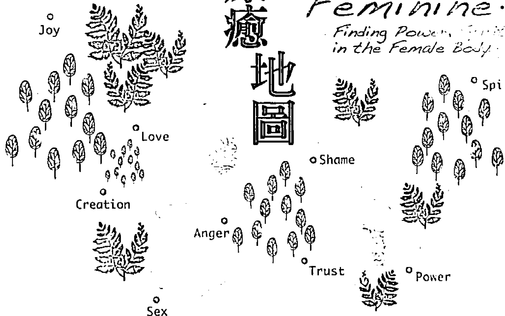
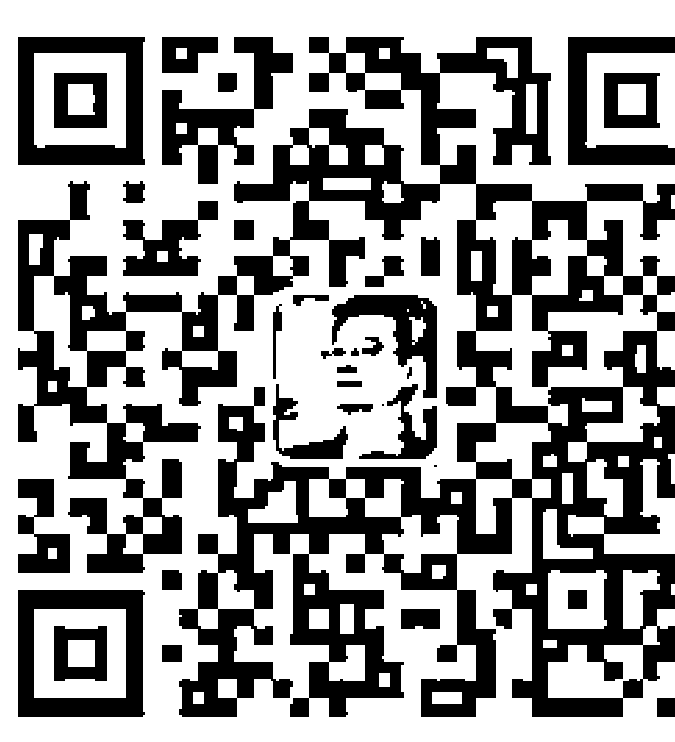
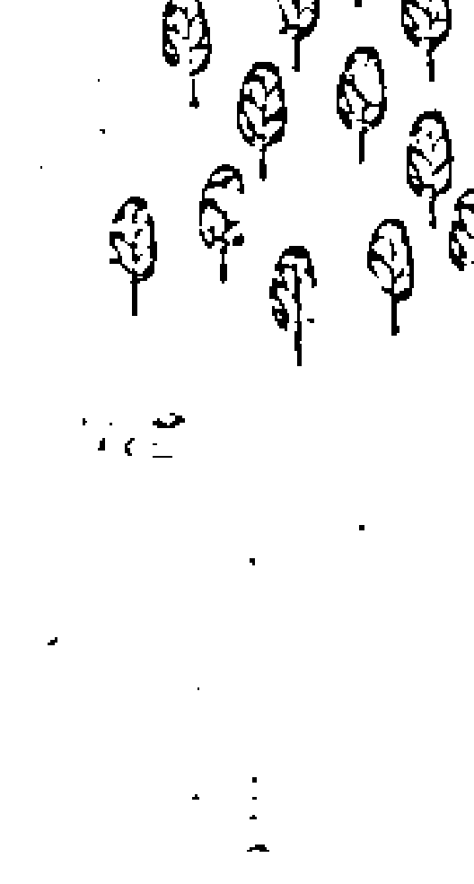

#### 女人的身心疗愈地图

## Wild Feminine: Finding Power in the Female Body

女人，是能量的守護者，
女人的身體，記憶了所有過去的情緒和事件；
從骨盆找回自己的能量，
女人就重新連結一切滋發的力量。

### St. Royal College 天使神秘学院

- ※ 专业占卜预测机构
- ※ 神秘学培训机构
- ※ 水晶能量研究中心
- ※ 官方淘宝：http://strc.taobao.com
- ※ 官方微博：http://weibo.com/715104687
- ※ 新书发布QQ群：659338717
- ※ 购买更多好书请联系院长大天使

大天使
天使神秘学院 院长
QQ：715104687
手机/微信：13641926204

微信公众平台：strc2011

## 制作说明：

本书由《天使神秘学院》出重金从台湾购入的原版书籍扫描制作完成。为达到最好阅读效果，特地把原版书全部切开后，再经由专业扫描设备高精度扫描完成，并经过一张张的PS后期处理最终成书，其间花费大量的人力、物力以及时间，只为能给大家提供经济并优质的神秘学学习资料而努力。

本学院强力谴责某些机构和个人，把本学院花心血制作完成的电子书籍，包装后直接放在自家淘宝网上低价倾销的行为，以谋取不劳而获的经济利益。如果长此以往最终将无人愿意再为大家花心思制作电子书，那以后可能大家再无新书可读。

为让大家以后能够读到更多的好书，也为了本学院的良性发展。本学院恳请大家尽量做到如下几点：

- 一、尽量在本学院的网站购买电子书籍。
- 二、请勿用技术手段把电子书内的水印及加密去掉。
- 三、在收到电子书后小范围传阅即可，千万不要公开传播，更别挂到淘宝网上低价销售。

同时为答谢广大支持者，学院电子书将做如下调整：

- 一、学院会把一些早已收回制作成本的电子书折价销售。
- 二、最新制作的电子书籍会开放打印功能，大家购买后有条件的可自行打印成书。

天使神秘学院
2017 年 6 月

#### 女人的身心疗愈地图

## Women’s Finding Pleasure in the Female Body

Joy

Creation

Sex

Trust

Play

Shame

唤醒你的女性能量 找回生命的喜悦和丰盛

## 目錄
Contents

推薦與書評……5

致讀者……9

序言 女人的療癒地圖，就在我們的身體內……11

開場 找回妳的原生女人……15

前言 女人，妳準備好回家了嗎？……17

第一章 開始妳的身心療癒之旅……27

原生女人的景致……30

女人內在的律動，就是一種生態學……35

能量流動了，女人是天生的藝術家……38

找回原生女人，從妳的身體著手……44

第二章 探索妳的女性領土……51

呵護妳的根源區，顧好女人之本……52

觀想骨盆，與妳的根源區連結……57

畫一張自己的骨盆地圖……61

定期按摩陰道，恢復骨盆平衡……70

骨盆肌肉的潛力與訊息……81

## 第三章 | 妳真的很女人了吗？

- 重新認識你自己
- 聽見妳根源區的聲音
- 身為一個女人，不用感到羞恥
- 讓妳的女性靈魂重生
- 記住，身體是妳的神聖空間

## 第四章 | 活出妳的原生女人

- 卵巢能量與妳的創造之火
- 繆斯女神：被動接納的左卵巢
- 女牛仔：主動追求的右卵巢
- 釋放悲傷，綻放妳的光采
- 培養腹部的創造火源

## 第五章 | 恢復子宮的母性能量

- 子宮，是妳的女性力量之源
- 透過儀式，釋放悲傷的沉重負荷
- 宣告主權，妳是自己的能量守護者
- 認出使妳失去力量的模式
- 鍛鍊子宮，跟著經期的能量循環走

## 目錄
Contents

## 第六章｜改變妳家族的傳承模式

- 面對恐懼，找回妳的信心
- 賦予妳的創作生命，信任創造的過程
- 畫出骨盆界線，妳需要自己的空間
- 祖先與家族為妳帶來的是禮物
- 跨越限制，寬廣妳的創造領域

## 第七章｜成為一個完整的女人

- 性慾，是妳身體渴望與靈性親密結合
- 憤怒情緒，提醒妳忽視了自己的需求
- 陰道能量是妳的生命之門
- 運用根源之樂，療癒妳自己
- 在喜悅中，愛上妳的原生女人

## 終場｜女人的祈禱

- 謝辭
- 附錄一 原生女人的自癒練習
- 附錄二 骨盆照顧治療師的人力資源

## 推薦與書評

在古遠的記憶深處，有一個地方，那裡的女人用吟唱編織衣裳、藉雙手撫癒傷痛、以舞蹈連結萬物，在月光的洗禮下進行儀式、與大地對話……這是個真實的地方，它在每個女人的心靈深處，是源頭也是歸屬。

作者提供的各種方式像是一張地圖，將帶領每個女人踏上這塊領土，探索妳的「原生女人」，迎回將內心黑暗潤化為璀璨光芒的美與力量。

> 何靖媛（靈性肚皮舞老師、能量療癒工作者）

國內婦女的骨盆腔問題很多，較常見的經痛、子宮內膜異位、子宮肌瘤等病症，多半與壓力、環境荷爾蒙、不當飲食及生產過程等有關聯，以上種種因素皆可能會造成骨盆腔的傷害。作者對於女性生理及心理問題有十分深入、精闢的見解，在探討疾病根源後，提供的療癒方法很值得推廣。此外，她對於不同文化背景所產生的性別議題，有著寬闊的視野、深入的思維，令人讚嘆！

> 許瑞云（慈濟醫院醫師、《哈佛醫師養生法》作者）

女人的身心疗愈地图——6

身為女人，妳認識的自己，是否大多來自於外在文化及媒體所強加於妳扭曲的女人形象？
作者透過鼓勵認識內在「原生女人」的概念，將女人與生俱來、充滿生命力及創造力的能量活出來。作者透過多年的研究與豐富的實務工作，在書中結合了案例說明，實務練習，女人身體的想像探索認識、陰道按摩、淨化負面能量、情緒的自我探索，家庭溯源、骨盆運動及骨盆靜心，一步步帶領你走向「原生女人」身心靈整合的秘密途徑。
張慧卿（羅夫結構整合治療師、費登奎斯療法治療師）

人們總說：了解自己後，才會明白自己要的是什麼。可是，什麼是真的「了解」呢？對東方女性來說，我們的教育對於「性」及「女性的器官」的了解，一直是隱諱而保守的。在這本書中，我才知道，原來聆聽並了解自身女性器官，是一種內在療癒的方式。原來左卵巢與右卵巢各司所職，就像是左腦及右腦，帶給我們不同的影響及意義。這本書也讓我想到了「曼陀羅」，從一個圓，一個代表著孕育生命的子宮，我們可以有無限的發揮及想像，雖然個人的能力有限，但我們可以創造無限的可能性。
海藻綠（31歲，上班族）

這是一本打掃書，重新打掃了我們內在和外在空間。
以前當遇到大大小小人生挫折時，最常聽到的安慰是，時間過了就好了。所以我們真的相信，擺著不管，那些情緒就會自動消失不見。直到看了這本書，我開始對自己的身體說，對不起，讓妳累積了這麼多壞能量，以後我不會再假裝視而不見了。
原來身體這麼美。我們都應該好好珍惜。
綠夏天（26歲，行政人員）

「妳心裡很清楚，不必浴火，妳也會飛上枝頭——妳其實就是美麗的鳳凰。」多年前，一支女性專屬信用卡廣告，清晰地傳遞了這個我非常喜歡的概念。

人類的身體、情緒、靈性三個層次是一個完整的結構，其中一部分失衡，整個生命勢必會全然歪斜。本書分享的實際案例，讓我在閱讀的同時也思考著：我覺得生理期很煩嗎？我討厭自己是個女生嗎？非生理期我就完全遺忘我的子宮與卵巢嗎？

很感謝作者，讓有幸閱讀這本書的我們，不必如她浴火，也能與她同步自我療癒，並蛻變為有力量飛上枝頭的，美麗的鳳凰。

張絲絲（瑜珈老師、靈性工作者）

《女人的身心療癒地圖》是我們都需要的一帖靈藥，讓我們重拾女性身體裡，天生具有的力量及喜悅。

克莉絲汀·諾珊普，醫學博士
著有《女人身體，女性智慧》、《母女的智慧》及《更年期的智慧》

我從來沒有看過任何作者，能把身為女人最深刻的精神意涵及永恆的象徵，用文字表現出來。肯特的書，是每一位研究女性身體、女性能量奧秘的學生及老師，一定要讀的書。

蘿西塔·阿維戈，瑪雅腹部按摩阿維戈技術的創始人
著有《光之石》、《靈性沐浴》及《雨林藥草居家療方》

塔咪·琳·肯特為我們指引方向，提醒了我們已經遺忘的道路。這本書帶給女人、自然生產以及女性身體莫大的希望。

伊娜·梅·蓋絲金，助產士
著有《靈性助產術》及《伊娜梅教妳分娩》

> > 我非常推荐塔咪·琳·肯特这本独一无二的著作。每一个女人都能够因为读这本书而受益。无论你正在寻求情绪或性创伤的疗愈，或者你只是想知道如何能够更享受，并且拥有你的女性天赋，这本书将是你的良师益友。
>
> 伊莉莎白·莱莎，亚米迦协会的共同创始人，著有《追寻者的指南》及《破浪而出》

## 致讀者

親愛的讀者：

我要邀妳與我進行一趟深度之旅，深入妳身體的最核心之處，去到妳的根源區，去到所有女性的根源區。發現妳內在原生女人的美麗景致，找到創造性能量流與妳身體核心的連結，重新綻放出妳最真實的光彩。

書中每一則故事，都與我治療的女人有關。她們引導我們了解並意識到，女人骨盆與女性能量的潛在力量。在每一則故事中，我都親眼目睹了療癒的真正本質，但我也需要保護這些協助我完成這本書的女性朋友的隱私。妳不需要是一位專業的治療師，也能為妳的身體與生活帶來深刻的轉變，這就是我寫這本書的目的，希望來自女性身體的智慧能夠幫助妳。

這本書不能取代醫療建議，也不能取代妳的直覺。

祝福妳，也祝福妳的身體。

> > 偉大的工作正在展開，人們開始明白，女性是神與人之間的橋樑。——瑪莉安·伍德曼（Marion Woodman），《本質：死裡重生》（Bone: Dying into Life）

> > 女性身體可能是女性主義最少觸碰到的領域，也許會是最後的邊境了。——卡羅琳·納普（Caroline Knapp），《欲望：為什麼女人想要》（Appetites: Why Women Want）

## 序言
### 女人的療癒地圖，就在我們的身體內

二十一世紀的女人，面臨了前所未有的新挑戰。重大的社會變動，包括這些女性主義者贏得了很大的成就，使現代的女人可以參與公眾事務，這是女性主義的先驅們過去無法想像的事。還記得嗎？美國女人可是在一九二〇年才擁有投票權的。取得男性社會的認同儘管是件令人欣喜之事，但對於更早以前、全然活在母系社會的女性祖先來說，她們從來不需要面對這樣的事。

舉例來說，女人在辦公室、工廠、各種機構工作，我們如何調適每個月的生理期所帶來的身心變化？我們怎麼能確信，我們的工作不會傷害體內的寶寶呢？我們有沒有可能為了工作與寶寶分開，但還是可以餵母乳？孩子還小的時候，我們可以繼續工作嗎？如果是的話，怎麼樣才能最符合小孩權益，讓他們得到需要的照顧呢？當我們處於更年期的過渡時期，需要我們回到內在的重要階段，我們該如何保持自己的外在形象？

這些例子突顯出許多女人，面臨著在男性世界中平衡自己的需求與關注之間的衝突。其中一種反應，也是我們文化中最普遍的一種，就是否定女性身體：以偽裝成男性化的方式，去貶低我們身體與生俱來的女性機能。社會認同這樣的態度，用各種手段：避而不提月經、介入生產、無視身體的自然運作、分開母親與嬰兒、餵食嬰兒配方乳品，以及使用荷尔蒙治療更年期症狀等。這些方法在當下也許是最便利的方式（在文化上來看，這些都比選擇在月經期靜養、自然生產、哺育母乳、母親與嬰兒共處以及不用藥物的更年期治療來得更簡單），但其實帶來了負面的影響。我們每一次否定自己的女性機能，就使我們離身體的自然之道更遠，最後，我們會離自己的女性根源愈來愈遠。這將對我們的身體造成壓力，也會在身體及情緒上，為我們自己及家人帶來更多的問題。

比方說，社會反對哺育母乳（以及母親和嬰兒之間其他形式的親密接觸）的壓力，大量促銷配方乳品給人類的下一代，導致整個世代的嬰兒與母親否定了母乳的獨特優點以及在進化上的益處。研究人員發現，現代盛行的心臟疾病、高血壓、肥胖、乳癌及幼童糖尿病等，與這項女性機能的大量被剝奪有關。近年的研究報告發現，使用荷爾蒙藥物抑制更年期症狀，可能增加罹患乳癌及心臟疾病的風險；但荷爾蒙最初的功用是預防疾病。

不過，還是有一些好消息：無論多麼強烈地否定女性身體，與它背道而馳，我們的女性身體仍然沒有遺忘這些女性機能。我們的身體深植這些感知，它會呼喚我們用自己特有的方式，重新恢復女性的潛能。這些關於女性領域常讓我們深受其苦，像是月經、性行為、墮胎、流產、生產、照顧小孩、更年期等，但它們卻為療癒我們的原生女人提供一條道路。

「療癒」（healing）就字面的意義，意謂「成為完整」，這個完整對我們每一個人來說，都是獨一無二的。因此，除了真實及喜悅之外，沒有固定的程序，也沒有刻板的女性特質，無論是透過做愛、忘我的生產過程，或是哺乳時的愉悅感受，對我們的身體而言，這些就是愉悅及滿足的來源。甚至，在天時地利的情況下，月經也可以帶來很大的愉悅。在《女人的身心療癒地圖》中，有一段很棒的真實描述：我們的女性身體現在迫切需要我們，透過最親密的結合，我們才能得到所需要的智慧、女性原生力量、熱情、歡愉、活力以及真實。

塔米·琳·肯特不只給予我們這個訊息，她也告訴我們實用的方法，讓我們恢復女人原本的力量與熱情。這本書介紹女性能量地圖，就在我們的骨盆之內。塔米提出「全方位骨盆照顧治療」（Holistic Pelvic Care）的方法，對這個區域展開探索，重新建立連結，為我們找到重返女性根源區的道路，當我們重新發現自己的女性能量時，就是回到我們真正的家。這是身心靈療法中，最棒也最神聖之處。

《女人的身心療癒地圖》也提供練習活動、觀想及儀式，幫助我們了解及整合身為女人的經驗，並且要我們愛自己。這本書就像一位良師益友，鼓勵我們了解自己的完整，找出自己的方向，解除我們的限制，使我們在生活時時刻刻都能覺察自己。塔米·琳·肯特將她的女性智慧織在字裡行間，使我們更深入了解原生女人與女人的週期循環，也就是每個月的排卵及月經週期，以及從月經、懷孕、生產、哺乳到再次月經，這個更大的週期循環。

二十一世紀的生活，對女人來說也許充滿了挑戰，但我們也得到愈來愈多的資源指引我們。《女人的身心療癒地圖》帶來智慧及指引，讓所有的女人與文化中的女性都有機會獲得療癒。

> ——莎拉·柏克里（Sarah J. Buckley）醫學博士，
莎拉是一位家庭醫師，也是四個孩子的媽媽，
著有《溫柔生產，溫柔照護》（Gentle Birth, Gentle Mothering）
www.sarahjbuckley.com

## 開場
### 找回妳的原生女人

我在打鼓。二十位女人躺在地上，形成一個圓圈。她們的頭靠在一起，雙腿伸直，就像一顆由內向外放射的大星星。隨著鼓聲的律動，我要求大家用身體的根源區去感受鼓的振動。子宮是生命的肇始之地，她們隨著鼓聲，把節奏傳遞到子宮。

在圓而平滑的骨盆包圍之下，女性身體的根源區就像是一個碗。從子宮裡，女人可以找到自己的能量，找到滋養她創造的力量。幾個世紀以來，女人都是碗，或是編織籃子的人，她們編織出盛裝食物與水的容器，她們就像這個碗，用自己的身體，為孩子及家人裝滿能量。在現代都會裡，儘管女性角色已被重新定義。女性身體仍在根源區保有能量、釋出能量，就和過去一樣。

女人是能量的守護者，她們的身體記錄過去的事情。當女人到自己身體的根源區一遊，回到儲存並累積她的能量的骨盆時，她會發現她被賦予的力量，這會讓她以此為起點，走向未來。

鼓聲停歇，女人從地板上坐了起來。她們看著彼此，臉上帶著野性的氣息。她們到女性的根源區遊歷了一回，憶及長久以來被遺忘的那片景致，她們開始談起祖先、古老的歌曲、出生及靈魂，這些都是原生女人的領域。每個人內在的原生女人都甦醒了，流露出純淨之美。在呼吸吐納之間，她們喚回自己的原生女人，重新循著路徑回到自己的根源區，恢復女人最原始的野性能量。

## 前言
### 女人，妳準備好回家了嗎？

我不是一開始就在女性健康的工作領域中，尋找我的原生女人，其實是原生女人發現了我。我對她的存在渾然不覺，直到我發現女人們一個接著一個，都與身體的根源區嚴重脫節，我才知道她的存在。女人身體的根源區，是容納骨盆器官的地方，也是女人創造能量流動的管道。

我母親對舞蹈的熱愛深植在我的細胞裡，我總是把身體當作一種表達的工具。我發現自己走路、運動、做瑜伽，只要活動我的身體，我就能得到很大的快樂，這讓我找到治療身體的方法。我活潑好動的兒子若是看到我懷孕時行動遲緩，或一直坐著餵奶，應該會非常驚訝。但是，身體活動為我的工作帶來許多靈感與啟發。

在女性健康的領域工作一直是我的夢想。我從沒有聽過，女性健康是一門獨立的醫學領域，所以我考慮進醫學院。我對於行為模式以及它們如何影響身體深感著迷，這帶領著我進入物理治療的領域。但是，在我研究所三年級的課程中，發現女性健康的領域。一位客座講師分享她為女性進行物理治療的實務經驗。從她的演講中，我發現結合物理治療及女性健康護理，才是我真正想做的事。

我在一間大醫院擔任女性健康物理治療師，我的個案大多過了更年期，有嚴重的骨盆病症。泌尿科的醫師將她們轉介到我的門診，她們總是把我的門診視為膀胱尿失禁或子宮下垂手術前的最後一線希望。骨盆手術不是非做不可，但是如果骨盆長期失衡，就有可能非做不可了。骨盆失衡可能導致不必要的背痛、骨盆疼痛、性欲降低及失去活力。長期生活在骨盆失衡的情況下，女人會跟自己的創造中心脫節。治療這些個案的身體，讓我感受到個案對於這樣的失落有說不出的難過，但是那時候，我並不知道，問題在於核心的失衡狀況。

我生了第一個兒子之後，產後照顧自己的陰道時，我才發現我跟自己的根源區太過疏離。我第一次開始關心自己的骨盆，發現女人情緒的起伏，與長期遺忘女性需求有密切的關係。去辨識並處理這些女性需求——在生活保持淡定，擅用自己的創造性能量，接受每天的滋養——我繞了一大段路才回到自己的女性領地。我學會快樂過生活，又生了兩個孩子，與更深的源頭建立連結，滋養我自己、我的創造力以及我的孩子。

### 「全方位骨盆照顧治療」的藝術

與我自己的根源區建立連結的經驗，引導我在女性健康的工作領域重新出發。我離開醫院，開設一間更有家的感覺的工作室，也提供預防性治療及產後骨盆照顧。我也發展出整合的照顧治療方式，我稱為「全方位骨盆照顧治療」，透過這個治療程序恢復女性骨盆的平衡。傳統的西方醫學也承認身心靈整合治療的益處，但女性的骨盆健康還沒有普遍納入全方位治療。「全方位骨盆照顧治療」結合陰道按摩的物理治療，透過觀想及身體感知調整器官，恢復女性骨盆內部的平衡與能量流。

我發現大多數的女人，因為缺乏整合性的骨盆照顧，只能默默地承受生產、持續的壓力，以及各種事件造成的骨盆不平衡。完整的照顧治療，不僅能改善慢性的骨盆症狀，也是女性健康不可或缺的要素。現代女性因為骨盆健康及保養的常識不足，使得核心長期承受壓力，例如：長時間久坐，使得骨盆能量阻塞，與原生女人失去連結。女人會因為了解自己原生女人而受惠，打破限制她們的活力與自我表達的隱藏模式，The request was rejected because it was considered high risk3. 身體的緊繃或柔軟，通常能透露出有意義的感覺或情緒訊息。
4. 心智建構，透露出期待或可能的模式。
5. 身體內的能量流動管道。

這些模式的交互影響，形成我們日常活動、習慣、狀態，以及參與各種經驗的潛力。為了身體覺察、身體動作、情緒張力、心智習慣及能量流，調整模式，你就可以具體——也就是讓它深入你的身體裡——運用你的創造性能量。儘管，我們身體內這些模式的層次各自不同，但我們會把焦點放在骨盆，以及影響我們創造性能量流的根源區。

與身體的根源區重新連結，並開始與你自己的模式合作，你必須先會見長久以來一直滯留的能量，它通常是無意識的，在情感與心理上（某種模式）會阻止你去愛護自己的女性本質，阻止你接近你核心地的光彩。當你去觀想你的骨盆，並認出滯留在你根源區的過往時，你將會知道，你過去曾用什麼樣的女性觀點評估自己或輕視自己。你也會發現，你是以什麼模式來貶抑自己的豐盛，使你一直活在核心之外。你也許不會知道祖先的故事，你也不知道這些故事如何形成你女性的雛形，但你可以看見骨盆裡的能量，並且發現你繼承的天賦與挑戰，你會知道它們是如何影響你能量的流動。清除了根源區的能量阻礙，或找出根源區的能量模式之後，你就可以重新塑造這些世襲的模式，配合你的女性角色，運用你的創造性能量，以輕鬆愉快的新方法，在生理、能量及靈性上，具體呈現出你的「女性」風貌。

### 女性能量 vs. 男性能量

這本書談的多半是與女性有關。當然，每個人都同時擁有女性及男性能量，兩者發揮互補的作用。「女性」就像是「吸氣」，內在直覺與靈感會塑造、影響吐出去的氣或男性能量。當兩者平衡時，女性與男性能量能夠產生大量的創造，這種平衡中出現的形式，同時具有生產力和持續力。

當男性能量得到女性能量的平衡時，會變得強健活潑，能夠以美與愉悅創造出它的形式。然而，我們現在無論是在身體及生活上，都將兩者徹底分開。少了「女性」，由失真的「男性」主導，不但具有破壞性，也無法持續。從各個層面上都可以看出，這對我們的世界與實際生活，都造成嚴重的傷害。只有當我們與「女性」恢復連結，我們才會看到生氣蓬勃的「男性」出現（我將在第四章繼續探討「男性」與「女性」的差異，以及療癒的潛在能力）。

與我們身體的根源區合作，我們能夠重新校準並界定身體與能量的模式，讓身體與生活的能量流不再阻礙。清除骨盆裡停滯的能量及情緒負擔，我們就能擁有更多的創造性能量，運用它們實現我們的欲望。改變根源區模式，就能淨化這個過濾器，透過它經驗我們的「女性」，改變接收能量的方式，賦予我們的創作更豐富的生命力。

在子宮裡，我們的身體成形：靈魂初次變成了身體。如果我們了解根源區的潛能，能夠賦予形體靈魂，我們就能夠認知，靈性能量是我們的生活歡愉並實現創意夢想的根本能量。我們所感知到的生命，比我們遇到的狀況更偉大，讓靈性能量流過我們的核心，就能在每一刻都帶來活力與靈感。我們將這些形式具體化，無論是生理層面的身體、創意設計、伴侶關係，或我們在生活中建立的架構，都會變得更有活力、更敏銳、光彩耀人；換句話說，我們回到原生的狀態，我們所有的外在的表達與創作都會綻放最原初純粹的光芒。

### 女人的故事：接受自己的女性特質

吉兒是朋友介紹來的，這位朋友曾經經歷與自己骨盆重新連結帶來的深刻體驗，於是吉兒也想知道是什麼堵住了她與骨盆的連結。知道自己的骨盆有些不太平衡，吉兒注意到，她習慣於跟一切她認為很「女性」的事物保持距離。

她發現自己感覺不到自己的骨盆，她幾乎從不在身體的這個區域出現。吉兒發現，她家裡的男人受到尊敬，女人則被忽視，她也以排斥自己的女性特質，來回應身為女人所受到的限制。在她還是小女孩的時候，她把自己當成小男孩。之後，當她開始有月經，她對於每個月都被提醒一次她是女生的事實，覺得很尷尬、很羞恥。吉兒討厭這個女性特質，她排斥月經，把它視為軟弱的象徵。

排斥自己的女性特質，最後也限制吉兒展現自己的女性魅力。她避免任何女性化的做法，使得她的創造力、生命力及熱情都無法發揮，這些都與「女性」有強大的連結。

我協助吉兒，討論子宮週期蘊含的智慧，子宮每個月交互輪替著內膜的循環運作，提供女人一些指示，提醒女人何時需要勇敢面對世界，何時應該要休息。外在行動與身體自然節奏其實是息息相關的想法啟發了她，我鼓勵她擺脫過去的羞恥感。

當我治療她的身體時，吉兒發現自己很難將注意力放在陰道上。這種失聯的狀況也出現在她的身體上，她感覺得到陰道的某些肌肉，但是某些肌肉卻毫無感覺。我鼓勵她保持呼吸，注意骨盆裡的每個區域，當我用手指按壓骨盆內部邊緣的每一點，吉兒可以感覺到骨盆形成的碗狀結構。我持續引導她去感覺根源區的身體感官，吉兒注意到她內在有股巨大的悲傷。

觀察自己的悲傷，觀想著骨盆持續吐納，吉兒發現她的感受有如浪潮。悲傷的浪潮湧起，強度增強，然後減弱，最後消散無蹤。吉兒發現，這個她感覺悲傷的地方，有一個根本的、最原始的需求，想要被觸碰及連結。一股從女性核心地湧現的渴望，它的力量與純淨讓吉兒感到驚訝。吉兒從身體的根源區找到了強烈的決心。

她發現在她的女性身體裡有一股堅定的力量，挑戰吉兒「女性」等於軟弱的觀念。當吉兒開始在日常生活中關照自己的根源區，她有意識地重新評估她對「女性」的看法。每當她把覺知帶到骨盆時，都得到同樣的純淨與引導。一段時間之後，吉兒重新建構了自己的「女性」，她開始跟自己的女性本質連結，讓女性身體裡的內在資源再度覺醒。

吉兒改變了自己與身體的關係，也觀察到她的性生活也產生很大的轉變。治療以前，吉兒在做愛之後，總是覺得跟伴侶之間很疏離。她對他們之間的性不滿意，但當她說出自己的挫折感，希望對方能試著配合自己的需求，她的伴侶總覺得她在挑剔，吉兒認為他不肯聽她的心聲。這樣的情況持續很久，一直無法解決。

當吉兒對她的根源區感覺敏銳時，她做愛時也對自己的身體更有覺知。她感官與情緒的範圍擴大，性經驗變得更自然，更出自本能。開始關注自己的骨盆，使吉兒更容易被伴侶的男性氣息激發情慾。她的伴侶用身體回應吉兒，兩人都因這樣的性互動獲得更多的滋養。

無論是跟隨骨盆的引導，或是發現自己與「女性」的關係，吉兒找到不同的方法接受女性能量，並用它來創造。

### 女人內在的律動，就是一種生態學

生態學指的是，一個有機體與它外在世界一連串的相互關係。身為一名研究者，我研究生態學，並對於每個環境中相互作用的關係深感著迷。每種生物都有生態學，有各式各樣的方式與周遭環境溝通連結。女人也有自己的生態學：我們天生內在循環的節奏，引導我們與外在世界互動。女性身體與女性景致之間的互動，就是我們培育與轉換創作的地方。當我們改變了骨盆裡的模式，有意識地運用器官的能量，我們就不必再從環境中汲取能量了。

### 子宮的週期循環

女性身體最主要的生態交換發生在子宮的週期循環。骨盆內所有的器官都在子宮的週期循環裡扮演各自的角色，進行一連串更小的週期循環，我稱為：轉化週期、創造週期，以及更新週期。

子宮具有轉化週期。就如海洋因為月亮引力而有潮起潮落，子宮也有自己的血液潮汐。子宮內膜會增厚腫脹，然後變薄，這就是它的韻律。我從自己的身體與個案身上發現，在每個月形成內膜的期間裡，子宮在能量與身體上都在孕育女人的創作，帶給她更多的能量，讓她去達成想要追求的目標。當子宮排出這層內膜，女性身體則會釋放出她不再需要的能量，讓她去休養生息；把注意力放在下一個創造週期。我將子宮週期與轉化結合在一起，因為它與生死的關係最密切，也與創造過程緊密相關。新的能量進入，舊的能量釋放，我們這一生中會經歷無數次生死的週期循環。

卵巢維持創造的週期，輪流排卵，將卵子送入子宮。我把卵巢週期稱為創造週期，因為卵巢包含女人所有潛在的創造種籽。我在觀察個案卵巢的能量模式時，發現左卵巢會從身體的「女性面」獲得能量。它是向內的能量，具有女性包容的特質，所以左卵巢在女人的創造週期裡，成為靈感及補給的來源。右卵巢則是從身體的「男性面」汲取能量，這是向外的能量，具有男性外顯的特質，右卵巢為女人的創造提供形式及表達。兩個卵巢一起運作，平衡女性身體及骨盆的互補能量，當我們接觸到完整的女性及男性能量，我們就能有更平衡的生活，既得到充足的自我激勵能量，也有活躍的外在表現。

陰道是一個守門員，掌管更新的週期。我把更新與陰道連結在一起，是因為在子宮週期的不同時期裡，陰道會視其需要，敞開接受或釋出，讓女性身體恢復生機。當女性身體能夠敞開接受新的刺激時，陰道肌肉會變得柔軟，潤滑度增加，以接受伴侶的性能量。在月經期間，陰道肌肉變得柔軟，釋出子宮內膜，排除身體不再需要的部分。相反的，當女性身體正在整合接收的東西，或子宮內膜正在增生，陰道會比較乾澀，陰道肌肉也會變得緊繃。與陰道建立緊密的關係，女人會在日常生活中的感官會更敏銳，也更有享受歡愉的能力。

女人骨盆與內在器官的循環週期是互相依存的，它們共同運作，支持、激勵及改變女人的創造潛力。包括排卵的節奏、子宮的充血、陰道的潤滑，或骨盆肌肉彈性的改變，以及懷孕及生產，這些都是生理週期。但是，更微妙且更有力量的是，這些週期的能量流動，才是最根本的生命能量。女人無論在生命中的哪個階段，都會與骨盆裡的生命能量互動。

女人透過呼吸、有意識地去覺察自己的生育力及內在的創造週期，培養子宮的能量，她們會親眼看見身體的改變。我的個案說，她們經期的長短、月經來的時間都改變了，經血的顏色、身體的感覺、骨盆的狀況、陰道的潤滑及子宮的分泌物也不同了。她們還說，自己更能發揮本能的智慧，清晰地運用她的創造性能量。當女人留意到女性生態學時，她們與自己身體的關係也會不同。她在描述這樣的改變時，覺得更親近、覺得驕傲，對女性身體的神奇感到不可思議，這也影響了女人跟環境的關係。每當我聽到女人提到她們恢復自己對根源區的尊敬時，我就對她們未來的女兒、兒子及伴侶充滿希望，因為這些女人知道要如何慶祝自己是個女人。

*註：女人就算已經切除子宮，或拿掉一邊卵巢，她還是可以培養自己的器官能量。在她的身體裡，器官原本在的地方仍然在運作，就好像能量中心與跟那器官一直連結著。以下章節會談到子宮的週期循環，說明了女性身體有自然的韻律。無論她是否曾經生育，就算她已經進入更年期，女性身體內的能量會配合月亮盈虧、個人的創造力及生命週期，持續流入，向外擴展，休養生息。我鼓勵所有的女人，藉著留意自己身體及能量上的變化，去找到自己的內在節奏。

### 能量流動了，女人是天生的藝術家

在西方文化及醫學裡，能量（energy）這個字與「新時代」（New Age）有關，摸不到也沒有具體形象。但是，許多文化及古代醫學裡，把能量視為恢復健康的生命力，它會流經身體，帶給細胞活力，促進健康。在瑜伽及印度草藥學裡，這種能量被稱為普拉那（prana，生命力），在東方醫學裡，被稱作「氣」（chi）。

這種能量在女性骨盆裡流動，包括卵巢、子宮、陰道，會影響一個女人整體的活力。就如植物從土壤中汲取生長所需的養分，流經女性根源區的骨盆能量流，決定了這個女人的活力。她身體的根源區包含了女人創造的能量系統，其中有第一與第二脈輪（chakra，能量中心，規範核心身分與創意表達），還有她的骨盆與女性器官能量。一個女人要是了解如何運用這個系統，就能改變或培養核心的能量。

當女性根源區的能量阻塞，無論是生理的緊張或情緒的負荷，都會抑制體內的能量流動。學會評估骨盆的能量，女人就能找出阻礙生命能量的障礙物。透過本書提供的練習，接近子宮及卵巢能量，女人就可以淨化自己的骨盆能量，並在每日生活中運用這些能量。從情緒負荷或家族傳承模式裡，釋放她的核心能量，她就會在生命中發現更多創造性能量。

我治療初期，為了恢復女性骨盆的平衡，會先做大量的體內按摩，釋放根源區骨盆肌肉的緊張。當我愈來愈了解這股內在能量運作的力量，我讓女人透過呼吸，把注意力放在我按摩的區域。我發現，將能量集中在這個區域時，肌肉幾乎立刻就能夠放鬆。在整體醫學的治療中，體內主要的阻塞，其實是活力根源的阻塞；正是這些能量阻塞，導致了身體的疾病。儘管我是以物理治療為基礎，但我也發現，女人只要好好照顧根源區的能量模式，我們在骨盆區域的治療就會少一點。

每個女人對自己的身體都擁有內部覺知。當你閉上雙眼，仍然可以知道自己的手臂位置，這是因為你對你的手臂有內部覺知，也就是本體感受（proprioception）。體內的能量移動，回應我們的內部覺知與專注呼吸。透過觀想你體內的特定區域，把你的呼吸引導到那個地方，你就可以培養出自己的能量。我們可以從身體使用或移動最頻繁的部位開始練習，例如手與腳，當你的覺知愈敏銳，也就更容易專注。

因為骨盆不常被注意，大部分女人除了在性交或生產之外，對身體的這個部分缺少內在覺知。透過呼吸、觀想、骨盆靜心，或陰道按摩，你的覺知會變得更敏銳，甚至能夠影響核心的能量，將更多的創造性能量帶入你的日常生活。

#### 練習：觀想妳的骨盆

- 把你的覺知帶到骨盆，看看能不能找到你的骨盆邊緣。即使你對自己的生理結構不確定也沒有關係。試著用你腦中的眼睛描繪出骨盆的形狀，讓你的覺知繞著骨盆邊緣走。注意它的形狀與特質。它是圓型嗎？或者它是有稜有角？
- 骨盆的內在組織與能量會讓人聯想到鳥巢。試著去感覺，骨盆裡有沒有任何部分好像被壓到，就像是凹進去，或是擴散開來，讓人難以感覺它的邊緣。這些可能就是你與原生女人失聯的區域：你女性表達的直覺與創造力。
- 把你的呼吸帶到不夠柔軟、不夠圓滑的區域，看看有什麼變化。讓骨盆裡的能量順暢，就像是鳥兒將自己的鳥巢修整平順一樣。
- 當你完成時，與你的骨盆與女性領土說聲謝謝。

### 女性身體：把風水帶入妳的骨盆，成為靈感的來源

女性身體，是設計來展現創造的。你的創造性能量有新的活力，你才會有個人的創意展現。雖然我們總是為某些特定的人貼上藝術家的標籤，但任何珍視自己創造本質的女人，會發現自己正在創作藝術，比方說：孩子、花園、食物、祭壇、新的生活方式，及其他充滿活力的創作。触及自己創造力的女人，就把自己視為藝術家、老師或預言家，在致力於某種特定創作時，體驗到來自根源區的喜悅。然而，如果她的創造力只用在單一領域，她的能量會被區分開。你的創造本質是一個巨大的能源，它就像一股匯聚的勢能，讓女性所有的潛力交織在一起。

這個創造過程是持續性的，它能為你與你誠心創作出來的作品，帶來豐盛的能量。子宮的自然韻律會指引你，告訴你如何創造、何時創造，並補充身體所需的能量。調整自己配合子宮的循環週期進行你的計畫，你會發現當自己順著創意的浪潮直上時，你會充滿活力，不再感到精疲力竭。

許多方法能讓你發現骨盆內在的能量流動，增加你接觸根源區潛在創造的能力。利用生理及能量的方式照顧骨盆，恢復骨盆區的整體能量流動，將能擴展你的創造力。與「女性」發展出個人的關係，能讓你有更多的能量去創造。提升骨盆能量的流動最有力的方法，就是跟隨你的喜悅去創造，提供你的女性靈魂一個可以玩耍的地方。

當創造帶給你快樂時，你的身體就會從環境中把能量拉進來（女性的表現），再以特定的形式將它展現出來（男性的表現）。你可以寫作、繪畫、養育孩子、跳舞、烹飪、裝潢房子等，以一種玩樂的方式運用你的創造力，而不只是做出某樣東西；這麼做的時候，能量會流經你的骨盆。在你感到快樂的同時，也可以做許多事。比方說：打掃房間可以提升正向能量流（這是一種調整室內環境、改善風水的方法），或做一件事來啟發自己，但重點是在感受核心的能量移動。如果你在過程中感覺能量充沛，就表示能量正在流動，你不會感到枯竭。當能量在骨盆內流動，它補充女性身體的能量，讓女性靈魂可以展現出來。這種具有創意的玩樂會隨著四季變遷，引導你創造出最棒的作品。

你一旦找到與生俱來的創造循環週期，學會讓身體將你引導至特定的創意種籽，進入活躍的創造期，或安靜的休養期。你也許會發現某些阻礙創造過程的障礙物。例如：有些女人展開她的計畫，卻無法持續下去；有些女人開始並持續她的計畫，但無法完成。有些女人追逐豐富的靈感，但沒發現那是自己內在的創造力在引導她。有些女人無法與自己的創造力之火建立關係，靈感來源只能外求，或靠別人的火來啟發自己。

創意的阻礙就在根源區，身體與情緒的緊張，常常會造成女性能量系統的阻塞。去除阻礙，才能恢復每一個器官完整的循環與能量。遇到創意受阻時，有可能是骨盆緊張導致能量滯留。你會發現，阻礙出現的目的，其實就是要引你將注意力放回阻礙上（不只是想除掉它），它能教你如何重新接觸體內特定的能量流，或部分的創造性能量。把這些阻礙與你的核心能量調合，就像是把風水帶入你的骨盆，不但能改善阻礙，還能成為你靈感的來源。

每個女人天生都有創意，但是大多數的創造性能量都受到環境或角色的限制。等你知道如何運用創造性能量，增加體內的能量流，當它遍及你生活的每一個領域，你就會發現自己真正的潛能，去創作，去改變。

#### 練習：自發性創作

當你想要激發骨盆裡的創造性能量時，進行這項練習。

- 把覺知帶到你的根源區。把手放在骨盆上，體會一下手心下方的感覺。這個區域是溫暖或寒冷呢？密閉或開放？安靜還是活躍？注意這裡能量的品質。有些女人在感覺能量時，會有特定的感覺（刺痛、熱，或柔軟），有些人會看到色彩或光亮。
- 給自己一點時間去想想這個根源區的能量，選擇一種媒介做自發性表達。花五分鐘時間，隨興書寫、塗色、跳舞、唱歌、表演或任何能代表你創造性能量的方式。讓自己跟隨被喚醒的核心移動。
- 在五分鐘的創作之後，將注意力放回到你的身體。再次注意骨盆區的能量與品質，有什麼樣的改變？你的能量發生什麼事？

### 儀式及創造意圖的重要性

儀式，是一種含有特定意圖的創造活動。它邀請神聖臨在，透過符號的力量，與女性社群、神聖存有或比自己更偉大的存在建立連結。儀式，是一種根據其架構，運用特定的模式或物件，保持或移動能量的形式。一再重複時，這個儀式有了更多生理與能量的架構，它會更有力量，協助能量移動與轉化。這本書提供一個儀式的範例，透過簡單的行動去榮耀你的「女性」，並培養女性身體內的神聖能量。每個女人都有能力頌揚自己內在的神聖女性。在她頌揚的同時，她的內在核心也會轉變。

就和藝術一樣，儀式能夠移動能量，也是恢復骨盆能量流不可或缺的要素。當你在「女性」的領域中舉行儀式或創造神聖空間，你就邀請靈性存有進入你的創作與日常生活。儀式給予無形的事物，如失落悲傷、療癒靈魂創傷、移除有害能量，以及給創作作品的原始素材更大的空間等。當你建立了自己的儀式，並時常舉行，它們會撫慰你，使你的療癒潛能更深，歡樂的潛力強大。

我最喜歡的一個儀式，在我忙碌於家務事時都能進行。它淨化我骨盆的能量，並植入創造意圖。創造意圖可能代表我當天想做的事或創意設計，無論是什麼，當我感受到那股力量及神聖性直接從我的核心升起，我為自己感到驕傲。

#### 練習：淨化骨盆能量，植入創造意圖

- 閉上眼睛，將注意力放在骨盆，花一點時間注意根源區的能量品質。
- 沿著骨盆的邊緣前進，先從前面開始，往右邊走。在進行的時候，運用呼吸並觀想你揮動雙臂，清除骨盆裡的阻塞能量。允許你的身體清除不再需要的東西，清除掉任何會阻礙你接近靈性，或你自己美好特質的東西，想像這些多餘能量如光或水般落下，灑在你的根源區，滲入土裡。
- 當你走完一圈，掃過整個骨盆，直接走向骨盆核心。子宮的能量就在這裡。坐在中心點，問自己：「我最偉大的創造意圖是什麼？」看看你得到的答案，不管它是文字、影像或只是一股新的能量。然後再問：「什麼能夠滋養我夢想的種籽？」再次聆聽自己的答案。把你得到的答案當作種籽，種在你的根源區。
- 在這個種植了新種籽的根源區上再走一圈，從靈性領域汲取有益的能量，讓它包圍你。完成這個想像，然後謝謝你的骨盆，它是你創造一切的根源。

### 找回原生女人，從妳的身體著手

恢復妳的原生女人，表示妳要去恢復自己的女性本質。妳要開始去思索，是什麼塑造妳的女性認同，妳決定用什麼核心模式保持幸福生活，以及妳要用什麼新形式生活。妳骨盆內的身體與能量模式，主宰了創造性能量的流動管道，影響妳的活力，以及妳能夠創造什麼。一旦妳能了解它們如何限制了妳的創造，這些模式都能夠改變。探索這片內在原生女人的景致，並了解它如何塑造妳的外在世界，就要從引起妳興趣的特定領域開始。

妳可以選擇，先從身體開始著手。透過按摩、練習或有意識的照顧，從身體層面與骨盆建立連結。或者妳可以從能量層面開始，透過清除阻塞能量、使能量流動，提升骨盆活力。身體層面，例如觸摸，密度其實是最高的，帶來的反應也更直接。能量層面的密度較低，對輕微的接觸會有反應，比方說，專注呼吸與觀想的練習。把注意力放在妳的感官以及內在感受上，鼓勵妳的覺知去連結妳的身體與能量。想要改變模式，身體與能量雙管齊下的效果最大，我們了解兩者的關係，才能獲得更深入更持久的結果。

當妳思索原生女人與妳體內的模式時，探索現在的妳是用什麼方式經驗妳的「女性」。妳曾跟隨妳的女性身體天生的韻律嗎？妳曾展現出妳女性靈魂的渴望嗎？妳家裡的女性處境如何？妳如何展現妳的女性魅力？妳的女性魅力在哪裡受到阻礙？妳何時覺得自己被女性的刻板定義限制？調和自己各個領域的女性本質，妳可以有意識地培養妳的女性能量，收復妳完整、原生的女性領土。

### 培養原生女人的景致

- **身體模式**：透過陰道按摩、自我照顧、運動、身體感官的覺知、保持根源區健康的生活習慣，，紓緩緊張，增強活力。
- **能量模式**：透過呼吸或觀想的練習，加強與淨化妳的能量、培養骨盆器官能量、接觸完整的器官能量、隨著與生俱來的創造週期，移除停滯的情緒能量，清除根源區的負面能量，注入正向且充滿愛的能量。
- **連結身體與能量流**：觀察根源區身體與能量的平衡，看看它如何影響妳日常生活中創造性能量的流動（妳用來創造生活的能量活動）。強化妳感到放鬆的地帶，療癒妳展現創意與性感的阻塞能量；改變角色的結構、作息、行為舉止，改變任何限制妳、讓妳無法展現活力的形式，明確表達自己的價值觀與真正的渴望。配合儀式，讓妳的原生之地與靈性建立關係，親自經驗妳的「女性」，透過家族連結滋養妳的潛在能量。

### 讓妳的創造性能量流動

身為女人，我們能夠透過身體，讓能量流入我們的生活。導引宇宙活躍的能量流經我們的身體，這種滋養及創造的方式，來自女人獨特的天分，也屬於每一位女人。儘管，我們很積極地運用我們的創造性能量，建立我們的生活；但在對待伴侶、孩子、工作等所有的一切，我們常常是無意識的，對根源區發生什麼事渾然不覺。這種能量為我們帶來保護力、療癒力與活力，但只有在我們有意識地使用它時，這些力量才會發揮力量。

有意識地運用這些創造性能量，表示妳要知道自己曾經如何使用妳的創造本質。耗盡能量、浪費能量、付出甚於得到、想用能量去證明自己的價值，或履行義務，這些模式都只會讓妳的生命力耗竭。女性常常使用她們的創造生命能量，她們想要表現得好，因為文化鼓勵她們把別人的需求放在第一位。當我們更能辨識自己如何運用自己的創造性能量，我們才會真的做好一切。

在妳接近妳的創造性能量以前，感受一下妳對這件事真正的感受是什麼。如果妳覺得有壓力，那麼問問自己理由。如果妳覺得難以說不，那麼，再問問自己為什麼。讓妳點頭同意的唯一理由，應該是妳感受到一股能量從妳的中心湧起。透過這種方式，妳的身體讓妳與那股滋養妳的更深層能量連結在一起，儘管妳以為這股滋養妳的能量是出自於自己。有意識地運作創造性能量，妳得處於自己骨盆的中心，療癒創造性能量必須有價值或效能的模式。當妳很清楚自己與生俱來的價值，妳就會了解，自己擁有的創造性能量是一個珍貴的資源，要小心培育，以喜悅澆灌它。

### 收集妳的女性資源

把妳的女性資源當作恢復原生女人的必要補給。這些包括個人天賦、妳已具備的能力，以及妳在不同的女性領域中擁有的各種潛力。例如：運用骨盆肌肉的力量，在體內裡建立一個穩定的核心。淨化骨盆能量，為了提升創作更具啟發性作品的能力，也為靈魂的巨大資源開創更大的空間。擁抱妳的情緒，釋放情緒重擔，妳會對每一個經驗到的「女性」有更深的感受。運用天生的孕育週期，來滋補妳消耗在創意計畫上的能量。收集妳的女性資源，也是指去榮耀妳在女性社群中得到的天賦。欣賞其他女人的智慧，妳會找到自己可以貢獻之處，還能學到其他技能。也許在別人提出發人深省的言論時，妳可以為那個場合帶來輕鬆與歡笑。一位媽媽用身體表演教別人表達自我，另一位媽媽透過說故事，幫助孩子找回自己的聲音。有人負責聚集全部的人，有人則安靜在畫室作畫。每個女人都用自己的方式做出貢獻，以獨一無二的方式與環境連結，她們以合作滿足社群的需求。

運用在女性社群中可以得到的支持，分享這股力量。看看妳所處社群的女人裡，誰的計畫或作品啟發妳去創作自己的作品，去榮耀開路的女人們。妳可以隨自己高興參加課程、專業團體或其他活動，讓妳有機會接觸其他活躍的女人。建立妳的圈子，在每個滿月時聚會，與分享大家最近的作品，邀請女性友人一起參加儀式，舉辦愛宴，思考關於女性的議題，舉辦一個創意之夜，讓女人一起為某個計畫努力，也享受女人之間互相陪伴的情誼。認識其他的女人，是讓自己的創造性能量恢復活力最好的方法。

妳開始了解自己的原生女人時，妳也能夠找到天生就擁有的資源，以及那些妳想要發展的能力。妳在妳的療癒之路上，可以尋求執業醫師引導妳走出困境，也可以向社區裡的健康照顧單位尋求協助，或找一位靈性導師針對妳的需求協助妳。妳也可透過儀式或祈禱，召喚靈性存有、祖先與大地的協助。在這個旅程中，妳並不孤單。在處理妳的情緒，移動能量，為妳的原生女人創造新的模式時，尋求協助是明智之舉。

關於收集女性資源，妳可以想想以下問題：

- 妳與生俱來的資源是什麼？
- 妳想收集什麼資源療癒自己？
- 在妳的女性社群裡，有什麼可用的資源？
- 妳已經擁有哪些個人資源？

我在工作時曾經看到，骨盆失衡或與骨盆失聯的模式一旦療癒，每一個女人都能與整體女性建立連結。比方說，一個女人從流產中復原，而另一個女人學到要如何珍惜自己：這兩件事情都是透過女性身體的差恥議題，恢復「女性」的完整性。我寫這本書的動機之一，就是要提供一個觀點：讓女人能在一個更大的社群中，去了解她們個人經驗。
當女人接近根源區的智慧時，她就加入了整體女性的社群。妳的生態學，就是妳的身體與外在環境的連結，也就是妳與其他女人的連結。一個人難以單獨面對的處境，在別人共同分享經驗之下，就變得比較能夠忍受。在這本書中，我寫下這些女人的故事，就是要提醒妳，妳不是孤單一人。我希望這些故事能夠帶來希望，引導妳療癒自己的女性傷口，開發妳的女性潛能。

這段個人旅程是為了世界轉化而展開的基礎：我們每個人都要找到回歸自己的道路，打造過程之中所需要的工具。喚醒身體裡最「女性」的部分，我們就開始療癒並滋養我們的原生女人。讓身體恢復與「女性」的連結，我們便打開一條通往靈性的道路，讓綻放光采的能量流入我們的生活。我們一起種下這些種籽，它們會長大，滋養我們所有原生女人的靈魂。

### 只要一點點努力，對妳影響深遠

重新定義妳的女性身分，承認妳的女性創傷，重建骨盆架構以及創造性能量的流動，這些想法對妳來說要是有點壓力，那麼就記住，只要一點點的努力，就能對妳影響深遠。身為一個女人的自我形象，就能為妳的生活帶來遠大影響。妳與「女性」建立關係所走的每一步路，妳對於自己的「女性」多一分珍惜，都會帶來相乘的正面效果。妳也許會注意到某些改變，比方說，妳覺得身體更自在，妳變得更容易表達自己。有些改變或許一時不容易覺察，但還是一樣有影響力。妳也許會開始重視自己的創造力，或更能意識到哪些想法長期以來一直影響著妳。

與原生女人一起運作，有如照料一片土地一樣，要日復一日，以它能夠接受的速度，轉變它的風貌。下列這個自我照顧的清單，是我的個案列出來的，這是一個很棒又簡單實用的方法，可以照顧女性所需。

### 自我的照顧

- 按摩骨盆肌肉柔軟的部分
- 以呼吸釋放骨盆的緊張
- 承認身為母親的憤怒、痛苦及厭惡
- 承認失去兒子的悲傷
- 為了我的寶寶以及身體的辛苦，感謝我的身體

### 療癒的行動

- 點一些代表過世女性祖先的蠟燭，承認她們靈魂的存在
- 對十四個月大的兒子談談祖母們，以及家族的背景
- 把它寫在日記裡

### 進階的做法

- 對於想要再度懷孕這件事，與我的身體和解
- 找到方法處理並轉化我的憤怒
- 持續關照我的子宮，與它對話

照顧妳女性需求的方法，就在妳的骨盆裡。妳的女性身體擁有最偉大的創造資源：當妳觸及根源區的潛力，它就屬於妳了。

雖然每個女人在身體和精神上與自己身體根源區（以及創造領域的完整能力）失去連結的經驗不同，但造成分離的基本問題是同一個：靈性會遠離忽略它的地方。女性身體常常被視為是恥辱的來源，而不是一個值得頌揚的地方，不被視為神聖空間。女性天分往往被認為是不必要的，或者是軟弱的。我們不會居住在一個不受尊重的地方，因此我們在根源區遭受到阻礙，就切斷了女性力量的來源。

女人屬於神聖空間。我們的女性身體是神聖的，我們影響子女的未來，我們也有潛力，能夠改變過去家族傳承中受限的模式。創造生命的力量透過我們的身體而實現。當我們記得，這股力量是神聖的，我們就會記住，我們內在的未馴化天分——這是女性所獨有，且受到上天保佑的原始精神力量——而且只有這麼做，我們才能展現自己，找到我們生命中的歡樂。

祝福妳找到無限的創造潛力。

## 第二章 探索妳的女性領土

女性身體值得妳付出更多的關心，得到更多的照顧，女人要先了解身體的語言。這個章節將會教妳解讀女性骨盆肌肉的生理模式，紓緩阻礙能量流動的緊張。現代女性的骨盆長期緊繃，影響女性身體的生理健康與能量流動。關照自己的根源區模式，女人能讓核心的能量流動順暢。很多人害怕按摩自己的陰道，但學會這個方法及其他工具，卻能讓女人受益無窮，激勵女人去照顧她們的身體。

我想要把從女性身體學得的知識，分享給大家。首先，女性身體總是對自己說實話。女人生氣時，陰道周圍的肌肉摸起來是灼熱的。在春天，或女人肚子裡懷著孩子時，骨盆裡的能量充滿了新潛力。女人孤單害怕時，根源區會傳達需求，讓她放下戒備。如果女人吃好睡飽，她的根源區會與面對壓力時不同。

要知道這一點：女性身體是靈魂居住的神聖之地。有一次，我把手放在一個女人的肚子上，她在生產時失去了她的孩子，她發現自己的身體一直要她記起失去女兒這件事。這位很有靈性的女士努力要去感受女兒的靈魂。

我只想陪這位悲傷的女士靜靜坐著。儘管我的手只能觸及到她冰冷的子宮，給予一點慰藉。我們兩人坐在一起，我的手放在她肚子上，兩個人都一語不發。突然之間，房間溫暖了起來。我原本是閉著眼睛，但我睜開了雙眼，想看看是誰站在我身旁。我沒有看到任何人，只感受到我身邊有一股巨大的溫暖。

我的手依然放在她的肚子上，很明顯感覺有另一隻手疊在我的手背上。我的手與肩膀都暖和起來，這股暖流從我的身體傳達到她的肚子，擴散到整個房間。我們坐著，被一種細膩的溫柔包覆。每個女人的子宮裡都有一條神聖的途徑，這個真理也圍繞著我們。

這位女士睜開雙眼，眼睛裡充滿淚水。在這個過程中，她看到了她的孩子，就在她的身體上方。她說孩子彎身撫摸她的肚子，也觸摸著我。那一整天，我的手與肩膀散發著微微的熱氣。我的心裡銘記著這段經歷，這位媽媽與女兒穿越這道門，擁抱彼此，也被彼此擁抱，這無限的愛，是靈魂賜予她們的禮物。

與女性身體的連結，總是很微妙，又有深度。我們的子宮都有這種觸及靈魂的通道。觸碰根源區的失落，讓我們向靈性敞開。愈深沉的失落愈能讓我們打開，接受我們內在的奇蹟，我們愈打開自己去接受，靈性存有能給我們的就愈多。但這需要配合自己的意願，觀看內在，探究那裡究竟有什麼。

### 呵護妳的根源區，顧好女人之本

從女人在這個世界上的行動方式，就可以看出她身體的狀況，以及她學習到的生理模式。直立而開放的姿勢，表示她對於結識他人很自在。內縮的姿勢顯示出她偏好內在領域。姿勢來自於基本人格，但它也可能是透過個人經驗形成的。比較難以覺察的是，身體肌肉與締結組織的緊張程度會影響這些模式。這些模式把數千次的衝突，與現在仍持續影響女人的一些互動及生活方式編碼。這些模式被保留在根源區，不但危害女人的健康，也反映出她身為女人的經歷。

身體工作者（物理治療師、脊椎按摩師、整脊師）學會解讀人們的生理模式。身為一位物理治療師，我要評估是哪些模式在支撐這個身體，哪些模式加強了身體架構；我也要評估是什麼阻斷活力，需要調整。對於女人來說，探索女性領土的首要之務，就是要探索自己根源區的壓力模式。

女性身體的根源區是身體層面的領土，女人可以從那裡開始了解自己與原生女人的關係。如果她注意到自己骨盆肌肉與骨頭形成的身體架構，就能了解根源區的模式，發現自己的身體是如何內化或具體表現出她的「女性」。她在哪些地方能夠自在地表現自己，在哪些地方覺得受到侷限，這些都與她的壓力模式相呼應。畫出這些模式，觀想骨盆的結構，她可能會發現，什麼樣的身體與能量模式，決定了她的創造空間。

根源區的模式，也就是原生女人的領土形狀可以改變、擴展。利用陰道按摩等方法，她能恢復根源區（她的骨盆）的肌肉活力，那是支撐女性身體最強健也最不可或缺的肌肉。從她的根源區著手，女人的覺知會有更細微的感受。她會感覺到自己那股溫暖的創造性能量，知道如何將這些能量保留在骨盆裡。她會發現，根源區的狀況與創造力之間的關連。培養並保護她的創造中心，她會在這裡建立真正的支持。

照顧身體的根源區，是女人開始與神聖女性說話的方式。當然，這段對話也會提醒她所有過去與女性有關的痛苦。然而，透過承認創傷，承認內在的天賦，一個女人就開啟了療癒的旅程。只要整理過去背負一切，就能使女性領土恢復活力。新發現的創傷與阻礙都會成為骨盆地圖上的地標：女人對這些阻礙的覺知，能讓自己復原。

當我們照顧根源區時，我們就會了解並愛上我們內在的女性領土。透過榮耀我們自己，也給自己的原生女人更大的空間翱翔。對於照顧妳的根源區，想想以下問題：

- 妳表達自我的時候，哪裡讓妳覺得自在，哪裡讓妳覺得阻礙？
- 這如何反映妳與身體的關係？
- 妳希望身體的哪些地方增強表達能力或更多的能量流？

### 學習照顧妳的女性身體

桑亞是我的一個個案，她沒有骨盆方面的问题，她来找我，是因为想针对过去的经验进行身心整合的疗愈。她发现，同时做心灵与身体的疗愈，结果会非常有效。桑亚拥有女性研究的学位，研究女性议题让她有很高的社会地位，她觉得学习照顾自己的骨盆，使她在其他方面更有力量。

透过照顾她的根源区，桑亚学会将女性身体的生理领域，连结其他面向的「女性」，比方说，她的情绪状况与骨盆能量。在治疗女人的骨盆时，我注意到，骨盆的压力有特定的模式，通常都与外在世界的经验有关。女性领域之间的连结，可以从骨盆地图看得出来，这是我教个案们自我照顾的方法之一。

我还是女性健康的物理治疗师时，我把所有注意力都放在骨盆肌肉上。但是，当我为女性身体按摩时，更深刻地感受到，骨盆状况是如何影响了每一个女人的女性经验。所以，处理所有骨盆症状、压力区域或失衡的状况，都能帮助女性身体重新恢复活力，并培养她真正的女性本质。比方说，平衡骨盆区的能量，需要女人去扩展自我表达，追悼过去的创伤，让她把停止追求的创造力再找回来。遵循这个方法，骨盆失衡会引导女人重新发现原生女人更宽广的领土。

### 骨盆治疗的疗程

我从桑亚开始，之后才学到要如何协助其他的个案把注意力放在骨盆上。首先，我们先聊聊她骨盆的碗型骨架，以及骨盆的碗底——也就是骨盆底部的肌肉。我对她解释，子宫位于骨盆深处的中心位置，它的周圍結構通常都圍著子宮發展。膀胱的位置比子宮更低一點，位於子宮的前面。直腸在後面，卵巢的位置稍微高一點，分別位在兩側。桑亞對於我分享的資訊很感興趣，她從來沒有認真想過，她身體的這個部位如此複雜。

我向桑亞說明，她可能會學到的骨盆照顧療程，以及自我照顧的技巧。骨盆照顧的療程，不同於每年做的骨盆檢查。我們不用陰道擴張器，只是把一隻手指放進陰道裡，確定陰道的肌肉狀況。陰道是骨盆底部肌肉的中心，非常適合來評量骨盆肌肉的健康狀況。

雖然一開始，許多女人都很猶豫要不要讓治療師碰觸這麼私密的身體部位，她們也許會懷疑我是不是夠專業做這件事情，但在第一次療程結束後，她們都會強力要求把這項療程納入年度的骨盆照顧計畫，她們感受到體內有很巨大的正面改變。就如大多數的身體工作者一樣，我因為擁有專業的技巧，知道如何解讀並處理各種身體模式，才能這麼做。接觸骨盆時，我並非將注意力集中在陰道，而是專注在骨盆的深層模式：包括卵巢與子宮的壓力及位置，骨盆肌肉的契合，肌筋膜層（在肌肉四周支撐整合的締結組織）的緊張程度，以及療程中出現的能量模式。

身為身體工作者，我學習用整體的角度去看身體。我評估複雜的身體與能量模式，不是只觀察身體某些部分。來找我治療的女士告訴我，她們對這項療程有信心，但仍然先得克服文化上與個人顧慮，才能接受陰道按摩。我運用的技術能讓肌筋膜放鬆，我們把它簡稱為陰道按摩。當我開始身體工作的療程，我個案對身體的概念也隨之擴展。從初時猶豫不決，到後來以全新的觀點，熱衷去了解身體這個部位，並有整體的概念。對我來說，身體這個地方——一個我們生命初始的地方——值得我們給予更好的照顧，我們也應該對內在擁有的這項潛力，給予真誠的敬意。我個人也因投注許多時間學習骨盆的知識而豐富了我的生命。

評估骨盆肌肉健康程度的第一步，是要觸摸並擠壓陰道周圍的肌肉。這就是所謂的凱格爾運動（Kegel exercise）：收縮整個骨盆底部，以至於陰道肌肉都會緊縮。手指伸進陰道，凱格爾運動會造成擠壓的感覺。在女人重複這個練習時，我會檢查（碰觸陰道內的周圍肌肉）骨盆底部肌肉各個部分契合的程度。我將這個圓型骨盆切分成四部分，分別評估骨盆底部的上、下、左、右各個部位。最理想的狀態是，骨盆肌肉的四個部分都能使上力，但通常只有部分骨盆底部肌肉是有力的。緊張與疼痛（虛弱能量）的肌肉組織，在做凱格爾運動時反應或收縮都比較弱。

凱格爾運動常用來強化骨盆肌肉的強度與張力，但我發現，除非這位女士的骨盆肌肉完全契合，四個部分能有效運動，否則這個練習沒有什麼效果。凱格爾運動無法改變骨盆模式，它只能強化肌肉。大多數女人的骨盆肌肉並非真的無力，而是出於核心緊張、過去的創傷與骨盆失衡的情況。陰道按摩能使女人的骨盆肌肉模式得到很大的改善，它能釋放核心的壓力，帶來療癒的效果，並恢復平衡，根源區的肌肉能主動施力。一旦骨盆肌肉主動施力，多做練習就能進一步強化核心，恢復骨盆肌肉的活力，此時凱格爾運動就可成為強化核心療程的一部分。

桑亞對這些知識感到非常訝異，雖然她還沒有生過小孩，她的骨盆肌肉卻無法施力。我向她解釋，每一個女人的骨盆狀況都不一樣。因為每個人的姿勢、情緒壓力、能量阻塞、創傷、肉體傷害或骨盆發生的其他事件等，都會造成骨盆肌肉不平衡，這表示肌肉的某個部分比起其他部分需要出更多的力量。只用部分或四分之一骨盆底部肌肉的力量，肌肉的活力就會失去平衡。經過一段時間，肌肉不平衡就會影響女人骨盆的穩定性以及根源區的健康。

骨盆肌肉的緊張會阻擾一個女人核心的血液與能量的流動。骨盆肌肉的健康會影響一個女人的感官覺知，並在性歡愉上扮演重要的角色。

當女人從她的根源區感到容光煥發，她就能得到內在的平靜，更強化她歡愉能量。一個活力充沛的骨盆，造就一個活力充沛的女人，所以，照顧妳的根源區，就能持續這樣的活力。

### 觀想骨盆，與妳的根源區連結

開始自我照顧骨盆之前，練習觀想骨盆，會對妳有很大的幫助。這麼做是讓妳能夠將注意力集中在骨盆。妳也許會想要找一些圖片，幫助妳了解骨盆結構，但在這本書裡，我鼓勵女人去感受自己的身體，而不只是用頭腦去思考。我發現，最強的能量連結來自於直覺性的觀想，透過觀想與感受，女人更能了解身體中的奧秘。

開始觀想時，妳可能覺得自己的骨盆像一片沒有地圖的領土，想像自己正在探索一個獨一無二的未開發地，這是妳身體的一部分，它只屬於妳一個人。

### 觀想骨盆的結構

骨盆是女性身體的根源區，想要更了解妳的創造潛力，或感受核心最根本的能量，就把注意力集中在這裡。

#### 練習：觀想骨盆的結構

-   1. 首先在妳的骨盆裡，設定一個地標。將手放在骨盆邊緣上方的位置，也就是骨盆頂端，有時候這裡被稱為髖部。將妳的手朝骨盆的前端移動，找到恥骨（這塊骨頭在尿道或膀胱開口的前面），妳的左右骨盆在這裡連結。默想這個連結的區域。現在再回到骨盆的頂端，感覺骨盆後部傾斜的骨頭。骨盆從這裡連結到薦骨，這是一塊漂亮的三角型骨頭，大小跟妳的手掌差不多，它的末端就是尾臀骨（位在屁股之間的尾骨），把妳的手掌放在薦骨上，感受這裡活躍的能量（很多神經末梢及血管交織包圍著薦骨，滋養妳的骨盆）。這些地標顯示出骨盆的形狀。想想骨盆內部的曲線，以及它在妳的創造中心形成一個保護的碗。

-   2. 閉上眼睛，想像妳的骨盆，感受骨盆裡的空間感，留意妳對這個空間的內在覺知。妳也許會感受到骨盆的能量超出骨盆的實際界線。再沿著骨盆的邊緣走一次，感覺骨盆的身體與能量形狀。

-   3. 把覺知放在骨盆深處的中心，也就是子宮。注意核心地的這座創造之井，這裡的能量較為稠密。妳內在的創造力與這個重要的女性之地有什麼關連？感覺子宮的兩側，感受卵巢散發的熱力（光或溫暖），在妳的骨盆兩側綻放光采。妳曾經注意過這個內在之火、妳的創造之火嗎？

-   4. 將注意力集中在骨盆底部。這是骨盆結構的中心，位於子宮下方，也就是妳的陰道——這是一個通道。做愛、經血以及自然生產都要通過這個通道。就算是剖腹生產，能量依然會從陰道釋出，透過呼吸與觀想生育的能量移到根源區，就能夠有意識地觸及這個能量。妳的內在視覺是如何想像妳的陰道呢？妳在創造中心釋放或帶入了什麼？

-   5. 想像骨盆底部與正面，陰道開口兩側的唇狀物是妳的陰唇。然後位於身體前方，一個為妳帶來歡愉的地方，那是妳的陰蒂。在陰蒂與陰道口之間的是尿道，尿道上方是妳的膀胱。妳在骨盆的前方注意到什麼？

-   6. 想像骨盆的後方，在陰道開口處的下方，通往根源區的後面部分，有直腸的通道口。兩個通道口之間是妳的會陰，這是一個充滿活躍動能之地，許多肌肉組織聚集在這裡。觸摸這個地方能立即感受向下扎根的感覺，這是連結大地能量的地方。在生產時，它能夠擴張得非常大。這裡也往往是生產時被撕裂的地方，給予會陰與陰道按摩，有助於疤痕的癒合。這個充滿生命力的地點，是你蓄積壓力還是落實的基礎呢？

-   7. 再次找出你的恥骨及尾臀骨，想像環形骨盆的前後方。許多肌肉包覆在骨盆底部的整個環形構造。這些活躍的肌肉就是骨盆底部，它們為骨盆裡的女性器官提供支持，保持核心的平衡與穩定，為你的性歡愉扮演關鍵性的角色。尿道、陰道與直腸的開口，都會經過骨盆底部的肌肉，與骨盆底部建立連結。

-   8. 再次找出骨盆前方的恥骨，想像這個地方的後方，你可以透過陰道感覺到它。這就是著名的G點，一個身體與能量的中心點，觸及它可以增強做愛的刺激。當你把注意力放在這裡時，你注意到什麼？

-   9. 結束你的觀想，想想你觀察的結果。感謝這一切，感謝你寶貴的骨盆。

### 榮耀你的骨盆

你觀想骨盆時，有沒有注意到什麼？你對身體的根源區充滿感謝嗎？你對於自己的女性身體或女性本質，有任何痛苦的感受嗎？無論骨盆讓你聯想到歡樂或挑戰，都有助於我們恢復根源區的活力。你對骨盆的每個新感覺，都會讓你與這個部位有更緊密的連結。每個傷口或疼痛，都引導著我們走上療癒之路。

你的骨盆是一個強壯的支撐基礎，榮耀它，增強它支撐身體的力量，也能增強妳情緒與精神上的支撐力量。下面的練習，可以協助妳進一步探索妳與骨盆的關係。

#### 練習：榮耀妳的骨盆

-   1. 思考：把覺知放在妳的骨盆上，仔細思考妳跟女性核心地的關係。當妳花時間在創造中心時，注意自己的感覺。找出有哪些地方需要療癒或頌揚。

-   2. 儀式：拿一張紙，花五分鐘寫下妳的痛苦、想療癒骨盆的意願，或寫下妳與女性的關係。在紙的另一面，也花五分鐘，寫下妳身為女人的快樂，以及妳慶幸自己是女人的想法。寫好以後，把紙放在祭壇上或埋在花園裡榮耀妳的骨盆。當妳開始為了自己而療癒骨盆受到的傷害，妳的骨盆會感激妳的發現，讓妳更歡喜地展現妳的女性外表。

### 預防性的骨盆照顧措施

在接受骨盆療癒的療程後，桑亞和我的其他個案一樣，想知道為什麼還有許多女性與醫療護理人員，都沒有聽過骨盆照顧。部分原因在於，西方醫療不太注重預防性的保健。就如其他的身體系統一樣，女人只會在身體出現嚴重症狀時（例如：尿失禁或子宮脫垂），才會想到要照顧骨盆。儘管骨盆應該成為女人要定期照顧的一部分，但它很少是預防性的保健，就算有，女人在骨盆上投注的時間與精力還是明顯少很多。另外，標準的骨盆照顧模式是以症狀為基礎，而不是預防性的保健，許多女性都沒有注意到自己的骨盆不平衡，骨盆不平衡初期不會有太外顯的症狀。

另一個原因就是，一般人缺乏骨盆照顧的知識。女人習慣默默承受痛苦，不知道骨盆可以治療。有些女人向一般的醫療護理人員或家人提及身體症狀時，得到的答案通常是：年紀大了或是因為她生過孩子。如果她們去找專科醫師，如泌尿科醫生，大多會建議她們動手術。子宮的問題最後的治療方式，通常都是切除。

骨盆的症狀，例如：疼痛、尿失禁或骨盆機能障礙，使女人覺得尷尬丟臉，難以啟齒。她們不知道，這些症狀都是可以治療的。凱格爾運動是最常用來解決骨盆問題的方法，所以女人一定要持續尋求協助。許多醫療護理人員不知道，按摩治療與全方位骨盆照顧治療可以恢復核心的平衡。他們還沒有發現，這些技巧可以改變骨盆模式，要是少了它們，身體會繼續失衡。

另一個更微妙、更普遍的原因是，女性身體總是不被尊重。對女性身體感到羞恥，讓一個女人無意識避開自己的根源區，對自己內在不平衡狀況毫無覺察。類似的情況是，大多數的女人有骨盆症狀及骨盆不平衡的情況已經很久了，她們已經習慣用骨盆區裡少許的能量流動生活。她們把根源區的挫折感與阻塞的能量視為理所當然。通常做完一個療程之後，我的個案會因為感受到骨盆的活力非常驚訝與開心，她們大多數從來不曾感受過根源區的生命力。

### 畫一張自己的骨盆地圖

評估完女人骨盆肌肉的強度之後，我會用一張紙，畫出骨盆地圖，標出她骨盆內所有的壓力及激痛點。大部分的女人儘管在性交時並不覺得疼痛，但她們的骨盆肌肉都有一碰即痛的區塊或激痛點。肌肉機能障礙的病兆之一，就是因為骨盆的不平衡，導致肌肉過度使用或使用不當。

畫出骨盆肌肉的激痛點，有助於了解這個女人的骨盆模式，才能針對它治療。骨盆地圖讓我知道必要的訊息，並針對它進行陰道按摩，矯正骨盆肌肉的不平衡。這包括在每個肌肉壓痛的區域施壓與按摩的技巧。我也協助個案將覺知引導到這些區域，教她運用觀想與呼吸練習恢復能量流動，平衡骨盆的肌肉。學習畫出骨盆地圖，有助於女人去了解根源區的壓力模式。在我的女性保健練習中，我教個案用以下的方法，找出自己的骨盆緊張點。

骨盆地圖是從陰道往內開始，以順時針方向觸碰骨盆內部，記錄任何讓妳覺得疼痛或緊張的區域，沿著骨盆邊緣繞一整圈。記錄下骨盆肌肉的緊張點、激痛點，以及感覺怪異的區域。妳可能會發現很多區域一碰就痛，也可能只找到一些。一開始先找出激痛點，有助於提升自己的覺知力，找出根源區已形成特定模式的肌肉狀態。找出緊張點，妳就可以改變這些模式，增加妳根源區的柔軟度與健康。當妳畫出自己骨盆的緊張點，學著認出這些壓力的內在感覺，妳可能會發現，根源模式在對妳發出警告，讓妳知道外在的環境壓力已經嚴重影響到妳的女性核心。

#### 練習：畫出骨盆地圖

先把整個練習讀完，熟悉各個步驟。找一個私密且舒適的空間來畫骨盆地圖。妳還需要一張紙、一枝筆，以及一個舒服的姿勢，讓妳可以接觸妳的陰道。

做這個練習時，妳可能會發現自己體內產生疼痛或壓力的區域，或是找到自己欣賞喜歡的區域。妳甚至會對自己的新發現感到意外。不要帶著任何預期，只要以一顆好奇的心，打開妳的覺知，探索妳的身體。不用去擔心萬一妳不確定自己感覺到什麼。當妳愈來愈熟悉自己的內在景致時，就愈容易注意到它的改變。要記住，與自己的骨盆失去連結，會讓女人在一開始的時候，很難有什麼感覺。但是隨著經常練習，妳的連結與感覺就會逐漸增強。

-   1. 在紙上畫出手掌大小的圓，代表骨盆底部的環狀肌肉。
-   2. 在圓圈裡畫個X型，把圓分成四等分，上方（前方）接近尿道出口，下方（後方）接近直腸出口，還有左右兩個區塊。
-   3. 將食指伸進陰道大約一吋深，開始接觸骨盆內接近尿道口的肌肉，或是骨盆上方的空間。輕輕觸摸這個區域，因為尿道口上方就是妳的尿道，它連接膀胱，那裡很容易受到刺激。
-   4. 開始去感覺骨盆肌肉的緊張或疼痛，這種感覺就如脖子僵硬或肩膀痠痛一樣，從骨盆底部的上方開始，順時針方向移動，用另一隻手在紙上畫出妳的發現。畫一個小叉（×）代表緊張的區域，以大叉（×）來表示疼痛的區域，把每個痛點按照一到十的程度，記下它的疼痛程度，十代表最痛。用畫圈（○）來代表感覺最不明確的區域。
-   5. 沿著骨盆肌肉繞圈進行觸摸，並且記錄下來，沿著妳的陰道一點一點觸摸內在的骨盆肌肉。

### 骨盆地圖的用處

骨盆地圖描繪出妳骨盆裡的壓力模式，反映出妳使用身體的方式。首先去注意妳發現的模式。骨盆底部的四個區域裡，有哪一個部分特別緊張？在妳的骨盆肌肉裡，有沒有哪些區域是表面疼痛，哪些的疼痛較深層。有沒有任何區域讓妳感覺麻木，或是不太對勁的感覺？把較緊張與比較不緊張的區域相比較，把較痛與較不痛的區域相比較，看看有些什麼不同？

當妳畫出骨盆肌肉的地圖時，就會知道自己傾向於用哪個區域的肌肉來承受壓力。一開始把這些點畫在紙上，是為了要妳看見自己緊張點的分布圖，但不需要重複做這個練習，除非妳喜歡看到這張地圖。妳可以每個星期檢查一次或兩次，也可以在心裡把這些點畫出來。妳可能會發現某些區域一直都有壓力，承受著長期的壓力，某些區域的壓力，會根據整體的壓力程度（身體其他部位的壓力模式）而來來去去。

緊張表示身體在承受情緒與生理上的壓力。妳骨盆內的緊張，顯示出根源區承受的壓力，但承受更多疼痛與緊張的肌肉彈性會變小，反應也會降低。這些肌肉無法緊縮，便減弱妳的核心支撐力。透過書中提供的方法，直接按摩這些緊張點、增加覺知及能量練習，可以使妳的骨盆肌肉恢復緊縮，改變這些核心模式。

如果妳有一些骨盆不平衡的症狀，例如：疼痛、肌肉無力、無法做凱格爾運動、生產後遺症，或是與妳的根源區失去連結，藉由處理骨盆緊張點，就可能恢復功能，恢復核心的平衡。釋放長期的肌肉緊張，能夠減輕整體的壓力，讓身體知道如何在壓力出現時釋放緊張，能顯著增強骨盆肌肉及器官的長期健康。解除根源區的緊張，將改變妳的骨盆結構及運作模式，這樣妳的創造中心會得到更強力的支撐。必要時，尋求骨盆照顧的專業人員協助，多了解自己根源區的領域。

定期照顧根源區的緊張點，妳可能會找出造成长期壓力的來源，例如：妳的創造表現或其他造成能量流動受阻的障礙。這些長期緊張點，可以直接透過陰道按摩而解決，也可以透過改變外界環境來治療，外界的環境會不斷將壓力施加在核心地。在重大的壓力事件之後好好照顧妳的根源區，會大大地幫助妳恢復幸福感。下面這則故事將告訴妳，如何運用骨盆地圖來處理這個情況。

### 女人的故事：骨盆底部，就像个人生活的测量器

萝拉来找我，想治疗长期的痔疮问题。这是骨盆底部普遍发生的问题，却常因为缺乏对骨盆区的照顾，而没有得到治疗。萝拉的骨盆地图显示，骨盆底部后面的肌肉，在接近尾臀骨及直肠口附近，交错着很多肌肉压痛及紧张的区域。骨盆底部的紧张常会导致一些身体问题，如痔疮、便秘及尾臀骨的疼痛。后骨盆区的功能障碍也许需要靠直肠按摩（减轻根源区压力的另一种方法）与阴道按摩，恢复骨盆区的平衡。萝拉的左骨盆区也有麻痹无感的情况。

透过骨盆按摩以减轻肌肉紧张，专注于呼吸练习以恢复能量流动。我协助萝拉减轻后骨盆区的压力与疼痛，也提升左骨盆区肌肉的感觉。萝拉学会如何画出骨盆地图，并练习阴道自我按摩，第一个疗程结束时，她已经能平衡及放松她的骨盆空间了。

接下来几个星期，萝拉注意她的骨盆肌肉在各种情况下的反应，并且把它画下来。她发现最频繁出现的情况是，任何冲突发生都会增加骨盆的疼痛与紧张。这冲突愈让人不愉快，骨盆肌肉受到刺激的程度就愈高，包括肌肉压痛区域的数量及疼痛的强度。与配偶吵架，或是与老板意见相左，都会使她的骨盆地图出现这类情况，也会使痔疮反复发生。萝拉的身体反应透露出，她其实比自己知道的更不开心。

当我确认这些没解决的冲突造成萝拉的身体紧张时，萝拉与我分享她在自我照顾骨盆时发生的一个经验。在疗愈骨盆的过程中，只要她一想到要开创自己的事业时，她的骨盆肌肉就放松了。萝拉知道，她想要得到配偶及老板的支持，但他们从来不正视她的需求。从她身体的反应里，萝拉发现，她想要拥有新的支持模式。

后骨盆区的紧张通常显示女人所得到的支持不符合她心理上的需求。女人有时需要的是情绪上的支持，有时需要的是身体上的支持。她也许需要新的合夥關係，更照顧自己，特定的創意表達管道，或在生活某些層面做一點改變。當每個女人開始去檢視並創造自己追求的支持時，她會發現她的後骨盆區變得更輕鬆，也更平衡。

幾個月之後，蘿拉告訴我，她已經開始自己的新事業了。因為責任變大，外在壓力也變大了，她猜想，她的骨盆可能變得更緊張。她的骨盆地圖卻顯示她變得更健康，骨盆肌肉幾乎沒有任何的緊張，疼痛區域也變得少之又少。碰觸左邊的陰道肌肉時，她也變得更有感覺。

蘿拉解釋，她一直想要有自己的事業。回顧以往，她發現為別人工作讓她的內在產生壓力，這在骨盆地圖上清楚地顯現出來。一旦她決定過更自在的生活，她的身體就釋放了這些緊張。她不再尋求老闆與配偶的肯定，這都是外在的資源；她發現自我內在資源，使她獲得自己一直渴望的支持。蘿拉從來沒想到，開創她的新事業使她的骨盆放鬆，她的骨盆地圖成為生活經驗中最好的測量器。

創造出自己渴望已久的支持，蘿拉也在她的身體與人生中找到更大的自由。畫出骨盆地圖提供她一幅清楚的圖畫，看到不同的個人選擇，會如何降低核心的壓力，強化骨盆的活力。

### 骨盆痲痺無感：重新燃起你的希望

探索女性身體的根源區時，有些女性會出現沮喪的情緒，或碰觸到一些已經失去連結的領域。當她想把覺知放在骨盆的特定區域時，身體的具體感官相當微弱，情緒上的痲痺使女人無法專注。痲痺沒有感覺，通常顯示是身體或情感上的傷痛造成骨盆的失聯或分離。即使是猛然跌倒，撞到尾骨，也可能破壞骨盆的協調，造成骨盆分離的模式。

骨盆的失聯可說是身體的保護機制之一，它們對於過度強烈的情況，做出保護身體的反應。當傷痛的事件結束後，這些分離的區域限制女人接近自己的女性智慧，使得骨盆繼續失衡。一個女人若是發現自己的骨盆麻痹没有感觉，表示她終於有機會恢復骨盆的現狀，並療癒女性身體與女性靈魂之間的分離狀態。

重新找到這些麻痹或失聯的區域，一開始可能要先傾聽自己過去的傷痛經驗。當妳開始進行以後，用自己的速度進展，收集妳的資源。在進行骨盆的療程中，慢慢體會妳的感受，讓這個過程自然發生，整合所有新的感覺及覺知。女性身體就是妳的女性的領土。感官麻痺的區域，無論是情緒或骨盆裡的感覺、子宮空間裡的能量，都有療癒的潛力。找回失去的領土，找回妳在無意識中逃避那些的行為——拿回屬於妳的空間，保護妳自己，照顧妳自己，培養妳的創造力，表達妳對感官享受的喜愛——在各個領域展現自己。對麻痹沒有感覺的區域思索以下問題：

-   -   妳的身體裡，有哪些地方是妳感覺不到的？
-   妳需要什麼支持，才能讓妳重新有感覺的能力？
-   妳注意到妳的生活中，有哪些地方麻痺或關閉起來了？
-   妳要如何重新燃起妳的希望，展現在這些領域中？

### 恢復骨盆的光采

妳的骨盆風采，是一種能量的品質，它顯示出妳與根源區連結的狀況。強大的骨盆風采，使妳能排除能量垃圾，找出能量上的不平衡。堅定的骨盆風采，會積極結合身體的根源區，傳達出它保有女性領土的意圖。

要強化骨盆風采，就要定期關注妳的核心。觀察妳能量或感覺的品質。根源區的能量品質會影響妳在生活中所汲取的能量。每天花一點時間淨化骨盆能量，就能恢復這個重要區域的光采，療癒過去的阻塞。

#### 練習：淨化骨盆能量

-   1. 把注意力放在根源區的感覺上，確定妳的骨盆能量。如果妳的內心覺得輕鬆平靜，那麼這個能量很乾淨。如果妳覺得很焦慮、消極、緊張、很難集中注意力，那就需要淨化這些能量。
-   2. 用妳的內在覺知，在骨盆的邊緣走過一圈，從前面開始，往右邊走。沿著整個圓周走，想像妳輕輕掃過、觸碰每個地方。觀想一些自然元素（例如：空氣、水或火）淨化妳的骨盆，平衡能量，協助妳將根源區的阻塞能量送入土地裡。
-   3. 特別注意，在妳的骨盆裡，有哪些區域是妳想避開的，將注意力放在那裡。妳的骨盆並不髒，它只是需要妳的關注。用愛跟尊敬，溫柔體貼地淨化妳的骨盆。
-   4. 完成之後，召喚宇宙能量祝福妳的骨盆。觀想溫暖的金色陽光灑滿了妳的核心。

### 女人的故事：治療性侵情緒，骨盆重現生機

卡蜜拉對於骨盆療程很感興趣，希望能夠連結自己的陰道及骨盆，但她感覺不到骨盆肌肉，也無法收縮骨盆的肌肉。她說，她甚至不覺得骨盆是她身體的一部分。

卡蜜拉在小時候曾遭受性侵害，覺得陰道與骨盆並不是安全的所在。長大後，她曾經多次從情緒層面來處理這個傷痛，現在她想要與身體的這個部分重新連結。

一開始，當她碰觸到那些跟過去的性侵經驗有關的肌肉時，光是將注意力放在骨盆區就讓她覺得承受不住。我鼓勵她去感受肌肉所記得的感覺，引導她的呼吸到每一個她注意到的區域，協助她的身體去整合新的感覺資訊。在我們進行我們的療程期間，她也接受一位諮商師的協助，處理她接觸骨盆時湧起的情緒，讓她重新獲得滋養。透過結合身體與情緒的療癒方式，她找到一個最適當的速度，去處理這個問題。

卡蜜拉發現，要不是別人這麼說，她似乎從來沒有意識到陰道的存在。她形成自己的女性身分，卻對自己身體的所有權沒有任何意識。所以在一開始要把注意力放在骨盆區時，她幾乎完全沒有感覺，身體也沒有任何覺知。

她發現，骨盆區的的麻痺無感，是為了幫助她避開停駐在那塊區域的痛。但她知道，她也錯過了歡愉的感覺。要與自己的身體重新連結，卡蜜拉必須一層層剝開那些感受：害怕、憤怒、難過及悲傷。每一個步驟都讓她恢復陰道及骨盆裡更多的感覺，也覺察到她自己的能量。她最後終於返回這個屬於自己的珍貴領土。

### 照顧骨盆的好處

進行幾次骨盆平衡療程之後，我指導我的個案做骨盆的自我照顧。每個女人都能學會怎樣運用她的骨盆肌肉，改變骨盆的緊張模式，以及辨認出生活中造成核心地不平衡的緊張來源。藉由學習照顧女性身體，女人與她的原生女人建立新的關係。

骨盆是女性身體的根源，它蘊藏了每一個女人最豐富的經驗。當妳檢視自己的骨盆模式，肯定妳的根源區，尤其是當妳學會骨盆自我照顧最基本的方法——陰道按摩的練習時，妳就會遇上妳的創傷與美麗的真實女性自我。

The request was rejected because it was considered high risk量，或完全无力。一个女人清除掉骨盆的紧张与肌肉防御性失衡，在日常生活中就能得到她阴道全部的力量，并接收这个核心的滋养与支持。

### 评估骨盆的施力

把骨盆肌肉施力想成一件很优雅、很有建设性的活动，这是用来滋养妳的根源区，而不是为了应该这么做才做的练习。温柔体贴地做几个骨盆肌肉收缩的动作，透过阴道的整个区域，将血液与能量流带到妳的核心。妳的阴道收缩是平衡的动作，让阴道的四个区域都参与。这个练习不只是注重强度，骨盆底部的健康关键在于骨盆肌肉均衡施力。如果妳发现骨盆状态失衡，就用阴道按摩，恢复根源区的能力。下面这个练习可以评估妳的阴道活动。

#### 练习：评估骨盆的施力

找一个舒适且私密的地方，可以容易触碰阴道的站姿。

- 1. 收缩骨盆肌肉。站着，把妳的食指伸进阴道里，收缩妳的骨盆肌肉。妳应该会感觉到，食指四周的骨盆肌肉会从各个方向挤压妳的指头。感受一下，四个区域的个别情况，以及共同施力的情况如何，有没有一个完整的环状。骨盆肌肉是不是很有力的聚集，哪个区域出力较少，或是使不上力。强壮的骨盆区域会向中心聚拢，然后上提，力量均衡地挤压手指。活跃的骨盆区域会朝中心聚拢，但是不会上提，造成挤压不平均，但还是可以感觉到手指周围的肌肉动作。虚弱的骨盆区域只有很少或几乎没有动作。如果妳感觉不到任何肌肉的动作，躺下来，看看骨盆肌肉使力的情况有没有改善。通常来说，站着做困难度最高，因为骨盆肌肉还要对抗地心引力。

- 2. 放松骨盆肌肉。当妳放松骨盆肌肉，注意有没有任何紧张留在肌肉里。感觉一下骨盆里骨骼的坚实结构，让骨盆肌肉贴着骨头休息。让女性身体的中心充分休息。肌肉的运作就是施力，然后放松，让根源区的肌肉或骨盆充分释放，没有任何保留。从妳的骨盆中心，让放松的感觉贯穿全身，就仿如活跃的能量从核心绽放出去。

- 3. 处理骨盆肌肉的失衡状态。最理想的情况下，骨盆肌肉的各个区域会很有力地收缩，然后充分放松。试着按摩反应比较小的区域，看看骨盆肌肉的动作模式会不会改变。继续做阴道按摩，或是寻求骨盆专业照顾人员的帮助，进一步处理妳发现的失衡区域。感谢这些肌肉支持妳的女性身体。

### 找到骨盆的紧张点

当妳评估阴道肌肉时，注意那些会痛的区域，或是在骨盆底部四个区域里，活动较弱的那些区域。这些就是骨盆紧张的区域，因为它们紧绷着，这些区域就无法发挥活跃的肌肉功能。熟悉妳自己的这些区域，加强阴道按摩。

当我处理骨盆的紧张时，我注意到，这些紧张模式与女性这一生的重大议题相应。改变长期紧张的模式，包括要能辨识骨盆紧张的来源。注意那些造成根源区紧张的原因，女人就能够有意识地降低生活压力。倾听妳自己身体的智慧，做出对妳意义重大的改变。这些有助于生活幸福的个人改变有益于纾解紧张，并支持根源区的活力。

### 前骨盆区的紧张：妳在害怕什么？

在东方的医学理论里，膀胱与害怕的情绪有关，这也适用在我的个案身上。柔软的肌肉点接近尿道，通常显示与恐惧的议题有关。虽然有很多女性把恐惧留在这个区域，但每个人的理由都是独一无二的。对于前骨盆区的紧张，思索以下的问题：

- 妳在前骨盆区的紧张里，保留了什么？
- 对于妳的女性身体或创造活力，妳在害怕什么？
- 如果能从这些害怕中解脱，妳会过怎样的生活？

### 女人的故事：释放恐惧，活出真实的自己

黛博拉的尿道常常有灼热的感觉，但检查显示并没有感染的现象（有时候，前骨盆区的紧张会使尿道的感觉改变，但如果是感染引起的问题，一定要先行治疗）。

黛博拉的前骨盆区有多处紧张的地方，当我按摩这些紧张的肌肉时，它们变得很热。我问黛博拉在释放这些紧张时，有没有感觉到这些热气，她感觉到了，但同时她也感觉到强烈的恐惧。感到恐惧时，她的呼吸变得很浅，骨盆能量都冻结了。我鼓励她把觉知带回骨盆区。这样做了之后，骨盆能量再次开始流动，她的呼吸也变得正常了。

黛博拉对于恐惧的原因不是很清楚。我向她解释，当我们习以为常的妥协时，骨盆会承担紧张。当我们处理这些紧张时，也会引发隐藏的恐惧，它提醒我们该怎样给自己更好的照顾。我向她说明骨盆地图，让她知道她可以利用地图来了解她的紧张模式。观察骨盆紧张区域的改变，感受核心的能量。黛博拉了解到，外在的压力来源造成特定的骨盆模式。

两个星期后，黛博拉回来告诉我她的进展。她开始一段新的恋情，但她在性方面没办法采取主动，这种情况从她最后一次的性行为开始，已经持续很多年了。她对于重新探索她的性潜力，感到既兴奋又紧张。

在画出她的骨盆地图时，她注意到，在两种情况下，她的骨盆紧张明显增加：一次是她与伴侣刚做完爱时，另一次是当她告诉伴侣对于两人发展关系的感受时。黛博拉发现，在这两种情况下，她都会怕万一她表达出自己的需求，伴侣会离开她。而且，她也注意到，在她害怕的时候，她的核心能量有冻结的倾向。但藉由把注意力放在骨盆上，而不把焦点放在她的恐惧上，她就能恢复她的能量流。黛博拉发现，她与之前的伴侣，甚至朋友，也有类似的模式，这使得她逃避去得到她渴望的亲密关系。

藉由观察她的骨盆反应，黛博拉更了解自己内在的冻结反应，也知道自己倾向于忽略自己的需求。她只能短暂否定自己的需求，所以，她会避免发展亲密关系。对于骨盆区有更多的认知之后，她开始把身体的紧张，以及能量阻碍的感觉当作一个信号，告诉自己，她得承认这个情况，甚至说出这些需求。这样一来，她停止了自我否定的模式，解决根源区的长期紧张。黛博拉发现，在她觉得招架不住时，她的骨盆肌肉仍然会紧张。但是，她不再紧绷肌肉，或害怕得动弹不得。她开始觉察，透过呼吸将自己带回中心，把注意力放在自己的需求上，直到她的身体开始放松。

恐惧提供一种保护作用，但是活在害怕中，会限制创造性能量流的流动，也会限制妳充分活出自己的能力。承认妳的恐惧，直接处理它，这么做能释放前骨盆区的紧张，让妳展现真正的潜力。

## 第二章 探索你的女性领土

### 左骨盆区的紧张：你接收到什么？

左骨盆区肌肉的紧张，通常与女性身体接收到什么有关，或是与她的女性自我在生活中面对的冲突有关。左骨盆区的紧张模式，跟左卵巢的能量失衡很类似，因为左边通常代表着女性（关于身体里的女性跟男性特质，在第四章会详述），也是身体的接收区域。关于左骨盆区的紧张，思索以下这些问题：

- 什么导致你的左骨盆区维持紧张状态？
- 你宁愿不要什么，而接受什么呢？
- 如果你以自己的期待为荣，你的生活会如何呢？

#### 女人的故事：学会以自己为荣

玛莉亚用骨盆照顾来加强她的骨盆肌肉。她在练习某些核心瑜伽的动作时，无法持久，并注意到有股气流过（像是阴道的气体）她的肌肉（骨盆失衡的征兆），当她想要与骨盆连结时，又感觉连结不上。她的骨盆地图显示，在左边的区域里，有几个紧张及松驰的地方。玛莉亚的骨盆很紧，阴道按摩的反应少之又少，这表示有一个强大的外在因素，使骨盆维持这样的紧张模式。

我告诉玛莉亚，她的身体似乎还没有准备好要释放这个紧张，教她自我放松及骨盆地图的技术。一星期之后，玛莉亚回来找我，她说，她已经知道，为什么她的身体之前没办法对按摩产生反应。她当时与某人是朋友关系，这个朋友持续提出要求，忽略玛莉亚的需求。她心里知道，却持续这段朋友关系。当玛莉亚开始把注意力放在自己的身上，她才了解，只要她与这位朋友有什么计划，甚至只是讲电话，骨盆的紧张都会明显增加。

在接下来的几个月，玛莉亚定期来治疗她的骨盆。当她能以自己为荣，维持自己的界线时，骨盆紧张的情况明显降低。但是，每次只要她忽略自己的直觉，没对这段友谊保持距离时，她马上就能感觉到骨盆肌肉的变化。玛莉亚发现，在她的两性关系上，她有自我否定的倾向，她希望能改变这个情况。女性身体会透露现实生活的真相，她一定要接受这真相，或拒绝这真相，来选择以自己为荣，或以自己为耻。

生为女人，妳的身体天生就是善于接纳的。但是，妳的骨盆是一个神圣空间，妳可以选择要接纳什么进入妳的身体以及妳的生活。清楚地知道妳接纳了什么，决定这么做能不能释放骨盆里的紧张，对妳带来好处。

### 后骨盆区的紧张：妳得到什么支持？

后骨盆区的紧张，通常都跟支持这个议题有关，骨盆后面这个区域正好位在荐骨前方，两者结合起来就是骨盆最重要的支撑架构了。针对后骨盆区的紧张，思索以下问题：

- 后骨盆区的紧张从何而来？
- 妳得到什么支持？在生活中，妳期望得到什么支持？
- 妳想要为自己创造什么支持？妳能得到吗？

### 女人的故事：打造后援基地

蓝娜在生完儿子六个月后，找我帮她处理后骨盆区的状况。在生产完三个月后，她做了后骨盆肌肉组织的重建手术，修复她在生产中造成的明显撕裂伤。她是一个勇敢的女人，她的经历显示在骨盆及个人生活中，打造后援基地的意义。

蓝娜的丈夫在她生产前的两个星期，毫无预警地提出离婚，使她成为单亲妈妈。她在生产时，觉得自己非常孤单，没有依靠。蓝娜说，她一点也不讶异骨盆肌肉的撕裂，因为在生产的时候，她觉得非常紧张。

她把儿子生下来，成为母亲。她动了重建手术，进行骨盆照顾，希望“让身体恢复正常”。蓝娜与朋友之间有坚实的连接，加上她自己形容为“固执”的性格，让她能很容易地重建她的支持系统。

我有好几个个案都曾经在快生产的时候，承受着来自配偶令人神伤的压力或面临两人分手的情况，她们来找我都是为了处理后骨盆区的撕裂伤。当女人在现实生活中感受不到支持时，不论是因为支持太少或是孤单，都会把这种紧张留在后骨盆肌肉上，以创造内在的支持。肌肉紧张的区域最容易受到伤害，很容易在生产时造成撕裂伤或是丧失活力，因为紧张的肌肉失去了供应动态功能的支援能力。

妳的支持系统可以从许多方面获得：安慰、体贴的行为、有休息的地方、朋友或配偶的爱、用新方式表达自己、释放旧模式的能力、特定的自我照顾模式、令人满足的创造力出口、令人满意的职场创造力、透过仪式及祈祷得到圣灵或祖先的帮助——以及任何妳现在需要的东西。健康的支持架构，能改善妳的生活，鼓励妳表现真正的自己。培养外在架构，让它符合妳现在需要的支持，让妳可以在这个支持架构里充分休息，减少对于后骨盆区的要求。

### 右骨盆区的紧张：妳想要做些什么？

在右骨盆肌肉里所保存的紧张，通常跟进入外在世界有关，这个区域以及右卵巢跟女人外在的创造力有关联。对右骨盆区的紧张，思索以下问题：

- 在妳的右骨盆区，有什么紧张留在那里？
- 在外在世界里，妳目前正在创造什么？
- 妳的女性灵魂想要创造什么？

### 女人的故事：从内心深处相信自己

珍妮佛前来寻求治疗以增加骨盆的稳定程度，解决右骨盆长期衰弱的情况。她的右骨盆肌肉没办法使力，很多地方的肌肉一压就痛。藉由阴道按摩，疼痛的地方减少了，让她可以在骨盆运动时，自主地紧缩肌肉。

珍妮佛在三个星期后回来复诊，她在家里做了自我按摩，也画出骨盆地图。她发现每次检查自己的情况时，右边肌肉都很痛很紧张。骨盆按摩使它放松，但隔天又一样紧张。

我要珍妮佛在日常生活中找出她的压力来源。她说，她最主要的压力来源与自我评价有关。珍妮佛认为别人都能完成自己想要达成的事，却觉得自己不可能做到。我要她去想像，因为对自己没信心而造成压力的情况。当她想到她质疑自己在工作上的成就时，她的右边肌肉变得特别紧张。虽然她的工作表现一直得到正面的肯定，她却常常忽略这些赞赏。珍妮佛发现她饱受自我怀疑之苦，她内在强烈的批判，使她无法感受到个人的成就。

珍妮佛很讶异，她的自我价值观念对她的身体造成如此直接的压力冲击。她想要改变对自己的看法，减轻核心的紧张。我请她勾勒一个景象，参与一个让她自信十足的活动。她想到游泳，她曾经是一个很有成就的游泳选手，参加过许多游泳比赛。当她想到这些时，她的右骨盆肌肉完全放松了。

她的身体智慧告诉她，怀疑自己的能力会造成什么样的结果。因为否定自己、否定自己的能力，珍妮佛限制了灵魂的巨大潜力。在她的核心肌肉反复出现的紧张现象，证明这些冲突造成的冲击有多大。

透过观想自己最有能力从事的活动，珍妮佛恢复她对于根源区能量及身体的感受。听从身体的引导，她加入健身房，定期游泳。在水里优雅前进时，她想要把这种轻松的心情带到她的工作中。下一次，当她在工作上获得赞赏时，她观察到自己的身体有紧绷的现象，她继续想像自己在水里自在悠游。她开始微笑，接受赞赏，让自己接受肯定，也让自己的潜力具体表现出来。藉着想像内在的自信感，珍妮佛也发展出自信的内在架构。

当女人打从内心深处相信自己，她就会一次又一次的成功。相信自己来到这个世界时与生俱来的天赋，身为一个女人，妳被赋予能力照亮右骨盆的道路。

### 让骨盆肌肉恢复活力

使阴道充满活力的关键在于，让骨盆的四个区域都能主动施力。一旦妳的骨盆肌肉能够做出完全的缩放动作时，就可以再进一步赋予它活力。维持蹲下来的姿势（好像在花园里工作），是一种动态方法，可以增加骨盆肌肉的耐力。体内按摩能够放松紧张感，每天固定运动（无论是走路、在健身房运动，或练习瑜珈体位法），都会确保骨盆底部的强健。把创意运用在照顾妳的骨盆，强化妳与核心的连接。

#### 练习：肯定妳核心的光采

这是一个站着做的运动，让骨盆区的血与气更有活力。可以清除长期坐姿所造成的阻塞。妳可以列为例行的自我照顾运动，任何时候都可以做，肯定妳核心地的光。

- 1. 收缩骨盆底部肌肉。挤压骨盆底部肌肉，感觉到它们聚合在一起，知道那是妳的活力的来源。放松骨盆肌肉，释放那些不能反映妳活跃天性的能量。重复五次，让妳的身体得到滋养，确认妳与根源区有正向连接。

- 2. 用臀部绕圆圈。双脚并拢站立，让妳的臀部绕圆圈，就像是沿着想像中的呼拉圈在移动。同一个方向绕五圈，然后沿另一个方向再绕五圈。把妳的双脚打开，与臀部同宽，绕更大的圈。试着绕出平顺的大圈，意识到妳的身体正绕着妳的能量圈打转，让妳的能量流动。

- 3. 摇动及拍打。弯曲膝盖，用快速上下的动作，移动妳的骨盆，并且用手拍打骨盆周围。移动妳的骨盆，感觉振动从腿到脚底传到大地。就像是把地垫上的灰尘抖掉，让骨盆区的血液与能量流更有活力。

- 4. 让妳的心与骨盆连接。一只手放在心上，另一只手放在骨盆前方，感觉这两个地方的连接。有人说，女人拥有两颗心，因为子宫具有像心一样的能量。让这两个地方连接起来，保持安静或说一些话：我是宇宙神圣的造物。

- 5. 带入光的能量。可能展开妳的双臂，聚集彩虹光谱一样的光能量，观想将这些能量扫进妳的身体里，朝着身体的各个方向重复这个动作。宇宙绽放的能量会因为我们发自内心的召唤而涌向我们。

经过一段时间，身体会建立新的模式。改变身体的核心模式需要碰触（启动身体模式的改变）与呼吸（改变能量流）、活动（整合模式），及重复（加强新的模式）。藉由骨盆的阴道按摩与呼吸引导，妳会开始改变核心的模式。经过一段时间，照顾妳的核心，就会整合出新的、更好的模式，并且维持下去。持续唱诵或持咒（重复妳的意图或信念，有助于创造新的能量模式）会帮助妳重塑骨盆，增加创造性能量的流动：

- 我的根源区是一个充满活力的地方。
- 我创造我想要的事物。
- 我是一个光采耀人的女人。
- 我喜欢我的女性外貌。

另一个接近妳核心活力的方法，是去处理骨盆反映出来的需求。仔细想想骨盆区的紧张与力量，看看它带给妳什么线索。

#### 练习：思索妳的骨盆区

- 1. 把注意力放在骨盆区，观想妳目前在生活中正创造的事物。
- 2. 询问妳的根源区，什么可以滋养妳的需求，什么外在架构可以带来更多的支持。
- 3. 在妳的骨盆区里，妳拥有各种工具可以创造妳想要的东西，妳可以寻求力量的来源，把它当作这段旅程需要的补给品。找出紧张的来源，处理那些未曾意识到的需求。
- 4. 让自己在灵性的恩典中，妳内心深处将反映出妳女性本质的真正实力。

### 骨盆自我照顾的方法

练习这些自我照顾的方法，把它当作日常生活的一部分，特别在压力增加、情绪强烈起伏，或出现明显的骨盆状况时。照顾妳的根源区，发现与妳身体巨大资源的新关系，把它当作妳整体幸福的指引与度量器。

### 淋浴时的检查

早上淋浴时，将一只手指放进阴道，快速测量骨盆的健康或失衡状况。只要触摸妳的会阴，妳就能平静稳定下来。注意骨盆肌肉的状态，它们是紧张的，承受过多的压力吗？还是很柔软、很放松呢？妳因为无法满足的需求而紧张吗？如果是，妳如何纾解骨盆压力呢？以规律的方式熟悉自己的根源区，这是很重要的事。这么做能帮助妳接收根源区发出的智慧讯息。

### 骨盆冥想

花一些时间对妳的骨盆进行冥想。那里承受了什么感觉或能量？这是妳想要的生活吗？妳的女性身体有力量去创造妳保留在核心的事物。藉由妳想让什么留在骨盆里的选择，重新肯定妳确实身处在这个创造中心。

### 阴道按摩

运用体内按摩的技巧，恢复妳的骨盆，释放骨盆肌肉长期的紧张。发现骨盆失衡时，进行阴道按摩的疗程。身体不适时，也可以这么做。当妳触摸骨盆内部时，问自己的身体，在每个紧张的区域里保留了什么。邀请妳的身体释放一切它准备好放掉的一切。做爱时，把它当作是伴侣为妳做的体内按摩。

### 运用骨盆地图，扩展妳的觉知

接收来自女性核心地传达的智慧，把注意力放在骨盆对每天所发生事件的反应上。把每天的感知与妳的骨盆地图连接，注意外在事件导致的紧张模式。像解读地图一样，学习解读妳的骨盆肌肉，找出妳需要什么，恢复妳的创造性能量流。

### 定期接受骨盆照顾

把定期的骨盆照顾当作是女性健康照顾的例行项目（特别是在骨盆受到创伤，或是生活中发生特定的压力事件），由“全方位骨盆照顾治疗”中心的治疗师、女性健康的物理治疗师，或专门疗愈阴道的身体工作者来照顾妳。玛雅腹部按摩（Maya Abdominal Massage），即阿维戈技术（Arvigo Techniques），是恢复子宫与骨盆协调很棒的一种身体疗愈方法。这是萝西塔·阿维戈（Rosita Arvigo）根据唐·厄莱吉欧·潘堤（Don Elijio Panti）的手法为基础，发展出来的技术。唐·厄莱吉欧·潘堤是来自伯利兹（Belize）的传统玛雅治疗师，这项技术一度吸引全世界医疗人员的关注。定期恢复骨盆平衡，预防性的处理骨盆创痛，对女性的长期健康及创造活力，有很大的帮助。

欢笑、唱歌，滋养自己：骨盆和嘴部肌肉是息息相关的。它们在生理上是相连的，在功能上也互相关连。骨盆与妳的女性创造力有关，它是一种个人表现的形式。嘴和下巴也与妳的自我表达有关。因为这些连接，妳放松下巴肌肉时，就能减少骨盆紧张。透过欢笑、唱歌与其他滋养的活动表达自己，能够恢复妳的女性灵魂，让妳的根源区再度充满活力。

我认为，根源区是很有幽默感的。我的工作时常能够让我开怀大笑。大概在我儿子三岁的时候，我们在住家附近逛街，买一些生活及工作室的用品。当收银员结算我买的橡皮手套时，我儿子很骄傲地说：“我妈妈帮人治疗阴道。”我微笑着回应收银员一脸惊讶的反应。生完第三个儿子以后，我收到同事们寄给我的包裹，我以为是送给小婴儿的礼物。我抱着孩子，一边拆礼物，一边跟我婆婆聊天。结果，里面是一个很大的阴道绒毛玩偶（这当然是来自旧金山的产品）。我婆婆的眉毛挑得高高地说：“嗯。”根源区告诉我们，放轻松，笑一笑。

祝福妳，从妳的根源区去生活，尽情欢笑。

## 第三章 你真的很女人了吗？

“女性”是我们进入更大灵性领域的敲门砖，但是我们对于“女性”的概念大多受到局限，对于这个深刻存在本质的描绘也不正确。就像是透过针孔欣赏广袤无垠的风景，我们错失了周边美丽的风景。这个章节要探索并扩展“女性”这个概念，开始与我们身体及生命里的这位神秘人物，建立一段新的关系。

生产与治疗女性这份工作，使我看女性身体的根源区，是灵性驻留的地方，它是一个孕育婴儿与创造种子的神圣中心。子宫内的种子，受到原生女人，这个古老、如风般不羁的灵性呵护着。

女人渴望能和这个古老的原生女人能量相链接，接近这个创造的潜力，但我们大部分的创作都是依外在世界的需求塑造，而不是我们身体的内在韵律。子宫就如一片不再有人居住的土地，被人遗忘了。女人只有在想要怀孕的时候，才会急着种下她的创造种子。孩子出世后，她很快又遗忘了她的子宫，直到她想要再生一个。要不是想怀孕，女人可能永远不会去探索体内这片丰饶之地。女人无论有没有生育，她的女性身体都蕴藏着女性的创造性能量。女人必须要触及体内这片女性领土，才能恢复完整的创造力。

女权运动把女人从家仆的角色解放出来之后，没有人会因家中失火而死守着家，女人内在生活的神圣空间，才是滋养与支持我们的地方。女性身体的根源区，具体展现出家的能量，但女人也常因此感到失落。

女人不再被家与土地所束缚，我们的生活有更多的选择、更大的自由。但我们的身体依然遵循自然的韵律，扮演过去定义我们是谁的角色。在生活的许多层面中，整合家庭与工作的新模式是必要的，根源区能够给我们重要的答案，以热情和令人满意的方式，帮助我们找到内在与外在生活的和谐圆满。我们可以从根源区汲取需要的能量，建立我们现代的生活，让我们能以身为女性为荣，以我们与生俱来的创造力为荣。

### 重新认识你自己

我还没有见过任何一个向我寻求治疗的女人，将女性身体根源区的力量具体展现出来。女人与她的根源区协调时，骨盆会呈现强健的能量，让她带入日常的生活中，而且她也会知道如何维持。这种能量在两种情况下会发挥出来，一是具有挑战性的情况，例如：面对冲突或外在环境不如预期时；另一种是在高兴的时候，她会庆祝她的喜悦。当她能充分展现出她的根源区力量时，这个女人就能触及核心的能量，疗愈她的女性创伤。她能够释放自我限制的模式，掌握自己的潜能。

想要改变核心模式，女人可以运用在体内流动的创造性及女性能量。虽然来找我照顾骨盆的女性，对于自己在现今社会中的角色，都有很现代的观念，也能感受自己被赋予能力，但是在她们的身体内，却记录了许多对于自己女性面向不自在的感受。这就是女性创伤及女性身分限制造成的结果。女人面临外在世界加诸在她们身上的限制时，通常会拒绝自己的女性本质。这么做，也同时限制了女人去接触自己的女性能量。

现在，你有了另外一种选择。与其只用一小部分被认同的身分活着，女人大可挑战那些限制她们的性别观念。当女人开始去检视“女性”让她联想到的角色与选择时，她就开始在改变了。每一个女人都有权利与欲望去表现个人独特的女性特质：女人的创造潜力是依据她如何善用这自由的能力。要与“女性”建立直接的关系，女人必须有意识地恢复并培育自己的创造之地。

### 女性对于个人的意义

重新定义你女性身分的第一个步骤是，先评估“女性”对你的意义。用以下的练习来帮助你进行。

#### 练习：评估女性对你的意义

准备一张纸与一枝笔。

- 1. 列出身为女人，让你联想到的所有事物。
- 2. 列出身为女性，让你联想到的所有事物。
- 3. 思考这两个列表的相似点及相异点。思考以下的问题：
    - 你想列出角色、议题、形容词或身体部位吗？
    - 你对于“女人”与“女性”的观点，有特殊的含意吗？
    - 两个列表有多相似？它们不同在哪里？
    - 你所列的内容中，有什么是你想为自己改变的吗？
    - 你需要什么来支持这样的改变？
    - 你想在列表上为自己加上什么吗？
    - 你需要什么，才能把这些女性面向带入你的生活中？

我自己在做这个练习的时候，基本上，身为女人让我联想到的都是与身体有关的词汇：阴道、生产、乳房、血液。我还列了一些负面的字眼（“不受尊重的”跟“没人要理的”），还有身为母亲的角色。虽然“母亲”这个字，对我来说是正面含意，但也许这并非巧合，西方文化倾向排斥母性，而它就列在我对女人做的负面特质列表。当我在思考与女人有关的联想时，我想得很慢，我发现我原来是用女人来定义自己，而不是用“女性”。尽管我并没有与“女性”这个字直接链接，但我却非常流畅地写出这串字：美丽、开放、性感、接纳、表达、懂得玩乐。我很惊讶，我在探索女性特质时，脑海中竟然没有出现任何负面词汇。事实上，我注意到这些字眼比较是描述性的，相較我对女人的观点，比较少受到限制。

当我开始去分析这个练习结果时，我领悟到，我一直以来都以女人的身分生活。我感受到的限制，都列在我的第一张清单上，它基本上是我自己身为女人的经验，或外在世界对于女人的定义。透过思考“女性”，我与自己内在从未触及的领域对话，我开始觉得，如果能从我的女性身体去感知“女性”，我就能找到灵魂之内广大无边的本质了。

另一个女人可能跟我有类似的经验，或者她的联想可能截然不同，这要视她的女性身体经验，及她个人与“女性”的关系而定。这个练习的目的是，去发掘出我们每一个人需要创造什么，如何具体化我们自己的“女性”表达。

### 儿子的粉红色靴子

我很高兴自己生来是一个女孩。我喜欢自己的身体，也喜欢女孩的一切，而且，我从来都不想要成为男生。多年以后，当我看到自己生了儿子，觉得松了一口气，想像看看我有多惊讶。

我第二次怀孕时，我很清楚地意识到自己在犹豫要不要生女儿。这种感觉非常奇怪。我这么喜欢与女人为伴，怎么会对生女儿感觉到不自在呢？这表示我在性别平等的概念上，似乎遗漏了什么。

我对生儿子感到自在，却对生女儿感到不自在，这个矛盾的心理一定是与我对女人的某些观点有关。我料到自己有这样的反应，我想找出原因。我的成长环境里的宗教总是谈到上帝——以及那些与上帝有密切关系的人——都是男的。在学校里，历史、政治及所有值得学习的课程中，都没有女人。

我回想过去，发现没有任何理由能够解释我对于生女儿的反应。然而，我明白，我过去用了许多微妙的方法回避自己的“女性”，比方说，我不让自己显得柔弱、看起来容易受伤，甚至不愿意穿裙子，因为这些都与我自己坚强能干的形象相冲突。

身为一个女人，我一次又一次与我的“女性”本质分道扬镳。女性之美的限制性定义成为我的包袱，我将它们摒弃在外，使我无法欣赏女性的美。当我知道柔弱会被人欺负时，我让自己变得跟钢铁一样坚强，几乎不接受帮助，完全违背了女性的接纳能力。在我早年求学生涯中，我的原生女人一直想去上艺术与哲学课程，我的目标却被导向功成名就。我根据职业生涯的道路选择人生，最后却觉得空虚。这些牺牲都需要付出代价。我对于女儿的恐惧，显示我对于自我背叛的行为一点也不开心。女儿提醒了我曾经放弃了什么。女儿也让我领悟到我的核心自我为了什么而痛。透过生女儿的课题，我穿越了失去的领土，我其实不确定自己是不是够勇敢。

但是，生儿子并没有让我免于面对这个议题。养育他们，让我目睹男孩内在的“女性”被剥夺了。虽然方式不同，但“女性”本质不被鼓励，对男孩跟女孩都一样不利。我踏上同一片失去的领土，但用不同的观点来看：男性的观点。

有一天，我在逛一间童装店，那家店有很多有机材质的衣服、积木，还有其他天然素材做的东西，显示出经营者的用心。我的大儿子那个时候三岁大，看到有一堆雨靴在特卖，他选了一双粉红色的靴子，上面还有猫的图案。

他问我：“妈妈，我可不可以买这双靴子？”我还没来得及回答，老板娘已经从他的手上把靴子抽走。“这不是你的尺寸，我帮你把它放回去。”然后，她对我眨眨眼，小声说：“我知道你不想让他穿粉红色的靴子，我会假装那个颜色的靴子没有他的尺寸。”我大声回答她，所以我儿子也听得到，我说：“其实，我赞成他穿粉红色的靴子，我想那双是他的尺寸吧。”我儿子走向那个女人，把靴子拿回来，放进我们的购物袋里。他摸着我的腿，小心翼翼盯着老板娘。

当我们回到车上，我跟儿子说：“宝贝，你选了一个很大胆的颜色。”他问我，为什么一开始老板娘要把它拿走，我跟他解释，大部分的人认为粉红色是女孩子的颜色，而其他的颜色，像是蓝色，就被视为是男孩子的颜色。

他双臂交叉在胸前，郑重地说：“我穿我喜欢的颜色。”

“说得很对，宝贝。”我用同样的语调回答他。我们正在改变模式运作的密码，至少在我们回家以前是如此。当我们回到家之后，我先生看到儿子的新靴子，他说：“你怎么让他穿粉红色的靴子啊？”

当我的丈夫——我们家里那位积极主动、有平等观念、会照顾人的现代男人——对那双靴子表现出负面反应，我明白这个世界也和我一样在塑造我的儿子。等我儿子上床睡觉后，我与我丈夫对于那双粉红色靴子做了一番长谈。但是，我们讨论的不只是颜色，我们探究的是性别身份，以及缺少了“女性”的结果会造成什么样的伤害。

在只注重产出的文化里，强调的是持续生产，而非自然的循环，于是贬低了女性的价值。这导致我们每一个人都否定自己内在的“女性”。我们的孩子也无意间受到影响，做一样的事。

在自然的进化过程里，被视为不必要的事，最后就会被淘汰。每个团体成员符合团体的期待，并透过别人来知道自己的价值。为了明白自己的价值，男孩与女孩都宁愿否定自己内在的“女性”，或是对他们来说不太重要的一部分，否则他们的价值就有贬损的风险。“女性”濒临绝迹的危险，它的位置出现了一个裂口。每个放弃了“女性”本质的男人与女人，日后都会渴望它的出现，却不记得自己错过了什么。

我希望我的儿子也能有相同的机会去接触颜色、美丽与自我表现——在本质上，我希望他能与他的“女性”保持链接。我的丈夫也想保护这个孩子，教他做个男孩，以后成为男人，不被人嘲笑。我们都没有错。我的观点是，僵化的性别认同应该被挑战、被改变。我丈夫的观点也没错：我们所处的文化，仍然是根据性别规范运作，我们应该教导孩子做好准备，去面对这些限制。

两年以后，我生下第二个孩子，我儿子因为每天在花园里活动，以及在后院挖土，他的粉红色靴子都磨穿了。除非有家人以外的其他人在附近，他会很自在地穿上它。如果有其他人在，他还是会穿它，但是他会说：“粉红色不是我最喜欢的颜色。”

我想，靴子的颜色让儿子不自在，这是在所难免。但是我仍然希望，我儿子在生活中能有很大的空间展现他的“女性”。无论是女儿或儿子都可以接触所有的色彩，以及被定义为“女性”的广泛领域。

但是要让我们的孩子恢复他们的“女性”，比起让他们自由接触各种色彩，更复杂许多。这些要求，我们也常常做不到，那就是诚实面对内在的“女性”让我们觉得不自在的地方。为了让我的儿子们与“女性”保持链接，我去了那个我害怕与女儿一同前往的地方，那里也是我拋弃原生女人的地方。

我需要勇气，才能再度探访我与“女性”之间的关系，不在意孩子的性别。而且，这不仅只是我自己的一段关系需要处理，它也是所有女人的普遍状态。面对“女性”的缺席，并对这个问题的严重性浑然不觉，一直影响着我的儿子与其他人的互动。

穿越我自己失去的领土，我想起自己为什么曾经很高兴当个女孩。我学会如何为儿子内在的“女性”发声，也找到与儿子相处的新方法。我为自己重新找回了粉红色，还有其他我长久以来拒绝的女性认同及女孩子气的表达方式。直到有一天，我走出蓝色，我才发现自己偏离了多远，我对于拥有一个女儿的想法感到高兴。我终于爱上内在的女孩和“女性”了。

### 重新表达女性的本质

当我一对一治疗女人时，我明白有必要带领她们探索“女性”在社会里的一些议题。于是我开始教课，谈女性身体内的能量系统，以及一些让女人能够运用根源区能量的方法，更新她们的女性表达。在我的一个班级里，几个女人被鼓励探究更多，并找到她们个人与“女性”之间的关系。

有一位女士是位陶艺家，她做了一个阴道碗。她在思索她与自己身体的关系时，做出这个陶土作品，于是她邀请其他的女人一起创作阴道碗。每件作品都反映出创作者的本质，有一个碗上雕了洞穴的图样，另一个碗上雕了树的形状。这些女人创作子宫碗、陶制卵巢，以及代表各种女性象征的面具。另一位女士是建筑师，她想到在她的设计中刻意运用空间，采用一些原则划分区块，显现出她体内的能量。还有一位女士曾经学过武术，根据武术训练中的纪律与形式，思索出一些方法，使她的“女性”恢复成为更无拘无束的形式。我自己的角色是位母亲，同时也是治疗师，它让我去探索女性本质，使我对流贯我身体与生活的古老能量流更觉知，也了解得更深刻。

一旦你开始接触你的“女性”本质，你就能在这些领域扩展并好好展现。在你的家中、工作上、配偶关系、照顾孩子、创意企划、灵修，以及任何你想要与原生女人直接链接的领域中，尽情探索你的“女性”。

### 以“我是女人”为荣

要了解你是不是很女人的下一个步骤，是检视你的女性自我哪些地方让你引以为荣，哪些又让你觉得羞耻。下面“我是女人”的问卷调查，是为了帮助你自我评量。现在就做，了解自己目前的状况，然后在你的探索过程中，再重复做这个测验，来看看自己的进展。如果对某个问题的意思不是很确定，花点时间好好想一想，或随意写下你觉得可能的意思。以身作为一个女人为荣，并没有什么对与错的方法，这些问题的设计是为了要帮助你，让你去发现女性自我的渴望。

#### 练习：“我是女人”问卷调查

根据下列选项回答问题，把每种选项的对应数字填在陈述句旁的空格里：

- 从来没有 (-2)
- 不确定 (-1)
- 我会想要 (0)
- 有时候 (1)
- 绝对是 (2)

- ___我颂扬我的女性自我。
- ___我定期培养我的创造力。
- ___我会腾出时间去享受我的创作。
- ___我滋养我的女性身体。
- ___我跟随自己与生俱来的韵律。
- ___我使用我根源区的智慧。
- ___我定期运用全方位骨盆照顾治疗这项工具，恢复我核心的平衡。
- ___我承认我的女性自我的创痛，恢复女性与生俱来的天赋。
- ___我视我的骨盆为一个神圣的空间。
- ___我有意识地接纳我的家族遗传，并留意自己把什么传给了下一代。
- ___我挑战文化与家族对于“女性”的迷思。
- ___我具体展现自己独特的女性表达。
- ___我坚守立场，大声说出身为女人的需求。
- ___我拥抱我全部的女性光采。

### 总分

现在计算你的总分，算算你以身为女人为荣的状况到哪里。最高分是二十八分，虽然这个测验的目的不是要达到某个分数，而是让自己心里有个底，知道你的状况在哪里，也让你知道要如何以你的原生女人为荣。如果在某些陈述的得分是零分或更低，问问自己，你想要得到什么荣耀，或是你要如何以新的方式衔接你的女性面。

### 听见你根源区的声音

一个女人要与自己的“女性”建立关系，一定要先找回根源区的声音。这是女人核心的原生女人所发出的清晰、真诚声音。当女人把注意力放在身体的根源区，常常会听到这个反映她母性与创造智慧的声音。来自内在根源区的声音，总是会认出女人曾在哪里放弃了自己的力量，在哪里遗忘了她想创造的梦想，或鼓励女人从哪里开始打造自己的幸福。

当女人听到根源区的声音时，常常会对于它机智的个性感到惊讶。伊芙·恩丝勒（Eve Ensler）把根源区的声音放在她的戏剧《阴道独白》（The Vagina Monologues）里，她访问了上百位女人谈论她们的阴道，写出这部作品。每个女人根源区声音都是独一无二的。有些声音甜美得像在唱歌，“你说得对”，另一个声音却大声咆哮，“不是那样做”。根据女人面对的情况，根源区的每个声调都有它的目的。探究根源区声音里不同的声调，让女人找到原生女人渴望被倾听及展现的面向。

### 女人的故事：听到一个新的声音

玛莉安想要处理肌肉失衡的问题，所以来做骨盆治疗。当她的骨盆情况与核心地的肌肉组织变得比较强壮后，她发现自己听到一个新的声音。藉由把注意力放在她的骨盆，玛莉安发现身体上的某些需求——例如：花点时间在庭院里——变成一件优先要做的事。

在庭院里挖土，让玛莉安更清楚她的身体。她在照顾她庭院时，仔细思考生活中失衡的状况。玛莉安的时间表一向忙碌，她忽略自己身体上的需求，花极少的时间照顾自己。但是她的身体发出抗议，让她开始去照顾身体，使得玛莉安放慢了脚步，开始做她想做的事，走出户外，接触土地。透过身体，玛莉安恢复了她与土地的关系。女人的根源区会提醒她如何滋养自己，恢复她自然的韵律，鼓励她找出休息时间，让她从每天不间断的压力中释放出来。

### 学习倾听：肯定自己的价值

女人一定要先肯定自己的价值，才能倾听自己的内在。这也就是说，女人一定要先与自己的内在协调，而不是一味跟随或讨好外在的世界。过于强调外在的价值，会使女人无法听见内在的声音。她创造出来的作品，也许是为了让自己有价值。一个女人如果能从她的内在出发，她就会知道她与生俱来的价值，并且对世界发挥这个价值。她不是凭空创造与生活，而是从她内在核心的丰盛与美好中创造与展现。

倾听根源区的声音，开始寻找你的内在的核心。你内在的核心，是指你身体的中心，也是你生命中创造喜悦的核心之地。开始做这个练习，先引导你的注意力到头部，然后往下移动，一直移动到你的骨盆，配合呼吸，把注意力放在骨盆底部。花一点时间去听。你的根源区对你说了什么？你创造的喜悦在哪里？

现在观想你这一生中，为你带来挑战的某个特定情况。先用头脑的声音回应它，再用根源区的声音去回应它。你感觉到什么不同吗？你的头脑会说类似这样的话：“不知道他们对于我这么做会怎么想”、“我应该这样做”，或是“我其实无所谓”。头脑传出来的声音通常会让你妥协、模糊、淡化你的需求。而你根源区的声音会说：“这就是我知道的”、“这是我的优势”，或是“我要选那一个”。根源区的声音真诚、直接、有创意，符合你最大的利益与兴趣。就让她来引导你吧。

#### 练习：发现根源区的声音

- 1. 思索某个你不太确定的状况。在脑中回顾整个情况，试着把它想过一遍。
- 2. 思考是你的头脑的声音。现在，把你的注意力放在骨盆，感觉你的反应。这个来自深层内在的了解，就是根源区的声音，也是女性的直觉。
- 3. 注意两者在自信与潜在的结果上，有什么不同的感觉。你通常会发现，当你的女性灵魂从这个充满力量的地方发声时，不会出现妥协让步的感觉。
- 4. 一开始你可能会觉得很怪，但只要透过练习，你很容易就会发现根源区的声音。仔细想想你需要什么，才能让你经常接触来自根源区的声音。

### 对你的根源区说话

根源区的声音来自于最深层的女性自我。当你感到失落时，到这里倾听她的声音。她很强壮，充满生命力。她是你原生女人的表达。

身为女人，你经历了各种情绪。你要对你的根源区说话，承认这些情绪。你可能会问：情绪与我的骨盆健康有什么关系？情绪是一种表达形式，没有表达出来的情绪通常都被保留在身体的核心里，形成能量流的阻碍，造成身体紧绷，特别是在你的下腹、阴道以及骨盆肌肉。最后，你的根源区变成这些未表达情绪能量的容器。承认这些被埋藏的感觉，释放出这些被囤积的能量，对你的生命能量流是一件非常重要的事，也能使根源区的声音变得清晰响亮。在你恢复原生女人的旅程上，根源区出现的每一种情绪，都是要你恢复她的表达。

注意那些你想要表达或压抑的情绪。利用下面的练习来帮助你。

#### 练习：情绪评量

完成下列的陈述句：

- 1. 身为女人的经验，让我联想到的最基本情绪是……
- 2. 我认为我的感觉是这样，因为……
- 3. 我常常发现自己觉得……## 处理你的情绪能量

女人一生来就感情丰富。接近「女性」，让我们得以进入情绪这个力量的强大洪流，进入这股能够激发我们热情与创造性能流的洪流。当我们对「女性」敞开时，一开始会遭遇情绪风暴的袭卷。这些感觉是非常重要的，它们让我们了解自己、我们的需求及渴望。藉由学习处理情绪能量，我们会得到指引去疗愈并提升我们的创造性能量流。然而，我们需要把这些情绪能量搬开，而不是用习惯的模式回应它。在能量流与身体上运作，我们能够衔接并改变核心模式，让我们更幸福。情绪涌现的时候，运用下面的练习，扩展妳的潜力。

### 根源区的情绪清单

- 4. 我很少觉得……
- 5. 我让我自己表达出……
- 6. 我压抑___的情绪……
- 7. 家族里的女人常常觉得……
- 8. 家族里的男人基本上表现出……
- 9. 其他人形容我最典型的情绪状况是……

倾听根源区表达出来的各种情绪。当女人接触到过去被埋藏的情绪，她体内会有一股强大的能量流，我总是赞叹不已。当情绪出现的时候，妳可以处理它，也可以去检视特定的情绪模式，或找出压抑情绪的模式。情绪模式通常能为我们提供线索，让我们知道核心的能量在哪里受阻塞、被保留，或滞留。压抑情绪会消耗大量的能量，也让人失去喜悦。感觉情绪及表达情绪的能力，是人们怀着热情生活不可或缺的基本要素。

承认那些滞留在核心的感受，允许它们出来。这种情绪能量的移动通常会变成一种疗愈。例如：生气会爆发潜藏的力量，难过让人与灵性连结，悲伤让人摆脱旧有形式，并为未来做好准备。

在恢复原生女人的过程中，会有一些强烈的情绪涌现。妳身体的疼痛通常是失落了几个世代的回声，需要花一些时间，才能移动一层又一层滞留在骨盆里的感觉。这个过程中浮现的情绪，也许是很私密，但是每一种情绪都代表恢复另一片女性领土的可能性（我在第三章到第七章中，会提供更多的故事及资料，进一步探讨特定的情绪与它的作用）。

根源区会以女性丰富多元的表达说话。探索任何被束缚的地方，看看有什么开始流动了。思索情绪方面的问题：

- 妳根源区的声音主要的重点是什么？
- 当妳遇到不同的情境时，这些音调是怎么变化？
- 妳根源区有哪些声音妳还听不出来，或只是偶尔浮现出表面？

#### 练习：处理情绪能量

- 1. 问自己：我觉得如何？
- 2. 问自己：我在身体的什么地方感受到这个感觉？
- 3. 妳现在觉得妳的骨盆平衡吗？与妳的根源区有连结的感觉吗？
- 4. 如果没有的话，感觉一下骨盆底部与土地的连结。选一个骨盆练习，来净化及平衡骨盆能量（坐在地上比较有帮助）。
- 5. 当妳感觉到骨盆稳定平衡时，问自己以下的问题：
    - 为了自己，我需要知道什么或治疗什么吗？注意妳知道了什么，以及传达给妳的情绪是什么？
    - 现在的我需要什么样的照顾？照顾自己，进一步帮助妳的身体清除那些情绪能量，疗愈那些原本应该充满活力的层面。
    - 我想要什么？这个问题将激发妳的创造潜力。
- 6. 再次把妳的觉知带回妳的身体。感受当下的美好。注意四周光线、妳的呼吸，以及妳身体感受的品质，并且把注意力放在好的感觉上。正面思考能够调整妳的能量中心，为妳带来支持；继续坚守妳渴望达成的意念。

### 画一条阴道的时间轴

找出根源区的声音之后，下一个步骤是，确认妳身为一个女人曾经经历的一切。仔细思考妳的生活与女性经验，想想什么可以说明妳的「女性」。认出妳的身体与灵魂曾经在哪里受过伤。仔细思考妳的女性优势与渴望。注意妳与阴道、子宫及女性自我是在哪些地方失去了连结。

我建议妳画一条阴道时间轴，这个练习是从克莱丽莎·平寇拉·埃思戴丝（Clarissa Pinkola Estes）所著的《与狼同奔的女人》（Woman Who Run with the Wolves）之中的练习，帮助妳去确认那些把妳塑造成一个女人的经历。就像立在路边的十字架标示着死亡一样，埃思戴丝建议画出一条时间轴，在上面画上十字，标示一个人的生命中，那些墓地或「长眠之处」。

#### 练习：画一条阴道的时间轴

- 1. 先画一条长长的直线，代表妳从受孕一直到现在。将妳的年龄除以二，把这个数字写在这条线的中心点。把这条线的左右两边等分成几个区间，每个区间代表妳生命中的每一年。
- 2. 找出一些事件，它让妳联想到妳的女性身体或「女性」，在哪些时候改变了妳。倾听根源区的声音，看看还有什么其他的事件浮现。选择能反映出妳女性特质的记号，在时间线上标示出这些事件。思索这些事件对于形成妳的女性认同与妳的创造力有何影响。

### 治疗与见证的潜力

当妳探索女性身体的根源区时，妳会触碰到伤口、悲伤及痛苦之处，这些都与妳的身体，或妳一心想逃避开的「女性」的相关事件有关。然而，要收复女性失去的领土，最好的方法就是去检视这些创伤、照料它，记起它代表哪些失落，妳要勇于去见证。

女性身体中最具挑战的创伤，在女性最私密的地方，那是一个沉默、秘密、羞耻、孤立的地方，女人倾向于把能量埋在那里。在见证这些伤口的真相、承认痛苦、被他人看到或听到的过程，能量就开始移动了。

见证可以私下进行，每个女人都要证明她的经历是真的（例如：画出阴道时间轴）。密友或老师可以陪她一起见证她的经历。见证也可以配合仪式或特定的聚会，用团体的方式进行。

当伤口获得见证，它的能量就开始改变了。能量不再滞留在体内某个区域，它变成看得见的，也可以移动。妳可以与它互动，也可以塑造它，驱散它，或留住它。先前的能量都浪费在保留伤口，现在妳能更有意识地将妳的能量运用在其他地方。

妳成长过程的伤痛会限制妳，是因为它阻止妳拥有、触及核心的活跃能量。妳不能改变过去发生的事，但妳可以改变它影响根源区的方式。妳的骨盆能量是丰富且绽放的。每天照顾妳的根源区，花时间去温暖它，妳将会使它的光愈来愈亮。

### 身为一个女人，不用感到羞耻

阻碍女性根源区力量最根本情绪就是：羞耻。不尊重女性的本质，导致男人与女人都以自己内在的女性特质为耻。女人以自己的身体为耻，就自然会想与自己不喜欢的身体分离。当一个女人视自己的「女性」为耻，她就远离了自己最重要的那一部分，失去了她广袤的女性领土。

我在开始从事骨盆治疗服务时，感觉治疗的过程中，会有一些令人费解的难过与失落。我注意到骨盆更深层处，有一些有益的情绪与知识。我也发现，当我开始赞美女人骨盆的智慧，以及她们自我疗愈的潜能时，她们就不再难过了。承认根源区的智慧，过去的失落就疗愈了。我的观察最后改变了我的治疗方法。

与其强调一个女人可能会遇到的骨盆问题，或强化她无意中加诸自身的羞耻感，我宁愿多聊聊骨盆的优点及美好。我学会聆听每个女性身体传达出的智慧。我的顺序是，先教导女人一些预防及自我照顾的方法，让女人有力量去疗愈自己的创伤，恢复自己的骨盆平衡。如果有人被强暴或受到其他的暴力伤害，我会藉由教导，帮助她发展出强健的骨盆，重新获得个人的力量。我在治疗时认出骨盆的情绪，直接切入羞耻的主题，女人事先会知道治疗过程会发生什么事。我说的每句话，我做的每个动作，我所有的工作都对个案及她们女性身体的创造资源表示最深的敬意。

### 女人的故事：疗愈羞耻与悲伤，收复自己的女性领土

丽塔对于治疗骨盆底部，让她能够与自己身体相连接，很感兴趣。一开始，她发现自己无法辨识在阴道按摩与骨盆练习中所出现的情绪。我建议她移动这些感觉的能量，不用试着了解它们。当她想知道下一步该怎么做时，我感觉丽塔对于骨盆有矛盾情结。

当我跟我的个案在一起时，我总是根据这个女人与她身体的关系来引导她。丽塔告诉我，把注意力放在根源区让她知道，她对于下半身有仇恨似的厌恶感。我与她分享我的观点，仇恨及其他厌恶的感受常常都与羞耻的能量有关系。根本上，情绪只是能量聚集的一种形式。羞耻的能量可以从身体释放出来，让女人收复她的孕育之处。

丽塔深深叹了一口气，告诉我她的故事。她还是个小女孩时，受到情绪虐待与忽视。年轻的时候，她的性伴侣常常不尊重她，其中一段关系让她怀孕了。年纪轻轻又单身的她，认为自己只能选择堕胎。她没有告诉任何人，独自一个人去诊所。之后，丽塔流了几天的血，沉默的子宫让人什么也听不见，最后，她学会完全忽略身体这个部分。

这些痛苦事件带来的羞耻，阻碍了丽塔与她的根源区连结。虽然所有女人都会认为丽塔这么做是对的，但是她仍然背负着痛苦的包袱。在我治疗过的女人骨盆里，我都看到羞耻的能量模式。虽然每个人的原因各不相同，但是它普遍限制了女人的女性本质。羞耻通常会滞留在女性能量严重阻断的地方，她的灵魂也放弃了这块土地。羞耻是失落的记号。承认这个悲哀，怜惜她；透过仪式、身体工作与谘商的支持，让她的注意力回到核心，能帮助她从这些沉重的负荷中解脱出来。

丽塔分享她的故事，子宫的能量就改变了。如果女人可以持续觉知根源区的能量，就算羞耻的感觉出现，能量也会被净化，她就能治癒长期以来因为羞耻而分裂的自我。清除骨盆的羞耻感，就彷如让光及新鲜空气进入密闭的房间。

羞耻会孤立一个女人，让她觉得她是孤单的。在疗程中，我们讨论羞耻感这个普遍的问题，带给丽塔很大的鼓舞。她把注意力放在骨盆上，目睹倾泄而出的羞耻感及悲伤。她花了几分钟专注呼吸，觉知带回子宫。丽塔的女性能量再度恢复流动。羞耻与悲伤都消失了，丽塔感觉骨盆里有一股温暖。重回身体的根源区，丽塔找回完整的自我感受。要维持这种被疗愈的感觉，丽塔还需要一些个人的治疗。但是，每一分努力都会强化她的核心。我们每一个人只要清除对自己女性身体的羞耻，就能收复我们失去的女性领土。

## 第三章 妳真的很女人了吗？

#### 女人的身心疗愈地图

### 羞耻的声音：尚未开发的潜能

任何滞留在女性身体内的羞耻感，都会阻碍女人完整的本质。女人的羞耻——或是阴道、子宫，或女性本身让人联想到的羞耻感——都限制了一个女人的能力，让她无法运用她的女性本质。为了避免这种羞耻感，女人很自然地跟她的「女性」与身体保持距离。当她与自己的「女性」失去连结，女人会限制自己的光采，以及她保护女性领土的能力。要收复这些，都需要强健的骨盆才办得到。

每一个女人都有羞耻的模式——社会对她带来的影响很大，告诉她什么样的「女性」才是被允许的。疗愈骨盆的时候，我曾经看见，羞耻一出现，女性的创造性能量流就立刻阻断；当妳赞美它，羞耻感就消失了。如果女人碰上羞耻的区域，把专注力放在赞美上，而不是羞耻，负面能量就能被净化。她就能完全恢复那个区域创造性能量的光采。

尽管在羞耻感出现时赞美自己，是一个简单的练习，但它还是需要有意识地去做。当妳听到根源区传来羞耻的声音，典型的第一个反应就是往相反的方向移动。这个声音可能会说：「以妳的阴道为荣？但是它很肮脏。」或者是说：「呃，这个月又来囉——真是倒楣。」与骨盆区有关的羞耻，阻扰了妳去关心身体的这个部位。想想看，妳在做骨盆检查时，有什么感觉。女人来找我治疗骨盆，都是因为出现一些症状，才寻求协助，而不是爱自己的阴道，希望照顾它们。

基于羞耻，许多健康护理的医疗人员不愿意从事骨盆照顾的工作。我发现这个问题，在我过去服务的医院里，女性健康的职位常常出缺。那家医院有二十多位治疗师，大多数是女人，除了我以外，没有人想要接受训练来担任这个职位。我把它视为独有的机会，不知道这条风景美丽的道路会把我引领到哪里去。

当我开始治疗女人，我从女人与她身体根源区的关系上学到很多。我发现大部分的女人并没有完全与这个区域切断连接。事实上，我的个案中没有一个人接触过她自己根源区的智慧。谁知道在女性身体根源区里，居然拥有如此丰富的潜力。

我发现女人对于照顾骨盆这件事，常常觉得很尴尬。这一点也不令人讶异。女人被大量要帮助她们改变身材的塑身广告淹没，这些强而有力的讯息着重在强调女人的生理周期的麻烦——而不是强调它的力量。这些讯息有意地教导女孩与女人，她们的阴道是肮脏羞耻的。另一个羞耻感的来源，是来自童年对于身体或身体功能的负面印象。大部分的女人对自己的「女性」也感到羞耻：包括自我形象、身材、身体的变化、生育后造成的变化、孕育后代的挑战、对女性的贬抑，以及根源区的泛性化（over-sexualization，译注：过度强调「性」与身心活动相关的观点）。

女人因性虐待、强暴、堕胎、流产、性病、难产或生产时失去孩子等骨盆创伤感到羞耻，产生自责。个案来到我的工作室后，要填写女性健康病历，她们通常会对某件与身为女人相关的痛苦经验感到羞耻。承认自己对身体的负面联想非常重要。这些都与个人、家庭及文化都有关系，如果它们的能量印记都没有解决，就将会堵在妳的核心。同样的，清除这些身体能量的障碍，对于收复这片肥沃的女性领土有很大的帮助。清除妳女性身体与女性本质相关的羞耻感，就能恢复这个区域的神圣感。这是一种重新编写内在程式的行动，让妳不再以自己的身体为耻，也不再贬抑内在的女性。

#### 练习：清除对于女性特质的负面联想

1.  **思考**：花一些时间思索，关于女性与女性身体，妳有什么羞耻或负面的联想。它们是如何让人觉得丢脸？
2.  **仪式**：花十分钟自由书写（不停地写，不要停，也不要修改自己写的东西），写下任何妳想得到，与妳身为女人有关的负面字眼或联想。写好以后，把纸张摺好，然后烧掉（在安全的容器里）。当纸被烧掉的时候，感受一下妳身体解脱的感觉，那些字眼不再束缚妳的灵魂。现在，再花十分钟，自由书写妳希望在核心里保留的正面意图及联想。当妳以自己的「女性」为荣时，让那些字眼自由流露。妳写好以后，把这张纸放在祭坛上，或是种在妳的花园里，当作是送给自己的祝福。沉浸在这份祝福里，滋养妳的身体，让自己沐浴在这份被爱的感觉里：泡个澡、用乳液按摩妳的身体、穿上让妳神采飞扬的衣服等等。随自己的需要，重复进行这个仪式，用正面的联想取代负面的联想，直到只剩下正面的联想。

### 女人的故事：流血是件好事，而且是件幸福的事

因为我从事全方位的骨盆照顾治疗，我开始欣赏女性身体内，保留与释放更迭的循环周期，以及骨盆调节平衡的机制。这个认知，使我对月事来潮的观点，从不满变成一种轻松欢迎的态度。我开始感谢每一次的月经，它洗涤我的骨盆，让我能触及最大的能力。我也把这种欢迎的态度，扩展到我的个案身上。

某一个星期，我有六位个案都正好碰上经期。每一个女人都对自己来潮感到不好意思，为她们的「一团糟」道歉。我对她们每一个人（以及后来的更多人），分享了我的观点：女人的经血与身体释放的周期有关系。月经是女人身体最珍贵的天赋。因为女性身体具有保留能量的能力，月经定期且必要地释出血液及能量。这种释放净化了子宫及骨盆内累积的能量，把不再需要的东西排放出来，为下一次的创造做好准备。女人可以配合子宫的释放动作（在第五章有更多的描述），更有效舒缓紧张或净化子宫里的能量，即使是更年期也一样。当我们与自己内在的循环周期协调一致，身体会自然净化并提供补给。

所有的女人都很感谢我这番话。其中一个人透露，我是第一位——绝对是第一位健康照顾治疗师——告诉她流血是一件好事，不是什么麻烦事，甚至不是一件无关痛痒的事，它实际上是一件幸福的事情。

### 进行骨盆检查时，练习与骨盆同在

在每年检查骨盆时，藉由把注意力放在骨盆区的空间，学会与妳的骨盆同在。一开始，先与妳的身体及阴道对话，让它知道这个过程会发生什么事，以及妳为什么同意这么做。让自己准备好，辨认出失去连接的征兆，例如：感到茫然，或忘记自己身在何处。检查的时候，把注意力放在骨盆。检查完后，泡个澡或用蓖麻油搓揉妳的肚子，盖上保暖衣物。感谢身体参与骨盆健康照顾的过程。

当妳以全然的意识接受骨盆检查时，妳可能会注意到，骨盆在检查之后会隐隐作痛。当妳与身体失去连接的时候，妳比较不容易觉察不舒服，但是与骨盆同在，其实是妳根源区的无价珍宝。妳每天生活都与根源区同在，意味着妳在遭遇困难的时候，妳更能觉察到身体及情绪上的痛苦。它会留下较少的能量垃圾，提供妳更多的支持。与妳的根源区结合，使它过去遭受的侵害得到治疗，让妳与妳的原生女人建立新的关系。当妳发现妳对自己的女性身体感到羞耻，或妳倾向于与骨盆分离，妳有机会去改变这种模式。这么做，妳就能收复妳原生女人的失土。思索以下这些问题：

- 妳什么时候会想与妳的身体切断连接？
- 妳内在有哪些潜力，能重新连接妳觉得分离或羞耻的地方？
- 妳对自己女性的哪些方面引以为傲？
- 妳要如何去耕耘女性的荣耀之地，并与它保持连接？

#### 女人的故事：羞耻与女性的力量

乔恩是一位成功的商界女性，她来找我治疗。她已经接近更年期，有轻微尿失禁的症状出现。在做体内诊断的时候，我发现她的骨盆肌肉非常紧张。长期紧张使得肌肉功能出现障碍，因为肌肉过度工作，细胞的能量耗损。当我告诉她我观察到的肌肉紧张程度时，乔恩回应我说，我可能觉得她「过度紧绷」，她声音里带着明显的痛苦。我对她说，我从来不会这么说，但是我知道，许多很有能力的女人都会从同事口中听到这种说法，无论女人或男人，当他们想要挑战自己的能力，就会如此。

我看出乔恩的痛苦，以及我的内在愤怒，因为这种贬抑的字眼会让女人否定她们的能力。例如：「泼妇」表示某个拥有权力的女人，不像女性，不性感、不坦诚、不温柔。许多女人在父权架构的职场里，会否定她们的「女性」，避免被视为软弱或无法胜任要职。

乔恩的骨盆肌肉在治疗之后变得柔软，她女性的那一面也变得柔软了，她从那些对她的幸福没有帮助的字眼中，解脱出来了。她不再用外在的标签来束缚自己，她庆幸自己的紧张使她有今天的成就，也庆幸她活跃的女性自我赋予她强大的潜力。

倾听来自根源区关于羞耻感的声音，辨识出妳的女性创伤。如果妳发现任何与妳女性经验相关的部分，包括妳的身体、外貌、声音、智慧或女性身份认同等，让妳觉得羞耻，妳就有了一个机会，去收复另一片失去的女性领土。因为别人往往会用羞耻来减损妳的力量，而且常把它与妳最珍贵的资产连结在一起。想要拿回这些资产，妳得先发现、看见这些被妳内化的羞耻。利用下面的练习，亲眼看见证妳的羞耻。

#### 练习：从羞耻中收复妳的领土

1.  **思考**：花一些时间，承认妳的身体或女性灵魂曾经遭受痛苦。想想那些妳因为羞耻而与妳的根源区，或跟女性划清界线的时刻。在羞耻的领域中，想想看妳失去了什么，例如：信任、纯真或个人特质。注意妳身体的特定区域是否与这种羞耻有所连结。
2.  **仪式**：问自己：「我对____感到羞耻？」把妳的答案写在纸上，列成清单。随妳爱写多少都可以。写好以后，针对妳列出来的每一个项目，表明妳想要收回这些项目：「我清除对于____的羞耻，为了要恢复____。」例如：「我清除对于女性身体的羞耻，让我能够爱自己、珍惜自己。我清除对于自己的美丽的羞耻，让我能够欣赏自己的光彩。我清除对于流产的羞耻，让自己能再度拥有真正的创造力。我清除对于与自己的表达有关的羞耻，让我能够大声唱出来，说出真心话。」依照妳的意愿，把这张纸放在祭坛上，或埋在花园里。当妳又觉得羞耻，或羞耻阻碍妳的时候，都可以重复做这个练习。

承认妳的羞耻感最后会帮助妳，让妳与妳的女性本质及身体里的神圣性重新连结。有意识地收回那些与羞耻感有关的一切，并不能使妳对羞耻免疫，但能够移除羞耻的能量。藉由处理这些能量，我们过去的伤口会痊愈，拿回女性领土的所有权。倾听这些讯息，例如：「妳不配」或是「妳不應該」。讓根源區發出的羞恥之聲引導妳。當羞恥感浮出檯面時，妳就能夠確定，妳快要看到失去的女性領土了，妳也有機會收復它。

### 讓妳的女性靈魂重生

身為女人，我們總是為女性受到的限制奮力掙扎，也從這些掙扎中，尋得解決方法。克莉絲汀·諾珊普（Christiane Northrup）醫師就是最好的例子。身為婦產科醫生，她很難在男性主導的職場領域中，平衡自己的女性觀點及角色。在《女人身體，女性智慧》（*Women’s Bodies, Women’s Wisdom*）一書中，她指出自己背負身為母親、養育孩子的沉重負擔，又遭受到嚴重的乳腺感染。她需要休息，卻又害怕同事們認為她很沒用，所以她沒掌握住治療的機會，導致她的乳房失去哺乳的能力。這個經歷促使她開設自己的女性診所。諾珊普醫師成立這間診所的定位是，能夠為自己的健康提供醫療，也能照顧其他病患的健康。

諾珊普醫師的書，描述她將女性健康照顧結合了全方位的醫療方式，但這種方式與九○年代的主流醫學全然不合。儘管害怕會被傳統的醫生們嘲笑，但她還是在一九九四年出版了她的書。《女人身體，女性智慧》這本書被廣泛接受，在許多醫學教育的課程裡，都把這本書當作教材。諾珊普醫師展現了一個振奮人心的例子，女人以她自己的女性為榮，在她的專業領域中創造改變，而不是去否定自己的女性自我。

讓女性靈魂重生意味著，無論是男人及女人，都要將我們在接納、照顧、創造及直覺的力量等——這些女性自我的根本要素——表現出來，發揮在職場以及我們的日常生活中。然後，我們就能夠一起改變當今這種不能滿足人類需求，以賺錢為目的的環境。

#### 練習：邀請妳的女性進入日常生活

1. 思考妳跟女性的關係。做一件事情，邀請美妙的女性進入當下，例如：聽音樂、摘一束花、跳舞、唱歌或穿上漂亮衣服。

2. 犒賞妳自己，讓妳的身體更有活力。例如：一頓好吃的料理、悠閒的小睡片刻，讓自己更有朝氣。為妳的女性與身體建立新的、日常的關係。這麼做能提醒妳，妳是自由自在地創造並具體展現出妳的女性風貌。

所有妳與女性以及妳身體活力建立的連結，都能與妳日常生活中的活動結合，改變妳對女性觀念的聯想。妳將更能具體展現（身體、能量上、靈性）的每個改變，把原生女人的能量注入生活中，讓妳更能表現自己的女性風采。以下有一些練習範例：

- 進行骨盆的自我照顧療程，讓妳的陰道、子宮、卵巢及整個骨盆恢復活力。
- 檢視骨盆模式，看看妳在社會上、養育孩子、配偶關係、靈修、對內的家庭及對外的職場，妳對於女性角色的既定期待是什麼，去挑戰它，重新定義它。
- 多用愛的話語、尊重的撫摸、展現妳的美麗，去讚美妳的女性風采。
- 多與社區中充滿活力的女性聚會。
- 照顧妳的創造種籽。
- 擴展妳的創造力與覺知力，收復妳的女性領土。
- 運用能量工具淨化妳的骨盆，重新專注在妳的創造性能量上。
- 把妳的女性身體視為一個神聖空間，榮耀女人神聖的面向。

## 第三章 妳真的很女人了嗎？

### 女性羞恥的聲音正在改變

「女性」引起的羞恥，通常是世代相傳的。妳細胞裡攜帶著家庭與文化對於女人的看法。妳繼承了那些女人傳給女人的痛苦與潛力。妳祖母沒有表現出來的創造天分隱藏在她的憤怒底下，妳姨婆的精神疾病可能來自於羞恥，所以妳不想知道自己或許遺傳了這些特質。

每一個世代都會帶給我們新的潛能與覺知：每一個留意周遭的變化、擁抱新生活模式的女人，都是在進展中。我治療的女人從二十歲到八十五歲都有，我看到每一代都愈來愈認同女性身體與女性自我。現在的女人愈來愈願意談自己的身體部位，而這些過去都被埋在羞恥的石堆下。過程中，我們揭露並實現自己各種沒有被滿足的需求。當我們認同並去滋養我們的女性身體時，我們就更能照顧自己的女性自我，發現我們的女性渴望。以下列出骨盆自我照顧的幾個階段，妳現在是哪個階段呢？妳希望自己處在哪個階段呢？

1. 沒有覺察到骨盆的需求與失衡，避開骨盆區，或許會在醫生的建議下接受骨盆治療。
2. 因為尿失禁或骨盆失衡等症狀，尋求骨盆的照顧治療，重視某些療程或外在的回應，比較不願意自行觸摸或進行骨盆自我照顧。
3. 對產後照顧或一些骨盆方面的治療有興趣，願意學習自我照顧，卻不見得會去運用這些方法。
4. 為了自己，想與自己的女性器官及骨盆連結，學習並積極運用骨盆自我照顧的方法，清楚了解骨盆的潛力及美麗，教導其他人如何療癒或榮耀女性的靈魂，知道這些行為與連結女性身體息息相關。

找出所有與妳的女性身體及羞恥相關的聯想，看看還有沒有任何遺漏的，才能全面恢復妳的原生女人。羞恥斷絕了妳以自己為榮的能力，擺脫羞恥，準備接受妳自己的神聖女性。

### 記住，身體是妳的神聖空間

羞恥對於女人與身體的根源區分離有很大的影響；榮耀妳的根源區，是解決這個問題的強力解藥。其中最有效的行動，就是女人視她的身體及根源區是神聖的。恢復骨盆的神聖感，最後就能創造出一個讓女性感知充滿喜悅的地方。

幾個世紀以來，宗教組織禁止女人參與神聖性的典禮。他們同時也教導人們，女性身體是不潔淨的。同一個時候，連結大地、崇敬自然循環及女性身體的靈性教導，也備受貶抑。導致許多女人巧妙或直接地將自己從靈性分離出來。她們否認內在與靈性的聯繫，也與她們的神聖女性失去連結。

神聖女性讚揚靈性的女性面。基於這個觀點，我們知道神性存在於女性身體、女性創造力、性、生產、創造週期循環及母性之中。重新覺察妳內在的靈性，接收它的祝福，也能從其他獨特的女性活動中得到祝福。當妳讚揚根源區的神聖女性時，妳就獲得與這神聖力量共同創造的能力。

### 女人的故事：以女性身體為榮

瑪雅一開始來找我，是為了調養身體，為懷孕做準備。除了恢復活力，提高骨盆感知力的練習，瑪雅的核心也恢復了健康。這對她來說是一個嶄新的經驗，她有受虐的經歷，飲食不正常，揮之不去的羞恥，使她的能力受到限制，無法與自己的身體連結，也不愛惜自己的身體。

因為個人創痛，以及她與身體的失聯，瑪雅擔心會影響懷孕。她想要小孩，也害怕有小孩。經過幾次療程之後，我引導瑪雅透過靜心冥想，把骨盆視為一個神聖的空間。她對身體產生的聯想，使她開始了解自己與核心的關係，如果她能把身體視為神聖之地，這關係就有改變的可能。

瑪雅選擇在她的身體內建立神聖感，使她能夠淨化自己的能量模式。她找出自己誤用能量貶損自己的狀況：對自己說負面話語的模式、忽略身體的需求。瑪雅注意到，當她感覺到核心失去平衡時，她對自己比較不尊重。她不再用負面的模式生活，開始專注於她的根源區，問自己需要什麼。當她這麼做，接受引導，進行簡單的自我照顧，著手處理不健康的情況。

一年以後，瑪雅懷孕了，生下一個女兒。她發現榮耀自己女性身體的潛力，她也不再害怕，以滿心喜悅迎接女兒到來。女兒誕生後，瑪雅理解到，寶寶會繼續從她的身體尋求滋養及慰藉，在哺育女兒的時候，有許多機會將靈性帶入她的體內。

母親的身體，是孩子在身體與能量上的後盾。母親與自己身體的關係，會深深影響孩子的自我感覺，因為身體是這個孩子的發源地。此外，母親與孩子的溝通，在一開始不是靠語言的，而是母親的身體。

瑪雅與她身體的關係，從躲避羞恥，到讚賞尊重，她的女兒也受到正向轉變的影響，深受其利。瑪雅重新找回身體裡的靈性，讓她用不一樣的方式對待自己及女兒。這些療程帶給她自己以及她的下一代一份很棒的禮物。

#### 妳的骨盆是神聖空間

創造神聖空間，例如祭壇，是刻意規劃一個特定地方與靈魂相遇。一個經過設計的祭壇，是一個讓人承諾去改變的提醒，透過妳女性自我的象徵性表達展現妳的改變。它是一種直接的方式，承認妳女性的渴望，也是一個安全的地方，在妳重新塑造並開始榮耀妳女性的過程中，可以哀悼自己傷痛的地方。

字典對「神聖」（Sacred）的定義為「一些值得深深獻上敬意的事物」。當妳把骨盆視為一個神聖空間，妳就會將女性身體當作一個珍貴的地方，好好照顧它的核心。它受到讚揚，會自然顯現出它的神聖性，無論在妳光采的形式上、在孩子身上、在真誠的作品上、創意行動，或是其他女性經驗的展現。

觀想妳的子宮空間，把它當作榮耀妳女性的祭壇。把妳的日常生活與靈性修練結合在一起，妳會得到深入的療癒及引導，讓妳的女性自我通往靈性的領域。

#### 尋求神聖

恢復身體神聖性的第一步，是思索妳與神聖的關係。要與神聖建立連結，也許需要去大自然裡探訪、與社群共聚，或進行一個特別的儀式。妳可能在靜心冥想、創作或歌曲裡，找到神聖。妳也許會透過祈禱、散步、吟唱或跳舞，找到神聖，並與妳的女性連結。思索一下，尋求神聖包括：

- 對妳而言，神聖是什麼？
- 妳如何榮耀生命中的神聖事件？
- 妳會如何讚揚妳的神聖女性？

#### 歸於中心

從自己的中心，連結與靈性的關係。傾聽妳內在揚起的智慧之聲。與其造就身體的形象，一種外在的觀點，不如培養身體的感知力——一種從內而外的經驗。用這個內在之處與別人相處。透過創造、行動及展現，從內在的神聖中心榮耀妳自己。

### 滋養妳的神聖

要滋養妳內在核心的神聖，先得培育出一片靈性之土，喚醒妳的神聖。運用儀式、祈禱、藝術或任何事物，與妳原生女人的靈魂對話，準備接收這份祝福。用心照顧女性身體的神聖之地，能為妳帶來洞見、療癒及轉化。

我的一位個案利用下面的練習，創造出神聖的骨盆空間，淨化了骨盆被誤用的能量。另一位個案，與他女性團體的朋友，分享她以身為女人為恥的經驗，及身為女性的快樂，點燃了一場晚間對話的火花。我流產過一次，我在孩子靈魂離開的第二天，看到一個影像，我看到許多靈魂聚集在一起，他們是這個星球未來的孩子們，我感受到他們渴望在媽媽身體裡這個純淨又神聖的地方住下。我祈求所有的女人都開始了解，她們身體根源區裡蘊藏的神聖潛力。運用下面的練習，觀想妳骨盆內的神聖空間。

#### 練習：創造神聖的骨盆空間

1. 找一個安靜的地方，將整個練習讀過一遍，開始做這個練習。
2. 找一個舒適的姿勢，將注意力集中在骨盆中心。注意妳的感覺及感受，或任何與骨盆能量有關的品質。
3. 淨化妳的骨盆空間。觀想水注入妳的骨盆，或燃燒的鼠尾草煙霧瀰漫妳周圍，洗滌淨化骨盆的能量。用妳選擇的自然元素，觀想流水或鼠尾草，以繞圈的方式淨化骨盆的每個部分。
4. 邀請水洗滌大地，邀請煙霧向上升騰，把任何不能滋養妳身體的事物統統帶走。將這能量被大地或空中接收，再度循環利用。妳的生活已經不需要它了。繼續這個步驟，直到妳的骨盆有寧靜澄澈的感覺。
5. 想像妳的骨盆是一個祭壇，妳將所有供奉的東西放在這裡。祭品是妳感謝的表達，感謝妳生活中的豐盛、感謝妳在改變中得到的支持、感謝妳的創造靈感，或是妳的女性靈魂帶來的任何事物。
6. 安靜地休息，深思並留意妳腦中浮現的字句或影像。傾聽神聖之地為妳帶來的指引及慰藉。
7. 結束妳的觀想，感謝妳接收到的一切。喝杯水，在新鮮的空氣中散散步，或穿上色彩亮麗的服裝，做能夠讓妳榮耀自己的事。允許妳的神聖女性為妳每天的生活帶來啟發。

另一種在日常生活滋養神聖的方式，就是在祭壇上擺一只碗——象徵妳的骨盆——裡面放滿珍愛妳女性的話語。當妳有意識地選擇這些話語時，它們會成為強有力的催化劑，促進妳轉變。妳也可以加入視覺影像。看著祭壇上的照片及其他物件，能夠喚醒無意識的頭腦，提醒妳常常讚揚妳的女性外表。

要進一步清除妳對身體的負面聯想與印記，可以透過話語或水來祝福自己。我常常在淋浴時祝福我的身體，在洗澡時讓愛的意圖潑在我的肌膚上。花幾分鐘，或讓要做的事具有神聖性，這是一個榮耀自己、展現妳原生女人最美好的方式。以「平凡」創造儀式，把每一天提升為對自己的祝福。祝福妳的身體是最直接的療癒行為。

我們的美麗會在靈性的光中閃耀。當我們把祝福的能量帶到核心時，骨盆內的痛苦印記會愈來愈柔軟。祝福會在深層運作，療癒我們靈魂的裂痕：這些就是我們與靈魂失去連結的地方。祝福是一種安慰，讓我們恢復自己內在的完整。寫下妳對身體的祝福，或者用下面這篇祈禱文，讚揚妳的神聖自我。

#### 練習：祝福妳的身體

- 祝福我的雙腳雙腿；願它們用大地落實的能量行走。
- 祝福我的骨盆；願我懷著身為女人的價值，為我的創作提供空間，把不再屬於我的全部釋放掉。
- 祝福我的陰道；願我能清楚知道，要為自己的身體或生活帶入什麼，釋放什麼。
- 祝福我的女性器官；願我能以對我的靈魂有益並持續性的方法，發揮我的創造潛力。
- 祝福我的腹部；願我可以處於我的女性力量之地。
- 祝福我的雙手及雙臂；願它們培育並接受令人喜悅的豐盛。
- 祝福我的心及胸部；願我能完整接受並給予我與別人分享的愛。
- 祝福我的乳房；願我用愛滋養我自己時，也滋養了我的創作。
- 祝福我的喉嚨及頭部；願我能說出真實的話，看得更透徹。
- 祝福我身後及眼前的道路；願它們轉化我帶進未來的一切。
- 祝福我目前身為女人所處的地位；願我能在身體及生活上充分展現自己，慶祝這一刻的祝福。

充分神聖化妳的身體，意味著要清理淨化這個寶貴的空間。孕育根源區的神聖，恢復妳的女性靈魂及身體的連結，靈魂會再次進駐這個神聖空間；透過妳創造中心的潛力，妳就能在靈性中心接受到無限的祝福。

願妳記住，妳的身體是神聖的。

## 第四章 活出妳的原生女人

卵巢移動骨盆裡活躍的女性能量與男性能量，讓我們能夠平衡優美地去創造。許多現代社會的模式——從個人習性到工作、政治、健康照顧，以及其他形成我們生活的架構——都缺少女性能量，而是被扭曲的男性能量建構的。我們都因缺乏更自然、更有創意的設計而深受其害。這個章節教導我們如何恢復女性能量與男性能量的活動力，讓它們流經我們的女性身體，再度貫穿我們的生命——把靈魂的喜悅與滋養，帶回祂原本的中心。

我們到達時，草地被雨水浸濕了，一道彩虹橫跨過紫色的天空。現在，四下漆黑。滿天都是星星，我光腳踩在土地上，意外地感覺溫暖。我與其他人站在一起，他們的臉龐消失在夜色中。下午稍早，我們生起營火，熱氣讓我們向後撤退。幾個小時之後，在黑暗中，我們緊貼彼此站著，身體靠近燒紅的炭火，火焰的熱氣在此時變得柔和深沉。注視著跳動的紅色火焰，我感覺到自己的能量，回應著它的節奏。是進行過火儀式的時候了。

我第一次聽說過火儀式時，認為那一定是騙人的，現在我親自幫忙生火，看著熱氣從炭火中冒出，我知道這是千真萬確的。再過一會兒，我就會感覺到這股熱氣經過我赤裸的腳。炭火將會灼傷我，讓我的右腳掌燙出水泡來。

指導我們過火的是一位很有趣的女士，名叫艾娃，她帶我們透過靜心冥想及身體的練習，做好在過火的準備。我們要讓自己的能量和火的能量一致。這個概念是，火不會灼燒如它一樣的能量。我從治療女人的經驗中知道，卵巢蘊藏著女性身體的火能量。在我自己的能量系統裡，我無法使我的右卵巢暖起來。當我們準備過火儀式時，我的左卵巢及身體左半邊，變得如火焰燃燒般的溫暖。但我的右卵巢及右腿還是僵硬得跟木頭一樣。

我第一次走過火壇時，右腳被燒傷了。我坐下來，想起艾娃的警告。另一位過火者開始擔心自己會被燒傷時，艾娃提醒他不要為這個想法注入太多能量。艾娃向他保證，這些燙傷都可以痊癒，要他信任他的直覺，讓直覺來告訴他要不要走過火壇。

我感覺到右腳上的燒傷，想到火的能量。當我把注意力放在燙傷的部位時，疼痛的感覺變得更強烈。我很害怕，但我更害怕我右半邊身體會變成一團火，而不只是被燒傷。我忽然領悟到：為什麼我會有像木頭般僵硬的感覺了：我想熄滅自己右卵巢的內在之火，熄滅我清楚可見的人格特質之火。

在火的旁邊，我發現一個很重要的差異。與其去強化我的右卵巢之火，我其實更需要的是放下我想控制它的傾向。我想起一位參與課程的女士。我們談到卵巢及創意表現，她的話迴盪在空間。她說她已經厭倦了以渺小的方式生活，厭倦了讓自己的光采變得黯淡。每個女人都點頭同意。

我決定讓熱氣從我的右腳擴散。這個決定感覺有點危險。但在我的同意之下，熱氣沖上我的右半邊。從一開始的猶豫，一股開心的感覺油然而生。我站在火壇的一端，開始在炭火上快速跑過兩次，熱氣從我的身體散發出去，沒入夜晚的黑暗中。腳上的熱氣消散無蹤。

第二天早上我醒來時，察看我的右腳底部，燒傷的地方留下了一個紅色的記號。一個圓形的紅色區域，就在我的腳中央，它鼓了起來，有一點起水泡，卻不會痛。這個記號提醒我，要照料我的創作之火：悶燒的火，稍不注意就會燙傷人，但關愛之火卻帶給人們溫暖。我的創造之火，在我克服被燒傷的恐懼之後，就帶給我滋養，並如熊熊火焰般展現開來。

### 卵巢能量與妳的創造之火

卵巢能量是女人創造之火的能量。它是生命力的能量之源，運用在女人生產，以及帶給世界的創造。卵巢是女人子宮活力復甦的關鍵，它們為女性身體帶來滋養，它們的健康會決定女人的光彩。

卵巢是女人最好的女性朋友。當女人專注在她的卵巢力量時，她會發現，女人們很開心地聚在一起談天時，能量就出現了。女人如果將注意力放在某個卵巢上，她一定會發現，她的渴望會瘋狂地流露出來，例如：她會忽然愛上粉紅豹紋靴。因為卵巢的力量，許多人會想要抑制女人的創造之火。女人也可能會想放棄自己的火能量或創造本質。她拿這個能量去換來安全感與接受時，並不了解這個能量的價值。女人的內在之火是供自己所用。

我自己與卵巢建立關係的經驗，使我的眼睛向色彩打開。穿衣服變成了一種感官的體驗；我一反過去習慣的灰白色調，開始依照卵巢每天給我的靈感，選擇各種不同色彩及質感的衣服。我嘗試各種色調的紅色，然後是土耳其藍、亮綠及深棕色。不僅是為了時尚，穿著打扮也變成一種玩樂的形式。穿上激發我能量的材質及色彩，既讓人覺得開心，也能榮耀我的身體。

知道妳可以選擇，妳也有權利運用妳的火能量，來保持卵巢的所有權，以及它帶來的溫暖及歡樂。守住妳的火，那麼妳將會找到自己的繆斯女神。

#### 練習：恢復妳的火能量

1. 思索：藉由掌握妳的創造力，開始恢復妳的火能量。妳現在是如何使用妳的創造性能量？它反映出妳真實的女性自我嗎？仔細思索它對妳發自內心的創作，帶來什麼獨特的貢獻？它們是為了妳的生活及保持群體女性本質而服務。
2. 儀式：首先，寫下三個具有創意的點子，也就是妳原生女人的夢想種籽。然後，寫下讓每個點子更生動活潑的一項行動。當妳寫好之後，點一個蠟燭，代表妳的卵巢之火，用妳的意念點燃妳的創造之火。

### 照顧妳的卵巢之火

卵巢是女人創意生活最強而有力的資源，擁有無限創造的潛力。一個能夠平衡卵巢能量的女人，會有源源不絕的創造性能量注入她的作品，並能滋養自己。她的作品能表現出個人的視野，她也能在實現的過程中找到她的快樂。她可以歸於自己的中心，感到滿足，讓她的生命充滿能量，並與其他人一起分享她的光采。

卵巢擁有創造週期、接納及投射的力量，左右兩邊的卵巢共同運作，交替充電或展現女人的創意表達。然而，只有在卵巢平衡時，它們才能滋養、激發女人的創造力。

身體及卵巢裡的能量流，就如一條小河流。身體裡的任何區域能量或「氣」過多或過少，都會造成能量失衡。流過的能量太少，它會不活躍。流過的能量太多，又會容易耗竭。如果能量流很穩定，是平衡的，它就能順暢流動並補充能量。請注意：即使單邊卵巢或兩個卵巢都被摘除，女人還是可以培養與卵巢連結的能量中心。

卵巢能量不平衡的模式，在女性中是非常普遍的現象。也許是因為我們還沒有學會如何去運用這些駐留在我們女性身體內的強大能量。卵巢往往不是被過度使用，就是阻塞，如果不處理這些能量失衡的情況，就會影響骨盆健康及生命力。它們會導致骨盆能量阻塞、罹患疾病或功能失調。要讓卵巢能量活躍起來，就看妳如何照顧自己的創造之火。針對卵巢之火，可以思索的問題包括：

1. 妳現在如何照顧妳的火源？
2. 妳有為妳的火源增加燃料嗎？還是讓它們逐漸燃燒殆盡呢？
3. 妳有坐在妳的火源旁邊，感受它們提供的溫暖嗎？

藉由一些練習，妳可以感覺到自己的卵巢能量。雖然卵巢與核桃的大小差不多，但是妳可能會感受到，妳骨盆兩側有顆如柳橙大小的溫暖。妳也可以從外在感覺到自己的卵巢能量，柔和的光與溫暖，會從妳的皮膚上方約一吋的地方綻放出來。靜心冥想，將專注力放在妳的卵巢及卵巢能量上，是孕育妳創造之火的第一步。

觀想從恥骨（陰道前面的那塊骨頭區域）到骨盆上方（骨盆的最頂端），有一條線在骨盆的中間，把手掌放在骨盆兩側，卵巢就位於手掌下方幾吋的位置。觸摸這些區域的皮膚，感覺妳的能量。留意這裡的皮膚是熱的、冷的、緊張的，還是放鬆的。如果感覺到柔軟彈性的肌膚之下是溫暖的，卵巢就是健康的。如果有其它的狀況，有可能是卵巢能量失衡的徵兆。處理妳發現的情況，妳就能重新燃起妳的內在之火。

#### 練習：卵巢的靜心冥想

1.  找一個舒適的坐姿。花一點時間感受妳的卵巢。如果妳感受到左卵巢散發出來的溫暖，試著用妳的內在覺知去想像它、感覺它。妳注意到左卵巢的能量嗎？那是熱的，還是冷的？緊張的，還是放鬆的？妳能感覺到卵巢能量的邊緣嗎？妳看到任何的色彩或形象嗎？把妳的重心移到左邊，注意左半邊的能量範圍，並且留意妳自己是否在這整個空間裡。
2.  現在把妳的注意力放在右半邊。想像右卵巢的能量，感受它。把右邊的卵巢與左邊的卵巢相比較。把妳的重量移到右邊，注意右邊的能量範圍，留意妳是否在這整個空間裡。
3.  留意卵巢與能量範圍的差別。左側及右側卵巢的能量品質是否不同。如果它們的溫度與能量的感覺完全不同，或許是能量失衡的一項警訊。
4.  仔細思考卵巢的創意火花，這個深具影響力的器官擁有巨大的資源。想像妳得到兩個卵巢完整的光采及溫暖。
5.  結束妳的觀想。感謝妳的卵巢，感謝妳創造之火的來源。

#### 拿回創造之火

卵巢補充、激發女性身體裡的能量，影響一個女人將創造性能量運用在生活中。女人要滋養核心，就一定要平衡卵巢能量，掌握自己的創造領域，活出令人滿意的創意生活。

我在治療的經驗裡，發現卵巢能量最普遍的三種失衡狀態：卵巢能量阻塞、卵巢無感、卵巢能量過度活躍。這些失衡可能發生在右卵巢或左卵巢，或是兩側同時發生。左卵巢，因為兩個卵巢必須協力合作，一邊的卵巢失衡，會導致另一邊的卵巢用某種方式去補償。

**卵巢能量阻塞：** 卵巢阻塞表示僅有很少、甚至沒有能量流動。這種阻塞是因為能量過度累積，導致能量停滯、骨盆阻塞。卵巢能量阻塞是一種保護機制，切斷妳不想要的能量，拒絕某些女性身分認同。即使它是保護機制，卵巢能量阻塞會使女人接收不到她的女性天賦、也無法發揮她的女性力量。這種模式導致內在的匱乏感，因為潛在的滋養能量也受到阻塞。

**卵巢無感：** 儘管卵巢無感，能量還是在流動，女人通常沒有意識到它的能量流。缺乏覺知會讓女人無法區別能量的進出，最後精疲力竭，分辨不出能量的好壞，全數吸收。能量不斷流經卵巢，但女人沒有接收到這個來自於自己體內的滋養或力量之源。她或許覺得自己是犧牲者、無力招架、困惑，不了解自己也參與了這樣的模式。

**卵巢能量過度活躍：** 卵巢能量太活躍，能量就會過度流動，開始消耗女人的生命力。左卵巢過度活躍的女人，是過度索愛者，從別人那裡汲取太多能量，滿足自己的情緒或其他方面需求。結果，她沒有空間滋養自己的需求。右卵巢過度活躍的女人，是一個過度協助者，無怨無悔地為外在世界工作。這兩種案例的女人，通常都會耗盡能量，精疲力竭，分散自己生活的核心。

這些不同的卵巢失衡，無論能量是流動或過度流動，會帶來很明顯的不同。卵巢能量阻塞的感覺，分布密度小，有熱感。沒有卵巢的能量，感覺是冷的，甚至很難覺察。過度活躍的卵巢能量，則沒有確切的邊境、漫射開來。所有的卵巢能量失衡狀況，都會使包覆卵巢這塊區域的皮膚彈性變差。當失衡的情況嚴重影響到骨盆健康時，活力就會減弱，還可能出現卵巢囊腫。

除非妳對能量有經驗，或知道如何感覺體內的能量，否則妳很難分辨特定的能量模式。這是因為失衡可能有不同的層次（例如：童年時卵巢過度活躍的人，長大後可能被能量壓倒，導致失去卵巢），或因為不同的失衡模式，出現在不同的生活領域裡（例如：妳在工作中卵巢過度活躍，而在親密關係中卻呈現阻塞的狀況）。與其去了解卵巢失衡的特定模式，更重要的是，透過恢復卵巢的覺知，修正影響創造性能量流的外在模式。卵巢影響每天能量的運用，妳可以透過身體看出妳生活的外在模式，觀察自己是用什麼方式運用妳的創造性能量，就能發現它的失衡狀況。外在的創造性能量模式能夠反映並持續卵巢的失衡，這能為妳提供一些線索。努力讓外在的生活更平衡，維持妳核心的平衡。當妳核心的卵巢平衡了，妳就能接收到来自於創造之火的溫暖，也能夠表現妳自己的創造之火。

#### 左卵巢和右卵巢：女性能量和男性能量的連結

探討左卵巢與右卵巢的性質，有助於我們更進一步了解卵巢的內在潛力。身體的左半邊與女性或接受的天性有關，左邊的卵巢接收啟發、滋養女人創造中心的能量。右半邊的身體與男性或向外擴展的天性有關，右卵巢將女人創造性能量往外送，讓她展現她創作的靈感。在治療女人的根源區時，我常看到左右卵巢各有獨特的品質。透過神經科學的領域，可以進一步檢視它們的不同。腦部被分成兩個主要的腦葉：右腦半球及左腦半球。腦葉各自有不同功能，也會傳遞許多與身體另一邊相關的訊號。例如，右腦控制身體左側的肌肉及運動，它也控制圖像、非線性、整合式、直覺式的運作——這些屬於女性的範疇。左腦控制右側身體的運動，掌管文字、邏輯及線性運作——這些屬於男性的範疇。因此，撫摸、動作及感知的練習（例如：用不熟練的那隻手畫圖）能夠連結我們特定的腦葉，與它相關的特質，以及我們運用能量的方式。

外科先驅暨作家倫納德·史萊因（Leonard Shlain），在著作《字母與女神：文字與圖像的衝突》（The Alphabet Versus the Goddess: The Conflict Between Word and Image）中寫到左右腦葉的差異，及大腦構造對文化影響的潛力。他描述右腦（身體左半邊）較專注於「存在」（being），左腦（身體右半邊）較致力於「去做」（doing）。史萊因醫師在地中海旅行時，留意到女神與女人地位，是在人們開始學習寫字的時期開始下滑的。因此他假設，寫字這個新技巧改變了大腦結構，左腦（它的思考模式強調「去做」）強化，右腦（屬於比較女性化的價值，強調「存在」）就被犧牲了。

我們可以把身體右側（男性）及身體左側（女性）的相同模式，轉移到卵巢的能量：右卵巢的能量與「去做」有關，左卵巢的能量與「存在」有關。我看到許多個案都有這樣的情況，當她們專注去做，或向外展現她們的創造性能量時，右邊卵巢就會開始溫暖，變得有能量（增加骨盆右側、右乳房，甚至右手的能量流）。當她們深思如何去接收能量、滋養自己，並把創造力用在不具生產目的的行為上，她們的左卵巢就會活躍起來（使左乳房及左邊的身體更有能量）。然而，女人需要這兩個面向的能量，既有創造力，也有支持力，來維持她身體的健康，並以她個人、靈性的方式去連結創造的過程。

在以生產為基本價值的文化下，去做——或是右卵巢——活動，比存在更有價值。因此，男性潛能就變得較有價值，也比女性潛能更占優勢。但是，沒有女性，男性會變得扭曲。真正的男性能量活躍愛玩、精力充沛，光芒四射。但是任何只以失衡男性能量為基礎的系統，都無法持久的，因為它得不斷輸出（去做），卻沒有補充（存在），變成只有處罰及繼續不懈的努力，一切就不再有趣了。

男性與女性能量的失衡，會與女性身體產生共鳴，透過核心的緊張，無法使力，及單側骨盆的感覺變弱展現出來。在能量方面，如果一邊的卵巢過度補償，另一邊的卵巢能量可能就會減弱。在情緒與靈性層面，女人通常都要在外顯（男性）及內斂（女性）領域間做出選擇。所有的女人都面臨生活中內在與外在需求的挑戰——做一份既有社會價值、又有經濟價值的工作，還要追求個人內在的成就感。身為母親的女人更清楚這種內外對抗的分裂情形，因為她們有呼喚她們回歸子宮、回歸家庭的孩子。除非女人能為自己築出一條新的道路，否則就得在有收入、又獲得肯定的職場，以及實質報酬較低的家務事之間做出選擇。

##### 律師媽媽的兩難

有位女士得在繼續當律師與做母親之間取得平衡。這位律師媽媽叫做蒂克·瑞，她是律師，也是西北地球協會（Northwest Earth Institute）的創始人，她正是一個在內外領域之間掙扎的最佳寫照。法律是一個講究邏輯、條文明確，以白紙黑字為憑的領域——這是左腦的專業。母親（與大部分的創意工作）靠的是直覺，需要女人自發性地回應親密關係，及嬰兒給她的原始視覺線索——這是與生俱來的右腦經驗。在我的經驗中，我親眼看見這些女人的掙扎。律師／母親面臨這種分裂的挑戰，亟需一座橋樑，讓她既能從事律師工作，又能照顧孩子。

一位律師媽媽到我的工作室來。她在生完孩子之後，有骨盆疼痛及肌肉鬆弛的問題。我治療她的身體時，注意到她全部的力量及活力都在她的右半邊，也就是男性能量的部分。我帶領她去感覺自己左右失衡、骨盆分離的情況。她自己也注意到，她的身體確實回應了生活分裂的狀況。成為母親（或是具體表現她的女性）對她來說，是一件很困難的事，因為她從來不覺得自己的媽媽是有價值的。

身為年輕女人，她刻意向她的父親看齊。剪短頭髮，攻讀法律學位（與她父親一樣），證明自己的能力。她很清楚自己渴望獲得肯定，但不知道這種分裂的情況保留在她的身體裡。她現在的生活仍處於這種分裂之中。她的眼中含著淚水，告訴我她準備回到工作崗位，而且要「少做一點照顧孩子的事」：與孩子在家裡待了九個月之後，她覺得自己「失去了價值」。她的身體仍然只準備好要接受外在的肯定，但她渴望能得到更深層的東西。

#### 新女性vs.新男性

母親對於男性／女性的分離有敏銳的覺察，但在我們打造新女性／新男性之前，對整個社群來說會有一點損失。我們愈來愈看重外在的輸出品（去做），那些與我們的創造力需求及潛能無關的部分，我們不只是在打造一個缺乏支持的模式，也使得內在的領域（我們存在的地方）變得空虛。女人是能量的守護者。她們汲取能量（種籽、食物、原料），生產出有形的東西（孩子、餐點、藥物）等，來供養部落的人。女人用這種方式持續循環運作，從女性滋養到男性形式。她播下種籽，培養她的作物。每個女人都把這種大地的循環，帶進她的子宮裡，這個生命形成的地方。

當現代文化偏離了傳統集體社會的模式，對「大地—子宮」循環的認知相對減少。女性身體的內在力量與價值愈來愈低落。女人甚至認為月經週期是一種負擔，而不是將它視為創造生命的潮汐。女孩子在年輕的時候，知道她們有選擇：調整太女性的角色，向外在的價值讓步；等到踏入職場之後，承諾會繼續維持這個價值，放棄她們的女性。女人來找我治療時，都看到正是這種妥協，造成了骨盆內在生理與能量上失衡。所有的女人（及男人）都活在男性／女性分裂中。只要女人放棄她的創造之地，我就會在她身體的核心發現分離的情況。

回歸女性身體，是療癒仍持續影響我們生活的男性／女性分裂的唯一方法。重新把社會的價值觀調整為以大地為中心，女人一定要傾聽自己內在的自然循環。當女人根據子宮的智慧，做出可能會持續開發的、符合本質的、充滿喜悅的創意選擇。透過子宮的引導，有些律師媽媽可能會轉向家庭，恢復自己內在的價值。有些人可能會把她們的女性活力帶進專業的法律領域中，創造出一個以人為本的運作模式，例如：更有創意的團隊，不要求固定作息的時間表，每個女人都能為自己與她的創作打造最好的生活。

打造出新女性／男性形式的方法很多，在性別角色的發展持續背道而馳時，我們需要整合內在與身體的資源，繼續進化。藉由處理自己的失衡，我們可以改變核心裡與女性及男性有關、但已經無法維持下去的模式。左右兩邊卵巢，與它們的女性及男性能量，會為女人的創意生活帶來豐盛。當我們了解女性及男性能量的內在價值，我們會知道要在哪裡點燃自己的內在火焰。這時我們的生活就能真的支持我們。

#### 繆斯女神，被動接納的左卵巢

左卵巢是一個很有能量的地方，它會接收女性自我渴望的任何事物。它是女人的內在繆斯，帶來獨一無二的美與性感，以及個人對女性的詮釋。

左卵巢直接連結真正的女性，重新激發創造力，女人連結自己的靈魂及女性傳承的豐盛。這也是女人一定要在此有意識地選擇，她要把什麼樣的能量與經驗吸收到自己的身體及生活中。我的個案中，尋求與卵巢連結的女人，常常會出現關於女性身分、骨盆界線、女性特質與身體所有權等等的議題。

左卵巢阻塞，女人容易認同外界對女性的定義，而不是來自於自己的想像力。例如：女人透過從外在世界得到的線索，以自己認為恰當的方式穿著打扮或做事，而不是表現自己對色彩的感覺或自我風采。或者，女人可能會排斥她意識到的女性外表與角色。我常常聽到女人對於讓自己女兒興奮的公主派對抱怨不已。那些柔軟的布料、閃閃發亮的花邊及公主般的夢幻氣質，全都非常女性。在這兩種案例中，女人無論是欣然接受或是抗拒自己的女人味，她都是反映她的女性身分，而不是把女性當作呈現自己的美感的創作。女人觸及了左卵巢，就與自己的女性能量有了強大連結，得到新的啟發。左卵巢的繆斯只是在享受自己對於美的想法。

左卵巢具有趣好玩的本質，常會受到注重生產的文化瞧不起。傾聽卵巢的智慧，女人就會聽到：「讓我們泡個澡，做做白日夢，別去管現在幾點，打扮自己不需要理由，高興就好。」花一點時間，做一些似乎很無聊的事，放縱自己一下，對補充左卵巢的能量大有幫助，也能支持女性靈魂發揮，最後，就能為外在世界的工作增添燃料。

左卵巢全然發揮時，妳就能夠接受並恢復妳的女性本質，重新創造自己身為一個女人的定義，並從妳的家族傳承裡，選擇妳想要的女性元素。培養妳的創造力、直覺力，以及其他女性天賦，運用在生活裡。將妳美麗充滿活力的女性魅力，徹底綻放出來。關於左卵巢，思索以下的問題：

-   妳到現在為止，對妳的「女性」有什麼樣的體會？
-   妳接受的能力，讓妳接收到任何對妳沒有用的東西嗎？
-   妳如何滋養妳的創造中心？
-   妳左卵巢的能量特質是什麼？妳在生活中如何使用它？

#### 左卵巢失衡

為了讓女人在運用創造性能量的同時，也能滋養自己，並確定她的創意反映出個人憧憬，女人一定要讓自己左卵巢的能量流是平衡的。女人很少利用這個女性天分，她們的創意生活，常受到外在世界架構影響，例如：性別期待、收入、工作地點、條件待遇不好的專業領域。左卵巢是女性領域最主要的連結，然而，外界對女性的貶低，導致女性的消失，左卵巢也深受種種失衡狀況所苦。為了恢復生活的平衡，我們需要女性。但是，在女性重回我們生活以前，最重要的是讓女性能量先流經我們的身體。

女性能量進入身體，為女人帶來結構上的變化，改變性別角色的限制、個人價值、創造力，以及對外的工作與對內的家庭之間的平衡。女人分享的經驗，讓我們看到卵巢失衡如何影響我們每天汲取的能量。這些故事告訴我們，女人如何不慎阻塞了體內的女性，這如何影響她們的生活。這些故事也讓我們更了解，當我們接收左卵巢的溫暖，接收這股原生女人內在之火，為我們帶來多大的潛力。

##### 左卵巢阻塞：排斥女性接納的力量

左卵巢阻塞，是卵巢能量最普遍的失衡狀況，女人會排斥她女性接納的力量。力量通常被視為是一種外在勢能，但女性接納的力量及轉化能量的能力卻常常被忽略，這種力量其實非常巨大。

女性身體透過左卵巢獲得能量，女人也因為這裡的緊張，阻塞了她不想接收的能量，包括對她的女性有害的人或經驗所產生的能量。然而，試圖堵住能量，就像要堵住水流一樣，是白費工夫的。它得持續不斷施力，讓阻塞物一直留在那裡，但有些能量仍然在她的周圍流動。這種防衛機制，最後反而使女人暴露在接收別人負面能量的處境中，因為她將注意力全放在她想要圍堵的事物上。

同樣的，當一個女人的女性靈魂，與家庭或文化的女性認同產生衝突時，她可能會基於自我保護，身體緊繃，使她的左卵巢，也就是有接納力的卵巢再度堵塞。當女人愈少使用左卵巢，便愈容易導致女人無法在外在生活模式中，反映出自己的女性本質與創造的天賦。如果女人排斥具有接納力量的左卵巢，拒絕來自祖先或文化對於女性身分的限制，那麼，她自己的接納能力也會被阻塞。左卵巢的使用減少，創造性能量流就難以進入，自我補給能量的能力也會受到限制。

女人阻塞左卵巢，可能是一種自我保護的回應，結果導致她的女性特質、力量、創造力、性感外觀都受到傷害。如果女人不相信自己既可以女性化又有能力，她會覺得勢必在左右卵巢的力量之間做出選擇。女性能量之流給予女人她所需要的活力，但如果經驗告訴她，外表搶眼或性感是不安全的，她可能就會在身體層面阻斷她的女性能量。然而，女人只有左卵巢狀況良好，才能提供真正的保護。關於左卵巢阻塞，可以思索下面的問題：

-   妳曾經如何限制自己接受女性的啟發或能量？
-   妳需要什麼來補給妳的創造核心，以及原生女人？

#### 女人的故事：能量平衡，獲得滋養

瑪莉到我的工作室，希望恢復骨盆平衡。她全身都顯得衰弱疲憊，一到經期，情況就更糟，她想身體治療也許可以減輕她的症狀。我檢視她的骨盆模式，發現她的軀幹有輕微扭曲的現象，她的上半身偏右，她的左骨盆有能量阻塞的情況。我告訴瑪莉她的身體狀況，她告訴我，她十年前因為卵巢囊腫，摘除了左卵巢。

瑪莉的卵巢囊腫可能源自於左骨盆的能量阻塞。身體的症狀，常常出現在能量阻塞的地方。即使卵巢（或子宮）被摘除了，器官的能量仍然在那裡，還是可以從骨盆區去接觸它。我告訴瑪莉，左側卵巢接納力的能量有多重要，攸關全身的健康。當我開始進行療程時，我鼓勵她把注意力放在她的左骨盆以及左卵巢。

瑪莉無法把注意力放在左半邊的身體上，在療程中，她發現自己會把注意力集中在右半邊。把注意力集中在身體右側的女人，傾向於完成一件又一件的工作，因為右側的卵巢屬於身體的男性面，連結外在的世界。失衡使得這個女人極具生產力，卻耗損了她的能量系統，她幾乎不留一點時間去進行左卵巢的活動，也就是補給的活動——這活動表面看來，對實際的生產目標沒什麼用處。

當我在描述左右卵巢的區別，以及不同的失衡模式時，瑪莉能夠了解主導的右卵巢及阻塞的左卵巢的相互關連。她是個精力旺盛的人，認為長時間工作是應該的；她的工作繁重，使她從來沒有時間從事任何與工作無關的活動。儘管她喜歡閱讀，但是未完成的工作堆積如山，好好坐下讀一本書，似乎是在浪費時間。

我請瑪莉在觀察卵巢能量時，想像成她正在做她的工作。這麼做使她注意到，當她左卵巢周圍的區域感覺壓縮時，右卵巢似乎精疲力竭。瑪莉才明白，不論她付出多少能量，工作永遠也做不完。她的身體被無止境的工作需求給壓垮了，她理解到，她試圖在外在世界建立一個支持的系統，卻不斷消耗自己身體的精力，這實在是一大諷刺。

我要瑪莉想像自己處於放鬆的狀態，也許就是安坐她最喜歡的椅子上，讀一本好書。當她這麼做的時候，瑪莉感覺到她的左卵巢變得柔軟又溫暖。差別非常明顯。這時候，她的右卵巢彷彿是進入深沉的睡眠。允許自己心滿意足地做些似乎沒有生產力的事，使得瑪莉的核心能量重新恢復平衡。

當瑪莉感覺她的身體能量恢復平衡時，她才知道多年來，她靠著一個失衡的系統在運作。她的母親是家庭主婦，家裡的事讓她忙個不停，瑪莉從來不覺得母親很享受主婦的生活，瑪莉刻意朝讓她充滿熱情的事業發展，過著與媽媽不一樣的生活。但諷刺的是，沒完没了的工作模式，和她媽媽運用創造性能量的方式一模一樣。瑪莉藉由走出家庭，在外工作，改變了生活的外在架構，但她繼續使用相同的內在能量模式，她總是 很忙，無暇享受自己辛苦得來的成果。

瑪莉選擇了一個很有意義的事業，追求母親生活中欠缺的滿足感。即使在家裡，瑪莉的母親仍然可以把注意力放在左邊，有接納力的那一邊，讓自己的身體享受愉悅的生活。這個連結可能會改變瑪莉的母親以及身為女兒的瑪莉。來自母親的遺傳使瑪莉阻塞她的左卵巢，以及從簡單生活中得到快樂的能力。瑪莉可能永遠不知道，是什麼造成了這種能量失衡，但她仍然可以處理這個問題，改造自己身為女人的經驗。不管女人是照顧孩子，或是做累人的工作，都一定要留心左卵巢的狀況，才能在付出的同時，也接收到能量。與身體裡的女性建立關係，女人就能在需要的時候休息，對額外的工作要求說不，在日常生活中重新為自己的能量充電。

處理卵巢的能量時，我觀察到左卵巢具有一種能力，在當下就可以獲得滋養。右卵巢用來創造及建立，左卵巢則是靈感的來源。它們一起合作，使女人既能開創新局，也能發揮豐富的創造力。要改變卵巢的失衡，常常要靠女人去改變從家族繼承來的模式，這個模式往往控制她如何接觸根源區的創造性能量。

瑪莉在壓抑左卵巢的能量時，也同時壓抑了接受女性天生的滋養潛力。無法自我補給，還一直付出能量，讓瑪莉精疲力盡。這種持續消耗卻沒有補給的情況，導致她的骨盆能量失衡，能量減損，最後病倒了。瑪莉的疲累，是身體防止她繼續從事高活動量的工作。她的身體試著用這種方式告訴她，該去改變持續消耗能量的模式了。

為了改變自己的能量模式，讓它更具有持續力，瑪莉可能視斯塔霍克（Starhawk）這位全球知名的社會正義激進分子為榜樣。斯塔霍克將女性領域的儀式，以及與大地為基礎的靈性活動結合，直接加入她的激進主張裡。斯塔霍克長期以來都是一位激進分子，儘管其他夥伴早已疲。倦退出。她相信是连结灵性之后的创造力量，使得她能够持续她的理念。将女性带入行动，扩大了她的创造潜能，因为它为灵性领域带来更大的能量。

我花了许多时间介绍左卵巢，玛丽发现，在每天的生活中，其实有许多唾手可得的滋养来源。让能量流经她的左卵巢，她改变了从家族继承的模式。接纳女性的天赋，不但为玛丽带来滋养，也带给她一些素材，让她重新展现自己的女人味，这也是她的灵感新来源。

### 左卵巢无感：让别人偷走你的火源

没有左卵巢的女人，还是会接受她的女性，但容易让别人对她的能量予取予求。这种卵巢的能量模式，常出现在关系失衡的女人身上。女人缺少左卵巢，可能会被动接受不请自来的性追求，继续做让自己吃亏的工作，不断允许外在环境限制现在的生活。

女人直觉地继承女性家族的遗传，但是又无意识地排斥这个能力，她可能把没有卵巢当作一种保护的反应模式。讽刺的是，尽管她们想拒绝这种与生俱来的直觉，但却仍然让自己敞开，在不自觉的情况下，任左卵巢汲取负面情绪能量或他人的低频能量。针对缺少左卵巢，思索以下的问题：

- 妳放弃了哪些创造性能能量，或女性的能力呢？
- 妳要如何为自己恢复这些天赋？

### 女人的故事：肯定自己的女性之美

玛丽莎想藉骨盆治疗增进她与女性的连结。根据她的病史，她的身体左侧曾发生过几种不同的状况，包括多次左脚踝扭伤，左手腕骨折，以及左卵巢有两个囊肿。玛丽莎在骨盆检查时，发现了左侧骨盆有明显较弱的情况。她的左卵巢区域的能量很少。

我引导玛莉莎的注意力到她的左卵巢，她感觉不到那里的能量。当我要她去注意她的内在感受时，她说她似乎在逃避身体的左半边。她觉得她的右卵巢像一盏小灯，左卵巢则又冷又孤单。

透过对左卵巢的冥想及观想，玛莉莎对身体的左半边比较有觉知，我感觉到她的左骨盆及左卵巢明显温暖起来。它缓缓增温，充满她空旷的骨盆空间。她感觉到她的左骨盆也变温暖了，更有活力，但她仍然不觉得那是她身体的一部分。

我向玛莉莎保证，这个区域当然属于她，但我也觉得，以她对自己身体的认知，她并没有收复完整的骨盆。我解释左卵巢扮演的角色，是选择性接纳从别人那里得来的能量，并且保护她的能量空间。她告诉我，她很难保护自己，无论是工作上的客户或私人朋友，常常有她不喜欢的异性猛献殷勤。玛莉莎想忽视这些异性对她的关注，但当她不回应时，别人会说她「装酷」。

在我们的谈话中，玛莉莎想起她其他女性家人，包括她母亲、姐姐、阿姨等都有类似经验，受到不喜欢的异性关注。对于如何避免这种情况，她们都束手无策。玛莉莎注意到，家族里的女人因为拥有美丽的外表，所以特别醒目，常常受人称赞，但她并不喜欢自己的外表成为众所瞩目的焦点。玛莉莎从来不觉得家人重视她的其他特质。

所有的文化都重视美丽的事物，并且赞扬它。但当美丽变成一件可以拥有的东西，而不是个体的独特本质时，美丽就被扭曲了。在西方文化里，男人否认他们也拥有美丽的风采，只因为他们是男性。其实，女性的本质就是渴望与别人分享她的美丽。

有一天，我三岁的儿子骑完旧式的旋转木马之后，问我：「妈妈，我漂亮吗？」自由灵魂之美，让他兴高采烈。当男孩变成男人，他们会发现自己的美感经验明显受到限制。这伤害了他们内在的女性灵魂，他们的反应可能转而崇拜女人的光采，想要拥有她，支配她。男人出于爱慕，付出高昂的代价，得到美丽的所有权：女人为了交换外在的肯定，放弃了她的女性领土，背叛她的原生女人。

#### 女人的身心疗愈地图

玛莉莎避开自己的左骨盆，缩小骨盆能量的领域。没有左卵巢的女人常会觉得被打扰，因为她在不理解的情况下接收了能量。她的身体语言无意识地传达她毫无防备的讯息，她的左侧能量空虚，告诉别人她不会保护自己，只要有人接近，她就会放弃自己的空间。

女孩子常会模仿母亲的能量模式。玛莉莎与家族里的其他女人，常觉得自己是受害者，这并不令人意外。她们家族里的女人都不会保护自己。这不是她们的错，也不应该责备她们直接或间接受到纠缠。但是，在防卫护身术的课程里，女人被教导：直立稳定的站姿，能提供较多的保护，这种姿势向攻击者传达出女人坚守领土的非言语讯息。同样的，当女人增加能量核心的力量时，就像在声明这是她的空间，能有效减少那些她没有兴趣的人的关注。

状态良好的左卵巢除了提供保护之外，女人与她的左卵巢同在，才能与美丽建立良好的关系。左卵巢是她与女性能量的个人链接，带给她满足及快乐。她把这个能量带入身体，会深受周遭色彩及质感的启发。她会更加渴望表现美，把美丽视为一种能量与美学的形式。

玛莉莎透过每天关心自己的左卵巢，开始转变她的骨盆模式，但她发现，当她将注意力集中在自己身体的这个部位时，感觉非常不舒服。旧有的模式太过根深蒂固了。她开始练习在每天早上淋浴的时候，把注意力放在身体的左半边，透过吐纳将气吸入左卵巢，改变她放弃女性领土的惯有模式。她注意到，这个练习能增加她的觉知能力，她感觉到淋浴的水流经左半边身体的皮肤上。

当玛莉莎又接收到那些不想要的注意，或使她从左骨盆退缩的经验时，她就观想左卵巢的温暖及光。她发现自己对能量的觉知改变了，这个简单的改变，增加她对自己身体的觉知力，让她对无意间接收到的能量有更快的反应。运用这种方式，玛莉莎收复了完整的骨盆，也传达出一个明确的讯息，她的光芒属于她自己。当她允许自己接受女性能量时，她注意到一股奇妙的感觉回到她的生活。玛莉莎终于知道，她曾经错过了这个带来生命深度及能量的最基本要素：她自己的女性之美。

### 左卵巢过度活跃：滋养超乎所需

左卵巢接收女性身体里的能量，调节女人去滋养其他人的能力。藉由吸引、保留他人的能量，女人能够在做爱时接纳她的伴侣，为子宫里的孩子带来滋养，还能孕育出创意十足的事业。女人养育的能力是一项极有价值的资产，但它却常常过度使用。左卵巢过度活跃的女人，可能会从别人那里接收到过多的能量，使她补给自己的燃料及冒险的动力变得匮乏。

当女人接纳的能量超乎自己所需要的，就会发生这样的情况，因为她觉得有义务去迎合别人，或倾向于放弃自己的需求。这种能量的失衡，是基于一般认为女人的价值就在照顾他人。如果她能在照顾的同时，给予自己滋养，她才会有足够的能力滋养她的创作或造物。对于左卵巢能量过度活跃的，思索以下问题：

- 妳最近在滋养妳创造出来的什么作品？
- 妳是如何滋养自己的？

### 女人的故事：转变情绪能量的模式

伊娜想要解决骨盆沉重的问题，找我进行骨盆的评估。检查结果显示，骨盆左边的肌肉紧张状况十分明显。她的左卵巢又热又干，显示有过度使用的模式。但伊娜感觉自己左卵巢的能量非常饱满。

我要伊娜把注意力放在左卵巢，她马上想起几位家庭成员。她是家里五个孩子中的长女，她母亲深受心理疾病所苦，所以在早年的时候，伊娜就成为家人的照顾者。但是，长大以后，她发现这个角色大量耗损她的能量。在过去几年中，她一直想要改变这个模式，不再担任弟妹情感上的照顾者。观察她的左卵巢之后，伊娜发现她仍然下意识用她的女性能量照顾家人，不知道自己的需求及极限。

我们早年形成的能量模式，都是为了回应我们的家庭经验。失去父母的家庭，无论是生病或死亡，都会经历席卷而来的深刻情绪。如果父母是承担家计的人，那么孩子会期待另一个人，通常是女性，提供他们需要的养育照顾。伊娜能够胜任这个角色，但她这么做只是为了满足弟妹的需求。她在长大成人之前，就为别人担负起责任，这种模式损害了她的健康。现在该是让她休息的时候了，停止用自己的创造性能量去照顾别人。当她的身体告诉她这些模式正在消耗她的能量时，其实也是在引导她该如何改变这些模式。

当女人改变核心的能量模式时，也会深深改变自己的生活模式。改变旧有模式，运用创造性能量来照顾自己与其他人，就能有效改写这些不成文的规定，使它们再也无法控制自己的创造能力。她发现了一个新的潜能，可以更容易触及自己的女性本质，更自由地掌握她的喜悦、她的力量。

首先，伊娜要先释放她最基本的责任感，把照顾弟妹是她应该做的事的感觉放下。把注意力集中她的骨盆及子宫时，她发现自己不愿意放下这个职责。她知道弟妹都已经长大成人，但她体内的创造性能量仍然让她担任妈妈的角色。当她想到自己是个女孩子，在还没有长大时，就一肩扛起母亲的责任，伊娜对于年轻时的自己既敬佩又同情。伊娜深吸一口气，告诉自己释放这一切，然后吐气将核心的能量全部释放出来。

伊娜的核心热了起来，这很明显表示她在释放，当她释放出肩负的重担时，左脚开始抖了起来。几分钟之后，她的子宫已经完全释放。伊娜说她左半边变得开阔许多，卵巢也悄悄地暖和起来。认为照顾弟妹们是自己责任的情绪能量清除之后，伊娜感觉她的能量系统有了新的力量。左骨盆的肌肉紧张也消失无踪。

改变了照顾别人的核心模式之后，伊娜从无意识地接收别人的能量中解脱出来。现在，当她面对家人或朋友的情绪压力时，她可以对自己的骨盆有所觉知。释放了早年照顾别人的责任感之后，她可以很清楚地选择要不要使用她的能量。藉由把注意力放在具有直觉力的左卵巢，就能够评估自己对于照顾别人的需求。她能够支持周围的人，也能够有意识地选择支持自己。

#### 练习：左卵巢的冥想

知道左卵巢的失衡模式之后，针对自己的左卵巢及接纳的本质进行冥想。

1.  将觉知从左边骨盆带到左卵巢。注意妳的感觉，卵巢是紧张和热热的，还是冷冷地没什么感觉？它是没有明确界线地向外扩散，还是柔软温暖。
2.  如果妳发现失衡的情况，问问卵巢应该又如何恢复，接纳并使用妳的创造性能量。注意此时出现的画面及感觉。妳如何链接左卵巢？妳是否从事能够增加能量或骨盆左侧觉知力的活动？将呼吸带到左卵巢，把这股温暖扩散到身体左半边的能量区。感觉卵巢温度的增加、妳的身体及创造性能量流动。
3.  结束妳的观想，感谢妳的左卵巢，以及妳的创造之火带给妳的灵感。

### 女牛仔，主动追求的右卵巢

右卵巢是女人主动追求的本源，负责她向世界呈现自己创作的方向和方法。它赋予女人能量修复破损、保护有价值的事物，并打造一条让别人跟上来的道路。女人内在的女牛仔，也就是右卵巢，有如拓荒的探险者高声喊着，「我们出发吧！」

右卵巢的能量从女人的外在角色就能看出来。女人一定要参与，才能主动去选择该把时间花在追求哪些生活目标上。我协助女人去链接她们的右卵巢时，发现这里与职业、女性角色，以及及个人拥有创造能力的议题，都有密切关系。

当女人倾听右卵巢的智慧时，她听到一个声音说，「走出去，让人听见妳的声音，发挥妳的才能，投入工作，勇敢大胆，因为妳的付出是非常重要的。」这个声音似乎很符合以工作为导向的文化，但是这个声音并不是指有薪水的工作，也包括了女人的女性灵魂在从事的工作。右卵巢的能量，能够让女人将自己的灵性创作，带入物质的世界里。

当妳能完全发挥右卵巢的天性，妳外在世界的展现会引人注目：妳就能够守住妳的女性领土，掌握创造潜力。妳也许可以让右卵巢为妳打造妳的创意梦想。把妳女性的表达带入创作中，妳就是女性主义未来演进的一分子。女人会将她的女性与工作及个人生活的各个层面整合，针对右卵巢，思索以下的问题：

- 身为一个女人，妳正在生活中创造什么？
- 妳如何发挥妳的创造潜能？
- 妳的创作如何反映妳独一无二的女性风貌？
- 妳右卵巢的能量本质是什么？妳在生活中如何表现它？

### 右卵巢失衡

女人要用创意去创造出她的作品，她就必须先平衡右卵巢的能量流。女人身体里的女性失衡，受到主流文化的影响，使女人无法得到她们需要的滋养，补充在外工作时必需的燃料。女人要是认为掌握力量似乎不太安全，她的右卵巢就会处于持续枯竭的状况，她或许会关闭右卵巢的明显特质。男性能量影响工作、性别角色，还能养家活口，使得女性能量被忽略，男性模式被建立起来，女性身体就继续反映出女性／男性分裂的状况。

藉由检查右卵巢的失衡，女人会与男性能量建立关系。我们目睹这些失衡的情况，看到它们在日常生活中影响能量的表现。接下来的故事，说明女人如何误用或无意间阻碍了她们身体与生命中的男性能量。了解处理这些失衡之后，会带给我们什么样的启发，让我们重燃原生女人的外在之火，让蕴藏在右卵巢内的无尽风采，找到展现的方式。

### 右卵巢阻塞：拒绝表现男性力量

当一个女人没有为她的创意计划挪出空间，她要不就是对自己的能力评价很低，或是没有发现自己的贡献，她的右卵巢就容易发生能量阻塞的情况。

女人可能会因为缺乏自我价值，而造成右卵巢阻塞。透过引导创造性能量得到的力量，让她觉得不安全，或是她看见眼前的机会不符合她灵魂的欲望。这个女人不会对她参与的事情有个人的憧憬。她可能会安于现状而决定不想生孩子，不想过得有创意的生活，不想要有充满活力的婚姻，也不想要有令人满意的工作，因为她对自己创造的能力缺乏信心。女人可能会认为她没有权利去展现她的创造力，这种受限的能量最终会限制她的原生女人。针对阻塞的右卵巢，思索以下的问题：

- 妳曾经为了妳的创意妥协吗？
- 妳需要什么样的支持，才能让妳完全发挥妳的创意？

### 女人的故事：打破障碍，迎接新生活

芭芭拉到我的工作室治疗骨盆，希望恢复骨盆区的平衡。评估她骨盆底部的肌肉之后，发现右侧肌肉持续紧张，右卵巢有能量阻塞的现象。把注意力放在右骨盆时，芭芭拉感觉有一堵墙堵住右卵巢的能量。

她试着去观想她的右卵巢，感觉它的温暖，但在一开始的时候，她找不到也没有任何感觉，只觉得紧张。我引导她将注意力放在左侧，她逐渐感觉得左卵巢的温暖。我再引导她把注意力从左卵巢移回右边，芭芭拉能感觉到两边卵巢的能量了。

芭芭拉从来没有把注意力集中在骨盆过。她感觉自己的右半边「堵住」了，她说着，一边回想起最近她与丈夫及好友谈到自己时，也是用这个字形容自己。她对他们说，她觉得她的生活「堵住」了，不知道该如何是好。

我要她把觉知带到右卵巢，找找看是哪里的能量堵住了。过程中，芭芭拉脑中闪过一个念头。尽管她一直想在生活中展现她的创造性能量，但她常常觉得受到压抑。从童年开始，她就任由外在环境限制她，并把这种模式带到现在的生活中。在她的婚姻早期，她与丈夫游遍全国，过着自由自在、充满热情的生活。现在，家庭的约束以及一成不变的作息，使她的婚姻及生活落入单调乏味的窠臼。

我要她去想像一个能让她自由发挥创造性能量的地方。她想到了她现在的工作，她的职位能够展现她的才能，与同事们的合作也很具挑战性。这时，她右卵巢能量开始流动，她也感觉到骨盆温暖了起来。但是，当她一想到要做饭做家事，还有婚姻中的一些挑战，右卵巢的能量就消失了。芭芭拉发现，她倾向运用她的外在之火单打独斗。她想要的与她的信念相互矛盾，这可能限制了她的骨盆能量以及创造能力。当她发现了自我设限的模式时，她才明白她的生活、她的期待中有许多都只是自己的匮乏。当她意识到自己加诸在自身的限制时，她的核心能量开始改变。

她把注意力放在右卵巢，挑战身体里的那道墙，信念的栏杆阻断她真正的潜力。芭芭拉将呼吸带到右卵巢，请求她的身体在能量的领域为她自己的渴望挪出空间。她观想自己在家里有更多的活力，对婚姻有更大的热情。她感觉到右卵巢的那道墙，于是她请求她的女性灵魂帮助她超越这道限制她表现的墙，突破那些老旧的想法，以及不合时宜的生活模式。当她超越了限制创造性能量的障碍后，芭芭拉的身体及外在的生活，就能接收外在之火的灿烂光芒。

### 右卵巢无感：放弃妳的火源

右卵巢无感能量失衡，常出现在女人运用创造性能量时，无法掌控自己的创意方向，就会出现状况。被视为成功、展现自己真实身份的女人、挺身捍卫自己以及自己价值的女人，都会遭到挑战，她们通常都有这种失衡的情况。具有这种模式的女人，可能会蓄意迫害自己，或贬低自己的成功，避免受到直接的关注。她也可能会放弃自己的创造本质，换取他人的肯定及安全感，或者是去偷别人的火源，因为她没有为自己生火。然而，女人只有置身在自己的火源中，才能够散发光彩。针对右卵巢无感，思索以下的问题：

- 妳曾经放弃了什么梦想？或是没有完成它？
- 是什么让妳放弃了妳的梦想？
- 妳还想重拾妳创造的渴望吗？

### 女人的故事：想要写作的女人

科拉找我治疗她生了两胎之后的产后症候群。她精疲力尽，每天照顾孩子的工作对她来说苦不堪言。评估她的骨盆底部之后，我发现她的肌肉非常紧绷，右卵巢能量呈现出减少的现象。她过去有右卵巢囊肿的病史。

我引导科拉注意她的右卵巢，要她敏锐地去觉察。她说，她觉得身体的右侧很沉重，把注意力放在那上面时，她看到自己在写作的画面。她解释，她在大学主修创意写作。她还记得年轻时的她有多么喜欢写诗。但在正式的教育体系中，这需要通过严苛的考验，她害怕失败，便失去了创作的乐趣。这个时候，科拉发现自己有卵巢囊肿。

科拉的右卵巢能量很积极地参与了创作过程。然而，科拉因得不到外在支持，得不到想要的肯定，所以她停止写作，剥夺了重要的自我表现机会。卵巢囊肿的出现，可能就是身体发出的沟通信号，身体要告诉她，当她限制自己的创造性能量流时，卵巢的能量就会失去平衡。科拉说，现在她是全职妈妈，她的生命都花在照顾孩子身上，这变成她的职责，谈不上什么乐趣。

当女人不是出于自己的渴望，而是义务或需求，去扮演某个女性身份时，对她的创作及创造性能量都会造成负面冲击。同样的，当女人紧抓着母亲这个角色不放，把它当成唯一的身份，她常常会不自觉、无意识地限制孩子们的潜能。当她用这种方式养育孩子，只是尽义务，却没有发挥自己具有创造力的灵感时，她就会靠孩子们不断地依赖她，来建立她对自己的感觉，却找不到创造本质中的真正渴望。

科拉用她的卵巢能量养育她的孩子，拒绝把她女性灵魂的表达用在她想发挥的艺术领域上。这种情况下，她会产生厌烦的情绪，而孩子感受得到。这会让孩子困惑，一方面他们看到妈妈紧守着自己的角色抚育他们，但另一方面，他们也会感觉到，她的灵魂并没有全心全意扮演她的角色。她的创造性能量并不是以支持的方式流动，科拉会因照顾孩子失去自我，感到精疲力尽。最后导致她永远无法给孩子一份最重要的礼物：孩子没有看到妈妈以自己为荣，也就不太可能会以妈妈为荣，以其他女人为荣，也不会以自己为荣。

从事能帮身为女人的科拉加油充电的活动，都有助于她照顾孩子。她对写作有热情，这能使她的生活更充实，也能鼓舞她扩展自己。这也让她拥有一个不同的身份，让她的孩子能够独立成长。当科拉追寻自己的梦想时，也会激励她的孩子们去发挥他们的潜能。他们会看到妈妈在实现她的渴望，而不是毫无目标的生活。花一些时间在创作上，也会使科拉的卵巢能量恢复生机，因为这滋养了她的内在，也让她有外在的表现机会。

### 右卵巢过度活跃：过度耗损的模式

当女人做的事情超过自己的能量所能支持的程度时，就会出现右卵巢过度活跃造成的能量失衡。一直消耗卵巢能量，却不补充能量或滋养自己，她就会精疲力竭，能量系统消耗殆尽。我还发现，这种模式下的右卵巢会稍微前倾，好像一个正要踏出脚步的旅人。她的身体反映她在这个世界上呈现的姿势——不断活动，几乎没有时间安坐在骨盆上，好好休息一下。

当女人认为自己一定要照顾别人，一定要符合生活中一些外在要求，才会得到爱，才会被视为有价值时，就可能有右卵巢过度活跃的情况。年轻女孩们从社会文化中学到这种模式，鼓励她们配合别人，做个好帮手。最后导致，她们不是从自己的创造中寻求肯定，而是通过为别人做事来得到肯定。女人的创意，是她绽放女性光彩及欢愉的重要元素。针对过度活跃的右卵巢，思索以下的问题：妳有騰出時間從事妳的創意工作嗎？
妳有多珍惜自己創作的養分以及創造的能力？

### 女人的故事：恢復自我價值，以自己為榮

南西來治療骨盆，想增強整體能量，因為她覺得自己在創造上毫無目標，也與自己的核心地斷了連結。儘管她參與過許多社區活動，她能得到的激勵卻非常短暫。在評估過她的骨盆後，她的骨盆區能量衰退，骨盆底部很難使力，但右卵巢卻過度活躍。

我引導南西把注意力放在她的卵巢上，她說兩個卵巢的感覺截然不同。她注意到她的左卵巢很溫暖，卻幾乎感覺不到她的右卵巢——不像左卵巢有明確的界線。這正是典型能量過度活躍的模式，卵巢能量四處擴散，沒有界線。

把注意力放在右卵巢，南西說她可以想像那能量就像光束一樣，照射在她曾經參與的各個事業上。她的右骨盆區有好幾個緊張區域及鬆弛的區域。當她描述自己感覺被迫給出能量時，這些區域的狀況變得更明顯。

我引導南西做呼吸及觀想的練習，讓她把自己的卵巢能量引導回自己的身體裡，帶到右骨盆區。她的卵巢裡擁有的強大能量。在這個練習中，南西發現自己一開始有點抗拒，後來領悟到，那是因為她覺得自己不配得到全部的能量。

南西說出了女人普遍缺少的自我價值感，這會透過各種方式呈現出來。對南西來說，參與各種活動讓她覺得很意義，很有價值。她不是根據自己的標準來評估自己的價值，而是根據她為別人做了什麼來評估自己，所以才會覺得自己被迫給出創造性能量。她覺得她必須要有生產力，才會覺得自己有價值，她停止給出的時候，覺得自己是沒有價值的人。其他缺少自我價值感的女人，也會壓抑左卵巢，阻礙自己得到自我滋養的能力。就像南西一樣，她們覺得自己不配得到滋養、接受和支持。

當南西了解貶低自己對於能量造成的影響時，她想改變過度活躍的模式。評估過她的能量系統之後，她承諾要讓自己得到需要的休息，讓自己變得年輕。透過把她的卵巢能量帶回自己，她不僅能滋養自己，也更肯定自己的價值。當女人以自己為榮時，她也在教導別人，要以自己為榮。

#### 練習：右卵巢的冥想

了解右卵巢的失衡模式後，針對妳的右卵巢以及投射的本質進行冥想。

1.  將覺知從右邊骨盆帶到右卵巢。注意妳的感覺，卵巢是緊張和熱熱的，還是冷冷地沒什麼感覺。它是沒有明顯界線地向外擴散，還是柔軟溫暖。
2.  如果妳發現有失衡的情況，問問妳的卵巢，要怎樣才能充分展現妳的創造性能量，或是用什麼形式來表現它。注意這時出現的畫面及感覺。如何與右卵巢連結？妳有沒有參與任何活動，讓妳覺得骨盆右側能量流動或有光的出現？對著卵巢呼吸，把這股溫暖擴散到身體右半邊的能量區。感受卵巢溫度的增加以及身體的反應，還有創造性能量的流動。
3.  結束妳的觀想，感謝妳的右卵巢，以及妳的創造之火帶來的表現。

### 釋放悲傷，綻放妳的光采

一個女人活在她的創造之火中，她的光采是無遠弗屆的。人們會注意到她，但她的光采不是來自於人們的注意力。她自身的火源帶給她溫暖，使她能自在地跟別人分享這份溫暖。然而，女人卻常常被教導要壓抑她們的火源，悲傷承襲自家族，但其實這只是她們不了解自己的潛力所造成的。每一個女人都是創造力豐富的存在。如果她的創造天賦一直沒有被開發，她會有很深的失落感，直到她能沐浴在自己的創造之火中。

### 悲傷的根源之聲：尚未解決的失落

每當妳的骨盆出現悲傷的情緒，或妳忽略了妳的女性時，妳就找到尚未解決的失落之地。悲傷的根源之聲會告訴妳，這個極深的失落在說：我永遠都無法得到我要的，也無法創造出我想的，我永遠都不可能做自己。

當女人貶低自己、不接納真實的自己時，會培養出一種保護模式，而不是建立關係的模式。與其冒險去表現自己，她寧願關閉自己的創造潛能。為了避免更多痛苦，她很可能會切斷她與創造本質的連結，拒絕為了實現自己的創意採取行動。

身為一個有創造力的女人，妳必須知道自己的價值在哪裡，珍惜妳的創造核心地。否則，妳會很容易自暴自棄，捨棄妳的外表、妳的渴望、妳的直覺。不重視自己的價值，妳就失去自己的本質。妳的原生女人一觸即痛，妳根源區則會出一種悲傷的聲音，引導妳去找出這些失落的理由。當妳發現妳的女性自我流露出憂傷的感受時，一定要花一點時間去接近妳失落的領域。這麼一來，妳就會憶起這塊失去的領土，並要求拿回妳的所有權。針對憂傷的根源區之聲，思索以下的問題：

-   哪些事情會讓妳感到憂傷，或者是妳還沒有解決的失落呢？
-   妳如何保護自己，不再感受到這樣的傷痛呢？
-   妳的女性潛能在哪裡，等著妳去發掘呢？

### 女人的故事：從保護到建立連結，讓自己自由

安琪拉在懷孕期間來找我，希望治療骨盆的沉重感。我在治療過程，發現她的能量又鈍又重，這通常顯示一個女人背負著許多情緒的負擔。我也發現，從安琪拉的核心地散放出的溫暖：這是來自她孩子的能量。女人能量系統上的阻塞，例如：鬱結的情緒能量，會傷害她的身體，讓她無法接收到核心地的歡愉。女性身體承載的情緒重擔如果不發洩出來，就會限制女人的能量流動，讓她無法連結根源的靈性力量。

做完身體的療程之後，我問安琪拉生活過得如何？她說，她一直都感覺到一股莫名的憂傷，她之前很擔心，為了不希望孩子也受到這種情緒的波及，她努力想忽略她的憂傷。我告訴她，她的孩子感覺得到她的感受，因為她們兩人是如此親密連結在一起。

忽略這種感受，只會增加能量的負擔。尤其是還在子宮裡的孩子，對於媽媽的情緒狀態，都有基本的敏感度。雖然安琪拉為了保護她的孩子而壓抑自己的感覺，但否定情緒的做法，可能會反映在孩子身上，變成切斷連結的信號。承認自己的情緒狀態，並不表示憂傷會傳給她的孩子。她反而會從內在的情緒裡，辨識出她的需求。更重要的是，在傳達這種感覺的能量時，要了解根源的狀況，並且與她的孩子保持良好連結。

去感受自己真實的感覺，不要迴避，安琪拉會讓她的孩子知道，情緒通常與需求有關，這樣的關連就是擁有健康的關係最重要的基礎。她可以與腹中的孩子溝通：「我現在很悲傷，但這與你沒有關係，我會沒事的。我的感覺會幫助我，了解自己在生活中想要什麼，需要什麼，然後我才能學會照顧自己。每個人總有些時候會覺得悲傷，但即使我很難受，我仍然會在這裡幫助你。」這樣的表達，會讓安琪拉的嬰兒感到安全，因為他知道媽媽還在，那是一種想要照顧自己的信號，而不是沉重的負擔。許多女人照顧別人，卻忽略了照顧自己，然而，每位與她有密切關係的人，都會受到這位女人的影響。當女人照顧好自己核心地的情緒健康時，她周圍的人都能蒙受其利。

在我們的談話中，我感覺到安琪拉的憂傷化解了，她的寶寶也穩定下來。她來複診時，說她覺得好多了。她發現，她的悲傷來自於擔心她成為母親後，會失去自由。當安琪拉承認了核心的感受，她就更清楚自己對於成為母親的負面聯想。注意她的情緒氣壓表，使得她更知道自己對於當媽媽受到的限制有什麼想法，但是她也覺得更自由了，能夠去挑戰這些她已經覺察到的限制。情緒往往能引導女人，去發現她生命中值得關注的地方。藉由淨化情緒，以及照顧隱藏的需求來處理情緒，讓女人的創造性能量獲得自由，並按照她真正想要的方式發揮出來。

### 關係重建的需求

妳聽到妳的根源區發出悲傷的聲音，找出哪裡的連結被切斷了。傾聽自己的感覺，找出限制女性天分的失落感，重新恢復女性的潛能。不要迴避妳的悲傷，讓它來引導妳，找到被遺忘的內在智慧、潛在的渴望、創意的夢想，並與靈性建立完整的關係。悲傷讓妳重新連結。妳要找回的是，對於身為女人的妳而言，最具有價值與意義的事物，在這個過程中找出自己的女性表達。針對憂傷，思索以下的問題：

-   妳的悲傷是如何召喚妳的？
-   哪些女性的領域，能重新連結妳的創意，並更新妳的能量流？

### 綻放妳的光采

女人常常壓抑自己的光采，限制自己去獲得創造之火給予的滋養。用下面的練習來辨認出這些阻礙的模式，只要改變它們，妳就能讓自己重現光采。

#### 練習：綻放妳的光采

1.  拿一張紙，列出阻礙妳接收自己內在火源滋養的事物。例如：自我價值低落、時間有限、不知道自己的需求、忙著照顧別人、分身乏術，等等。
2.  列出阻礙妳展現自己內在火源、阻礙妳綻放光采的事物。例如：沒有安全感、覺得不被重視不被認可、不被允許擁有自己的空間、將自我價值建立在生產能力上等等。
3.  寫下三個能鼓勵妳置身在自己的火源之光中的行動。把這張表單放在醒目的地方，隨時提醒自己照顧妳的創造之火。

### 培養腹部的創造火源

我與五個女人坐在一間淨汗室（sweat lodge）*裡。時值新月，一片漆黑。我張開眼睛，但什麼也看不見。我不再用眼睛去看，轉而注意平滑的地表、濕答答的肌膚、其他女人的呼吸聲，以及空氣中瀰漫的松煙味。不用眼睛，我更能覺察到自己的身體以及腹部的火源。被火燒熱的石頭，溫暖了地球內在的子宮。我憶起了母親子宮裡的火焰，以及我祖

> * 譯註：美洲印地安原住民傳統淨化儀式，以桑拿蒸氣浴大量流汗，象徵排出體內不潔淨之物，達到淨化的目的。

### 卵巢之火

每一個女人只要願意下多一點功夫，就能擁有平衡的卵巢，享用它蘊藏的豐富資源。重要的是，減少那些讓妳精疲力竭的計畫，以及那些出於職責、不是自己真心想做的工作，女人一定要拒絕那些不能激勵她（或供給她火源）的工作。如果她是基於職責而使用她的創造性能量，即使這件事的出發點是好的，仍然會影響她的健康。如果女人能根據自己的熱誠及興趣做事，就能夠毫不費力地運用她的創造性能量了。她如果覺得快樂，她就是在用永續的方式運用自己的能量——以能量交換的方式，得到滋養。否則她的能量只會耗竭，隨著時間油枯燈盡。如果女人能找到快樂付出的方式，就是她的最好選擇。

我們渴望被滿足。要發揮我們實現目標的能力，就得在生活中擁有強健的左卵巢——我們與內在女性的連結。不要尋求外在世界的肯定，那些都稍縱即逝。與女性接受的本質調和，將帶來滋養的基本要素。女性的存在，讓我們感知到具體而真實的美——光的色彩、愛人的撫摸、花開的香氣、周遭靈性存有移動的颯颯聲響——這些都會使我們的身體充滿能量。然後，我們就可以將注意力轉移到右卵巢，我們的男性火源，這個完整會注入我們的創作裡。要先接受，再給予，如創造流的一部分，我們的生命也反映出這種永續的模式。當女性在這個過程中得到滋養時，無論是照顧家庭或為自己付出，都會是很開心的事。

另一個平衡卵巢的方法是，每天為卵巢做一些事，把能量帶入每一個卵巢。這麼做能確保妳供給自己養分，也讓自己有表現的管道。

#### 練習：每天為卵巢做的事情

| 左卵巢 | 右卵巢 |
| :--- | :--- |
| 觀想妳的骨盆 | 策畫一個女人的聚會 |
| 悠閒散個步 | 運動 |
| 讀一本啟發人心的書 | 磨練一項新技能 |
| 寫日記 | 與朋友分享妳的作品 |
| 泡澡 | 在妳覺得能獲得啟發的地方當志工 |
| 玩妳的衣服 | 清理妳的櫥櫃 |
| 小睡片刻 | 去新的地方探險 |
| 喝杯茶 | 找人一起喝咖啡 |
| 煮一碗營養豐富的湯 | 嘗試新的做菜方法 |
| 翻翻妳的相簿 | 重新布置房間 |
| 躺在陽光下 | 栽種植物 |
| 做白日夢 | 採取行動，實現妳的夢想 |

我發現女人傾向於只用一個卵巢，不是自己動手做比較舒服（右卵巢的活動），就是覺得發呆放鬆比較自在（左卵巢的活動）。在我的課堂上，我請女人們去觀想自己的卵巢，與大家分享心得，看她們容易與哪一邊卵巢建立連結。比較外向的女人、形容自己是行動派的女人，通常是與右卵巢連結。相同的，比較內向的女人、形容自己是感覺派的女人，通常與左卵巢連結。我想像有一天，女人會以「左卵巢」或「右卵巢」型的女人來描述自己。事實上，我們都是源自於母親卵巢內的一顆卵子。

能夠發揮兩側卵巢的能量，讓它們共同合作，創造我們的作品，才是最有益的。事實上，女人愈是運用左右卵巢能量，她的內在及外在創造之火的橋樑就愈穩固，冶煉出女性在外在世界中建構的價值與原則。

女人也可以直接運用卵巢的能量，孕育她的創造之火。將呼吸帶到卵巢，是增進能量最強而有力的方法。下面的呼吸練習，是我協助女人發展出自己的卵巢能量的方法。在呼吸的過程中，許多女人表示她們很明確感覺到卵巢的能量，我也觀察到，她們骨盆肌膚的溫度、肌肉狀況以及整個卵巢的能量平衡程度，都有顯著的改變。

#### 練習：聚集卵巢的能量

先把練習讀過一遍，閉上眼睛，準備開始。選一個舒適的地方，坐下或躺下來。

1.  先把注意力放在妳的骨盆，覺察每一個浮現的感覺。然後將焦點移向左卵巢，感受左骨盆的溫暖。吸一口氣，留意這火源的溫暖與妳的女性光彩之間的關連。當妳呼氣時，慢慢將氣吹入妳的卵巢裡，就好像對著一盆熱炭吹氣。現在，繼續吸氣，邀請左卵巢將能量擴展到左骨盆，熱氣往更廣闊的空間散播，讓它滋養妳的左乳房。重複三到五次。
2.  把注意力放到妳的右卵巢，也就是骨盆另一邊的相同位置。深吸一口氣，留意這火源的溫暖與妳的男性光彩之間的關連。慢慢將氣吹入妳的右卵巢。然後吸氣，讓右卵巢將能量擴展到妳的右骨盆，也為妳的右乳房帶來滋養。重複三到五次。
3.  如果某個卵巢有擴散的感覺，或是妳感覺界線不明確，就引導妳的覺知到骨盆的完整邊緣，將卵巢能量在它的中心點聚合。
4.  再做三到五個循環的呼吸，將氣同時吹入兩個卵巢。讓卵巢的熱氣溫暖整個骨盆，使骨盆恢復生機。觀想火轉化的力量：把木頭燒成灰，把水煮沸，把礦石熔為金屬。妳的身體就有這種轉化的潛力。
5.  再次把注意力放在骨盆上。妳變得更有覺知了嗎？更明顯感覺到卵巢周圍的骨盆溫暖嗎？妳的女性及男性之火各展現什麼樣的光采？結束這個練習後，比較妳左右卵巢的感覺，以及核心的平衡狀況。感謝妳的卵巢以及骨盆之火。

### 改變卵巢的能量模式

無論是要疏通阻塞，或是恢復有意識的覺知，妳都需要轉化卵巢的能量模式，才能讓妳完全與妳的卵巢同在。運用上一個練習，聚集妳的卵巢能量，強化它。留意它每天的變化。卵巢能量流常會在壓力大的時候突然停止，或是被事件干擾時阻斷它的能量場。學會感覺身體核心的細微改變，妳會更能警覺到，妳無意中關閉核心能量的模式。在特定的情況下失聯或阻塞的卵巢模式，透過專注呼吸，能讓卵巢能量流恢復正常，恢復妳骨盆能量場的活力，以及它與生俱來的保護力。

當妳能量更平衡，或是從過去的事件中復原，妳可能會注意到，妳的卵巢在妳生活的其他層面顯現出其他的失衡狀況。妳穿越過去累積在核心地的一層層能量時，就可能會發生這種情況。注意這些重要的轉變，繼續收復妳的領土，讓這些重要的女性器官能量重現生機。

妳開始改變卵巢的能量模式時，左右骨盆可能會隱隱作痛或一陣刺痛。這是因為大量的能量回流造成的。要是妳的卵巢出現這些感覺，去留意妳的生活中發生了什麼事。試著辨識妳的身體要妳注意什麼，把手放在卵巢上，專注呼吸，聚集妳的卵巢能量，放鬆下腹部，增加骨盆的溫暖及能量流。尤其是妳覺得不開心時，檢視妳對於卵巢能量流的感覺，判斷妳是否又回到過去的失衡模式。練習與妳的卵巢合作，當壓力來臨時，妳能夠讓能量再度充滿活力，成為一股支持的力量。

轉化左卵巢的阻塞模式，能讓滯塞的能量再度流動，妳就可以超越那些受到限制的女性認同，接受完整的女性天賦。妳可以選擇將什麼樣的能量與創意，帶入妳的身體及日常生活中。發揮左卵巢的能量，是邀請妳女性靈魂中喜愛玩樂的面向，帶給妳靈感，讓妳快樂。這種輕輕鬆鬆、無憂無慮的本質，才是推動妳靈魂工作的能量。

同樣的，疏通受阻的右卵巢，能讓妳超越文化上的限制，展現妳的創造力。它會將妳個人與女性的關係，帶入新的境界，創造出新的男性形態及新的生活模式。它護衛著妳的創造潛能，讓妳在生活可以盡情揮灑創意。當妳的女性靈魂與家庭或文化模式產生衝突時，妳的右卵巢能量會幫助妳改變那些模式；具體展現創意生活的完整活力，是非常重要的。

檢視那些造成妳能量失衡的信念與習慣，才能讓無感或過度活躍的卵巢恢復意識。要自己先去注意到這些模式，例如：任由別人來定義妳的女性，阻礙自己補給養分，或是放棄自己的創造力。一旦妳意識到這些模式，就能改變卵巢的接受及表現的能力。

#### 練習：孕育卵巢能量流

藉由這個練習，思索妳運用創造性能量的模式。

1.  思考：妳如何在生活中接受及展現妳的創造性能量。妳定期給自己什麼樣的滋養呢？妳如何運用妳的創造本質？在妳的創造過程中，在妳女性——男性的能量流中，在妳過著開心愉快的生活時，妳的卵巢能量扮演了什麼角色？帶給自己更多的滋養，或是給自己的一種展現自己的形式，為妳的火源添加燃料。
2.  儀式：認真去想一個有創意的點子，把所有的注意力放在上面。問妳的左卵巢，需要什麼來滋養這個點子。問妳的右卵巢，妳如何在生活中，將這個點子展現出來。以卵巢之火為榮，能讓妳的創造性能量流更活躍。

當妳在孕育妳的卵巢之火時，觀察它們的智慧。妳的左卵巢會教妳如何接受、滋養妳的女性靈魂。妳的右卵巢會引導妳獲得妳想要的豐富創造力。卵巢就像催化劑，在創造事業時、在親密關係中、在點燃熱情的火花時，卵巢都需要妳的照顧及關心。

### 輸卵管：支持妳的夥伴關係

卵巢與子宮能量的角色完全不同。子宮的本質較嚴肅，它的任務包括了：懷孕，為嬰兒帶來養分，同時也賦予女人完成任務所需要的專注力及決斷力。卵巢則是保持能量流動，鼓勵並不斷提醒子宮，儘管工作再繁重，也要找時間放鬆玩樂。輸卵管就在兩者之間負起聯繫的角色。

除了連結卵巢與子宮，輸卵管也代表妳創造夥伴的健康。它們在妳熱絡的卵巢及穩重的子宮這兩種對立的能量之間，提供了重要連結。卵巢與子宮的能量關係不是很容易取得協調，這是為了讓妳能夠在一個恆久支持的模式中，培養妳的創造之火。針對輸卵管，思考以下問題。

-   妳如何協調在接受靈感與從事展現妳創造力的工作之間，取得協調的關係？
-   妳在什麼情況下，會受到這兩種創造張力相互對立的挑戰？
-   妳想要改變或發展什麼樣的夥伴關係來支持妳的創造工作。

#### 練習：滋養你的創造夥伴

這個練習能夠增進你的能力，讓你在女性不同的創造性能量來源之間，建立新的關係。將整個練習讀過一次，閉上眼睛，開始練習。找一個舒適的地方坐下來，或是躺下來。

1.  將你的注意力放在體內的骨盆空間，注意每一個浮現的感覺。注意兩個卵巢和子宮之間的關係。試著觀想並感覺你左右兩側能量的連結，以及與輸卵管的連結。
2.  如果你感覺有一側的連結堵住，或是感覺不到，把呼吸帶到卵巢及子宮之間的通道上。隨著你的呼吸，觀想卵子或光線沿著這條通道移動。
3.  如果你目前正在加強外在的工作關係或夥伴關係，把注意力放在右輸卵管上。如果你正在改善你與女性之間的關係，或與其他創造力的關係，就專注在左輸卵管上。重複這個步驟五到七次。
4.  詢問你的子宮及卵巢，需要哪些助力提升它們的夥伴關係。
5.  感謝你的輸卵管，它們提供了重要的連結，留意你在骨盆感受到的任何變化。

### 切斷與輸卵管之間的連結

輸卵管位於卵巢與子宮之間，前者具有生育潛能，後者則是孕育功能。在女人壓抑自己的創造力時，在能量上常會與輸卵管切斷關係。

### 女人的故事：記得什麼才是最美麗的美麗

瑪莉莎在排卵時容易抽筋，尤其是左卵巢排卵的時候——這現象在接近更年期就更頻繁。

出現抽筋的次數增加。我引導瑪莉莎將注意力放在她的骨盆，教她如何做卵巢呼吸練習。練習了幾輪之後，她觀想到自己的右卵巢就像一顆發亮的球。相反的，她的左卵巢則顯得晦澀枯萎。她形容左卵巢就像是「遠離了自己，也遠離了子宮」。她的骨盆區左側也承擔較多的緊張。

我引導她做一個練習。將注意力放在她的呼吸和左輸卵管上，也就是連結左卵巢及子宮的地方。練習過程中，瑪莉莎突然想到，當她還是年輕女孩時，她一度找到屬於自己的風格。她就像所有的女孩一樣，從化妝打扮開始。為了找尋靈感，她搜尋並模仿時尚雜誌的風格。起初，她對自己的風格深具信心，但是流行形象及訊息後來主宰了她的自我表達。

瑪莉莎愈在意外在世界對於美麗的觀點，想跟隨潮流，就愈容易批判自己。就在她剛發現自己的女人味時，她愈來愈覺得這件事不對勁。她不再探索自己的風格，反而將那些定義狹窄的女性特質，內化成自己的一部分，無意識地限制了她的創造力。她拒絕了內在想要展現美麗的渴望，也放棄了這片女性領土。

直到最近幾年，瑪莉莎發現，她在兩性關係上持續受挫。把注意力放在身體的根源區，讓她找到了原因。她期待以優美性感的方式，展現她的女人味。但她不再有自己的風格，反而要靠男人來讓她覺得自己是美麗的。她發現，為了美麗而要求自己做到那些規定與嚴格的鍛鍊計畫，讓她受到很大的限制，但還是達不到美的理想。年少時的負面影響，耗損了她的女性能量，瑪莉莎早就忘記了左卵巢，對找回自己女性性感的那一面也不得其門而入。當她回憶起自己最初綻放的光采，充滿歡樂的心情，才重新找回展現自己真正女性表達的渴望。

當女人感覺到自己的創造力，創造外在價值及美感的能力受限時，骨盆的能量流自然就會受阻。長期如此，這個阻塞會造成骨盆的緊張及其他身體部分的不平衡。核心的緊張及骨盆的失衡，會造成排卵及生理期的疼痛，而它們原本應該是為女人帶來愉悅感的。

瑪莉莎花了一個星期進行陰道自我按摩，終於釋放了核心的緊張，聽見身體裡真正的渴望。她也運用呼吸以及身體內部的覺知，與她的子宮能量（核心的女人），及左卵巢（被遺忘的女性領土）重新建立關係。與自己的女性重新連結後，瑪莉莎受到鼓舞，積極展現自己的美麗，不再需要靠伴侶來滿足她女性認同的需求。她知道自己的身體渴望展現什麼樣的自我風格，享用更多新鮮的食物，參加公開的跳舞活動。接收左卵巢的能量，瑪莉莎滋養了自己的身體，也挪出空間在生活中做一個淋漓盡致展現自我的女人。

#### 展現你的創意

輸卵管是創造性關係的象徵，也代表女人在展現創意時的張力。留意自己在創造時的「初始、共同創造、建構、支援及釋放」，你就能了解這個能量在你生活中扮演的角色。

#### 練習：輸卵管能量對生活的影響

- 1. 思考：把注意力放在你最重要的合作關係或是創意合作上。在你的創作中，現在形成了哪些關係？仔細思考你在夥伴關係破裂或是獨立創作時，處於什麼情境？與別人共同創造時，你的能力受到什麼阻礙？創造的互動過程中出現緊張的狀況時，你遇到什麼障礙？
- 2. 儀式：策劃一個女人聚會來慶祝每個人最新的創作。讚揚你身體和生活中創造性的合作關係，讚揚它們對於你在創造上的憧憬給予的支援。

#### 當女人同在一起

妳曾留意過，當妳與其他女人共聚一個夜晚，妳的身體有多麼的滿足嗎？妳的身體、妳的原生女人，很渴望這種女人之間的連結。留一點時間與別人聚餐、參加讀書會、編織團體或任何聚會，都是慶祝女性的創造。無論是隨興聚會，或是刻意安排，都能激勵妳的創造本質。當女人共聚一堂，會產生非常大的力量。

在我的工作坊裡，女人併肩坐在一起的能量，遠大於一個女人產生的能量流動。一個女人在生活中遇到挑戰時，只要把問題帶到女人圈的聚會，她就不會再孤單了。她離開之後，會發現過去幾天、甚至幾星期那些困擾她的事，已經改變了。那個能量已經被女人聚集產生的力量轉化了。

身為一個女人，要呵護妳的創造之火。尋找能讓妳發揮潛力的創造性夥伴關係，讓妳原生女人的靈魂引導妳，擴展妳的夢想。多留意什麼樣的女性及男性表達，能讓妳吸引其他的人——無論是透過參與活動、儀式、飲食或其他的媒介。培養妳腹部的火源，讓妳生起的火溫暖自己。

願妳從內在綻放的光采，為妳帶來快樂。

## 第五章 恢復子宮的母性能量

子宮，是女性身體裡最有智慧的地方之一，也是最被忽略之處。儘管在生育這件事情上，我們可能會聽它的，但事實上我們整個生活，都應該完全聽從它的指示。我的老師蘿西塔·阿維戈與我們分享關於她的老師唐·厄萊吉歐，這位十九世紀晚期馬雅的治療師的故事。他說在他的村子裡，人們一早就會聚集在火堆旁，聽女人經期來潮時做的夢，這些夢傳達了靈性的訊息。我們要記住這些讓我們仍能獲得訊息的方法——我們身體裡的生命能量，與我們的生活律動有密切關係。這一章要討論來自子宮創造性能量流的模式，這是一種最強而有力的能量模式，能建構並支持一個女人充滿創造的生活及夢想。

五個大小不同的碗，由小排到大，整齊疊在一起，我正在解說女人子宮的力量。其中最大的那只碗，正好跟我的手掌一樣大，最小的就如鉛筆的橡皮擦一樣。這些碗代表子宮承載能量的方式，並把訊息一代一代傳遞下去。女人們看著我把這些碗堆疊成一摞，按照大小，一個疊一個。
我指著最小的碗說：「這就是妳，」我把它放進下一只碗裡說：「妳媽媽的子宮裝著妳，」然後，我把這兩只碗一起放進下一個碗裡，說：「當妳媽媽還待在她媽媽身體裡的時候，她體內的卵子已經完全成形。用這樣的方式，妳祖母的子宮裡也裝著妳。」我繼續把這些碗疊在一起，直到五只碗一個個按照大小順序，放在我的手心裡。「妳的祖母承載著她的媽媽及她祖母子宮裡的能量，所以妳也與她們連結在一起。」幾個碗整齊疊放在我手中，女人們坐在我的正前方，我看到她們全部都裹在女性祖先帶來的層層女性能量之中。

我把碗放下來，「現在，這就是妳。」我指著那個最大的碗說。在它上面的一個碗裡裝著三只更小的碗，我指著它們說，「這就是妳的作品。」我把上面的碗一個個拿起來，放在能裝得下它們的碗旁邊。拿起每一只碗，我對女人們說，「這就是妳的創作種子。」我繼續一個個舉起這些碗，直到象徵五個世代的五只碗排成一直線。現在五個碗各自分開了，但是把碗一一拿出來的動作，顯示出它們之間的家族關係，或說它們是一脈相傳的子孫。「這就是妳的子宮以及妳承載的能量，它們會影響到妳創造的所有作品，骨盆裡的能量預示妳的未來，這就是妳在創造上繼承的遺產。」當女人們都在回憶她們的母性屬地，室內一片靜默。

### 妳內在的母性能量

子宮是我們與靈魂直接連結的地方，女人在這裡與自己的靈魂一起合作創造。我陪伴過許多女人重新發現她們身體裡的這片母性屬地，我也見證了她們連結到創造本質時經歷的悲傷與喜悅。每一個女人，無論是否生過孩子，她的身體裡都擁有一個生育之地。女人若是不能接受「母親」這個字，就是關上了自己的子宮。

想了解我們對於母親都有的矛盾心理，就得先看看那些生了孩子才成為「母親」這個角色的人。例如：女人到我的工作室來，會填寫自己的醫療資訊及個人資料，包括職業。有些媽媽長期在家裡照顧孩子，沒有正式的工作職稱，她們會嘲弄表格上職業欄的概念或提出疑問。我起初對於這個現象很不解，花了一點時間思考，為什麼她們會在填下「母親」這個字或身分時感到遲疑。很明顯，在主流文化裡，「母親」從來都不是一個有價值的角色。但我的個案都很敏銳地感受到，身為母親，她們每天付出了多少。她們都珍愛自己的孩子，也珍惜與孩子的關係。只是，當她們在紙上寫下職稱，「母親」這兩字不足以道盡她們所做的一切。從我們對「母親」這個概念的反應看來，我們知道一切有待努力，才能讓女人重新恢復母性的真正本質。

只有當女人重視「成為母親」這件事並引以為榮，傳統文化才可能有機會改變。許多媽媽都把養兒育女視為一種藝術，但她們仍需將這種價值觀內化，這麼一來，當外界期許她們在專業上有所成就並施加壓力時，她們才能大聲說出自己要什麼。同樣的，在外面工作的女人，也要持有一樣的價值觀，才能兼顧自己的專業角色及母親角色。成為母親，無論在精神或創造的過程中都是深刻的歷程，但「母親」這個職稱卻沒有被正名。我曾參加一個女人聚會，席間女性演講者列出她們洋洋灑灑的職稱：說故事的人、治療師、醫生、律師、老師、音樂家、藝術家等等。她們之中，許多都是身為「母親」的人，但卻沒有人提起這兩個字。

我發現沒有生育或養育孩子經驗的女人，通常會否認自己有能力成為一個母親。有些女人因尚未發現自己的潛能，抱著悲傷的心情。要是她們好好處理內在的悲傷，就能恢復與創造本質的完整關係。有些女人選擇將這股創造性能量發揮在其他領域，不想生育，而這會與自己的母性本質產生很深的衝突；這種現象如不處理，會帶來很大的困擾。對於每個女人來說，最重要的是去知道，當她內在的母性開始運作，她身體的創造性能量會渴望流動，並感受自己的靈魂完全展開。

女人希望女性自我的各方面都能受到重視，希望我們過的生活能夠帶給我們勇氣，滋養我們，也滋養我們根源之火，無論我們是否準備要生育兒女。要達到這個目標，我們必須對恢復「母親」這個字的力量，每個女人都要與自己的母性好好溝通，才能夠全然去愛自己的創造本質。除非女人學會讚賞自己的母性潛能，不然她可能會放棄自己的創造力及永續發展的能力，安於比她實際擁有還少的創造力。

### 女人的故事：恢復母性能量，取回創造的力量

珊卓到我工作室來，她擁有幸福生活的所有條件。她的設計事業非常成功，令人滿意的伴侶，還有很多朋友。她刻意選擇不要孩子，但是在內心深處，她還是覺得少了什麼。我花了一些時間診斷她的骨盆，注意到她的子宮能量很低。我告訴她，我對於她的子宮能量低落感到驚訝，因為她很明顯把創造力運用在自己開創的事業上，從事設計工作。珊卓告訴我，她以前其實是一位畫家，但因事業忙碌，她找不出時間作畫。

我引導她把注意力放在自己的子宮上，注意目前子宮正在孕育什麼。她閉上雙眼，想了一會兒。當她張開雙眼，她說她看到媽媽的影像。珊卓補充說，她的媽媽是個情緒失控的酒鬼，事實上，她根本就無法照料孩子。從有記憶以來，都是珊卓在照顧媽媽。因為在事業上的表現，她認為自己的創造性能量應該被她的事業用光了。在忙碌生活的表象之下，她發現她的子宮能量仍然維持著照顧別人的模式。

珊卓的情況很常見——許多孩子會像父母一樣照顧家人。這種情況也許在過去無法避免，但是繼續耗能量照顧她的母親，會使得珊卓創造的力量消耗殆盡。了解骨盆內的模式時，珊卓最重要的就是要為自己重新取回創造性能量。

當珊卓深深吸一口氣到她的核心，開始思考，是否還是選擇不要孩子。也許，她從來不想生孩子，她覺得照顧人是個沉重的負擔，但她一直把創造力花在照顧媽媽這件難以承受的事情上。她現在能夠為了自己去感受她的子宮，珊卓感覺得出子宮裡的潛能，足以讓她創造任何想要的事物。她決定把自己的油畫顏料找出來，拿出畫布重新開始。

如果女人沒有發現自己的創造潛能，沒有培養自己的創造潛能，它就很容易受到他人驅使。運用以下的練習，檢視妳跟「母親」這個字眼的關係，以及妳跟自己的創造領土的關係。

### 練習：重新定義「母親」

- 1. 拿一張紙，在上面畫個圓圈。把妳想到關於「母親」這個字的正面聯想，全部寫在圈圈裡面。
- 2. 把妳想到關於「母親」這個字的負面聯想，全部寫在圈圈外面。
- 3. 這些正面及負面聯想，可能與妳對於「身為母親」的定義有關，把這個圈圈當作妳的骨盆，妳力量的象徵，承載妳的選擇。妳對「母親」這個字的想法，影響妳與自己創造本質的關係或抗拒，也影響妳要安住或否認妳的母性。
- 4. 思考妳的正面聯想。這些特質與妳的日常生活有什麼關連？選出三項，寫下某項特別的行動，讓妳能在身體、創意生活，激發出這些特質。
- 5. 思考妳的負面聯想。這些需要什麼的療癒？找出三項，寫下某項特別的行動，讓妳克服這些侷限，恢復妳的母性。
- 6. 仔細想想所有妳認識的母親及具有創造力的女人。讓這些女人的多元性來啟發妳，讓妳可以擴展，並進一步重新定義妳對於「成為母親」的看法。感謝所有的母親，以及妳生命中的母性。

### 子宮，是妳的女性力量之源

與一大家子男人住在一起，讓我知道自己的子宮力量有多大。只要我在家裡，我的兒子們就像衛星似的圍著我團團轉。其實，並不是他們有事找我，而是他們的身體很直覺把他們拉到我身旁。我好幾次想找個安靜的角落躲起來，遠離那群高能量的星星，但我發現，要不了幾分鐘，我兒子或通常是我先生就會找到我了。

男性和女性的身體在運作能量時，有明顯的差別。雖然因人而異，但是女性身體會接收能量，轉換能量，然後釋放出能量。男性身體則是向外放射出能量，他的能量把他推向接收者。我在照顧年幼的兒子時注意到，他們不斷地要丟、擲、推、打。他們四處奔跑打來打去的時候，就是向外擴展男性需求的能量。同樣的，我包容、孕育的女性本質，會常常把他們叫到我身邊。

### 認識妳的女性力量

子宮位於骨盆中心，女性創造的力量蟄伏在此處。這包含兩方面：接受與釋放。子宮具有的接受潛力，讓它能接納、包容，並改變女人身體裡的能量，從懷孕的過程就很容易看出來。至於釋放的潛能，從生產的過程就可以清楚看見能量將嬰兒向外推。女人無論是生育孩子，或是從事其他的事情，子宮的創造力都讓人嘆為觀止。女人最深刻轉化與她子宮的變化息息相關：初經、懷孕、流產、生產、更年期。

每個子宮都渴望透過接受、孕育一個特定的能量，生出孩子。然而，女人如何運用特定方式發揮她的創造性能，要看她的個人意圖。有人可能會把這股充沛的能力用在工作的創造上，成為藝術家或從事其他的創意工作。也有一個女人會用她的創造性能能量養育孩子，以創新的方法教養她的孩子。一位靈性老師可能接收到神聖的能量，孕育出一些儀式，讓人們來讚頌這些靈性力量。一位治療師可能會運用她的直覺力，幫助其他人度過身體、能量或情緒上的轉化。

### 練習：創造本質的冥想

想像妳的創造本質，也就是妳的母性能量。留意它看起來像什麼，或是感覺如何。

- 1. 思考：現在去覺察妳的子宮區。仔細想想，妳目前如何把妳的女性能量運用在生活中，並支持妳的創造。妳想要這樣運用妳的創造本質嗎？還有其他的事物在召喚妳嗎？妳在創造的過程裡，是否為自己帶來滋養？
- 2. 儀式：找一個能夠接觸土地的地方坐下。透過地球四季更迭的能量，讓子宮內的母性能量升起。感覺土地的養分滋養妳的子宮。這個能量流如何影響妳的創作？構思一個簡單的圖像或是行動，讓它提醒妳，每天都要與妳核心的能量流連結，並運用它們來創造。

### 子宮能量

子宮因生育週期的關係，會隨著這些轉變保留或釋出能量。女人懷孕或子宮內膜形成時，子宮會保留能量，支持正在孕育生命的子宮及女性身體。相反的，生產或經期來潮時，子宮會釋出能量。這時，子宮在身體與能量上會釋出，清理女人的骨盆腔，讓它復原，女人可以繼續創造。如果女人不再有月經，她的身體仍會有內在的生育週期，這可能與月亮盈虧循環有關（滿月代表子宮承載能量，新月則代表了子宮的釋放），或與其他的生命循環有關。獲得完整的子宮能量，使女人能夠有意識地培養自己核心的能量，以及內在的創造節奏。這裡要注意的是：就算做過子宮切除手術，女人仍然可以培育與子宮相關的創造核心。

### 保留子宮能量：孕育期

女人在懷孕期間或是準備開始一段新生活，能量會保留在子宮裡。當這股能量帶來豐足感，如夏日成熟的果實般，支持女人的創造。子宮的能量無論用來生育或參與其他的創造性活動，都一樣充滿活力且強健。保留的能量，為創造的過程帶來養分，保護正在創造中的作品。針對子宮保留的能量，思索以下的問題：

- 妳在生活中，正保留或孕育什麼呢？
- 身為女人，妳希望在生活中聚集或保留些什麼東西？
- 妳需要保留什麼樣的空間，去創造妳想要的事物？

### 練習：支持妳的創作

當妳的子宮飽滿，處於孕育模式時，用這個冥想來接收妳的子宮智慧。

- 1. 閉上妳的眼睛，把覺知帶到妳子宮的空間。
- 2. 感受子宮裡的能量。注意妳的創造核心。妳正在孕育什麼？這如何反映妳的創意夢想？什麼能夠支持妳的創造？
- 3. 觀想妳的骨盆正面。深吸一口氣，將注意力帶到骨盆前方。思考妳要賦予這個創造什麼形式，知道妳可能出現了哪些恐懼與遲疑。用妳的呼吸包圍創造的核心地，允許妳的能量流動，移除任何阻礙。即使會遇到一些限制，也要讓自己獲得更多的啟發。
- 4. 觀想妳的骨盆背面。仔細想想，是什麼把妳引導到這個創造的時刻。肯定自己的努力，以及在創造過程中獲得的幫助。對於妳的創作及妳自己，還需要其他的支援嗎？
- 5. 設定意圖，催生妳的創作。妳需要他人的協助嗎？妳希望自己與這個創作從外在世界得到什麼？妳能從這個創作中得到什麼快樂與長期的滋養？
- 6. 感謝在創造過程之中得到的豐盛資源，以及帶給妳這些資源的人。

### 釋放子宮能量：放手的時候

子宮能量的釋放，與死亡或生命的解脫有關。在西方文化中，許多人討厭死亡這個字眼，也不願承認這是必然發生的事情。但是，就循環週期來看，死亡的終點是新的生命。例如：冬天季節性的死亡，就是一種釋出能量的現象，自然死亡的背後，蘊藏能量更新的作用，新的生命才應運而生。

女人排出經血的時候，子宮會釋放能量，或是當女人特意進行某個儀式，讓自己休養生息的時候，子宮也會釋放能量。擁抱這段釋放的時期，能讓女人擺脫一些自我侷限的信念，是去除多餘的能量，展現真實的本質，把焦點放在生命中真正重要的事物上。當女性身體開始放鬆，她可能會覺得很脆弱，因為當她的能量場愈擴散，她的細胞愈會鬆開，讓核心深處的能量釋放出來。這種脆弱讓女人更內斂更孤僻，但與其應付外界需求迷失方向，不如接收直覺的訊息，做好淨化能量的工作。

子宮每一次的釋放，都讓女人成長，核心模式更進化。女人休養生息好了之後，為下一次的創造週期做好準備。釋放出的子宮能量去除舊有的模式及身分認同，引領女人度過轉化期，為自己帶來新的展現。運用練習，來幫助釋放，淨化子宮空間（請參閱二一〇頁的練習）。針對子宮的能量釋出，思索以下問題：

- 在目前的生活中，妳正在釋放什麼？
- 妳還希望釋放或放下什麼？
- 若要完全釋放這些事物，妳還需要什麼？

在妳的女性身體根源找到的力量，意味妳知道自己想要在骨盆裡保留什麼，釋放什麼。當妳的骨盆沒有任何汙染，妳就更能選擇如何去運用妳的創造性能量。

### 透過儀式，釋放悲傷的沉重負荷

我最早開始治療女性身體的根源時，很詫異這裡的悲傷竟如此沉重。在我了解女性身體有承載能量的能力時，尤其是那些尚未覺察的事件及感受所攜帶的能量，我才明白為什麼這個悲傷儲藏庫如此巨大。除非是透過一些儀式或方法，讓悲傷能量有紓發的管道，否則，它就會像一塊巨石一樣，安坐在女人的骨盆裡。

在我治療骨盆區，處理那些沒有被重視的情緒時，發現現代女性承擔了很多家人的悲傷情緒。一般說來，西方文化缺少一些儀式，讓人們有機會承認自己的悲傷，並把這樣的能量釋放掉。女人是一個家庭裡的能量守護者，她會把周圍這些能量通通留住；女性身體裡的悲傷，多半來自其他人，不只是她自己的，這些情緒藏在她的身體裡，變成她的負擔。若是沒有儀式或集體共識紓發掉這些悲傷，女人就會一直攜帶著這些能量。這些沒有表現出來的情緒能量，會讓身體緊繃，也使她不能盡情發揮自己的能力。

這些沒有表現出來的悲傷，會減少女人在根源區的表現，限制她的創造力以及在親密關係上的表達能力。為了守住一個充滿著悲傷的儲藏室，女人的能量耗弱，她與生俱來的光采黯淡失色。這些累積的悲傷情緒。一旦釋放，女人在能量及身體上的改變顯而易見，我親眼目睹看到女人在卸下重擔後發揮出的潛力。

女性身體裡承擔的悲傷，如果能得到認同，會為女人帶來莫大的驚喜及快樂。子宮輕盈，女人的創造核心地才能繼續她的創造。

### 儀式的重要性

幾世紀以來，女人會舉行釋放悲傷儀式，讓人們承認自己的悲傷，淨化團體的悲傷。追悼會就是一個為某人死亡而舉行的釋放悲傷的儀式。如果不透過一個儀式，讓人們釋放內在的悲傷，悲傷的能量就會卡住，形成沉重的負荷。

我努力不讓自己繼續悲傷，並想讓我的孩子也這麼做，於是我為家人舉行了一場釋放悲傷儀式。我們全家人聚在一起，參與這個儀式。我們在一根木棍上貼滿紙條，紙條上寫著我們的傷心往事。然後，我們把這根木棍丟進哥倫比亞河裡，象徵性地釋放掉我們的悲傷。

當我的哥哥與兒子把這根載滿悲傷的木棍擲向空中時，一張紙條掉落下來。紙條掉在我們身旁時，大家都倒抽了一口氣。那麼多張紙條，一張接著一張，卻只有這張的悲傷訊息從一大堆紙條中掉了下來。我把它拿在手裡，猜想那會是誰的悲傷呢？我很快就認出來，那是我的筆跡。我大聲笑了出來，面對自己的悲傷。

我很快地把這張紙條綁在另一根樹枝上，又丟了出去。對它的落點不太滿意，於是我又跳入水中，再度把它扔向空中。當我那根孤單的小樹枝，追上全家人那根木棍時，我的家人都一起為它加油。「哈哈！」我對著悲傷大笑，同時感到勝利及解脫。

「想像這條河裡浮滿了這樣的樹枝，所有的悲傷都被承認，得到釋放，那會是怎樣的情況啊。」一位家人這麼說。我們眼看悲傷順水漂走，完全消失在眼前。這時，我的子宮就如即將分娩一樣隱隱作痛。

我釋放掉了我的悲傷能量。當晚，我夢到自己重新回到河裡，產下一顆綻放著白色光芒的球。我讓這些光芒沒入水中，然後，我聽到一群女人唱歌的聲音。我醒來時，腦海中浮現這句話：「現在，我也可以唱歌了。」

在改變人生的重大事件中，悲傷是一種很自然的反應，悲傷也具有它的目的。當它準備好要發洩出來時，才是改變的開始。女人就可以重新找到自己的道路，探索更深層的自我。過去她知道的一切，都不再是事實。釋放悲傷會將這些外來的東西一層一層剝去——無論是能量上，或其他任何方面。移除身體上的悲傷，會讓女人在創作上有新的信念與架構，這會對女人一生帶來很大的幫助。

我們家庭用來釋放悲傷的儀式如下。有一些我的個案，會設計自己不同的儀式。這個儀式很簡單，當人們有意識地去承認這些悲傷時，靈魂就會輕盈起來。

#### 練習：舉行一個釋放悲傷的儀式

- 1. 邀請：和朋友或家人解釋，妳邀請大家聚在一起，釋放悲傷的重擔。邀請他們在心裡仔細想著他們個人或整個家族裡令他們感到悲傷的事，可以不用說出來。
- 2. 準備：和大家說明，每個人把自己覺得悲傷的事寫在紙條上，這些紙條將會綁在木棍上，整根木棍連同紙片最後會被燒掉或丟到河裡。把紙、筆及繩子分給大家。
- 3. 靈感：每個人都可以盡情書寫，沒有限制時間。寫好的人把紙條摺好，綁在木棍上。
- 4. 慶祝：找一個人負責將木棍丟到火裡或水裡，其他的人在一旁拍手、唱誦、歡呼、觀看，做任何當他們當下想做的事。
- 5. 歸位：回來圍成一個圓圈，分享彼此的心得。用一張紙寫下希望與祝福，參與者可以帶回家放在祭壇上或埋在後院等任何可以滋養它的地方。如果時間允許，大家一起聚餐，留意內在的任何改變，無論是身體的覺知，或對於這個團體的感覺。

### 根源區的悲傷之聲：卸下女人的重擔

女人集體承擔著一種悲傷，一種基於長久以來受到壓抑，不被重視，沒有人讚賞的悲傷。這聲音說出了性虐待與其他種種對女性身體及靈魂的侵犯。這聲音也說出人們對「女人」的謬誤定義，有許多人以扭曲的觀念限制女人（或男人）的表達，嘲弄行止偏離指定角色的人，並不斷貶低女性。

女人也有自己個人的悲傷，來自於生命必然面臨的改變帶來的失落。身為一個女人，進入不同階段與角色，身分的變化也會讓她有悲傷的感覺，儘管她很高興見到生活中有這些轉變。如果她探尋屬於自己的女性悲傷，會發現這些經驗還真不少。

女人了解悲傷累積在子宮裡是件很普遍的事，有助於她去面對自己的悲傷。我有一位同事談到她受訓成為助產士時，與她的同學彼此進行骨盆檢查的練習。當她們觸及子宮裡的悲傷時，悲傷的感覺很明顯地使整個房間氣氛變得凝重起來。然而，悲傷有它存在的意義——只要女人能正視悲傷，釋放悲傷。

骨盆或子宮最深沉的悲傷，莫過於在懷孕期間失去孩子，這也許會讓女人一輩子都帶著傷痛，永遠也解不開。我曾經見過女人為了二十年前懷孕時發生的憾事悲傷不已。死亡帶來的冰冷，在她的子宮裡盤旋不去，直到她終於能夠處理這個能量為止。

一個靈魂在自己的身體裡逝去，會對每個女人造成不同的影響。許多女人都曾經歷過這種悲傷，使她們開始改變。這個共同的經驗使得她們連結在一起。當靈魂抵達女人的子宮，然後離開這個地方，女人會感受到靈魂進入她的身體，又離開了她的身體。當一個完整的生命在她的子宮裡，這位母親會得到強而有力的邀約，讓她可以與自己核心地的靈性力量建立關係，照顧女人的悲傷情緒，並去認識孩子的靈魂。

如果女人在懷孕後期失去孩子，都會對這個失落感到哀痛。無論懷胎幾個月，這個失去的小生命都需要被承認、被紀念、被看到、被關愛。每一個生命帶來的能量，也必須被處理。缺少正常生產時能量的自然釋出，女人要更用心處理核心地的能量。如果她接收了這個靈魂帶入子宮裡的能量，並展現在外在生活中，她就得到了很大的祝福。

我的流產，對於我的身體及生活都造成極大的影響。在我身體裡的靈魂，神奇地治癒了我，也為我的子宮帶來了能量，至今依然深深啟發我的生命。妳如果失去了孩子，仍然可以為這個靈魂的生命歡慶。例如：妳可以種一棵樹紀念發生在妳身上的事，讓這棵樹做一位見證人。問問妳的身體，對於這個靈魂的本質，妳記得些什麼。

處理妳骨盆裡的悲傷，無論是透過儀式、藝術、親密對話或其他方式。感受哀傷讓妳的女性能量自由；不再去緊握著悲傷不放，妳的創造天賦才能夠更積極啟發妳。針對悲傷，思索以下的問題：

- 妳的根源區說出哪些悲傷的情緒？
- 如果妳曾經流產，妳在那個逝去的生命中看到了什麼？
- 妳如何紀念這個靈魂的本質？

呼喚妳的悲傷，感受能量中蘊含的重量。當妳注意到這股能量帶來的感受及品質，悲傷的感覺將會開始改變。起初，妳會覺得悲傷如浪潮般沖刷著妳，然後那股沉重愈來愈輕。妳若繼續觀照著妳的悲傷，妳會感覺到悲傷的湧現愈來愈澄澈輕盈。這是一個復原的過程，它最後會帶領妳到達一個新的境地。

#### 練習：記錄妳的悲傷

- 1. 思考：花一點時間想想妳的悲傷，藉由回答下面這個問題，仔細思索被妳壓抑住的悲傷情緒：「我對____感到很傷心。」注意腦中浮現的任何答案。連續書寫十分鐘不要停，如果妳想寫得更久，也是可以的。
- 2. 儀式：把那張寫滿悲傷情緒的紙埋在土裡，象徵妳把悲傷的重擔安頓妥當。並且說：「我讓悲傷入土為安了。」大地能接納這份悲傷，轉化成為養分，讓其他的事物滋長。我們再也不用背負著它。舉辦一場釋放悲傷的儀式（一個人或或許多人），處理任何揮之不去的悲傷。

### 宣告主權，妳是自己的能量守護者

骨盆屬於每一個女人，但要宣稱妳的主權之前，妳必須找到自己的核心地有些什麼。妳可能保留了某些傷痛記憶或痛苦經歷卻不自知。也許妳會發現一些情緒，妳從沒有對自己或對妳在乎的人表達過。當骨盆承載這些妳不知道的痛苦或情緒重擔時，它會消耗妳的創造性能量。骨盆是孕育女性活力的地方，而不是過往傷痛的儲藏室。

把覺知放在妳的根源區，留意裡面有什麼。認同這些感覺，承認妳這一生身為女人的感覺與經驗。清除妳背負的那些別人的悲傷感受——他們因為無力承擔自己的情緒，而讓妳去承受。妳才是自己的骨盆真正的守護者。

### 女人的故事：釋放失去親人的傷痛

莎莉流產後來接受骨盆治療。流產後的骨盆結構，在身體及能量上，都與剛生產完的女人相似——子宮被撐開，然後分娩。但是，子宮不必像足月生產者一樣膨脹到那麼大，子宮也沒有足夠的時間去經歷流產時，快速發生的懷孕、分娩、失去孩子的過程。

我們進行陰道按摩及骨盆呼吸練習，幫助莎莉恢復骨盆平衡時，一股強大的悲傷浮現。首先，她發現自己對於失去孩子有多悲傷。然後，她看到子宮在哭泣以及來回搖動的影像。莎莉非常吃驚，發現原來她的身體會因為流產而傷心。

接著，莎莉聽到另一個悲傷的聲音——來自她的先生馬克。她想到馬克也因為流產事件而傷心——莎莉哭泣或悲傷時，馬克表現得很平靜；但是，當莎莉沒有傷心哭泣時，馬克卻變得暴躁易怒。他很少哭，莎莉猜想自己是在替家人們表達悲傷。

莎莉也想起來，她的媽媽在生下莎莉之前，也曾經流產過。回憶起她們母女共有的悲傷後，莎莉打電話給媽媽。對話中，莎莉知道，她媽媽從來沒有承認過自己流產的失落，因為別人鼓勵她「再接再厲」。莎莉發現，原來她與別人的悲傷有這麼強大的連結：她媽媽未曾追悼過的流產傷痛，存留在她身上。莎莉父親也沒有表達出自己的傷痛，因為在那個時代，除非孩子生下來，否則都不關男人的事。但是，流產對父母雙方都是一樣的傷。這些感覺不表達出來，就會一直停留在失落發生的地方，也就是後來孕育莎莉的子宮。

在跟媽媽談過之後，莎莉點了兩根蠟燭，各自代表她們孩子的靈魂。她為這兩個孩子哀悼，也哀悼她在流產之後，常常感覺到的孤單。她發現，承認這些孤單，讓她跟母親的關係變得更緊密，因為她們有共同的子宮經驗。排除這些悲傷的能量，她感覺內心很平靜，這治療了她，也讓她與她的孩子建立靈性上的連結。看到她先生的表現，想到自己的父親，莎莉覺得很同情男人，不能表達他們的傷心或接受安慰。

莎莉回來複診時，說她明顯感覺到骨盆輕鬆許多。了解媽媽的失落後，讓她對自己流產的經驗抱持肯定的態度，也跟媽媽有更親密的連結。藉由照顧她的骨盆，注意自己核心地的感受，她也了解到，何時該去鼓勵她的先生，處理他失去孩子的失落情緒。莎莉的悲傷還是偶爾會出現，但是悲傷的浪潮襲來，總是會帶來新的連結。

### 承認妳緊握不放的情緒

在妳身為女人的一生中，無論出現的悲傷或其他情緒是來自於自己或他人，我們都要承認它，去釋放它。不被認同的情緒會滯留苦澀，導致自責的模式，衍生更多的悲傷，加重妳的負擔。被看見的情緒會散去：妳的能量一旦疏通，妳的重擔就卸下了。

留意那些限制妳表達或釋放情緒的想法，允許自己表達妳的感覺。留意妳的念頭，例如：「我一定要緊緊抓住悲傷，某人才會愛我」，或「我有責任要保留這個傷痛」。如果你不肯放下的情緒是一個很深的失落，但卻與妳目前的生活無關，那麼妳可能正承受著父母、其他照顧妳的人，甚至家族遠親情緒上的能量。孩子常常感受得到父母或其他的照顧者的情緒，藉由背負起這些情緒，希望減輕家庭裡的能量負擔。家庭的情緒能量也可能透過性別期待傳遞給孩子（例如：女人都易怒，男人都很憂鬱）。但是，在長大成人後，妳可以改變這些女性及男性能量的模式，有覺知地去選擇妳要在骨盆裡保留什麼。

處理根源區的哀傷及其他情緒，可能需要其他人的協助。當我們哀悼一個深沉的失落時，很難克服自己的內在參雜了背叛及悲傷的情緒。面對童年沒有滿足的需求時，我們可能會招架不住，引發無助失望的感覺。清除這些烙印在根源區的失落能量，妳會發現自己與靈魂有更深刻的關係，妳也會找到，對妳來說什麼才是最真實的。傾聽骨盆裡悲傷的聲音，妳會知道要減輕哪些沉重負荷，轉化這些重擔。

有意識地釋放情緒，能激勵妳去創造一些具有療癒力的事物，例如：團體儀式、藝術品或祭壇。比方說：妳深思妳的光芒在哪些地方受到阻礙之後，去創作一件藝術品，檢視這件藝術品，看看妳學到了什麼。創作第二件藝術品時，用動態的方式呈現或是超越這些界線，妳就能親眼看見改變的潛力。邀請女人們相聚，分享彼此的經驗，讚美她們的光采。痛苦出現時就去創作，觸及創造力堵塞耗竭之處，讓那些失落經驗的能量展現出來，妳會在這個過程中得到珍貴的禮物。針對承認妳緊握不放的情緒，思索以下的問題：

- 妳生命中還有哪些痛苦沒有承認？
- 妳需要什麼釋放妳的痛苦，讓能量流動？
- 處理這些情緒的重擔之後，妳會恢復成什麼樣子？
- 妳的子宮還緊抓不放哪些情緒？

### 難產及女性身體的相關經驗

當一個女人能按照自己渴望的方式分娩，她會覺得自己受到完全的支持。她會更開心擁有這個身體，以自己是女人為榮。同樣的，初次經期來潮及第一次的性經驗也是一樣：如果這些與身體相關的經驗是正面的，將會進一步提升女人與自己身體之間或身為女人的經驗的關係。如果這些經驗是負面的或造成創傷，它們可能會變成羞恥之源，成為女人迴避或阻塞根源區活力的地方。我曾經在女人回憶自己難產的經驗，或其他發生在根源區的痛苦經驗時，陪在她們身旁，為她們按摩骨盆肌肉。我鼓勵她們找出根源區的能量是哪裡阻塞了，要她們運用子宮及卵巢，恢復根源區創造性能量的流動。

### 重新認識妳的子宮

當妳釋放了骨盆裡的悲傷及其他鬱結的情緒，疏通骨盆內的創造潛能，妳將在這個女性領地中怡然自得，也會擁有孕育及支援創作的能力。

#### 練習：骨盆的冥想

- 1. 把覺知帶到妳的骨盆，一隻手放在小腹上。
- 2. 注意位於骨盆中心的子宮。這是妳跟靈魂相遇的空間。妳看到什麼？感覺到什麼？有什麼挑戰？有什麼希望？
- 3. 感覺骨盆中心與妳四周空間的關係。當妳安坐在自己的中心時，留意所有的感覺、圖像或念頭。妳骨盆的能量現在如何影響妳的狀態？
- 4. 思考妳希望在骨盆裡保留什麼？妳將如何運用妳的創造潛能？妳會為妳的下一代帶來什麼？
- 5. 深吸一口氣到妳的骨盆。吸氣，讓它充滿妳的骨盆。吐氣，釋放緊張，以及妳緊抓不放的區域。
- 6. 吸氣，邀請聖靈充滿妳的骨盆。吐氣，釋放掉其他的一切。吸氣，把聖靈帶到骨盆裡的每個角落。吐氣，信任妳的身體，把每個動作交託給聖靈。
- 7. 結束妳的觀想。記住，骨盆是創造性能量的來源。感謝妳的子宮，妳創作的孕育之處。

### 認出使妳失去力量的模式

要擁有子宮裡充沛的創造潛能，妳得知道如何進入子宮或女性力量的能量區。因為大部分的女人都失去與子宮的連結，很自然也失去了力量的模式，但子宮裡失衡的能量會告訴妳，妳是如何失去自己的女性力量。等到妳的子宮恢復平衡，妳就會憶起根源的強大力量。

### 過度保留能量：抗拒創造的行動

子宮能量失衡的模式之一，就是過度保留子宮的能量。這樣的模式，會使一個女人過度使用子宮的能力，不容易信任自然創造之流的發生。這就像一個持續耗盡心力作畫的畫家，女人不斷忙著孕育她的創作，而不是等一個創造循環之後，再開始下一個循環。過度保留子宮能量的模式，使女人在孕育及釋出之間無法正常輪替，這其實是創造循環的一部分。

子宮抓著太多能量不放，女人會拒絕釋出創作，阻礙了自己釋出胎盤及分娩的能量。女人緊抓著自己的創作不放，拒絕創造循環中釋出的部分，很可能是因为恐懼改變或害怕失去。但事實上，當她的創作被賦予了生命，並與眾人分享，她反而會得到超乎預期的豐沛能量。她一直以為自己的創造性能量是有限的，不知道每一個完整的創造性循環都能夠讓她恢復能量。這是因為她的創造性能量非常貧瘠，所以她將能量保留在子宮內，不允許能量支持她及她的創作。

女人一旦限制了自己的創造，最後也會限制自己釋放能量。正如生產的時候，女人一定要全然交托，打開她的子宮，才能把孩子生出來。她愈信任自己的子宮，受到的阻力就會愈少。當女人的子宮完全張開時，分娩的能量會從根源區傾瀉而出。同樣的，就算是害怕或在過程中碰到挑戰，若是能打開子宮，釋出子宮裡的能量，能量就能穿透她的身體，擴展她的潛力。這時，她的創造本質就打開了，她充分參與了整個創造過程。

子宮的能量過多，容易造成骨盆阻塞。當女人無法定期清理子宮裡的能量，累積的能量就會滯留在核心地，造成骨盆內部及身體的緊張，導致經血暗沉，經期綿長，創造力阻塞，以及經前症候群的情況變本加厲等等。就算過了更年期，緊張的模式還可能會造成消化方面的問題，像是便秘、骨盆或腹部疼痛、活力衰退。女人可能傾向緊抓著生命中不圓滿的關係不放手，失去成長的機會，甚至拒絕清理、抗拒某些自然的改變。

要讓你的生命能量更飽滿，身體經期及循環更健康，就得好好留意身體那些自我限制的模式。你的女性活力會因為你的退卻而受阻。突破這些限制，就能找到你的真正潛力。留意那些你沒有預期的方式，恢復子宮的力量，獲取原生女人完整的資源。

### 女人的故事：進行一個完整的循環

安生完第二個孩子後的兩個月，來找我做產後治療。我治療她的身體時，她告訴我生產時發生的事——當她要把孩子推出產道的時候，她的肌肉收縮，呼吸急促。這是她的第二個孩子，她原本以為會生得比較快。安覺得很詫異，也很沮喪，在分娩的最後階段竟然會發生狀況。接觸安的骨盆肌肉時，發現她的陰道及周邊肌肉組織都很緊張。我幫她按摩，放鬆根源區的緊綳。透過這個按摩，她把注意力放在自己的骨盆上——安才想起來，生下孩子時，襲捲而來的想法及情緒。她當時累壞了，又擔心焦慮：她不知道自己如何照顧兩個孩子，滿足兩個孩子的需要，同時又能照顧好自己。

她覺得就是這種對自己是否有養育孩子的能力產生懷疑，讓分娩過程慢了下來。兒子出生的時候，她無法清楚說出自己的擔心，也不知道該怎麼辦。安在生產時，完全靠自己的意志力，並沒有放手讓孩子自然出來。生下孩子之後，她忘了自己在生產時的強烈感受，忙著照顧新生兒，及另一個剛學步的兒子。

現在她的注意力重回骨盆，使她記起之前襲捲而來的感受。我跟安解釋，她的子宮仍然保持能量過多的模式，不像一般人在生完孩子之後呈現的放鬆模式。她的身體為了因應照料孩子方面的需求，呈現出保留過多能量的模式。我曾看過好幾個女人都有相同的模式，這些女人不論從事什麼行業，都有工作負荷過重的問題。

當外在的需求出現變化或增加時，女人的骨盆區通常會呈現緊張的現象。核心地的緊張，事實上會降低她多照顧一個孩子或多處理一項工作的能量。持續留住子宮裡的能量，使她的骨盆能量保持在極限，任何增加的負擔都能輕易擊垮她的能量系統。然而，當她運用子宮釋放出過多的能量，身體的核心地才會放鬆。她會明顯地感覺到平衡，並能夠勝任所有的生產或創造。

安生產之後，仍然保留子宮的能量，使她無法接收生產過程中湧入體內的能量。子宮需要釋放時，她緊抓住能量不放，在她生產時，她也抗拒讓能量完成整個循環的過程。所以，當她需要更多能量時，照顧孩子所需要的能量自然就會缺乏。

我指導安透過呼吸及觀想練習，釋放子宮裡緊抓住不放的能量。她想像有一條河流，從她的子宮流進大地。我鼓勵她，讓生產時的能量波浪承載著她。安必須願意完全放手，放棄過去身為一個孩子的母親角色，才能接收生產時那股強大生命力的能量，獲得它的滋養。每呼出一口氣，她都放鬆了子宮及骨盆的緊張，讓兒子的誕生能量貫注全身。

當安的子宮開始釋放，她的骨盆充滿了熱氣。她很放心地讓能量在全身流動，她可以感受到，這個原本在生產時出現的能量傾湧而出。花了幾分鐘清除子宮過多的能量之後，這股熱氣消散，骨盆緊張也降低，回到還算健康的狀況。安的子宮在孕育期裡，曾提供強大的支持力，現在安讓她的子宮完全放鬆，子宮才能復原。安不再抗拒自然的能量在她體內流動，她的創造性能量終於可以滋養她，也支持她去照顧其他人。

做完療程之後，安覺得很平靜、很放鬆。她很習慣當一個成功者，她領悟到，身為兩個孩子的照顧者，她需要調整對自己的期許。她也發現，她不需要試圖去配合每位家人的要求，她相信她的伴侶有能力在這種變動中，與她共同成長。即使安看出這些改變的好處，她還是注意到，當自己接受這個改變時，感覺有點悲傷。

接下來的幾星期，她每天花幾分鐘練習呼吸，釋放骨盆裡的緊張。與身體建立關係，有助於她發現悲傷及其他感覺，這都是改變的一部分。她不逃避悲傷及襲捲而來的情緒，她學習去承認它，把它當作一個要她去照顧自己、與自己的子宮同在的信號。藉由有意識地釋放核心地的能量，安恢復身體能量的平衡。她覺得自己更有能力，更有重心，能夠享受家庭的變動，接觸自己的潛力，擁抱生命中的變化。

### 過度釋出能量：放弃创造的渴望

另一种子宫能量失衡的模式是，过度释出能量。女人过度释出能量，就会放弃她个人的计划，放弃她创作的冲动。她会放弃自己的梦想，对于要被视为一个成功的人或失败的人犹豫不决。她可能看起来很有野心，并在许多重要场合出现。但是，她的目标其实来自外在压力，The request was rejected because it was considered high risk完全釋放。

- 4. 繼續釋出過多的能量或是目前你不再使用的能量。觀想能量離開你的身體，流到熾熱的地球中心。每次吐氣的時候，感覺子宮的釋放。焦點放在釋放上。你要如何接收來自離開的能量及這個變化帶給你的祝福。你的子宮如何展現你的女性自我？繼續這個步驟，直到你充分的釋放（有些能量可能像是涓涓細流，但你仍會感覺到核心地愈來愈輕鬆）。

- 5. 留意身體任何緊張的區域，包括臉部肌肉、軀幹、骨盆、手臂或腿，留意各個區域的釋放。重複五至七次，直到全身都感覺完全放鬆。讓地球的能量，經由你的雙腿，流進你的骨盆，活化更新你的創造中心。

- 6. 感謝你的子宮，感謝它的協助，感謝它與地球連結。結束你的觀想。留意子宮的任何變化、清爽的感覺以及整體的滿足感。

### 傾聽你的子宮

子宮有所有女人需要的智慧。傾聽它的引導，教妳如何滋養自己，如何打造妳的創作，連結靈性，跟隨妳創造的節奏。無論妳有沒有生過孩子，還是妳已經進入更年期，妳都要傾聽妳的子宮。就算妳進行過子宮切除手術，子宮的能量中心仍在骨盆的核心地。這裡是母親，妳與大地連結的地方，妳這輩子所有的創造性能量都在這裡。當妳在思考關於伴侶、避孕、女性生理用品及所有在創造方面的決定，聆聽妳的子宮，這是妳內在最聰明的地方。

## 第五章 恢復子宮的母性能量
（211）

### 從創造中心出發

妳的子宮是一個靈性與創造力連結之處，它的內在節奏及能量，為創造性生活提供了最根本的指引。正如子宮能量每個月會改變，妳可能也會注意到，創造性能量會在每天，甚至每年都有它的循環週期，在動態擴展及靜態恢復之間交替。這些循環週期就是妳孕育的週期。與身體的創造節奏同步，會使子宮的創造力量更臻完美。

想持續擁有創造力，就要學習培養創造力，就如農夫照顧他的農作物一樣。每次收成都代表要花費許多時日，甚至好幾季，在土地上辛勤耕種。我能在養育孩子之餘，還寫作、照顧女人的健康，都是因為我懂得在能量的週期運作之中，發揮自己的創造力。我根據自己每個月及每一年的創造循環，進行我的創作。我輪流寫作、工作、照顧我的孩子，還以有機及彈性的方式照顧自己。我持續根據內在節奏，運用我的創造性能量。有時我會針對特定主題進行療癒或創作，然後我轉移注意力，讓自己回到更大的環境秩序裡。當我覺得失去平衡時，我會聽從我的核心地，或再次回到我的核心地。我聽從我的內在節奏，度過僻靜、休養生息及收成期。

西方文化常常沒有注意到創造過程裡的自然節奏，無視四季的更迭轉換，要求持續生產。但是，當妳能調節自己的生產週期，就可以從女性身體得到自然節奏所提供的能量。在完整的創造週期裡，跟隨自己的內在節奏，能夠提升創造能力，接收到更多的滋養。

### 練習：擁抱一個完整的創造循環

選擇一個夢想或靈感，觀想一個完整的創造循環來支持它的成長。因作品而異，有些只要幾星期就可以完成，有些得要花幾年才能完成。重點不在於設定一段必要的時間來完成整個創造循環，而是以自然的能量流動，達成特定成果與完整感。

- 1. 基礎工作：利用這個練習，仔細思考您選擇的夢想。您需要準備什麼，才能開始種植您的創意種子？您需要清除什麼，才能為您的創造預留空間？
- 2. 滋養：想想可以幫助這些種子成長的養分。您需要去上課，學習新技術嗎？您需要參加一些能激勵您的活動嗎？或是在某些方面滋養您的創造中心？
- 3. 養成：想像在您的人際網絡中可資運用的資源，它們如何協助您照顧這些創作。您的人際關係或與他人聚會，可能激勵或協助您進行創作嗎？
- 4. 收成：找一個實體的地方，代表完整的創造循環。慶祝您的創造成果，讓您辛苦得來的果實為您帶來滋養。您要如何慶祝，並將您的收穫與他人分享？
- 5. 休息：在創造力爆發之後，休息是很重要的。為您的創造性能量進行補給，開始構思下一次要種植的創造種子。您有規律的獨處及休息時間嗎？

當您重新發現您的子宮與創造循環，就能夠支持您的女性身體。小心呵護您的家庭，並榮耀您的內在殿堂。讓您的創造生動亮麗，表達您的獨特本質。基於子宮的母性，它要我們好好照顧自己，把心力投注在真心想要的創作。跟隨它的引導，您從僻靜到擴展期間的創作，都將讓您的子宮及人生為您的栽種做好準備。

但願您找到創造循環的目的。

## 第六章 改變妳家族的傳承模式

每個人的身體，都只是生命長河中的一個點，而這條長河包括了我們祖先過去的能量，以及我們之後未來的能量。這一章說明如何與這條生命長河建立穩固的關係，雖然其中包含了家人的傷痛，以及未知的家族傳承。處理這些傳承模式，使我們得以治癒自己，恢復完整的能量流動，發揮我們的創造力。如果每個人都這樣做，就能治癒整個社會的能量，讓社會能量恢復流動。在整體中找回我們的創造力，正是我們生命最終的目的。

我坐在河邊，這裡是阿帕拉契山脈的山麓丘陵，我來這裡找尋父親的家族根源。我在身體上感覺得到來自母親的家族遺傳，而我不安的骨子裡有一股熟悉的騷動，因為我對於父親的家庭不是很熟悉。我住在距離父親家鄉非常遙遠的地方，我在自己身上找不到任何與他們的生活相關的痕跡。

我的二兒子和我從紐約市到賓州東部的一個鄉下小鎮閒逛了一天。自從我的原生女人開始展翅飛翔之後，那年橫越美國拜訪紐約女性友人已是好幾年前的事。時間留下歲月的痕跡，我那位朋友已經成了一個女兒的母親。當年讓我脹奶的嬰兒，現在站在我身旁，正朝著水面丟黑色的小石子。長途開車開煩了，我把車子停在鐵路旁的棧橋上，然後我們沿著小路，走到河邊。我兒子很喜歡這條河，它的寬度剛好可以打水漂。我想像著，祖父還小的時候在這裡釣魚，把釣來的魚當作晚餐。祖父六歲的那年冬天，流行性感冒橫掃整個山谷，我的曾祖母因此過世。她死的時候，腹中還有一個未出生的孩子一起隨她而去。我祖父當時就跟我的大兒子一樣大，對這個世界毫無防備之力。

我的手中有張紙，寫了曾祖母十個孩子的名字及出生日期。祖父的名字也在上面，他是家中的第七個孩子。有些孩子的死亡日期也記在上面：有兩個在出生時就過世了，另外兩個在出生後沒幾年也早夭。我有一張褪色的曾祖母照片。我看著她深褐色的臉龐，想像她的身體曾懷胎和生育過那麼多的孩子，還埋葬其中的幾個。這想法讓我停頓下來，我為她的疲憊靜默一陣子，我想也許是這種辛苦最後取走了她的性命。

我和我的兒子在這裡探索大半天，我的親人們曾經住在這裡，現在他們大多不在人世了。我沒有明確的方向，但我想去看看並接觸他們代代居住過的土地。最讓我驚訝的是那股似曾相識的感覺。雖然我不曾來過這裡，卻對這塊土地很熟悉。我穿過門廊，粗獷的板凳與我在奧勒崗州家裡的板凳一模一樣。我廚房裡那個大木碗、我偏愛的手工雕刻用品，以及歷經風吹日曬的穀倉都很符合這裡的景致。

我來這裡找尋我失去的東西，卻發現那些東西其實一直都跟著我。我承襲了父親的血脈卻不自知，直到重遊祖先居住之地，才發現這傳承已經是我的一部分了。

開車回紐約的途中，兒子睡著了，鄉下小鎮消失在我們身後。過了一會兒，我打電話給我爸爸，告訴他我們造訪了祖父的家鄉，與他分享這段旅程。他告訴我，我們所在的地方很接近祖父出生的小鎮。當我在地圖上找到這個小鎮時，我很驚訝，那裡有一條河正是我們最後玩耍的那條河流。

沿著這條彎曲的線，我看到這條河流正是從我與兒子站立的地方開始蜿蜒而下，我祖父就在兩英里的下游出生。那天的旅程，我並沒有刻意計畫，只是依循內在指引，就走到那條河的河畔。這可能是任何一條河，卻剛好是我祖父可能知道的那條河流。在那裡，我感覺得到還活著的祖父出現在那裡。我從來沒有去過那個地方，卻能找到路。我把手伸進口袋，撫摸在河邊拾起的光滑小石頭，感覺自己好像握住了屬於祖父的那條河流，這條河也穿越了我。

### 家族傳承的限制

我們說的話語、生活習慣、與人交往的模式都常受到家族的影響，我們的生活也往往被這些傳承限制住。重複性具有強大的力量，它會隨著時間累積能量。當我們重複某件事情時——想法、動作、行為模式等——它就會形成一種包含著能量的架構（模式）。儀式與傳統習俗愈來愈有意義：這些步驟不斷重複，就會變成一種實際的形式。家族傳承是這樣傳下來的。我們運用創造潛能的方式、我們說的話語、我們種的農作物、我們煮的食物、我們的節慶傳統，都會累積能量，尤其它經過世代相傳，從父母傳給子女。

身體能量的崩潰瓦解，通常是因為家族傳承的斷裂沒有完全修復或是建立新的架構。我們的祖先搬遷或流亡到其他地方時，得開創自己的新生活。他們通常會與家鄉文化及土地斷離連結。移居新土地的壓力，就像是初次破土而出一樣費力。它得花上幾個季節，運氣還要夠好，才能有豐富的收成。如果新舊土地的風土完全不同，更要花上好幾代的時間，才能學會如何整治土地、配合天氣、聚集人力來建造一個社會以及其他的支援。在這樣的轉變中，一定會有所失落——失去家人、失去傳統、失去土地的歸屬感、失去應該被哀悼的人。

女人會視自己家族的能量，知道該如何延續祖先留下的種種。父母血脈的能量，得靠女性身體傳承下去。父系家族的能量支持女人的右半邊；母系家族的能量支持女人的左半邊。如果她能了解並善用自己的傳承的話，兩個家族傳承的潛力都歸她所有。

### 身體攜帶著家族的傳承模式

探索根源區，讓我們發現身體的記憶是一條深深長河，等著我們關注它。我們帶著血脈遺傳的印記、及世代相傳的悲傷與希望，在身體裡成形。當我們與女性身體的內在韻律重新建立連結，身為女人的我們就會承襲家族的模式去創造。

過去五十年來，女人有機會獲得專業領域上的成就，但是我們仍然會具體表現出家族傳承對女性的定義和限制。一個女人對自己女性特質的認知，來自於她的祖先。然而，當我們根據外界眼光改變這些傳承時，女人最好透過自省，與內在及身體層面的「女性」建立關係，並重新界定它，選擇要如何去培養自己的創造本質。

如果覺得身為一個女人很辛苦，有許多方法能協助女人改變命運，正如前面分享的那些故事，例如：自我犧牲的媽媽，她的女兒可能會追求事業成功，而不想生孩子，為了逃避家庭會遇到的負擔，但女兒仍會承襲媽媽的方式生活。女人生活的模式遺傳自母親。女兒可能會透過另一種方式犧牲自己，繼續遺傳的能量模式，就和她的媽媽一樣。如果她的身體裡沒有支持她的能量模式，外在環境的改變對她來說並沒有太大的幫助。

我在我治療的女人當中，曾見過骨盆如何記錄一個女人與「女性」之間的關係。她所承襲的，其實是她父母對自己生命中的「女性」的反應，這會從她的骨盆能量模式反映出來。她的子宮及卵巢能量的活力，她的情緒能量模式，以及核心地男性女性能量的平衡，都反映家族的創造性能量被接納或是阻塞的方式。

研究女人創造性能量的細微差異，可以從開始滋養自己——或祖先——那些還不曾實現或失敗的地方開始。她的某些祖先可能經歷貧窮、戰爭、重病、奴役、創痛等，這些都會在家族遺傳中留下碎片。女人即使不曾經歷這些相同事件，但她可能會活在受限的範疇裡，除非她能夠處理這些遺傳而來、讓她感覺危險又匱乏的模式。

女人可能會像使用地圖一樣，在自己的身體上搜尋，重新發現她或祖先與自己的女性領土失去連結的豐盛之地。運用下面的練習，仔細思考女人角色的轉變，以及這些紀錄對女性身體造成的改變。

#### 練習：世代更替與身體的紀錄

- 1. 想像妳是自己的祖先之一，住在一個部落裡。想像自己用火在煮東西，餵母乳給孩子喝，採集根莖食物及莓果。妳聞到什麼味道？地球看起來如何？妳還注意到什麼？把注意力放在妳的骨盆上。妳的骨盆有什麼感覺出現？妳坐在哪裡？妳注意到自己的身體有什麼反應？
- 2. 想像妳是活在七〇年代女權運動時期的女性。妳看到妳在哪裡？妳在照顧家庭或是在外工作？妳是否要兼顧兩邊的需求？注意妳身體的感覺。妳的日常生活發生了什麼事？如何反映在妳的身體及骨盆。
- 3. 看看現在的自己。妳如何塑造自己身為女人的生活？在日常生活中，妳如何使用妳的創造性能量？妳照顧了什麼火源？妳有養育孩子嗎？妳在職場工作嗎？妳如何平衡居家及在外的工作呢？對於妳運用創造潛能的方式，妳的身體有何反應？
- 4. 結束妳的觀想，謝謝妳的祖先以及他們的努力。思考妳觀察到的每個情境，以及這些情境如何影響了核心地的能量。

每一個世代都會進步。女性主義運動解放了女人的角色，讓她們可以選擇職業，擁有人的自由。但是，對於如何平衡家庭及工作的生活，還有許多值得努力之處。女人可以進入職場，在專業上發揮自己，但是更多的女性領域——與我們內在隱藏的庇護所相關的「滋養」及「照顧」的角色——常常會在這個過程裡被犧牲了。當這個模式發生嚴重的功能障礙時，有時唯一的選擇就是打破這個模式，然後修復它。

女性主義者的下一代，現在已經長大成人了，重新把「女性」帶回日常規律生活的架構中，支持我們在家庭、工作、性別角色，以及與別人建立關係所需的能量。下一波女性主義運動，就是要完全恢復我們與「女性」直接關係，重新創造一個強大而真實的「男性」。藉著探索從家族繼承的情緒模式、骨盆界線、心照不宣的共識及其他能量模式，我們發現了一些接受及改變的方法。

### 面對恐懼，找回妳的信心

當女人探索著創造力的範圍時，她會遇到恐懼及信心這兩個課題。如果她信任這個世界——相信其他人是善良的，相信自己與靈性的連結，相信自己的能力——她就能擴展自己的創造領域，不會因恐懼而受到限制。健康的恐懼有保護作用，使女人不會受到傷害。但多數的恐懼都是自找的，會使自己的創造能力受限。女人要改變現有的創造界線，需要檢視她的恐懼，恢復自己對周遭環境的信心。無論是生育孩子或開始一段夥伴關係，女人的恐懼與信心一旦劃地自限，她就只能在圈子裡面創作。

儘管當我開始寫這本書，我對於可能會發生的情況，心裡充滿了恐懼。我認為我需要出版社的支持。身為年幼孩子的母親，以及照顧女性健康的物理治療師，這個需要大量時間寫作的計畫，在沒有任何實質的支持下，讓我十分卻步。基於信任，我把這本書一開頭的幾個章節，寄給紐約的一位出版經紀人，他非常熱衷於這本書的出版計畫。他把文章寄給幾家出版社（在一天之內全部寄出去，我在那天生下我的第二個兒子），沒有一家願意出版這本書。

我的信心開始動搖，只剩下對於創作的信心而已。我擔心這本書永遠無法完成，但我繼續找出版社。我面臨的問題與這本書試圖解決的問題是一樣的：我在「女性的靈性層面」與「女性身體」是分開的。身心靈領域的出版社不出女性身體的書籍。而女性主義的書商也不出版身心靈的書。在出版界，我找不到人可以依靠，正好反映出我身體根源區分裂的狀況。

這時，我得到來自周圍的女人、我的伴侶、我的孩子，以及其他靈魂的支持。儘管對於眼前的路猶豫不決，缺乏信心，我必須表達出對於得不到支持的悲傷。最後，我放棄尋找出版社，只是專心寫書。當我愈少去想著恐懼，而專注在我的寫作上，出乎意料地，空間反而愈開闊了。我斟酌字句、小心觀照我的作品，同時我的腹中還孕育著一個嬰兒。大約七年後的某天，這本《女人的身心療癒地圖》終於完成。兩年之後，我找到出版社，他們正在開闢一片新的領域，在心靈及身體之間建構一座橋樑。這是創作，因為書要靠人才能寫出來，創作是與靈性同在最好的方法。我的信心隨著我的創造力愈來愈強，我的恐懼只是這條道路的一小部分。

### 根源的恐懼之聲，抑制了女人的天性

根源發出的恐懼之聲，令人生畏——它會使妳放棄追逐自己的夢想。它會回應任何一丁點的改變，甚至可能強烈堅持妳保持沉默，待在受限的界線之內。根源的恐懼之聲，會限制自然能量的流動。有時候，那恐懼在妳的根源區存在太久，妳就無從分辨自己是被什麼限制住了。

恐懼造成能量模式及身體架構的緊張及侷限，使人的發展受限。女性身體能夠對外展現她的內在，核心地受限可能會強化情緒模式、能量模式或財務上的匱乏，這些都來自於骨盆緊抓著恐懼不放。我曾經聽女人表達過她們根源區的聲音：她們害怕與骨盆建立關係、怕做女人、怕自己太性感、怕媽媽、不敢信任靈魂、不敢冒險創作、不敢說真話、不敢取回屬於自己的能量、不敢重新站在自己的領土上。這些恐懼可能來自於女人自身的經驗，也可能是家族世代相傳累積下來的恐懼。無論是哪一種，女人的恐懼最後都透露出她內在原生女人想得到自由的渴望。

我們在生活中遇到困難時，恐懼是很正常的反應。但如果緊抓著它不放，會干擾我們的生活。社會長久以來都把恐懼當作工具，切斷女人與自己身體及創造潛能的關係。許多對自己的能力很有信心的女人，過去或現代都變成被獵殺的女巫。結果導致，擁有能力或展現自己光采似乎變成一件危險的事，女人於是不再信任自己的身體。要恢復我們身體的力量及創造性能量，我們可能會經歷一連串的惡夢及高度恐懼的感覺。然而，鼓起勇氣面對恐懼，繼續走在我們的路上，我們最後會收復全部的失土。

信心十足地面對恐懼，活出妳的夢想，變得光采煥發、更有力量、更能表現自己。留心妳的恐懼是用什麼巧妙的方式限制了妳。恐懼出現在個人有成長機會的時候，如果妳讓它阻礙了妳在生活中的進展，妳會愈活愈渺小。妳恐懼時，身體可能會緊張。妳可能選擇停下腳步，轉身而去，永遠都不跨過這個恐懼。或者，妳可以吸一口氣——吸進信心，吐出恐懼——然後繼續前進。對於根源區的恐懼之聲，思索以下問題：

- 在妳的身體及生活中，哪些部分因恐懼而受到限制？
- 妳看見自己成長的潛力嗎？
- 妳繼承家族哪些與恐懼相關的傳承？
- 妳的恐懼如何透露出妳對自由的渴望？

### 女人的故事：九一一恐怖攻擊事件的集體影響

二〇〇一年九月十一日的第二天，我感覺到這股震撼的力量，記錄在我身體根源區的表層。我奧勒岡州的女性保健工作室的個案都預約滿了。我平常的治療都在恢復骨盆的平衡，以物理治療的手法為個案按摩，協調她們內在骨盆肌肉。但是那一天，我只想釐清我發現的一些現象。我幫助個案重返她們的核心地，解決她們的核心出現的混亂訊號。

我發現那天第一個個案骨盆底部的肌肉，比她第一次來看診時更緊張疼痛。她身體根源區的能量非常灼熱，傳達出那裡具大的壓力。這似乎是巧合，但當天一位接著一位的個案，每個人的骨盆能量及根源區的肌肉都因為九一一悲劇所帶來的衝擊，而變得不同了。

透過呼吸吐納、撫摸以及晴朗的天空，身體打開了，充分領受生命能量。因為受到衝擊，呼吸不順，身體變緊張了，流動的生命能量被擾亂了。震撼覆蓋在身體的表層，讓組織變得脆弱僵硬——細胞的排序混亂，而不再呈規律的形式。

我們個人的痛苦及悲劇，都使我們的根源區保存了層層的衝擊。個人的安全受到威脅時，女人的根源區在身體及能量上都會受到刺激。九一一事件第二天，我第一次感覺到，衝擊模式反映在每一位個案的身上：針對大家共同經歷的悲劇，身體做出相同的反應。

雖然這些「後九一一」的恐懼及壓力都不容置疑，但是陰道及骨盆的健康及活力，在面對這樣的高度警戒時，卻會做出妥協。當女人的根源區處在壓力之下，通常會避免與這個區域連結，卻不知道，她正在棄守她的女性領地，那是能量及滋養的重要來源。

我從治療身體的過程中，知道只要隨著呼吸的節奏，穿過層層衝擊與震驚，細胞開始運動，就能夠治癒個案的混亂與崩潰。我曾經看過，身體創痛的部位，也有無限的療癒潛能。不管在身體架構中的哪裡，在社會體系的哪個部分，只要出現了分離的現象，那裡都有一個開口——讓妳去好好呼吸，跟隨那節奏，去榮耀、去回想、去見證、賦予生命。

### 恐懼與身體反應

身體對恐懼所產生的反應，就是關閉一切，只剩下維生必須的功能。這成為一種生存模式，促使女人用原始的直覺去反應，而不是用她的創造能力。女性身體的根源區特別容易受到恐懼的傷害，因為骨盆這個基地包含了海底輪（root chakra）：這個能量中心主管女人的核心及她的安全感。當她覺得安全時，女人的骨盆肌肉會放鬆，會讓她覺得與生命連結，也會有歸屬感。當她害怕的時候，海底輪的能量受到刺激，骨盆底部的肌肉也會緊繃。她的身體因害怕而活在侷限的範圍之中，這會束縛她的能量，阻礙她圓滿她的生命、運用她的能量資源。

見證了「後九一一」的骨盆壓力模式之後，我開始注意個案外在生活所發生的事件。我發現，任何重大的事件都會在女人的根源區及骨盆造成衝擊，尤其當這些事件與失落、安全、改變有關時。我的個案經歷的壓力事件包括：到急診室探望受傷的孩子或離世的親友、養了很久的寵物過世、離婚分居、從一個地方搬到另一個地方、財務上的壓力、自己或伴侶在工作上有所變動。

女性身體可能會表現許多狀況，都代表骨盆處於高度的壓力，儘管這些事件發生在多年以前。除非以雙手在身體層面治療，這個壓力會繼續破壞女人骨盆的狀況及能量流。

在治療骨盆時，我曾經看到，當女人回想起某位受苦或死亡的家庭成員時，比方說在大屠殺中的受害者，或發現祖先所承受的重大傷痛時，壓力模式就會出現在骨盆上。無論女人是直接經歷創痛的事件，或是從她的祖先那裡繼承到這些創傷，都會對女人根源區造成衝擊，這The request was rejected because it was considered high risk## 第六章 改變妳家族的傳承模式

量時，她會創造出能量十足的骨盆界線。

運用以下的練習來平衡卵巢能量，強化妳的骨盆界線。檢視妳的卵巢模式，注意妳在什麼時候、是怎樣失去妳的骨盆界線。注意妳自己如何接受或運用創造性能量，確認妳想要對妳的骨盆界線做出什麼改變。

#### 練習：創造骨盆界線

找一個舒適的位置，做這個練習時，最好是站在地上。先把整個練習讀完，閉上眼睛開始進行。

1.  將注意力放在骨盆的內部空間裡，區隔出這個空間的界線在哪裡？妳的能量有什麼特性？從妳的核心散發出什麼樣的光彩？
2.  妳與妳的骨盆界線是在哪裡失去連結的？回想一段對妳造成傷害影響的經驗，注意妳骨盆的情況。
3.  將注意力放在左卵巢上，它位於妳的恥骨與左骨盆頂端的中間。吸一口氣，把能量從土地向上吸入妳的左腿，然後進入左骨盆及左卵巢。當妳吐氣時，把能量移到妳的子宮，再把能量送回大地。把妳的重量移到左半邊，感覺左骨盆在身體上的界線，以及能量上的界線。繼續感覺及觀想能量在妳的左卵巢及大地之間流動，隨著妳的呼吸重複十次，或是做到妳覺得足夠為止。
4.  把注意力放在右卵巢上，它位在妳的恥骨跟右骨盆頂端的中間。吸一口氣，把能量從大地向上吸到妳的右腿，然後進入右骨盆及右卵巢。當妳吐氣時，把能量移到子宮，再送回大地裡。把妳的重量移到右半邊，感覺右骨盆在身體上的界線，以及能量上的界線。繼續感覺及觀想能量在妳的右卵巢及大地之間流動，隨著妳的呼吸重複十次，或是做到妳覺得足夠為止。
5.  把注意力拉回骨盆中心，注意有什麼改變。妳的卵巢能量變得更平衡嗎？妳的骨盆右邊及左邊感受到相同的溫暖嗎？注意骨盆裡的各個面向，也就是能量向四面八方輻射的方式。
6.  再次觀想妳之前想到的那段受傷經驗。妳的骨盆能量如何？妳能夠維持骨盆的現況嗎？如果可以的話，妳維持骨盆界線的能力就增加了。如果不行的話，回去讀第四章，學習如何聚集更多卵巢能量，再重做這個練習。透過進一步的練習強化妳對這片空間的主權。
7.  結束觀想。感謝妳的女性領土，這個培養妳、保護妳創造本質的地方。

#### 宣告妳創造空間的主權

有了完好的骨盆界線，妳就能夠恢復妳的創造空間。找出妳在哪裡放棄了妳的創造領土，以及學習如何重建妳的能量界線。有些女人在工作中展現創造性能量，但在家裡就不行。其他沒有生育的女人，會放棄子宮內可運用的能量。痛苦、不孕、受虐、功能失調的家族模式或其他的骨盆創傷，都可能造成妳遺忘了自己的骨盆。這些地方都是妳最需要收復的地方。

女人一旦失去骨盆界線，放棄她的能量空間時，身體的根源區會發出許多信號給她。然而，她必須與她的骨盆同在，才會注意到這些身體緊張及能量阻塞的信號，這些信號告訴她，需要重申骨盆的所有權，或者需要好好休息，恢復核心的能量。

女人如果發現自己在維護骨盆界線時，反覆遭遇某種挑戰，我會要她記得在這種情況下對骨盆保持覺知。每當她失去焦點，就會失去自己的骨盆界線，她必須透過呼吸與向內觀照，與她的根源區連結，重新與她的骨盆同在。練習這個重新建立連結的過程，直到覺得自己準備好了，儘管再度面對挑戰她的人或事時，她就可以把握自己的內在焦點。

保持與骨盆同在，能夠創造堅定的界線，當有人想要挑戰這些界線時，這也許會導致一些衝突。但是，如果女人能堅持自己的立場，她就會發現骨盆界線最後會讓她與尊重她立場的人建立更深的關係，也能保護她，避開那些不尊重她的人。經過一段時間，她周圍的人會配合她根源區的穩定表現，她的人際關係中的能量將會開始支持她。她與別人的關係更和諧，核心地的緊張也能獲得紓解。

當妳為根源區宣告主權時，妳也就能夠為自己在外在世界的空間宣告主權。檢視骨盆的狀況，找出那些降低妳活力的態度、情緒及能量。釐清是哪些價值使妳以身為女人為榮，然後把其他的東西從核心清除。把焦點放在能夠帶給妳喜悅的創作上。傾聽根源區的聲音，妳將知道該改變或重新協調哪一段關係及習慣。對於宣告妳的創造空間，深思以下的問題：

- 妳放棄了哪些領土？
- 妳會在什麼時候焦慮進行中創造活動，而不是信任它？
- 妳會在什麼時候接受使妳焦慮的能量，而不是讓妳的核心地保持喜悅？
- 妳渴望去改變哪些妳女性領域的界線？

#### 祖先與家族為妳帶來的是禮物

當我教女人連結自己身體的根源區時，常常會看到家族遺傳的模式，或是看到祖先流傳下來的能量仍然存在於家族中，這讓我認清了家族有多重要。女人要創造堅定的骨盆界線，重新畫出創造潛能的界線，就一定要重新檢視女性能量的習慣及已知的模式。只有去處理自己的家族遺傳，才能改變這些與生俱來卻不自覺的模式，女人才能淨化並強化身體，成為一個完整的原生女人。我對家族的知識，都是源自我治療女性身體的根源區時，改變了她們的核心模式，恢復或加強她們的核心能量流。

我探究自己的根源區能量，才發現自己身體裡的家族模式。有一天，我為流產後子宮裡留下的悲傷進行冥想時，我的祖母突然出現在我的腦海，她也失去她的第四個孩子。

這孩子是祖母的最後一個兒子，他因難產而死——他是我父親的弟弟。我在冥想中看到這個小嬰兒的形象，我揣想著祖母的失落。她已經是三個男孩的媽媽了，她要如何哀悼小兒子的死呢？我為祖母與她的孩子說了一段祈禱文，還有我的爸爸，他那時還是個剛學走路的孩子，以及他兩個哥哥。

結束冥想後，我打電話給爸爸，建議與他一起去探視祖母，她年紀相當大了，住在養老院裡，多年來與大家疏於連絡。因為我住在美國的另一端，所以從我第一個兒子出生後，我就沒有再見過她或與她說話了。我爸爸也同意我的建議，我們約定好出發的計畫。

那天晚上，我拉起床上的被子，祖母的影像閃過我的腦海。她躺在床上，燈火圍繞在她的四周，我站在床尾，手裡抱著年幼的兒子。那時我只有一個孩子，不知道該不該帶著他橫跨美國旅行。當我看到這個影像出現在腦海，我把它當作是一個信號，指示我帶著兒子去見祖母，也就是兒子的曾祖母，我看著在床上睡著的兒子，在他身旁躺了下來。

我不記得自己何時睡著了，但是當電話聲響起時，我的確正在做夢。我以為還是晚上，當我離開枕頭坐起來時，我看到窗外黎明的曙光。父親乾澀的聲音從話筒那端傳來，我知道祖母過世了。

我相信祖母在等待死亡，她過世的那晚就是我跟父親決定要去看她的那天，這一切似乎是要確認某件事情。就彷彿她一直勉強活著，直到她確認與我們的關係仍然存在，才離開人世。多年來，我以為她已經離開我們，其實她並沒有。直到我想到她，她才離開人世。我瞭解到，我們之間的連結有多麼深。

我與父親仍然啟程去看她，但卻是為了參加她的喪禮。雖然她去世了，我依然記得在她過世那天晚上我所看到的影像，仍能感覺到她靈魂的溫暖。傾聽自己流產經驗的悲傷，挖掘出深埋在子宮裡的情緒，讓我能夠聽到她，與我的家族連結在一起。我仍然希望，自己長久以來沒有與她相隔那麼遙遠。由於祖母去世的時間巧合，我仔細注意自己的子宮能量，留意它用什麼方法引導我，關注家族背景中的某些部分。

進行子宮的冥想，讓我開始對母系家族中被遺忘的成員產生興趣。我的外祖父母依照我的要求，告訴我有關這些家人的資料，還把我從未見過的家人照片給我看。我花了一些時間看這些照片，了解這些祖先曾經住過的地方，這讓我的身體感覺到溫暖以及能量。我特別被外祖父的祖母所吸引，她叫馬蒂爾達，我可以感覺到她跟一整列女人的能量都在背後支持著我。當我看到她抱著我的外曾祖母，坐在她大腿上的那張照片時，我心中立刻湧起一股喜悅。我知道馬蒂爾達在瑞典出生，從挪威飄洋過海來到美國。從此以後，她開始在我的夢境中出現。這讓我了解到，我的家族線索就握在我手中，而他們也在我的療癒的過程中出現。

在不同的文化與時代裡，人們舉行儀式讚揚他們的祖先。我們也可以用類似的方法尊崇祖先的重要性。我們讚揚祖先，是因為他們對我們的生命很重要，他們也在我們的身上留下印記。藉由肯定他們，悼念他們的犧牲，我們發現了家族遺傳下來的天賦。當我們對先人表達崇敬之意時，我們能夠接收祖先的智慧及支持，並傳承他們的能量。先人所走的每一步路，都為今天的我們鋪好了路；我們現在所走的每一步路，也都是在為我們的子孫鋪路。當我們真心看重自己的家族背景時，我們就能了解這股能量流對我們的生活造成的影響。

#### 找出妳的家族脈絡

追思祖先的第一個步驟，就是去研究妳的家族背景，找出他們跟妳的個人關係。了解祖先所屬的國家，或是閱讀來自他家鄉的作者所寫的書。跟家族裡的長輩談話，或是跟曾經經歷過那段時期、去過那個地方的人聊一聊。傾聽他們的故事，注意他們說了些什麼，以及對什麼事情保留不說。去了解你的祖先是外來移民，還是世代住在同一個地方。認同他們經歷過的失落——無論是失去孩子，或是家人因為時間、距離而分離。

如果你有家族的樹狀圖，想辦法把漏掉的名字或不全的個人資料填上去。留意其中的共同點，例如：某個特定的出生日、某種職業、孩子的性別和數量種種模式（我有三個孩子，我爸爸與我的外祖父都有兩個兄弟）。追蹤父母親兩邊的家族脈絡。注意紙上這些資訊的能量流如何展現在妳的身體及生命中。

有些家族脈絡十分清楚——例如：對園藝的熱衷來自於務農的家族背景，或是從事醫療工作，源自醫生世家或治療師。有些事妳可能永遠不會發現，或只會在意外中發現。我熱愛帽子，這也是我的特色。我很訝異地發現，我有一位曾祖母是製作帽子的人。找出這些脈絡並培育它們，將能協助妳身體裡的家族能量流，這與妳生命中的重要工作有關。我的靈性修持有許多來源：以大地為基礎的靈性連結、摩門教的先驅以及當牧師的祖父。我深深以這些靈性修持為榮，這強化了家族脈絡上的能量流。透過每天與聖靈交流，我的創造性能量永保充沛，並讓同時是母親與治療師的我受益良多。

世代相傳的家族成員，齊力織出一幅偉大的織錦；每一個成員都個別以自己的方式傳承家族的脈絡。辨識出妳自己在這張織錦裡的脈絡，有助於提升家族的能量流。研究妳的家族脈絡，或是跟隨妳的熱情，使妳的創造性能量更有活力，妳會找到自己的家族脈絡。記住，這些脈絡都屬於一個家族，當妳在從事創造工作時，家族的集體能量任妳取用。特別注意那些啟發妳的家族脈絡——特定的文化、儀式、專業、景致，或是其他能引發妳內在共鳴的靈感。思考下列的問題，讓妳更了解自己的家族背景。

*   妳注意到自己有哪些特質或性向，反映出是妳繼承家族而來的嗎？
*   妳很自然與家族背景的哪些部分產生關連？它帶給妳什麼天賦？它教導妳什麼，讓妳運用在生活中？
*   有哪些部分的家族遺傳是妳想避開或得不到資訊？妳需要做些什麼才能恢復妳家族的脈絡？

與家人一起聚餐吃飯或度假，觀察每個人繼承到的模式。思考妳在家族中扮演的角色——是說故事的人、照顧者，還是開疆闢土，帶來新靈感的人？當妳思考自己在家族中的地位時，妳就能恢復祖先留下來的能量，讓妳與能量的本源連結，經過許多世代的累積，妳現在可以盡情使用。

#### 喚醒家族傳承的細胞記憶

處理身體能量時，我發現面對家族有一件很重要的工作，就是透過味覺、視覺及聲音，喚醒家族的細胞記憶，這也是處理家族傳承時最有趣的部分。有一天我剛巧經過一家蘇格蘭商店，那時我正在研究我從蘇格蘭移民到美國的祖先。我曾經多次開車經過，但都沒有注意過這家店。我一走進去，馬上就沉浸在店裡所有的蘇格蘭產品上。我翻閱一頁頁的蘇格蘭照片，仔細查閱古老的地圖，看著那些標示各家族屬地的區域，我找到了曾祖父家族的所屬區域以及它的花紋圖案（格子呢披肩，有著特定顏色以及圖案樣式）。我試吃了一些蘇格蘭餅乾，眼睛緊盯著放在玻璃盒子裡的圓形金屬小酒瓶，心想這是否就是我愛好威士忌的原因。

還有一次，我去拜訪朋友，剛好遇上當地在舉行斯堪地那維亞的慶祝活動，斯堪地那維亞是我另一脈祖先的發源地。我很喜歡羊毛披肩和皮靴，我很驚訝在活動中看到那麼多相關產品。有一個攤位陳列了一些古老的毯子，是用天然染色的羊毛織成，看著這些毯子的圖樣，我的手指撫摸柔軟的毛織品，深刻的熟悉感油然而生。這個攤位還有一雙舊皮靴，看起來就跟我腳上所穿的一樣，我在這個攤位走道上走來走去，觀察自己欣喜的反應——這就是家族的脈絡出現在生活中時發出的信號。

妳細胞裡所有的記憶，常常會被這些感覺喚醒。家族的記憶被喚醒，說明了祖先家園的照片或是手裡握著家族的傳家寶，為何會引起情緒的反應，即使我們不知道它背後的故事。如果妳是被領養的，妳還是會從妳的領養家庭的祖先那裡，獲得與妳親生家庭一樣的能量。如果妳不知道家族成員來自哪裡，不知道家族故事發生在何處，妳可以研究一下世界各地的文化，看看有什麼地方特別吸引妳的注意力。妳可能有一脈家族來自其中一個地方，一旦妳喚醒了細胞裡的感官記憶，家族傳承的能量會在妳的生命中更自在地流動。讓自己沉浸在這些人與地帶給妳的味道、色彩、故事、符號與質地。

如果不清楚某一段的家族傳承，或是遺漏了什麼，在妳的子宮空間冥想。如果妳坐下來詢問它，無需用言語傳達的知識，會告訴妳想知道的答案。妳的祖先故事不會遺失，它會在妳的身體裡發出聲音。接下來的練習能更幫助妳。

#### 練習：找回家族傳承的冥想

1.  感覺妳的子宮，妳的骨盆中心。當妳感覺自己把所有的注意力都放在這裡，開始從骨盆的左邊及右邊，感覺在背後支持妳的能量。這是家族傳承的能量。因為治療女性身體，我觀察到母系家族的脈絡在左邊，父系家族的脈絡在右邊。如果妳覺得這是真的，想像妳的母親與她的家族坐在妳左邊的身後，妳的父親與他的家族坐在妳右邊的身後。
2.  感覺每一條能量線的特質。承認這是由許多樹枝構成，它們在妳的身後擴展，有如家族樹狀圖一樣。就像樹上的葉子，會從陽光汲取能量，再把能量輸送到樹的其他部分，妳從這些祖先的分支裡，汲取到妳的能量。當祖先的能量支持妳的生命時，妳會感覺到這些分支帶給妳強大的能量流，灌注到妳的身體，擴大妳的創造潛能。
3.  母系與父系的家族脈絡代表妳的祖先能量，妳傳承下來，成為家族模式的一部分。注意哪些能量明確而強大，哪些能量氾濫過度，哪些能量流動不足。感覺家族傳承的能量總體而言是抗拒還是放鬆。問問妳的身體，需要什麼來支持家族傳承能量的流動。無論妳觀察到什麼，都有助於妳確定或是改變家族的傳承模式。
4.  承認家族傳承的能量，代表許多個人的生命，其中許多人已經不在這世上了。花一些時間感謝他們，讚揚他們。想像完整的家族樹狀圖，留意有哪些特定的樹枝吸引了妳的注意力。
5.  知道妳的面前也有一株向外伸展的樹，代表那些繼承妳以及其他家族成員能量的子孫。妳的創造種籽從這裡向外擴展。冥想妳正傳下去的能量，那是妳給妳的家族最好的獻禮。
6.  懷著感謝，去感覺妳的家族背景裡最重要的部分，結束妳的冥想。

注意：被領養的人也仍然可以與父母親家族的脈絡相承。如果身體的傳承線曾經中斷過，重新與流經身體的家族傳承能量建立關係，具有療癒效果。我的個案中，有些在童年時被領養的人告訴我，她們可以同時感覺到領養父母的能量與親生父母的能量。這種綜合的能量，就像在部落社會中，每個孩子的四周都圍繞著許多大人。同樣的，女人可以從與她沒有血緣關係的人們那裡獲得支持，這些人成為家族背景的一部分，因為他們在她的生命中，扮演了照顧她的重要角色。

#### 平衡父母家族的能量流

某些家族中的人會對妳有諸多意見，但妳要堅持從父母雙方的家族中汲取能量，平衡核心地的祖先能量。在我的家族裡，其中一系家族有移民者及開拓者——他們是尋求冒險，在小徑中邁步向前的人。另外一系的家族裡，我的祖先一輩子都住在同一個地方，世世代代耕種相同的土地。如果沒有平衡的話，這些相對的能量會在我的核心地造成怪異的影響。將這兩者融合起來，他們能成為我創造力的起步，讓我去發現新大陸，穩定地照顧我的創作。我想起在我廚房裡那個巨大的手刻木碗，其中有我父系家族的穩定能量，提醒我在發揮創造熱情之後，要去烹飪，滋養自己。當我的生命中需要靈感的時候，我就走到海邊，生起一堆火，喚醒母系家族的能量。

妳的女性身體會引導妳找到需要關注的家族背景區域，讓妳恢復家族脈絡的能量流動。例如：如果身體裡的家族能量呈現出右邊強大左邊虛弱的情況時，就要關注母系家族的傳承，有意識地與母親的家族背景建立關係，或是去找出阻礙妳的地方。如果出問題的是右邊身體能量，就去處理父系家族背景的能量模式。

有時會因家庭、文化或其他差異，使得家族傳承的脈絡產生衝突的情況。處理這些能量，會使妳的內在更平靜和諧。運用妳從雙方家族繼承來的，活躍有生產力的男性能量（並療癒以侵略及支配來操控的負面男性模式），激發妳的男性本質。用妳從雙方家族繼承，既滋養又具直覺力的女性能量（並療癒女性力量被剝奪的犧牲者模式），激發自己的女性本質。當雙方家族的能量都能強勁流動，融入妳的核心，妳就可以從中汲取能量，支持妳的日常生活，使妳的身體更有活力。對於平衡家族能量，思考下列的問題：

- 在父母親的家族傳承裡，妳注意到哪些模式？
- 這些家族脈絡或是妳的身體裡，有哪些地方呈現緊張的狀態？
- 每個家族脈絡具有的特質，對妳的生命有幫助嗎？
- 妳是如何平衡並且汲取這些能量呢？

#### 女人的故事：重新探索父系家族的脈絡

西莉亞前來治療骨盆，希望能恢復她的生命能量 - 她覺得自己精疲力竭，無法完成每天持家的工作。她最近剛生完孩子，她的身體有產後恢復的需求，需要重新平衡她的骨盆。然而，我們也發現家族模式阻礙了她的女性能量系統，使她無法給自己加油充電。

我評估西莉亞的骨盆模式時，注意到她骨盆大部分的力量都來自於左骨盆，她的右骨盆肌肉幾乎沒有感覺，也使不上力。我要她把注意力放在骨盆空間時，她注意到，她很自然地偏向左邊，避開她的右骨盆。

在我治療病人時，許多女人會告訴我她們自己的故事。當她們談到母親時，她們普遍會朝向左邊。當她們談到父親時，她們傾向右邊。同樣的，當女人談論母親或母親的家族時，左骨盆肌肉常會變得緊張或是有些反應。當女人談到父親或父親的家族時，她的右骨盆會產生反應。

看過許多女人的身體承襲了父母親的家族模式，我知道我們的身體會組織這些能量印記和流動，我也了解到女性身體裡的潛力。家族史是相當主觀的，完全得看這個故事是如何敘述的。那些故事甚至還需要進一步詮釋，因為每則故事都有細微的差異，除非親身經歷，否則很難能夠理解。

女人為了療癒家族模式需要知道的資訊，通常沒有人談或沒人知道。女性身體會引導每一個女人，找出家族的能量模式對她所造成的影響。每位女人都需要學習解讀這些身體信號，然後，她才會找出應該治療的地方，找回她所失去的，發現自己具有潛力的地方。

我詢問西莉亞，她與父系家族的關係，因為她的骨盆右半邊呈現衰弱的情況。她告訴我，她的生命中沒有爸爸，她九歲時，爸爸就離開家了，並在離家三年後去世。西莉亞希望能與父親的本質再次建立關係，連結父親的家族背景，尤其是在她自己有了孩子之後，她更有這樣的想法，但是，因為她的父親已經過世，她不知道自己該怎麼做。

當西莉亞專注在她的右骨盆時，她想起自己的父親，也想起父親承擔的傷痛，使得他遠離家人。我要西莉亞專注在她骨盆的感覺上，她發現右半邊非常緊張，有種窒息的感覺。我鼓勵她針對這個區域呼吸。當她專注呼吸時，能量開始改變。西莉亞觀察到她身體的改變，她的眼眶充滿淚水。她發現自己是多麼渴望得到父親的支持，希望父親能在她生命中出現，而她一直以來單獨背負的擔子是多麼沉重。承認自己的負荷之後，西莉亞的緊張獲得釋放，她的骨盆變得溫暖，充滿光亮。

西莉亞保留一個盒子，裡面裝著父親的東西，舊照片以及他對於烹飪的熱愛。她在這些事物中尋找自己與父親的關連，回憶起父親的特質。她在心裡與爸爸一起料理食物，把他的照片貼在牆上，用其他的方法回應她對父親的記憶，使父親在她生命中重現能量，恢復生機。她的身體與父親的本質一直有直接連結。西莉亞從家族傳承恢復能量的流動。與父親的各個層面重建關係，使她身體裡家族能量的影響變得更強大，支持她的男性能量流，使她的生活有更充沛的精力。

### 承認家族背景的創痛

當妳把注意力放在祖先時，妳會碰上家族背景中的傷痛。這些是妳的祖先遭遇過的失落、未實現的夢想，以及其他種種傷痛。這些家族傷痛會讓能量受阻，並對家族裡的每位成員造成各式各樣無以數計的影響。承認祖先的痛苦，透過骨盆儀式或冥想，來釋放阻塞的能量。紓解能量阻塞，能讓妳重新獲得家族裡最重要的傳承，讓家族的能量再度流動。要讓過去被阻塞的家族能量再度流動，關鍵在於把注意力放在具有療癒效果的活動上，找回過去的失落（透過感覺自己的身體，讓妳能夠處在當下）。要這樣做，而不是把注意力放在傷痛的事件上。

我在自己的家族背景裡，發現我的曾祖父在我曾祖母過世之後幾個月再婚了。他的女兒，也就是我的祖母，一直不肯接受他的第二任妻子，即使在我曾祖父過世後，這兩個女人仍然維持緊張的關係。探究這段家族史時，我得知曾祖父就埋葬在距離我家幾英里遠的地方，而我的繼任曾祖母艾蒂就埋葬在他旁邊。在一個狂風大作的日子裡，我去探訪他們的墓地，我為艾蒂獻上鮮花，把蘇格蘭酒倒在墳地上，對曾祖父的蘇格蘭血統表達敬意。我也仔細思考，祖母在自己的母親去世後，必定感到很失落，而她的父親卻能繼續他的生活。我讓心情平靜下來，想清理這個舊傷口的能量。他們安息的山坡地，空氣新鮮又清朗。我坐在墳墓旁邊的松樹下，感到一陣暈眩，也許是因為我接收到剛釋放的家族能量的激勵。

當妳扮演的角色複製祖先的生命時，妳就啟動了家族的模式，朝著既定目標繼續進化，延續與特定家族脈絡相關的事物連結。例如，妳結婚後成為一位母親，或是進入專業領域，扮演與妳祖先類似的角色時，身體裡的家族傳承能量就會一起反應。傷痛的模式也會跟著一起被啟動，例如：如果妳曾經流產，或經歷過暴力或失落，妳的祖先也有類似的經驗時，妳可能會感覺到更深刻的失落，因為它喚起了整個家族史中的失落。同樣的，如果妳療癒或解決了這些失落，妳可能也意外釋放了古老傷痛的能量。專注於恢復骨盆的平衡，取回創造性能量中的女性及男性本質，重新拿回屬於妳的領土，對妳父母親的家族脈絡送出具有療癒力量的能量波。思考以下的問題，幫助妳承認家族史的傷痛：

- 妳家族背景中的女人及男人，放棄了他們哪些領土？
- 這如何影響了妳自己核心的能量模式？
- 在妳的生命中，有什麼角色或哪些傷痛，反映了過去的事情？
- 妳家族背景的脈絡，與這些角色或傷痛模式有什麼關連？

### 女性的傷痛模式

關於「女性」的定義，常會受到家族的模式影響。研究妳的家族模式，妳可能會受到激勵，去挑戰那些妳表達自己「女性」的束縛。

妳可以透過留意身體或反映在目前生活中的女性傷痛，改變妳受家族限制的女性身份認同。處理這些傷痛時，妳會得到來自核心的良藥，帶來真正的轉化。這些轉化將釋放妳的創造本質，也為妳未來的創造帶來能量資源。找出與女性身份認同有關的傷痛模式，無論男女都會因為原生女人被看輕而受到傷害。針對女性傷痛及妳的家族背景，思考下列問題：

- 妳的家庭如何定義「女性」，並對「女性」有什麼看法？
- 女人過去擔任哪些角色？女人對這些角色感覺如何？
- 男人在表現他們的情緒、創造力及其他女性本質時，如何受到阻礙，或是如何被接納？
- 有哪些男人及女人掙脫的家族模式，創造出新的模式？

### 改變家族的能量流

改變家族傷痛以及家族傳承下來的能量流的方式很多。儘管不確定那個傷痛是什麼，但妳仍然可以深入家族傳承，激發健康的家族能量活動。妳想紀念某位祖先或自己生命面臨挑戰時，去掃墓、冥想、禱告或舉行一個儀式，都能榮耀並肯定家族。長久以來，妳的祖先不斷重複的靈性教導、豐收慶典和傳統活動，都能為妳帶來豐盛的能量資源。活化並更新這些傳統，可以引發妳生命中的能量。製作一件藝術品，研究妳的家族歷史，尋訪先人的土地，或告訴孩子家族的故事，都能讓妳與祖先建立連結，接收到這些生命中的古老能量。運用以下的練習，來幫助妳處理妳的家族傳承：

#### 練習：治癒家族的具體行動

1.  切斷連結的模式：透過研究、找尋照片、傾聽故事、做骨盆冥想、喚醒細胞對文化及風土景致的記憶，為妳的家族傳承及傳統賦予新生，讓已經中斷連結的地方，恢復家族的能量流。
2.  失去的模式：當妳遇到家族某人過世，舉行一場悼念儀式，點蠟燭或種花，承認親人的逝去，排除失落的能量。恢復失落之處的能量流。
3.  受限的家族角色：妳發現家族中有某些讓妳受限的地方（例如：女人只能待在家裡，男人一定要賺錢養家，或家族裡每個人都是酒鬼），準備一些藝術創作的素材，把這些限制當作一個主題，激發妳的靈感，表現在妳的創作中。看看在這個過程裡，妳發現了什麼。
4.  受限的創造領域：直接挑戰創作領域中受到限制的那條界線，以及因為家族而受到限制的能量。例如：妳母親如果是一個不辭辛勞照顧別人的女人，同樣身為母親的妳，就在生活裡多自己抽空休息，喝杯茶（或是把照顧別人的精力，轉成照顧自己）。
5.  界線及受到侵害：如果妳發現或知道，妳的家族某些成員過去曾遭受侵害，妳要去處理那些不自覺放棄個人領土的行為，透過加強骨盆界線，來治癒這傷痛。取回屬於妳的空間有很大的療癒效果，而且可能激勵我們喚回更多曾經失落的創作或儀式。
6.  貶抑女性：透過治療根源區，能讓妳的核心獲得滋養及尊重，跟隨內在韻律展現妳具有創造力的生命，並恢復家族女性的能量流。讓妳的男性特質復甦，使它能夠配合、保護並珍視女性特質的價值。
7.  未實現的夢想：花一點時間種下妳的創造種籽，滋養它們，直到它們結成果實，以此紀念家族中早逝的亡魂或是其他未開發的潛力。慶祝妳的收穫，把這個成果與祖先的靈魂一起分享。

任何時候，當妳經驗一種深刻的情緒時，尤其是這情緒似乎主宰了妳現在的狀況，妳可能就是在與家族世代相傳的羞恥及藐視女性搏鬥。一旦妳感受到與家族傷痛糾結的情緒，妳就能清除妳的核心地那些阻塞的能量。在這些過去尚未表達出來的感覺底下，妳將會發現家族傳承的禮物與天賦。

與其切斷家族的傷痛關係，不如舉行一個儀式，讚揚妳的祖先，肯定他們，或為他們除去傷痛的能量。尋求祖先的支持，改變家族的傳承模式。每位家族成員都以自己的方式繼承家族模式，發揮這些潛能，就能夠治癒傷痛。思考下列問題，留意妳對家族傷痛有感應之處，反映出什麼：

- 妳留意到自己在女性力量、創造力、個人表現及身體等方面，承襲了家族哪些模式？
- 妳現在是如何背負著家族女性（及男性）傳下來的傷痛？
- 妳能透過什麼行動處理這些傷痛？
- 妳如何從妳的家族傳承中，接收到更大的能量流？

花一點時間，好好整合家族的每個部分，避免自己被釋出的能量壓垮。聚集妳的資源——家人、朋友、醫生、骨盆轉變能力、儀式及禱告等——協助這個消化的過程。把妳繼承到的傷痛，當作養育孩子的教材，或滋養妳創作的素材，而不是想丟棄一切。讓自己沉浸在某個家族的功課中，做一些讓自己心情好起來的事。專注每個步驟，不必費力達到特定成果。邀請妳原生女人活潑愛玩的特質，為妳處理家庭課題帶人快樂的氣氛，擴展妳的創造領域。

### 跨越限制，寬廣妳的創造領域

女人運用創造本質的方式，決定她的創造領域有多寬廣。許多人都會對女人的創造力造成影響，母親是第一個，她同時也會決定女人未來的可能性。母親是否想保護、支持孩子去面對傷痛及失落，影響到孩子長大後敢不敢冒險創造的能力。母親誇讚孩子、忽視孩子或是與孩子的創作較勁，影響這孩子未來是綻放光采還是黯然失色。女人內在感覺匱乏時，常常會抓著自己的孩子不放。探索女人的自我表現受限在什麼樣的界線中，能使每個女人找回與生俱來家族傳承的能力，重新塑造自己的創造領域。

每個人在探索創造領域的界線時，都會感到緊張，無論是照顧孩子或想冒險成為藝術家。妳是母親身體的創作，所以妳與緊張關係，以及妳整體的創造活力，取決於妳母親運用能量的能力。等妳長大成為一個女人，妳的創造中心就在妳的女性身體裡。妳的根源區會透過自我表現：妳傾向於抑制或展現自己，來傳達出妳們之間連結的關係。透過省察並修正自己的能量模式，把它拉到超出妳繼承的範圍以外，妳就能增強自己的創造性能量流。

仔細想想，妳母親與創造力之間的關係如何，身為她的創作，妳有什麼感覺。要知道，任何失望只代表妳有機會重新取得妳的創造本質。如果妳真的不了解妳的母親，就觀察妳在自己的生活中運用創造性能量的模式。在深層的核心模式中，妳會找到妳的母親，也會找回妳的創造本質。透過發現這些限制創造的束縛，妳會重新打造並擴展妳的創造領域。對於擴展妳的創造領域，思考以下的問題：

- 妳生活中的創意，如何反映在妳的創造領域上？
- 妳從母親那裡學到什麼創造力？從父親那裡，妳又學到什麼創造力？
- 妳會如何誇讚妳自己這件創作？
- 妳在創造上敢冒多大的險？妳會如何擴展妳的創造領域？

### 對於改變的抗拒

要在妳的身體及創造性能量流建立新的模式，妳將發現自己會抗拒改變。我們拒絕改變，是因為太熟悉舊有模式。就算它們讓我們自我設限或功能失調，遵循舊軌跡總是比打造一條新路容易許多。

迴避或找藉口，都是心理抗拒的表現。抗拒可以很情緒化，也可能麻木無感、情緒爆發或矢口否認；抗拒也可能用切斷關係或不尊重的模式表現出來。身體上，則會出現緊張的模式，肌肉或身體器官緊抓著能量不放。抗拒是一種密度很高的能量，將呼吸送到身體緊張的地方，專注在呼吸上，有助於能量疏通與流動，分散身體反應，改變潛在的能量模式。

我鼓勵女人去處理她們在各個層面呈現出來的抗拒：身體緊張、能量流阻塞、情緒壓抑的模式與自我的侷限。通常，當妳在核心地強烈感覺到抗拒時，妳就快要有所突破了。放慢妳的步伐，留意身體的覺知，與其去回應妳的抗拒，不如找一個妳能深入並感到的反應。探索妳的害怕或憤怒，正是這些界限限制了妳的創造性能量流。深吸一口氣，焦點放在妳的根源區，讓能量放鬆流動，並擴展開來，流入妳完整原生女人的領地。

### 女人的故事：讚賞妳的原生女人

阿梅莉亞到我工作室來進行骨盆照顧，處理在她陰道開口右側肌肉上的一個硬塊。我一開始先幫她按摩，但發現她的身體毫無反應，所以我要她集中注意力在這個緊張的區域，讓她描述她的感覺。阿梅莉亞發現，她抗拒把注意力放在右側，但她持續注意自己的身體，她發覺她的右卵巢變硬了，而且被緊緊包裹住。她愈是把專注力放在右半邊，她就愈感覺到內心的抗拒。我問她究竟在抗拒什麼，她停了下來，然後說，她抗拒她與兒子之間原始的爭戰。他們之間常常起衝突——她的兒子很「固執任性」，她爸爸以前也是這樣形容她。阿梅莉亞與父親的關係疏遠，所以她擔心自己與兒子的關係也會變成那樣。我鼓勵她把注意力放在身體的抗拒上。這樣做讓她領悟到，她在核心地築了一道緊張及憂慮之牆，擔心她的兒子複製她的家庭模式。我要阿梅莉亞觀察，在她的身體裡，對這股抗拒有什麼感受。光是承認她的害怕及內心裡對兒子的緊張，她的身體就開始出現變化。接近右卵巢的區域變得非常熱，釋放出能量，我才終於能開始治療她右骨盆的緊張。

我治療阿梅莉亞身體上的緊張，也鼓勵她，對她感覺到的抗拒呼吸。當我們結束療程時，阿梅莉亞告訴我，她對這件事的看法已全然不同。她說，以前她爸爸總是說她野得惹人厭，就像野馬一樣有欠管束。阿梅莉亞覺得，她身體的緊張，與早年父親想控制她充滿感性的靈魂脫不了關係。她還發現，她的前夫對她開朗的天性也很抗拒。她專注在核心，看出自己與男性相處的模式。而在這模式的底層，她看到早年她與父親不和的模式，已經內化成一種對自己某部分的排拒。處理這個內在模式之後，她確信這會改變她與兒子的關係。

當她將呼吸送到身體緊張的區域時，阿梅莉亞感覺到自己釋放掉這些抗拒。現在，她覺得自己的身體更自由了。她讓自己與自己的原生野性建立關係——她決定不再抗拒自己的年輕、狂野，並拋棄父親加諸在她身上的負面聯想。換一種角度去想像野馬的力量跟熱情，阿梅莉亞受到鼓舞，她感到非常慶幸。重新整合這個部分，她找到了她與兒子之間的新出路。

### 重擬一個你想要的協議

協議是一項影響妳的行為、溝通模式、與人互動，以及妳對自己期許的內在準則。它們是界線的一種形式：要展現女性自我、擴展妳的表達，就必須定出這些界線。不管是透過行動或憑藉信念去維持界線，這些協議都會為妳生活帶來意義與組織。它們會以各種方式影響妳對可能性的感覺、自我觀感、親密關係，以及妳的創造本質。

無意識的協議沒有說出來，通常等於不被承認，但它卻掌控了妳的創造性能量與能力。它透過身體的信念、性別角色、家庭架構、親密關係及文化態度，影響妳對女性的認同。無意識的協議影響妳維持界線及取得所有權的能力。它是在無意識中形成的，我們通常出生就繼承了它，並與它一起長大；我們與它親近到糾纏在一起，以至於我們沒有注意到，這些協議其實是可以有選擇性的——選擇繼續維持，或是重擬我們想要的協議。

當無意識的協議限制了妳，或限制妳的個人表現、妳的力量、妳的自我評價以及女性角色時，就需要進行重新協商。發現及承認這些協議，有助於改變阻礙女性活力的模式。協議一旦被覺察，就可以重新協商。妳可以選擇繼續遵守，或是去改變它。下面一些例子可以幫助妳，找出那些無意識的協議，是它限制了妳，妳需要重新協商。

#### 個人表現

- 我一定要壓抑我的創造能力，因為我父母／兄弟姐妹／朋友／同事／等等，也壓抑自己的能力。
- 我一定要掩藏我的悲傷，否則人們會看出我的軟弱。
- 我要壓抑自己活潑的個性，因為它讓我覺得自己失控了。
- 如果我生氣，就不會受人喜愛。
- 我不應該說出自己的想法。
- 我沒什麼創意。

#### 對於力量的自覺

- 我要與女性力量切斷關係，這樣才不會對我的父母／老師／前輩／朋友等造成威脅。
- 我無法創造出我想要的。
- 擁有力量不安全。
- 身為女人，我不能擁有力量。
- 我的力量是從其他地方來的，不是源自我自己。
- 我不應該表達我的真正渴望。

#### 自我評價

- 這個世界太大，沒有我容身之處。
- 我不被允許當自己。
- 我不配實現夢想。
- 我應該先照顧別人的需求，才能照顧自己的需求。
- 我要靠自己取得我能得到的一切，因為我不配去接受自己真正想要的東西。
- 只有當別人被我吸引時，我才是有價值的人。

#### 女性身分認同

- 身為一個女人，我不夠好。
- 女性是軟弱之源。
- 女性身體讓我覺得羞恥。
- 我永遠無法在經濟上獨立。
- 表現出女人的性感，是很不安全的。
- 我無法兼顧孩子及事業。
- 我不應該成為一個領導者。

無意識的協議，不僅延續長久存在的模式，也會阻礙妳完整的女性潛能。靈魂向外擴展的天性，與這些協議的限制所形成的內在衝突，會造成身體的緊張。這會導致妳在能量及情緒失衡。受這些協議影響所設定的界線，使妳自我受限；這樣的界線是在不健全的信念下產生的，而不是綻放女性光采時設定的。

找出生活中這些無意識的協議，開始有意識地去改變這些不再適用的協議。

#### 練習：找出妳無意識的協議

1.  思考：選擇一個主題，例如：創意表現、權力、性感、自我評價、身分或其他與女性相關的面向。以十分鐘時間，不要停筆地寫下妳對這個主題的信念。不要修飾妳的想法，把妳想到的一切都寫下來。
2.  儀式：檢視妳寫下來的內容，把那些限制女性本質的協議都列出來。有意識地重新寫下妳的協議，把它轉變成符合妳想要的陳述。例如：把「我一定要掩蓋自己的光采才安全」這個信念，轉變成「我很驕傲可以讓別人看到我的光采」。把妳肯定的這些想法，放在祭壇上，或是放在一個特定的地方，做為對於改變的承諾。

### 接受家族傳承的一切

在處理妳最深層模式的界線時，妳就接受自己繼承的一切。祖先的能量在身後支持妳，成為妳的力量，所以妳也許可以召喚妳的祖先，得知自己的家族背景，讓他們支持妳身體及日常生活中的創造性能量。

如果妳家族的血脈來自於不同國家，妳的家族背景究竟是什麼呢？當家族與後代移民到另一片土地，不知還記不記得遙遠的家鄉，該怎麼辦？如果妳繼承了敵人的血脈，或者有人一心要與自己家族切斷關係，那又怎麼辦？在妳的家族中，有暴力或令人覺得羞恥的行為嗎？

我常發現，我的個案只會選擇部分家族背景，然後透過阻礙身體的能量與其他部分切斷關係。女人擔心繼承不良的家族模式，她們會自動避開。然而，以封鎖昔日傷痛的方式回應家族模式，反倒使女人與她的家族更無法分離，當她抗拒身體裡家族的能量時，能量流就停止流動了。能量會阻塞，使女人無法改變它對核心造成的衝擊。她可能會在無意識中繼續這個設限的模式，限制自己的角色、自我的觀感及潛能，甚至會脫離自己的核心。

女人擔心把家族模式遺傳給孩子，或是擔心自己繼承了家族模式，但這是無可避免的。這傳承有其特定目的：它要讓我們知道每一個家族的成就。每個人都從他的家族中，繼承基本的能量及特質。孩子可能長得像祖父或阿姨，行為舉止讓人聯想到某位表親。家族能量應該要流動，讓每個世代都能得到傳承。我們最希望的是，讓我們自己及我們的子孫，都能接收到完整的家族能量，建立一個能改變能量流，也能傳導能量流動的架構。

### 女人的故事：改變家族的傳承模式

露西來做骨盆治療，希望增進她的整體健康，減輕因卵巢及子宮囊腫引起的緊張模式。我發現囊腫傾向於發生在骨盆阻塞的地方，增進骨盆細胞的活力可能有助於女人的療癒。當我開始調整她的骨盆時，感覺到她核心的能量有減弱的跡象。那就好像是，她坐在骨盆的前面，而不是直接坐在她的核心。我要她去感受身體核心，露西發現，她其實不太注意自己這個部分，尤其是因為她並不想有小孩。

我向她解釋，卵巢及子宮的創造性能量對她生活各個層面的重要性：建立穩定的關係、實現個人抱負的事業、平衡家庭與工作之間的能量、為她的創作預留空間，以及維持身體的健康及幸福。當她把注意力放在她的核心時，她也了解了，她之所以會逃避這個部分，是因為這似乎跟以前的女性特質模式，那種單純看重女人照顧及生育孩子的角色，聯想在一起，而這不符合露西期許的自我形象。

我鼓勵露西與她的核心同在，建立一個具有創造力的新模式。透過刻意取回她的創造性能量，她就能創造出女性的動能模式，對下一代很有幫助。治療緊抓住過去模式的身體，才能改變家族模式，打造出不同的道路，創造未來的模式。

### 重新認同妳的家族

無論妳知道什麼，都要一再探索妳的家族背景。不只是從活著的家人口中得到訊息。用心傾聽，直到妳清楚聽見祖先的聲音。不要擔心家族帶給妳的限制，會有許多地方有待妳重新開發。如果家人或家族遺棄了某個人，不要把注意力放在被遺棄的人身上，舉行儀式紀念被切斷或逝去的事物。無論過去的事件或模式帶來的能量造成多大傷害，但仍然充滿治癒的潛力——尤其是，妳的靈性更廣闊，當它與妳身體裡存在能量的地方建立關係時更是如此。透過朋友、禱告、儀式、大自然的基本元素獲得外在的支持，強化身體裡家族脈絡的能量流，讓整體的能量流更順暢，就能恢復身體裡的能量，不再被擾亂中斷。治療身體的能量模式，用慈悲與憐憫之心對待自己，以及面對妳核心地那些提醒妳家族功能失調的模式。家族模式破裂或受傷，正是能量無法補給的地區，這也包括了未開發的資源。事實上，我們無法忽視整體家族，拒絕家族的任何一部分，只會導致嚴重的自我否定。最好找出家族背景中妳討厭的那些面向，並且開始榮耀這塊被遺忘的土地。重拾失去的領域，修復妳的能力去榮耀自己，散發出自己的光采。當妳得到家族的力量時，妳所有的關係及妳的創造性能量，都會更順暢。對於重新認同妳的家族，思考下列的問題：

- 妳有那些明顯的天賦繼承自妳的家族？

### 女人的故事：融入母系家族

碧安娜在生完第一個孩子後三個月來找我，她的骨盆底部很虛弱，她在照顧她的新生兒時，總是感覺到核心的壓力。當我在評估她的骨盆肌肉時，我發現她的根源區的能量很少，尤其左側更為明顯。她的骨盆能量有點向外擴張，我感覺到她在避開自己的左半邊。從碧安娜的身體模式，我發現她母親的家族脈絡中有緊張的能量。

女人人生下第一個孩子，通常會使她在家族中變得更重要，也會使家族脈絡中緊張的焦點變得更明顯。不管女人有沒有生孩子，清除身體裡的家族壓力，有助於增進她的創造力量。我問碧安娜近來可好，她說，一切都好，只除了她媽媽要來拜訪她。在碧安娜的成長過程中，她與媽媽的關係不太好，而碧安娜想要用不同的方法養育自己的孩子。在告訴我這些事情的同時，碧安娜的左骨盆變得更緊張，傳達出核心的壓力。

我對碧安娜解釋，想要改變對於孩子的養育模式，最有效的做法就是完全與她的左半側同在，接受她的家族。她很壓抑她的左半側，與媽媽有關的那一側，她想避開過去的錯誤。但是在她核心緊張的情況非常嚴重，所以她比較無法從有接納特質的左半側去得到滋養及靈感。然而，想要改變養育模式的能量形態，這又是不可或缺的。

碧安娜在了解根源區的緊張情況後，也想要處理過去的功能失調，改善身體左半邊的狀況。當她想像自己很勇敢地用左腿站立，她感受到一股強烈的能量，這就是她養育孩子的完整潛力。這時，左骨盆的緊張紓解，她的肌肉也變得更柔軟，更有反應。我鼓勵她把注意力放在對於母系家族的需求上，然後去達成這些需求（無論是直接從特定的個人，

### 得到祖先的祝福

思考妳的家庭時，留意妳的核心，有哪個部分在抗拒或壓抑祖先的能量。如果妳有意識地接納妳從家族繼承來的能量，並善加利用，妳會有廣大的資源支持妳改變過去的模式。妳從家族傳承來的靈性，就如身體深處的水流，妳在隱藏的脈絡中探索它時，它永遠會帶給妳新鮮的靈感，並激發妳的核心能量的流動。

要記住，妳的祖先們也曾年輕，充滿夢想。這就是滋養妳根源區的能量。妳是妳的家族希望，也是他們的創意遺產。妳是他們對於未來的希望，就像妳的下一代也是妳未來的希望。歡迎妳用以下的祈福儀式，召喚妳的祖先。

#### 練習：祈求祖先的祝福

1.  思考：花一些時間仔細思考，在妳的家族樹狀圖中，能夠支持妳的祖先。找出他們的照片放在祭壇上，念出祖先的名字，或只是感覺他們給予妳的支持能量。
2.  儀式：點三個蠟燭——分別代表過去、現在和未來。說出下面給祖先的祝詞：

> 我召喚母系家族的女人和男人。
> 我召喚父系家族的女人和男人。
> 我召喚家族之中，曾在我此生的旅途上支持我的人。
> 我召喚這塊土地的靈魂。
> 請為我帶來你的力量、你的優點、你的夢想、你的喜悅——
> 我是繼承我們家族成就的人。
> 請為我的生命帶來能量與光，讓我能改變家族裡的傷痛，滋養未來的希望，頌揚歡樂，分享愛；
> 我正在為我自己及我的子孫，建立美麗人生的架構，並且播下美麗人生的種籽。
> 我知曉你的生命及能量，以及你走過的每一步路，都是祝福。
> 祝你安息，靈魂永存；
> 你的光芒永在。
> 我榮耀你，祖先。
> 我感謝你。
> 我希望得到你的祝福，你的能量，讓它流動——就像是一條神聖河流——流經你的身體及生命。

把家族的能量匯聚在你的生命中。謹慎將妳得到的傳承分門別類，妳便能為妳自己及妳未來的子孫，創造更多的可能性。當妳知道如何與自己的淵源互動時，妳就能夠擴展妳的創造領域。

願妳接受生命中的祝福。

## 第七章 成為一個完整的女人

女人在過去必須選擇留在家中，或是在職場發揮自己的創造力。雖然，我們現在擁有更多的選擇，但是許多女人仍然用這種分裂的模式運作。其實，女人的創造性能量會穿透生活各個領域，去啟發、療癒及擴大她的創造潛能。這個章節要討論，女人擁有的自癒力，能夠恢復她生命中完整的創造能力。女人不再需要在家庭及事業的抉擇中感到兩難——事實上，男人與女人（還有孩子）都需要更有動力的能量模式，才能充分發展自己真實的天賦。

我愛這一切：手中的木製鍋鏟在鑄鐵平底煎鍋裡攪動、熱咖啡加奶精，兒子深色的眼睛，光腳走在地板上，黑巧克力脆片，紅酒注入酒杯的香氣，蓋在寶寶與我身上羊毛毯的重量，我翻著新書時他熟睡的呼吸吹著我胸前。

當我享受這一切帶來的感覺，我的身體也會有所呼應。我的子宮變得溫暖，我的核心地放鬆，我的根源區柔軟平滑。我在這一刻安處於這個靜止的點，或跟隨它加快的速度；我從容自在地達成任務。然而，當我強迫自己與時間賽跑，勉力去做那些永遠也做不完的家庭雜務，我的身體就會變得僵硬，抗議我的行為。我內在的原生女人，是我現下與自己的渴望之間最直接的測量器。

我花了許多年才接納自己的慾望，也才了解到慾望是一種讓我能透過身體與靈性相遇的方式。這需要擺脫社會的期許，以及我曾經想討好

的人們的期許，還有那些我誤以為是自己的使命的計畫。我逐漸用自己的目標及志向，取代別人的目標及外在世界對成功的評價。以前，我用外在的資源，指引自己的方向；現在，我把注意力轉向內在、自己的根源區，做為我尋求的引導。我知道，我的身體對自然創造性能量流的直覺反應。我現在更容易知足，滿意自己真正的需求，有想要表現的創造力，有更明確的感官覺知，讓我能直接與靈性接觸。

當我想著這最根本的欲望時，腦海中浮現我兩歲大的兒子。他總是是以最單純的形式表現他的欲望。他想玩水，就去感覺水流過他的指尖。他爬到我的大腿上，摸我盤子裡的食物，用湯匙舀來品嘗。有一天早上，我發現他光腳站在香蕉上。他興奮咧著嘴笑，重複說：「踩扁它、踩扁它」，白色香蕉在他的腳趾間散開。每個抽屜、每樣東西，都是他探索的目標。就像大多數兩歲大的孩子一樣，他想要被觸摸、被擁抱，想要聽故事、聽歌曲，他的欲望似乎永遠無法滿足。

在現今的文化中，欲望時常無法滿足。我們並不匱乏，我們有各式各樣的物品與設計滿足我們的欲望。問題在於，我們真正的欲望是什麼，我們必須停下來，花一些時間來感受自己真正的渴望：食物的香氣、愛人的凝視、皮膚與大地的觸感。我們必須停下來，接受滋養，才能接納我們周遭豐富的事物。要接受滋養，我們一定要知道自己渴求什麼。

### 性欲，是妳身體渴望與靈性親密結合

欲望的根源來自於渴求結合。我們滿足身體的欲望，讓它憶起連結的感覺，因為我們長久以來一直渴望合而為一的經驗，就如我們在母親子宮裡。我們在子宮裡被餵養，我們是另一個人的一部分。我們渴望得到滋養，起源於與子宮的分離。我們滿足這種欲望的方式，就是去餵養我們的飢渴，也是我們支持自己的方式。

「欲望」常常被誤認為「性欲」，被視為危險、骯髒及羞恥。但是，欲望與身體感官的本質有關。真正的欲望是一種身體表達，一種從內心極度渴望的精神連結，這也是靈性與身體形式的連結。

### 女人的故事：恢復妳對性的欲望

珊娜長期以來一直都有骨盆方面的問題，無法擁有愉悅的性關係。她想透過身體治療，改善她與伴侶的關係，但是，首先我們得要找出她的身體想要傳達什麼訊息。

我想從她的家庭背景裡，找出她的模式。珊娜告訴我，她媽媽與兩個姐姐都沒有任何骨盆方面的問題。但她說，她們與身體失去連結的情況似乎比珊娜更嚴重。她是家裡最願意誠實面對困難處境的人，而且，她一向都被說是一個有話直說的人。珊娜提到，她母親童年時遭到父母的性虐待，珊娜覺得她身體的問題以及她對於性的壓抑，也與過去發生的事件有關。

我要珊娜把注意力放在根源區。當珊娜開始專注在骨盆時，覺得自己失去了方向，所以，我讓她去感覺自己的身體。她這麼做的時候，注意到自己呼吸困難。我鼓勵她盡量大口吸氣，在治療骨盆時，把注意力放在身體上。

當珊娜與自己的身體連結，覺得能量滯礙難行，向她襲捲而來，這是家族有性虐待史的典型情況。即使珊娜自己沒有受到性虐待，她母親受虐經驗的能量依然留在她的身體裡。對珊娜的母親而言，她的童年被父母毀了。成年人強大的性欲，是孩子的能量系統所無法承擔的。珊娜的母親很可能把這個沉重的能量留在她身體裡，而珊娜的身體也保留了相同模式的印記。孩子的身體通常反映父母的能量模式，因為他們一開始並沒有界線，他們不會分辨自己與父母的差異——尤其是與母親之間。

## 第七章 成為一個完整的女人

身為成人，珊娜能從身體清除了家族虐待的能量，母親的傳承包含受虐能量，使珊娜的能量耗損，並抑制自己的渴望。珊娜的骨盆能量系統持續防衛受虐能量，抑制住她的潛能。我引導她到她的子宮，這是力量強大的器官，能夠釋出造成負面的能量。接下來的幾次療程之後，珊娜透過呼吸淨化她的身體，並且運用子宮的能力釋放能量。我們也針對珊娜的卵巢能量進行治療，強化她的骨盆界線，讓她辨識出，哪些核心地的能量是屬於她自己的，哪些是屬於別人的。

當珊娜能辨別她的骨盆能量後，她找回了她自己想要的、需要的事物。她希望牆上的顏色多一點，也希望身體能定期進行按摩療程。在她的核心不再是她習以為常的沉重感，她現在覺得更輕鬆、更有活力，並開始探索她的味覺及感官。這個探索使她與伴侶的關係更親密。她第一次有了性的慾望，珊娜終於明白，在與交往的伴侶之間，總是由對方的慾望來主導他們的性關係。她讓別人來決定她的生活，而不是為了自己。珊娜把注意力放在身體上，開始遵循自己的慾望，與別人建立關係。她不僅找到了自己在其他領域上的慾望，同時也發現自己在性方面的慾望。

### 不健康的慾望形式

缺乏與內在靈性及女性精神建立關係，女人真實的本性會損害扭曲，形成許多不健康的慾望形式。經過幾個世代下來，這些扭曲往往會使人沉溺上癮。上癮及其他無法克制的渴望，顯示我們的能量領域嚴重失衡混亂，生命能量消散無蹤。

雖然我們的能量領域、我們與靈性的關係亟需修復，但是大多數的人不是用他們上癮的事物來滿足渴求，就是用阻擋的方式來抗拒不健康的慾望。如果妳發現，這個慾望被滿足之後，卻導致更大的欲求，更覺得空虛，那麼，妳的能量領域及妳的女性本質就需要更多的照顧。

不要去填補空虛，記住，會有更深層的能量流支持妳——一旦它們恢復之後。唯一真的能擺脫不健康的欲望或有害的模式、並讓自己自由的方式，就要去照顧混亂失衡（以及悲傷、失落）的能量。如此一來，你就能治癒身體裡最基本的模式及家族傳承的能量流。

### 釐清什麼是性欲

性欲是一個很特別的領域，這是兩個情投意合的成人之間的事。他們了解彼此結合的力量，以及這結合具有創造新生命的潛能。男女的結合（不管真正的性別是什麼）是神聖的。就如所有神聖的事物一樣，應該妥善保護，很清楚、有自覺、有意識地使用它。

濫用或誤用性欲，會造成極大的痛苦。如果有人用它來控制另一個人，那麼它對所有人都沒有好處。如果妳曾在沒有性欲的情況下成為受害者，或妳的伴侶不尊重妳，妳的能量系統就需要淨化。如果妳渴望伴侶填補妳的空虛，那麼妳最好把妳關注的焦點放回自己的核心。鼓起勇氣，集合妳所有的資源——個人儀式、朋友、諮商師、身體治療師、能量治療師、以身體為主的練習，如瑜伽、皮拉提斯、太極等——都能幫助妳恢復與身體的健康關係。不用懷疑，妳一定會有真正的欲望（它能使妳的身體獲得新鮮的「氣」，並與靈性領域深層的能量流建立關係），找回深層滋養與歡愉的源頭。

健康的性欲——與其他正面而親密的身體經驗有關，像是進食、月經、分娩、餵母乳等——是一個感官健康的關係（能夠透過身體接收到感官訊息的能力）。學習去分辨喜愛感官享受與性欲的差異，找出妳的生活與它們之間的關係。留意妳因為恐懼性，在哪些地方限制自己的感官享受，或是限制自己去經歷性的歡愉。同樣的，如果妳的性欲受到阻礙，去恢復妳在感官上的表達，然後觀察有什麼不同。主動將注意力放在妳的感覺上，妳就能增加整體的覺知能力，並提升妳身體的喜悅。

#### 練習：打開妳的感官

1.  花些時間留意妳的身體。不管妳是在一個安靜的空間裡，或置身忙碌的家中或辦公室，停下來一段時間，閉上妳的眼睛，感覺身體的整體狀況。讓妳的想法像雲朵一樣飄過妳的身體，進入身體的感官領域。
2.  留意妳的呼吸狀況，看它的流動是否自然。把呼吸帶到身體感覺緊繃的區域。花幾分鐘留意妳的呼吸，然後放慢妳的呼吸。
3.  留意妳的觸覺。留意妳肌膚上衣服的質感。感覺妳坐的地方，或妳的身體接觸地板的地方。妳的身體是冷是熱？妳的身體接觸到硬或軟的東西嗎？
4.  用妳的鼻子深吸一口氣，留意妳聞到的氣味。空氣是清新的嗎？是冷還是熱呢？
5.  傾聽聲音。妳注意到什麼聲音？這些聲音妳曾聽過，卻從沒注意過，所以把它們關掉嗎？
6.  張開妳的眼睛，找到某件映入眼簾的東西。看一幅明亮的畫或外面的風景，觀察食物的顏色，或房間的裝飾圖案。
7.  把這個練習擴大到準備一頓飯、與朋友聊天、做愛、散步，靈敏運用妳的感覺，注意更深層的經驗，以及妳身體的反應。

透過有意識地攝取養分，包括從食物、人際關係及靈性上的啟發等等，探索妳感官上想要連結的慾望。性慾來自於感官能力，但是感官享受，卻不單只有性。吃是一種感官，觸摸是一種感官。我們通常在經驗時都太過急躁，沒讓身體真正去感覺（用我們的感官去體會）經驗中各種不同質地。剝奪或否定我們的感覺，事實上對我們的性慾、親密關係、身體健康，以及決定自己需要及渴望什麼的能力，會造成很大的傷害。

覺察妳身體的感覺是很重要的，這樣妳才能滋養自己，滿足妳的欲望。要得到滋養，先要與妳的欲望及妳深層的女性渴求建立良好關係。如果妳過去學的是去滿足別人而不是自己，如果妳家族的女人代代都是如此，那麼，當妳一開始要去面對這個情況時，這渴望可能會把妳壓垮。但是一旦妳知道自己的身體與妳的欲望是怎麼一回事，以及妳要怎樣享受它，妳將會體驗到創造本質及根源區欲望的能量流。針對欲望，思考以下的問題：

*   身為女人，妳最深的欲望是什麼？
*   妳有哪些欲望，妳還在渴求什麼？
*   妳如何享受妳的感官能力？
*   妳如何享受或限制妳的性歡愉？
*   妳與感官的關係，如何影響妳的性、創造性能量流、妳與靈性的關係，以及其他的身體經驗？

### 憤怒情緒，提醒你忽視了自己的需求

當女人開始傾聽陰道及骨盆的聲音，我時常聽到她們很詫異這裡有那麼大的憤怒。從憤怒到暴怒，這是骨盆裡最常有的情緒。女人的根源區會用暴怒來回應背叛、失去力量以及欲求不滿去傷害原生女人的靈魂。

探索她的根源區，女人可能會在骨盆發現她對於身為女人這件事的憤怒。當女人感覺到自己的力量，不符合家庭或文化為女人提供的機會時，女人會暴怒。在骨盆疼痛、月經疼痛或不孕時，女人會覺得遭到身體背叛，這也是很普遍的內在憤怒來源。無論女人發現她的憤怒源自何處，都是她處理自己的需求，以及實現欲望的潛在機會。

#### 根源區的暴怒之聲：沒有被聽到的哭聲

第一次聽到骨盆發出暴怒之聲時，妳可能會對這股憤怒的力道嚇了一大跳。然而，聽過幾次之後，妳可能會注意到這聲音很明確在警告妳，妳的需求與界線可能被侵犯了，或是妳傾向於放棄自己的力量。根源區的聲音是妳最珍貴的盟友，能幫助妳守護妳的空間，值得妳仔細聆聽。

如果能常常被關注，根源區的憤怒比較平靜一點：「現在先別談那個計畫——妳的工作已經夠多了。」但是，如果常常忽略它，根源區可能會發出更大的聲音：「妳已經把自己搞得精疲力盡了，怎麼還能這麼做？」或是，它可能會崩潰，讓妳的內在接受挫折，不再防禦：「好，妳既然不聽我的，那我走了算了一切後果可別怪我。」開始留意根源區發出的憤怒之聲。思考下列的問題來幫助妳：

*   妳何時會傾聽根源區的憤怒之聲？
*   現在妳的根源區在生氣什麼？
*   妳有沒有傾聽它的智慧之語？

#### 為什麼陰道這麼憤怒？

陰道及骨盆為每一個女人守住女性的智慧。然而，當女人與她的骨盆之聲失去聯繫，這個資源就埋葬了。根源區裡聲音最大的就是陰道，它就像是一個長久以來不被認可的朋友，覺得不受賞識，而且很憤怒，尤其是當它見到女人貶低自己時，更是如此。

當女人放棄根源區的智慧，否認自己在各方面的需要時，她就放棄了自己的力量。女人可能選擇這麼做，去交換她覺得必要的東西。例如：過去的女人失去某些力量，因為她們要依賴丈夫給她們經濟上的保障。雖然，她們在基本物質上不虞匱乏，也有了安全感，但許多女人仍然壓抑她們心裡強大的聲音及創造潛能。當女人否定自己，來滿足實際或想像上的需求時，她們其實把大部分的時間花在創造領域以外的地方。她們讓後代子孫自己得去找尋根源區，找回那個對她們有意義的地方，而且必須自己解決這些核心模式。

長期自我否定的行為，就像一只壓力鍋，聚積有害的內在憤怒。這就如一口悲傷之井，如果沒人去哀悼，它終將爆發，很可能會沸騰滿溢，將周遭一切焚毀。這些女人的女兒們若也否定自己，那麼當她們在探索自己失去的領土時，就會經歷到內在強烈的憤怒。當她們開始探究失去力量的緣由，挑戰「財務依賴」，或與骨盆重新建立關係時，她們會發現所有家族的女人尚未滿足的需求都出現在自己身上。

一個女人要自己繼承的身體、情緒或心理模式時，一定要傾聽祖先從來沒有被聽到的哭聲。她一定要很堅強，才能得到家族賦予她的潛在天分。傾聽根源區的聲音，將引導女人去關切個人及各個世代之間，與力量相關的主題，這樣她才能收復自己的女性領土。

#### 女人的故事：關注內在，找回強大的生命能量

凱特琳希望增進骨盆的力量。我評估時，發現她根源區肌肉很虛弱。當她要收縮肌肉時，只能感到很小的動作，而且骨盆及能量的活力都很微弱。這是能量崩潰的模式，顯現在個人力量或自我支持方面出現困難。

在療程中，凱特琳說，她在工作上覺得很挫折，因為她覺得自己被貶低了。她在陳述的時候，骨盆明顯愈來愈緊張。她留意到這個現象後，我要凱特琳去想像自己被授予權力時的感覺。她想起來，她練過瑜伽，當她與骨盆同在，骨盆的緊張紓解了，肌肉的溫度及柔軟度都改變了，有很明顯的進展。她正接觸骨盆的力量。凱特琳繼續去感受骨盆緊張及骨盆有力的差異。

療程的最後，她的骨盆肌肉大幅進步，已經能夠緊縮肌肉了。她告訴我，她想要全職教授瑜伽課程，卻為了尋求經濟上的保障，持續做現在的工作。她現在領悟到，讓自己妥協，導致她身體及能量上有不良的結果，使她無法實現自己的渴望。持續接觸根源區的力量，鼓舞了她，讓她從生命的力量之地開始運作。

藉由照顧自己的核心地，女人會明確知道她的渴望，也比較可能獲得真正支持她的機會。當女人覺得自己在生活中能量不足時，這通常是因為她與她的創造本質失去聯繫。如果她認為能量不足是正常現象，或者她可能只注意外在生活的情況，她就不知道如何掌握自己的力量展現她的創造力。我鼓勵凱特琳開始關注內在，並記住從自己內在流出的強大生命能量。

#### 怒不可抑的陰道：對於界線被侵犯的憤怒

界線受到侵犯是對個人的攻擊，而它通常都會在陰道及骨盆留下紀錄。當安全受到損害，信任感被破壞，憤怒的表現是很正常的。如果父母或其他大人不保護、甚至侵害女性的界線時，女人可能會在潛意識中，讓別人繼續侵犯她。陰道會憤怒，但在憤怒時，女人自己並不能恢復她的保護力。

任何沒有經過女人同意的骨盆經驗，都是一種潛在的侵犯界線。這種侵犯包括性行為、各種虐待、醫療過程、墮胎或其他讓女人無法全然使用個人力量的情況。承認及治癒這些創痛事件，對女人自己或對她未來的伴侶及孩子都非常重要。否則，這些事件會中斷她骨盆的能量，限制她與自己身體的關係，以及跟其他人的關係。

### 女人的故事：跟身體說對不起

莉莎來找我時剛生產完兩個月，有性交疼痛的狀況。她的病史可說是十分尋常：分娩時輕微的撕裂傷已經縫合好了，現在卻因性交產生疼痛。她的根源區在對她說話，但她沒有聽進去。

生完孩子六個星期後，做產後骨盆檢查時，莉莎接受原本照顧她身體的治療師提出的建議，處理性交疼痛的問題。這過程包括切除靠近陰道縫合處的傷疤組織。莉莎描述這過程「比生孩子還痛」，這也使得骨盆疼痛的情況更為惡化。我開始進行紓解骨盆及陰道按摩的動作，鼓勵她治療自己的身體。我要莉莎去傾聽她身體內在所發出的訊息。莉莎說她的陰道在「發脾氣」。我引導她的注意力到那裡，她感覺到，她應該對自己的身體道歉，因為她沒有詢問自己的直覺，就做出這個醫療決定。

我運用陰道按摩，並教莉莎自我按摩的技巧。我們恢復了骨盆平衡，也紓解她產後的疼痛。此外，因為莉莎現在懂得傾聽身體的聲音，她也能聽見身體發出的訊息。如果她沒有學會傾聽根源區的聲音，她可能會在無意中，對伴侶及她自己釋放出身體的憤怒。藉由傾聽根源區的聲音，把已知的憤怒帶到意識層次，她才可能改變憤怒的形態。當她意識到憤怒，她才能釐清、治癒它，而且才有轉變的可能。

### 治療並減輕骨盆疼痛

如果有更多的女人懂得傾聽骨盆的聲音，她們就會知道，也能夠用溫和尊重的方式進行骨盆照顧、治療疼痛及其他骨盆症狀。我發現，有技巧地運用陰道按摩能減輕各種疼痛。我有一位病人，五十幾歲，在過去二十多年來，都承受性交疼痛之苦。在她第四次看診的時候，眼眶含淚地出現在我工作室，她說，只做了三次的療程及陰道按摩，使得她第一次經歷到不會疼痛的性行為。她是為這重大的里程碑高興，但她同時也感到悲哀，原來這麼簡單就能夠減輕她多年以來承受的疼痛。

讓初級的治療師評估骨盆疼痛的問題，大致找出健康上的問題雖然重要，但骨盆失衡及長期的緊張模式所引起的問題，得靠有經驗的執業治療師才能夠治癒它。過去受的傷害或創痛可能會引起骨盆疼痛，早年的受虐經驗也會導致情緒出現防衛模式。我曾經看過有些女人，因伴侶不尊重、不忠實，而把骨盆疼痛當作一種無意識的保護模式，當她們結束關係或發現真相時，才解決這個問題。當女人的婚姻或伴侶關係，無法讓她實現自己或表達自己時，也可能會骨盆疼痛。此外，當女人開始去改變核心的模式，強化器官能量流，讓她的身體配合新的生活時，也可能會出現卵巢刺痛或肌肉無力的現象。

我持續見到女人生產之後，因為撕裂傷口需要縫合，傷疤導致性交疼痛的問題。這些女人千篇一律被告知，她們的症狀是正常的，以後會自然復原。她們沒有繼續忍受疼痛，或停止做愛，她們透過介紹，到我的工作室來尋求解決方法。經過幾個療程的身體治療後，她們的疼痛問題獲得了，我們都很好奇，為什麼身體的根源區仍然得不到應有的重視呢？

我協助過許多女人減緩骨盆疼痛，藉由治療骨盆緊張的模式或痛點，教育她們骨盆疼痛的因素有哪些，鼓勵女人能以自己的創造為榮，並教導她們傾聽根源區的聲音。

### 聽見妳根源區的憤怒

女性身體的根源區一直無人傾聽時，會發生界線被侵犯及失去力量的情況。當妳對別人表達根源區的憤怒之聲時，別人可能會對妳說：「這有什麼大不了」、「妳為什麼這麼小題大作」、「算了吧」等。這些說法讓妳壓抑住自己強大的憤怒之聲。然而，壓抑這聲音，使妳無法為自己辯護。妳把能量用在壓抑自己不要表達，對根源區發出的警告不作回應。思考以下的問題，有助於妳傾聽根源區的憤怒之聲：

- 妳的根源區說了什麼？
- 當妳充耳不聞時，會發生什麼事？
- 當妳展現女性身體及女性自我的需求時，曾被人批評嗎？
- 妳想要重新開啟哪些受到壓抑的表現呢？

### 讓妳的根源區說話

解決壓抑最好的方式，就是透過表達。先讓妳的根源區發出聲音，找出壓抑情緒的模式。這包括妳傾向於避免的模式、妳想防範的人或是妳隱藏的特定感覺。找出妳在生活中溝通的漏洞，以及溝通能力受阻的地方。特別留意那些會影響妳女性認同、界線或自我表達的模式。留意妳身體及女性的需求，尤其是那些尚未實現的需求，妳的根源區會找到它的聲音。當妳傾聽身體核心及根源區的聲音，妳就為妳生命中的女性表達打開了一個新的領域。針對讓妳的根源區發聲，思考以下的問題：

- 妳的根源區是什麼時候受到壓抑的？
- 它是如何不被聆聽且一直受到壓抑呢？
- 如何才能恢復妳根源區的聲音？

當妳開始聆聽根源的聲音時，妳就能釋放掉舊有的憤怒，釐清妳真正的需求。妳會對有害的處境、界線被侵犯以及其他會耗盡妳個人力量的議題更加警覺——妳也將能夠修正它。這樣做能讓妳找回自己真正的力量——那股力量會讓妳成為完整的自己，實現妳生活中的渴望。

#### 練習：恢復失去的力量

當妳的能力被剝奪或放棄的時候，恢復妳支持自己的力量是非常重要的事。

- 1. 思考：把那些被侵犯、沒人傾聽、剝奪妳個人力量的事件列出來。在事件的後面，把妳失去的特定事物（聲音、人格、保障、歡愉、價值等等）寫下來。並且留意，妳的力量後來是否恢復。肯定那些幫助妳恢復力量的事件。
- 2. 儀式：在紙的背面，描述妳想獲得哪些失去的特定力量，把紙放在祭壇上或是看得見的地方。例如：如果妳失去了聲音，就許願在下次遇到這情況時，能鼓起勇氣大聲說出來。憐惜自己受過的傷害。藉某個活動或手勢，取回妳在話語、身體、靈魂或其他女性自我層面的力量。

### 重新調整妳的關係

當妳運用妳的創造性能量時，妳很自然會受到親密關係、個人關係，甚至職場領域的吸引。為了要重新獲得妳的創造性能量，妳要去檢視這些合作關係。在活躍的關係裡，能量會交換——給予及接收，但是當某段關係只是索求能量，給妳的回報很少時，就可能會減弱妳的活力。當妳傾聽根源區的憤怒之聲時，妳可以辨別出這種情況，開始重新調整妳與別人的關係。

重新調整關係的過程中，妳可能需要參與舊有的架構，或挑戰家庭的溝通模式。妳對這個行動可能引發的反應也要做好準備，當妳改變與別人的關係時，別人也會跟著改變。先從妳信賴的女性友人或是諮商師開始進行，調整關係的過程會更容易一點。我們要有勇氣打破不健康的連結，才能找回我們渴望的自由。除非我們一起釋放威脅原生女人的破壞性習慣，否則沒有人能真正自由。當你這麼做的時候，你可能會發現一些不健康的關係正逐漸遠離你。

透過治療根源區的模式，我看到當女人重新界定根源區的模式時，會影響她吸引別人的方式，以及她在生活中與別人的互動。她並非使用對立或其他的交換形式，而是去改變潛藏的能量模式，使她的關係也全部一起改變。

例如：幾位個案在性方面都有很大挫折，她們渴望強壯的男性伴侶。或是，她們希望能得到照顧，得到賞識。她們希望得到伴侶的注意，卻很失望地遭致批評，導致她們的關係並沒有明顯改變。然而，當這些女人透過療癒，接收更多的女性能量，對自己的女性外貌充滿自信，她就擁有了自己一直渴望的活躍能量。突然之間，她的伴侶也會注意到她的光采。他們關係的本質會改變，女人不再因為匱乏而拉住她的伴侶，現在他們之間有豐富的創造性能量，這能量變得更強大、更明確、更有潛力。同樣的，如果女人與某位家庭成員的關係不佳，處理核心的緊張能改善她對力量的感覺、自我表達、安全感、歡愉的能力，也會降低她在人際關係上的緊張。

當女人在關係中得不到自己想要的，通常會把它視為理所當然，而壓抑在核心地，形成一種壓力。這會持續限制她的能力，讓她無法去創造及接收她想要的事物。她得釋出核心的緊張，才會有真正的能量流動。與其去修正別人，等待別人改變，不如去認可女性的能力，實現願望，她會發現自己身體裡擁有的能量或資源。釋放緊張，使她更自由，能量更流暢；她會對自己不曾預期到的改變及愉悅關係，感到驚喜。

### 女人的故事：在愤怒的灰烬中蜕变

萊思麗到我工作室治療骨盆緊張，當她與骨盆區建立關係時，她發現了自己的憤怒。她發現自己似乎有無止境的憤怒。接下來的幾個月，每次她傾聽根源區的聲音，不是怒氣沖沖，就是罵個不停。當她同意接受自己並不真正想要的性行為時，它就會抗議。當她面臨最後期限或超時工作時，它會抱怨。當任何人向她索求她無法付出的能量時，它會爆炸。

當她領悟到那憤懣的挫折及憤怒沒人承認時，萊思麗才知道，難怪她的肌肉很緊張。當她開始去傾聽，她的骨盆肌肉會放鬆，隨著時間的增長，骨盆發出的聲音，也變得柔和多了。在憤怒之火的灰燼下面，她發現自己在發展事業的過程中，有自我否定的傾向。

萊思麗的根源之聲引導她找回自己最重要的本質。她發現工作掌控了她的生活。她想成功，但承擔遠超乎她能力，因此她不得不對自己的需求妥協。自我否定強烈地影響她對自己及家庭的照顧，她把所有最好的能量都奉獻給了職場。

當萊思麗開始不讓自己在工作上承擔過重的責任時，她生活的其他層面有了較大的空間。她的憤怒消失了。萊思麗的憤怒其實是過度疲憊的信號，她因為精疲力竭推開其他人，而不是從自己的能量中得到力量。現在，她開始把時間花在自己的需求及渴望上。她享受烹飪，提早下班回家做晚餐。她開始參加跳舞課程，而且與一位朋友固定出去散步。因為這些改變，她發現自己的骨盆肌肉明顯不再那麼緊張。治療她的骨盆需求，使她核心的渴望得以滿足，讓她享受在工作以外的生活。

### 正當的憤怒是健康的

作家暨說故事的人，克萊麗莎·埃思戴絲，在她《與狼同奔的女人》書中描述正當的憤怒，催促女人穿越集體的沉默與恐懼，讓女人收復並保護她的領土。正當的憤怒促使人打破不再有意義的舊有形式或生活模式，有助於創造新的形式。

正當的憤怒幫助女人在這個世界占有一席之地，並肯定自己獨特的貢獻。它提醒女人一定要改變過去的模式，才能具體表現她完整的潛力。它是一種意志，去培養一段能實現及滋養她女性靈魂的關係。這種憤怒是健康的，它提醒別人預留空間給自己，因為她想保護自己的界線。

身為女人，一位母親、女兒、姐妹、愛人、夥伴，沒有人聽她說，沒有人看她，沒有人碰觸她，沒有人支持她，沒有人照她想要及需要的方式讚美她時，就會有憤怒。有時，妳必須要持續挖掘，才能找出正當的憤怒，幫妳說出自己的心意，提出自己的需求。挖深一點，直到妳找到靈魂之聲，在妳傾聽根源區時，就能聽到它的聲音。

正當的憤怒可以被引導，支持妳的成長，實現妳的渴望，幫助妳創造一個充滿活力及心滿意足的生活。對於憤怒，思考下列的問題：

- 妳在什麼時候會為自己辯護？
- 妳在生活中有哪一部分想要更大聲說話？
- 妳正當的憤怒引導妳朝向什麼需求及渴望？

### 陰道能量是妳的生命之門

透過妳的根源區建立身體的連結，女人會恢復女性本質中最基本的層面。重新連結，使身體與靈魂重逢，我們才第一次隱約瞥見原生女人的風采。陰道主要被視為一個性器官，其實不僅止如此，陰道更是生命之門，連結了女人的本質。它保護女人孕育種籽的空間，它也確保為女人的創作靈感帶來豐盛的能量。當女人能呈現、運用陰道的能量，她就擁有了自己的原生女人，性感、創造力與喜悅就會油然而生。

### 敞開接收妳的陰道能量

接納，是女性真正的天賦之一。它讓一個女人能夠取得能量，然後轉化它。這個女性的特質是女人繁衍的基礎，無論它是透過生育孩子展現，或是發現自己具有創造的視野。當陰道打開時，顯示出根源區更有接納力，女人更能汲取能量進入身體之中，不管這感覺像是陽光照射在皮膚上的能量，或是與伴侶有身體接觸。她的陰道就是一個通道，打開是為了讓子宮釋出經血，淨化骨盆裡的能量，或生育孩子。對於陰道及女性接納的天性，思考下面的問題：

- 妳希望將什麼納入妳的生活中？
- 妳曾經阻止自己去接受什麼嗎？
- 妳需要什麼，來讓妳更有接受力，去接納妳想要的事物？

以下的練習可提升根源區接受的特質。運用它幫助妳取得妳想要的能量，讓妳的身體做好接受的準備，或是讓妳的核心放鬆，增加妳接受的能力。

#### 練習：提升妳接受的能力

先把整個練習讀過一次，閉上眼睛，開始進行。找一個舒適的地方坐著或躺下來。

- 1. 把妳的注意力放在骨盆內部，觀察浮現的感覺。吸氣，去感受任何緊張的地方。吐氣，讓那些地方釋放或放鬆。
- 2. 隨著每一次的呼吸，慢慢使整個陰道柔軟，從它的前端到最深處。妳身體的能量會隨著妳的呼吸產生反應。把手放在下腹，專注在身體緊張的部位。想像妳在骨盆附近遊走，讓能量就像雲朵一樣的柔軟。
- 3. 想像身為女人的妳，想要接受的事物。繼續放鬆骨盆的各個層面。吸氣，吸收新鮮的能量，讓妳的根源區重獲生機，也讓妳的創意夢想更活躍。吐氣，繼續釋放任何抗拒力。在每一次的循環裡，讓圍繞在妳四周的美好事物，為妳的能量基地帶來補給。重複五到七次。
- 4. 感謝妳的根源區帶給妳的潛能，讓妳能夠得到有活力的能量，進入妳的身體及生活中。張開雙眼，注意妳陰道及骨盆的改變。

### 陰道能量：關閉時的保護狀態

社會一般要求女孩與女人要有禮貌，不鼓勵她們憑直覺或身體的信號回應周遭的狀況，女人保護自己的能力就這樣被限制住了。身體信號會發出危險警告，包括：警覺度升高，骨盆底部或喉嚨的肌肉組織變緊張。女人受威脅時，肌肉也會有類似的反應。如果女人不知道這些直覺反應的信號及意義，那麼她在身體或能量上，就容易讓自己受到傷害。學會判讀陰道能量的信號，讓妳能得到自己核心的保護。教導孩子尊重身體發出的捍衛反應，不要忽略他們的直覺力，否則會對他們不利。

陰道的保護特質，是非常珍貴的資產。女人常常放棄自己的能量，去取悅別人、討好別人。當女人否認自己的需求，即使心懷不滿，卻為了盡義務而做，就會讓根源區累積緊張。最好的做法是傾聽核心守護者的聲音。當妳因為珍重而保護自己的身體及創造性能量時，妳只會用真實可靠而恆久支持的方式對待自己。對於陰道的保護反應，思考下列問題來保護妳的女性自我：

- 妳何時曾以自己的保護直覺為榮？
- 妳曾經接收過什麼必須抵抗的事物嗎？
- 妳何時給予過某些東西，與自己的需求妥協嗎？
- 妳需要什麼，才能啟動妳的核心守護者？

透過下面的練習，來保護妳的空間。

#### 練習：啟動你的核心守護者

先把整個練習讀過一次，然後閉上眼睛，開始進行。找一個舒適的地方坐著或躺下來。

- 1. 把注意力放在骨盆的內部，觀察妳感受到的幸福。這是妳內在的神聖空間，應該是一個舒適安全的地方。
- 2. 觀想妳的骨盆，留意是否有些部分讓妳覺得太開放，失去防衛力。如果妳發現某個區域需要陰道的保護能量，詢問妳的根源區，哪一項保護的資源能幫助妳。妳的參與是最有效的保護——召喚根源區的能量，讓它填滿妳的骨盆。觀想它透過火或水元素，活化並清理重返的能量。
- 3. 妳核心地的守護者有什麼基本特質？有些女人的保護能量帶有某種顏色或某種特質。而有些女人則會看到某個保護的形象或是動物的靈魂。然而，妳核心地的守護者出現時，會邀請妳活躍的原生女人保護妳。這是妳的空间。要求任何妳覺得自己額外需要的保護。
- 4. 當妳出現在自己的核心地，覺得自己受到保護時，辨識出你自己的需求。必要時，從你自己內在覺得有信心而安全的地方，對外在情況做出反應。祈求聖靈送出療癒的光波，照亮這個世界。當每個人都完整時，需要的保護就會減少。
- 5. 贊揚你保護能量的智慧。張開雙眼，留意你的陰道及骨盆的變化。

### 陰道能量的失衡模式

女人的女性傷痛，可以從陰道能量的失衡模式裡看出來，例如：過度接受或高度防備。任何危及女人安全感的情況，包括過去在身體、性行為或情緒上的虐待，都會造成陰道或根源區的失衡，原生女人也會受到侷限。關心根源區的守護者，能讓女人收復她應有的領土。

### 陰道的過度接受

陰道能量失衡模式之一，是陰道過度接受。女人生產後的三、四個月，會為了嬰兒及養育孩子，繼續接收能量，這種接受模式是正常的。同樣的，女人度過生命任何重要階段或創造週期時，也會出現這個模式。流產之後，接收力提升是很正常的現象。對我來說，這是一段非常神聖的時間——我接收到滿滿的祝福，也學到許多生命的課程。然而，陰道過度接受的狀況持續太久，會壓垮或耗盡女人的核心能量，因為她的身體就會一直保持在開啟的狀態，而不是處於敞開時接收、關閉時整合新資訊及能量這兩者輪替的恆常狀態。

一個女人如果因為過去的創傷，導致陰道失衡，可能會無意識地延長接受能量的模式，透過性或其他模式進行能量的交換，無視於自己真正的需求。因為她沒有保護自己，她骨盆的能量模糊，生活也不夠明確。她很難保住自己的能量，支持自己的創作。陰道過度接受時，身體症狀會有：骨盆肌肉緊繃及收縮能力減弱、陰道的感覺微弱、骨盆肌肉麻木等。對於陰道過度接受的情況，思考下列的問題：

- 妳曾經接受一些妳不要的能量到妳的根源區嗎？
- 妳想要清理這個能量，恢復妳的守護者嗎？
- 在妳生產過後或經歷一段密集的創作時期之後，妳的接受能力有大增嗎？
- 在每次分娩或創作中，有什麼樣能量進入妳的生活，或是從妳的生活中被清除？

### 女人的故事：新手媽媽的守護能量

莎拉生產之後來治療骨盆區。評估後發現，她骨盆的肌肉虛弱，陰道的整體狀況低落。她覺得精疲力盡，而且說，性不再像以往帶給她樂趣，因為她的陰道有一種「門戶大開」的感覺。

生產會撐開陰道壁，改變陰道的形狀（透過陰道按摩可以明顯改善）。然而，在治療骨盆時，我們發現使莎拉的身體延長這種模式的原因。當莎拉肌肉使力時，它們一開始的反應都很遲緩。她幾乎感覺不到骨盆的四個區域，骨盆內呈現出能量減弱的情況。缺少了身體與能量的配合，莎拉的核心變成一個狀況不良的容納空間：她的核心能量從骨盆裡漏失，使得她一直很疲倦。

我要莎拉去觀想一些方法，讓她在日常照顧孩子的生活中，得到更多的支持。她想像自己在孩子睡覺時休息，有時間去享受與孩子自然相處的時光，不用趕著做完家事，這時她骨盆內肌肉抽動，骨盆能量也明顯變強了。

當莎拉回想自己撫育孩子的日常作息時，發現自己內心的掙扎。她想享受孩子帶來的樂趣，但卻習慣保持高效率，維持家裡的整齊。既要持續照顧嬰兒，更要照顧自己產後的身體，使得她動作變慢，這是過去從未發生的情況。她掙扎要放棄自己的需求，來達成實際的目標，因為照顧孩子占用的時間是很難估算的。同樣的，她的家人親戚都來探望這個新出生的嬰兒，莎拉與她的伴侶就得下廚招待客人，然而，她的能量不是要用在這方面。當她專注在自己的骨盆時，她感受到自己能量枯竭，她發現，她過去把這些客人的需求，打理家事的需求，擺在自己與孩子的健康之前。她按照以前對自己的期許，消耗自己的能量，而沒有把注意力放在自己身上，也沒有把她養育的能力用在對的地方。

## 第七章 成為一個完整的女人

懷孕、生產、照顧剛出生嬰兒消耗了莎拉大量體力，她需要更小心保護她的能量，並承認自己過度負荷。我鼓勵莎拉觀想她的骨盆，想像孩子在她的骨盆裡，將注意力放在這段神聖的生產後期間，敞開自己，接收來自聖靈的能量，想像自己把重心放在最重要的事情上。當莎拉這樣做，她的骨盆肌肉開始動了。她正在啟動「熊媽媽」的能量，也就是根源區的直覺反應，用來保護一個新手媽媽與新生兒（或是任何正在從事個人創作的女人）。療程的最後，莎拉的感覺愈來愈多，根源區的肌肉也能使得上力，變成一個更好的空間，盛裝她充滿活力的能量。

接下來幾個星期，她可以感受到，只要珍惜並保護自己的休息與孩子相處時間，根源區的力量就會不一樣。當一個女人接觸到自己核心的守護者時，便能以全部的支持與令人滿足的方式，關心自己的需求。記住什麼才是對她最有價值的事，注意自己的能量是否允許她這樣做。藉由每天傾聽根源區守護者的聲音，莎拉知道自己是否有能量去付出，或者她只要與她的嬰兒一起休息，專注在養育孩子的重心上。

### 陰道的過度保護

陰道的另一種能量失衡模式，是陰道的過度保護。陰道的失衡導致肌肉處於高度防禦（肌肉過度緊張），使女人難以接收到能量，給予自己必要的支持與滋養。這種失衡會造成疏離或匱乏的感覺。

陰道過度保護的身體徵兆，包括核心肌肉緊張、肌肉出現痛點、肌肉緊縮。陰道緊張可能導致性行為、骨盆檢查或塞入衛生棉條時，骨盆會疼痛。女人有時對骨盆疼痛或陰道肌肉緊張透露出的信號渾然不覺，但是在觸摸陰道內的骨盆肌肉時，她可以感覺到自己有好幾個痛點。

能量失衡造成的陰道緊張，常常被誤以為是肌肉結實。其實，有這種模式的女人，她的骨盆肌肉很難使力，陰道會有熱熱的感覺，這顯示肌肉有壓力、能量受阻塞。她也可能會有尿失禁、便秘、痔瘡或其他骨盆失衡的徵兆，因為她的陰道肌肉持續緊繃防備，而不是成為補給能量的基地。對於陰道過度保護，思考下列的問題：

- 妳曾經在無法抵抗的情況下，必須保護自己嗎？
- 妳保衛自己是否處於高度警戒狀態？
- 妳的根源區說了些什麼？
- 妳需要什麼樣的支持，才能釋放妳核心的緊張，恢復骨盆平衡？

The request was rejected because it was considered high risk

#### 練習：靈性的沐浴

- 用一個碗呈滿水。採集一些吸引妳注意的樹葉花朵——有香味的藥草及玫瑰是很好的選擇。在妳採集植物的時候，用妳自己的方式，說一段祈禱文，以得到靈性的協助。每次拿一片花瓣或樹葉，放進水裡。
- 當妳完成之後，看著碗裡呈現的美麗景象。注意水中每片花瓣或樹葉的顏色及形狀，它們正是妳的骨盆創傷及其他塑造妳骨盆的經驗。
- 用妳的手把這些植物壓進水裡，說一段祈禱文。祈禱它們為妳帶來需要的療癒、保護或祝福。就如唐·厄萊吉歐把馬雅治療傳授給蘿西塔時，告訴她：全心全意的信任，就會帶來療癒。詢問妳的根源區，還有什麼方式有助恢復妳的骨盆能量。保持靜默。
- 用手指沾點水，灑在子宮位置的肌膚上，祝福妳的骨盆。祝福身體裡其他有需要的部位。也灑一些水在妳身體周圍（就像小鳥洗澡一樣），淨化妳的能量場。想像這些祝福擴展到妳的原生女人的景致，點亮妳核心綻放開來的能量，同時觸及生活周遭的其他人。把水灑在妳的住家周圍，淨化每個房間的能量，也可以灑在家人及寵物的身上。
- 把這碗水倒進大地，感謝妳身體內再生的潛力，如同大地一樣。

#### 骨盆受創的目的

我曾經目睹過，女人承認自己骨盆或女性方面的創痛時，身體出現的改變。有一個女人，當她承認自己的悲傷時，她的子宮提高了幾吋。

### 女人的身心療癒地圖

另一個女人訴說生活中的挑戰時，她的子宮被拉到一邊去，然後，當她提到自己的挫折及無力感時，子宮又回到正常的位置。當女人找到核心的問題並釋放骨盆緊張時，根源區的肌肉通常會恢復活力，能量得以回流，也增加骨盆的血液流動。

當妳知道妳的核心地保留了哪些創傷及力量時，妳的身體就不再需要承載這些不曾被注意的負荷。妳的骨盆能量會變得清澈，隨著身體輕盈的新感受，妳會感覺到創造之火的力量、靈性及喜悅。

在妳骨盆空間裡的能量模式，反映出妳對身為女人這件事的想法。妳也許在理性思想上自由了，但妳的創造本質仍受到骨盆能量模式的掌控。當妳看見妳的女性創傷，以及骨盆失衡的現象，妳會知道如何去調整妳的創造本質，符合妳真正的天性。

骨盆創傷反映出妳的女性身體的悲傷，妳的陰道及骨盆肌肉上會出現實際的疼痛，注意這些創傷帶給妳的引導，讓妳去發現，在創造中心乏人問津的部分。例如：妳可能每隔一段期間，就會注意到妳陰道肌肉的疼痛區域。如果，妳已經在處理與這個創傷有關的心理、情緒問題，就結合陰道按摩或器官能量的練習，活化女性身體中的這個區域。或是把阻礙潛力的家族模式找出來，治癒核心運作的模式。

骨盆失衡總是發生在身體已經虛弱的地方，因為肌肉緊張、能量降低、較少的血液流經有創傷模式的區域。反覆發作的骨盆症狀，如特定部位的疼痛或緊張，則需要全方位治療的幫助。當妳身體與能量上反覆出現骨盆失衡的症狀時，詢問妳的根源區，這個受傷的地方還需要什麼樣的治療。把尚未表達的話說出來，發現內在失落之處。恢復核心地的覺知及能量，處理情緒的重擔，平衡男性及女性的能量。讓妳的創傷之地接受祝福。不僅僅是擺脫某些特定的阻礙，還可以透過想法、文字、祈禱、觸摸、值得信賴的治療師，以及愛與尊重的行動，重新建立連結。

- 什麼骨盆症狀或創傷模式，引起你的注意？
- 妳的女性（或男性）領域中的哪個部分還沒有處理到？創傷的能量還沒有轉化？
- 妳在身體與生活上，出現哪些失衡的狀況，阻止了骨盆創傷復原？
- 妳如何移動妳的核心能量治療這個創傷？

#### 恢復愉悅的性生活

女人要先對自己的身體與性能量，以及伴侶的性能量感到舒適安全，才會有愉悅的性經驗。許多來找我做骨盆照顧的女人，都希望能治癒性行為對她們造成的創痛。當女人在性經驗中受到傷害，她就無法全然與自己的身體同在，無法完整地接收到兩情相悅的性愛帶來的滋養。

健康的性行為之中，參與的雙方投入情感、相互尊重。他們信任彼此，讓對方看見自己最脆弱的一面，體驗親密帶來的純粹與美麗。無論是女人或男人早年遭受性侵害，或其他身體、感情、能量上的創傷，那麼她或他的性基礎便遭到破壞。即使僅僅一次的傷害，都可能造成嚴重的影響，這要視個人受創時的年紀，以及傷害的輕重而定。然而，只要有正確的關心及呵顧，傷害可以復原，活躍的性能力也可恢復。

我曾治療過參與六○年代性解放運動的女人，她們過去認為，與不同的人發生關係，就是性解放。但是，當她們在從事這些不加選擇的性行為時，通常會與自己的根源區切斷連結，因此，她們也常常會覺得自己的身體受到侵犯。女人可能要經過很多年，才會發現自己身體受創與侵害的程度有多深，但治療骨盆能量能為她帶來必要的療癒。

開放的性行為，並不是健康性行為的基礎（有時候，節制的性行為其實是陰道的防禦性能是能量在警告女人要保護自己）。而且，健康性行為的重點在於，全然與自己的身體同在，全然與對方結合。

#### 女人的故事：重新喚醒妳的性欲

凱西為了治療性方面的問題，前來尋求骨盆治療。她曾經與一位不懂得珍惜她的人結婚，常常覺得他們的性關係非常壓抑。凱西遇到一位新的對象，他們開始約會，凱西希望與他發展新的親密關係。所以她來尋求幫助，想治療她的問題。

當我開始治療凱西的身體時，第一個出現的模式，就與悲傷有關。我鼓勵她注意核心地的沉重感，讓這個能量重新流動。她發現這悲傷來自於失敗的兩性關係，不僅如此，還有她的伴侶不能尊重她並忽視她的需求。凱西曾經尋求諮商師的協助，處理過去婚姻帶來的痛苦，現在她開始清除身體與這段關係相關的能量。

想要療癒壓抑性接觸造成的創傷，我鼓勵女人去發現自己與身體根源區的親密關係——這一切都是為了自己——不是為了與伴侶的關係。女人得先清除阻塞的能量，承認骨盆的情緒，才能專注於自己切斷連結、阻塞的地方。承認這些也許很難，但卻會帶來最深遠的改變。克服這種失去連結的性關係，可能會引起個人的不舒服，因為它必須完全專注在自己身上，只注意骨盆的失衡。這麼做，也能讓妳免於受到伴侶觀點的影響，以及不懂得自我珍惜的情況。女人必須先治療與自己身體的關係，才能去治癒與伴侶的關係。改變骨盆的狀況，能夠改善與伴侶的性關係。當女人重新調整自己的骨盆，就會找到一個能享受做愛的新伴侶，或者發現現在的伴侶開始能回應她核心的改變。

凱西覺得自己與根源區很疏離，彷彿自己已經放棄了性。所以，我要她把注意力放在這種狀況上。她看到自己性感動人的畫面，但又覺得離她好遠，似乎不屬於她。深思過去的婚姻，凱西發現她的自我表達受到侷限。當她建立連結之後，她感覺到一股巨大的熱氣貫穿她的骨盆。覺察到核心的感覺，她療癒了這失聯的關係，與自己的身體恢復了親密關係。與懂得尊重她的伴侶共享新發現的親密關係，讓凱西能夠更進一步療癒並展現她與生俱來的性感魅力。

# ## 性與身體，感受交換能量的熱情

更新妳與身體的關係，妳會沐浴在自己的光采中，神采飛揚。當妳與溫柔、美麗又野性的根源區建立穩定的新關係，妳會發現自己與伴侶的關係也不同了。妳的性可能是情欲的或生澀的，是熱情主動或害羞被動，把妳根源區所有的表達統統展現出來。妳要用這樣的方式，全心投入自己的根源區，在妳與伴侶的本質相遇時，妳的身體能量會與對方有大量的交換，而且通常具有療癒效果。

性是一種在身體、情感、能量上，以及潛在精神層面的行為。找出妳的性在哪些區域受到限制，就可以了解妳的原生女人在哪些地方缺乏安全感。妳很可能在身體層面性交，卻在做愛的過程封閉自己的情感。同樣的，妳也可能在情感分享親密，卻恐懼對伴侶表現出自己身體的渴望。當妳透過根源區去感覺及回應時，妳會發現自己的能量如何流動或阻塞。

性是妳另一個要面對的領域，它能夠治癒妳骨盆的創傷，而且有另一個人參與見證。運用子宮生來保留及釋放的韻律，淨化核心的能量，妳可以釋放掉無用的性能量，留下能夠滋養性的能量。恢復妳身體完整的能量流，去感覺與另一個人交換能量的熱情。帶著愛及好奇心，與妳的愛人一起探索妳原生女人的領域。

如果妳（或任何一位家庭成員）過去曾遭受性侵，妳的能量系統可能會在防衛反應之下，被凍結起來，例如：陰道的防禦增加，關閉有接受力的左卵巢，或與骨盆切斷連結。有時候，防衛反應來自於直接的經驗，有時候則是受家族影響，形成身體或能量的模式。雖然這是自然的防衛，但如果妳繼續用對抗核心的方式做出能量反應，會使妳無法經驗成人的性愉悅。如果妳的骨盆仍然受到過去性創傷的影響，妳的根源區需要一些實際的協助來改變核心模式，反映出妳理性的頭腦已經知道的情況：妳現在是安全的（妳在這裡很安全，妳綻放光采是安全的）。

運用陰道按摩處理肌肉的緊張。提醒妳的陰道要放鬆警戒。把呼吸帶到妳的卵巢，創造骨盆界線（強化妳的能力，選擇自己要接受什麼），然後去感受伴侶的能量。如果妳的情緒襲捲而來，就先暫停一下，或是向諮商師尋求協助。這是妳的根源區，妳有權利去經驗妳自己選擇的愉悅。

感覺得到性愛的愉悅，是測量妳與根源區關係的指標。與妳的根源區一起合作，開始探索妳自己的性歡愉。陰道按摩增加妳肌肉的健康，提升性愛的享受及達到高潮的潛能，因為這些都要靠豐沛的血液及能量流，也需要協調結實的肌肉。但最深刻的性歡愉，更需要完整的能量，妳的靈性與身體才能夠合而為一。處理妳與根源區的關係，能引導妳踏上通往完整自我的道路。

# ## 療癒個人創傷，就是療癒整個世界

看到女人在身體層面及個人生活中的女性復甦，讓我相信每一個女人在恢復自己與女性（及更活躍強壯的男性）的連結時，都扮演了重要的角色。每一個勇於挑戰限制女性的行動——包括能夠愛護自己，享受女性的愉悅——都為整個世界恢復更大的創造力。女人在分享自己的故事時，會發現她在這整個過程中扮演的角色。

故事告訴我們，對女人來說，什麼是可能的。她們有療癒的潛力，因為在她們說的故事裡，揭開了這個事實。故事告訴我們，我們並不孤單，我們能夠改變受虐或支配模式。當我們用故事來治癒這些傷痛時，我們不只是改變自己，也改變了所有女人的道路。把這些存在於意識之下的故事說出來，會影響女人的存在意義。但是，正因為故事被說出來，它們便成了每一位傾聽者的一帖靈藥。

#### 根源之藥與轉化行為

我懷第二個兒子時，對家族及文化中普遍造成的女性創傷有了更深刻的了解。有一天晚上，我夢到一群女人圍繞在我周圍。在夢中，我懷孕了，身上披掛著精緻的披肩及珠寶。我覺得自己像個女王，名聲遠播，魅力十足。當我與一位來自印度的朋友分享這個夢境時，她告訴我，這聽起來很像她的國家為每一個懷孕婦人舉辦的儀式。他們相信，女人在懷孕的時候，就是女神的化身。女人在懷孕的時候具有神性，所以人們會前來尋求她的祝福。

聽完我朋友的話，我非常嚮往。我自己的文化裡，著了魔似的認為女人只有纖瘦到厭食的地步才算美。大部分的育嬰雜誌都主張女人要運動，才能恢復懷孕前的體態，對女性身體提供一大堆膚淺的建議。

我懷著身孕的身體，讓我覺得自己成熟性感，我與大地深深連結，我是神聖的。我有過生孩子的經驗，我很喜歡分娩時打開子宮及陰道的感覺。那讓我感覺到根源區的活力，我不想要回到其他的模式。成為女神，並且慶祝這件事的想法，讓我身體每個細胞都活了起來，這能撫慰世世代代懷孕的女人，當她們的身體在孕育另一個生命時，她們沒有受到肯定，甚至被視為羞恥。

我根據自己的夢境，以及朋友提供的文化知識，我們設計一個儀式來讚揚懷孕。我邀請一群女人聚集在我家。聚會的那天，朋友用一條鮮黃色的絲巾別在我頭髮上，披掛至我的肩膀。我在膨脹突出的肚子下一條絲裙，讓肚子露出來。我的脖子上帶著珠寶，我的手臂上掛著手環。除了結婚，就屬這天，讓我覺得自己光豔照人。

在儀式中，我跪在每個女人前面，說：「我榮耀妳內在的女性。」之後，每個女人走向我，對我與未出世的孩子說同樣的話。我朋友在我的額頭及肚子上，抹了一種特殊的紅色粉末。另一位朋友負責拍照，捕捉儀式進行中強烈的光影變化。我與我的孩子彷彿沐浴在金色的光環中，我懷孕的身形被金光包圍著。

我透過這個儀式來療癒我自己家族的創傷模式。兩性都受到貶低女性的痛苦，我則因為配合在子宮中成長的孩子，才知道我內在的痛苦。與其去護衛我的孩子，我寧願用根源之藥來設計一個儀式，回應我內在渴望療癒的呼喚。

大家問我，我是不是因為認為自己懷的是個女兒，所以才想要讚揚女性。對我來說，這與孩子的性別一點關係都沒有。男孩及女孩，女人及男人，都有女性面。「女性」是一種本質，不是性別上的差異：明白這一點，才能了解什麼是「女性」。

#### 那男人呢？

女人要與骨盆建立關係，女人問我：「那男人呢？」沒錯，男人也有一個神聖核心，常常被誤解忽視，使他們的能量及身體潛能受到傷害。他們的骨盆擁有器官能量，這攸關他們的創造本質，也需要得到比較好的照顧。而且，他們來自於母親卵巢裡的一顆卵子，在母親的子宮裡孕育，所以《女人的身心療癒地圖》這本書，也與他們息息相關。

有些先驅已經在從事男性及女性骨盆健康的工作，包括尚皮爾·貝若（Jean-Pierre Barral），他是法國的整脊師，針對內臟的身體治療廣受注目，他發展出徒手治療前列腺的技術。愈了解骨盆治療對男性健康的重要性，就愈能幫助男人獲得這方面的照顧。

身為三個孩子的母親，我肯定女性能量對他們生活的重要性，女性能量既能滋養活躍的創造力，也能發展強健實際的「男性」。要幫助他們與自己內在「女性」建立關係，我鼓勵他們玩音樂、動手創造、親近大自然，關心照顧自己的身體，了解「在」與「做」之間的關係，在生活中，感知內在的能量流動，及創造循環——發現他們自己的美好。男人接觸自己內在的「女性」，不管是兒子、伴侶、兄弟或朋友，對女性身體與她的「女性」有很大的幫助。重新恢復內在「女性」，這的轉變能讓「男性」以嶄新的形式出現。

#### 每一天都從根源區出發

身為女人，我們盡全力從根源區汲取智慧。我一直鼓勵我的個案去關注根源區，無論她們是要平衡骨盆能量，還是因某個特定目的需要創造力，或是要找到一個新的方法滋養自己、撫育孩子。

我的一位個案，在一家大型醫院當護士，就把這個方法運用在工作上。經過身體治療的療程之後，她學會如何進入她的根源區，為她帶來了許多靈感，她把「從根源區出發」這幾個字寫在夾板上，開始巡房的工作。這些字提醒她，她在與病人互動時，要從根源區去回應。她發現，她開始以一個更深刻、更令人滿足的出發點去行動——既為了她自己，也為了那些被她照顧的病人。想像一下，當各行各業的女人開始從根源區出發去工作，那麼原生女人的表現領域會有多大。

#### 從根源區出發的關鍵

- 保留每天沉思的空間，接收來自身體的洞察力，以及來自靈性的鼓舞。
- 清除身體、情感、心理或精神上，限制妳自我滋養的阻礙，同時創造能帶給妳支持的架構與生活方式（在相同的領域裡）。
- 定期表達妳美好活潑的創造本質。
- 從內在之地出發及創造：問問妳自己，妳如何才會受到激勵而創造，妳需要什麼，妳被什麼吸引。
- 主動培養妳的創造節奏，每個月及每年都舉行儀式，設定妳創造的意圖。
- 每天都找新點子開心一下：音樂、顏色、大笑、詩、孩子、朋友、食物、大自然、祈禱等。
- 追求妳的喜悅：追求任何能提升靈性的事物。
- 擴展妳的感官：全心全意去觸摸；關注自己的感覺，注意能量與身體在哪裡結合，靈性在哪裡展現出具體的形式。

當妳生活的各個層面都從根源區出發，妳會找到女性身體真正的潛能。不管妳的內在有什麼疑問、掙扎或渴望，都從根源區去解決它。不要再被骨盆創傷限制，妳可以運用自己的根源之藥，它會是妳最初始也最根本的作品，它將恢復妳的喜悅之河——這是妳身體裡的喜悅，妳日常生活中的喜悅，以及其他從妳的根源地得到滋養的人的喜悅。

#### 在喜悅中，愛上妳的原生女人

女性身體，是一個充滿喜悅與奇蹟的地方。所有未來的孩子們，無論是個性平凡還是獨特，都會從這裡誕生。它代表著妳女性領土與感官所在。它包含無限的創造潛力，把妳與其他女人姐妹連結在一起。根源區的智慧就在這裡，子宮的潮汐變化帶來古老的知曉。讚揚妳的原生女人：這是一份珍貴禮物。

喜悅與快樂不同，它是一種更廣闊的歡喜。喜悅讓人能夠在任何時刻中都感覺平靜，接收到它滿滿的祝福。這是一種愛自己的修練，肯定自己值得與生命的美麗建立關係。治療根源區的能量流及緊張模式，能提升我們喜悅的能力。與根源區銜接，我們才能發現並經驗我們的喜悅。

#### 根源區的喜悅之聲：奇異恩典

當妳傾聽根源區的喜悅之聲時，妳就能恢復健康。當妳滋養它時，陰道會很喜悅，它喜歡泡澡及溫暖的空間。它喜歡跳舞、歡慶生命。如果妳正在傾聽喜悅的根源區之聲，妳會小睡片刻，吃好的食物。妳會說故事，大聲笑。妳會搔孩子的癢，與他們一起唱歌。妳會放縱自己的感覺，好好睡一覺。妳會以自己為榮，因為妳知道身為女人的價值。妳聽到那聲音說：「我是女人，聽我吶喊。」

當我開始治療自己的根源區時，我可以想像得到喜悅，卻感受不到喜悅。當能量回到我的核心時，我的體內喜悅的感覺重新被點燃。當我清理了根源區的緊張，我更能加入兒子們喧鬧的歡笑。找到妳自己根源區的喜悅之聲，妳就能青春永駐，為妳的靈魂帶來恆久支持的能量。調整自己的身體，讓喜悅的能量源源不絕——這股能量現在能更輕鬆自在地流過妳生活的每一個面向。

#### 練習：用祝福之杖來慶祝妳的喜悅

- 思考：仔細想想妳最大的喜悅。注意妳的哪個身體部位感覺到它。探索喜悅的感覺，想像妳要如何把這個感覺帶到妳身體及生活上不同的領域裡。
- 儀式：找一群人，或是為自己做一根祝福之杖（細節與第一八六頁的「釋放悲傷儀式」相似）。準備一些紙條、一根中型木棍，繩子。花一點時間，仔細思考妳的希望、夢想、祈禱及喜悅，把它們寫下來。如果你是為自己做這根祝福之杖，把它們寫在紙條上。寫好以後，紙條都綁在木根上，同時，心裡想著妳的喜悅、夢想與感謝，感受那擴展的能量。如果你們是一群人，邀請每個人做內在的省思，然後要大家把這些寫在自己的紙條上。寫好之後，讓每個人把紙條綁在這根木根上。妳可以把木根放在祭壇上、丟進水裡、埋進土裡，或是放在火裡，釋出它的精神能量。不管是自己一個人做，還是與團體一起，鼓勵妳原生女人在遼闊的喜悅中漫步。

注意：祝福之杖是一件絕佳的禮物，用來祝福某人、協助療癒，或是做為一個過渡階段的紀念。邀請團體成員寫下對某人的祝福及願望，做一根祝福之杖。

一個女人如果遺忘了自己的喜悅，她常常會工作太認真，不讓自己休息吃飯。她可能會開始拿外在的標準或她的表現，去評量自己的價值，覺得永遠都不夠。她會疲倦緊張，與真正的自己失去連結。社會架構並不支持原生女人的存在，她會用強勢文化的標準來思考，這種文化對於生產力及數量的肯定，遠高於永續及品質。

相反的，如果女人能遵循根源區的聲音，讓自己與喜悅之源連結，她就會有豐沛的能力滋養自己，滋養她的孩子及創作。她珍惜自己，也知道自己天生的價值。她擴大了身為一個女人的意義，她會使自己的夢想成真。對於喜悅，進一步思考下列的問題：

- 喜悦在妳身體及生活中的哪些地方能自由流動？
- 喜悦在哪些地方受到阻礙，或無法觸及？
- 妳需要什麼，才能把喜悅帶回這些地方？
- 妳如何支持妳女兒或兒子的喜悅，支持其他引領我們未來的女人及男人的喜悅？

# ## 女人的故事：與內在喜悦再次相處

珍在流產兩個月後做骨盆治療，希望有助於她的療癒。當我要她把注意力放到她的骨盆區時，她開始觀想骨盆內部，看到子宮四周圍繞著金色的光芒。這使她大吃一驚，因為她與自己身體連結的感覺是生氣。她對身體無法懷孕這件事，感到生氣及失望。

珍觀想她的子宮區，發現一個光采奪目的地方。她知道自己已經完全與她的骨盆脫離連結，甚至沒有注意到，流產之後，她的身體經驗了什麼情況。當珍把注意力放在身體的感覺上，她覺得負擔減輕了：這是她對身體的怨恨產生了負荷，不僅與她的流產有關，也與其身為女人的受傷經驗有關。

當珍把這些壓抑住的感覺從子宮釋放出來，她覺得就如生孩子一樣，她感到一股能量流進她的身體。她子宮周圍的光芒擴散到整個骨盆區，這是一個全新的豐饒之地。珍感覺到她子宮的光采，她與被她遺忘以久的內在喜悦再次相遇了。

把時間花在那些真正能帶給妳喜悅的活動及地方，能使妳重新觸及女性的美丽本質。喜悦是一種輕盈的能量，提升妳身體的能量流，為妳原生女人加油充電。用以下的問題，進一步思考妳的喜悦：

- 妳最近如何表現妳的喜悅？
- 什麼樣的活動讓妳無需費力就可以享受喜悦？
- 妳都是如何與別人分享妳光芒四射的喜悦？

#### 專注在你的根源區

根源區主要的身體及能量模式，能引導妳進入完整的女性領域。至於親密關係、性行為、女性身分、女性身體的所有權，妳要聽從陰道的直覺，與妳的卵巢銜接，滋養並恢復妳的創造之火。傾聽子宮的聲音，孕育妳的真心創作。檢查妳的輸卵管，活潑的卵巢和沉穩的子宮之間的平衡，關係到妳親密的伴侶關係。女性身體的每個部分都需要妳的好好關注，才能重新喚醒妳原生女人的靈魂。

了解身體透露出平衡的信號：骨盆底部肌肉能夠施力，有接受滋養的能力，主動表現妳的創造力，感覺得根源區肌肉的平靜與放鬆，有活力且平衡的核心能量，能夠接受並給予撫摸。這些都能確認妳的日常作息是健康的。同時，也要注意身體透露出不平衡的信號：緊張、無法施力的骨盆肌肉、沮喪的感覺、精疲力竭、能量低落、創造力停滯、情緒變化無常、過度渴望、覺得被壓垮、逃避撫摸或身體的需求，這些都是妳身體渴望改變的信號。

檢視在妳的生活中是否與妳的女性身體完整連結，妳將會找回自己的力量。尋找身體曾經歷過的疼痛或失落，妳會發現轉化的潛力。根據妳的性經驗，泛性化的女性身體，可能使妳阻斷與根源區的連結。當妳找回這個重要連結時，妳會恢復妳的原生女人。我的一位個案說，照顧她的根源區是一個很感人的經驗。她記得過去的經驗，以及骨盆檢查帶來的痛苦，但現在，她已經從自己的身體裡找到了希望。

#### 清理妳的阻礙

妳核心的創造性能量流動的時候，妳的喜悅也會自在流動。當妳核心有情緒或被其他能量阻礙時，妳的創造性能量就受侷限，妳獲得喜悅之源也會被堵塞。但是，當某種情況引發了妳的情緒時，例如：強烈的憤怒或悲傷，妳絕佳的機會就來了。儘管情緒是自發性的，妳要克制責罵別人的衝動，從根源區找尋內在的明淨。這是一個阻礙妳喜悅的情緒。

感受這個阻礙如何被妳的身體承載著，才知道該如何從妳的核心引導這些能量流動。妳如果感覺很沉重，就讓自己休息。如果覺得很緊張、受到侷限，就洗個澡或是散個步，來幫助妳的能量流動。如果覺得受到侵犯或情緒很激動，就坐在地上，深吸幾口氣，找回妳的中心。滋養妳自己，發現妳的需求，配合根源之藥，清楚自己的欲望，去重建核心模式，它們能輕鬆為妳帶來喜悅。在我們面臨挑戰時，我們可以選擇要保有什麼能量，就如下面這首詩所提醒我們的：

- 對喜悅說好。
- 拒絕其他的一切。
- 對人們說好。
- 拒絕負面能量。
- 對自己說好。
- 對神聖說好。
- 拒絕索求或絕望。
- 對生命說好。
- 對愛說好。
- 對妳的美麗說好。
- 對喜悅中的自己說好。

#### 妳是一顆多切割面的珍貴寶石

思考女性形式的本質。妳與身體及女性之間的關係，可以塑造妳原生女人的領土。仔細想想妳對自己的渴望，重新思考妳與妳的身體或女性有關的負面聯想。找出任何讓妳不想成為女人的想法。當妳開始愛妳身為一個女人的各個面向時，妳會發現，有更多方法可以接觸到妳真正的本質。真正的女性形式，就如一顆多切割面的珍貴寶石。去感受色彩、音樂、大自然、藝術之中，各種美麗的層次——知道妳也是這美麗的一分子。創作一個代表原生女人的藝術作品，找出女性的新形象。

#### 練習：創作一個表現原生女人的作品

這個練習要創作出一件作品，或是透過個人表演，展現出妳女人的光采，或是妳與原生女人的關係。妳可以選擇媒材：水彩、黏土、拼貼、彩色鉛筆、炭筆、紙，或是一些天然的素材，如石頭、泥土、樹枝、樹葉。然後，選擇一個主題激發妳的創意。用妳的根源區創作，不要用頭腦去想，妳探索某個特定的主題時，跟隨過程之中出現的創意靈感（例如：吸引妳的色調、質地或形狀，而不是做出一些「看起來或聽起來不錯的東西」）。妳可以用以下的內容為主題，或是自己創造一個。

- 描繪出妳美麗、聰慧、生氣、堅強、狂野、害怕、神聖的陰道或原生女人。
- 製作一個妳原生女人的地景模型：妳完整的創造領域的真實樣貌。
- 創作一件具有療癒力的藝術作品，療癒自己的女性創傷。
- 創作一件靈感完全出自妳的光采而產生的作品。

要得到更多的靈感，創造另一件作品，把注意力放在創意上，它可能來自妳的子宮、卵巢、整個骨盆、創造性能量的目前狀況、正在成形的新模式，或是其他方面的女性或男性特質。去留意，當妳把焦點放在自己的覺知上時，妳的作品會有什麼相似或不同之處。

#### 創造你自己

創造力是我們與生俱來的能力，我們的工作之一就是要去了解我們創造的渴望，塑造我們自己的形式，那是我們的創造性能量的外在表現，它支持我們創造力的流動。做一個有創造力的女人，沒有標準方法；每個人自行決定要如何去展現她的創造本質。如果妳發現，影響妳的是別人的能量，不是妳自己的創造力，妳就可以把這些能量釋放掉。身為女人，妳擁有屬於自己的最棒的創造性能量，妳不需要透過交換去接受這種潛能。

只要呵護並關心妳的根源區，妳就能回復天生的創造力。妳可以更活潑、更耀眼、表現更好——從妳原生女人的領域中聚集能量。任何存在的形式——身體模式、生活方式、特定角色、日常習慣、互動關係——只要不再適用，就是妳該去塑造一個新形式的時候了。妳的核心非常清楚妳哪裡的能量受到限制。運用呼吸、觀想、器官能量、儀式、禱告或妳根源區的指引，專注在妳想要創造的事物上。運用骨盆的力量，從更大的精神領域取得能量資源，打造屬於妳自己的形式。

#### 練習：讓妳的骨盆歌唱

做這個練習，可以提升妳的創造能力，或在面臨挑戰的時刻獲得支持。當妳的骨盆能量協調時，妳能得到來自核心地大量的資源。

1. 核心：歸於妳的中心。進入內在的創造空間。注意妳在這個空間裡的感覺，感受創造性能量目前的狀態。
2. 清除：淨化妳的骨盆，藉由內在的感知，掃除那些能量。允許妳的身體把不再適用的東西清除。每次吸氣時，想像清新的能量使妳的根源區恢復青春。每次吐氣時，把它完全釋放掉。
3. 平衡：平衡內在（女性）及外在（男性）之火，讓妳的創造性能量以充滿活力、永續支持的方式流動。專注在妳的左卵巢：讓妳的女性光采滋養妳的核心，帶給妳啟發。專注在妳的右卵巢：讓妳的男性光采創造新的形式，守護並讚揚妳的女性。調和核心的內在之火。在子宮裡設定妳的意念。
4. 祝福：召喚聖靈祝福妳的核心。邀請靈性之光充滿妳的骨盆。沉浸在微微發亮的光中；記住，妳是神聖的。
5. 歌唱：在這個氣氛中，用妳全部的力量過著喜悅的生活，展現妳的光采。在平常的時刻，在特別的時刻，都與妳的核心在一起，讓妳的骨盆歌唱。

#### 榮耀妳的身體

榮耀妳的女性身體。做它愛做的事情：跳舞、爬山、小憩、吃東西或大笑。關心自己，照顧自己。選擇觸感舒適的衣服資料，穿戴讓妳開心的顏色。天氣寒冷的時候，用衣物包住妳的骨盆保暖。為妳每一次的生產，感謝妳的根源區，也感謝根源區之火，賦予妳的女性特質生命。

妳的子宮排出血液，或妳覺得自己在釋放，多待在家裡休息。在下腹抹些蓖麻油，蓋上暖和的被子，幫助妳的身體從核心釋放。想要增進活力的時候，去戶外吸收新鮮空氣，讓它滲入妳的每一個細胞裡。淋浴時放一點瀉鹽，或是做蒸汽浴，使妳的身體更有活力，妳的身體就是原生女人的家。

#### 練習：召喚四個自然元素

你的身體是由自然元素組成。運用這個祈禱來召喚自然元素，祝福你的美麗：

- 但願我如被祝福的土：成長、滋養、茂盛、落實。
- 但願我如被祝福的水：流動、淨化、賦予生命、自由。
- 但願我如被祝福的火：溫暖、光明、照顧、狂野。
- 但願我如被祝福的風：輕盈、開放、充滿靈感、來去自如。

#### 接受大地與天空的擁抱

這段旅程也許很辛苦。接受大地與天空的擁抱，記住你與大地及靈性的連結，希望下面的冥想能幫助你。

#### 練習：大地之母，天空之父

1. 躺在地上。
2. 伸展你的身體，把重量交給大地。注意身體下方的觸感。感受來自大地深處的支持。讓你的身體躺在溫柔的地面上休息。
3. 注意身體下方，地球的能量及活力。讓古老的大地之母擁抱你。
4. 現在，把你的注意力放在上方的空氣及天空。感覺風輕輕擦過你的肌膚，氣流在樹梢迴轉，蝴蝶與小鳥乘風飛翔。
5. 傾聽風的聲音。說出你的祈禱，讓風載走它。感覺頭頂上方寬廣的天空，讓它揚起你的靈魂。讓最古老的存在，你的天空之父，帶給你激勵。
6. 感謝大地之母及天空之父，祂們一直在這裡擁抱著你。

### 召喚聖靈，接收祝福

當妳在困難中航行，或是陷入妳自己的痛苦中，把妳的希望及祈禱對著聖靈大聲呼喊。完全敞開妳自己，不留任何防備，分享妳最私密的自我。聖靈一直都在，只是當我們受傷時，我們常常會封閉自己，妳可以透過祈禱、行動、歌聲、儀式，就像與最信任的朋友說話一樣召喚聖靈。到戶外去，或做一些讓妳能與身體的感覺連結的事，都有很大的幫助。當我需要聖靈的陪伴時，我會生火。我去拾一些樹枝，排成我要的樣子，用來表現我現在的狀態。燃燒它，看著它的改變，火焰與木頭共舞，然後接收它的祝福。

### 記住子宮裡的靈魂

我們可以在子宮裡找到自己的靈魂。女性身體，是讓每個人能夠來到這個地球開始人生的門戶。如果，我們能記住自己在女性身體的根源區，與靈魂產生的連結，我們就會記得要以自己神聖的內在為榮。我們會清理身體及生活中無關緊要的事物，留給自己更多的空間，與靈魂建立更深的關係。

當女人帶著她對身體的疑問來找我時，我不會告訴她答案。我會指著她的子宮。所有她需要知道的事，關於她的孩子、她自己的創造目標等，都在她的子宮裡，在這個初始之地。這是新生命的來源，也是與祖先連結的地方。女人只要來到她的根源，來到她信任的靈魂所在之地，她就會得到她渴望的所有事物。

個人連結的光芒，會散放到到更大的社會架構裡。第一位女人記得如何接觸核心的靈魂，第二個人接著這麼做。這些女人的孩子也會繼續與他們神聖的內在相連結。這些女人的伴侶也會記得他們自己神聖的開端。這就是女性得到最美的回報。

#### 練習：神聖的骨盆空間

1. 把妳的感知放在骨盆中心，子宮的空間裡。注意妳的吸氣、吐氣。這是妳隨時接收直覺智慧、療癒或靈性的個人空間。
2. 召喚妳的四個骨盆區域，注意每次得到的回應：
    - 我的前骨盆區對我有什麼意義？
    - 我的右骨盆區對我有什麼意義？
    - 我的後骨盆區對我有什麼意義？
    - 我的左骨盆區對我有什麼意義？
3. 接受妳接收到的訊息，藉由從召喚骨盆的這個簡單動作，了解妳正向擁有巨大能量的靈性源頭敞開自己。結束這個練習，並說：
> 「我以感恩之心，接收神聖骨盆的祝福，那靈性、協助、保護的能量正圍繞著我。」

#### 讓神聖的浪潮載妳前行

去改變我們身體與根源區的關係，以及身體與原生女人的關係。這麼做不是要去創造，或是多做些什麼，只是要妳知道我們已經擁有的。我們的存在就是力量。我們發現，無論遇到什麼阻礙，就在此時此刻，我們能夠充分展現身體內在的力量。我們也發現，只要根源區狀況良好，神聖之流永遠長在，我們就從這裡展開行動或是創造。我們可以從自己的核心跳進偉大的神聖之流，接受祂的支持及療癒，祂的啟發及直覺，祂的安慰及祝福，在這靈性中包含的一切，都是我們需要的。我們在展現能力時，有聖靈相伴，有喜悅相隨，讓神聖的浪潮載我們前行。

#### 隨著妳的身體走向喜悅

只要來到海邊，我的靈魂就會飛揚起來。一直以來都是如此，每當我想分享我對喜悅的了解時，就會帶我的兒子到海邊。我常常帶他們去太平洋沿岸的一個海灘。

有一天，我與媽媽講電話，告訴她我們的海灘之旅。她告訴我，我帶兒子去的地方，正是她小時候去過的海灘。她媽媽帶她去那裡，探訪當時住在那裡的祖母。海邊的那段時光，是媽媽童年最快樂的一段記憶。

我在媽媽肚子裡的時候，這個太平洋海灘所帶來的喜悅，就已經深深影響到我了。我長大之後，我身體的喜悅帶我回到這個地方。我的身體自然而然帶我們走向喜悅。

#### 回歸大地

與大地及妳的內在野性連結。照料一片土地，讓泥土從妳的指縫滑過。注意土地如何塑造並維持作物的成長。將妳的注意力往上移，傾聽鳥兒展翅疾飛的聲音，樹葉沙沙作響。觀賞花叢鮮豔的色調，或是早晨天空的色彩，看看它如何隨著光影變化。

到戶外去，注意妳身邊的自然景致，喚醒妳身體深處的自然野性。承認妳是這塊土地的一部分，擁有活力充沛、狂野不羈的本質。恢復古老的能量流，把這個重要的生命勢能及永恆的表達，帶入妳自己內在的領土。

收復妳的根源區，妳會得到身為女人所需要的一切。過去的減損妳女性力量的經驗，現在提醒妳要如何守護妳的領土。妳的家族帶給妳的挑戰，都會成為妳在生活中進行創造的靈感。身為一個女人，妳可以扮演新的角色，擁有新的形象，跨入新的層面。妳可以創造一個動態的形式。透過每一件妳創造的作品，展現女性自我的勇氣。製作妳的根源之藥，與神聖骨盆之內的靈性力量相遇。從妳的微笑可以看出，妳已經感受到原生女人將帶給妳的喜悅。

願妳能夠了解，並愛妳自己的美麗。

# 第七章 成為一個完整的女人

# 終場

#### 女人的祈禱

我在擊鼓。海水隨著鼓聲的節奏朝我湧來，鬆軟的沙包圍著我，我擊鼓感謝我得到的一切。我的鼓聲就是祈禱。我對著天空擊鼓。我對著大地擊鼓。我一邊擊鼓，一邊感受鼓聲震動著我的肌膚。鼓聲撞擊我身體裡壓抑住喜悅之流的阻力。

我坐在那裡擊鼓時，我先生和三個兒子正在海裡探險，他們的男性身體催促他們採取行動。我兩個較大的兒子，繞著綿長的海岸線來回跑，他們的爸爸則踏著穩定的步履慢走。我在沙灘擊鼓，看著他們在沙灘上移動留下的痕跡。我的喜悅就如海浪般一波一波湧起。

我閉上眼睛，抬頭迎著陽光。當我再次睜開眼睛，與我一起出遊的四個男生聚在一起了。我的眼睛巡視廣闊的沙灘，尋找他們的蹤影。他們站立的身影形成黑色輪廓，就像是小心堆疊的石堆，召喚著聖靈回家。

我持續擊鼓，直到喜悅的感受流貫全身，彷如光線穿透水面，我的抗拒開始軟化，我想起了自己的骨盆。我正在重返女性身體的根源。我正在尋找女性自我的核心。我的根源什麼都知道，我透過探訪它了解自己。在原生女人的領土上遊走，我如此自由自在。所有的一切都閃耀著金色光芒。我就是我自己。女兒、母親、愛人、老師、治療師，完整的自己就站在門口，等著我歸來。四周圍繞著弧形的骨骼、子宮的外牆、卵巢之光，我安坐在身體的平靜之地。我坐在這閃亮的海邊，編織著女人喜悅的絲線，敲擊著鼓，感謝聖靈。

> 把妳的夢想，
> 放在深沉河流之中；
> 妳的身體在這裡遇見聖靈——
> 然後，夢想將會成真。

#### 謝辭

我以感激之心，謝謝大家的協助，使得這部作品有出版的可能。我感謝聖靈，照亮我，給我啟發。感謝祖先，包括母親與父親的家族祖先，我感覺到你們與我同在。感謝大地之靈。

謝謝每一位到我工作室來探索原生女人的人，這些人實在太多，無法一一說出姓名，但妳們聚集了一股自然的力量。妳們每一個人都對根源之藥提供個人的觀點，直接與我分享妳們的療癒力，妳們的創造潛能。妳們的勇氣鼓舞了我。如果妳們曾在治療的過程中被感動，就是已經把根源之藥變成具體的形式。願妳們在每天的生活中，繼續得到原生女人帶給妳的祝福。

謝謝出版界的作者與編輯，妳們的文字才華及觀點是最大的祝福：

- Elizabeth Lesser
- Ned Leavitt
- Britta Alexander
- Jean Hegland
- Dan Imhoff
- Kathy Glass
- Sara Guest

感謝在關鍵時刻點燃火炬，讓我的創造之火繼續燃燒的人：

- Carol Ferris
- Howard Ludwig
- Tina Lilly
- Cindy Tenant
- Padrice Stewart
- Sohi McCaw
- Lainie Butler Kennedy

我要對我的老師致上最深的謝意，感謝你與我分享畢生的心血，使得這條道路成為可能：MJ Strauhal、Dr. Sheila Murphy，以及近年的蘿西塔・阿維戈。

感謝所有的治療師，他們與眾人分享療癒的藝術。

女人的身心療癒地圖

向Adrienne及Esme Fuson致上敬意，他們與聖靈直接接觸。也對所有嬰兒的靈魂致謝。

感謝加強我能力的治療師：Dr. Judith Moothby、Dr. Susan Allen、Elizabeth Zenger、Joseph Soprani。

感謝Tom Spanbauer，我的鄰居及社區心靈導師，打破舊有形式，帶入更多美好的事物。

感謝我的寫作繆斯、靈性姐妹Nancy Cook，以及她的子宮之光Izi，幫助我點燃火焰。

感謝Liliana Barzola Read，一顆閃亮的明星，為我保持能量的純淨與流動。

感謝John Livingston帶來了天使，提升我能量場的保護力。

感謝波特蘭的媽媽之友，尤其是我的讀書會成員，以及許多為我的作品增添光采的媽媽們，她們真正知道如何享受生活，撫育孩子。

感謝Kate Hass的編輯，以及Timothy Rice設計漂亮的初版封面（自行出版的版本）。感謝Susan Gross設計的出色封面，不斷帶給我啟發與靈感。

把一本書拆開，重新編排成更好的形式，這個過程充滿喜悅。感謝Beyond Words的老闆及總編輯Cynthia Black。也要感謝Beyond Words的發行人Richard Cohn及Atria Books的發行人Judith Curr。我尤其感謝Beyond Words願意出版結合身心靈層面的書，孕育這本書的誕生。衷心感謝編輯及印製部門同事的熱情及才華：Jenefer Angell、Dan Frost、Lindsay S. Brown、Devon Smith、Ali McCart、Heather Jones、Emmalisa Sparrow、Whitney Quon、Georgie Lewis。

感謝Jan Waldmann及Scott Mahood對這本書的喜愛與關切。

感謝Dancing Crow舉辦一場美麗的儀式，祝福這本書。

感谢我的家人，为我打好基础，让我热爱我的家庭：Glenn及 Melodie Petry、Ruth及Bill Love、Cheri、Julie、Greg、Vanessa。

感谢Jan及Darrell Kent在这片土地上诚恳踏实的生活，把我当成自己人。感谢Sara，我们长久以来的努力，持续为我们编织祝福。

感谢我的儿子Nick、Gabe及Japhy，你们为我带来莫大的喜悦。愿你们永远知道自己的美好。你们的原生男人，每天都会为你们带来平衡及快乐。

感谢我的灵性女儿Maia，我向你承诺：你的光芒永在。

感谢我的先生，我最喜爱的作家，也是我的挚爱Dan，你的存在是我生命的火焰。感谢你与我共同创造，对于原生之地，与我有一样的热情。

感谢Kiva、Blue Magoo、Kona。

最后，我要向我的原生女人献上最深的谢意，谢谢你的陪伴，在许多黑暗夜晚与灵感源源不绝的日子里，冬天夏天，照顾婴儿与养育小孩，火光之中传来的低语。你是被爱着的。

#### 終場謝辭

## 附錄一

### 原生女人的自癒練習

這個練習，是要發展出新的身體形式以及新的能量管道，增強妳核心的光采，讓它綻放出來。定期的練習，會讓妳有更豐盛的創造性能量，妳也能看出這股能量流，如何影響妳生活所有層面。跟習慣一樣，這些有益的模式會因為經常使用變得更有力量。妳在核心建立一個有活力又平衡的日常習慣，就能夠召喚讓妳展現創意的資源，或是在遇到挑戰時蒙受福祐，引導妳穿越混亂。

### 身體的流動——喚醒身體潛能

- **每天**：照顧身體的需求——活動、營養、休息、撫摸。讓妳的身體引導妳獲得歡愉。
- **每週**：淋浴時，花一分鐘做陰道按摩，讓妳的核心恢復生機。減少壓力來源，注重情緒健康。
- **每月**：進行長時間的陰道按摩，接受全方位身體療程，把快樂放在優先順位。

### 能量的流動——讓能量流經核心

- **每天**：有意識地進行骨盆練習——感覺骨盆裡的能量。讓核心的能量啟發妳，告訴妳外在世界的方向——從恢復妳生活秩序，到創造偉大計畫。
- **每週**：運用骨盆器官的能量，依照所需來淨化妳的核心地，恢復核心的平衡及流動，持續練習並堅持妳渴望達成的目標。保留一點空間，讓妳的能量更有活力，釋放不再激勵妳的能量。
- **每月**：設計出創意的修練方式，做為生活的一種方式。找出讓生活各方面更有創造力的方法。

### 靈性的流動——具體展現妳的光彩

- **每天**：冥想一分鐘，祈請聖靈的祝福。在愛中展現妳的美。
- **每週**：進行靈性沐浴，定期為自己及他人祈福。
- **每月**：與深層的能量流建立關係——到戶外去，處理家族課題，設計自己的儀式。

我們通常無法控制自己會遇上什麼事情，但我們可以選擇用什麼能量來回應。當我們對自己的創意方向，感覺到壓力、衝突，甚至困惑的時候，我們傾向於收縮——這會使身體更緊張，也減少了核心能量的流動。如果我們記得提醒自己，把注意力放在向外擴展上，而不是向內收縮，我們就能迎接更大的能量去改變模式，永遠不會匱乏。把憂心變成祈禱，用信念取代害怕，用祝福代替羞恥感，用平和取代悲傷，用愛取代生氣，讓我們向聖靈打開自己，祂們就在我們的身體裡、呼吸裡、生活的流動裡。

### 一分鐘陰道按摩——讓核心恢復活力

1. 把一根手指頭放進陰道，觸摸骨盆肌肉的右邊，吐氣時用意念想著：「我釋放掉不再需要的東西。」
2. 用手指觸摸骨盆肌肉的左邊，吐氣時用意念想著：「我釋放掉不再需要的東西。」
3. 觸摸骨盆右側的肌肉，對著右卵巢呼吸：「請求右卵巢的光采，充滿我的骨盆。」
4. 觸摸骨盆左側的肌肉，對著左卵巢呼吸：「請求左卵巢的光采，充滿我的骨盆。」
5. 把手指放進陰道，對著骨盆的中心吐納三次，肯定自己：「我是神聖的、容光煥發的，我把我的光采帶入我的生活。」

### 一分鐘冥想——祈請聖靈的祝福

這個冥想可以在沉默、祈禱、散步或任何活動中進行。我常常在步行中進行這個冥想，當我想要得到聖靈的協助時，就會在一邊整理家務時，或是開始某件工作時，進行冥想。

1. 把覺知帶到妳身體的核心。
2. 讓妳的骨盆底部，與大地建立連結。
3. 從妳的頭頂與天空之間，建立連結。
4. 想像大地與天空的能量，流進妳的身體，再從妳的核心流出去，當妳坐著、走路、創造或是工作時，擴展妳的潛力。讓這個具有創造力的能量流經妳的核心地，妳就能得到聖靈能量的祝福。

## 附錄二

### 骨盆照顧治療師的人力資源

許多方法可以幫助妳，包括骨盆照顧治療師。

- 透過 www.wildfeminine.com 的網址，獲得更多有關「全方位骨盆照顧治療」的資訊，以及愈來愈多的全方位骨盆照顧治療師名單。
- 打電話給當地的物理治療診所，詢問職員中有沒有女性健康物理治療師（Woman’s Health Physical Therapist）。拜訪任何可能的治療師：詢問她們的治療中，是否包括陰道按摩（不是每位女性健康物理治療師都受過內診技術的訓練）。詢問她們治療哪些骨盆狀況。那些能夠治療骨盆腔疼痛（而不是只會治療失禁）的治療師，通常擁有很棒的徒手技巧。
- 在當地找一位懂得運用阿維戈技術進行馬雅按摩的治療師，這是由蘿西塔·阿維戈醫師根據馬雅醫學的傳統治療方式，所發展出來的技術，她是整脊醫生，也是藥草學家，專精於透過腹部及薦骨按摩，幫女人跟男人處理骨盆能量的流動及器官的協調。
- 透過貝若協會（Barral Institute）找尋在地的治療師，曾經接受過腹部或骨盆內臟按摩訓練（為腹部或骨盆器官按摩）。這項技術是由法國的整脊醫師尚皮爾·貝若發展出來的，也是為女人及男人調和核心及能量流。

好好呵護妳神聖的核心。
願妳的美麗閃閃發亮——
願妳的骨盆高聲歡唱！

### Spiritual Life 03

### 國家圖書館出版品預行編目（CIP）資料

### 女人的身心療癒地圖
喚醒妳的女性能量，找回生命的喜悅與活力
Wild Feminine: Finding Power, Spirit & Joy in the Female Body

作 者/塔咪·琳·肯特 (Tami Lynn Kent)
譯 者/鍾尚熹
內頁排版/李秀菊
美術設計/謝安琪
內文校對/簡淑媛
特約編輯/金薇華
責任編輯/黃姈俐

女人的身心療癒地圖：喚醒妳的女性能量，找回生命的喜悅與活力／塔米·琳·肯特 (Tami Lynn Kent) 著；鍾尚熹譯. -- 初版. -- 臺北市：新星球出版：大雁文化發行, 2012.11
面；公分. -- (Spiritual life ; 3)
譯自：Wild feminine : finding power, spirit & joy in the female body
ISBN 978-986-86958-6-3 (平裝)
1. 心靈療法 2. 心身醫學 3. 女性 4. 人格特質

418.98

101011728

Wild Feminine: Finding Power, Spirit & Joy in the Female Body
by Tami Lynn Kent
Copyright © 2011 by Tami Lynn Kent
Complex Chinese Translation copyright © 2012
by New Planet Books
Published by arrangement with Atria Books/Beyond Words, a division of Simon & Schuster, Inc.
through Bardon-Chinese Media Agency
ALL RIGHTS RESERVED

### 新星球出版

行銷企畫／郭其彬、王綏晨、夏瑩芳、邱紹溢、呂依徽
總 編 輯／黃姈俐
發 行 人／蘇拾平
出 版／新星球出版 New Planet Books
105台北市松山區復興北路333號11樓之4
電話／(02) 27182001
傳真／(02) 27181258

發 行／大雁文化事業股份有限公司
105台北市松山區復興北路333號11樓之4
24小時傳真服務／(02) 27181258
讀者服務信箱 Email:andbooks@andbooks.com.tw
劃撥帳號／19983379
戶名／大雁文化事業股份有限公司

香港發行／大雁（香港）出版基地·里人文化
香港荃灣橫龍街78號正好工業大廈25樓A室
電話／852-24192288 傳真／852-24191887
Email:anyone@biznetvigator.com

初版一刷：2012年11月 初版二刷：2012年12月
定價：新台幣380元
ISBN：978-986-86958-6-3
版權所有·翻印必究 (Print in Taiwan)
缺頁或破損請寄回更換

女人，是能量的守护者，
女人的身体，记忆了所有过去的创伤与力量，
从骨盆找回自己的能量，
女人就重新连结一切滋长的力

女人骨盆的能量，如同一座活火山，蕴藏强大的力量，能孕育生命，创造一切新事物；然而，大多数的女人几乎没有察觉到，自己内在这股能量，是主导她生命活力与喜悦的源头。

骨盆是女人的聚宝盆，也是女人外在身体与内在灵性衔接的地方。唤醒骨盆觉知，平衡能量流，女人就能从身体找回与自己的亲密关系。当女人懂得珍惜、呵护身体，与心灵建立更深的连结，就能由内而外，绽放出女人自然的活力光采。

塔咪以多年的实务经验，整合身心灵疗癒，发展出「全方位骨盆照顾治疗」。透过物理复健、能量运作、引导式观想，以及充满创意的治疗练习，协助女人培育自己生育与创造的核心。书中的六十八个练习，带领女人唤醒对自己身体与女性器官的觉知，疏通内在阻塞的能量流。鼓励女人用自己与生俱来的疗癒力，找回滋养自己的力量，活出身心灵平衡的喜悦。

