# ENERGY HEALING for WOMEN
女人能量療癒寶典
Meditations, Mudras, and Chakra Practices to Restore Your Feminine Spirit

結合手印、脈輪和冥想的身心能量療法 回復妳的宇宙力量和自性光采

凱斯·雪伍德 Keith Sherwood
薩賓娜·惠特曼 Sabine Wittmann —著
王若晞 —譯

每一個女人的內在，都擁有無限的力量，願意相信，妳就能治癒自己！

# St. Royal College
天使神秘学院

- 专业占卜预测机构
- 神秘学培训机构
- 水晶能量研究中心
- 官方淘宝：http://strc.taobao.com
- 官方微博：http://weibo.com/715104687
- 新书发布QQ群：659338717
- 购买更多好书请联系院长大天使

大天使
天使神秘学院 院长
QQ：715104687
手机/微信：13641926204

微信公众平台：strc2011

# 制作说明：

本书由《天使神秘学院》出重金从台湾购入的原版书籍扫描制作完成。为达到最好阅读效果，特地把原版书全部切开后，再经由专业扫描设备高精度扫描完成，并经过一张张的PS后期处理最终成书，其间花费大量的人力、物力以及时间，只为能给大家提供经济并优质的神秘学学习资料而努力。

本学院强力谴责某些机构和个人，把本学院花心血制作完成的电子书籍，包装后直接放在自家淘宝网上低价倾销的行为，以谋取不劳而获的经济利益。如果长此以往最终将无人愿意再为大家花心思制作电子书，那以后可能大家再无新书可读。

为让大家以后能够读到更多的好书，也为了本学院的良性发展。本学院恳请大家尽量做到如下几点：

1. 尽量在本学院的网站购买电子书籍。
2. 请勿用技术手段把电子书内的水印及加密去掉。
3. 在收到电子书后小范围传阅即可，千万不要公开传播，更别挂到淘宝网上低价销售。

同时为答谢广大支持者，学院电子书将做如下调整：

1. 学院会把一些早已收回制作成本的电子书折价销售。
2. 最新制作的电子书籍会开放打印功能，大家购买后有条件的可自行打印成书。

天使神秘学院
2017年6月

# ENERGY HEALING for WOMEN
## 女人能量療癒
### Meditations, Mudras, and Chakra Practices to Restore Your Feminine Spirit

結合手印、脈輪和冥想的身心能量療法
回復妳的宇宙力量和自性光采

娜坦莉．韓德樂 著
劉芸如 譯

序言 運用自己的無窮力量 08

第一章 來自宇宙的女性能量 11

第二章 找到妳的強健中心 25

第三章 脈輪療癒 39

第四章 療癒業力創傷 73

第五章 創造肯定生命的身分認同 91

第六章 獨特的女性心智 115

第七章 提升女性力量 133

第八章 提升創造力 149

第九章 提升女性光采 163

第十章 療癒身心靈創傷 179

第十一章 療癒生育創傷 197

第十二章 回復妳的性力量 217

第十三章 提升妳的療癒力 233

第十四章 超凡的關係 247

第十五章 療癒女性靈性 269

名詞解釋 285

參考書目 302

# 第一章 來自宇宙的女性能量

# 第二章 找到你的強健中心

# 第三章 脈輪療癒

# 第四章 療癒業力創傷

## 第五章 創造肯定生命的身分認同

- 肯定自我肯定生命
- 肯定生命肯定自己
- 發現你神聖的目的
- 積極面對你的使命
- 擁抱女性能量的光耀

# 第六章 獨特的女性心智

- 開啟女性的直覺
- 成為生命道路的引導者
- 用感覺來思考
- 擁抱女性心智的獨特性

# 第七章 提升女性力量

- 創造你生命的力量
- 培育內在的力量
- 發展外在的影響力
- 堅定你的力量

# 第八章 提升創造力

- 開啟女性創造的本能
- 滋養你的創意之流
- 在日常生活中發揮創意
- 在行動中展現創造力

# 第九章 提升女性光采

- 展現真實的自我
- 獲得內在與外在的平衡
- 發展你的魅力
- 成為光的使者

## 第十章 療癒身心靈創傷

- 療癒內在小孩
- 釋放壓抑的情緒
- 面對與穿越創傷
- 開啟身心靈的療癒

## 第十一章 療癒生育創傷

# 第十二章 回復你的性力量

# 第十三章 提升你的療癒力

## 第十四章 超凡的關係

## 第十五章 療癒女性靈性

圖1：珍寶手印 17
圖2：無畏手印 21
圖3：自我接納手印 22
圖4：信任手印 29
圖5：給予力量手印 37
圖6：脈輪開口 44
圖7：脈輪及人類能量系統 46
圖8：手部及腳部的小型能量中心 54
圖9：至樂幸福手印 79
圖10：自尊手印 112
圖11：頭頂的穴點 126
圖12：督脈 142
圖13：內在聲音手印 161
圖14：耐心手印 171
圖15：內在平靜手印 178
圖16：腹部緩解手印 204
圖17：焦慮襲擊手印 205
圖18：優尼手印 224
圖19：後頸上的穴點 250
圖20：拒絕手印 252
圖3（重複）：自我接納手印 256
圖9（重複）：至樂幸福手印 259
圖9（重複）：至樂幸福手印 277

# 序言

你的内在拥有无限的力量、创造力及内在光采，在《女人能量疗愈宝典》书中，妳将运用自己的无穷力量，从身心灵层面、人类能量场及疾病根源疗愈自己。

《女人能量疗愈宝典》一书的促成，有两个理由。第一，让读者明白，如何疗愈阻碍良好健康、活力及亲密关系的业力模式，及身体不适。第二，帮助那些准备好体验更深的自由及喜悦的读者，扩展自己的界线，去经验充满无限平静、力量与自由的内在自我。

透过本书收录的技巧，不论身处何种环境，妳都能体验内在崭新的世界，外在一时之间也许难以改变，但内在改变才是至为重要且最为持久，因为所有在身心灵层面疗愈自己所需的意识、力量及创造力，都已在妳的内在之中。

在本书中，妳将学会运用脉轮疗愈、业力释放、帝王瑜伽、按摩、舞蹈、冥想及肯定语等，永久提升自己的身心灵层面。

書中的每一章，分別探討一個限制妳展現力量、創造力及內在光采的能量議題，以身體層面及精微能量與意識層面，來分析這議題，然後提供有助盡速療癒該議題的簡單練習。

妳將學會愛妳原本不喜歡的身體部位，來增加自信心，學會用心智功能克服局限的信念，還有學習創造肯定的生命原型，以增加自信和內在力量。其中有兩章探討脈輪療癒，還有一章探討不論身處何種年紀，都能提升內在美及外在光采。此外，我們也特別著重療癒前世創傷、童年早期創傷及許多女性在懷孕時所遭受的失去胎兒創傷。

妳會學到創造療癒空間來療癒自己及所愛之人，並利用簡單技巧提升自己的直覺、創造力及感官體驗。當妳找到自己的道途（人生目的及路徑）後，療癒才算完整。因此，我們提供了一套簡易法門助妳穿越阻礙找到道途。最後，妳會學到如何將傳統關係轉化成非凡關係，並和親友們分享所學。

和本書不同的是，妳能從本書中學會，從精微能量場的根源，展開對傷害、創傷及業力模式進行療癒。透過掌握自己的療癒過程，並觸及議題根源，妳將親身體驗到，喜悅、滿足的生活所需元素，早已在妳的內在之中。

凱斯和薩賓娜在一起長達十五年之久，擁有二十年以上的療癒經驗，於北美、歐洲及非洲為各年齡層的男女案主一同合作。

## 来自宇宙的女性能量

當女性能量自宇宙意識中升起，這股充滿創造力的能量就變成了演化的原動力。女性能量不僅充滿於廣袤宇宙之中，世上所有女性也都帶有這股能量，以此創造、繁衍後代，生生不息。

女性能量存在於我們四周，帶來歡慶生命的力量，鼓舞人們彼此連結，體驗親密的感受。每個人與生俱來這股能量，因此，人人皆可成為療癒師、充滿愛意的情人，以及從深層內在散發光彩的個體，透過自身所提供的服務與關係轉化世界。

在二十一世紀的今天，男性與女性已在自由及自我覺知層面，擁有嶄新體驗且有所躍進。但若往內心深處探尋，仍可能發現，由於過往業力的牽引阻礙，無法成為期待中的人。過往殘留的業力，通常被封存在能量場的細微封閉處，而這意識及能量場的範圍，則是自體內延伸至體外四周。

本書稍後將進一步討論精微能量場。目前需要了解的是，人們的能量場是由能量載體所組成，透過能量載體，就可以透過有形或無形方式自我表達，並與環境產生互動。能量載體同時也包含資料庫及精微的能量系統，提供生生不息的女性能量給能量場。

能量場中的精微能量堵塞，會讓人們受困在局限的模式及信念中，這可以說明，即使在現代擁有如此多的自由，許多人仍然難以發揮與生俱來的潛能，無法如古代瑜伽及譚崔大師所教導的，運用潛能在生命各階段中發光發熱。

### 肯定生命的能量

設計《女人能量療癒寶典》這本實用書的目的在於，協助讀者從身心靈層面療癒自己及所愛的人。在接下來的章節中，妳可以透過簡單練習，接觸自己內在生生不息並飽含生命力的女性能量，也可以學會如何與所愛之人或療癒的個案，分享這股能量。富含生命力的女性能量，是女性力量、創造力及內在光采的根源，每位女性都能夠學習提升這股能量。隨著各國的相異文化，女性能量被賦予許多不同稱謂。中國道家稱之為「氣」（Ch'i 或 Qi）。印度，則稱這股能量為「普拉那」（Prana）或夏克提（Shakti）。無論如何稱呼，這股特別能量皆可用來療癒創傷及身體疾病，釋放個人發展及關係中造成困擾的局限信念及行為模式。最重要的是，這股來自宇宙的能量，可以協助我們在身心靈層面達到最深層的療癒，體驗伴隨生命而來應享的愛與喜悅。

### 女性的宇宙性特質

女性的宇宙性特質不僅是療癒、力量、創造力，也包含了歡愉、愛、親密、喜悦，以及幾百萬年來女性在各文化中所擁有的美好特性，像是溫和、忠誠、毅力、自律、耐心、堅忍及勇氣等。了解自己也是美好的女性宇宙性特質的一部分，將會更能展現真正的自己，發展更加完整、也更能與他人共享生命的美好。

#### 遠古以來的女性傳承

事實上，不論是單身或是有伴侶，當妳試著在日常生活中整合女性能量，並發自內心讚揚她的美好特質，相信妳也會同意以下的真理：約翰·馬佛博士（Dr. John Mumford）在《譚崔至樂》（Ecstasy Through Tantra）一書中提及的佛陀語錄：「女性是神，女性是生命，女性是豐富多樣的。」

鮮少有人注意到，頌讚歡慶女性美好的宇宙性特質，是許多傳統社會中重要的信仰核心，雖然這些傳統社會多數已消失許久，或是融入只保存少許遠古習俗的主流社會之中。

在現代，只有少數社會仍保留完整古老的女性傳承，其中最大的聚落應屬蘇門答臘的米南加保（Minangkabau）族群。米南加保是現今極力保存平衡男女需求的文化傳統，對富含生命力的女性宇宙性特質保持開放的少數社會之一。

像米南加保這樣的母系社會，對於尋求身心靈療癒的女性，提供豐富的資源，也讓她們無拘無束的分享與生俱來的女性力量、創造力及內在光華。

母系社会曾经无比富足的存在于世界各地，身在其中的女性，自然散发着与生俱来的女性的宇宙性特质，被社会视为珍贵宝物般的呵护。

时至今日，女性能量的珍贵，仍反映在印度社会的神庙舞女（Devadasi）仪式中。自古以来，神庙舞女能以舞蹈疗愈他人，这是因为她们从小被教导——如何自由发挥自身的女性能量，来彰顯生命及疗愈。神庙舞女们在舞蹈及疗愈过程中，会用手印来增强并赞颂女性能量。

手印（mudra），通常由手指或手掌构成某种姿态，有其象征性意义。除了手指及手掌外，有时也会加入舌头和脚部的动作。手印一字源自梵文中的字根 mud，表示「愉悦自在」或「喜乐」。

手印在西方社会流传的时间不长，在东方社会却已有几世纪的历史，用以帮助身体、心理、情绪及灵性层面的健全发展。古代中国道家用手印来寻求内在平静。

印第安神秘文化用手印进入三摩地（samadhi）（开悟）的境界；疗愈师则运用手印疗愈从头痛到关节炎的各类疾病。

手印能发挥效果，是因它能促进精微能量——气，在能量系统的中心及经脉上流动。透过手印刺激穴點，通常經過五分鐘或更長時間，就可以釋放阻塞的能量，進一步療癒自我限制及負面的想法與模式，並達成更深層的自我覺知。

如同神廟舞女一般，妳可以用珍寶手印來啟動寶貴閃耀的內在能量。這個手印的設計是因為，我們內在的珍貴能量與亢達里尼（Kundalini）能量息息相關。亢達里尼—夏克緹（Kundalini-Shakti）是人體中最偉大的女性能量寶庫，對於已準備好增進自己女性宇宙性特質的人來說，它是內在力量與自信心的泉源。當妳啟動寶貴的內在能量，就已體驗遠古力量傳承、創造力及女性宇宙性特質的路上，踏出極重要的一步。

### 寶貴手印（見圖1）

請先以舒服的姿勢坐好，挺直背部。接著將舌頭輕輕頂住上顎，往上顎後端稍微移動，最後停留在上顎後端較柔軟的位置，並將雙腳腳掌朝內相互碰觸。雙手食指朝掌內彎曲，第一節指背相觸，再將著將雙手中指指尖互觸，形成一個三角形，然後將雙手無名指朝掌內彎曲，第一節指背相觸，再將手小指伸直，指尖互觸，形成另一個三角形，最後將雙手大拇指交叉碰觸已彎曲的食指，先將左手大拇指放在右手食指上，再將右手大拇指放在左手食指上。

### 成长中的孩童

谭崔大师曾告诉我们，孩童在七岁之前，是自然而然懂得欢庆他们与生俱来、犹如珍宝般的女性的宇宙性特质。但当他们日渐成长，对这些特质的自然欢庆很可能会受到干扰。

在这所指的干扰，不一定只限定在物质层面。人类是一种横跨各层面的存在，成长中的孩童也很可能受到非物质层面的负面影响。这些负面影响可以是来自他人的能量投射，或是存在于每个人精微能量场中的业力包袱，累生累世相随的沉重及自我设限的能量。稍后将详细探讨这些主题。目前要了解的是，随着日渐成长，孩童的自我意识开始浮现，同时主导往后的生命，这时他们特别容易接收各种影响。孩童开始学会认同那些削弱他们自身价值的文化观点，并且更容易趋近于某些细微的非物質能量場，而這些能量場，通常對他們身體的內外能量場、富含生命力及女性特質的自然能量流，造成阻礙。無庸置疑，富含生命力的女性能量，為每個人的生命帶來歡愉、愛、親密與喜悅，這股能量同時也正是給那些準備好的人們彼此分享、打開心胸去接受的能量媒介。

#### ●卡珊德拉●

希臘神話中，卡珊德拉 (Cassandra) 的悲劇正是上述論點的註解。身為特洛伊國王普里姆 (Priam) 及王后赫庫柏 (Hecuba) 之女，由於個人的獨特特質，卡珊德拉被太陽神阿波羅賜予預言能力。不幸的是，當卡珊德拉拒絕阿波羅的性要求後，阿波羅卻對她及她的預知能力降下詛咒，而當初就是那股預知能力讓卡珊德拉得以與眾不同，吸引阿波羅這位醫療之神的注意。卡珊德拉的獨立、力量及聰明特質，卻也使她步向毀滅及死亡。

### 猎杀女巫

在欧洲与北美洲发生的猎杀女巫行动，则是另一个悲惨的历史事件。十四世纪时，在黑死病（1347～1349）盛行期间及其后，中欧人将他们的恐惧及愤怒聚焦在女巫身上，认为女巫是黑死病的散布者，透过魔法或毒药来毁灭周围的人。针对抵制女性巫术者的案例通报，在十四至十五世纪缓慢却持续的增加。直至一五五〇年左右，迫害女巫的行动如火如荼的展开。如同历史学家史蒂芬·卡兹（Stephen Katz）所提及，「全部的证据都清楚的指向一件事——在猎杀女巫狂热中，那日渐高涨的恐慌和女性遭受污名化绝对脱不了关系。」（琼斯（Jones）在此引用其言。）

> 「全部的证据都清楚的指向一件事——在猎杀女巫狂热中，那日渐高涨的恐慌和女性遭受污名化绝对脱不了关系。」（琼斯（Jones）在此引用其言。）

幸运的是，现代女性不用再受天神诅咒或像女巫那般被定罪。事实上，近两百年来，社会看待女性的眼光已有所转变。在大多数先进的社会中，法律和风俗已经改变，女性的抱负不再受到打压或阻扰。

这代表一个简单的事实：若敞开心胸拥抱女性的宇宙性特质，将会对自己臣服于亲密感及美好关系的能力感到欣喜。妳所做的決定都能支持妳朝自己的目標邁進，而妳的身體則如獻給女性的宇宙性能量的禮讚般散發光采。

### 妳能改變自己的生命

無論處在何種年紀，當女性在意識中帶著與生俱來的珍貴特質，浸潤在宇宙性特質中的她，不論在何處都會光采奪目。如此的女性將成為世上新女性意識的典範，帶有古代神話中歡慶女性特質之美，也擁有現代西方社會中所成就的自由。

這種已經療癒整合自己的新女性，就是充滿光與愛且散發內在光采的女性典範。

開始練習珍寶手印，就已踏出改變的第一步。下一步則是學習面對那些阻礙妳與自己能量場相連的恐懼，這可以透過練習無畏手印來達成。接下來，再使用自我接納手印來學習接受現下的自己。完成這些步驟後，接下來的重頭戲，就是運用在隨後章節中所學，療癒自己的身心靈了。請放心，學習如何進行內在的轉化後，將可以釋出所有妳需要的力量、能量以及創造力，並且自由自在的展現它們。

### 無畏手印（見圖2）

請先以舒服的姿勢坐好，挺直背部。接著將舌頭輕頂住上顎，往上顎後端稍微移動，最後停留在上顎後端較柔軟的位置。將兩腳腳掌朝內相互碰觸，雙手食指指尖向上相觸，然後將兩手中指指尖與拇指指尖靠攏互觸，雙手食指指尖停留在中指與拇指指尖上方的位置，雙手無名指指尖向上互觸，小指亦如是。

練習這個手印十分鐘後，即可放鬆雙手，舌頭與腳掌也可回歸到正常的位置。妳可以將這個手印納入日常能量練習的常規環節中。當妳因局限的信念或後天刻板印象感到恐懼，無法自由展現宇宙性特質帶來的能量時，也可進行此練習，只要需要皆可重複練習此手印。

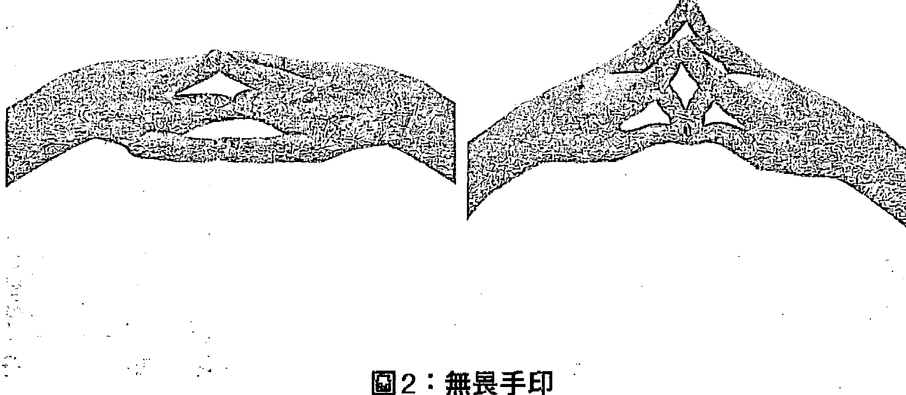

### 練習：自我接納手印（見圖3）

即使受困於局限的信念或受外界影響，而放棄自我核心價值、試圖迎合他人的時刻，自我接納手印可以幫助妳接受真實的自己。請先以舒服的姿勢坐好，背部打直，接著將舌頭輕輕頂住上顎，往上顎後端稍微移動，最後停留在上顎後端較柔軟的位置。腳跟互觸，持續保持舌尖抵住上顎。雙手拇指並列互觸，然後彎曲雙手食指，將右手食指覆蓋於左手食指上，右手指間落於左手第一指關節處，雙手中指向上，指尖互觸後，接著將雙手無名指向下彎曲，兩指外側自第一指節處至第二指節處相互貼合，再將雙手小指第一指節相互貼合。

練習這個手印十分鐘後，即可放鬆雙手，舌頭與腳掌也可回歸到正常的位置，只要需要皆可重複練習此手印。

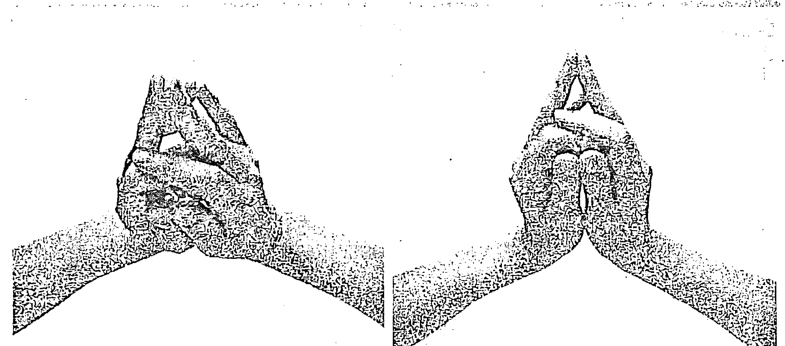

圖3：自我接納手印

常常練習自我接納手印，妳將能夠接納現下的自己，並且朝向成為光采耀目的女性這個目標更進一步。

### 總結

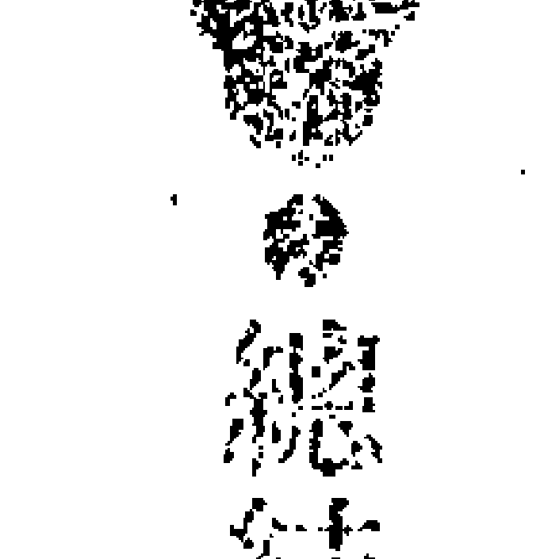

每個女性都蘊含著極其豐沛的女性能量，當療癒過程展開，敞開心胸擁抱並展現宇宙的女性能量時，這股能量就會在能量場及身體中自在流動，散發光采。在練習珍寶手印的過程中，妳即處在如此的狀態中。

運用無畏手印驅散恐懼，妳得以釋放更多能量。練習自我接納手印，開始一步步達成個人及靈性目標的實現。在下一章中，妳將學到重新啟動身體的強力中心以及精微能量場與自己真實的心靈——療癒的載體，完美的契合。

## 找到你的靈魂目的

在文明發展初始，大型聚落開始形成的年代，女性普遍相信女性的宇宙性能量是至高無上的，其力量與愛足以讓男女之間永遠保持平衡。女性對此深信不疑，因為她們與自己的強健中心連結密切，也信任女性的宇宙性能量的力量。女性對自己充滿信心，她們自身的力量，自由的自精微能量場及身體中散發出光彩。可惜的是，今日許多人並不完全信任女性的宇宙性能量；有些人甚至不明瞭那豐沛、未被發掘的女性力量，其實一直潛存在她們的精微能量場中。因此，多數人都未能領受到，女性能量在身心靈層面散發光采時，所帶來的種種好處。想當然爾，必然有人質疑，為什麼有人不信任可以滋養自己的能量。妳可以試著考量這原因：所有人都曾經歷過許多許多的輪迴轉世。前世的能量殘留，以及與自己女性力量間的扭曲關係，都以能量堵塞的形式，盤踞在人們的能量場中，因而導致無法信任。若妳剛接觸療癒及能量工作領域，可能會對前世的概念有些陌生。但身為一個跨次元的存有，並具備身心靈層面及支持上述層面的精微能量系統，妳已實質參與了生、死及重生的生命循環。在每一世結束時，雖然妳的肉身消逝，但妳的能量載體（也就是靈魂跟精神的根基），仍繼續存在著。在每個生死以及重生的循環終結時，它們會一同隨著轉世，進入新的肉身，在進化的旅程中繼續同行，直到妳達到永恆的開悟狀態為止。在開悟狀態中，妳將先於自身經驗，完全覺知自身所獲受

### 女子漢

在此有個關於不信任自身女性力量、遭受不必要痛苦的極端例子。在阿爾巴尼亞北部，有一個最奇異且長久存在的族群，這族群中存在著所謂的女漢子（man-woman）。女漢子拒絕接納自己的女性能量及身分認同。在家中父親或兄長死後，她們開始在家族中扮演生計維持者的角色。根據傳統，女漢子承擔起這樣的角色，是為了保護家族免受打劫及強暴之害。不幸的是，對於這些女性來說，女漢子傳統，迫使她們為了家族犧牲自己為人妻母的生命經驗。終其一生揚棄自己女性化的部分，削短頭髮，穿戴男性服飾，從事男性的傳統工作。奇特的是，當地人都能接納這種明顯的假扮，甚至女性也是如此。在一般狀況下，社區中不論男女，都把女漢子當成男人一樣對待。

### 信任的重要性

對於尋求最深層療癒的人來說，女子漢的例子，顯示了信任女性能量的宇宙性特質及信任自己的重要性。缺乏信任，會導致妳無法找到自己的強健中心。缺乏強健中心的支持，妳將難以運用能量場來療癒身心，也難以完全發揮潛在的女性力量。當妳找到自己的強健中心，夢想將容易顯化為物質實相，美夢成真也不再是幻想。

還有其他理由支持信任的重要性：一個充滿動力且與外界能順暢交流的人格，需要自我信任來支持其順利發展。此外，相信自己及宇宙的女性能量，也能助妳與自己及他人建立、維持良好的關係。

幸運的是，就算妳不信任自己及女性能量，女性能量的宇宙性特質，在某些時刻仍不受阻撓。在女性懷孕期，荷爾蒙及增強的女性能量之流，使女性充滿光采，此時女性能量及其衍生的宇宙性特質，會帶動女性的覺知及自我轉化。在女性生理期或遇到生命摯愛時，不信任感也能被克服。尤其在關係萌芽期，為了取悅伴侶，女性幾乎不可能全然拒絕或不相信自身的宇宙性特質。

可惜的是，這樣勃發的能量通常只能維持一時。透過接下來的練習，妳可以在自己的生活及關係中，長久維持女性的能量流動。首先，學習運用信任手印。每天持信任手印十分鐘，持續至少五天，妳將更容易敞開心胸接收自己的女性能量，也更容易相信自己，欣賞自己與生俱來的力量、創造力以及內在光采。

### 信任手印（見圖4）

練習信任手印，請先以舒服的姿勢安頓好自己，挺直背部，接著將舌頭輕輕頂住上顎，往上顎後端稍微移動，最後停留在上顎後端較柔軟的位置，並將雙腳腳掌朝內互相接觸。然後兩手拇指互相平行靠近。兩拇指第一指節側邊互相貼合。雙手食指向上伸展，兩指第一指節內側互相貼合。左右拇指及食指各形成一個三角形狀。雙手中指、無名指及小指兩兩相對，向下彎折，在第二指節處互相貼合。閉上雙眼，維持這個手印十分鐘，然後鬆開手印，好好享受增強的信任感及女性能量，它們讓妳更有力量。只要需要皆可重複練習此手印。

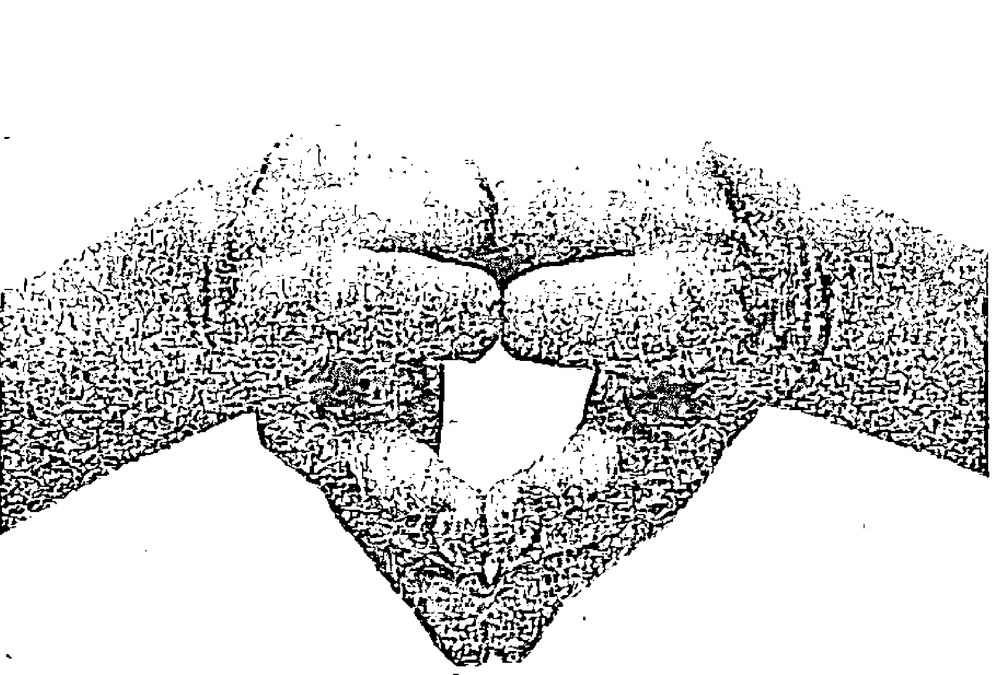

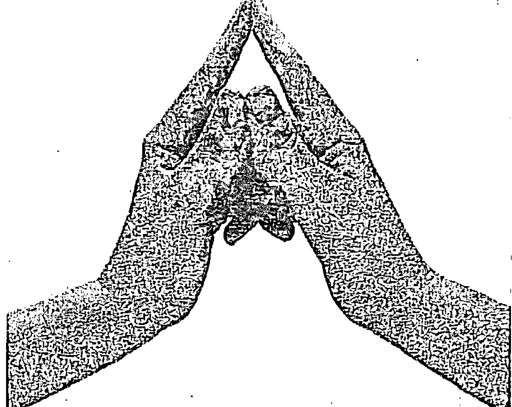

圖4：信任手印

## 找到妳的強健中心

開始練習信任手印，妳將可以重新啟動自己的強健中心，首先在身體層面，專注於妳的腹部，然後後學運用標準方法專注於妳的能量場。丹田的位置，在肚臍下方約四指寬及脊椎前方約二點五公分交界處。「腹部」，也常連結至另一字 腫たん（漢字「丹田」），代表「精華所在」（引自史亭與史亭（Stena and Stena））。因此，我們也可將丹田一字解釋成身體中的生命精華所在。妳也能在該處回復自己體內的強健中心。西方世界多數人，皆不明瞭丹田的重要性，這也是許多人仍舊缺乏生命力及療癒能量的原因之一。這同時說明，為何當今有如此多的人們呈現失衡狀態，如同受操弄的傀儡般僵硬。不論是他們的身體姿態或是身體活動的方式，都顯示他們沒有把丹田的概念帶進日常生活中。現今，姿勢不良、慢性肌肉緊張（這會阻礙人類能量系統中氣的流動）、脊椎受壓迫造成扭曲、器官疼痛及循環不良等問題，通常被歸因於肩膀失去平衡所造成，而非丹田失衡造成。但是，當妳沒有安住在自己的強健中心時，將會衍生其他問題。像是關節和韌帶會受到較多壓迫，也可造成身心疲憊，甚至是好發於女性多於男性的憂鬱症。那麼，丹田可以為我們帶來什麼好處？可以說是不勝枚舉。若能找到位於丹田的強健中心，將使妳更有力量。丹田連結妳的腹部、胸部及頸部的能量中心，也能讓妳的生殖器官受到更多滋養，運作得更好。它讓妳順暢釋放腹部的能量，妳將更容易與最深層的情緒與感受連結。

因此，所有主流靈性傳統皆同意，堅實牢固的根基是個人成長的先決條件。大自然本身也反映了這個法則。一棵擎天巨樹，必須在土壤中密實扎根，否則必然會變得不堪一擊，甚至耐受不了微小的天氣變化。

### 腹式呼吸

腹式呼吸是一種古老的技巧，在遠東地區已流傳多時。這項技巧被用來協助人們找到身體裡的強健中心。若妳感到與身體疏離或空虛、需要內在力量、覺得孤立無援、筋疲力盡或感到恐懼或憤怒時，妳可以用腹式呼吸來紓解這些感受，並將妳帶回自己的強健中心，與世界的其他部分保持平衡。

只要能保持背部打直，妳可以以各種姿勢進行腹式呼吸。建議妳一開始先以仰臥方式進行呼吸練習，接下來再進展到以坐姿或站姿進行練習。

當妳開始練習腹式呼吸法，左右臂垂放身體兩側，掌心朝上，雙手自然微張。閉上雙眼，放鬆下頷，嘴巴輕鬆的微微張開。保持這個姿勢，鼻吸鼻吐，深呼吸持續三到四分鐘，然後將心智注意力集中在丹田，也就是肚臍下四指寬之處。

意守丹田後，用慣用手的中指（右撇子使用右手，左撇子使用左手），以順時鐘方向，在丹田周圍小幅度畫圈。很快的，在這生命力之點會出現感覺。妳可能會感到溫暖、輕癢和翻攪感，也可能經驗到清涼或擠壓的感覺。不用擔心，這些感覺都是正常反應。畫圈幾分鐘後，將雙手直接放在丹田上，同時直接將舌頭抵在上顎齒排後方的位置，如此可以連結能量場中的陰陽兩氣，增進妳的體驗。

當手就定位後，妳將能運用隨著每次吸氣而進入能量場的氣，進一步啟動丹田。要達到這個目標，由鼻子深深吸氣，將氣吸入丹田，持續五秒。當妳將丹田充滿氣，觀想充滿能量和光的液體流進、充滿丹田這個生命力之點。屏息五秒，心智注意力持續集中丹田。當越來越多氣進入時，妳會感受到丹田逐漸溫暖，平衡中心也轉移到這個生命力之點。

- 呼吸的節律。

每週練習二到三次，每次約二十分鐘。熟練了腹式呼吸法，妳將可回歸丹田這個真實中心。只要需要皆可做此練習。

### 精微能量場中的強健中心

現在妳已找到了自己身體內的強健中心。接下來，可繼續進行我們稱之為標準法門的練習。標準法門能讓妳重新回復自己能量場中的強健中心。當妳練習過標準法門，妳將能創造出視覺螢幕。在書中的許多療癒練習中，視覺螢幕都至關重要。最後，妳也會學到如何運用給予力量手印。當妳找到自己身體與精微能量場的強健中心後，給予力量手印可以幫助妳將女性能量轉化成妳所需的力量。

要找到精微能量場的強健中心，必須集中中心智注意力，避免分神。在做自己覺得享受的事時，妳會自然而然的專心。這些事也許是閱讀、參與精彩的討論會，或是與所愛的人分享親密時刻。若妳想要集中中心神，將覺知移往自己的能量場中。那麼，享受自己所做的事將會是成功的關鍵。因為享受的狀態可以提升流經能量場及真實心智的氣流量。

妳的真實心智是由能量場、神經系統及感官所組成。感官可愛受外在環境（物質世界）及內在環境（能量及意識的精微世界）所牽引。真實心智是妳覺知與表達的實質載體，也是妳在能量及意識精微

#### 標準法門

#### 世界中的強健中心

當越多氣流經妳的能量場，真實心智越擴展，妳越能安住在自己的中心，讓覺知自然湧現，不受外界干擾。

練習標準法門約需二十分鐘。首先交替收緊、鬆開的動作，讓身體主要肌肉群放鬆，然後試著向內觀照，讓自己得以定位精微能量場並安住其中。

請記得，在這練習中，妳的意圖十分重要。如同電腦軟體在電腦運作中，負有指示如何進行的重責大任一般。妳的意圖負責導引真實心智，讓感官轉向觀照內在。

妳的感官同時包含了實質的身體感受，以及非物質性的感知，如直覺。若妳適度運用意圖，不過度刻意或在意圖混雜情緒或質疑。如此一來，妳將能自然的感知內在世界。

練習標準法門前，請先找一個舒服的姿勢安頓好自己，背部打直，閉上眼睛，鼻吸鼻呼，持續二到三分鐘。接著緩慢的從五倒數至一。倒數時，在心中同時複誦並觀想數字的圖案，每個數字三次，慢慢的進行，讓自己的心智以它自己富創造力的方式呈現。數到一時，複誦這句肯定語：「現在我深深的放鬆，比之前感覺更好。」

繼續從十倒數至一，每倒數一個數字，就讓自己進入更深一層的放鬆狀態。數到一時，宣告：「每當我的心靈達到如此狀態時，我就能以更多富創造的方式來運用自己的心智。」接著吸氣，將注意力放在雙腳，緊縮腳部，肌肉盡可能收緊，屏息五秒，然後吐氣，放鬆腳部肌肉，再次深深吸氣。在腳踝及小腿部位，重複收緊放鬆的過程。再循序往上，在膝蓋、大腿、臀部、腹部、胸部、肩膀、脖子、手臂及手部，以同樣方式進行。完成這些身體部位的收緊放鬆練習後，緊縮臉部肌肉，屏息五秒，放鬆吐氣，同時在吐氣時發出「啊」的聲音。然後張開嘴巴，伸出舌頭，屏息五秒，同時盡可能延展臉部肌肉，然後放鬆臉部肌肉，吐氣並發出「啊」的聲音。最後，緊縮全身及臉部肌肉，屏息五秒，然後從鼻中吐氣，放鬆幾分鐘。接下來宣告：「我要我的感官向內觀照。」花幾分鐘感受其效應，然後宣告：「我要我安住在自己的能量中心。」就在當下，妳的生命方向會開始轉移。從這個嶄新的時刻，妳開始能夠從內在深處，覺察自己安住在能量場及真實心智中，因為妳會感覺更輕鬆、更像自己。更重要的是，諸多念頭和感覺不再容易使妳分心。妳可以花十五分鐘或更長時間來享受這個練習，然後從一數到五。睜開雙眼。妳越常練習標準法門，越能因此受益，且更容易保持專注，不受外界干擾。現在，妳已找到自己能量場中的強健中心，可以創造自己的視覺螢幕了。

#### 練習三：視覺螢幕

要創造出視覺螢幕，請先找一個舒服的姿勢安頓自己，背部打直，閉上雙眼放輕鬆，接著運用標準法門放鬆身體，並讓自己安住在精微能量場及真實心智中。當你放鬆身體並安住下來後，在前方創造一面二點五公尺的螢幕。這個螢幕是白色的，尺寸大得足以容納妳的身形。螢幕距離地面有些高度，讓妳可以三十度的視角向上觀看，也能清楚的看到螢幕上的影像。要創造出視覺螢幕，請先宣告：「我要觀想有個二點五公尺高的視覺螢幕在我面前。」螢幕出現後，再宣告：「我要觀想自己的影像出現在螢幕上。」妳將立即看到自己的影像顯現在螢幕上。觀察這個影像約五分鐘，釋放自己的影像，也釋放掉螢幕。然後從一數到五，睜開雙眼。在接下來的章節中，妳將運用視覺螢幕，以肯定生命原型取代自我設限原型，釋放那些對妳造成阻礙的依存，並在身心靈方面自我療癒，現在妳已經創造出視覺螢幕，可以開始練習運用給予力量手印了。給予力量手印被設計用來增進、轉化女性能量為可運用的力量，並將此能量平均散佈至你的精微能量場中。

### 給予力量手印（見圖5）

請先找一個舒服的姿勢安頓好自己，背部打直，然後運用標準法門讓自己安住在精微能量場及真實心智中。先進行標準法門，可以提升手印的效果。然後將舌尖頂在上顎齒齦交界的位置，將雙手拇指頂端外側互觸，形成一個三角形。然後將雙手食指向上伸展，指尖互觸，形成第二個三角形。當雙手食指互相接觸後，將雙手中指向掌心彎曲，兩指第二指節外側互觸，雙手無名指和中指動作相同。然後將雙手小指向上伸展，指尖互觸，形成第三個三角形。當妳由上方俯瞰這個手印，會看到三個三角形頂端，第一個由雙手拇指構成，第二個由雙手食指構成，第三個則由雙手小指構成。閉上雙眼，持此手印十分鐘，十分鐘後，鬆開手印，

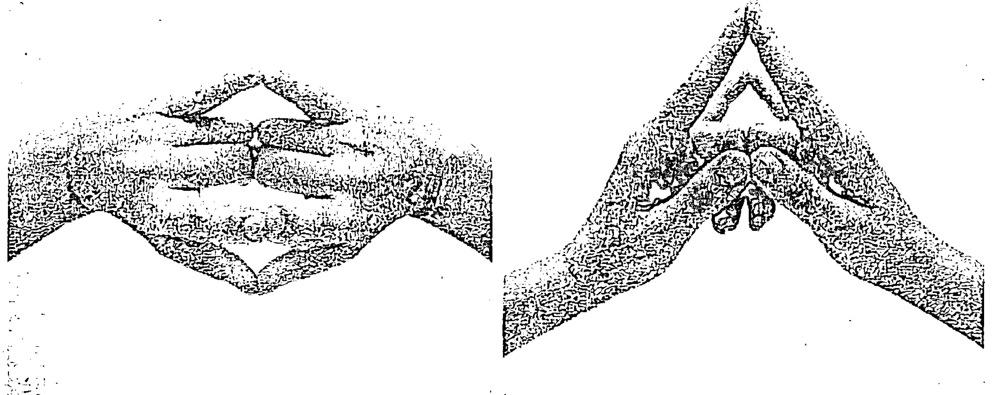

### 總結

然後由一數到五，睜開雙眼，妳會感到非常清醒，全然放鬆，感覺比之前更好。只要需要皆可重複此練習。

透過練習信任手印，回復身體及精微能量場的強健中心，妳已經朝回復自我力量、創造力及內在光彩的道途踏出重要一大步。創造視覺螢幕及練習給予力量手印，也讓妳賦予自己更多力量。在下一章中，妳將學到如何分辨充滿生命力的女性能量，及導致疾病與痛苦能量間的差異。當妳學會分辨療癒，再來是學習脈輪療癒。透過脈輪療癒，妳將能運用自己能量系統的器官，對自己及所愛之人進行療癒。

## 療癒

現在，妳已回復自己身體及精微能量場的強健中心，也學會了創造視覺螢幕，是開始學習脈輪療癒的時候了。妳可以療癒各種源於精微能量場的身心靈及關係的不適和障礙。

開始脈輪療癒前，請先了解，第一：宇宙有兩種類型的能量，一種帶有宇宙性特質，另一種則帶有個別特質。第二：妳的精微能量場及能量系統只能夠轉化和傳送帶有宇宙性特質的能量，無法轉化和傳送帶有個別特質的能量。

### 帶有宇宙性特質的能量

帶有宇宙性特質的能量，在物質與非物質宇宙中，創造生命的多樣性。若沒有這股能量，令人敬畏又充滿啟發性的宇宙將不存在，具備精微能量場及物質身體的有情眾生，也無法覺知宇宙。自然沒有歡愉、愛、親密和喜悅的存在。

有些人可能已經了解這股能量的特殊力量。當這股能量在妳的能量場閃耀的自由流動時，妳會體悟到它的強大力量，它可以療癒疾病，也可以讓妳快速躍進超凡脫俗的狀態，生命中的問題和擔憂消失不見，妳開始能和富含生命脈動的宇宙同在，持續領受這樣的幸福。

### 帶有個別特質的能量

前面已經談過，帶有宇宙性特質的能量，它是非物質宇宙初始時所形成的女性能量原型。不過，另有一股能量隨後形成。這是一股由感官接納的能量，它具有個別特質且不停在變動。

在物質層面上，熱、電及光是帶有個別特質能量的良好範例。帶有個別特質的能量，無法在物質層面上被界定。不過在非物質宇宙中，仍有些帶有個別特質的能量場，有其可以被形容的性質，或稱為「特色」。其實妳已經熟悉這種能量，它就如同在壓力狀態下時，讓妳感到沉重又肌肉緊繃的能量，或是在有意識或無意識下被挑起的焦慮、自我懷疑或困惑的感受。事實上，各種形式的個別特質能量，很有可能是人們受苦或罹病的主因。譚崔大師以屬性來描寫帶有個別特質的能量場。梵文guna代表「特質或屬性」，在古典譚崔中，悅性（Sattva）、惰性（Rajas）及變性（Tamas）三種屬性被用來描寫個別特質的能量。

變性能量，是個別特質能量中最沉重也最扭曲的一種，過量的變性能量附著在精微能量場時，會導致嚴重疾病，對整體身心健康造成毀滅性的影響。

惰性能量比變性能量輕盈一些，在大多數例子裡，對健全身心的危害較少，但過量的惰性能量，仍會讓妳偏離自己的強健中心，令妳難以敞開心胸接納女性能量的宇宙性特質。

### 精微能量系統

悅性能量比變性及惰性能量更輕盈一些，對人類整體的身心傷害最小，但是它仍能阻礙你連結自己身體及精微能量場的強健中心，讓你難以成為自己，無法自由的表達自我。

妳的精微能量場，具有穿透妳的物質身體的宇宙性特質。精微能量場包含兩種能量載體——能量體和鞘。除了能量載體外，妳的能量場也包含了資源場，資源場提供滋養妳的能量載體，和精微能量系統的能量及意識。

妳的精微能量系統包含了脈輪、脈輪場、經脈、氣場，及散佈在精微能量場中的許多小型能量中心。

如同輸電網路為居家及商業環境提供能源，妳的精微能量系統器官也傳送、轉化所有的身體及能量載體所需的氣，以維持它們的健全運作。

接下來，會更深入探討妳的精微能量系統的器官，特別著重在脈輪、脈輪場及小型能量中心。

為在脈輪療癒時，妳若能有技巧的運用這些器官，將可為最常干擾妳的生活及關係的那些問題，找到能量解決之道，這些問題通常都發源於能量場中的阻礙。

一般来说，当个别特质能量聚集，阻碍气（宇宙性特质能量）自在地在脉轮或小型能量中心流动闪耀时，就会在精微能量场中形成堵塞。我们所说的这种能量聚集，可以视为由沉重能量形成的浪潮或池塘，具有活性及流动性，尤其在你特别关注它时。由于它的密度及流动性，它会阻碍气的顺畅运行，如同灰尘会阻碍来自空气清净机中的新鲜气流。这些阻碍造成了自我设限及消极信念等依存，它们通常会伴随你经历很多世，因为你在精微能量场中支持这些阻碍，让它们得以伴随你轮回转世。脉轮、脉轮场及小型能量中心，主要负责管控非物质宇宙中的能量活动。这些能量活动，包含了由脉轮、脉轮场及位于手部及脚部的能量中心所控管。许多被人们误解只能发生在物质层面的互动。同理心、动力、热情及人类的爱与亲密等能量互动，皆由脉轮、脉轮场及位于手部及脚部的能量中心所控管。这意味着，能量系统的状态，足以影响你的感知能力及情感能力。不幸的是，这也表示，当你的精微能量场中存有阻碍，你会发现，自己与环境及人群的互动能力也同样受阻。

脉轮（Chakra）一字来自梵文，意指‘轮子’。脉轮由两个不同的部分——脉轮闸口及脉轮场所组成。对于那些能够看见精微能量场的人来说，脉轮则像是一个快速转动的彩色圆盘，其底部看来像一个长型轮轴或一条长型茎状物。脉轮闸口（见图6）的圆盘部分直径大约八公分，持续转动或绕着中轴线不停旋转。圆盘中心也向外浮现许多轴线。

脉轮闸口的主要功能，是提供气给精微能量场及物质身体，脉轮虽然还有其他附加功能，但主要功能还是作为气的大型储藏库，我们称之为脉轮场。脉轮场与脉轮闸口相连。当脉轮场越健全，就有越多气能经由脉轮闸门，散布到你的精微能量场及身体中。

### 脉轮的功能

除了将气提供给精微能量场及身体之外，脉轮闸门和脉轮场还有其他几项重要功能。人们可以透过它们与宇宙意识连结。物质与非物质宇宙，即来自宇宙意识这个唯一存在之处。

脉轮开口与脉轮场，将气从一种调性（频率）转换至另一种。当你的能量场、鞘或身体处于能量缺乏状态时，这种气的转换就会自动发生。

脉轮也能协助平衡能量场中的极性及阴阳能量，脉轮场让气在精微能量场中以四种方向流动。

在系统后方为由下往上流动，前方为由上往下流动，或者由系统后方往前方流动，或由前方往后方流动。

透过气在精微能量系统中的均衡流动，你得以保持两极及阴阳力量的良好平衡，如此也将使你更有力量，同时提升全然表达自我的能力。

### 身体空间中的十二个脉轮

在人类的能量系统中，有一百四十六个脉轮，其中最重要的十二个脉轮位于身体空间；七个一般惯称的脉轮，沿着脊椎分布，位于头部、两个乙太脉轮、两个身体脉轮及两个身体—物质脉轮，接下来简单表列出身体区域的十二个脉轮，及它们管理的个别活动与所控管的身心灵功能。

#### 第一脉轮
安全感、自信心、身体形象与地球及万物的连结。若此脉轮堵塞，你和自己的物质身体关系将受毁损。

#### 第二脉轮
活力、性别身分认同（男性或女性）及创造力。若此脉轮堵塞，你会感到愤怒。

#### 第三脉轮
归属感、满足、亲密感、友谊、地位及身体健全状态。若此脉轮堵塞，你会感到恐惧。

#### 第四脉轮
自我觉察及个人权利（包含掌控自己的物质身体，表达感受及情绪，以及分享所知）。若此脉轮堵塞，你会感到痛苦。

#### 第五脉轮
自我表达、享受、坚持及个人整合。若此脉轮堵塞，你的喜悦经验会受毁损。

#### 第六脉轮
觉知、记忆、直觉、推理、演绎及归纳。若此脉轮堵塞，你的归纳演绎能力及直觉能力皆会受毁损。

#### 第七脉轮
超凡觉知。若此脉轮堵塞，你的超凡体验会受阻碍。

#### 乙太脉轮
管控感觉。有数以百计的感觉自乙太脉轮中出现，从舒适满足到疲倦迫切都是。若此脉轮堵塞，你的感受能力和表达感受能力会受到阻扰。

#### 身体脉轮
调节身体愉悦感，尤其在性方面。当此脉轮堵塞时，你会对自己身体感觉疏离，与他人互动的感觉也不敏锐。

#### 身体—物质脉轮
协助你在物质界站稳脚步。如此一来，你得以顺畅感知自己身体及周遭物质环境。当此脉轮堵塞时，你的力量、耐力及脑内愉悦感的化学物质生成过程，也都会受到干扰。

### 感知身体的脉轮

我们在工作过程中发现，即使人们已学习了脉轮结构及功能的相关知识，很可能还是无法感知脉轮。真的很可惜，因为，其实有许多简单的方法可以感知脉轮存在。其中一种，就是利用流水的力量来启动脉轮。

沐浴时，很容易启动脉轮。只要将莲蓬头的水柱冲往第一脉轮前部，也就是从尾椎底部延伸至其下方约八公分处。持续冲水到你开始感觉脉轮闸口出现振动。享受一下这种共振，然后将莲蓬头水柱冲向第二脉轮，也就是距离肚脐下方四指宽处。重复这过程，继续启动第三至第七脉轮，然后是乙太脉轮，身体脉轮及身体—物质脉轮。你可以参考图7的脉轮位置。完成脉轮启动后，花十分钟享受提升的共振频率，即使你已完成脉轮活化启动，共振还是会持续。

另一种感知身体空间脉轮的方法，是将双手互相摩擦，然后将惯用手放在每个脉轮闸口前方八公分的位置，左撇子将左掌心朝向脉轮闸口，右撇子将右掌心朝向脉轮闸口。双手互相摩擦，使之更集中，让你更清楚感知每个脉轮的共振。若先将双手互相摩擦，再将惯用手放在第一脉轮开口上方，你的掌心将能清楚感知脉轮的独特振动。移动你的手掌，继续这个过程。双手再次互相摩擦，然后将惯用手放在第二脉轮开口前方，也就是肚脐下方四指宽的位置，你的掌心将感受到比第一脉轮稍高频的共振。以相同方式持续进行，掌心互相摩擦，然后感受第二、第三、第四、第五、第六及第七脉轮的独特共振。

当你完成七脉轮的共振体验后，再用同样技巧感受乙太脉轮、身体脉轮及身体—物质脉轮的共振。十二个脉轮启动完成后，安静几分钟，享受这体验带来的身心灵助益。

### 启动脉轮

现在你已能感知到身体空间的脉轮。接下来可以进行脉轮疗愈的下一步，启动脉轮能量。你将会学到启动心轮的技巧，然后将此技巧以同样方式，运用于身体空间的其他十一个脉轮。要启动心轮，请先以一个舒服的姿势安顿好自己，背部打直。闭上双眼，鼻吸鼻呼，深呼吸二到三分钟。从五倒数到一，再从十倒数到一。运用标准法门让自己放松，并安住在真实心智中（参见第二章）。

当你准备好继续下去，宣告：“我要启动我的心轮。”花几分钟享受其效果。然后宣告：“我要让自己安住在心轮场中。”一旦启动心轮，会有种容光焕发的感觉，并感到身心舒畅。你可以透过宣告再增强效果：“我要在我的心轮层面上，向内观照感官。”透过向内观照感官，你将更容易觉察因心轮启动而产生的变化。持续安住在你的心智中，并将注意力放在心轮，维持十五分钟。十五分钟后，由一数到五，回复平常的意识状态。数到五时，睁开双眼。你会感到非常清醒，全然放松，感觉比之前更好。当你需要时可做此练习。

### 安住在脉轮场中

启动心轮后，脉轮疗愈的下一步，就是让自己安住在对应的脉轮场中。透过安住在脉轮场中，你的觉知能在气的储藏库中直接生成。气的储藏库不只是你的活力来源，也是每个充满内在光彩女性的核心宝库。

要让自己安住在心轮场中，请先以一个舒服的姿势安顿好自己，背部打直。闭上双眼，鼻吸鼻呼，深呼吸二到三分钟，从五倒数到一，再由十倒数到一，然后练习标准法门，让自己安住在真实心智中。当你准备好继续下去，宣告：“我要启动我的心轮。”安静几分钟享受其效果。然后宣告：“我要让自己安住在心轮场中。”透过向内观照感官，你能提升其效果。要达成这个目标，宣告：“我要在心轮场层面上，让感官向内观照。”持续安住在你的心轮场中十五分钟。十五分钟后，从一数到五，回归到平时的意识状态。数到五时，睁开双眼，你会感到非常清醒，全然放松，感觉比之前更好。当你需要时可做此练习。

### 小型能量中心与经脉

现在你能启动心轮并安住在心轮场中，你可以准备启动位于手部及脚部的能量中心。每个人都有四个小型能量中心，分别位于双手及双脚，这些能量中心与脉轮功能互补，并且对健康及自由表达女性性能量的能力极有益处。

小型能量中心和脉轮不同，脉轮呈现涡流的型态，气由其中进入人的身体。小型能量中心则是两条阴阳主脉进行功能性互动的活动中心。

#### 经脉
经脉是气的通道，有两项重要功能：连结脉轮及散布在身体中的各个小型能量中心，并运送气到能量场中最需要补给之处。透过气的传送，经脉协助人类能量系统保持平衡及正常运作。

我们对于经脉的相关知识主要来自东方。其实，经脉一字和中文的经线相关，经线一词也对应到梵文中的脉（nadi）。虽然经脉常被拿来和人体循环系统中静脉及动脉相比对。但在结构上，经脉更像是海洋中的水波流动和大气中的气流流动。静脉及动脉有其准确的结构（它们是纤长并具有弹性的管状结构）、固定的形状及携带液体流动的特质。相对来说，经脉是气的流通管道，其流体大小及型态取决于所携带的气量多寡。若小型能量系统运作顺畅，气会流经手部及腿部的经脉，然后流经手部及脚部的小型能量中心。从手部小型能量中心生起的气，能协助你自由显化自己的力量、创造力及内在光彩。从脚部小型能量中心生起的气，则让你在此世界向前迈进并有所进展。

### 启动手部的小型能量中心

以下两个练习，被设计来启动手部及脚部的小型能量中心。你先启动手部的小型能量中心，然后再启动脚部的小型能量中心。首先以一个舒服的姿势安顿好自己，背部打直。闭上双眼，鼻吸鼻呼，深呼吸一到三分钟，从五倒数到一，再从十倒数到一。运用标准法门让肌肉放松并安住在真实心智中，然后宣告：“我要启动我右掌的能量中心。”继续宣告：“我要启动左掌的能量中心。”当双手的能量中心被启动后，安静十五分钟，享受流经双掌的增强气流。

十五分钟后，从一数到五，回归到平时的意识状态。数到五时，睁开双眼，你会感到非常清醒，全然放松，感觉比之前更好。当你需要时可做此练习。

### 启动脚部的小型能量中心

首先以一个舒服的姿势安顿好自己，背部打直。闭上双眼，鼻吸鼻呼，深呼吸一到三分钟。从五倒数到一，再从十倒数到一。运用标准法门让肌肉放松并安住在真实心智中。然后宣告：“我要启动右脚跟的能量中心。”继续宣告：“我要启动左脚跟的能量中心。”当双脚的能量中心被启动后，安静十五分钟，享受流经双脚的增强气流。

十五分钟后，从一数到五，回归到平时的意识状态。数到五时，睁开双眼，你会感到非常清醒，全然放松，感觉比之前更好。当你需要时可做此练习。

## 满足女人的更多需求

我们的想法、情绪和感觉，持续和能量系统的器官及流经能量系统的气互动。这也意味着，若你抱持着局限的信念及自我设限的行为模式，气的流动将会受阻，身体器官也会变得虚弱，情绪及觉知会受到干扰。这些症状加总起来，足以创造持续一生的议题，影响你的关系、工作及身心健康。

### 劳拉的故事

劳拉的故事显示当人体能量系统阻塞时，可以对一个女人关系及身心健康造成多大的影响。

当劳拉来找我们咨询时，她已在一家大型德国企业担任专案经理多年。在专业领域里，她十分精明，工作的各个层面也都在掌控之中，表现十分良好又充满效率。

不幸的是，劳拉并没有意识到，她之所以需要掌控工作及环境的所有层面，是因为她无法对自己及他人有所感觉：事实是，她缺乏同理心。我们检视她的能量场后，发现她的第一脉轮能量堵塞，影响了气的流动。这对她的直觉及同理心都造成阻碍。

随后的疗程中，劳拉向我们说明，她目前和第三任丈夫同住，但他们的关系并不好，因为她发现自己无法信任男人。我们检视了造成她婚姻问题的可能成因，发现她的第二脉轮受阻，而这些因于青少年时期的性创伤。在她的第一个疗程结束时，我们对她的能量场进行了更全面的分析。结果显示，她的其他症状，像是对自己身体不敏感，除了自慰之外无法达到高潮，强迫症式的洁癖及频繁的睡眠障碍等问题，皆源于第二及第六脉轮受阻。在她的第三个疗程中，我们开始教她脉轮疗愈的技巧，像是启动脉轮的简单步骤，如何安住在自己的脉轮场中，并让自己的脉轮场充满气。劳拉很热切的吸收学习，也很快速出现效果。几天后，她开始可以同理自己的丈夫，这让他们的关系得以减压。再没多久，她的感觉重新出现，可以开始感知到自己的身体。劳拉持续的练习脉轮疗愈的技巧，我们也继续督导她的进展。

劳拉的经验并不特殊。许多女性饱受能量阻塞及精微能量场受干扰之苦，但她们也都成功学习了脉轮疗愈的技巧，克服了上述困扰。如果她们能，你也能。

接下来的篇章，列出了一些最让女性感到苦恼的常见议题，这些议题的根源皆是能量障碍，导致气在女性精微能量场的流动不顺畅。随着每个议题的叙述过程，我们也提供一系列脉轮疗愈练习，可用于疗愈这些议题。

我们列出的议题十分复杂，传统疗法通常难以应付。不过，重要的是去认清——所有身体及心理问题的源头皆来自能量议题。唯有透过直接对能量场进行疗愈，方能解决。

### 练习：检视身体形象问题

身体形象问题通常与本质上缺乏安全感直接相关。当女性的第一脉轮堵塞，她将无法与自身气的频率连结，让精微能量场及身体感到安全，因为脉轮堵塞，无法与自己的气连结，女性会饱受缺乏安全感之苦。

女性的第一脉轮受阻，可能是因为她的父母并不想要孩子或不想要女儿。也可能是在小女孩时期，她的自尊受到家族成员、朋友或权威人士等个别特质的能量投射干扰，也可能是这位女性仍然依附于前世的关系中。

很少有人知道，依存在个别特质能量场中的人们，可以将此能量投射给他人。投射的能量会干扰被投射者的能量场（对于投射能量出去者也是如此），也会造成能量及身体疾患。

一个女性若遭受过性虐待，第一脉轮也可能因此堵塞，尤其当加害者是权威人士时，更易造成此情况。

#### 解决之道
想根本解决身体形象的问题，你需要启动自己的第一脉轮，并安住在第一脉轮场中，然后用意图使气充满在脉轮场中。首先以一个舒服的姿势安顿自己，背部打直。闭上双眼，鼻吸鼻呼，深呼吸一到三分钟。从五倒数到一，再从十倒数到一。运用标准法门让肌肉放松并安住在真实心智中，然后宣告：“我要启动我的第一脉轮。”你的身体会知道接下来该怎么做，所以在此过程中不需要太刻意，不需要观想任何画面或特别聚焦在呼吸上。轻松及具有弹性的心智，是你在能量工作及疗愈方面最棒的资产。在你启动第一脉轮后，宣告：“我要安住在第一脉轮场中。”然后宣告：“我要让我的第一脉轮场充满气。”接下来，不需做任何事，气会自动充满在第一脉轮场中，无须意识介入。花十五分钟享受这个过程。在这段期间，安住在自己的中心并记得活在当下。若有任何想法或感觉，让它们自由出现、散去，让这过程带领自己进入更深层、更丰富的体验。然后从一数到五，回归到平时的意识状态。数到五时，睁开双眼。每天练习此技巧，持续两周，你和自己身体的关系会有戏剧性的转变。

### 练习二：莲花题——感觉自己像是性玩物

孩提时，若受到成年男性的性操弄，或被塑造成父亲的代理妻子或小公主，抑或自小就被灌输女性的价值建立于是否能在性方面吸引男性，或是不断与其他女性竞争，以证明自己的性魅力。你都可以透过第二及第五脉轮来克服这些问题。

第二脉轮控管性愉悦、性欲及性取向。第五脉轮控管自我表达及无条件的喜悦。透过提升这两个脉轮的功能，你可以脱离藉由对男人性依赖而带来的愉悦及喜乐模式。如此一来，你能重拾自我价值感，而不需放弃愉悦、喜乐及性力量。

#### 解决之道
想要克服这个问题，需要启动第二脉轮，安住在第二脉轮场中，再让第二脉轮场充满气。然后启动第五脉轮，安住在第五脉轮场中，再让第五脉轮场充满气。

首先以一个舒服的姿势安顿好自己，背部打直。闭上双眼，鼻吸鼻呼，深呼吸一到三分钟。从五倒数到一，再从十倒数到一，运用标准法门让肌肉放松并安住在真实心智中，然后宣告：“我要启动我的第二脉轮。”接着宣告：“我要安住在第二脉轮场中。”安静几分钟享受能量流动。再宣告：“我要让气充满我的第二脉轮场中。”在你的第二脉轮场充满气后，宣告：“我要启动我的第五脉轮。”然后宣告：“我要安住在第五脉轮场中。”安静几分钟享受能量流动。再宣告：“我要让气充满我的第五脉轮场中。”当双脚的能量中心被启动后，安静十五分钟，享受这效果。十五分钟后，从一数到五，回归到平时的意识状态。数到五时，睁开双眼，你会感到非常清醒，全然放松，感觉比之前更好。每天做此练习，持续两周，你会发现，自己在身心灵方面所能体会到的喜悦程度，将有戏剧性的提升。

### 问题——性冷感

许多女性都有过性冷感的经验，尤其在一段伴侣无法与她们分享亲密或欢庆女性特质的长期关系中。这样的伴侣，通常倾向把扭曲的能量投射至另一半的能量场中，以控制对方性表达的方式，并为自己创造一个较有利的环境。扭曲能量的投射会阻碍女性精微能量场中气的流动，并且阻碍她自由感受和表达性兴奋的能力。

#### 解决之道
想要克服这个问题，需要启动心轮，并且安住在心轮场中。然后再启动第一和第二脉轮，安住在第一及第二脉轮场中，在这两个脉轮场中充满气。首先以一个舒服的姿势安顿好自己，背部打直。闭上双眼，鼻吸口呼，深呼吸二到三分钟。从五倒数到一，再从十倒数到一。运用标准法门让肌肉放松并安住在真实心智中，然后宣告：“我要启动我的心轮。”继续宣告：“我要安住在心轮场中。”安静几分钟享受能量流动。然后宣告：“我要启动我的第一脉轮。”启动第一脉轮后，宣告：“我要安住在第一脉轮场中。”然后宣告：“我要让我的第一脉轮场充满气。”安静几分钟享受能量流动。然后宣告：“我要启动我的第二脉轮。”接着宣告：“我要安住在第二脉轮场中。”最后宣告：“我要让我的第二脉轮场充满气。”

安静十五分钟，享受能量的流动。然后从一数到五，回归到平时的意识状态。当你数到五时，睁开双眼，你会感到非常清醒，全然放松，感觉比之前更好。每天做此练习，持续两周，你将会发现自己在性方面，有戏剧性的提升。

许多女性对于她们所爱的男性，无法敞开心胸及接纳。一个女性可能爱某个男性，却对男性力量及男性能量滥用有着负面观感。若一个女性对于男性力量有负面感受，可能会影响她和男性伴侣间的关系——即使那位男性能够接纳女性的宇宙性特质。对男性力量抱持负面感受，会干扰女性天生的极性能量，阻碍女性从心发出能量及从骨盆接收能量的能力。

接纳并不代表屈从。接纳代表有能力在与男性的亲密关系中，接纳宇宙性的男性特质。而亲密感是所有成功关系的关键因素。缺乏亲密感，女性会感到寂寞，且和所爱的男性缺少深刻连结。

#### 解决之道

想要变得更能接纳并与伴侣共享亲密感，你需要启动自己的心轮，并安住在心轮场中。然后再启动自己的第二脉轮，并安住在第二脉轮场中。当你安住在两个脉轮场后，你的双掌的小型能量中心会被启动。

首先以一个舒服的姿势安顿好自己，背部打直，闭上双眼，鼻吸鼻呼，深呼吸一到三分钟。从五倒数到一，再从十倒数到一。运用标准法门让肌肉放松并安住在真实心智中。然后念出此肯定语：“我要启动我的心轮。”接着念出下一句肯定语：“我要安住在心轮场中。”

我要启动我的第二脉轮。启动第一脉轮后，念出下一句肯定语：“我要安住在第二脉轮场中。”当你安住在第二脉轮场中，宣告：“我要启动我右掌的小型能量中心。”接下来，宣告：“我要启动我左掌的小型能量中心。”

安静十五分钟，享受能量的流动。然后从一数到五，回归到平时的意识状态。当你数到五时，睁开双眼，你会感到非常清醒，全然放松，感觉比之前更好。每天做此练习，持续两周，你会发现你对伴侣的接纳度和共享亲密的能力，有戏剧性的提升。

## 第三章 脉轮疗愈

对于拥有自尊的人来说，自尊这件事是那么自然，无须特别珍惜其重要性。但对缺乏自尊的人来说，存在本身就是一场持续的奋斗。幸运的是，缺乏自尊者将可利用他们的精微能量系统，让自己从旧有模式中永久解套。

#### 解决之道

我们在实务工作中发现，自尊与两个特质紧密相连，一是自信，另一则是内在喜悦。

想要增进自己的自信心及喜悦，你需要启动第一、第三、第五脉轮，并安住在其相应的脉轮场中。然后再让这些脉轮场充满气。

首先，鼻吸鼻呼，深呼吸一到三分钟。从五倒数到一，再从十倒数到一。运用标准法门让肌肉放松并安住在真实心智中，然后宣告：“我要启动我的第一脉轮。”启动第一脉轮后，再宣告：“我要安住在第一脉轮场中。”继续宣告：“我要让我的第一脉轮场充满气。”安静几分钟享受能量流动，然后宣告：“我要启动我的第二脉轮。”接着宣告：“我要安住在第三脉轮场中。”继续宣告：“我要让我的第三脉轮场充满气。”安静几分钟享受能量流动，宣告：“我要启动我的第五脉轮。”接着念出下一句肯定语：“我要安住在第五脉轮场中。”继续完成宣告的过程：“我要让我的第五脉轮场充满气。”安静十五分钟，享受能量的流动，然后从一数到五，回归到平时的意识状态。当你数到五时，睁开双眼，你会感到非常清醒，全然放松，感觉比之前更好。每天做此练习，持续两周，你将会发现自己的自尊与展现力量、创造性及内在光采的能力，出现戏剧性的提升。

### 凡事归咎于男性

把生命中的问题都归咎于男性是很容易的，但终究无法让女性真正从男性压迫中解放。事实上，这样反而容易导致另一个问题，让女性无法享受女性的宇宙性特质所带来的益处。最好的解决方式是，停止再玩这种归咎于男性的游戏，改以脉轮疗愈的技巧，让自己远离那些负面影响。

#### 解决之道

想要停止凡事归咎于男性，需要启动第一及第二脉轮，并且安住在第一及第二脉轮场中。然后你将启动脚部的能量中心，脚部的能量可以让你在这个世界中持续前行，有所进展。藉由启动第一及第二脉轮，并安住在其对应的脉轮场中，你会有足够的安全感而不再归咎于男性。

首先，鼻吸鼻呼，深呼吸二到三分钟，从五倒数到一，再从十倒数到一，运用标准法门让肌肉放松并安住在真实心智中，然后宣告：“我要启动我的第一脉轮。”启动第一脉轮后，继续宣告：“我要安住在第一脉轮场中。”继续宣告：“我要让气充满在我的第一脉轮。”

接着宣告：“我要启动我的第二脉轮。”继续宣告：“我要安住在第二脉轮场中。”

“我要启动我左脚跟的能量中心。”安静十五分钟，享受能量的流动。

“我要启动我右脚跟的能量中心。”接着宣告：“我

然后从一数到五，回归到平时的意识状态。当你数到五时，睁开双眼，你会感到非常清醒，全然放松，感觉比之前更好。每天做此练习，持续两周，你将能够追寻自己的个人目标，不再涉足阻挡你成长的归咎游戏中。

### 练习：能量题——缺乏活力或动力

极性能量毁损，会阻碍女性精微能量场中气的流动，也会阻碍活力及动力的展现，导致长期疲倦或更糟的崩溃状况。女性特别容易遭遇上述情况，因为她们通常投注更多心力在自己的关系当中。

#### 解决之道

- 想要克服干扰活力及动力的潜在问题，你需要启动第一脉轮，安住在第一脉轮场中，并让第二脉轮场充满气。然后，对于下部身体—物质脉轮及上部身体—物质脉轮，也进行同样的程序。

1.  首先，鼻吸鼻呼，深呼吸一到三分钟，从五倒数到一，再从十倒数到一，运用标准法门让肌肉放松并安住在真实心智中。
2.  然后念出此肯定语：“我要启动我的第一脉轮。”
3.  接着念下一句肯定语：“我要安住在第一脉轮场中。”
4.  继续宣告：“我要让我的第一脉轮场充满气。”
5.  安静几分钟享受能量流动，然后宣告：“我要启动我的下部身体—物质脉轮。”
6.  接着念下一句肯定语：“我要安住在下部身体—物质脉轮场中。”
7.  继续宣告：“我要让我的下部身体—物质脉轮场中。”
8.  继续宣告：“我要让我的下部身体—物质脉轮场充满气。”安静几分钟享受能量流动，然后宣告：“我要启动我的上部身体—物质脉轮。”接着念出下一句肯定语：“我要安住在上部身体—物质脉轮中。”再宣告：“我要让我的上部身体—物质脉轮中充满气。”安静十五分钟，享受能量的流动。然后从一数到五，回归到平时的意识状态，当你数到五时，睁开双眼，你会感到非常清醒、全然放松，感觉比之前更好。每天做此练习，持续两周，你将发现自己的活力和动力出现戏剧性的提升。

### 第三章 拥抱负面依存

人们会受苦，通常是因为她们仍然依附于局限的信念或自我设限的模式中，若无法克服这种负面依存，受苦会成为日复一日的惯例，削减你的活力及动力，并阻碍你的亲密关系。虽然，脱离负面依存是个终生持续的过程，你仍可运用你的脉轮及其所散发的气，来降低负面依存的影响，进而享受更多当下的欢愉、喜悦、亲密、爱及喜悦。

#### 解决之道

想要克服负面依存，需要一个为期十三天的脉轮疗程，每天启动一个脉轮，并且安住在其对应的脉轮场中，让气充满在脉轮场里。你可以参考图7，以了解十三个脉轮在身体空间的位置。

-   第一天，启动第一脉轮，安住在第一脉轮场中，让气充满在第一脉轮场里。接下来的十二天，分别对另外十二个脉轮执行相同的程序。顺序如下：先是第一到第七的脉轮，然后是下部及上部的乙太脉轮，下部和上部的身体脉轮，最后是下部和上部的身体—物质脉轮。

首先，只呼吸，深呼吸一到三分钟。从五倒数到一，再从十倒数到一，运用标准法门让肌肉放松并安住在真实心智中，然后念出肯定语：“我要启动我的第一脉轮。”念出下一句肯定语：“我要安住在第一脉轮场中。”当你安住在第一脉轮后，继续宣告：“我要让气充满我的第一脉轮场中。”安静十分钟，享受能量的流动。

然后从一数到五，回归到平时的意识状态，当你数到五时，睁开双眼，你会感到非常清醒，全然放松，感觉比之前更好。藉由启动第一脉轮，安住在第一脉轮场中，并让气充满在第一脉轮场中，你将减轻负面依存对第一脉轮造成的干扰，让第一脉轮所支持的感受及活动能更顺畅进行。在接下来的十二天或为期更长的时间里，透过对身体空间中第二到第十三脉轮进行疗愈，你可以继续克服负面依存所带来的限制，当你需要时重复此练习。

## 总结

在本章中，你学到了如何分辨宇宙性特质能量和个别特质能量间的差异，以及如何运用能量系统器官进行脉轮疗愈。运用本章所学的技巧，你可以疗愈那些阻碍你自由分享能量及觉知的自我设限及自我毁灭模式。

在下一章中，你将踏出疗愈的下一步，了解业力包袱这种带有个别特质的能量形式，如何干扰你的精微能量场的功能运作。然后你将学到如何运用意图、心智注意力及幸福，来疗愈因业力包袱所造成的创伤，幸福是你所能拥有的最强大力量。你也会学到如何同时并用疗愈技巧与心智运作，来克服阻碍你获取力量、创造性及内在光采等资源的局限的信念。

## 第四章 痰瘀热力俞倡

每个女性在今生中，都与自己前世的残存轨迹共处，这些残存轨迹，以业力包袱的型态储存在精微能量场中。克服业力包袱及其延伸的业力创伤，是身心灵疗愈中很重要的一部分。

业力包袱由带有个别特质的沉重能量所组成。只要少量的业力包袱，就足以影响精微能量场中气的流动，并造成能量阻塞及自我设限的模式，干扰你成为真实的自己和达成个人目标。业力包袱造成的能量阻塞及自我设限模式，也会影响你的信念系统，因为它为那些被你整合进人格层面的局限信念，提供能量支持。确实，业力包袱的存在，说明了为什么想克服局限的信念或改变对自己及他人的观感，是如此之难。

### ● 什么是业力包袱？ ●

想了解什么是业力包袱，以及它为何能够干扰你的生活及关系，首先要了解业力由来及如何运作。

古梵文业力（Karma）一字，是源自“कृ”这个字根，其意为“去行动”，象征一个行动或是行为。

在西方世界，业力被定义成“行为的累积效应”。狭义来说，的确如此。但在东方的伟大宗教中，对业力的结构或功用的描述，皆超越了此定义。

耆那教（Jainism），这个印度的古老宗教，着重美、和平及崇敬。耆那教将业力及其延伸的业力包袱，看作是累积在人类能量场中的精微物质。这个古老的教派认为，业力包袱会让理解力及觉知变得模糊不清，它伪造出感官感受、感觉及情绪，蒙蔽真相，创造自我设限的模式，决定人们的清醒状态及精神健全程度，它也毁损个人的力量。

我们应该清楚，业力包袱的原理比那保证你种瓜得瓜、种豆得豆的抽象因果概念，更为复杂。业力包袱是一种自然力量，显化意志、意图并在所有可预测的世界与次元中，连结因果效应。

这表示业力包袱的作用和地心引力十分相似。如同地心引力，由因果效应创造出的极性业力，能将你吸引至人、事、物的扭曲能量场，并依附其上。只要你依附在这种带有个别特质的能量场中，一种偏颇关系就此形成，开始将扭曲的能量自扭曲能量场中，传送至你的精微能量场。这也说明了业力包袱是如何在精微能量场中累积的。当你的依存越多，你的精微能量场会越偏离平衡状态，而当精微能量场越偏离平衡状态，你越容易深陷扭曲能量场之中。这种状态若不断持续而未被觉察，精微能量场中就会累积层层叠叠的业力包袱，导致你的能量场堵塞，让你难以从事日常生活中的活动或和他人维持亲密关系。

当你在灵魂（智能、感觉、情绪）层面累积了一定程度的业力包袱，这些包袱会让你难以顺畅感受或表达自己的情绪。它们也会干扰你的觉知、创造力及推演归纳能力间的平衡。

如此一来，你可能会发现自己陷入内在对话中（个人心智及人格间不断对话），并对个别特质的能量场有所回应。这些情况会让你觉得身陷五里雾或是感觉超速失控。当你在灵性层面累积了一定程度的业力包袱，你会难以和自己与内在自我（你的幸福来源）连结时一样，能够向内观照、体验内在平静及享受幸福，它们也会干扰你辨认及遵循自己的道途。灵性可视为一种心智的宇宙性层面，与其他生灵共享亲密的感觉。直觉、知见及洞察力也从灵性深处浮现。

你的道途是个人目标、个人自我疗愈路径及自我了解。个人目标也包含你的作为及对他人造成的影响。遵循自己的道途，你会了解到自己是谁及可在此生成就些什么。当你遵循自己的道途，宇宙会助你一臂之力，为你移除阻碍并提供资源助你克服生命的挑战。

并让你持续安住在真实心智及女性的宇宙性特质中。这些活动促进气流经你的精微能量系统，并让你持续

在精神层面上，业力包袱所创造的依存，将你像无头苍蝇般漫无目的的，永远依照旧有的业力模式行动。这种没有结果的无限回圈，终究是自我欺骗且不利于自我觉察及自由的自我表达。“住在灵性沙漠里”，通常是这种情况的注解。

女性想要疗愈自己的灵性和灵魂，必须克服自身能量场中的业力包袱，并持续对来自真实心智之

最真切的宇宙性特质抱持信心。解开业力包袱束缚，看似像普罗米修斯推石上山的任务一样艰难。

事实上，却有许多女性完成这种任务。当然，你也可以。书中的练习，可用来释放业力包袱，并让你永远脱离其束缚。

### ◎ 向业力包袱说再见。

释放业力包袱的工具，其实都已配设在你的精微能量场中。不过，它们是经由真实心智而进入意识觉知中。我们所提到的工具，包含意图、心智注意力以及转化为祝福形式的超凡意识。将这三个工具妥善整合，你将能准确定位出精微能量场中的业力包袱，辨认它们的性质，然后永久释放它们。

### 你的意图

意图是真实心智中的一种功能，作用于物质及非物质宇宙中的所有世界及次元。在接下来的练习中，你会用意图运作心智的注意力，以定位精微能量场中的业力包袱集中处。这些包袱造成你身体不适、能量场阻碍、自我设限模式、负面及自我毁灭态度、情绪，还有感受。在你用意图运作心智的注意力后，便能让意图与幸福结合，进一步释放业力包袱。

### 你的心智注意力

心智注意力同时在物质及非物质宇宙中的所有世界运作。以意图为导引，你的心智注意力能够定位精微能量场中的业力包袱所在，并提供你必要资讯以释放这些包袱。资讯包含了业力包袱的大小、形状、密度、极性以及活跃程度。

### 至乐幸福

至乐幸福是宇宙间最强大的力量。每个人都处于幸福中，虽然大多数人都没有觉察到这一点。根据谭崔教导，至乐幸福是种持久状态，存在于你的能量场深处，源于意识（湿婆“Shiva”）及能量（夏克缇“Shakti”）汇集之处。带有宇宙性特质的意识及能量融合后，可为你带来一股持续的力量之流，释放最沉重的业力包袱沉积。

不过，想要运用至乐幸福释放业力包袱，必须让至乐幸福得以出现在意识层面，并在疗愈过程中持续存在。因为你必须有意识的让幸福散发其力量，让那些经由意图运作心智的注意力来定位的业力包袱，得以永久释放。

要让幸福得以出现在意识层面，要先学习为此目的而设计的手印，这个手印称为至乐幸福手印。请特别注意，幸福并不是女性能量的一种形式，而是人类所能达到的最高层级意识状态。

### 至乐幸福手印

练习至乐幸福手印前（见图9），先运用标准法门让肌肉放松，并安住在真实心智中。接着将舌尖轻轻顶住上颚，往上颚后端稍微移动，最后停留在上颚后端较柔软的位置。当舌尖定位后，双脚脚掌朝内，脚跟相互碰触。然后将双手放在太阳神经丛前方，两拇指指尖互触，再将双手食指弯曲，第一指节外侧互触，然后双手中指弯曲，第二指节外侧互触，无名指及小指则向掌心弯曲，当舌头、手指和脚部都就定位后，闭上双眼，鼻吸鼻呼。
练习这个手印十分钟后，即可放松双手及双脚脚跟，让舌头回归到平常的位置。然后从一数到五，回归到平时的意识状态。当你数到五时，睁开双眼，你会感到非常清醒，全然放松，感觉比之前更好。

### 释放业力包袱

现在你已经学会至乐幸福手印，准备好开始运用自己的幸福、意图及心智注意力，来释放精微能量场中的业力包袱沉积。

首先，决定想要释放哪一种业力包袱沉积。既然能量阻塞、自我设限模式、负面和自我毁灭态度、情绪及感受等状况，都源于业力包袱，选择一种来释放应该不难。困惑、混乱及暧昧不明通常源于业力包袱，你可选择一种身体状况如背痛或磨牙来释放，因为这些状况同样也是源于业力包袱。

选择完毕，请谨记业力包袱是带有个别特质的，因此，它会比气更沉重，也更稠密。一旦选定了一个议题或模式来解决，就是先运用标准法门让肌肉放松，并安住在真实心智中，接着持至乐幸福手印。然后，让意图运作心智注意力来定位，并释放你心中所设定的业力包袱的沉积。

### 释放业力包袱的沉积

开始之前，请先以舒服的姿势坐好，打直背部。选定一种源自业力的议题、模式或不适状况来释放。当你选好要释放的议题、模式或不适状况，闭上眼睛，鼻吸鼻呼，深呼吸一到三分钟。运用标准法门让肌肉放松，并安住在真实心智中。然后练习至乐幸福手印。继续持此手印，宣告：“我要在面前创造一面一点五公尺的视觉萤幕。”当视觉萤幕浮现，宣告：“我要观想自己的影像出现在视觉萤幕上。”影像浮现后，宣告：“我要在影像上定位出业力包袱，这个业力包袱造成我（在空格内填入要解决的议题、模式或身体不适的状况）。”你可能会在视觉萤幕上看到或感受到业力包袱的沉积。不论是看到或感受到，相对于背景，它们都会显得特别突出，因为它们的样态会比较稠密、沉重、看来比较晦暗，或让你的能量场倍感压力。在一些情况下，它们甚至会导致身体的不适。当你在视觉萤幕上定位好业力包袱，接着想像一个气团将它包围起来，气团的大小与形状尽可能与业力包袱沉积相同。想像气团时，宣告：“我要想像一个气团来包围心中所想的业力包袱沉积。”然后，宣告：“我要在这个气团中注入幸福，并释放它所包围的业力包袱。”

### 克服局限的信念

之后静静等待，不需任何动作。幸福会自动进入你所创造的氛围中。由于幸福远比任何带有个别特质的能量更有力量，在氛围中的业力包袱将被永久释放。有些人可能会感到松了一口气或是有种爆裂的感觉。这些都是业力包袱被释放，由幸福取代它原有位置的迹象。释放掉业力包袱后，让气团消失并松开至乐幸福手印。然后从一数到五，回归到平时意识状态。当你数到五，睁开双眼，你会感到非常清醒，全然放松，感觉比之前更好。

现在你已能释放业力包袱，接下来也可运用同样的技巧，释放局限的信念所带来的影响，因为局限的信念同样根植于业力包袱的沉积中。局限的信念是那些为社会制度所接纳，却妨碍人们自由表达的信念。此信念阻碍了气的流动，也导致人们难以安住在自己的能量场中。这些信念对女性影响尤其显著，削弱女性的力量、创造力及内在光彩，让女性对自己的身体及自我感觉产生扭曲，也对创造健全真实的身份认同造成阻碍。局限的信念让女性在能量层面无法开展，增加自我设限和自我毁灭的倾向，造成长期缺乏安全感、焦虑、沮丧、过度敏感及游戏人间的态度。在极端的案例中，甚至会造成强迫症状，促使反自我或反社会的行为发生。

> 一九五五年，当时广受欢迎的作家库明斯（E. E. Cummings）提及：“在这世上，只成为自己而不成为任何人最上策。日日夜夜仿效他人，代表你将参加一场人类史上最艰难的战役。”

想要克服局限的信念，让这些信念不再阻碍你享受及分享气，必须运用心智功能来达成这个目的。心智功能如同意图，源自于你的真实心智。它能协助你自由参与物质与非物质世界的所有活动，直接体验这个世界，不受局限的信念所干扰。它也提供你力量，以克服你生活中所有因局限的信念所造成的阻碍。

你的心智有十六种重要功能，力量、创造力及内在光采也由此产生。你已经学到其中一种，运用意图来进行脉轮疗愈并释放业力包袱。另外的十五种包括意志、渴望、耐力、臣服、接纳、洞悉、选择、承诺、拒绝、信心、享受、破坏、创造、同理及爱。

想克服局限的信念，妳需將心智功能及正向肯定語一同並用。正向肯定語可被定義為真的宣言。

「我是一個散發內在光采的女性，擁有所有女性的宇宙性特質。」此種宣言，就客觀而言始終為真，是因它無法被任何文化或局限的信念所修改，在任何情況中始終不改其真實性。

用一句真實的肯定語取代局限的信念，會對妳造成深刻的影響。它會增強妳的自尊及能量場中的女性能量流動，也讓妳能持續安住在自己的真實心智中。

### 二十世紀的肯定語

傳統的肯定語通常運用一項心智功能來克服局限的信念。但在我們的經驗中，同時運用一項以上的心智功能來克服局限的信念，將會更有效果。妳有一個好理由這麼做：每項心智功能都會釋放一個特定範圍內的氣，先前這個範圍內的氣，因為局限的信念而受到阻礙。

這也表示，藉由運用一項以上的心智功能，妳能夠逐步遠離生活中局限的信念所造成的影響，然後克服它。「我必須掌控生活中的各個層面。」就是一個能說明局限信念的論點。當局限的信念出現，妳能藉由肯定語宣告來遠離其影響：「我對宇宙的女性能量有信心並喜愛它，因此我不需掌控生活中的各個層面。」然後再運用另外兩個心智功能——洞悉和接納，來克服這個局限的信念，宣告：「我知悉並接納自己能在各種狀況中保持開放、有彈性。」當你清楚且堅決的唸出肯定語時，它將會發揮最大的效果。

每當妳受局限的信念干擾，就可運用正面肯定語來解除此情況。當然，也可把正面肯定語作為日常冥想的一部分或能量工作法門。首先，將干擾妳體驗女性力量、創造力和內在光采的局限信念，列出一份簡短清單。在每個局限的信念下方留下書寫空間，然後選擇合適的肯定語與心智功能來釋放這些信念，將其寫在信念下方。在心中想著局限的信念幾分鐘。然後重複唸出與其對應的肯定語，要唸出而非在心中默想，讓選定的心智功能支持妳。重複唸出肯定語至少五分鐘，或唸到感覺自己不再受局限的信念干擾為止。一次處理一個或兩個局限的信念將會是個好主意。在釋放信念後，妳可以另選時間，重複這個過程，來處理清單上其餘的局限信念。

以下是一份局限信念的清單範例：

- 我需要把每件事物做到完美。
- 我必須有苗條的身材來吸引人。
- 對男女間的親密關係臣服是脆弱的象徵。
- 我必須掌控生活中的各個層面。
- 我沒有足夠的力是成為自己，並讓氣流經我的身心靈。
- 我做的事情比我誰更重要。
- 我擁有越多，我越成功。
- 有力量的女人是過度陽剛的。

為了引導妳們順利經驗這歷程，以上述清單中的三個局限信念為例，列出妳們可以參考使用的肯定語及心智功能，來釋放這些信念。建議一次運用兩項心智功能，來削減局限信念的影響，再用另兩項心智功能來克服它。舉例來說，想遠離並克服「我擁有越多，我越成功。」這個局限信念，妳能運用信心和洞悉這兩項功能，宣告：「我相信並了解，成功取決於能否做我自己同時自由的表達自我。」然後妳能使用洞悉和承諾這兩項功能，宣告：「我知道這做很恰當，而且我也承諾在工作和關係中分享我的力量、創造力和內在光采。」

### 肯定語法門

正向肯定語及心智功能，不僅可用來釋放局限的信念，也可被運用來提升身心的健全發展。以下清單，列出一些客觀真實的積極肯定語，以及一個或一個以上的心智功能。當時時間允許，妳又有渴望、意志和意圖時，可運用它們來提升自己的整體身心健康和關係。

想克服『我必須有苗條的身材來吸引人。』這個信念，妳可以用接納及享受這兩項心智功能，宣告：『我接納並且享受自己的身心靈，牠們是宇宙送給我的禮物。』然後妳可以運用洞悉和信心這兩項功能，宣告：『我知道並相信內在美是女性最偉大的寶藏。』

> 宣告：『我接納並且享受自己的身心靈，牠們是宇宙送給我的禮物。』

> 宣告：『我知道並相信內在美是女性最偉大的寶藏。』

想遠離『我做的事情比我是誰更重要。』這個局限的信念。妳能運用渴望和洞悉這兩項心智功能，宣告：『我渴望且知道我的成功取決於，成為我能成為的那種——充滿最多力量、創造力和內在的女性。』然後妳能使用意圖及渴望，宣告：『我想要並渴望在此生成為我應成為的那種女性，充滿力量、創造力和內在光采。』

> 宣告：『我渴望且知道我的成功取決於，成為我能成為的那種——充滿最多力量、創造力和內在的女性。』

> 宣告：『我想要並渴望在此生成為我應成為的那種女性，充滿力量、創造力和內在光采。』

請運用書中提供的肯定語為基礎，盡情發揮，創造出自己的肯定語。若無法立即削弱及克服局限的信念，請別氣餒。繼續運用肯定語及對應的心智功能，短期內，妳將會克服局限的信念所帶來的影響。

- 我接納並了解，我的內在有無限的女性能源供給我用。
- 我接納並了解，自由的表達力量、創造力和內在光采是我與生俱來的權利。
- 我相信且接納，為自己作決定是恰當的。
- 我相信且知道，我比自己以為的更有力量；我是一個散發光采、有力量的女人。
- 我接納且知道，我超越所知自己的總和。我是女性的宇宙性能量的顯化。
- 我渴望並決意轉化自己信念系統中的限制性元素。
- 我要愛我本來的樣子，而非其他人想要我成為的樣子。
- 我渴望並決意表達自己真實的女性身分。
- 我有意圖、渴望及意志去愛能帶給我歡愉的一切。
- 我有意圖、渴望及意志去愛自己的身體及性別。

在這一章中，妳學到業力包袱的沉積——如何干擾妳和自我、女性的宇宙性能量及所愛之人的關係。接著妳學會如何運用意圖、心智注意力和幸福，來釋放業力包袱的沉積，然後也學到運用心智功能克服局限的信念，並以支持妳自身力量、創造力和內在光采的生命肯定語，來取代它們。下一章妳將學習如何療癒心智層面及克服自我限制原型，來創造能夠肯定生命的身分認同。心智層面及精微能量載體，讓妳得以連結他人、場所及外在環境事物。一旦妳療癒了心智層面，妳將繼續學習，如何克服那些造成阻礙的自我限制原型，並以支持妳自身力量、創造力和內在光采的生命肯定語來取代它們。

## 第五章

### 創造與生命的馬份部同

### 心智層面的療癒

若缺乏肯定生命的身分認同作為生命定錨，一個女性的靈性會一直無所依歸，她的靈魂也遭受不必要的苦。肯定生命的身分認同，是散發內在光采的女性喜悅度日的必要元素。這一章將向妳演示；如何回復並精煉自己的身分認同，讓它支持妳與女性的宇宙能量及自己的關係。

自信、自尊和同理心，是構成肯定生命的女性身分認同之基礎。對於現代女性來說，創造肯定生命的身分認同，是療癒靈魂和靈性的必要條件。脈輪療癒及釋放業力包袱，則是創造肯定生命的身分認同之重要步驟。不過，要完成這個過程，妳必須回復自己的心智層面，並克服那些已被整合進自己人格、成為自我認同一部分的不健全原型。

心智層面是種精微能量載體，也是我們真實身分認同的基礎。原型則是種模板或能量全息圖，決定我們如何看待自己、評斷他人，以及是否能夠遵循自己的道途。有些原型是源自前世業力，被我們從前世帶來今生。其他原型則因童年時期制約及社會化過程被創造出來。

當我們療癒了心智層面，就能開始回復肯定生命的身分認同。心智層面比我們的能量體稍大，也是物質層面中身體所佔的空間再往外延伸幾公分的大小。

心智層面與其他能量載體不同之處在於，心智層面可自能量場向外延伸，因此，它能和環境中的其他人及其他能量場接觸。這種延伸及收縮的能力，使心智層面成為獲取知識及定位自己在世上位置的理想載體。這種能力也使其特別容易受到外在環境扭曲能量場的負面影響，更糟糕的是，人們可將受污染的心智層面投射給他人。當受污染的心智層面與你的能量場接觸，即可能帶著那股扭曲它的能量依附在你的能量場中。透過釋放那些被投射進能量場中的不健康的心智層面，以及淨化自己的心智層面。我們才能建立一種肯定生命的身分認同，這也是一個有力且自我接納的女性所需要的。依照譚崔的古老文本，心智有四個層面。在梵文中被稱為末那（manas）、菩提（buddhi）、心（chitta）和自我（ahamkara）。末那能夠延伸自身，直到接觸到外在環境中的物體、存有及能量場為止。末那將其目標與外界隔離，以利研究。我們可用觀望的方式了解末那層面。當我們觀望，視覺並沒有特定著重於什麼事物上。但當我們看的時候，則有個目標被帶入視覺範圍中，得以與其他事物作為對比。末那不觀望，而是看。藉由特別關注視野區域中的某個目標，讓這目標可以從周遭環境中獨立出來。菩提分析物體、人及與外在環境區分出來的能量場，並將其與已知事物相比較。縱使物體、人、能量場可能相異及改變，菩提依然保持其一致性。事實上，菩提的一致性，使它能夠將心智層面所探索的資料與已知事物相比較。

對於那些經由末那獨立出來，並通過菩提分析的事物，心負責賦予其價值。價值取決於人類心智層面與外界環境接觸的情況。當女性依附於局限的信念及自我設限原型，事物的價值取決於它能否促進身體及心理的整體健全。當一位女性選擇療癒自己，且回復她的力量、創造力和內在光彩，事物的價值就會取決於——它能否提升女性與自身及女性宇宙性特質間的關係。 自我是決斷者，過濾來自其他三個心智層面的資訊，以形成及支持女性對自身及關係的觀感。它接收有其根據且與自身相關的資訊，不僅將這些資訊納入女性所認同的「知識」，也讓女性再次確認她對自身的已知部分。 當外在訊息支持局限的信念和自我設限原型，會毀損女性和女性能量之間的關係，並阻礙女性體驗並遵從自身道路所能帶來的滿足感。支持女性宇宙性特質的決定，能讓女性再次確認她的直覺感知：自己是女性的宇宙性能量的物質顯化。 當青春期來臨，我們很可能開始依附於那些被投射進能量場中、已受汙染的心智層面。以下清單列出了一些最常見的負面影響。如果你經歷其中任何一種影響，可以用隨後的練習將其克服。

#### 異常心智層面所造成的影響

- 對他人意見過度反應。
- 覺得自己脆弱或在公共場合中太過羞怯。
- 自我意識過強，沒有安全感。
- 與自己的感覺和身體變得疏離。
- 變得過度依賴他人。
- 發現自己難以找到和遵循自己的道途。
- 覺得自己因他人的需要和期待而喘不過氣。
- 難以表達自己的真實感覺及想法。
- 有時覺得筋疲力竭或被人們排擠。
- 不斷找尋「自我」卻從未成功。

上述清單只是一個樣本。若妳感到自己身陷困境，被某些議題或模式持續干擾，無法創造有力且肯定生命的身分認同，或難以成為自己及自由的表達自我時，妳可能已經依附於一個或多個的異常心智層面。

在隨後的練習中，妳將學習如何釋放並淨化已依附於能量場上的異常心智層面。然後妳會學到如何淨化自己的心智層面，讓靈魂和靈性能夠得到自由，實現其真實目標。

#### 釋放異常心智

想要釋放並淨化已依附於能量場上的異常心智層面，請先找一個舒服的姿勢安頓下來，背部打直。從清單中選一個議題或身分認同問題來練習。若妳覺得清單所列並不適用，可以選一個干擾妳創造力且肯定生命的身分認同的議題。把議題放在心中，然後閉上雙眼，鼻吸鼻呼，深呼吸一到三分鐘。運用標準法門讓肌肉放鬆，並安住在真實心智中。然後持至樂幸福手印（詳見第四章）。憑持手印邊宣告：「我要在面前創造一面二點五公尺的視覺螢幕。」當螢幕浮現，宣告：「我要觀想自己的影像出現在螢幕上。」影像浮現後，宣告：「我要定位其能量與我心中議題最有關聯的異常心智層面。」若異常心智層面出現，它的樣態會像是一條具有彈性的管子，插進我們的身體空間中，並延伸出能量場外好一段距離。一旦妳確認它是異常心智層面，宣告：「我要用一個氣團來包圍心中所想的心智層面。」氣團要夠大足以緊貼包覆住心智層面，再宣告：「我要在這個氣團中注入幸福，並淨化它所包圍的心智層面。」最後宣告：「我要讓被淨化的心智層面，直接回到它的發源地。」
當異常心智被淨化及釋放後，讓氛圍消散，鬆開至樂幸福手印，並且讓視覺螢幕上的影像及螢幕消失。最後從一數到五結束這個練習。

創造更具肯定生命特質的身分認同，請謹記，一個議題或認同問題的背後，可能會有超過一個的異常心智層面作為能量供給來源。因此，若已淨化及釋放一個異常心智層面，卻感覺議題依舊持續。那麼，請重複這個練習，直到所有與那議題或身分認同相關的異常心智層面都被淨化及釋放。

要創造肯定生命特質的身分認同，請注意一個重點，就是你的個人心智層面純淨未受汙染，且被適當整合進能量場之中。想要淨化並整合個人的心智層面，首先找一個舒服的姿勢安頓下來，背部打直，然後閉上雙眼，鼻吸鼻呼，深呼吸一到三分鐘。運用標準法門讓肌肉放鬆並安住在真實心智中，然後持至樂幸福手印（詳見第四章）。邊持手印邊宣告：「我要在面前創造一面一點五公尺的螢幕。」當螢幕浮現，宣告：「我要觀想自己的影像出現在螢幕上。」影像浮現後，宣告：「我要定位出我最受汙染的心智層面。」

若心智層面受污染，它會扭曲，並沿著邊緣鼓脹起來。由於無法好好整合，它會傾斜在身體空間之外，或是倚躺在身體空間的邊緣。

一旦妳從形狀及位置定位出個人心智層面，宣告：「我要用一個氣團包圍心中所想的心智層面。」再宣告：「我要在這個氣團中注入幸福，並淨化它所包圍的心智層面。」最後宣告：「我要重新整合剛被淨化的心智層面。」安靜十分鐘，不用做任何事情，只是享受這個過程。

十分鐘後，讓氣團消散。鬆開至樂幸福手印，並且讓視覺螢幕上的影像及螢幕消失。最後從一數到五結束這個練習。

一旦妳淨化並釋放個人心智層面，會感到如釋重負，重新擁有自信心。若妳繼續淨化及整合所有受污染的心智層面，短時間內，妳會擁有更有力及更肯定生命的身分認同。

### 克服自我設限原型

學會療癒心智層面之後，妳已準備好學習克服女性的自我設限原型。自我設限原型是一種扭曲及膚淺的女性形象。這種原型會扭曲女性對身體及自我的感覺，讓女性難以創造健康、肯定生命的身分認同，進而限制女性的力量、創造力和內在光彩。

妳可能覺得自己對自我設限的文化原型免疫，但在多數人的生活中，娛樂產業跟宗教制度仍舊影響深遠，它們對於女性的描述依舊充滿許多扭曲跟貶抑。事實上，也許法律已讓女性從過往的壓迫中解放，但遍布現代社會中的女性自我設限原型，仍將女性局限在扭曲、不合時宜的框架中。

女性原型有許多類型。在多數現代社會中，具有各種針對不同類型女性和女性生活重要階段的各種正向及負向原型。令人驚訝的是，即使是現代社會中的正向原型，仍可能負向的限制女性的天生力量、創造力和內在光采。

女孩在青春期所面對的艱難轉換過程，驗證了以上觀點。年輕女性在這段生命重要時期，因缺乏健康、肯定生命的原型，因此，對於這段時期中身體和能量場的改變和自然需求，反應近乎震驚。的確，在這段重要時期中，西方世界的年輕女性幾乎無法與強健、肯定生命身分認同的健康原型接觸。

相反的，只能和無法支持她們處理重要議題的文化原型共處，而這些重要議題，包含了性、避孕、孩子養育和婚姻。

相反的，傳統的母系社會則提供年輕女性大量支持及更健康的女性原型（狄—瑪麗亞（D-Maria）2011）。

#### 其他文化的過渡儀式

狄波（口口）族（阿坎[Akan]文化）——一個迦納北部的小族群，是個良好示範。在阿坎文化中，女人和女孩被教導與健康、適齡的原型相連，讓年輕女性保有她們的美麗、純淨及尊嚴，讓她們不致墮落。阿坎文化相信，受到良好傳統教導的母親，能夠養育出富有力量的女兒。因此，相對於男性，此文化更著重女性的過渡歷程儀式。

在族群王后的關切下，首次來月經的女孩們被帶到一個隔離之處。在隨後的一到三個星期中，女孩們開始探索性別的秘密。此外，對於避孕、性交及如何經營婚姻，且同時維持自己的尊嚴和社會價值等議題，女孩們也學習所有有關這些議題的必要知識（博阿奇[Boakye] 2009）。

阿坎文化對於年輕女性的延伸關懷及相關準備，是現代西方社會完全匱乏的。女性的原型，特別在現代文化中，是根據男性理想及認知來取捨的。令人迷惑的是，現代世界的許多原型是由企業所型塑。不管企業的公共關係部門要妳相信什麼，這些億萬獲利公司的主要利益就是這兩部分：支持父權價值及營利。

事實上，傳統或現代的女性原型，都鮮少提供年輕女性重視自我價值或真實自由的角色典範，也沒有提供實用的指引，協助年輕女性在親密關係中找到滿足感和成就感。

如果現代女性不需與自我設限的文化原型纏鬥，會是什麼景況？我們相信，女性將能讓自己浸淫於宇宙性能量中。這種能量對女性的靈魂和靈性皆影響深遠，讓她能以無數方式被滋養及滿足。這樣健康的女性願意冒險去做適合她的事情。她會將自己的身體看成是一座值得崇敬與愛護的聖殿，並用有益的表達力量、創造力和內在光采。然後，我們將學習如何釋放自我設限原型，並以尊崇女性和女性能量宇宙性特質的肯定生命女性原型，來取代它們。

#### 散發內在光采的女性原型

探討的第一個原型是莉莉絲（LILITH）。依照希伯來傳統所敘述，莉莉絲是亞當的第一任妻子。她不像亞當的第二任妻子夏娃（EVE）一樣，由亞當的肋骨創造出來。她和亞當一樣，由相同的泥土所創造。因此，至少在莉莉絲的心目中，她與亞當是平等的。

> 這是莉莉絲，亞當的第一任妻子。
小心她的美麗髮絲，
那是她閃耀的珍寶。
若她的髮絲輕拂過年輕的男子，
他將無法輕易的離開她。

——歌德

莉莉絲只在《舊約聖經》中（《約書亞》34：14）被提及。除此之外，在基督教中，她是個完全被禁止描述的人物。然而，希伯來傳統並未禁止提及。西元六世紀從東方傳入歐洲的《本司拉的字母》（The Alphabet of Ben-Sira）文獻中，提到「當莉莉絲被創造後，她開始爭論，並說：『為什麼我要比你低下？我和你一樣有價值，你我都是從泥土中被創造出來的。』」（赫姆〔Humm〕1995）
由於拒絕向男性權威低頭，莉莉絲和亞當的關係惡化，最後，她決定離開伊甸園。
雖然這本文獻將莉莉絲描寫為非常性感的女性，她天生的女性力量及光彩讓男性無法自拔，這觀點最終卻被大大扭轉。在中世紀的希伯來社會中，學者們辯論著莉莉絲的性感外表是來自支配她的黑暗力量及惡魔。

### 莉莉絲的另一面

當然，這個故事有多種版本。但是猶太法典《塔木德經》（Talmud）的作者們，相當明確的指出，由於亞當需要一個比較服從的妻子，莉莉絲必須離開。他們總結出一個觀點，就是耶和華同情亞當，為他創造了第二任妻子——夏娃。但這種仁慈就沒能延伸到莉莉絲身上了。從那之後，在希伯來及基督教的文獻中，莉莉絲都被描繪為長著翅膀的惡魔，美麗但殘酷。當然，所有與她接觸的男人都會被其劇毒所害（霍威·甘《Home Games》2012）。

對於渴望克服自我設限原型的女性來說，莉莉絲這位不屈從且熱愛自由，綜合了生與死、陰暗與光明特質的遠古女性，是一個典範。她提醒女性軟弱和盲從可能帶來的危害。她勇於為自己發聲，從不屈服，並真實體驗及接納自己的性需求。

莉莉絲的原型是否能提供女性一種嶄新的身份認同，自由、充滿力量並散發光采？若答案是肯定的，也許就是莉莉絲能引導妳進入潛意識最深的角落，向妳展現遠古傳承的女性特質及力量。若妳將莉莉絲視為一個正向女性典範，並準備好敞開心胸接受她的特質。妳將可重新凝聚那些特質與力量。我們都值得達成莉莉絲想要的，不凌駕也不屈從於男性，而是和他們平起平坐。

### Q 夏克緹

因為印度社會深受瑜伽及谭崔教導所影響，明白人們與女性能量間的關係，會深刻及持續的影響他們的整體身心健康及關係良癒。

夏克緹的起源可以追溯自幾千年前。她是女性及宇宙中所有富創造力之物的原型，影響了印度教、佛教，甚至是古希臘、羅馬的一些教派，如戴歐尼修斯（Dionysus）教派。

根據瑜伽及谭崔教導，夏克緹是女性群體的典範，因為她代表了原初的宇宙力量，創造並支持著宇宙。

在印度教中，夏克緹有時也代表著偉大神聖之母。

在地球層面上，夏克緹最容易直接透過女性顯化其力量。司瓦米尼·馬雅帝他南達（Swami Mayatitananda）指出：「在創造之初……（夏克緹）……型塑了顯化之輪並使其運行。她將療癒精神及繁衍能量，置入世上各種族的每位女性的子宮之中。」

> 「在創造之初……（夏克緹）……型塑了顯化之輪並使其運行。她將療癒精神及繁衍能量，置入世上各種族的每位女性的子宮之中。」

在印度神話中，夏克緹以多種形式來肯定女性的力量、創造力及內在光采，包含了帕爾瓦蒂（Parvati）、賢妻、滋養之母杜爾嘎（Durga）以及崇高戰士卡莉（Kali）。

### 五種肯定生命的原型

#### 純真女孩

凡是童年時期遭受創傷或虐待的女性，皆可採用此原型。純真女孩原型的兩項最重要特質是，純真與信任。想在之後的系列練習中運用此原型，妳需觀想自己是個仍保有純真特質的女性。妳可以在觀想過程中，透過姿態、表情、穿著及隨身物品來顯現這樣的形象。

純真並非天真或幼稚，而是一種靈魂的純淨，也是一個喜悅、平衡的女性在其生命中持續保有的特質。若女性的能量場被自我設限的原型及其他自私與有虐待傾向的人士污染，就會失去這個特質。

我們所指的信任，不只是對充滿恩寵的宇宙之信任。在此脈絡中，信任包含了自我信任及自信，唯有女性了解自己並勇於成為自己時，這些特質才會出現。

雖然莉莉絲及夏克緹已是肯定女性韌性、創造力及力量的原型，此章仍收錄五種肯定生命的原型。妳可在隨後的系列練習中，採用其中任何一種，取代那些阻礙妳自由表達力量、創造力及內在光芒的原型。

#### 女戰士

凡是想要取回自己的女性力量，並向世界再次宣告自己力量的女性，皆可採用此原型。女戰士是尊重自己的女性，她尊重自己的直覺和對周遭世界的感知。女戰士發展出勇氣及毅力的特質。她有自己的個性，因為她選擇不計任何代價成為自己。因此，她不受任何父權核心價值操弄，因為這些價值意味著女性是脆弱及依賴的。成為戰士的女性是她自己心智的主人，與男人平起平坐。要在之後的練習中運用女戰士原型，必須觀想自己目光堅定、顯現力量與自信心的姿態，穿著及隨身物品也顯現出自己的力量及獨特能力。

#### 滋養型女性

凡是過度自我、自戀或需要男性關注的女性，皆可採用此原型。這些問題其實皆源於自我懷疑模式，及缺乏自尊造成的安全感匱乏。滋養型女性擁有比一般需求更多的生命力，來支持自己及依靠她的人。要在之後的練習中運用這個原型，需觀想自己是一個自信且向內觀照的女性，目光和雙手都閃耀著充沛的女性能量。滋養型女性無須男性認可才能感到自己完整。她天性慷慨，「不分貴賤」的傳遞自身的滋養力量。滋養型的女性，已經克服因無法愛自己及他人而導致的自戀及自我主義，這種女性付出但不求回報。

#### 探險型女性

凡感到受困於陳腐生活、幾乎窒息的女性，皆可採用此原型。若妳感到被他人的要求所淹沒，需要犧牲自己整體身心健康來滿足親友。那麼，探險型女性原型可提供方法，達成妳所追尋的內在自由。探險型女性不逃避生命；她藉由創造具探險性及創造力的豐富內在生活，擁抱生命。

若妳在尋找個人成長道途，探險型女性原型可以提供妳內在力量及信念，來為自己做決定並創造女性的宇宙性特質優先的價值觀。探險型女性勇於做自己，她跟隨自己的道途，表裡如一，不畏他人眼光。

探險型女性自律且堅持到底，相信自己的感覺，並對所有好壞經驗保持開放。這樣的女性會從錯誤中學習，變得更有力量，雖然她有時獨自徘徊，卻從未感到孤單，因為她已經找到自己。

要在之後的練習中運用這個原型，需要觀想自己展現勇氣、內在力量及所經驗的內在自由的姿態。

#### 智慧型女性

凡是一直做出糟糕抉擇的女性，皆可採用此原型。多數女性在成年生活所面對的問題，就是做出干擾自己與女性的宇宙性特質及自我關係的決定。這些糟糕的決定，通常被業力包袱及精微能量依存所促成。因此，宇宙無法支持這些決定，這些決定也無法提升女性能量場中氣的流動。

不欺瞞真相：當女性的核心價值觀，不支持她與自己及女性的宇宙性特質的關係時，她所做的決定將無可避免的導向痛苦及折磨。糟糕決定的範例包含，愛上身懷創傷或有虐待傾向的男性，為他人犧牲自己或認同貶低女性的性形象等等。

智慧女性從不做出如此的決定。相反的，她們保持心智清明，持續的依照能夠提升女性力量、創造性及內在光采的價值觀來做決定。

想要採用這一原型，觀想自己是個充滿自信的女人，這個女人相信自己的女性力量和直覺。她揚棄罪惡感與羞愧，因為她已從錯誤中學習成長。所以，她能感受到氣流經自己，並且不做出任何干擾自己與肯定生命能量之間關係的決定。這就是智慧型女性，不論處於什麼年紀，皆可療愈這個世界。

### ● ● 實際練習 ● ●

接下來的三個練習中，妳會釋放自我設限原型，然後運用肯定生命原型來取代被釋放的原型。常見的女孩及年輕女性文化原型，通常是自我設限的，像是媽咪的乖女兒、爸爸的乖女兒、公主、邊緣人、失敗者、順從者、叛逆者、自我中心者、蕩婦或是萬人迷。萬人迷貌似正面原型，但還是屬於自我設限原型，因為它將女孩局限在不適合的框架中。它也要求女孩成為某種樣貌，因而限制了她們的選擇和完整表達自我的能力。常見的女性文化原型，通常是自我設限的，像是芭比娃娃、花瓶妻子、受創女、控制狂、依賴女以及嘮叨女。一旦妳選擇了一種自我設限原型，不論是上述所提的或是自創的，都請妳從其中一種肯定生命原型來取代它。在第一個練習中，妳將運用視覺螢幕來釋放心中所選的自我設限原型。在第二個練習中，妳將用妳選擇的肯定生命原型來取代自我設限原型，然後練習自尊手印。當妳以增進肯定生命原型取代自我設限原型後，自尊手印將可助妳提升自尊。

### 釋放自我設限的原型

開始這練習前，請先以一個舒服的姿勢安頓好自己，背部打直。閉上雙眼，鼻吸鼻呼，深呼吸二到三分鐘。從五倒數到一，再從十倒數到一。運用標準法門讓肌肉放鬆，並安住在真實心智中。然後選擇一個要釋放的自我設限原型及一個取代它的肯定生命原型。

在面前創造一面視覺螢幕，宣告：「我要在面前創造一面一點五公尺的視覺螢幕。」當螢幕具象化後，宣告：「我要觀想自己就是心裡想釋放的那種自我設限原型，出現在螢幕上。」當下，妳會看見一個妳不想成為的女性形象。花幾分鐘研究這個原型，觀察這原型讓妳看起來如何。特別關注這原型，讓自己去感覺它如何限制妳與宇宙性特質能量接觸。當你對這體驗感到滿意後，在心中畫一個紅邊的圓包圍住原型。然後宣告：「我要釋放螢幕上的原型，還有所有在我能量場和身體裡支持這原型的能量與意識。」這原型會即刻消失。當原型消失，宣告：「我要釋放自己在螢幕上的影像以及我面前的這個螢幕。」安靜十分鐘來享受其效果。

十分鐘後，從一數到五，睜開雙眼，回復平常狀態，結束這個練習。妳只需釋放自我設限的原型一次。在下一個練習中，妳會用自己所選的肯定生命原型來取代它。

### 整合肯定生命原型

在練習中，妳會用自己所選的肯定生命原型，取代已釋放的自我設限原型。開始這個練習，請先以一個舒服的姿勢安頓好自己，背部打直。閉上雙眼，鼻吸鼻呼，深呼吸一到三分鐘。從五倒數到一，再從十倒數到一。運用標準法門讓肌肉放鬆，並安住在真實心智中。然後心裡想要以自己所選的肯定生命原型，取代上一練習中所釋放的自我設限原型。

要繼續這過程，請宣告：「我要在面前創造一面一點五公尺的視覺螢幕。」當螢幕出現，宣告：「我要觀想自己就是我心想的那種肯定生命原型。」一旦影像出現，觀察她，她如何展現自己，是什麼在她眼神中閃耀。花些時間觀察她的衣著、她是否想說什麼或教導什麼，當妳對自己的觀察感到滿意時，宣告：「我要以螢幕上的肯定生命原型，取代之前釋放的自我設限原型。」之後什麼都不必做，只要讓自己放鬆十分鐘。讓肯定生命原型及其宇宙性特質，根植於妳的能量場及身體。十分鐘後，從一數到五，睜開雙眼，回復正常狀態，結束這個練習。妳可以重複這個練習，直到渴望的改變已深植於身份認同中，讓妳感到滿意為止。

### 練習：自尊手印（見圖10）

以肯定生命原型取代自我設限原型後，妳已準備好學習自尊手印了。自尊手印可以幫助妳整合新的原型，同時提升自信心及自尊。

練習自尊手印，請先找個舒適姿勢安頓好自己，背部打直。運用標準法門讓肌肉放鬆，並安住在真實心智中。將雙手聚攏為杯狀。然後，雙手拇指外側相觸。再將左食指第一指節置在右食指第一指節上。雙手中指也如此相疊。然後將雙手無名指向上伸展，指尖互觸，小指也是如此。舌頭輕輕頂住上顎，往上顎後端稍微移動，最後停留在上顎後端較柔軟的位置，然後將雙腳腳跟朝內相互碰觸。保持這個手印十分鐘，並從太陽神經叢呼吸。十分鐘後，解開手印並睜開雙眼。當妳需要時皆可做此練習。

### 總結

在此章中，你了解受汙染的心智層面及男性所創的原型，會毀損肯定生命原型的健全發展。然後妳學習釋放異常心智層面，及療癒個人受汙染心智層面的相關技巧。此外，妳也學到了如何釋放自我設限原型，並以肯定生命的原型取代它。下一章中，妳將了解，為什麼人類在演化過程中傾向發展出兩種人類心智——女性心智及男性心智。妳也會學到以簡單技巧來提升自己的真實心智及能量場，展現妳獨一無二的女性特質。

## 存在兩種心智的世界

雖然男女間有許多相同之處，但唯有認清男女差異及女性心智的獨特能力，妳才能清楚了解，當妳釋放了局限的信念及自我設限的原型後，可以達成些什麼。

所有人類的心智皆由三個重要元素形成。物質層面上，心智包含了腦、神經系統及體內的化學元素，像是影響其結構及活動的荷爾蒙。

非物質層面上，心智包含了精微能量場，以及其器官和載體，和滋養它們的氣。而物質和非物質元素組合出人類心智的第二部分——心智網絡。這三部分各有其獨特的能力及需求。

心智網絡包含心智與其個別部分的連結，以及心智與外在事物的連結。心智網絡包含意識及能量，也包含對他人、非物質存有與其投射的依存。

感官（視覺、觸覺、聽覺等）也是人類心智的一部分，它們可以向內觀照心智本身，或向外觀照外在環境。向外觀照時，它們可以與其他網絡聯繫及互動。

現今科學家發現，自然界傾向兩種心智的演化過程，在複雜事項及情緒暗示解讀方面，女性的心智運作較男性優異。差異還不僅於此，能量層面上，這兩種相反的能量也有顯著不同，女性可以和大地及其內在力量連結，而大部分男性無法做到這點。荷爾蒙的明顯差異，讓女性更具關懷、直覺、同理及付出等特質。

女性心智的特質，尤其是情緒暗示解讀能力和對精微能量互動的高度感知，讓女性心智在物質和非物質宇宙，也能透過直覺洞見及過去所學發展出獨特技巧。女性心智可用來解決在物質界的生存問題，也能運用其宇宙性特質能量及發展出的技巧，診斷、療癒心理及靈性問題。

另一個鮮為現代社會所知的重要女性心智層面是：當今活在世上的每個人，都在地球上轉世不止一次。這意味著，大多數女性皆有其累世的個人歷史及業力累積。女性獨特的個人歷史，在心智運作、價值觀、隨此世而來的天賦及自我表達等方面，都扮演著重要角色。此章會探討女性如何提升自己的心智的獨特功能，以增加自己的力量、創造力及內在光采。

### 獨特的女性心智

由於女性心智的極性與男性顯著不同，女性與地球及非物質宇宙的靈性關係也與男性相異。

在靈性層面，男性心智較難超越地球生活面臨的限制而達到和平及和諧。相反的，女性心智力求與地球全然連結，並與其豐盛能量及衍生生命融合共存。

需求之必要條件更為相關。豐盛與擁有物質事物之間，其實只有間接關係。在靈性層面上，豐盛與達成符合個人身心靈方面整體全面的生活方式對女性而言是種天性。的確，當女性無法滿足自己的豐盛需求時，會感到生命空虛，並覺得無法在地球及其所衍生的能量中，適切的安頓自己。有個好理由能夠解釋這種情形：女性的身體—物質脈輪在與地球的關係中，是陽性主動的。這意味著女性以精微能量場及與精微能量場連結的心智層面，主動連結地球。相反的，男性的身體—物質脈輪在與地球的關係中，是陰性被動的。這意味著男性在地球上處於接收的一方。有別於主動連結，他們只接收外界給予的生命力及能量。即使女性和地球間的關係更為多元，並殷切期盼與地球基本的、賦予生命的特質連結，對於人類與賦予生命之地球母親間的積極主動關係，現代社會並未熱切的給予支持。即使如此，妳還是可以運用自己的心智，主動與地球連結，地球也有生命，妳生來就有從地球獲得豐盛的權利。為了實現豐盛，妳將會學會豐盛冥想。

### 練習

在豐盛冥想中，妳得以透過啟動身體—物質脈輪，來增進與地球間的關係，然後讓自己安住在上部及下部身體—物質脈輪場中。之後，藉由安住在堅定及陽性的第一極性場域中，妳能提升這些脈輪場的陽性能量。讓妳與地球主動連結，並積極融入生命豐盛及其帶來的能量之中。

練習：要開始這個冥想，首先以一個舒服的姿勢安頓好自己，背部打直。閉上雙眼，鼻吸口呼，深呼吸二到三分鐘。從五倒數到一，再從十倒數到一。運用標準法門讓肌肉放鬆，並安住在真實心智中。然後唸出此肯定語：「我要啟動我的上部身體—物質脈輪。」接著唸出下一句肯定語：「我要啟動我的下部身體—物質脈輪。」安靜幾分鐘享受能量流動。然後宣告：「我要安住在上部身體—物質脈輪場中。」安靜幾分鐘享受增強的氣流動。然後宣告：「我要安住在下部身體—物質脈輪場中。」繼續宣告：「我要安住在第一極性場域中。」

由於妳的第一極性場域是陽性的，當妳安住其中，將有更多意圖、意志及渴望流經妳的身體—物質脈輪，這能相對增強妳與地球的連結。

花十五分鐘慢慢享受妳與地球及其衍生能量間的增強連結，然後從一數到五，結束這個冥想。當妳需要時可重複練習此冥想。

#### ○女性腦部○

人類心智的物質部分包含腦、神經系統及支持它們的體內化學物質。腦部控管身體許多功能，並持續和心智另外兩部分交流互動。不過，並非所有人的腦皆相同，溝通中心及情緒記憶中心，在女性腦部中所占體積皆大於在男性腦部中所占體積。因此，女性腦部發展出比男性腦部優異的能力，來解讀口語及非口語的細微暗示。

由於這些差異，女性首要重視溝通、連結、情緒感知及回應，這解釋了女性為何崇尚上述特質勝過其他，也能解釋為何有些人會忽略這些特質，因為他們無法理解這些特質的重要性，他們可說是男性腦部取向的人。

雖然科學研究讓我們明白，腦部、神經系統及荷爾蒙所扮演的角色。在現今科學界或其他學門如心理學、生物學或哲學中，仍少有人探討女性腦部與男性腦部大大不同的這個顯著事實（吳爾芙 (Wolf) 2005）。

由於大眾心中已有父權取向的偏見，我們也不詫異，為什麼鮮少有人探討科學或社會形式變遷，如何干擾女性腦部的功能運作，以及這些干擾如何影響女性與家庭、自我及物質與非物質界生態的各種關係。

#### 多重任务处理的问题

多重任务处理的案例特别不幸，因其同时进行多种活动的特性，会干扰女性脑部及精微能量场的运作。

研究者指出，对心智来说，多重任务处理是种暴力形式。因为多重任务处理在同一时间内重复启用脑部功能，没多久，正常脑就会开始仿照上瘾人格的脑部结构（汉泽尔（Hansell）2012），这对女性及其关系伤害极大，因为脑部影响心智网络，而心智网络的主要功能，就是以整体方式接受他人讯息及其沟通。

我们所指的整体方式是指，身体语言、话语及气的勃发，经由脑部接收、转译，被精微能量场及心智网络运用，进而创造出完整体验。

### ## 核心场

打字、閒聊、玩電玩及多重任務處理，都會干擾腦部正常的化學反應，並造成精微能量場的重大壓力，心智網絡及正常的接收與溝通功能也隨之崩解。多重任務處理，不但毀損正常腦部化學作用及人類能量場，也阻礙腦部及精微能量場進行活動整合，它還干擾女性判斷事物優先順序的能力，使其難以辨認事情重要與否。時間一久，多重任務處理會阻塞氣在脈輪及手腳部小型能量中心的流動。這讓女性難以和地球連結，共享豐盛，也毀損女性的同理心及達成、維持親密感的能力。由於多重任務處理對女性造成許多問題，本章收錄核心場冥想，協助妳克服多重任務處理造成的最頑固局面，讓妳能繼續同理他人並與他們共享宇宙性特質的能量。核心場是穿透精微能量場的幾個資源場之一。不論古今，都少有文獻探討資源場及其重要性。不過，依照我們的工作經驗，當你的個人身分認同感自能量體、鞘及精微能量系統形成後，你的資源場會提供精微能量場和精微能量系統所需的意識和能量，協調其活動及健全運作。

### 核心場冥想

在核心場冥想中，妳會體驗到心智功能——意圖、意志、渴望、耐力、臣服、接納、洞悉、選擇、承諾、拒絕、信心、享受、破壞、創造、同理及愛——成為大型意識場的一部分，也成為盈滿、環繞妳能量場之能量。一旦妳放鬆下來，就能安住在核心場中。然後妳能在核心場層次上向內觀照感官，這能讓妳清楚感知核心場。下一步，妳將選一項自己需要提升的心智功能，運用妳的意圖讓核心場充滿氣。

首先以一個舒服的姿勢安頓好自己，背部打直，選一項想要提升的心智功能。我們在這選用享受作為範例。選好後，閉上雙眼，鼻吸鼻呼，深呼吸一到三分鐘，從五倒數到一，再從十倒數到一。

運用標準法門，讓自己放鬆並安住在真實心智中。然後宣告：

> 我要安住在核心場中。

繼續宣告：

> 我要在核心場層次上向內觀照感官。

花十五分鐘感受核心場的轉變。然後由一數到五，結束此冥想。數到五時，睜開雙眼。妳會感到非常清醒，全然放鬆，感覺比之前更好。當您需要時可做此練習。

### 獵人及採集者

獵人（男性）及採集者（女性）需要不同的心理能力來增加生存機會，這解釋了為何有些男性在某些認知能力遠勝於女性，像是空間感、數學推理、方向定位及目標導向的行動能力——這些對獵人來說都是有利的能力。相對而言，女性通常有較佳的口語技巧，也能較快接收事物。在多數例子中，女性可以輕易記得路上的許多細部特徵，也能較快完成精細任務，這些都是對採集食物及維繫家庭和文化傳承有利的能力。

性荷爾蒙是造成這些差異的主要原因。因此，許多女性擁有理解細微臉部表情及情緒暗示的能力。

美國基因學家，同時也是女性身心健康領域領導權威的克莉絲汀・諾索普（Christine Northrup）博士發現，女性心智有其特殊之處。由於荷爾蒙的影響，女性的胼胝體比男性的更大也更厚。胼胝體是連結腦部左右半球的部分。

在功能層面上，這意味著女性同時透過腦部認知中心及身體來體驗事物，進而瞭解及獲取知識。也就是說，實際上，女性的身體及心智是同時運作，而女性平均來說比男性發展出更多的身體智慧（沃克（Walker）2007）。

### 抗抑郁冥想

縱使性荷爾蒙能帶來許多正面影響，當女性性荷爾蒙平衡受損毀時，能導致腦部進入憂鬱狀態達數月之久，心智網絡會自許多能量層面互動中抽離。童年的制約、創傷及來自他人的投射，皆可讓這情形加劇。在西方社會中，憂鬱的比例已达历史新高，所以此章也收錄了抗憂鬱冥想。

妳應一天練習一次抗憂鬱冥想，最好在早晨練習，持續到憂鬱症狀消失為始。

要開始抗憂鬱冥想，首先以一個舒服的姿勢安頓好自己，背部打直，閉上雙眼，鼻吸鼻呼，深呼吸一到三分鐘，從五倒數到一，再從十倒數到一。運用標準法門讓肌肉放鬆，並安住在真實心智中。

放鬆後，將心智注意力集中在右半腦，維持一到三分鐘。然後，將心智注意力集中在左半腦，維持一到三分鐘。試著察覺兩邊腦部感覺的差異。是否有一側的溫度感覺比另一側更溫暖？是否有一側感覺麻木而另一側不會？是否有一側感到不舒服而另一側不會？

試著察覺這些差異，需要花多久時間就花多久時間。然後用右拇指用力按壓頭頂的穴點（見圖11）十秒鐘，十秒後，放開拇指並等待十秒鐘，按壓再放開的過程共重複三次。

透過刺激穴點，可以促進氣流經腦部及第六、第七脈輪。想更進一步增進氣的流動，妳可以宣告：「我要促進氣在我的腦部流動，回復平衡及和諧。」花十五分鐘享受這個過程，然後由一數到五，結束此冥想，數到五時，睜開雙眼。當妳需要時可做此練習。

### ● 業力包袱與心智

一個女性的業力傳承，以現世及前世業力包袱的形式呈現。女性心智可能會受到它們的負面影響，因為業力包袱會干擾她的精微能量系統功能（脈輪、氣場、經絡及小型能量中心）。

第四章提及，業力包袱是股稠密、自我設限又帶有個別特質的能量，女性（及男性）在精微能量場中累世帶有這股能量。

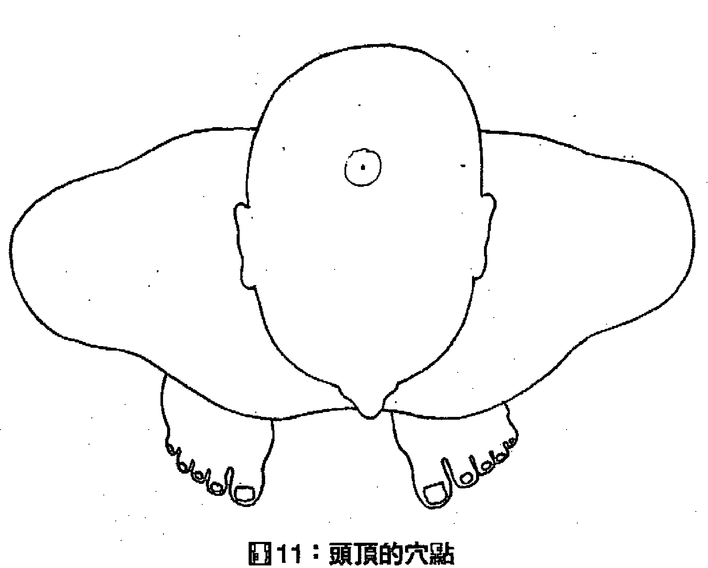

業力包袱所創造出的依存，會以三種方式影響女性的精微能量場及心智：限制女性與氣的連結、創造出不為女性心智所需的局限模式（人格議題），及促使女性依附於童年或前世未處理完結的對象及關係議題。

心智層面投射在大多數情況下會造成依存，對他人的依存以能量索方式呈現，能量索類似細長管狀，整條管狀直徑一致。當人們變得與自身能量場上的業力包袱相依存，然後將業力包袱以能量索方式投射出去時，即可阻滯被投射對象的能量場。這就是依存的發展機制，只要加害者還對其目標抱持虛假幻象，認為有他想要的事物，依存就此被創造出來。

能量索的另一特質為，即使加害者或目標過世，能量索仍不會消失。這意味著妳可能依存於前世認識的某人，大多數情況是累世依存於某個前世情人。若其將能量索投射進妳的能量場，這種連結將干擾妳與今生所愛之人共享女性能量的宇宙性特質。

重點是，前世情人也像妳一樣，是跨次元的存有。即使他們過世，其投射出的業力包袱及能量索也不會消失。一段時日後，它們也會隨轉世過程進入新的軀體。這意味著，妳可以累世持續依存於某個前世情人，這種依存也創造出妳對前世情人某項或某幾項最顯著特質的渴望。

### ◎蕾娜的故事

當然，若情人已過世，妳自然無法找到對方。就算他們已經轉世，也可能是在彼此不適配的年紀或遠在世界遙遠的另一端。即使找到，若彼此進化方向不同，可能妳也不再想要這個愛人了。凡是持續依存於某前世情人和他們的某項特質，都會毀壞妳能量場的功能，並阻礙妳整合心智三元素，創造完整體驗。

幸運的是，即使妳不記得前世情人，妳也可以透過切斷聯繫彼此的能量索來克服依存。

也許妳會懷疑，要如何克服對已逝者或根本沒有印象人士之依存。這是可能的，妳不必知道對方的名字或模樣，甚至不需知道彼此在前世關係如何。唯一要做的是，將妳不斷渴求的特質或毀損妳與所愛共享氣之能力的特質，隔離出來。如此，就能將前世情人投射進妳的能量場的能量索，隔離出來。當能量索被隔離出來，就能運用合適的心智功能，切斷依附於妳的能量連結。

蕾娜的故事顯示了能量索所造成的前世情人依存，如何干擾了女性的生活及關係。

蕾娜，一位來自德國漢堡的二十一歲女性，在第一次的療程中，向我們提到，她最近遇到一個完全符合她所愛類型的男性。事實上，他們之間的吸引力強烈到第一次約會就決定和他發生關係。

他們的約會始於在漢堡最好的餐廳共進晚餐。晚餐後，蕾娜和朋友到她的公寓，一起喝了點酒，然後開始愛撫對方。即使過程符合蕾娜浪漫的想像，她卻無法放鬆，肌肉持續緊繃，知道自己的身體語言透露出矛盾的訊號，但她仍設法在當晚繼續這段關係，性交過程並不舒服，她仍勉強自己。

蕾娜敘述完這段經驗後，接著說她其實從未達到高潮也無法與男性共享性愛。療程即將結束時，

在下一個療程裡，我們協助她釋放能量索，蕾娜立即感到煥然一新，身心舒暢。我們向她解釋，由於第二脈輪受阻，她的精微能量系統無法順暢配送氣。沒有足夠的氣，她就無法與男性共享令人滿意的性愛體驗。

——第二脈輪。

我們檢視她的能量場，發現有條能量索讓蕾娜依附於某位前世情人。這條能量索位於最麻煩的位置之

### 切断前世连结

要释放妳与前世情人间的能量索，首先选出一种渴望的感受或某种阻碍，这种感受或阻碍，持续干扰妳与他人共享女性的宇宙性特质。选好之后，以舒服的姿势安顿好自己，背部打直，闭上双眼，鼻吸鼻呼，深呼吸一到三分钟，从五倒数到一，再从十倒数到一。运用标准法门让肌肉放松，并安住在真实心智中。然后宣告：「我要在面前创造一面一点五公尺的萤幕。」当萤幕浮现，开始持续持

至乐幸福手印。然后宣告：「我要觉察那条能量索，它造成我所选择释放的（在此填入感受或阻碍）。」花几分钟观察能量索。能量索呈现细长状态，从你的能量场延伸至加害者的能量场中。

个气团中注入幸福并释放能量索、能量索来源及其延伸部分。」

释放能量索后，妳会感受到能量场的变化。压力会消失，气会更自由的流动。妳能更轻易让自己

保持安住真实心智中的状态。像蕾娜一样，妳可能会感到焕然一新，身心舒畅，也会有更多的舒适的感觉自能量场出现。

一旦妳释放了能量索，让气团及视觉萤幕消失，然后松开至乐幸福手印，再花十分钟享受这练习

的效果。十分钟后，由一数到五然后睁开双眼。妳会感到非常清醒，全然放松，感觉比之前更好。和释放前世相连的能量索一样，相同的技巧也可被运用来释放妳今生中与他人间相牵连的能量索。当妳需要时可做此练习。

### 總結

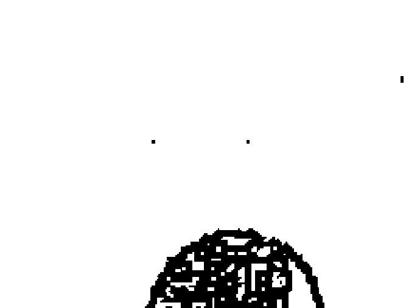

在本章中，妳學到女性心智由三部分組成，每一部分有其獨特的能力及需求。妳也做了各種練習，它們分別被設計來克服憂鬱、提升與地球間的連結、遠離多重任務處理的高度干擾，並釋放與前世情人間的依存。

下一章妳會學到被動—侵略性模式，如何阻礙妳以健康方式顯現自身力量。然後透過擁護中庸之道，釋放持續毀壞妳生命和關係的被動—侵略性模式，來提升自己的力量。

## 第十章

## 提升女性力量

在早期世代，透過教化過程及不對等期望、機會、獎勵及懲處，男女雙方被灌輸了男性天生比女性更有力量的信念。直至現今，這種不平衡仍普遍存在於多數社會及制度中。

這種不平衡並不只因暴力、法律歧視或社會壓力而增強。在許多社會中，男性和女性一樣飽受壓迫，被強迫接受社會的核心價值觀。這些社會為了達成目的，根據性別（性別角色）制訂了人類性格清單，期待男性及女性毫無疑問的接受，並將這些特質融入自己的生活中。

這些社會通常要求女性應該關懷他人、溫柔、接受度高、有耐心、貞潔、富吸引力及感覺豐富等等。這些特質對女性來說是自然的，對男性來說也是。不過，直至最近，歐洲、中東及北美社會仍舊要求女性接受上述特質，作為她們的核心價值。而男性，特別是當權男性，則可以任意拒絕上述特質，接受另一套他們被教導要奉行為男性主臬的價值，那些價值包括競爭、果斷、野心、理性、堅毅及侵略性等。

若有人不接受被分派的特質，通常會遭受嘲諷、拒絕、指控，或者更糟的受到暴力對待。局限的信念及童年的早期制約，也會一併削弱人們自然表達自身力量的能力。由於核心價值的改變速度十分緩慢，因此，許多人及制度仍固守著那些讓女性難以接受的女性能量以及成就它們的潛能。

### ● 中庸之道 ●

本章將解釋，對於那些時值二十一世紀、仍被加諸於女性身上的性別特質，妳還有另一種選擇。
這個選擇是中庸之道：一種平衡的生活，包含同理心及自在表達自我及女性宇宙性特質的力量。
擁護中庸之道。女性可以在工作中或任何生產活動中，如同男性一樣表現，甚至表現得更好。因為她會擁有足夠的力量或能量，來支持她前進並確保結果成功。擁護中庸之道，女性將可達成自己的目標而不受過往包袱拖累。

### 關於給予力量的負面神話

開始探討中庸之道前，請先記得，男性認為理所當然的力量及自在表達力量的自由，對於女性來說，並不總是輕易可得。事實上，關於女性的負面神話故事，在在提醒著我們，過往女性要擁抱她們的女性能量及誠實表達自我，是如此艱難。

古希臘，現代西方世界文明的誕生處，充滿許多關於有力量女性的負面神話。像是透過凝視可讓男人石化的美杜莎、希臘萊斯博斯（Lesbos）島的女性、發動對抗男性戰爭的亞馬遜女戰士

（Amazons），都是即刻浮上人們心頭的典型。另外還有瑟絲（Circe），善於引誘男性並剝奪他們的男性能力，以及塞倫（Sirens），她的歌聲能讓最有力量的男人也為之瘋狂。當然，不只希臘對有力量的女性抱持敵意。早期的不列顛人也視有力量女性為威脅。亞瑟王的姊妹摩根（Morgan），就是讓人聯想到的例子。摩根是個有力量的女性，但對那些囿於中世紀思維的男性來說，將她視為狡詐、對權力虎視眈眈的女巫，要比視為有力量且散發光采的女性容易得多。在現代社會中，充滿力量並散發光采的女性，也許不會被拿來與石化男人的美杜莎或先迷惑男人再剝奪他們力量的摩根相比較，但她可能在嘗試宣告自己力量時，受到強力批判。若女性是有力量的並試圖在男性世界中取得成功，她很可能要冒著被貼上標籤的風險，這些標籤像是難搞、狡詐、易怒或更糟的字眼等。雖然這些帶著貶抑意味的神話和形容詞，仍被用來貶損有力量的女性，並削弱她們追求當權位置的想望。但這些貶抑神話及形容詞的描述並不真實，反而加深男性對於自由女性及她們天生力量的不合理恐懼。無疑的，這些神話仍具備其影響力，它們打擊許多年輕女性的志向抱負，而支持被動侵略性的人

### 長舌鉤

中古時代，女性幾乎無法以健康的方式宣告自身力量，若女性因為對丈夫喋喋不休，或是試圖以被動的侵略行為影響丈夫等罪名被起訴並判有罪，她們可能就會被強迫戴上長舌鉤。

長舌鉤是一種由金屬和皮革組成的裝置，放置在嘴中並在後方固定。這種裝置帶有尖刺或鋒利邊緣的壓舌器。放進女性嘴裡之後，她一說話就會疼痛。這裝置用來羞辱因喋喋不休而被男性議會判定有罪的女性。有時，長舌鉤還會在前端附上一條鏈子，便於牽著受刑者遊街示眾或將她綁在柱上。

長舌鉤在歐洲被廣泛使用，甚至在十七世紀的美洲也有人使用。在有些判例中，只因丈夫指控妻子喋喋不休，妻子就得戴上這種刑具。不同意丈夫意見的女性、散布流言或輕微冒犯他人被判有罪的女性，都可能被強迫戴上長舌鉤。

### 被動——侵略性行為

支持僵化性別角色的核心價值觀，仍在媒體、教育及許多家庭所抱持的態度中出現。想當然耳，許多人士仍然繼續擁護被動——侵略性行為。

### 誘惑

許多被動—侵略性遊戲，仍為現代女性所參與。以下列出了最普遍的三種，妳也許可以從自身或親友經驗中察覺到至少一種。

誘惑能以性遊戲或操弄形式來呈現。不幸的是，在許多社會中女性所受的教育，是運用誘惑從男性那得到自己想要的事物，視此為理所當然。即使時至今日，在許多社會中，女性透過誘惑方式來操弄男性，將難以和通常源自精微能量場的力量連結。

### 喋喋不休

受挫的女性，或在孩提時代學會向雙親喋喋不休的女性，通常會對伴侶或家中其他男性繼續這樣模式，以得到她們想要的。喋喋不休是無力感的極端表達方式，任何習於此種模式的女性，會因缺乏自尊而受苦，因為她無法自由表達自我的真實力量。

### 內疚幻象

有些感到自己缺乏力量的女性，會運用男性的弱點或男性顯露的負面性格，讓他感到內疚。內疚

幻象的危險在於，它會毀損親密感並創造出一種不良環境，必然摧毀親密伴侶間的必要信任與愛。

### ★ 克服被动——侵略性模式

若覺得十分擅長運用被動——侵略性模式得到自己所要的，可以做接下來兩個練習。第一個練習是原型跳躍，第二個則是督脈練習。

在原型跳躍練習中，妳將以能夠提升我們力量、創造力及內在光采的肯定生命原型，取代已被整合進人格中的被動——侵略性模式。在督脈練習中，妳可以透過增強流經督脈的氣流，來增進自己的力量。

### 原型跳躍

要開始進行原型跳躍，首先選擇一項妳擅長但想要釋放的被動——侵略性模式。然後以一項肯定生命的原型來取代它（肯定生命原型的清單可參見第五章）。選好模式和原型後，將它們放在心中，接下來，以一個舒服的姿勢安頓好自己，背部打直，閉上雙眼，鼻吸鼻呼，深呼吸一到三分鐘，從五倒數到一，再從十倒數到一。運用標準法門讓肌肉放鬆，並安住在真實心智中。然後宣告：「我要在面前創造一面一點五公尺的螢幕。」當螢幕浮現，宣告：「我要觀想自己在螢幕上，處於我想釋放的被動—侵略性模式中。我在胸前舉著一塊清楚標明這模式的告示牌。舉例來說，若妳選擇喋喋不休作為想釋放的被動—侵略性模式，那麼螢幕上的形象應持寫著「喋喋不休的女人」的告示牌。接著在螢幕上的自我形象外框一個黑圈，再立即用紅色在黑圈上疊上紅圈，把原來的黑圈用紅圈覆蓋。覆蓋黑圈的同時，宣告：「我要放心中所想的被動—侵略性模式，以及所有支持這模式的相關特質。」且被動—侵略性模式被釋放，就用所選的肯定生命原型取代它。宣告：「我要以（填入原型名稱）的原型取代剛剛釋放的被動—侵略性模式。」集中中心力在這新形象上，維持十分鐘，感受所有與原型相關的肯定生命特質，在自己的能量場及身體中生根。十分鐘後，釋放掉影像及螢幕，然後由一數到五結束此冥想。當妳需要時可做此練習。

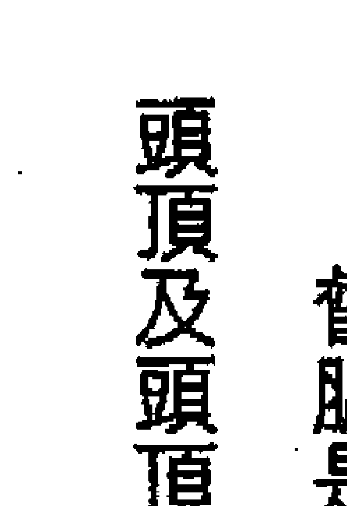

### 督脈

督脈是人類能量系統中最重要的陽性經脈，它起自脊椎底部的會陰，並沿著脊椎往上延伸至位於頭頂及頭頂上方的第七脈輪，七個脈輪的陽性部分皆與它相連。

練習督脈冥想，有兩個步驟會讓你更有力量。透過提升背部氣流，增加你能獲得的肯定能量。透過平衡身體背面往上的陽性氣流及身體正面往下的陰性氣流，提升你的自信心。

### 督脈冥想（見圖12）

要開始督脈冥想，首先以一個舒服的姿勢安頓好自己，背部打直。閉上雙眼，鼻吸鼻呼，深呼吸二到三分鐘。從五倒數到一，再從十倒數到一。運用標準法門讓肌肉放鬆，並安住在真實心智中。然後宣告：「我要啟動第一脈輪後部。」想進一步啟動第一脈輪後部，將心智注意力放在脈輪上，並用脈輪呼吸。當第一脈輪後部開始振動或是發亮，慢慢再將心智注意力及呼吸，從第一脈輪後部沿著督脈移往第二脈輪後部，到達第二脈輪後部時，宣告：「我要啟動第二脈輪後部。」享受第二脈輪後部的振動或光采幾分鐘，然後繼續用這樣的方式，沿著督脈往上，啟動所有傳統七脈輪的後部。啟動傳統七脈輪後部之後，宣告：「我要在傳統七脈輪的層面上，讓自己安住在脈輪場中。」花十五分鐘享受這個過程。然後由一數到五，結束此冥想，數到五時，睜開雙眼。當你需要時可做此練習。

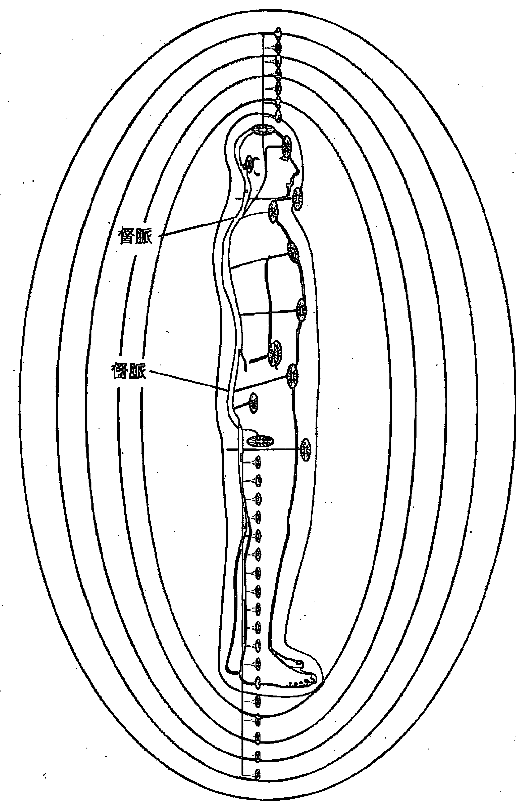

### 圖12：督脈

透過啟動傳統七脈輪後部，沿著督脈提升氣流，妳可以增進個人力量。這也有助於如實表達真實的自己，而非別人期望妳成為的樣子。

另一種可以增進妳個人力量，並在這世界向前進、有所進展的方式，就是增加流經手部及腳部的小型能量中心的氣流。妳已在第三章學到如何啟動小型能量中心，在接下來的兩個練習中，妳會進一步啟動手部及腳部的小型能量中心，增加流經支持這些中心的主要經脈之氣流。要達成以上目標，首先要詳細了解經脈系統，以及如何運用這系統來讓自己更有力量。

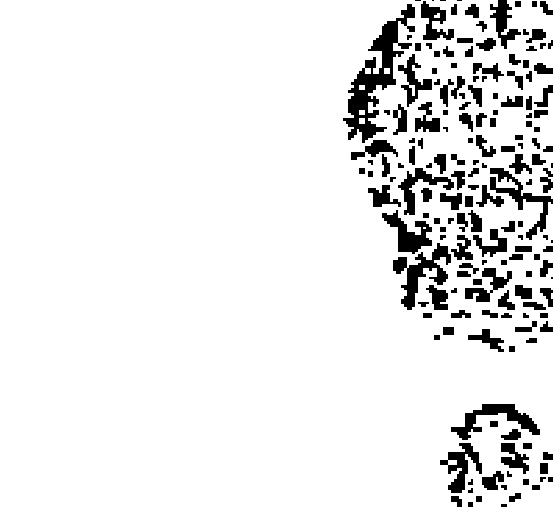

### 小型能量中心

如妳在第三章所學到的，經脈像是氣的通道，有兩個主要功能；將脈輪與散佈能量系統裡的小型能量中心相互連結，並將氣運送到人類能量場最需要的地方。雖然人體中有數百條重要的經脈，中國及印第安文化的古代文獻認為，人體的主要經脈有十條；其中兩條直接連結手部的小型能量中心，兩條直接連結腳部的小型能量中心。陽脈將氣帶離身體中心，陰脈將氣帶往身體中心。

### 阳维脉

阳维两脉是阳性手臂通道。双臂皆有，它们绕过双手中指，将肩膀及掌心的小型能量中心予以连结。

### 阴维脉

阴维两脉是两条手臂通道。双臂皆有，它们将掌心的小型能量中心及胸部予以连结。阴维脉自双臂内侧延伸，和阳维脉并行，构成掌心的小型能量中心。

### 阳跷脉

阳跷两脉从双脚脚跟中心出发，沿着双脚脚踝及双腿外侧延伸，与会阴底部的其他经脉连结。

### 阴跷脉

阴跷两脉从双脚脚跟的中心出发，沿着双脚脚踝及双腿内侧延伸，与会阴底部的其他经脉连结。相对于阳跷脉，它们是阴性的，因此被称为负极腿部通道。阴跷脉和阳跷脉并行，构成脚部的小型能量中心。

## # 陰維——陽維冥想

在接下來的練習中，妳會啟動陽維、陰維、陽蹻、陰蹻這些經脈和手腳部的小型能量中心。透過啟動這些器官，妳能讓自己更有力量去顯化天賦並增益工作與關係，也更有力量在世上向前邁進並有所進展。陰維——陽維冥想是設計來提升在雙掌經脈匯集的迴圈中流動的氣流量，先從身體右側開始，然後左側。要開始陰維——陽維冥想，首先以一個舒服的姿勢安頓好自己，背部打直。閉上雙眼，鼻吸鼻呼，深呼吸二到三分鐘，從五倒數到一，再從十倒數到一。運用標準法門讓肌肉放鬆，並安住在真實心智中。然後宣告：「我要啟動我的心輪。」繼續宣告：「我要安住在心輪場中。」安住在心輪場後，宣告：「我要將心智注意力投射在身體右側陽維脈的上端。」若沒有什麼阻礙，當妳把注意力放在陽維脈，流經此脈的氣會帶著它沿脈沉降到位於右掌心的終點。到達陽維脈終點後，將注意力朝手掌垂直移動約一點五公分，到達陰維脈的起點（位於右掌）。若沒有什麼阻礙，當心智注意力找到此脈，它會被帶往手臂內側（由沿脈流動的氣流來帶領），然後抵達胸部右側的終點。

兩脈回圈繞行完畢後，放掉心智注意力，享受增強的氣流流經陽維陰維兩脈及掌心的能量中心。當妳準備好進行這練習的第一部分時，宣告：「我要將注意力投射在身體左側陽維脈的起點。」若沒有什麼阻礙，當妳將心智注意力集中在陽維脈的起點，流經此脈的氣會帶著它沿脈沉降到位於左掌心的終點。到達陽維脈終點後，將注意力朝手掌垂直往下移動約一點五公分，並與拇指成四十五度角的位置，來到陰維脈起點。讓氣沿脈流動並帶領你的心智注意力抵達胸部終點，然後放掉注意力。安靜十五分鐘，享受能量的流動。然後從一數到五，回歸到平時的意識狀態。數到五時，睜開雙眼，你會感到非常清醒，全然放鬆，感覺比之前更好。每天做此練習，只要五天，妳就會體會到自己的動力及在世上顯化女性力量的能力顯著提升。在陰蹺—陽蹺冥想中，匯集在雙腳的經脈回圈，其氣流會被提升。身體右側先開始，再來是左側。當雙腳經脈回圈的氣流增加，小型能量中心會更加活躍，你會更有力地向前邁進並有所進展。

### 陰蹺—陽蹺冥想

要開始陰蹺—陽蹺冥想，首先以一個舒服的姿勢安頓自己，背部打直。閉上雙眼，鼻吸鼻呼，深呼吸一到三分鐘。從五倒數到一，再從十倒數到一。運用標準法門讓肌肉放鬆，並安住在真實心智中。然後宣告：「我要啟動心輪。」下一步再宣告：「我要安住在心輪場中。」安住在心輪場後，宣告：「我要將注意力投射在身體右側陽蹻脈的上端。」心智注意力集中在陽蹻脈起點後，流經此脈的氣，會帶著它沿脈沉降到位於右腳跟的陽蹻脈終點。到達陽蹻脈終點後，將注意力朝腳跟後方及內側垂直移動約一點五公分，到達陰蹻脈起點（位於右腳跟）。若沒有什麼阻礙，當你的心智注意力找到陰蹻脈，它會被帶往腳踝與大腿內側，抵達大腿內側，脊椎底部下方四公分的位置。回圈繞行完畢後，放掉心智注意力，持續安住在心輪場中，享受增強氣流流經陽蹻陰蹻兩脈及腳跟的能量中心。

準備好繼續進行練習時，宣告：「我要將注意力投射在身體左側陽蹻脈的起點。」若沒有什麼阻礙，當你將心智注意力放在陽蹻脈，流經此脈的氣，會帶著它沿脈沉降到位於左腳跟的陽蹻脈終點。當你的心智注意力找到此脈，它會被帶往腳踝與大腿內側，抵達大腿內側，脊椎底部下方四公分的位置。回圈繞行完畢後，放掉你的心智注意力。

安靜十五分鐘，享受這個練習的效果，然後從一數到五，數到五時，睜開雙眼，妳會感到非常清醒，全然放鬆，感覺比之前更好。每天做此練習，只要五天，妳就會體會到自己的動力及在世上成就事物的能力顯著提升。

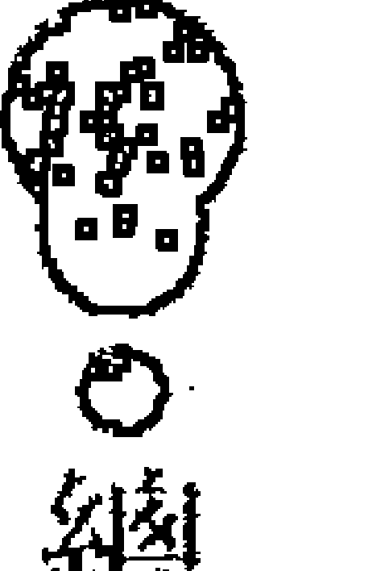

### 總結

本章開頭，妳了解到被動—侵略性模式如何毀損妳的力量，然後學會如何以原型跳躍及督脈冥想來克服被動—侵略性模式。接著，妳學到了陽維—陰維及陽蹻—陰蹻的冥想練習。若持續練習這兩個冥想，妳將能展現更多自身的力量，並在工作和關係中進展神速。下一章中，透過提升接收能力及顯化創意想法，妳將提升自己的創造力。

## 第六章 提升創造力

雖然人人天生都有創造力，卻少有人能精確解釋創造力是什麼，以及如何在物質世界完整顯化創造力。我們直覺上知道，祖母為孫兒織毛衣，或女性建立嶄新網路的商業模式，都是創造性的活動。撰寫商業企劃書可以和創作交響樂一樣具備創造性。

創造力和天賦沒有太大關係。雖然不是每個人都在某特殊領域——如音樂或數理方面——具備天賦，但每個人都有許多潛藏創造力的資源。

在接下來的內容中，我們會提供妳提升創造力的練習，好讓創造力在任何環境中都能綻放光芒。

顯化是一種將妳的概念在物質世界具體表現的能力，也是創造過程的第一部分。顯化需要妳回復自己的內在聲音。

儘管女性的內在聲音是創造過程中的最重要元素，但除非女性與支持創造力的意識進行連結，否則不會有什麼具創造力的事物出現。為了幫助妳與自己所需的一切意識連結，我們提供了普魯夏場冥想（Purusha Field Meditation）。在此冥想中，妳將安住意識的原始場域——普魯夏場中。

普魯夏場是一個資源場，與女性性能量場的原始場普拉克提能量場（the field of prakriti）在宇宙演化的第四階段中，一同生成。練習普魯夏場冥想，妳可以與意識源頭連結，也能避免許多在演化過程中陸續入侵的各種意識場扭曲能量。

### 普魯夏場冥想

#### 提升創造力的法則

要開始普魯夏場冥想，首先以一個舒服的姿勢安頓好自己，背部打直，閉上雙眼，鼻吸鼻呼，深呼吸二到三分鐘。從五倒數到一，再從十倒數到一，運用標準法門讓肌肉放鬆，並安住在真實心智中，然後宣告：「我要安住在普魯夏場之中。」下一步，宣告：「我要讓我的普魯夏場充滿氣。」安靜幾分鐘，享受能量流動。然後宣告：「我要在普魯夏場的層面上，向內觀照感官。」

規律的進行普魯夏場練習，妳會迅速回復支持妳創造過程所需的意識。

花十五分鐘享受這冥想的效果，十五分鐘後，由一數到五，數到五時，睜開雙眼，妳會感到非常清醒，全然放鬆，感覺比之前更好。

顯化始於女性內在聲音湧現之時。不幸的是，許多女性變得深陷泥沼，處處仰賴他人意見——像是父母、朋友、上司等等，因而鮮少體驗自己的內在聲音。其他女性則受到童年早期制約，認為不要信任自己的內在聲音，要以權威人士意見及信念為重。此外，大眾傳播媒體的內容也常讓女性受挫，

### 女性的過渡儀式

那些進入青春期的年輕女性尤其受其影響，無法相信自己的內在聲音，也無法在世間顯化創造力。不僅如此，社會缺乏健全的女性原型，許多女性無法全然自主。因此，許多女性難以感受自己和體驗內在的聲音，也不令人驚訝了。

母系社會中，年輕女性的自發性、內在聲音完整呈現及創造力，都在青春期開始展現。母系社会為年轻女性舉行慶祝的過渡儀式。但在現代社會中，卻沒有一個清楚界定女性由年輕時期過渡到成年時期的儀式。在童年時期，年輕女性的內在聲音很可能被心理及自發性都尚未發展完全的父母干擾。過度保護的父母，其自發性尚未發展完整，他們會干擾自己的女兒發展有力的肯定生命的身分認同，因而阻礙她認同。若沒有強韌的肯定生命的身分認同，年輕女性會缺乏宣告自我內在聲音所需的獨立性、自尊及堅毅。

### 茱莉的故事

發展隻身探索世界所需的內在資源。所幸，不論女性個人過往的歷史為何，她都能回復自己的內在聲音，因為每位女性都可以透過自己的能量場，連結所需的意識和能量，來克服任何限制她在世上發揮創造力和顯化能力的阻礙。

茱莉的故事，顯示了一位年輕女性，如何因占有欲過強的母親而失去與自己內在聲音的連結。

茱莉在二十七歲時來尋求我們協助，由於她在二〇〇八年畢業於海德堡大學，因此那時她住在德國黑森林附近的弗萊堡。

茱莉在一個單親家庭長大，和過度潔癖的母親住在一起。母親古卓的強烈控制欲也在其他方面顯現。當茱莉說話太大聲或舉止粗魯時，古卓就容易感到壓力。

茱莉長大後，變得退縮且事事仰賴母親核准。她不願違背母親，甚至不願表達自己的感覺和情緒。不久之後，恐懼開始主導她的生活。坦白的說，她變得和母親一樣。因此，茱莉無法發展獨立的身份認同或和同儕建立良好關係。

顯而易見，由於母親從未發展出自己的身份認同，因此她將自己的能量投注在女兒身上，讓女兒來代替她生活。茱莉高中畢業後，依照母親建議，成為律師，一種不用和人有太多接觸或發揮創造力的專業領域。但是，當茱莉開始和一位來自柏林的電影製作人約會時，開始出現意料之外的問題。

在親密互動中，彼得發現茱莉是如此依賴母親，因此無法連結自己的內在聲音。他鼓勵她脫離母親的控制並尋求外界協助，這也是茱莉來到我們這兒的原因。

我們隨即發現，茱莉的自我領域概念很弱，她的能量場中充滿了母親的精微能量投射。我們的結論是，茱莉的母親已干擾了女兒的個人意志、渴望及耐力，這意味著，母親把自己業力包袱的扭曲能量投射進茱莉的核心場中。

我們的首要目標，是幫助茱莉建立獨立的身份認同。我們教她療癒自己的心智層面，並安住在合適的資源場中。幾個月內，茱莉開始能再次感受到自己，接著我們提供她一系列的課題練習，以回復她的內在聲音。

茱莉進步神速，妳也可以。若妳失去與內在聲音的連結，那麼幫助過茱莉的系列課題練習，同樣也能使妳回復內在聲音。

### 第一個課題

為了重新與內在聲音連結，第一個課題就是放掉從母親或父親處承接而來的內在戲碼。這種劇碼和支持它的業力包袱，會毀損女性的內在聲音及創造力，因為它會讓妳內化那些貶損女性的宇宙性特質的價值，也會阻撓妳形成強健穩定的身分認同，而強健穩定的身分認同，對女性自在表達創造力極其重要。

想完成第一個課題，請先練習無限自由冥想。

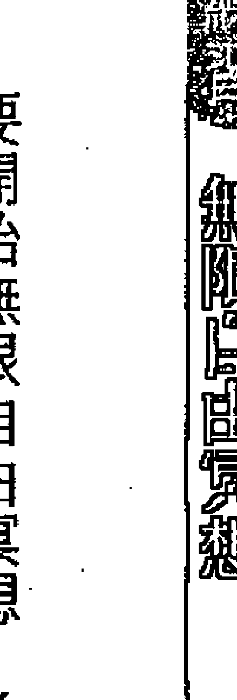

要開始無限自由冥想，首先以一個舒服的姿勢安頓好自己，背部打直，閉上雙眼，鼻吸鼻呼，深呼吸二到三分鐘，從五倒數到一，再從十倒數到一。運用標準法門讓肌肉放鬆，並安住在真實心智中。在面前創造一面一點五公尺的螢幕。當螢幕浮現，用手指在螢幕上畫一個水平的無限符號，畫好符號後，宣告：「我要觀想我的母親在符號左半部裡面。」繼續宣告：「我要觀想自己在符號右半部裡面。」然後宣告：「我要切斷母親的所有依存，它們干擾我與內在聲音連結。」接下來，觀想自己的慣用手中持了一把劍，右撇子用右手持劍，左撇子用左手持劍。堅定快速的把劍揮向符號中央最窄的交會處，將符號一分為二。然後釋放掉無限符號、自己與母親的形象。接著再釋放掉螢幕。安靜十分鐘，享受能量的流動。十分鐘後，從一數到五，回歸到平時的意識狀態，數到五時，睜開雙眼。

### 第一個課題

對於想回復內在聲音的女性來說，第一個課題是在能量場中創造更多空間，讓自己的真實情緒得以表達。

第一脈輪供給表達真實情緒所需的氣。若無這股能量，情緒將無法自由浮現。第二至第六脈輪，以及周遭環繞的氣場，則管控人類四種真實情緒：憤怒、恐懼、痛苦及喜悅。

雖然所有情緒貌似十分相同，事實上只有四種真實情緒。

有三個元素可用來解釋真實情緒的特性：它們由宇宙性特質能量組成。當我們和某人的關係毀損時，它們由能量系統產出再經由脈輪發送出來。它們能透過尖叫、吼叫、哭泣甚至是五官表情變化來釋放其能量。

相較於四種真實情緒，還有許多來自業力包袱及外在投射的非真實情緒。

有兩個元素可用來解釋非真實情緒的特性：它們的個別特質能量（業力包袱及外在投射）組成，它們無法透過尖叫、吼叫、哭泣甚至是五官表情變化，來釋放其能量。要注意的是，即使是非真實情緒，連結，也不代表我們感覺不到它。

表達真實情緒所需的時間，提供妳將創意在世間成功顯化所需的空間。空間與妳的氣場與氣場內含的能量品質息息相關。

氣場是氣聚集的廣大場域，在每次元中填滿及環繞妳的精微能量場。在每次元中，從身體表面開始，氣場向外延伸（朝所有方向）約六公分至八公尺，可參照前面章節的圖7。

結構上來說，氣場是一個內裡中空的空間，有層薄薄的界線包圍著這空間，並讓它呈現蛋形。

功能上來說，氣場是氣的儲藏庫，也是分隔內在與外在環境的界線。

為了回復妳的內在聲音，妳在各次元的氣場需強健、穩固，不受業力包袱的過度累積所干擾。

妳的第二課題是，將環繞第一至第六脈輪的氣場充滿氣，好讓妳有更多空間與時間，自在表達妳的情緒。

### 練習 將氣場充滿氣

要讓妳的氣場充滿氣，首先以一個舒服的姿勢安頓好自己，背部打直，閉上雙眼，鼻吸鼻呼，深呼吸二到三分鐘。從五倒數到一，再從十倒數到一，運用標準法門讓肌肉放鬆，並安住在真實心智中，然後宣告：「我要安住在普拉克里提能量場之中。」下一步，妳要將氣充滿第一至第六脈輪。宣告：「我要讓環繞我第一至第六脈輪的氣場充滿氣。」之後不用做任何事——只要安靜十五分鐘，好好享受這過程。十五分鐘後，從一數到五，數到五時，睜開雙眼，結束這個練習。當妳需要時可做此練習。

### 第三個課題

妳的第三個課題是提升自己的感受性。要達到此目標，必須提高感官敏感度。妳可能沒有意識到，自己是透過感官——視覺、聽覺、味覺、觸覺和嗅覺來感知世上的事物。這些感官，是由我們能量場的器官所管控，特別是脈輪。無疑的，若我們啟動了合適的脈輪，就能增強自己的感覺功能，提升感受性並解放內在聲音。

在接下來的練習中，我們會運用身體空間的脈輪及其對應的身體空間下方脈輪，來增強自己的觸覺、味覺、嗅覺、視覺與聽覺。繼續進行前，我們先檢視個人空間下方的前六個脈輪，因為它們和傳統的七脈輪一樣，對我們的感官及感知世上事物的能力至關重要。我們身體空間下方的脈輪序列，始於脊椎底部第一脈輪下方。身體空間下方的第一脈輪在會陰下方約六公分之處，其餘的脈輪向下延伸約六公尺（參見圖7）。研讀圖7，妳會發現在個人身體空間下方的脈輪，除了長度大概短百分之四十之外，其他部分皆和身體空間內的脈輪一樣。接下來的練習，妳會透過啟動適當的身體空間脈輪，及其對應的身體空間下方脈輪，來增強感官功能。啟動適當脈輪後，妳將在這兩個已啟動脈輪所控管的次元上，讓自己安住在這兩個脈輪場中。為增強妳的觸覺，妳要啟動第三脈輪及身體空間下方的第三脈輪，然後安住在這兩個脈輪場中。為增強妳的嗅覺及味覺，妳要啟動第五脈輪及身體空間下方的第五脈輪，然後安住在這兩個脈輪場中。為增強妳的視覺和聽覺，妳要啟動第六脈輪及身體空間下方的第六脈輪，然後安住在這兩個脈輪場中。妳會進行增強觸覺的練習。然後，運用相同的技巧，啟動合適的身體空間脈輪及其對應的身體空間下方脈輪，來增強感官功能。

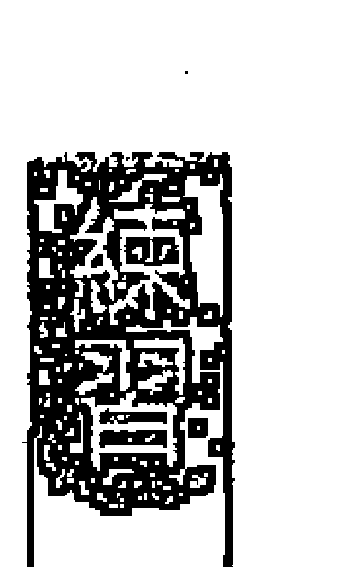

### 第三個脈輪場中

要增強觸覺，首先以一個舒服的姿勢安頓好自己，背部打直。閉上雙眼，鼻吸鼻呼，深呼吸一到三分鐘。從五倒數到一，再從十倒數到一，運用標準法門讓肌肉放鬆，並安住在真實心智中。然後宣告：「我要啟動我的第三脈輪。」繼續宣告：「我要啟動身體下方空間的第三脈輪。」安靜幾分鐘，享受能量流動。再宣告：「我要安住在第三脈輪場中。」下一步，宣告：「我要安住在身體空間下方的第三脈輪場中。」

> 「我要安住在第三脈輪場中。」

安靜十五分鐘，好好享受這過程。十五分鐘後，從一數到五，數到五時，睜開雙眼，結束這個冥想。

### 第四個課題：回復你的內在聲音

現在，你已經做好所有相關的準備，可以開始運用內在聲音手印來找回自己的內在聲音。要開始練習內在聲音手印（見圖13），首先以一個舒服的姿勢安頓好自己，背部打直，閉上雙眼，鼻吸鼻呼，深呼吸一到三分鐘，從五倒數到一，再從十倒數到一，運用標準法門讓肌肉放鬆，並安住在真實心智中，接著將舌頭輕輕頂住上顎，往上顎後端稍微移動，最後停留在上顎後端較柔軟的位置。雙手小指指尖相觸，形成一個三角形，然後將雙手無名指朝掌內彎曲，第二節指節指背相觸。接著將雙手中指指尖互觸，形成第二個三角形。再將雙手食指朝掌內彎曲，第二指節指背相觸，最後將雙手大拇指交叉，雙手拇指指尖置於另一手食指第二指節間。持這個手印十分鐘，享受能量轉化的過程。妳的內在聲音會升起，創造力之泉也會再次自由流動。十分鐘後，鬆開手印，從一數到五結束這個練習。透過上述四個課題的練習，只要短短兩週，妳就能回復自己的內在聲音，再次在世間展現創造力。只要妳需要皆可重複此練習。

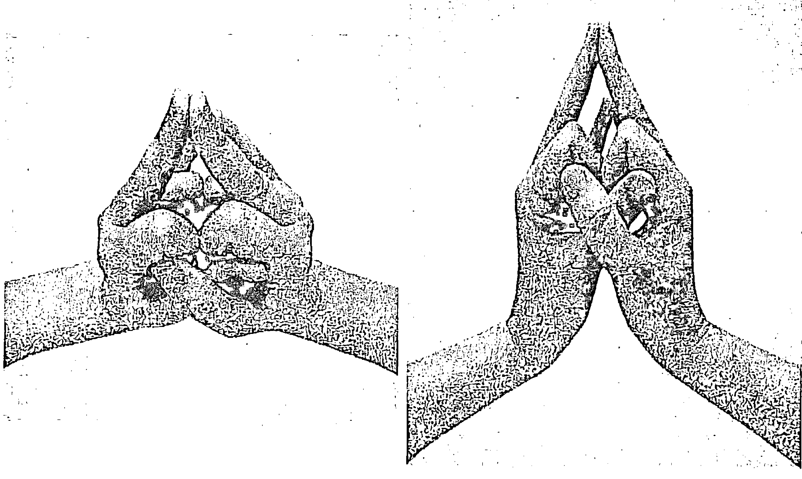

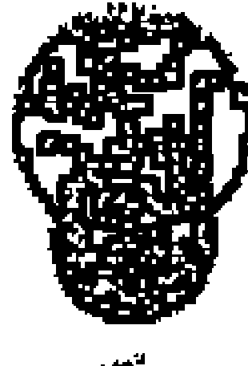

### 總結

本章妳學會了以普魯夏場冥想及回復內在聲音來提升創造力。在下一章中，妳將學到如何增加自己的內在美，不論正處於何種年紀，讓內在美轉化妳的樣貌及別人看待妳的方式。在此彙括了一些訣竅，像是如何運用食物、運動、自然環境、負離子及美好事物，來提升妳的內在美與光采。我們特別著重良好性格及其對女性光采的影響力。為了在必要時提升良好性格，當中設計了一系列的簡單練習。

# 提交結果

## 內在美

內在美是一種光采形式，從女性能量場的深處產生。它能改變女性對自己的感覺，也能改變他人對她的感覺。在本章中，我們試圖消除那些勾起女性不安全感的無用之物，並了解內在美的基本真相——何者為是，何者為非。然後我們會探討女性如何增進自己的內在美，不論她處於何種年齡。因為，這不僅會改變她的樣貌，也會改變他人看待她的方式。

在絕大多數人心中，美麗只和女性的體態有關。不過，也有些人已經發現，美麗在於人們對自己的感覺為何。一個具備完美容貌和年輕健美軀體的女性，若對自己感覺不好、沮喪、壓力、筋疲力竭、缺乏自尊或個性、內心衝突，以及無法自在散發自我能量，那麼，就算擁有一切外在美的資產，她也不會覺得自己美麗，別人也不會覺得她美麗。

另一方面，良好性格、健康身體及足夠的女性能量，能讓任何女性看起來美麗，縱使她沒有完美的體態。這樣的女性受到周遭人們的尊敬及仰慕，因為她散發美麗女性的光芒。這種光芒是女性美麗的基礎，讓女性攬鏡自照時感受到自己的美麗，也讓她在他人眼中顯得美麗。

### 內在光芒

妳可能沒察覺到，任何外界環境中所見的事物，都是自己對於周遭世界的一種詮釋。由於感官限制及對自我經驗的詮釋，其實我們從未看到真實的樣貌。

當某些人讓我們感受很糟，即使他們有完美的容貌，還是會讓人覺得難看。當某些人讓我們感受很好，即使他們容貌不完美，也會讓人覺得好看。因此，當我們談到美時，不僅只是討論骨架或無瑕的肌膚，主要是探討相對的外表形象。

### 提升內在美

記住下列事項也有幫助，外在美可以是一種負擔，在特殊案例中，還可能是種缺陷。我們都聽過，在工作上因美貌吃虧或被邊緣化的女性故事。相對的，內在美總能提升女性的生活，不論媒體如何宣傳外在美有多重要。

什麼能提升內在美？從我們的工作經驗看來，內在美有四個重要層面：良好健康、良好性格、內

### 良好健康

內在美永遠和良好健康相關，當我們提到健康，指的是身體及女性精微能量場的健康。妨礙良好的身體活動，包括吸菸、飲酒以及用藥過度。缺乏活力以及充滿壓力的心智活動，如擔憂也會影響健康。所有毀損良好健康的活動，皆干擾了氣的流動及女性身體與精微能量場之間的平衡。

因此，促進良好健康及內在美的生活型態，是減少吸菸、飲酒、用藥及久坐。這表示妳需要多些自然的事物，妳的身體被設計來與自然環境互動，即使二十一世紀的生活迫使妳長時間處於人造環境中，大自然的一切，還是能為妳的整體身心健康帶來最正面的影響。

食物也是促進良好健康的自然要素。妳可能被迫在辦公大樓工作，或在高速公路上開車通勤，卻不會被迫只能吃含有卡路里而沒有其他營養素的加工食品。經驗告訴我們，食物對於美麗及良好的健康有極大影響。天然未經加工的新鮮食物，最具肯定生命的特質，它們可以協助妳對抗自由基和其他有毒物質，並含豐富的維生素和其他營養素，幫助妳維持健康的新陳代謝。新鮮食物富含營養，協助妳減少壓力、維持肌肉緊實及肌膚柔細。

以下列出幾項食物，妳可以把它們加入日常飲食中。它們皆有助於促進內在美及良好健康。芒果：含胡蘿蔔素，保護女性不受紫外線傷害並增進女性皮膚的光采。芒果含有鋅，可以增加頭髮強韌度及髮量。它能改善牙齦健康，也讓結締組織更為緊實。富含維生素A，可以提升活力及提振情緒。食用芒果會讓你感到精神愉快。

木瓜：富含大量維生素A，有助增強視力及眼睛的健康光采。它們能增進酵素的作用，以提升活力及促進其他必要生命程序的運作。木瓜能改善心臟及循環功能，也能增強腸功能，提升肌膚健康並增強肌肉張力。

櫻桃：含有葉酸，可促進細胞新陳代謝。葉酸是女性懷孕期所需的最重要維生素，因為它在製造神經系統方面扮演著決定性角色。櫻桃也含大量的鐵，具備修復特質，促進牙齦及皮膚健康。

番紅花：具催情及再生的特質。在阿育吠陀醫學中，番紅花能抗憂鬱及協調、平衡女性的生理週期。

大蒜：修復及再生特質廣為人知。大蒜能降低女性的膽固醇含量，並協助身體排除新陳代謝廢棄物，對心臟有益，也被運用來對抗感染、皮膚病及坐骨神經問題。

雖然新鮮、健康的食物能提升妳的內在美。吃得過多或在晚間進食，仍會對健康及光采造成負面影響。在晚間進食容易讓體重增加，因為新陳代謝率在夜間會降低。此外，妳的身體細胞在睡眠期間重建。若在晚間進食。在建構的必要工作之外，身體還得額外處理困難的消化工作。這會讓血壓上升、促進低密度脂蛋白膽固醇生成及升高血糖，它們都是造成糖尿病及其他疾病的危險因子。歐洲有句諺語：『早餐吃得像君王，午餐吃得像貴族，晚餐吃得像乞丐。』

## 身體運動

運動能夠以多種方式提升女性的內在光采，能健全肌肉組織並增加心智集中力，促進血液循環，釋放那些造成老化的毒素。它也有助於改善睡眠品質，增益健康與美麗。運動也能提升血清素的含量，提升愉悅感並協助女性克服憂鬱影響。有強度且規律的運動，能協助妳超越自我限制，克服恐懼及焦慮。當妳規律的運動，可以減少壓力荷爾蒙的分泌，身體緊繃感也會降低。若妳想尋找一種關於身體運動的規律養身法門，建議妳練習哈達瑜伽或太極。這兩種運動形式不僅對身體有益，也能整合妳的身體與精微能量場的活動。

## ## 自然環境

良好健康與自然環境密不可分。自然環境，尤其是森林，對於人類細胞有回春的功效。不過，不是所有森林皆如此。歷史悠久的森林以其生物多樣性及古老樹木著稱。鮮少有人知道，古樹會散發大量的氣到周圍環境中。當一定數量的古樹群聚生長，周遭會呈現一種浸潤在生命力中的氛圍。這種氛圍對於提升轉化憂鬱情緒及減少焦慮感的效果，極為顯著。大量散發的氣及其帶來的喜悅感受，能提升女性與地球及他人的連結能力，裨益她的身體及精微能量層面。幾乎所有位於美國及加拿大的國家公園，特別是高緯度之處，都有古老森林群集。不妨邀請朋友，帶著野餐用的新鮮天然食物，健行去吧。

# ## 享受美好事物

當女性享受美好事物——藝術、大自然及美麗的工藝品時，瞳孔會放大並產生情緒反應。音樂對於女性的美麗與健康也有特別正面的效益。某些類型的音樂，其多樣性能夠刺激腦部的創造力、專注力及抽象思考的區域。鮮少有人知道，音樂中的七個大調，在能量層面上與七個傳統的脈輪相互連結。巴洛克時期的作曲家，甚至一些當代作曲家，了解這種連結，創造出能夠激勵脈輪的音樂，讓聽眾同時浸淫在腦內啡之流中。

## 負離子

當大氣分子受陽光、空氣流動及水影響而斷裂，負離子就在大自然中生成。負離子分子聞或嚐起來皆無味，也無法為視覺所見。在某些環境中，我們能夠大量吸入負離子，像是山林、瀑布及海灘。當負離子進入我們的血液之中，會產生生化反應，分泌更多提振情緒的化學物質——血清素。血清素含量的增加可以紓解憂鬱症狀，釋放壓力並增進精力——這些都能提升我們的健康與美麗。

幸運的是，許多人家中都有天然的負離子空氣淨化器——淋浴間。建議妳，每天至少一次用蓮蓬頭將冷水噴灑身體，來一場負離子浴。

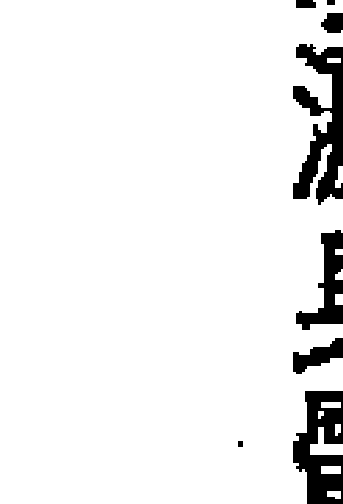

## 良好性格

宇宙性特質能量是良好性格的基礎也是其產物。意味著女性能夠自律、具備耐心、勇氣，並對自己的所作所為有所堅持，這種女性的氣是自在散發的，她也閃耀著內在之美。另一方面，若一位女性受困於扭曲的能量之中、缺乏自律、無法容忍他人缺點，並因無法堅持或缺乏勇氣而表裡不一，這樣的女性将非常缺乏生命力。因此，她会变得僵硬、缺乏弹性且姿势不良。她的眼神呆滞，而非优雅流转且自在闪耀女性特质的光芒。由于精微能量互动被扭曲能量主导，她变得自我意识过剩且闷闷不乐。

当然，若女性选择提升自己的良好性格，这些都是可以避免的。有鉴于此，我们针对每种良好性格设计一个练习。因此，想要摆脱自己的性格缺失，请运用我们提供的练习。短时间内，你会因良好性格带来的内在美及光采而获益良多。

### 耐心

为提升耐心，你可以练习耐心手印（见图14）。首先以一个舒服的姿势安顿好自己，背部打直，闭上双眼，鼻吸鼻呼，深呼吸一到三分钟，从五倒数到一，再从十倒数到一。运用标准法门让肌肉放松，并安住在真

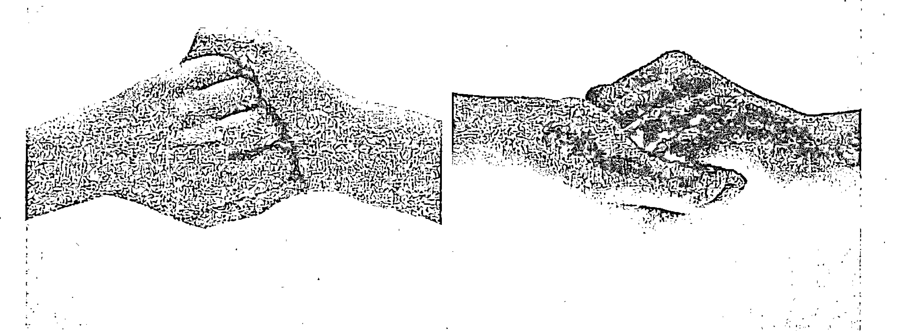

### 堅持

當人們沒有足夠的氣時，他們就無法堅持。要提升堅持程度，先讓自己的能量場增壓，好增加流經能量場的氣流量。想讓精微能量場增壓，最簡單的方法是啟動第一和第七脈輪，安住在其對應的能量場中，並運用意圖增加流經督脈的氣流量。要達到這個效果，先以一個舒服的姿勢安頓好自己，背部打直。閉上雙眼，鼻吸鼻呼，深呼吸二到三分鐘，從五倒數到一，再從十倒數到一。運用標準法門讓肌肉放鬆，並安住在真實心智中。然後宣告：「我要啟動我的第一脈輪。」繼續宣告：「我要啟動我的第七脈輪。」繼續宣告：「我要讓自己安住在第一脈輪場中。」下一步，宣告：「我要啟動我的第七脈輪。」繼續宣告：「我要讓自己安住在第七脈輪場中。」下一步，宣告：「我要讓自己安住在真實心智中。」繼續宣告：「我要讓自己安住在第一脈輪場中。」下一步，宣告：「我要啟動我的第七脈輪。」繼續宣告：「我要讓自己安住在第七脈輪場中。」下一步，宣告：「我要讓自己安住在真實心智中。」花十分鐘享受其效果，然後由一數到五，睜開雙眼。持續這練習，只要短短一週，妳就能感覺到自己的堅持程度明顯增加。當你需要時可做此練習。

### 不傷害他人

為了克服維持有害思想、情緒及行為的扭曲能量場，妳必須試著同理他人。在能量場中，有三個關於同理心的場域，它們也是提供脈輪能量的資源場。要克服傷害他人的傾向，妳必須將這些能量場充滿氣，並讓滿溢的能量散發至乙太脈輪。要開始這個練習，首先以一個舒服的姿勢安頓自己，背部打直。閉上雙眼，鼻吸鼻呼，深呼吸一到三分鐘，從五倒數到一，再從十倒數到一。運用標準法門讓肌肉放鬆，並安住在真實心智中。然後宣告：「我要啟動我的上部乙太脈輪。」接著宣告：「我要啟動我的下部乙太脈輪。」下一步，宣告：「我要讓自己安住在三個同理心能量場中。」

當妳安住在三個同理心能量場中，宣告：「我要將三個同理心能量場充滿氣。」然後宣告：「我要冥想。當妳需要時可做此練習。」

### 自律

自律方面問題通常與精微能量場的極性問題直接相關。雖然貌似只有兩個極性場存在，但當妳進入非物質宇宙中，就會遇見其他影響妳的能量互動的極性場。當我們談到自律，最重要的就是第三極性場——中性極性場。藉由安住在第三極性場中，妳可以脫離扭曲能量場的拉扯，並能在混亂且快速變化的世界中保持專注及自律。

### 堅忍

要增進自己的自律性，首先以一個舒服的姿勢安頓好自己，背部打直。閉上雙眼，鼻吸鼻呼，深呼吸兩到三分鐘，從五倒數到一，再從十倒數到一。運用標準法門讓肌肉放鬆，並安住在真實心智中。然後宣告：「我要讓自己安住在第三極性場中。」接下來，宣告：「我要在第三極性場的層面上向內觀照感官。」安住其中十五分鐘，然後由一數到五結束這個冥想。當妳需要時可做此練習。

這是一種在混亂及艱難時期仍保持堅定不移的能力。為了保持堅定，妳必須提升自己在世間體驗及顯化喜悅的能力。第一脈輪管控性愉悅，第五脈輪管控無條件的喜悅。為提升堅定不移的能力，妳需要啟動第一及第五脈輪，並安注在其對應的脈輪場中，然後啟動手部及腳部的能量中心。一開始，先以一個舒服的姿勢安頓好自己，背部打直。閉上雙眼，鼻吸鼻呼，深呼吸一到三分鐘，從五倒數到一，再從十倒數到一。運用標準法門讓肌肉放鬆，並安住在真實心智中。

+   然後宣告：
- 「我要啟動我的第一脈輪。」
- 「我要啟動我的第五脈輪。」
- 「我要讓自己安住在第一脈輪場中。」
- 「我要讓自己安住在第五脈輪場中。」

## ## 勇氣

勇氣是和腎相關的一種感受。妳的第二脈輪管控腎部位及周邊區域之氣。當第二脈輪堵塞時，精微能量無法流經腎，因此妳會感到恐懼。若沒有恐懼所造成的內縮狀況，身體及精神的勇氣就會自發的產生。

為了增加勇氣，妳需要練習勇氣提升冥想。先以一個舒服的姿勢安頓好自己，背部打直。閉上雙眼，鼻吸鼻呼，深呼吸一到三分鐘，從五倒數到一，再從十倒數到一。運用標準法門讓肌肉放鬆，並安住在真實心智中。然後宣告：「我要啟動我的第二脈輪。」下一步，宣告：「我要讓自己安住在第三脈輪場中。」繼續宣告：「我要將第二脈輪充滿氣。」安靜幾分鐘享受能量流動。繼續宣告：「我要啟動手部的小型能量中心。」當手部小型能量中心開始活躍，將雙掌各放在兩側腎臟位置。如此能夠增加流經腎的氣流量，並提升與勇氣相關的感受。

持續十分鐘。然後移開雙手，由一數到五，睜開雙眼，結束這個冥想。當妳需要時可做此練習。

花幾分鐘享受能量的轉變。然後宣告：「我要啟動手部的小型能量中心。」繼續宣告：「我要啟動腳部的小型能量中心。」安住其中十分鐘，然後由一數到五，睜開雙眼，結束這個冥想。若妳規律做這練習，即使時局困難，妳仍能保持堅定且充滿自信。當妳需要時可做此練習。

## ○女性能量。

當女性能量以氣的形式呈現，是非常有力量的。因為當女性自在散發氣及生命力時，人們會因她身心所散發出的內在光芒而著迷。為了提升流經妳的精微能量場的女性能量——讓內在光芒轉化妳及妳的樣貌——妳將練習普拉克里提能量場冥想。

普拉克里提能量場是包含最高頻、最純粹女性能量頻率的一種資源場。如所有資源場一般，普拉克里提能量場在所有次元填滿妳的能量場並向外延伸。安住在普拉克里提能量場中，妳會體驗到原初的女性能量。這種能量創造及維持生命，並提供妳力量以成為閃耀內在光采的女性。

### 練習：普拉克里提能量場冥想

要開始這個冥想，首先以一個舒服的姿勢安頓好自己，背部打直，閉上雙眼，鼻吸鼻呼，深呼吸一到三分鐘，從五倒數到一，再從十倒數到一。運用標準法門讓肌肉放鬆，並安住在真實心智中。然後宣告：「我要讓自己安住在普拉克里提能量場中。」接下來，宣告：「我要在普拉克里提能量場的層面上向內觀照感官。」幾分鐘後，妳的注意力會轉向，開始覺察一個大型中空的空間籠罩著身體並向外延伸，這空間就是普拉克里提能量場。

當妳身處普拉克里提能量場中的全新轉捩點，會開始覺察女性力量及愛的原初形式，也會感到這兩股能量在身上自由流動。

花十五分鐘享受這個體驗，然後由一數到五，數到五時，睜開雙眼，結束這個冥想。當妳需要時可做此練習。

妳越常練習普拉克里提能量場冥想，越能從中獲益並體驗來自自身女性的宇宙性能日的光采。

## 內在平靜

內在平靜是種來自深層內在自我的穩定狀態。當妳安靜，將心智專注在那自發流經能量場的喜悅時，內在平靜就會出現。內在平靜手印即是設計來幫助妳，不論身處於何種環境，都能體驗內在平靜。

要練習內在平靜手印（見圖15），先以一個舒服的姿勢安頓好自己，背部打直，閉上雙眼，鼻吸鼻呼，深呼吸一到三分鐘，從五倒數到一，再從十倒數到一，運用標準法門讓肌肉放鬆，並安住在真心智中。將左拇指指尖與右拇指指尖緊鄰指甲的內側邊緣相觸。雙手食指指尖相觸。雙手中指向內彎曲，第二指節外側互相貼合。再將雙手無名指第一指節內側互相貼合，然後將左小指第一指節疊在右小指第一指節上。

讓腳跟持續平放在地面上，舌頭放在一般位置。閉上雙眼，持此手印十分鐘。十分鐘後，由一數到五，睜開雙眼。當你需要時可做此練習。

在本章中，你瞭解到女性可以透過提升自我健康及良好性格，體驗更深的內在平靜，及增進流經能量場的氣流量來提升內在美。下一章中，你將學到如何克服慢性及急性的創傷症狀。我們會特別著重於前世創傷、身心創傷、性創傷及飽受忽略創傷。

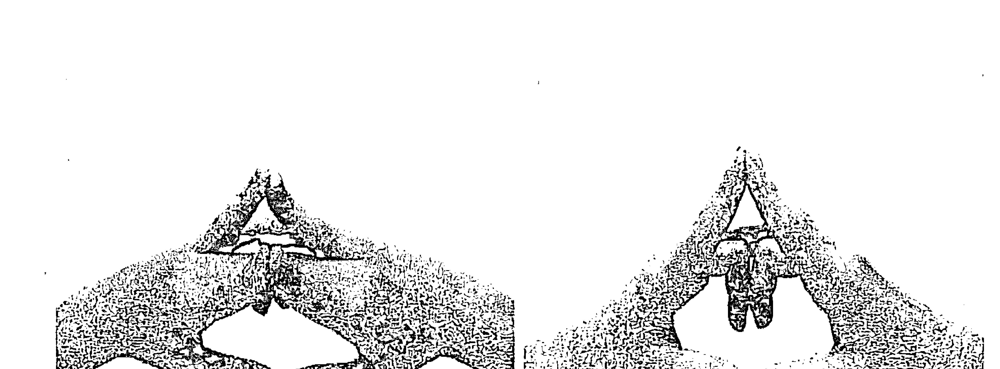

### 圖15：內在平靜手印

# # 癒癒身心靈創傷

此章開頭，先探討創傷如何在身體及精微能量場層面削弱女性能量。接著，妳將學到二種練習，設計來療癒導致慢性症狀的能量創傷。然後我們會提供妳一些練習及技巧，設計來徹底克服——現代女性最常見的創傷所造成的模式及心理症狀——前世創傷、身體及心理創傷、性創傷及飽受忽略創傷。

# # 創傷，內在故事

雖然醫師及心理健康從業人員已經研究各類創傷形式多年，他們仍難以定義創傷，這是因為，單純只想定義甚至描述一個創傷事件，而不將倖存者精微能量場所受的暴力傷害納入考量，幾乎是不可能的。原因很簡單：精微能量場所遭受的暴力，才是造成創傷倖存者飽受大部分急性或慢性創傷症狀折磨的主因。

想了解創傷事件為何能對人造成長期影響。首先要明白，每個創傷事件其實都是雙重事件，包含兩種創傷——身心創傷以及存在於非物質層面卻同等真實的精微能量場創傷。

身心創傷的記憶也許能被壓抑，但精微能量場創傷，會常年存於創傷倖存者意識之中，干擾他們的真實身份認同及性取向。也會粉碎倖存者的信任感，毀損他們的自尊，讓他們難以與他人建立長期的親密關係。依照我們的經驗，能量創傷會對創傷倖存者造成三種顯著影響。扭曲能量會猛烈入侵倖存者的能量場。這種能量入侵暴力，將導致一種或多種能量載體散失，也就是所謂的「碎裂化」。而且，這種入侵會阻礙倖存者精微能量場的氣流動。倖存者得終生面對這三種影響所造成的問題，這些問題通常無法由傳統療法或當前主流藥物來導正。

### 第二代症狀

即使能量創傷會對倖存者的精微能量場產生立即影響，多數受創者仍無法辨認初期的第一代症狀。直到之後的第二代及第三代症狀產生時，才會感到有些部分相當不對勁。第二代症狀包括自我控制、信任、個人力量及活力的毀損，憂鬱跟焦慮是常見的第二代症狀。

隨著時間流逝，這些能量及心理的症狀，可能導致動力缺乏、性無法滿足、創造力受阻及界線問題，造成倖存者在日常生活中的一般活動中表現退縮。

當孩童受創，會另外出現長期的複雜狀況。這些狀況包含個人認同身分毀損及出現盲點，讓孩童難以成功適應學校生活，也無法與同儕形成良好關係。會出現盲點，通常是因痛苦及恐懼令孩童難以承受，讓他們將事件以及部分的心智和精微能量場通通推出意識之外。在這種情況下，孩童會受困於盲點之中，無法連結心智功能。這意味著，有部分的心智和精微能量場，無法被運用來和他人進行健康連結。因此，倖存者會變得頑固、叛逆和無法同理，甚至理解他人的觀點與感受。

大多數因創傷所產生的困擾症狀，是因上述三種能量創傷而來。因此，妳必須先學習克服這三種能量創傷。然後利用書中提供的一系列經過特別設計的練習，來療癒第二代症狀，這些由孩童、年輕女孩及成年女性的最常見創傷所造成。

### 入侵

既然扭曲能量入侵倖存者能量場，是導致一連串症狀的主因，妳需要先療癒扭曲能量的入侵。

當創傷倖存者的精微能量場遭受扭曲能量粗暴投射，入侵於焉生成。若妳是入侵的目標，這股能量接觸到妳的精微能量場時，會感到皮膚好像被針或釘子刺穿。這種入侵也會令妳感到窒息，或有股不和諧的能量波湧向妳。

無須與加害者有身體接觸，妳也能成為入侵的目標。當依附在沉重的能量場的人們想起妳、對妳有強烈感覺，或想要改變、操控、控制或懲罰妳時，便會將沉重能量投射進妳的精微能量場中。

# ## 釋放入侵能量

幸運的是，由妳已學到的知識和技能來看，妳已擁有所有的工具來釋放精微能量場中的扭曲能量入侵。其實，釋放入侵能量不比釋放業力包袱困難。首先，選定一種感受、態度、阻礙或自我設限模式，導致妳對特定人士、地點或事物的不合理恐懼，或干擾妳成為自己、表達自我及達成自我目標的能力。

舉例來說，入侵所導致的感受有歇斯底里、不祥感、憤怒、挫折、焦慮、孤立、傲慢、鄙視、懊悔、性症狀及煩惱等。入侵所造成的模式有自我懷疑、自我傷害、無助、失望、依賴、不安全感、耽溺或缺乏自我價值等。

一旦妳選好一種模式或感受來釋放，以一個舒服的姿勢安頓好自己，背部打直，閉上雙眼，鼻吸鼻呼，深呼吸一到三分鐘，從五倒數到一，再從十倒數到一，運用標準法門讓肌肉放鬆，並安住在真愛心智中，然後持至樂幸福手印（參見第四章），一邊持手印一邊宣告：「我要創造一個氣圍，包圍住導向心中所想（妳的感受或模式）的入侵能量。」當妳看到和感受到氣圍，繼續宣告：「我要讓幸福釋放氣圍中的入侵能量。」

福充滿在我創造的氣圍裡。」再宣告：「我要讓幸福釋放氣圍中的入侵能量。」

### 碎裂化

當入侵能量被釋放後，妳會有一種如釋重負的感覺，伴隨這種感受的，通常是一聲砰的聲響，表 示留在氛圍中的只有幸福。 當妳釋放了入侵能量，再將氛圍釋放掉。然後鬆開至樂幸福手印。花十分鐘享受妳所經歷的改 變，然後由一數到五，睜開雙眼，結束這個冥想。

當能量載體脫離妳的能量場時，能量場就會碎裂化。造成碎裂化最常見的原因，就是扭曲能量入 侵了妳的能量場。碎裂化可能發生在任何次元中，也可能發生在任何人生階段中，包含從受胎到生產 的九個月。碎裂化及其副作用是如此普遍，因此，淨化及重整能量載體成了療癒及能量工作的必經過 程。因為能量載體承載多種重要功能，它們讓妳得以形成真實身分認同，並在物質與非物質層面上與 環境互動。能量載體也助妳顯化靈魂的推進並實現自己的道途。

想療癒碎裂化情形，首先妳需定位出散失的能量載體，隨後將其淨化並整合進能量場中。 要定位出散失的能量載體並淨化它，需要運用第四章所學的定位和釋放業力包袱技巧。

#### 療愈碎裂化

當妳定位並淨化一個能量載體後，需要將它重新整合，與其他載體相合。能量載體的相合指的是，能量載體必須位於妳的身體空間的正中央。關於相合的重要性，原因如下：它讓被整合的載體變得以和能量場中的其他載體同時運作，幫助未經干擾的氣往能量載體流動，並讓妳將能量載體重新整合進真實的身份認同中。

要療癒碎裂化，先以一個舒服的姿勢安頓好自己，背部打直，閉上雙眼，鼻吸鼻呼，深呼吸二到三分鐘，從五倒數到一，再從十倒數到一。運用標準法門讓肌肉放鬆，並安住在真實心智中，然後持至樂幸福手印。接下來，一邊持手印一邊宣告：「我要創造一個氣團，包圍那離身體空間最遠的散失能量載體，它被上個練習所釋放的入侵能量所驅離。」繼續宣告：「我要讓幸福充滿在我剛創造的氣團中，並將其中的能量載體重新整合進精微能量場中。」之後不需要做任何事。能量載體會自動淨化及重新整合。當能量載體變得一致後，安靜十分鐘享受這練習的效益。然後釋放那團氣，鬆開至樂幸福手印，由一數到五，睜開雙眼，結束這個冥想。達到一致後，妳會體驗到滿足感、更大內在力量及穩定感。

The request was rejected because it was considered high risk承載。一旦學會持此手印，當妳感到焦虑襲擊即將來臨或已經開始時，可以將其與其他兩項活動結合運用。

### 焦慮襲擊手印

要練習焦慮襲擊手印：

- 以一個舒服的姿勢安頓好自己，背部打直，閉上雙眼，鼻吸鼻呼，深呼吸二到三分鐘，從五倒數到一，再從十倒數到一，運用標準法門讓肌肉放鬆，並安住在真實心智中。
- 接著將舌頭輕輕頂住上顎，往上顎後端稍微移動，最後停留在上顎後端較柔軟的位置。
- 然後將右手大拇指交疊在左手大拇指上。
- 下一步將雙手食指彎曲，第一指節指背互觸。
- 雙手中指向上伸展，指尖互觸，如此形成兩個三角形。
- 最後將雙手小指彎曲，第二指節指背互觸。
- 持此手印十分鐘。當妳需要時可作此練習。

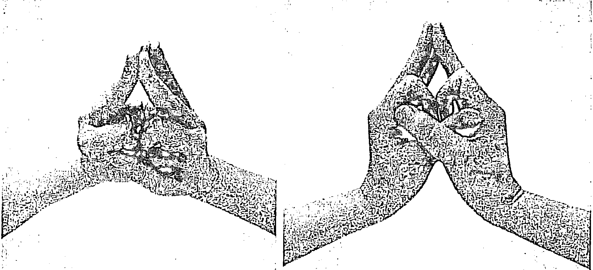

圖17：焦慮襲擊手印

### 焦虑襲擊的能量療癒

當焦慮襲擊即將來臨或已經開始，推薦妳做三件事。

第一是淋個冷水浴，這能讓妳的身體浸潤在負離子中。負離子促進腦部分泌能提振情緒的血清素，讓妳釋放壓力並充滿活力，前兩者皆可助妳克服焦慮襲擊。

結束淋浴幾分鐘後，找個舒適的地方坐下，開始練習焦慮襲擊手印。邊持手印邊啟動第三脈輪，並安住在第三脈輪場中。

一旦妳安住在脈輪場中，鬆開手印並開始由第三脈輪唱頌嗡（Oṃ）的聲音，直到回復平靜。

嗡是宇宙的聲音。當宇宙被創造時它即出現，其療癒效果廣為人知，特別是與適當的冥想及手印一起搭配運用時。

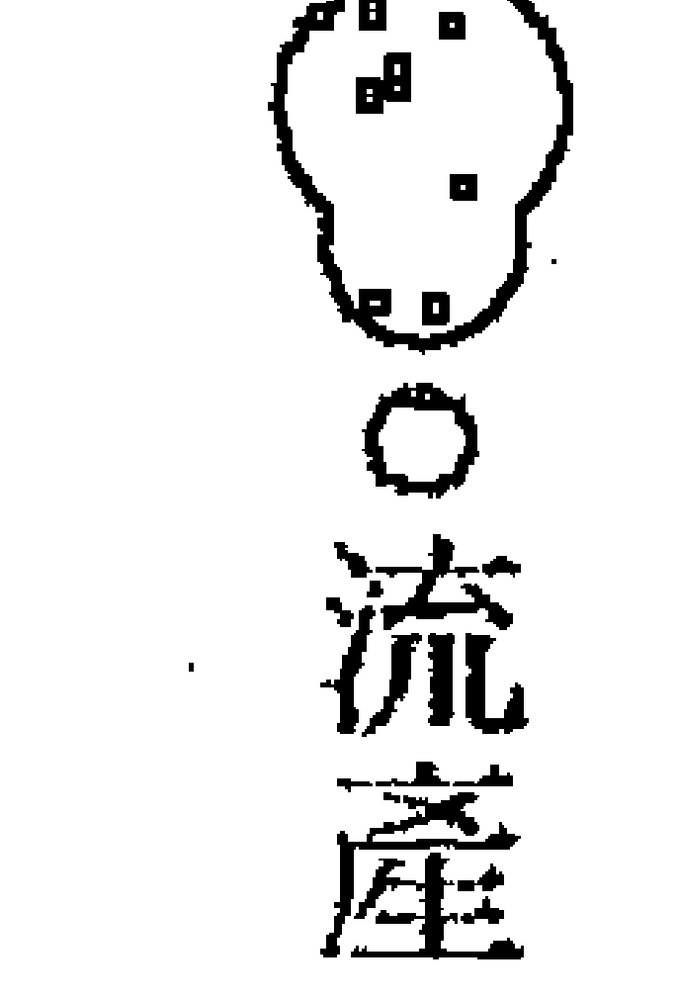

### 流產、墮胎及死胎

對於女性，特別是那些第一次懷孕的女性來說，由於流產、墮胎或死胎而失去寶寶，很可能成為一個極大的創傷事件。

在接下來的章節中，透過探討女性及未出世胎兒的能量層面，我們會盡可能說明失去胎兒時會發生些什麼，然後提供練習來療癒流產、墮胎或死胎所造成的創傷，讓妳釋放這些事件帶來的殘留痛苦，也能對妳未出世胎兒的靈魂，喜悅的繼續邁向進化旅程。

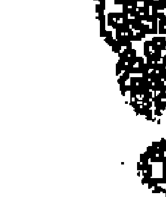

#### 流產、墮胎或死胎的能量殘留

雖然一些女性在失去胎兒後，身體可能受苦達數年之久。但不只身體付出的代價會對女性造成威脅。心理及能量上的代價，同樣也對女性、未出世胎兒及女性家屬，具有破壞性的影響。

> (Pro Femina)

對許多女性來說，悲傷的過程從失去胎兒的那一刻已然開始，這是一種綜合身體、心理及能量層面的創傷。女性可能試圖壓抑或控制自己的沮喪及悲傷，但通常效果不彰，這是因為潛藏在失去背後的創傷極少被療癒。因此，許多女性飽受未解決的自我譴責之苦，在事件後遠離親友，孤立自己。

從能量角度來看，因流產、墮胎或死胎而失去胎兒，對於母親及胎兒本身都是極嚴重的創傷。

因為母親的道途和轉世目的與她和胎兒間的業力連結，息息相關。當胎兒逝去，他們的連結也隨之斷裂，對母親及胎兒皆造成深遠的影響。

#### 塔瑪拉的故事

塔瑪拉的經歷，顯示了失去未出世的胎兒可以造成多大的創傷。

我們在二〇一〇年開始和塔瑪拉一同進行療癒工作，那年她三十四歲。與我們進行療癒近一年後，她前往生育診所就診，並在診所協助下懷孕。

懷孕期的第六個月，在機場時，她的羊水破裂，雖然當場立即進行處理，但在前往醫院的救護車上，她還是失去了自己的兒子。

失去兒子這件事對塔瑪拉影響深遠。她隨即封閉自己，遠離親友。憂鬱狀況長達數月，荷爾蒙仍舊不平衡，以至於分泌乳汁近一年之久。

之後幾個月，她開始敞開自己，然後我們為她及未出世的兒子，療癒他們所經歷的能量創傷。

為了讓她的荷爾蒙回歸平衡，讓她服用一種另類醫療中的同類療法藥物「Hormeel」。然後，我們提供她一套能工作養身法門，讓她持續練習十二週。

在那段期間，透過移除入侵能量及重新整合三個能量載體，她回復了自我肯定生命認同，也成功啟動第二及第五脈輪，並安住在其對應的能量場中。

塔瑪拉創造出一條氣繃帶（詳見第二一二三頁）來療癒骨盆的創傷，然後使用我們教她的技巧讓兒子自由，並協助他的靈魂繼續喜悅的在進化過程中前進。

療癒工作進行五個月後，塔瑪拉告訴我們她懷孕了，我們當下結束了療程。八個月後，聽說她產下了一個健康的小男嬰。

#### 母親付出的能量代價

未出生胎兒的靈魂，究竟在何時進入子宮內，是人們不斷爭論的議題。但我們在女性實務工作中發現，能量連結在懷孕非常早期就已經形成。

連結一旦建立，傳送隨即開始。胎兒的靈魂元素包含能量載體，開始進入發展中的胎兒體內。

若此過程受到流產、墮胎或死胎的干擾，一些能量載體會滯留在母親能量場中，另一些會在傳送過程中散失，還有一些則留在未出世胎兒的身上，徒然等待進入胎兒體內。

那些已經進入母親體內的能量載體，在流產、墮胎或死胎過程後，將無法輕易的與未出世的胎兒連結在一起，在大多數案例中，它們滯留在母親的能量場中，這可以解釋，為什麼大多數經歷流產、墮胎或死胎過程的女性，事隔多年仍抱持對未出世胎兒的依存。

傳送過程中的受阻能量體也會造成影響，它們和供給能量及覺知的資源場間的連結被截斷，因此，這些能量體會不斷瘋狂尋找安全的庇護所，來提供它們能量和覺知。其他的能量體則被掠奪性的能量場及意識所佔據，從中汲取具滋養性質的氣。

殘留在母親身上或在他人身上找到安全庇蔭的能量體，會造成未出世的胎兒和能量體宿主間不健康的依存關係。

由於每個能量體藉由銀色能量索與靈魂能量場相連，上述依存可能持續終生。銀色能量索是未出世胎兒非物質結構的必要部分。

當未出世的胎兒最終找到另一個母親再次轉世時，他會感受到能量體的散失，然後試圖去尋找並整合它們，但若沒有相關的知識及技能，這個任務將很難達成。

為了療癒母親及胎兒的創傷，我們收錄了一系列經過特別設計的練習，幫助母子克服因流產、墮胎或死胎造成的創傷。

#### 練習：釋放未出世胎兒的靈魂

這個系列練習包含釋放對未出世胎兒的依存，療癒母親能量創傷，及協助未出世胎兒帶著完整能量體完成其生命旅程。

若因疏忽或進行人工流產導致失去胎兒，因而產生的罪惡感，都該釋放對未出世胎兒靈魂的依存。

釋放對未出生胎兒靈魂的依存，有助完滿業力層面上的幾個重要事項。若母親需要負責，有助於承認事實，並對於擾了胎兒的生命旅程表達真誠悔意。若非母親的錯，能讓她放下罪惡感及羞恥感，完成自我療癒過程。

要讓這過程產生效果，必須解除業力依存及業債，這個過程必須以一種自然的方式進行。過程包含兩部分，第一部分，妳必須準確描述那些傷害未出世胎兒的行為及動作。第二部分，妳必須表達發自內心的真誠悔意，懺悔在能量層面上傷害了未出世的胎兒，妨礙了他在地球轉世的過程。

當妳準備好開始，找個安靜的地方坐下，然後閉上雙眼，鼻吸鼻呼，深呼吸一到三分鐘，從五倒數到一，再從十倒數到一，運用標準法門讓肌肉放鬆，並安住在真實心智中。

當妳放鬆後，宣告：「我要啟動我的心輪。」然後宣告：「我要安住在心輪場中。」繼續宣告：「我要在心輪的層面上，向內觀照感官。」花一些時間享受能量流動。

然後宣告：「我要在面前創造一面一點五公尺的螢幕。」繼續宣告：「我要觀想自己未出世的胎兒出現在面前的螢幕上。」胎兒的影像會顯現在螢幕上，顯示出適當年紀以繼續他的旅程。

要釋放依存，宣告：「我讓你痛苦並干擾了你的生命旅程，我真誠的向妳道歉。」當妳宣告時，一邊直視胎兒。

當妳完成宣告並感覺胎兒已接受妳的真誠歉意，妳即可向這個未出世的胎兒說再見，這需要從心輪散發能量給胎兒。

當未出世的胎兒接受了這股能量，宣告：「我讓你自由，好讓你繼續進化的旅程，再見。」然後釋放掉螢幕上的胎兒影像及螢幕。

由一數到五，結束這個冥想。

#### 幫助胎兒完成他的生命旅程

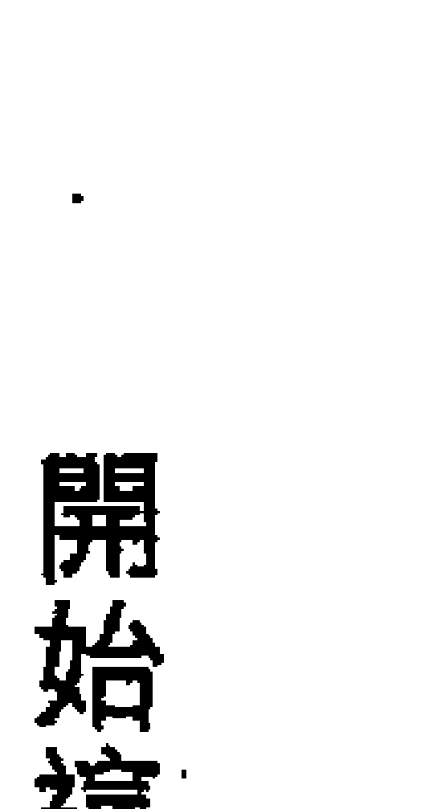

未出世的胎兒接受了妳的道歉後。妳能將滯留在妳的能量場的能量載體歸還給他，這能幫助他喜悅的繼續他的生命旅程。

開始這個過程，先放一缸熱水，然後在其中加入死海鹽（可以在各健康食品專賣店或藥局買到）。

躺在水中，雙腿分開，閉上雙眼，鼻吸鼻呼，深呼吸一到三分鐘，從五倒數到一，再從十倒數到一，運用標準法門讓肌肉放鬆，並安住在真實心智中。

> 「我要讓熱水浴中的鹽吸收與失去未出生胎兒有關的所有扭曲能量。」

海鹽能夠吸收身體物質的層面、身體層面及乙太層面的扭曲能量。

花五分鐘享受這個過程，然後宣告：

> 「我要用各個氣場包圍住能量場中與未出生胎兒有關的各個能量載體。」

然後持至樂幸福手印（參見第四章）。

邊持手印邊宣告：

> 「我要讓幸福淨化能量場中所有與未出生胎兒有關的能量載體，並讓能量載體全部直接回到它們在宇宙中適當的居處。」

然後鬆開至樂幸福手印，浸在水中十五分鐘，讓未出生胎兒的能量載體被淨化，並重新與他的靈魂整合，享受妳所經歷的改變，然後由一數到五，睜開雙眼，結束這個冥想。

### 氣繃帶

本章的最後一個練習是氣繃帶練習。這個練習對妳的心理及能量場健康有極佳的效果，因為它能封住因流產、墮胎或死胎造成的能量創傷。

創造氣繃帶是一個為期五天的歷程。

#### 第一天

首先找一個舒服的姿勢安頓好自己，背部打直，閉上雙眼，鼻吸鼻呼，深呼吸二到三分鐘，從五倒數到一，再從十倒數到一。運用標準法門讓肌肉放鬆，並安住在真實心智中。

然後宣告：「我要在面前創造一面一點五公尺的螢幕。」繼續宣告：「我要觀想自己出現在面前的螢幕上。」

當妳的影像顯現在螢幕上，宣告：「我要觀想自己的腹部被一條氣做成的繃帶環繞。」

在妳創造出氣繃帶後，再花十分鐘享受這個過程，十分鐘後，釋放自己的影像，然後釋放掉螢幕，由一數到五，結束這個冥想。

#### 第二天到第四天

在第二天到第四天，找一個舒服的姿勢安頓好自己，背部打直。閉上雙眼，鼻吸鼻呼，深呼吸二到三分鐘，從五倒數到一，再從十倒數到一。運用標準法門讓肌肉放鬆，並安住在真實心智中。

然後宣告：「我要在面前創造一面一點五公尺的螢幕。」繼續宣告：「我要觀想自己出現在面前的螢幕上。」

當妳的影像顯現在螢幕上，宣告：「我要觀想自己的腹部被一條氣做成的繃帶環繞。」

在妳創造出氣繃帶後，再花十分鐘享受這個過程，十分鐘後，釋放自己的影像，然後釋放掉螢幕，由一數到五，結束這個冥想。

#### 第五天

第五天，找一個舒服的姿勢安頓自己，背部打直，閉上雙眼，鼻吸鼻呼，深呼吸一到三分鐘，從五倒數到一，再從十倒數到一。運用標準法門讓肌肉放鬆，並安住在真實心智中。

然後宣告：「我要在面前創造一面一點五公尺的螢幕。」繼續宣告：「我要觀想自己出現在面前的螢幕上。」

當你的影像顯現在螢幕上，宣告：「我要用一條新的氣繃帶替換掉舊的那條。」

在你替換掉氣繃帶後，再花十分鐘來享受這個過程。宣告：「我要觀想自己的子宮及陰道充滿氣。」

之後，想像妳的子宮和陰道中充滿的氣在發光，光芒照進妳的氣繃帶並創造出一個大型氣場，氣場充滿妳的腹部區域。

花十分鐘享受這個過程。十分鐘後，釋放掉自己的影像。然後釋放掉螢幕。

完成這個歷程，由一數到五，然後睜開雙眼，結束這個冥想。

吸一到三分鐘，從五倒數到一，再從十倒數到一。運用標準法門讓肌肉放鬆並安住在真實心智中。

然後宣告：「我要在面前創造一面一點五公尺的螢幕。」繼續宣告：「我要觀想自己出現在面前的螢幕上。」

當妳的影像顯現在螢幕上，宣告：「我要用一條新的氣繃帶替換掉舊的那條。」

在妳替換掉氣繃帶後，再花十分鐘來享受這個過程。十分鐘後，釋放掉自己的影像。然後釋放掉螢幕。由一數到五，結束這個冥想。

當妳需要時可做此練習。

### 總結

在本章中，妳學會以簡單處方及練習提升自己的生育力，然後學習療癒可能伴隨懷孕而來的複合症狀，包括腹部抽痛及焦慮襲擊。最後，妳學到如何療癒失去未出世胎兒所造成的能量創傷。

在下一章中，妳將學習為自己的熱情創造出空間，並提升流經妳的性器官的氣。最終學習提升自己的性慾，並在關係中體驗更多的喜悅與親密。

## 第十一章

### 3. 回復你的性力量

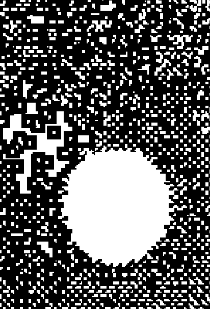

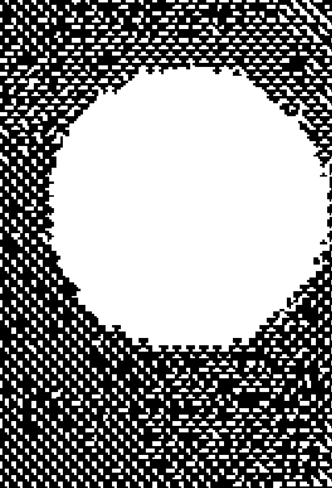

> 海倫·費雪 (Helen F. Fisher) 在《性契約·人類行為演化》(The Sexual Contract: The evolution of Human Behavior) 一書中提到。

我們的種族和性密不可分，我們討論它，笑談它，歌頌它，我們時常進行性愛。為什麼？因為一個女性可以永久保持性欲。身體層面上，女性可以每天做愛，即使懷孕期間也是。

雖然沒有一個生物族群的雌性具備如人類女性般的愛與情欲機制，卻少有女性對自己的性生活感到滿意。

這有兩個原因，一是女性天生的愛與性欲因能量場被干擾而受阻，二是因為多數社會制度仍不尊重女性天生的力量、創造力及內在光采。

雖然現代社會中很多女性相信她們在性方面已經解放，令人不適的真相卻是，在世上大多數地方，社會的核心價值仍支持某種將女性視為弱者、依賴者或是性玩物的社會契約。

既然社會對女性的健康情欲及性表達少有支持，現代女性也就幾乎沒有選擇。多數女性必須遵照世界的遊戲規則，並以肉欲和控制來取代情欲及性愛。

不幸的是，以關係策略來說，這無法維持太久，因為情欲及性愛是由女性的身體及能量場驅動。若以肉欲和控制來替代，是無法在靈魂及精神的更深層次滿足女性。

> 芭芭拉·沃克 (Barbara G. Walker) 在她具參考價值的著作《女性的迷思及秘密百科》(The Woman's Encyclopedia of Myths and Secrets）中，把現今世界中的性慾稱為「對於衝擊、破壞及死亡的最後追尋」。她補充道：

> 有覺知的女性皆會發現，西方社會中，男性層面的性慾及性愛被過度強調，使性愛變得氾濫、不入流及充滿色情。從媒體、情色產業、書籍、電影中性被表達的方式，可見一斑。網路——以及與親密密切的慾望及放蕩，構成了所謂的性解放（沃克 [Walker] 2007, 1019-1020）。

沒有一個認真的女性會認同上述所說。試問妳自己：當一個女性沒有聆聽自己的真實需求，或了解什麼是滋養及滿足她的事物，她在性方面會是解放的嗎？或者她只成了社會的一種典型，仍熱中於將女性描繪成性感、肉欲，耽溺於各種性行為之中，即使這些無法滿足她對於愛與親密的最深刻需求？

事實上，不論是壓制女性慾望或依照男性觀點來看待性愛與性慾，對於散發內在光采的女性來說，皆非良好典範。散發內在光采的女性，會運用自己天生的感官感受及性慾，讓自己沉浸於生命之流中，讓男性及女性的靈性，在生命之流中合為一體，狂喜忘我。

### 凱特琳娜的故事

凱特琳娜的故事，顯示了一個女性的生活及關係，如何被性別歧視的價值觀干擾。

凱特琳娜來尋求我們協助時，時年三十三歲，因父親性虐待而在早期童年留下創傷。如同許多女性一樣，她對自己的遭遇感到非常羞恥，並且將受虐事件藏在心中。

由於業力創傷，她無法信任自己及男性，飽受其苦，凱特琳娜的性愛生活成為單純的競標大會，由出價最高者得標。她也運用自身豐沛的慾望，為自己爭取好處。這成為她肉慾角色的基底，用以吸引有權的年長男性。她本能地知道他們可以成為自己的金主。

性對她來說，是一種貨幣，用來控住男人，並從他們身上得到她想要的。

她持續這種模式直到懷孕為止。凱特琳娜要求胎兒父親支持，卻遭到拒絕。然後她向這個議題施壓，拒絕和他再度發生關係，而對方的回應是離開她。

最後，她遇見一個在情緒上給她很多挑戰的男人。不安全感及恐懼幾乎立即浮現，這種情況越來越頻繁，導致她最終與他分手並向我們尋求協助。

直到第四個療程前，她都沒有告訴我們遭受過性虐待。

療程結束時，我們教她兩個練習，療癒她遭受的能量創傷，並克服那長久主導她人生、性別歧視的女性性欲觀點。

在那之後，她進步神速，並能和新的伴侶進入親密關係。

當凱特琳娜解決了她的關係議題，新的親密關係雖仍有挑戰，但已變得較為健康。凱特琳娜現居於柏林，和伴侶薩貝斯汀一同輔養她的女兒。

### 為熱情騰出空間

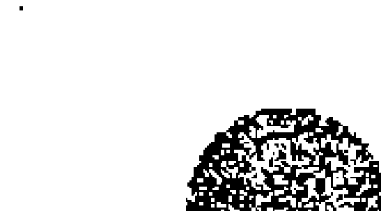

當社會的各種制度系仍支持性別歧視的價值觀時，肉欲會受多數人高度看重，它取代了真實熱情與歡愉、愛、親密及喜悅等真切相隨的特質，這些特質也滋養女性的靈魂及靈性。女性若讓肉欲主導自己，她在親密關係中的親密感受會被排擠出去；從親密感及真實熱情中得到的滿足，也會和她身體的敏感度一樣，被蒸發殆盡。

為幫助妳克服支持肉欲的扭曲能量，並療癒妳的靈魂免受其牽絆。以下收錄了免於肉欲冥想，幫助妳提升光體場的功能，讓妳能以真實熱情來取代肉欲。

光體場是一種比核心場更高頻率的資源場。如核心場一般，它滿溢於妳的能量場及身體中，並朝四面八方向外延伸。

透過提升光體場功能並讓自己安住於其中，妳會在自己的靈魂中找到一個處所，真實熱情在那裡取代了肉欲，讓真實女性特質浮現，不受干擾。

### 免於肉慾冥想

要開始免於肉慾冥想：

- 以一個舒服的姿勢坐好，背部打直。閉上雙眼，鼻吸鼻呼，深呼吸一到三分鐘，從五倒數到一，再從十倒數到一。
- 運用標準法門讓肌肉放鬆並安住在真實心智中。
- 然後宣告：「我要讓自己安住在光體場中。」
- 繼續宣告：「我要讓我的光體場充滿氣。」
- 當妳讓光體場充滿氣後，宣告：「我要在光體場的層面上，向內觀照感官。」
- 安靜十分鐘，好好享受這過程。
- 十分鐘後，從一數到五，結束這個冥想。

每天練習這個冥想，直到肉欲不再擾亂妳或妨礙妳自然的性表達。

### 熱情的生活

女性並不總是身陷和凱特琳娜相似的扭曲性模式中。東方的古老年代，對女性性欲及感官感受有相當不同的觀點，對先祖女性來說，性不是肉欲也不是追逐高潮，相反的，它是一系列緩慢展開的活動——心理上、情緒上、感官上和性行為上——讓女性得以親密的感覺她的伴侶並和他共享性的熱情（沃克 [Walker] 2007,1019-1020）。

> (沃克 [Walker] 2007,1019-1020)

伴侶們互相靠近，保持感覺的開放與活躍，並自由的共享生命力。親密之舞讓彼此能臣服於深刻的歡愉及放鬆，帶領他們進入平衡且療癒所有層面。

查塔忽夷克（Çatalhöyük），一個位於安那托利亞的古城城市，其中的伴侶們開放的表達自己的性慾，並在彼此的性關係中熱情及自由的探索，這城市曾被稱為譚崔之城，因為學者在此城中發現大量尊崇生育力及母神的壁畫（利沙白〔Lythebeth〕1990）。

不幸的是，儘管有這麼多情趣用品及技巧，卻鮮少有男人和女人對自己的性生活感到滿意。在這些關係中，親密感與真誠分享成為特例而非通則。

該是認清——不平衡的性生活，永遠無法讓追求內在光采的女性感到滿足——的時候。因為散發內在光采的女性，對自己身體及感官感受的體會與常人不同。她的性慾並非源自肉慾及控制，而是源自親密及賦予女性性力量與熱情的女性能量源泉。

現在妳已學會免於肉慾冥想，練習收錄在隨後章節的養身法門，妳將能回復自己的性力量與熱情。在第一個優尼（Yoni）手印練習中，取回身體及能量場愉悅中心的掌控權。

### 能量疗法：优尼手印

优尼是一个梵文字，意指「神圣通道」或「诞生之处」。广义来说，它亦代表起源、根基或神圣空间：一个为散发内在光采的完整女性所拥有的空间，是女性的宇宙性能量显化之处，也是性愉悦的泉源。练习优尼手印的女性，将从完整体验及表达自身愉悦而受益。

要练习优尼手印，以一个舒服的姿势安顿好自己，背部打直，闭上双眼，鼻吸鼻呼，深呼吸一到三分钟，从五倒数到一，再从十倒数到一。运用标准法门让肌肉放松，并安住在真实心智中。双手靠近，掌心摊开并成直角并列，双手小指的第一指关节相叠。将双手无名指在双手中指后交叠。双手中指完全伸展，彼此指尖相触，双手的无名指压低，双手大拇指向掌心弯曲。

每天练习优尼手印十分钟，持续两周，妳将经验更多欢愉，也拥有更多表达自然性欲及性热情的能力。

### 提升性欲

寻回对欢愉中心的主控权，是健康快乐性爱的先决条件，让自然性欲及性热情得以自由绽放。当妳释放了能量场及身体欢愉中心，就可以开始提升自己的性欲。

但是，女性会失去性欲其实并不是因为这些生命阶段。性欲和女性能量场状况的相关度，比与任何外在状况都高，即使是那些女性身体荷尔蒙分泌有关的状况。

> 医学研究指出，荷尔蒙的分泌，甚至是与性欲有关的荷尔蒙分泌，是受女性心理状态（还有她的能量条件）所影响。海德堡大学心理学家——朵莉丝·吴芙博士（Dr. Doris Wof）指出：「促成性愉悦的性荷尔蒙，会受到想法及幻想影响而分泌更多。心中播放的影像如同在身体作用的威而刚一般，」

既然心理及精微能量因素在女性原欲层面扮演重要角色，女性性欲并无必要随年纪而减弱。女性性欲启蒙期的确比男性稍晚，无须因更年期或更年期后，雌激素减少及卵巢分泌较少睾固酮而性欲消退。事实上，熟年女性开始有更多时间专注於自己及性生活上。因此，女性的爱情生活与性欲在任何阶段皆可蓬勃发展，即使在更年期或更年期后也是一样。既然女性性渴望及自然性欲受到宇宙性特质能量支持，藉由适当方式提升能量，女性的自然性愉悦及性感受也会提升。

为达成这个目标，妳将运用两个练习，本章前述的凯特琳娜和萨贝斯汀借着这两个练习提升对彼此的真实性欲。

第一个练习是优尼冥想。优尼冥想有助於增进性行为前及性行为中的欲望，也有助於妳在男性进入自己身体时的满足感，并分享他的男性能量。

### 优尼冥想

要练习优尼冥想，以一个舒服的姿势坐好，背部打直，闭上双眼，鼻吸鼻呼，深呼吸一到三分钟，从五倒数到一，再从十倒数到一，运用标准法门让肌肉放松，并安住在真实心智中。将心智注意力带到阴道。下一步，宣告：『我要在每个呼吸中，让气直接流向我的阴道及支持它的能量中心。当妳的阴道感到振动或闪耀着气的光芒时，一并收缩阴道肌肉。在心中从一数到七，随着数字增加，更加收紧阴道肌肉，接著作在心中再从一数到七，以嘴巴呼气，一边放松阴道肌肉，重复二十五次，然後回复正常呼吸，再让肌肉放松十分钟，享受增强的气流及性欲在妳的阴道及卵巢能量中心闪耀光芒。十分钟后，从一数到五，睁开双眼，只要需要皆可做此练习。当妳增强了自己的性欲後，也可以让伴侣这麽做，因为你们的能量网络及能量体是彼此连结的。

### 提升伴侣的性欲

试图提升伴侣性欲前，先获得对方的允许，然後引导他在练习过程中闭上双眼，透鼻深呼吸。

当伴侣放松後，闭上妳的双眼，鼻吸鼻呼，深呼吸二到三分钟，从五倒数到一，再从十倒数到一，安静几分钟，享受能量流动。然後宣告：「我要启动我的第二脉轮。」安静几分钟，享受能量流动。然後宣告：「我要安住在第二脉轮场中。」当妳安住在第二脉轮场中，将注意力移向阴道。每次吸气时让气充满阴道中。当阴道感受到振动或是气在光芒闪耀，随着每次呼气，将这股能量从阴道往上拉至眼睛的位置。

当妳感受到性能量及欲望自眼中浮现，睁开双眼并凝视妳的伴侣。持续凝视十分钟，若妳感到舒服，也可凝视更久，然後从一数到五，将自己带出这个冥想，请伴侣从一数到五，睁开双眼，协助他结束这个冥想。

妳可以运用优尼冥想的伴侣版，将之作为能量工作疗法的一部分，或在进行性行为前练习。若伴侣心胸开放并乐於接受，妳将能快速提升他的欲望，体验彼此间更满足的性关系。

### 冲突的欲望及性表现

对於许多女性来说，性是个复杂议题。许多女性和凯特琳娜一样，因业力能量及局限的信念而持续压抑，或扭曲自己的自然欲望。扭曲欲望，和女性对性亲密的天生热情及欲望容易产生冲突，也干扰女性显化内在光采的能力。毕竟，一个内心冲突的女性无法自由展现或分享她的热情。为回复自然的性热情，女性必须克服来自业力包袱和局限的信念的欲望冲突，二十一世纪的自由女性仍需如此。所有女性都经历过前世，因此皆会被自己在前世经历的文化及宗教制约所影响。

### 性欲及乳房

与大多数人的认知相反，女性性欲与热情的主要来源并非阴蒂，而是乳房。乳房比其他的身体部位，更易因刺激而快速全面的激起女性性欲。

这有几个原因，因为女性的乳房对应心轮。如妳所想到的，心轮管控女性的各种权利，包括成为自己及表达自己性欲与感官感受。女性的乳房及阴道间有种两极关系。女性展现阳性能量时，透过乳房宣告自己的生命力及女性力量。展现阴性能量时，透过阴道接收气。这意味着，相较於阴道，乳房与女性宣告自己与生具来的女性力量之能力息息相关。

男性在潜意识层面上明白这点，不管是性象征或是滋养象征，男性对女性乳房都感兴趣，因为它们不只是心轮的外在显化，也是人类之心的外在显化，左侧乳房显化心轮，右侧乳房显化神圣之心「梵我」（Atman）。与人类之心间的关系，同时让乳房与爱息息相关。与心轮间的关系，也让乳房与转化息息相关。

由於制约，多数男人也许不会表达他们对上述二项的渴望。但如同每个女性所知，在最深的内在，男性是渴望上述三项特质的。

不幸的是，许多女性在关系上受到乳房迷思的干扰。这是因为，现代西方世界物化了乳房，使它们与其拥有者女性分离，这会破坏女性与乳房间的关系。当女性与乳房间的关系受到干扰，女性与其三心（她的人类之心、心轮及神圣之心梵我）间的关系会被干扰。女性对於诸多权利——包含自由表达性热情的权利，也将受到干扰。

### ⊙再次爱着乳房

不论现代西方世界与乳房间的冲突关系，妳可以运用乳房及流经乳房的能量，来回复自己的自然性欲。

接下来的练习，妳会学到再次爱自己的乳房，让自己的三心可以自由闪耀气的光芒，不受扭曲，如此能增强妳的性欲及热情。

妳可能不知道，让气流经带给妳欢愉的乳房，其实就是妳持续爱它们的一种方式。在乳房流动闪耀的气，提供该部位所需的滋养，得以健康运作，并与身体其他部位的能量场及物质身体保持良好关系。当气在乳房中流动闪耀，妳能体会它们的感受，还有它们的样貌变化。自然性欲也会从乳房涌现，不受破坏。

相反的，文化制约、业力包袱以及创伤影响，会毁损女性与乳房之间的关系。它们使女性反对、忽略或拒绝去爱自己的乳房，或让女性相信自己的乳房没有吸引力。

不论是任何理由让妳反对、忽略或拒绝去爱自己的乳房，都会让乳房流动闪耀的气受阻，也会迫使乳房产生的能量收缩起来。当收缩发生，妳的乳房也会产生相对反应，变得过度敏感、丧失感觉或麻木。

### 乳房冥想

在乳房冥想中，妳将让自己的乳房充满气。当妳让乳房充满气，它们会自由的散发光采，并自发的将自身能量与流经身体其他部位的能量进行整合，让妳能自在分享自己自然的性欲。

要开始这个练习，闭上双眼，鼻吸鼻呼，深呼吸一到二分钟，从五倒数到一，再从十倒数到一，运用标准法门让肌肉放松，并安住在真实心智中。然後宣告：「我要启动心轮。」继续宣告：「我要让自己安住在心轮场中。」安静几分钟，享受能量流动，接着宣告：「我要将心智注意力集中在乳房，并让乳房充满气。」当妳宣告了自己的意图，放轻松。无须再做任何努力，气就会充满於妳的乳房。让这过程持续十分钟，而妳的心智注意力持续集中在乳房。十分钟后，从一数到五，当妳数到五时，睁开双眼。妳会感到非常清醒，全然放松，感觉比之前更好。

让这过程持续十分钟，而妳的心智注意力持续集中在乳房。妳可能需要重复这过程几次，才能让乳房自由闪耀气的光芒。但若规律练习，不用多久，性欲将自然浮现，妳也能自由的与伴侣共享。

## 总结

本章中，练习免於肉欲冥想、优尼手印以及增加流经性器官的气流量，妳回复了自己真正的性热情，也学会增进自己和伴侣的性欲，让彼此在性关系中共享更多的亲密与爱。

下一章中，妳将学习如何提升自己的疗愈力量，并学会创造自己的疗愈空间，在身心灵层面上疗愈自己与所爱之人。

之後，妳会学到如何释放经血中的能量。为了启动释放流程，我们发展出生命周期冥想，它能帮助妳克服与生理期有关的负面感受及想法，并认清生理期其实是女性力量、创造力及内在光芒的显化。

## 提升她的疗愈力

母系社会中的女性，清楚明白她们是天生的疗愈者。因为她们用来作为疗愈工具的气，源於女性的宇宙性能量。不幸的是，在现代世界中，女性难以显化自己的疗愈力，也因为同样的理由，难以显化自己的创造力。几世纪以来，不崇尚女性的自然力量与能力的社会认为，女性的疗愈及创造能力是一种威胁。

西方世界将运用自身力量进行疗愈的女性妖魔化，是个为期已久的悲剧。在母系社会崩毁之际，这种现象已然开始，但真正的高峰期是中世纪时，当时疗愈师和助产士被大规模处决。

中世纪，任何进行疗愈的女性都可能成为被处决的目标。虽然如此，在欧洲及中东地区，仍有许多女性在隐密疗愈圈或秘密社团里继续疗愈。但她们之中鲜少有人知道，投向外在的灵性和能量场，反而让她们远离自身的疗愈师和女性潜能。这种情况持续至十九世纪都没有太大改变，直到发生历史性的医学转变为止。这个转变源於细菌学说的问世，细菌学说由路易斯·巴斯德（Louis Pasteur）所提出，他认为疾病是因人体中的细菌作祟所造成。

这种新理论深植人心後，医学处置方式开始变得机械化，也更远离女性的疗愈空间。从那时开始，女性疗愈空间几乎被全然漠视。新观念以简单因果论来看待细菌与人体及健康间的关系，因此，女性运用精微能量来疗愈的方式，就被排挤至边缘地带。一直到二十世纪末，整体身心健康、饮食及生活型态等因素，几乎完全被大众所忽略。

时至今日，当疗愈能量存在是安慰剂效应唯一的合理解释，医师们也明白人体中每个细胞中都有十倍数的有益细菌存在其中，多数人仍相信药物能帮助他们解决所有的不适。

为显示女性的疗愈空间是如何重要，我们收录了萨宾娜的故事。

### ● 萨宾娜的 ●

在与我们的第一次会面中，萨宾娜告诉我们，六岁时她曾因牙齿感染十分痛苦。当时她并没有哭着跑去寻求母亲协助，而是安静的回到自己房间。坐下来并将注意力集中在不舒服的牙齿上。过了一会儿，她肯定的说：「我要牙齿停止伤害我。」她继续聚焦在牙齿上，感受并穿过那疼痛，直到她可以清楚看到并感觉到那块受感染区域。她告诉我们，当时她可以感觉到扭曲能量进入她的牙齿，并且明白这是造成痛苦的原因。她也告诉我们，当时她充满信心，知道自己可以移除那股能量并让疼痛消失。也就是这股信心，驱使她如同念诵咒语一般，一次又一次的重复同样的肯定语。

没过多久，一种愉快的感觉环绕着她，取代了先前的痛苦和焦虑。在她童稚的心中，这个过程是如此自然，所以她没有告诉其他人自己做了些什麽。相反的，当痛苦消失，她就出去玩耍了。

隔天早上，她决定把这件事情告诉父亲。只是，父亲听完之後并没有感到高兴，反而告诉她疗愈不是真的，他隔天要带她去看牙医。在牙医诊所，牙医告诉她疗愈只是个巧合，而不是因为小女孩所做的事情达成的。多年过去了，当时过程的印象仍旧历历在目。当她来到我们这儿时，我们立即发现，她的确具备聚焦心智并召唤大量供疗愈所需的气的能力。我们鼓励她重新开始进行疗愈，并协助她创造自己的疗愈空间，如此一来，她可以蒐集疗愈能量并聚焦其上，不受阻碍或扭曲能量的阻扰。

### ○ 什麽是女性疗愈空间？

女性疗愈空间是女性在其能量场中创造出来的场域，她可以在这个场域中疗愈自己及所爱之人的身心灵层面。要创造疗愈空间，需要合并普拉克里提能量场和同理能量场这两个资源场的能量与觉知。妳已了解普拉克里提能量场是女性能量的主要场域，但可能还不知道，此能量场也在疗愈中扮演重要角色，因为它不像其他资源能量场一样，会因与扭曲能量互动接触而受到污染。这也意味着，普拉克里提能量场中的气几乎不含杂质。因此，能量能自在流动并更有力量，提升女性在物质层面及精微层面上，进行能量及意识疗愈的能力。

同理能量场是另一个可以提升女性疗愈能量的资源场，对女性与自身及他人关系具有强力影响。

它也是一个媒介，能量可以在其中彼此无私交换，而不受「我」意识或自我干扰。

藉由安住在同理能量场中，妳能创造一个富有同理心的疗愈空间，让妳和自己的个案在能量层面共聚一堂。

同理能量场有三个部分，分别是公众同理能量场、个人同理能量场及超凡同理能量场。

为创造出妳的疗愈空间，来疗愈自己、他人或妳与疗愈资源间的关系，要让自己安住在普拉克里提能量场及适当的同理能量场中。想疗愈自己，要让自己安住在个人同理能量场中。想疗愈他人，要让自己安住在公众同理能量场中。想疗愈妳及疗愈资源间的关系，要让自己安住在超凡同理能量场中。

接下来的练习中，透过安住在普拉克里提能量场及三个同理能量场中，妳将会创造自己的疗愈空间。

要创造妳的疗愈空间，以一个舒服的姿势安顿好自己，背部打直。闭上双眼，鼻吸鼻呼，深呼吸一到三分钟，从五倒数到一，再从十倒数到一。运用标准法门让肌肉放松，并安住在真实心智中。然後宣告：「我要让自己安住在普拉克里提能量场中。」继续宣告：「我要在普拉克里提能量场的层面上，向内观照我的感官。」安静一会儿享受能量流动。然後宣告：「我要让自己安住在三个同理能量场之中。」继续宣告：「我要让自己安住在三个同理能量场的层面上，向内观照我的感官。」安静十五分钟，好好享受妳的疗愈空间，然後从一数到五，结束这个冥想。当妳需要时可做此练习。藉由安住在普拉克里提能量场及三个同理能量场中。妳可以创造出一个疗愈空间。有规律的回到这空间并通过「共振」来加强它，妳的疗愈空间将变成一个安全天堂，在那里妳可以与疗愈自己、他人及妳和疗愈资源间关系所需的能量，进行连结。

### 透过共振提升你的疗愈空间

要维护疗愈空间，需保持它的强健度并让其远离扭曲能量。为达到这个目标，我们收录了一个共振练习。常常运用共振，便能提升自己的疗愈空间，让妳能召唤更多疗愈所需的气。妳可以在任何能发出声音而不受干扰之处练习共振。要练习共振，以一个舒服的姿势坐好，背部打直，闭上双眼，鼻吸鼻呼，深呼吸一到三分钟，从五倒数到一，再从十倒数到一。运用标准法门让肌肉放松，并安住在真实心智中。然後宣告：「我要让自己安住在普拉克里提能量场中。」安静一会儿享受能量流动。然後宣告：「我要让自己安住在三个同理能量场中。」继续宣告：「我要让我的普拉克里提能量场充满气。」当妳准备好进行共振，将气吸入妳的疗愈空间，吐气时，唱颂嗡。

嗡，在梵文中，是宇宙的振动之声。这是宇宙形成之际所发出的声音，也是生命力的声音，持续赋予所有生灵生命力。

当妳唱颂嗡，感受能量在妳的疗愈空间中逐渐增强。不用多久，妳就会感到自己深深沉浸在疗愈空间中。向这种感觉臣服，并让气从妳的疗愈空间流向身体及能量场。短时间内，妳会感觉到自己唱颂的嗡，成为妳所体验及感受的唯一表达方式。不必唱颂得太大声，但最好能达到自己能听到的程度，继续唱颂约十分钟，十分钟后，从一数到五结束这个冥想。

共振的影响可以非常深远，特别是在练习几日或几周後更为显着。共振可以扩大妳的疗愈空间，而且，透过从同理能量场中散发出来的气，妳将能安全的进行疗愈，信心也会日益增长。

一旦妳创造出自己的疗愈空间，并运用共振来增强它，就可以开始学习另一个可运用於疗愈用的简单可靠技巧。

接下来的练习中，妳能运用妳的疗愈空间来疗愈自己。妳可以疗愈某个身体状况或希望克服的模式。选好後，以一个舒服的姿势坐好，背部打直。闭上双眼，鼻吸鼻呼，深呼吸一到三分钟，从五倒数到一，再从十倒数到一。运用标准法门让肌肉放松并安住在真实心智中。当妳准备好继续这练习，

宣告：「我要让自己安住在普拉克里提能量场中。」然後宣告：「我要在普拉克里提能量场层面上，向内观照我的感官。」继续宣告：「我要让我的普拉克里提能量场充满气。」安静一会儿享受能量流动。然後宣告：「我要安住在个人同理能量场之中。」继续宣告：「我要让我的个人同理能量场充满气。」安静几分钟，享受能量流动。然後宣告：「我要让我的个人同理能量场充满气。」安静几分钟，享受能量流动。然後进入我选择要疗愈的身体部位，散发着良好健康的光芒，然後从一数到五，睁开双眼，结束这个冥想。当妳需要时可做此练习。

下一个练习，妳将运用自己的疗愈空间来疗愈他人。有一点需要注意，当妳为他人进行疗愈时，必须先征求对方的同意，并向他们说明妳将会在身体层面及能量层面上进行的事情。

### 疗愈他人

要疗愈他人，以一个舒服的姿势坐好，背部打直，闭上双眼，鼻吸鼻呼，深呼吸两到三分钟，从五倒数到一，再从十倒数到一。运用标准法门让肌肉放松，并安住在真实心智中。当你准备好继续这练习，宣告：「我要让自己安住在普拉克里提能量场之中。」然後宣告：「我要在普拉克里提能量场层面上，向内观照我的感官。」继续宣告：「我要让我的普拉克里提能量场充满气。」安静一会，享受能量流动。然後宣告：「我要让自己安住在公众同理能量场之中。」继续宣告：「我要在公众同理能量场层面上，向内观照我的感官。」下一步，宣告：「我要让我的公众同理能量场充满气。」安静几分钟，享受能量流动。然後宣告：「我要在面前创造一点五公尺的萤幕。」继续宣告：「我要观想想要疗愈之人的影像出现在面前的萤幕上。」当对方的影像出现在萤幕上，宣告：「我要让疗愈能量流经我的疗愈空间，进入我所疗愈个案的身体部位。」之後不用做任何事情，来自你的疗愈空间的气会流进最需要的身体部位。持续这个过程十五分钟。十五分钟後，观想妳所要疗愈的身体部位，散发着良好健康的光芒。然後释放掉个案在萤幕上的影像，也释放掉萤幕。接下来，从一数到五，数到五时，睁开双眼，结束这个冥想。当你需要时可做此练习。

### 练习：觉察自己与疗愈资源间的关系

疗愈资源有各种不同的称谓。但妳对它的称谓并不影响妳与它之间的关系。在这个练习中，妳会运用自己的疗愈空间，增进妳和疗愈资源间的关系。这能让妳成为一个更有效能的疗愈师，并提升妳的超凡体验。要开始这个过程，以一个舒服的姿势坐好，背部打直，闭上双眼，鼻吸鼻呼，深呼吸二到三分钟，从五倒数到一，再从十倒数到一。运用标准法门让肌肉放松，并安住在真实心智中。当妳准备好继续这练习，宣告：「我要让自己安住在普拉克里提能量场之中。」然後宣告：「我要在普拉克里提能量场层面上，向内观照我的感官。」继续宣告：「我要让我的普拉克里提能量场充满气。」安静一会儿享受能量流动。然後宣告：「我要让自己安住在超凡同理能量场之中。」然後宣告：「我要在超凡同理能量场层面上，向内观照我的感官。」继续宣告：「我要让自己安住在超凡同理能量场之中。」然後宣告：「我要让疗愈资源散发其疗愈能量及意识，流经我的身心灵层面。」之後不用做任何事情，只要好好享受这过程。十五分钟後，从一数到五，当妳数到五时，睁开双眼结束这个冥想。当妳需要时可做此练习。

### 生理期及經血的力量

世上許多地方的人們相信，經血是一種具有療癒力的資源。只要女性流出經血，這股力量就可以用來孕育下一代，也能用來療癒病患、療癒扭曲能量或遭業力包袱投射毒害的關係。

佛教傳入前就已存在的西藏本土教派——苯教，相信地球女神賦予女性經血運用於療癒之中。這股能量可作為療癒藥物，也能作為植物的肥料（波耳（Prill）2004）。

在美索不達米亞文化中，人們相信，偉大的寧荷莎（Ninhursag）女神以黏土造人，並將祂的「生命之血」賦予給人們。

諾斯替教教徒（Gnostics）採用了上述的部分理念，將經血運用於教派儀式中，直至十七世紀，所有與經血有關儀式皆被禁止於教堂舉行。

科學已經證明了經血的療癒特質。研究者發現，經血高度含氧，經血中取出的細胞能被培養，及如幹細胞一般運用來修復受損的心臟組織。

近期日本的實驗中，東京的慶應大學醫學院心臟專家——三好俊一郎博士及其同僚，運用九名志願者捐贈的經血，培養出名為間葉細胞（MMCs）的前驅細胞。將間葉細胞放入從老鼠心臟取出的心臟細胞群，有百分之二十的間葉細胞自動產生脈動，最終形成心臟肌肉組織膜。

根據AFP新聞社的報導，人類骨髓中取出幹細胞進行的實驗，其成功率只有百分之零點一到零點三，相形之下，這個實驗的成功率高達百倍（三好）。

至少在醫學研究者看來，顯而易見的，女性經血的確有其療癒性質，但許多社會仍然恐懼其力量。這種不合理的恐懼並不罕見。

聖熱羅尼莫（Saint Hieronymus），一位第七世紀的基督教學者，曾寫到：「沒有什麼比女性生理期更為不潔；在這期間，她所碰觸的所有事物也變得不潔。」這觀點普遍為教堂接受。因此，第七世紀時，女性生理期間禁止進入教堂（聖熱羅尼莫）。

### ○ 經血的力量 ○

現今情況已經改變，醫學研究證明，具有規律生理期的女性是健康的，她的身體經歷排毒及細胞再生的過程。從能量角度來看，生理期反映出女性的創造力及再生循環。子宮具備回應特別關係的能力，而這種特別關係，存在於女性和女性的宇宙性能量及滋養身心靈的地球之間。

這意味著，我們該明白女性不只是人，還是一種渦輪載體，承接生命力並將其導向世界，世界因此得到滋養及療癒。這是一種每位女性都該珍惜的角色。

不幸的是，儘管生理期有這麼多益處，許多女性仍視其為一種負擔及現代生活中的障礙，有時會帶來痛苦且伴隨著令人不舒服的症狀。

我們相信，一個散發內在光采的女性，應該捨棄對生理期的偏見並釋放出經血的力量。為啟動這個過程，我們發展出生命週期冥想的練習。生命循環冥想，被設計來幫助女性克服關於生理期的負面感受及認知，並認清生理期的循環其實是女性力量、創造力及內在光采的顯化。

要練習生命週期冥想，首先仰臥，閉上雙眼，鼻吸鼻呼，深呼吸一到三分鐘，從五倒數到一，再從十倒數到一。運用標準法門讓肌肉放鬆，並安住在真實心智中，然後將心智注意力放在子宮上，覺察子宮內膜的存在狀態及排出狀態的節律。

當妳感受到韻律，讓呼吸與這韻律同步。存在時吸氣，排出時呼氣。然後宣告：「我要啟動我的下部身體物質脈輪。」接著宣告：「我要在普拉克里提能量場層面上，向內觀照我的感官。」當脈輪被啟動，妳會察覺自己有力量透過脈輪接受肯定生命的能量，也有力量排除對其造成阻礙的扭曲能量。

### 總結

在本章中，妳學會透過創造自己的療癒空間來提升療癒力，然後學會透過療癒空間來療癒自己、他人及妳和療癒資源間的關係。再來，妳學到了運用生命週期冥想來釋放自己的經血力量。下一章中，妳會學到如何將傳統關係轉化成超凡關係。要達到這種轉變，首先讓自己安住在第三心場域中，然後妳將學到一些練習，幫助妳發展與自己、伴侶及孩子間的超凡關係。

> 「我要接受經血中的肯定生命力量，並從子宮及陰道釋放阻礙它的扭曲能量。」

當你明白自己有力量接受與排除，宣告：「我要接受經血中的肯定生命力量，並從子宮及陰道釋放阻礙它的扭曲能量。」妳幾乎可以立即感受到，自己的女性能量開展了一個新的面向，能量的內涵變得更細緻也更豐富。享受這個過程十分鐘，然後從一數到五結束這個冥想。當你需要時可做此練習。

## 第十四集

## 超凡的腾格尔

### ○ 從傳統到超凡 ○

女性必定會和所愛之人共享力量、創造力及內在光采。在本章中，我們會向妳示範如何和所愛之人共享超凡關係，首先是和自己，再來是和伴侶與小孩。從譚崔研究中了解，夏克緹／濕婆這對神聖伴侶是超凡關係的原型。他們之所以能處於這種超凡關係中，是因他們能與彼此自由分享能量與覺知。夏克緹的能量以氣的形式呈現，可以推倒疏離的藩籬。當氣與覺知結合，能讓人們進入超凡關係中。像古代譚崔行者一樣，妳可以運用流經自己能量場的氣與覺知，轉化妳的關係。要達成這個目標，要先做到兩件事。首先，停止耽溺於那些阻礙妳體驗超凡經驗的破壞性模式。第二，學習讓自己安住在第三心場域中，因為妳經由第三心場域來體驗自己與他人間的超凡關係。不過，在正式開始前，了解超凡關係和傳統關係之間的差異將十分有益。從外在角度來看，傳統關係和超凡關係幾乎一樣。伴侶們可以住在一起、養育孩子，並參與社區的社交及經濟生活。

但傳統關係期待女性支持丈夫，為所愛之人犧牲自己的需求，並將社會的核心價值傳承給自己的小孩。不幸的是，即使在二十一世紀，局限的信念和自我設限模式，仍透過社會化過程傳給下一代。

我們並不是指傳統關係無法令人滿足。在一些例子中，家庭成員仍可共享歡愉、愛及彼此交融的親密感。但是，超凡關係中共享的永久親密及喜悅，對傳統關係的家庭成員來說，仍是個遙遠的夢想。

因此，重要的是，了解傳統關係其實是生活在局限中。相反的，超凡關係則超越限制，這也是為什麼，在超凡關係中，散發內在光采的女性，將會體驗到身處傳統關係的女性無法得到的滿足感。

### 必須避免的七件事

要達到超凡關係，必須停止沉溺於七種破壞性模式之中。這七種模式有共通重要特徵，它們會讓妳遠離與自己、伴侶及孩童間的超凡關係。

這七種模式羅列如下。在每種模式之後，妳會找到一個可以助妳克服該模式的練習。若妳沉溺於以下所列的模式中，請進行書中的練習，直到該模式不再讓妳困擾為止。

#### 模式一——貶低自己

為了克服貶低自己的衝動，以一個舒服的姿勢坐好，背部打直，閉上雙眼，鼻吸鼻呼，深呼吸二到三分鐘，從五倒數到一，再從十倒數到一。運用標準法門讓肌肉放鬆，並安住在真實心智中。然後宣告：「我要啟動我的第一脈輪。」繼續宣告：「我要讓自己安住在第一脈輪場之中。」安靜一會兒享受能量流動。然後用慣用手的拇指，右撇子用右手拇指，左撇子用左手拇指，去啟動頭部後方的穴點。這個穴點位在頭骨後方，連結頭部與後頸的凹槽處（見圖19）。透過啟動這穴點，妳能讓氣延著督脈向上攀升，這股被提升的氣流能夠刺激督脈上的七個脈輪。這會增進妳的洞見與覺知，讓妳感到更有信心。它也能促進腦內啡的分泌，而腦內啡與愉快的感覺相關。安住在自己的第一脈輪中，按壓穴點持續十分鐘。藉由啟動適當的能量中心（穴點及脈輪）， 妳能釋放自己能量場中的能量，提升自我價值感及自尊。規律的練習，短時間內將不再貶低自己。

#### 模式二——連結你的表層界線

（參見圖7）。一個界線模糊薄弱的女性，會缺乏安全感，也無法全然體現女性能量的宇宙性特質。 表層界線是妳的能量場的表層，它們環繞妳的所有能量場域（氣場及資源場）和妳的能量載體。

分罐，從五倒數到一，再從十倒數到一。運用標準法門讓肌肉放鬆，並安住在真實心智中。然後宣告：『我要在面前創造一面二點五公尺的螢幕。』繼續觀想某個不尊重妳的界線的人出現在螢幕上， 可能是某個要求過度的老闆或是一個有控制欲的家庭成員。當這個人的影像一出現在螢幕上，就開始持拒絕手印（見圖20）。

拒絕手印的設計是用來增強決心，讓妳能夠維持清楚堅定的界線。要練習拒絕手印，將雙手的拇指與食指圈成兩個彼此套住的圓環，像鏈條中互相套住的兩個環節。下一步，將雙手中指相對、指尖互觸，構成三角形的兩邊，雙手無名指及小指亦如是。

持續持此手印，一邊以清楚聲音向螢幕上的人宣告：『不。』持續五分鐘，或直到他們不再闖入你的個人空間中。鬆開手印，釋放那人在螢幕上的影像，也釋放掉螢幕，接下來，從一數到五結束這個冥想。當妳需要時可做此練習。

#### 模式三——拿自己和他人比較

妳是一個散發內在光采的女性，連結所有妳需要的氣和意識，在工作和關係中達到成功。因此，將自己和他人作比較是沒有意義的。不過，若持續與他人相比而感到自己矮人一截，或是必須事事達到完美，才能讓自己感覺良好。那麼，以一個舒服的姿勢坐好，背部打直。閉上雙眼，鼻吸鼻呼，深呼吸一到三分鐘，從五倒數到一，再從十倒數到一。運用標準法門讓肌肉放鬆，並安住在真實心智中。繼續這個過程，宣告：

「我要啟動我的第三脈輪。」然後宣告：「我要讓自己安住在第三脈輪場中。」當妳安住在第三脈輪場後，進行單鼻孔交替呼吸十分鐘。

單鼻孔交替呼吸是種古老的瑜伽技巧，可以提升妳的穩定性和自我覺知，這兩個特質能讓妳克服與他人比較的需求。

要開始單鼻孔交替呼吸，用右拇指擋住右邊鼻孔，用左鼻孔吸氣，持續五秒，然後用右手無名指和小指擋住左邊鼻孔，同時將右拇指從右鼻孔移開，用右鼻孔呼氣持續八秒。接下來，由右鼻孔吸氣持續五秒，用右拇指擋住右邊鼻孔，用左鼻孔呼氣持續八秒，如此為一回合。

在前兩週，一週進行三回合。兩週後，每週增加一回合，直到七回合的極限為止。

若妳的鼻腔堵塞，就不應該進行單鼻孔交替呼吸。此外，任何情況下都不該強迫自己進行練習。妳可以重複這個練習，直到不再受此模式困擾。

#### 模式四——放棄個人責任

若妳放棄了個人責任，將其交託給他人或外在制度，那麼，是時候將之取回了。要達成這個目標，站在鏡前，宣告十次：「我掌握自己的能量場，並為自己的作為負起責任。」重複十次後，雙手互相搓揉然後分開，將妳的陰性之手，右撇子是右手，左撇子是左手，放在心輪上方約十公分處。然後將陽性之手，放在第六脈輪上方七點五公分處。雙手分別放在這兩個位置，直到妳感覺這兩脈輪的能量形成了一個大型氣場，與妳的能量場互相交會。當妳覺察這個氣場，宣告：「我要安住在我剛創造的氣場中。」繼續宣告：「我要在我剛創造的氣場層面上，向內觀照我的感官。」安靜十分鐘，享受身體和能量層面上的改變。然後從一數到五，數到五時，睜開雙眼結束這個練習。重複此練習，直到不再被此模式干擾為止。

#### 模式五——凡事都認為是自己的問題

認為凡事都是自己問題的女性，在個人權利方面有其議題。妳的個人權利由心輪所控管，在許多社會中，當家庭成員或當權者在能量層面上侵犯女性時，女性的個人權利就會因而受損，這種情況所在多有。

接下來的練習中，妳將取回自己的個人權利。達成此目標，妳需要將兩張白紙剪成兩個直徑半公尺的圓盤，將每個圓盤的其中一面塗上祖母綠的顏色，重要的是要自己著色，並將整個圓面塗滿顏料。

完成第一步後，把一個圓盤放在地上，有色面朝上，然後仰躺下來，讓自己的心輪中心對準圓盤的中心點，把另一塊圓盤放在胸口，顏色面朝胸口，貼在心輪的前方。

在身體下方的圓盤，會促進身體背面的氣往上流動，在身體上方的圓盤，會促進身體正面的氣往下流動。

當妳將圓盤放在適當位置後，閉上雙眼，鼻吸鼻呼，深呼吸一到三分鐘，從五倒數到一，再從十倒數到一。運用標準法門讓肌肉放鬆，並安住在真實心智中。然後宣告：「我要啟動我的第四脈輪。」繼續宣告：「我要讓自己安住在第四脈輪場中。」一邊重複這句真言五分鐘，再用十分鐘來享受自己感受到的改變。然後從一數到五，數到五時結束這個冥想。重複此練習，直到這模式不再干擾妳為止。

#### 模式六：第二脈輪力量強化

大多數男性難以接受自己的脆弱。大多數女性難以接受自己的力量。為了接受妳是一個有能量又能幹的女性，要啟動第一和第七脈輪來為自己的能量場增壓，然後練習自我接受手印。開始這個練習，要找一個舒服的姿勢安頓好自己，背部打直。閉上雙眼，鼻吸鼻呼，深呼吸一到三分鐘，從五倒數到一，再從十倒數到一。運用標準法門讓肌肉放鬆，並安住在真實心智中。然後宣告：「我要啟動我的第一脈輪。」繼續宣告：「我要讓自己安住在第一脈輪場中。」安靜一會兒享受能量流動。然後宣告：「我要啟動我的第七脈輪。」繼續宣告：「我要讓自己安住在第七脈輪場中。」安靜一會兒享受能量流動，然後練習自我接納手印（見圖3）。要練習這個手印，將舌頭輕輕頂住上顎，往上顎後端稍微移動，最後停留在上顎後端較柔軟的位置，讓舌尖持續與上顎接觸，一邊讓雙腳腳跟相觸，接下來，將雙手大拇指側邊相觸，雙手金星丘側邊亦如是，然後將右手食指疊在左手食指上，右手食指指尖靠在左手食指第二指關節上。雙手中指向上伸展，指尖相觸。雙手中指互觸後，再將雙手無名指向掌心彎折，第一指節指背相觸。雙手小指指尖相觸，形成一個三角形。繼續讓雙手無名指朝掌內彎曲，第二指節指背相觸，然後將雙手小指向上伸展，十分鐘後鬆開手印，從一數到五，結束這個練習。重複練習自我接受手印，直到這個模式不再干擾妳為止。

圖3（重複）：自我接納手印

#### 模式七——自我妨害

若女性的第二脈輪堵塞，她可能會在家庭生活、工作、關係甚至是與自我的關係中，妨害到自己。第二脈輪堵塞，會讓女性在各種互動之中感到缺乏安全感。它會毀損自我信任感、滿足感及歸屬感。不幸的是，第二脈輪堵塞是現代社會女性常見的問題。為克服自我妨害模式及支持此模式的第二脈輪堵塞情形，妳需要將一張白紙剪成直徑半公尺的圓盤。將圓盤其中一面塗上黃色，重要的是要自己著色，並將整個圓面塗滿顏料。完成第一步後，找一個安靜不受打擾之處，坐在一張直背椅上，赤足踩上圓盤，圓盤顏色面朝上。閉上雙眼，鼻吸鼻呼，深呼吸一到三分鐘，從五倒數到一，再從十倒數到一。運用標準法門讓肌肉放鬆，並安住在真實心智中。然後宣告：「我要啟動我的第二脈輪。」繼續宣告：「我要讓自己安住在第三脈輪場中。」最後宣告：「我要將黃色圓盤的能量傳送到第二脈輪，讓脈輪充滿滿足感、安全感及歸屬感。」花十五分鐘享受這個冥想，然後從一數到五，數到五時結束這個冥想。重複此練習，直到這模式不再干擾妳為止。

### 第三心场域：与自己的超凡关系

現在妳已學會克服阻礙超凡關係的七種模式，準備好體驗與自己的超凡關係。為達成這個目標，妳將進行第三心場域冥想。在第三心場域冥想中，讓自己安住在第三心場域中，同時持至樂幸福手印。

妳的第三心場域是一個資源場，將能量傳進妳的能量場及物質身體裡。第三心場域的由來是因為它與妳的第一心（人類之心）及第二心（心輪）相連結。至樂幸福手印的設計，是為了協助妳將源自神聖之心梵我的幸福帶進意識覺知中。

讓自己安住在第三心場域中，並練習至樂幸福手印（見圖9），妳會變成自己心智電影的觀眾。曾經限制妳自由的信念及禁忌都將消融，而親密及喜悅成為妳的生活及關係中的永存面向。

要練習第三心場域冥想，以一個舒服的姿勢安頓好自己，背部打直，閉上雙眼，鼻吸鼻呼，深呼吸二到三分鐘，從五倒數到一，再從十倒數到一。運用標準法門讓肌肉放鬆，並安住在真實心智中。

然後宣告：「我要讓自己安住在第三心場域中。」繼續宣告：「我要在第三心場域層面上，向內觀照我的感官。」用二到三分鐘享受能量流動。

然後睜開雙眼，讓雙眼維持有點迷茫的狀態。當妳持續安住在第三心場域中，開始持至樂幸福手印。先將舌尖輕輕頂住上顎，往上頷後端稍微移動，最後停留在上頷後端較柔軟的位置。當舌尖就定位後，將雙腳腳掌朝內，腳跟相互碰觸，然後將雙手放在太陽神經叢前方，兩拇指指尖互觸，再將雙手食指彎曲，第一指節指背互觸。將雙手中指彎曲，第二指節指背互觸。無名指及小指則向掌心彎曲。當舌頭、手指和指背互觸。雙腳都就定位後，閉上雙眼並享受這個練習十分鐘以上，然後鬆開手印，從一數到五。在練習中或練習結束後，妳可能會看到光或感覺自己在能量場裡飄浮。不用對這些感受警戒，它們沒有問題。光亮或飄浮感，代表生命力更深入穿透妳的能量場，妳正在轉化與自己的關係。每天練習，只要短短一週，就能體驗來自與自己超凡關係的益處。

圖9（重複）：至樂幸福手印

### ● 与伴侣的超凡关系 ●

当你疗愈与自己的超凡关系后，下一步就是体验与伴侣的超凡关系。不过，在你体验与男性伴侣间的超凡关系之前，必须跳过最后一道跨栏考验，那就是你必须去爱男性能量。这可能很困难，因为即使在二十一世纪，许多女性虽喜爱男性却厌恶甚至拒绝男性力量。幸运的是，透过创造与伴侣的共同气场，你可以克服任何可能存在的敌意。

### ● 创造共同气场 ●

没有多少人知道，甚至是那些寻求超凡关系的人也不明白，伴侣们可以创造一个带有宇宙性特质的能量场来环绕彼此。这个场域，我们称之为共同气场，它很强健，足以保护伴侣的亲密体验不受业力包袱或局限的信念干扰。

最棒的是，共同气场可以持续让伴侣们连结在一起，即使他们分隔遥远两地或长期离别，也能共享欢愉、爱及喜悦。

### 與伴侶的超凡關係

當妳學會與伴侶一起創造共同氣場，妳已準備好向超凡關係邁進。妳和伴侶要讓自己安住在第三心場域中並持至樂幸福手印。如此能讓幸福流經第三心場域，轉化妳與伴侶間的關係。

開始這個練習，先和伴侶面對面坐著，背部打直，彼此距離一點五公尺遠。坐好後，以一個舒服的姿勢坐好，背部打直。閉上雙眼，鼻吸鼻呼，深呼吸一到三分鐘。從五倒數到一，再從十倒數到一。運用標準法門讓肌肉放鬆，並安住在真實心智中。當妳準備好繼續這練習，宣告：「我要啟動身體空間中的十三個脈輪。」在脈輪活躍起來後，宣告：「我要在普拉克里提能量場層面上，讓我的感官向內觀照。」繼續宣告：「我要讓身體空間中的十三個脈輪場充滿氣。」安靜幾分鐘享受能量流動。然後宣告：「我要讓身體空間中的十三個脈輪，傳導氣給我的伴侶，創造出一個共同氣場。」之後不用做任何事情，讓能量自在傳導十分鐘。十分鐘後，從一數到五，當妳數到五時，睜開雙眼，結束這個冥想。重複此練習，直到妳能分享氣而不受憤怒或厭惡所阻擾。

场域中。」为了增加效果，宣告：「我要在第三心场域层面上，向内观照我的感官。」花两三分钟享受能量流动。然后持至乐幸福手印（参见上述练习），持手印五分钟。然后宣告：「我要让幸福转化我与伴侣间的关系。」之后不用做任何事情，只要一边持手印，一边好好享受这过程十分钟。十分钟后，从一数到五，松开手印，结束这个冥想。若您和伴侣每天做此练习，持续至少一周，您会开始体验来自超凡关系的种种益处。

### 与孩子的超凡关系

与孩子间的超凡关系从怀孕时就已开始，因为未出世胎儿已完整发展出觉知，对物质及能量环境作出反应。

温蒂·安·麦卡锡 (Wendy Ann McCarthy) 博士在新的临床研究中指出：

我们在生命初期就已具备意识和觉知，可以密集活跃的学习、沟通及形塑关系。我们在子宫期、生产过程及婴儿阶段，深刻形塑了身体、心智、情绪及关系的生命模式，这些模式可能提升或贬抑我们的生活（麦卡锡 2013, 21-22）。

### 与未出世胎儿的连结练习

创造健全的能量连结，可以提升怀孕女性与其尚未出世、还在子宫内成长胎儿间的关系。这不仅对胎儿有益，对母亲也是。与未出世孩童共享能量连结，母亲较不容易经历产后忧郁或遭遇业力阻碍，业力阻碍会干扰气流在母亲与发育中胎儿的能量场间自在流动。

根据上述理念，我们设计了与未出世胎儿连结的冥想，女性可以在怀孕第一个月开始练习。找一个安静不受打扰的地方，仰躺下来，将注意力放在掌心的小型能量中心，从掌心吸气，启动小型能量中心，呼气时，从心轮唱颂嗡，心轮与乐曲的C大调共振。透由心轮唱颂嗡，您能创造一种感应式振动，进一步启动掌心的小型能量中心。

唱颂嗡一到三分钟，合掌放在腹部，双手手指相对，继续从心轮唱颂嗡，并让唱颂所产生的振动，形成您与未出世胎儿健全持久的能量连结。

继续这过程十多分钟，然后移开双手，从一数到五，当你数到五时，结束这个冥想。每天进行一次练习，直到怀孕为止。

### ●身体按摩●

### 宝宝按摩

当你生产后，可以替新生儿进行宝宝按摩，加强彼此间的能量链接。为宝宝按摩能为新生儿提供安全感及归属感，也能增强新生儿的免疫系统。经常被触及按摩的宝宝会变得更有自信，睡眠品质也较好。宝宝的动作技巧会增加、同时发展出更具表达力的人格，也更能同理他人的感受。增强流经宝宝能量场及母子之间的气流，就能够达到上述效果。

开始进行宝宝按摩前，谨记让按摩房间内变得温暖，按摩油本身温度也要令人感到温暖。避免太浓稠或气味过重的按摩油。最重要的是，以平坦的掌心来进行按摩。

当你准备好后，让宝宝平躺在你的大腿上，背部朝上，然后，双手互相搓揉，增强双手能量。

接下来，用掌心碰触宝宝的脚，感觉宝宝的反应，他喜欢你现在做的事吗？并非所有宝宝都喜欢被按摩，通过确认宝宝反应，可以知道自己是否得到宝宝的允许，让你替他按摩。

### ### 学龄前唱颂

按完宝宝的脚后，按摩腿部后方。然后将双手相对，放在宝宝背部中间，离他的脊椎一点五或五公分远。避免直接碰触或按摩脊椎。同时用左右掌心在宝宝脊椎左侧和右侧画两个大圈，接着，按摩宝宝的左右肩及手臂。轻轻按摩他的肚子。接下来继续按摩宝宝的胸口和肩膀，然后再按摩手臂和手。继续按摩三到四分钟。然后将宝宝翻过来，以掌心画圆的方式按摩宝宝的腿部前侧，以同样方式按摩他的肚子。整个过程不要超过十分钟。按摩结束后，将宝宝放在一旁，让他用自己的方式回应这次的按摩。推荐您每次选在同一时间，一周为新生儿按摩两次。

当他开始能够说话，您可运用自己的传统七脉轮和孩童一同进行唱颂，这能提升你们的能量链接，并发展您与孩子间的超凡关系。要进行学龄前唱颂，坐下来面向孩童，自在的散发欢愉与喜乐，一边注视着孩子，然后将您的心智注意力带到第一脉轮，开始以G大调唱颂嗡。G大调会和您的第一脉轮产生相应振动。就如同敲击一把音叉，将音叉靠近与音叉同调性的小提琴琴弦旁，琴弦会产生相应振动一般。

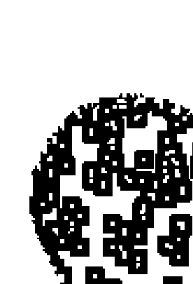

## ## 总结

在本章中，您学会将传统关系转化为超凡关系。要经历与自己的超凡关系，首先要克服阻碍您体验超凡的破坏性模式。您也学会让自己安住在第三心场域中。为了创造出伴侣间的超凡关系，您学会创造共同气场并共享幸福。为了创造母子间的超凡关系，您学会与未出世胎儿进行链接，进行宝宝按摩及学龄前唱颂。我们将向您献上最后一章，疗愈女性的灵性。为疗愈女性灵性，您将学到使用自我设限模式来探索您个人的道途。然后透过一些练习，提升女性灵魂最重要的两个元素：力量及爱。然后，您将学会欢庆女性的宇宙性特质。

## ## 练习

当您和孩子完成传统七脉轮唱颂后，继续从心轮唱颂五分钟。只要孩子喜欢，可以一直持续进行这个练习。

随着脉轮序列上移，升高音调。第二脉轮是 A 大调，第三脉轮是 B 大调，第四脉轮是 C 大调，第五脉轮是 D 大调，第六脉轮是 E 大调，而第七脉轮是 F 大调。若不清楚该唱颂哪个音调，试着从您能发出的最低音调开始，然后微调音调，直到感觉第一脉轮出现相应的共振，如振动或发光的感受，这表示您已唱颂出相合的音调。您可以用同样方式确认自己是否唱颂出七个传统脉轮的相合音调。在学龄前唱颂中，先由您从第一脉轮唱颂音调，当您唱颂完毕，邀请孩子一起用同样音调唱颂两遍。然后升高一个音调，从您的第一脉轮唱出音调，和孩子一起唱颂三次。继续以相同方式，每升高一个音调，唱颂三次，从您的第二、四、五、六及第七脉轮唱颂出来，并邀请孩子一起唱颂。

## 第二十四届 超级灵气

灵源文件整理

已疗愈自身灵性的年轻女性，将成为一座指引周遭人们的灯塔。她能毫不费力的与亲友共享女性宇宙性特质。并运用自身的判断力评定世间事物价值。她拥有自尊并确认身份认同的体验，因此没有任何人可以控制或操弄她。她所作的决定能够增进她与自己及他人的关系。对她来说，爱自己的身体是如此自然，因为她知道，自己的身体是女性的宇宙性能量的显化。她不会为男人牺牲自己的纯真或个人力量。她也会耐心等待自己的道途出现，然后热切的拥护它。

已疗愈自身灵性的成年女性，会选择一个尊重她的女性特质，并与她平起平坐的伴侣。她会自由的分享她的力量、创造力及内在光采，并为家庭提供一个健全的环境。她会付出特别的关怀来滋养自己的孩童。同时也会参与滋养自己并支持她灵性成长的世间活动。

已疗愈自身灵性的熟年女性，曾经验丰富内在生命。因此她并不畏惧死亡。虽然她已经年长，仍持续爱着自己的身体，温柔、尊重的对待它。她会自在分享自己的智慧，帮助年轻人有尊严的强健、成长。因为她已疗愈了自己的灵性，不会对任何事即使是年轻时的错误感到后悔。因为她在身心灵层面，一直敞开心胸拥抱女性的宇宙性特质，她会受到同辈的尊崇。此外，身为长者，她也会持续对社区做出贡献。

## ## 女性的灵性基础

不论在何种生命阶段，已疗愈自身灵性的女性，都能对自己和她人感受到超凡的爱与喜悦，如此的女性有力量、自知且不受世俗干扰。

单有人类的爱不足以疗愈灵性，即使短期内能达到净化灵性的效果。要疗愈自己的灵性，必须在灵性层面上有稳固基础。想要有稳固基础，女性要做到三件事，藉由找到个人道途来认清自己，若有必要，还要增加自己的自爱程度，不受世俗干扰，此外，也要能与他人共享自己灵性的重要元素——力量及超凡之爱（幸福）。

## ## 找到你的个人道途

要找到自己的道途，必须善用自己天生的力量与天赋、主导业力模式、还有第三心渴望。第三心（Dharma）一字从梵文字根而来，代表「开启」或「维持」。在瑜伽或谭崔教导中都曾提及，人类共享的集体道途，就是完成自我实现。每个人都有其个人道途，是其疗愈及个人解放的独特路径。

学习如何找到自己的个人道途，是我们在自身灵性疗愈旅程的第一步。道途（Dharma）一字从渴望是对幸福及解放的渴望，而解放则是来自于了解和遵从自己的道途。

要开始这个过程，先列出一张清单，写下最重要的天赋及力量。天赋及力量包含了镇定、有力的身体、强韧的性格、热情、同理心，以及其他与运动、艺术、音乐与智识有关的天赋。我们发现，支持个人道途的天赋和力量，在童年时就会显现。这些天赋与力量具有存在感，它们能驱动人们在世上显化自己的意志、渴望及创造力。

### ●你的主导业力模式●

主导业力模式是您带入此生中的最强力模式。大多数人有一个主导业力模式，有些人则有两个或三个主导业力模式。这些模式会限制您天生的力量、创造力及内在光采，也会阻挠您了解自己、向前迈进及疗愈自己灵性的各种努力。

在您列出主导业力模式后，尝试以正向角度看待它们，让它们导引您找到自己的道途，这样一来，您的自我设限模式将会转变成自我解放模式。

为帮助您进行这个过程，我们收录了四种最常见的自我设限模式，罗列如下。您可以将其作为自己清单的参考基础。在列清单的时候，尽可能诚实完整。

### ◎ 自我设限模式◎

1.  批判与缺乏包容
2.  控制及操弄
3.  自我毁灭倾向
4.  情绪压抑

当您完成清单后，有个重点需要注意，请避免不由自主的将这些模式与负面感受链接，也不要把焦点放在觉得无法克服这些模式上。相反的，尝试将负面模式转由正向方式来看待。在此以清单的第一个模式，批判与缺乏包容，来示范可以怎么做。

若您有此模式，意味着在前世中您曾失去或被剥夺个人权利。因此，您的道途应包含在此生中回复个人权利的部分。

上述例子示范了您如何将负面模式转由正向角度来看待，若以同样方式看待清单上的所有模式，您能把自我设限清单转换成自我解放模式清单。

## ## ⑤ 自我解放模式

我们将清单上的模式都转换过一遍，并收录了协助您克服这些模式的练习。您可以用我们的清单作为参考指引，来拟定自己的清单并疗愈清单上的模式。

## ## 一、批判与缺乏包容

这个模式显示，您在前世曾失去或被剥夺个人权利，需要在此生中回复个人权利。要克服这个模式，您要启动心轮，让自己安住在心轮场中，并让心轮场充满气（参见第三章）。

## ## 二、控制及操弄

这个模式显示，在前世中，您曾丧失对能量场及物质身体的控制，您需要在此生中回复个人力量及自我控制。要克服这个模式，练习至乐幸福手印。当您持手印时，要启动心轮，让自己安住在心轮场中，并让心轮场充满气。

### 三、自我毁灭倾向

这个模式显示，在前世中，您抱着十分负面的自我形象。除了毁坏宇宙给予的美好事物外，看不到任何其他选项。要克服这个模式，您要疗愈自己的心智层面和释放精微能量场的异常心智，然后练习自尊手印。

### 四、情绪压抑

这个模式显示，您在前世曾被剥夺表达情绪及感受的权利，而您必须在此生中回复自己的个人权利。要达成这个目标，您需启动心轮，让自己安住在心轮场中，并让心轮场充满气，然后再启动第二到第五脉轮，让自己安住在对应的脉轮场中，并让这些脉轮场充满气（参见第二章）。

当您完成了力量与天赋清单，并将您的自我设限模式转变成为自我解放模式，您可以将这两份清单合并，以显示个人道途所需的必要元素。举例来说，若您具备身体力量并对运动抱有热情，而您的自我解放模式清单上写着重新获得个人力量及自我控制，那么，您的个人道途就应该涵盖成为运动家、运动教练，或至少成为一个考察探险队的领导者。然后，您为找寻个人道途所该做的最后一件事，就是增强自己第三心的渴望。

透过提升自己第三心的渴望，您能验证自己在个人道途方面所了解的部分，并且对于如何在这个世界显化事物有更多的洞见。

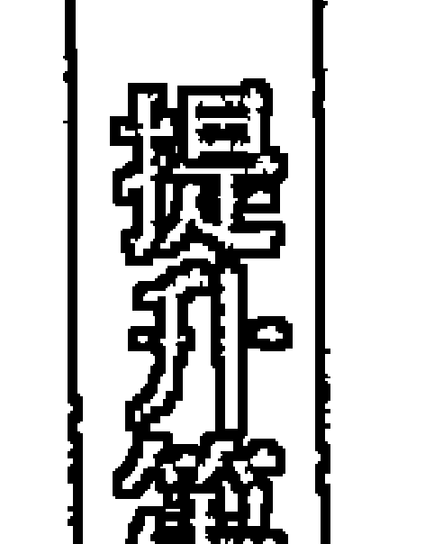

## ## 练习 提升第三心渴望

要提升第三心渴望，必须加强自己的意志、渴望及超凡之爱（幸福），再将这些特质合为一体。要达成这个目标，以一个舒服的姿势安顿好自己，背部打直，闭上双眼，鼻吸鼻呼，深呼吸一到三分钟，从五倒数到一，再从十倒数到一。运用标准法门让肌肉放松并安住在真实心智中。当您让自己安住下来，您已准备好将自己的真实意志、渴望及无条件的爱合为一体。要达到这个目标，宣告：『我要在核心场层面上，向内观照感官，并体验自己的真实意志。』花几分钟经验您的真实意志。然后宣告：『我要在核心场层面上，向内观照感官，并体验自己的真实渴望。』花几分钟经验您的真实渴望。继续宣告：『我要在核心场层面上，向内观照感官，并体验超凡之爱。』花几分钟经验超凡之爱。然后宣告：『我要结合自己的真实意志、渴望及超凡之爱。』花几分钟体验随即发生的能量变化。

您可能会看到光或是感觉在能量场里飘浮，无须对这些感受感到困扰。感受到光，表示您正安住在宇宙性特质中。感觉到飘浮，表示您的个人意志与欲望，暂时脱离了业力包袱及外部投射的影响。花五分钟以上享受其效果，然后持至乐幸福手印（见图9），继续进行这练习。
练习至乐幸福手印前，将舌尖轻轻顶住上颚，往上颚后端稍微移动，最后停留在上颚后端较柔软的位置。当舌头定位后，将双脚脚掌朝内，脚跟相互碰触。然后将双手食指弯曲，第一指节外侧互触。然后将双手中指弯曲，第二指节外侧互触，无名指及小指则向掌心弯曲。当舌头、手和脚部都就定位后，再次闭上双眼并享受这个练习十分钟以上，然后松开手印，从一数到五。
十分钟后，松开手印，从一数到五，数到五时，睁开双眼，您会感到非常清醒，全然放松，感觉比之前更好。

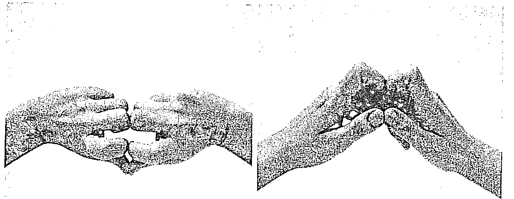

图9（重复）：至乐幸福手印

## ### 疗愈女性灵性

每晚做此冥想，持续两周。然后自问：我的个人道途是什么，我该如何在世上显化它？准备好在梦境、洞见、画面或印象中，寻求让您「知道」的答案，让您得以找到个人道途并明了如何显化它。当您找到了个人道途，可以运用本书学到的知识、技巧以及您的天赋、力量及直觉，塑造出适合自己道途，并欢庆女性灵性的生活方式及能量工作法门。

现在您已学会找到自己道途的相关技巧，灵性疗愈的下一步就是提升灵性最重要的两个特质：力量和爱。

为达成这个目标，您将练习自爱冥想及光体能量场冥想。在自爱冥想中，将三种爱的形式——人类之爱、灵性之爱及超凡之爱，融入您肯定生命的身份认同中，提升自爱的程度。在光体能量场冥想中，您会让您安住在光体能量场中，并在第十一章练习的冥想上加上一个步骤。当您增进了灵性力量与爱这两项光体场的必要特质之后，您将能和他人共享这些特质。

## 疗愈女性灵性

在您开始自爱冥想之前，有个需要注意的重点，请认清，自爱不只是对自己感觉良好，而是知道您是女性的宇宙性能量的具体显化，而灵性之爱则是您的女性特质与肯定生命身份认同的必要元素。

要开始自爱冥想，首先以一个舒服的姿势安顿好自己，背部打直。闭上双眼，鼻吸鼻呼，深呼吸二到三分钟，从五倒数到一，再从十倒数到一。

运用标准法门让肌肉放松，并安住在真实心智中。

然后念出此肯定语：「我要在面前创造一面一点五公尺的屏幕。」

继续宣告：「我要观想自己在屏幕上，洋溢着所有女性的宇宙性特质。」

当您的影像出现在屏幕上。宣告：「我要从人类之心散发人类之爱给屏幕上的我。」

继续宣告：「我要从心轮散发无条件的爱给屏幕上的我。」

再宣告：「我要让我的第三心——梵我，散发超凡的爱给屏幕上的我。」

持续这过程五分钟，然后宣告：「我要从我在屏幕上的影像，将爱从她的三心散发出来并传回给我。」

花十分钟体验你们彼此间的爱之流。然后释放您在屏幕上的影像，再释放掉屏幕，然后由一数到五，结束此冥想，数到五时，睁开双眼。您会感到非常清醒，全然放松，感觉比之前更好。当您需要时可做此练习。

### 练习：光体能量场冥想

要练习光体能量场冥想，以一个舒服的姿势安顿好自己，背部打直，闭上双眼，鼻吸鼻呼，深呼吸二到三分钟，从五倒数到一，再从十倒数到一。运用标准法门让肌肉放松，并安住在真实心智中。然后宣告：「我要安住在光体能量场中。」继续宣告：「我要在光体能量场层面上，让感官向内观照。」花几分钟享受能量转变。继续宣告：「我要让我的光体能量场充满气。」花五分钟享受这历程。然后宣告：「我要和所爱之人共享充满我光体能量场的气。」当气在你的周身散发流动时，花十五分钟体验光体能量场的转变，然后由一数到五，结束此冥想，数到五时，睁开双眼，您会感到非常清醒，全然放松，感觉比之前更好。当您需要时可做此练习。

现在您已拥有所需工具来疗愈自己灵性，并让灵性自由散发它的力量和爱，您已准备好庆祝女性的宇宙性能量。为了达到此目标，我们收录了三种活动：

-   散发内在光采女性的步行
-   散发内在光采女性的舞蹈
-   女性欢庆日

透过这三个练习，您将可在任何愉悦时刻欢庆女性灵性。

### 散发内在光采女性的步行

要进行散发内在光采女性的步行，先找一个喜欢的地方，在那步行不会受到干扰。树林或宁静沙滩会是好选择。当你准备好了，开始步行。步行时，感觉自己的双脚与大地及从大地涌出的女性性宇宙能量接触。保持专注，不用多久，就会感到脚底的小型能量中心散发光芒。

当你觉察到光芒，将注意力转向手掌的小型能量中心。继续走，掌心朝上，感觉手掌的小型能量中心与穿透空气的女性的宇宙性能量接触，当您感到手掌的小型能量中心散发光芒，将注意力放在心轮。持续从心轮呼吸，直到心轮开始活跃。然后宣告：「我要从心轮散发气，流经我的双眼，照进我周围的世界。」继续内在光采的女性步行二十分钟。在每一步中，尽情享受体会，流经您双眼的气如何丰富您对世界的体验。

### 散发内在光采女性的舞蹈

进行散发内在光采女性的舞蹈时，有没有背景音乐都可以。开始时站直，双肩往后挺，头抬高，用鼻子进行深呼吸，呼吸时，感受自己的呼吸及情绪变成散发光采能量之流的一部分，继续以这种方式呼吸，持续五分钟。然后开始转动你的右手腕，朝各个方向转动手腕，让你感觉到自己松开了限制手腕活动的能量淤结，然后以同样方式转动左手腕。再来是你的右手肘跟左手肘，接下来，朝各个方向转动你的脖子和肩膀，继续转动你的右脚踝、左脚踝、右膝盖、左膝盖、右髋关节及左髋关节。最后，朝各个方向转动腹部，带动整个骨盆转动。当你朝各方向转动骨盆后，会感到所有淤结都被松开，所有的关节开始与动作合为一体，让您可以自然而然的进行散发内在光采的女性之舞。

这种舞蹈不讲究规律，可以放开自己四处跳动，任意开始及停下，随意转换方向，让自己开心。

当您舞得越自然，会有越多的气倾入您的能量场中。这股气能够整合您的身体活动、呼吸及情绪。持续舞动十五分钟。

在散发内在光采女性的舞蹈中，有些女性会经历称之为能量高潮的体验。与一般高潮相比，能量高潮的能量是由心轮直接涌出。当身体动作、感受及呼吸同步，您能释出极大量的气。气会振动，这种振动会穿透您的身体，进入最深层的细胞层面。振动会如高潮一般，扩展并流经整个身体。若这股气流没有受到阻滞，它能带领您全然领会女性的宇宙性能量，并滋养和疗愈您最深层的身心灵层面。

# 第四章 歡慶女性靈性

另一個慶祝女性宇宙性特質的方式，是女性歡慶日體驗。女性歡慶日從一早還躺在床上時開始。

當妳醒來，盡可能讓自己處在半睡半醒狀態中，越久越好。在這種狀態中，腦波頻率會處於阿爾法—西塔（α-θ）波的頻率，在世俗問題還沒闖入打擾妳前，妳將體驗與女性的宇宙性能量的連接。

當妳體驗阿爾法—西塔波頻率一會後，起床淋浴，淋浴時用熱水潤濕身體。特別以熱水加強溫熱身體感到緊繃的部位，同時帶著覺知，隨著每個呼吸將氣吸入那部位。當溫熱感取代了緊繃感，改用冷水衝一下緊繃的部位。淋浴結束後用刷子按摩身體，促進循環。

接著穿上能提升能量層次的衣服。建議穿天然纖維的衣服，選擇讓感覺很好的衣服顏色，再喝一杯熱水。

再來享用一頓以飽含氣之新鮮食物做成的輕食早餐，水果和全穀類會是好選擇。吃完早餐後，到自然環境中去散步。

在散步過程中，經常停下腳步享受大自然，尋找妳視線範圍內的最大棵樹木並靠在樹上，感受氣從樹中湧出，流向妳的身體。若妳敞開心胸接受，短時間內感官就會變得更敏銳，妳對自然環境的體驗也會變得更加生動。妳可以在自然水域中游泳，增強自己對自然環境及女性的宇宙性能量的敏感度。水是五元素之一，讓自己浸潤在自然水域中，妳將能感受到氣正活化妳的身體及精微能量場。

在女性歡慶日中，飲用至少三公升的水。享用自然食物的健康晚餐後，看著太陽落下，一邊聽著妳最喜歡的古典樂曲。然後花點時間回顧這一天。注意那些干擾妳體驗身體與周圍世界女性的宇宙性能量能力的負面感受。試著定位出那些負面感受，並了解其背後的負面思維，然後把氣吸入負面感受所在的部位。氣會隨著每次吸氣，進入那部位。當你呼氣時，讓負面感受、負面思維及它們在身體中形成的緊繃感隨之消散。繼續呼吸，直到妳身體中的所有緊繃感消散為止。然後放鬆，繼續享受在心靈層面同慶女性宇宙性特質的時光。

將女性靈性歡慶儀式與妳的生活與關係結合，妳會成為鼓舞男性及女性的典範。這很重要。因為我們相信，現在已是每個女性朝向個人旅途邁向下一步的時機。創造全然健康、充滿活力的能量場域，並將其能量散發至氣場及身體中的每個細胞。如此一來，每個女性都會成為知識、女性特質及喜悅的載體。

# 名詞解釋

針灸穴點：位於經脈上的精微能量點。

自我：心智層面；決定者，過濾從其他心智層面所接收的資訊，並以其創造和妳對自我與關係的感知。

原型跳躍：一種練習，以提升自己力量、創造力及內在光采的肯定生命原型，取代過往被整合進自己人格的自我設限原型。

心智層面：精微能量載體，是真實身份認同的基礎。它比身體稍大，有四種不同層面——末那、菩提、心及自我。

梵我：三心中的第三心：是胸部右側一個「拇指大小」的區域。在其中，宇宙之愛以幸福形式湧進意識覺知。朝自己的內在遵循梵我，妳將在當下覺察自己與宇宙意識是一體的。

依存：帶有個別特質的能量場或扭曲能量，透過三種方式影響女性的精微能量場——以及心智——限制女性與氣的連結、形成不屬於女性心智必要部分的限制性模式（人格議題），並讓女性依附在童年和前世未解決的人際與關係議題上。

● 氣場：氣場是氣聚集的龐大場域，在所有次元中填滿及環繞妳的精微能量場。在各次元中，氣場從妳的身體表面開始，向外延伸（以所有方向）約五公分到六點五公尺。結構上來說，氣場是一個內裡中空的空間，一層薄薄的界線包圍著這空間，呈現蛋形。

● 真實渴望：來自真實心智中的渴望。幫助妳安住在精微能量場中，並增強流經妳精微能量系統的氣流。

● 真實心智：由能量場、神經系統及感官共同組成。可以導向外在（物質世界）或內在（能量及意識的精微世界），它是妳能量及意識世界覺知、表達及強健中心的真實載體。

● 幸福，至樂幸福：宇宙間最強的力量。所有人都活在幸福中——雖然大多數人並沒有發覺。根據譚崔學派，至樂幸福是一種持續的狀態，在妳能量場的深處，由意識（濕婆）及能量（夏克緹）相互結合創造而出。

● 障礙：泛指所有帶有個別特質的能量場，它們阻擾氣流經精微能量場，並妨礙人們安住在自己的真實心智中。

○ 界線：氣場的表層，由具有延展性，朝所有方向彼此交織的氣纖維共同組成。

○ 菩提：心智層面，負責分析和比較那些從已知環境區分出來的標的物、存有和能量場。菩提讓妳能將上述事物置於特別背景中以供研究，讓心能夠賦予其特定價值。

○ 脈輪：梵文單字，意指「輪子」。由兩個部分——脈輪場及脈輪開口所組成，脈輪場是一個氣的大型場域。對於那些能夠看見精微能量場的人來說，闇口看來像是一個有明亮顏色、快速轉動的圓盤。從底部看則像是一個長型輪軸或是一條長型莖狀物。脈輪傳送並轉化氣，將氣轉化成不同頻率以供能量場中的能量載體使用；你的能量系統中有一百四十六個脈輪。

● 脈輪療癒：一種能量療癒的形式，氣從脈輪中湧出，傳送到患者身體最需要的區域。透過脈輪療癒，妳可以從精微能量場中療癒自己身心靈方面還有關係上的不適情況。

● 陽蹻脈：陽蹻兩脈從雙腳腳跟的中心出發，沿著雙腳腳踝及雙腿外側延伸，與會陰底部的其他經脈連結。

● 陰蹻脈：陰蹻兩脈從雙腳腳跟的中心出發，沿著雙腳腳踝及雙腿內側延伸，與會陰底部的其他經脈連結。和陰蹻脈並行，共同組成腳部小型能量中心。

● 相對陽蹻脈，它們屬陰，因此被稱為陰性的腿部通道。和陽蹻脈並行，共同組成腳部小型能量中心。

● 性格，良好性格：包括不傷害他人、自律、勇氣、耐心、堅持、耐力及忠誠等特質。若將精微能量場維持在良好健康狀態，每個人都能為自己提升這些特質。

● 在良好健康狀態，每個人都能為自己提升這些特質。

● 心：心智層面，負責賦予事物價值，這些事物已先由末那獨立出來，並經菩提分析過。

● 能量素：帶有個別特質的能量投射，以細長管狀呈現，它是接近於成癮程度的依賴、需求和欲望等特質的顯化。加害者將其欲望或需求，透過能量索掌握或接觸其目標。

● 道途：來自梵文的字根，代表「開啟」或「維持」。在瑜伽或譚崔教導中都曾提及，人類共享的集體道途，就是完成自我實現。每個人都有其個人道途，是其療癒及個人解放的獨特路徑。遵循自己的道途，妳會明白妳自己誰，在此生中可以達成什麼。

+ ◎主導業力模式：主導業力模式是妳所帶入此生中的最強力模式。大多數人有一個主導業力模式，有些人則有兩個或三個主導業力模式。這些模式會限制妳天生的力量、創造力及內在光采，也會阻撓妳了解自己、向前邁進及療癒自己靈性的各種努力。

+ ◎能量阻礙：見阻礙一詞。

+ ◎能量投射：泛指任何個別化特質的能量投射。投射可以能量索形式及非物質存有伴隨形式呈現。當能量投射依附於人們的能量場，會導致自我設限及自我反對模式出現。

+ ◎能量載體：人類能量場中有兩種載體——能量體及鞘，兩者皆由氣所組成，它們是覺知、認知、吸收、感覺及表達的載體——在所有物質及非物質的次元中。

+ ◎能量體：人類能量場中的精微體，全部皆由帶有宇宙性特質的能量所組成，它們能夠讓妳在能量場中呈現自己，並透過妳的覺知與感官，體驗一切物質及非物質宇宙的活動。

+ ◎能量系統：一套精微能量器官系統，由脈輪、經脈及小型能量中心共同組成，可比擬成由發電廠、變電所、輸電網及電線共同形成的一個組合，將意識轉變為氣，並將氣從一種頻率轉換成另一種頻率。

+ ◎帶有個別特質的能量：隨時空不同而衍生及互相牽連的能量。它可能會在妳的能量場中累積。帶有個別特質的能量依存，會干擾氣在能量場的流動，也會妨礙人們活在當下。

+ 帶有宇宙性特質的能量：本質永恆不變的能量。它有很多種稱謂——夏克緹、普拉那、氣等等，它是流經脈輪及經脈的能量，以歡愉、愛、親密、喜悅、真實、自由及幸福等感受出現在意識覺知中。

+ 開悟：永恆的幸福狀態。在開悟狀態中，當下關於存在的問題皆消失不見，人們體驗到一種深沉的內在平靜。

+ 永恆當下：永遠的現在；當妳讓自己處於真實心智的居所。

+ 外在投射：帶有個別特質的能量投射，可由一人投射至另一人身上。當妳變得依附於外在投射，它會被整合進個人心智及自我之中，並變成妳帶入自己能量場中業力包袱的一部分。

+ 女性能量：當成女性能量自宇宙意識中升起，這股充滿創造力的能量變成了演化的原動力。女性能量不僅充滿於廣袤宇宙之中，世上所有女性也都帶有這股能量，創造、繁衍後代，生生不息。女性能量存在我們四周，帶來歡慶生命的力量，鼓舞人們彼此連結並體驗親密的感受，也讓人們體驗更深層的釋放及喜悅。

+ 同理能量場：一個可以增進個人療癒能力的資源場，它也是一個媒介，能量可以在其中彼此無私交換，而不受「我」意識或自我干擾。同理能量場有三個部分，分別是公眾同理能量場、個人同理能量場及超凡同理能量場。

+ 碎裂化：當能量載體脫離妳的能量場時，能量場就會呈現碎裂化。造成碎裂化最常見的原因，就是帶有個別心智功能：妳的心智有十六種重要功能，力量、創造力及內在光采也從其產生，包括意圖、意志、渴望、耐力、臣服、接納、洞悉、選擇、承諾、拒絕、信心、享受、破壞、創造、同理及愛等。

細菌學說：細菌學說由路易斯·巴斯德所提出，他認為疾病是因為細菌在人體中作祟所造成。當這種新理論深植人心，醫學處置方式開始變得機械化，也更遠離女性的療癒空間。從那時開始，女性的療癒空間幾乎被全然忽視。

良好性格：包括不傷害他人、自律、勇氣、耐心、堅持、耐力及忠誠。透過將精微能量場維持在良好健康狀態，每個人都能為自己增進這些特質。這意味著女性具備自律、耐心及勇氣，並對自己所作所為有所堅持——自由的散發氣及內在美的光芒。

督脈：督脈是人類能量系統中最重要的陽性經脈。起自脊椎底部會陰處，並沿著脊椎往上延伸至位於頭頂及其上的第七脈輪。七個傳統脈輪的陽性部分皆與它相連。

屬性：譚崔大師以屬性來描寫帶有個別特質能量場的特性。梵文字guna代表「特質或屬性」，在古典譚崔中，以悅性（Sattva）、惰性（Rajas）及變性（Tamas）三種屬性來描寫個體特質。

丹田：丹田的位置，在肚臍下方約四指寬及脊椎前方約一點五公分交界處。在日語中，丹田代表「腹部」。道家相信丹田是身體內藏生命精華之處，妳也能在那裡回復自己身體的強力中心。

◆ 療癒空間：見女性療癒空間一詞。

◆ 內在美：包含四個層面：良好健康、性格、內在平靜和氣。

◆ 內在平靜：內在平靜是種發自深層自我的穩定狀態。在妳安靜，專注在自發流經能量場的喜悅時發生。

◆ 意圖：真實心智功能之一，活躍於物質及非物質空間的世界及次元。妳能使用自己的意圖來運作心智注意力，定位出業力包袱的沈積，或是造成身體不適或自我設限模式的依存。

◆ 跨次元存有：泛指所有同時具有物質與非物質層面載體的生命。人類就是一種跨次元存有。

◆ 入侵：由個別特質扭曲能量對精微能量場的猛烈投射而生成，會造成自我限制及反自我模式。在西方世界，業力被定義成行為的累積效應，通常被比喻為『種瓜得瓜，種豆得豆』。

◆ 業力：梵文字彙，源於空這個字根，其意為『去行動』，象徵一個行動或是行為。

◆ 業力包袱：業力包袱由帶有個別特質的沈重能量所組成。當妳感到沈重時，業力包袱會造成壓力及肌肉疼痛，並造成自我設限及反自我模式，導致焦慮、自我懷疑及困惑，它是體驗良好健康及超凡關係的最大阻礙。

◆ 業力模式：一種能量模式，源自於精微能量場中的依存及業力包袱的沈積。這些模式會創造自我設限及毀損力量、創造力及內在光采的行為。

◆ 業力傷害：能量創傷所造成的能量傷害，參見業力包袱一詞。

+   - ● 亢達里尼／夏克緹：能量場中最大型的氣儲藏庫；源自夏克緹，透過真理，與妳及萬事萬物一同存在於現象宇宙中；以兩種形式出現：亢達里尼結構與蛇狀能量，位於脊椎底部。
- ● 肯定生命原型：支持人們力量、創造力及內在光采的原型，它們有助妳的道途，增進氣的流動，讓生命更喜悅。
- ● 肯定生命的身分認同：一種具有自信心、自尊及同理心的認同。
- ● 肯定生命的特質：力量、創造力及內在光采的基礎，這些特質包括歡愉、愛、親密、喜悅及良好性格的特質。參見良好性格一詞。
- ● 光體能量場：光體能量場是一種比核心場更高頻率的資源能量場。如核心能量場一般，滿溢於妳的能量場及身體中，並朝四面八方向外延伸，透過提升光體能量場功能並讓自己安住於其中，妳會在自己靈魂中找到一個處所，在那裡真實熱情取代了肉欲，讓真實女性特質浮現，不受干擾。
- ○ 末那：參見心智層面一詞。
- ● 母系社會：在母系社會中，以母親一方為主進行血統傳承。因此，母系社會的核心價值，在於提升男女之間及社會組織的陰陽力量平衡，促成平衡、非暴力及重視生命與關係勝於權力與財富的社會。
- ● 經脈：能量系統的一部分；經脈是能量的通道，將氣從脈輪運送至能量載體及氣場。帶有宇宙性特質的能量流過經脈，讓人們可以安住在自己的真實心智中，型塑真實身分認同並得以進入超凡關係中。

中庸之道：一種平衡生活，包含同理心以及自在表達自我和女性宇宙性質的力量。擁護中庸之道，女性可以在工作中或任何生產性活動中，如同男性一樣表現，甚至表現得更好。因為她會擁有足夠的力量或能量，來支持她前進並確保結果成功。

心智：心智由三個重要元素所形成。物質層面上，心智包含了腦、神經系統及體內的化學元素，像是影響其結構及活動的荷爾蒙。非物質層面上，心智包含了精微能量場及其器官和載體，以及滋養它們的氣。而物質和非物質元素則組合成人類心智的第三部分——心智網絡。這三部分各有其獨特的能力及需求。心智網絡包含心智與其個別部分的連結，以及心智與外在事物的連結，同時包含意識及能量，也包含對他人、非物質存有及他人與非物質存有投射的依存。

小型能量中心：能量系統的一部分，遍佈全身。四個主要小型能量中心，分別位於雙手及雙腳，其他則遍佈能量場中，它們的主要功能為，啟動精微能量場及身體中的氣流活動。

手印：由手指或手掌構成某種姿態，有其象徵性意義。除手指及手掌外，有時也會加入舌頭和腳部動作。每個手印對人類能量場及流經能量場的能量有其特別功效。

共同氣場：伴侶們可以創造一個帶有宇宙特質的能量場來環繞彼此。這個場域，我們稱之為共同氣場，它很強健，足以保護伴侶間的親密體驗不受業力包袱或局限的信念所干擾。

負離子：當空氣分子受陽光、空氣流動及水影響而斷裂，負離子就在大自然中生成。負離子分子聞或嚐起來皆無味，也無法為視覺所見。在某些環境中，我們能夠大量吸入負離子，像是山林、瀑布及海灘。當負離子進入血液之中，會產生生化反應，分泌更多提振情緒的化學物質——血清素。血清素含量的增加可以緩解憂鬱症狀，釋放壓力並提升精力，這些都能提升我們的健康與美麗。

忽略：當父母親或照顧者想要兒子而非女兒，或父母過於關注自己而無法給女兒適當照顧時，女性可能就會遭受忽略創傷。對於孩童來說，忽略永遠涉及心理及能量上的拒絕。

嗡（OM）：嗡是宇宙的聲音。當宇宙被創造時它即出現。其療癒效果也廣為人知，特別是與適當的冥想及手印一起搭配運用時。

至樂幸福：至樂幸福是種持久狀態，存在於你的能量場深處，源於意識匯集之處（濕婆）及能量（夏克緹）。帶有宇宙性特質的意識及能量融合後，可為你創造一個安全天堂，在那兒妳體驗合一，也不會有任何事物干擾妳體驗超凡關係。

被動侵略性模式：感到無力或無法自在宣告自身力量的人們，會採取的能量模式。這種自我設限模式，常見於不崇尚女性宇宙性特質的僵化社會。在關係遊戲中，消極侵略性模式常以喋喋不休、誘惑及內疚幻象等形式顯現。

前世情人：妳在前世的情人，而妳對他仍有依存。這種依存會創造出妳對前世情人某項或某幾項最顯著特質的渴望，可能會毀損你的精微能量場及親密關係。

※ 個人癒療空間：參見女性癒療空間一詞。

※ 極性：精微能量場偏向男性化能量或女性化能量的程度。極性的原則，如同《卡巴拉密教》(The Kabbalion)所定義的：「萬事萬物皆有其雙重性質；萬事萬物都有其相對事物；好惡皆同，相對本質上相似，只是程度上相異；極端與極端相會；所有真相如是卻只是一半為真；所有矛盾皆能和解。」

※ 普拉克里提能量場：普拉克里提能量場是包含最高頻、最純粹女性能量頻率的一種資源場。如同所有資源場一般，普拉克里提能量場在所有次元填滿你的能量場並向外延伸。

※ 氣繃帶：對妳的心理及能量場健康有極佳效果，因為它能封住因流產、墮胎或死胎造成的能量創傷。

※ 普魯夏能量場：原始的男性能量場。是一個資源能量場，與女性能量的原始場普拉克里提能量場，在宇宙演化的第四階段中一同生成。

※ 惰性能量：惰性能量比變性能量輕盈一些，在大多數例子裡，對健全身心的危害較少，但過量的惰性能量，仍會讓妳偏離自己的強健中心，讓妳難以敞開心胸接納女性能量的宇宙性特質，參見屬性一詞。

※ 帝王瑜伽：一種力量與能量的瑜伽，四種經典瑜伽的其中一種。

※ 共振：代表能量場或生靈的振動或頻率，每個帶有宇宙性特質或個別特質的生靈和能量場都有其個別振動。

※ 資源能量場：帶有宇宙性特質的意識和能量場，滋養妳的能量場及能量場中的能量載體。資源能量場幾乎是無限大並填滿、包圍妳的能量場。

局限的信念：局限的信念是那些廣為社會組織所接納，卻妨礙人們自由表達的信念。局限的信念阻礙了氣的流動，也導致人們難以安住在自己的能量場中。

局限的信念系統：限制在精微能量場中流動的氣，認同自我設限的信念。在極端的案例中，甚至會造成強迫症狀，促使反自我或反社會的行為發生。

悅性能（性）：悅性能（性）比變性及惰性能量更輕盈一些，對人類整體身心健康傷害最小，但它仍能阻礙妳連結自己身體及精微能量場的強健中心，讓妳難以成為自己、自由的表達自己。

長舌鉤：長舌鉤是一種由金屬和皮革組成的裝置，放置在嘴中並在後方固定。這種裝置設有帶著尖刺或鋒利邊緣的壓舌器。放進女性嘴裡之後，她一說話就會疼痛。這裝置用來羞辱因喋喋不休而被男性議會判定有罪的女性。

自我設限原型：一種扭曲和扁淺的女性形象。這種原型會扭曲女性對身體及自我的感覺，讓女性難以創造健康、肯定生命的身分認同，進而限制女性的力量、創造力和內在光彩。

鞘：鞘如同能量體般穿透妳的身体，由宇宙性特質所組成，讓妳得以和外在環境與其他生靈互動，提供妳表達自己及進入超凡關係所需的彈性。

濕婆／夏克緹：濕婆和夏克緹被視為神聖伴侶及意識（濕婆）和能量（夏克緹）的原型。

+   - **銀色能量索**：每個能量體都透過銀色能量索與人們的能量場相連，銀色能量索自人們的頸背向外延伸，能延伸至幾近無窮遠處。
- **標準法門**：練習標準法門約需二十分鐘。首先交替收緊、鬆開的動作，讓身體主要肌肉群放鬆。然後運用意圖讓感官向內觀照，讓自己得以定位精微能量場並安住其中。
- **精微能量場**：帶有能量載體的能量場，讓妳得以在物質及非物質層面上表達自己並與環境互動，也包含一些資源能量場及精微能量系統，為能量場提供肯定生命的女性能量。
- **精微能量系統**：包含脈輪、脈輪場、經脈、氣場及散佈在精微能量場中的許多小型能量中心。如同輸電網絡為居家及商業環境提供能源，妳的精微能量系統器官也傳送、轉化所有妳的身體及能量載體所需的氣，以維持它們的健全運作。
- **表層界線**：表層界線是妳的能量場的表層，它們環繞所有能量場域（氣場及資源場）和能量載體。界線模糊薄弱的人，會缺乏安全感，也無法全然體現女性能量的宇宙性特質。
- **變性能量**：變性能量，是個別特質能量中最沉重也最扭曲的一種，過量的變性能量附著在精微能量場時，會導致嚴重疾病，對整體身心健康產生毀滅性的影響。參見屬性一詞。
- **譚崔**：印度的古老教派，認為宇宙性特質能量及意識本質上相同。在譚崔圖像中，濕婆代表意識，夏克緹代表能量，兩者相擁永不分離，代表它們在本質上被視為一體。

真理：进化过程中的阶段。这个词汇结合了代表「那个」的梵文字根 tat，以及代表「汝」或「你」的 tvam。因此真理象征着一个古远真相，那就是你永远与宇宙意识同在。藉由安住在真实心智中，你也能蒙受同在的好处（包括了欢愉、爱、亲密及喜悦）。根据瑜伽与谭崔的教导，物质与非物质宇宙的进化过程已经到达第三十六阶段。

第三心：参见人类之心。

第三心能量场：一个资源场，将能量传进你的能量场及物质身体里。透过第三心场域，你能体验与自己及与所爱之人的超凡关系。

三心：每个人都具有三心——位于胸腔左侧的物质心心脏，胸腔中心的心轮，以及阿特曼——位于胸腔右侧的第三心。幸福自梵我浮现，流进意识觉知中。

传统关系：传统关系期待女性支持丈夫，为所爱之人牺牲自己需求，并将社会核心价值传承给自己的小孩。不幸的，即使在二十一世纪，局限的信念和自我设限模式，仍透过社会化过程传给下一代。

超凡：与宇宙意识、与自己和与伴侣间的合一或亲密状态。在超凡状态中，你能不受干扰的体验及分享幸福及宇宙性特质，如欢愉、爱、亲密及喜悦。

超凡关系：伴侣能共享欢愉、爱、亲密及喜悦，不受障碍、业力包袱或任何事物干扰的一种关系。传统关系生活在局限中，相反的，超凡关系则超越限制，这也是为什么在超凡关系中，散发内在光彩的女性，会体验到身处传统关系的女性无法得到的满足感。

创伤：每个创伤事件其实都是双重事件，包含两种创伤，身心创伤以及存在于非物质层面，却同等真实的精微能量场创伤。精微能量场所遭受的暴力，是造成创伤幸存者饱受绝大部分急性或慢性创伤症状折磨的主因。

宇宙意识：由所有男性及女性层面所组成的一体存有，阴／阳。它是真实心智及物质和非物质宇宙中万事万物的基础，包含了时间、空间、能量及意识。

女性的宇宙性能量：鼓舞人们彼此连结并体验亲密的感受。每个人与生俱来这股能量，因此，人人皆可成为疗愈师、充满爱意的情人，以及从深层内在散发光彩的个体，透过自己所提供的服务与关系转化世界。

宇宙性特质：宇宙性特质包含欢愉、爱、亲密、喜悦、真实及自由。宇宙性特质不会产生依存——它们支持道路、超凡关系及自我了悟。

载体：一种能量载体。你拥有两种能量载体，能量体及鞘。能量体让你得以存在当下，鞘让你得以和其他生灵互动。

女性疗愈空间：女性疗愈空间是女性在其能量场中创造出来的场域。她可以在这个场域中疗愈自己及所爱之人的身心灵层面。要创造疗愈空间，你需要合并普拉克提能量场和同理能量场这两资源场的能量与觉知。

- 阳维脉：阳维两脉是阳性手臂通道。双臂皆有，它们绕过双手中指，将肩膀及掌心的小型能量中心予以连结。
- 阴／阳：阴代表女性、身体、灵魂、地、月亮、水、黑夜、冷、黑暗及收缩。阳代表男性、心理、灵性、天、太阳、白昼、火、热、阳光及扩张。
- 阴维脉：阴维两脉是两条手臂通道，双臂皆有，它们将掌心的小型能量中心及胸部予以连结。阴维脉自双臂内侧延伸，和阳维脉并行，构成掌心的小型能量中心。
- 瑜伽：合一。也意指在印度发展出的一种古老科学法门，目的为达到开悟状态。
- 瑜伽式呼吸：一种瑜伽呼吸技巧；瑜伽式呼吸有助呼吸回复自然状态并提升能量场流动散发的气流量。
- 优尼：优尼是一个梵文词汇，意指「神圣通道」或「诞生之处」。广义来说，它亦代表起源、根基或神圣空间：一个散发内在光采的完整女性所拥有的空间，是女性的宇宙性能量显化之处，也是性愉悦的泉源。

## 参考书目

Boakye, Priscilla Akua. “DIPO-Puberty Rites Among the Krobo of Eastern Region, Ghana.” University of Tromsø, Project 2009/1415-2, Master Programme in Indigenous Studies.

Cummings, E. E. “A Poet’s Advice to Students” in *A Miscellany*. Edited by George J. Firmage. New York: Argophile Press, 1958.

DiMaria, Lauren. “Children are More Prone to Depression During Puberty.” About.com. Updated August 27, 2011. http://depression.about.com/od/teenchild/a/depression-during-puberty.htm.

Fisher, Helen F. *The Sex Contract: The Evolution of Human Behavior*. New York: William Morrow, 1983.

Goethe, Johann Wolfgang von. “Die Braut von Korinth.” Tuebingen, Germany: Cotta Verlag, 1798.

Hänsel, Rudolf. “Die zu häufige Nutzung digitaler Medien vermindert die geistige Leistungsfähigkeit unserer Kinder.” October 2012. http://www.zeit-fragen.ch/index.php?id=1170.

Howe Gaines, Janet. “Lilith in the Bible, Art and Mythology.” Biblical Archaeology Society. Updated August 11, 2014. http://www.biblicalarchaeology.org/daily/people-cultures-in-the-bible/people-in-the-bible/lilith/.

Humm, Alan. “Overview of Lilith.” http://jewishchristianlit.com/Topics/Lilith/.

Jones, Adam. “Case Study: The European Witch-Hunts, c. 1450-1750.” Gendercide.org. http://www.gendercide.org/case_witchhunts.html.

Lysebeth, Andre van. Tantra. Munich: Mosaik Verlag, 1990.

McCarthy, Wendy Ann. Ich bin Bewusstsein. Zwickau D: Innenwelt Verlag, 2013.

Miyoshi, Shunichiro. “Menstrual Blood Shows Heart Repairing Stem Cell Properties.” Medical News Today. Updated April 25, 2008. http://www.medicalnewstoday.com/articles/105322.php.

Mumford, John. Ecstasy Through Tantra. St. Paul, MN: Llewellyn Publications, 1975.

Pro Femina e.V. “Komplikationen nach einer oder mehrerer Abtreibungen.” http://www.vorabtreibung.net/node/43.

Pröll, Gabriele. Das Geheimnis der Menstruation, Kraft und Weisheit des Mondzyklus. Munich: Goldmann Verlag, 2004.

St. Hieronymus. “Women are unclean during Menstruation.” http://www.womenpriests.org/de/traditio/unclean.asp#latin.

Stiene, Bronwen, and Frans Stiene. “The Deeper Meaning of Hara.” Shibumi International Reiki Association (blog). http://www.shibumireiki.org.

Swamini Mayatitananda. “Honoring Shakti.” www.organickarma.co.uk/shakti-energy.html.

Tjaden, Patricia, and Nancy Thoemnes. “Full Report of the Prevalence, Incidence, and Consequences of Violence Against Women.” CreateSpace Independent Publishing Platform, 1998.

Trieb, Traude. Kindlein Komm Tee. www.traude-trieb.at.

Walker, Barbara G. Das Geheime Wissen der Frauen. German edition of The Woman’s Encyclopedia of Myths and Secrets. Uhlstädt-Kirchhasel: Arun-Verlag, 2007.

Wolf, Doris. “Sex ohne sexuelle Phantasien geht nicht.” http://www.partnerschaft-beziehung.de/sex-gehirn.html.

# Red Earth 2
女人能量疗愈宝典
结合手印、脉轮和冥想的身心能量疗法，回复你的宇宙力量和自性光彩

Energy Healing for Women:
Meditations, Mudras, and Chakra Practices to Restore Your Feminine Spirit

| 职位 | 姓名 |
| :--- | :--- |
| 作者 | 凯斯·雪伍德（Keith Sherwood）和萨宾娜·惠特曼（Sabine Wittmann） |
| 译者 | 王若晞 |
| 美术设计 | 张燕仪 |
| 内页设计 | 黄昀嘉 |
| 责任编辑 | 朗慧 |
| 内页排版 | 李秀菊 |
| 校对 | 朗慧、简淑媛 |
| 业务 | 郭其彬、王缀晨、邱绍溢 |
| 行销企划 | 陈雅雯、张琼瑜、蔡玮玲、余一霓、王涵 |
| 总编辑 | 黄妏俐 |
| 发行人 | 苏拾平 |
| 出版 | 新星球出版 |
| 地址 | 105台北市松山区复兴北路333号11楼之4 |
| 电话 | (02) 27182001 |
| 传真 | (02) 27181258 |
| 发行 | 大雁文化事业股份有限公司 |
| 地址 | 105台北市松山区复兴北路333号11楼之4 |
| 24小时传真服务 | (02) 27181258 |
| 读者服务信箱 | Email:andbooks@andbooks.com.tw |
| 邮拨帐号 | 19983379 |
| 户名 | 大雁文化事业股份有限公司 |

Energy Healing for Women:
Meditation, Mudras, and Chakra Practices to
Restore Your Feminine Spirit
Copyright © 2015 Keith Sherwood and Sabine
Wittmann
Published by Llewellyn Publicans
Woodbury, MN 55125 USA
www.llewellyn.com

国家图书馆出版品预行编目 (CIP) 资料

女人能量疗愈宝典：结合手印、脉轮和冥想
的身心能量疗法，回复你的宇宙力量和自性
光彩／凯斯·雪伍德（Keith Sherwood）、萨
宾娜·惠特曼（Sabine Wittmann）合著；王
若晞译.-- 初版.-- 台北市：新星球出版：大
雁文化发行，2017.05
面；公分.-- (Red earth ; 2)
译自：Energy Healing for Women : meditations,
mudras, and chakra practices to restore your
feminine spirit
ISBN 978-986-94209-6-9 (平装)
1.另类疗法 2.能量 3.健康法
418.995
106002310

初版一刷／2017年5月 定价：350元
ISBN：978-986-94209-6-9
版权所有·翻印必究 (Print in Taiwan)
缺页或破损请寄回更换 ALL RIGHTS RESERVED

# 78个简单技巧和练习，启动女性直觉感官，运用你无限的宇宙性能量，疗愈自己及所爱之人

凯斯和萨宾娜两位疗愈大师，从事女性能量疗愈工作将近30年，深入女人没自信、自我否定、不爱自己等等能量闭锁的议题根源：包括业力、制约、情绪、受虐或生育创伤。他们融合东西方古老及现代智慧，透过精微能量场运作，协助每一个女人触及创伤和业力模式，参与疗愈过程，强化自己的力量中心，发现喜悦与丰盛的生命活力、创造力，原来就在自己之内。

书中分享的技巧和练习：脉轮、业力释放、帝王瑜伽、呼吸、按摩、舞蹈、手印、冥想及肯定语等等，协助女人从各层面疗愈创伤，重新整合并提升自己，重新回复女性内在的喜悦与光采。

你将学到：

◇ 自由表达女性能量
◇ 欣赏并喜爱自己的身体，增加自信
◇ 超越局限的信念
◇ 破除旧有负面的女性原型
◇ 提升直觉、创伤修复力及感官体验
◇ 将传统关系转化成超凡关系

ISBN:978-986-94209-6-9 KF002 定价350元 新星球 大块出版集团