## 女性能量疗法
## 永保青春健康的自助宝典

写给地球上每一位女性的保健书

改变自己的能量，自己作主，当一个健康又快乐的女人！

唐娜·伊顿 Donna Eden
大卫·费恩斯坦博士 David Feinstein, Ph.D. 合著
许瑞云 审阅 徐晓珮 译

王曙芳、胡因梦、许瑞云 郑重推荐（按姓氏笔划排列）

## Energy Medicine for Women: Aligning Your Body's Energies to Boost Your Health and Vitality

※ 神秘学资料库
※ 神秘学培训机构
※ 水晶能量研究中心
※ 专业占卜预测机构
※ 官方微信：strcdts
※ 微信公众平台：strc2011
※ 官方店铺网址：http://strc.cr.cx
※ 读书交流QQ群：
占星塔罗占卜师交流群：814594478（加入密码：PDF）
神秘学其他综合群：659338717（加入密码：PDF）

## 制作说明：

本书由《天使神秘学院》出重金从台湾购入的原版书籍扫描制作完成。为达到最好阅读效果，特地把书全部切开后，再经由专业扫描设备高精度扫描完成，并经过一张张的PS后期处理最终成书，其间花费大量的人力、物力以及时间，只为能给大家提供经济并优质的神秘学学习资料而努力。

本学院强力谴责某些机构和个人，把本学院花心血制作完成的电子书籍，包装后直接放在自家淘宝网上低价销售的行为，以谋取不劳而获的经济利益。如果长此以往最终将无人愿意再为大家花心思制作电子书，那以后可能大家再无新书可读。

为让大家以后能够读到更多的好书，也为了本学院的良性发展。本学院恳请大家尽量做到如下几点：

- 一、尽量在天使神秘学院的官方网站购买电子书籍。
官网电脑访问地址：http://strc.cr.cx

- 二、在收到电子书后小范围传阅即可，千万不要公开传播，更别挂到淘宝网上低价销售。

同时为答谢广大支持者，学院电子书将做如下调整：

- 一、学院会把一些早已收回制作成本的电子书折价销售。
- 二、最新制作的电子书籍会开放打印功能，大家购买后有条件的可自行打印成书。

天使神秘学院
2020年5月

## 作者

### Donna Eden
唐娜·伊顿

在能量疗愈的领域中，唐娜·伊顿是最受欢迎、最具资历、最令人愉悦的演讲者。她以疗愈能力极为强大而闻名。她与大卫·费恩斯坦博士共同开设「伊顿能量医疗机构」（Eden Energy Medicine），进行疗愈与培训课程。著有《能量医疗》（Energy Medicine: Balancing Your Body's Energies for Optimal Health, Joy, and Vitality）、《爱的能量：活化亲密关系的能量疗法》（The Energies of Love : Using Energy Medicine to Keep Your Relationship Thriving）。

### David Feinstein, Ph.D.
大卫·费恩斯坦博士

约翰霍普金斯大学医学院（Johns Hopkins University School of Medicine）教授，临床心理医师，关于潜意识和疗愈的著作曾获九项全国大奖。

## 译者

### 徐晓珮

政大英语系、台大外文所毕。辅大译研所肄。工作语言为中英日，热爱英美文学及日本动漫艺能。译作有奇幻小说《符印传说》（角川出版）、饭岛奈美《LIFE》系列、《123人的家》（朱雀出版）等书。E-mail: hikari1974@gmail.com

## 审阅者

### 许瑞云

原本主修运动神经学，因为对营养学及如何维持最佳体能状况特别感兴趣，因此继续攻读营养学和流行病学硕士，毕业后又至波士顿大学转攻医学博士，并在哈佛大学附属医院接受住院医师训练，之后成为哈佛医院的主治医师及哈佛医学院讲师。目前任职于花莲佛教慈济综合医院。许瑞云医师也接触中医，进而研究自然疗法、能量医学等不同领域，并具备「唐娜·伊顿能量医疗高阶能量治疗师认证资格」(Donna Eden Energy Medicine Advance practitioner)，是亚洲目前唯一的一位。

## 女性能量疗法
## 永保青春健康的自助宝典
## Energy Medicine for Women
## Aligning Your Body's Energies to Boost Your Health and Vitality

by Donna Eden, David Feinstein
唐娜·伊顿 (Donna Eden)
大卫·费恩斯坦博士 (David Feinstein, Ph. D)
合著
徐晓珮 译
许瑞云 审阅

- 思想观念的带动者
- 文化现象的观察者
- 本土经验的整理者
- 生命故事的关怀者

## 心灵工坊 PsyGarden
## Holistic

探索身体，追求智性，呼喊灵性
攀向更高远的意义与价值
企求穿越回归真我的旅程

献给我的女儿，谭雅·达林与丹蒂·达林。
愿她们与她们的世代展翅飞翔！

杰若米·塔契 (Jeremy P. Tarcher)，让我们文化中许多启发人心的声音能够广为人知，同时也特别让我的声音能够被听见。非常感谢他的鼓励、智慧与开创的精神。
塔契／企鹅出版社的莎拉·卡德 (Sara Carder) 是梦想中的好编辑。
已过世的杰弗瑞·哈里斯医师 (Jeffrey Harris)，以充满智慧的神奇方式引领支持我完成本书。
在我们不断成长的能量疗法教学团体中的每一位成员，都以他们独特的方式对本书中呈现的概念想法有所贡献。

感谢为本书拍摄照片的克莉丝汀·亚利奇诺 (Christine Alicino)。

感谢书中示范动作的各位女性：克莉丝汀·亚利奇诺、因芬特·戴尔 (Infant Audrey Dahle)、丹蒂·达林 (Dondi Dahlin)、谭雅·达林 (Tanya Dahlin)、唐娜·伊顿 (Donna Eden)、萝丝·哈利 (Rose Harris)、葛温·马祖 (Gwen Mazur)、凯萨琳·波坦萨 (Catherine Potenza)、碧雅·提普利欧罗 (Beate Priolo)、蒂亚·琵雅 (Tia Via)。

> 有一种活力、一种生命力、一种能量、一种波动，
> 透过你化为动作，
> 因为这世间只有一个你，所以呈现出的是一种独一无二。
> 如果你阻断了这种流动，它就无法通过其他媒介存在，
> 而且永远不再回来。
>
> ——现代舞大师 玛莎·葛兰姆（Martha Graham）

## 【中文版审阅序】 写给地球上每一位女性的保健书 许瑞云

## 【推荐序】 一起重新打造自己，发展各种可能性吧！ 克莉丝汀・诺瑟普

## 导论 拥抱体内独特的波动

# 1 一种称为能量的疗法

# 2 维持健康与活力的能量技巧

## 3 了解你的好朋友：荷尔蒙

# 4 改善经期不适的技巧

# 5 健康地怀孕与生产

# 6 更年期：通往人生第二高峰

# 7 体重管理技巧

## 【附录一】 与身体的能量对话：能量测试的艺术

## 【附录二】 学习资源

## 【附录三】 中英名词对照表

## 寫給地球上每一位女性的保健書

唐娜・伊顿是举世闻名的能量医疗大师，也是我学习能量医疗的启蒙老师，她所撰写关于女性能量医疗书籍的中文版终于要面世了。本书可说是一本女性的健康百科全书，内容既丰富又实用，不仅介绍了人体能量的九大系统，更重要的是每个章节都涵盖了女性在不同时期所面对的健康重要议题。从女性进入青春期可能出现的经前症候群、经痛、水肿、情绪不稳、经期不规律，到怀孕和生产过程中，如何处理孕期的不适并帮助顺产，以及女性更年期会有的潮红热、失眠、性欲降低等问题，本书都有详尽的叙述，教导我们如何透过简单的动作，以最自然的方法，让卡住的能量得以顺畅调和。

本书也针对许多女性相当关切的体重议题深入探讨，让读者了解如何做好体重管理，帮助自己维持理想体重，保持健康。我在门诊时，也常教导女性病患应用本书所介绍的方式，来调整女性荷尔蒙和甲状腺素的分泌，降低或消除因荷尔蒙不协调所带来的身心困扰，进而维持最佳状态！

相信读者能够从阅读这本书，得到许多有用的健康资讯，帮助更多女性过得美丽、健康又快乐！

> ——许瑞云医师
> 亚洲唯一通过「唐娜・伊顿能量医疗高阶能量治疗师认证资格」(Donna Eden Energy Medicine Advance practitioner) 者

## 【推荐序】
## 一起重新打造自己，发展各种可能性吧！

从很久以前开始，我在妇科执业的时候会辅以能量疗法，譬如要进行侵入性门诊检查时，像是子宫内膜检查、移除子宫内避孕器，或是子宫染色检查等。我发现这些常规检查对于身体自然的能量场伤害很大，因此，在看诊结束前，我会让病人躺下来，用双手在她们的身上进行长推的动作。这个简单的动作似乎可以帮助身体能量场重新稳定。许多女性马上就能感觉到疼痛或痉挛缓解了，受伤的区域感觉舒服地发麻，或是全身沉浸在深层的平静中。

虽然它是非常简单的方法，但是做起来很愉快，没有侵入性，又有效。虽然现在实际的能量疗法领域已经发展出比我早年所使用的更为复杂的方法，不过所有的方法都还是把握了基本的原则：简单、愉快、非侵入性。但可别想得太浅了，妳的双手拥有强效的疗愈能力，也就是「能量疗法」，除了能够在侵入性的检查治疗后提供舒缓效果，还能够预防或协助治疗麻烦的疾病。

能量疗法已经迅雷不及掩耳地进入我们的医疗保健系统。现今社会已经走到了牛顿时代医学的尽头，我们的医学角度是把身体视为一堆器官和骨骼的集合体，而不是活生生的奇迹；只专注于疾病本身，而不是强化健康状态；只想找出简单的因果关系，而不去理解身心灵之间复杂深奥的连结。我们因此打造了一个以药物和手术为基础的医疗系统，除非已经生病了，否则平常不会特别注重保健。就像河道巡逻队只负责派出快艇，救出在急流中快要溺毙的人，而不是到上游去找出避免掉进急流的办法。

这样的模式已经走不下去，因为完全无效。可可・摩尔（Michael Moore）的纪录片《健保真要命》（Sicko）拍摄了丰富的例证，说明得完整透彻。旧的标准在我们面前崩溃，但我们也见证了新的标准兴起。而且令人开心的是，这个新的标准其实早在古远以前就已然扎根，通过了时间的考验。本书优雅地介绍了这个新的标准，可以从能量层面处理生理发生的问题，不仅提供精确、实用、迅速又属于非侵入性的方法，使得强化健康与治疗疾病双管齐下，还让大家都能够学习在家自我照护的有效方法，进而促进身心灵的整合。

但也许多关于能量疗法最好的消息是，虽然许多保健方面的先驱相信这是未来的医疗主流，不过其实我们现在就可以使用，根本无需等待。就算妳现在住的地方没有又如何！就算妳现在就诊的医院没有又如何！就算妳的医生现在还不相信能量疗法又如何！妳可以从现在正在读的这本书里学到基础的技巧，还可以搭配妳目前使用的任何医疗保健方式。真的是任何的保健方式！能量疗法的美丽之处就是不会产生交互影响，而且没有任何副作用。所以为什么不试试看呢？反正没有什么损失！

本书是介绍能量疗法很好的入门书。这个领域中最风趣又有能力的先驱者之一，将她的经验浓缩成容易理解又实际真诚的指南。我在还没见过唐娜・伊顿或是有机会看她进行疗程之前，就决定要写这篇推荐序了。虽然我审阅过许多文笔流畅、资讯丰富的书籍，但更深一层的真实却是珍贵而罕见。本书和这种真实相应唱和。当我终于有机会见到唐娜，我发现她书中展现的热情与智慧，完全就是和她本人一模一样。唐娜已经65岁，但看起来出奇年轻，正是最佳的活广告。她洋溢着满满能量，而且为人非常、非常风趣。

这篇推荐序圆满了我个人和能量疗法之间的关系。我在诊疗的时候总是会意识到身体能量的重要性，也直觉地能够了解病人的想法、恐惧、渴求、爱情、家族历史、工作、饮食、运动习惯和整体生活型态对身体能量造成的影响，以及能量在他们的健康与疾病上强力的作用。但医学院并没有教导关于保健医疗的基础面，于是我开始和同业讨论能量疗法的重要性，然后感觉自己像是传说中的荒野之声一样。早年执业的时候，我不认为在我有生之年能量疗法会为大众所接受。不过现在，许多领域都反映出能接受能量疗法，包括我自己的生活在内：我的著作名列纽约时报畅销排行榜，自己也上了好几次欧普拉脱口秀。我有着清清楚楚的量化证据，显示许多人已经准备好聆听引导我工作的技巧原则，同时医界团体也开始愿意打开他们的耳朵。

世界改变的速度真的很快，比我们大部分人十年前想像得还要厉害。虽然很多变化震垮了我们原本相信的基石，但新的希望与地景也慢慢在浮现。能量疗法就属于其中一环的轮廓线，它不只是另类保健疗法的最新趋势，在根本上也是一种自我觉察的新方法。我们处于历史上一个很不稳定的年代，从唐娜的导论中就可以读到：「启动女性身体的能量专书，当然会让妳与原型的阴性法则产生更深入的连结，人类如果想要生存下去，就必须重新拥抱阴性法则……。原型的阴性法则不只是乙太层面的概念或价值，而是写在妳的能量里，还有妳的基因、妳的荷尔蒙，以及这些能量、基因和荷尔蒙驱动妳采取的行动。（从根本上来说）我们的阴性直觉渴望的是爱、合作、公平、同情心、家庭、自然与祥和。」能量疗法将这些特质带进保健医疗中，不只是为了女性或是为了治疗师。每一名母亲、父亲、教师、警察和政治家都应该马上去了解能量疗法，以便更从容地处理大家在今日世界所面临的各种挑战。

然而，大部分女性和大部分男性不同，女性天生就对能量非常敏感。我们的大脑建构本来就比较多工，在家庭中扮演着治疗师的角色。女性健康快乐的话，她们的家庭多半也会健康快乐。所以妳不是只为了自己读这本书，也是为了让自己成为一个更好的母亲、妻子、姊妹和领导者而读。

我想要强调说明本书中我最喜欢的几个概念。唐娜表达的方式非常可爱，她说到在协助个案进行疗程时，不是只看能量堵塞的地方，而是看到我们每个人内在深处的光辉灵魂。这让医疗保健达到了没有批判、没有责怪、不会羞耻、没有罪恶，没有任何对错的高度。有的只是中性的指引：「这样会让妳好起来。」治疗师能够真切而深入地注视着妳，妳也因此体会到内在的光辉自我。本书同样也能让妳用另一种方式感受妳的光辉自我。

本书的第二个主要概念是能量疗法的基本前提，也就是爱因斯坦所说的，能量就是一切。物质世界只不过是缓慢一点的能量波动。能量是我们所见所知一切的主要驱动者。这项认识让妳能够采用新的方式来管理自己的健康。长期下来改变自己的能量，妳的身体也就会有所回应。这是一种完全由自己作主的概念，遥遥领先传统医疗的智慧。一直到现在，我们都相信治疗疾病必须靠外力介入，例如药物或是手术，但能量治疗是从内在启动。当妳开始进行本书介绍的运动后，妳会感觉到内在能量的改变，和以前有所不同。妳也可以不必相信我的话，自己亲身试试就明白。只要运用过这些方法，就无法否认它们的确有效。而通过这些体会，妳将会建立起非常扎实的知识，明了身体能量所扮演的主要角色。唐娜告诉我，她注意到在某个纤维囊肿的讨论网站，双肺移植的病患讨论起如何使用能量疗法（主要是参考唐娜的第一本著作《能量医疗》），并分享成功的经验。我觉得十分感动。不管妳究竟是为了什么问题而翻开这本书，经前症候群、生理痛、不孕、卵巢早衰或是更年期症状，地球上的每位女性都可以从本书中有所获得。

我觉得很值得注意的第三个概念，是运用能量疗法「进行身体的演化」。因为我们身体的演化适应的是一个不复存在的世界，因此很多时候都只是做出不得已的妥协。但我们应该要能教导自己的身体更有效地适应环境。这个想法颇为激进。大部分人能够理解普遍原则是基因决定论：「家族遗传就是这样。」「因为我的基因是这样，所以我才变成这样。」但我们现在发现，同样的DNA会用很多不同的方式来呈现。

現。基因會對環境做出反應，而身體的能量就是基因所接觸的第一道環境。能量療法告訴你如何幫助能量演化，在改變了能量之後，生理的身體也會隨之改變。書中用來說明的例子，就是唐娜為了處理一個嚴重的健康問題，努力改善自己脾經的平衡之後，也順便在飲食不變的狀況下瘦了8公斤。能夠自己促成身體的演化，是一個讓人非常興奮的新概念。能量療法除了提出這個概念外，也告訴你實際的操作方法。

《女性能量療法》引用的研究非常豐富。我們現在已經有能力使用科學儀器測量書中討論的能量場。事實上，這是人類歷史上首次能用科學方法證實，中醫在幾千年前憑藉直覺找出的針灸經絡，其實是非常正確的！當然，你不需要科學儀器就可以運用本書中介紹的方法，也可以感受到作用在身體上的效果。不過科學研究在兩個世界之間搭起了橋樑，也讓醫學院或護理師或醫生在使用的時候更容易更順手。

其實在現實中，傳統醫療保健已經開始引入能量療法的技巧。有些醫院會固定讓病患在手術、化療、放療或其他侵入性治療的前後，進行能量場平衡的動作。這樣可以減低身體受到的衝擊，加快復原速度，改善許多的副作用，例如疼痛、噁心或掉髮。我認為未來的醫療，調整病患的能量場會成為首要選擇。手術和藥物則會成為最後一道防線，雖然地位還是存在，但以後治療的第一步就會是改變造成疾病的能量模式。而在此之前，教導大家如何保持能量的健康模式，就和使用牙線或運動之類的衛生保健一樣重要。

本書很特別的一點就是專為女性而寫。目前地球上最富有、最有權勢的族群，就是西方國家嬰兒潮世代的女性。沒有人比我們更能接受改變現有的醫療保健方式。我們都不希望跟我們的母親一樣，用相同的方式衰老。我們這一代的人會說：「不要相信年過30的人說的話。」所以我們也不想汲取前一代人的經驗。又因為經過女性解放運動的洗禮，我們深知自己有能力重新打造每一個生命的階段。事實上，我們在聽到有人說衰老是怎麼一回事的時候，會禁不住膝蓋打顫，回應道：「不，謝了，這不會是我，我不會這樣做。」能量療法讓女性擁有可以重新打造自己、發展各種可能性的工具，不只是年齡，還包括外貌體態、精神活力以及生理健康。能量療法能夠讓妳對於「永保青春」建立起新的自信。

感受並運用能量，其實是我們人類的天性。這是我們與生俱來的能力，原始文化的人們目前還保有著。然而，在科技文化社會中，我們不會去注意或發展感受身體與環境的精微能量這回事，所以大多數人在兩歲前就失去了這種能力。但其實可以不必如此。如果好好訓練嬰兒，讓他們從出生開始就一直能夠看到、感覺到能量，長大以後仍能保有這種能力。這將會成爲內在引領系統很重要的一部分，是一種非常實用的技巧。幸運的是，就算妳沒有好好發展天生對於能量的感知能力，還是可以透過學習，有意識地運用身體的能量，這能夠讓妳變得更自信自主。唐娜本身能夠看見精微能量，她的工作幫助了許多無法看到能量流動的人，也可以有效地運用能量，從中強化自信與能力。

這代表的意義極爲重大。妳不但能夠使用能量療法提升體內的能量，改善自己的健康，還可以因此影響並提升整個地球。

克莉絲汀・諾瑟普醫師（Christiane Northrup） 2008年1月 於墨西哥聖諾維

## 導論

### 擁抱體內獨特的波動

> > 女人，是多麼偉大的傑作！
> 
> ——莎翁夫人

我們身體擁有的能力，例如傷口癒合、疾病痊癒、壓力處理、危機反應、表達需求，以及我們滿足身體所需之後所感受的喜悅，其實表現出的是一種完全獨立於頭腦之外的智能，令人驚異不已。本書將會讓妳了解這種身體的智慧，不只是深植於大腦的神經細胞，也存在於能量場中，這種智慧會激發細胞的活動，統合器官的運作以便維護妳的健康，一切安好時讓妳沐浴在祥和愉快的氣氛中，發生狀況時就產生壓力、拉起警報提醒妳。妳也將會理解身體擁有的卓越智慧與能量，其實適應的是一個不復存在的世界，而這也是我們現在面臨某些嚴重的健康問題背後的原因。最重要的是，妳將學會如何影響身體的能量和能量場，進而與目前所居住的世界同調，並顯著地強化妳的健康與幸福圓滿。

能量是我們整體存在的基礎，總是活躍地波動著。同時也是身體自我修復的天然萬靈丹，是最自然的醫療。這種稱爲能量療法的治療，能夠餵養身體與靈魂，並回復妳天生的活力。能量療法是科學也是藝術，透過優化能量可以幫助身心功能達到完美的運作。

採取一些行動來強化健康吧！這是大家很熟悉的概念。所以妳運動，也知道某些食物或某種飲食習慣對妳比較好，而且會考慮服用維他命或其他飲食補充物；身體若持續感染的狀況下會使用抗生素；如果正值更年期可能會採用荷爾蒙替代療法，或是使用其他藥物來幫助妳處理 PMS（經期前症候群）、關節炎、焦慮或沮喪等症狀。而本書要介紹給妳的身體療法和技巧都很簡單，只需要每天花上幾分鐘動一動，就能夠迅速改變身體的能量。我對這些技巧都很有信心，這些工具絕對可以迅速有效地增進妳的健康、提振妳的活力。

## 擁抱原型的陰性力量

在人類艱險的歷史中，我們正處在最危險的時代。一本啟動女性身體的能量專書，當然會讓妳與原型的陰性法則產生更深入的連結，人類如果想要生存下去，就必須重新擁抱陰性法則。這本書不只是健康指南而已。就個人來說，若是擁抱了原型的陰性特質，就更有能力抬頭挺胸地穿越困住所有人的文化混沌之水。

原型的陰性法則不只是乙太層面的概念或價值，而是寫在妳的能量裡，還在妳的基因、妳的荷爾蒙裡，也在這些能量、基因和荷爾蒙驅動妳採取的行動中。本書連結了妳和女性身心的能量基礎，讓妳對自己的健康有更好的選擇，同時強化原型陰性力量珍貴的智慧與妳的日常生活之間的連結。

雖然開頭的引言「女人，是多麼偉大的傑作！」相當逗趣，但這不是想要輕蔑男性，而是點出目前文化上一種急需解決的矛盾。我們目前社會上的父權價值已然膨脹失控，講求專制勝於愛，競爭勝於合作，貪婪勝於正義，處罰勝於同情，工作勝於家庭，科技勝於自然，戰爭勝於和平。不管是男性或女性，這都會引出他們最壞的一面。

然而在內心深處，我們的陰性直覺渴望的是愛、合作、公平、同情心、家庭、自然與祥和。這是多麼偉大的傑作！如果我們內在最深處的女性特質能夠強大地奮起綻放，這個世界就能夠朝著迫切需要的方向去推動。因此，透過能量療法學習如何讓身體更健康、更平衡，真正的本性便能夠閃耀發光，進而成爲一股改變周圍能量的力量，讓妳的世界變得更好。我們也因此能夠將愛、合作與祥和這些天生特質有效地散播在世界上。

為了能夠完成這場偉大的冒險，就必須好好照顧維護妳的身體，不只是生理架構而已，還包括了能量系統，這才是妳真正的本質！

### 獨特的波動

科學家在深入研究物質成分的過程中，發現了原本已經是非常微小的自然界結構，例如電子和質子，其實是由更小的粒子所組成。現在科學家正在探究這些粒子究竟是什麼，他們發現物質可能其實完全不是由粒子組成，更像是由波動的能量交織而成。

不管大自然最根本的結構爲何，我們知道每個電子、原子、分子、細胞、組織和器官都有波動，這種波動決定了本身的特性與功能。事實上，我們整個身體都在精微的層面持續波動著，透過體內的連結組織傳遞能量與訊息。我們也會和環境中的能量共振。在妳和朋友、情人或治療師共處一個空間的時候，你們心臟的波動頻率會慢慢互相配合起來。到處都有波動，能量療法的核心就是珍視這種波動，同時去了解我們每個人都是一種獨特的波動，一種智慧的能量系統，構成了我們身爲人類的特質：理性多麼高貴！力量多麼無窮！行爲多麼像天使！智慧多麼像女神！

### 推動演化

這種智慧引導系統，就和身體的智慧、能量，還有能量場一樣重要，可惜要大展身手的環境卻是一個在很多方面都不復存在的世界。這個系統適合的環境是空氣或食物都沒有汙染，行事曆也沒有排滿行程，沒有飛機旅行，沒有受到電子郵件轟炸，不固定運動也不會怎樣，養育子女和工作事業沒有衝突，也沒有玻璃天花板的世界。演化方向沒有料到，現在會面對一個大家都慣於久坐不動、資訊爆炸又充滿汙染的世界，而妳的身體就在這樣的世界中努力生存。彷彿是亞瑟王麾下萬能的騎士來到了現代的戰場一樣，身體許多的對應策略其實都已經無法適用。

就女性來說，身體演化的方向其實是一個讓妳光著腳，懷孕，可能還沒到更年期就死去的世界。妳的荷爾蒙和神經傳導物質，就是祖先曾經存在於那樣的世界的鐵證。這些機制在我們的祖先身上運作得很好，妳就是活生生的證據。沒想到今天這套導引身體反應的精心策畫已然過時，更不要說有時還要處理重要狀況，例如疾病或威脅。如果想在目前這個現實世界中生存，就必須超越祖先傳承的那套身體策略，採用新的適應方式和新的波動。本書最基礎的原則，就是透過改變身體的波動，進而改變身體的化學作用，讓身體更能適應現今我們存在的陌生新世界。「能量習慣」的改變可以促進妳身體的演化。

能量場的變化通常可以影響預先設定好的生理策略。如同無線電訊號會產生物理的波動，最後變成透過喇叭放出來的聲音，改變能量場也會對身體的化學作用產生一種骨牌效應。只要一個快樂或悲傷的想法，馬上就能改變大腦情緒中心所製造的化學物質。能量療法教導妳如何改變身體的化學作用，就像是在彈奏會發出電化學訊號的鍵盤樂器一樣。按摩手上的能量點，便能傳送腦內啡到大腦。敲打眼睛下方的穴位，胃痛就會消失無蹤。透過管理身體能量來控制化學作用，是幫助身體演化並適應二十一世紀各種挑戰的一條捷徑。

### 承諾

《女性能量療法》帶領妳踏上私人旅程，從能量系統的角度來認識身體，提供簡單的「能量工具」，讓妳協助妳的身體發揮最佳功能。這些工具和藥物或手術比起來，基本上更加精確，通常更有效，而且入侵性絕對少得多。這些方法可以自行運用，沒有時間限制，也不需任何花費。能量療法教導妳如何敲打出自己的直覺，擁抱天生自我療癒的能力，也獲得如何評估並促進自我健康的新工具，同時在整體上變得比較不依賴藥物或入侵性的治療。現代化學的神奇功效在於有時候可以強力加速治癒的過程，在必須使用藥物的情況下，妳也可以搭配能量療法，來確保妳攝入的物質與劑量能夠與身體的能量和需求相容。

我們身體的每一個動作都充滿了創造力與智慧，不管是增加了比實際所需更多的體重，或身體發燒，或是因爲要上台發表而變得焦慮。若能分辨出身體的真正意圖，妳就能夠與身體自然的智慧建立起更好的夥伴關係。

能量療法對於女性的功效特別大。因爲幾乎所有女性所面對的健康問題，荷爾蒙失衡若不是主因，也會是背景因素。同時妳會發現，能量療法可以幫助妳更有效、更優雅地與荷爾蒙共舞，比西方世界教導我們的傳統方式要來得好上許多。本書會告訴妳該如何與自己的能量和荷爾蒙建立更好的關係。能量諧調，荷爾蒙也會跟著諧調。能量療法幫助妳的身體更有效地適應現在的世界，雖然這個世界步調快速、充滿壓力與汙染，但妳也擁有前人不曾有過的機會，能夠體驗人類的各種可能性。

### 生長在能量的世界

我看得到能量。我可以看到大家周圍的能量，就和妳看這一書頁上的字一樣地清楚。我直到長大後才發現這好像很不尋常。我的母親和兄弟姊妹也看得到能量，所以我以爲每個人都是照自己看到、感覺到的能量來生活。畢竟如果妳看不到朋友的能量，又怎麼會知道他們是不是需要某些自己疏忽，或不敢說出口要求的東西呢？妳要如何知道女兒有哪些未開發的潛能，並且精準地幫助她，如果妳無法從她的氣場看出任何資訊？

我最早的記憶之一，是在家中門廊上看著隔壁鄰居山米・漢卡在他家院子裡玩。我那時候會坐了，可能也會爬，但還不會走，就是個小小孩。山米比我大個幾歲，也許那時是三、四歲吧。我看到山米走下門廊，被漂亮的天藍色氣場環繞，看起來很開心。接著我看到有兩個女孩從街道那頭走來，兩個人周圍環繞著一圈淡棕色，她們共享的能量流動方式有點奇怪，像是有節奏的跳動，讓我覺得不舒服。從能量的厚度看來，我知道她們聊的事情應該不太輕鬆。而且即使我還那麼小，卻知道我看到的能量不怎麼好，之後我明瞭到這種能量代表了「批判」。兩個女孩來到山米家門口，一起說：「我們不喜歡你，山米・漢卡，我們不喜歡你！」山米天藍色的能量馬上就變成咖啡色，然後感覺像是電梯墜落一樣掉到他的膝蓋附近，他的頭、肩膀和軀幹都不再有氣場圍繞。看到他的反應，當下我也有快死掉的感受。她們根本就是直接射穿了山米的心臟。我看到這樣的能量，也可以感覺到能量的特質，同時實在無法理解為什麼人類會想對他人做這樣的事。她們不知道自己在做什麼嗎？這一刻沉痛的同理與驚嚇，一直到很多年後，我已經二十歲出頭，才理解到，不，她們的確不知道自己在做什麼！

讓我看見並感受精微能量的能力，一直是我能夠連結、理解並療癒他人的主要緣由。圍繞著山米・漢卡的天藍色氣場，只是其中的一個層面。氣場可以呈現出當事者的感覺、心智狀態，甚至是個性。不過當然不僅於此。

當我專注於某個人身上時，就會因為氣場散發的一種類似地心引力的力量，而直接被拉到這個人核心的能量之中。那個地方超越了人的個性，超越了對方究竟是喧鬧或安靜、微笑或生氣、和善或仇恨，只充滿了純良的善。我們每個人，在心的層面上，都是一種獨特的波動！我也可以看到所有的問題，包括壞心、自私、懶散、無感或是惡性防禦，嚴苛的、脆弱的、粗糙的、停滯的，或是感傷的能量，但我不會把注意力集中在這裡。吸引我的是内在的中心，靈魂的層面。當妳看到一個人的本質，這一刻就顯得非常莊嚴宏偉，讓我屏息，每一次都是！

做為一個服務過許多個案的治療師，雖然從工作中得到許多收穫，但最後也產生了問題。我非常喜愛治療的過程，但當我越來越成熟的時候，發現到自己產生了一個越來越急迫的危機，那就是我以為只有自己擁有療癒的力量，個案全部都是被動的接受者。這是一種讓人失去力量的錯誤概念。我的憂慮，當然是有其道理與價值，但其實也揭露了一個顯而易見的事實，那就是我不可能幫所有希望獲得治療的個案進行療程。於是，我下定決心要讓大家發現自我療癒的力量，自己調和能夠改善身體狀況的能量，學習如何管理這些能量，維持活力與健康。在將近四分之一世紀的全職療癒工作後，就在千禧年到來之前，我的事業有了一項令人開心的轉變。我投入了教學的工作，教導大家如何使用能量療法這種有效卻沒有侵入性的技巧，來幫助自己和他人。我的第一本著作《能量醫療》(Energy Medicine)，就是那次跑道轉換的副產品，另外，還包括在《能量醫療》和本書出版的九年之間，我所教授的近600堂課程與演講，以及本書也是。

我擁有許多機會不斷地見證，教導無法「看見」能量的人學會運作他們的能量，而且得到很好的效果，改變了他們的生活。《女性能量療法》提供了基本的方法，對於各種不同的身體都有幫助，並且能夠打造一套專屬於妳的基礎自我照護療程，療癒妳獨特的身體化學作用與精神心靈。

## 能量療法的運用

有位律師跟我預約療程的時候非常急切，療程開始時，她也顯得強勢魯莽，而且滿心存疑。事實上，她所散發出的挑釁與敵意，讓我無法看清她的本質。我請她躺在療程床上，然後輕觸幾個穴位來鎮靜她的能量。我感覺到她比較放鬆後，結果一波波的能量從她太陽神經叢上方的漩渦釋放出來。這些能量非常龐大濃厚且聲勢驚人。我感覺到她所有主要的問題都寫在這些能量中。

我開始處理這個能量場，用手緩慢地在上面畫圓。能量的風暴逐漸消散後，漩渦中央出現一個開口，讓我能夠更深入地看清並感覺她的能量。因為人生的經歷都寫在這些能量裡面，所以我開始看到一些影像。我看到她還在讀法學院的時候，雖然已經22歲，但樣子就是個小女孩。她因為「個性太柔軟」所以被排擠揶揄，後來她發現每個人都在極力表現自己，而且要在別人找到自己弱點前，先找到對方的弱點。事後在點出她對我的惡劣態度時，我好脾氣地笑著跟她說：「我知道你們慣常的做法是要制敵機先，但妳的能量告訴我，真正的理由是妳曾經因此受傷過。」她一臉疑問地看著我。

我向她描述了我所看到她在法學院的過去，並且說出她內心最後的決定，想要變得強硬不受人欺負。我同理她的想法，告訴她我完全可以理解。她開始專注地傾聽我的話，一字一句。於是我更深入走進去，正確來說，應該是能量漩渦的開口把我吸進去。裡面是一個純然善意、充滿光亮的世界，非常美麗而龐大的能量場，我完全沉浸其中。我開始哭泣，她看著我問道：「怎麼了？」我告诉她我看到的景象，描述在她核心的那股光輝能量。她的能量場中住著一個溫柔無邪的女孩，感覺就像新罕布夏州一樣清新。我詳細地描述了那個在她防禦心理底下沉睡的存在，原本應該是非常具有魅力而討人喜愛的女孩。我知道她這一路都走得很辛苦。在我解釋為何她的靈魂受到這麼長時間的折磨，為何會無法卸下武裝的時候，她感覺到我的同理心，現在換成她的眼中充滿淚水。

她住在距我很遠的地方，但只要能經過我這裡，就一定會來預約療程。基本上，療程主要是讓她與自己的真正本質、獨特的波動，也就是那股深層的美麗能量再度連結起來。三年後我終於見到個案的丈夫，他給我一個熱情的大擁抱，說我拯救了他們的婚姻。但其實我和個案根本沒有聊過任何關於婚姻的問題。

直接面對一個人的神聖本質，是一種深刻的體驗，是一種無以言喻的感覺。生理的能量與顏色都退後變成背景，我知道我所面對的是純然的善意。我冷不防地就來到天堂的領域，籠罩在深刻美麗的光輝之中，我知道自己看到了上帝的面容。我看到個案內在深度的智慧，知道個案真正的優點。我全身充滿了愛，我的核心引導著我從這個角度理解體驗世界。

不管個案是什麼樣的個性，遇到了什麼樣的破壞或防禦，我們在進行能量工作的時候，其實都會看到另外一面，因為這時是由個案真正的本質，也就是隱藏在深處的智慧、善意、力量與美麗，來堅定地引導我們。這是我抱持的信念，而且我認為必須從一開始就強調這點，這樣才能好好探討能量流動、荷爾蒙、化學失衡、生理問題以及操作方法等個別議題。從根本上來說，我們每一個人，都是一種獨特的波動。

### 能力憑証

我究竟憑什麼在這本書中宣稱並承諾這麼多事情呢？首先，我是個女人。女性本來就是依循內在的韻律行事。只有一條X染色體的醫生無法理解我們所知道的事情。我們女性身體裡有著一條共享的秘密通道。

第二，我是一個比大多數人有著更多健康問題的女人，但是我已經戰勝了這些疾病。我天生就有心雜音以及嚴重的代謝問題。小時候得過肺結核，一直到30多歲都有嚴重低血糖和過敏的毛病，16歲得了多發性硬化症，27歲心臟病發作，30到40歲之間嚴重氣喘，33歲被蟲咬差點死掉，34歲有乳房惡性腫瘤。我整個身體崩潰，不只一個醫生要我交代後事。後來才發現，西方醫學放棄我，其實算是一件幸運的事。我絕對不要讓別人來把我那雙嗷嗷待哺的女兒養大。既然西方醫學無法幫助我，我只好認真地想辦法自助。今天，我已經60多歲，因為本書中介紹的那些方法，我比之前人生中的任何時間都要來得更健康，更有能力維護我的身體。

第三，我從10歲起就開始跟荷爾蒙搏鬥，其中包含了最長可達兩週、身體會變得很虛弱的生理期。除此之外，我的身體通常還對標準處方和止痛藥反應不良，或是出現矛盾。我必須從一個無法給予我答案與幫助的文化中，找出對我可行的方法。

第四，我從1977年便開始執業，使用能量的靈視力，透過個人療程幫助了超過8,000名女性（再外加好幾千名男性）。

最後，我成功地教導了幾萬名能量療法課程的學員，讓他們能夠處理各自的健康問題。最重要的是，我領悟出教導看不見能量的人如何監控自己能量的方法，並且精進了能夠有效促進健康與幸福的能量技巧。

這些再再證明了我撰寫本書的能力。《女性能量療法》會告訴妳身體能量如何影響生活中的每個層面，透過理解身體的能量網路，讓妳學習簡單有效的生理技巧，進而活絡妳的細胞、器官和整個身體。

### 「親身體驗」的態度

閱讀本書時，歡迎妳們採取「讓我親身體驗」的態度，將這些技巧通通試過一遍。通常妳可以得到立即的效果，雖然有些是精微層次上的改變。有時候一種運動需要持續每天進行，過一段時間才會出現妳希望的成果。有時候是這個方法不適合妳，但因為能量療法在實際使用上本來就屬於非侵入性，所以按照本書的步驟去運用，並不會造成什麼傷害。能量療法的副作用很少發生，可能會是非預料中的情緒釋放、輕微噁心、頭痛，或其他很快就會消失的小毛病。造成的原因多半是由于一次太快改变太多能量，造成生理还不稳定，因此无法立即适应。

虽然能量疗法通常不会有副作用，而且出奇地有效，但当你需要专业医疗保健时，我不建议你改用本书作为替代。好的自助保健书籍通常会有两件看来矛盾的主张，那就是鼓励自我照顾之外，同时强调还是需要专业的医疗。因为双方拥有相同的重要性，本书的主旨便在于让你尽可能地自助保健。

自 1910 年公布了恶名昭彰的佛来克纳报告（Flexner report），医学界开始打压自然医学与脊骨神经医学的医生，同时确立了传统医学的证照制度，清楚地划分出拥有证照才算是医疗保健的专业人士。“医疗”变成一种实际的专利。虽然这条线可以有效防止密医、庸医和江湖郎中，但也将最具声望与充足资金的照护，集中到不断扩张的科技与制药医疗产业手中，同时排除了民俗疗法与其他文化的医疗方式，例如印地安疗法或传统中医。只要不是在传统西医的范畴内试图去治疗病人，就会变成“无照行医”，是不合法的。但这是相当可耻的做法！

我个人就被这样的法律所影响。早年执业的时候，我的许多个案，后来我发现，其实也是一家五名医师合开的诊所的病人。这家诊所和当地的医院关系很好，就在隔壁而已。对方听到许多病人的口耳相传，决定要透过法律诉讼，以无照行医（诈欺）的名义对我提告。现在的我回头思考这件事，已经可以理解他们的想法：在他们眼中，这个没有执照的“治疗师”采行某种能量的巫术，用双手在病人的身体上方挥动，还有其他无稽的方法，让病人产生错误的期盼。在事前审理的听证会上，他们找来几名病人提出证词，认为我对个案的治疗越线踏入了他们专业的领域。但是法官在听了证人的说词之后，对于我的疗程的确改善了病人的身体状况，感到印象深刻。他请原告律师找出一名因此恶化的病人，但对方提不出来。于是这件案子不被受理。

理，法官同意需要防止诈欺的行为，但之后又表示，想要禁止这些病人在法庭宣誓下描述的这些治疗行为，其实没有必要。这个事件后来有了好的结果。八年多后，那家诊所旁边的医院请我去教他们的员工能量疗法。有几位当初提告我的医师也来参加，而且到头来变成班上最热衷的学员。

我们的文化必须要了解，其实西方医学在很多方面都没有办法帮助我们。根据一项可信的调查，美国人的死亡原因，因为医嘱和其他医源性反应（由于医疗措施造成的并发症）而死亡的比例，比其他死亡原因要来得高。所以，医疗保健系统需要协助，而历史久远、有效又安全的自然疗法正等着我们去运用。我和同业们一直努力在扩展医疗保健的领域，将“医疗”一词用于称谓我们的工作为“能量疗法”，虽然这让我们在法律上处于一种危险的位置。身体的能量是这世上最自然的医疗，它能够精确地统合身体的自愈能力，引导至我们需要的地方。

现代医学有许多弱点，只专注于诊断症状与治疗疾病，比较少顾及如何维持健康这个大范围的议题。而能量疗法，至少我和许多同业的做法，不是在诊断或治疗疾病，而是将重点放在评估身体能量堵塞或不协调的地方，然后修正这些能量的流动。疾病的确可以提供线索，找出能量失衡的地方，但这不是能量疗法的重点。能量疗法对于身体功能最佳化与疾病的治疗是同样看重。这和我们通常认知的“医疗”有着非常重要的不同。在能量疗法中，“医疗”不是使用外力介入，而是立基于身体能量的适切流动的治疗能力。这是世界上最自然的一种方法。我认为从小孩能够自己洗手的年纪，我们就可以开始教导他们能量疗法最基础的一些程序。

的限制就是，如果你不去运用，就不会有效。是的，很悲哀，但这是事实。如果你只是读了这些技巧，但不实际去做，这本书仍旧具有丰富的价值，但就会像是只把减肥书放在枕头底下，却希望减轻体重那样的希望渺茫。

## 本书的使用方法

我在撰写本书时遇到的两难是，因为我的读者可以分成两类：一类是已经读过我的第一本书《能量医疗》（或者是很熟悉书中介绍的内容），另一类是完全不懂或不太懂能量疗法和我的技巧。但想要学习处理女性问题所使用的能量疗法，读者首先必须拥有一些能量疗法的背景知识。因此，我撷取了第一本书的一些基础概念与方法放在本书中，希望已经很熟悉内容的读者不要介意。我也试着将这些基础概念用一种浓缩讨论的方式，呈献给那些已经很熟悉内容的读者（主要是第1、2章以及附录）。在此我要强调，第一本书是提供许多工具，让你能找到方法将能量疗法运用在自己独特的身体与健康问题上。而这一本书基本上则是更为系统化，对于女性经常面临的各种健康问题整理了处理的方法。

阅读《女性能量疗法》有几种方式。如果你对能量疗法不熟悉，我会建议你先把第1至3章读完，然后马上试试看其中介绍的方法。你可以从中了解身体能量如何掌管女性的健康、化学作用和精神，而且这些简单的运动能够让身体保持最佳状态。接下来，从剩下的章节中挑选你感兴趣的部分，翻阅其中的步骤及技巧，选用适合你的方法，并将本书当做随身的自助手册。

第1、2章是介绍能量疗法及最基本步骤的导论，浓缩了前一本书中最重要的原则与技巧。如果你已经看过第一本书，这两章和附录便可以跳过，虽然我觉得这些部分应该还是可以提供一种复习，让你能更快进入本书的主题。第3章更详细地说明了荷尔蒙和身体能量系统之间的关系，还有影响女性健康的迷思及医疗政治，同时介绍了几个基本的能量疗法步骤，以及处理压力与免疫功能相关的荷尔蒙。接下来的几章则是分别叙述跟女性问题相关的能量疗法，包括生理期、性欲、生殖、怀孕、生产、更年期和体重管理，而且提供了可以直接处理各种问题的技巧。最后，附录介绍的是能量测试这个相当重要的技巧，可以帮助你把能量疗法的步骤调整得更适合自己身体独特的生化作用与需求。

本书中提供的所有运动与技巧都各有独特的优点。我尽量清楚地描述每个步骤，并搭配克莉丝汀·亚利奇诺（Christine Alicino）所拍攝的美照来解说。每一个技巧都只需要几秒钟到几分钟的时间便可完成，我也大致提供了所需要的时间。不要被解说文字的长度给吓到，因为我要精确地一步步详细解说，所花的阅读时间绝对比直接去做要来得长。但一边读一边做，你会发现每个技巧都能很快上手。我也制作了一个能量疗法的DVD（可至 www.EnergyMedicineForWomen.com 选购），里面包括了本书中大部分的方法，你可以边看边做。看着电视萤幕的影片来做，会比看着书上的解说文字要容易一点。网站上还有我介绍本书的影片可供免费观看。我个人觉得如果能先看到、听到作者说话，在读书的时候会觉得更为亲切，所以请让我透过神奇的网络影片向你自我介绍吧。

和我的第一本书《能量医疗》一样，本书也介绍了一种系统但却开放的方法，能够有意识地梳理自身的能量，或是改善有问题的能量，让你获得更健康的身体，更敏锐的心智，和更愉悦的精神。我在上一本书中尽可能告诉大家，这些技巧很有效，对于严重的问题会有帮助。在能量疗法方面，我教导超过50,000人，所以知道每种方法的确可以帮助很多的人。我已经尽可能做到面面俱到，而你的责任是在练习过整套技巧后，仔细思考要认真进行哪些步骤。如果需要专业的帮助，请咨询能力足够的保健治疗师！本书中的技巧是为了让你获得更完整的照护。虽然我非常强调寻求专业协助，但还是希望大家能记住我的初衷与信念，对于自己的健康，你能做的其实很多。到头来，是你要为自己的健康负责，而知道得越多、做得越多，专业人士帮助你就越轻松，你的健康也获益越多。

在《能量医疗》的致谢中，我感谢了我的丈夫大卫·费因斯敦，“不厌其烦地询问我，从访谈中写出草稿，誊录我上课的带子，用电脑搜寻资料，让我这个右脑人也能够进行左脑的组织工作。他对于文句修饰、举例譬喻、组织架构和概念安排的能力，让这本书的内容有条有理，却又不失我本身的精神。简而言之，这是结合了我们两人的心智才能写出来的书。”而《女性能量疗法》的产出过程中，大卫一样也是主要的助力。我很高兴能说，在过了十年之后，我们两人的心智都分别各向对方靠拢了一点。本书中介绍的一些技巧在这方面对我们很有帮助。平衡你的能量，就能平衡你的心智。希望本书能够帮助你变得更平衡、健康，获得内在的平静。

# 1 一种称为能量的疗法

> 我们正处于西方医学模式激烈而重要的转移剧变之中……。
> 必须扩展自身对于健康保健的概念，将精微能量与能量医学容纳进来。
> ——茉狄丝·欧萝芙医师（Judith Orloff），
> 《正面能量》（Positive Energy）

能量疗法也许是“真正”最古老的一门专业。我们的祖先因为知晓如何维持身体能量的健全与活力，才能在蛮荒世界中取得绝对优势存活下来。透过刺激特定的“能量点”，发现并矫正能量失衡的状态，这类的保健方法在中国和世界上其他地区，代代相传了至少五千年。大约在西元前三千年，在奥地利与义大利边境积雪不融的山区，曾经发现过一具乾屍，在传统针灸治疗腰椎骨关节炎的部位正好有着刺青，而经过 X 光检查也证实患有此症。十五处刺青中，有九处是沿着一条治疗背痛的经络，其中有一处还是所谓治疗背痛的“主穴”。将尸体解剖后，发现尸体的肠道满满都是鞭虫卵，而剩下的刺青有些的确是刺在传统治疗胃部不适的部位上。从南美到西伯利亚等其他地区，也都曾发现有着类似刺青的乾屍。

传统中医认为，透过针灸或其他中医技巧维持身体能量场的健康，是养生的方式。在中国古代的某些省份，人们会在平常健康的时候付一些钱给医生，然后生病时就不需要付钱，医生会让你恢复健康，这是因为他平日没有照顾好你的能量磁场才会让你生病。你可以问问看你家附近的医院愿不愿意这样做！

纷乱的能量会造成身体的疾病，但其实我们可以在疾病形成之前，先处理好能量失衡的状况。能量疗法不但可以判读疾病，也可以预防疾病。我们可以把能量场看成是身体的蓝图，只要生命的蓝图保持完整，身体就会很健康。如果蓝图受到损坏，身体也会随之垮台。保持健康的能量场是维护健康、预防疾病极为有效的方法。只要能适当管理体内的能量系统，就能改善健康、减轻疾病，让我们一天比一天更有活力。

## 两个简单的能量实验

能量疗法的工具可能精巧简单，也可能复杂万分。有些方法必须触碰身体，有些则完全不需有任何接触。试试下面这个实验：掌心相对，互相靠拢，直到距离约8公分，然后双掌以掌根为轴心，一掌向外转一掌向内转，两掌呈90度，但仍保持8公分距离。请将注意力集中在双腕之间。因为手腕上有好几个能量中心，所以能量会连结，大部分人都会感觉双腕间有些波动。你可以将手腕再靠拢2公分，然后拉开几公分再靠拢。双腕间距离改变的时候，你有什么样的感觉吗？即使没有任何感觉也没关系，能量还是因此连结。此外，手掌同样也会释放一些精微能量，将手掌做成杯状互相靠拢，然后拉开，看看自己能否感受到中间的能量。

现在再做另一个实验。很多人肩膀多少都会有点紧绷。请将右手搭在左肩上，中指随意按压下去，用手指寻找肩部最为柔软的点（如果你想试身体别的部位也可以）。从0到10帮这个点打个分数，0代表完全放松，10代表非常紧绷（或是0非常紧绷，10完全放松也可以）。

接下来用力搓手，甩一甩。由于每个人的手都有著一定的能量场，所以现在将手掌做成杯状，置于刚才打过分数的部位上方约5公分处，以逆时针的方向缓慢画圆，大概绕个十几次。注意自己能否感觉到手和肩膀之间有著能量的流动。手掌在这个部位再多停个几秒，然后放松。现在有什么感觉？最后再用中指按压之前的点，从0到10重新打个分数。大部分的人会感觉紧绷感完全消失。

方法就这么简单，从实验中我们可以了解到能量的流动如此迅速。能量疗法是从最简单的放松与疗愈开始，然后发展出其他复杂的技巧，不但让人获得特定益处，还能处理严重的健康问题。

### 疗愈的能力就在双手

能量疗法是美国国家健康研究院认证的五种“辅助与另类疗法”之一。能量疗法使用的工具包括电子仪器、磁石、水晶、针、精油，以及药草或其他口服物。但若想调整流动的身体能量与磁场，最广为使用的工具，还是人的双手，即利用手来敲打、按摩、按压、揉捏，或是连结皮肤上特定的能量点。每个人的双手都拥有一定的电磁能量，因此可以用双手覆盖身体的某个部分形成能量场，或是沿着皮肤特定的能量通道，移动梳理身体的能量。此外，身体的姿势和动作的运用也属于非侵入式、改善身体能量系统的一种方法。

现代西方医学最基本（但有时不是那么受推崇）的原则是，疾病的治疗以最没有侵入性的手段为最优先。幸运的是，我们不但拥有十分便捷、不太需要科技辅助，同时又是非侵入并有预防效果的能量疗法，而且和现代西方医学的高额费用与沉重负担相较，可说是相当地划算。

能量疗法优于现代西方“投药或割除”的医学治疗方式之处，在于其方法能够快速地改变整个身体与能量“蓝图”，而不是只聚焦在身体器官上。能量的介入是如何产生这种“整体”的影响呢？

结缔组织通常不被认为是器官的一种，但它确实是一项重要的器官，能够将能量脉冲即时传送到身体的每个部份。就道森·查尔区（Dawson Church）的说法，我们的每个器官“都包含在身体这个最大的器官里面，像液晶半导体一样”，它们传导资讯和电子信号，对身体的每个细胞执行“能量储存、讯号扩大、资讯过滤和移动”等动作。结缔组织扮演巨大电子半导体的角色，让能量的介入能同时被带到身体的每个细胞。

能量疗法以六大重要原则做为基础，因此赋予它有别于传统健康照护模式的力量。六大原则如下：（若想了解得更详细，请参阅 www.EnergyMedicinePrinciples.com 的免费下载文章。）

- 1. 范围：能量疗法是以能量为基础来处理生理层面的问题，因此对于生理状态的各个面向能够产生全面影响。
- 2. 效率：能量疗法能以精准、迅速与弹性的方式调整生理层面的问题。
- 3. 实用：能量疗法透过迅速、经济，且为非侵入性的介入方式来维护健康。
- 4. 个案自疗：能量疗法提供了一些可以在家施行的自我疗愈技巧，可以更有效地维护自己的健康，同时也能在疗愈的过程中，让个案与治疗师之间发展出更有创造力的互助关系。
- 5. 与量子疗法相容：能量疗法采用了非线性的概念，和远距治疗、祈祷的疗效，以及意图在治疗中所扮演的角色有着异曲同工之妙。
- 6. 以整体为导向：能量疗法增强了身心灵的整合度，不仅让疗愈效果更为集中，也让人变得更健全、更祥和，对生命更充满热情。

### 感知精微能量

总而言之，现在西方医学应该要接纳能量疗法的潮流，发展成更有力、更和谐、更有回应的学科。

一旦在生活中开始运用能量疗法的技巧，你就进入了一个在科技文化中，大部分的人所无法探知的世界。环境中的精微能量对我们的祖先来说是非常重要的资讯来源，他们能够由此得知下一个转角是否潜伏著危机，或是某株植物能否安全食用。他们从身体内的精微能量引领他们每天的选择与活动，就像现在，我们会因为头痛这种不怎么精微的能量，选择去睡个小觉一样。

我很确定，与大人比较起来，刚出生的婴儿对于精微能量更有反应。你注意到婴儿常常会盯著你的头部上方或脸的两侧瞧吗？我认为他们绝对是在观察你周围的能量。婴儿能够看到、感受到、察觉到、认知到能量。但因为他们的大脑需要学习太多东西，而且精微能量的领域太少为人讨论与证实，所以这方面的感知就慢慢沉寂下来，被排除在学习过程之外。

不过，曾经有一次，我有个机会去鼓励一些怀孕妇女或新生儿的父母，从宝宝出生就开始和他们讨论关于能量的话题。不管这些父母能不能看到能量，都请他们想像启动生命的那些能量，并且加以讨论。成人可能只是把自己的想像讲出来，但他们其实是在和孩子的真实世界进行同调。因为这些父母的努力，我现在认识一些即使已经长大了，也还是有能力看见能量的鲜艳色彩，而且能够轻松自在地讨论能量的孩子。有七年的时间我都在外地东奔西跑、四处演讲，后来回到了我曾经执业的小镇。有一次我走在大街上，对面有五个看起来像高中足球选手的高大年轻人，朝著我的方向闲晃过来。我认不得他们，只觉得这些人看起来有点可怕。大概距离还有半个街区远的时候，其中一名男子看著我的脸，然后对著众人、当然包括他的同伴，喊道：“嘿！唐娜！你的气场还是带有粉红色耶！”后来我知道他在小的时候和他的家人都是我的个案。亲爱的读者们，欢迎来到俄勒冈州的阿什兰。我也看到许多成人，在尝试过本书中提到的技巧之后，变得能够看见并确实地感受到能量。他们开启了深植于自身但被遗忘了的能力。

同样在阿什兰，一位太太拉了当医生的丈夫来到我的每周傍晚班。这位先生觉得能量疗法很无稽，认为能看见别人能量的颜色很可笑。不过，每次他半带嘲讽地说出对于“看见”颜色的看法时，声音总是非常低沉优雅，是我听过最好听的声音。在两两对练技巧的时段，他一定都和妻子一组，躲在教室后面的角落。到了最后一堂课，大家正在练习的时候，教室后面传来撕裂的尖叫声：“紫色，我看到紫色！”是那位医生。由于他看见自己妻子能量中的紫色，被吓到的声音高了三个八度。他的世界观受到冲击，于是又上了进阶课程，这次是出于自己的意愿。之后他开始在帮病人看病的时候，融入能量疗法。

透过学习自身能量与能量场的独特母语，你便能阅读、聆听并与能量对话。在探索新的自身感知与他人能量时，最特别的就是常常不会是你所预期的状况。就像所谓的联觉（synesthesia）一样，有些人会闻到颜色或是看到声音，不过能量的感知也可能是透过你某个正常的感觉通道。我认识有人可以听到、闻到或尝到特定的能量，而非像我是看见或感觉到。我自己的味觉其实也变强了。如果我尝到五元素之一（元素是核心能量系统的一种）的味道，就代表某人正面临了健康或心理方面的问题。举例来说，如果我觉得嘴巴里有金属的味道，就代表金元素失衡了。我认识几名治疗师则是能够听到能量的流动，进而诊断出躺在疗程床上的个案是哪里的能量堵住。我的一位同事发现自己能够闻到能量，因为味道非常浓烈，所以她在疗程进行中间需要出去透透气。我们无法事先得知自己会透过怎样的方式感知精微能量。由于每个人的力量不同，认知的方法也不同。在学习能量语言的过程中，唯一确定一定会发生的是，只有能量会选用自己想要的方式对你说话，而不一定是你预期的方式。

我的朋友兼同事珊蒂·汪德（Sandy Wand），在治疗个案的时候常常会看到一些象征。她从来都不知道这些象征究竟是什么意思，不过她还是会把这些象征描述给个案听，虽然通常都不知道该怎么解释，但相信总有一天会明白象征的意义。我从没告诉过她，其实我曾经有过一个以为自己要死掉的恐怖经验。那天我躺在伦敦一家旅馆的床上，突然感觉自己所有的能量往下掉，跟缆绳断掉的电梯一样，直接往海底轮掉下去，然后一阵抽搐后停住。一时间，我完全看不到房间的景象，只能看见一片深蓝黑，像是滚烫的墨汁在我的海底轮翻搅。然后这片蓝黑慢慢往上升，淹没了我的整个身体，感觉像是有毒的液体在我体内蔓延。
等我回到家，还是觉得很不舒服，所以珊蒂帮我进行了疗程。做了几分钟后，她说：“嗯，听起来可能有点无关，不过你知道章鱼会喷出墨汁保护自己吗？我看到一幅景象，你的海底轮就像章鱼一样，喷出能量来保护你。”她给了我这块我原本没有的拼图。我以为那片深蓝黑是死亡的能量，但她的看法正好相反。那是生命的能量在保护自己。章鱼喷出墨汁让别人看不到牠、也抓不到牠。我因此获得了一个非常实用的想法，如果我没有这样好好保护自己，那时我可能就已经死了。因为我没有好好地为自己画下界线，所以我的能量系统就帮我设了。蓝黑色的“墨水”散发出力量，让我保有自己的能量，也排除他人可能会伤害或消耗我的能量。珊蒂拥有一种天赋，但当她刚开始从事能量疗法的时候，她并不知道自己拥有什么。打开特定的通道，能量就会向你现身，而你拥有处理能量的独特能力也会因此活跃起来。

#### 能量让你拥有更好的生活

我的第一本书《能量医疗》出版之后，陆陆续续发生一些让人开心的回响。有许多我不认识或是只在课堂上见过的人，传了讯息来，告诉我们他们在使用书中的方法后，改善了严重的身体问题。就在今2007年9月21日，我正在寫這一章的時候，收到了兩封轉寄信（經作者同意轉載於此）。第一封信是一位患有纖維囊腫而且經過雙肺移植手術的女性，她寫給負責處理書籍與DVD的出貨人員說：「《能量醫療》在CysticFibrosis.com纖維囊腫討論網站掀起了一大風潮。我想妳們看到其他人的討論應該會很開心。」在這個討論區我們看到了以下的留言：

我之前就提過《能量醫療》這本書。為什麼我這麼愛這本書呢？理由很多。像是我學到了以前所不知道的能量測試方法，我還學到用能量測試來檢驗我所攝取的食物、維他命和藥物。這些方法都在這本書裡。下面是我的最新發現：我覺得自己有點糖尿病，有一天檢驗飯後血糖，結果是143（吃了一根營養棒，一小時後檢驗）。在做了日常運動、走完全身的經絡之後，過了八分鐘再驗一次血糖，結果掉了19。才過八分鐘，我覺得很厲害。接下來我連做了三天運動，看看是不是真的有效，每一次的結果都一樣。兩天前我做了六個月一次的回診檢查，我跟三個醫生提到血糖值的事，他們都覺得很神奇。現在我在進食前，會把我剛剛提到的所有能量運動都做一遍。這本書我已經買了四年，一讀再讀了好幾遍。

下一篇留言也是一位經過雙肺移植手術的患者，她這麼說：

我也嘗試了《能量醫療》書中的方法，治過一些毛病像是頭痛、抽筋、便秘和脹氣。對我來說，這本書和書裡的運動非常神奇。有做運動和沒做運動，心率和血壓就是不一樣。血壓高的時候，我曾量到150/90的數值，然後做了幾種能量療法的運動，大概隔不到五分鐘再測量，就掉到120/80的正常範圍。

9月21日收到的第二封信是這麼寫的：

我寫這封信是為了感謝唐娜和大衛（唐娜的丈夫），謝謝他們大方地分享能量療法和能量心理學的寶貴知識。我最近得了登革熱這種由蚊子散播的傳染病。由於沒有疫苗或藥物可以預防醫治，症狀會讓患者變得虛弱，甚至還有致死的可能。醫生讓我住院，血液檢查顯示血液和肝臟受到感染。主治醫師很擔心我肝臟感染的情形，家人知道後也變得非常不安。我倒是和他們相反。我向家人保證應該兩三天就可以出院了（通常像我這種狀況的病人不可能這麼快出院）。我不知道為什麼自己會這麼說，但就這樣脫口而出。不過奇蹟真的發生了！怎麼回事呢？

第一天：我想到唐娜在DVD中說的話：「疾病無法存在有氧的身體裡。」「脾臟強壯，身體就會健康。」我只有一隻手可用，因為另一隻手在打點滴，所以，如何怎麼用一隻手來做所有的運動？我可以呼吸、敲打俞府穴、按摩胸腺、用單手敲完一邊的脾臟點再敲另一邊，但其他的就做不了了。我記得唐娜說過，有個中風的人是靠著想像來做完所有的運動。我也用了這個方法。我想像自己在進行脾臟淋巴清除、連結、「連結天地」、擦乾，在單手碰不到的所有部位畫上數字8的圖形。我也嘗試了能量心理學的運動。我的「空手道手刀」是用單手砍在大腿上！因為我嚴重嘔吐，所以我在胃部加強了畫8的動作。然後我也坐著感謝身體的每個部分能保持健康，以及感謝病房裡所有的物品（包括嘔吐桶），還有所有製造這些物品的人。我記得唐娜的話：「感謝是所有事物最好的疫苗。」（感謝不只是心裡所想，還會啟動一種稱為奇經八脈的療癒能量，本章之後會討論）。

嘔吐在12小時內停了。所有人都驚訝地看著我享用心愛的食物。發燒的狀況已經控制住了，我感覺自己充滿活力，除了晚上每隔兩小時的常規抽血和體溫測量中間的那幾個鐘頭外，幾乎都沒睡。我的醫生非常驚訝地說：「妳看起來氣色很好！妳有做什麼嗎？」

第二天：早上的血液檢查結果，血小板有點高，但還算正常。我繼續重複第一天的運動。醫生晚上來巡房時告訴我，血液檢查和體溫幾乎都正常了。他很訝異我吃了這麼多，而且精神很好。

第三天：完全康復，可以出院了！

沒人敢相信。登革熱患者通常都會臥床不起，而且平均大約要7到10天才會復原，如果能康復的話。醫生非常好奇，所以問道：「妳平常有運動還是做什麼保健嗎？」我立刻告訴他能量療法的內容以及我的學習過程。我出院時，他笑著對我說：「我會記得的，能量療法！」我的母親本來一點都不相信，現在卻會做每天5分鐘的日常運動（見57頁）。我還沒把買給她的禮物「唐娜的能量療法組合」送過去。我的丈夫和女兒是能量療法的忠實信徒，我哥哥則打算特地來找我學能量療法。我真是又高興又感激！

幾個零星的單一案例雖然可能是與能量療法無關的「自發性痊癒」，但我們非常感激，能夠持續接收到像這樣有著各種健康問題的人們回饋，而且他們並沒有特意要「證明」能量療法有效。令人振奮的是，當妳開始運用本書中的方法改善自己的健康問題後，也會發現這樣的例子並非少見。

能量療法運用的是生命力，這種力量有一部分是來自於把重心放在整個身體的健康狀態，而不是只注意部分器官或疾病的症狀。西醫則相反，他們是用大體，也就是沒有生命的血肉軀體，來學習解剖學。因為西方醫學著重生理結構而非能量，所以首要的工具都是用來處理物質層面：藥物和手術。但能量療法著重啟動身體的力量，使用的工具較為細緻，多半屬於非侵入性，通常也更為有效。能量不用花錢，用起來方便，而且能隨時幫助我們變得更舒服、更健康。

但如果真是這樣，為什麼能量療法沒有成為主流呢？為什麼這本書會被歸類成另類療法呢？現代醫療產業每年可以賺一兆（也就是一千個十億）。而另類療法總共只賺到現代醫療的0.002%。在商言商，所謂錢可通神，而且沒錯，保健產業是個很大的產業。而能量療法迅速、有效又便宜，有著威脅這個產業的能力。這樣的主張特別嗎？當然！

不過我並非否認現代醫學的力量與神奇，也不是影射有陰謀阻止你了解能量療法。其實我的主張是，現代醫學在很多、很多領域之外，其實無法如預期的幫助你維持非常健康的狀態。而能量療法事實上在許多領域中更為有效與安全，但因為許多市場與文化的力量，無法成為主流。

不過現在有種新的變化模式在急速興起，醫療方式開始著重身體的能量。美國最受人尊重的外科醫生之一、哥倫比亞大學醫學院心血管研究所所長，梅默特·奧茲（Mehmet Oz）醫師說（至少在歐普拉脫口秀對著全世界觀眾說）：「醫學接下來最大的突破就是能量療法。」並非只有奧茲醫師這麼認為。美國整體醫學協會創始會長，諾曼·席立（Norman Shealy）醫師也直接了當地說：「能量療法是所有醫學的未來。」理查·吉伯醫師（Richard Gerber）則預測：「治療的終極方法將會是疾病的處理，一開始便從去除精微能量層面的不正常來著手。」

這種變化的興起可說是傳統與新潮兼具。諾貝爾醫學獎得主，艾伯特·聖喬其（Albert Szent-Gyorgyi）認為：「在現代醫學之前的所有文化與所有醫療傳統中，治療都是運用能量的流動來完成。」我在本章接下來的部分會說明這項新興潮流的一些基本元素。不過，如果妳對此已經很熟悉，或是不感興趣，或是很想趕快知道自我照護療程該如何進行，那麼可以直接跳到第二章。但我覺得了解一下這背後支撐的道理應該也很有趣，因為我們的健康畢竟是深深受到人體中不可見的能量解剖構造所影響。

## 身體的能量

能量有許多形式，例如動能、熱能、化學能和核能。和能量療法最為相關的應該就是身體的電能、電磁能和「精微」能量。

- 身體的每個細胞都像一顆小電池一樣，可以儲電與放電。每次的呼吸、每塊肌肉的動作、每一口食物的消化都牽涉到電能流動。
- 不管電往哪裡流，都會產生電磁場。我會在接下來的討論中，深入說明這種能量場對於健康與療癒所扮演的角色。
- 愛因斯坦認為精微能量是可以看見效果，但沒有儀器能直接測量的能量。精微能量雖然無法移動計量器的指針，但許多治療師都知道如何運用精微能量來重獲健康與活力。有趣的是，史丹佛大學開發出一種儀器可以偵測到之前的科學工具都無法探知的能量形式，那是一種會對人類意圖產生反應的能量。

在身體中運作的還有其他能量，雖然這些和能量療法較為無關。舉例來說，定位原子核的力量就比重力要大上一穰倍（10的28次方倍）。如果妳到了下午覺得有點睏，也許可以想想（雖然是有點違反直覺）妳的每個細胞裡到底儲存了多少能量。

我認為人體裡有九個能量系統，不過這些系統都不是我第一個發現的。每個系統都會為某個文化的治療傳統所使用，而且這些系統都混合了電能、電磁能，而更多的是精微能量。例如九個系統中的脈輪，就是測量脈輪所在人體部位的電磁頻率。但脈輪並非只用電磁頻率來定義，還包括了一些其他的訊息，是敏感的人在與脈輪的精微能量同調之後，可以直覺地「讀」出來。這就是為什麼治療師在與個案的脈輪能量同調之後，能夠看到、甚至解放對方深層的創傷記憶。這些影像並非只有個案能夠立即分辨出來，不同的治療師在為同一名個案進行療程時，通常也會看到相同的影像。脈輪是電磁場嗎？是的。脈輪是一種更精微的能量，承載著電磁場似乎沒有包含的訊息嗎？也是。

雖然我一直都知道有九種能量系統，但仍是透過進行個案療程才清楚地去分辨各個系統的不同，了解每個系統在不同文化的治療傳統中的定位、命名與運作方式。在九個能量系統中，有三個我們會常常提到：經絡、脈輪和氣場。「靈視者」提過這些能量其實常常可以互通，而且這些能量也越來越常透過儀器以電流、電磁場、光或是其他能量形式被測量到。下面對於九個系統的概論是以舉例的方式來說明，讓大家能對於這些不可見系統的本質與功效有更具體的了解。

### 1. 經絡
就像血管傳送血液，經絡會傳送能量。做為身體的能量血流，經絡系統會傳遞生命力、調整新陳代謝、移除堵塞現象，甚至決定細胞改變的速度與形式。經絡能量通路的流動和血液流動一樣重要。沒有能量就沒有生命。經絡會影響每一個器官與每一個生理系統，包括免疫、神經、內分泌、循環、呼吸、消化、骨骼、肌肉和淋巴系統。每一個系統都至少由一條經絡灌注能量。如果經絡的能量堵塞或出現問題，需要灌注能量的系統就危險了。經絡總共包含14條明確的通道，可以讓能量流入、流過、流出妳的身體。經絡的通道還與幾百個具有電磁特性、位於皮膚表面的微小穴點連結。這些點稱為針灸點 / 指壓點 / 穴位。和皮膚其他部位相較，穴位對電力比較不會抗拒，而且能夠透過針灸或指壓按摩，釋放或重新讓能量沿著經絡通道流動。

### 2. 脈輪 ( The charks )
脈輪是梵文中「碟」、「螺旋」或「輪」的意思。脈輪是能量集中的中心，每個主脈輪都是一個螺旋能量中心，分別位於人體從脊椎底部到頭頂的七個點。經絡將能量傳輸給器官，脈輪則是讓器官沐浴在能量之中。每個脈輪對特定器官提供能量，與人格的某個特定面相有所連結，並與七個宇宙共通的法則相通共鳴 ( 從底輪到頂輪，每個脈輪負責一項 )，包括生存、創意、自我、愛、表達、理解或超越。脈輪能量將個人經驗加密，類似於神經將記憶編碼。每個妳人生中的重要事件與情緒所產生的印記，都記錄在脈輪的能量中。敏感的治療師只要將手放在脈輪上方，就能夠感應到脈輪對應器官的疼痛、淋巴結的堵塞、體溫或脈搏精微的異常，以及情緒波動的區域，或者甚至如果療程有需要處理的話，能夠汲取脈輪儲存的記憶。

### 3. 氣場 ( The aura )
氣場 ( 或說生物場，研究氣場的科學家會用這個詞彙 ) 是從身體散發出的多層殼狀能量，會與環境的能量交互影響。氣場本身就是環繞在妳周圍的保護層，濾掉許多我們遇到的能量，同時汲取我們需要的他人能量。氣場就像太空裝，能夠保護妳不受危險能量侵害。另一方面，氣場也像收音機天線，會帶進能與自己共鳴的能量。氣場有著導管的功能，是一種雙向的天線，能夠將環境中的能量帶入脈輪，然後把脈輪中的能量送到外界。當妳覺得開心、充滿魅力、精神奕奕，妳的氣場就會充滿整個空間。當妳覺得悲傷、沮喪、悶悶不樂，妳的氣場就會向內崩潰，然後形成一個能量的保護殼將妳隔絕於世界之外。有些人的氣場會向外延伸並擁抱妳。如果你認識這樣的人，也看得到他們的氣場，就會發現他們的氣場也會延伸並擁抱妳。如果你認識這樣的人，也看得到他們的氣場，就會發現他們的氣場也會延伸並擁抱妳。如果你認識這樣的人，也看得到他們的氣場，就會發現他們的氣場也會延伸並擁抱妳。如果你認識這樣的人，也看得到他們的氣場，就會發現他們的氣場也會延伸並擁抱妳。如果你認識這樣的人，也看得到他們的氣場，就會發現他們的氣場也會延伸並擁抱妳。如果你認識這樣的人，也看得到他們的氣場，就會發現他們的氣場也會延伸並擁抱妳。如果你認識這樣的人，也看得到他們的氣場，就會發現他們的氣場也會延伸並擁抱妳。如果你認識這樣的人，也看得到他們的氣場，就會發現他們的氣場也會延伸並擁抱妳。如果你認識這樣的人，也看得到他們的氣場，就會發現他們的氣場也會延伸並擁抱妳。如果你認識這樣的人，也看得到他們的氣場，就會發現他們的氣場也會延伸並擁抱妳。如果你認識這樣的人，也看得到他們的氣場，就會發現他們的氣場也會延伸並擁抱妳。如果你認識這樣的人，也看得到他們的氣場，就會發現他們的氣場也會延伸並擁抱妳。如果你認識這樣的人，也看得到他們的氣場，就會發現他們的氣場也會延伸並擁抱妳。如果你認識這樣的人，也看得到他們的氣場，就會發現他們的氣場也會延伸並擁抱妳。如果你認識這樣的人，也看得到他們的氣場，就會發現他們的氣場也會延伸並擁抱妳。如果你認識這樣的人，也看得到他們的氣場，就會發現他們的氣場也會延伸並擁抱妳。如果你認識這樣的人，也看得到他們的氣場，就會發現他們的氣場也會延伸並擁抱妳。

們的氣場能量的確朝妳的氣場延伸過來。而妳也可能認識一些氣場緊繃狹小、防禦性強的人，他們會像是築起電圍欄一樣把妳隔絕在外。UCLA 能量場實驗室的一位神經生理學家薇樂莉·亨特（Valerie Hunt）主導的研究，將「氣場判讀」與生理學測量方法結合。八位治療師所看到的氣場不但互相呼應，也和被觀察的皮膚點上電極所測出的波形吻合。

### 4. 電力（The electrics）
電力感覺起來是一種從其他能量系統的電力量度中產生的能量。它不像經絡、脈輪或氣場一樣是個獨立的能量系統，而是與所有的主要能量系統有密切的關係：不同於每個系統，卻又是每個系統的其中一個面向，有點像是體液不會和妳的器官融合，但又是屬於器官的一部分。電力就像一座橋，從身體基礎的電力層次去連結所有的能量系統。我通常不知道第一次輕觸新個案的電力點時會發生什麼事，因為能量會自己到需要的地方。有些研究顯示，在電力療程後，疤痕組織不見了，心率失調也好了，膝蓋不用換人工關節了，也撫平了各式各樣的情緒創傷。但從整體治療的角度來說，最重要的是電力如何連結所有的系統。如果氣場和脈輪這類能量場是與周圍的器官和其他能量同步協調，那麼電力則是穿過這些能量場，從能量場電力的實體面向來連結統合。

### 5. 凱爾特網（The Celtic weave）
身體的能量會旋、轉、彎、扭、交叉並編織出壯大美麗的模式。這個由顏色與形狀形成的均衡萬花筒，是由一個能量系統來維持。世界各地的能量治療師對於這個系統都各自有其他的稱呼。東方稱之為「西藏能量圈」。瑜伽傳統中是用兩條交叉七次的曲線來代表，這個符號交叉的部分就是七個脈輪。在西方則是蛇杖的圖案，一支手杖上有兩條互相纏繞的蛇，同樣也交叉七次。一開始是與希臘神話的眾神信使赫密士（Hermes）相關，後來變成煉金術和醫學的符號。我用凱爾特網這個詞，不只是因為我對凱爾特治療很有共鳴，同時也是覺得這個模式的圖案很像古凱爾特繪畫中那個有力的螺旋無限符號，沒有起點也沒有終點，有時候還會以三重螺旋的樣子出現。凱爾特網以螺旋的韻律8模式，以無形的線交織在整個身體及周圍，統合所有的能量系統，變成一個整體來發揮效用。這是一個活生生的系統，不斷編織新的交錯，不斷擴張與收縮。DNA的雙股螺旋就是這個模式的縮小版。而人類左半腦控制身體的右邊，右半腦控制身體的左邊，則是這個模式的放大版。這些交織的能量充滿體內，形成能量系統的「連結組織」。

#### 6. 五行
經絡、脈輪、氣場和其他基礎能量，都是受到一個更普遍的能量系統所影響。我不認為這是另一種分開的能量，而比較像是在所有其他能量中運行的韻律，將波動的印記刻劃在生理屬性、健康模式和人格特質上。傳統中醫很久以前就認為，所有的生命可以分類成五種「元素」、「運行」或「季節」。這些能量被認為是宇宙形成的基石，讓我們明瞭世界運行的基礎，社會組織的架構，和人體維持健康需要的元素。這五種分明的韻律可以用自然界實際可見的元素（水、木、火、土和金）以及季節（冬、春、夏、小陽春和秋）來比喻。就像電影裡的背景音樂，個體的主要韻律，結合生命季節變化的韻律，導引著整個能量系統的調性與心境，設定出生活與生命的氛圍。

#### 7. 三焦
三焦是與免疫系統能量相關的經絡，負責攻擊入侵者，在緊急情況下啟動身體的能量做出戰鬥、逃走或僵住的應急反應。因為運作方式和其他經絡非常不同，所以必須看做是一個獨立的系統。三焦的能量是與下視丘偕同運作。下視丘負責體溫的調節，同時也是身體緊急反應的啟動者。三焦就像軍隊一樣，在遇到或感覺到威脅的時候便會活化，聯合其他的能量系統啟動免疫反應，掌管戰鬥／逃脫／僵住的機制，建立並維持應急反應的習慣。

### 8. 奇經八脈
經絡有著固定的通道並與特定器官相連結，但奇經八脈的能量則是流動的液體，擁有獨特而自由的智慧。奇經八脈就像網站的超連結，可以立刻抵達需要的地方，重新帶來活力、喜悅和靈性連結。如果三焦啟動的是內在的軍隊，奇經八脈啟動的就是內在的母親，讓妳沐浴在療癒的能量中，提供支撐生命的資源，鼓舞精神士氣。奇經八脈的功能是要讓其他所有的能量系統都能各司其職正常運作，把能量重新分配到最需要的地方，對於身體遭遇的健康問題做出適當反應。從演化的角度來說，奇經八脈的存在比經絡還要久遠。像是昆蟲一類的原始生物，其能量是透過奇經八脈流動，而不是透過經絡。同時，奇經八脈在胚胎就可以看到，早於經絡的發展。就像河床的形成，奇經八脈的能量慣性流經的路線，後來就變成了經絡。

### 9. **基礎網格（The basic grid）**
基礎網格是身體的基礎能量。就像汽車的底盤，所有其他能量系統都承載在基礎網格的能量上。舉例來說，能看到精微能量的人，會在妳躺下來的時候，發現這個基礎能量托著妳的七個脈輪。網格能量非常堅固而重要。但嚴重的創傷會破壞妳的基礎。這個時候基礎網格通常無法自然修復，而其他能量系統會因此調整自己去搭配受到傷害的網格，就像一個人的人格會受到早期創傷經驗影響一般。修復個體的基礎網格，需要最先進而密集的能量療法。如果網格的架構或說汽車底盤很健全，妳不會注意到網格的存在。但一旦遭受破壞，就什麼事情都顯得不對勁。

## 妳希望自己的保健方式是以能量的現實為基礎，還是以物質的幻象為基礎？
愛因斯坦說：「能量就是一切。」而現代物理學也證實了這一點，從本質上來說，組成物質的「基礎物質」其實完全不是物質，而是能量。能量聚集的形式讓我們感覺是具體的物質。也許妳會覺得這可能和我們理解能量療法的方式相關，不過其實沒有那麼直觀，我們可以直接跳過不討論。我想說的是，物質世界難道是虛幻的嗎？

其實正是。用初學者的話來解釋，組成妳這個人的原子，有一個部分是核子，另外10,000至100,000個部分是空間，視原子的大小。也就是說，原子幾乎大部分都是空間。原子空白的空間是由稱為電子的「粒子」像雲一樣環繞，但電子其實也不是粒子。電子非常奧妙，有時候看起來像粒子，有時候像波動，更偏向光波的功能。事實上，有些物理學家認為，光子是光環繞著一個點，而電子是光在兩個點中間移動，這些都是構成物質的基礎磚塊。另外，如果原子中的核子放大成撞球大小，那麼最靠近的電子會是在超過一哩之外，而核子和電子中間都是空間。如果原子是構成妳坐的那張椅子或沙發的基礎磚塊，而空間則是原子最主要的成分，那椅子該怎麼支撐妳呢？妳幾乎等於是空白，妳的衣服幾乎都是空洞，椅子也幾乎都是騰空，為什麼妳不會因此而穿過別人呢？

從最基礎的層面來看，如果兩個原子走在會相撞的軌道上，既然兩者都是大半由空間構成的微小宇宙，那麼當然會互相穿過對方。可是並沒有。理由就是能量電荷的存在。因為每個原子周圍的電子「雲」都帶有負電，所以原子會互相排斥。坐在椅子上的臀部，若是從大一點層面（沒有貶意）來看，妳的電子和椅子的電子會互相排斥，所以妳在某種程度上，其實是騰空坐在椅子上。

老實說，越去研究構成物質的基礎磚塊，就越令人感到迷惑。二十世紀公認的一位偉大物理學家波耳（Neils Bohr）曾經諷刺道：

> >「如果你認為自己能夠討論量子理論而不覺得頭暈，那你根本連一丁點都還沒搞清楚過。」

問題回到既然物質的的確確是能量，為什麼我們不「覺得」所有的物質都是能量？這就要說到我們的感官接收。我的歌手好友安·墨堤非（Ann Mortifee）的兒子戴文在八歲的時候觀察到：

> >「如果我是隻狗，世界就只有黑白。如果我是隻蚊子，就只看得到熱波。如果我是隻蛇，所有的一切都是紅外線。所以我想我們永遠都無法真正知道在那裡的是什麼東西，因為這要看是從誰的眼睛看出去。」

## 基因或能量場？

至少，從我的眼睛看出去，人體就是流動能量的系統，而能量療法所剝開的正是真理之樹的樹皮。

西方醫學通常都是等到器官或系統出了問題才來修理。能量療法是著重身體的全面功能，對於疾病除了治療之外，也希望有預防的效果。現代西方醫學擅長侵入性治療，但不太懂得如何預防。

高中生物課學到的一般理論，認為建構並維護身體的藍圖寫在基因裡。但這只是一部分的真實。我們學過的，身體每個細胞核的深處，其實是46條染色體（父母各出23條），這種由 DNA（去氧核糖核酸）組成的條狀結構。染色體搭載了將近24,000個基因，這是遺傳的基礎因子，能夠將各種特質從親代傳到子代，例如臉部特徵、髮色、眼色、身高、體型、外向/內向，和特定智能，甚至包括是否會得到某些疾病。

這些資訊究竟是如何整合起來，到目前都還是一個謎。我們只知道基因引導細胞製造蛋白質或其他分子。然而，每個細胞每一秒都要處理大約100,000個化學反應，這些反應又精巧地與身體其他100兆左右個細胞的行動連結協調。每個細胞都需要數不清的探測器和轉換器，才有辦法做出眾多的指示，負擔極大的工作量，這樣的規模其實已經超出現有任何機制的想像。

那麼，負責下令的基因又怎麼知道自己是屬於譬如說腎臟細胞，而不是肝臟細胞呢？每個細胞核子裡的染色體和基因都是一模一樣。事實上，如果將蠑螈的原始未分化組織細胞移植到靠近尾部的地方，就會長出另一條尾巴，移植到靠近後腿的地方，則會長出另一條腿。這些相同的基因，會依據所在位置下達指令，彷彿完全明瞭身體整體的狀況，也知道身體需要自己做些什麼。基因怎麼會曉得要下達什麼指令呢？保健專家琳恩·麥克塔格特（Lynne McTaggart）問道：「如果所有的基因就像一個龐大無比的樂團，那麼誰會是樂團指揮呢？」西方醫學沒有答案。沒有人知道是哪個化學機制告訴基因，現在身體的整體狀況如何。如果說是「能量場」將資訊或多或少地「廣播」告訴基因呢？幾萬億個目前還不清楚的化學反應在進行這項工作，聽起來好像不太合理。但我們可以想成像是電視訊號讓電視機的畫面和喇叭播出下一集的《波士頓法律》(Boston Legal)影集。如果說是某種能量場將資訊傳達出去，同時統合細胞的行動，那麼感覺就合理多了。瘋狂的推測？也許吧。但到目前為止，還沒有科學儀器可以有效測出這種能量場，所以對於身體精微能量很敏感的治療師，就變身成探測儀器。接下來你會學到透過影響這些能量場，就能改變基因無時無刻對身體和每一個呼吸、每一次心跳及每一種腦波所下達的指令。你的皮膚底下，有一個神奇的宇宙在旋轉。介入統合這個宇宙的能量場，會比使用藥物和手術得到更多更大的好處。

## 承載訊息的能量場

雖然生物學家仔細地找出了體內平衡與其他複雜回饋機制的作用，但這些都是音符，而不是旋律。任何化學解釋都無法告訴我們整個系統是如何管理的。然而，身體能量和能量場所展現的智慧非常驚人，可能可以提供一些答案。甚至從次原子的層面來看，愛因斯坦認為：「能量場是掌控粒子的唯一主宰媒介。」能量場會影響生物發展的概念，因此不斷在西方科學理論中出現。牛頓在1729年第一次從現代科學的角度描述所謂的氣場（aura），他寫道：「一種電磁光，一種有彈性的精微電波媒介，以相斥、相吸、感覺和移動等刺激又明顯的方式呈現出來。」1930年代，一位耶魯大學的神經解剖學家海洛德・伯爾（Harold Burr）測量到蠑螈未受精卵周圍的電磁場，發現形狀就像一隻成年的蠑螈，彷彿是成年蠑螈的藍圖已經寫在卵的能量場中。事實上，他非常詫異地發現，之後才會與大腦和脊髓連結同步的電軸，早就可以從未受精卵中看出來了。他進一步研究各種不同的生物體周圍的電磁場，從黴菌、植物、青蛙到人類，並開始能夠分辨與健康和疾病相對應的電能模式。

電磁場在治療中扮演著相當確定的角色。舉例來說，動物如果受傷了，就會產生連結無數細胞的電流來啟動生長與修復機制。除了內部產生的電磁場外，外部電流也會運作在組織區塊上，於是大量的細胞開始同步工作。電磁場會造成生理上的變化，可能好、可能壞。這個發現可以解釋為什麼治療師的手（也會產生可測量的電磁場）放在病變或受傷的組織附近，會產生治療的效果。一個原本在休息的治療師開始進行個案療程之後，雙手的電磁場也會有明顯的增強。

我們的文化其實還不太熟悉能量場會傳遞資訊的概念，不過大家越來越常看見許多神奇的例子。其中最戲劇化的例子，就是接受心臟移植的病患會突然知道心臟捐贈者的一些事情。除了心臟擁有自己的能量場（的確是的，心臟的電磁場比大腦的振幅要大上約60倍，磁場的部分根據某些估計是強上5,000倍），而這個能量場會攜帶著這個人的資訊之外，沒有其他方式可以合理解釋。下面這個故事是一名心理學家在國際心理學會議上舉出的案例：

> 我有個病人是個八歲的小女孩，她接受了一名死於謀殺的十歲女孩的心臟。她的母親帶她來找我，因為每天晚上她會做惡夢尖叫，夢到殺死捐贈者的人。媽媽說女孩知道兇手是誰。進行幾次療程後，我無法再否認這個孩子告訴我的應該是事實。她的母親和我最後決定報警，透過女孩的描述，他們抓到了兇手。因為我的病人所提供的證據，很快就將兇手定罪。時間、凶器、地點、凶手衣著、被害的女孩對兇手說的話……這名小小的心臟移植患者所提供的每一項訊息都完全正確。

## 物理學家和醫生看法不同

許多接受器官移植的患者一致共有的經驗，似乎是期待能得到超越物質世界中那些傳統的解釋。1905年，愛因斯坦公開了極為震撼的公式 e=mc²，告訴我們能量和物質可以互換。這個發現代表著重生命機械層面的牛頓物理，同時也是西方醫學的基礎，其實只讓我們窺探到龐大真理極微小的一部分而已。龐大真理真正的意涵，在1945年8月6日衝擊了我們人類全體的心理，神話中偷了眾神之火的普羅米修斯，在人類的世界可怕地具體化成一顆原子彈。但我們在一世紀前了解到，這些像是撞球般的原子其實是一團一團的能量，各自擁有獨特的正負電荷、旋轉速率和波動模式，也大大提升了像是普羅米修斯之火那樣珍貴的發明，例如電視、手機和電腦，都是以電磁場做為基礎來發展。

然而，西方醫學仍持續著重在人體的生理學和化學層面，而不去研究人體的能量，在醫療保健方面則讓空洞的藥物及手術大大地蓋過能量療法。但最尖端的科學倒是不怎麼支持這種單一的做法。細胞生物學家布魯斯·立普頓（Bruce Lipton）在史丹佛醫學院擔任教職並進行研究，他認為過去五十年來已經有成千上萬個科學研究顯示，「生物調節的每一個面向」都深受電磁光譜的「無形力量」所影響。他的解釋是，「電磁輻射的特定模式能夠調節 DNA、RNA 和蛋白質的合成，改變蛋白質的形狀與作用，控制基因調節、細胞分裂、形態發生（細胞聚合成器官和組織的過程）、荷爾蒙分泌、神經生長與作用」，尤其是針對「生命開展」這個重要過程。但是，他也感嘆道：「雖然這些研究已經在某些最受尊崇的主流生物醫學期刊上發表，但如此革命性的發現卻還沒有納入我們的醫學院課程。」

修正生物程序時忽略掉能量扮演的角色，對你有什麼影響嗎？這代表使用的方法和能量療法比起來，侵入性會比較高，精確性卻比較低。電磁失衡會讓身體產生效學物質，例如黃體素或雌激素，來修復平衡。這些化學物質只會分泌出所需的量，並只傳遞到身體所需的部位。但如果是將藥物注入血液來修復，劑量多半是按照猜測的平均值來給予，而且這些藥物會流經並影響到不需要調整的部位，因此可能造成糟糕的後果。例如，對採用荷爾蒙替代療法的女性來說，會增加包括心臟疾病、中風和乳癌的風險。雖然通常這些會低調地被稱為「副作用」，但每年美國有10萬至30萬人是因為遵照醫囑，使用處方藥物而死亡。同時根據某些評估統計，醫療處置造成的意外結果，名列死亡原因前幾名。有個團隊檢視了過去十年來政府的健康統計數據後表示：「社會上排名第一的殺手是保健系統，這個系統從根本上就有著需要急迫改進的缺點，因此政府可說是責無旁貸。」

## 化學訊號和電子訊號：龜兔賽跑

雖然傳統醫學的基礎還是以生物化學為依歸，但能量也慢慢地開始佔有一席之地。電磁頻率比起化學訊號要來得有效率得多（電磁每秒186,000哩，化學每秒不到1公分）。加上化學訊號攜帶的資訊通常殘缺不全，因為在運作時會反覆製造和切斷化學連結。

另一方面，能量場能夠演化並快速適應，跟上身體、環境和其他能量場迅速且永不停止的變化。立普頓簡短地分析了能量和藥物療法的優缺點：「能量訊號比生理化學訊號要有效並迅速100倍。由幾兆個細胞聚集組成的我們，究竟會比較喜歡哪種訊號呢？算算看吧！」

西方醫學療法在大多數情況下，都無法像能量這麼迅速有效地在生物系統中傳遞資訊（其中還是有幾個例外，像是心律調節器、治療失智症和憂鬱沮喪的「腦波調節器」、震碎腎結石的超音波，以及使用磁鐵療法治療肌腱炎、臉部神經麻痺和視神經萎縮）。而諷刺的是，西方醫學其實可以接受使用能量概念來讀取資訊的診斷儀器。身體組織是健康還是生病，電磁特性就會不同，這些都可以透過掃描影像檢測出來。能量掃描的儀器能夠分析這些組織的頻率。MRI、EEG、EMG 和 CAT 都擁有運用非侵入性的方式檢測出疾病的能力。

立普頓觀察到，「病變組織會發出自己獨特的能量特質，和周圍健康細胞所散發的能量不一樣」。於是他推測科學應該可以證明我們能夠「像調製藥物的化學結構那樣」，調整能量與波形以做為治療的媒介。同時，毫無疑問地，很早以前民俗治療師就已經能夠透過病變組織獨特的「能量特質」來進行診斷，並且透過身體能量的運作來決定治療方式。若能重新採用他們的技巧與觀點，結合醫療科技這種相當神奇的力量，便能讓我們來到醫療保健美麗新世界的大門。

但即使不配合科技，能量療法的觀點與實用的技巧，就已經是能夠強化生命的深奧資源了，而且立刻就可以學習使用。有了這些概念和技巧，你便能更妥善地管理你的能量、荷爾蒙、情緒和健康。本書會將方法一一介紹給你。下一章我們會從我最喜歡的幾個實用療法開始介紹起。

## 2 維持健康與活力的能量技巧

人體不只是物理和化學變化的集合。和所有的生命系統一樣，人體統合了各種能量場。透過能量場特質的改變，就能讓你的身體功能變差或變好。

> ——萊絲莉·肯頓（Leslie Kenton），《力量的道路》（*Passage to Power*）

本章將介紹以下列六個原則為基礎所發展出的一系列運動：

-   1. 伸展能夠擴張體內的空間，讓能量能以最自然的方式流動。
-   2. 排毒能幫助身體能量健康流動。
-   3. 每天固定做一組簡單的運動，就能建立並維持正面的「能量習慣」，強化健康與活力。
-   4. 藉由評估身體各部位能量流動的情形，透過簡單的方法使停滯、受阻或低下的能量再次流動。
-   5. 健康的能量是以交叉模式進行流動。
-   6. 你可以對深植於身體與心靈的能量模式進行重組。

## 擴張空間讓能量流動

身體的細胞與器官的功能是為了讓人能活下去，而支持細胞與器官的能量則必須要有空間可以流動。這是能量療法的基本生理原則。因此伸展是能夠「擴張空間」最自然的方式之一，也能維持身體能量的自然韻律與流動。就像貓狗睡醒會伸懶腰，許多鍛鍊與運動也都將伸展當作一門很重要的學問（例如瑜伽和太極），此外還有許多不同形式的伸展隨處可見。

## 讓能量流動的基本伸展動作

有個我稱為「連結天地」的簡單運動，非常容易做，而且是幫助能量正常流動的極佳方法。其實在許多文化中早已流傳不少大同小異的伸展方式。我曾在倫敦博物館的埃及象形文字裡看到過，氣功、瑜伽和其他運動裡也有類似的動作。而「連結天地」的設計還可以幫助左右腦半球的整合，並啟動承載喜悅的療癒能量的奇經八脈。如果我某天個案接得特別多，我多半會在療程間的空檔做這個運動，好讓體內停滯的能量或是我從個案身上接收到的任何能量排散出去。這也是個很好的冥想練習，不論何時都能讓你煥然一新。

## 連結天地（時間：約2分鐘）

> （不要被這裡和後面章節的說明給嚇到，這些運動做起來比讀起來容易，配合照片也會有幫助。）

-   1. 摩擦雙手然後甩一甩。
-   2. 把雙手放在大腿上，手指張開。
-   3. 深呼吸，手臂往兩旁畫圓張開。
-   4. 呼氣的時候，雙手在胸前以祈禱的姿勢並攏。
-   5. 然後再深吸一口氣，手臂分開，一隻手高舉過頭，手心朝上，像是要把東西推開那樣。另一隻手往下伸直，手心朝下，像是要把東西推到地上。看著天空（見圖2-1）。在舒服的情況下維持這個姿勢越久越好。
-   6. 用嘴巴吐氣，雙手回到原本在胸前祈禱的姿勢。
-   7. 重複以上的動作，這次將原本舉起的手往下，原本往下的手舉起。這樣算一組，可以做兩組或更多。
-   8. 做最後一次的時候，手臂放鬆，盡可能彎腰往下。維持彎腰的姿勢，膝蓋微彎，做兩次深呼吸。然後慢慢回到直立站姿，將肩膀往後轉動停住。

## 將毒素排出身體

對個人健康來說，排出身體毒素非常重要。這就像社區的垃圾必須清運才能讓市容整潔健全。許多疾病都是因爲毒素累積造成，不但消耗你的活力，還讓你感覺很不舒服。肝臟、腎臟、膀胱和腸道等器官都是爲了排除身體毒素而分工合作。肝臟本身就是一個化學處理工廠，能夠執行一百多項功能，包含過濾血液中的毒素和廢棄物、製造分解脂肪的化學物質、產生尿素（尿液的主成分）。想擁有強壯而乾淨的肝臟，且同時讓血液順利輸送荷爾蒙，有一個簡單而有效的方法，就是按摩手腳上能夠刺激肝臟功能的點，而且按摩的同時要深呼吸。 在這個運動以及本書中介紹的其他運動中，除非特別說明，不然在提到「深呼吸」時，我建議大家緩慢地用鼻子吸氣，然後用嘴巴吐氣。這種呼吸方式可以連結喉嚨後面那條主宰中央經絡的能量，進而創造出一個包圍浸潤整個身體的療癒能量場。

## 按摩手掌，淨化肝臟（時間：約1分鐘）

-   1. 右手拇指在上，右手食指和中指在下，夾住左手拇指和食指間的虎口後，加以按摩。這會刺激大腸經的第四穴位，也就是合谷穴，是指壓與針灸最常用到的穴位。但如果你懷孕了，請跳過這個步驟。
-   2. 利用右手拇指按摩左手手掌及每根手指頭。
-   3. 最後將左手手指往後扳（見圖2-2），延展韌帶，讓肝經（掌管韌帶）停滯的能量釋放出來，同時讓手掌上其他六條經絡的能量也能釋放。
-   4. 右手也重複相同動作。

## 按摩腳掌，淨化肝臟（時間：約1分鐘）

-   1. 按摩腳上與合谷穴相對應的點，也就是大拇趾和第二趾中間連接的 V 字型處（見圖2-3）。
-   2. 用大拇指按摩兩根腳趾中間的韌帶，其他手指則按摩腳掌的部分。
-   3. 按摩並淨化「步態反射區」也會很舒服，就是腳掌上半部每根腳趾連接的韌帶部分。
-   4. 另一隻腳也重複同樣動作。全部做完後，用雙手包覆住兩隻腳掌，用力捏壓腳掌兩側。

我幾乎每天都會按摩雙手，大家也可以快速地按摩腳上幾個重要的點，不管是洗澡、泡澡時，還是鑽進被窩之後。這是一種非常棒的自我照顧技巧，不僅能讓肝臟更為健康，也讓你的手和腳，就是所謂的「能量天線」，能夠淨化並開啟。

## 能量療法中的淋巴系統

從傷口流出的透明液體就是淋巴組織液，作用在於清除外來物質與殺菌。淋巴在免疫系統中扮演吃重的角色，不管是感冒還是癌症，都由淋巴協助對抗。淋巴會製造抗體與淋巴細胞，各種特別的白血球也會在淋巴結中產生，包括頸部、腋窩、腹部和鼠蹊部。淋巴系統也會把蛋白質、荷爾蒙和脂肪傳遞到細胞中，消滅死掉的組織和其他廢棄物。淋巴就和肝、腎等器官一樣，主要作用在於排毒，對於能量療法來說特別重要。

毒素會堵塞能量的流動。能量的毒素包含了殘留的情緒、停滯的能量、電磁汙染、輻射，以及化學毒素等等。能量療法的第二個基礎原則就是將毒素排出體外，同時進行伸展與空間的擴張。淋巴系統能夠將化學與能量毒素都排出體外。事實上，化學毒素是造成能量停滯的原因之一。

身體裡有兩種體液在循環：血液和淋巴液。淋巴系統有時候被稱為身體的「另一個」循環系統。其實人體裡的淋巴管數量是血管的兩倍，不過血液循環系統有心臟做為幫浦，淋巴系統則沒有幫浦。只要透過日常生活的身體活動，尤其是運動，淋巴就會循環運作。但有時候毒素累積會造成淋巴流動阻塞，這時身體某些部位的毒素就會越來越難清除。

刺激淋巴流動的反射點全身都有，特別集中於胸部、背部以及大腿上半部。按摩這些地方就能刺激淋巴系統，讓毒素更快更有效地排出。淋巴按摩是在1930年代由查普曼博士（Dr. Frank Chapman）所發明，而且成爲應用肌肉動力學（applied kinesiology）的主流。這些點稱爲「神經淋巴反射點」。據我的經驗，對於排除身體毒素和疏通全身能量都非常有效。

大衛以前會問我，按摩這些反射點真的是能量療法的一部分嗎？他覺得這只是按摩而已。大衛，說真的，這不重要！不過我會特別提起這個問題，是因爲三不五時就會有專業團體強力建議那些很有影響力的議員，應該要立法特別保障這些專業團體的利益。美國有些州甚至已經明文規定，除非擁有按摩執照，不然所謂的健康照護業者不能提供獨立的按摩療程。這樣的方式、狀況與態度對社會大衆完全無益。按摩的技巧不論在從前，或是到未來，都會是各種療癒方式的一部分，包括能量療法在內。而且即使不是接受過完整訓練的按摩師（我剛好就是），也能夠有效且適當地運用特定技巧。神經淋巴反射點的按摩能夠將毒素疏導到淋巴管，然後由血液消滅帶走。這種排毒方式能夠清出更多讓能量流動的空間，所以在能量療法中，按摩這些反射點是相當重要的技巧。

在我們身體表面有約九十几處的神經淋巴反射點，有時候簡稱爲「淋巴點」。不過因爲其實是反射點，所以不見得會直接位於淋巴結、淋巴管或其他淋巴組織上。圖2-4是淋巴反射點的分布圖。一旦神經淋巴反射點堵塞，身體裡所有的系統都會受到影響。堵住的神經淋巴反射點在按摩時會感到痠脹，因此很容易找到。因爲很多反射點都在差不多的位置，按摩起來也不會漏掉。按摩可以讓反射點暢通，堵塞的能量就能流動起來。只要用中指使點力按壓反射點，一下子就可以找到至少好幾個痠脹處。只要確定那裡沒受傷，不是運動後乳酸堆積，也沒有因為生病造成痠痛，那麼就很有可能是找到了需要處理的神經淋巴反射點。

## 淋巴按摩（時間：每一個點約 10 秒鐘）

-   1. 用中指按壓胸部的神經淋巴反射點，找出痠脹的地方。
-   2. 用兩、三根手指按住痠脹點，然後在皮膚上往各個方向確實按摩。
-   3. 力道要夠，但不要太用力以免造成瘀血。每個痠脹點按摩約十秒鐘。

按摩淋巴點這個簡單的技巧，除了加強能量流動之外，也會讓荷爾蒙發揮原本的功效。不過按摩時必須注意下列事項。首先，不要過度按摩同一區塊的每一個痠脹點。因為按摩這些點是將毒素疏導到淋巴和血液，一次釋放太多毒素，身體可能無法處理。尤其在生病或是剛痊癒時一定要遵守。如果患有自體免疫疾病，例如多發性硬化症（multiple sclerosis）或巴金森病（Parkinson’s disease），也要特別小心。免疫失調的人有時候無法馬上適應體內的化學變化，所以請放慢動作。但大部分情況下，反射點按摩起來都很舒服。按摩過程通常很痛快（所謂的「又痛又快」），在自我按摩完之後，可以馬上感覺到該部位流動的能量被淨化了，這是一個有助於維持能量流動的簡單方法。因此，透過連結天地、手部按摩、足部按摩和淋巴按摩這四種簡單的方式，便能將身體打造成一個對於能量較為和善的容器。

## 好心情能量日常運動

從本書中學到的一些技巧，尤其是本章提到的方法，可幫助你維持整體能量的活力與平衡，也能有效地讓掌管身體化學變化的各種能量相互協調。接下來每一章所提到的動作，都有可以對應的特殊狀況，例如經前症候群、不孕症或熱潮紅。不過，能量療法通常還是從掌管整體能量的基礎能量開始。接下來的這套技巧非常有效，從頭到尾大約五分鐘，建議大家每天都要做。

## 圖2-4 神經淋巴反射點

我協助超過10,000名個案做過90分鐘的個人療程，並請他們大部分人回去都要做功課。在觀察個案後續狀況之後，我發現某些技巧深具效果，某些方法則幾乎是每個人都能從中獲益。在撰寫第一本書《能量醫療》的時候，我們希望能提供一套簡單的運動，讓大家能夠每天運用，來保持自身「能量的共鳴」。我找出了最多人感覺最有效的方法，然後組合出一套能夠讓身體所有的能量系統協調平衡的運動。

我們希望達成的最終效果是重建正向的「能量習慣」。因為人類必須適應壓力以及現代生活中不自然的作息與內容，因此，能量系統為了努力維持我們的健康而做出許多妥協。然而，這些妥協常常會讓我們的能量陷入「傷害大過幫助」的習慣模式。五分鐘的能量日常運動就像是按下重新設定鍵一樣，幫助我們重建身體的自然能量流動。

接下來要介紹的就是能量日常運動。在本書中我會一再反覆提到這套運動，建議大家要規律練習。之後提到的所有技巧，都是立基於平時有好好練習基礎運動，才能讓整體能量保持在平衡狀態。這就像如果視力模糊的女性想要增進自己的閱讀能力而去上速讀課，那麼在上課前就應該考慮做一下眼球運動一樣。在做任何細微調整的練習前，先進行基礎能量日常運動，會讓調整更為有效。

我知道要在日常生活中多加入一套固定的運動，其實不是件容易的事。所有人都是忙碌到不行，這是現代生活的流行病。但有些投資是值得的。我向你保證，只要持續練習這套能量日常運動，不管是感覺上還是功能上，一定會讓你有所收穫，只要每天花一點點時間就好。

除了我個人的保證之外，很高興地看到也有一些研究支持這樣的做法。琳達·葛洛尼娜博士（Linda Geronilla）是心理學家，也是能量療法的治療師，曾經參加過我的師訓。她帶過一班學員，總共是18位學校老師，先讓他們練習改良版的能量日常運動，然後再研究他們的腦部模式有無改變。葛洛尼娜博士是模仿丹尼爾·艾曼醫師（Daniel Amen）的研究。艾曼分析了超過30,000名個案，找出腦部活動與最適功能間的關係。在連續八週的能量日常運動後，發現艾曼醫師認爲能讓人類表現最佳化的最重要的六個腦部區域中，有四個區域（前額葉、小腦、顳葉、前扣帶迴）產生了正向的改變。參與實驗的個案也表示某些能力獲得改善，例如記憶力、專注力、活力等。而控制組在這八週當中則沒有任何進步，六個腦部區域也沒有什麼變化。實驗結果證實了艾曼醫師之前所提出但未經實驗的假設，也就是「健腦操」（Brain Gym，一種類似能量日常運動的體操）能夠強化小腦，讓思考更加清晰迅速，並改善「判斷力、注意力與大腦整體健康」。

這樣應該能讓大家認真考慮將五分鐘能量日常運動列爲每天的固定練習。而根據我的經驗，如果把這項運動與你平常就在從事的活動連結起來，會更容易養成習慣。如果你有任何運動的習慣，或是瑜珈、太極、皮拉提斯，那麼能量日常運動可以作爲暖身或收操。如果有冥想的習慣，能量運動可以帶你來到內在中心，進入更深層的冥想。尤其對某些不習慣早起的人來說，可以在下床前做。有些人是在下班回家後當成轉換心情的儀式來做。有些人是在淋浴或泡澡的時候做。只要你覺得舒服自在，怎麼做都行。這不是「沒有痛苦就沒有收穫」，事實上剛好相反。五分鐘能量日常運動包括了敲三處、左右交叉運動、韋恩·庫克姿勢、打開頂輪、淋巴按摩、拉上拉鍊和連結。

## 敲三處（時間：約30秒鐘）

用手指敲打身體的某些點，能對能量場造成某種特定影響，同時將電化脈衝傳送到腦部，釋放神經傳導物質。敲打這三組特定位置的點，也就是我稱之爲「敲三處」的技巧，除了能啟動一連串身體反應，在疲倦時回復精神、增加活力，也讓免疫系統在壓力狀態下仍能維持健康。不要太執著於一定要找到每個點的精確位置，只要用幾根手指敲打大概的部位，總會敲到正確的那一點。

### 第一處：俞府穴（K-27點）

針灸穴位點（療法中不須用到針的時候，又稱指壓點）是沿著身體的十四條主要經絡或能量通道分佈的小小能量中心。俞府穴（左右兩側腎經的第27對指壓點）則是能夠影響到其他所有經絡的連通穴位。敲打或按摩俞府穴還能夠傳送訊號到腦部來調整能量，讓你變得更為警醒，行動更有效率。敲打這對指壓點可以讓你在昏昏欲睡時振奮起來，也可以讓你在無法集中精神時變得專注。

尋找俞府穴的方法，是將兩手的食指放在鎖骨內側凸起上，從鎖骨直接往下、往外移動2.5公分。大多數人此處的肌肉會較為柔軟或凹陷。接下用力敲打或按摩俞府穴的時候，要緩慢地深呼吸兩到三次。

### 第二處：泰山式

敲打胸腺區域（像泰山一樣）這個簡單的技巧，可以喚醒身體的能量，強健免疫系統，增加體力與活力。敲打胸腺能夠舒緩被負面能量轟炸、感冒或受到感染，還有免疫系統遭受攻擊的狀況。胸腺可以刺激免疫系統。如果你的行為一直無法配合身體的需求與構造，胸腺的監控機制便會混亂。敲打這個區域能夠刺激並重新啟動胸腺運作：

- 1. 將一手或兩手的手指放在胸骨中央的胸腺上。大約是胸部中央，即兩個俞府穴的中間往下約五公分的位置（見圖2-5）。
- 2. 請利用包括大拇指在內的所有手指用力敲打，並配合兩、三次緩慢的深呼吸：鼻子吸氣，嘴巴吐氣。

### 第三處：脾臟點

敲打脾經可以快速地提升能量，平衡血糖，強化免疫系統。

- 1. 用力敲打脾臟神經淋巴反射點約15秒（見圖2-5）。神經淋巴反射點位於乳房下方再往下的一根肋骨、乳頭延伸過來的位置上。
- 另一種做法：用力敲打脾穴約15秒。脾穴位於身體兩側，腋窩往下延伸的肋骨間。

## 圖2-5 俞府穴、胸腺和脾臟點

## 左右交叉運動（時間：約30秒鐘）

左右交叉運動有益於大腦左右半球能量的交叉運作，它能夠讓你覺得更有活力，思考更為清楚，肢體更加協調。基本上這是一個誇張的踏步方式，多數人覺得這個動作能夠振奮精神。如果你覺得做起來很難、很累，可以改做同手同腳運動（見73頁）。動作如下：

- 1. 快速敲打俞府穴（見60頁），讓經絡能量能夠向前流動。
- 2. 左右交叉運動就和原地踏步一樣簡單。先站好，同時抬起右臂和左腳（見圖2-6）。
- 3. 放下右臂和左腳的同時，換成抬起左臂和右腳。如果因為身體障礙無法做到，那麼可以改用替代動作：坐著，然後抬起右膝用左手碰觸，放下時換成抬起左膝，用右手碰觸。
- 4. 重複這個動作，這一次要誇張地抬腿擺手，動作要跨過身體中線。
- 5. 繼續誇張地踏步至少一分鐘，持續深呼吸，鼻子吸氣，嘴巴吐氣。

圖2-6 左右交叉運動

## 韋恩·庫克姿勢（時間：約90秒）

當你感到飽受壓力、歇斯底里、無法分析情況、無法集中注意力，即將與人發生衝突，或是衝突後感覺生氣憤怒，這些時候我會採用韋恩·庫克姿勢來調整自己。這個名稱是取自生物能量場的研究先驅韋恩·庫克（Wayne Cook），他是這個技巧的原創人，而本書所介紹的則是經過我的改良。韋恩·庫克姿勢也許比我所介紹的其他運動更能夠讓人冷靜下來，思考更具條理，並能了解與處理自己所面對的問題。

即使你是處於極度憤怒的狀態，無法停止哭泣或是不停地對別人大吼大叫，不論你感覺已經陷入極端沮喪的情緒中，或是已屆筋疲力竭的邊緣，這項技巧能夠非常有效地處理壓力荷爾蒙，幾乎讓你馬上感受到正慢慢脫離崩潰與挫敗的狀態。韋恩·庫克姿勢動作如下：

- 1. 坐在椅子上，挺直脊椎，將右腳放在左膝上。左手握住右腳踝正面，右手握住右腳掌前半部，手指扣住右腳邊緣（見圖2-7a）。
- 2. 用鼻子緩慢吸氣，吸氣的時候讓身體有往上拔高的感覺，同時順勢將腳往自己的方向拉，像是在拉筋伸展那樣。接著用嘴巴緩慢吐氣，讓身體放鬆。重複緩慢呼吸與伸展四或五次。
- 3. 換腳。將左腳放在右膝上。右手握住左腳踝正面，左手握住左腳掌前半部，手指扣住左腳邊緣。用相同的方式呼吸。
- 4. 雙腿併攏，兩手指尖相對，做成金字塔狀。兩根大拇指放在「第三眼」，也就是鼻樑上方的印堂部位。緩慢地深呼吸，鼻子吸氣，嘴巴吐氣，大約三或四次（見圖2-7b）。
- 5. 最後一次吐氣時，將拇指外的其他手指彎下來，放在前額上，用舒服的力道往兩旁橫掃過額頭到太陽穴的位置。
- 6. 慢慢在胸前合掌，並專注在自己的呼吸上。

### 打開頂輪（時間：約30秒鐘）

我們的大腦和顱部每天都處理非常大量的能量，因此若是頭頂的能量中心（在瑜伽中稱為頂輪）無法將能量及時釋放排出，便會造成停滯堵塞。打開頂輪能夠真正打開這個脈輪，讓能量通過，將心靈的蜘蛛網打掃乾淨，並鎮定神經系統，疏通心靈淤塞，清醒振作大腦，開啟通往更高層面靈性的道路。現代人十分渴望接收更高層次的啟發與引導，希望能夠與造物主、上帝或其他更崇高的力量有著更全面的連結，而頂輪就是這種心靈連結的重要門戶。打開頂輪是讓頂輪暢通非常有效的方法，較為實際的作用則是清除淤塞的能量。打開頂輪的做法，首先是深呼吸，鼻子吸氣，嘴巴吐氣，然後：

- 1. 將大拇指置於頭部兩旁的太陽穴，其餘手指彎下來，指尖立在前額中央。
- 2. 指尖微微施壓，緩慢地橫掃並拉開眉毛上方的皮膚（見圖2-8a）。
- 3. 將指尖立在髮際線，重複拉開伸展皮膚的動作。
- 4. 根據以下的位置，重複進行手指彎曲、指尖把皮膚拉開的動作：
    - a. 指尖立在頭頂，小指置於髮際線。指尖微微施壓，兩手往下拉開，像是要把頭剝開一樣（見圖2-8b）。
    - b. 指尖置於後腦勺，以同樣的方式伸展皮膚（見圖2-8c）。
    - c. 指尖置於頭部與頸部連結處，以同樣方式伸展皮膚。
    - d. 將頸部分三段（頸的上、中、下段），繼續伸展的動作，最後將指尖置於肩膀。
    - e. 深呼吸後，手指用力從肩膀由上往下甩，手臂恢復成自然下垂位置。

圖2-8 打開頂輪

## 淋巴按摩（時間：至少1分鐘）

第57頁介紹的神經淋巴反射點按摩，因爲效果非常好，所以我還是將之納入能量日常運動當中。每天只要按摩兩、三個痠脹點（見圖2-4，有很多反射點可以選擇），每個點花10至20秒即可。你可能會發現，長期以來痠脹的點變得沒那麼敏感了，甚至有時候是效果立現。這代表毒素已經被排除。要按摩自己的反射點，還有另一種替代方法，就是找一名同伴相互進行「脊椎沖掃」。能夠影響每條經絡的主要神經淋巴反射點都位於脊椎的兩側，要按摩這些點最好的方法就是找同伴互相做，其中脊椎沖掃這方法是最佳選擇。只要我們在家，每天早上我都會幫大衛打精力湯，而他會幫我做脊椎沖掃。我希望他不要看到這段文字後，決定要和我交換，因為這樣的約定其實是我占便宜。脊椎沖掃的方法如下：

- 1. 臉朝下趴著，或是離牆約一公尺處站好，手抵著牆面靠上去。這樣同伴在幫你按摩背部時，身體才不會晃動。
- 2. 讓同伴從上到下按摩你的脊椎兩側1至2公分的位置，使用大拇指或中指，加上身體的重量使勁按摩。從頸子底部一直按摩到薦骨底部（見圖2-9）。
- 3. 讓同伴沿著脊椎兩側的凹陷，深度按摩每個點。每個點都至少按摩三秒鐘，可以用畫圓的方式使勁在皮膚上移動，但還是要注意適度。
- 4. 按摩到薦骨時，可以選擇繼續按摩下去，或是用「清掃」的手勢將能量排出體外。就是把手掌張開，從你的肩膀一路掃到腿，然後從腳部掃出去，進行兩到三次。

圖2-9 脊椎沖掃

你不用太在意是否漏掉哪個點沒按摩到。只要沿著脊椎兩側凹陷處按下來，所有經絡都照顧得到。與其去背誦哪個反射點和哪條經絡相連，還不如在痠脹點上多按幾下。如果精神或肉體上正遭受極大壓力，或是暴露在環境毒素中，可以透過淋巴按摩或是脊椎沖掃來淨化淋巴系統。脊椎沖掃不只可以淨化淋巴系統，也可以刺激腦脊液循環，淨化你的腦部。這是一個讓你能夠迅速重獲平衡的技巧，而在我看過的所有能量技巧中，這也許是在大多數狀況下，最簡單也能發揮最大效果的方式。此外，感覺快要感冒的時候，脊椎沖掃能阻止病程繼續惡化。我也常常會推薦給夫妻或伴侶，因爲除了能表達對對方的關心愛意，也是解決彼此間衝突的方法。如果發現雙方的溝通將要變成爭執的時候，盡可能用撒嬌的方式跟對方說：「手舉起來趴在牆上！」然後確實地按摩神經淋巴反射點。這個簡單的方式立刻能夠減除累積的壓力，將情緒的過度反應緩和下來。

## 拉上拉鍊（時間：約20秒鐘）

當你感覺悲傷或軟弱時，很可能是你的任脈，也就是掌控中央神經系統兩條能量通道的其中之一，扮演了無線電接收器的角色，也就是將他人的負面思想與能量接收進來。這時候的你是完全開放無設防的。任脈就像一條從恥骨到下唇的拉鍊，因此你可以用手的能量「拉上拉鍊」。拉上拉鍊能夠讓你覺得比較有自信，思考更爲清晰，保護你不受周圍負面能量的影響。雙手沿著任脈往上，可以牽引經絡的能量。在進行拉上拉鍊之前，快速敲打俞府穴，讓經絡能量能夠向前流動。接下來：

- 1. 將單手或雙手放在恥骨，也就是任脈的底端。
- 2. 深吸一口氣，同時緩慢而從容地移動你的手，筆直往上劃過身體中央（見圖2-10），直到下唇，也就是任脈的另一端。
- 3. 如果手繼續往上越過嘴唇，高舉至半空中，任脈便會與你的氣場以及超越人類的力量連結。
- 4. 手掌朝外，慢慢吐氣，手臂往兩側盡量伸展。

## 連結（時間：15-20秒鐘）

拉上拉鍊能夠強化任脈。任脈負責從身體正面傳送能量，與從脊椎傳送能量的督脈相互串聯。這兩條經絡在喉嚨後方會合。「連結」將兩條經絡接在一起，讓身體正面與背面、還有頭部與軀體的能量能夠融合。這個動作能夠加強身體的統合力，不但穩定所有的能量，還包括包覆在身體周圍的氣場能量。這是我所知道能夠穩定自我，最快、最有效的方法之一，馬上就可以感覺到神經系統的變化。我有好幾名學員曾經用這個方法，在15-20秒內讓癲癇發作停下來。連結的做法如下（一樣記得要用鼻子吸氣，嘴巴吐氣）：

- 1. 將一手的中指置於第三眼（鼻樑上方，眉心之間）。
- 2. 將另一手的中指置於肚臍。
- 3. 手指輕按在皮膚上，然後往裡壓、往上微勾，停住約15至20秒（見圖2-11）。

## 評估身體能量

某些能量療法，例如五分鐘能量日常運動，對任何人幾乎都有效果。而其他則有一些是針對特定的能量模式所設計。例如透過與個人內在感官同調後的感覺，來判定不舒服的區域，或是個人情緒地景的變換，或是身體的症狀，就能看出身體究竟需要哪些能量。外顯的症狀是內裡情緒紛擾的線索。除了觀察身心的變化之外，測量身體能量的技巧對於保健方式的選擇也很有幫助。「能量測試」可以用來評估身體的能量狀態，找到能量流中出現干擾的位置，甚至能夠得到非常精確的資訊。舉例來說，像是肝經能量耗盡，腎經能量過剩，或是第三脈輪反應遲鈍。你也可以用能量測試來檢查療法（西方或另類均可）是否有效，或至少檢測出療法對身體能量的影響。

能量測試源自於應用肌肉動力學這個領域，專門術語稱之為「肌肉測試」。應用肌肉動力學是在1960年代由整脊師喬治·古德哈特（George Goodheart）所發明。古德哈特發現了肌肉、器官和身體經絡或稱「精微能量通道」之間有所關連。身體的14條經絡上分佈了至少670個穴位。針灸穴位（或按摩指壓穴位）的位置會影響該條經絡的能量流。古德哈特透過肌肉動力學（研究肌肉與身體動作之肌肉協調）可以檢測並分析其中的關係。肌肉動力學家發展了肌肉測試的方法，根據肌肉的相對力量與可動範圍來評估身體的每一條肌肉。

古德哈特認為，因為每一條肌肉都與某條經絡相對應，健康的肌肉若是發生無力或可動範圍變小的狀況，就代表該條肌肉的經絡或能量流可能受損。進一步推論，那麼透過這條受損經絡接收能量的器官也可能會被影響。應用肌肉動力學是連結傳統中醫與西方文化的橋樑，同時對於許多當代的能量療法有非常深遠的影響，包括我自己在內。運用的方法非常多樣，包括輕觸、按摩和敲打特定穴位，來矯正肌肉測試後判定受損的經絡能量流。

現在有越來越多的科學證據顯示能量測試的真實性，能量測試的方法不但是科學，也兼具藝術的特質。不同的治療師會有不同的測試方法，就算是教授同一種方法，或是進行能量測試的研究分析，也會發展出許多不同版本與差異，甚至常常會充滿矛盾。

我在《能量醫療》中詳述了能量測試的方法，也在課堂上介紹給成千上萬的學員。雖然說研究顯示，不管是能量測試的新手，還是極具經驗的治療師，做出來的結果可能差異不大，但我仍舊會告誡大家，想要精通這個方法，希望能夠控制所有的變項，並得出可信的測試結果的話，還是需要大量的練習。舉例來說，大腦就是一個會影響測試正確性的因素。雖然只是產生某個想法，能量就會因此改變。譬如你現在很想吃聖代，這個想法進入你的能量場，接著測試經絡的能量流，出來的結果會是你心中想望的聖代味道，而不是糖分對能量場的影響。若你不知如何控制大腦想法所產生的影響，那麼測試出來的可能是你的渴望與期盼，而非真實的情況。

我重新修改了《能量醫療》中能量測試的方法，置於本書的附錄部分。放在附錄是因為這次我不想太仰賴能量測試。它的確是個很方便的技巧，在生活的許多領域中也相當方便應用。但一開始最好還是接受老師面對面地訓練，或是諮詢專業治療師。因為這個技巧很不幸地遭受了太多毫無道理的誤用，有時候甚至變成花俏的炫技而已。不過能量測試的應用範圍還是非常廣大，很多醫師會來找我討論棘手的個案，請我幫忙判斷正確的藥物種類與用量，甚至有好幾次我曾經進到手術房裡幫忙處理敏感的麻醉問題。

本書規劃的方式其實不需要使用能量測試，不過有些部分配合能量測試會比較方便，不管是自學或是請合格的治療師幫忙都可以。要讓「看不到」能量的人能夠在運作身體能量時，像是看得到一樣，那麼能量測試就是我所知道最有效的方法。在決定要怎麼運用能量療法並評估它的效果時，這是一項很方便的工具。因此我鼓勵大家參考附錄中的步驟來學習這項技巧。

還有，這項技巧除了進行評估之外，還有另一個很大的功能，那就是可以與我們生活的能量世界進行同調，就算你對能量測試還不很熟練，依然可以嘗試看看。我們自身的能量若是協調的，就更能與生活連結，而能量測試提供了一個方法可以驗證自己所經驗到的內在與外在能量。這也為你開啟了通往其他層次的道路。在與能量領域同調時，會感受到自己的存在其實有著更遠大的目的。不管是想要獲得日常保健的答案，或是探究宇宙的奧秘，能量測試都會是你生活應用的好夥伴。如果你已經學會能量測試，或是現在直接跳到附錄去研究，那麼在接下來的章節中，就有機會運用這個技巧做一些額外的實驗。

## 身體的活力交叉模式

我們的能量必須能在身體裡自由交叉流動。這種稱為凱爾特網的交叉模式，對於維持能量和身體的健康來說非常重要。我有兩名課堂學員都是男護理師，一位來自巴西，一位來自尼泊爾。他們在我解說凱爾特網的時候，立刻發現自己接觸過這個能量系統。他們一位在燒燙傷病房，一位在普通病房，兩人工作的醫院都要求他們定期幫病人進行「凱爾特網」，雖然在醫院裡不是這個名稱。

凱爾特網就和經絡、脈輪與氣場一樣，是體內的一個獨立能量系統，也是維持身體交叉模式的一種方法。做為能量系統的時候，凱爾特網連結了其他所有的能量系統，讓這些系統能夠互相共鳴，將身體的能量場編織串連起來，形成一個完整的能量結構。而做為能量技巧時，凱爾特網連結了身體所有的能量，讓能量流在一個單一路網中運行，不管是碰觸到哪一條能量流，整個系統都會產生回應共鳴。

因此，凱爾特網是能量系統也是能量技巧，它將身體所有的能量系統都集合在一起，成為一個緊密連接的溝通網路，讓資訊能夠輕鬆地傳送到應該去的地方。這讓身體的各個能量系統能夠互助和諧地運作（相對於凱爾特網技巧的能量系統）。凱爾特網活躍運作起來的時候，身體會感受到一股力量，彷彿充飽了電一般，能量也開始震動。我認識好幾位能量治療師都能夠聽到個案的凱爾特網震動的聲音，尤其當個案的健康狀況良好，模式特別清晰的時候。他們說聽起來就像音樂的和聲一樣。

每個人都擁有獨特的能量，但凱爾特網的構造卻都相同。凱爾特網凱爾特網將大腦兩個半球的能量帶到另一側的身體，範圍最大的那一圈是從頭到腳橫跨的8字形，或說是無限的符號。像是蛇杖標誌的蜿蜒交錯，瑜伽傳統中左右脈成S型交叉七次，或是其他系統則強調能量沿著脊椎盤旋而上，這些其實都是凱爾特網，也就是一連串的8字型沿著軀體環繞七次。這種模式從頭頂、臉部、軀體、腿部到雙腳，全身上下都可以找得到。這些交錯纏繞的能量還可以小到在細胞中編織這個原始的模式。事實上，每一條由雙股螺旋組成的DNA，很可能就是凱爾特網這個能量系統的原型。每次看到人體複雜的能量精巧地交織成生氣勃勃的網路，我就深感敬畏。而此處的討論只是以管窺天而已。凱爾特網中充滿明亮的光所形成的螺旋、圓圈與8字型，能夠連接並強化其他能量，甚至會包覆在身體需要修補或額外支撐的部分。我在〈西藏能量圈與凱爾特網〉一文中，對於這些神奇的自然幾何圖形有所討論，文章可以從 www.energymed.org/hbank/hand-outs/tibetan_energy_ring.htm 下載。

除了凱爾特網運動外，還有另外三種技巧可以在身體的交叉模式上直接作用：同手同腳、韻律8以及吊橋。因為凱爾特網運動能夠「將所有系統交織在一起」，所以我先說明這些技巧，好讓凱爾特網運動能把你希望能量身體包含的系統編織進去。針對這三種技巧，我會告訴大家如何判別自己需不需要。不過，不論你需要與否，做做這些運動也沒什麼不好，就像所有好的運動一樣，這些技巧基本上都有益身體。讓這幾個模式變得順暢之後，再用凱爾特網運動來維持能量流通，因為凱爾特網能夠強化全部九個能量系統之間的連結。

## 同手同腳運動（時間：約4分鐘）

當你心情沮喪、筋疲力竭，或是生病，還有明明是小毛病但復原卻很慢的時候，能量流動就會呈現同側模式。身體這麼做是為了保留資源，能量系統選擇暫時犧牲原本能發揮最佳效能的交叉模式。然而，很多時候同側模式會變成一種習慣。根據評估顯示，能量以同側模式運行時，人體只剩不到50%的復原能力。因此尤其在生病、沮喪，或只是覺得「失去能量」時，讓能量從同側模式回復成交叉模式，是能量療法的首要之務。

在正常情況下，不管是從最小細胞內的能量，或是右腦控制身體左側和左腦控制身體右側的通道，凱爾特網的力量會讓能量持續以交叉方式流動。從這種大型模式的層面來看，如果能量在軀體中直上直下而非交叉運行，那麼身體就是處於同側模式。雖然不算罕見，不過這不是什麼好現象。如果能量無法交叉流動，表示身體的活力也就不是那麼充沛，無法清晰地思考，也無法迅速復原。

同手同腳運動大概會花上4分鐘來進行。大多數人馬上就能感覺到效果，發現自己活力重現，思考清晰。但是這樣的效果能夠維持多久，端看掌管健康的能量狀態以及身體所建立的能量模式。如果能量已經有很長一段時間都呈現同側模式，或是能量耗損太過，那麼就必須一天至少做兩到三次的同手同腳來重新建立交叉模式的習慣。

你怎麼知道同手同腳對自己有益呢？最簡單的方法就是直接做做看，然後感覺一下。有很多可以主觀感覺到的徵兆。譬如此前提過，如果左右交叉你覺得很難，或是不同側的手腳無法協調，或是才開始做左右交叉就老是搞混、感覺很累，那麼你的能量便可能是以同側模式在運行。這樣的話，用自然的左右交叉方式行走踏步，對你的能量流來說剛好是一種逆行的運動。其他明顯的狀況是，如果覺得沮喪、疲憊，生病一直沒有起色，運動無法提振精神（包含能量日常運動），或是對你應該有效的治療（西方或另類）沒有反應，這時同手同腳應該會對你有幫助。

能量測試也可以檢驗出你的能量是否處於同側模式。因此，若你已經從附錄或其他地方習得能量測試的方法，現在就可以試試看。首先需要兩人一組，你們可以互相測試對方的能量。方法如下：

- 1. 在紙上畫一個大 X，另一張紙上則畫兩條平行線。
2. 請你看著 X，讓同伴幫你測試能量。
3. 換成看著平行線，再次測試能量。

如果你的能量正常是以交叉方式運行的話，X 會與交叉流動的能量同調，測試結果會是強。平行線會暫時阻礙能量流動，因此測試結果是弱。但如果你的能量是以同側方式運行，那麼結果則會相反。X 會讓你弱化，平行線會讓你強化。

為了讓能量恢復為交叉流動，同手同腳一開始是順著體內能量的流動方式，而不是直接與同側流動的能量衝突。之後再運用左右交叉運動來引導能量進行交叉流動。這兩種運動反覆交替，可以讓交叉模式趨於穩定。同手同腳的做法如下：

- 1. 請從敲打或按摩俞府穴開始（第 60 頁，敲三處的第一組敲打點），然後進行「碰觸星辰」的全身伸展。
2. 接著進行同手同腳，抬起右臂和右腳，然後換成左臂和左腳，大約抬12次（見圖2-12）。可以站著、坐著或躺著進行均可。
3. 接著像左右交叉那樣原地踏步，抬起右臂和左腳，然後是左臂和右腳（見圖2-6）。坐著和躺著也可以做，動作稍微調整一下即可。
4. 進行左右交叉12次的抬手抬腳後，回到同手同腳運動（抬起同側的手腳）約12次。
5. 再停下來，回到一般的左右交叉（抬起對側的手腳）約12次。

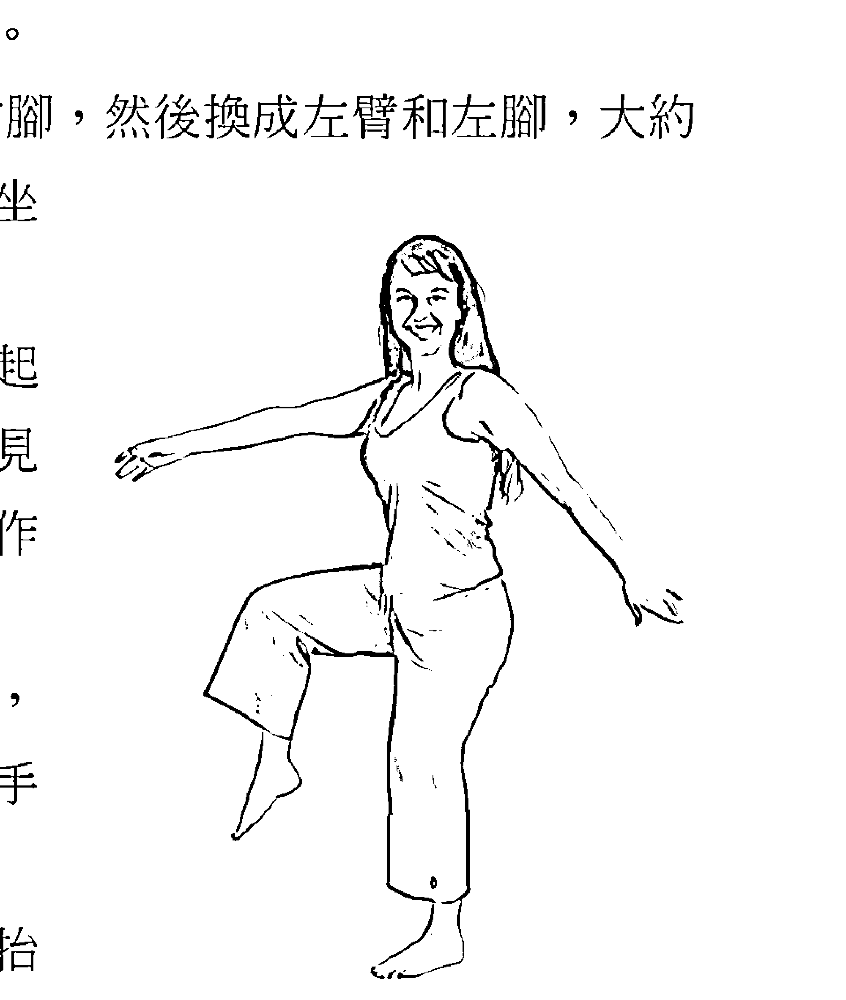

- 6. 整個流程重複三次。
7. 最後多做一組12次一般的左右交叉，然後同樣按摩刺激俞府穴做為結束。

## 韻律8 (時間：約1分鐘)

同手同腳所調整的是凱爾特網裡的大範圍模式，而韻律8則是可以將所有的能量，不管是包圍在身體外側，或是最小的單一細胞，通通都變成交叉模式。如果你覺得無法放鬆，日常小事不順，或者單純就是不太舒服的感覺，韻律8可以讓你變得很開心，而且絕對能讓能量提振起來。假如能搭配讓自己擺動的音樂，會更好玩。

- 1. 雙手下垂，擺動身體，重心從一邊換到另一邊，並隨著音樂節奏，或假裝自己正跟著音樂起舞。
2. 接著讓手臂隨著身體擺動。從一邊晃到另一邊的時候，你會發現雙臂和身體都會自然擺動出8字型。打開手臂讓擺動幅度大起來。
3. 雙手前伸，往右邊高舉，順著圓弧落下，接著往左邊高舉，再順著圓弧落下。手落到腰部時，開始往對側舉起，讓身體也隨著手臂擺動。這個動作比較像是自由舞動，不一定要有固定的模式（見圖2-13）。

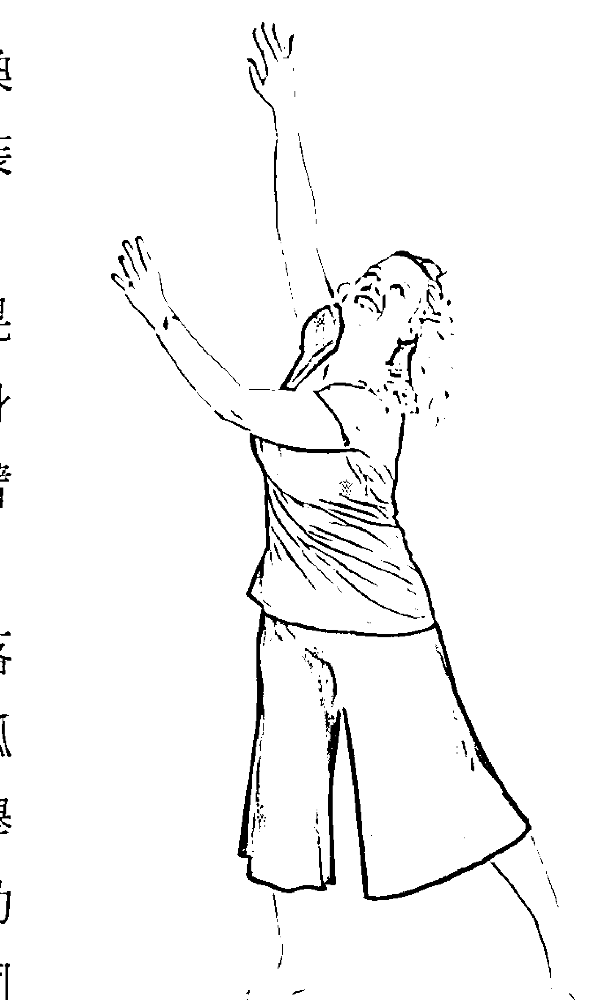

圖2-13 韻律8

做幾次韻律8就能讓左右腦之間的溝通更為順暢。這個技巧也被用於「教育肌肉動力學」，它應用了能量療法，用來幫助有讀寫障礙及其他學習障礙的孩童。某些研究顯示，用粉筆在黑板上畫韻律8，以及搭配全身進行韻律8的律動，可以改善孩童學習障礙的情形。

## 吊橋（時間：30-60秒鐘）

另一種讓身體能量交叉流動的方式，是以交叉模式來拉長伸展你的脊椎。如果你覺得肌肉緊繃或身體柔軟度不夠，這項運動能讓你活力重現。

- 1. 兩腳打開得比肩膀稍寬一點之後，站好。
2. 膝蓋微彎，雙手放在大腿上，手臂撐直。然後做幾個深呼吸。這個姿勢就像是坐在一張透明椅子上一樣。
3. 頭往前傾，臀部往後坐，調整足部位置，讓膝蓋位於腳踝正上方，背部打直。這就是所謂的吊橋。
4. 緩緩地將一邊的肩膀往另一側膝蓋下壓（見圖2-14）。接著換另一邊肩膀也重複這個動作。這是一種交叉運動。你會感覺到背部的橫向伸展。這個伸展動作可以做好幾次。
5. 最後雙臂下垂，以極慢的速度起身，直到完全站直。

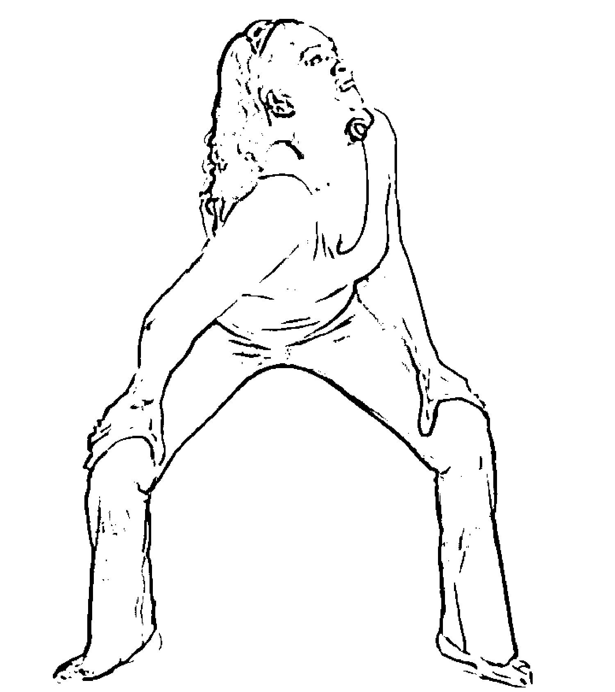

## 用凱爾特網強化氣場並交叉能量（時間：約1分鐘）

氣場是由身體散發出的多層能量，會與地球的環境交互影響。氣場本身就是一種包圍在身體周圍的保護層，可以過濾掉你所遇到的許多能量，並將你所需要的能量吸引進來。氣場的健康狀況會反映出身體的狀態，同樣的，身體的健康狀況也會反映出氣場的狀態。當你感覺快樂開心、精神奕奕、充滿魅力時，你的氣場便會遍布整個空間。當你感覺悲傷難過、失望沮喪、陰暗憂鬱時，你的氣場會在你身上崩潰，形成一種能量的外殼將你與世界隔絕。有時候感覺周圍入侵的能量太多時，我會張開手掌，抵在我的氣場內層，非常緩慢地往外推出去。如果我的速度夠慢，還可以感覺到推出時的氣場壓力。如果你發現自己在這個世界上找不到自己的空間，或是覺得悲傷、渺小、崩潰，可以試試看這個方法。先想像自己被像是蛋殼一樣的能量包覆，然後緩慢地吐氣，並從大概距離身體5公分的地方往外推出去。實際去做會比想像的還要容易。你的手掌可能會感受到一股襲來的能量。總之，這麼做可以讓你擁有更多呼吸的空間，不管是能量層面或心理層面。

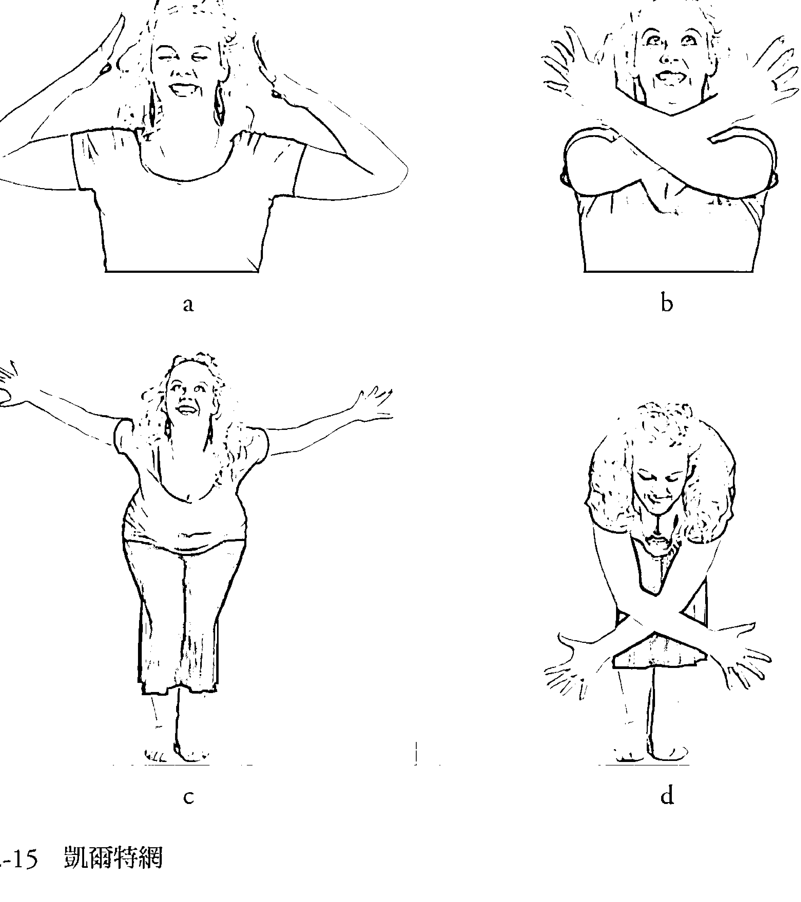

凱爾特網運動是讓體內的能量交叉運行，也幫助氣場變得強壯而健康。當這兩個能量系統維持良好並協同合作時，我們的整體健康狀態就獲得極大的保護。凱爾特網的做法如下：

- 1. 站直站挺，雙手貼在大腿上。整套運動的呼吸必須緩慢而深沉，鼻子吸氣，嘴巴吐氣。
2. 手臂往外畫圈後回到胸前呈合手祈禱姿。
3. 摩擦雙手，甩一甩，掌心相對，感受手掌之間的能量。如果沒有任何感覺也不要緊，持續進行能量療法，感知就會變強。
4. 再次摩擦雙手，甩一甩，手掌放在兩耳旁，距離約十公分，深呼吸（見圖 2-15a），吐氣。
5. 接下來吸氣的時候，將雙手靠攏到交叉狀。
6. 吐氣時手臂交叉（見圖 2-15b），然後雙臂往外甩出（見圖 2-15c）。
7. 再重複一次，手臂再次交叉胸前，往外甩出。
8. 再做第三次，但這次甩出前先彎腰，將手臂交叉在腿部前方（見圖 2-15d）。
9. 保持彎腰姿勢，手臂從腳踝的位置往外甩出。
10. 膝蓋微彎，手掌朝上置於身體前方，捧起能量。站起身，抬起手臂，將能量往身體前方、兩側與後方潑灑出去。

## 重新設定身心的深層能量模式

我們的能量會依照慣性流動。就像流水會形成河道，每天重複的能量模式也會刻下痕跡。這些痕跡即使已經不再需要或不再有用，仍然很難去除。你的祖先如果是在食物稀少又不均衡的饑荒時出生，她的身體可能就會把原本要長成肌肉的蛋白質轉化成脂肪儲存起來。等到饑荒結束，食物充足了，控制新陳代謝的能量系統卻還在儲存不必要的脂肪。不管是掌控心靈或掌控身體的能量都是這樣的機制。所以你在饑荒時出生的祖先可能很貪吃，但祖先的弟妹在饑荒結束四年後才出生的話，可能就不會有這個特質。

不過幸好這些影響我們身心的深層能量習慣還是有可能改變。蓋瑞·克瑞格（Gary Craig）、大衛和我合著了一本關於這個主題的書《能量心理學的承諾》（The Promise of Energy Psychology），很多人將運用之後的神奇效果回饋給我們（見蓋瑞的網站，www.emofree.com），不過現在不討論這個主題。由於西方醫學開始逐漸接受身心連結這樣的概念，許多健康治療師會好心地希望大家改變自己的態度、信念或自我概念，就像換雙鞋子那樣簡單。可是很多時候，他們雖然知道有可用的工具，卻沒有提供給大家。雖然我也相信意圖擁有強大的力量，但叫你直接改變深植於能量系統中的信念或其他心靈模式，那只會讓你除了一開始就陷入自我挫敗的心靈模式外，更因此找到另一個不喜歡自己的理由。你覺得自己無法掙脫黑暗的房間，你覺得自己不可能脫離憂鬱的狀態，或是擺脫對香菸的渴望，或得不到某個不可能愛你的人的愛。然而，轉移自己的能量的確可以創造一個新的內在氣場，擁有新的感覺與思考方式。

我在這裡提供三個強大的技巧，大家可以自行試驗或與本書中的其他方法搭配。甩出去／拉上拉鍊／連結、顎部敲打和經絡能量敲打這些方法，可以結合專注的意圖，並將心靈慣性的能量轉換成你所希望的模式。

## 甩出去／拉上拉鍊／連結（時間：1-2分鐘）

當你正在煩惱、生氣，或只是因爲無法改變生活模式而感到沮喪時，試著同理這樣的感覺，然後：

- 1. 站直，把手臂置於身體前方，手肘微彎，握拳，拳心朝上，深呼吸（見圖2-16）。
2. 手臂甩向身後，到極限處後盪回前方，高舉一分鐘。
3. 手臂往上伸，拳心相對，猛力向下向後甩，手掌用力張開。讓情緒隨著吐氣一同流洩，並喊出聲音來，可以是「呼」或是其他自然發出的聲音。
4. 重複幾次，會感覺很舒服。最後一次手臂放下時要和緩，並同時吐氣。將身體站直站挺，深呼吸。
5. 在這個放空而舒暢的時刻，想個簡單的肯定句，是你希望自己成為的狀態。「我很冷靜、很平和。」「我覺得強壯而有自信。」「我是個有力量、有影響力的人。」這類型的肯定句要使用第一人稱和現在式，才會有已經實現的感覺。
6. 一邊做下述的改良版拉上拉鍊，一邊緩慢而從容地說出肯定句，將語句深植於自己的身心：雙手放在恥骨，深吸一口氣，一邊說出肯定句，一邊慢慢地沿著身體中心線移動雙手至下唇為止。重複三次。
7. 最後用連結這個動作來鎖住：鼻子吸氣，嘴巴吐氣，將一手的中指置於鼻樑上方的眉心，另一手的中指置於肚臍，手指輕按在皮膚上（見圖2-11），向裡壓、向上微勾，停住約15秒。

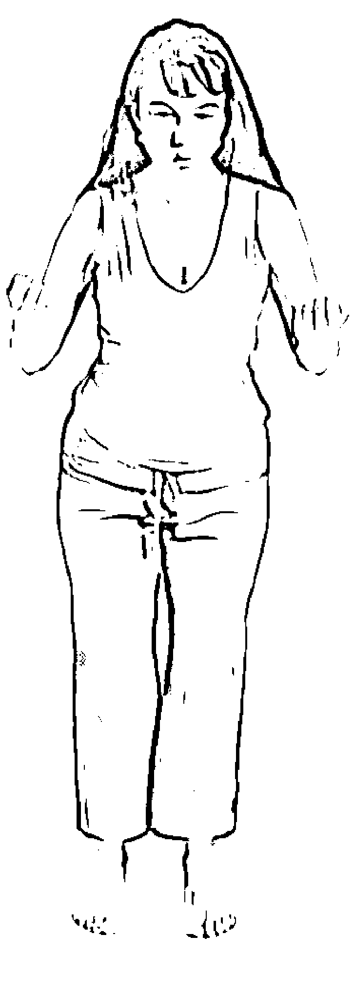

## 顴部敲打（時間：約1分鐘）

在中國古代，顴部敲打是用來控制疼痛，但現在已經證實這個方法能夠有效地戒除舊有的壞習慣，並同時建立希望養成的好習慣。敲打顴骨是從太陽穴開始，沿著耳廓到耳朵後方。在敲打的時候會暫時阻隔其他感官的接收，讓大腦更能專心學習。這個動作還能放鬆三焦，也就是負責生理慣性養成的能量系統。這會讓你更容易建立新習慣。

在1970年代，應用肌肉動力學的創始人喬治·古德哈特發現，沿著顱骨和蝶骨間的顱縫敲打，可以暫時改變感官接收的過濾機制。如果在敲打的時候進行自我暗示或是唸出肯定句，大腦會特別能接受這個句子的陳述。顳部敲打是運用大腦皮層左右半球的不同來進行。對大部分人來說，大腦左半球通常比右半半球要來得多疑而具批判性。否定句會與左半球的功能較為相近且容易接受。所以敲打時，否定句會進入左半腦。同樣地，因為右半腦容易接受肯定句，正面的話語就會在敲打時進入右半腦。有些左撇子會剛好相反，你可以藉由能量測試來檢驗自己的情況。如果一邊敲打左側，一邊唸出否定句時，測試結果為強，那麼依照接下來說明的做法即可。如果測試結果為弱，那麼就把做法中的「左」改成「右」，「右」改成「左」。

首先確定自己想要改變的習慣、態度、自然的情緒反應，或健康狀況。用一個單一的句子來描述你希望產生的改變，用現在式的肯定句，也就是假設改變已經實現。不是已經發生的現實，而是你希望將來能成真的句子。例如你可以說：「在壓力下我還是很冷靜、很專注。」試著把句子寫出來會比較容易。

然後換個說法，意思還是一樣，但用否定的詞彙（「不是」、「沒有」、「永不」、「不會」、「無法」等）。因此「冷靜專注」這個句子可以用否定的方式陳述成「在壓力下我不會再感到緊繃。」請注意，語句的意思仍然保持正面，雖然使用的是負面的詞彙。其他例子像是「我的飲食均衡健康」，負面詞彙的陳述為「我不會因為焦慮而暴飲暴食」。「我的指甲長得很漂亮、很健康」，負面詞彙的陳述為「我不會再咬指甲」。

- 1. 以太陽穴為起點，用左手中間的三根手指，從前往後敲打頭部左側（見圖2-17）。按照敲打節奏唸出負面詞彙版本的肯定句。敲打的力道要紮實而有彈性。從前往後敲打約五次，每一次都要唸出你的句子。
2. 右側也進行同樣的動作，換成右手敲打，但這次要唸出正面詞彙版本的肯定句。
3. 每天重複這個方法數次。敲打並唸出肯定句的次數越多，對於神經系統及慣性能量場的效果就會越迅速而強烈。

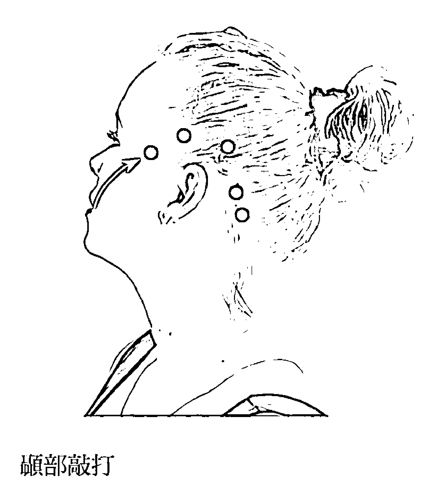

顳部敲打結合了幾項有力的元素，包括重複、自我暗示，以及神經學的程式重建。這個方法影響到的不只有大腦，還有每一條經絡。因此，你的意圖所包含的訊息會傳達到身體的每個系統中。這是一個沒有侵略性的簡單技巧，能夠改變許多無法單靠意志力來克服的模式。

我們的身體和情緒所遭遇的問題，通常會極為相似，而且互相反映。有時候器官的運作方式會直接反映出我們平常的行事作風。以我自己為例，有時候我很難與人劃分界線，以我的工作性質來看，這會是一個很嚴重的問題。就在幾年前，有一陣子我很容易受到感染生病，就好像是負責保護身體不受感染的胸腺在模仿我的待人處事一樣。我開始敲打頭部左側並唸道：「我的胸腺不會再讓外來者侵略我的系統。」然後敲打右側並唸道：「我的胸腺堅守防線，將外來者驅逐於外。」之後，我的感染現象不但減少了，我與人劃分界線的能力也增加了。顳部敲打很棒的一點在於，透過將自身的意圖簡化成兩個短短的句子，有時候我們可以藉此一窺身心靈之間複雜難解關係的關鍵所在。

顳部敲打是讓生活回歸正途的重要工具。不過我想透過幾個失敗的案例，讓大家明瞭比較清楚正確的做法。我發現顳部敲打之所以失效，通常是因為肯定句說得不對。肯定句必須是一種讓你覺得很舒服的語言。有時候就只是用最簡單的辭彙寫出來而已，而且用字必須與你的價值觀相符，也要與你的感覺一致。不可以口不對心，也不能是否定原始需求的話語。

有一位想要減重5公斤的女性採用了這個方法，反而重了9公斤。因為敲打顳部左側的時候，她說：「我不再超重了。」敲打右側的時候說：「我會減到70公斤。」這兩個句子聽起來沒什麼不對，但敲打卻產生了反效果。我要求她觀察自己在敲打時，有沒有好好地跟著唸出的肯定句在思考，還是分心想其他事情，或是腦海浮現出別的影像。結果發現每次她在敲打的時候，心裡都想著：「喔！天啊！我有夠大隻的，我永遠都會這麼大隻吧！最後我一定會跟『胖』姑婆蘇菲看起來一樣。」她每天都敲打五次，結果真的生效了！她的想法和心中的影像所做出的自我暗示，遠比精心雕琢的肯定句要來得強烈。不過，後來她還是減了不少體重，因為敲打左側時唸的是：「我沒有遺傳蘇菲姑婆的肥胖基因。」敲打右側時唸的是：「我的身體可以變得輕盈窈窕。」

一名男性在一家公司工作二十四年後面臨被汰換的危機，公司提供經費讓他回學校進修一年。第一學期過了五週，他有好幾科期中考的成績都只達到丙和丁，這樣的結果讓他無法重回公司任職。他很用功，可是發現自己需要長時間讀書時無法專心。由於聽說我會幫助許多擁有學習障礙的人，因此前來找我諮商。我覺得他沒有學習障礙，不過我的確感覺到，他在近二十五年的時間都從事與人相關的工作，因此慣性能量場對需要內在專注思考的學習沒有任何興趣。我跟他說明這個狀況，並教導他如何使用顳部敲打來改變影響學習能力的慣性能量場後，他積極地進行這個運動。但一週後，他感到相當絕望，因為雖然完全按照我的方法去執行，也花了非常多的時間，但是學習習慣卻沒有任何改變。

他告訴我敲打時所陳述的肯定句內容，我也檢視他敲打的過程。肯定句聽起來沒什麼問題，但是他的能量對句子的反應並不好。我向他解釋道，肯定句必須是他自己聽起來有感覺的句子。接著我發現原來他六歲時才來到美國，英語並不是他的母語。因此，我讓他回去再做一週的敲打，但這次改用母語來說相同的肯定句，結果他的閱讀和專注的能力都有了明顯的改善。

另一位朋友在咳嗽超過一年都無法痊癒的情況下，決定要戒菸。我教她顳部敲打的方法。她在敲打左側時說的是：「我不再抽菸了。」敲打右側時則說：「我很喜歡自己不抽菸的樣子。」結果她的煙癮居然比以前更凶，她覺得好悲慘。由於不明白為何敲打反而加劇了煙癮，這讓她非常焦慮。但敲打確實產生了功效，雖然和希望的結果背道而馳。她相信這個技巧一定有用，於是決定要找出敲打正確的使用方法。她發現自己的焦慮應該是問題的主要關鍵。因為當她說「我不再抽菸了」的時候，就會開始焦慮，原來抽菸可說是她用來放鬆的主要憑藉。憑著直覺，她改用了新的句子。敲打左側時會說：「焦慮不會讓我想要抽菸。」敲打右側時則說：「我現在只有為了想要更健康、更開心才會抽菸。」焦慮神奇地消失了，煙癮也從每天一包降成每週三支。她持續了好幾個月，偶爾來一支的菸變成了一種咒語，一種冥想的行為。咳嗽也因此痊癒。最後她終於完全戒菸了。

就和許多能量療法的技巧一樣，顳部敲打不能只是隨便按表操課，其實還有許多細節需要注意。接下來整理一些值得牢記的注意事項，讓顳部敲打的肯定句更為有效：

(一) 敲打左側時的肯定句要使用一個否定詞彙，敲打右側時的肯定句則只能使用正面詞彙；
(二) 句子要和你平常講話與思考的模式相符；
(三) 在唸出肯定句時，要專注於句子的用詞與意義；
(四) 肯定句不能讓你違背核心價值或更基本的需求。

我知道顳部敲打可以處理的問題範圍很廣泛，包括戒菸、戒酒、暴食，還有抓撓強迫症。這個方法幫助有這些症狀的人重建信心、樂觀與自尊，也幫助他們刺激身體的免疫系統、對抗嚴重疾病，減重時改善新陳代謝，練習新動作時增強身體協調。另外，在抑制腫瘤、改善濕疹與降低血壓方面也有所成效。

請挑選一項你想要改變的行為、情緒或生理狀況做為目標。敲打左耳周圍時，唸出負面詞彙版本的肯定句，敲打右耳周圍時，唸出正面詞彙版本的肯定句。要檢驗肯定句是否與自己的能量同調，可以一手敲打並唸出肯定句，另一手請同伴幫你做能量測試。每天進行顳部敲打並唸出肯定句四到五次，持續至少一週。對於那些根深柢固的習慣，我曾看過需要花上30天才開始有所改變的例子。或許你存疑，那麼請嘗試後再下定論嘍。

## 經絡能量敲打（時間：約2分鐘）

當我們一邊想著自己某個生理狀況，一邊敲打對應的穴位，似乎可以迅速改變造成問題的神經迴路。使用這樣的方法來改善生理問題已經有越來越多的案例了，這種稱為能量心理學的方法很容易學習，而且我們已經著有專書討論，所以本書不再對其優點特別著墨。不過在此，我還是想讓大家知道一個很值得學習、有效又簡單的技巧。

當我們刺激分佈在不同經絡通道的不同穴位時，可以啟動經絡系統的運行。就像敲打腎經可以刺激防衛系統，敲打經絡讓能量流動，就能讓身心獲得新的活力，因此帶來意想不到的好處。經絡敲打對免疫系統可以說是好處多多，有時候甚至在解決其他主要問題時，順帶修正一些身體上的小毛病。另外也能夠減輕焦慮並增強整體健康。這是一種全方位的介入技巧，而且做起來很簡單。

如果你在敲打時能專注於某個問題，還能產生額外的效果。因為專注於想要解決的問題，會讓身體去面對與這個問題相關的壓力反應。而同時又啟動經絡系統的話，便能夠中和壓力反應，因此當下次遇到同樣問題時，很多時候不會再引發相同的壓力。如果你覺得煩悶、憂心，或只是想振作精神，都可以做做經絡敲打。

- 雙手大拇指按在頭部兩側太陽穴的位置，其他的手指彎曲，指尖立在前額中央，緩慢地往兩旁施力拉開，延展前額的皮膚讓血液流動，同時深呼吸。
- 利用一次深層深呼吸的同時，敲打下列的每一個穴位。敲打要迅速紮實，但當然不要太大力，以免讓自己受傷或

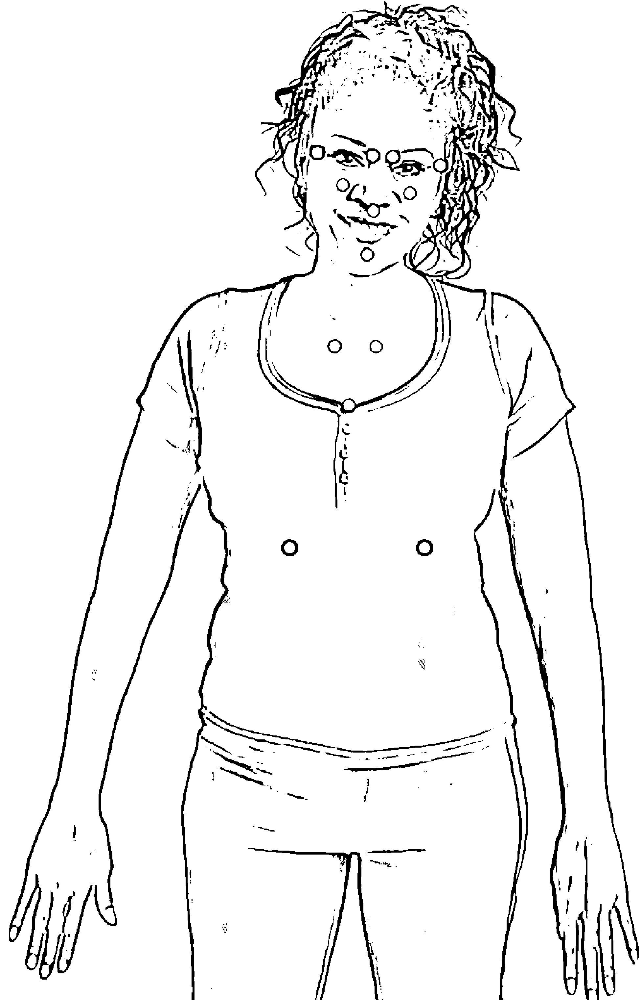

## 圖2-18 經絡能量敲打

## 瘀青：

- a. 眉頭的位置。
- b. 眼尾外側的位置。
- c. 用全部的手指敲打太陽穴，然後繞耳廓一圈敲打到耳朵後面，重複敲打三、四次。
- d. 顴骨上端，眼睛下方的位置。
- e. 人中（上唇和鼻子中間）的位置。
- f. 下唇和下巴中間的位置。
- g. 按照俞府穴、胸骨和腎臟點的順序敲三處（第60至63頁）。
- h. 大腿外側，膝蓋和臀部的中間點位置（手臂下垂，中指內彎就可以開始敲打）。

本章介紹的是基礎能量療法的入門技巧，主要在增強身體的能量流。下一章將介紹針對荷爾蒙管理的能量技巧，尤其是與免疫系統和壓力相關的部分。不過開頭會先說明荷爾蒙的化學機制，在健康中扮演的角色，以及醫療政治文化如何影響一般人對荷爾蒙的理解。

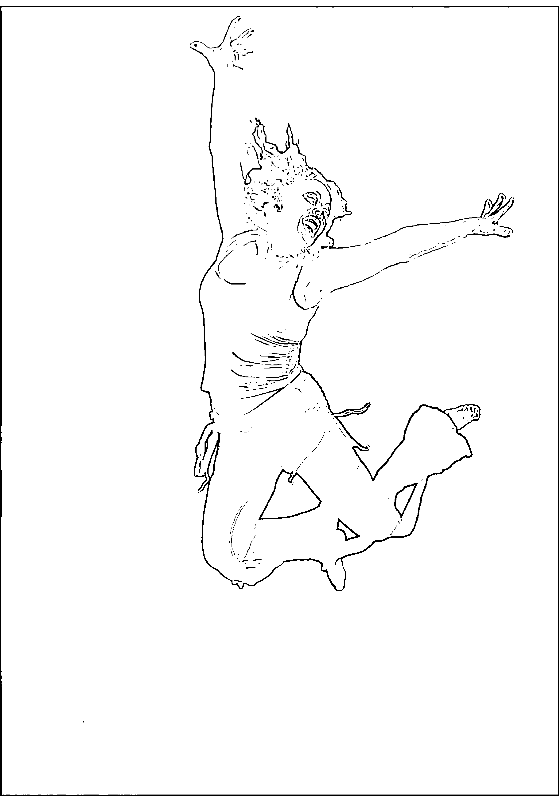

## 3 了解妳的好朋友：荷爾蒙

荷爾蒙

- 比指紋更特殊！
- 比大腿更難處理！
- 比治療師更厲害！

我認識的每一位女性都希望能享有體力、活力與生命力。她們想要保持在尖峰的健康狀態，擁有光采動人的肌膚和豐厚亮麗的秀髮。

她們也想要讓自己永保青春活力，同時還能思考清晰，記憶明確。

這就是荷爾蒙大展身手的時候。

> ——蘇珊·拉克醫師（Susan Lark），
《荷爾蒙革命》（*Hormone Revolution*）作者

> 荷爾蒙就像樂器一樣，演奏出我們的生命。
——琳西·柏克森（D. Lindsey Berkson），
《荷爾蒙的騙術》（*Hormone Deception*）作者

大腦不是人類智慧唯一的來源。如果妳把自己整個身體當作是一個充滿奇妙智慧的巨型大腦，那麼就相當接近真相了。荷爾蒙是每分每秒都在努力讓身體適應環境的化學傳遞物質。如果能以理解與智慧的心來影響荷爾蒙的分泌，那麼妳就擁有強大能力，能夠適應一個與我們身體所處的環境非常不同的世界。

## 身體的訊號系統

要能以理解與智慧的心讓荷爾蒙運作起來，能量療法是一項主要的關鍵。身體是由精微能量場所編織的格狀網路，它除了會影響妳的生理狀態，身體內能量的流動也會直接影響荷爾蒙的產生。這個明顯的事實讓妳能夠透過某些方法掌控自己的健康與情緒。在其他的文化中，這些方法發展已久，但在我們的文化中還是不為人知。荷爾蒙會傳導訊息，讓妳的器官、組織和細胞活動像樂團一樣協同演奏。荷爾蒙掌管了人體功能的各個層面，從消化到繁殖，從思想到行為。荷爾蒙忙碌的在細胞之間穿梭，提供每秒幾百萬上下的資訊。但是荷爾蒙必須提供正確的資訊，身心的所有面向才能夠平衡協調地運作。如果荷爾蒙系統開始失常，妳的生活可能就會突然陷入病痛、絕望與悲慘之中。在荷爾蒙的干擾被修正後，健康和情緒才會復原。

本書中最重要的兩個觀念如下：

1.  絕大部分女性所面對的健康問題，荷爾蒙失調不是主因就是遠因。
2.  我們可以使用方便易學的能量技巧來影響荷爾蒙分泌，改善自己的健康、幸福與活力。

有關女性荷爾蒙的許多層面，至今對醫學界來說都還是個謎。荷爾蒙的生化結構已經解析得很清楚了，但遇到個人差異的關鍵問題時，西方醫學與科學卻難以突破。同樣的症狀、同樣的用藥，對某一位女性或許幫助很大，但對另一位可能完全無效，而對第三位可能還會產生比原本症狀更糟糕的副作用。再加上各種嚴謹的研究報告對荷爾蒙替代療法的危險性，以及其他許多女性生化機制的運作，有著截然不同的看法。這對醫學界來說極不光彩，也加深了世人對荷爾蒙是「汝之蜜糖、彼之砒霜」的印象。

### 沒有一體適用這回事！

能量療法的一大優勢，在於可以根據獨特的能量和個人的需求來設計方法。如果只因為症狀相同而持續給予兩個不同的人相同的用藥或其他治療，這樣其實不是正確的醫療做法。我們每個人的基因、個性和能量都不一樣，因此在進行身心保健方面的判斷時，不應該一概而論或是採用某種特定療法，只因為研究成果顯示對某個百分比以上的人有效。妳值得更好的對待，而且在第二章已經討論過身體能量與想要採用的療法能否適配的評估方法。如果要決定任何關於身心保健的方法，都必須考慮到個人差異才可說是完備。

我對此有深深的體會，因為我的身體就是打破所有規則。讓大部分人感覺比較舒服的醫療程序，反而會讓我惡化。1974年的夏天，我參與了多利安·帕斯克威茲醫師（Dr. Dorian Paskowitz）的實驗，他是職業衝浪選手，也是醫生，當時任職於聖地牙哥北方的帕洛瑪學院。學校有一塊種植了各式蔬菜與香草的園圃，我們這二十幾個參與實驗的受試者，整整一個月只吃自己從園裡摘採的植物，完全不煮，新鮮生吃。其他大部分受試者都變瘦了，而且覺得自己變得更有活力，思考更清晰。我雖然每週固定幾次強烈運動，吃得也不比別人多，卻重了6公斤，而且覺得精神很差。

帕斯克威茲醫師被難倒了。他原本是想證明新鮮的自然飲食對每個人來說都是健康有益的（他對於傳統智慧的反動口號是：「吃死掉的食物怎麼可能讓妳充滿生命力呢？」），但我卻不符合他的理論。為什麼？他對於自然飲食的熱情讓我由衷佩服，我也希望實驗能夠順利。既然我沒有違反規則，沒有在半夜偷吃垃圾食物，我的基因也和其他人沒有明顯不同，為什麼我的反應會這麼不一樣？

經過許多年，我終於明白這個謎底的答案：荷爾蒙。我的荷爾蒙的確打破所有規則。有一次我因為暈倒被送到醫院，而醫生的治療反而差點讓我致命。我的經前症候群就我所知也是最嚴重的症狀，是黃體激素太低、雌激素太高造成的結果，而在有機飲食店裡找到的所有療法，只會讓我的問題更加嚴重。沒有醫生能夠解釋為什麼我的甲狀腺機能波動不停。我的荷爾蒙分泌完全不符合西方醫學的模式。不過，也因為我的內分泌系統很詭異，所以我才花費大量心血研究，甚至能因此寫作、教學。但在我十幾歲，甚至到三十幾歲的時候，我卻對這個寶貴資訊一無所知。

### 用能量療法處理荷爾蒙的混亂

我的個案泰莉莎有四個小孩，雖然有時候覺得養育這麼多小小孩相當疲憊，但她很享受當媽媽的感覺。然而，就好像被時鐘設定了一樣，大概每個月會有一週，她會非常痛恨媽媽這個角色，而且討厭當媽媽的自己。生理期來的前七天，小孩只要有一點點不對，甚至什麼都沒做，她就會朝著他們尖叫怒吼，或是縮回床上哭泣而不管小孩的需求，整天籠罩在絕望萎靡的黑暗陰鬱之中。

然後，如同按照時鐘的設定，等到生理期來了，她的心情就會慢慢好轉，自信與能力也回覆了，接下來的三週完全是一帆風順，雖然還是會對經前症候群發作的那段時間抱持著一絲罪惡感，也害怕下次經前症候群的到來。

泰莉莎向我諮詢，希望我能幫助她度過每個月的嚴苛考驗，但不清楚會有什麼效果。諮詢的日子剛好就是她經前症候群開始的時候。我發現她身體裡的每個系統都受到了能量干擾。泰莉莎某條主要經絡的能量太多，而有幾條的能量則是太少。要修正這種失衡現象其實不須花很多時間，所以我可以慢慢進行測試，在引導某股能量流動之後，詢問她有沒有任何感覺。她的身體隨著一條條通道平衡後慢慢放鬆了，而且心情馬上就轉好。

我教了她幾個運動，讓她回家後能夠維持這個新的平衡狀態。她每天都按照指示去做，直到生理期來臨。因此這段原本會讓她飽受折磨的日子，這次卻出奇地平靜，她完全沒有感覺到月經前應該會有的憂鬱或情緒波動。她以為自己已經痊癒了。但是當下一個週期到來，她忘了持續運動，於是訝異地發現自己再度陷入月經前的黑暗深淵。泰莉莎很快地又來找我。這次的療程很簡單，我們採用跟上一次一樣的方法，但特別強調回家後每個月都一定要記得練習。她開始體認到自己的生理週期有著自然的韻律，也發現在月經來臨前，自己心情很好的時候，做起能量療法會特別輕鬆，好讓她在生理期到來之前能夠不要那麼狂暴不安。這大大地改變了她的生活。兩年後，我很高興聽到她開始在我們當地的社區診所，教導其他女性如何處理她們的經前症候群問題。

### 荷爾蒙的運作

如果妳把自己身體裡的每個細胞都當成一座能夠上演上千齣戲的劇場，荷爾蒙就是負責幕啟幕落的人員。某種荷爾蒙可能是從遙遠的一端過來，升起幕簾，啟動免疫系統，或是管理新陳代謝。戲演完了之後，另一種荷爾蒙過來落幕，負責演戲的化學物質暫時休息，直到下次幕簾再度升起。荷爾蒙是細胞產生的一種分子，能夠對其他的細胞、組織和器官下達指令。每一種荷爾蒙會下達一項特定的指令，升起或落下特定的簾幕，與幾百萬種其他的荷爾蒙合作，讓我們產生性欲、開始熱潮紅，或是讓乳房變大為懷孕做準備。

曾經我們以為是由大腦和神經系統負責控制的許多程序，現在已經確認是由荷爾蒙分泌來掌控。荷爾蒙其實是一個活躍的社群，由幾兆個看起來各自獨立、能力強大的決定者共同組成，而不是一個由上而下的溝通系統。荷爾蒙的運作具有三種不同的距離：（一）在細胞中產生，負責該細胞與鄰近細胞的活動；（二）透過導管進行短程運輸後，產生作用；（三）由內分泌腺體產生，透過血液傳輸，來控制距離可能很遠的細胞與器官的活動。能量場在此扮演傳播訊號的重要角色，讓這個龐大社群裡的決定者能夠協調合作。

要知道荷爾蒙的力量究竟有多強，其實有點難。負責調整生理週期、影響性欲與準備懷孕的雌激素，在妳三十歲左右的生育年齡內持續分泌的量，根據估算，可能比一顆橄欖還輕。但只要一點點就能夠讓青春期女孩的身體變成一個女人。所以荷爾蒙是非常強效的藥。

如果將身體產生某些特定荷爾蒙的能力去除的話，可能會造成人體虛弱、疾病，甚至死亡。就算是非常細微的失衡狀況，也可能造成一定範圍的嚴重疾病。在1950年代，大家都才剛意識到荷爾蒙對於人體功能有著重要影響的時候，瑞特克里夫醫師（J. D. Ratcliff）就分析了荷爾蒙的多樣功能與產生荷爾蒙的腺體。他發現：「神奇的內分泌腺體其實對我們每個動作都有影響。例如張開眼瞼，需要荷爾蒙確認血糖足以支持肌肉活動。手指割傷，荷爾蒙會幫忙消炎並抵禦外來感染。荷爾蒙其實是人類與動物之間的公分母。有些小牌電影明星的性荷爾蒙和鯨魚的一樣。有些職業拳擊手的腦下垂體分泌與老鼠相同。」

只要不是單細胞生物，任何植物和動物都會分泌荷爾蒙，因為這樣細胞之間才能溝通。其實幾乎所有的人類器官與組織都會分泌荷爾蒙，但我們最熟悉的還是內分泌系統所釋放的，包括腎上腺、下視丘、卵巢、胰腺、副甲狀腺、松果腺、腦下垂體、睪丸、甲狀腺和胸腺。這些腺體加起來總共才幾公斤重，但他們對於人體功能卻具有決定性的影響。瑞特克里夫這麼說：「這麼一點點組織卻像是人體的最高行政機關……是負責人體化學作用最重要的大師。」內分泌腺體直接將荷爾蒙傳導物質釋放到血液中，任務清楚，目的地明確。單一種荷爾蒙的作用可以是刺激或壓抑成長，啟動或抑制免疫系統，管理新陳代謝，為某種活動進行準備（例如打鬥、逃走或交配），或是掌控階段性的生理轉變（例如青春期、生育期、更年期）。

大部分人都不覺得荷爾蒙具有型塑大腦的力量。我們認為大腦是遺傳而來，擁有的能力和限制都是天生且發展相對固定。但生活經驗其實是會改變大腦的生理結構，學習則會發展出新的神經。我們的大腦持續在進行組合發展，而且根據蒙娜麗莎·舒茲（Mona Lisa Shulz）醫師的說法，我們的荷爾蒙甚至會「型塑左腦和右腦處理感覺與思考的方式」。身為神經心理學家和直覺與能量醫療專家，舒茲在著作《新女性大腦》（The New Feminine Brain）中提出了突破性的看法，解釋了大腦是如何適應環境，因此我們的腦和我們祖母的腦就是不一樣。而我們現在正處於「新女性大腦」的革命風潮上，我們的深層直覺，以及女性大腦皮質的獨特迴路，以及左右腦半球間的連結比男人更多，這些都讓我們占有優勢。舒茲告訴我們，了解自己的荷爾蒙可以幫助大腦發展出新的可能性。在此同時，如果還能了解管理荷爾蒙的能量，那就更有助益。

## 能量對荷爾蒙下達指示

只要極微量的荷爾蒙，就能夠產生極大的效果。因為荷爾蒙是激發身體能量的催化劑（「荷爾蒙」一詞源自於希臘文的 hormon，意思是「我很激動」或是「蓄勢待發」）。荷爾蒙和能量是透過相互回饋的迴路在交互影響。荷爾蒙會告訴妳的細胞、組織、器官與裡面包含的能量該做些什麼，身體的能量也會告訴荷爾蒙該怎麼辦。我們會在接下來的章節中學到如何引導能量，將型塑人生旅程的荷爾蒙管理得更好。

能量療法是一門藝術，也是科學。透過運用能量與化學間的關係，可以促進我們的健康、活力與幸福。這個公式的重點不單只是能量或化學，而是兩者兼顧。當身體的化學改變（例如每月的生理期），能量也跟著變化。而能量的變化同樣也會造成化學的改變。這在我執業的過程中一再受到證實。簡單的能量介入通常可以在女性荷爾蒙的數值上測得變化，表示身體恢復平衡。雖然我尚未看到任何正式報告，不過我和許多常常進行檢驗測試的護理師同事過。我常請他們在治療前先檢測一次，治療後再檢測一次。能量治療前後的改變通常會在白血球、血糖、甲狀腺機能與雌激素的數值上顯現出來。

## 編造的迷思：大自然的運作是錯誤的方式？

在科學與醫學的領域中，對荷爾蒙常有許多誤解。因為深植於文化中的傳統說法常常會貶低女性身體與心理的明顯特質，這些資訊的誤導造成大多數女性無法完全了解自己身體的運作。如果妳的身體跟我一樣，與一般規則大相逕庭，那麼知道如何介入與管理自身的荷爾蒙就變得非常重要，否則會完全束手無策。但即使妳的荷爾蒙運作「正常」，如果能對荷爾蒙有所了解，妳就能擁有強大的能力去管理自己的情緒、健康和生命力。因此，正確的資訊非常重要。

1963年有一篇文章，作者是紐約的婦科醫師羅伯·威爾森（Robert A. Wilson）和他的護理師太太塞爾瑪（Thelma），開頭寫道：「我們現在必須面對一個難以啟齒的真相，那就是所有過了更年期的女性等於是被去勢。」這篇文章刊載在《美國老年醫學協會期刊》（the American Geriatrics Society）上，三年後威爾森醫師撰寫了《永恆的女性》（Feminine Forever）一書，這本暢銷書的內容也在全國各地的雜誌和報紙中進行連載或被摘述。威爾森認為更年期是一種「不足症」，和糖尿病差不多。威爾森說，更年期的雌激素衰退會導致「嚴重的生命力耗損」。在這個過程中，更年期不但偷走了女性的健康，也帶走了她的陰性特質與性欲，讓人變得虛弱而沮喪，或至少產生「像牛一樣乏味的感覺」。他說，更年期後的女性「只是存在，而非活著」，「透過一層灰色的紗」在看世界，日子過得「像失去大部分生命價值、柔順無害的動物」。

這種說法在一向很尊重年長女性的其他幾千個文化中都還沒被接受，但美國人卻相信了。威爾森的解決方法是讓已經無法製造荷爾蒙的更年期女性服用雌激素藥丸，還成立了私人基金推動雌激素療法(製藥業出資一百三十萬美金)。《波士頓環球報》後來報導，「荷爾蒙替代療法藥丸」很快地「就像彩色糖果一樣，充斥在從東岸到西岸所有中年婦女的藥品櫃中。這些藥丸容易取得，服用方便，彷彿是冒險家德萊昂（Ponce de Leon）尋找的青春之泉具象化成爲藥品那樣吸引人，能夠讓更年期與更年期後的女性變得年輕有活力，反應靈敏思考迅速，皮膚柔嫩有彈性。」

1993年，有越來越多的科學研究支持這項療法的發展，包括了具有公信力的醫學期刊《刺胳針》（The Lancet）和《美國醫學協會期刊》（JAMA）刊載的許多報告。他們認爲荷爾蒙替代療法能夠讓更年期與更年期後的婦女增強記憶力，並降低乳癌、生殖器官癌症、心臟病、中風，以及骨質疏鬆的風險。但許多女性在開始荷爾蒙替代療法後幾個月內就停止，因爲副作用太多，包括沮喪、情緒起伏、陰道出血、疲倦、頭痛、血壓增高、胸痛、靜脈曲張、水腫、膀胱無力、變胖等。到了2002年，較大型且較精密的研究結果顯示，只剩減緩骨質疏鬆這一項依然成立。同年，NIH 美國國家衛生研究院研究了16,608名女性，在 JAMA 上發表結果，顯示採用荷爾蒙替代療法五年，乳癌風險增加26%，中風41%，心臟病29%。後續研究顯示荷爾蒙替代療法會讓失智症風險增為兩倍。

## 科學為什麼會錯得這麼離譜？

《波士頓環球報》的專題「荷爾蒙療法的崛起與沒落：科學迷了路，女性認了栽」提出：「荷爾蒙替代療法彗星般的崛起與流星般的墜落，可在大型醫療疏失的歷史上留下一筆。證據薄弱的科學，聳動的鼓吹言論，醫師的從眾心理，女性對於更年期重新定義的期待，也就是從原本無可避免的『生活改變』，轉成能夠加以控制的情況，這些都在在加速了整個過程。

是的，女性得認栽。許多早期研究是立基於古老且有時不太可靠的醫療紀錄，通常並未記載藥物的效果，甚至是明確的處方。而另一個錯誤則是沒有追查個人差異。同樣的症狀可能是由很多不同的原因造成。舉例來說，妳的雌激素可能分泌不足，妳的鄰居可能雌激素過剩，但是症狀跟妳一樣。妳們兩人採用相同的處方，只因為研究顯示有一定比例的人用了這個療法後狀況改善了，這樣根本就不對。

威爾森的改革，想要拯救婦女脫離所謂更年期「悲劇」的狀態，其實有一大部分是製藥業在背後支撐。總之，如果更年期被視為自然現象而非疾病，那麼製造針對這種「疾病」用藥的產業來說，世界上就會有千百萬名女性一直都屬於未開發市場。威爾森主張更年期是需要治療的疾病，剛好是製藥業的最佳宣傳，更因此打開了「世界上最廣大的商業市場」。更年期是每個小女孩未來都會經歷的過程。萊絲莉·肯頓在《力量的道路》(Passage to Power) 這本關於更年期的經典著作中指出，製藥商「每年都會花一筆錢想要說服政府、醫師和社會大眾……使用他們的產品是讓女性」能夠對抗更年期這個可怕疾病的「唯一選擇」。

## 科學現在做對了嗎？醫療政治

對於科学研究的错综复杂与政治角力，妳也许关心，也许不在乎。但如果妳就医时，描述了自己的症状，然后拿到了美国在这一年所开出的三十亿张处方中的其中一张，那么妳最好还是要关心一下。就算不是拿自己的命，仍是拿自己的健康与科学研究的正确性下赌注。每年有超过 10 万人因为按照医嘱服药死亡。妳不可能只是盯着那些药丸，就会知道这些药究竟对妳独特的身体所产生的独特症状有没有帮助，或者指示的用量究竟是太轻还是太重，或者这些药会不会造成一些意外的副作用。在医生开出处方前，妳必须仰赖研究结果来回答这些基本问题。

科学研究在我们的文化中被认为是真理的支柱，是可以信赖的知识。我们接收到的许多资讯都想说服我们去购买或相信某位专业人士的推荐，所以科学有其客观的权威。是这样吗？用俗话的套路来说，喜欢吃香肠又相信科学研究结果的人，应该会觉得两相冲突吧。并不是说基础的科学方法不属于人类最伟大的成就之一，它当然的确是的！可是政治与经济的尾巴正耍着医疗保健研究这只狗团团转。每年开出三十亿张药单，就看这只神圣的小狗意欲如何，当然会产生激烈的暗斗。

波士顿女性健康编撰小组（Boston Women's Health Book Collective）（以《妳的身体，妳自己》[ Our Bodies, Ourselves ]一书闻名）简述了这场过去三十年来在医学研究界发生的「安静而激烈的转变」。1970 年前，政府主导了大部分的大型临床研究。而现在备受尊崇的医学期刊，像是 JAMA、《新英格兰医学期刊》（New England Journal of Medicine）和《刺胳针》，刊载的临床试验报告中有四分之三是由制药公司赞助。1991 年的时候，制药公司的研究至少还有 80% 委托给大学，因此有着各种不同的文献与平衡观点来支撑研究者进行独立而客观的研究。但到了 2000 年，有三分之二的研究都是在营利的研究中心进行。

妳可能会想：「那又怎样！」研究就是研究。发表在知名期刊上，就应该禁得起科学标准的检验吧。嗯，妳可以再多想一下。受雇于公司企业的科学家知道许多方法可以得出公司希望看到的数据。其中一种很常见的伎俩就是，如果这个研究结果看起来不是制药公司想让全世界知道的，那么计划就会被停止，而制药公司不喜欢的结果就不会被公布。还有另一种欺骗手法是，在测试给老人吃的药安不安全时，会找年轻健康的受试者来实验，因为副作用在他们身上比较不明显，而且比较不可能正在服用与实验药相冲突的其他药物。女性健康编撰小组做出结论：「透过控制研究实验的设计、受试者的挑选标准、数据的分析，和筛选可以公布的结​​果，制药公司塑造了所谓的医疗知识。」

但这些技术问题真的会造成那么大的不同吗？在2003年，有两个不同的研究针对这个问题进行了调查，分别在JAMA和《英国医学期刊》(British Medical Journal)上发表。猜猜结果如何？如果研究是由贩卖该实验产品的公司赞助，比起没有受到赞助的研究者做出来的结果，得出正面数据的可能性会是6到4倍。JAMA还有另一篇后续研究，发现这种不名誉的扭曲即使是在最有公信力的期刊上也会出现，而且甚至更加严重。在最有威望的研究中，受到产品公司赞助的研究得到正面数据的可能性，是客观研究者实验同样产品的3倍。然而，这些不公正的研究在医学期刊上发表时，并没有用霓虹看板标示出「不公正的资料」或「警告，卫生署长认为妳接下来读的是一篇胡说八道」。这些研究反而会成为医生在考量药物对病情是否有帮助，或会不会造成人体伤害时的参考。而且这个现象并没有因为实验研究越来越腐败而停止。女性健康编撰小组告诉我们，原本应该要保护保健消费者权益的组织，越来越走向妥协的道路：

-   临床诊疗的指导原则是由专家组成的委员会制定，但这些专家很可能与相关药物或其他产品的制造公司有着积极的经济连结。
-   大约70% 的医师进修医疗课程都是由制药商或其他医疗产品厂商买单。
-   「客观的」医学期刊需要的收入，来自药品广告以及出售加印的已发表文章给企业，让他们去发送给医生。
-   负责新药审核与药品安全监督的美国食品药物管理局（FDA），有超过一半的资金是来自制药公司。

简而言之，资金收入已经逐渐变成保健产业新的「客观」标准。

妳最近有拿处方笺去买药，然后发现怎么变贵了吗？美国每年可开出三十亿张这样的药单呢。因为研究结果对这些药是否安全有效与否，不太有自信，所以让这些药持续被开出的成本其实超乎妳的想像。根据国会调查员的统计，花在药品行销的金额，从1997年的110亿美金，一跃变成2005年的近300亿美金。领头的制药公司的利润通常会是《财富》杂志里其他五百强产业的三到四倍。

至于自然疗法，由于制药公司只能从可以申请专利的产品获取利润，但使用天然植物的制剂无法申请专利，因此像是合成黄体素（黄体制剂）就发展出广大的市场。和天然黄体素相比，黄体制剂效果较差而且副作用较多，但可以申请专利。天然黄体素无法申请专利，所以医疗产业就不会宣传或推广。妳，还有妳的医生，也就比较不了解天然黄体素（接下来的章节会深入探讨黄体素），同时妳的医生也就更不可能向妳介绍能量疗法。毕竟制药公司还没找到替能量申请专利的方法。被隐藏的资讯、误导的资讯，还有互相矛盾的资讯并不仅限于荷尔蒙替代疗法，还延伸至西方医学如何处理女性健康问题的其他领域，例如乳房X光、骨质疏松症，或是经前症候群。总之，由制药商、研究者和政府立法人员所形成的复杂网络，他们制造出来的资讯不见得是真正对妳有益。

大部分我认识的医生都在抱怨，他们的专业被社会与经济力量的网络所控制，完全不顾病人的福祉。透过医疗保健宣传产业稍微谴责抱怨其实不会造成什么影响。然而我必须承认，我要说的并不是因为系统中存在着这么一点组织的不公，所以有时明明可以采用比较自然的疗法，医生还是开了处方笺，累积出一年三十亿张的药单。也不是要说每年有10万到30万人遵照医嘱服药而死，他们应该要受到更好的保护。而是，因为这本书在教妳自助，所以我必须举出科学的可笑之处让妳保持警觉。不要让妳对自己身体和需求的感知与疑虑，这么容易就被权威的意见打败。不管资讯如何矛盾、宣传多么诱人，妳都能够对抗这类讯息的催眠。成为自己身体能量实验室的首席科学家，能够让妳透过观察各种疗法对能量系统造成的细微效果，评估是否对疾病有所帮助。同时也可以预测这些治疗对妳的身体会造成哪些长期影响。

## 让我们落入陷阱的迷思

除了影响我们健康选择的医疗迷思之外，还有另一种更私人层面的迷思也影响了我们。我们生活在一个崇尚年轻美丽的文化中，智慧、同情心和才能三者加总还不如年轻美丽获得的地位与资源。我们所在的文化让我们持续遭受媒体传播的「完美女人」形象所攻击（与比较）：高挑、纤细，比身高比例至少少上20%的体重，看起来很少会超过25岁，皮肤上所有的瑕疵都被淡化了。我们的文化让能干的女性输掉了性骚扰的案件，被排名前十的会计师事务所拒绝成为合伙人，因为她走路、讲话和穿着的样子应该要学习更女性化一点。我们生活在一个妳完全明瞭我在说什么的文化之中。

当蒂娜第一次来到我的办公室时，看起来生命力消耗殆尽，不但筋疲力竭又沮丧低落。在蒂娜五十出头的时候，她花了大把时间精心打扮、取悦男人，做尽每一件自己「应该」要做到的事，好博取他人欢心。但现在似乎一切为时已晚。三个男人因为更年轻的女人而离开她。蒂娜很生气，她明明「所有的事都做对」，服从所有的规则，为了他人牺牲自己的需求，进行胶原蛋白疗程，但没有一件事能让她得到自己想要的。她不够漂亮、不够瘦，现在还不够年轻。而这些都不可能改变。更年期的到来更是压死骆驼的最后一根稻草。蒂娜觉得情况只会越变越糟。她发现再也无法逃避从来没有为自己而活的事实。她的直觉与生命力已经屈服于……于什么？在我的办公室里，她列出了一长串的健康问题，包括甲状腺机能亢进、肾上腺疲劳、更年期症状、慢性疲劳、忧郁沮丧，以及自杀的念头。

这些生理疾病很明显是与情绪问题相关。我直接从与这些生理症状相关的能量失衡开始治疗。如果一辈子都在否定自己合理的需求，会让妳的能量严重混淆。蒂娜的生命力（尤其是肾经的主要能量流）已经消耗到一种危险的程度。在生命力经过滋养，足以有力地在体内流动后，她开始感觉到自己获得一种能够面对世界的新活力。能量开始流动，她的意识也开始流动。蒂娜这辈子第一次感觉到没有迎合别人的时候，也不会感觉被孤立，而且第一次有机会能够照顾自己。光是这点就让她开心无比。另外，肾经还负责管理恐惧。所以她发现自己拥有了新的勇气，做自己而不怕被拒绝。现在她的内心已经能够自在绽放，不再渴望或寻求他人的认可。

蒂娜的故事并不罕见。为了符合大多数传统中的美丽标准，年轻女性还是将生命力浪掷在现实生活中无法达成的完美形象上。在今日的美国，花在化妆品上的金钱比花在教育或社会服务要多得多。每分钟会卖出2,055罐保养品和1,484条口红。每周都有几万名女性心甘情愿地把自己的身体交到手术台上，好变成与上天对抗的美丽形象。女人付出大把钞票想要变瘦、变美、变年轻，但发现医美通常无法带来更多真正的自尊自重，只会造成意想不到的麻烦，而且通常反映出一个普遍的悲伤事实，那就是缺乏自我肯定。苏珊·维德（Susan Weed）说，女性在成年后，必须面对一个重大而孤独的挑战，那就是「必须修正自己对美丽的看法，让标准也适用于老女人」。我们的文化传统对美丽与年纪的看法深深影响女性的自我概念，因此很难让我们的思考超脱「美丽迷思」的主张。这不但会影响到妳对自己的感觉，妳会怎么对待自己的外貌，也会影响到妳维护自身健康的方式。我在斐济的经验让我对这一点有了更深的认识。1970年代中期，我住在斐济，没有人比那里的居民更快乐了。斐济的女性健美丰满而开朗。一直到1995年斐济才引进电视。结果短短三年间，11%的斐济女孩开始跟电视里那些苗条的女演员和模特儿比较身材，然后得了暴食症，镇日反复催吐。

我们文化里对于美丽与体重的病态标准，在其他文化取得能与我们接触的科技后，就侵蚀了对方的文化。这实在不太美妙。如果我们拥有一个和国防部相同权力与资源的心灵健康部，我们的社会就能够明确而有力地告诉年轻女孩，要怎么珍惜与欣赏自己的身体，因为那是一份自然独特的礼物。但现在我们创造了强大的产业，强迫女孩用负面的想法与好莱坞和麦迪逊大道所塑造出来的那些遥不可及的理想形象比较。我们也用那些形象来催眠男人，然后没有人是赢家。

克莉丝汀·诺瑟普医师（Christiane Northrup, M.D.）认为，社会上「贬低」真实的女性身体，加上文化传统的「男优于女，少优于老」，为罗伯·威尔森的仇女活动提供了肥沃的发展基础：「我们现在可以透过药品得到更好的生活，在生育年龄服用避孕药，更年期时服用雌激素，无法无天的女性生理机制就能够得到控制。」

身为女人，我们相信了医疗产业所说，更年期恐怖的救赎来自雌激素替代疗法。我们持续服用雌激素，虽然有越来越多证据显示，雌激素造成的问题远比可以控制的更年期症状来得可怕多了。在我们接受这种讯息的背后，其实还有一连串其他文化迷思在我们所有人。我们以为自然的韵律与循环应该是要加以对抗与控制，而不是珍惜与崇敬。

## 仪式与知识如何让我们重新获得力量

在我们的文化中，从小女孩转变成女人的重要过程，并不像坚信礼、受戒礼，或婚礼那样会举办仪式庆祝。在我们的人生中，当我们还只是小女孩的时候，需要人引导、教养并确定我们即将发生哪些事，未来会走向哪里，这些事情究竟代表什么意义，可是我们实际能获得的帮助极少，除非我们拥有非常优秀的父母。但即使是非常有智慧的父母，要凭空创造一个仪式也不是那么容易，毕竟我们的生活文化就是对衔接小女孩和女人之间的过程，感到模棱两可而且困惑。

不过我刚好处于一个转变的时代。女性集体觉醒，想要骄傲地庆祝自己的身分，也许这是几千年来的第一次，从父权还没变成主要的社会力量前开始。我们想为自己的女儿举办庆祝仪式。我们发现了身为女人的意义，希望将这些最甜蜜的启发传递给下一代。

女性解放运动所代表的意识，对我们某些人来说就像花朵绽放一样。我们潜藏的力量、创意和潜力都通过最刺激的方式重新挖掘出来。盲目接受女性角色的钟摆，像是当个全职妈妈、要迎合丈夫、准时煮好晚餐、不要造成麻烦等等，开始远离了。(我还记得有张保险杆贴纸印了我们对于女性在社会中的「地位」所产生的新觉醒：「顺服的女性无法创造历史。」)

这个风潮也让我们热烈探讨了该如何为年轻女孩的初潮举办庆祝仪式。我个人感到很兴奋，希望能真正好好庆祝这个伟大的过程，让我的女儿知道这项身体的转变是值得贺的美事。但我们没有可以模仿的对象，只能想像如果爸妈当时能帮我们庆祝的话，将会有多开心。我们没有任何灵感，反而只有七年级时的记忆，所有女生列队前往观看生理期影片的景象。

在我的记忆中，我们排成一直线前往播放影片的教室，途中经过那些对着我们指指点点、嘲笑戏弄的男生。不知道为什么他们都知道。有些女生感到很丢脸，甚至哭了起来。然后我们看了一部愚蠢的影片，里面描写的都是最狭隘的事实，而且让我们都很害怕。

所有的老师都很难为情，也不知道该怎么开口跟我们解释。麦当诺老师年纪比较轻，可是从她二十四年的经验中，也只能给出这样的建议与见识：「记得这件事就好：妳完全可以决定不要怀孕。男生管不住自己，所以妳绝对不可以『亲热』。如果怀孕了，那妳就无法参加毕业舞会，而且会被送走，自己一个人去生小孩。」生理期当时还被许多母亲视为「诅咒」，同时也会提出相同的可怕警告，要小心别怀孕。那个时候还没有出现避孕药。

女性解放运动投入了巨大的精神与努力，希望改变这一切，让女性生理期这件事能够摊在阳光下。我们想让以后的女孩儿对于生理期的到来充满喜悦与期待。虽然当时的社会并不会为年轻女孩的初潮举办任何仪式，但我是一定会做的。

很不幸，我当时的丈夫早我一步。当时两个女儿甚至都还没约会过。他决定要自己来跟她们「讨论」这件事。我马上觉得很担心：「雷伊，你确定自己知道要说什么吗？」雷伊比我大12岁，等于是我前面一代的人，他当然不可能参加女性解放运动。可是他向我保证他完全知道该说些什么，然后就说了。事实上，他说的那些话，可算是我后来决定在女儿还没完全长成青少年前就和他离婚的主要原因。在那次谈话中，雷伊冷静而坚定地告诉女儿说：「如果你们怀孕了，就不要回家了。」讨论就此结束。

但是，轮到我的时候，我也没有为其他父母立下什么值得学习的典范。丹蒂的初潮来得比我预期的早。她才11岁，我就发现这天悄悄到来。我笨拙地渴望让她的初潮美丽地来临，所以我亲暱地抱着她，告诉她即将长大成熟，及背后所代表的意义。我不知道自己做错了什么，但她听了以后满脸惊惧，接着哭了起来。她啜泣着说：「我好想死！」我一直梦想着，要让她感觉这件事情完美无缺、美丽无比，因此当下无法接受她的反应。我打了她一巴掌，就像看到梦游的人正朝窗台走去会做出的反应。这是我第一次，也是唯一一次打她。后来我们又一次深谈，想要修复这个被我搞砸的宝贵时刻，我才知道她是不希望失去自己的童年。她以为我说的长大是一种黑白分明、一刀两断的事情。那天早上她还是个可以玩耍游戏的小女孩，如今她怀疑自己不再是小女孩，也不再能玩乐了，难道自己必须立刻穿上成年女性的鞋子。但她自觉仍是個小女孩，而且她的心也还不想前往我似乎正要引导她前去的方向。

我们所有人对于自己的天性与生活中的位置都需要营造有深度的仪式与活动。而医疗则需要对我们的身体和有些虚幻的身体能量发展出适切的程序。虽然到目前为止尚未出现。但妳可以试着去做。就如同著名的心理治疗师、女性团体带领者茱迪丝·杜尔克（Judith Duerk）所说：

> > 这样对妳是不是会有所不同呢？如果，在妳初潮来临的那天，母亲送妳一束花，带妳去餐厅吃午餐，然后妳们两人到珠宝店和父亲会合。妳在珠宝店穿了耳洞，父亲买给妳第一副耳环，接着妳和几个朋友、还有妳母亲的朋友一起去挑选妳的第一支口红。抑或，妳在初潮来的那一天是第一次进妇女会所（Women's Lodge），学习一切关于女性的知识与智慧。这么做会让妳的生活产生怎样的不同呢？

## 与荷尔蒙相关的能量疗法

汹涌的化学之舞决定了人体是否能健康安泰，其中最重要的就是三种荷尔蒙之间适当的交互作用：胰岛素、肾上腺素与皮质醇。因为压力、污染和饮食问题已经变成现代生活的一部分，这三种荷尔蒙似乎都有过度分泌的趋势。黛安娜·史瓦兹班医师（Diana Schwarzbein）指出，营养与生活习惯如果能完整规划后并进行改变，「就可以让主要荷尔蒙降低回到平衡状态」。而只要能够平衡几种重要的荷尔蒙，「就能平衡所有的荷尔蒙」。

有三种方法可以促进胰岛素、肾上腺素和皮质醇呈现最佳效能，那就是适当的饮食、适当的运动，以及透过像是五分钟能量日常运动（第55页）这样的练习来增强能量系统。虽然能量疗法在三种主要荷尔蒙失衡的时候，可以从不同层面进行改善，但本书最主要的重心是放在荷尔蒙对女性身体造成的影响，以及进入奇幻神妙的经期、生育期、怀孕期与更年期的过程。不过，既然称为三焦的能量系统掌管了肾上腺素与皮质醇的分泌，同时联合脾经，还会影响胰岛素的分泌，所以本章接下来的部分就会把重点放在三焦的管理。

## 三焦

三焦是人体里功能最多却也最不被了解的能量系统之一。下视丘被认为是最主要的腺体，因为负责呼吸、心率、体温、血压和荷尔蒙分泌的管理，但下视丘是和三焦一起执行所有的功能。三焦是这个演化过程的成功范例，保护妳的生命，就像地方警察局和消防队负责妳的安全一样。三焦掌管身体最重要的三个机制：

-   1. 免疫系统
    2. 面对威胁产生紧急反应（战斗、脱逃或僵住）
    3. 养成生理和行为习惯，以便管理压力或威胁的能力

三焦的能量有两种流动方式。一种是沿着三焦经流动，另一种是能夠隨時跳脫三焦經，立刻前往身體需要三焦幫助的地方。這種自然的超連結能力是奇經八脈的特質（見第40頁）。三焦同時具有經絡與奇經八脈的功能，而且三焦的最高指導原則就是不論是多險惡的狀態下都能讓妳活下來。

只要想到免疫系統的神奇設計（能夠認知並防禦具有威脅性的入侵者），以及戰或逃的應急反應（無須思考的保命反射動作），就應該要對負責管理這兩大生存模式的力量感激涕零，這絕對是演化過程中最偉大成就之一。然而，在這偉大的演化成就當中唯一的美中不足，就是免疫系統和應急反應最能夠適應的是一個已經不復存在的世界。三焦的應對策略其實對於生存在老祖宗的原始時代比較有幫助。

## 腎上腺疲乏：二十一世紀的壓力症候群

雖然擁有的生活品質越來越高，自我實現的機會也越來越多，但我們其實是生活在一個被稱為「歷史上最焦慮的世紀」。我們每天都必須面對超載的壓力與資訊，這是在我們這個年紀時的曾祖父母輩無法想像的。原本眾人的世界觀與社會位置即使隔代也變化不大，但現在每十年就面臨一次大翻盤，因此我們的安全感也隨著這個過程變得越來越低。一位兒童心理學家告訴我，現在孩童平均的焦慮程度，比幾十年前有心理疾病的孩童還要嚴重。某個研究指出，這些沒有處理好的壓力，造成癌症與心臟病的風險其實比抽菸還高。

腎上腺疲乏被稱為「二十一世紀的壓力症候群」。腎上腺是兩顆胡桃大小的腺體，位於腎臟的上方，會自行分泌或幫助分泌150多種重要荷爾蒙，影響身體裡每一項重要的生理程序，包含三種「主要」荷爾蒙的其中兩種，也就是腎上腺和皮質醇的分泌。兩種荷爾蒙都與身體如何處理壓力有關。皮質醇還有增強免疫系統功能的效用。

## 三焦與腎上腺素：

三焦掌管的是腎上腺，負責製造腎上腺素和皮質醇，對於外來入侵無時無刻都在保持警戒。不管是面對外在威脅的應急反應，或是身體攝取到食物、水或空氣中的陌生物質所產生的免疫反應，都是由三焦來啟動。在食物、水和空氣都還算純淨，以及外來威脅僅限於肉食動物攻擊或食物缺乏危機的年代，三焦能夠發揮絕妙的效用。但如今，免疫系統必須要檢測食物中所包含的幾萬種人工化學物質，根據演化的清單，已經分辨不出這些是否熟悉、安全，所以必須自行決定要不要啟動會消耗很多生物能量的免疫系統來驅逐這些物質。三焦還要分辨哪些是真正的威脅，哪些是現代生活的壓力、不需要全盤啟動戰或逃的生存反應。半夜時分，妳正文思泉涌地敲打著鍵盤，撰寫下周需要的演講稿，但還來不及儲存前，電腦當機了。這當然是一種壓力，但這和劍齒虎走進我們祖先的洞穴、那種危及生存的緊急反應絕對有所不同。

這些假警報所造成的生理與心理消耗，以無形的方式實實在在地榨乾了妳的生命力。應急反應所產生的生理機能改變，包括有：心跳變成兩倍或三倍，血壓增高，冠狀動脈擴張，呼吸急促，肌肉緊張，腎上腺素、去甲腎上腺素、皮質醇、催產素和加壓素分泌到血液中，胃酸增加，肝臟釋放葡萄糖，基礎代謝率增加，前腦和消化道的血流減少、肌肉和身體的血流增加，瞳孔放大、視力變好，而不屬於戰鬥或逃走的系統，例如免疫、消化和生殖系統通通關掉。如果每次電腦當機，和朋友吵架，老公下班回家，女兒罵髒話，身體都要做出這些反應的話，那麼花費的成本也太高了。但這些並非最緊急的事件卻和劍齒虎走進洞穴一樣，會引發相同的迴路和生理反應。這就是我說的身體適應演化的方向，其實是一個不復存在的世界。

壓力反應症候群除了生理的症狀外，還有心理的症狀。例如認知與洞察的能力會顯著降低，其他關於邏輯的思考也是。我們會因為壓力而出現依賴直覺或習慣的行為模式，因而無法針對問題提出有創意的解決辦法。除此之外，不滿或憤怒通常會伴隨並增強戰鬥反應的出現，恐懼或驚慌則是伴隨並增強脫逃的反應。歇斯底里、崩潰和麻木則是在啟動戰鬥或脫逃反應後，硬去壓抑或去平撫而產生的結果。

身體除了立即發生的消耗外，如果壓力反應一再出現，生理方面可能會導致免疫和自律神經系統失調。症狀包含易受感染、自體免疫疾病、慢性焦慮、慢性疲勞，還有憂鬱。而身體製造腎上腺素與皮質醇這兩大荷爾蒙的能力也會減損。

## 重新訓練三焦

簡而言之，我們目前所生活的世界，容易讓三焦過度反應，而很多的健康問題是起因於這個演化的轉變，或至少因此變得惡化了。好消息是，妳還是可以重新訓練三焦，讓三焦的反應不要如此過度。這其實也是能量療法所帶來的最重要的禮物之一。

舉例來說，當壓力（不管是哪一種）讓妳的身體產生戰鬥或逃跑的應急反應，這時80%的血液會離開妳的前腦，湧進妳的手臂和胸膛準備戰鬥，或是集中到妳的腿部以備逃走，這整個原始的化學作用洶湧而至，讓妳為了可能是虛擬的狀態做好準備。因此，有一個稱為「壓力溶解」（又稱「三焦按壓」）的簡單能量技巧，可以讓妳在面臨壓力或威脅時打斷整個身體的程序。請先將手指的指腹輕輕置於前額，大拇指置於太陽穴（見圖3-1），雙手平穩地放置好但不要施加壓力，持續1至2分鐘。另一種方式是輕輕把一隻手掌置於前額，另一隻手掌放在腦後，脖子的上方。兩種方式都可以啟動神經血管點，讓血液循環回到腦部，讓妳脫離壓力反應的狀態。在進行壓力溶解時要配合深呼吸。這個姿勢和應急反應模式在生理上剛好相反。多做個幾分鐘，戰鬥或脫逃的應急反應就能平撫下來。

### 在緊急狀況下與三焦共同合作

在我撰寫這一章的時候，剛好有個機會讓我使用這個技巧，還有其他與三焦相關的方法，因此有著深刻的體會。我們到墨西哥的下加利福尼亞州去僻靜寫作，一天傍晚，我一個人開車正要轉進一家賣場，目睹了一幅可怕的景象。一輛巴士撞到了一名年輕女子，巴士的一顆後輪整個壓在她的骨盆、臀部和大腿上。我是第一台開進現場的車，因此立刻把車停到路邊，跳下車，直接走到傷者身旁。巴士司機看起來也嚇壞了，看到我走過去，他口裡說著：「不行、不行。」一邊做手勢要我不要去碰她。我當然知道那是害怕沒有受過訓練的人可能會讓她傷得更嚴重。我不會講西班牙文，不過我聽到自己口中迸出「Yo soy doctor」（我是醫生）這幾個字。每個在巴士上的人，還有剛好來到現場的人已清出了一塊空間讓我陪伴著她。時間停止了，一切看起來非常超現實。傷者已經意識不清。我看到她的生命力正逐漸遠離。她的氣場已經完全潰散進身體裡，能量從腳部不斷流失。我努力想找出可以讓她活下去的方法，壓在她身上的輪胎反而變得比較不重要。我在她的右側，於是立刻開始輕觸她的三焦點，好穩定她的能量，讓她脫離休克狀態。這些點身體的兩側都有。我對最靠近我們的一名大概13歲的墨西哥男孩招了招手，要他輕觸傷者身體左側的三焦點。他迅速地模仿起我的動作，我們就隔著輪胎忙碌起來。

### 三焦安靜法（時間：20秒）

三焦能量從無名指的指尖開始，往上流到脖子，繞過耳朵，最後來到太陽穴。我們可以用手掌的電磁能量，透過讓部分通路逆流的方法，迅速安定過度活躍的三焦能量。步驟如下：

1.  將手指置於前額，做一次深呼吸，一樣是以鼻子吸氣，嘴巴吐氣（見圖3-2a）。
2.  再次深深吸氣，慢慢將手指滑到耳朵，撫平皮膚並稍稍施加壓力（見圖3-2b）。
3.  吐氣時，手指滑到耳後，順著頸後兩邊往下按壓，最後來到你的肩膀。
4.  手指按住肩膀，覺得準備好的時候，用力扣住肩膀上方，然後把手指滑到胸口，一隻手疊在另一隻手上面（見圖3-2c）。這是心輪的位置，能夠帶領你回到自身的家。
5.  維持這個姿勢，做幾個深呼吸。

### 三焦敲打（時間：約1分鐘，或依需求而定）

這是一個很厲害的「鎮靜」技巧，可以在恐懼的時候使用。簡單、迅速又有效，能夠輸送出脈衝，關掉恐懼或壓力反應。

1.  將要被敲打的手置於胸口中央。
2.  用另一隻手敲打無名指和小指中間的凹槽，從指節上方開始（往手腕的方向過去）。
3.  停下來，深呼吸一次。
4.  再敲打約30次。
5.  換手，重複以上動作。

我和男孩一直輕觸著傷者的三焦點，直到我感覺她似乎開始脫離休克狀態。當時我的行為幾乎是身體的自發反應，現在回想才發現，將對方穩定下來，讓她脫離休克狀態，其實是最重要的第一步。這樣才能輪到其他三焦點，支撐她的生命力，讓不斷從她身上流失的能量重新在體內流動起來，好好地保住她的性命。我想，第一組三焦點我們大概輕觸了三分鐘，才感覺到可以進入第二組三焦點。我們坐在地上，手指用力地按壓這些點，彷彿我們把她的生命力握在自己手裡一樣。墨西哥男孩堅定平穩地執行他的工作，但我注意到他的眼眶含淚。終於，我開始感覺手底下有一股力量浮現，她的生命力正在回復。等到跡象開始穩定（第二組的點我們大概進行了3至4分鐘），我覺得應該輪到神經血管點了（做法載於第113頁）。我向男孩示範了如何輕觸心經末端的穴位，請他負責這個部分，盡我們所能幫助傷者的心臟。然後我開始輕觸她前額的神經血管點。神經血管點除了可以打斷應急反應（當然在這裡並不適用），還能夠穩定血液循環系統，幫助平衡全身的血液流動。

就在這時候，一輛救護車載著兩名救護人員來了。巴士司機馬上向他們解釋我是醫生。他們過來想要接手，但我覺得繼續穩定傷者的血流非常重要。我向救護人員示意，希望他們讓我繼續，他們同意了。總之，我用幾個我知道的西班牙文單字，他們用他們能夠理解的英文，讓我解釋了男孩正在輕觸穩定心臟的穴位，而我正在輕觸可以幫助血液循環與內出血的穴位。於是救護人員轉而進行把巴士從傷者身上移開的工作。大概有五個人簡短地與司機討論。因為輪胎直接壓在傷者身上，他們必須決定巴士要前進或是倒車。我感覺到如果巴士前進的話，會傷及更多的內臟，所以我示意他們倒車。但是巴士再次移動，可能會導致傷者再度休克，為了讓她能穩定下來，所以必須再加強神經血管點的碰觸。此時傷者的前額抽動了一下，她張開眼睛看著我，然後又閉上眼。我向救護人員和司機示意，現在可以移動巴士了。我繼續輕觸前額的那些點，這台32人座的巴士倒車，輪胎終於離開了她的骨盆、左臀和左腿。幾乎就在同時，她被抬上擔架，送進救護車急速開走。巴士司機則緊緊地抱住我。

我自己也有點受到驚嚇。我回到車上大哭。然後我輕觸了自己的神經血管點，持續深呼吸，直到覺得可以繼續開車為止。第二天早上，我回到賣場詢問傷者被送往哪家醫院。我來到這家醫院，一名英語不太好的女性知道我要找的傷者是誰，於是她找了醫生來跟我打招呼。當時救護人員應該是跟醫生描述了這個神祕的金髮外國女人所做的奇怪舉動。醫生笑著握住我的手，用流利的英語說：「妳在車禍中救了瑪麗亞一命，奇蹟發生了，不知道為什麼她的血液凝固，讓內出血停止了。這跟妳做的事情有關嗎？也許就是這樣救了她一命。妳到底做了什麼？」我把手指放在他的額頭上，然後說：「我做了這個。」這時是我第一次看到人可以從感激的表情，如此迅速地瞬間變成困惑的樣子。

## 與三焦合作的方法

希望妳永遠都不需要在這麼極端的狀況下使用這些技巧，不過當妳面對某些危險而產生過度恐懼，或是生活中引發任何壓力反應時，還是可以運用技巧來平復。在這些時刻，使用一個或多個本書所介紹的三焦技巧，可以直接下令三焦不要分泌不需要的腎上腺素或皮質醇。妳除了與三焦合作，訓練它對現代生活的壓力作出更適當的反應外，也在實質上讓三焦演化得更好。如果妳經常練習這些方法，譬如在進行能量日常運動時順便做一做，就能免於遭受現在很普遍的三焦過度活躍的問題，也不用擔心腎上腺素、皮質醇和胰島素這些管理體內其他大部分荷爾蒙的激素因此發生狀況。前面已經介紹過兩個技巧，也就是經絡能量敲打（第86頁）和壓力溶解（第113頁有相當詳盡的解說）。平衡三焦的方法，除了三焦安靜法、三焦敲打，這裡再提供另外兩種：

### 擁抱三焦 / 脾經

這個舒服的姿勢可以同時鎮靜三焦並啟動脾經。在生氣或需要舒緩時都可以做：

1.  用左手抱住右臂，大概是手肘上方的位置。
2.  右手抱住身體左側，右臂橫跨胸部下方。
3.  維持這個姿勢，深呼吸至少三次。
4.  換邊重複。

### 輕觸三焦鎮定點（時間：6分鐘）

輕觸某幾組穴位，可以補足耗損的能量（稱為「增強點」），或釋放堵塞停滯的能量（「鎮定點」）。增強點是透過增加能量來強化經絡。鎮定點則是透過釋放過多能量來強化經絡。在充滿壓力的現代文化中，三焦幾乎無時無刻都是處於過載狀態。鎮定三焦不只能夠讓功能發揮得更好，也可以防止三焦不要消耗其他經絡的能量。輕觸鎮定點的效果和進行舒緩、敲打、擁抱三焦一樣，只是影響更為深層。你一定要在非常舒服的姿勢下輕觸這些點。輕觸穴位來鎮定或增強經絡，可說是本書介紹的所有程序中最耗時的一種。但我對於輕觸穴位的效果非常滿意，我的學員和個案也是。而且在進行這個方法時不需要太專心，可以在看電視、聊天或泡澡放鬆時做一做。鎮定三焦經的方法如下（本書增強或鎮定經絡的方法中所提到的數字，例如「胃經36」，指的是穴位的名稱）：

1.  將一手的中指放在足三里（胃經36），同時另一手中指放在天井穴（三焦10，見圖3-5a），身體任一側均可。
2.  輕觸約2分鐘。
3.  換邊重複。
4.  將一手的手指放在足通谷（膀胱經66），另一手的手指放在液門穴（三焦2，見圖3-5b），輕觸約1分鐘。
5.  換邊重複。

能量療法能夠讓妳用新的角度去認識自己的身體，並使用自然且非常有效的方式照顧自己。在檢視了文化中某些扭曲且隱藏危機的醫療迷思後，本章介紹了幾個管理身體主要荷爾蒙的方法，尤其對於處理日常生活壓力特別有助益。接下來幾章，我們會學到如何運用能量療法處理其他女性特有的生理問題，例如經前症候群、性慾、生殖、懷孕和停經。妳可以學會結合能量測試與能量介入方法，幫助自己和醫生了解妳的身體需要的天然荷爾蒙，或是其他補充物的種類與份量。能量療法其實不一定能取代最好的醫學治療，但能量療法可以讓醫學治療更細緻，而且不單單只是透過化學作用介入。若了解自己身體的能量，未來在接受醫療時，更能適切地成為醫生的合夥人，一起讓身體復原得更有效率。

## 改善经期不适的技巧

> 与周期性的自然韵律同调，赞美女性力量的来源，让我们重获生理周期的智慧。
——克莉丝汀·诺瑟普医师，《女性的身体，女性的智慧》
（Women's Bodies, Women's Wisdom）

经前症候群大概影响了 60% 的美国女性。这是可以用医疗诊断出来的失调症，极为严重的经前症候群会让女性感到理性受到攻击。除了生理症状外，对许多女性来说，还是一场与内在深处的力量搏斗的角力，仿佛灵魂挣扎著要从裂口迸出来，但身体失调的生化震荡硬是把灵魂挤压回去。我们的文化还不知道要如何帮助我们面对这样的挑战。所以，调理身体的能量不但能够让你马上明显感觉好转，也可以引导身体的化学作用，使得每月循环一次的旅程变得比较像是女性灵魂的冒险，而不是女性身体的战斗。

本章会先讨论女性周期化学、情绪与能量的动力学，然后提供一些整个月都能进行的方法，让你在经期来临前的阶段可以舒服一点。再来是一些能量疗法的技巧，在一发现经前症候群的攻击讯号时就可以使用。此外，我还设计了一套经前模组运动，在进行能量日常运动时可以顺便一起做，让你的身体能够调和这些经期前发生的化学变化。另外，还有一些特别的能量技巧，可以舒缓伴随经前症候群出现的生理不适与情绪起伏。最后则是荷尔蒙与其他补充物的能量测试，好让能量疗法使用起来更为精准有效。

## 经前症候群是一种症候群吗？

在英文里，歇斯底里 (hysteria) 和子宫 (uterus) 的字源相同 (古希腊文的 hysteria 是子宫的意思)。许多女性情绪的变动很激烈，或是情绪起伏和月经有关系，造成像是歇斯底里这样 (或是更糟) 的字眼，被用来形容因为每个月荷尔蒙失调所产生的极端行为。从焦虑到沮丧，从凶恶到软弱，从反应过度到麻木不仁，这样的情绪摆荡常被认为是经前症候群的症状。除了每个人不同的激烈情绪起伏，经期前也可能伴随明显的生理变化，例如鼓胀、水肿、疲倦、便秘和皮肤问题。

然而，与自然周期的涨退同调，其实是女性力量的深度来源。但因为医学赋予了这个自然过程一个名字叫做「经前症候群」，所以这个周期的地位就急遽下降，变成一种需要治疗的病理名称。我们逐渐远离了接受自我、了解自然的安排以及长久传承的智慧，只能眼睁睁看医疗产业重新打造所谓的现实。首先，「经前症候群」这个名词对每位女性都有了独特的意义。有些女性从来都没有经验过。有些女性的经前症候群则占了每个月大部分的时间。有些女性似乎是因为黄体素过低造成，所以补充黄体素就能大幅降低每个月会面临的不愉快症状，有些女性补充黄体素仍无法改变每个月的痛苦。经前症候群是个单一名词，却包含了许多不同的荷尔蒙现象。

然而对于有症状的女性来说，经前症候群可能拥有一种有创造力的正面修复功能。就像萨满治疗仪式中，使用神圣植物打开前往圣灵世界的通道，经前症候群改变了身体的化学作用，清出一条明显是通往灵魂领域的道路。经前症候群释放了内在世界的深层力量，但是释放的方式通常会让女性觉得太过猛烈，像是直接让她们面对通常只存在于死亡世界的伟大力量。只把经前症候群看成是医学疾病的话，那就失去至少一半的乐趣。部落文化知道月经来临前的那几天非常神圣，必须加以荣耀与崇敬，在习俗上要进行净化奉献，例如设置让经期女性隔离休息的「月亮小屋」(moon hut)。

不过认识我的人都知道，我对经前症候群在精神方面拥有的潜能，并不特别觉得浪漫或是觉得很感伤。我知道经前症候群有黑暗的一面，也有光明的一面。它黑暗的那面简直就是糟透了。

## 月经周期：两种荷尔蒙的交互作用

看起来错综复杂的女性月经生化作用，其实是大自然最精巧的设计之一。每天当妳从事吃饭睡觉、工作购物、游乐恋爱，还有带小孩等等的日常作息时，妳的身体正忙着排练最古老、最神奇的庆典。从出生就存在于卵巢的两百多万颗还没成熟的卵子中，有一颗被挑中成为女王候选人，走在输卵管这条伸展台上，一路游行来到生育的宫殿，也就是子宫。如果妳准备好回应自然的催促呼唤，这颗卵子就会遇见几千万名追求者，从其中挑选最强壮健康的一名，结合成为人类繁衍任务中最新的成就。

女王候选人只有一天的时间来评选追求者。超过一天，候选人就会被回收（也许是因为发型不够好？），然后就要准备选出新的女王候选人。大自然看起来很残酷，不过她只想给妳最好的。而且妳猜怎么样？游行的繁复舞台指令，大部分都是由两种化学传递物质来下达。是的，没错，就是雌激素和黄体素。

当然其实还有其他化学传递物质在其中作用。整个周期的开始，是下视丘通知脑下垂体将滤泡促进激素（FSH）、还有其他与排卵相关的荷尔蒙分泌至血液中。滤泡是卵巢中储存未成熟卵子的小囊袋。脑下垂体分泌的荷尔蒙会提醒存有已经准备好要成熟的卵子（一日女王比賽的優勝者）的那個濾泡，該上場了！

女王候選人挺胸走向麥克風，濾泡裂開，卵子獲得自由。同時，卵巢的血流增加，韌帶收縮，將卵巢拉近輸卵管，為女王候選人走上伸展台的旅程鋪路。不過濾泡的工作還沒完成。濾泡現在可不只是個空巢囊，而是繼續幫助排出的卵子。濾泡迅速繁殖新的細胞，變成卵巢中最大的細胞團，稱為黃體，然後製造雌激素和黃體素讓這場遊行熱鬧起來。

雌激素引導身體為這短短旅程中可能會迫不及待出現的小寶貝，在伸展台盡頭準備一個舒適的育嬰室。此時子宮壁增厚，讓育嬰室能夠保護接下來要急遽成長的新生命。接下來，黃體素讓子宮內的腺體分泌出能穩定子宮壁表面（子宮內膜）的物質。同時，雌激素也幫忙追求者改變子宮頸黏液的濃度，好讓追求者能輕鬆通過黏稠的子宮頸。「負有繁衍使命」的子宮頸引導精子來到輸卵管（結合的慶典會在此舉行），並盡力讓精子能夠活到女王候選人出現的那一刻。

但如果經過這麼多準備，到了週期要結束時，沒有追求者通過考驗，或是他們根本沒來，黃體素就知道自己成為祖父母的機會已經過去，於是停止分泌雌激素和黃體素到子宮。沒有了荷爾蒙的幫助，子宮壁的血管開始收縮痙攣，子宮內膜剝落，經血將一切沖刷乾淨，新的週期又重新展開。

不意外地，這場身體內部的皇室生死劇當然會對妳的情緒造成影響。即使妳對於女王和追求者的狀況可能比較遲鈍，但卻不太容易忽略負責這場遊行的荷爾蒙。對某些女性來說，每個月的荷爾蒙變化都很劇烈，有些女性的荷爾蒙變化幅度則相對較小。有些女性在神經結構上對最微弱的荷爾蒙變化也會有非常強烈的反應，有些女性即使起伏震盪得厲害也沒有感覺。雌激素與黃體素的變化也會產生神經傳導物質，尤其是對於情緒有極大影響的血清素和γ-胺基丁酸（GABA）。如果荷爾蒙升降太快，腎上腺會過勞，於是開始分泌不正常分量的壓力荷爾蒙皮質醇，讓整個內分泌系統緊張起來，就更難達到荷爾蒙平衡，因爲雌激素和黃體素告訴細胞趕快繁殖。而如果卵子沒有受精，子宮內不需要孕育胎兒，子宮內膜會因爲酵素作用而液化，無用的子宮內膜剝落，當月的經血則開始流出。這個過程跟整個身體都有關聯，甚至連骨骼都會被雌激素和黃體素所影響。要處理這碗不斷變動成分的神啓式生化湯是可能的嗎？接下來我要分享我的經驗。

## 每月來訪的荷爾蒙地獄

當我靜下心來沉思，會發現自己身上許多的健康問題，其實都是在訓練我成爲治療師的必要過程。對於「受傷的治療師」這個概念，也就是可怕的疾病和傷口建構了治療師的專業，我相當有共鳴。多發性硬化症、肺結核、心臟病、惡性腫瘤和哮喘都曾經成爲我的私人教練。不過撇開這些疾病，很少人會因爲他們生命的經歷，就有辦法寫出一本關於荷爾蒙問題的書。

我的初潮是十歲時來臨，因爲還很小，我的媽媽還沒來得及跟我「聊」這件事。當時內褲被鮮血染紅，我嚇呆了。我以爲自己一定是做了什麼可怕的壞事，但心裡一點線索也沒有。我實在不知道該怎麼辦，就把內褲藏在閣樓，不讓別人看到。最主要的是我不希望媽媽害怕。但媽媽總是知道小孩在隱瞞什麼，很快就發現了那些內褲。媽媽看到我的時候，用明瞭而同理的口氣喊了一聲：「喔，唐娜！」喔！媽媽，謝謝妳！

從那時候開始，每個月，也就是生理期來的前兩天，我會嚴重腹痛、背痛、鼠蹊疼痛，認知和情緒反應也劇烈上下起伏。生理期來的前一天，我的腰腹和大腿根部又脹又緊又痛，讓我幾乎站不起來。

這些經驗完全是生理症狀。有著嚴重經前症候群的女性，事實上會經歷像是藥物戒斷一樣的過程，生理期來臨前的那幾天，體內天然產生的鴉片肽會急速下滑。我的感覺就像有人把我往下拽到地上，讓我趴倒在地。我完全無法控制。我的腿有如千斤重，平常讓我充滿活力的化學作用完全衰弱到極點。來自他人與環境的能量不但傷害我的身體，也傷害我的心理。

就在生理期快要來的某一天，我的精神會變得很好，整晚熬夜都沒問題，感覺什麼事都難不倒我。家裡打掃得一塵不染，郵件都處理好，文件也一一歸檔，雜物整理得整齊劃一。我充滿了喜悅與能量，沒有事會累倒我。然後，就在我生理期要開始前，會覺得身體像鉛塊那樣重，整個被拖垮，必須好好休息。有時候我的確會因此被擊倒，陷入很長的昏睡狀態。我總覺得這好像是古老的冬眠反應。我的身體這個時候需要進行重大的內在運作，重新調整一千個細微項目來穩定自己，將過去一個月為了懷孕所作的準備丟棄，進入一個新的週期。

如果我沒有在經期前到「月亮小屋」進行內在僻靜，大衛會這麼描述經前症候群的我：「就像《化身博士》（Strange Case of Dr. Jekyll and Mr. Hyde）那樣，前一晚我的枕邊人還是傑奇太太，隔天早上起來就變成海德太太。我所認識最開朗快樂的人，變成一個苦不堪言的靈魂。所以當然她會覺得自己有責任幫助所有她遇到的可憐靈魂，治療他們的痛苦。過去一個月所發生的任何小小錯誤，都被放在顯微鏡下放大幾十倍，而且沒有結束的時候。雖然說這台顯微鏡很公平，不管是我的錯還是她自己犯的錯，都一視同仁。安慰她的話語則被當成是我永遠無法了解她的證據。她變得極端痛苦，而我平常擅長的反應，就是說理與修復，反而讓事情更發不可收拾。就像電影《今天暫時停止》（Groundhog Day）的劇情一樣，每一次新的週期仍然重複相同的狀況，我禁不住問我自己，心理學家的訓練究竟有沒有幫助，讓我有一丁點機會改善問題？」大衛，我得要說，問題無法改善，我比你痛苦多了。

在我第一次懷孕的時候，雖然當時我還沒有聯想到，但是荷爾蒙的角色其實變得更為明確。每個月的生理和情緒都不再焦躁不安了。而且是我這輩子第一次不需要留意自己的體重，彷彿是我的新陳代謝允許我能和一般人一樣處理食物的消化吸收。在此之前，我可以禁食好幾天但一公斤也沒少，似乎只要聞到廚房的香味就會變胖。但現在我可以盡情的吃喝，而且除了讓肚子裡的寶寶長大，我自己還會變瘦。整個孕期我連半公斤的體重也沒增加！胃口和精神都比懷孕前更好。我的身體和精神都喜歡懷孕。在女兒譚雅健康出生後，我發現自己比剛懷孕時還要輕10公斤。

現在我知道女人在懷孕時會分泌大量黃體素，這是為了讓子宮內壁增厚，能夠好好保護胎兒。黃體素後來變成我的選擇用藥。黃體素濃度提高算是我喜歡懷孕的原因之一。我也喜歡當媽媽。但是，我的黃體素分泌終究會回到原本的濃度，經前症候群再度成為我的惡夢。譚雅出生後，因為荷爾蒙造成的腹痛與週期性起伏，又無情地回來了，而且還伴隨著扭曲現實的危險想法。我們家不在一樓，有時候在我這個年輕媽媽做的小小白日夢裡，會以為如果我把譚雅丟下樓是完全合情合理。小寶寶連著提籃一起丟到欄杆外，她會緩緩地降落到一樓，然後我走下樓，抱起舒服地躺在提籃裡的譚雅，開始美好的一天。還好，我心裡有一個小小的聲音說服自己，這不是個好主意。我說自己必須對抗這樣的衝動，其實並不誇張。而且我也懷疑，有多少母親會因為產後無法分辨幻想和現實因而坐牢。這和想要傷害寶寶或是產後憂鬱無關，反而比較像是一種暫時無法分辨幻想和現實的狀況。

後來我又懷了第二個女兒丹蒂。我和上次一樣愉快開心，充滿活力、歡笑和好心情。沒有生理期。沒有扭曲的思想。沒有痛苦。但生產後，魔法的消失就和開始的時候一樣突然。我得努力克制自己，不然會很想生個15到20個小孩，這樣我這一生就可以盡可能享受懷孕的喜悅。

一年年過去，我在生理期來臨前一週的敏感症狀越來越嚴重。每次月經來臨前，我開始感覺到驚慌。要是我那時排了個案治療或是必須上課教學，該怎麼辦？我是個非常正面、擁有很多能量的人。但只要經前症候群開始了，不管是生理化學上、能量上和情緒上就馬上垮掉。每個月的這個時候，任何人的能量都會把我的迴路炸掉，特別討厭的就是那些積極外向的人，那種原本大家都喜歡相處的特質。我必須強迫自己回應他人的安慰或需求，但是我的身體和靈魂都想把自己封印起來，這實在很難過。不過我還是試著與他們連結。

我沒有看過任何人的經前症候群像我一樣嚴重。有一次，一位我最要好的朋友非常火大，因為我在一個很不方便的時刻「失控」了。她大吼：「妳不能為自己做出來的事情負責嗎？」我想了一會兒，然後以清新、深奧而富有洞見的確定語氣回答道：「不行，我絕對沒有辦法負責！」連我自己都不知道自己什麼時候會爆炸。我可能上一刻還很正常，甚至很開心、很平靜，然後某件事惹到了我，我就會像瘋了一樣，發現自己在尖叫或大哭。如果我有辦法到「月亮小屋」去僻靜，當然可以躲掉那些會惹惱我的事情。但是照顧孩子和工作就讓我忙得不可開交，根本很難去僻靜，所以我常常是處在無能為力的狀態。

我的經前症候群實在不屬於政治正確的狀態。女性居然會有這麼嚴重的經前症候群，真不是個好消息。甚至我的婦科女醫生希望我不要跟別人分享我的症狀。她說：「唐娜，我想我不會拿妳來舉例，告訴大家女性的經前症候群可能會嚴重到這個地步。畢竟我們希望女性有一天能當總統。」當時女性正逐漸在社會上取得權力，而如果有經前症候群的女性無法掌控她自身的狀況，就不能論及管理國家大事了。她們不希望女性表露出每個月都會發生的判斷失誤以及深層心理掙扎。她們覺得經前症候群給了女性重重的一擊。社會上已經有玻璃天花板的存在，她們不希望有任何狀況使得這個天花板變得更矮。但我的看法剛好相反，我覺得這正是國家需要的特質，領導者每個月都要退回自我的內在與自己的靈魂對抗。

當時每次月經快要到來時，我都嚇得半死，愛我的親人朋友也一樣。但我的個案剛好相反，他們開心極了。和我住同個地區的人會在行事曆上標註我生理期來臨前的日期，然後想辦法在那時候預約療程。我本來就很不容易與人劃分界線，而人際界線在我經前期間可以說是根本不存在。因爲我無法不去感覺眼前的這個人到底發生了什麼事，或是保留自己的生命力不要付出。我知道他們的痛苦，他們疾病的走向，還有他們自己的傷悲。我與他們感同身受，而且我希望能幫助他們的同理心和欲望，簡直超出了理性範圍。但爲什麼大家會努力想在我經前期間預約療程？因為那時的我完全是個靈媒。我接收到他們的所有訊息都異常正確。看來無法與人劃分界線其實也是有好處。

但對我來說，在經前期間工作其實非常痛苦，會讓我的荷爾蒙震盪得更厲害。在這個時刻，我原本應該要退回到自我的內在，與這個世界暫時隔離，但卻由於我的敏感度此時變得異常敏銳，甚至必須和我感受到痛苦的案主見到面才可以，不論要花上多少精神或時間。這樣的狀況對個案沒有壞處。但這原本是需要閉關，是個自我療癒、深層內省，覺察平常被我疏忽的事物的時刻。「治療師要療癒自己」，是我遵守了一輩子的概念，在我經前症候群的時候卻完全變成一片空白。

## 缺點中的優點

但是現在，驚奇的事情發生了。我愛經前症候群！當然不是在經前症候群發作的時候。但我喜愛經前症候群結束的時刻，還有，我回想這一切過程的現在。除開經前症候群那些可怕的症狀，如果我傾聽我的靈魂與身體，就會發現缺點中藏有優點。我很珍惜每個月都會有這種無法控制的力量擊中我，讓我知道要謙卑，讓我每個月都有機會走在精神的道路上。我的靈魂在向我祈求。這不是我的人格，也不是心理的騙局或化學失衡。我在與自己最深層的力量角力。我最真的本性正從荷爾蒙扭曲的現實縫隙中偷看一切。這是一份很棒的禮物，即使包裝看起來很嚇人。

我的身體要我往內在深入的堅持並不容易拒絕。而且要從內在浮出來與人互動，讓我變得非常痛苦而且不對勁。正面能量此時感覺起來很負面。我對於所有無法控制的事物感到焦慮而恐懼，尤其是我自己的情緒。我覺得自己就像從電梯井道墜落下去一樣，不知道會掉到何處。

但是沒有地方可以逃。女性靈魂的智慧不允許。整個月的其他時候我可以忽略或否認的嚴重真相，現在我心中無限放大，通常以負面的諷刺手法呈現。從外向擁抱世界的一端，來到內向深層自我的一端，就和從光明擺盪到黑暗是一樣的極端。浸潤在靈魂的黑夜之後，我轉化重生回來了。雖然有如經歷了地獄一般，但至少我不用花上好幾千塊美金才能進行這樣的成年禮。只要我好好地擁抱這個過程，遠離塵世，在「月亮小屋」裡僻靜，就能變成更好的人回來。每個月開始從內在往上回到現實的時候，我知道我有所改變，因爲接觸到了深奧的真相與更寬廣的觀點。這趟旅程有點像冥想內觀，不過是由類固醇激素造成的。我對於系統化的冥想練習其實感覺有點矛盾，因爲那跟我的身體把我拉到內在深處的方法有些類似。在發現冥想也能夠帶人來到這幽微深處時，我想也許對男人或經前症候群不這麼激烈的女人來說，這算是一個優雅的替代方式。

雖然生理期讓我擺盪到另一端，但我其實一直充滿感謝，因爲這讓我了解了原本並不期待能夠擁有的樣貌與生活。除了更新每個月生理上的排卵週期，我們還需要經前症候群來使我們與生活中心深層力量的連結獲得更新。然而，我們的文化並不支持女性在生理期時按照自己的韻律生活，我們無法跟隨靈魂的召喚，而且想要「表現正常」地留在現實世界的這個行爲，會讓經前症候群因此加重，甚至有時會使得我們更加虛弱。

能夠好好寶貝自己的週期，珍惜生理期帶領我們前往的內在深處，這樣的女性才能發展出情緒豐富、充滿直觀的智慧。她會對自己私人的內在韻律與格局較大的生活韻律更為敏感，進而了解自己的身體、能量和荷爾蒙運行的方式。每個月她都被迫臣服，因此學會擁抱臣服的特質。我覺得自己最大的福報是，我的靈魂堅持我必須在清醒的狀態下與之連結。我無法忽略，所以必須學習臣服於靈魂的召喚。而大衛在我們家後院幫我蓋了一座「月亮小屋」（有瓦斯、頂級的席夢思床墊和立體聲音響，這樣可以算嗎？）後，我內在衝動的智慧獲得了更進一步的支撐。

經前症候群除了會使勁把我拉離中心外，對我還有吐真劑的功效。平常我可以否認、壓抑或裝作沒看到的事物，突然都會在我內在生命的螢幕上放大顯現，而且聲調尖銳，情緒鮮明。整個月裡想掩蓋住的感覺、不在乎的真實或忽略掉的不公，全部都呈現在我的臉上，血淋淋地！我無法忍受任何一個謊言，或是傲慢自大，或是有人輕視別人。我不會再過濾自己外顯的模樣。平常可以接受的一些可笑行為，現在都變得無法忍受。平常覺得不恰當的感覺，現在也沒有方法能夠壓抑。我也無法搭配別人的行程做事。而且我根本不知道每個月經前症候群這樣鬧，我的婚姻怎麼還能夠存續。經前症候群是大自然設計來讓你在每個月的某幾天好好認真檢視自己的生活，而只有極少數的人事物能夠忍受這樣的檢視（順便說明，大衛幫我蓋了「月亮小屋」，真正的理由是為了要自保！）。

女性體內一直都有一種基本的生命力在運作。在我們有生育能力的時候，每個月都會進入這個空間進行深度探索。這個週期不但非常私人，也非常宏觀。生理期之前和生理期當中，我們經歷的生理旅程可說是十分神奇，但經前症候群更是一個通往神聖空間的通道與門戶，是與自我和靈魂非常親密的神聖旅程。

經前症候群來臨時，我的夢通常會變得清晰有力。有時候，日正當中的我甚至無法分辨究竟是做了白日夢還是靈視發動了。以陰陽來說，這就是純粹的陰，絕對的女性。在我走到週期的另一頭時，我知道自己是個幸運的女人，能夠知道做一個純粹的女性是怎樣的滋味。沒有經前症候群的女性表面上看起來非常幸運，但我不禁私底下認為，錯過因為嚴重經前症候群而能體會到的神聖旅程，其實是很大的損失。在經期來臨之前的那幾天，我覺得我的演化非常迅速，我的靈魂所給予的指引，是在正常忙碌的日子裡不可能體會的。靈魂的聲音發出召喚，而我必須回應。經前症候群是智慧與力量的道路，但在一個缺乏「月亮小屋時間」的世界裡，經前症候群也是沮喪和絕望的道路。

## 尋找神奇藥丸

我開始在每個月頭腦清楚、神清氣爽的日子裡，實驗一些方法，盡可能幫助我度過那些具挑戰性的日子。醫生除了可以提供減輕頭痛和腹痛的藥物外，沒有其他方式可以治療經前症候群。這些對我的症狀都沒效。我去健康有機店尋找解決方案，店員幫我找几種不同的香草，應該是對經前症候群有幫助，但卻讓我的症狀越來越惡化。我後來才知道，這些植物裡的有效成分是天然雌激素。在1970年代普遍認為要增加雌激素濃度才能舒緩經前症候群。雖然對某些女性的腹痛有效，但通常對其他症狀無效，而且對某些女性來說，這反而會讓症狀惡化，因為她們的經前症候群是由於雌激素高過黃體素太多。製藥公司對天然物質沒有研究，因為無法取得專利。草藥公司雖然也是出於善意，但卻沒有太多正確資訊。

我想，我對本來能協助經前症候群或女性荷爾蒙問題的植物累積太多不佳的經驗了，所以有新品出來時，我變得不敢去嘗試。不過，當時還不懂能量測試的我，開始注意到我的身體會對架上不同的植物草藥出現不同的能量反應。我的能量會在對我沒好處的植物前面直接彈回來，感覺像是我的能量和那個植物的能量不想融合在一起。這就是我在學習能量測試之前使用的能量測試法。我會去感受植物的能量對我的影響，避免繼續購買和攝取會傷害我的成分。然後偶然的一天，有位我認識的墨西哥女性在嚼一種植物的根。我發現那種植物和她之間有著美麗的能量流動。我問她那是什麼。她說她覺得不太舒服時（「每個月的那個時候，」她坦承道），嚼這種植物對她的幫助很大。我也覺得這種植物的能量對我很好，所以當我問起何處可取得時，她很大方地切了一些給我。

後來我在經前症候群要開始時，也嚼起這種植物，原來是墨西哥山藥根，天然黃體素的含量非常高（我所知道的各種不同的山藥根中，墨西哥和西伯利亞山藥根的效果最好）。山藥根的效果對我來說就像魔藥一樣神奇，但相當難吃。所以我請附近的健康有機店幫我把山藥根磨成粉，這樣我就可以裝進膠囊直接用吞的，而不用嚐到山藥根的味道。我也開始調查我所認識有著經前症候群問題的女性，把山藥根放進她的能量場範圍，看看是否能讓能量變得更好些。如果有改善，那她的經前症候群就與黃體素不足有關。很快地，我的朋友和個案都開始請有機店幫她們磨山藥根粉。因為效果很好，有機店開始連絡廠商，詢問是否能提供墨西哥山藥根膠囊。那時候還沒有任何公司生產這項商品，不過索拉瑞（Solaray）的業務跟公司反應，於是公司決定要把山藥根膠囊加入產品線。索拉瑞後來提供了我一年份的膠囊，還寫信謝謝我的提案。

過了幾年，在1970年代後期，一名英國的醫師凱瑟琳・達頓（Kathryn Dalton）對被控具有衝動暴力行為的女性囚犯進行研究。她懷疑這些女性是黃體素不足造成嚴重的經前症候群才因此失控。於是，在經期前讓她們服用黃體素補充物，情緒失衡和暴衝都消失了。每個人的狀況都非常明顯，還的確有幾名女性因而被釋放，前提是她們必須在規定的時間好好服用黃體素。

1987年，由於我的父親快要過世，這段時間我的情緒緊張，山藥根對我嚴重的經前症候群不太有用了。我想起凱瑟琳・達頓的研究，於是開始尋找純粹的天然黃體素。很幸運地，美國少數幾家有能力製造天然黃體素的製藥公司，有一家就位於我的家鄉，俄勒岡州的阿什蘭。大衛想提名公司老闆傑克·沙賓（Jack Sabin）成為諾貝爾和平獎候選人。

然而，伴隨著狀況改善，鐘擺有點盪得太過頭了。我把黃體素看成是上帝賜給女性的禮物，以為如果一點點就有改善，那更多會更好。於是當我在情緒有任何一點不對勁的時候，我就服用黃體素，結果讓我的子宮長得又大又厚。這就是黃體素的功能，滋養子宮好保護胎兒。因為一開始沒有感覺，所以在我把黃體素過量和子宮的變化連結起來之前，問題已經變得一發不可收拾。醫生告訴我，我的子宮尺寸現在已經有懷孕兩個半月的大小，所以至今我還無法擺脫這個肚子。這告訴我們，一切都必須講求平衡。而能量測試的重大價值就在於此，能夠評估身體在任何時間點到底需要什麼。同時，我也發現文化的鐘擺也來到黃體素是萬靈藥的這一端。連值得信賴的醫療廠商也建議，無須評估自身天然黃體素/雌激素的平衡狀況，每個人都應該服用黃體素，而且他們建議的劑量，根據我的經驗，實在太多。

服用太多黃體素，同樣會讓黃體素與其他所有荷爾蒙濃度的比例失衡，然後進一步造成意想不到的結果。我屬於不容易沮喪的個性，通常是比較容易歇斯底里。但突然之間，一切都顛倒了。和黃體素相較，我的雌激素濃度變得太空，因此我變得死氣沉沉，這是以前沒有過的現象。於是我節制了黃體素的攝取，尤其是不要在經前症候群沒有發作的時候服用，才讓無精打采的狀況消失。簡而言之，黃體素這個萬靈藥還是有其限制。如果我用黃體素來控制我所有的情緒，除了傷害我的身體，最後也會傷害我的精神。

隨著時間流逝，我發現結合能量療法和黃體素的使用，會出現相輔相成的效果。經前症候群是一種荷爾蒙的化學失衡症狀，可以透過化學或能量來修正。同時也是一種能量失衡的症狀，同樣能夠透過這兩個方法改善。但是直接處理身體的能量不會出現妳不想要的副作用！而且還是可以製造出和服用荷爾蒙後相同的化學變化，讓妳擁有好心情。

就我而言，我在月經來臨前會突然變得歇斯底里。大部分女性都可以自我察覺一些徵兆，知道自己在化學、荷爾蒙或能量上失衡了，此時就適合採用能量介入方法來修正失衡現象。家人也可以幫忙，像是大衛很快就學會了。假如他看到我變得歇斯底里或焦慮或極端情緒化，他不會用嘲弄的口氣說：「喔，天啊，又到了一個月的那個時候了嗎？！！」他現在會溫柔地說：「好了，讓我來為妳的三焦點服務。」這是急救的一種形式（當然也是為了自保），能夠馬上讓我鎮靜下來。接下來就可以從事進一步的平衡與穩定。

經前症候群的生化作用非常複雜，如果採用能量的方法，會比利用化學反應來控制化學反應，要容易處理得多。雖然身體的能量和身體的生化作用一樣複雜，可是能夠作用在能量上的方法其實比較簡單。我看起來是這樣。

## 每月週期：許多能量的交互作用

每當有新的女性個案走進我的辦公室，我看到的除了和一般人看到的一樣之外，我還可以看到有一層光暈圍繞著她的身體，也就是在許多傳統治療上所說的氣場。如果這名女性身體健康，荷爾蒙平衡，那麼身體周圍的能量就會完整有力，而且覆蓋很大的範圍。如果這名女性經前症狀嚴重，氣場便會呈現瓦解狀態，縮在靠近身體的範圍小小一圈。原本應該可以與周圍環境交流融合的能量，看起來變得扁平壓迫。原本應該是一圈一圈漸層的氣場顏色，看起來變得骯髒混濁。流動起來也不平順。除了周圍的氣場，身體裡流動的能量也會在週期的不同時段改變成不同樣貌。

等到個案躺在診療床上讓我檢視她的能量，我便能看見能量流動的各種不同方式。情緒會透過能量顯現，不同的情緒顯現的方式也不同。沮喪的時候能量會下沉；驚慌的時候能量會上揚，有時候看起來像要爆炸一樣。如果這名女性很疲倦或是生病了，我會看到經絡能量逆流，脈輪（能量的漩渦）幾乎不會轉動，或是所有的能量都變得極為低下。我也會看到需要釋放的堵塞狀態。在療程完成之前，我會希望看到經絡能量往前流動，脈輪轉動活躍，堵塞全部清除。

荷爾蒙失衡也會顯現在能量中。有著嚴重經前症候群的女性，她的能量通常會變得遲鈍。可能有些地方完全不流動，能量無法抵達原本的目的地。有時候能量會突然流動起來，或是改變方向，或是變得混亂，呈現一種因為受到壓迫而隨時可能爆炸的狀態。

看到這些女性能量的狀態，讓我受到啟發。如果我們能讓能量回復平衡與和諧，就能改善經期來臨前的狀況。這時的能量當然不會像經前症候群沒有發作時那麼好，但至少不會潰散、壓迫或混濁，顏色的流動也會比較融合。能量的改變會調整荷爾蒙。能量可以引導化學作用！簡單的能量技巧就能讓荷爾蒙協調起來。

我使用的技巧都是簡單的身體活動，不需要看到能量流動就會產生效用。不管妳是否能看見能量，或甚至不論妳對這些技巧相信與否，都會有所助益。事實上，我的能量療法建構的核心前提，就是不需要看得見能量，也可以讓能量技巧有效。而且過去這30年來，我一次又一次見證了這項前提的存在。

## 處理經前症候群的能量技巧

五分鐘能量日常運動裡的任何一個技巧，都能做為經前症候群發作時的急救，讓妳暫時舒服一點。如果妳發現自己突然崩潰了，可以尖叫，可以躲起來，也可以做做「連結」運動（第69頁）。如果妳感到很脆弱，但還是必須和其他人相處，可以做做「拉上拉鍊」（第68頁）。「敲三處」（第60頁）可以馬上幫妳充電。我很確定「韋恩·庫克姿勢」救了我的婚姻好幾次，在我打電話給律師前，讓我能回復神智、做回自己。這是我一直非常愛用的回復技巧。只要妳覺得有壓力或是快崩潰了，都可以使用。另一個非常寶貴的技巧是同手同腳運動（第71頁），可以在無法清楚思考，身體動作無法協調，或是發現自己不由自主地陷入沮喪（這通通都是能量變成同側流動的徵兆）的時候使用。如果能量無法從一側的腦半球交叉流動到另一側的身體，其實我也不知道還有什麼辦法可以解決。如果妳無法調適自己，如果其他方法似乎都沒有用，那麼這就是你需要的運動。

處理經前症候群的能量療法可以分成下列幾種：
1.  整個月都能擁有好的能量
2.  經前症候群剛出現時的鎮靜步驟
3.  將「經前症候群模組」加入能量日常運動
4.  處理身體不適與疼痛的技巧
5.  情緒崩潰時的急救
6.  荷爾蒙與其他補充物的能量測試

### 1. 整個月都能擁有好的能量

能量習慣是能量已經建立好的流動方式，可能好、也可能壞。如果能在比較沒有壓力的日子導入正面的能量習慣，身體就能夠在壓力來臨時處理得更有效率。請記住第二章提到的這些原則：

- 伸展能夠擴張體內的空間，讓能量能以最自然的方式流動。
- 排毒能幫助身體能量健康流動。
- 健康的能量是以交叉模式進行流動。
- 每天固定做一組簡單的運動，就能激勵所有的能量系統，爲器官、免疫系統與精神帶來更好的波動。

透過五分鐘能量日常運動，並依照需求搭配第二章提到的其他伸展或交叉運動，就能幫助身體建立健康的能量習慣，讓妳的每月週期能夠獲得更好的支持。除此之外，長期進行這些運動可以讓健康的能量習慣深植體內，這樣就是給予自己一份長久有效的禮物。

大部分女性天生就知道在經期來臨前，如果能安靜下來韜光養晦，感覺就會好過許多。臣服吧！不要安排不必要的社交活動。給自己一段月亮小屋的僻靜時光。讓生活盡量平靜簡單，同時做好準備。如果經前症候群發作很嚴重，自己要能迅速調整能量。下面的技巧會告訴妳該怎麼做。我建議妳在經前症候群還沒發作前，先熟悉這些技巧，需要運用時就不需花費太多力氣。如果妳能在比較平靜的時候先學會，那麼在需要的時候才會意識到並加以運用。

本章接下來會一一介紹這些技巧，而書中其他章節也會零星介紹一些方法，這些加起來會讓妳感覺每天要做很多運動。但重點是，這些技巧很有用，花的時間也不多，比起去散個步或是大多數人開車去健身房的時間要短。從這個角度看來，能量療癒的效率比較高。另外，這些運動做起來要比看書時感覺容易得多，而且只需要做其中一部分就會有效果。我會幫助妳挑選對妳最有用的運動。

把這本書當成指南，妳就能隨時擁有強大而簡單的工具來掌控自己的生活，能夠更為平靜、更為有效地處理生活中的挑戰。我希望妳能和我一起進行這趟旅程，給這些能量技巧一次公平的機會。先從第二章的日常運動開始，然後在經前症候群開始發作時，採取接下來這些重要的步驟。

### ∞ 2. 經前症候群剛發作時的鎮靜步驟

當妳感覺到不耐煩、昏昏欲睡、水腫或其他經前症候群徵兆時，空出一點時間，安排一個讓自己非常舒服的環境。我個人喜歡在浴缸或泡澡桶，身體浸泡在熱水裡，是我們最接近回到子宮的狀態。這能夠改變妳的能量場，讓身體更能接受安撫荷爾蒙的治療與能量運動。等妳覺得比較舒服一點了（放一些輕鬆舒緩的音樂可以增加效果），躺在浴缸裡完全放鬆，然後進行下面的動作：

#### A. 用舒緩技巧來鎮定三焦（時間：20秒）

這個技巧在前一章已經介紹過了。在妳緊張的時候，不管是因為外在狀況或是身體問題，譬如經前症候群之類，都可以運用三焦相關的技巧。妳應該記得，三焦是用來喚起免疫與應急反應，並維持生存機制，讓妳能安全度過危機。但因為這種演化其實是在適應一個不復存在的世界，所以多半會變成過度反應。在經前症候群期間，多多鎮定體內流動的三焦能量，其實很有幫助。因為可以放鬆整個能量系統，釋放緊張，減少恐懼與焦慮。幸運的是，三焦安靜法（第114頁）能夠很迅速、很容易地鎮定三焦，有時候只要靠這個技巧就夠了。三焦敲打（第115頁）和擁抱三焦/脾經（第118頁）也同樣簡單有效。另一個更有效但會比較花時間的方法是輕觸三焦鎮定點（第118頁）。

#### B. 輕觸脾經增強點（時間：約5分鐘）

脾經和三焦經是以翹翹板的模式在交換能量。一旦三焦在經前症候群期間（或是其他任何時候）被啟動，就會活躍起來，將脾經的能量搶過去滋養自己。脾經因為被榨乾了，所以免疫系統和適應環境的能力就會打折扣。脾經能量低下時，身體會強制妳慢下來。只要妳跟著慢下來，便能夠好好修復回到平衡狀態。在浴缸或是其他舒服的場所以放鬆的姿態讓自己平靜，然後舒緩三焦並增強脾經，告訴身體妳在調整自己、適應即將發生的每月轉化。妳是透過身體的母語，也就是能量，在與身體對話。這讓妳能夠在進入經期時回應身心靈的需求。增強脾經剛好也可以改善腿部的沉重、虛弱與疼痛，這通常也是經前症候群的症狀之一。

經絡增強的方式有好幾種。最強大的方法之一，就是輕觸能夠影響經絡的穴位。方法類似於前一章的鎖定三焦。只要把手指放在第一組穴位上幾分鐘，然後再輕觸第二組穴位。妳可以舒服地在浴缸裡、沙發上或是其他場所進行，這是個讓人感覺很享受，又能回到自我中心的冥想時間。我喜歡專心地放鬆，不過妳也可以一邊做其他的事情一邊放鬆。一邊輕觸穴位，一邊看電視、講電話、和朋友聊天，效果一樣好。甚至請朋友幫妳輕觸穴位也可以（可依據情況調整姿勢）。

增強脾經的方法，是同時將手指放在大都穴（脾經2）和少府穴（心經8）的位置，身體任一側均可，輕觸2分鐘（見圖4-1a）。可以用一手的中指按在少府穴上，另一手的中指按在大都穴上。然後換邊重複。第二組穴位（圖4-1b），則可用大拇指和食指同時輕觸大敦穴（肝經1）和隱白穴（脾經1）。雙腳的穴位可以同時進行。輕觸約1分鐘。

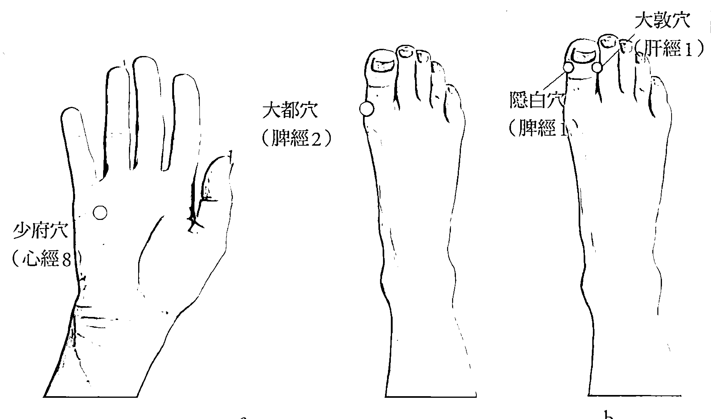

### 3. 將「經前症候群模組」加入能量日常運動

要讓妳的能量在經前症候群期間保持共鳴，可以每天做兩次五分鐘能量日常運動，早上一次，下午或晚上一次，尤其發現自己精神不佳的時候。我會建議在日常運動中多增加下面幾個動作，在經前症候群發作期間、或是繼續做到生理期來了兩、三天之後。在淋巴按摩（第66頁）後直接進行下列五個動作，然後和平常一樣，以拉上拉鍊和連結來收操。

#### A. 連結天地（時間：約2分鐘）

這是一個古老的運動，許多文化中的女性一直以來都會運用這樣的技巧。見第52頁的步驟。

#### B. 三軸輕觸（時間：約30秒）

三軸輕觸是一個簡單迅速的技巧，能夠馬上讓妳獲得舒緩。這個動作能夠鎮靜平衡荷爾蒙，尤其有益於腦下垂體和下視丘：

1. 將一手的掌根置於前額，然後把中指放在頭頂。
2. 另一手的大拇指、食指和中指合攏，放在後腦勺略下方（凹下處的上方）（見圖4-2）
3. 持續三次深呼吸的時間。

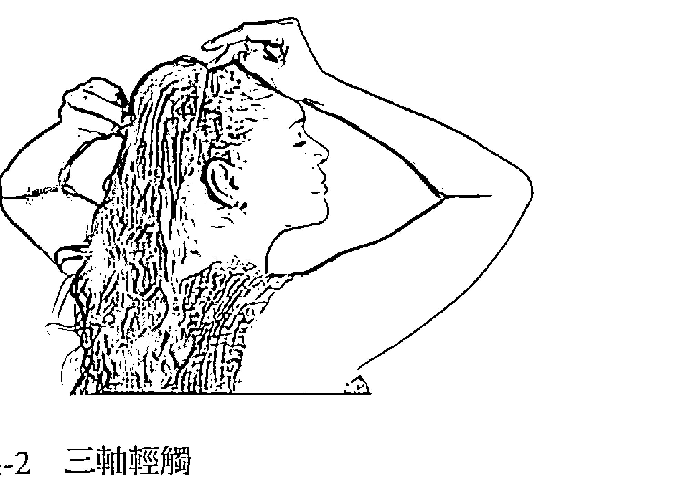

#### C. 腹部伸展（時間：約30秒）

我們的腹部以及裡面所有的器官，在經期來臨前可能會變得腫脹緊繃，干擾到能量的正常流動。腫脹的感覺就像是軀體中間有個堵塞的水壩一樣。腹部伸展可以打開這些空間，釋放部分壓力，讓新鮮能量能夠在此流動，緩和像是填鴨一般的不適感。

1. 站在椅子或是其他差不多高度的家具後面，雙手撐在椅背或家具上方。手臂伸直。或是可以扶著大概與肩膀同高的家具邊緣，伸直手臂，站在與邊緣距離一個手臂遠的位置。
2. 往上看，伸展的時候脖子輕輕往後仰，右腿往後抬起，膝蓋打直。感覺一下脖子與腹部的伸展（見圖4-3）。
3. 回到中心。
4. 左腳重複同樣動作。
5. 這樣會感覺很舒服。想重複幾次就重複幾次。

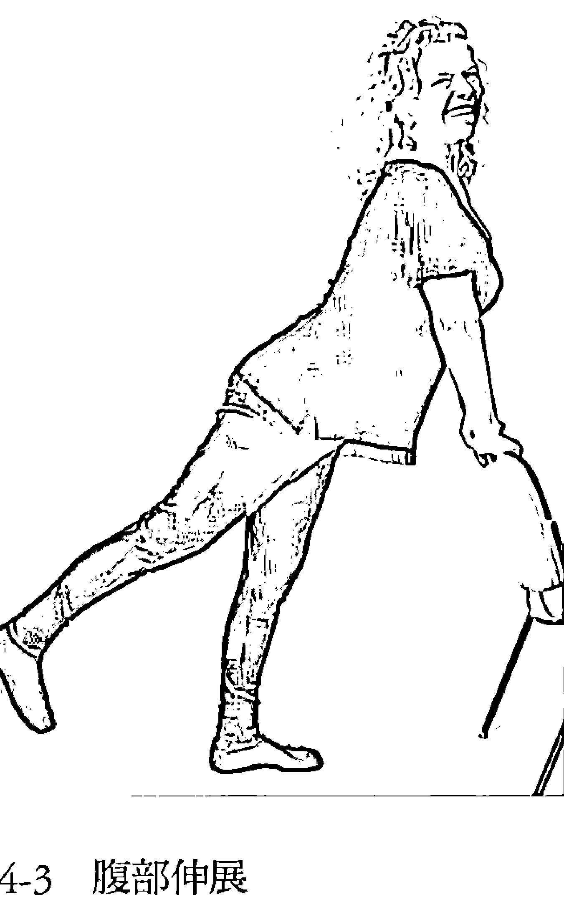

#### D. 側邊伸展（時間：少於1分鐘）

這個動作也可以伸展腹部的韌帶，而且對心、肝、脾、膽的能量非常有益，因為這些部位在經前症候群期間會承受許多壓力。和腹部伸展一樣，也有舒緩腫脹的功效。側邊伸展的做法如下：

1. 先站好，雙手放在腿兩邊，深呼吸。鼻子吸氣，嘴巴吐氣。
2. 深深吸氣的同時，兩手從下到旁往上畫一個圓弧。
3. 用左手抓住右腕，吐氣，用左手往上提拉右手臂，身體往左伸展（見圖4-4）。
4. 一邊吸氣、一邊重新站直。接著換另一邊重複。左右至少各做三次。
5. 最後，手高舉過頭，手掌朝外，往下畫圓回到開始的姿勢。

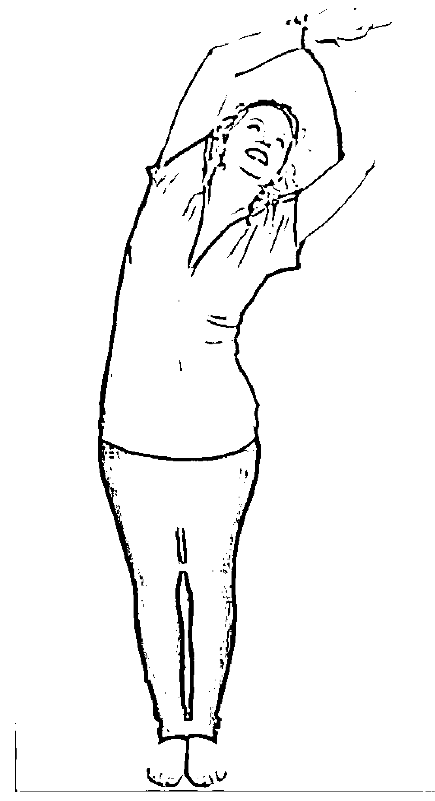

#### E. 脾經沖掃與敲打（時間：少於1分鐘）

如果你在經前症候群期間感到虛弱，大概就是需要增強脾經的時候。透過沖掃可以有效增強脾經，逆行一次，順行三次，很像是清潔過濾器那樣，讓停滯的能量再度暢通。妳可以用手輕快掃過經絡，或是將手隔空放在距離經絡幾公分遠的上方，仔細而緩慢地沿著經絡移動。照著圖4-5的經絡通道來進行。整個過程中，手的動作必須仔細而緩慢。沖掃與敲打脾經的做法如下：

1. 站好後，手掌伸直放在腰間兩側，手指朝下。
2. 深吸一口氣，手指往上走到腋下。
3. 吐氣，手往下來到身體兩側，手掌一樣伸直。走到腰部時，將手移到胯骨前方，繼續往大腿內側下去，手指打開，手掌伸直。
4. 往下來到踝骨，繼續沿著腳掌內側邊緣，從大腳趾掃出去。
5. 深吸一口氣，雙手沿著原路走回來。從腳掌內側邊緣的大腳趾開始，手掌伸直，沿著大小腿內側上來，移到胯骨上，沿著身體兩側上來到腋下，再往下到胸廓底部。這個方向要再重複走兩次。
6. 敲打脾臟神經淋巴反射點，在乳房下方再往下一根肋骨，乳頭延伸過來的位置。一邊深呼吸，一邊敲打約10秒鐘（見圖2-5）。
7. 接著敲打身體兩側的脾穴10秒鐘（圖4-5）。

### 4. 處理身體不適與疼痛的技巧

經前症候群最常見的生理症狀就是水腫、胸部脹痛、腹痛、背痛和鼠蹊疼痛。對於抽筋和許多類型的疼痛，大家通常會直覺用手去揉不舒服的地方。其實這是個有道理的。逆時針方向揉動會將破碎的能量抽出來，順時針方向揉動則是鎮定該處的能量。妳的手甚至不需要接觸身體，只要隔空幾公分放在不舒服的位置上面，以逆時針方向畫圓，看看是否能感覺到手把能量抽出身體。不時甩甩手，像是要把過多的能量丟到地上那樣。只要妳開始感覺比較舒服了，就可以改用順時針畫圓的方式來穩定舒服的感覺。

#### A. 胃經沖掃處理（時間：約1分鐘）

針對經前症候群的不適，還可以使用另一個不錯的技巧，叫做胃經沖掃。揉動畫圓是將能量從不舒服的地方抽出來，而逆向沖掃（走經絡的前半部分）則像是清理通道，讓造成經前症候群的能量流動起來。這個動作可以立刻放鬆胃部周圍的區域，因此自然可以舒緩腹痛或胃痛。此外胃經沖掃也可以平撫難過的情緒，尤其是心痛或其他情緒上的痛苦，因為這些情緒對應的生理部位就是胃部或胸部。

就和沖掃脾經一樣，胃經也可以用手輕輕撫觸，或是隔空放在距離幾公分遠的經絡上方，仔細而緩慢地移動。一開始是逆向走胃經，用雙手沿著經絡正常流動的反方向來進行（見圖4-6）：

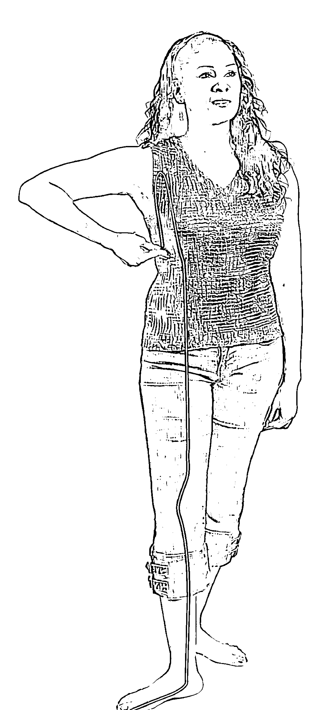

圖4-5 脾經沖掃與敲打

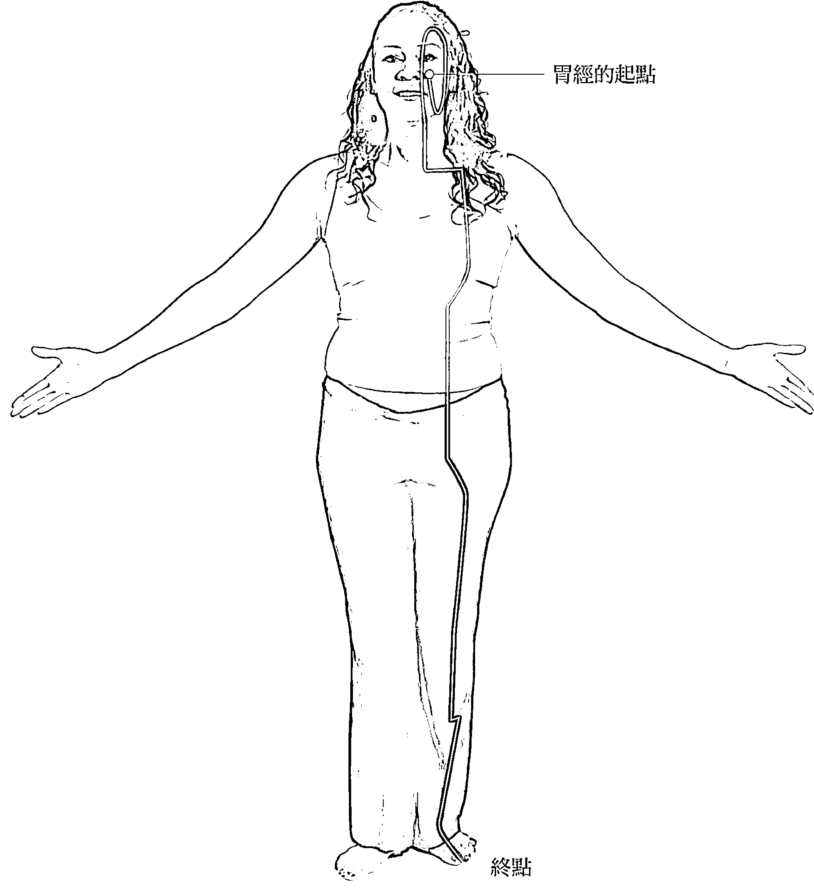

胃經的起點

終點

圖4-6 胃經沖掃

148 女性能量療法：永保青春健康的自助寶典

1. 從兩隻腳的第二腳趾開始，經過腳踝，稍微往大小腿外側的方向，往上來到身體。
2. 直接從身體正面繼續往上，經過卵巢，經過乳房，來到脖子，經過下頷骨，來到眼睛，來到髮際。
3. 畫個圓往下，沿著臉的輪廓來到下頷骨，再直接往上停在眼睛下方的穴位。
4. 甩掉手上的能量。依自己的感覺，逆向沖掃可以再重複一到兩次。
5. 現在以與剛才相反（正向）的方向走一次胃經（一樣見圖4-6）。
6. 正向沖掃總共進行三次。結束要記得甩掉手上的能量。

#### B. 針對不同類型經前症候群的額外處理方法

##### 水腫：

我所知道最適合處理水腫的方法是腹部伸展和側邊伸展，建議兩者都加入日常運動中。任何可以伸展到胃部的動作，都能夠清理出空間讓能量流動。另外，也可以按摩一個叫做陰陵泉（脾經9）的穴位，位置在大腿內側，膝蓋內側，脛骨後的凹陷處（見圖4-7），以逆時針方向揉動約10秒鐘（把膝蓋骨當成鐘面），然後敲打5秒鐘。這是傳統治療水腫的方法，不過懷孕女性不適用。

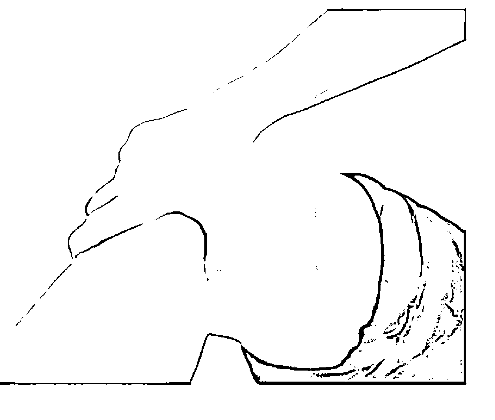

##### 胸部脹痛：

經前症候群的疼痛與腫脹，是因為荷爾蒙變化以致能量流動堵塞，造成過多的能量堆積，流動變得黏稠遲緩。胃經會經過乳房，往下來到腹部，並跨過卵巢。所以在月經來臨前，胃經通常會負擔過重，因為要處理這些部位複雜的變化，而累積了過多的能量。如果胸部感覺腫脹或疼痛，釋放一些淤積的能量應該可以舒服一些。首先按照上述胃經沖掃的方式，進行一次逆向沖掃。鎮定下來的胃經可以讓以下部位獲得進一步緩解，例如腹痛、胸部脹痛，以及卵巢疼痛。鎮定經絡就像打開水龍頭一樣，排出淤積的能量，恢復健康的循環。鎮定胃經和其他與經前症候群相關經絡的技巧，會在討論完抽筋、背痛、鼠蹊疼痛、經期延遲和鎮定經絡後解釋。

##### 腹痛：

鎮定胃經也可以改善腹痛。特別針對腹痛的技巧是按摩脾經的第四個穴位。先放鬆身體，將雙腳擺成可以同時按摩到的姿勢，同時按摩兩腳內側，位於腳趾和腳跟正中的點（公孫穴，脾經4，見圖4-8）。在骨頭上按壓，以逆時針方向揉動至少10秒鐘，最多可到1分鐘。然後敲打這兩個點，同時進行兩次深呼吸。另外，按摩中封穴（肝經4，同樣見圖4-8）可以釋放子宮的壓力，也對舒緩腹痛有幫助。同樣是以逆時針方向按摩、然後敲打，進行時要記得深呼吸。

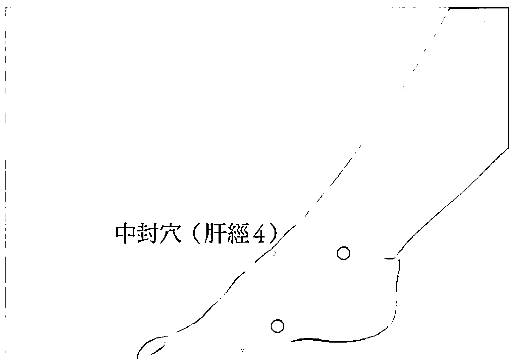

## 背痛：

能量療法舒緩疼痛的做法，是去處理產生疼痛的原因，而不是像「止痛藥」那樣，僅僅掩蓋住疼痛的表象。能量療法治療疼痛的技巧，不只是消除症狀，還會在身體能量的層面去修正疼痛的原因。即使背部原本沒有問題，經前症候群也可能會帶來疼痛，因為這段期間，腎臟必須過濾更多的血液與荷爾蒙，工作量滿檔，壓力超載，造成這個部位產生疼痛。鎖定腎經能夠清除腎臟緊繃的能量，並帶來放鬆與舒緩。如果是上背痛加上腹痛，則可以鎖定小腸經，因為這條經絡管理整個腹腔，相信會有幫助。除了緩解腹痛外，對背部緊張也有效。如果背痛是出現在腰部脊椎附近，則通常是大腸經的問題，鎖定大腸經可以獲得緩解。

##### 鼠蹊疼痛：

在月經來臨前，子宮內壁會增厚，子宮重量會增加，這使得腰部的韌帶增加負擔，因為要花更多力氣支撐子宮，但緊繃的韌帶會造成鼠蹊疼痛。最簡單的方法是躺下來，將手指置於鼠蹊部，也就是大腿和身體連結的地方。先將身體放鬆，讓手掌伸直。妳的手會傳送好的能量到子宮兩側的卵巢，以及因月經來臨前失去平衡而造成便秘的兩個瓣膜（迴盲腸瓣膜和直腸瓣膜）。維持這個姿勢兩分鐘。另一個舒緩鼠蹊疼痛的方法是鎖定肝經。這條經絡控制身體韌帶的張力，而且肝臟本身的工作就是在排除釋放到系統中必須被清理的荷爾蒙。因此肝經在月經來臨前同樣也是工作超量。鎖定肝經（做法在第 156 頁）可以放鬆韌帶不必要的緊張，幫助系統重新穩定，讓肝臟處理已經發揮功能的荷爾蒙。

##### 經期延遲：

透過放鬆臀部肌肉和整個骨盆區可以讓經期到來。萬一不確定是否懷孕，這麼做時只要鎖定控制循環系統、心包和臀部肌肉的經絡，也就是心包经，就不用担心有流产风险。要让这条经络维持流动顺畅的另一个重要理由，是因为心包经和脾经、胃经及三焦经有协同作用。

## 镇定与经前症候群相关的经络

许多与经前症候群相关的不适症状，都是与能量过多相关，而不是能量不足。这似乎与我们的直觉相违背，因为你会感觉自己需要更多能量，不过需要能量也是事实。原理是这样的：身体的某些部位如果累积了太多能量，正常的能量流动就会堵塞，造成疲倦与疼痛。某个地方能量过多的话，就会停止流动，那么其他部位便得不到需要的能量。而为什么会有过多能量累积在同一个地方呢？是因为如果一条经络工作过度的话（例如经前症候群），经络本身可能会过度补偿，或是其他经络为了帮助这条经络而给予更多的能量。

要让堵塞的能量再次流动，有一种很有效的方法，就是去「镇定」累积能量而阻塞的经络通道。这会让能量可以再次流动，并提供大量的舒缓放松，让整个系统能够回到平衡。每条经络的技巧都类似，虽然需要镇定的穴位不同。第三章中，我们学到了镇定三焦的方法。同样地，在镇定经络时，可以把手指放在指定的穴位轻触几分钟（要确实地接触，但不需要指压或按摩），然后轻触第二组穴位大约1分钟。全部的时间大概会花上3至6分钟，端看是否能同时轻触身体两侧的穴位。轻触时要确保舒服的姿势，不要加重身体的负担。与经前症候群生理症状相关的经络包括有胃经、小肠经、肾经、大肠经、肝经和心包经。前面章节对于个别经前症候群症状的讨论，已经告诉我们何时该镇定哪条经络。

## 镇定胃经（胸部胀痛与腹痛；时间：约5分钟）

可以按照图表操作，轻触一侧的第一组穴位（图 4-9a）2分钟，然后进行另一侧。另外，轻触第二组穴位（图 4-9b）约1分钟。以下详细做法：

1. 用右手大拇指和中指轻触右脚第二脚趾末端（包覆厉兑穴，胃经45）。
2. 同时用左手大拇指和食指轻触右手食指末端，包覆商阳穴，大肠经1（见图4-9a）。
3. 轻触约2分钟，确定身体姿势不会僵硬。
4. 换边重复。
5. 接下来，将双脚摆到手可以同时摸到的舒服姿势。
6. 用两只大拇指分别沿着第二和第三脚趾韧带中间的凹陷往上，停在距离脚趾根约5公分的地方（陷谷穴，胃经43）。
7. 将两手的食指放在第四脚趾韧带上的足临泣穴上（胆经41）（见图4-9b）。
8. 轻触约60秒钟。

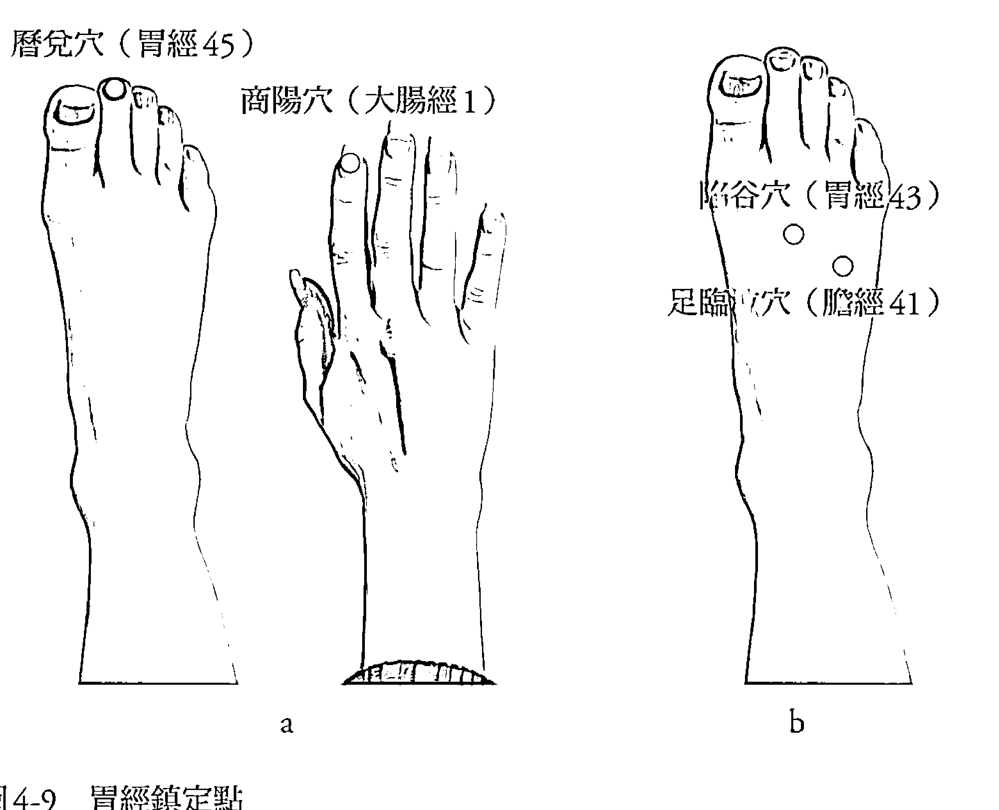

## 镇定小肠经（上背痛与腹痛；时间：6分钟）

将一手的中指放在足三里（胃经36，膝盖下距离一个手掌宽，第二脚趾延伸过来的位置），同时另一手的中指放在小海穴（小肠经8，手肘下距离约三横指宽，小指延伸过来的位置），身体任何一侧均可，轻触约2分钟（见图4-10a）。然后换边重复。接下来，把一手的中指放在前谷穴（小肠经2，小指外侧，指根与手掌连结处），另一手的中指放在足通谷穴（膀胱经66，小脚趾根部外侧凹陷处），轻触约1分钟（见图4-10b）。换边重复。

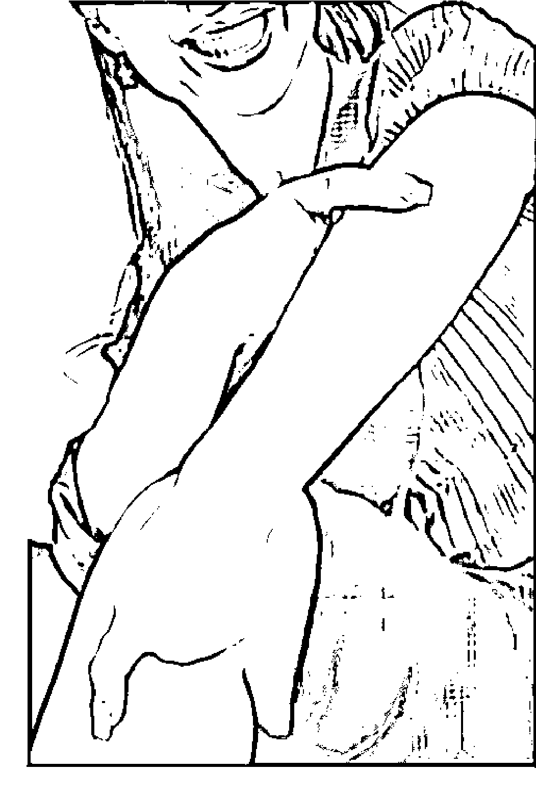

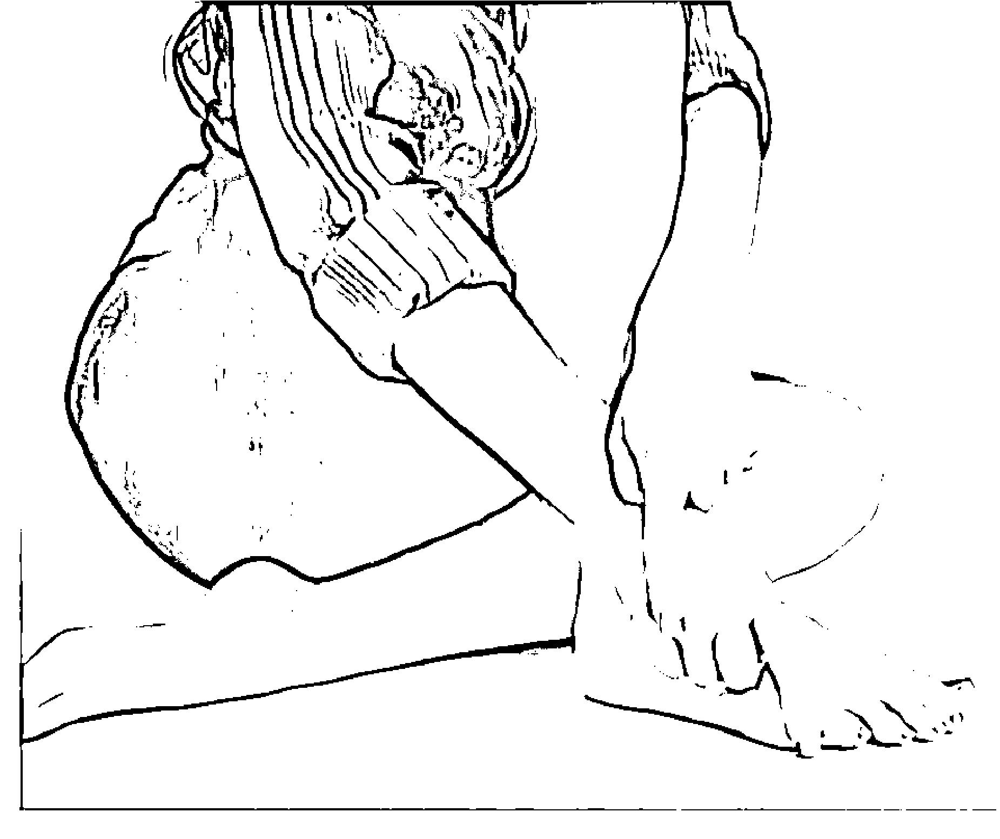

图4-10 小肠经镇定点

## 镇定肾经（背痛；时间：约3分钟）

这个方法可以同时轻触两侧穴位。

1. 因为要同时轻触两侧，可以坐在椅子上把脚抬上来。将两手的中指放在脚底第二和第三脚趾间，然后顺着滑到脚掌前端与足底凹陷处的边界（涌泉穴，肾经1）。以左右手同侧或交叉轻触两脚均可，只要舒服就好。
2. 同时将大拇指放在大脚趾靠近二脚趾那侧的趾甲根部（大敦穴，肝经1）（见图4-11a）。
3. 确认姿势不会不舒服，轻触约2分钟。不过如果妳怀孕了，则只能轻触约30秒钟。
4. 将右手中指放在右脚大脚趾外侧，然后滑过趾跟关节停在凹陷处（太白穴，脾经3）。左脚也是相对应的穴位。
5. 大拇指放在脚踝内侧后方的凹陷处（太溪穴，肾经3）（见图4-11b）。
6. 轻触约60秒。

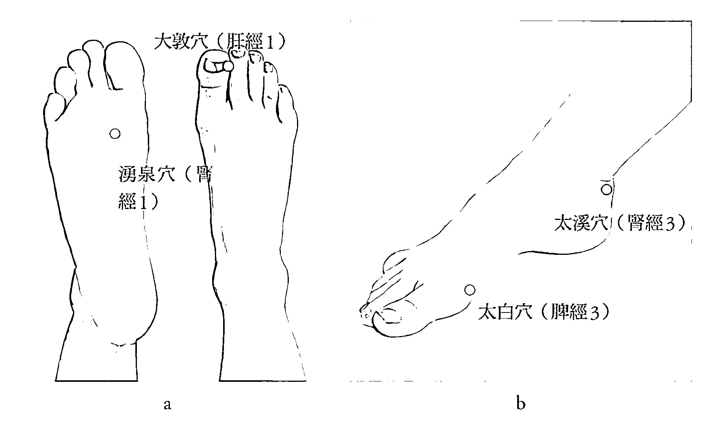

### 图4-11 肾经镇定点

## 镇定大肠经（下背痛；时间：约6分钟）

图4-12a 标示的是第一组穴位，二间穴（大肠经2，食指根部内侧）和足通谷（膀胱经66，小脚趾根部外侧凹陷处）。两侧各轻触约2分钟。图4-12b 标示的是第二组穴位，阳溪穴（大肠经5，手腕上方，食指延伸过来的位置）和阳谷穴（小肠经5，手腕上方，小指延伸过来的位置）。两侧各轻触约1分钟。

### 图4-12 大肠经镇定点

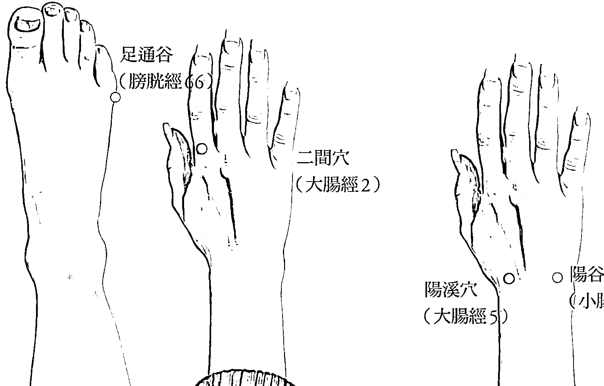

## 镇定肝经（鼠蹊疼痛；时间：约6分钟）

将一手的中指放在行间穴（肝经2），同时另一手的中指放在少府穴（心经8）（见图4-13a），身体任何一侧均可，轻触约2分钟。然后换边重复。接着，将一手的中指放在中封穴（肝经4），另一手的中指放在经渠穴（肺经8）（见图4-13b），轻触约1分钟。然后换边重复。

### 图4-13 肝经镇定点

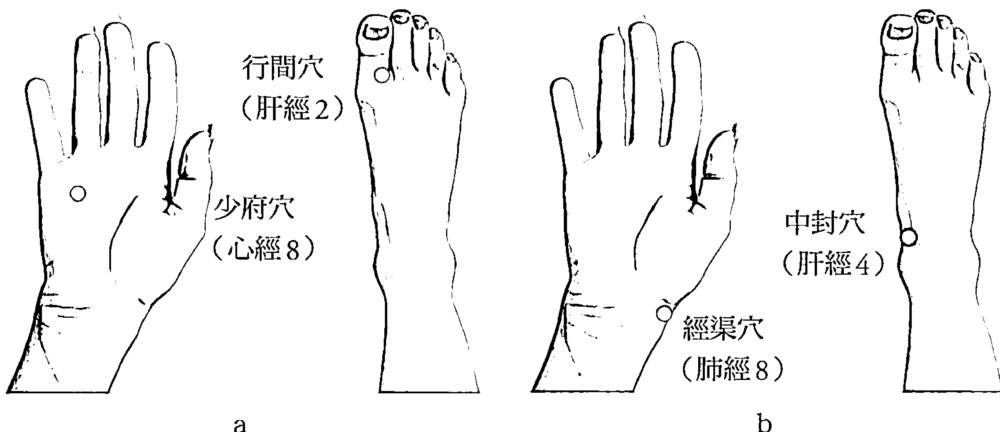

## 镇定心包经（经期延迟；时间：约6分钟）

将一手的中指放在太白穴（脾经3，脚掌内缘，大脚趾根关节后方凹陷处），同时另一手的中指放在大陵穴（心包经7，手腕内侧中点，中指延伸过来的位置），身体任何一侧均可，轻触约2分钟（见图4-14a）。然后换边重复。接着，将一手的中指或大拇指放在阴谷穴（肾经10，大腿内侧膝盖弯曲处），另一手中指放在曲泽穴（心包经3）（手肘内侧中央），轻触约1分钟（见图4-14b）。然后换边重复。

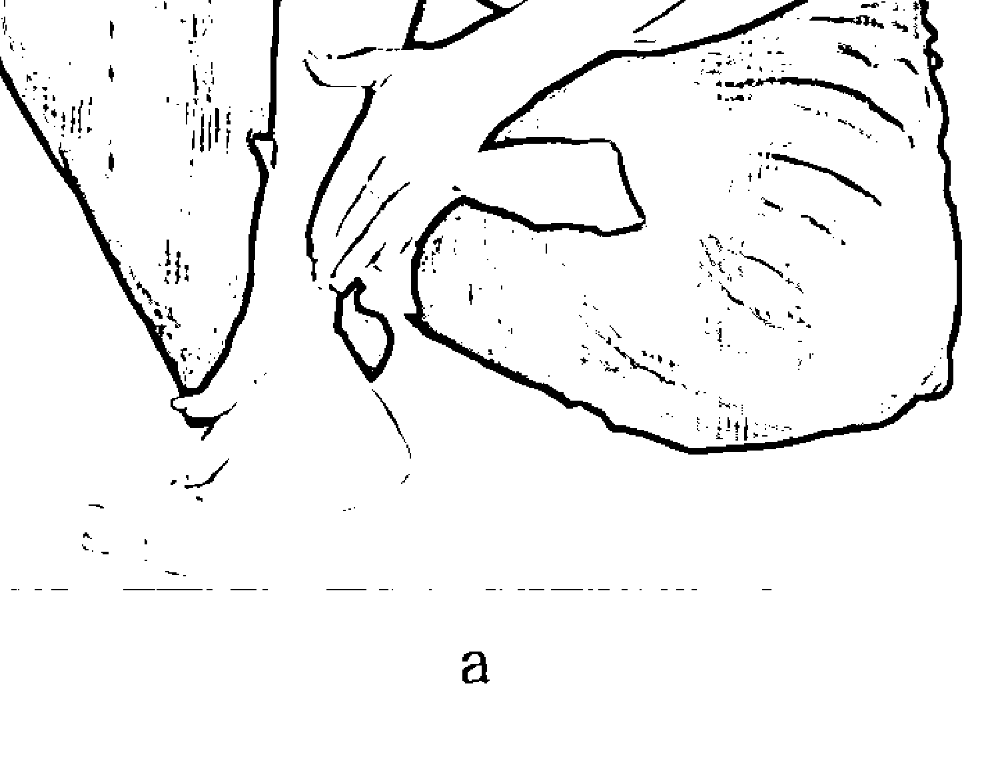

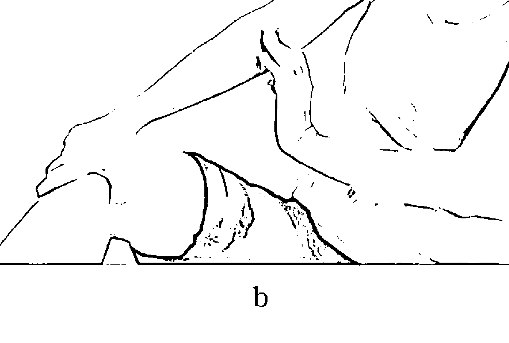

图4-14 心包经镇定点

## 5. 情绪崩溃时的急救

能量疗法有一些技巧可以应用于情绪起伏激烈的时刻，而经前症候群刚好就是情绪起伏的大魔神。我可以向妳保证，能量疗法对于情绪起伏绝对有用。效果很快、很强，妳可以先学起来，随时派得上用场。当妳运用的时候能够感觉到能量的改变。最后是，妳在需要的时候不会记得要用。好了，证明我说是错的吧！

必须记住的三个原则是伸展、敲打、交叉轻触。如果妳什么都不记得，可以一边深呼吸，一边进行下列动作：（一）伸展躯体，（二）敲打脸部、头部和身体，和（三）交叉双臂抱住肩膀。我们已经介绍几种很棒的情绪急救技巧：连结（第69页）、拉上拉链（第68页）、三焦安静法（第114页）和韦恩·库克姿势（第64页）。还有四种可以尝试的技巧是充电、排毒、轻触神经血管点和黑武士呼吸。

### A. 充电（时间：1分钟多一点）

当妳觉得疲惫、易怒，或是快要哭出来的时候，这个技巧能够让肝经、脾经、膀胱经和肾经获得放松、支持和力量。这些经络在经前期症候群期间都可能充满压力。如果常常做这个动作，可以让荷尔蒙保持平衡并舒缓妳的生理周期。

1. 先坐好，左脚跨在右腿上，揉捏左脚两侧（见图4-15a）。

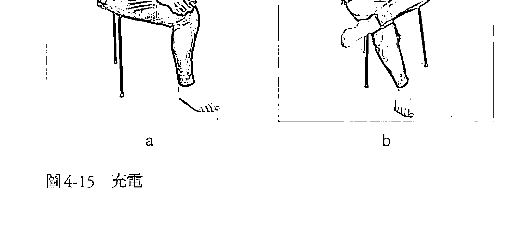

2. 左手手指稍微施力，往上沿着左腿内侧往上扫过。
3. 双手稍微施力沿着身体往上扫过，左手扫过身体左侧，右手扫过身体正面中心线的左侧。
4. 右手来到锁骨底下（俞府穴），左手来到侧边胸廓底部（大包穴，脾经21）时，在这两处敲打10或12下，一边进行深呼吸（见图4-15b）。
5. 换边重复。

### B. 排毒（时间：不到1分钟）

第二章介绍的甩出去／拉上拉链／连结技巧（第78页），前面两个部分效果很强，接连着做可以用來排毒。这个方法能够将压力和愤怒排出身体，让阻塞的能量畅通起来，并让精神放松：

1. 站直，把手臂置于身体前方，手肘微弯，握拳，拳心朝上，深呼吸（见第80页，图2-16）。
2. 手臂甩向身后，再荡回前方到头上，高举一分钟。
3. 往上伸展，拳心相对，猛力往下甩手，手掌用力打开。让情绪随着吐气一同流泄，喊出声音来，可以是「呼」或是其他自然发出的声音。
4. 重复几次，会感觉很舒服。最后一次手臂放下时要和缓，并同时吐气。身体站直站挺，配合深呼吸。
5. 以拉上拉链结束。深呼吸，将双手放在耻骨（见第68页，图2-10），沿着身体中心线往上移动。高举过头，手掌朝外，慢慢吐气，手臂往两侧尽量伸展，然后往下回到耻骨。

### C. 轻触神经血管点（时间：1至3分钟）

当妳感觉到压力或忧郁时，这个技巧可以释放身体和心灵的紧张。妳的身体还是和几百万年前的祖先一样，会对威胁与压力做出反应。不论逃走或战斗都需要血液离开大脑，流到身体四肢，才能采取迅速的动作。在紧急的状况下，人体的设计是行动至上而非思考。在前一章介绍过的轻触神经血管点，可以打断战斗或逃走的应急反应，将血液带回前脑，让妳能够思考得更清楚。

1. 坐着或躺下，与妳所感受到的压力同调，或集中精神回想某个会让妳紧张的想法、回忆或状况。
2. 将大拇指置于太阳穴，其他手指的指腹置于前额，也就是眉毛上方的额骨（见第113页，图3-1）。
3. 轻柔地轻触，最长可达3分钟。配合深呼吸，鼻子吸气，嘴巴吐气。

替代做法：一只手掌置于前额，另一只手掌放在脑后。同样，轻柔地碰触，最长可达3分钟，并配合深呼吸。

### D. 黑武士呼吸（时间：不到1分钟）

这个方法可以锁定三焦，平衡荷尔蒙，释放压力，让身心获得稳定。这里的呼吸必须要非常缓慢，控制得宜。

1. 身体站好，把气完全吐出。
2. 用嘴巴极为缓慢地吸气到喉咙后方，会产生一种仿佛电影《星际大战》中「黑武士」发出的低沉气音声。
3. 一样非常缓慢地用嘴巴吐气，也要发出同样的低沉气音声。

对妳来说，可能某些方法会比其他方法更为有效，但每种方法都不错。自己实验看看。

## 6. 荷尔蒙与其他补充物的能量测试

到目前为止，我们的重点都放在学习改变身体能量的技巧，但是第三章所下的定义告诉我们：能量疗法是一门艺术，也是科学，透过运用能量与化学间的关系，可以促进健康、活力与幸福。之所以会把重点放在能量，除了因为那是我的专长外，在帮助女性处理健康问题时，西方医疗和另类疗法对于能量部分实质的关注并不多。但在应用方面，能量疗法其实对于化学和能量的平衡与失衡都一样有帮助。事实上，所有的植物和药品都有能量的特质。而能量测试（见第69至72页及附录）这项工具可以用來检验荷尔蒙、营养或其他类型的补充品，是否能够成为最佳的能量介入辅助。

如果妳在服用某种植物后，腹痛状况就能舒缓，那便不需要再进行能量测试。不过，能量测试可以帮助妳检验健康有机店架上的八种植物，找出可能对妳的身体、问题和能量系统最有助益的一种。每种食物、药丸或胶囊都有自己的能量场。能量测试可以让妳在摄取之前，知道这项物质独特的波动，是否能与妳身体的能量和需求共鸣相容。因为能量会影响化学作用，这也可以让妳预测身体会对这项物质产生怎样的反应。

我自己，还有我对个案采行的方式，是先单独使用能量疗法来处理每个月的震荡起伏，因为这样比较没有侵入性。如果要倚靠外力才能让身体制造原本就能分泌的化学物质，那么身体产生这项化学物质的能力就会逐渐减弱（一个重要的例外是黄体素）。

能量疗法当然可以不搭配其他辅助单独运作。不过，有时候一些可以帮助经前症候群的植物和其他辅助品，可以让能量疗法更为有效。我完全认同在必要时候搭配使用。

即使妳不想学习能量测试，还是可以藉由亲自尝试错误来检验这理提到的物质。我个人藉由这种尝试错误的方法，更了解自己的身体和需求，尤其是在1970年代末期之前，我还不了解能量测试的时候。妳可以在网路上搜寻服药禁忌，并在服用任何妳并非完全了解的物质之前，先与合格的治疗师讨论。

如果妳已经学会能量测试，或是有可靠的治疗师能够帮妳用能量测试进行检验，那么就可以减少亲自尝试的机会，还可以进一步了解自己需要的分量和情况。例如，我的身体可能需要一粒黄体素，但三粒可能就会破坏我体内黄体素和雌激素的平衡。隔天我还不需要服用，但第三天我可能需要早上吃三粒，下午再吃一粒。我不知道有其他比能量测试更好的办法，能够在身体震荡的化学作用和让功能维持在巅峰状态之间建立和谐的连结。

每个月雌激素和黄体素之间能否平衡的变化，是极为严重的经前症候群是否发生的主要关键。随着排卵的需要，黄体素浓度开始升高。如果妳顺从自然的呼唤，做对了前半部分，那么身体就会需要开始为迎接胎儿做准备。黄体素将子宫重新打造成适合宝宝生长的环境。雌激素会让妳变得兴奋，在性欲上更为主动积极，而黄体素则会让妳镇定下来，变得比较宁静祥和。事实上，黄体素的主要作用除了强化子宫之外，就是放松中央神经系统。但如果妳现在正处于排卵期，但黄体素却分泌不足，那么身体就会感到非常焦虑，因为子宫内壁无法增厚，好迎接即将到来的宝宝。这有些不对劲！除此之外，整个神经系统也会失去平衡，因为应该要分泌的黄体素没有出现。

黄体素浓度出现错误可能有很多原因。大自然随机的设计，就是可能让某些女性分泌较多雌激素，某些女性分泌较多黄体素。许多女性在三十多、接近四十岁的时候，自然的黄体素浓度就逐渐下滑。如果妳的在月经来临前期间是越来越焦虑、歇斯底里，或过度反应，那么妳分泌的黄体素可能比妳身体所需要的少。本章中介绍的一些能量运动应该可以让妳变得比较平衡，不过也可以考虑补充身体应该要分泌的激素。生理期女性黄体素不足还有别的征兆，除了焦躁易怒和情绪极端之外，其他包括了生理期周期不规则、经血过多、胀大、背痛、水肿、疲倦、贪吃、子宫内膜异位、子宫肌瘤和乳房胀痛。

我自己的经前症候群最恐怖的是情绪问题，我的小女儿丹蒂则是每个月都因此身体虚弱，严重的盗汗发抖与腹痛。加上她的生理期一直都不准，所以无法事先预防，而且对她从事女演员的工作也影响很大。黄体素是我的万灵药，但对她却没有作用。奇妙的是，在她开始吃避孕药，雌激素浓度增加之后，突然间她的生理期变得完全正常，症状也完全消失。

要补充黄体素，最简单的方法是服用墨西哥或西伯利亚山药根胶囊。有些人也会使用山药根或其他黄体素乳液。最强效的黄体素只能由医师开立处方（要确定自己拿到的是天然的黄体素而不是合成的黄体制剂，人工合成比较可能有副作用）。天然黄体素可以是塞剂或是口服胶囊，或者可以在胶囊上打个洞，把少量黄体素撒在手腕内侧或腹部，以便完全控制吸收剂量。皮肤会让黄体素直接吸收进入血液中，如果采用口服，就还需要肝脏进行处理。不管是山药根还是处方的黄体素，都可以自己试试看反应如何，或是每天使用能量测试，来决定自己身体需要的分量与形式。有时候身体的需求每个小时都不同。但总之，请不要像我曾经犯过的错误那样，把黄体素看成万灵药，摄取过多而造成伤害（见第136页）。黄体素过高的可能症状包括易怒、迟钝、沮丧、性欲减退、子宫痉挛、头痛和失眠。

在我发现山药根有效之前，只有维生素 B6才能真正帮助我平稳经前症候群造成的严重情绪起伏。B6能够镇定神经系统。我服用的剂量比一般建议的要高，不过当然妳还是可以能量测试一下。我会服用 B 群来处理因为荷尔蒙引发的日常压力，然后另外再多加 B6。钾，或者是综合矿物质胶囊，可以稳定血压，维持电解质平衡，对神经系统也相当重要。镁是一种患有经前症候群的女性常会缺少的矿物质。镁可以放松肌肉，对于很多症状都有帮助，例如腹部痉挛、腿部抽筋、头痛、便秘等。另外我也很喜欢铬，可以帮助平衡血糖浓度。许多女性在经前症候群发作时会疯狂想吃糖和巧克力。想吃巧克力多半是反应身体缺镁，而想吃糖则是缺铬。

许多女性在经期来临前会觉得双腿无力。有一种叫做金雀花的植物，我觉得是上天赐给我们治疗腿无力的礼物。当我去跳舞或是在家乡俄勒冈州走山路前，会使用一点。金雀花能够让我在双腿又酸又痛又无力的时候，有着意料之外的好表现。金雀花的英文原意是「屠夫的扫帚」（butcher's broom），由来很有趣。欧洲流行黑死病的时候，屠夫几乎都没有受到感染。原来是因为屠夫用的扫把是一种常青灌木的植物所做成，屠夫的手会吸收到植物的成分（尤其他们手上都是伤），后来发现这种植物有着强烈的疗效。金雀花能够和胶原蛋白结合，强化血管，帮助身体的血液循环。

其他常用于经前症候群的植物，还包括益母草、蒲公英根、当归和银杏。妳可以自己试试看或是进行能量测试，也可以用网路搜寻获得多一点了解。简单来说，益母草据说具有稳定情绪和增加内在安全感的功用。蒲公英根可用于强化脾经和肝经，也可以消水肿。当归对某些女性来说，可以平衡雌激素和黄体素的浓度，虽然我每次都越用越糟，所以这又是一个学习能量测试的好理由。银杏可以改善记忆力、脑力退化，和血液循环，不过我不记得对我是否有用。饮食中增加纤维质可以帮助便秘时消化系统的蠕动。全光谱的照光能够让部分女性增加能量、提振精神。

不管妳的生理期让妳多难受，都是一个非常神奇的过程。我希望本章提供的一些简单的能量技巧，能够让妳在遇到问题时处理得更有效率，也让妳更能把握每个月接触到内在深层智慧的机会。

# 5 健康地怀孕与生产

> 几千年来，女人站在自己的洞穴里，一手搅汤，背后背着小孩，用另一只脚把长毛象踢出门。女人，几千年来，大脑的结构和思考的模式已经发展成和男人有着本质上不同的样貌。
> ——珍·豪斯顿博士 (Jean Houston, PH. D.)

人类，以最简化的方式来说明，是「一个基因制造另一个基因的过程」。只不过这个过程相当的豪华与享受。我们的性欲刺激多彩、强烈有力。我们的生殖力随时位于潜能的颠峰。怀孕是一个微量点创造出奇迹的旅程。生产则是生命呈现的典范。

我们的身体知道该怎么做。人类最深层的生理程式不停催促我们走过每个创造继起生命的阶段。不过即是如此，现代的世界已将这块游乐场颠覆了。性爱的甜美与热情，曾经是两人之间的私密，是心、灵与荷尔蒙的无邪回应，现在则被萃取出来注入无所不在的媒体影像中，重新塑造了我们的自我形象与对爱和性的看法。此外，生殖力也面临了挑战，因为食物中有太多的人工荷尔蒙，空气也被电磁所污染。复杂的生活型态让各种不健康的影响在怀孕时更为放大，甚至女性生产的方式也远离了自然的韵律与直觉。

能量疗法对于这些问题能提供许多帮助，你的身体，也就是世界上最了解妳的性欲、生殖力、怀孕状况和生产过程的专家，透过与能量更好的沟通，能够用自己的语言来对妳说话。除了帮助妳重新拥抱天生的直觉，能量疗法还提供了不同的工具，让妳检测这几个方面是否有任何扭曲，同时进行有效的修正。这些工具也能创造一种氛围，在妳的身体里打造一个能量的环境，让妳在创造下一代的过程中，每个阶段都很顺利。本章会对每个阶段的基本概念与方法进行介绍与说明。

## 性欲

我有美洲原住民切罗基（Cherokee）的血统。切罗基的老祖母都会教导孙女如何不靠男人愉悦自己。这不是一种自渎，而是让她们在寻获伴侣前能够维持独立自主的重要技巧。「处女」（virgin）最原始的意思，是「拥有自我的女性」。女性的健康性欲始于及早认识并尊重自己的身体，知道取悦身体的方法，并珍惜自己的身体，因为这将来会是孕育下一代的神圣容器，同时培养强烈的自视，不要糟蹋自己的身体。所谓拥有身体自主权的年轻女性，就是代表不要轻易付出贞操或圣洁的性行为，做为换取他人喜爱、接纳或受到欢迎的交易筹码，也不是为了填补对于爱情或肯定的渴望，或是满足他人的欲求而让自己的整体性遭受崩溃的危险。这些道理从古至今从未改变。我不是主张要回到保守的年代，我想说的是，年轻女性拥有多重性伴侣可能会需要付出很大的代价。拥有多重性伴侣的女孩，常见的除了性传染病，还有自尊下降的问题，同时身体也会有所反应。拥有多重性伴侣的女性得到子宫颈癌的风险大幅提高。有些女性在年轻时拥有多重性伴侣，结果失去了从性爱中获得深层愉悦的能力，甚至在找到深爱的对象后也无法恢复。从我的女性个案中，实在听到太多这种在自由恋爱年代过度奔放而产生的悲伤后遗症。我实在很惊讶到了现代，居然还是没有更多关于这个问题的公开讨论，毕竟我们目前仍然处在一个靠着生## 切羅基老祖母自我強化的秘密

我並不是接受切羅基的傳統文化長大，不過在我三十多歲的時候，有位切羅基老婦人曾經教導我關於老祖母自我強化的秘密。我十分詫異，因為我在十一歲時就曾經自己偶然「發現」這個方法，感覺像是我的祖先透過回聲傳遞給我。那時候我不覺得這個動作帶有任何性欲，也並沒有特別著重在生殖器上，只是感覺全身充滿美妙的愉悅與振奮的精神。如果我不是自己發現這個方法，可能現在會彆扭得說不出口。但既然我本身有過經驗，那麼女士們，過來聽吧。

切羅基老祖母自我強化的秘密有兩種，一種是完全靜止的狀態，另一種會需要身體動作。我在十一歲時發現的是第一種。當時我躺在加州羅莫納鎮自家後院的一塊大圓石上曬太陽。那是我最喜歡的地方。當時深沉的寂靜安撫了我的身心。在靜默之中，我的身體感覺到從大地所傳來強烈的悸動。我的肺彷彿已經不再幫我呼吸，而是由大地在幫我呼吸。過了一會兒，這陣悸動開始以韻律8的形式一波一波地在我的軀體流動。從上繞過，往下穿過，一次又一次，不停地律動。我覺得自己像是一把樂器一樣，被不知名的細緻力量撥動。沖刷全身的快感同時滿足了生理上、情緒上、精神上最深層的渴望。這是一種純粹的喜悅，啟動這些最深層的能量，帶來了感官上的快樂、祥和與復原，真是美妙得無法形容。

直到現在，只要我想獲得滋養與復原，就會讓自己進入那種深沉的靜默中，然後「韻律8」便開始啟動。不需要躺在石頭或草地或泥土上，床上或地板就足夠。我相信這些充滿活力的韻律8能量一直都存在，只等著被啟動。我只要安靜下來，集中注意力，接下來就完全交給我的身體。這個方法的確需要某種程度的臣服與交付。而另一種需要身體動作的版本則較為容易入手。我的個案告訴過我，即使很難與韻律8的能量同調，或是將自己交付出去，但身體的動作可以幫助她們體會到潛伏於自身的能量。到最後她們也可以透過靜默的姿態體會到能量的運行。

老婦人教我的是需要身體動作的版本，不過她也告訴我，女孩們最後會發現其實不需要身體的動作，能量波會自己開始運行，就像我一開始發現到的那般。以下是她教導的方法。

## 老祖母自我強化的秘密

- 1. 仰躺著做兩次深呼吸，鼻子吸氣，嘴巴吐氣。可以閉上眼睛，然後讓呼吸變得自然而輕鬆。這個方法不需要花任何力氣，也不用勉強自己。請臣服地交付出去，一切都會自然發生。
- 2. 將注意力集中在海底輪，也就是骨盆腔的下半部。感覺一下存在海底輪的能量。想像能量和氧氣在每個細胞間進出流動。
- 3. 用臀部以上下起伏的方式，畫出韻律8的軌跡。
- 4. 膝蓋曲起，將雙手放在大腿內側，大拇指的邊緣置於大腿和身體連結的凹陷處（見圖5-1）。整個身體也以上下起伏的方式畫出韻律8的軌跡。肝經、脾經和腎經（所有的陰性或女性能量）都是從大小腿內側往上橫過大腿。雙手在這個姿勢所接觸到的點可以打開性能量。
- 5. 讓所有自然發生的能量隨著你的動作流動。
- 6. 一段時間後，把腿放平，雙手放在身體兩側，放慢呼吸，身體放鬆。韻律8帶來的感覺會繼續下去，甚至還會增強。

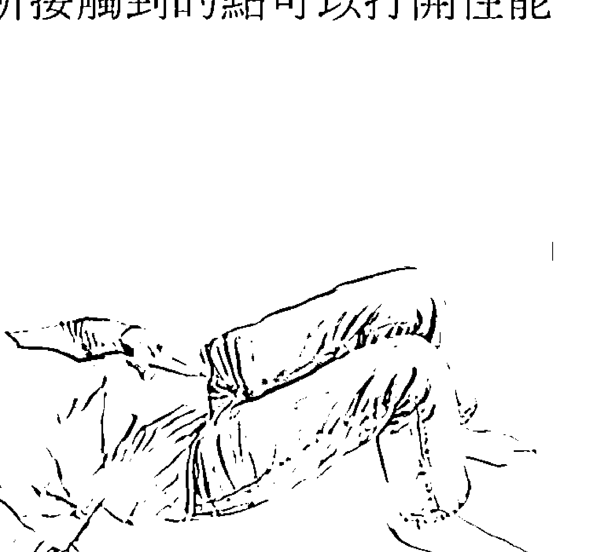

顯然這不是切羅基傳統所獨有的秘密，這其實是和女性身體的自然結構相吻合的動作。我在女性能量療法的課程中提到這個方法時，班上一名肚皮舞者就說：「這是源自於中東。傳統肚皮舞者都知道這個方法。」另一位女性則說：「這是來自中國，是三焦和心包經的相關技巧，可以讓身體熱起來，感覺很開心。後來甚至發展成密宗的譚崔瑜伽（Tantric yoga）。」

## 演化的玩笑，社會的矛盾

在我們的文化中，許多人所受的教育都認為不應該享受沒有愛的性。而女性與多重性伴侶擁有隨意的性關係，在生理和情緒上的確也需要付出代價。從某些角度看來似乎不太公平，不過我們的荷爾蒙偏向支持傳統模式，也就是愛與承諾的性關係。我要先聲明的是，並不是要大家「等到百分之百對的人才訂婚」，我的意見也不見得在任何時候、對任何女性都是最好的做法，但我們可以來看看為什麼荷爾蒙的設計隱藏著這樣的選擇。

性與浪漫的衝動通常不是靠著清晰思考與自由意志，而是由荷爾蒙來決定。並不是說理性思考和周詳的選擇不能對抗荷爾蒙的衝動，當然可以！也必須可以。但我們不應該低估荷爾蒙暗中施展的強烈磁力。

從演化的角度來說，自由意志是最近才出現的發展。其他物種不像我們一樣，在享受的時候會意識到自己擁有選擇的機會與自由。不過，早在大自然開始冒著危險讓我們擁有自由意志之前，荷爾蒙和大腦化學物質就擔負起監督的責任，確保我們的行為不會妨害生存與生殖。這樣的程式至今仍會影響、甚至主宰我們的選擇。面對威脅的戰或逃的應急反應就是個經典例子，而其他緊急狀況，例如尋找食物、水和掩蔽處也是一樣。這些行為已經寫在我們的生物程式裡，透過快樂與痛苦的語言和我們進行生物層面的對話。最重要的是可以幫助我們生存的行為，次要的則是可以確保我們產下後代的需求。

在這個層面上，男人和女人的程式結構非常不同，看起來就像是大自然在開玩笑，或是想看悲劇故事，或只是漠不關心（誰知道到底是怎樣）。與多重伴侶頻繁性交能夠增加年輕男性的自尊，但壓抑性交衝動則讓年輕女性能夠擁有較高的自尊。男性的幻想多半與性相關，女性則多半與浪漫相關。男人和女人在生理上擁有顯著不同的性驅力。還記得女王候選人嗎？每個月排出唯一一個成熟的卵子，帶著女方的基因邁向受精與孕育，以及長年教養與保護的道路。一名女性一生大約擁有三百次左右的機會，利用受精將每個月一次的慶典轉化成一生的承諾。而對男性來說，要滿足最低的要求就只要確保自己投入了基因庫，整個過程中只有受精才是最重要的，而他只要有機會，隨時都能將幾億隻精子散播出去。他的荷爾蒙也驅使他隨時注意這樣的機會。

就能量來說，對男性的挑逗很快就會讓生殖器興奮起來，能量往上流入並溫暖心臟。對女性的挑逗則是從大腦或心開始，然後才傳到生殖器。睪固酮、加壓素和多巴胺也都被認為是驅動男性追求性愛的荷爾蒙。不過，有個角色，催產素，倒是特別有趣。催產素是「照顧與友好」的荷爾蒙，與女性之間的連結和照顧家庭相關。而且，的確催產素濃度在女性體內通常為男性體內的十倍。除了一個特別的時刻，就是高潮的時候。這是男性也會深深渴望與他人連結的時刻。男性體內的催產素此時會是平常的五倍。就在這短短的片刻，大自然讓兩性之間能夠用幾乎相同的方式去感受情緒。不僅僅是釋放或調情，這個狀態其實部分來自於男性對性交的占有欲。一般認為男性付出愛是為了得到性，這只對了一半，因為男性也希望透過性來感覺到愛。然而，當女性還沉醉在分享的親密當中，男性的催產素卻很快回到正常的低濃度狀態，女性因此常感到洩氣，因為對方口中的浪漫低語早已轉變成週一晚上的美式足球。大自然的設定是，如果你能誘使對方出現20或30次這樣的連結，那麼對方的大腦也會有所轉變，他開始習慣感覺到超越純粹性歡愉的愛，因此想要留下來保護妳的孩子。但我們還是不能低估荷爾蒙驅力所造成男女不同的性行為表現。最重要的是，不要以為男性大腦所想的那些規則，就是我們女性身體應該遵守的規則。

這不只是個人的私事，而是除了性愛之外也會影響其他層面的大事。我們所生活的文化，依循的主流是睪固酮產生的影響，而非催產素。在女性面臨壓力時，她的身體會分泌催產素，引發戰鬥或脫逃的應急反應，讓她希望能與他人產生連結。在接受到任何實質威脅後，她會偏向與其他女性討論，並著手照顧安撫孩子。越是這麼做，分泌的催產素就越多。這是一種會自我加強的行為。除此之外，雌激素也會增強催產素的連結效果。相反的，男性在面臨壓力時，會分泌高濃度的睪固酮，因而抑制了催產素的連結效果。所以當關係陷入膠著，大多數女性會希望能夠說出來討論，大部分男性則希望自己一個人靜靜，好好思考解決辦法。大自然在塑造男女之間的不同時，容易相互溝通的需求本來就不是首要考量。就文化的角度來說，我們必須靜心思考戰鬥或逃走的應急反應，同時提升「照顧與友好」的特質，才可能讓催產素主導的策略有效解決我們的問題，也才更有可能讓不管是男性或女性都願意採取這樣的方式處理壓力。

對於女性特質的持續壓迫，直指人類能否改變目前急速朝著滅絕道路前進的狀態，同時也影響到我們的生理與心理健康。讓能夠拯救我們所有人的核心價值窒息的手段有很多種，不管是默默進行還是大肆喧囂，最主要的立基點都可以追溯到對生理的支配掌控。世界對於女性施加暴力的容忍，以及造成對所有女性原則與手段的壓迫，都不僅僅是未開發國家所發生的問題與困擾而已。瑪莉·伊芙修女（Sister Mary Eve）給為了救援受暴婦女而舉行的「V-Day」活動寫了一篇文章，她回想自己為何會發現這個問題的重要性，說道：「慢慢地，我開始覺得沒有什麼事比阻止對女性施暴更重要。污辱女性代表著人類無法尊重並保護生命，如果我們不修正這個錯誤，那麼人類就會滅亡。我不覺得這麼想很極端。如果你去強暴、毆打、傷害、破壞、焚燒、埋葬、恐嚇女性，你就是在毀滅地球上最重要的生命能量。你強迫應該是要開放、信任、滋養、創造的力量，變得斷裂、貧瘠、破碎。」

為什麼明明是保健書籍，卻離題開始討論起社會問題呢？因為如果妳跟隨的節奏，與演化過程的最佳策略，也就是寫在荷爾蒙裡的那些程式編碼背道而馳的話，身體會付出慘痛的代價。最明顯的就是，能量會自己互相矛盾，而妳的健康、快樂和性慾也都會受到危害。每當個案躺在我的診療床上，他們的能量不只會反映出基因的特質和生理狀況，也會反映出他們生命的選擇。不分男女都是如此，而大自然的惡作劇，讓我們因為荷爾蒙分泌狀況不同，所以在連結、解決問題和繁衍後代會採行不同的策略，人類全體的存續，就倚靠在這重要謎題的答案上。

## 開啟性能量不能只靠按摩穴位

能量療法告訴妳應該要輕觸、按摩或敲打哪些穴位，好喚醒妳的性慾和其他能量。但是，在輕觸穴位之前，第一優先的步驟應該是好好照顧妳自己的能量體。我的第一名個案是一位當時八十幾、快九十歲的名人。那時我還沒有正式進行療程服務，而是才剛開了第一個能量療法研習班，其中一名學員和他聊起了我。雖然這位老先生有許多健康上的問題，但會來找我卻只想解決一個狀況，那就是不舉。他想交女朋友，可是又覺得如果自己不舉的話，對對方不公平。這完全不是我的專長領域，但我相信只要我能讓他身體的能量流動起來，應該會有幫助。所以這就是我的計畫，他的能量在哪裡堵住，我就打開那個通道。

幾個療程過後，他的身體狀況逐漸有了改善，但他只希望能解決不舉的問題。身為人生勝利組，他對於自己的優先順序非常明白而直接。一天早上，我接到了他興奮的電話，告訴我說他終於能夠硬起來了。他稱讚我名副其實，並表示接下來他就要去交個女朋友，後來也的確做到了。這對我來說是個很有啟發的經驗。我不知道究竟哪些穴道能增強性能力，也不知道該怎麼治療任何東西，我只知道如何平衡身體裡的能量。

所以，本書中所有平衡能量的方法，都可以讓妳的性能力變得更強健。不過，的確還是有幾個特定技巧有助於打開長期阻塞或壓抑的性能量。

## 打開妳的性能量

除了生產之外，性愛是兩個身體最為親密的接觸，通常女性比男性要來得有感覺，因為她是接受伴侶進入自己身體的一方。如果要討論性欲的情緒、人際及精神各層面，篇幅實在不夠，不過這裡會提供一些能夠讓影響性欲的能量活躍起來的技巧。

## 讓妳對性愛的感覺流動起來：

能量療法中，與健康的性欲最為相關的經絡是腎經、脾經和肝經。

- 在某些傳統文化中，腎經被認為是儲存性能量的區域，雖然我不這麼覺得。不過腎經的確擁有強大的力量，讓我們的性能量保持流動。
- 脾經在性能量方面支撐著腎經的運作，也支撐所有與女性性欲相關的器官。
- 肝經可以疏通阻塞的能量，支撐與性能力相關的肌肉和韌帶。

要保持健康的性欲，或打通阻塞的性能量，就要讓腎經、脾經與肝經能夠共鳴。因此可以運用以下方法，隨意組合：

- a. 透過切羅基老祖母自我強化的秘密，將雙手放在大腿內側，隨著身體的起伏，刺激這三條經絡。對某些女性來說，光是把手放在那兒就可以讓能量流動起來。這個技巧能夠讓妳感覺到一股暖流，也許妳會覺得這樣就足夠。不過，想要進一步刺激這些能量的話，可以輕輕用畫圓的手勢按摩大腿內側的穴位。
- b. 妳可以用雙手讓腎經、脾經和肝經保持暢通流動。我們的雙手有著電磁力，沿著經絡移動可以讓經絡活躍起來。將雙手放在雙腳內側，手掌打開，仔細而緩慢地沿著腿部內側，往上移動到大腿內側的頂端。
- c. 腎經、脾經和肝經的穴位同樣位於大腿和身體連接的皺褶。輕輕沿著皺褶按壓或按摩，可以刺激這些經絡的能量。
- d. 按摩骨盆上任何感到痠痛的點，也可以清理通道，讓性能量得以流動。

每天一、兩次仔細地按摩大腿，推動腎經、脾經和肝經的能量，可以改變整個骨盆區的能量慣性，讓妳更容易感覺到性的愉悅與興奮。時常按壓大腿內側的穴位，大腿與身體連結的皺褶，還有骨盆區域，也會使妳的意識與自己的性能量同調。

## 背後的性能量：

臀部的能量是由心包經所主宰，要是這些能量停滯或堵塞（如果我們形容一個人的個性是「小屁股」[ tight-assed，意指神經質 ]，那麼他的身體多半也會呈現這樣的特質），妳享受性愛的能力就會受到限制。釋放這些能量，讓能量向前流動，就能在性交時得到完全的滿足。要得知心包經能量是否堵塞，其中一種方法便是按壓臀部，看看是否會感覺痠痛。鎖定心包經可以釋放擁擠的能量，讓這些能量流過海底輪這個與性欲強烈相關的能量中心。鎖定心包經（見第155頁）不只打開性欲的門戶，也可以穩定不規則的生理週期。

## 打開性的中央通道：

有另外一組穴位，會影響任督二脈以及一條稱為衝脈的奇經八脈，開啟的能量可以讓我們獲得全身性的深層快感。

- a. 躺下後，雙手拱起成弧狀，食指、中指和無名指併攏，兩手相對，指甲相碰，置於骨盆上方三公分處（見圖5-2）。
- b. 手指下壓，保持靜躺約3分鐘，注意能量的流動。

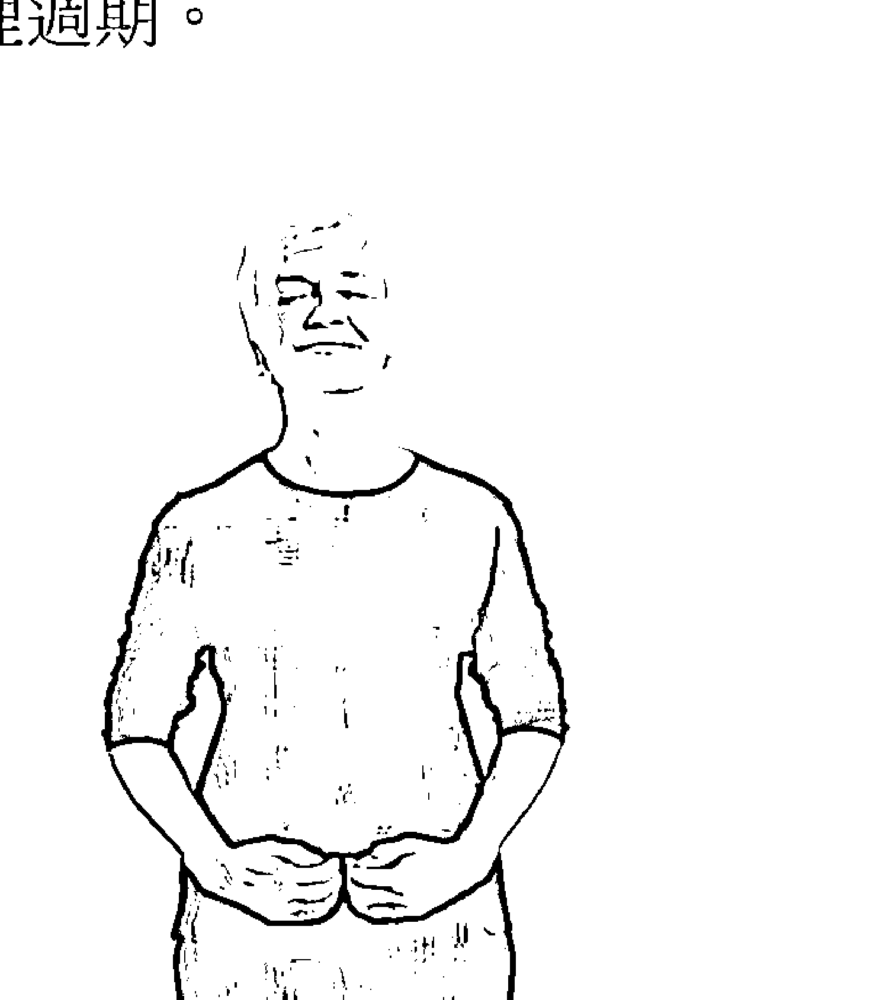

圖5-2 性的中央通道（手的位置）

## 螺旋回春：

就像男女生殖器的不同，男女在性能量上也剛好相反。女性的海底輪或性輪能量，是像個有磁力的漩渦一樣，將能量吸入。而男性則是往外推的螺旋力量。一接收，一投射。女性的能量是以螺旋狀進入身體，所以我們會感受深切。男性對自尊的表達比女性要來得客觀，所以是使用身體外部的螺旋脈輪能量來處理情緒。如果用珍妮絲·賈普林（Janis Joplin）的歌來開個玩笑，就是「客觀的意思，等於是什麼也不放在心上」。當然，所有的男人和女人都擁有陰與陽的能量，只是比例不同，所以一般的概論無法完全吻合，也不能說真正的公平。但男女大致比較起來，我們女性多是被穿透的一方，不只是生理上，在能量上也是。我們讓伴侶在生理上、情緒上和精神上進入我們的身體，如果受傷太重或太頻繁，那個把伴侶的能量吸進來、往內拉的螺旋力量，就會開始削弱並失去磁力。不管妳是受了傷，或只是想刺激妳的磁力，都可以用下面的技巧讓海底輪自然的螺旋能量啟動復活。

## 螺旋回春起手式（時間：約90秒鐘）

- 1. 坐在椅子上，雙手放在胯骨上，緩慢而確實地在腿部的正面與側面往下進行按摩，將能量從腳部清理出去，就像是擠牙膏那樣。然後一樣緩慢而確實地從腿部內側按摩上來，最後從臀部出去。重複2至3次。
- 2. 深吸一口氣，讓雙手沿著身體的中心線往上（包括的範圍有任脈和衝脈），從恥骨來到下巴。接著吐氣。
- 3. 再深吸一口氣，手指沿著下巴和臉頰往上按壓，直到雙手包覆整個臉頰邊緣，中指置於太陽穴（見圖5-3）。接著吐氣。
- 4. 從下巴沿著臉頰邊緣按壓可開啟胃經、小腸經、大腸經、膽經和三焦經的流動。
- 5. 進行一次三焦安靜法（第114頁）和連結（第69頁）。

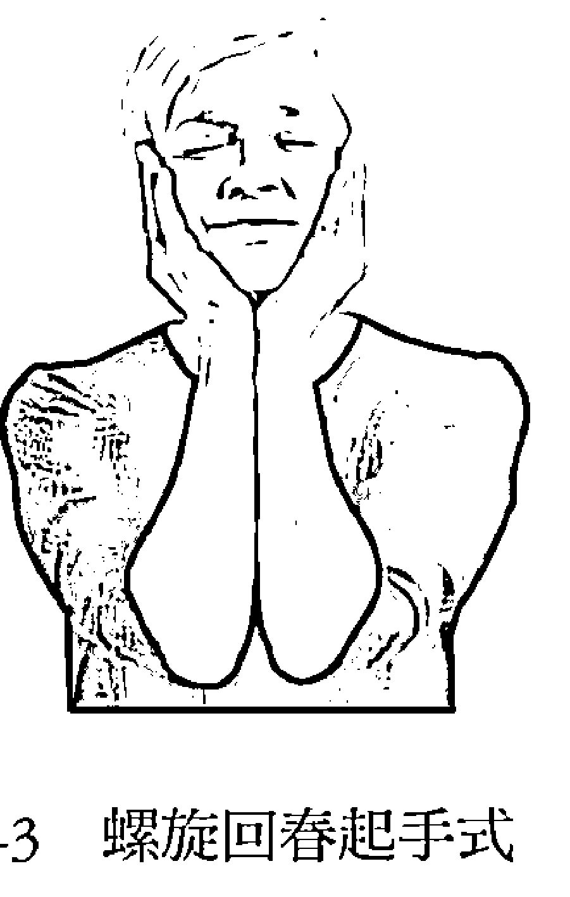

這個步驟可以開啟與性慾相關的經絡，除了可以將它當成一個單一的技巧外，也很適合做為螺旋回春的起手式，當成冥想靜思的步驟。

## 螺旋回春（時間：5-10分鐘）

- 1. 躺在床上或地板上，手掌打開朝上。
- 2. 想像在雙腳末端有一個旋轉的螺旋能量。
- 3. 想像這個能量非常仔細而緩慢地從腳部往上進入妳的身體。能量會隨著妳的想像運作！
- 4. 想像這個能量來到妳的骨盆，繼續穿過身體中心。讓這個能量停在骨盆腔內部上方的位置。
- 5. 想像這個力量像是漩渦一樣把能量從身體外面吸進來。這就是螺旋的回春時刻！多花一些時間體驗這些能量。
- 6. 可以停留在這裡，或是進一步實驗，透過想像讓螺旋擴大，讓這個原本只覆蓋了骨盆腔的能量擴大到包含心臟的範圍。這樣就可以讓心臟與生殖器連結，獲得完形的體驗。
- 7. 結束時，一手放在第二脈輪（肚臍下方），另一手放在心輪。1至3分鐘後，妳會開始感覺到這些脈輪之間有著強壯的連結（見圖5-4）。

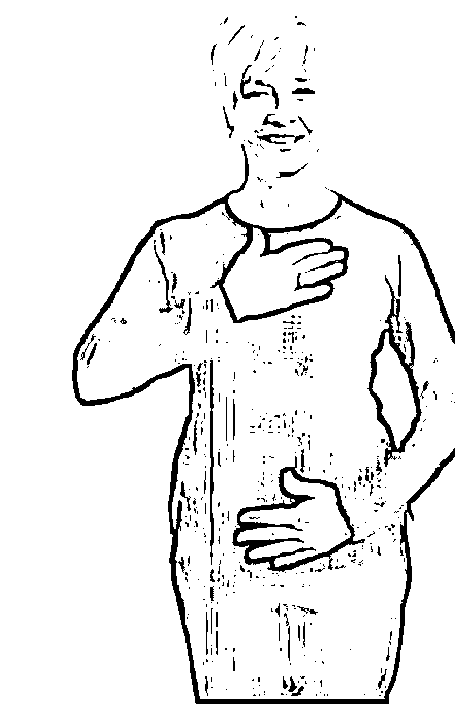

我在進行療程的時候，會遇到一些只是因為感覺到能量再度流動，就感動得啜泣起來的女性。因為這股能量非常真實，而且就是從妳的體內產生出來，這與伴侶的生理連結相當不同。不過，和伴侶或者是好友一起進行雙人螺旋回春，也可以讓妳得到美妙的體會。

## 雙人螺旋回春（時間：5-10分鐘）

- 1. 妳先仰躺，請同伴將雙手放在妳的臀部旁，輕柔緩慢但確實地從妳的腿部外側一路掃下來。
- 2. 然後請同伴以雙手輕觸妳的一隻腳，用力將能量清理出來。另一隻腳也重複這個動作。
- 3. 妳自己進行螺旋回春的時候，是用想像力啟動螺旋能量。而雙人螺旋回春，則是讓同伴雙手的電磁能量與妳的能量進行互動，這樣效果更強。妳的同伴可以距離妳的雙腳9或10公分遠的地方坐著或站立，然後打開雙手，緩慢地用手掌心對著妳雙腳的能量場逆時針畫圓（見圖5-5）。
- 4. 如果同伴畫圓的動作夠慢，妳便會開始感覺到腳底有一股螺旋的力量往上升，沿著妳的腿部來到骨盆。妳的同伴可以一邊畫圓、一邊靠近妳的雙腳，來支撐這個力量往上。
- 5. 專注在骨盆、甚至之後往上來到心臟的螺旋能量及其運作方式。
- 6. 妳可以透過想像來擴張或集中這個螺旋。
- 7. 結束時，一手放在臍輪（肚臍下方），另一手放在心輪（見圖5-4）。1至3分鐘後，妳會開始感覺到這些脈輪之間有著強壯的連結。或者可以請妳的同伴將雙手放在這兩個脈輪上。

## 強化性能量子的雙人能量技巧

跳脫框架的突發異想不需要任何技巧，妳只要跟隨能量，能量也會跟隨妳。妳可以從新奇的接吻方式開始，以下介紹的是「三大接吻法」：

- 1. 緩慢、輕柔、專注地讓妳的唇在伴侶的一個膝蓋後徘徊。這個位置的神經血管點屬於人體的性感帶之一，腋窩附近也是會讓人開心的刺激點。
- 2. 吻起來最浪漫的部位，其中一個就是上眼皮。這個連結進行時要溫柔且專注，嘴唇動作要輕柔，現在妳正在刺激的經絡可以幫助兩個人更為親密。

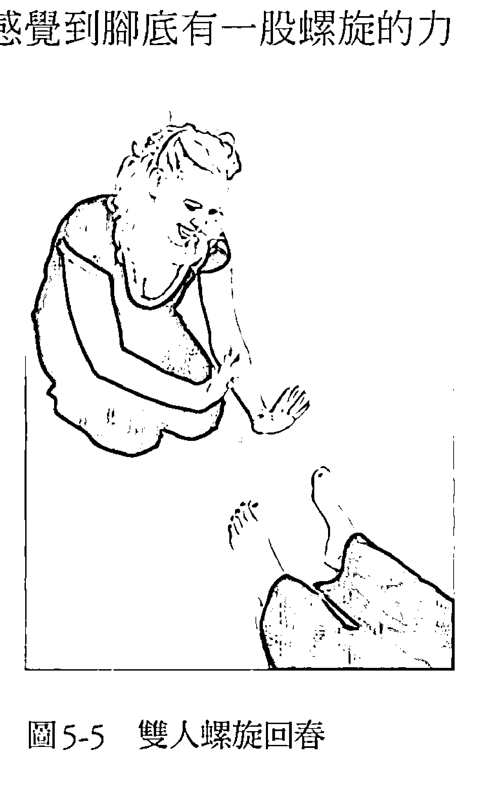3. 颊边的长吻可以刺激到许多能量点，唤醒爱的流动。

如果交往很久的伴侣会寻求性治疗，最常见的理由是其中一方或是双方对他们的性关系失去了兴趣，有的则是在申请保险公司理赔时，医生出具的理由是“性压抑障碍”。当然，相互间的沟通、愤怒或失望等问题还是要解决，不过行为疗法通常是帮助爱侣重燃彼此的性欲最成功、也最有效的方式。就算是三大接吻法这种简单的技巧，也可以让伴侣间的能量流动成为常态。

玛格·阿南德（Margot Anand）的经典著作，《性爱狂喜的艺术》（The Art of Sexual Ecstasy）是一本极佳的指南，能够提升性爱的体验。这本书介绍了许多古老的智慧，例如谭崔瑜伽和昆达里尼瑜伽，对于当代的性欲治疗也有卓越的洞见。性爱能够提升到一种纯艺术的形式，但核心仍然是能量。性爱是一趟分享的旅程，探索身体能量的奥秘，以及两个身体的能量如何互动、混合、共舞和交融。这是一场史诗级的冒险，如果能让身体的能量与流动运作起来，你就已经在强化自己的性能力，当然还是有些能量技巧特别能够增进性能量。然而，它就和我们之前所讨论的许多主题一样，可以另外再写一本专书。幸运的是，阿南德的书也一样是从能量的角度来探讨性欲，所以我就不再赘述。

## 疗愈伤口／获得安全感

当我们年轻的时候，片刻的热情就会燃起美好的性爱。对于天真无邪、没有受过伤害的人来说，美好的性爱让我们对伴侣敞开了灵魂。但醒醒吧！很多年轻人面对接下来可能的场景，多半变得伤痕累累。除了对女性不公平，对伴侣也不公平，因为他们只是想找点乐子打发一个夜晚，结果却惊讶的发现我们开始干涉他们的一言一行。好了，这么说有点太夸张，不过美好性爱之后的荷尔蒙作用，男女可是大不同。对我们女人来说，美好的性爱是一场赌注。在蛮荒世界，如果你怀孕了但伴侣却离开你，实质上就面临了生存的威胁。但即使在现今这个能够控制生育、而且拥有许多不同阶层支持的世界，性爱之后被遗弃，仍然是很大的失落，而且可能造成灵魂深处的伤口。因为性欲和生存都仰赖海底轮的能量，问题就出在这里。海底轮无法分辨细微的差别。只要这类遗弃发生个几次，甚至只要一次，海底轮的能量就可能关闭你对性的感觉，因此变得难以投入热情的片刻。

等到我们成熟了，美好的性爱条件则来自对于自己的自信，以及我们所经验过的真实。如果你一直都依顺着伴侣的需求、欲望，还有对你的评价而活，那么你的自我与自觉，还有你所能感受到的欢愉，都会因为你的天真而迷失。同时，美好性爱的维持，也来自信任伴侣对你的爱和照顾。因为依顺伴侣的期望而受害一点都不性感，屈服于压力会关闭你享受快乐的回路。因此，打好坚固的信任基础才能够带来情绪上的安全感，以及随时放心表露心情的亲密感。这是一个需要由卧室内与卧室外的关系，才能共同建立的浪漫储存库。

如果我们受的伤太深，有时候直到拥有了深度的爱时，伤口才会完全显露出来。曾经遭受性或身体虐待的女性，除非重新面对过去的伤痛，并疗愈可能要追溯到童年的情感伤口，否则很难完全开启她们自身对性爱的欢愉。这样的状况会需要扎实的心理治疗来帮忙，但能量疗法也能够显著加快疗愈过程。有时候若能在能量层面修复情绪的伤口，心理的疗愈也会相对地快速发挥作用。使用能量技巧疗愈情绪伤口的方法，称为能量心理学。本书并不打算讨论这个复杂的主题，但下面引用的案例可以让我们看到恢复情况的迅速。这个个案引自我和大卫以及盖瑞·克瑞格写的能量心理学专书。

珊蒂和她的伴侣找我们的同事做婚前咨询。他们需要面对的一个问题就是性爱关系。虽然珊蒂结过一次婚，但她发现自己在未婚夫采取主动的时候，会不由自主产生负面的感觉。她的未婚夫很有耐心，脾气好，又善体人意，而且他真心认为性爱是一种分享的体验。虽然珊蒂也觉得未婚夫的态度没有问题，但她还是会常常因此不开心，也让她的未婚夫热情减退。他们希望能解决这个问题，同时也为珊蒂安排了个人的疗程。

当治疗师向珊蒂轻声问道：“你想要聊聊以前发生过的事吗？”她立刻泪如泉涌，皮肤上出现红斑点，说话因为啜泣而显得断断续续。她的故事是这样：“我七岁的时候，住在一个乡村小镇。有一天我的继父带我出去散步。那时候是夏天。我们爬上一座山坡，停下来后，他脱掉我的衣服，接下来他也脱掉他的衣服。”

这个时候她几乎无法呼吸。治疗师制止了她，请她不用再说下去。接着治疗师请她帮这段回忆难过的程度打分数，0表示最低，10则是最高。毫无意外，珊蒂打的分数是10。于是治疗师带领珊蒂进行类似经络能量敲打（第86页）的技巧。珊蒂难过的程度从10降到6，接着继续再做一次敲打，并搭配肯定句“虽然我还是会难过，但我深爱并接受自己。”此时，难过的程度已降到2。接着再做一次敲打并搭配简单的肯定句。

这个时候珊蒂已经可以平静的呼吸，皮肤上也没有红斑了。她的双眼清澈，看着自己的双手，交握放在大腿上。治疗师说：“珊蒂，你现在坐在这里，回想那个炎热的夏日，你的继父带你出去乡间散步。回想你怎么爬上那座山坡，怎么停下来。回想他怎么脱掉你的衣服。回想他怎么脱掉他自己的衣服。现在，你感觉怎么样？”

她坐在那儿不动，大概五秒，然后冷静地抬起头，平静地说：“我还是恨他。”治疗师也同意这完全是人之常情，然后问道：“但你那时候的难过呢？”

珊蒂又沉默了一会儿，这次她笑着回答：“我不知道，我不记得了。那已经是20年前的事，我还只是个小女孩，无法像现在这样有能力保护自己。我现在对这种事情难过有什么用呢？……我不会再让那个人有机会碰我，而且我也不会让我的孩子接近他。我不知道为什么，这件事现在好像已经不再像以前那样让我困扰了。”

就这么一次的疗程，珊蒂便不再对伴侣采取主动存有任何反感。两年后治疗师再追踪时，她回复说这个问题“早就不不再是问题”。而她的伴侣，现在是她的丈夫，也确认了之前的障碍已经消失。所以，透过能量疗法的介入，清理过去的伤痛，进而让关系好转，这样的情况倒是意外地普遍。要治疗过去遭受的凌虐可能需要专业辅助，但经络能量敲打（第84页）能够适用并帮助许多不同状况，而且不会造成什么损伤。如果你一边敲打、一边回想让你困扰的事情或担忧，透过一次又一次的敲打，回忆与担忧通常就会解开。

## 生殖

女性身体的设计中，每个月会有一颗成熟的卵等待受精，而且会有荷尔蒙在血液中奔驰，让大脑产生化学作用，催促你去寻找伴侣。因此女性会怀孕，肚子变大，生出小宝宝，然后很快一次又一次又一次地怀孕，从十几岁开始一直到四十几岁，或到身体说“够了”，接下来你可能在生产过程中死亡。在此同时，几乎所有的人类文化都在寻找让女性不要这么多产的方法。然而，有时候这些方法透过文化或生理作用，却让渴望拥有孩子的女性永远无法受孕。

过去30年来，找我咨询受孕问题的女性或夫妻，数字至少超过100。除了其中三位，其他的后来都怀孕了。通常如果我发现有很严重或很明显的生理问题影响到生殖能力的话，我就不会接案，当然，我承认这个做法提高了我的成功率。但除非出现不可逆转的生理障碍，多半都是有可能怀孕的。影响生殖的因素有很多，那三名无法怀孕的女性，她们的状况也很有指标性。其中有一位最后发现是输卵管完全闭锁，虽然一开始医生并没有检查出来。另一位在我帮她进行个人疗程后，才发现她看似健壮的年轻丈夫，精子数非常稀少。第三对夫妇当时已经快要离婚，他们希望拥有孩子来改善婚姻状况。但悲哀的是，他们彼此的能量不太相容，两人之间的剑拔弩张，更让他们原本不合的状况加剧。两人能量的差异会形成浪漫的火花，这是我们另一个课程的主题，但压力与个性不合会让相异的能量在各种层面上拉大差距。不过对其他大部分人来说，要怀孕生子并没有那么难。

怀孕的过程是从女性卵巢释放出卵子开始，卵子在行经输卵管的途中，和精子相遇受精，然后由输卵管来到子宫着床，发育成胎儿。这一连串的步骤无法完成的状况就称为不孕。医学检查与血液检查通常都可以发现不孕的生理原因，最常见的多半是输卵管阻塞或是卵巢障碍。有些因为性行为造成的骨盆腔感染，可能会破坏输卵管。或是子宫内膜异位，也就是子宫内膜组织长到子宫以外的地方，同样会对输卵管和卵巢造成伤害。而子宫肌瘤会占据子宫的空间，让受精卵无法着床，或是让胎儿无法成长。另外，精子或卵子则可能会因为环境的关系，例如辐射、污染、抽烟、药物使用，或只是因为年龄问题而机能不足。于是，人工干预让生殖产业成长了2亿美金的价值。但是，就像《时代》杂志所指出的状况：“医生使用越多的药物、针剂和手术，想让精子遇到卵子，出错的机会就越大。”除此之外，根据兰汀·路易斯（Randine Lewis）精彩的著作《不孕治疗》（The Infertility Cure），荷尔蒙失衡“造成40%的不孕症，而且西方医学认为无法进行治疗”。然而依照我的经验，女性的身体可以透过能量疗法让荷尔蒙平衡进而怀孕，也可以在自然状态下分泌出受孕所需的大量荷尔蒙。

能量疗法可以改变化学作用，打开通道，让身体排毒，强化血液健康，同时帮助身体循环正常因此可以让子宫丰盈强壮，甚至进行修复。当然，还可以改变能量的惯性（举例来说，某些能量习惯可能会造成肌瘤生长，或是让生理周期缩短成23天，而非正常的28天）。能量疗法能增强女性生殖力的多种方式，确实让人感到诧异。

即使是生理方面的障碍，多半一开始也是因为能量阻塞造成。修正了能量场的失衡状况，生理的障碍也就能够彻底消除。饮食的改变可以自然地调整能量，也可以增加受孕机会。一般认为，最好不要随便改变大自然制造食物的方式，而这一点也被一篇饮食对生殖影响的研究所证实。这份针对18,000名想要怀孕的女性所做的研究，得到的结论非常出人意外。全脂鲜奶和全脂冰淇淋有益于怀孕，低脂鲜奶和其他“清淡”的乳制品，像是低脂优格等，其实是不利于生殖。原来天然的不饱和脂肪可以增加受孕机会，唤醒强化生殖的基因，而反式脂肪则对人体有害。哈佛医学院研究员的《生殖饮食》（The Fertility Diet），就是依据这份研究所撰写的实用指南。

我将会影响到生殖的“能量习惯”，称为“生殖器官的慢性疲乏”。因为一切都变得缓慢，不管是卵子的移动速度，还是精子的游动状况。我觉得不孕但标准检查结果正常的那些人，可能都是受到这个因素影响。肝经阻塞或是与甲状腺相关的能量不足，都会影响身体的受孕能力，也会造成女性身体的阳（热、亮、快、进）胜于阴（凉、暗、慢、受）。路易斯将受孕称为“受到一千种因素影响的脆弱奇迹”。所以，改变干扰受孕的能量惯性，让身体的能量回到自然的平衡，身体原本的完整性以及生育的蓝图就能够回复。

此外，人的情绪，像是对伴侣的恐惧、矛盾或沟通困难，也会造成干扰怀孕的能量模式。传统中医有个说法：“惊则气乱。”依我的经验看来，焦虑担忧过度的话，的确很难让受精卵留在子宫里。能量心理学的方法，就是从能量的层面来处理情绪上的问题，可以消除个案的一些情绪因素，让他们比较容易注意到真正的原因，进而能够直接说出来。

## 生殖的能量疗法

女性的身体可以用能量疗法滋养，就像照顾果园里的树木一样，等待结出果实。然而，许多女性因为担心害怕自己无法拥有孩子而崩溃。能量测试针对此点就占有极大优势，除了可以让她们知道生育之门还没有关上，然后再有系统地帮助这些女性调理干扰怀孕的能量，最后就能听见她们传来受孕的振奋消息。

在处理不孕的问题时，除非是输卵管或其他生理的状况，否则通常第一个步骤就是每天进行五分钟能量日常运动（第57页），然后确认自己能量的流动没有落入同侧模式（第73页）。说到不孕，几乎都会和脾经相关。脾经被认为是所有身体能量的“母亲”。脾经无时无刻都在滋养你，并安抚受到威胁的部位。只要受了点小伤，脾经就会产生发炎反应，努力对抗外来侵犯，并启动疗愈机制来修复组织。不过，脾经保护你的主要策略，是刺激全身系统，让你保持强壮健康的状态。就像狮子会攻击兽群中最弱小的那只一样，就体质上来说，最虚弱的人也就是最容易被有害微生物入侵的对象。因此，强壮的能量系统是保护你的最佳方式之一，能够有效防止外来侵入感染与内在崩溃衰竭。脾经的运作能够强化整体系统，并将组织建构起来，指挥你的器官、血液、心血管和其他系统的运作。

另一方面，三焦也可以在面临威胁时保护你，不过它采行的主要策略是主动攻击。如果脾经启动的是你的“内在母亲”，三焦经启动的就是你的“内在军队”。在我们的文化中，父权价值与军事策略掌控了外在世界，而三焦经则试图掌控我们的内在世界。在三焦经与脾经平衡的状况下，三焦经可以命令脾经的能量去打仗，可是这会消耗你的整体能量、活力与快乐。三焦在现代世界中不断受到威胁，不管是污染、压力还是化学物质方面，都和三焦的演化背景完全不同。因此，很多人的三焦一直处于不断反应且过度活跃的状态，而脾经则永远都在损失消耗状态。脾经不断耗损，身体就无法获得足够支撑，因此造成许多问题，其中包括了脾经做为“母亲”能量的特质，也就是受胎以及孕育宝宝的能力。

事实上，脾经统摄了血海穴以及月经的生理周期，它能够让经血完全排除干净，或是凝结沉积在身体里，变成子宫内膜异位或是子宫肌瘤。脾经掌控了新陈代谢系统，以及身体复原与重新分泌天然荷尔蒙的速度。脾经拥有更新修补身体的能力，也负责管理性器官与子宫的生命力，以随时保持能够迎接新生命到来的状态。如果要调理不孕，通常第一优先就是要强化脾经，这也是让你的整个身体保持健康强壮的方法。

要滋养脾经，可以直接采用增强的方法，不过更有效果的方式是镇定三焦经，让三焦不要一直抢走脾经的能量。过于活跃的三焦经，会让增强脾经的努力白费。我个人的三焦经和脾经之间非常不平衡，这种潜藏的能量危机造成了许多不同的疾病，但表面上看起来毫不相关。强化脾经与镇定三焦经慢慢改善了我的健康。三焦与脾经间的病态失衡，会让能量模式无法运作，有时候你需要很努力才能改变这种惯性。接下来你会学到各种不同的技巧，每天做个两、三次，对于脾经的保健会非常有帮助：

## 脾经／三焦平衡步骤（时间：约3分钟）

- 1. 三焦安静法（时间：20秒钟，见第114页）。
- 2. 三焦敲打（时间：约1分钟，见第115页）。
- 3. 脾经冲扫与敲打（时间：不到1分钟，见第145页）。
- 4. 轻触神经血管点（时间：1至3分钟，见第160页）。
- 5. 拥抱三焦 / 脾经（第118页）。
以上每一种技巧都可以增强脾经与三焦经协同合作的关系。不过“拥抱”这个技巧最为方便，因为聊天或看电视时，还有一天之中的很多时刻都很适合，是个不需思考就可以做的技巧。

## 生殖刺激点（时间：不到2分钟）

除了脾经这条重要经络外，照顾好肾经、肝经和心包经对生殖力也有助益。刺激下面的穴位可以活化这三条经络。

- 1. 用两根或三根手指直接敲打踝骨内侧前面的中封穴（肝经4），并持续三次深呼吸。双脚可以同时敲打。
- 2. 敲打踝骨内侧后方的太溪穴（肾经3），持续三次深呼吸，一样可以双脚同时进行。
- 3. 敲打踝骨内侧上方、大约两只大拇指宽的复溜穴（肾经7），持续三次深呼吸（见图5-6的三个穴位）。
- 4. 挺胸，寻找乳头正后方的穴位，用可以忍受的力道确实按摩几秒钟（心包经神经淋巴反射点）。

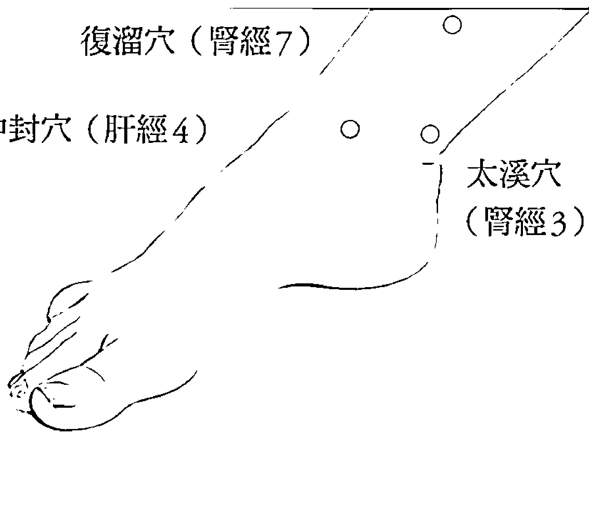

- 5. 进行第四章介绍的三轴轻触（第143页），刺激与生殖相关的内分泌腺体。

即使将上述的技巧全部做完，我们还是得担心心包经能量流动的状况。心包经能量容易堵塞在臀肌，因此会干扰到受孕相关的所有器官与程序。要知道心包经能量是否有堵塞，可以直接用手指或大拇指按压臀部，感觉是否会酸痛。如果会酸痛的话，可以透过镇定心包经（第157页）来“放松”。在做完这个技巧后，也许你可以马上发现臀部比较不酸痛了。

### 可能造成不孕的生理状况

有四种生理状况可能造成不孕，分别是卵巢问题、子宫肌瘤、子宫内膜异位和年龄的影响。

**能量无法流经卵巢：**

卵巢的位置直接位于胃经上。如果能量无法顺畅通过卵巢，就比较难怀孕。你可以透过镇定胃经（第152页）来增强能量的流动，同时敲打颧骨上方、眼睛正下方的承泣穴（胃经1）和四白穴（胃经2）。

**子宫肌瘤：**

子宫肌瘤是非恶性的肿瘤，由血液和杂乱的组织组成。如果经血没有完全排出子宫，就会凝结在子宫壁，然后越来越大。因此，最好能采用一些方法来事先预防。长在子宫内的肌瘤，最糟糕的是会被身体误认为胎儿，因此用尽一切方法来保护肌瘤的成长。所以，要让经血能够完全排出子宫，有一个很简单的方法，就是在经期快要结束的时候，以及结束后一天，每天用热敷袋热敷子宫10至15分钟，热敷有助于让经血全部排出。此外，如果和生殖相关的经络，例如脾经、三焦经、肾经、肝经和心包经受到危害，那么也可能助长肌瘤的发生。

## 子宫内膜异位：

子宫内膜，也就是子宫内壁的黏膜，有可能会长到子宫外面。子宫内膜细胞会到处乱窜，嵌入其他的器官，例如子宫颈、卵巢、输卵管、阴道、结肠、直肠或膀胱内壁。异位的子宫内膜细胞也可能在腹腔肌肉、肺部、鼻腔，甚至脑部发现。可是，不管这些细胞跑到哪里，都还是会像子宫内膜一样，对雌激素与黄体素有所反应，因此在经期时同样会流血。这些血液多半都会凝结淤塞，然后造成严重感染、疤痕、严重痉挛、性交困难与不孕。就能量来说，脾经、三焦经、肾经、肝经和心包经造成不孕和子宫肌瘤的问题，同样也可能是子宫内膜异位的一大主因。子宫肌瘤和子宫内膜异位都与经血凝结淤塞相关。它的困难点在于因为异位的子宫内膜细胞，无法在经期排出血液，所以身体必须将这些部位的瘀血清理干净。有些补充物会有帮助，例如亚麻籽油、月见草油、碧萝芷，还有像是凤梨酵素之类有消炎作用的酵素。预防并减少子宫内膜异位的能量疗法，除了能量日常运动外，还包括恢复三焦经平衡（第118页），增强脾经（第145页），胃经冲扫（第146页），按摩手脚的肝经穴位（第54页），以及镇定肾经（第154页）和心包经（第157页）。

## 年龄对生殖的影响：

如果世上会有女人想要杀了我，我相信排名第一的就是那些因为更年期问题来向我求助，结果紧张地发现自己怀孕的女性。我只是帮她们平衡荷尔蒙，让她们在更年期的时候能舒适一点，但因为修正了能量流动，她们再度回复了生育力，可是已经很多年都没避孕了，所以造成这样的结果。和其他经络相较，脾经和肾经比较容易随着年龄老化。不过，因为经络是能量而非器官，所以还是有可能让这些重要的能量保持年轻活力。能量日常运动以及本章先前提到的各种技巧，不仅有助于生殖，还可以像俗话所说，让你能够永保青春。

不管生理时钟的指针现在指在哪里，生殖力永远都只仰赖健康的卵子。如果你在和时间赛跑，可以藉由维持经络的强健与平衡，特别是脾经和肾经，保持自己的年轻活力，延长生殖终点线的到来。有健康的身体，才有健康的卵子。虽然许多植物疗方也很有效，不过抗氧化物的效果可能会比较好，例如辅酶Q10能够消灭随着年龄而增长的阻碍健康细胞增殖的自由基。

透过能量疗法和现代科技的搭配，有很多方法能够增加拥有孩子的机会，但母亲的角色并不是每个女人非选择不可的命运。我的许多好友无法或选择不要有孩子，但她们非常喜欢我的女儿，喜欢其他人的孩子，热爱这个世界。我常常因为这些“心的母亲”透露出的爱与智慧而谦卑感动。兰汀·路易斯在他的治疗不孕的伟大著作中结语道：“你永远不知道自己在宇宙的蓝图中占据哪个位子，但我衷心相信，我们想要成为父母的这份爱，绝对不会浪费……如果上天已经有所计划，让我们降生在这个地球上学习与成长，那么也许我们的灵魂就是要由那些出现或者不出现在我们生命中的人来教导。然而，最后我们必须体认到，我们一心想要的孩子，做了这么多而拥有的孩子，其实都不是属于我们的私人物品。”

## 能量疗法与西方医学双管齐下

我的女儿谭雅，在三十多岁的时候开始感觉卵巢会痛，检查后發現有初期的子宮肌瘤。她的症狀包含了經血量多、性交困難、膀胱無力、視力模糊，而且骨盆、背部、腿部和手臂都會疼痛。她也出現許多應該屬於荷爾蒙失調的狀況，包括嚴重的經前症候群、嚴重頭痛、沮喪、焦慮、疲倦、體重增加、皮膚乾燥，還有掉髮。可憐的寶貝！她那時住在科羅拉多州的博爾德市，而我因為工作的關係一直東奔西跑。等到我有時間去看她、幫她的時候，能量已經出現非常明顯的狀況了：包括臍輪、胃經（剛好跨過卵巢的位置）和小腸經（主管腹部）。脾經／三焦經的平衡幾乎對所有疾病都很重要，而且在荷爾蒙調理過程中扮演著主要的角色。因此每個地方都需要留意。我將她的經絡流動回復到健康狀態，譚雅的疼痛幾乎是馬上緩解，看起來她的荷爾蒙恢復了平衡，此外，我交代她要自己做能量運動，才能保持治療效果。之後我會離開三個月，但我相信肌瘤應該會縮小，也不會再疼痛。因為我所治療過同樣症狀的個案都是這樣。

但後來每次去看譚雅，總是聽到她又犯疼痛。我覺得這樣有點奇怪。我知道不斷復發的疼痛、頭痛，還有子宮肌瘤沒有縮小，都是和荷爾蒙失衡有關，但我不明白為什麼能量療法無法反轉失衡的狀況。相同狀況已經發生過數次，只要對象是自己的親人，我就會因為關心而亂了陣腳。而且這不僅只是因為太想幫忙，或是下的賭注太大，而是我會因此變得無法看清能量的狀態。最簡單的解釋就是，我分不清我和她之間開始與結束的界線。這是個很大的困擾，因為我在面對其他個案的時候，總是很清楚地知道我究竟是在處理誰的能量。我以知名治療師的身分遊歷世界各地，但卻無法成功幫助我最親近、親愛的家人，如果她的情況是發生在別人身上，分明是不難解決。

譚雅一直都是采用整體療法來處理自己的狀況。波德市有一些很厲害的健康輔助治療師都幫她進行過療程，但他們也無法破解這個問題。譚雅在能量療程後總會覺得改善許多，治療師也都很幫忙，但好轉的成效總是無法持續。現在回想起來，也許透過醫學檢查，讓譚雅服用生物同質性荷爾蒙的話，搞不好還比較適合。

但譚雅即使接受各種不同的治療照顧，子宮肌瘤還是沒有縮小。事實上，肌瘤原本在好幾年之間都維持不變的大小，突然有九個月的時間開始瘋狂變大，而在這之前剛好發生了一件大事，深深影響到譚雅的情緒，突顯了譚雅已經四十歲，但仍非常渴望懷孕、想擁有小孩的事實。而現在這個情況，就好像她已懷有身孕一樣。這段期間，所有幫助她的治療師都覺得她體內就像有個胎兒，而她的身體正在保護那個胎兒。他們異口同聲地認為子宮肌瘤似乎在挑釁，沒人有辦法讓肌瘤的成長慢下來。

譚雅現在看起來就像懷孕，而且還出現了許多其他症狀。因為身體的血液都在滋養肌瘤，所以除了貧血之外，還變得極為虛弱。例如沒有力氣拿任何東西，甚至上家裡的樓梯都得四肢著地爬行。此外，視力變得很差。經血量超大，還伴隨血塊。凱撒醫院的醫師建議進行輸血並切除子宮。但就在譚雅病情惡化的當頭，醫院（恰巧？）因為行政疏失弄丟了她的保險。這項失誤後來回想起來，反而算是一種幸運。由於譚雅仍然希望能生育，所以堅決不想切除子宮，而直覺也告訴她不要輸血，雖然醫生警告如果不輸血的話，可能會危及生命。很幸運地，我們找到了一種植物營養液，叫做「鐵元」（Floradix）的強效鐵質補充劑，能夠直接被細胞吸收，效果和注射一樣好。譚雅原本極度貧血的狀況因此恢復到正常值，醫生也感到非常驚訝。

但即使鐵元改善了貧血，能量治療師也讓她比較舒服，不過子宮肌瘤還是繼續長大。陌生人會和她聊寶寶的事，海關會讓她不用過 X 光檢查。我們都還在抗拒，希望自然的療法能夠出現奇蹟，讓肌瘤縮小，不需要切除子宮。

最後的警示在一趟早就計畫好的夏威夷旅行中發生。飛機降落后，譚雅發現左腳踝附近有個硬塊，而且左腿也很痛。她打電話給我，我建議她和她的伴侶可以用一些方法來治療，其中也包含減輕腫脹和疼痛的能量運動。狀況的確有所舒緩，但疼痛持續了三天，於是他們又打電話來。譚雅不只要忍受疼痛，還注意到腳踝附近的硬塊沿著一條血管往上移動，她可以從腿部外側清楚看見。第三天打電話來的時候，硬塊已經來到膝蓋。我覺得不對勁，所以告訴她這聽起來像是血栓，希望她馬上去找醫生檢查。那時已經是晚上了，她不知道該去哪裡找醫生。我們決定在找到醫生前，同時幫她進行遠距治療。譚雅躺下來準備接收治療。而我在掛掉電話後才想到，我不知道該治療她的哪隻腳。不過就在我開始與譚雅同調的時候，我的左腳內側突然痛得很厲害，整個變紅而且腫起來。毫無疑問就是左腳出問題。我持續將療癒能量送給譚雅，直到我自己的疼痛消失，腿上的紅腫也褪去。我知道剛剛完成了一件大事。譚雅之後馬上打電話給我，說硬塊變小了，也不痛了。她的伴侶那時也找到了一家正在營業的診所。診所的醫師馬上診斷出是血栓，而且用 X 光確認過。她很有興趣地詢問譚雅，想知道能量和遠距療法是怎麼讓血栓縮小並止痛。譚雅不是很想接受醫師的治療，結果醫師說：「沒關係，繼續妳之前的療法，看看能不能讓血栓消失。」不過她也警告譚雅，危機還沒完全解除，如果硬塊來到鼠蹊部就可能危及生命。而且在血栓沒有完全消除的狀況下，譚雅也無法搭飛機回家。等到譚雅預定回家的日子來到，深層的血栓已經變成表面的血栓，醫師說她已經脫離險境了。

但因為這次的警示，我們知道還是需要考慮將肌瘤摘除，雖然這實在讓我很害怕。除了我對醫生的偏見，覺得他們常常會將病人置於不必要的危險之中，我的父母也都是因為醫院的醫療疏失過世。世界上至少有一半的女性得到子宮肌瘤。主要的侵入性治療方式（雖然不是所有肌瘤都需要侵入性手術）有切除子宮、肌瘤切除術和子宮動脈栓塞術。雖然肌瘤切除術和子宮動脈栓塞術，在曾施行這類手術的診所網站上看起來效果不錯，但仍然存在著風險。至於切除子宮的選項，不只是譚雅想要孩子，我也非常想要有孫子，所以我無法客觀地做出選擇。

雖然我們用盡了一切辦法，譚雅的子宮肌瘤還是造成了危險的血栓，也導致貧血、視力模糊、身體虛弱、嚴重疼痛以及其他症狀。肌瘤偷走了她身體其他部位的血液和能量，同時也壓迫到肝臟，所以她的肝臟無法正確分泌荷爾蒙，造成情緒的大混亂，而且大部分時間有嚴重的黃疸。對我這個仍然持續治療自己的孩子，但不確定究竟明不明智的母親來說，實在心痛。

我開始覺得這個子宮肌瘤其實是擁有自己心智的自主力量。它想要食物、能量、血液、生命力，所以無法受到控制。這讓我想起《異形奇花》(Little Shop of Horrors)這部電影裡的植物。它想要被滋養，於是飛快地成長，看起來沒有方法能夠阻止，它的力量非常強大。雖然很不甘願，但我們知道該讓騎兵隊上場了。

彷彿命中注定，我們需要做決策的時候，譚雅正在上我的一門課，一名進階的學員幫她進行了療程。然後她告訴我們，有一位醫生很適合治療譚雅。那可不是個普通的醫生。這位女醫師讓三個州通過法律，在進行子宮切除手術前，必須更嚴格詳細地告知並取得病患同意。這位女性強力主張婦科醫學的治療應該更通情達理，並發明了入侵性較低的手術方式來治療多種婦科疾病，因而成了傳統同業的眼中釘。這位女性可能是因為太大膽創新，希望能使用超越現代的方法來進行治療，於是被吊銷執業執照。想當然耳，通常我們的第一選擇，不會是由被吊銷執照的醫師來為我們動手術。

譚雅、醫師和我在一家餐廳見面。沒想到她很快就贏得我們的信任。聽她回答我們的每個提問，可以感受到她的知識淵博。原本我從其他治療譚雅的醫生和治療師處，已經獲得很詳盡的資訊，但現在我在非常短的時間裡，從這位醫師旁徵博引解答我們的疑慮與擔憂中，學習到許多和婦科醫學相關的議題與爭論。我非常佩服她對譚雅、還有她所有的病人，以及對所有的女性，充滿了仁慈與關懷。隔著桌上的薯條，她從能量的層面去觀察譚雅的肌瘤，得到的結論和我一樣。在徵得譚雅的允許後，她把右手放在子宮肌瘤的位置，然後偷偷轉過來不讓譚雅聽到，對我說：「她現在情況很危險！」她清楚我們所有的選擇，能夠很快地了解我們研究過的各種方法，並討論每種方法的優缺點。舉例來說，子宮動脈栓塞術，醫生會告訴妳這是種很精巧的手術，將栓塞微粒從腿部動脈注入體內，阻斷子宮的血流供應，讓肌瘤無法繼續成長，最後因為缺乏血液而萎縮。但醫生不會告訴妳，阻斷子宮的血流供應，會讓子宮萎縮僵化，兩年內還是不得不將子宮切除。除此之外，栓塞微粒也可能走錯地方，對身體其他部分的血流供應造成永久的危害。

在檢視完所有可行的方法後，因為每一項都無法令人滿意，醫師便提出一種她所發明的手術，可以讓肌瘤一點一點地與子宮內膜分開，讓子宮得以復原。因為她的執照已經被吊銷，目前她是在墨西哥蒂華納市的一家醫院幫人動手術。幾天後，譚雅住進了那家醫院。其實我還是有點擔心，是不是真的要讓一個執照被吊銷的醫生在蒂華納的醫院裡進行不知名的手術。但另一方面又很慶幸，我誤打誤撞地認識了這樣一位醫生，能夠從各種可能的角度去檢視像譚雅這樣的病症，並且用最有效又最人性的方式去解決問題。

那是一家很小的醫院，只能收容七位病人。每一間私人病房有兩張床，因為醫院希望能有一名家人陪伴，做為病患的支持與後援系統。我負責擔任這份工作。不像美國的醫院，這裡的食物非常豐富，烹調客製化，大到美食級精緻餐點，小到小麥草汁，包羅萬象。在決定手術到真正進手術房的那段日子裡，我都會幫譚雅進行許多能量平衡療程，為她做好進行手術的準備。大衛也幫她進行能量心理學的療程，以緩和她的情緒。除了平撫對極度侵入性手術的自然恐懼，增進她對手術結果的信心與正向期待之外，他們還檢視了譚雅的老問題，她不願意在有人傷害她的情況下，特別是男朋友，做出重大的決定。截斷明顯有害的成長，這個比喻非常適合用於現在的狀態。他們把治療重點放在譚雅不願採取手段介入的想法，因為不管手術究竟會造成什麼傷害，一想到要摧毀這個在體內自行成長的存在，譚雅就會有罪惡感。到了要進行手術時，譚雅已經完全了解自己的問題，也下定決心要像個戰士一樣，去除任何會傷害自己或身體的東西。電視影集的《公主武士西娜》（Xena）正是她用於冥想練習的角色之一。大衛也幫我進行能量心理學的療程，免得我在看到女兒被開膛剖腹的時候暈倒。

手術那天早上，除了幫譚雅平衡能量之外，我也堅持要幫醫師做能量平衡。手術進行時，我也穿戴好口罩與無菌袍，在手術房裡待了四個半小時。主刀醫師、第一助手（也是醫院的院長）、護理師和麻醉醫師都在手術房裡。手術開始前，他們讓我對譚雅接下來要使用的鎮定劑與麻醉藥進行能量測試。藥品選擇與劑量都很恰當。我曾參與的其他手術，多半即使藥品選擇正確，劑量也會太高。但這次沒有，劑量非常適合譚雅的身體。我覺得這是個好兆頭，代表醫療團隊很有經驗與默契。醫師下刀的時候，我把手指放在距離譚雅額頭上方5公分處，也就是主要的神經血管壓力點，給予能量的支持，避免她休克。

原本我認為自己應該無法看著手術刀切開女兒的身體，但我還是決定要強迫自己見證整個過程。令我驚訝的是，我甚至沒有頭暈。我明白是能量心理學在情緒上幫助了我，不過在手術期間，有一股我完全沒有預料到、比我們在場任何人都還要龐大的療癒力量，來到這間手術室。整個空間突然充滿慈愛、療癒、神聖的感覺。那是一股圍繞著我們的氣場，也許是仁慈的醫師、謙和的醫院、我的母愛和譚雅的精神共同創造出來的力量。感覺非常明顯，讓我覺得自己很強壯，且很欣慰能站在這裡。

醫師終於下刀了，因為必須切除一大塊血肉好讓子宮重獲自由。就在譚雅的皮膚底下，大約10公分深的地方，有一層厚厚的脂肪要被切開，看起來是奶黃加上鮭魚粉的顏色，閃耀著健康的光澤。我從來沒有像現在這樣思考過脂肪的角色。現在一看，馬上就能了解脂肪對身體的重要性，它擔負保護器官和骨骼的重任，還有為什麼女性的肚子要比男性更需要脂肪。因為脂肪可以保護胎兒，以及所有的女性器官。讓我驚訝的是脂肪所閃耀的光彩，散發出美麗的能量，是能夠保護妳、安撫妳的緩衝。我們的社會一直在醜化這美妙的緩衝物。我從那時候起，開始接受自己對「冰雪皇后」（Dairy Queens，美國知名連鎖冰淇淋店）冰淇淋的渴望，少了許多罪惡感。

主刀醫師的手伸進譚雅的身體裡，將她的子宮取出來。子宮現在變成一個會反光的桃紅色堅硬球體，比籃球還要再稍大一點，看起來光亮緊繃，彷彿隨時會爆開一樣。我立刻了解到已經無法再浪費時間了。醫師捧起譚雅的子宮，放在她的腹部上，身體和子宮之間只剩韌帶相連。子宮的能量充滿了美麗的光芒，讓人為之屏息。

但在手術刀沒入譚雅的子宮，開始要切除肌瘤的時候，駭人的事情發生了。從切口漫出的能量和我曾見過的完全相反，沒有美麗而健康的光芒，反而像是邪惡的黑暗力量。光看子宮切開之前的外表及能量，都無法得知裡面居然藏著這種力量。肌瘤不僅僅是能量醜陋，樣貌也很可怕。那是我這輩子看過最可怕的東西。我立刻聯想到這應該是譚雅積了多年的心理創傷與痛苦。這股能量令人覺得非常恐怖及邪惡，不管是那不規則的紅色球體樣貌，還是它傳遞出來的能量。譚雅的能量在對比之下，看起來非常純粹。她無辜地躺在手術台上，而這個絕對邪惡的負面能量棲居在她體內，掌控著她的身體。此刻我完全認同手術是我們能採取最符合完形療法的手段，將這股黑暗勢力從譚雅的身體和生命中切除。主刀醫師第一眼看到這顆肌瘤的時候，頗富深意地說道：「我敢打賭譚雅已經很久心情都沒好過了。」

如果要將肌瘤整個直接切除，傷口會很大，就無法保留子宮。所以醫師將肌瘤切成兩半來處理。首先要切除的部分大概跟一顆大香瓜差不多，因為長在子宮內壁上，醫師必須很小心仔細地切除。手術現在分成一小塊一小塊來進行，手法很驚人。譚雅的子宮放在胃的上面，醫師將工具伸進子宮來操作，像是在小小的洞穴裡工作一樣。這麼辛苦複雜的手術，都是為了確保可以留下譚雅的子宮。整個過程都相當尊重譚雅身體的整體性。

等到最後一塊肌瘤終於從子宮移除，另外也切除了25顆「可能長大」的小肌瘤，手術室裡的每個人都大大鬆了一口氣。花了好幾個小時的精確手術，成功地切除了入侵的肌瘤。整個過程因為使用止血鉗，所以幾乎沒留什麼血。我對於自己所看到的技術與照護深深感到敬佩。除了一些短暫的輕聲溝通外，手術室裡充滿著神聖的靜默，只專注於切除肌瘤、同時不可傷害到子宮的戰役中。接下來進入子宮縫合的階段，手術室裡響起輕柔活潑的古典樂。這不只是縫合手術劃下去的那刀傷口而已，還要處理切除肌瘤與子宮內壁連結處的傷口。因此醫生忙著縫合子宮內壁，好讓未來的子宮也還能強健地孕育我的孫子。在這個過程中，主刀醫師好幾次向我解釋她為何選用這種特別的手法，而非其他方式來保留譚雅的生殖力。

兩位醫師不斷地縫補，好像女紅和裁縫師傅一樣。我由衷地感到佩服。我自己會做女紅，刺繡是我進行放鬆與冥想的時刻。如今我看著女兒的子宮被如此耐心又靈巧地縫補，彷彿一條手工縫製的美麗拼布毯。我全神貫注地看了整整一小時，內心滿是敬畏：「你們一定縫了有300針了吧。」醫師們笑了：「將近500針！」

子宮縫好了，主刀醫師往後退了一步，看著第一助手，點頭微笑，示意他用雙手捧起譚雅胃上的子宮。第一助手伸直了手臂，低頭鞠躬。此刻一片寂靜，音樂已經關掉了，沒有任何人說話。我猜他維持了這個姿勢至少三分鐘，然後直起身來，吸了一口氣，將子宮放回譚雅的胃上。

這時，主刀醫師告訴我：「他在幫助子宮的細胞想起受傷之前的樣子。」 她解釋道：「細胞也擁有記憶！」（說得好像是我不知道一樣，這可是我工作的核心基礎之一呢）。然後她對第一助手點頭，於是他又捧起子宮，再度維持之前的姿勢三分鐘。當他在進行這個儀式時，手術室裡每個人都顯得肅穆而莊重。手術的整個過程我都拍了照片，中最美麗的一張就是醫師捧著譚雅的子宮，美麗的光芒從裡散發出來，每個人都可以感覺得得到，而照片也誠實記錄下來。

這是非常神聖的體驗，很類似在聖壇舉行高靈的儀式。我對醫師說，他的樣子看起來像是在祈禱。醫師驚訝地回答：「我的確是在祈禱。」然後他們把譚雅的子宮放回她的身體裡，進行最後的縫合。手術完成後，譚雅睜開眼睛，對著我微笑。就和我們之前計畫好的一樣，我開始幫她進行又一次的能量療程，好幫助身體從手術的創傷中復原。通常在手術後，病人的能量會以同側模式來運行。其實只要健康受損，身體就會用這種方法節省能量。但同側模式的能量會讓身體很難發揮功能，也很難痊癒。因此，在手術完畢後的第一個動作，就是要將能量從同側模式重新導回交叉模式。出乎我意料之外，譚雅居然沒有變成同側模式！她的身體為手術做好了萬全的準備，所以能量一直都維持正常流動！我真是太高興了！在譚雅復原期間，醫師開了一些預防疼痛與水腫的藥，而如果有些藥物能量測試結果為弱，醫生也願意一再換藥，直到找到能夠與譚雅的能量搭配的藥物和植物。

要不是因為我們認識了這位不尋常的醫師，譚雅幾乎是確定一定要切除子宮，無論如何都會失去孕育孩子的機會。如今，在我撰寫本書的現在，她還是有機會成為一個母親。不論她將來會不會懷孕，我都非常感謝她的子宮被保留下來。通常切除子宮的後果並沒有對女性完整揭露。舉例來說，女性器官組織很緊密，即使子宮原本就已經下垂，因此就算切除子宮，還是會造成其他器官下垂脫位。我的一個朋友因為切除子宮後的併發症，最後變得無法走路，必須靠輪椅代步。其實不管是什麼手術都應該要審慎考慮，但在美國切除子宮算是很常見的手術，施行的比例是英國或歐洲的近兩倍，顯示醫療系統中的社會與經濟力量是影響施行手術的重要因素。

不過，在譚雅手術期間，我對現代醫學真的是充滿感激，所蒙受的恩惠一輩子無法忘記。雖然我的專業角色看起來是在挑戰現代醫學的思維，希望能改變醫療的自大與僵化，但在需要手術及藥物靈巧的協助時，我也會充滿敬意地退居一旁，讚嘆人類竟然能發展出如此悲天憫人的療癒奇蹟。當然，譚雅非常幸運能找到這麼一位不受框架限制的醫師，終究依靠她的高明醫術解決了這個難題。至於我，一直都認為能量療法和現代醫學應該是相輔相成，而非互相對抗。我的大聲抗議其實是在請求現代醫學也能從這個角度來看事情。舉例來說，如果在手術之前用能量療法做好準備，手術之後也用能量療法照顧身體，就像我幫譚雅做的一樣，那麼妳的身體就有可能對術後結果產生更好的反應，而且能夠大幅增加加強健迅速復原的機率。等我完成本書後，會開始校訂《能量醫療》十週年紀念版（時間過得真快！）。我準備在書中加一個章節，告訴大家如何用能量療法來幫助必要、但屬於侵入性的醫療程序，例如手術。我想章節名稱會叫做「如果手術是必要的：開刀是最後的手段」。

## 懷孕

懷孕是兩個原生質的微量點相遇後發生的奇蹟，這兩個微量點原本各自都是獨立的宇宙，在不可思議的情況下遇到了對方，融合成一個新的微量點。這個新的微存在負載了所有必需的資訊，創造出一個有著一兆細胞的有機體，操作著目前所知最複雜的電腦系統，能夠建造摩天大樓，寫出詩歌，流露感情，在神秘的狂喜之中超越自我。原本是由卵子和精子分別承載的各種資訊，現在由新的微存在（稱為受精卵）來接手，記錄在能量場中，而不是一般以為的基因。不過這又是另外一回事，可以參考第一章的說明。我們在這裡討論的是微存在長成人類胎兒的過程，這是在妳的子宮裡上演的一場大戲。妳在生理上和能量上所做的舞台管理，會透過妳所知道以及不知道的方式，對整場戲產生各種的影響。接下來要說明的是能量層面的舞台管理原則。

孕婦會因為各式各樣的理由來到我的辦公室尋求協助。有些是擔心胎兒的健康。有些是害怕剖腹，希望找到人幫助自己自然生產。有些是因為水腫或孕吐或其他症狀。有些則想知道寶寶氣場的顏色。不過大家同樣希望的是孕期順利健康，讓寶寶能開心地來到這個世界。

## 維持寶寶的健康：

不管媽媽做什麼，只要能維持能量平衡，都有助於寶寶的健康。第二章介紹的基礎技巧效果都很好，尤其是能量日常運動，以及所有可以伸展身體和讓能量保持交叉模式的運動。就和處理其他健康問題一樣，但特別是在懷孕期間，強壯的脾經對妳的健康來說非常重要。女性懷孕後，能量上最早發生的改變就是脾經能量的濃度。每一條經絡的脈動都可以透過手腕的把脈來了解，如果我想知道妳有沒有懷孕，就會檢查看看妳的脾經能量脈動是不是莫名地增強了。其實這個增強很自然，因為脾經擔負了許多滋養胎兒的新工作，因此妳當然會希望脾經能保持充足的能量。脾經／三焦經的平衡技巧有益於增強生殖力（第188頁），也對維持脾經的強壯與平衡很有幫助。至於其他與生殖力密切相關的經絡，例如腎經、肝經、胃經和心包經，對於女性孕期的健康也扮演了重要的角色。接下來我會說明這些經絡的保健方法，並介紹我個人非常喜歡、能讓媽媽和寶寶產生連結的方法。

## 心與子宮的連結（時間：約9個月）

透過強化心與子宮的聯繫，幫助媽媽和寶寶間的連結，是我個人相當喜歡的一個方法。妳可以站著或躺著，先做幾個深呼吸，鼻子吸氣，嘴巴吐氣。將一手放在胸部中央，另一手覆蓋在子宮上（圖5-7）。接著再做幾個深呼吸，一樣是鼻子吸氣，嘴巴吐氣，然後恢復正常的呼吸方式。這樣的呼吸方式可以讓肺部與子宮間的能量、血液和氧氣健康地流動。同時，妳對寶寶的愛的力量會十分集中地傳遞過去。

## 為自然順產鋪路：

有一名已經有過兩次剖腹產經驗的孕婦來找我，希望第三個孩子能夠自然產。她的產科醫師覺得我教她的技巧非常神奇。他說這些方法可以讓她好好放鬆，不過還是不能因此以為第三次就不需剖腹產。事實上，醫師堅持如果這名孕婦不放棄在家生產的計畫，就要麻煩她另請高明。他認為，在家生產對這名產婦來說，太過魯莽而危險。但是我因為看到她的進步，所以是抱持鼓勵的態度。前兩次剖腹產的疤痕部分，能量已經沒有阻塞，而且整個腹部區域看起來健康強壯。我告訴她，我覺得自然產應該沒問題。而無可厚非地，她則是聽從醫囑放棄在家生產的計畫。只是，並非事事都有得選擇。寶寶居然比醫生預測的早三天出世，而且一點預兆都沒有，突然之間就要生產了。她那時躺在床上，丈夫正打電話聯絡醫師，準備出發去醫院。她好不容易走到客廳，兩腿一蹲，寶寶就生出來了，產程真的超快，而且一點併發症都沒有。值得一提的是，她的醫師後來為了了解實際狀況，認真地學習了許多關於能量療法的知識。

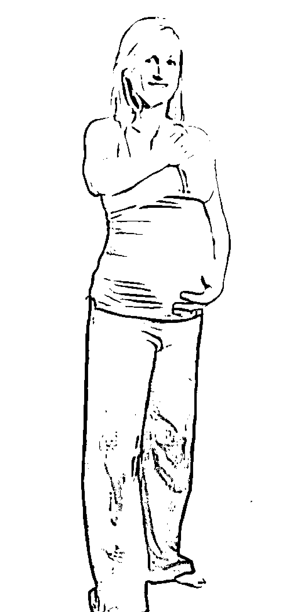

圖5-7 心與子宮的連結

## 健康孕期運動（時間：不到1分鐘）

為了能順利自然產，減少需要剖腹產的機率，妳可以從維持寶寶的健康這一節所提到的方法開始進行。另外，為了幫助與懷孕相關的各種能量，每天可以進行健康孕期運動。記得在整套過程中要持續深呼吸。

- 1. 將大拇指按在眼睛正下方的顴骨上的承泣穴（胃經1）和四白穴（胃經2）。同時將其餘手指的指腹輕輕放在額頭，大約眉毛上方5公分的位置（見圖5-8）。同時深呼吸，維持這個姿勢至少1分鐘。這個技巧可以單獨進行。每天做上幾次，能夠減輕壓力，放鬆腹部與子宮，讓腿部充滿能量以支持沉重的身體。
- 2. 將指尖置於恥骨弓進行深度按摩（這裡的神經淋巴反射點可以開啟整個骨盆腔的能量）。
- 3. 左手中指放在恥骨中央，往左移5公分，再往下移5公分，置於鼠蹊部的縫隙。輕柔地按摩鼠蹊部急脈穴（肝經12）。右手則按摩俞府穴（第60頁）。然後換邊重複，用右手按摩右邊的肝經穴位，左手按摩俞府穴。

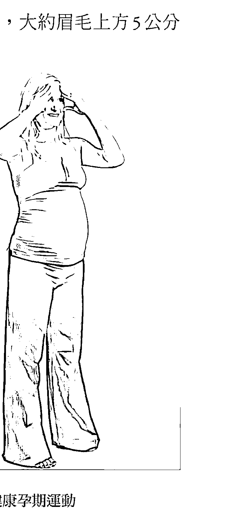

## 鎮定心包經：

懷孕後期要鎮定心包經，可以請朋友或伴侶幫忙輕觸鎮定點（第157頁）。這可以幫助血液循環，支持自己和寶寶的心臟，減輕下背痛以及因為懷孕造成的疲倦。如果沒有人可以幫妳，或是自己無法碰到鎮定點，那麼可以輕觸「惡魔角點」（就像西方傳統中的惡魔，頭上長出兩個角的位置，在耳上大約10公分）2至3分鐘，這是心包神經血管點的位置。

## 平衡海底輪與子宮輪（第二輪、性輪）：

所有的技巧都可以幫助能量的流動，並讓荷爾蒙保持平衡，讓身體以自然而基本的韻律來幫助妳準備生產。還有一種非常有效的技巧，可用於清理脈輪，尤其是海底輪與子宮輪，也就是直接位於恥骨與子宮上方的螺旋能量。《能量醫療》有一整章（第五章）在解說脈輪的運作，不過這裡還是簡述一下方法。妳可以自己操作，不過若能讓別人幫妳進行，會比較能放鬆投入。妳可以先以五分鐘能量日常運動，或至少進行神經淋巴反射點按摩、打開頂輪和連結，來當做熱身。然後一隻手放在恥骨上方距離約5至8公分的位置，以逆時針方向畫圓，動作要緩慢，至少持續幾分鐘，同時深呼吸。將能量甩掉，再以順時針方向在同一個位置畫圓約1至2分鐘。在子宮上方，也就是肚臍下面的位置，重複逆時針與順時針畫圓動作。最後在整個部位以韻律8的模式結束。

## 女神腹部輕觸：

這個技巧是透過讓帶脈能量順暢流動，來強化並清理妳和寶寶之間的連結。帶脈環繞著腰部，是奇經八脈之一。懷孕時在腹部底下流動，支撐胎兒的成長。帶脈連結身體上半部和下半部的能量，讓血液、淋巴和氧氣大量流過子宮，有助於生產順利，並擁有健康的寶寶。懷孕時，能量的縱向供給對帶脈來說非常重要。所以，將雙手放在腰部，大拇指按在背後，緩慢而確實地順著往前滑下去，讓雙手捧住子宮底下（見圖5-9）。然後深呼吸，慢慢鬆手。重複至少一次。大多數人都會覺得這個技巧很舒服，這是在重建身體從上到下的協調性。如果能讓別人來幫妳進行這個動作，感覺也很棒。妳可以躺在床上，對方把兩手放在妳的背部後面，將妳的腰部整個抬起來。對方的手滑到妳身體兩旁時，妳可以放鬆再躺回去。

## 胎位不正：

如果胎兒在臀位（腳朝下）和橫位（軀體朝下）的狀況，通常會採取剖腹產。不過能量療法有時可以讓胎兒回到頭向下的正常胎位。未出生胎兒的能量已經獨立於母體之外，因此在幫孕婦做脈輪平衡時，可以感覺到媽媽和寶寶各別不同的反應。有時候寶寶不急著出來，如果用脈輪清理來放鬆子宮，寶寶便會跟著妳的手動作。有一次，一名已經過了預產期的孕婦，寶寶胎位不正，媽媽嚇死了，也不想剖腹產。她問我能不能夠透過能量療法讓她即將出生的女兒，已經取好名字叫梅莉莎，胎位轉正。我發現梅莉莎的能量很健康，但不想太早出來。唯一的問題是，媽媽的腹部肌肉因為壓力而太過緊繃。於是我用脈輪清理來放鬆她的子宮部位。大概在兩分鐘的逆時針畫圓後，我感覺梅莉莎的能量開始與我同調，跟著我的手在律動。大概15分鐘後，她開始轉位，像是跟著我手上传遞的能量，轉到了頭下腳上的位置。旁邊的人看了興奮地跳上跳下尖叫著：「我看到她在轉！」結果，這名孕婦從我的辦公室直接去了醫院，然後生出一個漂亮的女寶寶。當然這個技巧無法保證能百分之百預防胎位不正，但我有好幾次幾乎遇到完全相同的經驗。除此之外，自從第一次在第一版的《能量醫療》中提到這個方法後，好幾位助產士和護理師都告訴我，這個方法成功讓胎兒轉正到可以自然產的位置。

## 流產：

針對這個主題，還是跟之前提到的一樣，所有技巧都可以幫助妳順利生產：能量日常運動，加強交叉模式，刺激並平衡脾經、三焦經、胃經、腎經、肝經和心包經，平衡海底輪和子宮輪，以及維持帶脈能量流動。能夠預防意外發生的有效方法還包括連結（第69頁）和連結天地（第52頁）。不過，我們也要能接受，有時候流產是讓不健全或是無法存活在這個世界上的寶寶自然離開的方式，妳做了什麼都不能改變這個事實。

懷孕時三種常見的症狀是孕吐、背痛，和妊娠毒血症。每種症狀都可以透過能量療法，搭配其他方式來處理。

### 孕吐：

懷孕前期約有 50% 至 90% 的女性會因爲害喜而噁心孕吐。害喜對媽媽和寶寶都不會有實質傷害（除非造成脫水或營養不良），但還是很不舒服。常見的方法多少都有效果，例如少量多餐（一天六小餐代替一天三大餐），多休息多運動，餐前和餐後30分鐘喝水，但不要一邊吃一邊喝，聞一聞檸檬或薑，還有每天吃200毫克的維他命 B6。有一些能量技巧也可以改善孕吐現象。

- 1. 最迅速、最直接改善孕吐的方法就是連結（第69頁）。將兩手中指分別放在肚臍和第三眼，按下去，拉起來。維持這個姿勢至少三個深呼吸的時間。這能打通任督二脈，讓能量重新暢通。
- 2. 第二種方法是一手揉捏大腳趾的趾甲根部，另一手按壓眼睛下方的顴骨位置。請坐著進行這個動作約1至2分鐘，注意自己的呼吸。然後換邊重複。許多女性用這兩個技巧就能舒緩孕吐。如果沒有的話，可以試試下面幾種技巧，每一種都很安全，看看哪一種對妳最有效。
- 3. 雙手互搓至手心發熱，一手放在妳感覺不舒服的地方，另一手放在脖子後面。然後維持這個姿勢深呼吸幾分鐘。
- 4. 盡量以舒服的姿勢坐在椅子上。用大拇指和中指捏住腳踝後方的凹陷處，按摩兩側的阿基里斯腱。同時，另一手放在顴骨下往上推（見圖5-10）。維持幾分鐘後，換另一邊的腳踝和顴骨，重複以上動作。
- 5. 輕觸第一組小腸經鎮定點（第154頁）約2分鐘，然後將手掌根放在顴骨，大拇指置於太陽穴，其他手指放在額頭上，約1分鐘。

以上至少會有一、兩種方法見效，這樣就足夠了。試試看哪些適合自己。效果通常是馬上就能看見。

## 背痛：

不斷成長的胎兒重量，會對孕婦的背部產生極大的生理壓力。

- 1. 讓伴侶或朋友每天幫妳進行脊椎沖掃（第67頁），預防背部因爲雙重壓力而讓能量停滯沉積，這也可以保持能量流動並強化背部。
- 2. 如果腎臟周圍感覺到疼痛，可以鎮定腎經（第154頁，依照孕婦使用的特別技巧），舒緩腎臟的壓力。如果妳已經進入懷孕中後期，也許無法碰到腳上的穴位，可以請伴侶或朋友幫妳輕觸那些點。如果鎮定腎經無法減輕疼痛，可以鎮定大腸經（第155頁），舒緩腰部背後的肌肉。
- 3. 如果是臀部肌肉或薦骨疼痛，請鎮定心包經（第157頁）。同樣的，妳可能會需要伴侶或朋友幫忙。

## 妊娠毒血症：

妊娠毒血症，又稱子癲前症，症狀包括高血壓、無法舒緩的水腫、尿蛋白過高。前面介紹的所有方法，例如維持脾經和三焦經平衡，讓肝經和腎經流動順暢，都可以幫助預防或改善妊娠毒血症。五分鐘能量日常運動通常都可以維持這些必要的平衡，不過鎮定三焦經、肝經和腎經，增強脾經，能夠讓情況更為穩定。按摩淋巴（第66頁）也可以進一步減輕妊娠毒血症。

## 生產

我的好友珊蒂·汪德，是阿什蘭首屈一指的助產士之一，她告訴我孕婦大約懷孕八個月後，會感覺身體裡的「微量點」變成了海灘球大小（她剛剛才讀了懷孕這章的稿子），現在這微量點必須找一個合適的通道讓它出來，但這通道其實並不適合海灘球。原本大家的重點是放在懷孕和胎兒成長上，現在已經轉移到生產了。懷孕的最後幾週裡，會出現一股準備生產的自然能量，改變孕婦的生理及意識。屆時骨盆底會打開，寶寶降下來，頭部接觸到骨盆底，呈現即將分娩的姿勢。妳沒有任何逃避的方法，生物學也無法解釋究竟是如何發生的。

幸好身體知道該怎麼生產，而且可以透過許多方法來協助。簡單的技巧像是連結（第69頁），或是讓伴侶或朋友指壓力量點（頭部和頸部後方連結的凹陷處）約1分鐘，可以鎮定神經系統，重新引導身體的能量。

分娩時，陣痛會產生壓力。陣痛之間的空檔，妳可以攤開手掌，從上往下掃過身體進行舒緩，將能量從腳部帶出去。因為分娩對於生理和情緒影響很強烈，因此，輕輕把手放在額頭上或膝蓋後方（有些女性在分娩時不希望有人碰到額頭）的神經血管點，可以放鬆身體，釋放焦慮，鎮定大腦，讓身體自然地運作。雖然只是個簡單的介入技巧，但好處非常多。減輕緊張與恐懼能夠讓身體原本的智慧流暢地運作起來。此外，用濕毛巾輕擦額頭也可以刺激相同的神經血管點。

另外，將雙手放在孕婦的薦骨，並在陣痛時加壓，可以讓奇經八脈中的衝脈能量持續強健地流動，子宮強而有力的能量得以流出並獲得支撐，而且媽媽和寶寶的能量能夠同調，同時舒緩下背部的疼痛，駕馭所有的奇經八脈，也就是分娩時自然湧出的能量。在分娩剛開始時，輕觸孕婦雙腳兩側，可以連結身體所有的能量系統，有助於系統間的相互協調。有個稱為巴西腳趾按摩的方法，能夠在分娩時大量減輕陣痛，並讓身體所有的能量系統運作更有效率。在進行這個技巧的時候，孕婦必須仰躺，而妳也要記得讓自己舒適順手。

## 巴西腳趾按摩（時間：10-15分鐘）

- 1. 坐在孕婦腳部的那一頭，將大拇指放在孕婦的第三腳趾下方，中指從第三腳趾上方夾住腳趾甲（見圖5-11）。輕握約2至3分鐘。鼻子吸氣，嘴巴吐氣。
- 2. 將大拇指滑到孕婦的第四腳趾下方，無名指從上方夾住第四腳趾。輕握約2至3分鐘。用上述同樣的方式呼吸。
- 3. 將大拇指滑到孕婦的小腳趾下方，小指從小腳趾上方夾住腳趾甲。輕握約2至3分鐘。
- 4. 將大拇指滑到孕婦的第二腳趾下方，食指從第二腳趾上方夾住腳趾甲。輕握約2至3分鐘。
- 5. 將大拇指滑到孕婦的大腳趾下方，食指和中指夾住大腳趾的指甲根部兩側。輕握約2至3分鐘。

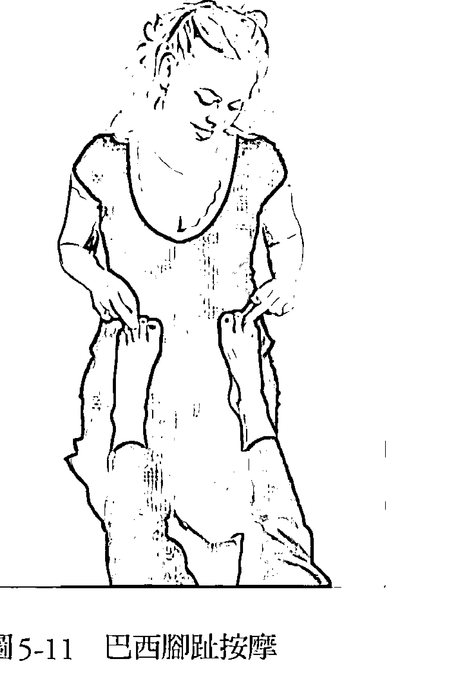

女性擁有的所有生理與心理資源，在分娩時都被推到極致，比參加奧運會還要更賣力。人類擁有一個能夠容納大腦的頭顱，還有流線型的骨盆以便用兩隻腳走路，所以大自然必定要做出一些靈巧的妥協，犧牲某些現在人類的演化，而生產的難易度就是被犧牲的一部分。文化中如果有某些作為是為了解決這種大頭小骨盆的兩難問題，多半都是對女性這個主體有著同情、了解與認同。不過針對這個主題的討論我還是先就此打住，不然我會因為憤怒與困惑開始破口大罵。雖然說助產士的傳統教了我們很多方法，有些西式的醫院也開始朝著這個方向邁進，但因為生產環境與大自然對於人類生理上的限制，因此難免還是有意外發生。

本書並沒有打算討論生產過程中的緊急處置，而且西方醫學在危急狀態下挽救生命的能力其實更強。不過做為當下的第一反應，還是有一些比較沒那麼侵入性的能量技巧可以使用，而且通常能夠避免之後採行風險更大的治療法。舉例來說，如果胎心音太弱，或是變化太大，可以輕觸母體心經和脾經的增強點穴位，或是沖掃心經，通常這樣就可以讓媽媽和寶寶之間和諧共振，強化並穩定寶寶的心跳，減少後續需要醫療處置的機率。而如果產程已進行到開指與陣痛的階段，但卻發生停滯狀態時，可以使用讓能量接地並流動的方法，例如擠壓按摩雙腳兩側與前端、用韻律8來搖動母體、或是讓母體自己律動，多半都能夠讓產程自行恢復。

我在生我的女兒丹蒂時，主治醫師保羅·布蘭納（Paul Brenner）（他對我們家而言，是醫生的典範）正在另一個地方接生，幾個鐘頭內無法趕到醫院。他拜託一位朋友馬上過來醫院陪我。醫師下了兩個指示，在宮縮的時候幫我輕觸，然後在他抵達之前不要讓護理師過來。這位朋友不但不是醫師，而且來的時候還穿著美式足球服、釘鞋等全套裝備。只要我的陣痛來了，他就依照指示幫我輕觸，而且會憑直覺用韻律8的技巧搖動我的身體。安撫的效果非常好，我的身體因為他強大的懷抱而感到放鬆，可說是受到無微不至的照顧。保羅到了以後接手，同樣憑直覺用韻律8來搖動我的身體。他問我說，我心目中最美妙的生產經驗會是什麼樣子？我說，我真的很想看見自己將孩子生出來的過程。幾個小時後，一面大鏡子搬進產房裡來。保羅帶著發亮的微笑說：「看一下吧！唐娜！『生』日快樂！」我終於生下美麗的小女嬰後，保羅大哭著擁抱我和我困惑的丈夫。幾年後，在很久沒聯絡的狀況下，保羅因為某件事打電話到我家，由三歲的丹蒂接的電話。他說：「我是保羅・布蘭納，妳媽媽在嗎？」丹蒂尖叫著回答：「保羅・布蘭納！我是你的寶寶！」

性欲、生殖、懷孕與生產，是女性獨有的天賦人權。我們的文化透過這一段段深奧的旅程，規劃出女性生活的路線。但是，文化所提供的地圖讓我們離最基本的能量、自然韻律和生物基礎越來越遠。（我希望每一位考慮要懷孕的女性或剛剛懷孕的女性都可以看看瑞琪・雷克[ Ricki Lake ]的《人「生」大事》(The Business of Being Born)這部紀錄片，然後根據裡頭的建議來思考自己的計畫。）然而，在我們的文化框架外，有著更肯定生命、更符合最高潛能的地圖路線。在了解全面狀況後，我們被逼著成為製圖家，將舊有的智慧融入新的領域中，我們所面對的是祖母輩們無法想像的機會與威脅。生存在這充滿挑戰的時代，我們用生命在改變文化地圖，為下一代充滿可能性的女性燃起希望。我希望本章所介紹的方法能夠為妳們偉大的冒險帶來一些幫助。

# 6 更年期：通往人生第二高峰

> 更年期不只是生殖與生育年齡的尾聲，它們通常被視為女性生命的高峰。這該是女性掌握自身健康，重新出發，帶領自己通往人生第二高峰的時候了。
——伯納丁·希利醫師（Bernadine Healy, M. D.），
美國國立衛生研究院前主任

更年期是一趟充滿各種不同奧秘的旅程，是通往人生第二高峰的門戶！本章主要是想帶領妳穿過這個通道，迎接更豐盛的第二個春天。請讓我知道本章是否對妳有幫助：www.ed-em.com/2ndprime-survey.htm。

在妳進入更年期之前，很難想像究竟自己會變成什麼樣子。因為我的經前症候群非常嚴重，所以我以為自己面對更年期時就沒什麼好擔憂的。有時候妳在某方面很艱辛，在其他方面卻會變得易如反掌，就像我每個月的經前症候群很可怕，但懷孕的時候超輕鬆。像我這樣的女性，由於雌激素高，所以生理期會不舒服，但通常懷孕跟更年期階段就會好一點，因為原本偏低的黃體素到此時，和雌激素在比例上相較會變得比較高。但是，沒想到卻跌破我的眼鏡。天然黃體素因為對於我的經前症候群助益頗大，所以已經變成我的固定用藥，即使進入更年期也沒有停用，因此反而讓我的黃體素／雌激素平衡失調。於是，我沒有因爲天生過剩的雌激素而得利，反倒擁有比別人更典型的更年期生化反應。我第一次體驗到溼透的床單、失眠和一種殆欲斃然的感覺，都是因爲我使用了過量的黃體素。也許，妳已經無計可施，但還是可以拿我的經驗作爲借鏡。請繼續看下去。

只要是大型書店都可以找到許多關於更年期的書籍，不過就我所知，本書是第一本以能量療法來處理更年期的書。但是，針對常見症狀還是可以找到不少很棒的出版品，不管是西方現代醫療或是民俗療法（例如溫格［Wingert］和坎特威茲［Kantrowitz］的《這兒很熱嗎？》［Is It Hot in Here?］）。另外還有五本經典，分別由萊絲莉·肯頓博士（Leslie Kenton,Ph.D.）、蘇珊·維德（Susan Weed）、克莉絲汀·諾瑟普醫師、約翰·李醫師（John Lee），以及蘇珊·拉克醫師，從他們個人獨特的角度來撰寫。我無法在本章中探討這些卓越的文本中所有的內容，但其中還是有些重要的概念，很適合用於以能量療法處理更年期的狀況。

進入人生的第二高峰必須大大翻轉妳早年所懷抱的觀點與價值。許多關於更年期的書籍都著重在心理的挑戰，這當然非常重要。不過我們這裡的重點會放在能夠幫助妳度過更年期的能量療癒技巧，好讓妳能活得健康又自在。針對更年期這趟旅程，不管是心理、精神，還是生理方面，這是我所知道最踏實的準備方式。能量療法能夠給予妳全面的幫助。

## 為旅程做好身心靈的準備

我們的每一個情緒的挑戰都會透過生理反應出來。要脫離沮喪或焦慮，光用想的通常效果不彰。我們的文化會告訴我們，意志和決心就能戰勝一切，但其實應該教導我們，能量堵住時如何讓能量再次流動，而不是去責怪我們讓自己停滯了。解決之道不在「妳的心」，而是在妳的能量。更年期的情緒源自於身體的化學反應，力量可是非常強大。同時，妳的身體正透過巨大的破壞性變化進行重整，讓妳從生養小孩的機器，變成妳從來沒想過的獨立個體。我們沒有辦法逃避這個紛亂的階段，不過能量療法可以在這段轉換期給予我們極大的幫助，讓我們能夠更健康、更快樂、更獨立自主地走過這個歷程。在學會平衡自己的能量後，便能更有效地引導自己獲得更年期的禮物：自立自主、自給自足、自由自在，不再需要強迫自己迎合別人的需求。

我的更年期好好地鍛鍊了我，讓我能夠在執業的時候，更能與前來諮詢的女性同調。對自己進行了各式各樣的嘗試與實驗後，使得我更有能力來引導他人。我比我大部分的好友要早四年進入更年期，所以等到她們開始經歷的時候，雖然我只是比她們多一點經驗，但還是能夠深深理解她們的抱怨、恐懼與困惑。

有一天我去拜訪某個朋友，她是個脾氣火爆、意見尖銳、充滿霸氣的人。我有一陣子沒跟她聯絡，想知道她近況如何。她很隨意而平淡地告訴我，現在她一點都不在乎我了。她說並非我們之間有什麼過節，而是她現在對於任何人、任何事完全不在乎。身為人類的熱情與憐憫，似乎都乾枯了。她說她什麼都不想要，連原本旺盛的性慾也消失了。總之是徹頭徹尾地生無可戀，而且皮膚乾癢龜裂讓她覺得很煩。我建議用能量幫她治療一下死氣沉沉的狀況，她很不耐煩地翻了個白眼，而且覺得自己被憐憫了。不過，她還是願意讓我試試能不能幫她止癢。

我讓她躺在地上，先對身體每條和皮膚相關的經絡進行能量測試，然後一一修正經絡的平衡狀況。最後，她的皮膚終於不癢了。這讓她對能量療法燃起興趣。而且，因為舒緩效果強大，她還想要進行更多治療。所以我們開始調理她的荷爾蒙，嘗試了好幾個相關的能量系統後，例如脈輪和奇經八脈，我們發現肝經其實是最重要的關鍵。她所失去的深層能量似乎回來了。就在這時，她開始不由自主地啜泣，連她自己都嚇了一跳。她哭泣是以為自己早就失去對事物的熱情，此時的眼淚彷彿是打開身體裡所有液體的閘門，她又能夠哭了，她又對情欲有感覺了，麻木的情緒開始振奮，生活中的一切似乎開始生動起來。經過幾個療程後，變化顯得更為穩定。她不再感到「乾枯」。雖然身體有時候還是會陷入化學失衡，但震盪範圍比較沒那麼極端，而且因為自己手頭上多了幾種新的能量技巧可以運用，更年期雖然還是個麻煩的挑戰，但至少不會像之前那樣令人絕望空虛。

我其實很震驚，原來大約48至58歲的這十年歲月，對女性的影響如此之大。一種狀況是女性能夠順利通往充滿生機的第二高峰，變得比以前更強壯、更健康、更有自信，不然就是急速老化，身為女人的生命就這樣枯萎耗盡。雖然有許多心理和生理的因素影響，但那些找到第二高峰之路的女性，共通的地方似乎是她們都會主動地啟動身體的能量（不管她們是不是會特別使用這些詞彙），而且不覺得更年期就是一種走下坡的螺旋。來找我尋求協助的女性，所呈現的症狀雖然都與更年期相關，但她們需要的是聽從身體真正想告訴她們的話語，當然是用身體的母語，也就是能量，然後順從身體的需求去做。

## 大自然幫妳計畫好的更年期

從少女、到母親、到老媼，這是女性一生的三個原型階段。就萊絲莉・肯頓的說法，更年期後的女性所擁有的老媼精神，會變得很「自然而然非常的性感、自信、直接、不容破壞、有遠見、很直覺，而且自由……這是讓我們生存的父權文化最害怕的力量」。

在我自己的更年期當中，雖然必須面對很多情緒和生理上的挑戰，但有一股新的能量慢慢開始浮現，一種從大地湧出，浸潤體內所有細胞的力量。這是我剛踏入的新領域，我必須承認，自己對於這個領域以及新的指令和新的力量一點都不熟悉。雖然我心裡用的詞彙沒那麼精準，但我的確就是進入了老嫗的世界。我很喜歡。雖然挑戰一個個蹦出來，但我覺得自己比以前更完整、更有自信。我從來不知道自己可以這麼自由。曾經有這麼一件趣事，感覺就是這種新自信的表彰。那時我正在過馬路，心裡正思索著某事，所以一個開著閃亮敞篷新車的年輕人很沒耐心地「揮手要我快點」。我猜是我走得太慢。如果是以前，我對造成他人的困擾會覺得很不好意思，但我現在只覺得好笑。他何必要浪費自己的能量為這麼點小事生氣。我轉頭用冷靜而自信的語氣對他說：「嘿，我已經五十歲了。我可沒空吵架，你也沒空，對吧！」他對應到我的眼神，原本凶惡的表情變得有點疑惑，然後他像是第一次才看到我一樣，說：「對，我們都沒空，謝謝妳！」老嫗全心全意擁抱自己的心，喚醒了一種改變的力量，讓他人重新思考自己的選擇。

妳大半輩子為了丈夫、子女和社會，委屈了自己獨立的特質，而現在不用再壓抑了。妳的目標變得更明確，精神變得更集中，力量變得更開放。無數經驗累積的智慧聚集起來，妳會發現自己已成為整個大家族、大社會的導師和領袖。這就是大自然幫妳做的計畫。妳準備好了嗎？

人生第二高峰的這個計畫，是由更年期相關的荷爾蒙變化所啟動，已經寫在我們的基因裡。我們的性欲更是另一項偉大的演化成就。地球上的生物，不分雄雌，沒有一種能夠擁有和我們類似的性體驗。

著名醫師、作家雷奧納德·希蘭（Leonard Shlain）認為，人類女性的「生殖和另外三百萬種有性生殖的物種有著非常巨大的差別」。我們是唯一能夠不需要等到「發情期」，終年都能交配的雌性物種。我們是唯一有著戲劇化生理週期的雌性物種，經期與月亮週期同步，在荒野中雖然流了那麼多的血，只要吃了肉就可以把流失的鐵質補回來。我們是唯一擁有能夠抗拒性慾與繁殖本能頭腦的物種，讓我們不會因為性慾而沖昏頭，能夠決定與判斷何時要懷孕，甚至要不要懷孕，同時也因此對於伴侶的選擇有高度自主權。相較之下，雌性黑猩猩在生下一隻小猩猩之前，平均會和13隻不同的雄性交配138次。此外，我們是唯一能夠享有長時間以及多重高潮的雌性物種，得以感受到密集而持久的愉悅。我們也是唯一生理構造會造成生產時極大疼痛的雌性物種。另外，和預期壽命相較，我們是最早進入更年期的雌性物種。

希蘭比較特別的假設是，他認為正是這些人類女性在生殖方面的特質，讓人類在演化上，非因蠻力而是由於智慧得以興盛起來。我們跑不贏、也打不贏母獅子，可是我們能夠設計她！遠見，也就是「從時間的面向以概念化的方式來處理事情的能力」，就是讓我們最終能夠君臨大地的原因。希蘭認為，女性的生殖力「教導人類如何分辨時間」。連結生理週期與月亮圓缺週期的變化，使人類注意到性交和經期停止之間的關係，進而觀察到寶寶是在經期停止後再經過九次月亮圓缺之後出生，這些都是開始了解時間運作的基礎訓練。許多和生殖相關的奇特現象，其實都是一種不得不的妥協。這些現象並不適合我們的身體，也沒有什麼好處。但所有的環節搭配起來，讓我們能夠明瞭過去、現在和未來之間的關聯性。舉例來說，因為要容納大腦，人類的頭顱比例偏大，因為要用兩腳站立行走，人類的骨盆比例偏小，這些演化造成的生理限制，使得生產死亡的風險大幅度提高。事實上，歷史上有一段時期，許多女性因為死於分娩而讓人類的續存面臨危機。這種演化有任何優勢嗎？但我們活了下來，因為女性在了解到性愛與懷孕兩者之間的關聯後，開始懂得嘗試生育的控制。

在更年期的討論中，希蘭提到了黑月女神赫卡蒂（Hecate），也就是希臘神話中的老嫗原型，她的自由、膽識、力量、智慧與魔法，不分男女皆有所聽聞。雖然老嫗展現了一生所濃縮出的精華，的確值得尊敬，但讓她擁有力量的是另一個因素。根據希蘭的說法，那就是「重新調整適應內分泌，包括雌激素、黃體素和睪固酮的重大改變」。更年期讓這三大荷爾蒙濃度垂直掉落，但和另兩種荷爾蒙相較，睪固酮在比例上大大提升。在更年期後，雌激素的分泌通常會掉70%至80%，黃體素更是掉了99%以上，但睪固酮只掉了50%、甚至不到。這代表睪固酮很可能變成雌激素的2倍（有些時候還會是20倍），同時變成黃體素的至少50倍。控制人格的荷爾蒙因為平衡產生劇烈變化，讓女性的心理也變得動盪不安。年輕時候的猶疑與柔軟，現在「被清晰的自信所取代」。而當「（相對而言）充滿了睪固酮的」成熟女性，無須再被養育後代的責任束縛，而以完全的自我重新進入這個世界，她們「開始對社會福利制度發揮更寬廣的影響力」。

> 文化人類學者瑪格麗特·米德（Margaret Mead）曾說：「世界上沒有任何一種力量會比更年期後的女性的真情更強。」在人生的第一高峰，我們的任務是生養子女、照顧家庭。現在來到人生的第二高峰，我們的任務變成用真情熱愛來帶領社會人群。在第一高峰期間所學到照護、愛護他人的各種實用方法，等於是為了現在的工作所接受的訓練。就我個人拙見，對於社會人群的領導統御來說，這比任何政治科學學位都要來得紮實。

## 更年期：新的化學作用／新的能量反應

從每個月都要排出一顆卵來準備受孕，變成全力支持新發現的獨立自主，這樣的生化作用轉變不可謂之不大。而且，雌激素和黃體素除了促進性慾、有助受孕之外，還有許多其他的功能。荷爾蒙的次要效果，例如皮膚肌理、髮質光澤、骨骼密度等等，也都在更年期的時候開始混亂。美國四千萬的更年期女性中，有75%會抱怨跟這些改變相關的症狀。荷爾蒙替代療法的興起其實不怎麼令人意外。根據進一步分析，2002年美國國家衛生研究院對16,608名接受雌激素療法的女性進行研究（第99頁），其中揭露的風險其實沒有原先假設的那麼肯定。舉例來說，用年齡層來分析的話，在更年期開始後第一個十年內採用荷爾蒙替代療法的女性，在心臟疾病方面的風險，整體來說並沒有增加。不過另一方面，這個研究也因為淡化了荷爾蒙替代療法的實際風險而遭受批評。受試者在參與實驗前會先經過篩選，有心臟疾病、糖尿病、中風或乳癌風險因素者不得參加。但實際上，現實世界中採用荷爾蒙替代療法的女性，卻有一定的比例符合這些風險因素。除此之外，有40%的受試者，多半因為副作用的緣故，會中途退出研究。因此，最可能對荷爾蒙替代療法產生不利反應的女性，她們是否會因此提高癌症和心臟疾病的發生機率，就沒有再被追蹤下去。

美國國家衛生研究院和美國食品藥物管理局目前的建議是，女性在決定採行荷爾蒙療法之前，應該事先和醫師討論正反兩面的優缺點（這是目前醫學在知道沒有確切答案時的標準做法）。他們也建議應該要使用最少的分量與最短的療程時間來達到療法的目標。這些建議所提出的警告相當時中肯，因為至少有25%採用荷爾蒙替代療法的女性，後來因為副作用而停止治療。不過官方的說法也代表醫生能夠依據壞的資訊做出好的選擇，因為原本的研究犯了一個大錯，居然使用合成而且品質不佳的黃體製劑，而不是天然的黃體素。

美國國家衛生研究院的研究並沒有告訴我們，如果使用天然的黃體素會造成怎樣的影響。其實天然黃體素的分子和女性身體的受體，就像鑰匙和鎖一樣契合。而合成黃體製劑的分子為了便於申請專利，已經被調整改變了，導致身體產生的反應常常不是我們想要的，不好的副作用也很常見。

已過世的約翰·李醫師研究了成千上萬的更年期女性對天然黃體素的反應。他認為，許多採用雌激素治療的症狀，其實是黃體素不足，而非缺乏雌激素。在比例上，雌激素大多多於黃體素的話，會對身體產生毒性。事實上，我們每個人在不經意之中都無可避免地接受「雌激素替代療法」，因為我們的環境充滿了雌激素。像是性早熟的問題，一百年前的人，大約平均14歲才進入青春期，現在大概已經提前到12歲左右（8歲或9歲的小女孩來初潮已經不稀奇了），可能的原因通常被認為是與肉類和乳製品廣泛使用生長激素催熟，以及家畜食用的穀物中被噴灑強力雌激素有關。我們體內的雌激素濃度還會因為汽車廢氣、塑膠容器中的水或飲料，以及指甲油、膠水、肥皂、化妝品和去光水中的化學物質而提高。

李更進一步指出，非工業文化國家的女性，很少或甚至沒聽說過有更年期困擾。在許多農業社會國家，甚至沒有「熱潮紅」這個詞彙，而且像是陰道乾澀、骨質疏鬆和情緒不穩等症狀也都與女性停經的時間無關。而工業革命引入第三世界國家後，由於人們缺少運動、熱量攝取過多，以及大量暴露在過多雌激素的環境中等因素，更年期症狀的發生機率急遽上升。李感嘆道，「我們讓女性生命週期中，原本是非常自然階段的更年期變成了一場災難」。在這裡指的就是環境汙染、飲食不均、不健康的生活型態、文化態度，還有合成荷爾蒙的濫用。

李認為西方女性很少有人是真正缺乏雌激素。事實上，在更年期時，大部分人缺乏的是黃體素。青春期的少女在發生胸部腫脹、體重增加、水腫和情緒不穩時，一般判斷是雌激素增加的緣故。而更年期的女性如果發生相同症狀，則被認為是「雌激素不足」。但按照李的說法，並不是雌激素不足，而是「雌激素過剩」。女性的一生當然需要雌激素來維持健康，但如果濃度過高，或是沒有足夠的黃體素來平衡，這樣的量反而會產生毒性。李發現有些女性在更年期時會需要補充雌激素（是否缺乏雌激素可以透過荷爾蒙濃度唾液測試得知）。雌激素在卵巢停止製造後，是由身體脂肪來轉換，因此雌激素不足的女性體型多半纖瘦嬌小。但對大部分女性來說，李認爲現代的醫療與製藥業在採用雌激素替代療法後，已經將情況整個翻轉。

不單只有李這麼主張。1991年，女性主義學者吉曼·基爾（Germaine Greer）抨擊荷爾蒙替代療法的支持者，沒有確認受治療的女性究竟是否雌激素不足，而讓情況惡化下去。珊卓·康妮（Sandra Coney）1994年的著作《更年期產業》（The Menopause Industry）中提到，女性在屈服於「不道德的宣傳洗腦，要她們接受『雌激素不足』，也就是身體有所缺乏的理由」之後，做出對自己的健康造成毀滅性的選擇。不列顛哥倫比亞大學內分泌學教授，傑瑞琳·派爾醫師（Jerilyn Prior）指出，將更年期症狀與雌激素濃度減少相連結，是一種「倒退的科學言論」，就像在說「頭痛是因爲缺乏阿斯匹林所造成的疾病」一樣荒謬。

李的結論是：「不管是血液中雌激素濃度的檢測、全球的生態研究，或是內分泌專家的說法，都不認爲有所謂雌激素『不足』的現象。」他提出的療法是選擇簡單的生活型態，例如使用天然黃體素、適當運動和均衡飲食，包括沒有使用人工荷爾蒙的有機肉類和乳製品。李認爲起因於雌激素過剩的問題可說已經演變爲一種「疫情」，其實這些問題可以用天然黃體素來改善。黃體素乳霜常用在減少或消除像是熱潮紅、夜間盜汗、性欲減低和「中年」發胖等症狀，而且有助於預防乳癌，以及幫助減緩、甚至改善骨質疏鬆。

「女性對女性」（Women to Women），是第一家針對女性健康照護，由女性所成立的醫療診所，現在也提供網路資訊與服務（www.womentowomen.com）。她們建議，如果要採用任何荷爾蒙替代療法，都要使用生物同質性荷爾蒙，也就是和我們的身體所分泌的荷爾蒙有相同分子構造的製劑。人工合成荷爾蒙特意採用不同結構來製成，不是爲了健康理由，而是因為製藥公司無法用生物同質性的結構來申請專利，即使天然的比較有效而且副作用比較少。不過，我雖然同意生物同質性荷爾蒙較佳，但我也見過仍會產生副作用的情況。這就是為什麼我很仰賴能量測試的原因，不只在選擇補充物的種類時適用，還包括何時使用、使用的份量，每次可能都會不同。

不同的女性會用不同的方式代謝不同的荷爾蒙，而且荷爾蒙的平衡狀態隨時在改變。不管是生物同質性還是人工合成的補充物，如果讓妳使用後荷爾蒙失衡，那就會造成傷害。除此之外，所謂複方調劑藥局所調配的生物同質性荷爾蒙，常常不是真的生物同質性，而且不像製藥公司的產品必須接受美國食品藥物管理局的嚴格規範。每次調出來的荷爾蒙濃度很可能不一樣。任何藥物都有風險！「女性對女性」提供的指南能夠幫助妳使用可能的最低劑量來舒緩自己的症狀。

不過，妳的醫生很可能會被製藥公司所說服，而採用合成雌激素和黃體素結合的療法。這種由權威提供相反資訊的現象，其實不只是荷爾蒙替代療法才有，只要是女性更年期所面對的議題，例如從如何保持肌膚柔嫩到如何維持骨骼強壯等均是。那麼我們該如何面對這些相衝突的資訊呢？

## 針對更年期化學反應的能量療法

因為現在已經不再是工業革命前的社會，所以很多飲食、運動和生活型態的基本原則，其實我們都可以自己掌握，也沒什麼爭議之處。就從這裡開始著手。同時，更年期荷爾蒙的變化，也可以透過與之密切相關的能量來直接處理。

從我的工作經驗中，我發現要幫助女性在更年期前、更年期中、更年期後達到荷爾蒙平衡的最佳狀況，通常只需要三個基本步驟。而且常常會超乎預期，光是第一個步驟就很足夠了。只要平衡了能量，並教導對方如何維持這樣的平衡，就能讓她感覺到急遽的改善。很多個案一開始認為自己需要雌激素或黃體素，而在平衡了能量後，她的身體開始自行分泌原本缺乏的荷爾蒙。但如果仍不足夠，第二步可以用能量測試來決定，要使用哪種植物或荷爾蒙效果最好。第三步則是判斷出要在什麼時候、用怎樣的劑量，才能與身體協調，同時將副作用或依賴性減到最低。

### 第一步：能量平衡

當妳正考慮服用身體無法製造的荷爾蒙之類，或較為侵入性的療法之前，第一步是先讓妳的系統的能量調整到最佳狀況，妳體內的化學平衡也會因此自然改善。第二章介紹的五分鐘能量日常運動，是讓能量在更年期時保持平衡強健的基礎。而本章中，我們會介紹（一）一個特別的更年期模組，可以加入能量日常運動中，是專為改善進入更年期或正在更年期的女性荷爾蒙的平衡而設計，（二）能夠讓身體分泌更多雌激素、黃體素和睪固酮的特殊運動，以及如何分辨身體需求的方法，（三）處理特定更年期症狀的技巧。針對特殊問題進行修正的能量運動，其實對整體能量系統的協調也有幫助。

### 第二步：維他命、植物和荷爾蒙的能量測試

克莉絲汀·諾瑟普醫師認為，「健康的身體應該能讓女性終其一生都可以分泌出需要的荷爾蒙」。運用能量療法可以有效維持這種自然的能力。可是，如果妳缺乏某種重要的營養，尤其現代生活很難保證擁有真正符合妳獨特生理需求的均衡飲食，那麼身體就必須努力運作才能補償過來。如果妳的能量已經獲得平衡，但症狀還是沒改善，第二步就是要評估是否需要天然荷爾蒙或是其他補充物。血液檢查可以提供妳一些建議，但是每天的、甚至每小時的荷爾蒙濃度就會有劇烈變化。此外，雌激素由於效果很強，與黃體素和睪固酮的比例相較，分泌量其實不多，但即使雌激素濃度相對不高，還是會造成「雌激素過剩」的現象。因此，許多女性並不需要處方上那麼大量的雌激素，事實上還對身體有害。除此之外，我們還可以買到許多非處方箋用藥，有些也許剛好適合妳的身體。當然，我們所面臨的挑戰是找出妳需要的東西。這就得自我教育，在現代醫療和製藥資訊中找尋妳所考慮的選項，並諮詢比較認同自然角度的專家。妳可以在人民藥局（People's Pharmacy）這個優秀的網站上（www.peoplespharmacy.com/index.asp）找到許多相關的資訊。在妳找到應該會有效的維他命、礦物質、植物或荷爾蒙之後，能量測試是我所知，可以每天評估這些補充物是不是妳真正所需的最佳方法。

### 第三步：依賴性最小化，平衡最大化

我們隨時都可以買到天然荷爾蒙和植物類產品，那為什麼不直接定期服用呢？因為要干涉大自然的運行，還是要多所留意。身體原本就會自然分泌的化學物質，如果直接增加攝取，會造成身體的分泌減少，因而影響到化學平衡，就如同我當初過度依賴黃體素，結果造成腹部過大，永遠無法消弭的狀態。對於採用荷爾蒙替代療法的女性來說，相較於雌激素和黃體素，在老嫗力量逐漸強大的現在，會自然適當增加的睪固酮會變得如何呢？這是個非常複雜的狀況，因此毫無意外，每個專家都有自己不同的主張。但我們每個人都是獨立不同的個體，所以任何一種方法絕對會對某些女性有效。所謂的專家多半都是主張一種方法適用於所有人，以建立威望，但其實只適用於部分人而已。不管是製藥業或是訴求自然療法，更年期產業是可以創造好幾億價值的大生意，但卻缺乏好的指南。我要再次強調，這就是能量測試寶貴的地方。我對於黃體素和雌激素的需求每天都會改變，能量測試給了我一個標準，讓我能夠知道自己的身體在某一段時間內需要或不需要什麼。舉例來說，如果我覺得自己有點歇斯底里，通常代表黃體素濃度過低，我就會做一些能量運動來讓黃體素提高，或是滴一、兩滴天然黃體素膠囊液體在手腕上。而一些罕見的狀況下，如果感到死氣沉沉、沮喪萬分，或是頭痛得不得了，這通常是因爲我用了太多的黃體素，造成黃體素和雌激素的平衡因此被破壞。我還是要強調，平衡是最重要的概念。還有，能量測試是一個很好的衡量標準。妳還會發現，一旦養成經常平衡能量的習慣，對於補充荷爾蒙的需求就會降低。本章接下來會詳述三個基本步驟中的第一步，能量平衡。這是一組可以附加於能量日常運動的模組，專爲更年期女性設計。透過能量技巧，我們可以依照身體的需求增加雌激素、黃體素、甲狀腺素或睪固酮的分泌。另外，我們會討論常和更年期連結的一些症狀，例如骨質疏鬆、熱潮紅和沮喪壓抑。如果發生這些狀況，妳可以運用能量技巧來改善。

### 在能量日常運動中加入更年期模組

能量日常運動（第57頁）是我在能量療法教學上的基礎。不過，有另一個運動，比日常運動更強效，那就是同手同腳（第73頁）。在缺乏能量、腦力、動力或精神，又或是心情沮喪的時候，妳的能量就可能是以同側模式流動，不需要能量測試就知道有些東西改變了。但是，妳可以運用第75頁介紹的能量測試法來檢證自己是否處於同側模式。如果能量處於同側模式，可以先做同手同腳運動，甚至放在能量日常運動之前。能量沒有交叉流動的話，不管是運動、按摩或是能量技巧，都無法發揮完全的功效。

如果妳已經進入更年期，或最近才注意到有一些更年期的症狀，我建議妳將下面六種技巧加入能量日常運動中。一起做才多花不到五分鐘，就可以讓妳的荷爾蒙獲得平衡。其中有三種已經在經前症候群模組中介紹過了：連結天地（第52頁，約2分鐘）、脾經沖掃與敲打（第145頁，約30秒鐘）和腹部伸展（第144頁，約30秒鐘）。除了這些之外，再加上橫膈膜呼吸、荷爾蒙連結和日出／日落。在淋巴按摩（第66頁）後接著做這六個技巧，然後和平常一樣，以甩出去／拉上拉。

## 鏈接收操

## 橫膈膜呼吸（時間：約30秒）

橫膈膜是身體裡一層強韌的薄膜肌肉，分隔了胸腔和腹腔，讓氧氣能夠循環全身。下面的運動不只能夠將氧氣輸送到所有的細胞、腺體和器官，也能強化荷爾蒙系統的協調與效率。

1. 將左手用力貼在胸廓中心的下端，右手覆蓋在左手上方。手掌攤平，手肘緊靠身體，抱住自己的軀體中段（見圖6-1）。
2. 深吸一口氣，身體膨脹起來，雙手往下壓。屏住呼吸，用力推。雖然沒有規定時間，不過屏氣和雙手及身體用力的時間越長越好（小心不要憋到頭暈）。
3. 自然吐氣，雙手放鬆。
4. 身體放鬆，再重複兩次。

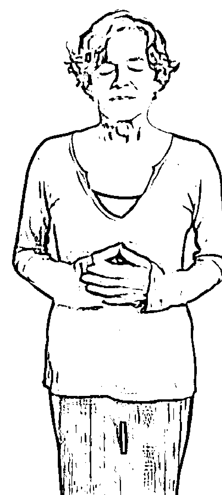

## 荷爾蒙連結（時間：約40秒）

我們身體的松果體、腦下垂體和下視丘形成了一個複雜的軸心。透過直接的互相回饋，許多控管身體的荷爾蒙分泌，都是由這三個腺體負責。位於頭皮和皮膚上的許多神經血管反射點，只要輕輕觸摸，反射點周圍的區域血流便會增加。如果輕觸兩個以上的神經血管反射點，兩點間的區域血流也會增加。因為血流是荷爾蒙傳送的首要模式，觸摸下面介紹的特定神經血管反射點，便能透過松果體 - 腦下垂體 - 下視丘這三個強力影響身體荷爾蒙的腺體所形成的軸心，來協調並規律荷爾蒙的分泌。每天進行荷爾蒙連結，就像是服用能量維他命來促進荷爾蒙之間的和諧。除此之外還可以減輕壓力，並清除身體的壓力化學物質。這個方法做了之後會讓人感覺很好，可以每天固定練習，也可以在覺得有需要時做一做。

1. 將右手的大拇指、食指和中指合攏，放在頭頂上。
2. 同時左手也三指合攏，放在後腦勺略下方（凹下庭的上方）。輕觸時間大約三次深呼吸。
3. 右手掌攤平，整個蓋住額頭，中指置於頭頂的位置（見圖6-2）。放鬆，並以這個姿勢輕觸，大約三次深呼吸。

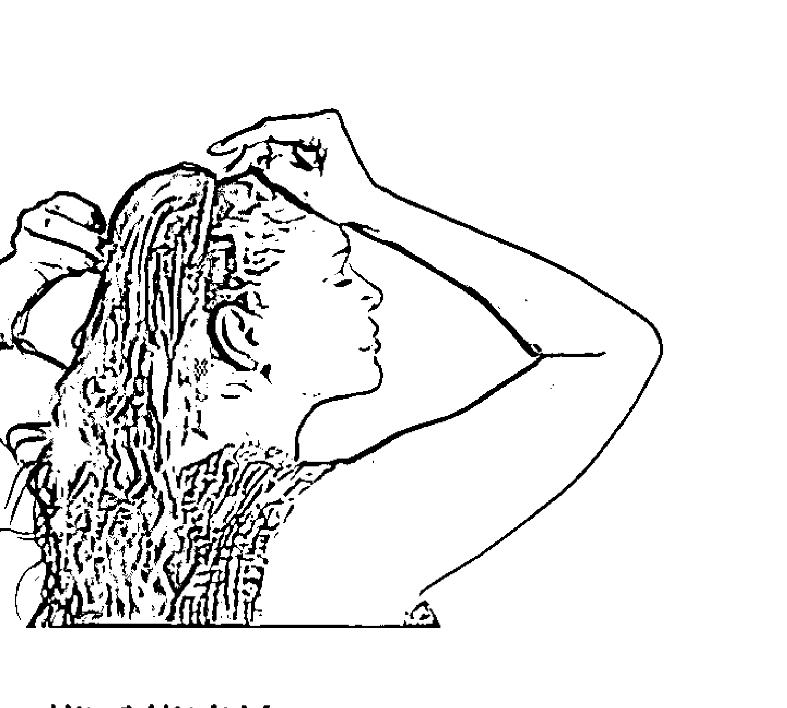

## 日出／日落（時間：30秒）

接下來的方法可以幫助穩定血壓（可以降低高血壓，提高低血壓），而且通常對心臟很有助益。此外，還可以鎖定身心，將失衡的荷爾蒙重新帶回平衡狀態。

1. 雙手放在身體兩側，掌心打開朝外，緩慢地深吸一口氣，雙臂畫圓高舉過頭，像是在引導太陽上升（見圖6-3a）。
2. 雙臂高舉，掌心相對，像要抓住高掛的太陽。一手往太陽的方向伸展，然後握拳，想像抓著一條綁住太陽的繩子，用力將繩子下拉，把陽光拉過來。這隻手往下的時候，換另一隻手再往上抓住繩子用力下拉。繼續拉繩的動作，讓雙手交替多拉幾次（見圖6-3b）。
3. 掌心朝外，緩慢吐氣，雙臂畫圓從旁邊往下回到身體兩側，像是在引導太陽落下，身體也平靜下來（見圖6-3c）。

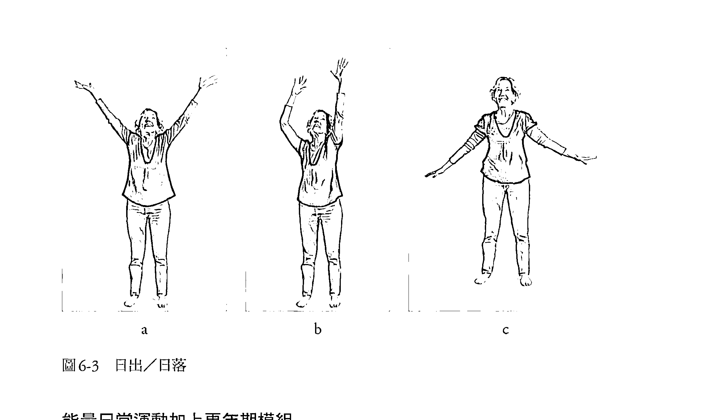

## 能量日常運動加上更年期模組

在熟練每個技巧後，每天花不到十分鐘，就可以做完整組延伸的運動。需要的話可以從同手同腳運動開始。另外，雖然不需要太過強調次序，不過按照下列步驟也很不錯：

1. 敲三處（30秒鐘，第60頁）
2. 左右交叉運動（30秒鐘，第63頁）
3. 韋恩·庫克姿勢（90秒鐘，第64頁）
4. 打開頂輪（30秒鐘，第65頁）
5. 淋巴按摩（60秒鐘，第66頁）
6. 連結天地（2分鐘，第52頁）
7. 腹部伸展（30秒鐘，第144頁）
8. 脾經沖掃與敲打（30秒鐘，第145頁）
9. 橫膈膜呼吸（30秒鐘，第229頁）
10. 荷爾蒙連結（30秒鐘，第229頁）
11. 日出 / 日落（30秒，第230頁）
12. 甩出去 / 拉上拉鍊 / 連結（30秒鐘，第80頁）

## 增加雌激素、黃體素、甲狀腺素和睪固酮分泌的能量技巧

以上的方法組合起來可以幫助妳的荷爾蒙獲得更好的平衡。而接下來的方法則是用於增加特定荷爾蒙的分泌。妳可以藉由血液檢查，找出是否有荷爾蒙不足或過剩的現象，不過因為每天的荷爾蒙可能起伏不定，所以可靠性就是個問題。比較好的方式，是在妳熟練能量測試的方法後，將天然的荷爾蒙放在妳的能量場中來進行能量測試。不過有些症狀不用任何測試，就代表特定的失衡現象。在只有一些粗略指標的情況下（因為每個人的身體不同，同樣的症狀可能是不同的原因造成），妳可能會想用血液檢查來確認，也可以用能量技巧來刺激分泌似乎不足的荷爾蒙，看看結果如何。

## 刺激雌激素或黃體素分泌

女性更年期後不會再懷孕，並不代表雌激素就會停止分泌，不過只有之前的十分之一（主要由腎上腺和脂肪細胞製造）。另一方面，黃體素則幾乎不分泌了，雖然腎上腺和脂肪細胞還是會製造一點，但其實是為了繼續製造雌激素的緣故。
此外，黃體素的分泌會被肉類、乳製品和殺蟲劑含有的荷爾蒙所抑制。另外，因為生活中的很多東西，從肥皂到指甲油，都會揮發出非天然的雌激素或是類雌激素，而被我們的身體吸收（和我們的雌激素受體結合），所以我們需要刺激黃體素的自然分泌，或是使用黃體素凝膠或乳霜來補充，好平衡這種雌激素侵入過剩的現象。同時，我們從不適當的來源，例如汽車廢氣，所吸收到的雌激素，並沒有辦法防止骨質疏鬆，所以身體還是需要分泌或補充天然雌激素。因此，就更年期而言，維持雌激素和黃體素之間平衡的課題，就和以前的其他階段一樣重要。

那麼妳怎麼知道自己是需要多一點雌激素、多一點黃體素、或是都不用，還是都需要呢？我也希望可以提供一個簡單的回答或指南。但事實上是，此刻的妳需要的可能跟別的時候所需要的完全不同。因為這些平衡一直都在震盪，甚至每位女性可能也都不一樣。我曾在冰箱上貼了紙條提醒自己，我個人的身體模式究竟如何：「拖拖拉拉或缺乏動機時，雌激素不足！驚慌或憤怒時，黃體素不足！」

這種歸納也許適用於大多數女性，還有表一列出的症狀也是，但並不是絕對正確。對大多數女性來說，雌激素不足會造成熱潮紅，而且一般普遍都這麼認為。但就我個人的平衡狀況，只要多那麼一點點雌激素，我就會熱潮紅。甚至是吃了豆腐，或其他有雌激素的食物，我不但會熱潮紅，還會夜間盜汗，由於全身濕透而驚醒。我的經驗讓我整理出一個假設，就是熱潮紅本質上可能不是因為缺乏雌激素所引起。我相信這些症狀是因為雌激素和黃體素平衡的劇烈變化所造成。而且對大多數女性來說，失衡造成的熱潮紅是因為雌激素不足，但對某些女性而言，這個失衡可能是由於其他的原因。

除了個別差異外，如果補充了過多的任何一種荷爾蒙，可能會發生意想不到的結果。舉例來說，如果妳是因為黃體素過低而過度情緒化，結果擦了太多的黃體素乳霜後，製造出一種雌激素相對不足的現象，那麼就可能會陷入沮喪憂鬱之中。因為我固定會使用黃體素乳霜，所以常常因為不留心就變成反效果。但我要是想用現成的低劑量生物同質性雌激素錠來修正，馬上又會出現黃體素不足的症狀。所以，後來我都用能量運動來調整平衡狀況，而且多半有效。如果沒用的話，就會把現成的低劑量雌激素錠切一小半吃下，頭痛很快就好了。不管我怎麼處理，通常都會有好一陣子不需要多餘的雌激素。

## 表一：黃體素和雌激素失衡的可能症狀

| 黃體素不足／雌激素過剩 | 雌激素不足／黃體素過剩 |
| :--- | :--- |
| **生理症狀**  胸部腫脹／疼痛 身體腫脹 水腫 體重增加 疲勞 | **生理症狀** 熱潮紅和／或夜間盜汗 失眠 陰道乾澀 陰道萎縮 子宮痙攣 頭痛 性欲減低 |
| **情緒／心理症狀** 焦慮 恐慌 易怒 緊張 疏離 退縮 過度敏感 | **情緒／心理症狀** 自尊低落 沮喪 缺乏同理 冷漠 遲鈍 放空 |

要處理這個複雜領域的問題，我會建議妳先從自己的黃體素和雌激素平衡著手，從以上的討論和任何妳做過的能量測試來思考假設。然後進行能量日常運動加上更年期模組（第231頁），這組運動的設計可以讓荷爾蒙平衡狀態變好。在做完這些運動後，妳很可能立刻感覺到改善。但如果在做了三天更年期模組後，還是覺得荷爾蒙不太平衡，可以採用下面的方法，按照妳自己的感覺，去製造更多的黃體素或雌激素。假設妳猜錯了，也只是沒辦法舒緩症狀，對身體不會有實質傷害，因爲實際的能量介入技巧只是幫助身體自我調整而已。

## 熱身

在使用能量技巧刺激雌激素或黃體素分泌之前的步驟：

1. 利用三焦安靜法（第114頁）來平衡內分泌系統。
2. 鎮定肝經（第156頁），讓肝經能夠增加荷爾蒙的分泌。
3. 進行三軸輕觸（第143頁），獲得荷爾蒙系統最佳平衡。
4. 運用表二中適合的技巧。

## 表二：刺激黃體素與雌激素分泌

| 刺激黃體素分泌 | 刺激雌激素分泌 |
| :--- | :--- |
| 1. 鎮定腎經（見第154頁）。 | 1. 按摩腎上腺反射點，大約深呼吸2次的時間。 |
| 2. 敲打腎經增強點。 | 2. 輕觸太陽穴和膝蓋後方的神經血管點，兩側各4次深呼吸的時間。 |
| 3. 增強脾經（見第141頁）。 |  |
| 每天進行這些技巧2至3次。 | 每天進行這些技巧2至3次。 |

## 表二特定技巧的細節說明

### 刺激黃體素分泌（時間：約10分鐘）

1. 在熱身之後，鎮定腎經（時間：3分鐘，見第154頁）。
2. 敲打腎經增強點（時間：約30秒鐘）：確實以穩定節奏敲打，約一秒一下，敲打兩腳踝骨內側往上5公分處，兩側各3次深呼吸的時間。
3. 增強脾經（時間：6分鐘，見第141頁）。

### 刺激雌激素分泌（時間：1分多鐘）

1. 腎上腺反射點的位置，在肚臍上方5公分，往兩側各5公分的位置（見圖6-4）。確實按摩約15秒鐘。
2. 手打開，左手的食指、中指和無名指輕放在左側太陽穴，眼眶外側的位置。右手的食指和中指放在右膝後方的膝窩。輕觸時要放鬆，約四個深呼吸的時間。然後換邊重複。這兩處分別是三焦經和膽經的神經血管點，合起來可以刺激腎上腺分泌雌激素。輕觸神經血管點時，記得一定要輕柔。

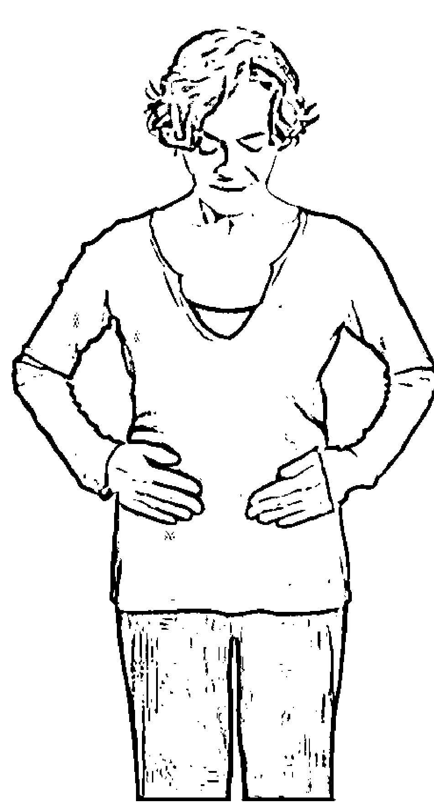

這些方法有經過科學驗證嗎？沒有。這是經由我的工作經驗，及在數千名女性身上實驗得出的結果，我本人和她們都觀察到，施作之後在情緒、能量模式和生理症狀方面的改變。個案是從經驗中歸納出化學作用會隨著能量改變，而我則期待實驗室能夠測量出施行各種方法之後的荷爾蒙變化。這當然會對能量技巧的修改精進有所幫助，並且能提供更精準的信息，以便分析不同的體質與不同的程序該如何搭配。在此同時，請自行記錄，進行刺激黃體素或雌激素的更年期模組技巧之後，有什麼樣的感覺？是否感覺比較平靜？或是感覺原本的自己回來了？這些徵兆都代表了荷爾蒙平衡獲得改善，或是更有效地運作。然而，有些女性可能發現，雖然這些運動讓她們覺得舒服一點，但還是無法完全克服更年期讓荷爾蒙直線下降的問題。不論如何，妳還是可以繼續進行這些運動，因為它可以重建能量的慣性，讓妳順利度過更年期以及更年期後的生活。妳也可以考慮使用一些補充物，讓身體能以最佳狀態面對當下的挑戰。

## 強化雌激素與黃體素平衡的維他命和植物

我這裡所推薦的補充物，是我或我的個案發現即將或已經進入更年期時，特別有幫助的東西。例如，亞麻籽（flaxseed）和亞麻籽油就相當的好，如果這兩樣東西變成非法食品，我願意為了幫助個案而成為亞麻籽的地下仲介。除了可以促進健康與抗癌的特性，亞麻籽還能讓妳在更年期時保持肌膚水嫩、骨骼強壯、身體豐潤。有趣的是，蘇珊·拉克醫師認為，亞麻籽中的木酚素能夠與空著的雌激素受點結合，然後模擬身體分泌的雌激素。必須脂肪酸（omega-3和 omega-6）也是很好的補充物，可以幫助分泌女性的性荷爾蒙，並讓身體保持水嫩豐潤。黑種草（black cohosh）是一種含有植物性雌激素（植物製造的化學物質，作用類似於人體分泌的溫和雌激素）的植物，某些女性使用之後可以消除熱潮紅。我个人則非常喜愛墨西哥山藥根提供的溫和黃體素。另外，銀杏是一種中國已經使用了幾千年的藥用植物，可以消除疲勞、增強體力，製造雌激素和黃體素，並支持所有的內分泌腺體。當歸則可以協助許多更年期症狀，例如熱潮紅、失眠等。
此外，我也建議服用品質好的綜合維他命，外加全效的礦物質補充劑。因為我們平日食用的加工食品通常無法提供身體所需的所有營養。不過，說到營養、植物和維他命，對每個人的效果都很不一樣，所以要分別仔細研究。盡妳的能力使用能量測試來事先檢測哪些是有幫助的，或是透過書籍和網路研究妳想要使用的補充物，也可以和健康或營養專家討論妳的選擇。要記住，將任何物質攝取進入身體都是一種實驗，所以要仔細觀察。對不希望發生的狀況要有警覺，這可能代表妳使用過量，混合太多補充物，或只是食用到身體無法吸收的東西。保持樂觀地去嘗試吧！妳付出心血找到身體的所需，最後會有很大的回報。

## 雌激素與黃體素的補充物

我知道以上所討論的所有原則與方法，需要時也能夠靈活運用，但私下還是很喜歡服用天然黃體素，也有過幾次罕見的狀況需要天然雌激素。我是騙子嗎？我們活在一個特殊的時代，從前不曾需要面對這麼多的挑戰，但是也不曾有過像現在這麼多能幫助我們面對挑戰的資源。

環境和現代生活的許多壓力打亂了我們的自然化學平衡。雖然人們比以前長壽，但卻比以前無法跟隨自然的腳步，因此讓我們的自然化學平衡承受許多壓力。能量療法能夠有效地回復平衡，正確地使用各種現成的補充物也可以。能量讓我們活得更好。化學讓我們活得更好。

我的第一個建議是不要接受任何人的建議。至少不要毫無條件去相信。模子刻出來的建議和處方，只適合每一塊都一模一樣的餅乾。妳很獨特，但製藥產業花了無法計數的金錢告訴妳，如果自然地按照身體的規劃繼續向前走，妳就只會通往老化與衰弱，而解決方法就是他們的藥，藥物可以反轉時間，給予妳25歲的身體會分泌的化學物質。這是一個建構在迷思上的謊言。事實上應該說，如果妳花時間運用能量技巧和嘗試天然補充物，才可以讓妳的身體保持健康、豐盈、充滿活力地邁入老年。

如果妳現在決定要採用我們之前討論過的各種方法，可是身體過低的黃體素仍舊分泌不出所需要的量，那麼我會建議妳嘗試有口碑的健康有機店所推薦的黃體素乳霜（記得也要在網路上搜尋各方資訊）。不管建議劑量是多少，請先做能量測試來實驗。因為建議劑量只是以眾多女性實驗出來的平均值，妳需要的是找到自己的劑量，還有使用的時機。如果妳發現狀況緩解有限，那就需要醫生處方了。妳的醫師也許會建議妳其他更新的方法，不過 Prometrium 是一種劑型優異的黃體素，從山藥提煉，混合花生油做成膠囊（如果妳對花生過敏就不能使用）。因為是膠囊，所以多半用於口服，但也可以用針刺破它，然後塗抹在手腕內側或肚子上。這樣可以讓黃體素直接進入血液，不需要經過肝臟和整個消化系統，也容易控制用量。另一種不需要經過消化系統的方法是醫生處方的陰道塞劑，不過並不是每間藥房都能調劑。之前討論過（見第136頁），荷爾蒙平衡很容易就過猶不及，所以要非常注意黃體素過量的症狀，詳情可參考表一的右邊欄位（見第234頁）。

身體需要黃體素和雌激素保持平衡，以便支持心臟的運作，讓骨骼強壯，幫助大腦清晰思考。如果妳認為自己需要補充雌激素，建議的選項包括植物性雌激素、植物複方、生物同質性雌激素，以及標準藥廠荷爾蒙替代療法，例如普利馬林錠（Premarin）。至於使用原則同樣是要搜尋資訊；盡自己所能進行能量測試，先從比較天然的複方開始（雖然我有時候會發現，標準藥廠製品能量測試的結果，比生物同質性製品來得強；不過還是要強調，每個人有適合自己的產品）。同時建議，使用份量最好少於藥廠推薦的劑量。舉例來說，低劑量的普利馬林錠可以用切藥器切半後、再切半，甚至切三次，來符合許多女性的需求。普利馬林錠通常是每天服用，不過幸好它不是抗生素，所以其實可以靠自我觀察或能量測試來仔細控管每天不同的需求。雌激素現在也多半會和黃體素一起使用，因為「沒有制衡」的雌激素替代療法已經證實會產生具傷害性的副作用。無論如何，在服用荷爾蒙補充物後，要敲打身體兩側的脾臟神經淋巴反射點（第145頁）來幫助身體代謝。

## 甲狀腺素

到2002年為止，所有的甲狀腺測試都是建構在男性的實驗數據上，雖然會向醫生抱怨甲狀腺功能低下的患者有90%是女性。因為這項疏漏，許多患有甲狀腺功能低下症狀的女性，檢查結果都是正常，因此沒有接受需要的治療。因為問題涉及很廣，所以一些知名的內分泌學家提出了「甲狀腺患者運動」，認為檢查應該要更精細，而且應該更迅速地開出甲狀腺素補充處方。
但也有人反對這項運動，他們並不是反對緩和症狀，而是認同黛安娜·史瓦茲班醫師（Diana Schwarzbein）所說，補充甲狀腺激素其實只是「用OK繃把症狀貼起來，並無法真正回復身體的平衡」。她勸告大家：「如果你採用甲狀腺素替代療法來治療因為生活型態而造成的內分泌失調，而不去改變自己的營養和生活習慣，這樣只是讓荷爾蒙更加失衡，並且進一步破壞身體的新陳代謝。」她堅持營養均衡最為重要。荷爾蒙基本上是由蛋白質、膽固醇和必須脂肪酸製造出來，所以均衡飲食對於維持荷爾蒙分泌來說非常重要。適量的碘是必要的。因此，可以幫助刺激自體分泌甲狀腺激素的植物包括蕁麻葉、海帶、歐芹（parsley）、毛蕊花（mullein）、微量元素硒，和鹿角菜（Irish moss）。全效礦物質補充劑就很有效，而且對甲狀腺特別有幫助。黃體素也對甲狀腺有益。
史瓦茲班指出，因為身體的荷爾蒙分泌是極微量且變化很大，所以很難透過血液或尿液檢查來回答許多荷爾蒙的問題。我無法告訴妳要不要採用甲狀腺素替代療法，不過使用能量療法來幫助甲狀腺平衡比較沒有侵入性的疑慮，而且和營養與生活型態調整較為相似，同時也可以預防未來更多治療的需求。在老化的過程中，甲狀腺所分泌的甲狀腺素會越來越少，影響到我們的新陳代謝、體力和好心情。甲狀腺素分泌減少的症狀和徵兆可見表三。

## 表三：甲狀腺失衡的一些主要症狀與徵兆

| 甲狀腺功能低下 | 甲狀腺功能亢進 |
| :--- | :--- |
| 別人不會冷的時候覺得冷 | 手掌溫暖潮濕 |
| 體溫低 | 心悸 |
| 脈搏慢、能量低 | 食量大但體重沒有增加 |
| 皮膚乾裂 | 疲憊 |
| 膽固醇高 | 眼球凸出 |
| 指甲脆弱、掉髮 | 容易瘀青 |
| 很難減重、肌肉無力 | 失眠 |
| 莫名悲傷、腦袋不清 | 顫抖 |
| 吞嚥或呼吸困難* | 葛瑞夫茲氏症 (Grave’s Disease) |
| 喉嚨沙啞、咳嗽* | 頭髮變得細軟 |
| 淋巴結腫大* |  |

* 這些症狀可能是嚴重疾病的徵兆，必須經過醫療評估。

運動和適當睡眠對於甲狀腺功能來說非常重要。而簡單地、上下左右伸展拉扯喉結附近的皮膚，就可以馬上讓甲狀腺獲得能量。此外，可以單獨或搭配運用以下所介紹的技巧，都能夠減少甲狀腺的壓力，刺激甲狀腺素分泌。

## 激勵甲狀腺 (時間：約1分鐘)

1. 進行三焦安靜法 (第114頁)，然後敲打脾臟神經淋巴反射點 (第145頁)。
2. 將一手的中指放在喉結上方，另一手中指放在喉結下方，其他手指分開，

圖6-5 激勵甲狀腺伸展拉扯頸部皮膚。然後將手指放在喉結兩側，同樣橫向伸展拉扯皮膚。

+   3. 將一手的大拇指、食指和中指放在喉結下方凹陷處，另一手的指腹置於太陽穴（見圖6-5）。兩處都是三焦神經血管反射點的位置。輕觸4至5次深呼吸的時間，然後換邊重複。

## 睪固酮

女性分泌的睪固酮約為男性的七分之一，主要是由卵巢和腎上腺來製造。睪固酮的分泌大約會在更年期之前逐漸減少，大概是二十幾歲時的一半。但是，更年期後，卵巢會持續分泌相同份量的睪固酮，因此和雌激素相較，睪固酮在比例上會比年輕時多得多，因此更年期後的女性會顯得較為獨立自主。

1980年代早期，幫我進行年度健檢的醫師是個女性主義者，有一天她對我說：「唐娜，妳知道如果妳人不要這麼好，日子可能會好過一點。現在有很多女人服用睪固酮，而且非常喜歡。我覺得睪固酮應該對妳很好，妳會變得昂首闊步，保有自己的空間，而且能夠清楚地對別人說『不』。」她說服了我試試看。正好辦公室裡有些樣品，她給了我最低的劑量，希望我服用後能告訴她感想。睪固酮的確讓我的生活變得不一樣，我整天都很激動，不是那種會讓妳對所愛的人感到又愛又恨的感覺，而是比較像海軍陸戰隊準備攻擊剛剛殲滅了一個無辜村莊的敵軍中隊。我幾乎是用了一次就放棄，而且讓我對隨時會自然分泌這種物質，但卻能保持文明態度的男性有了更多的尊敬。

所以我建議採用睪固酮替代療法，妳可以自己評估風險，而且其實除了我試過的那種合成雄性激素外，還有別的類似產品。舉例來說，巴西慓慓木（muira puama），是一種來自巴西的植物，樹皮和樹根可以透過提升睪固酮濃度增加更年期女性的性慾。瑪卡（maca）是一種來自秘魯的植物，根部也有類似功效。達米阿那（damiana）是一種灌木，一樣來自南美，從馬雅人開始就是拿來當春藥使用。雖然這些補充品我沒有實際使用過，不過我可以提供一些能量療法來改善睪固酮不足的狀況。表四列出的是睪固酮失衡的症狀和徵兆。

1980年代早期，我在一間女性庇護所當志工。庇護所裡的女性都是因為遭受虐待而來到這裡尋求安全與保護。她們身心俱疲、意志消沉，即使並沒有特別喜歡庇護所，也不敢離開此地。我還記得有個小男孩，他看著我幫他媽媽進行療程。媽媽在療程床上放鬆以後就哭了起來，而小男孩大概是以為我像他爸爸一樣在傷害媽媽，於是他用盡三歲小身體的力氣捶打我的腿。真是讓人印象深刻。這就是睪固酮的作用！然而，他的媽媽卻是毫無生氣，事實上大多數的女性來到庇護所的時候都是如此。完全沒有戰鬥意志，也沒有保留任何力量。我們每個人都有陰和陽、女性和男性的力量，兩種力量都需要俱備。但這些女性喪失這兩種特質。三焦掌管了戰鬥／脫逃／僵住的應急反應，但她們的三焦已經持續緊張了很長一段時間，所有的力量都花在戰鬥或是逃到庇護所了。因此，現在她們的能量處於僵住模式。我相信她們這一生的睪固酮濃度和相對應的陽性能量一直都很低。但如果要在這個世界生存，並完全脫離她們暴力的伴侶，就需要陽性的能量。因此，我開始鎮定她們的三焦經，並增強相對應的脾經。也許妳會覺得鎮定三焦經可能會帶走能量，但其實剛好相反。我一而再、再而三地鎮定三焦，然後看到對方體內的陰性力量不斷匯聚，獲得能量，接著就是陽性力量的復甦。在這個過程中，睪固酮的分泌會慢慢回到常軌。

除了三焦，另一條與睪固酮分泌相關的經絡是胃經。胃經是陽性或「男性」的力量，在女性體內是以母老虎的型態呈現。在生育年齡的階段，這股能量專注於子女和家庭。更年期後，這股能量就用來建立老嫗的力量。這是女性主宰自我空間的基礎力量。因此，為了能分泌更多的睪固酮，妳當然希望自己的胃經強壯、穩定、不妥協。運用的方法包括固定進行胃經沖掃（第146頁），然後是甩出去（第80頁）、拉上拉鏈（第68頁，要帶著步入老嫗力量的自信），以及敲三處（第60頁）。接著連結三焦經與胃經的能量，將大拇指放在太陽穴，其他手指直接放在額頭。這些穴位能讓兩條經絡的能量互相連結同調。最後，在身體準備好分泌更多睪固酮之後，運用睪固酮三重按摩來啟動睪固酮分泌。雖然我從來沒有透過實驗室檢驗來評估這些療法，不過我的個案都感覺自己更有力量、人際界線更清楚、腦袋更清晰、情緒很平衡，而且重新燃起了性慾。要自然地增加睪固酮，可以每天做2至3次睪固酮三重按摩：

表四：睪固酮失衡的一些主要症狀與徵兆

| 睪固酮不足 | 睪固酮過剩 |
|------------|------------|
| 感覺無力 | 容易生氣、自大 |
| 性慾減低 | 聲音變低 |
| 能量減低 | 臉部毛髮增多 |

## 睪固酮三重按摩（時間：不到1分鐘）

+   1. 兩手中指放在肚臍，往上移5公分，再往兩側各外移5公分。深呼吸，用力按壓這兩個點約15秒鐘。這個動作是刺激腎上腺點，強化腎上腺，增加睪固酮分泌。
+   2. 兩手中指放在膀骨頂端內側邊緣的節點上，往中間移動5公分，深呼吸，按壓約15秒鐘（見圖6-6）。這個動作是刺激並強化卵巢，增加睪固酮分泌。
+   3. 用力按壓位於大腿外側，膝蓋與臀部

## 骨質疏鬆

有一名女性，只是因為擤鼻子，肋骨就斷了，最後來找我求助。當時唯一能夠改善骨質疏鬆的治療方法，卻會有非常嚴重的副作用。個案才 49 歲，她不希望自己的身體再退化下去。但她本身也是個接受良好的西方醫學教育的醫生，不太相信可以反轉現在的身體狀況，在我們諮詢一開始，她就引經據典表明了這個想法。她希望的是如果能夠透過運動把肌肉鍛鍊好，足以支撐全身骨架，並強化身體的能量（她對能量療法所知有限，不過我曾經幫助過她的幾位病人，她也對能量療法保持開放、願意嘗試的態度），應該就能夠稍微減緩「基因注定」的骨質密度流失。我認為還有更多的可能性，但我決定先進行療程，讓她知道能量療法可以同時降低她的絕望感以及改善身體的不適。於是我博得了她的信任，有機會向她解釋能量如何讓骨骼強壯，並能夠確實地改善骨質流失問題。她半信半疑，不過還是願意讓我試試看。骨質密度是由腎經來調節。但簡易的公式療法不足以改善她的狀況。肺腎相生，她的肺經有問題，所以影響到腎經虛弱。我們決定同時調理肺經和腎經。肺主悲，而出乎她意料之外，讓肺經回復最佳流動狀態的關鍵，是平撫一件她以前沒有完全處理好的失敗。經過四、五次的療程，加上她回家後也認真地自我療癒，我們兩個都曉得她的骨骼是越來越強壯了。在一次骨質密度檢查後，發現她有大幅度的改善，她向我提議進行一項研究計畫，但這也是我沒有時間把握住的許多機會之一。我希望某個讀了本書的人能夠有機會實行這項研究。

骨質疏鬆對女性造成的影響，比中風、糖尿病、乳癌或關節炎都要來得大。這是一個會持續流失礦物質、骨量和骨質密度的重大問題，近幾十年來已經增加了六倍之多，而且還流傳了許多錯誤的資訊。

舉例來說，雌激素到了更年期會減少，一直被認為是骨質疏鬆的罪魁禍首，但其實比起黃體素，雌激素在對抗骨質疏鬆所扮演的角色並沒有那麼重要。

骨骼原本就是不斷地瓦解又重生，有兩種細胞負責製造出不斷更新的奇蹟。第一種叫做蝕骨細胞，由雌激素調節，會帶走老舊磨損的骨骼。第二種叫做骨母細胞，由黃體素調節。兩種細胞在同一個接點製造出新的骨骼。因此，維持適當的黃體素濃度對於骨骼強壯來說非常重要。

在老化的過程中，蝕骨細胞的作用越來越強大，骨量因此流失。但七、八十歲的女性還是有辦法緩和骨質流失，強化骨骼，甚至製造出新的骨骼細胞。不過，早在四、五十歲的時候，就可以採取一些步驟阻止骨骼中的礦物質流失，尤其是鈣與鎂。但是想攝取這些礦物質其實有些微妙之處要稍加留意。

以預防骨質疏鬆聞名的鈣片，會影響到鎂和鋅的代謝，因此綜合起來並無法增強骨骼，而是會造成傷害。鈣還是從飲食中攝取為佳，但即使如此，若是身體沒有足夠的鎂、鹽酸和各種維他命，也無法適當吸收。而鎂其實在預防骨質疏鬆方面，和鈣一樣重要。同時，許多處方藥，還有像是制酸劑之類的成藥，會干擾鈣的吸收。有些植物，例如蕁麻，則含有天然的鈣成分，是極佳的鈣質補充物。如果妳要服用鈣片，還是以多種礦物質的劑型較容易吸收，而且最好是鎂多於鈣。

還有另一項無法改變骨質疏鬆的重要因素，是來自於骨骼會吸收環境中有毒的鉛。鉛會取代鈣，造成骨質流失。除此之外，更年期及更年期後（另外要非常注意的是懷孕和哺乳期間），骨骼中的鉛會釋放到血液中，該毒性會造成高血壓、腎臟疾病、失智症、心臟疾病和神經傷害。因為當鈣從骨骼中釋放時，鉛會溶到血液中，要讓鉛不進到血液的方法就是確保自己體內存有適量的鈣。如果身體不會從骨骼中抽出鈣，也就不會釋放鉛到血液裡。同時，有幾種補充物已證實具有排除鉛毒的功效。NAC（N-乙醯基半胱氨酸）能夠讓尿液排出包含鉛在內的重金屬。SAM-e（S-腺苷基甲硫氨酸）可以減少鉛毒，將鉛結合膽汁排出。瀉鹽（硫酸鎂）也可以減少鉛毒。其他能夠增強骨骼強度的營養素，還包括維他命K、軟骨素、MSM和維他命D（尤其是D3）。維他命D大多是由日照自然提供，但現今以室內活動居多的生活型態，讓許多人都缺乏維他命D。使用防曬乳也會讓我們錯失獲得維他命D的機會。當然不要讓自己曬傷，可是適當的日照是必要的。

然而，骨質疏鬆的問題特別容易讓人誤以為解決方法非常簡單。其實，均衡的飲食、固定的重量訓練，以及維持健康的雌激素／黃體素平衡，才是骨骼再生與預防疏鬆的鐵三角。能量運動可以強化這個鐵三角的基礎。就像磁鐵和電磁療法可以加速斷骨的復原，本書中的精微能量療法也可以幫助維持骨骼強度與密度。

有個簡單又有效的運動可以啟動能量並預防骨質疏鬆，那就是肩膀抬舉。這個動作能夠潤滑肩膀，釋放淋巴，讓上背部強健筆直，甚至可以預防駝背。最有價值的地方不只是生理上的功效，還有助於在肩膀和上背部之間建立一個更有意識的正面關係。將肩膀聳起，靠近耳朵，然後緩慢地往後繞一圈再往上，重複幾次，記得深呼吸。接著，換成往前繞，可以兩肩同時做，也可以一次一邊。

### 預防骨質疏鬆的等長收縮運動

等長收縮運動是一種力量訓練，已被證實對於預防和修正骨質疏鬆非常有效。骨質密度流失是太空人需要面對的問題，因為他們要長期處於活動範圍狹窄的狀態。每天只要進行十分鐘的等長收縮運動，就可以改善骨質流失。等長收縮運動是一種肌肉的靜態收縮，外表看不出任何動作，對能量也很有好處。請教練指導或是看書自學，就可以改善或預防骨質流失，相當方便。以下是我非常喜歡的兩個等長收縮運動：

### 軀體伸展（時間：約20秒鐘）

+   1. 坐在自己的手上，手掌朝上，挺胸，手臂用力打直。
+   2. 維持這個姿勢做幾次深呼吸。

妳會感覺到背部、頸部和手臂都在伸展。

### 骨骼救星（時間：不到2分鐘，也是很好的小腹訓練）

+   1. 手臂置於身體前方，深呼吸，屏氣，兩手掌跟用力互壓（見圖6-7a）。
+   2. 同時用力往脊椎的方向縮肚子，臀部收緊，骨盆向前向上推。
+   3. 如果忍不住想吐氣，可以保持前面的姿勢，然後用鼻子快速吸氣3次。
+   4. 如同用吸管吹氣那樣，慢慢吐氣（肚子會自然縮緊）。
+   5. 如果覺得氣差不多吐乾淨了，用嘴巴快速吐氣3次。
+   6. 做完一次後先放鬆。然後重複多做幾次。
+   7. 從頭再做一次，但這次是兩手手指彎曲互勾，用力往外拉，讓手指、手臂和肩膀都產生等長收縮的壓力（見圖6-7b）。

依我的經驗，針對骨骼脆弱易折的狀況，可以每天自己鎮定並強化腎經2至3次，兩、三週後便可以很快感覺到骨頭開始重新健壯起來。我父親罹患骨癌的時候，醫生說他的第五節腰椎（L-5，脊椎在腰部的那一節）像是「只有一根線吊著」。因此，他必須穿著一種很不舒服的裝置來讓腰椎保持穩定，不然即使是擤個鼻子，醫生說骨頭也可能因此折斷，然後癱瘓一輩子。某次我陪伴他的時候，剛好他在試穿那套裝置。因為父親對女兒的魔法力量沒來由的信任，他說：「唐娜，妳可以幫我弄好！」我其實感覺不到自己有辦法，不過依舊運用了我所知道的所有方法。每天我會測試他的經絡好幾次，以便尋找出模式，所以發現父親的腎經一直都處在很虛弱的狀態。

我父親最初被診斷罹患了前列腺癌。前列腺是由腎經掌管，而腎經同樣也掌管骨骼強度與構造。這裡我要離題一下，因為有過這樣的經驗，所以我堅持請大家不要因為醫療權威的影響而否定自己的判斷。我父親的 PSA 指數有點提高，主治醫師沒有特別在意。但父親熱愛生命，所以找了一位腫瘤科醫師尋求第二意見。這位腫瘤科醫師堅持要開刀，所以兩位醫師的意見明顯地互相衝突。結果恐懼獲勝，父親開了刀，之後沒多久就診斷出骨癌。在回顧整個病程後，父親的第一位主治醫師很生氣，他建議我們去控告那名腫瘤科醫師。他說就是因為動了手術，使得癌細胞「跑到」血液裡，擴散到骨頭。他在父親過世後告訴我們，那次失敗的手術等於是「死刑宣告」。
的確是。不過我們當時並不知道，父親還請我舒緩他的背部。因為腎經掌管了前列腺和骨骼強度，而且他的腎經一直都很虛弱，當然

## 僵硬與關節痛

骨質疏鬆初期的階段是種「沉默」的疾病，關節痛則不是。這是個叫囂得很大聲的疾病。許多更年期後的女性都患有關節痛、僵硬，或是背部、膝蓋、肩膀、臀部和頸部疼痛，不管是突發或慢性都有。雖然幾十年來，我們的關節一直受到拉扯磨損、甚至傷害，但只要保持關節潤滑，其實可以改善及預防這種疼痛僵硬。

發炎是關節問題的首要罪人。發炎是由於刺激、傷害或外來物質侵入身體，例如細菌或病毒，使得身體送出化學物質和白血球到感染的區域，以保護自己的正常完整。但是生活中無法解除的壓力、不適當或是過量的運動，還有不均衡的飲食，會讓發炎變成一種假警報，在不需要的時候出現，變得有害。皮質醇過高算是一種文明病，因為許多人都承受了現代生活的壓力，而過高的皮質醇會破壞骨骼組織，傷害骨骼再生的功能。雖然許多複雜的疾病都會出現發炎現象，從關節炎、糖尿病到癌症都有，不過若是說到以皮質醇調理關節處精密的活動，倒是很有直接的效果。

要讓關節保持潤滑，非常簡單而基礎的方法就是確保飲食中含有足夠的必須脂肪酸。不要看到「脂肪」兩個字就避之唯恐不及。妳需要脂肪，而且這是身體無法製造的物質。妳必須從飲食當中獲取。不過，除非妳住在漁村，否則在沒有意識去特別留意的情況下，大概無法獲得足量的必須脂肪酸。幸好，現在有兩種必須脂肪酸，omega-3和omega-6，都可以迅速取得。自然的來源包括魚類和貝類、亞麻籽和亞麻籽油、大麻籽油、大豆油、芥花油、月見草油、奇亞籽、南瓜籽、葵花子、葉菜類、酪梨和胡桃。攝取適當的必須脂肪酸，對於健康來說好處多多，從預防發炎，到促進心血管健康都可以。亞麻籽和亞麻籽油是極佳的必須脂肪酸來源，對於健康也還有許多好處，例如預防癌症、改善乾眼症，並讓身體組織保持濕潤。妳可以把亞麻籽油混合胡椒和大蒜，就是美味的沙拉醬，或是自行調整配方。我會加入檸檬和羅勒葉（可以在身體老化後還是維持鹼性）。但妳也可以服用膠囊，配合能量測試來決定劑量。

另一種保持關節強壯與健康的直接方法，是讓能量能自由地流經關節。有幾種伸展運動和能量技巧很有幫助。例如連結天地（第52頁）的效果極佳。另外三種還包括：

## **關節畫圓按摩（時間：約30秒鐘）**

以逆時針方向，用掌跟或手指在關節疼痛的地方畫圓按摩。

## 在疼痛處貼上磁鐵（時間：10至20分鐘）

將磁力不要太強的扁平磁鐵（Radio Shack 公司生產的那種圓形、中間有洞的磁鐵就不錯）的北極，貼在骨骼或關節疼痛的皮膚上約10分鐘。妳可以用指北針來找出北極，磁鐵會吸引指北針指針的那一面要朝向皮膚。如果10分鐘內沒有任何明顯變化，就把磁鐵拿掉。如果感覺有改善，只要妳感覺它仍有作用時，就可以一直貼在身上。但不要貼著過夜，也不要把南極面貼在發炎的關節上，以及不要把磁鐵任何一面放在血管上。

## 手腕扭轉（時間：不到1分鐘）

伸展會創造淋巴及潤滑黏液流過關節的空間。當受困的能量被釋放，就可以變成正面的療癒能量。固定做瑜伽和其他伸展運動對身體很好，而手腕扭轉則特別適合手部、肩膀和手臂的僵硬狀態，妳可以在有這些症狀時進行這個運動。

+   1. 手臂自然下垂，往兩邊抬起約30度。
+   2. 手掌打開，手指伸直，手掌朝內扭轉，直到感覺前臂和肩膀的伸展（見圖6-8）。維持伸展狀態約10至15秒鐘。
+   3. 放鬆，重複幾次。

## 其他與更年期相關的症狀

接下來要介紹有助於其他更年期或更年期後症狀的能量介入技巧。因為每位女性即使症狀相同，造成原因也可能完全不一樣，因此不能完全信賴有所謂症狀與療法的制式解決清單。不過我可以介紹一下，我的個案通常會覺得以下狀況用哪些方法最有幫助。如果這裡列出的問題是妳想解決的，那麼可以試試對應的幾種療法或搭配看看，找出對妳最有效的方法。

## 熱潮紅

除了下面介紹的能量技巧和更年期模組外，有幾種植物療方據說可以改善熱潮紅。對我的個案最有效的植物包括了亞麻籽和亞麻籽油、月見草油，另外對某些女性來說，黑種草也有效。我的很多個案在使用能量運動並只搭配亞麻籽油的情況下，停掉荷爾蒙替代療法後，症狀並未回籠。如果亞麻籽和更年期模組還不夠，那麼另外還有幾種適用於熱潮紅的能量技巧：

「冷卻」穴位
熱潮紅發生時，將兩手中指按壓在肚臍以下約5公分之處（這是任脈與腎經的交會處）。深呼吸一次，輕觸這個點的時候自然呼吸。這會重新分配妳的能量，降低熱潮紅時所上升的體溫。

三焦安靜法
因為三焦負責管理體溫、壓力和免疫反應，用三焦安靜法之類的技巧鎮定，通常都能獲得立即的緩解（第114頁）。

黑武士呼吸
另一個能夠迅速鎮定三焦、緩解熱潮紅的技巧是黑武士呼吸（第160頁）。

### 探測火元素

第四種方法不只能夠提供緩解，也能預防熱潮紅的發生。我發現每天都做這個療法的女性，熱潮紅會變得比較不嚴重，有些人甚至完全復原。這個技巧對於維護甲狀腺健康也很有助益。

+   1. 雙手交叉，將兩手中指放在俞府穴（第60頁），用相同的力量按摩兩個俞府穴。
+   2. 右手移開，左手中指移到鎖骨交接處上方。
+   3. 頭往左轉到底（見圖6-9），一邊吐氣、一邊將左手中指沿著鎖骨上方往外推。
+   4. 用右手在左側鎖骨重複這個動作。

## 沮喪憂鬱

常因沮喪憂鬱而苦的人，對於更年期感受到的死氣沉沉至少不算陌生。但如果妳不常憂鬱，而是像我這樣傾向歇斯底里的話，就是個全新而驚悚的體驗。我不知道該怎麼處理這種陌生的空虛感，缺乏感覺、動機或關心的異樣感。雖然我一直很有同情心，但在我自己有過陷入沮喪的經驗後，對憂鬱的人就更有體會。沮喪憂鬱不是只處於心智之中，身體的每個細胞、每個器官，所有的身體功能都相對變得遲鈍懶散。反應和思考都變慢了。在比例上，雌激素比黃體素少太多，就會引發沮喪憂鬱。因此，能量日常運動搭配更年期模組，再加上之前介紹能讓雌激素和黃體素獲得平衡的其他步驟，應該可以排除更年期的憂鬱。接下來的方法更能對症下藥。在沮喪的時候，其實很難集中能量去反转沮丧的情绪，而且根本就缺乏动机。所以要注意，很可能妳会完全不想做这些运动，但在进行疗法的过程中，就会慢慢感受到事情开始改变。

### 延展、延展、延展（时间：约3分钟）

如果觉得沮丧，那么能量就不会流动。通过简单地延展脸部、头皮和颈部的皮肤，就可以马上启动身体的能量。在整个过程中，会刺激胃经、小肠经、大肠经、膀胱经、胆经、三焦经、任脉和督脉的末端点。在所有的伸展过程中记得不断深呼吸。

- 1. 从打开顶轮（第65页）开始，然后做头皮按摩。
- 2. 继续延展脸上的每个部分。
- 3. 手指按压颧骨，然后往耳部的开口拉过去，延展皮肤。
- 4. 两手中指放在上唇上方，按下去，向外延展唇部上缘皮肤。
- 5. 重复4的動作，这次从下唇下缘开始。
- 6. 将手指放在下颔骨，沿着下颚的边线按压。
- 7. 拉耳朵，从耳垂开始，每隔约1公分拉一次，直到延展完整个耳朵外缘。
- 8. 头往后仰，用各种方式延展颈部皮肤。
- 9. 一手的手指放在另一侧的肩膀，按下去，往前拉。换边重复。
- 10. 尝试延展任何可能觉得舒服的皮肤区块，或是做类似瑜伽的动作来伸展肌肉和关节。
- 11. 额外的能量促进法：轻快地用几只手指敲打脸部和头部所有的骨头。

### 同手同脚运动（时间：3至5分钟）

只要妳感到沮丧，妳的能量就是以同侧模式在流动着。说完了！

用妳知道的所有方法让能量回到交叉流动（第72页），尤其是进行节律8。同手同脚运动也是可以采用的强效方法之一，虽然可能需要每天进行2至3次，持续一段时间后，才能改变能量模式，并且让新模式固定，接下来其他对付沮丧的方法才会比较有效。让能量回到交叉模式，也可帮助妳改善因为同侧模式能量造成的荷尔蒙混乱情况。

### 柔和手印（时间：3分钟）

结合主要神经血管点和瑜伽手印的技巧，也可以刺激血流来到头部，让互相冲突的身体能量镇定调和，缓解因而产生的沮丧。血液流动也会带动能量流动，而流动的能量正好与沮丧对立。所以，再做一次打开顶轮（第65页），接着揉捏整个头部，轻快地按摩。然后将两手大拇指放在食指的指甲上圈起来（见图6-10a）。保持这个姿势，或说手印，将中指和无名指轻轻放在额头，眼睛的正上方，和眉毛与发际保持等距离。将圈起来的大拇指和食指轻轻放在太阳穴，中指和无名指将额头皮肤轻轻往外拉，然后开始鸣唱。轻触这些点约2至3分钟，并持续鸣唱（见图6-10b）。记得配合深呼吸。

### 心与子宫连结（时间：3分钟）

妳可以站着、坐着或躺下，一手放在心轮（胸部中央），另一手放在子宫轮（肚脐和耻骨中间，见图6-11）。维持这个姿势并深呼吸，约3分钟后，妳就会注意到两个脉轮间的能量开始连结。有人告诉我，她们觉得这两个地方间的能量流动，让她在对抗沮丧的过程中感到一种活力。

### 心智敏锐度

能够缓解沮丧的技巧也能够帮助逐渐丧失的心智敏锐度，这是更年期女性有时会发生的状况。我之前介绍的能量日常运动、更年期模组和伸展、交叉运动，以及神经血管技巧，都有助于维持心智敏锐度。银杏被证实拥有增强脑力的成分。早期的研究有正反两面的结果，但最近的研究放在高剂量银杏上，显示的确对某些心智功能有实质的改善，其中包括扭转失智症的一些症状。我的许多个案表示，银杏对于记忆力和清晰思考有所帮助。银杏已知的生物效果包括，改善大部分组织和器官的血液流动，保护细胞不受自由基伤害，阻绝各种心血管、肾脏、呼吸道和中央神经系统失调而造成的血栓影响。不过，银杏不适合某些患有血液循环疾病的人使用。总之，以上介绍过的方法，搭配一些银杏之类的脑力增强补充品，可以妳的心智保持敏锐与活力。

### 肥嘟嘟的肚子和日益加粗的腰围，喔！天啊！

本节的重点是氧气。第七章所有有关体重管理的讨论，可以先从增加身体的含氧量开始。以下是一些相关知识：

- 氧可以分解脂肪分子，转化成二氧化碳（CO2）和水（H2O）。
- 身体持续在处理毒素，以维持健康状态，并将至少三分之二身体处理好的毒素，利用呼吸排出。
- 如果氧气不足，肠道绒毛有效吸收营养与消化食物的能力会往下掉72%之多。
- 如果只用肺的上半部来呼吸，新陈代谢会变慢，引发其他问题。
- 如果吸进较多氧气，新陈代谢率可以马上增加30%。
- 深呼吸可以让吸进的氧气燃烧三倍的脂肪，同时肠道的能力可以增加70%，将毒素转换成气体之后排出。

研究显示，一天三次、每次五分钟的呼吸练习，可以在实质上增加新陈代谢率，也能够改善肌力、调节身体与情绪。更年期模组的横膈膜呼吸（第229页）是一个30秒的日常呼吸运动，可以提醒身体正确的呼吸方式，请搭配接下来的等长收缩运动来做。这个动作我称为新陈代谢呼吸，或更年期腹部雕塑运动。基本原则是以下面说明的方式深呼吸，同时有特定几块肌肉要配合用力。

### 新陈代谢呼吸

（时间：约1分钟，感谢健身教练葛莉儿·查德斯 [ Greer Childers ] 的启发）

- 1. 弯腰，双手撑在膝盖上。
- 2. 用鼻子快速吸气，并拱起背来，肚子往脊椎的方向用力缩紧。
- 3. 用嘴巴用力吐气（见图6-12a）。
- 4. 气吐光后，用力缩肚子，憋气到忍不住想吸气的时候（图6-12b）。
- 5. 放松，肺部会自动充满空气。

### 图6-12 新陈代谢呼吸

### 阴道干涩

如果有阴道干涩的问题，我的很多个案在增加每天必需脂肪酸的摄取后，有明显的改善。再强调一次，来源包括鱼油、亚麻籽和亚麻籽油、大麻籽油、大豆油、芥花油、月见草油、奇亚籽、南瓜籽、葵花子、叶菜类、胡桃和酪梨。酪梨一直都名列好油名单中，根据我自身经验也是非常推荐。有一阵子我搬到一个盛产酪梨的地区，我发现才几个月的时间，我的皮肤和粗裂的脚跟明显变得比较柔软润泽且丰盈，其实这个地方天气还比较干燥呢。我想不透为什么多年来粗糙的双脚就这样修复了，最后想到唯一真正的改变，是我吃了很多的酪梨，多半是墨西哥酪梨酱（还是我拿来搭配酪梨酱的玛格丽特调酒呢？）更年期模组同样能够帮助我们保持皮肤的润泽，预防阴道干涩。有时候妳会需要多一点与肾经相关的能量运动，可以透过镇定肾经（见第154页），然后敲打肾经增强点（见第235页）来维持肾经的平衡。

### 头痛

更年期的头痛有许多原因。可能是能量不足；可能是生活充满压力；可能是睡眠受到干扰；可能荷尔蒙失调。我发现山药对我帮助很大，因为我和许多女性一样黄体素过低。对其他女性来说，生物同质性的雌激素可以帮助身体回复平衡。而能够释放颅内阻塞能量的运动，有时候也可以提供立即的舒缓。先从轻快地打开顶轮（第65页）开始，也许就足够了。如果不行的话，接下来可以做钟摆式甩头法这个很棒的运动。

### 钟摆式甩头法（时间：约2分钟）

- 1. 深吸一口气。
- 2. 吐气，头垂到胸前，放松肩膀。
- 3. 吸气，让右耳带着头来到右肩，感觉一下颈部左侧的伸展（图6-13）。维持这个姿势，进行2至3次深呼吸。
- 4. 慢慢吐气，让头部完成画圆的动作，左耳带着头来到左肩，感受到颈部右侧的伸展，进行2至3次深呼吸。
- 5. 回到中心，头垂到胸前。
- 6. 至少再重复2次。

### 失眠

失眠可能有很多原因，生理也好，心理也好，但锁定过分活跃或混乱而造成失眠的能量，通常会作用在较为深层的部分，并带来一夜好眠。也许妳需要实验各式各样的方法，才能找出最适合妳的。除了能量疗法外，睡眠实验室（www.sleepcenters.org）也研究了失眠，并开发出好几种创新的技巧，妳也许会想了解尝试。这些方法在很多畅销书或是各种网站都有介绍。更年期女性失眠最常见的原因是镁离子浓度过低。妳可以用能量测试检验镁离子胶囊，看看妳需要不需要补充，需要的话就在睡前服用。

现在我要向妳介绍我的网站上关于能量疗法问答的部分（打开 www.innersource.net 网站，在搜索引擎键入“失眠”）。有一、两种技巧的说明应该会对妳很有帮助。有些帮助失眠的技巧其实是泛用的方法，妳也已经学过了。包括排毒（第159页）、打开顶轮（第65页）、三焦安静法（第114页）、连结天地（第52页）和连结（第69页）。因为荷尔蒙失衡可能会造成更年期的失眠，所以在上床睡觉前稍微进行一下能量日常运动和更年期模组，应该也可以让妳得到一夜好眠。

对我们的文化来说，度过更年期可说是撼动灵魂的经验。不过这也是一趟神秘的旅程，能够与生命缔结更深的缘份，引领妳进入老妪的智慧与奥秘，进而对整个大家族、大社会产生影响。因此，就跟明白到荒野旅行要穿登山靴、骑越野车，而不能只穿凉鞋、撑阳伞一样，努力去了解召唤妳的能量，是支持妳走过这趟旅程相当重要的任务。

## 7

## 体重管理技巧

> 50%的（美国女性）每年会减肥两次以上，但都不太能够达到她们想要的体重，或者达到了也无法长期维持。
> ——慧俪轻体减重公司（Weight Watcher）

每一天都有各种媒体用纸片人的女性形象在羞辱攻击我们。这样的形象凝聚在我们的灵魂中，形成一个无法达到却又充满压迫的理想，对我们的健康、幸福和自尊都造成极大伤害。在使用能量疗法来处理我自己的体重问题之前，我的生活也是充满了这类熟悉的自我批评、自我否定、减重／复胖／减重的循环，以及因为社会文化的疯狂观念而被逼到墙角的歇斯底里。就和许多女性一样，我也被纤瘦苗条的理想形象所宰制。

但除了那些体重达标准却还是觉得自己胖的人以外，的确有超过一亿五千万的美国人超过了身体所能负荷的体重，而且至少有六千万人已经成为病态肥胖。这些可怕的数字近几十年来更是变本加厉。我们该如何处理这种肥胖疾病，但又不要过于极端去认同也是很有问题的纸片人形象呢？

过度肥胖除了重挫我们的虚荣心外，也会造成许多原本可以避免的健康问题，例如糖尿病、心脏病、中风、肝衰竭等等。一亿五千多万过重的人之中，大部分都曾经试过各种减肥方法，但却遭遇到许多矛盾状况。举例来说，身体要多一点脂肪才有安全感，因为担心如果发生饥荒，多余的脂肪就像是紧急账户里的现金一样，发挥保命的功能。事实上，如果你让自己陷入极为饥饿的状况，血糖和新陈代谢会直线往下掉，反而启动了远古的身体机制，不管吃下什么都会变成脂肪储存起来。甚至睡眠也会影响体重。如果睡眠不足，身体会倾向于多储存一点重量。所以让自己有足够的睡眠，不只可以获得充分的休息，回复警觉心和专注力，也可以当成是减肥的手段之一！

成千上百本的减肥书在市面上来来去去！很明显的，减肥对我们大部分人来说不是完全的答案。事实上，减肥通常会造成反效果，因为身体制造肥胖细胞并保护原有脂肪的机制被启动了。减肥就是在告诉身体，我们祖先最害怕的饥荒开始了。把所有的营养通通拿去变成脂肪储存起来！现在就去！

各式各样的减肥书籍摆满了书柜，也反映出我们每个人在生化方面的独特性。同样的食物组合可能让一名女性减轻体重，却让另一名女性胖了屁股。某些人的确适用“摄取的卡路里减去燃烧的卡路里等于储存的卡路里”这个公式，但其他许多在体重增减上复杂的基因和生化特质却被漠视了。瘦的人通常认为吃太多是过重的唯一理由，所以可以结束讨论了，因为其他都是谎话跟藉口。而比较胖的人，发现自己吃得远比那些爱批评的瘦子少，所以不相信这是正确的科学答案。其实，实情就是很大一部分的胖子比那些瘦的人吃得少又动得多。是的，一点也不公平！任何体重管理的计划都只适用于少数人。即使是宣称能够客制化的疗程，还是会出现多半不太正确的一般通则。妳实在太特别了，因此这类的通则并不值得信赖。

就我的经验，能量疗法对于体重控制有着极大的效果。好几个能量系统都与新陈代谢、肌肉细胞的制造，以及储存或燃烧脂肪细胞相关。因为这些能量系统告诉身体该进行怎样的化学作用，所以你可以运用这些能量来控制体重。要控制冰箱的温度，去调节温控钮要比倒进冰块有效得多，而运用能量来控制体重，就像是把手放在温控钮上一样。

有一次我带领了16个人的体重控制与能量疗法工作坊。这班学员里有6名女性是附近的医生介绍来的，因为她们的体重已经对健康造成极大的危险。每一位都超过150公斤。因为我还在实验如何使用能量疗法来控制体重，所以我愿意免费帮她们进行疗程，但是有一个条件，那就是她们不可以节食（我在地方上可是以很坚持闻名）。我们的疗程进行了约16个月，每周两次。这6名女性的医生都告诉我，她们分别各瘦了超过50公斤，而且体重还在持续下降中。

我也希望可以把体重管理的有效方法简单写成一本书。但是我发现，很少有问题会比体重控制更需要个别客制化的疗程及更严格的监控。成功的治疗必须要全盘了解这位女性个人身体的生化作用、能量、自我形象、内在冲突和体重的历史曲线。通常我们很容易会低估生理压力对身体储存脂肪的影响。如果妳的方法没有把体重控制的能量层面包含进去，那么意志力也无法产生太大的作用。此外，我们必须随时检讨各种方法的效率，因为这周有效的方法，可能下周就必须换一种，因为身体的能量不断在改变。也许有一天我会试着把所有的方法汇集成一本书，不过，这恐怕不会是一本简单的书。而在本章中，我所提供的是适合相对合理人数的有效方法。

我想，与其大费周章介绍一整个系统的疗程，假装可以适用于每位读者独特的生化作用，还不如在这里简单地分成三大类的“体重管理技巧”：

- （一）在身体尖叫着“我要吃！”的时候做出健康选择的技巧
- （二）重新组织心智并建立健康饮食习惯的技巧
- （三）重新组织身体以维持健康体重的技巧

我们一开始就告诉大家，使用能量疗法想要有效管理体重，其实是非常复杂而且因人而异。但妳可以试试看以下的技巧，找出对妳真正有效的方法。举例来说，如果脾经流动的能量很低，就很难正常代谢摄取的食物，并有效燃烧卡路里。因此，可以运用一些能够促进脾经能量健康流动的“技巧”。只要在进食前后各敲打脾脏点（图2-5，第61页）大约10秒钟，就能增进代谢能力。真的非常酷！妳可以把每种技巧都当成实验做做看，找出对自己有用的方法。我期盼这些技巧对妳来说能够实用又有效。

## 当身体尖叫着：“我要吃！”

想把好吃的东西放入口中的欲望，几乎就和生物必要的呼吸一样基本而重要。妳的身体就是被设计成在需要某种食物的时候，会疯狂地想吃，这就是大自然展现的奇妙身心连结范例之一。然而，食品产业也不想向大自然示弱，因此努力用人工甘味剂和其他现代化学制造出的神奇味道，愚弄妳的味蕾，让其实对妳有害的东西尝起来像是有益的，藉以操控身体的自然喜好与反应。除此之外，由于身体或心理的不平衡（通常是因为压力、习惯或生化作用造成），大脑接收到需要进食的讯号，其实和身体真正需求的食物并不一样。结果便会产生强迫或焦虑进食的状况，不只让妳被迫处理自己不需要的物质，也耗损妳的身体，伤害妳的健康。

本章所介绍的每一项体重管理技巧都是使用能量介入的方法来处理这样的矛盾，包括回复生理和心理的平衡，该如何面对诱惑等等。第一类的技巧非常地直接，可以在身体尖叫着“我想吃！”的时候使用。每一种妳都可以试试看，找出对自己最有效的方法，做为随时可用的口袋技巧。

- 1. 平复压力再进食
- 2. 抚平为了得到安慰而进食的欲望
- 3. 降低因焦虑而引起的食欲
- 4. 阻断强迫进食
- 5. 消除空洞的饥饿感
- 6. 特别想吃的时刻
- 7. 改变食欲的模式
- 8. 克服饥饿
- 9. 避开潜在的过敏

## 技巧1：平复压力再进食

有压力的时候不要吃东西！先解除压力，再好好享用食物。当身体处于战斗或逃跑模式的时候，就无法好好消化吸收，所以食物无法被代谢，也无法从中获取营养素。五分钟能量日常运动可以缓解压力，至少能够让妳好好吃一餐。另一种比较迅速而简单的缓解压力方法是神经血管点轻触（第160页）。还有一种就是接下来要介绍的（时间：不到1分钟）：

- 1. 双手高举过头，握拳。缓慢而均匀地吐气，双臂和缓地放下，通过身体前方（见图2-16，第80页）。手臂完全放下后，张开手掌。
- 2. 手背相对，和缓地移到身体的中央（见图7-1）。
- 3. 再次深呼吸，一边将双手举到脸部前方，继续往上超过头顶。
- 4. 手掌朝外，一边吐气、一边画圆放下，回到身体两侧。

手臂顺着任脉放下来，可以释放紧张的情绪，镇静身体。双手向上的动作是让镇静的力量进入任脉后“拉上拉链”。双臂高举过头然后从两旁画圆下来是在镇静神经系统。

## 技巧2：抚平为了得到安慰而进食的欲望

有时候我们是因为需要安慰才想吃东西，其实不是因为饿。寂寞、沮丧、迷失或快被压垮的时候就会想吃东西。此时可以用别的方法来安慰自己，那就是镇静和这些情绪相关的能量，而最终都归结到三焦经。你可以透过三焦安静法（第114页）这个简单却有效的方法来镇静这些情绪。

## 技巧3：降低因焦虑而起的食欲

还有些时候我们是用吃来减轻焦虑。这时同样也不是因为饿。而且猜猜看，是哪条经络导引这种能量：又是三焦经！三焦安静法能够像平复安慰进食一样，帮助处理焦虑进食的渴望。虽然也可以使用处理焦虑原因的其他方法，不过下面这个技巧是另一种镇定三焦经的方法，能够解除焦虑的警报反应。这个方法也是把讯号送到任脉，镇静中央神经系统，提供立即的舒缓，而不需要摄取卡路里。

- 1. 将中指放在肚脐下方约5公分的点上。
- 2. 深呼吸，吐气的时候手指往肚脐的方向缓慢而用力地上推。
- 3. 再重复两次。
- 4. 手掌打开放在子宫轮，也就是肚脐下方。另一手放在心轮，也就是胸部中央。维持这个姿势深呼吸数次。

## 技巧4：阻断强迫进食

这里有三个简单的技巧可以使用，不管是单独或是搭配使用均可，这些方法能够阻断强迫进食，免得吃进自己不需要的东西：

- 1. 任一只大拇指放入口中吸吮，食指弯曲置于人中（像小宝宝一样），用关节上下按摩这个区域能够连结任脉和督脉，创造出一个舒适的能量场，也能够微调颅骨，让氧气及脑脊髓液流过脑部，可以把对食物的注意力转换到刚刚创造出的舒适能量场上。
- 2. 一手放在胸部中央，另一只手敲打无名指和小指中间的凹槽，从指节上方开始，往手腕的方向过去（见图3-3，第115页）。敲打时深呼吸，并想着充满妳脑海的食物。这是三焦经上的指压力量点，可以关掉因为恐惧饥荒而看到什么都要吃的古老本能反应。
- 3. 参考排毒（第159页）的步骤。将吐气时释放的愤怒或沮丧，改成释放因为惊慌害怕而狂吃的紧急反应。最后拉上拉链时，使用肯定句：“我觉得内在很平静”或“我对自己很满意，也很开心”。

## 技巧5：消除空洞的饥饿感

日出／日落技巧（第230页）不只可以稳定血压，也具有镇定的功能，可以影响身体的化学作用，产生一种内在的平静。双臂举向天空，也就是对更大的力量打开自我，让周围有利的能量进来充满妳。想用食物填补空洞饥饿的内在空间时，还有另一个叫做“麦蒂挖空肚子”的快速技巧（时间：约20秒钟）：

- 1. 双手放在腰部，大拇指在背后，其他手指在身体前面。
- 2. 深呼吸，大拇指用力往身体正面拉过去（图7-2a）。
- 3. 吐气，大拇指继续往前滑向肚脐。
- 4. 大概在距离肚脐5公分的时候，整只手“咻”地用力把能量挖出来送到外面（见图7-2b）。重复几次。

消除空洞饥饿感的第三个技巧，是参考具有六千年历史的道家功法，让妳专注在让妳觉得空虚的部分。

## 图7-2 麦蒂挖空肚子

-   躺着，将一手的手掌盖在肚脐上。缓慢地顺时针画圆，一开始只是扫过皮肤。接下来圆越画越大，感觉一下那个温度。继续画圆，用心去体会身体所产生的所有感觉。等到圆已经画到胃部的最外围，再开始往内缩小回到肚脐，一样是顺时针的方向。
-   重复上面的方法，但这次要比较用力，并用想像来观察能量的流动。
-   再重复最后一次，这次的手掌需要深深地压进腹部，按摩肠道。跟着感觉，想像所有多余的脂肪都随着画圆的动作消融。画圆的动作可以平抚饥饿，移除“空洞”的感觉，刺激肠胃蠕动。其他的好处则包括了紧实按摩部位的肌肉，强化血管，帮助消化系统运作。

## 技巧6：特别想吃的时刻

当你很想吃身体不需要的零食时，可以把中指放在肚脐，按下去，然后往上用力拉个几公分，再往下回到肚脐。接着重复按压下去，但这次是往左然后回到肚脐。环绕着肚脐，重复这几个动作，直到画出一个五角星星。这个技巧能够释放腹部被阻塞的能量，让能量获得自我满足，阻断对于零食甜点的渴求。
另一个抚平渴望的方法，是进行技巧4中提到的排毒步骤变形（第3步，第269页）。但肯定句的部分要改成类似下面这样：“我觉得非常平静满足，体重减轻比吃掉那块派感觉更好。”
注意：吃东西之前要先看成分表。举例来说，有些食物使用的是容易上瘾的甜味剂，会影响瘦素和饥饿肽的分泌，结果让荷尔蒙误导大脑，不管你吃了多少还是很饿的讯息。

## 技巧7：改变食欲的模式

有很多种催眠和自我暗示的方法，都可以用来帮助大家改变饮食习惯。我知道效果最好的两种是搭配肯定句的拉上拉链（第80页），以及颞部敲打（第81页）。

如果洋芋片是你的弱点，那么拉上拉链搭配的肯定句就可以是：“我觉得自己可以对洋芋片说不。”而颞部敲打的部分，敲打左侧（负面词汇）的时候可以说：“我一点都不喜欢洋芋片人工的味道。”敲打右侧（正面词汇）的时候可以说：“我很高兴能够脱离洋芋片的掌控。”

另一种切断零食成瘾的方法是完全改变身体的化学作用，并使用较为心理导向的方式，例如拉上拉链或颞部敲打。举例来说，若几天完全不喝果汁其实有许多好处，包括打断生理惯性，好建立新的生理习惯。你可以去研究这类主题的保健公司，或是到优质的健康有机店咨询，这样断绝某种食物的时候，才不会对身体造成过多干扰，而且能得到最大的效果。

## 技巧8：克服饥饿

我们理想中最美好的世界，就是可以饿的时候吃，饱了就自动停，而且维持一个感觉很棒又健康的理想体重。人体其实就是这么设计的。但是处在现代社会，即使身体感到饿是理所当然的时候，你还是希望能节制一点。这里有三个简单的技巧可以帮助你做到：

-   耳道口前面有一块叫做耳屏的地方，用大拇指和食指捏住扭转按摩。这里的指压穴位是几千年来，在食物稀少时用来关闭饥饿感觉的地方。
-   我发现我称做“下视丘想像”的方法，在处理饥饿感的时候效果极大。下视丘这个腺体有许多作用，其中包括调整新陈代谢与食欲。我会想像有一个小人在我的脑部后方操纵我的下视丘，他负责照顾我，让我知道饿了要吃，帮我储存需要的所有脂肪。我只要跟他沟通，向他保证，告诉他我很安全，用尽一切方法让他不要紧张。他不紧张，我就不紧张，我的身体也不紧张，便能够控制自己对饥饿与食欲的反应。
-   进行腹部伸展（第144页）、连结天地（第52页）、横膈膜呼吸（第229页），或任何其他可以伸展腹部的运动。伸展腹部可以打开让能量得以流动的空间，提供能量的滋养。

## 技巧9：避开潜在的过敏

潜在的过敏是由某些你不容易代谢掉的食物所产生的反应，比起皮肤过敏或消化道过敏，潜在过敏特别不明显。这类食物的卡路里可能没那么高，却会造成体重增加。想要分辨出这种食物，我们就更需要学会能量测试，这样才能“在摄取之前先测试”。如果知道自己很难消化某样食物，但想要实验看看能不能让身体比较容易接受，那么可以在吃这样食物的时候敲打脾脏点（第61页），帮助身体更容易吸收代谢。

## 重新组织心智

琼安体重超过150公斤，在刚开始进行疗程的时候，写了封信给我：

> > 嗯，我知道我应该觉得丢脸，有时候也的确很丢脸。有时候别人对我的看法会让我觉得自己很没用。我又懒又笨，吃了一堆淀粉，一点自尊心都没有，反正就是完全不在乎。但我还是会难过。回家换衣服的时候，我看着镜子，看到一圈圈的肥肉，像是一大块一大块的平原和山峦起伏的高原。但突然间我发现自己是一个丰润光采的存在。我看到了我的身体散发出力量，肥沃而丰饶，毫无拘束的生命。我其实对自己的样貌感到骄傲。别人怎么可以觉得我应该瘦才好看！

这虽然非常矛盾，但接受自己身体原本的样子可以是美好转变的起点。在写了上面这封信后18个月后，琼安变成70公斤，每周参加两次采用能量疗法的瘦身支持团体，而且每天都会进行能量运动，但没有为了减肥而节食。她的医师非常惊奇地表示，能量疗法改变了琼安严重的新陈代谢失调的现象，这是之前用其他医疗方式都无法调整改善的部分。我最近一次看到琼安，是16年后，她还是70公斤。而她的设定点（之后会讨论）早已不造成任何问题了。

有趣的是，琼安其实一开始很难接受这样的成果。因为好不容易完全接受、也很满意自己圆润的形象，但能量疗法改变了她的新陈代谢，让她比支持团体里的任何人都瘦得要快，琼安反而开始感到沮丧。对于那些觉得她瘦比胖好看的人，她一点都不想来往。也因为如此，她开始讨厌自己的丈夫，最后离了婚。从大尺寸变小尺寸并不容易。如果我当时的经验更多一点，就有办法处理这种自我形象以及接受转变的问题。

心智的影响可以说是非常大，从你对自己体重的看法，及身体会维持什么样的体重，更进一步是什么样的行为会影响你的体重。下面七个能量疗法，可以帮助你，让体重与你的身体建立起良好的关系。

-   我喜欢自己原本的样子
-   在节食的时候也能维持开朗的心情
-   改变现今的状况成为你希望的样貌
-   克服对脂肪的恐惧
-   克服对体重计的恐惧
-   克服对体重增加的沮丧
-   珍惜撞墙期

## 技巧10：我喜欢自己原本的样子

伟大的美国心理学家卡尔・罗杰（Carl Rogers）常说：“最神奇的矛盾之处就是，当我接受了自己原本的样子，我就能够改变。”喜爱并接受自己的身体，是让身体能够与你的意图合作，变成你想要的样貌的最好方法。相信我。在我的减重班里，每一位女性都要做回家功课，看着镜子里的自己，对身体的每个部位表达感谢之意。不过，要从处理自己挑剔或不喜欢的身体部位开始。在看着、想着这个身体部位的时候，请进行下列步骤：

-   站在镜子前面，两手大拇指置于太阳穴，也就是眼角外侧的凹陷处，其他手指放在额头。维持这个姿势做3至4次深呼吸。你轻触的点可以减轻压力，轻触这里可以将停驻在你现在要处理的身体部位的负面能量吹散。
-   花一点时间来认识这个身体部位，这是大自然的奇迹，是演化的神圣成就。请你的身体原谅你的挑剔，可以使用下列语句：“请原谅我这么讨厌你、挑剔你。你一直都无条件地爱着我，尽最大的可能帮助我。”
-   现在把一手放在胸部中央（心轮），另一手放在肚脐下方（子宫轮），谨慎地与镜中你所注视的身体部位相连结，并说出真心的感谢。

在体会你的身体部位帮你做了些什么的时候，你可能需要思考一下心中涌出的感谢究竟代表哪些意义，不过这个技巧会让你运用新的方式与身体和各个部位重新连结。以下是我使用过的一些感谢内容：

> “谢谢你，我的手臂，谢谢你帮我拿我想要的东西，表达我的情感，谢谢你的力量，谢谢你让我能够拥抱别人。”

> “谢谢你，我的腿，谢谢你让我能够走到任何我想去的地方。”

> “谢谢你，我的肚子，谢谢你消化我吃下的食物，让我感到温暖而安全。”

> “谢谢你，我的胸部，谢谢你在我女儿们小的时候分泌乳汁，谢谢你让我觉得自己很性感，很愉快。”

如同对亲密的人一样，请对自己的身体轻声地甜言蜜语。

## 技巧11：在节食的时候也能维持开朗的心情

节食的概念令人联想到剥夺。然而，正确来说，聪明的节食事实上是给予身体真正需要的东西。你不是在和身体对抗，而是在爱惜身体。每一次你觉得对不起自己，或是欺骗自己，或是禁止自己吃超想吃的东西时，可以运用三心连结创造出“不要紧”的感觉。

-   双手捧住脸部，掌根托住下巴，手指放在颧边。将中指移到脸部中央的双眉之间（“第三眼”），往上推，深呼吸，然后用中指往两边描绘出一个心形，最后在下巴会合。在脸上画出心形3次，并深呼吸。
-   接着将下巴上的手指移到胸口，沿着胸廓画出一个大心，最后掌心摊平置于骨盆两侧，指尖在身体中间相碰。然后把手指垂直往上拉到胸部中央，再画两个大心，同样要深呼吸。
-   在躯干的大心底部，手背相对，大拇指抵在身上。将大拇指往上沿着身体中央拉到脸部中央，划过头部时双手分开，用双臂在舒服的范围内画出一个可以包住身体的心形，最后，双手一样在躯干底部会合。然后再次手背相对，沿着身体中央往上拉，深呼吸，再画两个心形。

## 技巧12：将现状改变成你希望的样貌

颞部敲打（第81页）可以有效改变大脑的自我限制。通常会需要每天持续，做上一个月后改变才能真正稳定。不过如果想让信念更扎实久远，就需要多一点的坚持。以体重来说，可能是当下明确的念头，例如“我现在就是想吃巧克力”，也可能是遥远的未来，例如“家族中所有的女性到了50岁都会发胖，我想我也不例外”。因此，颞部敲打的肯定句用字非常重要，而且你必须找到适合你的句子。下面是刚刚提到的例子可能使用的肯定句：

让自己不受巧克力控制：
左侧（负面词汇）：我一点都不喜欢巧克力了。
右侧（正面词汇）：我喜欢从对巧克力的想望中解放出来。

改变对未来的预期：
左侧（负面词汇）：等我老了也不会注定要变胖。
右侧（正面词汇）：50岁的时候我会又苗条又结实。

## 技巧13：克服对脂肪的恐惧

我们的文化对于过重这件事，创造了一种恐惧的氛围，并逐渐渗透到你体内每一个细胞。这样的绝对控制让你无法正确地认识自己，同时会因为恐惧而使用不健康的方式节食。如果你有这样的情况，可以任意组合下列的方法，来消除这样的恐惧。

-   有这种感觉的时候，将一手放在胸部中央，另一手敲打无名指和小指中间的凹槽，从指节上方开始（往手腕的方向过去）。两手都要敲打几次深呼吸的时间。
-   有这种感觉的时候，轻触神经血管点（第113页）。
-   有这种感觉的时候，进行甩出去／拉上拉链／连结（第80页）。
-   有这种感觉的时候，进行经络能量敲打（第86页）。

## 技巧14：克服对体重计的恐惧

有越来越多的女性告诉我，她们害怕站上体重计的程度超乎想象。体重计已经变成她们自我怀疑的扳机，情绪低落的象征。有些女性甚至极端抗拒到有数年没量过体重了。有人曾经这样告诉我：“这就是为什么我不做定期健康检查，我不想知道自己有多重，而且我绝对不想有人看到，还把体重记录下来。”如果你光是想到量体重就会开始感到恐惧或绝望，那么你和体重计的关系就需要处理。下面的步骤可以帮助你脱离这个看似无害的机器所造成的掌控。

-   站在体重计前。进行甩出去（见第80页）。甩出恐惧或绝望的感觉。
-   站上体重计。好好看着自己的体重。看着数字，用鼻子深吸一口气。
-   屏住呼吸，两手的食指分别用力压紧大拇指，维持几秒钟。从嘴巴慢慢吐气，并放松手指。
-   不管体重计上显示什么，离开以后再做一次深呼吸。
-   将左手放在胸部中央，右手敲打无名指和小指中间的凹槽，从指节上方开始，往手腕的方向过去（见图3-3）。敲打几次深呼吸的时间，然后换手重复。
-   进行拉上拉链（第80页），并配合肯定句，例如：“我非常感谢这台机器提供了很棒、很有帮助的资讯。”

## 技巧15：克服对体重增加的沮丧

有时候，要我们不在乎体重根本是不可能的事。我们已经做了很多努力，想让自己不要因为文化苛求保持病态瘦的体型而受到拘束。但在踏上体重计、发现数字不断往上的时候，还是会感到沮丧难过。前面介绍过能够处理更年期忧郁（第255至257页）的方法，包括伸展技巧、同手同脚运动、柔和手印和心与子宫连结，你可以随意搭配组合，对任何形式的沮丧都会有帮助。

## 技巧16：珍惜撞墙期

不管你的努力多有效，总是会碰到撞墙期，也就是进展停滞、甚至反弹的期间。虽然会有点沮丧，但撞墙期是变化起伏中的必经过程，你的身体才有时间进行重组。让你不要被撞墙期打败的方法之一，就是进行预测并重新安排。你可以把撞墙期当成是个好预兆，代表着庆祝与休息。这是一段用来感谢之前努力的时间。这个阶段不能急。因为身体智能自然知道你在这个中继点需要停留多久，以便能顺利完成接下来的蜕变。接受撞墙期，你就不需要给身体压力，否则身体有了压力会启动三焦并造成反弹。所以，如果面临撞墙期，可以透过增强脾经（见第141页）这个能量技巧来帮助自己。脾经掌管新陈代谢，维护这条经络的健康，长时间下来可以让你的身体习惯体重减轻，而不会反弹回之前的体重。强壮的脾经能量也可以缩短你需要停留在撞墙期的时间。

## 重新组织身体

对于体重管理来说，重新组织心智的技巧相当重要。而且不使用任何药物，就可以让生理机制转变，进而影响体重，更是能量疗法的神奇效用之一。这里我们要讨论的范围包括：

-   降低设定点
-   促进新陈代谢
-   更有效地消化吸收
-   让肠胃道正常蠕动
-   腰围和腹部缩小
-   身体充氧
-   低血糖的急救
-   改善因荷尔蒙失调的发胖
-   维持甲状腺健康
-   排毒

## 技巧17：降低设定点

设定点是你的身体想要维持的体重。就像冷暖空调的开关会设定一个室内温度，身体也会有一个希望能维持的设定体重。如果你想让自己的体重低于设定点，就会有一大堆的生理机制开始储存脂肪，譬如说改变新陈代谢，降低卡路里消耗的速率等等。即使你的设定点比你自己希望的要来得高也一样。因为在体重低于设定点的时候，身体就会感到饥饿，脑中充满食物的影像。所以身体的化学作用可能会强迫你吃掉一整包饼干，仍没有饱足感。这是大自然的机制，要让你为饥荒做好准备，和你个人想要变成纸片人的形象完全无关。

很多减重的方法都认为降低设定点是极佳的体重管理策略。然而到底要怎么做，却是充满争议。举例来说，大家都知道有氧运动好处多多，但其实并不是绝对有效。设定点的设定受到许多因素影响，例如遗传、体型和年纪是固定的，你无法控制。其他像是健康与压力指数，则是浮动的。但身体的能量对于设定点是如何造成决定性的影响，通常不会讨论到。三焦这个维持生存惯性的能量系统，掌管了设定点。如果慢性压力造成三焦陷入不断遭受威胁的处境，那么体重上升就有可能成为一种受到误导的保护反应。因此，减轻慢性压力可以让三焦降低设定点。本书中介绍所有能够平衡整体能量的技巧，都拥有让设定点降低的开心效果。脾经一直是我最大的弱点，在学会如何增强之后，我在7周内瘦了8公斤，但饮食没有改变。减重甚至不是我的目标，却就这样发生了。本书从头到尾都强调，维持脾经和三焦经间良好的平衡，是我所知道让设定点保持稳定，甚至有时还可以降低的最重要步骤。另外，你也可以透过刺激能量点来加强自我暗示技巧的效果，直接重设你的设定点。

颞部敲打（第81页）是个很有效的方法，需要的只是找到适合你和目前情况的正确句子。另外，要考虑到内在心理对于减重的阻碍。譬如说，吃东西所带来的安慰已经取代了生活中其他的奖励，那么就必须直接处理这样的情况。记住，敲打左侧时要用负面词汇，敲打右侧时要用正面词汇。所以在敲打左侧时，你可以说：“我不再用吃来填补自己的空虚，我的设定点也不会不想往下降。”敲打右侧时，你可以说：“我很享受每一口食物，我的设定点会降到（比目前体重少2公斤的数字）。”如果你发胖的心理原因是为了保护自己免于性骚扰，那么左侧的肯定句可以是：“我不需要多余的脂肪来划清界线。”右侧的肯定句可以是：“设定点降到（比目前体重少2公斤的数字），我也可以清楚大声地说：‘不就是不！’”有几千种不同的句子可以使用，但持续30天的敲打，搭配适合你的肯定句，就能产生真正的变化。这样的变化我见证了一次又一次。能够用自我暗示以及能量疗法来降低设定点，会让你觉得自己很有力量。

## 技巧18：促进新陈代谢

另一个减轻体重的捷径，是让身体能更迅速有效地分解食物并燃烧卡路里。氧气是健康的新陈代谢的重要关键（第257页），新陈代谢呼吸（第258页）只要一分钟就可以帮助身体更有效地代谢食物。新陈代谢缓慢，常常也会出现能量迟滞现象，这代表你很可能处于同侧模式，那么同手同脚运动（第73页）会对你有所帮助。接着再进行下面的方法，每天2至3次：

-   进行五分钟能量日常运动（第57页），然后是连结天地（第52页）。
-   将大拇指置于太阳穴的三焦神经血管点，其他手指的指腹放在额头、眉毛上方的骨头上（见第113页，图3-1）。轻触3分钟，深呼吸，鼻子吸气，嘴巴吐气。三焦的原始设定是让身体储存脂肪，当食物稀少时能够生存下去。三焦没有读过你的减肥书，而且面对越大的压力，或是睡眠越少，身体就越想囤积脂肪。镇静三焦是在告诉它要放松，不要害怕没有食物，所以也不需要储存多余脂肪。
-   进行脾经冲扫与敲打（第145页），以加速新陈代谢。因为脾经掌控新陈代谢。

虽然这些能量技巧都可以直接有效地处理新陈代谢问题，但是固定的有氧运动和动态伸展还是不可少。这些也要加入日常运动当中。

## 技巧19：更有效地消化吸收

小肠的工作是消化食物中的营养，并让身体吸收进来。如果小肠无法有效完成这项工作，你就必须吃进更多食物来获得足够的营养。你的身体其实“渴望”的是缺少的那些营养。身体之所以强迫你吃下更多的份量，是因为无法吸收刚刚吃掉的食物中的养分，难怪会让你增加不必要的体重。因此，除了进行上面介绍过、促进新陈代谢的步骤之外，也可以按摩小肠的神经淋巴反射点，每天2至3次，就可以帮助小肠更有效地吸收食物。只要20秒钟便能够按摩到两组主要的小肠点：

-   手指拱起，沿着胸廓底部按摩（见图7-3a）。
-   双手抓住大腿，用大拇指按摩大腿内侧（见图7-3b）。

## 技巧20：让肠胃道正常蠕动

如果身体无法正常排便，通常是因为迴盲肠瓣膜，也就是连结小肠和大肠的瓣膜，无法正常开启闭合。这种状况颇为常见，消化系统的蠕动会受到影响，消化变得缓慢，应该要排出的废物甚至可能往回堆积到小肠。至于大肠另一端的直肠瓣膜也可能受到影响。虽然有各式各样的生理问题可能造成迴盲肠和直肠瓣膜功能不正常，但压力和紧张常是主因。如果你觉得腹部凸出或是排便困难，以下列方法按摩迴盲肠和直肠瓣膜会很有帮助。重新设定两个瓣膜能够让两者变得对称平衡。

### 按摩迴盲肠瓣膜和直肠瓣膜（时间：约20秒钟）

-   右手放在右胯骨上，小指位于胯骨内侧边缘（手掌覆盖在迴盲肠瓣膜的位置）。
-   左手放在相对应的左胯骨内侧边缘（手掌覆盖在直肠瓣膜的位置，见图7-4）。手掌和手指贴着身体施力下压，深吸一口气，同时一边缓慢地将两手往上拉15至20公分。
-   吐气时甩掉手指上的能量，然后将手放回原本位置。重复约4次。
-   最后，用大拇指从上面沿着同样的路线，往下施力推一次。
-   然后进行敲三处（第60页）。

### 按摩大小肠神经淋巴反射点

在消化系统蠕动缓慢时，还有另一个方法可以改善，就是按摩大肠和小肠的神经淋巴反射点。你可以使用画圆的方式施力按摩，沿着大腿往下，每个点停留2至3秒钟，然后往膝盖的方向1公分1公分地## 技巧21：腰圍和腹部縮小

任何可以化解緊張壓力，讓能量流過身體中央的方法，都可以排毒並幫助新陳代謝。下面四種技巧，可任意組合搭配，效果都很好。

- 1. 按摩大小腸神經淋巴反射點（如上所述）。
- 2. 連結天地（見第52頁）。
- 3. 腹部伸展（見第144頁）。
- 4. 側邊伸展（見第145頁）。

另外，還有一個可以瘦腰的簡單技巧，就是譚雅的螺旋轉身拍打（時間：約1分鐘）。雙腳與肩同寬站定，膝蓋放鬆微彎，身體轉向右邊，讓左手甩到身體前方，右手甩到後方，扭轉時同時拍打身體（見圖7-6a）。再回到正中央（圖7-6b），另一邊也是相同動作，扭轉並拍打。如果妳容易頭暈，看著正前方的定點會比較舒服。

## 技巧22：身體充氧

身體的橫膈膜就像風箱一樣，會隨著呼吸開合。每一次吸氣，橫膈膜就會產生吸力，讓氧氣進入肺中。壓力會影響橫膈膜的運作，讓身體的細胞無法獲得最佳濃度的氧。我們其實不太會去控制橫膈膜的動作，但還是可以利用橫膈膜呼吸（第229頁）來運動與強化。這可以讓全身獲得更充分的氧氣，除了許許多多對健康的好處外，更包括了促進新陳代謝與減低脂肪囤積。

## 技巧23：低血糖的急救

任何會讓妳變成低血糖的飲食都不是好的飲食。血糖一旦降低，身體的能量就會變得虛弱雜亂。胰臟掌管血糖濃度，又是由脾經管控的臟器腺體，所以如果妳無法馬上進食，可以先做三焦安靜法（第114頁），接著敲打脾臟神經淋巴反射點（第61頁），讓能量重新組織起來。

## 技巧24：改善因荷爾蒙失調的發胖

荷爾蒙可能會與體重突然暴增、或是一直無法減輕有關。藥物使用也可能會干擾荷爾蒙，進而影響體重。本書中所有的技巧，例如能量日常運動（第57頁），或荷爾蒙連結（第229頁），或更年期模組（第228頁），都有助於荷爾蒙的平衡，提高食物的代謝率。這些療法對身體的能量系統好處多多，妳可以實驗看看哪些對妳的效果最好。要刺激處理荷爾蒙的器官，有一個快速的方法，就是紮實地拍打腿部內側數次，從腳踝往上到鼠蹊部，持續約30秒鐘，這能夠刺激肝經、腎經和脾經。然後再紮實地往下拍打腿部外側數次，一樣持續約30秒鐘，這能夠刺激胃經和膽經。在敲打的時候記得深呼吸，鼻子吸氣，嘴巴吐氣。

## 技巧25：維持甲狀腺健康

甲狀腺會影響身體所有的荷爾蒙，隨著年紀增長，腺體也會老化，造成所謂中年發福的現象。參考第240至242頁的討論，讓甲狀腺能夠發揮最大效用。

## 技巧26：排毒

身體一直持續在處理妳呼吸的空氣、吃的食物和承受的壓力，而毒素是這些活動產生的有害副產品，也會在身體中累積。毒素在很多方面都會對健康造成危害，包括干擾妳的新陳代謝。妳可以參考將毒素排出身體（第53至57頁）的技巧，對整體健康很有幫助，尤其在過重的狀態下特別重要。

## 再會

就像能量療法可以讓妳重新掌控自己的體重，而不是被體重所綑綁，我希望這本書所提供的方法與觀點，可以讓妳成爲自己人生與命運的主宰。能夠讓妳與身體能量同調的方法的確可以給妳力量，讓妳能有意識、有目標地更深層去處理身體和心理的主要控制中心。我一次又一次見證了，只要改變掌管健康的能量系統，就重新獲得精氣、力量與生活的樂趣。能量是身體生理和精神之間的橋樑，所以當妳開始維護健康，妳就展開了前往自身存在基礎的旅程。

我會撰寫本書，是希望能帶領妳了解打造生理基礎架構的能量系統，讓妳能獲得啓發與力量。在這趟旅程中：

- 首先探索能量場控制各種生物機制的方法。
- 了解到只要改變能量場，任何的生理狀況都可以獲得妳所希望的改變。
- 學習各種刺激身體整體能量系統的技巧與方法，促進身體健康、思考清晰與幸福美滿。整套的能量日常運動，就是每天要進行的能量版例行體操。
- 學習使用能量療法改善特定問題，例如處理壓力與情緒沮喪，重新組織深植於身體和心理的能量模式，然後是女性關注的一些特定問題，包括生理期、性欲、生殖、懷孕、生產、更年期與體重管理。
- 從過程中學習身體的荷爾蒙、能量和健康幸福之間錯綜的連結。
- 學習管理荷爾蒙相關能量的技巧。我希望妳在生活的各種層面，都能感受到能量與荷爾蒙管理得宜所產生的好處。

不管從哪個方面來看，這些都是因爲社會文化的大環境演化與改變的速度，已經全面失控。日常生活的狀況讓我們遠離身體的自然韻律，所以能量療法就成了解毒劑，提醒我們要記得自己是誰，讓我們與自己最深處的內在特質重新連結。在這裡，我們發現了造物主真正的禮物。擁有生育能力的女性，打從心裡、骨子裡、子宮裡就知道能量可以創造、適應、調整並打造健康的身體。只要我們在未來可以讓陰性的力量與醫生、政治家、教育家一同聯手，就可以打造出我們深切盼望的新世界。本書的開頭與結尾都要強調一個讓人開心的事實，那就是每一名女性都擁有自己獨特的波動，一種閃亮神聖的原型陰性力量。只要妳能夠更完整地去擁抱妳最深的內在，妳存在最底部的能量就會在妳的身體、妳的心靈和妳的世界閃耀發光。

## 【附錄一】

### 與身體的能量對話：能量測試的藝術

> 中醫可以透過把脈得知經絡失衡的狀況，但因為需要敏銳的觸覺與判斷，得花上十幾、二十年的功夫才能精通。
> ——施約翰（John Thie），《健康觸》（Touch for Health）

從另一方面來說，能量測試很快就可以學會了。妳不需要擁有任何厲害的直覺能力，也不需要能夠「看見」能量。事實上，在我學習能量測試的時候，讓我最興奮的是，我終於能夠讓別人知道，我從他們的能量場中看到了什麼。透過能量測試，妳可以在任何時候確實地評估身體獨特的能量與能量場，以及不斷起伏擺盪的狀況。

其實妳的身體是一座噴泉，能量系統從中不斷流瀉，看起來複雜，但又精密地統合，而且完全獨特。這就是為什麼沒有任何一本書可以告訴妳，該怎麼做才能讓整個人真正茁壯起來。不只每個人的能量都很獨特，包括每個細胞、每樣器官和身體的每個系統，通通都很獨特。妳的指紋、心臟和大腦都不一樣，所以他們的能量也不相同。每一種能量都有自己的語言，能量和能量之間又有共通的語言，能量測試則可以一句一句翻譯這些語言。同時，我和所有的學員最終也都體會到，越常去接觸自己的能量和他人的能量，就越能夠發展出感受能量的能力。

## 能量測試的藝術與科學

對於妳內在與周圍流動的精微能量，如果能擁有具體明確的工具，在培養自身敏銳度的過程中，就不會完全仰賴直覺，反而是非常方便有用的方法。歡迎妳進入能量測試的世界。能量測試，是由應用肌肉動力學創始人喬治·古德哈特所發展出的「肌肉測試」，再由他的學生亞蘭·貝德爾（Alan Beardall）修改細節，是一套明確而具體的方法，能夠讓妳確認能量通道究竟是流動還是阻塞，器官是否獲得了需要的能量而運作順暢，又或者外來的能量（例如某種食物或可能是毒素的能量）是否會對妳的系統造成傷害。我將這個方法稱為「能量測試」，而不是「肌肉測試」，因為這個測試方法測出來的是身體經絡的能量流，而不是測試中使用的肌肉的力量。

我第一次接觸能量測試，就讓困擾我成年生活的諸多問題迎刃而解。不過，經過多年的實驗，我一直無法理解我個人低血糖以及體重問題為何不能徹底解決，即使我已經很勤奮地、每天練習控制這兩個問題的相關步驟。後來，由於發現我的脾經測試結果一直都是弱，而能夠控制血糖、也多半會控制體重的胰臟，剛好就位於脾經上。於是在把脾經處理好之後，我終於克服了長期以來的低血糖問題，這讓我相當感動。而且在沒有改變飲食的狀況下，我還減了8公斤。我真的感動莫名。這麼多年來，能量測試不管在我個人生活或是工作生涯上，都是珍貴的無價之寶。

雖然核磁共振、腦電波圖和腦斷層掃描可以提供關於身體與能量重要、而且常是救命的訊息，但我還沒找到任何一種醫療儀器能夠像能量測試那樣，可靠地做出精細的區分。而且，我們自己就是能夠判斷能量好與不好的所需唯一設備。妳隨時都可以使用能量測試，不分白天晚上，也不需要其他儀器。如果妳常常練習使用它，就會開始瞭解這一切都是本能。這是一個可以讓妳詢問自己的身體需求的工具。能量測試讓妳的身體能夠用一種很簡單易學的語言來回答問題。

事實上，能量測試很容易學，簡單到好像騙人一樣。也因此，許多人會隨意使用或誤用，常常得到不正確的結果。誤用的狀況，可能測出來的比較多是測試者相信的結果，或者是受試者的恐懼或希望，又或者是一些其實與想獲得的資訊完全無關的因素。許多人都是由不熟練的治療師幫他們進行能量測試，或是聽信他人把能量測試的神奇效果講得天花亂墜，抑或把能量測試拿來當成魔術雜耍，而不是自我覺察的工具。我希望能讓妳了解能量測試真正的用途，這是一項介於科學和藝術之間的方法。要使用能量測試得出可靠的結果，是一門深奧的藝術。但是一旦妳學會了，能量測試就成爲能夠正確測量出妳的身體、妳的能量和妳周遭環境的氣壓計。

如果只能從一個方面去影響現在的醫療，我想讓醫生把能量測試加入他們診斷的工具中，用來判斷藥物的選擇與劑量。醫源性疾病，也就是因爲醫療行爲產生的併發症，是今日醫療中最嚴重的問題之一。能量測試明顯有助於減少這種狀況發生。如果要我從本書中精選出幾項方法來改變妳的生活型態，其中之一就是能量測試，它可以用來判斷妳應不應該攝取某些食物、維他命和補充品進入體內。在維持健康方面，知識就是力量。而且因爲我們每個人都很獨特，所以能量測試對於我的工作來說非常重要。

能量測試可以讓妳評估自己或他人能量的狀況，分辨失衡現象，並決定本書中哪些方法適用於妳自身獨特的需求，或是妳所關心的人的需求。有一位對多種化學物質敏感的女性，同時曾經有過敏反應危及生命的病史。某次因爲鏈球菌感染，所以需要使用抗生素，她拿著處方箋去買藥，詢問藥局如果過敏的話，能否退貨。藥劑師當然回覆說這不可能。但由於她的預算有限，所以堅持不買屆時自己可能不能吃的藥。幸好她知道怎麼做能量測試，於是請店員幫忙測試藥物是否適合她。結果測試結果爲強，所以她把藥買回家。藥劑師覺得很神奇，所以這個故事就傳到我耳邊。後來的結局有點意外，不過深具啟發性。買回去的藥物似乎很有效，幾天後她的症狀就消失了，但抗生素的完整療程是10天，同時一天要服用數次。到了大概第六天，這位女性的脖子開始發癢、腹部脹氣、腳踝水腫、心臟產生了纖維性顫動。她知道這是嚴重過敏發作了，於是讓孫女幫她用能量測試檢驗所有最近吃下的東西。抗生素這次的測試結果為弱。因此在她停止服用抗生素後，症狀就消失了。原來她已經產生了藥物不耐症，當過敏一發作就很嚴重的人常常會這樣。這難道代表第一次的能量測試結果錯誤嗎？並不是。由於身體是一個隨時都處於波動狀態的動態系統，的確很有可能後續會發展出不耐症。但是能量測試非常迅速而且不用錢，又可隨時隨地檢測，所以就我們的身體不斷改變需求的狀況來說，可以讓我們非常有效地獲得最新的資訊。

### 能量測試的可靠性？

1984年刊載在《知動技能》（Perceptual and Motor Skills）期刊的一篇文章，是最早發表肌肉測試或能量測試具有潛力價值的實驗報告之一。研究者狄恩·瑞丁（Dean Radin）分析道：「我很驚訝地發現，在雙盲實驗中，握著沒有標示的糖罐，跟握著同樣重量沒有標示的沙子相比，結果出來會稍弱一些。」2007年的一篇文獻探討，在檢視了100多份後續研究，其中包含12份隨機控制實驗後，研究者做出了能量測試其實有著科學證據支持的結論。其中一些研究令人印象深刻。有一種稱做「力量感測器」（force transducer）的客觀測量儀器，能夠測量出肌肉張力與治療師能量測試結果之間的關係，也用來證明資深治療師使用肌肉測試得到的結果，具有可靠性與可重複性，因為不同的治療師互相比較之下，得出的結果一致。另一個在嚴謹控制下進行的實驗也很有說服力，透過比較肌肉測試與電腦化儀器所測得的數據，顯示出肌肉張力在受試者說出一致或不一致的陳述（真話或謊言）時，有著相當顯著的差異（信心水準為99）。有些研究的結果則剛好相反。其中有个研究显示，三名受试者使用梨状肌或胸肌的结果一致，但使用阔筋膜张肌的结果就不一致。也有别的实验认为能量测试不可信。但因为能量测试的方法有很多种，一种能量测试又有很多微调的版本，所以必须要进行更多研究，来判断能量测试在怎样的情况下才会得出正确结果。

虽然临床经验总是走在研究证实的前面，但有些临床工作和实验研究必须调整的些微差异，其实已经统合好了。举例来说，不同的测试者在个案依照指示抵抗测试者施加的力量时，同样的个案所得到的结果都一样。而如果给予个案合理的指示，则结果就会不同。其他研究则探索了测试的生理学层面。举例来说，能量测试中结果为弱的肌肉电压，就和一般的肌肉疲劳不一样，因此，能量测试测出的是和疲劳不同的内在变化。此外，能量测试与中央神经系统的电流活动相关，所以能量测试所得到的资讯其实反映了大脑活动，而不是只呈现出接受测试的肌肉的状态。

虽然更明确的研究还在不断发表，不过我也已经在过去这三十年来，对数万名的个案进行过能量测试，也获得了成千上百的回馈。大家透过回来上课、写信或是预约个人疗程，告诉我能量测试对于获取身体需求的资讯来说，是非常有效且正确的方法。我个人的经验是，能量测试的结果总是会符合我从一个人的能量中看到的状况。测试得到的资讯也可以用来决定应该处理身体的哪个部分，而之后的结果一再地向我证明了能量测试的正确性。同时测试结果也常与个案情况吻合，譬如测试出来膀胱经为弱，个案马上就说：「我膀胱炎才刚好！」不过有些时候还是得注意，虽然能量测试得到的结果非常有用，但因为测试的时候变数很多，所以每次都一定要搭配其他资讯来源综合去解读。而且除非治疗师非常专业及经验丰富，不然不可以只用能量测试来判断药物使用与否，一定还是要和开处方的医生讨论用药才行。

## 能量測試的生物學基礎

神經系統就像是一條60公里長的敏感天線，身體的能量系統會反射那些進入到範圍內的外來能量。從吃的食物到遇見的人，每一樣人事務都帶有自己獨特的頻率，而且會影響你。大部分的波動都在你的意識範圍之外，不過你的身體可能會與某些能量產生共鳴，或是與之對抗。也就是說，你會因此吸收某些食物或人的能量，而排斥另一些能量。能量測試可以反映出你對外來能量的敏感度。拿來測試的東西，其頻率會影響你的神經系統，結果反映在能量測試所使用的肌肉張力上。有很多能量都可以用科學的方法測得，我相信能量測試也能夠分辨現有科學儀器無法偵測出的精微能量。

因為能量測試偵測出的是物質對神經系統的波動影響，所以像血液檢查無法呈現的細微差異，就可以透過能量測試檢測出來。例如看起來一模一樣的食物，例如兩顆蘋果，一顆有機，另一顆不是有機，能量波動可能就完全不同，也會對你的能量系統產生不同影響。像是我對生乳的反應為強，但殺菌後的鮮乳就為弱，至於低脂奶則是非常弱，因為天然的食物原本就很平衡，如果把其中一部份抽走，破壞了平衡，食物的波動就會改變。而你接受了這種扭曲後的波動，讓自己也因此失衡，或至少變得無法吸收食物完整的營養。自行改變維持我們生命的食物成分，效果根本無法和大自然原本的產物相比，但能量測試至少可以告訴你，身體的波動是否能與某種食物或維他命相調和。

## 能量測試的方法

能量測試只要幾分鐘就能學會，但如果想要熟練的話，就必須像騎單車一樣，將方法內化到自身肢體的使用習慣當中。即使你才剛開始學習簡單的能量測試步驟，也要記住，只有多加練習才能讓你控制外力的影響，並且調整自身去分辨精微的差異，得到正確的測試結果。舉例來說，在替小孩進行能量測試時所出的力氣，就和幫自己的姊妹測試時不同，當然也和幫附近大學裡的橄欖球員測試時不一樣。但只要妳的能量能與受試者的能量同調，不管對方的力氣大小，都會獲得正確的結果。我在阿什蘭高中的運動社團似乎成了傳奇人物，有一次橄欖球隊教練請我去示範能量療法，對於讓我這個金髮中年婦人推動他們的手臂的實驗，沒有一個球員會有興趣。但當我只不過撫過掌控手臂肌肉的經絡，就讓他們的手臂無法出力後，所有球員都想學會這招，好來對付其他對手。

接受能量測試可以強化妳的大腦和身體精微能量之間的連結，建立新的內在溝通管道，這讓新的自我覺察領域逐漸開啟。許多人發現，他們還沒開始對受試者的手臂施加壓力進行能量測試，卻直覺地知道結果會如何。這並不是瞎猜，而是妳的意識已經和精微能量連結產生溝通。

雖然能量測試通常是要由另一人幫妳進行，但妳也可以自行幫自己進行能量測試，我也會介紹這種替代方法。不過，在學習能量測試時，最好還是能夠兩人一組來對練。若妳能夠克服害羞或勉為其難的念頭，和另一個人一起共同學習，其實好處多多。不管是自己很親近的人，或只是泛泛之交，對你們兩人來說都會是一份禮物。因為我們平常碰觸他人的理由多半是為了表達情感、性欲或是憤怒。而現在要能自在地碰觸他人的另一個理由是為了治療，這是一種完全不一樣的碰觸。觸療除了能夠打開通往新的覺察、感知與理解的大門之外，還能夠拯救妳的生命！

### 和同伴一起進行能量測試

身體的每塊肌肉、每條經絡和每個器官都可以進行能量測試。經絡是固定的能量通道，負責至少一項器官的能量輸送。我們先從一個簡單的測試開始，之後妳可以應用在許多不同的情況。這個測試偵測的是脾經的能量，也就是穿過脾臟和胰臟的能量通道。脾臟與免疫系統相關，同時負責判斷身體要不要吸收處理某種特定食物、情緒、想法、能量或其他外來影響。脾臟和胰臟都與食物的新陳代謝、血糖濃度和情緒起伏相關。這兩個器官與其共享的經絡影響了妳整體的能量，同時對壓力的反應非常敏感。因此，測試脾臟和胰臟的能量可以回答妳的許多問題，例如身體會對妳考慮攝取或使用的東西產生什麼樣的反應。這也是評估身體整體健康很好的辦法。

成見會影響能量測試，所以不要事先猜測結果如何。精微能量會反應妳的想法，因此在進行能量測試前要先清空大腦。如果妳和妳的同伴有任何一個人口渴的話，可以從水開始測試。水會傳導電流，缺水會影響身體的能量流動。在測試時眼神不要接觸，眼神接觸會讓結果變成是測試兩人之間的動能，而不是妳想測試的東西。手機和其他電子儀器、水晶和大型首飾都要拿掉。另外，要記得詢問受試者承受壓力的手臂有沒有受傷、會不會被影響惡化，如果受傷的話就使用另一隻手。請受試者將大拇指和食指放在後頸與頭部連結的地方，中央往外約各5公分，這是用來阻斷思想，以免影響測試結果。脾經的能量測試方法如下：

- 1. 兩人都要深呼吸。吐氣時清空大腦。
- 2. 受試者將一隻手臂伸直垂放在身體側邊，大拇指輕觸大腿，其他手指伸直下垂。
- 3. 測試者將自己的手掌插入受試者的身體與手臂間，然後置於受試者手腕上方，另一隻手放在受試者的肩膀。
- 4. 測試者請受試者將手臂固定，手肘打直。我通常會說：「把手臂固定在身體旁邊。」或是簡單只說：「固定。」

移動。

- 1. 小腸點是在大腿內側中線，大約鼠蹊部往下一個手掌寬的地方開始，到膝蓋上方一個手寬的地方結束。
- 2. 大腸點是在大腿外側中線，從臀部到膝蓋的位置（見圖7-5）。

## 一般指標測試

你剛剛學會的脾經測試，對於判斷食物、補充物和環境狀況對你造成的影響特別有用。但如果脾經測出來的結果一直為弱，或者流動的能量不規則，那就無法做為一般日常使用的測試方法了。一般指標測試是另一種能量測試方法，也是幾乎可應用於任何情況，因為測試的並非單一經絡，而是能量場整體的波動。

兩種測試的基本原則都相同，唯一的不同點在於手臂的姿勢。一般指標測試的做法如下：

- 1. 任一隻手臂置於身體前方，與地面平行，然後往側邊移動成45度角。手肘打直，手掌打開朝下，或大拇指朝下，如圖附錄-2。
- 2. 測試者將手掌打開，手指放在受試者手腕上方的手臂上。另一手放在受試者另一個肩膀上（見圖附錄-2）。受試者固定手臂的位置，測試者緩慢地將受試者的手臂用力下壓2秒，看會不會「彈」回來。

和脾經測試一樣，一開始需要讓手臂肌肉固定，以便獲得正確的測試結果，可以進行能量日常運動來增強肌肉的能量流動。接著透過真假句子來決定下壓的力量。如果肌肉測出來一直為強或一直為弱，那麼就需要更進階的方法才能測試。

### 自己進行能量測試

有時候我希望有人能幫我進行能量測試，但卻找不到人，這時我就會用第一次嘗試能量測試時，誤打誤撞發現的方法。有一天，我去一家運動用品店，發現有個啞鈴，在我想著開心的事情時，手臂就能夠伸直，將啞鈴舉在胸前，但如果我想著難過的事情，就無法舉起它（思想會產生影響身體的精微能量，開心或難過的想法都會影響肌肉）。

我把這個啞鈴放在與我肩膀差不多同高的櫃子上，手臂往前伸出抓住啞鈴，看能不能舉起來。如果想對某種食物或維他命進行能量測試，我會一手拿著要測試的東西，另一手試著舉起啞鈴。食物的能量會像開心或難過的想法一樣，影響我的能量。我能不能舉起啞鈴，就代表這項物品對我的能量是有著正面或負面的影響。因為啞鈴會產生穩定向下的重量，所以可以當成用來進行測試的合理客觀標準。自我測試的重要物理因素在於，找到正確重量的啞鈴。這個重量是要你在想正面的事情時，可以從桌子或其他平面舉起它，但想負面的事情時就舉不起來。你可以用一只4公升的儲水桶來調整出測試所需的精確重量。將儲水桶的水裝到你在想開心的事情時，舉得起來，煩惱的事情就舉不動的程度。或者也可以手臂下垂提著儲水桶，然後在手肘打直的情況下，往旁邊微微舉起，跟由同伴幫你進行測試是一樣的做法。

其實還有許多種可以自己一個人進行的能量測試方法。因為大部分能量測試都需要有測試者在旁邊隨時施壓用力，所以若要自己同時身兼測試者和受試者，老實說除非極為熟練，不然很難得出公平正確的結果。我知道最有效的單獨操作方法，是讓你把身體當成鐘擺一樣，而不是對肌肉加壓。請站著，雙手平均地捧著需要測試的物品，並置於胃部高度，手肘靠近身體，讓手臂碰到身體兩側。然後雙腳併攏，看向前方。站直不要動，重心放在中間，深呼吸，吐氣。如果過了一會兒，你感覺身體往測試物品靠近，也就是說你的身體往前倒，代表這項物品能夠與你的能量調和（見圖附錄-3）。如果發現自己往後倒，遠離測試物品的方向，代表這項物品與你的能量相排斥。這就好像你在精微能量的層面上讓自己與測試物品同調，如果物品與你的能量調和，就會產生吸住你的磁力，如果不調和的話就會排斥。在測試的時候，必須很小心自己腦中的期望或念頭，因為會對結果造成影響。另外，從第308頁開始介紹的，和同伴間進行能量測試能力的細微調整的步驟，也可以在這裡使用。

### 用你的下一餐來練習能量測試

雖然14條經絡各有不同的能量測試法，但其中以脾臟和胰臟這條經絡的測試用途最廣。測試使用的是闊背肌，特別適合用於測試食物的吸收代謝。不過，其實脾經測試可以當成一般指標測試，用來偵測任何發生在身體上的狀況。

可以運用你的下一餐來當作能量測試的個人練習。對你計畫要吃的每一樣食物進行能量測試：一隻手接觸食物，另一隻手用來能量測試。如果你接觸食物的時候感覺無力，代表身體的波動和食物的波動不相容。因此，可能是這樣的食物完全不適合你的身體，或若是你目前不要吃比較好，也可能是你對這樣的食物過敏。

在不同的時間點測試同一種食物，可以讓你知道究竟這樣的食物是一直都很適合你，還是某些時候才適合你，或是完全不適合你。因為每個人的身體化學作用都很獨特，所以需要的營養當然完全不同。某個人的維他命可能是另一個人的毒藥。如果食物、維他命或補充物的能量和你的能量不相容，那麼即使全世界的專家都說你需要這項東西，你也不可能吸收消化。即使是很好的食物，如果它的波動會啟動你免疫系統的防禦反應，那麼它對你來說就是毒藥。這種食物過敏通常檢查不出來，但還是會透過累積造成傷害。能量測試可以幫助你發現某個時刻身體的需求，也能幫助你為自己獨特的身體規劃出最合適的營養與飲食。

有一點要注意的是，如果腎上腺疲勞過度，糖和咖啡因的測試結果通常會是強。就算某種物質基本上對你有害，但如果你的身體需要這種東西提供的爆發性能量，可能會出現誤導的狀況。

## 用能量測試改善你的飲食

對許多人來說，學會對食物進行能量測試改變了他們的飲食習慣。你可以測試看看自己的身體是不是喜歡某種特定食物。可以利用在賣場購物時，讓孩子參與食物的挑選，或在煮飯前對食材進行能量測試。孩子會很開心，至少在他們第一次遇到真的很想吃，但是測出來結果為弱之前，都會覺得很好玩。不過，即使是耍賴拜託，看著他們在測試垃圾食物的時候手臂變得無力，還是會覺得好笑，也因此舒緩彼此劍拔弩張的氣氛。

當然，孩子可能不管結論如何都想吃，不過我見過孩子因為測試某些食物之後，一直都是手臂無力的結果，所以他們就慢慢地對這些食物失去興趣。最好的結果當然是孩子可以產生連結，知道能量測試中會讓他們手臂無力的食物，可能真的會讓他們失去能量，變得精神不好。健康的身體當然可以處理某種程度的垃圾食物，而這種情況會讓你無法用外力或說理來引導孩子。因此，遵照本書所介紹的方式來確保能量測試的正確性，尤其不要讓你的想法或孩子的慾望影響到測試結果。

最後，讓孩子自己體會那些能量測試為弱的食物，吃了以後感覺如何。當他們能真摯地將能量測試與自己的生活連結，不認為那只是伎倆或好玩的遊戲而已，能量測試就能成為自己的一種能力，進而得到有用的資訊與生理回饋。他們也可能會想在父母身上進行能量測試，看看起司蛋糕或香菸會得出怎樣的結果。有何不可呢？你可能會想知道，每天一杯紅酒是不是真的對自己的心臟有益。你也可以用能量測試來評估維他命和其他食品補充物，對自己或孩子的身體可能造成的反應為何。

## 如何為嬰兒、寵物或陷入昏迷的人進行能量測試

「替代測試」可以讓你為無法在能量測試中使用自己的力氣的人測試。如果病得太重無法出力，或是心神混亂，或是年紀太小無法聽從指令，那麼替代測試可以提供正確的資訊，甚至還可以用於寵物。另外，也可以用於自己無法測試出正確結果的對象上。舉例來說，因為我們和家人之間的能量連結非常複雜，你也許可以幫任何人進行能量測試都獲得正確的結果，但幫配偶和孩子就沒辦法。或者有時候受試者長得孔武有力，很容易就會牽動到旁邊輔助的肌肉，所以測出來的結果永遠都不會是弱。替代測試不會遇到這些困難。不過，除了受試的人（或動物），還需要另外兩個人（替代者和測試者）來進行測試。如果你要進行測試的話：

- 1. 讓替代者與受試者牽手或有其他的身體接觸。
- 2. 用「替代者」（也就是和你想要取得資訊的對象接觸的人）的手臂來進行能量測試。替代者測出的結果其實呈現的是另一個人的狀態（見圖附錄-4）。

雖然一開始你可能會覺得很奇怪，但這就是透過能量流動來運作的。舉例來說，如果你想知道某種食物會不會讓嬰兒產生不好的反應，你可以成為嬰兒的替代者，把食物放在嬰兒的皮膚上，你的手握著嬰兒的手或是放在肚子上，然後用你的另一隻手臂進行能量測試。如果測出來為弱，代表這樣的食物可能不適合這名嬰兒。若你半信半疑，你可以親身驗證，先對幾種物質進行能量測試，然後讓別人來當你的替代者，再使用同樣的物質測試，看看結果如何。

## 能量測試的限制

能量測試呈現的是測試的手臂能量流動是否順暢或是阻塞。有些人會用能量測試來詢問一些身體原本就無法回答的問題。「買這間房子會賺錢嗎？」「我去馬丘比丘度假會好玩嗎？」「我該不該參加下一期的伊甸園能量療法五日基礎工作坊呢？」我還看過更多超越我能想像的、對於能量測試奇奇怪怪的誤用，就更不要說許多治療師也隨意使用能量測試去回答各式各樣奇怪的問題，真的頗丟臉。

我覺得詢問身體和未來相關的問題特別好笑：「我的病下個月會好嗎？」雖然我會透過很多資訊去合理推斷可能的答案，但我不會用能量測試的結果做為答案。因為我相信命運、自由意志、狀態情況都是影響的因素。使用能量測試詢問未來，代表一切都是命運。但自由意志、不可預期的狀況，還有與他人之間隨時改變的關係，都會影響所謂可能已經注定的命運。這就是為什麼即使是最厲害的靈媒，做出來的預言也只是機率問題。因為有太多的因素會影響我們所詢問的問題。

但即使是詢問和療法相關的問題，有時也讓人感覺很詭異。「這個問題應該從經絡來處理？還是從脈輪來處理？」能量測試會受到許多因素影響，即使是極為正直、盡其所能不讓自己的信念、希望或期盼涉入其中的人，也還是無法避免。要不讓自己的信念、渴求或潛意識的期望產生影響，是一件困難的事。不管是哪種能量測試都一樣，不過用口語提問會要比讓身體用自己的語言來回應，更容易造成這種情況。

我在寫這個章節的時候，禁不住想到許多同業會在進行某個技巧前詢問：「這樣做對身體是最好的嗎？」或是「可以允許我進行治療嗎？」我也會順從直覺詢問這些問題，但並不會運用能量測試來得到答案。不過，有些我非常尊敬的治療師會用能量測試來詢問，而且像是祈禱那般地鄭重莊嚴，問題本身就形成了一個光榮肅穆的能量場。因此，能量測試在這裡扮演非常重要的角色，打造出治療過程中共享的能量場。

所以，雖然我強調用口語提問來詢問身體的問題有很多的陷阱，但我還是不想抹滅其他同業的做法，因為他們的確找到可能的方式。有些治療師把口語提問的能量測試，當成是與更高層面的本源資訊相連結的方法，所以這就成了他們開通自身直覺的方式，搭出一座通往當下真實的橋。對精於此道的治療師來說，這的確是一種值得信賴的方法。不過就我們的目的而言，我只想在我使用的範圍中討論能量測試，也就是比較傳統的方式：在特定的情況下，檢查做為指標的肌肉相對的力量，然後判斷經絡或是其他能量系統的能量狀態。真實的樣貌其實有許多種，也有很多不同方法去了解，而我個人覺得用口語來向身體提問，然後進行能量測試，算是比較奇怪的一種作法。

## 測試物理環境對你的能量場造成的影響

在你接觸到外來能量，甚至尚未有一丁點受到影響的感覺時，你的能量場其實就已經在進行回應與調適了。只要把物體拿過來，然後進行能量測試，就可以辨明物體對你的精微能量所造成的影響。我曾有多次和個案約在超市，用能量測試檢測哪些食物對個案有好處。即使是同樣的食物或維他命，不同的品牌也會對你造成不同的影響。同時我們的飲食需求也可能因為生命階段的轉換而產生變化。因此，走一趟賣場其實就可以得到非常多有用的資訊。

第一次進行能量測試時，可以把自己和同伴當作實驗，你們兩位在勤加練習之後，能力會越來越好，正確度也會越來越高。但目前就先把能量測試當成遊戲吧。你可以站到屋子裡最喜歡的角落，和最不喜歡的角落，讓同伴分別幫你進行測試。先讓第三者站在你附近，心中想一些「負面」的念頭，看看對你的能量所造成的影響。然後再讓別人給你一個真誠的微笑，再測試一次。另外，試試看站在離電視機60公分跟2公尺的地方，做出來的測試結果有怎樣的不同。改變你的電腦位置或辦公室布置，或是放一段特定的音樂或一件特定的藝術品，然後測試你的能量會如何表現。

在使用能量測試檢測環境的時候，不用擔心因為把某項會讓你能量減弱的東西暫時帶進能量場，會造成不好的影響。我們無時無刻都受到外來能量的干擾，身體至少在相對健康的時候，是可以透過迅速重新平衡自我，來調適產生干擾的能量場所引發的衝擊。事實上，所謂的健康，其中一項定義就是你的身體是否能夠迅速適應各種不同的環境狀況。你可以運用能量測試來探索環境中任何引起你興趣的元素。好好享受吧，透過這項很有價值的工具，你將會發展出非常強大的能力。

## 能量測試能力的細微調整

我很久以前就感覺到能量測試不只能夠提供資訊而已。在能量療程中，能量測試感覺有著前置作業的功能，好像能夠在治療的情境下，把我的能量和個案的能量連結起來。能量測試會立刻將治療的力量帶到測試的部位，讓你的精微能量集中起來，以便接下來的治療。我發現，如果當相同的療程在進行之前，先做能量測試的話，之後治療的效果會比較好。怎麼會這樣呢？

因為精微能量會受到想法與意圖的影響，而且因為是全面性的能量，所以甚至在起了能量測試這個念頭的當下，治療師和個案的能量就開始產生共鳴。任何的測試其實都無法完全客觀。在量子物理學中，觀察這個動作會對被觀察者產生影響。精微能量也對許多不同的影響非常敏感。不過我們可以學習控制自己的希望、恐懼與期盼，然後創造一個可以進行能量測試的容器，以便得到有用且精準的結果。事實上，雙人進行的能量測試比任何冰冷的儀器所得到的資訊都要來得更深入。測試者和受試者之間複雜的互動，能夠產生雙向的回饋，讓能量測試變成一支無與倫比的探索之舞，達成獲取寶貴資訊的目標。我訓練過成千上百個學員，大家都能夠透過能量測試得到可靠的結果。因此，我可以很有自信地告訴你，你也能夠學會這項技巧，而且這是一項值得學習的方法。下面介紹的訣竅可以增加你的正確度。從現在開始練習，或者可以先練習本書之前介紹的各種方法，等到時機成熟了，再來練習下列的訣竅。

- 1. 保持初學者的心智

心智會對能量場造成立即且全面的影響。要排除對測試結果先入為主的想法，可以將能量測試當做是冥想練習，進入集中沉思的「初學者心智」。如果你擔心自己或同伴的期望或預想會干擾測試的結果，那麼下面介紹的方法可以從能量層面進行切斷。

- 2. 從神經層面切斷預期想法

從神經層面切斷對於能量測試結果的預期想法，這個方法是我的第一位「健康觸」指導老師葛登·史托克（Gordon Stokes）教給我的。感覺起來有點難以置信，不過這麼多年來，我覺得很有效。不管是測試者、受試者，或是兩人一起，都可以使用。

- a. 一隻手的大拇指和中指放在頭部與後頸連結的兩側凹陷處。
- b. 用另一隻手進行能量測試（見圖附錄-1，第298頁）。

後頸兩側的凹陷處基本上是傳統中醫的頭痛穴位，但除了舒緩頭痛外，輕觸這個地方還有其他的作用。沿著脊椎的神經系統往上流動的能量會通過這兩個點。如果你是測試者，輕觸這兩點可以阻斷與受試者間的能量連結，讓你回到自己的能量迴路，切斷你和你的想法對受試者產生的影響。如果你是受試者，把手放在這兩點，可以切斷你自己對測試物品的想法，讓測試結果呈現更深入的資訊。不要讓自己的信念與期待干擾測試，這是想得到正確測試結果最重要的一個步驟。

- 3. 集中意念

你的意念可以影響測試的結果。不過，其實不需要去處理意念產生的影響，只要堅定地希望出現正確結果即可。可以使用某種在朋友身上測試為強的食物或其他物品做實驗，持續測試它，但不要告訴朋友你究竟想做什麼。第二次測試前，想著測試結果會是弱。不要用力拉，看看你的意念轉變會不會影響結果。通常是會，所以你要讓自己抱持著希望測試結果正確的想法。

- 4. 建立測試者與受試者的共鳴

你可以和測試的同伴建立起一種能量的共鳴：

- a. 兩人一起深呼吸。
- b. 一起吐氣，放掉腦中所有的想法。
- c. 氣吐完之後進行測試。

- 5. 保持警覺

確定受試者在開始測試前已經準備好了。拉手臂的時候動作要輕緩。施壓的時間不要太長，足夠判斷手臂是否維持阻力即可（通常是1到2秒鐘的時間）。如果肌肉固定在原位，或是稍微移動但馬上彈回原位，代表能量正流經這塊肌肉。不需要用力扳動對方手臂去「確認」。除了學習能量測試的機制外，我也希望能幫助你發展出強大又可靠的直覺能力。能量測試是發展直覺能力很好的方法，因為它提供了精微能量具體的資訊。你能從每一次的能量測試中得到回饋，讓自己的直覺與體內和周圍的能量流動同調，也與能量測試本身的精微之處同調。

- 6. 雙盲練習

在能夠得到立即回饋的狀況下進行能量測試，就可以對自己測試的能力逐漸發展出自信。在這裡還需要兩名同伴。一位負責監督測試狀況，另一位則擔任受試者。使用一些受試者知道是健康且與自己的系統相容的物品，例如有機蘋果或薄荷茶。另外，則使用另一些你知道不能吃的物品，例如一瓶阿摩尼亞。監督測試的人負責拿取物品，放到受試者的能量場中，但不可以讓身為測試者的你或是受試者看見，例如可以靠在受試者的襯衫背後，然後進行能量測試。一開始無法得到完美的結果也不用太訝異，因為你正在學習這個方法的精微之處。雙盲測試可以學習到能量測試各種錯綜複雜的狀況，也提供了一個基準點，讓你能繼續精進你的技巧。

能量測試這個方法可以測試身體的能量，評估整個環境，包括你所吃的食物對於身體能量造成的影響。你可以用能量測試來增強與改善本書中提到的所有方法。

## 【附錄二】

## 學習資源

大部分人都不知道，我們其實擁有隨時可以動用的巨大能力，因為我們將所有的資源都投注在生活中的單一領域了。 ——湯尼·羅賓斯（Tony Robbins）

## 參加或自組地區學習小組

找幾個同伴一起練習能量療法，是個很好的學習方式。兩人對練或是多找幾人同組，不管是討論書本內容或是看完 DVD 後，一起練習都可以。許多地區都有自組的能量療法學習小組。上 www.EnergyMedicine.Directory.com 搜尋，便能找到合適的小組和同樣對能量療法有興趣的朋友。

## 諮詢能量療法治療師

近來各個地區採用能量療法的保健治療師的人數有急遽增加的趨勢。在各個不同的專業中，如醫生、整脊師、護理師、私人教練、按摩師等，都可以發現治療師的蹤影。針灸、氣功、靈氣（Reiki）、阿育吠陀（Ayurveda）、應用肌肉動力學、同類療法、健康觸、能量手療、觸摸治療，還有其他許多，都是直接與身體的精微能量工作相關。上 www.innersource.net 的「治療師與連結」分頁搜尋，便可找到妳家附近的合格能量治療師，以及採用我這套能量療法訓練的治療師。

## 參加課程或訓練

各個地區都可以找到不同種類的能量療法課程。大一點的城市每個月都有幾十本免費的相關月刊發行。我或大衛開設的課程則可以上 www.innersource.net 的「課程」分頁搜尋。

## 伊頓能量療法檢定課程

這是由跟著我學習多年、目前仍由我指導的資深治療師來教授的課程。這套為期兩年的課程贏得了數百位學員的讚賞。能量療法是未來的潮流，本課程則是很好的入門途徑。可以上 www.innersource.net 的「檢定課程」分頁了解更多。

## 參考書籍、影片和其他學習資源

我和大衛兩人分別或合力撰寫的書籍，曾獲得四次國家獎項，其中兩本分別在相關的類別中，獲得年度書籍設計大獎。6小時的《能量醫療：基礎技巧》影片，包含了《能量醫療》一書中大部分的技巧，是由我親自示範、指導運用方法，就像是我走進了妳家客廳一樣。上 www.innersource.net 了解我們所有的書籍、DVD 和 CD，以及 Sounds True 網站上販賣的能量醫療組合。

## 在家學習資源

我們的書籍和影片可以當做在家學習的基礎，並搭配考試、結業證書和專業進修教育學分。上 www.EnergyHomeStudy.com 了解更多。

## 能量電子報

妳可以獲悉各種不同方面的主題、新書、DVD 和其他資源。還有即將開設的課程和訓練工作坊，會隨時更新我與大衛對於能量治療的運用與看法。妳可以免費登錄 www.innersource.net 裡面幾乎所有的訊息。我們不會將妳的個人資料外洩。

## 能量療法講義資料庫

- 我有越來越多學生開始教授能量療法，他們非常熱心地編纂了許多課堂講義，但許多講義常常長得非常相似。所以我們決定挑選出最好的講義，收錄進我們的「講義資料庫」。講義資料庫可以免費使用，主要功用在於：
  （一）讓能量療法能更廣為週知
  （二）幫助教授課程或提供能量療程的治療師
  （三）建構高品質的能量療法原則及方法資料庫
  雖然主要是供能量療法治療師使用，但對這個領域有興趣的人應該也會覺得資料豐富。講義資料庫登錄在我們的姊妹機構，非營利的能量療法協會網站上，www.EnergyMed.org。

## 從能量療法的角度看待健康問題

能量療法並不會診斷或治療疾病，而是修正健康活力基礎的能量失衡問題。不過生理症狀通常可以提供我們線索，發現身體需要處理的能量失衡類型。有成千上萬的人問過我，要怎麼使用能量療法來改善各種不同的健康狀況。現在問題的數量已經多到我無法親自一一回應，不過因爲多年的累積，所以我也回答過上千個問題。工作人員進行了問題與答案的挑選與分類，將許多人可能想知道的類似狀況，隱去提問者的姓名，編輯後放在網站上，讓大家能夠使用這些資訊。可以上 www.innersource.net 的「問與答」分頁按照分類查詢。

## 學習能量心理學

將能量療法的原則用於處理情緒問題，提升身體機能與活力，已經變成心理學領域中最令人興奮的發展之一。詳情請參考 www.EnergyPsychEd.com。

# 【附录三】

## 中英名词对照表

### 一划
- 《西藏能量圈与凯尔特网》（伊顿） "Tibetan Energy Rings and the Celtic Weave" (Eden)
- 《力量的道路》（肯顿）Passage to Power (Kenton)
- 《女性的身体，女性的智慧》（诺瑟普）Women's Bodies, Women's Wisdom (Northrup)
- 《不孕治疗》（路易斯）Infertility Cure, The (Lewis)
- 《正面能量》（欧弗芙）Positive Energy (Orloff)
- 《永恒的女性》（威尔森）Feminine Forever (Wilson)
- 《生殖饮食》Fertility Diet, The (Chavarro, Willett, and Skerrett)
- 《更年期产业》（康妮）Menopause Industry, The (Coney)
- 《性爱狂喜的艺术》（阿南德）Art of Sexual Ecstasy, The (Anand)
- 《健康触》（施）Touch for Health (Thie)
- 《荷尔蒙的骗术》（柏克森）Hormone Deception (Berkson)
- 《荷尔蒙革命》（拉克）Hormone Revolution (Lark)
- 《新女性大脑》（舒兹）New Feminine Brain, The (Shulz)
- 「冷却」穴位 "Cool-Down" Acupoint exercise

### 二划
- 人民药局 People's Pharmacy

### 三划
- 三心连结 Three-Heart Hook-up exercise
- 三焦安静法 Triple Warmer Smoothie exercise
- 三焦经 triple warmer meridian
- 三焦敲打 Triple Warmer Tap exercise
- 三轴轻触 Triple Axis Hold exercise
- 下视丘 hypothalamus gland
- 大肠经 Large Intestine Meridian
- 女神腹部握持 Goddess Belly Hold exercise
- 子宫内膜异位 endometriosis
- 子宫肌瘤 uterine fibroids
- 子宫轮 womb chakra
- 小肠经 Small Intestine Meridian
- 山米・汉卡 Henka, Sammy
- 山药根 yam root

### 四划
- 丹尼尔・艾曼 Amen, Daniel
- 五分钟能量日常运动 Five-Minute Daily Energy Routine
- 内分泌腺体 endocrine glands
- 切罗基老祖母自我强化的秘密 Cherokee Grandmother's Self-Empowerment Secret exercise
- 巴西脚趾按摩 Brazilian Toe Technique
- 心包经 circulation-sex meridian
- 心的能量力场 energy field of heart
- 心与子宫连结 Heart-Womb Connection exercise
- 手腕扭转 Wrist Twist exercise
- 日出/日落 Sunrise/Sunset exercise
- 月见草油 evening primrose oil

### 五划
- 充电 Charging Your Batteries exercise
- 卡尔・罗杰 Rogers, Carl
- 孕吐舒缓姿势 Good Morning Position exercise
- 左右交叉运动 Cross Crawl exercise
- 布登斯・立普顿 Lipton, Bruce
- 必须脂肪酸 essential fatty acids
- 打开性的中央通道 Opening the Central Sexual Channel exercise
- 打开顶轮 Crown Pull
- 生理期 menstrual cycle
- 生殖刺激点 Fertility Stimulation Points exercise
- 甩出去 Blow-out
- 甲状腺 thyroid gland
- 甲状腺素失衡 thyroid imbalance
- 皮质醇 cortisol

### 六划
- 交叉能量模式 crossover energy patterns
- 任脉 central meridian
- 吉曼・基爾 Greer, Germaine
- 同手同腳運動 Homolateral Crossover exercise
- 同側能量模式 homolateral energy pattern
- 吊橋 Suspension Bridge exercise
- 在疼痛處貼上磁鐵 Tape the Magnet on the Pain exercise
- 多利安・帕斯克威茲 Paskowitz, Dorian
- 有機硫化物 MSM
- 肌肉動力學 kinesiology
- 肌瘤 Fibroids
- 自我測試 self-test
- 自體免疫疾病 autoimmune disorders
- 艾伯特・聖喬其 Szent-Györgyi, Albert

### 七劃
- 伸展、伸展、伸展 Stretch, Stretch, Stretch exercise
- 伯納丁・希利 Healy, Bernadine
- 克莉絲汀・諾瑟普 Northrup, Christiane
- 免疫系統 immune system
- 妊娠毒血症（子癇前症）toxemia (preeclampsia)
- 更年期 menopause
- 更年期模組 menopause module
- 狄恩・瑞丁 Radin, Dean
- 肝經 liver meridian
- 肝臟的手部按摩 Hand Massage for Liver exercise

### 八劃
- 亞麻籽和亞麻籽油 flaxseed and flaxseed oil
- 亞蘭・貝德爾 Beardall, Alan
- 刺激雌激素分泌 Stimulating Estrogen Production exercise
- 奇經八脈 radiant circuits
- 拉上拉鍊 Zip-up exercise
- 松果體 - 腦下垂體 - 下視丘軸心 pineal-pituitary-hypothalamus axis
- 波士頓女性健康編撰小組 Boston Woman's Health BookCollective
- 法蘭克・查普曼 Chapman, Frank
- 金雀花 butcher's broom

### 九劃
- 保羅・布蘭納 Brenner, Paul
- 俞府穴 K-27 points
- 按摩迴盲腸瓣膜和直腸瓣膜 Massaging the Ileocecal and Houston's Valves exercise
- 按摩脾經 Massaging Spleen exercise
- 施約翰 Thie, John
- 柔和手印 Mellow Mudra exercise
- 珊卓・康妮 Coney, Sandra
- 珊蒂・汪德 Wand, Sandy
- 珍・豪斯頓 Houston, Jean
- 約翰・李 Lark, Susan Lee, John
- 美國國家健康研究院（NIH）National Institutes of Health(NIH)
- 胃經 stomach meridian
- 胃經沖掃 Stomach Meridian Flush exercise

### 十劃
- 韋恩・庫克姿勢 Wayne Cook Posture exercise
- 氣場 aura
- 泰山式 Tarzan Thump exercise
- 海底輪 root chakra
- 海洛德・伯爾 Burr, Harold
- 益母草 motherwort
- 神經血管點 neurovascular points
- 神經淋巴反射點 neurolymphatic reflex points
- 胰島素 Insulin
- 胸腺敲打 Thymus Thump exercise
- 脈輪 chakra
- 能量 energies
- 能量心理學 energy psychology
- 能量方法 energy approach
- 能量日常運動 Daily Energy Routine
- 能量日常運動模組 Daily Energy Routine module
- 能量習慣（慣性）energy habits
- 能量測試 energy testing
- 脊椎沖掃 Spinal Flush exercise
- 茱狄絲・歐羅芙 Orloff, Judith
- 茱迪絲・杜爾克 Duerk, Judith
- 針灸穴位（指壓點）acupuncture (acupressure) points
- 骨質密度 bone density
- 骨骼強度 bone strength
- 骨骼救星 Bone Saver exercise

### 十一劃
- 健康孕期運動 Healthy Pregnancy Sequence
- 側邊伸展 Sideways Stretch exercise
- 基礎網格 basic grid
- 帶脈 belt flow
- 探測火元素 Dowsing the Fires exercise
- 排毒 Expelling the Venom exercise
- 教育肌肉动力学 educational kinesiology
- 梅默特・奥兹 Oz, Mehmet
- 淋巴系统 lymph system
- 淋巴按摩 Lymphatic Massage
- 淋巴點 lymphatic points
- 理查・吉伯 Gerber, Richard
- 荷尔蒙 Hormones
- 荷尔蒙迴結 Hormone Hook-up exercise
- 荷尔蒙替代療法 hormone replacement therapy(HRT)
- 軟骨素 chondroitin
- 連結 Hook-up exercise
- 連結天地 Connecting Heaven and Earth exercise
- 陰道乾澀 vaginal dryness
- 麥蒂挖空肚子 Maddie's Belly Scoop exercise

### 十二划
- 傑克・沙賓 Sabin, Jack
- 傑瑞琳・派爾 Prior, Jerilyn
- 凱瑟琳・達頓 Dalton, Kathryn
- 凱爾特網能量系統 Celtic weave energy system
- 凱爾特網迴動 Celtic Weave exercise
- 喬治・古德哈特 Goodheart, George
- 替代測試 surrogate testing
- 植物療法 herbal treatment
- 琳西・柏克森 Berkson, D. Lindsey
- 琳恩・麥克塔格特 McTaggart, Lynne
- 琳達・葛洛尼娜 Geronilla, Linda
- 等長收縮運動 isometric exercises
- 腎上腺 adrenal glands
- 腎上腺素 adrenaline
- 腎經 Kidney Meridian
- 脾經 / 三焦平衡步驟 Spleen/Triple Warmer Balancing Sequence
- 脾經 spleen meridian
- 脾經沖掃與敲打 Spleen Meridian Flush and Tap exercise
- 脾經能量測試 Spleen Energy Test
- 脾臟點敲打 Spleen Points Thump exercise
- 茱絲莉・肯頓 Kenton, Leslie
- 黃體素 progesterone
- 黑武士呼吸 Darth Vader Breath exercise
- 黑種草 black cohosh
- 催產素 oxytocin

### 十三划
- 雷奧納德・希爾 Shlain, Leonard
- 新陳代謝呼吸 Metabolic Breath exercise
- 新陳代謝率 metabolic rate
- 瑞特克里夫 Ratcliff, J. D.
- 睪固酮 testosterone
- 睪固酮三重按摩 Testosterone Triple Massage exercise
- 經前症候群模組 PMS module
- 經絡能量敲打 Meridian Energy Tap
- 腸道神經淋巴反射點 Intestine Neurolmphatic ReflexPoints exercise
- 腹部伸展 Abdominal Stretch exercise
- 葛登・史托克 Stokes, Gordon
- 道森・查爾區 Church, Dawson
- 電流 electrics
- 電磁力場 electromagnetic fields
- 鼠蹊痛 groin pain

### 十四划
- 敲三處 Three Thumps exercise
- 敲打脾臟點 Spleen Points thump exercise
- 瑪格・阿南德 Anand, Margo
- 瑪格麗特・米德 Mead, Margaret
- 瑪莎・葛蘭姆 Graham, Martha
- 瑪莉・伊芙修女 Mary Eve, Sister
- 磁鐵療法 magnet therapy
- 在疼痛處貼上磁鐵 Tape the Magnet on the Pain exercise
- 精微能量 subtle energies
- 蒙娜麗莎・舒茲 Shulz, Mona Lisa
- 蒲公英根 dandelion root supplements
- 輔酶 Q10 coenzyme Q10 supplements
- 輕觸 holding
- 輕觸神經血管點 Neurovascular Hold exercise
- 輕觸脾經增強點 Spleen Meridian Strengthening Points exercise
- 雌激素 / 黃體素平衡 estrogen/progesterone balance
- 雌激素 estrogen

### 十五划
- 熱潮紅 hot flashes
- 衝脈 penetrating flow
- 墨西哥山藥根 Mexican yam root
- 擁抱三焦 / 脾經 Triple Warmer/Spleen Hug exercise

## 十六劃
- 横膈膜呼吸 Diaphragm Breath exercise
- 激勵甲狀腺 Thyroid Booster exercise
- 諾曼·席立 Shealy, Norman

## 十七劃
- 壓力溶解 Stress Dissolver exercise
- 應用肌肉動力學 applied kinesiology
- 翟文·墨堤非 Mortifee, Devon
- 薇樂莉·亨特 Hunt, Valerie
- 螺旋回春 Vortex Revival exercises
- 黛安娜·史瓦茲班 Schwarzbein, Diana

## 十九劃
- 軀體伸展 Torso Stretch exercise

- 罗伯·威爾森与塞爾瑪·威爾森 Wilson, Robert A. and Thelma
- 關節畫圓按摩 Circular Joint Rub exercise
- 韻律8 Rhythmic Eights exercise

## 二十劃
- 蘇珊·維德 Weed, Susan
- 鐘擺式甩頭法 Pendulum Head Swing exercise

## 二十一劃
- 蘭汀·路易斯 Lewis, Randine

## 二十七劃
- 顳部敲打 Temporal Tap exercise

## 女性能量療法：永保青春健康的自助寶典

Energy Medicine for Women: Aligning Your Body's Energies to Boost Your Health and Vitality

作者：唐娜·伊頓（Donna Eden）、
大衛·費恩斯坦博士（David Feinstein, Ph.D.）
譯者：徐曉珮   審閱：許瑞云

出版者：心靈工坊文化事業股份有限公司
發行人：王浩威   總編輯：王桂花
執行編輯：黃心宜   內頁編排設計：旭盟數位排版有限公司
特約編輯：王郁兮
通訊地址：10684台北市大安區信義路四段53巷8號2樓
郵政劃撥：19546215   戶名：心靈工坊文化事業股份有限公司
電話：02）2702-9186   傳真：02）2702-9286
Email：service@psygarden.com.tw   網址：www.psygarden.com.tw
製版・印刷：中茂製版印刷股份有限公司
總經銷：大和書報圖書股份有限公司
電話：02）8990-2588   傳真：02）2290-1658
通訊地址：248台北縣五股工業區五工五路二號
初版一刷：2016年8月   ISBN：978-986-357-069-1   定價：540元

版權所有，翻印必究。如有缺頁、破損或裝訂錯誤，請寄回更換。
Copyright ©2008 by Donna Eden and David Feinstein
All Right reserved including the right of reproduction in whole or in part in any form.
This edition published by arrangement with Jeremy P. Tarcher, a member of Penguin Group(USA) LLC, a Penguin Random House Company, arranged through Andrew Nurnberg Association International Ltd.
Complex Chinese edition copyright ©2016 by Psygarden Publishing company

國家圖書館出版品預行編目資料
女性能量療法：全方位自助寶典 / 唐娜.伊頓(Donna Eden), 大衛.費恩斯坦(David Feinstein)作 ; 徐曉珮翻譯. -- 初版. -- 臺北市 : 心靈工坊文化, 2016.08
面 : 公分. -- (Holistic : 108)
譯自 : Energy medicine for women : aligning your body's energies to boost your health and vitality
ISBN 978-986-357-069-1(平裝)
1.另類療法 2.能量 3.婦女健康
418.995   105013999

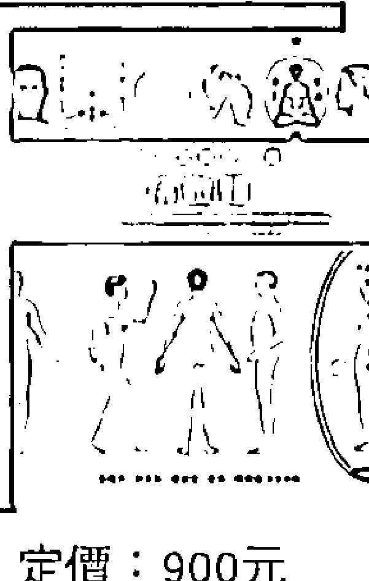

## 精微體

人體能量解剖全書

作者：辛蒂·戴爾

譯者：韓沁林

這是一本能，詳細介紹了什麼是「精微體」，並提出科學證據，說明我們肉眼不可見的量子狀態是如何影響生理方面的健康。全書逾150幅插圖，詳盡描繪能量結構在我們的身體中如何運作。若您對各種不同的能量療法（阿育吠陀、氣功、靈氣療法、卡巴拉等等）有興趣，或是想更加深入了解精神力量在我們的健康中扮演的角色，本冊是絕佳的參考資料。

定價：900元

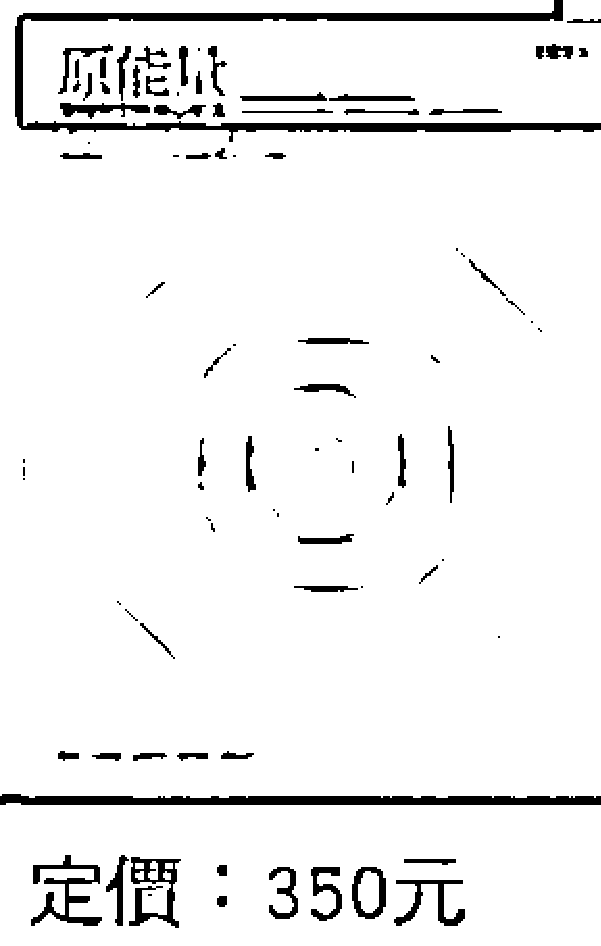

## 原能量

穿梭時空的身心療法

作者：王曙芳

《原能量》從自我療癒之旅出發，展開一份地圖，引領你窺見能量心理學的奧秘、它的多樣豐富，以及它對於二十一世紀的療癒觀念和手法所帶來的深遠變革。作者為多種能量心理療法的訓練師及治療師。本書凝聚她多年的觀察和心得，將方法學的實用指南佐以穿梭時空的精彩故事；從身體意識到前世回溯，從能量訊息場到肌肉測試，你對於自己以及世界的觀感將面臨意想不到的解放與挑戰！

定價：350元

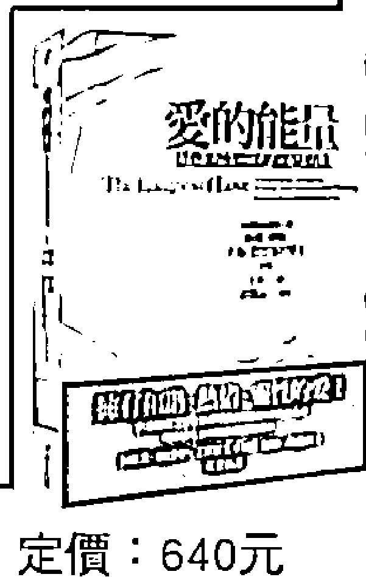

## 愛的能量

活化親密關係的能量療法

作者：唐娜·伊頓、大衛·費恩斯坦博士

就能量角度言，伴侶關係就是兩個獨特能量的相遇。雖然肉眼看不見，能量的舞蹈卻決定了伴侶如何溝通、吵架、愛、和需要被愛。兩位作者在本書中介紹了完整的能量醫療知識和技巧，針對伴侶間常發生的問題，提出具體易行的療癒步驟，使伴侶之間的愛朝正向滋養、茁壯。

定價：640元

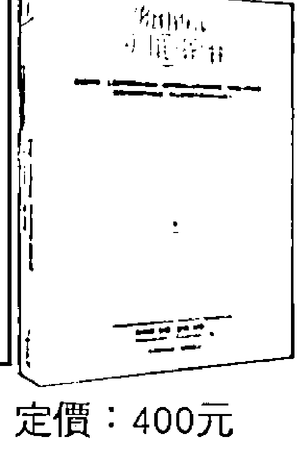

## 你的心就是宇宙

從心的四度空間開展無限潛力

作者：普蘭·貝爾、蘇珊娜·貝爾（Puran Bair & Susanna Bair）

譯者：徐曉珮  審閱：王曙芳

心的啟動，應該是生命偉大成就中的第一要務。兩位作者是精微能量與能量醫學國際研究協會「艾莉絲與艾默·葛林創新獎」得主，他們以能量醫學為基礎，發展出安全有效且威力十足的方法，能拓展心的不同面向、讓心能量活化綻放、療癒身心傷痛、認出我們與他人內在的偉大特質，進而活出渴望的人生！

定價：400元

> > 我們的女性直覺渴望的是愛、合作、公平、同情心、家庭、自然與祥和。——克莉絲汀·諾瑟普醫師（Christiane Northrup）

女性天生就對能量非常敏感，以能量療法增進自己的健康，再適合也不過了。而且，女性健康快樂的話，家人多半也會健康快樂。本書不只幫助讀者本人，更能造福她的家庭、她的女性長輩、姊妹和女性朋友。

美國能量醫療大師唐娜·伊頓身為女性，對女性的身心健康問題特別感同身受。她天生罹患心雜音、得過肺結核、多發性硬化症、心臟病、嚴重低血糖和過敏、乳癌、氣喘，而且像許多女人一樣，覺得每月一次的生理期宛如地獄。她靠著敏銳的自我覺察，與持續探索能量療法的決心，終於治癒了自己。

伊頓指出，荷爾蒙是女性是否健康的關鍵。她在本書教導許多簡單技巧，讀者按照圖示梳理自身能量、調整荷爾蒙，便能改善下列女性專有的身心問題：

- 經前症候群（腹脹、水腫、胃痛、情緒崩潰…）
- 生理期不適（腹痛、腰痛、背痛、經期延遲…）
- 孕期保養（不易受孕、孕吐、陣痛…）
- 更年期症候群（熱潮紅、骨質疏鬆、沮喪、憂鬱…）
- 體重管理（減輕焦慮、阻斷強迫進食、改變食欲模式…）

能量療法和藥物或手術比起來，更精確、更有效，而且極少侵入性。這些方法可以自己進行，不須任何花費。

不管妳是少女還是銀髮族，能量療法都能讓妳重新打造自己，從內到外、從身到心。學會能量療法，擁抱天生自我療癒力，妳會對「永保青春」更加有自信！

- 王曙芳（能量心理療法訓練師、《原能量》作者）
- 胡因夢（身心靈導師、作家）
- 許瑞云（醫師、能量治療師、作家）
- 鄭重推薦（按姓氏筆劃排列）