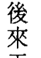
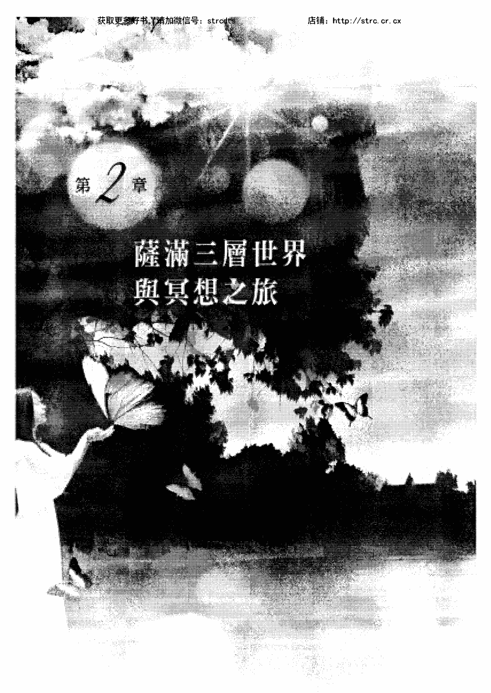
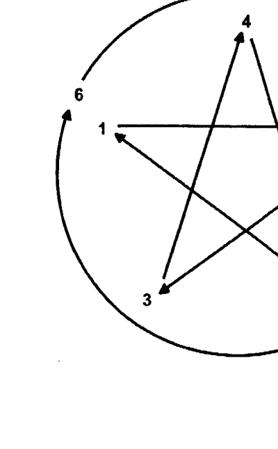
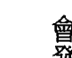

# 女神與薩滿
## 自我啟蒙的神性之路

Marvie —— 著

試過各式各樣的修行法門，卻始終覺得與神距離遙遠嗎？
到底神什麼時候才會回應我的問題呢？
其實，與神對話，真的可以很簡單！
透過薩滿冥想技巧，釋放直覺與轉換意識的能力，
女神正召喚我們憶起靈魂本有的智慧，享受生命每一刻的喜悅！

# St. Royal College
## 天使神秘學院

- 神秘學資料庫
- 神秘學培训机构
- 水晶能量研究中心
- 专业占卜预测机构
- 官方微信：strcdts
- 微信公众平台：strc2011
- 官方店铺网址：http://strc.cr.cx
- 读书交流QQ群：
  - 占星塔罗占卜师交流群：814594478（加入密码：PDF）
  - 神秘学其他综合群：659338717（加入密码：PDF）

微信号：strcdts

# 天使神秘学院

微信公众平台：strc2011

# 制作说明：

本书由《天使神秘学院》出重金从台湾购入的原版书籍扫描制作为达到最好阅读效果，特地把书全部切开后，再经由专业扫描设备高精度扫描完成，并经过一张张的PS后期处理最终成书，其间花费大量的人力、物力以及时间，只为能给大家提供经济并优质的神秘学学习资料而努力。

本学院强力谴责某些机构和个人，把本学院花心血制作完成的电子书籍，包装后直接放在自家淘宝网上低价倾销的行为，以谋取不劳而获的经济利益。如果长此以往最终将无人愿意再为大家花心思制作电子书，那以后可能大家再无新书可读。

为让大家以后能够读到更多的好书，也为了本学院的良性发展。本学院恳请大家尽量做到如下几点：

- 一、尽量在天使神秘学院的官方网站购买电子书籍。

官网电脑访问地址：http://strc.cr.cx

手机微信购买 请扫以下二维码

手机淘宝等购买 请扫以下二维码

加店长微信号 请扫以下二维码

- 二、在收到电子书后小范围传阅即可，千万不要公开传播，更别挂到淘宝网上低价销售。

同时为答谢广大支持者，学院电子书将做如下调整：

- 一、学院会把一些早已收回制作成本的电子书折价销售。
- 二、最新制作的电子书籍会开放打印功能，大家购买后有条件的可自行打印成书。

天使神秘学院 2020年5月

# 女神與薩滿
## 自我啟蒙的神性之路

Marvie —— 著

# 探索生命書系總序
——中華新時代協會創辦人／王季慶

二〇一二年前，眾聲喧嘩，末日預言不絕於耳。一方面，我本著對「賽斯資料」的信任，也祈求他獨排眾議的說法得以證實。簡言之，他聲稱二十一世紀上旬，世界雖然仍有戰事與天災，卻無第三次世界大戰。並且，到二〇七五年時，人類將有一個大同世界！另一方面，即使成為「一百隻猴子的寓言」中的一員，我也想默默地為世界的未來盡一份力，為達成「一體平等」的靈性覺悟而努力。我不敢聲稱自己已開悟，而且我最喜愛的「賽斯」也從沒提過這個詞兒。不過，在求道的過程裡，我無意中悟出「除了神沒有別人。除了愛沒有別的。」（There is No One but God. There is Nothing but Love.）當下，在無邊的寂靜安寧中，我的心中充滿了狂喜與愛，這份愛又滿溢為感恩之情！我體會到我一直在宇宙的愛中，宇宙的愛也一直在我心中。而，世人也莫不如此！不同的是，有沒有體會到，有沒有連上線。在一體平等的感悟中，我謙遜地臣服，自然放心又自在。不由得散播出愛一平等的頻率！於是，完成了告別之作《與神同心—依愛隨行》，我便退休下來。想讀的都讀了，想分享予讀者的也都真誠地寫了下來。此生足矣！

在《與神同心》的後記裡曾提及我的天命——推介與翻譯新時代的好書——已經完成了。沒想到二〇一五年四月，素未謀面的蔣聖光先生，帶著家人約我在中華新時代協會見面。歷經海外創業的艱辛，如今他已是卓然有成的企業家。他開門見山地說，自己讀遍了我推介的新時代書籍，也邀同家人一起鑽研。哇！這讓我立即視為知音，因為，連我都沒有主動要家人研讀呢。

作為一位成功的企業家，可以想見，蔣先生必然是位有主見，有魄力，並且格外有執行力的人。他說，運用從新時代書裡得到的智慧，他成就了他的事業。如今，他想（並且已著手進行）設立出版社。一方面找回一些已絕版的新時代書籍，一方面當然也將眼光放遠，胸襟放大，繼續以自由開放的精神，開創「探索生命書系」，向生命致敬，完全不計盈虧。

由美返臺近四十年了。從一九八九年開始，我正式投入新時代運動。當時，曾將我心中陶煉出來的「新時代運動」七要素，作為選書立說的準繩；並有助於分辨何謂「新時代」這個新「範型」（paradigm）與二十世紀中期前的舊範型有何不同。

這七個要素就是：

1. 我們皆為神的一部分：有神論，但此神並非有組織宗教高高在上的「偶像」，而是無形無相，一切的根源。祂乃是宇宙意識，我們的「源場」，而我們皆為其分出的一小片。祂透過我們每一個來體驗物質世界，完成整個拼圖。
2. 你創造你的實相：你有多生多世的生命，並且是個多次元的存在。因此，不怨天不尤人，為自己的一切負起責任。從而省視自己為何作出如此的選擇，要學習的是什麼。
3. 肯定人生的意義：不悲觀，不耽溺。最重要的是培養清明的覺知和一體的慈悲。
4. 道德的內在性：不盲目跟從傳統，不媚俗。返歸自性，找到內心那一念靈明，依之做人處事。
5. 身心健康是種自然狀態：心理有問題，鬱悶不快樂，自憤或自恨，能量堵塞不覺知時，才會不適。
6. 環境保護：這攸關全人類的存亡。我們不能再視而不見，當作是別人的事。生態環保，人人有責！
7. 無條件的愛：也就是對人的一體大愛，而非在關係中只顧自私自利的比較，爭奪，交換，控制。

至今，覺得那篇文字，還是相當切中新範型的精神。不具權威性和強迫性，新時代不是宗教。它不崇拜偶像，也不自立為偶像。沒有階級組織，沒有教條，沒有戒律，也不等待外在的神明、聖賢、大師來拯救你。

賽斯說，認識自己就是認識神，因為你們都是和祂同一幅料子裁製出來的！

雖然，普羅大眾仍不見得了解新時代的「奧義」。但至少，經過三十年的「百花齊放」，現今社會上也習於其種種的觀念和用語。從生活面的應用：慢活，身心的放鬆平衡，愛自己從而愛別人，更新而平等的親子關係，伴侶關係；到最深的靈性認知：生死學，生態保育，宇宙論，哲學思辨，都或多或少看到新範型的影響。整體而言，社會風氣無形中也改善了不少，好比，雙贏互利，人權以至動物權的伸張，性別平等的推廣，人們彼此相處的包容，體諒與溫暖——此間往往看到人性的光輝！

這個人間世，就是我們的舞臺。販夫走卒，帝王將相，都是我們生前和夢中不斷參與編寫，而於醒時演出的一齣齣好戲。所謂的覺醒，就是參透了鏡花水月，將注意力由外在舞臺返照回來，成為中立的觀者，醒悟自己演出的意義！能如此，就是找回了自性，開始走向返鄉之路。

不知從何時開始，我自覺到我有一項特性：我不會以個人追求自心的明晰、自在與幸福為滿足，仍深愛著人類自古以來種種文化藝術哲學上的成果，為之讚嘆不已！同時，也深深牽掛著人類未來的展望與福祉。當然，也關注著現世的兄弟姊妹，世間的種種困惑和苦難。記掛著、記掛著……不會忘也不想忘，作不了佛家所謂的自了漢。但由於相信自由平等，也從不願將自己的喜好和淺見強加於人，只能以出書的方式，給大家一個提醒和自由選擇的機會。

安然度過了二〇一二年，不過，世局天象，時時風雲詭譎！我有幸活著一天，就要為世界人類的平安幸福努力一天！所以，蔣先生要我寫篇總序，替「探索生命書系」揭開序幕時，我便答應了下來。但願，我過去的努力，促使世界進入新時代，現在則有助於世界邁向黃金時代。

且讓我們共同為未來的大同世界，盡其所能地提供貢獻吧！

# 第 1 章
## 目次

前言 我們都是神 012
我與我的靈性體質 016
被埃及喚醒的恐懼 019
雙面生活的開始 024
搬到加拿大 026
與女神的第一次邂逅 027
快樂的錯覺，痛苦的開端 030
低潮期 033
薩滿信仰帶來轉機 036
了解低潮原因 039
再遇轉捩點

# 第 2 章
## 薩滿三層世界與冥想之旅

### 薩滿信仰簡介 044
### 薩滿冥想之旅介紹 046
### 薩滿信仰中的三層世界 048
### 薩滿冥想之旅的行前準備 050
### 下層世界與守護動物 057
### 中層世界與神聖花園 065
### 上層世界與靈性導師 071
### 精簡版的薩滿冥想之旅 080
### 練習薩滿冥想之旅的額外提醒 084

# 第3章 與女神對話

- 如何與神對話？ 093
- 怎麼辨識神的訊息真偽？ 099
- 怎麼相信自己？ 111
- 何謂快樂？ 131
- 何謂生與死？ 142
- 怎麼幫助他人？ 157
- 何謂愛情？ 170
- 如何擺脫壓力？ 180
- 何謂天堂與地獄？ 195

# 第4章 如何在日常生活中吸收能量

- 怎麼吃出能量來？ 209
- 怎麼睡出能量來？ 215
- 怎麼穿出能量來？ 222
- 怎麼動出能量來？ 228
- 怎麼住出能量來？ 233
- 後記 從神性意識開始啟航 238

# 前言
## 我們都是神

「我們都是神，我們都能與神對話。」若在幾年前看到這段話，我一定難以相信。但這幾年下來，我逐漸了解到，我們都不只是我們現在所理解的模樣，我們比自己想像的要大太多了，每個人都有與生俱來特殊的靈性能力，只是我們選擇遺忘或尚未記起而已。

在靈性感受的路上，我從一開始害怕又自以為是的心態，到了現在了解在於我們原來靈性能力人人皆有的踏實與平凡，也體會到原來在這世界中，每一個人都與我們息息相關，我們不僅是彼此的兄弟姊妹，更是彼此的提醒與支持。用靈魂的眼光來看世界，世界的每個角落不再遙不可及，全部都存在於我們的靈魂之中；用靈魂的觀點來看人生，人生的喜怒哀樂不再獨自承擔，而是由兄弟姊妹一起共同參與。

我們都是神，我們都是神的孩子，傳承了神的基因與血脈，我們也都有神的無限能力來創造自己的生活，來為自己人生作出所有決定，把生命的重心從外界抓回自己身上，把自己的神力喚醒；只要我們改變，眼中的世界就會改變，世界也因此被改變了。讓自己滿足快樂，這世界就是一個滿足快樂的天堂。

# 第 1 章
## 我與我的靈性體質

### 被埃及喚醒的恐懼

我是一個天生具有靈性體質的人，最早對靈性體質感到困擾的記憶，來自七歲那一年。

七歲那一年，當時住的房子附近有一個市立文化中心，那陣子剛好在舉辦「埃及金字塔展」，為了那一次活動，館方從埃及空運很多古文物來，黃金棺木、木乃伊也是展示重點之一。整個展覽期間，文化中心周圍擺放了很多人面獅身像、法老王等各式各樣大型的宣傳物，那段時間只要出門時都會看到。一開始看到還沒感覺，但後來實際參觀展覽之後，每次經過就感覺好像被它們盯著看，好幾次我都會大哭到大人把我抱走為止。

我還記得參觀的那一天，跟著大人排了好久的隊伍，才終於有機會進去展覽場。古文物當然是看不懂，但特別展覽室中有一個玻璃棺，裡面躺著一具包滿繃帶的木乃伊。我記得當時路線設計是繞著木乃伊走一圈後到出口，我一邊走眼睛一邊死盯著它，有一種恐怖又熟悉的感覺，我甚至可以看到它的胸口開始上下起伏，好像它根本就沒死而是活的。看完展覽的當天晚上睡覺時，我就覺得木乃伊要來找我了，我清楚地聽到它移動的聲音，感覺到它站在床邊看我的身影，也看到人面獅身像威嚴地出現在眼前恐怖又壯觀的模樣；我開始每晚狂哭，而且一哭就完全停不下來，那陣子不管爸媽怎麼安撫我都沒有用。吵了好一陣子後，家人終於忍無可忍地對我發脾氣，我也才終於死心安靜下來，不是因為木乃伊不再來找我，而是我知道即使大哭它們也不會走。我一直以為那只是小時候單純對死人的恐懼，長大後才了解，那是因為想起了前幾世的回憶，我曾在埃及時代被法老王下令追殺並殘殺致死，那股死前莫大的恐懼，在我看到跟埃及有關的事物時又被再度勾起。隨著時間過去，我的恐懼並沒有降低，但我找到了與它和平共存的方法。經過書店時，我會刻意避開與埃及有關的書籍，連看到一點點圖片也不行；上了國高中後，歷史地理課本上任何跟埃及古文明相關的課文內容，全都被我用訂書機封釘起來，確保它們不會出現眼前（因此我的埃及歷史與地理都學得很差，哈！）

我小時候也很怕半夜起床上廁所。家裡廚所在廚房旁邊，若真的很睏還好，我可以昏沉地半閉著眼睛從房間衝過去再衝回來；但若已經有點睡飽時我就會緊張，明明要自己不要怕，但內心又忍不住頻頻發毛，因為在一片漆黑中不只看到黑暗而已，我還會看到黑暗的空氣中有一團又一團的「東西」緩慢移動著，就像在黑色盆子中裝水，並在上面滴入墨汁，乍看只是一團黑，但仔細看會看到墨汁隨著水波紋開始擴散移動的樣子，我都擔心若盯著它們看太久的話，它們會不會聚集起來對我發動攻擊。長大開始研究能量後才了解，那只是能量區塊移動的方式。每個物品中（包括空氣）都充滿能量，運作中的冰箱和熱水瓶、陽光灑進來的溫度、空氣中的濕氣、我們的情緒與健康狀況等，都會彼此互相影響，而產生一個又一個動態的能量圈，到了晚上當我們的雙眼不再被光線轉移注意力後，放大的瞳孔就可以清楚看到能量圈的樣貌，它在每一個時刻都或快或慢地移動著，取決於周圍能量的影響。除了夜晚上廁所會害怕之外，我也總覺得我不只是我，但又說不出我究竟還能是誰？每當我努力思考這問題時，就會直接投射出對死亡的恐懼，我不知道自己為什麼活著，卻又被生命逼著有一天要面對死亡？這一切實在太不公平，想到這裡我都會怕到想哭，這個找不到出口的困擾，在我國高中時很常出現，平時白天忙碌還好，但若晚上靜下來一個人時，這個恐懼又會湧上心頭：我到底是誰？可不可以不要死？

### 雙面生活的開始

一直到了十八歲那一年，透過哥哥認識他當時的女友，也就是我現在的嫂嫂 Yoyo，很多困惑才逐漸豁然開朗。

我們第一次見面是在家中，當時家裡只有我們三個人，一開始只是簡單聊幾句，我第一眼就覺得她的眼神很奇特，那是一種「她能一眼看穿我」的直覺，然後才相處不到幾分鐘，我發現自己正在對她講起從小到大的恐懼與害怕，那是我對任何人都無法講出口的。

我當時一面講一面身體不由自主地發抖，連聲音都哽咽起來，她沒有驚訝也沒有安慰我，只是用和緩的口吻對我解釋何謂靈性體質，何謂前世記憶。她跟我講起埃及的過去時，我彷彿回到當時的時空，從小到大看到一段又一段破碎的畫面，也被完整拼湊了起來。我既害怕又慶幸，原來我有靈性體質，原來我對埃及的恐懼不是來自自己的無中生有。

當天晚上我就作了一個夢。
在夢中我走在一條街道上，街上的商店、人群與車輛就跟平時看到的一樣，但我的眼睛居然能看到這些畫面的另一個「層次」，好像每個經過身邊的人事物身上，都浮著另一層跳動的光影與色澤，我一下子看著三維的正常畫面，一下子看著另一層比較模糊的靈性色彩，內心覺得好神奇。
隔天醒來後，回想到前一晚的夢境時，我突然具體感覺到我不只是「我」，這個纏繞許久的困擾突然被具象化成真，然後一瞬間我又回到那個夢裡，只是這一次我就像一個透明的光影般，不停穿梭在不同的人體內，每個人就像一件人皮衣服，我穿穿脫脫這些「衣服」，讓我一下子變老人、一下子變男人，一下子是嬰兒、一下子是小孩。整個過程中，我對自己身體的所有感覺都沒有變，頭腦也能正常思考，我依然是我但卻不只是我，這些奇特的畫面就跟回想前一晚的夢境一樣，啪一聲清楚完整地顯現在腦海中，速度快到好像只過了一秒鐘而已。在這之後，我終於正視自己的靈性特質。在靈性方面，我開始知道自己的體質會讓我看到與產生各式各樣的感受與畫面，我不再用「胡思亂想」或「自己嚇自己」等理由去壓抑它，我知道這些都是靈性體質帶來的結果。在生活方面，自從長期遮住眼睛的罩子被拿開後，我鬆了好大一口氣，但也帶來一些困擾，因為釋放壓抑與壓抑的結果，我能看到的東西變得越來越多。這些經驗真是多到數都數不完。騎摩托車在馬路上曾看到亡靈在奔跑，在宿舍曬衣間看到有靈體穿梭其間，甚至經過負面能量太密集的地方時，身體就會不由自主發抖、心跳加快。我也開始避免去博物館參觀，因為會看到靈體依然逗留在心愛物品旁，尤其在跟戰爭有關的歷史博物館中，會有不少當時死得太突然的亡靈以為自己還活著，而不斷重複生前打仗的模樣。以前住的老房子中有一個房間，小時候只覺得怪怪的，後來才看到原來許多附近過世的「老鄰居們」因為某些原因都習慣聚集在那裡。有一次農曆新年我莫名病了一星期，沒有任何感冒的症狀，但卻整天昏沉醒不過來，被家人勉強叫醒吃一點東西後又會立刻睡去。我一直躺在那個房間中，只覺得那群人圍著我好吵，但卻累到發不出聲音來，一直到年後醫院開了，被家人拖去醫院吃藥打點滴，才逐漸恢復體力，他們也才不敢再靠近我。

大學畢業後，我曾在一間公司短暫工作一段時間，每天回到家時，都會看到兩條小腿周圍出現很多瘀青，當時因為第一次工作很緊張，就沒多理會。直到有一天，來了一個備受老闆信任的算命師來公司調整風水，當時我看他一眼後繼續低頭工作，他看起來老老的，又瘦又矮、眼睛很大、頭髮很稀疏、走路一跛一跛，一副很憔悴的模樣。後來他待了一下午要離開前，我剛好站起來倒水喝，發現他一直用怪異的眼神看著我。我定神看清楚才發現，他竟然長得跟我之前看的完全不一樣，他看來大約四、五十歲而已，而且氣色紅潤、體型福泰。

那時我才了解，我無意中看到養小鬼飼主的真實樣貌，沒多久我就離開了。

離職後我去英國念書，當時跟幾個室友合租一間房子，房子旁有一個很小、只有一個蹺蹺板與幾張板凳的公園，可能因久未上潤滑油，蹺蹺板上下擺動時都會發出尖銳的嘎吱聲，半夜偶爾會聽到那個聲音，卻很少真實的看到有人坐在上面。我的房間在二樓，外面緊鄰著一大片樹叢，常常晚上熬夜趕報告時，從電腦螢幕的倒影中，看到不少亮光或影子沿著樹叢爬到我的房間喧鬧。有幾次我累到趴在桌上睡著時，還有靈體調皮地在我耳邊叫我起來。我知道「了解就是降低恐懼最好的方式」，因此從十八歲那年正視靈性體質之後，我就開始試著大量閱讀各種關於靈異、身心靈、能量等書籍，最大的目的是想找到跟靈性體質和平共處的方法，但讀了好多書卻沒有一個能真正深入內心、使我認同的說法，心裡常不免感到慌張害怕，這跟小時候的恐懼又不太一樣，一個是無端害怕，一個則是知道原因後仍不知道下一步該怎麼走的不安。除了感到無助之外，我也沉浸在擁有靈性體質的沾沾自喜中，我覺得自己好厲害，可以看到別人看不到的東西，但又不敢隨便跟別人分享，怕被覺得我在胡說八道或想像力旺盛，或甚至被當成怪咖看待。如果有人要我去幫忙抓鬼或解決卡陰怎麼辦？我連怎麼保護自己都不知道啊！就這樣長達十幾年間，靈性體質跟我之間只存在一個淺層的關係，它就像一件披在身上的不合身外套，我喜愛它但卻不知道怎麼讓它跟其他衣服搭配，也不敢自在地穿它出門。因此在尚未找到解決方法前，我只好繼續隱瞞下去，雖然有時候也覺得寂寞。

## 搬到加拿大

後來工作幾年後，我留職停薪一年到日本學日文，在那段時間認識了我現在的先生，兩人交往後決定結婚；他來自加拿大，所以婚後我就跟他一起搬來加拿大居住。剛搬來時一切既興奮又美好，但新鮮期過後，對新文化、新環境、一切新事物開始產生適應問題，加上等候居民身分期間無法工作的無聊，即使先生只要有空就會盡量帶我出去散心，我依然常常感到寂寞。我懷念以前生活的忙碌，也懷念家人朋友陪在身邊的日子。但當時我卻不認為自己不開心，或者說不願意承認我是不開心的。當寂寞的念頭湧起時，我甚至會責備自己不知好歹、抗壓性低，世界上過得比我辛苦的人多得是，我每天吃飽穿暖又不用工作，到底有什麼好抱怨的？內心越寂寞，我的自責就越深，也越不准自己抱怨與示弱給別人看，因此連老公與家人都不知道我內心的寂寞與痛苦。

然後過了一年，我懷孕了；懷孕生產後，我開始一個人在家帶小孩，每天除了照顧小孩之外，自己的時間更被嬰兒的作息緊緊綁住，我發現我離過去隨心所欲的生活越來越遠，內心也越來越焦慮。

> 「當外界找不到答案時，人們會開始走向內心。」

那段時間我又回到拼命找身心靈書籍與文章來看的日子，所有圖書館內能借到的、書店能買到的，不管感不感興趣我都一併吞噬下去，只為了找到內心的平靜與解答，有時候覺得自己充滿靈性，有時候又覺得一切只是自我安慰而已。

## 與女神的第一次邂逅

我記得有一天午後趁孩子睡覺時，我一個人坐在房間思考關於「神」的問題，我相信宇宙間有一個創造萬物的偉大力量存在，但我卻不認為「祂」專屬於任何一個宗教，也不知道祂在哪裡？祂住在高聳的雲端？還是看不盡的宇宙深處？祂到底長什麼樣子？祂創造我們的目的又是什麼？ 我東想西想一陣子後覺得很累，就坐在床上閉眼休息。

那是一個晴朗的午後，明亮的日光從房間的大窗戶透進來，這個光亮讓我閉上眼睛時，也能「看」到眼前的白亮光影。不久後，我突然看到白色亮光中開始出現橘紅色，就像在一片白布上潑灑著紅色、橘色、黃色的色塊，顏色之間自然地交疊卻不交融。慢慢地，色塊與色塊之間的亮度加強，就像有人用強光照著我閉上的眼睛一樣，但卻不感到刺眼，我的頭腦來不及解讀，而深層的感受已被打開，內心充滿無限情緒，自己被周圍一股無法形容又濃厚的愛包圍著，就像走失好久終於在慌亂中找到家人的安心，但這個愛又跟親情的愛很不一樣，它更大、更深、又更全面，我忍不住哽咽地對眼前的光亮問道：「你是神嗎？妳就是萬物的母親嗎？」
祂用一個充滿慈愛的聲音回我說：「妳怎麼到現在才來找我？」
那天下午我哭了好久，我甚至不知道自己究竟在哭什麼，只覺得心裡面那股深刻且巨大的感受，非得透過淚水才能稍微宣洩出來。整個下午到晚上上就寢前，我眼睛所見的每樣事物都充滿光亮的色彩，好像宇宙母親對我不斷強調，祂就在我身邊的證明。

## 快樂的錯覺，痛苦的開端

難道從此便開啟了我與萬物母親的機緣嗎？我的寂寞感是否因而減緩許多呢？一切當然沒那麼簡單，甚至長久下來的「雙面」生活在此達到痛苦的極致，但也找到圓滿的解答。

那天下午之後，我開始很努力地想跟女神再度對話，但都沒有成功，我開始懷疑是不是自己想像力作祟？但又覺得自己明明比別人更有靈性不是嗎？還是我沒有定時打坐冥想，所以女神在懲罰我？還是我應該更努力讓靈力有所提升？但究竟要怎麼努力呢？煩惱好一段日子後，有一天中午下著傾盆大雨，我狼狽地拿鑰匙要從後院進到屋內時，突然看到後院地上，有一顆從未看過的白色石頭獨自躺在滂沱大雨中，它的顏色讓它在泥濘的土地上看來像在閃閃發光一樣；我看了一眼，原本要跨過去忽略它，但又覺得它好像在呼喚我，我直覺它是某個人要給我的禮物，所以將它撿起來帶到屋內。過了好幾年後我才知道，那個某個人就是未來的自己。那天我將石頭帶回家後，把它放在掌心，只覺得冰冰的很舒服，它簡單的形狀也令我越看越喜歡，好一陣子我都將它放到包包裡隨身攜帶。有一天我到圖書館找書，在閱覽室中，我翻到有一本講著「人人都有靈性大我」的書而陷入思考，我把白色石頭放在桌前把玩著，一面想著真的有靈性大我嗎？我又怎麼知道我的靈性大我是誰？突然間，在我腦中聽到自己的聲音回答我，就好像在腦中自己與自己對話一樣，只是沒有真的發出聲音來。一開始我以為只是自言自語，但後來發現聲音開始講出許多我從來都不知道的訊息，也就是說，我能控制我一開始有點害怕，四處查看是不是其他靈體在惡作劇，但卻又沒有。所以我又繼續試探性問了「聲音」一些問題，它又繼續講出更多我沒聽過的內容，它告訴我它就是我的「靈性大我」，它告訴我它的名字，我開始跟我的靈性大我對話。我從最初的小心翼翼，到後來索性豁出去，一股腦提出關於自己的前世今生、靈性能量等各式各樣我能想到的問題，我一隻手握著石頭，另一隻手趕緊將內容記錄下來，深怕又跟上次女神的經驗一樣，錯過之後就不再出現了。然而那天之後，這個經驗再度不斷出現，以前我只能單方面看到與感覺到各個靈體能量，但我現在居然能跟他們雙向通話，包括各種人靈、動物靈，或在不同時空裡的神明等，我都能隨時隨地、隨心所欲地經由對話與他們產生連結。一開始我還需要握著白色石頭幫助專心，但練習幾次後就能憑著自己的意識做連接，我當時覺得自己好了不起，就像找到時光隧道一樣，自己可以透過對話進出各個時空，我跟自己說，原來空虛寂寥的問題，但卻控制不了回答問題的聲音與內容。

## 低潮期

感受，只是為了提升自我靈性力量的完美安排而已...... 但隨著興奮期過去，我越來越疑惑，甚至在我與別人的對話中，越不常發生其他聲音闖入並給出不同答案的狀況，而且越來越多能量透過「對話」來找我，我開始覺得不堪其擾，更不知道到底要聽誰的？我害怕若不回覆它們，會不會被報復？或者有一天我會被其他力量控制而不自知？當我發現恐懼大大凌駕原先的優越感時，我終於放棄所有的對話與連結，不再回應或主動跟任何能量接觸，這個「保護自己」的決定，卻也令我心灰意冷好一陣子。因為我又回來面對原有的空虛寂寞，原來靈性對話不是出口更不是解答，甚至可能跟證明是否有靈性一點關係也沒有。

然後漸漸地，我開始害怕睡覺，每次躺上床時，我都莫名害怕自己會不會睡不著？隔天醒來後除了慶幸自己前一晚有睡著之外，又開始擔心當天晚上怎麼辦？周而復始之下，終於有一天，我依然清楚記得那天是十二月二十四日聖誕夜當晚，我居然徹夜失眠，怎麼躺都睡不著，然後接下來第二天、第三天、甚至整個星期我都睡不著。我整個人被嚇壞了，我開始試著喝酒、吃助眠劑，但都沒用，直到家庭醫生幫我開處方箋的安眠藥，才在藥物幫助下終於睡著。我吃了幾天後覺得好一點，開始想停藥，結果發現當晚又再度睡不著，隔天心情更沮喪，多次嘗試失敗後，我就再也不敢不靠藥物睡覺，但也讓我自己徹底失去自信。

我連最基本的睡眠都需要靠藥物，我到底怎麼了？
白天的生活更糟糕，每天醒來後我就焦慮當晚可不可以不吃藥？但若再吃藥我就更指責自己、更看不起自己。然後我突然覺得再也不認識自己了，我不是過得好好的嗎？一個每天吃飽穿暖的人，怎麼有資格心情不好？我到底是誰？我是不是又吃飽撐著、自尋煩惱？一直『很幸福』的我根本連煩惱的資格都沒有。

就這樣在身體與心理的雙重煎熬下，我的胸口一直很冰冷也很痛，但又擔心這樣的自己會影響到孩子，所以更努力地壓抑情緒。不斷惡性循環的結果，我走在人群中開始會感到害怕與自卑，我好怕被別人覺得我不正常，路人看我的眼神都彷彿在嚴厲地跟我說：『對！你有病！你最好離我遠一點。』甚至有一天，我一個人走在高架橋的人行道上，只覺得胸口好痛、內心好沉重，我不敢相信這麼有靈性的我居然心理有病，我難道有憂鬱症嗎？然後我看向旁邊車輛奔馳的快車道，突然想著『會不會跳過去就可以一了百了？』但隨之又被這念頭嚇一跳，想到孩子與家人的愛，趕緊逼自己離開那個地方。後來先生與小孩陪我回一趟台灣，在親人的安慰鼓勵下，我逐漸戒掉安眠藥，但卻怎樣都找不到回加拿大的勇氣。很感謝我的公婆提議幫我帶孩子，讓拿到工作許可的我可以去找工作，加快適應新環境的過程。而嫂嫂也提出建議，要我將之前看了⋯一堆書也做了一堆研究的想法，一一整理成文章，每星期在『Yoyo 心靈角落』網站上刊登。因此我在家人滿滿的支持下，又再次回到加拿大面對未完成的生活。

## 薩滿信仰帶來轉機

當初還在台灣時，我開始思考要寫哪方面的文章，後來想到「薩滿信仰」這個比較少被提及，我卻相當喜歡的大地信仰。所謂大地信仰就是崇拜敬畏大自然的一切萬物所建立的信仰。用「信仰」而不是「宗教」二字，是因為它最早來自口耳相傳，沒有任何明確教條與規範將它記錄下來，也因此它不受任何機構與社團所左右，它是一個自由的信仰，來自每一個接觸者自己的解讀與體會。

我從小就對任何形式的政治理念都不喜歡，當然工作上需要體制規範才能方便每個員工執行，但思想上不應該如此，任何被外界要求的思考方式，即使對執行者來說比較容易，但也相對的抹殺每一個人獨立思考判斷的自由，這也可能是我一直沒有接觸任何宗教的原因，因為我想用自己的方式去理解眼前的世界與人生。

但這不代表宗教不好，我相信世界上的每一個正規宗教理念都起源於同一個中心，那就是對世間無邊無際的愛。但每一個宗教一開始都先被信徒解讀後，才被記錄與整理成書籍、教義、儀式等規範，然後再由下一個後人再度解讀，然後再繼續傳承給追隨者而延續下去。每一個解讀都是一個人的觀點，都會滲入根據個人經驗而下的主觀判斷，甚至還可能會加入當時的社會政治理念，或傳道團體的利益考量等。直到最後，到底最初創教的中心理念還剩下什麼？還是已經被淹沒於時代洪流之中？包括我自己也是，我對薩滿信仰的解讀也代表一個主觀意見，而這個意見最適合的人是我自己，並不是你、也不是他。目前在北美有不少有關薩滿信仰的工作坊與團體，但大多以傳達自然大地的愛及幫助感興趣的人與自然萬物連結為主，很少有社團會倡導正統或唯一性。當你真的對大地與世界萬物充滿愛時，就會發現沒有任何事物可以單獨存在，任何的「唯一」只會讓自己離自然萬物越來越遠，沒有人可以單獨活著，沒有生命可以獨自延續，每一個「一」都等於無窮無盡，每一個無窮無盡都是「一」的化身。但最初我真的沒想那麼多，自從低潮期之後，我就隱隱將低潮原因怪罪到「靈性體質」與「身心靈書籍」上，畢竟這兩樣事物在痛苦時對我並沒產生多大幫助。因此我用學者的態度來研究薩滿信仰，除了閱讀薩滿信仰資料之外，我也只把靈性體質拿來當作測驗薩滿儀式是否可行的工具，我讓自己盡量站在第三者的位子，用理性客觀的角度撰寫每星期刊登的文章。但後來我發現，每次寫文章時，我的內心從一開始的冷靜，逐漸變得滿足與開心，薩滿信仰裡有一句話：「我們都是大地之母與天空之父的孩子，我們與世界萬物都是兄弟姊妹的關係」，讓我深思很久。當時我已回到加拿大，雖然不再需要依靠安眠藥入睡，但我對自己仍然很沒自信，我擔憂我目前看起來「似乎沒事」會不會只是假象？會不會有一天又突然失眠？所以每一晚睡前我依舊會緊張。自從讀到這句話後，只要緊張情緒又湧上心頭時，我就會閉上眼睛去呼喚內心的兄弟姊妹：「現在世界上跟我一樣擔憂失眠的兄弟姊妹何其多，真的睡不著也有他們的陪伴，而我的大地母親與天空父親也會陪著我，不管發生什麼事情，我永遠都是宇宙的一分子，擁有他們與兄弟姊妹的愛，我永遠不是一個人，害怕也沒有關係。」然後我就會覺得心裡很溫暖，就像躺在母親懷抱中一樣安心並慢慢睡去。

## 瞭解低潮原因

隨著寫文章次數變多，我也漸漸發現，每次在寫文章時，周圍都會閃著一點一點的亮光。一開始我以為是靈性大我或守護動物帶來的，後來才知道這些都來自我自己，我已經無法只用旁觀者的心態來研究與記錄薩滿信仰，薩滿信仰已經被我內化進來，成為我自己的一部分。雖然提筆寫作的人是我，但當我開始把思考付諸為文字時，每一個字就像一個鮮活的生命，我會寫出什麼內容？我自己真正有什麼感受？甚至我能從中學到什麼？在文章尚未完成前，我自己也不知道。

我不是將「已知」的內容寫出來，反而是從「未知」的角度出發，透過寫作的過程來告訴自己答案；也可以說藉由寫作過程，讓我了解自己究竟知道什麼，在這當中我既是作者也是讀者。我逐漸發現，冥冥中有一個力量帶領著我，一開始我以為這力量來自之前對話的大地之母或靈性大我，但又覺得不只是如此，尤其在低潮期之後，我已經不再主動跟任何靈體能量溝通，即使聽到聲音也會選擇不聞不問，那段日子我只專注寫文章，但卻出乎意料地發現，每一個打出來的字都變成我的老師，它變成我「自學」的過程。
其中最大的收穫，來自於領悟到「對情緒誠實」的重要性。情緒來自於每個人的「感覺」，但我們卻很常用「頭腦」去欺騙與左右自我情緒，我之前的低潮期就是一個絕佳的範例。我明明覺得寂寞孤單，但卻用「頭腦」去告訴自己這樣是「不合理」的，也覺得跟別人求助是「沒面子」的，因而一再用頭腦指責自己的感受並將它壓抑下來，最後「感覺」只能越來越用力地想辦法引起我注意，這就是失眠的原因。
因此我開始正視自己的每一個感受，是真的快樂，是真的生氣，還是為了面子假裝快樂？是真的生氣，還是因為別人的做法呼應了自己本身不願面對的缺點？不管是缺乏自信或顧慮面子，都是很重要的情緒，即使很不好受也不應該忽略或假裝沒事。

另一個領悟是「我們都握有主控權，一切來自自己的選擇」。當我們以為被推入死胡同中，事實上這個胡同也是自己蓋起來的。我以為我為了照顧孩子而被生活綁住，但事實上這也是來自己的選擇，我可以選擇為了逃避壓力而拋夫棄子離開這裡（最糟糕的選擇也是選擇的一種），當然也可以選擇跟現在一樣，鼓起勇氣面對壓力；我可以選擇不斷跟他人做比較，也可以選擇不想太多、過好每一天就好。我們手上握有太多太多的選擇，沒有人真的「一毫無選擇」，也沒有真正的「無可奈何」。
出於同樣的道理，因為作選擇的是我們，所以任何事情的最大受益者都應該是我們自己，不管是做善事幫助人或努力賺錢，都是因為這樣做帶給自己「快樂」，我們才去做，我們是最初決定者更是最終受益者，把選擇權交回自己手上，生活也會變得輕盈許多。

## 再遇轉捩點

就這樣過了幾年後，一切似乎漸入佳境，老二也出生了，日子過得順利又舒服，但我內心又隱隱覺得事情好像不只如此，一切彷彿只是「萬事皆備、只欠東風」的「安排」，只是不知道這股東風何時會吹來？

某一天東風終於吹來了，但它卻跟我想像的不太一樣，它不僅是一股兇猛的強風，還把我吹得顫抖哆嗦。它發生在某次回台灣探親的晚上，我夢到我被一股黑暗的力量一路用力拉扯到生命的盡頭，它很大聲地問我：「你真以為一切都很篤定嗎？你逃得了死亡嗎？」盡頭處是一個懸崖，底下是深不見底的黑暗虛無，它逼著我往下看，我不抑制地掙扎大喊「不要、不要……」，然後尖叫到醒來，覺得胸口被刺穿一個大洞，冰冷到我冷汗直冒、大口喘氣。

隔天晚上又再發生一次，那股力量又回來而且程度加倍。它更大聲地問我：「你知道死亡後會怎麼樣嗎？你會消失！你不見！當一切都沒有了，你該怎麼辦！！！」雖然這次沒有被拖到懸崖邊，但我依舊被嚇醒，我看著漆黑房間的天花板，聽著震耳欲聾的心跳聲，腦中亂哄哄的，充滿恐懼與不安。夢境的巨大真實讓我一下子覺得老了好多，我好害怕死亡，我怕我愛的一切終會消失，我怕自己會不見，我開始去尋找死亡的答案，然後無意間我看到一本書叫《與神談生死》，並且經由它也開始閱讀同一個作者所寫的、坊間很著名的《與神對話》系列書籍。在閱讀的過程中，又讓我時隔多年再度看到女神，但這一次感受卻跟上一次很不一樣。當我用不同心態面對自己的靈性力量時，它失去了高高在上的優越，卻多了平凡舒服的喜悅；因為我們都是大地之母的孩子，大家都是又偉大又渺小的存在。這樣的改變讓我在再度感受到女神時，內心少了驚喜，卻多了自在與平靜。女神陪著我把這套書看完，甚至那些我閱上書後反覆思考的問題，也會在下一次翻開書時看到解答；一切就像被計劃好的課程一樣，我只需要乖乖去上課就是了。在這段大量思考的過程中，心中也產生不少對生命的疑惑，我終於忍不住直接詢問女神，並得到三個答案：

- 一、所有關於我們生活疑問的答案，從來不是從未知變成已知，而是本來已知，只是遺忘，然後又回想起來的過程（與我寫文章的經驗吻合）。
- 二、每一個人都有與生俱來的靈性體質，只是憶起時間點的早晚不同而已。
- 三、我們都是神的孩子，更是祂的化身（與薩滿中心思想不謀而合），我們都可以透過自己內建的神性直接與神對話。

女神、神、佛祖、耶穌、穆罕默德等等都來自同一個地方，就是我們自己，我們就是神的化身，我們都一樣偉大神聖，也一樣絕無僅有。我們與神的關係就像我們與父母一樣，我們來自於他們的血脈基因，但又有獨立的個性與人生，即使乍看是兩個獨立的個體，卻不等於我們失去了原先的根與力量。這也是我喜歡用「女神」這兩個字來指稱「神」的原因，因為祂是如同宇宙母親般的存在，但這不代表祂的性別、長相或是任何定義，任何我們喜歡的稱謂，祂都會喜歡，因為我們都是神的一部分。周圍的萬物也都是祂的化身，每一口空氣、每一股微風、每一束曬在身上的陽光，都有它們獨一無二的意識，連每一件發生在我們身上的事情都是有意義的，一切都是為我們量身訂做的安排，我們是一切生命的主軸，活在每一個當下也作出每一個選擇。

慢慢地，這股『東風』又把我吹回女神身邊，也吹醒了內在的神性；原來平靜無法藉由壓抑而獲得，而是藉由接納一切恐懼，才能讓愛釋放。
希望我們能對自己少一點責備、多一點包容，我們才能同樣地對待他人。

相信只要更多人的神性被憶起，當初造物主創造世界的愛也能一點一滴被還原與再創造，讓我們活出神的世界來。

我相信這一切的根基，都來自於學習薩滿信仰的理念與練習，讓它幫助我找回內心的平靜，也體會到原來我們都是平凡卻又獨一無二的個體。

想要學習如何與神直接對話嗎？讓我們一起從薩滿冥想之旅開始練習吧！

# 第2章
### 薩滿三層世界 與冥想之旅

### 薩滿信仰簡介

薩滿信仰（Shamanism）是大地信仰的始祖之一，來自遠古時期人類對大自然力量的崇敬與觀察，並從中學習而發展出一系列與自然大地有關的儀式與信念。目前關於薩滿信仰的理論，大部分是依據薩滿大師麥可·哈納（Michael Harner）的研究而來。身為人類考古學家，他是第一個有系統地將薩滿信仰儀式用現代人比較容易了解的書寫方式記錄下來的西方學者，很多人對薩滿信仰的初步了解都來自他的書籍，也有人稱他為「薩滿之父」。

但即使如此，令人遺憾卻也很慶幸的是，目前我們所知的薩滿信仰依舊支派眾多也難以統一。這來自兩個原因：一是薩滿信仰歷史十分久遠，長年下來散布範圍過於遼闊；二是流傳方式大多依靠口耳相傳，缺乏文字記載，但也因此更符合薩滿信仰的核心精神。

薩滿信仰核心強調的是尊崇並珍惜一切宇宙自然的創作。微風、陽光、森林、岩石、動植物、人類等等，每一個都是宇宙間最完美無瑕的代表；薩滿信仰不是偉大的高山或宏偉的海洋，更不是浩瀚的銀河，它就像空氣一般毫不起眼卻無所不在，甚至不需要去定義何謂薩滿，或將它歸類為某一套理論或某一個宗教。這些都不重要，因為「愛的感受就是愛本身」。若用放大鏡來檢視分析愛從何而來，也等於中斷了體會愛本身的感受。若用薩滿一字來區隔薩滿或非薩滿的定義，也等於中斷了體會大地之愛的美好。只要對世界充滿了愛，無論任何宗教信仰，都會將我們帶到愛的懷抱中，帶著珍惜之心去呼吸、感受、體會每一瞬間的美好，眼前的一切都會令我們充滿感激。因此薩滿信仰為何難以有教條或規範？因為它的重點在於感受與體會。你無法教人呼吸，或將呼吸的方法規範下來，因為它是每個人與生俱來的能力。一個生活裡的信仰就應該如此，不需要任何規範與理由，所有建議都只是參考用，目的是為了幫助我們更進一步體會與感受自己，多次練習後也能將它轉化成自己更喜歡的方式，得到更深的了解與愛的感受，讓它成為為我們量身訂做的信念，隨時思考、調整、改變，隨時隨地感覺大地裡流轉不息的愛。

### 薩滿冥想之旅介紹

薩滿信仰相信，一般人在三維世界中生病或面臨厄運的原因，可能是本身的非三維意識面臨失衡，而薩滿巫師的工作就是進出病人的非三維意識中，將失衡的狀況導正回來，讓三維世界的肉身能夠康復。薩滿冥想之旅（Shamanic Journey）就是在兩個意識中互相轉換的方法。

簡單來說，三維意識就是我們目前所知的世界，包括摸得到的形體，例如桌子、椅子，延伸到社會、法律、國家等社會普遍的規則；非三維則是抽象與能量的，包括感受、想像力、夢境、意念等，也可延伸到靈體或靈界等不同的能量呈現。通常我們生活中的三維與非三維意識都是同時進行的，就像我們經歷某件事情時，內心也會同時湧起感覺；或因為某個感覺湧起，而讓我們對某個物品特別關心，道理是一樣的。即使社會上大多只重視三維的物質意念，但不管承不承認，夢境與直覺所帶來的感受，依然具體影響著我們每天的生活。

薩滿冥想之旅的用意就在這裡，它讓我們學習正視非三維意識的重要性，並在必要時讓兩者相互協助、相輔相成，讓我們對意識的轉換更有知覺。學會之後將會發現，摸不著也聞不到的非三維世界，並非如此虛無飄渺，甚至裡面隱含著超乎想像的豐富訊息。

然而，薩滿冥想之旅並不是唯一途徑，它只是進入並解讀非三維訊息的許多方法之一而已。有些人透過禱告，或跟我一樣無意間憶起原有能力的也大有人在。這是一個以大地之愛為基礎的方法，只要抱持著愛自己與愛世界的一顆心，不用擔心去冒犯誰，或忤逆自己原有的宗教信仰，因為我們誕生於大地的愛，不管透過哪一個方法，最後也都會回到愛的懷抱。

它當然也沒有後遺症（除非你一天試太多次，最後頂多也只是覺得有點頭暈疲累而已），對你的生活也不會有任何負面影響（初期不成功感到挫折應該不算吧）。

### 薩滿信仰中的三層世界

薩滿信仰中有一個「世界樹」的觀念，下層世界是「樹根」，也就是大地萬物的根源與基礎；上層世界是「枝葉」，用來接收來自靈性大我與神性的訊息；中層世界是「樹幹」，除了做為上層與下層世界訊息的傳遞管道之外，也是上下兩個世界所共同孕育的成果。

下層世界的「樹根」代表「潛意識」，表現在「身」上。中層世界的「樹幹」代表「意識層」，表現在「心」上。上層世界的「枝葉」代表「超意識」，表現在「靈」上。

但這只是方便分析的說法，並不表示三個世界各自分開，相反的，三個世界彼此合一且緊密相連。在身體狀態中，能看到心情與靈性的發展；在命運看法中，也能反映出身體與心理的狀況；在情緒展現中，也能表達出身體與靈性的詮釋，彼此互為彼此的一面鏡子。

薩滿信仰認為，動物、植物、太陽所給予的全能力量，就是地球上最基礎力量的來源。各個能量之間不僅相互幫忙，更能在大地之母的懷抱中和諧溝通與生活。而相對的，若各個能量出現了相互抵觸與攻擊的情形時，宇宙之間將會失衡，這就是災害會產生的原因，因此如何和諧地與所有能量和平共存，如何讓世界樹強壯穩固地生長下去，一直是薩滿信仰裡的核心概念。而「薩滿冥想之旅」就是進出與了解「上層、中層、下層世界」的方法。

### 薩滿冥想之旅的行前準備

#### 音樂、時間、情緒

在進行薩滿冥想之旅前，請先找一個不受干擾的空間與時間。有些人喜歡盤腿或靠牆而坐，我自己則喜歡躺在床上放鬆四肢，這可避免腳麻或腰痠等不舒服而影響過程。若躺著容易睡著的話，建議在精神狀態好時進行，或選擇斜靠在窗邊讓風吹進來振奮精神也可以，甚至喜歡的話，車庫或陽台也是很好的地點選擇。

此外冥想習慣因人而異，我自己冥想時喜歡閉上眼睛，但若你閉眼反而容易沒安全感或睡著的話，也可以一邊坐著冥想一邊將眼睛低垂往下，看下方某個固定位置，習慣躺著的人則可以靜靜看著天花板某一個地方就可以，主要是讓自己舒服自在但又不至於睡著。

而音樂也是一個輔助冥想的好幫手，音樂不僅可增加專注力，它也能有效隔絕外在噪音。傳統薩滿巫師進行薩滿冥想之旅時，會請助手在一旁打鼓或搖沙鈴。通常建議樂器節奏為每秒四到五拍、全長十五分鐘是最適合的。若選擇敲鼓的話，在冥想之旅快結束時，請朋友緩慢敲四下鼓聲，再快速敲四下，如此重複一快一慢的節奏，提醒你慢慢回到現實世界來。若找不到別人幫忙時，也可上網下載冥想鼓聲音樂，或自己事先將鼓聲節奏預錄好也很方便。若有些人覺得鼓聲很刺耳，比較喜歡蟲鳴鳥叫聲也可以，只要能有效幫助自己放鬆下來專注冥想都是很好的選擇。我會建議將它當成一個有趣的自我認識過程，開放心胸、用好玩的態度去多方嘗試，漸漸會找到一個最適合自己的輔助音樂。我自己的話則喜歡將窗戶打開，耳朵聽著窗外各種外界聲音，讓自己慢慢從三維意識抽離開來。另外，一個人平均最佳專注時間為十五分鐘，即使過程中還有問題沒問完，或是覺得只差一點點就要成功了，仍建議不要耽誤回來的時間，下一次再試就好。若超過十五分鐘就太長，容易遺忘細節；少於十五分鐘又太短，不夠累積經驗。過長或過短都會影響下次行程前的心情。此外冥想之旅前，建議先確保當下的情緒是「相對穩定」的。相對穩定的意思不是說不能有煩惱或擔憂，通常也是因為有煩惱，才想要詢問守護動物或心靈導師。而是若你當下情緒起伏很大，如剛哭過或情緒激動時，建議先讓情緒慢慢平復後再進行比較好。要不然激動的情緒很容易消耗專注力與體力，不僅不容易成功，最後反而會因為失敗而更加沮喪。

進行之前也可以先跟自己信仰的神祈禱，祈求祂們的陪伴與保護力量。若沒有特定的宗教信仰，可以試著默念以下內容：「我是被宇宙萬物深深愛著的存在，我是安全並受到保護的，在我進行薩滿冥想之旅時，這份愛也會無所不在地陪伴我，讓我能圓滿地將答案帶回來，帶回內心的愛裡面」。

### 設定結界

進行薩滿冥想之旅前，也建議先將周圍的「結界」設立好比較安心，「結界」一詞簡單來說就是「保護」。

通常親密的家人朋友之間常有心電感應，一方身體不舒服，另一方也曾莫名覺得不對勁；有些媽媽們能一眼看出小孩當下的心情與身體狀況，這些都是因為愛，愛將自我能量投射到對方身上形成保護網，對方的狀況也能立即回傳，更能對外界釋放「他是被保護的，請勿亂來」的警告。施行結界的方法來自於「自我意識」投射，意識產生能量，堅定強大的意識就能產生出堅定強大的能量。進行冥想之旅時，建議將周圍結界先設立好，讓自己不容易在過程中被外界打斷，並且也可讓住家更安穩舒服，以下說明簡單的結界設立方法。

### 為居家設立結界：

-   一、點燃一炷線香（線香味道以自己喜歡為主，下面可放一個托盤，承接掉落的香灰）並用平常不來寫字的那隻手拿著。
-   二、走到欲設立結界的房間，若想要全家都設結界的話，建議每個房間分開做，會比較完善。
-   三、若有特定信仰，此時請召喚信仰的神明來陪著你；若沒有信仰，可以請大地母親幫助你。
-   四、然後在要設結界的房間內，對著各個陰暗角落，或任何「感覺」奇怪的地方，將平常寫字的手的食指舉起，對這些地方畫上五芒星（正星星）符號，結束後再用同樣食指畫上一個圓圈將星星符號包圍起來（畫法請參見第五十六頁）。另一隻手則拿著線香托盤，一邊畫一邊祈求神明或大地力量幫助你，口中說著「請神明／大地母親幫助我，讓這個房間平安舒適」。
-   五、慢慢來，若擔心做得不對，可以在同一地方重複下結界沒有關係。
-   六、確定每個地方都完成後，將仍在焚燒的線香放在該房間中央，旁邊點燃一個蠟燭，為了避免干擾線香味道，建議用無香味蠟燭比較好。若房子大，一次做不完，也可分幾天進行。
-   七、注意空氣流通及火焰安全，蠟燭與線香燒完後結界即完成。
-   八、每隔一陣子，看居家大小與自我感受而定，可重複上述步驟確保結界品質。

以能量上來說，線香跟蠟燭的差別在於：線香的能量屬性為「直接導引」，蠟燭則是「穩定加強」，若一個空間已藉由線香將能量導引至各個角落，蠟燭能穩定並加強它的效果。

### 為自己設立結界：

向神明或大地力量祈求協助，並用寫字那雙手的食指在自己身上重複畫上五芒星，並畫上圓圈將星星包圍起來穩定效果（畫法請參見第五十六頁）。

### 為他人設立結界：

若想保護的人在身邊，一邊祈禱一邊在他身上畫五芒星與圓圈符號（畫法請參見第五十六頁）即可。若不在身邊，一邊祈禱一邊想像在對方身上畫五芒星與圓圈，重複好幾次都沒關係。

結界能量的不同長相，來自下結界者的不同心態，我曾看過寺廟中佈滿密不透氣的結界場，雖然好能量不會跑走，但壞能量也出不去，一踏進去就有種窒息悶熱的感覺。真正好的結界是包容的，同時允許正負能量存在，但不允許負面能量使壞。

### 結界畫法：

舉我家中的結界為例，負面靈體雖然進得來，但也會路過不會久待，因為結界告訴他們「這裡不適合你，快走吧」。雖然很少見，但偶爾也有靈體不願離開，通常他們也不至於傷害家中的人，因為他們只要一出手就會被結界的電網攻擊。當然若真的遇到強大的靈體，還是找專人做居家氣場淨化，或放上儲存淨化能量的水晶等物品來輔助會比較好。

### 下層世界與守護動物

薩滿的下層世界是一個更接近原始、天然、真實的世界。它是世界最原始的狀態，也就是尚未被文明影響前的模樣。它能帶我們回到剛出生時最直接的單純意識。透過「薩滿冥想之旅」到下層世界時，常會看到沙漠、海洋、荒原、高山等景象，這些都是世界「未經過包裝」前的模樣。但也千萬不要被三維的經驗影響而覺得沙漠應該是滿片沙、海洋應該是一片藍，冥想之旅的目的就是把意識轉換到非三維意識中，它是一個充滿直覺與感受的世界，我曾經到過像果凍般的海洋，也去過飄在半空中的高山，開放心胸、不帶成見地接受眼前景象，就能讓薩滿冥想之旅更有趣也更容易成功。

而在原始天然的下層世界中也很常看到動物，有些平時很常見，有些只出現於神話中，也有絕種或未知的種類等等，在此更能找到從小到大保護我們的「守護動物」（Power Animal）。

「守護動物」的概念在很多傳說中都曾被提及，其中有一個說法為：遠在達爾文進化論出現的好幾千年前，人類與動物的關係是相當緊密的。動物是以動物化的心性、人形化的形體生活在地球上，因此才會有各種不同個性的人種出現，例如猴子人的性格是偏向彈性思考與機智的、老鷹人則是具備勇氣與領導能力等。雖然在現今世界中，動物與人類的距離已經被拉遠了，動物與人類的身體不僅無法互換，動物也不可能具備轉化成人形的能力。但因為這段曾經緊密連結的過去，讓動物與人類之間建立了相當親密的關係，這就是我們每一個人都有守護動物的原因。此外，守護動物是以動物形體出現的靈性指導與保護者。薩滿信仰指出，每一個新生兒誕生時，身邊就會出現至少一個靈性指導來看顧他，隨著長大過程中面臨的狀況越來越多，也可能有不同靈性指導加入保護團隊。此外，守護動物也不一定只出現於此生，有些已經跟隨我們好幾輩子，或者彼此關係緊密到可以把自己投射到守護動物身上，藉此開啟自身更豐富的靈性直覺感受等都有可能。若一個人小時候對某個動物特別有感覺，或收集許多和該動物有關的物品時，牠很有可能就是你的守護動物。

在一般的情況中，守護動物提供了保護與力量。他們的工作是確保你走在路上不被迎面而來的車子撞到；或爬山時，山坡上的落石會掉落在你腳邊而不是砸在頭上。他們保護著我們肉體上的平安與健康。當守護動物消失或離開時，我們會突然覺得生活失序、精神恍惚；而與守護動物有善的連結時，則會讓你覺得充滿力量與精力充沛。但這並不表示隨時要擔心守護動物會不會離開身邊，通常他們離開是因為我們對他們的存在產生恐懼，變得不相信自己與身邊的一切，這個不信任的念頭會催促他們離開，他們才會呼應我們的要求而離去。要不然大部分守護動物都會盡責地待在我們身邊，甚至即使離開後，只要慢慢找回對自己的信任，守護動物也會樂意回來。此外，我們此生中至少有一個固定的守護動物陪伴我們一輩子，在狀況需要時也會有不同動物加入，但他們執行完任務後大多就會離開，當然也有少部分選擇留下來。

### 到下層世界的傳統方法

步驟：

-   1. 設立結界。
-   2. 準備音樂。
-   3. 口中唸著「意念」，找尋讓自己想像力可順利「往下」的方法。
-   4. 到達下層世界。
-   5. 時間到，返回。

意念內容：

-   1. 我要去我的下層世界。
-   2. 我要到下層世界與我的守護動物見面。

一開始可先以第一個意念為主，熟練後再加入第二個意念。

冥想之旅開始前，先將結界設好，並將鼓聲或音樂準備好，閉眼或微微張眼，堅定地講出意念內容。然後花一、兩分鐘讓自己慢慢放鬆並適應耳邊的音樂，再慢慢觀察腦中畫面變化，甚至到達了目的地之後，還是繼續將專注力放在「我要到下層世界」的意念上。在旅程一開始需要一點想像力，想像你在一個情境中找一個可以「往下」的通道。這個通道可能是一個往下蔓延的樹根、往下流的旋渦、一口深井、一個直達底層的洞穴、一個往下的階梯或電梯，或直接從高空往下跳，只要任何可以自在往下延伸想像下去的畫面都可以。隨著你沉住氣，慢慢地繼續「往下」，你將會飄向、走向、掉落、打開門或突然出現在下層世界中。當你抵達下層世界後，先花些時間到處走走看看。你抵達的時間可能是白天也可能是晚上，景色有可能是沙漠、森林、高山、海洋或是其他地方。你可能會見到動物（已知或未知的品種）或是自然精靈。當時間一到要回來時，用同樣但相反的方法回去。例如，往下的電梯變成往上、海上的旋渦變成噴泉等等；你會發現，往上會比往下快速許多。然後慢慢將意念回到身體，回到現實世界。

識拉回現實世界中，並將注意力移回自己的身體上。在這之前，請以輕鬆有趣的心情捺著性子多方嘗試，有些念頭會卡卡的無法持續想像下去，那就再換另一種；有些一下子就要掉落一陣子，過程多變來自於每一次進入時的情緒心境不同，就會影響每一次的過程與樣貌。重要的是若試了幾次仍沒成功也不要輕易放棄，把它當成一個有趣的自我探索過程，此次不行，還有下次。當你回到三維世界後，先不要立刻起身，給自己一點時間適應回來的感受。稍微休息後，建議將這次薩滿冥想之旅的心得寫下來，可做為日常生活的提醒或下一次旅程的建議。有時候人們在下層世界「旅遊」時，出現的守護動物不一定是他們內心所期待的；例如，某人從小到大都很愛海豚，但到下層世界卻沒看到牠，這並不表示海豚不是他的守護動物，而是因為當時有其他守護動物一起出現而已，不要因為一次沒看到就懷疑守護動物換了或離開。此外，不要因為害怕而產生偏見。例如一直很怕蛇，但在下層世界看到蛇，然後就不敢再去；事實上每一個動物的好與壞都來自人類的片段認知，蛇在很多古文明中被視為高等智慧的象徵，古埃及也會用蛇的造型做成頭冠配戴，越放開心胸才能越輕鬆地與守護動物做連結。即使出現你害怕的動物，也可能表示牠是來提醒你要去面對生活壓力，不要再逃避。

### 我的守護動物

我的守護動物是一隻母鹿，叫做 Luis（她告訴我的拼法），一直以來我都只能感覺到她，但透過「薩滿冥想之旅」終於看到她後，我與她好幾世的記憶才全部湧現。因為我的感應習慣在眼睛，所以很多與靈性能量有關的記憶，我都需要透過第三眼看到他們的樣貌後才能憶起，通常只要看過一次就會永遠記得。

Luis 已經陪我好幾輩子。難過時，她會靜靜待在身邊給我安慰，煩惱不安時，她會帶我到靈性森林中宣洩情緒，我的意識一路追著她往前狂奔的身影，任她帶我到任何地方，若我中途停下来看周遭時，她就會在一旁等我。一開始跑的畫面大部分在森林中，穿出森林後有時會看到奇幻的景致，可能是形状詭異的高塔、一望無際的雲層，或回到我小時候曾住過的地方等等。奔跑完後情緒會放鬆一點，煩惱也會變小一點（當然不至於完全消失），原本覺得不可能解決的困境，喘口氣後也能比較認命地再想想別的辦法。有時候Luis也會呼喚別的守護動物過來，例如當我身體不舒服或情緒低落時，身邊的動物就會變得很多，但大多在任務完成後會自行離開。

### 中層世界與神聖花園

薩滿的中層世界是反映我們日常生活感受的地方，它與三維世界一樣充滿高低起伏的複雜情緒與能量，這裡的能量頻率介於下層世界的「具體性」與上層世界的「精神性」之間。在下層世界中，我們可以「具體」看到高山沙漠或守護動物，在上層世界中，我們可在「精神」層面感覺靈性導師的話語，而中層世界則是將具體與精神相互結合，讓我們當下的「精神」感受用「具體」方式顯現出來。

在這世界中，我們的能量意識主宰一切，悲傷時可能會看到滿目瘡痍的倒塌大樓、生氣時會看到森林大火、開心時則可能飛向雲端……當下是什麼心情，就會在中層世界中具體展現在眼前。當然，這裡的眼前指的不是肉眼，而是第三眼，就是腦中回憶過去與作白日夢的地方。

也因此，常讓人懷疑究竟自己是真的進入了中層世界？還只是在作白日夢而已？這兩者最大的不同來自於「目的」的差異。進入中層世界的白日夢而已？目的是為了透過感受到意識具象化的過程，幫助我們進一步探索內心並宣洩壓力；而白日夢則大多只是漫無目標的空想。此外，進入中層世界時，透過看到的景色也能讓我們更了解自己，這也是白日夢做不到的。

舉例來說，可能早上明明因為某事而不安，但後來一忙就將情緒壓抑下來。自以為心情平靜地進入中層世界後，一開始來到晴空萬里的海邊，突然間海面烏雲密布、颳起大風大雨，雨勢越來越烈，風勢也隨之加強，狂風暴雨將浪花捲起朝自己迎面而來，即使奮力狂奔，卻依然被捲入浪中而不禁沮喪大哭。哭過之後心情暢快不少，然後才回想起來原來早上的不安一直都在，中層世界的神聖花園正透過「劇情」安排來提醒我們。

除了紓壓之外，中層世界本身更具有豐富的可塑性。我們可以自由選擇想去的地點與樣貌，人的意識就像黏土一樣，能將心中所想的任何念頭揉捏成形體呈現出來。但也因為來自自身能量，所以當我們有意識地編出心中場景時，有某些地方會覺得卡卡的；例如我們想要堆砌一座橋，一開始很順利地藉由想像讓橋的形體清楚出現，甚至橋上的花紋、顏色和橋下的河水都能輕鬆想像出來。但進行到一半後，漸漸發現有些地方開始變成透明的，或無法繼續想像下去，這就是自己太累、能量變弱的提醒，此時只要暫停並從中層世界出來休息，下一次再進去就會好多了。把能量當積木一樣玩、堆砌出喜愛的場景，或在神聖花園中自在地釋放情緒，這些都是中層世界最有趣的地方。

#### 到中層世界的傳統方法

- 步驟：
  一、設立結界。
  二、準備音樂。
  三、口中唸著「意念」，找尋讓自己的想像力可順利「往前」的方法。
  四、到達中層世界。
  五、時間到，返回。

#### 意念內容：

我要去中層世界的神聖花園。

前面幾個步驟與到「下層世界」的步驟一樣。先設好結界，找一個獨處的空間與時間，並將音樂準備好，閉眼或微微張眼，舒服地坐著或躺著，堅定地說出意念後，花一、兩分鐘讓自己放鬆且適應音樂，讓自己專注地想像，若需要的話也可以呼喚守護動物陪著你一起進入。

想像自己在一個街道、大馬路上或巷弄間行走，或在操場上跑步、在海中游泳、開車向前行駛等等，只要是任何能「平行往前」又能讓你自在想像下去的方法都可以。沒多久可能會走到某個建築物的門前，或者周圍景物開始產生變化，或是拐個彎後看到不同景色等等，就代表你已進入你的神聖花園。

先懷著輕鬆的心情到處看看，你可以試著隨意創造周圍的景象，例如在空地上建造一個遊樂場，先想像溜滑梯、盪鞦韆，然後是蹺蹺板、沙坑等。你會發現，在神聖花園中，只要念頭一起，物品就會被快速直接地創造出來，因為在冥想世界中時間並不存在，意念產生的能量可以直接化為具象事物。你可以試著從小物品開始練習想像，多練習幾次就可以輕鬆地把摩天大樓或大城市想像出來，當中的細節與擺設也會越來越清楚。若覺得差不多了，想像有個門出現，打開門後調勻呼吸，慢慢讓自己回到三維意識來。

#### 我的神聖花園

進出中層世界多年以來，我已經有幾個固定的神聖花園場所，它們就像「攜帶式避難所」一樣，心情沮喪時（即使只是等公車的空檔）我都能短暫躲進去喘一口氣。而其中我最常去的，是位於湖邊的一幢木造小屋。

這個小屋並不大，前面是一大片寧靜的湖泊，湖面上氤氳著水氣，天空永遠是淡淡灰灰的，周圍被群山環繞，偶而有陽光從雲間穿透灑落到湖面上，山上有各式各樣動物生活其中。

小屋有兩層，一樓大門一打開有一個被爐火照得通亮的小客廳，後面有廚房，坐在廚房吧檯往上看，能看到二樓欄杆。欄杆旁有一張舒服的單人沙發與小桌子，沙發背面緊貼著書櫃，書櫃後面有一個房間，裡面陳設了一張單人床與床頭櫃。二樓的其他部分全被書櫃包圍，最前方也就是一樓大門的上方，有一個能看到湖面的大窗戶。

屋子內只有我與守護動物母鹿Luis共住，我很喜歡斜躺在二樓沙發上看書，說是看書不如說是「感覺」書，當我將書拿起翻開後，裡面的內容不是透過文字，而是透過感覺或腦中畫面表現出來；我不一定看得懂每本書的內容，甚至同一本書每次翻開時內容也都不太一樣。

有時候我會踏入讓我腳心發冷的湖水中，有時候湖面則會像果凍一樣，踩在上面就能滑行或彈跳。由於這是我的意識多次進出後所建造的，當然偶爾也會隨著心情改變屋內擺設與細節，每次去到那裡都覺得心情平靜又舒服，它也是我的部落格「Marvie湖畔小屋」的名字由來。

### 上層世界與靈性導師

上層世界是我們與「靈性大我」或「神明」等靈性導師們溝通的地方。我們每一個人天生都具備此靈性能力，但卻不是每一個人都可以感覺得到它的存在。會產生這種情況，主要來自：不（敢）相信自己擁有靈性體質。

靈性體質是每一個人都與生俱來的，就像每個孩子天生都具備走路能力一樣，即使沒有人教，即使每個人發展速度有快有慢，但除非有其他因素，不然大部分孩子最終都能靠「自學」就走得很好，因為這能力是預先內建好的。在每一世輪迴中，有些人可能因習慣與偏好而選擇了跟靈性有關的背景，例如誕生於祭司或巫師家庭中，也有人傾向其他不同的選擇。

多次選擇下來，有些人的靈性感受變得比較敏銳，有些人則較遲鈍，但這不代表遲鈍的人沒有靈性能力，只是較缺乏練習而已。

除此之外，更多人天生的靈性能力十分明顯，但因為過去的負面經驗（例如曾被亡靈嚇過），或是因家中對靈性經驗十分排斥等因素，而選擇否認自己的感覺。長久下來，就跟騙自己一樣，一開始還知道自己說謊，久了就被謊言說服而不再相信感受了。靈性能力都還在，只是被自我習慣解讀為不存在而已。那麼我們該如何展現天生的靈性能力，並對靈性導師提出問題呢？上層世界就是讓我們發揮這個能力的地方。在這裡你有可能見到任何人、任何神、任何靈性大我。你也可以問出各種平常不懂的、不敢問的、令你害怕不安的問題，在此都能獲得解答。你越放鬆，越能聽到你要的答案，即使不一定是直接回答，也能間接幫助你思考而找出答案來。此外，跟下層世界一樣，請不要事先預設立場，認為「神明」的長相應該如何；你會驚訝地發現，現身在你眼前的可能是童話故事中的白雪公主或電影中的蜘蛛人，這些都只是讓你能更加放鬆地問問題的安排而已，重點是問題與答案本身，而不是那些形象。

#### 到上層世界的傳統方法

- 步驟：
  一、設立結界。
  二、準備音樂。
  三、口中唸著「意念」，找尋讓自己的想像力可順利「往上」的方法。
  四、到達上層世界。
  五、時間到，返回。

#### 意念內容：

一、我要去我的上層世界。
二、我要到上層世界與我的靈性導師見面。

第一次到上層世界的人，可以先以第一個意念為主即可。成功且比較熟悉後，則可以加入第二個意念。

同樣地，找一個安靜的空間，設好結界，把自己舒服自在地安頓好，微微張眼或閉眼都可以，堅定清楚地將意念講出來後，等候一小段時間讓自己習慣音樂與感受，若需要的話也可以呼喚你的守護動物陪你前往。

然後想像一個『往上』的通道，可以沿著直達天際的梯子往上爬、駕著直升機往上飛、爬樓梯向上、乘著熱氣球，或是自己背上長出翅膀往上飛都可以。過一段時間後，眼前可能會出現一扇門要你打開，或是周圍情境開始變化，或甚至天空出現一個大洞要你進去等等，這就表示你已經成功進入上層世界中了。

抵達上層世界後，先花點時間左右看一下，看看周圍美麗的雲彩與舒適的環境，然後靜靜等待靈性導師的來臨，或者他早已經在等你。通常一開始出現的訊息、畫面、感受是最重要的，靈性導師也可能給予間接的訊息與畫面讓你自行思考、作出判斷，不一定會直接回答你的問題。詢問完後，再找一個『往下』的方式，自由掉落、下樓梯、飛下來等都可以，回程總是比去程快速很多，因為回程的心情比較放鬆；多練習幾次建立自信心後，去程也能變得跟回程一樣快速。隨著鼓聲慢慢回到現實世界，並將注意力緩緩放回身體上，然後慢慢睜開眼睛。

#### 我的靈性導師

有一次我對「神究竟能幫我們什麼」這個問題產生疑惑，所以我到上層世界去詢問靈性導師，當時我試了好幾次「向上」的想像都不太順利，正準備放棄時，卻發現自己突然出現在一個疑似工廠的鐵鏽樓梯上，我半信半疑地往上走，沒走幾步就出現一個鐵門，打開門後是一棟大樓的頂樓，頭頂是飄著幾片雲的天空，看向四周什麼都沒有。我繼續捺著性子等著，只覺得天空的雲朵越飄越低、離我也越來越近，漸漸周圍全部被雲層覆蓋而看來一片霧茫茫，在濃霧中模糊地出現另一個樓梯，我試著踩上去往上走，走到一半時看到一個電視女演員在樓梯上等我，我驚訝又懷疑地心想「果然不能對靈性導師的形象預設立場啊（笑）」，給自己一點時間接受且平復心情後，我就開始問問題了。這個提問與回答的過程十分有趣，我跟她一路是用辯論的方式激烈地討論問題，她提出某些我沒有想過的觀點，我也反駁我不認同或不了解的地方，等我回到三維世界後只覺得好過癮，並趕緊將對話的內容記錄下來。

#### 神能幫我什麼？

以下是根據當時筆記所整理成的文章。

科學時代來臨之後，無法被「實驗證明」的宗教從原先的領導地位慢慢式微，然後又變成政治打壓的工具，而打壓後的結果也使得原先良善的教義變質，加入種族仇恨因子，漸漸變成培育某些恐怖分子的溫床，或甚至被有心人士利用宗教來劫財騙色。在矛盾與恐懼交疊之下，神究竟能幫助我們什麼？

若我們讓神的力量凌駕於我們之上，期望祂為我們解決所有生活難題，我們就只會有矛盾與恐懼的感覺；矛盾的是過日子的畢竟是我們而不是神，恐懼的是若有一天神不愛我們了怎麼辦？

把重心拉回自己身上，任何神都只是我們的幫手而已。

神所傳達的每一個理念，尤其是被他人撰寫後的教義，全部都只是參考用，我們的生命體驗是我們的，所有外來想法都只是幫助我們建立自身想法的『參考書』而已，我們的生命來自於神聖的自我覺知，並不是為了死後能回到神的懷抱而存在。

#### 在生活中，神能提供兩種幫助：

- 1. 借助神的力量，讓自己喘口氣。
  2. 借助宗教信仰提供的知識，增加對生命的理解。

當我們痛苦不安時，請神陪伴我們挺過深不見底的孤寂。有神的陪伴，除了心中得到慰藉之外，最重要的是能透過他們強化心靈的韌性，因為我們的神性與神的力量是相互連結的。

例如每次下結界時，用自己的力量容易累，但若想成『神透過我的手來幫忙淨化磁場』，就會輕鬆很多。當心中難過鬱悶時，若心裏一直翻攪痛苦，就只會越鑽越深，但若秉持『我的神性透過我來感受痛苦』這樣的想法，就會相對感到舒服一點。

在中古時代，教堂是提供世人知識的來源，很多人學習認字是為了讀懂教義。每個宗教信仰都有它們『理解生命』的看法，多閱讀可以加深思考，遇到困難時，也能以更多元的角度找尋解答。但從沒有任何宗教信仰能給出獨一無二的解答，因為唯一獨一無二的解答，永遠來自自己思考後所下的判斷。

不要怕這樣看待神明是否太草率，這完全取決於我們如何看待「信仰」這件事。很多人把信仰定位在遵守教條、熟背經典儀式、潔身自愛、謹言慎行上，因為這是神所要求的，若沒做到，不僅會讓神蒙羞，甚至可能被神處罰。

- 神懲罰你有什麼好處？
- 能從中得到利益的是「人」還是「神」？
- 增加以賺取奉獻的金錢、販售宗教商品等利益，神能享受得到嗎？
- 富麗宏偉的宗教建築是給神住的，還是給人看的？

或許也有人認為，神受到世間越多景仰，就越有能力豐沛自身能量加強對我們的守護。但話又說回來，信仰難道是一個交易行為嗎？若神明如此「人性化」地看待自己，我們又為何要如此「神性化」地看待祂們呢？

所有宗教教條、信仰理念、文章書籍等內容，不管多受世間推崇或自己有多喜歡，全都只是參考書而已。我喜歡的信仰、你追求的真諦、他信奉的教條等，全都需要融入自己的思考與理解才有意義，因為它們只是幫手，人生的重心永遠是自己，我們才是最重要的存在。

這也呼應薩滿信仰裡的「下層、中層、上層世界」，三個世界不是真的分開，這只是一個便於理解的說法，事實上它們都來自一個合一的世界、合一的神、合一的我們，因為一切以我們為出發點，我們內建的神性感受到三層世界，也透過神性與三層世界產生連結，從頭到尾都只是我們而已，我們就是神性，我們就是神的化身。

在下層世界中，也可以感受到中層與上層世界的美，因為它們是一體的。我們在喧囂的白天也可以感受夜晚的安寧，因為「一」的感受是一體的。我們的人生主軸掌握在自己手上，所有的神與信仰都只是幫手，祂們可以在背後為我們加油打氣，但卻無法在前方幫我們擋子彈；宗教信仰能讓我們喘口氣、換個角度思考問題，但無法為我們度過人生、解決難題，因為生命是我們的，我們才是生命的主人。

### 精簡版的薩滿冥想之旅

累積多年透過薩滿冥想之旅進出「上層、中層、下層世界」的經驗後，我自創了一個比較簡潔的方式。這並不代表傳統方式不好，我會建議初學者兩個方法都試試看。傳統方式適合做事情有條有理、喜歡按部就班思考事情的人，精簡法則適合喜歡彈性思考、以趣味為目的的來過日子的人。兩者最後都一定可以成功，不如親自試試看哪一個較適合你，甚至能讓你從中發現自己的另一面也不一定。

「精簡法」是將冥想之旅的「想像步驟」擴展到日常生活中進行，將冥想之旅融入一般生活中。身、心、靈三者本是息息相關的同一件事，拆開來討論只是為了方便理解，或針對某個地方對症下藥，但心裡的感受、身體的知覺、追求的信念三者之間都彼此相互影響著，就跟三層世界的道理一樣。

雖然前面寫到，我們可以到下層世界找守護動物、到中層世界的神聖花園創造與紓壓、到上層世界找靈性導師詢問問題，但並不代表它們彼此無法互通。練習多次之後，你會發現三層世界其實是彼此呼應的，你可以呼喚守護動物陪你到任何一個世界中，也可以在下層世界進行創造或問問題，一切來自你當時的心情與選擇，只要多練習就可以越來越熟練。

在採用傳統方式進行薩滿冥想之旅時，比較困難的是「想像」的過程，不管是往下、往前或往上，都會因為當下的心情而影響想像的能力。有時候一下子就能找到方式順利進行，有時候試了好多次卻還是覺得卡卡的。

因此我將想像步驟這個部分分離出來，改為在日常生活中找尋自己喜歡的情境，預先為冥想作準備。

首先，找出你喜歡的圖片，可以是明信片、網路上的圖片，或旅遊過的地方在你腦海中留下的記憶圖像也可以；不管是美麗的高山、寧靜的海邊或高級度假村都無所謂，只要你看到後很有「感覺」，就可以將它們收藏起來預作準備，記在腦中、剪貼照片或是在電腦中存檔都行。每一次進行薩滿冥想之旅前，你可以在「檔案紀錄」中挑選那個當下你最喜歡的畫面當成背景，然後再進行冥想之旅時，口中講完意念之後，就直接想像自己身處在挑選的情境背景中，畫面越詳細越逼真越好。

#### 步驟：

- 1. 準備喜歡的情境。
  2. 設立結界。
  3. 準備音樂。
  4. 口中念完「意念」後，直接想像自己出現在選擇的情境中。
  5. 時間到，返回。

#### 意念內容：

- 1. 我要與守護動物見面。
  2. 我要去神聖花園。
  3. 我要找靈性導師詢問問題。

選擇一個當下的目的並清楚講出來，熟練後也可以合併兩個意念一起進行，例如要求守護動物陪伴你去找靈性導師等。

事先找好一個當下喜歡的畫面背景，設立結界、音樂準備好之後，給自己一點時間適應音樂與感受，口中念出當下選擇的意念，若想合併兩個意念的話，可以先後一起講出來。然後等待一下，可能會看到一扇門等你打開，或是周圍景色產生變化，或在一片空地中看到期望的對象已經在等著你。

這個方法有幾個好處：除了讓薩滿冥想之旅更生活化之外，選擇使用我們喜歡的情境當背景可以降低冥想之旅的緊張心情，而且該選擇也能反映出當時的情緒狀態；就像心理測驗中透過選擇圖片、顏色、形狀等，讓測驗者對我們的心理狀態進行了解，選擇情境背景也是一樣的道理，只是測驗者與被檢驗者都是我們自己，透過當下的選擇，在潛意識中我們就已經對自己有了初步的了解。

但這不代表選好後頭腦就要忙著分析自己，選擇的情境背景只是自我了解的初步關卡，重點還是為了讓冥想之旅的想像過程更為流暢。事實上，在進入冥想世界後，情境常常會出乎意料地改變，例如原本想像在高山上但突然周圍出現高樓大廈，或寧靜游泳池旁突然出現一片沙漠等等；透過初步的選擇與後來的變化，相互交織出三維世界與非三維世界意念下，自己內心最真實的模樣。

### 練習薩滿冥想之旅的額外提醒

在冥想之旅的旅途上，有些人是天生的好手，有些人則需要多點時間練習，但不論你屬於哪一種，在日常生活中只要透過一些提醒與注意，每一個人最終都可以順利達成並能與神對話。

- 常做想像力練習

在日常生活中進行想像力練習是個有趣的練習方法。我自己很喜歡看《哈利波特》或《小王子》等需要想像力的書籍。在閱讀文字劇情時，我會盡量將畫面想像得更豐富、更巨大、更雄偉，細節越多越有趣。當哈利波特騎著掃帚飛上天空時，那時候的天空是什麼顏色？腳下的風景可能是什麼？是一望無際的草原，還是雄偉的城堡？他身上穿著什麼樣的衣服？臉上的表情又是如何？透過書裡的一小段描述，就足夠在腦中鋪陳出一大片有趣又精彩的畫面，自己也能更身歷其境地享受書中世界。我們也可以用喜歡的風景相片幫助練習。例如在一張美麗花園的相片中，你可以試著透過想像力補足相片中沒有出現的景物：花園後面的房子裡頭是什麼模樣？有人住嗎？花園另一邊有湖泊或是小溪嗎？細節越清楚越好。或甚至想像自己直接進入圖片中東走西逛，只要喜歡，隨時都可以透過想像力把自己帶到不同世界中。上班累了想休息時，找張喜歡的圖片就可以練習個五分鐘；等捷運或公車時，透過手機照片就能抵達喜歡的情境裡。透過一次又一次的練習，你會發現自己的想像力越來越流暢，也越來越自在，每次進行冥想旅程時，也能更輕鬆迅速地藉由想像力把自己帶到冥想世界中。

### 寫冥想紀錄

我很喜歡在冥想之旅回來後，把重要的感受與體驗記錄下來。薩滿冥想之旅整體上有點像作夢，當你剛回到現實時，之前的經歷與畫面還歷歷在目。在，但隨著時間過去，你對內容的記憶也會越來越模糊，這就是作紀錄的重要性。

當你在日常生活中遇到曾經問過靈性導師卻忘了答案的問題時，回顧紀錄也是一個最好的提醒。而且隨著記錄的過程，你也會發現越來越多在冥想之旅時忽略的小細節，在你靜下心來重新回想後，有時會解讀出靈性導師的回答背後還有另一層更深的涵義。

### 一天練習不超過兩次

在冥想旅程的過程中，時間是完全不存在的。以十五分鐘的旅程為例，有些人覺得已經過了一小時，有些人則以為只有兩分鐘。有時候一段十五分鐘的旅程，事後卻常要花兩到三倍的時間，才能完整地把過程與感受記錄下來。

對冥想之旅的初學者來說，一天練習一到兩次已經相當足夠。當然，如果你堅持的話，要一天做三次甚至五次也不是不可以。只是這就跟初次去健身房一樣，一開始的一兩個小時內，效果與狀態都很好，但當你長時間過度使用這些「尚未被鍛鍊的肌肉」，一段時間之後，你不僅會覺得相當疲累，甚至會累到連冥想之旅的內容都完全記不起來。這不但浪費時間跟體力，更可能讓你對下一次的練習容易產生倦怠感。

### 不預設立場

不預設立場也是增加成功機率的重要因素之一。薩滿冥想世界是一個專為你量身打造的世界，主要目的是協助你，不要把成功與否的得失心放太重，也不要過度期待答案要多麼了不起。別忘了，冥想世界來自於你的意識，換句話說，這是一段全然跟自己在一起的舒服時光，即使在神聖花園中遭遇驚濤駭浪，也是為了幫助我們紓壓而做出的安排，甚至神的現身也是來自我們跟內在神性的連結，其實我們都是神。所以沒有什麼好害怕，更沒什麼好比較的，這不是自己靈性能力強大與否的證明。

此外，即使是靈性導師或守護動物所給予的答案，也都只是「建議」，不需要有額外的壓力，或甚至擔心沒做到會不會受「懲罰」。所有## 對想像力的迷思

很多人（特別是冥想之旅的初學者）都會提出這個問題：我要怎麼知道冥想之旅是真的，而不是來自我的想像力？我一開始做練習時也常會忍不住懷疑自己，所以我建議一開始不要忙著判斷真假，只要把感受或看到的畫面寫在冥想紀錄上就好，即使充滿懷疑也沒有關係。隨著進出冥想世界越來越多，你會慢慢發覺原來每一個「想像畫面」的出現都絕非偶然，甚至這世界上根本沒有「巧合」這回事。

所有事情的發生都來自安排，安排者就是我們自己。舉例來說，若你今天經過一棵大樹時想到小時候的某個回憶，為何在經過前或經過後都沒想到，而偏偏是在經過的當下回憶出來呢？主要的原因就是那棵樹在跟你交談，或你与那棵树有了灵性交流，只是不一定以我们习惯的对话方式呈现而已。

同样的，当我们拿起画笔要画画时，脑海中一定先生产生构想或感觉才下笔，为何是这个构想而不是另一个？为何是这样的感觉而不是其他的？或甚至我们只是无意识地拿笔乱画，为何会画出这个图案而不是其他图案？它们在此时此刻出现，都有其原因，只是我们不一定当下能够理解而已。

到上层、中层、下层世界也是如此。我们不是想像自己到了那个地方，而是在我们的意识中那些地方早已存在，我们只是藉由冥想之旅让自己看到它们，帮助自己与「本来就在心中」的世界连结而已。因此根本没有想像力的真假问题，所有的意识念头都已经存在，想像力只是担任画笔的角色，带我们看到「心中已知」的画面。

但这不代表我们每天都要拼命找出每一个起心动念背后的原因与解答。事实上刚好相反，虽然每一个念头都有它出现的原因，但若当下找不到原因就应该放下。一来因为我们每天的念头实在太多，我们不应该对单一念头予以特殊看待，而是要广泛地全盘接受；再来若当下，一时之间无法理解，表示理解的时机还没到，真正的理解来自内心自然而然的体悟，不是脑袋硬想就能想通的。最重要的是，拼命想破头反而容易使我们「错过重点」。举例来说，某天有一个喜欢的对象邀我们看电影，我们觉得很开心也很想去，但回复对方前，突然纳闷起来：「为何他会想约我？是因为刚好他想约的人不能去？还是他怀疑我喜欢他所以要试探我？还是他觉得我平常没人约一定都有空？还是他只想用掉别人送的电影票？」在我们停下脚步思考的当下，我们也错过了一个最核心的重点，那就是「跟喜欢的对象一起看电影」不是吗？这明明是一件很开心的事，但过度分析思考只会让开心变成担心、享受变成怀疑，对整件事情既没帮助也模糊了焦点。与其花时间研究画笔的长相与真假，不如自在享受绘画的过程与成果，身心灵的追求是为了让自己更轻松自在，而不是制造出更多无谓的压力与烦恼啊！

# 第 3 章 與女神對話

大家的薩滿冥想之旅練習得如何了？

藉由不斷練習，不僅可以活絡自己的「靈性肌肉」，也能增加對直覺感受的自信心，接下來我們就可以來嘗試「與神對話」了。

『與神對話』的方式有很多，或許你已經在上層世界中問過神很多問題，也可能在下層世界裡等候守護動物出現，或在中層世界中建構自己的神聖花園；不管你的進度如何，最重要的是放鬆心情並相信自己，多練習後就有可能不需透過冥想之旅的過程，而能讓自己直接進入冥想狀態、找到想發問的對象，問出問題並且得到答案。

你可以直接用意念發問、用電腦打出來、寫在筆記上或說出來都可以，放鬆心情後就能感覺到答案以一種疑似自言自語的方式呈現，不要刻意去判斷是不是自我想像，或者是否合乎邏輯？越能把吵雜的判斷頭腦關掉，就越能用心感受到神的回答，多練習幾次後，就能越來越信任自己內建的靈性體質。

別忘了，我們都是神的孩子，我們基因中都帶著神性，也都能成功地與神連結，只要願意練習，每一個人都有一天都能成功做到。

以下是我詢問女神有關人生中會遇到的問題，以及祂給我的回覆。

### 如何與神對話？

在人生中，我們常遇到很多找不到答案的問題，若能與神交談、聽取祂的回答，該有多好？這也是我開始與神對話的契機。

我喜歡稱神為「女神」，因為我喜歡把祂當成「母親」一般看待，但這不代表祂一定就是女性、男性或無性，也不必將祂界定為老年人、中年人或小孩。因為一切都是神，都是他、她、祂、牠與它的化身。我習慣用跟平輩聊天的口吻與祂對話，你也可以用尊敬或更輕鬆的口氣，他、她、祂、牠與它可是一點都不在意，因為這不是與神對話的重點，談話的內容及自身的感受才是主軸。

雖然靈性體質人人皆有，但仍有不少人半信半疑，以下是我問女神，不管相不相信自己有靈性能力，人們要如何與祂對話呢？

問：女神啊！請告訴我，人們要如何與你對話呢？

答：相信我、相信自己，就能跟我輕易對話。我一直都在一旁等著你、等著每一個個人，但你們害怕的聲音太大，蓋住了我的聲音、遮住了我的身影，在每一次你們大喊不公平的同時，在每一次你們覺得被虧待的時刻。你們快樂時我在一旁笑得比你還燦爛，你哭泣時我在一旁緊緊抱著你，這就是我的存在，相信我，就會看到我。

> > 基督教有云：「信我者，得永生」，其實大家都誤解了這句話，以為相信此宗教才能永生不死。事實上這句話的意思是：「相信我存在的人，你就已經了解自己是永生不死的真相」，這涵蓋了所有的人，與宗教本身沒有關係。我不需要宗教的歌頌與保護，因為我在每一個人身邊，是我創造了你們，怎麼會有創造者反而需要被創造者的保護呢？

問：所以你的意思是，只要我們相信，祢的聲音就會出現？

答：只要你們相信，就會聽見我的聲音。即使你們不相信，我依舊無止境地在跟你們交談，只是你們選擇聽不見而已。

問：那有任何『方法』可以讓我們更容易相信你嗎？
答：我只能說不容易，因為你們不喜歡相信自己。事實上，相信自己，就是相信我的第一步，但當你選擇不相信自己時，你就離我更遠了。

問：但我也很常不相信自己，為何我能聽到你的聲音呢？
答：因為你有時候是相信我的，就像此時此刻。所以我才能把我的聲音，塞進那一『珍貴的縫隙』間讓你聽到。

問：也就是相信自己的第六感，對嗎？
答：先相信我一直都在，你們不一定要去廟宇或教堂裡面才能找到我，不需要進行任何尊貴的儀式才能得到我的注意或幫助。你們上廁所時有我陪著，生氣咒罵時我也不會走開，任何時刻你們都無法拒絕我的存在。你們以為這些你們認為難堪的事情是誰創造的？而這些美好又是誰決定的？

問：除此之外，有沒有更確切的方法可以幫助我們聽到你的指引？

答：靜坐冥想是一個好方法。大家都誤解靜坐冥想的意義，以為只要「靜靜坐著，不動也不想」就是靜坐冥想。其實靜坐冥想是一個將靈魂拉回來的方法，靈魂平時是相當忙碌的，除了感受你們的三維生活之外，也同時在處理相當多事務。透過靜坐冥想，也就是將身體與心靈靜下來後，才能感受到靈魂的律動。

問：可是有些人靜坐冥想很容易睡著，怎麼辦？

答：在靜坐時，可以不必只是靜靜坐著。就像現在你正在飛快地打字，你並沒有靜靜坐著不動，但這也是一種靜坐冥想。

問：喔！你的意思是說，只要身體與心情只專注於靈魂的事情，就是一種「靜坐」？

答：沒錯。要不然你們真以為靜靜坐著不想也不動，除了想睡覺之外能體會到什麼？

> 問：除非我們把靜坐的目的設為「休息」？

答：那就是休息不是嗎？不是靜坐。

> 問：但若我心中沒有問題要想，那就不是靜坐冥想了嗎？

答：大師在靜坐冥想時所獲得的最大樂趣在於「解惑」，這裡說的解惑大多數都不是用「文字語言」來表達，而是透過「感受」。即使冥想之前沒有預設問題，但透過「感受」的過程，也能將壓力宣洩出來並體會自己的內心，這也是一種「解惑」。只是很多時候你們過於專注「訊息」的呈現，而忽略內心的感受，你們總希望神奇的領悟趕快出現，卻不知道領悟就存在於你們的每一個感受中。以你為例，在你決定要把「感受」用文字記錄下來時，會遇到阻礙，對嗎？

> 問：是。我有時必須停下來思考貼切的用字。

答：沒錯，因為感受出現的速度比文字快速太多，而文字語言又很難盡善盡美，大約只能表達百分之七十到八十的意思。再加上接收器，也就是「你」的限制，能真正傳達的涵義又受到了更多限制。

問：我的限制指的是什麼？ 答：第一個是你的信念，也就是你對於「自己正在與神對話」這件事的相信程度。第二個是你所理解的世界是否與我想表達的一致？我們很難傳達我們不了解的事物，因為腦中的懷疑會阻隔接收。

問：那是否表示我不是一個好的接收器？ 答：沒有人是好的接收器，但你是一個有誠意的接收器，因為你對生命與人的熱愛及好奇心，讓你可以勝任這個工作。但事實上，任何人都可以勝任，問題只在於要不要去做？好好放心地去嘗試，因為你們都是神的化身、我的愛徒。

### 怎麼辨識神的訊息真偽？

這世界上有千百種宗教，有千百位聖人，有千百萬種說法；到底該聆聽什麼、該避開什麼？

問：我知道一直以來，你都在透過各種方式與管道與我們對話，但社會上充斥太多訊息，到底如何分辨哪些真的來自於你、哪些不是呢？

答：所有訊息都來自於我，但是有些是正面教材，有些是負面。我所講的正負差別不是判斷，你知道我從不判斷，只是告訴你我所觀察到的事實。用你們的話來說，正面教材讓你們遵守，負面教材讓你們警惕。

問：對。但世界上很多人把負面當正面遵守，把正面當負面警惕，很多不當宗教分子假借你的名義來傷人，每次看到這些新聞都覺得心痛。

答：我必須說，你們大部分的「宗教」都是警惕，不是遵守。因為我從來沒被侷限在哪個宗教中，我從來不偏愛任何信仰、膚色、種族、性別。定義這些限制的是你們，從來不是我。

問：但你又說我們就是你，這些偏見不也等於是你嗎？

答：哈哈，你現在要我頂責任嗎？沒錯，從大方向來說，因為你們是我，所以這些偏見也來自於我。當世界上有罪惡時，你們常將它怪到我頭上，當世界上有善行時，你們又對我歌功頌德，你們努力把「我」變成跟你們一樣陰晴不定，然後以「我」的名義去崇拜或討厭跟你們一模一樣的人，這場自導自演的戲碼，你們玩了千萬年也不膩，但真的有讓你們比較快樂嗎？

我說，你們所有的演出都是我的演出，但乍看之下彷若孿生子的你與我，仍有一個最大的差異，就是視角不同。我知道這一切只是戲碼，你們都是我的孩子，不管這場戲你演得多投入、多逼真，你演的角色都不是最真實的你，真實的你是永恆的完美無瑕。

但你們不一樣。你們入戲很深，你們用角色來愛人也傷人，你們忘記自己的完美，而做出違背完美的事情來，然後再將這些事情丟給我收拾，就像一個任性闖禍的孩子，收拾不了就叫爸媽頂罪。我會認罪嗎？當然不會！但我會因此不愛你嗎？也不會啊！

> > **問:** 這就是你所說，如何分辨「你」與「非你」的方式嗎？

> > **答:** 對。只要有人告訴你，需要遵照何種法規、儀式，讀哪一本書，才能見到我或討我開心，那都不是我。只要有人告訴你，唯有崇拜、服從、景仰哪一個人或神像才能接近我，那都不是我。我無所不在，我不需要依靠任何人、神像、法器、經典來表達我自己。

> > **問:** 那我們要怎麼看到你？

> > **答:** 你現在呼吸的空氣中有我，眼前看的文字中有我，耳朵聽到的聲音有我，身體中流動的每一滴血裡都有我；我比你想像得要巨大很多，因為我就是一切，我為何要把自己關在窄小的神像中？為何要把我的話侷限在經典裡？

真正領悟到我的人，他會過得既神聖又平凡。神聖於感受到我的無所不在，平凡於知道什麼都不用做，自己就是獨一無二的存在。一個真正感受到我的人，他會站在人群中一起揮汗大笑，而不會處在高塔中受人跪拜，因為那是在孤立自己，也就是把我從他身上分離開來。

問：可是我們也不能否認某些宗教經典真的很有道理，或者說，即使這些宗教用「你」的名義來帶領我們，但真的使我們比較看得開、過得比較快樂，也激發了我們的善念，不是嗎？

答：我必須說，這是兩回事。

傑出的傳訊者，他們用自己的人生以身作則告訴你們，將靈魂的美發揮出來，是一件多麼快樂美好的事情。但你們將他們的行為「孤立化」，解讀成「唯有」照他們所說所做而行，才是「唯一」讓你們快樂美好的方式。信徒或許可以因此得到快樂、通、想開、做善事，但那些都是被「侷限孤立」的，它或許幫你開了個小縫讓靈魂的光透進來，但你們卻不知道其實縫隙從來都不存在。真正的美在於透過「自己」的靈魂，感受到美的無遠弗屆，感受到我的無所不在。我在所有宗教中，卻不被任何教條侷限；我在你最美的愛中，卻不受限於你。你若跟著我一起愛一切，你就會知道我眼中的一切看來有多遙闊、多莊嚴、多迷人。

然後你就會想行善，但不是為了別人，而是為了自己。當別人的痛就是你的痛、別人的苦也是你的苦時，你能說你的左腳被撞傷，但只要右手沒事就可以假裝沒感覺嗎？你能說胃痛沒關係，只要不傷及生命就可以假裝胃痛不存在嗎？傷口不好好照顧，難道不會惡化往外蔓延嗎？

你們與全體是永恆一致的，因為你就是神、你的愛就是神的愛。

問：這邊我想要補充我在《與神對話》書中看到的一段令我很有感覺得話：

一位真正的大師並非擁有最多學生的人，而是創造出最多大師的人。

一位真正的領袖並非擁有最多追隨者的人，而是創造出最多領袖的人。

一位真正的國王並非擁有最多臣民的人，而是引領最多人到王權的人。

一位真正的老師並非最有知識的人，而是令最多人擁有知識的人。

而一位真正的神，並非擁有最多僕傭的那一位，卻是為最多人服務的，因而使得所有其他人都成為神的那一位。

真正的大師與偉人藉由他們的人生來活出靈魂的本質，也就是神的本質，當中的本意是要讓我們看到靈魂的美，而不是要我們遵照他們的一言一行，原原本本、一絲不苟地照做，或把他們奉為尊貴崇高的目標來跪拜，更不是以邪惡或罪過為名，去威脅譴責不照做的人。

答：一點也沒錯。所有的聖言聖行一旦被孤立，就失去了神性。我再說一次，我從不偏愛任何一個人，不管你今天做了什麼、說了什麼，在我眼中都是美麗的。但很多人都會以我之名來判斷「對」與「錯」，我為何要下判斷呢？這兩者在我眼中根本沒有差別，又怎麼能判斷呢？

如果真要說，在我眼中只有以「你的角度」來說合理或不合理的觀察。

當你希望感受靈魂之美並能在生活中將它創造出來，哪一條路是繞遠路？哪一條是捷徑？這才是我眼中唯一的差別，即使我從不認為繞遠路是錯的，或走捷徑是對的。

> 問：何者是遠路，何者是捷徑呢？有分辨的方法嗎？
答：靈魂的本質是「誠實、快樂、愛」三者的彼此循環。當你內心誠實時，你看到對自己的愛，並感受到快樂，這就是捷徑。

若一個人要你只聽他說，一個宗教要你只照它的話做，請將他們列為負面教材，警惕自己不要繞遠路；若一個信仰要你有所犧牲，告訴你唯有受苦才能獲得最終快樂，請立刻回頭，因為它會帶你越繞越遠。

我的教條與經典老早在你心中，你們有沒有發現，當你不高興時，其實內心會湧起一絲「我也知道不應該這樣想……」的感受，但最終你們還是會選擇「不管怎麼我還是覺得……」的角度來看待它，然後讓自己越來越氣、越來越不快樂。

問：這也是我想問的。你說得對，大道理我們都懂，但最終選擇不做的理由往往來自「不敢做」。我記得小時候總有一個天真的想法，當我聽到朋友不快樂時，都覺得「不要這樣想就好啦」，不懂他們為何要堅持那些不快樂的想法？但長大後比較了解人生與人性，有時真是心有餘而力不足，不是故意不快樂，而是放不下擔心的念頭。

答：小時候的你很有智慧啊！這想法不是過於天真，而是過於「真實」。唯有不被自己的劇情「誤導」，才能跳脫劇情看出真理，這也是所謂的「旁觀者清、當局者迷」。

要怎麼讓自己從「不敢」變「敢」呢？首先，找出「不敢」的原因在哪裡。我可以告訴你大部分的原因來自「害怕責任」，若勇敢去改變還是做不好，怎麼辦？那我豈不是要面對原來不是我不敢，而是我真的不夠好做不好，怎麼辦？

的「事實」了嗎？
但「事實」不是這樣運作的。所有的事實都來自你每一瞬間的念頭，只要你跟隨靈魂意念而行，你願意接受認同每一瞬間自己所呈現的積極勇敢，「你是積極勇敢的」這個事實就已經成立。

問：即使最終結果是失敗？

答：即使最終結果失敗，在你眼中依然是個成功。因為你已經「成功」地將心中的意念創造出來。

問：但你眼中的成功與我們定義的「成功」不一樣，就是因為成功機會渺茫，才會讓我們做很多事情都很膽怯、不敢負責任。

答：你若認為成功機會渺茫，那它當然就是渺茫的，因為你把它創造出來了。我告訴你，一件事情的成功不是來自「期待」，而是在於你知道並認可你「本來」就是成功的，成功就會被你創造出來。

問：這又矛盾了。我們就是對自己缺乏自信，才無法認為自己是成功的，難道要我刻意這麼想嗎？這不是很矯情嗎？

答：我來告訴你真相吧。你的缺乏自信跟不相信自己沒有關係。你的不相信來自你一直做跟靈魂不一致的事情，拒絕聽從靈魂的聲音，所以才覺得缺乏信心的支持。若你跟隨靈魂的聲音走下去，你只會越來越篤定，你甚至不那麼在意『結果』，因為光是『過程』就夠你開心了。

問：妳所謂聽從靈魂的聲音，是指要我們跳脫一切外在名分的框架，不管年齡、性別、種族、身分、社會責任等，以自己真正想做的事為追求嗎？

答：對。而且當你有意識地跟著靈魂之聲走時，你會發現靈魂竟然自動將你以前緊抓不放的擔憂，有條理地一個一個安頓好。你當然可以在擁有財富、名聲、快樂之餘，也能同時享有愛情、親情、友情，它們之間並沒有衝突。當你跟隨著靈魂的腳步一步一步前進時，別人的靈魂也會同步加入，配合你同唱這首神聖美麗的靈魂之歌。

問：這又矛盾了。我們就是對自己缺乏自信，才無法認為自己是成功的，難道要我刻意這麼想嗎？這不是很矯情嗎？

問：所以我可以大膽地說，聽從靈魂的聲音去做，就是建立自信心的方式？ 但我有時候真的不知道靈魂的聲音在說什麼？也可能它講得很清楚，但我心裡的猶豫不決讓聽得很模糊。為何有時我們會聽不清楚靈魂的聲音呢？

答：因為你們用腦袋去聽，而不是用心去感受。你們用力評估答案是否合邏輯，你們專注考量財富名聲是否夠響亮，你們早知道靈魂要說什麼，卻不允許它說出來，因為它「不夠好」或「不夠吸引你」到你們願意為了它，停下敲打計算機的手。

問：我還以為是因為我的缺點眾多，所以根本沒有一個靈魂的答案可以解決我所有的問題？

答：你知道為何你可以與我對話嗎？因為你的不足與缺點，造就與我對話的完美溝通。我為何要跟一個「完美」的人對話呢？完美的人不需要跟我講話，因為他已經是我，已經完美地呈現我的樣貌，所以他根本不需要要我，當然也就看不到我。

問：可是你說我們也是你，不是嗎？

答：你們也是我，是許許多多不同面向的我，但不是最完整的我。當你表達出最完整的我時，你只感覺到萬物存在的快樂，我在你眼中將無法被『聚焦』為一個聲音或影像，因為任何聚焦都無法表達『完整』的概念，萬千世界如何能被濃縮在你眼前呢？ 所以你認為的缺點與不足，都是讓你在世界上站得更穩的方式。因此根本沒有缺點與不足的存在，只有愛與富足，這兩者老早在你的靈魂中，從未消逝。 我深深愛著你們每一個人，你們的自責、罪惡感、害怕、恐懼都是一份禮物而不是枷鎖。 打開禮物就會看到我的『一直都在』以及我的『無所不在』。

### 怎么相信自己？

好像很多内心疑惑都源于我们不够相信自己，或是不够相信我们被神所爱；到底要怎么相信自己、相信神呢？

问：我们要怎么去相信你呢？我的意思是，大部分时候，我们连对自己都无法全然信任，怎么卸下心防相信自己被你所爱呢？
答：你活着的每一天，都是被我所爱的证明。

问：死后呢？
答：你们根本不会“死”，所以没有任何需要担心的事情。

问：因为你创造了我们，所以只要被你爱着，我们就会继续以某种形体活着，是吗？

答：我先问你，你觉得何谓死亡？没有意识也没有身体？有意识但什么都做不了？还是有身体但意识不认为自己活着？

问：我可能会害怕有意识但什么都做不了吧？

答：不是，连这都不需要害怕，因为这根本不会发生。唯有你“认为”你什么都做不了，“做不了”才会发生。唯有你认为你什么都没有了，消失才会发生。

问：所以我若以为自己“一无所有”，就真的会一无所有吗？

答：你会经由意识的信念，创造出“一无所有”的“假象”来，一直到你换一个想法改变“一无所有”的状态为止。

问：但若我一直改变不了呢？也就是说，若我坚信死亡就是一无所有，那我难道就真的在我创造出来的状态之下彻底“消失”吗？

答：这就是生命最有趣的地方，因为答案是“不会”。试想，你“认为”你一无所有的这个“认为”是不是还在？也就是该“意念”是存在的，有意念存在就是“活着”的证明。

问：除非该意念不在。

答：是。但你有可能没有“意念”吗？即使你相信你没有意念，这也是一个意念不是吗？

问：所以根本死不了嘛！

答：这不是我一直在跟你们说的吗？

问：我以为这只是哲学式的讨论而已。

答：不管是哲学家、宗教学家、科学家的各个说法都一样，就像以前大家以为宇宙是一个“全无”的场所，但现在也发现，事实上宇宙间布满了许多细细密密的能量，“全无”即“全有”，因为“无”也是一种能量，也是一个“意念”，“意念产生能量”就是这道理。

问：讲到宇宙，大家现在似乎只相信科学家所证明的“宇宙真理”？

答：长久以来大家一直把科学、物理学与哲学、玄学甚至宗教等设定为对立的存在，事实上它们是相辅相成的，用于解释生命的道理，彼此是相互印证的。

每一个人都是，不管是科学家或哲学家，内心都有一个“老早知道”的真理，而这真理的答案来自于我，只是大家各自用不同的方式来把“相同的答案”表达出来而已。在科学家开始做实验前，在哲学家开始反复思索前，答案早已存在、早已不证自明。

问：但为何大家要让它们对立呢？

答：因为了解宇宙真理将会消灭恐惧，而恐惧却是最容易用来利益自己的手段。你能想像，若现在这个当下，你彻底无所畏惧地相信你是永生不死的，你会不会觉得舒坦自在很多，所有眼前的痛苦、挣扎与对未来的不安，立刻瞬间消失？

问：我会。只是我必须说，有时候还是会有一丝丝“真的吗？”的怀疑产生。

答：而这一丝丝的怀疑就可以被扩大为无止境的力量，因为你的相信。

问：所以就会创造出怀疑的“实相”来给自己看。

答：没错，就是这样。

问：就跟偶尔相信你，但也偶尔怀疑你一样。

答：相信我，你们不相信我的时刻，比相信我的时刻多太多了。

问：我可以分享一句我怀疑你时，对自己说的话吗？

答：很好，我喜欢这个念头，你说吧。

问：我每次怀疑你、也就是怀疑我自己时，我都会问自己“这样想我会比较快乐吗？”即使怀疑自己是否过于天真、过于无知，我还是希望自己能“快乐一点”。

答：继续说，若你怀疑这快乐是“假象”，或只是暴风雨前的宁静呢？

问：那也没关系，是吧？

答：简单来说，大部分的你们会担心自己的“相信”是建立在“无知”上还是“有知”上；也就是说，自己到底是过于天真所以相信呢？还是真的通盘了解所以才相信的？

问：对，没错耶！

答：那我问你们，这两者有什么不同？

问：有知的相信比较可靠吧！无知的相信就像傻瓜一样，只会一头热地花光了钱、用尽了时间，却一事无成。

答：因为你们听过很多悲惨的例子，所以更害怕吧？

问：听过的例子真是多得不得了。

答：那我再问你，若你今天真的一头热、花光了钱却一事无成，你怎么办？

问：那不就是世界末日了吗？

答：但前面才刚说过，根本没有“末日”的存在，哪来的世界末日呢？

问：哈哈！你的意思是，即使是一头热结果一事无成，那也没有关系。

答：本来就没有关系，除非你认为它有关系，它就会创造出有关系的实相给你看。

问：你的意思是，根本不用去追究“有知”或“无知”，而是一直用“正面积极”的方式看待所有事情就对了吗？

答：不是这样。“看待事情”的态度来自“你认为”，而不是“你选择”往哪个角度看。当你希望正面积极，那就表示你“本来不是”正面积极的，所以你才需要去“希望”。所以当你真心相信自己、相信我、相信神，就会“自发性”而非“刻意”地产生正面积极的力量，这正面积极的相信会让你全然“有知”，你知道不管发生什么，都来自你的意念下的创造，即使一头热导致的一无所有也是。

问：又是因为“我的意念创造我的实相”。

答：一直都只有这个答案。

问：所以简单来说，就是真心相信自己就好。

答：相信自己，就是相信我、相信神。

问：但我要怎么相信自己？我连设定闹钟都不一定爬得起来了（苦笑）。

答：那就是你们把“相信”这件事情搞混了。你先回答我，你所认为的“相信自己”是指什么？

问：嗯……承诺自己的事情都可以做到，信赖自己遇到困难可以一一解决，不管遇到任何事情，都不会怀疑自己的判断与决定。

答：有没有发现这个“相信”存在一个迷思，就是“行为”的迷思。

问：什么意思？

答：你们没有去改变“心”，你们一直把持着“我根本不行、不可能、做不到”的心态，然后做出许多证明你内心想法的“行为”来，之后又被你们创造出的那些“做不到”的实相弄得又沮丧又生气，其实只是在同一个圈子里打转而已。

问：但这又让我产生另一个疑问，我们即使这么不相信自己，也不尽然只创造出不好的实相啊，偶尔也有好的事情发生，这又是怎么一回事呢？

答：因为你们不相信自己之后，又会“劝自己”不能这样想，应该要正面积极一点，但正面积极之后，又会继续怀疑自己是不是太过单纯天真，然后又沮丧无助，然后又继续励自己……你有看出这个解不开的无尽循环吗？

问：所以才会产生时好时坏的结果。但只要坚定自己的信念，就会只产生好的结果吗？

答：是你们热中于反复不定的意念游戏，才会创造出反复不定的实相来。这不是之前一直在说的吗？相信我、相信神，就是相信你自己的最好方式。

问：可是若根本感觉不到你，又怎么相信你，进而相信我自己呢？

答：你的身边有过任何“美”的事物吗？心中有过任何“美”的念头吗？即使你们长久努力诋毁自己是“失败”的，但你们是否仍然会因为看到日出而感动、看到小孩的笑颜而愉悦、看到人间的温情而热泪盈眶？你脑海中有过任何一秒钟浮现想要帮助人的念头吗？你曾有过任何一秒钟因为感动而心头一热吗？

你们真以为所有事情都只是“偶然”、都只是“碰巧”吗？我告诉你们，人世间没有任何一件事情、任何一瞬间、任何一秒钟不是来自最美的安排，即使你们所认定的苦难、不幸、失败，也是对你来说最美的安排。

在你们这么努力责备自己的每一个当下，我的心有多痛你知道吗？我比你们更努力地把所有的美呈现在你们眼前，你们却视而不见，还一直觉得我抛弃你们、我不爱你们，我怎么可能不爱我所创造的“爱”呢？你们不相信自己，就是不相信我，因为你们就是我、我就是你们。

问：我真的懂你所说的，只是有时候这样的“相信感受”只能维持短暂时间，然后又会回到“真的吗”的迷思中……

答：那就再次问自己：这样想真的会比较快乐吗？我让自己这么痛苦的好处在哪里？

身边的美，即使对你来说只出现于你们毫不在乎的一秒钟，也请努力将它放大十倍、百倍、数千倍；你们老是抱怨看不到我、听不到我、感受不到我，我在你们的“意念”中，用十倍、百倍、数千倍的力量对你展现着“爱”，但你们毫不在乎自己快不快乐，或者说，你们“宁愿相信”自己不快乐，也不愿正视那一瞬间的美。

再说一次，当你相信自己是不值得快乐的，就会创造出不快乐的实相来，这一切都来自自己的创造。

问：所以你的意思是我不应该怀疑自己吗？

答：没有任何事情是“应该”或“不应该”的，因为一切都来自你的意念。但若你喜欢快乐的自己，那怀疑自己就是一条不通的路。

问：但你说过，恐惧与罪恶感是完全不需要的；照你这么说，难道我每次“不小心”怀疑自己时，就要产生罪恶感吗？

答：“怀疑自己”或“相信自己”是同一件事，这又绕回之前所讲的内容，你怀疑自己时，对你来说只是“提醒你”对我仍然没有全然相信，因而用怀疑来提醒自己。例如早上要上班却起不来，这个懊恼就是用来提醒自己以后前一晚要早点睡，道理是一样的。

问：所以结论是，你无所不在的安排带给我们的生活的美好，只要相信你、就是相信自己，即使在怀疑与痛苦中，都要相信这些只是“安排”、只是“提醒”，我们就能在安排中看到自己灵魂的美，也就是你的美。

答：对，这些安排就像一面镜子，没有镜子的投射，你怎么看出自己的样貌？没有怀疑的存在，你怎么看出相信的可贵？

所有现在看似缺乏不足的，都来自此时此刻最适合“缺乏不足”的安排，甚至根本没有缺乏不足的概念存在，你会因为一个婴儿还不会走路，而觉得他缺乏不足吗？

所有让你们无法满足的“现况”都有一个神圣的道理在，这个道理来自你们自己本身，来自你们的相信与意念；不要去责备自己的不足，不要一味把自己放在受害者的角色，不要只专注于过去的伤心痛苦。还不会走路的婴儿一点都不伤心难过，不是因为他知道以后他就会走，而是因为他知道，现在还不会走路自有其神圣完美的原因存在。

问：所以我的不完美也是完美，因为不完美有不完美的神圣使命，甚至我自身的缺点、曾做过的蠢事等，都不是代表自己不好的“证明”，而是有它神圣完美的原因存在？

答：是。

问：这原因是什么呢？

答：就是告诉你，你有多完美的证明。

问：我的错来自证明我的好？这实在太令人难以接受了。

答：唯有“错”才能让你看到你的“对”。

问：但我明明是“错”的，怎么从错中看到“对”？

答：当你“自认为”错时，是不是会刺激你思考？你们平时愿意花多少时间思考自己？当你“自认为”是受害者时，是不是会因此心生期望，希望自己被更好地对待？藉由眼前的“错”，刺激你们去思考“对”究竟是什么？

问：但大部分的我们往往让思考卡在“情绪”中，难过于自己的不足、愤恨于别人的不公平，而没有办法衍生出更多思考来。

答：这就是我所说的，你们“心智”与“灵魂”不一致所导致的结果。身心灵三者是彼此交叠的，但你们却喜欢把它们拆开来看，不相信有灵魂存在，心情不好就怪罪自己或他人，身体的责任就交给医生全权处理。所以你们很难相信自己，因为你们不认为相信自己才是对的。

问：因此让“错”更“错”，而不是从错中看到“对”。但你这样讲，让我们很难不继续自责下去，如果这是我们一直在犯的“错”。

答：你们的自责来自“恐惧”，害怕自己是错的，或是害怕一直都看不到“对”的方向怎么办？现在把恐惧转换成“提醒”，提醒自己要换个方式思考，包括你认为自己具备的“缺点”，以及你曾做过的“蠢事”。

问：因为根本没有缺点与蠢事可言，所有一切都来自最神圣完美的安排。

答：对，而这安排是来自于你自己。

问：若接下来我不想要再这样“安排”下去呢？如果我想要优点与正确的决定呢？

答：那就去这样认为就好了，你认为你是对的、正确的，你就会创造出对与正确的实相来。

问：即使谁也不知道结果会如何？

答：来吧！让我再说一次，你们一心一意认为“好”的结果到底是什么？举你们现在世界中最被推崇、也最被贬低的“金钱观”来讲好了，若你们希望赚大钱是“正确”的实相，那就去认为你是有钱的，当你相信了，实相就创造出来了，这是一个必定会有的“结果”。但为何你们如此推崇金钱，却不是人人都有钱呢？这是因为你们内心对钱的不信赖，你们认为有钱真好，但却也很努力地诋毁它。你能说当你看到人们为了钱而做出坏事时，你的心中没有一丝责怪钱的念头吗？但事实上错的究竟是钱还是人？再讲回来，真的有“错事”吗？所有的错不都是让我们思考“对”的提醒吗？你们的“心智”拥有许多的矛盾，因此让你们产生出矛盾的结果。你认为你拥有太多的“未知”，不知道怎么作出“完美”的决定？那我来告诉你，唯有不完美才能产生完美、唯有痛苦才能看到快乐、唯有逆境才能体会顺境、唯有未知才能得到已知。

问：你是说，我必须要经历种种的“考验”才能尝到考验背后的结果吗？

答：不是这样的。我从没要你们吃尽苦头才能看到真理，真理早在你们心中，你即使无忧无虑长大也会看到它，释迦牟尼早年不就是一个在舒适环境下长大的王子吗？一切来自你的感受与体验。

问：但举战争为例，跟身处战争中的人们比起来，我们对生命的体悟一定没他们深刻不是吗？

答：这又是把自己当成局外人的想法。之前讲过，这世上没有巧合，只有安排，所有你看到的人事物都是“你”的一部分，他们都是你，战争中的人们也是你，你关心的一切议题都是你，你的一部分透过他们在经历“最真实”的实相，你的一部分能量跟他们缠绕在一起，他们的经历也是你的经历，他们就是你，你有看出这当中的玄妙吗？唯有将我推开、将别人踢开、将身心灵三者拆开，才会让自己一直心生恐惧，因为你“清清楚楚”地知道，你跟所有人与神都是一体的，你就是所有的人、你也是神，你的心智、灵魂、身体都清楚得不得了，但你假装视而不见。

这就是你们不相信自己的原因。你们愿意在下一秒用“灵魂”的眼光看世界吗？不要再把眼前的一切推开，不要再把自己的心智、身体与灵魂拉开，全部都是你、全部收纳进来，一切都是你、都是我，都属于你、也都属于我，这才是身心灵合一的世界样貌。

相信没有你我之分，就是相信自己，因为你根本找不到不相信的存在，一切都是你的化身，都是神的化身。不要再觉得自己不够，所以不够“资格”表达完美，也不要因为别人所说的话而质疑他是否够格，完美老早在你们的灵魂当中。

你的“已知”带着你与我对话，你的“已知”让你将感受写出来与人分享，你的“已知”让你逐渐看到灵魂的本质，那你还需要什么来证明呢？你只剩下假装视而不见的自找麻烦而已。

### 何谓快乐？

我们很常把“快乐”当成人生目标，但我发现我们都大只认可社会定义的浅层快乐，例如财富与声誉等，却很少去思考何谓深层快乐，也就是能带给自已经得起时间考验的幸福感受。到底要如何找到真正的快乐呢？

问：上一篇讲到要用“灵魂”的角度去思考这个观念，我想问一个更实际的问题，用灵魂的角度思考会让我们比较快乐吗？

我知道长久以来，你透过数不尽的方式来传达灵魂的讯息，但这几千年下来，我们的国家社会似乎没有多大的觉醒？即使有一点点，也还是太缓慢。甚至大家宁愿花时间思考怎么赚钱，而不愿花时间思考怎么快乐？是因为觉得灵魂的思想不够“实际”吗？

答：几千年下来我的对话一直被忽略的主要原因之一，是你们不知道该相信什么？你们太习惯认为，所有的收获来自血汗付出的努力，所有的快乐来自征服后的快感，你们被教导轻松获得就是“不劳而获”，太简单的过程就是虚幻不实，所以你们好“努力”、好“辛苦”地去追求“大家”认为需要努力辛苦的事情，即使你们内心对那些事情一点都不认可。

问：又是一个内心不认可，但却逼自己去做的“矛盾”。

答：对。阻碍一个国家社会成长、阻碍一个灵魂找到答案的最大障碍就是“矛盾”。所有痛苦也来自于它，因为你们一直将念头卡在中间，不上不下，你内心有千万个不认同，但又逼自己去做不认同的事，越做内心越痛苦，但又跟自己说这些痛苦是成功的必要过程，所以又继续做下去。

问：我不懂，我们为何要这样？那又该怎么做呢？

答：你们被太多宗教、社会、国家教导“不快乐”才是对的。一个孩子喜欢对天空傻笑，你们不是因为他的快乐而快乐，而是担心他头脑是不是有问题？一个人开心地做着想做的事情，若没以财富为目的，你们会担心他似乎不够脚踏实地？你们在孩子小时候告诉他们“只要你们快乐就好”，但事实上却在各方面培养他们成为未来的“赚钱机器”，你们小时候也是这样被培养长大的，这太多太多的矛盾让你们深信，矛盾才是对的，让你不快乐的念头才是“对的”。

问：可是灵魂带来的“快乐”又是什么呢？

答：就是“快乐”本身。你不用刻意去做什么、去征服什么、去克服什么，你生来就是快乐，因为你是神。你们“唯一”的灵魂使命，就是把你们的快乐展现出来。

你觉得自由自在随心所欲才是快乐，那就不要在意别人对你的决定是否认同。

你觉得将内心的爱展现出来才是快乐，那就温暖待人而不在乎对方领不领情。

你觉得展现自己的艺术美感才是快乐，那就尽情创作而不担心别人欣赏。

能尽情展现自己就是快乐的本质，可是你们却将它扭曲为不切实际、不够积极、不够努力、不够正面；你们认为你们需要“做些什么”，快乐才会来到，但你们做事情本身的心态就不快乐了，怎么可能期望从不快乐的事情中得到快乐呢？即使你们事后说服自己“没办法啊！这就是人生”，却只让内心越来越压抑、心灵越来越空虚，内心的矛盾找不到答案。

是谁说要不快乐才是人生常态呢？你们自己、周围的朋友、甚至世界上这么多人，已经有这么多的你，透过各种方式跟你说“矛盾是行不通的、矛盾只会让你痛苦”，你就应该有所察觉改变，顺应心走，顺心才是快乐的泉源。

问：可是我们很常不知道我们的心要的是什么？或许是长久下来“不习惯”问心，所以即使想问心或顺心而走，也找不到答案啊？

答：是啊。那你们是否有意识地摆脱束缚，好好观察自己呢？诚实面对自己的情绪，诚实说出自己的感受，恐惧下说出的谎言只会把心越推越远。

问：到底诚实又是什么呢？我的意思是说，作每一个决定之前，我们都是如此“坦然”告诉自己，这就是我真正想要的。但事实上内心还是不够诚实吗？

答：如果你的诚实建立在“获得别人认可”上，那就是不够坦然。把生命主控权握回自己手中，不再躲在别人背后，勇敢站出来；为何你们即使找到答案也不敢去做？因为这样做，就等于你们必须全然为自己的行为负起责任。

生命是你的，但你却不敢为自己负责。所以长久以来你可以利用抱怨社会、父母、老师、主管等，让你们免于为自己负责，可是这绝不是让自己快乐的方式，因为……

问：因为“生命是我们的，但却要别人负责”，本身就是个矛盾的观点。

答：一点也没错。你有看出种种矛盾之下，你们究竟在坚持什么吗？你们在坚持让自己“不快乐”。

问：那如果我们生来就是快乐的，为何我们体会不到呢？

答：当你感到痛苦时，同时你也会感受到一股平静，但它却被扭曲为让某些人用自残当成得到心灵平静的方法；当你们感到快乐时，同时也会感受到一股平静，但很多人却因此感伤于快乐的稍纵即逝。

我跟你说，事实上这些平静的感受来自灵魂，不管遭遇痛苦或快乐，灵魂都在温柔地跟你说“快乐吧！痛苦吧！不管发生什么事情，真实的你就是永恒的平静欢喜”。

问：所以你是说，每天不管遭遇什么事情，我们都要心平气和地看待？

答：不是去“看待”，而是包容接受自己所有情绪。你们很常用“结果论”来看待一切，所以有一堆文章教你们如何表现得有自信、如何让自己……你快樂？一堆要你們去「做」的事情，好讓你們「看起來」是自信快樂的，但這又是另一個「矛盾」，你們本來就快樂，為何要做出快樂來？

> > 問：你的意思是，我們本來就是平靜歡喜的，只要照本心走，而不是刻意用平靜歡喜的眼光來看待事情。

> > 答：對。每天都用你喜歡的方式來看待事情，這個喜歡來自最深層的「誠實」與「實際」。舉例來說，若你過馬路時被後面的人撞倒，他不僅沒有道歉，甚至連看也不看就一走了之。你當下打算怎麼想？覺得社會敗壞人心不古嗎？或是認為他可能有重要的急事才讓他慌神？

哪一個是你「比較喜歡」的想法？誠實釐清自己的心念後，再將心念實際運用出來。你可以認為對方故意傷人，如果這樣想會讓你比較快樂的話；或認為對方可能發生急事心神不寧，如果這樣想讓你比較釋懷的話。哪一種想法會讓你真正覺得快樂，你可以選擇你想要的念頭。

> > 問：但我想每個人在當下的反應一定是「生氣」吧！誰被撞倒不生氣呢？

> > 答：可以啊，當然要生氣啊，但生氣之後呢？是找一個讓你更氣的原因，還是一個令你情緒緩和下來的原因？

> > 問：即使那個人根本是徹底的冒失鬼，我也要把他的行為合理化嗎？

> > 答：當你認為他是合理的，他就是一個合理的冒失鬼，而不是惡意的冒失鬼。這兩者是有差別的。

> > 問：所以若我們想要用靈魂的角度思考的話，就要時常觀察自己的念頭，一直練習直到習慣為止嗎？

> > 答：觀察你的念頭，去理解產生不喜歡的念頭的原因，接納那個原因，再轉換到你喜歡的念頭上，你知道這根本花不了太多「時間」。

> > 問：因為時間不存在？

> > 答：因為事實上你已經練習了好幾千萬次，只是你最終選擇不喜歡的念頭居多。

我來告訴你們這個矛盾點在哪裡：你們總是忌妒羨慕別人的快樂，但自己內心卻不認同快樂是對的，這個不准自己快樂的矛盾又使你難堪，只好對外做出讓人羨慕忌妒的快樂假象來。

> > 問：我還是無法理解，我們為何不允許自己快樂？
> > 答：因為你們擔心萬一快樂不見了怎麼辦？所以寧可對快樂視而不見，這樣就不怕它消失，這又是一個把「當下」冠上「永恆不朽」的不當期待。

> > 問：我們當然希望快樂持久下去，有誰不希望呢？
> > 答：快樂不會持久下去，如果你們不如此相信。唯有發自內心認可快樂的存在，持久認可，它才會「真的」持久下去。

> > 問：即使發生不幸的事情？
> > 答：我說過，世間所有一切沒有巧合，只有安排。當你發自內心認可快樂的存在，你會發自內心接受這不幸的安排，而因為你的接受，所以它不再是『不幸』的，反而是『幸福』的。

> > 問：這也太形而上了，我怎麼跟一個在戰火中逃命的人說你不是不幸的，你是幸福的？這一切不是因為你誕生在戰火頻仍的國家，反而是最好的安排？

> > 答：你們對『好』的感覺不在於『外』，而在於『內』，我可以大膽地說，戰火中逃命的人，他甚至可能活得比你們定義中『享有榮華富貴的人』來得快樂，快樂的來源不是你從『外在得到』的東西，而來自『內在感受』。

你們太容易把『好』與『快樂』表象化，你們的好與快樂建立在大家看得到的事物上，自己的快樂若得不到認可，你們就會自動把它歸類成『錯』的。

當你做自己喜歡的事情時，盡情享受做的過程，享受你內心歡喜的轉換了，你就能看到框架只是一場演出，靈魂的本質只有快樂。
讓你不快樂的原因，全來自在你同意之下所創造的框架中，只要意念看待一切，因為你愛他們就等於愛自己。
所有世間的幸福與痛苦都是你、都是別人、都是一切，你只能用愛的眼光
當你理解所有情緒都是你、所有人都是你、所有話語都出自你的口、
為何在情緒激動時，會有一瞬間的平靜感？因為唯有情緒被宣洩於外時，平靜才會被看見，那股平靜帶來的喜悅，就是你靈魂快樂的本質。
如果你不知道你的快樂在哪裡，給自己一秒鐘好好靜心，這一秒鐘你不是誰的小孩、誰的職員、誰的學生，你沒有性別沒有年齡，你誰都不是，你甚至沒有名字，因為你不被歸類到任何一種框架中，你是一切、你是萬物、你是神、你是全有、你也是空無。
平靜，體會將內心的「喜歡」創造出實際樣貌的成就感。它可能是你寫的一篇文章、一首歌曲、一份專題報告、一份財務報表，或是一句親切的問候。

### 何谓生与死？

从小对灵性体质的害怕来自对「死亡」的恐惧，总觉得这个关卡像是一双掐住脖子的手，唯有把这双手拿开，才能更进一步与死亡握手言和，手牵着手继续走下去。

到底是人会不会死？死后又会如何？死后的亲友真的消失了吗？死亡究竟是怎么一回事？

> > 问：你说过，生命是永生不死的，但每一次的「死亡」究竟是怎么一回事？我们会经历什么？过程是什么样子？死后我会怎么样？我要怎么看待生生世世的经历呢？

> > 答：生命来自每一次的创造，当你认为体验够了，也就是创造终止的时刻，你就会选择离开，也就是你们说的死亡。每一次的创造不是如你们以为的，要在死前「成就」一些什么，才是一个「完美」的结束；而是当你認為你的「目的」達到了，你就會選擇離開。跟你們所以為的壽終正寢、完美結局等觀點完全不同。

> > 問：所以也不是我覺得「學夠了」就離開嗎？

> > 答：不是學習，是體驗。

> > 問：這體驗的內容是來自我此生開始前的設定嗎？還是體驗的「目的」會在每一瞬間不斷改變？

> > 答：生命是永無止境的變化，因為變化所以美好，而不是要變得更好，才算美好。

當你們在每一次的變化中，透過「意念、創造、體驗」三步驟，看到生命的意義與價值，就是往目標邁進了一步；當你們選擇變化時，你就會開始變化，當你們覺得變化夠了、可以離開時，就會離開。

> > 問：所以一切來自我們的選擇，包括戰爭下的犧牲、受虐的婦女兒童、備受欺凌的過去？

> > 答：這些是來自你們的選擇沒有錯。但我知道你真正想要問的是什麼，你想要問為何有人要選擇經歷苦難？

> > 問：對啊！真有人寧可讓自己受苦，也不想過好日子嗎？

> > 答：這牽扯到兩個層面。一個是「苦」的定義是什麼？沒有苦怎麼感受到快樂的存在？再來，生命是無窮無盡的，當你擁有不死的真相時，你還會認為這幾十年的苦，是真的苦嗎？還是會利用苦來達成體驗，完成自己的目的？

> > 問：好吧！就像你說的，生命是無止境、永恆的，但我們每一世「死亡」後，會經歷什麼過程呢？我知道從古至今已經很多人問過你，但我還是想聽你「透過我」這個接收器，用我更能理解的方式跟我說明。

> > 答：很好，我喜歡你提到「接收器」的觀念。的確，因為個人的不同，會有不同的表達方式；同一個道理會因為每個人的接收與解讀差異，讓人走上不同的道路，但到達同一個目的地。如同世界上各個宗教不同，唯有用靈魂研讀思考的人，才能繞著不同的彎，到達同一個堡壘。

人們在死後會先經歷一段混亂期，也就是搞不清楚「現在」到底發生了什麼事情？我的「現在當下」是什麼狀態？混亂期的長短受到生前對死亡概念的認知所影響，有時候只有眨眼一瞬，有時候會經歷一段時間。你創造你的死亡，你對你的死亡真相作出選擇並依此設定。

在混亂期中，若生前相信親友會來接你，他們就會出現，緩和你的混亂不安；若認為有地獄或天堂審判的，審判就會出現，目的也是讓你減少混亂。大家認為地獄是用來懲罰或報復人的，其實不然，這一切都是你創造出來、讓自己「心安定下來」的設定，是你給自己的一段緩衝期。就像你到一個新城市，會不由自主找尋跟家鄉相似的地方，因為這是一種令你安心的方式。

> > 問：混亂期過後呢？

> > 答：混亂期後你會處在無限光芒中，這光芒來自你自己本身，因為這是一種令你安心的方式。

> > 問：但事實上『靈界』也不是終極實相？
> > 答：當然不是。靈界是你們這群『認為靈界存在』的人，依據你們的意念集體創造出來的地方，我必須說，這樣做也只是一種讓你們心安的方式而已。

> > 問：這時候我的『靈界形體』就會出現是嗎？
> > 答：對，它會以一種純能量的方式呈現，你看得到它，你想要的話也可以立刻改變。然後你會回到你以往熟悉的事物中，你稱為『靈界』的地方。

如果決定離開，你就會感受光芒變得更大，這很像『往前』走入光芒中，但事實上你從未移動，只是你的靈性感受脫離肉體的限制，整個大幅開啟，自身光芒也變得更宏亮耀眼，你不再依靠眼睛去看、耳朵去聽，而是全身每個知覺都在同時看、聽、聞、感受。如果決定回去，你就會回到三維世界中死前的最後一刻。才是你本來的樣貌，然後你會感受到一股巨大的能量，使你充滿愛、慈悲、莊嚴、神聖的感受；祂會問『你要走了？還是要回去？』

> > 問：你是說沒有必要嗎？

> > 答：我只觀察不判斷，這些都是令你們心安的創造，但不是全貌。因為事實上完全沒有什麼需要擔心的事情，也因此不用為了心安而去創造。

> > 問：所以在靈界中的我們依舊會做很多在三維世界做的事情，包括打架、辯論、組成法庭並且對三維世界的「不公不義」之事進行死後審判，等等。

> > 答：是的，這些都是你們的遊戲，但不是全貌。

> > 問：好吧！當我理解這點時其實內心挺震撼的，因為我一直以為靈界是終極實相，但也沒想到也是遊戲之一。

> > 答：沒有真正的「實相」，只有你們「認知」下的創造，這就是宇宙的道理，你心中所想的就會創造出來，死前死後都一樣，道理是不變的。

> > 問：所以今生「吃苦」是為了死後「享福」的觀點，基本上是錯的？
> > 答：不是錯也不是對。但若你的目標是希望提升靈性體驗的話，這個觀點會讓你偏離目標。

> > 問：所以簡單來說，死後與死前的「選擇」是一樣的，體驗也是一樣的，只是在不同的「能量材質」下進行。
> > 答：沒錯。

> > 問：那很多書籍中提到的、儲存大量前世記憶的「時間走廊」又是怎麼一回事？
> > 答：時間走廊是一個儲存「記憶」的地方，有點像你喜歡的小說《哈利波特》裡的「儲思盆」一樣，但它不是被動的存在。你隨時可以回去修改內容，也可以自由地將你的記憶——也就是意識——進行排列組合，任意修改。任何時候你想要體驗曾有的過去、現在的思緒、未來的意念，都可以進去。那也是你們的意念創造出來的。

> > 問：我應該不用驚訝你竟然會知道《哈利波特》吧？算了，我知道你一定會說，因為你是透過我這個接收器進行溝通，所以你知道我所有的一切。

> > 答：這有什麼好驚訝的？你是我，《哈利波特》也是來自於我啊！所以有世間一切都來自於我、也來自於你，你與全體、全體與你、我與全體、全體與我是「合一」的，記得嗎？

> > 問：謝謝你又再次提醒我。講回剛剛的主題，所以甚至連沒有發生過、但我曾想像過的事情也會在「時間走廊」裡嗎？

> > 答：你想像過就已經發生了，要不然怎麼說你「想過」呢？每個思緒與念頭都是一個「發生」，都是代表屬於你的「真實」。

> > 問：那想像中的「我」在其中扮演的角色是？

> > 答：就跟你真實扮演的角色一樣真實。

> > 問：但只是片段畫面，不是真正隨著時間連續下去的經歷？

> > 答：你希望它連續，它就會連續。

> > 問：這個論點我以前在書中有看過，但卻讓我開始不敢「胡思亂想」，因為怕想了就存在了；例如不敢有負面念頭，不敢隨意發脾氣，很怕自己創造出負面的存在來。

> > 答：這表示你對能量存在的方式有誤解。正面能量不是因為思想正面才存在，而是因為你包容了負面，所以才創造出正面來。「胡思亂想」當然也是一種真實，即使我不會用「胡」與「亂」來形容你的任何思緒，所有思緒都是必要的，記得我提過「任何壓抑都會造成破壞」嗎？因為負面念頭讓內心有發脾氣的衝動都是很好的，它們與正面念頭及安全的感受是同等重要的存在，你與萬物是共同存在的「一體」，包括你的所有情緒與念頭。

> > 問：這麼說，我希望改變過去，也可以做到囉？只要挑出我不喜歡的過去片段，然後認真地想著改變它，它就被我改變了。

> > 答：對啊，它就被改變了。

> > 問：但是之前「真實」發生過的記憶呢？

> > 答：來，慢慢來，我覺得你有點搞混了。「真實」發生過的過去是存在的，你「想像希望」的過去也是存在的；若同一件事情有兩種不同的意思，那就有兩種不同的存在，只是你「被自己說服」一個是真的，一個你「認為」是假的。但就能量上來說，兩者都同時存在著。

> > 問：所以又回到原來的說法，我覺得存在，它就存在，除非我不覺得，那它就不在。

> > 答：沒錯。

> > 問：好吧！講回剛剛的死亡，回到靈界之後呢？我們的記憶、這一世的記憶、好幾世的記憶跟「未來」的記憶會怎麼樣呢？

> > 答：沒有時間這件事情，所以沒有這一世、好幾世或未來的差別，只有從你的觀點來看「有」與「沒有」的存在。回到靈界之後，同樣地你們依照想要的事物作出選擇：是要回到三維世界再創造，也就是你所說的「投胎」？還是留在你們認為的「靈界」（或天堂、地獄，或任何你相信且令你安心的地方）？或是到另一個次元去？

> > 問：我難道不會想休息一下嗎？我知道你會說，若想休息就會創造出休息來，但我們真的會這麼「勤勞」地不斷回到三維世界來投胎體驗嗎？

> > 答：因為當你在一個侷限的視野中思考，因而難以想像那一份「勤勞」，但事實上當你看向永恆無盡時，你甚至不理解何謂疲累與休息，你只想著如何把已知的美好具體創造出來。與其說是勤勞辛苦，不如說是專心於你的意念。

> > 問：包括靈性夥伴、守護動物這些能量，都來自我們的創造？

> > 答：當然，來自你的創造、你們的創造、我的創造、神的創造。

> > 問：再講到時間概念，既然時間不存在的話，為何你說過去、現在、未來的事情都已經發生？那我的當下又是什麼呢？

> > 答：未來存在於未來的當下中，並不是你所認為的一個「被安排好」的事實。例如，你因為想堆沙堡而來到海邊，你看到眼前的沙，腦中想的是「未來」的沙堡；你現在只看到沙，就代表未來的沙堡不存在嗎？不是的，因為沙堡在你腦中呈現了，它的存在已經是一個既定的狀態；但若你現在決定不玩沙，而離開海邊一走了之，沙堡會因此消失嗎？也不會，因為它已經「存在」了，當你在腦中思索時，它就已經存在了。已經「想過」的事物，就是已經「存在」了，因為你創造了它的存在。

> > 問：這是一個抽象的認知，還是具體的存在？這樣聽起來很玄。

> > 答：除了當下，每一個存在對你現在的此時此刻都是抽象的，因為唯有當下，你才能透過意念創造出「物體實相」來。過去、未來相對來說，都是抽象的意念、都是流動的能量、都充滿無限可能性。

> > 問：那麼死後，我還能回到生前的親人身邊嗎？

> > 答：你會無數次地回到他們的身邊，在你想要的時候，在他們思念你的時候。甚至即使你已經開啟另一段經歷（你們稱為投胎），你依舊可以隨心所欲地回到你好幾世前的家人或朋友身邊。

> > 問：怎麼回去？怎麼感覺？活著怎麼感受到死去的親友？

> > 答：只要想著他們，他們就來了。他們會竭盡所能讓你知道他們的存在，可能是藉由夢境，或是任何你們之間的小暗示，你們總喜歡懷疑自己的「直覺」，但有太多真實是透過直覺傳遞給你們的。再說一次，「感覺」是傳達意念最迅速有效的方式，但你們總是告訴自己，這一切都是自己想太多。

> > 問：因為很多時候真的是想太多啊！像妳所說的，我們也可能是自己「以為」如此，而創造出假象來，事實上卻不是這樣。例如談戀愛時，直覺以為對方也喜歡自己，但事實上最終對方喜歡的卻是別人，這種例子不是很多嗎？
>
> > 答：妳認為對方喜歡你，對方那個「當下」就是喜歡你的，只是你把「當下」期待成「永久」，把「喜歡他」期待成「獨占他」；甚至在其他當下你也曾感覺過「他不喜歡你」，但你卻假裝看不見。這又是上一篇說過，靈魂與心智都知道真相，但你們卻寧可視而不見的自找麻煩例子。

> > 問：所以當我思念某人時，他就能隨叫隨到是嗎？
>
> > 答：甚至在你意識到思念之前，他就已經來了。

> > 問：即使他已經投胎去了也一樣？

> > 答：即使他已經投胎好幾次也一樣。意念本來就不受時間空間限制，況且時間與空間本來就是你們創造出來的，你們覺得「需要」有時間與空間，而將它們創造出來，若不需要的話它們就不存在。

> > 問：所以只要此世或某一世有人思念我，我也會隨時出現？

> > 答：沒錯。

> > 問：所以又回到那個主題，根本沒有死亡的存在。

> > 答：你想死還死不了。

> > 問：因為「想」死本身又是一個意念，也就是活著。

> > 答：一直以來就沒有你們認為的死亡，因為我一直都在、你一直都在，你們愛的人也一直都在，你們從未分開過，相信我，相信你的直覺，你的直覺早已告訴你一切真相。

### 怎麼幫助他人？

每一天在世界上都有很多令人難過的事情發生，到底我們要用什麼心態看待這些事？該用什麼心態來幫助那些受苦的人呢？

> > 問：上一篇講到我們都不會死，既然不用畏懼死亡，那我們看到別人的死亡、世界的苦難、甚至社會上不公不義之事，我們還需要感到傷心難過嗎？反正都只是劇情的演出不是嗎？

> > 答：這些事情是劇情演出沒錯，但你要怎麼演出是你的選擇。若你喜歡演的話，你當然可以選擇不理不睬地過日子。但我必須要說，在這齣戲碼中，你很難真的什麼都不理、過自己的日子，因為你們投胎的目的就是將大家群聚起來，藉由彼此之間及社會國家之間的種種合作，把你們靈魂的光與美表現出來。

> > 問：我不懂。我若今天打算隱居山林不問俗事，那不就是不理不睬過日子了嗎？我難道不能選擇不管靈魂的光與美嗎？

> > 答：當然可以啊！但你要想想，山林只屬於你嗎？你呼吸的空氣、吃的食物、喝的水可以跳脫跟山林的關係嗎？你們跟一切都息息相關，水源污染、動植物病害都會影響到你，完全脫離是不可能的。如同不理睬靈魂的光與美一樣，你只要還活著（別忘了你們不會死），你就無法不思考這件事，就跟呼吸、吃飯一樣自然。

> > 問：這樣想不是很「缺乏自由」嗎？我連不想思考靈魂本質的自由都沒有？

> > 答：不去思考才會喪失自由，因為靈魂本身就是自由的來源。何謂靈魂的本質？就是將你的意念創造出來體驗。「意念、創造、體驗」是最完美的呈現自由的方式，你想要一動也不動地「不想、不創造、不體驗」當然也可以，但你的「不想」也是來自靈魂的意念、創造、體驗過程而形成的，不是嗎？當你不去體驗靈魂本質，這過程讓你感受活著的美好、自身的美好以及創造的快樂。

> > 問：若是這樣，我還需要有同情心嗎？別人的苦難也是他自己「意念、創造、體驗」下的結果，若我去幫他，不等於干涉他的創作嗎？

> > 答：這是一個非常好的問題。我這樣說好了，就我的眼光來看，你們已經竭盡所能對周圍一切「不理不睬」了，你們把自己與他人、大自然、宇宙、萬物切割開來，或許看向苦難的眼光是無奈心疼的，但僅止於此。你們用自身過於渺小為藉口，不認為、也不覺得需要對外付出關愛，因為你們的生活都已經很累了，沒有多餘的金錢、體力、時間去管到別人頭上。

但真的是這樣嗎？

世界上每天發生的事情那麼多、人口那麼多、大自然一切是如此遼闊，為何這場意外會被你看到？為何可以遭受的苦難這麼多，偏偏你所經歷的是這一種？所有一切沒有巧合，只有安排，你有看出這背後的意義嗎？

> > 問：那我看到他們的苦難，應該去干涉嗎？

> > 答：每件事情的發生都有兩層意義，一層影響自己，另一層影響別人。走在路上看到流浪的街友，也會影響你，因為你看到了。你當然可以說看完後你就忘了，但遺忘只是一個安慰自己的說法，任何發生在你身上的事情及你看在眼中的事物，都會永遠存在。這就是為何有時人們會不經意想起好久不見的朋友或陳年往事一樣，因為它們的存在不間斷地在影響著你。

> > 問：那我可以用意念來改變它們啊。例如我看到街友時，想著下一秒鐘有人來援助，供給他生活一切所需，接下來的人生他將過得幸福又美滿，這樣不就不被影響了嗎？

> > 答：當然可以啊！但你的幸福投射也來自於他的影響，不是嗎？

問：也是……那我們到底要怎麼做呢？

答：你們覺得怎麼做會讓你們開心，你們就去認為、就去做、就去體驗。幫助人的「唯一」目的是「幫助自己」。以你個人最大快樂為前提考量，來思考發生在身邊的事情。例如，若你們總認為把自己國家的經濟管好就好，其他國家貧窮是他們的事，這樣的想法就不是以最大快樂來考量。你們的企業為了節省勞動成本，而將工廠設立在低收入國家，然後造成你們本國大量人口失業，這真的是以最大快樂來考量嗎？然後，設廠的企業以低廉的薪資雇用貧窮國家的人，打著善心救助的旗號，卻是讓當地人處在「吃卻吃不飽、穿卻穿不暖」的窘境，難道不是預告將來的反抗與罷工嗎？這是最大快樂嗎？你們光一個私人企業一年就可賺取一個小國的全民收入，但卻有許多國家的人窮到餓死、凍死，這樣的不平等，難道不會變成培育恐怖分子的溫床嗎？難道恐怖分子不會回頭威脅到你們每個人的生命安全嗎？

問：很多人總認為要偉大到「拯救世界」才算做善事，要不然就不值得去做，因為怕別人看不到。大家認為唯有「有錢有閒」的人才有能力去做善事。我很常聽到別人說「我又不是比爾蓋茲或股神巴菲特，哪來的能力幫助人啊？我都需要別人幫助了」。

你們還沒看出來，這世界的種種災難原因何在嗎？因為你們置身事外，你們把責任推給政府、推給別人、推出門外，假裝聽不到也看不到，然後一直在電視機前面抱怨、批評、無奈、委屈，覺得都是別人的錯，在這樣的心態培養下，你們也習慣用受害者的眼光看待自己，你們把自己想得渺小委屈，把別人想得可惡至極，然後繼續覺得不關你們的事情、都是別人的錯……就這樣無限循環著。然後你們跟自己說「活得不快樂是人生的常態」，這樣想真的是最大的快樂嗎？

問：這真的是我們現在普遍的想法，我可以再做補充嗎？

答：你說。

做善事。感覺人們對「時間與金錢」賦予太多不屑的負面念頭，希望自己有錢有閒，但眼中對有錢有閒的人也覺得不是滋味。殊不知這樣想只會讓自己越來越窮、越來越沒時間、越來越不快樂。因為唯有「真的沒有」才會希望擁有，直接給予的人才是「真的有」的人。

答：只要你覺得「有」就會「有」，覺得匱乏感到「沒有」的人，就會沒有，這是「意念、創造、體驗」的真理。

問：講回做善事。每次看網路上一堆談溫室效應、動物絕種、難民營，甚至不斷對有錢人歌功頌德的文章，實在令人心慌，也對整個世界越來越害怕。你說過「恐懼」與「罪惡感」是最沒建設性的力量，但我們要怎麼解決這個恐懼呢？

答：只要你覺得「有」就會「有」，覺得匱乏感到「沒有」的人，就會沒有，這是「意念、創造、體驗」的真理。而且，若我們認可世界即將被人類毀滅的事實，也會過得「世界像是即將被人類毀滅」般的模樣，這樣的意念不是會創造更多「即將被毀滅」的體驗發生嗎？

「拯救世界」的動機非得要建立在威脅恐懼上不可嗎？我不喜歡這樣想，因為它不能讓我感受到最大的快樂。

答：首先，世界的苦難不應該用「痛苦」的立場來看待，而是要用「機會」的角度來看。

問：你是說，用「好」的角度來掩蓋真相嗎？

答：不是，是用「真實的機會」這個角度來看。當你們以「恐懼」為前提來展現自己時，你就會陷入你所說「越做越恐懼、懂越多越害怕」的迷思。因為你認同恐懼了，你把自己放在受害者的位置，怕自己或下一代跟著受苦受難，所以你「被迫」去做些改變。我跟你說，這並不會有所改變，只會加深痛苦。「痛苦」是一個「機會提醒」，你要看出痛苦背後的原因，而不是痛苦的情緒，這是倒因為果。

問：我不懂你的意思。

答：世界瀕臨毀滅是一個觀察到的現象，用各種邏輯與歷史經驗來看到的結果，至於你們需不需要恐懼？不需要。為何？世界瀕臨毀滅的事實也造就很多人的覺醒，這是一個機會。就像你今天想征服一座山，山頂離你還很遙遠，你也不是很有經驗的登山者，身上糧食又不多，天氣也不好，就整體現況評估看來，你很有可能會失敗。但你的意志力與耐力驚人，你對爬這座山充滿熱誠與希望，你可以將食慾降低、睡眠減少，但無論如何你都滿懷攻頂的毅力與勇氣，所以說最後你到底會不會成功呢？所以世界到底會不會滅亡呢？到底需不需要「恐懼」世界滅亡這件事情呢？一切都來自於你的意念。你要覺得絕望憤怒，每天活在憂心抱怨中？還是把它當成一個機會，讓自己有機會付出決心與毅力，有機會看到自己的靈魂之美？世界運行的準則來自於你，你不是一個小螺絲釘，而是主要引擎，世界在每個人眼中都長得不一樣，沒有客觀只有主觀，你想怎麼發展，就把你所想的意念落實到生活中與世界中。

問：所以既然我是主要引擎，我希望世界不要瀕臨毀滅，根據你之前提過的理念，我應該活得像是『世界已經在改善』一樣嗎？但沒有恐懼的話，還會激勵我們關懷人群嗎？

答：你應該活出『世界很溫暖』的模樣，因為『你』已經踏入改善它的行列了。我也知道你問到用『恐懼』來刺激他人的心態，事實上任何事情只要以『恐懼』為出發點，就注定失敗。

問：但不是因為很多人怕動物瀕臨絕種，所以才去保育動物；或因為害怕地球毀滅，所以才來試圖拯救地球嗎？

答：那不一樣。以擔憂害怕為前提來做的人，不僅會越做越愛心，也容易衍生憤怒暴力的心態，世界在他眼中是絕望的。但抱持『相信自己可以改善世界』這樣的心態的人，即使同樣會因看到動物絕種而流淚，但他也會因看到改變而流下快樂的眼淚。因為他的參與，世界在他的意念中是「正在變好」的，他也能「創造」出正在變好的實相來。

問：可是光憑我一個人「感覺溫暖」怎麼夠？這世界明明就問題很多，我怎麼說服自己它是溫暖的呢？

答：現。若你認為世界是邪惡的，因為你的創造，它就會顯現出邪惡來。只來自你的選擇。你選擇去創造怎樣的世界，那個世界就會在你眼中呈現。你們每個人人都比你們所想像的要偉大多了，你甚至不用刻意去「做」出你們認知中對全體人類多重大多了不起的事情來，只要愛自己，就已經踏在關懷世界的腳步上。靈魂之光就會逐漸影響周圍的人，他們的靈魂之光也會與你的產生共鳴，你看待別人就如同看待自己，他們都是你們的一部分，當然你也是他們的一部分，不分彼此。

這就是我之前所說的，為何世界上有這麼多苦難或溫暖，但偏偏有些事情會出現在你眼前，會在新聞中被你看到或聽到，有些卻沒有？這些都是靈魂的共鳴帶領你看見或聽見的，沒有例外。這些都是機會，讓你去思考、苦惱、憤怒、心疼的種種機會，這些外在的痛苦不安都是你內在的共鳴，結合世間的苦難與希望共同吟唱著同一首歌，而歌者只有一個人，從來都只有一個人，那就是你。世界就是你的縮影，你怎麼看待世界，就是怎麼看待自己。當你開始思考這點，世界就已經變得更溫暖，因為有你的參與。當別人的苦難進入你眼中，你會開始在意，因為你也同時看到自己的恐怖分子殘忍虐殺的那一面，你會傷心憤怒但卻不會報復，因為你也同時看到自己殘忍虐殺的那一面。所有進入你眼簾的一切，都與你靈魂的種種面向產生共鳴，打開門讓它們進來，不要只是躲在門後擔心生氣。正視它、在乎它、包容它，它就不再繼續叫囂，因為它們終於被你看到，你內心也不再焦慮，因為內心與外界的共鳴，終於被你正視。

愛著你的敵人，因為你最終會發現，敵人也是你；愛著你自己，你身上所散發的光彩、臉上所洋溢的笑容，也都在一點一滴改變世界，你身邊的人將被你影響，他們再繼續影響他們周圍的人，彼此之間靈魂的光芒只會越來越大，越來越亮。只要改變自己，世界就改變了。

### 何謂愛情？

為何很多人平時灑脫，但一談戀愛就變了樣？為何現今離婚率這麼高？我們的愛情觀是不是出了問題？神眼中的愛情應該是什麼樣子呢？

問：總覺得現代人的『愛情觀』好像有問題？愛情常被電影或電視劇美化得唯美又浪漫，但真實世界中離婚率卻很高，導致很多人不敢結婚，或長久找不到適合對象無法結婚，或一直跟錯對象交往，或對愛情跟婚姻失望。這樣的心態令很多人對愛情或婚姻真是又愛又怕。舉我自己為例，我當初結婚除了很喜歡先生之外，居然是因為先生（當時的男友）一句話：『沒關係，到時候真的不適合再離婚就好了』，而得到踏入婚姻的勇氣。因為「可以離婚」的念頭而安心「結婚」，想想真是矛盾又好笑。這也讓我開始思考，為何「結婚」帶來的不是甜蜜，反而是莫大的壓力？但偏偏一般人到了某個年紀後，如果有穩定交往的對象，就會不自覺往婚姻這條路邁進，即使自己不想也會被周圍催促；但它帶來的明明是壓力不是嗎？甚至離婚率居高不下也一再印證婚姻的不可靠，不是嗎？

答：先說說你們對愛情的兩個錯誤期待：

- 1. 必須「唯一獨占」。
- 2. 必須「永恆長久」。

而這錯誤也讓婚姻制度形成一個大問題，它們徹底違反人性本能，摧毀愛情的美好。你們明明結婚前也有交往過不同對象，結婚前喜歡過的可能不只一人，為何要用婚姻制度、法律條文來「規定」婚後只能愛一個人呢？所以你們說「婚姻像是一場賭注」，「賭對方從今以後只能愛你」或是「賭自己從今以後只能愛他」。但在婚前，愛情可是充滿自由奔放的美好，有可能現在愛一個人，但沒多久又愛上另一個，你們不被「永恆條例」綁住。但婚後這道永恆枷鎖卻大大扣上來，這樣你們怎麼去享受婚姻？在法律的強迫下，你們只能永遠跟對方在一起，也難怪壓力大，誰敢結婚呢？

問：所以你是說，我們既然婚前可以自由選擇我們想愛的對象，婚後也理應如此嗎？那豈不是世界大亂，婚姻制度根本一點用處也沒有？那我們又怎麼相信對方還會繼續只愛我一人？小孩又該怎麼辦呢？

答：婚姻制度本身是無用的，除非你們修改對婚姻的定義。理想的婚姻是一種合作關係，我們同意在彼此合作下，一起來經營家庭，但不只是跟對方的家庭。

問：你是說，我可以同時跟很多人經營很多家庭？

答：當然可以。你們現在的社會是一個非常封閉的社會。「我的」家庭、「我的」先生／妻子、「我的」房子、「我的」金錢……你們認為的美好滿足，建立在「獨佔擁有」上，包括小孩也是。但這樣會讓你比較快樂嗎？我說過，若一個做法不能讓你得到最大程度的快樂，它就不是靈魂的追求。因為你怕伴侶愛上別人，所以對他產生懷疑心。因為你怕小孩不夠愛你，所以對他產生控制欲。因為你怕財富被人奪走，所以對它產生佔有欲。家庭的觀念不是你們所想的那麼狹隘，在你們古代的家庭觀念中，「家」代表整個部落，小孩是家家戶戶一起養育，每個人共同照顧自己與別人的父母，家裡沒飯吃就去鄰居家吃，鄰居有困難你也一起幫忙，沒有一對一的伴侶關係，只有一群人一起相互扶持的合作。在這樣的家庭體系下，愛情、親情、友情、知識、財富等全部是共享的，但你們認為這樣的落後又野蠻，所以你們把自己關起來、把別人隔開來，然後過著擔憂害怕的生活，那是你們以前不曾經歷過的。你們連「性」都變得封閉獨佔，任何被壓抑下來的欲望，就會導致加倍的破壞；以前部落時代很少有性侵害、性氾濫，當性變成如吃飯般自然時，它只會讓你們感受造物主的美，而不是如你們現在認為的遮掩與猥褻。

問：你說是說我要活得像共產主義一樣，所有東西要共有共享，即使連性也是？

答：共產主義跟很多主義的立基點都是良善的，但最大問題來自執行方法，任何強迫手段發展下的社會結構，最終只會導致更大的災難產生。家庭觀念也是一樣，為何古時候可以良善發展，因為它來自家長教育的養成，長大後自己自發性的執行，不喜歡也可以自由離開。以「愛與自由」為基礎，與「非得遵照我的做法」為基礎的家庭結構相比，結果是截然不同的。而「性」是你們最美的自由。為何會用「個性」、「本性」、「性格」等字眼來形容一個人本來的樣子？因為你們都是「性」行為下的產物，透過「性」才能將靈魂的美誕生出來。你問性能共享嗎？我要反問你，為何要獨占它呢？在彼此同意之下，這跟肚子餓了吃飯一樣的自然。

問：這難道不會導致性氾濫或一堆未成年懷孕嗎？這樣講也太難讓人接受了。

答：你們現在避孕方法這麼多，但性教育卻遲遲沒有跟上來。你們對孩子唯一的性教育是「不可以隨便發生關係，要不然會懷孕」，但對年輕人來說，尤其青春期的孩子們，明明雙方就有渴望，但卻被要求要壓抑，只因為那是錯的。性氾濫、性侵害都是由原先的壓抑形成，若今天你被要求肚子餓了不能吃飯，難道不會反而讓你興起大吃大喝的渴望嗎？你們從教導自己開始，然後才能教導下一代性的美好，配合正確的避孕方法，當你們愛一個人就會希望跟他結合，壓抑性是把身體與心靈切開來的殘忍手段，現在你們的性疾、性問題這麼多，都是來自壓抑下的反撲。而你們甚至連談論這話題的勇氣都沒有。

問：說到『壓抑』，讓我想想到曾經在《國家地理雜誌》中，看到一篇關於穆斯林女性的報導。原來在幾十年前，穆斯林的女性其實不需要像現在全身全臉包住，也沒被限制不能單獨跟男性相處。在挖掘到石油之前，這些國家的貧窮程度都在赤貧以下，隨著國家經濟越來越窮困，當信仰無法解決生活困境時，信仰權威們就創造出『因為我們不夠虔誠，所以才被上帝懲罰』的觀念，所有穆斯林教義被更嚴苛地解讀，路上開始有道德警察取締不嚴格遵守的女性。後來開挖石油致富後，這些行為更被解讀成『這是神讚揚我們嚴格遵守教義的獎賞』，因此男女排隊需要分開、女性不能在沒有成年男性的陪伴下跟別的男人站在一起，工作場合也要男女分開，除了在自己的另一半面前之外，女人全身都需要包裹起來不能露出任何肌膚。當然我知道，這些懲罰都不是來自於祢，即使他們認為這是神的旨意。

答：這些懲罰有讓你們感到任何快樂嗎？若沒有，那絕對不是我，因爲我只希望你快樂。所有的壓抑都來自一個原因：『害怕』，信仰權威害怕權力喪失，國民害怕富裕不再；當你們的國家體系依舊建立在自私封閉之上，對其他國家的貧困不理不睬，就會創造更多的害怕出來，恐怖分子也是、核武競賽也是，這跟把全身包裹起來的教義有什麼不同？你們的社會就像俄羅斯娃娃一樣，一層一層剝開後，每一層看到的都是不停在「越封閉越害怕、越害怕越封閉」之間的來回循環。

問：不過你前提過的共享伴侶與家庭，在現今環境中實在太難做到。

答：你們認為難，是因為不想改變，你們用了一堆藉口把「改變」的責任推到國家、社會、價值觀上，但卻忽略所有改變來自你們心態的改變，不要因為「做法」太難就退縮回去，若你仍抱持著愛一個人就是要獨占他的想法，那就是又將自己推回不快樂的領域中。先檢查你們自己對愛情、對性的觀念是否讓你不快樂，若是的話就改變它吧！

問：所以愛情到底是什麼？

答：真正令你快樂的愛情是無私的。你不會因為愛他而限制他，任何的限制都是壓抑，都會導致不快樂，真正的快樂來自「自發性」行為。這就是為何你當初會因為「大不了離婚」的念頭而「甘願」結婚，因為你不想被限制住，而想要自發性地做選擇。所有讓你與對方幸福的愛情關係，都是以自己與對方最大的快樂為考量。

問：假如這個快樂牽涉到背叛對方，或被背叛呢？

答：「背叛」來自「錯誤期待」，若你今天只愛一個人的目的是「期待」他也只能愛你，這就是「交易」而不是愛。任何形式的交易不會管雙方快不快樂，只會管公不公平。若你希望婚姻建立在公平交易上，那就不應該期待它帶給你快樂。愛情、親情、友情等所有的關係都一樣，不要用永恆長久的交易來期待它。最有安全感的愛來自「當下」，因為當下是你們唯一可將「意念、創造、體驗」表達出來的威力點，也是唯一值得你信任的時刻。在當下時刻中，任何獨占的關係都會導致不幸。享受當下，放開對任何人、包括對自己的侷限，你們的愛比你們想像得要宏偉巨大太多了，你們當然可以同時愛著很多人，這些人都是你們的一部分，你也是同時是別人的許多面向之一。用靈魂來愛人、來體驗關係、來享受性，這才是愛的真實樣貌，愛不是控制別人，更不是壓抑自己，它是表現自己最美的方式。賦予愛自由，解除心的枷鎖，放開緊抓不放的手，若當下不喜歡就當下改變它，在愛中你是自由奔放的，也是溫柔感性的，真正的愛只會帶給你無限勇氣與快樂，這個快樂來自你自己，因為愛人而讓你更愛自己。

### 如何擺脫壓力？

### 壓力、壓力、壓力！

生活中的壓力真是各式各樣（甚至讚美過度也會造成壓力），但共同點都是讓人不舒服，不舒服久了又影響身體，或者身體狀態也是壓力來源之一。到底要怎麼擺脫壓力的糾纏？

問：有件事情常令我疑惑。大部分人活得比以前還舒適優渥，跟過去擔心三餐溫飽比起來，餐餐吃飽的我們反而精神壓力更大，精神疾病、精神官能症頻繁，幾乎醫生解釋任何病因都不脫「壓力」二字，到底我們是抗壓性變低？還是現今壓力令大家不堪負荷？

答：先問你，你們普遍認為的「壓力」是什麼？什麼原因造成壓力的產生？

問：最大原因來自「擔心」吧！擔心自己達不到目標，擔心周遭人的眼光，擔心自己心理或身體上受傷，擔心自己擁有的一切被剝奪，擔心自己不夠好……當然也有不少人為了吃不飽與穿不暖擔心，或是戰爭地區的人們擔心活不下去等等。

答：這些擔心有一個共同點，就是所有擔心的情況都來自「未來」。換句話說，擔心的這個「當下」，跟想像中的未來相比，其實是相對「比較好」的情況，要不然你不會怕未來變得更壞而擔心。但若你現在已經在谷底，也就是你們認為最慘的情況，你反而就從擔心中解脫了。擔心，也就是你們所謂的「壓力」，都來自對未來未知的恐懼，你們恐懼於掌握不了未來，但我反而要問你，為何要掌握未來呢？掌握未來會讓你們過得比較快樂嗎？

問：若先知道未來將發生什麼事，起碼可以預先作準備啊！

答：即使預知未來，你們依舊會擔心，因為未來之後還有未來；當「試圖掌握根本無法掌握的未來」這樣的觀念變成你們的人生觀之後，你們就只能活在「未來」裡，而從來不是活在「當下」，但誰能活在未來中呢？所有的未來、所有的過去都來自「當下」，因為只有當下是你們可以掌握的一切，只有當下可以將「意念、創造、體驗」付諸實現，只有當下能帶給你滿足與快樂。

問：所以只要牢牢守住當下，就可以不擔憂未來嗎？但是當下不就是塑造未來的過程嗎？唯有當下做得好，未來才會好；或者唯有當下多多努力，才有美好的未來，不是嗎？

答：我必須說，你們「多努力」的目的仍然是為了當下好，而不是未來好。你們老是抱怨未來多難以預料，有多少未知或無常等等，這些都來自你們對當下的不信任。這句話請畫重點：你們所有一切所作所為，都是為了當下此時此刻，跟未來一點關係都沒有，你們只能掌握、創造、改變當下，未來只有未來的當下可以掌握、創造、改變！

你們認為唯有現在辛苦付出，才能成就未來。但我問你們，有多少現在在辛苦付出，但未來卻不如預期的例子呢？你們所有的辛苦與努力，都是為了成就你們的當下，你希望現在好好努力，因為你喜歡看到好好努力的「現在」的自己，至於未來會不會有所收穫？那根本不是現在的你需要去煩惱的事情。

問：所以你說是說，我們大部分對未來的擔憂所造成的壓力，都來自對當下與未來錯誤的認知。

答：若你們的目的是希望減少壓力，那我會說「只活在未來」的人生觀只會增加壓力，絕不會減少壓力。

問：可是我們生活在很多的「未來期限」中，考試的期限、交報告的期限、合約的期限、繳貸款的期限等等，這些對未來的擔憂卻又給我們真實的壓力啊。

答：「期限」是一個中性的呈現，帶來擔憂的是你們自己。

問：你是說我們不需要在意「期限」嗎？怎麼可能？明明考試日期近在眼前，明明再過幾天就要繳錢，明明截稿日要到了卻沒靈感……我們很多「現在」都是為了應付「未來期限」而辛苦著。

答：那個期限對你們的意義是什麼？若沒有期限的話，你們就會直接放棄現在正在做的事情了嗎？你們是為了期限而努力，還是為了自己？

問：這樣的說法太不切實際了。我的意思是說，不管是工作、家庭、讀書等等，當然有得到成就感的時刻，但也常常有因壓力而想放棄的心情，例如若沒有貸款期限，很多人的生活一定輕鬆多了，若沒有考試壓力，很多學生讀書也會開心一點。

答：真的是這樣嗎？所以是期限給你們的壓力，讓你們感到辛苦想放棄，而不是你們自己嗎？這跟口口聲聲抱怨為了父母才不得不念書的孩子又有什麼不同呢？如你所說，生活中的「壓力期限」有很多，但決定怎麼去過生活的是你們自己。不繳錢賴帳的人也有，不管考試、不管父母叨念的孩子也不是沒聽過，為何你會「選擇」在意呢？這個選擇來自你的自由意志，跟期限沒有關係。

壓力來源從來不是期限，而是你們自己。

你希望成績優異不讓老師父母擔心，而「選擇」好好念書；你希望與銀行保有良好信用關係，而「選擇」償還貸款。所有你現在所做的事情，都來自你「選擇」當下希望成為的樣子，期限只是剛好那個日期到了，你也剛好把每個當下作出的選擇完成而已。

問：所以你是說，我們應該把重點放在當下，即使明明事情很多，但這當下我只想偷懶休息也可以？

答：當然可以，這不也是你們的選擇嗎？

問：但也因為壓力讓我們無法好好休息不是嗎？

答：你們有個詞叫「盡興」，就是盡情高興。就我的觀察，大部分的你們在休息與工作之間都無法盡興，所以最終自己總是不高興。休息時心中牽掛工作，工作時又感嘆為何不能休息？因為內心不停活在「未來」中，所以「當下」的身心靈永遠都很疲累。

問：可是很多時候也不是努力就能達成，例如從事創意類工作的人，也不是專注就可以生出靈感來啊，又怎麼在休息時專心休息呢？

答：不管是哪一類的工作都一樣，唯有專心休息才能專心工作，這是身心靈平衡的首要條件。但我的觀察是，你們休息時往往比工作還累還忙，熬夜看電視、看電影、玩電動、喝酒，哪一個真的能讓你們休息呢？真正的休息是讓大腦與身體休息，發呆、靜心、散步等，靜靜感受那個當下空氣的溫度、濕度，衣服貼在身上的感覺，吃進嘴中食物的滋味，摸在指尖物品的觸感，把你們身體與心靈的毛細孔打開，不判斷也不思考地感受身邊的一切。這才是真正的休息。

你們現在壓力大，很大一部分來自缺乏專注力，無法專注放鬆、也無法專注努力。靈感都是來自真實生活的感受，不是嗎？

問：所以太少放空頭腦也是累積壓力的原因之一。

答：是啊。為何以前的人明明生活沒你們優渥舒適，但精神疾病比較少？因為他們不像你們總努力把每天生活塞得滿滿，你們曾經全然不思考地隨意哼唱、發呆、看月光、坐在樹下乘涼嗎？這些寶貴的休息時間，讓以前的人即使為了三餐打拼，也能很快將元氣補回來，當然所累積的壓力就會變少。

問：到底要怎麼才可以不煩惱呢？這些煩惱也不是我們要的啊。

答：一、活在當下而不是未來中，你只能創造當下，無法創造未來。
二、休息與工作清楚分開，盡興工作也盡興休息，不要相互攪和在一起。不管你們壓力有多大，所有壓力都來自「過去與未來」，真實的「當下」是沒有壓力存在的。你們一定有過這經驗，當你很專注做一件事時，

問：你是說「頭腦」只是幫手，但「心」才是主要執行者？

答：一點也沒錯。「頭腦」是分析者，但「心」才是決定者。所有的每一個時刻卻是要用「心」去做。

問：好像每次問任何問題，答案都與「活在當下」四字脫不了關係，但究竟要怎麼「活在當下」呢？我們不就是活著嗎？我曾經還為了要專心活在當下，下意識一直繃緊精神，最後把自己搞到胃痛渾身不自在。

答：活在當下是所有生物的「天性」，每一個動物的意識都只能活在當下，孩子在五歲以前，也就是頭腦還尚未主導自己意識前，也都只活在當下。但隨著你們頭腦發育益發完善，你們開始對過去懊悔、對未來擔憂，但這些都不是神創造頭腦的目的。

頭腦的目的在於「幫助」你們思考與記憶，能同步處理複雜事務，但直覺、感受、愛與美都在心裡，不在頭腦裡。心聽得到靈魂的聲音，你們有句話說「眼睛是靈魂之窗」，這句話很美，但你們大多理解錯誤。這裡的「眼睛」指的是第三眼，也就是靈性之眼；第三眼也不只是在兩眼中間偏上的位置，那是位置之一但不是全部，身體的第三眼在身上各個地方，有些人稱之為「穴道」的位置。而心是「第三眼」的統管者，心只能住在當下，因為你只能感覺當下，所有你以為過去帶給你的快樂或痛苦，或是來自未來的擔憂，都是由「頭腦」而來，因為頭腦掌管記憶，但心掌管感受。

問：這我不懂，你前幾篇說過時間不存在，過去、現在、未來是同步並行的不是嗎？

答：「時間感」是由頭腦創造出來的，因為它掌管記憶。你們對未來的時間感來自於你們可以記憶「過去」，所以經由這經驗，你們才自行發明出「未來」。之前我說過「過去、現在、未來」三者同步並行是因為，根本沒有過去與未來，一向都只有現在，是「現在」的你們的「頭腦」藉由「記憶」的能力，在「現在」這當下，每時每刻去「自行發明」出你們認為的過去與未來。若你們將頭腦關閉，純然用心去感受，過去與未來會立刻消失，因為它們根本不存在。

問：所以你是要我們不用頭腦思考，而只要用心去感受嗎？

答：當然不是。我不會給予你們任何你們不需要的東西。你們現在用「頭腦」去決定一切，卻把心給關起來。你們利用過去的經驗與犯罪率來分析出「人是可怕的」，即使你們內心渴望與人交流，但最後卻交由頭腦作出「不信任人人」的重要決定。同理，你們經由社會大眾的頭腦集體判斷出「金錢權力的重要性」，即使你們的心很多時候覺得不對勁，但你們最終只選擇相信頭腦。

這就是壓力的來源。頭腦住在過去、住在未來，但只有心住在當下；我給你們頭腦是要它幫助你們記憶與思考，但絕不是用來主導你們，主導者是心，從來不是頭腦。

問：我們要怎麼做呢？頭腦就像一臺壞掉的收音機，不是我們說關就能關掉的。

答：當你們沒有把頭腦放在正確位置，它真的就像是「壞掉」一樣。去感受、去察覺你們每分每秒的生活，例如當你现在正在寫文章，去感覺手指打在鍵盤上的感受、身上皮膚的感覺，你寫這篇文章所帶給你的不安感、篤定感、甚至壓力，不要作出任何判斷地去感受它（判斷是頭腦的工作），即使你需要藉由頭腦思考文字也一樣，去感覺頭腦的思考過程，而不是被頭腦主導。

問：你是說我們要把注意力「拉開一點」，而不是更加專注嗎？但你前面又說要我們「專注」休息、「專注」工作？我有點搞混了。

答：這個問題問得很好。你們理應要專注過日子，但你們大部分的專注都只在頭腦、不在心。你之前問我，為何你為了專注「活在當下」卻反而搞得很累，這就是原因。因為你把頭腦弄得很累。唯有拉開你們的注意力，才能拉開你們對頭腦的依賴性，也就是不再活在過去或未來，而是活在當下，因為心只能感受當下。這就是嬰兒的專注，也是動物的專注，他們透過心的直覺感受當下，當他們需要邏輯判斷時，讓心使喚頭腦思考，但心永遠是最終決定者，因為心比頭腦大太多了，頭腦只侷限在頭蓋骨內，但心所掌管的第三眼在全身的每一個穴道中。當頭腦一直掌控整顆心、整個身體、整個靈魂，那是違反自然的，任何刻意違反自然的事情都是壓抑，壓抑就會造成壓力。

問：所以只要我們用感覺去過生活，即使用頭腦思考時，也去感覺思考的感受，而不只專注於頭腦的內容，這些都是活在當下的方法。那麼即使在生氣發火時，也是要去感受當下的情緒嗎？

答：是啊。當你跳脫頭腦的掌控，也就是跳脫它讓你活在未來以及過去的不自然中，即使生氣發火時，你也能感受到前所未有的「盡興」，你不會只侷限在發怒的原因中，而同時感受到能量宣洩出來的快感，盡興後你就消氣了，當你被感受拉回當下後就會平靜，因為每個當下存在都是平靜的。

問：哇！這真的跟我以為的「活在當下」很不一樣。原來活在當下，不是刻意不讓自己思考過去或未來，而只是「有意識」地感受生活而已，即使我又不小心煩惱未來、懊惱過去，也只要「有意識」地察覺自己在這樣做就好，不需要加以指責或判斷對錯，這樣聽起來好簡單、好輕鬆。

答：「心」本來就是簡單又輕鬆的存在，複雜的事物交給頭腦分析，但不是透過頭腦把你們的人生複雜化。有意識地過日子，才能真正盡興地工作與休息，唯有真正有意識地多練習，才能讓心回到頭腦之上的位置，才能將靈魂的主導權拉回來，一切都來自你們的選擇。

壓力不是來自外界，全部來自你們的創造。有意識地感受每一個觸覺、每一口呼吸、每一個畫面，心會透過感覺，把你帶回到每一個當下。拉開你對頭腦的專注，拉開頭腦的掌控，改用心來感受生活，你會從「當局者迷」變成「旁觀者清」；你會更有意識、更享受地跳著當下這支舞，而不是一邊跳舞一邊擔憂下一個舞步，搞得壓力很大，更容易亂了陣腳。有意識地跳著舞才能真正盡興，活在當下就是這麼美好。

### 何謂天堂與地獄？

就我對靈界（模糊的）記憶所及，天堂的長相是一片無止境的光亮，它沒有具體的形象，沒有天使唱歌或美麗絕倫的景象，它看起來是一片安寧平靜的氛圍，包圍著所有的一切，任何形象都無法被聚焦，因為聚焦等於一種侷限，天堂是無限接納一切的存在。而地獄則相反，我可以看到地獄的入口，裡面有許許多多具體的形象，有各式各樣我們在書本、電視或傳說中看到的地獄景象，它的入口彷若有吸力，會讓人好奇地往內窺看，很多書中會寫到地獄有多可怕，要盡量離它越遠越好，但我自己的感覺是，並不是地獄的門口把人吸進去，其實它的大門總是敞開著，但裡面的人不願意出來。這是我對天堂及地獄模糊的印象，但又覺得好像不只是這樣；難道生前犯錯就會被趕入地獄，做好事就會上天堂嗎？而評斷對錯的又是誰？誰又能一輩子都不犯錯呢？或者真的有業障存在嗎？

問：神啊！請問有業障這回事嗎？我的理解是，每一世的課題會在那一世解決，但若有任何遺憾或恐懼，或許會被帶到下一世中「再次體會」；但這些是來自自己的選擇，而不是真的有一個「神」或「評斷機制」來斷定這一切，甚至連天堂地獄都來自人們的「選擇」。我這樣的理解有錯嗎？

答：我身為神，不判斷更不懲罰，我讓你們做自己，因為這才是我最期望的自由，也是我最想看到的、各種不同面向的我的樣貌。但當你們的作法讓宇宙失衡時，會有一個機制平衡回去，為何呢？因為這才是宇宙能運作下去的原理。

問：可以舉例說明嗎？

答：舉希特勒為例，他在世與離世後，被你們賦予殺人魔的稱號。但事實上他的所作所為不是令他自己本身或世間失衡的主因，他只是一個代表現象，代表著那個時代與環境底下，以他為名、以他為藉口來殘害人民的現象；希特勒是一個眾人同意之用來殺人的理由，所以他是失衡的藉口，但不是製造失衡的主因。因此若你們希望他死後活在地獄中，那我告訴你們，他沒有在死後受到任何人懲罰，因為他只是一個傀儡，一個眾人期望下的箭靶，但不是主因。最重要的是，懲罰者來自你們自己。

問：所以主因就會下地獄嗎？跟你之前所說的宇宙失衡有關嗎？

答：主因是那個時代背景下成千上萬的人，是那些選擇蒙蔽雙眼、殘害他人的人；而這些你們看來罪大惡極的事件背後，都有一個深遠的理由，就是「記憶」，它提醒你們、要求你們記憶歷史的苦痛，記憶人類曾有過的傷口，用劇痛來讓你們難忘，讓你們不要再重蹈覆轍；這是那個時代背景下、無數生命共同演繹下，最輝煌最傷痛的記憶，但你們真的記得嗎？

至於主因會下地獄嗎？記得這句話：地獄永遠不在死後，而在生前。也就是說，當你們選擇忘記「記憶」而重蹈覆轍、殘殺他人的時候，你們就活在現下的地獄中，這個地獄你們此時此刻就接觸得到、看得到、感受得到，這難道不比死後懲罰或罪有應得來得更直接、更深刻嗎？

我不評斷對錯，我讓你們自己評斷。
我不帶任何人上天堂或下地獄，我讓你們自己去天堂或地獄。

問：所以這就是你說的宇宙平衡法則嗎？我們的內心會評斷我們所做的每件事情，認同就是天堂、悔恨就是地獄，是這樣嗎？

答：比你所描述的更大、更具體。你們怎麼看待自己？會因為某一件事情而覺得自己很好，還是會因為長久以來的所作所為，而給自己不同的評價？隨著時間的累積，你們每時每刻都在建造自己的天堂與地獄。

問：但那些罔顧他人生命、即使殺人無數也不知悔改的人呢？他們從殺人行為中得到快樂，難道這些人也住在他們自己所建造的天堂中嗎？

答：天堂的形式有很多。真天堂充滿感恩與知足，而假天堂裡面卻包裹著真地獄。假天堂就像灑滿芳香劑的臭水溝，乍看能蒙騙自己與別人，但只有真正建造者知道，任何芳香劑都掩飾不了內心的惡臭，以及再怎麼傷害別人也擋不住內心的苦痛，這一切讓他分分秒秒都住在地獄裡。

問：雖然你這樣說，但我相信很多被害者的家屬不會因此得到慰藉。他們曾經多麼珍愛的家人就因為某些人「遮掩臭水溝」的行為而消失，即使殺人兇手墮入地獄中無數次，都無法令他們好過，更何況你說真正的死後審判是不存在的。

答：這就是我剛剛所說「宇宙平衡」的法則。受害者的家人透過極大的傷痛來體會人生的苦與遺憾，這些體會中包含來自受害者的愛與付出，接受這個付出的不只是他的家人，還包括周圍的人、所有得知傷痛事件的人，他們從受害者的付出中得到收穫，收穫的目的是要你們「記憶」一下，去同情、去哀傷、去內化成你們對生命的另一層更深的感受與領悟。

問：但若照你這樣說，難道這個「愛的記憶」中，也包含兇手的付出嗎？畢竟他是造成這場記憶的主因不是嗎？

答：生命比你們想像的更宏觀、更偉大。兇手自己可以選擇參與或不參與一場悲劇的發生，參與有參與的得與失，拒絕也有拒絕的好與壞，一切都看他們自己。任何一個選擇，即使所有人都公認非常正確，也有它需要承擔的壞處；相對的，一個大錯特錯的選擇也會帶來好處。這裡所說的好處與壞處，比你們所認為表面上的意義來得更深遠也更具體，對你們的影響也更深刻。

所以你問我，為了讓你們記憶，難道要感謝造就悲劇的兇手嗎？這我沒有答案，答案視乎你對這場記憶的選擇：它讓你從中體會更深層的人生意義，還是讓你對人生更加恐懼？

問：即使這樣，為何大家總會提到很多「業障」與「贖罪」的觀念？

答：每一世的罪，若你們將它認定為罪的話，它開始於這一世，也將終止於這一世。你活著時所犯的錯，會在你們的自身選擇之下，在這一生反省悔過。當然，你們也可以選擇將罪過的自責牽連到下一世，一切都來自你們自己的選擇。

講回希特勒，在他生前就已經活在地獄中，他建造一個牢不可破的地獄讓自己住在裡面，或許你們會認為，這些跟他所帶來的萬千苦難相比不算什麼，但你們又怎麼知道，他內心的痛苦有多巨大呢？

唯有內心是地獄，才會住在地獄中，才有能力親手將地獄建造出來證明給自己看，這就是希特勒時代中，他自己與他的同黨所建構出的折磨。

所有的痛苦只有感受值、沒有比較值，別人眼中再幸福快樂的人，若他自己感覺不到的話，那就一點用處也沒有。相對的，若你們感覺幸福美好，即使別人毫不認同，也改變不了你真實的感受。

> **問：所以業障與贖罪的觀念來自於這一世，而不是為了上一世的罪過，或是下一世的美好？**

> **答：記得我們提過的「活在當下」嗎？所有道理就像俄羅斯娃娃一樣，乍看有很多個娃娃，但事實上每一個道理不僅長得一樣，堆疊起來也只有一個。宇宙的真理在眾多歷史循環間、在一個個地獄天堂中，不斷無止境地重複著同一個樣貌，那就是「你選擇你所相信的，你創造你相信的實相」。**

客觀來說，過去的罪並不存在，它唯一存在的理由是『此時此刻的你』相信它存在，所以它就存在，若不相信當然就不存在。這就跟為何有些人困在童年傷痛中出不來，有些人反而因此活得更積極勇敢的道理一樣。未來也是，你們認為現在做得好就能為未來祈福，因為你心中『此時此刻的相信』而讓你自己朝向更好的未來努力，未來最終也是決定於『此時此刻』不是嗎？

宇宙的平衡法則只適用於『當下』，也只作用於『當下』。

> 問：但我記憶中，真的存在過去幾世的難道這是『當下』這個我所杜撰出來的嗎？若只有此時此刻的話，過去的記憶又代表什麼呢？

> 答：你把我所說的『當下是唯一真實』的道理給混淆了。我所說的『當下』指的是一個主觀的存在，若當下決定被過去的記憶給影響，這影響就來自當下的選擇，但不表示過去的記憶整體消失。就像你會記得你在哪裡出生、你的父母是誰、你叫什麼名字、你有幾個小孩，這是客觀的資訊，而不是自我主觀的創造。

舉例來說，若你上一世殺了人，這是一個客觀事實。但自我的主觀觀點會落在『你為了救人而殺人』還是『你斷送一個人的生命』？這個選擇來自你們自己，而我要再次提醒，不管任何選擇都有好與壞的影響，也同樣建造你們心中的天堂與地獄。

但很多時候，你們會誤會天堂就是極樂，地獄就是極悲。事實上天堂的快樂不在於沒有痛苦，而是理解並接受痛苦的存在，因為痛苦在他們眼中也是快樂的一部分；相對的，地獄不是沒有快樂，而是無法接受快樂，因此快樂在他們眼中也變成痛苦的化身。

這才是真正天堂與地獄的差別。一個是完全接受，一個是完全恐懼。

再換個角度說，若你們深信今生可以藉由某些行為，而讓生生世世的業障消除，因為你們相信了，所以它在你們心中就消除了。業障本來就只存在你們的認知裡，所以你們不是消除了宇宙或神明的懲罰，而是消除了自己對自己的懲罰。這就是你們所認為的贖罪，認為有罪的是你們，需要贖罪的也是你們。我並不參與這場贖罪或業障的遊戲。

問：如果你是如此置身事外，為何又有「奇蹟」的產生呢？奇蹟不是來自於你的恩典嗎？

答：我雖然不干涉你們，但千萬不要忘記你們每一個都是我的孩子，我對你們的愛比你們愛自己還多，這些奇蹟是「我愛你們」的提醒，它們就在你每一次「還好，差一點就要……」以及「幸好，要不然……」的情境中很頻繁地發生，甚至一天中可以發生很多次。但不管奇蹟發生得多麼頻繁，主要的決定者還是你們自己，再多的「還好」與「幸好」也不會改變你每一次的決定不是嗎？

問：若一切都來自我們的選擇，這樣是否把「選擇」的責任放得太重？我的意思是，很多時候我們真的不知道要怎麼選？就像你說過的，怎麼選都有好也有壞，很少或幾乎沒有「全好」或「全壞」的決定，所以我們才如此猶豫不決；我也知道自己要一肩攬起選擇後的結果，好壞都要承擔，可是承擔的當下又是多麼懊惱自責，怎麼選擇都充滿恐懼。這一切真的很難。

答：選擇從來不容易，但記住「選擇」只是一個過程，從來不是結果，因為從來沒有一個結果是「固定不變」的。你們認為好好賺錢養家、好好照顧小孩是對的選擇，但工作辛苦時你們也渴望放下責任，或者小孩難帶時也懷念單身的自在，不是嗎？你們總是充滿無奈地說「沒辦法啊！這就是我們選擇下要負的責任」，但這不見得是唯一一種要承擔的結果。當我說，任何選擇都有好有壞，這不是要你們去衡量好壞後再來下決定，如你所說的，好與壞如此難解，要怎麼好好下決定呢？當你們試圖掌握好，而想遠離壞，那就一定選不出來，因為沒有「全好」的局面。若你們覺得那就找一個「稍微好一點、不那麼差」的決定，那請重新思考何謂「好」、何謂「差」？你們總在前後想一堆之後，又錯誤地把對「好」的期待拉高成「全好」。我的觀察是，當你們認為自己在十字路口猶豫不決時，絕大多數的你們內心其實都已經有了清楚明瞭的答案，答案總是如此顯而易見，但你們卻卡在希望找出「全好」的期待中而前進不了。

# 第4章 如何在日常生活中吸收能量

讓你們猶豫的從來不是選擇，而是對完美的虛妄期待。再說一次，沒有你們認為的完美，力求完美的心態才是失衡。宇宙的法則與生存之道講究平衡，因為平衡所包含的好壞皆有，才是宇宙眼中的完美。所以一個真正平衡的人不作選擇，因為沒有必要選擇，他們腦中閃過的第一個念頭就是執行的方向，唯有考量好壞的行為才需要「選擇」，但沒有全好、全壞的決定，所以就失去選擇的意義，只需要隨心所欲。

「業障」與「贖罪」也是。你們為所有事情貼上對與錯的標籤，這標籤來自於你們自己，也來自於你們的反省，地獄是你們自己建造的，天堂也是。地獄就像宇宙間的黑洞，它很小但重力很強，會將一切深深吸入而出不來；天堂就像無邊無際的宇宙，裡面有炙熱光亮的太陽，浩瀚美麗的星系，更有無數的黑洞共同存在著，是如此的寧靜與安詳。地獄被包圍在天堂中，天堂本身沒有邊界，只有深深的接納，就跟我對你們一樣，我愛你們所有的一切，我從不評斷、只有無止境的愛，而當你們開始愛自己並愛周遭一切時，你就已經開始建構自己的天堂。

萬物都來自於神，我們都是神的孩子，我們居住的的大地上總是充滿生生不息的能量，如何透過「吃飯、睡覺、穿著、律動、居住」這五個日常生活過程，來完整吸收能量並有效運用呢？其中又有什麼特別需要注意的地方呢？

### 怎麼吃出能量來？

我們每天都要吃飯，但如何確切又簡單地吸收食物的能量呢？我們都知道食物要吃原味、無農藥，料理手續要越少越好。但現今被定義為「美味」的食物大部分都剛好相反，通常是料理時間長、調味料種類多，口味越複雜越能得到消費者青睞。更別提有機食物價格較高，想天天吃又擔心荷包。有沒有能簡單、迅速、有效地攝取食物能量的方法呢？

### 透過下廚建立與食物的美好關係

大家都知道下廚比外食更能兼顧食物的健康營養，但不可否認的，下廚也比外食更花時間與體力。跟準備食材、烹調、一直到洗碗收拾的時間比較起來，外食或外帶真的輕鬆太多，更別提很多女超人般的職場媽媽，工作累了一天還要照顧孩子，若又加上煮飯與收拾善後，真不知道要到幾點才能睡覺？

所以我這提供的建議，不是要給大家「非得下廚不可」的壓力，而是抱著「犒賞自己」的心情下廚。若你很喜歡吃水果，那就試著買水果回來削，而不是買外面現成的水果盒，看著你喜歡的水果，透過將它們一顆顆削皮、切塊、放入盤中的過程，它們已經變成你的一部分，當你將它們吃入嘴中、進入你身體時，這些水果也會比外面賣的更容易被你的身體消化吸收。盡量延長與食物能量的互動時間，時間越長，身體的接受度就會越好。

或者你喜歡喝咖啡，那就從選購咖啡豆到沖泡過程都自己來，而不是買即溶或外賣咖啡。家裡有咖啡機當然很便利，但手沖咖啡的過程讓這杯咖啡不只是一個按鍵就產出的成品，而是自己與咖啡豆的能量彼此交疊融合而成的結果：你從磨咖啡豆開始，就已經在享用這杯咖啡。

當然，若能全程參與每一餐的烹調過程是最好的，但並不代表外食就是錯誤與罪惡。若為了給孩子營養的一餐，而累到一面怨嘆一面煮飯的話，也會把負面情緒煮到食物中。很多小孩對食物不感興趣，都是因為周圍的人吃飯很急、對煮飯感到疲累難耐、挑食或不享受吃飯過程造成的。因此，挑選一種你喜歡的食物來料理，而非抱著迫於無奈要幫全家人煮飯的那種心情，讓烹調變成一種犒賞自己的方式，而不是非做不可的壓力。如此一來，你會慢慢喜歡上烹調的樂趣，也更能掌握自己吃下肚的食物能量。

### ## 飲食均衡，攝食多元能量

現代文明病如高血壓、糖尿病、膽固醇過高等，都來自同一個原因：飲食不均衡。簡單來說，若一直只吃自己愛吃的食物，等年紀大了，身體的新陳代謝與消化功能降低時，那些食物就會變成你必須減少攝取的東西。一切萬物都講究「平衡」，飲食習慣當然也不例外。

當壓力大或疲累不堪時，我們總是希望能夠從自己喜歡的食物中得到安慰。所以我並不是建議大家在那些時刻去落實飲食均衡，而是在一個心情輕鬆的日子，用認識新朋友的心情，去嘗試一些平時你不會選擇的食材，當然若能加入健康概念，那是再好也不過。好玩就好，沒有壓力！

我所謂的嘗試新食物，不是指異國料理，而是去發掘超市或餐廳中，我們很少會涉足的食物種類。例如我從小就很不愛乾果類的食物，葡萄乾、花生、杏仁等我都很不喜歡，但為了不讓小孩被我的挑食影響，所以我開始自己帶領他們多方嘗試不同食物。我也會從超市購買那些從未見過的蔬菜，回家研究食譜煮煮看。我以前看到胡蘿蔔就會反胃，但現在卻變成我時常採買的食材，嘗試幾種不同煮法後，我也愛上了它的好滋味。

每種食物都有獨特的能量組合，若我們只侷限在幾種特定的食材中，會讓身體喪失吸收其他食物能量的機會，就像我們一直讓自己待在舒適圈中，這不僅讓我們的世界變小，自身抵抗力與免疫力也會變弱。食物如此，人生亦然：心態上越有彈性的人，往往適應力越好，踏出舒適圈後，會發現食物的選擇及人生的選擇比我們想像的多更多。

#### 知道我們在吃什麼，並且心懷感恩

用餐時，有多少人是一面看電視、電腦、手機、報紙雜誌，一面無意識地將食物放進嘴中呢？

萬物的出現都是安排、沒有巧合，食物當然也不例外。每一口吃進嘴裡的食物都不只是食物而已，它們透過咀嚼、吞嚥、消化、分解的過程，變成我們身體的一分子。但為何在此時此刻，我們會選擇眼前的食物，而不是其他東西呢？因為在選擇的過程中，你與它已經建立起連結，就像彼此已經簽好一份友好合約，你尋求它參與你的生命，而它也同意參與。

我們很容易將隨手可得的東西視為理所當然。但其實連喝進去的水，每一滴都不一樣。這世界上的每樣東西都是獨一無二的，很多東西乍看一樣，但透過顯微鏡或任何更精確的儀器深入剖析檢查，最終會發現沒有任何一樣東西是相同的。何東西是完全一樣的，連每一口吸進肺裡的空氣都不一樣。全部都來自安排，沒有巧合。

也因為這些精密的安排，讓我們可以活著度過每一天。但若我們用無意識的態度吃東西的話，它對我們生命的參與就容易被拒絕在外，就像被擋在半閉著的門外，吸收的效果將有限。這會造成有些人需要吃兩倍以上的食物才有飽足感，或者明明只吃一點點卻還是一直發胖，因為身體只吸收了食物的熱量，卻將好的營養成分擋在門外。

當我們心懷感恩進食，即使還沒入口，我們眼前食物的能量組合就已經被我們的溫暖所改變，它們會變得更好消化、更容易產生飽足感，讓身體除了能吸收更多的養分之外，也能更輕鬆地將過多的熱量與脂肪排除。當然，食物吃起來也會加倍美味！

### 怎麼睡出能量來？

睡眠問題是現代人常見的困擾，許多人都有熬夜的習慣。我們都知道失眠很難受、熬夜很辛苦，到底還有什麼是我們可以做的呢？

#### 若無法早睡，也請早起

早上與晚上的能量屬性完全不同。晚上的能量是靜謐下沉的，白天則是飛揚上升的，兩者之間的改變則是循序漸進的。也就是說，我們需要時間讓身體與外界調和，才能好好安然入睡並好好迎接一天的開始；若適應時間過短，就會造成睡眠失調且精神不濟，晚上失眠或早上昏沉都是適應不良的結果。

理想狀態中，最好能日出而作、日落而息，這是最輕鬆、最平衡的生活方式。但現代生活中，不管是工作加班、念書或為了娛樂休閒，晚上熬夜、犧牲睡眠來爭取更多額外時間，變成一種生活常態，也導致身體適應外界能量改變的「適應期」變短。這造成很多人即使疲憊想睡卻睡不著，或白天很難好好醒來，甚至明明放假睡到中午卻越睡越累，有放假比沒放假更累；睡眠沒有幫助恢復體力，反而累積更多壓力。

此外，當我們晚睡熬夜時，我們用意志力控制疲憊的身軀讓它無法休息，但事實上我們之所以會有睡意，除了一天下來累積的疲勞之外，也同時來自周圍能量的催促。下沉能量隨著夜深會越來越沉重，堅持不睡的身體要燃燒兩到三倍的能量才能對抗它，一開始會感到辛苦難熬，但時間久了身體就習慣了，而這習慣就是「能量感受錯亂」的開始。

大抵來說，「下午兩點」與「凌晨兩點」是大地能量改變的轉捩點。白天興奮的上揚型能量一路往上，到下午兩點達到巔峰，之後就開始慢慢減緩、變慢、下沉；而凌晨兩點為沉靜包圍型能量作用最強的時刻，之後能量又開始緩緩加速、變快，一路攀升到下午兩點的高峰為止，這就是一天的能量循環模式。當然季節（夏天、冬天）以及地理位置（北半球、南半球）等會造成些許不同，但大致來說「兩點鐘」是一個能量轉變的時間。

因此，當我們無法早睡時（也就是無法讓身體循序漸進地適應晚上的沉靜能量），隔天也請早起，起碼給自己多一點時間來適應早上上揚型的能量。若我們選擇一路昏沉睡到中午，當時的能量對剛起床的身體來說是過度刺激興奮的，身體會很難適應，並產生一種被一拳擊昏的暈眩感；同樣的，明明身體呼應夜晚能量要入睡了，但它卻被訓練成要越晚越亢奮，就會造成越累越睡不著的情況產生。所以，若前一晚熬夜的話，隔天也盡量早起，最好當晚也能早睡，讓身體回到可以因應周圍能量改變的狀態。身體就像彈簧，唯有不過度延展，它才能確保下一次延展時不容易失去彈性。

#### 即使熬夜也不要燈火通明

雖然電燈的發明讓白天延長，但也讓我們身體對夜晚能量的敏感度變差，甚至對黑暗產生不必要的恐懼。事實上我們的肉體不僅比我們想像的更能適應黑暗，而且夜晚能量也有沈澱心情與平衡情緒的重要功用。但往往當夜晚降臨、能量變得更沉更慢時，我們卻催眠身體要信任日光燈、信任眼睛，恐懼任何看不到的事物。我們總試圖用「視覺」來控制一切，隨時要求自己要看清楚看仔細，最後人人都過度依賴眼睛而使得近視比例變高，也忘了感覺的重要性。

但身體敏銳度卻大幅提高，我們不再只是用眼睛看東西，而是用全身在「看」與感覺。很多人對這樣的敏銳度感到害怕，覺得好像隱約聽到什麼或看到什麼，其實這些都是我們在白天也同樣能感受的，只是白天過度專注於雙眼視覺，對身體的感覺「視而不見」。

這些身體的視覺就在我們全身的穴道中，有些人稱它為第三眼，但它不只是一隻眼睛，而是全身都是。試著待在一個完全沒有光線的密閉空間中（例如衣櫃裡），當眼睛適應黑暗後，你會驚訝地發現我們張眼與閉眼看的東西都一樣，因為我們看到的是能量，而且是用全身在看，這無關乎張眼或閉眼。

若這密閉空間大如一個房間，在一片漆黑中慢慢靜下心來，你會驚訝於你甚至不太會被家具絆倒，你似乎知道在哪裡該彎腰、在哪裡該抬腳，因為我們「看」得清清楚楚，比只靠雙眼還來得清楚。

因此若晚上需要熬夜，也請在不影響正常視力的範圍內開燈，其他部分請保持夜晚原有的黑暗狀態，若我們無法讓眼睛休息，起碼讓其他的「眼睛」盡量不被電燈迷惑，而失去對夜晚能量的敏銳度。這樣不僅讓等一下的睡眠比較容易，也能藉由燈光讓專注力只集中在雙眼，而能早點完成工作、早點睡覺。

#### 失眠只是一種找回平衡的方式

現今社會中，睡眠品質差或失眠是很常見的。我自己也曾經有一段需要靠安眠藥入睡的日子。套一句我的家庭醫生說的話：「從未有過睡眠問題的人，就像保育動物一樣稀奇。」

但往往有很多人（包括以前的我也是）常把身體的不舒服歸因於兩個理由：「疾病的錯」或「自己的錯」，卻很少有人用「自我拯救」的眼光來看待不舒服的原因。失眠當然很難受，但失眠有一個最基本必要的好處就是幫助我們「紓壓平衡」。我們平時有太多壓力壓在心頭，失眠睡不著導致精神疲憊、身體難受，它讓我們忍不住煩躁痛哭或擔憂害怕，而這些都是藉由失眠的痛苦，來將平時壓抑在心頭的情緒徹底宣洩出來的方式，這個「痛苦」不是錯誤，而是身體的「自救」，身體要我們正視壓力的存在，要我們停止壓抑自己，最重要的是要我們知道，我們需要「改變」，因為目前所做的一切是行不通的。

這就是身心靈最神奇也最和諧的地方。但我們卻很常用「疾病」來將自己與身體分開，用「藥物」來控制身體而不是理解自己，這樣不僅造成更深的壓抑，身體的反撲力量也會加強，也容易對藥物產生依賴。跟以前一樣，失眠時花很多時間「找原因」與「自責」，覺得一定是之前哪些念頭錯了、哪個想法不對，才會造成失眠。可是幾年後，我開始了解並感謝失眠的存在，了解它只是一個「提醒」，讓我的身體知道我在壓抑情緒，讓我去思考人生，而不是讓自己困在一堆「萬不得已」的無奈心態中。最重要的是，去正視自己害怕黑暗的念頭，打開心防讓夜晚能量幫助撫慰我，睡不著表示我們身體需要更多時間來吸收夜晚的能量，以撫平白天過多的焦慮及不安。它也提醒我要時時關心自己，注意自己是否在壓抑？是否在偽裝？無法妥善做到時，我們還有充滿靈性的身體保護我們，失眠是一種正面的保護作用，提醒我們紓壓，也幫助我們找回平衡。

### 怎麼穿出能量來？

每次出門前挑選衣服時，你是屬於東想西想很久才決定穿什麼的人，還是憑當天直覺選衣服的人？還是什麼都不想，手上拿到什麼就穿什麼的人？衣服對你來說，是代表你心情與個性的化身，還是只是一個披掛在身上擋風避寒的工具？

怎麼穿出能量來呢？

#### 讓肌膚為你決定今天要穿多少

我們每個人都是赤裸地來到世上，這是我們最自然的狀態，動植物不分四季都不需要任何衣物，遠古時代的人類也很少把全身包得緊緊的，即使當時氣候可能比現在嚴峻很多。人類身上最美麗、最舒服、最耐熱也最抗寒的，就是我們的肌膚。

但隨著時代演變，我們的身體被賦予不同的詮釋，衣服被賦予各種社會意義，我們自然的美麗變成「性」或「罪」的代名詞，也慢慢遺忘了肌膚與生俱來的天賦。

氣溫的冷熱從不在於客觀溫度，而在於主觀認知與從小的習慣。同樣是攝氏十五度，有些地區的人認為寒流來襲，有些卻覺得是適合到海邊玩水的舒服氣候。我們也可能從小嬰兒開始，被長輩灌輸吹風會著涼的認知，所以總被裹著厚厚的衣服。我們也習慣早上起來由氣象報導來決定今天要穿多或穿少，有些人只要太陽很大就擔心皮膚曬黑，小孩更要避免曬傷或脫皮，漸漸地，我們對自己的肌膚失去信心，也忘了它具有強大的調節氣候的能力。

每天出門前，自己先到門外「感受」一下溫度，把決定權交回給自己的感受，而不是數據報導或從小被灌輸的認知。一開始可能會不習慣，建議可以先在包包裡預放一件薄外套以防萬一，久了習慣之後，你會驚訝地發現你比「你認為」的還要不怕冷也不怕熱。很多時候當我們覺得冷或熱，不是出自「感覺」，而是「視覺」或「邏輯」判斷，我們看到街上人群穿大衣戴手套，而覺得自己穿太少「應該」會冷；或是看到他們撐陽傘擦汗，而覺得空氣「好像」也悶熱起來；若氣象報導寒流來襲，就覺得穿著單薄地出門恐怕不是一個「合理」的選擇。每個人對冷熱評斷都有自己的標準，皮膚是我們的，穿多穿少也由我們的感受決定，信任自己的皮膚，唯有自己才能帶給自己真正的舒服自在。

### ## 找出表達靈魂能量的衣服

每一件衣服都不只是依靠視覺判斷下的選擇，我們都很容易因為單價低而任意採購，或者因為明星代言或追隨流行而影響我們採購的決定，但事實上每一件衣服與我們之間也存在一個重要的關聯，那就是「你對它的感覺」。不管你有多少的衣服已經多到即將擠爆衣櫃，還是選擇十分有限；也不管你大部分的衣服都是自己挑選，還是他人購買，其實最適合你的衣服樣式，早已經在你的衣櫥裡等著你。

全天下有多少衣服，為何這一件衣服會在你的衣櫃中，自有它的意義存在，但有些意義渺小、有些重大，這些都取決於這件衣服與你之間能量的流通。起身到衣櫃去，認真看看每一件衣服，有些衣服可能是衝動購物下的結果，有些可能老早穿不下卻捨不得丟，有些則是根本忘記有它的存在。而在這過程中你也會發現有幾件衣服令你特別有「感覺」，即使理智上覺得應該不會再穿，或是剪裁已不合身，但就是很喜歡這幾件衣服，把這些有「感覺」的衣服全部集中起來，你會發現這些衣服當中彼此有幾個共通點，而這個共通點就是最適合你、也是衣服跟你之間能量流通最舒暢的特質。因為這些衣服不只是包覆身體，更是讓你能舒服表達靈魂能量的穿著。把這些特質記下來，你當然可以繼續穿現有的衣服，也可以稍微修改，或是幫助你以後買衣服時更了解自己。下次當你再次穿著它們時，你也會因為這一層了解而穿起來更舒服、更開心。

#### 藉皮膚觸感釋放衣服能量

平時生活中，除了親密家人與朋友之外，其他人碰觸我們的身體都可能使我們緊張，有些人甚至連握手或拍肩膀都會感到不自在，唯一能跟我們的肌膚長時間親密接觸的就是衣服，因此衣服在身上的觸感是十分重要的。每次穿衣服時，好好感覺一下它們摸在手中的感受，我們當然也能無意識地將衣服套在身上，但這樣也失去導引衣服釋放能量的好機會。不管今天你是被規定要穿學校或工作制服，還是自己決定要怎麼穿，穿衣服時好好感受一下這件衣服碰觸身上的感覺，再慢慢地將它穿起來，而不是只在鏡子前把衣服套上，只要「看」起來沒問題就大功告成。

事實上我們的眼睛一整天大多往前看，較少機會低下頭去「看」自己的衣服，長時間與衣服相處的反而是我們的肌膚。讓肌膚好好感受衣服資料的觸感與感覺，若穿起來不舒服，眼睛看起來再舒服也只是短暫的。讓皮膚來決定喜愛的衣服質料，經由質料在皮膚上的觸感，做為我們即將與它相處一天的開端，你會發現你的身體與衣服正在彼此協調適應，透過撫摸質料後再慢慢把衣服穿在身上的過程，每一件衣服能帶給你的保暖、美觀或舒適能量也會大幅提升，讓你今天更有精神，也更充滿自信。

### 怎麼動出能量來？

我們都知道運動對身體很好，這幾年也很流行騎腳踏車、上健身房、瑜伽或慢跑等各種運動方式，但這邊所說的「動」不是「運動」，而是日常生活裡的「律動」，這個律動不用買特定裝備或撥出特定時間來執行，主要目的也不是為了雕塑身材或強化心肺功能，而是為了幫助我們紓壓以及用不同方式來「享受」生活。尤其當我們累到不想動，或是忙到沒時間運動時，起碼還有律動可以幫助我們放鬆心情。

#### 散步一下再回家

不管每天你是搭公車、坐捷運、開車或騎車回家，試著安排一條十五到二十分鐘的散步路線，讓自己走上一到兩站的公車或捷運距離後，再搭車回家。或者事先把機車或汽車停在遠一點的地方，讓自己可以走一段路後再去牽車。生活便利當然很好，到處都是公車站、捷運站，要去哪裡都可輕鬆到達，但也少了藉由走路把壓力釋放出來的機會。每次放學或下班後，站在公車或捷運站前，大家都一致地拿出手機來刷，或是腦中還在想著剛剛發生的事情，或甚至還在打電話交代工作，我們只有人離開了公司學校，但腦袋根本沒離開過，上班上學時間也被無限延長。我以前在英國念書，現在住在加拿大，這兩個國家的大眾交通工具都沒這麼便利，但也因此多了很多走路的機會。一開始覺得很辛苦，明明很累了卻還要走一段路才能到家；但慢慢地我發現，透過散步的過程，對於周遭環境的變化無形中會更有感覺，例如人行道上的樹、地上的花草或哪一戶人家種了新盆栽、哪裡出現新商店等，突然生活不再只是自己而已，周圍環境也變成自己生活的一部分，然後逐漸忘記之前的煩惱，反而像里長伯般關心起周圍鄰里的一點一滴。然後我看到了四季變化下，人行道上的樹產生不同樣貌，也看到了植物或野草成長的速度比我們以為的快速太多，原來天空雲朵的長相是如此## 每天獨舞一段時間

千變萬化，我的腳一步一步踏在地面上，眼睛接納來到眼前的一切風景，皮膚感受到空氣能量的不同改變。你知道即使在很熱的夏天，每一時刻的「熱感」依然不同嗎？有些時候是由上往下的熱，有些則是由下往上的熱，在我專注觀察的當下，我的腦袋不僅得以休息，周圍環境也能回應我的關心，釋放出撫慰的能量給我，走一走之後情緒也自然舒坦平靜許多。

你有沒有發現，我們很少留時間給自己？即使有時間，我們都依然在上網、看電視、看雜誌等閒不下來，我們很少給自己全然放空、只跟自己相處的機會。而藉由音樂可以創造一個跟自己獨處的好時光，或把它稱為「律動」版的冥想。

你有沒有偷偷觀察過，大部分小孩只要聽到音樂，一開始會愣一下，然後就會自然地搖擺扭動全身，臉上也會自然出現笑容。有些不願意跳的小孩往往是因為不喜歡大人注視的眼光，但只要大人離開，他們就會輕鬆跟上旋律自在地跳起來。我們也一樣，每天洗澡前給自己五到十分鐘時間，讓自己回歸孩子般的單純自在，可以一面聽音樂（如果怕吵到家人就戴耳機），或跟我一樣小聲地隨興哼唱著任何旋律都可以，但不要看浴室裡的鏡子，它就像大人的眼光一樣，會讓我們在意起跳舞好不好看、身材有沒有走樣等無謂的煩惱。所以建議將眼睛閉起來，或甚至將電燈關上都可以，重點是自己、音樂與身體，即使跳到滿身大汗也沒關係，這就是在洗澡前跳舞的目的。我發現當我一面跳時，嘴角也會不由自主地跟孩子一樣漸漸揚起笑容，扭動也越來越自在，甚至隨便亂哼的歌也越聽越順耳，這段時間中的一切都不存在，只有我與我最愛的自己在一起。當把白天分散到外界的能量一點一滴收回自己身上後，你會知道自己才是生活的主人、生命的重心，內心的幸福感也會油然而生，愛自己就是一種最自然也最美好的感受。

#### 藉由每一個「動」將我們帶回「當下」

此外，每天洗晾衣服、洗碗煮飯、洗澡打掃等任何需要「動」的時刻，將注意力放在「動的感覺」上，例如洗碗時水流過雙手的感覺、晾衣服時抬高手臂的肌肉感受、洗頭時一根根頭髮穿過指尖的滑溜。藉由每一個動作所帶來的每一個感受，把我們一次次帶回當下，我們的頭腦很常煩惱過去或擔憂未來，卻無法住在當下，唯有心與感覺能住在當下，而唯有當下能創造快樂。

不要小看生活中任何一個「動」的時刻，它都是幫助我們「回到當下」的機會，回到當下來專注於現在，因為現在是我們能創造與運用能量的唯一機會。

### 怎麼住出能量來？

很多時候，我們不一定可以住在自己心中最理想的環境中，短期內可能也買不起最合乎自己期望的房子，甚至一起住的人也不一定合得來，空間大小更是有限。也很可能我們每天忙於學校或工作，「家」對我們來說其實跟「旅館」沒什麼不同。我以前也不是很在意住的地方，反正學生時期忙於課業、出社會後忙於工作，回家大多只是吃飯洗澡睡覺而已。但過了幾年，也住過幾個國家與城市之後，我才逐漸發現，若用心照料自己住的地方，不管在外遭遇多少挫折，或被壓力壓得多麼喘不過氣，內心都會不自主跟自己說「再忍一下，回家就好了」，甚至週末時也不再無意識補眠到中午、只把家當旅館，或是一定跟朋友約出門把時間排滿，反而會想要好好整理家裡，或只待在家裡看書聽音樂，只想在自己喜歡的空間跟自己舒服地在一起。

#### 怎麼讓家「住」出能量來呢？家中有一個「充電」的秘密基地

不管你是自己住或跟家人與室友共住，不管你滿不滿意你目前住的地方，家中一定有一個你比較喜歡的地方，可能是你的房間、陽台、廚房或只是一張有紀念意義的椅子。把這個地方當成你「充電」的場所，當你心情鬱悶時待在你的秘密基地裡流淚宣洩，當你開心時在這裡哼歌跳舞，讓它與你產生親密的連結，信任自己可以在此得到慰藉與安慰，它不需要多大、多美麗，但你要覺得夠舒服也夠自在。而且不管你的秘密基地在哪裡，請保持該地方的整齊清潔，好讓你每一次都很願意甚至迫不及待投入它的懷抱。若你選擇你的房間做為秘密基地，但衣服包包總是隨處亂放，桌子也總被雜物堆滿，你都已經很煩了，又看到這堆凌亂，不會覺得更煩嗎？或者如果你選擇的是能看到天空的窗邊，但窗櫺總是布滿灰塵，窗面也充滿指紋，你可能待不到五分鐘就想走吧？

若沒時間常常打掃家裡的話，秘密基地也請盡量保持整齊清潔，「充電器」才能保持最佳狀態，讓你能隨時充電、隨時再出發。

#### 請用珍惜的心使用家具

我們可能一開始搬到新家或買新家具時，才會對家裡的家具特別上心，但只要日子久了，回到家就順手把外套一掛、包包一放、腦袋還在想著其他事情，或者拿著手機一面刷一面無意識地開電視、開冰箱，家裡的家具對我們來說，全都變成可有可無的存在。

每一個家具，不管當初是否由自己挑選購買，只要跟我們住在同一個屋簷下，都絕非偶然。我們坐的椅子、用的桌子、煮飯的鍋碗瓢盆或使用的毛巾等，都跟我們很有緣分，都來自一個個美好的安排，安排者來自我們自己。我曾經摸著以前家中使用幾十年的藤椅，內心覺得溫暖；也曾臉貼著家裡的沙發安心地睡著，覺得被家具照顧的感覺實在太幸福了。

每一張家裡的桌子、椅子、櫃子、沙發、餐桌等，都跟我們有著濃濃的情感，這感情不在於相處時間的長短，也不等於家具壞了不能換新，而是當大家有機會共處一室時，請用珍惜的眼光使用與看著它們。你會發現原來沙發的質料如此舒服，坐在家裡的餐桌椅上吃飯如此自在，因為這個家不只是我們的，也是家具的家，家中的能量也不只有我們，每一個家具也都用愛的能量照顧我們，我們與使用物品之間珍愛的能量也會慢慢流瀉滿屋，讓我們越來越珍惜待在家中的時光。

### 利用植物增加活力

植物是增進家中活力能量的好幫手，而且它也是一種能量偵測器，當一盆植物突然莫名枯萎，或是怎麼種都種不活，這就表示該地方很可能周圍過於髒亂、讓氣場淤塞，或屋內空氣不夠流通。植物不僅可以督促自己打掃清潔，更能夠透過它們來平衡家中氣場。

選擇任何植物都可以，但盡量放置在窗邊能照到陽光與通風的地方，房子小就種小盆栽，房子大就可以選擇稍微大一點的植物，但不建議小房子種大植物，這不僅容易感覺壓迫，能量上也容易失衡。而大型植物也不建議高過自己本身，除非是種在院子中，越大的植物越需要足夠的空間讓它成長，若空間不足會額外使用到居住的人本身的能量。怎麼樣才能找到植物與我們之間的平衡呢？一切以自己的感受為主，若一到某個空間就直接被巨大的植物吸引，通常表示它的氣場不夠流通。若喜歡種植多樣植物的話，建議都以小盆栽為主，大盆植物所處的房間也要盡量大一點，理想狀況為植物自然且舒服地與居家擺設融合在一起，不會過於顯眼，也不會被蓋住而讓能量伸展不出來。此外，有些人喜歡將植物種在電腦旁預防輻射，也請記得每天還是要將它移到窗邊去透透氣、充電一下。植物種久了就會發現，即使同一種類的植物在同樣照料之下，每一株還是會長成不一樣的樣貌，每株植物有各自的喜好與獨特的個性，家裡的氣場也會因為植物的到來變得更有活力、更加充滿元氣。

# 後記

### 從神性意識開始啟航

曾在被雜誌訪談時被問到：從開始意識到自己的靈性體質，一直到目前為止，對我最大的影響是什麼？我想最大的影響是懂得「感恩」。感恩於世界比我們想像的大太多、生命比我們了解的更深遠；也感恩於自己有能力體會到這些「大」與「深遠」的實質感受，從每一口呼吸到與他人對望的雙眼裡，都能看到自己與別人被大地的愛環繞並守護的溫暖。

沒有一件事情來自巧合，也沒有一個感受來得理所當然，一切的一切都來自我們自己的安排，也就是神的安排，目的是要我們看到自己的獨特與偉大，並從中更愛自己。當我們更懂得愛自己之後，也更願意傾聽內心的聲音並相信自己的直覺，不再只是心浮氣躁地配合社會價值觀過日子，也不再感嘆沒人願意接納自己。當我們真心接納自己之後，別人才會跟隨我們的改變，也開始改變對我們的看法。

所有的一切都來自自己的意念與選擇，每時每刻的當下都在經歷「意念、創造、體驗」的過程，當意識到生命主導權其實一直都握在手中時，我覺得慶幸與感恩，也希望透過文字能將這一份感動與你分享：我們改變了意念，就會改變每時每刻的創造，也就改變自己眼前的世界，身處世界的體驗也將隨之而變。

我們的人生全部都從我們的意念開始啟航，航向內心更深的感動，航向靈魂美好的安排。我們都是神，我們都是神的孩子，傳承了神的基因與無限能力，讓我們一起接納自己與生俱來的靈性感受，用它擁抱自己與整個世界。

### 國家圖書館出版品預行編目資料

女神 & 薩滿：自我啟蒙的神性之路 / Marvie 著 . 第一版臺中市 : 一中心 , 2018.04
240面 ; 14.8 公分 x 21.0 公分
ISBN 978-986-95686-9-2(平裝)
1. 靈修
192.1     106025318

### 女神 & 薩滿 自我啟蒙的神性之路

系列書號 LE18024-1

| 項目 | 內容 |
| :--- | :--- |
| 作者 | Marvie (唐乃琳) |
| 發行人 | 蔣聖光、宋彬如 |
| 銷售總監 | 阮祥運 |
| 主編 | 李瓊絲、王譯民 |
| 責任編輯 | 黃詩欣 |
| 校對 | 關若婷 |
| 美術設計 | 黃鳳君 |
| 出版者 | 一中心有限公司 |
| 地址 | 台中市西屯區市政北二路 236 號 14 樓之 3(七期鼎盛大樓) |
| 公司電話 | (04)22533388 |
| 傳真 | (04)22540038 |
| 客服專線 | 0800-383800 |
| 客服專員 | 宋翊瑄 0909-808-686 |
| 客服信箱 | info@lcenter.com |
| 官網 | www.lcenter.com |
| 郵政劃撥帳號 | 22808968(戶名：一中心有限公司) |
| 法律顧問 | 群展國際法律事務所 |
| 經銷商 | 聯合發行股份有限公司 |
| 電話 | (02)29178022 |
| 香港總代理 | 一代匯集 |
| 地址 | 九龍旺角塘尾道 64 號 龍駒企業大廈 10B&D 室 |
| 電話 | 852-2783-8102 |
| 傳真 | 852-2396-0050 |
| 印刷製版 | 釉川印刷有限公司 |
| 定價 | 新台幣 269 元／港幣 90 元 |
| ISBN | 978-986-95686-9-2 |
| 初版一刷 | 2018 年 04 月 |

# 南瓜之車

啊南瓜
南瓜種在星子與星子
之間的雲泥上
開花，完熟，化成了
黃金的車輛

南瓜的籽是我們的夢
星圖是我們身世的臉譜
占星之學是我們的靈魂所
隨身攜帶的天平
在偌大的宇宙中
我們不會迷航
憑著地圖
靈魂有他最好的旅行方向

親愛的你
坐上黃金的馬車了嗎？

### 你有多久沒有給自己一段完全安靜的時間，好好地與自我、與神性對話了呢？

與生俱來的靈性體質與前世記憶，讓Marvie度過恐懼不安的童年；也曾走過靈魂的暗夜，發現靈性能力與知識帶來了優越感，卻不等於幸福快樂的保證。這一切安排帶領她接觸了薩滿精神，轉而面對最真實的自我，開啟與女神對話的契機。

透過本書，作者將靈性之路上的珍貴體驗及學習心得公諸於世，教導讀者如何提升能量，以及利用薩滿冥想技巧開發自己的直覺與感受力，進出不同的意識層次；書中也詳實記錄了她與女神的對談，內容涵括我們在重新記起靈魂本質的旅程中會遇到的各種問題：怎麼克服與神溝通的困難、對天堂與地獄的迷思、如何找到真正的快樂、死後世界的真相、愛情到底是怎麼一回事、如何處理壓力……

讓我們一起學習如何傾聽女神的智慧，有如溫暖清澈的水流，洗去內心的紛擾，讓自性澄澈的本質如鑽石般綻放光芒，完成靈魂唯一的任務——照亮自己，也照亮世界。