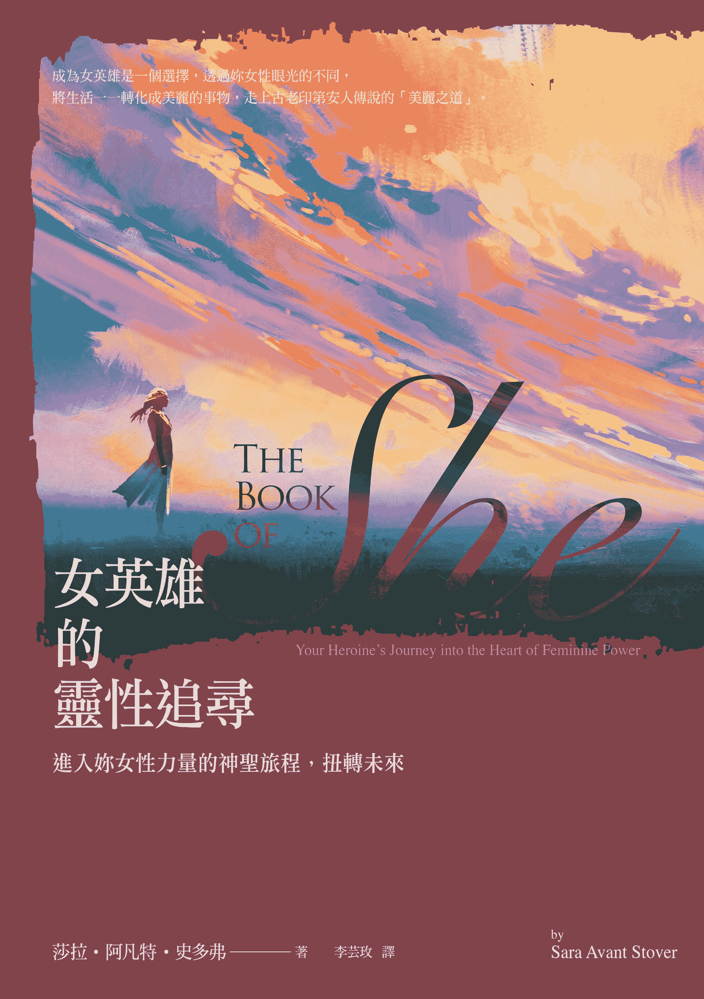
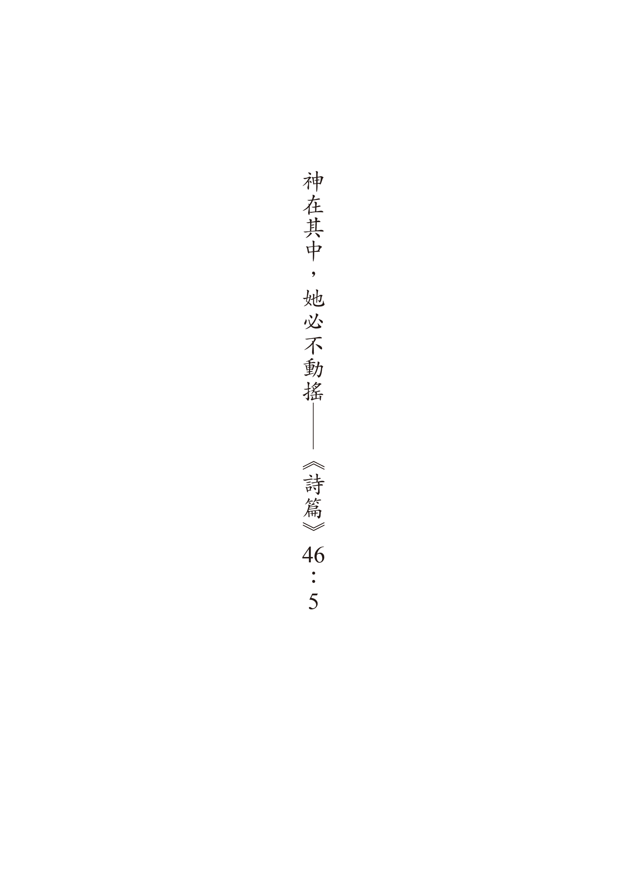
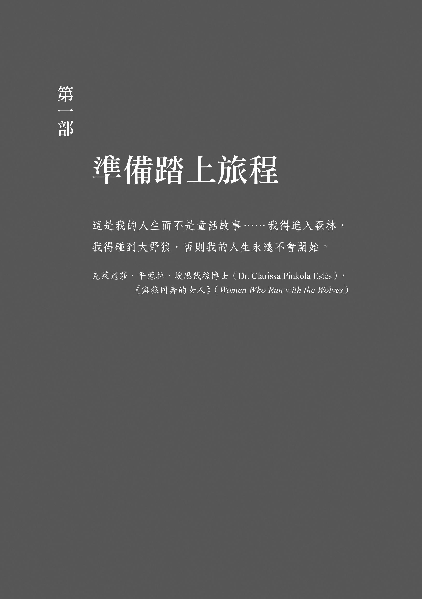
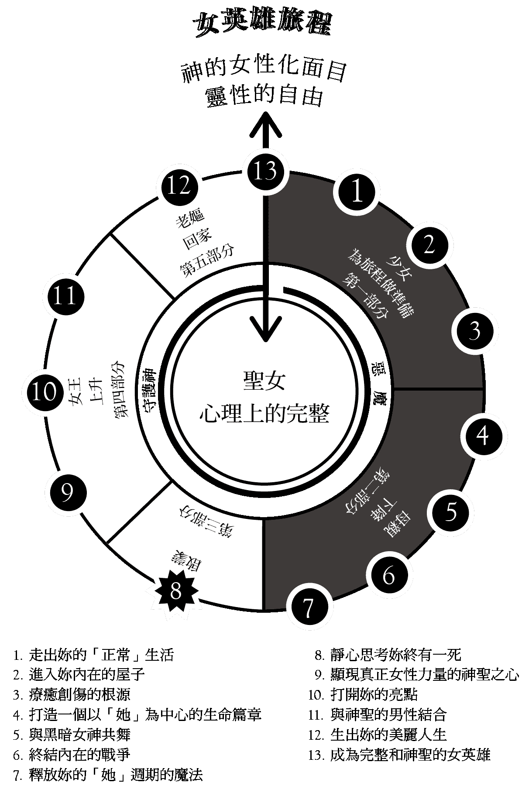
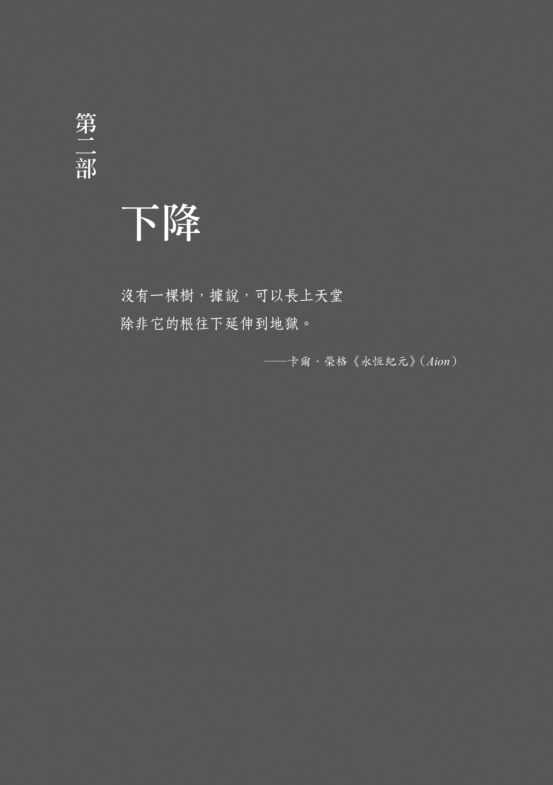
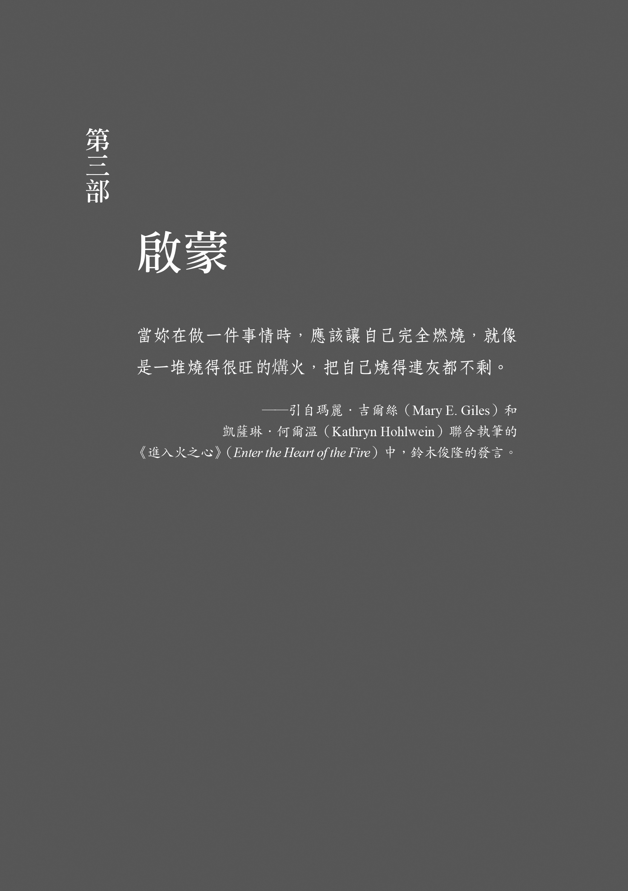
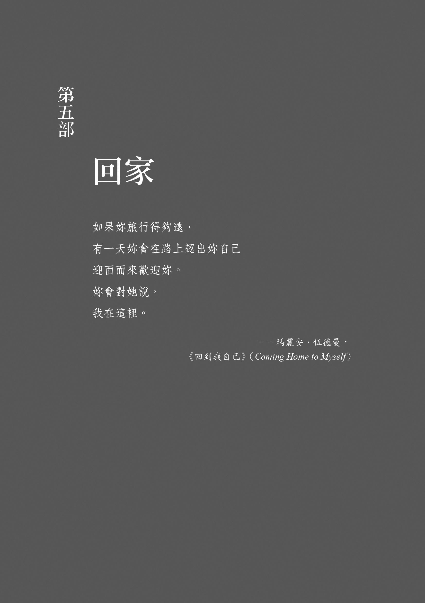

# 女英雄的灵性追寻

#### 欢迎所有性别和信仰的人

为求简单起见，这本书用的语言反映了一般人接受的概念，也就是女人（生理上的性别）比男人和大多数男性所创造的文化，更为女性化（性别）。因此，它聚焦在拥抱女性文化和精神层面的生理为女性的女人。但这个重新发现我们内在的「她」，我们内在黑暗和光明的能量的冲动，远大於生理上的性别。超越女人、男同志和女同志，所有渴望找到女性更深一层的周期和隐藏的智慧的人，都会发现这本书非常有用。对那些缺乏女性神经系统的人来说，充分拥抱这些概念也许很难，但绝非毫无可能或不予推荐。最终，我们都必须拥抱我们的天性，其中包括了所有的神圣男性和神圣女性的面向，将之统合在一起才能成为一个完整的人。

这本书大大欢迎和庆祝所有性别和性倾向的人，希望大家都能参与此中的讨论。

## 序幕

抹大拉的马利亚

当需要再注入爱时，抹大拉的马利亚就出现了。

我们唯一真正的选择就是要或不要合作。

── 辛西亚．柏吉特（Cynthia Bourgeault）
《抹大拉的马利亚的意义》（The Meaning of Mary Magdalene）

#### 圣塔菲（Santa Fe），新墨西哥州（New Mexico）；二〇一〇年十月三十日

有人称它为「魔鬼之夜」。

我拉上褐紫红色的厚窗帘，将窗子推开一个小缝，以便让夜里的空气进来。我将灯关了，把被单拉到肩头，一个人在小旅馆有霉味的客房里。

这是我预备发表几天前的演讲前一天的晚上，稍後我的打书之旅会用上它。第二天早上，我会在没有小抄和讲稿的情况下，在我六个女性同侪和我公共演讲的指导老师的围观下，站上讲台。只有我、我的故事和我的心。我的身体止不住发抖，但我的心却高喊：「我准备好了。」我可以感到某些新萌发出的丰盛。

窸窸窸窸，什麽东西？

我听到外面有响声，尽管我从未听过那种声音，我却知道是什麽东西。

不，不可能。

一袭拖地的洋装，在暗夜沿着冷冷的石砌露台窸窸窣窣的行进，我还没看到就知道是红色的衣裙。就像是鬼或一个幻影要来传递一个讯息，尽管我从来没有收过这种讯息。我翻身面对窗户，并不害怕，放松以待，有点像是等待展开一个早先约好的约定。

我看着窗外「她」黑色的影子，「她」将窗帘撩开，小心提起裙摆，猛然站在我的床边。然後「她」爬上床，在我身旁躺下。

「她」闻起来有灰尘味，仿佛是走了老远的路过来。尽管我从来没见过「她」，也很少想过「她」。我却能安然面对「她」的出现。我只是感到松了一口气，我们终於再度重逢了。

「她」没有向我自我介绍，但当我一听到「她」来，我就知道「她」是谁了。

「她」摸着我的头发，对我轻声低语，就像我希望我妈妈会对我的那样。

「莎拉，我的爱，」她轻声说，嘴附在我耳边，「我从现在开始会永远在你身边。你不用担心。你是我女儿，你在这里要帮我做我在世界上的工作。因此，我会永远照顾你。我永远不会走远，永远与你同在。」

我们继续鼻子对着鼻子呼吸，我的呼吸有人的温暖，「她」的呼吸飘忽冷冽，像是秋末的晚风。

我点点头，珍惜每一个片刻。

嗳，是的。非常谢谢你，这就是我要的。

我翻了个身，「她」依偎在我身後，「她」的双手环抱着我的腰。我开始颤抖和啜泣，释放出一种突然间、出乎我意料，被神奇充满的渴望。

我在彼此的拥抱中滑入梦乡。

第二天早上，抹大拉的马利亚的形体虽然消失了，我仍在我的内心深处感到「她」的存在。

我感觉跟以前不一样了。「她」的造访在我心中种下了热情。我并不知道这股热情最後会带我走上哪条路，但我知道从那一天起，我的人生再也不一样了。

## 引言

女人快乐之道的黑暗面

当你感到失望时。我不知道它是不是故事的尽头。

它也许是一趟伟大探险的开端。

── 佩玛．丘卓（Pema Chödrön），《当生命陷落时》（When Things Fall Apart）

在我们起头之前，我想要告诉你一个秘密。二○一○年春天，大概是我遇见抹大拉的马利亚的前六个月，我经历了三大改变 ── 我人生事件的一场完美风暴，永远扭转了我人生的道途。就在我签约要写我梦寐以求的第一本书《女人的幸福守护书》（The Way of the Happy Woman）时，当时的男朋友跟我分手，房东要我搬出我在科罗拉多州波尔德（Boulder, Colorado）田园风光的房子。突然间，我被陷在六个月的截稿期限里 ── 尽管是我自己求得的 ── 而且找不到新房子住。我遇到的所有可能性都爆了。就在时间紧迫、我也找不到一个稳定住处写稿时，我的一位女友好心邀请我搬去俄勒冈州阿西兰（Ashland, Oregon），租借她一栋房子度过夏天，并且在那儿把书写完。我打理车子，把我剩下的东西放进储藏室，然後一路往西。

到了那里，我在没良师益友的状况下，完全没有办法开始调养我破碎的心，不仅没有调养我破碎的心，还一头钻进写书当中 ── 其实我不太相信我能把书完成。一天又一天过去，我的内在批评不断打击我：你的亲密关系为什麽没有一次能够持久？你为什麽不出去跟别人一样享受夏天？你根本就是个输家。你有什麽资格写一本有关快乐的书？你永远找不到快乐，你是不是哪里有问题？

它对我的讥讽让我内在伤痕累累，直到我再也受不了。一天晚上，另外一个熟悉的魔鬼掌握了全局。

喔，完蛋了，我暗忖。难道真的是我想的这样？不会吧？老天爷求求你，不要是现在，我到目前为止都进行得很顺利。我要去深呼吸几下，我要去写我的日志，我要去散步，打电话给某个人。

哈哈，枉费了你花这麽多功夫，莎拉，它冷笑着说，可惜为时已晚。

魔鬼说对了。我被黑暗的内在力量附身，完全没办法掌控它，我起身关门，拉上窗帘，迳自往冰箱走去，启动我的身体很熟稔的变态古代女神仪式。我蒐集祭品：乳制品、谷物和甜食，先是冰淇淋，接下来是一碗麦片，涂了花生酱的面包。不论我的魔鬼要什麽，我都给她，直到魔鬼说：够了。

为了完成仪式，魔鬼把我拖入洗手间，强迫我把手指伸入喉咙，让我呕吐。我一吐再吐，直到所有的东西都被吐出来，一点也不剩为止。当她确认之後，她机械式的领我到浴室的镜子前，用我的手腕抹去我脸上呕吐物的残痕。我看进我的眼睛 ── 恐惧、悲伤和空洞 ── 就像是我偷窥的一栋闹鬼的房子，我永远永远不想要再看到我自己像这个样子。

你在哪里，莎拉？你怎麽啦？为什麽你这麽苦？我想要安抚我吓坏的镜中影像。我很抱歉、我很抱歉、我很抱歉；我绝不会再这样做了。我绝对不会再对你这样做了。

我想到我在年轻时曾经多次对自己吐出这样的哀求 ── 到头来一点效都没有。我希望我这次能够相信它们。

我身上坚强、固执的一面说，是的，这次会不一样。

但我的魔鬼咯咯笑着说，你已经是三十二岁的老小姐了。你不是早就该摆脱我了？哈哈，别白费力气了。你永远甩不掉我，不管你多努力都没用。

### 非常女性化的人，有着非常女性化的领悟

一年之後，我搬回科罗拉多州的波尔德，找到一个新家，跟一位很棒的叫做凯斯的男人进入一段亲密关系，他现在是我的未婚夫。我的书在上一个春天出版，得到了很多夸赞。从表面上看来，我生命的拼图好像都各就其位，但我的内部又被敲成更多的碎片。我现在又跟更多的魔鬼作战：我心中烧灼的痛楚，巨大的焦虑，像海洋一样深的莫名泪水，能量在我的骨盆炸开，然後又沿着我的脊椎蛇行，房间天旋地转，我的公司（也叫做「女人的幸福守护组织®」）始料未及的即将破产，抹大拉的马利亚更常来造访，以及更多失眠的夜晚。

由於带我进入女性灵性修行的导师苏菲亚．狄亚兹（Sofia Diaz）前去照顾她生病的母亲了，我想解决我的困境，於是找到我一直有的问题所在 ── 父权体制，去寻求答案。我跟一位德高望重的禅师见面，希望他帮我开示经历的事情，这位禅师在我们会面时告诉我，一切都根源於我的神经质，其实压根儿没事，我所经历的都只是我「真正」修行所产生的分心。他鼓励我抛开这些小题大作的琐事，完完全全守着冷静的觉醒。我後来离开时，感觉自己像是一个沮丧的小女孩：没被看见，也没被了解。

接下来几天，我越来越气愤於禅师没有「懂」我，敏感的女人通常会被视作软弱、疯狂和歇斯底里。但最重要的是，我在生我自己的气。我有点相信他所说的 ── 我不够强壮，无法应付生命的压力。

那次会见的几周後，苏菲亚回来了，我要求跟她私底下见面。当我坐在她对面的椅子上时，她指导我闭上眼睛。然後我们挺直坐着，调深呼吸，更全然的一起进入当下。我原本打算只花一个小时，最後演变到拉长三个小时，我和盘托出我经历的一切。九个月前在圣塔菲，抹大拉的马利亚向我显灵。一阵阵不规则、通常是晚上袭击我的椎心之痛。我感觉被你知道是什麽的东西附身，复发多次的暴食症，财务上的挣扎，房间天旋地转，止不住的泪水。

在我们会面期间，她蹙着眉头仔细聆听，用眼神和身体聆听的程度大过用耳朵聆听。

当我终於说完之後，她单刀直入：「首先，你必须注意你说话的方式，不要说：『我发现。』不，从现在开始，要说：『当「她」跟我沟通时。』这并不是你外在的东西，它是你。你有你的主权，你并不是受害者。」

说完後她的脸上绽出大大的笑容。

「喔，这是哈利路亚的时刻！」她大声说，褐色的眼珠闪闪发亮，「在我们这节课的一开始，当我们眼睛闭上时，我感觉到穿着蓝袍子的圣母玛利亚出现在我俩之间，我现在明白是为什麽了。我当真为你高兴，莎拉！」

然後我跟她说我去看了禅师的事情。她笑了笑之後，再度拔剑出鞘对我正色说：「嗯，你以为呢？你知道我是喜欢禅宗的，但你为什麽会想到去世界上最父权主义的灵性传统找什麽鬼答案？你是一个非常女性化的人，有着非常女性化的领悟。你所经历的就是这麽回事儿。怪不得那位禅师无法帮助你，他哪有办法？你在想什麽？」

唉呀。她的话让我一阵剧痛，因为我知道她是对的。

「我也不知道自己在想什麽。」我边承认，边无法置信的摇摇头。

在那天之前，尽管我有广泛的女性灵性修练背景，却压根儿没想到要在女性传承中为我的经验寻求印证。似乎我唯一认可的，真实不虚的觉醒之道途的传承，却是一个男性化的道途。最终，那里也就是我总是导引自己走上的灵性之家。

从那一天起，我看事情的角度转了一百八十度。我完全走出了像男人一样的修练和觉醒之道。不管会发生什麽事，我都致力於以此身 ── 女人之身 ── 透过女性化的灵性修练来达到觉醒。苏菲亚对我的下一步提出指导。

「你该做的第一件事情就是向玛利亚道歉，」她命令我，「对你怀疑『她』，不相信『她』，不听『她』，不欢迎『她』致歉。这对『她』是多大的侮辱！『她』到你面前来跟你分享一个讯息和一个神秘经验，你却因为怀疑自己的经验而对『她』关上大门，把它斥为神经质。你的第一件事就是要疗癒这些，然後再透过神圣的沟通和『她』展开对话，要求『她』讲得更大声和更清楚。看看你俩会展开什麽样的对话，告诉『她』你现在在这里洗耳恭听，告诉『她』你希望以『她』为你的生命中心。」

她总结说：「这是莫大的祝福，莎拉。其中的恩典无限，你并没有发疯，这就是女性的领悟看起来和感觉起来的样子，这就是你修练多年所要的结果，一点也没错。」

### 一趟新的旅程，一个新的故事

苏菲亚重新建构我的经验，帮助我了解我的崩溃其实是一个入口，一个让我进入最艰难、报偿最大和我生命中到目前为止最神奇的旅程 ── 我的女英雄旅程的入口。

撰写《女人的幸福守护书》的过程唤醒了我老旧的、伤得很深的一部分，我还以为这部分早就被我所教授的课程疗癒了。过去十年来我所有的治疗，诸如瑜伽、静心和疗癒等工作好像都飞出了窗外。当我暴食症发作时没有一样奏效，我十六岁那年开始罹患暴食症，它卷土重来，完全不由分说。

我回应的方式就是，企图躲进我感到羞耻时，所诉诸的沉默和隐蔽的熟悉又安全的港湾。确定每个人都以为事情「平顺」和「完美」，不要露出你真正的感觉，让家族里的秘密滴水不漏。我不知道还有什麽别的方法。我感觉有些事情太让我羞惭，羞惭到说不出口 ── 对任何一个人都是。

我跟苏菲亚的会面也显示，当我小心控制的「莎拉大教堂」开始崩塌时，我企图用让我精神错乱的男性化动力来导引我的内在生命，而这个男性化的动力，也是我这辈子用来当作我摇摇晃晃的基础的东西。我打开了同样一个强制性的、静不下来的、试图证明我的价值的能量 ── 不过这一次我用了更精细、更「灵性」的出口。事实上，我仍旧用破坏的方式逼迫我自己 ── 尽管我都教别人不要这样做。我仍旧企图控制我的身体和我的周围。我仍旧不信任我的直觉和内在指引。而最危险的部分在於，该对这样的伤害负起责任的人是我 ── 不是我父母、媒体、老师、成绩单或磅秤，是我，我是那个不断抽紧我隐形马甲上的绳子的人，让我越来越难以呼吸、感觉和移动，它紧到让我难以开花。

当我更进一步加以研究之後，发现这并不是我一个人的问题，它也是你们的问题，因为这是一个我们都深受其害的集体伤痕。我们都染上了同样的病 ── 病到大家都习以为常，以为这样是正常的。尤其是，我们都汲汲於追求外在的成功，而不知道何谓内在人生的成功。我们多多少少都跟我们的中心失去了连结，也可以说我们在某种形态上背叛了我们最深层的自我 ── 我们的「她」。

这就是这个世界运作的方式。灵魂，尤其是难以发现的女性化灵魂，几乎要绝迹了。我们仅仅靠着物质面维生，跟我们实际所扎根的精神面完全脱节，造成我们与内心深处的养分严重和痛苦的分离。所以我们都在这里，用超越自己所能 ── 或应该 ── 的速度，飞快逃离这种痛苦。难怪每个人都疲累不堪。

就跟我一样，你也许已经到达生命中特定的一点，在这个点上，你觉得一切都不对劲，而你感觉有个重要的东西不见了。以前感觉良好的东西现在感觉一点也不好，这样的变化让你感到迷失，你在一个十字路口，这是成为成熟女人的一个危机。如果你现在并不在那个点上，很可能你马上就会到达这个点。但不要绝望，这些危机点就是我们女人必要的进化枢纽。它们会启动正确的时机，让我们从小我的概念中毕业，进化到活出我们成熟的女性味、人性和神性的更全面光谱。

我们都长期活在父权体制统治之下，那里多就是好，理性的规则凌驾於一切，黑与白，好与坏，只不过，照着这种方式活下去，我们会成为一个外表成熟、内心却还是个小女孩的女人。根据老派的想法，我们应该用线性的方式生活：月经来潮、结婚、生小孩，从此幸福快乐。但当我们强迫自己就范之後，我们无可避免的会感到失望。

事实上，我们的女性生活并不能用直线来代表。倒不如说，我们的旅程带我们通过一连串周期的启蒙。每一个让我们沉入黑暗地下世界的危机，都让我们用最深刻的方式聆听和信任自己。我们以为跟我们的黑暗面合作会让我们疯狂，但实情是，唯有否认我们的黑暗面才会导致疯狂。

在我们的黑暗面中有无比的威力，因为黑暗就是一半的创造力，也是通往我们神圣力量的入口。只有靠着我们赤手空拳的挺立在极端之中的直接经验，才能让我们了解，「她」对於是好是坏、痛苦和欢愉、美与丑，没有分别心。唯独在那个时候，我们最大的创伤才会成为一个入口，让「她」用无条件的爱，来填补和祝福我们身体的每一个细胞，和我们生活中的每一个角落。

现在就是醒来面对 ── 我们就是自己最大敌人的事实的时候了，我们穿上的隐形马甲，正一点点杀死我们的热情、直觉和跟生命本身的连结。这副马甲被我们自己内在族长（Inner Patiarch）的限制绑得那麽紧，我们都还不知道把女性特质吸进和吸入是什麽滋味。我们还没有被启蒙进入女性特质 ── 那是一个不以僵硬的非此即彼来判罪，反而庆祝不确定性和复杂性的领域。如果缺乏这些，我们就无法知道身为女人的感觉，更不用说身为女人从外面看起来的样子了。我们生长在一个大家极为恐惧和误解女人真正有才华的时代，尽管外界已经觉察到更多有关女人的事情，我们还是需要很大的支持来挖掘和了解我们真正的女性天赋。

为了了解这些天赋，我们必须明白我们的限制其实是我们最大的优势所在。我们可以一面挣扎一面成长，就像佛陀所教导的，受苦是了结苦。

苏菲亚说对了，当我的暴食症复发时，它实际上是要向我显示我的修行收到效果了，因为它让我强壮到足以正视我最深的恐惧。当我真正达到这个目的时，它并不是通常会放在瑜伽杂志封面的美好过程，而是让我经历合一 ── 瑜伽的目标 ── 从根部开始疗癒。

在本书中我描述了我成为一个更为圆满、更有自主性的女人的全部旅程，我明白我把我内在的地狱转变成集体的天堂，在於帮助其他女人如法炮制。尽管男性的参考架构，把我的痛苦和迷惑贴上混乱、失败和神经质的标签，我希望为其他姊妹服务的热情，却一直激励着我让我度过了最黑暗的时刻。我希望我的魔鬼不只解放我，也从旁解放了你。

我们目前需要一个真实的、拥有女性自主空间的楷模，因为世界正在快速变化。我们急迫的需要一张连贯的道途地图，帮助我们在大量的转变中向内导航。仅仅不到十年的时间，局势就改变了，西方越来越多的女人居高掌权。最近的研究也显示：「大部分下一代的职业妇女，收入会高於她们的先生。」而且在美国大多数的都市区域「没小孩的二十多岁单身女子，比男性同侪赚得多。」1 同样的，一篇刊登在《大西洋》（The Atlantic）杂志上，标题为〈男性末日〉（The End of Men）的文章也透露：「今日的学院和职业学校以女性占优势 ── 今年获得文凭的男女比例为二比三。下个十年中预计成长最快的十五种职业类型中，就有十三种主要是由女性担任的工作。」2

如果我们不透过我们特有的女性成年礼，来了解真正胜利成功的意义，这些进展都有可能非常危险。如果我们不将那个可以带给我们力量的与生俱来的转化启蒙，摊在阳光下，我们就会活在羞耻感和遮遮掩掩中。同样的，如果我们将从我们的易受伤害的特质中生出的女性力量，藏在阴影中，我们就无从得知我们的力量在哪里，并且往不对的方向瞎找。

我们不会像男人那麽孔武有力，因为我们不是男人。女性的自主性永远就在我们的鼻子之下，但它不断的闪避我们，因为我们认为它是一项缺点而非优势。事实上，就是因为它太明显和自然，我们才会不断错过它。

我诚挚希望你会在本书的篇章中，找到给予你能量结构的启蒙入门。你将会把你认为是神经质、软弱、沉迷或待修补的部分，变成有利、甚至虔诚的光明。你会发现必要的工具和观点，以便将你的内在魔鬼转变成那个非常自由、富有创造性、愉悦的和有力量的东西，而它正是你目前寻寻觅觅却又企图否认的东西。你会知道你的毒药就是你的良药，你就是唯一可以执行那种炼金术的女巫，你必须用自己不完美的完美女性躯体作为坩锅，在你之内展开这场神圣的戏剧。

#### 谁是「她」？

有人叫「她」苏菲亚（Sophia），也有人称「她」为观音、圣母玛利亚、帕查妈妈（Pachamama）、水牛女（Buffalo Woman）、蜘蛛婆婆（Grandmother Spider）、爱西斯（Isis）、夏克缇（Shakti）、大母亲（the Mother）。

「她」是你眼中的光芒，穿梭在树林中的风，你的狗在外面小丘上的跳跃。

「她」就是你现在正在呼吸的气息，外面轰隆隆的雷声，你身体里已习以为常感觉不到的脉动，你内衣下的血流感，你腹部的饱胀感。

我们都需要找到「她」，而在找到「她」之後，我们必须知道如何称呼「她」。

我称她为「她」（SHE）。

「她」是不再让你躲躲藏藏、遮遮掩掩的人，「她」住在你之内，即使你忽略「她」也不会改变。

「她」会将对你生命有益和有害的东西一骨碌全拉进来，「她」是你的扩展和收缩，你的爱与恨。

「她」无所不在，因为「她」就是一切。

但「她」又非常隐约，你可能会错过她，几乎所有人都错过「她」了。

「她」似乎不可捉摸，但「她」的恩典中有大智慧。「她」是个淘气鬼，带有一种顽皮的幽默感。

「她」在此提醒你：你命中注定不只是受苦的你。

「她」不会让你在听到灵魂之歌时睡着。

「她」不管你舒不舒服，「她」只管你清醒过来面对你是谁的实情。

许多女人都忘了「她」，可是「她」依然存在而安好。

即使你认为自己从未见过「她」，「她」还是跟你同在。无论如何，「她」永远不会离开你。

「她」不会受到控制，「她」不会屈服於改变成不是「她」的任何样子。

「她」是领我们航行人生的非典型罗盘，「她」是来此带领你回家的天才，「她」会尽一切可能的进入其中。

### 你体现的女英雄旅程：你的力量入口

即使在女性主义人士的行动中，我们还是忽略了女性身体的力量与光辉。我们总是向外寻求我们人生奋斗的答案，而答案并不在外面，只能在你自己里面找到。我们谈到神圣的女性 ── 卡莉（Kali）❶女神，从灰烬中升起的凤凰 ── 但我们否认和忽视我们体内这些体现的过程。我们既是创造者又是摧毁者，我们体内蕴藏着生出神性的力量，神性在我们里面，在万物里面，我们就是我们所祈祷的奇蹟。每个女人的细胞和灵魂中都跳动着这个古老的记忆，等待着被唤醒。身为女人，我们不仅拥有生命的神圣物质，也有转换它的力量。当我们将自己扎根於这股她的力量时，我们发现到 ── 我们在成就中寻找的女性自主性的蓝图，早就写在我们 DNA 上。

这段旅程会发生在你的身体里，不是脑袋里。女性的旅程是相关的、周而复始的圆环和炼金术般的 ── 而不是线性的和逻辑的。如果我们持续将我们循环不断的危机当作失败，我们就一直会感觉自己没有达到目标。我们会持续感觉到 ── 我们渴望跟我们内在的神圣女性结合，但我们永远到达不了那里。「她」将待在我们的脑袋里，在人们和影像中，「她」成了在我们之外的追求，永远进不了我们的心、子宫和细胞。你为什麽不试图理解 ── 神圣的女性不在别的地方，就在你自己身体里的创造跟破坏周期中呢？你在别的地方永远无法找到「她」。

你的身体跟你的周期就是你身为女人的最大祝福，它们掌握了你的女英雄旅程的钥匙，让你每一天用一种非常务实的方法，明白和活出你真正的力量。你的身体就是发生创造奇蹟的圣杯。

你的挑战握有疗癒你的疲惫和消灭你的沮丧的唯一能量。就像是头一次把宝宝抱到胸前哺乳的母亲，欢天喜地的张大嘴一样，你一定要让一部分属於你自身，另一部分超越你自身 ── 神圣的爱从中生出 ── 的创造力来疗癒你，一直疗癒到核心。请记住创造是不可预期的；它黑暗、泥泞、神秘和痛苦。艺术并不在那里，艺术就在这里，无限的创造性是你的天生状态。经由整合你的黑暗面和光明面所产生的魔法，一定会让你兴高采烈和欢乐无比，而且其本身就表达了神圣的圆满。

### 有关本书

这本书是从我自身女英雄旅程的灰烬中，生出的得来不易的创造奇蹟。我在这里分享的洞察力来自「她」的恩典。这本书是「她」所传递出来的，透过我，到达你。这本书的核心有着我最大的信念，那就是好好做好内在工作的女人，可以和将会改变这个世界。此外，这本书是进入爱的入门 ── 真正，深入持久的爱。

我在这里汇整了我过去二十年来最佳和最糟的心理、灵性和体现的研究，在这本书里有我的自我理解、研究、洞见和智慧，它们点点滴滴都来自我持续不断的每日修行、避静、亲密关系，和我挚爱的老师、良师益友和治疗师；以及过去十三年我对好几千名来自全世界处於困境的各个年龄层、种族的女性所做的工作。过去这四年，我透过我的虚拟和亲授课程：「她学院」（SHE School）（团体群组和女人的灵修社群，[www.TheSHESchool.com](http://www.TheSHESchool.com "The SHE School: A 9-Month Spiritual Pratice Community for Women")）；「逆转我们的诅咒」（[www.ReversingOurCurse.com](http://www.ReversingOurCurse.com "Reversing Our Curse - The Way of the Happy Woman -")）；以及每年一次的「她避静」（[www.SHEretreat.com](http://www.SHEretreat.com "Welcome sheretreat.com - BlueHost.com")），独家传授我在本书中所教导的这趟旅程的各个片段。

由於这趟旅程的某些方面，必须经过亲身体验而不只是听课而已，但女性的教义要透过说故事才能达到最大的效果，因此我将我自己的故事编织在各个篇章中，当你全盘投入「她的道途」时，这些最深入、最精微的洞见就会浮现出来。

在你读到这些章节并且展开你自己的旅程时，希望你跟别人分享你个人的故事。当今这个世界迫切需要走上灵修道途的女性故事。没有这些故事，我们就无法印证我们的经验，也不能让这些经验有意义，我们更深一层的事实还是会藏在沉默和迷惑中。身为女人，我们必须说出我们的故事，说出我们如何经历神圣和这样做时不会感觉不对或疯狂。

我在本书中分享的，融合了两千多年的古老智慧和最新的科学研究，以及透过一个简单、精致的模式，应付当代生活复杂的问题的种种发现。它完全改变了当今所认为的成功和有自主性的典范，它教导我们外在世界的一切都奠基於看不见的内在世界。藉由改变内在，我们也改变了外在 ── 反之则不然。透过撤离我们常年的忙碌，我们打开了一个空间来增加我们活在当下和真正享受眼前生活的能力。

我们必须勇敢面对我们过去未被治疗的创痛，作为成熟和觉醒的一部分过程。同时，我们也要以学习如何爱自己，取代老是修理我们以为的不对劲。这本书藉由复兴重新修订过的「女英雄」原型，以现代女性的角度，重写了让我们获得力量的旅程，它是目前我们最需要用来面对最迫切的当前矛盾的利器。

这条让女性澈底获得自主性的女性道途 ── 在各个方面 ── 是女英雄旅程的模范，它教了我们用心过生活的方式，提醒我们唯有不断将我们传统的头脑转向思考更深入的事实，并且专注活在生活中的每一刻，才算真正的成功。这趟旅程让我们落实在我们女性的身体里，并且教导我们 ── 正是透过我们的失败，才能生出真正的、解放的成熟女性气质。

我自己的大失败 ── 从暴食症到濒临破产到自己身分认同的崩溃 ── 为这本书开了一扇门，促使我以前一本书的智慧为基础，提供了一个 ── 更新、更宽广、更深入和更精辟观点 ── 现代女性获得真正的女性力量的入门之道。相较於《女人的幸福守护书》所注重的 ── 透过季节性的生活风格仪式、瑜伽、静坐和营养等外在的东西 ── 来成就我们的成熟女性气质，本书更密切的观察了我们的内在部分 ── 我们的心理和灵魂。为了开花结果，我们需要双管齐下，同时运用外在和内在两种方式。

### 如何使用这本书

任何入门的第一个步骤，就是启动澈底的信任。相信你在这里有其原因，即使你还弄不清楚是什麽样的原因。生命并不是无缘无故的发生，生命是为你而发生的。在这趟旅程中你想追寻什麽或想要得到什麽，无须弄得太清楚，你只要知道你更深处的一部分在这里呼唤你就对了。在这条道路上占好位置，然後跟我和许多人带着尊严走上这条道途。这本书是「她」在呼唤你的许多方式之一。不管你是八十岁还是二十岁，还是两者之间的其他年龄，我们都欢迎你。

这是你的旅程，这里没有什麽东西是太禁忌的、太美好的、太让人觉得难为情的、太怪异的或太杰出的，一切都能摊在阳光下。把你完整的带进来。没有人会否定、会赶跑你的任何一部分。从头到尾你都要记得：你是自己最好的老师。用你的经验来阅读本书，成为你最深的「自我」的监赏行家。

### 在跳进去之前该知道的一些事情

*   这既是一本自救的书，但也不是一本自救的书，它不是要你像画着色图一样，按照号码一一着色，然後只要检查你「做对」了没就好了。它更像是寻宝活动，我会沿路放面包屑做提示，但你得用你活生生的经验在内部把它们串起来。
*   这本书从四个不同的层面来操作：我个人的旅程、教导你如何参加旅程、你个人的经验，和会跟你一起踏上这趟旅程的我们的姊妹情谊。
*   我的某些教导是硬性规定，你得一五一十的遵照着这些步骤去做。其他的则是示范性的，指向转变发生的更深入和更基本的能量流。
*   最重要的一点是要感谢一路上所有的幸运。
*   你在这趟旅程不会失败，也不会「做错」，你更不会完美的完成它。
*   这不是一本宗教书。它是非常个人的、直接的、活生生的经历神圣的经验，在每个人的日常生活中都用得到 ── 不管任何特殊的信仰。
*   你可以从你所在的任何地方开始，信任你的过程。让你就在你所处的地方。
*   我们分处於女英雄旅程的不同阶段。不要拿你跟其他人比较。
*   请记住，本书的设计是有先後次序的，你必须循序渐进，它是一种讲究方法的、按部就班的进展。不要跳过任何一个章节以求超前，你必须按顺序参与每一个部分，以经验它的果实。不要排除或掩盖任何东西 ── 尤其是你抗拒的部分。在你阅读时，请完成每一章里面的练习。这不但一本书，也是一种活出来的过程。
*   本书需要伴随一个稳定的 ── 理想上是每天 ── 灵性修行，以便让这趟旅程完全站稳脚步。推荐你做一些显现慈悲（瑜伽、太极、气功等等）、专注和慈爱觉察（静心）、自我询问和虔诚（祈祷）的修行。我接触以上所有元素的方式，都在《女人的幸福守护书》里描述过了。因此在本书中，我只是扩大而没有重做这些素材。如果你已经有了自己的每日修行，请继续做下去。
*   这原本就是一个三度空间的过程。不要成为独行的女英雄。佛陀教导三重宝石的重要性：佛（自身的觉醒本质）、僧（Sangha，个人的灵性家族和社群）以及法（Dharma，教义）。在你阅读这本书时，将以上三者都用上（没有灵性家族和社群的读者，可以跟我们虚拟的姊妹淘一同经验这趟旅程，我将在本节的最後讨论这一点）。如果你用这样的方式看这本书，你会体验到你人生中重大的转变。
*   我常常提到我的导师苏菲亚，我将这份师生之谊当作我最珍贵的资产。没有她的导引，我永远不会展开这趟旅程，也不会有这本书。我坚决主张，为了要进化，我们需要扎根在活生生的智慧传承中，并且要跟导师密切合作，而不是遵照当今常见的错误看法，认为一切都可靠自己。如果我们不谨守世系的传承，可以推动我们世界的古代深奥的智慧就会消失。这并不是说我们把导师奉在高台上，而是要把她们当作我们灵性上的朋友、在旅程上早我们几步的前辈。
*   我往往将这个大一点的「她」视为玛利亚，我经验「她」就是以这种方式。如果我的诠释不适用於你，必要时可以将你对「她」的经验插进来。
*   这个工作将持续一辈子，而转变可能在一刹那之间发生。摆脱你对旅程会是什麽样子和结局如何的期待，修持耐心 ── 佛陀在祂的教义中讲过最多次的就是耐心！
*   你投入的越多，你从中获得的也会越多。

在你的这趟旅途中，请顶住不要做太剧烈的生活变化。等待你完成所有事情之後再让尘埃落定。过段时间，下一步该如何走的答案就会出现。不要在一切还没就绪之前就强迫事情提前发生。最後，当你采取以下的三阶段学习时，请以耐心和温柔对待你自己：

一、观察和开始觉察你周遭和你之内的概念是如何运作的。

二、慢慢将修行和观点累积在你的每日生活中。

三、不断精进练习，直到你可以持续运用所学到的东西，并且让你的练习变成第二本能。

当你尽其所能的做过这里提供的所有练习後，选择对你最有效的一种，有必要时不断的重新回顾，如果有些部分不能让你产生共鸣，不妨放掉它。

注意：在这段过程中，我们有一段免费的线上「她圈子」（SHE Circle）可以提供给你。这是一个安全支持正在展开这段旅程的女人，或已经开始沿着这条道途走的女人的环境。在这样的圈子中，你可以要求支持，并且跟大家分享你透过本书展开的旅程以及之後的欢庆、挑战和洞见。想加入我们的姊妹淘请上网：[www.TheBookofSHE.com/practices](http://www.TheBookofSHE.com/practices "Free Practices Sign Up - The Way of the Happy Woman")。

### 本书的结构

尽管我跟大家在这里分享的东西，来自我直接的、活生生的经验，我承认我是站在巨人的肩膀上。我在这里累积的知识，有许多来源 ── 有死的、有活的，有看得见的、有看不见的。经过二十年的深入内在工作後，我将一路上对我最有用的智慧拼凑起来。

这段旅程是在某一次我单独避静时，玛利亚向我显灵得来的灵感。她一下子就将整本书烙印进我的心中，之後就是我花了两年半的时间来用言语将之表达出来。透过这个精准的结构，我必须能够把一度是迥然不同的智慧碎片，变成对女性自主性的朝圣之旅 ── 并且在最终达成你的自我实现，成为一个经过整合的完整的人。

我们将用五个部分，共同展开这趟女英雄之旅。

第一部，我们准备要去朝圣。弄清楚女英雄旅程究竟是什麽，抛开我们「正常」的生活，探索带我们到这里来的创伤，并且学到如何成为自身慈爱的母亲。我们一边建造一个强壮、安全和慈悲的容器来支持我们的过程，一边弄清楚 ── 创造一个持久、有效的女性灵性修行和活出一个以她为中心的人生的要素。我们琢磨踏上这趟旅程的意图，并且直接见到我们内在的「她」来引导我们。

有了这个坚实的基础，我们从第二部开始下沉到地下世界。我们学到如何藉由硬碰硬的面对黑暗女神（Dark Goddess）和我们内在的魔鬼，学到如何跟黑暗的力量相辅相成。我们跟我们的内在批评和其他的内在破坏分子对话，我们和我们的「阴影面」、我们的沉溺和我们的神经质交手。我们甩开我们的完美主义者标准，臣服於人生中无可避免的紊乱。为了终结我们在地下世界的时间，我们得学到如何跟我们神圣的天性共同创造，而这就需要透过女英雄旅程所体现的周期：我们的经前症候群、月经、停经过渡期和更年期，我们的女性力量钥匙就藏在这些周期里，但它们却受到我们的羞耻感遮蔽。我们在每个月静止的点练习死亡，以便我们可以了无遗憾的面对我们呼出的最後一口气。我们邀请我们内在老妪的智慧，从她学到不管外在意见或待办事项表，我们都要说出和活出我们真正的一面。

我们入门的煹火发生在第三部，在这里，我们遇上了我们转变的「神仙教母」，学到了滋养而非跟我们内在的魔鬼作战的女性艺术，我们同样也重新恢复了我们子宫跟心之间的重要和情色的连结。透过与在我们神圣的心的坩锅里掺入丰饶的黑暗，我们在我们的极限边缘颤抖，并且屈服於大於我们的「她」。经过这个过程之後，我们就会容光焕发 ── 获得重生。

在第四部，我们扬升。从心被掩埋的地方，疗癒我们跟神圣男性的亲密关系，发现我们圣女的主权（Virgin sovereignty），并且重新振作我们创造魔法的能力。透过这样做，我们浸润在道途的神圣河流中，跟我们内在的魔法小女孩重新连结，拥抱我们高贵的品格，并且释放出内在宝贵的资源 ── 觉醒的心灵和心智的才华。透过这些，我们才会想起来，创造力才能医治我们，当我们释放出藏在我们的魔鬼中的天赋时，我们享受到一股新的能量。

我们现在已经有了在第五部回家所需的一切了。带着我们内在旅程中所获得的满满果实，回到那个我们开始的地方，准备将我们内在的天赋施予全世界。从这个神圣的完整中，我们为世界唱出我们的「她」之歌。

### 从现在起

我们的世界从来没有一刻像现在这样，急迫需要神圣的女性和男性相互协调和再造运用力量的恰当方式。它需要你的帮助，以获得它的精神核心和再度开花。所以请不要犹豫现在就踏上你的旅程。你就是解答的一部分，选择开放、创造和进化，成为一位有意识、自由自在的做自己而且觉醒的女性典范。释放出你特殊的女性力量，并且以爱而非竞争和恐惧之眼来看这个世界。

坚持这个世界已经准备好接受这些立场，神圣的母亲，是全世界跨越性别、种族和宗教的千千万万人最爱和最尊崇的女人，她活力十足的在这里；我们只是忘了如何去看到她。但即使看不见，在我们的苦难和我们的信念中，她还是会将我们全部人紧紧系在一起。在我们对她的爱之中，有我们对自己的爱，而我们的世界并不知道这些，那里有我们的救赎和真理，我们仍旧可以一起翻转这个世界。

现在就跟我牵着手一起来。快点开始，因为生命无比珍贵而且消逝得太快。你的女英雄旅程正在等着你。

##### 译注

# 第一部：准备踏上旅程

## 圣母玛利亚

#### 达理安（Darien），康乃狄克州；一九八五年一月

床头柜上红色塑胶的凯蒂猫闹钟滴答滴答的响，提醒我已经错过上床的时间了。伯特躺在我脚边属於牠的蓝色毯子上，我听到牠把橘红色的脚爪一一伸进胖胖的线团中时发出满意的呜呜声。

爸妈从我的房外走道经过，鞋子在木头地板上发出喀喀声响。我起身坐起，弯腰把伯特抱起来，我又躺下，用右侧躺卧，屈膝向着现在在我胸膛上的牠。在凯蒂猫旁边是端坐在铜框中的圣母玛利亚，她是教母给我的第一次领圣餐礼物。

她平静的往下看着交叠在膝头上纤细的手，我也希望在她身旁，被她头顶的后冠所庇佑。我希望她把我抱在她暗玫瑰的袍子皱褶上，我想感受到安全、平静、平和与纯净。

妈妈和爸爸的声音如雷般响起。

是地动天摇了吗，还只是我的问题？我的肚子痛了起来。我把伯特搂得更紧了，牠用牠的湿鼻子摩擦我的下巴。我纳闷我的姊妹们是不是睡着了，还是跟我一样醒着，而且很害怕。我定定的看着圣母玛利亚。不知道除此之外还能做些什麽。

我对她小声的念着：

　　我们在天上的父，

　　愿人都尊祢的名为圣，

　　我听到更多的吼声。

我泪流满面，卷起身躯极力想躲开即将袭来的声浪，我的眼神紧盯住圣母玛利亚。

　　愿祢的国降临，

　　愿祢的旨意行在地上，

　　如同行在天上。

　　一道白光照向我肚子打结的地方，我是醒着还是在作梦？我慢慢不觉得那麽痛了。我渴望早晨快点来临，那时我的房间会明亮起来，我的闹钟会响，早餐桌上会有麦片，我会坐在校车的後面，跟卡洛琳谈笑。

声音消失了。

　　我们日用的饮食，今日赐给我们。

　　免我们的债，

　　如同我们免了人的债。

我的眼皮越来越沉重。圣母玛利亚跟我房间里的其他东西一起没入黑暗，我的身体放松，渐渐不动了，伯特已经睡着了。

　　不叫我们遇见试探，

　　救我们脱离凶恶。

　　因为国度、权柄、荣耀，全是祢的，直到永远。

　　阿们。

## 第一章 走出你的「正常」生活

　　如果你一直想要表现得很正常，

　　你就永远不会知道你可以有多麽惊人的能耐。

── 玛雅．安杰洛（Maya Angelou），《云中彩虹》（Rainbow in the Cloud）

我要告诉你们一个你们从来没有听过的故事，我要用最原版的方式告诉你们一个童话故事。这个故事不是要说在一个遥远的地方，你受到一个邪恶巫婆死命的虐待，然後你的白马王子出现救了你。这是你的身体散发出来的讯息。你不断用这样的讯息折磨自己，直到你清醒过来，发现你才是那个能透过你真正的爱释放自己的人。在这个故事里面，你拥抱自己最好的和最坏的部分，藉着这样做，你把障碍转换成回到你最初样貌的机会。

我们知道迎向生命提供给我们的任何挑战 ── 不管是好、坏和丑陋的 ── 都可以发挥自己最大的潜力。这种混乱是我们成为成熟女人的必经之途。我们的身体对此知之甚详。我们生命的最重要启蒙、生与死的关头，都是痛苦甚至怪诞的 ── 即使我们拚了命想要扭转它们也是枉然，所以我们凭什麽认为这两个里程碑之间会毫无波折呢？

中文的危机一词，包括了危险和机会两种意思。我们必须正视一个事实，那就是我们与生俱来的女性特质就是骚动不安，我们必须一起编织一个更广大和更全面的 ── 自主运用我们所拥有的任何资源的故事，了解我们生活中一定有一半属於混乱和破坏。生与死、欢乐与哀伤、获得与失去、成功与失败 ── 都是一体两面的夥伴。你没办法只取其中之一，而是得照单全收。如果老是想要趋吉避凶，只会让人筋疲力竭，不舍和贪求只让我们卷入一场永远赢不了的游戏。

如果我们只是冷傲、抵抗或一心想要获得拯救，我们怎能学会顺势而为呢？我们又怎麽能结合我们聪明的心智和更聪明的身心，让我们脱离恒久的内心交战状态呢？我们又怎麽能学习到灾难通常是我们所寻求的魔法起点。成为女英雄是一种选择，它牵涉到愿意从一个新的、更诚实和更精准的透镜，看待自己的人生。它召唤我们，将我们从所学到的成功、快乐和具有权势的女人的定义中，解放出来。

作为一个二十多年来一直认真灵修和自学心理学的书呆子，我注意到两件事情。首先，这些在灵性世界中带领灵修的人，需要更进一步了解他们自己的心理。如果缺乏健全心理，灵修者容易迷失在旁门左道的野草堆中，这是我的老师之一约翰．威尔伍德（John Welwood）在一九八四年所留下的名言 1。他们只寻求超脱生命中的紊乱面，拥抱生活实际层面中光明和无忧无虑的那一部分。

其次，那些心理学界的专家，需要扩展自己的观点到更广大的灵性层面。如果我们不将灵性层面溶入其中，我们就会困於分析和一再谈论儿时的创伤，而接触不到我们自身从来没有也永远不会被破坏的部分。

目前，上述两者的方法都不够完整，造成的後果也都很严重。当我们往前迈进时，必须知道，培养心理健康并不是道途的终点；它不过是灵性之旅的起点。我们在人生中的不同阶段，需要不同程度的心理健康和灵性旅程，才能禁得起一些内在工作，从而将我们变成更健全的成人以及更有领悟力的灵性存有。

### 欢迎踏上你的女英雄旅程

这趟女英雄旅程，把心理和灵性的范畴并在一起，成为一个单一的、结合心理─灵性的道途，以便到达心理健全、自主运用属於我们的任何资源，以及全盘灵性领悟的最终目的。这趟旅程跟约瑟夫．坎伯（Joseph Campbell）所说的英雄旅程有所不同，英雄旅程是一趟单一的 ── 在各式各样的宗教、地区和时间中都曾出现过的中心叙述（譬如摩西、奥德修斯、基督、释迦牟尼的故事，或更摩登的流行文化冒险故事，诸如《星际大战》〔Star Wars〕、《法柜奇兵》〔Indiana Jones〕、《骇客任务》〔The Matrix〕、《绿野仙踪》〔The Wizard of Oz〕）。

英雄的旅程沿着出发／分离、启蒙和回来的明显阶段进行，一九四九年坎伯在构想英雄旅程时，心里只想着男性。当年的女性大都是家庭主妇，一般总认为女人不必经过任何冒险的旅程 2。女英雄旅程因此将女性的神经生物学和分割的文化史考虑进去。英雄旅程的目标是个人的，女英雄旅程的目标也包含个人的，但最後却超越了个人，涵盖了灵性上的解放。

更具性别差异性的女英雄旅程的地图，对我们跨越门槛成为有自主权的成年女性时，所必经的独特扭曲，有着更大的帮助。它确保我们达到我们想要到达的目的地 ── 完全活出我们最深沉、最真实的女性特质。大多数女人都看不到这张地图，因此往往跟我们身为女人的长处感到脱节和迷惘。当每个地方的女性都有一张可以遵循的详细地图时，我们陷入挣扎时就比较不会觉得迷路了或偏离轨道了。在让我们成为一个有自主性的成年女性达成一致的观点後，突然间，我们以往被冠上「奇怪」、「可耻」或「神经质」的标签，就成为正常、自然、甚至成长所必要的东西。我们以往认为是可怕或危险的因素，也变成我们想品尝我们最大的潜力时必须跳进去的地方。

有了这样的地图，我们发现出路并不在於挑出或拔除我们的不对劲之处。反之，我们学到了看清无论发生什麽，我们都需要对自己仁慈和充满爱心。即使是在我们最黑暗的时刻，也没有脱轨。我们正是在我们所该在的地方。当我们培养了透过这本书所描述的练习，所体现出来的完整和最终的自由时，我们这些由女神所化身的女人，将会以更胜於以往的爱心、慈悲和温柔做成的香膏，向普天下的人士散发香气。

为了让女英雄旅程生根，我们必须将它扩展到涵盖我们一直在内运作的两大真实层面 ── 相对的和绝对的。相对的事实是一个二元性的世界，夜晚和白天、生与死、光明与黑暗、好与坏、痛苦和愉悦、男性和女性，它存在时间和空间之内，而我们对它的感知则存在「我」、「是我」和「我的」里面（我们的自我、我们被制约的个性）。绝对的事实是超验的，它存在於不断浮现的当下 ── 超越时间和空间，二元性以及我们意识到的疏离感。它一直在我们之内，但就像所有灵性传统所教导的，我们往往住在错觉之中，忘了我们真正的本质在於开放、充满爱心、无拘无束、宽广无垠的与万物互相连结。当然，相对只能在「绝对」之中运作 ── 只有一种是真实的。

当我们将女英雄旅程扩展到强调这两个面向时，就不至於漏掉我们的任何一部分 ── 人性的或神性的。它显示出，一旦我们成为完整和有个别差异的人，就不能仅止於此，还得将人类的潜能发挥得淋漓尽致。我们必须将我们的心灵和头脑，延伸到我们的创痛、封闭、受限制的信念以外的地方，以便在此地、在这个世界上和这个最平凡的时刻里，表达神圣的爱与智慧。

同样的，因为身为女性的我们与大自然有亲密的关系，女英雄旅程会同时在世界上和我们的肉身里发生，但它总是先从内在开始。我们因此需要一个更详细的指南来领导我们，运作自己女性的身体 ── 特别是我们的生理周期，也是成年女性的基础，与我们的女性自主性的对话，仍旧受到不可思议的忽视。

### 女英雄旅程的主要成分

*   用写笔记的方式清除我们头脑中的垃圾，代谢掉我们的情绪，并且靠着写下我们的自由流动、未被修正的意识流，跟我们内在的智慧连结。
*   利用佛教徒的静坐培养「目击识」（witness consciousness），帮助我们成为我们的经验的观察者，并且在一种慈爱的内在情绪下「与正在发生的事情同在」，以启动我们的弹性。
*   藉由嬉戏、跳舞、圣洁的性欲、欢愉、跟心灵契合的姊妹交流，以及流连在大自然之中等神圣的女性修行，唤醒我们内在的女神特质。
*   虔诚的修习敞开自己的心，并且透过祷告和以我们人生为献祭的方式激起臣服之情。
*   原型，帮助我们接触到心灵中沉潜的部分，这些沉潜的部分需要释放更多神圣的潜能，为我们写下一个崭新的人生。
*   用「她周期」来疗癒我们对自己成年女性气质的核心感到的羞耻，训练我们跟自己体内每个月迷你的荷尔蒙死亡和重生周期建立夥伴关系，并且直捣住在每个女人体内的女神的无限创造力。
*   藉着跟大地 ── 内在和外在 ── 连结，和启动母爱和父爱来探索儿时的创痛，让自己即使是在极为不安定和不确定的情况下，也能感觉在世间犹如在家里一样的安全。
*   阴影工作的作用在於，将终身的自我破坏的模式，重新设定为赋予自己主权的途径。
*   有声对话，一九七○年代由心理学家海尔（Hal）和西德拉．史东（Sidra Stone）夫妇发展出来的方式，允许我们制订并与我们内心众多的「自我」交谈，发现每个自我的需要和它们想要给予我们的东西，从而打开通往更大的自我了解和接纳的通道，藉着有意识的与我们所否认的和支配的内在自己，交流与合作「终结内在的战争」。

最後两个要点 ── 「她」瑜伽，其中包括女人阴性和流动的瑜伽，以及培养呼吸和能量的练习，以活化和唤醒我们生理的和精微体，用符合时序的养生让我们与大自然的循环周期同步调，并且食用可信赖的农户种植的、符合季节的、适合我们个人体质的在地食物 ── 这些都可以在《女人的幸福守护书》3 中找到。

就像我们在引言中所探讨过的，目前当道的女性比历史上任何时期的女人还多，我们显然需要一个新的遵循模式。一九九○年，莫琳．梅铎（Maureen Murdock）写了一本突破性的书籍《女英雄的旅程》（The Heroine’s Journey）4，身为荣格派心理治疗专家的梅铎，研究三十岁到五十岁之间的女性，并且得到一个共通点：她们（即使她们的男性对手也一样）为了「爬上巅峰」，全都跟她们的女性本质脱了钩。这些观察迫使她将约瑟夫．坎伯的《英雄的旅程》改编成女性的版本，如此一来，她发现到一种不同的重复出现的模式，或可以说是个性化的单一神话，它存在於她所研究的所有女性的人生当中。我的工作以她的研究为基础，并且扩大到 ── 我自己经验的人生中和我所启发的其他女人的人生中 ── 从心理到灵性，从受害者状态到自主性，从相对到绝对。

就像是英雄的旅程一样，女英雄旅程也是顺时针沿着一个圆形的路径前进。在以上两种情况之下，我们的终点也正是我们的起点，但两者观点却大不同。在人生的终点，我们可以把我们整个生存的圆弧看作是一个大圆圈，还可以看到我们一生中有许多的迷你周期。事实上，我们可以同时待在旅程的几个阶段，以下就是主要阶段的概述。

#### 女英雄旅程的十三个阶段

女性的一生长久以来都为月亮所管，月亮每年有十三个周期。我们的旅程也要经过十三个分开 ── 但又息息相关 ── 的周期。

第一阶段：准备踏上旅程

１　走出你的「正常」生活：在以父亲的女儿的身分生活了好一阵子之後，你认定了族长所谓的成功的定义，为了在你的原生家庭之中立足，你成了一个假男人，你藉着将你的女性化特色斥为懦弱、操控或疯狂，发现了世俗化的成功（譬如金钱、名誉和地位）。随後，你筋疲力竭，并且不再单单执迷於外在成功，你到达一个重要的十字路口或碰到人生的危机，受到重新连结自己内在生命和女性灵魂的召唤。

２　进入你内在的屋子：你在这里抛开自虐的模式，并且真正发现如何才能好好照顾你的敏感、女性化的存在。进入你身体内闹鬼的屋子，开始融化你内在冰封的屋顶，并且回到你腹部中心实际的存在基础。

３　疗癒创伤的根源：你开始靠着自己充满爱的觉察，像母亲一般的照顾自己，从而疗癒儿时的创痛，同时将注意力转向，受到母神（Mother Goddess）无条件的拥抱和关爱。

４　打造一个以「她」为中心的生命篇章：现在已经到了收集必要的练习、价值和观点，建构一个以女性本质为基础的人生时。由於外在的赞赏不再掌握最高主导权，在展开旅程之前，请你明确表达出自己最坚定的人生目的。

第二部：下降

５　与黑暗女神共舞：你往下降到地底世界，并且调整你的视觉以便认知「两种不同的黑暗」。你遇见黑暗女神、你的恶魔和你的阴影行为，同时公开了你的秘密和承认自己的投射。

６　终结内在的战争：揭开你的恶魔面具，发现你内在破坏者的真正面目，你遇见你最大的盟友，开始取回你的黑暗面力量。

７　释放你的「她」周期的魔法：你在这里发现，该如何从你自己神圣的解剖结构中，创造你以「她」为中心的新人生。你透过体内每个月跟月亮和荷尔蒙有关的死亡与重生的周期，参与了迷你的女英雄旅程，而你也利用这些周期当作训练，好让你优雅的挺过人生挑战。

８　静心思考你终有一死：透过每个月的新月和经期头一天的死亡，准备你一生中最大的成年礼 ── 你的死亡以及你最爱的人的死亡。藉由尊敬你的停经过渡期和停经期的智慧，活出一个没有遗憾的人生。启动你的内在老妪，帮助你摆脱旧的日常生活日程和身分认同，以完全「看清」和信任你内在世界的黑暗为第一要务，并且创造出一个对你来说最适合的生活。

第三部：启蒙

９　显现真正女性力量的神圣之心：这就是你变形的天命，在这里你完全看不到你和你「老旧」的人生。你奋力在莫大的恐惧和怀疑中挣扎，成瘾症状再度出现，你内在黑暗的力量开始凌驾於你的光明面之上。邀请魔法的「空行母要诀」（Dakini principle）以及不确定性来扭转局势，以裨远离死亡，趋向重生。

紧守着这个过程，并且臣服於母神。让你过去的自我和你的自我所计画的人生完全死去。在你自己神圣之心的安葬之地，全然放手或死去。

第四部：上升

10　打开你的亮点：光又重新照射进来，你准备好开始复苏了。你跟自己狂喜的本质融为一体，学着在各种状况下都「成为一个恋人」，并且进入你的真正优势，你的「金色影子」（Golden Shadow）。

11　与神圣的男性结合：现在你可以靠着区分族长和神圣的男性而达到真正的整合。藉着启动父爱来疗癒你跟男性的内在与外在关系，你创造了一个你所需要的架构和界线，用来保护你脆弱和女性化的核心。透过这样做，你经历了神圣的结合，并且成为一名拥有至高无上主权的圣女，可以纯熟的启动男性和女性的能量。

12　生出你的美丽人生：当你发掘你自己魔法的内在小孩的天赋时，就打开了你与生俱来的创造性潜能，并且为你的人生生出一个新梦想。在召唤自己的内在家族培养和谐及凝聚力，以便启动它之後，你也敞开了心胸接收祝福和庆祝旅程的成功。

第五部：回家

13　成为完整和神圣的女英雄：现在，该轮到你靠着回到自己的根源和服务自己的家庭和社区，来测试你的洞察力了。我们同时因为体现了旅程的完整光谱 ── 从心理的完整一直到精神的自由 ── 成为一个激励人心的榜样。最後，要记得我们最终的目的地是回家：充分实现我们本性以及跟神的女性面结合，超越性别、概念、空间和时间。

### 父亲的女儿的原型

我十岁那年的一个晚上，穿着白色的蕾丝睡衣跟父亲一起坐在餐桌前。我们面前蓝白格子的桌布上摊着我的四年级成绩单。我得意洋洋的标出所有「优等」的分数 ── 从阅读、数学、音乐到书写。为了表示庆祝，父亲从皮夹中掏出一张簇新的二十元钞票给我，这是我俩少见的互动。父亲是一个孤苦伶仃、来自明尼苏达州的小孩，他赤手空拳的赢得了常春藤盟校的奖学金，然後又在曼哈顿挣得了一份高薪的工作，我的父亲一向是一个科科都拿 A 的学生。他从穷困变成富裕的经过，在於专注於他所能掌控的一件事情 ── 他的野心。我自父亲传承到了对於学习的热爱以及想要成功的莫大的动力和野心，到现在我还很珍惜这两件事情。

但这些才能都不是没有代价的。长大之後，我继续追随他的足迹。从四年级的「优等」到高中的「最高荣誉」，再到常春藤盟校的「优等生荣誉学会会员」（Phi Beta Kappa）和「最优等级」，我将我的身分认同与自我价值，跟我学业上获得的成功以及我漂亮、纤瘦的外表，划上等号。我知道，不管我内在感到多麽迷惘和不安全，只要我看起来漂漂亮亮的，并且在学校表现优秀，就能得到我迫切渴望的世界的爱与认可。日後我明白在我生命中的前二十年，即使我父亲是个像是他那个世代典型的男人，常常出差和超时工作，我还是不折不扣的是我父亲的女儿。我内化那个他澈底体现、直线的、以成果论英雄、父权主义下的成功的定义，我先是以此在我的原生家庭存活，後来又以此在世界上存活。

我们大都是父亲的女儿，尽管模式并不一样。也许我们有常常在家但往往专横跋扈、好斗甚至爱乱骂人的爸爸，或我们有位被我们认为懦弱和被动的爸爸，以致我们想要成为跟他完全相反的人。也许我们跟自己的父亲有着亲密的关系，并且是「爸爸的小心肝」。如果我们得不到父亲足够的关心，我们就成了「穿着盔甲的亚马逊人❶」，拚命争取自己想要得到的东西 ── 所以我们就像莫琳．梅铎所说的，以绕圈子的方式成为父亲的女儿。

只要是盔甲能够在职业上帮助（我们），并且让（我们）在世界之事上有发言权，盔甲对（我们的）保护就是正面的，然而，盔甲某种程度上却阻隔了（我们）自身女性化的感觉以及（我们）柔软的一面，（我们）倾向於变得让自己脱离创造力，脱离跟男人的健康关系，脱离自发活在当下的活力。5

毫不意外的，被吸引到承担女英雄旅程的大多数女性，也会落入「父亲的女儿」这样的原型，而我们的旅程的头一个阶段，就是要摆脱这样的身分认同。根据错乱的男性原则，我们将自我建立在当一个乖女生和不计代价获得成功之上。因此，我们受到一种信念的折磨，那就是我们必须不同凡响才能证明我们的存在。在人生旅程的某个点上（或在许多点上），我们会感觉到自己根本是个坏胚子。为了隐藏我们烂透了的内在，我们一方面压抑我们内在的女性特质，另一方面又不断的打扮和挨饿，以维持外在躯壳的曲线玲珑。我们的某部分把女性特质斥为缺乏自信。我们脆弱的、女性化的中心枯萎和退却，感觉不到周遭的爱，不被看见，也不被关怀，我们转而向父亲寻求爱、安全、赞同和认可，我们成为「父亲的女儿」。6

#### 何谓原型？

瑞士心理学家暨心理治疗师荣格，二十世纪上半叶首创原型心理学，他首度楬櫫了原型的概念，以及许多跟我们这里的旅程息息相关的许多其他名词，譬如集体潜意识（collective unconscious）、个体化（individuation，一种整合对立的人类发展中心过程）以及外向（extraversion）和内向（introversion）。

原型是不断出现在梦境、神话和童话故事里的影像、模式和符号，它们平时保持隐藏（因此是潜意识），直到它们进入我们的觉知，显化成个人和文化方面的行为和经验为止。原型既是个人的，也是非个人的，它是心理─灵性的模式，若干原型启动会组织和影响我们的想法和行为。我们生命的每一段时期，都受到一组新的原型的支配，母亲、父亲、女神、男神、英雄、女英雄、孩子、阴影、处女和老太婆，都是可以从我们体内升起的原型的例子，它们帮助我们体现我们之前未能表达出的自我。

用更全面的文化角度来观察这些原型，可以看出我们都是一个集体、文化、无孔不入、病态的父亲 ── 父权制度的女儿。处於这种将支配、威迫和权力，视为最重要的一面倒的文化环境，此时此刻，我们都是父权制度下的女儿。我们都穷於让自己做得更多、做得更好、出人头地、不想被视为软弱或懒惰的人，为了在这种过度驱使的状态下运作，我们埋葬了自己的直觉，压扁了自己的欲望，并且踩碎了 ── 我们的躯体发出的微弱的想要休息和受到滋养的讯息。我们用力驱策自己的结果，不仅仅让我们又病又累，也让自己钉上我们所躺进的不快乐棺材里的最後一根钉子。我们会想不透一些事情，譬如：

「为什麽我总觉得落人後？」

「为什麽我老是觉得这麽累？」

「为什麽我觉得自己像行屍走肉？」

「为什麽我觉得自己的生活这麽失衡？」

如果我们不能将我们内在都有的「父亲的女儿」的原型，摊在我们的觉察之下，我们等於不准我们自身最重要的一部分长大（我就像是穿着睡袍十岁大的自己），她还是伤痕累累坐在我们人生的驾驶座上，我们却毫不知情！

作为父权制度下的女儿，我们全都在一个确切的时间点上到达这里。作为成年的女人，我们已经到达了一个转捩点。在这个点上，我们都承认，我们有必要阻止那个逼迫我们不断向前以获得爱的阴谋。我们清醒了以後才了解这样的追求是空洞而且危险的。如果我们不能把这个被误导一辈子的野心带进有意识的觉察，我们最後将会带着我们的梦想 ── 和我们自己 ── 从高处跌落。

这样的事情差点发生在我的一位学生凯萨琳的身上，从外表看起来她一帆风顺，经营了一家成功的女子教练课程中心，嫁给一位很宠她的先生，婚姻美满，她的投资分配恰当、利润颇丰，而且有一栋邻近她的最爱 ── 海边的房子。随後，若干让她困扰的健康挑战，让她坠入了她所熟悉的沮丧状态，她就是在这个时候来找我指导的。

「莎拉，不知怎麽的，我感到我是……」我们首度会面时，她叹口气，用颤抖的声音说着。

「没关系，慢慢来。」

「我感到自己是个不折不扣的伪君子。」她脱口而出，接下来我感觉到她哭得全身抽搐。「喔。天啊，」她又抽噎了一会儿继续说道，「我讲出实情之後感觉舒服多了，我原先并不知道隐瞒需要花那麽大的力气。」

凯萨琳接着说，就是这样的恐惧，让她起先成了一名教练。她最想要做的事情就是，帮助别的女人对抗这些挑战。如今这个让人耗弱的恶魔再度出现，凯萨琳的老工具中没有一项可以有效的对付它。

她越是想爬出黑暗的深井，就越会往下坠，她开始质疑自己的认知与人格。

「我只是想要再度恢复正常！」她一面大声说，一面想要恢复镇定，「为什麽一切都没有发挥效用？我哪里做错了？」

「凯萨琳，」我插话，「变得正常并不是重点，而且你也不可能变得正常。你完全没有做错任何事情，你就应该是这个样子。」我从自己的旅程中领悟到，凯萨琳来找我有一个比她想恢复现状还要更深刻和更美丽的原因。

「这是莫大的祝福，」我继续说道，「这并不是缺点，这是通往你未来人生的桥梁。你知道那个吗？你一直很想要的那个？」我们一起开怀大笑之後才继续长谈下去。

我指导过好几百个像凯萨琳这样经历类似成年礼的女人：中年危机、「神经衰弱」和「精神抑郁」、职涯转型、产後忧郁、流产、丧亲或配偶死亡，当生命陷落时，我们会以为是自己哪里做错了。我们认为如果能把自己打理好，上紧发条，恢复「正常」，我们就会再度步入正轨。我们植入了错误的信念，认为生命永远都应该是欢乐和没有挑战，所以在我们真实的人生不尽理想时，我们自然会挞伐自己。我应该多存一点钱，我不应该有这样的感觉，我应该再坚决一点，我应该更自信一点，我应该可以处理好这件事，我应该在她活的时候更感激她一点。我应该！我应该！我应该！

在辅导过许多危机中的女性之後，我一再发现每个女人多麽需要将她的困境视为正常，而不是一味追求错误概念中的舒适稳定。佛陀说：「人生就是受苦。」这并不是说我们注定要在痛苦中打转，反而，这个诚实的观点让我们有能力正面迎向生命的本质。一路上的颠簸本来就是稀松平常，生而为人都免不了会碰到这些事实。我们一定会经验到这些事情，我们也必须经验到这些事情，它们警示我们要加紧脚步以迎向我们该面对的人生。

就像凯萨琳的故事所显示的，你永远无法选择在哪一个时刻、哪一个地点和哪一种状况之下，会受到人生的召唤，要你前来成为一位女英雄。在你井井有条的人生中，绝对不会出现恰好让混乱切入的好时机。不管你准备好了没有，你的女英雄旅程总是会透过你内心深处的信差，也就是你内在的「她」找到你。

### 你内在的「她」，你的女性灵魂

你的女性灵魂，我将之称为「她」，包含了你最深源头中的个人力量、内在智慧以及真实表达。「她」是你所散放出来的神圣女性（Divine Feminine），「她」让你一方面完全属於你自己，另一方面又可以连结到神圣的万物（Sacred All），跟你的身体、灵性和神圣的本质直接连结，既跟你的指纹一样独特，也跟你的生命中的呼吸一样普遍。「她」让每个女人变得神秘而不可思议，并且为你的人性和神化间筑起一道桥梁。当你学会跟「她」活在一起，你就能驾驭你深藏不露的能力，成为一名炼金术士，与神圣共同创造，从铅中炼出金，从地球中炼出天堂。

这到底该如何达到？在人类大半历史中，哲学家和神秘学家都指出，实相有三个主要层面：物质、灵魂和灵性，我们不妨快速查看一下这三个层面。

物质是我们的总量，物体的实际存在（相对的），包括了我们的躯体、树、山、海洋等等 ── 所有我们可以藉着我们的五感经验的东西。

灵性是超然的实体（绝对的），它就是宗教和灵性传统所教导的东西。

灵魂是衔接物质和灵性的桥梁。灵魂将灵性注入物质 ── 将天堂注入人间，神性注入人类、女神注入女人。

我们的人生花了太多时间只专注在物质的实体之上，忘掉我们每个人的体内都有神性的火种，大部分的人从未真正了解过自己的灵魂，但真正的疗癒、智慧、演化、愉悦和自由，却来自将你的灵魂真理表达为思想、文字和行动。你的灵魂就是你那古老和睿智的部分，它来这里的目的，就是要透过你和以你的身分来体验人生，以便为这个世界带来更多的爱和快乐。

以下就是我们的「她学院」（SHE School）社群的若干女人，对她们的「她」的说法。

*   「她」是我灵魂的神性和持久的力量。
*   「她」是我体内那个「平静的、小小的声音」。
*   「她」透过我的直觉和「本能反应」发声。
*   「她」知道我的成长之道上需要承受哪些，也会在我挺不住时帮助我和抚慰我。
*   如果我牢牢和我的「她」密切连结，就会发现我不再恐惧，我不过是在学习另一种爱的语言罢了。
*   我在哪里或我要去哪里并没有蓝图可循……我只靠着我的「她」引导我。

警告：不要把你的「她」变得太抽象，「她」并不是在你之外的实体。「她」就是你 ── 是你最深刻、最睿智、最神圣的那一部分，「她」试着变成你独特的躯体和人格特质的根源，「她」就是你「真实的自我」（True Self，货真价实的自我）。

以下就是我们社群里的玛姬提出的认知：

我现在才了解到我的「她」就是我，「她」不会以在我之外的方式跟我沟通。我发现我总是在我的身外寻求神性。我期待它在我脑袋上重重一击，我想这是因为我觉得自己不够好，这样的想法可能是我潜意识里认为自己不够好，这对我来说真的是一个深刻领悟。「她」是我，就是这样简单。所有的一切也一样，既美丽又有动能！

### 这是一个启蒙

你的甜蜜十六岁、你的初次行经、你失掉童贞、结婚、生孩子、你过五十岁生日 ── 作为女人，我们对这些外在的启蒙知之甚详，它们是成长的里程碑。我们的社群和家族会向我们某些启蒙的日子致敬，另一些这样的日子则只有我们自己知道。大多数的启蒙在今日都变得浅薄和空虚，不再具有以前丰盛和神奇的仪式。人生大事的仪式，对我们的繁忙生活来说似乎太过奢侈，因此我们往往将之匆匆带过。更糟的是，我们有时候根本抽不出时间来庆祝这些启蒙。为什麽要花时间在自己身上，我们自问？这样太自私了。我们眼前有太多其他的事情要做。

匆忙之间，我们忘记我们的一生就是一连串的启蒙。女性的医疗先锋克莉丝汀．诺瑟普（Christiane Northrup），比喻我们的一生就是穿过一连串的子宫的过程。7 每一个阶段都孕育出了下一个阶段，我们在生了孩子或埋葬所爱的人之後，请不要在几天内就回去工作，请正视一件事情，那就是即使我们看起来没有流血或受伤，我们罹患的内伤和疾病却需要大量时间来治疗。我们体内的女性智慧，藉着在这个星球上从一个子宫行经过另一个子宫 ── 从死亡到重生，渐渐茁壮。我们的启蒙帮助所有人进化，我们需要拿出尊敬和慈爱对待它。

本书作为一本启蒙之书，就是要给你所需的所有工具跟灵感，以便全力以赴的面对你自己和你的人生，它的目的就是要激励你往前，进入混乱、困境以及不确定。当你胆怯和想要退缩时，它会即时向你咆哮。如果你需要母亲的关爱与怜悯时，它会立即给你抚慰。当你面对害怕可能会摧毁你的内在恶魔时，它也会保护你。当你到达你内在的宽恕心田时，它会在那儿对你唱着歌。

### 请不要成为一个窥淫狂

在我们往前推进之前，我要送出一股强烈的爱。绝大多数的人宁愿过着旁观者的生涯，看着或读着别人的女英雄旅程。太多人认为我们没有本钱踏上女英雄旅程，如果你正在阅读这一段文字，请立刻投身於此，不要光做一个旁观者！这是你做得到的。你可以这样做！每个人都可以这样做。唯一会让你失败的只有一点，那就是不回应呼唤。

就像是《享受吧！一个人的旅行》（Eat, Pray, Love）这本书当中着名的一幕，伊莉莎白．吉儿伯特（Elizabeth Gilbert）明白自己必须结束婚姻後，躺在浴室的地上啜泣，我们也曾在半夜接到电话（并且也同样进入浴室哭得唏哩哗啦）8。追寻的旅程总是由这些在黑暗中呜咽的问题开始：我的人生究竟意义何在？我究竟为了什麽在这里？

当然，我们可以第二天醒来时，把冰冻的汤匙敷在眼睛上，遮掩肿起来的眼睛。我们可以遛狗、泡咖啡，继续过我们的日子，彷佛什麽事情都没有发生过。我们可以忽视召唤或展开追寻。要知道，如果你选择了前者，将会付出巨大的代价。如果你不倾听自己内心的呼唤，就会一点一点的死掉；一旦你不回应这种呼唤，就等於不愿聆听自己的「她」想要回到你的「自我」的渴望。如果你不选择成长，你的灵魂就不会再试图引起你的注意，最後你就会真的死了。从这样的观点看来，我们真的是别无选择，不是吗？

在这样的旅途中，成功意味着以你内在的智慧（你的「她」）过生活，而不仅仅是倾听而已，并且迎向「她」所带来的强烈打击。在这一趟旅程之中，没有所谓的捷径。没有可以躲藏的地方，它需要你全力以赴。你必须面对你自己和你人生的每一个部分，以便继续往下一站迈进。为了成为女英雄，你必须融化身体里每一处冰冻的地方，并且切断你对大母神（Great Mother）的依赖，你必须重新连结你内在风景凌乱已久的每一部分。

只有你可以做到这些。女英雄旅程没有「出口」 ── 不过，这毋宁是一件好事。因为这趟旅程的另一端就是……你。并不是现在的那个「你」，而是天真未凿的「你」。那个总是用兴高采烈和谦卑的心情伴随着你永生的灵魂，创造出你最想过的生活的勇敢的你。

如果你感到有点慌张，请别介意，这是一个好预兆。我们全都需要对追寻这样的旅程相对而来的责任感，有点敬畏！即使我们都要单独面对个人的启蒙，还是可以一起走上这条道途，一步一步慢慢走。

##### 记录问题

*   你所经历最大的人生危机为何？
*   你从这些危机中学到了什麽，它们让你产生什麽样的改变？
*   你如何定义你人生中的成功？你的父母、照顾你的人、老师和榜样如何定义成功？你现在会怎样定义对你来说更为确切的成功？
*   你是以什麽样的方式作为一个「父亲的」以及「族长的」女儿？为了被看到、被欣赏和被喜爱，你是如何逼着自己满足外界对成功的定义？这样做对你产生了哪些正面和负面的影响？
*   在你踏上这条新道途时，你的脑海中会出现哪些给你信心的女性榜样以及原型？

##### 译注

## 第二章 进入你内在的屋子

有些人说，家就是你所来自的地方，但我认为家是一个你必须找到的地方，它就像是零星散落在各地的碎片，你必须沿途拾起碎片。

── 凯蒂．卡克文斯基（Katie Kacvinsky），《觉醒》（Awaken）

现在是学习怎麽照顾你自己的时候了。我所说的是真正的照顾自己。我们能做的最深入的自我照顾练习，一直都在我们眼前。这是一个内在的练习，我们往往会错过这个既简单又显而易见的练习。如果弃之不顾，我们在感觉筋疲力竭、害怕、承受不住或无能为力时，再多来自外在的骄宠，都无法滋养我们的心灵深处。

照顾自己非常简单：充满爱的面对自己的本色，并且让一切顺其自然。当我们可以用这样的方式对待自己以後，我们的内在世界就会变得更柔软和更温和。我们开始信任我们内在的善良，甚至开始明白自我照顾并不在於赶跑我们的恼怒、反感、怀疑和抗拒；自我照顾是要允许和包容它们。

少了我们充满爱的存在，我们的躯体就不会像是一个女神的殿堂，而会像是闹鬼的屋子。我们为什麽演变到这个地步？因为创痛已经冻结在内部了。我们的身体里装满了我们以前的回忆、感觉、想法和情绪。害怕、不可预测、过多、过少：在我们人生的某些阶段，我们的身体变得可怕得让人住不下去，它迫切渴望会让我们发胖的食物、让我们「变坏」的性，或让我们变得「自私」的愉悦。它在不方便的地方长毛发，流出的血把我们的裤子染红，把我们的床单弄脏。

在我们的身体深处，飘荡着带着未被疗癒的创伤的鬼魂、被抛弃的创造热情、感官上的欲望、直觉，以及来自我们的本性而非我们所做之事的真正力量。我们的身体并不是跟我们订了契约的仆人，它不用服侍我们直倒我们咽下最後一口气，它们是神圣的圣杯（Chalice） ── 我们的「她」的家。圣杯是神圣女性的隐喻，它是湖、是碗、是容器、是子宫或终极目标。我们并不只是体现周期，也受到周期所宰制。在这个圆之内，住着整个宇宙 ── 每一个时节的太阳、大海和月亮。我们是小宇宙式的容器，生命的魔法在其中得以成长、繁盛和衰颓。我们的身体帮助我们，在短暂的一生中活出每个人该对这个世界所做出的独特贡献。我们的身体不会说谎，而且总是握有让我们茁壮的讯息。

我们所体现出来的混乱，几乎成了每个人都染上的疾病。我们都活在一个推崇精神（男子气概）重过物质（女孩子气）的时代。这两个特质存在所有的事情之中，而且也独立於性别而单独存在。每个男人都有女性化或所谓的阴性面，就如每个女人都有男性化所谓的阳性面 ── 只是程度多寡而已。当我们恰当的平衡这两极，我们就可以成为一个均衡的人。

来自道家的着名阴阳符号，描绘出同等重要的男性跟女性两极的能量混合在一起，创造出一个均衡的整体。阴是内在、缓慢、被动、阴暗、向下的、女性的、月亮的，而阳是外在、快速、主动、明亮、向上、男性的、太阳的。

男性的觉知是向上的，它往上窜，窜出体外。寻求宽广和鸟瞰的角度（想想静坐、量子力学，以及用西方医学机械化的将身体做区块性的划分）。女性的觉知是向下的，它往下沉，深入体内，进入泥土的核心（想想肚皮舞、在加尔各答的贫民窟亲吻麻疯病患的德蕾莎修女，以及运用植物的灵魂来医治身体的医学）。我们最终的目的为，让我们自身和我们所在的群体同时茁壮。我们需要跳舞，也需要静坐，我们需要盘尼西林，也需要紫锥花，我们需要让原子产生核裂变，也需要启动我们的慈悲心。

由於我们都会不经意的将「向上和向外」（男性）的能量流列为第一优先，我们现在需要记住如何「向下和向内」 ── 它不仅仅是一个挂在嘴上的概念，也是一个需要用心感受的经验。当我们存在於我们的身体里时，我们会有一种回家的感觉。我们应该一辈子都要显现出我们的女性面。

#### 你身体中的神圣三位一体

每间屋子都有重重叠叠的各种层面 ── 地基、结构、电线、墙壁、隔热材料以及室内，我们身体的房子也一样，我们住在三个主要的层面中。在我们体现我们的「她」的旅程中，每一个层面都需要受到强调。

一、总量（Gross）：这是我们在第一章里讨论过的「物质」层，它是我们可以用眼睛看到和用双手触摸到的，包含了我们器官、骨架、肌肉、组织和循环系统。

二、灵体（Subtle）：这就是我们在第一章里讨论过的「灵魂／『她』」的层面，是由我们的想法和感觉所组成，我们以我们的「感受」体验到我们的灵体，它同时也被称为内在或能量体，也就是古代瑜伽或武术教义中所说的普拉纳（prana）或气（chi），它是涌入灵体中无形的能量通道（称为经脉或经络）中的重要生命力。它包含了我们身体中最未被认识到和最没被开发的部分，灵体的层面承载我们儿时的记忆、祖先的创伤和智慧，以及我们完整体现我们灵魂的目的的潜力。灵体中未被感觉到的经验形成了我们生理上的压力和疾病。我们的灵体被用来当作人性和神性、心理和灵性之间的桥梁。唯有在我们学会贴近和参与我们的灵体时，才会出现真正的疗癒和转化。

三、因果（Causal）：这是我们「灵性」的层面。每当我们呼吸时，灵性就会给予我们躯体活力和生命。我们不能主动的呼吸，因为我们总是会不由自主的呼吸。我们的生命以吸入空气为始，以呼出空气为终。我们越是藉着栖息於我们总量和灵体中黑暗、肮脏的角落来疗伤，就越能自由自在的呼吸，而且越能让神性充分注入我们之内。

### 融化你内在冰冻的天花板

当你将觉察延伸到胸部以下的地方时，我们会碰到第一个障碍，那就是在我们力量核上方被冰冻的鞘。瑜伽传统称呼这个个人力量的所在之处为第三脉轮（Chakra）。Chakra 在梵文里的意思是「轮子」或「转动」，它是我们体内的生命能量流经的七个交会点，连接精神和物质。西方的解剖学将第三脉轮称为我们的太阳神经丛，那是我们横膈膜中心之上和最下面的肋骨之间的神经汇集之处。

我们身体的前面有三个主要的能量中心，那就是我们的腹部、太阳神经丛和胸部。这三个中心对应於外来刺激时，都能像照相机快门一样的开开关关。当它们关起来时，我们感到被控制和被关闭。当它们打开时，我们感到生气蓬勃、乐於接受和爱上生命的一切。

这趟旅程中，我们要跟这三个主要能量中心密切合作。因为我们的目标是想深入了解我们在哪里、哪个时候、为什麽和如何关上的 ── 以及如何可以不惜一切代价来保持开放。在本章之中，我们只聚焦在前两个能量中心 ── 太阳神经丛和腹部。不妨先来看看我们的太阳神经丛。

我们感到不被周遭的人看见和受到冷落时，太阳神经丛会结冻。在我们感觉情绪多到我们内在或外在的资源都无法处理，我们已经被压垮时，太阳神经丛就会关闭，我们的对策不是退缩就是反抗，这两种反应都削弱了我们的个人力量。

在我们感到不安全或不知如何适当的自我安抚时，我们的力量中心就会锁上，因为冻住了，我们绝对会趋吉避凶的让我们的声音埋藏在头脑里，而不会出现在我们腹部的沃野中。在经过数十年的闭锁之後，当我们终於找到勇气自问：「我来此一遭真正的目的何在？我真正的渴望是什麽？我灵魂在呐喊些什麽？」时，我们只有张口结舌、沉默以对的份。

安娜 ── 我们的「她学院」的一名女性，在我们私人的线上论坛中写下了她的经验。

每次有人问：「你有什麽样的梦想？你想对世界证明什麽？」我总会觉得局促不安。直到这一星期我才知道，我原来没有任何梦想。我所做过或成就的任何事情，都是我的完美主义下的产物，或来自一种根深柢固的恐惧，那就是认为如果自己不完美或没有生产力，就不会被人所爱。别人看起是梦想的那些事情，都不是出於我的初衷。

最有趣的一点是，当我这样想时，我纳闷自己会不会觉得非常、非常空虚，结果不然。我只是带着这层领悟坐着，并且用我的身体来感受。之後我自问：「我想要的到底是什麽？」

我感到太阳神经丛的深处有种感觉，就只是一种感觉而已，无法用言语形容，感觉很「充实」，所以我只有道声谢谢，然後再往更深处去感觉。那一星期的接下来几天，我用这种感觉作为我的指引 ── 只是去感觉那个地方，特别是在我脑袋里装了太多东西而我又开始想要找出解决途径时。

由於安娜的经验做了美好的示范，为我们的人生重新写了剧本 ── 我们最具创造性的工作 ── 始於我们内在的风景。我们清除了体内那些在潜意识里经营我们人生的祖辈传下的回忆。靠着在我们脑中、心中、太阳神经丛和腹部中，刻画出鲜明的细胞路径，我们设计出一种新的内在路径地图。我们扬弃老旧的故事和老旧的自我认同，解放我们的声音，让我们说出自己想说的话，我们需要把身体中「她」的声音可以扎根和栖息的地方解冻，以便听到「她的」声音。

几年以前，为了进入这样的过程，我跟一位本地的治疗师预约了一个身体工作课程。在课程的一开始，我赤身裸体的躺下，身上盖了一张薄毯子，面朝上的躺在按摩床上。治疗师站在我头部的後面。光着脚的她将温暖的双手放在我的横膈膜上，刚好在我的胸腔底部。

「对着我的双手呼吸，」她对我指示，「试着把我从你身上推开。」吸气、呼气。「让呼吸进入你身体的侧面。」吸气。她停了一下，等待我下一次呼气，她将双手稳定的从我的横膈膜上滑下来，放在我的腰部，「继续摆动你的臀部，」她指示道，「就像是肚皮舞娘一样，很好，就是这样！现在，摆动你的脚趾，伸展你的双腿，压脚背。」

我跟随她的指示，同时双双随着我的太阳神经丛跳动的暖意起舞。一遍又一遍。「现在，呼气时发出声音。打开下巴，然後阖上。想像你的太阳神经丛散开了，一直达到你的喉咙和舌头的底部，感觉这些都变得开放了。」

「啊啊啊啊！」我发出一声低鸣，伴随着一个拖泥带水的爆裂声。我的核心因为初次听到自己回荡在房间里没有修饰的声音，而感到尴尬，因此又紧了起来。

我跟治疗师的课程，加强了我对自己最弱的一环的觉知。每次我说不出我该说的话时，我的太阳神经丛就会紧绷。每次我采取了违背我内在权威的行动时，我的太阳神经丛就会痛。每次我紧张的逃离，而不是充满爱的迎向我的恐惧、自我怀疑或悲伤时，我的太阳神经丛就会紧缩成一坨未被满足的需求。

你内在冰冻的天花板不会粉碎。除非它接受到爱。少了这一步，你就无法体验女性的力量，因为你的「她」必须从你的头部跨越鸿沟到达你的腹部，以便体现你神圣的潜能。你必须把呼吸带进你的太阳神经丛，直到它融入你固有的、脆弱的悸动。这是一种会向我们展开的基本过程，尽管每个人领受的都不一样。但这就是你开始让「她」一路进入和下降的方式。

#### 呼吸进入你内在冰冻的天花板

*   把双手手掌放在胸腔上，手指朝内，直到两手的中指碰到为止。
*   感觉手掌的掌根刚好按在你胸腔的边缘。
*   对着双手呼吸，吸气时试着把双掌向身体两侧推。
*   当你呼气时，稍稍在胸腔上施加一点压力，让双手的中指可以再度碰在一起。
*   这样做两次。每一次做时，都让呼吸变得更满，不要过度伸展。
*   在你第三次呼气时，将你的觉知带回到你的中指，轻轻的将它们按进被称为剑突的胸腔柔软部分。
*   继续用中指指尖轻柔的按摩这个地方。满满的吸气和呼气，注意这里不管是身体上还是情绪上的任何感觉。
*   放开双手，轻柔的在这个才刚被软化的地方进行呼吸。尽情迎接每一个滞留不去的感觉。
*   一整天下来，尤其是在压力大的时刻，练习呼吸进入你的太阳神经丛。

### 你的腹部里真正的家

两千年时，我在泰国南部一处丛林寺庙参加了我人生第一次的十天佛教静心活动。我盘腿坐在一个打坐用的褐紫色破烂蒲团上，旁边则是五十个左右的外国人。瘦骨嶙峋的七十五岁方丈阿赞皤（Ajan Poh）高高坐在我们面前的一个木造讲台上，他橙黄色僧袍里的躯体，似乎毫不费力的飘浮在半空中。经过漫长而让人汗水直流的静默之後，他把皱巴巴的嘴唇凑近麦克风。

「吸进来，呼出去。」

他粗哑的声音伴随着蝉鸣鸡叫，在潮湿的空气中传播开来。

「把注意力放在腹部，」他缓缓的做出指示，「当心神游移时，将它带回你的腹部。」

所有的宗教传统都有类似的教导，把注意力放在腹部中央 ── 你肚脐下的五公分，耻骨的正上方，就在脊椎的前方，日本人称之为「腹」（Hara）；中国人称为「丹田」，印度人称为「第二脉轮」（或 Svadisthana，梵语是指真正的家）。这些古代人了解我们的肚子里寄居着我们的直觉中心和内在的青春之泉。科学家现在了解，我们的「第二个脑」住在我们的腹部，它的管道从食道到肛门首尾大约有九公尺长，由一亿个神经元所组成（比脊椎神经或神经末梢系统的神经元还多）。它的功能不仅仅在於消化和排除，这个「第二个脑」还告知 ── 我们的心灵状态和情绪上是否安宁。体内百分之九十五的血清素 ── 也就是能避免让人陷入沮丧，和调节睡眠、胃口和体温，并且会让人感到「飘飘然」的荷尔蒙 ── 是在结肠内制造的。我们的腹部住着我们的「直觉本能」，如果一有来自外界的威胁 1，我们的迷走神经就会将感觉往上传达到脑部。

尽管我们腹部的脑比我们头部的脑发展快，腹部不健康现在也被发现跟自闭症、沮丧、多发性硬化、骨质疏松、阿兹海默症和帕金森氏症（我只举出少数的例子）等病症有关。我们却仍不相信我们腹部的力量 2！我们匆匆忙忙、「焦躁不安」、「想太多」，不敢或忙得没办法感觉下面有什麽不一样。一天中大部分时候，我们虽然眼睛盯着彩色萤幕，心神却早就飘走了。美国妇女仍旧对清教徒观念 ── 诸如「身体的下半部是魔鬼」等魔咒，心存余悸。我们害怕愤怒、悲伤、渴望和力量 ── 这些由我们腹部产生的情绪，会造成不可预期的紊乱。如果忽视我们肚子里翻飞的「蝴蝶」，就更有可能去拿那盒饼乾、香菸或那杯美酒。我们在这个世界上匆忙赶路，忽略了身体感觉的疲乏和发出的哀鸣。

现在已经到了把这个被所有宗教传统都列为最初步（和最先进）的练习，付诸实行的时候了，这个练习目前也受到了西方科学的证实。当我们尊敬在我们直觉性的腹部中心的智慧时，我们才能学到在那儿找到内在的安全感和「家」。

### 与大地连结

为了跟自己连结，我们需要先跟大地连结。这个过程叫做接地（earthing），它也是我们每天都能做的最深入的自我照顾的练习。当我们跟大地切断关系时，我们也跟自己的身体切断了关系，这样一来，我们就无法听见我们自己的内在智慧告诉我们该怎麽往下做。我们跟自己最重要的内在资源 ── 我们体现的家的感觉和完整 ── 失联了。

目前，科学家的研究又一次宣传古人几世纪以来就知道的 ── 接地对身体健康的莫大好处。每天只要在户外光脚触地十到二十分钟，就可以帮助我们减少慢性发炎，慢性发炎几乎是所有疾病的主因。由於我们的肌肤有传导作用，当我们将我们任何一个部位的皮肤接触到大地时，游离电子 ── 我们所能得到的最强大的抗氧化剂 ── 会从地面进入我们的身体。临床研究显示，接地的实验，可以降低心脏病发作的机率、减少肌肤阻力和减轻发炎程度 3。

接地同样可以藉着将我们的神经系统对压力的反应，转变成副交感神经系统或「休息或消化」的模式，以裨在情感上和心理上抚慰我们。就像是哇哇大哭的宝宝被我们抱起来就会安静下来，当我们感觉被抱住的时候，我们也会安静下来。由於我们不太可能总是找到别人来抱住我们，我们必须将自己的觉察延伸到一直在那儿支持我们的东西 ── 大地本身。

当科罗拉多天气暖和时，我喜欢打赤脚在我的後院做瑜伽。如果这一天奔忙劳累，而且感觉很散漫，我会暂时放下工作休息十分钟，走到室外，脱下鞋袜，站在被阳光照射到的一块草地上，然後做我下面要教导大家的观想。每当作完之後，回到办公桌前会感到更为精力充沛、更为放松和更与自己内在的智慧连结。

#### 接地和腹式呼吸

首先，闭上眼睛，停一下，注意你的感觉有多集中和多踏实，不要做任何改变。以十为最高分帮自己打分数 ── 一分为散漫和焦虑，十分为全然的活在当下和自在，大声说出（或小声说）你感觉最正确的分数。别想太多，信任你的第一个念头，答案没有所谓的对或错，请记住那个分数。我们会回到这个分数上。

现在开始练习，坐着或站着，双脚踏在地上，双腿分开，双脚外缘平行，现在，放松你的双脚，脚趾松开，感觉双脚脚掌和脚背的皮肤在伸展，向着大地延伸。如果你是站着的，请把双手放在下腹部，以你的大拇指触及肚脐眼，中指放在耻骨上，用手指形成一个菱形。如果你是坐着的，手指采那样的姿势不舒服，不妨将双掌手心朝上，搁在大腿上。

闭上眼睛，阖上嘴巴，舌尖轻轻抵住上排牙齿後面的上颚，用鼻孔轻轻的呼吸，让呼气和吸气的长度和深度一致。让你自己感觉「被呼吸牵动」而不是控制自己的呼吸。想像有一条金线从天花板或天空垂下，它经过你的头顶、上颚、喉咙中央、心脏和横膈膜。通过你的骨盆腔中央，然後垂落到两脚之间的地上。想像这条金色的线就在那里，信任你感觉到和注意到的任何事情。接下来，感受你的注意力沿着这条金线产生了什麽感觉，而注意力现在停留在什麽地方。信任你的第一个直觉，不管你的注意力在哪儿，看着它沿着金线垂落，直到它落在你的腹部中心。如果你的注意力已经落在你的腹部，请停留在那儿。

观想你所有的觉察现在都落在你肚脐下五公分、耻骨上五公分、脊椎骨前五公分的地方。你也可以想像你整个头沿着金线往下，暂时栖息在你的腹部，现在让呼吸进入你腹部的中心，如果你的双手放在腹部，在你吸气进来时让手掌前凸，呼气出去时让手掌往内缩。当念头升起时，放掉念头，回到宽敞的腹部中心。

接着，把一部分注意力放在腹部中心，另一部分注意力放在地上的中央。感觉脚下所踏的地球大地的特质 ── 确切的时序跟属性。让每一次的吸气一直向下延伸到地底的核心，再多吸几口气停留一下。

下一次吸气时，想像你从大地中心汲取能量，透过脚趾，一直到腿骨，然後再到身体的底部，再到腹部中心。呼气时，将大地的灵药储存在体内。如果你是一个注重视觉的人，请注意你所汲取的大地能量的颜色。吸入、往上吸和吸进去；呼出、把它储存在你的腹部当作燃料，以备你将来做更多的扎根或需要更多能量时所需。

现在想像你身上有一根接地的弦，从尾椎一直接到地心。注意这根弦有多麽厚实和强壮。它看起来是不是更像一座瀑布或更像一根绳子？清清楚楚的看到弦的两端 ── 一端紧紧的系在大地中心，另外一端系在脊椎的尾部。看着地球的能量在你吸气时沿着这个接地的弦进入你体内。你呼气时，让它在你体内需要它的地方循环。如果觉得精神涣散，可以要求大地沿着弦输进来的能量增加百分之五十，甚至百分之百。

再用这样的方式深呼吸几次，除非感觉自己已经灌满了强烈、扎实的地气，否则不要停下来。

收功时，将注意力带回腹部中心。感觉从脚尖到头顶的感觉。注意让自己扎根是什麽样的感觉。现在，缓缓张开眼睛。

把手放在腹部，在室内踱几步，把注意力放在肚子上。

就像刚开始时做的一样，再一次在不改变任何事情的状况下，注意你的感觉有多牢固。从一到十替自己打分数 ── 一代表精神完全涣散和焦虑，十代表精神集中和感到自在。一旦打好分数之後，可以将这个分数跟你刚开始静心时的分数做比较。这个接地的练习多大程度改变了你的经验？感觉你体内的答案。不必找出形容它的文字，只要感觉它和熟悉这个扎根在地的活生生经验。

进阶练习：白天时时提醒自己回到腹部觉察，时时将双手放在腹部，并且检查 ── 我的腹部现在发生什麽事情了？这就是你的直觉性的感觉中心，注意接收到了什麽样的讯息。

练习在说话时、倾听时、打电脑时或开车时，跟你的腹部连结。古代的大师教导我们，我们越是能集中注意力在腹部，就越能得到能量和活力。不断被思绪和外在的刺激牵得团团转，会耗损我们储存的珍贵能量。再一次，我们可以舍弃咖啡因和其他提振精力的东西，以转而经常记得练习这个长期的能量保持法取而代之。

练习接地的许多个奇妙好处之一，就是随时、随处都能做，甚至不必找一块草地来做练习！今天早上我在等水壶的水烧开时，以及我坐在桌前写作时，都做了这个练习。在浴室里淋浴时，甚至是排队等拿咖啡时，都可以做这个练习。如果要测验自己看看有没有把重心从头部转移到腹部，请抬起一条腿，闭上眼睛，如果能保持平衡，就已经将重心移到腹部了。

当你认清大地一直住在你的体内时，你会感觉自己握有无上的权柄。在学到这一课以後，「她学院」的姊妹之一雅德莉娜说：

我一直以为接地只是我的双脚往下扎根，现在才知道接地来自我们的腹部，这对我很有帮助。当我看出这一点时，所有的事情就有答案了！我想当我腹部有咕噜声或下沉的感觉时，我大都以为是我肚子饿了，所以我会吃点东西。现在我才知道在那些情况下，我真正饥渴的，是跟我自己紧紧的连结。

就像是雅德莉娜一样，当你停下来真正去感觉你的腹部时，你就可以给予自己最渴望的深沉的滋养。

### 培养内在一个「家」的感觉

要学习到对自己感到自在，首先要有一个清静、舒心的环境，让我们稳定下来。在「她学院」中，我问一些女性，什麽样的东西会让她们感到在「家里」，以下就是她们的若干回答：

*   走到户外的一片树林中。
*   在外露营和睡觉。
*   我的打坐坐垫。
*   我的瑜伽练习。
*   跟我的外甥女和外甥玩。
*   抱抱我的狗狗。
*   在床上看一部电影。
*   我先生烧的鸡汤。
*   在大海中游泳。

这些事情一点都不困难，大部分的事情每天都做得到。我们越是沉浸在这些外在的安全庇护所，就越能向内投射它们。之後，当我们感觉到从上坠落却抓不到任何可以支持的东西时（在我们启蒙时都会发生这样的情形），就可以轻易的在我们最稳固的庇护所中，也就是我们自己的躯体中，建立起一种稳定的感觉。

#### 以你的身体作为你内在的房子

这是我的朋友暨同事姬儿．撒特菲尔（Jill Satterfield），金刚瑜伽加静心（Vajra Yoga + Meditation）的创办人，所创造出来的一种经过调整的观想。4

以舒适的坐姿坐下，可以坐在椅子上，也可以垫着一个坐垫坐在地上，双手手心向下放在大腿上，脊椎向天花板延伸，臀部和双腿仍然重压在地上。轻轻闭上眼睛，放松脸部和嘴唇的肌肉，什麽也不要做，找出你最自然、最放松的呼吸。

像个孩子一样 ── 开放、好奇、有点好玩。当有画面浮现在你面前时，不要审查它。别忘了你所见到的第一个画面，往往来自你的直觉，第一个想法就是最好的想法。现在，感觉你的身体，感觉你的整个身体 ── 前面、後面、左边和右边，感觉整个躯体的长度、宽度，以及腹围。从你的骨盆底一直往上感觉到脖子顶端，尽量感觉到身体的全部。

想像从躯体一直到脖子的空间是一座屋子。你的屋子 ── 你从生下来到现在，一直到你死都住在这个屋子里。你的屋子是什麽样子的？是一座土屋、一栋市区的豪宅、一座范围广大的牧场或别的东西？尽可能看清你的屋子，看到房子的每一个细节，它是什麽颜色？它由什麽构成？它的门和窗像什麽？当我们一辈子每天都跟某种东西在一起，我们会对它变得非常熟悉，於是不再注意它的细节，请花点心思仔细观察。

现在进屋子里去，看着你自己走进门前的道途和开门，进到屋子里面，你在这里有什麽样的感觉？你进入屋子的第一印象是什麽？

现在看看四周？房子的哪一部分看起来最亮？你的身体的哪一部分感觉最亮？哪一间房间感觉灰尘最多和最杂乱？你父母亲来的时候会住在哪一间？哪一间还保留着你儿时最喜欢的玩具？哪一个房间保存着你所有的秘密 ── 那些你从未透露给别人的事情？确认你真的有停下来感觉你的身体的各个部位。如果开始分心或感到筋疲力竭，请回到腹部的呼吸，等你觉得准备好了的时候再重新开始。哪一个房间需要好好清理一下？哪一个房间黑漆漆的从来没有人进去过？哪一个房间通风舒适？现在眼睛还不要睁开，将双手放在你感到最黑暗、最杂乱、最需要整修的身体房间。

用你的手心感觉爱和温暖，请注意：这些地方是不是都比其他地方窄一点？这些地方的压力和紧张，是不是都比别的地方多？它们是不是比较让你喘不过气来？花些时间让双手放在这些黑暗房间，如实的去感觉它们。

接下来，双手放在你感觉最明亮、最宽敞、最舒适的地方，注意呼吸的品质和这些地方的陈设，继续把双手放在那里，如实去感觉它们。当你准备好了，缓缓将双手放在大腿上，感觉腹部的呼吸，感觉你在体内的哪一个房间里，然後缓缓的睁开眼睛。

### 我们和自己切断连结的根源

一位萨满有一次警告我说：「当心那些无法把植物养活的人。他们没有和生命及大地连结。」他的话给了我当头棒喝，因为我就曾经是这样的人。一直到我三十岁那年搬去科罗拉多州波尔德，我才在家里摆上植物，并且养活它们。

为了养活它们，我必须学习照顾除我之外的其他生命，我必须依照它们的需求来照料它们。它们看起来有没有枯萎？哪些植物该在哪些天浇水、要浇多少水？我学到为它们创造了一个房子，反过来，我也为自己创造了一个房子。我们成了一个家庭，一起生活、一起茁壮、这是我的一大步。很多人都跟我一样，生长在一个失衡的家庭里，在我的神经系统中，并不存在无条件的支持、同理心、滋养和基本的和谐印记。我觉得表达我的需求是不安全的事情，所以我选择忽视它们，让它们得不到满足。这样一来我变得焦虑、局促不安和缺乏安全感。我从小就认为世界并不安全、人人都可能带来威胁、我是一个不该得到爱与快乐的坏人。

现在我已经是一个成年的女性，明白每个人都不应该对自己和对世界抱持这样的观感，然而我们每个人都多多少少有意或无意间会产生这样的感觉。我们都把没有真正看到或满足自我的创伤代代相传下去，直到家族中的某一个人创造了一个新模式所需的内在工作（inner work）。过去二十年我对自己所做的疗癒，最重要的部分在於，必须学到如何为自己创造一个我小时候所缺乏的 ── 有回应的、慈爱的、安全的内在和外在环境，就像是我为我的植物所创造的环境一样。

我的老师之一约翰．韦伍德（John Welwood），也是佛教心理学治疗师、作家和心理─灵性的探索先驱，解释说，宇宙间的每一样东西都需要被托住：

太空托住地球……细胞托住 DNA，而细胞又被身体更大的组织跟器官所托住。叶子托身於树木，树木托身於泥土，正在成长的儿童托身於家庭环境中。5

对我们来说也是这样。我们必须感觉被自身充满爱的觉察的容器所托住。

不幸的是，我们从小就跟自己内在和外在的「阵地」（ground）脱钩了。在我们人格养成的那几年（通常是在八岁以前）的某一个时间点，我们都曾经不知天高地厚、无比开放。我们也许会光着身子跑进厨房，或在超市里快乐的尖声大叫，在那样的时刻，照顾我们的人往往基於自己的种种不如意，无法接纳我们天真未凿的狂喜，更不用说托住在其下的脆弱了。因此，我们学到为了保持安全和讨人喜欢，必须把自己关闭。我们开始将自己的开放看成一种威胁，因此努力用两种主要的方式 ── 脱离和防卫来处理和控制它。我们一层又一层的用自我保护的习惯，掩盖住我们本能的天性。从这一时间点之後，我们内在和外在之间的墙越来越厚、越来越高。

由於我们的神经系统在儿童时期并未完全发展，我们还小的时候，并没有该有的内在工具帮助我们处理痛苦的经验（前额叶皮质，可以规范情感和促进更精於世故的理性，它在成年时期才会发展，我们的脑子一直要到二十五岁上下才会完全长好）。此外，大部分的人从我们周遭的人得不到移情作用的照顾，因此无法处理我们复杂的感觉。我们很快就发现感觉是一种非常痛苦的事情，所以我们停止聆听自身智慧、内在的指引系统。我们的感觉以及感觉所代表的需求，并不适合表达出来，我们根本连尝试都不想尝试。随後，当我们的感觉透过身体表现出来之後，我们就跟自己的身体切断连结了。随之而来的压力，在我们脆弱的感觉外筑起了盔甲和冰霜。我们有多少人在颈部、胸膛、肩膀和横膈膜感到紧绷？当然，导致这样的结果的部分原因，一方面在於我们越来越需要坐着工作，另一方面则在於我们儿童时期就经历到这种基本的切断连结。当我们感觉受到威胁时，我们关上了柔软的心和腹部。

我们的颈部，也感觉像是如钢铁一样的粗弦，因为它们会以武装保护我们与头、心和腹部交流时的能量。我们跳动的地球之心，已经成为害怕和未经消化的感觉深渊。当我们长大以後，需要用更大的力气将它们停留在原地，远离我们光亮的白日和我们自己充满爱的觉察。如此，我们感觉空洞、疏离、焦躁、紧张和永恒的匮乏，它已经成为我们的一种状态。我们在内在、充满爱的中心盖住「负面的爱」的阴霾下成长，除了学到我们父母跟这个世界对应的负面行为，其他什麽也学不到。

这样的痛苦往往世代相传，除非我们选择追随自我疗癒的道途，否则就会一直这样下去。除非做出改变，否则会一直被困在跟自己和别人切断连结的古老模式中。

另外重要的一点是，我们要明白不能光是靠着外在的方法，治好自己孤立的部分，它们是关系上的创伤，所以我们需要爱、亲密和互相连结 ── 跟自己与他人 ── 来穿透这种一辈子的痛苦。

当你开始往前迈进时，请记住现有两种新工具可以加入你的自我关照计画中：一种是跟大地连结，另一种是回到自己体内的家。这些都是身为女人最简单、最被忽视，也是最深入有效的自我关照练习。

##### 记录问题

*   你在何时、何处和为何感到不踏实？
*   什麽样的东西，让你感到像「家」？
*   你身体的什麽部位感到最紧张和最具防备性？哪些部位感觉麻木、封闭或冰冻？哪些部位感到有活力、温暖和安全？
*   你的腹部现在有什麽感觉？停下来、去感觉和注意。

## 第三章 疗癒创伤的根源

从母体带来的创伤（mother wound）大过我们任何一个人。

── 克莉丝汀．诺瑟普医师《母亲─女儿的智慧》（Mother-Daughter Wisdom）

一位佛教导师喇嘛泽仁埃佛勒斯，提倡我们必须将遇到的每个人看作是我们前世的母亲，一位让你伤透了心的前任，在泰国黑暗巷弄中追赶我的癞痢狗，飞机上坐在你旁边浑身发出臭味的男人。每一个人。尽管我们很难将敌人当作自己的母亲来尊敬，也许更难的是真心尊敬我们真正的母亲。在以性感的、身上配戴珠宝的、被理想化的女神形象，当作「神圣女性」的同时，我们也不要忘记珍惜所有女性原型中最神圣的一种 ── 「母亲」。

我们都既是母亲也是女儿，我们既美丽又复杂！不管我们年纪多大，当我们想到我们的母亲时，都感受到一种既神圣又让人恼怒的感觉。我们也许会宣称：「我以後绝对不会像我妈妈！」没想到长大後我们不仅讲话、走路甚至思考都跟妈妈一模一样。与其将它看成一件坏事，不如重新架构我们跟母亲的关系，把她们看成是我们走向完整跟觉醒的道途上最强有力的盟友。

在佛教的教义中，这样的盟友被称为「灵性上的朋友」。你的生活和你的「女英雄旅程」，都以你和你母亲的关系为始。这样的连结，为你将来所有的关系和你自己认为作为女人的意义，奠定了基础。为了像爱自己的孩子一样的爱自己，你也必须爱你的母亲。

没有先深深的了解和疗癒我们女性化的这片天空，即使再多的正面肯定、观想或自我感觉良好的技巧，都没法带来人人都深切渴望让人焕发光彩的自信、自我价值和自尊。由於我认识和共事的每个女人都有一个最大的问题，那就是自卑感，所以值得花更多的时间在这一方面。疗癒从母体带来的创伤的效用，可以在我们里里外外的生活造成回响。我们不妨回溯自我怨恨的根源，因为学习重新当自己的母亲，是唯一能疗癒它的事情。

### 母亲─女儿之间的调谐（Attunement）

一九五○年代一位英国儿童心理学家唐诺．温尼考特（Donald W. Winnicott），将之前章节探索到的内在和外在疗癒空间的「阵地」，称为「支持的环境」（holding enviroment）1。这个「支持环境」从所有儿童都需要的肉体上的疼爱，延伸到更大的围绕儿童四周的仁慈和同理心的氛围。就像一个真正的子宫一样，这个外在的子宫提供孩子人格形成的那几年中，成长和茁壮所需的 ── 肉体上的、感情上的和心理上的拥抱。

一九五○年代，这个概念非常有影响性。在一个当养育孩子的模式 ── 强力要求母亲放胆让孩子哭，并且只用奶瓶喂婴儿的时代中。温尼考特开出一种新的处方介入其中，他将之称为「够好的母亲」（the Good Enough Mother）。一位母亲遵照这种方法，会创造出一个诉诸感情的环境，她关心这个环境，也随时可以照顾到孩子。她留在房间里看着孩子玩耍，当孩子哭时，她会立刻起身去抱住孩子，并且用母乳喂哺他们。温尼考特注意到孩子需要父母抱住他们 ── 在身体上也在感情上。

对一个几乎没有任何语言技巧，也不知道感觉（更不用说如何处理感觉）是何物的小孩来说，他们所做的任何事情都带着真实的感情。幼童需要父母透过镜射和调谐，帮助他们将自己强烈的感情化为意义。对女孩来说，当母亲调谐自己的女儿时，她的行为就像是一个调音叉。她用充满着爱和关照的行为，让孩子透过她母性的情绪来调节自己，从而将压力反应转移进入副交感神经系统。

情绪上的连结对小女孩所造成的影响，可能胜过小男孩。当我抱着我尚在襁褓中的侄女海媞时，她常常从我的臂膀中看着我。她不像她的哥哥们，这些男孩在我抱着他们的时候，往往环顾房间四周。海媞有意的紧紧盯着我，模仿我对她做出的每一种表情。《女性的头脑很那个……》（The Female Brain）的作者卢安．布哲婷博士（Louann Brizendine, MD）解释说：「女婴天生就对表情感到兴趣。她们对自己接触到的人的每一种表情、每一次接触、每一次反应，都加上自己解读的意义，从这些线索，她们会发现自己是否有被重视、是否可爱或令人讨厌。2」

爱德华．楚尼克博士（Dr. Edward Tronick）着名的「面无表情的实验」（Still Face Experiment），藉着在两种情境下拍摄一对母女的两种情境，同样示范出母亲和孩子中间有深刻的关联 3。在第一种情境之下，母亲对女儿时时刻刻都很有反应，跟孩子有着深刻的连结。她微笑、眼睛闪着光芒、用一种好玩的、唱歌般的声音，跟她的小孩说话。她的小宝宝的反应则是发笑、发出咕咕声和跟妈妈「说话（或接连不断的发出牙牙学语的声音）」。在第二种情境中，母亲毫无反应，脸部表情严峻、眼神呆滞无神，一点表情也没有。相反的，小宝宝则拚命的微笑、大笑和东指西指屋子里的东西，急迫的想得到妈妈的注意。等到小宝宝对妈妈缺乏情绪的表现越来越苦恼时，她开始放声尖叫，最後嚎啕大哭和挥舞手脚，希望重新引起妈妈的注意。

小宝宝需要妈妈反映出她们所感受到的情绪，然後再稍加诠释，用让孩子能听得懂的语言说出：「不要怕，小甜心，我看出你很害怕，妈妈在这里，我抱住你了。」

#### 接触和空间

妈妈只消对孩子说几句话（不要怕，小甜心；我看出你很害怕，妈妈在这里，我抱住你了）。就够了，显示出调谐并非像火箭科学般的困难。虽然培养出一种有同理心的支持环境，让孩子在世界上感到安全和无虞，是非常重要的一件事情，调谐却是非常简单的一个程序。如果想要产生调谐，一定要有出现两个项重要的部分：接触和空间。

接触看起来和感觉起来的样子：

*   看
*   触摸
*   反映
*   表达同理心
*   关怀
*   留心
*   支持
*   和蔼的行为

如果少了接触，孩子会觉得受到抛弃。不过，光是接触还不够，即使是婴儿也要需要感觉他们被允许做自己。婴儿也需要空间以便培养出在世界上安全、信任和安逸的感觉。

空间看起来和感觉起来的样子：

*   宽宏大量
*   允许
*   表达的自由
*   信任
*   原谅

缺乏空间的接触，很快就会变成侵犯、控制、幽闭恐惧和窒息的。反之，接触和空间两者一起，则可以创造调谐，调谐的感觉经验是一种深刻、持久和无条件的愉悦。

很显然的，一个妈妈不可能把百分之百的时间都放在为她的孩子调谐之上。其实即使只有百分之二十、三十的时间，就足够为一个女人持续一辈子的健康和自我感打造一个强壮的基础。因此就有了「够好的母亲」这个词，这就表示妈妈当得还不错就可以了。不过，如果没有达到最小的百分比，女儿的情感需求没受到足够的满足，就会产生悲惨的结果。女儿会一点一滴被这些无法承受的感觉所压垮，随着时间的增长，它们会变成创伤 ── 未被满足、未被消化的感情经验，驻留在灵体和肉体里 ── 她也许会将这些创伤放在心里一辈子。常常会觉得自己快要跌倒或「被抛弃了」。一旦明白自己的妈妈（或甚至是她的双亲）不会真正的支持她，她就不会信任自己的妈妈、她自己和这个世界。

这个发生（或没发生）在母亲和她的孩子之间的重要特殊关系，为这个孩子之後的人生订下了基调。它影响身为女人的我们，如何接触自己的直觉，甚至是否容易陷入上瘾行为。最近的研究显示，成瘾的行为也许跟幼儿的催产素（在女人哺乳和跟孩子形成亲密关系时，所释放出的「爱」的荷尔蒙）生长不足有关 4。小孩三岁以前暴露在压力和创伤之下，可能会减弱催产素的生长，以致某些人会更容易滥用药物或酒精。形成亲密关系的成功率，同样也会影响我们面对压力和疾病时有多大的弹性、我们能多良好的规范我们自己的需求和情绪、我们是否将世界视为安全和良善的，以及我们能否好好的跟他人连结。

如果你并没有在一个包含这些特质的爱的支持环境下长大（很不幸的，很多人都没有），我们当然欢迎你对此表达悲伤。不过，千万别沉溺在愤怒和悲伤中太久。别忘了，尽管我们的旅程以心里疗癒为始，这个步骤只是一个开端。与其指责我们的母亲，不如有所成长，给予自己母亲所没有给的东西。女英雄旅程就是强烈对自己人生负责的道途，你必须学会如何帮自己调谐才会有所进展。

#### 开始的四个步骤

这个练习帮助我们疗癒一些老旧的信念，这些信念认为我们的感觉是不好的、危险的，我们肉体的需求是可耻的，我们的身体会背叛我们，以及我们不能信任自己的直觉。

每天开始，就像是一名母亲一清早读懂她的孩子的情绪和行为一样 ── 把频率调整到你的内在风景。用进驻你存在的四个层面 ── 身体、头脑、感觉、和「她」 ── 看看它们的状态如何，以及它们在接下来一天里对你有什麽样的需求。每天都呼应身体感觉的步伐，放慢下来，让内心世界中更细腻的一面，在有安全感的前提之下显现出来，让它们对着你剥掉一层层的掩饰，显露出它们隐藏的天赋。

你该做的不仅是想想而已，而是将这种过程写在日志上。书写这个动作，会让你更为清楚，所花的时间也是短短几分钟而已。

一、身体：你的身体今天感觉如何？有没有某一个部位特别引起你的关注？它想要告诉你什麽？除了以上这些，你的身体今天对你有什麽要求？

二、头脑：头脑通常是四个部分中最容易连结的一个，因为无论好坏，我们常常会迷失在思绪里。你蹦出来的主要念头是什麽？过去几个小时、几天，你想到了些什麽？你有没有接二连三的想到哪些事情或沉溺於某些幻想？除了这些，你今天需要帮你的头脑做些什麽？

三、感觉：这里是我们觉察程度最低、词汇也最少的地方，我们在一个容不下我们的感觉的世界中。今天你最主要的感觉是什麽？尽可能写下越多的感觉越好。不要担心它们互相矛盾。它们常常会是这样！这些感觉想要对你传达什麽？你今天要用什麽方式支持你的感觉？它们需要什麽？你不想要的感觉是什麽？

四、她：什麽是你的直觉，你女性的灵魂，或内在智慧女子所说的话？她现在想要你做的事情或了解的东西是什麽？今天有哪些事情会带给你和谐和均衡？今天会带给你无上快乐的事情是什麽？不管出现的是什麽答案 ── 第一个出现的，不管是以内在传出的声音或灵光一现 ── 都是你的「她」在跟你说话。第二个出现的是你的头脑（所以请聆听前者）给的。

正视你的需求是一件事，实际满足这样的需求则是另一件事。请在每一天都把满足自己不同层面的基本需求，当作最重要的一件事。这样的方法会给你一个对你的需求和感觉做工的新范例，一个有热烈反应而非反射性的应付反应，这就是你像母亲一般疼爱自己的开始。

### 调谐到成人的频率

我最早的记忆可以追溯到幼稚园，当时我一个人在学校铺着蓝色磁砖的洗手间内，我坐在马桶上，两只脚荡来荡去，被尿泡湿的连身衣裤褪到脚踝上。我不想麻烦任何人带我去洗手间，所以我忍着，忍着，忍着 ── 直到再也憋不住。不顾自己需求的习惯，多多少少一直延续到我长大以後：不眠不休的长时工作，即使感到很累了还继续熬夜，明明很想窝在沙发上，却没法拒绝别人的邀请。

我们都被教养成「乖女孩」，把别人的需求放在自身需求之上。当我们的父母不聆听我们的需求，甚至认为我们竟敢提出这样的要求真是不害臊时，我们就切割了自己内在的指引、创造性、自由表达，甚至自己特殊的喜爱或厌恶。

你们用哪些方法忽视你们的需求？你在渴了时会忽略喝水吗？你会去吃明知将让你感觉不舒服的食物吗？你会不会陷入让你觉得很糟糕的关系？如果好好回顾一下，我们会发现每天我们都用各式各样的方式抛下了我们内心深处的需求，我们不妨从此时此地就开始练习自我关照。试着问自己：我现在怎样能让我自己再舒服百分之五到十？停下来，听听答案，现在听进去并且在走下一步之前做到这件事。我会等你！

就像是新手父母把婴儿从医院带回家的头一天，茫然不知所措一样，你现在可能也不知道该如何调整自己的频率到正确的频道，这并无大碍，你仅仅需要心甘情愿和本人出现就够了。单是本人出现就是第一步。

作为一个女人，不管我们有没有小孩，都可以放松的进入神经生物学。我们与生俱来就有母性。在内心深处，我们都知道该如何做母亲！知道如何培养内在的支持环境，在这样的内在支持环境之中，我们不会分心，总是在那儿而且对内在浮现的东西感兴趣。我们知道该如何对我们感受到的事情感到好奇 ── 不管是生理、感情、心理还是灵性上的。

首先，请将觉察带入任何浮现的事情上（肚子咕咕叫、胸中的怒火，或时时担心在学校霸凌你孩子的那个小孩）。这样做可以带领你到调整频率的中途，因为觉察浮现出的东西，就是「接触」。接下来，容许升起的情绪完全涨满，不要将之推开（譬如令人不愉快的刺激元）或渴求更多（譬如愉快的刺激元），这样我们就会创造出「空间」。

佛教教义教导我们藉着正念静心的练习，来培养调谐的技巧。藉着善良、无所不在的觉察，我们认出在我们内在和周围浮现的任何东西。我们让这个瞬间维持原貌，不做任何干扰。透过这样的作法，会发生神奇的深层疗癒。神经科学家还没有想出这是如何产生的，但这个认出本性和给予空间，以便跟我们的内在相遇的简单动作，让我们的障碍被消化和整合。这种把我们自己的注意力分为照顾者和被照顾者的程序，模拟了母性跟孩子之间的调谐。正如佛教心理学家马克．艾普斯坦（Mark Epstein）所说，当我们对自己的经验既不会反应不足也没有反应过当时，「清楚明白苦难的本质，可以释放苦难。5」

对若干在没有同理心的家庭中长大的女性，疗癒的第一步，也许是寻找有同理心的关系和环境：一名娴熟的治疗师、静心的隐居处、慈悲的启蒙导师、支持团体，甚至是一个善於倾听的朋友。在这些安全的空间里，我们从孩提时代开始累积的未经消化的创伤，随着时间嬗递，将会开始浮现，当它开始浮现时，请记住它是这个过程中很重要的一部分。疗癒不是阻止痛苦，通常，我们必须先经历一段感觉越来越糟的时段，才会开始有好一点的感觉。在这些充满爱的容器中，所浮现出的不愉快感觉，包含了我们所需的疗癒灵药。

### 疗癒你的童年创伤

在你的生活中并不会有一个时间点让你获得完全的疗癒，因为只要活着就是一个创痛的经验。我们非常脆弱，每一天都受到这样的提醒 ── 不管是我们错过了一班飞机或发生了擦撞的小车祸。几乎每天的生活中都有着或大或小的冲击。因为我们常常都会面对偌大的闪失，我们往往会感觉自己是没有母亲的女儿。

请天天照料我们内在世界每一层次的需要，而且就理想作法来说，每天都要让时间加倍，这样做可以让我们建立起面对生命不可预期的本质的能力。当我们发展出这个工具来处理我们的创伤时，它会变成启发我们的路径。每一个路径又会通往另外一个路径，如此不断循环，长此以往，这条道途会不断显现出旧伤的新层面。

当我们遵循这条道途一段时间以後，你会感觉相当的安全和妥当，就像你在生命这场游戏中「得胜」了一般，然後你又碰到了另一个阻碍，从里到外一切又重新组合了，你又被生活击垮了。

可能你已经有所经验，知道在一段长期的静心避静之後，这样的动荡会以更快的速度发生，因为静静的坐着，把我们惯性的思考放在一边好几小时、好几天或好几周，最後会搅动我们的心底深处的感觉（并不只有愉快的感觉），让它们像冒泡一般的升上来。但正是在这些无常的时刻，才会让女英雄旅程晋级。避静可以疗癒我们也许需要花上数十年的工夫才能治癒的陈疾，这也就是每个女人一生中都一定要花时间避静的原因。

我们没有办法预测这些创伤会以什麽样的方式向你浮现，没有经过消化的过去经验，也许会在你的梦中，或藉着无法言传的感觉、莫名流下的泪水、一种说不上来的不适，无意识的浮现出来。准备好自己的最佳方式，就是透过每日静心和自我调谐的练习，并且听取别人的故事。这样一来，当自身陈年的哀伤感到足够的安全感，可以自行表达出来之後，你将会认出浮现出来的是什麽，以及给它什麽样的适当支持。

一些我儿时的创伤，也就是我在引言中所提到的内在骚动，以被压抑的愤怒从我内在浮现出来。它似乎跟任何特定的人物跟事件都没有关系，所以我去找我的治疗师黛安娜帮我度过这个难关。每当我们知道自己扩展到一个新的意识层次，需要导航时，与其单打独斗，不如伸手求援。当我们无法维持内在平稳的时候，就需要找一位娴熟又有同理心的人帮我们维持平稳。以下就是黛安娜如何为我体内窜出来的能量，创造一个有同理心的支持环境，让它们有条理释放的例子。

「好，你今天为了什麽到这里来？」我们盘着腿、面对面坐在地上时，黛安娜刺探性的问我。

「我觉得我快疯了。」我脱口而出。

「嗯。」她点点头，脸上尽是同情之色。

「我感觉自己被困住了，体内现在充塞着大量的能量，我的腹部胀满了怒气，不知该如何应付，我不知道我出了什麽问题。」

「好的，我知道了，」她安抚我，「慢下来。把你的双手放在腹部，在跟我讲话时感觉那里的能量。」

我点点头，依照她的指示，把双手滑到腹部上，然後往下，感觉我的双腿。

「你一定是个乖女孩，」她继续说，「你极度完美，极度矜持。」我淌下了眼泪，嘴唇也开始颤抖。

「请继续移动，」她小声的说，用头点向她左边的理疗球，我爬过去把腹部抵在球上方。「很好，」她鼓励着说。她看到我泪流满面，於是又加了一句：「这不是你的错。」

「你说这不是你的错是什麽意思？」我疑惑的问。

「喔，甜心，」她用哄小孩的语气说道，「这并不是你造成的，你的母亲希望你达到她从未达到过的完美，就像你的外祖母努力的想要让她完美一样。你妈妈并不知道有其他方式。这并不是任何人的错。你看，我知道这样说很刺耳，莎拉。我可以在任何一个点停下来，只要你叫停就可以了。」

我依然看着下面，点头示意她继续，并且不停的用腹部磨蹭着理疗球。

「每个女人一生中都有一个时刻 ── 需要面对她到底要不要做一个有觉知的女人，现在已经到了把你的妈妈赶出你的细胞的时候了。」她慢慢的说。

我不再晃动，想着她说的话。

「把下巴张开，上下转动一下。发出一些声音，」她指引着我，「不管你做什麽都好，就是不要停下来。可以吗？」

我点点头。

「继续呼吸，屁股多动一点，不要僵住。我们没必要做任何你不想做的事情，没有必要动得太快，就依你的步调来做，可以吗？」

我进入了内在一个无法言传的地方，我又点了点头，我的马尾扫过橡皮球的两边。

「如果想要的话，你现在就可以尖叫。」她提议。

我狐疑的看着她。

「没错，你在这里可以爱怎麽样做就怎麽样做。如果你想要尖叫，你可以从球上下来，躺在地上。」

我想都没想就跟着她的话去做，一屁股坐到她膝前的地毯上。

「对的，就像这样，很好。」

我仰面躺下，屈起膝盖，双脚轻轻的踏在地上。别这样做，我体内的一个声音警告我说，你会出丑。

尽管我的身体听从黛安娜，我体内那个熟悉的乖女孩老古板的声音，却没听从黛安娜。

「很好，继续蠕动，就像你在球上一样的将骨盆往前和往後摇摆，别停下来。对，就是这样。」

她停下来，仔细的打量我。

「不要只动骨盆；要从骨盆往上动到头和下巴，别让它们脱离流动的能量。对了，很好，现在把嘴张开，张大，舌头伸出来。」

这样做让我感觉非常别扭，我照着她的话去做，我们继续做下去，我眼睛闭着，听见黛安娜发出一声很大的呼噜声 ── 她的呼噜声音之大，让我觉得她一定常常这样做，不像我。

我跟着做了 ── 我的呼噜声大多是从喉咙里吐出来的，她的则是从大地发出来的。

「我们俩一起这样做，好吗？」她邀请我，「看你能不能在此放掉你的头脑，只管听着声音就好。」

我以前这样做过，我知道我做过，很多次。我知道该怎麽做，真的，只要一跃而下，我就能到达那里，在我的恐惧的对岸，在我的头脑会做出批评的对面。

我屈膝向着胸部，黛安娜两手各按着我的一只脚，要我把我的双脚往前推进她的双手，就像正在生产的母亲一样，推、推、推：我的腹部爆出如雷的吼声，地板为之震动，我的心智消失了，走得好远好远，远到我甚至忘了担心会不会有人听到我，我的双手紧紧握拳，敲打着身体下面的地板 ── 咚、咚、咚 ── 我继续放声大吼。

我拱起脊椎，头往後仰，从喉咙到阴唇释放一股低沉和深切的哀号。

大概过了十、十五或二十分钟？我失去了时间感。我们就这样一起待着，直到我的吼叫声慢慢消失，只剩下无声的泪水和柔软的腹部。

「好棒，莎拉，你真的好棒。」黛安娜笑着说。她现在坐在我旁边，像一个慈祥的妈妈。

我睁开眼睛，用泪水模糊的双眼看着她，回给她一个笑脸。

「希望你还受得了。你可以吗？」她有点担心的问，我点点头，「是的，我没问题。」我转身侧卧，小心的坐了起来。

「看看镜子，」她建议我，「看进你的眼睛。看看你自己。」

我从看着我们前面墙上的镜子所映照出的她，改为看着镜中的我。我的睫毛膏全都晕开了，像条脏兮兮的黑色小河流下我的脸颊，我的头发从马尾中刺出来。我对我看到的景象感到既惊叹又讨厌；我看起来丑陋、粗鄙和不整洁。

「你看起来像一个野女人，」黛安娜笑着说，「因为你现在真的是一个野女人！」

我想哭又想笑（哭笑不得）。是的，粗野，我看到的就是粗野。

「你很强大，亲爱的莎拉，」她不想惊扰我和我自己新的一部分的结合，便在我身後小声的说，「非常强大，非常美丽。非常坚强。欢迎回家，莎拉。」

在你的旅途中的某一刻，你也会需要用你自己的方式，释放你对你的母亲的愤怒。

### 透过创伤进入的神圣母亲

我与黛安娜的经验，显示了我的疗癒不需要修理、改变或抛开我的任何东西。我要的只是有一个充满爱的支持环境，让我去做我想做的事。我需要一种安全感，让我能放心承认和表达 ── 我过去的想法都是不可爱和无法被接纳的。那天我离开她的办公室时，发现我的愤怒并没有什麽不对劲。我的完美主义并没那麽糟糕。我不该怪我妈妈。事实上，由於我熬过了我的童年，我从创伤中得知，我妈妈和我都做得「够好了」，而且甚至有过之而无不及。同样的，从更深一层来看，我开始了解 ── 澈底接受我过去紊乱的部分，和感觉到母神的宇宙之爱一路上一直在支持我，这两件看起来风马牛毫不相及的事情同时出现并非巧合。

我们往往在玫瑰、河川与歌曲中找寻神圣母亲。我们怎样也不会想到「她」就在我们所站立的这坨粪堆里，这里是我们巴不得想要赶快逃离的地方。我们并没有经过训练，因此往往听不到「她」在我们的城堡前门有礼貌的敲门声（叩、叩、叩，我们的直觉说）。我们没有回应，所以她绕到後面，猛烈撞击後门。「她」更加了把劲，以便引起我们的注意力（砰、砰、砰），我们的生活受到了撼动和破坏，结果还是没效。最後，「她」使出最後的法宝，从地窖的一扇窗子溜进来。「她」从我们老早就已经不住的地方，也就是内在房屋中，我们还是小女孩时，没有能力面对的最黑暗、最混浊的房间潜入，而当我们学会像母亲般的好好呵护自己时，就可以将地窖中的灵魂创伤带到表面，让它们成为「她」进入的门户。

正因为如此，神圣母亲光芒四射，成了最受世人尊敬的女神。在全世界各地，信徒疯传看到「她」的现身。每一个故事都涉及神圣疗癒、无尽的慈悲和恩典。在我的电脑上的布告牌，有一张黄色的贴条，我写了以下的句子：

女神等於抚慰一切的她。

就像一位夜里对着生病的宝宝唱摇篮曲的母亲一样，母神可以抚慰我们一生中面对的无以名状的创伤。当我们向她敞开心胸时，这位母亲可以用 ── 即使是最底层的部分都能感受到的圆满的爱，支持我们，治疗我们所有的创伤。

当众说出儿时未被治疗的伤痛，可以让我们原谅自己和我们的母亲，这会让我们有机会了解「母亲」真正的意义 ── 真正的滋养、不可思议的温柔以及无尽的慈悲。女英雄旅程因此应该从我们生理上的母亲的子宫里开始，然後在我们学会像一个好妈妈一样呵护自己时加速，并且以记住我们总是被神圣母亲稳稳的抱在膝上做终。我们都是她的女儿，我们跟她连结时，会变得更为坚强。当我们记住这一点时，大母亲的爱就可以浇灌在我们身上，让我们因而也能成为给予世界无条件的爱的一股力量，这个过程就是我们坚定向前行的女英雄归乡之路。

我们现在可以探索，帮助我们回家的女性灵修（Feminine Spiritual Practices）的核心。

##### 记录问题

*   立刻开始探索你跟母亲的关系（或母亲象徵）。如果她过世了，回想她死前是什麽样子。
*   你知道自己母亲的童年是怎麽过的吗？她与你的外婆关系如何？你有没有注意到三代之间有什麽样的雷同之处？
*   有没有哪些过去的创痛因为感觉羞耻或害怕，而无法完全正视和消化的？
*   你是否曾经经历过神圣的爱？回忆儿时或生命中重要的时刻，找出这段因为恩典充满而变得不凡的时刻，尽可能回想这段时刻的每个细节。

## 第四章 打造一个以「她」为中心的生命篇章

我们怎麽过每一天，就代表了我们怎麽过我们的一生。

── 安妮．迪勒（Annie Dillard）《教石头说话》（Teaching a Stone to Talk）

女人的心灵生活是一种进化。她必须自行将之建构出来。踏上女性的心灵道途，就像是走进一座魔法森林中。那里没有明显铺好的道路。我们生活的境遇引领我们，我们靠着信任吸引我们过去的东西，找到我们的道途。与其固守陈规，不如从里到外自行雕琢出我们的道途，我们要调整族谱和传统，直到我们里里外外、上上下下都感觉一致为止。回顾往昔，我们发现每一位对这个世界做出永恒贡献的心灵领袖，都是从无数的来源蒐罗智慧。她能够这样做，是因为她总是做自己，并不会因为任何「正确的」道途或看法而迷失或改变初衷。

我在二十出头时，第一次参加了女性的瑜伽班。我那时是一位狂热的阿斯坦加（Ashtanga）奉行者，或可以称为「强力瑜伽」（Power Yogi）奉行者，我茫然、羞怯的把瑜伽垫拖到瑜伽教室後面左边的角落放下，没敢将垫子拖到明亮的窗边。我拘谨的坐在我那有磨损的紫色瑜伽垫上，看着我们的老师玛莉莲关上门，从走道悠闲的走过来，走在嘎吱作响的地板上，来到她放在教室前方的瑜伽垫。虽然我听说她有五十多岁，但某一部分看起来似乎只有十六岁，另一部分则老一些，散发出一股说不出来的光芒。她看起来完全不像其他我知道的「很有造诣」的瑜伽士！我默默的这样想。

她既非体态玲珑，也不是骨瘦如柴，肉身就像是奔腾的夏日小溪：狂野、柔软、强大。她的腹部对我来说，是很罕见的结实圆形小腹，在她紧身的薰衣草色露肚小背心之下跟着呼吸起伏。这是一种有趣的矛盾，玛莉莲将我认为一位优秀的灵性工作者所该具备的所有特质，都搅拌在一起。真的有人可以同时具备强壮跟柔软吗？有人可以既精灵古怪又无比专注吗？那一天，玛莉莲有幸让我得到一个令我羞愧的理解：我不经意的在我的灵性道途上，偷渡了伪男性权力和成功的理想典型，而这正是我学习瑜伽和静心所想要摆脱的东西！我後来发现上玛莉莲的课，其实是为一个更大的事件揭开序幕，因为她是第一个把我介绍给她的老师苏菲亚．狄亚兹的人，我因此得到了启蒙，走向女瑜伽士的道途。

当你读到本章时，注意自己想用哪种一目了然的地图，让你知道女性心灵练习的依据。我不会给你一份标示清楚的地图，没有人能给你这样的地图，你必须创造自己的地图。我可以给你一套我发现能在这片广大的魔法森林中胜出的法则，你可以将之当作是走上你自己的女瑜伽士道途的罗盘。别忘了，即使是这样的法则也需要变通。你，或你的世界中的其他聪明人，也许会想要添加或消除一些东西；这是没问题的。当我们重振女性灵修这项失去的艺术之际，我们需要在定义它时，给予流动和合作的空间。

### 一、培养每天练习的习惯，和辟出一个神圣的空间

一个以内心为师的生活，只能来自持续不断的练习，它需要时间、纪律和虔诚奉献。每日的仪式让我们脚踏实地，让我们所有的行动都跟我们心灵深处的优先顺序一致。就像除非每天练习，否则不可能赢得奥林匹克比赛，你也不可能一下就成为女英雄，除非每天花时间跟「她」沟通，然後成为「她」。我们每个人都需要为每日的训练时间创造一个强大的容器，作为我们日常修持的场所，而日日修持瑜伽练习、静心、祷告、培养能量以及自我探索，正是这项工作的基础。如果你还没有既有的每日练习和老师，可以依照我第一本书所传授的内容，来学习我的完整哲学和练习的方式，并且得到对每一个组成要素的特别指导，或你可以从别处找到指导。

你可以依照你经验的程度和方便性，每天一早拨出十分钟到三小时，跟自己和「神圣」连结。你每天早上所做的第一件事情，会影响你接下来的一天中会遭遇什麽，它就是你接受能力最强和最脆弱的时光，所以请确定外来讯息和准备展开每日行程，可以为你提供养分，并且让你心灵的深处得到安定。在你扮演生活中所有其他角色之前，先把你放在你自己的神圣空间，在这里你不必扮演任何外在的角色，只需要安於你最根本的特质就好了。请郑重的许下这个承诺。每日的练习非常珍贵；它让我们在一天中的每一个小时都脚踏实地的活着。

你早上刚睡醒的那一刻，与其转过身去查看你的手机，不如有意的生出你的第一个念头。请在每天下床前，练习将思绪锁定在你最想做的一件事情，背诵一个句子、诗篇或肯定句，想着你无常的肉身。向新的一天致上感激，并且认清它可能是最後一天，你希望如何过这最後的一天？让你的心的觉察沉浸在这个起床前的冥想一阵子，然後双脚再踏到地上，接着起床，尽快进入你做练习的神圣空间。

如果要让这个练习在你的生活中扎根，就需要有它自己的「支持环境」。在你的家里创造一个只属於你的神圣空间，它要跟你的其他家庭成员、伴侣和科技保持隔离。在里面放满最能启发你和让你想到你的「高我」的东西。这就是你跟你的「她」和你丰富的内在世界连结的空间，这就是你生出你的新生活以及在过程中放掉你所有老旧部分的空间。另一方面，请记住这个神圣的空间也在你的内在，在你体内，在你自己的家里。请务必在你家附近找到其他的神圣空间，以便有需要时，可以找到避难所。可以充当现代圣殿的瑜伽教室、大自然的空间、静心中心或偏僻安静的咖啡厅都可以。

### 二、欢迎安静和祷告

在这个星球上，安静忽然间成为濒临绝迹的行为，然而安静却是你的「她」需要的氧气。在安静之中，你开放了迎向神圣的沟通：祷告。祷告是一种跟你的「她」所做的双向对话 ── 提供和接收。将你的想法瞄准「她」，向「她」求助，感激所受到的恩赐，并且聆听下一步该怎麽走的指引跟回馈。你变得越安静，越朝向「她」寻求指引，「她」就越会跟你沟通。每天拨出时间来跟「她」沟通。请「她」调大音量，让「她」在你的生活中成为更坚强和更明显的临在。相信你的经验。你经常跟「她」交流，就会得到你最需要的让你成长的东西。

### 三、弄清楚你的优先顺序

如果我们根本不知道我们要的是什麽，怎麽可能得到我们要的东西？我们需要不断更新我们的优先顺序，以确认我们是不是在追寻生命中最有意义的事情。在《女人幸福守护书》的打书之旅中，当提问者问道：「每个女人每天要做一件什麽样的事情，才能对她的快乐产生重大的影响？」

我总是给予相同的答案：「每天花十分钟坐下，安静的打坐。」

我们都很忙。但不管你认为你的盘子堆得有多满，拨出十分钟应该不难吧。你要怎样做到呢？一开始，请先认清你无法就这样开始做一件新的事情（像是静心十分钟）。首先，你必须停止做其他的事情（譬如早上上网），往後退一点以便看得更宽广。在你的日志上依序列出你人生中的三大优先，现在看看你的这一天，这三大优先代表着什麽？为了找出时间过你想过的生活，请天天都消除或减少任何不在你的三大优先之中的事情。

### 四、每天留下三分之一的空间给「她」

当你在你的人生中前进得太快和承受得太多时，你晓得这样会生病或受伤吗？如果你不在你的旅程中挪出空间，那个空间就会向你反击。尽管以下的建议不符常规，却显示出改变现状需要的东西。根据你的人生时序，调整和诠释这些指导原则，让它们符合你当下的生活形态所需。

古代的医学像是印度的阿育吠陀教导我们，吃饭时一定要留下三分之一的空腹，才能达到最佳的消化程度。如果留下的空间小於三分之一，我们的身体就会消受不了，因此无法吸收我们所需要的食物中的营养。我们内在的世界也是如此。每天的时间表中空出三分之一的时间给「她」，难道会对你产生什麽损失吗？如果你一天中醒着的时间有十五个小时，你就该拨出五小时「与『她』同在的时间」。在一个星期中，就等於要有两天半这样的时间。一个月当中，就该有十天这样的时间。在一年中，就该有四个月的时间。

你的「她」空间，就是你卸下平日的责任时属於你的时间。这是一个实质的空间和时间，专门用来滋养你的灵魂。这是一个可以让才华、灵感和疗癒散发出来的空间，这是一个存在的空间。当你的「她」空间缩小，你将时间都花在照顾「外在世界」时，无比疲惫、自我怀疑、失去连结和被淹没的感觉，就会开始无声无息的潜入。

如果你想要以你的智慧、愉悦和深度过活，那你就需要创造时间和空间来培养这些东西。此外，你的「她」很害羞。这也就是为什麽直觉的声音，一直被称作「内在静默的声音」。当你忙着东奔西跑，老是跟别人纠缠时，你是听不到你的「她」的，更不用说用「她」的方式来生活了。

在你的「她」空间当中，任何时间都可以做每日的练习，写你的日志、去上舞蹈课、创作、在大自然中健行、拜访女性友人，并且坐在阳台上听鸟叫，这个空间是让你强烈护卫这些让你觉得自己生气蓬勃的热情和追寻。每个女人都需要保护自己的愉悦和自己创作的时间。「她」空间为你的灵魂提供养分，你可以每个月或每一季外出避静，或乾脆在家里避静。每一年你都可以外出一个星期避静，以补充你内在的泉源。

#### 每天都戒掉一点数位上瘾

科技快速的吃掉了我们所有的时间，我们沉迷於我们的电子设备，这也难怪：每次我们检查自己的电子邮件和社群媒体时，我们的脑部都会产生多巴胺，甚至每次浏览一下手机就会产生一点小小的兴奋。怪不得我们无法不去看它们，更不用说放下它们或真的把它们关掉了！

这里有一个大大的机会让我们创造更多的「她」空间。一点点挑战：下个月开始，每天晚上就寝前至少一个小时，将你的电子产品完全关掉。用老式的闹钟取代它们，不要把它们带进卧房。一直到第二天早上你做完练习，穿上衣服和吃完早餐之後，才能把你的电子产品打开。之後，每周至少二十四小时，过一个电子产品「安息日」。告诉你的朋友、家人和同事，你将会完全断线。每一年，都限定自己很长一段的时间（至少七到十天）完全不看电子萤幕。

### 五、练习放大感官的生活

有一次我跟我的老师一起去避静，我骄傲的告诉她，我每天静心一个小时。她的答覆出乎我的意料：「很棒！那你另外二十三个小时在做些什麽？」

她的观点提醒我，如果我们愿意的话，每天不论哪个时间都可以是「她」空间。当我们在喂小孩、在高速公路上开车和切洋葱时，我们都可以安住於我们的身体，并且活在自己丰富的感觉里。与其胡思乱想，不如充分体会我们的生活。

### 六、思考：这个和那个，而非这个或那个

全心全意投入这趟旅程。这趟旅程欢迎你所有的一切，你走得越远，就越会感觉自己彷佛一丝不挂，因为你正脱掉层层的面具、盔甲、角色和身分认同，它们掩盖了你，让你活在陈旧的、惯性限制的保护茧中。

基本上的全盘接纳而非二元性的思考，是女性灵修的核心所传递出来的东西，就像白色包含彩虹里的每一种色彩，我们的目标也是在不关闭任何一件事情的情况下，同时感受和包含每一件事。社会只选择性的包容了某些女性化的表现 ── 主要是乖女孩和好妈妈。我们每一个女人是否能充分体现出包罗万象的女性持质？女巫？妖女？贱人？野女人？女王？女祭司？想要知道我们所关闭的是哪一部分的话，倒有一种最快的方法，那就是看看我们是否介意表现出这些样貌。

这趟旅程沿途中的每一次经验，都是旅程的一部分。任何东西都不能被排除在外，请以迎接每一次经验当作更为深入的一项邀请，并且也请别忘了，虽然我在这本书的篇章中叙述这趟旅程，真正的旅程永远该在你体内和你每日的生活中展开。

### 七、将关系放在核心地位

我们既需要独处，也需要不时的与人相处，终究我们身处於一个相互连结的网中。尽管我们要独自穿越启蒙之门，但我们并不会单独到达那里。这就意味着我们必须将关系放在旅程中最重要的地位 ── 跟我们自己、朋友、家人、爱人和神圣。

在这样的关系之中，我们需要了解这个道途的志同道合的女性所组成的支持团体，在这个团体中我们可以与她们分享致胜和受困的关键点。我们需要可以帮我们摆脱无谓的竞争、看出更大可能性的姊妹。

留心处理你受到别的女人的支持时，其他女人对你的反感，处理好了就继续往前迈进。你跟其他女人的关系，反映出你跟全体女性的关系。当你修复跟其他女性的关系时，其效果会反射出去，强化这趟旅程的其他的所有面向。

### 八、不要再做受害者

为你的人生负起百分之百的责任。你不能把责任推给别人，不要怨天尤人，不要羞辱别人。每当你把手指指向别人（譬如，他们伤害我；他夺走了我的权力；她让我生气），你会发现只有一只手指指向那个人，另外三只手指往回指向……你。现在已经是从你各式各样的我虐待中苏醒的时候了。每一件摆在「那里」的事情，都反映出了「这里」所发生的事情，不要再活在过去那种不断抱怨和懊悔的日子里。

请将你的过去视为一份礼物，因为就是它把你带到这里。如果没有面对过这些挑战，你就不会有理由培养这样内在的坚强、弹性和力量。抛开老故事，现在是写下新故事的时候了。当你拿下你对生活与生俱来的拥有权之後，终於可以展开疗癒了。你不能一方面抱住受害者的自我认同不放，另方面又想要做女英雄。所以，你会想要选择哪一种呢？

### 九、问问自己：你在爱之中吗？

在任何瞬间，不管是坐在打坐的垫子上，或等待跟航空公司不怎麽高明的客服通话，都可以藉着自己回答一个问题，以得知你是不是专心於女性灵修：

我在爱之中吗？

如果答案是否，那麽请指出你的内在有哪些需要改变，现在，你觉得要改变的地方是在你的身体里、呼吸里，还是在那些你的注意力和能量所在的地方，指出在哪个地方，好让你可以用是来回答这个问题。从否到是的转变，就是女性灵修的要素。当我们自问我们是否在爱之中，如果答案为是，我们就是已经落实在我们女性的本质之上：开放、宽容、对人生的各个层面来者不拒。请把这个问题写在你的手背上，写在便利贴上，或用白板笔写在浴室的镜子上。常常问自己这个问题，如果每次的答案都是否，请敞开心胸做出让你的答案变成是的改变。

### 十、守成与不按牌理出牌

佛陀常常用说故事来传教，祂所讲的最有名的故事就是「中道」的形成。一位鲁特琴弹奏者因为对打坐的修行感到沮丧，找上佛陀寻求劝告：「我在打坐时，该不该牢牢的控制我的头脑，还是该让我的思绪纷飞？」

佛陀回答这位乐师的询问：「嗯，当你把你的弦乐器上得太紧时会怎麽样？」

「弦会断掉。」乐师回答。

「当你的弦上得太松时会怎样？」

「那就弹不出声音来，」音乐家回答，「如果要弹出悦耳的声音，弦就得上得不太紧又不太松。」

「这，」佛陀说，「就是修持的方式，不该太紧，也不该太松。」

如果我们对自己太放松，就不是在修行，而且无法尽力活出超越现状的人生。反过来说，如果对自己太严厉，就会感到紧张、僵硬和狭隘，无法经验到太多的事情。如果要长期保持在这条道途上，我们必须学到灵活运用守成（譬如：灵修、好好吃饭、保持正念和扎根）和不按牌理出牌（譬如，某天早上赖床、跷掉瑜伽课去喝一杯马丁尼，或悠闲享受晚间时光，不去报名线上课程等等）。我们越是能随着我们身体、情绪和人生无法避免的变动起舞，我们就越能突破。

何时该守成、何时该不按理出牌，并没有一定的规定，我们只要靠着保持童心，在每个片刻跟着最佳的真觉就够了。为了学到新的东西，我们必须愿意抛开自尊，从卑微的笨拙开始。我们要像一个学步的小儿，摇摇晃晃、跌跌撞撞的四处冲撞，但要保持闲散、轻松和嬉耍的心情，不必太严肃的看待自己。

不要忘了大笑、玩耍和宽容的对待自己，丧失幽默感是多麽严重的一件事情啊！把自己看成刚开始学步的女儿。就像禅宗大师铃木俊隆在《禅者的初心》（Zen Mind, Beginner’s Mind）中所写的：「在初学者的心目中有许多可能性，在专家的心目中可能性却很少 1。」

### 十一、将阻碍转为机会

我们既没有期待立即的结果，也没有试图超越这个世界的痛苦。我们的目标并不在於清除障碍，而且清除障碍也不在我们的选项之内。反之，当我们学会打开我们无以伦比的创造潜能（我们在第八章时会做更深入的讨论），我们就可以把障碍变成机会。

想做到这点，我们每日的仪式必须涵盖两件事情：

（一）修持现实，或迎向现在发生的事情。

（二）修持潜在的事实，或展望未来可能发生的事情。

透过临在、调谐和正念来修持现实，会让我们迎向阻碍，而非逃离阻碍或希望它们最好没有发生。有技巧的运用现实，可以强化我们对人生的信念，也就是说我们的人生中不会有处理不了的事情。我们所面对的确实状况，掌握了我们所要去的地方，以及想要成为什麽样的人的钥匙。

修持现实需要每天向自己说以下的一、两个意图：

*   今天我会以逆境作为我的道途，反正它就横在我的面前，所以我最好就是迎向它。
*   不管出现什麽样的状况，希望它们能够唤醒我心中和脑中的智慧。

如果其中的一个意图特别合你的胃口，你可以把它当作「第一个念头」。让它们帮助你将最近所碰到的障碍，重新组织成机会。

当你让事情如实呈现，某些东西就会松动。一道入口於焉开启。眼前的经验变得丰富和满足 ── 尽管其上布满了千疮百孔的障碍。当你终於全然的拥抱每一个片刻时，你就安住於你的人生的正中央。在那里，你永远找得到内在让你成长的那件东西。

这个地方就是可能性切入的地方。当你记起 ── 以童稚的好奇心，启动你灰扑扑、久未利用的想像力时，你会遇见你最渴望的东西。什麽样的东西会让你感到无比快乐？如果身体健康、容光焕发，你会成为什麽样的人、会有什麽样的感觉？你理想的一天 ── 一生 ── 看起来和感觉起来是什麽样子？每天花一点时间来显化和体验，启动感官，全心全意的投入，看看你最渴望的是什麽。第十二章会深入探讨这一部分。

### 十二、依循讯息

女性智慧已经潜入地下，所以我们需要在比较不显着的地方寻找女神，请依循潜在的徵兆，「她」透过我们的梦境，重复出现的符号主题及动物图腾来发言。「她」无所不在，让我们的日常生活染上嬉戏的色彩。「她」愿意应允任何一位看出她的信号的人，「她」常常在和我们交流。

透过你的潜意识，「她」所传递出的隐密讯息是什麽，是什麽样的讯息想要找出传递的路径摊在日光下？你有在听吗？你知道要怎麽听吗？透过每日仪式中的静默和祈祷，以及前面提到过的「她」空间的前三个步骤，你可以培养出一个跟「她」谈话的内在和外在环境。写一本作梦日记本。在你早晨静心时，向「她」发问，聆听「她」的答案，记得「她」如何跟你说的。是透过言词来表达的吗？是你身体的一种感觉吗？是围绕着你的信号和共时性吗？是你脑海中浮现的影像？还是以上所说的每一点都有？

### 十三、了解女性智慧：改变、混乱、周期和回旋

#### 改变

无常是人生的根柢，万事万物随时都在变动。我们总是在转变之中。改变没有终点，我们的身体每天都教我们知道这件事。昨天我们还觉得自己浮肿；今天却觉得自己瘦削和性感。五分钟以前我们还觉得很兴奋；现在却感觉无聊。除了我们显然每天都在改变的实相之外，我们都抗拒和害怕改变，而且真的非常害怕。

你总是坐在那里、永远不会改变也永远不会停止存在的那一部分，从这个角度，经验人生不可胜数的杂七杂八的苦涩。充分参与一年中的每个季节，以及你人生中的每个季节。与其将你内在的家建立在虚假的理想静止状态，倒不如学习与基本上瞬息万变又混乱的存在的本质共处。平衡并非来自一成不变，而是在於在经常的变动当中保持弹性。

#### 混乱

混乱是宇宙组织的原则，神圣的女性是混乱，创造的过程是混乱。女性的智慧统治着破坏与创造，死亡与重生之间杂乱的入口。「她」是地震与海啸，我们无法与之讨价还价，也无法与之讲理。现在是好好训练信任你的混乱与不确定的女性本质，并且在其中航行的时候了。当你感觉情况失控时，「她」正呼唤你回家，回到一个调得更准确和更根本的秩序。请留在混乱中，直到你面前自动出现根本的次序为止，它会比任何一个你所精心策画的东西还要美好。

#### 周期

当你潜入混乱时，我们会发现一种根本的韵律和可预期性。我们开始聆听活生生的女性智慧的心跳，而且好好的待在不断循环的周期中。女性的情绪和能量程度的多寡，就像月亮的盈亏、潮汐的涨落和季节的更迭。跟这样的周期和谐共处，会让我们更为坚强、更为聪明并且治好我们的创伤。不接受它们则会削弱我们的精神、身体，以及与生命本身的连结。

当眼前看不到外在的指引标示时，周期会帮助我们找到方向。我们不知道有多少次发现自己在杂草丛生的道路上，暗忖：「到底有完没完？我会再回到常轨吗？」人生就是一个经常在黑暗与光明之中跳动的节奏。请记得这样的节奏帮助我们认清，我们比自己所以为的更有弹性。当我们信任自己的周期时我们会知道：如果我们的生命陷落，它们不多时就会回复原状。我们会在第七和第八章更深入探讨周期。

#### 回旋

迷宫代表了我们向上攀升的灵性朝圣。走进迷宫，是一种摆脱不了的混乱，它有着许多弯曲和转折，有些时候，它似乎把我们带得离我们的目标更远，但它又总是会很神秘的将我们甩回目标的正中央。一旦我们发现自己在正中央，我们以为这就是终点了，然而这只到达了一半而已！迷宫很令人困惑，但只要我们保持专注，并且将注意力集中在自己身上，迷宫并非不可能穿越。没有两个人会以同样的方式走迷宫，每一次，我们像蛇一样时，都会褪掉另一层皮，并且更靠近我们自己的核心本质。

#### 三位一体的女神：少女、母亲和老妪

以下是包含改变、混乱、周期和回旋等特质的强烈女性智慧原型。在新的异教徒主义中，三位一体月亮女神，代表的是生命和重生这个圆形的网络。它是神圣三位一体的另一个版本，每一个都代表女人一生中的一个阶段 ── 少女、母亲和老妪 ── 和月亮的周期。当一个女人度过这三个阶段之後，她才达到成熟 ── 被赋予了女性的智慧 ── 不管她的年龄为何。在我们生命中不同的阶段，这个原型的其中一个面向会比其他的更为活跃。能够随心所欲的接触到这三者的任何一个，就是局部的认清和参与我们爆发性的力量。

少女：她所代表的是春天、清晨、渐渐月盈、诞生、青春期、开端和永保青春，她很腼腆害羞、迷人、无忧无虑、独立、优雅和天真。她对新的经验采取开放的态度，对未知毫不畏惧。她知道该怎麽玩耍、跳舞和拥抱内在的小孩。

母亲：大女神（Great Goddess）的核心，她代表夏天、午後、满月、婚姻、为人父母、知识、渐渐增加的自信，以及一种想法、欲望、感觉或关系的高峰。她与我们的关系浑然天成，她是滋养我们的人、教导我们的人以及维持和给予我们生命的顾问。她是季节和周期的守护者，在她的核心里握有智慧，她是一位典型的老师。她的子宫是创造新生儿，习惯、关系或计画的大坩锅。她创造的所有东西都被无条件的爱支持，尽管其中不乏耐心和纪律。因为母亲跟个人的责任和所有行动的後果有关，这个阶段开始酝酿了老妪。

老妪：老妪是这三者中最容易被误解的一位，我们越是害怕死亡、变老和未知，就越会害怕我们自己的这一个面向，以及我们人生的这一个阶段。她是女巫、黑暗之母、丑老太婆或银发的女智者，她代表了冬天、夜晚、停经、渐缺的月亮，以及黑色的月亮、终止、变迁的过渡时期和阴影工作（shadow work）❶。在她的骨子里，她有着培养了一辈子好不容易得来的智慧。老妪用她的头脑 ── 不再只用她的情绪 ── 掌控她的选择。当你在人生的十字路上时，她是你该求助的那个人，因为她会给你最可靠的回馈。玛丽安．伍德曼（Marion Woodman）告诉我们「crone」（老妪）的字根就是「crown」（皇冠），而且，如果一个女人早在这个点之前就就已经完成了内在工作，那麽她就是大地宝藏的守护者，以及她的家族、社群以及世界的疗癒者 2。任何一个想要体验她完整力量的女人，一定要经历启蒙而成为老妪。我们在第八章中会对老妪做更多探讨。

### 十四、具体实现发光的原则

作为女人，我们天生就会发光。我们会受到亮片、闪闪发光的珠宝首饰以及发亮的胴体所吸引，不是没有原因的：我们就是那道光。想要活得像是一个女神的化身，就该天天认清、启动和提高你的亮度。哈达瑜伽（Hatha yoga，或以身体练习为主的瑜伽），开启和照亮光的线条，或者可以说是我们体内的经脉（Nadis），排除我们体内的毒素让我们摆脱昏沉的覆盖。尊敬美的灵药，会召唤出我们内在的光彩。请为你的家买一些花束，点燃蜡烛，花时间把你的起居空间打理清洁和可爱。像她一样的滋养和照顾你的身体，然後踏出你的舒适圈，用你独创的方式，呈现神圣装扮的艺术：涂指甲油、穿花稍的衣裳、做头发和化妆，培养和庆祝你所体现的神圣性。我们会在第十章深入探讨这件事。

### 十五、涵盖你的神圣解剖结构

你真正的女性力量「就住在下面」 ── 在你的卵巢、子宫和优尼（yoni；梵文中指阴道，我宁愿用这一词来表示阴道，不是为了想要婉转的讲阴道，而是因为它包含了阴道生理和神圣两种本质）中。在我们的耻骨当中，是我们转换的神殿，而我们的优尼是我们的内在创造和外在世界的出入口。即使任何或所有这些神圣的创造器官都被切除了，它们在你的体内仍旧保持强大而有活力的存在，你还是可以依赖它们。除非你将你的生殖器官涵盖在你的瑜伽和静坐练习当中 ── 以及你人生中创造的所有东西里 ── 否则你没法施行魔法、懂得和表达你的女性力量，或散发出你真正女性本质中的光芒。我们会在第七章深入探讨这个部分。

### 十六、坚守你真正的极限

这里没有所谓的半途而废，也没有捷径可言。真正的瑜伽 ── 合一 ── 会在你迎向你真正的极限，并且学到欢庆你最大的挑战时发生。你最厌恶的瑜伽姿势是什麽？什麽样的感觉会让你无法忍受？你在人生的哪一个点崩溃、爆发或逃跑？请自行回答这些问题，因为黄金就埋藏在其中。你最害怕的东西，正是你需要成长的下一步。你需要每天往你的极限边缘多走一点点（在你瑜伽垫上多做三分钟的蹲踞姿势，或当有苍蝇停你的脸时，继续保持不动的静坐姿势），以锻链你在人生的危机中，面对更大的激烈状况时能安住。我们会在第八章和第十一章深入探讨这个问题。

### 十七、活着：你的意愿已完成

将之全权交给她。向「她」臣服，澈底相信「她」是你的後盾。「她」会牵着你度过所有的一切。没错，「她」行踪飘忽，「她」足智多谋、爱闹人，带有一种邪恶的幽默感。你的一举一动都在「她」的掌控之中，但「她」只会替你最真实、最深刻和最能具体表现的女性领悟效劳。「她」希望你赢得胜利，因此会在你的人生和你的躯体中，创造出需要你驾驭的确切环境。你的修持、你每一个念头和人生的环境，即使你现在在看这本书都不是无缘无故的！请相信你所经过的一切都出於「她」的引领。

请找一张可以代表她的照片。「她」可以是原型，譬如圣母玛利亚、度母（Tara）、观音、阿芙罗黛蒂（Aphrodite）或吉祥天女（Lakshmi）。「她」也可能是大自然的影像，譬如大海或一棵树。把「她」放在你的神圣空间的圣坛上。每一天都俯身向「她」鞠躬。看着你自己将你所有的梦想、麻烦和疑问放在「她」的脚边，放掉这一切，把这些东西当作对「她」的献祭。

#### 开放仪式：迎向你的「她」

建议现在就开始蒐集以下所列出的 ── 我们的旅程所需的补给品：

*   一本这个过程专用的日志。
*   圣坛上的蜡烛，在你的这次旅程中每天都要点燃。
*   每天都向她献祭，祭品应该是来自大自然的东西 ── 一朵鲜花、一片叶子、一个贝壳、一样水果或香等等 ── 每天都放在你的圣坛之上。经过二十四小时之後，将之拿到外面还给大地。这代表着你知道「她」是活生生的，而你邀请她更澈底的现身在你的人生中。
*   一个专属於她，而且可以因为她的临在变得更强大和丰盛的神圣空间，这个空间可以全程支持你的转换。

我们聚在一起展开我们的旅程，看看你踏出「正常」的生活的门槛，进入这个转换的空间。感觉所有目前正在走上自己女英雄旅程的女性，聚在一起围成一个神圣的圆圈。在这趟朝圣之旅的任何一个点，你从来没有而且以後也不会是孤单的。

环顾这个圆圈找到你自己的位置，它看起来是什麽样的？感觉它的颜色、立体感、形状以及风格，一旦你找到那个命中注定属於你独一无二的女英雄宝座时，坐下，请入座，姊妹。

在你的座位上，闭上双眼，聆听心底的声音，倾听你最深沉的意图，这会是自然流露出来的，而不是刻意造作出来的东西。

*   是什麽将你带领上这趟旅程的？
*   在这趟朝圣的长途旅行中，你最想给予、接受和经验的东西是什麽？

现在花些时间在你的日志里写下你的意图，用第一人称和现在式写下你的意图，以「我想要」做开头。如果愿意的话，也可以将之分享在我们的线上「她圈子」。

当你感觉好了时，请进入一个舒适的静心姿势，伸展你的脊椎，然後像以下的叙述做观想。

做五次平均而深长的深呼吸，数五次的吸入和五次的呼出。让你的头脑追随每一次的呼吸，吸入你所感觉到的任何肉体压力，吐气，把它放掉。吸入任何盘据不去的情绪，吐气，把它们放掉。吸入任何想法或显而易见的头脑模式，吐气，放掉它们。吸入室内任何声音和让人分心的事情，吐气，把它们放掉。吸入你的全身，吐气，把它们放掉。

接下来，接触你的接地弦（参见第二章），感觉一条粗弦从你的腹部延伸到地心。清楚的想见弦的两端，从这根弦和你的双腿吸进地球的能量，吐气；让它们在你的体内循环，去到任何需要它们的地方。如果你在做这样观想时，有任何一个时刻感到分心或承受不住，请重建这个大地的连结。

现在想像你的躯体是你内在的家，从外面打量这个家看起来是什麽样子，是豪宅吗？还是沙滩上的小木屋？抑是一栋树屋？瞧瞧你的家确切看起来是什麽样子，注意它的颜色和材质。

一旦出现了房屋的细节，请走上通往屋子的小径，看看大门是什麽样子的，打开它，跨过门槛，直到找到你的神圣空间、你个人的圣殿为止，打量一下角落，然後进入房间，或你已经知道你的内在圣殿到底在哪里。

看看是不是需要通过一道特别的门或走道，才能进入你的圣殿。这样做之前，请先脱掉你的衣服和鞋子。看见一个可以在新鲜、乾净的水中洗澡的地方。踏进去，潜入水下，感觉你准备放掉的老旧人生的任何面向被水冲刷而去。

当你感觉好了之後，看着自己从水中走出来，擦乾全身，有一些乾净的衣服准备好了等你穿上。穿上这一身衣裳，注意是什麽样的衣裳 ── 它是一件为你的启蒙而特制的袍子，慢慢的、庄重的穿上它，别急，你有的是时间。

当你准备好了，穿过门口进入你的内在圣殿，一旦进入内部，往四周打量一下，注意你所看到的每件东西 ── 墙壁、地板、气味。也许它是一个大自然中的户外空间，花点时间走进大自然，做更多的探索，完全不放过任何一个角落。

现在走到圣殿的圣坛前面，圣坛上有什麽样的装饰品？有什麽图像、鲜花、蜡烛和祭品？往下看看你的双手，看到你的手上拿着一个特殊的礼物准备奉献给圣殿的圣坛，当作你这次旅程的献祭。看看那是什麽，蹲下来，把它放在圣坛上，说一些你认为恰当的祈祷和祝福的话。

当你感觉完成时，在圣殿中让你觉得最舒适的地方坐下。在房间里看到一道金色的光芒，从这道光芒中浮现出你生平所见最美丽、最闪亮的女神，这就是你的「她」。「她」缓缓朝你走过来，你看到了什麽？试着感觉和观察「她」所有的一切，「她」看起来像什麽？闻起来像什麽？「她」让你有什麽样的感觉？「她」穿着什麽样的衣服？「她」脸上和眼中是什麽样的表情？「她」的头发是什麽样的？再进一步的观察「她」。有什麽东西是你之前没看出来的？现在再靠近一点，用你认为最恰当的方式打招呼，问「她」有没有想要告诉你的东西。停下来聆听，她也许会以文字、声音、动作、符号或仅仅是一种你与「她」同在的感觉。如果你需要更多的时间，停下来等待这个步骤完成。

接纳「她」所说的话，并且花些时间问「她」你想问的其他问题。当你感觉完整的时候，用你认为最恰当的方式说再见。

当你感觉可以走的时候，对这个内在的圣殿说再见，然後就像你进来时一样的出去。明白自己在你的旅程之中的任何时刻，都能回到这里寻求灵感、安慰以及和你的「她」的连结。「她」就住在你的里面，永远都在。

一旦你出去了，走回你内在的家的通道。用腹式呼吸深深的吸几口气，然後慢慢张开眼睛。

在日志上写下你跟你的「她」碰面後得到了什麽，至少要不间断的写十分钟。让你的笔随着你的意识流移动，写下你所记得的你进入你的内在圣殿之後的所有事情。

请在旅程的开始送出祷告给我们所有的姊妹，并且为了所有姊妹的福祉来走这段旅程。现在，亲爱的姊妹们，我们在此刻已经整装待发。我正掌着灯，让我们一起继续往下走。

##### 记录问题

*   在这个以「她」为中心的人生中，你觉得你已经将哪些元素整合进来？你认为你现在觉得想要整合进来的，对你有启发性的元素有哪些？
*   你察觉到这样做会碰到什麽样的障碍吗？当你这样做时，你能仰赖的内在和外在力量有哪些？
*   当你遇见「她」时，你对你的「她」有哪些熟悉的感觉？「她」让你惊讶的地方在哪里？

##### 译注

# 第二部：下降

## 艾蜜莉．狄金生（Emily Dickinson）

#### 圣母山避静中心（Mount Madonna Retreat Center），华森维尔（Watsonville），加州，二〇〇七年五月

我挪到沙发的边缘，好让我坐得更直一点。老天，我感觉她可以看到我现在所感觉到和想到的东西，我对自己喃喃的说。我深吸了几口气，试图让自己安定下来，结果没有用。这是我们长达五天的女性避静活动的头一天，她正在圈子中进行开始的仪式，已经开始了一半。还有五个人就轮到我了。砰咚、砰咚、砰咚，嘘，我对我自己的心说。

她的棕色大眼睛像雷射一样扫射到每一个女人的脸上，我的同侪一个个的乖乖「报到」，并且分享她们来此的意图。然後苏菲亚为每个女人取名，这不是她们真正的名字，而是在自我介绍那一刻突然闪现出来的名字。这个名字就像是护身符，隐含了每个女人在那里灵修时所需发现的事实。至於对我这号个案呢，名字来得却不是那麽容易。

我不记得那天晚上报到时说了些什麽，但我还记得之後发生了什麽。经过像是怀孕那麽长的暂停之後，随後是：「我知道了！你的名字是……艾蜜莉．狄金生！」苏菲亚拉长了音调，笑着尖声说道，她欢快的声音中带着一丝淘气。我有点不以为然，我想要得到一个更有趣或更异国风情的名字，就像是我的同伴们被命名为的「东加」或「鸡蛋花」，我拘谨的笑了笑，然後挤出一声假笑，希望她可以去找下一位。有那麽多双眼睛盯着我，让我越来越不自在。

一位忧郁的女诗人，我对艾蜜莉．狄金生的所知仅限於此。直到今天，苏菲亚和我还会相互打趣，说这是她给别人取的名字中，最精准和最命中注定的一个。跟我一起去避静的女性友人至今还不时会叫我艾蜜莉。

七年之後，当我准备好写这本书时，我又碰上了艾蜜莉 ── 这次她不是我的绰号，而是我们女英雄旅程中的女主角 ── 艾蜜莉．狄金生本人。

## 第五章 与黑暗女神共舞

一个人不会透过想像出来的光的形象而受到启发，而是靠着意识到黑暗……直到你让无意识浮现到意识中，它就能替你找到人生的方向，它就是你的命运。

── 卡尔．荣格，《荣格作品集》（Collected Works of C. G. Jung）

你能猜到你、我和艾蜜莉．狄金生有什麽真正的共通点吗？去年秋天我开车到葛德丘（Gold Hill）的一个小木屋写作避静一个星期，葛德丘是座山城，在波尔德附近，需要开二十分钟迎风的上坡路。那时我一心只想要休息、充电以及跟我的「她」和这本书的灵魂，做更深的连结，我把日常的灵修课程放在一旁，放掉手边的其他事情，选择依循信号与直觉，一步步趋近我创作过程的核心。

我每天早上挖出大学时代老旧的螺旋装订日志本。我在修改过的对话、梦想和我从那时起参加过的所有灵修得到的洞察上，做了密密麻麻的笔记。我回去翻阅堆积如山的女性灵修书籍中留白处潦草的眉批和重点画线！一天晚餐之後，我上 Sounds True 的网站搜寻，这是一家本地的出版公司，替许多当今的心灵领袖出书。我在一天工作之後，想要放松一下，因此特别想在这个网站上串流一个有启发性的谈话性有声档。我在他们的资料库中搜寻荣格派心理分析师玛丽安．伍德曼，她对有意识的女性化（conscious femininity）和上瘾沉迷，提供了引人入胜的洞见，我几乎听过她的所有谈话。

然後：哇。等一下。这是什麽？有一个我完全没看过的有声档：〈艾蜜莉．狄金生与恶魔爱人〉（Emily Dickinson and the Demon Lover）1。我想都没想就买了下来立即下载。接下来的几个小时，我错过了以往上床的时间，躺在地板上，望向沉静的暗夜，聆听玛丽安浑厚、热情的声音朗诵艾蜜莉的诗作。玛丽安揭露了我以往从未听闻过的艾蜜莉生活的一面。就像是在证明机伶聪明的神圣母亲正在展开行动一般，我越聆听这个声音档，越觉得她对这本书有一个宏大的计画，其规模远远超出我个人可以想像到的境界。透过这个共时性，我感觉她给了我一把金钥匙。我的分身 ── 狄金生女士，那一晚我得知，她并不只是一位隐居的诗人，她曾经历我们在这里正要经历的转换。她一生的作品，出自剧烈的心痛和内省，并且证明了每个女人都有可能将她的神经质转换成她的才华。

这样的炼金术只能在我们内在无意识的地方发生。为了继续我们的旅程，现在已经是探测我们身体、灵魂和心理的黑洞的时候了。几乎所有的文化都有一个共通的神话主题，那就是其中的主人翁被丢进地下世界，面对他们对黑暗的恐惧。我们现在不妨一起下沉到地下世界，一步一步的，这样做并不难。请放慢速度，我们必须先让自己的眼睛适应黑暗。

### 两种黑暗

当你还是小女孩时，你会怕黑吗？我曾经想像我的床下埋伏着凸眼绿色怪物，或黏呼呼的恐龙栖息在衣橱的大块阴影中。即使黑暗在我们的整个人生中担任背景的角色，我们还是把黑暗跟阴森与危险联想在一起，正如《在黑暗中醒来：失眠的时代的古代智慧》（Waking Up to the Dark: Ancient Wisdom for a Sleepless Age）的作者克拉克．史传德（Clark Strand）指出：「我们的生命始於子宫，终於坟墓。这两者都是黑暗的。」2

我们的人生有三分之一的时间在睡觉。在一年中的大部分时间，黑暗掩盖了每天一半的时间。我们的人生由光明和黑暗交织和互依而成，尽管如此，黑暗还是恶名昭彰。我们非常怕黑暗。我们抗拒黑暗，将黑暗投射在别人身上。我们不计代价的避开黑暗，而且这样做也有很好的理由，黑暗提醒我们是脆弱的。潜入黑夜，需要向大多数人所抗拒的深沉、无梦的意识屈服。我们不想要不插电、关掉电源和放掉「做」这件事情。我们不想要退出我们赖以过活的能干和清醒的部分。

事实上，我们往往一直走，一直走，一直走，而忘记了要如何休息。我们难以自拔的想要藉着暴饮、嗑药、吸菸以及秘密的消夜，让我们瞌睡。当我们再也找不到关掉的开关时，我们醒着的时候也会做恶梦。我们的思绪就像奔驰的货运火车，无法下车。

我们的恶魔在夜晚或「灵魂的暗夜」期间出来做乱。大约有百分之十的美国人有慢性失眠症 3，许多人 ── 尤其是女人 ── 把床跟创伤联想在一起。根据历史，人们晚上围在烛光或营火旁睡觉，取暖和互相保护。如今，大多数的人独自面对我们的黑暗恶魔。

事实上，大部分的人都忘了如何跟黑暗共存。这麽多年来，由於电力带来的方便，我们变得越来越依赖灯光。它让我们变得越来越像机器，我们的生产力越来越高。我们在任何时间都可以把事情做好，但这样真的很棒吗？也许并非如此。

首先，这样的转变已经影响到女性的月经和荷尔蒙周期，因为我们经常暴露在人为的灯光下，大部分的女性已经没有随着月亮的周期流血。因此，我们也跟我们固有的昼夜节奏越来越脱节，昼夜节奏会影响胃口、荷尔蒙分泌、体温、灵敏度以及睡觉的时机。我们都生活在一个黑暗受到剥夺的年代，从外太空看来，我们的星球受到光害在发光着。大部分这些夜间的灯光是完全没有必要的 ── 即使是在没什麽人居住的地区，街灯和店铺的灯光都是亮的，一直亮到很深很深的夜里。

为了治疗起见，我们得好好珍惜夜晚。我们必须尊敬黑暗，因为它对我们的生存来说是明智和必要的。我们几周不吃不喝还能活得下来，但不睡却活不成。我们必须将黑暗当作我们天性的一部分，它是奇妙人生一半 ── 一个安全和神圣的地方 ── 的所在，像是黑巧克力，有着苦乐参半之美。我们该想到所有真正创造力的泉源都来自黑暗，我们应该把睡眠、臣服和不确定，当成深入的灵修。同时，我们该记住的另一件很重要的事情，就是并非所有的黑暗都该被看作是很有价值和该培养的。就像是爱斯基摩人用许多不同的字眼来描述雪，我们也一样要做个行家，用敏锐的眼光来识别不同种类的黑暗。尽管我们愿意以丰饶、耐人寻味的黑暗，来代表秘密的虚空、春天的土壤或生出万物（daemon，守护神）的宇宙子宫，却也希望对盲目、狂妄无知（demon，恶魔）的黝黑保持警觉。後者是令人昏昏欲睡的黑暗，在那里，我们苦於各式各样逃避我们最真实面的诱惑。

事实上，如果我们不能面对黑暗想要教给我们的事情，丰饶的空的智慧，就会变成逃遁的藉口，我们选择保持沉睡，对於成长的呼唤毫无反应。然而，当我们需要疗癒自己时，我们的目标应该是要像苏美的女神伊南娜（Inanna），她下到地狱蒐集她身体散落的破片。除非我们愿意捡拾我们的灵魂散落在黑暗角落的智慧，否则我们会变得抗拒、愤怒、沮丧、沉迷、生病和耽溺。

### 恶魔和守护神

如果你带出内在的东西，那麽内在的东西就会是你的救赎。如果你不带出内在的东西，那麽内在的东西就会毁掉你。

── 伊莲．帕各斯（Elaine Pagels），《诺斯替福音》（The Gnostic Gospel）

在我快要脱离青春期和二十出头时，我在怪怪的地方找慰藉 ── 那些在黑暗面徘徊的女文豪都可以给我安慰。我读了希薇亚．普拉丝（Sylvia Plath）的《瓶中美人》（The Bell Jar）三次，并且发狂的搜寻她的诗集和日志。我把维吉尼亚．吴尔芙（Virginia Woolf）所说的每个女人都需要有她自己一个房间，当作自己的格言。我喜欢苏珊娜．凯森（Susanna Kaysen）的畅销自传《女生向前走》（Girl, Interrupted），我甚至还喜欢薇诺娜．瑞德（Winona Ryder）和安洁莉娜．裘莉（Angelina Jolie）在大银幕上扮演的这些女主角。我想，这些女人让我着迷，是因为我体内也有像她们一样非比寻常的疯癫。我出生之前就过世的祖母 ── 黎欧娜（Leona），受躁郁症所苦，那个时代甚至还没有这样的病名出现。这些杰出的女人都不能适应社会。她们揉合了天才的火花跟脆弱的自我结构（或「支持的环境」），她们在一个颂扬「正常」和传统女性的环境中，找不到安身立命的所在，因此被放逐到精神崩溃的边界。不断的穿梭在杰出和疯狂之间那面像纸一般薄的墙 ── 却没有适当的内在和外在支持 ── 这几个女人没有一个得到善终。希薇亚把头钻进烤箱里自杀身亡。维吉尼亚受到躁郁症的折磨，在五十九岁那年投河自尽。苏珊娜最後进了精神病院。黎欧娜用一把榔头敲碎了我父亲儿时住家里的每一扇窗子，家人把她送去电击治疗，她用剃刀割伤自己的手腕 ── 她企图以这样的方式自杀，但後来还是活下来。

艾蜜莉．狄金生也差一点被卷入精神病的漩涡。尽管如此，她最後还是死得其所，被人当作是女英雄而非受害者。就像我们一样，她是一位「父亲的女儿」，她的母亲对她缺乏心理和情感上的关注，因此她沉迷於想要达到父亲心目中的完美标准。她追求男性的成功典型，将自己私密、内在的世界跟外在世界劈成两半。当她晚年不再受制於父亲之後，她将父亲的形象投射在另一个男人身上，并且无可救药的深深爱上了他，她为了爱他完全失去了自己。後来被抛弃之後，她并没有可以疗伤止痛的内在资源。身心受创之余，她一蹶不振，几乎想要一死了断。

但透过自己纯粹的意志和神圣的精神，艾蜜莉活下来了。她不但没有用自杀毁掉她的女性灵魂，反而找到了另外一条让她埋首於孤寂之中的道路。她开始了每日写作的修持 ── 每天写一首诗写满整整一年，这些诗让她一举成名，她深深往内钻的旅行，终於让她找到创作的根源和她成熟、女性的声音。简单来说：她的写作拯救了她。她信任她的天才，而不是她的破裂，藉着这样做，她成功的将自己黑暗、破坏性的能量，重新转换成艺术上的天分和心理上的完整。艾蜜莉将她破坏性的黑暗，也就是恶魔，转变成丰饶的黑暗，也就是守护神，因而体现了她灵魂的完整、创造性的光辉。4

在《恩宠与勇气：生与死的灵性与疗癒》（Grace and Grit）一书中，哲学家肯恩．威尔伯（Ken Wilber）将守护神这个概念解释得更周全。

[Daemon] ──这个希腊字，在古典的神话中所指的是「在内之神」，一个人内在的神只或指引的灵魂……同时也是守护神或一个人的天分，一个人的守护神……也可以说是一个人的命运或财富的同义词……（以及）自己的高我。5

威尔伯的阐述，跟我们在艾蜜莉身上看到的是一样的，我们的恶魔和守护神，说到底，都是同样一件事。它们会趋向 ── 死亡或生命 ── 就看我们自己了。他还说：

一个人的守护神是一种奇怪而恐怖的东西，当受到尊崇和按照祂的旨意行动时，祂的确是一个人的守护灵；那些体内蕴藏了神的人，可以将天赋带进工作之中。然而，当一个人不听从他的守护神时，据说守护神就会变成恶魔，或邪灵 ── 神圣的能量和天赋恶化成自我毁灭的行动。譬如说基督教神秘主义的故事中就提过，地狱之火无非是受到排斥的神的爱，天使因而降生成了恶魔。6

就像是直接生长在我们周遭的原生植物，含有医治我们病症的药物一般，我们内在恶魔的野草中，也蕴含了营救我们的高我，或者也可以说是我们的「她」的药膏。我们与其跟我们的恶魔对抗或靠着永远争取「光明」来排斥它们，不如正视一件事情，那就是如果女性不接触自己的黑暗面，就无法充分得知我们真正和迷人的本色。你是否厌倦了渴望生命某一面，但总是只能在另一面止步？如果你发现到真实的女性力量在人生的另一面 ── 你所压制、隐藏或痛恨的那一面 ── 等着你，你会怎麽做呢？

### 痛苦即是新的愉悦；
丑陋即是新的美丽！

　　接近你所厌恶的东西……

　　放掉任何你放不下的东西……

　　去到任何任你害怕的地方！……

── 素淳．艾莉昂（Tsultrim Allione），《喂养你的恶魔》（Feeding Your Demons），当巴桑杰（至尊佛）（Dampa Sangye）致玛姬拉尊（Machig Lobdrön）

佛陀教导我们，追求真正的快乐所遇到的基本障碍，在於我们对於世间八法的执着。我们总是处於追求这个或厌恶那个的拉扯。这些包括：

利和衰；

称和讥；

誉和毁；

乐和苦。

我们都坐上了一遍一遍不断旋转的命运摩天轮，我们有时在上，有时在下，没有人可能一直在上面。如果这是基本的人生事实，那麽我们为何想藉着逆转事实来惩罚自己呢？只有靠着找到平静、找到不管是在你的光谱的「上面」还是「下面」，能让我们平稳坐完摩天轮全程的那一部分，我们才可以知道真正的自由何在。

我们不妨探索一下，恶魔和守护神的二元性在我们人生之中的操作法则。这个练习的结果，会帮助你认清你个人的恶魔／守护神的动力，并且找出两者之间最佳的一点（sweet spot）。

#### 探索二元性

*   将一张纸对摺成左右两半。
*   在纸张的左边，列出你最厌恶自己的部分 ── 身体部分、关系倾向、情绪和习惯。你认为自己最苦的是哪一方面？想想别人怎麽说你时你最觉得受伤？你对自己的哪一部分也有猛烈的批判？我们会将这些方面视为你的「恶魔」。
*   在纸张的右边、你列举出讨厌部分的旁边，写下你所喜欢的部分。是哪些相对的身体部分、表情或行动，允许你闪现自己所深藏的天赋？你的哪一方面深深滋养你和你周遭的人？现在想想别人最常夸你什麽，我们会将这些方面视为你的「守护神」。
*   看看这张单子的左右两端，它们肩并着肩，事实上是一个更大整体的一半和相对的另一半。

以下是「她学院」的几位女性所揭露的一些例子：

大腹婆 ── 很务实

拘谨 ── 刺激有趣

不踏实 ── 连结

筋疲力竭 ── 容光焕发

僵化 ── 好奇

无助 ── 有力

评断 ── 赏识

害怕 ── 屈服

颐指气使 ── 有力

拖延的 ── 创造性的

淫荡的 ── 性感的

抑制的 ── 有条理的

牺牲者 ── 充满爱

愁容满面 ── 开朗

爱挑剔 ── 展现深刻判断力的

激烈的 ── 热情的

愤怒的 ── 狂热的

平胸 ── 女性的滋养

我们不妨更深入的探讨一下。我在与我的老师之一 ── 也就是《内关瑜伽》（Insight Yoga）的作者莎拉．鲍尔思（Sarah Powers）7 闭关静修时，首先学习到下面版本的静心。我常常用这样的静心来做我的晨间修持，因为它帮助我用一种既接受我的光明面，也接受我的黑暗面的感受，开始我的一天。

拥抱你的负面静心

用舒适的姿势坐下，不管是坐在椅子上双脚踏在地，或坐在打坐垫上双腿交叠在地，确定你的臀部要高於膝盖，脊椎伸直，闭上眼睛、手心向下放在大腿上，让觉察落在腹部中心，自然的呼吸几次，注意力放在你的吸入和呼出两种感觉之上。现在，在你吸入时，在心中默念：「我愿意拥抱我的　　　　」（请在空格内填入一个从恶魔清单里找出来的「负面」特质）。在呼出时，大声说：「我愿意拥抱我的　　　　」（在空格中填入一个从守护神清单中找到的「正面」特质）。继续做几轮下去，用不同的的负面特质填入每一次的呼吸周期。你也可以覆诵世间八法。以下是我经常用在我的修持中的几个例子。

吸入：「我愿意拥抱我的恐惧。」

呼出：「我愿意拥抱我的勇气。」

吸入：「我愿意拥抱我的懒惰。」

呼出：「我愿意拥抱我的热忱。」

吸入：「我愿意拥抱我的疲倦。」

呼出：「我愿意拥抱我的活力。」

吸入：「我愿意拥抱我的失败。」

呼出：「我愿意拥抱我的成功。」

收功时，将你的注意力转回到腹部中心做几次呼吸，慢慢的张开眼睛。

精进版：对於已经会做鼻孔交替呼吸的老练女瑜伽士，在每日修持中运用这些技巧时，可以一边念诵这些句子。将吸入中的一个句子用於一个鼻孔，呼出的一个句子用於另一个鼻孔。

### 黑暗女神

在《有意识的女性化》（Conscious Femininity）中，玛丽安．伍德曼教导我们：「女性的黑暗面是邪恶；它是个杀手。」8 我们要学会倾听它、爱它和与它结合，这种强烈的药物是身为女人的我们，最强大的天赋和最令人却步的职责。她是迦梨（Kali）❶、梅杜莎（Medusa）❷、佩蕾女神（Pele）❸、黑色圣母、住在森林中的女巫，或在你梦的边缘作怪的暗黑女子。她是失宠的堕落天使，她住在你身体的下部 ── 在你的愤怒、哀伤、得不到爱的渴求和羞耻里。她无惧於死亡，因为她就是摧毁一切的那个人。她的家是一个宇宙中的空，在新生命进入之前的黑暗子宫。黑暗女性像沉睡的蛇一样卷曲在你的骨盆中，她透过你受到压抑的生命力，等着摧毁你或提升你，她既是恶魔也是保护神。

我跟我的未婚夫凯斯才刚开始约会不久的一个周六晚上，我与黑暗女性展开了一场更加密切的共舞。当天晚上我们原本打算在凯斯家度过，结果我剧烈的经前症候群缠得我动弹不得，由於我刚与世界分享我的第一本书，这个压力使得经前症候群变本加厉。我感觉的敏锐度增加好几倍。濒临摘除矜持的人格面具的边缘、我的内在颤抖不已，我的黑暗女性开始强而有力的流经体内。

她很密集而且死性不改，激烈而咄咄逼人。愤怒而蛮不讲理，她猛然展开突击後又回过头打我好几个巴掌骂得我灰头土脸，完全凌驾在我的正常意识之上。我决定要上床，以好好睡一觉平定和抚慰她，以免她对我或其他任何人造成伤害。我告诉凯斯如果他想跟朋友出去，我不会介意，他回答：「不，我并不想要出去。我今晚想陪你，亲爱的。」

一个小时之後，他进到卧室来，轻柔的吻我，我知道他改变心意了；他要出去。他停顿了一下说：「我出门之前要帮你准备些什麽吗？甜心？」

我感觉我的血液沸腾了起来。她 ── 我的黑暗女性 ── 大为光火。「什麽？你要外出？没想到你真的敢出去！我只是不想要显得那麽小家子气才这样顺口说说！如果我早知道你会出去，我不如就待在我自己家里！」

我掀开被子，跳下他的床铺。我的眼冒怒火，匆促的穿着衣服。「我要回家！」我大叫。

「什麽？」他反问我，看起来真的很困惑。「为什麽？」

「别管我，」我屏住呼吸，彷佛我内在聪明的她想要力挽狂澜。结果为时已晚。我内在那个黑暗、狂野的女人已经全面接管了。我把东西塞进我的皮包里，一股脑儿夺门而出。凯斯跟在我身後，想要知道是哪里弄错了。就像很多男人一样，他只注意到我所说的话，并没有注意到我的感受。

「我不明白，」他拚命说，「不是你跟我说，我想出去的话就出去吗?!我遵照你的话去做，自己去打发时间，你为什麽会这样生气呢？」

当然，他说得没错，但我的黑色女性并不想理会男人的理性，她正在狂怒之中。但，大部分来说，那股愤怒是在激烈的保护一个你内心深处情感受到伤害的受创小女孩，她非常害怕受到抛弃，她不再感到安全、被爱和被需要。

我哭了。他和我在街上大吼大叫，我可以感觉到他害怕我激烈的情绪。

我想这个男人是名功夫高手，可以一脚踢穿墙壁，他为什麽会害怕……我呢？

他的身体语言越来越防御，他的语气越来越强硬，他的心门关上了。我内在的小女孩看到这样的情形，不免更加歇斯底里起来，这样的状况让「她」更为紧张。

那天晚上我俩都很不愉快。我回到家，就跟我好几个月以来一样的不开心，他出去、气呼呼、充满困惑，而且对我产生了不信任感。

经过了很长的反省之後，我终於可以厘清当天晚上到底发生了什麽事情。在接下来的好几个月和几年里，我和凯斯的关系因为这样的歧见，飞快成长。与其跟我的黑暗女性单打独斗，我学会了好好沟通我的需求，并且将凯斯变成我的盟友。

这些日子以来，我们之间没再出现这样的冲突，因为我知道该如何表达表面之下真正发生的事情，凯斯也学会该如何支持我的脆弱。我工作的绝大部分就在於帮助女性获得这种了解，明白她们自己的内在黑暗，以便让她们的伴侣和家人从旁支持她们，而非羞辱或对抗她们（我们会在下一个章节探讨该怎麽做）。

### 面对你的阴影

即使你已经「戒菸」了，还是忍不住冲出去买包菸；拿着一盒饼乾坐下，情不自禁的把一整盒都吃光光；即使你已经感到筋疲力竭，还是拉出两个小时上脸书；尽管你要的只是亲密，却故意挑起一场战争。这些是我们的黑暗女神，也就是我们的「阴影」出现的几种方式。我们的「阴影」代表的多半是我们隐藏起来的、秘密的和难以了解的部分。不管我们多麽努力，它还是在那里。瑜伽、静心、积极正面肯定、排毒 ── 这些似乎都爱莫能助。「我到底怎麽了?!」我们想。没事！Nada❹。我们的阴影是身为人类的正常、有用和必要的部分。

没有人可以免於阴影，我们永远也不会消除我们的阴影。正如娥苏拉．勒瑰恩（Ursula K. Le Guin）❺所写，「当你点燃一根蜡烛时，你同时也投下了一道阴影。」9 在我们内在的屋子里，我们都有着小小的房间和小块小块的阴影。我们在这世界上放出越多的光芒，阴影也就会越大。一个真正有效的灵修，可以帮助我们找到这些阴影，并且慢慢的、有耐心的，在人生的过程之中跟我们充满爱的觉察之光相融合。

「阴影」（The shadow），是荣格所提出的词汇，所指的是我们的心灵所隐藏和无意识的面向，它是我们的盲点 ── 那些我们看不到和不知道的部分。约翰．威尔伍德形容，我们的影子都是一些未消化过的人生经验 10。我们生来就是完整的，但我们那些被看成「糟糕」和「不被接受」的部分，很早就慢慢被挤压到我们心理的地窖中。同样的，我们优秀和美好的部分也不受到允许和不被正视，因此我们将这些部分上锁藏起（我会在第九章中探讨我们影子中「光明的一面」）。

随着我们长大，我们的家庭和文化坚决要求我们只能活出天性中的某些部分。我们的性格（或我们的自我）受到越多的修饰，就会造成越多的阴影，在我们的自我上堆积能量。譬如，作为女人，我们可以有礼貌但不可坏脾气；我们必须是漂亮的但不可是性感的；我们最好是乐於助人的，但不可是自私的。我们这些阴暗面永远不会离开或受到整并；它们只会受到压抑和被压缩到我们心理的地窖当中，成为我们「阴影」的一部分，它们是我们备受唾弃、不希望被别人看到的部分。但正如我先前所指出的，不去正视我们的阴影，我们就永远不会真正的活着或拥有自主权，因为我们只活出了我们存在的一半。

我们的心理想要找到平衡，我们的身体也想要找到健康，我们的阴影不会甘愿就这样永远被锁在阴暗处。事实上，如果它们被藏起来的时间太久，就会活出自己的生命。然後我们会开始产生不由自主的举动。我们会在塞车时对别人吼叫、红杏出墙、在夜深人静时暴饮暴食，或背叛我们最好的朋友对你的信任。

你可以认出你的阴影行为，因为：

一、你对此感到羞耻，并且在事後感到罪恶。

二、当你这样做的时候，你是「身不由己」的。

三、你常常私底下这样做。

同样的，最重要的一点是，当没有受看管时，我们的阴影可以比我们的自我所积聚的能量更大。这样的情形发生时，它们威胁着要毁掉我们 ── 以及我们生活中最在乎的东西。我们把它们看成是沉迷，它们对於我们或其他人极其狂暴。玛丽安．伍德曼形容这个无意识阴影所累积的东西像是一座火山，在表面之下积聚了巨大无比的热力、能量和强度，随时有可能爆发，毁掉我们所有珍视的绽放光芒的创造物。11

我们应该学习如何利用被困在我们的阴影当中尚未被打开的、火山般的生命力，让我们的人生更有活力。那麽，我们又该如何释放这些困在阴影里的宝贵生命力量呢？那就是每天有意识的处理我们的阴影。不这样做的话，我们会终生住在一个闹鬼的屋子里，因为凡是你所面对不了的，都不会对你善罢甘休。一位朋友有一次很明智的指出：「吓小孩的妖怪（Bogey Man），只有我们能转身面对他时才会被赶跑。」我们不妨更进一步观察我们的阴影。

#### 说出你的秘密

正如「戒酒无名会」的格言精辟指出：「我们恶心的程度，跟我们的秘密不相上下。」列一张清单，上面写出你所有的秘密（别担心；没有人会看到这张单子）。如果你有不想让任何人看到或知道的事情，你会怎麽做（或你曾经怎麽做过）？这件事也许只是一件小事，诸如在车子里挖鼻孔，或更大的，诸如在一间百货公司里偷了点东西。不要筛选，写下所有你记得的事情。

首先我们来示范「她学院」的女子所分享的一些「见不得人的肮脏事」：

*   幻想和你的前男友卿卿我我（即使你已经结婚了或在一段稳定的关系之中）。
*   一个人喝酒「让自己放松」。
*   抽菸（即使你是瑜伽老师）。
*   「忘记」吃饭。
*   看着网路随选的影片或电视上的重播就睡着了。
*   乱买昂贵的鞋子和衣服。
*   沉迷於索价过高的 SPA 课程。
*   吃了太多不健康的甜食和碳水化合物（冰淇淋面包和奶油）。
*   在脸书与照片分享（Instagram）等网路社群，追踪某人的贴文和动向。
*   每天帮自己安排密密麻麻的行程，把自己逼到疲於应付的角落。
*   孤立及退缩到自己的内心中，以致从不对自身或任何周遭的人显现出自己的真实面。

现在，不必自我谴责，好好看看，自己列的单子，你所写下的每件事情都是你阴影的一部分。

将你的阴影行为化为仪式

当你向光明前进时，黑暗女神就会出现。你的目标越远大，所要面临的障碍就会越大。切记你成长的极限永远在你所无法面对的部分之内，当你处於密集的转换时期时，你沉溺和阴影的行为会想要重新浮现出来 ── 即使你以为这部分已经被治疗好了也是一样。你必须好好觉察到这项事实，并且有技巧的处理它。

你所创造的越多，黑暗女神想要 ── 和需求的 ── 同步摧毁的也就越多。为了避免被黑暗女神澈底消灭，你必须定期用仪式化和不具伤害性的方式来与她相处，因为你无意识的心智，无法分辨出实际的生活跟仪式的差别。最好让黑暗女神冲进你私密和神圣的空间，而非冲撞所有你喜爱的人。

以下就是对黑暗女神共处的几种方式：

*   在你的神圣空间的圣坛上，放上黑暗与光明的女性原型的影像。每天都感觉她们两者就在你体内，如果你跟黑暗女性的原型没有建立亲密关系，她会不断以狂乱的形式出现在外。
*   把你之前列举的「黑暗」特性，用不具伤害性的方式表现出来。不管是透过仪式绘画、雕刻、素描以及鬼画符般的画出黑暗女性都可以，然後撕裂并烧毁你的创作。
*   在车子里鬼吼，或把脸埋在枕头中大叫，或到森林中呐喊。买一根塑胶球棒，把你的沙发和枕头痛扁一顿，用脚用力跺地。
*   列一份献给黑暗女神的歌单，选单中包括会激起愤怒、悲伤、恶毒、淫贱和自我陷溺的歌曲，随着音乐起舞，尽情感觉她这方面的能量。
*   建构一个你的黑暗女神的拼贴。从杂志上蒐集像她的影像。将这些蒐集到的影像放在你的神圣空间中，以帮助你看到她。或创造一个图片分享社交网站给她。

精进修持：当我因为暴食症复发而求助於我的治疗师时，她建议我用仪式处理我的呕吐，这是透过身体全部的核心，抒发逐渐堆积的压力的聪明身体反应。所以，在我早晨修持时，我会带着正念走进洗手间、跪下、张开嘴、将手指伸进我的喉咙，直到我乾呕。我从未真的吐出来，但我感到放松，这样的练习藉着把它带进我的神圣空间，将我的阴影行为摊在阳光（以及意识）下。等我不把它当成罪大恶极的行为时，它就失掉了控制我的力量。尽管我知道我的暴食症会跟着我一辈子，我从此却再也没有忍不住的想要暴饮和催吐。

我们评断所谓的「不健康的」食物和习惯，往往比肇事者本身更为有害！如果你的黑暗女神想要行动，请你全权同意她付诸行动。你越不评断你的行为和不对你的行为感到可耻，伤害性就越小。在我自己的人生中，我知道暴饮和催吐这个过程之後，我所产生的自我怨恨，比过程本身更为有害。

以下就是如何把你的阴影行为化为仪式的具体例子。开始之前，指出你要处理的是哪个行为（注意：如果你受到重度上瘾的折磨，想要断根的话，请寻求治疗师，或十二个步骤的计画支持，才是正道）。什麽样的东西掌控了你，让你觉得自己别无选择？不管它是什麽都替你指出了一个门道。当你启动这些仪式时，请停止自我评断。每当你感觉牵引到你的影子行为时，请用全盘的接纳与它们共处。

*   如果你有暴饮暴食的倾向，请在跟大家一起进餐而你没有受到情绪干扰时，让自己在吃饱之後再尽情多吃一些。
*   享受抽一支菸，每吐一次菸圈，都把它想像成是你献给神的祷告。
*   给自己倒一杯你最喜欢的饮料，坐在阳台前，好整以暇的轻啜这杯饮料。
*   走进一家俱乐部与一名男子调情，赏给他你的女性风情。
*   往嘴里丢一颗安眠药，感觉你的身体放松，退回到无意识状态。

我了解这些建议没什麽营养，但你的阴影并不想要你戒菸、节食或喝洋甘菊茶。她想要摧毁你。所以当她浮现时，与其评断或感到可耻，不如多多少少用局部性的接纳来拥抱这些行为。说到底，这种自我怜惜 ── 并不是外表贴上好贴绷的健康习惯的那种 ── 可以治好你最深、最黑暗的地带。如果外表贴上好贴绷有效，我们应该早就被治好了。

当我们接触到我们阴影中的东西时，我们实际上是在接触神圣。上瘾行为於是成为连结的反向仪式。美洲原住民将菸草当作跟各领土之间的感恩和交流。印度教用糖、牛奶和奶油作为对女神的献祭。天主教徒在望弥撒时献葡萄酒，而「烈酒」（spirits）一直都被视为进入「圣灵」（Spirit）的反向入口。我们所有的阴影，都想要跟我们真实的自我回到所连结的急切的、被误导的企图，而将我们的阴影带进我们的意识，正是我们真正回家的道途。

### 投射的危险

「敌人是我们的上师，我们的导师。」达赖喇嘛如此教导我们 12。大多数的人都害怕生活一团糟，所以我们把过失推到别人身上。女人特别容易被怪罪，我们对别的女人何其苛刻！如果你有所怀疑的话，请看《我们的周刊》（US Weekly）或《娱乐新闻》（E! News），看看女人如何被糟蹋 ── 毫无疑问是被其他的女人 ── 尤其是在奥斯卡颁奖典礼中走过「红毯」的女星。

如果我们没有天天对阴影下功夫，便会沦於评断或理想化那些我们不具有特质的人。这就是所谓的投射。在我们强烈的被某人吸引或非常讨厌某个人时，必须知道那是我们的阴影被启动了，然後逐渐形成投射。我们会感到一再被这些人激怒，或对他们着迷，直到我们努力的整合和消化这些我们所没有的特质。只有到了那个时刻，我们才能把花在他们身上的活力用在我们自己身上，就像是艾蜜莉．狄金生将她对一个男人的原有的爱，转为她对生命新生的爱一般。

记住这一点之後，我们可以开始有意识的让我们的阴影将恶魔转为我们的守护神，方法之一就是，观察我们投射在别人身上的东西是什麽。每一段亲密关系都神圣的反映出我们小女孩时所没有的部分。亲密关系因此成了明白我们的阴影的最佳 ── 也是唯一 ── 方式。通常跟我们最亲近的人 ── 我们的配偶、老师、朋友、儿女和父母 ── 就是我们会把大多数的黑暗投射过去的人。我们轻易的就会羞辱和责怪我们的先生不体贴，但却不知道我们也是半斤八两。

首先，请先指出你的敌人，你看不顺眼他们什麽？为你过去几周对他人看不顺眼的事情列张清单。藏传佛教有句谚语教导我们「众咎皆归一」。看着这张清单，深深吸一口气，认清你看不顺眼别人的那些特质，正是你不情愿承认和面对自己的部分。跟自己承诺花些时间到一个安全、私密的所在，表达出这些特质，并且承认它们是你自身的一部分。从这一点看来，你觉得最讨厌的人，其实就是你最宝贵的老师。把你的力量要回来，把你经常投射在别人身上的这些部分拿回来和活出来。

别忘了，你终究要替自己的经验负起百分之百的责任。当你这样做时，你不能责怪、批评别人或把罪过推给别人。你该承认愤怒、残忍和自恋都是你自己否认的部分。

#### 迎向你的黑暗女神的观想

进入一个舒服的坐姿，闭上眼睛，做五次平均而深长的深呼吸，数五次的吸入和五次的呼出。让你的头脑追随每一次的呼吸，吸入你所感觉到的任何肉体压力，吐气，把它放掉。吸入任何盘据不去的情绪，吐气，把它们放掉。吸入任何想法或显而易见的头脑模式，吐气，放掉它们。吸入室内任何声音和让人分心的事情，吐气，把它们放掉。吸入你的全身，吐气，把它们放掉。

接下来，接触你的接地弦（参见第二章），感觉一条粗弦从你的腹部延伸到地心。清楚的想见弦的两端，从这根弦和你的双腿吸进地球的能量，吐气；然後将能量储存在腹部，用这种方式呼吸几次，然後扩大和强化你的接地弦，直到你感觉一股充沛的大地能量稳定的流遍你全身为止。如果在观想的期间开始分心或承受不住，请重新建立你的接地弦。

现在想像你内在的家，看见你站在顶楼，一阶一阶的从楼梯往下走，想像一座楼梯，它是什麽样子？看看它是如何往下延伸到你家的地下室。

将你的手放在扶栏上，慢慢往下走，一次往下走一格阶梯。在你往下走时，看看周围的环境。你经过了哪些房间？灯光的布置如何？你一层层往下走时有什麽样的感觉？现在看到自己抵达楼梯的最後一阶，是否需要穿过一道地窖门才能进入地窖。地窖中的温度和空气中的味道，是否不太一样？请注意在抵达地窖时什麽元素改变了。

看着自己从最後一阶下来。当你到达地窖时，你到达了一个漆黑、潮湿和恶心的地方。尽可能想像一个最糟糕的地窖 ── 一个你厌恶得全身起鸡皮疙瘩的地方。让你害怕下来这里的是什麽东西？召唤一个在你心目中代表地狱的地方 ── 这是一个你永远不会想要踏入的地方。你有没有把它看得很清楚？把你眼耳鼻舌身意等所有感受都放在这里。它闻起来像什麽？它的温度如何？你有没有听到什麽声音？如果需要更多的时间来想像它，你可以在这里停留一会儿。

当你创造出这个空间之後，继续缓缓的深呼吸。现在观察地窖最黑暗的角落，就在那儿的地上，你看到最不堪的自己 ── 如果你的人生走调的话，你就会变成这个样子。这个样子越是让人讨厌越好。让你心目中浮现你最糟糕的样子。试着感觉和看看这个令人反感的版本的你。你看起来如何？闻起来如何？你穿着什麽样的衣服？脸上和眼睛里的表情如何？你的发型如何？

更仔细的观察，你没有看到过的最卑贱的你是什麽样子？现在靠近她跟她打招呼。看看她有没有要跟你说什麽。停下来聆听，她也许会用语言、声音、动作、符号，或纯粹是你跟她在一起的一种感觉跟你说话。如果你需要更多的时间，可以再度停顿下来，直到你感觉这个步骤完成了为止。

接纳她所说的，同样的也花些时间，问她一些你想要问的其他问题。当你感觉完成时，向她道谢，然後走上楼梯。当你回到楼梯顶端时，张开眼睛，感觉房间周遭的环境，并且完完全全从你的旅程中回来。

写出在观想的过程中，你从你的阴影中得到了什麽。至少连续写十分钟，用你的意识流催动你的笔不断的写，不能中断，描述你下到地窖之後所记得的所有事情。

如果我们无法面对自己的痛苦，就没有办法面对别人的痛苦，而我们与我们的阴影共舞越久，它们就会变得越温和，而我们就越会了解多麽需要它们，来帮助我们到达我们真正想要去的地方。

我们越快拥抱地窖里堆满灰尘的角落，就越能真正享受光线充足的房间。除非我们跟自己的黑暗女神搭档，否则无法发挥我们的女性天分。

##### 记录问题

*   哪一种自我毁灭的行为，不断的回来纠缠你（你已经「对它下功夫」多年，可是就是无法「摆脱」它）？
*   你不能接受自己哪些地方？
*   你的人生目前正陷於哪些负面回馈的循环？你醒悟到你的行动留下了什麽後果？以上两者都指向你的阴影。
*   你在哪些地方做过最不像你的一些事情？
*   如果你让外界看到「真正的你」，你最担心可能会发生的最糟糕状况是哪些？请快速让恐惧浮出表面。

##### 译注

## 第六章 终结内在的战争

女英雄所面临的挑战不在於征战本身，而在於接纳自己因为囤积多年已经变得专横的无以名状、不被宠爱的部分。

── 莫琳．梅铎，《女英雄的旅程》

我在七年级时，尝到了美梦成真的滋味：我要跟纽约市立芭蕾舞团，一起演出《胡桃钳》，它的好处多多：在後台跟芭蕾舞星共同更衣、每天晚上抱回满臂的花束，以及观赏整出舞码 ── 从包厢一而再、再而三的欣赏。我最喜欢的一幕总是落在第二幕的开头，糖梅仙子的魔法王国。一名男舞者躲在一顶被高高撑起的女帽下，他的下身则是一个巨大无比、镶了铁丝的鲜黄色衬裙，他慌忙的跑上舞台，认真的舞着，并且摇摆着他的「屁股」，大约在歌曲过了四分之一的时候，他抽动一根线，把裙子拉开，十二个小舞者从裙底钻了出来！

每当我想到我们的内在自我时，总是会想到这个景象。尽管我们表面上看起像是一个人，但当我们往内看时，会发现我们绝对不仅仅只有一个自我。我们的内在有好多好多个 ── 或可以说是一大家族的 ── 自我，涵盖了我的过去、现在和未来所有的经验。它们包括了我们的祖先、性别、国籍、恶魔以及守护神，它们既代表了我们受限的自我，也代表了我们的超我。它们有宇宙共通性，同时也存在於我们个别的灵魂之中，影响了我们的个性和行为。若干这些内在自我受限的例子，包括内在批评、内在族长、完美主义者、保护者、受害者和脆弱的小孩（我们会在第九章中探讨超越内在自我）。如果我们把一个个内在自我梳理开来，熟悉每一个内在自我的能力和限制，就可以看出我们的阴影并不是我们灵魂中一些难以归类的污点。我们的阴影事实上代表了一种持续进化的过程，其中包含许多不同的特质和第二性格的混合物。

请把构成我们阴影的内在声音，看成是有人性的东西，把它们从我们生命中的错误领域解放出来。当我们掌握控制权，而不是成为我们恶魔的受害者时，就会了解我们比自己所想像的更为伟大。我们明智、卓越的内在自我，往往被埋藏在我们停不下来、通常是暴力的内在碎碎念。我们越是认出我们的内在自我，并与之培养开放的沟通、诚实、安全和信任的关系，我们就越能够动员所有的内在能力，催生出我们最想要过的生活。因此，为了成为完整的女人，我们必须藉着培养我们每个内在自我间的和谐，创造出强大和有弹性的自我。只有透过恢复我们内在家中的秩序，我们才能体验真正的和平。从人生中得到我们想要的东西是非常不容易的事情；为了达到这个目的，我们需要让内在自我的每一面打起精神来，一起为这个崇高的目标而努力。

在我的成长时期，我妈妈常常说：「莎拉，你最大的敌人就是你自己。」她说对了！当我放任它们时，我的内在自我的某一部分，常常会用我绝对不敢对任何人采用的语气，非常粗暴的对我说话。我现在得知我辅导过的每个女人都有同样的问题。我们比较容易看清眼前发生的战争，却看不清体内所展开的战争，但我们无庸置疑的就是我们自己最大的敌人。

当我们没有对较为残忍的自我下功夫时，它们会聚拢起来，成为我们在前一个章节所探讨的可怕恶魔，让我们认为自己遭受永远的损伤、亏待和不值得被爱。当我们不知道如何掌控自己的头脑时，我们的头脑活动就会像不受控制的顽童，而我们的阴影就起而接管了。它们为所欲为、到处肆虐、让我们所否认的自我当道。疲劳、性欲低落、免疫系统失调以及沮丧，都可能是我们所无法掌控的自我交战，吸乾了我们的能量。

值得注意的一点在於，当我们增加花在科技上的时间，这种流行疾病就会每况愈下。研究显示，我们在网上花的时间越多，我们的情绪就越容易下沉到焦虑和沮丧 1。当我们忙於玩推特和检查脸书上的回应时，我们不断比较自己跟别人，而不是倾听和信任自己内在的智慧，当我们分心去上网冲浪时，我们并没有安在自己广袤的觉察中，而我们仗势欺人的内在自我，就溜了进来接管全局。除非我们透过良善的正念静心和积极的跟我们内在的自我沟通，训练我们的头脑安在此时此刻，我们会变得越来越跟高我脱节。

後面所说的，跟我们自己内在的声音对话，掌握了阻止内心交战的钥匙。为了夺回我们内在圣殿的宝座，以便成为功能健全、自由自在的女人，我们需要成为一位对我们所有内在自我充满着爱的母亲。事实上，这个章节应该是这趟女性旅程最枢纽的一部分。

与通俗的惯例和看法相反，我们并没有以敌对的态度接近这些内在的声音。我们并没有企图修理、痛揍或「除去」这些内在的声音，叫它们「闭嘴」、「滚开」，或把它们永远锁在衣橱中，是没多大作用的。你永远无法疗癒你所挑剔的东西，你所排斥的永远存在！反之，我们必须学到用爱与慈悲对待自己。

在展开为自己的内在敌人培养慈爱的练习之前，可以邀请我们在第三章中探索过的母爱特质，并且让它跟我们所有的内在自我调谐，一个个的接触到它们，并且给予它们空间。一名母亲岂能只疼一个孩子，而老是忽略别的孩子。如果只听一个孩子的话，将会造成一场灾难！相反的，一位母亲会为所有的孩子创造滋养的环境，我们应该花同样的功夫去认识它们每一个。它们看起来是什麽样子？听起来是什麽样子？它们叫什麽名字？它们的需求是什麽？它们最深沉的动机为何？毕竟，我们都想要感到被看见、被听见、被爱和被珍视。我们希望有所归属，而且我们的存在是没问题的，我们的内在自我也不例外。

猜猜看谁最先会得到注意？就是那最常破坏我们的快乐、健康和成功的爆炸性双人组 ── 内在批评和脆弱的孩子。

### 内在批评

「你竟敢霸占这个位置！」

「没有人关心你心里在想什麽。」

「你知道得还不够多。」

「肥婆！你穿不了这件衣服！」

「你好可怕 ── 简直烂透了。」

「如果你这样做，每个人都会知道你有多笨。」

唉呦，听起来很耳熟吧？这就是我们内在批评的几个例子。我们内心中有许多内在批评 ── 有男有女、有老有少，它们的毒性蔓延全世界，不管任何人宣称自己是多麽「进化」、「有灵性」或「成熟」，都一样无法幸免。如果我们不对内在下功夫，我们的内在批评就会失去控制。如果我们下了功夫的话，它们就会很令人讶异的成为我们道上的盟友。由於觉察往往是通往疗癒的入口，不妨探索一下我们的内在批评是怎麽产生的。

当我们的父母、照顾者或老师，责骂、批判或羞辱我们时，我们的灵魂很快就明白我们需要一些保护的措施，以便求生，所以我们的内在批评就登场了，它们靠着内化我们权威的人物说出的讯息，企图让我们守规矩。我们儿时受到的批判越多，就会受到越强烈的内在批评（而我们的内在批评就会越强 ── 我们批评别人的那一部分，这是我们内在批评凸显在「外」的功能）。

内在批评很快明白，为了在家里求生和免於受到羞辱和痛苦，它们需要常常提醒我们 ── 这些父母告诉我们的事情。任何可能不恰当或威胁我们家族的事情，都会立刻受到压制，最终受到否认，因为将它们表达出来会让我们的生存受到威胁。为了让我们守规矩，并且防止我们动摇家本，我们的内在批评总是自问：「别人会怎麽想？」我们的内在批评希望我们与人和睦，它们希望世界喜欢我们，它们甘愿做任何事情好让这样的事情发生。不论我们多麽努力，永远无法讨好我们的内在批评。

等我们长大之後，如果不去节制这样的内在批评，它们就会像寄生虫一样的接管我们的心理层面。它们阻碍我们的创造力，让我们无法经历愉悦，而且让我们无法跟世界分享我们的天赋。因此，我们变得沮丧，一直被感觉自己不够好、不对劲的慌张所左右，我们太平凡了，应该更「独特」和「特别」才对。

这些不断出现的内在批评，往往引导我们走向自我伤害之途。当我们受到「内在批评」攻击的包围时，我们也许会忍不住想用拖延、抽菸、过度工作、酗酒、嗑药、购物、看电视、上网冲浪、自慰、暴食、催吐或过度运动，来让自己闭上耳朵。这种如雪崩一般的负面感觉，暗示了我们自己听任内在批评横行。它们溜进了我们的内在家庭，摇身一变为专制独裁的狠角色，当我们明白这件事情时，我们就可以采取行动，将真正的大师 ── 我们的「她」 ── 带回来。

是什麽导致这些攻击？外在的批评、睡眠不足以及压力。它们也可能在我们酗酒或吃到不对的东西、进入一个不舒服或不熟悉的环境，或在一天中感到虚弱、濒临突破的边缘时出现。对於女性来说，内在批评的攻击，也会在我们月经来时、若干其他的荷尔蒙周期阶段（尤其是在停经过渡期、怀孕和为人母的初期），或一年中较黑暗的时期出现。这些理由帮助我们看清，深入的自我了解是多麽重要的另一个原因。

听起来虽然凄凉，但我们也不该放弃希望。与其表现得像个在专制的父母庇荫下的任性孩子，不妨拿回主导权，成为在各种状况下有意识的父母。请认清内在批评的敌意来自你担心会失败，这就是它们所知道保护你的最好方式，而且往往只是要确定你掌控全局。

#### 改变内在批评的十一个步骤

就像是你的每一个内在自我，你的内在批评是你不断自我演化的部分。基於这个原因，你需要在往後的日子里（每天）对它下功夫，不妨把这个举动看成精神上用牙线清理牙齿。不去做这样的内在工作，你内在的家会腐败和蛀蚀。我知道一开始看起来工作似乎很重，但习惯以後，它就成了你的第二个天性 ── 就像是和你的狗、你的小孩或你的配偶讲话一样。

一、明白你的内在批评并不是你。

你的内在批评是你一部分小小的、受到制约的自我和儿时所受的编码程式的结果，它在你很小时就开始发展，接收照顾你的人灌输给你的讯息，以保证你得以生存。

二、指认出你被内在批评接管，并且受到内在批评攻击的迹象。

在《姊就是大器》（Playing Big）中，女性领导专家塔拉．苏菲亚．摩尔（Tara Sophia Mohr）重点标示我们内在批评的十一个共通特质 2。注意以下的心理脚本（所有的引述都来自《姊就是大器》）。

*   「严厉、粗鲁、恶毒。」
*   「两极化。」（不是黑就是白的思考模式。）
*   「表面的、理性的声音。」（总是朝着利己的角度来想。）
*   「『你还没准备好』的声音。」
*   「『你对数学／协商／科技的东西不拿手』的声音。」
*   「要求躯体完美的声音。」
*   「那卷录音带。」（不断重复倒带的想法，也就是你「最常出现的内在批评」。）
*   「一张坏掉的唱片。」（老调重弹了几十年。）
*   「不理性却冥顽不灵。」
*   「连续出拳。」（「用批评的想法攻击你，然後立刻回马枪说你这种想法太丢人。」）
*   「内在批评也许是受到你生命某个挑剔的人的启发。」（在内在批评的声音里，听到「父母、兄弟姊妹或老板的回音。」）

同样的，注意情绪上的暗示也很重要。当你受到内在批评的攻击时，有什麽样的感觉？会感到焦虑吗？还是被打趴？请列一张最主要的情绪清单，以弄清楚它的影响。

以同样的方式，学习认出生理上的暗示。当你受到攻击时，对应的身体感觉和接踵而至的阴影行为为何？你有没有觉得某个地方很紧？是否有想要用某种方式伤害自己或他人的冲动？知道这些症状之後，在你受攻击时，就有办法认出它们。

三、陈述你受到内在批评的攻击。

对自己承认这件事情，用简讯、电子邮件或电话，告诉某位好友或自己的配偶。举例来说，当「她学院」社群的一位学员受到内在批评的攻击时，她在我们的线上论坛上分享了以下的讯息：

「我的内在批评非常宿命论！你永远做不到这个……你永远不会成为这样……你永远成不了气候……」

单单靠着把这个讯息说给别人听，就可以让她获得解放，不再受到内心批评的折磨。面对和指出这些东西，会减少它们对你的掌控。

四、将它的讯息具体化。

一字不漏的写下你听到你的内在批评对你说的话，把它列在一张纸上，然後把这张纸撕掉或烧掉，将这样的暴力释放掉，否则这样的暴力会倾向於向内表达。另外一种选择则是跟朋友玩角色扮演，请让你的朋友扮演你，而你扮演你的内在批评。

五、停下来倾听你「最常听到的内在批评」。

写出它一再重复对你说的话，这会帮助你认出你的内在批评发动攻击的思考模式。

六、了解内在批评从何而来，并且慈悲以对。

你的内在批评传递出的讯息很耳熟吗？你在哪里听过这些话？以下是「她学院」的女性，对她们内在批评的讯息根源，得出的若干深刻理解。

「我领悟到我的内在批评是我父亲的声音！他就是用这样的语气跟我说话的。」

「我的内在批评（告诉我）不要那麽喧哗，要安抚我的能量，要变得小一点和暗一点。我妈妈给我这些讯息。她的身躯完全封闭了起来，她很怕自己生气蓬勃。」

七、将你的内在批评拟人化。

它是男的还是女的？它看起来是什麽样子？它年纪多大？它听起来是什麽样子？替它安个名字，把它画出来。下面是我们的团体举出的另一个例子。

「我想像我的内在批评是一个绑着包包头，然後用笔插住的一名女子。她看起来很有条理，合乎体统，穿着窄裙和紮进腰内的衬衫。」

八、跟你所信任的人，分享你内在批评的声音和样貌。

透过这样的过程，我们可以放掉我们总是孤军奋战的想法。我们并不是唯一卷入这场内在战争的人！透过分享，我们得知我们的内在批评几乎大同小异。

九、每天都跟你的内在批评约个会。

当你在过渡时期，感觉多愁善感、脆弱或空虚，或是比往常更容易被外在评价所影响的时候，这些约会特别重要。当你的内在批评是你记挂的事情时，每天跟它约会就不算是一件奢侈的事情，而是一种必要的事情了。即使你认为已经「治好」你的内在批评，也不可荒废这个约会。别忘了，你的内在批评是一个变形大师，它的工作就是批评，因此它总会找到超越你和批评你的更新方式！

在刚起头时，先跟你脑中的声音说话，在日志中写下对话，让你的内在批评藉着由你非惯用手写出的文字跟你说话，把它囊括在你的「登记报到的四个步骤」（在第三章中）中，看看它要说的是什麽和它所需要的是什麽。告诉它你今天的计画为何，问问它的意见，考虑一下它的反应，然後再让你的话成为结语。如果有需要的话，给你的内在批评任何一个清楚的方向、说明或和解，成为你内在批评坚定却充满爱的母亲！

十、每天静心以保持心智强大和健康。

在慈爱的气氛下，强化你专一不二的注意力，成为你的思想和情绪的观察者。你越是把它当作流动和不断改变的能量，就越能以了解它们不是「你」这个事实，来持续掌握自己的心智和内在领域。

十一、了解你的内在批评的工作，不要懈怠工作，和与它相关的内在自我对话。

你的内在批评的工作是保护你脆弱的部分。这就是它做的每一件事情背後最深的动机。如果你的内在批评特别大声，那就表示它工作得过分卖力来保护你的「脆弱小孩」。到最後，这还是你该做的工作而非内在批评的工作。内在批评是你发出的讯号，要你更进一步像母亲一样的呵护你内在的小孩。

我们的内在批评，在我们还是小女孩时就开始领头保护我们的脆弱性。它们跳进来，是因为一定要有人保持警戒！如今，你已经是一个成年的女人了，你可以取代内在批评，送它去好好度一个它很需要的假。藉着直接面对你的脆弱孩子来达成目的。相信我，你内在的批评，早就跟你一而再、再而三的让它就位，而同样感到疲惫不堪了！

夺回你当家作主的成人角色是一种三赢的局面。当你成为你的脆弱孩子的好妈妈时，你的内在批评就开始软化和放松。同时，你变得更接近一直忠实守护你的真正女性力量。

### 脆弱的孩子

泰国佛寺前装饰楼梯和门口的凶猛怪兽，是一种叫做纳迦什（Nagas）的海龙，牠们守护着寺庙。我每次经过牠们、进入这些神圣的地方时，总是会向这些怪兽深深的鞠躬致敬，因为我知道牠们的用意不在伤害我，而是在保护寺庙中无以数计的宝藏。我们自己的内在也是这样。每一头猛兽守护的都是极为珍贵的守护神 ── 包括温柔、颤抖的脆弱在内。

布芮尼．布朗（Brené Brown）在她所着的《脆弱的力量》（Daring Greatly）这本书当中写道：「脆弱是爱、归属感、愉悦、勇气、同理心和创造力的诞生地，它也是希望、同理心、责任感和真诚的源头。如果我们想要更透澈的看清我们的目标，或更深刻和更有意义的灵性生活，就要靠脆弱带领我们。3」可悲的是，我们生长在一个排除脆弱，也就是人性中最具女性特质的世界里。因此你头一个否定的自我，可能就是你的脆弱孩子，对女人来说，这是追寻女性力量时最大的牵制。我们会将社会认为在我们身上是弱点、维护成本高、让人尴尬或过分戏剧性的特性，武装或掩蔽起来。我们非但没有欢庆我们的柔软，反到是「穿上了大女人的裤子」想要变成「强者」。

如果我们排除了我们的脆弱性，就不会有足够的增进信心的技巧或有趣的聚会，来帮助我们找到我们的力量。我们必须治疗源头 ── 不只在理智上，也要在实际经验上，而且每一天都要。以下就是催化我仔细重新检验我生命中这一部分的事件速览。

不久之前，凯斯和我在我们的新家举办了一场派对。尽管我妈妈警告过我：「期待往往会落空。」我仍然有点渴望凯斯会向我敬酒致意 ── 当着我最亲密的友人和家人向我告白，说出他对我的爱与感激。几年前，我在为凯斯举办的四十岁生日上，曾经对他做了类似的事情，所以我以为他会对我做同样的事情，因此我并没有告诉他我很想要他这样做。这是很糟糕的一件事。虽然我有点想在派对举办的前几天告诉他我的期望，我还是因为一些莫名的理由忍住了没说。

我想大家都知道发生什麽事了，凯斯并没有向我敬酒，我那天晚上入睡时，感到不被爱、被忽视和没有受到感激 ── 尽管那是一个美丽的晚上，他也以他的方式表达了他对我的爱。

几天之後，我还是在生闷气。我跟我的一位导师讲电话时，诉说了发生了什麽事情。我说我知道在我内心深处有一个解不开的结，因为不管我怎麽努力尝试理性的走出我的自怜和失望的情绪，我就是无法脱困。我的导师後来提到一个我最没想到的地方 ── 我的脆弱小孩（我叫她「沙里熊」，这是我小时候奶奶给我取的小名）。

就在我们把注意力转向沙里熊之後，我的脑中浮现了一段古早的回忆。在我妹妹生下不久，我大概六岁时，我感觉寂寞和受到忽视，我的父亲常常外出，妈妈被照顾我们四个姊妹的琐事缠身，忙得不可开交，我们最大的只有八岁。一天下午我走到我家旁边有毒的常春藤灌木丛中，我明明知道我对它高度过敏，却摘下了它红绿相间的叶子，在我脸上和手臂上摩擦。第二天早上醒来时，眼睛肿到睁不开，我的手指肿得像是海象的鳍。我虽然不舒服，但却悄悄的感到高兴，因为我可以一整个星期都躺在妈妈的床上，短暂的成为她注意力的焦点。

在我的导师的带领下，我看到让我震惊的事情：我的一生都奠基在这样的事情上面。大部分的事情不会像把毒常春藤揉在我全身那麽离谱，但我逼迫和伤害自己来换取爱与注意的模式却是一样的，这些行为中包括工作过度卖力，一直到对外宣称我并不是真的很想做的事情，并且在我累的时候运动，这些事情在我一生中以不同轻重的程度出现，每一件事都可以追溯到那个只是想要被爱的小女孩。在我们的派对上，受到伤害的是没有被感谢的沙里熊而不是我，她以为凯斯的感谢会让她觉得好受，其实在内心深处，这样做一点也不会让她觉得好受。我的导师提醒我，我是唯一能够填补沙里熊内心那一个大洞的人，我是唯一能够给她她所需要的爱的人，我得爱她、看着她、赞美她、满足她的需要，并且慢慢帮助她长大成人。

「你会感到惊讶，」我的导师开玩笑的说，「你越是给予你的小女孩她所需要的，凯斯 ── 以及全世界 ── 就会不经意的开始给你你所寻求的赞美。你一开始这麽做并不是为了他的赞美，但却会得到这样的结果。」尽管我对沙里熊已经努力了多年，现在已经到了要更深入的时候了。我开始做被我昵称为「沙里熊撒哈那」（The Sarie Bear Sadhana）的练习。

#### 沙里熊撒哈那（撒哈那在梵文中是灵性的修练的意思）

请找出一张你八岁以前的照片，把它放在你的床头桌上，回想你当时的小名，你可以用这个小名来称呼你的「内在小女孩」，也就是称呼你的「脆弱的孩子」。

往後的九十天里，每天早上起床之前看着照片中小女孩时期的你，直到她变得非常鲜明，即使你闭上眼睛也想像出她的样子。用你的心之眼去看她正在做什麽？她在哪个位置？她有没有在做什麽？你能不能看出来她今天过得好不好？

跟她道早安迎接她，摸摸她的头发、抱抱她，或做任何你觉得合适的动作。全心全意的看着她，跟她说：「我在这里，我正看着你。」然後问她：「你好吗？」以及「你需要什麽？」

听她的回答。除非等到她明确的回答，否则不要下床。答应她这一天一定会给她她所需要的东西。

注意：这样的修练只需花上几分钟，却将会改变你的一生。刚开始的时候，如果你的内在小女孩不愿意说话，你也不必惊慌，几年前我刚跟我的沙里熊面对面时，她哭着缩成一团躲在我儿时的衣柜里。经过每天你充满了爱的出现之後，状况会有所改变，请给她时间。

在你的内在小女孩身上下功夫的其他方式

*   透过书写跟她对话，这麽多年来，我都是用这样的方式跟沙里熊沟通的。用你惯用的手问她问题，然後用不常用的手来回答这些问题。由於这个孩子多半在八岁之前会在我们内部消逝，她掌握着你的本质以及你跟所有的生命极度亲密的能力。在她里面有你的创造力、热情、对万事万物的好奇与敬仰以及魔法，她同时也有着你逐步发展出来的直觉能力，可以灵敏的察觉周遭发生的大小事情。在她里面有你想要寻找的宝藏，她的答案通常一针见血而且会让你大吃一惊！
*   你在人生的哪一点会看到你的内在小女孩跑出来？你现在为什麽要寻求爱、赞美和注意力？

如今当我调谐到沙里熊的频率时，她通常是在画画、玩玩具或在沙发上看卡通，有时候她在睡觉，蜷缩在我身边。其他的时间，多半是我非常忙碌、处於压力之下时，我看到她显而易见的心情低落。当凯斯离家出差或我去一个嘈杂的派对时，她会感到焦虑和被遗弃。她的需求通常简单得不得了：早餐吃水果冰沙、去上一堂跳舞课、出外散步、晚餐去吃披萨、喝杯热巧克力、小睡片刻或去看个电影。

每天我都问她需要什麽，然後满足她，我尊重我敏感的知觉。与其忽视我的那一部分，我宁可正视它、与它和谐相处。这个简单的修练，剧烈扭转了我在人生各个方面所呈现出来的样貌 ── 我的亲密关系、工作、自我照顾和社会互动。现在我每天如果不先这样做，就不会开始我接下来的行动。因为如果我不这样做，我的注意力就会被误导，我会开始向外寻求认可。

建议大家每天先在内在批评和内在小女孩下功夫，透过我在本章稍早提供的方式，连续做三十天到九十天。之後，当你跟它们很熟了之後，再深入探索你更多的内在家族成员，譬如我下面提到的这些成员。

### 内在族长

我就读的大学是全世界最女性化的大学 ── 纽约市的哥伦比亚大学巴纳德女子学院（Columbia University’s all-women’s Barnard College） ── 我一直认为我是很先进的女人。我坚强、聪明，我可以做任何我想做的事情。然而，我不知道的是，即使我有机会学习、以我母亲所做不到的方式表达自己，我往往会有意无意的往後退缩，由内在族长来主导我的人生。

正如我们的内在批评，是要保护我们免於让我们家族蒙羞和痛苦而发展出来的，我们的内在族长则是要保护我们，免於辱没我们的社会而发展出来的。为了让我们循规蹈矩，我们内化了那个告诉我们 ── 我们的地位比男人低的声音：

「你们可以出现但不可有自己的意见！」

「你的工作必须比男性辛苦两倍，才能得到他们一半的收入。」

「不管你多努力，你的地位永远次於男人。」

当我们终於明白，我们的内在族长对我们造成多大的损害时，我们会感到无所适从和威信扫地。压抑不可能在外发生；它就发生在我们的屋檐下！以下就是我们内在族长的若干特色：

*   不计一切代价想要成功。
*   认为你的感觉和脆弱是「弱者」的表现。
*   嘲笑你的直觉。
*   为了让人觉得是真实和有效的，你所提的每一个直观的论点都举出科学证据。
*   奉理性和合理化为最高指导原则。
*   支配、控制和征服。
*   永远把「我」放在第一位。
*   诋毁自然和你的身体。

#### 在你的内在族长身上下功夫

一、写下你对身为一名女性所秉持 ── 或你所遭受 ── 的负面看法和批评，想想这些讯息来自：

*   你的母亲
*   你的父亲
*   你的祖父母
*   你的（男或女的）老师
*   电影、电视和杂志
*   色情片
*   前任伴侣或爱人
*   宗教人物

二、明白你的内在族长是一股排山倒海的力量，因为它凝聚了若干具主导性的你的内在自我，包括你的内在批评和完美主义者（以及更多我们还未探索的次人格，譬如逼迫者、控制者和爱比较者）。你越是能区分出这些不同的声音，就越能够有效对你的内在族长下功夫。

### 完美主义者

当我们还是小女孩时，很多人都相信只要长大以後变完美，就会得到爱。在成长的过程中，我们可能会采取错误的信念，譬如：「我就是我的成就。」和「只要我长得漂亮，我就可以得到爱。」

完美主义把我们无形的马甲一下子束得太紧，并且压抑了我们独特的创意表现。它藉由阻止失败和紊乱，否定了生和死。完美主义就其本质而言，是一种控制。它试着以削减我们内在的自我价值，来博取外在的赞赏。它不断的灌输 ── 我们本来的样子不对，我们「不应该有这样的感觉」。它阻止我们完成 ── 甚至连开始都没有 ── 我们最想要创造的事情的召唤。

#### 对你的完美主义下功夫

*   当你处在胶着状态时，在日志上写下反省，也就是假使你完全信任自己，并且知道不必要求自己做得尽善尽美会是什麽样的结果。
*   想想你的完美主义者，像不像你所认识的某个人。
*   学学我的老师莎拉．鲍尔斯，反问自己，如果心甘情愿接受你的不完美会是什麽结果。
*   在任何一段期间，当你觉得你没为自己保留余地，过度逼迫自己做一件事的时候，请反问自己：「这样是不是就已经够了？我做到这个程度是不是就已经够了？」

我所认为的好是否就已经够了？承认你已经尽心尽力了。如果你可以走出自己的一条路，并且免除你通常逼使和强迫自己的方式，那麽你就可以依靠内在的天赋来驰骋，一点也不困难！

注意：如果你内在住着一个强烈的完美主义者，那麽你比较放松的自我（譬如「派对女郎」、「海滩混混」和「邋遢鬼」），可能会被扫入阴影。为了找出你生命中更大的和谐与平衡，你必须重振这些被你所否认的自我，关掉你的完美主义者发出的声音。

### 对你的内在自我下功夫的终极注意事项

内在的不安，象徵你必须停下来注意 ── 你的一个（或多个）珍贵的内在自我 ── 一个既主导了你，也被你所否认的特质。就像是如果有人不看你、不听你或不认可你（或以言语羞辱你），你会越来越生气一样，你的内在自我的经验也是这样，以下就是指点你方向的终极方针：

*   你可以运用前面所提的「转化你内在批评的十一个步骤」，来对你所有的内在自我下功夫。
*   保持温柔和耐心。如果觉得对这些声音下功夫时有点撑不住，请慢下来放松一下。
*   别独自做这件事情！这些内在自我得在人际关系之中才会产生作用。因此，你多多少少需要外界的关系，来帮助你看清内在景观中杂乱的部分。在大多数情况下，最好是跟另外一个人一起做这件事，这个人可以是你的导师或治疗师。这个有同理心的人，可以当作你跟你的内在自我的媒介，直到你的自我坚强到可以替你处理为止。
*   提醒自己没有所谓的终点，这些成长的周期会不断出现在你的人生之中。即使你已经可以自行充当内在自我之间的媒介，当你的内在出现新的未经消化的东西和被否认的自我的时候，你也许还是需要回头找你的导师或治疗师，让别人再度用不带批判色彩的态度渡你一程。
*   注意这些内在自我可能让你难以招架！即使你已表现派对女郎或海滩混混的这一面，如果她是趁你不经意时用笨拙的方式表现出来，她也可能会遭到否认。她的狂欢作乐或放荡不羁，是否支持或削减了你最深远的目标？如果是後者，那你就是在不由自主的状况下让她形於外，所以你否认她。

记住，如果你的一个自我制造了很多噪音……

*   不要叫它闭嘴。
*   不要忽略它。
*   不要推开它。
*   听它在说些什麽，看看它在保护谁。
*   给它一些站在聚光灯之下的时间。
*   做你内在家族的好妈妈。在你人生的圆桌旁替每位成员都安上一个座位。

如果你想要得到内心的平静，留心内在的需求就是求得平安的途径。当你有所进展之後，你会将自己从妨害你人生目标和梦想的局限模式中解脱出来。

现在，置身於深不可测的地下世界的你，请举目四望。你是不是觉得比较放松了？在黑漆漆的四周你是不是更有方向感和更能适应了？从这个地方，你已经准备好看清如何将你交相征伐的黑暗的内在自我，转变成智慧。你正在接触到临界点 ── 那个充满魔法和魔力的地方。

##### 记录问题

*   到目前为止，你跟你的内在家族关系如何？它是否反映了你的原生家庭或你现在的家庭生活？你注意到什麽了吗？
*   你想用哪三种被你列为优先的方式，在日後的九十天中探索你大放厥词的内在批评？
*   你能想起你让内在族长或完美主义者掌控你的人生的任何经验吗？其结果如何？
*   当你调频对准你的内在小女孩目前的需求时，你发现到了什麽？她现在有什麽感觉？

## 第七章 释放你的「她」周期的魔法

女人是非常非常强大的生物，她们深具魔力。我害怕女人的就是这个。

── 卡尔．荣格
《荣格及友人回忆辑》（C.G. Jung, Emma Jung, and Toni Wolff: A Collection of Remembrances）

那一个周末发生的事情特别奇怪。现在我才知道：那就是所谓的女性魔法。母亲节那天我去带领避静，我们三十个女人在麻州兰诺克斯（Lenox, Massachusetts）的克里葩卢瑜伽暨健康中心（Kripalu Center for Yoga & Health）里坐着围成一个开放的圆圈。每一个女人都要轮到拿起「发言权杖」说出自己的名字和为什麽要来。进行到一半时。玛格丽特拿到发言权杖。坐在离圆圈数寸外的她，先是默默不语，她的肩膀朝前倾，红色卷曲的长发遮住了她大半个苍白的脸。之後，她平静的说了，她说出来的话证实了她的身体已经透露出来的讯息。「这个周末我并不想来这里，」她嗫嚅的说，「我的女儿送这个给我当作母亲节礼物，她说我很需要来这里。」玛格丽特的眼睛紧盯着她面前那块灰地毯上的一个图案。「我的大儿子四个月前的今天死於车祸。从那时候开始，我就难得下床。我费了很大的劲才来到这里。」听到这里我们都跟她 ── 也替她 ── 深深呼了一口气。

「我现在可以跟大家分享的就只有这些。」她做结论的说，随後又往後退到麻木隐形的状态。第二天早上我带着这群女人做了三小时的瑜伽和静心练习。我们记录我们跟自己的母亲和母神的关系。我们静心，将注意力集中在我们的腹部中心，吸气进去，观想，然後跟我们的子宫对话。我全程仔细的观察玛格丽特，她将垫子放在房间最後面，我很意外的发现，尽管她没有什麽瑜伽的经验，她却全心全意的参与我教授的每个姿势。

在我们避静的最後一天早上，玛格丽特竟然不见了。我带领了结业仪式，并且跟大家共进饯别午餐。玛格丽特还是不见踪影，然後，当我要回房拿行李时，有人从背後叫住了我。我转身看见一个笑咪咪的女人，她脸上的光芒就像是那天春日的和煦阳光，这个人是谁呢？我暗忖。

「莎拉！是我玛格丽特啦！」她一边高声说，一边走向我。我的下巴惊讶得无法合拢。

「玛格丽特?!你还好吗？发生什麽事了？」我张开双臂抱住她。

她说在做了子宫中心的练习之後，开始感到有如生产时的阵痛（尽管她已经停经了）。她开始经历似子宫收缩，所以午夜过後不久，她的室友叫了救护车，她进了急诊室，医生找不出问题，但为了安全起见，还是让她在医院过了一夜。之後的几个小时，玛格丽特跟子宫里的痛楚一同呼吸，释放出成串停不下来的泪水。第二天早上，她不仅感到百分之百的痊癒，也感到自从她爱儿死了之後，在她体内冰冻的厚重、冰冷的哀伤也被清除了，她感到自己又活了过来。

「我要好好的谢谢你，莎拉，」玛格丽特一边跟我分享，一边抹眼泪。「我不知道昨天晚上到底发生了什麽事情，但冥冥中好像是我儿子才是要我这个周末过来的人。他知道现在是我得抛开悲伤、重新过我自己的日子时了。为了这麽做，我想我先得释放掉我子宫里的悲伤。我感觉我刚刚生下了 ── 我自己。我以最意想不到的方式过了这个最货真价实的母亲节。」

### 在你创造性器官里的圣灵

这个魔法，这个母亲的魔法，到底是怎麽运作的呢？就像是我们不可能知道胚胎如何成长为婴儿、橡实如何成长为橡树、你的创造力仍然是一个深奥的秘密，你的心智无法捉摸到它。但你的身体却时常在跟这些智慧交流，因为身为女人，你的生理构造就带有神圣的阴性能量（Divine Feminine）。你的女性特质的根源来自下半身的骨盆，这里有你内在圣殿的珍宝 ── 你的子宫、卵巢和优尼（yoni，梵文阴道的意思）。这些珍宝让你跟神圣一起创造奇蹟。它们是你的直觉所在、你通往形而上的私人入口以及你的「她」的后座。它们启动你的能力，以便让你发挥 ── 你有限躯体中的女神的无限创造潜能。在你创造性器官的神圣创造周期中 ── 接受和释放 ── 你有机会接触到你所需要的内在工具，来将恶魔转换成守护神，随後你就会变成一根化阻碍为机会的魔杖。

　　在我们继续进行下去时，请别忘了本章是给处於生命中任何阶段的每位女性，不管你是……

*   你的月经周期规律而「正常」；
*   你的月经周期不规律、痛苦或常常没来；
*   你想要有个小孩（或刚生了一个）；
*   你濒临停经、刚刚停经或停经很久了。

重点：没有女人有办法略过这一步！你的月经周期就是将你女英雄的下降转变成扬升的钥匙。如果没有以我在此叙述的方式来参与它们，你就没有办法经历你的女英雄凯旋回家。以下就是每个女人都能够参与的方式。

*   如果你的子宫或卵巢被切除了，你还是可以召唤你的创造性器官的能量，就像是腿被截肢的人会有所谓的「幻肢」，他们依旧会感到腿的存在，你的创造性器官一旦被切除，仍然会保存它们微妙的能量功能。
*   同样的，当我提到我们的生理月经周期时，如果你目前没有月经，请遵循月亮的周期来参与。

请抱持着这些观点阅读下面的两章，并且依照其中的描述来参与。

#### 根源、子宫和优尼呼吸

现在把气吸入你的耻骨和肚脐中间的脆弱地带，如果你不容易感受到你这一部分的躯体，请发挥你的想像力来观想。你的注意力去哪儿，能量就会去哪儿。在你阅读时，把手放在上面 ── 你可以直接摸着下腹部或如果你不会感觉不舒服的话，双手交握，轻轻托住你的身体基部，当我们还是小女孩时，我们自然而然会这样做，这样做会让我们感到安全和根植於大地。吸气进入你的根源（也就是你的骨盆腔）、你的子宫和卵巢。让你的优尼也可以呼吸，感觉你的阴唇和整个身体底盘的扩张和收缩的悸动。注意当你读到这些字句时，生出的任何感觉和评断。邀请它们全都来到这里，所有一切都是受欢迎的。与这个过程同在。请持续邀请你身体的这个部位进入你阅读这一章的经验 ── 心智也包括在内，更重要的是，请透过你的感觉来察觉。

我们身体的创造周期，使得所有女人都成了艺术大师，而且跟我们生活的每一个部分都息息相关。我们透过我的月经和我们跟月亮与地球四季的关系所产生的周期，正是我们的灵魂透过一生中死亡与重生绵延不断的节奏的演化。由於它们让我们跟大母神私密的产生直接联系，我把它们称为我们的「她周期」（SHE Cycles）。这也包括了我们的荷尔蒙周期在内，但它们也超越了这些元素，拥抱我们更大的愿景、女性的创造力以及我们神圣的本质。

### 神圣的生理结构

你的神圣的生理结构 ── 以及它透过你的「她周期」所带来的所有深沉、女性的力量和智慧 ── 就是你与生俱来的女性权利。不过，我们之中大部分人的骨盆中，都带有远古的紧张和麻木，这些东西干扰我们，让我们真正的女性力量无法充分流动和滋养我们。参与我们的「她周期」会帮助我们化解这些紧张，和释放我们真正的创造之火，让我们不论在哪个年龄都能活跃和成长。

#### 你的子宫

就像是海洋和月亮，我们的子宫依照它们自己的模式有涨退和盈亏，此举先是生成它们每个月的子宫内膜，之後又让内膜剥落，并且与我们的卵巢产生协同作用。大母亲与你跟大地的关系，就存在你的子宫之内。这里就是你身为女人的创造潜能的宝座。你真正的声音，你来到这个世界上要唱的歌和你的直觉，都在这里。

你的子宫同时也是过去的忧伤 ── 包括个人的、集体的和祖先的 ── 所储存的仓库。这里就是你的载具，你用它来与灵魂共同显化并且疗癒你的生生世世。当女性／阴性力量扩大内在的东西时，它显现出聚拢的拉力。

#### 你的卵巢

就像是小小的篝火，你的卵巢放出天真的光芒，它从未也永远不会受到污染，而且也不需要来自外在的谋略或培养。你的柔软、宽容等看似柔弱却刚强的女性力量，也在这里面，这些女性力量是一种解药，帮助我们解除逼迫和过度用力等我们习惯用来表达我们权力的模式。它们对世界充满了好奇，并且勇於面对不确定，觉得世界上没有什麽是办不到的事情。

不管你是不是以艺术家自居，你的每一个卵子中都有新的创造计画的种子 ── 一个婴儿、一长串的远足计画，或以我而言，这一本书。创造并不是发生在你生活上的某些领域；它就发生在你的体内。

#### 你的优尼／阴道

作为你的子宫和世界的通道，你的优尼每个月藉着剥除你的子宫的内膜，来释放老旧的生理、心理和感情的残渣。它同样也会透过高潮和受精，带来欢愉和生殖，并且在生产时充当进入新世界的门槛，它是宇宙的空无和显化世界中的光明之间的过渡和预备入口。有意识的选择你所放进来、生下来和舍弃的东西，才能重新获得活力。

### 逆转加诸在我们身上的「诅咒」

蕴藏了我们灵性的洞察力和女性力量的最大来源，就是女人总是被教导要隐藏或忽略的东西。我喜欢称之为「魅斯」（m’s） ── 我们的初潮（menarche）和停经（menopause），我们的月经（menses）和情绪（moods）。

我们知道如何掌握许多我们独特的女性天赋，但我们女性特质的根源，我们的月经周期却被明显冷落一旁。当有人提到它们时，似乎把它们当作跟我们无关、需要管理的东西，或要从我们较广泛的女性特质中，特别剔除出来个别讨论的一些东西。尽管上一个世纪以来，我们在女权方面的领域已经有了长足的进步，一般来说，我们的月经周期和我们的身体，仍然是我们待开发的最後疆界。

事实上，正如我们学会忽视我们的「内在小女孩」，几世纪以来，我们也被教导否定我们的月经周期 ── 以及它们所蕴含和保护的守护神。这个误导成熟女性的观点，来自西元一二○○年初期的宗教审判，当时父权统治开始主导和压抑更多以大地为基础的母系女性文化。在那个时候，女人的月经变成可怕和受到蔑视的东西。权大势大的男性开始宣称行经的女人是邪恶的巫婆，跟魔鬼是同一类，而且不计一切代价的要躲开她们。他们宣称在这个时期接近女人，会让男人失掉精力、智慧和力量。因此，大家开始回避经期中的女人。大家不准她们直视太阳、不准跟男人说话或进入神圣的空间。从此，男人夺权的策略就得逞了。

女人的经血曾经被认为非常营养，如果女人在田野中流血可以肥沃作物，现在的男人却认为女人的经血会破坏果实，让酒变酸、铁生锈、镜子变得模糊。即使二十世纪的人类学家也以「失序」、「遭到月事的折磨」或「被她们这种性别惯有的病症所摧残」1 等形容字句，来鼓励月经禁忌。天主教仍然禁止授予女性圣职，他们所援引的原因之一即是，一位经期中的女教士会「污染」圣坛。2

可悲的是，我们直到今天还对我们自己的月经抱持着这类看法。在棉条和卫生棉的广告中也一再被强调：「现在你每个月中的每一天都可以照平常一样的过。」我们被强烈要求隐藏和否认我们的月经周期，无怪乎我们会把它们视为讨厌的东西。

为了得到疗癒，我们不妨认清这个部分，并且探究可以取代的范例，以裨全面性的女性解放。我们必须重拾古代对月经周期的看法，那就是我们的月经周期，为我们每个人提供了接触女神的头脑和心灵的直接管道。如果不跟我们的月经周期建立亲密关系，我们就无法了解神圣女性。我们的经期就是通往神圣的热线，当我们参与它们时，我们都会变得神秘了起来。

就像许多女人一样，我往往认为我的「她周期」是个讨厌的东西：一个我每个月都必须「忍受的」东西。经年的吃避孕药，让我觉得我跟自己的月经周期、我的直觉以及我作为一个女人的全部感受，都失去了连结。我否定了我的身体讯息，因此造成生理上和情绪上的惨痛後果（严重的子宫颈扁平上皮异常增厚❶、卵巢囊肿、焦虑、失眠，饮食失调、经期紊乱）。最後，经过多年的研究和深入的内在工作之後，我又跟我的月经周期连结上了 ── 并且惊讶的发现它们之内蕴藏着源源不断的创造力、直觉和象徵的智慧。当我的月经周期在消失多年又回来之後，我发现它们掌握了我疗癒的钥匙。也就是说，当我们跟自己的月经周期和谐相处时，我们的世界会轻松许多。

所以你看：你的月经周期并不是一个「诅咒」，它是一个炼金术的魔法，它躲藏在平凡的景观中，就在你的躯体内发生。如果你好好跟它合作（而不是唱反调），你就会惊讶的发现，你可以在那里找到多大的创造力和力量。我要永远改变你 ── 看待你的月经周期以及与你的月经周期相处的方式，因为它们跟你身为女人的潜在力量和快乐息息相关。其实它们是上天给予我们莫大的礼物，尤其是对我们这些走在女性意识道途上的女人来说更是如此。

#### 疗癒我们的羞耻心

妨碍我们将月经周期视为最大祝福的，不是可怕的诅咒，而是加诸其上的沉重羞耻感，但就像着名的羞耻心研究家和作家布芮尼．布朗所教导的，羞耻感让我们不敢面对自己，所以只能在秘密状态下存活，一旦遇到同理心它就被瓦解了。3

在「她避静」（SHE Retreat）中，我们以七天的时间遵照「女英雄旅程」的弧线。在半途中（也就是大约进行到本书现在这个部分的时候），在我们从地底世界的深渊中脱身时，我们进行了一个「羞耻感圈圈」（Shame Circle）的聚会。我们一个个就像受到召唤一样，轮流走到圈圈的中间，拿着发言权杖，跟大家分享我们觉得最羞耻的一件事情。最典型的无非是女人揭发了自己藏得最深的「秘密」，譬如十年前的一次堕胎、她对她老公多麽残忍、她有多讨厌自己的身体（即使她是一名四十岁的营养师）、她的哥哥如何在她七岁那年性侵她。

起初每个女人上来分享之後，轮到下一个上来之前，都会有很长的沉默。那些还没有上来说出她感觉羞耻事情的女人，在椅子上蠕动不安。不过，几个女人上台後，情况大为改观。分享过的女人散发出一种复原後的光彩，并且越来越亮丽！其他的人感受到这股自由，急着想快点轮到她们，她们已经准备好要从她们的羞耻感中释放出来。

我们必须解开约束自己的缰绳，在姊妹淘中把自己感觉的羞耻摊在阳光下。我们的羞耻心屏蔽的不仅是我们最坏的一面（恶魔），也掩盖了我们最好的一面（守护神）。只有透过完整的感受我们的羞耻，我们才能接触到它所保护的创造力。这样做需要很大的勇气，因为就文化的角度上看来，我们在处理这样一种消耗能量的感觉时，普遍缺乏我们需要的支持。因此，我们不妨一起踏出这个重要的一步。

回想你感到极其羞耻的一件事情，注意你回想时通过全身的厌恶与难堪。羞耻心是我们生理上感到最痛苦的情感之一，所以难怪它也是我们为了「冲淡」它带来的迫害，所产生的沉溺或自虐行为的根源。

对女人来说，应当注意三点：

一、我们的羞耻感来自我们的「内在批评」想要保护我们免於受到羞辱。

二、我们倾向於把矛头指向自己，羞耻感就是直接朝内的愤怒，它是你自虐的根源。

三、我们感觉最羞耻的往往是自己的身体 ── 特别是身体上见不得光的部分或功能，譬如我们的月经周期、年老、产後忧郁症、失禁、器官松弛、骨盆底健康、体重增加等等。

我们越是跟别的女人分享我们感到的羞耻，和参与身体正向练习，就越能从自我摧残的周期中走出来，并且把那些被绑缚的能量释放出来，投向更能提升生活的创造。

#### 对你的羞耻感下功夫

一、指明它。我有一次听到布芮尼．布朗受访，她教我们在感到一股羞耻心涌来时，默默的替我们的感受贴标签（「痛，痛，痛！」）。试试看。当你采取这个步骤时，你可以靠着将它贴上一种感觉的标签，而有效的让它从你的觉知里浮现出来。这样做，你就可以记住你并不糟糕；你只是感觉糟糕，而且是暂时的。一旦你可以客观的觉察，它就开始失去对你的掌控。

二、对它产生好奇。你对身体上的哪一部分感到羞耻？从脖子以下往下看，对它的温度、尺寸和密度产生好奇。你的胸部温热而颤动、肚子冰冷而密实，或你感觉到其他不同於此的东西？下面就是「她学院」的女人所提供的例子。

*   「我从我身体的核心感到羞耻：我的胃、我的心、我的喉咙，这股羞耻感让我的身体感觉沉重、晦暗和冰冷。」
*   「我从我的太阳神经丛深处感到羞耻，先是抽紧和震颤的感觉，然後是向外发散，将我的整个身体都拉了进去。」
*   「我的绝大部分羞耻感在我的喉咙和胸部里，它也在我的肚子和内在的子宫中。」

三、学习你的模式。你对羞耻感的反应是什麽？你会不会用躲藏、保持缄默和保守秘密来回避它？你是否会为了寻求赞同和取悦别人而朝它前进？或是你会不会用侵略性、冷酷或自卫的方式来对抗它？

四、像母亲一样的好好疼爱自己。我们脆弱的孩子通常拿着我们过去所有羞耻感的残骸。当你感到羞耻时，请仁慈对待并且滋养你的「内在小女孩」，让她知道她是安全的，你也很爱她 ── 不论发生何事。

五、跟你所爱并且信任的人分享你的秘密。你的羞耻感不是孤力存在，而是从於关系中衍生出来的，那里也正是疗癒所需要发生的地方。

六、找到隐藏的果实。直接面对我们的羞耻感，好让我们保持诚实，它让我们面对在人生中搞砸的东西，并且从过去的行动中学习，而不只是把它们扫到地毯下，故意装作没看见。一旦你指明它、感觉它，并且公开你感到的羞耻後，请在日志上写下你从中学到的功课。你对未来不管是身体上、言语上和头脑上的行动，从这个清楚、未经训练之处，得到了什麽样的解答？

### 「她周期」：你内建的优雅转移蓝图

当我还在上小学时学弹钢琴，每个周六的早上我会去钢琴老师康宁翰太太家，练习音阶指法和笨拙的练着新学的曲子。我对这样的课程有着爱恨交加的感觉。如果我前一周没有花时间勤加练习，那一个钟头就会像一万年那麽长！如果我有练习，我会很有成就感，我的手指在琴键上毫不费力的飞舞，对我们唱着情歌。有过这些矛盾的经验之後，我学到重要的一课：练习会让所有事情变得更简单。幸运的是，我们每个月的月经之後，还会有一段空档来让我们练习在面临困难时无条件的快乐。我们的周期教导我们如何承受每个月都会降临的困难状态 ── 各种程度的困难。当我们与之成为搭档，我们会增强我们经验愉悦的能力，因为我们的月经周期是一种让我们成为自己最好的朋友的方式。

每个月我们都穿越死亡到重生 ── 不管在什麽年纪。每个人的月经周期，都是一个为我们的「她」提供强度训练的迷你「女英雄旅程」。我们的经期要求我们在每个月的不同时段，变换我们的节奏和焦点，它让我们一点一点的往外延伸，并且轻轻催促我们，逐渐拓展我们的能力，跟人生中最好和最糟的时光共处。它们调整我们，让我们能够适应各种状况。我们不必等到中乐透、生病或站在某个我们最爱的人的临终床前，才能突破。事实上，如果真的等到这一天，我们也不会有多棒的表现。我们所要做的仅仅是，在低风险也不会闹出人命的状况下，月月都藉着创造性的参与每一次月经带来的挑战和机会，来练习我们开放的「尺度」。这些挑战范围甚广，包括人性的所有范畴 ── 从经痛、工作上的烦恼、跟所爱的人发生争执、财务困境到生病和死亡。

当我们把频率调到这个统治我们的生物节奏时，会发现，它们已经掌握了我们想要在人生中获胜的所有东西。古代女性将麻烦转换为欢庆的规则系统，已经写在我们的 DNA 中。每个月的经期是一个无价的净化仪式，它们清除掉我们不再需要的东西，并且从内部重新校准到我们最希望塑造出的未来。当我们踏上这股浪潮时，我们将我们复原的能力开到最大。当我们与之对抗，我们就不管怎样都感觉筋疲力竭。那麽，我们该如何停止跟我们的经期对抗，改为开始跟它们合作呢？

即使在主流、男性的运动医学中，我们都可以看见需要尊重经期的证据。明星运动员成功的秘密在於，他们拥抱一种时间和能量管理的新典范。为了好好的活着，我们不需要硬撑着不断的行动，而是要有节奏的歇息。与其逃避压力，不如寻找它，在努力和复原两种阶段中持续往复来回。与其将生命看成一场马拉松，不如将之视为一连串的冲刺。与其将休息看成懒惰，不如把停工期重新建构成有生产力的时期。由於我们的精力在过度消耗和消耗不足的状态下都会减弱，我们需要在活跃和休息两者之间有节奏的来回，才能达到最佳状态 4。这个理论改变了我们当前的生产力范例，因为它假设休息和压力（两者都是目前遭受我们批评和抗拒的）两者周期的轮替，对我们的发展来说是健康而必要的。如果这对周期远远不如我们明显的男人来说是正确的，那对女人的影响就更不用说了。

如果我们一年中的每一天都拚命工作没有休息 ── 特别是努力的方向跟我们最深沉的渴望不一致时 ── 我们会崩溃。相反的，如果我们重新调校我们的周期，就可以找出一种可以滋养真正的健康、愉悦和智慧的节奏。我们伸展自己并且愿意冒险，然後退到内在以求康复和从我们的行动中学习。我们有行动和反省的内建时期。藉着这样做，我们学习玩我们人生中的「优势」。

如果想要达到稳健的、永续的成长，你必须做的事情如下：

一、花时间好好弄清楚你的意图。

二、每个月花点时间硬拉自己走出舒适圈，做一些符合你的意图的事情。

三、让你有一段「复原」的时间。

如果遵循这些步骤，你将会惊讶的发现你有多大的潜力，而且又可以快乐和轻松的完成这些事情。

### 你的「她周期」的四季：每个月的女英雄旅程

我们的人生是由无数的转变构成。月亮每二十八天走过一次盈亏的周期，月亮的盈亏周期每年发生十三次。而女人一生中，平均行经四百次。因此，我们有理由重新建构这个循环周期，当作让我们转变时行动变得更为优雅的蓝图。

这个常常被比喻成生与死的四季模式，在我们每个月的周期中一再上演 ── 既是透过我们的荷尔蒙，也是透过月亮。我们的周期带来了用创造性、熟练和神奇的方式，克服万难的密码。所有的阶段都是相辅相乘的，而创造力也一定要靠着四季的更迭才能达成。每一个季节都需要我们配合它来调节我们的节奏，和调适我们的生活。现在我们就来探索如何适应你的「她周期」中的每一个季节。

以下就是我们一生中每个月都要处理的周期模式的不同面向的概要 5。每个阶段都交织了生理以至形而上的层面。你可以用它来好好了解你每个内在和外在「季节」的多重面貌，以及该如何校准它们。

#### 季节：春季

荷尔蒙：滤泡阶段（持续七至十天）。

月亮：充盈。

原型：少女。

生命阶段：儿童和青少年。

阴／阳：阳盛，阴衰。

荷尔蒙：脑下垂体传送黄体激素到你的卵巢，通知它们该是时候放出另一个卵子了，同时，你的雌激素增加，你的子宫内膜增厚，准备安置你的一个卵子。

能量水平：感受少女年轻的活力。注意你的生理能量如何不断增加，你如何感觉更有热情和更外向。

创造力：当你的创造力提升时，感受子宫内部正在滋养和助长什麽样的创造力。

生产力：你的工作生涯、你所拟定的策略、脑力激荡、网络和开始新的计画。

运动：从事更具有挑战性的瑜伽练习和高度的体能锻链。

#### 季节：夏季

荷尔蒙：排卵（持续三至四天）。

月亮：满月。

原型：母亲。

生命阶段：成熟。

阴／阳：阳。

荷尔蒙：你的滤泡刺激素跟黄体激素增高，通知卵泡放出一个卵子进入输卵管，再往下进入子宫。你的雌激素水平也开始升高，使得子宫内膜增厚。睾丸素在排卵时降低。

能量水平：你仍旧感到精力蓬勃（尽管你在排卵时也许会感到有点疲惫）。

创造力：就像是母亲一样，感觉子宫内正在酝酿何种创造物。

生产力：你在此时感觉生理和感情上处於最稳定的阶段，所以这是本月的高峰期。为这扇窗进行最重要的计画和外出（出差、与女性友人的跳舞派对、提案、约会、棘手的对话、度假），享受开心的食物，设定新的目标，全力以赴，挑战自己的极限，做自己认为没办法做到的事情，全心全意生活，并且向梦想前进！

运动：全力冲刺练习瑜伽和健身课程，把自己的健康拓展到最大。

#### 季节：秋季

荷尔蒙：经前症候群／黄体期（延续十至十四天）；停经过渡期。

月亮：月缺。

原型：女王。

生命阶段：成熟中期。

阴／阳：阳衰，阴盛。

荷尔蒙：你的卵子产生的卵泡（你的黄体）制造黄体激素，示意子宫保住而非剥除它的内膜，你的雌激素同样会增加。你的经期会在开始停止制造黄体激素之後来潮。

能量水平：你会感到更为疲倦和敏感，容易陷入较黑暗的情绪和典型的经前症候群（头痛、情绪化、一直想吃东西和浮肿）。

创造力：做个女王，慢下来，回头庆祝你上个月的收获，并且准备放掉那些没有结果的东西。

生产力：削减工作和对社会上的承诺，计画进入收尾期，花更多时间在照顾自己身上，把注意力转向内在，整理你的家和工作计画，花更多的时间独处，花更多的时间在静心、写日志和睡觉上。吃更乾净的食物，注重吸收有苦味的绿叶蔬菜以养肝，肝在这段时间更为活跃。

运动：继续运动，慢慢将密度减低。开始转移到「复原」模式，到了这个阶段的末期，开始享受温和的瑜伽和走路。

#### 季节：冬季

荷尔蒙：行经（三至七天）／後更年期。

月亮：新月。

原型：老妪。

生命阶段：老年。

阴／阳：阴。

荷尔蒙：你的黄体分解，雌激素下降，你靠着经血剥除子宫内膜，雌激素上升後下降，通知你的下视丘准备进入新的周期。

能量水平：雌激素下降後，你会感到更为倦怠（也会感到放松），你也会感到经痛和下背痛。

创造力：为下一个新周期孵化和梦想你的前景。你右半球和左半求脑部的联系，在这个阶段最为强烈，因此这个时候最适合静心、写日志、分析你的梦境和更正你上个月的方向。跟你的「她」对话，开放自己来接收她的直觉讯息。

生产力：做个老妪，放手和顺其自然，休息和冬眠。

运动：练习恢复健康的瑜伽或阴瑜伽，练习慢走，每天都轻柔的活动以保持活力不坠。在头两、三天之後，如果身体想要做更多，慢慢再度开始加强活动的密度。

透过聆听身体内在的活动，我们就能了解不管广告怎麽说，我们都不会是「每个月的每一天都一样」。就像是兰花，我们是非常细致、有着微妙的差别和极其敏感的生物。与其全副武装对抗我们女性化极其细微的部分，我们更需要的是承认它是一种殊荣，我们得尊敬我们女性气质的核心面向，才能真正的照顾我们自己。

### 揭发经前症候群隐藏的事实

我们生活在一个需索无度的世界中，它的危害越来越大。因此，经前症候群已经成为一种现代社会压力所引起的流行性疾病，影响遍及百分之八十五的行经女性 6。肿胀的胸部和腹部、没来由的落泪、从紧绷的喉咙爆出愤怒的话语 ── 一些我们希望能收回却来不及的话语。呃，经前症候群就像是一个我们忍不住要搔抓的痒处，它要求我们表达出一个更真实当然也更混乱的版本的自己。

经前症候群是无法预测的，它是甩门或用力骂声「干」，抖出你整个月来最想骂的脏话的秘密部分。经前症候群生猛、不可预期、不讨喜，也一点都不美好，经前症候群不在乎别人的看法，不管合不合理，也不会在说话前深呼一口气，更不会找出折衷的道途。经前症候群不知如何妥协，也不会想要妥协。她想要纵容自己狂野和愤怒，不管多麽生涩，她想要浸润在己身最大权力的光辉中 ── 而不想被认为是自己的「荷尔蒙」在作怪。

经前症候群知道该如何为自己所需要的事情咬住不放和搏斗到底，她把内心的好女孩抛在巴士外。这个居主导地位的假正经人格，在你每月的周期进入「黑暗面」时就消失了。在她所在的地方出现了苛刻而脆弱的你。

最重要的是认清她在我们每一个人的体内，而她需要有站在聚光灯下的时刻，就像我们每一个其他的内在自我一样。她出现在这里是要向我们显示，我们人格中通常不会被允许的部分。

这是非常美妙的一件事情，经前症候群就像是我们任何一种黑暗情绪，只有在我们忽视和抗拒她时，她才会变成敌人。当我们学会聆听和用「她的语言」对她说话，她就会成为我们的盟友。它并不像我们有意识的心智是直线和有逻辑的，它是隐喻和抽象的，这些症状是无意识的仆人。在我们经前症候群的那一周或那几天，我们变得跟那个月其他时间的我完全不一样。了解这个之後，我们就需要用有技巧的方式逐一调整我们的生活、工作和关系。

这个时期困扰我们的任何东西，其实都是在向我们竖起警告的红旗。原来躲在黑暗中的东西刻意出现在我们光明的觉知中，因为每一个感觉都直指我们没有充分解决的一个问题。这些感觉或潜伏或不明显的月月伴随着我们，如今在我们的荷尔蒙刺激之下，我们的黑暗面得以逼近表面。就像是秋天时我们的精神和免疫系统比夏天脆弱，在这个季节我们需要更多的休息和自我照顾，我们变得更为敏感。为了向她致敬，我们必须慢下来，简化一切，花更多的时间独处，用较温和的方式运动，并且降低对自己的期望。我们需要反省上个月的收获，什麽事情很顺？什麽事情不顺？什麽需要治疗、什麽需要放掉或更全面的照顾？我们的灵魂需要我们用这样的反省来成长，并且藉着给我们强烈的信号更进一步强调这一点，以便帮助我们停留或回到轨道上。

每一位赛车手都知道，车子最重要的部分就是煞车。对於身为女人的我们来说，道理也是一样的，我们不能靠加速而要靠减速进入我们一个月中最强大的时刻。因为这样，我们必须将经前症候群视作强力驶出匝道以进入我们女性化本质的核心 ── 阴性，也就是我们的月经和新月要带我们进入的中心。从这个观点来看，在这些时候放慢脚步和变得更为敏感，既不会成为我们成功道路上的阻碍，也不是我们软弱和无能的象徵，它是一种特权和一种必需品。

由於阳性的能量一直居於主导地位 ── 那是它的本质 ── 我们需要有警觉的花上同样的时间，来让阴性的能量居於优先。尽管阴性中有我们女性的本质，不过如果我们没有经过认出它的训练，就会面临很大的挑战。阴性的能量比较安静和细腻。为了找出这两种同样重要的能量在我们体内最理想的平衡状态，我们必须运用我们的月经周期当作罗盘，以两星期的时间向外活力奔放（阳性），然後安静的回到内在两星期（阴性）。

「我爱我的经前症候群！」当女人采行这种新的生活方式时，会这麽大声宣称。在这段时期，会显现出你每天把自己照顾得多好。尽管我们的经前症候群为我们跟自己内在和外在生活较黑暗的部分，提供了无上的训练基础，它同样也预测了你的停经过渡期、更年期和整体健康的状况，除非你做出改变。你的经前症候群越是糟糕，就表示你的「她」越想要抓住你的注意力。你需要觉醒，并且带着慈悲心，好好认清你生活的轨道偏离你真正的「她」有多远。女人如果忽略了自己每个月的周期和造成自己不均衡的根源，就说不上拥有真正的健康与和谐。

#### 如何跟自己的经前症候群／月亏时期密切合作

一、在月历上记下你的经前症候群在哪一周。这是你每个月最敏感的时期，用红笔把这一周圈起来，按表操课！如果你已婚或有稳定的亲密关系，请将之写在共用的月历上。如果你觉得这样做没什麽问题的话，不妨通知你的家人、好友或比较要好的同事。拟订较轻松的作息，预约按摩或针灸，多睡一会儿，静心，祷告和对自己的「她」敞开接纳性的频道，注意你的梦境和直觉，用更滋养的方式 ── 走路和瑜伽来做运动，以内在世界、阴性的时间以及失去的女性「存在」的艺术为第一优先。无论在哪个方面，都请付出更多的温柔和接纳。

二、聆听来自「黑暗面」的讯息。我们的无意识，由月亮、黑暗和水作为象徵，它们在每个月的这个时期更强烈的跟我们交流（试想眼泪和肿胀的身体组织）。同样的，你的「她」也透过你的身体和感觉对你说话。注意你的「她」要求你慢下来和聆听她的独特方式。注意这些迹象和共时性。在这些挑战性的感觉浮现出来时，请加以密切注意。中医认为经前症候群来自肝的气，代表着郁结的创造能量，探索你用哪些方式忽略或扼杀你的创造力。你在这个「破坏性」的时期，保持正面心态全程参与的钥匙，就握在这些事情的手上。

三、对症下药。列出你在经前症候群时会有哪些经验 ── 以及你在这段期间最困扰和最沮丧的事情。先不要急着对这些洞见做出行动。请在来经之後两个星期再采取行动。现在这段期间，只要倾听和觉察就够了。在每一种症状旁，写下你认为治它的药物为何？这些困扰教了你什麽？以下就是针对它们的更多工具。

四、为下一周期创造一个新的计画。你觉得根据你所注意到的事情，下一个月你可以做出什麽样的改变？你要如何减轻压力（经前症候群的主因）和更加细心的照顾自己的身体？你该如何尊重自己的感觉？你认为哪一个感觉不适合表达出来？你会向谁说出你的真实感受和建立一个更好的界限？你该放掉哪些东西？你想用什麽样的方式表达你的创作热情？

五、像母亲一样好好的呵护自己。身为女人，每个月都有力量聆听、学习、翻新和成长。某些月份的压力会比其他月份来得更大，这没有关系。不要忘了，这里并不是要求大家完美，而是要大家慢下来以便听到我们的身体和我们的「她」的声音。做自己的好妈妈 ── 用无条件的爱拥抱你的过程。跟你「内在的小女孩」连结。自问：我基本的需求为何？什麽东西能够帮助我感觉完整和连结？

六、轻轻摇哄着你的「神圣不」（Sacred NO）。经常说「不」 ── 即使有点勉强也要说出来。在把你宝贵的创造能量花在一个计画上之前，请先查询一下你的身体。如果你的身体并不是百分之百的说「是！」，那表示就是否。问问自己：我是不是想取悦他人？我为什麽要对我感觉勉强的事情说是？我是不是想要跟别人竞争，或想符合别人眼中成功的标准？我可不可以对此说不？我可不可以不这样做？

### 以强烈的感觉去做一件事

如果我们真的想了解快乐和愉悦，那麽我们就需要密切接触与之相反的东西。我们周期的黑暗面（经前症候群，秋／冬，月亏／新月），给予我们充沛的机会做这件事情。在以稳定的爱和关注来迎接我们所有的感觉之後，我们以第一手的经验学到，我们人类环境中的任何一部分，都是我们迈向完整的道途的一部分。我们并不希望连根拔除我们千丝万缕的感觉，因为我们并不会因为没有它们而得到成功。我们试着寻求创新的方式解决任何遇见的事情，并且以此培养我们情感上的成熟度。这种友善、好奇又心甘情愿的态度，解放了我们内在的恶魔，它们也藉此向我们展示与冲突交手的崭新方式。

对你觉得困难的事情产生兴趣，因为我们所有的感觉都有讯息在内。它们向你发出信号，要你去注意没被照顾到的需求。就像是婴儿的哭声向父母发出他们饿了的信号，你的愤怒、焦虑、怀疑、恐惧和悲伤，则向你发出信号，警告你有地方不对了。你得运用静心练习，尤其是在每个月最脆弱的时期，提醒你将自己最黑暗的感觉（特别是你最抗拒的感觉），看成是你的「她」的指引下的宝贵信差，而不是把它当作敌人。

以下就是应付你觉得非常苦恼的事情的技巧。现在就来一起试试看。

#### 「RAIN」练习

在你的觉知中找出现在感觉不满足的地方，也许是身体中的一种感觉、一种情绪或一种今天稍早发生的事情重现心头。它可能是你的环境中的一种声音，或者你觉得太热或太冷了。如果你找不出一种让你不舒服的当下所发生的事情，请回想今天稍早有没有发生什麽事情。懂了吗？

识别（Recognition）：留心浮现出的一种感觉，并且用特定的字句指明它（譬如「我感觉愤怒」）。注意语言在这里很重要。与其用「我很愤怒」这句话认同愤怒，不如说「我感觉愤怒」，这样一来你就可以把它当作一种暂时的经验，它并不永远是「你」。识别开启了释放之门。

接纳（Acception）：允许那种感觉停留在这里。培植一个慈悲的环境，并且在生理上感觉浮现在心里的任何东西，你能接受你对它产生的抗拒吗？

调查（Investigation）；对那种感觉感到好奇，就像是一位母亲有意的看着女宝宝的脸，以查明她是饿了、倦了还是需要换尿布。它到底在你身体的哪一个部位？它有什麽特质？它有颜色吗？有温度吗？有质地和密度吗？

不认同（Nonidentification）：当一位母亲抱着自己的宝宝，让她尽情啼哭（而不是掩住她的嘴不准哭、控制她或企图操控她的经验），她的女儿会感觉能很安全的做自己。你能不能在你不舒服时这样对待自己？不要陷入想要「修正」这种不适的局面。明白这样的不舒服并不是「你」，它只是一种稍纵即逝的感觉。你越是能让不舒服的感觉停留在此，它就越能不费力的流动，然後转变成别的东西。远离你的故事，进到你的身体里。不要太过紧张於它的强度，让它流动、转移和改变。如果我们不加干涉，每一种感觉大约只有九十秒的生命周期。提醒自己：「这个感觉一样也会过去。」

唯有当我们喜欢的事实跟实际有出入的时候，我们才会有受苦的感觉。生命和我们的循环周期确实是很痛苦，但我们是否感到受苦则是可选择的。我们不妨挖掘深一点，用大家最不想要的感觉 ── 愤怒 ── 来探索如何运用这些练习。

#### 接触你的愤怒

女性的愤怒既是个人的，也是集体的禁忌。经前症候群时，它沸腾冒泡然後像火山一样的爆发，这段期间是让它质变的最有利的时候。我们都会用以下的一、两种方法来处理愤怒：

一、把它摀住，否认我们的需求。这个向内挤压的愤怒，变成有害的羞耻感和怨恨，这是自残、自虐和沉溺的根源。我们生怕对他人发脾气，所以将之往内在、往自己的身上发作。

二、将怒气发作在别人身上。对自己的孩子大吼大叫、交通阻塞时咒骂连连、对我们的狗发脾气、跟银行行员吵架，或大骂老公。

上述两种情况下，愤怒都是不纯净的。两种方式同样痛苦。由於其中没有「我」在内，它是我们不想承认跟自己有关的东西。在我们还是小女孩时，我们就被教导愤怒是不对的，但如果不拿回我们的愤怒，就不能体现我们的力量。我们需要我们的愤怒和它强烈的黑白分明，好让我们狂烈的去爱、设下清楚的界线、并且保护我们所爱的人免於危险。愤怒可以说出实情和创造改变而非一味的破坏，这一点就相当的难能可贵。就像我们所有的感觉一样，愤怒有它所要传递的讯息。《愤怒之舞》（The Dance of Anger）的作者海瑞亚．勒纳（Harriet Lerner）博士，在书中告诉我们：「就像肉体上的疼痛会告诉我们，把手从滚烫的锅上挪开一样，愤怒的痛苦保存了我们自身最诚实的部分。」7

跟我们的愤怒断线好多年甚至几十年，会导致各式各样的问题：

肝郁血：根据中医的说法，肝是储藏愤怒的地方。

疲乏和沮丧：愤怒是生命的力量，当我们不让它顺畅的流动时，我们就会失去活力。

痛苦的月经周期和更年期：这些都是肝郁血的症状。

被怨恨和滥用所破坏的关系：当我们没有说出该说的话或用有害的方式说出，就会发生这样的事情。

#### 往下深潜入你的愤怒

为了帮助你从愤怒中淬链出智慧，请在日志中回答以下的问题，这些问题来自海瑞亚．勒纳博士所写的《愤怒之舞》：

*   我真正生气的点何在？
*   真正该被画重点的问题是什麽？
*   它是否反映了我孩提时未解决的老问题？
*   我的立场为何？
*   我的需求为何？
*   我该有和不该有的是哪些？
*   我想得到什麽样的结果？我要如何才能站得高不被踩在脚下？
*   我要坚守哪种立场，该在哪里妥协并画出界线？8

额外的练习

*   自问：我能不能把这个困扰视为我的途径？这样做可以把它从敌人变成门路。
*   说出你的困扰。写下所有让你恼怒的事情，而後郑重的撕掉或烧掉它。
*   有意识的大发一顿脾气。播放至少有两分钟长的音乐或一首歌，让你的能量毫无阻碍的冲出来，大叫、咒骂、跺脚，把气发出来。
*   别忘了发脾气时，是因为你爱之深责之切。接触你的心，看看是哪样东西需要你的保护。

透过将你的生活调谐到你的「她周期」的频率，获取你需要用来破解藏在经前症候群中的「她」的秘密召唤，你可以利用这段混乱的时间，为你最壮阔的生命愿景加油。别再从你的周期带来的黑暗中逃跑，反之，将这股惊人的力量和创造力，引进你生活中最艰困的地方。现在就抓住活在你体内的魔法，这是生为女人的与生俱来的权利。

##### 记录问题

*   你跟你的创造性器官的生理跟情感史如何？
*   形容你成年之後跟它们的关系。你是否注意到有什麽主题，或哪些一再出现的讯息？
*   在我们的四阶段周期中，你最容易拥抱哪个阶段？哪一个最困难？这些不均衡的状态，之後有哪些驱策的行为和信念？它们在你的人生中造成了什麽样的反弹？
*   你跟愤怒是什麽样的关系？你通常如何表现愤怒？你的反应会影响到你前面发现的两种反省吗？

##### 译注

## 第八章 静心思考你终有一死

你来月经的时就已经死过一次了。孩子没被生出来，但却多了一种新的灵性生活的可能性……如果我们不花时间来崇敬这些神秘，我们就会感到极其紧张。

── 玛丽安．伍德曼，《有意识的女性化》

每一天起床前我都会背诵藏传佛教的「四转心法」（Four Mind Changings）1，来当作我踏入每一天的「头一个念头」练习的一部分。其中的第二条是这麽说的：「万事万物都是暂时的，这个短暂的存在不容浪费。每个被生下来的人都会死，我的死亡是必然的，确切时间不明。明白这个道理之後，你认为最重要的事情是什麽？」2

我们每天起床都要感恩我们又多了一天可活，并且记住这可能是我们的最後一天。有一天，也许是今天、明天或二十年之後，所有看来安稳牢固的事情都会崩解消失。

有监於你的家庭或宗教的成长背景，你也许会害怕死亡。不过，死亡并非生命的结束，它是生命另外一头的开端。假使我们心中时时刻刻与死亡共存，死亡就会让我们的生命昇华。

我们该如何跟每天都更加靠近吐出的最後一口气这件事实共处呢？如果我们从三千公尺的高空俯瞰我们的「她周期」，就可以看出该怎麽做。如果每个月都练习死亡，就会知道生命的可贵而尽情抓住每一个时刻。透过我们的「她周期」，我们创造梦想的生活，死而无悔。每个月在死亡和重生里走一遭之後，当我们有意识的与它们和谐相处时，就可以成熟的面对这桩人生大事 ── 死亡。

### 你每月的一死：新月和你周期的第一天

开始进行这个新典范的最佳起始点，就是你周期的第一天，如果你没有月经的话就是新月的第一天。如果你是按着月亮的周期去做，就不必遵照我在本节里提供的生理调节，因为你并没有流血，但在这段期间，你仍旧应该以休息为重，清闲以待不要做太多事情，观想和把频率调校到对准直觉。

同样的，从促进健康这方面来说，女人在新月时期来经是最理想的事情，两者同时发生就可以让两个「休息时段」同时达成。不过，大多数人的周期跟月亮并不同步。这没什麽关系，所以不要陷入「修复」或「完美化」自己的周期迷思中。如果硬要这麽做会本末倒置！如果月亮周期跟你的经期南辕北辙，就像是一只手拍着你的头，另外一只手摩着你的肚子，那不妨参与两者的周期。经期的头几天以休养为上，同时也要认清在新月时期中何时该放掉。

对女人来说，行经的第一天是一个月中最重要的一天，那是静止的时刻 ── 完全阴性的一天，包含休养和复原的可能性在内。当你在这一天静静的补充能量之後，你会觉得活力充沛，疲倦的身躯和心灵在每个月的这一天会比其他天更容易恢复精力，因为你跟已经在那里的活力和谐共处，而非对抗它。

大多数人在成长的过程中，都被教导我们在生理期时休息是脆弱的表现，而且没必要，或认为不需要特别关心这几天。反之，我们认为需要证明我们可以「像男人一样扛住」。然而，如果我们抗拒或否定这股能量，不管是在哪一天或在哪一个月的其他日子，我们的电池会枯竭得更快。每个人都需要深入了解我们对休息及流血的意见、偏见和抗拒，以便让我们的身体每个月都获得更新。

尽管休息在我们的社会中就像是脏话一样上不了台面，它的价值却极为珍贵。我有一次听到玛丹娜（Madonna）在受访时说，她所做的灵修中，最能改变她人生的，就是每天做三十分钟的摊屍式（savasana）❶。像她这样一位成就非凡的名人，也知道她最需要的药 ── 放掉、开放和存在 ── 在於练习假死和什麽也不做。同样的，道家的传统也教导我们，最深入的练习就是敞开我们自己，接纳一直存在我们周遭的普遍性创造能量。重新让休息成为我们每日、每周、每月、每季和每年的节奏中的第一优先，并且将之当成我们可以融入生活的最深入灵修。

尊重你的周期第一个步骤就是，开始追踪记录它 ── 就像是追踪记录我们的经前症候群一样。有意识的看待经期和新月第一天，将之记录在月历上。在你感觉恰当的范围内，跟你的同事和所爱的人说，这是你的「她周期」的头一天。跟他们解释你这一天越能休息和充电，对这个月的其他日子就越有利。

下一步，以你的周期建立起行事历。如果可能的话，将第一天划掉，当成完全属於你的一天，不要安排会议、出差、工作坊、待办事项的截止期限、派对或公事电话等，什麽也不要。考虑请一天病假，把这一天的假跟周末对调，或如果你在家顾小孩的话，请跟朋友对调互相轮流顾孩子的日子。

如果无法将周期第一天的事情排开，只能排开第二、三天的事情，那麽就这样也可以。当然，如果事情或出差的机会非得在你来潮的那几天做，那也不必强行推却。最重要的一件事就是，停下来问问自己想要什麽，然後跟内在的自我（尤其是内在的「小女孩」）相处，你的决定可以反映出你的各个方面。

无法请假的那些时间，你的内在态度极为重要。把注意力集中在温柔和休息上面，即使你有一整天的公事或照顾幼儿的工作，请带上你的热水瓶，在你坐在桌子前面时，把它放在你的肚子上，穿一件极为舒适的外套，带一条温暖的围巾或毛毯围在身上，带一罐装在保温瓶里的覆盆子叶子泡的热饮，自己带一份午餐，譬如热汤或肉汁以及一份沙拉或蒸熟的蔬菜，与自己安安静静的约会。在这一天将工作量减到最低，接受这不是你最「来劲」的一天，不要过度逼迫自己。

让自己沉浸在「现在除了休息没什麽好做的」的心理状态之中。买外带或叫人送餐到家里，抬高双腿，窝在沙发上。在这一天，你得尽量少动和安静，这是你的「她」空间的一部分，你以存在取代做事为第一优先的时刻。透过这个，你开启了你的内在「她」 ── 你的直觉 ── 的入口，她会跟你分享对未来一个月珍贵的远见和指引。

以下特别建议你尝试一些事情，请记住这些都不是死板而是可以变通的。看看哪些对你有用，并且为自己的周期做些特别的仪式。

#### 在你周期前几天要做的事情

*   注意你作的梦。在入睡前问自己一些特定的问题，然後第二天起床时不要一跃而起，请在床上多赖一会儿，回想你的梦境。写下来，在它们还很鲜活留在你心灵时，开始领悟它们。
*   尽量睡饱，或在中午小憩。
*   尽量待在安静的场所。
*   静心冥想。
*   在大自然中走走。
*   做阴性或恢复的瑜伽。
*   关掉电话和电脑。不要插电！
*   吃简单和乾净的食物 ── 减糖、减咖啡因、减酒精、减精制食品，以及一般会造成过敏的麸质和奶制品，让你的心灵保持清明。
*   勾勒图案线条，做美术拼贴或绘画。
*   观想新的周期想要过什麽样的生活。
*   写日志（请参考我在本章稍後所写的反省问题）。
*   跟其他你所信任的女人相伴，分享你的梦想，接收回馈和反应，直视你的心灵深处。
*   以可以重复使用的有机棉垫或月亮杯，取代合成的棉条或卫生棉。这样可以加强你的身体跟你的周期的亲密关系，并且让你最神圣的部分免於毒害。许多参与我的计画的女人，也发现她们的经前症候群因为采取了这个简单的步骤而缓和。
*   创造你自己的「她周期」仪式。选择几件 ── 你在这个周期中会做的 ── 提醒你正在这个神圣的暂停状态下的事情。我们的社群里的一些女人会刻意穿红色的衣服、煲一大锅汤、请伴侣带外卖回家当晚餐、整天都穿着睡衣或在她们的圣坛上点蜡烛。

你周期第一天不该做的事情

*   狂野的做爱（甚至不该做爱）。看看在这一天为自己守身会是什麽样。
*   外出买醉和跳舞。
*   洗太烫的热水澡或三温暖，这是印度阿育吠陀和中医的禁忌。我们的经血已经是「热的」，我们的身体想办法要藉着流血让它「冷却」，所以最好不要火上加油。
*   去健身房或做任何激烈的瑜伽或运动。我们的子宫现在比这个月的其他日子都来得大和重，因此最好不要做许多跳跃运动以免拉扯到它。我想这几天不动没什麽关系 ── 不过可以到户外慢走和做一些阴性和恢复的瑜伽。利用这些日子，当作放掉你更剧烈的运动习惯的日子。
*   将这一天花在网际网路上。不要上线，关掉别人对你的声音和意见，这样你才可以把频率对准大自然的节奏和你自己的内在智慧上。
*   清理房子。我听过一些女人说她们喜欢在这几天打扫房子，我虽然也喜欢这样做，但至少在来潮的第一天不要这样做，不要做任何杂务。在目前这个社会里，仅仅是「存在」，什麽也不做，对我们来说是很困难的。练习在一个月中至少有一天，没有任何计画也没有任何待做的事情。
*   出任务。同样的，维持在休息和接收的模式上。这个时候应该练习向别人求助，而非做一个凡事一肩扛起的无敌女强人。
*   为全家人煮饭烧菜。麻烦伴侣做晚饭或带外卖回来。点外送或提早煮一大锅汤冰起来，享用从冰箱里拿出来的剩菜，吃麻烦烹煮就可食用的健康、有益的食物！

我们需要花时间并且坚持走在这条以我们的周期来规化生活的道途上。每个月我们都能修改这些练习，让它变得更深入，并且从中学习。选择一、两样新的东西来做实验。一旦觉得得心应手了，再多选一、两个。过去十多年我都在努力做这件事，即使这样，我仍旧有几个月在来月经时无法休息。我们不一定非得死板的遵守每条规则；可以稍稍做些变通。聚沙成塔、滴水石穿，每个月都有所进展。正如往常一样，用自己的经验导引你，并且记住只要「够好」就好了的概念。当你开始感到这样生活的正面影响，你感觉舒服的吸引力会带领你走下去。

### 月经的力量：为红袍女神开道

美国原住民传统上将经期中的女人称为「月亮期的女人」。这段期间的女人会聚在一起，远离她们的孩子和男人，住进「月亮小屋」来净身、作梦和休息。从前的原住民认为，女人虽然不必像她们的男人一样要做灵境追寻（vision quest）❷，却可以透过伴随月经而来的憧憬，接触到自己的洞察力。这些长者把我们老早就忘记的东西，编织进她们社群的纹理之中，那就是每一个周期都能净化我们，让我们创造出新的生命。这些迷你的死亡就是该停顿、反省和重新校准，好让我们看看是不是创造了想要留下的遗产。透过这个过程，受到大家忽视和误解的经期，就可以成为深层创造和有意识的更新时刻。它们给了我们空间去原始的潜力中挖掘，以找出针对解决问题的新方式。如果我们子宫的能量没有用来孵育一个宝宝，不妨琢磨它赋予生命力量来创造一个更好的人生和世界。

如果我们记得，如何参与这个我们与生俱来深藏的内在神秘，那麽我们就可以接触到更大的启蒙，可以相信我们所拥有的内在资源，并且看清楚要让自己以智慧和优雅度过人生。我们的周期训练我们 ── 在经历生活中的惊涛骇浪时，紧抓住我们内在的根源。起先我们是为自己做这个练习，到最後却能将之当成一份礼物和帮助送给我们所爱的人和社群。为了全体人类的进化，我们需要有意识的注意从我们的周期中浮现的智慧。身为一名女人，这是我们可以贡献给世界最珍贵的东西。

### 月亮之血的魔法

神圣的地方就是黑暗的地方……神圣的智慧并非又薄又清澈如水，而是又厚又黑暗如血。

── C．S．路易斯（C. S. Lewis），《裸颜》（Till We Have Faces）

我们都从子宫的水里面诞生，而水一直是女神掌管的领域。它象徵生命之源，以及死亡和重生的载具。这股神圣的水，每个月透过一股股的经血流经我们。

在古代的女神文化中，创造的神药被认为是藏在这股经血之中，或称为「月亮之血」（Moon Blood [M.B.]）。它被称为「神圣的生命之血」，更被视为是「神圣母亲」（Divine Mother）的养分。女人的子宫被看成是给予生命的器皿，而每月清理和净化这个高脚酒杯的就是她的行经。她的周期就是一种启蒙入门的仪式，透过这个仪式她加深自己跟神秘的「神圣女性」（Sacred Feminine）之间的关系。

用正面的态度叙述我们的「月亮之血」，会让我们对自己有魔力的女性之身，充满尊崇和敬畏的崭新观感，它是我们人类自我跟神圣母亲之间的神奇桥梁。当我们的「月亮之血」流动时，我们的「她」更激烈的对我们说话。你给予「月亮之血」更多的注意力，它就越能反映出你每个月当下健康和快乐的状态。一名老练的中医师会问你的头几个问题是：你的经期准吗？你的经血是什麽样的？我们越是注意我们的「月亮之血」的颜色、质地和流量，就越能保持对我们内在发生的生理、情绪和精神转变深入觉察。

以下就是我们社群中的几位女性，对已经经过疗癒的「月亮之血」与她们之间关系的描述：

「大约一年前我跟我的血展开深度的转化。我从来不觉得我的血『有吸引力』、『有意思』，或有任何正面的意义，『就只是血』……现在我才发现它有多美。」

「它成了一座桥，是一种跟我身体对话的形态。我喜欢用可以重复使用的棉垫，它们让我有意识的维系这种特殊关系。」

「我的月经在消失一年後刚刚又恢复了。现在我感觉有生中彷佛是头一次觉得成为一个女人，今天我不会否认我身上的任何一个部分。」

「我的『她』告诉我我体内深处的某些东西觉醒了，一种重生，一个新的生命，而我透过我的流血感觉到这件事。它不痛苦，与其说我感到枯竭，不如说我感到被疗癒和恢复了。在我开始这样做之前，我的『她』冰冷僵硬，几乎没法呼吸，而现在『她』却正唱着歌呢。」

### 替你的「她周期」记录你的想法

*   我对我的周期有什麽样的意见和偏见？
*   我的初潮是什麽样子？回想你第一次来月经时所有的细节和感觉。如果有需要的话，请翻开前一章羞耻感的练习做参考。
*   我这个月想要采取什麽样的仪式，来向我的「她周期」致敬？
*   我上个月从中释放了什麽东西？有什麽是你想要摆脱、释放和想让它死亡的东西？
*   在这个月即将来到的周期中，我想要创造和生出什麽东西？我想为下个月的周期种下什麽样的梦想和憧憬的种子？
*   我未曾看到哪些呼之欲出的东西？

### 停经过渡期：准备你真正的智慧启蒙

在有意识的度过月经周期多年之後，我们发现，在每个月的生理期中藉着减少和重新创造不断的成长进化。正当一切都进行顺利时，我们却陷入了女人健康中最大的黑洞之一：停经过渡期。这个影响至大的阶段尽管有相当扰人的症状，但往往没被女人意识到。大部分的女人甚至不知道什麽是停经过渡期！同样的，我们看不清楚事实，以致感觉孤独和犯了致命的错误。但作为经前症候群的姊姊的停经过渡期，对所有正在经历这一阶段，已经经历过了或正要开始准备迎接它来临的女人来说，却是一种惊人的重要入门仪式。

停经过渡期是行经跟绝经之间的过渡阶段。严格来说，绝经期（menopause）只有一天 ── 也就是你最後一次月经之後的十二个月的那一天，那一天之後的任何状况都被视为後更年期（perimenopause），而那一天之前当你的月经周期变得越来越不规律的时期，都叫做停经过渡期。根据「美国熟龄机构」（National Institute on Aging）的统计，已开发国家女人停经的平均年龄为五十一岁。停经过渡期平均开始的时间则在三十五到四十二岁之间，而且可以延续好几年 3。由於手术导致停经的例子也很多，这种状况下的停经可以发生在任何年龄而且没有所谓的停经过渡期，因为它发生得非常突然。

一般来说，停经过渡期的用意不是跟我们作对，而是让我们做好准备，好让我们人生的最後一季活出真我。这段时期现在被标示为一种称为「女王」的新兴原型，她代表了一个女人不只从母亲阶段，而是从她过去生活经验中所有阶段累积出来的聪颖才智。由於女人的寿命不断延长，「女王」就插足进来，成为中年跟老年间距拉长後，衔接「母亲」和「老妪」之间的原型。

停经过渡期有什麽症状呢？热潮红、经期乱、体重增加，以及更强烈的经前症候群。克利丝汀．诺瑟普医生将之形容为强烈十倍的经前症候群。4

停经过渡期跟我们每个月的月经一样，每个女人的状况都大不相同。它对你有多大的影响跟你对以下的某些问题的答案息息相关。

*   你妈妈的绝经期是几岁？
*   她的绝经期是什麽样子的？
*   你吃的东西营养吗？
*   你有足够的愉快活动吗？
*   你的压力大吗？
*   你有圆满的亲密关系吗？
*   你是否还有不曾好好面对的旧创伤？
*   你是否感觉自己发挥了创造力？
*   你接受自己年纪大了的事实吗？
*   你享受你的工作吗？
*   你的睡眠充足吗？
*   你是否诚实面对自己？
*   生活中有哪些部分你还不能自己作主吗？

从一个更大的灵性角度来看，停经过渡期是经前症候群的最後一个乐章，它是女人在中年时透过燥热来清理愤怒和怨恨，并且释放以往受阻的创造表达力。生理上产生的不适、愤怒和怨恨，不过是从我们无意识中浮现出来未经消化的情绪，它们进入了我们光明、充满爱的觉知中。当我们评断和抗拒我们的愤怒，它只会因此而吼得更大声：「我是你的力量！」

为了用我们的「她」来校准我们生命的最後几个乐章，我们需要将这把内在的火导引到 ── 燃烧我们更需要去做的、极其艰困的改变。我们年纪越大，这条道途的边缘就更锋利、赌注也越高，因为我们的身体和「她」已经不像我们年轻时一样，那麽禁得起凌虐和忽视。停经过渡期是我们的盟友，因为它呼唤我们做该做的事情和清理过去任何未竟之事，这是我们在生命最後几章时，邀请我们命中注定该有的爱、愉悦和丰盛的唯一途径。

为了拥抱这个进入女王期的入口，我们不妨诚实面对我们所害怕和抗拒的东西。我们都会老。停经过渡期不过是让我们更为明显的意识到我们进入生命下弦月的那一端。

以下就是我们社群中停经过渡期的女人，所分享的一些她们对年老的恐惧。

「我害怕我会变得乾瘪、呆滞和没有活力。」

「我害怕会变肥和失去女人味。」

「我害怕我会没人喜欢或变得没有价值。」

「我害怕我会失去精力。我已经因为关节敏感而放慢了动作，我怕我会越来越没劲，对自己感到失望等等。」

「我害怕死亡和快要死了的感觉，我担心我会越来越没有人要，我很难过在这段时期我失去了女人味。」

#### 探索你跟年华老去的关系

写下你对老的恐惧和想法，不要保留，要实话实说，每一方面都要写到。

*   你妈妈怎样面对她自己的老化过程？
*   你以哪一位正面的女性作为你优雅的老去的榜样？
*   你希望自己怎样变老？

### 停经的隐喻

女性的後更年期提供了一个让她与自己终有一死变得更亲密的机会，让她生命的最後四分之一（或二分之一）成为一段圆满结束的时期。如今，她并没有每个月都剥除她的创作，反而是将所有的能量都保存在自己体内。她透过掌握自己身体上的这种智慧，和在临终之前继续用这种智慧来处理所有的未竟之事，坐上长辈的宝座；她得其所哉的享受这个世界；并且用她的知识服务她的社群。

不幸的是，这世界上并没有多少女性典范是用这种方式来拥抱她们的老去过程，不过我们还是有海伦．米兰（Helen Mirren）、梅莉．史翠普（Meryl Streep）、贝蒂．怀特（Betty White）、珍．芳达（Jane Fonda）、葛洛莉亚．史坦能（Gloria Steinem）、玛雅．安哲茹（Maya Angelou）和欧普拉．温芙瑞（Oprah Winfrey）等精彩的例子可以让我们看齐。我们所处的社会注重外表的、年轻的女性美，而不重视女性的智慧。不过，我们真的就像是越陈越香的好酒，但先决条件是要先致力於做好我们内在的工作。否则我们只会像一个困在老太婆身体中的那个没有安全感的小女孩！

在古代的女神文化中，许多的萨满、女巫和女巫医 ── 或有力量的社区疗癒师 ── 多半都是後更年期的女人。她们是真正掌握了智慧的一群长者，因为女人在停经之後就得到了至高巨大的力量。她的灵性力量增强，不再被她强烈的情绪所左右，也不再被她的家庭和事业所束缚。她信任生命的周期以及她航行其上的能力。她的不安全感降低，也不再有兴趣取悦别人或博取别人的赞赏。她专心於回答生命最重要的问题：我的生活过得好吗？我爱我的生活吗？我的存在可以服务和疗癒他人吗？

就像我们的经期，停经期是让我们休息、暂停和获得灵性洞察力的时刻。我们年轻时静下来面对我们的黑暗面的经验越少，年长以後就会变得越困难，这仍然是我们需要培养的一种技巧。

在诺瑟普医生的《更年期的智慧：熟年女性风华再现》（The Wisdom of Menopause）这本书中，指出我们现在的更年期，跟我们的母亲或祖母那一代大不相同。一百年前，许多女人根本活不到停经过渡期 ── 更不用提活到更年期了。我们都是重写我们的「新中年」的重要先锋。5

传统中医将更年期称为我们的「第二个春天」，当我们接近停经期时，我们正准备生出我们所知最快乐和更为诚实的版本的自己。许多女人在五十岁的那年都达到创造的巅峰，而这些巅峰通常延续二十五到三十年 6，如果我们因为在乎别人的眼光而忽视了我们自己的需求或创造的热情，我们最後会无法忍受自己。

更年期就是要求女人在存在和起而行的中间，求得一个新的平衡，启动你年轻的能量去滋养新的嗜好、事业和自我认同，在此同时也运用年长的能量修持单纯的存在。总而言之，後更年期要求每一个女人都停下脚步好好重新评估她的人生，许多女人在这个时期经历了崩溃，她们的婚姻砸了，她们忍受配偶或父母的死亡或疾病，或是她们的职涯改变了。一直照同样的方式生活并不是唯一的选择。当女性经历更年期时，她们必须花时间并且取得必要的支持，以迎接和调适的态度来处理这个新生命季节所产生出来的任何东西。

#### 沉思更年期

当你准备进入更年期或要努力度过更年期时，请考虑你对以下重要问题的答案：

*   你还有哪些该说却没有说出口的需求？你还在忍受哪些没被满足的需求？
*   你还不能接受自己的哪一点？
*   你觉得自己在创造、健康、亲密关系、财务和灵性等方面有多满足？
*   你在哪些方面需要划出更好的界线？
*   你身上有哪些智慧可以不藏私的提供给别人？
*   你觉得死前一定要做哪些事情，为了达成这个目标，你今天就能踏出哪一个小小的一步？

### 老妪强势回归，她并不只出现在我们的黄金年代而已

不管我们现在的年龄多大，都需要邀请我们失联已久的熟年女神 ── 老妪 ── 来帮助我们拥抱我们自身的无常。当我们听到老妪一词时，我们的身体会产生什麽样的感觉，而我们的心里又会产生什麽样的影像？你会看到一个乾瘪枯槁的老太婆吗？还是一个法力高强的女魔法师？你胸中会感觉紧缩吗？或有其他的感觉吗？

每当我教到老妪一词，大部分的女人会反应激烈。「别这样！我们不能换个字眼代替吗？」她们抱怨着，「像是女王，或其他更……有威力的字眼？」

我的反应一定是：不要！因为老妪就是一个最有威力的字眼。她是我们女性化不断累积到达的最高点，结合了我们所有辛苦累积的智慧，所得出的比我们任何一个人都了不起的原型。

原型就像是精力充沛的全息图，掌握着超越文化、时间和空间的进化展开模式。要求改变原型就像是要求改变海洋的潮汐，这可完全由不得我们作主。那股力量太强大，我们太渺小。你不能改变老妪的名字，但你可以导引她的力量和她的智慧。

老妪是一种被排斥和遗忘的原型，她被挤到我们集体无意识的地窖当中。如果一个女人老了，我们就认为她没有价值了。如果她长皱纹了，她就变成无形的存在了，只有少女 ── 躯体丰满、皮肤柔嫩、满头秀发，才被我们视为强大的。她还不知道该如何爱自己，不知道如何表达自己最真实的一面，不知道如何接触到自己最坚不可摧毁的部分，也就是不会被生育、年老、疾病和死亡打垮的部分，这些事情只有老妪办得到。

族长害怕老妪，因为她代表着一种完全不同於我们在这个世界上所知道的力量。她的力量是神秘、内化、直觉和猛烈的。现在已经很难找到一个老妪了，但每个社群都需要有这样的一号人物。

原来对老妪的定义是非常正面的：「她没有什麽好损失的，她之所以为她，没有人能动摇半分。她并不耽溺於自我……她是一个人最好的镜子。7」但现代的字典却将老妪定义为「一个既乾瘪又丑陋的老女人」8。

我们一路上沿着被压抑的女神文化成长，并且对於女人的身体和月经周期感到羞耻，老妪的概念被错误的重新定义 ── 放在最负面的灯光之下。知道这个以後，真正给老妪力量的行动，就是不甩这个族长所下的现代定义，否定现代的定义 ── 并且接纳老妪这个名称。真正的力量就在给予老妪正名。

#### 谁才是真正的老妪？我们为什麽需要她？

少女创造新的生命，母亲承担它，老妪消除它，她不管别人怎麽看她；她不想抚慰、满足和取悦他人；她直言无讳，实话实说。老妪是我们感到没有安全感和不确定，以及担心我们的真面目被戳穿後，会遭到批评和谴责的时候，最想要找的人。她唯一的欲望就是无论如何都要做自己，事实上，她是任何状况下的一面明镜，因为她除了传达实情之外，没有其他要干的活。她喜欢咯咯笑和嘲笑别人，她享受捉弄别人让别人出洋相。除了真相她什麽也不甩。

老妪说话很毒，她的话刀刀见骨，拳拳到肉：正中要害！

老妪的智慧得来不易，她经历了重重苦难才了解自己，她不断踏入黑暗的旅程，她知道只有困顿才能换来安适，而也唯有从内在才能得到真正的解放。

老妪住在丛林中或村庄的边缘，那些濒临生与死的人 ── 将生产的母亲、生病的老人、心碎的战士 ── 将她找出来。老妪可以看清每一种情况的真实层面。她可以施药，这个药也许会让人感到刺痛和灼热，但终究可以把病医好。老妪们并不住在我们之外；她们就住在我们里面。一个八十四岁的妇人可能还不是老妪；一个二十五岁的姑娘反倒可能跟老妪有深深的连结。我们内在的老妪反射出我们跟自己内在世界的关系，一个丰富的内在生活可以培养智慧和勇气，老妪是智慧和勇气的守门员。任何年纪的女人都应该接触老妪，特别是当我们不敢说出心中话、找不到真理，或感觉不到我们的力量的时候。如果我们碰到很难决定的事情，那就是邀请她的时刻。

她存在於安静的时刻。当我们将注意力转向内在聆听时，她是在我们迷惑时指引我们走向清明的铃声。只要我们信任她向她吐实，她的声音会变得越来越强、越来越大。请把你内在的老妪带进你生活中最需要她的地方。

老妪现在就与我们同在，在我们女英雄旅程露出曙光前最黑暗的时刻里，她提醒了我们不需白费力气了。

现在我们该做的都做了，我们在这里的时刻几乎要结束了，已经到了在下面世界所孵育的空无中休息一下的时候了。在继续前进之前，请花些时间单独留在黑暗中。在你的圣坛上点燃一根蜡烛，保持安静和静止，倾听，让肥沃的黑暗滋养你。我们的臣服会给出信号，请神前来照亮我们的蜕变之路。

##### 记录问题

*   你跟死亡有什麽样的关系？到目前为止它以什麽样的方式，造访过你的人生？你最怕它的什麽？你从它身上学到了吗？
*   你休息够充分吗？你对它有什麽样的抗拒？你觉得坐着不动有什麽样的困难，或你觉得很愉快？
*   请试想你在生命结束时的模样？你想要成为什麽样的女人？她现在有什麽样的话想要告诉你？
*   你生活中的哪一个领域可以从你内在老妪的智慧受益？

##### 译注

# 第三部：启蒙

## 金色空行母

#### 圣本笃修道院（St. Benedict’s Monastery），科罗拉多州史诺玛斯（Snowmass, Colorado）；二〇一一年十二月十七日

就在我告诉苏菲亚 ── 我首度看到抹大拉的马利亚的幻影，并且每天跟她做一点点神圣交流之後的数个月，我头一次跨出了一大步，加快了我走在灵性道途上的步伐，并且听从马利亚的指引。她告诉我去拜访一个我从来没有去过的地方：一座位於科罗拉多州史诺玛斯的圣本笃修道院。

那个时候我已经尊奉佛教十多年了，而那一次的造访 ── 是我重新融入我十多岁时就抛弃的天主教的根的第一步。我去避静的用意在於，想跟马利亚更密切的交流，并且想更深入的了解她回到我生命中的用意为何？

在长达一周的孤寂避静中，我更进一步的信任我自己，藉着既荣耀我的灵性道途又可向避静中心的世系致敬的方式，来拟订我的日课：我清晨跟修士们一起望弥撒，之後静心，在雪地里静静的散步，下午做瑜伽，并且展开「中心化祈祷」（Centering Prayer），这是由修道院的前任院长汤玛斯．基亭（Thomas Keating）神父所传授的一种祈祷式的内在聆听形式。

除了每天的弥撒，我大多数时间都是一个人度过，望弥撒时，十二位住在修道院中穿着棕色长袍的修士围绕着我。尽管我的周遭表面上充满了阳刚的气息，他们的灵性礼拜仪式和圣坛上方的染色玻璃，却让我强烈感到玛利亚就在我身边。我在一切的事情中都感觉到她，每件东西都闪耀着温柔、抚慰人心的女性特质，我的出现则莫名的加强了这种女性特质。但我还是不清楚马利亚到底为什麽要我来这里。

我避静的第四天，就在我开始要酝酿某些东西出来时，有人说在情况好转之前必先有坏事发生，还真不是乱说的。我起床时感到太阳神经丛出现大量的焦虑感和被卡住的感觉。这种感觉对我来说习以为常，它不断在我的生活中出现，它会让我大醉一场和狂泻不已，那一天我感到它无以伦比的力量，似乎让所有的事情都变得混浊 ── 我的工作、亲密关系、健康、财务、身体形象和自尊。那一天我的核心状况越来越严重，不得不求助於我的老师素淳．艾莉昂喇嘛教我的方法，来把恶魔变成守护神。

在被她称为「喂养你的恶魔」的第一个练习步骤中，我闭上眼睛，感觉身体中央的厚实，我记下它的重要特质：沉重、宽广、像一个大长方形。我更加仔细的观察到更多细节：红，一种铁锈的红、冰冷。事实上，它是一块砖头。随後我将这块砖头拟人化，我看见它坐在我对面，我倾听它想从我身上得到什麽：爱。当我用爱酿成的蜜喂养这块红砖恶魔时，砖块的密度渐渐开始改变，并且闪闪发光，然後它溶化成一片滩在地上的液体，液体中出现了一个女人。一个跳着舞的女人，一个跳舞的金色女人，一个跳舞的金色空行母。我内在的僵硬开始流动，美丽，优雅天成。「你想要带给我什麽讯息？」我问这位金色的盟友。我停下来倾听，当我听到她的回答时，我的鼻子和前额都皱了一下，嘴唇也噘起，做出了一个狡猾的微笑。

她回答：「我就是你，你就是我。你都不知道你有多大的力量，我会告诉你怎麽做。」

三天後，我往更深的内在挖掘，召唤出 ── 坚持做这一周孤单的避静中最後一次瑜伽的 ── 意志力。我准备回家了，这是我一年中最喜欢的一天 ── 冬至 ── 前一天的黄昏，因此虽然才下午五点，黑色已经吞噬了天空所有的一切，除了金星之外，它在我窗前看出去白雪皑皑的山顶上，闪烁着蓝色祝福的光芒。一周闭关的最後一个乐章，让我有很多愉快的收获，我准备要庆祝，即使我很少会边放音乐边做瑜伽，我还是蒐寻 iTunes 上有没有可以激励我的恰当音乐。

嗡嘛呢叭咪哞。嗡嘛呢叭咪哞。

这个古代西藏的梵唱的意思是「内在莲花（佛教觉醒的古代象徵）的珠宝。」它就像是准备飞扑的顽皮小猫，不仅钻进了室内，也钻进了我的体内。我的双掌在垫子上伸展开来，我的大腿和下背部随着呼吸越发饱满。我每伸展一次双腿和拱起後背，都让我觉得我的身体越来越完全属於我自己。当我起身站在瑜伽垫上时，我的双臂开始不由自主的自动挥舞，就像是在这个僻静的房间冰冷的空气中挥舞起来的魔法棒，在烛光下投出的长影。

圣坛上的马利亚看着我做瑜伽，我的瑜伽已经变成了一种未经编排的舞蹈。她似乎也对着我微笑，她是我整周以来最稳固的同伴和领导。那天晚上，我们不再是陌生人，我们一起跳舞，同一颗心、同一副躯体、同时间的呼吸，直到我每一个动作都发出一道金光 ── 进入我的胸部、臀部，然後扩散到我的每一个脚趾。我的手指尖弯成古代的手印，我完全没学过这个仪式性的手势和有力量的封印，但此刻我却行云流水的打着手印。我并不是在「做」瑜伽；是瑜伽在「做」我。

眼泪像是印第安人打仗前身上涂抹的萤光颜料，让我的双颊泛出光芒。我从喉咙中发出的笑声倾泻到了安静的房间中。我笑我以为自己老是碰到困难，其实那些都是最大的祝福。我笑我没能看出其中可笑之处，也笑自己就是那个笑话的梗。我笑在於我很高兴自己已从过去中解放出来，从我的故事中解放出来，从我的磨难中解放出来，从我自己中解放出来，我自由了。

在此之前，我已经知道，三昧这个佛教的术语，代表着了解意识的非二元性之後产生的愉悦，就像是僧侣悟道一样：一种静止、安静、虚无的狂喜。但那天晚上，我知道唯有女人才能让狂喜沿着自己身体曲线上到水蛇一般的脊柱。一道粉红色的祝福从我心底发出，就像是流进黑夜中的一股温暖蜂蜜。在那个时候我才知道我被导引去哪里，并不是要从修士身上得到什麽，而是要用这支舞蹈祝福他们。我同样也为我的家人、我的爱人和我的学生而舞，我为我的挑战以及所有带我来到这里的时刻而舞，我为我的导师苏菲亚而舞，我与她共舞，因为是她教我这支舞蹈的。我以敬畏的心为我这麽多年来 ── 几乎是一辈子的时间 ── 所做的修行结成的果实，赐予那时的我的恩典而舞。

我也为我的真我而舞。我是金色空行母。我的身体散播善的美馔和所有女性特质中可口的部分，我的身体自动跳着、扭着古老形态的舞蹈。我在虚无里翩翩起舞，热烈而亲密的跟所有的圣灵交流。

那天晚上是我生命中最深入的一次灵性领悟，它全盘改变了我的灵性修行 ── 我脱离了像男人一样的修行，转而相信我自己的道途。它证明了我可以信赖我的「她」的指引，我自己的女性特质领悟，不仅可以裨益我的人生，也可以造福别人的人生。那一夜之後，我逐年一点一滴的发现它的重要性，就像是慢慢破解一场改变人生的梦境一般。

我现在明白那一周让我做出那麽大改变的，是我摆脱了我非黑即白的思考模式。当我拥抱自相矛盾的议论（跟修士相处以找寻神的女性化面貌）时，就可能出现崭新的洞见。我们都经历过 ── 透过空行母的原型，得到灵光一现的通透的理解经验。以下就是一则描绘她的魔法、我在圣本笃修道院经历的蜕变，以及我们即将在下面开始的启蒙。

一位十一世纪的西藏瑜伽女修行者玛姬拉尊，她是「智慧佛母」（the Great Mother of Wisdom）的示现，她跟随着她的导师展开启蒙入门的仪式。在听师父讲经时，她神奇的飘浮了起来，并且开始在空中跳舞。接下来，她飞越寺院的墙壁，飞到寺院附近一个池塘旁的大树的树梢上，并且在树上保持入神的静坐状态。

玛姬拉尊的现代化身艾莉昂喇嘛表示：

池塘是威力强大的 Naga，也就是水神的栖息地。据说这些神秘的存在，如果受到干扰就会起来破坏和散播疾病，如果懂得取悦衪们，衪们就能作为宝藏的守护者……衪们很吓人，大部分当地居民甚至连看都不敢看衪们一眼，更别说接近衪们了。1

树下的水神认为，玛姬驾到可能是一种直接的挑衅，所以衪们凶恶的接近她。她完全不为所动，继续静坐，水神因此更愤怒。当衪们联手要把她除掉时，玛姬将自己的身体变成供奉给水神的食物。这时衪们想打也打不下去了，於是立刻缩手，并且团结起来誓言永远保护和侍奉她。

艾莉昂喇嘛解释说，玛姬藉着伸出同情之手，并且将自己的身体变成食物（而非与衪们拚斗），把恶魔转变成自己的盟友。2

正如玛姬一样，当我们用爱的方式，将自己奉献给我们穷毕生之力都在与之为敌的 ── 我们自己灵魂中最阴暗的部分，就会遇见我们最大的盟友 ── 我们的守护神。

## 第九章 显现真正女性力量的神圣之心

观看那些把迎向问题当作唯一选项的人。这些人不会困於未知，因为他们曾经跳进了那个裂缝中的大洞，并且靠着难以下咽的恩典找到自己。观看那些愿意跟弱者站在同一条阵线，并且说「我有同感」的人 ── 即使他们自己已经吓得半死。只想得到答案的人并非勇者。

── 曼蒂．史都华（Mandy Steward），《灵性漫游》（Spiritual Wanderings）

乾脆直接讲吧，反正你们都想过这件事。有关……嗯……你想要罢手退出这件事。你在自己的婚礼之前冷却下来；觉得自己只想待在家里，而不想去你已经筹备了好几个月的大旅行；或在怀孕的过渡阶段，你想过是不是可以不要把这个「宝宝」生出来，不要经历生产这些麻烦的事情。你内在怀疑的声音站上了中央舞台，抓住你的弱点，讽刺你说：我们做得还不够吗？我们真的想要这样做吗？要不要转个弯为我们自己好好的倒杯酒休息一下？

犹豫不决跟我们的疑神疑鬼狼狈为奸，它们跟我们的内在批评、族长也许还有我们完美主义者和逼迫者，勾结成为一股庞大的力量。透过具有伤害性的自言自语，它们动员了我们破坏性的习惯，企图让我们从正在前进的道途上改道，走向大大的未知。当我们缓缓走向转变的关键时刻，我们的身体和灵魂也感觉到剧烈变动即将出现时，它们却要我们拔腿狂奔 ── 跑得又快又远 ── 到相反的方向。

很幸运的，在我们的「她周期」中，我们已经练习过放松的进入强烈的感觉和毁灭。我们也学到，这些内在的自我只是在做保护我们柔软的核心，因为还有什麽会比从悬崖边缘跳进令人胆颤心惊的不确定深渊，更容易让人受伤？

以下就是你在采取下一步时应该认清的事情：害怕是正常的，不知道是正常的，想回头是正常的。我们在面临不确定的时候，都会经历害怕和犹豫不决。你越是接近你转变的交叉点，你的害怕和犹豫不决就会越深，因为这时候也是你最想要撒手不做的时刻。停下来认清这一点，让巨大的不安感出现，与其逃开或是对之麻木不仁，不如向它敞开自己。在你的（性感）马靴中颤抖是有必要的。唯有这样做，你才可以邀请恩典 ── 也就是那些让凤凰从灰烬中复生、让蝴蝶从蝶蛹中生出来、让婴儿从产道中伸出脖子的魔法元素。

你已经准备好了，这些你都有。不确定在这里并不是用来跟你对抗；它是一个来帮助你的好朋友，少了它，你永远不会尝试新的东西。如果早知道要经历过哪些事情，你会成为母亲、结婚、重新装修房屋、自己当老板或踏上灵性的道途吗？可能不会！你需要不确定性，因为它会刺激你去尝试新的事情。它让你在人生中不断的冒险，好继续贡献给人类更大的福祉。

为了将我们的启蒙 ── 从害怕和不确定导向信心和力量，不妨求助法力无边 ── 而且几乎没有多少人知道的 ── 女性化的原型：空行母。

### 召唤空行母的修练

正如玛丽安．伍德曼在《火焰之舞》（Dancing in the Flames）中所说的：

在西藏所有伟大的圣人故事中，空行母都会在紧要关头出现。这样的接触多半会让修行者固执的想法，受到尖锐的挑战。她们也许会以肉身的空行母现身，或透过梦境以及传达讯息之後就消失的幻象出现。这些接触通常不脱基本和务实的洞察力特质，那就是尖锐和愤怒。这就是黑暗女神根本的原始能量……藉着打破二选一的僵化死板，黑暗女神为自动自发、新经验和新洞见创造了空间。1

下面就是一个帮助我们看清空行母修练的故事，这个故事告诉我们，空行母修练会如何出奇不意的出现在我们的日常生活中。

古时候，一名印度僧人进入一个孤独的闭关，由於这名僧人认为他就快要有所突破了，他的师父劝他在避静时，为密宗的愤怒女佛金刚瑜伽母（Vajrayogini）做成就法（sadhana）。有一天当他沉浸在打坐中，他听到开门的声音，他转身，看到一位年轻貌美的女子从他房间外的院子走过。

「女人不该来这里！」他大叫。然後他看到她拿着一块血淋淋的肉 ── 由於他誓言不杀生，他知道这是他不该吃的东西。她不顾他的抗议，朝他走近，「我为你宰了牠。」她坚持把大块的红肉伸向他，这是一种象徵性的姿势，後面有着更大的供奉：大块吃肉、大口喝酒、尽情交欢。这让僧人更为生气。「请快点离开，让我清静修行！你不该在这里！现在就走！」他嫌恶的下逐客令，完全忘记他刚才所沉浸的修练，就是在召唤这位狂野而又有启发性的女性。她听令离开了，而僧人的闭关也完成了。

稍後，他来到师父的面前禀告师父。「嗯，跟我说说你闭关时都发生了什麽事情？」他的师父问他。僧人回答：「还算不错，没什麽了不起的事情发生。不过，等等，事实上，发生了一件有关一位妙龄女子的事情。」接着他把故事向师父说了一遍。

讲完後，他的师父狠狠的瞪着他咆哮：「你知道她是谁吗?!」

「不知道。」僧人温温吞吞的回答。

「唉，她就是金刚瑜伽母本尊，她向你提出更进一步进入密宗修练的法门。」

僧人着实吓了一跳，他立刻看出自己错了。他马上回去闭关，把转变自己紧紧抱持的善／恶和纯洁／肮脏的死板态度，视为觉知中的第一优先。最後，那名女子又出现了，但这次是以丑老太婆的姿态出现，正如妙龄女子一样，她也提供他一顿丰盛的飨宴，这一次他接受了，他与她的结合，带领他到达了最通透的理解。2

这就是空行母可以带给濒临突破边缘、心无旁骛的修行者的礼物 ── 但也要你召唤她，并且有能够看出她的眼光。

二○○五年，我在波尔德书局（Boulder Bookstore）的二楼首度遇见了我的空行母。备受尊崇的西藏导师康卓仁波切，在那里朗读她的新书。她穿着褐红色的袍子，剃了光头，个头还不到一百五十公分，然而，她的光芒还是充塞了整个房间，她的每一句话都带着斩钉截铁和谦卑的力量，穿透了我的心。

我的心里冒出一个声音，我要它。

几年之後，我凭着我对康卓仁波切的好奇，来到她在印度木苏里（Mussoorie）山上的尼姑庵待了两个星期。在那里我得知康卓真正的意思为何。在西藏，康卓这个字代表的就是空行母，翻译过来就是在空中移动的女人或空中的舞娘。空行母是女性佛 ── 在西藏密宗里是最有力量、最有启发性的女性的示现。空行母多半在阀限（liminal）❶和短瞬间出现：她在生死交关的时刻出现、睡眠和醒来中间的时刻出现、白天和夜间交替的时刻出现。你最可能在黎明时的梦中或日落时见到她们。事实上，她们的秘密，也就是启蒙的象徵语言，被称为「薄暮的语言」（the twilight language）。

空行母最先出现在前阿育王时期的女神传统，她是一个狂野、愤怒的食肉者，她在瑜伽士修练（和最害怕）的地方 ── 墓园和藏骸地 ── 传递重要的讯息和教义给伟大的瑜伽士。

这个传统中，肉身的空行母出现在古印度。她们是高度开悟的女修行者和灵性导师，她们过着贵族般的生活，也是印度唯一可以拥有土地的女性。

她们是神圣的化身，藉着与其他的男修行者交媾，将肉体的热情转为性的狂喜和灵性的洞见。她们是「神圣的妓女」，跟宗教审判前古埃及的高级妓女差不多。大约十八世纪时，这些空行母被并入佛教，在此之前，佛教中完全没有女性出现。经过这样的融合之後，佛教密教崛起，传入了西藏，并且渗入我们现在所见到觉醒的女性特质的传统。

作为一位现代的女性灵修者，我们必须在过渡期和展开每一个创作计画之前，邀请这些空行母。因为她们是「人生之大疑问」（Great Doubt）门口的守门员。她们也是护卫我们最深、最秘密的领域的守护神，而这个秘密的领域就是观察事物实相的洞察力。

她们善用最女性化的方式，藉着游戏和欺骗，调皮的传递她们的智慧。如果空行母注意到我们变得太具操控性、太严肃、太拘泥於二元论、太理性、太执着於非黑即白的思考模式，她会是第一个发难来粉碎这些事情的人。她把我们身下的垫子抽掉，让我们的世界天翻地覆，迫使我们不再坚持刻板的喜好以直接抵达重点。

空行母就像是我们拜访过的其他内在自我，它们不是奇异、外在的实体（不过，它们就像所有其他的原型，可以而且也会出现在外面）。它们是我们自己灵魂的某些部分，这些部分通常被当作「灵魂的产婆……（指引）和（陪伴）我们（启动）直观的理解和深入的觉察。」3

艾莉昂喇嘛解释道，西方圣女的原型，多半是像圣母玛利亚一样平静和慈悲的女性，空行母却与之相反，她显现出千变万化、狂放生猛、主动和赋予虚空生命力的不受限制的女性特质 ── 因此，每位修行者也该敞开心胸接纳这股能量以便获得领悟。如果你不积极处理我们灵魂中埋藏的这部分女性狂野的能量，它就会变得越来越具破坏性，越来越转趋於女巫的原型。我们必须将这股能量汲取出来，用它来刺激我们表达出一种女性的启蒙，这是我们这个世界迫切需要但仍未出现的东西。

在感觉已经沉到谷底的转变时期，你知道唯一的途径就是往上走，邀请你内在的空行母出现。请记住她生性调皮，而且可能会以挑战你的世界观的方式出现，就像是僧人面前出现的年轻女郎和圣本笃修道院中在我面前出现的金色空行母一样。

邀请她进入，她来此的目的是送给你属於你的守护神。你准备好要品尝你内在有自主权、受到启发的女性特质了吗？

### 聆听「两者之间」

空行母不仅在薄暮的时分在空中飞行，也会在我们体内的景观中飞行。她们在我们的腹部击鼓，并且在我们心房的最深处跳舞。我有一次听到克莉丝汀．诺瑟普医师把这些称为 ── 我们的「上」与「下」心脏，而中医也将我们心脏到子宫之间精力旺盛的超级高速公路，称为心─子宫，也就是中脉，子午线。

空行母在这个精力充沛的内在道路上往来，强迫我们停止无性的生活，以维持我们的活力。正如性交是生孩子必经的过程，我们需要用我们不驯的本质来刺激我们的转变。事实上，我们所有重要的人生启蒙，都在我们体内优尼与心脏之间的回路发生：经历初潮、失去童贞、夫妻圆房、生产、喂奶和忍受更年期。我们体验到这些性方面的经验，是我们生命中最深层的灵性和转变性的事件。女性的自主性并不是一种静态、世俗的事情，它是极度自动自发和充满性欲的。

当我们从子宫往上通过这条垂直的道路进入心脏，如果我们抱持着所有的行为都出於内在和谐感的意图，我们当下就可以「用我们的心之眼去观看」。正如辛西亚．柏吉特在《抹大拉的马利亚的意义》一书中教导我们的：「心并不是一个人私人的情感生活的宝座，而是一个有灵性感知的器官……心基本上是视力的乐器 ── 或洞察力。」4 就像是耶稣上了十字架，我们放开我们的自我，并且了解只要靠爱就可以走完这趟旅程，因为到头来只有爱可以疗癒我们，而且在我们的自我死亡之後，爱还能一直延续下去。这个关键性的感知转变发生在我们内在，也就是作家塞拉．比克（Sera Beak）所说的「在两者之间」，以及古代诺斯替教派所谓的「努斯」（nous）。5

以下就是塞拉．比克对「两者之间」的定义。

一种常常被忘记的空间……古时候的人认为「努斯」是「灵魂最美的一点……」它让我们可以接触介於纯粹感官和纯粹灵性之间的领域……这就是我自小跟上帝「同在」所造访过的空间……这里是我灵魂的空间。事实上，我是透过我的灵魂才进入了这个空间……我在这个空间得到的东西，并不一定会产生意义，但一定会产生爱。当我在这个空间时，感觉并不怎麽像是通灵的「看见」，而是心知肚明。我并没有往上走向外去接受好处；我往下进入……位於我的头和下身之间，心脏後面的一个炽热的点，我揭露的并不是我的心轮，而是我所谓的我的心之心。6

柏拉图派将「努斯」定义为「头脑」，而诺斯替教派和东方的智者，则将它看成「心」的一种特性。我们不能用胁迫或用意志力进入「努斯」，能让我们进入「努斯」的是恩典，恩典来自我们静心时深长的静止，或来自沉浸在敬畏中、我们头脑发出的评论和自我感全都消失的当下。

不幸的是，大家都推崇用科学和理性的眼光看世界，直觉性、更为细腻的世界观受到扬弃，我们失去了信心，从而也失去了透过跟我们日常生活交流，来经验「努斯」的能力。这就跟那位僧人失去在妙龄女郎身上看出空行母的能力一样。

我们都经验过这个「两者之间」的空间，特别是在我们年轻时，那时我们更能自由的体验超自然。我儿童时期看到圣母玛利亚的影像，和我长大以後受到抹大拉的马利亚的造访，都是在「努斯」中发生的。那里跟我们修练开放和信任的「她空间」是同一个空间。这些神秘的开端或以突然闪现的预兆、影像或即时圆满的洞察力出现，让我们跟神圣直接沟通。每个女人都有能力经验这种直接的天启。

为了让大家更明白，我们不妨添加一点「奈提」（neti，又称否证法），梵语中的意思是「不是这个，也不是那个」。以下就是「努斯」不是哪些东西：

*   一种幻想。
*   一种观想、白日梦或胡思乱想。
*   一种与你内在自我的对话。
*   一段回忆。
*   一种情感的释放。
*   一种你从他人听来的灵性洞察力的摹写。
*   一种先入为主的概念或期待，认为你「应该」用何种方式体验神圣。

头脑无法理解「努斯」 ── 唯独心可以经验它。在一个过度高估确定性的时代，你觉得困惑是理所当然的，它就是通往洞察力的门户。

直到目前为止，我们都在努力加强承载着我们身体和灵性的这个容器，好让它们能留在「努斯」之中。我们不能强迫它；只能创造出适合它的条件。正如辛西亚．柏吉特所说的：

所有有远见的沟通所该具备的内在先决条件，是保持情绪稳如磐石的能力，不容许可以看见倒影的平静水面上，出现任何精神激动造成的波浪。任何「哇！这是真的吗？」任何好奇心（「它是何发生的？」）；任何对刺激的渴求 ── 所看见的影像就会立刻消失。7

就像我在史诺玛斯修道院恩典充满的瑜伽练习，我们不会知道洞察力什麽时候会降临，或什麽时候我们的祈祷会有回应。我们不断的练习，保持接纳的心胸，并且用心生活，我们所能做的也不过如此。我们花了时间，剩下的就交给恩典了。

### 牢牢掌握你真正的极限

正如佩玛．丘卓在《当生命陷落时：与逆境共处的智慧》里所说的：

在西藏有一个有趣的字眼：ye tang che。「ye」的意思是「完全的、整个的」，「tang che」则代表「疲惫」，合在一起的意思就是筋疲力竭，也可以代表「受够了」的意思。它描述一种完全绝望、完全放弃希望的经验。这是一个关键点，这是开端的开端。如果我们没有放弃希望 ── 一定会有一个更好的地方，一定会有一个更好的人出现 ── 我们永远无法轻松面对我们的所在地和我们自身。8

从这个看不到明显出口的地方，会浮现出一个创造性的解决之道 ── 一个恰恰适合你的方式。不过，唯有你待在你内在彷佛交战的敌对能量中，才会出现解决之道。一定要踏出舒适圈和日常生活的惯性模式。这并不容易做到，但藉着重新塑造自己，你会释放出惊人的治疗和创造能量 ── 这个以往阴魂不散、让你受尽折磨的能量，也是即将支持你的新生活的能量。

想在内在天堂与地狱的战争中求生，就必须用心接触世界上的万事万物，一刻也不得封闭自己，这就是女性的领悟。对人生的酸甜苦辣来者不拒 ── 从最诡异的到最喜乐的 ── 就是真正的女性奉献。你越亲近你的极限 ── 在不伤害自己的最强烈的亲密度之内 ── 就越能感到自己的活力，在那你可以放掉过去的一切，并且惊讶的发现你还有多种未被发掘的面貌。

因为我们都陷在旧有的框框里，多半需要剧烈的震撼来摇醒我们脱离昏睡状态。老练的导师和生活上的危机，可以提供这样的震撼，它们会教导我们 ── 当我们完全崩溃时才是真正的修行的开始。在那个关键点出现之前，我们以为要纯熟的去「做」一些事情来帮助我们改变。之後，当我们终於到了做不下去的时候，就是进入我们的心和臣服於「不作为」的修练时刻了。藉着持续奉献给我们最珍惜的事和人，我们放掉和接纳。现在就是给我们企图开启的东西一个开启我们机会的时候了。

当这个启蒙发生时，被锁在魔鬼般的冲动里的庞大生命能量，遭到释放。这个阶段的崩解，对每个人来说都不一样（结果也不一样），在这个时候，我们需要一个强大的内在容器，并且抱持着接纳、好奇和心甘情愿的态度。它要求我们抛开按部就班的公式，循着不可预期的生命创造冲动，一路直达到底，救活我们的心。

#### 骑上转化的极限

以下就是接近你的启蒙顶点时，该采取的几个步骤：

一、认清你的极限。了解痛苦跟强烈的区别，它的目的在於，不觉痛苦的状态下感受你所能忍受的最大强度。列出生活中哪些领域遭受挑战和试炼，会让你感受强烈。你的身体锻链的极限在哪里？哪种瑜伽姿势对你来说最具挑战性？你在亲密关系、健康、工作、财务、生活目标以及创造力的哪些方面，最容易崩溃？你最无法承受感情和心理上的哪些状态？与其私底下跟这些极限角力，不如把它们搬到在台面上。在这里，它们才有机会发生转变。

二、探索你跟极限的关系。你是否倾向於逼自己超越自己的极限，而往往因此陷入危机？或你对它敬而远之，宁可不让自己「翻船」？当你到达临界点时会有什麽反应？在做瑜伽姿势时，会不会因为伸展得超过自己的能耐而拉伤自己？你会不会说「那不是我该做的事情」而改做其他？会不会拚了命的超时工作到把自己累死，还是会懒得去做，用摆烂的态度应付工作？

三、当你到达极限时，请以静心的觉察取代你惯常的反应模式。举出我们目前探索过的所有方式 ── 从校准频道、正念、到跟挑战的情绪合作。拿出你所有的内在资源。如果想要在到达极限时获致不同的结果，就需要改用不同的方法。恐惧通常是一连串的念头，所以最好坚守住你最初的感觉。

四、培养慈悲和感激的情绪。当我们用内在的爱来重新表达我们浮现的每一个念头时，就会出现奇蹟。慈悲会引发洞察力和开放，用母爱拥抱你所有的经验，感激你受到的挑战。它们教了你什麽？它们帮助你成为什麽样的人？我们接受不了自己的哪些部分，哪些部分就无法被转化。

五、用你的勇敢之心跟你的极限沟通。现在，按照自然规律启动你的心。吸一口气到心脏表面，打从心里爱上你的局限，继续从心底呼吸进入任何你觉得有挑战的事情上。

六、留下，别跑。正当你即将突破时，你的自我开始天人交战或叫你转身逃跑。无论如何，请留下来！练习用头脑凌驾物质。你比你想像的来得强大，也比你归功於自己的部分更有力量。想像你所有的老师、良师益友、同道、家人、朋友和最棒的啦啦队长，都围在你身旁。当你认为你做不到的时候，想像他们在帮你加油打气。

七、颤抖的说「是」。发抖是一个重大的象徵，它表示堵塞已经被清除了，治疗的能量正以一种新的方式流经你的全身。相信这是神的恩典流经你的体内。只要是从强烈而非痛苦流出来的能量，就不会伤害到你。相信它，不断的对它敞开。这是流进来的生命，这是你的守护神。说「是」！

八、燃烧你的挚爱之火。在你踏越极限的门槛进入新生命之前，必须牺牲以前的一些老观念。在你跨过去的时候，以前表达力量的错误方式就消失了。将你从不情愿忍受和不再需要的东西中释放出来。然後打从心底把觉察中一切的感受抛掉，并且把它当作一个礼物 ── 你的过去、你对自己未来的期待、你的挑战和祝福。不过，也请千万别忘了你踏上这趟旅程真正的目标。邀请出你的挚爱。你想奉献给哪些比你的小我更远大的东西？认清遇见自己的极限是一种爱的表现，而不是要求完美的剑拔弩张。

九、信任和臣服。臣服不是屈从於我们的恐惧，而是要靠无比的坚强和正直所做出的表现。继续在高速道路上旅行，不要离开，你将得到数以万倍计的回报。

十、让恩典开启你。这里的关键字眼是让 ── 而不是企图和强迫。毕竟，我们无法开启自己。认清自己的极限，以慈爱之心陪着它一同跨越舒适圈，藉此，让你脱离你的挑战。相信神圣的时机点，到了那个时机，你会在最完美的一刻，被最完美的方式解救。敞开你自己来接受这个可能性，并且惊讶於它逐步展开的方式，因为这个深层的净化，在每个人身上都用不同的方式发生。我们往往以为改变需要用尽洪荒之力，但其实是不费吹灰之力。请在你最深层的部分就座，启动你的心的智慧，让总是朝你奔去的你的本色，从内在开出花朵来。

练习这个步骤时，请选择一个瑜伽姿势，并且坚持三分钟。建议采取蹲下的姿势，我也用这个姿势当作下面的范例。在开始动作前，先把计时器定为三分钟。

首先请站起来，两脚打开与肩同宽，你的双脚外缘要保持平行，弯曲膝盖直到你的大腿跟地面平行，双臂往前伸，手肘稍稍弯曲，中指相对，就像你在拥抱一棵无形的大树。

呼吸时双唇紧闭，舌头抵住上排牙齿的後面，保持这个姿势三分钟。如果你非得中断这个动作，请慢慢而平静的退出，动作不要太大。当你乘着强烈的波浪时，请导引你的能量和觉知，随着上述的步骤进入内在。9

### 揭露你的神圣之心

截至目前，我们的旅程已经用到我在第二章中提到的两个主要的身体能量中心：腹部和太阳神经丛。现在，当我们敞开自己的极限时，我们终於到达了我们的启蒙会发生的空间 ── 我们的心。

上个夏天，我到芝加哥旅行去看我的妈妈和姊妹，顺便去买件结婚礼服。尽管这个成年礼不过是老掉牙的玩意儿，生平头一遭试穿新娘礼服的兴高采烈，还真让我尝到了即将当新嫁娘的心情。我妹妹安已经在一年前结婚，她劝告我要试穿所有不同类型的礼服：宴会晚礼服、A 字型、喇叭型、美人鱼型以及紧身型。

「你会很惊讶自己穿上这些礼服後的模样！通常跟你想的很不一样。」她怂恿我。

我从试衣间沿着隐形的伸展道抬头挺胸的走到穿衣镜的台座上，用「呜」和「啊」声帮我助兴的陪同家人就等在那里，安拿着面纱走向我。

「戴一下试试看。」她微笑的眨了一下眼睛，把面纱戴在我头顶。

「不，不要。」我抗议。我从来就不想要戴面纱。我觉得它们看起来很老土。但当我转身看到镜子里的投影，我倒抽了一口气，随後我笑了，并且兴奋莫名的蹦蹦跳跳。我的母亲和姊妹也加入我一同庆祝这个没预料到的惊喜。

「看吧，莎拉！」安笑了笑，「我在我的婚礼上也是这样的感觉！当我戴上面纱时我才真正成为一个新娘。很奇怪，对不对！」

那一天我发现面纱真的拥有独特的女性神秘气质，它们守护着看见和看不见的微妙疆界。

伊斯兰苏菲（Sufi）教派有句格言说，灵魂藏在一千层的面纱之後。因此，我们的人生，就包含了无尽的揭开面纱的过程。我们在旅程中所遭遇到的每一个障碍，都提供给我们揭开一层面纱的机会。我们的启蒙是「revelation」（揭示），这个字是从「revelare」衍生来的，意思为「卷起面纱」，而它们是在心中发生的。长久以来心就被视为灵性和物质、天堂和凡间神圣结合的地方。

梵文中的「anahata」（心的中间），是心轮的意思，也被翻译成「松脱」（unstuck），她是我们体内永远不会受到伤害的地方。中国和古印度的宗教认为灵魂就住在心中，但这些古老的教义却又与现代社会的观点背道而驰。事实上，疏远女性智慧的危险之一，就是我们忘记如何崇敬我们自己的神圣之心。目前每三个女人中会有一个死於心脏病，心脏病俨然成为女性的头号杀手。10

即使我们大都忘记了心在它形而上方面的重要性，它还是不停的替我们工作，一天跳四万次，一年四千万次。它长久以来都被视为我们身体的中心，它是在子宫里第一个发育的器官。即使心只有我们的拳头大，它还是能在体内传输最强大的电磁场，是脑所传输的六十倍之大！

心的百分之六十五由神经元所组成 11，它包含了它自身的智能形态，不仅掌握着我们与身体建立关系的钥匙，也是我们与宇宙沟通的媒介。这个电磁场存在微妙的能量场中，它本身也是一个母体，让我们在其中与宇宙互相连结，并且为所有的一切提供了一个维生网络。它让所有的一切进化和蓬勃发展，然後腐败和死去。就像是一个巨大的蜘蛛网，这个母体没有终点也没有起点。不管当你从哪里进入其中，它既是你进入的那个点，也是宇宙的中心。

当我们在这个万能的母体巩固我们的地盘，而我们的自我也臣服於我们的「她」的时候，我们降落在真正女性力量的领土：永恒，绝对的爱。从这里，我们发现到对生命无比的爱，就如最初一样。只有爱能向四面八方蔓延 ── 充满我们的每一个部分。即使我们最深的伤口也许永远不会完全痊癒，启动我们的心还是会唤醒奇蹟，让堵了你一辈子的障碍瞬间消逝。在解开过去的枷锁之後，我们一点也不怀疑，不管发生了什麽事情，我们最後都会无恙。

几年前，当我在科罗拉多州香巴拉山中心（Shambhala Mountain Center）教导一个长达一周的避静课程时，我就经历了这样神奇的心的揭示。有几天我感到心脏剧痛，这是那个时候的我常有的情况。这个情况发生在我写引言的阶段，我那时经常经历紧绷、亢奋的昆达里尼（Kundalini）经验（内在的女神苏醒，能量从脊椎尾端像蛇一样的窜到头顶，通常是深深入定的结果）。正如前面所探讨的，我曾经有过这样的经验，那时我正在接受我的治疗师黛安娜的治疗，它以愤怒的形式经过我的腹部，然後到达我的太阳神经丛变成被压抑的能量。现在它正刺痛着我的心。除了让这股能量被放出来和让它走开之外，我对这样的经验一筹莫展。总之，一直到避静结束，我的心痛还是没有消失，所以我回家之後就去找我的针灸师父帮忙。

「你在教课时有没有发生什麽不寻常的事情？」他边问边从桌边轮流抬起我的手腕，并且闭上眼睛听我的脉搏。

「什麽意思？」

「当你在帮助别人时，会造成更多的能量在你体内流动，对心脏会构成更大的压力。你在避静时曾经有过这样的经验吗？」我皱了皱眉头。「嗯，没有。」我有点困惑，「跟我其他的避静没什麽两样，一切如常。」

「你确定？」他逼问。

我觉得有点烦。他为什麽一直追问我那个周末发生了什麽事情？我自忖。那又跟整件事情有什麽关系？但我终究还是相信他的询问，并且开始回想每一天、每一个小时，看看我是否遗漏了什麽。喔……我猛然想到有一件也许我太没把它当回事的事情。

「嗯，」我说给他听，「星期六那个晚上我独自去散步，上到一个佛塔。我绕了佛塔一圈，发了一个愿，表示自己已经准备好做出更大的奉献，所以我需要更大的支持以便达到这个目的。我祷告，不管出现的是什麽，我都希望它是能唤醒我的心的东西，并且希望我这一生能对全体人类有帮助。」

「这就对了，」我的针灸师父确定了，「我检查不出你的身体有什麽不对劲，或你的心有什麽危险。就好像有太多的能量想要通过，但都卡在你的胸部和左边肩膀上。所以我会扎针在这两个部位，我们把这些能量释放出来，把它们缓缓的导引出来。你觉得如何？」

我点点头，闭上眼睛，想起我跟苏菲亚在另外一次转变过渡期的对话：「不管发生了什麽事，都是好事。」

然後他离开房间，让我一个人坠入梦乡。几分钟後，我醒来时感到心中宁静而温暖，痛楚完全解除了。我眼睛闭着，感觉到躯体裂成两半，我的心脏扩大。在它们之间，有一条狂喜的粉红小河往下流到我的腹部，经过我的优尼入口，从两腿之间往下，跟它们之外早春的枝枒交流。

这股狂喜和爱大到我无法隐藏。这样的感觉实在太棒了！我一边咯咯笑，一边因为神圣的愉悦而摇头晃脑。我的心中射出彩虹般的光芒，充满了整间屋子。

我的针灸师父十五分钟後回来了。「你现在怎麽样了？」他问。

「好得不得了，」我回答，眼睛仍旧是闭上的，我挤出一个大大的笑容。

「跟我想的一样。」他回答，「那麽我再让你留久一点。」

我的全身变成了一颗心，从内往外，「她」开花了，「这个，就在这里，这就是女性的力量。女性的力量就是爱。」

#### 你离开地下世界的仪式

光是阅读这个启蒙并不足够；你必须自己经验一次。请记住：没有死亡就不会有重生。要离开地下世界，你必须净化你的心和放掉一切，花时间想想以下的问题：

*   你需要原谅谁？
*   你必须清理哪些杂乱？
*   什麽样的角色、身分认同、信仰和行动是你必须放掉的？
*   你在地下世界中学到了哪些功课？
*   感恩你已经拥有的东西。写一份你得到的祝福清单，让感激之情渗透到你的全身。
*   选出你觉得珍贵的东西，然後慎重的交给一个会喜欢它也需要它的人，或把它放在大自然的某处。两种方式都象徵着你对你的「她」所做的奉献。

从黑暗女神处得到扬升的许可

找出一个舒服的坐姿，闭上眼睛，做五次平均而深长的深呼吸，数五次的吸入和五次的呼出。让你的头脑追随每一次的呼吸，吸入你所感觉到的任何肉体压力，吐气，把它放掉。吸入任何盘据不去的情绪，吐气，把它们放掉。吸入任何想法或显而易见的头脑模式，吐气，放掉它们。吸入室内任何声音和让人分心的事情，吐气，把它们放掉。吸入你的全身，吐气，把它们放掉。

接下来，接触你的接地弦（参见第二章），感觉一条粗弦从你的腹部延伸到地心。清楚的想见弦的两端，从这根弦和你的双腿吸进地球的能量，吐气；然後把它储存在你的肚子里。用这样的方式多呼吸几次，之後扩大和强化你的接地弦，直到感觉有一股稳定、多余的地球能量流经你的身体。如果在做这样的观想时开始感到分心或被承受不住，请重新接地一次。

现在想像你的内在的家和回顾你在地窖的样子，重温在这个黑暗地牢里的所有感觉，它闻起来的味道如何？温度如何？你看到的周遭是怎样？如果需要多点时间回想，可以随意停下来。

现在，再看看这个地窖最黑暗的角落，重温你在下面最糟糕的状况 ── 如果你的人生出了差池，你被恶魔占据了，你会变成什麽样？看清你自己黑暗姊妹的模样。

当她的模样越来越清晰时，看着她的肉体消散成一股黑烟化成的幻象。看着她就地成为黑暗女神的化身。待在这里一会儿，直到黑暗女神 ── 也就是她对你的示现，全然成形。

当你准备好时，慢慢走向黑暗女神，问她在你离开她的领域之前，她是否有重要的事情要告诉你。停下来聆听，它也许会以话语、声音、行动、象徵或仅是你跟她相处的感觉对你说话。现在，如果你觉得需要花更多的时间倾听，那就停留久一点，直到感觉这个步骤完整了为止。

接纳她所说的，同时花点时间问她任何你想知道有关她的问题。当你感觉完成时，谢谢她给你的地下世界这一课。往下看看你手中的礼物，是你要给她的供奉。不管你看到的是什麽礼物都要相信，把双手拿着的礼物伸向她。

然後请求她允许你回到光明，如果她同意，请进入她，认清她是你的一部分。她是你的黑暗面，你的黑暗姊妹，迎接出现的任何恐剧和紧绷感，完全跟黑暗女神相互混合，并且融入她里面。感觉和观看之後会发什麽事情。

如果她不同意，问她你还得排除什麽才能离开地下世界。

如果她同意，一旦这个融合感觉完整时，环顾你的内部地窖的地下世界，然後跟它道别，慢慢走上楼梯，让身後的门敞开，回到你家的一楼，感觉白昼的光打在你的皮肤上，不仅照进你内在的家，也照在你现在所处的房间里。

当你感觉准备好了，深呼吸几口，慢慢张开眼睛。

写下当你跟黑暗女神在一起并且离开地下世界的时候发生了什麽事情，至少要不间断的写十分钟。用你的意识流催动你的笔，形容你在你的地窖里时所记得的所有事情。

再看一下四周，赞美黑暗容许你跟自己神圣的心交流。当你感觉完成时，就到了扬升的时间。

##### 记录问题

*   回想一下，你觉得空行母修练在你生活中的哪一方面采取行动？
*   你处於极限时会如何反应 ── 生理上、情感上和心理上。
*   你一生中曾经对哪些事情臣服，那是什麽感觉？如果你不曾经历过臣服，你对臣服最害怕的一点是什麽？
*   如果屏除二元性的思考分析，你从心底如何感觉你目前的挑战？

##### 译注

# 

## 神殿女祭司

我们旅程的下面几步，也许会吓到 ── 甚至会触怒 ── 你。如果是这样，请自行调整步伐，调到适合你的节奏。我鼓励你别忘了我们的黄金就藏在黑暗里。如果我们屈从於传统，二元性的思考，并且否认黑暗，我们就会脱离我们的力量和潜力。

如果我们一直都能做个好女孩，那是多麽美妙的事情。我们在很生气时洗薰衣草浴，或将我们的能量导入瑜伽、写日志或创造性的表现 ── 这些都是我所拥护的。当我们可以练习这些健康和自我肯定的活动时，这的确是桩美事。但女性特质并不都是光明、愉快、甜美和如沐春风的。

我们看到空行母和神圣妓女，她们被称为神殿女祭司，她们透过自己的身体（而她们的男性对应或配偶，则透过他们全心全意的临在和觉察）传达和分享她们的启迪和教化。这些传统教导我们，透过她的性欲，一个女人可以完全融入在她的神圣之中。现在就是让我们学习如何照做的时候了。

作为一名走在灵性道途上的现代女性，目前，这一方面的享受往往都受到忽略。它遗失了、被忘记了，而且不怎麽被提起。我们反而追随男人的道途 ── 那个如如不动、充斥各处的（在不健康的形态下，脱离现实的）觉察。我们无法从源头看清性欲这个课题 ── 这个源头就是我们的心灵和身体的花朵绽放，表达出我们天性中的爱，而我们本身也就是爱。

现在已经是同时将我们灵性和性欲上的大石头翻转过来的时候了。为了我们的进化，我们必须公开谈论这个不该加诸在我们的女性气质上的观点。我们必须诚恳和全心全意的锻链我们的心和优尼，就跟锻链我们的头脑一样。今天的神殿女祭司，住在我们集体无意识的地窖中，但她正在崛起之中，只不过速度很慢。她捐出她的躯体当作照亮和启蒙的祭品，造福广大的生灵。

作为一位资深的女性主义人士，我一直很排斥脱衣舞俱乐部，并且对我察觉到那里的女性所遭受的凌虐和剥削，感到厌恶。不过，基於我自己对性的探索以及对神殿女祭司原型的拓展，我感觉终於可以在不落入批判和绝望的状况下，掌握成人舞娘世界的复杂性。

我完全承认脱衣舞俱乐部里有多麽黑暗和痛苦；但就像我们这里所探索的一切，它并不是一个非黑即白的课题。我要在这里指出，这个实际生活中的地下世界被误解的一面。在那里，我们可以找到躲在其中的现代神殿女祭司，透过她们神圣和性感的胴体，把光明带进黑暗。

最近，我带了几个最资深的学生去体验这种启发。不过，我首度踏进脱衣舞俱乐部时，就从一位神殿女祭司所化身的诡谲、性感、全身刺满刺青的棕发女郎，传递出来的疗癒力量中，第一次感受到了启发，她掌握了我和千千万万个我所急切需要的灵药。

在我们继续讲下去之前，请注意你有自行判断的权力，请为你的经验承担百分之百的责任，保持开放和好奇。接下来我要讲的故事，直指身为女人的我们需要创造出一个神圣空间，好让神殿女祭司能够在其中再度散播爱和跳舞 ── 这个神圣空间超越脱衣舞俱乐部、卖淫、火人祭（Burning Man）❷或钢管舞课程。她准备好要在大白天出现，不会以受到轻贱的姿态出现，她的身分已经转为解放者、女神和疗癒师。

身为女人，我们不能总是靠着我们的伴侣解开我们性欲的锁链，我们也得仰赖其他的女人，并且在我们灵魂姊妹的安全陪伴下，表达出我们自己的这一部分。

现在我讲一下自己的故事，希望它能带给你启发，并且激励你将她这一味药也带回你的生命之中。

#### 波尔德；科罗拉多州，二○一三年九月四日

「我想去脱衣舞俱乐部。」我脱口而出。

「你确定？」凯斯问，声音带着兴奋和谨慎，「你要有心理准备，你会遇上许多黑暗的能量。你确定要去吗？」

我转开目光，停顿了一下，然後看着他宣布：「是的，我已经准备好了。」这是真话。

我们手牵手，在珍珠街（Pearl Street）上慢慢走着，我们穿过一条巷子，来到一个转角。我们将身分证亮出来给一个门口保镳看，然後走下一道黑漆漆的阶梯。一名年轻的亚洲男子站在柜台後面。他身後的标示大大的写着：「不准照像，不准录影。」我对凯斯曾经到过这里感到一丝丝的嫉妒 ── 他可以在黑暗中如此安然的面对他的情欲。之後我们走入的俱乐部跟我期待的完全不一样。电影上永远会显示一个舞台、一个伸展台、明亮的灯光、双腿修长的歌舞女郎、色眯眯的男人，而这里只有一个让平凡的女人穿着塑胶细跟高跟鞋在里面扭动的简单圆圈。

「我们坐这里好了。」凯斯边引导我，边移来两张有扶手的椅子放在红地毯上，让它们排成并排。

我先跷起腿，之後又放下，我黑色的高跟鞋稳稳的踩在地上，我明白我看起来别扭又僵硬。我不停的告诉自己轻松点，屁股挪一下，动一下，别呆呆的坐着。我担心会有熟人看到我坐在那里。「那边有座位空出来了，我们坐前面一点。」凯斯边说边抓起我的手。

我们坐在舞台边，这里围了一圈男人，还有为数不少的几个女人。舞台中间竖起两根隔着两边遥遥相望的钢管。每隔几分钟，就会有两个新面孔的女人出现，先是轻解罗衫，然後搔首弄姿的各就各位。她们双手双脚紧缠着钢管，似乎迷失在不胜欢喜的状态中 ── 尽管我看得出来她们是装的。这些女人多半看起来像是躲在一个壳子里，她们陷入了自己投射出的双面幻象中。她们人在心不在，小心翼翼打造脸上的表情，用性感的面具掩盖也许正笼罩在狂风暴雨下的内在。我为她们感到心疼，但我又羡慕她们，因为我秘密的那一部分也渴望像她们一样站在那样的舞台上，成为一位女神，而不是一个物品。

凯斯在我面前的桌子上放了几张一元的钞票。「看到你喜欢的女人时，你就把钱放在前面，她就会过来。」

两首曲子之後，一个跟其他女人不一样的生物出现了。她有一头丰厚的深棕色长发，发尾卷曲，苍白的皮肤上尽是刺青，她的背後刺着一朵玫瑰，右手刺的是一个盾牌，左手刺的是一枝蔓藤。她穿着一件刚好遮住屁股的红色针织小背心洋装。她停下来扭腰摆臀的脱掉洋装，剩下里面的一条丁字裤。她款摆着臀部，两个大拇指叉在丁字裤的带子上，一路朝我走来。她挑逗的将丁字裤带子拉得更低一点。之後，她杵在我的面前。凯斯还在看着，但已经悄悄的、小心的走开。我完全把他忘了。

她的眼睛很活，她的笑是从心底发出来的，带着一种顽皮的邀请。她不羁、大胆、勇敢和性感，非常、非常性感。她爬过我的桌子，一直爬到我的大腿上，她的膝盖顶着我的大腿，她真的很享受。是的，她知道自己非常有威力！

「你叫什麽名字？」我小声问她。女神嘟嘴笑了一笑。她把嘴唇附在我耳边回答说：「妲莉亚。」

「我能摸你吗？」我问。

妲莉亚点点头。我一只手插进妲莉亚浓密的头发中，把它拨乱，又稍稍用力把它顺回去。随後我的双手滑到她背後，下到腰部，又滑进她柔软的大腿内侧。我们打开了一个性爱嬉戏的共同电流的开关，我们俩的肉体合而为一，亢奋的跳舞，一股稳定的女性力量倾泻而出。我跨越了门槛，不再僵硬和故作清高，我现在唯一能做的就是顺着这股流流动、呼吸、感觉和接纳。所以这就是爱上一个女人的感觉。天啊，这种感觉棒透了。

「你很可爱，」妲莉亚小声对我说，「你好好闻，谢谢你。」

妲莉亚从我身上挪开，收起小费，把它塞在丁字裤里。她轻盈的走开，走到另外一堆钱那里，她被舞台对面的黑暗所吞噬。凯斯又靠回来到我的视线里。凯斯！我把他忘了。

「你们俩真的有连结！你想不想跟她来一段 VIP 舞蹈？就只有你们俩，没有人会看到。如果你想要，我可以叫她过来。」他提议。

「好啊，我要。」我忘我的回答。他在妲莉亚溜走後几分钟，想办法引起她的注意。「为我女朋友跳两支舞好吗？」他问。

「喔，」妲莉亚说，「为她？」同样的微笑又浮上她的嘴角，「我很乐意。」

妲莉亚带我到俱乐部没有灯光的黑暗角落，一张超大型的丝绒情侣座後面。椅背很高，可以保持隐密。我坐下来，往边上靠，好让另外一个女人有坐下的空间。

「不是这样，坐中间。」妲莉亚下令，「这里，像这样。」她抓起我的臀部挪到中间。

一首新歌开始了，是一首新的电音。妲莉亚没有遗漏一个节拍，立刻爬到我身上。我随着她，双手摸着她的胸部，搂着她的腰，大腿内侧，一直到小腿後面。她咬我的耳朵，一点点啃我的脖子，我用鼻子爱抚她的胸部，没有人是给予者，也没有人是接受者，就只是两个活生生、相爱的女人。我们爱的并不是对方，而是我们两人情不自禁的肉欲动作，爱在我们内在、爱是我们、爱在我们之间、爱就是生命本身。我们随音乐起舞，沉浸在澈底了解身为女人真正的滋味中，我对自己说，我的老天啊，这个女人真棒。我的老天啊，我真棒。

当这首歌终於结束之後，妲莉亚蜷缩在我大腿的一边，我们双臂交缠相拥。两个原本陌生现在却像恋人般的陌生人的呼吸，混合在我俩之间的空气中。

「太棒了，」妲莉亚在我耳边轻语，「你让人惊喜。」

「谢谢，非常谢谢你，你好美。」我回答。

「你叫什麽名字？」妲莉亚问。

「莎拉。」我说，感觉「我」正逐渐回神。

妲莉亚站起来，伸出手拉我起来。一旦站起来，我把衬衫塞进去，又用手指顺了顺头发。妲莉亚走在我前面，踩着细跟高跟鞋，大步潜行入场。我跟在她後面，尽量学着她泰然自若和落落大方的风采 ── 我还搞不清楚是什麽，但已经比以前更明白了。她有的不只是性魅力，也不只是性能量，她有的是货真价实的夏克缇（Shakti）❸，当她从群众中走过时，男男女女都尊敬的让出道来。

我回到凯斯身旁，他现在背对着舞台坐着，从阴影中看着我。

「如何？」

「太妙了，」我回答，仍旧上气不接下气，「好辣。」

「要走了吗？」

「你也想要跳舞吗？」

他摇摇头。

我们手牵手走进夜晚冷冽的空气中。我带着笑容，身上残留着妲莉亚的气味，她是地下世界的天使，并且提醒了我 ── 我也有的光芒。

##### 译注

## 第十章 打开你的亮点

我们永远不知道自己有多高／直到有人叫我们站起来／

如果我们一直保持纯真／我们的身高会触及天空。

── 艾蜜莉．狄金生

一个飘着毛毛雨的周日早上，亚瑟．米勒（Arthur Miller）将车子停在一家药房前面，然後把乘客那边的车门打开。他的妻子玛丽莲．梦露（Marily Monroe）踏了出来，尽管在那天早上，她一点也不像是玛丽莲．梦露。伤风感冒的她就像是一般的家庭主妇，看起来疲倦而乏力。她躲在宽松的卡其色风衣内，用一条白色围巾裹起她正字标记的金色卷发。

十分钟後，这对夫妻拿着处方药走回车上。「玛丽莲！」有人从对街发出尖叫，「嘿！玛丽莲梦露在那边！」

路人猛然转过头朝这对夫妇跑来，玛丽莲．梦露一下子就精神抖擞了起来，她转开了她魅力的开关，甩开疾病，从内部焕发出光采。她露出迷人的微笑，眼睛炯炯有神。她一边跟粉丝风情万种的调笑，一边对着照相机摆姿势。那天早上，玛丽莲．梦露示范了她向世界大方放送女性光芒的精湛技艺。她刻不容缓的拚了全力对外绽放──随後再从容以对。在千钧一发之刻，她打开了她的「亮点」成为玛丽莲。

苏菲亚几年前告诉了我这个故事，当时我正在学习如何随心所欲打开我的「亮点」。就像大多数人一样，我成长为女人的途中，对我的美丽与性徵怀着深深的迷惑。有时候我必须掩盖它，以便在深夜纽约市的大街上保护我的安全，有时候我用它来操控别人来让自己好过，有时候我又把它推开和关上，因为我不知道该怎麽应付投向我身上的注意力。我不但没有掌握导引它的技巧，反而是我的亮点下的受害者。

玛丽莲．梦露代表了一种展现出来的、女性的爱之光的原型，这种女性的爱之光，是我们都能学习到和邀请来的东西。作为族长的女儿，我最初只学习到透过我们的意志力和个性来给自己加油。但玛丽莲．梦露提醒我们，透过在别人面前散发我们的爱、欣喜和美丽等这些伟大的女性特质，愉快度过人生的艺术和学问，才是我们神圣的责任。

### 成为爱人

我必须承认，想要进行灵性修行的女人，通常骨子里都很严肃。要持续在这个道途上，必须旷日废时的坚定不移 ── 不只是一周或一个月，而是要一辈子。不过，也许我们在禅宗的冥想室或印度教的闭关处花了太多时间，才会让我们变得严肃起来。我们以为越是清修禁欲，就会变得越有灵性。

女性的灵性修行，从另一方面来说，让我们更为全面的进入生活 ── 而非超越其上。它教导我们越是拥抱我们黑暗的情绪，我们就越能跟愉悦水乳交融。庆祝、高兴、狂喜和乐趣，并不是这条道途上的阻碍或让我们分心的事情；它们反而是入口 ── 和必需品 ── 让我们进入更深的洞察力和生命力。

由於我们天生就被僵化的设定了负面的偏见，事情就变得更棘手了。我们似乎在各方面都很匮乏。即使在我们生命颠峰的时期，还是忍不住会有满腹的疑问，老觉得自己不太对劲。1 这是因为我们的神经就是这样设定的，我们需要靠着练习才能将我们主要的注意力（百分之六十以上）时时刻刻放在让我们感觉舒服和正确的事情上，以便往好处想。我们要对我们的能量和注意力灌注的地方保持清醒，如果必要的话，还得让它重新转向更积极向上的方向 ── 就像玛丽莲所做的，伤风感冒或全力以赴，先拚了再说。

当然，这也并不意味着我们只追求幸福与和谐，就像是一般人所偏好的大众化「超市型灵性修练」。反之，我们应该让自己感觉和参与当下所出现的每一件事情，并且放大过程中让人觉得舒服的部分。

不妨开门见山的说。玛丽莲．梦露 ── 空行母 ── 释放出的能量是高度性感的。这股我们在地下世界醒悟到的，充满电力和诱惑力的创造性生命力能量，跟我们的性能量是同义字。当它被解冻并且被带入意识之後，我们自我疗癒的速度会因而加快，我们也会更得心应手的在世界上卖弄我们独特的风情。

刚开始分寸很难掌握，因为身为现代女性，我们把性的能量收起来放在卧室橱柜中一个乾净的鞋盒中。我们会想：「性能量是我穿着『维多莉亚的秘密』的内衣时，或约会那天晚上的事。」事实上，它远远不止是这样。我们的性能量就是生命本身。我们不能硬划分出界线，硬生生的把我们的黑暗女神能量、性能量、创造性能量、健康和活力以及灵性的能量分开，它们其实就是同样的一件事。

在我们扬升的时候，需要认清我们天真无邪、焕发光采的情欲本质 ── 不只是透过我们的心智，也要透过我们在生活中直接的参与。一旦我们未经斧凿的生命，从旧的创伤和冻结中苏醒时，它会溶进将黑暗转成光明、将灵性转为物质的花蜜之中。

当我们还年轻时，我们一下子就学会了要隐藏我们的光芒，因为它不安全或 ── 就像是对灰姑娘同父异母的姊姊们一样 ── 太过招摇，别人无法忍受。正如我们学会要慢慢调节我们的眼睛以适应黑暗，我们也要学会慢慢调节我们的眼睛适应光亮。慢慢的，我们就会练习到安然的面对真正的自己被看到。我们一点一点的开放自己接受来自世界的注视，并且全然安住在这个我们每个人都有、炫目、具体化的女性力量中。认清我们的守护神是一回事，积极的拓展它们作为给世界的礼物，又是另外一回事。我们的性能量会替这个献祭推波助澜，带领我们成功的透过扬升勇往直前、凯旋归来。

一代又一代伟大的女性神秘主义者，已经写下为我们铺路的教诲，这些教诲诉说了她们将神圣视为「爱人」的故事。一位十四世纪的北印度神秘主义者拉拉（Lala），从不愉快的婚姻中出走，一路上唱着赞美神的歌曲漫游到喀什米尔。一六○○年左右，法国加尔默罗圣衣会（Carmelite）❹的修女圣女大德兰（St. Theresa of Avila）❺，也有人称她为耶稣德兰，是所有以德兰为名的人中最知名的一位，她是天主教会着名的改革者，她恢复教会起初的苦修生活方式，在她有生之年创建了十七座女修院和十五座男修院。写下她看见耶稣时所经历的狂喜。德蕾莎修女❻显示出她在加尔各答贫民窟抚慰印度贱民（印度种姓制度下最低下的阶级）时，最炽烈、最女性之爱，以及她跟天主的合一。塞拉．比克在她的灵性自传《呛辣和神圣》（Red Hot and Holy）中，写下现代版的追寻神圣妓女原型的旅程。

作为女人，我们不都寄望於跟心爱的人结合时会有产生这样狂喜的能力吗？我们的内心深处，不都是深深渴望着这件事吗？我们总是牵挂着我们的人生哪里出错了，却忘了世界上的每种宗教和科学都往内指向：那里除了光什麽都没有。运用你自己的人生来表达这个事实。别错过抓住这个珍贵的机会，来全盘安住你金色、光芒四射的核心。

这并不关乎物化或配合另外一个人的性欲时间表来做爱。尽管很多人需要认真想想如何从内部打开这个开关，我们一定还是要记得，发光才是我们女性特质固有的部分。当我们深深感到内在的平安和对自己的爱时，它自然而然就会浮现。我们在地下世界的时期，学到了真正的自尊为何，一旦我们尝到甜头後，再也不会忍受对我们内在的伟大的背叛与玷污。我们放掉的越多，焕发出的光芒就越强。我们都学到了无价的生命课程、跟我们的内在自我做朋友，以及珍爱我们女性躯体的智慧。在我们扬升的此刻，一路上愉快的分享给全世界 ── 我们所流露出的智慧 ── 并不是因为我们想得到爱或赞许，而是因为它是我们内在工作自然产生的果实。最重要的一点则是，我们必须「成为爱人」。为了疗癒这个世界，我们要爱护它、歌颂它和庆祝它。一旦我们品尝到我们爱自己的深度之後，我们就会忍不住想成为世界的爱人，我们毫无例外的爱每件事和每个人，直到爱到心痛为止。

### 狂喜的修练

甜美的莎拉。每个人都这样叫我。不管我到世界的哪一处 ── 不管是到中西部拜访表兄弟姊妹，在曼谷跟女性朋友喝茶，或我读到未曾谋面的粉丝捎来的信件，大家都是这麽叫我。我认识的每个人，都在人生某个阶段成了「甜美的莎拉」这个我的昵称。不要误会。当别人认为我很好、很体贴、很热忱和很甜美时，我是受宠若惊的。但我觉得总是那麽甜美是很累的一件事，因为甜美也就是打安全牌，它表示我不会忤逆别人。有时候甜美会阻挡我在公开场合冒险、跌个狗吃屎和看起来像傻瓜。甜美也可能意味着感觉羞怯 ── 老是配合别人或淡化我的热情（或美丽、野心、敏感、性感等等），这样我才不会被排斥或让别人不舒服。

其实，我岂止只是甜美，你也一样，我们不妨一起探索「岂止」，看看我们想要表达和想畏被看见的东西。这个「岂止」是性感、利嘴、凶猛，以及不顾一切的追求自己想要的东西的狂热、肉欲、酗酒和 ── 尤其是 ── 我们最疯狂激情的部分，它是我们的各种极限，是我们不配合别人和生龙活虎的蠢蠢欲动的部分，它让我们对自己的生活充满了热情，它踏入了成熟女性的新疆界，我们在那儿开放，和在日常的生活中，活出我们色情的一面 ── 在我们的瑜伽垫上、在我们的亲密关系中、街头漫步中、煮晚餐的时刻中、安抚小孩上床时或在商业会议中。

与其老是认为自己是否哪里不对，现在正是奋力一搏以庆祝你的伟大的时候了。只要是生为女人，你就是发亮、可口和聪明的 ── 超过你的自我、灵魂、「她」，或你想要获得或培养的任何东西。你不能「戴上」你发亮的本性或买一盒昂贵的面霜来保养它，你只能认出它和参与它，因为它住在你的内在，它真实和有形，就跟你的肺脏和大腿骨一样。正如生命中任何东西一样，你越能记得好好滋养你的光采，你的光采就成长得越快。

除了玛丽莲．梦露，优雅和爱的罗马女神维纳斯（对应於希腊女神阿芙萝黛蒂），也是为我们生出的强大原型。从原始的创造泡沫海中升起。维纳斯诞生了，她站在半个贝壳上，优雅带着春的绽放和肉欲的天真无邪。这个美与欲望的女神，同时体现了相对和绝对的爱。金星就是以维纳斯为名，而苏美人的女神伊南娜❼，是苏美神话系统里面的「圣女」、「天之女主人」，也是金星的代表），一位以地下世界之旅闻名的女神，也跟金星有着密切的关联。两者都从西方下沉，然後再从东方上升，连接了地下世界和天堂。金星因此成为一座桥梁，引领女人平顺行驶在活出我们梦想的世间之海上。

由於我们是由外面包覆了一层皮肤的盐水组成，我们也可以把自己视为海中的动物，就像是在大海的粼粼波光和阳光下戏耍的海豚，当我们越来越安於自己体现出来的样子时，我们就会在我们深层的核心中，发现一股神圣、狂喜的悸动，这里就是兼容着痛苦和狂喜的浪峰起落的大海。在我们的本性之中，痛苦和欢愉其实是同一件事情。我们在这里发现了自我安抚更深的层面 ── 让所有的事情完全如实展现，就在这里，在我们自己体内自然完美的跳动里面。爱从我们体内生出的恐惧，是令人狂喜的一件事，它滋养了我们的创痛和伤痕，把它们都化作宜人的圆满。

#### 持续保持一种狂喜练习

由於大自然憎恨真空，不如现在就来揽进一个更好的新行动和信仰，让你在地下世界释放的东西浮现出来，彰显出你的内在光采。穿上一件漂亮的衣裳、享受很棒的性爱、跳着挑逗的舞蹈、拥抱、亲吻、逗弄和调情 ── 这些都是通往我们的自由的重要入口。是的，我们需要知道如何在无声的寂静中独自坐着，跟「我之所以为我」同在。但我们也需要伸展自己，并且将我们某些的女性天赋，延伸到常常被自怨自艾和自卑逆袭的地方。女神的形象往往被画成穿着华丽的衣裳，戴着闪闪发光的珠宝，而且有着一头丰盛的秀发。我们透过练习神圣的装扮，可以内化女神，她是我们的一帖良药。从头到脚打扮得漂漂亮亮，可以振奋我们和别人，我们要大方放送我们的美丽，并且用我们的微笑照亮全室（或某人的一天）。我们可以看到凯特王妃、黛安娜王妃、蜜雪儿．欧巴马和贾桂琳．甘乃迪．欧纳西斯等人，已经化身成这样的女人。处在世界上偌大的黑暗之中，我们有责任无条件、仪式性的布施我们大器的美丽以滋养众生。

下个月想不想试试这个简单、容易操作的狂喜练习？每天的狂喜练习必须是实际和可行的，而且也可以带出你最大的能耐。如果你的目标太高或太低，难免会导致失败。请记住：练习是我们心甘情愿去做的事情。我们每天都为了它出现，不管它们是不是很难，也不管我们是不是很忙，它不像是静心或调谐，不能只是光坐在那里就好，它需要一些特别的练习，我们得先破除我们对它的抗拒，采取一直做到「弄假成真」为止的心态。先别管你的感受；去做就对了。

我请「她学院」的女性分享她们尝试过的练习，以下就是她们练习的几个例子：

*   每天晚上裸睡。
*   如果感觉有人在打量我，我会跟这些陌生人（男人和女人）做大胆、调情的眼神接触。
*   一星期中有几天为了自娱，至少早十分钟起床（最好是早晨的性爱，即使是自慰也无妨）。
*   每天吃一片新鲜水果，在吃的时候要津津有味的品尝，以便充分感觉水果的饱满和多汁的本质。
*   裸体站在一面照到全身的镜子前面打量自己。
*   早晨冲完澡之後，用冷水狂冲自己一分钟。
*   用椰子油按摩自己的胸部。
*   午休时间不间断的跳舞三分钟。
*   穿着性感内衣。或更酷一点，不穿内衣！
*   每周替我的男人至少口交一次。
*   变换不同的发型取代每天绑马尾。
*   扔掉我的老太婆胸罩，晚上出去玩的时候，穿着更淫荡的性感高跟鞋。
*   少穿弹性纤维材质和练瑜伽的衣服，多买些撩人的衣着充实衣柜，好让我内在的女神感觉顾盼生姿，而不是邋邋遢遢。
*   远离社群媒体，因为它们让我觉得空虚。反之，我更常去约会（单独的约会）！

更深入的进入狂喜

*   与你否认的内在「神圣的诱惑者」和主导的「好女孩」展开对话，运用第六章对你的内在自我下功夫的指导原则。对这两者做工一个月，让你否认的自我上场，让比较占有主导地位的自我在场边休息。
*   替你的「神圣的诱惑者」创造一个拼贴图片版，或纸上的拼贴，给她一个名字。为有自主性和对性采取正面态度的女人，在媒体、故事和你的生活中，找出角色典范。
*   剪下一张善於勾引男人的神采飞扬的女星照片，把她放在你每天梳妆的地方。租她演的电影来看，在她「打开她的亮点」时按下暂停，注意她做的每一个细节，用你的身体感受这样的过程，然後练习！
*   每个月都去美容指甲，让擦上鲜艳指甲油的你，焕发出更大的光采。
*   每天外出都以神圣的装扮出门 ── 漂亮的首饰、化妆、围巾、鞋子、包包，无论如何都要把自己打扮成一名女神。

### 踏入你金色的影子中

我们的金色影子是我们被隐藏的最明亮、最有弹性的特质，它隐藏起来是因为小时候我们因为表现出它而遭到责骂。我们将它们转暗，让自己处於呆板无趣的平庸状态，以免让别人不舒服。由此之故，我们处在一个担心我们太优秀而不是担心我们太糟糕的时代；就是因为这样，我们回到我们天赋中的愉悦和权力的旅程就变得很吃力。

没错，感觉自在和内化我们的英雄和女英雄们并不简单。楬櫫阴影（Shadow）这概念的荣格也说过，要从一个人的阴影中挖出黄金，比要挖出他们的家丑还难。正如之前讨论过的，大多数人很小的时候就会选择关掉光芒以求在童年时期生存。我们在排除生命中最棒的部分时，会感受到悲伤和愤怒。因此，我们成年後终於开始经历更多的丰盛、爱、力量和愉悦时，也许会发现强烈涌出积极正面的感觉，会让我们害怕和感到威胁。

事实上，当我们站在实现比我们以往所知更大的成功的门槛上时，我们往往会作贱自己。我们在一场大型提案前感冒了，我们获得晋升之後，背伤到了；或在说：「我愿意」之前，跟未婚夫吵嘴。对於我们有多大的能耐，我们都有一个「设定的点」 ── 在光谱的两端。我们只会紧紧守住烙得很深的限制模式，但进化需要的却是，我们有系统的训练自己感觉越来越高的高度，并且也在我们陷入深谷的最低点时，对自己抱着慈悲心。

另外要认清的很重要的一点是，我们自己设定的点，通常直接系於我们母亲的最高限制。要看她愿意和能够经验与接受的最大愉悦尺度是多少？我们家族世系的颠峰和开放程度，要靠我们自己掌握。由於我们的身体和灵魂中，带着我们女性祖先所留下的没有疗癒的伤口，我们所做的内在工作，有着疗癒代代相传的创伤的力量。你在身体中开启的狂喜，现在就能造福你家族中女性的长辈和晚辈。

#### 内化你的偶像

第五章中，我们探索了如何将自己的负面特质投射在别人身上。现在就是采取相反作法的时候了，我们要保有我们自己的投射，以便以积极正面的方式来运用它们。

首先，写下心目中的男英雄和女英雄，在他们每个人的名字下，列出你欣赏他们哪一点，然後往後退一步看看这些特质，这些就是你需要消化吸收的你的金色影子的元素。

我在带领避静的最後一天，警告我带领的女人们所谓的「橡皮筋效应」。我们在一起一个星期做转化後回家，都会有这样的经验。我们扩张了我们的能力，将一种我们所不熟悉的 ── 强烈的开放、快乐和自由的经验，带进我们的体内。当我们一下子回到日常生活的单调时，会很难维持这种扩张。也许我们所爱的人感觉受到我们新得到的力量的威胁，或我们沉潜到未解决的冲突和回到习惯性的防御机制。这就像是一条橡皮筋，我们很快的弹回去，退缩到甚至比我们避静前的常态更封闭的状态，这很正常。事实上，这是我们寻找我们新常态的方式。不久之後，我们就会不偏不倚的回到中间最有效的那一点 ── 介於老旧、熟悉的封闭，以及新鲜的澈底开放之间。我们会在那里待到感觉可以安全的再度转移我们设定的点，去经历更好的精华为止，这就是我们的逐步展开。

不管我们在何时寻求转化，都需要先确定我们已经准备好要真正接纳在另外一头等待我们的丰盛。如果不知道该如何让它进来，就会错过我们勤奋工作得来的果实。请不断自问：「我们可以承受到什麽地步？」测试你自己有多大的能量 ── 包含黑暗的和光明的 ── 你有多大的把握。熟悉你退缩和扩张的力道。从外面看来它们是什麽模样？你身体有什麽感觉？继续加强你扩大接收能量的能力。

显赫不仅仅是给「比较幸运」的那群名流用的，伟大也是你的命运。这并不是说你必须名利双收，它的意思是你值得拥有莫大的快乐、满足和对生活充满了热情 ── 而且是用你最贴心和最有意义的方式。你内在现在就有女神的无限力量。你想要跟这股内在的力量合作无间吗？解开和梳理出我们被压抑的高贵品质，对我们走上这条道途极其重要，它不应该被视作自我主义的、「非精神层面的」、分歧的旁门左道。除了当一名勇敢探索我们无意识裂缝的战士，我们也应该当一位一流的女名伶，尽情享用我们自身的可口和美妙。

#### 嫉妒：通往伟大所未预期的绕道

认为自己很有灵性的女人，倾向於难以承认自己嫉妒心重，尤其是不愿意让人家知道 ── 自己嫉妒别的女人的成功、美貌或权力。当嫉妒浮现时，它趋於往暗里走，每个女人都尝过这种压抑的滋味。当女人将她们嫉妒的感觉藏起来时，她们会产生「高校邪恶女孩症状」，也就是背後捅人家一刀、背後讲人家坏话或成为搬弄是非的八婆。嫉妒就嫉妒吧，姊妹们：我们每个人都有比别人强的地方！

你的这一部分需要长大，并且要善用嫉妒，让它成为你认为自己有哪方面没有活出自己的梦想指标。嫉妒永远跟她无关。跟她有关的是「你」。嫉妒就像是你所感觉或经验到的，百分之百是你的责任。

六个步骤将嫉妒转为个人的力量

一、找出它在你身体的哪个部位。当你最初感觉到嫉妒时，解开被勾住的感觉，说出你嫉妒的「原因」。找出它位在你身体的部位，它到底在哪里？它是什麽感觉？它的温度、质地和颜色如何？

二、直接面对这个感觉。一旦找到它之後，全然的感受它，用你最真诚的觉察来接触它。踏进感觉的核心，任性的让感觉膨胀到需要有和应有的程度，不转身逃开，是什麽样的感觉？

三、尽情赞美你嫉妒的对象，以及她所活出和表达的独特女人特质。稍後，在二十四小时之後，想想你到底嫉妒那个女人的什麽。谢谢她作为你的镜子，并且为你的退缩 ── 也就是你渴望成长和表达的东西，提供了良药。在完全说出对她的赞美之後，才可继续下一步，她代表了你跟需要治疗的女性特质的部分关系。

四、请在低风险的背景下做这件事。在冲澡时、在厨房或在其他不危险的地方，将她健康的女性气息吸进你的心中和你的腹部。模仿她的一举一动，学她讲话的样子，学她表达的方式。之後，如果你觉得情绪被挑起，继续模仿她，即使你觉得别扭、不确定、甚至有点尴尬，这就是你的神经系统越来越能掌握到她的能量光谱的象徵，请继续。

五、当面赞美她，不要背後中伤她。如果她做了什麽很酷的事情，不要恨得牙痒痒的，请赞美她，公开的赞美。写电子邮件给她，写简讯给她，贴在她脸书的动态上。要真正的赞美，不要明褒暗贬的赞美（「干得好！我认为除了一小部分，你大部分的表现都很不错！」）。替她加油。让她知道她做得很棒，你很佩服。

六、正直以对，不要跟她的男人调情，不要招惹她的客户，不要抹煞她，尊敬她，为她庆贺，爱她和她所过的生活，用她当作激励你的人和跳板，从而拥有你创造出的最渴望的生活。

### 金块

羞耻感、愤怒、悲伤、恐惧和脆弱，这些都是我们藏在地下世界中难以面对的感觉。现在就是跟它们相对应的明亮特质，如喜悦、欲望、幽默、快乐和狂野碰面时了，它们每个都让人难以下咽，因为每一种都有我们否认的金色影子的部分。这些部分是我们最贵重的一面，它们通常是我们最高呼唤的指标，掌握着我们真正的面目，以及我们必须跟世界分享的独特天赋的钥匙。

我们必须注意到的重要一点是，当我们挖出这些东西时，你可能会感觉到些许悲伤，你感到你只活出了生命中的一半，请你也让这些感觉流露出来。现在最要紧的事情就是，你从过去学到了教训，并且从中衍生出的智慧的基础上，选择了一个新的现在。少了自我谴责之後，我们就可以在任何时候以崭新的姿态重新出现。

当跟你的内在自我用第六章的方式做工後，你可以运用任何一个经过扩张的感觉，它们每一个都是你的自我的一个「声音」。请记住，这些我们身上的重要部分，如果一直被忽略和未被使用，将会成为我们的恶魔，它们会运用跟它们相对应的黑暗姊妹，藉着危机来引起我们的注意，请给予它们尊敬与注意。

以下就是接触诸如喜悦、欲望、幽默、快乐和狂野等感觉的几种方式。

#### 连结扩张的感觉

对以下的每一种感觉和你希望探索的其他感觉，提出以下的问题：

*   你在身体的哪一个部位感觉到它？
*   哪一个内在自我在保护这种感觉？
*   当你直接与它对话时，他或她想对你说什麽？

喜悦：喜悦独立於我们的情绪或外在环境之外。她天真未凿的对活着感到轻快和开心，喜悦是奔放和不知道歉为何物 ── 即使我们周遭的人都被扔到垃圾堆中。不过，因为流露出太多的热情，喜悦也可能让人感到威胁。正如布芮尼．布朗所写的：

在一个深深匮乏的文化中 ── 永远无法感到安全、可靠和确定 ── 喜悦会让人觉得像是一场骗局。我们早上醒来想着：工作会进行顺利，家里每个人都健健康康，不会有重大危机出现，我的房子不会垮，我出外工作时一切都会平安。喔，这根本是狗屎，这样想不应该，真的很不应该。灾难一定会蛰伏在某个转角冷不防的给你一记闷棍。2

你期待越高，可能会摔得越惨，这种想法因此让喜悦成为最难感受到的情绪。请让更多的喜悦进来，在它们出现时你得认出它们，并且练习用你的身体对待它。是什麽？在哪里？是谁带给你最大的喜悦？让更多的喜悦感受进来会不会让你害怕？你如何跟别人分享喜悦？

欲望：我们的欲望是我们的「她」很想要拥有某些东西时的语言，欲望并不自私，也并非不重要。满足它们是彰显我们最深、最清楚的意图的必要条件。由於我们在小女孩时就学到要根除我们的欲望，重新拾回它们可能有很长的一段路要走。我们必须从一小步开始。在白天无关紧要的时间（譬如煮中饭、挑一件外出服、练习瑜伽姿势时），我们得要问自己：「我现在想要的是什麽？」然後要像个好妈妈一样给予我们想要得到的东西。这样做一阵子之後，当面对更大的人生抉择时，我们就已经准备得很充分了。在这些时候，我们可以问：「不管别人会怎麽想，我到底真正想要什麽？」

幽默：我们在追求智慧时，要小心不要变得太严肃了。我认识的最具启发性的人都有绝佳的幽默感。我们要记得笑、开心和轻松看待所有的事情，特别是我们自己。在一副扑克牌当中，「小丑」才是万用牌，它可以变身想要当的任何一张牌。古时候也只有弄臣可以取笑国王和皇后，而不致被砍头。当我们放松和开放，并且保持（或扩大）我们的幽默感，我们也就拥有了这种千变万化的弹性，并且可以调整我们适应各种环境，和突破严肃所导致的昏昏欲睡。如果你对事情的看法变轻松了，你生命中的哪些状况会获得改善？你这一周可以尝试哪几种方法呢？

快乐：处於暴戾的压力荷尔蒙之下的女人会枯萎，尽管我们总喜欢嚷嚷自己有多忙，但放松才能让我们变得更茂盛，放松会让我们分泌一种类似催产素和血清素的快乐荷尔蒙。对我们来说，快乐并不奢侈，它是必需品。《吉娜妈妈女子艺术学校》（Mama Gena’s School of Womanly Arts）一书的作者雷吉娜．汤玛丝豪（Regena Thomashauer），教导我们：「当你的目标在於取悦你自己和好玩时，成功就会随之而来。」3

你的妈妈或祖母会自己找乐子吗？什麽样的事情会让你获得最对、最深的滋润？你要采取什麽样的行动才能更靠近这些事情？如果不假外求，你该如何对自己的快乐负起百分之百的责任？

狂野：《与狼同奔的女人》一书作者克莱丽莎．平蔻拉．埃思戴丝博士，写道：「野生动物和野女人都是濒临绝种的动物。4」如果你把内在的野女人释放到你的生活中 ── 如果你觉得自己像脱缰野马，没有人能挡住你 ── 你会怎麽做？会是什麽样的情形？是何种热情驱使你愿意将内在的野女人放出来？

请把你跟美丽、玩耍、丰盛、同情、冒险、感恩、慷慨、谦卑、和平、优雅和主权的关系考虑进去。

你还有哪些想要拥有和表达的金色影子的面向吗？

### 吹牛的艺术

大多数的我们被教养成 ── 认为「爱现」的人最傲慢和最爱自吹自擂，所以不敢流露出我们的才华。作为成年的女人，我们也许会学到推辞别人对我们的赞美，并且尽可能的冷处里自己办到的事情，好转移大家对我们的注意力。或相反的，也许我们想要霸占聚光灯。不过，这只是另一种受挫的表现，源自我们对自己的伟大的迷惑。

当我们总是避免成为注意力的焦点时，就不可能让世界知道我们拥有多麽美好的天赋。因此，除了与大家共同分享羞耻感之外，还需要创造一些让我们厚脸皮的「炫耀」仪式。

#### 吹牛圈

我在「她避静」中带领的最受喜爱的女人圈练习，就是「吹牛圈」。在这个相对於「羞耻圈」的练习中，每个女人都拿着发言权杖，向团体成员说出她最淫荡、最性感的特质和她的成就，以下就是她们提出来的若干黄金。

*   我爱我的胸部，即使它们下垂我也不在意。我就是靠着这个胸部，哺育了我三个美丽的孩子。
*   我超会整理，给我任何一个抽屉，我都能把它整理得井井有条。
*   我是个大诗人，丢给我任何一个主题，我都能写首让你感动到流泪的诗。
*   每个跟我好过的男人，都说我有个神奇的「妹妹」，显然它真的有两把刷子。
*   我是个厉害的探戈舞者，跳探戈出自我的本能！我跳探戈时就像是在地板上漂浮。
*   看到它了吗？我的小腿曲线玲珑？我的女朋友总是说我的小腿很性感，我只能说她说的一点也不假。
*   我很会办派对，我是棒透了的女主人！

如果你现在拿到了发言权杖，你会吹什麽牛？选择一到三样东西来厚脸皮的吹嘘你的伟大。

### 神圣的骄傲

不要害怕伟大：有的人生来就伟大，有的人因为成就而伟大，有的人则是被强加上伟大。

── 威廉．莎士比亚，《第十二夜》（Twelfth Night）

我想透露一个小秘密给你。但首先，要庆祝：当我们同时带出我们的黑暗与金色的影子进入意识时，我们就领教了自尊涌现的滋味。这种对自己诚实的向外绽放，荣耀了我们所体现的美丽与力量，书写了我们自己的人生，并且不再容许任何的自我背叛。透过这些行动，我们与我们的「她」和我们外在的实相和谐的坦诚相处。由於自尊加强了，我们的健康改善、情绪昂扬、创造力喷发、亲密关系更是如鱼得水。

现在就要说到这个秘密了。自尊是相对的，它有涨潮和退潮的时候。有时候我们觉得自信满满；有时候（特别是在我们转化时）我们自信低落。与其挣扎的取得自尊，不如往更深的地方挖掘。当我们缺乏安全感时，我们怎麽能持续朝我们的扬升大步走去，又怎麽能散发出我们的光芒？我们需要了解我们现在和我们最後会变成的样子的本质。

从绝对现实的角度来看，自尊还有一个更深的层面需要我们触诊，它叫做「神圣的骄傲」，我最初是从肯恩．威尔伯❽身上学到这个概念的。他将之定义为：

对我们神圣传承的单纯认知，以及了解随着这个认知而来的庞大责任，这并不是一个新时代自恋者的自我吹嘘 ── 这是一种剔除了自大，用谦逊加以淡化，并且用坚定不移的精神，掌握比我们伟大无数倍的智慧的骄傲。5

神圣的骄傲提醒你，你生来就是完美的。没有创伤和失败会玷污这个事实。「她」住在你之内，「她」就是你，你永远可以享受「她」透过你的身体创造出的光采。你可以忽略、怀疑和忘记这件事，但这样并不会改变你之所以为你这个无法磨灭的事实。光就是你如实的存在，就用你永远料想不到的方式滋养着许多人。

#### 神只观想练习

以下是藏传佛教传下来的修行，它藉着让我们生出我们就是神／女神的必然性，还给我们神圣的骄傲，它让你信任你天生的神圣本质。

一、看着一位神只的影像 ── 譬如唐卡（thangka，绘画）或摩提（murti，塑像）。

二、透过你的视觉和记忆力，尽量看清楚神像上的每一个细节。

三、闭上眼睛试着从你的心智之眼察觉和还原这个影像。

四、最後，经过充分的练习，恩典进入，你成为那位神只。「我」和「汝」合一。经由这种认知，神圣骄傲就浮现出来了。

在相对的程度上，每个人都需要这趟旅程，因为我们已经忘记我们原来的样子。但在绝对的程度上，你并不需要展开这趟旅程，以便找寻「神圣的母亲」（Divine Mother）。你已经是「她」了。你并不需要超越你自己的自我，甚至是想出灵魂的意义。「她」早已永远货真价实的，活在我们每个人之内，毫无例外。她是你的封闭，也是你的开放；是你的念头，也是念头与念头之间的空间；是你难以抗拒的欲望，也是你的灿烂辉煌。与其顽强的画地自限，不如将你的人生目标瞄准到用你自己不完美的完美方式全心全意的侍奉她，荣耀她。即使在你害怕你与生俱来的伟大时，也不要有片刻犹豫，请立刻启动你体内的神圣火花。

光是靠着阅读这个，你就已经化身为解除世界痛苦的一部分解决方案了。快快摆脱你老是看着自己缺点的短浅眼光。你认为自己与世隔绝的错误信念，帮不了任何人。你要跟大家分享的天赋，是从没有人有过、将来也不会有人有的东西。让这样的认知成为引导你的明灯。当你将你的行动跟你最深的献身和最纯的动机结合时，它们会成为这个世界所急迫需要的「她」所扩展出的恩典。

##### 记下问题

*   照顾你的人和你的老师传达过什麽样的讯息给你，让你关上你的金色影子，并且对你的金色影子感到羞耻？
*   你将用什麽样的练习打开你的亮点？
*   对你神圣的骄傲深度的认知，将对你的人生和整个世界有何种帮助？

##### 译注

## 第十一章 与神圣的男性结合

当你能够／将二合而为一／让内像外／让外像内／高低相应／一个男人就不再是男性／一个女人就不再是女性／而是男性和女性结合成一个整体……／那麽你将可进入（天国）。

── 《多马福音》（Gospel of Thomas）

请拿出一张纸和一枝笔，在纸张的左边画个圈，纸张的右边再画个圈，确认两个圈在纸张的中心点交叠，形成一个新月，之後，在新月中上色。现在，放下笔，往後站，看看这张图。

这个新月是一个「曼多拉」（mandorla），是义大利文的「杏仁」的意思。曼多拉掌握了生命最大吊诡的简单模式，它所描绘的是我们在自身中整合的对立的重叠部分。而在更大的范畴中，它就是我们的「她」重重累积的沃土上灵性与物质交叠的部分。与其将之拘泥於「非此即彼」的分类，不如运用曼多拉的「两者都是」的透镜来看看它们。在这个单一的影像中，对立的双方释放出压力，人生中偶尔产生痛苦纠缠的对立双方，找到一个共同的基础。

如果往前翻看看本书前面所讲的，你会看到我们已经在我们的旅程中解除了许多对立。现在我们已经接近我们女英雄旅程的终点，在我们庆祝终将达成的凯旋之前，还需要做最後一个大转变。这是在神圣女性的对话中往往被我们忽略的部分，但忽略它就等於让我们永远得不到完整。我们探索过我们跟我们的母亲、我们的神圣母亲、族长、我们内在的族长、恶魔和守护神之间的关系。我们看到我们是什麽样的父亲的女儿。但我们尚未完全探索我们跟我们的父亲和神圣男性的关系。

神圣男性也许比神圣女性躲在更深的阴影里，没有多少人知道「他」的长相和感觉。现在是你直接发现「他」的时候了，因为要成为一位完整、强大的女人，你必须疗癒你内在神圣的男性来为我们服务，并且与我们合作共同保护我们的「她」。一位女英雄只有在整合「他」进入她的她之中的曼多拉後，才能够达到真正的凯旋。

### 神圣男性 vs.内在族长

大家可以注意到本书前面的章节所写的，西方女性已经开始成为家庭中赚钱维生的人，她们在传统属於男性的工作范围，如政治和经济，都有杰出的表现，但我们多半得牺牲我们的女性化特质以便成为女汉子。同样的，越来越多的男人拥抱女性的领域，成为居家父亲，牺牲他们的男性化特质，以便全心全意的照料亲密的两性关系。然而找寻这些角色之内和之间的和谐与曼多拉才是答案；角色互换并不是答案。

这个时候真正最需要的疗癒，是完全开拓与调和神圣女性和神圣男性的特质。所幸，这种潜在的原型，早已存在这个世界上最古老、最神圣的文化中。古印度的湿婆（Shiva）灵迦（Lingam），提供了这种人类和宇宙性的潜能的象徵代表，它描绘阳具，也就是男性的创造根源，湿婆，既受到优尼，也就是女性的创造根源，夏克缇的抚育又将之刺穿。中国道家的阴阳象徵，也描绘了这种掺和的结合。男性跟女性可以互补、支持和完成，而非互相竞争。

在充分活出这项领悟之前，还有好长的一段路要走。就像是这条道途上的所有事情一样，第一步就是诚实面对。我们必须直接看到和认出男性的根源，在我们的灵魂中运作的方式，以及它对我们产生了什麽影响。譬如，当女性个案刚开始跟我接触时，十之八九会感到疲累和虚脱（典型父亲的女儿）。「我的内在男性没问题，」她们说，「事实上，他干得很棒！我要做什麽才能加强我跟我内在女性的关系？」这样的女人 ── 我能够这样说是因为我也是这样过来的 ── 跟她们内在的男性其实大有「问题」。事实上，我几乎没有碰到过一个女人是真的没问题的。

我们误以为的「没问题」，是我们无意识的顺从我们内在的「逼迫者」、「完美主义者」、「控制者」和「批评者」 ── 或我们「内在的族长」。我们大多数认为的「男性」，是狂暴的、族长式的男性 ── 它对男人和女人同样具有破坏性。我们误以为「内在族长」就是「神圣男性」，前者推挤、驱使和强迫我们，用尽超过我们身体本能的力量，践踏我们内在的节奏、快乐和欲望。他是最先指使我们去做女人的工作的人！这样一来，我们来到这个世界上，相信「男性」就是问题所在，答案就在於对於我们自身的这一部分能躲就躲，转而将焦点只放在我们的「内在女性」上面。

如果我们不再深入探究，只关切我们的「内在女性」，我们的旅程就无法完整。由於我们的内在都有「男性」和「女性」，阴和阳的能量，我们的天命就是从族长手上夺回权力，以纯粹的女性原则取而代之，当我们启动和结合我们这两种重要的面向时，纯粹的女性原则，就会否定阴阳结合时所涌现的力量。跟你的神圣男性脱节的後果可能非常严重。

以下就是你的神圣男性被扫到阴影中的迹象。

*   你不能设定和维持明显的界线。
*   你受到压抑的愤怒（或大量的羞耻感）的折磨，或是你犹如火山爆发的发了一顿害惨自己和别人的脾气。
*   你缺乏自律精神，而且没有办法贯彻你的目标和梦想。
*   你有一个脆弱的自我（由强烈的内在批评、内在族长等等因素造成）。
*   你超级的敏感，体内住着一个反覆无常的易受伤害的小孩。
*   你有着无法在生命中一以贯之的表达自我的情绪障碍。
*   你把自己当成一个受害者，不知道如何以战士的姿态迎向挑战。
*   你感觉自己的创造力枯竭了或不存在。
*   你不停的与控制自己的身材作战。
*   你倾向於操控别人以得到自己所需。
*   你害怕真正的亲密。
*   你常常觉得疲惫、虚脱和承受不了压力。
*   你是一个工作狂，你的人生不均衡。
*   你留在被凌虐的亲密关系中。
*   你无法赚取、储存或管理你的钱财。
*   你很混乱而且常常迟到。
*   你的行动跟你的核心价值不一。
*   你因循拖延。
*   你对自己的人生目标感到困惑或脱节。

你看出你从生活中排除「神圣男性」的严重後果了吗？我们明白「他」并不是你的内在族长，现在倒要看看清楚「他」到底是谁，因为如果你希望你的「她」在世间茁壮，你就必须启动你所否认的这一部分的自我，因为「他」的神圣任务就是保护「她」和服侍「她」。

### 谁是神圣男性？

我的圣坛上除了摆了两尊「神圣女性」的像之外，还放了两尊「神圣男性」的像：佛陀和大天使麦可（Archangel Michael）。佛陀稳稳的静坐的姿势，提醒我在生活的风暴中像山一样根基稳固。祂像一个装满广大寂静的容器，掌握和维持我脆弱的核心。大天使麦可的洞察力之剑，可以用熟练的剑法斩穿任何状况 ── 无论多麽的棘手和复杂。他的盾牌保护我免於受到伤害，祂的紫色披风让他一发现有任何人需要他的帮助时，就能立刻现身。就像是佛陀无止境的平静一样，大天使麦可的服务也无止境，祂俩无止境的力量的根源，就在於时时刻刻荣耀最高的真理。

当你跟「他」接触时，你可以保护你自己跟你的内在族长对抗，并且替你内在的小女孩提供一个安全的港口。你可以服侍和启动你的「她」最深的欲望和渴望。你可以大声宣称要撤销你强势的内在自我，或邀请来自你否认的自我中的智慧。你的内在「神圣男性」帮助你领导内在的自我家族。他是跟你一起主持你内在的家最恰当的另一半。让他在你的灵魂中占据强大的地位是极为重要的一件事情！不妨花点时间好好的了解「他」。以下就是「神圣男性」从里到外的若干特质：

*   「他」需要清晰而慈悲的沟通交流「他」的需要，即使刚开始这样做可能会挑起冲突。
*   划出界线而不是设下障碍。
*   展现「他」的意志力和自律精神，当作实践「他」最深的渴望和核心价值的方式。
*   感受「他」的心，而非过度放纵「他」的感觉。
*   不跟着别人的行程表团团转。
*   永远不背离「他」的事实。
*   创造必要的结构和容器以实现「他」的目标（金钱、工作、家庭、灵性修行、亲密关系、健康等等）。
*   让「他」以直接又保有空间的在场方式，全盘渗入每一个时刻。
*   目击念头和感觉。
*   做出清楚、肯定的决定。
*   无私的服侍。
*   猛烈和忠诚的保护、提供和服侍「他」最爱的东西和人。
*   在面对挑战时保持勇敢和沉着冷静。
*   理解并整合「他」的思维能力和直觉之後，采取前後一致的行动。
*   在没有强迫和操控的状况下展现「他」的力量。

#### 支持和挑战

以下是让你在不至於把你的「她」撇到一边的状况下，小试男性能量中积极生活态度的三种简单方式。健康的男性在受到挑战和支持时，都会蓬勃发展。看看这些行动会如何鼓励你，透过拥抱挑战而增强你的能量。当我们探索我们的「她周期」时，我们都需要定期的受点苦难，以增强我们精神层面的战士魂。所幸，生活里已经有太多让我们修练的机会！

一、小挑战：从现在开始，感觉你的脊柱，感觉像是一把明亮、可透视的白色军刀是你身体和生命的骨干。当你吸入空气时，感觉气息流动到你脊柱的前面。吐气时，感觉它从你的脊柱後面升起，一直到达你的头顶。体验它如何支持你身体脆弱的正面，探索你如何可以变得更深层的放松，并且全然仰赖脊柱的支持。

二、中度挑战：每天投身於正念静心修持 ── 在同一时间和同一地点（重点是贯彻始终）修持一个月。设一个十二分钟（初级）或二十四分钟（中阶）的定时器，在刚开始的一分钟里调整姿势，让自己在最舒适的状态，之後就不要为任何原因挪动，不要搔痒，不要弄头发或脱掉毛衣。如果听到门铃响，不要往窗外查看。专注於腹部中心呼吸的流动，在念头、感觉、刺激物和激动浮现时，认出它们；但面对这些在你之内和周遭持续的变化，请保持如如不动。

三、大一点的挑战：在一周内不同的日子里，选择可以提升阳气的练习，像是心肺训练、举重和动瑜伽。这样做的目标在於，锻链体内的热力，增加忍受力和长肌肉（然後再选一天练习可以提升阴气的练习，譬如阴瑜伽或修复瑜伽，在大自然中健走，或流动舞蹈课程），关键在於不要把它们看成逼迫或惩罚你的方法。意图就是一切，让这些成为你想成为一个强壮和能屈能伸的女人的欲望中，涌出的东西。我个人偏爱的是，能够举起重物或在山区健走而不气喘吁吁，强壮就是新的性感。

有些人会摇摇头并且挥舞着拳头说：「不！我没打算要这样做！我好不容易把我迟来的『她』从黑暗的角落中哄骗出来，感觉超级甜蜜美妙，我的内在女性才正开始发光！」我知道。是的，你可以百分之百荣耀你现在的模样。别忘了，我们每个人都以不同的步伐在这趟旅程上前进。如果你还没准备好，请停下来，尽量先运作正在进行的素材，等觉得够了，再回到这一章。

如果你感觉到的是抗拒而非没准备好，请放松心情逐步的进入这些练习。你并不需要做所有的练习。只要挑一、两样你觉得最顺手的。做久了再多加更多样进去。我可以充分理解，到了这一地步，你也许会担心你的「内在男性」会压过你的「她」。请记住，阳性的能量本来就压过阴性的力量。你必须先强烈的感受到你阴性的能量，并且在找到一个调和阴阳的内在之舞前，有能力觉察和培养它。这是终身的学习！不论你现在准备拥抱你内在的「他」到哪一部分，请了解：每个女人都必须成为自己的「白马王子」！花时间跟「他」对话，请问「他」尊姓大名？「他」长相如何？「他」要传递给你什麽讯息？跟「他」培养关系是你的责任。

以下就是「她学院」的一名女性，观想出的她的「她」和她内在「神圣男性」的关系：

我此刻开始看见一个可以反映我内在的「她」的「神圣男性」的影像。我知道它一直都在那里，我的「她」总是坐在一个漂亮、高大的树下，此刻，我看到树的形状转变成一个穿着袍子的高大男性的形状，然後又回到树的形状。

当这样的洞察力闪现时，不管「他」以何种方式向你现身，就表示你内在的「神圣男性」想要为你服务。「他」希望在感觉安全的状况下，表现出你的脆弱、自由和有创意的表达自己，以及用你最深切的渴望打造自己的人生。他已经准备好等着你召唤「他」出来帮助和引导你。「他」伺机而动，「他」是你自身灵魂的一部分，「他」知道如何解决问题、修理东西，和营造支持你的洞察力的结构。「他」想要跳进来帮助你厘清你需要的时间和空间，以便专注於你所爱的东西、跟你的目标和内在导引保持一致、培养你即使遭遇人生的暴风雨也坚定不移的意志，从而找到真正和贯彻始终的成功之路。即使你从来没有遇过一个男人（或一个更认同於男性原则的女人），给过你这些东西，请记住我们的体内早就有「他」的存在了，我们要发现和启动「他」。

### 母爱和父爱

我们已经查看了如何培养一个健康的内在「母爱」，也就是「女性的慈悲」，好将我们每一个内在自我都安置在无条件的爱当中。现在我们需要培养一个健康的内在「父爱」，也就是「男性的慈悲」，来鼓励我们成长和在世界中采取行动 ── 尽管我们既害怕又容易受伤害。

莎拉．鲍尔思在她的着作《内观瑜伽》中，进一步的解释了她从哲学家肯恩．威尔伯那里得来的这些概念：

母爱提倡心甘情愿的接纳，父爱则发展激励改进的方式……母爱跟存在有关；父爱则与进化一致。母爱让我们珍惜我们和他人的原貌，父爱则明白我们一定有更多需要学习的地方和改变的空间……因此，我们需要剂量恰恰好的两者，以便成为头脑清醒和有用的成人，这样的成人才能体会真正的亲密。如果我们把两者分开，就会像是以单脚跳跃着走路 ── 只要稍有不顺，很容易就会失去平衡。1

如果我们光是启动女性的慈悲，我们会坠入病态的「阴性」气质。在静心练习中，这就好像你在座位上焦躁不安，不停的动来动去，认同每一个念头和感觉，而且不能贯彻你对练习最初的意图和承诺。如果你只启动男性的慈悲，我们就会受到病态的「阳性」性格的霸凌。一个源自那里的静心练习，就像是僵硬的维持你的姿势，即使你很痛苦或有受伤的可能，也不愿放松，这样的静心会切割你的觉察中的所有感觉，让它们争相与自己或别人相比，并且封闭你的心。

当母爱和父爱两者共同运作时，它们会形成建构调谐 ── 接触和空间 ── 的内在支持的两片同等重要的羽翼，让我们成为功能健全的人。女性的慈悲以爱的方式接触你。男性的慈悲则提供空间。在静心练习中，这就像是保持姿势的优雅和稳定，并以慈爱的亲密拥抱见证你的内在和周遭浮现的一切。静心因此成了不逃避的修练，这个修练又跟虔诚慈悲的拥抱你所面对的一切结合。你既用女王君主的优雅，又用国王战士的高贵，迎向浮现出来的所有东西。

在日常生活当中，你可以邀请男性的慈悲来谈谈生活中的「残酷事实」，尤其是当这个残酷的事实是为别人的最高福祉服务时。你也许需要跟你孩提时候的朋友说，你觉得她冷落你们俩的友谊很久，也许你们的关系该改变一下了。也许你到了要跟父母谈谈他们对晚年生活跟後事有何打算的时候了。也许你要跟你的伴侣谈谈他长久以来让你头痛的一种上瘾行为。

以下也是靠内在运作的部分。有时候我们也需要对自己释出男性的慈悲，有时候你需要好好的骂自己一顿，你会不会在网路上浪费太多时间，而你真正想要做的却是制作你自己的电影？你会因为感觉无法承担和觉得琐碎而逃避你的早晨和晚上仪式吗？你会明知吃一种食物不对而还是一直吃吗？去把「他」叫来解决这一切 ── 这并不是因为「他」想要粗野的「让你守规矩」，而是因为「他」真的很关心你。

男性的慈悲在行为上偶尔会显得粗暴，就像强势的爱，不过它的初衷总是来自打从心眼里希望别人好。试着认识它。每天一点点的试验你能锻链出多少这方面的肌肉，从而进一步强化你内在战士的特质。每一个强大的女人都需要跟她自身的男性慈悲打好关系。有了它，我们才可以创造一个用来孵育梦想的容器，并且制订保护它们的界线。

#### 原谅你的父亲

你应该知道下面要进行的就是这个！跟我们内在的男性共同导航人生，只会在我们能够原谅我们的父亲时发生（如果你的生父没有抚养你，那就是一个父亲角色的人）。他们来自同一个根源。除非你先原谅你的父亲，否则你不会显露你对「他」（内在或外在）的真爱。原谅存在於每一个灵性修练的心中。它打开我们，让我们无条件的去爱，并且把将我们一直囚禁在孤独的幻象中的有害怨恨，释放出来。

以下就是若干让你达到这个目标的具疗癒性的质询，这是我在几年前参加过的一个转化避静中撷取出来的，它叫做「霍夫曼过程」（Hoffman Process），其作用在於把我们从儿时被灌输的思想中解放出来。这个方式包括四个阶段：

一、试图原谅而非谴责你的父母。

二、试图同情你儿时的遭遇。

三、试图原谅你父母对你所做的，以及你对你的父母所做的。

四、试图完全接纳以前和现在的他们。2

我知道还有更多要质询的，特别是你成长期跟扮演你父亲角色的人有非常不快的经验。这是一个过程，请踏出小小的步伐，并且非常温和的对待自己。以下就是开始的步骤，你可以在日志上写下你的反应。

*   你跟父亲在你儿时的家中是什麽样的生活情形？用八岁时的你的眼光写下一段句子（用第一人称现在式）。
*   你儿时的父亲是什麽样子（性格、行为等等）？
*   在你儿时，你父亲有着什麽样的负面模式和情绪？
*   检查列出你父亲的负面模式这张单子，圈出你沿袭（过去和现在）的几点。你用拥抱跟它相反的一面来抗拒的几点则打上星号。
*   在你沿袭的每一个负面模式的旁边，写下正面积极的态度应该是怎样。
*   想像你访问父亲内心「脆弱的孩子」，问他的「内在小男孩」在你父亲成长的过程中，他是什麽样子的。把这些都写下来。接着，想像你访问你现在的父亲，并且写在日志上。随心所欲的问他为什麽要那要做，以及他为何成为他现在的样子。
*   写一封信给你的父亲，让他知道他一路上对你的伤害，以及你现在还恨他哪些点，然後在你狂暴的撕碎和烧毁它时大声诅咒和叫骂。
*   写一封信给你的父亲，让他知道你对他的感激。尽量回想他正面的作为，如果他还活着，把信寄给他。

注意：如果你想要的话，可以回到第二章并且对你的母亲重复同样的步骤。

请记住，我们的头脑分不清仪式和真正的生活！像这样的简单练习，会深切改变你的亲密关系，并且将你从某些过时的程式中释放出来，成为一个原创、独特的人生。

### 界线：我是我，你是你

我坐在椅子上，我的双脚平放在地板上，疗癒师要我向两旁伸展我的手臂，双掌向下。

「我们要做一些肌肉测试。」她宣布。

又拍又压又戳了几下之後，她又说：「等一下。我去拿个东西。」

她匆匆走到我身後，我可以听到她翻阅文件的声音。

「啊哈，找到了！」她大叫，然後又回到我面前。

「这是一个来自神圣女性的重要讯息。」她边说边挥着手上的那张纸。

我坐直了一点。好吧，我自忖，我明明是来做头荐骨疗法（craniosacral therapy）❶，但听听这个也不错。」

「你需要设下更好的界线，你感受力太强所以受到别人太多的影响。你今天到这里来的问题不在你，而是别人身上的东西，我来帮你清除，之後我会教你如何自行清理。如果你想要成为一个真正强大的疗癒师，你需要了解这个概念。」她深吸了一口气，我们俩都在等待着。「以下就是女神的讯息，」她接着说，「我是我，你是你。」

我是我，你是你。我悄悄的默念。

「无论何时你跟别人在一起，感觉到他们的能量进入你时，请对自己这麽说。」

我是我，你是你。

姊妹们，请牢记这句真言，并且常常使用它。「神圣男性」设定疆界的超级力量，常常会成为我们的一大挑战。我们要不就是不设限，要不就是设限得太过分，因为我们想要成为「好女孩」，或我们反抗走极端，我们创造僵化的障碍 ── 把各式各样滋养的东西都排除在外。每个界线都应该像是一个多孔的细胞膜，有时该扩张，有时该收缩，让正面的营养进来，废物出去。

#### 清理你的能量体

你越是能填满你自己的能量场，你就越不需要防守你的界线。你可以在淋浴时、床上或打坐的坐垫上（任何地方）练习。它帮助你确定你是用自己灵魂的力量在填满自己，而不是非你的能量。

*   把双臂从身体两边伸出去，这就是你的能量体的范围，它向四周扩张。
*   感觉这股能量场，并且信任你所能注意到的一切。每当你跟别人讲话时，自然而然的就会这样做。注意当某些人靠你太近时，你本能的就会往後退一点，以免他们踏入你的能量场。如果是跟其他人，你可能会觉得这种能量上的亲密不碍事。
*   就像你调整你跟别人的能量场一样，你也可以在体内自行调节能量场。当你在家里或在一个宁静的大自然中时，你最好把你的能量场往外扩大，对外在世界露出更多的洞孔。当你在飞机上或繁忙的购物中心时，你会想要把能量场往内收进一点，让边界更坚固，防止外在刺耳的能量进入。
*   为了治疗和强化你的能量场，让它成为你周遭的一个保护力量，请观想它是一道黄金粉红色的光芒。
*   在每一天结束之前，把你自己的能量叫回来。不管你用了什麽样的方式扩展自己，请刻意的将它带回你的能量场之内。同样的，有意识的放掉不属於你的能量：「我召唤回我今天所有行动和互动时所散发出的能量。我释放出所有不属於我的能量，我让我的灵魂成为我的身体、我的能量场和我的生命中 ── 最清澈、最强大的能量。」

请邀请你的内在神圣男性，以界定「我」和「你」之间的界线。要求他拔剑斩除你没有必要携带的东西。你的女性朋友心情不好，并不代表你也要心情不好。你的兄弟陷在危机之中，并不表示你要贬抑自己的成功。事实上，你可以给那些困顿潦倒的人最大的礼物，就是保持你的高频率和高能量。你一定要让喜悦流动，当你心情好时，还是可以有同理心。我们都在不同的成长轨迹上。你站好你的轨道，也让别人站好他们的轨道。

感觉到把事情切割出去，可以清出好多新的空间和潜力了吧。运用你的内在神圣男性，去厘清你的「是」与「否」。跟你的内在小女孩对话，看看她的需要，以便让「他」从现在起就保护她。指认出你因为感到罪恶和害怕会造成冲突，而不敢说出你生命中哪些领域的需要。我是我，你是你。注意压抑这些需求会如何伤害你和别人。当你试图理会别人的反应时，你就失去了替问题找出一个创造性的解决方法的空间，因为你把它抓得太紧。

在探索她跟她的「内在男性」的关系一个月之後，「她学院」的一位姊妹分享了以下的想法：

当界线定得很清楚时，大家的反应都很不错。我取悦人的一面告诉我，大家会生我的气。但我明白当我以神圣男性说出我的实际情形时，他们也许一开始不开心，可是他们是尊重我的。我感觉我的老板在我设下界线并且更为清晰的传达我的需要之後，对我反而更为尊敬。

当你采取对别人设定界线的步骤时，请务必要有进入混乱的心理准备。那个人也许会生气。你也许会冒着两人关系破裂或改变的风险。你没有必要凡事都要求完美（你也做不到，这并不是重点）。接受後果。你极有可能事後会遭到强烈的内在批评。请准备好跟你的内在自我对话以清理善後。但在一天结束之前，自问：我是要让自己好受还是要说出实情呢？请选择自由，这是一定要的。选择终止自我欺骗、让你的需求睡着了的模式。如果是来自你的内心，那个实情永远会符合你和别人最高的动机。

#### 探索你的界线

*   你对你不该承担的事情采取什麽样的态度？
*   你为什麽要加进那个不该加进来的事情？
*   如果你坚守着自己的立场，你会是什麽样的人？
*   当别人受苦时你感到愉悦，会让你觉得哪里不对？有没有方式让你既能保有内在的喜悦又能同情他人？
*   你在哪里跟谁吐露实情和创造一个坚实却有弹性的界线时，会觉得受到挑战？
*   你所害怕拥有和保护的需求为何？
*   你的界线太松或太紧对你有什麽影响？对别人又有什麽影响？

### 神圣婚姻

凯斯和我的卧室里有一个「感情关系圣坛」，圣坛中有一尊名为 Yab-Yum❷的铜佛，在西藏文中 Yab-Yum 是代表「父亲和母亲」的铜佛。男性的神只盘腿坐着，女性神只则跨坐在他身上，将她的双臂和双腿缠绕在他背上，头往後仰，脸上露出狂喜之色。这是描绘男性和女性狂喜的结合 ── 两个一半合成一个完整、结合的人类。它显示了神圣男性和女性微妙的能量，在我们的体内结合。女性以我们的中线为基准，做大幅度的中央盘旋移动。男性则沿着我们笔直的脊椎朝直线伸展。当我们学习到以我们的身体、灵魂和生活中，导引这些能量时，我们就能体验到这个内在「双人组」的神圣婚姻，从更深的层面来看，它实际上是一个「四人组」，因为每一个都已经在自己的内在实现了神圣的婚姻，它们并不需要彼此来成就自己或完整自己。它们有意识的选择透过爱和成为爱，一起高举生命的重生。

我们一定要先庆祝内在神圣的结合，才能知道这种真爱，这种神圣婚姻就是曼多拉。这里就是两个相反的东西结合，较低自我嫁给较高自我的地方。男性与女性结婚。阴与阳结合，内在与外在合一。神圣婚姻是自然循环的结束，是进入春天允诺的重生和复活的门槛。同样的，当一个女人跟自己的真我结合时，她诚实的活着，并且从每一个季节得到学习。等到她内在智慧成熟了，她才真正准备好要生出新的生命。

#### 结合你的真我

准备好迎接新生命的仪式，创造一个简单的仪式以荣耀你内在的这种结合，和准备你跨越进入新生的门槛。你的仪式不需要多麽花稍繁复。简单就是力量！请自由的结合以下的主意以创造自己的仪式：

*   写下对自己的誓言，发誓将所得到的智慧发扬光大。
*   买一个戒指给自己或另外一个象徵你的结合的东西。
*   净化你的神圣空间，点燃蜡烛、烧鼠尾草、放音乐、买鲜花和重新整理圣坛，加上动作、祷告或其他任何让你感觉该做的事情。
*   去避静或到一个美丽的大自然中，花时间记录和整合你对你的自我的承诺。
*   准备一份美妙的大餐，并且和你所爱的人分享。

作为姊妹淘，我们将一起走向我们的旅程的下一步，看着和感觉你自己像是新娘与新郎一体跨越一个门槛，进入你的新生命。

### 有主权的圣女

在门槛的另一端有着我们旅程上的另一种原型在等着我们：圣女：她融入了我们的新生命。在西藏的圣像中，以单手持骷颅杖的空行母代表这个原型。骷颅杖（Khaṭvāṅga）就象徵了她的内在神圣男性。它代表着强烈明确的父爱，她知道为了到达觉醒，她必须将之整合到体内。3

当一个女人手持自己的骷颅杖，并笼罩在椭圆形的光辉中时，她完全通过了相对领域（少女、母亲和老妪）中所有三个三位女神的原型，并且超越她们成为一位「圣女」（Virgin） ── 神圣女性的原型，存在和超越生命的季节和周期。这位「圣女」奉献了自己的一生来保护和滋养神圣之爱。

玛丽安．伍德曼形容这位「圣女」并非未经人事的女人，大部分人对 Virgin 这个字的认知，都是没有经历过性爱的女人，在这里这个字更像是一座原始森林或一片蛮荒的旷野 4。就像是圣母玛利亚，她融合了神圣的爱，「圣女」的原型是完整的，属於她自己，而且对所有生命阶段开放。有意识的「圣女」透过她的内在工作，是一位「无所不在，无所不知，无所不能的女人」。5

因为「圣女」化解所有的对立，就像是圣母玛利亚，她内在拥有一切创造新生命的所需。她可以充满活力的回应生命，启动她各项功能中的深度和广度，以服务人类。「圣女」以这种方式告诉我们，作为一个女人如果想要把我们的天赋给予全世界，就得要从这种结合男性和女性能量的方式来操作，从而发现一个新的、更流畅的和更无性别的地方，可以开启进入我们最大潜力的入口。

创新的心理学家米哈里．契克森米哈赖（Mihaly Csikszentmihalyi）❸写道：「能够创新的人，倾向於不只拥有他们自己的性别的力量，也有相对的性别的力量。」6 为了对世界显示我们的天赋，我们需要找到内在那个雌雄同体的地方。有些时候我们专心一意，用我们的智力深深穿透一个问题。有些时候，我们开放而又柔软，不以偏执己见来处里一个问题。我们的灵性中也存在这个雌雄同体的地方。每一个性别都可以经过不同的途径到达觉醒，但每个人最後还是会抵达同一个地方 ── 到达让我们获得自由活出本色的地方。

在我自己的人生中，尽管我是个十足的女性，但当我教课或写作时，我就成了雌雄同体，我可以为了在某一刻特别需要的开示，在两种性别中流动和逐渐变形。我曾经批判我的这种行为，认为我「应该」随时保持更女性的作风，但当我成长之後，我拥抱了我在这种复杂性中穿梭的天赋。当我不把自己局限在一个框架中时，我才可以替别人（和自己）做更多。我们越是无惧於 ── 我们虽身为女人，有时却需要更像个男人（或相反）的吊诡中，我们眼前越可能出现终生创新服务的多种可能性。

#### 运用你的雌雄同体来成长茁壮

每天展开一个新行动之前，看看你需要完成什麽事情，再决定你最该拿出来的是什麽样的能量。如果是回覆电子邮件，请邀请你的神圣男性出来控制时间，和创造一个强大、有弹性的界线。如果是烧菜，请邀请你的神圣女性来品尝气味、味道和声音。当我们有意识的引导我们的能量时，我们就有办法便捷的澈底接触到我们此刻最需在的内在资源。

通往主权圣女的旅程，唤醒我们内在的许多能力，以前我们甚至不知道我们有这样的能力，它并没有让我们变得越来越像超人。实际上，我们变得越来越像人，更诡计多端和更平凡，更完全像我们自己。我们对自己人格上的小缺陷更自在，对我们的习性越来越不觉得惭愧，而且越来越直言无讳。透过这样的过程，我们在每一次跟人接触时，会带着更多的幽默和镇定。我们了解事情本身和我们自身，我们不会因为想要事情往另外一个方向发展而进退不得。

除非你可以独立於所有的角色和约束之外，活出你最深入最精髓的一面，否则跟你自己、你最高的目标或你所爱的人，不可能有有真正亲密的结合。7

当圣女的原型在你体内生根之後，你的细胞逐一开始发出新的振动频率。这个神圣女性的力量进入你肉身的经验是错不了的，它象徵了你的启蒙目前已经扎根在你存在的层面中最有深度、密度也最高的那一层。

从这个立足点，你会知道自己是谁和你真正想要的东西是什麽。你可以做出自己要的选择，独立并且终於摆脱父母的控制，免於你受到长久的薰陶和文化适应的宰制。你可以看到超越你短视的、自我的行程表，并且站在全体人类福祉的角度上行动。你完全在你内在的家中当家作主，成为掌权的父母。你生命的视野和超验的内在声音，落实在你的心中和腹内。你孕育着满腔的热忱和原创性的潜能成熟了。

##### 写下问题

*   你在外界的哪些地方看到神圣的男性？在你之内呢？
*   你生活中的哪些地方需要更多的内在父爱？你要采取什麽样的行动来表达它？
*   你知道有哪些圣女吗？你能从她们身上学到什麽？
*   探索你用内在神圣婚姻中的雌雄同体，帮助你更具创造性和更有效达成你的目标和梦想的种种方法。

##### 译注

## 第十二章 生出你的美丽人生

我们弹奏的是人生。

── 路易斯．阿姆斯壮（Louis Armstrong），《路易斯．阿姆斯壮自述文选》
（Louis Armstrong, in His Own Words: Selected Writings）

缪思的大小和形状不一。我的缪思之一是一名九岁小女孩，她是海盗之女，她刺眼的红发紮成两根发辫从耳朵上方窜出，穿着松垮垮的高筒条纹袜，脚上踏着笨重的黑色靴子。她不甩淑女的那一套，并且用成堆的金子和一箱箱的宝藏，兑现她一个个异色的狂想。她独自住在摇摇欲坠的木屋里，陪伴她的是一只她养的叫做尼尔森先生（Mr. Nilsson）的猴子。她是《长袜子皮皮》（Pippi Longstocking），瑞典作家阿斯特丽德．林格伦（Astrid Lindgren）一九四五年出版的经典童书里的女主角，目前她已跃居为无数童书、电影和电视节目中锋头最健的明星。

跟世界各地成千上万的小女孩一样，我把众人瞩目的皮皮当作我最崇拜的女孩英雄。也跟世界各地成千上万的女人一样，我长大以後慢慢忘了她。我青春期末期和二十出头时，她似乎成了我长大之後被打入冷宫的一段逝去童年里的虚构故事，跟我成年以後所关切的事情比起来，她一点也不重要。二○一○年，我将《女人的幸福守护书》定稿交出之後，我们又重新接上线了。

我到新墨西哥州的圣塔菲，参加我的公开演说教练盖儿．拉森（Gail Larsen）举办的一个「转化演说密集课程」（Transformational Speaking Intensive），我到达之後，预期会看到的是一个用投影片呈现、四平八稳的专业「成人」课程。我带着最严肃的成人表情、最严肃的成人关切和最严肃的成人「待解决的问题」，来上这门课。不过，我在这里的四天中，在我跟重新浮现指引我道途的下一步的两个缪思重逢时，我的成人外壳慢慢破裂了。第一个出现的是抹大拉的马利亚（我在本书的开头写过这段），第二个就是皮皮。

在四天密集训练中的第三天下午，我们都面对着一个搭档，坐在小旅社外面洒满阳光的露台上。秋天的凉风习习，我一边舒服的蜷缩在我大大的温暖卡其色棉质厚运动装里，一边回答些问题。哪个故事象徵了我为什麽要这样做和我做了什麽？我把什麽样的特质带进了我的工作？在我分享我的回应之後，我的夥伴给了我建设性的回馈，她是一个叫做蒙妮克的六、七十岁的聪明妇人。

「你很多话是由你喉咙里的小女孩声音说出来的，」她分享给我，「把它压下去，压到腹部。像个女人，」她教我，指指她罩衫下的小小突起，「你很感性又很性感，还带点调皮的天真。我希望看到你说话时多多散发出这些特质，把它们都融合在一起。」

那天晚上，我们都把我们搭档对我们的想法，带回房间去慢慢思索。我们的任务：从回馈和个人经验中，摘取认为自己正字标记的讯息，也就是盖儿以及她汲取的萨满教义中，所谓的我们的「原药」（original medicine）。这是我们独特的创造天才或守护神，只有我们生下来才可以将之带到世界上来，如果没有把它带下来，它将永远在这世界上消失。

那天晚上我就寝之前，我的原药发动攻击，在我昏昏欲睡时，它就像是在体内响起的铃声：

皮皮女王之道。

「我的天啊！对了！对了！就是它！」我边叫边跳的下床，拿出我的日志把它写下，以免第二天早上忘掉。这句话把我从我原先对之俯首称臣的成年女性的优雅中释放出来，她是我天性中的爱，也就是所谓的「道」，以及我消逝已久的小女孩活力。

第二天早上，当轮到我来分享我的原药的最後报告时，我把自己严肃、拘谨和害羞的一面卸掉，这是我自从青春期以来不断累积的东西。这样做的同时，我找回了皮皮，她躁动、自信、有趣，一点也不怕在大众面前演讲。我的魔法小女孩回来了！那天早上在舞台上，我发现如果我想要实现我人生目标中最重要的一部分 ── 公开演说 ── 我需要我的小皮皮来帮助我。为什麽？因为她提醒了我很多事情：世界既新鲜又神秘，新的经验非常有趣，失败并不表示天要塌下来了，最好的事情就是交新朋友。狂野和没规矩，她无惧於上台 ── 她（我）毕竟曾是一名芭蕾舞女伶！

每个女人在追求女性力量时，都需要找回她自己失去的那个「皮皮」。跟你内在的「皮皮」相连结，就跟和穿着优雅长袍的女神交流一样重要。我们有那麽多野心勃勃想要做的事情和灵性上的追寻，我们也需要记得如何乱七八糟、玩耍、绑着小猪尾巴、用手抓东西吃、穿上五颜六色的条纹袜，在不对的时间跟不对的人说不对的话、并且相信天下没有不可能的事情。当然，有时在某些地点我们也需要摆出淑女的姿态，尽量低调和流露出受过良好教养的模样，但不能因此而牺牲掉忘记如何放开这些东西，让我们的内在批评去睡个午觉，放纵我们去做我们高兴做的事情。不管在任何年龄，做傻事不只是小女孩才会去做的事情。我们女人也需要。事实上，当我们跟内在小女孩的魔法和无止境的乐观失去联系之後，我们也就不算是真正的女人了。

### 你的魔法小孩的原药

当你还小的时候，哪些活动会让你完全沉浸在其中，忘记时间的存在？它们就是让你神采飞扬的无敌力量的所在。我们再度发现，为了在人生的道途向前，我们必须先往回走。正是透过回到这个活在我们体内的异想天开的小女孩的旅程，我们才能找到成年以後生气蓬勃所需要的活力和新鲜感。

即使你需要花一辈子的时间，才能完全回到这个美妙的天真无邪和对凡事充满惊奇的地方，跟你的「魔法小孩」重逢绝对是不容错过的。她是你的守护神闪烁的光芒，当她感觉到你无条件的母爱和保护性的父爱，每天都与她同在时，她就会从你那「脆弱的孩子」中浮现出来。

需要认清的重要一点是，如果让她发现你很冷漠或过度理性，她就不会回来。她在你不那麽紧绷时才会回来。如果你感觉跟自己的她调皮的这一部分脱节，那就是你要做些改变把她找回来的时候了。

由於「魔法小孩」的回归，神圣的爱的小孩──你神圣的爱的小孩 ── 诞生了，她带着你的新生命的种籽。有鉴於三位一体握着神圣的生命秩序，她是你内在神圣女性跟神圣男性结合所产生的第三个个体，并且完成了神圣的三位一体的完整性。

不断想要向我们显现的神秘新生命现在可以看到，我们内在结合的爱与它同在，它可以运用我们的身体跟生命当作画布。透过这个第三个个体而来的创造行为，我们都成了神圣的母亲。我们现在知道，住在两个世界 ── 在面纱之前和之後 ── 是什麽样的滋味。我们发现，为了重建生命和使用我们真正的力量，我们必须在这个世界中，但不能被世界所牵制。这就像是圣母玛利亚，我们需要跟我们的神性和人性一同创造 ── 既有令人尊敬的高贵又有调皮的轻快。

从这个创造的、爱玩爱疯的地方，才会出现生命最伟大的发明。但我们往往一下子就把她当作浪费时间和没必要的东西，而把她打发走了。谁有时间玩耍？我们自问。但如果我们不花时间玩，留出一大片的闲暇时间梦想和愉快的生活，单单就只是「存在着」，我们最伟大的主意和创造会永远躲着我们。

你该如何回到你这个发自内心的孩童般的天性呢？你需要回溯到青春期以前的自我。大部分人的情形是，因为太快长大而失掉了她。也许你要做「好女孩」来照顾双亲。也许你被教导只能在某种时间用某种方式来嬉戏或表达你的喜悦。如果想治疗这种状态，你并不需要强迫自己在生活中添加更多玩乐的成分。只要让你跟你的「魔法小孩」的关系复活，就可以一瞬间把她找回来。她在你内在已经准备就绪，想要嘻嘻哈哈的帮你把你的「她」天赋给予全世界。

#### 连结你的魔法小孩

在你的日志上写下你的反省：

*   你小的时候最喜欢怎样的玩法？
*   长大以後你允许自己玩吗？如果是，如何玩？
*   你让长大的自我每天用什麽有趣的新方法放松开心？

行动步骤

*   每周挪出一天当作「玩耍日」，把它标在日历上。譬如你也许想去骑马、探访一座植物园、看一场表演、吃一个杯子蛋糕、探索一家稀奇古怪的店、做一份新的歌曲播放单或上一门艺术课。
*   跟你的魔法小孩对话，就像是你跟你的内在批评和脆弱的小孩在第六章里的对话方式一样。
*   在一年当中拟出两次两个星期的假期。如果走不开，计画一个居家度假。把这些日期标在日历上，记起来及早规划。选择能够滋养和启发你的地点和行动。
*   一周里有一天让你的魔法小孩做主，让她选出你的出外服装，决定你要吃什麽以及要和谁共度。
*   每周都订出创作的时间，把它当作生活的重心，而不是放在你名单中的最後一项。像凶猛的熊妈妈一样的保护你的创作时间。空出一至三小时的时间做你最爱做的事情：写作、烹调、画画、园艺、跳舞、唱歌、弹乐器、缝纫、做剪贴簿等等。不必想要靠它们赚钱维生（虽然也有这个可能）。它们是能让你更有生气、更有热情和更炽热的事情，它们是由你儿时最喜欢的东西发展出来的活动。

### 踏入创作之道

当魔法小孩完整了我们的守护神之後，「道」就展开了。这个概念源自中国一本有关生活艺术的手册，叫做《道德经》，作者为老子，他是跟孔子同时期的人物，活跃於西元前五百年。我们也可以把「道」视为「中间的道途」，它是从完全结合的曼多拉里流泻出来的。当我们掌握住相反的两股力量的张力，不抗拒也不转身逃开时，一条圣河 ── 或所谓的道 ── 就会流过我们全身。当我们经历这样的神驰经验，我们创作潜力的大门就被打开了，瞬间可以产生有生以来最伟大的疗癒力量和洞察力。这种空间的奇蹟是用头脑所无法解释的，只能用心体会。在这些时刻，每件事似乎都对上了轨道，各就各位 ── 不管这趟旅程原来是多麽的混乱。透过这个入口，显现创造才华的作品和自发性的康复就诞生了。

尽管我们都希望能被神驰的恩典所充满，大多数的人事实上一辈子都在躲避它。就像本书中曾经讨论过的，我们误认为直接面对我们最害怕的东西，会把我们摧毁，然而其实它才是唯一能解救我们的东西。当我们让自己站进混乱的生命当中，敞开心胸，放松的进入未知，给死亡跟重生之间的矛盾足够的化解时间，我们就能体验到创造之道。

道的法力无边，它可以成就这个世界，也可以毁灭这个世界，它的流向完全由你决定。亲爱的，你比你以为的还要强大！请弄清楚你想要建立什麽和放掉什麽。譬如，如果你想离开一段男女感情或一份工作，不要犹豫。相信你的决定。这里结束之後再往前进，当你采取下一步时，你面前的道路才能向你展开。

不要迟疑观望，因为如果我们不创造，我们就会死亡。我们女人并没有被教导我们创作的潜力有多麽深厚，几乎所有我认识的女人，多多少少创造力都受到了阻塞。这并不是我们的错，我们活在一个艺术不受到珍视的时代，但如果我们不拥抱内在天生的艺术家，我们的魔鬼就赢了。如果我们不拥抱我们是创造者的真正天性，就无法让我们健康到老和快快乐乐。不要让自己太忙，忙到抛弃了你真正的热情。

我们的身体最诚实，当我们没有参与这个丰富、积极、创造性的意识流，让它们茁壮成长的时候，我们的身体会发出大声清晰的抗议。我过去忽略对创造的追求时，会感到沮丧和疲倦，有些女人还会罹患自体免疫系统疾病。千万不要觉得自己没有创造力。我们都是艺术家，创造是我们生存的基石，神圣透过创造这个工具，显化在这个物质的世界上。

让我们活出我们的道。创造性的活着是指澈底融入生活，虽然我们的世界希望我们专注在外在事物的追寻，但这并不表示我们要跟大家一样这样做。我们每天都需要花时间创作，才能衔接我们表面所过的生活和我们内在未活出的部分。每天前进一小步以便达到这个目标，让每一步都为你内在最深层的女性「自身」效劳。

女英雄旅程呼唤我们回家，回到我们内在未活出的部分。当我们将创造性的冲动用在正面的目标，并且有意图的经营它，它就是神圣的冲动。它由你一人来定义，你用不着以大张旗鼓或与众不同的方式表达出来，你用不着以创作出名，你光是创作就行了。将新鲜的蓝莓洒进麦片粥里或在帽子上插一根羽毛。寄明信片给你的朋友，留下爱的小语给你的甜心。创造性的能量永远不会枯竭，你取的越多，有的越多。

在你的「她周期」中栽培创造，就像农夫照料农作物一样。在春天种下新的主意，在夏天培养它，然後在秋天收割和修剪它，让你内在的田野於冬天休耕。你的创造周期帮助世界疗癒和发展。我们不妨一起学会，将我们母亲的角色超越生理上的意涵。请将神圣的母亲与道相融合，以生下形形色色的宝宝。

### 写下新的人生视野

十年前，我追随我的一位女英雄到泰国清迈郊区参加一个静默的闭关，她是佛教导师丹津．葩莫（Tenzin Palmo） ── 《雪洞》（A Cave in the Snow）一书的作者，也是少数几位出家为尼的西方人。正如她的书名所示，她在北印度喜马拉雅山的一个洞窟中住了十二年，最後三年则修行严格与世隔绝的精进禅修。

她宁静的以坚忍之姿坐在我们面前，告诉我们她梦见她被锁在一个监狱里。当她发现她的牢房没上锁时，她冲了出去，在走廊上狂奔，将其他所有囚犯的牢门都打开。让她很惊讶的一件事是，其他囚犯都不愿离开牢房。尽管她苦苦哀求他们逃跑，他们还是动也不动，宁愿留在牢房里，处在舒适的熟悉感当中。丹津．葩莫警告我们，我们都住在我们一手打造的牢房里，即使打开门就可以获得自由，却不一定表示我们都有勇气认领自由。

既然我们透过这本书铺陈的步骤，拆除了折磨我们的监狱，现在就是用它来交换我们所不熟悉的新生命领域的时候了。我们得记住有洞察力却未付诸实行，等於白搭。现在就是你离开老的生命、拥抱新生命的时候。我们已经培养了应付新生命的技巧。现在就是跟你无限大的潜力合作的时候。在你之内和你身旁有着所有活出你的愿景的帮助和支持。拉起缰绳。全力书写你的人生。不要浅嚐而已，要做就做到底。

并且记住两件事情：

一、这是一场终生学习。

二、在创造生命中的杰作时，我们不会逃避现实或试图做任何改变。

当你往前进时，不要期待混乱、黑暗或痛苦会自行消失，重点不是这个 ── 差得远了。回想第四章中我们讨论的两种处世之道：务实派（面对现实）和潜能派（积极想像会变成怎样）。当我们创造自己的人生时，确认它包含了放弃追寻愉悦的需求或排开痛苦。请你用真正能够荣耀生命的方式创造人生。它的目标不在完美，而是在越来越能做你自己的情况下，活出一个永续和满足的人生。

纳瓦荷（Navajo）印第安人称这种范例为「美丽之道」（the Beauty Way），因为我们在生活中经历的每一件事情，都会转变成某种美丽的东西。这个观点其实是一种选择。你的头脑是女神的头脑，你的想法就可以掌握创造实相的力量。你就是有那麽强大。在这种观想和活在其中的过程中，请记住在每一个瞬间你都选择了要如何回应和架构每个经验。你的外在世界一直会提供你珍贵的回馈，反射出你的内在状态。

不管你现在在何处、有准备或没准备，都请即刻开始。不要拖延片刻，起来迎向你的人生。唯一错的作法就是不做。对准想跟你搭档的大好前程。深入的设定目标和意图，参与每一个小细节。让它成为你想要的样子。

在你出发的时候，请放心用你自己的步伐 ── 永远都可以 ── 前进。外在的世界老是让我们觉得很紧急，导致我们产生焦虑和害怕落後及不堪负荷的心态。置身於这种状态中，我们切断了跟自己的内在资源的连结。其实，反倒是应该拥抱让你茁壮的节奏，不这样做的结果太划不来了，不要让任何人或任何事情逼迫你。

在你的愿景中，将每日练习和每一季和每一年的避静时间包括在内。这些事情会让你对自己的真我不离不弃，并且提供空间来让你消化生命中发生的大事，从而圆满的学到功课和孵育一个新的梦想。对自己要有慈悲心，明白得等上一段时间（有人说至少要花六十天的时间）你才会注意到 ── 你的老旧生活模式有了重大的改变，即使还看不到结果你还是得坚持下去。不要为了让别人更爱你而做这件事，要在即使没人注意到的状况下也这样做。日复一日的将注意力和行动力对准你的「她」事实，会让你获得更大的自主性。将你的新愿景建筑在从你心中发出和用你心的热情浇灌的同心圆期上。

#### 作一个新的梦

这个练习要花上两、三个小时独处，最好是在瑜伽和静心练习之後，这样你才会从一个深入体现和你在的地方前来，让它成为一件神圣的事情。点上蜡烛、倒杯茶、拿出日志本，跟你的腹部和你的创造器官连结，吸口气到心里，启动你身体上可以从内创造梦想人生的必要部分。

*   以第一人称现在式（譬如「我感觉」，「我是」），写下如果你能如愿过着你最想过的生活，你的人生愿景会是什麽样子。如果你能成为、去做或拥有你想要的一切，是什麽样的一种理想生活？你最大的异想和创造性的主意是什麽？什麽事情能让你无比的快乐？假使你信任你自己并且全力使出你未被束缚的力量，你会过着什麽样的日子？尽量点出你生活中各个领域的理想生活（健康、自尊、精神生活、支持结构、各种人际关系、家庭、财务、自我照顾、个人成长／教育，创造性的表达、生活风格、物质拥有、闲暇娱乐、冒险、贡献）。
*   写下你认为不能得到你想要的东西的所有原因，说出让你陷在自我牢笼中自我设限的看法。当你看到它们都被写出来之後，要求你的「她」移除这些看法，为你拓展新的道途来接纳你本性中的丰盛。
*   问自己：当这些梦想成真时，我会变成什麽样的人？
*   哪一首歌只有你能唱？
*   你的「她」传达给你什麽样的讯息，让你能从现在的所在地到达那个愿景？倾听她的答案并且将之写下。
*   当你做完了以後，大声念出你的愿景并且把它录下来。经常造访你的愿景 ── 书写档和录音档都要。上床之前读它，做完瑜伽後的摊屍式休息时听它。如果有用的话，做一张用色彩、照片和符号来代表这个愿景的美术拼贴。别只是把它当个想法（这只是幻想，不是愿景）。每次你造访你的愿景，感觉它们就像早已经在你内在了一样。全心全意的爱它，把它当作你来自心底的对未来自我的祈祷。
*   记住以下让梦想成真的公式：显化等於明显的意图加一致的行动。
*   仔细选择你想要栽种的庄稼，然後每天浇水灌溉种籽。

弄清楚你的愿景

以下是让你更深入自己的新生命愿景的几种方式：

*   做一个「生命愿景」的文书夹，存放你所有的目标和梦想，把它放在你的神圣空间，常常回去看它。
*   蒐集一堆支持你走下去的练习。回头看看本书和其他书本上列出的你正在做的练习（或想要做的练习）。列出一张你可以选用的一些资源的名单，把它放在你的文书夹中。
*   明白列出你未来一年最重要的三个目标，确定它们是让你前往你理想生活愿景的城堡的步骤，然後在每一季、每一个月、每一周、每一天订三个支持你达到这些年度目标的小目标。
*   每天、每周、每月、每季和每年的末了，都抽出时间来做检查、修补和增订。
*   你需要什麽样的内在和外在支持来实现这些目标？你要如何得到你想要的东西？考虑可以求助於哪些老师、启蒙者、治疗者、课程、避静、灵性家族和社群，自由时间、你的节奏／仪式／行程表，每日灵修或自我照顾的练习。
*   什麽样的东西对你最有滋养的功效？想想是人、活动、宠物、食物、练习、电影、音乐还是书籍等等。
*   列出一张清单，上面写着会阻碍你完全活出你的新愿景的自毁行为模式。
*   活出你的愿景，这个主意有什麽让你害怕的地方？把它们都写下来。
*   目前是什麽事情阻止你获得你想要的东西？
*   你需要做什麽才能宽恕别人？什麽乱七八糟的局面等待你收拾？你需要采取什麽样的步骤，才能放下对别人的敌意？
*   你如何定义成功？你如何知道自己成不成功？
*   你什麽时候可以准备好开始行动？你要从何时开始决定，从庸庸碌碌转型到做出一番疯狂的事业？你陷在正在做着哪些感觉不像是「你」做的事情？你在哪个部分扮演受害者或僵化的给自己设限？
*   你在往前行进时，想如何定义你的成熟女人气质？性感？神性？你的工作／公开的角色？
*   你今天要对你的恐惧做出哪种小小的挑战？每天选择一种小小的「扩展」行为，以帮助你成为活在这种愿景中的女人。每天都走出你的舒适圈，将这种新的模式渐渐纳入你的神经系统。
*   在每天持续练习与你的「她」共同创造时，藉着祷告来要求你需要的东西，然後看看有没有回应你所需的共时性出现的徵兆（在人和平凡事物上或日常周遭环境上）。
*   说谢谢。优雅的接受你收到的东西。持续见证和参与「她」每天在你周遭赐给你的恩典的行动。
*   更加修持你的信念和松开你的疑惑。信念是对看不见的东西的信任，多过於看得见的东西。当你怀疑你的愿景显化的可能性时，你就堵住了「她」让你美梦成真的恩典。

### 跟你的内在家族讨论你的新愿景

一旦你描绘出新生命的样貌之後，就是改变你内在的信念来支持它时了。请记住，如果你不转化你负面的模式，你会将这个模式传给别人，直到有人挺身而出帮你清里家族的业力为止。身为一位掌权者和慈爱的父母，请把你的内在家族的成员全部集合起来。作为你内在之家的主人，请锻链你强壮和伸缩自如的自我。分享你的愿景给你的内在家族。花时间聆听每个自我的恐惧、需求和回馈。认真的对待每一个内在自我，用接纳和仁慈迎接所有输入的讯息，因为只有透过驾驭你灵魂的每一个层面，你才有办法实现你的愿景。只要有一个叛逆的流浪者落队，就足以破坏你的梦想。

#### 你的内在家族会议

以下就是召开这种内在家族会议的观想方式，这个方式是由我的能量炼金术启蒙师西罗．鲍加（Hiro Boga）所启发。1

把你的日志和书写工具准备好，放在手边，采取一个舒服的坐姿或卧姿。请记得：这是一件丰富、深入的事情，用你自己的步调来做。对自己要温柔，如果你觉得需要更多的时间，休息一下。如果你开始感觉承受不住，回到你的呼吸和扎根的过程。

闭上眼睛，用你的注意力沿着中线的黄金线下到你的腹部中央，感觉腹部呼吸的升降。缓慢、深沉和均匀的呼吸十下。每一次吸气都吸进通透和觉察，每次呼气都呼出紧张和疲倦。在做了这样的十次呼吸之後，把接地弦建立起来，直到你感到有一股稳定的土地能量流进你体内为止。

现在吸一口气进入你的心脏的前面表面，感觉你的心并且触摸它的中心。在你的心中准备一个神圣的空间，来召开内在自我全员到齐的家族会议。这个地方是什麽样子？是一座教堂还是像是森林或海滩的大自然中的宁静场所？确认它是一个有明显界线的安全和隐密的空间。如果你在室内，界线可以是墙壁，如果你在室外，可以用围成一圈的石头、一片树林或马蹄型的海滩当界线。在这个圈圈中间，有一个犹如母亲大腿形状的公用座椅，它大而温暖，而且充满了无条件的爱。

把你那群内在自我都叫到你的心中，用不想让它们任何一个离开你的生命计画的意图来召集它们。一旦所有人都到齐了之後，请它们放松，并且告诉它们要它们来的目的。告诉它们你邀请它们过来，是因为它们是你内在家族中的重要成员，你想要它们的支持和参与，让你的生命生出一个新愿景。尽可能的对它们详细解释你的人生现在有哪些状况，告诉它们你正在和想要创造什麽样的人生，将你的理想人生描绘给它们看。你可以随时暂停观想，让你有更多的空间进行这个过程。

邀请你所有的内在自我轮流坐在母亲的大腿上，说出他或她想说的实话。它们可以在不受到批评和审判的情况下畅所欲言，可以提出它们的需求和分享它们的智慧。问它们对这些改变有什麽样的感觉，它们对之有什麽样的看法和感想？它们其中的一两个也许有你没想到过的智慧和洞见。问它们当你们一起迈向这个愿景时，要用什麽让它们感觉安全和受到支持。同样的，你也可以要求它们在这个新的人生中支持你。你们需要彼此和你们都掌握的天赋，来创造新的人生。请记得你的内在自我们也许意见并不一致，看看它们恐惧、愤怒和焦虑之下的原因为何？你并不需要它们彼此意见相同，你也不必跟它们持同样意见，但每个人都需要感觉安全和有尊严，才能和平相处。

当你聆听它们时，写下你听到的所有声音。注意每一个自我的模样，它们叫什麽名字？它们多大年纪？你跟它们的互动如何？写下你在听它们坦白一切时保持开放、宽容和尊敬是什麽情形？唤起每一个自我的内在智慧和对爱的独特表达。邀请每一个你的内在自我，露出藏着它们最真实的本质的真心。请记住，即使是挑战性较高的部分，都有珍贵的东西和礼物可以跟你分享。

也许有某些内在自我觉得早就受到挑战，它们在坐上母亲的大腿时，也许需要更多的时间和更大的支持来解除压力，以改变为时已久的模式。在若干情况下，你也许需要叫上一个交涉者或盟友 ── 譬如你的神圣男性或老妪，来帮助你跟它们对话。提醒你的家族成员们，它们并不是被遗忘的碎片，而是你神圣的整体的一部分。

当你的内在自我都说完了而你也感觉好了的时候，谢谢它们每一个。约定下一次跟它们再见的时间，跟它们说说你创造的人生的最新状况，并且也看看它们过得如何。让它们每一个都知道它属於这里，这条道途上的每一步都少不了它。当你的每一部分都支持和致力於你正在形塑的人生时，你的人生就会变得更丰富和更轻松。你所做的每一件事情变得更为一致和愉快，因为你不会觉得你被无数的力量拉往不同的方向。当这些内在自我开始感觉比较和谐时，你的存在本身就是对世界的祝福。当你内在的家很和平时，你就可以在你的人生中完成许多既美丽又强大的事情。

最後，看着你的内在家族里的每一个自我离开圆圈。看着你内在神圣的空间在你心中融化。将你的右手放在心上，左手放在腹部上，做几次深呼吸，眼睛闭上，感觉你所处的房间在你心中，当你准备好了，慢慢张开眼睛。

当你在日志上写下每一个自我的反应之後，回到你的中心。以你掌握主权的「她」来决定下一步该怎麽走，因为她领导和拥护你整个的内在家族。问你自己：

*   我到底真正想从中得到什麽？
*   不管别人怎麽想，我在这种情况中最该做哪件事情？
*   如果它真的都跟别人无关，我该怎麽做？
*   对於我真正想要做的事情，怎样才能把我从我刚刚听来的内在自我家族中的关切考虑进去？我该妥协的是什麽？
*   根据我刚刚蒐集到的资讯，我现在可以采取哪种具体行动？
*   我的身体有什麽感觉（当你感到内在大声说「好」时，你就知道已经达成了这个过程。如果没有，你就还是需要跟内在的声音再做对话）？

### 庆祝你的成就

你听到了吗？这是达成目的时所发出的安静嗡嗡声。嗡嗡嗡……姊妹，拍拍自己的背 ── 你应该对这趟旅程中你所完成的任何事情，或更广义的说，在你生命中所完成的任务，感到真的高兴。为这个时刻喝一杯，感觉它是一个圆满的成就，现在你知道你不必再做什麽事情了，只需要坐在你生起的火的旁边，感觉被火的温暖滋润。在这里稍微休息片刻，在你成功的炉边，不要再沉迷於自助练习、也不要忙着追求人生中下一个重大的「待修复的事情」了。在此时此地一切已经圆满。让这样的经验 ── 以及任何重大的生命承担 ── 至少孕育个九个月再采取新的步骤。透过这样的方式，你会记得永远该留个余地来享受你努力挣来的人生。

学习庆祝你如实的人生的艺术，因为庆祝会滋生更多的庆祝。为自己计画一件特殊的事情，它会是什麽呢？停下来想想，停下来接受你现在正浸润於的巨大恩典中，并且感觉到你现在就已经获得了不起的胜利。尽情享受你做得很棒的一件事情，放掉你也许会因此而产生的任何罪恶感。明白这趟旅程也许还要好一段时间才能整合完成。要有耐心。藉着暂停休息一下，修练信念和信赖，等待和敞开。让深深的在你内部种下的种籽，有时间发芽生长。同时，不要懊恼你没有在好多年以前就走上这趟旅程。相信在你的人生中，神圣该什麽时候来就什麽时候来。你现在开始正是时候。

由於矛盾永远在操弄我们的人生，因此从另一个认知的层面来说，你人生中的女英雄旅程永远没有抵达的地方，没有终点，没有安息处。我们不断的在发展。转变永远不会结束！正如禅学导师和作者娜妲莉．高柏（Natalie Goldberg）所教导的：「有时候我们当了一周、一个月、一年、十年的失败者。然後我们又回来，围绕着火打转。我们的人生并不是直线的。我们会迷失，然後又被找到。耐心很重要，对我们犯的错宽容大量也很重要。我们不会在一夜之间就成就了大事。」2

放弃你最深的伤痕会完全痊癒的念头，它们很有可能不会痊癒。它们会在你穿越狭小蜿蜒的通到死亡的道途上，不断的被触发。你现在应该知道，这些伤痕不是你的敌人；它们是你的守护者，它们掌握着刺激你进展的东西。明白这件事情之後，你就不会再认为你会顺畅到底，一路上完全没有阻碍的活下去。

藉着走出去活出你的人生来安置在你人生的中心，我的意思是真正的活出自己。不要害怕偶尔丢下你待办事项的清单，关掉电脑，或把电话抛开一下。用艳丽的色彩涂满你的人生，而且确定你的人生是有很多面的，衔接了内在和外在、有形的和无形的。让你的人生成为你的杰作，用你的身体当画笔。请把你想得到的事情发展状况放在一边，去做就对了。请记得：欢乐中的你就可以疗癒世界，你的方式就是道。不要害怕你强大的力量，对上天赋予你的才华付起责任，永远不要把它们视为为理所当然。

强烈的保护你的才华，因为你的才华里住着你的爱的神圣小孩。请放大你的才华，更大方的把它们分享出来。总是关切着要如何振奋别人，因为我们都知道有些时候生活就像是炼狱。伸出双手，尽可能去帮助别人，不论何时，都以减轻别人的痛苦为己任。成为孤独的女英雄并不是道途的终点，它只是我们可以单独前进的旅程。在某个时刻，我们必须学到跟人搭档、为人服务和为彼此庆祝。

对那些在道途上用各式各样的方法助你一臂之力的人，献上无比的赤诚、尊敬和感激。总是对那些给过你任何珍贵的东西的人，致上敬意。灵性上的教导是这个世界上最大的财富，而我们的世界却忘了这件事情。大力颂扬你的导师。同时把他们从台座上领下来，接受他们是有肉身之躯的凡人，容许他们就像你一样会犯错，然後尽力活出和阐扬他们所教给你的所有东西。当你受到疗癒并且被唤醒，到达更高层次的愉悦、爱和圆满时，就轮到你来服务大家了。

#### 收工仪式：祝福和感恩之圈

让我们聚在一起为我们的旅程做个总结，感受到所有走上女英雄旅程的女人，以及所有走上英雄旅程的男人 ── 过去，现在，未来 ── 现在加入他们围成一个神圣的圆圈。感觉你在这个男神与女神的结构中尊严的座位。没有人可以夺去你的座位，也没有人可以给予你这个座位。这是你赢得的专属你的座位。请记得这个座位永远不会离你而去；不管你到哪儿它都跟着你。明白你人生中需要支持时，和想要记起你是谁和你这辈子最终的目的时，你可以随时邀请这个圆圈出现。他们是你的灵魂姊妹和兄弟。请记得，你的生命蕴藏了任何可能。没有什麽是不可能的。

在这个圈圈之外，想像你所有的导师、你的双亲、导引者和祖先，环绕着你围成另一个圆圈（他们的导师则围成外面更大的一圈）。从你的心中发出向他们投射过去的感激，落在他们的心底，在你跟他们之间形成了犹如磁铁般不可摧毁的连系。用一只手摸着你的心，跟你的导师和你觉得对的这个社群说些内心话。当你的分享完成之後，看着这个同心圆的圈圈里的所有成员，化成一道彩虹的光芒，笼罩在我们身上，然後一点一点进入你之内，让你经验到合一。观想你面前所有的障碍融化了，而你最耀眼的特质光芒四射。

感觉这个女英雄旅程每一步都烙印在你的心中。你现在明白什麽是「道」了，而且你可以在你需要时随时邀请它出现。它就像你和你自己不会动摇的「她」一样，住在你心里。透过你将面对的大大小小不断的生死循环，请记住你是一个女英雄，没有任何人或任何事情可以改变这个事实。

欢迎，我亲爱的女英雄。从此刻起，你已经而且永永远远的回家了。

### 回向众生

为了正式结束我们的旅程，不妨追随佛教徒的修行，将我们的功德回向给众生。请记得「众生」也包括了你，所以当你朗诵这些句子时，不论是大声还是小声，感觉你吸收了你内在工作的果实，在此同时也往外向四面八方放送，以滋润各方有感觉的生灵。如果觉得自在的话，请在朗诵以下诗句时双手合十举在心前。

期望一切的生灵快乐，

期望一切的生灵平安。

期望一切的生灵免於内在和外在的危险，

期望一切的生灵免於受苦，并且没有受苦的根源。

我将我的修练回向给所有的生灵。

Namaste❶! And so it is❷! Amen! Ah ho❸! Yes, Ma!

##### 译注

# 第五部：回家

## 度母公主（Princess Tara）

也许我们生命中的所有恶龙都是公主变的，她们等着看我们采取行动，只要一次美丽和勇敢的行动就足够了。

── 赖内．马利亚．里尔克（Rainer Maria Rilke），《给年轻诗人的信》（Letters to a Young Poet）

#### 伯尔德，科罗拉多州；二〇一四年五月三十一日

她有许多名字：星星、渡者、度母以及观世音菩萨，这位度母女神致力於无止境的救渡各方生灵获得自由，她认为成佛的女性少之又少，所以她发誓：「我以女性之身发展出菩提心『觉性』。在这条道途上我生生世世都誓为女人，当我最後一世成佛得道时，我还是要当女人。」

绿度母是一位具有觉性行动的女佛陀，她慈悲为怀，度化众生。这位年轻、永远停留在十六岁的女神，最常被描绘成坐在莲花宝座上，采打坐姿态，右腿往内弯、左腿往外伸朝向世界，庇佑天下苍生。在听到世界上的哀嚎後，她知道最好的救渡众生之道，就是牢牢停留在「她自己」里面，以便解除众生的苦难。藉着这种方式，绿度母提醒我们，身为一名女英雄应该不断的施与受。她示现了如何完全置身於这个世界中，但又超越这个世界 ── 也就是同时栖身在我们的理想状态和现实状态中。

我们在这一发展中的最後阶段，就是成为无空隙、无垠的整体，无罣无碍从外通到内，从内通到外。在这个阶段，我们不再为了保护内心深处的自我而躲在我们扮演的角色之後，就像度母一样，我们终於可以真正为这个世界服务。

当我准备结束这个文稿的初稿时，我报名参加了素淳喇嘛的度母曼达拉（Tara Mandala）的闭关营，度母曼达拉是专门为这位神圣的女性设立的闭关中心和寺院。出发之前，我跟苏菲亚见面寻求她的指引。

在我们谈话结束之际，苏菲亚劝告我，当我还没离开度母曼达拉时，就要跟绿度母建立起良好关系，以助我完成这本书。她智慧的言语适用於我们每一个人。

度母的秘密在於，她是一位公主，她不是女王，她有女神脆弱、天真和活泼的一面，女人永远都可以从她那里得到这些，但你必须滋养她，你要靠着与新鲜的东西连结，并且用身体吸进和呼出你推崇她的那些特质来滋养她。你不断与之争斗，直到你明白你就是那股你在她身上认出的力量为止。1

## 第十三章 成为完整和神圣的女英雄

她的灵魂里没有一个空间、一个角落没受到爱的抚摸，她的心里毫无阴影。

── 肯恩．威尔伯，《恩宠与勇气：生与死的灵性与疗癒》

「如果你觉得受到了启蒙，」灵性导师兰姆．达思（Ram Dass）警告说：「花一个礼拜的时间跟你的家人相处看看。1」老实说：回家往往是任何旅程最困难的部分。

我大学毕业之後，住在泰国九年。当我在那里时，我对自己说，我最後终究要回到我出生的地方，我家庭的根源，以及那些引起我灵魂创痛的地方。但只有在回家之後，我们才知道我们走了多远以及我们还有多长的一段路要走。

不过，我搬回美国定居，在许多方面来说，比我当初背井离乡前往泰国要困难得多了。在任何一次伟大的旅程之後，重新整合总是非常有挑战性的 ── 但必要而且值得的 ── 过程。

就像是人生中所有的其他事情一样，我们的回家是一种过渡。它并非到达一种完美的实境，它也不是突然间得到所有的答案和感到永远的安全和稳定。不是这样。同样的基本原则也适用於我们的旅程中的回家。那里没有土地、没有房屋、也不安全，只有我们可以在此时此刻在我们本身深情的存在中，创造出这一切。此时此刻像这样就是家，你在这里像这样就是家。别的都不必要。

我们回家时必须带着越来越甘心情愿的心情，放松的进入问题，并且信任和感谢这个集体的旅程的神秘。我们回家时不应该觉得自为高人一等，反而要变得真心助人和谦卑。回家并不是要证明自己，而是要分享真实的自己。回家并不是要从屋顶上宣扬自己，而是要从内在坚定不移的信念中，表达我们自己最真实的声音。回家是在提醒我们，还有需要成长的地方，并且抱着更为柔软的心更进一步的进入苦难 ── 我们自己和别人的。

回家是因为，至少，我们在自己的内心中找到了家。我们找到了一个内在滋养的泉源和土地，别人永远抢夺不走。回家不是要永远自命不凡，而是要在绵延不断的生存循环中 ── 特别是死亡和恐惧、无知、认识不清的黑暗咒语 ── 持续留给自己、给别人余地。

我们怀着慷慨大方的精神回家，跟我们周遭的众人（不管他们是否接受或感激）分享我们内在的丰盛。回到我们出生的地方，我们开始的地方，即使我们周遭的每样事情和每个人都跟我们离开时没什麽两样，我们却知道自己不折不扣的改变了。我们活了好几辈子的人生，我们死亡和重生了无数次，我们爱过、我们失去过，我们找到了真正的家人 ── 在我们之中和在我们挑选的社群之中。我们曾在林中哭泣，曾在我们所爱的人的臂膀中熟睡。当我们回家时，一切看似如故，事实上，在这段旅程的另一边所有的事情都不一样了 ── 尤其是你。你不再是一个小女孩了，你也不仅仅是一个女人。现在你成了一位女英雄，不仅仅是任何一个女英雄，而是一位完整和神圣的女英雄，一位主宰你自己人生的女英雄。

在我先行离去，留下你单独活出你的回家时，我们不妨一起回到本书的开头带领我们进入这趟旅程的女人 ── 抹大拉的马利亚。尽管当时我并不知道她为什麽要在那个魔鬼之夜造访我，现在我则更为了然她现身的重要性。

### 我们的女英雄，抹大拉的马利亚

在本书以及我自己的女英雄旅程即将完成之际，我在想是否有一种女性的原型能够象徵我们整个旅程 ── 她一开始是一名普通女人，透过她所遭受的苦难形成的转化和觉醒之後，成为一位女神。在这样的一番质疑之後，我确认了这个女人，这个女神，这个原型就是抹大拉的马利亚。这本书的入口现在也成了出口，她就是最能充分表现女英雄旅程中，所有人性和神性的光谱的那一位。

抹大拉的马利亚既是一个货真价实的女人，也是一个永恒的女性原型，她也被称为「圣徒中的圣徒」，她是耶稣锺爱的女人，一位完全实践自己生命意义的女人，因此她也是一位自成一格的精神导师和大师。她学会了如何体现耶稣智慧的教义，目睹了她的挚爱被钉上十字架和复活，并且在滚滚红尘中而非飘然避世的不断行走，以宣扬他的教义。她学到如何屏除恐惧来爱她和别人的方式。她将这种神圣的爱扩大成为她最伟大的礼物。在一个缺乏女性典范的世界中，她完全示范了女英雄旅程的果实。抹大拉的马利亚向我们显示了 ── 一个做了内在工作的女人是什麽样子。她一路向前，冲破了性别区隔，抵达全面的精神实践 2。基於以上种种原因，抹大拉的马利亚就是圆满和神圣的女英雄的最佳典范 ── 一个为了她的「她」而活，并且把自己也当作「她」而活的女人。

这就是抹大拉的马利亚从我们的集体无意识中崛起的原因，她成群结队的回到全世界女人 ── 和男人 ── 的梦中、愿景、生命中的危机和像本书一样的书中。不论你信什麽教，抹大拉的马利亚的原型，都代表着我们最全面的女性潜力。她提醒我们要触及得更高、更远、触及我们能力的最大极限。她回来呼唤我们启动我们的各个方面，成为一个完整的、具体化的和永远自由和充满爱的「她」。

### 神的女性化的一面

就像是抹大拉的马利亚，当我们坚持走在女性灵性修练的道途上，并且扎扎实实的从头走到尾，我们也有机会抵达我们最终的目的地 ── 澈底的精神解放。

在索回我们精华所在的本性之後，我们就可以结合「她的」根源 ── 从一开始就支持我们的原始母体。我们藉此超越性别与个人之特质，索讨回我们「绝对」的本性，也就是所谓的「永恒的女性」 ── 苏菲亚，神的女性化的一面，以及神圣的母亲。在西藏佛教中，我们精华所在的本性被称为「般若波罗蜜」（Prajna Paramita）或「佛母」。尽管她被描绘为女身，她的身分却超越所有性别。她代表着超验智慧、洞见以及圆满的通透等摆脱蒙昧的特质。般若波罗蜜是最高的智慧觉醒的心，她是人类所能到达的最高理解，也是我们女英雄旅程的顶点 ── 只能意会不能言传，更不受任何概念的限制。

有了进入般若波罗蜜的洞见之後，我们理解服侍者、被服侍者以及服侍的慈悲行动，其实来自同一个整体 ── 这里不会出现任何不同的自我。这个统一、非二元性、淬炼出来的女性特质，就是我们在「绝对」层面上的真正回家。这些事情并不能分开而论，而且它们也并不是「事情」。它们并非原型、被崇拜的神只，或一种需要达到或必须奋斗求得的状态，它们就是我们真正的样貌。

领悟神的女性化的一面，是一条终极之道，一直与我们相伴，等待着我们实现它。

### 神圣母亲的祝福

如果你现在正阅读着这些文字，你就是那些展望不确定的未来的女先锋。这个世界希望从我们身上得到一些新东西，但我们还不完全知道它要的是什麽。我们不知道它会叫我们如何和到哪里去行动，但我们都清清楚楚、明明白白的知道 ── 我们受到了召唤。世界需要我们，我们需要准备好。我们一起在同一条阵线上结合，我们要再一次为这个世界洒下芬芳的玫瑰花香。

请听「她」说。她很努力的想要得到我们的注意力。我需要「她」，你需要「她」，这个世界需要「她」。我们一定要记得庆祝、呼叫和歌颂我们自身和所有事情中的「母亲」，因为你许出的祝福会得到千千万万倍的回报。作为大地的女儿，我们以尊崇和敬畏的姿态站在「她」之上，像感受你的脉动一般的感受「她」的脉动，感觉「她」所受到的滋养也滋养了我们。当我们想起就像我们小女孩时那麽自然的向「她」敞开时，我们就会让神圣母亲源源不断的甜蜜和垂怜，祝福我们的每一个仁慈之举，并且赐给我们总是能掌握全局的重新充电的能量。

现在就是你活出你所要求的旅程的时候。请记得，你内在没有被治疗的地方会一直纠缠你，直到你面对它为止。而你内在未被治疗的部分，最终只会变得好得不得了。「她」的爱正在呼唤你回家，她就在那里，亦步亦趋的跟着你。

我住在泰国的时候偶尔会回美国探亲，每当我回到清迈时，我总会在一只网球鞋或裤子口袋里找到一张纸条：「祝你一路顺风，」她写道，「我总是跟你在一起，在你的口袋里。XO 妈。」

我们永远像这样在一起 ── 妈妈、奶奶、姊妹和女儿，我们如此爱你，我们信赖你，你也永远会在你的後口袋中找到我们。

# 志谢

在这段旅程中我受助於太多人，我简直不知道要从何开始！首先，谢谢我挚爱的柯根．阿南达．凯斯．马丁─史密斯（Kogen Ananda Keith Martin-Smith）。我们在我展开我的旅程後的第二天相遇 ── 在抹大拉的马利亚首次造访我之後 ── 我不认为这件事纯属巧合！你全程陪在我的身边，经过每一次的迂回曲折，上上下下，如果没有你的爱和支持，我真的完成不了我的女英雄旅程。只有在我体会到我不能只靠自己成就每件事情之後，我的旅程才真正的开始。我非常爱你，谢谢你，也谢谢我的狗女儿阿米亚（Amia），我在写这本书时，牠常绻伏在我的脚边（打呼），并且在我完成一天长时间的写作之後，跟我一起去桑尼塔山（Mt. Sanitas）健行。

谢谢我的导师苏菲亚．狄亚兹给我的简讯、电话、练习和会面，每一次都充满了强烈的爱与浩瀚的女性智慧。我珍视你和你带给这个世界的东西。我爱你，我深深的向你致敬，对你的人道精神和你天性中的智慧❶。

谢谢我的妈妈大莎拉（Sara Sr），你总是给我无价的支持和宽容。

我也感谢帮助我在一路上各个不同阶段撑住我的身体、头脑和灵魂的治疗师和良师益友：莎拉．鲍尔斯、希罗．鲍加、安德烈欧．李（Andrea J. Lee），苏珊．阿波辛（Susan Aposyan）、尼塔．德赛医师（Dr. Nita Desai）、玛姬．史德勒（Maggie Staedler）和崔西．霍德曼（Tracey Holderman）。

谢谢我同侪的读者，她们给我极其宝贵的评语：皮奇．傅列德曼（Peach Friedman）、崔西．卜列儿（Tracey Blier）和凯斯．马丁─史密斯。同样的，在这一路上还有同事和朋友的网络，在不同的阶段给予我协助：我的主编乔琪亚．休斯（Georgia Hughes），在这本书连个影子都没有时，就相信它是个行得通的好主意，并且跟我一起克服出现的障碍；优秀的特约编辑；汤娜．皮尔斯．梅尔斯（Tona Pearce Myers）的版面和字型设计；崔西．康宁罕（Tracy Cunningham）的美丽封面艺术；金．寇彬（Kim Corbin）帮助我打书；以及新世界图书（New World Library）团队的每一个人。

感谢爱玛．泰特尔（Emma Teitel）和巴瑞．泰斯勒（Bari Tessler）一直以来对我的鼓励；雀尔西．贝雷帝（Chelsea Brady）画的女英雄旅程图示；华兹．贝斯（Watz Base）对我和我们的社群稳定的线上支持；以及麦可．葛林（Michael Greene）与珍妮．高斯坦（Janet Goldstein）早期对我的法律方面的帮助。

我深深向许多无形的指引者鞠躬致敬：我的「她」、圣母玛利亚、抹大拉的马利亚、大天使麦可、绿度母、既远又广的空行母、玛切洛卓、佛陀、长袜子皮皮、艾蜜莉．狄金生、玛丽安．伍德曼、卡尔．荣格、约瑟夫．坎伯与无以数计的很多人。

谢谢所有追求女性自主权和灵性修练的先锋，我站在这些前辈的肩膀上，还要感谢为女英雄旅程奠定基础的莫琳．梅铎；我感谢绿度母静修中心（Tara Mandala Retreat Center）和该中心的创立者和精神领袖素淳．艾莉昂喇嘛，让我有一个充满灵感的空间写作。

我感谢所有「女人的幸福守护组织」社群里的女性，特别是有执照的讲师，因为你们献身和心甘情愿站上你们自己的转变之火中。我感到无比的荣幸能跟你们一起工作，你们激励着我一天天的成长。

最後，感谢所有曾经经历英雄和女英雄旅程的男男女女，我向你们每一位致敬。Namaste（我的灵魂顶礼你的灵魂）。

##### 译注

# 免费练习资源

在你的女英雄旅程中可运用的免费支持，你可以下载免费的语音练习，诸如：

*   观想引导「进入你内在的家」（Entering Your Inner House）、「与地球连结」（Connecting to the Earth）、「遇见你的『她』」（Meeting Your SHE）、「遇见你的黑暗女神」（Meeting the Dark Goddess）。以及与你的内在家族开会。
*   一副全彩的女英雄旅程的 PDF 地图。
*   接触我们在脸书上私人的「她圈子」（SHE Circle），一路上跟我们做分享和连结。
    在[www.TheBookofSHE.com/practices](http://www.TheBookofSHE.com/practices)上可以获得这些练习。

#### 想要参加我们的计画吗？

我们提供真人教学工作妨、避静和全世界的教师训练，以及线上学习课程。其中包括：

*   她学院（The SHE School）：为期九个月的团体监控静修和灵性修持练习（www.TheSHESchool.com）。
*   她避静：为期一星期的天堂避静（[www.SHEretreat.com](http://www.SHEretreat.com "Welcome sheretreat.com - BlueHost.com")）。
*   逆转我们的「诅咒」：一个在家的线上学习课程，可以帮助你释放你的「她周期」（SHE Cycles）中的魔法（[www.ReversingOurCurse.com](http://www.ReversingOurCurse.com "Reversing Our Curse - The Way of the Happy Woman -")）。
*   女人幸福守护季节性迷你避静：莎拉或你家附近的一名合格老师带领的瑜伽、静坐和均衡生活的季节性避静（请从以下的课程表连结中找到靠近你的老师）。
*   女性瑜伽老师训练：学习如何教导各年龄层的女性做瑜伽和静坐（[www.WomensYogaTeacherTraining.com](http://www.WomensYogaTeacherTraining.com "Welcome sheretreat.com - BlueHost.com")）。

请上网浏览我们所有的课程：[www.TheWayoftheHappyWoman.com/calendar](http://www.TheWayoftheHappyWoman.com/calendar "Calendar - The Way of the Happy Woman")。
