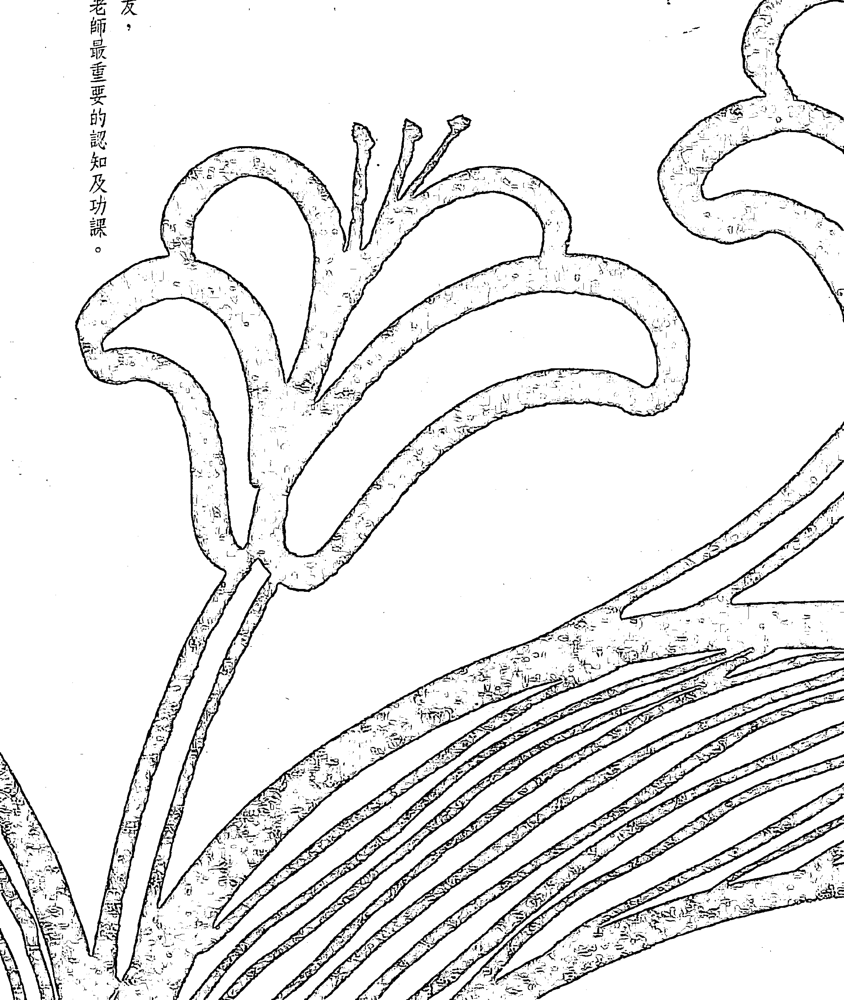
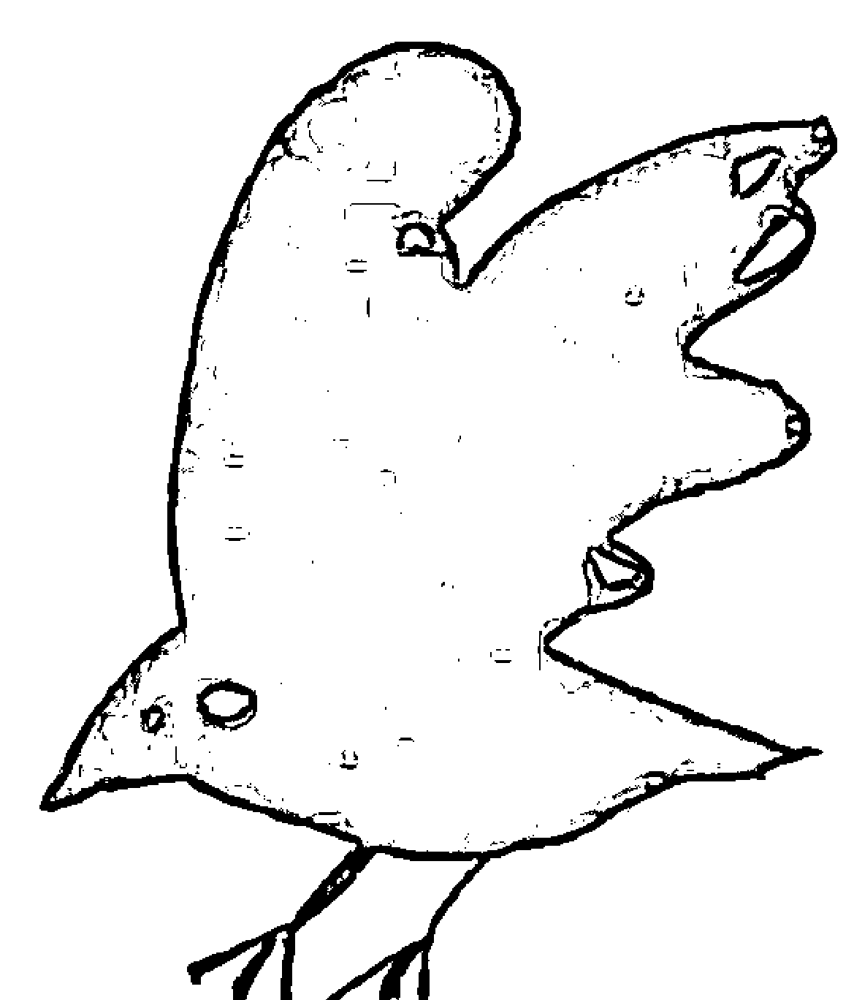
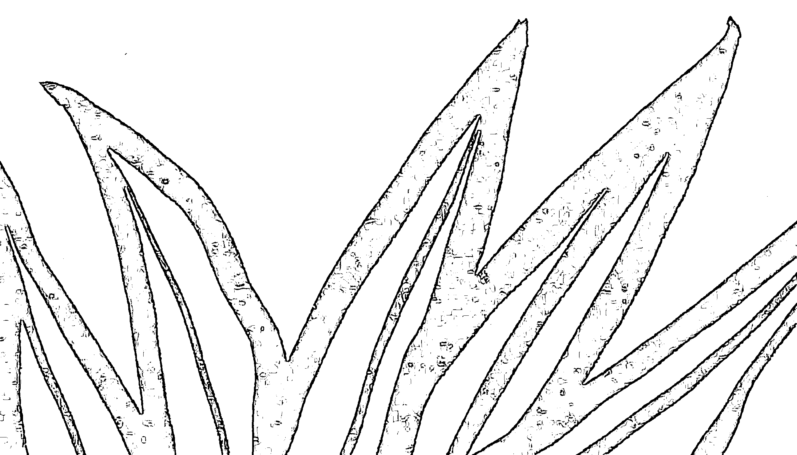
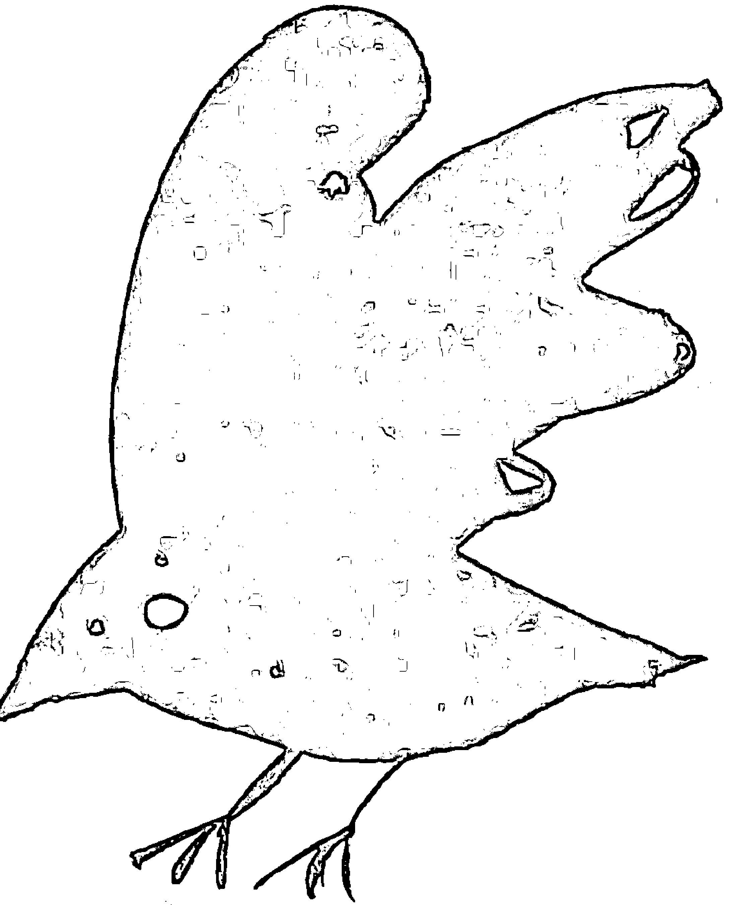
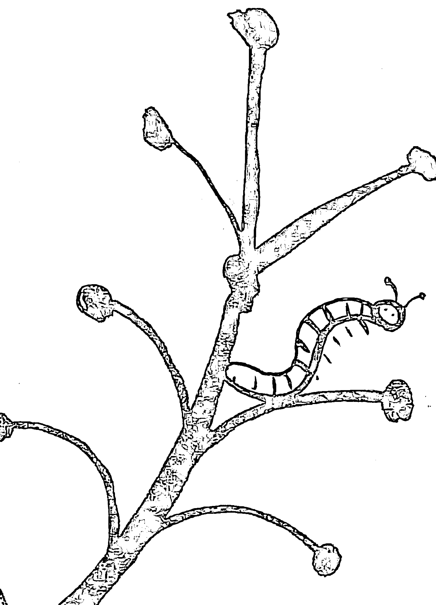
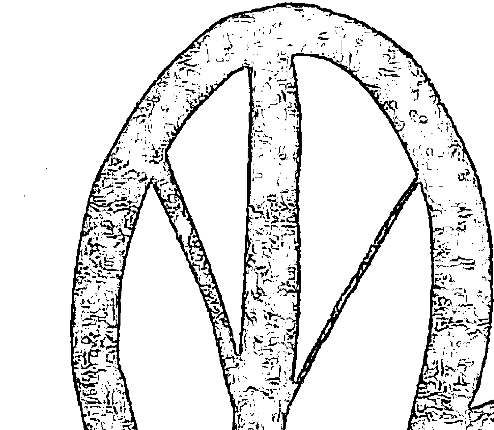

# 孩子都是老灵魂

# 關於賽斯文化

我是個腳踏實地的理想主義者。賽斯文化，是為了推廣身心靈健康理念而成立的公益文化事業，希望透過理性與感性層面，召喚出人類心靈的「愛、智慧、內在感官、創造力」，讓每位接觸我們的讀者，具體感受「每天的生活，都是靈魂的精心創造——You create your own reality.」我們計畫出版符合新時代賽斯精神之書籍、有聲書、影音商品及生活用品，並將經營利潤投注於賽斯思想及身心靈健康的推廣，期待與大家攜手共創身心靈健康新文明。

# 省思自己，了解孩子

推薦人的話

醫師的天職是照顧人的身體與健康，但能同時照顧身體、情緒、感受的醫師，一定能從工作中獲得大量的滿足感與成就感。

許醫師是我院內的身心科主任，從這本書中，我感受到他對生命的珍惜以及對身心靈教育的執著與熱情。書中，〈傾聽孩子的心——生命會找到自己的出路〉，顯示現在的父母總以為「孩子不懂事、不會自動自發、不關心也不在乎自己未來」，因此認為「一代不如一代」，擔心其未來的前途。但以身心靈角度而言，下一代不但有著比我們更豐富的地球輪迴經驗，而且是心靈上配備好來面對未來世界的挑戰的，卻只因我們自己偏狹的觀念，產生對生存的恐懼與焦慮感。所以學校和家庭的教育最大的問題，是來自師長與家長的觀念與心態。我自己也有一位高中二年級的小孩，感同身受，因此許醫師能將這些觀念訴諸文章，令我佩服與感動。寫作除了要動腦筋、花心血、勤做功課以及收集故事，同時也需要過人的耐心。

我個人雖是一位外科醫師，但多年來掌管衛生行政，也曾經規劃無數有關精神心理的照護計劃，在精神、心理的層面，讓我深深體會到人性的複雜與微妙。

孩子是未來的主人翁，身為父母或師長者，除應給予孩子全心全意的安全感與信任度外，最好也能在孩子的情緒與身心健康這部分多付出關愛，方得以教養出人格健全的下一代，創造出優質的社會與國家。

許醫師將診間所遇到的案例，用他的生花妙筆、敏銳的觀察力、刻劃出一部發人深省的作品。作為讀者的你，在看完文章後，一定可以從這本書學習到如何維護優良的親子關係、親職教育與成長，省思自己、了解孩子，深信將為你照亮生命的道路，活得自在、快樂又健康。

孩子都是老天爺

# 【推薦人簡介】

沈希哲醫師，高雄醫學大學醫學系畢業，美國紐約霍普金斯大學公共衛生碩士、國立台灣師範大學衛生教育學系博士班。曾任台北市立中興醫院副院長、台北市政府衛生局第三科科長、台北市立陽明醫院急診醫學科主任、行政院衛生署台北署立醫院急診醫學科主任。現任台北縣立醫院院長。

# 「自序」
親子關係的覺察與成長

許添盛

自我的上一本書《不正常也是一種正常》出版以來，也不過半年多的時間，感覺起來卻彷彿是相當久遠的事了。我想，原因在於這是第一本由「賽斯文化」出品的新書吧！從一家出版公司的籌畫、申請、成立，及至順利運作，過程實在不容易，在此也要感謝每一位新時代賽斯家族夥伴的共同努力。

撰寫這本書的動力，來自於長期以來對推廣身心靈教育的理想、執著與熱情。在我的診間裡，幾乎所有臨床上所見的痛苦、衝突與掙扎，最後都會探討到親子關係、親職教育、自我探討、覺察及成長。於是，我起了一個念頭，如果能以新時代賽斯思想為根基，探討一些兒童心智科或身心科常見的案例，也許能對許多「熱鍋上的家庭」有所助益；不僅如此，我還精心摘選了許多與親子教育有關的賽斯思想及身心靈健康觀念，希望從根本角度來協助大家成長。

在我內心深處，還有一份表面是「歉疚」、底層卻是「愛」的情感。這來自於我平日身心科門診的匆忙，加上各地演講推廣的緊湊生活，常常沒有較多的時間來與大家進行更深入的親子對話。繼《在孩子心裡飛翔》之後，我完成了這本《孩子都是老靈魂：新時代親子身心靈教育》，但願能帶給每個家庭幸福、成長與健康。

# 致 謝

本書的順利出版，要感謝下列人士熱心贊助：
科通股份有限公司董事長蔡百祐、吳惠芬夫婦與總經理吳惠容
園達實業股份有限公司董事長林錫埼夫婦暨全體同仁
日月星視聽社
許全瑤女士
杜汾玲女士
徐坤賜醫師
在此誠心祝福他們福壽綿延、幸福快樂

### 傾聽孩子的心
生命會找到自己的出路

現在學校和家庭教育最大的問題，來自師長及家長的觀念及心態。
大人們總以諸如「孩子不懂事、不會自動自發、不關心也不在乎自己未來」的不信任心態來看待他們，往往認為「一代不如一代」——父母如此地用功努力，在社會上都還奮鬥得這麼辛苦，孩子卻一副不求上進、事不關己的樣子，未來前途該怎麼辦啊。

以身心靈角度而言，其實下一代不但有著比我們更豐富的地球輪迴經驗，而且是心靈上配備好來面對未來世界挑戰的。只因我們自己偏狹的觀念、面對生存的恐懼及焦慮感，才讓我們看不見孩子的優秀及貼心，於是產生種種對孩子的不信任感及缺乏信心。

我想大聲疾呼，停止投射不信任的負面能量到孩子身上吧！「生命會找到自己的出路」，換個信任、欣賞及鼓勵的眼光看待孩子，你會發現，原來他們真是如此的棒！

### 拒絕上學的小公主

原來，美美得到的是所謂「小公主症候群」，母親在夜市做生意，父親是小學福利社的員工，母親從小就把美美伺候得像個小公主，幾乎沒有違背過她任何的要求，甚至不要父親太過接近美美——因為母親覺得父親說話大聲，言語粗魯，會嚇到孩子。

美美是個國三學生，最近被母親帶到身心科就診，原因是她突然不肯上學，任憑家人怎麼問也問不出個所以然，於是在親友的建議下來找我。

這是個非常有趣的治療過程——因為治療次數不下二、三十次了，美美對我的任何一句問話從來就沒有回答過，當然，也從來沒有問過我任何一個問題！大家一定覺得很奇怪，許醫師不是號稱青少年心靈教主嗎？為何也有吃癟的一天呢？沒錯，我就是有這麼一天。但大家不要忘了，一個從不和我對話的少女，每次在母親的陪伴下會談，我竟然可以做心理治療，還做得有模有樣，一步步的抽絲剝繭，也達到治療上的突破，那可了不起吧！

在母親的協助下——當然，每次的會談美美都在場——我逐漸了解美美「拒學症」的形成。原來，美美得到的是所謂「小公主症候群」，母親在夜市做生意，父親是小學福利社的員工，母親從小就把美美伺候得像個小公主，幾乎沒有違背過她任何的要求，甚至不要父親太過接近美美——因為母親覺得父親說話大聲，言語粗魯，會嚇到孩子。

美美在成長的環境中，一路被當成小公主般地呵護著，雖然家境並不算太好，但母親從未讓美美吃過苦、分擔過家事，美美也生得甜美可愛，小學成績優秀，一路安然成長。

哪知進了國中之後，功課開始吃重，加上美美過去曾學過鋼琴，母親希望她進音樂班，但國中所謂的音樂班有時是升學班的化身，於是，美美不但要練習鋼琴，又要面對升學班的功課壓力。這下子問題來了——各位，美美是個小公主吔！她習慣人家處處讓她，也習慣老師、同學都將她捧在手心上，宛如她一路長大、家庭對待她的方式。

但是，進入音樂升學班——說得難聽一點，誰理你啊！美美開始面臨同學你爭我奪的競爭氣氛，由於美美的表現並不傑出，面對老師一視同仁的對待，甚至更爲重視功課表現好的同學時，加上自己要兼顧練鋼琴和準備學業，壓力實在太大，終於有一天，情緒爆發了，美美開始拒絕上學。

做父母的當然心急如焚，尤其都已經國三了，眼看就要面臨基測，如果不去學校，也許要報中輟，那不就領不到畢業證書？哈，關鍵來了，過去父母一直當美美是小公主，如今卻對她又打又罵，甚或只是說話大聲一些——各位猜猜，小公主的反應會如何？是的，她根本不願開口說話了！這就是我所見到的情景。

我試著安撫父母的情緒，萬事萬物的發生，必有它背後的道理及正面的意義。往好處想，美美的拒絕上學，是一種心理上正面的防禦機轉——人格避免其自信心全面崩盤的自我防衛措施。如果她咬著牙硬撐下去，也許導致憂鬱症、自殺意念，或人格的全盤崩潰，那時的下場更難收拾。如此一來，美美可以重新整頓自己的內心，調適心境，從過去理所當然受保護、禁不起挫折、要人家處處讓她的小公主，蛻變成一個可以適應社會環境的小女孩。

我告訴父母，先不要急著逼她上學，這只會適得其反，我們應該成為心靈的福爾摩斯，一步步澄清、了解美美的內心感受，這樣一定會有幫助。果然不出我所料，美美雖然不去學校上課，但因爲快畢業了，她卻願意去學校考試，以便可以順利畢業，同時也在家裡復習功課，把握自己想要的未來；最近更由於母親住院開刀，美美開始拿掉小公主的身份，學習照顧母親，整個人成熟懂事多了。我想，這也是一個很棒的成長歷程吧！

#### 拒學症

#### 我生下來不是來寫功課的

小凱開始不想上學，明明寫好的功課和聯絡簿都已經放在書包裡，只等著第二天帶去學校，可是，小凱竟然在上學前將寫好的作業本統統拿了出來，硬是不帶到學校去；還有，當媽媽與小凱討論學校的功課及所有這些事時，他彷彿都心不在焉、有聽沒有懂。

小凱最近的行爲相當奇怪，常常拖到最後一分鐘才寫功課，有時會把聯絡簿和課本都忘在學校；媽媽看到這個情況，以爲他只是不愛寫功課及記性不好，當然也少不了—頓教訓或責備。

但逐漸地，媽媽感到不對勁了。小凱開始不想上學，明明寫好的功課和聯絡簿都已經放在書包裡，只等著第二天帶去學校，可是，小凱竟然在上學前將寫好的作業本統統拿了出來，硬是不帶到學校去；還有，當媽媽與小凱討論學校的功課及所有這些事時，他彷彿都心不在焉、有聽沒有懂。媽媽終於把小學二年級的小凱帶來門診找我。

小凱長得十分可愛，就像電影「一家之鼠」的男主角一般地討人喜歡。我直覺地發現，小凱相當在意媽媽的感受——雖然他並未在表情及言行上顯露出這一點。

我們進行會談治療時，媽媽提及：「小學生本來就應該寫功課……」我馬上在小凱面前問媽媽：「小學生『應該』寫功課，請問這是大人的『應該』，學校的『應該』，社會的『應該』，還是小朋友天生的『應該』？」小凱大概是第一次聽見有大人竟然這樣說話，而且還滿符合他內心的想法，於是整個眼神亮了起來。

我繼續說了：「理論上來講，就我自己當過小孩的经验，幾乎沒有小朋友是天生喜歡寫功課的，就心情而言，我也很不喜歡寫功課呀！不信我們來問媽媽：『小凱媽媽，妳小時候很喜歡寫功課嗎？』」這時，只見媽媽露出難堪的表情，又不得不點頭承認：

「好啦，給你說中了，我小時候也不喜歡寫功課⋯⋯」
「就是啊！」我說，「沒有人天生喜歡寫功課，但是上了小學，尤其是升小三和小五這關，或即將升上國中時，都是要唸的書及功課突然加重的時刻，也難怪小朋友會適應不良。這樣好了，先來建立一個共識——是的，大家都喜歡玩，不喜歡寫功課，但既然進了小學，功課還是得寫，那我們就一起來想想辦法囉！」

我也請小凱問媽媽：「媽媽，妳喜歡玩還是喜歡上班？」媽媽回答了：「如果能有辦法每天玩，那我為什麼還要上班呢？」不過，人生總是要取得平衡嘛。在這番對話之後，小凱和媽媽之間，就不再是大人和小孩意識形態上的對立，而轉變為一種彼此坦誠的溝通。

經過幾次會談及關係建立，小凱漸漸地說出他內心的想法。有一次，小凱告訴媽媽：「媽媽，我生下來是來玩的，不是來寫功課的。」這句話頗耐人尋味，也道出了小凱內心對於「為什麼必須上學和寫功課」這件事，始終存著疑問。

我也開始探討，小凱「尚未進小學前」和「開始上小學『應該』寫功課之後」，媽媽對待他的方式有什麼不同。小凱表示：「我不喜歡後來的媽媽⋯⋯」媽媽忽然想起，這幾年來，兒子時常問她一句話：「媽媽，不管我寫不寫功課，妳不是都應該愛我的嗎？」

哦，一切終於搞懂了。小凱天生覺得自己是來玩的，他並不喜歡寫功課（當然，每個小朋友都是這樣，但這並非小凱連寫好的功課都不願交出去以及後來不想上學的主因），而當小凱在抗拒寫功課的過程中，發現一向愛他的媽媽突然「變了」，因為「不寫功課及聯絡簿的事」，而變成一個生他氣、兇他及責備他的媽媽。小凱心中很迷惑，難道「只因爲功課」，媽媽就不愛我了？

小凱對功課起了反感：「都是『功課』害得媽媽不再愛我了！」於是，他不想寫功課，就算寫了也不想交出去，當然——更不會想上學。

那麼，聰明的父母們，你應該明白了——「應該」寫功課、「應該」唸書，是大人

### 傾聽孩子的心

#### 孩子都是老靈魂

的立場及感受，並非兒童的感受。還有，請不要讓孩子再感受到：「是不是我不乖、不寫功課，你們就不愛我了！？」

#### 拒學症

###### 在一旁內心「皮皮挫」的小孩

「那我知道了，恬恬雖然沒有不乖、不寫功課，但看到老師打那些很調皮、不乖的同學，是不是心裡好怕，好怕有一天老師會打妳？」終於，恬恬忍不住眼中的淚水，大聲地哭了起來。媽媽心疼地走過來摟住恬恬，表情流露著許多的不捨。

恬恬是個小學一年級的女生，到了下學期開始不久，她突然拒絕去學校，每天早上到了上學時間就哭，好不容易進了教室也一直哭，一哭就是二、三個小時，怎麼勸也勸不聽。

剛開始爸爸媽媽採用威逼利誘的方式勉強她，可是一點用也沒有，老師實在沒辦法上課。恬恬也待過幾天學校的輔導室，可是，只要一回到教室，她就開始哭。後來，父母實在沒辦法了，從女兒身上也問不出個所以然，於是帶恬恬到門診找我。雖然，我是個又帥又親切的醫生，但這招對小女生不見得能產生效果，所以遇到這種狀況，有時我會從搞笑開始建立彼此的關係。

「恬恬是個很棒的學生，對不對？」
「恬恬其實很想去上學，可是，又很怕進教室，對不對？」
「哦！是不是學校有同學欺負妳？」

恬恬搖搖頭。

「哦！我知道了，學校有一隻獅子，會跑出來吃小朋友，所以恬恬不敢上學，一定是這樣啦，妳看醫生叔叔是不是很聰明？」

恬恬哭笑不得的用力搖頭。

「不是？那我又知道了，不是獅子，那一定是隻恐龍。有一隻恐龍會吃小朋友，所以恬恬不敢去，妳看，這次我是不是猜中了？」

> 請不要只把注意力放在被處罰的小孩身上，那看到別人被處罰的小朋友，內心也需要我們的關懷呢！

恬恬終於忍不住說話了：「不是啦！」

「太難了，不過叔叔——其實妳叫我哥哥，我會更高興——一定會猜中的。是不是老師很兇，會打人、罵人，所以恬恬是不是怕被打、被罵才不敢去？」

恬恬搖搖頭，但表情似乎有些鬆動的痛苦。於是我問媽媽，恬恬有因為在學校講話、不乖、不寫功課而被老師處罰過嗎？媽媽回答說，恬恬從小就是個自動自發的小孩，事情只要吩咐一次，她一定會做得很好，因此從小到大，父母從來沒有罵過或打過她。

這時，我心中的直覺大概八九不離十了。於是我問恬恬，「在學校裡，如果有些小朋友不乖、不寫功課，老師會不會打人或罵人？」恬恬用力地點頭。「那老師有沒有打過或罵過妳？」恬恬說沒有。

「那我知道了，恬恬雖然沒有不乖、不寫功課，但看到老師打那些很調皮、不乖的同學，是不是心裡好怕，好怕有一天老師會打妳？」

終於，恬恬忍不住眼中的淚水，大聲地哭了起來。媽媽心疼地走過來摟住恬恬，表情流露著許多的不捨。

我告訴媽媽：「像恬恬這種內向害羞的小孩，她非常敏感，也非常的自動自發，只是大人的一個眼神、一個吩咐，恬恬就會放在心上，努力去達成，而且會擔心自己做不好，被大人處罰。雖然老師從來沒有處罰過恬恬，但當恬恬看到那些搗蛋調皮的同學被打手心、打屁股時，她的心中一定很害怕、很恐懼，在她小小的腦海裡，也一定擔心會不會哪天輪到自己。於是，在極度的恐懼下，恬恬根本就不敢上學，打死她也不敢去。」

媽媽請教我該怎麼辦？我說：「這得要雙管齊下，一方面做父母的要向恬恬解釋，是因為那些小朋友不寫功課、調皮搗蛋才會被老師處罰；另一方面希望能和老師溝通，請老師向恬恬保證，『妳放心，老師不會隨便處罰小朋友，除非妳不交作業或不守規矩，否則老師一定不會處罰妳。』」

於是，恬恬又快快樂樂的去上學了，而且老師還做了一個特別處置（當然，這也是我建議的），以後處罰任何同學時，都盡量在私下場合，而不要當著全班小朋友的面前進行，這同時可以維護被處罰者的尊嚴，也能避免看到的小朋友心理上可能的創傷。

大家可別覺得這樣的個案應該很稀少，其實才不！在許多的家庭教育當中，常常不是那個最調皮、最不聽話、被打得最兇的小孩內心受傷最重，而往往那個最乖、最聽話、在旁邊可能心裡「皮皮挫」的小孩，心靈受傷程度反而是最嚴重的。因此，各位師長父母，請不要只把注意力放在被處罰的小孩身上，那看到別人被處罰的小朋友，或許他的內心也需要我們的關懷呢！

#### 拒學症

##### 因為我沒那麼愛他

進入國中後，琦琦開始留意到，周遭有些男孩對她投以愛慕的眼神。可是各位，說來遺憾，這時願意不顧功課和家長的反對，投注許多時間、精力與金錢在小女生身上的，也是那些內心缺乏愛、在家庭學校裡不被關心、甚至自身已經出現種種問題的小男生。

現在的孩子著實令人驚訝——明明是國一的小女生，但有時竟然展現出大學女生般的成熟。不免令人感嘆，時代真的在變了。

琦琦就是這樣的一位少女，她因為種種行爲問題，時而翹家，時而翹課，在母親百般的無奈下，由老師建議，帶來門診看我。

面對上了國中的孩子，有時我會順理成章地要求家長在外頭稍待，因為這種時候，小孩要說的話多半是「父母不宜」，套句我常說的話：「沒有問題小孩，只有問題家庭！」還有，如果你家有女初長成，那我也會有個怪怪的提議——進入青春期的女孩子，最好不要一開始就「太漂亮」。

理由是這樣的——當孩子進入國中時，體內的荷爾蒙也開始發動了，一個過於早熟、打扮得太成熟漂亮的女生，會立刻吸引全校男生的注意。我的意思並不是批評這樣的現象或這類的青少年，而是想指出，太早的戀情背後可能會隱藏很多問題。

好比說，父母親太忙，以至於孩子自小缺乏關愛；單親家庭的背景，孩子內心對於「被愛」、「被關注」有強烈的渴望；父母親一向吵吵鬧鬧，家庭背景複雜，以致孩子成長過程孤單，內心的感受從來沒有被真正的了解及接納——當這類孩子進入青少年期，就會提早掉入「愛情漩渦」。

話說回來，琦琦是個早熟、單親家庭的小孩，由於家庭經濟的重擔都在母親身上，母親也沒有太多的時間陪伴這個女兒，了解她內心「愛的需求」。進入國中後，琦琦開始留意到，周遭有些男孩對她投以愛慕的眼神。可是各位，說來遺憾，這時願意不顧功課和家長的反對，投注許多時間、精力與金錢在小女生身上的，也是那些內心缺乏愛、在家庭學校裡不被關心、甚至自身已經出現種種問題的小男生。

琦琦和她的小男友，就是在這樣的情形下互相來電。琦琦發現，原來有另外一個人「如此在乎她」，這是她從小到大渴望得到卻一直未曾擁有的，於是便一頭栽了進去。後來，小男友犯了竊盜案，即將入少年監獄服刑，琦琦才情緒崩潰，不想上學，也完全無心於課業。

一如往常地，我會和青少年個案有個君子協定，所有的會談內容均屬保密，除非經過他的允許，否則我不會告訴父母（當然，如有自傷、傷人之虞，或危及生命則不在此限），而且也要事先讓父母知道此一協定——通常父母在別無他法以及為孩子著想的情況下，都會同意。

接下來，我訝異地發現，國一的琦琦已經開始和男友有了親密的性行爲，於是我便再三叮嚀她自我保護和預防懷孕的性知識。由於感受不到我的批判，於是琦琦更加信任我。

由於和男友分手在即，琦琦又因爲之前的行爲問題受到同學的排斥及學校的不諒解，甚至考慮成爲中輟生，我便開始對她進行一連串的「拯救大計畫」。琦琦早熟的心智，也令我與她之間的溝通格外順暢，我常常以這句話作爲會談的開場白：「不是一定不能中輟，也不是一定不能懷孕，好！那我們來討論，現在妳要找怎樣的工作、每個月賺多少錢來養小嬰兒，不過我看，妳媽媽還沒準備好要當外婆吧！」聽我這樣說，琦琦笑了出來。

在治療上，我們朝幾個方向努力，第一是加強母親對琦琦的關心，以及心靈上的陪伴與接納；第二是不要去批判琦琦之前的行爲和戀情，第三是開始輔導琦琦融入正常的學校生活，得到同學、老師與學校的再接納。結果相當的成功，琦琦終於又願意回到學校了，而且學業成績還過得去。

我最近一次看到琦琦，問她有交新的男朋友嗎？她的答案很有趣：「許醫師，你放心，我目前還是交了一個新男友，但第一，因為我沒那麼愛他，第二，我年紀還小，還想唸書，不想懷孕生小孩，所以也不打算和他發生性關係啦！」看到整件事情有了正面的發展，身爲心理醫師的我，內心也感到欣慰不已。

### 傾聽、了解、關心、陪伴

一定有某些心中的傷痛是如此的鮮血淋漓，卻從來沒有真正復原過，以致當孩子用藥過後，傷痛是那樣的栩栩如生，以致他必須用銳利的刀鋒劃下雪白的肌膚，當鮮血流出的瞬間，彷彿心中的傷痛也有了出口，如此才能令他的內心感覺舒坦。

想知道你的小孩有沒有使用安非他命、K他命、一粒眠，或搖頭丸（新名稱是「綠豆」、「紅豆」……）之類的藥物，其實相當的容易。

首先，當然是他的交友狀況，那也是你最需要小心處理且最棘手的部分。因為在孩子的心目中，往往朋友是比父母還了解以及支持他的，批評他的朋友就等同於批評他和不信任他。孩子可能和一些年紀比他大的中輟生來往（當然，這並非泛指中輟生是不好的），而且朋友當中有些已經在使用安非他命及搖頭丸之類的禁藥。

其次是孩子的作息改變了。一陣子晚上都不睡覺、精神一級棒，一陣子又幾乎整天嗜睡，有時情緒不穩、愛發脾氣及疑神疑鬼。因為剛使用完安非他命之後，人會變得精神超好，不必睡覺也不需吃東西，但戒斷期就會拼命睡，睡醒了再拼命吃。

再來就是行為的改變。有些孩子特別會出現自傷行為──你看看他的手腕及手臂，可能有一、二十道及至數不盡的刀傷疤痕，都是每次用藥之後情緒不穩加上心頭的舊傷新痛發作所造成。孩子的理由很簡單，「割下去，看到鮮血流出來，心裡會比較舒服！」

但是我常會這樣想，一定有某些心中的傷痛是如此的鮮血淋漓，卻從來沒有真正復原過，以致當孩子用藥過後，傷痛是那樣的栩栩如生，以致他必須用銳利的刀鋒劃下雪白的肌膚，當鮮血流出的瞬間，彷彿心中的傷痛也有了出口，如此才能令他的內心感覺舒坦。唉！光是想到這畫面，就足以令許多大人心中感到不捨了。

> 所有的問題、矛盾、衝突及傷痛，都是為了要喚起更多的了解、關心及真愛。

最後就是要問問大人自己了。我常說：「沒有問題小孩，只有問題大人！」「沒有問題人們，只有問題社會！」許多使用安非他命或搖頭丸的小孩都是來自問題家庭，也許從小父母離異、天天吵架或忙於工作，對孩子疏於關心。而拼命打罵小孩、禁足及嚴加管制，都是治標不治本，關鍵永遠在於：「多傾聽，多了解，多關心，多陪伴。」

在我的門診中，許多有多次自傷記錄的國中生（大多是用美工刀割手腕及前臂），都很早就開始發生戀愛及肉體經驗，向外尋求他在家庭中得不到的愛、陪伴及關心，而且一投入就會過度認真。而父母多半相當的生氣及不解，「國中生不是應該專心唸書嗎？為什麼這麼小就談感情和變壞？」但是大家常常忘記一點，專心課業的中學生，大多是在家能得到充分的愛及關心的那一群。至於從小就缺乏家庭溫暖及父母完整的愛的青少年，他們一旦長大，絕對不是專心於課業上，而是盡快地對那些會愛他、陪伴他、傾聽他說話的異性朋友投入情感，他還能從朋友身上得到許多的肯定和讚美呢！那些都是父母不會說或沒有時間說出口的。

換個思考方式，問題小孩也是指出問題家庭、問題婚姻及親子互動的問題所在。我常說，所有的問題、矛盾、衝突及傷痛，都是為了要喚起更多的了解、關心及真愛。只要家庭成員能重新喚起彼此心中真正愛的情感流動，所有的傷痛都能撫平，所有的問題也不再是問題了。

#### 拒學症

##### 著重過程，而非只是結果

我問媽媽，「請問妳先生是什麼個性的人？」媽媽回答：「許醫師，你問對了！我先生是個最結果導向的人，非常愛面子、追求完美；他常告訴孩子，過程有誰看見了？過程一點兒也不重要，只要結果出來，成敗就出來了，誰還在乎過程？」

「許醫師，怎麼辦？我的小孩已經兩個月不肯去上學了，」一位心焦的媽媽這樣問，「我們什麼方法都用盡了，好說歹說，他就是不肯去。」

我說：「有沒有試過先不要進教室，到輔導室自習，等心理調適好了，再進教室？」

媽媽說：「也試過了，但就是沒效！」

「好吧！當所有的方法都用盡了，而問題依舊無法解決，那就表示我們需要的是進入一個『過程』，而非立即解決問題。」媽媽瞪大了眼睛問我：「那是什麼意思？」

通常人類的思維方式都非常的「解決問題導向」，人們都想立刻看到狀況的改善、問題的解決，但偏偏宇宙的定律並非如此。在小朋友的學習歷程中，老師及家長通常犯上一個很大的錯誤，那就是「結果」取向。

老師在教學的過程中，都習慣趕快讓小朋友「學會」，不要浪費太多摸索、思考的時間；而嘗試錯誤的過程，也最好不要等待太久，盡量用最短的時間、最快的方法，令小朋友「知道」標準答案。等結果出來了，答案確定了，小朋友學會了，大家就鬆了一口氣，因為已經有「成果」了嘛！

家長也是，「你這樣慢吞吞的寫，慢條斯理的想，哪一天才做得完？來，我直接告訴你答案是什麼比較快！來，直接這樣寫、這樣做就對了！」

老師和家長都希望立即看到學習的成果，唸書的過程不重要，思考的過程也不重要，直接有成果、得高分，名列前茅比較重要。曾幾何時，這種只問結果、不問過程，只在乎最後成敗、不在乎經歷過程的運作及思考方式，已經蔓延到兒童的學習歷程中了。

我問媽媽，「請問妳先生是什麼個性的人？」媽媽回答：「許醫師，你問對了！我先生是個最結果導向的人，非常愛面子、追求完美；他常告訴孩子，過程有誰看見了？過程一點兒也不重要，只要結果出來，成敗就出來了，誰還在乎過程？」

我說：「難怪！妳的小孩唸小學時成績很優秀，結果上了國中後，不再能名列前茅，在妳先生的觀念及孩子後來的人生觀裡，都是志在得名、不在參加；那麼，拒學的道理實在太簡單了，『既然我不再名列前茅，那我爲什麼還需要上學？那不是更沒面子及增加挫敗嗎？』」

「妳的小孩好比那種參加賽跑的人，既然不能跑在前頭，乾脆向後轉，直接跑回家算了！而且這樣的行爲模式，正是你們這個家集體潛意識的展現。」

「那該怎麼辦？」媽媽問。我心想，其實很多這類的問題都必須經由家族治療，甚至令家人一同改變的家族成長來達成。比如說，爸爸必須改變自己的認知與觀念，調整信念，由「只要結果，不在乎過程」轉變為「有時更重要的是：是否已盡力跑完全程，而非只在乎名次」。

但老實說，這不只是家庭教育，甚至是一種社會教育。我們的社會經常是「笑貧不笑娼」，我想，這句話的意思並不是說「娼」就該被笑，而是說，彷彿只要你有錢，就是成功、有面子，甚至連你自己都可以不在乎那個「過程」或「手段」。政治人物也是，反正只要你取得權利就是老大，至於過程中有多麼地不擇手段，大家反正久了也就忘了。

親愛的各位，這是很可怕的現象啊！甚至在小朋友的教育當中，都出現這樣的觀念，「既然我不能名列前茅，乾脆就放棄吧！」可是，學習不能是如此，人生也不能是這樣啊！

回到過程，品嚐學習的樂趣，有時跑完全程比跑第幾名更重要。

大家想想，一個只問成敗、不問過程的社會，一個只問結果、不重過程的學習，一個只看表象、不看內裡的教育，甚至人們可以只問目的——縱使那是很好的目的，卻可以不擇手段⋯⋯如此這般，那整個社會以及孩子的未來會有好結果嗎？

我想提倡的是，告訴孩子，回到過程，品嚐學習的樂趣，不要急，不要太功利的只想得到成果及答案，有時跑完全程比跑第幾名更重要。當大人都有了這樣的概念，我想孩子的學習將更快樂，而「最終」也將更有成果。

### 給世界一張不好看的臉

女孩在兩歲時，弟弟出生了，之後，女孩覺得自己在父母心目中不再是唯一，而且家中成員大部份的寵愛都轉移到剛出生的弟弟身上。女孩在逐漸長大的歷程中，一直有個不滿及疑惑：「如果你們不再愛我、不真心喜歡我，幹嘛還把我生到這個世界上來⋯⋯」

在我的身心科門診中，總是有著許多的驚奇。記得曾有位個案，在幾乎已完成問診時才告訴我，其實她看病只是其次，最大的目的是想來看看許醫師本尊，順便拿書來給我簽名，害我差點昏倒，幸好急診就在樓下，坐個電梯也就到了。

這是一位高中一年級的女生，自從滿兩歲之後，就罹患了異位性皮膚炎，幾乎從小吃藥吃到大，只要一不吃藥，全身（包括臉上）就有角質化增生、發炎、脫屑、奇癢無比及色素沈澱的現象，成了她這輩子最大的困擾。

因為媽媽曾經聽過我的演講，也看過我的書，希望聽聽我的意見，如何從身心靈的角度來幫助她的女兒。雖然過敏性鼻炎、異位性皮膚炎及氣喘都有遺傳上的傾向，但其實遺傳因子也是性格及信念的傳遞者，因此父母經常將自身的氣質、性格傾向及獨特信念，透過基因傳遞給下一代，但這並不表示下一代都只是被動的接受者，而是說，當下一代有了自己的自由意志及獨立思考的能力，仍然可以透過賽斯所說的：「我創造我自己的實相。」用自己新的信念更新遺傳密碼，甚至可以修改某些被認為有遺傳傾向的基因密碼。

我還是對少女的成長歷程做了簡單而詳盡的探討。原來女孩在兩歲時，弟弟出生了，之後，女孩覺得自己在父母心目中不再是唯一，而且家中成員大部份的寵愛都轉移到剛出生的弟弟身上。女孩在逐漸長大的歷程中，一直有個不滿及疑惑：「如果你們不再愛我、不真心喜歡我，幹嘛還把我生到這個世界上來⋯⋯」

在數次與弟弟爭寵失敗的經驗中，女孩再度相信：「這世界是不接納我的，我是被排斥的。」於是，這樣的信念發動了她體內的過敏基因，心理上「討厭她所處的世界」及自覺「不被環境接納」的心情感受，終於轉成了生理上「不斷的對環境中各式各樣因子過敏的體質」。

我告訴女孩，「妳的異位性皮膚炎，不斷的反映出妳討厭妳所來到的世界，而妳也根深柢固的相信，妳的環境是排斥妳的，這和妳的成長經驗有關！」本來一開始，女孩還相當排斥身心科門診的，聽到這裡，她用佩服的眼神看著我：「這輩子好像只有這一刻，才真正被人了解！」

我的語氣毫不放鬆：「既然妳同意我的說法，那我還要繼續說下去。因為妳根本就不喜歡這個世界，那麼──妳幹嘛給它一張好看的臉，對不對？」女孩聽到這裡，彷彿被識破內心秘密似地大笑起來。原來，這是一種潛意識的比喻，女孩回應這個世界一張不好看的臉。

> 也許真正令你過敏的不是那些環境中的具體因子，而是你那對環境一直過敏的心情及感受呢！怪臉及醜臉，來表達她內心的不滿及防衛她脆弱的內在。

一旁的大人們，多半是滿臉疑惑地聽著我和孩子的對話。（我常想：「誰叫你們是那離天堂（或潛意識）較遠的大人，難怪聽不懂心靈之間的對話！」這時，媽媽忍不住開口了：「可是我真的很愛她，很多人都還說我比較偏心姊姊呢！」「別急，我說的是孩子內心的感受，是她『覺得』這世界看待她的方式及她『看待』這世界的方式。她從小一直有種不被接納的感覺，因此不管在任何環境都有種被排斥感，也感到格格不入。異位性皮膚炎就是這整組信念及感受的具體顯現，若這整組信念及感受不改變，那麼，吃再多的藥、作再多的治療也沒有用的！」我說。

過敏性疾患可說是很多人都有的毛病，在此我也想問問大家：「你是否有那種自覺不被周遭人事物所喜歡的感覺？是否心中時常在乎別人批判性的眼神及話語？是否在許多環境中都有那種不自在，甚或不舒服的感覺？」如果是的話，我想建議大家，用另一種角度及思維方式來面對你的「過敏性體質」，也許真正令你過敏的不是那些環境中的具體因子，而是你那對環境一直過敏的心情及感受呢！

當我以這樣的角度來幫助女孩時，我告訴她：「會不會妳一直覺得環境不喜歡妳，只是反映出妳先入為主的主觀心態？我們換個方式，如果妳先感覺父母及這個世界也沒那麼不喜歡妳，然後試著給這個世界一張笑臉，或許妳會開始覺得和周遭環境的關係其實還算融洽，那麼妳的整個體質會因為心態的轉變而完全改觀，甚至可以永遠不再過敏、不必再靠吃藥打針了。要不要試著做做看？反正對妳沒什麼損失嘛！」

許多孩子的病就是這樣讓我治好的。

#### 偏差行為

##### 小孩子偷東西怎麼辦？

小女孩不但在學校偷老師及其他小朋友的文具、在家也會偷拿父母的零錢，甚至到外面的商店同樣手腳不乾淨。這位媽媽感到相當困擾，在屢勸女兒不聽、打了也沒用的情形下，便聽從老師的建議，前來找我協助。

家庭基本上是個心靈能量完型，每個家庭成員不只是扮演他個人的角色，也演出了其他成員的潛在性格。舉例而言，當一個家庭成員成功時，他不只是個人性的成功，也代表了這個家庭的成功面；同樣的，當一個家庭成員失敗了，或誤入歧途，他也展現出其他成員內在不敢表達或面對的黑暗面。

因此，在賽斯思想的家族治療觀點裡，我們必須把家庭當作一個整體，當其中的個體有了身心問題，同時也代表了這個家庭的「問題面」，甚至問題的根源並非出在此一個體身上，他只是這個家庭成員們內在未解決問題的「出口」。比如說，中風的地方是大腦細胞，但從外表看來，最明顯的樣貌卻是手腳偏癱不能動。

因此，當一個家庭成員（尤其是兒童和青少年）出現問題，有時我會在整個家庭的氛圍及其他關鍵成員的內心世界裡，逐步尋找問題的所在。

有位媽媽帶著小學二年級的女兒來到我的門診，主訴是這小女孩會偷東西。小女孩不但在學校偷老師及其他小朋友的文具，在家也會偷拿父母的零錢，甚至到外面的商店同樣手腳不乾淨。這位媽媽感到相當困擾，在屢勸女兒不聽、打了也沒用的情形下，便聽從老師的建議，前來找我協助。

我切入的角度就如之前提及的，開始探索這整個家庭的深層心理結構，包括父母親的性格及彼此的互動方式。我也試圖引導父母先跳開一般的道德判斷——偷東西是不的、犯法的、不名譽的道德批判觀念，而以一種開放及探索的心態看待整件事的起源及來龍去脈。

媽媽開始描述結婚之後，她和先生之間的觀念差異及互動的隱微奧妙。媽媽的娘家家境是較爲寬裕的，父母對孩子的需求通常是有求必應，而且會盡全力滿足孩子的物質需求；先生就不是了，成長過程較艱辛，一直是能省則省。婚姻之初及有了孩子之後，兩人間的衝突就一直不斷。

媽媽提及，婚後她一直壓抑自己許多想買東西的欲望，每次孩子向父母要東西，父親總是用拒絕的方式，媽媽則是能給就給，不能給也暗自感到心疼。媽媽還說，其實她自己在婚姻中也過得相當辛苦，許多壓抑的衝動及欲望蠢蠢欲動，只好一直用「吃」來滿足自己，於是在婚後七年足足胖了二十五公斤。

我告訴媽媽，打個比喻好了，如果在婚前，媽媽的物質欲望有一百分，在婚姻的適應中，只滿足了十分，那剩下九十分的物質欲望可能完全被小女孩接收了。小女孩其實代表了媽媽內心未獲滿足的慾望小孩，雖然表面上好像小女孩偷拿東西，做了令父母丟臉的事，但從家庭能量來看，透過小女孩偷東西的行爲，父母內在壓抑的物質慾望也才有了一個出口，建立起另一種病態平衡。

如果在治療過程裡，只告訴小女孩「偷竊是錯的」，試圖糾正或導正這樣的錯誤行爲，基本上叫做「鋸箭法」（就是把射入肉裡的箭，只鋸掉表面的箭尾，就算治好了），這絕非根本之道。因爲，若沒有解決整個婚姻的問題及母親內在痛苦的慾望壓抑，就封住了這個出口，問題一定會另找出口。真正解決之道在於，引導家族每個成員開始自我覺察，不是單純的認爲：「小女孩出問題了，我們如何來解決『她的』問題，導正『她的』錯誤。」而是換另一種思維方式：「會不會一個家庭成員問題的根源，除了是他自己的問題之外，也在每個家庭成員的內心世界，或整個家庭其實早就出了問題。」以一種全家人共同進入身心靈自我覺察及成長的方式，來幫助自己及對方。

於是，這位媽媽開始由不一樣的角度，來思索女兒偷東西的這件事，終於願意好好面對自己的內心世界，也打算提起勇氣和先生誠心地溝通一番。相信這份全家人一同面對問題的愛與勇氣，終能將難解的課題化為無形。

會不會一個家庭成員問題的根源，
除了是他自己的問題之外，
也在每個家庭成員的內心世界，
或整個家庭其實早就出了問題？

##### 一○照顧感受○

###### 你們根本就不了解我

孩子最常對父母發出這樣的怨言：「你們根本就不了解我，也從來不關心我內心的感受！」父母則顯得相當挫敗及錯愕：「我們花那麼多的時間、精力及金錢，來照顧你、栽培你，你竟然還說我們不愛你、不關心你，實在令我們太傷心、太難過了！」

現代父母由於孩子生得少，相對上，賦予家中寶貝兒女的關心和注意力也較多，除了照顧生活起居、食衣住行，也得關心他們的課業及行為問題。但不知怎地，父母總是覺得和孩子雞同鴨講，尤其當孩子進入青春期之後，常常感到驚愕與不知所措：「那是我的小孩嗎？怎麼會說出這種話、做出這樣的事？」眼看著自己一手拉拔長大的小孩，彷彿成了外星人！

每位父母都希望孩子擁有健全的人格、快樂的身心、自信心及優異的學業表現，但有關孩子的教養層面，父母到底該怎麼做才好呢？

我想，最基本的不外乎是生活起居及三餐照料，父母盡其所能讓孩子有個安全的成長環境，在食衣住行方面，也盡量給予完善的照顧。其次是學習環境及盡可能多的學習管道，讓孩子除了接受正規的教育訓練，還要有機會接觸一些音樂、繪畫、體育及其他才能教育。

但在這裡，我想提出新時代身心靈觀念當中最重要的教育理念，那就是「照顧孩子的感受」。現代求好心切的父母，把照顧孩子的三餐與生活視為理所當然，也十分關心重視孩子的課業及行為。然而，父母往往忽略了更重要的一點——花時間了解孩子的感受、傾聽孩子說出內心的感覺，因此，更不用說去「照顧孩子內心的感受」了。

在我的診間裡，上演著不少親子衝突的場面。孩子最常對父母發出這樣的怨言：「你們根本就不了解我，也從來不關心我內心的感受！」父母則顯得相當挫敗及錯愕：「我們花那麼多的時間、精力及金錢，來照顧你、栽培你，你竟然還說我們不愛你、不關心你，實在令我們太傷心、太難過了！」

那麼，究竟是哪裡出了問題呢？

關鍵在於，我們的教育人員及父母還沒學到如何「照顧孩子的感受」。舉個例子，如果父母發現孩子在學校和同學起衝突，雙方各自掛彩回家，該如何處理呢？我的建議是，第一，不要急著興師問罪，找老師、打架的同學及對方的家長理論；第二，不要急著罵孩子：「明明叫你不要和別人打架，你就是不聽，活該！」第三，也不要急著寵愛或溺愛你的小孩，比如心疼他而給予他很多的玩具及糖果；第四，澄清及了解事情的始末，安定自己的情緒，平心靜氣地從小孩、老師、打架的當事人及旁觀者那邊了解事實真相；第五，了解整件事情的背後，孩子的感受是什麼，好比說：「威威，媽媽知道你是一個喜歡打架的小孩，是不是心中有什麼委屈，才會和人打架？」

也許這麼一問，孩子會「哇」一聲哭出來：「媽媽，他罵我笨，還笑我是醜八怪，我才忍不住要打他！」「哦！威威不笨，當然也不醜。說人家就是說自己，罵人家笨的人自己才笨，笑人家醜八怪的人自己才是豬八戒呢！乖，不要哭！媽媽知道威威不是故意的，但如果下次遇到這種事，威威可以直接不要理他或乾脆向老師報告，不然就回家問媽媽，看威威到底笨不笨、醜不醜，好不好？」

再舉個例子，假設威威月考數學只考了十分，帶著考卷回家時，父母可能會有幾種反應。第一，劈頭就罵型：「你是不是上課不專心、回家又不用功？你看看，才考十分，丟不丟臉？」第二，好言安慰型：「沒關係，功課不好無所謂，反正爸媽有的是錢，以後養你一輩子也沒問題，不用去理老師和學校。」第三，驚弓之鳥型：趕快幫小孩買參考書，請數學家教，緊急惡補。而所謂「照顧孩子感受」的做法則是：「威威，你要不要說說看，數學考了十分，自己的心情是什麼？」「很難過啊！覺得自己很笨，比不上別人！」「媽媽了解你的感受，但是威威其實一點也不笨唷！只是還沒有找到學習數學的訣竅，只要找到了竅門，上課專心聽，回家又複習，下次就會愈來愈棒了！」

在此誠心提醒各位關心教育的父母們，希望在每個家庭成員相處的氛圍裡，都能試著以不批判的態度傾聽及分享彼此的感受。當孩子的感受被父母注意到，同時能被了解及照顧到，這孩子就會擁有健全人格的基礎，將來父母也就可以少操一份心了。

當孩子的感受被父母注意到，
同時能被了解及照顧到，
這孩子就會擁有健全人格的基礎，
將來父母也就可以少操一份心了。

### 照顧感受

#### 反抗父母，孩子真的「變了」嗎？

一路走來還算平安幸福，直到女兒升上了國三，父母不知道發生了什麼事，只覺得孩子「變了」，變得愛發脾氣、事事和父母作對，要求有自己的空間，對父母的關心和叮嚀也愈來愈不耐煩。父母親傷心無奈之餘，完全慌了手腳。

新時代大師賽斯曾經提過，來地球輪迴的靈魂一定要當過男性和女性的角色，而且也要有身為父母親的經驗，照這麼說來，最短的輪迴之旅至少得經歷兩世。在地球上，身為父母是相當寶貴的經驗，從父母對孩子無私且無條件的愛當中，最能體會到「一切萬有」創造及呵護萬物的心情。

然而在現代社會裡，太愛孩子的父母也是會出現問題的。曾有位國三少女，由母親陪同來找我看診，因為她遭遇到嚴重的親子衝突，並且有課業適應及失眠的問題。媽媽提及自己的調適過程相當辛苦，很難相信當年懷裡可愛的小嬰兒已經亭亭玉立了，加上現代小孩發育成熟得快，雖是國三的女生，但衣著打扮其實已是街坊的時髦少女，更可怕的是，兇起來及頂嘴的模樣令人不知該氣還是該愛。

媽媽說，自己和先生都來自平凡家庭，一路辛苦奮鬥，組織了一個不算有錢，但尚可遮風蔽雨的小家庭，育有一兒一女，日子算是平順。她一直感嘆自己沒有快樂的童年，成長過程很艱辛，什麼都要靠自己，一路吃了很多苦，也很遺憾父母沒能多呵護及照顧自己；於是，當她爲人母之後，便將一切的愛轉移到孩子身上。尤其對小女兒，幾乎是百般呵護長大，從小捨不得她吃苦，凡事照顧得妥妥當當，捨不得她跌倒，一切的一切都事先準備好。她和先生將自己童年所沒有的，統統給了孩子。

一路走來還算平安幸福，直到女兒升上了國三，父母不知道發生了什麼事，只覺得孩子「變了」，變得愛發脾氣、事事和父母作對，要求有自己的空間，對父母的關心和叮嚀也愈來愈不耐煩。父母親傷心無奈之餘，完全慌了手腳——以上就是這對母女前來身心科尋求協助的原因。

與青少年個案打交道，我通常不會向孩子介紹我的身分是精神科醫師，而是——心理醫師，然後問他們：「看過國外的影集嗎？你現在和他們一樣酷哦，也有自己專屬的心理醫師了！」而且我會告訴孩子：「我不是你父母那一國的，而是跟你同一國哦！如果你喜歡，可以來看我，我還能為你保守秘密。」

媽媽告訴我，就是因為太愛小孩了，捨不得她受苦，才會事事保護、干涉、提醒，希望她不要跌倒，少走一些冤枉路；尤其是爸爸，根本接受不了孩子漸漸長大的事實，只想將孩子留在他的羽翼保護下，見到心愛女兒的不滿及反抗，做爸爸的真是心如刀割啊！

我告訴媽媽，真愛不只是保護，還包括給予自由及信任。就如同一切萬有創造了萬物，並非只將萬物置於祂無微不至的保護下，反之，祂給了萬物自由，讓萬物去學習，從跌倒中再度站起來，祂也給了萬物信心，讓萬物在生命的歷程中磨練，學習肯定自己的力量，這樣的一份愛才是更了不起的。

「看看妳的孩子，還是當年那個柔弱無助的小嬰兒嗎？不是，她已經漸漸長大，幾乎是半個大人，也比妳還要高了。她正渴望以自己的方式，掙脫所有的束縛與干涉，航向自己的人生，哪怕有艱辛、有痛苦、有跌倒、有挫敗，那也是她必得去嘗的，也唯有如此，她才能真正成熟及長大。」我再度強調。

這時，媽媽眼中的淚水早已奪眶而出。孩子也說話了：「你們把我保護得太好，我沒有力量面對未來的人生，這種情況不是更慘嗎？而且，我又不是要離家出走，只是希望爸媽調整一下心態而已！」

「許醫師，謝謝你的這番話，我想我聽懂了。你放心，我會回去好好和先生溝通，也希望他可以改變一下心態。對了！聽說許醫師還沒有結婚生小孩，也許哪一天等你當了爸爸，應該更能體會做父母的心情吧。」媽媽說。

我心想，對哦，還不知道自己能不能生小孩呢！我目送他們離開診間，除了搖頭苦笑之外，大概也不能再說什麼了。

### 照顧感受○

#### 陪伴孩子，把他們放第一位

> 「因為我不夠好、不重要，所以父母沒有足夠的時間陪我，不是把我丟到爺爺奶奶家，就是丟到安親班。」孩子沒有全然被愛的經驗，不覺得自己「值得被愛」、「應該被愛」，因此內心有著空虛的孤獨感。

個案是個青春洋溢的美少女，令人難以想像的是，她得到乳癌，而且在二十一歲時癌症復發。

在進行家族治療時，發現父母親的關係還不錯，各自的事業也都發展得相當順利。

但在孩子長大的過程中，媽媽總把她的事業擺在第一位，婚姻放第二，而孩子呢？打從一出生，就沒被父母放在第一位過，永遠排在他們的事業及婚姻之後。那麼，這對孩子的潛意識造成了幾種影響。

一是「我是沒有價值的」。「因為我不夠好、不重要，所以父母沒有足夠的時間陪我，不是把我丟到爺爺奶奶家，就是丟到安親班。」孩子沒有全然被愛的經驗，不覺得自己「值得被愛」、「應該被愛」，因此內心有著空虛的孤獨感。

二是孩子會有一種「討愛罪惡感」。「如果我要求父母多陪伴我、多照顧我，就表示我不夠成熟懂事且不夠獨立，讓父母沒辦法專心賺錢，我就成了壞寶寶。」孩子心中那種「如果我要求更多，就是增加父母負擔」的觀念成形，因此會產生內在的自責感。

現在社會競爭劇烈，大多是雙薪家庭，生活及婚姻又被許許多多的瑣事、爭吵所填滿，做父母的在心情及時間上已「自顧不暇」，哪裡還有足夠的心力和時間陪伴小孩呢？

曾聽過一位單親媽媽的故事。這個媽媽出於對孩子的愧疚及愛，每天努力工作賺錢，希望在兩個小孩成年之前給他們各自一棟房子，來彌補他們父親不在的缺憾，讓孩子在將來的社會上更有豐足的优势。某天晚上，卻知悉兩個孩子一起出車禍喪生，於是，痛不欲生的媽媽開始思考：「我這樣做到底對不對？為什麼要給孩子每人一棟房子？我每天忙於工作，連陪孩子吃飯、看電影、手牽手逛街、談天說笑的時間都沒有，現在孩子走了，我賺這些錢又有什麼意義？」

真的，孩子要的不多。豪宅、金錢、名利、地位、面子、學問，都是大人要的，大人自以爲是地為了孩子的將來而奮鬥，可有時看到的是，孩子連「現在」都沒有了，還談什麼將來？

身心科的門診裡，有許多所謂「分離焦慮」的兒童，在幼稚園或小學一、二年級時，每次父母要送孩子上學，就上演一段「生離死別的十八相送」，孩子哭得死去活來，父母則連哄帶騙，搞得筋疲力竭。

每次，我都會不由自主的替小朋友想著，「為什麼我就是得上學、上安親班，跟一群我不認識的人一起學我不感興趣的東西，為什麼我不能坐在媽媽的腿上，陪媽媽一起去送貨，我也可以幫媽媽擦擦汗或顧店。」教育當然是重要的，但教育也必須兼顧每個小孩的獨特性及個別性。

誰說某類有情緒障礙及嚴重分離焦慮的小朋友，不能藉由跟隨父母在「生活」當中學習？誰說教育一定是在教室裡，跟著其他同學上老師教的課才叫學習？錯了！我想，許多小朋友天生就需要在「愛的環境」中才能學習，跟著父母在生活中學習，成為小幫手，或許也可以是個另類的選擇。

我奉勸所有父母，不要只顧著生孩子，卻沒考慮到養育的層面。如果你尚未準備好在孩子小時候將他們放在第一位，那麼，懷孕生子之前，還是三思而後行吧！

## 生命教育

### 愛是超越時空和生死的

如果人離開這個世界後仍繼續存在，那麼，他以哪一種心理狀態存在？如果往生的人是住在另一個我們肉體感官感知不到的世界裡，那麼和在世的人之間還有沒有聯繫？如果答案是肯定的，那又是以何種方式聯繫？

身爲一位心理醫師，我常會對許多問題感到好奇。比如說，如果人離開這個世界後仍繼續存在，那麼，他以哪一種心理狀態存在？如果往生的人是住在另一個我們肉體感官感知不到的世界裡，那麼和在世的人之間還有沒有聯繫？如果答案是肯定的，那又是以何種方式聯繫？假設真有某一種聯繫的關係，這份關係又會如何影響在世的人的生活呢？

在賽斯書《未知的實相》當中，有一段描述約瑟和他已往生的母親——史黛拉——之間互動的關係，頗令我訝異及深思，原來所謂的親子關係，並不會隨著一方的往生而結束，不但影響是持續的，而且還會隨著雙方的成長和學習，而有「新的」互動呢！

話說史黛拉在世時，本來就一直希望她的長子約瑟擁有一間體面的房子，以彌補她自己先生的不足和她內心的空虛，因為在史黛拉心目中，有一間豪華、體面的大房子，代表了一個人世俗的成就。

有趣的是，史黛拉這種希望兒子成功的心意，以及企圖影響兒子的意念，並沒有因為她的往生而結束；在「另外一個世界」的史黛拉，除了安排自己往生後的生涯，可也沒斷了和大兒子之間的聯繫。

在約瑟終於有了一些錢而開始找房子的時候，另外一個世界裡的史黛拉，又開始發揮她對兒子的影響力了（當然，各位不要嚇一跳，史黛拉不是以鬼魂的形式或以幻聽的指示出現：「兒子，去看那一棟房子！」，約瑟則在潛意識收到往生母親的意念（當然，約瑟在意識層面也是完全不知道的），出現直覺及憑藉第六感彎進那條街，心中想著：「哦！如果媽媽還在世，這可能是她會喜歡的那類型房子。」（各位，我們心中不常有這一類的念頭嗎？）而不知道自己之所以會考慮那一棟房子，完全是受到在另一個世界的母親影響。

好，更有趣的事情來了！經過種種的考慮，約瑟最後選擇了不是在另一個世界的母親中意的那一間豪宅。如果史黛拉尚在人世，她會完全不明白兒子在搞什麼，而且會生氣，不理解兒子許多決定背後的理由；但是，各位不要忘了，史黛拉已經死了，到了另一個世界的人，總是會有許多的自我覺察及成長。後來，在另一個世界的史黛拉知道了兒子的決定，也終於第一次明白且接受了這個決定，她在世時總是無奈的接受，但這次，她明瞭兒子不是故意違背媽媽的意志，而只是不同意母親那種「住豪宅就代表成功的認知；於是，母子倆在這次的購屋事件中，達到了彼此更深的瞭解及相互接納，而這是當媽媽在世時，彼此一直達不到的溝通程度。

這個故事，開展了我的家族治療全新視野，原來所謂的親子及人際互動，並不會因為任何一方的往生而停止或終結，相反的，所有的互動、彼此之間的影響及相互的了解都持續在進行著，不同的只是從意識層面轉到了直覺、潛意識、無意識及夢境層面；我們一直以爲看不見、摸不著、不存在了，實情並非如此，根本只是由地面活動轉到地下活動，彼此的聯繫及相互的影響絕對沒有因爲哪一方的往生而減少，反而是一種擴大的了解。

於是，在處理個案與往生親友的關係時，我都不忘說一句：「你放心，他都還在持續關心你以及給你最好的建議呢！因爲，愛是超越時空和生死的。」

## 化解憂鬱的結

### 少量多餐，分段睡眠

不要再把孩子的飲食及作息習慣，調整成適應大人及社會上「一天吃三餐、每晚睡足八小時」的模式。

相反的，號召全家人、親戚、朋友、左右鄰居一起來改變——少量多餐（不要吃太飽、不要餓太久），每天四到五餐都可以；分段睡眠（不要醒太久、不要睡太久），晚上睡四到六小時，白天補充一兩次的小睡。

好處如下：增加小朋友的學習力、注意力、記憶力及創造力，過動降低了，情緒穩定了，學習進步了；大人的爭吵減少了，家庭的氣氛和諧了，家人情感的互動增加了，家中成員的慢性病改善了，全家人的身體更健康了。

坐而言不如起而行，就讓我們立刻開始吧！

## 一定要第一名？

邀請他坐下來，他都說趕時間、不坐了。看診多次，幾乎沒有 一次坐下來，打扮也很特殊，大多戴著口罩。有次我突然靈光一閃，問他：「你怕坐下來對不對？你怕被其他人傳染一些有的沒的？哈哈！我知道了，你一直在隱瞞我，其實你是強迫症！」

有些強迫症的小孩在發作初期，容易被診斷為精神分裂症，因為兩者有類似的症狀表現，都會給人一種「怪怪」的感受。

舉個例子，有位從其他身心科門診轉到我這兒拿藥的患者，每次總是來去匆匆，邀請他坐下來，他都說趕時間、不坐了。看診多次，幾乎沒有 一次坐下來，打扮也很特殊，大多戴著口罩。有次我突然靈光一閃，問他：「你怕坐下來對不對？你怕被其他人傳染一些有的沒的？哈哈！我知道了，你一直在隱瞞我，其實你是強迫症！」

只見患者眼神中，頓時閃爍著訝異及佩服的光芒，「許醫師，真有你的，我就是不想讓人知道！我一直有一些固著的強迫思想，覺得如果碰到別人碰過的東西，尤其是醫院裡的，就會被傳染怪病。我也怕碰到倒楣的人碰過的東西，覺得會被他身上的氣傳染！明知道自己很怪，卻也不想讓任何人發現！」

日後，我和這位個案之間便有種奇怪的默契──只要他這陣子是坐下來看診的，就表示症狀相當穩定；若是堅持站著看診，則表示病況較爲嚴重。

當然，強迫症、精神分裂症及躁鬱症都有遺傳上的傾向，但我們還是必須回到賽斯思想的根本論點。首先，是此生要來到地球的靈魂預先選擇了他這一世的父母（當然，意指他事先決定父母的基因傳承），而且，是胎兒的內我決定自己要選取的是父母那幾千億組基因的其中一組，以及如何配對；配對之後，胎兒的內我還必須以他自己此生的挑戰做爲藍圖，導引基因的發展方向。

許多遺傳專家不了解的是，雖然父母會將自己的個性、思維方式、生活習慣及信念，寫進個人的基因密碼中，但這並不表示孩子必須無條件接受基因的傳承；換句話說，孩子可以透過自己後天思維方式的改變、信念的調整，而決定不啓動那些遺傳基因，或重新改寫那些基因密碼。

最近有個強迫症的父親，帶著他國二的女兒來就診。女兒在其他醫院被診斷爲精神分裂症，且在服用抗精神病藥物，她的症狀呈現出思想紊亂、且描述不清到底是幻聽還是由內心聲音而來的強迫思考現象，但直覺及經驗告訴我，她的本質仍是強迫症。果然沒錯，過了一陣子，待症狀穩定後，果然顯現出的是強迫症的矛盾及猶豫不決的思維方式。

我開始從藥物及核心信念的探討，並伴隨家族治療的模式下手。眾所週知，我一直認爲藥物治療永遠是三流的手段，也只能治標及控制症狀，對治本可說是毫無用處，只有落後的精神醫學才會一直標榜藥物治療。

我逐步引導父母親及孩子，一同來探討與這強迫症有關的核心信念。原來，孩子在小學時成績優異，幾乎都是第一名，但升上國一之後，功課變多，壓力增大，要維持第一名愈來愈困難，直到升上國二，成績大多在十名左右，此時孩子的症狀也陸續出現了，直到無法專心上課唸書，成績更是直線往下掉。

這樣的歷程幾乎完全符合我的臨床經驗。許多國二、國三發作的青少年強迫症個案，都是小學成績優異，到了國一、國二後，因為功課壓力變大，成績下滑，產生極大的焦慮而開始出現強迫行爲（諸如重複檢查、洗手）及強迫思想（反覆的思考同一件事），但到底爲何會這樣呢？這位父親給了我一個很棒的解釋：

> 「許醫師，我知道了，因爲我的父親，也就是孩子的爺爺，從小灌輸我們一個觀念，唸書就是要得第一名，只要拿不到第一名，就代表人生失敗，而且未來就完全沒有希望了。那個核心信念是『得不到第一名，就是人生失敗』，因此在我自己的求學階段，就罹患了強迫症，但那時還不明白原因。我傳承了這個核心信念，也將它傳給了我的小孩，因此當我的女兒在國二不再是第一名時，她的內心起了很大的焦慮感，內心感到『整個人生徹底失敗了』，於是對自己完全失去了信心，產生醫學上所謂強迫症的症狀，如今我終於理解了。」

我帶著極度讚賞的眼神看著這位父親，並告訴他：「當你開始轉變自己的核心信念，整個家庭的氛圍會有所改變，你的女兒將因此鬆動她的負面核心信念，因此，遺傳基因的訊息也會重新改寫──持續努力下去，這種在精神醫學上只能控制而無法根治的強迫症，是能夠完全痊癒的！」

## 強迫症

### 護身符成了煩惱及痛苦的根源

原來，個案的父母篤信神明的力量，認為神明是無所不在的，祂具有洞悉人類思想及內心的能力，最重要的是，如果人有不潔的念頭、對神明不敬的思想，即會遭受到命運的懲罰及報復。

強迫症屬於精神官能症的一種，通常典型於國一至國三時發病，症狀可簡略區分為強迫思考及強迫行為，強迫思考又可細分為影像式、文字式及數字式，強迫行為則是重複檢查、重複洗手、重複清潔等等。

好比有些強迫症的個案，走在人行道上，一定要留意不能踩到紅磚塊的線上，否則就會有種不吉祥的恐懼感；有些人腦中會有一連串的數字，如果出門，一定要走七步，或七的倍數，否則得重來，不然就不能出門；有些個案經過廟宇時，會心生恐懼，擔心神明知道自己心中有對祂不敬或不潔的念頭，將受到神明的懲罰。

最近有位個案，自從父母從廟裡為他求了個護身符——這下子可好了，這個護身符成了他所有煩惱及痛苦的根源。第一，倘若戴在身上，進廁所大小便時褻瀆神明怎麼辦？第二，如果放在房間內，在與女友做愛時，那護身符則在房間內目睹一切「不潔的過程」。第三，那就不放在身上吧，可是都誠心請回來了，萬一神明生氣怎麼辦？第四，如果神明知道，我想把護身符丟掉，或我有任何對神明不敬的念頭，那不是隨時擔心被懲罰嗎？

於是，一個小小的護身符，卻成了個案每天擔心害怕、提心吊膽的東西，原本的強迫症狀，一下子全都復發了。在協助個案的過程中，我開始幫助個案探討他的原生家庭、父母的神明觀，以及個案自己對神明、無形界力量的信念和看法。

後來，我有了革命性的發現。原來個案的父母篤信神明的力量，認為神明是無所不在的，祂具有洞悉人類思想及內心的能力，最重要的是，如果人有不潔的念頭、對神明不敬的思想，即會遭受到命運的懲罰及報復。個案自小接受了父母這樣的核心信念，但隨著逐漸成長，接受科學教育的洗禮，心中其實產生一股不相信神明的聲音，甚至覺得神明根本不存在，或有什麼了不起；但內心又有另一個充滿罪惡感的自己，一想到神明知道他在這樣想，就更擔心害怕了。

運用新時代思想幫助這位個案時，我告訴他，其實每個人自己就是「實習神明」，他內在的潛意識及無意識也擁有神明般的力量，只是自己不明白及不會使用罷了。那種對無形力量的懼怕感，與其說是人們對有力量神明的恐懼，毋寧說是對自己內在神性的又愛又怕及認識不足。於是我告訴個案，其實他的內在就擁有神明的能力，根本不必像個卑微的人類般地恐懼神明。

其次，我引進了愛的觀念，告訴個案，如果祂是神明，那就不會對你不潔的念頭及不敬神的心態升起報復心,因為神明就是愛,祂只會用更大的愛與寬容來對待你,至於父母口中那位會懲罰人的神、會降惡運給你的神,其實是人的恐懼及扭曲所幻化的,根本就不存在。

再來,我又告訴個案「安全宇宙」的觀念。因為過去的科學及達爾文主義,給了人們一個意外形成的宇宙及適者生存的世界,而宗教上的神明,又給了人們一種恐懼得罪神、一天到晚害怕因果,以及萬一惹惱了神明、就沒好下場的人生觀。很多父母無意中也給了孩子這種「恐懼不安」的人生觀,每天擔心「想錯」、恐懼「做錯」,彷彿只要書念不好就是世界末日,在道德上,一失足成千古恨,在行爲上,一不注意則家破人亡。於是,孩子不是每天擔心無形的力量會降臨災禍到他身上,就是擔心一個小差錯會毀了他的人生等等。

這都是因爲人們不再感覺自己受到宇宙能量的恩寵,反之,卻全心全意戒慎恐懼地活在這個充滿意外、危險、不安和被無形負面力量所影響的世界裡,你說,孩子怎麼能不去一再檢查他的思想、重複他的行爲，以免犯下不可原諒的錯誤、惹出不可收拾的後果呢！

那麼，父母對我們所生存世界的安全感及信任度，將會大大的影響到孩子。所謂「安全宇宙」的概念，是父母自身必須感覺到，自己是受宇宙能量所護持及寵愛的，宇宙中無形的力量、運氣、命運或神明，是支持人類而非有所危害的，也不會降噩運或懲罰人們。所有這些觀念及感受，必須在孩子幼小時即讓他們深切感受及明白；還有，必須告訴孩子，他就是「實習神明」，他內在的潛意識及無意識，其實就是用來創造自身命運的無形力量。如此一來，我相信大多數強迫症的孩子，都將不藥而癒。

## 活在擔心被遺棄的恐懼中

小女孩每天起床要上學時，就開始哭哭啼啼，尤其當媽媽送她到校、要離開她回家的時候，她更是哭泣不止。而且，每到下課時間，她非得去看四年級的哥哥不可，怎麼攔也攔不住。

個案是位小學一年級的小女孩，就診的原因，是學校的老師建議父母帶小朋友看心理醫師。

小女孩每天起床要上學時，就開始哭哭啼啼，尤其當媽媽送她到校、要離開她回家的時候，她更是哭泣不止。而且，每到下課時間，她非得去看四年級的哥哥不可，怎麼攔也攔不住。

後來父母和老師商量的結果，決定要「軟性」的不讓她每節下課都到哥哥的教室，結果小朋友就在課堂上哭鬧不休。爸爸覺得非常奇怪，平常在家裡，兄妹的感情其實並沒好到那種地步，有時還會吵架，然而為什麼到了學校，只要一堂下課沒看到哥哥就不行了呢？

由於門診的時間並不多，於是我採用單刀直入的方式，告訴媽媽，在我過去的經驗裡，這類「分離焦慮」的兒童非常多，但大致可以從幾個方向切入。

一是主要照顧者（大多是媽媽）的情緒比較不穩定，好的時候會把孩子又摟又親的，可是當情緒一來的時候，宛如晴時多雲偶陣雨，又是一陣霹靂啪啦的，孩子在還不明白發生什麼事之前，就已被大人的神情嚇到了。

這時媽媽說話了，她覺得自己情緒真的不穩定，因為先生一個月總有一、二十天在國外出差，平時大多是自己一個人，除了工作，又要忙家事、照顧小孩，實在沒有多餘的耐心，於是當孩子動作慢，或做錯事時，媽媽一下子就失去了耐心。

「活在擔心被遺棄的恐懼中」指的並不全是女兒，而也是媽媽內心的深層感受啊！

二是孩子時時擔心媽媽不要她，雖然每天上學、放學時，媽媽都會來接，但孩子心中一定在想：「有一天媽媽會不要我、不來接我！」於是孩子每天起床都不想上學，當媽媽要離開她時，她總覺得媽媽「可能不會」來接她回家，於是哭得死去活來。此時我告訴媽媽，她是不是生氣時無意中會說出這樣的話：「如果妳再吵鬧，我就要自己一個人回家，把妳丟在這邊！」「如果妳不聽媽媽的話，我就不要妳當我的小孩！」

這時候，一旁的爸爸突然插話進來，「是啊，她昨天才對孩子說過這樣的話！」我說，這就對了！孩子內心已經受到創傷了，她一直在恐懼，恐懼何時媽媽會遺棄她，搞不好她心中一直在想，上課只不過是個幌子，其實是要遺棄她的一個過程啊！於是她每堂下課都會去看哥哥還在不在，如果哥哥在，她就能放心一下，如果哥哥不在，那果然惡夢就成真了。

此時，我看到媽媽的眼眶突然紅了，我心想，應是那句「被遺棄的恐懼」觸動了她的內心。因為是第一次就診，我並沒有說出全部自己心中的直覺。

其實，這對夫妻的婚姻出了問題，太太的情緒不穩部分來自她感覺不到先生全部的愛，那句「活在擔心被遺棄的恐懼中」指的並不全是小女孩，而也是媽媽內心的深層感受啊！也許在下次的會談中，我會令先生明白這一點。

會談結束時，這對夫妻竟自顧自地走出診間，走到一半時，我半開玩笑的提醒他們：「唉！你們怎麼就這樣走掉，把女兒忘在診療椅上了！」

## 過動症。孩子過動，也許真正原因出在大人身上

城城寫功課，媽媽教他，城城還沒弄懂，媽媽便開始發脾氣，甚至開罵：「你怎麼教也教不會？真有這麼笨嗎？」於是城城進一步產生焦慮。人一焦慮，本來學會的立刻忘光，愈發緊張之下，更加學不會新的課程。

「過動症」是個時興的名詞，許多兒童或青少年因為無法在課堂上乖乖坐著學習，或容易與其他同學起衝突，也都不肯定下心來，專心做完功課，於是符合了「衝動、過動及注意力不集中」的過動症三要素。

過動症的治療方式很多，包含了遊戲治療、父母效能的建立、親子溝通課程、教育者的能力提升及同理心訓練等等。我一向不太推薦藥物治療，因為藥物治療永遠只是治標，短期內看來，孩子注意力集中了，老師不再告狀，成績也有所進步，但藥物對孩子發育中的腦部傷害是任何科學研究所無法具體呈現的，更遑論孩子長大後對人格的長遠影響了。

如何能在孩子盡量不吃藥的情況下，同時幫助頭痛的父母及老師解決難題？接下來，我以一個臨床個案的故事，來探討可能的原因及有效的方法：

城城今年小二，媽媽自營小型家庭美髮院，老師屢次向她抱怨孩子上課不專心，老是自顧自地四處游走、找同學說話，一再地提醒也沒多大效果。當然，城城的學習狀況也不佳，回到家中一直黏著媽媽，不喜歡做功課，一坐上椅子就像隻蟲似地動來動去，非常容易分心。

媽媽曾帶城城上醫院兒童心智科，確定了過動症的診斷，投以「利他能」（Ritalin 10mg）藥物之後，產生了食欲減低、體重下降及偶爾失眠的副作用。因此，媽媽不想再給城城吃藥，而經由朋友介紹，前來找我協助。

在臨床觀察上，我發現城城媽媽話急、不易打斷，令人感受到一種焦慮的氛圍，詢問之下，媽媽表示自己有甲狀腺機能亢進病史，並且憂心家庭的經濟及孩子的未來。

而城城呢？與媽媽的依賴度高，且不時以眼神來探知媽媽的情緒，以確定自己是否安全。目前城城的功課由媽媽監督及教導，尤其是數學，媽媽教到第三遍時，會不自覺地拉高聲調及語氣。於是，我當下作了評估，並歸納出幾個重點：

第一，城城的安全感不足，雖然媽媽陪伴他的時間不少，卻是所謂的低品質陪伴。媽媽也自認非常有愛心，但由於本身的工作收入及對孩子的未來產生高度焦慮，導致孩子產生很深的不安全感，這點可以從孩子喜歡啃指甲的行為及經常過度的摟抱媽媽得到進一步的佐證。

第二，城城本身的學習焦慮過高，幾乎已成爲一種制約反應——城城寫功課，媽媽教他，城城還沒弄懂，媽媽便開始發脾氣，失去耐心，甚至開罵：「你怎麼教也教不會？真有這麼笨嗎？」於是城城進一步產生焦慮。人一焦慮，本來學會的立刻忘光，愈發緊張之下，更加學不會新的課程。

城城的學習焦慮從未被處理及面對，到了學校，老師一教，他的焦慮情緒立刻上升：「老師教的我學不會，回到家裡，媽媽再複習，我又會忘記，她一定又要罵人了！」想到這裡，城城所有的焦慮反應（衝動、過動及注意力不集中）也就一一出現了。

當我與城城媽媽溝通這些看法時，她隨即點頭表示同意：「噯呀！我先生就是這樣說我的，他說我很關心孩子，卻是『愛心無限，耐心有限』。」我告訴她，孩子在媽媽身邊一直受焦慮能量的影響，到了學校或安親班，便會不斷釋放焦慮情緒，以致產生醫學上所謂的「過動症」現象。

不管你家孩子是否有過動傾向，我都希望父母及教育者問問自己：「我是否那種『愛心無限，耐心有限』的照顧者？」許多成人的焦慮問題、不安全感及憂鬱傾向，都是小時候受父母的負面情緒影響過大，以致長大後形成這類人格。因此，各位親愛的父母及教育者應該問問自己：「我是否那種『愛心無限，耐心有限』的照顧者？」

人，請不要一味地想治療你家孩子的過動傾向，也許真正的原因出在大人身上，讓我們先試著來處理大人內在的焦慮吧！

## 過動症。你的小孩真正提昇自信心了嗎？

原來他從小就是個好動的孩子，渴望得到父母的讚美及鼓勵，也許是不得法，又或許是父母親的方式不正確，他一直有那種「我什麼都做不好」的感覺，由於一直被指正、被責備，他開始容易犯錯及缺乏自信心。

身爲身心科醫師的我，之所以會領悟到這件事，得由一個過動症的孩子談起。這孩子大約在小學四年級時被診斷出過動症，便開始使用「利他能」這種屬於「中樞神經興奮劑」的藥物。

大家一定覺得很奇怪，明明孩子是缺乏耐心、注意力不易集中，爲何還要吃「中樞神經興奮劑」呢？這我們就要從安非他命談起了。

安非他命也是一種中樞神經興奮劑，人在吸食安非他命之後（通常是將結晶的安非他命放在玻璃吸食器內，用打火機加熱，令安非他命結晶揮發成煙霧，再予吸食）會產生中樞神經的興奮作用，較有精神，能提昇注意力及自信，彷彿精神百倍、信心滿滿似地。據說過去日本神風特攻隊出任務前都會來一口，後來因為安非他命有降低食慾的作用，也曾被當作減肥藥物。

那位孩子目前已是國二的少年，來看我之前，每天平均吃四顆利他能，有時甚至會多吃；評估之下，認為他已達藥物依賴的程度，於是我一方面探究原因，一方面試圖想辦法將藥物逐漸減量。

當時，我根據過去治療許多安非他命濫用的青少年及成年人的經驗，想起了他們臨床上共同的心理機轉：缺乏自信。人可能在一時好奇下使用安非他命，但若心理及心靈健全的人使用一兩次或一陣子，不會產生太大的副作用，或好奇心過了就不會再使用。

發自內心「賞識你的小孩」，在心態、言語、行為上給予孩子正面的回饋，令孩子重新產生自信心。

倘若使用後出現明顯的精神症狀：如幻聽、幻視、多疑心及被害妄想，或漸漸成為藥物濫用者，則表示這個人的家庭、心理及心靈早就出現問題了，安非他命只是後來的幫兇而已。

那些濫用安非他命的人，在成長過程中聽到最多的聲音是：「你怎麼那麼笨，這個也做錯，那個也做不對！」他覺得自己不管如何表現，得到的都是指責、否定及批評；在內心深處，他一直想力求表現，得到讚美及肯定，卻是充滿了強烈的自卑感。

於是，我開始探討利他能使用過量的孩子內心世界，原來他從小就是個好動的孩子，渴望得到父母的讚美及鼓勵，也許是不得法，又或許是父母親的方式不正確，他一直有那種「我什麼都做不好」的感覺，由於一直被指正、被責備，他開始容易犯錯及缺乏自信心。

這孩子內心的自卑日益形成，逐漸影響到他整個人格及學習的成效。他告訴我，吃了利他能之後，比較有自信，考試可以考個八、九十分，如果沒有吃，只能考三、四十分；吃了藥後，信心增強，注意力也能集中，上課可以專心及學到東西，也比較不會和同學產生衝突。

我恍然大悟，原來利他能這種藥，其實和安非他命的作用類似，都是「化學性」地令人提昇自信心，一旦信心增加，注意力就專注了，學習成效也變好，有了自信心及成就感相助，當然就不易因內心自卑及挫敗情緒和其他同學起衝突。但是，各位親愛的父母，這只是藥物化學性的假象，請問你的小孩真正提昇自信心了嗎？還是，我們其實是為 了那短視的成績進步而「因小失大」？

接下來，我開始和這位少年及父母共同擬定治療計劃——我們並非立即減藥，而是承認，藥物「化學性」地提昇了孩子的自信心，令孩子不再一直處於挫敗及自卑的心境當中；但是，我們不想一直依賴藥物。一系列的親子治療性互動於焉展開。

我引導父母，如何發自內心「賞識你的小孩」，如何在心態、言語、行為上給予孩子正面的回饋，令孩子重新產生自信心，能將父母對自己的肯定、鼓勵及讚美「內化」，形成人生的信念及正面情感的基礎，成為一個心理—生理的機轉，以取代利他能之前的作用及角色——但這回依賴的可不是藥物，而是自己內在的心理力量。

當孩子的自信心逐漸產生，整個人格朝向正向及有信心的方向發展，你會發現，學習必然會進步，人際關係也會變好，而且，根本就不需要用藥。

## 過動症「小魔鬼」成為「小英雄」

這些孩子的內心世界一直是缺乏被了解的，他們各式各類的行為問題都是在說：「嘿！你看到我了嗎？」於是他試圖跳得更高，惹出更多的問題，只求吸引大人的注意。

有一種過動症的孩子最令人頭痛了，就是會不斷的犯規，擾亂上課秩序，不服管教，甚至一天到晚和同學起衝突或打架等等。他們通常容易激怒父母及老師，被打罵和體罰的頻率也最高——但大人們會發現，好像再怎樣的打罵和體罰，都是沒有用的。

我遇到過許多這類過動症個案，在進行家族會談時，發現他們都屬於那種「寂寞、被忽略和以錯誤方式討愛」的孩子。

這類兒童或青少年需要大量成人的關心、注意和愛，但家長們忙碌各自的工作，也許連應付自身情緒困擾都無暇了，如何有能力回應孩子的心理需求？但是，孩子「被關心及被愛餵養」的需求，甚至高於食物和物質方面的餵養呢！

後來，孩子們學會了一種行為模式，「如果搗蛋，就能得到大人的注意力，那麼，嘿嘿，我可以用這個方法讓他們看到我！」一個早期的行為模式於焉形成。之前，孩子不斷嘗試他的行為，發現乖巧聽話，只會被當成靜物或壁紙；而表現良好，大人更當他沒問題，更放心的去做大人該做的事；如果用生病來得到注意及關心呢？又得付出吃藥和打針疼痛的代價。那麼，讓行為出問題、和別人打架、不聽老師的話、弄哭同學、不斷搗蛋作怪呢？賓果！大人果然放下他們手邊的工作，孩子果然受到了注意，真是太有效了。

這些孩子的內心世界一直是缺乏被了解的，他們各式各類的行為問題都是在說：「嘿！你看到我了嗎？」於是他試圖跳得更高，惹出更多的問題，只求吸引大人的注意。只是，不明究裡的大人一再的被惹毛，一再的處理孩子的行爲問題，甚至投以治療過動症的藥物。

我常告訴這類父母，首先，你要明白孩子所有一切的過動問題都是在討愛，以免自己成為閒置家具，你要明白孩子不是「病」，也不是「故意」搗蛋、找父母及老師麻煩，孩子的內心真的好孤單、好寂寞，他好怕人家不要他、不理他、不注意他。因此，當你一邊處罰他時，他會在內心高喊勝利：「你看，我只能用這種方法，父母及老師才會注意到我！」說實話，也真是可憐得令人心疼啊！

這時，建議父母老師要深情地看著孩子，雖然你知道自己愛孩子，但由於忙碌及忽略，孩子一點也感受不到，所以你要說：「孩子，你不必用惹麻煩及搗蛋來吸引我們的注意，我們本來就是愛你的，放心吧。」

我也會告訴父母，與其孩子每次出了問題，大家一面生氣，又要放下手邊的工作處罰孩子或善後，不如「主動出擊」。什麼意思呢？就是父母及照顧者每天撥出半小時到一小時的「孩子專屬時間」，由你主動「找孩子麻煩」，叫他做東做西，說故事給他聽，跟他玩鬧，或請他幫你的忙，再大大的稱讚他。

此外，針對在學校的部分及安親班的上課，我會建議老師賦予這類孩子一定的榮譽角色或聽起來很重要的職稱，例如「守護天使」或「某某小老師」之類，每堂課之前負責檢查每個同學的準備是否周全，若尚未備齊，便予以協助及完成，或上課前，擔任老師的小助理、幫忙準備教具等等。

總而言之，這類孩子想令自己處於鎂光燈下，成為眾注目的焦點，那我們就「將計就計」，將孩子本來搗蛋、打架，出問題的模式轉移到正向的行為，為別人服務，表現良好即受到獎賞。

在操作此類行為模式的轉型時，大人們可能有段時間要耐心些，那就是當孩子又出現負面行為時，你不要急著生氣或處罰，而是予以忽略及淡化處理，並將大大的獎賞和注意焦點放在孩子的表現及正向行為上。相信這樣的操作，會令小魔鬼成為小英雄呢！

孩子，你不必用惹麻煩及搗蛋來吸引我們的注意，我們本來就是愛你的，放心吧。

## 沒有不對的孩子,只有不會教的大人

如果你的小孩將來是個棒球選手,而他最偉大的天賦是盜壘,簡直就是個不世出的天才盜壘王,那我大概也很難想像他從小可以乖乖地坐在教室上課,應該會經常扭動,坐也坐不定,站也站不住,因為那小小的身軀裡藏著一個具有偉大爆發力的運動靈魂啊!

根據新時代大師賽斯的理論,人的意識可分為「九大家族」,每個意識家族都有其獨特的天賦及能力。比如說,有一種意識家族專精於療癒,雖然這個家族的人們不一定是醫生或護士,也許只是個便利商店的員工,但不知怎地,當人們看到這個店員時,特別能產生溫暖親切的感覺,也許和他聊個幾句,便發現對方很能夠了解自己的感受,而自己的情緒被撫平了。

另一種意識家族，則特別擅長身體表演及運動方面的能力，比如偉大的芭蕾舞者、傑出的運動家，大概都是這個家族的成員；此外，還有一種家族特別喜歡當老師，他們不見得有多聰明，或有多高的發明天分及創造力，但他們很擅長將所學所知化爲淺顯易懂的說法，令他人學習得津津有味，也特別能夠鼓勵人們、有教無類，令學習者感到自己被重視及啓發。

基本上，每個孩子都是這九大意識家族的成員之一，多多少少都傳承了他所屬那個意識家族的特殊天賦及能力。但是，我們目前的教育制度及方式，並非建立在對人類九大意識家族的認識上，事實上只適合少數一兩個意識家族。對大多數意識家族而言，我們的教育方式是一種「非適性教育」或「歧視教育」。

比如說，許多被診斷爲過動症的小孩，他根本是屬於「身體表演者及運動員」那類意識家族的成員。請大家想像一下退休的籃球天王麥可·喬登，回到他的童年——人的意識可分為「九大家族」,每個意識家族都有其獨特的天賦及能力。

在很難想像他可以四、五十分鐘都坐在教室椅子上和所有小朋友一樣乖乖學習。這樣說好了，如果你的小孩將來是個棒球選手，而他最偉大的天賦是盜壘，簡直就是個不世出的天才盜壘王，那我大概也很難想像他從小可以乖乖地坐在教室上課，應該會經常扭動，坐也坐不定，站也站不住，因為那小小的身軀裡藏著一個具有偉大爆發力的運動靈魂啊！

若你的小孩是那種衝動型的孩子，在學校動不動就和同學起言語或肢體衝突，而受到老師的責罰及家長的責備——請各位不要誤會，我不是在將所有這類行爲合理化，或為這樣的小孩找藉口，但是，有沒有一種可能，你的小孩會成爲未來奧運跆拳道金牌選手，目前只是尚未完全學會如何妥善駕馭自己過人的反應及體能。在一直不斷的衝動背後，也許這個小孩需要的是大人的引導及教導，把他的衝動化爲運動場上高人一等的反應力。

再舉個例子，如果你的小孩相當早熟，有自己的主見及思想，有時甚至會反駁父母及師長的管教，從不好好順服老師的教導，也不見得與班上的同學相處和諧；那麼，讓我們發揮一下想像力，他的思想及行為如此地鶴立雞群，是否將來會成為當代的偉大哲學家，帶領全人類跳脫制式的思維方式及僵化的行為模式？或是成為全國最大反對黨的領袖，總是能夠挑戰權威、為弱勢發言、為人民謀福利呢？

那麼，那偉大的運動員及最大反對黨的領袖，會不會在小時候被診斷出過動症，然後被當作一種「病」，給予抗過動症藥物的治療，只因爲父母要他乖乖的專心學習、成績優秀？

我常說一句話，沒有不對的孩子，只有不會教的大人。現代的教育方式非常偏狹，對「運動家及身體表演者」這類意識家族的孩子，根本就不公平——他們也許必須身體一邊動，才能一邊學習，或者必須透過身體的律動才能學習。

我期待我們的父母、教育者及醫師，能夠多了解孩子天生的潛能，而不是「錯教」或「錯醫」了。

## 精神官能症

### 彷彿大難臨頭的恐慌

  許多孩子長大成人時，面對人生的巨大痛苦及壓力，尤其是操心學業成績不佳、比不上別人，或工作壓力過大，深怕做不好、無法出人頭地，甚至有時只是擔心自己犯錯，就會引爆童年深藏在潛意識中對父母形象的恐懼感。

  許多精神官能症，比如恐慌症、強迫症、廣泛性焦慮症，在急性發作期，都有一種「大難臨頭」的恐懼感，個案會這樣說：「不知道為什麼，總有一種恐慌的心情，彷彿有一些不好的事會發生，很緊張，像是隨時有大難會發生，或世界末日快來臨一樣！」

  在賽斯書《個人實相的本質》中提到兒童與父母親的關係，對早期的兒童而言，母親所扮演的角色就像上帝，因為兒童的食、衣、住、行都必須仰賴父母的供應。對一個嬰兒而言，父母只要把他丟在那兒，不給他吃喝或保暖，嬰兒根本就活不了。因此，在嬰兒的心目中，如果他觸怒了父母，就彷彿那惹怒上帝的人類，只要父母不理會他，他根本就死定了。

  在嬰兒成長為兒童的過程也是一樣。對一個先天氣質膽小、內向、沒有安全感的靈魂而言，兒童必須時時注意父母的情緒，察言觀色，若父母是情緒不穩定的人，甚至有時會大發雷霆，那麼，在孩子小小的心靈中，那與盛怒的上帝並無不同。

  大家想一想，如果這個孩子本身的個性就是膽小的，而在他心目中，父母親宛如上帝般的全能、重要，且自己的生存又要完全依賴父母，那麼，當他不明白父母為何對他生氣，或當父母是在對其他小孩或人事物大發脾氣時——我的心中總會浮現舊約聖經中描述的上帝和人類的互動畫面：人類對上帝的不尊重，觸怒了那喜怒不定的耶和華，於是耶和華降下天火，引發大洪水、大海嘯，降下瘟疫，引起大地震，作為對人類的種種懲罰。

  那麼，我開始明白且深入許多兒童內心的恐懼，就算父母並不時常生氣，但只要有 一個嚴肅且威嚴的父親或母親，對膽小內向缺乏安全感的兒童而言，他的內心恐怕都在經歷一場極恐懼的情感經驗呢！

  於是，許多孩子長大成人時，面對人生的巨大痛苦及壓力，尤其是操心學業成績不佳、比不上別人，或工作壓力過大，深怕做不好、無法出人頭地，甚至有時只是擔心自己犯錯，就會引爆童年深藏在潛意識中對父母形象的恐懼感。就彷彿匍伏在地的人們，有時連目光都不敢向上望，擔心只要父母（上帝）一下子心情不舒坦，自己似乎就有大難臨頭的感覺。

  於是，針對強迫症及恐慌症的個案，我去探討他們的嬰兒及童年成長經驗，真的發現，在他們小小的心靈當中，具有對一個威權、嚴格或情緒不穩的父母深深的恐懼感。這樣的發現令我相當興奮。在身心靈的治療中，我運用「當下是威力之點」的練習，令個案明白：你已經不是當年那個膽小無力、「只要父母不要你，你就死定了」的小孩；而且你看看今天的父母，他（她）也許早就不是當年你心目中強大、全能的上帝了，況且，過去身爲小孩子的你，覺得父母的喜怒無常很可怕，可是，今天的你已深深明白，父母有時也會變成情緒不穩定的幼稚小孩，而且，再怎麼生氣的父母，他們對你的愛其實都還在，只是你暫時沒看到罷了。

  此外，我也邀請父母一同進入身心靈的家族治療，要父母令孩子明白，父母的嚴肅不是對孩子的不滿，而是父母本身就不太會說話及表達；父母發脾氣是針對孩子所做的事，有時是在氣別人，並不是真的要懲罰小孩；而且，我要父母向孩子一再的保證：「我們不管再怎麼生氣，你永遠是我們的寶貝，我們永遠愛你。」

  在「當下是威力之點」的身心靈療癒中，孩子心中對「喜怒不定的耶和華」的恐懼消除了，不再產生恐慌及大難臨頭的感覺；重要的是，親子間真正的愛、孩子心中真正的安全感，全都回來了，阿們。

  > 我們不管再怎麼生氣，
  > 你永遠是我們的寶貝，我們永遠愛你。

## 不曉得自己活著幹嘛？

  青少年憂鬱症，指的是國中到大學階段的學生，也許因為人際關係的適應不良、課業壓力及感情的挫敗，而產生一些憂鬱症狀：缺乏動力、思想黑暗、悲觀、不想出門、想休學、情緒不穩及睡眠障礙等等。他們共同的特色是，不曉得自己活著幹嘛？人生有何意義？為何要唸書？不知道未來要做什麼？有些人甚至覺得——也許死掉是個不錯的選擇。

  身為精神科醫師，我經常是既納悶又心疼，明明是一群花樣年華的年輕人，理應充滿了活力、歡笑、朝氣及未來無限的可能性，為什麼內心卻如此的空虛、負面及暗淡無光？於是，我開始探究他們成長歷程及家庭背景的種種樣貌。

  第一種是家庭看似健全，父母並未離異或往生，但孩子從小卻在一種「被忽略」的環境下長大——父母各忙各的，也許忙於生計以及應付生活中瑣瑣碎碎的痛苦，也許急著照顧下面更小的弟妹，根本無心顧及這個孩子。

  孩子就在過度早熟及獨立的情況下長大，他的任何需求所得到的回應是：「別吵！我們在忙，有什麼事自己解決！」於是，孩子在內心形成這樣的想法：「我一定要搞定自己，任何情感或實質的依賴與需求，都是惹人不悅、麻煩別人的，我才不要成為別人的負擔呢！」

  第二種是父母早期離異——想當然耳，單親的爸爸或媽媽既要照顧小孩，又要忙著賺錢養家，哪還有餘力經常地陪伴孩子、和孩子談談內心的感受？也許常說：「真希望你們早一點長大，這樣我就不必負擔那麼重了！」

  更糟的是，父母或許是自己不想面對那段離婚的傷痛，也鴕鳥心態的以爲只要大家都不提，孩子就不會在意。其實錯了！孩子不但在意，而且在意的要命，孩子不想提，或許也是怕父母傷心。但是，孩子內心的疑惑、失落感及負面影響，因著家人的避而不談，從來沒有機會被好好的處理及面對，也形成了孩子早年的憂鬱性格。

  第三種是父母之一早期過世，由於這是因病、因命運、因意外，你無法責怪任何人，但孩子內心卻出現了「空洞感」，那是一種對愛的感覺──被他人陪伴、照顧感受的需求未被滿足的「空虛感」。

  孩子在早年階段，因著父母愛他、照顧他、在乎他的感覺，而令孩子也可以愛自己、照顧自己以及在乎自己的感覺。可是，「如果從小沒有人在乎我，那我又爲什麼要在乎我自己？我活在一個沒有人在乎我的世界裡有什麼意義？」這樣的孩子在生命當中，會很快養成「放棄」的心態，他們不論在學業、感情或將來的工作上，遭遇挫折、失敗或拒絕之後，都很容易採取退縮及放棄的態度。以致成年的生涯總是鬱鬱寡歡，也許可以和朋友吃喝玩樂，但內心總有一種很深的空洞及空虛感，覺得縱然放棄一切也無所謂，反正人生就是這麼一回事。

  我們要如何幫助這些孩子呢？早期的發現及介入是非常重要的，不管是父母的忽略、早期離異或其中一方的往生，我的處理原則是：「寧可假設有，也不願輕易放過！」因為觸及這類內心話題，小孩子常會以「沒有哇！」或「不知道！」一筆帶過，青少年則自尊心強，也許根本不會承認，大人們也就跟著忽略了，但其實是不可以的。

  在治療上，我會從同理及照顧孩子的感受開始進行：「小時候會不會覺得沒有爸爸好像很奇怪？」「有時會不會羨慕別的小孩，希望有個媽媽可以在身邊照顧自己、聽自己說說心裡的感覺？」「好像同學都有個爸爸可以帶他們打棒球、解決學校的事，會不會覺得自己遇到功課及生活上的困難，都沒有人可以問、沒有人可以支持？」

  當孩子內心這些對愛匱乏的感覺被看見、被呵護、被在乎、被照顧到了，整個人生因為具有踏實的內在感受，而將可以重新燦爛地揚帆出航了。

  > 當孩子內心對愛匱乏的感覺被照顧到了，
  > 整個人生因為具有踏實的內在感受，
  > 而將可以重新燦爛地揚帆出航。

## 憂鬱症

### 產後憂鬱，還未準備好當媽媽

  「我究竟要不要和這個男人牽扯一輩子，因為，沒有小孩的離婚較簡單，彼此各走各的路，不用太多的糾纏；有了小孩之後，再怎樣那個男人也是孩子的爸了，這可是一輩子的事啊！」

  產後憂鬱症是許多人漸漸知道的名詞。甚至德國也曾爆發駭人聽聞的事件，一位得到產後憂鬱症的母親，竟然連續殺害好幾個自己的嬰兒才被人發現。

  到底人爲何會得到產後憂鬱症？當然，傳統的醫學依然是說法不一，也許是體質遺傳，也許是生活、經濟的壓力，也許是產後內分泌、賀爾蒙變化太大所引發的。但在身心科的臨床經驗中，我卻有一個直接的發現，原因很簡單，就是這些女人「還沒有準備好當媽媽嘛！」

  一個女人還沒準備好當媽媽的原因很多。一是婚姻還不夠穩定，她還不確定這個婚姻是否她自己想要的。「我究竟要不要和這個男人牽扯一輩子，因為，沒有小孩的離婚較簡單，彼此各走各的路，不用太多的糾纏；有了小孩之後，再怎樣那個男人也是孩子的爸了，這可是一輩子的事啊！」

  二是這個女人其實內心並非深愛自己的先生。可能她在情感的層面上對前男友用情太深，而這次結婚的原因，也許是年齡到了，先生可靠老實又有經濟基礎，或彌補內心的情感創傷。但當孩子生下來後，才發現內心「永遠無法和自己所愛的男人生下小孩」的深層悲傷；也因爲生了小孩，離自己所愛的男人「愈來愈遠」之潛意識的沮喪，導致了產後的憂鬱過渡期。

  三是面對一個新的生命，令這個媽媽太擔心、太害怕了，憂心自己能力不足，「擔不起」養育、照顧一個新生兒的責任。孩子可不是用壞即丟的玩具，而是活蹦亂跳的生命，會生病，會肚子餓，弄不好也會死掉。於是，當媽媽的自信心不足，便會退縮、沮喪，不知該拿這個新生命如何是好？

  四是這個媽媽從小沒有被愛的經驗。由於從小得不到父母足夠的愛與支持，於是她成了一個「給不出愛的女人」，不但缺乏被愛的經驗，也不知道如何的愛人，甚至心中那一丁點的愛，連支撐自己都嫌不足了，又如何能全心的愛小嬰兒呢？

  五是這嬰兒的出生是不被歡迎的。比如說，在前二胎都是女兒的前提下，想拼個男生，結果一生出來，又是一個「沒小雞雞的」，於是媽媽在飽受家族極大的責備及壓力之下，看到小嬰兒，又如何開心得起來？另一個例子是，當時先生有了外遇，媽媽是在痛苦、傷心、無奈，甚至想自殺的心情下生下嬰兒的，你說她怎麼會不憂鬱呢？

  六是稍微深層一些的原因了。如果當媽媽的人，本身就覺得人生「苦多於樂」，自己從小到大的經驗也真的過得不快樂，甚至潛意識有那種「當初父母幹嘛把我生到人間受苦？」的意念，那麼，在這種意識的影響下生產（自己可不是在做同樣的事情嗎），也會出現莫名的憂鬱；一旦有天孩子發問：「沒事把我生下來幹什麼？妳看我一點都不開心！」做媽媽的也許無言以對。

  七就是提到賽斯所謂的「自然的罪惡感」了。現今地球的人口過多，導致其他物種逐漸滅絕，環境破壞，氣候異常，人類也在土地、資源有限的情況下，陷入惡性競爭，彼此為了生存甚至不擇手段。在這樣的環境下，再把新生命帶到人口爆炸的地球，將涉足了對宇宙、對大自然、對生命的「侵犯」，也觸犯了潛意識「自然的罪惡感」，於是，新生命或帶來新生命的人便感受不到「恩寵」了，帶來新生命的喜悅反而為悲傷所取代。

  林林總總造成母親產後憂鬱的原因，其實也可能是小嬰兒早年性格的成因。比如我常問個案，「你要不要回去問一下父母，當初他們知道有你的時候，是興奮、意外、沮喪還是痛苦？」「當初你的出生，對母親、父親、整個家族而言，是受歡迎還是不受歡迎的？」「一開始知道你的性別時，父母是充滿喜悅、勉強接受，還是失望透頂？」「當初媽媽懷你的時候，有沒有一心想打掉，卻一直打不掉才勉強生下來的？」「父母親在懷孕過程中，是一直沈浸在喜悅裡，還是經常吵架，甚至媽媽好幾次自殺都沒有成功？」

  我的意思並不是說，這些原因決定了各位的個性，而是想告訴大家，有機會坐下來和父母、親人聊聊陳年往事，也許有助於了解自己的性格起因及早期的人生觀，如果要改變自己潛意識的核心信念，也才會容易些吧！

  > 有機會坐下來和父母、親人聊聊陳年往事，
  > 有助於了解自己的性格起因及早期的人生觀。

## 精神分裂症

### 去除內心的不安全感

  原來這位媽媽相當缺乏安全感，在她的心境中，一直覺得外在的世界充滿了危險不安，意外、鬥毆、搶劫、殺人，反正所有你想得到的危險事件，以及每天報紙和電視報導的社會新聞，彷彿不時地在街頭巷尾發生。

  父母對孩子的影響真是非同小可——我說的不只是父母對孩子說了什麼話，或做了什麼事，而是父母自己的「人生觀」與「世界觀」。因為，父母親對孩子的一切作爲以及營造的家庭生活，都是以自己的人生觀與世界觀爲核心而呈現出來的。

  我曾做過一個家族治療，媽媽本身是焦慮症的患者，兒子則被醫學診斷爲精神分裂症，最近由姊姊那邊得到的資訊，弟弟最近足不出戶，也不跟外界的人打交道，一個人躲在自己的房間——這是精神症狀所謂的社交退縮、功能退化，也許伴隨著幻聽及妄想。

  我則開始由家庭觀點來看這個家族的互動，及透過母親的焦慮來探討兒子精神疾病的蛛絲馬跡。後來我掌握了一些洞悉性的治療觀點，原來這位媽媽相當缺乏安全感，在她的心境中，一直覺得外在的世界充滿了危險不安，意外、鬥毆、搶劫、殺人，反正所有你想得到的危險事件，以及每天報紙和電視報導的社會新聞，彷彿不時地在街頭巷尾發生。

  對任何正常人而言，外頭的世界顯然是個太平盛世，人們十分清楚的知道，走在街頭上「應該是」不具威脅性的。但對那些「危險偏執」的人來說，卻全然覺得外面的世界就像世界大戰般地動盪不安，街頭是偷竊搶劫，街尾則是殺人放火，他們也在自身狹隘的認知中，從每天的社會新聞裡證實這項觀點。

  出於對孩子的愛，這樣的父母不論是透過對待孩子的行為模式或耳提面命，也在他們意識裡種下了「世界充滿了危險不安」的核心信念，若孩子又不加分辨地收受下來，那麼，這孩子就會以「世界充滿了危險不安」的核心思想成為他主要的人生觀及世界觀。

  如果孩子自小又比較內向、敏感，缺乏和同儕團體的互動，一旦這偏執的人生觀持續到青少年或成年期時，很可能就成了妄想型的精神分裂症，其特徵是充滿了不安全感、人際退縮、有被害妄想，甚至躲在房間不出門，人格則縮回內心世界不與人互動。

  此時，我抬頭望著那被診斷為精神分裂症的孩子，幾乎已能完全明白──明白他為何產生那些症狀、為何躲在家中不出門、為何個性退縮不與人互動，原來，他和媽媽分享了一個相當偏頗的世界觀。他們將自身所有的恐懼及不安全感不斷向外投射，以致在個人眼中的世界裡，處處充滿了危險及不安，於是，他們便自然而然地活在槍林彈雨、步步危機的人生中了。

  這令我想起過去有部電影，大意是說，雖然世界大戰早已結束，有一家人卻以爲外面的戰爭根本尚未結束，於是在自家地下室裡過了二十幾年的「戰爭生活」。也許各位可以當它是個故事或笑話一則，然而，我想提出的觀點是，一般人都以爲我們是活在同一個世界裡——事實真是如此嗎？我們每個人，難道不也都活在自身的思想及感受所投射出去的世界裡？

  在此，我有許多的體悟，首先是關於教育方面，許多父母不知不覺地將自身恐懼不安的人生觀帶給孩子，這種對人生、外在事物充滿不信任的心態，將剝奪孩子天生的力量感及安全感，直到他們再度活在「槍林彈雨」、「危險不安」的世界裡。

  此外，則是針對焦慮症及精神分裂患者的治療，我希望能使他們看到「這實相是你自己創造出來的」、「世界並非全然如你所以爲、認定的恐怖黑暗及充滿危機，而你所感知到的不安及被害的感覺，其實是你自己內心感受和信念的向外投射」。如果能夠令得他們徹底明白這一點，身心靈教育及治療的功效將是立竿見影的。

## 不要讓孩子成為討愛的乞丐

  她覺得自己不管做得再多賣力，先生總是不夠肯定她和愛她。為了要得到愛、得到肯定，她更努力地扮演好每一個角色，全心全意的付出，幾乎完全失去自我。於是，潛意識的絕望心情開始累積起來，直到有一天診斷出三期末的肺腺癌。

  我常開玩笑的說，雖然許醫師還未成為世界級的治療大師，但心中早就如此認定自己了，好比在癌症身心靈治療方面，如果我敢說自己第二，可能也沒有人敢說第一——事實上，我的確治療過各式各樣的癌症個案，有些是奇蹟式的復原了，也有些是度過一段品質優於以往的人生後含笑而逝。但在所有個案當中，我發現有個共通性，那些奇蹟式復原的癌友們都經歷了一段奇妙的心理轉變──從「相信自己不被愛」的核心信念轉變成「相信自己是被愛的」。

  淑華就是一個典型的例子。自從嫁到夫家之後，她努力要成為一位一百二十分的妻子，不但要當稱職的媳婦、大嫂、先生的賢內助，還要擔任先生公司的會計，為公司的經濟命脈把關。舉個小小的例子，大家就會明白淑華的個性是如何地追求完美與一絲不苟──比如公司的員工在使用完印泥之後，淑華會要求大家，必須把印泥抹平後才能蓋上蓋子。

  淑華一直有個潛意識的心結，她覺得自己不管做得再多賣力，先生總是不夠肯定她和愛她。為了要得到愛、得到肯定，她更努力地扮演好每一個角色，全心全意的付出，幾乎完全失去自我，即使如此，她還是覺得先生比較偏袒夫家的人。於是，潛意識的絕望心情開始累積起來，直到有一天診斷出三期末的肺腺癌；生病後，她成為一個最乖的病人，全力配合西醫的開刀及化學治療，卻在七個月後發現腦部轉移，由於化療藥物不容易進入腦部，於是她又勇敢接受了一次開腦手術，將腦部的腫瘤移除。

  但在此時，她內心有了覺悟，西醫治療會不會只是緣木求魚、治標不治本呢？於是她開始從身心靈的層面進行自我探討。過去的日子裡，她一直有著很深的不平衡，覺得自己的付出和得到的肯定並不成比例，卻一廂情願的以爲，只要自己再付出一些，也許人家就會愛我了。自從生病之後，她無法到公司上班，不再能做到一個一百二十分的媳婦和大嫂。然而，這時她才發現：「原來自己真正是被愛的！」

  有一次她告訴先生，不要再吃一個月八、九萬的化療藥物了，先生卻說，只要能治好太太的病，就算散盡家產也不在乎；過去她在KTV最愛唱江蕙「家後」這首歌，現在的先生卻每每一邊唱一邊哽咽，泣不成聲；過去一直覺得先生並不在乎自己，現在只要發生諸如腳扭傷的小事，先生都會擔心得徹夜難眠。當生活中的真情一點一滴地浮現時，淑華才驚覺到：「原來自己是被愛的啊！」

  淑華回溯自己的成長歷程，自己是家中的長女，家境並不寬裕，從小就是透過「表現好」來換取父母的關注與愛。

  > 不管我表現得好不好，
  > 我都是有價值而且值得被愛的。現好、表現乖」來得到父母的歡心、注意、肯定及愛。因此，淑華向來是缺乏自信心及自我價值的，她一直有個核心信念：「只有當我表現好，我才有價值、才會得到愛！」這樣的價值觀深植她的內心，直到嫁入夫家、得到肺癌，她才找到內心深處的核心信念。

現在的淑華開始檢視這過去的核心信念，「一直用表現好來討愛的人生模式真是對的嗎？」身爲治療師的我，也想問問每個人，「你是否那種愛的可憐蟲或討愛的奴隸？從小到大，也是一直透過表現好來得到別人對你的肯定和愛？」如果是的話，現在改變還來得及。

於是淑華改變了，她的信念由「我是不值得被愛的，我必須表現好才能得到愛」轉變成「不管我表現得好不好，我都是有價值而且值得被愛的」。真的，奇蹟發生了！她從腦部手術後的步伐不穩到現在可以表演佛山無影腳，由肺腺癌腦部轉移到目前腦部不再有癌細胞。重要的是，她現在是個被愛的、快樂的、自信的女人。

## 第二篇 化解憂鬱的結

孩子都是老天賜

我常一再地呼籲全天下的父母，不要讓你的小孩成爲討愛的乞丐，誤以爲自己一直得透過人生的優秀傑出，才能得到父母的肯定和愛；而是告訴他，「孩子，不管你表現得好不好，你都是有價值的，我們也都愛你，且終生以你爲榮。」當孩子聽到父母這樣的肺腑之言，他的人生不幸福才奇怪呢！

## 覺察教育的根
### 無可救藥的樂觀主義者

所有的親子教育，都必須由師長及父母自身開始轉化、學習與成長。

在新時代大師賽斯的思想裡，提及一個最能令此生靈魂得以成長、身體得以健康、心理得以平安喜樂的人生觀，那就是——立刻舉起你的左手宣誓：「我願在此生努力成為一個無可救藥的樂觀主義者。」

於是，我希望所有的老師及父母，在孩子主動自願參與的心情下，和他們一同舉手：「讓我們大家一同努力、相互提醒，在此生絕不忘記自己要當一個無可救藥的樂觀主義者！」

# ### 出生。
#### 靈魂投胎的選擇

有些轉世的關係並非出於「愛」，相反的，也許在過去世是如此的彼此傷害或深深憎恨，因此，想在此世成為最親密的親子、手足或夫妻關係，在「愛」中化解累世的誤解與傷害。

一般而言，當父精母血結合的那一瞬間，在兩世間的人格總會不由自主的被吸引到現場，縱使將投胎的靈魂早已事先選擇了此生的父母，或與此生的父母早已熟識多世。然而，在這神聖且重大的一刻，這人格仍會想參與這下一世物質輪迴的起點。

但此生人格何時才會真正入胎呢？因人而異。基本上，那些很快入胎的人格，大略包含以下幾種情形。

其一是人格與父母有累世的因緣，對再回到人間和老朋友相聚感到興奮不已，因此早早便開始聚焦在胎兒裡，共同參與未出生前的家庭團聚。

其二是人格與此生的父母有累世的恩怨未了，出於一些人性的因素，這人格有點迫不及待想和父母「算帳」。有些轉世的關係並非出於「愛」，相反的，也許在過去世是如此的彼此傷害或深深憎恨，因此，想在此世成為最親密的親子、手足或夫妻關係，在「愛」中化解累世的誤解與傷害。因此，對敵人仁慈絕不是對自己殘忍，這一世的敵人可能就是你下一世的親人。所以，不管是對敵人或親人，我們都要比所能做到的更仁慈一些。

第三類很快入胎的人格則是出於較為不良的動機，比如對塵世的過度迷戀，或物質、肉體的貪婪等。

當然，以上三類只是簡化的說法。在胎兒成長的早期，轉世人格大部分的活動焦點是在兩世之間，早期的俗世生活較像是一場夢，隨著胎兒的日益成熟，那個本來一直進進出出胎兒本體、也常在胎兒周遭飛翔的人格，慢慢加長他停留的時間及聚焦的清晰度，在兩世之間活動的時間也愈來愈少，可以說，他愈來愈捲入俗世生活了。

精采的時刻終於來臨，小寶寶要出生了，在這一刻，人格一定得全然的進入胎兒，否則便會有死產或胎死腹中的可能。此話怎麼說呢，因為在出生之前，胎兒有他自己的身體意識，這是由原子分子意識組成的細胞、組織及器官意識通力合作的結果；在母體內時，胎兒的身體意識自認是母體的一部分，就彷彿母體的肝臟、腎臟一般，但在出生的過程，胎兒逐漸脫離母體，身體意識感受到巨大的震盪，此時入胎的靈魂必須立刻進入這有機體，以安撫受到驚嚇的胎兒身體意識。

有些靈魂在入胎時遭遇困難，於是他投射回靈界尋求援助，卻被告以計畫生變，必須從長計議；另外一些靈魂在胎兒出生的最後一刻反悔了，不論靈界的老師如何苦勸，仍執意臨陣脫逃。當然，可想而知，這兩者都是造成胎兒一出生即夭折的主因。

在胎兒出生的過程裡，隨著不同特性的人格，也有全然不同的體驗及參與度。有些人格可說是全程參與、分秒不離，這類人格也許自胎兒成長的早期就積極的參與，也開始按照自己的興趣及喜好「塑造」自己那小小的身體，所以命理學說人在三十歲後要為自己的長相負責是不對的，因為投胎的人格早在「人之初」，就開始訂作一個自己屬意的肉體。一般而言，這類人格是那種「比較行」的人，年幼時即顯露出自己的性格及喜好，早早便學習如何操縱物質實相，不但很有自己的主張，而且凡事喜歡按照自己的意思去實現。好比建築師，大概都屬於這類人。

另一類人也許選擇了一個看起來不怎麼樣，或天生有缺陷的身體，他明知道這樣的選擇有助於完成自己此生的俗世挑戰，但打從心底真的很難喜歡那個身體，於是他多少帶著保持距離的心態，縱使在出生的過程中，也是勉強自己在場的。

各位親愛的讀者，你想知道自己是哪一類人嗎？早早入胎還是拖拖拉拉？喜愛你的肉體或是保持距離？不管你是哪一類人，我都希望你安靜的坐下來，仔細聆聽身體的每個訊息。你是一個住在肉體裡的靈魂，不管肉體的美醜、好壞與否，它總是你的好夥伴，就彷彿關公與赤兔馬、郭靖與汗血寶馬。你不只是你的身體，你的身體只代表你全部人格的一小部分，是你全部的物質顯現之一，你比你的身體更大。因此，請不要只全盤地認同你的血與肉，卻要好好的珍愛它，畢竟是要一同走過人生的好伴侶。

### 尊重
#### 小孩都是「老靈魂」

我幾乎必須以和一個成熟心靈對話的心態，來和一位小學三年級的小朋友會談。他告訴我，他從來不覺得老師以相互尊重的態度來和他說話，總是用一種「以上對下」、「以大對小」、「命令式」、「自以爲是」、「指責性」的口吻和他互動，讓他非常的不舒服。

大家都知道，現代小孩的教育費用一天比一天昂貴，往往幼稚園的學費都比大學還高。但可怕的不只是教育費用，而是現代父母及老師的共同感歎：「孩子愈來愈難教了！」

小孩難教，到底問題是出在大人身上，還是小孩呢？我常想，現代的兒童教育如果沒弄懂兩個大問題，恐怕根本教不下去吧！其一是人類心理學的發展早已遇到了瓶頸，一定得將潛意識及無意識（即賽斯所謂的「內我」）也列入考慮，發展「心理—心靈」學，否則根本談不上教育。

其二是所有父母及老師都必須深刻明白，現在的小孩都是「老靈魂」。意思是，現在投胎當小孩子的那些人，都是比父母及老師有著更豐富地球輪迴經驗的老靈魂，他們擁有更多世的地球世俗經驗，個性及智慧也更加成熟。

在臨床上，我就常發現，許多父母及老師因為缺乏這樣的認知，因而犯下許多的錯誤、吃了不少苦頭。好比一些「經驗豐富」的小學資深老師，還沿用過去的心態教育小朋友，他們完全不明白，坐在面前的是一群以小朋友模樣呈現的老靈魂，很早就有自己的獨特的思維方式、個性及「自尊心」。老師常希望小朋友對大人要有禮貌，自己卻忘了要給予小朋友相對的「尊重」。

學會尊重小朋友，是現代父母及老師最重要的認知及功課。我的意思不是要父母及老師在形式上尊重每個小朋友，而是要大家不只用「眼睛」看小朋友，更得用「心」對待他們。當父母及老師用心看入孩子的內心世界，你會看到在每張天真可愛臉龐的背後、每個肥短肢體的內在，都是完整成熟的個體，及有著豐富地球輪迴經驗的「老靈魂」。

有次，我在診間赫然發現，我幾乎必須以和一個成熟心靈對話的心態，來和一位小學三年級的小朋友會談。他告訴我，他從來不覺得老師以相互尊重的態度來和他說話，總是用一種「以上對下」、「以大對小」、「命令式」、「自以爲是」、「指責性」的口吻和心態和他互動，讓他非常的不舒服，而且常常大發脾氣。

小朋友和老師當然是不平等的，但老師和父母的心態一定要完全改變，否則親子關係及教育保證是一團糟。

父母及老師常常感嘆，現在的小孩根本就不懂得什麼叫做尊重，也常爲此大動肝火。可是，憑良心說，像我們這一代（五年級生），是直到國二、國三的年紀，才感覺到師長開始對學生有一點小小的尊重；在幼稚園、小學時期，根本不要說尊重了，老師說什麼就是什麼，也不必問你喜不喜歡、同不同意或接不接受，一就是一，二就是二，老師說的話就是命令，學生就是要照聽、照做。

老師常會說，時代變了，現代的小孩愈來愈難教。錯了，錯了，大錯特錯。我要大聲疾呼，現代的小朋友只是更早有了獨立自主的個性、有了自己的自尊心，其實是比過去的小朋友更懂事、更貼心及更有智慧的。只是父母及老師的觀念還停留在過去，以為自己是在與一群不需要被尊重、了解的小朋友打交道，以爲只要自己是師長，小朋友就「應該」絕對尊重及聽從。錯了，現代的小孩更早就會去感受這個大人「尊不尊重他」、去判斷這個大人「值不值得被他尊重」！

我不是在幫小朋友說話。但大人們捫心自問，當你覺得小朋友不尊重你時，是否你也從來沒想過，你在言語及行爲上是不是有尊重到小朋友、顧慮到孩子的自尊心？我想提醒全天下的父母，除了愛孩子之外，還要記得「尊重」；我也想提醒全天下的老師，學會尊重小朋友，是現代父母及老師最重要的認知及功課。

#### 孩子都是老靈魂

除了教育小朋友之外，也別忘了「尊重」——因為，坐在各位面前的，不只是小朋友，而是老靈魂。

### 父母是孩子的一面鏡子

許多孩子的共同經驗，就是從小觀看父母吵吵鬧鬧，開罵、冷戰還是較好的情況，差一點的則演出全武行。只要家庭一吵架，氣氛變僵，彼此傷心難過，這是許多人內心痛苦的童年情感記憶。

家庭是最好的修行道場，特別是親子、手足及夫妻關係。許多人誤以為心靈是虛無縹緲、難以捉摸的東西，其實完全不是，心靈是一面立體的鏡子，我們向外看出去的每一個人，其實都映照出我們內在心靈的自己。

舉例而言，許多孩子的共同經驗，就是從小觀看父母吵吵鬧鬧，開罵、冷戰還是較好的情況，差一點的則演出全武行。只要家庭一吵架，氣氛變僵，彼此傷心難過，這是許多人內心痛苦的童年情感記憶。手心手背都是肉，幫了這個，傷了那個，兩邊都不幫嘛，又覺得自己過於冷漠。

家是溫暖、充滿愛的地方，也可以是最傷心、最絕望、最痛苦的地方。許多人將家庭當作修行的場所，是學會忍讓、不動氣、彼此體諒、為對方著想，但自從我深入賽斯思想之後，則又有了另一番的體會。

口訣是：「外境是心境的投射，沒有外面，只有裡面！」「外界的人事物其實是一面立體的鏡子，映照出內在的心靈！」於是，當我看見父母爭吵時，我開始問自己不一樣的問題：此時的父親及其扮演的角色，呼應出我內心的哪一個自己、我性格中的哪一個面向？此時的母親及其特性，又映照出我內心的哪一個自己、我潛在的哪一個性格面？這兩個人在我面前演出這一場戲，一齣雖然世俗叫做吵架的戲，但對我一定是有意義的，他們會不會代表的是我內心兩股主要的能量？

外界的人事物是一面立體的鏡子，映照出內在的心靈。

會不會真正問題的根源不在他們，而在我的內心？是不是我內心有很多性格的衝突面，一直沒能好好的自我面對及整合？心靈實在太偉大了，以致用這樣「投射性」的方式令我明白自己的內心世界。

當我開始以這樣的角度思考時，我發現在眼前吵架的那兩個人不見了，取而代之的是一種清明、覺察、讚美及了悟。真是太感謝宇宙的神奇、恩典和奧妙，竟然可以透過兩個活生生在我面前演出的人，來令我如此清楚明白地觀照到自己的內心世界，進入「藉外觀內」、「藉假修真」的境界。

於是，我更清楚看到過去一直看不見的內在心靈，那兩團矛盾、衝突的信念，那兩股互不相讓的內在力量，那劇烈的理性與感情的衝突。我明白及了悟宇宙造物主的愛「當下就在」，派這兩位親密夥伴來令我明白「我是誰」；也感謝這兩位現身在我面前的雙親，帶著宇宙的愛和慈悲而來，不是要令我痛苦，而是要令我開悟。

再次的，我的心中充滿了對周遭一切的愛和感謝。

# ### 親子成長。
#### 小孩並不如大人所以為的那樣簡單

相信一般人也有類似的感受及經驗。好比親子間的互動過程，小孩子甚至會對父母說：「麻煩你們大人成熟一點，不要再幼稚了！」聽來頗令人捧腹，實在搞不清楚是孩子在和大人說話，還是長輩在教訓晚輩。

每每在診間，聽著個案訴說生命故事時，偶然會聽見家庭主婦在抱怨，說自己家中根本沒有什麼男主人，只有一個媽媽和三個小孩，而且，三個小孩當中最要賴、最霸道、最幼稚、最不懂事的，就是她的先生；有時心灰意冷之下，乾脆告訴自己，把這個男人當成自己的小孩算了，免得再無謂地生悶氣。

還有些夫妻關係相當有趣，某位太太告訴我，她的另一半彷彿不只是先生，比自己爸爸還囉唆，不僅如此，還會掌握她的行蹤，簡直把她當成女兒相處及呵護。有的夫妻更好笑，婚姻生活久了之後，彼此之間愛意的成分減少了，變成像兄妹一樣彼此照顧、相互扶持，更多的反倒是手足之情呢！

相信一般人也有類似的感受及經驗。好比親子間的互動過程，小孩子甚至會對父母說：「麻煩你們大人成熟一點，不要再幼稚了！」聽來頗令人捧腹，實在搞不清楚是孩子在和大人說話，還是長輩在教訓晚輩。

有愈來愈多的父母告訴我，他們覺得自己的小孩並不如大人所以為的那樣簡單，不但很早就有自己的想法和主張，在逐漸長大的日子裡，更時常展現令人訝異的成熟及懂事，相形之下，父母有時反倒成了孩子似的。以前是父母管小孩，可是現在時代變了，小孩子甚至會回過頭來管父母耶！

各位千萬不要覺得驚訝及怪異，這不僅是正常現象，而且這種現象只會愈來愈明顯及普遍。為什麼呢？我首先要從新時代大師賽斯的觀點來解釋。

第一，本來現在在世的每一個人，都是歷經了多次人生轉世經驗的「焦點人格」。就如我常告訴自己的，我是被我的「源頭自己」（即我的本我或存有）派來物質世界出差、旅遊、學習、考察兼玩耍的。

第二，許多周遭的親朋好友和我們在其他的時空當中，都有著和此生相同或不同的關係。比如這一世的摯友可能是下一世的手足，上一世的親子關係可能成爲這一世的夫妻關係，諸如此類。

各位接下來又要問我了，如何知道和這個人在其他時空的關係呢？

首先是「夢境」，因爲在夢境當中可以通達其他不同時空，你可以學會「孵夢」，在睡覺前自我暗示：「我希望知道自己在其他世和這個人的關係，以幫助我更能處理彼此的互動問題！」

其次是隨時關照自己的感覺、直覺及第六感。當你在和這個人互動時，是否有種曾相識的感覺，有沒有覺察到，在此生的表面關係底下，好像還有好幾層的關係及感覺似的，彷彿洋蔥有一層表皮，底下卻也有著無數層的內裡。就如同之前提及的，為何眼前的這個男人有時不但不像個丈夫，彷彿更像個兒子。

再其次，則是當靈魂在俗世的轉世生涯接近終點的時候，洞悉世情的眼光加上多世人生歷練的智慧，你的內心將漸漸地浮現出「多重次元的人際及親子關係」，將會幫助你更能圓融處理自己的人際互動。

那麼，以這樣的概念應用在現今的親子問題及教育上，將會有效地改善老師和學生之間的互動關係，以及化解父母和孩子之間的衝突。

換言之，老師及父母的觀念要開始轉變了。如果再把你眼前的小孩當作第一次來到人間、無知幼稚、隨你如何捏塑都無所謂，那恐怕會有吃不完的苦頭。建議大家，以一種「歡迎你再度回到人間」、「真高興我們這一世也以親子（或師生）關係再續前緣」的心態相互對待，相信一定可以本著愛的互助合作，彼此一同成長。

> 洞悉「多重次元的人際及親子關係」，將會幫助你更能圓融處理自己的人際互動。

### 每個孩子都是屬於他自己那一類的天才

從孩子出生後，父母就開始「教」，塞呀塞，學呀學，時間有限，知識和技能無限，能塞多少就塞多少吧！在學校塞不夠，到安親班、補習班繼續塞，回家有時連睡覺的時間都不夠，小學生做功課到晚上十一、二點也所在多有。

婚姻中的矛盾，往往在有了小孩之後更加突顯——爸爸覺得孩子根本沒問題，只要快快樂樂，不必太操心功課及表現，好比自己小時候沒人管，還不也就這樣長大了；媽媽則完全不以為然，孩子的功課跟不上，缺乏自信心，將來的一生就完了，如果現在不盯緊一點，保證後悔莫及。

### 啟發內在
#### 孩子都是老靈魂

現在的孩子倒是愈來愈不快樂，因為要學的才藝愈來愈多樣，要唸的功課也愈來愈沉重。人類的腦容量這幾年可也沒增大，但偏偏資訊及知識又一直在爆炸，於是，從孩子出生後，父母就開始「教」，塞呀塞，學呀學，時間有限，知識和技能無限，能塞多少就塞多少吧！在學校塞不夠，到安親班、補習班繼續塞，回家有時連睡覺的時間都不夠，小學生做功課到晚上十一、二點也所在多有，真是令人心疼。

這時父母就更矛盾了。一來心疼孩子嘛，算了，快樂的童年還是最重要的，眼見社會景氣不佳，用功的、條件好的都不易生存了，何況我家這個呆呆笨笨、不知死活的！

二來又替孩子擔憂，如果狠下心來逼他們，弄得孩子不開心，另一半也不支持，自己孤軍奮鬥，所為何來？那麼，送孩子到體制外的森林小學或鄉下學校吧！那也不過是把痛苦往後延罷了，將來一回到現實世界，還不是適應不良、徒增痛苦！

那麼，大家來期待教育改革吧！天啊！彷彿愈改愈亂，課本增多，參考書倍增，孩子的程度也不見提昇，只是書包加重，睡覺時間更晚而已。到底該怎麼辦？我一直從賽斯身心靈思想的角度切入，為何會造成這樣的現狀，未來又該怎麼走？

我開始思索，知識及技能日益增加，時間和腦容量就是有限，到底如何是好？

後來，我想到了一個根本的問題，現代教育基本上來自這樣的思維：將孩子當成一塊可塑造的黏土，或一張空白的紙，「教育」即在有限時間內，用最生動、活潑的方法將知識注入孩子的心智內，或以最有效快速的方式令孩子學會和熟悉某一類技能，是吧？如果真是這樣，那孩子有天一定會被「塞爆」。

但是，賽斯的觀點完全不是這樣，第一，現在的小孩一生下來就是個老靈魂，早就歷經了數十至數百次的地球輪迴經驗了；第二，大腦絕非一張白紙，等著大人及後天的教育在上頭胡亂塗鴉，反之，心智早已裝滿了一整個宇宙的知識、智慧及才能，雖然大腦皮質上並未印有數學公式，但數學公式的內在知識其實早已蘊含在大腦結構當中；第三，孩子的心智中有著關於此生發展的最終生命藍圖，那是專為這個小孩設計、未來人生的最佳「價值完成」。

## 第三篇 覺察教育的根

我明白了，所有的教育改革都不是教學方法、教本及學習環境的改革，而是，對人類心智的重新認識，以及伴隨著新的認識而來的不同教育方式及心態。

比如說，不再是把外在知識及才能注入孩子的心智中，而是承認孩子知識、才能及智慧的「內在性」，每個孩子都是屬於他自己那一類的天才，而教育者首先要知道及認識這一點。其次，所有外在的知識及方法都是「末」，都是「手段」，其目的是要當扳機，或引子，或中間人，孩子藉外在的啟發和導引，而開始「向內學習」，或孩子內在早已具足的知識、才能及智慧，因著這樣的啟發性教育，而逐步展現出來。打個比方，外在的教導應被視爲點燃火藥庫的引信，真正被啓動的，是孩子內在無盡潛藏的知識、才能與智慧。

但是，目前的教育方式完全本末倒置、因果錯亂了，而教育改革並未透視到人類身心靈的深層；種種的措施及方法，乃至基本思維，都因循膚淺的科學主義及學習理論，都是「由外而內」的，因此，不僅教的人痛苦，學的人更加痛苦。

孩子藉外在的啟發和導引，
而開始「向內學習」，
啟發內在早已具足的知識、才能及智慧。

這該是一個全新思維出現的時代了。教育不但應該以人爲本，而且要進化到以「心靈」爲本，老師及父母都應對孩子心靈產生革命性的認識，了解每個孩子都有偉大獨特的心靈——不但如小宇宙般地擁有一整個大宇宙內在性的直覺、才能及智慧，而且還擁有在地球上無數輪迴學習到的知識、技能及經驗。唯有建立在這樣認知下的教育方式，孩子才能因著外在的啓發性導引，愈學愈快樂，愈學愈認識自己、宇宙、人生及愛。

## 孩子缺乏自信怎麼辦？

許多孩子漸漸長大時會問：「我為什麼要唸書、要工作、要賺錢？生活或生命真的有意義嗎？大人們只知道要我唸書，長大要賺錢，但關於人生更深的意義及價值的問題，為什麼卻沒人能夠回答我、告訴我？」

現代父母除了注重孩子的學習成績之外，也開始在意孩子的人際關係及自信心。有些家長會到門診來找我：「許醫師，我的小孩在人際關係上比較退縮，不敢表達自己，做很多事都沒有信心，請問我該怎麼辦？」

「如果要從根本做起，那我們就得開始一連串的信心教育囉！孩子如果對自己有信心，行為表現一定差不到那裡去，縱使遇到一時的挫折及困難，他也能夠予以克服，重新站起來。」我說。

首先是去除「比較式的教育法」。換句話說，父母和師長要停止以別人的標準來和自己的孩子做比較，不能讓你的小孩有一種「永遠在和別人較量」的心情——誰家小孩功課比他好、分數比他高，某某表哥或堂姊又比他優秀等等。如果你和孩子永遠把眼光放在別人身上，依此來決定自己的人生方向，以及評估自己的表現好壞，那我敢向你保證，你會有個相當疲累的人生，而且永遠不認識自己是谁。

這種隨時以他人及社會標準來決定自己價值的人生，會令孩子的內心永遠缺乏自信。如果他暫時勝過別人，也許會自滿、驕傲、自大，而一旦有天輸給了別人，那麼他就「什麼都不是了」。

這裡要引進「啟發孩子獨特性的教育法」。意思是，父母和師長從小就要令孩子明白：「自己是宇宙間獨一無二的個體，自身的存在有其獨特不可取代的意義。」每個孩子都是世界上最巧妙的生命，每個都不一樣，沒有一個可以被另一個取代，嚴格來說，也沒有誰該被拿來和誰做比較。孩子的優秀不是比較出來的，而是引導每個孩子都能找到自己與眾不同的獨特性和優點。

令孩子明白自身的獨特性，
啟發他們的創造力及增加對生命神聖性的體會。

如果父母和師長建立起這樣的教育心態，那麼，孩子們也就不會大聲呼喊：「不要再拿我和別人做比較了！」而能自小領悟到，自己存在的獨特性是與生俱來的。他不會浪費時間和精力去和別人比較、競爭及忌妒，而是學會認識自我，傾聽自己內心的聲音，了悟到每個人都有自己專屬的「天命」，然後把自己獨特、不可取代的價值展現出來，貢獻給這個世界。

其次要拿掉「一致性的教育法」。這裡指的是，許多教育方式採取的是制式化的統一模式，彷彿工廠的標準流程，把每個小孩都變成規格化、標準化的產品（對不起，我們又不是在製造狗罐頭）。這樣的教育心態，會製造出一群缺乏個人特色、沒有自我、失卻獨立思考能力的小孩。他們習慣使用固定的思考方式、延用別人教他的方法，一旦遇到人生的變動，就完全使不上力了。

接下來要引進「啟發創造力的教育法」。在這裡，我們要徹底打破「一致性」，而引進「多元性」和「彈性」。同一道題目，我們讓孩子和學生去思考「盡可能多的解決方法」，只有一種解決之道或標準答案是絕對不夠的。

好比在人生的道路上，如果遇到某個問題或挑戰，只有單一向度的解決模式或標準方法，萬一這個方法不管用，難道就走投無路了嗎？任何一樁社會或歷史事件也是一樣，我們要令孩子及學生明白，世上永遠沒有唯一且標準的答案，如果事情有所謂對錯，也要看由哪一方的立場和觀點而論，縱使是同一立場，也可能會隨著時空轉變而有所不同。

這種打破一致性及標準性的思維方式，會大大啟發孩子的創造力。鼓勵孩子用盡可能的多的方法解決一個問題，也鼓勵他們用盡可能多的觀點及各類不同立場來看同一件事。當孩子的思維方式多元化了，創造力就會隨之提昇，甚至情緒也會相對平穩，較不容易亂發脾氣及鑽牛角尖。

再來是要打破「生命是一場無意義、無價值的鬧劇」此種心態。許多孩子漸漸長大時會問：「我為什麼要唸書、要工作、要賺錢？生活或生命真的有意義嗎？大人們只知道要我唸書，長大要賺錢，但關於人生更深的意義及價值的問題，為什麼卻沒人能能夠回答我、告訴我？」

這兒我們就要提及「啟發生命神聖性的教育法」。如果孩子不認爲生命是神聖的，他就會建立一種輕蔑、無意義、無價值的人生觀，完全失去生命的意義感。當遇到人生的挫敗及打擊時，孩子容易自暴自棄，甚至會罹患憂鬱症，也許有自殺的念頭和傾向。

因此，在孩子年幼之時，父母和老師就應及早讓孩子明白：「萬事萬物的存在都有其意義，宇宙間每一個存在、每一種生命都有其神聖價值，這不是個混亂、荒謬、無意義的宇宙，而是，每件事的發生，超越其對錯的層面，都有其正面與神聖的意義。」那麼，當孩子長大時，他不會落入一種虛無的感覺，也不會輕易的放棄自己和踐踏生命。

孩子都是天使

總而言之，讓我們的下一代增加自信心的教育法，就是令孩子明白自身的獨特性，啟發他們的創造力及增加對生命神聖性的體會。那麼，我們就能培育出開啓未來新希望的新時代兒童了!

## 第三篇 家庭教育的目的

## ### 創造

#### 愈來愈不快樂的小孩和大人

「乖的孩子傷最重！」那些最乖、最順從父母的小孩，有時長大後的心態更不健康，因為他們一輩子活在別人的期待及眼光中，不是一輩子不快樂，就是有一天突然崩潰生重病或得到憂鬱症。

我常覺得，問題核心並不在於教育、家庭或社會，而是人類整體的生活方式及人們是以何種「心態」過日子。

現代人過日子的方式其實是很不健康的，資源有限，競爭無限。「自我意識」的過度發展和過度掌權的結果，逼得人類將全副精力都轉向「物質實相」，將物質實相當成唯一真實存在的世界，也將它當作意識唯一的依附及所有安全感的來源。

於是，意識心忽略了兩件最重要的事，一是它看不到物質世界所源自的精神實相，二是它也感受不到自身源頭的心靈支持力量。那麼，意識成了被囚禁在物質世界內的孤單者，只能以競爭的方式擁有更多的物質，以及占有更高的社會地位作爲自己的成就及安全感的根源。

以這般核心信念建構起來的人類現狀社會，究竟呈現出怎樣的面貌呢？事實上，幾乎百分之九十九的成人都不快樂，愈大的孤單，愈多的無助，愈劇烈的競爭，愈多人健康不佳或得到所謂的憂鬱症。

那麼，以兒童的眼光來看這樣的人類社會，是既不懂又無法理解的。兒童離開無意識的心靈還不久，尚未失去自身和無意識心靈的連結，他天生感覺到一股很大的安全感以及被內在宇宙支持的喜悅感。然而，這樣的「本體感受」是成人久已忘懷了的，於是，成人愈看兒童愈心焦，「這樣的小孩將來如何和別人競爭？長大後在社會上如何生存下去？」

兒童對此通常呈現兩種反應，一是如父母所願，開始拼命學習和表現，不但不能輸在起跑點上，還要努力超越別人；另一種則更皮了，你說你的，我做我的，但但不去努力達到父母的期待，反而顯現出消極或反抗心態，於是造成強烈的親子對立關係。但大家不要以爲前者就比較沒問題哦，聽過這句話嗎？「乖的孩子傷最重！」那些最乖、最順從父母的小孩，有時長大後的心態更不健康，因爲他們一輩子活在別人的期待及眼光中，不是一輩子不快樂，就是有一天突然崩潰生重病或得到憂鬱症。

了解無限的精神力量，
將開發自身內在更大的創造力。

不快樂的大人世界，又將如何引導我們的兒童快樂健康地成長呢？我想，新時代賽斯思想的訊息在於：大人們如何先打破自身過度僵化及只認同物質世界的「意識心」，這樣的意識心一輩子只能在紅海中競爭，你死我活，優勝劣敗，因著沒有認識到心靈的無限性，因此只能在稍縱即逝的有限物質世界上「討生活」，以爲失去物質，就一切都沒有了，彷彿把一群不斷繁殖的老鼠關在一個食物、飲水都有限的籠子裡，君不見那種彼此廝殺及搶奪的畫面嗎？

難道這就是天真可愛的小孩必須成長面對的大人世界嗎？難道教育就是將小孩訓練成一群具有競爭力以努力擊敗他人的大人嗎？天啊！大家不覺得這太可怕了？可是事實好像就是如此呢！

真正的身心靈教育，在於教導孩子及大人認識物質世界的起源，如果我們對精神世界有更多的認識、對自身內在的精神力量有深入的覺察，那麼，我們會明白，了解無限的精神力量，將開發自身內在更大的創造力，能夠把「意念」轉化成「實相」。基本上，這是一個創造的過程，而非去和別人搶奪有限的物質資源，那麼，所有的孩子都認知到「我創造我自己的實相」，而非「我要和別人競爭，搶奪有限的物質資源」！

孩子將徹底的明白，自身的意識一直是被深層的無意識所包容、支持和滋養的，而明白有限的物質世界是無限的精神世界的一種顯現；就好比銀幕再大，裝得下的畫面總是有限吧！當全世界人類都明白了這一點，也用這樣的身心靈觀念教育我們的小孩，那麼，孩子將學會心靈的藍海策略，能把無限的心靈能量以信念導向自己所要創造的物質實相，感覺自身被內在心靈的創造力無條件地支持，也就不必再和別人在那些有限的物質層面上爭得死去活來了。

我想，這樣的教育方式才能徹底幫助我們這個世界的小孩及大人。

### 化解無力感

#### 你找到自己的力量嗎？

媽媽一個人要面對家事、工作及孩子的教養，真是分身乏術。那疏離的父親有時全不管事，有時只要媽媽投訴或孩子不乖，直接就是用打的。後來連媽媽都不願意向先生求助，因為先生除了打罵孩子之外，好像也沒有其他建設性的方法。

親子關係可說是現代人最大的挑戰之一，有時還包含著許多的痛苦及無奈。

尤其是孩子的管教問題。以往的父母看起來雖然教育觀念比較落伍，但實施起來還算有效和一致——那就是「規定」，不聽話先用說的，說不聽就用打的，倒也相安無事。

而在學校裡，老師對學生的教育也大致沿用這樣的模式。

但數十年來，大環境有了劇烈轉變，觀念不同了，作法也必須相對調整。這下子問題來了，過去老師還可以用威嚇或愛心體罰的方式，現在統統不行！父母也是，過去直接用揍的，現在也不管用了。孩子打不得，又說不聽，那到底該怎麼辦？

我就遇到幾個這樣的父母親。好比爸爸在外地工作，一、兩個月才看到孩子一次，媽媽可能是全職的家庭主婦，甚或是職業婦女，一個人要面對家事、工作及孩子的教養，真是分身乏術。那疏離的父親有時全不管事，有時只要媽媽投訴或孩子不乖，直接就是用打的。後來連媽媽都不願意向先生求助，因為先生除了打罵孩子之外，好像也沒有其他建設性的方法。

這樣的媽媽可能三天兩頭被老師找到學校去，說小孩子不乖，上課不專心，走來走去干擾上課，有時不寫功課，罰他抄寫也沒用；在家裡頭也是，媽媽的話對孩子似乎起不了作用。每次媽媽都彷彿看著一齣她無法忍受、又無力干涉的鬧劇在眼前上映，偶爾一、兩次失控大吼或痛揍孩子，不但自己難過，效果也只有一下子而已。

坊間許多的親職教育專家，講求的都是方法和技巧，有時也真的能幫助到這些無奈的父母親，但我總覺得，這類問題其實有著更深的根源。我常問這些父母親，「你們找到自己的力量（personal power）嗎？」

所謂「自己的力量」，指的就是當一個人在面對生活、婚姻、工作、親子及人際關係時，他是否感覺到自己是有力量的、有辦法的、能面對的，且能按照自身的期待去進行。還是這樣的一个人，總是無力面對他的環境、無力改變他的處境，處處覺得自己使不上力，有著許多的無奈感以致隨波逐流。

每當我以這樣的問題詢問媽媽時，對方總是無奈的點頭。我說，「是的，如果妳是一個充滿無力感的媽媽，根本找不到自己的力量，既不能肯定自己，也心懷沮喪的情緒，妳覺得孩子會感受不到嗎？這不是妳有沒有打他、罵他的問題，而是當妳成為一個無力感的媽媽，孩子當然無所適從，才順便爬到妳的頭上來吧！」

「那我怎麼辦？」媽媽問，「對孩子展現我的力量嗎？」「沒用的！」我說，「這不是妳有沒有對孩子更強勢的問題，而是做爲一個媽媽，本身是否開始在生活中展現自己的個人力量，是否重新自我肯定，覺得自己在婚姻、工作及人際關係裡是有力量的，那是一種自信的眼神，而非一種沮喪、無奈的神情。」

在生活中一點一滴找回自己的力量，
喚起內在那個自信、創造實相的自己。

媽媽必須在生活中一點一滴找回自己的力量，喚起內在那個自信、創造實相的自己，不要覺得自己無力面對孩子，而要在內心告訴自己：「既然我是媽媽，我就一定有辦法！」當一個媽媽在內心找回自己的力量時，便會發現，孩子其實沒那麼難教呢。

### 教孩子選擇自己的核心信念

「物質宇宙是意念建構而成的」，我們必須讓孩子明白，他一直在外在實相遭遇到那變成了事件的信念。那麼，孩子在很小的時候，就能懂得清楚地選擇出自己的核心信念。如此一來，你的孩子會積極地活躍在心靈實相及外在物質實相之間。

兒童是那剛離開心靈實相進入物質實相的人類，「想像力」一度與物質實相一樣的逼真，甚至更爲真實。

兒童首先活在想像力的世界裡，充滿了創造力及活力，然後才活在具體的物質實相中。對孩子而言，思想、概念及感受是如此的栩栩如生，宛如他自己的大拇指或在空中飛舞的蝴蝶。

兒童深切地明白，思想及感受會引發那隨後發生在他身上的事件，也會影響到身體的健康與否。對他而言，一開始，他活在這兩個實相裡一樣多（指的是心靈實相及物質實相）。

每個新時代兒童的教育，都要回歸到這句話：「我創造我自己的實相」或「我們創造我們共同的實相」，以免兒童成了那喪失心靈能力、活在物質實相的大人。

「物質宇宙是意念建構而成的」，我們必須讓孩子明白，他一直在外在實相遭遇到那變成了事件的信念。那麼，孩子在很小的時候，就能懂得清楚地選擇出自己的核心信念。

我們應該如何具體操作呢？可以告訴孩子：

一、當你在內心選擇了某一種人生觀，你就會過那樣子的人生。

> 當你在內心選擇了某一種人生觀，
> 你就會過那樣子的人生。

二、當你在內心選擇「相信」自己是一個怎樣的人，基於「信念創造經驗」的法則，你就會變成你心目中認為自己所是的那個人。

三、當你在內心產生你想擁有能力的渴望，而你「相信」你「會」擁有那樣的能力，那麼，豐富的宇宙便會因著你的信念，而將那樣的能力賦予給你。

四、你必須先在思想上相信自己是健康的，身體擁有絕佳的自我療癒力，然後會開始在「外在實相」遭遇到你所種下的信念。

如果大家按照上述的方式教育孩子，他就會一直保有心靈偉大的創造力，能將各式各類的思想、概念及感受視為迴力棒，當他朝向宇宙（或賽斯所說的「架構二」）奮力丟出迴力棒時，一陣子過後，便會在自己的日常生活中遭遇到那變成了「事件」的信念。

如此一來，你的孩子會積極地活躍在心靈實相及外在物質實相之間。許多成年人已失落那心靈偉大的創造力，只將外在物質世界視為唯一的現實世界，以種種看似最物質、最現實、最有效的方式生活，卻過得既無力又悲哀，且全身都是病。如果大家愈早開始以「我創造我自己的實相」為核心思想進行兒童教育，整個人類的未來將有美好而深遠的改變。

### 感恩與惜福

#### 愛、支持、同理心

爸爸可能內心焦慮孩子的未來，或感於自身養家活口的壓力太大，或自身的人格也比較幼稚，於是經常諷刺小孩：「你們怎麼這麼笨、那麼沒用，三個人的薪水加起來還沒有爸爸那麼多，笨得跟豬一樣？」

記得新時代大師賽斯曾說過，有些在我們社會上被認為智能較差的父母，其實才是較好的父母。我常會不由自主地思考這句話。一般大眾總認為，如果父母的智力愈高、學歷愈佳、成就愈好，不就可以教育出更優秀的下一代嗎？怎麼賽斯反而說，有些智能較差的父母，甚至對於親職（parenting）是更能勝任的？

於是我開始在門診個案當中觀察，那些高學歷、高智能的父母是如何與孩子互動的？而那些社會地位較低、智能較差的父母，又是如何對待孩子的？我發現，關鍵在於「愛」、「支持」及「同理心」上。

那些智能較高的父母，在孩子教育上較強調的是行為、課業表現和競爭力，比較不重視孩子內心的真實感受；而那些看似智力較差的父母，其實在情感能量上是較爲豐沛的，他們通常更在乎孩子的感受，更能支持及接納孩子的一切，也更信任小孩，給予孩子應有的尊重及自由發展的空間。

舉個類似的例子好了。在我門診有位媽媽，她的三個小孩當中，有兩個屬於輕度智能障礙，目前在庇護工廠接受工作訓練，每個月的薪水才大約二、三千元。爸爸可能內心焦慮孩子的未來，或感於自身養家活口的壓力太大，或自身的人格也比較幼稚，於是經常諷刺小孩：「你們怎麼這麼笨、那麼沒用，三個人的薪水加起來還沒有爸爸那麼多，笨得跟豬一樣？」

做媽媽的看到女兒眼中滿是受傷、委屈的眼淚，但又不想當下和先生翻臉吵架——因為除了搞壞家庭氣氛之外，也沒有好處。於是媽媽找個時間，約了女兒出去喝咖啡，告訴她：「不管爸爸怎麼說，其實都沒有惡意，不管妳一個月賺多少，妳都是最棒的女兒，媽媽了解妳的委屈，但妳也要知道，媽媽永遠支持妳、愛妳！」

當這位媽媽在診間告訴我這段話時，令我非常地感動。媽媽又私下告訴我，有時她覺得很對不起小孩，因為自己把孩子生成智能障礙，又讓他們在這樣的家庭長大，如果小孩是出生在別人的家庭，也許會活得更快樂。我馬上用新時代的觀點告訴她：「不是妳把孩子生成智障的，這是妳和孩子此生要學習的功課，也是妳們母女靈魂『愛的挑戰』，而且孩子就是要選擇這個家庭，到別的地方不會更好，縱使表面上看起來比較好，也不符合靈魂『愛的功課』。」

媽媽說：「許醫師，你講得有道理耶！如果我沒有這兩個智障的小孩，還不知道世界上有那麼多這類的家庭，有許多過著更痛苦、貧窮的生活，雖然我一個月的收入也才兩萬元，但我打算在未來盡我的能力去幫助更多需要幫助的人！」

各位讀者，你們知道我聽了之後有多感動嗎？這個媽媽不但沒有因為家中有個幼稚的先生、兩個智能障礙的小孩而每天怨天尤人，反而她能懂得感恩、惜福，心中還念念不忘「行有餘力，可以幫助別人」。反觀社會上有些人，不知足，不珍惜，彷彿這世界永遠欠他什麼似的。我真的覺得，看到這樣的媽媽、這麼棒的精神，這世界一定會愈來愈溫暖的啦！

### 心靈擴展。家庭中最真實情感的交流

許多人都和自己的家人有著難分難捨的緣分、很深的情感糾結，甚至是愛恨交織的感受，卻從來不知道為何會如此，也常在納悶為何會變成一家人。還有，家人之間明明有很深的愛和關心，然而表達出來的，往往成為失望、責備、冷漠，或是謾罵。

新時代大師賽斯曾提及，當人類的心靈擴展時，人類社會和文明將有驚天動地的改變，尤其是家庭成員之間的互動和彼此的情感交流。

首先，我們來看看一個家庭的誕生，以及家庭成員之間更深的心靈關係。現代人類因為自我尚未擴展到內我的層面，因此只覺察到活在單一時空中的自己，也只知道自已和家人朋友之間「此生」的關係。

許多人都和自己的家人有著難分難捨的緣分、很深的情感糾結，甚至是愛恨交織的感受，卻從來不知道為何會如此，也常在納悶為何會變成一家人。還有，每個人內心都相當清楚，家人之間明明有很深的愛和關心，然而表達出來的，往往成爲失望、責備、冷漠，或是謾罵。

那麼，當人類的心靈擴展時，家庭成員之間的互動會產生怎樣的變化呢？首先，造成此生關係及互動模式的轉世關係會浮現出來。舉例而言，過去中國人的婆媳之間一向是關係緊張的，但當婆婆有一天突然覺察到，原來媳婦曾是自己「過去」的女兒，只是這輩子以別人女兒、自己媳婦的角色進入這個家庭，那麼，婆媳之間真實情感的交流便會出現，彼此便不再隨意猜忌和嫉妒。

一般而言，家庭成員之間都有著多重的轉世關係，許多夫妻在過去都曾是親子或手足關係。在現代社會裡，外遇事件頻仍，夫妻在一方外遇之後，也許彼此的「夫妻之愛」不再，雙方形同陌路，或產生敵對、仇恨的關係，但也可能開始覺察到彼此的「家人之愛」，那是過去曾當過親子或手足累積下來的心靈關係。有了這份更深的認知和覺察，那麼，家人之間的情感流動就會更加多元化，也比較不易受阻。打個比方，當主要幹道嚴重塞車時，車子會藉由替代道路行進；而當人與人之間「此生」的主要關係產生障礙時，不管是矛盾、衝突、對立或愛恨交織，心靈仍可以利用「過去世」的轉世關係作為替代道路，而讓內在的情感能量得以流動。

家庭成員之間最大的痛苦是：明明有那麼多的愛，卻無法流動及表達——原因在於，我們被此生的單一角色及彼此的單一關係所限制。因此，若能完成心靈的擴展，那麼改變最大的會是家庭，家庭成員彼此的情感流動將暢通無阻。

在身心科的門診裡，見過幾次這樣的例子。有些上了年紀的男人，六七十歲吧，有輕微的憂鬱現象，也許伴隨過小中風但恢復良好，突然間會情緒失控，看到八點檔的劇情就哭個不停，和家人朋友說沒幾句話，也開始嚎啕大哭。在診間的互動裡，一開始都很正常，但不知哪句話觸動了開關，老人家便嗚咽地哭了起來。一問之下，才知道已經持續哭好幾個月了。

不知道的人也許會這樣想：「這男人怎麼哭得娘兒們似的，又像個小孩子，一碰到委屈和傷心事就哭個不停，和以往那個嚴肅、不輕易表達情感的父權形象簡直判若兩人，難道是中風後遺症及大腦退化的結果？」事實上，人類是具有偉大內在情感天賦的族類，情感的天性及表達在家庭互動裡幾乎是最重要的；但我們檢視現代人的生活和家庭成員的關係，這偉大的情感流動卻受限於狹隘的信念、僵化的角色及制式的框架，以致每個個體內在龐大的情感能量受阻而無法流動，這也是家庭、教育，乃至整個社會所有問題的最大根源。

在那位不斷哭泣的老先生的例子裡，我看到的是一位上了年紀的父親及先生，內心對家人有著無可言喻的愛，卻不知如何表達，此外，他的內心其實極度渴求家人對他的愛、關心及了解，但是家人也無從體會。

因此，現代人類最大的挑戰，在於認識到自身內在豐沛、不可思議的偉大情感能量，明白家庭成員、人際之間多重次元的關係（即生生世世的關係），而更能容許彼此內心「愛的流動」。

### 自我肯定。幫助孩子找到自己的教育法

在現代的家庭及學校教育當中，我們到底是在引導孩子找到他自己、自我肯定、增進自我信心？還是一直在教育孩子，只有當你符合了外界的標準及期待、得到了第一名或優等、贏過了多少人、得到外界的掌聲及讚美，你才是有價值的呢？

記得小時候，父親曾告訴我這句話：「自己說自己好沒有用，要別人說你好、外界肯定你才有用。」後來，我一直在思索這樣的觀點及背後的涵意。

在現代的家庭及學校教育當中，我們到底是在引導孩子找到他自己、自我肯定、增進自我信心？還是一直在教育孩子，只有當你符合了外界的標準及期待、得到了第一名或優等、贏過了多少人、得到外界的掌聲及讚美，你才是有價值的呢？

其實大多數的父母都是「自我迷失」者，他們沒有真正找到自我、發自內心的自我肯定，沒有找到自身、宇宙及天地之間的獨特性，因為他們一直活在外界及社會的標準底下，相信：「只有別人說我好、肯定我，我才是好的、有價值的！」

同樣的，在教育的過程中、師生的互動裡，我們不斷奴化及催眠孩子的自我：「你覺得自己畫得好、說得好、表現好都沒有用，要大人及老師說你好、說你棒、稱讚你才有用！」於是孩子們人生路途上所跟隨的，不是自己真正內心的聲音、內在的神諭，而是一大堆莫名其妙的外界價值觀，以及別人的肯定與否。

那麼，我所提倡的新時代兒童身心靈教育，將會出現驚天動地的改變：引導孩子找到他真正的自己，告訴孩子：「外界（包括老師及父母）對你的肯定──很好，但請記得當作參考！那只代表你符合了他們的價值觀，不代表你真是對的或是好的。而外界對你的批評、不認同，甚至否定──很好，但也請記得，那只能當作參考！他們對你的失望及傷心，代表了妳沒有以符合他們的價值觀做人做事，並不代表妳真的是錯了。」

舉個例子，我想國父孫中山先生起義推翻滿清，大概也令他的某些家人及朋友失望傷心吧！好好的醫生不當，去跟人家搞革命、造反，真是頭殼壞掉。但也許，他真正跟隨的是自己內心的智慧及聲音。

我想，父母及老師們都要先開始以身作則，不要再用教育奴化孩子的心智。許多教育人員常會感嘆，為何孩子缺乏自信心及勇氣、無法自我肯定；但大家都忘了，我們一路以來教孩子：「你自己肯定自己，自己以爲自己好，是沒有用的，別人肯定你、說你好，才有用！」這到底是「外界肯定」、「別人肯定」、「第一名肯定」、「獎狀肯定」，還是「自我肯定」？我們教孩子要有「自」信心，其實是騙人的，我們是在教：「人家說你好，你才會有信心！」「父母師長稱讚你，你才可以覺得自己好、才有信心！」這是「外界信心」、「別人信心」，而非「自信心」。

我常說，每個孩子都是宇宙中獨一無二的靈魂，都有其獨特及無可取代的價值，真正的身心靈教育是在引導孩子找到他自己，以及他自己在宇宙中的獨特位置和角色。每個成長中的孩子，都應具有無比的自信心，能夠自我肯定；我們不是要矮化孩子的心智，成爲別人眼光及外界價值的附庸及追隨者。放眼望去，整個社會不全都是膚淺價值觀下的可憐蟲嗎？開名車、住豪宅才叫做成功，讀名校、成績好、進入股票上市公司工作才叫做優秀，算了吧！還不是一群失落了珍貴自我價值及真正快樂的心靈空虛者，終其一生，只不過是依靠外在的羨慕眼光自我安慰的心靈迷失者。

我們希望孩子明白，他天生就是「好的、健康的、被愛的、平安的」，他的價值來自宇宙神奇的給予及自我後天的學習努力。他唯一要做的，是盡力的成爲他自己，明白自身內在有全宇宙最珍貴的寶藏、智慧、勇氣和愛，不是別人說你好、有用，你才是好的、有用的；而是，當你覺得自己是好的、有用的、很棒的，視別人的意見「僅供參考」，那麼你會創造出屬於自己的一片天地，至於別人的肯定及讚美——你管他呢，因為那也不過是早晚的事罷了。

真正的身心靈教育是在引導孩子找到他自己，以及他自己在宇宙中的獨特位置和角色。

## 〈後記〉當幸福來敲門

許添盛

來和大家分享一部我最近看過的電影吧！（不要懷疑，許醫師雖然工作繁忙，也還是會偷閒來點娛樂的。）片名叫做「當幸福來敲門」（The Pursuit of Happyness）。整部片子的重點，除了有一幕出現許多飄揚的中華民國國旗之外（開玩笑的啦！）就是那段打籃球時的父子對話。故事情節大致是這樣的：

這位兒子拿著爸爸送給他的生日禮物——籃球，邊投籃邊興高采烈地說著：「爸，我長大後要當一個NBA的籃球選手。」也許是爸爸在社會上遭遇了太多的挫折與打擊，或許本身對自己也信心不足，於是不經意地脫口而出：「我從小籃球就打得不好了，因此你大概也沒有打籃球的遺傳基因，我看還是算了吧！」

此時，孩子滿腔對未來的夢想與期待突然被澆熄了，他停止了投籃的動作，一個人走到場邊沮喪地拍球。爸爸這下子猛然警覺自己說錯話了，已經對孩子的幼小心靈造成負面的影響，便走到孩子身邊，慎重地看著他，說出一段發人深省的話語：「孩子，你記得，這輩子別讓任何人告訴你，你不能做什麼，他們這樣告訴你，是因為他們自己做不到，並不代表你做不到，而且，就連你爸爸也不行！你有夢想，你得保護它：如果你想要什麼，就去追尋它……」

我覺得這段對話饒富教育意義。甚至片名「當幸福來敲門」同樣告訴我們，不管一個人過去的命運有多麼悲慘、現在的處境有多麼難堪，你都要相信「明天幸福就會來敲門」；如果你實在無法認同這一點，那至少要相信——「幸福」的弟弟「幸運」也會來敲門。

以這個想法與大家共同勉勵。

## 愛的推廣辦法

看完這本書，是否激盪出您內心世界的漣漪？

如果您喜歡我們的出版品，願意贊助給更多朋友們閱讀，下列方式建議給您：

1.  訂購出版品：如果您願意訂購一千本（印刷的最低印量）以上，我們將很樂意以商品「愛的推廣價」（原售價之65折）回饋給您。
2.  贊助行銷推廣費用：如果您認同賽斯文化的理念，願意贊助行銷推廣費用支持我們經營事業，金額達萬元以上者，我們將在下一本新書另闢專頁，標上您的大名以示感謝（每達一萬元以一名稱為限）。

請連絡賽斯文化或中華新時代協會各地分會，我們將盡快為您處理。

### 愛的連絡處

如果您認同本書的觀念及內容，想要接受我們的協助：如果您十分認同本書的理念，想依循本書的觀念成為一位助人者的角色；如果您樂見本書理念的推廣，而願意提供精神及實質的協助：請與中華新時代協會各地分會連繫：

| 地區 | 聯絡人 | 電話 | 傳真 | E-mail | 地址 |
| :--- | :--- | :--- | :--- | :--- | :--- |
| **台北總會** | 林憶葭 | 02-25980778, 0955414313 | 02-25928266 | center@cnas.org.tw | 台北市民族西路一六九巷七號 http://www.cnas.org.tw |
| **新莊分會** | 方滿珍 | 02-29903858, 0932249696 | - | newwaggin@so-net.net.tw | 台北縣新莊市昌平街八二巷十三弄十六號十一樓 |
| **三鶯分會籌備處** | 陳志成 | 0988105054 | - | jyhcheng220@yahoo.com.tw | - |
| **台中分會** | 陳嘉珍 | 04-22364612 | - | na.seth@msa.hinet.net | 台中市北屯區三光巷三十三之七號三樓 |
| **嘉義分會** | 邱牡丹 | 05-2294080, 0910845158 | - | new1118@gmail.com | 嘉義市共和路一〇三之一號四樓之二 |
| **台南分會** | 關倩芝 | 06-2134563, 0939295509 | - | hjren@mail.ncku.edu.tw | 台南市中西區開山路二四五號八樓之一 |
| | 陶昭文 | 0970179112 | - | - | - |
| **高雄分會** | 黃富姻（久芳） | 07-5509312, 0921228948 | 07-5509313 | fuyin511@ms77.hinet.net | 高雄市左營區明華一路一一一號四樓 |
| **鳳凰山莊賽斯村** | 陳紫涵 | 03-8764797, 0928142899 | 03-8764317 | sechvillage@hotmail.com | 花蓮縣鳳林鎮鳳凰路三〇〇號 |
| **香港身心靈發展協會** | 董潔珊 | 009-852-90351791 | - | sandy0809@netvigator.com | 香港九龍旺角花園街一一一號利興大樓5字樓D室 |
| **深圳分會** | 黃寶儀 | 009-86755-88302443 | 009-86755-33339203 | oncenter_sz@yahoo.com.cn | - |
| **洛杉磯分會** | Charles Chen | 002-1-714-928-5986 | - | sealers@att.net | - |
| | 李淑美 | 002-1-310-828-0020 | - | - | - |
| | 江玉萍 | 002-1-714-326-7880 | - | christine.chiang@luxida.com | - |
| **紐約聯絡處** | 謝麗玉 | 002-1-718-229-4280 | - | lih47@hotmail.com | - |
| **多倫多聯絡處** | 黃美雲 | 002-1-416-444-4055 | - | rsaisun2k@yahoo.ca | - |
| **吉隆坡聯絡處** | 普悅 | 009-603-627-65272 | - | avagargarden@yahoo.com.tw | - |

## 序

多現代父母們，總以諸如「孩子不懂事、不會自動自發、不關心也不在乎自己未來」的不信任心態來看待孩子，往往認爲「一代不如一代」——我們做父母的如此地用功努力，在社會上都還奮鬥得如此辛苦，孩子卻一副不求上進、事不關己的樣子，未來前途該怎麼辦啊！

其實，所有的親子教育，都必須由師長及父母自身開始轉化、學習與成長。只因我們自己偏狹的觀念、面對生存的恐懼及焦慮感，才讓我們看不見孩子的優秀及貼心，於是產生種種對孩子的不信任感及缺乏信心。

在新時代大師賽斯的思想裡，提及一個最能令此生靈魂得以成長、身體得以健康、心理得以平安喜樂的人生觀，那就是：「我願在此生努力成為一個無可救藥的樂觀主義者。」透過本書，許醫師呼籲大家，停止投射不信任的負面能量到孩子身上吧！以身心靈角度而言，下一代不但有著比我們更豐富的地球輪迴經驗，而且是心靈上配備好來面對未來世界的挑戰的。「生命會找到自己的出路」，換個信任、欣賞及鼓勵的眼光看待孩子，你會發現，原來他們真是如此的棒！

許醫師將診間所遇到的案例，用他的生花妙筆、敏銳的觀察力、刻劃出一部發人深省的作品。作為讀者的你，在看完文章後，一定可以從這本書學習到如何維護優良的親子關係、親職教育與成長，省思自己、了解孩子，深信將為你照亮生命的道路，活得自在、快樂又健康。

> ——台北縣立醫院院長 沈希哲醫師
