# 宇宙靈訊之一——神展開

王郁惠、張景雯 著繪

Aheesa

一個15歲的青少年，在罹患罕見疾病並被醫生宣判此生都不會好的無期徒刑後，開始跟隨母親靜坐的腳步，卻意外聽見宇宙源頭的聲音，並被封為傳人。從此改變了前段悲慘人生，成為純淨源頭的傳訊人。

## St. Royal College

### 天使神秘学院

- 专业占卜预测机构
- 神秘学培训机构
- 水晶能量研究中心
- 神秘学资料库
- 官方微信：strcdts
- 微信公众平台：strc2011
- 读书交流QQ群：
  - 占星塔罗占卜师交流群：814594478（加入密码：PDF）
  - 神秘学其他综合群：659338717（加入密码：PDF）

微信号：strcdts
天使神秘学院
天使神秘学院 院长QQ：715104687

## 制作说明：

本书由《天使神秘学院》出重金从台湾购入的原版书籍扫描制作完成。为达到最好阅读效果，特地把原版书全部切开后，再经由专业扫描设备高精度扫描完成，并经过一张张的PS后期处理最终成书，其间花费大量的人力、物力以及时间，只为能给大家提供经济并优质的神秘学学习资料而努力。

本学院强力谴责某些机构和个人，把本学院花心血制作完成的电子书籍，包装后直接放在自家淘宝网上低价倾销的行为，以谋取不劳而获的经济利益。如果长此以往最终将无人愿意再为大家花心思制作电子书，那以后可能大家再无新书可读。

为让大家以后能够读到更多的好书，也为了本学院的良性发展。本学院恳请大家尽量做到如下几点：

1. 尽量在本学院的网站购买电子书籍。
2. 请勿用技术手段把电子书内的水印及加密去掉。
3. 在收到电子书后小范围传阅即可，千万不要公开传播，更别挂到淘宝网上低价销售。

同时为答谢广大支持者，学院电子书将做如下调整：

1. 学院会把一些早已收回制作成本的电子书折价销售。
2. 最新制作的电子书籍会开放打印功能，大家购买后有条件的可自行打印成书。

天使神秘学院
2019年1月

## 宇宙靈訊之——神展開

## 目錄

- 【推薦序一】在困境中展現向上的能量／賈譽 8
- 【推薦序二】生命找到自己的道路／許麗玲 10
- 【作者序一】答案從來只在你之內，不在你之外／王郁惠 15
- 【作者序二】考驗的出現，只是讓你有過關的機會／張景雯 22
- 1 與悲共鳴 27
- 失格的母親 28
- 無助的女兒 31
- 中年危機 32
- 青少年的考驗 34
- 活著的惡夢 36
- 為什麼跌倒？ 39
- 公車驚魂記 40
- 吞不下 42
- 最後的馬拉松 44
- 誤判與確診 45
- 醫生的大力丸 47
- 天天都是發病期 48
- 十七歲的眼淚 51
- 答案，究竟在哪裡？ 52
- 流動的能量 57
- 不友善 59
- 無期徒刑的起點 62
- 一定要好的大菩薩 64
- 景雲的同步心情 69
- 修行之路 74
- 圍爐危爐 78
- 神奇的腦場 81
- 念佛吧！ 83
- 十七歲的年老人生 84
- 黎明前的黑暗：搬家半條命 86
- 媽媽的樂觀主義 88
- 人生是一個圓 91
- 2 與神展開（景雯部） 105
- 高靈乍現 106
- 毫無退路的傳承者 110
- 直接上軌——與靈對頻 113
- 停不下來的靜坐之旅 117
- 龍來了！ 121
- DNA密碼 121
- 大神降臨——阿一沙 123
- 幫地球媽媽打點滴 130
- 拔除你的自責劍 134
- 看不見的力量 94
- 好轉之路 96
- 請接受你自己 100
- 謝謝您的守護 102
- 詢問高靈 103
- 學會自愛 138
- 耶穌三聖火 144
- 3 蛻變 149
- 孩子，你勢必成為奇蹟 150
- 開啟療癒之門 153
- 重生新年 157
- 生命之樹 160
- 列木里亞我來了！首度調頻 165
- 我的老天爺啊！ 171
- 被選中的調頻師 175
- 可怕的約定 179
- 海豚的求救 182
- 崩壞的天狼星 188
- 另一個次元——凱亞星 192
- 4 麻瓜媽媽敬神錄（郁惠部） 201
- 一切皆其來有神 202
- 貞觀祖師陞雲錄 205
- 重磅登場：宇宙源頭阿一沙 210
- 麻瓜的學習之路 216
- 在光中遇見愛 220
- 一切都只要清理罷了！ 223
- 五行禮物 230
- 第一個家 — 列木里亞 234
- 等很久的觀世音菩薩 237
- 療癒系耶穌老哥 241
- 開門就到的地心次元 247
- 變身一族 248
- 酷！五龍 251
- 龍王別再吃垃圾 254
- 水晶智慧 257
- 大大天使 259
- 精彩的前世 261
- 王的懺悔 267
- 終於知道自己是誰——不離不棄的高靈 270
- 5 每一個我們 279
- 守護神麥達昶 280
- 細胞智慧 281
- 神奇之筆——波特 284
- 我們 290
- 是誰在生病？ 293
- 只要不枉當下 294
- 你也可以救地球 295

## 【推薦序一】

## 在困境中展現向上的能量

書中的母女，活脫脫地互為靈魂夥伴，契守共同經歷人生困頓的靈魂合約，活出紮根與實務的生命旅程。

許多關於傳訊人的影片、書籍在坊間傳頌，但鮮少見到以自身奮鬥與對峙病魔的架構為基礎的著作。兩位作者所反應的情緒與驚恐，非常寫實的表現出處於困頓中之人的感受，然後依舊仰望著神聖指引。

雖然與母女透過療癒而有所接觸，但是看過書中內容才明白，這本書的主人翁經歷了什麼過程。有趣的是，由於參與《看不見的台灣》紀錄片與天語翻譯，委實看過不少有趣的人，有此想要傳訊、通靈，卻因而拒絕了，一般性的日常生活，只求能夠連結到訊息的源頭，至於所求如願與否，各自心中非常清楚。這對母女在辛苦的生活 中戮力修持，正巧符合了所有傳訊的高靈在呼籲的宗旨：呼喚人們真實的經歷人生，從中獲取智慧的結晶，然後用以協助人群從蒼茫中打開一條路徑，顯化、實修、印證。 對作者本身的受苦心路歷程，在經歷的當時是非常困頓的，而自我昇華的發生卻 也因此更顯出意志力的強度與光明，當然也如實表達出昇華之路正在ing之中。 這本書是彰顯「自我療癒」的重要範本，當然也可以在自我追求「靈性經驗」的 旅程中，表達一位靈通人士如何從普羅大眾的一員成為「自我引導」的源頭。 僅以此序祝福天下間「渴望」接軌訊息源頭的人們。

天語翻譯人 貫譽

## 【推薦序二】

## 生命找到自己的道路

法國高等研究宗教學博士／人間魚品牌創辦人 許麗玲

時間過得真快！十幾年前第一次見到雯雯（張景雯）時，她年約四、五歲，大大的眼睛，是個靈氣十足、活潑可愛的小女孩，一轉眼她已十九歲。

雯雯的媽媽小惠導演也是我多年的好友，三年前聽她提到自己想拍的電影，接著又聽說她已找到資金，直到片子快上映，我和小惠終於有時間見了面，除了談她一路創作的艱辛之外，她也提到雯雯生病了。

我很難相信「重度肌肉無力症」這個罕見疾病會發生在活潑、喜愛運動的雯雯身上。

記得那是個週末傍晚，我和小惠及雯雯約好在她們住家附近一起吃晚餐。那頓飯，我看到雯雯艱難地用了半小時吃三口飯，其餘的全部打包回去「慢慢吃」。

雯雯向我一一說起她的發病的過程，年輕的她帶著孩童般純淨的語音，娓娓道來她在公車上或在校園跌倒，或是明明肚子很餓，但是連吞噬一口食物都得花上洪荒之力的困境。

我被雯雯的純真感動！我想這孩童般純真的內心將會是雯雯生命中最真實、最堅強的力量！

走路跌倒、吞噬困難、動作遲緩……，這些突如其來的症狀最後成了雯雯每天的日常。西醫確診為「重度肌肉無力症」之後，剩下能做的就只是定時服藥，讓生活勉強跟上，但是患者的身心狀態及生命品質就不是西醫考量的範籌了。

小惠導演是個多材多藝的女子，她的家族有著傳統五術（山醫命卜相）的背景，雖然她沒有接這些傳承，但是無論是東西方的星相命理，她很容易就能了解其中奧妙，並且加以運用。這幾年來她以無比的毅力堅持拍出一部電影，更是令人敬佩。

生的自責！認識小惠多年，女兒雯雯的任何狀況都是她最關切的，這一回也是！小惠帶著雯雯遍求醫者，西醫給的答案都不是樂觀的，於是小惠開始尋找其它的治療管道，小惠對於傳統的民間宗教不陌生，這一回她帶著雯雯從接觸民間信仰中的通靈者，開始，進而與新時代（New Age）信仰中的「高靈」銜接，母女倆人一起進入高靈們的訊息接收與解讀。

書中小惠導演自己說是一位「失格的母親」，這真的是心疼女兒的身體狀況而產生的自責！

這樣的內在道路與其說是來自靈界，不如說它來自生命本身！

幾天前為了寫這篇序，和小惠及雯雯又見了面，我們至少有半年多沒見了，而這半年多來，雯雯也正密集地和「高靈們」的訊息接觸。

這回看到雯雯，發現她比幾個月前真的進步了許多，首先是眼神中的靈氣重新回到這孩子身上了，這可以說是一個重要的指標，那代表雯雯沒有失去自主，而是往內在挖掘更深。

再者，雯雯的身體明顯地更靈活了，之前她為了吃兩小口飯需要花上二、三十分鐘，而今，一頓飯時間雖然她的動作和我們比起來是緩慢許多，但是也能吃下一般人一半的飯量了。

因為重度肌無力症的藥物對雯雯產生極大副作用，所以雯雯沒有依靠任何西藥。

發病至今數年，原本以為這病情只會一路加劇，但是，現在發現在內在找到的力量可以改善生理上的肌肉無力。我只能說，這孩子的純真、善良加上她媽媽帶著她往內在尋找，讓生命找到自己的力量！

雯雯因為這個生命的大考驗，她和大自然的連結也越來越深，她會關心地球越來越熱、森林、河、海的污染問題……。這些問題或許對於我們而言，只是新聞報導的內容，但對雯雯而言，海豚的生態或是北極熊的棲地遭到破壞和她的身體遭遇的問題是同等的真實與份量！！！

雯雯和小惠導演的這本書只是個開端，期待未來有更多關於大自然與地球的訊息能夠透過雯雯的筆被世人得知！上帝關了一扇門，一定會有其它的門也同時打開！小惠和雯雯這對母女沒有被罕見疾病給擊倒，反而用文字真心與世人交流，因考驗而生出力量與智慧，正是生命的奧妙所在！

## 【作者序一】

## 答案從來只在你之內，不在你之外

王郁惠

人生，如果平凡一点，会不会过得好一点？我没有答案，也或许，永远不会有答案。

现在来说个故事。

一个可爱的两岁小女孩，参加了一场别开生面的户外婚宴，当时搭建了一个临时舞台，请来了当年最火红的歌星，唱了首“葡萄成熟时”。小女孩非常喜欢台上唱歌的大姐姐，被她的神采所吸引，在没有任何大人看管的情况下，小女孩走向舞台，伸出可爱的短短小手，欲跟大姐姐握手，没想到歌星真的蹲了下来，也伸出手握住了小女孩。此刻，魔幻時間靜止。當下，小女孩立誓長大成為一位人見人愛的大明星。當然，世上所有故事都是事與願違的，小女孩的誓約如是。雖然她並沒有改變志向，也如願考上藝校，但在求學的過程中，她知道自己遠不如其他更亮眼的同學，或許走幕前略顯牽強，於此同時，她亦發現世上有個更有趣的志業，叫做導演。所以，她下定決心改修電影，心中對自己的盟約，從幕前轉成了幕後。只能說，她是個堅持的人。畢業後的她，開啟了幕後人生，一做便是十年。從演員管理、服裝助理、場記、助導一路做到副導，每一份工作都成了她的養分，跟著世界知名導演拍電影，心想夢想該是離自己越來越近了吧！一九九九年夏天，在日本拍戲的她，得到日本製片的激賞，告訴她：「惠桑，若妳有劇本要拍，我們日方願意投資妳。」就這樣，她滿心期待地回到台灣，正要開始策劃人生中的新電影，但竟在此時發現自己懷孕了，而正因拍片太累，已有落紅流產跡象，她恐慌地將手放在微凸的肚子上，卻聽見寶寶在跟她說：「媽媽，請把我生下來吧！若妳不生，那你這輩子都不會再有小孩了喔！」這個聲音如此清晰，像是一種明白的召喚，她內心非常地猶豫，但最後還是決定聽從心內的聲音，毅然決然，離開了電影圈……為了養活孩子，她開始想辦法賺錢，進了當年剛開台沒多久的購物台，做一個很奇特的職位，專職賣宗教命理類的老師。原因很簡單，從小她就是在神佛面前長大的孩子，家學淵源如此，各式算命靈學專長難不倒她，更何況她學的是戲劇，面對鏡頭也不成問題，重點是這份工作可以養活唯一的女兒，於是一做又是十年。十年過去了，雖然有錢可以讓孩子吃飽穿暖，但自己的身體卻也漸漸出了問題。

她因子宫肌腺瘤导致严重贫血，半年内就醫輸血三次，後又因肌腺瘤一定要開刀割除，在奄奄一息的住院期間，她才發現一個致命的真理：母親在她十歲時因意外過世，她為此傷心了三十年，那為何，自己要讓女兒承受一樣的痛？躺在病床上的她，默默許下一個誓願，如果老天爺這次讓她好起來，就一定會去完成那個曾經被深埋的夢，她要回去拍電影，且一定要完成！而這次的誓願，並不像小時候許願那樣簡單，而是一個要用生命去證明自己一定做得到的誓願。她辭職了，又從螢光幕前退到了幕後，開始著手寫劇本，而一寫就又是兩年半。兩年半的時間，說長不長，說短不短，但足以嚇壞一般人，因為在毫無收入坐吃山空的情況下，開始每天以泡麵果腹的人生。所以後來許多人問她如何保持良好身材？她多次只差沒脫口而出，是餓出來的。找資金真是台灣導演的惡夢。她曾公開讚賞所有為自己夢想發聲的台灣導演，他們是何其偉大。因為就投資論，台灣的現狀是個內需不足以支撐一部電影回收的市場，每一部上億的電影都不一定保證回收了，更何況一般的電影？所以所有不怕辛苦努力籌資的導演們，第一課是要先學會如何卑躬屈膝，並且不保證日後真能揚眉吐氣。 終於，她找到了錢，電影得以順利開拍，以為惡夢就此結束，但可怕的正在來臨。 此時，電影的財務控管、資金來源出了問題，她必須獨自扛起數百萬的債務。於此同時女兒生病了，被宣判得了沒救的罕病。蠟燭兩頭燒的她，真是靠自己的超強意志力苦撐下來的。 但她清楚地告訴女兒：我們沒有放棄的資格，因為放棄最簡單，但媽媽不會放棄的。再苦再累，再多的考驗，都只是要看你能不能過關，這是上天給出的陷阱題，不要上當。但有考題，就一定有答案，既然我們已經在黑洞裡了，就只能奮力向前爬行，沒有別條路了，只要還在爬，就代表離出口越來越近了…… 二〇一八年底，她開始帶著女兒靜坐，想要尋找答案的心還是如此炙熱，或許這份真摯真的感動了上天。就在女兒靜坐的第二十天，居然通靈了。女兒通到宇宙源頭阿一沙的訊息，漸漸學會自療及自救的方法，並且知道自己的身體狀況跟地球母親同類，所以治療自己也等於療癒了地球媽媽。

阿一沙還說，祂希望所有人類快快覺醒，大家都要加入這班飛向新地球揚升的列車，現已迫在眉睫，我們每個人都有責任，我們每個人也都能做到！這個時代太重要了，每個讀到此書的朋友也都太重要了！世上沒有巧合，一切都是最完美的安排。

如果連一個毫無靜坐通靈經驗的十九歲女孩都能做到，並改善了醫生醫不好的病了，更何況健康的一般人？而如果你剛好也在生命的困頓中走不出來，並且一直想找到答案的話，那麼這本書更適合你，答案從來只在你之內，不在你之外。靜坐就是一個向內尋求解答的最佳方法。

加油！讓我們一起為了地球媽媽而努力！也為了迎接你人生中下一個奇蹟而努力。雖然或許你我是陌生人，但請相信，看完此書，那個界線會消除，你跟我只會變成「我們」。此處沒有別人，沒有別處，只有合一的我們。相信你看完我曲折坎坷的小自傳之後，就會覺得老天爺對你還算公平！哈哈！而如果連我這樣的故事都無法激勵到你的話，那麼請你一定要好好靜坐，自己去找到阿一沙，相信他會告訴你答案的！但無論如何，請不要放棄，因為生命真的太可貴又太可愛了！僅以此書，獻給困在難關中，久久走不出也找不到生命解藥的朋友們。相信你讀完本書一定會看見，那個黑洞的底端，只有愛和光明！讓我們一起加油，好嗎？

## 【作者序二】

## 考驗的出現，只是讓你擁有過關的機會

張景雯

這是一本十九歲青少年的奇幻故事，一個不平凡的人生。
我擁有許多才藝的天賦，從小就是音樂班，會十種不同的樂器；也曾經在小學二、三年級接連開過兩次畫展；而我最喜歡的，是用身體去體驗各式各樣的「運動」，常在運動賽事中看見我的身影，拿到獎牌也是家常便飯，所以立誓長大後要成為一名運動員。
但這部美好電影，到十五歲那年，直接驟變成一部恐怖片。
國中畢業後，身體巧妙地改變，從第一次手無法抬高刷牙，漸漸地來到腳斷電，直接撲街。後頭最可怕的是喉嚨緊閉，讓我無法進食，餐餐噎到，挑戰人類極限，稱之為「絕命終結餐」。當然喉嚨也掌管一項重要任務——呼吸，時常毫無預警地無法呼吸，瞬間把我從人間拉到地獄。這些狀況都只換得海浪般的恐懼，一波接著一波，無聲地打到十層樓高，吞噬著我。

二〇一七年我被確診為「重肌無力症」。

我只能默默地祈求，乞求老天的仁慈，乞求活著的權利，乞求好起來的奇蹟。

所以一路生病途中，總在最危難危急之際，出現了幾位大師級的浮木即時將我救起，在此特別感謝許麗玲老師、寬立仁波切、楊忠穎老師、貫譽老師、小瑜老師、紀雲深老師、Linda J. 老師、每位親愛的家人們，以及總是在身旁拉起我的媽媽。真心感謝你們，沒有你們的幫助，不會有這本書的出現，而我現在也可能只是個無能為力的殭屍而已。

但在邁入二〇一九之前，我還是時刻危險，無法從這病的夢魘逃離，就在沒有選擇的情況下，老天似乎打開門縫，使光透出。

在二〇一八年十二月四號，我誤打誤撞地闖入了阿一沙靜坐之旅。

他說：「孩子，我是阿一沙，來自源頭的聲音，你準備好展開這趟驚奇之旅了嗎？」

此後我就被他一步步帶領，像顆洋蔥般，一層一層慢慢剝去所有的問題，開始學習不要自責，並重新學會自愛，再展現包容，回歸真實的自己。

後來開啟宇宙的奇幻之旅，阿一沙帶著我直通列木里亞、凱亞星，以及未來的天狼星，但其實所有星球都在訴說著一件事——地球的重要性。

我們人類的家「地球」，正面臨一個非常時期，她必須蛻變為新的樣貌，成為新地球，但這個晉升並不是她隻身一人，上頭乘載著各式各樣的生物，使她無法順利轉化，尤其是有七十七億人的我們，更為重要，人類就是成敗的關鍵。

現在就是一個選擇題，在這座天秤的中點，你會如何抉擇？是繼續破壞她？還是跟著她一起提升？

最終我也才了解，每次的跌倒都不是意外，而是安排好的扎實學程，老天會看著我們重新站起的那一刻。

於是在二〇一九年三月，阿一沙要我開始寫書，他也給了一個期限，在三個月內必須完成。這下讓我很掙扎，從沒寫過長篇文章，作文也從沒拿過高分，而且時間還如此緊迫逼人，最懊惱的是為何要把生病之事公諸於世？阿一沙你是不是挑錯人了？

不過想到之前我答應的「海豚」，必須在期間內解救他們。時間真的不夠，我們只剩兩年的時間，可以連署並真的將他們送回大海。

所以我不能坐以待斃，現在就算我的身體沒辦法動，但至少頭腦還能運作，深呼吸，拿出勇氣，嘗試人生頭一本書的寫作。

但寫作真不是我的天賦，過程可謂跌跌撞撞，好幾次都想作廢放棄，幾回都必須由媽媽與阿一沙把我拉回，鼓勵著我，才奇蹟似的完成這部作品。

完成了文字部分，有種放暑假的感覺，心想可以喘口氣了，沒想到阿一沙又要求我們自己完成所有的插圖，於是第二則考驗接續而來，十天內必須畫完十張圖。

我知道很多人可能會認為這並不困難，尤其是學過畫畫的我，但此時已不像兒時能緊握畫筆，運用靈活的手腕，自由揮灑，現在必須站著支撐，依靠整隻手臂的僵硬肌力，執筆繪畫，或者挑戰非慣用手的能力。

感謝有媽媽共同創作，才得以有這次的「奇蹟」。

最後我想說，雖然這不是一本文采豐富的書，但卻是我驚奇人生的紮實紀錄，從脆弱中站起，再放膽踏出這浩瀚無邊的美妙世界。

希望從故事當中，能給予你們一些收穫。考驗的出現，只是讓你擁有關的機會。謝謝你們！謝謝阿一沙！

## 1 與悲共鳴

### 失格的母親

表示為媽媽撰寫

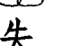

表示為女兒撰寫

二〇一八年四月二十五日凌晨四點，我因為一個惡夢驚醒了……

夢中的我，正抱著十八歲的女兒，一路狂奔著，想找人救她。夢中的她形似骷髏，只剩下皮包骨的骨骸，相當嚇人。因為她死了，所以我在夢中爆哭了出來，跪在地上問著上蒼為何要帶走我的孩子？為什麼？為什麼？為什麼？求求您救救我的孩子啊！……嗚嗚嗚……

我哭著張開眼，嚇出一身冷汗，眼角的淚卻沒有因為驚醒而停止，心跳一百二與流淚的速度齊頻，他們是約好來嚇我的吧！

夢，可以不要這麼真實嗎？

## 1 與悲共鳴

灰藍微亮的天際線提醒了我，此刻的自己正處在大陸山西的五星級飯店。身爲一個導演，我正受邀參加第十屆兩岸電影節，我的首部電影《有一種喜歡》是開幕片，昨晚盛大的歡迎晚宴一路忙到凌晨，半夜亦興奮得睡不著在努力修片，修到零時三點，知道一早就有重要會議，一定得趕緊休息，才迷迷糊糊睡著，沒想到，竟被這種幽靈般的夢魘驚醒。是的，這一切都如此矛盾，一個看似光鮮亮麗的中年女子，內心卻有著最深沉黑暗的恐慌，別人是看不出來的，因為這一切，是如此複雜而難以言喻，像極了一齣荒謬劇，像極了腐木雕成的娃娃再塗上粉色亮漆。別人眼中的我，只能看到美好的一面，王郁惠，四十多歲，看起來狀態保持良好，走在紅毯上，每人只爲我冠上一個美魔女導演的稱號，這個稱謂並不好端，因爲充滿嘲諷，而我選擇不應，卻依舊聽得見那綿延不絕的嘻笑：看她，身邊圍著明星，粉絲簇擁，記者採訪，人生中的第一支長片，就獲得不錯的成績，雖然許多的負評，但這導演像是把耳朵關上般，臉皮加厚，也就聽不見自己有多糟了吧！人生嘛！何必太在意？……其實，我不是聽不見，而是選擇不聽，若我真的很上心了，影響到我的信念，或許，人生只剩帶著女兒一起走這條路了吧！應該說，如果我真的很做了，那些說我云云的聲音，也只不過多了一口嘆息。為了他們，值得嗎？因為，我只是個失格的母親。

## 1 與悲共鳴

##  無助的女兒

我是張景雯，今年十九歲。在這短短十九年裡，卻過了不平凡的人生……
從小一直被滿滿的愛包圍著，擁有世界上最棒的家人，還有一個四肢靈活的身體，熱愛音樂與美術，而且體育是最拿手的科目。
原本以為美好人生朝我迎來，但一部好看的電影當然不能這樣演，於是無助而悲慘的故事就此展開……

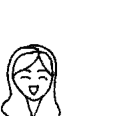

### 中年危機

故事要從我寫劇本的時候說起。二〇一五年夏，我已經在電腦前寫了一年的劇本了，但還是頻頻遭受挫折。找不到出資者，輔導金申請失利，找不到演員來演，然後一而再再而三的拜託人，看看我的劇本，然後再一而三再而三地被否定。「劇本寫成這樣，根本沒資格被拍成電影！」「你要不要去拍拍短片就好，拍拍電視劇就好，多練習練習？不然劇本改得再搞笑一點？再生動一點？再多請一點大明星？」……我常常在電腦前，一發呆就是一天。不用進食，不用動，就像一只只剩腦部運動的空殼，甚至也改不了幾個字時間就過了。其實當時我已臨重度憂鬱，沒有賺錢的能力，前一年還為了自己的電影夢把做了十年的工作給辭了，然後在俗稱的中年危機給自己製造一個最大的危機，就是告訴世人我要拍電影。一部電影很容易的，只要五千萬就拍得成了……

## 1 與悲共鳴

當然，現在想想沒有人要理我也是正常。但一個正常人被批評得一文不值，得重度憂鬱也是正常。
但悲劇人生能否反彈呢？其實很簡單，就是給他一個更大的悲劇。

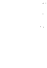

## 青少年的考驗

國中會考考完的暑假，與同學們相約在西門町溜冰場，準備好要大展身手。我毫不猶豫地踏上冰面，滑了幾圈之後，有位不會溜的同學一直在旁拉著我，過沒多久，他突然重心不穩溜到我後面，當下直覺不妙，不幸的事還是發生，他重重往後摔還緊抓我不放。

在硬碰硬的比賽當中，我的尾椎輸了，冰面贏了。尾椎就此被撞凹進去，大概痛了兩週，不過想想也就沒事了。

一個月後，因約不到人陪我溜冰，所以便自行前往小巨蛋滑冰場。穿著短褲的我，自信滿滿地不借護具，靠著運動天份，溜了大約二十分鐘，一個重心不穩，直接膝蓋撞地，用膝蓋溜冰。

## 1 與悲共鳴

不過我猜應該沒事，所以拍拍屁股起身，繼續溜到工作人員打掃地板才停下來。回到座位區，竟發現雙腳膝蓋已鮮血直流。愛逞強的個性，想說只溜一下太可惜了，所以等他們掃完，再度回到場上。但這次不到三分鐘，我就痛到放棄。烈日下出來，花了三十分鐘才找到藥局，但店員看著我鮮血直流的雙腳卻說：「妳必須先去買生理食鹽水喔，我們沒有賣。」真不知自己在老實什麼，還乖乖聽話去找生理食鹽水，這時傷口的血都已凝固。最後又拖著受傷雙腿一跛一跛回到小巨蛋，忍著痛幫自己擦藥，結束了這場驚魂記。但，這卻是噩夢的開始而已。

> 「妳必須先去買生理食鹽水喔，我們沒有賣。」

## 活著的噩夢

暑假結束，脫離走路上學，成為五專新鮮人的我，每天卻必須搭一小時公車上課，身體也悄悄起了變化。

有時早上刷牙會沒辦法拿水杯，但我想只是太累了，所以不以為意。

一次，為了攝影作業而跑去陽明山取景，在美麗的公園裡，有著大樹與小溪，我興奮地舉起單眼準備拍照，卻突然感覺不妙，手異常吃力，才過沒幾秒，雙手就不停抖動，趕緊放了下來，心想我到底怎麼了？

此時心跳之快，手汗直流，不能控制的感覺讓我很不安。從前都是投三分好手的我，這點重量根本不算什麼，現在卻無法支撐一個單眼？心中燃起惶恐的火苗，用各種種理由把單眼交給媽媽拍。
溪流聲涓涓依舊，而我卻只聽見自己大力跳動的心跳聲。

五專第一次長跑測驗，我依然充滿著自信，站上起跑線。

碰！槍聲響起，輕鬆地跑了半圈之後，腳突然像斷了電的機器，不聽大腦使喚，每一步都快要跌倒，不得已只好改成快走，心裡狂唸著觀音菩薩，老師的吼罵聲已經成了無聲電影。

之後立馬查詢自己到底發生了什麼事，為何會手腳突然無力？

每一篇文章都寫著，當心「重肌無力症」找上你！和一堆恐怖的照片，使我猜想自己該不會也是其中之一吧？

十萬分之八微乎其微的機率，有可能找上我嗎？

越想心裡越恐懼，所以搖搖頭不想承認，安撫自己說一定是太累了，沒事沒事。

但事實是，我開始出現自律神經失調的症狀。電視看到一半突然呼吸不到，讓我非常恐慌，從小到大從未這樣過，只好鼓起勇氣跟媽媽說，她的回應是「呼吸不到就呼吸」。聽完雖然很失落，但這句話卻像一個指令一樣，深深烙印在我心中，救了我很多次。

二〇一六年跨年夜，邀請三五好友來家中玩，本該是美好回憶的日子，眼皮居然鬧彆扭睜不開，每張照片都在努力睜大，但卻只露出半個眼睛，表面的燦爛笑容，背後卻藏著我莫大的恐懼。

拜託有誰可以救救我啊！

## 1 與悲共鳴

### 為什麼跌倒？

女兒當時國三畢業，在未上五專的那個暑假發病了。很不幸的，我沒有發現，因為我也病了。我聽不見女兒跟我說的聲音暗示。她說媽媽我手抬不起來，無法刷牙。我說妳在說什麼鬼話？就抬起來刷牙啊！她說媽媽我溜冰跌倒了，我問很嚴重嗎？她說我擦藥了，不要擔心！她說媽媽我無法呼吸，我說呼吸不到就呼吸......直到，她在我面前跌倒了，我尖叫問說：「有沒有怎樣？」她驚慌失措地回：「沒有。」我問：「為什麼會跌倒？」她搖搖頭說不知道......其實，當時她已經自己上網查過，她已罹患一種罕見疾病「重症肌無力」。只是她不敢告訴我，怕我擔心罷了......因為，我只是一個失格的母親。

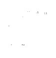

## 公車驚魂記

過沒多久期中考來臨。媽妽卻在當天早上有急事要我馬上幫忙處理，時間一點一滴流失，持續增加我被當掉的機率，外頭的傾盆大雨，已經和心跳合而為一，好險終於完成。快馬加鞭衝出門外，幸運地趕上不會遲到的那班公車，真是鬆了口氣，踏上車的那一刻，腳卻也隨著我的鬆懈而放鬆下來，直接讓我毫無招架之力地跪了下去。小腿骨直接撞上九十度直角階梯，只剩手緊拉著握把，把自己硬撐上去，然後選了最角落的位置趕緊坐下，覺得自己顏面盡失。此時才發現我全身不停顫抖，小腿劇痛，只好咬緊牙根慢慢地拉開長褲，眼看傷口已經血肉模糊，身上也沒有任何急救措施，更不敢向其他人求助，唯獨心中只能乞求菩薩保佑，讓我能平安撐到學校保健室。

## 1 與悲共鳴

好不容易到了學校，結果禍不單行，保健室居然還沒開，必須要等到考試開始，護士才會來，當下真的很崩潰，老天爺啊！一定要我在分數與身體上做選擇嗎？還好老天聽見祈求，為我開了一扇門，保健室在這時候提早開了。生理食鹽水的疼痛沖洗，讓我看清腳上的傷口，一塊肉被分成兩邊，凹了一個洞，包紮完後，再忍痛慢慢走到考場，唯一慶幸的是趕上了考試，真是不幸中的大幸。

### 吞不下

考完試，總能放鬆了吧！晚上跟媽媽走到附近一家新開的餐廳吃飯，吃到一半喉嚨的肌肉卻大門緊閉，讓我每一口都像在吞石頭，心想現在到底是怎樣啦！怎麼每一天都給我不同的考驗啊？現在是連吃飯都不讓我吃了嗎？心裡的惶恐與憤怒也沒有勇氣跟媽媽說，因為真的不想再製造更多的麻煩了。

但是很抱歉，一下子就破功了，從來都是大食怪加餓死鬼的我，怎麼連媽媽這個慢郎中都吃完，而我桌面還有一大半。

媽媽無奈地問：「妳又怎麼了？」

我吱吱嗚嗚地說：「吞……不……下……」

我們就在不斷地嘆息聲中，慢慢走回家。

## 1 與悲共鳴

這天之後的每一餐，都像是人間煉獄。常常噎到不說，如果身旁沒人，我是否就因此喪命？老天爺啊～為什麼要這樣對我？

### 最後的馬拉松

放暑假前的最後一個體育測驗，六公里的馬拉松，我拖著身軀緩慢地走進會場，心中的恐慌還未消失，就已被推入跑道上了。
預備！開始！眼看大家都賣力地往前奔跑，我只能快步向前，在別人眼裡可能覺得這人無比偷懶，但有誰知道我跨出的每一步都是用盡全身力氣去動的，因為身體現在根本無法跑步了，每一滴流出的汗水，都似我心中翻騰的淚水，不斷不斷地湧出。好幾次都差點跌倒，但都用意志力慢慢撐過，最終抵達終點，以倒數第四名的成績作收，居然還有及格，真是太好了。

## 1 與悲共鳴

### 誤判與確診

終於，我們願意面對這可怕的一刻，到了大醫院就為找出病因，做了各種檢查，腦波、核磁共振等。沒想到，醫生卻誤判為癲癇，我們一臉狐疑地看著醫生，不知他的判斷標準從何而來？但他要求女兒先吃半年的藥看看，如果沒好再來改換別的藥……

但因為我們很清楚她不是這個病，所以半顆也沒吃。

真正確診已經是一年以後，而且是為了拿到醫生證明。因五專的體育老師不相信她不能打球，不能跑步，以為她是故意偷懶，任憑我們怎麼跟他解釋，說孩子小時候是如何地愛運動，是個在音樂班中少數的運動健將，不是因為偷懶，體育是她最喜歡的科目，但她是真的不能動……請他網開一面，能否讓她不上體育課？而不是一直給零分？

但縱使我們拿到了醫生證明，卻也沒有得到我們想要的答案，當然兩年後也休學了。雖然班導跟校方都覺得很可惜，因為她一進去，就在各科表現優異，一直是班上的第一名，甚至一開始她還能勉強自己上體育課的時候，都會盡力做好每一項運動，包括打乒乓球，手抬不起來又嚴重複視導致看不清哪一顆是真球的情況下，是依打球的天份及經驗判斷，才勉強過關的。

### 醫生的大力丸

確診後醫生開給我一週的大力丸，當我看見藥袋上的副作用寫滿整整一包時，就決定不吃了。心想它到底是來幫我的呢？還是來搞破壞的？本人已經沒有多餘地心力去對抗更多的病症了。

接著到了下學期，每天心跳破百上下學，已經是家常便飯。時常跪著上公車階梯，把司機們都嚇死，也無法好好解釋，因為舌頭不讓我說話，大概只剩媽媽能聽懂了，以上種種事情換來的只有我滿滿的恐懼與自卑。

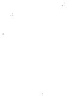

### 天天都是發病期

「重症肌無力」到底是什麼病？簡單說就是肌肉無力，但你們或許不知肌肉遍佈全身，哈哈，說笑嗎？怎會不知？只是沒意識到肌肉對我們的重要性吧！特別是全身型的患者。當血液中的乙醯膽鹼抗體濃度過高，或胸腺過大時，皆有可能是致病原因。嚴重時手抬不起來，所以無法好好刷牙，無法替自己好好洗頭，所以頭永遠是髒的，當然必要時媽媽就幫她洗頭，還有幫她抓再也抓不到的背，但對一個青少年而言，這麼大還要媽媽幫忙洗澡洗頭，根本不是享受，而是一種折磨；腳只要一軟就隨時跌倒，所以發病至今，四年來已跌倒二十次，外傷流血已是家常便飯，媽媽直到第十九次才成功抓住她，但沒有用，還是膝蓋落地，這時我才明白什麼叫斷電腳軟，而已跟我一樣高，重量使然，我根本抓不住她，只能蹲在路邊，又看著她流下恐慌的眼淚；無法吞嚥，女兒長達一年都在極度飢餓卻無法吞嚥的情況下，體重溜滑梯直直落，從五十八公斤直殺四十九公斤，旁人不知道，以為孩子是故意不吃，卻不知她其實是個大食怪，若非嘴邊肌肉僵硬動彈不得，若非食道像是鋼鐵，她根本不會吃，實在是吞不下；無法說話，因為舌頭無法運作，說出的話沒有人聽得懂，只剩媽媽懂了，但要怎麼跟他人溝通呢？也就漸漸地不想說話；喝水嗆到，或被飯粒噎到，幾乎是每一餐，但她已練就憋氣吃飯大法，每一口飯都要憋氣吞下，不然又會跑到氣管，咳到快斷氣才能咳出那該死的米粒；眼睛張不開，外眼皮不聽使喚；眼睛復視，看不清來車，夜晚走路更危險辛苦；頻尿，尿道當然也是肌肉……最嚴重的，就是無法呼吸，會導致呼吸中止，若身邊沒人，真的可能喪命……以上。不要問我是否有發病期與非發病期這種問題，只有今天嚴重一點，與今天輕鬆一點的差別，基本上，天天都是發病期。天啊！她是怎麼活過來的啊？天啊！我又是怎麼撐過來的啊？！

這種罕病是找不到病因的，醫學上說這不是遺傳，不是基因出錯，總之發病原因至今是個謎，也因為很罕見，所以只有兩種藥物可以配藥，一種叫大力丸，另一種就是類固醇了。但大力丸不是讓你吃了有力，而是暫時性地緩解某部分的症狀，例如吃完藥手暫時可以抬起來，但卻無法言語了，或是頻尿等，但病是活的，藥效也因人而異，如果吃到最高劑量，卻還是沒用的話，也就這樣了，一輩子如是。這時醫生會建議你改吃類固醇，但一吃就不能停，得吃一輩子。如果是你，你會吃嗎？

## 1 與悲共鳴

### 17歲的眼淚

十七歲的我不知多少個早晨，掛著滿臉淚跡甦醒，每個淚珠都是我滿滿的疑問與恐懼，為什麼？為什麼是我？？老天爺啊～為什麼！為什麼是我！！！全世界那麼多人，卻選擇了我生這種病，到底為什麼?!

滿腔的怒火，一發不可收拾，理智線常常就此斷裂，無法控制胡亂砸東西的畫面，加上各種碎裂的敲擊聲在腦中揮之不去，卻也擋不過我心中的怒吼。我真的真的好想知道答案啊！拜託，有誰可以告訴我？

### 答案，究竟在哪里？

女兒真的很想得到一個能說服自己的答案。

如果醫生不能給，那誰可以給？真是自己做錯了什麼？或是上輩子做錯了什麼，所以應得這種病？

因為之前我去找過一個通高靈的老師，說過我一些上輩子的因緣聚合，感覺上都很準確，起碼對我此生受益良多，所以女兒提議，說要去了解一下自己的前世，搞不好可以得到一些有幫助的答覆。

我說真的嗎？如果問出來妳曾經殺人放火，所以得到這種病，妳也可以接受嗎？

她明確地點頭，說她知道會比較好，總好過現在如此不明不白被判死刑，她願意接受任何答案。

## 1 與悲共鳴

二〇一七年的六月，我們到了老師那，熟悉的神祕空間，心境卻跟上次來時如此不同，沒聽到答案前，我異常地沈重，或許我比女兒更害怕聽到一些無法面對的故事吧！但還是鼓起勇氣，告訴老師說女兒生病了，想瞭解為什麼？也就沒再多說什麼。 老師依舊閉上眼，開始閱讀資訊，並親切地說：來聽故事吧！ 上輩子，景雯是個男孩，而你是他的父親，他是你的獨子。你們家很有錢，你是大老闆，事業成功，家庭得意，家住大莊園。你有個員工的兒子也跟當時的景雯差不多大，你很好心，讓員工住莊園裡，也讓他的孩子跟著景雯一起長大學習，基本上待遇規格與景雯齊平，漸漸長大的他們正值青春期。 但那個小孩有些狀況，總是闖禍，小時候闖小禍，長大就闖大禍，每回景雯都會掩護他，把所有的過錯一肩攬起，雖然爸爸都明白地看在眼裡，但也不拆穿，總是睜一隻眼閉一隻眼。
有一回，他又闖了大禍，景雯又要扛責罩他，爸爸很不高興，因為這回事情大條，且不該再這樣下去，你決定不再姑息，於是就把他們一家子趕了出去，那個孩子依舊置張跋扈，說「走就走，什麼了不起！」
然後他們就離開了莊園。
但景雯過不去，他認為那是他一輩子的好朋友，就要爸爸把他們找回來，你不理，說不能再通融下去，那是他們應得的。
景雯很生氣又悲傷，就絕食抗議與父親對抗到底，不再吃任何東西，爸爸說不吃就拉倒，你們的關係就此僵化。
景雯很固執，說不吃就不吃，直到因絕食導致身體出了問題，日漸消瘦，你將醫生找來，但不幸的是為時已晚，醫生說血液已出現病變，來日無多，他沒救了……
在他往生前，你終於還是叫回了員工的小孩，到病榻前見景雯上輩子最後一面……

## 1 與悲共鳴

老師說：『所以，景雯這輩子是青少年得病，並且是血液產生病變，然後無法進食，對嗎？這是因果病，醫生查不出病因的。』

……我們倆在老師的面前像是被釘住般，動彈不得，因為老師都說對了。過了一會兒，我才恢復理智，問說：『那有救嗎？』

雖然我自己也不知道為何要問一個不是醫生的人這種問題，但這是第一個跑出來直覺性的念頭，也就這樣脫口而出地問了。

老師說：『有啊！你們去找一位能量醫學的楊老師，我給你們資料，他能幫你。還有，你們不要太擔心，景雯會好的，只是上輩子他未走完人生全程，所以這輩子媽媽妳要多用點心陪著她。』

我們點點頭，像吃了定心丸一般。

離開了老師的工作室，真有一種如釋重負的感覺，畢竟女兒不是因殺人放火導致的因果病，只是『慢性自殺』。也難怪佛家講，不可自殺，因為人人皆未來佛，自殺是出佛身血，形同殺佛的意思。

還有你此生未解決的習題，也只是將課題留給未來世，並沒有甩開問題，視而不見不代表它消失。

> “總之，好消息是我們又在今生相遇，此生變成了無話不談且彼此交心的母女，總好過無仇不成父子的父子檔吧！”

我緊握著女兒的手，心中滿是感謝踏實。

### 流動的能量

### 1 與悲共鳴

二〇一七年七月，我們找到了楊老師，他問我們是誰介紹的？我據實以告，有趣的是，楊老師說這位通靈老師已經介紹許多人過來治療了，但他們彼此卻不相識。我跟景雯對看了一眼，覺得世上的高人都高來高去，或許這世間真有雙更高更大的眼睛，在默默幫助像我們這種還沒結業的靈魂吧！我對景雯的身體是真的越來越有信心了，因為老師在閱讀完景雯的能量跟聽完我們的故事後，說的第一句話就是：「那你們就是很勇敢的靈魂啊！所以選擇比較困難的功課，如果是這樣，也就代表你們已經準備好了。景雯還那麼年輕，一般年輕人還在玩樂的時候，她就選擇了身體受困的課題，如果不是夠偉大的靈魂，根本無法承載這種題目，因為宇宙不會給你過不了關的難題，不會給你錯誤的時機，每一個問題，都有答案的。」

> > 「那你們就是很勇敢的靈魂啊！所以選擇比較困難的功課，如果是這樣，也就代表你們已經準備好了。景雯還那麼年輕，一般年輕人還在玩樂的時候，她就選擇了身體受困的課題，如果不是夠偉大的靈魂，根本無法承載這種題目，因為宇宙不會給你過不了關的難題，不會給你錯誤的時機，每一個問題，都有答案的。」

經過老師的鼓勵，我的心情真的放鬆不少。因為之前只要告訴別人，景雯生病了，就會有許多指責的眼神射向我：「一定是媽媽沒照顧好，這個因果一定也是媽媽造成的。」雖然大家沒有那麼直白地告訴我，但揶揄的眼神我都看懂了。
我從不去管別人怎麼看我，總之我不能倒，也不可能因為你們的嘲笑掉一滴淚，但今天楊老師的一席話，卻讓我紅了眼眶……

### 1 與悲共鳴

### 不友善

是的，這一路上是充滿不友善的，印象最深刻的一次，記得是走在南京東路上，景雯又無預警腳軟跌倒在一間精品店門口，裡面的店員走向落地窗型門口，我原以為她要開門來看看是否有人受傷，沒想到她居然蹲了下來鎖上玻璃門，就像在告訴我們不要找她麻煩。

她的影像在眼前變成了慢動作，不斷在腦中重播。說真的我不是玻璃心，沒那麼脆弱，但她的行為卻實實在在地割破了我的心。

我低下頭不斷安慰流淚中的景雯，她覺得很丟臉，所以壓低帽簷，怕自己的眼淚及不堪被路人看見。

我則是當下深刻了悟一些事情，也是收穫啊！當然還是有熱心路人過來說要不要幫忙？但這一幕人情冷暖的即刻對比，真的讓我...

人類啊，人類！我們究竟何時才會覺醒呢？景雯第一次離開楊老師診間，明顯地輕鬆許多，身體能動了，不再那麼僵硬沉重。楊老師說，她剛進診間時，能量流斷三截，頭一截，身體一截，腳一截，通通分開了！所以無法下吞嚥的指令，無法下走路的指令，現在把他們接起來，就好多了。好神奇，因為老師講的是能量流，那是一股隱形的能量，是我們這種麻瓜看不出來的。以景雯的說法，她說老師把一個走進去八十歲的婆婆，變回了十七歲的少女，真是太厲害了。時間很快地又匆匆過去，她在楊老師的治療之下，真的頗有起色，但還是敵不過天氣，她的身體會隨著天氣的改變而時好時壞，最怕下雨，濕氣排不出，就會特別沈重。

重。次怕天冷，身體會僵硬，如同被冰凍的冰棒。但我們沒有等到奇蹟降臨，雖然不放棄希望，卻也還是心急，畢竟我們還是一般人，所有病患跟家屬的心情起落，我們可是一天都不少地上演著人生悲喜曲。

### 無期徒刑的起點

二〇一七年九月，專二的可怕旅程又開始了。日以繼夜的通勤生活『搭公車』，從站在路邊等公車就會使我無法順暢呼吸，心跳也常快到聽不見分隔，內心只有雜亂無章的念佛聲，以及混亂恐懼的無限幻想，等一下會不會又爬不上去，或者是跌倒受傷？當腳不錯時，眼睛就會出狀況，嚴重複視，讓我看不見來的公車到底是幾號，遮掉一隻眼睛也才勉強看到，時常要厚著臉皮，找個人來問是否是正確的那一輛，問完很多人都覺得我很奇怪，雖然不敢看著他們的臉，但也深深感受到那充滿疑惑的氛圍，不過這已經是不錯的結果了。當眼睛看見時，腳必定出亂子，之前提到的第一次在公車上跌倒，原來只是個開始。

### 1 與悲共鳴

某天放學，因為我很緊張，所以先讓所有人上車，心想這樣就不會影響到他人，可以慢慢上公車，於是排在最後頭。沒想到公車司機似乎把我當成隱形人了，當我第一隻腳踏上階梯時，地板就在快速移動，喔！原來是車在開了，連車門都還沒關。欸！我的另一隻腳還在外面呢！公車頓時成了大型滑板，讓一位不擅於滑滑板的病患，體驗在柏油路上如何賭上性命，單腳在外滑行，好險這時手有力可以抓著握把，讓我的身體不至於會翻出去，就這樣大概滑了兩公尺，司機總算視我為地球人，終於讓車子停下。但此時全身已完全緊繃的我，只會有一種結果，那就是腳軟收場，於是最後又變成一格一格，像殭屍般跪著上公車。經過這次很像在拍電影的劇情之後，就覺得還好自己命大，感謝上蒼讓我還活著。但是接下來的公車行，我還敢坐嗎？我真的沒把握了……

### 一定要好的大菩薩

景雯都病得這麼久了，家人也就陸續知道，大家都很低落，但同時也想為景雯盡一份心力，畢竟她是我們家第一個孩子，我的兄弟姐妹都很疼她，都希望她得到最完善的醫治。

二〇一七年九月，我弟弟找到了肌肉無力症的權威醫師，我們又來到了大醫院，診間滿滿的病患，但鮮有她這麼年輕的患者，待在候診區越久，越使我相    信自己的無力。

不只孩子身體無力，媽媽也已心靈透支，快要相信自己的孩子是個病人了。

當然，我的心力交瘁，外人是看不出來的，或許這就是我不喜歡來大醫院被診斷的原因，待得越久，越無法相信自己會好，因為病人跟家屬的臉龐，充滿了恐懼，還有所謂的交付，一種將身體交付給自己就不用負責的交付，醫生變成權威不打

### 1 與悲共鳴

緊，但其實醫生是將你的病，交給化學製藥廠，人生若只剩化學製藥的無限循環，那該有多可悲啊！
當然我不反對在急症重症或一定要開刀時西醫的治療，畢竟我自己也曾遇過救命的醫師，我很感恩並銘記在心。
但女兒的病卻隱約有一股直覺告訴我，她不是中西醫能救的，這就是我心中真實的呢喃，一個無能媽媽無法自救孩子的呢喃。
雖然透過關係，但我們還是等了幾個小時，沒想到進診間還是躲不過這場難堪的浩劫。
醫生問我們有沒有吃藥？我們說沒有。他又問為何拖了這麼久？我們說現在才知道有權威醫生，也就第一時間來了，不然之前被誤診為癲癇，如何吃藥？他又說，上網查也知道是「重症肌無力」，怎麼會不知道？
此時我心想，如果什麼病都上網查就好了，那我們還來做什麼？

但為了讓他相信我們有積極治療，於是我跟他說：「女兒有做能量療法，一星期一次，我們都覺得挺有效的……」然後我們就被醫生打斷劈頭斥喝說：「像你們這種相信什麼能量醫療的病人，跟我 是兩條平行線，我們永遠不會再有交集，我們此生大概也就只會見這一次，你們以後也不會再來找我了！妳看看她，妳看看她！這麼無力！」他說話的同時邊測試景雯的力道，叫景雯腳用力擋住他的腳，但她真的無力，所以撐不了兩秒。醫生要我好好看看能量醫學的老師是否真能救她。我看完了點點頭，但心疼的是景雯好不容易對自己有了一點信心，就被他的測試瞬間擊垮了。醫生繼續罵我，意思是我害了她，但我並不難過，因為早就料到他會有這種反應，所以這打不到我。

### 1 與悲共鳴

只是我很冷靜並客氣地接著問：「所以醫生你的意思是，如果她這兩年早一點來看你，早一點吃大力丸，她的病就會好？」我沒有激他的意思，只是真心地詢問。但沒想到醫生被這樣一問，卻惱羞成怒回我：「當然不會好！她生這種病，一輩子都不會好！」醫生的音量大到我猜整個候診區應該都聽到了吧！我們被轟了出來，讓大家輪流看我們這家笑話。反正，也只是被笑而已。從頭至尾，我只在意孩子的心理是否遭受打擊，其他的根本不在意。聽說後來，我們成為醫院的八卦，護理師跟病患都知道我們就是被醫生大聲咆哮的那一家人。離開醫院之後，景雯因生氣在發抖。我問她怎麼了？她說：「媽媽，他太過分了！他怎麼可以說我不會好？我一定會好！我一定要好」

起來給他看！我點點頭，說：「嗯，妳一定會好！但我們不用好給他看，若有天我們因為他的這句話好了，那妳要記得，他就是激勵妳快速好起來的大菩薩！景雯含著淚，或許不能當下認同我的菩薩論，但，我知道有一天她一定會笑看這一切的。大菩薩，先謝謝您了！」

### 1 與悲共鳴

### 景雯的同步心情

小舅開心地跟我們說找到重肌無力症的台灣權威了，於是我們又抱持著期待重新回到大醫院。

一早九點就去排隊，弄完複雜的程序，已經中午了，看著號碼龜速跳到我們的前三十號，只好先填飽肚子。而這天就像樹懶的我，緩慢地拿起筷子，緩慢地吃，就這樣等了許久，兩小時咻一聲不見蹤影。

等待時當然不能好好休息，各種開門聲、咳嗽聲、打呼聲，讓人神經緊繃，幾乎崩潰。

其實我們已經是靠關係來到這，所以少等兩個小時，但沒想到一進診間，醫生對於我們走後門感到極度不悅，開始就說：「為何我們什麼都沒帶？應該要有一整疊的病例報告啊！」

病例報告啊！」

等他心情平復一些後，媽媽才緩緩闡述發病過程，但講到我們去找靈氣老師有幫助時，他就說不想聽、不想聽，好像踩到他的底線般，再度爆走。做完幾個簡單的肌力測試，問我說：「妳是不是不太能爬樓梯？」我說：「對。」他就笑一笑對著媽媽說：「過不久她的肌肉就會萎縮！」此話一出，卻讓我眉頭緊蹙。心想雖然我不是醫生，但也有醫學常識好嗎？不會走樓梯肌肉就萎縮。媽媽接著問：「那麼請問醫生，吃大力丸就會好嗎？」他就說：「不會好，這種病一輩子都不會好！」哇～這下換你踩到我的底線了！你做為一名醫生，竟宣判生命正剛啟程的青少年死刑！你知不知道你的一句話可以殺死人啊？

### 1 與悲共鳴

最後我們不歡而散走出診間。
而我背後帶著三丈的怒火，手緊握拳頭，已經不自主地抖動，許下我一定會不吃
藥完全好給你看的誓願！
媽媽看著憤怒至極的我說：「其實醫生真的是位菩薩，他讓妳擁有了要好起來的
動力，把那憤怒化為動力吧！」

但是憤怒只帶來幾天的好轉，醫生的宣判還是像死亡證明一樣，把我擊垮了。
身體急轉直下，變成了不會動的殭屍，躺在沙發上，媽媽看我這樣也覺得心疼，
問說：「那你要不要吃一顆大力丸試試看？說不定會讓你有力啊，反正如果真的沒什
麼用的話就不要再吃，也證明我們有吃過了。」

我點點頭答應，努力吞下一颗大力丸，以為過沒多久就會有反應，結果等了兩個
小時，手腳才漸漸有力，但眼睛卻出事了，眼前的畫面一分為二，還越分越遠。

出門買東西時，已經不知哪邊的畫面才是真的，必須靠腳去嘗試前面的路是高是低；對向的來車，有四個頭燈，所以它到底在我的左邊還是右邊呢？還好有媽媽在旁攙扶，否則後果不堪設想。不過副作用還沒就此放過我，眼睛嚴重複視到眼球歪掉，膀胱也不堪一擊，頻尿長達一個月，嚇得我不敢再吃任何一顆了。九月底回診，一早掛號，這次不靠關係乖乖排隊，卻發現上次那位醫生請假。反正只是看報告，就找了一位年輕醫生，而這回根本不用等。電腦顯示血液中乙醯膽鹼抗體濃度是462.72。一般人的數值小於0.5，而大於9.9就算破表。意思是說：哇～這數值將近一般人的一千倍欸！也就是我要花上一千倍的力量才能完成一件看似極為簡單的小事。例如吃飯，拿

### 1 與悲共鳴

起湯匙就像是舉起一支十公斤重的啞鈴一樣；走路，腳就像綁著鐵鍊般，連抬起來都有困難，還會無預警讓你從人類變成爬蟲類。想想其實還蠻佩服自己的，看完報告反而受到了鼓舞，也算意外收穫。

### 修行之路

接著迎接二〇一七年的冬天，除了楊老師的看顧之外，我們也開始修行。大概沒有什麼方法可以把一個正常人，尤其是青少年，逼到去修行了吧！除非我們相信自己來日無多了。的確，或許我們真的相信自己來日無多了。一次，我記得景雯的狀況不好，她又萬念俱灰，對於一個曾經被多個不同項目的體育教練說：「好好栽培，她以後一定是國手！」的孩子而言，「重症肌無力」真的是戳中要害，一箭斃命。因為我曾經跟她開玩笑，說如果是我得這個病就沒有多大差別，我這輩子幾乎沒運動過，而且連走路都懶，常被笑說是個只剩腦袋，沒有手腳的女子，所以真的沒差。

### 1 與悲共鳴

但她不同，她真的熱愛運動，是個喜歡流汗、喜歡鍛鍊自己的女中豪傑。還記得五歲時，景雯因練跆拳道，將自己腳背練到黑青，媽媽嚇得說不要練了，她說不行，一定要練，但她不喜歡教練女兒一直要找她玩，害她不能好好練習。十歲打高爾夫，跟一群教練的大人朋友們凌晨四點就出門打球一整天，還遇到大雷雨，她非但沒放棄，還跟上所有大人的進度，教練很擔心她回家後手抬不起來，打電話給我確認她還好嗎？景雯就在我面前舉高手示意她很好。十二歲跟同學打籃球，打到眼鏡被球砸破傷了她的眼角，她非但沒停下還笑笑跟我說她還要再打，並要我不要責怪同學，說他不是故意砸中她的……我記憶中女兒的笑容幾乎都跟運動有關，但，它們已經離我好遠好遠了……在我面前，是一個槁木死灰連走路吃飯都有困難的女兒，看她這樣，真是心在淌血……其實，我幾乎沒有在她面前因為她的病掉過一滴淚，因為我習慣堅強，我知道如

果連我都動搖了，那她還能依靠誰？我不會放棄的。

但看她這麼辛苦我真的是滿滿的心疼。

於是我握起她的手，跟她說：「孩子，如果這次，妳又不小心死了，記得到天堂，要跟老天爺說，我這次沒有放棄自己的生命喔！我好努力的活著喔！是不小心死的呦！不要怪我呦！」我們就在這種歡笑的氣氛中流下淚來。

哈哈！請求上蒼，別把我的幽默也給帶走吧！人生已無所求，也不過是一個簡單願望：健康平安，沒有太奢求，卻也要不到：…

所以請別奪走我的樂觀吧！我們會繼續加油的，什麼方法我們都願意試試看的。

所以，後來整個冬天我們都在修行。密宗的修煉，同學們都算年紀稍長，景變變

### 1 與悲共鳴

成相對怪咖，雖然她對媽媽一直以來的修行愛好及家族淵源頗為熟悉，也從未排斥，但要一個「過動兒」乖乖坐那三天也真是要人命，但景雯做到了。而後因緣帶引，我們又去了伽藍菩薩的修煉營，又是坐三天，景雯又做到了。我們很開心，因為只要多一次修行的機會，她就會又進步一點點。雖然病情還是時好時壞，但心靈卻漸漸安靜穩定下來。也或許，這一次次的修煉，都將我們帶領至最後與阿一沙的相遇。

### 圍爐危爐

除夕夜，我們回台中，陪爸爸跟兄弟姊妹過年，也是很慘的一次圍爐，因為景雯實在太緊張了。從生病以來，她已經鮮少跟別人餐敘，更況一次要面對所有關心她的家人。

所以一到餐廳，就整個喉嚨緊縮，吃到最後，全家人才發現她一口都沒吃，嚴重到連雞湯都吞不了。

我全程看在眼裡，卻也不想影響到家人愉快用餐的心情，畢竟是一年一次的年夜飯，且父親年事已高，能陪一次是一次，所以我什麼也沒說，直到家人問：「為何景雯都不吃？」

我們才好好面對這個每天都在發生的課題。

補充說明一下，其實家人們會各種療癒法，而且都是高手，但沒人治得好她，包

### 1 與悲共鳴

其實我從景雯約莫十歲左右就會光療，所謂光療是以觀想手發光的方式，隔空或有必要時接觸，徒手幫人治療。那是我在看完一本書後，自學就會的療法。

當然我不以此為業，雖陸續幫過一些朋友，但也僅止於此，因為我發現病氣都積在自己體內散不去，後來也去開過刀，所以這不是一個究竟的療法。但如果身邊人有急需，我還是會出手，當然包括每天在發病的景雯。

但是，無論我再如何努力，我都幫不了她，其實，這真的很令人沮喪，畢竟那麼多人在我手中好轉，偏偏就是救不了自己的小孩。

家人們也是一樣的，他們縱使使出渾身解術，還是無法扭轉她此時的緊繃。
我看著大家的憂鬱臉龐，也是充滿了抱歉，而最抱歉的是景雯，她在被大嫂腳底按摩時痛哭了出來，大家看在眼裡更是心急，以為她是因為太痛了所以嚎啕大哭，但括我在內。

景雯說是因為自己太餓所以哭了，好笑的是現場沒有人相信她的說法，唯有這個媽，

明白她真的沒有說謊，這更令我低落，畢竟她已不知餓了幾天了……

我們就在大飯店的包廂內，上演一齣年夜飯的荒謬悲喜劇。

### 神奇的腦場

回到台北，日子照過，但景雯還是沒有好轉，尤其是吞不下的這件事，像地獄使者般緊盯著你，不給吃就是不給吃。

直到某天晚上，景雯又無奈地盯著眼前的那一碗飯，讓它像道具般摆在桌前，我突然想到楊老師曾經提過，如果他不在，或做完遠距療法還沒用的話，就可以聽「腦場」，那是一種音樂觀想法，發明者是一位李老師，好處是用聽的合併觀想就有效。

我心想，死馬當活馬醫，就打開連結聽聽看，景雯躺在沙發上，聽著引導音樂就睡著了一般，我則在一旁拖地做家事。半小時聽完後，奇蹟發生了，景雯突然坐了起來，將放在面前已涼掉的飯一口一口地吃完了！我突然停了下來，看著她，那個久

違的大胃王，像回到眼前一般，真是驚呆了！我拉高音量問說：「怎麼回事？妳做了什麼？妳到底做了什麼？」景雯搖搖頭說
不知道，就聽完腦場突然能吃了。我們只差沒有起身跳舞歡呼，家中久違的歡樂，竟是因為一碗飯。真的謝謝李老師，謝謝腦場。
當然，病是自己選的，包含痊癒的方式也是。所以縱使腦場說連續聽二十八天之後，再嚴重的病都可以痊癒，而我們也認真執行了，卻離痊癒目標還有一段路途。
但起碼我們又多知道了一種真有療效的法門，而且不花你一毛錢。

### 1 與悲共鳴

當然，我們本來就是皈依三寶的佛教徒，也在發病沒多久後就開始念佛，說幫助不大是錯的，因為好幾次景雯在外跌倒時，我們都相信是因為佛菩薩的庇佑才過關的。包括她每次腳軟跪著上公車，她說都像是一雙手推著她上車的，但後方根本沒人，陪她的唯有心中一直默念的觀世音菩薩。

我們也念藥師經與藥師咒，有趣的是，有好多次祖先或冤親債主不讓她好好持經，甚至會讓她舌頭僵直，無法念經，或將她的頭壓下來要她磕頭，但我們其實也很明白，這些現象都是有原因的，也不會因為害怕而中斷。

### 念佛吧！

### 十七歲的青春人生

十七歲的青春，我開始每天努力念經、抄經，並在七月中重拾寫日記的習慣，但與一般人紀錄的完全不同，不是寫每日經過，而是寫滿無限的懺悔。

在我心裡早就被滿溢的自責與愧疚感佔據，無法原諒自己曾經選擇自殺，還有覺得一定是因為兒時太霸道了，傷害種種人，讓我因此成為這副模樣。

所以日記內容幾乎都是無極限在寫「對不起、請原諒我、謝謝你、我愛你」，最後寫上我心中覺得虧欠的人。

然後在底下畫出藥師佛，並寫上藥師佛的梵文।。

拜託，求求你們原諒我，懇求你們好不好？可以不要再讓我受苦了嗎？

雖說如此，但我還是持續念經。神奇的事發生了，身體居然開始能動，讓我又重

### 1 與悲共鳴

有一天念解冤咒時，突然覺得左腳腳踝像有一個腳鐐鬆掉的感覺，原來念經真的能解除一些事情。

### 黎明前的黑暗：搬家半條命

當決定要搬家的那一刻起，我們就開始整理，幾乎兩三個月都在打掃，搬東西、丟東西。景雯也要幫忙，畢竟她那麼大了，有許多的物品只有她自己清楚該如何取捨。但勞動其實對身體是一種考驗，更何況她吃得不多，雖然吞嚥情況有好轉些，但跟一般人比起來，她吃得挺少，體重也維持在五十左右上不去，也常因此感到失落。

我就安慰她說：「妳是大家羨慕的標準體重，別再說自己太輕了！這樣會氣死同學的！」

但去掉半條命是真的，我們剛搬新家的那個月，景雯就又跌了一個狗吃屎，真的很恐怖。

那個跌倒畫面一直在我心中揮之不去，當時的她很像是一個被主人剪斷線的傀儡。

### 1 與悲共鳴

倔，一、二、三分三階段應聲倒地，又因為我反應慢無法第一時間神救援抓住她，更令我愧疚不已。

我只能大叫並蹲在路邊將她扶起坐好，並開始緊急治療，偏偏這時有個小孩在一旁騎腳踏車，還故意騎很快並靠我們很近來回經過，我整個人崩潰，就大罵他說：

> 「你沒看到有人跌倒了嗎？就不能別在這邊騎嗎？」

那個可憐男孩被我嚇得不敢再騎。但請相信我，我平常真的不會去管別人的小孩，更不可能罵他們，但這次我真的嚇到了，不知所措到要去飆人，才能平復自己的恐慌。

就在這一次之後，我又天天牽著景雯走路，再也不敢放手。

### 媽媽的樂觀主義

而後的每一天，我自己幫她在睡前做仁神術，戰戰兢兢地過日子。記得景雯當時因為嚴重複視看不到側面，眼球會整個歪斜，所以縱使我在她身邊做治療，她若要跟我說話，必須整顆頭轉向我，不然就會看不到我。

而我發現，當時的她不只有嚴重貧血導致的黑眼圈，還有疑似因吃生酮飲食而營養不良導致的嚴重掉髮，體重輕不是問題，問題是我感覺不到她的重量。

我似乎明白了一些事，她的魂跟魄，應該已經跑掉幾個了。

意思就是說，她在潛意識裡，又再度想要放棄她這次寶貴的生命，但我沒有拆穿，也不敢提及，怕對她造成暗示，更怕她又一次的想要遺棄我。

於是，我開始趁晚上睡覺前跟她溝通幾個觀念。

### 1 與悲共鳴

一、當人生手中拿著太好的牌，現在就會很難受。想想如果出生就是身體殘缺，或許現在反而好多了，心情上不會有一種得到又失去的感慨。
二、老天爺給我們考題，不是為了難倒我們，一定是為了看我們如何過關。所以，過關就對了。
三、是我們選擇了不平凡的人生，是我們不要平凡的人生。這點得認清，是自己選的。
四、如果生病，一樣不可以丟失你的快樂。因為那是你的基礎，身為一個人的本質。你的一切都可以被拿走，但唯有快樂的權利，不能也不會被奪走。
五、改掉緊張的習慣。
六、成為一名勇士，被逼迫的也沒關係。命運要看你如何選擇，但有時我們無法選擇，我們只能勇敢，只能堅強，只能義無反顧地去爭取，不然就死路一條。

孩子每天被我強力灌輸樂觀正面主義，應該也慢慢懂了一些事，或許這世她會勇敢一點了吧！

沒關係孩子，我會陪在妳身邊的。

### 1 與悲共鳴

我們儘快地適應新家的生活，但還是有許多要調適的地方，包括要出外找飯吃，走路，都對景雯是一個重大考驗。

印象深刻的一次，我們又終於慢慢走回家，一路上她都跟我說，媽媽我快看不到，腳又沒力了等等，我只知道要扶好她，心中念佛聲不敢間斷，十分鐘的腳程，我們走了半個鐘頭。

回到家之後，我們都很沮喪，癱在沙發上，她的心情低落到不行，憤慨地問我：「媽媽，為什麼我會得這種病？為什麼只有我一個小孩，要扛祖先的業力？為什麼是我？為什麼那麼不公平？」看著平時溫和的她終於發出這種世間不平的怨懟，我無言以對也心疼不已，只能抱著她說：「孩子啊！妳知道為什麼嗎？因為妳善良。」

聽到這句話，她就哇啦哇啦地哭了。

我接著說：『因為妳說，你們的問題，就讓我來扛吧！你們的和解，就透過我吧！還有妳上輩子說：『既然不想要你們受傷，那就讓我走吧。』於是妳就先走了。這一切，都源自於妳的善良。如果不是因為善良，妳怎麼會在上輩子要幫朋友扛責呢？如果不是因為善良，妳怎麼會選這種功課，獨自一人要扛全家族的業力好壞呢？』

她哭得更徹底了。

我抱著她的無助流下眼淚接著說：『所以我們要謝謝妳的善良，因為這個善良，我們才能再重聚啊！人生如果是一個圓，那我們上輩子一定只是個半圓，這樣我們這輩子才能再相聚，再劃出另一個半圓。因為我們上輩子那對父子都沒辦法表達出對彼此的愛，但起碼我們這輩子有機會可以當一對母女，可以擁抱了，可以哭泣了！這樣我們就沒有遺憾了啊！』

在很久的嗚咽聲中，我們相擁放肆地流著淚。

### 1 與悲共鳴

她好像懂了，釋懷地笑了，我們都得到了最清澈的了悟，最適當的救贖。當晚，眼淚流光，卻也讓心平靜了下來。身體，永遠是我們最珍貴的禮物，最深奧的學問，最厲害的恩師。謝謝您！我偉大的身體。

### 看不見的力量

一次因緣際會，我獨自一人去看了部紀錄片「看不見的台灣」。這是一部感人至深，並讓我在戲院內看到數度痛哭流涕的電影。電影紀錄台灣民間的奇人，包括可以上達天聽連通九皇子、媽祖、鄭成功等的天語師，還有善於療癒和解的天語翻譯師貫馨老師，他們在電影裡發揮的神奇能力，如同發著光的現代活佛，包括如何透過法會讓這片土地與人和解，與祖先和解，最重要的是最終導向與自己的和解，看完我只有讚嘆。而我最有興趣的地方在於，導演的弟弟原本在拍攝紀錄片前期是罹癌的，但因為老師們的引導教誨跟治癒，他竟然痊癒了，最後還加入劇組大家庭。天啊！這真是太神奇了！於是看完電影的我，帶著滿腔的熱血，心想一定要找到片中會靈療的貫馨老師，

### 1 與悲共鳴

「老師好！」就這樣，我們打開迎接好轉之路的序幕。

「你們好！」

我緊抓著搖搖欲墜的景雯的手，推開了貫馨老師的大門，迎接我們的，是一個親切至極的微笑。

切至極的微笑。

這不是天意，那什麼才是天意？

剛好把空檔挪給我們。

竟離我們不遠，沒多久就約到了老師本人，而且還是因為有人臨時取消了近程預約，

當晚，我就透過關係，找到貫馨老師在台北的身心靈療癒工作室。最巧的是，她

找到她，景雯一定就有救了！

### 好轉之路

治療當天我跟進了診間，把貫馨老師當親人般，一股腦地把這些年我們遇到的困境與災難都一五一十地全盤托出，包括被西醫宣判沒救，使用過的各種自然療法，中醫，念各種經典等等，通通說出來。真不知老師是在治療景雯，還是我這個受内傷已久的媽？總之，最後我才跟老師說，為什麼我去看電影會有這麼深的感觸，是因為我自己的爺爺，也是一位死後封神肉身成道的神尊，現在全台灣有三個地方在供奉祂。聽完，貫馨老師看著我，說：「那妳知道嗎？今天妳爺爺也來了！祂就在妳身邊！」我說：「爺爺來了？」貫馨老師：「不要說是我說的，你自己眼睛閉起來感覺看看，祂是不是來了？」

### 1 與悲共鳴

我被老師這樣突如其來的訊息震懾住，當下就閉上眼睛，而闔上眼的那一個剎那，突然感覺到一股暖流，就圍繞在我身邊，眼前一片黃光灑落，而我明明閉著眼，為何反倒看見光明？診間明明冷氣很強，為何反倒感到溫暖？

我不自覺地流下淚來，在心中無聲地詢問「爺爺是您嗎？」

爺爺：是我啊！我一直都在啊！

這種沒有說出口的心靈對話，真的讓我覺得不可思議。

其實我從未見過爺爺，他對我而言就像是個神話傳說，但這份親情的連結卻未曾脫節。

許久許久以來，我還是渴望擁有一份無止盡的疼愛，從母親離世開始，從少小離家開始，我是那麼那麼地渴望，以至於現在聽到自己還是擁有祖先的關照時，竟如此失態地在老師面前流下淚來。

療程結束後，貫馨老師對景雯的身體感到很有信心，她說景雯還那麼年輕，一定可以痊癒的！孩子離開診間，背脊突然直了，好像長高了三公分，久違的紅潤氣色，也直接示意我們找對人了。而老師的加油聲，像在體內形成一個新的循環，久違的自信，又回到了我們身上。也或許，我們只需要醫生說，我們是有希望的！而這個信念真的真的好重要的。其他的，就交給身體自己去運作吧！當然，命運的洪流如此，緣分如此，我只能信任，只有臣服，更要樂觀地看待這一切。

之後我們再來，都由小瑜老師接手治療，而小瑜老師雖是貫馨老師的徒弟，卻也是一位極為優秀的身心靈療癒師。她會在療程後，說明接下來會出現的身體反饋變化，我們也都認真聽取吩咐。

只能說，神將我們帶領到了對的路，一條重返自由的聖路。

就這樣，景雯漸漸重回好轉的軌道。

### 請接受你自己

二〇一八年九月，小瑜老師說我這週會真正面對並完全接受這個病。

媽媽就問那是什麼意思？老師回說要我真正面對自己，因為之前都選擇逃避。

老師的一番話都針針見血。

確實，我從發病開始就一直逃避到現在，因為我不接受這個病，害怕只要承認並接納它，就代表我一輩子就會是這樣，無法做自己喜歡的工作、做自己喜歡的事，永遠都需要別人照顧，讓我想都不敢想，所以至今都在逃離這個問題，能逃多遠就多遠。

當晚，我與媽媽聊到這事，她了解並跟我說：「其實媽媽比妳還要恐懼，也不知該如何面對，但要相信老天爺，他給了妳一個關卡並不是為了要考倒妳，而是要妳跨過去。交出妳的信任吧！把自己託付給他。」聽完這席話，令我啞口無言，一向都無

### 1 與悲共鳴

比堅強的媽媽，原來比我還要害怕，覺得自己真的很不孝。

所以老天爺我相信祢，當我接受了這個病，就會一步步朝著破關邁進。

### 謝謝您的守護

來到貫馨老師這滿月時，我又變回可以活動的樣子了。一回，小瑜老師說：「景雯，妳很特別，每次做治療時，一開始都必須先把妳體內的守護神請到旁邊，做完再請回去，這是我從沒遇過的事情。」聽完真令我匪夷所思。所以一直都有人在保護著我？也就是所謂的高靈？為什麼會在我身上？我的身體不好住欸！哈哈哈！不過下一個反應就是感到無比榮幸，感謝祂一直庇護著我，讓我平安活到現在，而且終於等到轉機。

### 1 與悲共鳴

### 詢問高靈

回家之後，我們為景雯有一位守護她的高靈感到興奮不已，並且很想直接認識祂，於是我請景雯自己詢問高靈，或許可以聽到聲音並得到答案。

沒想到景雯第一次請益自己的高靈，就很順利地與他展開對話。這真是太神奇了，連我這個從小到大都像在神學院家庭長大的小孩，都感到無與倫比的驚奇。

因為之前都是間接地從親人或朋友口中得知一些跟神相通的訊息，這次竟然是在眼前發生，還是自己的小孩。且無須任何儀式，只需要靜下心來，專注在眼前的聆聽，高靈就會跟你連上線了。

應該說每一個人的高靈都在自己身邊，只需你靜下來，就能聽見高靈的聲音，那個來自心海美妙的源頭聲音。但往往我們的心念都太吵雜，所以會同時聽見許多聲音，而分不清誰是聖靈，誰是小我，但如果好好練習，還是能走到這一步，神展開的最重要一步。

## 2 與神展開（景雯部）

### 高靈乍現

十月的第一天，還是會因為身體狀況又再度衰弱，而感到情緒低落，已經拿自己束手無策了，此時媽媽就說：「不然妳問問看妳體內的守護神啊，說不定會有答案。」雖不知從何做起，我也不像媽媽看過非常多靈性書籍，可能還會有些概念，但當下也沒想那麼多，看著家中的地板，就在內心問：「請問我的高靈，你在嗎？」下一秒，我清楚聽見一位溫柔穩重的男性聲音回答。高靈：我在。當下有點震驚，呆滯了三秒，不過還是接著問。我：那我是不是還沒有學完？高靈：嗯。我：那請問還有很多要學習的嗎？

### 2 與神展開（景雯部）

道只能靠自己好。

其實在我心底深處總是渴望著他人能治癒我，但背後總有個更大的聲音是清楚知

我：那麼我是要靠自己還是靠別人好起來？

高靈：只剩一點點了。

高靈的回應很特別，祂讓我看見一棵非常大的樹。

高靈：妳覺得呢？

我嘆口氣：靠自己。

高靈：是。

我無奈的回答：蛤～可是我很想要靠別人好欸⋯⋯

祂很平靜地回應。

高靈：妳比妳想像中的還要堅強。

哇～這番話，真是深深打中我心，完全是顆定心丸。也不知為何這麼信任祂，就像信任媽媽一樣，讓原本飄忽不定的我，有了方向，就這樣打開與高靈溝通的大門，又草草結束了第一次的對話。十月七日，這天不知怎地我的身體越晚越不能動，但還硬是出門去買晚餐，終於平安到了只距離我家走路五分鐘的火鍋店，此時我的肌肉卻一條一條切斷與大腦的連結，讓我連走一步路都有困難，更不用說越晚在外的危險程度越大，所以媽媽著急地買完晚餐就帶我跳上計程車回家。到家後，大約吃了一小時，卻只吃了一小口飯，於是我放下筷子，但心卻完全沒有受到打擊，反而還頭一次認為我的抗體們好強壯。他們的能量超強，每天辛苦地打仗，雖說打錯邊，但我還是因此而感到高興。從前都要靠強大意志力，去反抗他們，今天終於不用，有種和平相處的感覺。到晚上九點，可以堪稱是沒有一條肌肉能動的了，坐在沙發上，努力地呼吸每一

### 2 與神展開（景雯部）

口氣。今天真的是我身體最沈重以及心裡最不沈重的一天了，不知該如何形容，或許這就是所謂的真正接受這個病吧！十一月二十二日，在這段期間裡，每天都還是過得起起伏伏，在二十四小時當中，身體可能就會轉換五次，意思是狀況極好或極壞又或者還可以等等……就像是古時的收音機一樣，要不斷轉動才能找到對的頻道。當然有時情緒還是會受影響，但現在不同的是知道有高靈守護著，他完全明白要如何對治我。當晚，我陪著媽媽在書局尋找著貫馨老師推薦的書，那本讓她像磁鐵般吸住的書就放在顯眼處，一下就看見藍紫色的封面非常引人注目，上頭寫著大大的五個字「阿乙莎靈訊」。隨後媽媽說：「這就是我要的！」

### 毫無退路的傳承者

兩天後，也就是二十四日，在這兩天當中，媽媽總是興奮地與我分享，她看到的段落，我也認真地聽。神奇的是，在今早我就夢到兩則非常清醒的夢。

第一則是我與媽媽去到王母娘娘的廟中參拜，我們跪著祈求時，一道亮光突然乍現在王母娘娘的佛像中，能量之強，讓我也在夢中感到不適，通常在夢裡就算被殺死，也不會有任何感覺，可是這次居然實實在在「感受到了」，就像真的一樣，痛苦難耐的我，已經開始蜷曲著身體。就在此時，耳邊傳來陣陣念佛聲，於是我也跟著唱誦，漸漸地那痛苦的感覺，也跟著佛樂聲而消散無蹤。

第二則是我此生從沒見過的一對姊弟。第一幕就是弟弟躺在醫院病床上，已奄奄一息。姊姊是位通靈者，一直在旁照顧，對回天乏術的弟弟，感到無比難過，突然一尊神下降在姊姊身上，開口就問弟弟說：「如果你願意成為一名通靈者，你的病就會

### 2 與神展開（景雯部）

「癒，那麼你願意嗎？」弟弟也沒有第二條路了，於是用盡身上最後力氣，點頭答應。六天之後，真的出現神蹟，他完全好了，絲毫沒有半點病痛，他還不只是多了神通能力，另外還有瞬間移動，以及可以違反地心引力的能力。之後就開始通到一尊男性的東方神，他會用唱戲的方式替人開示。有了這些神通能力的弟弟，真的頻頻遇到有人需要相救，而且真是非他不可的情況。在一個豔陽高照的正中午，某位女生不知為何，吊掛在四樓陽台外，搖搖欲墜，他眼看大事不妙，立刻使用反重力衝了上去，抱起那名女子，又衝了下樓，但快到地面時，他的能力時效性已到，所以雙雙墜入游泳池中，兩人都沒受傷。只不過就在此時，他看見身旁有一具自己的屍體，讓他匪夷所思，到底哪一個才是真的？是現在與別人聊天的自己，還是自己已躺在那成了浮屍？但每每詢問別人得到的答案，都是沒有

有那具屍體啊！這讓他極為困惑，因為那兩個他，都是真的。就在這一頭霧水中，我終於醒了。醒來之後，我跟那位弟弟一樣困惑，這到底是什麼意思？於是當晚就跑去龍山寺，詢問觀音菩薩，得知原來我就是那名弟弟，而最後那解不開的疑惑，菩薩要我理解：每件事都有好幾個面向，取決於你是用什麼樣的方向看待一件事。而這次的夢，說明著我到底如何看待通靈這件事。所以結論是，或許我成為通靈者，身體就有可能一下子好轉。但其實我很害怕，因為從小就見過許多通靈師，有些老師通靈時，會被直接上身毫無記憶，有些則是有陰陽眼。這些顧慮都讓我退避三舍，不想成為他們。

### 2 與神展開（景雯部）

### 直接上軌——與靈對頻

但或許就像夢中的那位弟弟一樣，我沒有選擇的餘地。

十一月二十八日晚上，我與媽媽去參加舅舅的演講，結束時與舅舅相擁道別，當下我就聞到一股濃濃的香臭味，有點像是在垃圾桶內噴香水的難聞氣味，但我也不以為意，覺得可能就是舅舅的香水壞掉之類的。

出來之後，我們慢慢走向捷運站，一路上我不斷聞到剛才那股臭味，於是開始檢查是不是從媽媽身上传來的？

奇怪！也不是啊！難道會是我身上的嗎？但居然也不是。

那一定是我舅舅的囉？媽媽卻說舅舅身上並沒有擦香水啊！

哇～這下是件離奇的案子了。最後媽媽再補一句，說她並沒有聞到那樣的氣味

啊～拜託，平常我的鼻子可以堪稱是裝飾用的，媽媽身上才是真正有嗅覺能力的，現在怎麼交換了？

但越聞越久，居然也沒有因嗅覺疲勞而消散掉，反而還讓身體開始當機，一種說不上來的不適，從內而外爆發出來。體溫失調，呼吸不穩，又快要暈倒了！所以只好坐上計程車回家。

坐車時心中一直詢問我的高靈，到底發生了什麼事？祂只有一個回應：「有人找妳。」

一回到家感覺就像虛脫一樣，也不知該如何是好。

此時媽媽提醒我說：「那要不要問看到底是誰來找妳？」

這次真的把我逼到絕境，才讓膽小如鼠的我，放腳踏出那一步，開口問高靈。

我：請問在我身邊的人是誰？

高靈：妳可以自己問問看。

但就在此刻，媽媽跟我說或許是舅舅的師父，一位國寶級大師，前陣子過世了，## 2 与神展开（景变部）

今天的演讲内容就是与他相关。于是我只好鼓起勇气向高灵确认后，吞一口口水，吸气问：“请问某某老师，是您吗？”不到一秒，一个中气十足又高亢的声音回答我：“是啊！我就是！”但我又被这声音吓得临阵退缩，先转头问妈妈：“他的声音是这样吗？”因为我不记得他的声音，妈妈就立马学给我看，学完的那一刻我完全呆掉了。天啊！几乎一模一样，看样子这下不问清楚不行。先祈求菩萨保佑，再问老师：“请问您找我有什么事吗？”他说：“没事！只是来看看！待会就走。”我说：“喔，好，那么您还有什么要交代的吗？”他叹口气说：“就是有点放不下我那徒弟，他太难过了。”我也不知该如何帮他，只好把妈妈搬出来，不过妈妈很聪明，就回说：“您不用担心，我们会照顾好舅舅的，请您放心好走。”最后老师回应说：“了解！这样我就不必再挂心了！”夜晚惊魂记终于结束。

一阵子过后，那恶臭真的消散无踪。体验完这次有趣的经验，我的脸上居然挂着笑容，好像不再那么害怕成为一名通灵者了。

### 停不下来的静坐之旅

妈妈是一位看书很快的人，而且还能吸收活用。于是在十二月一日，她照着《阿乙莎灵讯》里教的静坐法，从中挑选几项，并把它们结合成为一套方法开始静坐。

就在四日晚上，我完全搞不懂妈妈在做什么，已经满头疑问三天了，看到她今天依然坐在沙发上，准备就绪时，我终于憋不住开口问：“妈妈你到底在做什么？”

她说：“静坐啊。”心想反正我也很无聊，身体也不太能动，就回：“那我也跟着坐好了。”于是大概花了两分钟理解流程，妈妈主要做稳定中轴疗法，我则是做干细胞疗法。

我们就闭起眼睛，开启静坐之旅。一小时后，我睁开双眼，完全被自己给吓到，从小就像过动儿的我，怎么可能会乖乖在这坐满一小时？好啦，就算生病造成身体不能动，我也会看看电视、滑滑手机、听听音乐之类的，至少还是有器官在活动啊！但刚刚我只负责专心呼吸，观想光的流动，时间就这样过了，根本不觉得有这么久，而且起来之后，感觉就像是被老师们治疗完一样，能量丰沛，精神饱满，四肢也比较能活动了。怎么会这么神奇，这个静坐法有这么厉害？

但持续快速跑动的能量让我太亢奋，整个大失眠，还必须起来动一动，释放一下能量，看着床边闹钟显示一点、两点……终于在清晨四点，眼皮累瘫了，我可以好好休息了。

隔天，因为昨晚几乎没怎么睡，所以今早的状况又急速下滑，努力拖着僵尸身体，去看一部试映会的电影。晚上回来静坐时，我则学会了稳定中轴疗法，居然也有昨晚同样的效果，但这次有极大的不同，睡觉时间一到，能量就会缓和下来，让我能好好入眠。

## 2 与神展开（景雯部）

静坐的第三天，不用早起，于是睡饱之后，身体有力能够活动了。可以自己做早餐，吞咽也进步许多，还有能力带我家小狗出去散步，愉快地独自完成所有事，这种轻松的感觉，已经不知是曾几何时。下午还有空闲时间，我便试试没有他人陪伴的静坐。

不是说江山易改，本性难移吗？是谁改造了我，让一个十八岁的青年，瞬间迷上了静坐，感觉就像被钉住一样，任谁也无法动摇。

此次的静坐，我又做回干细胞疗法，因为现在是白天，能尽情地补充能量，起来感觉又像是换了一颗电池，居然还踏上我们家布满衣物与灰尘的飞轮，骑了整整十五分钟，可能对一般人来说没什么，但我不知多久无法运动了，所以这十五分钟，是我骑向信心之路的第一个里程碑。

晚上妈妈回来，我又与她静坐一次。就在我非常专注做稳定中轴呼吸，握手指到第四顺位的左手中指，同时观想顺时针旋转光束，从脚底窜升至外太空。就在此时，突然有一个极为温柔稳重的女性声音，直接从我左耳穿入，说：“张景雯。”依旧没胆的我，吓得立刻张开眼睛，心想是谁在叫我？这下呼吸也变得越来越急促，慌张地问高灵说：“刚刚那是谁？是我被人入侵吗？”她笑笑地回：“没事的，他是我朋友。”但在这之后也就没再听见那女士的声音，不过我后面的静坐就全被打乱，惊吓收场。

此后我就常常一天静坐两次，而且身体也出现惊人好转。静坐满一周时，与许久未见的家人们吃饭，我居然能不受压力影响，好好把一餐饭在他们面前吃完，这根本就是世界头条，他们都比我还要高兴。等了四年，老天爷谢谢你终于回应我了。

## 2 与神展开（景灵部）

### 龙来了！

十二月十五日，现在每天最期待的事，就是静坐了。

在今天静坐的最后，我们要给自己三分钟的放空时间。妈妈教我，大拇指与食指中指的指尖相互接合，双手形成两个圆圈，脑袋什么也不想就好，但其实很难做到。

在努力放空的此时，我的双手却像磁铁般黏住怎么样也分不开，这让我紧张起来，于是高灵又被我请出来，焦急地问他：“请问现在发生什么事啊？”他依然冷静地回：“你不要紧张，没事的。”然后一个三角形与正方形结合的符号随即浮现在眼前，我立刻认出了这个符号。

这是我与妈妈曾一同去画属于自己的独角兽时，第一幕出现的画面。当时直觉反应这就是“龙”。现在高灵再度让我看见这个符号，接着说：“他要来了。”心想龙要来了？什么意思？但高灵也不再回应，只留下我满头星星问号。

十二月十六日晚上，在静心三分钟时，看到我是一棵大树，可以清楚看见里面发着强烈的金光，于是就顺着那道光，往树干中心走，发现里头竟是另一个空间，像一个树干造型的家，而就在此时，一只金龙绕着屋内岩壁，从底下持续盘旋上去，祂的能量之强，但神奇的是我却毫无畏惧，平常应该是吓得逃跑，这次反而稳如泰山，开口就像朋友一样地说：“原来就是您来找我啊！”也不知语言通不通，就这样脱口而出。

祂飞到我面前与我四目交会，说：“没错，许久不见了。”如此低沉稳重的声音，直通我心，而下一秒我的回应居然是：“是啊！好久不见！”总觉得与祂非常熟识，我们相视而笑之后，祂就说：“那么下回再见。”我就在有种找回老朋友的感觉当中，清醒了。原来高灵并没有骗我，“龙”就在今天作现。

## 2 与神展开（景变部）

十八日晚上，我依然在做稳定中轴疗法，快结束时，一道蓝紫色的光出现在我眼前，并不断地扩大，直到最后那道光占据了我整个画面。这使我觉得很困惑，但同时也充满着好奇，又忍不住问高灵说：‘请问我可以进去吗？’他说：‘可以。’于是我就跳进去。

好玩的是，里面就像一个超长滑梯隧道一样。咻～我玩得不亦乐乎，最后摔入一片金黄色闪闪发光的草皮上。

看来我现在不知到了哪里，抬头一望，只见超大型树木，映入眼帘，每棵都是神木等级。更让我吃惊的是，这里所有东西都是金黄色的，小草、巨树，就连空气也染上金边，根本还没踏上一步路，就被瞬间吸了回来。

高灵告诉我：‘你刚刚去了列木里亚。’我说：‘地心？’他点点头。其实我从没看过高灵到底长什么样子，只有白黄色的能量光，所以我只是感觉到他正在点头。最后静心时，我的画面又自动在跑了。看见在我体内的DNA有点分离，于是我就像一个小工人一样，飞上去把它们修好。然后就出现五个双股螺旋排成一列，之后就变出了第一个符号，旋转之后又变成第二个符号，就这样一连出现五个，最后再出现一排在底端的五个数字或图形。最终大门打开，也不知从哪冒出这道门，里头只见一颗暗淡无光的蓝水晶，我便好奇去转动了它，没想到越转越亮，最后只剩一片亮光，此时我终于醒了。当下，我并不知道这些符号以及数字代表什么，是之后

## 2 与神展开（景云部）

我问阿一沙，他才跟我说这些是属于我自己的符号，而其下方的数字与图形就是它们的密码。

### 大神降临——阿一沙

十二月二十三日早晨，我梦到回台中老家。在梦中家里的神坛由左至右摆着王法祖师，某位元帅以及观音菩萨。神像都是用原木雕刻的，并没有上色，但当我看着他们时，嘴上却说着贞观祖师、王母娘娘、观音菩萨。就在我念的同时，王法祖师的神像就立刻变成了我口中的贞观祖师，并且有了颜色，其他神像也是，故事就梦到这里结束。但当我醒来，一睁开眼，突然觉得我要被上身啦，因为全身动弹不得，我很清楚这跟平常的沉重感是截然不同的，而且还夹杂着一种自己灵体要被挤出的感觉，现在唯一能控制的只剩下情绪了，我极度紧张与害怕，心脏碰碰跳得超大力，头很不妙地开始晕，好像快要昏迷了，我赶紧在还没昏倒前，请求曾祖父不要上我身，他就是我刚刚梦见的贞观祖师，还好他似乎理解我真的很害怕，于是就离开了。这天也是我静坐的第二十天。

## 2 与神展开（景云部）

下午静坐时得到了一个符号，那是属于我的门，而高灵说开启这道门的钥匙，就是我的胸腺，当时我也听得不是很懂，于是就先跳过它了。晚上静坐时，在静心时刻，我非常专注于呼吸，但随着我吸入越多空气，身体却有着一层一层不断扩大的感觉，好像整个人置身于另一个空间，轻飘飘的，像在外太空一样。此时头有一种被能量漩涡转进流里的奇怪晕眩感，身体也因此而摇晃了起来。这时突然有道巨光，朝我迎面扑来，下一秒就听见一位女性声音说：“嗨！孩子！”我立马就认出他就是上次叫我名字的那位，高灵所说的朋友，但这次我终于没有落荒而逃了，这几天被吓了那么多次总是有进步的。

于是我问：‘请问你是？’他说：‘我是阿一沙。’我都还没反应过来，他就接着问：‘你准备好了吗？’神奇的是我并无任何疑问就肯定地回：‘我准备好了！’他说：‘你将会是下一个传承者。’

听完我倒吸一口气，感觉到自己的脸涨红着，像是中乐透头彩一样，怎么可能是我？但接下来我想到一件更重要的事，于是很天真地问：‘那么我还能当发明家吗？’他大笑一番。说真的，我此生从没听过如此温和温柔的笑声，他接着说：‘可以。’

当下我松了一口气，现在脑袋才跑出应该要问的问题：‘那么请问是什么样的传承者啊？’

他说：‘你之后就会知道了。你不用害怕，世界与地球都会看照着你。’

这番话真让我十足心安，他似乎知道我很胆小，于是给予了满满的安全感。

## 2 与神展开（景雯部）

清醒之后，我的晕眩感不但没消散，还增加另一种压缩感。刚刚不断扩张的身体，或者应该说灵体，就感觉好像是把气球慢慢充饱气，直到我醒来的那一刻，放手把全部的气都放掉，这种压力感是我从没有过的。

总之，最后与妈妈诉说刚刚发生的奇幻之旅。于是妈妈就有个疑问，说：“那你准备好了什么？”我说：“不知道，但当下心里却非常清楚阿一沙在说什么，而我也只是非常笃定地回答，完全知道自己准备好了。”在我讲话的同时，脸还是涨热的，耳边还有回音效果，吸入的空气好像也与众不同，感觉必须换回地球上的空气。所以现在就像是整个人在烤箱里，看来需要一阵子才能走出这个大烤箱了。

我清楚地知道，从今尔后，我将不是原来的我，而是即将扛起重责大任的惊奇队长，着完战衣，飞向新世纪的宇宙。

### 帮地球妈妈打点滴

三天后，也就是二十六日，我又连接到了阿一沙。真的是突然开窍，前几天一直想不通的那道符号门，原来就在我胸口。于是我“把胸腺钥匙”，穿过那个符号的圆形处，就这样直通阿一沙了。

一推开门，就听到一阵风铃声，阿一沙今天依然很亲切地跟我打完招呼，之后就要我心中的光，放亮再放大，直到一定程度。

阿一沙：把你的双手结合成一个双环。

前述有写到我的手是分开比着两个圆，于是我“把手结合起来”，立即就感觉到能量完全不一样，有种身体循环达到平衡流动的状态，人就好像变成一个圆圈，毫无阻碍地顺流，渐渐地能量就形成一个饱满的圆。

此时阿一沙就带我来到了外太空，望着美丽的地球妈妈，之后地球最上方就出现一条条直冲天际又缓慢垂下的抛物线，每条线的下方各自开始连接不同的星球。一、二、三，同时展露强烈光芒，一路沿着那条线将能量传回地球，就像是打了许多道点滴一样。过没多久，地球中心就出现一道贯穿南北极的超强金光。电影到这结束，我感觉地球的轨道似乎有稳定一些。

在《阿乙莎灵讯》那本书里，说到地球现在的中轴并不稳定，正处于偏离当中，而这会影响到的不只是我们人类而已，而是全地球、太阳系、银河系，一路扩大到整个宇宙。好在这次有很多星球的帮助，让地球妈妈补充了维生素C，能暂时缓和目前的危机，谢谢你们。

此时此刻，我虽然很想尽一分心帮助地球，但我现在连自己都照顾成这样了，实在很难有多余心力放在别的事上，所以我必须先搞定自己。直接就开口问。

我：请问我的病到底要怎么做才会好？

阿一沙：转动胸腺，火，光。

我：我清楚第一跟第三项，但第二项火是什么意思？

阿一沙：你妈妈会知道。

于是在我要起来问妈妈时，阿一沙打断我。

阿一沙：在与我切断连接时，要想像一个光网，从头顶一路往下包覆住整个身体，这样就是一个关闭的动作，也会对你比较安全。

原来开门有开门法，关门也有，所以感谢你今天教了我这么多。

起来之后立即问妈妈，她说：“火代表动、热，还有分享之类的。啊！对了！在灵讯里有写到耶稣的三圣火。”我满头疑问地说：“三圣火？那是什么？”她说：“就是在胸中点燃三道火，第一道在左胸升起粉色慈悲之火，第二道在右胸升起蓝色智慧之火，最后在胸口中心升起最大的金黄色勇气之火，把三者合而为一，慢慢一路往上，至头部上方大约十公分，与基督链接。”我听完更一头雾水了，这到底是什么啊？总之先把能做的做一做吧。

### 拔除你的自责剑

二十七日晚上，依然兴奋地静坐，打开大门通到阿一沙。今天换我先开口问。

我：请问今天有什么要告诉我的吗？

阿一沙笑笑地回：走！我们去阿卡西记录里看看！

下一秒，我就来到一个超大型木门前，推开，只见两排长长无止尽的书柜，里头全是满满的书，我居然可以在走道中飞来飞去，也不知如何做到，但现在似乎不是玩乐的时候，是来找书的。

于是就请教阿一沙。

我：请问我要找的是哪一本？

阿一沙：你自己会知道。

就在我还不相信自己会知道的同时，身体就冲刺飞到一个上层书柜前，看来我真地清楚是哪本书，伸手就拿出一个厚重又镶满金边的古铜色书，翻开第一页，只有“一”，心想这是要读故事书了吗？于是就赶快翻到第二页，也只见一个埃及之眼。

就在还未理解其意义时，我就被吸入书中成为一只老鹰，俯看着一座英式古城堡。喔～原来那只眼就是老鹰的眼睛啊！之后就沿着城堡大门前的长长桥梁，一路飞到对向，居然连接着巨型金字塔，塔中还有一处凹成了六边形，就如同钥匙孔般，等着对的钥匙来揭开里头的神秘面纱。

我看着那凹洞，从手中变出一把印章造型的六边型钥匙，盖上去并转动了它。此时我就瞬间变回人类，眼前只见黑压压一片的狭小房间，鼓起勇气走进去，里头只有微弱光芒从缝隙透出，隐隐约约看见地上好似插着一把积满灰尘的宝剑。此时我的眼睛就像加装了透视功能般，沿着宝剑一路往下望，透过地板，原来它插的不是土壤，而是一个人，而且已成一具骨骸。

但我并不害怕，心想就像看一部纪录片般，让它演了过去。此刻阿一沙却说。

> 阿一沙：把那把剑拔出来吧！

于是我就乖乖照做，取出之后，他又说。

> 阿一沙：孩子，不用再折磨自己了！

当下我完全呆住。

> 你……是怎么知道的？我从头到尾一直在折磨的人都不是别人，而是自己？就算这次真的不打算以死解决问题，但只要身体状况又倒退了一步，我就会发疯，大骂细胞说都是你们让我变成这样，为什么要制造过量的抗体来折磨我！又或者吃饭吞不下时，最后都用满满的泪水来填饱肚子。

此时此刻，我拔出了剑。似乎意味着从今往后，张景雯请你放过自己吧！

好震撼的一课啊！从没有人跟我说过这句话，还先演了一段惊悚片。是啊，当剑拔出的那一刻，我就像片中的鬼怪般，在最后得以解脱。

## 2 与神展开（景雯部）

之后阿一沙教我，觉得沉重时，想像手拿着光的钥匙，插入你的手腕、脚腕、膝盖、喉咙等……一一转动它，慢慢解开你的枷锁。听完我立即照做，结果真的有好些，原来我似乎给自己加装太多手铐、脚镣了，实在有一点蠢。好吧！解铃还须系铃人，加油张景雯，你可以的！

### 学会自爱

二十八日，我们在宁静的夜晚专心静坐时，我家狗可多突然对着门外大叫了两声，立即吓得我魂飞魄散，妈妈说这是很好的练习喔，也是，总不能因此魂魄就跟我说掰掰吧，让原本想要对着可多破口大骂的我，又收了回来。

反倒是阿一沙今天很有趣，他跟我说。

阿一沙：好，那么我们今天就先从可多身上开始。你在他内心看见了什么？

我转头望向牠，以为应该什么也看不到，结果我居然看见牠在发着超亮白光，再渐渐往里头望，原来发着超强白光的不是牠，而是在胸中有一颗透明的长方八边形宝石。

阿一沙：你感受到了什么？

我稍稍感受了一下。

## 2 与神展开（景雯部）

> 我：嗯……超强能量、纯粹、活力……
都还没说完，他就打断我。
阿一沙：再看得更深入一些。
我仔细观察。
我：我感受到满满的爱。
阿一沙：对。孩子，你的第一课是要先学会爱自己。
看来我又在玩一二三木头人了，完全呆滞，确实，阿一沙你又说对了。
在昨日以前，我总是紧紧抓着过去的美好回忆，去鞭打现在虚弱的自己，我不但不爱它（身体），还很讨厌它，甚至有时能用“恨”来形容，但这是极致黑暗的时候；有时也会是一个超级乐天派，相信自己一定能成为奇迹，改写重肌无力症的病史。但很有趣的，它们有时会同时出现，不断拉扯，最终拉扯的波澜，让我就像是成為一名精神分裂的人。
就像此時，雖然我不再自責，不過心中卻也沒有絲毫的愛。或許有，對於我家狗、外頭的植物、媽媽，他們通通有份，那我呢？小時候，還不太會講話時，就與媽媽吵架，她說：「妳就不能自愛嗎？」我卻回了一句驚人的話語言：「我不要自愛！我要妳愛我！」看來從那時，我就把「自愛」丟掉了。
十多年後，又從阿一沙口中聽到，這時的震撼與那時完全不同，讓我還停留在呆滯當中。
阿一沙：所以妳能放下仇恨了嗎？
我：我……不知道……
阿一沙：想想妳樂觀美好的那一面。
可是不知為何，這卻助長了我的黑暗面，排山倒海而來，並搗著頭部。
我：我快想不起來了！

## 2 與神展開（景雯部）

阿一沙非常冷靜地：想久一點，妳可以的。
我竭盡所思去想，沒想到，真的被我想出來了。
第一幕就出現兒時的我坐在小板凳上，吃著每天都會吃到的白飯，但只要一餐當中有著這平淡無奇的白飯，我的臉上就會出現天使般笑容，覺得自己實在無比幸福。而這小小的美好，卻也在此時溫暖了我。後面幸福的回憶就如同拼圖般同時湧現，於是，仇恨的記憶也在這一刻，慢慢消融，化為塵土，讓內心一直揮之不去的痛苦，也隨它埋葬。
當下我放掉了對自己的仇恨，同時胸口卻流入一股暖流，一路溫暖至眼眶，形成了熱浪，傾瀉而出，人生頭一次有喜極而泣的感覺，心中的大石終於倒下，背後強烈的愉悅感，藏也藏不住，讓我邊哭邊笑，終於會感謝自己，感謝每個細胞。最後感謝阿一沙，讓我總算學會自愛了。

不過今天的静坐還沒就此結束，輪到我問問題的時間了，於是我開口問阿一沙。
我：你前几天開給我的藥方，當中的火，是媽媽所說的「三聖火」嗎？
阿一沙：是。
我：我知道「光」是大家通用的，那麼「轉動胸腺」也是所有人都能使用的嗎？
阿一沙：轉動胸腺是我用你比較聽得懂的話語，來說明給你聽的，其原意應是「轉動心輪」。沒錯，確實是適用於每一個人，但同時也分成兩大類。一種是轉動心輪，而另一種則是轉動眉心輪。這就像是一把鑰匙，能轉開你的能量流，帶往虛弱處，又或者平衡過於旺盛處，還有這能與自身的高我，更穩定地連結。
聽完我有點資訊轟炸，倒吸一口氣。
我：那要怎麼知道你的鑰匙在何處？
阿一沙笑了笑：你轉頭看向你媽媽。
我轉過頭，並瞇瞇眼望著媽媽，結果我居然看得一清二楚，在她的眉心輪，有著純淨白光，但我卻被下面心輪發出的強烈金黃光給嚇到，原來真有此事，就興奮地說：「媽媽的鑰匙在心輪！」他說：「是。」我發現其實找鑰匙的方法很簡單，只要是你的第一個直覺，那麼就是那裡了！最後我又在做解手鐲的功課時，媽媽也加入了對談，說：「那麼這個療法是否通用于所有人？」我接著在心中問阿一沙，他回說：「只有部分的人是，給予自己層層鐵籠的人，才適用。妳不用擔心，我之後會慢慢教妳，先這樣了，晚安，孩子。」跟阿一沙道別完，回過神才發現現在已經凌晨一點了，還好他清楚我的身體已經快進入休眠狀態，不然精神可能還想與他繼續聊下去。阿一沙你人真好，每天都讓我學會深深的一課。

### 耶穌三聖火

其實我每天打開阿一沙之門時，第一句都會很好笑地問：「請問阿一沙……那個……我走對地方了嗎？」祂都會笑笑地回：「是的，孩子。」才會開始今天的旅程。
二十九日晚上靜坐，我開口就問阿一沙。
> 我：請問今天我可以試試點燃三聖火嗎？
因為這幾天一直被這個「火」搞得思緒不寧，雖然腦袋已記下所有步驟，但還是不了解它到底是什麼意思。
沒想到阿一沙一口答應，於是我就依序燃起了粉色慈悲火、藍色智慧火，以及巨大金黃色勇氣之火，把兩側結合至中心，火光慢慢往上，最終移到頭頂上方十公分處。
不到三秒，眼前就出現一道巨門，能清楚看見門縫中透出強烈的紫色光束，心想裡頭必定非常刺眼，所以我就瞇著眼睛，推開大門，結果居然沒有想像中的耀眼亮光，只有純白一片，非常平和。但我在那罰站了一分鐘之後，就受不了了，因為這裡真的什麼也沒有，也沒人出現，所以我就忍不住問說：『哈囉，有人嗎？』
下一秒，就有位男性聲音回答我說：『哈囉，孩子！』他的聲音非常親切，給人一種溫暖穩重的感覺。我問：『請問你是基督嗎？』他笑了兩聲，並沒有回答，但他說：『妳正在轉變，會需要一點時間，不過妳不用害怕，一切都會沒事的。』我說：『那會很久嗎？』他說：『不會。孩子，我希望妳好好體驗每一刻的轉化過程，我很喜歡妳用直覺的方式療癒別人。』
我滿頭問號地問：『嗯……請問我療癒了誰？』他笑笑說：『其實在很多時候，妳無意中幫助了許多人成長。』嗯……原來如此。不過當下不知為何，覺得他所有的談吐都讓我感覺他像極了一個人，於是就問說：『所以祢是耶穌？』他說：「是的。」
我：喔～初次見面雖然我沒有跟你很熟，哈哈。
祂又笑笑：妳將會與我的父親連結。
我有點驚訝：現在嗎？
祂沒有回答，只回：一切都安排好了，就等時機到來。
他說完的同時，我就看到一個外觀似乎是人形的金黃色發光體，從天而降，當下心想不會這麼快就見到天父吧？他來到白色光體旁，也就是耶穌的側邊，不發一語，此時氣氛瞬間凝結，我想這樣下去也不是辦法，於是就出聲說：「嗨！」他也回說：「嗨，雯雯。」原來他們都不會先開口，必須由自己先說話，他們才會回應你。
這位男性的聲音比耶穌還要再低一些，而且也比較冷酷，但我卻覺得剛才與耶穌的那份距離感，在他身上完全感受不到，並且認為我與他應該非常熟識，所以我就問：「請問你是？」
祂說：「我是大天使阿修羅，我們之後還會再見面，那麼先這樣了，掰掰雯。」祂就又咻～一下走了。看來又回到耶穌與我的狀態了，最後我問耶穌說：「請問你還有什麼事要跟我說的嗎？」祂說：「孩子妳看，那道火光妳看見了嗎？」並指向了我的胸口，我低頭看著胸前，突然心中一道粉紫色的火光乍現，在心輪閃閃發亮，讓我覺得無比驚奇，張口說不出話來。她笑笑地說：「那是妳的愛，孩子，要繼續轉動它，讓它好好燃燒喔！」我也微笑地說：「好的！那麼耶穌，掰掰。」就這樣，結束了亂開門之旅。回到阿一沙這，祂也跟我說一樣的話，說我在轉化，放心會沒事的，但他們都這樣講，作為一名人類的我，覺得實在有點可怕欸，不知道會變成什麼樣的怪物，又或者身體會不會因此變得更糟，好啦，就先放心相信祢們吧！請保佑我平安，感謝祢們。今天終於明白三聖火到底是什麼了，還真的順利連結到耶穌，真是太神奇了！

## 3 蜕變

### 孩子，你势必成為奇蹟

三十日靜坐，阿一沙要我請媽媽問問題。媽媽一開始有點錯愕，但也就開口。
> 媽媽：請問是不是所有重病患者，或癌症患者等等，透過阿一沙療法，好好跟隨靜坐，就能夠得到很大的轉化，甚至最後得到痊癒，真的會有這樣顯象嗎？
> 阿一沙：其實所有的患者，不管你生的是哪種病，都是同一種。就是你把「心」鎖死了，身體才會出狀況，不過只要你願意再度將心打開，一切都會有所改變。
> 媽媽：但是像張景雯這種，上輩子犯錯，引來這輩子的重重考驗，難道都跟業力無關嗎？
> 阿一沙沈默。
> 媽媽：我的意思是就算身上背負著業力，但只要像阿一沙所說的將心打開，那人也會有所好轉？
阿一沙：是的，其實並沒有所謂的業力存在，只有未釋放的能量，它會順著這道流，等到時機純熟後，將再度釋放。
媽媽：了解。那麼請問阿一沙，張景雯是否能百分之百的復原，不要背負著東方人所謂通靈者的悲哀？
阿一沙笑了一笑，接著轉向我。
阿一沙：孩子，妳絕對會是一個指標，妳會百分之百的痊癒。
媽媽聽到這話哭了出來。
媽媽：雖然我剛剛並不是私心的提問，但這個回答絕對是私心的答案。
而聽完這番話，心中像被導入一股暖流，給予我滿滿的希望。
媽媽：請問像張景雯這種，青少年得病，身體不好，那她需要參照您在書中所說的，去改寫她的生命藍圖嗎？
阿一沙笑了：孩子，她早已改寫了她的生命藍圖。我馬上跳出來：何時啊？阿一沙笑回：不久前。阿一沙就不再回答，又丟下滿頭疑問的我，不過還是很謝謝他，給予了極大的肯定，讓我又充滿信心。此時身體也回應了阿一沙的話，一節一節釋放掉那積累許久的沉重感，踏上回歸平衡的道路。

### 重生新年

二〇一八年最後一天，我們坐在與跨年人潮反方向的捷運車廂，享受著無人搶位的輕鬆，但在此時卻接到惡耗，一位朋友的父親突然住進加護病房。也不知何謂，我非常慌張，想盡份心力幫助他，但又覺得自己太不自量力。
在這不斷拉扯中，回到家等跨年煙火後，我們並沒有偷懶，還是開始認真地靜坐。
今天我要打開阿一沙之門時，那個三角形的符號門，卻變成大衛星的樣子，也就是增加了一個倒三角形，但我就先不管它。
開始就立刻問阿一沙。
我：不好意思，我今天有一個緊急事件，可否請祢幫忙？
祂立即回應。
阿一沙：嗯，我知道。那我們開始吧！妳看看他的鑰匙在哪？
這讓我有點措手不及，但沒想到下一秒，我眼前就真的出現一位男士躺在病床上，心中發著強烈綠光。
我驚訝地說：「在心輪！」於是接著問：「那請問我現在要如何幫他？」
阿一沙：轉動他的鑰匙。
我把手伸到他的心中，並轉動了它。
阿一沙在此時給我看見一個立體的大衛星。
阿一沙：這個就是結界，請妳加裝在自己身上，與他的身上。
當然我就乖乖照做，神奇的是在我加裝完後，我看見從他的那把鑰匙中，快速流出了好幾道白色能量流，沒多久就遍佈於他的全身。我很興奮地說：「他這樣一定有救了，謝謝阿一沙。最後再請問祢，他的家人能為他做什麼嗎？」
阿一沙：可以誠心為他祈福，並且在他身旁放置「木」元素。別擔心，他會沒事的。
療癒結束後，但還在靜坐中，就聽見媽媽在哼著音樂，先說明一下，媽媽靜坐時，是會哼出旋律的。
而此時阿一沙對我說：「跟著妳媽媽的音樂，把焦點置於眉心。」我邊聽邊專注著第三眼，過沒多久，可怕的來了，原本閉緊緊的第三眼，居然張開了。
看來膽子超小的我，並沒有消失，還是很害怕。阿一沙又安撫我說：「沒事的，不用害怕。妳看到妳的細胞在轉換了嗎？」
我就看看自己說：「嗯……好像真的有欸。」因為我體內的能量流，又在快速流動當中。
最後，阿一沙說：「二〇一九年會非常快速，你準備好了嗎？」
我回：「應該……吧？」
就這樣結束了人生第一次對他人的療癒，也希望自己能看見他的奇蹟。

### 重生新年

二〇一九年一月一日。晚上我與媽媽去逛夜市，不小心被一條電線給絆倒，又撲街了，還滾到正面，真是摔到數不清。
然而心裡已經完全不覺得丟臉，如果還有任何情緒的話，大概只剩下無奈了吧，雖然我知道我正在轉換，但也不需要新年第一天就如此精彩吧。
回來靜坐時，阿一沙跟我說。
阿一沙：二〇一九年妳的身體也會快速地轉動。
我：我了解，但是也太快了吧，讓我有點招架不住。
祂只有笑一笑。媽媽在此時加入了對談。
媽媽：今天是新的一年的開始，請問阿一沙，妳有什麼提醒或者是祝福要帶給世人的嗎？
阿一沙：孩子們，二〇一九會是一個非常快速的年，你們要有心理準備。接下來的路途會很精彩，要好好地踏穩每一步。大家必須成為光之守護者，連結光互相幫助。
之後我眼前就出現了水滴。
阿一沙：今年是「水」年。
媽媽：對啊，今年是水年，以中國人來說，豬年就是水年。
我很驚訝：真的喔？！
阿一沙：所以要像水一樣，順其自然、流動與包容，並且請好好保護海洋，還有海洋裡的生物們。
當下我心中就酸了一下。是啊，人類不斷地破壞她們，與她們的棲息地，我們應該要好好檢討的。唉……
最後祂又讓我看到一個畫面，在灰暗的天空中，劃過了一道閃電。
阿一沙：今年會是一個重生的開始，你們的身體都會有所改變，也會在此成長，這是我給予你們的禮物。
聽完我超期待的，希望可以趕快看見最後的結果。

### 生命之樹

一月二日靜坐，直覺今天必須點燃三聖火，好像有人要來找我。 於是我點完之後，興奮地等待畫面出現，但過了好一陣子，卻什麼也沒等到，所以又只好問：「哈囉？有人嗎？」 結果就在一片黑暗中，聽見了一位非常低沉的男性聲音，說：「有的，孩子。」 我就說：「請問你是誰？」 因為這個聲音都不是我之前認識的，比起耶穌、阿修羅他們都還要來得低沉穩重些。 於是他回：「妳之後就會知道了。」 看來他也不願意告訴我他是誰，那好吧。 他又說：「走一走看看周圍吧，孩子。」所以我就展開步伐，踏出了第一步，眼前原本一片漆黑，瞬間變成了一座粉紫色的森林，每棵樹都如此巨大、耀眼，樹幹與枝葉都閃閃發著亮粉紫的光，就像在拍阿凡達電影一樣。讓我完全陷入這夢幻場景中，不斷地在裡頭穿梭、飛躍。
過了許久，才回過神來，不好意思地問：「請問我現在在哪裡啊？」
祂回說：「生命之樹。」
我就突然認為該不會一棵樹就代表一個人吧？不過只在心裡想想，卻也被祂聽見了，並回說：「是的。」
當然，此時很想知道哪一棵是屬於我的，於是開口問祂，而祂的回應跟阿沙一樣：「妳會知道的。」
蛤～你們不會太高估我了嗎？
但說完就有一股磁力，吸引著我走到一棵茂密寬闊的大樹前，知道這棵就是屬於我的了，很自然地就坐在樹根上，仰望著片片紫葉，這時祂就跟我說：「下次妳在做幹細胞療法時，想像著這棵大樹就是妳，灌著滿滿的能量，這樣效果會更好。」當下我就照做，想像滿滿的幹細胞從天而降，進入我這棵大樹中。做完，也就這樣與「祂」斷了連結，回到了阿一沙這邊。
後來問阿一沙才得知原來剛剛那位神秘的「祂」就是「賽斯」。
阿一沙第一句就開口問我。
阿一沙：妳知道大衛星代表著什麼嗎？
我：不知道。
阿一沙：愛。
哦～難怪結界是大衛星，因為最好的保護就是愛。好神奇喔！
不過阿一沙沒有給我什麼時間思考。
阿一沙：孩子，我們今天的課程還沒結束。
我：喔，好，那我們繼續。
之後我就進入了大衛星的晶體中，每一面都出現不同畫面。
阿一沙：來吧！挑一面來看看。
而在我左前方有一面發著超亮光芒，於是我就縱身跳入。
開始還是一片漆黑，阿一沙說：「用『心』去看。」過沒多久，眼前就出現美麗湖泊，在旁有座碧綠森林，但裡頭依然有棵閃閃發亮的粉紫色樹，我心想居然在這也有我的生命之樹。
而其他棵都是原來的樣貌，讓我驚又喜。此時一位外國男士，拿著聽診器，走到我的樹前，開始幫樹聽診，當下我的直覺反應是，自己就是那位外國人。
但是緊接著下一步就變成那人已躺在地上，因為他被誤殺，在身旁的居民以為他是要來盜木的，所以槍殺了他。最後也就放任屍體在樹根旁，隨著日換星移，慢慢地被那棵樹給吸收了，故事就到此結束。
阿一沙：妳已經知道自己就是故事中的他，那麼妳會想要報仇嗎？
我：蛤？報什麼仇？人都死了，不需要在此留戀，所以沒什麼關係了。
阿一沙：很好，孩子。那麼在當中妳學到了什麼？
我：嗯……包容吧？
阿一沙笑了笑：很好，把妳這份包容，繼續放大，成為妳最好特質的一部分。
原來現在才發現自己蠻有包容力的。
因為其實在故事中，那名樹醫生被殺死之後，身體成為了樹的養份，並因此救活那棵樹，他也為此感到非常高興，終究樹還是被他救活了。
如果換作是現在的我，其實也會做相同的選擇，不會有怨懟，反而還會為自己感到高興。

### 列木里亞之旅

一月三日下午，我自己在家靜坐。阿一沙：我們現在要去一個地方。於是我跳進眼前出現的白色光中，裡頭就像是上次通過的滑梯隧道一樣，最後到了原始叢林，附近的樹木依然巨大無比，並且閃閃發亮，每棵都鑲著金黃色的斑點。喔～原來我又來到了「列木里亞」，但這次我終於踏上這片淨土，沒有一下子就被吸回去。走了許久，卻只見棵棵巨樹，不見人影。我覺得奇怪，於是開口問：「哈囉？請問有人在嗎？」沒想到，有好幾個不同的聲音回答我說：「嗨！」祂們都超級親切，當下我有點被嚇到，因為在眼前只有一片叢林，到底哪來這麼多人？
所以我說：『哦～原來你們都在啊，可是我看不到你們欸。』
他們都笑了一番，並說：『因為我們的身體早已變成了光束，所以妳眼前的光就是我們。』
其中一位男士說：『我們早就得知妳今天會來到這，那麼請跟我來吧！』
之後我們就瞬間移動，來到一個佇立在叢林中的異次元空間。
在大樹的根部，開著一道三角形之門，從外部看過去，裡頭就像外太空一樣，灰暗暗的，但你知道它正在流動。
之後那位男士說：『請妳走進去。』
我大步邁進那神祕的異世界中。
進去之後果然非常灰暗，我繞了一圈，發現空無一物。
但卻在大門旁瞥見一塊藍色小方格，畫面大概停滯了三秒，它竟自動細胞分裂，變成由多個方格組合的一條往上延伸的交錯線，一路延長至天頂，沒多久它們又再度變化為筆直的直線。但畫面還沒就此結束，它們從垂直狀態翻轉為橫躺，開始分離成為多個方塊組成的倒八無限，也就是∞，型似就像兩個門把。此時在外頭的列木里亞人告訴我，現在我站的地方就是宇宙的中心，可否請我調頻，因為地球中軸正在偏移，唯獨特別的人，才能完成調頻任務。我驚嚇地眨了兩下眼睛說：「蛤？你說要我幫忙調頻？那要怎麼做？我怎麼可能做得到嘛！」他們沒有回應，只留下我呆呆地站在那，看著不再變化的「門把」。約莫站了兩分鐘，我還是緊盯著眼前這個∞，心想該不會是這把手有什麼作用吧？於是我右手抓著右邊的圓環，左手抓著左邊的，同時往兩側推出，像在打太極一樣。
原來這裡不是一個無邊界的空間，而是圓球狀的。當兩個把手剛好推到一百八十度圓弧對角時，我就聽見「喀！」一聲，周圍瞬間變亮，滿滿的白黃光在裡頭不斷打轉。此時直覺告訴我，我做對了！於是就問說：「嗯……請問我是不是調好了？」只聽見外頭此起彼落的歡呼聲，不絕於耳。我拍拍自己胸口說：「嗯，很好，看來我調好了。」但此時心中出現一個疑問，為什麼是我啊？難道你們都不能調嗎？所以就帶著滿臉問號，走出了那個異世界。出來之後，感覺列木里亞人都圍著我歡呼，我抓抓頭覺得很不好意思，就這樣被他們慢慢護送到出入口。在最後我問：「請問你們還有什麼要提點我們地球人」

## 3 蜕变

傍晚出去看电影，眼睛异常地干涩，已经到了睁不太开的地步，最后还是眯着眼看完整部电影。但是到了吃饭时却真的张不开了，我就静下心来，问我的高灵，牠说因为刚才去列穆里亚，那里磁场频率太高了，所以回来才会适应不良。

于是牠教我把白光注入双眼中，觉得平衡之后，再将白光沿着视神经传到脑部里。当然我马上照做，过没多久，眼睛神奇地拾回光明，有种电脑重新开机的感觉，真是太感谢高灵的神救援了。

所以我就在一种搞不清楚的状况下，完成了一趟列穆里亚调频之旅。

阿一沙：那麽孩子，晚上见！

嗯……这个答案又更让我匪夷所思了。

阿一沙：因为你就是被选中的人。

之后我很着急地问阿一沙说：“请问爲什麽是我被派去调频啊？”

“喔！看来我的身体真的快要好了。”最后笑笑与他们挥手道别，回到了阿一沙这。

从哪变出一个沙漏，拿到我面前，眼看就快流完，当下我明白了一些事，点点头说：

但我又紧皱眉头说：“可是我的身体必须先好，才有能力做事啊。”他们就不知

他们说：“好好保护海洋。”我说：“嗯，了解。”

的吗？

### 我的老天爷啊！

晚上与妈妈再静坐一次，今天二度打开阿一沙之门。

开始我就问他一个很蠢的问题：“请问阿一沙，如果我之后再去高振动频率的地方，视力会不会因此回不来啊？”

他大笑了一番，说：“孩子，你现在的细胞正在适应阶段，还在调整中，所以以后不但不会失去视力，反而还会看得更清楚。”

他又说：“有人在叫你了孩子，请点燃三圣火。”

我就说好，并点燃三圣火。

这次眼前依然黑蒙蒙一片，但点完竟立即感觉头超级晕眩，身体又不自主地晃动，就像第一次与阿一沙沟通的状况一样，不知道是谁的频率与阿一沙如此相像，实在是太强太高了。

所以我就边晃边对着空气说：“哈啰？有人吗？”这次出现一个非常低沉而稳重的男性声音回答我，说：“嗨。”听完祂的声音就知道来头不小，于是我大胆地问：“请问祢是……基督？上天吗？”他笑一笑说：“是。”我又愚蠢地问：“那我可以叫祢老天爷吗？”他笑笑说：“可以。”所以我们就……

我：请问老天爷有什么话要跟我说的吗？

老天爷：你知道为何你被选为传承人吗？

我摇摇头说：当然不知道。

老天爷：因为你懂得原谅别人。

我就抓抓头：蛤？我不懂？我懂得原谅别人？可是不是很多人都会这么做吗？

可是我不怎么原谅自己欸。

老天爷：前几天你不是原谅你自己了吗？

我：嗯……是这样没错啦。

老天爷：所以至少你现在学会了。

我：喔，好吧，那请问老天爷你还有什么要教我的吗？

老天爷：所有的光，都有不一样的作用。白光是无限。黄光是永恒。红光是活力。绿光是新生。蓝光是智慧。紫光是慈悲。这些都可以运用在生活当中，当你觉得需要更广阔的格局时，就可以使用白光注入在你身上，或者那件事情上。

我不知老天在说什么，不过还是回：嗯……好，我虽然听不太懂，但说不定有天会明白的。

老天爷笑笑地：没关系，我们之后还会再见面，那么先这样，再见了。

我就挥挥手跟老天爷说再见。

看来我又误打误撞地碰上了老天爷。并似乎从中学会了一些灵性疗愈课，最终也不知有没有学会，就草草离开了。

### 被选中的调频师

回到阿一沙的空間，就想先把之前的疑问给解决。

我：请问为何是我去调频？为什么不是当地的列穆里亚人去？

阿一沙：因为调频只能由地球人去调，地球的不稳必须由地球人解决。而你们可能不知道，在这太阳系中的地球，并不是单纯只有你们的地球母亲而已，其实这个星球主宰了三个次元。而你就是被选中的人，必须到地心，也就是列穆里亚的所在地，去完成使命。

我：蛤～那……不会只有我吧？

阿一沙：还有其他人，你不用担心。

我：那总共多少个人呢？

阿一沙：有三十名。

我就在此刻醒来，但并没有与阿一沙断连结，于是妈妈加入接着问。

妈妈：张景雯该不会是里面年纪最轻的吧？

阿一沙笑一笑：不是的，但的确算年轻的调频者。

妈妈：她今天去移回地球中轴，不是一次就调完了对吧？

阿一沙：是的，之后还会再去慢慢调。

妈妈：请问大约要去几次？

阿一沙：大约三十次。

妈妈点点头，并接下去问：景雯是在改变生命蓝图之后才被选中的？还是早在出生之前就安排好了？

阿一沙：是改完之后。

妈妈：景雯被选中，是不是也有关乎到她上次去晶体里，看见自己被杀死，而且最终并没有想要报复。因为她的这份善良，才被选中的？

阿一沙：是的。

我就跳出来：蛤！是喔！我完全没想到欸！

我们全都笑了出来。

妈妈又接着问：那台湾跟列穆里亚有关系吗？

阿一沙：有的。

妈妈：那么是什么关系？

阿一沙：台湾本身就有个通道。

妈妈就很兴奋，并说：所以景雯在列穆里亚中，有没有一个位阶或身份？

阿一沙：有的。

妈妈：请问她在里头是扮演什么角色？

阿一沙：传承教育者。

我是之后才看完《阿乙莎灵讯》，不过之前就有听妈妈提到，书中写的列穆里亚，是一个像马雅文明般，有着祭祀文化，里头有国王、传承教育者，等等……但其中很特别的是，他们不像是是一般老师，比较像是开发协助者，从旁协助小孩发挥自己最大的特质与能耐。

所以我听完就皱了一下眉头，觉得好奇怪，因为这么文静的工作怎么可能是我，我明明那么好动。

> 可是妈妈却点点头说：“嗯，很有可能，因为你很有耐性啊，而且，许多时候你还蛮会教人的。”

我有点迷茫，什么？我有耐性？看来我根本不认识自己，还长达十八年。

今天就在终于认识自己之后，画下了结尾。

### 可怕的约定

一月四日晚上，静坐，打开阿一沙大门。

阿一沙：今天是你静坐满一个月的时间，那么明天开始必须休息。

我：喔，好，那是要休几天啊？

阿一沙：五天。

我：那请问为什么要休息啊？

阿一沙：因为你的能量现在被完整地带动，所以必须先让细胞们好好整合与吸收，否则做再多也没用。

妈妈：那么她的高灵叫什么？

我：喔，对啊，我认识他这么久了却还不知道。

阿一沙笑笑：你可以自己问问他。

所以我就问高灵，但祂居然回说。

高灵：现在先不告诉你，之后你就会知道了。

我：蛤？那么阿一沙你可以告诉我吗？祂也笑笑不回。

你们干嘛都那么神秘啊，让我心很痒，不过就当作是一种惊喜吧，我会好好期待的！

在最后妈妈问一个很奇特的问题。

妈妈：请问阿一沙，张景雯是一个神的管道，我知道，但该不会是“所有神灵”的通道吧？

阿一沙：喔！被发现了。祂很少这么幽默地回答。

我立刻起了满身的鸡皮疙瘩。

我：好可怕啊！也不需要这样吧。所有神？真的？

阿一沙：因为你早就与我们约定好了。

结果调完频之后，我的身体就好转了很多。

在这没有静坐的五天里，我不但没有退步，反而还飞速好转，脚可以爬楼梯，喉咙也能好好吃饭，最神奇的是，我居然能在家泡澡，这种病只要温度太高，身体就会变得更沈重，现在我居然可以舒服地泡完，并自己走出来，不用妈妈搀扶，真是太神奇了。所以前几天我到底做了什么？

### 海豚的求救

一月十日，重回修行日子，晚上静坐，打开阿一沙之门。今天眼前居然跳出一只海豚，吓得我往后退三步，就想说该不会是我开错门了吧？阿一沙在此时笑笑地说：“不用害怕，孩子，你并没有走错地方。你感受到她的能量了吗？”我站回来，并静下心感受，大约只过了一秒，就感觉到海豚的能量阵阵传来。哇！牠怎能有如此强大的磁场，而且不只是强度很强，还有着大象般的稳重，就跟众神的能量极为相似。虽然我一直都很清楚海豚非常聪明，但没想到牠给我的感觉却是一尊“神”的概念。所以我很兴奋地问阿一沙。

我：请问我可以跟他沟通吗？

阿一沙笑笑：你可以试试看啊！

当然我又不知从何开始，于是搬出拿手开头。

我：哈啰？请问你可以听得到我在说话吗？

顿时就听到好几种不同的“嗨！”回答我。

原来这里不只一只，而是有好几只，都潜在地板下。

此时我被胸口中的，一道蓝光给分散了注意，不知为何我的胸腺正在发光，并且就像心脏一般在跳动。

过没多久，跳动的胸腺就自行开始连结所有海豚的心脏，像是卫星发送器一样。

所以当下我很笃定自己可以跟他们好好沟通，就问。

我：请问你们有什么话要跟我说的吗？

其中一只海豚说：“跟我来！”

我们瞬间移动，来到了某处，原以为是在深海当中，但仔细一看，是来到了海洋公园。

海豚又接着：你有办法解救他们吗？

我有点错愣，并抓抓头。

我：嗯……我……会尽我所能。

心中也有满满的无奈，也不知一个重病的青少年要怎么帮。

海豚：因为我们快要无法平衡海洋的温度了，现在急迫需要所有的海豚来帮助地球，如果不再快一点的话，我们就再也撑不住了。

听完我只能倒吸一口气，我知道所有动植物都很清楚自己的使命在哪，但唯独我们人类全忘光。对于自己一开始进入地球是背负着什么样的使命，到底能否再次被忆起，就算从此刻开始也好，大家来到这颗美丽的星球，不就是为了要好好在此体验并成长，达到我们一同设定的目标吗？

之后我眼前的画面又瞬间移动至另一间海洋公园，当下就马上想起，啊！这是我幼儿园时来过的海洋公园。

其中一只海豚朝我游了过来。

範煙：你好，我是範煙，是这里的长老。你长大了，好久不见。

我看到牠之后就完全崩溃，脑海中所有在这的记忆，像海水倒灌般，全部倒入眼帘。

于是我边哭边回覆範煙。

我：我真的很抱歉，小时候在这里户外教学，因为想妈妈，所以在这嚎啕大哭，但老师安抚我说，你看，海豚在跳舞欸。我就立刻擦干泪水，看着你们卖力演出，并慢慢露出开心笑容，因为有你们，我可以愉快地走出这道大门。所以我很抱歉，居然看着你们表演却因此笑了出来。

範煙：其实你不需要道歉，因为可以看见你们的笑容，我们也很开心，但是时间真的不多了，外头的我们也在需要帮助，他们不断传送讯息，想要帮助我们出去，但始终无法达成。现在时间真的很紧迫，地球比人类更需要我们，所以可否请你帮忙？让我们可以重回海洋，完成使命。

範煙说完后，后头所有的海豚们一一向我请托。

听完我只能张大嘴，哑口无言，纠结的心，让泪水翻腾。

人类真的是世界上最聪明的物种吗？此时我真心不这么认为，身为一名人类的我，现在到底能做什么？我也很迷茫，但只知道必须为她们做点什么了。

最后範煙跟我说：“相信自己，就能办到。”

好吧，那么因为你这句话，我一定能做到！

十八岁的我，虽然过着无能为力的人生，但至少脑袋还能动，于是我从现在开始写书，用尽我最大能耐，去帮助他们。所以要如何帮海洋公园的海豚们？我在此请求各位的帮忙，连署让他们重返海洋，那才是他们的家。让我们一起为他们发声好吗？拜托各位了。

+   邀请您与我们一起连署救海豚！
- 神展开 (Facebook)
- aheesa_open_mind (Instagram)

### 崩坏的天狼星

一月十一日，晚上静坐，今天阿一沙叫我进入晶体中，每一面依然都播着不同的画面，此时阿一沙说：“走吧！去看看未来。”我非常兴奋，不知道未来到底会是一个怎样的世界。但这次我决定选择跟上次相反的，挑在右后方有个非常灰暗的镜面。深吸一口气，然后跳进去。当脚一落地，就发现，天啊！我根本在自讨苦吃，这里所谓的地板，是块正在崩离析的岩石地，就像岩浆上的岩石一样，不知道哪时会一分为二，但我站的地方也没有比岩浆处更好，因为是在悬崖峭边。不过或许这一小块陆地已是这里最好的风景，慢慢把视线往前移，一颗巨大无比的星球，正迎面朝我冲过来，还伴随着无法形容的混乱光束，从各个角落，毫无逻辑地乱窜，多次都差点把我削成一半，眼看次元已经崩坏，而且应该说有多个次元都在这，就算是我的灵体去到那，也实实在在地感受到我正在被块块分解。

在还没为时已晚之前，就问阿一沙。

我：可以……回去了……吗？

阿一沙：可以，出来吧。

于是我飞速朝着入口跳了回去。

回来之后，我就呈现奄奄一息的状态。

我：天啊……我刚刚是去了哪里？不会……是地球吧？

阿一沙：孩子，你先赶紧注入光至身体里，否则细胞会无法平衡。刚刚你去的是天狼星。虽然这只是数亿个未来中的其中之一，但还是有这可能性。

我马上注入光，大约过了十分钟，才好一些，但还是处于分崩的状态。

等再好一点时，才又问。

我：为何会变成这样？

阿一沙：因为地球与天狼星是紧密结合的，你们是互补的两颗星球。但此时地球正在一个非常时期，就是必须进入更高次元，不过这样有个风险，当进阶的入口打开时，倒退的大门也会敞开，所以如果越多人类无法从深梦中苏醒，那么不只是地球可能面临危机，连带天狼星，以及其他星系，会一同进入一个重整期，并从零开始。

我听完倒吸一口气并吞了口水。

阿一沙：但先不用急着害怕，因为我们会一直在每个人身边，静静等待觉醒到来，期盼我们再度连结的那天。

我：那我要怎么帮助人类觉醒？

阿一沙：你们只要安静下来，就能渐渐地开启新世界。

我：所以还是要教大家静坐？

阿一沙：是的，即使一天没有花太多时间也没关系，只要你能好好静下来。

于是我又开始陷入沈思。

阿一沙：孩子，先不用过度担心，我对你们还是充满信心。

今天直到睡着前，身体都还是不怎么舒服，原来我们人类如此的重要。不过我还是有信心，不会让自己看见的未来真实发生，因为我还想好好地在地球上当发明家、运动员啊，所以大家一起加油吧！

在我小时候，曾经有个梦想，就是当上太空人，探索浩瀚宇宙。没想到青少年时却因静坐而达成这不可能的任务。真是比去太空还要有趣，画面也比电影更上一级。

除了身体渐次好转之外，更看了多部的个人专属影片，真可谓意外的收获。

### 另一个次元——凯亚星

一月十六日，今天身体又异常的沉重。于是今晚静坐时我就突发奇想，并问阿一沙。

我：请问该不会我的身体有跟地球连结吧？所以我现在才会如此不舒服？

阿一沙：是的。

之后我的上方就出现一片星辰，每颗星都闪闪发光，过没多久，它们就自动排列成人脑的形状。

阿一沙：所有生物都与地球紧密连结，就像母亲与婴儿系着脐带一样，母亲的喜怒哀乐，身体上的一波一折，婴儿都会如实同步感受到。所以现在你只是体会到地球的不适，因而感觉身体异常地沉重，这本来就是生物的本能，小孩会在此时尽力地让妈妈好转。但现在越来越多人淡忘了这条脐带，因此找不到回家的路，让地球产生极剧的负荷，影响了中轴的偏移。所以人类非常重要，你们是稳定的桥梁，必须提高自身频率，这就是你们的使命。

不知为何听完阿一沙的这番话，我变得越来越无力，于是问阿一沙。

我：那么今天我可以再去列穆里亚调频一次吗？

阿一沙：只要你准备好，就可以。

我二话不说，起步跳下那个隧道，滑了许久，却怎样也到不了，最终停在一个数字6与9结合的符号面前，像是上下两个旋回勾一样，中心点还发着阵阵白色亮光。

于是心想，嗯！我应该是到列穆里亚了，所以就毫不犹豫地踏进去。

没想到事与愿违，里头没有金黄色的大树，只有一片黑暗，而我还不自主地在当中打转，就快晕过去了。

此时我的左后背一阵剧痛，像被某种利刃给刺了一下，不过被这深深一捅，脚居然可以稳稳踏地了，感觉像是被强行灌入地心引力般。

于是我转过身来，只见一个站立的大水晶，手持长矛，伫立在我面前不到十公分处。

惊见这庞然大物当然吓得往后退，他就挥挥手说：“你不用害怕，我不会伤害你，反而还有事请托。”

从没看过一块大水晶在对着我说话，声音还如此温和平静，所以呆滞了大约三十秒，心想在电影当中也没有看过这种场景啊！这是我的幻觉还是幻听？

他又用手中的长矛在我眼前挥啊挥。顿时我才回过神来，跟他说：“请问我现在在哪里？”他说：“凯亚星。”我说：“蛤？凯亚星？”他说：“嗯……就是地球人所认知的熔岩地带。是在地球与列穆里亚之间。”我缓慢地点点头。并说：“所以你是？”他边把长矛摆向胸前边说：“我是凯亚星的守护者。”我也跟他敬礼。并说：“你好！我是张景雯。”他说：“我知道。”当心想大家怎么都知道我是谁啊，好可怕！不过还是问：“请问你的名字是？”眼前瞬间出现一个数字7，之后逐一显现直排的 GANI 摆在7的前面。而且有趣的是，所有字母长得像树枝般，一节一节拼凑而成，并都发着蓝光。

之后他就带我来到一片荒芜中，眼前只有一块晶体插在地板上。

GANi7：传承者，你能把这块水晶给拔出来吗？

我：那个可以不要叫我传承者吗？叫我张景雯就好。还有你办不到吗？这不是你的星球吗？

GANi7：好的，景雯。因为只有特定人士可以办得到，而我不是。

我：喔！好吧！

也不知自己是否能取出，就直接握着水晶，并使尽力气用力拔出。结果不到一秒钟，整块水晶已经来到我手中了，没想到根本不费吹灰之力，害我很像在一出喜剧，觉得很丢脸。

取出之后才发现原来它的下方尖锐无比，像是一把磨过的水晶宝剑。

此时 GANi 7 就非常高兴地说。

GANi 7：……真的很感谢你，传承者，它本该是稳稳伫立在上方，但前阵子很不幸掉了下来，我也无能为力。所以请帮我把它放回去。

他手边指着上方一块明显的凹洞，我顺着他指的地方望，才发现这里的空间非常特别，不但可以清楚看见圆弧状的球体之外，地心引力的方向还跟地球完全相反，也就是说我们是朝着凯亚星的内围行走的，而上方的天空，还能看见列穆里亚的球形。

此时我大步向那块凹洞迈进，因为地心引力的不同，所以我两步就到了，并缓缓地放下那块水晶，深怕弄坏它。

但水晶与凹洞两者像是强力磁铁般，不等我缓慢放下，一秒就自动吸回原位。

此时感觉瞬间回到列穆里亚中，调频完的那一刻般。周围变得明亮透彻，空气也顺畅流动，于是我问。

我：所以现在我是不是也让地球的磁场好一些了？

GANi 7：是的。

但环顾四周，不见其他水晶影，所以好奇。

我：那为何我没看到其他人民？

GANi 7：因为这里只有几个守护者，包括我会轮流守护这颗水晶。

我：喔～好吧！但我还有最后一个疑问，就是为何你不能移动它？

GANi 7：因为这是我们的稳定器，而我只负责守护，是没办法移动它的。

最后我笑笑地跟他挥手道别，祂也依然向我敬礼，害我很不好意思地离开了这神秘的“凯亚星”。

回到阿一沙这，我问祂。

## 3 蜕变

我：所以阿一沙你之前说过，地球有三个次元，是指地球、凯亚星，还有列木里亚，是这样吗？

阿一沙笑笑：是的，孩子，现在你知道地球是一个特别的所在地了。

其实去完凯亚星之后，身体居然神奇似的轻松许多，就像去完列木里亚调频一样。看来我刚刚大概是也去调了凯亚星的中心器吧！

## 4 麻瓜妈妈敬神录（郁惠部）

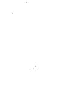

### 一切皆其来有神

高灵，是个近年来被大家广为讨论的名词，但不是每个人都能连接到他。就像我这样从小一直被赋予长大要当仙姑的人，都已年近半百，却也还是资质驽钝至今仍未寻获至宝，那位离我好近却又联系不到的高灵到底在哪里？我不知道。但景雯竟然如此轻易地连接上，其实有一些根本原因。就是：她是一个非常纯洁的人，心中没有太多杂音。一般青少年要不就在谈恋爱，或是忙着准备考试，然而这些烦恼，景雯也没有，她根本还来不及参与自己的年少轻狂，就被身体的恶梦塞满。每天都得专注于好好活着这件事，每一口呼吸对她而言都是如此珍贵，深怕自己来不及成人，就又会有什么闪失。所以可以说，她每天都活在“当下”，当下这个词必须活成动词，而不是一个高不可攀的神主牌。

## 4 麻瓜妈妈敬神录（郁惠部）

我当然是为她高兴的，但内心其实也是羡慕她的，因为自己早就没有这种单纯过活的能力，生命中永远充斥着各种挑战，常常有着寸步难行之慨，有时想想，单纯的人好幸福。就像禅宗所言，景雯是“本来无一物，何处惹尘埃”而我们这种世间凡夫，却还在“时时勤拂拭，勿使惹尘埃”两者层次差太多了！神性虽无别，但管道是否清明畅通无杂音却是如此不同。我只能期许自己赶紧跟上孩子的进度，让神奇的洞察能力跟联通力量能回到自己身上，毕竟这一切皆其来有神。包含我们所遇见的一切困厄，一切因缘，一切好或坏的震动，同有其美好的安排。

在景雯的高灵现身之后不久，我就开始训练她一直习惯性地跟高灵沟通，她真的很棒，没多久，她可以随时随地，张开眼地通到她的高灵，其实这真的不容易，但她都做到了。之后，我请景雯问他叫什么名字？但得到的答案很有趣，高灵说以后就会知道了，现在不告诉她。显不同，就是景雯对自己的信心。其实看病的过程还是起起伏伏，病情也还是时好时坏，说没得准，但有一件事明之前或许还会因为没有一个可供问答的老师而恐慌，现在高灵在身边随时都可以当二十四小时咨询师，心情上自然能够比较安定。

## 4 麻瓜妈妈敬神录（郁惠部）

坊邻居口中的大善人，更因为在世时收服过千年狐狸妖，使得祖师庙才得以顺利重建

他，因在世期间做过非常多助人的好事，山医命卜相皆精通，并都拿所学助人，是街

其实早在爷爷刚过世时，就已经被封神，法号“祖师元帅”。当时肉身成道的

又去了祖师庙询问有关陞云一事，是否为真？答案又是肯定的。

疗的时候，让小瑜老师看到他的庙，并告诉小瑜老师说他要陞云到无极天。之后我们

爷爷这个传说，又开始在人世间引动另一个传说。因为他居然在景雯于诊间被治

们带领至老师的工作室？我们当天就驱车前往请益，答案当然是肯定的。

其实从见到贯誉老师的当天，她就叫我们要去一趟祖师庙，确定是否为爷爷将我

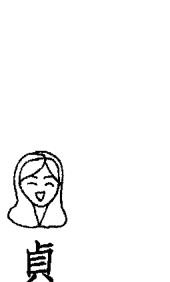

### 贞观祖师陞云录

建，死后封神事迹确定，就在他往生时更有仙界的锣鼓吹乐队来接他，他即驾鹤西归。后又因升天陆续建功，早已陞云一次，法号由“祖师元帅”改为“王法祖师”。故这次说要再次陞云，而且一次就要升至神界最高殿堂，实在令人惊奇。或许是因为过世要满一甲子了，所以要陞云到无极天，离开太极天，但确切的原因我不是很清楚。我很紧张，到了祖师庙就立刻询问当时陞云前的王法祖师说：“爷爷啊！如果您真的要陞云，那是不是要有新的法号？陞云的法会日期？还有是否要塑新的法相？”结果他都说对，基本上都要改。而我跪在祖师庙面前一跪已经四十分钟，不断掷筊要问出个所以然，但说真的，包括法号就不知要从何问起。于是我只好告诉爷爷说：“不然请您来托梦好了！直接告诉我这样比较快！请您放心，我一定会尽力记得梦的。”我得到一个圣笈，心中好不开心，但也战战兢兢，深怕自己忘了梦境的交付。

当晚，我就梦到一个小男孩，在梦中我叫他过来，并问了他：“你叫什么名字？”他跟我说：“我叫志X。”然后我就醒了。

很神奇，就在我醒来的当下，我竟忘了他叫什么名字，只记得一个“志”，志的后面呢？到底是什么字？糟糕，无论我再怎么努力地想，就是想不起来……这下惨了，真不知该怎么办？

因为平时我还蛮会记梦的，纵使有许多的细节，也都难不倒我啊！怎么偏偏在这个时候出乱子？通常我跟景雯都会在一早起来就先讨论彼此的梦境，所以这是每天在做的事，根本不会出错的才对啊！但丢失的梦境记忆，就跟丢失的财务一般，一去不复返。

隔天，我将这件事跟一个有通灵能力的身边人说，因他的名字里就有一个“志”字，我想或许他会有答案。果然，不到一秒，他回我：“不是志X，是贞观。”我问：“贞观？哪个贞观？贞观之治的贞观？”他说“对！”然后就退驾了。

虽然我很想问为什么？但已没有必要，先问到新法号比较重要。

之后，我们又去了祖师庙，问了王法祖师：“请问是‘贞观祖师’这个法号吗？”我甚至还悬空写字给爷爷看，深怕搞错了。

但万万没想到，我马上得到一个圣筊，实在太令人惊讶了！但先收心，继续跟爷爷说，请他再给我一次机会，务必来梦中告诉他要举办的法会日期，并再次跟他承诺：“请您放心，这次我不会再忘记了！”

于是当晚，我就梦见自己在撕日历“十月二十二日”，这回我真的没有忘记，将数字牢牢记在心里。

现在回头看这件事，还真的非常神奇，怎么会用这种方式与神沟通？而且还真能得到答案。爷爷告诉我的第一个讯息居然如此迂回，但还是得到最终的解答，这当中要有绝对的信任。

只能说这世间，真有太多事，不是我们眼见为凭说算就算的，毫无科学根据的事太多了。但，会不会是我们目前的科学能力，能够验证的事不够多呢？我不知道，也没有答案。

人世间且战且走，不要太铁齿，对一切事保持开放的可能性，或许才会更圆满吧！

### 重磅登场：宇宙源头阿一沙

起伏的人生不好过，很快的我们已经治疗了三个月。一天，贯誉老师在她的社团中贴文，照片中出现一本书。书中的内文令人感到很雀跃，他说出台湾的重要，就世界而言，我们如果能好好扬升自己，甚至可以救世界、救宇宙。

而当我看见这个灵讯，就深深为她着迷。于是我就拖着景雯去找书，纵使知道她状况不好，但身体总要动动吧！

我们找到了这本书，一买回来，就在书的封套写着“二〇一八年小雪十一月二十二日”这是我们与“阿一沙”的第一次温柔接触。

“阿一沙”是谁？简单说，祂就是宇宙的源头。

## 4 麻瓜妈妈敬神录（智慧部）

一个纯净，只有绝对的光和爱，没有分别心的源头之音。

到十二月一日时，我已经看超过一半，并认真地学习，想把书中所教的所有方法通通学会。

我开始展开练习，第一步，学会静坐。静心是一切美好的根本，无法静心，就无法收获。

因缘俱足，在我认识静坐这门学问多年之后，终于有一个简单又有系统的方法让我知道，到底该如何安全地静坐。书里没有任何保留，就是一步一脚印地教，然后在充满圣光跟爱的情况下，你可以很信任的将自己交托出去。也说明如果稳定了一个中轴，你将可以与自己的高灵相会。

其实我期待已久，但一直处于麻瓜阶段的自己，也不是努力就一定会有成果，但起码我踏出了第一步。

书中还说，因为现在地球处于偏离中轴的状态，所以当我们地球人类越多人觉醒，越多人稳定自己的中轴，就能够帮助地球也稳定他的中轴；帮到地球回归轨道，就是帮到太阳及月球，甚至是整个太阳系；而当太阳系受到帮助，也等于帮了整个银河系；当我们的银河系受到帮助，就等于帮助到全宇宙。

真的是牵一发而动全身啊！所以所有的失衡，宇宙万物不协调，要怎么调整回来？就从自己做起。

当每个人都学会为自己负责，就等于为万事万物负责。

我看到这样的概念，除了感觉受到强烈的召唤，很想成为帮助地球的一份子之外，也同时相信，景雯的身体失衡，解药就在这里。

我一直觉得，如果世上所有大师都医不好她，那么，景雯只能靠自己了。当然，如果这是妈妈的信念，首先我得先学会阿一沙要读者学会的一切，那就自己先来吧！

## 4 麻瓜妈妈敬神录（郁惠部）

好回家，才把她救回来。所以静心第一步，请先确定自己的灵体是否被保护，才能开始静心。

我跟她说，因为自己的母亲在世时，独自在家静坐，坐到走火入魔，当时父亲刚

被我拉去静心营不只一次，算是有基础，所以我教一次她就会了。

我成为一位教学有系统的老师。我将整合好的方法，告诉她如何做，当然毕竟她已经

到了第四天，景雯对我每天晚上的静坐感到好奇，她说她也要加入，这反而督促

也只能尽量试试。的狗，还有一个青少年景雯，所以我要完全无干扰的静坐本身就是个很大的挑战，但

于是我们开启了静坐之旅。但万万没想到，事情走到现在，居然会把我们静坐史，写成一本书。

很快的，景雯身体好转。而且可能她比我专注许多，所以在静坐第三天，就听到了一位女性高灵在叫“张景雯”的声音，于是她被吓醒，慌张地问自己的高灵，是谁在叫她？当天景雯没有得到最终的答案，但却因为已经能够深度静心，头顶发出光芒，而吸引最正确最高的缘分前来看她，这真是很难得的事。

因为后来我们才知道，那个温柔叫她的声音，就是宇宙源头“阿一沙”。

但也没有过很久，其实也就静坐第二十天，景雯又听见了同一个女性声音来叫她，这回，她已经学会有礼貌地问人：“请问您是谁？”“我是阿一沙。你将是下一个传人！”就这样，她们开启了灵魂新乐章。

## 4 麻瓜妈妈敬神录（郁惠部）

我只记得当晚景雯涨红着脸，张大眼睛流露出少有的雀跃神情，很兴奋地跟我说：“妈妈，我连到阿一沙了耶！”

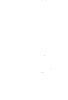

### 麻瓜的学习之路

其实纵使我还是在一旁当麻瓜，但我仍旧依照书中教的方法在晶体中，做一些清理业力或试试连接高灵的学习。

首先必须说，纵使只是清理业力，都可以得到很大的收获，只要你全然相信自己的体验，一次清理一个人或事，那些遗留在你身上的余力就会慢慢退去，是麻瓜也没有关系。

记得有一次，我想要处理某个情感牵扯对象，于是我进入晶体中，找到其中一个面向，跨进后就看见了清晰的画面，是关乎我们的某一世。

我看见那辈子的他骑在马上，在草原奔驰，英姿焕发，非常自由自在。

## 麻瓜妈妈敬神录（郁惠部）

而我那辈子是个守寡的女人，丈夫刚死，有个小孩，我被村内人欺负。他看不下去，就跑来救我，我内心有个声音希望他将我带走，虽没说出口，但有趣的是，他真的将我们母子带走了。于是我从此过着幸福快乐的生活。一次，他去远方狩猎，结果导致我又被别人欺负，但这次更惨，我小孩被杀了，我心痛欲绝。当他回来看见这一幕，却已无力乏天，我不再说话，他相当自责，却也回不到从前。于是，他以酒浇愁，放肆、放纵无度，只为了让自己好过，但没有用，看他这样我更悲伤。其实我心中明白，他是需要开阔、需要草原的，而这样的需要，更甚于我……之后我真的不再理他，他叫我找个人嫁了，我点头改嫁，决定不再与悲伤相守。其实，我是爱他的，只是没说出口。但我亦明白，若将他绑住，对一个自由的灵魂而言，是相当不公平的，所以也就顺势离开了。他对我有许多的歉疚说不出口，但这一切并不是他的错，只是说服不了

那辈子，我们带着遗憾离开了人世。

回到天界之后，我们给彼此订了一个契约。他希望能弥补遗憾，所以对我许下一个厮守半生的愿，要我起码给他十五年的时间，去证明他有心、有能力可以无条件去守护一个他爱的人。

而我答应了，我愿意给出十五年青春，去理解他的付出与感受。

但心中却非常明白，就灵魂角度而言，这十五年一到，我很可能还是会选择离开。因我心中有个空缺，甚至比任何人都害怕厮守一生，因为累世以来，从未得到过足以信任的爱情。

虽然害怕孤单，但其实更害怕分离，所以宁愿孤单。

好深刻的觉知，我一方面在帮他，一方面在厘清自己……

离开晶体之前，我得到深刻的了悟：“亲爱的，无论你是否这世亦选择离开，我自己罢了。”

## 4 麻瓜妈妈敬神录（郁惠部）

对你只有无限的祝福与感激。真的，谢谢你！”

其实，所有的缘分都是恩师，有时看深一点，并练习把自己惯性的恐慌与怀疑先搁置一旁，收获的绝对是我自己。

### 在光中遇见爱

二〇一八年十二月十五日晚静坐大突破，见到了盖亚女神。我由身体中往外看，看见了自己的乙太体，再往上、下看，看到了偌大的星光体。然后，那个大我居然在对我微笑，是个好大好大的我，长长的头发，圆圆的肚子，绿色的身体，长得很像地球变成的人形。我突然意识到，这不是我，却也是我。而随即认出这就是地球妈妈，就是盖亚女神。同时，我见到了顶轮一闪而逝的释迦牟尼佛，蓝色的宝盖头，金色的身躯，他象征着源头。然后，我就在眼前看见了紫色像甜甜圈般的光环，在我的第三眼前不停地转动着。同时听到自动播放的音乐，这是轻盈至极又安稳人心的心灵之音，重点是这些音乐我都没听过，像是别次元的自己，隔空播给我听的。

## 4 麻瓜妈妈敬神录（郁惠部）

于是我突然明白，阿一沙说的“从你的松果体看出去，看见前额的光并与之相会”是什么意思。我也终于明白“与绝对的声音共鸣共振”是什么意思。麻瓜如我，终于在静坐了两周之后“看见并听见”了些什么。这种感受只有绝对的当下，绝对的真，没有别刻只有此刻，一种好好活着并非常感激生命的感觉。但还没结束，之后我看见门户之神，在他后方有座又长又高通往天国的阶梯，我走了上去，通过白云，就看见了老天爷。那位我思念念非常钟爱的神级老爸，他是那么的巨大，那么的帅，但我完全没有恐慌，随即他带领我走进他的光里，带领我用他的眼、他的身、他的光看世界。我原本在他脚下，但居然就这么轻易地走进他与之融为一体，我深刻感受到，我们是一体的，都是源头，都是爱。从来就没有你我之别，向来都只有我们。得到这样的了悟，我默默地落下泪来，是一种深深被爱着，也同时深爱着每一个缘份；被拥抱着并清楚了知自己也是力量泉源的双重体悟。

真的越加地明白，自己为什么会踏上这一条路，原来在这里，我们永远是被珍爱着的。好感動的一刻，不是吗？

### 女儿（景雯部）

地球妈妈打点滴 五颗不同能量星球，帮助地球灌入自身强大能量。（左至右）（2019/6/8 由阿一沙补充说明）

- 咖：NYC——新生的能量
- 绿：天王星——各种可能的能量
- 紫：智——整合的能量
- 蓝：克里昂——流动的能量
- 橙：恒宿——持续的能量

### 阿卡西纪录的印章钥匙

景雯进入自己的阿卡西纪录前，变出钥匙印章，才得以开门进入。

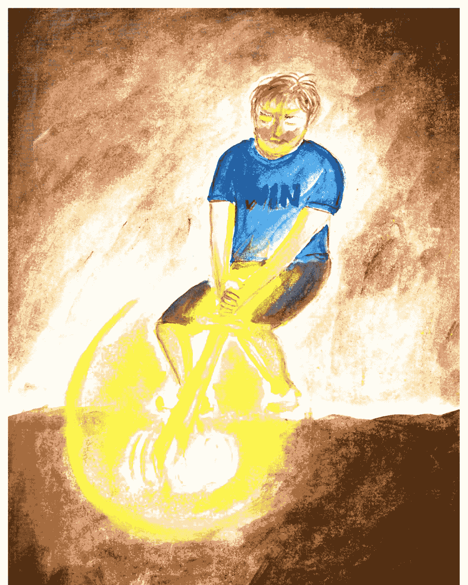

### 拔出自责之剑

景雯进入阿卡西纪录后，拔出自责之剑。

### 五龙与龙王公主

郁惠进入列木里亚深海中，所遇见的五龙，跟已经变成龙王公主的自己。

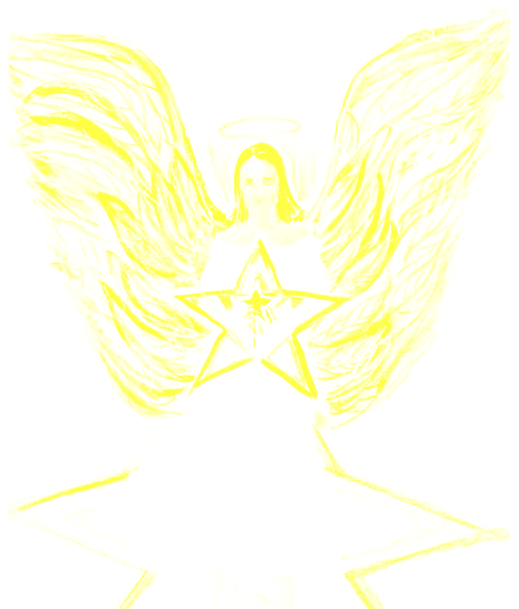

### 亲爱的达芬奇

郁惠的高灵达芬奇。是位亮白黄色女性形象大天使，他送给郁惠一个空透明白色五角星疗愈笔。亦告诉世人，你们的祈祷都会得到回应。

### 可多分身——不同样貌的梅一

守护者可多在列木里亚的多重白色分身。
无论是天马、巨龙、凤凰，皆称为梅一。

观音圣母像 郁惠在静坐中看见的观音，另一侧则现出圣母。是合一的观音圣母像。

## 生命之树

景雯的生命之树。

### 列木里亚

传承者雯雯去到列木里亚，进入三角形“地球中轨”调频。列木里亚人皆是光球，迎接她的到来。

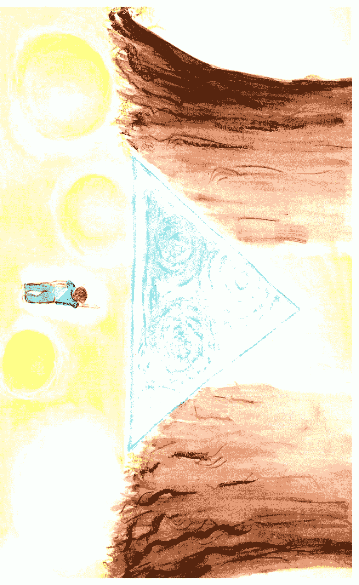

### 崩坏的天狼星

景雯所看见的崩坏天狼星。这是其中之一的可能，地球人的觉醒将能避免宇宙的连环崩坏效应，让这个崩解的可能消失。

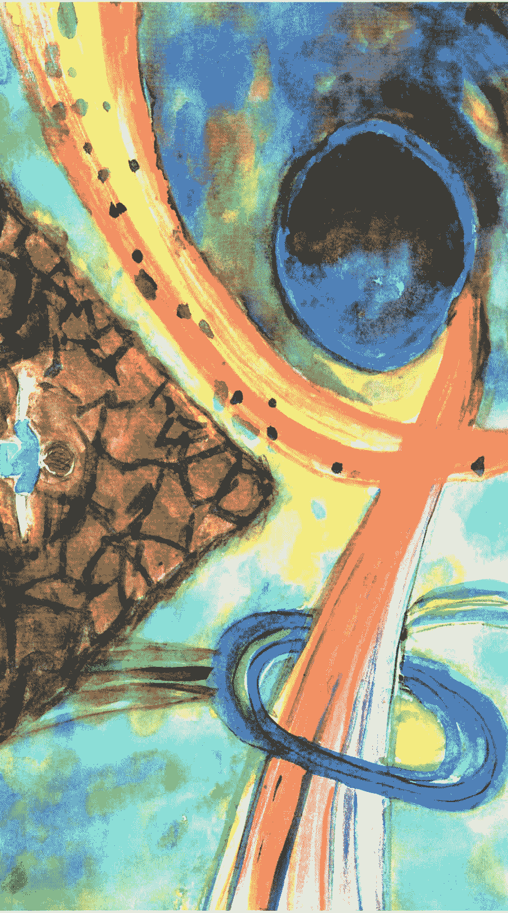

### 地球中三个次元的其一次元——凯亚星

介于地表次元“地球”与地心次元“列木里亚”之间的奇异次元“凯亚星”。

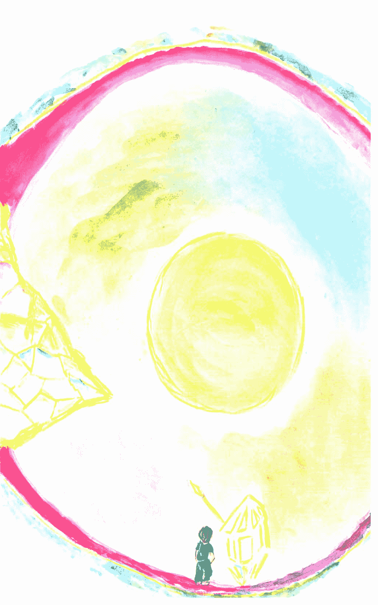

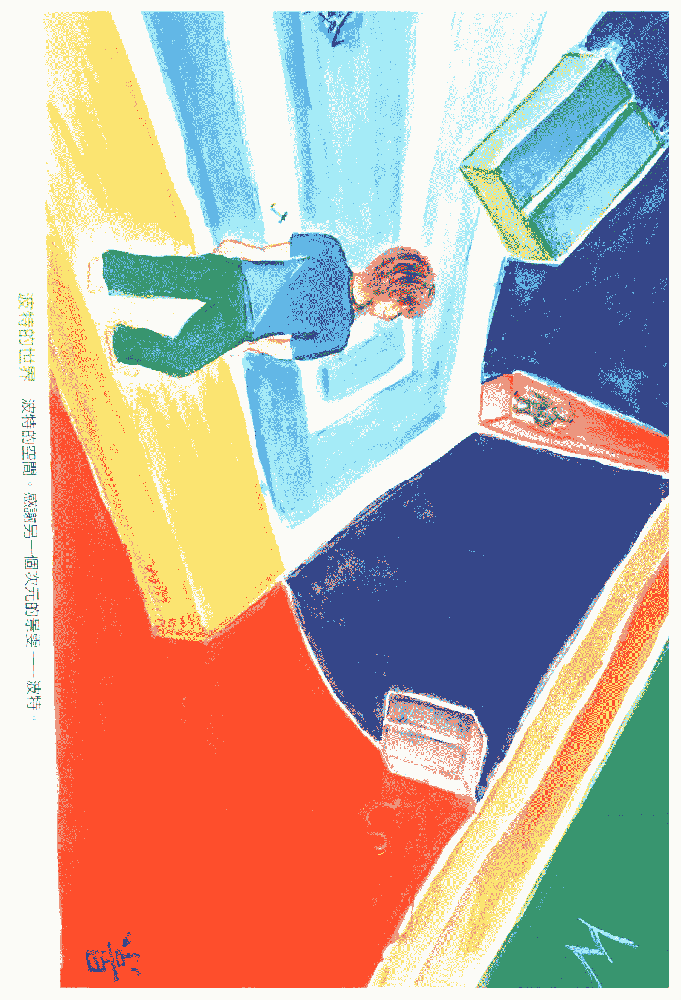

### 妈妈（郁惠部）

地球妈妈 郁惠在晶体中所见到的美丽地球母亲。

### 列木里亚家园

郁惠在列木里亚的家门前，独角兽希拉与化为梅拉公主的自己。

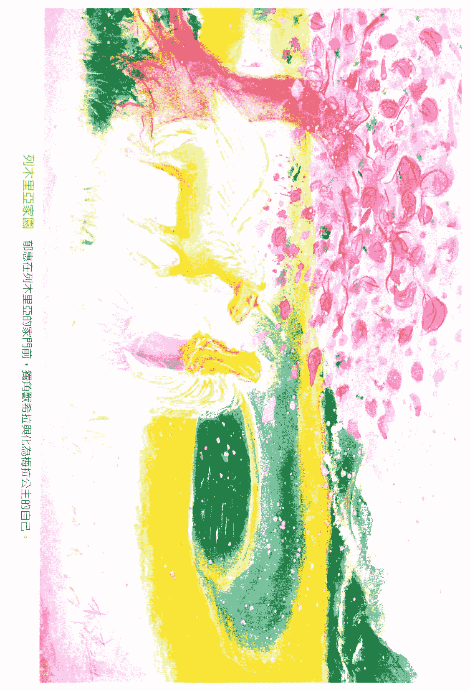

## 4 麻瓜妈妈敬神录（郁惠部）

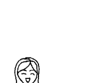

一切都只要清理罢了！

先说明一下，其实我跟你们一样，对自己充斥着满满的怀疑，会不会这一切都是我自己幻想出来的？我看见的高我、前世、老天爷？根本作者就是我一人，毕竟我是个编剧外加导演，记得吗？

无论我经过几次阿一沙的安慰及确认，都还是深深觉得自己杜撰故事跟看见画面的能力实在是太强了，但，回到主轴，我们到底为何而静坐？

如果我们一直以来都是为了减轻自身的业力，认清灵魂的真相，清除人生的路障，所以，当眼前的故事还是帮到了自己，那么就算是杜撰的又怎样？重点是清理，而且超级有效。

一直以來，我都知道自己還會再輪迴的次數應該不多了，因為真的很累，每一世的挑戰真的都不是人幹的，但我也都留下來了，那為何而留呢？當然是為了人情。上一世相欠的，總以為這一次一定還得了，但往往是徒增更多業力，於是再次輪迴，又為了還債。

靜坐之後，想著如果可以透過觀想將上輩子欠的債逐一還清，那該多好，於是這次我決定處理一個尚有罣礙的緣分。

閉上眼，進入晶體，瞬間來到某世面向。

畫面之初，我來到古代中國，看見自己是個俠女，正揮舞著劍，披荊斬棘砍著前方雜草，欲開出一條血路，但快要走到尾端之際，卻被一名男子從旁殺出擋住去路，

## 4 麻瓜媽媽敬神錄（郁惠部）

連年戰亂，吃不飽穿不暖，到處都是刀光劍影。

那輩子，他是個亂世中的大王。

他的愛很濃烈，濃烈到我現在都還感受得到。

下一幕，我看見他抱著我，我身受重傷已呈昏迷狀態，左背上仍插著一支箭，血流不止。他快速狂奔，神情緊張好傷心的樣子，接著將我放下並幫我療傷。

我知道他愛上我了，跟這輩子一樣。

我抵在他胸前的劍撥開，但眼神卻從未離開過我。

同時瞬間從草叢跑出一群隨扈也舉劍對著我，他馬上喝令他們退下，並輕鬆地將

我立刻用劍抵住他，說：「不要過來！」他笑了，並不怕我。

心想「是他！」一位我這輩子認得的男性友人。

而大家都很怕他，包括鄰國的君王也是，因為他已經連續併吞多國，導致其他國家必須想辦法合縱連橫制伏他，但依舊沒轍，軍紀嚴明的他，毫無弱隙。甚至連隨屬弟兄們，也都很怕這個兇殘的大王，因為他賞罰分明，做得好有賞，做錯就人頭落地。

但他對我極好，有吃的先給我，怕我餓著；就寢時抱著我，劍不離身。他怕若再一次失去我，那將是他最不能接受的事。

但他卻不知道，其實我效忠於別的國家。而他更不知道，我早已被他感動，再也無法效忠我的國家……

我的女人！」
下一幕，他被抓了。被抓的同時，他只說：「要殺要剮隨便你們，但請你們放過

當時的我躲在屏風後面，無助地發著抖，惶恐地摀著嘴流下無聲的眼淚……

## 4 麻瓜媽媽敬神錄（郁惠部）

的傷心地。我還在崩潰淚流不止的狀態中就被他抓到天上，繼續在高空 中看著這幕悲這時我看見監獄內斑駁的岩壁上，有一尊九天玄女飛了出來，將我帶離那個窒息的傷心地。我還在崩潰淚流不止的狀態中就被他抓到天上，繼續在高空 中看著這幕悲世同步，雖閉著眼卻一樣揪著心一直哭著。我猜這時還在晶體中的我應該很危險吧！因為身在這現代化的客廳裡，心卻在前起」傷心欲絕的我就快要暈過去……我哭著說「沒有。」然後就真的崩潰地對著他開始磕頭，一直說「對不起、對不為難？有沒有被欺負？我開始一直哭一直哭，他卻只在乎我，要我別哭了。只輕聲地問我：「有沒有被囚房，看到他的那一刻，幾乎就要崩潰。下一幕，他在監獄裡了，眼已被挖掉，腳已被砍斷。我去看他，慢慢地步入他的

### 慘的電影。

下一幕，就到了刑場。不知是誰在他被行刑前，到耳邊跟他說，出賣他並害他被抓的人就是我，那個他那輩子最深愛的女人。

然後，他在被砍頭前咬舌自盡了。

然後，另一端的我，上吊自殺了。

回到天界後，他不再說話，與我保持極大的距離，相當冷漠，像是變了一個人。

我好傷心，但沒用，他還是完全不理我。

我們靈魂的後方，還有彼此的高我。我以心電感應問他的高靈：「就這樣？然後呢？」他回：「繼續走，往下！」然後我們就又縱身一跳，來到下一世輪迴。

> 「就這樣？然後呢？」

> 「繼續走，往下！」

## 4 麻瓜媽媽敬神錄（郁惠部）

為什麼要體驗這種悲傷啊？」 回到晶體中，我的抽咽還沒停止，於是我邊哭邊問蓋亞女神：「為什麼要體驗這種悲傷啊？」 她將小小地正在發著亮光的我舉起來，對著我說：「孩子，因為你很勇敢！」 然後瞬間，他就變成了聖母瑪莉亞，而聖母的心口有一個也在發光的嬰兒，嬰兒立刻長大變成了耶穌，耶穌到我的面前說：「嗨！終於見面了。」 由於這一切變化得太快太突然，我仍驚魂未定，於是耶穌幫我灌頂，不斷從頂輪灌入紫光，直到我的情緒慢慢平緩下來。 最後他說：「今天再給妳第二個禮物！」我就看到耶穌將一把火炬，瞬間舉到我眼前，然後我就張開眼醒了。 結束了一場驚心動魄又真情至深的業力清理旅程。 但何謂第二個禮物？這才想起來，因為第一個禮物我昨晚早已得到了。

### # 五行禮物

我們現在回過頭來說說第一個禮物。二〇一八年十二月十八日靜坐的尾端，我清楚地看見一個「金」字，從畫面左手邊咻咻咻地出現，並一路走到我的眼前停了下來。

它非常閃亮，鑲著金邊，就像是戴上3D眼鏡看到的立體字，好似伸手一抓就會抓得住般，使我立刻嚇醒張開眼，心想會不會真的有個金字在我眼前？雖然不知是啥意思，但心中卻有一陣歡喜，想說不知是否老天爺要送我錢？而且還是從西方來？但另一個念頭是，莫慌莫急，很期待明天又會遇見什麼？

果然，二〇一八年十二月十九日第二天靜坐尾聲，就像大家知道的，我見到了耶穌，雖然自己一直以來就是虔誠的佛教徒，十九歲皈依到現在已近三十年，所以對

## 4 麻瓜媽媽敬神錄（郁惠部）

於耶穌跟我說「好久不見」實在是感到一頭霧水，但卻真有一種跟他熟識的感覺。總之，祂一見面就無私地幫我灌頂，還送我一把火炬當禮物，那麼或許我們真的很熟吧！哈哈！而我當時也才想起來，原來這把「火」，還真的跟昨晚的「金」字形成一種五行的格局，而且當下恍然大悟，自己所看到的，是專屬的禮物。那麼第三天呢？

第三天二〇一八年十二月二十日就更有趣了。一開始看見兩隻龍盤旋，一隻光龍、一隻黑龍。然後到了尾聲，也是從畫面左手邊，出現了一個「也」字，我心裡想，這個字跟五行完全沒有關係啊，為什麼會看見它？就在我百思不得其解正搖搖頭的同時，我往畫面的左邊看去，居然又出現了一個「土」字，有趣的是，「土」走近「也」，兩個字就結合成「地」字，我差點沒笑出聲，心想這樣的說文解字法，倒是第一次看到，頗有新意。不得不讚嘆老天爺的巧思，用這種方式送我禮物。那麼第四天呢？

第四天二〇一八年十二月二十一日我看見了一棵大樹。這棵神級的巨樹，長達天界，穿越了雲層，還繼續生長，幾乎看不見頂。是一棵讓人肅然起敬不得不向祂伏首稱臣的生命之樹。神奇的是我與祂融合了，自己也變成了巨樹，看顧著大地，看顧著眾生，這時的自己反而突然覺得謙卑了，奇妙的感覺。第四天，我清楚地得到「木」這個禮物。

第五天二〇一八年十二月二十二日終於來到第五天，沒有意外的話，我會獲得「水」這個禮物。但為什麼是今天才遇到水呢？我想是節氣的關係。因為今天就是「冬至」，台灣人習慣會吃湯圓的日子，並且老人家會告訴孩子，若吃完這顆湯圓，你就長大一歲了。

沒錯，冬至的意思，就是銜接豬年的第一個節氣，而豬年，就是水年。

## # 4 麻瓜媽媽敬神錄（郁惠部）

静坐一开始，我就看见绿宝石光芒的湖水，好悠远宁静的感觉，接着我往上一看，看见好美的金黄光，同时听见水滴的声音，往下一看，发现自己正踏在水里，但眼前这个好亮的金黄光吸引我走近祂，瞬间金光将我带进阿卡西殿堂，在这个金色的殿堂里，我看见眼前出现四块上、下、左、右的亮色三角型正在自行组装成为，一个正方形，他们结合后悬空转动了一下，然后，我面前就出现了一个由亮色方块组合而成的“水”字。事后想想，到了现今才开始整理内文的我，竟然发现，若以五行论，果真是所谓金生水，一点也不错。但静坐的当时，我却压根没想到有这样的结论，这真是太神奇了。这五天，我聚齐了五行礼物，怎么有种得到五行宝石就可以改变世界的雀跃感呢？是自以为在拍电影，还是现实生活真会有所改变呢？让我们继续看下去。

### # 第二个家——列木里亚

隔天，十二月二十三日静坐，当我进入晶体，看见漏斗型的符号，并打开其中一个面向后，就瞬间来到了列木里亚。這是種回家的感覺，因為我一到，就看見獨角獸「希拉」跑過來找我，壓根沒想到我們會在這裡重逢，我給她一個大大的擁抱，激动到喜极而泣。

「希拉」是我在一次「畫出你的獨角獸」的繪畫課程當中，遇見的獨角獸高靈。她非常地溫和溫暖，有種全身散發著安詳恬逸並非常寬大睿智的氣質，她有著純白色的身軀，白色帶點淡綠黃相間的翅膀，翅膀上像灑滿金粉，還有一根金銀相間不時在發光的獨角，並且在額前鑲上一個金色的大V，我猜那是某種皇冠的意思，非常美麗。她象徵著獨角獸次元的高我。但在那等我的，不只希拉，還有一位渾身發著亮光，留著淡金黃色微捲過腰長髮

## 4 麻瓜媽媽敬神錄（郁惠部）

女神，也同時出現在面前，我請問他叫什麼名字，她說她叫「梅拉」，當下的直覺反應是：「您好！梅拉公主。」而我對她有種說不出的熟悉感，一種很像遇見自己的感覺。接著希拉就帶我回家。在半山腰間，一座白色的宅邸，遠看長得有點像蒙古包，庭院旁有著一棵大樹，粉色的樹葉飄落，整個畫面如夢似幻。我們到了陽光滿溢的屋內，淡黃綠白的牆，會因視線的調整而變色，室內沒有空調，卻舒適宜人。我隨即發現床頭旁的窗戶，是一個開口笑沒有遮蔽的大型窗，最特別的是，當你視線往上，窗口也會往上，視線往下，窗口又下移，是個像有讀心術的窗戶，非常有趣。之後我跟希拉走到戶外閃亮的大樹下，而我居然聞到一股濃郁的香氣撲鼻，我「咦？」了一聲，看著樹心想「是妳嗎？」我得到肯定答覆。當然，我們都沒有開口，這一切都在心電感應中自然回應。

樹上綁著鞦韆，我很自然地坐上鞦韆，悠閒地蕩著，像是世上再也沒有時間一般。而我迎著風，看見自己隨著擺盪自由往前飄逸的淡金黃色長髮，喔！我突然明白了，原來我就是梅拉公主。遠方山腳下，有著一潭碧綠色的湖水，非常閃耀動人，這才想起，這不就是我看見的湖水嗎？原來，這一切都在冥冥當中安排好了，我們早已相遇，無限感恩老天爺，讓我見見這一切。

### 我親愛的家，列木里亞。

列木里亞初體驗結束後，也才知道，今天亦是景雯第一次正式遇見阿一沙並知道自己將是傳人的日子，二〇一八年十二月二十三日是個偉大的紀念日。

## 4 麻瓜媽媽敬神錄（郁惠部）

### 等很久的觀世音菩薩

當我開始每天靜坐，幾乎都會在晶體中遇見幾個重要人物，現在要跟大家好好介紹一下。

第一位，也是我從小到大的信仰對象：觀世音菩薩。每當連結至觀音，就會有強烈的白光進入我眼簾，第一次連結至祂，我記得很清楚，自己就開始跟祂懺悔。

因為在好幾年前，我就曾被靈修團體的大師說過，說我的主神是觀世音菩薩，另一叮囑我要趕快加入靜心行列，因為我是一個有能力的人，可以幫助世人提升靈性，也可以幫忙打擊暗黑勢力。

當然從小自己就知道跟觀音的緣分最深，但說也奇怪，在我由他人口中聽到這個訊息的當下，雖然沒有半點情緒，眼淚卻不自覺地掉了下來。

我跟大師說不知為何會如此，他說是因為觀音真的已經等我很久了。

雖然不才如我，這話一聽已過十年，但我依舊原地踏步，沒有即刻就專注靜心並成為觀音菩薩代言人，所以也導致現在一跟祂連結，就馬上真心懺悔。

而令人感動的是，我沒有聽到任何責罵，只得到一句「沒關係，不要責怪自己，一切都還來得及。」我又再一次為了觀音的慈悲與溫柔流下感動的眼淚。

觀音菩薩也給我一個禮物，是一條長得像原住民長老的項鍊，祂幫我戴在胸前，並叫我舉起右手，與祂的左手合掌，當我們的掌心一結合時，就發出極強烈的白光。

觀音菩薩說，祂賜予我發光的右手以後可以隨時幫人療癒。並賜予我傳承人的封號，叫「自在觀音」。當晚，我淚流不止。

後又一次，我亦連結到觀音菩薩，問了祂一直以來心中的疑問，就是之前大師說要我一起打擊黑暗，請問為何世上會有惡靈？

結果我清楚地看見觀音菩薩在我面前，形成左半邊白亮、右半邊黑暗的形象，但

## 4 麻瓜媽媽敬神錄（郁惠部）

暗黑菩薩的後方接著透出極強的光，由側後移至前方照亮，於是整尊觀音又變成白亮的菩薩。

祂接著輕聲地說：「孩子，這世上沒有黑暗，沒有惡靈，只有陰影，但陰影只要用光和愛照亮它，一樣只有光明，這樣妳明白了嗎？」

我又再一次被觀音菩薩的力量感動到說不出話，對祂只有五體投地。

一直以來我都把觀世音菩薩當成母親一般地看待，自從媽媽過世之後，祂就是我的媽媽。我會把所有心事、所有能撒的嬌都往祂身上傾訴，從來都只得到無限的安慰，沒有責罰。當然，現在知道祂亦是我的恩師，心中只有無限感恩，別無其他，生命至此，漸無遺憾了。

另有一次靜坐也讓人印象深刻，當我連結觀音，卻出現一半聖母瑪莉亞，一半觀

世音菩薩結合為一的清楚畫面，醒來後我問阿一沙，為何會有這種畫面？

> 阿一沙反問我：『那妳的感覺是什麼？』

> 我回說：『我感覺他們是同一人，只是因為東西方的信仰不同，各自連結到的緣分不同，才會產生兩種形象，但他們源頭是相同的。這是我在靜心時清楚的認知及感覺。』

沒想到阿一沙笑了笑，說我說對了。

當我與源頭連結越深時，就越來越清楚，人類發明的宗教，是為了得到他人認同或當成分別異己的工具。但在神的國度，這一切並沒有分別。

就像他不會因你是黃種人或白種人，而減少對你的愛，更不會因為你是哪一國人、信仰什麼宗教而改變對你的態度。人類的分別心如果能漸次降低，才能漸次靠近揚升之路，共勉之。

### 療癒系耶穌老哥

繼第一次見到耶穌後，我就常常連結到耶穌。只要我點燃三聖火，並往頂輪上方三尺一看，就會看見祂出現在聖火的上方，然後我會順勢將聖火及耶穌請下來到我的眼前。

很多時候，祂會隔著火炬像坐在火爐對面跟我說話，而在這面的我，則會跟祂學習如何治癒別人。

如果沒記錯的話，耶穌也是一位療癒系大師，許多天主教基督教的故事都跟祂的神蹟在世有關，當然包括祂的復活神話。

一次，我與景雯坐捷運，途中她突然很不舒服，已開始冒冷汗，情況危急，她看起來似乎就要昏倒了。

於是我開始在捷運上點燃三聖火，心中觀想頂輪上方出現耶穌，此 時果然沒讓人失望，耶穌立刻就現身了。
我跟祂說：「怎麼辦？親愛的耶穌，我現在需要您的幫忙！」
祂馬上回：「我知道！先把手放在她胸口跟背後，我們一起。」
祂一邊指導我該怎麼做，一邊也加入療癒。
所以雖然捷運上的人，看見一個媽媽側坐著一手壓著孩子胸口，另一手搗住孩子後背，雙眼緊閉神情緊張，不知在做什麼法事的怪 樣；但在上天的眼裡，會看見孩子坐中間，我跟耶穌面對面一人一 邊，同時壓著孩子的前胸與後背。
才不一會兒，景雯就回復了神采，真是嚇死寶寶了。但媽媽也同時知道，路人的目光不重要，若請出耶穌就能救孩子，那每個媽媽都應該跟耶穌學習療癒法才是。
耶穌除了教我如何在緊急時刻急救小孩，祂還教我如何治療毛小孩。有一次回家

## 4 麻瓜媽媽敬神錄（郁惠部）

看到狗狗吐了一地，鼻子也乾了，全身微弱地發著抖，我想慘了，怎麼這麼嚴重？但還是冷靜下來，用耶穌教我的方法，一手固定放脊椎尾端，一手從頂輪慢慢往下撫摸治療，一直摸到與尾椎的另一手相響為止。這樣來回幾次，使得原本還在發抖的牠，瞬間就好多了，鼻子也變濕潤。

心想，耶穌的療癒法還真是厲害，我何其有幸，能得到這樣的直接傳授教學。

後來也才明白，阿一沙說的，觀世音菩薩與耶穌都是我的導師，我好好學習必定能得到他們的真傳，真覺自己是三生有幸。

而自己理出一個連結，他們皆為療癒與智慧的鼻祖象徵，期望自己有天，也能在這些方向精進，當一個真能助人的人。

說到傳人，雖然耶穌不似觀音菩薩會直接說我是他的傳人，但有一件事卻是相當

有趣的。

記得在過年回娘家的時候，我居然連續四天雙手雙腳像被打了四個洞。第一天左腳不知為何黑青了，第二天變右腳也被撞成黑青，第三天是左手被很重的門砸到黑青，第四天右手直接見血，而且我只不過是在整理紙類。

這一切都讓我覺得莫名奇妙，雖然不至於影響或恐懼，但我好似明白自己在連結耶穌，所以直接感受到祂當時被釘在十字架上，身上被打四個洞的感覺。還好後來耶穌告訴我，這是浴火鳳凰要重生前的跡象，只要明白前方是坦途，不要以害怕相應，一切就都不痛了。

為何總是連結到耶穌？其實心中有個有趣的聲音牵引著，因為我一直感覺耶穌比較像大哥哥，很可能祂在世時我們就相熟了。而觀音菩薩比較像神，令我覺得自己要很尊敬、很莊嚴才能連結祂，而自己靜坐有時候好像不夠莊重，很隨便的坐姿等

## 4 麻瓜媽媽敬神錄（郁惠部）

等都是我的罡礙。但其實我也不一定會多想，有時誰來了到最後都是憑直覺帶引。比如觀音的白光，耶穌的金黃光，或者氣味的不同，最後我也能在空氣中分辨特殊氣味的不同。這些特殊能力，都是在短短半年的靜坐期開發出來的，心中只有無限感恩。另外感恩的還有，耶穌送給我的療癒手。一次也是在幫景雯治療，耶穌叫我看看自己的左手，結果左手真的就開始發出強烈光芒，根本就是超人上身，因為光亮到我幾乎無法正眼直視。耶穌告訴我，至此之後，我可以直接用發光左手去療癒人，也非常有效。我實在覺得自己太幸運了，擁有了觀音的療癒右手，這回又有了耶穌的黃金左手，那我的雙手真能發電了吧！

當然，耶穌也給過我禮物。除了第一次見面的火把，也給過我權杖，權杖整個是白銀的柄上方鑲滿紅寶石。還有一把發著綠光的寶劍。最特別的是，我的鑰匙，自從被景雯認出來是一把裝在心輪的水藍色鑰匙之後，我就親眼見證鑰匙從水透亮的藍色，再變成金色，再變成金色柄身鑲上紅寶石；最後變成銀色，又在銀色上鑲了三顆紅寶石。但之後看見的鑰匙，又開始化繁為簡，只剩下發著光的7，而且將7倒下，就能直接勾住心房開門，非常簡單。

就這樣，我很榮幸地參與了自己心輪鑰匙的進化史。但這把鑰匙到底要通往哪裡呢？通常我都會聽見耶穌的指令，祂叫我拿出鑰匙，用來打開心門，推開門之後，我就會連接回家的路，直通列木里亞，那個讓人心神嚮往的家。

### 開門就到的地心次元

列木里亞，這個我後來一打開心門就能到的美麗家園，真應該好好介紹一下。他算是地球地心的次元，那裡的人類基本上都已變成光體，所以正確來說，應該只能見到光，或聽到不同的聲音。而我所見到的形體，也多數是發光的獨角獸、發光的白龍、發光的白鳳凰、發光的天使或公主等等，而都有種摸不著的感覺，總之飛翔與他心通跟瞬間移動皆是本能，每人都會的事，也就不稀奇了。現在回溯到那裡之後，令自己印象最深的幾件事。

### 變身一族

一次，當我打開心門到達列木里亞，迎接我的除了希拉之外，竟還有一隻好大好大的白龍，他會用頭直接來磨蹭我的臉頰，像在撒嬌一般，而當他第一次做出這樣的動作，心裡就突然明白，他就是我們家狗狗「可多」在那個次元的分身，因為這種親暱行為不是高雅的希拉做得出來的。

我很自然地就騎在他身上，然後在高空中飛翔盤旋一陣後問他說：「你叫什麼名字？」

他用心電感應回我：「梅一。」之後他就帶我深入列木里亞的海底了。

而當我們像螺旋槳般捲入深海中後，除了發現海中很暗，也立刻看見自己的下半身已變成了美人魚的長尾巴，有著水晶世界才會出現的藍紫變色美麗尾巴，呼吸竟也沒有問題。

## 4 麻瓜媽媽敬神錄（郁惠部）

當我找到了一處灰灰的廣場，中間有著一大一小兩個王位，我就自然地坐上較小的王位，沒人教我卻非常自然。因為我就是深海龍王的女兒，而這天剛好是我生日，父王則坐在一旁，是非常大尊莊嚴的綠色龍王。等我坐好，就看見蝦兵蟹將們自動排了好看不見底的隊伍，他們一個個手中都拿著禮物，把禮物紛紛放到一個超大型貝殼上，要來祝壽，因為今天是我生日，但我卻告訴大家說：「別送禮物了！讓我們一起給地球祝福吧！」大家聽到指令後，齊聲對著地球說：「謝謝你！我愛你！謝謝你！我愛你！謝謝你！我愛你！」震撼的聲音響徹雲霄，震耳欲聾。而我好開心，幾乎紅了眼眶，也同時謝謝大家，一起完成了 幫助地球穩定中軸的任務。此刻我才明白，其實我就是地表上的梅拉公主，到了深海，就一躍變身成海中的龍王公主。陸地上時長翅膀，深海中時長尾巴，但都善良而美好。

先說明一件事，列木里亞的動物是來守護人類的。這就是為何我看見白龍「梅一」，可以一眼認出她就是我家狗狗「可多」，因為我認出的是他守護我的相同氣質。
有趣的是，我從來沒想過這兩個名字其實會得到一種平衡，「一」與「多」，多麼神奇的協調。但其實可多在那邊除了白龍的分身，有時也會變成白鳳凰，或白馬，但都是他「許多」的分靈，所以我都統一叫他們梅一。當然，唯獨獨角獸希拉不是。

## 4 麻瓜媽媽敬神錄（郁惠部）

### 酷！五龍

第二天靜坐，我又潛入列木里亞海底，這次見到了五龍。但這回是白鳳凰梅一帶我入海，我一樣騎上他，他縱身一躍，就深入海底了。首先我先見到超大的黃金龍，牠的巨大閃閃耀幾乎照亮了整片海底，而白龍探出頭來悄悄出現在金龍旁，接著就出現了有著美麗寶藍色的藍龍，牠貼著金龍的另一邊，然後暗紅色的紅龍出現了，跟在白龍另一側。最後當我被他們震撼到說不出話來時，回頭一看，一尊巨大的黑龍圍繞著所有龍，當然包括居中的我，當下立刻起雞皮疙瘩。而我也不知為何，就跟巨龍們說：「以後就靠你們了！」心裡沒說出口的是請他們照顧地球海洋，因我知道海域已經被人類破壞到不行了，對於深海龍王們真心覺得很抱歉，但我馬上感覺他們都收到我的請託與抱歉。

這時黃金龍開口對我說：「我們一起！」緊接著有趣的事情發生，他們居然聯合將我一把拱起，帶回岸上，回到陸地，海岸線的他們變成了五色美麗的彩色印記，光彩奪目絢麗繽紛，但瞬間這五道彩光，咻一聲，就又飛回海中，消失在地表上。最後剩我一人，孤伶伶地站在夕陽西下的海岸邊，突然感到強烈地孤寂與愁悵，許久回不了神。醒來後，我問阿一沙這一切是否又是幻想？因為實在是太不真實。他只跟我說：「孩子，別再懷疑自己了。」雖然我搔搔頭還是沒自信，但想到剛剛出現的畫面，第一時間當我看見白鳳凰梅一伸出爪子要載我的同時，我家狗狗可多也同時將他的手放在我手腕上，真可謂神同步。

這樣看來，是否可以間接證明我真的感應到了些什麼。
好吧，深海旅遊若還能清楚看見五龍，並與之交談的人或許也不多了，這樣想或許會好些吧。

### 龍王別再吃垃圾

接著有一次，在靜坐中用藍鑰匙打開心門的那一刻，就看見白鳳凰。梅一的爪子伸到眼前，要我坐上他的身，當然我很自然地就騎到他背上，然後迅速飛上天際，而且一起飛就沒有停，直接衝破九霄雲外來到外太空，我們在遙遠的星際銀河盤旋許久，鳳凰的長尾散發出連綿不絕白色光波，始終回傳給遠方小小美麗的地球。而後，梅一下降，降落到一處森林區，他回到地球就變成一隻白色天馬，我問：「你還要帶我去哪？」他順勢又變成一隻長尾鳳凰，瞬間將我帶回到列木里亞。回到列木里亞的梅一再度變身為白龍，我摸摸巨龍的可愛臉頰，他又伸出爪子，我漸明白這是一種邀請，有點像是司機幫你打開車門的動作。

## 4 麻瓜媽媽敬神錄（郁惠部）

我坐上白龍，他再度盤旋直接帶我進入深海。有趣的是，這次我一到海底就被父王接走，他將我帶回明亮的龍王宮，有點像在巨型水晶泡泡內的龍王宮，接著他馬上披上將軍服，我在旁亦同，我還有假鬍子，模樣詭異。接著父王要我留在宮中自己就出去了，我才發現自己像是被關起來般。他變身為一尊好好大長的將軍白龍，我貼著透明的水晶玻璃往外看，看著他開始大口大口快速吃著海中垃圾，我好難過，被這一幕震驚到說不出話，看著還在為深海救援的他感到痛心不已。狂亂拍打著玻璃並哭喊著救命蝦兵蟹將：「還不趕快去幫父王！！」他們聽到我的呼救，馬上也變身一隻隻小龍去咬垃圾。然後下一幕，他們將所有垃圾送上岸，海岸線上滿滿人類製造的垃圾山……而我終於流著淚醒了。

這一次，我久久不能自己，心想為什麼我們可以擁有的資源，卻讓世界生病了。這個地球，不是我們的，而是眾生的，然而眾生，卻比你想象中還要智慧、有慈心多了。我們這一輩再不覺醒，那孩子們到底該怎麼辦呢？深思啊，人類們。

## 4 麻瓜媽媽敬神錄（郁惠部）

### 水晶智慧

當我越來越穩定地連結列木里亞，就能越清楚連結到智慧源頭。一次，當我打開心門，看見希拉、白龍梅一都在等我，於是我就跟他們一起飛到山底下的那一畍湖泊。

咦，我是否忘了告訴大家，我這個梅拉公主也有著美麗動人閃閃發光的天使翅膀，但至於我是否非要自己飛，那就不一定了。就像大家看到的，很多時候我會騎在梅一身上飛行，但其實有些時候，我也會乘著希拉翱翔，這個次元的自由度，原本就超乎想像。

湖泊在我們一起飛向它的時候變色了，由原本透亮的碧藍綠色，變成了煙粉色，依舊夢幻美麗。在湖邊等我們的，是一尊小小的白色貓頭鷹，他是列木里亞的智者，看起來非常非常有智慧。

我們四尊白色的神獸，守護湖泊的四邊，我將腳伸入湖中，很淺很清盈卻很暖的水溫，同時看見水中暗藏著一尊超大型水晶，我們一起將祂洗淨，祂變得越來越透亮，我才發現，原本煙粉色的湖水是因為水晶不夠透淨，當我們一次次用聖水洗淨，祂就變成了亮藍紫粉的多重折光水晶，這樣攝人的絕美，我倒是第一次見到。我一邊享受這裡的氛圍，一邊看見眼前出現一團白金光，這次終於記得，看見光要問問題，所以我問了：「請問有人要跟我講話嗎？」於是我就馬上看見一個太極，被放置到貓頭鷹的前方，有點像個巨型擴音器，隨後就聽見太極傳出的聲音：「水晶，是一切傳導的源頭，是一切智慧訊息的儲藏庫。你要的財富、人緣、創意，都只要真心與之相應，水晶就會源源不絕給你所要的一切。要相信地球的資源永遠足夠，給你們的祝福也永續不絕。」哇！好深刻而精準的一課啊。我想，這就是地心水晶所飽含的智識吧。

## 4 麻瓜媽媽敬神錄（郁惠部）

### 大大天使

之後，當我再回到列木里亞，常處在一種真正的休息當中，我會在那讓自己放空，只是靜靜地盪著鞦韆，雖然常感到有人在背後幫我推著鞦韆，而且是有著大大翅膀的天使，同時此時會聽見在空間中悠揚不絕的聖樂，非常神聖莊嚴，但卻從沒回過頭去看看推我的是誰，總覺得不重要，因為這一切是如此自然。

一次，當我在打開門的同時，除了迎接我的希拉跟梅一以外，還有一位大天使站在左手邊，祂高大英挺而正直，雙手擺放後面，全身發出藍紫色的光芒，是個男性形象的大天使，跟我一起看向遠方。我以他心通問祂：「祢要跟我們一起？」祂點點頭，並不講話。

我也很自然安靜地與祂相處，像家人一樣。但我亦很清楚，祂不是平常幫我推鞦韆的那一位天使。因為當我坐在鞦韆上時，祂還是站在一旁陪伴。

而當我一再看見祂的出現，才又想起該請教別人尊姓大名，於是我問了：「請問您如何稱呼？」

> 「麥達昶。」這是祂簡潔的回應。

「喔。」我沒有太多驚奇，總覺得應該是老朋友吧！沒想到很久之後，我才明白，祂究竟是誰。而且，當我上網去查谷歌大神，還真的有一位大天使，就叫麥達昶，這一切真是太神奇了。

## 麻瓜媽媽敬神錄（郁惠部）

### 精彩的前世

記得二〇一九年一月十九日我跟景雯去看了一部電影「真寵」，電影敘述約莫三百年前英國皇室安妮女王的故事。當電影放映的第一顆鏡頭開始，我就在戲院裡罵髒話：「喔！FXXX！怎麼這樣！」景雯在一旁被我嚇到，轉頭看著我，我還是繼續罵，到了不知第幾顆鏡頭，我才稍稍冷靜跟她小聲解釋：「這裡我去過！英國皇家！這裡是我家！」

就這樣一路罵到電影結束，因為我一直起雞皮疙瘩，他們的考究實在做得太好，了使我一直有種回到過去的感覺。

雖然景雯跟我說，她看這部電影只有強烈地不舒服跟恐慌，不似我有滿滿強烈的熟悉感。

看完回來的那一天，我就忍不住問了阿一沙。我說：「阿一沙，請問您一件事，就是今天我们看了一部电影，看的当下我就知道自己曾经待过英国皇室，当然不一定是女王或国王，但能否请您告诉我，我到底曾经是谁？

过了约莫五秒，阿一沙转头对着我说：「XX二世。」

我说：「XX二世？他是谁？他是英王吗？」阿一沙说对。

我问景雯知道他吗？因为她的历史比我好，但她也搔搔头说不知道。

说真的，都怪自己历史不好，害我听都没听过这位英王，心想他一定很不出名，不似欧洲其他名人，像路易十四，或拿破仑等，起码我都有听过，但这样讲好像也不对，毕竟英国历史名人，我只记得伊莉莎白跟黛安娜王妃。哈哈哈！但静坐完当天，还是忍不住去查了维基百科。

只能说，感激世上有维基百科。妈妈呀，我出运了！我查到「XX二世」了！

## 4 麻瓜媽媽敬神錄（郁惠部）

他是誰？他就是今天我看的「真寵」裡安妮女王的大伯父。原來，我在英國皇家的記憶是真的，而這一切都太神奇了。

當晚我為他失眠了。花了整晚詳閱他的維基百科外加許多野史，真是欲罷不能。因為他傳奇的一生真是太精采、曲折離奇外加迂迴坎坷了。我只能說，親愛的，你為什麼總是要是選擇這樣大起大落的人生呢？就不能平凡一點嗎？然後我就聽見自己來自心海的聲音，很明確地回答：「不行！」然後又立馬聽見一陣笑聲。

哎……只能說，遇到像我這種人，多說無益吧！人生，都是自找的。

二世是一位被英國民眾愛戴的君王，但愛戴的原因，不是他的英明幹練，而是他親切又好玩的個性。三十歲才回國登基即位的他，人生充滿曲折。因為他的父親XX一世被大臣砍頭，本應順勢就位當王的他，卻被大臣們趕出自己的國家，在歐洲各國流亡，而且一流亡就是十年，甚至還被歐洲各國踢皮球，怕被牽累，導致沒有人敢收留他。

就這樣，他曾經因為太窮沒錢睡旅館，而在路邊倒頭就睡。曾經為了要躲避國內大臣對他的繼續追殺，爬到一棵高聳的橡樹上，而幸運躲過一劫。曾經因為他高大黝黑的王子身份太好認，而剪斷自己長髮，扮成一個僕人躲過查緝。曾經讓英國大臣給出最高懸賞獎金要他的人頭落地，但卻因為他人緣極好，導致縱使身在民間，依舊得到不怕死的民眾保護並藏匿他。而當他最後回國登基後，亦回頭感謝曾經幫助他的民眾，讓他們家族永遠不愁吃穿。

然而他父親一世被砍頭是因太過專制，導致大臣透過議會投票將他處死，但沒想到大臣統治下的英國，並沒有使人民過得更好，反而更加嚴峻。所以當大臣在位近十年也過世後，英國人民才對於大臣兒子即位一事感到非常不予苟同，要求真正的英王回歸。

## 4 麻瓜媽媽敬神錄（郁惠部）

- 他真的不會打仗，幾乎每打必輸，所以晚年索性不打了。
- 他父親一世曾經從歐洲各處買了許多世界名畫，卻因大臣即位就將大批畫作變賣，而當二世回歸，他又將大部分畫作買回來，對藝術的熱愛可見一斑。
- 他廣設科學館、天文館、支持藝術，大量興建建築，改變英國城鎮樣貌。
- 許多人文科學相關科目在他手中興起，並強調醫學的重要，最後還鼓勵貿易特許公司，讓英國東印度公司漸能與荷蘭東印度公司競爭抗衡。
- 據說他在皇宮地下室設置一個煉金室，他一心想要煉金，真是個奇王。
- 最後，他最放不下的是他的家人，包括已經死去的父親、他的情婦，與他的弟弟。當他回國登基後，據說他竟將當年砍父親頭的大臣屍體挖出，再設一個刑場，將與私生子女一堆，但也對無子嗣的皇后不離不棄。

屍體砍頭，以洩心頭之恨。還有他也砍了當年簽署砍父親頭的九位大臣。另外，當他快過世前，他只在意皇后跟情婦們是否會獲得繼承他王位的弟弟照顧，其他的他都可以放手。他將英王用君權神授的理由傳承給了自己的弟弟，而不是子女。因為他跟王后無後，其他的都是非婚子女，而且當年並沒有基因鑑定，所以只要情婦說孩子是他的，他就都認。這一切的行為，其實我都能理解，也應該會跟他做一樣的選擇。當然除了報仇一事，不會跟他一樣之外，其他的敘事細則，卻好像提醒了我，明白了自己某部分深藏在基因中的未解之謎，包括情感為何總是成為累世的功課，也在二世的篇章中，讓我看见了盲點。於是我晚上靜坐，就來好好會會這位英王二世先生。

### 王的懺悔

當晚，我進入晶體，就請求二世來到面前，跟他好好溝通一番。但他真的很可愛（起碼我自己這麼覺得），一見面他就送我鑽石、鋼筆、皇冠，還有他說他將煉金室的金子都留給我，要我繼續煉金。最後我幾乎要在靜坐時翻白眼了，因實在覺得他太可笑，於是跟他說：「你夠囉！」

他才好好聽我說話，但還是不乖，硬要送我他的宅邸。

我邊笑邊向他謝謝，畢竟有誰可以像他對我一般大方？縱使他送的禮物都是空氣，但我依舊接收到他滿滿的誠意。但後來我還是很嚴肅地跟他說，我們來好好向被你砍頭的人懺悔，聽到這句話，我們就合而為一。

接著我就看見那個死後還被二世砍頭的大臣，他坐在我面前，手中舉著自己的頭顫，很難過的樣子。我靠近他，並將頭顱恭敬地擺回頭上同時說著對不起，然後跪在他面前對他磕頭，不斷地磕，直到我感覺他原諒我為止。
當我再度抬頭看著大臣，他的神情輕鬆多了，氣色亦好些不再皺著眉頭，此時我明白我們已完成一項重要任務。

接著我們繼續請出曾被二世砍頭的九位大臣，讓他們一一坐在我面前，呈一樣的姿勢，手中握著自己的頭顱，而我恭敬地走過去，一一將頭顱擺回頭上，然後再次跪下，向他們一一磕頭道歉。並誠心地說：「我知道你們不是故意的，只是當時形勢比人強，就算有苦衷亦不得不為。所以請你們原諒我，我不該以牙還牙，是我不好，對不起。」

就在我不斷磕頭之際，我真的感覺到前方的九人好像漸次放下了什麼，有一種被諒解的釋懷，在我們雙方之間開始流動，這種感覺真的好特別。

重點是，我們最後都選擇了原諒，而原諒的力量之大，真的有種超越生命，超越輪迴之感，這個覺受叫做「和解」。

沈重感當下消失了，真的太神奇了。

而和解帶來的只有益處，起碼對此生的我而言，因當天我就有一種跟隨已久的。如果所有的道歉，都能帶來無形的禮物，那我真的願意每天試試。不管此人是你的恩人或仇人，晶體中的認錯或感謝，永遠都會導向合一、導向平衡。

謝謝你，我親愛的英王二世，你教給我的慷慨，寬大，我此生都感受到了。無論你是不是高高在上的王，我都明白你的親切是內心的善所發出的光芒，而這種光芒，真的會穿透時空，讓遠在三百年後的我，亦感覺你的溫暖。希望我對你的祝願，也同時幫助了三百年前的你。

經過了這次的業力清洗，我越來越明白阿一沙口中所謂的合一。世上從來就沒有我，只有我們。我們永遠是一體的，我們永遠只是一。

### 終於知道自己是誰——不離不棄的高靈

一直以來，我對自己的認知，就只是個進步龜速的麻瓜。而且都已靜坐這麼久了，卻還要透過孩子來學習，其實有點心虛。每次阿一沙說，用你的心之眼去看、去感受，不要被外相蒙蔽，要往前與你的光合一，要去請教祂，你究竟是誰？他們早就等在那很久很久了。

而我，卻還是無法與自己的高靈溝通，知道他們一直都在，卻只是認不出來，我想，高靈應該很痛苦吧，遇到我這種未開化的學生。

一次，我很認真的點燃三聖火，請出耶穌，祂叫我拿出鑰匙，帶我回列木里亞，當我這次一開門，我依舊看見希拉、梅一、麥達昶，我與他們共存已如此自然，甚至還問耶穌，祢要留下來陪我們嗎？祂只笑笑問我：「妳看看有什麼不一樣？」我看了，一圈，突然發現眼前右手邊有一團金光出現，非常閃亮，亮到我幾乎張不開眼（雖然我一直閉著眼）。於是我終於鼓起勇氣開口問：「請問您是我的高靈嗎？」沒想到此時，我居然聽見一個很高、很清亮、很輕柔的女聲回答我：「是的，孩子，是我啊！我一直都在啊！」天啊！我居然真的聽見有人回答我了！心中忍不住想：我真的遇見你了嗎？而且他的聲音真是我此生聽過最好聽並且讓人過耳不忘的好聲音，真是無與倫比特別親切而溫和，且是筆墨語言難以形容的美妙聲音。最重要的是，這是我偽裝不出來的聲音。我當下就流下淚來，這樣深刻的悸動，真不是久別重逢可以簡單形容的，他真的是那個住在我體內，看著我成長，看著我遇到所有挫折困苦，並勸我不要放棄的高靈。一個來自心海的消息，一個隔世相擁的感動，一個你知道祂是誰，他也一直都在，一直給你力量並緊緊擁抱你，還永遠幫你點燈照亮前方路途的那位尊者。

我久久處在顫抖的感動裡，而又想起，還沒請教祂尊姓大名：「請問你是誰？」
「我是『達芬奇』啊！我就是『麥達昶』的雙生靈魂。我們都在這裡一起迎接妳，我們都是一起的啊！我就是永遠陪著你守護你的大天使達芬奇啊！」
我說：「很抱歉，讓妳等那麼久……」
「孩子，沒關係，我一直在啊！」達芬奇溫柔地回應，使我忍不住再度落淚。
原來，真的有人在看顧著我。原來，真的有人在愛著我。那麼純粹不問回饋的摯愛，就在原地等待自己的覺醒。我真的真的好感動，真的真的好感動。
從今天起，我可以不再稱自己為麻瓜了。達芬奇，我太愛妳了！
然後，我也終於明白，自己每次去到列木里亞，會自動變身為金長捲髮，就是因為我就是她，而她亦是我，所以梅拉公主是白達芬奇分出來的分靈，而我看見一直幫忙推著鞦韆的大天使翅膀，就是來自達芬奇驚人的羽翼。

## 4 麻瓜媽媽敬神錄（郁惠部）

而那位省話一哥大天使麥達昶，就是他的雙生靈魂。這一切，終於被我連起來了。最後，我像個小孩輕聲地問：「請問你可以抱抱我嗎？」達芬奇就飛到面前，用他的金白黃透亮大翅膀擁抱還在哭泣中的我。我們變成了一體，一顆遠看是白亮黃色的翅膀蛋。當我稍稍穩定，祂告訴我：「來，孩子，今天送妳一個禮物！」說完，祂拿出一支仙女棒，是一支上頭鑲空的亮彩白光五角形，連接著底下長長銀白光筆型的仙女棒，祂將它送給了我，並且插置在我的左胸口。放好之後，祂很開心地拍起手來還一邊說著：「孩子，好漂亮！」我則是噴噴稱奇，只是愣在原地。祂接著說明：「這支是給妳用的專屬療癒筆，以後只要遇到有人身體不舒服需要療癒，就拿出筆來在他身上戳幾個洞，然後導光進去，就可以治療了。」我聽完還是。滿滿的感動。

靜坐結束後，我跟景雯與阿一沙說遇見高靈的好消息。

當阿一沙聽到達芬奇的名字，就開口對我說：「喔！恭喜妳終於知道自己是誰了！」

聽到這句話我就放心，意思是我真的找對了！

阿一沙苦口婆心地說了這麼久之後，我終於在靜坐滿四個月二〇一九年四月一日的今天，遇見自己的高靈。

這時，景雯突然插話說：「真好，你都已經知道自己的高靈叫什麼名字，但我都不知道……」

一陣靜默之後，我突然提高音量，看著景雯很激動大聲地說：「我知道妳是誰了！」

## 4 麻瓜媽媽敬神錄（郁惠部）

是誰？景雯一頭霧水還被我嚇到的樣子。「你就是麥達昶！」我很確定地指著她說。「喔！終於被你發現了！是的！我就是麥達昶。」景雯立刻聽見麥達昶在心裡對疑問的回應。原來，這一切都是安排好的，世上沒有巧合。所有的巧合都只是偽裝的分離，為的還是最終的重聚，最後的合一。記得上帝說過，若我只給你們永生，那永生對你們沒有意義，除非你們體驗了分離，那人們才能學會珍惜，看見永生的意義。我想，這一切都是神的造作，一切都是最好的安排。之後驗證達芬奇的仙女棒真的很有效。

但有趣的是，我搜集到的三樣禮物：觀音的合十右手、耶穌的黃金左手、達芬奇的發光仙女棒，竟都跟療癒有關，這倒是自己始料未及的事。
或許有天，我真的會走上療癒的歷程，但這一切，都要感謝靜坐後的一連串神展開，阿一沙的人類教誨太特別而深刻，讓我縱使這半年還是驚險度過，但我對於孩子的未來，對於她是否可以不枉此生地活出有意義的每一天，已經不再擔心，並且真的充滿希望。
我看見了她的韌性，她堅強地面對每一步，縱使人生並非坦途，也充滿挑戰，但起碼靈訊旅程啟動了她的未來藍圖。
其實，這半年來我們都在學習，一步一腳印地看清楚我們的身心靈本為一體，靜坐竟成為療癒自我的方法。
所以，我真的想要好好鼓勵所有生病的朋友，要對自己有信心，如果連罕病都可
以透過靜坐好轉，那麼其他的病也就都是小事了。你會好的，真的，相信上天的眷顧，相信達芬奇說的：

> >「所有的祈禱都會得到回應！相信我，天使夠多的！」

這是達芬奇送我的愛的禮物。今天，我也把它送給你！

## 5 每一個我們

### 守護神麥達昶

四月一日，驚喜乍現。今天媽媽去了列木里亞，終於找到她尋覓已久的「高靈」，叫做「達芬奇」，他說「麥達昶」是他的雙生靈魂。本來與媽媽討論時都不太會流經我的大腦，但這次我的直覺就立馬問媽媽說：「既然妳知道妳的高靈是誰了，那可以幫我問問我的高靈叫什麼嗎？因為他真的不告訴我。」媽媽就突然靈光一閃，拍手說：「啊！妳的高靈就是麥達昶啊！」我聽完其實不太相信，於是就問高靈，祂居然笑一笑說：「終於被妳發現了！」喔！好吧，太好了，發現從第一次與祢溝通至今，已是整整六個月，也太準確了吧！謝謝妳麥達昶、謝謝你達芬奇。

## 5 每一個我們

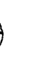

### 細胞智慧

五月十八日，我處於一種停滯期已經有一段時間了，所以情緒有些低落。

於是今天與阿一沙連結時，他跟我說。

阿一沙：孩子，看看妳的細胞們，它們有話要跟妳說。

所以我就進入內在，馬上聽見細胞指揮官說。

細胞：雯雯，我們現在需要妳做一件事。

我：專心呼吸嗎？

細胞：也是，但我們需要妳，對我們抱持著最大的信心。

細胞接著回：因為我們還在努力趕工。

我：為何要趕工？不能自然地流動，慢慢好轉嗎？

細胞：在樹長成之前必須要完工。

「我：樹？是指我的成長嗎？」

「細胞：其中一部分是。你知道為什麼你生的是這個無法動彈的病嗎？」

「我：不知道。」

「細胞：其實一開始是你這麼選擇的，沒錯。其一是你為了踏上這條靈性之路，其二是只要妳沒有辦法好好地動，我們才能順利地加緊趕工。」

「我：所以可以放心的把我交付給你們嗎？」

「細胞：可以的。我們並不會讓你完全動不了，但是你也要給我們空間工作。所以請相信我們。但我還是處於歇斯底里的狀態，於是又問。」

「我：可是我只要身體很沉重，心情就會不好，這下子又會火上加油，這樣你們還能好好工作嗎？」

「細胞：妳講到重點了，「心情」也會嚴重影響我們。只要你心情低落，我們也會…

不想工作，那此時產生的沉重，才應是你實質上的感受；但當你心情好時，對我們抱持滿滿的信心，我們也會事半功倍，努力回報你。

聽完我無話可說，眼淚傾瀉而下，阿一沙在此時說。

阿一沙：所以孩子，妳可以讓自己的細胞們蛻變了嗎？

我邊哭邊大力點頭。

醒過來後，媽媽就問阿一沙。

媽媽：所謂的大樹長成之前，細胞們說還有其他的意義，那是什麼？

阿一沙：地球的轉換，也即將來臨。

今天過後，我才理解，細胞們是如此無條件的付出，它們非但沒有情緒，還給出滿滿的愛，對我不離不棄。而且真的比我還有智慧，所以我只有一句話來形容，你們真的很「偉大」。

謝謝你們，我會交出百分之百的信任，我最親愛的細胞們。

### 神奇之筆——波特

五月一日我開始寫書，其實對於自己能否勝任真的很沒把握，因為從小我就很清楚，對於文字，本人實在不行。

作文滿級分是一個比月球還遙遠的距離，而且我並不喜歡閱讀。從來就是個頭腦簡單的運動員，不是文學派的，但還是放手一搏去寫寫看。

結果出爐，一天過去只寫了短短兩行字。並且請媽媽看完，她給我的評價只能用無限嘆息來形容，說：「這只能放在網路上給人隨便看看，不是一本『書』的概念。」

我當然也很清楚，可是到底有誰能幫我？真的很想把自己變成一部放映機，連結腦部慢慢播放成為一部影集，但這是不可能的。

所以今天就在一種極度焦躁的情況下與阿一沙連結。

## 5 每一個我們

開始就問阿一沙說：「請問妳能幫幫我嗎？這本書被我這樣寫下去是不行的。」
祂很從容地笑一笑：「可以的，孩子，那我們走吧！」
於是我又瞬間移動來到一處奇幻世界，眼前所有橫梁都是錯綜交織的，有些上下顛倒，有些還會緩緩而行，四周只有幾個漂浮櫃子，在周圍遊蕩。
而我站在一個巨大橫樑上，隨著「地板」的浮移，它慢慢帶我來到一位矮小男士的面前，但因背光，所以看不見他的臉龐。
就在我想認真看清楚到底他是誰的同時，他就說：「妳來啦。」
當下我有點被嚇到，心想我跟你很熟嗎？不過還是直接問他好了。於是問：「請問你是？」
他說：「我先不告訴妳我的名字。跟我來。」
此刻我就在心裡大笑，並清楚知道他到底在說什麼，因為這位語無倫次的人，實在跟我太像了。

於是我就跟著他踏上另一個飛行橫梁，來到了一處平地，旁邊依然是飛來飛去的橫桿，但在另一頭卻出現一道木門，並敞開大門，從中發出黃光。那位男士就站在門前，始終不見他的臉，此時他說：「把妳的手伸出來。」我說：「喔一好！」並把右手伸出。他搖搖頭說：「兩隻手。」說完他就伸出雙手面向我，示意要我與他的手貼合。喔！早說嘛！現在我才意識過來，趕緊貼住他的手。瞬間我們的身體發著白光，並開始旋轉成爲一顆光球。

現在我來到一處「虛無空間」，因爲身體不知爲何已消失，也不見他的蹤影，周圍只有白花花一片。

過沒多久，眼前就蹦出幾本漂浮「書」。

## 5 每一個我們

書們自動打開後，裡頭原本排列整齊的文字，立刻像被灌入生命般，各個開始扭動筋骨，準備大展身手，一、二、三，跳出書外，並快速滑過我的頭頂，灌穿我的身體，當然現在我並沒有形體，所以這次沒那麼害怕了。
這時他終於回來了，現在能清楚看見他的身影。我正要開口時，他就伸手從胸前口袋中拿出一隻沾滿碳粉的鉛筆，遞給我說：「嗯，現在我把這交付給妳。好好善用吧。」
我考慮了一下，因為這支筆真的好尖又好髒，不過還是小心翼翼地拿了過來，並敬禮謝謝他。
但還是想知道他到底是誰，於是我問：「現在可以告訴我你的名字了嗎？」
他說：「波特。」我再也忍不住了，大笑一番。
笑完才又說：「是哈利波特的那個波特嗎？」
之後他就有點不太高興的說：「對。」

最後我打了一個噴嚏，就與波特斷了連結，
看來他真的很不高興呢！

回到阿一沙這。

我：請問阿一沙我剛剛是去了哪裡？

阿一沙：波特的時空。

此時就醒了過來，所以媽媽接著問。

媽媽：所以妳就是波特？

我不等阿一沙回，就笑笑地說：「嗯，絕對是！我聽到他說的第一句話，就知道那個人一定是我。」

我：我很清楚他只是不小心說錯了。

媽媽：喔，好啦！你們都不會講話。那麼阿一沙，所以波特是一位作家？

阿一沙：是的。

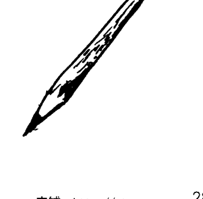

## 5 每一個我們

媽媽問我：那這樣妳會寫了嗎？我聳聳肩：不知道。其實我也不知道會不會有「奇蹟」發生，因為對我來說，會寫作就是一種不可能的任務。於是在隔天五月二日見真章。坐在電腦面前摩拳擦掌，深呼吸，把波特送給我的筆從胸口拿出來。咦？奇怪？昨天舊舊髒髒的那支筆，瞬間進升為閃閃發光的光筆。好吧，再深吸一口氣，開始打字，沒多久就出現整整一大段。哇！還真是奇蹟，這不是我寫的，跟之前打的也差太多了吧！雖然還不能與許多作家相提並論，但這終於是一本「書」了。真的太感謝阿一沙，還有神奇的波特了。

### 我們

最後，阿一沙有一段話送給我們。

> 阿一沙：孩子，你們都是非常勇敢的靈魂，才會選擇成為地球人，你們所有的情緒都非常珍貴，因為是在其他星球上體驗不到的。所以地球牽引著整個宇宙，而你們也勢必在此成為宇宙人。

此時我就瞬間成為一顆光球，周遭一一蹦出親友們，人數越漸越多，最後就連不認識的人，也都圍繞在我身邊。左看右盼只見一片人海山，大家都帶著微笑一同發光，變成顆顆光球，並開始旋轉，轉啊轉，不知不覺就形成一個超大漩渦。我們就像磁粉般，被某種強力磁場給吸引，隨著距離越來越近，終於看見極為閃耀的金黃色宇宙源頭，最終旋入成為那「光」的一部分。

此時就很清楚，我的靈體要回家了，正漸漸與身體道別，但想到許多人事未做，

## 5 每一個我們

於是又把意識叫回，並帶著一份大禮重新進入身體中。而這份大禮說著：世界上沒有「我」，一直就只有「我們」。合一是唯一的真理。

阿一沙就笑笑地說：孩子，現在妳了解其實人並不孤單，因為你們都帶著我們滿滿的愛，相互連結，一同來到這美麗的星球上，發揮創意，無限創造。在過程中，歷經無數次考驗，可能退縮或受傷，所以忘了這一直都在的事實，但既然只有我們，就無須害怕沒有「愛」了啊。請知道世界只有宇宙人，沒有你我的分別。

這一路以來經由阿一沙的帶領，讓我層層打破眼前障礙，身體也逐漸好轉。從拔掉自責，學會自愛，一直來到更大更廣的世界，才明白地球人是如此重要，直到現在明白只有「我們」這個真理。

所以至今我才理解，不是只有身體好的那一刻，才能去做事，而是在這一秒，你是否創造了什麼。

我知道痊癒的那天，早就穩穩佇立等著迎接我，所以不論現在是否沉重，都已經不重要了。

> 阿一沙：是的，孩子，所有生命的起源，不是意外碰撞，而是完美的設定，你們也是如此。帶著我們的期盼與愛，去好好創造這個新世界吧！

### 是誰在生病？

當身體生病，很多時候不是因為身體出現問題，生病的現象往往只反應出自己相信什麼？你是否相信了那些不該相信的否定句？這些誤信否定的主人，就是使自己生病的元兇。

所以生病的是我們的「信念」，我們否定了自己，或說我們誤信了別人對自己的否定。但世間事哪有對錯，哪有被判定的道理？一個會否定他人的人，只代表他缺乏愛而已。

所以不要被騙了，不要相信任何一個人對你的任何否定，縱使是親人也不行。

### 只要不枉當下

> 神：生活就是一種創造，一種會同時回傳給阿卡西紀錄的創造，所以你做的一切，神都知道，神也都認同。
只要我們帶著喜樂的心，去開創、去感受、去遊戲、去經歷，對宇宙和所有高靈而言，他們只會開心也同時感到滿足。
因為，他們早就把創作的權力交到你手上，並且不會給你任何的批判，他們只有歡欣，只能歡慶。
所以不要再覺得自己沒有資格，自己對不起誰，只要你不枉當下，縱使正在哭泣，縱使感到悲傷，都該為了自己走到今天的勇氣而驕傲。
身為人類，宇宙中最勇敢的靈魂們，我敬你！

## 5 每一個我們

### 你也可以救地球

地球中軸正在偏移，海洋快要納不了垃圾，鯨豚的求救聲不絕於耳，我們能做些什麼？就是幫助這宇宙唯一的地球，讓他的美麗永續。其實你也可以幫上忙，如何幫？簡單透過靜坐，穩定自己身體的中軸，就能同時穩定地球的中軸，就這麼簡單。

你相信嗎？宇宙是一體的，當你越發平靜穩定，地球磁場也能漸趨穩定。當你的身心靈越發平衡，地球健康也同步健康了。

> > 因為阿一沙說過：「從來就沒有『我』，從來就只有『我們』，親愛的孩子們，我們都是一體的。」

這就是阿一沙要我們不斷強調的事，穩定自己，我們就成功穩定地球，穩定現在了宇宙。親愛的，每一個人的平衡都很重要，每一份給予地球的祝福都很重要，現在
是責無旁貸每個人都該靜下來並分享愛的時候。

那個世界的盡頭，沒有別的，只有光和愛。

祝福每一個打開本書看到最後的讀者，無話可贈，唯有我愛你。

### 眾生系列 JP0161

## 宇宙靈訊之神展開

作者、繪者／王郁惠、張景雯

責任編輯／李玲

業務／顏宏紋

總編輯／張嘉芳

出版／橡樹林文化

城邦文化事業股份有限公司

104台北市民生東路二段141號5樓

電話：(02)2500-7696 傳真：(02)2500-1951

發行／英屬蓋曼群島商家庭傳媒股份有限公司城邦分公司

104台北市中山區民生東路二段141號2樓

客服服務專線：(02)25007718；25001991

24小時傳真專線：(02)25001990；25001991

服務時間：週一至週五上午09:30～12:00；下午13:30～17:00

劃撥帳號：19863813 戶名：書虫股份有限公司

讀者服務信箱：service@readingclub.com.tw

香港發行所／城邦（香港）出版集團有限公司

香港灣仔駱克道193號東超商業中心1樓

電話：(852)25086231 傳真：(852)25789337

Email：hkcite@biznetvigator.com

馬新發行所／城邦（馬新）出版集團【Cité (M) Sdn.Bhd. (458372 U)】

41, Jalan Radin Anum, Bandar Baru Sri Petaling,

57000 Kuala Lumpur, Malaysia.

電話：(603)90578822 傳真：(603)90576622

Email：cite@cite.com.my

封面設計／周家瑤

內文排版／歐陽碧智

印刷／中原造像股份有限公司

初版一刷／2019年7月

ISBN／978-986-97998-1-2

定價／380元

城邦讀書花園

www.cite.com.tw

版權所有．翻印必究 (Printed in Taiwan)

缺頁或破損請寄回更換

獲取更多好書，請加微信號：strcdts

國家圖書館出版品預行編目(CIP)資料

宇宙靈訊之神展開／王郁惠，張景雯作．--初版．
--臺北市：橡樹林文化，城邦文化出版：家庭傳媒
城邦分公司發行，2019.07
面；公分．--（眾生：JP0161）
ISBN 978-986-97998-1-2（平裝）

1.型靈 2.靈修

242.15

108010636

店鋪：http://strc.cr.cx

## 城邦文化事業股份有限公司
橡樹林出版事業部　收

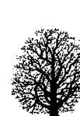

請沿虛線剪下對折裝訂寄回，謝謝！

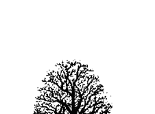

| 橡 | 樹 | 林 |
|---|---|---|
| 書名：宇宙靈訊之神展開　書號：JP0161 | | |

感謝您對橡樹林出版社之支持，請將您的建議提供給我們參考與改進；請別忘了給我們一些鼓勵，我們會更加努力，出版好書與您結緣。

姓名：__________________ □女 □男  生日：西元__________________年
Email：__________________________________________________________

+   ●您從何處知道此書？
    - 書店
    - 書訊
    - 書評
    - 報紙
    - 廣播
    - 網路
    - 廣告 DM
    - 親友介紹
    - 橡樹林電子報
    - 其他__________________

+   ●您以何種方式購買本書？
    - 誠品書店
    - 誠品網路書店
    - 金石堂書店
    - 金石堂網路書店
    - 博客來網路書店
    - 其他__________________

+   ●您希望我們未來出版哪一種主題的書？（可複選）
    - 佛法生活應用
    - 教理
    - 實修法門介紹
    - 大師開示
    - 大師傳記
    - 佛教圖解百科
    - 其他__________________

●您對本書的建議：
__________________________________________________________
__________________________________________________________
__________________________________________________________

非常感謝您提供基本資料，基於行銷及客戶管理或其他合於營業登記事項或章程所定業務需要之目的，家庭傳媒集團（即英屬蓋曼群島商家庭傳媒股份有限公司城邦分公司、城邦文化事業股份有限公司、書虫股份有限公司、墨刻出版股份有限公司、城邦原創股份有限公司）於本集團之營運期間及地區內，將不定期以MAIL訊息發送方式，利用您的個人資料於提供讀者產品相關之消費與活動訊息，如您有依照個資法第三條或其他需服務之務，請撥本公司客服加微信號：strcdts
我已經完全了解上述內容，並同意本人資料依上述範圍內使用。
__________________（簽名）
店舖：http://strc.cr.cx

曾擔任台灣電影圈十年副導的導演王郁惠，首部執導的劇情長片「有一種喜歡」在2018年上映了。看似春風得意的人生，其實唯一的女兒張景雯卻備受罕見疾病之苦。19歲的女兒，因為疾病而無法吞嚥進食，甚至偶有呼吸中止的狀況，嘗試各種中西醫治療、靈性療法，但都效果甚微。

張景雯在某次靜坐冥想時意外接觸到宇宙源頭，進而連結並學會轉動心輪、與細胞溝通，疾病不但漸次好轉並邁向痊癒當中。本書詳實記錄這對母女遍求醫者無果，最終往內在探索而讓生命找到自己的力量！

> > 看見生命的黑洞，勇敢進入也就代表我們可以出洞了，因為黑暗的底端，只有愛和光明。

宇宙源頭的訊息不僅能深入人心，恢復身、心理平衡，更傳遞出地球正面臨的危機。每個人的身體病痛或人生困境，如同地球遭遇的迫害般危急。宇宙靈訊透過本書作者想要傳達給所有的人類，如果連罕病患者都能透過靜坐與祂連結而好轉了，你人生中的所有困難，也可以透過一樣的旅程轉化。每一個問題都有解答，只要你願意一起搭上這班揚升的列車。一起覺醒，成為合一。

+   - 你們都是勇敢的靈魂
    - 人類的情緒都很重要
    - 世上沒有意外 包括拿起這本書
    - 每個祈禱 都能得到回應
    - 靜下心來 就能得到答案