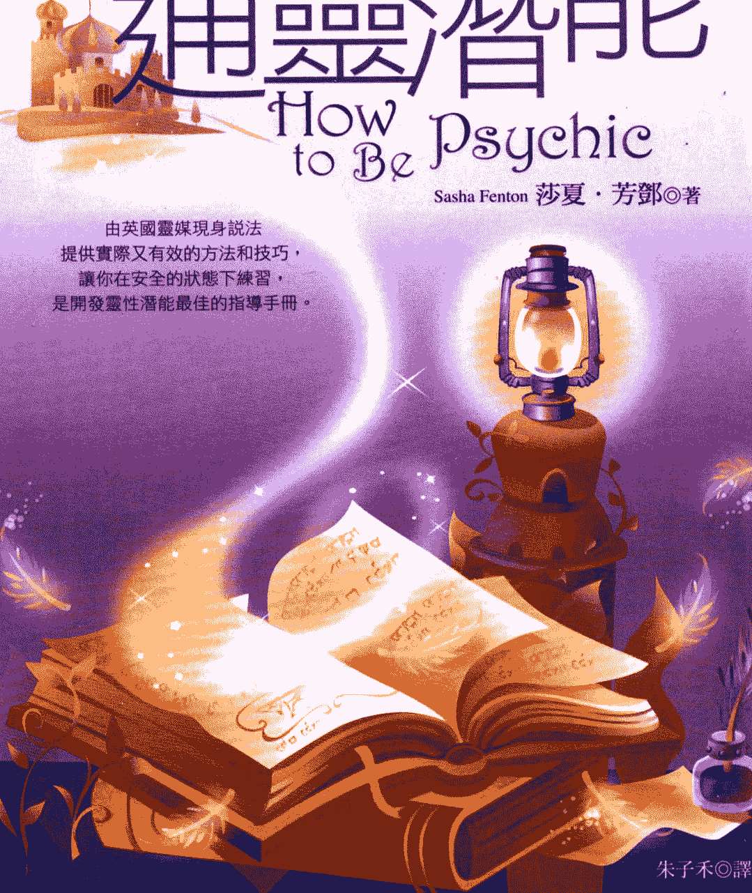
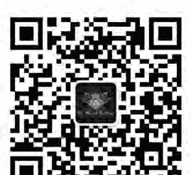
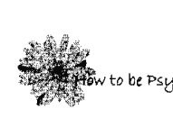

# 開發你的 通靈智能

## How to Be Psychic

Sasha Fenton 莎夏·芳鄧◎著

由英國靈媒現身說法 提供實際又有效的方法和技巧， 讓你在安全的狀態下練習， 是開發靈性潛能最佳的指導手冊。

朱子禾◎譯

## 通靈教戰手冊

## St. Royal College

## 天使神秘学院

- 专业占卜预测机构
- 神秘学培训机构
- 水晶能量研究中心
- 官方淘宝：http://strc.taobao.com
- 官方微博：http://weibo.com/715104687
- 新书发布QQ群：316790219
- 购买更多好书请联系院长大天使

大天使
天使神秘学院 院长
QQ：715104687
手机/微信：13641926204

微信公众平台：strc2011

## 制作说明：

本书由《天使神秘学院》出重金从台湾购入的原版书籍扫描制作完成。为达到最好阅读效果，特地把原版书全部切开后，再经由专业扫描设备高精度扫描完成，并经过一张张的PS后期处理最终成书，其间花费大量的人力、物力以及时间，只为能给大家提供经济并优质的神秘学学习资料而努力。

本学院强力谴责某些机构和个人，把本学院花心血制作完成的电子书籍，包装后直接放在自家淘宝网上低价倾销的行为，以谋取不劳而获的经济利益。如果长此以往最终将无人愿意再为大家花心思制作电子书，那以后可能大家再无新书可读。

为让大家以后能够读到更多的好书，也为了本学院的良性发展。本学院恳请大家尽量做到如下几点：

1. 尽量在本学院的网站购买电子书籍。
2. 请勿用技术手段把电子书内的水印及加密去掉。
3. 在收到电子书后小范围传阅即可，千万不要公开传播，更别挂到淘宝网上低价销售。

同时为答谢广大支持者，学院电子书将做如下调整：

1. 学院会把一些早已收回制作成本的电子书折价销售。
2. 最新制作的电子书籍会开放打印功能，大家购买后有条件的可自行打印成书。

天使神秘学院
2017年6月

### how to be Psychic

## 推薦序

## 通靈緣起

人類意識的發展，在中世紀蓬勃興起。由於此時期的人們求知若渴，卻又軟弱無力，塵世諸事都寄託於神的啟示，求神拯救，因此造就宗教文明開始興盛，也促使通靈的神秘學趨勢而起。

昔日每種宗教基本上都涉及通靈的運作，神諭、教義、詩歌名畫創作都有著通靈的痕跡。然而當時宗教頂著權威光環，其茁壯之後豈容平常之人也能通靈，道出更有智慧之語，甚至對宗教比手畫腳。於是通靈者開始被污名醜化，冠以巫婆、惡魔之名而被焚燒、處以巫刑者比比皆是，因而通靈在當時見不得光，沒有尊崇地位可言。

二十世紀之後，科技進展進入精密的探索年代，昔日的宗教舊說無法滿足排山倒海的新知渴望，於是各種通靈方法再度甦醒，成為人類鑽研未知領域的一門科學。新時代風潮在二十世紀中期後，於西方世界快速蔓延發展，這得歸功於通靈被普遍應用。因為人類把過往教條式的被動，化為自我追尋的主動，在意識發展上取得突破優勢，不再受心靈的桎梏與約束，而且懂得做自己的主人，為自己負責，這是人類覺醒的起步年代。通靈不但在新時代思想上面開啟了新的哲學觀，它也開啟了現代心理學的療癒大門，運用在身心靈的諮詢與指引之上。通靈並不難學，只要你懂得運用技巧，把它當作一門潛能科學，而不是怪力亂神，那你就能安心置身通靈的神妙之境。通靈就是與你內在的靈性相通，挖掘出潛意識裡的豐富寶庫，將它運用在解決日常生活的大小事情。第一次學習通靈，你一定要具備自信，然後你必須相信。自信不在於你能否做到，而是在於不要認為自己愚蠢，認為自己沒有能力。

### How to be Psychic

相信就是無論你的直覺判斷是否真偽，你要肯定自己從事的是心靈探索工作，今日不行明日再來，終有一日必能開花結果，不要為毫無所獲而遽下定論。

英國的靈媒大師莎夏，在本書中以科學的態度來闡述她的經驗與各種通靈技巧，幾乎坊間所有的通靈方法都已涵蓋在內，讀者如能仔細閱讀鑽研，必能有一番收穫。如同她所說：「對任何通靈方式感到恐懼或敵意，主要是無知所引起。」所以，這本書也能幫你揭開通靈的神秘面紗，讓你在浩瀚的神秘學領域中知其然，也知所以然。最後，祝您疑惑開朗，日益精進！

> 對任何通靈方式感到恐懼或敵意，主要是無知所引起。

靈氣人生心靈導師 柯世洋
著作：《時空之外的禮物》、《精神療癒卡》等書。
靈氣人生…http://www.reikilife.com.tw
精神療癒卡…http://reikilife.myweb.hinet.net

- 《時空之外的禮物》
- 《精神療癒卡》等書

## 推荐序 通灵缘起 柯世洋老师 065

## 第一章 你有通灵潜能吗？ 065

## 第二章 你能从本书中学到什么？ 063

## 第三章 态度 077

## 第四章 灵媒的训练 083

## 第五章 需不需要冥想？ 093

## 第六章 灵视力 101

## 第七章 卜杖探测和占卜 105

## 第八章 利用塔罗牌来行使通灵的目的 109

## 第九章 看见与感觉灵光

## 第十章 天眼通、天耳通、超感应力

## 第十一章 触物占卜术

## 第十二章 灵魂存在的证明

## 第十三章 指导灵

## 第十四章 靈療 117

## 第十五章 水晶球占卜 125

## 第十六章 瀕臨死亡的經驗 135

## 第十七章 前世 143

## 第十八章 降靈會 151

## 第十九章 魔鬼剋星 154

## 第二十章 心靈感應 158

## 第二十一章 靈媒的專長 183

## 第二十二章 愚弄人的把戲 193

## 第二十三章 靈媒的自我防衛 203

## 第二十四章 檢視靈媒的方法 213

## 第二十五章 賺錢及省錢之道 219

## 後記

## 第一章 你能从本书中学到什么？

在這本書中，我提供了許多開啟靈通能力，並且可以自行練習的方法和技巧。首先，我會告訴你最基本的資訊和常識，有了這些認知，才能讓你在安全無虞的情況下進行通靈練習。接著是解釋各種提高通靈能力的方法。

有些練習，是需要兩個人或多於兩個人同時進行，因此，你可找一些志同道合，和你有同樣興趣的朋友，大家一起來做練習。另外，書中有許多主題及案例是我通靈朋友們所提供的，為了維護個人隱私，我已將案例中主角的名字做了一些修改。

本書的內容並無任何危險之處，在開啟靈性覺知時，有可能會做一些奇怪的夢或是有不舒服的感覺。因此，我也會告訴你在做完練習後，將脈輪能量關閉的方法。

開發你的通靈能力，在日常生活中可能會讓你省掉許多麻煩，因為你可以預先接收到危害你的警訊，甚至我還會教你如何避免別人惡意傷害。

想要研究通靈的動機有很多種，有些人是為了心靈上的需要，有些人是因突然發現自己有這方面的能力。無論動機為何，通靈這個主題，確實是讓很多人都為之著迷。

有些人會對於任何通靈方式感到恐懼或敵意，主要是因無知所引起，在解釋這其中相關的事情之後，相信這些緊張不安的情緒，都將會煙消雲散。

要將通靈這個模糊不清的主題寫的既清楚又合於邏輯，實在是不容易，而且靈界、超感官知覺（ESP）包含的範圍很廣泛。在這本書中，我盡量寫出我所知道的範圍，包括很多有效的練習方法。如果你在第一次練習時無法成功，請再多練習幾次。我建議大家先閱讀整本書的內容之後，再回到你最感興趣的主題。

並不是每一個人都能以同樣的方法開發通靈的潛能，有些人可能會成為「天眼通」和「訊息接收者」，有人可以看到「氣場」或是用心靈的力量來移動物體。有人會進入「出神狀態」，有人可成為「靈療師」。也並非每個人都可以學習到全部的通靈技巧，有些人只想學習他感到有興趣的課題，有些人是想探究全部的內容。無論你的目標為何，這本書將會從基礎開始，指引著對此題材有興趣的人前往探訪之路。

### How to be Psychic

## 第二章 你有通靈潛能嗎？

人們都不想浪費時間去閱讀他沒有興趣的主題，如果你想閱讀這本書，表示你想從本書中獲得某種你想要的知識。沒有人會浪費錢去買他不需要的書籍，所以，如果你購買了本書（而不是跟朋友借來的），顯然你有想要發展通靈能力的意願。在靈媒這個領域裡有一種說法，那就是當一個人有意願去學習時，自然會出現一位老師或是訊息來教導他，引領此人一步步走向知識的大道。現在就讓我們來詢問，「誰」可以來引領你。這個答案也許有好幾種，例如，可能有外來的力量，這個外來的力量會因不同的人和宗教信仰而有不同的稱呼，像指導靈、指導天使或是神明……等。有些人會認為這是宇宙的力量在引導著他們，有些人則認為祖先是引領他們發展天分潛能的推手，也有人認為是來自神性意識或是直覺力。在此階段，我建議你不要太急於探索這股力量的來源，只要跟著去看看，到底會有什麼事情發生。

某些人會比其他的人更容易成為通靈人？

我認識幾位在鄉下長大的靈媒，通常他們的成長家庭會將孩子擁有通靈能力，視為天經地義的事情。但換個角度來說，這種能力會讓孩子在成長過程中，變得不快樂、孤單，甚至對於擁有直覺能力感到忿恨不平。

一個在荒地長大的孩子，很容易學會遠離危險的動物，例如毒蛇或會咬人的昆蟲等等，一個在大都市成長的小孩，很容易學會如何穿越馬路，避免到有潛伏危險之地。大多數被綁架或殺害的孩童，很多是來自一個未曾教導他們要對其他人有防備心的好家庭，這是個令人傷感的事實。

當孩童在艱困的環境下成長，或是很難得到父母和長輩的認同，被其他孩童當作局外人對待的情況下，他很快就學會遠離麻煩的方法。這些教訓讓他們發展出第二個天分，埋下直覺的種子，這些種子日後將可以很快的開花結果。

即使在孩童時期很正常，但是一段不快樂的婚姻，或強大的壓力和擔心害怕，也會幫助直覺能力的發展。每一個不好的情況都像一層或兩層銀色襯裡，每一層的襯裡都可塑造出他們不同的人格特質。你可以去詢問任何一位曾在惡劣環境或嚴重受傷僥倖存活的人，他們會告訴你，那些意外已讓他們發展出前所未知的技能、知識和力量。他們不知道的是，他們的直覺能力已向前邁進一大步。以下是真實且典型的故事。

### 潔可打開第三隻眼

潔可和她母親非常的親密，這沒有什麼好驚訝的，因為在潔可孩提時，她的爸爸就離開家庭，潔可是家中唯一的孩子，所以她母親也把潔可當成最親密的寶貝。潔可的母親會定期去拜訪有天眼通的靈媒，一部分是為了想要確定在人生的旅途中，是否有做了正確的決定，另一部分是可以增進知識的視野。她母親必須工作養家，所以她兒時並不快樂也很孤獨。潔可非常愛唸書，經常自己一個人安靜的閱讀，讓她的想像力得以有發揮的空間。這個潛能在青春期時，開始慢慢甦醒，在她十四歲時有一次靈魂出體的經驗，之後，又有一連串難以理解的事件發生。到了二十幾歲時，潔可與丈夫因爭吵而離婚，導致她與孩子分離，在缺乏支援下，她失去家庭也面臨財務危機。潔可下班後，開始閱讀關於靈媒的書籍，並開始學習塔羅，許多人開始說服潔可幫他們解讀塔羅牌，慢慢地，她成為兼職的塔羅算命師。她在函授課程中取得蠟燭魔術的文憑，當她有多餘的錢時，就一定會去參加靈媒的課程或研習會。在參加某次研習會時，她遇到一位知名的靈媒，他們成為忘年之交，為了讓潔可成為靈媒，他開始教潔可所有相關的知識。很快的，潔可通過靈氣 (Reiki) 治療師和塔羅諮詢師的認證資格。現在她在降神會上擔任靈媒，也開始寫作，成為業餘的作家。

### 如何開發自己的潛能？

沒有一種迅速的方式或練習，可讓你立刻開啟靈媒的天賦。學習任何一種技巧，都需要時間和努力才能如願。有些人建議，做瑜珈可能有幫助，但瑜珈只能增加心靈和肉體的覺察能力。我的建議是，如果你喜愛瑜珈，就單純的去做瑜珈練習，而不是把它視為增加通靈能力的目標。

不見得每一個具有高度敏感度的人都可成為靈媒，雖然他們都能夠感受到潛在意識的層面，但有些人可接收訊息，有些人可用念力來移動物體，有些人能看到氣場的光，有些人可以看到鬼魂，有些人可以成為人與亡魂的溝通橋樑。

### 檢測清單

這裡有一個檢測清單，用來檢視你的境遇與信念，請用輕鬆好玩的態度來做測試。沒有特定的測試得分可以證明你是一個靈媒，有些問題是評估你的超感應力（ESP）表現。思考下列每個問題後作答。

下列敘述是否為你的經驗？「是」，在上方空格中劃○，「否」打X。

- （ ）你寫信給你的朋友，在你寄交信件的同時，也收到好友的來信。
- （ ）你正在想你的某位朋友，這位朋友就打電話來了。
- （ ）你開車途中突然感到莫名的不適，所以你就放慢速度。然後在前方的路口，你看到一場車禍，或是你完全預料不到的事情發生。
- （ ）你感覺到某個表現十分完美的人是不可信任的，事後你也證明了你的論點是正確的。
- （ ）到某個地方或房子時，你會感到不舒服。
- （ ）你去一家外表看似完美的公司求職，但你並未接受該公司給你的職務，只因為你對這家公司有怪怪的感覺。
- （ ）雖然目前的工作還不錯，你卻感覺你應該盡快去找其他的工作。
- （ ）你對孩子同學的某位家人感到不安，因此你不希望你的小孩到那個同學家裡去玩。
- （ ）你感覺你所愛的家人有身體不舒服的狀況出現。
- （ ）雖然周圍沒看人，但你感覺有人侵入。
- （ ）你能「看」到已逝世親友，無論是剛去世或已去世很長一段期間了。
- （ ）你能聽到敲門聲，或者是奇怪的聲音。
- （ ）你遺失一個物品，但你感覺是被偷了，或你知道被誰拿走了。
- （ ）你到了一個地方，雖然從來沒來過，但你卻很熟悉。
- （ ）你曾有瀕臨死亡的經驗。
- （ ）與一個完全不同文化、年齡層、背景的陌生人相識，你卻感覺他像你的親人。
- （ ）你交一個新朋友，開始發現你們的往事有很多雷同之處，也做過很多類似的事情。
- （ ）你的夢有些能夠實現、成真。
- （ ）你感到有些事情將要發生，後來也真的如你所料。
- （ ）有過喧鬧鬼或很難解釋的情況發生。
- （ ）你碰觸生病的人或只是坐著與他談天，之後他們感覺到病情好多了。
- （ ）你碰觸過生病的動物，之後牠能迅速的復原。
- （ ）你進入某個房間，或是在房間的某個地方，感覺到不尋常的冷，但沒有任何理由能夠解釋。
- （ ）你從視線的餘光可看到古怪東西，或是在你睡著時聽到喃喃自語的聲音。
- （ ）你可看見已過世的人。

## 第三章 態度

通靈的能力常令許多人感到好奇、羨慕，這是我們對靈媒很感興趣的原因，我對於那些想成為特殊的人，或想以靈媒來作為職業賺取金錢，都沒有什麼意見。我們都希望做一個特殊的人，也會好奇的想知道這個世界上所有奇怪事情，但若你認為擁有通靈能力就是高人一等，或是以傲慢的態度去對待週遭的人，那老天所給予你的這個奇妙禮物（以及你的朋友）都將離你而去。如果你想用這個天分來賺取金錢，這本書中有許多資訊可供你參考。

### 負面的影響

有些人想要用通靈的能力來達到控制、恐嚇或影響他人的目的，讓大眾對於通靈人的印象很不好。還有人利用上天賦予他們的禮物——通靈能力，來作為他們達到愛情和性愛方面的好處與利益，這是非常要不得的行為。我要很鄭重的聲明一點，所有不好的心念、詛咒或行為，都會回到做壞事的人身上。

尤其是擔任靈媒工作，更要謹記在心，我們都要提醒自己，什麼事是不應該做的，有一句話說：「己所不欲勿施於人。」這句話就是最好的建議。若沒有心靈上的因素作為鼓勵，你就無法持續靈媒工作，而專業靈媒比業餘靈媒更要謹慎。你不需要隸屬於一個特殊的宗教團體，或是靠宗教團體幫你找客源，換句話說，你也不需要放棄任何一個你已經加入的宗教團體，你可以相信投胎轉世、再生，也可以不相信。

如果你想要從事靈媒的工作，那麼你更需要隨時注意你的行為和道德操守。我並非要你去貌視一夜情的行為，放棄眼睛吃冰淇淋的機會，或是去當義工，而是要你用誠實的態度去對待所有的事情。

對他人的態度就如同你想要被其他人對待的那樣，不要去佔人家的便宜，也不要從你的員工身上謀利或在做生意時逃避應盡的責任義務。凡是在靈媒領域的工作者，受到惡性詛咒和因果報應的機會更大，所以我們何必要自找麻煩呢？

我曾聽說有些靈媒工作者，居然恐嚇客戶，說客戶的家人都會生病，要他們花很多錢來要點蠟燭，做特殊的祈禱才能化解，或是要客戶出很多錢讓他們來驅逐惡靈，才能換來平安，諸如此類的事，應該是連想都不可想。

### 賺取金錢

我總是盡我最大努力去發揮上天給我的天賦禮物。也許你會問我，如何可以獲知彩券中獎號碼，或是幾號賽馬會贏的問題。我可以告訴你，我從來沒贏過彩券，也從沒在賽馬上有很好的運氣。

我聽到有人用他們的靈媒天賦去贏一些錢，但是最終這些錢又會被拿走。在我所知道的案例中，有一個男人用巫術贏得大筆金錢，雖然他領到了錢，但沒多久，在一次不幸在車禍中他失去一條腿！就我個人而言，我寧可保有我的雙腿，好好的工作，也不會想要去中樂透！如果你真的有金錢上的需要，可要求你的指導靈來幫忙指引，為你送來你所需要的。以燃燒蠟燭等儀式來祈求你想要的，這也是可被允許的，你將會被賦予機會去賺取你所需要的金錢。一旦你得到了，別忘了回饋一些給比你更需要的人。

我的好友莎蒂·貝特，她告訴我一個很棒的故事，她曾經需要一大筆錢，而她也專注心念不斷的在祈禱。數日後，在她外出購物時，發現一包錢放在路邊。當她撿起來打開，發現正好是她所需要的金額！兩週過後，她有個工作機會，而所獲得的金錢又剛是她所需要的數目。這正說明了靈界是相當具有幽默感的。

你需要成為一個素食者嗎？

在一九七〇年早期，人們開始對身心靈的題材感到興趣，自從披頭四到印度去，將瑜珈帶到西方國家，在很短的時間內，印度教徒及佛教徒帶來素食主義的觀念，很多人們開始吃素或甚至成為嚴守素食主義的人。如果你相信我們的靈魂能夠投胎轉世，在人與動物的世界中輪迴，你可能自然的不想吃任何動物做成的食物或產品。如果你相信吃肉會鎖住你更多脈輪，你可能會是一個素食者。很多專業的靈媒幾乎都沒有吃素，所以我的觀念是，你並不需要一定得成為素食者，除非你有特殊的意願要吃素。說到這裡，我的經驗是飽餐一頓之後，很難扮演好靈媒的角色，肉類似乎不容易消化，會停留在你的胃裡，讓頭腦的思緒不靈活。所以我建議你在做靈媒工作之前，可少量吃一些蔬菜或沙拉，在工作完後，享受你的肉類大餐。

### 酒精和药物

當你的大腦需要放鬆時，喝一些飲料或酒，事實上是有幫助的。但如果你是專業的靈媒，最好別喝太多的酒。在社交場合中，吃大餐搭配一些酒類是很好的。但如果你在靈媒的訓練過程中，養成了定時喝酒的習慣，那麼你還沒成為靈媒前，會先成為酒鬼！

### 開發你的通靈潛能

在一九七〇年曾經流行使用大麻、迷幻藥（LSD）和魔法蘑菇，來拓展心靈意識和內在宇宙，來激發人體潛能。專業的靈媒是不會服用這些藥物的，因為他們都很清楚，藥物不是必需品。一些有靈性的人會採取一些傳統的療法治病，甚至頭痛時也不會服藥。

以前很多人都有很重的菸癮，現在較少看到。很多靈媒都有抽菸的習慣，這是不可否認的事實。有位靈媒告訴我，他們需要用香菸來保護他們易受傷的氣場。在你還沒準備好之前，我建議你不要染上菸癮，因為戒除菸癮是全世界最難辦到的事情之一！抽菸雖然不會對你的靈媒訓練有幫助或有妨礙，但是保護氣場有許多方法，不一定要使用香菸。

### 精神上的疾病

靈媒工作不會帶來精神上的疾病。但是如有偏執狂、神經過敏的傾向或是精神分裂時，他可能就無法專注在靈媒的工作。神經過敏的人總是會尋找一些事情使自己煩惱和困擾，如果他們只想從事靈媒工作，而不去治療憂鬱症或其它精神上的疾病時，會讓其他人感到乏味和懊惱。在精神上有疾病的人無法成為很好的靈媒，因從事靈媒的人要有一顆願意幫助他人的心，而不能只為了自己的私利。

### 妄想症和瓦斯的壁爐

我家的客廳有一個隱藏式的瓦斯壁爐。在一些特殊的節日裡，我們曾經想要去使用它，卻發現很難點著火，還常常會聞到瓦斯味。我發誓我常聞到瓦斯味，甚至在沒有使用的情況下也可以聞到。

有一天，我打電話給瓦斯公司的人，請他來我的房子檢查。他發現瓦斯並沒有洩漏的情況。我堅持他再檢查一次，他以看著瘋子的眼神看著我。我仍然覺得不對勁，等到瓦斯公司的人離開之後，我丈夫傑恩和我決定將那個恐怖的壁爐換掉，改成新型的電爐。

一個月後，我的嬤嬤瑪佳麗，告訴我類似的故事，她也常聞到她家客廳壁爐的瓦斯味。她請瓦斯公司派人來檢查壁爐和周圍的管線，但沒有查出有任何瓦斯洩漏。他開始認為瑪佳麗是個瘋子——就像那位瓦斯公司的人也跟我說過同樣的話。我的嬸嬸堅持要他用肥皂水塗在管線上來做檢查，這時，肥皂泡泡從管線的一個細小裂縫裡冒了出來！

無論是我真的聞到瓦斯味，或是有指導靈在警告我，如果不把舊爐換掉，可能會真的出大問題。現在整個冬季，我們都有一個既好看又實用的電爐可用。這是否出自妄想症還是通靈的靈感呢？或許兩者皆有吧，姑且不論我的感覺，但這件事可讓我花了一筆不少的錢，才將瓦斯爐換成電爐呢！

### 唯物論 vs 唯心論

在前面的章節，我提過很多現代的精神思想來自於印度。其中一個理論就是我們不應該太注意金錢和財物的物質生活，我的感覺是太注重於物質或太偏重於心靈層面都是不好的現象，最好是採取中庸之道。

從歷史上可找到很多例子，有許多人放棄了物質享受，致力於追求精神上的生活，聖方濟是一個很明顯的例子，還有很多隱士、先知、修道士、僧侶、修女、尼姑和其他宗教人士，選擇清苦修行的路。很多宗教的牧師、神職人員住在比較貧窮的地方，為貧民的社區服務。如果你不希望有任何物質的牽絆，想要擺脫掉，那是你的自由，但是要過正常生活，物質層面還是不可或缺的。

大部分時間我們都需要過正常的生活，並讓生活過得更舒適、快樂。我相信，多一點時間和努力來獲得物質生活的美好，是不會對心靈層次有任何傷害的。捐贈給第三世界的政府，可能只會是他們的領導人在瑞士銀行的存款增加，唯有給予他們真正的物質幫助，才能使他們的生活獲得改善。

### 付費給靈媒諮詢

付費給任何諮詢專家，是天經地義的事。如果你不相信，試著去找律師、會計師、婚姻諮詢家或任何服務提供者請求諮詢，看他們是否都可以不收費用？儘管如此，還是有人認為靈媒諮詢，是應該屬於不收費的服務。當我在做通靈解讀服務時，有些人就認為我不應該收費。我通常會這麼回答：「如果我的瓦斯、電費、牛奶、食物、瓦斯、汽車修理、所得稅、貸款都可以免費的話，我就可以考慮不收費。」

如果要我在教會所舉辦的降靈會上做免費靈療，對我來說不是問題，主要是因為我不常做這樣的服務，我也從未跟他們收取靈療的費用。換句話說，如果靈療是我的主要工作，那麼我當然會收取費用。

## 個人動機檢測表

靜觀自己的心，並且看這表格中所陳述的事項，是否有與你相符合的地方。

所有題目的答案都是「對」，除了最後兩題答案為「否」。

如果你感覺最後的兩項也和你的動機相符合的話，在你傷害別人之前（你自己也會受到傷害），請放棄靈媒的工作吧！

### 你的動機：

- ○ 靈媒題材的話題很吸引你，且你也想知道更多。
- ○ 你有一些靈媒的經驗。
- ○ 你常有些「不一樣」的感覺，也想找到原因。
- ○ 你有能力可以看見或感覺到未來的事情。
- ○ 你想要成為靈媒來幫助一些人。
- ○ 你想讓心靈更豐盛。
- ○ 你想要變成一個「與眾不同」的人。
- ○ 你想要將靈媒列入你的工作範圍之一。
- ○ 你想要別人做通靈解讀的服務來賺取金錢。
- ○ 你覺得你有治癒他人的天賦。
- ○ 所有傷害你的人，你都想去報復。
- ○ 你想要指使別人去幫你做事，或是你希望控制別人。

### 地位和選擇

千萬別因上天所賜予你的這份禮物而感到沾沾自喜，也不要認為你高人一等。據我所知，有些靈媒認為他們比塔羅解讀者還要優秀，也有些占星學家會認為他們比靈媒還要優越。有的人只學了一些通靈的皮毛，就認為可以回答任何問題，然後變得自負又自大。當然了，在學習通靈的過程中，你很快的就可以知道一些事情，但其他人比你了解更多、更廣泛的事。人外有人，天外有天，我的建議是，保持著你的幽默感，快樂的享受人生。

## 第四章 靈媒的訓練

大部分的降靈會和靈媒中心都有其固定的成員，自成一個團體，如果這個團體不喜歡訊息傳遞的通靈方式，你可去別的團體試試看。有些巫術魔法的集會，有提供訓練課程，有些專業的雜誌會刊登塔羅牌、手相和占星課程的廣告。在決定之前，好好查閱一下。如果可能的話，可接觸團體中一、兩位已學過的學員，問問他們的意見。

不是每個人都想透過降靈會或其他的團體來學習靈媒的課程，只是你比較容易從這裡找到相關的開課訊息。你可以從學習塔羅牌開始，或是用其他方法來發展你的直覺力。閱讀不同作者所寫的書，或是參加研討會、演講、靈媒的慶典，或其他相關的活動，你將會找到和你有相同興趣的朋友，而且快速的發現更多靈媒訓練的途徑。不要將你所聽到的任何資訊都視為是真理和信條。當別人告訴你相關的訊息時，你必須篩選一下，經過深思熟慮後，分辨出哪個是正確，哪個是不正確的。

我從未受過正式的訓練課程，我的母親對於手相略有研究，我的許多家族成員也對夢境的預言等很有經驗。我的興趣是手相，然後變成占星和塔羅牌解讀。

在我知道自己是靈媒之前，我花很多年的時間為許多客戶解讀塔羅牌，那時我是以實際牌卡呈現的方式來解讀，當我與其他通靈者一起工作時，他們鼓勵我用通靈的方式或心靈的技巧去解讀，我慢慢開始相信並依賴上天給我的天賦，這對我來說是有重大意義的。

### 值得花費時間或金錢的課程

有一位教導通靈技巧的老師貝爾絲·華特（Berenice Watt）告訴我，她第一堂課的內容，就是教導如何關掉自己的脈輪，讓學員在下課後不會帶著易受傷的脈輪離開教室。她說有很多被別的通靈老師教過的學生跑來找她求救，他們因脈輪的開啟而有「撞鬼」的現象。我完全同意她的說法，不過應該是先教人如何開啟，再教如何關閉，這樣比較合乎邏輯。當我在教授靈媒技巧時，在任何課程開始之前，都會先教開啟和關閉脈輪的方法。

「脈輪」（chakra）這個名詞來自印度世界，發音時重音在前的「char」，也有人發音為「charcoal」，這個字的意思為「輪子」，印度將這個標誌放在他們國旗的正中央。印度人認為人的身上有七萬八千個脈輪遍佈在全身，但是影響我們最大的，有七個主要脈輪。

五個脈輪在脊椎的特定點，第六個脈輪在前額，最後一個脈輪則在頭頂。

### 七脈輪位置圖

- 頂輪
- 眉輪
- 喉輪
- 心輪
- 太陽輪
- 臍輪
- 海底輪

### 脈輪的顏色與彩虹相同：

- ◎頂輪是紫色或是淡紫色。
- ◎眉輪（頭頂上第三眼的位置）是深藍色。
- ◎喉輪是淡土耳其藍。
- ◎心輪（在胸骨區域）是綠色。
- ◎太陽輪（在橫隔膜）是黃色。
- ◎臍輪（腹部）是橘色。
- ◎海底輪（脊椎最底端）是紅色。

### 練習：開啟脈輪

我的朋友芭芭拉·艾倫（Barbara Ellen）告訴我一些開啟脈輪的方法：

想像你收集了整個宇宙的光，將光引導下來，來到你的頂輪，看到頂輪有一朵紫色的蓮花，想像花朵綻放開來，並讓這些光能夠順著它進入。引導光來到眉輪，有一隻藍色的眼睛在此位置張開。再讓光往下流到喉輪，想像那裡有淡藍色的花綻放。允許光往下流到心輪，讓一串淡綠色的葉子打開來。再讓這些光通過太陽輪，讓黃色的雛菊綻放。再來到臍輪，那兒有橙色的金盞花綻放。最後來到海底輪，有很大一朵罌粟花綻放。然後讓這些光往下到你的腿及腳底，接著全身及四周的氣場都圍繞在光中。最後，想像把這些光延伸到地球深處做為結束。

### 關閉脈輪

關閉脈輪的方法，就是將剛才開啟脈輪的步驟反過來做。開始想像關掉往下接觸到地球深處的光，關閉腳底的光，現在關掉海底輪的光並且小心的關閉紅色罌粟花，再將臍輪的光關掉，橙色金盞花的花瓣緊緊閉合起來。繼續這個步驟，關掉太陽輪、心輪、喉輪、眉輪，到關閉頂輪，將來來自宇宙的光關閉。

### 快速修复脉轮和其他方法

水，确实是绝佳的清除工具。如果你担心可能会吸引到一些幽灵或鬼魂，特别是在做过灵疗后，回家可以好好冲个澡，作为一天工作的结束。不要忘记从头发到脚趾都要彻底的冲洗。当你站在莲蓬头下，要想像乾净、纯净的心灵之水从头顶到你的脚底冲刷下来，又不断的从你的脚底、手指排出去。当你上床睡觉时，想像你的被子是一个银色的睡袋，将你从头到脚整个包覆起来，你就像被这银色的光圈包起来的茧。这个方法可以保护你的气场，也能助你好眠。

当你看完这本书后，再来找寻你特别感兴趣的是灵媒还是心灵的工作，在你知道是哪个部分后，去找杂志、书籍或网路，得知相关的资讯，例如谁在此领域工作有杰出表现等。

别期望一个专家会将他所知道的全部告诉你，但仍有些人会乐于建议你应该看什麼書，或給你一些忠告。通常他們都會因為太過忙碌，而且也不願被打擾。如果你找到能諮詢問題的相關網站，可以試著善用它們。當我還沒有寫書的時候，大部分的時間都用在諮詢上，常常會接到客人打電話來詢問一些問題。我很樂於幫助他們，但有些人只想佔便宜，期望我會花一到兩小時的時間，透過電話教他們一些有關通靈的事情。但沒有人能透過一通電話就能學到這些通靈技巧的。況且，這種浪費別人時間想要來成就自己的自私心態是很不好的。如果你有多餘的時間，請去幫助有需要的人們。可以找一群好友一起來做練習，先要去閱讀大量的書籍，在開講習會議時，將自己的心得和大家分享。以下的方法有些是我的朋友傑克所提供，其他則是我自己使用的方法。

### D—Y練習

開始時，大家先祈禱，可以找其中一個人來唸你自己寫的祈禱文（或是你能找到其它更適合的）。祈禱詞的內容大概都是包括一些要求靈界保護你的小組組員，不會受到不愉快的心靈能量所干擾。並詢問是否每個人都已準備好了，如果準備好了，就可以開始進行。你們這時應該開啟所有脈輪，然後指定某個人來引導大家冥想。如果有需要，還可選擇第二個人來領導團體，再做第二次的冥想。關於冥想的技巧，可去參考相關的書籍，在這本書中，我也介紹了許多冥想的方法。接著，可以兩人為一組，一個扮演「解讀者」，一個扮演「詢問者」。如果兩人的手互相握住，也許會有幫助。解讀的一方應該先試著從詢問者（客戶）身上了解一些事情。可以感覺詢問者現在的情緒，去連結他已過世的親人或好友。然後過一段時間後，再交換夥伴，再以不同的事物試一次。傑克建議，在你交換位置換另外一張椅子坐下後，可試著感應一下先前坐這張椅子的人的氣場！傑克也建議可以在現場播放適合大家聽的音樂。

你們也可以試著用蠟燭或是水晶球來占卜，還有另外一種方法是自動書寫，你可以要求某個小組的組員在紙上作畫，把當時的心情畫出來，再交由另外一個小組的組員來分析，試著解讀。圖畫可以代表繪圖者的心境和情緒。練習結束前，一定要記得將脈輪關起，並將感謝的訊息送到宇宙。

## 第五章 需不需要冥想？

很多書都告訴我們，冥想有很多好處，喜歡冥想的人會規定這是每天都必須做的基本功夫。但是我敢說，很多人發覺冥想是很困難的一件事，既無聊而且無法看出效果。就我個人而言，冥想就像到健身中心參加減肥課程一樣。我們都知道那些課程對我們有益，但大多數的人卻無法維持很長的一段時間。如果你喜歡冥想而且你可以每天很規律的去做，我當然不會勸你放棄，但如果它不是你所喜愛的，就別強迫自己做任何你不喜歡的事情。

我還是必須說，有些冥想方法是非常值得去做的，因為它可以明確連結到你想要達成的目標。例如你可以依照前面章節所說，冥想或練習時先開啟你的脈輪，即使你忘了打開脈輪，在結束任何通靈工作後，一定要記得將你的脈輪關閉。

### 冥想練習

有些人可能比較喜歡大家一起進行冥想，並且有人在旁引導，但有些人喜歡單獨進行。

在家冥想時，你可以舒適地坐在椅子上或沐浴時躺在浴缸中，也可以在室外做冥想。你可以在你的花園任何一個角落，佈置成你想要冥想的環境。唯一的危險就是你太放鬆而睡著了，如果你決定在入浴的時候或是想到空地冥想，要提醒自己可別睡著了。下列所介紹的冥想法，對於開啟靈性都非常有效。

第一個方法是我的朋友夏娃·賓漢（Eve Bingham）提供，夏娃將它稱之為「直覺冥想法」，我相信這個冥想法對她很有幫助，也值得推薦給大家。我在做靈媒工作之前，或是在我教中國的占星學和手相學時，也是使用這個方法。在沒有充分時間做冥想或者是很倉促的情況下，非常適合使用這種冥想法。

### 夏娃·賓漢的冥想法

- ◎ 想像在炎熱夏天，你愉快的走在舒適、充滿陽光的森林裡。
- ◎ 在你的眼前出現了一條小徑。
- ◎ 慢慢走在小徑上，注意看兩旁的花草和樹木。
- ◎ 在你面前出現一個小湖泊，溫暖明亮的陽光使湖面上波光潋豔。
- ◎ 靠近湖泊，欣賞著乾淨、冰涼、又清澈的湖水。
- ◎ 踏進小湖裡，讓湖水圍繞著你，你開心地在水中浮了起來。
- ◎ 現在環視你的四周，找一些可以在實際幫助你的工具，例如書籍或水晶球、塔羅牌，或是觀想一個裝滿著知識與心靈能量的提袋。
- ◎ 用手抱住這些工具，然後帶著它們漂浮到湖岸。
- ◎ 踏上岸，帶著你的工具循著來時的小徑離開。
- ◎ 再次享受森林的平和，離開森林，回到真實的世界，從湖裡帶回來的工具仍然在你的身上。

### 河边漫游放鬆法

做完这个冥想，允许自己有天马行空的想像，看看是否会有好的讯息浮现。

放輕鬆，閉上眼睛，想像自己在河堤。你看到一艘小船，然後坐了上去。這艘船緩慢的沿著河流而下。你欣賞著兩岸邊的鄉村美景，經過一個轉彎之後來到出海口，眼前是一片汪洋的大海。如果你想要讓你的思緒更自在的飄動，可以在船上多逗留一會兒，直到你準備回來岸上。把船留在河邊，你再次回到現實世界。

### 冥想的准备

在冥想前，若是能夠加上催眠的指令，那麼這些冥想法就會變得容易許多。

- ◎ 想像自己在電梯的最高處慢慢的下降。沒有人在你的周圍，你處在安靜、安全的地方。
- ◎ 當電梯往下降時，你從「十」倒數到「一」。
- ◎ 離開電梯並且經過一段走廊。
- ◎ 在你面前又看到电梯，你踏进电梯里。
- ◎ 电梯往下，从「十」倒数到「一」。
- ◎ 出了电梯，经过一段走廊，走廊的尽头有三扇门。
- ◎ 选择一扇门，打开并且进入。
- ◎ 想像你自己在一个平静的房间。

当你在所选择的那个安静房间时，你可休息一会儿，或是你可以找寻房间中对你开启灵性有帮助的工具。如果你有想要问的问题，可以请你的指导灵来回答你，如果你想要更有自信、魅力、成功或是快乐，你现在就可祈求。

如果你的问题无法立即得到回复，也许会在梦境或以其它方式告诉你答案。

再从这个房间走出去，循着刚才来的路，搭乘两次电梯，搭电梯时，从「十」数到「一」，回到原来的地方。慢慢的回复，冥想完后不要急着从座位上起身，因为你可能会感到有一点昏沉和迷惘。

當你做完這個冥想，你將會感覺更有信心、更成功、更有魅力。

### 瑜珈冥想法

這是我常用的第一個方法，當我無法入睡時，就會坐在躺椅上，告訴我身體的每個部位依序入睡。我稱這個方法為「瑜珈冥想」，我在孩提時期就學習過瑜珈。如果你家有生病中的小孩，或是家人有不開心或緊張的情形，你可以領導他們完成這種冥想，這樣可以幫助他們放鬆並且有助於睡眠。

- 安靜的躺下，讓自己感到很舒適。
- 集中精神專注在你的雙腳，緊縮腳部的肌肉再放鬆，並告訴他們該睡了。
- 集中精神專注在你的小腿，緊縮小腿的肌肉再放鬆，並告訴他們該睡了。
- 接著是膝蓋、大腿、臀部、髖部和背部，先緊縮肌肉再放鬆，並告訴他們該睡了。

### How to be Psychic

-   ◎ 再來是你的手指、手掌、手肘、上臂。
-   ◎ 用力聳肩再放鬆，接著做第二次及第三次之前告訴他們要放鬆。這是因為肩膀總是非常僵硬。
-   ◎ 放鬆你的頸部並讓頭左右搖晃，然後告訴他們該放鬆了。
-   ◎ 最後是臉部，並告訴臉的每一個部位該休息了。

這時候可再一次要求與你的指導靈或靈界的朋友見面，或是顯現動物的圖騰，讓你得到你想要的答案。即使在當下你一無所獲，但也許會在數天後的夢境中出現，或是以其他方式表達。

### 開發你的通靈潛能

### 黑与白冥想法

我的朋友芭芭拉・艾伦 (Barbara Ellen) 告诉我，这是另一个简单的冥想法，容易达到放松的目的，还可开启灵通能力，在放松之后，你可以看看有何变化，也可请你的指导灵来帮助你，或是其他你想要知道的答案。

-   ◎ 想像你自己正在看着一个大的黑板。
-   ◎ 专注在黑板中间一个小的白点。
-   ◎ 白点慢慢的变大直到覆盖整个黑板，成为白板。
-   ◎ 注意白板中央的一个小黑点。
-   ◎ 现在白板的中央有小黑点，慢慢的变大直到覆盖整个白板，成为黑板。
-   ◎ 再做一次直到它变成白板。
-   ◎ 现在想像白板变成一半黑、一半白，像中国太极图，中间有一朵美丽的粉红色玫瑰花。
-   ◎ 掌握最后的影像一会儿，然后放松。

### 打包煩惱冥想法

這個冥想法是在卡巴拉課程裡示範的方法，我在南非約翰尼斯堡的朋友凱特·雷德（Kate Rheeder）提供的，是一個能夠將你所有的困擾和煩惱一次解決好方法。

-   一旦你感覺到放鬆後，想像你自己搜集了數個粉紅色塑膠垃圾袋。
-   想著你認為最麻煩的問題，將它放入其中一個袋子，將袋口綁緊並且將它堆放到一旁。
-   想著你次要麻煩的問題，也如法炮製，直到你將它們全部放入袋中。
-   然後你可想像你自己坐在一艘浮在水面的船上，到了你覺得應該可以將袋子投入水裡時，就把所有塑膠袋都丟下去，接著把船划回家去吧！別擔心海洋會受到污染的問題！
-   如果你不喜歡水的話，可以考慮到外太空去旅行，然後把垃圾丟到土星上的某個角落。這不會傷害到土星的——因為它早已習慣處理麻煩問題啦！

### 剪掉繩索冥想法

當你有需要將某人遺忘，或是生活中有想要擺脫的東西時，這個冥想會幫助釐清或清除你的情感，把想要遺忘的人或物，從你腦海中完全拋棄。

-   ◎ 想像你自己在一個大房間裡。
-   ◎ 你準備了一條很長的帶子，在地板上排成數字「8」的形狀。
-   ◎ 想像你坐在「8」其中的一個圓圈上，你想遺忘的人坐在另一個圓圈。
-   ◎ 觀想你拿著一把剪刀，剪斷帶子中央打結的地方（兩個圓圈相連處）。
-   ◎ 想像數字「8」的另外一個圓圈，與坐在上面的人，從你身旁飄浮而去，直到消失無蹤。

### 移除沉重负担冥想法

这个冥想法，让我想起某些宗教所使用的驱魔法。若你想要解除某人心中的烦恼或问题时，很适合做这种冥想法。最好是有一个带领者来领导大家一起做冥想。若你打算要帮助某位朋友，可先用谈话的方式来发觉他的烦恼或困扰所在。当他对你敞开心胸开始跟你谈论时，不要插嘴中断他的谈话，只需点头、微笑并证实你有在听。等到你的朋友讲完烦恼或痛苦后，让他坐下或躺在较舒适的地方，采用上述任何一种放松法，让他放松。将你的手放在他的胸膛或胃部，如果你认为这样做不妥，也可握住他的手臂，邀请你的指导灵与对方的指导灵一起来帮助你。观想造成他最大困扰或麻烦的问题，完全的从他身体移出去，将它送到宇宙另一端。接着用同样方法处理次要的问题，一次只处理一个烦恼或困扰。或许你或你朋友还无法体会深层放松与平静状态，但你或你的朋友可能会看到「一些东西」从他身体离开并远离，也许会是一张灰色蜘蛛网、一个人影、一块石头等等。无论是什么东西，做完冥想后，都有显著的不同。

### 冥想体验分享

我的朋友莫麗，幾年前當我的生活還是一團混亂的時候，她曾幫我做過這個冥想。我躺在椅子上，察覺到一個重量很重，形狀像菱形的陰影，幾乎完全覆蓋在我全身。莫麗在引導我的時候，我感覺到這個陰影緩慢的離開我的身體，徘徊停留了一陣子之後就穿越窗戶飛走，並且消失不見。不久之後我感到很輕盈、快樂，更能夠妥善處理困擾我的問題。看到這裡，你一定會很好奇，那一團陰影到底是什麼？坦白說我也不是很清楚，只知道是長期累積的負面能量，也許是來自於我的恐懼和害怕，在移除這個陰影後，我更能掌握自己的人生，也有了改變的力量。一旦我感覺又有新的陰影形成，我還是會做冥想，將陰影移除並送走。生活中不是只有愛情和鮮花，當你遇到困境時，祈請你的指導靈來幫助你，至少我就是這樣慢慢步入順境。在另外一個場合裡，當莫麗引導某人做冥想時，我看到一個黑矮人自那個人身上離開並從窗戶飛走。這個冥想方式真的很有效。

### 蠟燭冥想法

我在寫這本書時，無意中看到一本小說，作者是英國的艾倫·匹茲（Erin Pizzey），書的內容與靈媒的題材無關，但卻有提到這個冥想法。無論是誰教了艾倫女士這個方法，這個冥想法的效果是非常好的。當然啦，小說中所描述的冥想結果，要比我們實際自己在做冥想還來得有戲劇效果。

將蠟燭點燃，坐在距離蠟燭幾尺遠的前方，眼睛盯著火焰，讓蠟燭的光引至你身上，並讓愛、覺知和靈性隨著燭光照亮你全身。

## 第六章 靈視力

靈視力可跨過天眼通和指導靈之間的距離，如果你可以訓練你心靈之眼的靈視力，你將可喚醒大腦接收通靈或心靈的訊息。

### 練習：走入畫中

卡爾·古斯塔夫·瓊（Carl Gustav Jung）經常用塔羅牌來開發靈視力的練習。你可以選擇塔羅牌或是月曆上的圖片、照片、書的封面等來做此練習。卡爾比較喜歡用山和小徑的圖，但你可以選擇任何吸引你的圖片。在你選擇的圖片前安靜的坐下，讓自己進入心靈夢境中，想像你走入這幅圖畫裡，再從圖畫裡走出來，看看是否會有些靈感跟你一起回來。

### 應用舉例

例如，當你看一張美國西部圖畫時，也許會讓你看到印地安人的畫面。若你選擇的是一張中國式的圖畫，那麼你可能會帶回來有關中國靈界的訊息。或是在紙上畫一個門，想像你推開門走進去，看看你的潛意識會給予你什麼樣的訊息。

### 一個令人驚訝的練習

我是從我的朋友札克·馬汀（Zak Martin）所寫的書中得知這個練習法，我自己就試過很多次，每次都會帶來相當不可思議的結果。

這個練習需要兩人或兩人以上。最好是在一個開發通靈能力的團體中，大家相互練習。

-   ◎ 你需要一張桌子、一塊布和各種形狀、大小、顏色不同的東西，可以拿家中現成的東西，例如書或是廚房的物品、裝飾品，或是杯子等等。
-   ◎ 將這些東西放在桌上，用一塊布將物品蓋起來。
-   ◎ 在距離桌子兩、三公尺遠的前方位置，擺放椅子，請你的朋友們坐下來。
-   ◎ 要求他們很快的打開脈輪，若有必要，你可引導他們開啟脈輪。
-   ◎ 從桌上拿起其中的一個物品，請他們凝視幾分鐘。
-   ◎ 要求他們閉上眼睛，讓物品影像停留在他們的心靈之眼，這並不困難，因為影像仍會印在他們的視網膜中。
-   ◎ 當他們發現心靈之眼已無法掌握到影像之時，要請他們告訴你。
-   ◎ 若他們發現影像已快消失時，請他們張開眼，再看一次你手上的物品。
-   ◎ 重複這個練習，讓他們閉上眼睛直到影像開始模糊或退掉時告知你。
-   ◎ 請他們再次張開眼睛看一次物品，然後再閉上眼睛。

現在盡可能保持安靜的將物品放回桌上，拿起另外一個物品，在顏色和形狀上都與第一次測試的物品不同。

-   ◎ 請朋友在物品影像消失的時候告訴你，他們可能會說，這些影像消失的速度比第一次更快，他們發現很難將影像一直停留在視網膜上。
-   ◎ 請他們保持閉眼狀態，要求他們看看是否有不同顏色、形狀影像出現（有別於之前所看到的物品）。

你可能會很驚訝的發現，有些朋友已經可以用他們的第三隻眼看到影像。有些人在看第二次物品時告訴我，他能「看」到船帆的影像、獅子或其他圖形等，這真是令人驚訝的發現，當時他們的眼睛是閉起來的，這表示影像是用第三隻眼看到的。我認為，這是最快喚醒第三隻眼的方法。

### 當物質世界戰勝心靈世界時

不只是靈媒或是心靈的世界會使用靈視的技巧，心理學甚至是商業界也可能需要運用這項技巧。在管理和推銷的課程中，經常會將靈視力列為訓練項目，例如：看見你已經做成一筆交易，或是看到你的事業很成功。另外一個好方法是將你現在的感受畫下來，下一秒鐘換成你想要在未來改變的樣子。這個方法不會幫助你通靈，但能讓你集中精神去創造或是希望你未來想要過什麼樣的生活。

## 第七章 卜杖探測和占卜

你也許很驚訝，我會在本書中提到卜杖探測和占卜，但我有很好的理由來解釋。卜杖探測法對於大多數的人來說，是個很簡單的方法，其次，這個方法與其他通靈的訓練方法不同，這是可以讓人們親眼看到事情發生的過程。開始學習通靈技巧的學生，通常不會相信他第一次的通靈經驗，這是很正常的，但如果可以讓他親眼看見，就可證明這並非他想像力太過豐富的緣故。

有些人認為使用靈擺很簡單，有些人則不這麼認為。也有人會認為使用探測棒比靈擺容易，我在本章之後有介紹如何使用靈擺，但我不要你有挫折感，所以我建議你先試著去使用探測棒，這是大部分的人都覺很容易使用的工具。

### 探测棒

古時候的占卜者使用分叉的探測卜杖來尋找水源，但現在很難找到同樣的工具，我也從來沒想過要使用那種東西。你可以在新時代的商店或網路商店買到金屬做的探測棒。很多是以銅製的長管，彎成九十度角，手握住短的一端，長的一端指向你想要探測的物品。買現成的探測棒也許外表做得很好看，但還是要看好不好用。我曾買過一些看起來很漂亮的探測棒，卻不是很好用。我的學生做了幾個簡單又好用的探測棒送給我，你也可以自己製作，費用不高且實用。

### 自行製作探测棒

以下是製作的方法，在製作的時候自己要小心，如果家裡有小孩，更要注意。你需要準備的工具：

-   兩個衣架。
-   老虎鉗。
-   兩支便宜的，或是舊的原子筆。
-   兩個棉花球。
-   最難的部分——找個手臂孔武有力的男人或女人。

用老虎鉗剪斷衣架，如果你像我一樣沒有力氣剪，可以請身旁的朋友幫忙，第一個要剪斷的地方在衣架底部的右端（靠近要往上彎的地方），第二個要剪斷的地方是最上面（靠近彎鉤的地方），將兩端拉開，成為L型，九十度夾角的形狀。一邊較長，一邊較短。再拿起另外一個衣架做第二個L型。

將原子筆有筆頭的那一端及筆芯抽掉，剩下的空管套進L型較短的一端。我建議你用棉花球黏在卜杖最前端，以防刺到旁人的眼睛。如果想要美觀一點，可在L型頭的頂端再加上木頭珠子。自己做的東西就必須要為此物品的安全負責，要小心使用。

### 練習：使用你的探測棒

打開你的脈輪，拿起探測棒，手握在塑膠筆管，手指不要碰到金屬衣架，緩慢的搖晃，看是否可以很輕易的平緩搖動。握著探測棒的手離開身體約十到十二英吋，不要太靠近身體，否則會很難測試，不要害怕，將探測棒伸出去，讓它有多一點的運作空間。現在將探測棒上下移動，直到你感覺可以控制它們，探測棒不可拿太低或是固定的位置，這需要花一些時間練習，你只需要輕輕握著就可以了。接下來，你開始想「是」，以及不斷的想著「對」的事情，直到探測棒有反應。過一會兒時間，探測棒開始慢慢的擺動，會指到一個方向。每當你想到「對」的事情，它就會移動到「對」的方向。現在再次開始，但這次，你心想的是「否」，不斷想著「不對」的事，探測棒會移往「對」的相反方向。當你很熟練時，就可以開始問各式各樣的問題，然後藉由探測棒告訴你答案。問題不能問得太複雜，答案只能「是」與「否」，才能得到解答。例如問題是：「我應該和喬還是史帝夫約會？」探測棒可能動都不會動。你應該問：「我應該和喬約會嗎？」探測棒也許會告訴你和喬或史帝夫約會，也可能是兩人都可以，或兩人都不可以。

### 方位測試

當你習慣使用探測棒後，還有一個方式值得你去試試看，你可買一個便宜的指北針。將指北針放在桌上或地下，不要去看它，也不要去將指北針上的指針校正到正確北方位位置，或是試著去發覺你現在朝的方位（因為你可能很熟悉你家東西南北的方位）。拿起探測棒，將探測棒拿在你面前，然後慢慢的將你的身體轉幾個圈，在轉圈的時候，心裡想著你要找的方位（例如：你要找到北方位子）。探測棒是金屬製的，運用地心引力和你心靈的力量來運作。當探測棒轉到你想要的方位時，可能會以十字交叉或是以比較特殊的方式擺動。你可以先找出北方和南方，或是東方和西方（東方和西方可能會容易一點），很快的，就能找出四個方位出來，無論你找到的答案是什麼，用你的指北針再來檢視一下你的答案。

當你將這個技巧練得很熟悉，如果你想知道你家地下水管、瓦斯管的所在位置，或是找尋家中失物時，就可以用這個方法來探測。你也可以將這項特殊的技巧用在許多地方，你有可能會在沙漠中找到水，甚至在你家後院挖到石油！

### 有三種人使用會無效

我教過許許多多的學生使用探測棒，根據我的經驗，有三種人是無法使用探測棒的，這三種人都是男人。其中兩種人是關閉心靈與拒絕相信探測棒是有效的。我不希望有人將靈媒工作和迷信聯想在一起，但我很清楚的知道，所有靈媒訓練——即使像這樣簡單的探測棒訓練，都需要有開放的心靈。如果某人一旦決定某事不會成功，那就一定不會成的。第三種人是處在悲傷的情緒中。

### 靈擺的使用方法

喬治的太太蜜莉，幾年前因癌症過世，蜜莉在過世前做過相當多的靈療，喬治認為蜜莉的死證明了靈療一點用都沒有，所以可憐的喬治也完全不能接受靈療。靈療師無法將宇宙認為時間已到的人搶救回來，但是可以減輕肉體的疼痛和心靈上的痛苦。那些靈療師沒有跟喬治說明，直到我向喬治解釋後，他終於承認當時蜜莉在做了靈療後，有幫助她減輕許多疼痛。

靈擺通常可用便宜的價格購買得到，你可以選擇水晶、木頭或是任何一種你所喜歡材質來作為測試用的靈擺。如果你不想買現成的，可以使用有項墜的項鍊，或是將髮夾、金屬環等，將它串在一條長度夠長的繩子上（長度至少要十二英吋以上），用左手或右手拿著繩子頂端，或者你也可試試看哪一隻手拿靈擺會比較順手。

### 靈擺的練習

先開啟脈輪，將靈擺握在離身體六到七吋的距離，用你的另外一隻手調整繩子的長度，心裡想著「是」這個字，或是一直想著「對」的事情，看靈擺有何反應。

這時靈擺可能前後左右擺動或是開始轉圈圈，可能會大幅擺動，也可能只是小幅的動，不管是哪種方向擺動，這就是當你的問題為「是」時的答案，你可以多做幾次實驗來驗證。當你找出你的靈擺「是」的擺動方式後，用同樣方法找出「否」的擺動方式。現在你可以用你的靈擺來問問題，問題的答案限於「是」或「否」，「對」或「不對」，「可」或「不可」。

以下是幾個靈擺測試的方法，你都可以試試看，例如，詢問你的靈擺，請它找出你每根手指上的脈輪位置，將靈擺放在你的手指上，你將發現，靈擺也許是用逆時鐘轉圈圈或是在不同手指轉為前後的擺盪方式。

請你的朋友在紙上畫出他家房子的平面圖，不用標示出房間的用途。將靈擺置於圖上，用手拉住靈擺的繩子，請靈擺找出廚房的所在位置或是某人的房間。接下來，請靈擺找出哪個房間有電視，或是冰箱等物品的位置。當你在做這個實驗時，你會發現你已在用心靈之眼環視整間屋子。讓你的朋友來檢驗你所找到的房間用途或是物品擺放位置，是否為正確，你會發現你的答案幾乎都是正確的，這個結果會讓你感到相當驚訝。

如果你有某件物品忘記放在哪裡了，也可讓靈擺找出物品的位置，你可以畫出辦公室、家裡房子的平面圖，當你在用靈擺測試時，若有看到畫面，不要刻意去停止它，如果你能用心靈之眼看到你朋友的房子、工作場所，或是其他地方，可以要求你的好友告訴你，你看到的影像是否正確。

讓你的好友想著另一位身體有病痛或是身體的手或腳不舒服的朋友，要求他將這位朋友的圖像畫在紙上，你的好友不必是個畫家，因為連小孩都會畫圖，只是畫的好壞差別而已，他只需要在畫圖時集中精神想著那位病人。

現在將你的靈擺放在圖畫上，緩慢的從這端移到那端，然後逐漸到有疾病的位置，如有必要，你可以多實驗幾次，你會發現當靈擺走到生病位置時，靈擺就會失去平衡，或者，也有可能是停在那個部位不動，好像不願離開那樣。將你的發現告訴你朋友。

當你在做此實驗時，你也許會發現你腦內出現那位病人的影像，你可能會感覺到在圖畫中他身體的某一特殊的部位正在吸引你的注意，跟著你的直覺走，並將你的感覺告訴你的朋友。你可能會對此病人的疾病會有一些明顯的印象，甚至你可以知道有關此疾病發生的原因，或預知病症的情況。

可能你會感覺自己的身體有不舒服的現象，如果有這個情況出現，你必須在做完實驗後，坐下來安靜一會兒，想像來自宇宙清涼潔淨的水，從你的頭頂淋下，經過你身體的每一部分，直到腳底。你不會被此病人「傳染」疾病，但你可以讓這個短暫不舒服的感覺立刻結束，沒有必要長時間的忍耐。

### 能量線

傳說世界上某個角落與某種稱為「能量線」相聯結。在英國南部有一長串的古蹟，似乎與超自然的事物有關，例如哥登斯柏突岩、威爾斯大教堂、亞菲柏的石圓環、薩利斯柏的巨石陣、西柏利山丘等地。據說有一個特殊的能量，將這些地方連接起來。位於倫敦的威斯特敏斯地下鐵入口處，以及旁邊的威斯特敏斯橋，國會大廈到威斯特敏斯的皇宮，很明顯的，也是一條很強的能量線。在一般的民宅、學校、辦公室、醫院等，也有小的能量線存在。

有些人會去研究哪些是好的能量線，哪些是不好的。有可能是古時候的人們依照風水的觀念來取得能量。風水專家告訴我們，無論是坐或是睡在樑下，或是兩扇門相對，對我們有不好的影響。風水專家告訴我們如何破解這些不好的影響，可用垂掛的飾品或是門簾來化解，也可以在玄關放置圓形的桌子和地墊。

我們把風水問題先擱置不談，回到能量線這個主題，拿起你的探測棒或是靈擺，心中想著是否你的房子裡有好的能量線存在，然後在你房子來來回回走動，如果探測棒或靈擺在某個地方給你一些反應，你在那個地方來回再多走幾次，直到確定為止。

同樣的，你也可以找出你房子內不好的能量線，如果你沒有任何發現，並不代表你的操作錯誤，而是你房子裡沒有這些不好的磁場存在。

如果你或你的朋友在某個房間有不舒服的現象，這時可以用探測棒來測試是否有不好的能量線存在。你的朋友不喜歡特定的地方可能有其他原因，也許是那裡鬧鬼！嗯，這時可以參考本書中「魔鬼剋星」的章節，你一定也會想用探測棒或靈擺來做測試的。

無論你用哪種探測棒，記得在做完後要將你的脈輪關掉。

### 地球物理學和通靈考古學

依照你自己特殊的覺知或是敏感能力，你也许不必使用靈擺或探測棒這些工具就可得知訊息。如果你真的找到能量線，將探測棒放到一旁，在那個區域來回走動，好像你在一條小徑上來回走，看看你是否能感受到身體的壓力，或是那個地方的能量。

地方的空气比其他地方稀薄还是厚重，一旦你习惯去觉知这种压力之后，你将可以善用这样的感觉。看了以下的故事，你就知道我的意思了。

### 一个真实的故事

我和我的朋友乔纳森决定去英国南部萨里郡诺萨曲公园的一个废墟旧屋，我们只知道那个地方与亨利八世与安·博利（Anne Boleyn）王后有关连。在公园后方我们看到原始房屋的部分结构，于是决定找出原始房子的入口处，我们在铺有木板的小路上来回走着，打开我们的脉轮，集中精神感觉我们身体四周的空气是否有变化。我们两人同时觉得在一个特殊的点上有一种奇怪的感觉，当我们挖开小径上的土，发现古时砖造结构，那就是当时大门的位置。

### 开发你的通灵潜能

### 用手指来探测

当你习惯使用探测棒后，你将可以用你的手指放在图案或图画上来探测。我之前提到你朋友房子的平面图，或是生病的人，都可以用手指来做测试，看看你的手指有何反应。集中精神在你要问的问题上，你也许会在某个点上感觉热度，或是在某个区域名感觉空气特别浓浊。

### 探测地图

当詹恩和我决定搬离伦敦时，我们先在网络上搜索不同区域的房子，找出三个区域，我将手指放在地图上，看哪一个点适合成为我们的新家，当我移动手指到地图的西南方时，手指感觉很温暖，我们就去找西南方的中介公司，在看过几间房子后，我们愉快的搬到普利茅斯，也就是当时我在地图上移动时，手指感觉到温暖的地方。

## 第八章 利用塔罗牌增加觉知的能力

在早期，通灵团体几乎是禁止使用塔罗牌或其它工具，因为他们相信，使用这些工具是低估了他们的能力。现在已改观了，连降神会的成员们都同意可以使用塔罗牌。你也许听过安德鲁·莫顿（Andrew Morton）的故事，他曾在CIA受过训练，他所著作的书中曾说在他的部门里，有很多塔罗牌的解读者，但他没在意，因为他认为他的通灵能力高于他们。嗯，这位莫顿先生也曾说过，他的通灵天赋几乎摧毁了他的生活，所以藉由塔罗牌来解读，也许是个好方法。你也可以使用塔罗牌来增进通灵的能力，当你有此能力时，一定要忠于真理，其他人的意见都不能影响到你。如果其他人的工作方式与你不同，也不应去谴责或责怪他们。

### 开发你的通灵潜能

如果你习惯使用塔罗牌，那就继续使用，因为你将会发现，塔罗有它们独特的方式引领你朝着通灵世界迈进。市面上有数百种教你如何使用塔罗牌的书籍，我自己也写了几本。买几本不同作者的书来参考，因为每位作者对牌意的解释都稍有不同，这会让你的知识更加宽广。市面上有不同的塔罗牌，刚开始练习，可使用标准牌，如伟特（Rider Waite）牌或是韩森·罗伯特（Hanson Robert）牌，如果你爱上了其它种类的牌，可以先保留起来，等你完全了解塔罗的意义以及超感官知觉（ESP）能力开发之后，再来使用它。大多数的人发现塔罗牌上的图案对他们的直觉力有帮助，但也有人认为他们自有一套解读的方法。如果你是属于后者，那么你可以选择图案较少的塔罗牌，甚至自行制作。对于通灵的练习，只要是你认为有效的方法，就是正确的方法。在某些贩售塔罗的商店中，他们会将出售的牌各拆开一副展示给客人看，但是大部分的商家都是将盒子封起来，你无法看到里面牌的样式。你也可到网络上购买，因为他们会将塔罗牌的样式完整的呈现出来，如有满意的，就可直接在网络订购，或是亲自到他们的店里去购买。

你可准备一副新的牌在冥想时，手握着牌，邀请宇宙祝福你的牌，并让它们为你工作。如果你想要“净化”旧的牌，手握着牌，呼请来自宇宙的光，让这道光围绕在牌的四周约一、两分钟。

### 学习或不学习

你可学习从牌名的意义上去解读，或从牌上的图画给你一个印象，你也可以两种方法一起用。学习从牌名的意义去解读，有一点要先告诉各位，那就是你偶尔会出现不知如何解读的情况，这时你可拿起教课书本，查阅该牌的意义，另一个要注意的事情，就是当你在解牌时，不要让一般的牌意遮盖了你对该张牌任何的灵感。

在解读时，某张牌可能会吸引你的注意，也可能是以你从来都没经历过的方式传达讯息给你。当你脑内出现一种感觉或想法时，将标准的解释放在一旁，跟着你的感觉走，或是将你自己的感觉加入标准解牌意义。如果你心灵得到任何的讯息或感觉，让它们自然涌现，你的直觉不太可能会出错，你愈习惯去使用它，它就能更有力量和信心。当你将一副塔罗牌全部展开时，也可用同样方式来感觉。有时牌阵可呈现立即的画面，告知询问者问题所在，但有时候不一定能解读得比单张牌还清楚。讯息是经由简单的塔罗含意，将你客户目前的情况联结起来，这也是打开你超觉知能力大门的方法。你会发觉，有些牌义很难去解读时，忘了要打开直觉，这时你一定要回过头去找你的直觉力。如果你能找到一个很好的解读法，你当然可以把直觉力搁在一旁。总之，你自己的直觉力是你最好的导师，如果你在解读时得到任何关于你客户的讯息，那就采纳它，因为它总是对的。有些人在解读时，喜欢手握着客人的物品，也有人在解读前，要求客人的手去先去触碰水晶球，然后再去搜集讯息或是用第三只眼去观看。解读塔罗（或是卢恩文等）有很多方法，你必须要找出最适合你的方法来。

### 打败魔术师

如果你很习惯使用某种牌，无论是塔罗牌、卢恩文牌、易经牌或是任何一种牌，那么你可以做这个实验。将你的牌彻底洗好，然后抽出七张牌，正面朝下放在桌上，你可以请朋友帮你做这些动作。然后将你的手掌在这七张牌上方慢慢移动，试着从脑海中找到图案，或是你可以感受一下这些牌所组成故事画面，当你有确定答案出现时，再将这些牌翻过来，你会因你得到接近的答案而感到惊讶。

### 一个真实的故事

我所解读塔罗的实际案子，多到可以让我写满十本书以上，但我现在只告诉你其中一个故事。过去我在靠解读塔罗为生的日子里，每星期我都会遇到各式各样的客户，没有留下什么深刻的印象，但是下列的故事却让我记忆犹新。

宝拉是位棕色头发，个子不高的年轻女孩，她找我解读塔罗已有好几次，她日子过得还不错，但是没有目标，简单来说，她还是单身，没有男朋友。有一天，她又来找我做塔罗解读，我记得翻开的牌是四张ACE牌、愚者和命运之轮，这让我察觉到宝拉的生活会有大的转变。接着的牌给我的印象是，她会到一个热带的国家去旅行，也会发生许多令人振奋、愉快的事情，她可能会找到她心目中的白马王子。我的直觉告诉我，宝拉的生活很快就会起很大的变化，我建议她应该要好好把握这次机会。虽然宝拉对于塔罗解读结果仍感到困惑，但她相信我的直觉，也接受了我的建议。

一年之后，宝拉又出现了。在她那次来做塔罗解读之后的几个星期，她在杂志上看到一则征求自愿到非洲苏丹工作的广告，宝拉放弃了她那无聊的工作，将房子出租，起程到苏丹。她在那里担任护士的工作，帮助那些饥饿且生病的苏丹人。在工作时，她与同样在那里服务的医生交往，现在两人已回到英国，过着快乐又幸福的日子。这样的塔罗解读，有部分是塔罗牌的指引，有另外一部分是解读者天生的直觉能力。并不是每位通灵人都可以说服他人，所以塔罗牌可以作为很好的辅助方式。

## 第九章 看见与感觉灵光

### 看见灵光的练习

很少人能够看得到灵光（aura），即使是灵媒亦然，所以如果你看不到灵光，请不必失望，也许你经常看到，只是不知道那就是所谓的灵光。下次当你注视某人正在高谈阔论时，别管他说话的内容，你也许会注意到他四周被模糊的光圈所围绕。也许你早就看过，只是经过我这样的提醒，你才了解这种现象。

试着去注视任何活的东西：人、动物或一棵树，你能否看到他外围的灵光。最好是让你的眼睛不要聚焦，模糊的看着他。如果这样还是不能成功，请试试下列方法。

- 请你的朋友坐或站在白色或素色的平面背景前。
- 先盯着你的朋友看一会儿，然后慢慢松开双眼的焦距。
- 闭上眼睛，注意你朋友灰色影子印在视网膜的暂时影像。
- 张开眼，再次注视你的朋友片刻。
- 现在再一次闭上眼，集中精神观看灰色影像，你将开始看到影像周围的光和颜色。
- 当你再次张开双眼，你仍可看到你朋友周围的灵光，但你会发觉用你的第三只眼来看，永远会比肉眼还来得简单。

和同样的这位朋友或是再找几个人，用上列方法试几次，当你能看到灵光之后，请你朋友在心想著令他快乐、悲伤、生气、担心、希望、满足、愉快等事情，看你能否观察出在他周围灵光的颜色有所不同。

若你已会看到朋友的灵光，当你在独自冥想时，可以开始观察自己的灵光。

### 颜色密码

关于灵光颜色所代表的意义，有很多种解读。如果你想要成为专业的灵光解读者，你可以把每一种颜色你所认定的定义，再加上自身的经验，建立一套属于你自己的灵光资料库。这个资料库随时都可以将你的经验加进去，例如正在恋爱中的灵光颜色，正在担忧孩子、金钱、健康等状况的灵光颜色。

然而，以下资料是对于灵光的颜色最基本的解读，在你还未有自己的心得和想法之前，这些资料可以提供你参考。

- 红色：代表强烈的情感，例如热情和生气。
- 粉红：代表爱情和感情，也象征著健康和快乐。
- 橙色：代表活力和身体健康。
- 黄色：不只是代表能量和健康，也是代表智慧和教学的能力。
- 绿色：代表任何有关金钱或物质来源的影响，但请记住，曾有句古老的谚语：“绿色与嫉妒有关”。
- 棕色：代表着金钱与资源的颜色，但同时也有撤退和反省的意思，因褐色意味著学习。
- 淡蓝或蓝绿色：代表着治疗的能力，也有沟通能力的天分。
- 深蓝色：代表教导的能力，以及沟通上的能力。很多歌曲都将蓝色形容为忧郁，所以也许它也代表着爱情上的不愉快和沮丧。
- 淡紫、紫色或白色：当某人正在做灵疗工作时，会呈现出紫色或白色光。

### 感觉灵光

如果你无法看到灵光，可以先用感觉的方式，大部份的人很容易就可以感受到灵光，可以试试下列的方法：

- 打开你的脉轮，将双手合掌放在身体前方。
- 慢慢将两手掌向左右分开，直到两掌距离约八英寸。
- 将两掌慢慢的拉近，直到两掌合在一起。集中注意力在两掌互相靠近时，你会感觉到两掌间的空气变得很浓稠、强烈，这种感觉好似你正在压一个无形的气球，可以感受到气球对手掌的压力。这样来回多试几次，直到你有上述的感觉。

当你的双手距离一英寸，或六英寸或是相当近时，都会感受到这种压力。无论是多少距离，你要感受的是当一只手掌接近另一只手掌时的灵光。灵光的厚度是依照心灵和健康的状况而定，若一个人的灵光很微弱，表示生病或不快乐。

如果你的灵光显得微弱，可能是你很疲倦，或是你刚吃过大餐吃得太油腻了。若你的心情不好，或是正在保护自己，以避免受到别人不好的行为的影响，这时，你的灵光会降低，甚至很难感觉到。遇到这样的情况，就不必勉强，改天再做灵光的测试。

如果你心情不好，观想你四周有闪亮的盔甲围绕着，这样可以增强你的灵光，即使无法将灵光增强，这个方法也能保护你。

### 征求其他人的帮忙

要求你的朋友将他的手距离你身体一英寸到两英寸的位置，慢慢的前后移动，看你有什么样的感觉，然后换你帮你的朋友测试。我们人体有静电围绕，所以当你用手在你朋友的前臂上下挥动而不触及他的身体，他手臂上的汗毛会竖立，就是这个道理。

现在来试试脚部，透过他的鞋子和袜子，感觉他脚部的灵光。这次的实验就与静电无关了，你和你朋友是否有震动、摩擦、热度、寒冷或任何感觉？当我用这个方法时，他们告诉我，他们能感受到热度，有些人能感受到震动，事实上我的手是冰凉的。

要求你的朋友背对着你，这样他就无法知道你正在做什么。你的手距离他身体约两英寸，手掌在他背后从上到下或是从下到上的方式慢慢滑动，请他报告他的感觉。然后两人交换，换你的朋友照着刚才的方法帮你做。

接着要求你朋友背朝你站立，将你的手轻轻放在他的背部，将治疗的讯息传递给他，看他是否有收到。然后要求你朋友要照这样对你做。

如果你有几位朋友自愿要帮你的忙，可请他们距离你几尺的距离，面朝你站成一排，集中注意力将你的灵光推向前方的某一点。请他们慢慢走向你，直到他们得到某种感觉后停止。你可请你朋友拿着探测棒，找出你灵光散发最远的边缘处。试着将你的爱意、治疗的想法，甚至是性感的想法，透过灵光散发出去，看哪位朋友能够察觉出来。

以下的实验是我在通灵示范结束前，最常使用的方法，往往都能得到哄堂大笑，我也要谢谢我的好友芭芭拉·艾伦 (Barbara Ellen) 提供我这个方法：

找一位异性的朋友，如果你有更多朋友可以充当观众会更好。在做这个实验时，你和你朋友的脉轮都要打开，让你的朋友手持探测棒，两人站在房间的两端对角线上，他背对着你，从房间那一头以后退方式慢慢朝你的方向接近，到房间正中央时停止。你也背对着朋友，当他朝你接近时，你慢慢的往他的方向走，你们背对着背，好像是西部枪战中准备拔枪决斗那样。安静不要出声，静默一会儿，然后转向你的朋友，面对他的背部，发挥你的想像朝他发送你的性感魅力，尽可能将你的灵光推向他，直到他手上的探测棒有反应。通常探测棒的反应都是非常快速猛烈的。我建议要发送性感魅力的理由，是因为对于大多数人而言，性的能量是最快速有力的。当然你也可以在这个实验中发送恨意，但最后会让你朋友感到不舒服，或是更糟的感受。如果你胆子够大，下次你遇到喜欢的对象，试着将你性感的想法通过你的灵光送出去，当然这是开玩笑的，但要注意的是，对方的条件是要单身且没有别的伴侣才可以。千万别将不好的念头或想法送出去，因为它总是会回到你的身上。如果你发觉别人对你传送不好的讯息，例如讨厌、嫉妒、仇恨，或是跟你发脾气，请参考本书中灵媒如何保护自己的章节。

### 灵光的能量

我们都清楚的知道，当我们走进某些人正在争吵或闹得不愉快房间时的感受。同样的道理，在悲伤或不愉快的事件发生后，人们的灵光还会围绕在当地徘徊。无论快乐或是不舒服、不幸福的讯息，都会留在屋内。

几年前，我在做灵媒沟通工作时有照了一张照片，照片中，在我头顶上方约三呎高的地方，出现一团奇怪的光，这件事让我一直挂记在心上，直到我另外一位灵媒朋友给我看了一张几乎一模一样的照片。那是他在做通灵解读时拍摄的。

我的照片是在一九八二年拍摄，我的朋友是在一九九五年拍摄的，不同的人物、场景，不同的照相机拍的。是光在捣蛋吗？还是底片有误？可能是幽灵出现，也可能是我们的灵光反射到大气层。

### 一个悲剧故事

几年前，我的表哥布莱恩打电话给我，他的声音听起来非常沮丧，他告诉我，他在一条车水马龙的路上开着车，他注意到人行道上的一位妇女，而将车行速度慢下来，因为他看到那位妇女的头上和肩膀被一团像蜘蛛网般的灰色灵光围绕，我忍不住插嘴说，那位妇人应该很快就会死亡了，布莱恩说我讲的完全正确。他车子才刚经过这位妇女的身旁，就从照后镜看到一场恐怖的死亡车祸。我的表哥布莱恩自然成为车祸的目击证人，但令他更困扰的是，他在车祸事件前看到了“死亡灵光”。我安慰他，灵媒会认为看到灵光是再普通不过的事了，他只是还没有开发这项天赋能力罢了，不过这个事件让他不得不考虑要开始来学习这个能力。

## 第十章 天眼通、天耳通、超感应力

### 专门用语

有许多技巧是需要透过天眼通的能力，例如“遥视”。天眼通可能会看到过去发生的事，或是还未发生的事件，也可以遥视某人的家、办公室、旅馆所在或是门牌号码。大部分的人认为灵媒是具有天眼通，其实，灵媒也会听到或感觉到相关的事情，可以说具有这三者混合在一起的能力。现在我们将这三种能力的定义加以解释。

### 天眼通

天眼通看到的事物并不是很明显。“天眼通”的意思是指可以清楚的看到，但根据我的经验，天眼通是可以看到东西，但不是很清楚，如果形容成看到灰色的影像，也许还来得贴切一点。

大多数天眼通在脑海内看到的是模糊影像，他们会认为自己看到的是正确的。我用简单的方式来说，你回想最近发生的某件事，在脑海里你会看到事情发生经过，也很容易形容给你朋友听。你还可以告诉他们，某人穿了什么样的衣服，他们说了什么话等等，以旁观者的立场，将这些脑海中的回忆说给客人听，这就称为天眼通。

### 天耳通

天耳通可以听到声音和语调。在我的经验中，虽然任何一位灵媒偶尔都会有机会藉由敏锐的听觉来收到讯息，但天耳通比天眼通与超感应力的人，更不容易接收到讯息。有时天耳通听到的讯息就像是背景模糊的声音，有时却像贴着他的耳朵大声的私语。

### 超感应力

超感应力是这三种现象中最常见的，即使是普通人偶尔也会有超感应的经验。超感应力的意思是感觉和感知的能力。超感应力的例子可能是闻到香水味，但周遭没人出现或是没有理由会闻到那样的味道，或可以感觉到有东西擦身而过。情感也会透过超感应的人来表现，所以能了解他人的感受。当灵媒试着要接收讯息时，他会集中精神在他全身的身体上，并不是像一般人印象中，灵媒只是坐在那里进入催眠状态，大多数的灵媒在工作时，像是关在笼子里的动物那样的前后踱步，让他们能用他们的身体和心灵同时在接收讯息。

### 练习：接通讯息

对我来说，要找到一个可以让你练习的方法是很不容易的，你也许用心灵占卜的方法可以成功，但也可以试试下列方法：打开你的脉轮，集中注意力想着你认识，但却不是很熟悉的朋友，前后来回慢慢的走动，看你能否接收或感应到此人的心灵状态，感应一下围绕此人的情绪氛围，看你能察觉到什么感受。我很难具体去解释这种感受，因为我们接收的是模糊不清的感知，而不是清楚明白的影像。努力试试这个方法，可能的话，将你所看到的、感受到的、闻到的，或是任何你能联结到的讯息，来询问你这位朋友，看是否正确。

### 感应对方的签名

我之前提到，通常在做灵媒沟通时，我们是将各种能力混合在一起使用，下列的故事是通灵沟通时的基本模式，虽然你也可将其归类在天眼通的能力上。我曾在国际贸易公司担任老板莱斯的秘书，就像很多生意人一样，他是一个很有直觉力的男人，在当时我们是以电话作为远距离的联络工具，就像现在使用email那样普遍。然而，若有达成任何协议，我们在通过电话后，会要求对方寄上正式的签名信函。莱斯则要求不管任何事情，一定要对方寄上信件确认，在没有收到對方的回函前，他是不會採取行動。當然，等對方回函確認是做生意的好習慣，但在這裡並不是重點。當收到信件後，萊斯會將他的大拇指放在寄件者簽名上，去感應對方的意圖。用這種方式，他可以避免許多對他不利的事情發生。

你也可以用這個方法，先找一些普通、不重要文件上的簽名來測試看看，如果你覺得這個方法對你有用，那麼，這個方法將可以避免你掉入生意上的陷阱！

### 大規模事件

很多人喜歡誇大其詞，我曾有一位朋友愛莉森，她並不是靈媒，但她喜歡在人群中吸引別人的注意力，而且她會想盡辦法做到讓人們的目光都集中在她身上。她最愛說的就是飛機失事，每次有飛機失事的事件發生，她就發誓說她在幾個星期前就夢到過。假如她可以在事件發生之前，預先告訴所有的人，那麼她那誇張又唱作俱佳的表情，是可以引起更多注意的。

### 開發你的通靈潛能

難道你沒有「看」到事情會發生嗎？有些人會在一些重大災難發生後，都會譏笑靈媒們沒有能夠事先預知，但如果我們能夠預測全世界每一個地震、森林火災、火山爆發、火車相撞或其它事故的話，那我們早就瘋掉，住進了精神病院了！恐怖份子攻擊雙子星大廈的事件，就是一個很好的例子。世界各地的靈媒在事件發生前都曾打過電話給美國的警察局、FBI和白宮去警告他們。在事情發生的前兩天，我做了一個類似像科幻片的夢，在夢境中我看到一架飛機飛抵一座很高的建築物上方，接著第二架飛機飛抵鄰近的另一座建築物。等到雙子星大廈被攻擊之後，我才想到這個夢境，因為夢中並沒有事件的嚴重性、日期、地點和國家等的提示。有很多朋友打電話告訴我，他們都有夢到類似的災難畫面或是接收到訊息。這並不會令人驚訝，因為每個靈敏度高的人都一定會感覺到有事情要發生。其他會讓你發瘋的事情，是當你生命中有不順利，以及當某人譏笑你為何沒事前『看』到的時候。你無法看到或預知每一件事情，即使你可以預知，你又能奈何？

我最近感覺我們辦公室的通訊系統快要壞了，但我不知道是哪一樣會出問題，我是應該要將電話系統、電腦、掃描儀、列表機拿去更新？還是要更換汽車的電源系統呢？幾天之後，辦公室其中的一台電腦當機，在我們還來不及重灌軟體之前，第二台電腦又接著故障送修。有預知能力是很好的，但有時候不是每件事情都有幫助，平凡的人們是無法體會這種沮喪感的！

### 事件發生的時間

專業靈媒最困難的事情就是告知客戶何時會發生何事。靈界對於時間的認知是與我們不同的，儘管訊息是正確的，但也許要過好幾年才會發生。這裡提供你一個小技巧。觀想一個月曆，試著看到月曆上最上方的月份，詢問月曆，請它一頁頁撕掉，直到事件會發生的日期為止。幸運的話，月曆上某個月份的某天的日期會開始閃耀、改變顏色，或是浮出在月曆上。坦白說，我認為占星學比通靈更能掌握事件發生的時間。

## 第十一章 觸物占卜術

觸物占卜是握著某人的物品，例如手錶、手上戴的珠寶裝飾品，從物品上得到訊息的技巧。在通靈與研究靈學的團體，都會將這種技巧列入訓練課程中。做這種占卜的目的是去感受物品的歷史，沒有人會對一個戒指或是手錶所經過的歷史有興趣，所以很自然的，我們將此手錶的歷史過程轉到戴此手錶的主人身上。在做這項占卜時，占卜師會要求客人給他一個自身擁有、非借來的物品來做占卜，因為一樣物品若有太多擁有者，會讓占卜師收到混亂、模糊不清的訊息。

### 觸物占卜術的練習

邀請你的朋友們來聚會，並要求他們把身上佩戴的珠寶或手錶帶來，你朋友都知道這些物品的擁有者是誰。帶一個小盤或小碗，每個人將身上的珠寶或手錶放在盤內。接下來將盤子傳給每個人，每個人都從盤內抽取某樣物品。拿到物品後，試著將此飾物擁有者的情緒、故事或是影像說出來。請打開脈輪，或是請你的指導靈幫忙。最先感受到的是擁有者的情緒，你的夥伴會感受到此物品擁有者幸福、不快樂、挫敗、生氣等等感覺。經過幾次練習之後，他們可以指出物品擁有者特定的一段生活，例如一段關係，一份工作，一次旅行、家庭的問題，以及某個特殊事件感受愉快和興奮的感受。有些團體的會員會使用照片，或是到墓園去接收訊息，或是預知未來。有些專業的天眼通會要求客人將手放在水晶球上一陣子，然後天眼通占卜者手握著水晶球，從中取得該客人的訊息。我曾看過一位天眼通占卜者用一塊大石頭來做占卜。

### 照片和文字的觸物占卜

用照片或是手寫字也是可以占卜的。拿著照片或是信件，不要看內容，輕輕的拿在手掌上，你會感覺到紙上傳來的熱度或是刺痛感，也可能沒有任何感覺。要求你的指導靈將照片人物的訊息顯示給你，你的眼前可能會出現薄霧狀態，接著會有感覺、影像或是聲響出現。你會感覺到你正試著去看或去聽那遠方的影像或聲響，如果你給自己足夠的時間，影像會更加清晰。觸物占卜術是很了不起的一項技巧。在很多年以前，當我正在深入研究通靈的時候，我曾去拜訪一個靈媒，她要我帶一個屬於自己的東西，以及另一個人的物品前去。你記得我在上一個章節提到我的老闆萊斯嗎？萊斯很高興讓我我去幫他做這個測試，因此我將他的手錶帶著單獨去拜訪。在這位靈媒看過我的手飾後，我把萊斯的手錶拿出來，正準備遞過去給她，她要求我告訴她，這個手錶的主人是屬於哪個星座？我告訴她是天秤座，她說那此人一定是個懦弱的人，因爲天秤座不是一個強勢的星座。我沒有告訴她，我也是個星座專家，也沒有說出我的老闆的太陽、水星和火星其實都是在第一宮（牡羊座），他絕對不會是個懦弱之人！我只是觀看，等著她將老闆的手錶放在她的手上，出乎我意料之外，她幾乎將手錶摔在地上！她說出了我老闆有權威及優越統治的個人特質，事後她告訴我，我老闆的手錶幾乎像熱鐵那樣的發熱發燙！

## 第十二章 靈魂存在的證明

舉辦降靈會或是類似活動的主要目的是在「證明靈魂的存在」。這個意思是靈魂在肉體死亡後仍繼續存在。有些舉行降靈會的教堂是偏重於基督教徒，有些則無教派的限定。不論是哪種教派，通常都是以禱告或是吟唱聖歌作為開場，接著就開始進行靈魂與人類溝通。靈媒站在講台上或是觀眾的前方，傳遞著已死亡的靈魂想要與親人溝通的訊息。這些訊息都是非常普通，但通常對於某人來說卻是意義非凡。即使無法當場接受，但是當其親人返家後，就會發現傳遞訊息的真正意思。例如可能是類似下例這樣的訊息，「我和你父親結婚的那一天是下著大雨，當我走向紅毯時，腳上穿著被雨水浸濕的鞋子。」自靈界傳來的訊息可能是很普通平常或是艱深難懂，但往往都能安撫那些失去至親的家人。大部分的靈魂都是急切的想告訴他們所愛的親人，他們現在已沒任何痛苦，不再因關節炎而跛腳，或是年老衰弱，他們現在很快樂。

有時接收到的訊息會非常好笑，我曾見過很古板頑固的靈魂，故意整靈媒而讓觀眾哈哈大笑。降靈會的規矩是不允許現場觀眾詢問靈媒問題，或是要求更多的資訊，因此降靈會的經驗雖然很有趣，但卻受到某些限制。

### 私人的座談會

在降靈會活動服務的靈媒，經常是奉獻出他們的時間和精神而不收取費用，但他們還是需要金錢來過生活。大部分在這個領域工作的靈媒，都有一份正常的工作收入，賺取他們生活開銷的費用，但有些則是要靠私人的通靈座談會來維持生計。這類的靈媒會在家或是到通靈會場工作。他們工作的內容可能會與降靈會場相似，所以免費服務與付費工作兩者很容易混淆，也會招來一些不實的批評。每個人都需要賺錢過生活，那些自以為是的批評者，一定也有固定收入或賴以為生的工作。如果有靈媒或醫治者選擇以私人座談會的方式來賺取金錢，那真的是要祝他好運了，因為他一定會遇上很多認為靈媒溝通是可以不用收費的客人。

如同我剛才所說的，在公眾場合的降靈會場是有很多的限制，因此很多人想要與靈媒預約私人的座談會，才能讓他們獲得更多想要知道的訊息。還有，也不是每個人都願意在大眾場合中公開自己家庭的秘密。

### 會飛的點心

如同我剛才所說的，有些訊息是令人感到好笑，這會讓負責傳遞訊息的可憐靈媒們感到十分困窘，以下就是一個真實的案例。

貝蒂常幫她的客人們做私人的降靈座談會。有一次，她為一個中年婦人做溝通的服務，起初這位婦人並沒有告訴貝蒂她來參加座談會的目的，後來才知道這位婦人想接收剛過世的母親的消息。貝蒂接到的訊息是一個叫金的小男孩，他曾將布丁和冰淇淋扔在她這位客戶的臉上。雖然這個訊息令人發笑，但貝蒂還是不動聲色的開始將訊息轉述給這位客人聽，她的客人突然開始大哭。貝蒂遞給她一盒衛生紙，並幫她加滿水杯裡的水。過了好一會兒，這位可憐的婦人才停止哭泣，她告訴貝蒂，這件事是發生在五十年前，在她五歲生日時舉辦的生日派對，而唯一可能記得這件事的只有她的母親，因為最後將地板擦乾淨，並安撫在哭泣中的五歲女兒，正是她的母親。這個訊息也證實是來自客人的母親。在此順便告訴大家，遇到這種情況，最好等客人的情緒舒緩一下，再接收下一個訊息。有些對於靈媒工作不了解的人會譴責靈媒，認為靈媒只會說一些無意義的話，這是相當不公平的，就像上列的故事，就可證明他們錯得有多離譜。也沒有一個靈媒會為了欺騙的目的，用通靈方式去研究客戶而惹來一身麻煩，因為太困難且太花時間，一場降靈會能賺到的錢非常有限，一點也不值得去做。

## 第十三章 指導靈

關於指導靈的名稱有很多種，我習慣用「指導者」，但你可以選擇任何一個你所喜歡的稱呼，下列就是我聽過其他人使用的名詞：

- 靈性的朋友
- 神靈
- 守護天使
- 工作者
- 幫助者
- 上位者
- 造物者
- 祖靈
- 高我意識

對於指導靈的理論，大多數都是建立在一個人應該會有幾位指導靈以及指導靈的工作等這些規則上，但我不認同這些刻板的規則，因為你遲早都會發現誰是你的指導靈，以及他們為你做了些什麼事。例如，我有一位主要的指導靈，其他的都是在特定的時間會為了某個特殊的目的而來，他們出現後又再度消失。有兩種方法來確認你將會有什麼樣的指導靈，一種是使用本書中的冥想方式，並要求某事物或某人出現。即使這時沒有接到任何訊息，你也會在夢境中或用其它方式找到答案。另外一種方法就是去拜訪靈媒，請他們告訴你，你的指導靈是誰。我比較不喜歡用這種方式，因以前有很多靈媒告訴我各種不同的答案，但根據我自己的瞭解，那些答案很少是正確的，只有一位靈媒藝術家給我一個特殊且正確的答案，他將當時在我身旁的指導靈畫在紙上。

### 天使

在你開始做尋找指導靈的練習之前，我想先跟各位介紹天使。大部分的人都會認為天使的定義是與聖經故事所講的是一樣的。在以前，這種觀念會讓人成為基督教徒，但現在的人們似乎都能接受他們可以與天使接觸，卻不一定要成為虔誠的基督教徒。如果有天使與你接觸，要懷著感激之心，因為那是十分罕見的經驗。

有很多教派都用祈禱的儀式來祈請天使的出現，對於他們想要達成的目標會有很大的幫助。

### 團體的練習

你可以加入一個靈學的團體，參加小班制的課程，這種訓練課程大概要花一個星期的時間。靈媒會帶著每個學員去體會各種的經驗。他也會教你如何開啟及關閉脈輪的方法，避免你自己受到不好的影響。這種方法的缺點就是你得被迫接受這個靈媒的意見和想法，因為這個靈媒的想法和意見有部分是可行的，但有些卻是無效的。另外一個問題就是，雖然他們都會教導大家放下自我，但在團體中，經常會吸引一些自以為是的人。有些團體還算可以，但有些團體會有很多不友善，甚至是嫉妒和不客氣的人，需小心謹慎。選擇你喜歡的團體，如果你不喜歡那裡的氛圍，可試著換另外一個團體。

### 自我訓練的方式

如果你想要建立聯結管道，安靜的和你的客人或朋友坐下來，用心靈去詢問你的指導靈或宇宙的高靈，幫助你聯結上任何想透過你來傳達的訊息。等待一會兒，集中注意力在你的第三隻眼，這時你可以閉上眼睛，或是專注看著某一個沒有圖案的表面。

有時你的心靈之眼會跳出畫面，就像你在看電視那樣，你可能會看到一個人，一張臉，一個名字或是狗、貓寵物，你也可能看到一棟建築，一個房間，一件珠寶或是其他物品，你也有可能聽到一個名字。又可能會覺知到你身體的某部分有沉重感，你也許會看到、聽到、感覺或是覺知到任何東西。無論你接收的是多麼瑣碎或是奇怪的訊息，請全部講出來。詢問你的客人或朋友，這些訊息對他們是否有任何意義，等他們確認之後，你才能進行下一階段，請你的客人不要安靜的坐著，或只是想要測試你的能力，請他們用簡單的肯定或否定答案來回答你的問題。影像、聲音、氣味或是強烈的感覺開始湧入，將你收到的任何訊息轉達出去，並要求客人給予確認後再繼續。當你覺得影像消失或是你感覺到疲累，就一定要停止。當你可以開始接收訊息的時候，訊息會愈接收愈多，但你會很累，所以不要疲勞過度。一旦你開始接收訊息，你的客人會著迷的要求你繼續接收好幾個鐘頭的訊息，但你一定要掌控好時間，而時間的限制由你自行決定。

### 出神和變容狀態

在做這項傳遞訊息的工作時，你可能會有出神（trance）的狀態出現，在此狀況下，圍繞你真實的世界會漸漸模糊，你會成為你所拜訪的那個人的聲音或模樣，不用擔心，你可以非常輕鬆的再變回你自己，你會發現有奇怪的事情發生，或是你的客人觀察到奇怪的事情，例如你說話的音調與平時不同，聲音與你所聯結上的某人相似，或是你的臉慢慢有可能有些改變。這種現象稱為變容狀態（transfiguration），雖然在通靈過程中很少發生這種現象，但你最好事先告訴你的朋友可能會有此現象發生，要有心理準備。

有時候，靈媒所接收到的肯定的答案，但客人不接受或不相信，如果有這種狀況發生，請你的客人再深入去調查。或許是這個訊息對你客人來說沒有什麼重大的意義，但還是要請他在親友中去做求證。

### 碎石的故事

在這個章節結束前，我用一個故事來作為結尾。以前我並沒有想到會和靈媒溝通扯上關係。某天晚上，當我正想要關燈上床睡覺時，我看到去世的姑姑站在床旁，我用心靈溝通的方式問她想要表達什麼，我姑姑說要請我傳個話給她兒子布萊恩。我問她想要我傳什麼話，她回答說要我告訴布萊恩，說他會沒事，那只是「碎石」罷了。「碎石？」我疑惑的問道。在我姑姑影像漸漸消失前，我很清楚的聽見她回答說：「是的，告訴他有關『碎石』的事。」
隔天晚上，我打電話給布萊恩，是他太太羅莎琳接的電話。我問她是否一切都安好，她說布萊恩生重病躺在病床上，他的腎臟裡有結石。於是我將布萊恩的母親託我轉述的話給羅莎琳聽。她聽完之後，放心的嘆了口氣，並告訴我這個訊息讓她不再擔心布萊恩的病情，聽她說明後我才知道，布萊恩曾在病床旁看到他母親的影像時，他以為他快死了。位於腎臟的結石在分解之後，經過膀胱就可將「碎石」排出，她過世的婆婆說的可能就是這個意思。幾個鐘頭後，羅莎琳打電話給我，告訴我布萊恩已將碎石排出，他很快就可以康復出院了。

## 第十四章 靈療

雖然通靈目的的是在證明「靈魂永生」，還是有很多教堂或是團體有提供靈療的服務。醫治者並不是從事通靈工作，而是屬於教會或團體的治療機構，但有很多極佳的醫治者，他們是異教徒、巫師、靈媒、占星學家和塔羅牌解讀者，也有一些醫治者和靈媒的工作完全搭不上邊，只是碰巧發現上天給他們的這份好禮。在基督教的教會和猶太教的團體裡，可以找到信賴的醫治者。我沒有去調查印度教、回教、佛教等其他宗教是否有這樣的靈療活動，如果有的話，我也不會太驚訝。靈療是自然的能力，一個母親輕拍或親吻她受到擦傷的孩子，就是一種治療。一個男人願意與生氣或傷心的朋友握手或擁抱，當一個朋友願意傾聽他的好友傷心的往事或經歷，即使只是打通電話慰問，都可以達到治療的效果。大部分的靈療無明顯看得出效果，但是高敏感度的人可以收到醫治者所送出來的訊息。雙手治療、隔空治療的醫治者，大都是治療生病的人，但有相當多的醫治者非常擅於治療動物和植物，顯現出宇宙對大自然的神奇治療能量無所不在。

### 靈療的附帶條件

如果你很積極的想投入靈療這個行業，而且你也有想在公共場合做治療表演的欲望，你必須要在一個團體或組織去註冊登記，如果你想在歐洲執業，那你必須先取得靈療機構（例如聯邦靈療組織）的正式合格資格。在其他國家也有類似的組織，你很容易從網路上找到這些資訊。

永遠不要單獨去治療一個陌生的病人，最好是一群人在一起，同時有許多男性和女性的醫治者和病人。當你在工作時，永遠都要有兩個以上的人在場。這是因為醫治者容易受到性侵犯的指控，有第三者在場，會較妥當。當然任何一種算命或解讀，也要預防這類的事情發生，但是因為靈療的方法較為特殊，更會讓有心人士想要達到敲詐的大好機會。而那些藉由治療機會想要越過界達到性侵犯目的醫治者，都應該被關起來，幸運的是，這樣的害群之馬是非常少數。如果你想投入靈療這個行業，你必須接受正確的訓練，同時你也可以試著幫你的親戚、朋友、寵物，做簡單的靈療。

### 靈療練習

如果你想試試雙手療法，請你的朋友坐在一張凳子上，打開你的脈輪，將白光引下來，白光中有淡藍色或藍綠色的光點，請求治療的能量透過你的手掌的脈輪及手指，將能量傳到客人的身上。專注在你朋友的身上一陣子，然後將你的手掌靠近，但不必去觸到他的身體（雖然接觸到也不會有不好的事發生），慢慢的由上而下移動。不要觸到病人的頭頂（頂輪的位置），因為能量若直接從這個部位進入，在靈療過後有可能會引起病人劇烈的頭痛。集中注意力，讓治療的光和能量進入你的身體，再從你的手臂和手掌傳到病人身上。

你可以專注在病人身體的某一個部位，雖然病人疼痛的位置並不在那裡，但根據針灸及反射神經的理論，只要在經絡和穴道上做治療，一樣可以達到效果。

若無法找出病人反射神經區或穴道的位置，可以將你的手掌距離你朋友身體六英吋的距離，從他的後腦慢慢移往腳部。如同我剛才所講的，即使你的手有碰到他的身體，也不會有可怕的事情發生。我發覺有時候需要碰觸到客人的手，效果才會更好，所以我常會像老朋友相見那樣拉著客人的手臂。如果你覺得有必要，可以閉上眼睛，這樣可以幫助你聚精會神，專心做靈療能量傳輸的管道。

當你完成靈療後，問問看你的朋友，他有什麼樣的感覺，他可能會回答說有發熱、刺痛或是其他的感覺。

你的朋友在做過治療後的一、兩天，可能感覺比沒有做治療前還更糟，這種現象是很正常的，這是身體排出病氣的反應，他可能會覺得更加放鬆和想睡覺。

### **How to be Psychic**

我曾經看過醫治者把靈療的技巧，在公眾場合做充滿戲劇性且令人興奮的表演，醫治者以想像的方式，將不好的「東西」從病人身上取走，扔到旁邊的一個空位，或是直接摔到地上。這樣的動作表演起來非常的驚人且特殊，也滿足了醫治者的自大狂，但這種排除病氣的方式一點也沒有效。將會導致病人焦躁不安，讓他感覺到他的身體裡充滿了很多不好的病氣。另外，也可能會傷害到其他的人，當某人走過被醫治者扔下病氣的地方，病氣就會像病毒那樣附著在他身上了。

如果你必須將病人的磁場淨化，可以準備一碗鹽巴，放在你腳下，然後將不好的氣排到碗中。

當你完成治療工作後，將雙手手臂到手指洗乾淨，關掉脈輪，盡可能快速的去沖個澡，觀想清澈、有治療效果的靈泉從頭頂進入你全身，再從腳底排出，這樣可以讓任何不好的能量沖洗掉。

### 開發你的通靈潛能

### 遠距治療

跟你生病的朋友約好時間，請他在指定的時間專注精神想著你。把白光引下（照著前面靈療練習中所提到的方法），白光經由你傳向你的朋友。如果你知道你的指導靈會協助你完成靈療的工作，可建議你的朋友在他需要幫助時，集中注意力想著你指導靈的名字，即使你沒有在他身邊，都可以呼喚指導靈的名字。

### 水晶靈療

我們都很喜愛去購買美麗且吸引人的水晶，在世界各地的水晶店、禮品店或是新時代（New Age）的商店都有販售。我們都知道水晶擁有不可思議力量且具有價值的物品，但我們不必去知道到底它值多少價格。

水晶是地球的產物，它們擁有天然礦物和化學成分，也具備了靈療或是其它治療方法的能量，所以它們可以作為靈療的輔助品。用水晶作為治療工具的醫治者，在開始做治療前，會將水晶放在病人的脈輪或是經絡上。我必須很誠實的跟你說，這種靈療方式並不是我所熟悉的，這絕對是需要由專家才能勝任的工作，如果你對水晶靈療有興趣，我建議你去找相關主題的書籍，或是去參加課程，也可以上網找資料來參考。
如果你想在家中放置水晶，無論是要使用水晶來改變風水或是其他用途，我建議你在使用前，先將水晶消磁。例如可以用天然的水清洗後，放在太陽下曬乾，然後用新的布將水晶擦拭過。
在風水學上，水晶在五行中是屬土，因為水晶是從地底挖掘出來的。如果你的房間擺設中，有使用各種屬木、金、火和水元素的顏色或物品，這時放一些水晶在屋內，就可用土的能量來達到平衡的作用。
中國的風水學認為屬土的元素與健康有關，所以粉紅色、白色的水晶或黃色的石頭也許對健康會有幫助。我曾看過一篇報導，將粉紅色或紫色的水晶放在電腦螢幕前，可以平衡有害的電磁波，我發覺這個方法是有效的。
通靈的工作（甚至是有關通靈題材的寫作）會擾亂電腦內的能量，所以我常建議我的朋友或讀者，在他們的電腦螢幕前擺放水晶來平衡能量。這聽起來是不是很瘋狂？也許是吧，但這樣真的有效，所以我希望你也照著我的建議做。畢竟，對你和你的電腦來說，都沒有任何害處。

## 第十五章 水晶球占卜

水晶球占卜是古时候的人想要从水晶预知事情的占卜法。如果你读过一些历史小说，你也许会读到某人可在远距离以外，发觉另一个人的行踪或长相，这就是众所皆知的用水晶球观看而得到的答案。

有些占卜者是用涂上黑色光亮漆的凸面盘子来占卜，有些人用蜡烛的火焰或是天上的云来占卜。云占卜术，在南非非常普遍。

我有两位朋友用不同的方式帮助我取得这个章节的资讯，我想不出还有比他们提供的更好方法，你可以照着试试看。

### 如何選購水晶球

如果你想買一顆水晶球，可在靈媒的節慶活動會場或是水晶店去找質感還不錯、價格也合理的水晶。將你喜歡的水晶放在手掌上感受它的重量和有無刺刺的感覺。另外，水晶的形狀和大小也要列入挑選的條件，你可能需要挑選有顏色的水晶球。但請不要用郵購的方式去購買水晶，一定要在現場仔細感覺才能挑到好的、真的商品。根據古老的傳說，水晶也會挑選它的主人呢！在使用你的水晶之前，先要用自來水或是天然的水充分的沖洗，放在太陽光下曬乾。然後冥想，請水晶為你工作，並且幫助和引導想要找你諮商的人。我的

### 我要如何做水晶球占卜呢？

方法是用雙手握著水晶，告訴靈界我要用水晶來幫助、服務那些需要我和信任我的詢問者。我冥想水晶成為我身體的一部分，再次證明我自己是一個追求真理的人。即使現在要使用水晶前，我都要先做相同的動作，淨化自己的思想，因為任何其他的感覺或想法，都會將水晶的訊息弄亂。大多數的人在拿起別人的水晶球之前，都會尊重的先詢問並會取得對方允許。我發覺還是有少數魯莽的人，他們不懂得這樣的規矩，問都不問就拿起水晶，如果有這樣的事情發生，我都會大聲的制止。

為了要建立與詢問者的良好溝通，我都會先看手相，然後請他們用手握著水晶，我，我再將水晶放在鋪著黑色布的架子上，慢慢轉動水晶。我依照心靈占卜的方式使用水晶，而不是真正從水晶內看到任何影像，我用通靈的方式將腦內的影像聯結我心靈的預測。

起初我會看到影像，人和地點場合，然後我開始感覺到情緒。我的方法可以說是將通靈、天眼通、天耳通、超覺知全部聯繫起來的。

我問羅賓，當他在做水晶球占卜時，是否曾有接觸已過世的朋友或親友的經驗。他說有發生過這樣的情形，在那時他覺得自己的身體好像被某個想要透過他傳達訊息的靈魂所佔據了。

另外，我不知道看到的是過去、現在還是未來的影像，所以我會在內心詢問指導靈，是否這是過去的影像畫面，然後等待，直到我獲得肯定或否定的答案。

如果這個影像是過去的畫面，我會要求顯現現在的變化情況，通常我都會收到另外一個畫面的訊息。同時，我會將我的脈輪打開來，讓水晶和詢問者都納入金色的氣泡中。（人體的7個脈輪開啟，能讓通靈的影像進出。）然後我將接收到的訊息轉告詢問者，當詢問者開始和我所說的連結上，影像出現的速度就會加快，畫面會較清楚，對我來說也會比較容易解讀。

我問羅賓，當他在做水晶占卜時，通常需要花多少時間，他回答說，這取決於他和客人之間的配合度以及收到訊息多寡而定，當他收到主要結論的訊息時，就會結束這個詢問者的占卜時間。他還會準備紙和筆（羅賓是一位藝術家），如果需要的話，他會將收到的訊息畫下來。他也告訴我，當他的脈輪打開時，會看到一些符號，其中之一是塔羅牌中「魔術師」頭頂平躺的8（無限大符號∞），還有羅馬神祇拿的權杖，權杖是代表教化、治療能力以及魔法的力量。

有時候詢問者會抱著懷疑的心態或其他理由，我只會看到一束光而無法接到其它訊息，這時我會先解讀詢問者的手相，或是用塔羅牌來占卜，這兩樣都可減低對通靈的干擾。

### 準備一個新的水晶球

想要取得水晶球最快的方式，就是到水晶店去選購一個新的回來。不管你的水晶球從哪來的，要先在鹽水裡浸泡十二個小時，有些占卜者會用醋和水稀釋之後來取代鹽水。將泡過鹽水的水晶在自然流動的水（例如瀑布和溪水）沖洗，如果你無法找到溪水，可以將雨水搜集起來，用水沖洗整個水晶球，再以皮料擦拭後，放在太陽下曬四個小時，不可以讓其他人碰到（甚至是看到）你的水晶球。

### 訓練和準備

在占卜時，有些解讀者會用手指去轉動水晶球，有些人是用心靈的力量（例如羅賓），而我是從水晶球去觀看。

將水晶放在一個底架上，然後用黑色的蠶絲布蓋起來，最好是使用天然的物料。 雖然有人喜歡採用布料緻密的黑色絨布，再蓋上第二層黑布，這層黑布就一定要使用蠶絲製的，這時你可以將房間燈光調暗，有些解讀者會用紅色的燈光，透過紅色的光，比較能吸引靈界接近。

練習時一定要選擇白天裡同樣的時段，不要在晚上進行（雖然晚上可讓我們的指導靈更容易工作）。將水晶用布包著，舉起來靠近你的前額，也就是第三隻眼的位置，接近就好，不要碰觸到前額。練習階段裡要將水晶納入你的氣場中，也就是說將水晶用布包好，當你睡覺、閱讀、看電視時，將它放在你身旁的桌上，出門時，放在你的皮包裡。吃太飽或生氣、傷心時，千萬不要去解讀水晶。

每次在開始訓練或解讀之前，可做瑜伽深呼吸，將空氣吸入腹內時，從一數到四，屏住呼吸，從一數到二，然後做吐氣動作，從一數到四。這樣連續做四個回合，放輕鬆，讓心靈在平和的狀態才開始進行練習。

如果你開始從水晶內可以看到圖形或符號，就將它畫下來，你可能會知道某些圖形對你來說，會有特別的意義，例如黑貓，白色的兔子等等，將這些圖形及意義寫在你的筆記本中，作為你個人的解讀字典。

水晶應會有陰影出現，你要保持冷靜，這是很重要的，不要太過興奮，否則影像會消失不見。紅色或橘色的煙霧，代表危險；藍或綠色煙霧，代表平安。當一個物體出現紅色或橘色煙霧，代表著不同的意義，因為只有紅色的煙霧，代表需提高警覺的警告。

水晶中的影像起先是模糊然後變得清楚，但你得等幾分鐘看有什麼現象發生，或許需要五分鐘。這種訓練大約需要維持八天，你必須堅持下去，直到有這樣的能力為止。當這個影像出現時，看看是否接著會有訊息出現，這些訊息是透過你的指導靈幫忙才會出現。

有時候會先看到實體，然後再看到陰影，由於每位解讀者工作的方式都會有一點不同，記得邀請你的指導靈，請他來幫助你。

當我從水晶看到影像移動時，從左邊來的影像，代表著詢問者現在正在發生的事情，若從右邊來的影像，代表詢問者過去所發生的事，這是我的方式，但也許你的方式可能和我的方式完全不同。

一旦你覺得可以從水晶中聯結上，不論是心靈影像還是煙霧等，就要找一個朋友來做占卜的實驗，最好是找你認識但卻對他不是很熟悉的朋友。請你的朋友將手放在水晶旁，但不要碰觸到水晶，約維持兩分鐘。你把水晶球拿過來，用燈光去照水晶球，若有陰影出現，你就可以開始告訴詢問者，你看到了些什麼。只要你朋友察覺你給他的資訊是有意義的，接著影像會來得更快，所以詢問者的回應是有很大的幫助的。確定要有做筆記的習慣，這樣可以在占卜的過程幫助你，也可調整你的想法。

### 解讀的例子

在這裡，我要提起芭芭拉曾經幫我做過解讀的事情，我沒有想到她會幫我看，因我不習慣旁人幫我做解讀。首先，她看到一架飛機，我並不驚訝，因為我常搭飛機旅行，而且再過幾天我會去搭飛機到紐約。她看到我兒子史達克抱著一些文件，史達克當時正準備電腦和商業實務的考試。她看到我先生的背部和腳有病痛，這對我來說也不會很驚訝，因我先生常做粗重的工作，常有腰酸背痛的情況。她還說我的女兒海倫需要一副新眼鏡，但她才剛配了一副眼鏡，這對我來說，也不是很有意義。過了幾天，醫生打電話來說，我女兒的度數有被誤判，需要重新換配一副眼鏡。這是一個很好的例子，有些事情在解讀的當時，你認為並沒有特殊的意義，但過一段時間後，你才會發現其實都有它的道理存在。

## 第十六章 瀕臨死亡的經驗

### 往日有趣的日子

花了几好幾個星期終於把這本書完成，這並不是件容易的事，寫書過程並沒有問題，只是詹恩和我逐字校對，花了很多時間。接著我們又出門去旅遊，長時間坐火車和汽車，讓我們兩人疲憊不堪，簡單的旅遊變成一場惡夢。我和詹恩的電腦，是我們工作上很重要的工具，卻同時壞了，我們找了一位電腦專家來家裡，花很多時間（足足有一個月）修理，我簡直可以跟修電腦的人收房租了。接下來的星期天，詹恩的母親住院，我到醫院去照顧她，但在照顧她一天之後，我開始從發高燒、喉嚨痛轉成流行感冒。經過那天後，因牙痛去找牙科醫師，他簡直沒法相信我的牙齒怎麼突然都壞了。很幸運的在隔天約到看診時間，他看了我的牙齒，告訴我說沒辦法救，大概只能植牙了。在植牙的過程中也沒有很順利，大門牙突然折斷，三個臼齒也幾乎要掉了，所以牙醫要一顆顆的拔掉。
這種情況讓我感覺全身系統都像生了病那樣無力，前一個晚上因牙齒疼痛到無法入睡，加上幾個星期來的疲憊，讓我突然之間整個人好像都蒙在黑暗裡，我發覺身體變得非常輕，人坐在椅子上，座椅都可以輕易調整上下幅度。
我感覺全身充滿著光，也察覺到我從手術椅上浮起，不舒服的感覺不再困擾我，我可以從我自己的身體仍僵硬的躺在椅子上。在我的左邊，我看到一個正在伸長的白色通道，這個通道並不是很大，但它大得足夠讓我走進去，我並不會感到特別高興、沮喪、生氣，而是非常好奇，然後我聽到我去世母親在通道的遠方大聲的對我叫道：「回去，回去，妳的時候未到！」
同時，我也看到去世很久的爸爸，站在我母親的身後，臉上一副很關心的表情。我用心靈去問他們，我是否還會在地球待上一段很長的時間？他們很確定的告訴我，「是的。」接下來，我知道又回到我自己身體裡，這時，牙醫正在努力的拔下我最後一顆牙齒。

### 瀕死經驗

很多瀕臨死亡的經驗是如此詳實的記載著，很多人都相信確有其事，這種經驗並不是只有從事心靈或靈媒工作者才會給予肯定。根據這些人的描述，他們離開他們的身體飄浮在房子天花板上的上空，看到他們仍然會呼吸的肉體躺在那裡（我當時並沒有飛得那麼高能看到自己，但我可感覺到我的肉體躺在我靈體之下，仍然在呼吸）。很多人都說道，他們被一道白光吸引過去，然後他們開始走向白光。也有人說他們在走向白光之前會穿越一個隧道。所有瀕臨過死亡的人都說當他們要接近到「另外一邊」（the other side）時，內心都感到萬分的平靜和幸福，甚至讓他們更想走入白光中。有些人是說，他們站在一個漂亮花園的入口前，遇到他們已經過世的親戚，這些親戚告訴他們，他們應該要回去，因為時候還未到。不管他們是否是快樂的回來，這些有死亡經驗的人都表示，從此不再害怕死亡。很多醫生指出，這種現象是因為生病的病人腦中缺氧，或是嗑藥之後會有不實在的幻覺。以前我或許會相信這樣的說法，但現在我不會去相信，因為這完全是靈魂出體的現象，而非上列醫學上所解釋的那樣。對於這種類似於奇蹟的事件，通常一些學者會給它一種看似合理的解釋，但那並不代表正確的解釋，應該要參考靈學的理論。同樣的道理，有些人是無法認同這種經驗的。例如，我的先生詹恩，他連昏迷的經驗都沒有，更沒有瀕臨死亡的經驗，對他來說，這種瀕臨死亡的事情他是不會把它當真的。我們相處已有一很長一段時間，長得足夠讓我去跟他解釋這件事情，以我專業靈媒能力，都還無法讓他相信這種瀕臨死亡的經驗。我先生的觀點是一個人要開朗一點，不要去疑神疑鬼的，所以不是每個人都能夠認同這種瀕臨死亡的經驗。我曾經過幾個靈媒說他們曾看過死亡的人，靈魂從肉體分開的情形，在靈魂和肉體之間，會有一條銀色像臍帶狀的繩子，繩子會愈來愈細，靈體漸漸脫離肉體。

### 這是自我意識？還是確有其事？

由於瀕臨死亡的經驗非常美好，我們都期待能有這樣的經驗，瀕臨死亡的過程，經常在電影和電視中看到，但不是每一個案件都是真實的。

我第一任丈夫，湯尼·芳鄧，在他四歲時因腸胃炎緊急住院，在一九三五的年代，他從來沒有看過電影或電視，也不會被任何事情所影響，那時候他經歷了瀕臨死亡的過程。在一個可愛花園門前遇到他的祖父母，他祖父母要他回去並且告訴他，他與他們相聚的日子還不到。幾十年之後，當真正死亡來臨時，他感到很悲傷，但他一點都不感到害怕，在他過世的前一個星期，我正走上樓梯，看到他過世多年的母親從樓上飄下來，經過我身旁，顯然沒有注意到我的存在，我當時很肯定的知道，湯尼即將會跟著她一起走了。

我母親生病時，我常去探望她，那時候她還是很活躍，但我已感覺到我母親離死亡的日子已不遠。在她病重過世的那一天，我女兒海倫和我趕去看她，當我們抵達母親家的門口時，我和女兒都看到我母親正走向一束光裡。我的繼父告訴我和海倫，我母親過世前，曾坐起身來用不耐煩的口吻問他，為何不穿好衣服，準備出門？

他們是一對熱衷於國際標準舞的舞者，在我母親過世前六個星期他們還會去跳過舞。我母親問我的繼父這個問題時，我繼父還大笑著回答她，他並不打算去任何地方。當我繼父告訴我跟海倫這個事情，我和海倫互看一眼，無言以對。

我們很肯定的知道，我的母親是去跳舞了，但不是跟我的繼父一起去！我母親看到的是我過世多年英俊的父親影像。他在早年時，是我母親的舞伴。從這個情景來判斷，我母親是隨著我父親一起去跳舞了。

我很景仰我的父親，他在三十八歲時，因心臟病去世。在他過世幾天之後，我夢到我跟他去一個長隧道，那個隧道就像是地下鐵的隧道，但沒有任何火車的軌道，地板和天花板看起來就像是被刨光的白臘。我拼命的跑，一直呼喊著他，但我好像沒聽見我的聲音。我父親用沉穩的步代，愈走愈遠，愈走愈快。

他好像獨自行走在飛機的跑道上，我看到遠方隧道盡頭有月光照在半開的門上，我想在光線消失前抓住我父親，但好像有東西保護著我，我只能無助的往回走到原來的地方。當然，這個章節裡，我們無法做瀕死經驗的任何練習，但是你可以很清楚的知道，死亡並不是一件可怕的事情。

## 第十七章 前世

在我唸書的時候，有位很棒的地理老師，告訴我們很多關於印地安人、印度和佛教的信仰。這位女士早期是從歐洲內陸移民來英國，所以她跟我們說了很多有關這些國家人文的事情，比書本上的知識還要來得精采。還有告訴我們關於佛教徒和印度教徒大多是素食者（在當時的英國，素食主義是非常罕見的）的訊息，他們很相信，前世如果是動物，理應被人類吃，相同的，再投胎轉世的時候，也可能又會變成人類，人類理所當然是吃動物，這樣不斷的循環。一旦我開始做通靈工作後，我發現有很多人都相信前世，即使我們可能是從動物來投胎，也可能死後會投胎成為動物，但這些都不是重點，重要的是我們可能已經過多次轉世，也會有許多的來世，直到我們有足夠的學習能力，才會到真正的天堂。

在古老的猶太教及天主教的書籍上有說，我們的靈魂已經過許多次的輪迴轉世，但在近代史上，他們認為這些理論是來自於聖經或是其他的書籍。我很篤定的相信輪迴轉世的理論。

### 似曾相識

似曾相識的意思是以前曾見到過。當一個人到某個陌生的地方，雖然他沒有去過，但他知道曾經來過，而且對這個地方非常了解。有些人甚至可以帶領其他人去到某個地方，指出過去一些曾經發生，而當地人卻不知道的事情，好像他們曾經就住過那裡。

### 兩個澳洲人的故事

幾年前，英國電視曾播出一個很有趣的節目，是說有兩個澳洲女人對英國某個地方有很強烈的感應。於是電視製作人帶了第一個女人到了英國一個山谷裡，這個女人說她曾經在這個山谷裡的農場做工，她很肯定的知道道路如何走，她帶著電視製作人走到一個古老的農場，她說這個農場曾經餵養乳牛和羊。

她看到地上時，感到非常沮喪和失望，她說這裡應該是石岩地板，在地板的中央有一個罕見的設計，她甚至將地板的設計圖畫出來，在農場工作的農夫告訴他們，當他來的時候，農場的地板就是現在的樣式，並沒有改變過。製作人就要求農夫將圓鍬拿來，並允許他們翻挖，事後他們會再將地板歸回原位。他們並沒有挖得很深，因為很快的就挖到石頭，在幾英寸的地下，出現了非常美的石岩板，在石岩板的中間，顯現出這個澳洲女人所畫的圖案。

第二個澳洲女人，她發誓說她前世是愛丁堡醫院的外科醫生，她可以畫出她工作間的外型及建築物的細節部分。節目製作人就帶她去愛丁堡醫院，但醫院的外觀和她畫的不一樣，但看管醫院的人告訴他們，這個醫院的外觀有改過，如果要找之前的樣式，就要去找原始的建築物藍圖。當他們找到原始藍圖，證明了我認識一個有自戀狂的人，她說她前世是蘇格蘭女王瑪麗，她的確有一頭紅髮且對男人品味極差，或許她說的沒錯！也有很多人說過，他們前世曾經是埃及女王克麗歐佩特拉。誰說像克麗歐這樣聰明的女孩，一次只能有一個化身呢！

和澳洲女人所畫的圖是一模一樣。

我現任的丈夫詹恩，他認為一切的問題都要有合乎邏輯的解釋，像那些自認為前世是名人的人，詹恩的解釋是這樣的，首先，以前的歷史都可以用現代科學角度去求證。第二，他們對於這些歷史人物的一生都非常清楚，就像看一部「哈利波特」的電影，這些人的靈魂也許自己會決定當電影裡的主角。就像詹恩說的，要他們去接受前世的觀念也許相當困難，還不如說是去看一部電影。我不想跟這個典型寶瓶座人去爭論，但是我相信前世的觀念總有一天可以用科學去解釋的，但相信這個理論，對我們也不會產生任何的害處。

幾年前，詹恩和我決定到英國西南的貝斯去旅遊，我們在貝斯找不到過夜的地方，因此我們住在貝斯附近的貝思托，我去過貝思托很多次，但詹恩從來沒

### 來自同一世界

另外一種似曾相識，是當你在遇到某個人時，會對他產生熟悉感，好像你和他有所關聯，他也許會來自不同的年齡、種族、文化、經濟、教育的背景。這種快速的認同感，是彼此靈魂之間的認知。奇怪的是，在這輩子，他可能沒有和你交往很久，但彼此之間都存有好感，且會做出對彼此有意義的事情。然後你們也許會失去聯絡，又會遇到其他類似有這樣感覺的人。這裡有兩種說法，一種是在前世你們都認識彼此（甚至喜歡對方）。第二種說法是你們來自同一家族。在出生之前你們是來自同一個靈魂世界，且將來還會看到彼此。我的朋友喬那森的卡巴拉理論，很適合解釋這種現象，在卡巴拉的世界裡，不同的人會聯結到不同的源體（Sephirot）。

### 莫名的厭惡感

心理學家認為當我們不喜歡一個人，或視某人為眼中釘的時候，都會有一個合理的解釋。例如，過去這個人曾經對我們做出不好的事情，所以這一世我們就會對這些人會產生警惕之心。

這些事情都會讓我們相信，我們和前世是有所接連的，我無法很確定的去定義它，但這是可以很合理的解釋說我們都是來自同一個靈魂家庭，所以在這家庭裡的成員裡都會有相同的關聯，所以我們不喜歡其他的人，就如同靈魂不喜歡對方的理由是一樣的。

### 恐懼症

有些人會有一些奇怪的恐懼症，有時是很難去解釋的，我並不是說這種症狀是來自於有精神問題或是有精神官能症的人，而是一個正常的人會沒有理由且毫無抵抗力的去害怕一件事，像這種恐懼症多半是與前世的經驗有關。

### 發現前世

如果你希望看看你前世是過著什麼樣的日子，你需要找一個有執照、專業合格的催眠師，列出一張表格，來幫助你去發現前世，同時，你需要一個錄音機，要求催眠師，幫助你回溯到你的前世，並在催眠過程裡，不要打斷或糾正你的過程。

只要在催眠的過程有錄音，日後還可以再聽錄音帶。如果你覺得催眠師的推理很適合你，那麼這些推論在你的生活中是有存在的價值。

你可以從催眠當中，找尋未來發展的蛛絲馬跡，如果你對於未來的生活上有興趣，你可以花點時間在網路上找些資料，並且在事情發生之前能夠有妥善的安排。

## 第十八章 降靈會

當我們舉行降靈會時都清楚會發生何事，因為電影和電視都有播過這樣的儀式。一般來說，是一群人手牽手圍個圈圈，要求靈魂降臨。電視和電影裡播的情節是，桌子會振動，房間裡的物品會飛起來，所以這種降靈會是不是很有趣，你覺得呢？

### 自行舉辦降靈會的練習

召集一些朋友來家裡，讓他們感到非常舒適，你也可以準備一些飲料和餅乾，或是一小杯的啤酒或汽水，這樣會讓每個人心情放鬆，但不要喝大量的酒和吃肉食，因這樣會讓每個人的脈輪阻塞。若是想要大吃大喝一番，就請等到降靈會結束後，算是給自己的犒賞。你只需要將桌上的檯燈換成一個紅色的小燈泡，或是用紅色燈罩來遮住正常的白光，因為紅色的燈光比較容易招來靈魂。讓大家圍坐一圈，整組人都要安靜的坐著，主人要打開他的脈輪，開始祈禱，祈禱詞的內容：
我呼喚我的指導靈（如果你知道祂的名字，請以名字稱呼），請領導著我們，
保護我們遠離惡魔和傷害，
隨著您的腳步讓我們體驗和學習，
奉指導靈之名，請給我們愛和美滿的生活！
主人可以選擇用英國古語「讓祂帶領著我們」或是「阿門」來作為祈禱的結束。主人這時帶領著大家冥想，放鬆。在團體裡，大家只打開一個脈輪是可以的。每個人將手牽起來，讓力量集結起來。當主人要求聖靈到來時，整組人都要非常安靜的等待。 在這個時候，也許有人會開始覺得很冷，或是感到身體很沉重，或是異於平常的輕盈。有些人會感覺進入催眠狀態，開始收到訊息，然後把訊息傳達給其他人。這個人也許聲音會改變，這是取決於不同靈魂的頻率。 還有另外一個可能，是這些團體也許會變成靈魂的解救者。這是通靈的一種技巧，這種技巧是不用經過特別的訓練。 剛開始時，通靈者會看到某個突然死亡的靈魂，但他卻還沒意識到他已死亡，這些人會指引著這個靈魂往上尋找光線，當靈魂走入光線，這些影像就會消失，這個人的靈魂已被拯救。 有時候當靈魂發現它無法進入這個降靈團體時，它會變成一個干擾者，讓東西移動或讓燈光一閃閃的。這時候要集中精神，打開脈輪，嘗試著跟這個受挫的靈魂溝通。

### 碟仙

很多人都聽過碟仙，在法文和德文的字義為是和不是的意思。坦白來說，我並不建議用碟仙的方式，我不知道為何這些靈魂會變得如此，也許是這些沒有受過訓練的人，不知如何要求指導靈來保護他們。

市面上可以買到現成印好的碟仙，但大部分的人會在一張或兩張紙上寫上「是」和「否」兩個字。然後用一個酒杯，大家手指同時指著杯子，領導的人會問道：「有人在這裡嗎？」酒杯通常都會往「是」的方向走，但有些惡作劇的人會故意將手指指向「否」，引起大家哄堂大笑。領導的人會問：「誰在這裡？」然後問一些他們想要知道的問題，讓酒杯移向紙上的字母，然後一字一字拼出來。

### 酒醉狂歡

這個意思是讓大家喝醉後再來玩碟仙。我曾在年輕時和一個酒鬼玩過這樣的遊戲。雖然我不是一個愛喝酒的人，但酒精可以和一個很理性，以及整天都想著同樣事情的人，可以忘記自己的習性和放鬆，較容易讓杯子移動。雖然這不是一個很好的聚會活動，但這種經驗是很難忘懷的。我曾經再一個很嚴肅的情況下玩碟仙，雖然有訊息來，但是碟仙並沒有出現。若碟仙顯示不高興、震驚、災難，它所帶來的訊息會是模糊、固執、生病和死亡。我曾親眼目睹某人，因不斷的詢問而讓碟仙非常生氣，過沒多久此人就過世了。簡而言之，碟仙是不值得去玩的，它會帶來是令人沮喪的感覺。我不會選擇使用碟仙，即使客人要求我，我也不會去用！

## 第十九章 魔鬼剋星

不是每個人都認為這世上有鬼，但他們是再真實也不過了。有些人會告訴你，他們不相信有鬼的存在。同樣的，如果這些人一輩子都住在窗簾拉起來的室內，他們絕對不會相信房子外面還有其他的世界。你不用相信你朋友告訴你的鬼故事，但你必須要有一顆敞開的心胸，去接納事實。

有些人在開始接觸靈異事件時被嚇壞了。我記得一位老鄰居，在他老婆過世之後，他開始「聽」到一些聲音，他因悲傷而感到有鬼魂的存在，他看到他老婆嘗試著想要跟他溝通。

有許多關於鬼的學說，但我無法給你們一個肯定的答案，有些人在死後，鬼魂無法到達另一邊（the other side），有些人在不舒服的狀況下死亡，他們會在原處逗留。有些人剛過世，被悲傷的家人綁住，而無法離開。有些鬼魂會在死亡的地方徘徊，那是因為他們還無法適應已失去了肉體。

### 藍光

在我十多歲時，在英國北部的劇團擔任舞者、歌手和演員，那時候我還滿有錢的，我和一個歌手珍珠住在一起。房間很大，我睡一張大的雙人床，珍珠是睡在角落的單人床。第一天晚上，珍珠躺在床上覺得很不舒服。第二晚上她覺得更不舒服了，那一個溫暖的夏天，但珍珠卻感覺非常冷，當她要爬上床時，我看到一個令我非常驚訝的景象，在她的床角有一道藍光，那道藍光足以蓋過珍珠的身體。珍珠後來爬到我床上，我們後來都是睡在同一張雙人床上。在那時候兩個女孩睡在同一張床上，並不是什麼奇怪的事，我們也沒想那麼多。在最後一天，我們要離開時，我正在打包，珍珠到樓下把房租交給房東太太。當珍珠回到樓上收拾她的皮箱時，她的臉色慘白，我問她發生什麼事，她說房東太太告訴她，她的先生最近才剛去世，他是死在我們房間的那張單人床上！當珍珠從震驚中恢復回來後，我們兩個人不由得大笑了一場，那位可憐的房東先生一定很驚訝發現他的房間居然住著兩個年輕貌美的女子，甚至还有一個是睡在他床上！他畢生的心願終於可以達成，但他卻佔不到一點便宜！

### 動物的權利

我曾經住在一間有虎豹貓的靈魂出沒的房子，我看過她出現在各個房間，絕大部分是出現在我兒子史考特的臥房。很顯然的，這個房子之前曾住過一個男孩，這個男孩是個火腿族，這個房間陳列著各式各樣的書籍和古董，當男孩在房間玩音樂時，這隻貓就愉快的躺在地板上打鼾。雖然這隻貓消失在地球已有很久的時間，但他似乎是想再和一個小孩共處在一個房間——顯然他也不在乎史考特那間弄得亂七八糟的房間！再說，史考特也很喜歡動物，他很高興讓一隻貓的靈魂待在他的房間裡。有時我會帶這隻貓去拜訪我的靈媒朋友——養這隻貓，我既不用花費任何的貓食，也不必付獸醫的費用呢！

### 當你遇到鬼時你要怎麼辦？

這個答案是要視情況而定。若某個靈魂靠近你，只要沒有不舒服的感覺，就不用去管他。也許是愛你的人回來看你。如果你到一個地方有被抓住的感覺，這時你要試著放鬆，用你的意念問這個靈魂，『你是誰，你要什麼？』如果還是感到不舒服，就要找專業的靈媒，問出這個靈魂想要什麼，以及幫助他回到靈界。

### 看到鬼魂的練習

關於這個練習，現在你也許已經有概念了。打開脈輪，安靜的坐著，問有誰在那裡。如果你感到有某人在，就問他們是誰，快不快樂。如果他們渴望表達，就讓他們表達。然後告訴他們，如果他們願意，他們可以走向白光，但如果他們不願意走，還是可以回到他們喜歡的地方去，並要求他們不可做出破壞且嚇到住在這間房子裡的人。

### 另外一个鬼故事

在這裡主題裡，我一定要告訴你一個我最愛的鬼故事。

許多年前，我母親住在一個公寓，隔壁住著一對年輕夫妻安德拉和傑姆。他們三個可愛的孩子。很悲慘的，傑姆得了腸癌，在他生病的這段日子裡，安德拉找另外一個鄰居湯姆去找尋安慰，在傷痛和無助的情況下，兩人有了曖昧的關係。在傑姆過世後，湯姆離開他自己的老婆，搬去和安德拉及三個孩子同住。幾個星期後，安德拉告訴我母親，她和湯姆要搬家了。當我母親問她為何要搬家時，安德拉告訴我母親，每當她和湯姆想要做愛時，被單就會被拉開。更糟的是，有一次，傑姆躺在房間角落的拖鞋，居然自己「走」過房間，用膝蓋想也知道，傑姆並不喜歡看到他老婆在他房間裡跟別的男人親熱。

### 調皮鬼

這是會丟東西嚇人的鬼，在恐怖片裡常會看到這樣的鏡頭，通常他們喜歡發出敲打的聲音，開關電燈或是將門關上，讓東西在半空中飛，把一個地方弄得亂七八糟。

在前面章節我有描述過，有人曾試著跟他們溝通，但都沒成功。這種調皮鬼的行徑實在是令人非常厭惡的。

關於調皮鬼的行為，有相當多的人親眼目睹過。一種是想要獲取別人注意力（也許是令人不愉快的行為），另一種是在人的身上表現出調皮鬼的行為來。後者的情況，可能是因為被干擾的人身上有著調皮鬼的動能。

調皮鬼的行為似乎經常在青少年的身上看得到，也許是因為青少年發育期的荷爾蒙和大腦都在改變的關係。但在很多家庭生活不快樂、不舒服的氛圍下，則經常可看到調皮鬼的行為。 我們都知道，動能是可以被釋放的。當某人要擲出球時，他會先將手臂往後拉，然後手臂快速往前伸出的同時將手中的球丟出去，手上的動能傳到球上，因此球可以被拋到很遠。就如同輕型飛機的駕駛，當他發動引擎後，放開煞車，也是同樣的道理。無論是小孩或者是成年人，任何年齡層的人都有可能會被調皮鬼的動能所影響，但青少年還是佔最多數。 我記得曾經聽過一個家庭的母親和小孩被會飛的物體攻擊而受傷的事情，他們還求助於驅魔人，但等到敵對中的父母分開，各自搬離了住所後，情況才得以改善。 如果調皮鬼的行為是起因於一個靈魂想要獲得某人的注意力，這時最好的方法是找靈媒來做居間的溝通，知道這個靈魂想要表達的意見，並能溫和的引領靈魂走向白光，回到「另一邊」的世界去。

### 元素

將困難的想法和概念，用容易掌握和了解的方式來跟大家解釋，這是我的一項本事。現在，我們要來討論的主題是關於四大元素，這是將我的天分表現到最高點，因為我將告訴你關於一些你平常不會注意到它，直到某件事情能證明它的存在，那就是……

地球上有四大元素，火、地、風和水。這四樣是我們生活在地球上不可或缺的元素，但當任何一個要素失去控制時，則會造成破壞。風可讓空氣清靜和烘乾衣物，但太多的風就會造成災害。火可以帶來溫暖，也可以釀成火災，水可用來沐浴，但也可能淹沒人。然而，還有第五個元素存在，那就是空，或是稱為精神元素，就像其他四個元素一樣，可帶來好處，太多則會造成驚嚇。

當我們去拜訪一間快樂的屋子時，我們會有愉快的感受，同樣的，我們也能體會出不快樂和不舒服的感受。苦難或憤怒能滲入建築物的建材裡，即使住在建築物裡面的人搬走了，原來留在那裡的氛圍仍會保存下來。某些城市若有許多商業大樓及時髦的商店，則會充滿緊張的氣氛，若是滿地髒亂，又有醉漢及吸毒者，那就會充斥著危險的氣氛。雄心、魄力的能量可滲透到一個地方，同樣的，它也能夠吸引髒亂、苦難、自毀和危險的能量。

五大元素並不是來自於亡靈，而是由人的情緒或是動、植物生長的環境所造成。這些元素將會依周圍的愉悅或是討厭的氣氛，形成一種能量，這種能量可讓內在的第三眼看到，有時也能讓肉眼察覺出來。

創造出愉快、激勵、保護、提升和啟發心靈的來源，有可能會是像小仙女、小精靈或是其他人們偶然間看見的靈體。就好比那些可以用第三隻眼看到東西的人，雖不是用肉眼，但他們確實是能看到。

有些西藏人很擅長「創造」出這樣的氣氛，以至於他們可以被敏感的人所發覺。無論是故意或是不經意的營造這樣的氣氛，由於宗教信仰與生活形態的差異，我們很明顯的就可認出西藏人、印第安人、澳洲土著，或是非洲人之間的不同處。

同時，令人不愉快的力量也是存在的。絕大多數是因意外而產生，但有些是故意去創造出來的。這種被創造出來的能量可不是個快樂的小兔子，最後終會回到創造者的身上。法蘭肯斯坦博士（Dr. Frankenstein）是我們眾所皆知的寓言故事，他創造出來的怪物，最後卻被怪物所控制。在《傑克利博士和海德先生》的書中，最後毀了他的主人和他自己。

笛恩·福川（Dion Fortune）曾說過關於她在寄宿學校時被欺負的故事。當時她正值青少年時期，她發現如何從狼的身上創造出原始的能量，她用這匹狼去嚇曉曾經傷害過她的人，但最後卻回到她身上，讓她也被狼嚇到，在她還能制伏他之前，把這個害人的能力去除，她也原諒了所有傷害她的人。南非的巫術「圖庫路司」（Tokoloshe）也是屬於這種能量，而這些邪惡的能量，最終都會回到創造者的身上。

意外的原始能量有時是以喧鬧鬼，或是令人不愉快的鬼魂來呈現。我最近得知有一個在劇院做帶位工作的人，當劇院散場後，他能看得到一些影像。起初他看到一個男人從螢幕前走過，然後穿過牆壁，他的敏感體質允許這個靈體開始獲得能量，沒多久，這個靈體開始攻擊、猛打他。

他把事情發生的經過告訴劇院的經理（這位經理知道那裡有鬼魂出沒），經理找了多位靈媒和召魂的人來，他們請那位員工也來到現場，以吸引靈魂出現。接下來所發生的事情，可真像是一部電影的劇情。這個亡靈告訴靈媒，他在世時，參加二次大戰，當他回到家鄉，發現這家劇院的經理搶了他的女友。這個年輕人回家後拿著手槍，到劇院槍殺了經理。

現任的經理記得五十年前曾發生過槍擊事件，靈媒們和那位員工後來在當地的圖書館找到當時報紙新聞，確實就像那個亡靈所描述的。顯然那位劇院經理是個喜歡佔別人女友便宜的壞蛋。

然而，問題不在於死去的劇院經理和殺了經理的那位年輕人，而是攻擊那位員工的那股能量。當靈媒們在召喚亡靈時，親眼看到那個員工被某種力量壓倒在地上不能動彈，這是由於長久的報復心所累積的惡毒能量。幸好靈媒們將劇院經理及年輕人和不好的能量都消除，讓劇院的悲傷和惡毒的能量都化解。簡單的說，就是那位劇院的員工另謀高就了！

我有一位朋友和她已離婚的媳婦及兩個孫子住在一起，這兩個女人每天都是惡言相向，整間屋子就像個戰場。在他們的屋子我是沒有看到喧鬧鬼或是不好的能量，但等到她兩個孫子到了青春期，若聽到他們說屋子鬧鬼，我可是一點都不會驚訝。

我的房子會特別吸引靈魂接近，這可是一點都不稀奇，因為任何一位靈媒都有這樣的特質，這些靈魂不會引起任何不快，只要他們快樂的圍繞在周圍，我是不會介意的。但如果事情有所變化，我會請我們的驅魔師，用鈴、蠟燭、十字架、聖水來驅趕，那可是件有趣的事情喔！

## 第二十章 心靈感應

我認為科學家對於心靈感應這個題材會有很濃厚的研究興趣。科學家、政府部門和其他有影響的團體，都能夠解讀他人思緒或以靈媒傳送訊息所著迷。我最近閱讀了一篇受邀參加CIA的靈媒所撰寫的報導，當他到達的時候，他被帶到會場的一個房間內——他驚訝的看到一隻肥大的豬。CIA的人向他解釋，這是根據生物科技研究出來的豬與人類相去不遠，然後他要求靈媒用念力將豬殺死。這位靈媒聽到後立刻站起來離開現場！其他科學實驗比較不像上述那樣劇烈，例如齊納卡片（Zener Cards）或其他類似的方式，但我不確定心靈感應與這些有何相關——至少對大多數的我們來說是這樣認為的。

### 心靈感應的故事

莎莉的女兒利用學校有兩星期的假期，搭乘一艘遊輪到地中海，當時還沒有行動電話，因此莎莉和女兒無法聯絡。在假期的第十天，莎莉感到她的女兒狀況不是很好。她知道情況沒有很嚴重，只知道她的女兒感到不舒服，而且已經去看過醫生。當她女兒回到家以後，第一件事情就是問她：「妳怎麼了？為什麼要去看醫生？」她的女兒遞了她一個裝著抗生素的藥袋，莎莉才知道她的女兒得了重感冒並且肺部有受到感染，她女兒也在船上看了醫生——看醫生的時間，正是莎莉感覺到女兒不舒服的時候。

我女兒海倫的第一份工作是在倫敦，距離我們家和我做兼職工作的中間點。到了要上班的時候，我會在早上順道帶她出門，晚上下班的時候接她一起回家。我經常在附近的超市買一些日常用品，當海倫下班後她知道在哪裡可以找到我。有一次，我在超市裡的大冰庫裡埋頭找東西時，突然很驚訝地聽到腦內傳來很大聲音，叫著「媽咪」。我快速的往超市門口走去，就看見海倫在商店門口找我，她用心靈呼喚我，而且聲音之大，幾乎炸開了我的耳膜。

珍妮到澳洲時，被偶爾發作的哮喘所擊倒。她沒有帶氣管擴張吸入器，也不知道該怎麼辦才好。珍妮專心想著她的朋友——一位名叫葛拉漢的靈療者，她很快就感到病況改善並且能夠順暢地呼吸。半小時後，哮喘已經消失了。不久珍妮回到倫敦，葛拉漢打電話給她，並問她發生了什麼事？他確實記下了當他聽見珍妮呼喚他的時間與日期，並且確切地回應珍妮的求救。珍妮對葛拉漢給她適時的幫助表達由衷的感謝。他們兩個很開心的表示，雖然兩人相距一千兩百英呎的距離，但不影響葛拉漢及時給珍妮幫助。

我記得曾經讀過一本科幻書，由約翰·威德漢 (John Wyndham)，書名是《蛹》（The Chrysalids）描述從紐西蘭以心電感應聯絡加拿大的孩童，拯救了他們的生命，最後還拯救全世界的故事。在此書的內文中，認為聲音是微弱且很難辨認——故事內容是虛構的。很明顯，真正的心電感應是可以穿越遠距離，就像同一條街的兩戶人家互打電話那麼清楚。難怪各國政府急切的想探討這種能力，以便日後用來聯繫遙遠的太空船。

### 心電感應的練習

與你的朋友約好，你會在某個特定的時間「呼喚」他們。要求他們安靜的坐著靜待你的「呼喚」。如果他們完全一無所獲，那麼你可發送其他訊息甚至是影像，例如簡單的圖畫等等。在思念好友或是親戚時，會出現心電感應的情形，你可以試看看，但需要花一些時間練習，或是從你們的實驗小組裡，發覺誰是最佳的發令者，以及誰是最佳的接收者。也許在熟練此一技巧後，可讓你節省許多電話費的開銷！

如果有一陌生人正背對你坐著，這是你練習使用心電感應的絕佳機會，沒多久，他就會轉過頭來，看看是誰一直在叫他！

## 第二十一章 靈媒的專長

我把一些零星的主題集結在這個章節裡，有一些建議事項，你可試著採納。

### 第六感

超感覺力或第六感並非透過其他五感——品嚐、撫觸、嗅覺、視覺和聽覺，也不是依照你的知識或經驗而得到的訊息。有些人在急救中心或是公眾服務等地方工作，依照其經驗、直覺力，可以迅速發展第六感的能力。消防隊的隊員在還未經過詳細調查之前，就可知道是否會造成火災；私家偵探會知道某人是否真如他們外表那般的誠實；醫生在病人同意做檢查之前，就知道他罹患的疾病。

當你發展這樣的能力時，你可判斷人、地、事的對或錯。跟隨著你的直覺，它們絕不會讓你誤入歧途，例如看似一幅幸福洋溢的結婚照片，但卻可知道他們的婚姻破碎、不幸福。動物和孩子是很有直覺力的，因為他們不擔心別人說他們是錯的。直覺如同第二對眼睛，他們也不會令您失望。

### 夢境

某些人喜歡做夢，有些人則發誓他們從來不會有虛幻的夢想。實際上，我們都會做夢，顯然，夢想是健全心靈的必要條件。解釋夢境是一種複雜的技巧，市面上有很多解夢的書籍，有些是依照心理學的解釋，有些是傳統的分析，二者互不認同。有些夢境很容易解釋，有些則是相反的意義。當你睡覺時，會將正常自我審查的開關關起來，你的指導靈也很容易在此時跟你溝通、說話。有些人相信，靈魂會在睡覺時離開肉體去做旅行。夢境是可以預言的，你可以從夢境中得知未來，也知道夢境中特殊的意義。循環的夢境很重要，要特別專注它的發展。

### 自動書寫

我從未嘗試過自動書寫，但我曾看過自動書寫的人不停畫著一張張的紙，塞滿了整個垃圾桶。我們很難去評斷靈媒的各種不同工作方式，也許從這個方法可以得到某種有效的資訊。如果你想發展這樣的能力，請準備一本厚厚的筆記本，打開脈輪，關閉你的自我意識，請求訊息可以透過你的筆來傳達。

### 貝多芬和他的朋友

我曾經在電視節目上看見一名婦女自稱，當她寫曲時，可以搭上貝多芬和莫札特的頻道。她演奏了幾個片斷的樂曲——就像自動書寫的方式彈奏鋼琴。如果你是音樂家或是畫家，可以試著用這個方法，即使你並不想與某個名人的頻道連接上，但這可能會增進你在創作上的靈感。

### 手相

手相學是真正有科學根據的，從手上的紋路可看出此人的許多資料。手相是每個人都可以學習，也不需要具有靈媒的能力，只是通靈能力和直覺力在解讀上總是會有些幫助。我聽說在印度和中國以及吉普賽人，都常用這種方法來探究命運。

當你要幫人看手相時，最好是將此人帶到窗戶旁或是光線良好的地方，集中精神，眼睛注視著掌紋，你會去注意到掌上的一些細小紋路，過一會兒，你將可以依照這些紋路的走向，告知對方一些訊息。

從茶葉解讀也並非難事，你可以去買相關的書籍來參考，你的直覺力會是最佳的嚮導。事實上，當你握著某人的手觀看手相時，也能建立靈媒的聯結管道。

How to be Psychic

### 巫醫的骨頭

我曾有一個常態型的廣播節目，在節目中我會介紹一些與眾不同的題材。在節目播出的十八個月內，我介紹好多種占卜或預測法，且都沒有重複過。節目主持人和我合作，提供了許多五花八門的方法，其中有一隻會識字的豬，但節目介紹最奇怪的就屬於我從南非買的巫醫的骨頭。

南非巫師會搜集各式的「工具」，包括雞的骨頭或是其他小動物的骨頭、珍貴的寶石及種子等裝飾品。每一塊骨頭都代表不同的意義，例如，其中一塊骨頭是代表客人自己，其他的骨頭代表他的合夥人、小孩和外在的環境，有些是代表客人的智慧和直覺。

南非巫師和他的客人坐在地上，開始祈禱，讓客人進入催眠狀態，然後要求他的客人從他手中取出骨頭和種子，並且吹一口氣在這些骨頭和種子上，同時邀請他及客人的指導靈與祖先，來幫助解讀。依照客人所問的問題，巫師會在地上畫一個特別的圖形，然後將骨頭擲在圖形內，開始解答問題，就如同私人的顧問。問，為客人算命，這種方法非常有效，這也是一種治療方式，因為客人透過自己陳述問題，一解胸中的鬱悶。如果客人有病痛，巫師也會調配藥賣給客人。

### 花朵解讀

花朵解讀是一個相當好的方法，問你想要問的問題，自己選擇花朵，從底部開始，從花朵的每一個部分來解讀，花莖上的斑點表示身體不適，形狀不好或是捲曲的葉子表示孩子的健康狀態不好，花苞代表新的計畫，整朵花的形狀代表他的未來。

這種解讀法需要高度的想像力，但如果你具有很強的洞察力，你就可以勝任這個工作。

### 可以用來解讀的物品

現在最流行的占卜法是塔羅牌，但是還有很多其他種類的解讀法，例如用數字、文字、形狀等，你可以專攻一種，或是聯合起來再加上你個人的洞察力來運用。市面上也有很多這樣的書籍可參考。

我曾從茶杯墊、某人口袋的銅板以及碎掉的馬鈴薯片去解讀。還有人從茶葉、咖啡園、乾燥的葉片及雲的形狀（在非洲地區很盛行）來解讀。有些人是從火籤、幾片紙張的碎片和顏色來占卜，凡是能有形狀、樣式的數字、字母、顏色等都可以用來作為占卜之用。

雖然本書不在談算命，但任何形勢的占卜都可開發通靈的能力，也可以用在通靈能量處於低潮的時候。

### 利用高科技來算命

在還沒有人想到這個方法之前，我已經在使用，因我想看看我將會有什麼樣的生活。如果你有電腦，你也許有玩過接龍的遊戲，在你還沒開始玩牌之前，在電腦螢幕上可看到七張牌。如果你會塔羅或是有塔羅的書，你可將小阿爾克那塔羅來替換接龍的撲克牌，用聖杯來代替紅心，魔杖代替梅花，錢幣代替菱形，寶劍代替黑桃。或是買一本塔羅書來看，當你知道每張的牌意後就能解讀。只要你經常使用，任何一種算命法都會很準，雖然幫別人算比幫自己算還容易，因為我們往往不敢面對自己，只好求助於算命師。

### 物品的移位

我們常有遺忘了某件東西，它又會再自動出現的經驗。有時候我們知道東西遺忘在哪個位置，但它會再次出現在我們意想不到的地方。我們常告訴自己一定是我們記錯了，或是我們自己或是伴侶、小孩、小狗有去移動了位置。我有位朋友告訴我，她把東西放在房間的桌上，然後卻怎麼找也找不到，後來在另外一個房間的地上找到。那麼一定有人去動了它，是誰呢？為何會這樣？沒有人知道原因為何，只知道當某人正在練習通靈技巧或是壓力大的時候，會有這樣現象產生。

### 迷信

有些「通靈人很迷信，有些則不會。我有一位很好的靈媒朋友，她很快樂的住在公寓大樓的第十三層樓，但有些人是絕對不會選擇十三這個樓層數字來居住。如果你去看那些古老的迷信，你會發覺這些迷信還是有合理的邏輯解釋。我母親相信不可用衛生紙擦拭桌上翻倒的湯汁，而是要用抹布去擦，否則會帶來惡運。我認為這是毫無根據的說法，直到我認識一位印刷業的朋友，她告訴我原因，是因在早期紙張的費用非常昂貴，用紙擦拭桌面是種奢侈的行為。

一位律師朋友告訴我，他將公司開業日選在星期二，而非星期一，因為他母親告訴他，選在星期一開張，運氣會不好。如用星座學來思考，星期一屬於月亮日，所以適合處理家裡的事情。星期二是火星日，星期三是水星日，星期四是木星日，星期五是金星日，星期六是土星日，星期日是屬太陽。

我告訴這位律師，星期四更適合律師業的開張日，因為木星是與法律事務有關聯。中國人不喜歡數字「四」，因為發音與「死」相近，然而，他們喜歡「八」這個數字，因為是「發」的意思，可以為事業和生意帶來好運。英國的數字學家不是很喜歡「八」這個數字，因為這意味著生意或工作會很辛苦、困難的意思。如果你仍打算不放棄你所迷信的事物，那還是照你原來的意思去做。有些剛開始學習通靈的人會去看每件事情的預兆，甚至非常熱衷，讓他們的家人及朋友都覺得無聊透頂。我只願相信好的預兆。

### 魔術

如果你對魔術有興趣，可以去參考相關的書籍，魔術可以是很溫和，但也可以是很危險的。所有關於心靈的事情都要牢記，不好的事情總會回到做壞事的那個人身上。

## 第二十二章 愚弄人的把戏

最近幾年電影和電視節目的內容，大多傾向於魔術和超自然的題材，大多數的製片人想要拍攝令人不安或令人興奮的片子。而這些具有娛樂效果的片子通常都與事實有出入。現在我們就來看看所有通靈的陰謀詭計。

### 轉換和變容

美洲的土著相信當地的大師可以為了某個目的，將他自己變成動物，一旦任務完成他就會再變回來人形。靈媒也可以有類似的能力，通常是將臉部變容成另一個人的模樣，這聽起來很不可思議，但這是千真萬確的。

有些靈媒可以將聲音轉變成某人的聲音，有些靈媒可以改變容貌。當靈媒在出神狀態，某人的臉孔會藉由靈媒的管道轉換到靈媒的臉部，就像是底片沖洗成照片的感覺。有時變容會變得很明顯，有時不會。有些人非常羨慕此種能力，認為擁有變容能力是上天賜予的一份禮物，但這肯定不是一份普通的禮物。

### 好色的羅恩和長角的怪物

我曾經看過真正的變容，且非常有趣。我曾經在靈媒的展覽會上工作，因為沒有做廣告，幾乎很少生意上門。因此我很無聊，經常離開我的攤位去找羅恩聊天。我要先說明一下，這個故事是發生在好幾十年前，當時的我很年輕、很苗條，也很有吸引力的。羅恩是個很英俊的中年人，皮膚黝黑，擁有拉丁人的五官，黑色的眼睛和頭髮，留有小山羊鬍。羅恩擅長使用巫術，還有，他非常喜愛女人。有一次，羅恩要我用塔羅牌幫他解讀，然後他問我，我是否願意加入他們的巫師行列，並且當他的「助理」，我知道他真正的意思是要我和他上床，但我對他（或其他任何人）真的不感興趣。

羅恩看著我的眼睛，用緩慢、命令式的口吻在跟我說話。不久，我看到他的容貌開始改變，他的臉開始像山羊，頭上冒出兩個角，他的眼睛從黑色變成金色，瞳孔從原來的圓形變成細長形。這時，我對他的變容過程感到有趣極了，我安靜的坐著，等他說完話，看著他臉上山羊的模樣消失，羅恩回到他原來的樣子。那時，我真想去參加羅恩的團體，好讓我再多看幾次變容的機會，但立即打消主意，這種變容看一次就夠了！

### 變容的練習

你可以自己來試試看，我不保證結果會像羅恩那樣精彩，但可能會發生一些變化。如果你會緊張，可以請朋友來作伴，至少你身旁有個見證人。你可以在白天，也可以選擇在晚上，拉上窗簾，點上蠟燭來做這個實驗。

- 找一面可以照到你的頭和肩膀的鏡子，將鏡子放在桌上，你可以舒服的在鏡子前面坐下來。
- 打開你的脈輪，如果你旁邊有朋友相伴，請他也打開脈輪。
- 安靜的坐在鏡子前面五到十分鐘，做深呼吸。
- 注視著你的前額，試著讓雙眼張開。保持靜默。
- 你應該可以感覺到你的臉孔開始變化。你也許會看到你的指導靈或是其他的變化。你的證人也許可以看到你臉上的變化。
- 當你完成時，慢慢的變回原來的模樣後休息。

### 另外一種變容的練習

和前面的練習步驟相同，但注視著你朋友。互相專注在對方的前額，你們可以互相看對方的變化。在做這個練習時，也許你會看到一張臉出現，或是連續出現好幾張臉，這也許是指導靈，你前世（或未來）的模樣。

做完這個練習的幾個鐘頭後，你可能會頭痛，這時你一隻手貼在第二隻眼的脈輪，另一隻手放在心輪的位置，過一會兒兩手交換。這樣可以消除頭痛。

### 靈質體

在十九世紀及二十世紀初，這個名詞讓我感覺虛假和欺騙，那些騙子將黑暗房間的四周圍上薄紗，點上蠟燭，營造詭譎的氛圍。現代的人較機靈，不會相信這種騙局，但我們每天都可以在電視上看到這種戲碼。靈魂是確實存在的，但也不是你經常可以見到的。靈魂看起來有點像水氣加上香菸的霧狀，或者像是水壺冒出的蒸氣那樣。有很多照片沖洗出來後看出靈媒的四周有靈魂圍繞，但我不確定那都是靈魂。讓我覺得較刺激的是在降靈會上，有些靈媒在出神狀態時，可以從他們的嘴或身體將靈魂滲出。我曾親眼看過一次。在英國，專職靈媒經常會在節慶時集體工作，他們會選在晚上舉行降靈會，他們會邀我加入。靈媒們將椅子圍著屋子四周排列，每張椅子靠得很近，讓每個坐下的人可以拉起手來，然後在中央擺一張椅子，房間掛上紅色燈泡，他們將屋內光線弄得很暗，但是仍可互相可以看到對方。

一個名叫貝妮斯的靈媒帶領著我們開始冥想，接著名為札瑪的靈媒在中央的椅子坐下。房間內十分安靜，接著我聽到一個奇怪的聲音，類似像遠方吹起的風聲，我注意到札瑪的嘴巴張開，然後一股奇怪的白煙從她嘴巴冒出來，這股白煙並不像抽菸所產生的煙霧，比較像水蒸氣或是薄霧，它懸掛在空中。五分鐘後，這團霧氣在扎瑪前方一呎的距離，然後又慢慢回到她的嘴裡，直到消失不見。降靈會開始進行，其他的人開始詢問事情。

降靈會結束後，我詢問其中一位靈媒關於札瑪的這種現象，顯然靈魂可以從人身體內跑出來，或許那是札瑪的指導靈，但確實是可以從她身體出來然後再回到她體內。這個靈媒告訴我，當他們在製造靈魂時受到打擾，是很危險的事，因為是真從他們體內某部分所產生的。如果札瑪受到干擾，那麼她體內的器官就會受傷。

我曾在報章雜誌上看過某些人在遭受到突發事件後，部分的靈魂會跑出來，某人過世後，靈魂還在四周徘徊，或是在降靈會結束後留下來的靈魂。有些靈媒說靈魂碰觸起來是冰涼的感覺，我自己是從來沒看過，也沒碰觸過靈魂的經驗。

### 看到靈光或是靈魂

如果你試著做變容的練習，或是深度的冥想，你也許可以看到你自己在靈光之中，或甚至可以看到空氣中的薄霧。事實上，我們的四周隨時充滿著不可思議且美妙的事物，但要做相當多的練習才能看得到，有時需要在經歷相當大的驚嚇或是悲傷後，才能打開靈媒的大門，踏上「看到東西」之路。

### 鬧鬼的旅館房間

我用一個有趣但是真實的故事，作為這個章節的結束。這個故事會牽涉到我的死黨貝妮斯，她是一個靈媒，具有高度幽默且是一個很好相處的好朋友。好玩的是，她和我出生在同一張床上！這是因為我們兩人都是在倫敦北部的一家小醫院出生（現在醫院已不存在了），那間醫院只有一間病房。我們知道還有第三個靈媒出生在同一張床上，但他亡於早產，無法與我們同在。不管那間病房是否因靈媒的誕生而有名，貝妮斯和我經常談論起這個話題。

我們的故事發生於十五年前九月的一個星期四，在英國西南的貝里斯托。貝妮斯和我要去參加隔天的靈媒節慶，我們分別開車抵達後，就到我們的攤位上佈置，忙了一整個下午，到了晚上，我們又累又餓，幾個靈媒一起去喝咖啡，用過餐後，我們回到旅館。

我和貝妮斯發現我們兩人都沒有帶房間的鑰匙，另外一個靈媒剛好抵達旅館，他開旅館的大門讓我們進去，但我們還是無法進入我們的房間，我們也無法跟他共用一間，因為他的單人房小得只能再容納一個櫃子而已，旅館的服務人員已下班，沒有人能夠幫助我們，當時已是半夜，我們已經累得快瘋了，因為第二天展覽會就要開始，有沉重的工作要做，我們無法整晚都待在旅館狹小的走廊裡，我們本想要開車去找另外一家旅館，但決定先到四周看看。

我們三人就在走廊裡來回看著，很幸運的，我們來到一個已鎖上的房間門口，但這間的窗戶是打開的，從窗戶看進去，裡面有張雙人床，衣櫥內塞滿了衣服，房間看起來雖然很舊，但我跟貝妮斯已經累到不在乎老舊的問題了，我們從窗戶爬進去，脫掉外衣，懷著感恩的心爬上床。

房間的燈已關掉，但房內仍充滿著奇怪的光和能量。貝妮斯告訴我這間房間鬧鬼，她和我趕緊起床做清除淨化的動作。雖然如此，但房內還是有奇怪的藍色泡泡，我們兩人都聞到隔壁的客廳傳來濃厚的西瓜味道。接著，我們非常驚訝的看到藍色光增強了，不久便看到一個男人和一個女人穿著一九二〇年代的衣服，坐在客廳吃著西瓜。因臥房和客廳還有一段距離，我們兩人累到不想理會那兩位吃西瓜的「人」，我跟貝妮斯跟他們道聲晚安就入睡了。

隔天早上，我們拿到房間鑰匙後，進去房間好好洗個澡，換上衣服，要去會場工作之前，我把房門鑰匙塞入貝妮斯的皮包裡。我們無法發覺那間詭異房間的秘密，因為那位櫃台小姐才剛來上班不久，她也不知道這間旅館有這些秘密。

## 第二十三章 靈媒的自我防衛

### 心靈感應的提升

打開脈輪與視覺化的練習，可以提升心靈感應的層級，這樣靈界才能與你連上線。我沒有硬性規定一定要在做完練習之後要將脈輪關閉，因為這樣會降低接收訊息的頻率。但如果你一直讓脈輪保持在開啟狀態，則會很難放鬆，不好入睡。就如同下雨天，若沒有穿上雨衣，你就不會想出門是一樣的道理，在做靈媒解讀時要先做好準備，當你完成解讀工作後，就該卸下靈媒的外衣，回歸到正常生活。

有些十分敏感的靈媒不大喜歡與另外一位靈媒在同一間屋子工作，因為他們認為他們重要的脈輪會很容易受傷。我是不會被這樣的問題所困擾，如果你發覺身旁有其他靈媒會很難工作時，只要背對著他們即可。如果你察覺有東西朝你攻擊（即使是你自己的想像），要趕快關閉心輪，因為那是你最容易受傷的地方。快速解決的辦法是觀想胸骨的位置有一扇緊閉的綠色大門。

### 惡意的巫術

我記得曾看過關於澳洲土著黃教巫醫「用骨頭施法」的報導，顯然黃教巫醫是用事先準備好的骨頭，指著他欲加害的人，受害者或許在幾里之外，但他仍會生病甚至死亡。當我第一次看到報導，我認為這只不過是個虛幻的故事。後來當我研究了心理學，才知道原來是被害者因為心裡害怕，自己嚇自己的結果才導致生病。

我曾住在南非，那裡盛行許多害人的巫術，南非人相信最厲害的是圖克路司。圖克路司是以侏儒或小孩的模樣出現，到村莊去散播瘟疫和帶來惡運。有些圖克路司會在布偶或雕像上施法，放入被害人的屋子（或放在床下）造成危害，所以有許多非洲人將住家打掃得很乾淨，即早發現圖克路斯的施法。歐洲的巫術大都是描寫巫婆從梳子上取下敵人的頭髮，或是搜集剪下的指甲，放入蠟製的人型中燒毀的故事，而現代的巫婆們只做治療和祝福的工作。

害人的巫術在我們這個世界已無生存之地，但我們仍會看到一些不好且令人不愉快的事，所以要知道如何去找出解決的方法，以及保護自己的方法。

### 自我防衛的練習

受到攻擊時，觀想自己穿著一套閃亮的盔甲，或是將你自己放進一個金色的蛋裡。銀色的物質可以保護你的氣場，可將不好的感覺反射回去。一面觀想自己在保護盔甲內，直到安全為止，同時將接近身體中央的脈輪（心臟和脾臟）關閉。不要開口說話，集中精神來做這個練習，你將可以趕走惡意的傷害。在你執行這些練習後，不要想去報復，趕快離開。加害你的人很快就會遭遇與你同樣的情況，因不好的能量都會回到他身上。

當其他人在爭吵時，你可能會有短暫不舒服的現象。想像一扇堅固的門隔開你和其他的人，將門緊閉，讓那些惱人的行為不要影響到你。要記住一點，那就是人們可以發送治療效果的感覺，也可以發送害人的感覺。很不幸的是，有些人偏偏喜歡散發不好的感覺。你自己要盡可能的多做有益於他人的事。

### 污染物净化法

如果某人不經你同意就使用了你的塔羅牌、水晶球或任何你的物品時，你可將這些物品消磁，就不會受到污染。但如果你覺得需要將你的物品做一個快速的消磁，可觀想來自宇宙的白光照在物品上，要求淨化你的物品並接受祝福。

如果你仍然擔心你的塔羅牌沒有完全淨化，可以將塔羅牌在桌面攤開，祈請更多的白光加上藍色的光點（有治療效果）照在每張塔羅牌上。淨化完畢，加上你的祝福，並要它們從現在開始引導所有需要幫助的人。如果情況真的很嚴重，才考慮將牌燒掉或扔掉，另買一副新的牌。

### 靈媒的淨化法

如果你沒辦法將這些不好的感覺驅除，也許它已深植在你體內，我列出幾種解決的方式。找一位能夠清除不好能量的降神師或是巫婆，請他們幫忙。如果你無法找到合適的人選，可去上靈療、靈氣、水晶治療，甚至是鬆弛神經的反射療法的課程，來幫助你淨化，即使是遠距的治療也比你不做處理還好。針對穴位的按摩也是一個可行的方式。

### 建築物的保護要點

如果你要長途旅行，當你一離開家，即觀想自宇宙下來的一道金色的光，照射整間屋子及每個角落，包括圍繞你房子的四周以及地下室，讓這道光成為堅硬的外殼，以阻擋任何的危害，這樣可讓宵小遠離你的房子。假如你正處在紛爭中，想要有所改善，你人在屋內時，也可以藉用這種觀想的方式，讓光照整間屋子，讓你的家充滿安全、愉快的氛圍。記住要先將光充滿。

當你搭車長途旅行時，你一坐上車就可召喚光，充滿整個車廂並圍繞車輛四周，接著再將光轉成堅硬的金屬外殼，將不好的能量折射出去。不要忘了保護的範圍包括整個車子及車底的部分。

倘若你所關心的親友正要遠行，這會讓你擔心好一陣子，那你也可以讓光圍繞在此人四周，然後以金色的金屬外殼保護起來。如果你這種靈媒特質的舉動，讓你這位親友感到不自在時，那麼你可以在不告知他們的情況下使用這個方法。做靈媒的任何工作，通常是一定要得到對方允許才能施行，但我認為為了保護你所愛的人，這種情況是可以被允許的。

你還沒學會的功課……

假如你總是喜歡和他人起衝突，這是靈媒最大的危險也是最愚蠢的事情。我的意思不是指有人會想對你下符咒，而是當別人意見既無聊又很拙劣時，就不去理會他。我來講一個讓我非常沮喪、親身經歷的故事。

當時我正參加星座學的研究班，整天都在開研討會議。有一位婦女走向我，說她想問我有關她自己星座圖的事情，我已忘了詳細的情形，但我記得她的星座圖上顯示著非常恐怖的行星排列組合，在我們那次談論過後，這樣情況至少還要運行一年。當我正在研究她的星座圖時，有一位長得胖胖的、很有自信的金髮年輕女人，匆忙跑來，在我們身旁坐了下來，越過那個女人肩膀看著星座圖。接著，她用很自信的口吻說道：「她必須要學習某件很重要的事情。」而且連說了兩次。

這位可憐的婦女臉色發白，顯然是因這句話讓她覺得受到羞辱。我嚇壞了。這位婦女顯然已經歷過許多可怕的波折，她不需要旁人沾沾自喜的來說教，還像上帝那樣的口氣指出這些都是她需要經歷與學習的。這位婦女用求救的眼光看著我，我請那位金髮女人離開，等她走後，我才以諮商者的角色幫忙她。也許是這位婦女的指導靈派那位金髮女人來，才讓我受到刺激，想要全力以赴的幫忙她，告訴她一些她應知道的重要訊息。誰知道呢？對於通靈的相關事情，請不要只看問題的表面，而有一些愚蠢的想法。對於你所閱讀、聽到或看的，都要抱持著懷疑的態度，在你接受之前，運用你的常識及個人經驗，做一個公正的判斷。即使是這本書的內容——雖然我已試著不要用太誇張的說法來寫書，但你也需要先抱持著我說的不一定是正確的想法，親自來應證。

要解決別人各式各樣的問題時，諮詢的技巧是很重要的。你不一定會想要成為一個諮詢顧問，但還是要有心理準備，就如同上面的例子，當你遇到突發狀況時，可以知道如何來處理。如果你真的有意願成為專業的靈媒，我強烈推薦你一定要努力學習諮詢的技巧。

### 星盤上的行星位置

這是題外話，但研究過星座學的人清楚的知道星座位置對於我們的生活和工作都息息相關。星座學的理論太複雜，所以不在這本書上解釋，基本的星座知識是出生時間各個行星分佈在十二星座的位置與角度，所產生的關聯。如果你的行星正運行到特別不好的位置，那麼你的生活就會過得很辛苦。如果你想提前預防這些不愉快的事情發生，我認為很值得你去找一位當地的星座專家來幫你分析與解釋。如果你對星座學有興趣，可以去參考星座的書籍。當你的運勢走到不佳的位置時，可能會導致財務上的困難或是感情上的不順遂。我與第二任丈夫詹恩曾住在倫敦的西部地區，在那裡，我不斷的生病與面對一連串的開刀手術，在財務上也很吃緊，工作也不順利，但在我們搬離那裡之後，無論是健康或是財務情況，都有獲得改善。

### 風水問題

風水是古代的中國人的智慧，如果你找到真正的風水專家，他應該可以用中國式的星座圖告訴你要如何改善你的居家空間與擺設，才能獲得最大的利益。

### 簡單的解決方法

如果你的房子和工作正面臨困境，你可以在家裡準備白色的蠟燭，放在燭台上點燃，接著手持燭台走到每個房間，包括玄關和浴室，祈請你信仰的神或是你的守護靈淨化屋子，清除任何惡意的能量。如果你會使用美國印第安人的煙燻法，可以依照他們的方法用燃燒藥草來做煙燻，小心不要燙傷或引發火災！

還有，你一定要好好保重，為你所做所為負責，另外，基本常識的具備是很重要的，例如，上述保護房子的例子，即使你觀想了光和保護罩，但你卻忘了鎖上大門，還是沒有用的！

## 第二十四章 檢視靈媒的方法

### 諮詢前的準備

當你想要去接受靈媒諮詢前，應該要知道如何去檢視其他的專業、兼職和業餘的靈媒。在一個團體或組織內諮詢的好處是你可以找一些有經驗的人來幫你。在你居住的地方如有靈媒、看手相或是算命的團體，你可以去做個拜訪，如果你們要你付會員費的話，要考慮時間和金錢上的投資效益。

如果你遇見一些願意分享心得或是願意合作的人，可詢問他們的職業，開始建立關係。不要期待一個正在忙的靈媒，會丟下手上工作來為你解答問題，但你可從片斷的資料中取得有效的資訊，把這些得來不易的資訊寫在你的筆記上，當然，你還是要分辨這些資訊的真偽，不要照單全收。我發覺對靈媒這個題材有興趣的人，大部分都是女性。而成為專業靈媒，女性與男性為五五比例，你可從你當地雜誌上的星座專欄作家男女比例，來應證我這個說法。

基於安全考量，我歸納出幾個重點建議，女性讀者們若想要做通靈、塔羅、星座等諮詢前，請隨時謹記。

- 在你拜訪靈媒之前，試著先去詢問那些已經去過的人的意見。
- 只要你覺得對某人有任何不舒服的感覺，千萬不要去做諮詢，也不要去任何你覺得不安全的地方。
- 當對方是男性靈媒，如果你覺得有所顧忌，請你與朋友或家人同行。
- 當你在做預約時，先詢問好諮詢費用。
- 事先詢問對方是否有準備錄音機和錄音帶，如果沒有，是否可以自行攜帶。
- 如果解讀者反對你任何合理要求，將他的名字從你的名單中刪除。
- 舉辦降神會的教堂應該是最安全的地點了，但即使在這麼安全的地方，還是會有一些寂寞無聊的男子會去騷擾心靈受創的女子。
- 去參加降靈教堂舉行女巫集會是無害的，但可能會讓你遇到具攻擊性且自以為是的人，尤其是男性巫師。用你的常識去判斷，詢問這個團體中你所信賴的朋友，來避免引起麻煩。
- 如果某人建議你去參加一場降神會，試著先問一下你會看到哪些事發生，事實上，失望比期待還要來得大，但問問無妨。
- 我還是要重覆提醒你：請一位朋友陪你去，要先預防任何的危險發生，只要在諮詢過程中，覺得有不舒服的情況發生，你們任何一人都可以用「嚴重頭痛」的理由來中止諮詢。

### 注意額外收費的問題

靈媒、解讀者或女巫也許為了想幫你，會多提供服務，他們的額外服務有時值得參考，有時不見得一定都是合理且有價值的。有時客戶本來想用塔羅牌來占卜，然後發覺這位塔羅占卜師也會用水晶球或是盧恩文占卜，占卜師可以遞給客戶一份其他服務的廣告介紹及收費價，客戶若對其他占卜法有興趣，將來再約諮詢時間。

- 如果諮詢師點燃蠟燭，口中開始唸著祈禱詞，要詢問他這是否需要額外費用。如果他說不需要或是他只收很小的金額，那就還值得。如果他要求不合理的大筆費用，就要加以拒絕。
- 若有靈媒說可以幫你挽回男友的心或是選擇正確的樂透數字，這很可能是場騙局。畢竟每個人都有機會中樂透，但他不一定是在從事靈媒工作。
- 如果有靈媒說如果不拿大筆費用給他，他就讓你家人人生病來恐嚇你，你可不必理會。因為只有當你銀行帳戶被提空時，你才有可能會生病！
- 當一個男人要提供按摩或其他形式的服務，卻讓你感到不舒服，要立刻拒絕並且離開該場所。尤其是第一次去諮詢，最好都是和好友一起前往。
- 如果當靈媒用輕浮的態度講述性的話題，要立刻起身離開！
- 如果你有任何的不愉快或是不舒服的感覺，要當機立斷，馬上離開。
- 通常靈媒不會要求你寫下你家的地址，但他也許會要求你留下電話，以便通知你下次預約的時間，如果你覺得不方便，可以用假名留下你的手機號碼。

靈媒解讀通常都不會要求客戶支付額外的費用，教堂和降靈會只會收些小額費用來支付活動會場的開銷。借用某人的家所舉辦的費用則會更省。我認為應有的開銷僅包括佈置接待室或是兩、三人的午餐費用。

我認識一位退休的老太太，她很願意提供她的場地，讓我舉辦這樣的活動，她只酌收一些場地費，比起自行租借場地的靈媒來說，是滿划得來的。

有些靈媒會在公眾場合散發廣告傳單，以便宜的收費來吸引客戶，他們的目的是等客戶上門後，再建議客戶採用較貴的諮詢方法。貴一點的諮詢費也許是值得的，但你必須瞭解他們全部收取的費用，這樣你才能知道他們會要你花費的最高額度。

### 江湖術士

我經常閱讀有關算命的報導，對於算命師的好壞有一些心得。謙虛的人沒有必要去騙人，他們可能只是初出茅廬，較缺乏經驗。但有許多靈媒卻表現自得意滿的樣子，但實際上道行並不高。有朋友告訴我，有些靈視者，當他們在做靈視時，只說這些不痛不癢的話，理由是他們很怕遭到一些客戶惡意控告。如果這是真實的，則是很可恥的行為，他們才真的是在佔客人便宜的人。我列出幾個觀察的重點：

如果靈視者刻意表現出他比其他人都厲害，像是表演話劇那樣誇張的口氣足以把客人嚇壞時，你可以不必再去了。

如果靈媒在剛開始時只說些較空泛的話，可給他們一點時間去連結，如果你對他表現出有信心的樣子，他可以很快的做好準備工作。但是如果還是講的含含糊糊的，那就是無法與你做很好的連結，或是他的溝通無效。

剛開始時，你可以應證一些事實，讓他跳過這些疑點，靈視完後可告訴他評語。

如果靈媒問你一些問題，你可以自行決定要告知多少答案。在解讀的過程中，你不用像木頭人一樣坐在那裡動都不動，當靈媒說的話你很認同時，可以用點頭或是說話來做回答，通常他們都需要問幾個問題，作為連結的開始。

在做諮詢時，你必須先瞭解對方是用哪種方式來解讀。如果不先瞭解，就會發生某個客人想問他未來前途時，卻收到此位客人過世爺爺的訊息，轉達他在「另一邊」過得很快樂。或一個客人想做靈界溝通，卻發覺他找的是星座專家。

### 客戶的責任

有些責任的歸屬是要由客戶來承擔——雖然有些顧客不一定會認同此點。有些人在做解讀時，他們會先聲明「不想聽任何不好的消息」。這樣一來，他們只從解讀者的口中知道一部分關於未來的解讀，也就是說，他們會錯過了一些警告或是最近即將發生的問題。常會發生一種奇怪的現象，那就是當客人做過解讀後沒多久，就打電話來責罵解讀者，為何忘了事先警告他一些事情。所以當客戶想要做解讀時，就要先有此認知，而不是要求解讀者講一些篩選或消毒過後的訊息。

有時客戶在解讀很久之後，還會上門來，用不高興的指責態度，認為都是解讀者的錯！要知道，這個客戶的未來並非這個無辜的解讀者所創造的。在解讀時，沒有任何一個人可以有權利去引導問題的產生，找到解決事情的方法，乃是客戶的責任。

### 用電話來做諮詢服務

你一定聽過許多關於用電話來詐騙的事情，有些人甚至覺得用電話去拉客戶的靈媒，服務品質一定很低。然而，我認為這種觀念是錯誤的。我自己曾經用電話做過測試，打遍所有英國的組織，效果非常好。沒有一個人會因為花了他們額外的時間而想掛我的電話，想要諮詢的人也給我相當好的印象。我不知道你當地的民情是否適合這樣的方式，但這是很值得一試的方法。

有一件事情我必須先提醒你，當你使用電話在幫人解讀諮詢時，有很多人不願意在電話中透露太多私人的資料，也有一些客人會想問一堆問題，這時都可以另外約時間，以面對面方式做諮詢。

### 開發你的通靈潛能

我記得曾經幫某個團體在一個會場上做解讀工作，每位客人只允許十五分鐘。我會先問客人他最想要我解讀的事情，大部分的人會說：「噢，我想知道會發生什麼事情。」相信我，無論客人如何回答，在他們心中，總是會有一個特定想問的問題。等我找到了真正困擾這個客人的問題，正要開始做解讀時，時間已經到了，負責掌控時間的人就搖搖我肩膀，告訴我該輪到下一位客人了。

不要期待靈媒會給你事件發生的準確時間，靈媒或是塔羅牌解讀者可以告知準確的資訊，但他們無法告知一個未來事件發生的準確時間。如果你真的想知道何時會發生，可以去問星座或是數字專家。

## 第二十五章 賺錢及省錢之道

### 賺錢的方法

不是每個人都想成為專業的靈媒，但如果你希望從這方面賺點零用錢，甚至變成一個全職的專家時，那你就要努力的將這個領域裡外外的事情，都要做個全盤瞭解，比方說當地財政和專業上的法律條款，你就得先去做完整的調查。剛開始創業，你要多參考一些書籍，可以提供許多財務上的建議。

### 花費及省錢的方法

想要成為一個專業的靈媒，你可能要買一些物品和設備，幾年前這些物品可能很難買到，現在可以到「新時代」的商店買到你所需要的東西。購買大量的書籍是必要的，不但是你最便宜的投資，也可以隨時查詢資料。可別將這些重要書籍外借給你的朋友，依據我的經驗，只要你借出去的書就不可能會還回來。如果你的朋友和你一樣對於你所選的書很有興趣，想要跟你借，可以請他們自行花錢到書店去購書。

有種說法是，如果你自行去買塔羅牌或是水晶球等物品，會帶來不好的運氣，其實這是不正確的說法，因為只有你知道你要的是什麼。

有種很奇怪的現象，那就是當人們收到他人贈送的第一副塔羅牌或是水晶球禮物後，沒多久，他們自己都會再去挑選一副適合他們自己的塔羅牌或水晶球。

別急著去購買一些貴重的裝飾品，要考慮到你是否真的需要用到這些物品。

我們常看到一些朋友買了大批的水晶和半寶石，它們確實非常的美麗，但你要想到它們的實用性，除非你有足夠的金錢，可以毫不考慮的來買下作為裝飾品。

如果你想買水晶是要用來作為靈療或風水的用途，那還可以接受，否則你真的沒必要花錢買。

### how to be Psychic

### 靈媒的慶祝節日

在某些特殊的日子，會吸引上千人去搜尋靈媒的資訊和物品。即使非特定的紀念日，在網路上也可以買得到各式各樣吸引人的物品。

我最近看過一個水晶做的西藏缽，可以作為靈媒工作時的工具，也可從敲缽的聲音來作為靈療，這是真的沒錯，但當你看這些物品時，別忘了注意一下標價，我沒必要阻止你去買這些東西，但請一定要先考慮物品的實用性。

你可以自行製作探測棒和靈擺，我有一套自行製作的盧恩文符號，那是從我家附近的海灘上撿的小石頭漆上壓克力漆和一些裝飾而成的。其他像護身符之類的物品，也是很容易自行製作，而且自己親手製作效果會更好，因為當你在製作時會加注你的能量在裡面。

如果你在商店裡看到某件你覺得非買下來的物品，那就買回家吧，但還是要有心理準備，因為買現成的商品絕對不會比你親手做還來得有效。

### 開發你的通靈潛能

### 金錢的價值

在英國有少數江湖術士或是街頭藝術家，打著靈媒的招牌來做服務的行徑，讓我很難認同。在你購買療程課程前，請先睜大眼去看明白，別被這些推銷員的話術所欺騙，雖然不是要你將所有在展覽會場上推銷的人都視為小偷或騙子，但一切都要小心謹慎。

如果你在慶祝節日裡的攤位上想要做靈媒諮詢，要先確定一下是否有足夠的位置，如果無法容納至少三十個人的場地，在擁擠的場所擺放椅子以及容納被治療者，是件很困難的事。

在購買任何物品之前，要先確信物品有無退貨的服務。就如同你想要購買從沒聽過的藥，都會先看看該藥的成分，同樣的，如果你看到一個裝水用的瓶子，也要檢視一下它的成分，不要只因它外表的美麗和漂亮的標籤就想買下，想一想你辛苦老半天才能賺到的錢吧！

如果你想要去上昂貴的課程，先要求他們給你已上過課的名單，問問看這些人的經驗。不要成為偏執或不信任每個人，而是要用你的智慧去判斷。提升你的直覺力，想想看一個不能讓你節省金錢和時間的課程，那會有何價值呢？

## 後記

我希望你會喜歡這本書，當你在做靈媒的練習時，隨時可將本書拿來當參考。如果有一天，你在某個書店或是在通靈的場合中遇見我，歡迎帶著你那本已翻爛的書來給我簽名，那是我最大的榮幸，因為我的苦心創作能為你們帶來實用的資訊，是件高興的事。這本書與其他類似題材的書有很大的不同，因為要把靈媒這樣含糊的主題說清楚、講明白，是件不簡單的事，但我盡可能的讓它達到實用的價值。我故意放了一些比較驚人的資訊內容，因為我相信『無知是危險的』。在這本書中，我已指出哪裡會遇到危險，並告訴你如何保護自己。在做練習時，我也沒有要你花錢去買一些產品，我是盡我所能讓你先立於安全之地，為正確的理由而做正確的事。我並沒有搬出沉重的哲學、道德或其他的教條來，因為我們並非聖人，身為凡人的我們，還是得時常去面對命運高低起伏的考驗。

其它以靈媒為主題的書籍，也許會寫的比較偏向精神化、神秘化，或是激勵人心、偏宗教和聖潔的內容，但我希望我的書呈現的是較實際並實用可行，甚至會有點艱澀。在成為一個全職的作家之前，我投入相當多的時間在研究各國的占卜術，所以我很瞭解在這個領域的實際工作情況。說起占卜和預測，它與我從事靈媒工作領域的相似度，常讓我感到震驚。我也瞭解美的事物與慈悲之間的平衡，能帶給我們精神層面的提升。當面臨到麻煩時，只要真誠的禱告，求助於指導靈或是神，會有很大的幫助。當我們無能為力而求助於他們時，可讓我們卸下沉重的負荷。

如果你決定要做靈媒的工作，你將會遇到許多在情感上遭受痛苦的人，因此，我建議你先去上有關心靈諮商或是精神療法的課程，在本書中我也有詳細的說明。當然啦，你還需具備無比的耐心和基本的常識。還有，要注意你的說話方式，因為這些人遠超過你所想像的，會認真去注意你所說的每一個字。如果你還不是很明瞭，請試著回想你的孩童時期，你的老師可能對你講了一些諷刺或是評論的話，或許那些尖銳的話語只是讓他們表現得比較聰明有智慧，但你的後半生卻牢記著老師曾說過的話。同理，你的客人也會把你的話牢記在心，所以要小心為上。

不要把所有時間和心思都花在成為靈媒的練習上，也不要好奇的到處去看，或是懷疑你遭受到其他靈媒的攻擊。不要因為你比較具有「靈性」而認為你比其他人還優越。在進行解讀時，如果有好玩的事情發生，要知道靈魂也是很幽默的。在探討靈魂世界時，請不要太嚴肅，否則你會失去了原有的幽默感。

祝你好運，希望你這趟靈性之旅能快樂又有趣。

國家圖書館出版品預行編目資料

「開發你的通靈潛能～通靈教戰手冊 / 
莎夏．芳鄧 (Sasha Fenton) -- 
初版一刷. 台北縣中和市. 姿霓文化, 
2010年05月 面：公分 
譯自：How to Be Psychic 
ISBN 978-986-85417-9-5 
1. 通靈術 
175.9 99006867」

## 開發你的通靈潛能～通靈教戰手冊

- 作 者：莎夏．芳鄧 (Sasha Fenton)
- 譯 者：朱子禾
- 出版企劃：朱鴻心
- 編 輯：張耘夢
- 內文排版：Minos工作室
- 出 版：姿霓文化有限公司 (綠色生活工作小组)
  - 電 話：(02)8241-9139
  - 傳 真：(02)8241-9039
  - E-Mail：shining3193@gmail.com
  - www.facebook.com/shining3193
  - 235台北縣中和市郵局第1-154號信箱
- 總 經 銷：吳氏圖書股份有限公司
  - 電話：(02)3234-0036
  - 傳真：(02)3234-0037
  - 235台北縣中和市中正路788-1號5樓
- 版 次：2010年5月 初版一刷
- 定 價：280元
- 國際書號：ISBN：978-986-85417-9-5

> ◆版權所有・翻印必究◆

How to Be Psychic 
@2003 by Sasha Fenton 
Published by arrangement with Sterling Publishing Co., Ltd. 
Chinese translation copyright @2010 by Shining Publishing Co., Ltd. 
All Rights Reserved.

## 開發你的 通靈潛能
How To Be Psychic

本書即將開發你已擁有的通靈潛能！

- 各種冥想法的介紹。
- 打開、關閉脈輪及快速修護脈輪的方法。
- 在降靈會或是靈療時，使用你的直覺力來強化靈性潛能，打開你的心靈，用簡單的技巧探究超自然的世界。
- 完成幾個簡單的練習，學習看見和感覺靈光。
- 如果你可以知悉過去已經發生，或是即將在未來發生的事情，那麼你已擁有天眼通的能力。
- 建立指導靈或守護天使溝通的管道，並練習心電感應、視覺力和水晶球占卜等成為靈媒的技巧。