# 开启你的惊人天赋

# 揭開你擁有的神奇力量！

結合心理學、神經科學、表觀遺傳學及量子物理學的最新研究

「大腦與身體的結構都會因想法、情緒及動機而改變，一旦理解到這個原理，
每個人實際就可以運用到自己身上，讓自己脫胎換骨維護自身的健康，替自己治病。」

—— 台灣大學前校長 李嗣涔 真摯推薦

## 本書讚譽

> 「出自一位深具才華的科學家以及充滿熱情的導師，這本獨一無二的實用指南一步步地讓我們看到，如何超越已知的界限，進入非凡的新生。」
——安東尼·羅賓斯（Anthony Robbins），《紐約時報》暢銷書《不可動搖》（Unshakable）作者

> 「我一直是喬·迪斯本札醫師的書迷。在這本書中，你將學到正確的方法去超越過去的限制（包括健康問題），並且毫不誇張地說，去創造出一個新的身體、新的心智以及新的人生。這些資訊確實令人興奮，是改變人生極為實用的方法。」
——克莉絲汀·諾瑟普（Christiane Northrup）醫師，《紐約時報》暢銷書《女神永遠不老》（Goddesses Never Age）作者

> 「喬·迪斯本札不僅是醫師，也是科學家、現代的神祕主義者⋯⋯他以一種簡單、直接且易於理解的方式，將量子科學典範轉移的新發現與大師先賢們的深刻教誨冶於一爐，在本書中完整呈現。」
——桂格·布萊登（Gregg Braden），《紐約時報》暢銷書《無量之網》（The Divine Matrix）作者

「本書目的在於實現你的完整潛力，並帶你前往一個不可思議的新層次。對於創造這樣一本二十一世紀的人體與大腦操作手冊，喬·迪斯本札表現出色；他結合廣博的經驗智慧、令人信服的案例研究、讓人興奮的科學探索，以及學員們應用已久的各種練習，從療癒身體到改變人生都有所成果。他肩負使命，並堅持不懈地執行他的任務。誠然『成為超自然的存在』是一個大承諾，但本書所傳達的內容卻又如此舉重若輕！」

——雪柔·李察森（Cheryl Richardson），《紐約時報》暢銷書《生活慢慢來》（Take Time for Your Life）作者

「這本書前衛又令人著迷，喬·迪斯本札醫師讓我們看到，我們的心智遠超乎線性思維的範疇。宛如一位精於此道的嚮導，迪斯本札醫師帶領讀者來到尋常意識之外的境界，了解意識的無限量子場是如何超越感官與時空。所有想探索意識與療癒等非凡本質的人，我極力推薦這本書。」

——茱迪斯·歐洛芙（Judith Orloff）醫師，《共感人完全自救手冊》（The Empath's Survival Guide）作者

「喬·迪斯本札醫師肩負著專一的使命：幫我們每個人擺脫當下的限制，重獲生來即被賦予的多維度生命。他以堅實的大腦科學為基礎、看似簡單的練習為底，證明了超自然其實是我們的自然狀態，同時也在我們的掌握之中。扣緊你的安全帶，閱讀本書並體驗他突破典範的技巧，準備好展開一趟駛向無限潛能的瘋狂之旅。」

——琳恩·麥塔嘉（Lynne McTaggart），全球暢銷書《療癒場》（The Field）、《念力的祕密》（The Intention Experiment）作者

> 「我讀過許多書，但迪斯本札醫師這本書卻讓我充滿敬畏。這不但是一本走在時代尖端的佳作，更是心身醫學的驚人突破。真是棒呆了！」

——蒙娜麗莎·舒茲（Mona Lisa Schulz）醫學博士，《療癒你的心，一切都好》（Heal Your Mind and All Is Well）作者

> 「哇！假如你需要相信奇蹟，又需要若干科學證據讓你的願望顯得清晰可行，那麼這本書就是為你量身打造的。迪斯本札醫師為你提供了非凡的洞見及清晰有力的步驟指示，告訴你如何活得超自然。」

——大衛·漢密爾頓（David R. Hamilton）博士，《療癒從心開始》（How Your Mind Can Heal Your Body）作者

獻給我的兄弟約翰，
一位真正的神祕主義者

## 【推薦序】不被信念綁架，發揮你身為人的潛能

從古到今的人類歷史上，始終不乏這樣的紀錄：尋常人擁有某些出乎我們意料之外的經驗。比如說，活了好幾個世紀的武術家李清雲（生於一六七七年、卒於一九三三年，享年二百五十六歲），他生前一共娶了十四位妻子、生了二百多個孩子；又比如思維科學研究所（Institute of Noetic Sciences）所登錄的無數個自癒力的真實案例，搜羅自二十多種語言、八百種期刊的三千五百筆參考文獻。這些證據清楚指出，我們遠遠不止於我們一直以來自以為能力有限的那個自己，我們的潛力甚至遠超過我們放飛想像的範圍。

隨著開發人類潛能逐漸成為主流之勢，問題開始從「我們的人生還有什麼可能性？」演變成「我們要如何做？如何從日常生活中喚醒自己的不凡潛能？」這類的大哉問。這些問題的答案，構成了本書的基礎——開啟你的驚人天賦：平凡之人如何成就不平凡。

喬·迪斯本札醫師不僅僅是一名醫師，更是科學家及現代的神祕主義者，同時也是種種資訊的集大成者。他的眼界寬廣遠大，超越單一學科的局限，從各種堅實可靠的科學領域中提取精華，包括表觀遺傳學、分子生物學、神經心臟學以及量子物理學等等。迪斯本札醫師跨越了這些過去各自為政的科學思維及人類經驗的界限，從而打開了通往賦予自我實現能力的前瞻性新典範之門，這是立於生命的可能性且不脫離科學事實的一種思維及生活方式。這個實現潛能的新領域，重新界定了被完全啟動、賦予充分能力的人類究竟意味著什麼；同時，它也是應許之地，從家庭主婦、學生、技術人員到科學家、工程師、護理專業人員，只要有心並身體力行，終能抵達最後的目的地。

迪斯本札醫師今日的成果可以產生如此巨大吸引力的原因，在於他所創立的模式，足以媲美過去幾個世紀的無數大師與他們的弟子所一再傳承的成功經驗。迪斯本札醫師所依據的概念，其實很簡單：一旦我們對展現潛能有過直接的經驗，就能解放我們，在日常生活中擁抱我們的潛能。而你手中的這本書正是首開先例的一本實用指南，可以引導我們在身體、健康、人際關係及人生目標上，一步步開發及實現最大的潛能。

在青藏高原的一座洞穴岩壁上，我親眼看到相同的模式如何被一位偉大的瑜伽大師運用在他的弟子身上，使他們得以從受限的信念中解脫出來；他的教誨及精神至今猶存，還保留在當地那座八世紀前被充當住所與課堂的岩洞之中。

一九九八年春天，我們組織了一支朝聖團前往西藏的西部高原，我們直接前往這位十一世紀的詩人、神祕主義者及瑜伽修行士所在的偏遠山洞，他就是密勒日巴尊者（Jetsun Milarepa）。

我初次得知這位傳奇的瑜伽修行士，是在一九八○年代，當時我跟著一位錫克教神祕主義者學習，他後來成為我的瑜伽老師。多年來，我研究密勒日巴一生的神祕事蹟：他如何從一個享有特權的富家少爺，成為被奪家產、失去家人及所愛，然後學習咒術黑法復仇的人，又在幡然省悟後退隱至喜馬拉雅山，並發現自己成為瑜伽修行士的非凡潛能。我想親眼見證這處所在，密勒日巴在此違反了物理定律，向他自己以及他的弟子們示現我們的生命都被自己的信念所困住了。進入旅程的第十九天時，機會終於來了。

在我適應了個位數的濕度以及海拔一萬五千多英尺的高度之後，發現我自己來到了密勒日巴八百年前站在弟子們面前的地方，距離洞穴岩壁僅有數英寸，面對的是現代科學家從未能解釋或複製的未解之謎。就此地，密勒日巴張開他的手貼住與他肩膀同高的岩石，然後他的手就這樣往前推入了岩壁之中，彷彿堅硬的岩石不存在一樣！他手掌下的岩石變得柔軟如泥，屈服於他推擠的壓力之下；結果，一個完美的壓痕出現了，這位瑜伽修行士的掌印從此就留在岩石上，讓他當時的弟子們，以及數世紀以來所有來到此地的後學者都能見證到此一奇蹟。當我們的燈掃過洞穴岩壁時，甚至可以看到更多手印，顯然密勒日巴不止示範過一次。

我張開手掌貼緊了那個掌印，感覺得到自己的手指被這位瑜伽修行士的掌印包覆住，就在八百年前他的手掌所嵌入的位置。我的手掌與掌印是如此完美貼合，以至於我對掌印的真偽曾有過的任何懷疑都煙消雲散了，隨之而來的，是一種既感渺小又深受鼓舞的深刻感受。我的思緒隨即轉到了密勒日巴身上，我想知道，當他碰觸到岩石時發生了什麼事？或許更重要的是，他有什麼感覺？他如何違抗那些告訴我們手跟岩石不能同時占據同一空間的物理定律？

我的西藏嚮導彷彿讀出了我的心，在我還沒開口問他之前就回答了我的問題。「格西（Geshe，偉大的導師）的冥想教導了我們，他是岩石的一部分，而不是一個分離的個體，岩石無法阻擋他。對格西來說，這個洞穴不是障礙，而是體驗之處；他在這個地方可以自由移動，彷彿岩石並不存在。」嚮導的話完全合理。當密勒日巴的弟子們親眼看到他們的導師做到了一件被傳統信念認為不可能的事，當時一定面臨了跟我們今日一樣的艱難選擇：是堅持自己根深柢固的信念，還是從受限的信念之中解放出來？

這些受限的信念，指的是這些弟子、他們的親人朋友和當時的社會對這個世界的認知以及因而產生的想法，比如對人類的血肉之軀來說，岩壁就是個不可超越的阻礙。因此，當密勒日巴把手推進岩石中時，在場的弟子們看見了一個突破「定律」的例外。諷刺的是，不論是哪一種方式來看待世界都沒有錯，端視我們是在哪個時刻、選擇用哪種方式來看待我們自己。

當我把手貼放在這位大師許久前留下的掌印內時，我不禁自問：現今我們生命所受到的束縛，是否跟密勒日巴的弟子當時的體驗無異，都是受到了自身信念的圈限？倘若真的如此，我們如何喚醒那股力量，讓自己得以超越綑綁我們的信念？

我發現生命中的真理，總是會以各種方式展現。正因如此，迪斯本札醫師在課堂上所發現的科學研究資料，與密勒日巴及數世紀以來的神祕主義者的結論不謀而合，也就不足為奇了。結論就是，我們在這個現實世界看待自己的方式以及意識本身，使得宇宙「如我們所想般」地存在，我們的身體「如我們所想般」地存在，我們的生活環境也一如我們所想般」地存在。我在此分享密勒日巴的故事，便是為了說明這看似合理的普遍原則。

密勒日巴大師的教導，關鍵在於：當我們自己親身體驗或是從他人身上見證到某個我們曾經認為不可能的經驗時，我們便擺脫了自身信念的束縛，超越了自身生命的限制。這正是為什麼你手中的這本書，有可能改變你的生命。它正指引著你如何以一種你的身體認為「正在」發生的方式，來接受你未來的夢想變成眼前的現實，你將會發現如何去啟動及運作一連串可以反映新現實的情緒與生理過程，於是你大腦的神經元、心臟的神經突以及身體的化學反應，全都協調一致地反映你的新思維，而生命的量子可能性遂重新排列，從而以你所接受為當下的新情勢，取代你所不樂見的舊境遇。

這就是本書的力量。

> 喬·迪斯本札醫師以一種簡單直接、易於理解的方式，將量子科學典範轉移的新發現以及所有大師先賢們的深切教誨，全都融為一體、冶於一爐，在本書中完整呈現，並統整為一句話：如何修煉超自然。

桂格·布萊登（Gregg Braden）
《紐約時報》暢銷書《無量之網》（The Divine Matrix）作者

## 【前言】奇蹟，只是心想事成的必然結果

我明白寫這本書，對我及我的聲譽都存在著風險。這世上有某些人（包括某些科學界的人士）可能會說我的著作是偽科學，尤其在本書出版之後。過去，我曾經非常在意那些批評者的意見；在我職業生涯的早期，寫作時始終會把這些懷疑論者放在心上，試圖確保他們會認同我的作品。在某種程度上，我認為被科學界接受是很重要的事。但是有一天，當我站在倫敦的一群觀眾面前，聽一位手握麥克風的女士講述她如何克服疾病的經過，以及她如何透過我在其他書中所寫的練習方法來療癒她自己，這時我才恍然大悟。

顯而易見的，有些懷疑論者及一板一眼的科學家，對於「潛能或可能性」的議題，一直都是緊抱著自己的信念不放；不管我怎麼做，他們都不會喜歡我或是我的成果。一旦有了這點領悟，我知道自己過去已經浪費了太多的寶貴精力，也知道自己不想再去說服那個特定的學術圈子相信人類的天賦潛能，特別是那些研究所謂正常事物的人。一直以來，幾乎所有非正常的事物，我都很感興趣，而我最想研究的正是超自然領域。我很清楚自己應該放棄徒勞無功的努力去說服科學界相信任何事；相反的，我應該把自己的精力導向另一群人，他們確實相信可能性，確實想要傾聽我所分享的信息。

完全擁抱這個想法並放棄改變另一個領域的嘗試，是多麼令人寬慰的解脫。當我在倫敦聽著那位親愛的女士（她不是修女，也不是學者）向觀眾講述她的親身故事，我知道，她讓在場的人從她身上看到了他們自己的某些部分；而所有聽了這個故事的人，或許會認為同樣的事也可能發生在他們身上。現在，我已經走到了生命中那個別人怎麼說我都不在意的階段，我當然有我的缺點，但我現在比以往任何時候都活得明白，我深信我將會改變其他人的人生。我是帶著全然的謙卑說這句話的，因為多年來，我是如此努力地要將複雜的科學資訊變得更淺顯簡單，讓人們能夠輕鬆地運用在生活中。

事實上，在最近這四年當中，我的研究團隊、工作人員以及我自己，不斷地運用科學方法來測量、記錄及分析人類生物學上的轉變，而且都有大幅進展，得以向大家證明平凡人也可以成就不平凡之事。這本書要談的不只是療癒，雖然有些例子涉及到對身體健康的重大變化，並確實扭轉了疾病原本不可逆的走向，但談得更多的是我們要運用的工具，讓你也能以同樣的方法跟我們一起做。這些成果，在我們的學員中相當常見；不過，你即將閱讀到的內容跳脫了常規，或許不常見容於這個現實世界，無法被大多數人所理解。在這本書中，我們要跟著教誨與實踐的腳步，循序漸進地推展至我們的學員都有能力去深入探索這些神祕領域。

當然，我也希望本書能夠發揮橋樑的作用，居中銜接科學的世界與神祕主義的世界。

我寫本書的目的，是想將我一直以來的想法帶往下一個理解層次。我希望能讓這個世界看到，我們可以為自己創造更美好的人生，而且我們不是過著線性生活的線性存在，而是過著多維度生活的多維度存在。希望閱讀本書有助於讓你了解，不論是解剖學、化學及生理學，在你的內在本已具足成為超自然的一切潛能，只待你去喚醒及活化。

若是以往的我，可能會很猶豫該不該涉及討論實相的這個領域，因為我怕會失去那些抱持著不同信念的讀者群，但我想寫這本書已經很久了。多年來，我深刻經歷了許許多多的神祕經驗，這些內在事件不但永遠改變了我，也造就了今日的我。我想把那個多維度的世界介紹給你，讓你看到我們在世界各地的進階研習營中所做的測量及研究結果；我開始收集研習營學員們在各方面的數據，因為我們見證了他們在健康上的重大改變，而且我還知道，他們是在冥想時改變了自己的生物機能。

我們有成千上萬的腦部掃描可以證明，這些改變不僅僅是他們的想像，他們的大腦是真真切切地發生了變化。我們所測量的學員中，有幾位甚至在短短四天內（我們進階研習營的天數）就發生了這些改變；我們專司腦部掃描紀錄的科學團隊，利用腦電圖（Electroencephalography，EEG）在學員參加研習營前後進行測量，也在冥想及練習時進行即時測量。我不僅對這些測量結果印象深刻，也大感震驚，因為這些變化竟然如此驚人！

我們來自世界各地的學員在參加進階冥想的課程後，大腦開始以更加同步且同調的方式運作，他們的神經系統變得更有序，使得他們十分清楚自己能創造出一個什麼樣的未來，而且能不受外在環境的影響而持續保有這樣的意圖。當他們的大腦運作得當時，他們就運作得當。我將在本書提出這些科學數據，顯示出他們的大腦如何在幾天內就獲得改善，而這意味著，你也可以為你的大腦做同樣的事。

從二〇一三年的年底開始，我們陸續看到一些神祕現象，我們學員的腦部掃描紀錄，讓出席活動並進行研究的研究人員及神經學家都同感困惑。比如說，從一名正在冥想的學員身上，我們記錄到他的大腦產生了大量能量，而直到那一刻之前，我們從未將這種情況記錄下來。在這之後，我們一次又一次地看到這些破表的驚人讀數。

當我們訪談這些參與者時，他們不約而同地表示，冥想時的主觀經驗都非常真實而神祕，這些經驗不僅深刻地改變了他們對於世界的看法，也顯著地改善了他們的健康狀況。我知道在那些時刻中，這些進入冥想世界的參與者所產生的超凡經驗，甚至比他們外在世界的任何經歷都來得更為真實。而在此之際，我們則客觀地捕捉到他們這些主觀經驗的測量結果。

現在，這種情形對我們來說已成了一種常態。事實上，基於多年來我們所看過的某些指標和跡象，我們通常都可以預測到大腦中這類高振幅的能量何時會發生。在本書中，我希望揭開這類跨維度經驗的神祕面紗，並提供涉及其中的器官、系統及神經傳導物質在科學、生物學及化學方面的相關信息，讓讀者有所依據，進而為自己規劃出一張走向這種超凡體驗的路線圖。

與此同時，我們也記錄了心率變異（heart rate variability, HRV）的驚人改變。我們知道這種改變會發生在學員們敞開心胸，懷抱感恩、鼓舞、喜悅、仁慈、感謝及同情等揚升情緒的時候；這些正面情緒會使心臟以同調性或諧振的方式（一種有節奏、有秩序以及平衡的方式）跳動。我們知道，要把一個人的生物機能從過去狀態轉變到未來狀態，必須在雙向的配合下才能發生：一方面是有清楚的意圖（條理清楚、前後一致的大腦），一方面是有揚升的正面情緒（協調一致的心）。心智與身體（亦即想法與情緒）的結合，似乎也會對物質造成影響，而這就是你創造實相的方式。

所以，假如你打算真心相信一個你全心全意所想像的未來，首先我們要確信這個未來充滿可塑性，而且已被全面啟動。何不藉由練習與定量反饋（quantitative feedback）讓自己嫺熟於此道，並且讓它成為一項技能呢？

我們與心能商數學會（HeartMath Institute, HMI）合作，在加州博德溪（Boulder Creek）的這一群敏銳的研究人員，幫我們測量及評估數千名參與者的反應。我們希望學員們能發展出調整自己內部狀態、不受外在環境或情況干擾的能力，並且知道何時他們正在創造心的諧振狀態，以及何時沒有。換句話說，當我們在測量這些內在變化時，便能在心的測量中分辨出一個人是否創造出一種較為平衡的模式、是否做得很好並且應該繼續將這樣的狀態保持下去；或者我們也可以讓學員們知道，他們的生物機能並沒有產生任何變化，然後給予他們適當的指示，讓他們在過程中有機會練習並漸入佳境。這就是反饋的作用，讓我們知道我們什麼時候做對了，或是什麼時候沒有做到。

當我們可以改變自己內在的某些情緒或想法時，我們就能看見自己外在的改變；當我們觀察到自己做對時，我們就會開始關注自己的正確作為，並且重複去做。這樣的行動與作為，會創造出一種有建設性的習慣。而藉由他人的成功經驗，我希望也能讓你知道，你同樣可以變得如此強大有力。

我們的學員知道如何去影響自主神經系統，這是一個能夠自動照看我們所有的身體功能、為我們保持健康與平衡的系統，讓我們得以按照自己的自由意志去過我們想要的生活。賦予我們健康、為我們的身體帶來生命的，是我們的潛意識系統；一旦我們知道如何進入這個系統，不僅能改善健康，更能將自我設限的無用行為、信念以及習慣，轉化成更具生產力的行動與信念。在本書中，我將為讀者介紹我們多年來所收集的數據與信息。

我們也會讓學員知道，當他們創造出同調性的心時，他們的心同時也會創造出一個可測量的磁場，投射於他們的身體外面；這個磁場是一股能量，也是一種頻率，而所有的頻率都會承載著信息。頻率所承載的信息可以是某個意圖或想法，而藉由將這個意圖或想法變得一致且平衡，就能影響到在不同地方的某個人，使他的心也變得一致且平衡。我將會讓你看到證據：坐在房間裡的一群人，可以在同一時間影響坐在同一個房間、但隔著一段距離的其他人，使他們的心也變得協調一致。該證據清楚顯示，我們都處在一個可以影響我們與他人的無形場域之中，而這是一個充滿光及信息的場域。

有鑑於此，如果我們都在同一時間做同一件事去改變世界，想想看會發生什麼事？改變地球、改變居住在同一星球上的人類以及其他生命形態的未來世界，正是我們這一群人所要擔起的重責大任。因此，我們創辦了諧振投射（Project Coherence）的冥想活動，由成千上萬的人在同一天的同一時間一起冥想，目標是提升這個星球以及居住其中的每個人的頻率。這聽起來像天方夜譚嗎？絕非如此。超過二十三篇同儕評審的文章，以及超過五十個祈求和平的集會活動，都顯示這類活動可以減少暴力事件、戰爭、犯罪事件以及交通意外，同時提升經濟成長。我希望你也能知道，如何為改變世界而做出貢獻。

在我們的研習營中，我們也測量了房間中的能量，觀察五百五十人到一千五百人一起提升能量、創造心腦諧振時，所產生的變化；而我們一次又一次看到重大的改變。雖然我們用來測量這項變化的工具，未得到美國科學界認可，但是包括俄國在內的其他國家，都已經承認它的有效性。在每次活動之中，我們都對某些團體所展現出來的強大能量深感驚異。

我們也估算了環繞在數千名學員身體周遭那個無形的生命能量場，以確定他們是否能夠提升他們自己的光場。畢竟在我們這個物質宇宙中的一切，包括你在內，始終不斷地散發出光與信息。當你處於壓力荷爾蒙（像是腎上腺素）負擔下的生存模式，你會從那個無形的能量場中汲取能量，再將其轉化為化學物質；而當你這麼做時，環繞在你身體周遭的能量場就會縮小。我們發現了一項非常先進的設備能用來測量光子（光的粒子）的發射，判斷一個人是正在周身建立起光場，還是正在削弱自己的光場。

當越多的光被發射出來，就會產生越多的能量，從而產生越多的生命力。當一個人周身的光與信息越少，他就越偏向物質而非能量形態，所散發出來的生命能量也就越少。大量的研究證明身體的細胞與不同系統之間的交流，不僅透過我們所熟悉的化學交互作用，也透過承載訊息（信息）、協調一致的能量場，使細胞內部和周圍環境對其他細胞與生物系統發出指令²。在我們的冥想練習中，我們也測量學員所發生的內在變化，會讓他們的身體散發出多少生命能量；我想讓你知道的是，僅僅短短四天或甚至更短的時間，他們出現了什麼樣的改變。

除了心，你身體的其他能量中心也受到自主神經系統的控制。每一個能量中心都有它自己的頻率、自己的意圖或意識、自己的腺體、自己的荷爾蒙、自己的化學作用、自己獨立的小腦袋，以及自己獨一無二的心智。你可以影響這些能量中心，讓它們以一種更平衡且融為一體的方式發揮作用。但是要做到這一點，你必須先學會如何改變你的腦波，進入潛意識的運作系統。事實上，關鍵就在於從β波（負責思考的大腦不斷進行分析，並將注意力放在外部世界時所產生的腦波）轉變成α波（心境平和，並將注意力放在內部世界時所產生的腦波）。藉由有意識地讓腦波慢下來，你可以更容易對你的自主神經系統進行設定。有些學員多年來一直進行著我所教授的各種冥想法，已經學會如何改變他們的腦波，使其所需要的專注能力變得更敏銳，而且久到足以產生可測量的效果。我們發現了一項工具可以測量這些改變，而我將再次向你展示若干的研究成果。

我們也測量了幾個與改變基因表達（gene expression）有關的生物指標，這個研究方向被稱為表觀遺傳學。透過本書，你將會知道，你其實未必得背負基因賦予你的義務，一旦你開始以不同方式去思考、行動及感受，基因表達是可以被改變的。在我們的活動當中，學員們離開自己所熟悉的生活圈四到五天，處於一個不會去提醒他們自己是誰的環境中；如此一來，他們所認識的人、所擁有的事物、日常生活中會自然而然表現出來的種種行為及習慣，都會被研習營隔離開來，並藉由四種不同類型的冥想——行、坐、站、臥——開始改變自己內在的狀態。藉由這些冥想，他們將會學習如何成為另一個人。

我們知道這是確實發生的變化，因為我們的研究顯示出學員們的基因表達切實產生了顯著的改變，他們隨後也轉述了自己健康狀況的重大改善。一旦我們能展現出可測量的結果，證明他們僅僅透過不同的思維方式，就改變了身體的神經傳導物質、荷爾蒙、基因、蛋白質與酵素，有充分的理由去證明自己的努力不是徒勞無功，並且也向自己證明，他們是真的逐漸在改變中。

隨著本書內容的推展，我想要跟你分享的想法、引導你走過這整個過程的所有步驟，以及我們背後的科學基礎，將會讓你循序漸進地建立起一個更大的理解模式，學到許多十分詳盡的知識。請別擔心自己的學習進度，因為我會視情況回顧先前章節中的某些關鍵性概念，特意提醒你注意。有時候，我不諱言這些材料的難度與挑戰性，正因為我已經教導這些內容多年，所以知道這些材料要如何消化。我也會不時回顧並提醒你已經學過的內容，你不用回頭尋找前面的資訊。當然，若是你覺得自己有必要重讀一遍的話，隨時都能自行回到前面章節去複習。所有的資訊，都能為你想要的轉變做好準備，因此，你越能讓自己專注於這些概念，就越容易在最後介紹的冥想法中敞開心胸去臣服，並利用這些工具來獲得你的個人體驗。

## 本書內容簡介

在第一章中，我會舉三個真實例子，讓你對何謂「超自然存在」有個基本理解。第一個故事中，你會認識一個名叫安娜的女人，因為深陷過去的創傷無法自拔，造成了好幾個嚴重的健康問題。壓力情緒觸發了她的基因，相應產生的荷爾蒙讓她的健康連續面臨嚴峻的考驗。這是一個讓人心酸的殘酷故事，我特意選擇這個故事並詳述所有細節，為的就是想讓你知道，無論事情變得多糟，你都有能力去改變。這個故事中的主人翁，運用了書中許多的冥想法去改變自己的人格特質，並進行自我療癒。對我來說，她就是真理的一個活生例子。她每天不斷自我克服，直到自己變成另一個人；但是，她並不是唯一一個這麼做的人，她加入的學員團體中，所有參與者也都完成了同樣的事。如果他們做得到，你也可以。

另外兩則故事的深層體驗，也深刻地改變了我。這本書要說的不只是神祕體驗，而是關乎療癒、關乎為我們的生命創造新機會。我分享這些故事，主要是希望當我們脫離這個空間—時間（space-time）的世界（也就是我們在高中課堂上學到的牛頓世界）、活化我們的松果體而進入時間—空間（time-space）的量子世界時，你能為所有可能發生的事做好準備。我們有許多學員都有類似的跨維度神祕體驗，而且這些體驗似乎就跟我們的物質現實世界一樣真實。

本書後半部側重以物理學、神經科學、神經內分泌學或甚至遺傳學來佐證這一切是如何發生的，我希望這些故事可以扮演預告角色、激發你的好奇心，打開你的心智去接受所有的可能性。有個未來的你，亦即一個已然存在於永恆當下的你，確實在呼喚著正在讀這本書的你，那個未來的你更有愛心、更進化、更有意識、更真實、更仁慈、更生氣勃勃、更具正念、更有意願、更緊密連結、更超自然，也更完整。那個你正在等著現在的你去改變日常能量，以達到與他一致的能量水準，這個未來的你真實不虛地存在於永恆之中。

## 開啟你的驚人天賦 · Becoming Supernatural

於所有在第五維度（或稱為量子場或統一場）中的潛能都存在於永恆的當下，你用來創造新生、療癒身體或改變可預見未來的唯一方法，就是超越你自己。

我們見證過成千上萬個大腦掃描結果，這個美妙時刻到來之際，就是一個人終於為某些更偉大的事物而交出自己的過往記憶之時。有那麼多人無意識地度過大半輩子，選擇每天不斷重複做同樣的事，不自覺地美化他們的過去，從未活在當下。當然，要花時間練習才能做到「活在當下」，但這樣的努力總是值得的。要找到大量當下時刻的甜蜜點（sweet spot），需要強大的意志力，才能超越你任何的身心自動程式。在這趟旅程中，我會鼓勵你勇敢踏出每一步。

這一章的開頭，我們要來回顧一些基本的科學原理，為的是讓我們可以建立共同的術語，從而發展出貫穿全書的理解模式。這個部分我已盡量寫得淺顯易懂。我們會談到大腦的功能（亦即心智）、神經細胞及神經網絡、神經系統的不同部位、化學物質、情緒與壓力、腦波、注意力與能量，以及一些其他的必要主題，以便幫你在這趟旅途上往前邁進。在我教你如何在貫穿全書的那些冥想法中做到這一點之前，我們得先建立起共通的语言，才能解釋為什麼要做這些事。如果你想得到更明確、更深入的資訊，可以參考我先前的任何一部作品，例如《未來預演》及《啟動你的內在療癒力，創造自己的人生奇蹟》。

第三章是對量子世界（第五維度）的介紹，希望你能了解在我們這個三維時空之外，還存在著一個能量與信息的無形場域，而且我們可以自由進出。事實上，一旦你在當下進入了這個超乎你感官之外所存在的場域，你就已經準備好去創造自己想要的現實了。當你可以把所有的注意力從你的身體、你生命中的人、你擁有的事物、你會去的地方或甚至時間本身移開時，你便真正地遺忘了你的身分——那是你活在這個時空中，依附於身體所形成的一種認同。

正是在這樣的時刻，成為純粹意識的你進入了被稱為量子場的世界，那是一個超越我們這個時空的存在。你無法帶著你的問題、姓名、日程表以及痛苦等情緒進入這個非物質的所在，你不能以身為某人的狀態進入，而必須以誰都不是的狀態進入。事實上，一旦你知道如何將你的意識從已知（實體的物質世界）轉移到未知（可能性的非物質世界）並深感自在，你就能改變你的能量，使其與已存在於非物質的量子場中的任一潛能達到一致的振動頻率（事實上，所有潛在的未來都在那裡，也因此你可以創造任何你想要的未來）。當你的能量以及你在統一場中所選擇的潛能產生了同一頻率的振動，你就可以把那個經驗帶到自己面前。我將會告訴你，這一切如何運作。

第三章最後要介紹的是我發展出來的一種冥想法，可以幫你獲得量子場的實際體驗。從這裡之後的每一個教學篇章，也都會在最後附帶一個不同冥想法的簡短說明。如果你想跟著我的引導一起進行冥想，你可以買光碟或從我的網站（djodeispensa.com）自行下載。當然，你也可以不聽錄音，自己選擇書中任一種冥想方式來練習；在我的網站（djoeodispensa.com/bsnmeditations）上，也有提供這些冥想法的詳盡步驟。如果你是自己一人進行靜坐冥想，我會建議你一邊聽純音樂一邊練習，節奏輕緩、有出神或入定作用的音樂更好，讓你能停止思考，遠離往日回憶。你也可以在我個人網站找到一份建議的曲目清單。

在第四章，我要介紹的是我們團體最受歡迎的冥想法之一，稱為「能量中心的祝福」（Blessing of the Energy Centers）。人體的每個能量中心都在自主神經系統的控制之下，我會跟你分享如何在冥想時以健康或其他目的去重新設定這些能量中心。如果你一直都有在練習我的入門級冥想（把注意力放在身體的不同部位及身體周圍的空間），那麼我想讓你進一步知道，你這些訓練都是為了這個冥想法而做的準備。此一練習可以幫你銳化冥想技巧，讓你得以集中注意力去改變腦波，從而進入自主神經系統進行操作；一旦你進入了，就可以用正確的順序去設定這個操作系統，達到自我療癒、平衡健康、提升能量及改善生命的目的。

在第五章，我要介紹的是一種呼吸法，這是我們在進行冥想一開始時都會用到的技巧。這種呼吸法可以改變你的能量，讓一股電流在你全身運行，並且在你周遭創造出一個更強大的電磁場。對大多數人來說，因為多年來一直以同樣的想法、行為及感覺去制約自己的身體，而形成了一種固定的心智模式，使得大部分的創造性能量都儲存或禁錮在體內。為了自我改造，我們必須找出方法將這些能量拉出來，重新傳送回大腦，才能被超越生存模式的更高目的所用。

當你開始把自己從過去的束縛中解放出來時，就可以將更強大的意圖放在這個呼吸法上面。一旦你的能量回到大腦中，你將會學習到如何重新制約身體來設定一個新的心智。我也會讓你知道，如何在情緒上教會你的身體活在「未來即當下」（future-present）的現實中，而不是「過去即當下」（past-present）的現實中，後者是我們耗上大半輩子的生存模式。科學告訴我們，環境會發出信號給基因；由於情緒是我們所有經驗的最終化學產物，因此，當我們在冥想中擁抱揚升的正面情緒時，我們不僅能提升身體能量，還能搶在環境與實際經驗之前去發出信號給新的基因。

沒什麼比得上一、兩個好故事更能打動人心。在第六章中，我會讓你看到一些學員的例子，他們將前幾章介紹的冥想法應用在自己身上。這些案例應該能發揮教學工具的作用，幫你充分理解我到目前為止所介紹的內容。你在本章所讀到的案例，大多數人和你並無二致，他們只是成就了不凡之事的平凡人。我分享這些故事還有另一個原因，那就是讓你感受到那些人與你切身相關，一旦你起了「如果他們做得到，我也可以」的念頭，自然就會更相信自己。一直以來，我不斷重申這段話：「當你選擇去證明自己的力量有多麼強大時，你一定不知道日後你可以幫到多少人。」這些人證明了你做得到。

在第七章，我要說明的是—個用來描述振動頻率的名詞——同調性或諧振（coherence）。就像腦波的同調性一樣，當我們真正活在當下、懷抱揚升的正面情緒，並感覺安全到足以完全接受任何可能性時，心也會以有組織、協調一致的相同方式運作。大腦進行思考，而心負責理解。我們的心是一體、完整及統一意識的中心，會發生碰撞與衝突，然後再進行極性與二元性的統一。把這個能量中心想像成是你跟統一場的連結，當它被活化時，你會從自私的小我狀態轉變成無私的大我狀態。若是你可以保持內在狀態不受外在環境影響，就相當於掌控了你的環境。想要保持開放的心，必須多加練習；而如果你能夠做到，心就會持續跳動得更久。

第八章要分享的是我們在進階研習營中最受歡迎的一項活動：心靈萬花筒與心靈電影（Mind Movie）。我們的學員藉由這兩個工具創造出他們的未來。我們利用心靈萬花筒誘發出一出神一狀態，當你處於出神狀態時，會更容易接受信息的暗示，這意味著你可以很快接受、相信及臣服於信息，而不會動用到任何的分析能力，如果你能正確做到這一點，確實有可能對你的潛意識心進行設定。所以，當你運用心靈萬花筒來改變腦波、在冥想中睜開雙眼而不是閉上雙眼時，就能降低分析心的音量，並打開介於意識心與潛意識心之間的大門，這完全是水到渠成的事。

你自導自演的心靈電影中有你自己設定的場景，或是你想要的未來模樣；當你利用心靈電影具象化你的未來時，等於是把你自已放到了新未來。因此，當我們許多學員製作好他們的心靈電影，並與心靈萬花筒一起看時，都成功地創造出令人驚奇的新生與機會。有些學員已經推進到第三部心靈短片了，因為他們前兩部電影所設定的場景已經真實發生了！

第九章我要介紹的是另一種冥想——步行冥想，這種冥想法包括站立與行走。我發現這個練習是非常有價值的工具，可以幫我們如實不虛地走進我們的未來。如果是靜坐冥想，雖然同樣會有許多次驚人的經驗，可以讓我們連結到一個更偉大的存在；但是一旦張開眼睛回到現實的感官世界，往往會無意識地回復到先前的無意識設定、情緒反應以及自動行為中。因此，我所開發的這種步行冥想，本意是希望學員們不論是睜眼或閉眼，都能夠體現未來的能量。當你熟悉這種冥想法後，自然會開始像一個富足的人一樣思考，像一種無限存在一樣行動，並對存在本身有一股無限的單純喜悅，這是因為你已安裝好迴路並制約你的身體去成為那樣的人。

第十章是根據你目前的理解程度，跟你分享另一組案例研究。這些引人入勝的故事能幫你把分散的點連結成面，對於目前為止的內容有全面性的理解，並從另一個角度來聆聽信息，從他人的親身經驗來得到繼續下去的信心，激勵你在練習時產生更堅定的信念、自我肯定及自我信任，相信自己也能體驗到同樣的真理。

第十一章要求你把心打開，接受超越感官的跨維度世界中所有一切可能性。在所有的安靜時刻，我經常會發現自己的思緒主動飄往神祕的世界，這是我最熱愛的時刻；那些如此清晰真實的超凡經驗，讓我再也無法回到往常的生活，因為我已經知道得太多了。在那些內在的體驗當中，我所產生的意識與能量層次是如此深刻，以至於當我重新返回自己的感官世界時，往往會不由自主地想到：我完全搞錯了。我指的是這個所謂現實世界的運作方式，而不是被制約的我先前感知它的方式。

在這一章中，我會帶你走上一趟旅程，從空間—時間的世界來到時間—空間的世界；前者的空間是永恆的，當我們在空間中移動時會體驗到時間；而後者的時間是永恆的，當我們在時間中移動時會體驗到空間（或是數個空間，或說不同的維度）。這會挑戰到你對現實本質的理解，而我只能說，如果你堅持下去，就能走到終點。你可能要花些時間多閱讀一些相關資訊，才能完全了解這些概念，一旦你能了解並深入思考後，你就能在大腦中建立起一個新迴路，準備好迎接這樣的經驗。

一旦你超越了自己與這個物質世界的聯繫，來到充滿無限可能的統一場時，你的生物系統就會把能量轉化為大腦中的具體影像。此時，就是松果體發揮作用的時候了，這也是第十二章要探討的主題。想想你的松果體，那是位於你大腦中央偏後的一個小小腺體，作用就像能把頻率與信息轉化為生動影像的天線。當你活化你的松果體時，你就能在沒有任何感官的實際參與之下，擁有全面性的感官體驗。即便你閉上眼睛，你心智中的內在事件卻比任何你曾經歷的外在事件都來得更真實；換句話說，為了讓你自己完全沉浸於內在體驗，這項體驗必須真實到就跟身歷其境一樣，而不是彷彿你在那裡。松果體會將褪黑激素轉化為某種非常強大的代謝產物，讓你獲得這樣的體驗。此外，我們還會說明這個小腺體的特性，然後教你如何去活化它。

第十三章要介紹我們最新的一項嘗試：「諧振投射」冥想。我們曾經目睹到一個如此驚人的測量結果：我們很多學員在同一天的同一個時間進行同一場冥想時，真的達到了心腦諧振的狀態。我們明白，這是能量上的互相交流，而不是實體接觸。他們透過昇華的揚升情緒散發出頻率相同的能量，帶著他們真摯的意圖——希望最好的事能發生在房間裡每個人身上。他們想像這一大群人全都提升了能量，並將他們的意圖放入這股能量中，於是生命得以充實豐富、身體得以療癒康復、夢想得以成真、美好的未來得以實現，以及神祕體驗可以經常在生活中發生。

看見我們的學員如何成功地打開了別人的心，於是我們知道，是時候開始進行全球性的冥想來幫助這個世界改變了。有成千上萬來自世界各地的人加入了這個冥想計畫，為療癒這個星球以及居住在這個星球上的人而努力；畢竟，我們從事這項工作的初衷，就是為了讓這個世界成為一個更適合居住的所在，不是嗎？我將會告訴你這一切如何運作，以及所依據的科學理論是什麼，我指的是真正的科學。關於祈求和平的集會活動，其產生的無形力量已經有很多已發表的相關研究足以證明它的有效性。所以，與其只是研究歷史，何不去創造歷史呢？

終於來到了本書的最後一章，在第十四章中要分享的是一些超乎想像的案例。再次提醒，我分享這些神祕體驗是為了讓你了解，如果你願意付出努力去練習，再神奇的經歷都可以為你所擁有。

所以，你準備好要迎接神奇的超自然體驗了嗎？

## 第1章 改變現狀，找到你人生的出口

隨著春天接近尾聲，初夏也隱約加快了追趕的腳步。二〇〇七年六月，一個看來再尋常不過的星期日下午，結果卻成了對安娜·威廉斯（Anna Willems）來說絕對不尋常的一天。

客廳通往花園的法式落地窗敞開著，雪白的薄紗窗簾在微風中輕盈舞動，花園裡的芬芳香氣也飄散到了室內。安娜懶洋洋地倚在舒適的座椅上，明亮的陽光在她周圍閃耀流淌著。鳥兒在外頭啁啾高歌、宛轉和鳴，安娜可以聽見遠處傳來的孩童笑聲，還有來自鄰居泳池的嬉鬧潑水聲響。安娜十二歲大的兒子正斜躺在沙發看書，從正上方的房間傳來十一歲女兒的自彈自唱。

安娜是心理治療師，在阿姆斯特丹一間每年獲利超過一千萬歐元的大型精神病院擔任管理人一職，也是董事會成員之一。週末時，安娜通常會閱讀專業刊物以便跟上最新的發展及趨勢，這一天，她正坐在紅色皮椅上看一篇期刊文章。任何在這時窺見她客廳的人，都必然會認為這裡就像是個完美的世界。同樣的，安娜也渾然不知，這個完美世界在幾分鐘後就會變成一場噩夢。

安娜有點心不在焉，她注意到自己的心思沒有完全放在她正在研究的文章上。她把雜誌放下，突然再次納悶起她的先生去了哪兒。那天一早安娜洗澡時，她的先生就出門了，也沒有交代要去哪裡。他就這樣消失了。孩子們告訴她，爸爸有跟他們道別，還在出門前給他們每個人一個大大的擁抱。安娜多次試著打手機聯絡，但她的先生沒有接電話也沒有回電；她又試了一次，還是沒有回音。事情肯定不太對勁。

下午三點半，門鈴響了，安娜打開前門，看到兩名警察站在外頭。
「你是威廉斯太太嗎？」其中一位問她。當對方確認她就是威廉斯太太後，問她可不可以進來跟她談談。雖然憂心忡忡又有些困惑不解，安娜還是讓兩名警察進了門。接著，他們帶來了噩耗：那天稍早，安娜的先生從市中心一棟最高的建築物往下跳，毫無疑問的，他墜樓身亡了。安娜和兩個孩子震驚到無法置信。

安娜驚愕地屏住了呼吸，等到她倒抽一口氣時，開始不由自主地全身顫抖。那一刻，時間似乎凍結了，看著孩子們被嚇到癱坐在地上，安娜只能努力隱藏自己的痛苦和壓力。一陣劇烈的頭痛突然穿射而來，同時她感覺到心裡空落落的，深沉的痛苦壓了下來。千思萬緒在腦海裡瘋狂奔馳，她的脖子與肩膀繃緊了，壓力荷爾蒙來勢洶洶，壓垮了安娜。現在的安娜，正處於生存模式之下。

## 看看壓力荷爾蒙如何接管一切?

從科學的角度來看，生活在壓力之下就相當於生活在生存模式之下。當我們感知到以某種方式（我們無法預測或控制結果的方式）對我們造成威脅的壓力環境，一種稱為交感神經系統的基本神經系統就會自動開啟，使身體動員大量的能量來回應這樣的壓力源。生理上，身體會自動接上它所需要的資源，用以處理當前危機。

於是，瞳孔會擴張，讓我們能看得更清楚；心率和呼吸率增加，讓我們可以逃跑、戰鬥或躲藏；更多的葡萄糖會被釋放到血液中，讓我們的細胞可以得到更多能量；血液會從內部器官流往四肢，讓我們在需要時能夠快速移動；當腎上腺素與皮質醇湧進肌肉，一股激增的能量可以讓我們逃離或抵擋壓力源，免疫系統會先升後降；循環會從我們理性的前腦出走，由我們的後腦取而代之，讓我們的創造性思考能力降低，同時更倚賴我們的直覺做出立即反應。

以安娜的例子來說，先生自殺的噩耗帶給她的壓力，大到使她的大腦與身體立即被拋入上面所描述的生存模式。存狀態。在某個短時間內，為了對抗、躲藏或逃離步步進逼的壓力源，所有的生物都可以暫時忍受這些與正常狀況相反的狀態；我們所有人的生理構造都可以處理這種短期突發的壓力。一旦突發狀況解除後，身體通常會在數小時內恢復平衡，提升能量層次並重建身體的重要儲備。但是，當壓力無法在數小時內解除時，身體就無法恢復平衡。事實上，大自然沒有任何一種生物可以忍受長時間處於緊急求生的模式之下。

我們人類能夠藉由大腦思考自身的問題、重溫過去的事件，或甚至預測未來最糟的狀況，光是這樣的思考就會開啟一連串的壓力化學物質。光是回想起過於熟悉的往事，或是試圖控制一個不可預測的未來，我們就可以累垮自己的大腦與身體的正常生理機能。

每一天，安娜都在她的腦海中一遍又一遍地重演這個事件。她所不知道的是，她的身體分辨不出以下這兩者的區別：一個是製造出壓力反應的原始事件，另一個是該事件的記憶，因為後者會產生如同真實經驗的相同情緒。安娜不斷在她的大腦與身體中製造出相同的化學物質，彷彿這個事件一次又一次地真實上演。接下來，她的大腦會不斷地將這個事件連結到她的記憶庫，而她的身體也在情感上經歷了隨著往事而來的相同化學物質——每天至少一百次。對這個經驗的反覆回憶，使她無意中讓自己的大腦與身體跟過去牢牢綁在一起。

情緒是過去經驗的化學後果（或說反饋）。當我們的感官記錄並接收到來自環境的訊息時，一叢叢的神經元（神經細胞）會組織成網絡；而當這些神經元叢固定成某個模式時，大腦就會產生一種化學物質傳送至全身。這種化學物質被稱為情緒。倘若我們能記住某些事件帶給我們的感受，就能把它們記得更清楚；任何事件不論好壞，只要情緒商數越強大，我們內在的化學變化也就越強烈。當我們發現到內在產生某種顯著變化時，大腦就會注意到外在有誰或是有什麼事件造成了這樣的變化，並給這外在的經驗拍下一張快照：這就是我們所謂的記憶。

因此，一個事件的記憶可以深深烙印於大腦的神經系統中，該事件的場景可以及時在我們大腦的灰質中凍結，安娜的情況便是如此。在那個充滿壓力的經驗中，各種人事時地物的組合彷彿就跟全像攝影一樣蝕刻在我們的神經結構之中，這就是我們創造長期記憶的方法。因此，種種經驗就這樣成為神經迴路的一個個印記，情緒也如此這般地儲存於身體裡頭，於是我們的過去就變成了我們的生理特徵。換句話說，當我們經歷創傷性事件時，往往傾向於在神經系統的經驗迴路之內做思考，並傾向於在情緒範疇中以化學方式來感受。

因此，我們的整個存在狀態，亦即我們思考及感受的方式，都生物性地被困在過去。

你可以想像，正在經歷大量負面情緒的安娜：巨大的悲傷、痛苦、無辜受害、悲痛、內疚、羞愧、絕望、憤怒、憎恨、挫折、怨恨、震驚、恐懼、焦慮、擔憂、壓垮、煎熬、絕望、無力、孤立無助、孤獨、懷疑，以及背叛。這些情緒沒有一樣能迅速消散。一旦安娜深陷在過去的情緒中，再怎麼剖析自己的生活，所遭受的痛苦只會越來越多，因為她的所思所想無法超越她一直以來的感受方式。此外，由於情緒是過去事件的紀錄，她一直用過去的方式來思考，每天的感覺也只會越來越糟。身為心理治療師，無論在理性上或智識上，安娜都應該能理解自己身上所發生的事，但是她所有的見解都無法讓她超越自身遭受的苦難。

安娜周遭的人，開始以失去丈夫的寡婦身分來對待她，這成了她新的身分認同。她把自己的記憶和感受，與她目前的處境連結在一起。每當有人問起她為何看起來這麼糟糕時，她就會講一遍她先生自殺的事，於是她一遍又一遍地經歷同樣的痛苦、煎熬以及苦難。安娜一直在她的大腦中激發相同的迴路、複製相同的情緒，制約她的大腦與身體一起一步步走入過去。每天，安娜的思考、行動及感受就像是活在過去，而且過去一直都沒有消逝。由於我們思考、行動及感受的方式會形成我們的人格特質，也因此可以說安娜的人格特質顯然是完全由過去所創造出來的。從生物學的角度來看，安娜反覆講述她先生自殺的故事，使得她根本無法從這些已發生的事走出來。

## 惡性循環一旦開始，只會每況愈下

安娜無法再工作下去，只能請假在家。那段時間，她發現她的先生雖然是一位成功的律師，卻將他們的財務狀況搞得一塌糊塗，她不得不償還自己以前毫無所知的龐大債務，甚至一開始時，手中根本沒有閒錢可以用來還債。不出所料，更多的情緒、心理和精神壓力排山倒海而來。

安娜的思緒不斷繞著圈子打轉，更被無窮盡的問題所淹沒：我要怎麼照顧孩子？我們未來要如何面對這樣的創傷？它會對我們的生活造成怎樣的影響？為什麼我先生沒有向我道別就離開了？我怎麼會不知道他竟然如此不快樂？我是一個失敗的妻子嗎？他怎麼可以留下我跟兩個年幼的孩子？我要怎麼獨力撫養他們長大？

接著，批判與指責也不知不覺地溜進她的思緒：他不該自殺，留下我處理爛攤子！他是個懦夫！他怎麼敢讓他的孩子沒了父親！他甚至沒有給我跟孩子留下隻字片語，我恨他甚至連張紙條都沒留下！留下我一個人撫養孩子，他真是個混蛋！他不知道這對我們造成多大的傷害嗎？所有的這些想法都帶有強烈的情緒電荷，對她的身體造成更深一層的衝擊。

如此過了九個月，到了二〇〇八年三月二十一日，安娜醒來時發現自己從腰部以下癱瘓了。幾個小時之後，她躺在醫院的病床上，旁邊擺著一張輪椅；她被診斷罹患了神經炎——周邊神經系統發炎。做了幾項測試之後，醫生們找不出任何結構上的病因，所以他們告訴安娜，一定是她的自體免疫系統出了問題，攻擊她下部脊柱的神經系統，擊潰了包覆著神經的保護層，導致她的雙腿癱瘓。她大小便失禁，下肢完全沒有知覺，一動都不能動。

一旦「戰或逃」（fight-or-flight）的神經系統被打開，又因為長期壓力而一直保持著打開狀態，身體就會一無保留地動用它儲備的所有能量去應對從外在環境感受到的持續威脅。結果就是，內在環境沒有多餘的能量可以用於成長及修復，從而危及到免疫系統。安娜內在不斷產生的衝突，使得免疫系統持續攻擊她的身體；她心理上所遭受的種種悲痛情緒，終於在身體上具體地呈現了出來。簡單來說，安娜無法移動她的身體，是因為她一直停留在原地，她的人生沒有往前邁進。

接下來六週，安娜的主治醫生以靜脈注射方式使用高劑量的迪皮質醇（dexamethasone）等皮質類固醇來治療她的發炎症狀。然而，由於壓力有增無減，加上正在服用的藥物類型，進一步地削弱了安娜的免疫系統，使她產生了嚴重的細菌感染症狀，於是醫生又給她開了大量的抗生素。兩個月後，安娜終於可以出院了，卻必須使用助行器及柺杖才能走動。她的左腿還是沒感覺，而且她發現自己站不住，也無法正常行走。雖然她比較能控制上大號了，卻仍然還有尿失禁的問題。你可以想像，這種情況對安娜已經高漲的壓力程度來說，簡直是雪上加霜：她先是失去了自殺身亡的丈夫、無法全力工作來養活自己跟兩個孩子，接著深陷嚴重的財務危機，後來還在醫院癱瘓了兩個多月。她的母親不得不搬過來跟她一起住，好方便照顧她。

安娜在情感上、心理上及身體上接連垮掉了，雖然她在一間好醫院接受最好的醫生與最新的藥物治療，還是沒有好轉跡象。到了二〇〇九年（安娜的丈夫去世後兩年），她被診斷出罹患了憂鬱症，所以她要吃的藥更多了。結果，安娜的情緒開始產生大幅波動，在憤怒、悲痛、痛苦、受苦、絕望、受挫、恐懼、憎恨之間起伏不定。這些情緒也影響了她的行為，她的舉止日漸變得不理性，除了她的孩子，她跟周圍的每個人都發生過激烈爭執；接下來，她和小女兒的關係也開始惡化了。

與此同時，安娜的身體出現了更多問題，使她的人生旅程更加寸步難行。她的口腔黏膜開始出現大面積的潰瘍並擴散到上食道，這也是另一種自體免疫系統的疾病，稱之為糜爛型扁平苔癬，這下子安娜除了吞下更多藥丸之外，還必須在口腔內塗抹皮質類固醇藥膏。這些新藥物讓安娜無法分泌唾液，因此也無法吃固體食物，從而連食欲都沒有了。安娜同時處於以下三種類型的壓力之下：身體、化學及情緒壓力。

二〇一〇年，安娜發現自己與一個男人處於一段不健康的失衡關係之中，那個男人以言語辱罵、權力遊戲及持續的威脅，讓她與她的孩子飽受精神創傷。安娜失去了所有的金錢、工作以及安全感，當她連房子都沒了時，不得不搬去跟那個虐待成性的男友同居，於是壓力層級持續往上攀升。安娜的潰瘍開始蔓延到其他黏膜部位，包括陰道、肛門以及食道。她的免疫系統完全崩潰了，現在，她正面對數種不同的皮膚問題、食物過敏，還有體重問題；接著，她開始出現吞嚥困難及胃灼熱的症狀。為此，醫生給她開了更多藥物。

十月時，安娜開始在家裡執業，但只能應付小規模的心理治療業務，一週有三天，她在早上孩子去上學後與客戶約定兩節的療程；到了下午，她就會累到癱倒在床上，一直躺到孩子放學回來。安娜試著盡量照顧她的孩子，但是她毫無精力，身體也還沒有好到可以出門。安娜幾乎沒跟任何人見面，也沒有任何的社交生活。

安娜的身體以及生活中碰到的所有狀況都在不斷提醒她，事情已經糟到了什麼地步。她機械地回應每個人與每件事，她的思考混亂、注意力無法集中，也毫無活力與精力。當她竭盡全力做某件事時，往往會發現自己的心搏每分鐘超過了兩百下；她也發現自己一直在冒冷汗、喘不過氣，而且經常感覺胸部悶痛。

安娜的靈魂正在經歷最黑暗的夜晚。突然之間，她了解為什麼她的丈夫會自殺，因為她也不確定自己能否繼續走下去，她動了自我了斷的念頭；她想著，事情不會比現在更糟了⋯⋯

但，天不從人願。二〇一一年一月，安娜在靠近胃的入口處長了一顆腫瘤，診斷結果是食道癌；當然，這個壞消息又讓安娜的壓力層級劇增。醫生建議她進行一項嚴格的化療療程，但沒有人問過她的情緒與心理壓力，因為他們只負責治療她的身體症狀。事情發展到現在，安娜的壓力反應已全然開啟而且無法關閉了。

## 不想坐以待斃，轉角就會出現希望

選擇改變，成了安娜亟欲追尋的目標。首先，她決定停止對各種身體疾病所進行的種種治療及藥物，不得指引、支持以及給予一條出路，並承諾如果她的祈禱有所回應，她餘生的每一天都會滿懷感恩，幫助其他人度過難關。

她開始祈禱，希望能得到幫助；內心深處，她知道她需要改變。她全心全意地臣服、交出自己，祈求獲得指引、支持以及給予一條出路，並承諾如果她的祈禱有所回應，她餘生的每一天都會滿懷感恩，幫助其他人度過難關。

下兩個沒有父母、孤伶伶的孩子。

安娜同意開始化療，但完成第一個療程後，她的情緒與精神崩潰了。有一天下午，在孩子上學後，安娜癱倒在地板上哭了起來；她終於到達了臨界點。一個念頭浮現：繼續這樣下去，她就活不長了，那麼她會留過她仍繼續服用抗憂鬱藥物。她沒有告訴醫生說她不回去治療了，她只是從此沒再回診，但也沒有人打電話問她原因，只有她的家庭醫師聯絡她，表達關懷。

這是二〇一一年二月一個寒冷的冬日，當安娜癱倒在地哭喊呼救時，她做出了一個意志堅定的選擇：她要改變她自己以及她的人生。這項決定的振幅帶來了某種程度的能量，使她的身體回應了她的想法並帶給她力量，於是她為了自己及孩子租了一間房子搬出去，擺脫一段她身處其中的負面關係。彷彿那個決定性的一刻重新定義了她，她知道自己必須重新來過。

我初次見到安娜，是在她下定決心做出改變的一個月後。她僅剩的幾位朋友之一，為她在我週五晚上的演講活動保留一個位置，這位朋友給了她一個提議：如果她喜歡這場晚間的講座，可以留下來參加一場為期兩天的週末研習營。於是，安娜就來聽了這場演講。我第一次看到她時，她坐在擁擠的會議室外側通道的左邊，柺杖就靠在座位附近的牆上。

那個晚上一如往常，我的演講內容包括：人類的思想與感受如何影響身體及人生、壓力的化學物質如何製造疾病，這些內容涉及了神經可塑性（neuroplasticity）、心理神經免疫學、表觀遺傳學、神經內分泌學，甚至量子物理學（我會在這本書中陸續介紹所有這些內容，但現在，我們只需要知道這些科學分支的最新研究都指向了可能性的力量就夠了）。那個晚上，深受鼓舞的安娜想到：如果是我創造出了我現在的生活，包括我的癱瘓、我的憂鬱症、我那衰弱不堪的免疫系統、我的潰瘍，甚至是我的癌症，那麼或許我也可以用我創造它們時那樣熱切的情感，讓這一切全都消失，就像是它們從來沒被創造出來過一樣。帶著這個強烈而有力的新理解，安娜決定治好她自己。

在安娜參加過她人生第一次的週末研習營之後，她馬上開始進行一天兩次的靜坐冥想。當然，要安靜坐下來冥想，一開始並不容易，安娜得克服許多疑慮，而且有些日子她的心理狀態與身體狀況都不佳。即便如此，她還是盡可能持續下去。此外，安娜還要面對心裡的很多恐懼。她的家庭醫師打電話來查看她的狀況，因為她停止了治療與用藥。他告訴安娜，她太天真、太愚蠢，中斷治療，她的情況只會越來越糟，離死期不遠了（想像一下，有個權威人士跟你說這樣的話）。但即便如此，安娜還是每天堅持靜坐冥想，並開始擺脫她的恐懼。財務重擔、孩子們的需求以及各種身體極限，很多時候都讓她難以負荷，但她從來沒拿這些情況當作不做冥想的藉口。在那一年，她甚至還參加了我另外四次的研習營。

藉著進入內心並改變她無意識的想法、不自覺的習慣、反射性的情緒狀態——這些已經固結在她的大腦之中，並在情緒上制約著她的身體——而現在，相較於她一成不變、再熟悉不過的過去，安娜更相信她可以擁有一個全新的未來。她的冥想結合了帶著揚升情緒的清晰意圖，進而改變她的存在狀態，讓她的生理機能從活在相同的過去，轉變成活在嶄新的未來。

每一次靜坐，從冥想狀態回到現實世界時，安娜都感到依依不捨。因此，她決定堅持下去，直到她的整個存在狀態都能熱愛她自己的人生為止。對於以感官來定義現實的唯物主義者來說，安娜當然沒有任何實際理由去熱愛她這樣的人生：她是一個有憂鬱症又喪偶的單親媽媽，背負著龐大的債務，沒有一個像樣的工作，得了癌症，還必須忍受行動不便及黏膜潰瘍的痛苦，生活條件差，沒有配偶或人生伴侶，也沒有精力照顧好她的孩子。但是在靜坐冥想時，安娜學會了一課：在夢想的未來成真之前，她可以教導她的身體去感受一個更美好的未來。她的身體就像無意識的心智，分辨不出真實發生的事件以及那個她所想像並真心擁抱的未來。她也透過她對表觀遺傳學的理解而得知，愛、喜悅、感激、鼓舞、同情及自由等揚升的情緒可以發出新的基因信號，產生健康的蛋白質來修復她的身體構造及機能。她已經完全明白，如果流經她全身的壓力化學物質開啟了不健康的基因，那麼如果她能用一種遠大於壓力情緒的熱情，全心全意去擁抱那些揚升情緒，也一定可以開啟新的基因，從而改變她的健康狀況。

過了一年，安娜的健康狀況並沒有太大的變化，但她仍然堅持靜坐冥想；事實上，她做了所有我為學員們所設計的冥想練習。她知道自己目前的健康狀況是累積了好幾年的傷害所造成的，所以要重建新的狀況當然也得花上好些時間。安娜持續她的功課，努力讓自己意識到一切無意識的想法、行為及情緒，不讓任何她不想經歷的事物從她有意識的眼皮子底下偷溜進來。第一年之後，安娜注意到自己的心理與情緒狀態都逐漸好轉，她正在打破「舊自我」的習慣，從而創造出一個全新的自我來取而代之。

安娜參加過我的研習營，因此她知道，她必須讓自己的自主神經系統回復平衡。因為自主神經系統控制了所有超出大腦意識所能控制的自動功能，包括消化、吸收、血糖值、體溫、荷爾蒙分泌、心跳速率等等。她唯一可以悄悄溜進這套運作系統並影響自主神經系統的方法，就是規律地改變她的內在狀態。

因此，首先安娜以「能量中心的祝福」冥想法來展開她每次的靜坐冥想。身體的這些特定能量部位，都在自主神經系統的控制之下。如同我在前言提到的，每個能量中心都有它自己的能量或頻率（會發出特定的訊息或擁有自己的意識）、腺體、荷爾蒙、化學物質以及各自獨立的小腦袋，因此也擁有它自己的心智，而每個能量中心也都會受到潛意識腦（位於我們能做有意識思考的腦部下面）的影響。安娜學會如何改變自己的腦波，好進入中腦的自主神經系統，重新設定每個能量中心以一種更和諧更協調的方式來運作。每一天，安娜都帶著無比的專注與熱情，把注意力放在身體的每個部位及圍繞著每個能量中心的空間，祝福它們可以更健康且越來越好。她開始緩慢而穩定地重新設定自主神經系統來重獲平衡，以改善健康狀態。

安娜也學會了我在研習營中所教授的一種特別的呼吸技巧，那是為了解放所有儲存於身體內部的情緒能量，當我們不斷用同樣的方式去思考及感受時，就會產生這類能量。以往，安娜會一而再地藉由同樣的想法創造出同樣的感受，然後再藉由感受類似的情緒來思考更多與之呼應的相同想法，於是形成了一個反覆且相互增強的迴路。現在，她已經知道過去的情緒儲存在她的身體之中，但她可以利用這種呼吸技巧來加以釋放，並讓自己從過去的束縛中解脫出來。因此，每一天她都帶著比沉迷過去情緒更為強烈的熱情來勤加練習這種呼吸方法，並且越來越熟能生巧。她在學會如何移動自己體內儲存的能量之後，也學會了在未來尚未展開之前，如何透過讓情緒回歸內心來重新制約自己的身體，使之形成一個新的心智。

對我在研習營及講座中所提到的表觀遺傳學模型，安娜自己也開始有所涉獵，由此她知道疾病不是基因製造出來的，而是環境發出信號給基因才製造出了疾病。安娜明白，如果她的情緒是過去經驗的化學結果，如果她每天都活在過去的相同情緒之中，那麼就等同於她選擇並下指令給這些可能導致她健康拉警報的基因。反過來說，倘若她能在經驗確實發生之前，先全心接納日後可能會有的那些情緒，並進而真真實實地具體感受這些情緒，她就能改變她的基因表達，進一步確實改變她的身體。換句話說，就是讓身體在生理上符合她所創造出來的新未來。

安娜還額外多做了一種冥想。這種冥想要求她將注意力放在胸口中央，以一種自我提升的狀態來活化自主神經系統，從而創造出一種非常有效的心跳速率，亦即我們所稱的「諧振心率」（coherent heart rate）（這個部分稍後會進一步說明），並保持一段很久的時間。她了解到，當她感到怨恨、急躁、受挫、憤怒及憎恨時，這些情緒狀態會引發壓力反應，導致心跳混亂失序。安娜在我的研習營中學到，一如她過去習慣於感受所有負面情緒一樣，一旦她可以維持這種「回歸內心」的新狀態，就能時不時更完整、更深刻地感受到這些新的情緒。當然，要將憤怒、恐懼、抑鬱與怨恨轉換成喜悅、愛、感謝與自由，必須經過不少的努力；但是，安娜從來沒有放棄。她知道，這些揚升的情緒會釋出超過一千種不同的化學物質，修復她的身體並回復到健康狀態。她努力為這個目標而奮鬥。

接著，安娜練習了一種我所設計的步行冥想。在這種冥想中，她每天都以一個新的自我在行走；她不是坐下來、閉上眼睛開始冥想，而是以站姿進行冥想。當她站著閉上雙眼進入冥想狀態時，她知道這會改變她爾蒙是如此強大，安娜會日漸沉迷於那些讓她自己感覺很糟糕的想法。在情緒上對一種她所厭惡的生活上了癮。科學告訴我們，這種慢性、長期的壓力會按下製造疾病的基因按鈕，所以安娜若是透過思考她的問題和過去來啟動壓力反應，她的想法就會讓她生病。此外，又因為壓力荷令人驚訝的是，這樣的情況在許許多多的人身上都可以套用。原因也全都如出一轍：因為人生遭受到某個重大衝擊或創傷，他們永遠走不出那些對應產生的負面情緒，他們的健康與生活也隨之潰堤。如果上癮是一件你認為無法停下來的事，那麼客觀說來，像安娜這樣的人，看起來就像是對讓他們生病的極端情緒上了癮，激增的腎上腺素及其他壓力荷爾蒙讓他們的大腦及身體主動獻出了大量的能量。隨著時間推移，他們對體內產生的大量化學物質也上了癮，然後再利用周遭的人及自身的處境不斷強化他們的情緒癮頭，只是為了保持那種情感激越的狀態。安娜正是利用她的壓力處境創造出了大量負面能量，同時在不自覺的情況下，獲取更多好書，請加微信號：strcdts

店铺：http://strc.cr.cx

## 把可能性化為現實，就能自我療癒

  的存在狀態；然後她會睜開雙眼，仍然維持在這樣的冥想狀態，以一個未來的我行著。藉由這個方法，安娜體現了一種思考、行動與感受的新習慣；而所創造的這一切，即將成為她的新人格。她再也不想成為以前那個無意識的人，也不想再回到那個舊的自我了。

  由於她所做的這些努力都發揮了作用，安娜可以看出自己的思維模式已然轉變了。她不再以一成不變的方式在大腦中發射相同的迴路，因此那些迴路開始停止連接並進行修剪。結果就是，她停止以舊有的那一套方式去思考事情。情感上，她開始瞥見數年來首次擁有的感恩與愉悅的感受。在她的冥想中，她每天都在攻克自己身體與心智的某些面向，她終於可以平靜下來，而且越來越不會沉溺在那些源自壓力荷爾蒙的情緒。她甚至可以開始感受到愛了。於是，她持之以恆地在她的人生道路上不斷克服、克服、再克服，努力成為另一個人。

## 把可能性化為現實，就能自我療癒

  二〇一二年五月，我在紐約州北部舉辦了一場為期四天的進階研習營，安娜也參加了。在第三天最後四次冥想中的最後一次，她終於完全臣服，放下了一切。自從她開始冥想後，她第一次發現自己漂浮在一個無限的黑色空間之中，意識到她正覺知到自己。她超越了她是誰的記憶，成為純粹的意識，完全不受她的身體、她與物質世界的聯繫以及線性時間的拘束。她的感覺是如此自由，以至於不再掛念著自己的健康狀況；她的感覺是如此無拘無束，以至於不再認同自己目前的身分；她的感覺是如此欣悅舒暢，以至於不再與過去有任何關聯。

  在這樣的狀態之下，安娜一點毛病都沒有，她把痛苦拋諸腦後，第一次，她真正自由了。名字、性別、疾病、文化和職業都不是她，她超越了空間和時間。她連結到一個稱為「量子場」的信息場域，那裡存在著所有的可能性。突然之間，她看到了自己嶄新的未來：她站在一座大舞台上，握著一支麥克風，向觀眾們講述了她整個的療癒故事。這樣的場景不是她刻意想像出來的，就像是她下載了某些信息，讓她窺見自己在一個新的現實中成為一個截然不同的女人。她的內在在世界遠比她的外在世界更加真實，她毋須使用她的感官就擁有了全面性的感官體驗。

  安娜在冥想中經歷了新生的那一刻，一陣喜悅與光芒進入了她的身體，在內心深處，她深深地感受到如釋重負的寬心與慰藉。她知道，她是更偉大的某種事物或某個人，遠遠超越了她的肉身。在這種強烈的喜樂狀態之下，她感受到無比的欣喜與無限的感激，使她放聲大笑了起來。在那一刻，安娜知道一切都會好起來。也是從那時候開始，她發展出了高度的信任、喜樂、愛及感恩，這讓她的冥想越來越輕鬆容易，也開始越來越深入其中。

  當安娜從過去走出來，她感覺得到這股新能量更進一步地開啟了她的心。冥想不再是一件每天不得不去做的事，而是她開始期待去做的一種生活方式，也成了她的習慣。她的能量與活力回來了，她停止服用抗憂鬱藥物；同時，她的思維模式徹底改變了，感受也截然不同了。她覺得自己有了個全新的存在狀態，因此她的作為發生了一百八十度的大轉變。那一年，安娜的健康與生活有了驚人的大幅改善。

  第二年，安娜參加更多的活動，並藉著不間斷的冥想，開始與我們團體中的更多人建立起關係，從而得到越來越多的支持，讓她得以在重回健康的這條道路上繼續走下去。就像我們許多學員一樣，她有時也會發現，當她從研習營返家後，很難不退回舊日的思維及感受，所有的行為設定與舊模式都在蠢蠢欲動。即便如此，她仍然每天努力地維持她的冥想功課。

  二〇一三年九月，安娜的醫生們給她做了一次非常徹底的體檢，包括許多不同的檢查項目。在她被確診出癌症的一年又九個月後，也就是她先生自殺的六年之後，安娜的癌症已經完全治癒，食道腫瘤消失得無影無蹤了。她的血液檢查顯示沒有任何的癌症指標，她的食道、陰道及肛門的黏膜潰瘍也完全好了，只剩下幾個小問題（雖然沒有潰瘍，但她的口腔黏膜還有些紅腫；而她之前為了治療潰瘍所服用的藥物，使她至今仍無法分泌唾液）。

  安娜變成了一個全新的、身心健康的人，因為所有疾病只存在於那個舊的人格之中。藉由截然不同的思維、行為及感受，安娜重新塑造了一個新的自我。從某種意義上來說，她在這一世中獲得重生了。

  二〇一三年十二月，安娜跟朋友（就是當初介紹她來參加研習營的那個人）一起參加了在巴塞隆納舉辦的一場活動。在聽到我說起我們團體中一位學員的驚人療癒故事後，安娜決定把她的故事跟我分享。她把一切寫了下來，將信拿給我的私人助理。就像我從許多學員那裡收到的信件一樣，她的信第一行就寫著：「你不會相信發生在我身上的事。」我讀了她的信後，第二天，我要求安娜上台來與觀眾分享她的故事。於是，她在紐約冥想時所見到的那一幕（我對此毫不知情），過了一年半之後，真的在現實世界上演了：她站上舞台，向台下的觀眾述說她的自我療癒之旅。

  巴塞隆納的活動之後，安娜深受鼓舞，也越發努力地想治癒她的口腔問題。大約六個月後，我在倫敦講課，安娜也參加了，那次的演講內容主要談的是表觀遺傳學。安娜靈光一閃：「我已經自我療癒了所有這些病症，包括癌症，」她想到，「我應該可以發信號給我的基因，讓我的口腔能夠分泌更多唾液。」幾個月後，在二〇一四年的另一場研習營中，安娜突然感覺口腔有唾液滴落；此後，安娜的口腔黏膜與唾液分泌完全回復了正常，潰瘍再也沒發生過。

  如今的安娜已成為一個心智清晰敏銳、健康快樂且情緒穩定的人。她在靈性上的成長是如此驚人，以至於冥想時可以極為深入，並經歷了許多神祕的體驗。她現在的生活充滿了創造力、愛以及喜樂，也成了我公司的培訓講師之一，定期為各種機構及企業授課。二〇一六年，安娜創辦了一間營運相當成功的精神病院，僱用了二十多名治療師與醫療從業人員。她的經濟獨立，賺的錢足以負擔富裕的生活；她開始環遊世界，造訪美麗的勝景，認識各地鼓舞人心的人們。同時，她還擁有一位充滿愛及喜樂的好伴侶、好朋友，照亮她的未來，同時她的生理也對新的心智做出了回應。如今，安娜就是將可能性轉化為實相的一個真實例子。如實上已經邁入了超自然的境界。她克服了自己與過去緊密相連的身分認同，真實地創造出一個全新的、健康後，妳才會願意從冥想中回到現實世界；所以現在，妳當然熱愛妳的生活。透過這樣的轉變過程，安娜想一下：如果發生在你身上最糟的事，結果卻變成了最棒的事，會是如何？安娜常常告訴我，她有多麼熱愛當你問起安娜她過去的健康問題，她會告訴你，遭遇那些艱難的挑戰是曾經發生在她身上最棒的事。試孩子們的生活。

## 穿越時空的神祕體驗之旅

  治癒各種身體毛病，或許是進行這些練習時令人印象深刻的一項好處，但並不是唯一的一項。由於本書也涉及到玄學部分，我希望你能夠敞開心胸，接受對所謂「現實」的新看法，這就跟療癒一樣深具轉變的神奇力量，只是發生在更深入的不同層次。要成就這種超自然的改變，也跟全心接納一種更偉大的意識有關，亦即意識到你自己，以及你在這個世界（以及在其它世界）的身分。關於「我是誰」，我要分享幾個我自己的故事，一方面這能更精確說明我的意思，一方面也讓你看到，這些經歷也可能發生在你身上。

  果安娜能夠做到自我療癒，你一定也可以。

## 開啟你的驚人天賦 • Becoming Supernatural

  在太平洋西北地區的某個冬日雨夜，我度過了十分漫長的一天，終於在沙發上坐下來休息，傾聽窗外風吹拂過高大冷杉的枝椏並穿透濃密樹蔭的聲音。這時，我的孩子們都已在床上沉睡，讓我有了片刻屬於自己的時間。等到我覺得休息夠了，便開始檢視第二天要完成的事；再等到我在心裡把這份清單一一列完的時候，我已經疲累到無法思考了。所以，我只是安靜地坐著不動，幾分鐘後，我已經心無雜念，腦袋一片空白。當我什麼也不想地看著火焰的陰影在壁爐中閃爍搖曳，並在牆上忽隱忽現舞動時，我開始進入了出神狀態。這時，我的身體雖然疲累，但我的心智一片清明。我不再進行任何思考或分析，只是在當下凝視著空間。

  隨著我的身體越來越放鬆，我緩慢而有意識地讓身體進入睡眠狀態，同時讓我的心智保持有意識而清醒。我的注意力沒有聚焦在房裡的任何物體上，而是讓它對外敞開。這是一個我常常跟自己玩的遊戲，我喜歡這樣的練習，因為偶爾天時地利人和的時候，我可能有機會經歷相當深刻的超凡經驗。這就像是在清醒、睡眠以及正常夢境之間勉強打開了一扇門，讓我在某個神智清明的神祕時刻偷溜進去。我提醒自己，別去期待任何事會發生，只要保持開放的心態即可。這需要無比的耐心，才能讓自己不急躁、不沮喪，也不試圖讓事情發生，而只是緩慢地、無聲無息地溜進另一個世界。

  那一天，我才剛寫完一篇有關松果體的文章。我花了數個月的時間研究褪黑激素的所有神奇衍生物，探索這個小小的鍊金中心是如何的運籌帷幄，對於能將科學世界與精神世界連結起來，我感到欣喜若狂。幾個星期下來，我的全副心思都放在思考松果體代謝物的角色上，它是神祕經驗的可能連結，而大部分的古老文明都知道如何去誘發這些神祕的經驗，比如美國原住民薩滿教的靈境、印度教的三摩地（samadhi）經驗，以及其他涉及改變意識狀態的類似儀式。就像當頭棒喝一樣，數年下來那些鬆散、毫無頭緒的概念與想法都在此時明朗化了，對於如何通往更高維度的空間與時間的理解，我認為我又往前邁進了一大步。

  我所學到的所有資訊，都激勵著我更深入去認識人類的可能性，然而，我還想知道更多。我求知若渴的欲望，足以將我的意識轉移到松果體在我腦袋中的位置；我不時會想到並問問松果體：「你到底在哪裡？」

## 第1章 改變現狀，找到你人生的出口

  當我專注於松果體在我大腦中所占據的空間，並讓自己漂浮在一片黑暗之中時，突然之間不知從哪兒冒了出來，我的腦海中出現了一幅生動又鮮明的松果體影像，就像一顆三維空間的圓形旋鈕：松果體的嘴巴大張開，一陣痙孿後，釋出了一種白色的乳狀物。我被這幅全像式影像的高解析度震懾到無法自己，但我已然放鬆到不至於激動或做出任何反應的程度。所以，我只是全然地臣服並觀察著。這幅影像是如此真實，我知道我眼前所見的，正是我自己腦袋裡的小松果體。

  接下來的瞬間，我眼前出現了一個巨大的計時器，那是一塊附有鍊條的老式懷錶，影像逼真到令人難以置信。我將自己的注意力全部放在這塊懷錶上，並得到了極為清晰的信息。我突然明白了我所深信的線性時間——有明確的過去、現在與未來——並不是這個世界真正運作的方式。相反的，我了解到一切都確實發生於永恆的當下。在這個無限的時間之中，存在著無限的空間、維度或是可能的實相，等著我們去體驗。

  如果只有一個永恆時刻正在發生，那麼我們在這個化身之中就不會有任何的過去，更不用說有前世，這是說得通的。但是，我可以看到每一個過去與每一個未來，彷彿我正在看一部有著數不盡影格的老電影，每個影格代表的不是單一時刻，而是一扇扇無限可能的窗戶，宛如施工棚架般無止境地往四面八方延伸，這就像是看著兩片面對面的鏡子，然後看見反射在兩個方向的無限空間與維度。要了解我所見到的事物，請想像這些無窮盡的維度延伸於你的上下、前後及左右各個方向，而且這些無限可能中的每一個都已然存在。我知道，倘若我將自己的注意力放在這些可能性之中的任何一個，我就可以如實地體驗到那一個實相。

  我也了解到，我並未置身於任何事物之外，我感受到自己跟每一件事物、每一個人、每一個地方及每一段時間渾然如一體，我只能把它形容為我有生以來從未經歷過的一種最熟悉的陌生感受。正如我看見的那幅影像所顯示的，我很快就了解到，松果體其實扮演著一種維度計時器的角色；當它被活化時，我們可以接通。

## 現在的我，同時經歷過去與未來

  隨著懷錶的指針往後移動，回到了過去的時間，時空之中的某個維度便栩栩如生地活了過來，我馬上就發現自己置身於一個與我個人相關的實相之中。令人驚訝的是，就在我坐在客廳沙發的當下，過去的那個時空仍然同時在發生著。接著，我意識到自己置身於某個特定時間的實質空間之中，觀察著還是個小男孩的自己；同樣的，這個經驗當下，身為成人的我正坐在沙發上。小男孩版本的我這時大約七歲，正在發著高燒（我還記得自己在那個年紀有多麼喜歡發燒，因為我可以進入自己的內心深處，而且伴隨高燒的譫妄狀態，還會出現抽象的夢境與幻相）。在那個特定的時間點，我躺在床上，被子蓋到我的鼻梁，我的母親剛剛離開了房間。我很高興自己可以獨處了。

  母親關上房門的那一刻，我似乎本能地知道自己要做的是身為成人的我正在客廳所做的事——持續放鬆身體，保持在半睡半醒之間，不論出現什麼，我仍然停留在當下。直到目前這一刻，我全然忘卻了這段童年經歷；但是當我在那一刻再度重溫這段記憶時，我看到自己置身於一個所謂的「清明夢」之中，領悟到了那些可能性的實相就如同棋盤上的方格。

  任一時間。當我看到計時器的指針向前或向後移動時，我知道這就像一部可設定通往任何特定時間的時光機器一樣，在特定的空間之中，也有另一個可讓我們體驗的現實或維度。這幅令人震驚的景象帶給我的啟示是：松果體就像一根宇宙天線，能夠接收到超乎我們實質感官所能感知到的信息，並且能夠讓我們與已然存在於永恆時刻的其他實相或現實世界接上線。我所接收及下載的信息似乎無窮無盡，沒有任何文字可以充分形容這次經驗的浩瀚無垠，以及無可限量的強度與廣度。

## 第1章 改變現狀，找到你人生的出口

  當我觀察著還是小男孩的自己試著去理解這一切時，我不禁深受觸動，並納悶著在他這個年紀的孩子如何能理解如此複雜的概念。在我看著這個小傢伙的那一刻，我愛上了他，就在這種情緒湧上心頭的瞬間，我以某種方式感受到了一種同步連結：過去的時間點和我當下在華盛頓州的時空連結。我強烈地意識到小男孩的自己當時在做的事，以及現在的我正在做的事，都發生在同一時間。那些時刻是如此明顯地連繫在一起。

  在那個瞬間，現在的我對過去的我所感受到的愛，吸引著小男孩來到了我身處的這個未來世界。

  接著，這次的體驗變得越來越奇特了。隨著幼時場景逐漸淡去，懷錶又再度出現，我覺知到計時器的指針也可以往前移動。我毫無恐懼不安，只是驚奇地看著這個懷錶的時間往前移動。剎那間，我發現自己在那個寒冷的夜晚，光著腳站在華盛頓州住家的後院裡。很難確定當時是幾點，那是我坐在客廳沙發的同一個晚上，只不過現在待在屋外的那個我，是來自未來的我。沒有任何言語可以描述我的這次經驗，我唯一可以說的是，那個來自未來、叫喬·迪斯本札的人，與我現在的人格大相逕庭。我以不可思議的速度在進化，同時還處在驚魂未定之中，事實上，應該說是狂喜更正確。

  我當時充分地覺知到了一切，或者我應該說，身為那個人，我正充分地覺知到一切。藉由超意識（subconscious），彷彿我所有的感官都被加倍強化了。我所看見的、碰觸的、感受的、聞嗅的、品嘗的以及傾聽的一切都被放大了，我的感官被提升到如此敏感的程度，以至於我敏銳地覺知到周遭的一切，並渴望充分體驗那一刻。我的意識、覺知與能量都被大幅提升了，充滿這股強烈能量的感受使我更能同時意識到我同步感知的所有一切。

  我只能描述這種感受就像一股連貫一氣、堅定不動搖、高度組織化的能量，完全無法與我們身為人類時感受到的化學情緒相提並論。事實上，在那一刻，我甚至知道自己無法感受到正常的人類情緒，因為我已經進化到超越了它們。然而，我的確還能感受到愛，雖然它是一種進化的愛，不是由化學物質產生，而是一股極其強烈的電流。我感覺自己幾乎就像是以著火般的熱情，熱愛著生命，全然沉浸於一種不可思議、純淨形態的喜樂之中。

  隆冬的寒夜，我就這樣光著腳、沒穿外套地在自家後院走動。但是，我完全能察覺到冷，但卻冷得令人愉快。我沒理會腳下的地面是多麼冰冷刺骨，只是享受著赤腳踩在冰凍草地上的感受，同時覺得與那股感受及草地有著極為強烈的連結。我還了解到，假如我抱持著如同以往對寒冷的典型想法與評斷，就會產生出一種對立感，將我與這股能量分開來。如果我加以評斷，就會失去那種合而為一的整體感；而我所體驗到的這股令人驚嘆的內在能量，也遠比周遭環境的條件（寒冷）來得更為強大。結果就是，我毫不費力地擁抱了天寒地凍的寒冷。這就是純粹的生命！事實上，它是如此愉快，以至於我甚至不希望結束時刻到來，希望能永遠這樣下去。

  升級版的那個自己，一個擁有力量並知曉一切的我在庭院中漫步，感受到被賦予無比的力量與平靜，卻又滿溢著生存的喜悅與生命之愛。走在庭院中時，我故意走到側置於地面的巨大玄武岩柱上，這些岩石宛如巨大的階梯般堆疊起來，創造出圍坐在火坑旁的層次感。我喜歡赤腳走在這些巨大石塊上的感覺，它們是如此壯觀，令我敬畏。接著，我走近了一座噴泉，這讓我想起我們兄弟一起打造出這座奇蹟的回憶，我臉上不禁勾起微笑。

  突然之間，我看到一個穿著一身白衣的小小女人，身量不足兩尺，站在噴泉略後方的位置；另一個跟她一起的女人則是正常人的體型，穿著跟她很像，也跟她一樣閃閃發光。這個正常體型的女人靜靜站在後方觀察著，看起來像是保護者的角色。

  當我看著這個小小女人時，她轉過頭來面向我，凝視著我的眼睛。我可以感受到一股愛的能量，比先前還要強烈，彷彿她正在將這股能量傳送給我。即便已是進化版的我，也從未體驗過這樣的感受。完整與愛的感受如幾何級數般倍增，我暗忖：「哇！還有比我剛剛體驗到的更多的愛嗎？」這愛非關浪漫，而是一種更令人振奮，像是充電般的能量，從我的內在被喚醒。我還意識到，她知道我的內在還有更多的愛等著我去體驗；而我也知道，她比我更為進化。我感受到的那股如電流般的能量也傳遞了一個訊息，要我去看廚房的窗戶，我立刻想起來為什麼我會在那裡。

  我轉頭望向廚房，那個現在的我——也就是幾小時前坐在沙發上放鬆的那個我——正忙著洗碗。而此刻，進化版的我則站在後院，微笑地看著這一幕。我是如此深愛著正在洗碗的這個人，我看到他的真誠、他的努力、他的熱情，以及他的愛；我看到他的思緒跟往常一樣忙碌，不斷地想為種種概念發展出意義。除此之外，我還看到了他的部分未來。就像偉大的父母一樣，我也為此刻的他感到驕傲，心中只有無盡的讚美與欽慕。當我觀察著他，感受到那股內在的能量越來越強烈時，我看見他突然停下手邊的洗碗工作看向窗外，他的目光凝視著窗外並掃過了後院。

  雖然我還是那個未來的我，卻仍記得現在的那個我，我知道我在洗碗的那個瞬間突然停了下來、望向窗外。因為在當時，那個現在的我突然間感受到胸口湧出一股不由自主的愛，也感覺到有人正在看著我，或是有人正在外頭。我進一步想起，當我正在洗一只玻璃杯時，我的確往前傾了傾，想避開天花板的燈光，找個角度仔細打量黑漆漆的外頭；過了幾分鐘後，才又重新洗水槽裡剩下的碗盤。原來，未來的我正在對現在的我做一件與剛才那位美麗的小女人對我所做的相同的事。現在，我明白她為什麼會出現在這裡了。

  就像在前一個場景中我看著那個小男孩的感覺，未來的我對現在的我所感受到的愛，再度以某種方式將我與未來的我聯繫在一起。未來的我正在那裡呼喚著現在的我走向未來，而我知道，正是愛才使這種聯繫得以存在。進化版的我對這一切了然於心。弔詭的是，同時存在於這一刻的三個人，都是我。事實上，還有無數個我的存在，不只是過去的我、現在的我或未來的我。有那麼多個可能的我，存在於無垠之境；同時，不獲取更多好書，請加微信號：strcdts

店鋪：http://strc.cr.cx

開啟你的驚人天賦。Becoming Supernatural 58

只是一個無垠之境，而是有許多個無垠之境。而所有這一切，全都發生在永恆的現在。

當我重回到這個現實世界，也就是客廳的沙發上時，首先的感覺是：比起我剛剛進入的其他維度的世界，這個世界委實相形見絀。我的第一個念頭是：「哇！我對現實的看法真像井底之蛙啊！」這趟豐富的內在體驗，給了我如此的明確感，並讓我知道自己的信念——我自以為認識的生命、上帝、我自己、時間、空間以及在無垠之境可能體驗到的一切——是如此有限；而直到此刻，我才深深了解到這一點。我知道自己就像個初生的嬰兒，對於我們稱為「現實」之物的宏偉規模毫無所知；第一次，我毫無畏懼、毫無焦慮地理解到「未知」這個詞語在我生命中代表什麼。我知道，我不再是同一個人了。

我相信你應該能想像，當你遇上像這樣玄之又玄的事時，如果試圖向家人或朋友解釋，彷彿就像在暗示你大腦中有某些化學物質失衡了。因此，我很猶豫跟任何人談起這事，甚至不知道應該如何描述，而我也不想太早下定論，以免阻止它再次發生的機會。數個月下來，我一直專注在回顧我認為可能創造出如此經驗的整個過程；我也對時間的概念大感困惑，無法停止去思索。除了時間中永恆時刻的典範轉移之外*，我還有更多發現。那個晚上的超凡經驗過後，當我再回到這個三維世界時，我才了解這整個體驗只不過發生了十分鐘。照理說，我經歷了兩次這樣大規模的事件，應該會花上更多時間才對。像這樣的時間膨脹，更激發了我投注精力探索發生在我身上的事；一旦我了解得更多，我希望有能力去複製這樣的經驗。

那個晚上後又過了幾天，我的胸口還有電流般的相同感受，一如那個美麗的小女人幫我活化內在能量的當時感受。我不斷思索著，除非事情真的發生了，否則這種感覺怎麼能在我心裡揮之不去呢？而當我把注意力放在胸口時，我發現這股感受被放大了。可以想見的，我在這段期間對任何社交活動都不怎麼感興趣，因為外在世界的人和環境會讓我分心，削弱還存在於內在世界的那種特別感覺。然後一天天過去，電流般的感受終於完全消失了，但我始終不曾停止這樣想：永遠都有更多的愛等著我去體驗，而我在那個境界中所擁抱的能量仍然存活於我的內在。我希望能再度去活化、啟動它，但我不知道怎麼做。

# 你的每個存在，都在等待你今生的救贖

某個早晨，我坐下來開始冥想一個半小時後，慢慢躺了下來。我在自己的膝蓋下放了些枕頭，讓自己不會太快睡著，以便徘徊於半睡半醒之間。在我躺下後，僅將我的注意力放在腦中的松果體位置；但這一次，這麼久以來，即便我試了又試，想重新複製出這樣的經驗，卻仍一無所得。現在我了解到，意圖產生同樣結果的期待感加上試圖迫使它發生的挫折感，對於創造另一個神祕經驗來說，是一種最糟糕的組合。我迷失在我自己的分析當中，試圖釐清事情怎麼發生的，以及我如何能讓它再度發生。於是，我決定運用一些新方法。與其嘗試去重新複製那一晚的體驗，我決定每天在凌晨進行冥想，這是因為褪黑激素的濃度會在凌晨一點至四點之間達到最高點，而褪黑激素的神祕化學代謝物正是創造清明夢的基質。所以，我開始在每天凌晨四點進行內在的修煉。

在我繼續分享我的故事之前，我想先請你了解的一點是：當時是我一生中相當艱難的一段時期，對於是否繼續授課我一直舉棋不定，因為我不確定這對我來說到底值不值得。二〇〇四年的紀錄片《當心靈遇上科學》（What the Bleep Do We Know?）問世之後，我的生活亂成一團。我考慮要遠離大眾，遁入更單純的生活之中。一走了之，看起來似乎簡單多了。

> *編按：典範轉移（Paradigm Shift）原是科學界用來描述一種基本理論從根本假設發生改變的現象，現在也用於形容一向被認同的信念、價值及方法發生轉變的過程。

我沒有試圖迫使任何事發生，只是對自己說：隨便你吧！顯然這就是那個神奇的字眼，我知道這意味著什麼：臣服，把自己交出去，避開並放棄任何特定的結果，只是敞開自己去接受任何的可能性。

接下來，我所知道的是：我是一個粗壯結實的男人，置身於一個非常炎熱的地方，似乎位於我們現在稱之為希臘或土耳其的境內。這個地區崎嶇不平，地面像是被烘烤到乾焦一樣，宛如希臘羅馬時代的石造建築中，點綴著許多鮮豔布料製成的小帳篷。我穿著一件式的粗麻衣服，從肩膀往下垂落至大腿中段，有條粗繩像皮帶一樣繫在腰上，我還穿著綁紮到小腿的涼鞋。我有一頭濃密的捲髮、強壯的身體、寬闊的肩膀，雙臂與雙腿的肌肉很發達。我是個哲學家，也是一個長期信奉靈恩運動的學生*。

這個過去經驗中的我與現在的我並存，也就是當下正觀察著這個特定時空的我。再一次的，我比平常更有覺知力，處於一種超意識的狀態之下，所有的感官都被強化了，完全覺知到一切事物。我可以聞到身體散發出熟悉的麝香味，嘗到臉上滴落的汗水鹹味，我喜歡這個味道。我感受到根植於我身體的形體與力量，並意識到右肩傳來深沉的疼痛感，但並未引起我太大的注意。我看見亮麗的藍天、山巒及綠蔭，彷彿置身於高彩度的電影場景之中。我聽見遠方傳來的海鷗叫聲，知道自己正在接近一大片水域。

我正在展開一趟類似朝聖的旅途，周遊各地傳授我畢生所學並奉為圭臬的哲學。我在一位素來仰重的大師門下學習多年，他一直給予我無盡的關懷、耐心及智慧。現在，輪到我要擔起傳遞訊息來改變這個文化的心智與心靈的責任。但我也知道，我所傳布的訊息與當時的看法及當權者的信念都背道而馳，教會必然會質疑我的看法。

我所探討的哲學要義，將使人們從任何類型的生存束縛當中解放出來，進入自身以外的一「某件事或某個人」之中；同時，它也會激勵每個人展現賦予他們力量的行為準則，讓他們的生命更豐富也更有意義。我對這樣的理想充滿了熱情，每天都在奉行它的信念與教誨。當然，它所傳達的訊息會擺脫對宗教的需求以及對當權者的依賴，將使人們免於個人苦痛及各種折磨。

## 第1章 改變現狀，找到你人生的出口

當這幕場景鮮活起來時，我才剛在一座熱鬧的小村落結束了一場演講，聚集的群眾剛要散去時，就有幾個人迅速穿過人群逮捕了我，我還來不及逃跑就被抓住了。我知道他們的計謀得逞了，如果他們在我演講時行動，那麼我就會看見他們，他們行動的時間點抓得剛剛好。

我毫無抵抗就束手就擒了，他們把我單獨關在一座牢房裡。被困在一間窗戶狹小的石牢之中，我坐在地上，知道自己將會面對怎樣的命運。但我無能為力，兩天之內，我就會被帶往數百人聚集的市中心，而這些人之中有許多人在幾天前都聽過我的演講。但是，現在的他們，卻熱切期待有這個機會能親眼目睹我的審判，以及即將到來的酷刑。

我被剝到只剩下一小片布權充內衣，然後被綑綁在一塊大石板上。石板的四個角刻出大型凹槽，讓繩索得以在溝槽上滑動，繩索兩端的金屬手銬繫住我的手腕和腳踝。然後，酷刑開始了。站在我左邊的男人開始轉動一個曲柄，控制石板緩慢地往前移動到一個更垂直的位置；隨著石塊向上移動，繩索從四個角落越來越緊地拉扯著我的四肢。

當石板轉到大約四十五度時，我開始感受到真正的疼痛。有個看來像是法官的人大喊大叫，問我是否會再繼續敎授我的哲學；我沒有抬頭往上看，也沒有回答。接著，他命令那個男人繼續轉動曲柄。當他轉動到某個點時，我聽見了劈哩啪啦的爆裂聲響，顯然我身體某些部位的脊椎已經移位了。身為這一幕的旁觀者，我注意到自己臉上的表情隨著疼痛程度的增加而發生變化，就像看著鏡中的倒影一樣。我逐漸清楚意識到那個被綁在石板上的人，就是以前的我。

環繞著我的手腕和腳踝的金屬手銬，現在刺穿了我的皮膚，尖銳的金屬給我帶來了燒燙般的灼痛。我流著血，一邊的肩膀脫白了，我在痛苦中喘息呻吟。當我試著彎曲並保持肌肉緊繃來抵抗撕扯四肢的力量時，身體抽搐並顫抖著；但不做任何抵抗卻會令人難以承受。法官突然再次開口大聲責問我，會不會繼續傳播我的哲學。

我的腦海中出現了一個念頭：我可以暫時同意停止傳播，然後一旦我從這座酷刑展示台上下來之後，我再重新開始就好了。我推想這個回答應該能夠滿足法官，然後停止對我的折磨，讓我得以活下來繼續我的使命。於是，我緩慢又沉默地搖了搖頭。

接著，法官迫使我要開口說出一「不會」的答案，但我不肯說。於是，他迅速向我左邊的行刑者示意，讓他更用力地轉動曲柄。我往下看著那個轉動著裝置的男人，他顯然正打算傷害我。當我們目光交會時，身為旁觀者的我立刻認出了這個人，他就是我現在這一生的喬·迪斯本札——在不同軀體之中的同一個人。當我看到這一幕時，心中恍然大悟：我明白了這個行刑者仍以我此生的化身在折磨著其他人，也包括我自己；我也理解到那個人在我生命中所扮演的角色。這是一種洞悉一切的奇特熟悉感，一切都說得通了。

隨著石板加速往上移動，我的腰背被拉斷，身體開始失去控制，在那一刻，我崩潰了，足以把人壓垮的疼痛讓我哭了起來，沉重的悲傷占據並耗盡了我整個的存在。最後石板重量終於被解除且迅速回復到水平位置，只剩我躺在那裡，在沉默中無法控制地顫抖著。我被拖回去牢房，蜷縮著破碎的身軀躺在角落中。整整三天，我無法停止這場折磨在我腦海中一再重演。

我感到被羞辱得無地自容，以至於從此再也無法在公眾面前發表演說。繼續實現使命的念頭，讓我的內心深處產生了某種本能的情緒反應，我甚至不再去想它了。有天晚上他們把我放了，在不引起任何人注意的

> *編按：靈恩運動(charismatic movements)嚮往並相信超自然的宗教經驗，強調信徒必須得著聖靈的恩賜，才能在身上顯出聖靈的能力。

## 第1章 改變現狀，找到你人生的出口

  情況下，我羞愧得低著頭消失得無影無蹤。我再也無法直視任何人的眼睛，感覺自己沒能達成使命。於是，我選擇在海濱的一個山洞中度過了餘生，像個隱士般沉默寡居、捕魚為生。

  當我親眼目睹這個可憐人的處境，以及他最後逃避世界的選擇後，我了解到，這是給我的一個訊息。我知道我這一生不能再度逃離這個世界，我的靈魂想讓我知到，我必須繼續我的未竟之業，致力去捍衛我要傳達的訊息，不再從逆境中退縮。我同時也認知到我並沒有失敗，而且我已經盡力了。我知道，那位年輕的哲學家就像無數個可能的我一樣，仍然活在永恆的當下；只要永遠不再害怕為真理而活，而非為它而死，我可以改變我的未來以及他的未來。

  我們每個人都有著無數個可能的化身存在於永恆的當下，全都等著我們去發現。當自我的奧祕被揭開時，我們終於意識到，我們不是過著線性生活的線性存在，而是過著多維度生活的多維度存在。在無限可能性背後等待著我們的美好，是我們能改變這些未來的唯一方法，也就是在當下的無數個瞬間去改變我們自己。

## 第2章 活在當下，不讓生命淪為自動程式

  如果你想透過療癒你的身體、創造你以前從來無法想像的新機會或是擁有超凡的神祕經驗，來體驗自己生命中的超自然事件，首先，你必須掌握「當下」這個概念，也就是一「永恆的現在」。當今社會對於活在當下或活在現在有諸多的討論，大多數人都了解其中的基本意義（不去想未來，也不要活在過去），但我要提供給你的是另一種截然不同的理解；先決條件是你必須能夠超越物質世界，包括你的身體、身分及環境，甚至超越時間本身。這樣做的結果，也能讓你把可能性變成現實。

  畢竟，如果你不能超越你所認為的自己，或是不能跳脫你已經信以為真且習慣的世界運作方式，想要創造新的生活或新的命運簡直難如登天。更具體的說法是，你必須擺脫自己的習慣、超越這個身分的記憶，並且放手讓某些比你更偉大的神祕事物來接管你。在這一章中，我會解釋這一切將如何運作。

  首先，讓我們來看看大腦的功能。當任何神經組織在大腦或體內被活化時，就會創造出心智。因此，以神經學的觀點來理解的話，心智就是行動中的大腦。舉例來說，你擁有一個開車的特定心智，還有一個洗澡的特定心智，而當你唱歌或聽音樂時，使用的又是另一個不同的心智。你運用某個特定層次的心智來執行每種複雜的功能，由於這些差事你或許做過成千上萬次了，所以不論何時，只要你執行其中的任何一件事，你的大腦就會以某種特定的方式開啟。

  比如說，當你開車時，你的大腦開始運作，但事實上，你是開啟了某個神經網絡的特定順序、模式及組合。這些神經網絡（或神經網）只是如同共同體般一起運作的神經元簇，就像是一個自動軟體程式或巨集指令，因為這個特定行動你已經做過太多次了。換句話說，一起放電來完成任務的神經元，會越來越緊密地連結在一起¹。當你有意識地選擇執行這項開車任務時，我們可以說，你同時也自動地選擇了大腦的某些神經元，下指令啟動它們來創造出某個層次的心智。

  在大多數的情況下，你的大腦是過去的產物，被形塑並模鑄成一組活生生的檔案，記錄了你人生中直到這一刻為止所有學習過與經驗過的一切。從神經科學的角度來看，學習就是你大腦中的神經元群聚形成了成千上萬個突觸連結，而這些連結又群集成複雜的三維神經網絡。你可以把學習想像成是你的大腦得到了升級。當你專注於獲取知識或資訊並能理解時，與外在環境的這項互動將會在你的大腦中留下生物印記。而當你體驗了某些新事物，你的感官則會以神經系統的方式在你的大腦中寫下這個故事，同時會有更多的神經元一起形成更為豐富的連結，讓你的大腦得到進一步升級。

  經驗不僅能強化大腦的迴路，同時還創造出情緒。你可以把情緒想成是來自過去經驗的化學殘留物，或是化學反饋。你生命中某個事件的情緒商數越強，這個經驗就越可能在你的大腦中留下持久的印記，長期記憶就是這樣形成的。因此，如果學習意味著在你的大腦中創造出新的連結，記憶就是去維持這些連結。你越常重複某個想法、選擇、行為、經驗或情緒，這些神經元就越常發射並連結在一起，並且越可能維持長期的關係。

  我們在前一章提到了安娜的故事，所以你已經知道了你大部分的經驗都來自你與外在環境的互動。你的感官會把你拴牢在外在環境中，並以神經系統的方式在你的大腦中將發生的一切記錄下來，所以當你經歷到某個高度緊張、會引發激烈反應的情緒事件時，不論好壞，那一刻都會以神經系統的方式深深銘刻在你的大腦之中，成為記憶。因此，當某個經驗以化學物質的方式改變了你的正常感受，並提高了你對於引發原因的關注時，你會將某個特定的人事物跟你身處的某個特定時空聯想在一起，這就是你藉由與外在世界的互動而創造記憶的方式。我們可以肯定地說，過去確實存在的唯一所在，就在你的大腦之中——以及在你的身體之中。

## 你的過去如何成為你的未來

  讓我們仔細看看當你想到某個念頭或感受到某種情緒時，你的體內會產生什麼樣的生化作用。當你起了某個念頭（或是想到某段回憶），某種生化反應會開始在你的大腦中產生，導致它釋出特定的化學信號。這個過程就是無形的想法成為有形實物的過程，它們成了化學的傳令兵。這些化學信號讓你的身體感受完全與你所興起的念頭符合，而一旦你留意到自己正以某種特定方式在感受，你就會產生更多與你的感受相符合的念頭，然後你的大腦會釋出更多的化學物質，使你的感受與你的想法越來越一致。

  比如說，如果你想到某個可怕的念頭，然後開始感到恐懼；你感到恐懼的這一刻，你的情緒就會影響你去想到更多可怕的念頭，然後那些念頭會觸發大腦與身體去釋出更多的化學物質，讓你繼續感受更強烈的恐懼。接下來，你只會陷進了一個循環的迴路：你的想法生出感受，而你的感受又催生出想法。如果說想法是屬於大腦的詞彙，那麼感受就是身體的詞彙，而思考及感受的不斷循環就會成了你的存在狀態。所以我們才會說，你的整個存在狀態都是過去式。

  當你不斷想著相同的念頭時，相當於一次又一次地在你的大腦中發射並安裝相同的迴路，並且使其牢固連結於你的大腦之中，形成相同的模式。結果就是，你的大腦成了你過去思維的加工廠，隨著時間推移，它會越來越容易自動地以相同的模式去思考。同時，隨著你反覆不斷地感受到相同的情緒，正如我剛才所說的，感受是身體的詞彙，也是過去經驗的化學殘留物，因此你的身體形同被自己的過去所制約。

  現在，讓我們來看看這種日復一日的情況對你意味著什麼。把你剛剛學到的內容（感受與情緒是過去事件的最終化學產物）現學現賣，從你每天早晨醒來的那一刻，你就開始尋找呼喚著你的熟悉感覺，因此全新的一天跟過去的一天並無差別。一旦你想起你的問題，那些與過去特定時空相關的人事物都會為你創造出熟悉的感受，比如不快樂、徒勞無功、悲傷、痛苦、哀慟、焦慮、擔心、受挫、沒有價值或內疚等等。如果這些情緒又驅動了你的想法，那麼，你的想法會一再被感受綁架而停留在過去。倘若這些熟悉的情緒影響了你這一天要做出的某些決定或表現出來的某些行為，或是你即將為自已創造的某些經驗，你的行為模式就會變得很容易預測，而且你的生活只會一成不變。

  現在，讓我們假設以下的情況。你醒來後，關掉鬧鐘，躺在床上先查看了你的臉書、推特、Instagram、WhatsApp、簡訊、電子郵件以及今天的新聞（一連串的過程讓你再次認可自己的性格並聯繫起你「過去即當下」的個人實相，所以現在的你已經完全想起自己是誰了）；然後你起身去了浴室、上了廁所、刷了牙、洗了澡、穿好衣服，接著走向廚房，喝了咖啡、吃了早餐，或許你又看了會新聞或檢查了電子郵件。你每天都是這一套固定的動作。

  接下來，你開車去上班，走的是同一條路線。到了辦公室後，你會跟前一天才看到的同一群同事互動，你這一天所履行的工作也跟你昨天所做的幾乎沒啥不同，甚至，你對工作上所遭遇到的相同挑戰都有相同的情緒反應。接著下班之後，你開車回家，或許會停在同一間商店買些你喜歡的食物，而你也總是吃這些食物。你煮了同樣的食物當晚餐，坐在客廳的同一個位置，在同樣的時間觀賞同樣的電視節目。然後你準備就寢了，以你習慣的相同方式：刷牙（用你的右手從上排右側牙齒開始刷起）、爬進床鋪的同一側，或許看了一會兒書，然後就睡了。

  如果你一遍遍地持續做這些相同的日常行動，它們就會變成一種習慣。所謂的習慣，就是你藉由頻繁重複所養成的一組自動而無意識的想法、行為及情緒。基本上，習慣意味著你的身體正處於一種自動導航的狀態，自動運行著一系列的程式，日子一久，你的身體就會變成你的心智；因為所有的日常行動你都已經做過太多次了，以至於你的身體比你的大腦或有意識的心智來得更清楚如何自動去做這些特定的事務，你只要轉換到自動導航的模式就能無意識地過日子。意思就是，當你第二天早上醒來，基本上會再重複做一遍同樣的事。從某種意義來說，由於你一再重複過去所做的事，你的身體正將你拖往一個可預測的、與過去相同的未來。你想著相同的念頭，然後做出同樣的選擇，引導出同樣的行為，然後創造出相同一樣的經驗，再製造出一模一樣的情緒。隨著日子一天天過去，你在大腦中打造出了一組牢固連結的神經網絡，並在情緒上制約了你的身體，讓身體也活在過去，並讓這個過去成為你的未來。

  仔細檢視你一天的時間表，從早晨醒來開始到晚上上床睡覺為止，你會發現你可以把昨天或今天的時間表直接拿來當明天的時間表使用，因為基本上，你今天所採取的所有行為，也會是你明天、後天、大後天以及往後所有日子都會採取的行為。讓我們面對這個事實吧！如果你持續著跟昨天一模一樣的日常行程，可以想見你的明天跟你的昨天沒什麼兩樣，你的未來也只是過去的重演，這是因為你的昨天正在創造你的明天。

  來看看圖1：每一條垂直的線都代表相同的想法，會導致相同的選擇，啟動某個自動的行為，然後創造出某個已知的經驗，再產生某種熟悉的感受或情緒。假如你持續複製這樣的相同過程，日復一日，所有這些個別的步驟將會合併成一套自動程式；這就是你的自由意志為何會輸給了一個程式設定。圖中的箭頭代表的是某個未知的經驗，會突如其來地落在某個時間點上：比如你開車去上班時遇到塞車，明知自己又要遲到了，卻還想在途中的乾洗店停一下。

  你可以說你的心智和身體處於一個已知的狀態，因為你在熟悉的過去中不斷重複所做的事，而打造出一個可預測的、一模一樣的未來，在這種已知又確定的未來之中容不下未知。事實上，如果某件未知的新事物在你生命中的某一刻發生了，進而改變了你每天可預測的時間表，或許你會對這件干擾到你日常慣例的事情感到惱怒，認為它是個徹頭徹尾的麻煩與問題。你可能想對它說：「你不能明天再來嗎？現在真的不是一個好時機。」

  事實是，可預測的生活容不下未知事物；而可預測並非未知事物的運作方式。未知是陌生且不確定的，也是令人興奮的，因為它會以你無法預期或預知的方式發生。因此，容我問你這個問題：「在你可預測的日常活動中，有多少空間可以容許未知事物發生？」

  停留在已知的生活之中（亦即每天遵循相同的順序，想著相同的念頭，做出相同的決定，表現出設定好的相同習慣，複製相同的經驗），會將相同的神經元網絡標記為相同的模式，再次強化那些呼喚著你的熟悉感受，也使你一再停留在相同的心智層次之中。時日一久，下一次、再下一次以及其後的每一次，你的大腦就會變成自動設定去執行這些特定順序中的任何一件事，而且越來越輕鬆容易、越來越不費力。

  當這些個別的步驟合併成一套完整的步驟後，一旦你想到與某個特定經驗有關的人事物後，熟悉的念頭就會自動創造出對該經驗應有的感受。如果你能預測每個經驗的感受，你就是處在一個已知的狀態。比如說，跟你一起工作多年的團隊開會，這個念頭會自動讓你回想起以往的感受，並預期尚未發生的這場會議將會帶給你什麼樣子的感受。由於你已有足夠的過去經驗讓未來事件成為已知，因此當你預測未來事件的感受時，你或許會創造出更多的相同感受。當然，你的預測會八九不離十，那是因為你還是同一個你。同樣的道理，當你處於自動設定好的程式而無法預測你對某個經驗的感受時，你可能會猶豫是否要投入這個經驗。

  我們有必要去檢視想法與感受的另一個面向，才能全面了解當你一直生活在相同狀態下會發生什麼事。這種「想法即感受」（thinking-feeling）的迴路也製造出一種環繞於身體周遭、可測量的電磁場；事實上，我們的身體一直散發出攜帶某種特定信息或意圖的光、能量或頻率（順帶一提，當我提到「光」不只是指看得見的可見光，而是指所有光譜的光，包括 X 光、手機電磁波及微波），也以同樣方式接收不同頻率所攜帶的重要信息。因此，我們其實一直都在發送並接收電磁能量。

  這就是想法與感受的運作方式。當我們起了一個念頭，那些在我們大腦中發射的神經元網絡就會產生電荷；而當那些念頭引發某種化學反應而產生某種感受或情緒時，以及當某種熟悉的感受或情緒驅動我們的想法時，那些感受也會產生磁荷（magnetic charges）。當磁荷與想法所產生的電荷結合，會形成一種與你的生存狀態相符的特定電磁場 2。

  你可以把情緒想成是一種動能，當某個正在經歷強烈情緒的人走進房間時，他的能量（除了肢體語言以外）往往是顯而易見的。當有人極為憤怒或沮喪時，我們可以感覺得到他們的能量與意圖。我們之所以感覺得到，是因為他們的能量散發出攜帶著某種訊息的強烈信號；同樣的，性慾強的人、正在受苦的人，或是平靜、充滿愛的人，也是如此。所有的這些能量都能被察覺及感受到。正如你所料想的，不同的情緒會產生不同的頻率，創造力、愛、喜樂、感恩等揚升的情緒，頻率遠高於恐懼或憤怒等帶有壓力的情緒，這是因為前者攜帶了不同層次的能量與意圖（參見圖2）。稍後，本書還會進一步探討這個概念。

  因此，如果我們一天一天都在複製過去，起著相同的念頭、感受著相同的情緒，等於一遍又一遍地播送相同的電磁場，傳送出帶著相同信息的相同能量。從能量與信息的角度來看，這意味著我們過去的能量持續攜帶者相同的信息，然後持續創造出相同的未來。也因此，我們的能量基本上就等於是我們的過去。我們能夠改變自己人生的唯一方式，就是改變我們的能量，改變我們不斷播送出去的電磁場；換句話說，要改變我們的存在狀態，必須改變我們的思考及感受的方式。

  你的注意力在哪裡，你的能量就在哪裡（這是一個關鍵的概念，稍後會在本章中進一步討論），所以當你把注意力放在某些熟悉的情緒上時，就等於你把注意力和能量都放在過去。如果那些熟悉的情緒是跟過去的事件、某個特定時空的人事物記憶有關，那麼你的注意力及能量同樣也是放在過去。結果就是，你將自己的能量從當下吸取出來，輸送回過去；同理，如果你開始想著自己這例行的一天在特定時間所有要見的人、要做的事、要去的地方，你就是在吸取自己當下的注意力與能量，然後輸送到一個可預測的已知未來。圖3說明的就是這個概念。

  現在，你所有的能量與已知的經驗完全混入在特定的時間表中。你的能量創造出更多相同的事物，而你的身體則跟著你的心智在相同的實相中一再重演著相同的事件，你的能量從當下被抽出，流向了過去與未來。結果就是，你幾乎沒有保留任何能量，可以在新的時間表上創造未知的經驗。

  從圖3也可以看出你所散發的電磁能量，是一種跟你所知的一切相呼應的振

| 頻率/能量 | 情緒 |
| :--- | :--- |
| 揚升的情緒 | 狂喜、自由、愛、喜樂、感謝、感恩 |
| 更快的頻率 | 感恩、意志、力量、控制、憤怒、恐懼 |
| 更大的能量 | 內疚、羞愧、受苦、受害、痛苦、食欲 |
| 更慢的頻率 | 內疚、羞愧、受苦、受害、痛苦、食欲 |
| 更大的密度/物質 | 內疚、羞愧、受苦、受害、痛苦、食欲 |
| 生存情緒 | 內疚、羞愧、受苦、受害、痛苦、食欲 | |

圖2 情緒是一種動能，所有的能量都有頻率，所有的頻率都攜帶了信息。我們的想法與感受，讓我們一直在發送及接收信息。

## 從當下抽走能量

  你的注意力在哪裡，你的能量就在哪裡。當你把注意力放在某些熟悉的情緒或記憶時，就是在抽走當下的能量，把這些能量送回到過去。同樣的道理，如果你把注意力持續放在今天要見的人、要做的事或要去的地方，你就是在吸走當下能量，輸送到一個可預測的未來。

## 心智預演，讓你的身體跟著心智動起來

  如果你對我的研究成果很熟悉，可能知道我愛死了「心智預演」（mental rehearsal）這個概念。對於如何單靠想法就改變大腦及身體，我一向很熱中。想想看，如果你將自己的注意力集中在心智的某個特定意象上，隨著一連串反覆不斷的想法與感受，這幅意象會變得越來越鮮活，彷彿歷歷在目，這時，你的大腦與身體將分辨不出這是發生於外在世界或是內在世界。因此，當你渾然忘我專注於其中時，內在世界的想像看起來就像是外在世界的真實體驗，而你的生理狀態也會隨之改變。這意味著，你不必擁有真正的體驗，就能使你的大腦與身體看起來像是某個實質經驗已經發生了。你將自己的注意力放在某個意象上並一再對其進行心智預演，從生物學的角度來看，這不僅能改變你的生理狀態，同時也決定了你的未來。

  以下就是一個最佳的例子。哈佛大學的一個研究團隊，找了一群從來沒有彈過鋼琴的志願者，將他們分成兩組。他們讓其中一組人練習一項簡單的五指鋼琴彈奏，連續五天每天練習兩小時；另一組人也做同樣的練習，但他們只是想像自己正在彈鋼琴，沒有真正去動動他們的手指頭。練習前後的大腦掃描顯示，這兩組人在控制手指移動的那個大腦部位，都產生了大量新的神經迴路及新的神經程式，即便有一組人只是單憑心智想像來練習3。

  所以你想想看，那些僅在心智中預演動作的人，他們的大腦居然看起來就像是擁有真正練習過的經驗，他們甚至沒動過一根手指頭！經過五天的心智預演之後，如果讓他們真正坐在鋼琴前面，這些人中應該會有很多人能夠把想像中的練習彈奏得很好。雖然他們實際上不曾彈過鋼琴，但他們的心智每天都在想像著自己在進行這項活動，已然安裝好準備迎接這項體驗的神經硬體。他們不斷以自己的注意力及意圖發射並連接大腦的迴路，隨著時間推移，大腦中的硬體逐漸變成一套自動軟體程式，使得之後的練習越來越容易上手。因此，如果他們在經過五天的心智練習之後開始真正的彈奏，他們的行為很容易就能跟上他們有意識的意圖，這是因為他們已經提前讓大腦做好準備了。一旦經過訓練，心智的力量就可以變得如此強大。

  肌肉訓練的類似研究也顯示出同樣的結果。在克里夫蘭醫學中心（Cleveland Clinic）所進行的一項開創性研究中，有十位年齡介於二十歲至三十五歲的受試者，在一週五次的訓練課程中，想像他們正在盡可能地使勁彎曲、收縮自己的二頭肌，如此連續練習了十二週。每隔一週，研究人員會記錄這些受試者在訓練課程中的腦電活動，並測量他們的肌肉強度。研究結束後，這些受試者的二頭肌強度增加了十三．五％，即便他們根本沒有真正訓練過他們的肌肉；而且在訓練課程結束後，肌肉強度還維持了三個月4。

  最近的一個例子，是由德州大學聖安東尼奧分校（University of Texas at San Antonio）、克里夫蘭醫學

## 第 2 章 活在當下，不讓生命淪為自動程式

中心及紐澤西西奧蘭治（West Orange）凱斯勒基金會研究中心（Kessler Foundation Research Center）的科學家們組成的研究團隊所進行的一項研究。研究人員讓受試者想像他們正在收縮自己的肘屈肌，並要求他們想像時，要記得督促肌肉收縮到盡可能強壯堅實的程度。這是為了要在他們強大的心智能量中加入堅定的意圖。訓練課程一週五天、一天十五分鐘。第一組受試者被指示運用所謂的外在意象（external imagery）或第三人稱意象去想像自己正在進行這項練習，亦即以置身事外的旁觀者角度去觀察自己腦海中所想像的練習場景，與實際經驗區分開來（就像在看一部自己演的電影）；第二組的受試者被指示運用內在意象（internal imagery）或第一人稱意象去想像他們真的在現實世界中進行這項練習，體驗到更即時且逼真的感覺；第三組是對照組，不做任何練習。結果顯示，外在意象組及對照組都沒發生顯著的變化，而內在意象組的肌肉強度卻提升了一〇・八％。

俄亥俄大學研究團隊所做的另一項研究中，甚至採取更嚴格的測試方法。他們把二十九名志願者的手腕用石膏包覆一個月，確保他們無法在無意中移動手腕。半數的受試者每天進行十一分鐘的心像練習，一週練習五天。他們在手腕保持完全靜止的狀態下，想像自己正在彎曲、收縮固定不動的手腕肌肉。另一半的人則是對照組，不做任何練習。到了月底拆下石膏後，心像組的肌肉強度竟是對照組的兩倍。

> *編按：意象（imagery）是指在大腦中創造一個經驗，可分為內在意象及外在意象兩種。內在意象是指以第一人稱的觀點去想像自己在真實世界中執行一項任務，可以體驗到真實情境的感受。相反的，外在意象則是透過別人的觀點來看自己，就像是以觀眾的立場來觀看整個情境。

> *編按：心像（Mental Imagery）指的是長期記憶中具備大量知覺訊息內容的記憶形態，可分為視覺心像及聽覺心像等。視覺心像是我們從長期記憶中提取過去儲存的視覺影像或是場景等訊息，比如曾經見過的人事物；而聽覺心像是從長期記憶提取過去儲存的聽覺影像，比如回憶自己耳熟能詳的歌曲時腦海中浮現的畫面。

## 開啟你的驚人天賦 • Becoming Supernatural

在以上三項肌肉研究中，每一項都顯示出心智預演不僅能改變大腦，還能改變身體，亦即光是靠著無形的想法，就能真的改變身體。換句話說，透過心智演練並有意識地定期溫習，這些受試者雖然從未真正做過這些練習，但身體看起來就像是真的做了一樣。至於那些把強化練習的情緒也加入心像之中的人，則讓這項經驗更真實，成果也更顯著。

在彈鋼琴的研究中，受試者的大腦看起來就像是他們所想像的經驗已經真實發生，這是因為他們已經讓大腦準備好迎接這樣的未來。而肌肉曲縮研究的受試者，也以類似的方式改變了他們的身體，看起來就像真正做過手腕肌肉的訓練一樣，僅僅是心智預演就能達到實質的效果。現在你可以看出來了，為什麼你早上醒來，開始想著你忙碌的日程表中排定要去見的人、要去跑的地方以及要去做的事（此即為心智預演）時，會出現諸如受苦、不快或受挫等強烈情緒的原因了。這就像是肘屈肌研究的受試者，在沒有移動任何肌肉的情況下，用意圖來督促自己的肌肉彎曲、收縮；而你也在調節、制約你的大腦與身體，使它們看起來就像是那樣的未來已經發生了。由於經驗充實了大腦並產生某種會發出信號給身體的情緒，因此一旦你持續創造一種跟外在經驗一樣真實的內在經驗後，時日一久，就會改變你的大腦與身體，宛如任何真實發生的經驗。

事實上，每天早晨當你睡醒後開始想著你的這一天，不論是從神經學、生物學、化學，甚至遺傳學等角度來看，都像這一天已經發生過了；而事實上，也是如此。一旦你真的開始這一天的活動，就像上述的研究實驗，你的身體會自然而然並自動地表現出符合你有意識或無意識的意圖。倘若你連續數年都做著相同的事，那些迴路以及你生理機能的其他部分，都會變得越來越容易啟動；那是因為你不僅讓你的生理每天都準備好配合你的心智，也重新創造出相同的實質行為，進一步強化了那些在你大腦與身體之中的經驗。的確，每天都無意識地過日子會變得容易很多，因為你的心理與生理一再強化相同的習慣，然後藉由這些習慣來養成慣常的行為。

## 改變情緒，就能改變基因

我們以往認為基因會導致疾病，並認為我們都受到 DNA 的支配。所以，如果家族中有許多成員死於心臟病，就會假設我們自己罹患心臟病的機會也很高。但是我們現在透過表觀遺傳學這門科學，了解到造成疾病的不是基因，而是環境為我們的基因設定了程式才導致疾病發生；而且，不只是我們身體之外的外在環境（比如抽菸或殺蟲劑），還包括了我們身體之內的內在環境，也就是所謂的細胞外環境。

我所說的「身體之內的環境」，指的是什麼呢？正如我先前所述，情緒是一種化學反饋，也是我們在外在環境中種種體驗的終極產物。因此，當我們對外在環境中引發某種情緒的情況做出反應時，由此產生的內在化學物質就會對我們的基因發出開啟（往上調節或產生一種強化的基因表達）或關閉（往下調節或產生一種減弱的基因表達）的信號；基因本身並無實質的改變，改變的是基因表達。然而，基因的強弱表達卻是至關緊要的一環，因為這會影響到我們的健康與生命。因此，即便有些人可能有某種疾病的基因傾向，只要他們的基因持續表達的是健康而非病徵，就不會演變出那樣的症狀，從而能繼續保持健康。

把你的身體想像成一部經過精心微調、能夠製造蛋白質的儀器，身體中的每個細胞（紅血球除外）都會製造蛋白質，讓身體結構及生理功能得以正常運作。比如說，肌肉細胞會製造被稱為肌動蛋白與肌球蛋白的特定蛋白質，皮膚細胞會製造膠原蛋白與彈力蛋白，免疫細胞會製造抗體，甲狀腺細胞會製造甲狀腺素，骨髓細胞會製造血紅蛋白，有些眼睛細胞可以製造角蛋白，胰腺細胞會製造蛋白酶、脂肪酶和澱粉酶等酵素。蛋白質是我們的免疫系統、消化系統、細胞修復、骨骼及肌肉構造的重要組成，我們的身體沒有哪個器官或系統可以不依賴或不生產任何蛋白質。只要你說得出來的部位，都有蛋白質的存在。因此，我們甚至可以這樣說：蛋白質的表達等於生命的表達，也等同於身體的健康。

為了讓細胞可以製造出蛋白質，基因必須表達才能執行任務，而促進蛋白質的製造就是基因的工作。當細胞外環境把發出的信號送到細胞膜後，這個化學物質會被細胞外的受體接收，然後便長驅直入來到細胞內部的 DNA；接著，基因會製造出某種與該信號一致的新蛋白質。因此，如果來自細胞外環境的信息從未改變，基因就會持續製造相同的蛋白質，於是身體便會一直保持原狀。時日一久，基因會開始往下調節，關閉健康的蛋白質表達或終於被消耗殆盡，就像在複製副本的副本的副本，導致身體蛋白質的品質不一。

不同類別的刺激會使基因往上或往下調節。比如說，我們可以藉由從事某些新工作或學習新資訊來活化經驗依賴型基因，這類基因負責讓幹細胞獲得指令以便進行分化、轉換成身體在某個特定時刻所需要的細胞種類，替換掉損壞的細胞。而當我們處於高度壓力或激動的狀態，或者像是夢遊之類意識交替的狀態下時，我們會觸發狀態依賴型基因（state-dependent gene）；你可以把這些基因想成是心身連結的支點，因為它們會串連我們的想法與身體，讓我們得以藉由不同的行為（比如冥想、祈禱或社會儀式）去影響身體的健康。當基因以這種方式被改變時，有時候在幾分鐘之內，這些受到改變的基因就可以傳遞給下一代。

因此，一旦你改變情緒，就能改變你的基因表達（開啟某些基因並關閉某些基因），這是因為你把新的化學信號傳送給你的 DNA，讓 DNA 得以指示你的基因製造出不一樣的蛋白質——往上調節或往下調節，以製造出各種可以改變身體結構與功能的新建材。比如說，你的免疫系統如果長期處於壓力情緒之下，某些致病與發炎基因就會被活化，此時你可以轉化情緒，以便開啟生長與修復的新基因，並關閉導致疾病的舊基因。同時，這些在表觀遺傳上被修改的基因會開始遵循新的指示，製造新的蛋白質並設定讓身體生長、修復及療癒的程式。這就是你如何能成功地讓你的身體重新適應一個新心智的過程。

正如你在本章前面學到的，這意味著，假如你日復一日地維持著相同的情緒，你的身體就會相信它處於相同的環境條件之下；然後，這些感受又會影響你做出相同的選擇，使得你表現出相同的習性、創造出相同的經驗，從而又產生相同的情緒。由此一再反覆循環，相互增強。這些自動設定的習慣，會讓你的細胞不斷暴露在相同的化學物質環境（你身體的外環境及身體內的細胞外環境）之下，於是化學物質持續以相同方式發出信號給相同的基因。長此以往，你就被困住了，因為當你一成不變時，你的基因表達也一成不變。現在，你正走向由你的基因所決定好的命運，因為你沒有給基因來自環境的任何新訊息。

但是，如果生活環境或境遇變得更好呢？這麼一來，圍繞著細胞周遭的化學環境，不是也應該會跟著改變嗎？沒錯，這種情況是會發生，但不會一直發生。如果你花了那麼多年的時間讓你的身體適應了這種想法——感受的循環，從未意識到你這麼做也會讓你的身體適應並沉迷於這些情緒；那麼，僅靠著找到一份新工作來改變外在環境，不一定能打破這種沉迷的癮頭。就像某人對藥物上癮，光靠著中樂透彩或搬去夏威夷住，不必然能夠斷除他們的藥癮。因為這種「思考即感受」的迴圈，在外在經驗的新奇感消失之後，遲早會讓大多數人重新回到他們的情緒狀態基準線，他們的身體會認為自己處於相同的舊有經驗之下，於是創造出相同的舊有情緒。

因此，假如你的舊工作讓你苦不堪言，而你試圖找到了一份新工作，那麼你可能會開心個幾週或幾個月。但你終究會回到舊情緒之中，因為你花了好幾年制約了你的身體對痛苦的境遇上癮，你的身體會渴望再被注射那樣的化學物質。你的外在環境可能改變了，但你的身體始終更相信的是它的內在化學作用，而非它的外在境遇。因此在情緒上，你的身體更會傾向去鎖定你的舊狀態，仍然沉迷於那些舊情緒。這是你還活在過去的另一種說法。由於內在的化學作用並未改變，你也無法改變你的基因表達去製造新的蛋白質，進而改善你身體的構造或功能，所以你的健康或你的生命都不會有任何改變。這就是為什麼我會說，想法必須超越感受，才能造成任何真正且持久的改變。

二〇一六年的冬天，我們在華盛頓州塔科馬市（Tacoma）舉辦進階研習營，我的團隊和我進行了一項研究，探討揚升情緒對免疫功能的作用。在研習營開始時，我們從一百一十七名受試者中採集唾液樣本，然後在四天的研習營結束時又取樣了一次。我們測量唾液中的免疫球蛋白 A（IgA），這是一種偵測免疫系統強度的蛋白質指標。

免疫球蛋白 A 是一種不可思議的強大化學物質，攸關免疫系統與體內防禦系統的健康與否，它會不斷對抗新近入侵的或已經存在於體內的細菌、病毒、真菌及其他生物體。免疫球蛋白 A 是如此強大，比起你可以取得的任何一種流感疫苗或強化免疫系統的營養素都更為有效。當免疫球蛋白 A 被活化時，就成了人體內部的主要防禦系統。而當壓力程度（及皮質醇等壓力荷爾蒙濃度）上升時，免疫球蛋白 A 的含量就會下降，從而危及並下修免疫系統中製造這項蛋白質的基因表達。

在為期四天的研習營期間，我們要受試者一天三次、每次花九到十分鐘進入一種被提升的情緒狀態，比如愛、喜悅、鼓舞或感恩。我們想知道的是，如果我們能夠提升我們的情緒，那麼是否也能提升我們的免疫系統呢？換句話說，我們的學員是否能單單靠著改變他們的情緒狀態，從而使他們身體中負責製造免疫球蛋白 A 的基因往上調節呢？

結果讓我們大吃一驚：免疫球蛋白 A 的平均濃度暴增了四・五％。免疫球蛋白 A 的正常範圍落在三十七到八十七 mg/dl，但在研習營結束時，有些人的測量結果竟然超過了一百 mg/dl [7]（參見圖 4）！即便外在環境沒有任何重大改變，但這些受試者仍表現出明顯且可測量的表觀遺傳變化；僅靠著這四天的情緒提升狀態，他們的身體就開始相信自己處於一個新環境之中，並開始發信號給新的基因，改變了基因表達（在這個例子中，指的是免疫球蛋白的基因表達）。

這意味著，你或許不需要一間藥房或是某種外來物質就能得到療癒；你的身體之中早有那股力量，在幾天之內即可使製造免疫球蛋白 A 的基因往上調節。比如說，一天花五到十分鐘進入一種愛、喜悅、鼓舞或感恩的揚升情緒狀態，如此簡單的一件事，就能為你的健康及身體帶來顯著的表觀遺傳變化。

你不妨花片刻時間來思索一下這個事實：「你付出注意力的這些人事物，都劃歸在你人生的已知部分，因為你都經歷過了。」正如我在前面所說明的，對於已知的每一個人或每一件事物，你的大腦中都有個對應的神經網絡；這些人事物已在你的大腦中繪製成圖，你對它們的感受與體驗都是來自你的過去。你越常去體驗它們，它們的神經迴路就會變得越來越自動，也越來越豐富。各種不斷重複的經驗會持續組合，改進越來越多的迴路，這就是經驗所做的事：填充你的大腦。因此，你會有一個關於老闆的神經網絡、一個關於金錢的神經網絡、一個關於伴侶的神經網絡、一個關於孩子的神經網絡、一個關於財務狀況的神經網絡、一個關於房子的神經網絡，以及許許多多個關於你在物質世界所有財物的神經網絡，因為你已經在不同的時間與地點經歷過這些人事物了。

當你把注意力以及跟它如影隨形的能量分配給所有這些外在世界的人事物及問題時，你已經沒剩下多少能量可以留給你內在的想法與感受了。因此，也就沒有多少能量可以用來創造新的事物。為什麼呢？因為你思考及感受的方式，將會如實地創造出你個人的實相；倘若你的所思所感都是你所知道的事物，你不過是在強化一個相同的人生而已。事實上，我們可以說，你的個性不再創造你的個人實相，現在是你的個人實相在打造你的個性。你的外在環境控制著你的想法與感受；你內在的想法與感受，以及你「過去即當下」的外在現實世界（由特定時間地點的人事物所組成），這兩者之間存在著一種生物性的對應關係。因為你的注意力（想法）以及你的能量（感受）始終保持不變，你的生活也會一直保持不變。

最後，你的思考方式與感受方式會播送一種電磁信號，對你生活中的每個層面都造成影響，而由於你所播送的都是相同的電磁能量，所以你的生活也從來沒有改變；或者我們可以說，你所有的能量等同於你「過去即當下」的這個現實世界的所有一切——你正在重建過去。當你將所有注意力與能量放在外在世界，並以相同的方式持續對相同狀況做出反應，意味著你正處於慢性壓力的狀態下，導致大腦也處於一種持續激動的狀態，那麼，你的內在世界就會失衡，你的大腦運作也會開始變得沒有效率。然後，你在創造任何事物時都會越來越沒有效率。換句話說，你會變成你人生的受害者，而不是創造者。

## 注意力在哪裡，能量就會在哪裡

你的注意力在哪裡，你的能量就跟著跑到哪裡。你在早晨醒過來，立刻把你的注意力與能量放在當天你在這個三維世界中，所有必須去見的人、必須去跑的地方、必須擁有的東西以及必須去做的事情上面，這會讓你的能量變得四分五裂，你所有的創造力能量都從你的身上流走。如圖 5 所示，外在的事物競相奪你的注意力，包括你的手機、筆記型電腦、銀行帳戶、房子、工作、同事、配偶、孩子、敵人、寵物，以及你的健康狀況，所以你的能量也到處溢流。檢視圖 5 後，你會恍然大悟，顯然大部分人的注意力與能量都被引導到外在物質世界了，這也引發了一個問題：「你還有多少能量可以留給你內在世界的想法與感受，讓它們為你開創出一個新的實相？」

| 唾液免疫球蛋白 A & 皮質醇研究 | 華盛頓州塔科馬市 |
| :--- | :--- |
| 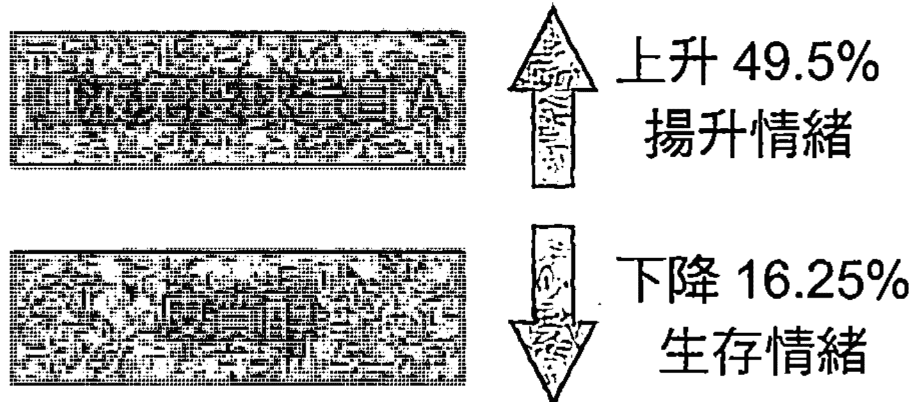 | |

圖 4 練習把情緒保持在揚升狀態並改變我們的能量時，確實可以使新的基因往上調節並製造出健康的新蛋白質，從而強化我們體內的防禦系統。當我們調降憤怒、焦慮等生存情緒並把外在保護系統的需求降到最低時，即可使製造壓力荷爾蒙的基因往下調節。註：免疫球蛋白 A (SIgA) 是人體的防禦系統之一，皮質醇是壓力荷爾蒙，兩種物質皆可從唾液中測量到。

## 注意力在哪裡，能量就在哪裡

外在的物質世界

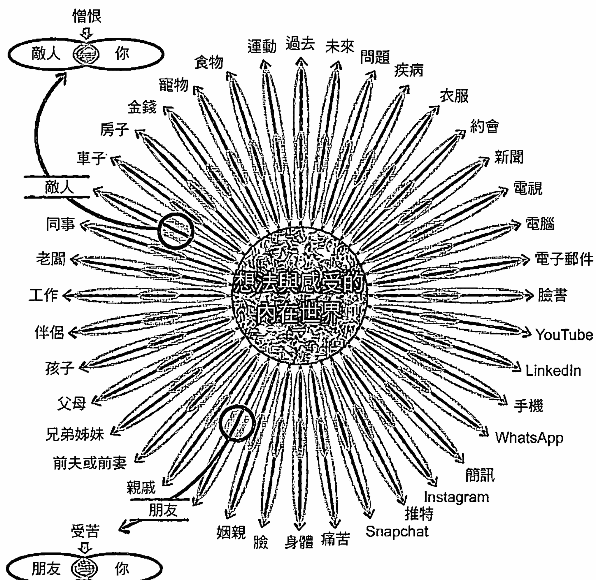

圖 5 我們熟悉的物質現實中，每一樣人事物、每個地點或狀況，在我們的大腦中都有一個相對應的神經網絡，並各自連結一種情緒成分，因為這些人事物我們都已經體驗過了。這就是我們的能量與「過去即當下」的現實結合在一起的方式。因此，當你把自己的注意力放在所有這些元素上面時，你的能量就會從你身上流走，只剩一點點能量留給想法與感受的內在世界，而這些殘存能量不足以為你的人生創造新事物。

圖中放大的部分（即兩個橢圓形交會的部分），代表了我們如何利用外在世界的不同元素來強化我們對某些情緒的癮頭；你可以用你的朋友來強化你對受苦情緒的癮頭，也可以用你的敵人來強化你對憎恨情緒的癮頭。於是，這引發了一個問題：「你還剩多少創造力能量可以用來為自己規劃一個新命運？」

## 求生情緒搞破壞，壓力荷爾蒙的遺毒

現在，讓我們仔細審視自己為什麼會沉溺於負面情緒（更精確來說，是壓力荷爾蒙）而不可自拔。當我們對外在世界中任何可能的威脅狀況做出回應時，不論威脅是真的或是想像出來的，我們的身體都會釋出壓力荷爾蒙來動員大量的能量去因應威脅。一旦發生這種情形，身體就會失衡，而這正是壓力會產生的作用。在遠古時候，這種連鎖反應是一種自然又健康的保命之道，在我們面對外在在世界的威脅時，身體會釋出含有腎上腺素、皮質醇及類似荷爾蒙的化學混合物。比如說，有隻掠食動物正在追捕我們，我們必須立刻做出戰鬥、逃跑或躲藏的決定。

當我們處於這種生存模式時，會自動變成唯物主義者，以我們的感官去定義現實，亦即我們可以看到、聽見的、嗅聞到的、感覺得到的及嘗到的事物；我們也會縮小焦點，把全部的注意力都放在物質（亦即我們存在於某個特定時空的身體）上面。壓力荷爾蒙讓我們把全部的注意力都放在外在世界，因為那裡正是潛藏危險之處。回到早期人類的生活，這種反應當然是好事，它的應變力讓人類得以存活下來。然後當威脅解除後，所有的這些壓力荷爾蒙的濃度會隨之回復平衡。但是在現代，情況卻不一樣。當我們接到老闆、家人的電話或電子郵件，而引發憤怒、挫折、恐懼、焦慮、悲傷、內疚、痛苦或羞愧等等強烈的情緒反應時，我們會啟動原始的戰或逃神經系統，使得我們的反應就像被掠食動物追著跑一樣。然而，相同的化學自動反應卻一直保持著開啟狀態，因為來自外部的威脅似乎永遠不會消失。事實上，我們大多數人的絕大多數時間都處於這種高度激動的狀態，並逐漸變成一種慢性壓力；就像是那隻掠食動物不是偶爾出來張牙舞爪一番，而是跟我們住在同一個洞穴中，比如那個每天坐在我們身旁的壞心眼同事。

這樣的慢性壓力反應不再是應變力，而是適應不良。當我們處於這種生存模式下，諸如腎上腺素、皮質醇等壓力荷爾蒙會不斷湧入我們身體並在全身流竄，我們隨時保持著高度警覺，而不是回歸平衡狀態。正如我們在第一章提到的安娜故事，當失衡狀態長此以往下去，我們很可能就會生病，因為在長期的壓力下，健康的基因表達會往下調節。事實上，我們的身體已經被制約了，早已習慣了激增的這一類化學物質，並對這種狀態上了癮，甚至渴求它們。

在這種模式之下，當我們試圖去預測、控制或強行取得某些結果來提高我們的生存機會時，我們的大腦會變得過度警覺與激動。我們越是這麼做，這種癮頭就會變得越強，我們也會越發相信身體就是我們，把這副跟我們的身分及環境密不可分、活在線性時間之中的身軀當成我們自己。這都是因為，我們把所有的注意力放在我們的身體上了。

當你處於生存模式下，你的大腦警醒又激動，同時你又必須不斷把注意力轉移到你的工作、新聞事件、你的前任伴侶、你的朋友、你的電子郵件、臉書及推特上，你迅速地啟動著每一個不同的神經網絡（參見圖 5）。如果你日復一日都這麼做，習慣性地縮小你關注的焦點並不斷轉移注意力，這樣的行為就像在你的大腦中割據地盤，使它再也無法平衡運作。這種情況之下，你等於在訓練你的大腦以一種脫序的、非諧振的模式放電，而導致運作效率低落。不同的神經網絡此起彼落地胡亂放電，宛如雲層中的閃電暴雷一樣，讓你的大腦無法同步運作，情形就像一群鼓手沒有任何節奏感地同時都在打鼓。在稍後的篇章中，我們會談到更多關於諧振的概念，但現在，你只需要知道：當你的大腦處於非諧振的狀態時，你也會失去協調。簡單來說，當你的大腦無法以最理想的方式運作時，你也無法以最理想的方式運作。

在你的生命中，你所經歷的每個人、每件事、每個地方都是已知的，你都可連結到一種與之相應的情緒。由於情緒是一種動能，是過去經驗的化學殘留物；如果你絕大多數的時間都處於那些令人上癮的壓力荷爾蒙之下，你可能會用老闆來強化自己對批評的癮頭，用同事來強化自己對競爭的癮頭，用朋友來強化自己對...對受苦的癮頭，用敵人來強化自己對仇恨的癮頭，用父母來強化自己對內疚的癮頭，用臉書來強化自己對不安全感的癮頭，用新聞事件來強化自己對憤怒的癮頭，用前任伴侶來強化自己對怨恨的癮頭，用金錢關係來強化自己對匱乏的癮頭。

這意味著你的情緒（也就是你的能量），全都跟你在熟悉的已知現實中所經歷的所有人事時地物緊密綑綁在一起；這也意味著，已經沒有能量可以留給你去創造新工作、新關係、新的財務狀況以及新生活，甚至用來療癒你的身體。讓我換個方式來解釋：如果說你的思考方式與感受方式，決定了你在能量場中散發出來的頻率與信息，而你的能量場又會對你的生活產生顯著的影響；那麼，如果你全部的注意力（亦即你全部的能量）都被外在世界的人事時地物佔據了，你就沒有能量可以供內在世界的想法與感受去運作。因此，你沉溺於外在世界的情緒越強烈，就越會把你的注意力放在外在世界的人事時地物上面；如此一來，你便將自己絕大部分的創造力能量分送出去，導致你所思所想的每一件

## 共享能量&信息

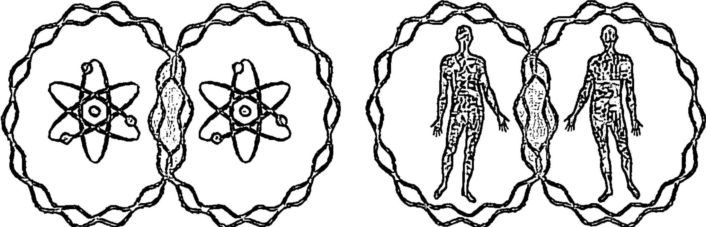

兩個原子結合形成一個分子

兩個擁有相同情緒與相同能量、共享著相同想法與信息的人，就會緊密連結在一起。

圖 6 就像共享能量與信息的兩個原子鍵結成一個分子，當兩個人共享著相同的情緒與能量，並交流著相同的想法與信息時，也會緊密連結在一起。上述這兩種情況都是受到一個無形能量場的束縛，使它們或他們保持緊密連結。如同要把這兩個原子分開需要能量一樣，對於那些我們已然付出許多創造力能量或注意力的人事物來說，想要轉移對他們或它們的注意力，當然也需要能量及覺知。

# 第 2 章 活在當下，不讓生命淪為自動程式

事都局限在你已知的一切之內。當你沉溺於自己的外在世界時，便很難跳脫這個已知範圍，以任何新的方式去思考或去感受。此外，你可能會淪陷在最初為你帶來這所有問題的人事物而走不出來。這個過程，說明的就是你如何拱手讓出你的力量，以及為何沒能妥善管理你的能量。回頭看看圖 5，你會發現一些例子可以說明我們如何創造出能量鍵結（energetic bond），好跟外在世界的元素緊密聯繫在一起。

請看看圖 6，圖左邊有兩個共享相同信息的原子，受到無形能量場的束縛而結合在一起。圖右邊是兩個彼此分享不滿經驗的人，也透過無形能量場的能量而連結在一起，保持著強有力的聯繫。事實上，他們正分享著相同的能量及相同的信息。

要把這兩個原子分開需要付出能量，同理，如果你的注意力與能量都被外在物質世界的人事物所綁架，就不難理解，為何冥想時必須花上相當的能量與氣力，才能打破那些緊密的連結。這便引發出了一個問題：「你有多少創造力能量被內疚、憎恨、憤慨、匱乏或恐懼等情緒所占用？」事實是，你得用上所有能量才能重新創造一個新的命運。

要做到這一點，你必須把自己的注意力從外在世界的這些人事物上轉移開來，才能超越他們或它們。這是為什麼我們可以冥想當成改變內在狀態的一種模式，因為冥想讓我們得以打破我們與所有人事時地物的長期束縛；一旦你克服了自己的情緒體，得以將自己的注意力從外在世界已知的一切事物轉移開來，你就可以收回你的能量，並打破你與「過去即當下」的這個現實（一個始終一成不變的現實）之間的桎梏。你必須讓自己從 somebody 轉變成誰都不是的 nobody 狀態，這意味著你必須將自己的注意力從你的身體、你的痛苦以及你的渴望轉移開來；也必須放下某種身分（伴侶、父母、子女或員工），不再把所有注意力放在這些人身上；你必須把注意力從某些事物轉移到一無他物上面（忘記你的手機、你的電子郵件，或是想喝杯咖啡的欲望），並從有境轉移到無境（冥想所坐的椅子、你今天稍後要去的地方，所有這些想法你都要擺脫）；同時，從線性時間轉移到沒有時間的存在（沒有任何會分散你注意力的回憶或關於未來的想法）。

> * 編按：情緒體（emotion body）是人體的能量場之一，如果有很多未表達的情緒，情緒體會變大；相反的，情緒越少，情緒體就會越小。

我並不是說你的手機、你的筆電、你的車子或你的銀行帳戶都是壞事，但是當你過度依賴這些外在事物時，它們就會占據你的注意力到某種極端程度，以至於你滿腦子只有它們而無法想其他事情（這是因為你與它們有強烈的情緒連結），是這些財物擁有你，而不是你擁有它們。結果就是，你無法創造出任何新事物。

想要創造新的事物，唯一方法就是學習如何收回所有這些破碎的能量，讓你能夠克服一直沉溺其中的生存情緒。正是這種情緒，讓你所有的能量都被「過去即當下」的這個現實所綁架。一旦你把自己的注意力從所有這些外在元素轉移開來，就能開始削弱你們之間在能量與情緒上的牽絆，也終於開始可以釋出足夠的能量去創造一個新的未來。這些都需要你能夠覺知到自己曾經無意識地把注意力放在哪些地方，同時，就像要分離兩個鍵結在一起的原子一樣，想有意識地打破這些束縛，也需要你付出一些能量。

研習營期間，隨時都會有人來找我，告訴我他們的電腦硬碟壞了、某人偷了他們的車子，或是他們丟了工作而且一文不名。當他們像這樣告訴我失去了生命中的某人或某物時，你知道我總是對他們說什麼嗎？「太棒了！看看你現在多出了多少能量可以用來創造新的命運！」順帶一提，如果你有心要把這個功課做好，把能量收回來，請你先要有心理準備，因為一開始時你可能會有些不舒服，甚至是把日子過得有點小混亂，那是因為你生命中的某些面向可能會分崩離析。不過別擔心，正是因為你打破了與過去實相之間的能量鍵結，才會出現這種情況。任何事物，只要不符合你與未來之間的振動都會消失。讓它們走吧，別試著去挽回你的舊生命，因為應你召喚而來的新命運，將會讓你忙到不可開交。

# 收回你的能量，用來打造全新的未來

如果你想切斷與外在世界的牽絆，你得學習如何改變你的腦波。因此，讓我們先來談一下腦波頻率。我們大部分時間都是清醒、有意識的，處於腦波頻率的β（beta）波段。β腦波可在低頻、中頻及高頻範圍內被測量到，低頻的β腦波屬於一種放鬆狀態，亦即你沒有察覺到任何外在威脅，但仍可在時空中覺知到你的身體的一種情況。閱讀、跟女兒在良好氣氛下交心聊天，或聽一場演講，這些時候就是處於這種狀態。中頻的β波屬於一種輕微激動的狀態，你會比較警覺，但不會有過度的壓力或是完全失去平衡，你可以把中頻β波看成是一種好的壓力，例如你在一群人中第一次自我介紹且必須記住每個人的名字時，就處於這種狀態。高頻的β波屬於一種壓力荷爾蒙在體內激增的狀態，只要出現任何一種生存情緒，包括憤怒、驚慌、激動、受苦、悲傷、焦慮、受挫或甚至沮喪時，就是處在高頻 β 波的狀態。高頻 β 波的頻率比低頻 β 波高三倍以上，是中頻 β 波的兩倍。

雖然一天當中，你大部分的清醒時間可能都處於 β 波的狀態下，但仍然可以偶爾進入 α 波，也就是當你放鬆、平靜、有創意或甚至憑著直覺行事的時候，你不再思考也不再分析，而是在做白日夢或想像，像是處於某種出神的狀態中。如果 β 波指的是你把大部分注意力放在你的外在世界，那麼 α 波就是你把較多的注意力放在你的內在世界。

θ (theta) 頻率的腦波接管了入睡前那段朦朧迷糊的階段，也就是你的心智仍然清醒、但身體正要入睡的時候，這個腦波頻率也跟深沉的冥想狀態有關。δ (delta) 頻率的腦波通常會在有助於恢復健康的深沉睡眠中出現，但在過去四年中，我的研究團隊記錄了在冥想中進入深沉 δ 波的情形：他們的身體沉沉入睡，但他們會做夢。大腦掃描顯示，他們的大腦正在處理極高度的能量振幅。這些學生自訴經歷了深刻、合而為一的神祕體驗，感受到與宇宙萬物的連結（圖 7 為不同頻率的腦波狀態）。

γ (gamma) 頻率的腦波，就是我稱之為「超意識」的一種狀態。當大腦被某種來自內在而非發生於外在的事件所喚醒時，就會產生高頻能量（最尋常的例子就是閉上眼睛後進入內心世界的冥想期間）。我們會在稍後章節進一步說明 γ 腦波。

冥想時會面對的最大挑戰之一，就是腦波如何從高頻（甚至中頻）的 β 波切換到 α 波，再不知不覺地滑進 θ 波。這麼做的重要性絕對無庸置疑，因為當冥想的人把腦波減緩到其他頻率時，就不會再關注自己在壓力下心心念念的外在世界以及所有令人分心的事；又因為他們不再分析、謀劃並試圖去準備面對未來最糟的狀況（這是基於過去令人恐懼的記憶而設想出來的），於是他們就有了成為當下的機會，也就是，只存在於現在。

以下就是一個很棒的例子。我有一個朋友是某間大學的副校長，他在開始冥想的三個星期後出席了校董事會。他是那間大學的頂梁柱，學生與教職員都很愛他。不過，當他走進會議室坐下來後，卻被董事會開除了。所以，他打電話給我，說道：「嘿，我不知道這個冥想過程是否有效，董事會剛炒了我。我做這個冥想，不是應該會有很棒的事發生在我身上嗎？」

「聽好了，」我告訴他：「你別緊抓住那些生存情緒不放，這麼一來，你只會活在你的過去。相反的，你要不斷活在當下，並且從當下去開創未來。」結果，他在兩星期內就跟一位女士墜入了愛河，後來她成了他的妻子；而他也很快就找到了工作，在另一所規模更大更好的大學擔任副校長。一年後，他又打電話給我，告訴我我那原先開除他的學校，現在要請他回去擔任校長。所以，當你的舊現實消失、新未來即將展開時，你永遠不知道宇宙為你規劃了什麼樣子的命運。我唯一可以向你保證的是：未知從來沒讓我失望過。

## 五種腦波

圖 7 五種不同頻率的腦波

冥想期間，你得以切斷你與外在環境所有元素的聯繫，超越你的身體、你的恐懼、你的行程表，並忘卻你太過熟悉的過去以及可預測的未來，這不是很棒嗎？如果你做對了，你甚至會忘記時間的存在。當你克服你的自動思維、你的情感以及你的一些冥想習性，以下這些就是必然會發生的情況：你超越了你的身體、你周遭的環境以及時間；你削弱了自己與「過去即當下」這個現實世界之間的能量鍵結，同時發現自己正處於當下。唯有在當下，你才能將你的能量收回到自己身上。

這的確要花上不少功夫（雖然隨著練習會越來越簡單），因為你絕大部分的時間都活在壓力荷爾蒙之下。因此讓我們看看，當你在冥想中無法進入當下時，會發生什麼事；這麼一來，一旦這種情況發生時，你就會知道如何處理。了解這個技巧極為重要，因為你若無法超越你的壓力、你的問題以及你的痛苦，你就無法創造一個沒有這些事物存在的新未來。

所以，讓我們假設你正坐著冥想，同時也开始失神分心、想東想西。你已經習慣這麼思考，因為多年以來，你一直都是使用這種思維方式，並把你的注意力放在同樣的人事時地物上面，你每天都會自動擁抱這種相同又熟悉的感受，只為了重申你是與同一個人實相連結的同一個人。也就是說，你不斷地將你的身體制約在過去。現在，唯一的不同點在於你的眼睛是閉上的，因為你正試著冥想。

當你坐在那兒、閉上眼睛，你並未真的看見你的老闆，但你的身體想要感受那股怒氣。因為你幾乎所有的清醒時刻，也就是一天五十次、一個星期有五天，每次見到她時，你都習慣感受到那股苦澀、怨恨、充滿敵意的情緒；同樣的，當你收到她的電子郵件（至少一天會發生十次），你也會無意識地對她產生相同的情緒反應，因此，你的身體已經逐漸習慣於需要用她來強化自己對憤怒的癮頭。你的身體想要感受它已經上癮的那些情緒，就像渴望藥物的癮君子，你的身體也渴望著那些熟悉的化學物質。因為得不到升遷的機會，你想要感受對老闆那股熟悉的怒氣；因為同事老要你幫忙掩護，你的身體想要感受你對同事的惡意批評。

### 第 2 章 活在當下，不讓生命淪為自動程式

著，你開始想到其他讓你火冒三丈的同事，以及老闆讓你感到不滿的其他原因。你坐在那兒閉上眼睛試著冥想，但你的身體卻用盡一切方法在扯你的後腿，因為它渴望得到那些熟悉情緒所帶來的化學物質，也就是那些你通常每天只要一睜開眼就會時時刻刻感受到的情緒。

你一旦注意到發生什麼事（也就是你正把自己全部的注意力放在那些情緒上面），你就會立即覺知到，你正在把自己的能量投注於過去（因為情緒是過去的紀錄）。因此，你必須停下來、返回當下，開始把你的注意力與能量從過去抽離出來。但過沒多久，你又開始感到受挫、憤怒及不滿，接著意識到自己又重蹈覆轍了。你要記住的是，你的身體正試圖去感受那些情緒，以便再次確認它對那些化學物質的癮頭，而那些情緒會驅使你的大腦進入高頻的 β 波。所以，你必須停下來。每一次，你都必須按下暫停鍵，重新安頓好你的身體，再回到當下。你要告訴你的身體，它不再是你的心了，你才是你的心。

但是接下來，紛雜的思緒會開始飄進你的腦海，你會想著稍後你得去見的人、得去跑的地方，以及得去辦的事情。你猜測你的老闆是否回覆了那封電子郵件，你還想到你還沒回電給你的姊姊；還有，今天是倒垃圾的日子，所以你提醒自己要記得把垃圾拿出去。回過神來，你察覺到自己正在預想這些未來的情景，等於你正在把自己的注意力與能量投注於一個相同的、已知的現實。所以，你得停下來、回到當下，再一次把你的能量從可預測的、已知的未來中抽離出來，才能騰出空間保留給你生命中的未知。

圖 8 所示，一旦你發現自己正處於當下時刻的甜蜜點*時，你的能量（以箭頭表示）便不再以它以往習慣的方式（參見圖 3），從你身上流往過去及未來。此時，你正在把你的能量從熟悉的過去與可預測的未來抽離出來；你不再以相同方式發射並連結到同一個迴路，也不再藉由感受相同的情緒，並以相同方式對相同基因進行調節或發射信號。如果你持續進行這樣的過程，就能打破你跟「過去即當下」這個現實的能量鍵結，持續收回你所有的能量。由於你把你的注意力與能量從外在世界收回來，放入你的內在世界裡，藉此，你便得以在你的身體周遭建立起自己的電磁場。現在，你已經有了可用的能量，可以用它們來創造新的事物了。

> *編按：甜蜜點（Sweet Spot）是高爾夫球及棒球的術語，指的是最適合用來擊中球的位置，可以打出最具威力的球。在此，甜蜜點的意思是指最佳的切入時刻，只要到達甜蜜點，剩下的就會自然運作了。

不出所料的，你的注意力又開始四處遊蕩了。當你繼續坐著冥想時，你的身體會開始越來越煩躁不安，越來越不耐煩，因為它想去做些別的事。畢竟，你已經把身體設計成照表操課的自動機器，每天起床後就遵循著例行的日常活動。所以，你的身體想放棄冥想，睜開雙眼去看到某人、聽到電視聲音或是跟某人講電話。它寧可吃早餐，也不願無所事事地坐在那兒；它想要像每天早上一樣，聞到煮咖啡的香氣；同時，它喜歡感受某些事，比如展開一天的日程前先洗個熱水澡。

你的身體想要以它的感官去體驗物質現實，以便擁抱某一種情緒；但你的目標是去創造出超越感官世界的另一個實相，在這個實相中，不是以你的身體為心智，而是你自己就是心智。一旦你覺知到身體的自動程式，你必須讓身體安定下來進入當下。不過，你的身體還是會不斷試著回到熟悉的過去，因為它想要進入的是一個可預測的未來。你必須不斷把它拉回來，讓它安定下來。每一次你克服自己的自動習慣，就能變得比你的自動程式更強大；每一次你把你的身體拉回來，讓它在當下保持安定，就像在訓練狗狗好好坐下一樣，你就是在重新制約你的身體，訓練它去適應一個新的心智；每一次你察覺到自己的自動程式並為留在當下而努力時，你便證明了你的意志比你的自動程式更強大。如果你持續把注意力（以及隨之而來的能量）拉回到當下，並持續關注自己何時處於當下、何時不在當下，你的身體遲早會臣服。這個持續的返回過程（每當你察覺到自己不在當下而努力回到當下的過程），會開始瓦解你跟熟悉的已知現實之間的能量鍵結。當你回到當下，你就是在超越物質世界的身分，走進一個為你開展的量子場（這個概念我會在下一章詳細說明）。

每一場戰爭最艱困的部分就是最後一戰；在此，這意味著當你的身體——長久以來都擔任著心智的角色——開始勃然大怒，希望你停止並回到感官世界，而使得你開始認為自己可能無法更進一步時，你還是要努力堅持下去。因為直到這時，你才真正踏入了未知的世界，而且要不了多久，你就能開始打破內在的情緒癮頭。當你超越內疚、痛苦、恐懼、受挫、憤慨不滿或是不值得等種種情緒時，你便將你的身體從那些把你固定在過去的舊習性與情緒枷鎖中釋放了出來；而結果就是，你同時也解放了那些能量，它們現在回到了你的身上可以為你所用。一旦身體釋出這些被它所儲存的情緒能量時，身體就不再是你的心智了。你會發現，恐懼的另一面正是勇氣，匱乏不足的另一面是完滿無缺；你會發現，攀越過自我質疑的高山，迎接你的是洞悉與了然。當你踏入這個未知的世界、放下你的憤怒與仇恨，你會發現到愛與憐憫。事實上，它們都是相同的能量，只是一直被儲存於身體之中；而現在，你可以用它們來規劃一個新的命運了。

因此，當你學會克服自己及克服你人生的過往記憶，你便能打破你與所有人事時地物之間的聯繫，這些就是讓你跟「過去即當下」這個現實無法斷開的原因。當你終於克服你的憤怒或挫敗感，你便能解放那些困在過去的能量，並收回這些能量重新利用。一旦你解放了那些曾經被生存情緒所困住的創造力能量，你就能在你的周身建立起個人的能量場。

在我們的進階研習營中，確實曾測量到回收能量的成效。我們的專家使用了一種靈敏度極高、稱之為「氣體釋放顯像技術」（gas discharge visualization, GDV）的攝影儀器，搭配由康斯坦丁·柯洛科夫（Konstantin Korolkov）博士所開發的感應器——史普尼克天線（Sputnik antenna）。這樣一部儀器可以測量會場周邊的電磁場，觀察能量如何隨著研習營日程而改變。在進階研習營的第一天，我們有時會看到房間裡的能量下降；這是因為一旦開始冥想後，學員為了克服自己，必須打破他們與所知現實所有人事物之間的能量連結。他們正在收回自己的能量，並從更大的場域中汲取能量；而隨著他們開始建立起自己周遭的個別能量場，房間中的能量場便會縮小。現在，他們有可用的能量用來為自己規劃一個新的命運了。在我們所有人都超越自己的第一天，學員們終於建立起各自的光場，並隨著本身能量一天天地持續擴展，他們也開始對房間裡的能量有所貢獻了。結果就是，我們終於見證到房間中的能量開始提升了起來。想知道這種情況看起來像什麼，可以參見彩圖1A與圖1B。

想要提高成功冥想的機會，一個方法就是給你自己足夠的時間，讓你不會因為想匆促完成這項體驗而分心。以我來說，我會給自己兩個小時來靜坐冥想。雖然我不是每次冥想都要花兩個小時，但是到目前為止我很了解自己，知道如果我只有一個小時，就會擔心時間不夠用。相反的，如果我有充足的兩個小時，我就會放鬆下來，知道自己有足夠的時間可以找到當下。有些日子，我可以很迅速地找到當下的甜蜜點；但有些時候，我或許得花上一個小時才能把我的大腦跟身體帶回當下。

我是個大忙人，舉個例子：當我趁著研習營的空檔回家三天，第二天早上一醒來，就會立刻想到那一天我分別要跟哪些工作人員開三個會議，然後就在心中排練起自己要說的話；接著，我會想到我必須在開會前寄出哪些電子郵件；以及那天下午我要搭的班機，並在心裡提醒自己開車去機場的路上要打哪些電話。所以，你明白我有多忙了吧。

當這種情況發生時，我所想的都是我得去見的同樣一群人、得去跑的同樣地方，以及得去處理的同樣那些事，所有這一切都同時存在於我熟悉的這個已知的現實之中。於是我意識到，我正在使我的大腦與身體準備好去迎接一個看起來就像是已經發生的未來，我的注意力正放在一個已知的未來，所以我必須停止去預期已知之事，回到當下。一旦我這麼做了，我就會停止發射及連結那些神經網絡。接著，我又想到了昨天發生的某些事，可能會變得情緒化、不耐煩或有點沮喪。前面提過情緒是過去的紀錄，也提到「注意力在哪裡，能量就在哪裡」，於是我開始意識到我正在把能量投注於過去。接下來，壓力荷爾蒙可能會喚醒我的大腦，我的身體開始激動起來，整個人進入高頻的 β 波，然後我又得再把狀態拉回來，重新安頓在當下。當我這麼做時，我再次停止了發射及連結大腦的相同迴路，不再把能量投注於過去。

如果我能察覺到那些與熟悉感受連結在一起的相同想法，那麼當我阻止自己以相同方式去感受時，我的身體就不會受到過去所制約，也不再以相同方式對相同的基因發射信號。如果情緒是環境經驗的最終產物，而對基因發射信號的也是環境，那麼當我停止感受相同的情緒時，就不會再以相同方式去挑選及指示那些相同的基因了。這樣做不僅會對我的身體健康有好影響，我的身體也不再因為活在過去而被迫處在一個相同的未來。一旦我抑制了那些熟悉的感受，就能改變身體的基因程式。就如前述，長期的壓力荷爾蒙會讓健康基因的表達往下調節並製造出疾病，因此當我每次一發覺自己感受到這些與壓力有關的情緒時，如果都能夠停下來，我就等於幫我的身體解除制約，不再沉淪於那些會帶來壓力的情緒。

如果我可以正確地做好這件事——克服我所熟悉的、來自己知過去與未來的想法與感受——那麼在能量、神經系統、生物機能、化學物質、荷爾蒙以及基因各方面，那個可預測的未來（以及我習慣再三確認的過去）便不復存在。如果我不再回憶起那些特定時空的人事物，不再發射及連結那些相同的舊神經網絡，不斷讓自己回到當下，我就可以把能量收回到自己身上。如圖 9 所示，你可以看到熟悉的過去與可預測的未來都已經不復存在了。

現在，我正處於一個從容、有餘裕的當下時刻，在這個甜蜜點上，我擁有可用來創造的能量，也在身體周遭建立起我自己的能量場。每次（有時要花上好幾個小時）我都努力超越自己並尋找那被稱之為「永恆當下」的所在，而且確實有所突破。每當這個時候，我心裡總會想著：這一切真的太值得了。

### 收回你的能量與力量

圖 8 當你把注意力從「過去即當下」這個現實或可預測的未來抽離出來時，就是在收回能量並建立你自己的電磁場。現在，你有了可用的能量，可以用來自我療癒或創造生命中的新體驗。

### 當下時刻的甜蜜點

圖 9 當你處於當下時刻的甜蜜點，你所熟悉的過去與可預測的未來全都不復存在。現在，你已經準備好去開創人生的全新可能了。

## 第3章 把宇宙天線架起來，讓想像變成現實

要超越我們的身體、環境及時間並不容易，但絕對值得。因為，一旦我們切斷與三維現實的連結，得以進入另一個稱為量子的完整現實，這是一個有無盡可能性的場域。要描述這個現實是一個大挑戰，因為它與我們所熟悉的這個物質宇宙的任何事物都不一樣。牛頓物理學的法則（亦即我們對這個世界已然習以為常的運作方式），在此並不適用。

量子場（統一場）是一個充滿能量與信息的無形場域，或者你也可以說是一個充滿智慧或意識的場域，存在於空間與時間之外，沒有任何實質或物質的存在，超越了你能以感官感知的一切。這個能量與信息的統一場支配了所有的自然法則，科學家們一直都想要量化這個過程，讓我們可以更充分地認識這個場域，而他們的發現也越來越多。

根據我的知識和經驗，我相信量子場中存在著一種自我組織的智慧、一種能量，一直在觀察著所有宇宙與星系萬物。有時候也會有人告訴我，這個想法似乎不太科學，而我總是以相同的問題來回答他們：「爆炸後會發生什麼？是有序，還是無序？」而他們的回答都是：「無序。」然後我會接著問：「那為什麼在宇宙大爆炸——有史以來最大的一場爆炸——之後，有那麼多的秩序被創造出來？」所以，必然有某些智慧把它的能量與物質組織成井然有序的形態，統一所有的自然力量，才得以創造出這樣的一項傑作。而這種智慧與能量，正是量子場或統一場。

為了讓你對這個場域有些大致的概念，請想像一下，拿掉地球上所有的人類、所有動植物以及自然或人造的有形實體，還有所有的大陸、海洋，甚至地球本身；接著，想像你還可以拿掉太陽系中所有的行星、衛星、恆星，包括我們的太陽；然後，再想像你拿掉了我們的銀河系中所有其他的太陽系；最後，拿掉宇宙中所有的銀河系。沒有任何空氣，甚至沒有任何你能用肉眼看到的光線，只有絕對的黑暗、虛空或零點場*。記住這一點很重要，因為當你在當下時刻成為意識進入統一場時，你將置身於一個無限的黑色空間（虛空）之中。

現在，想像你在這裡不僅看不見任何事物，更因為你進入了一個沒有肉身的境界，你沒有可以看見事物的視力，也沒有可以聽見、感受、聞嗅或品嘗事物的能力。你在這裡沒有任何的感官。你能存在於量子場的唯一方式，就是成為一種意識；或者說得更精確些，你能體驗這個境界的唯一方式，就是運用你的意識，而非你的感官。那麼，既然意識就是覺知，而覺知就是付出你的注意力或是關注，因此，一旦你超越感官的世界去關注量子場中的能量，你的意識便得以連結至更高層次的頻率與信息。

儘管聽起來可能很奇怪，但量子場並非空無一物，而是充滿頻率或能量的一個無限場域，而且所有的頻率都帶著信息。因此，不妨把能量場想成是一個充滿無限能量的場域，這些能量的振動不但超越物質世界，更超越了我們的感官，正是我們可用來進行創造的無形能量波。那麼，我們究竟可以用這些漂浮於無限潛能之海的能量來創造什麼呢？這完全取決於我們，一言以蔽之：量子場中存在著各種可能性，供你取用。正如我剛剛所說的，當我們發現自己身處於量子宇宙之中時，我們只能以一種覺知（awareness）或意識（consciousness）的形態存在，這種覺知能夠讓我們去關注或觀察到一個存在著無限可能性的場域，而這個場域就位於一個更偉大的意識以及更高層級的能量之中。

當你以意識的形態進入這個無窮無盡的空間之中，你會發現這個空間中沒有任何實體、沒有任何的人事時地物，只有無限的未知可能性以能量的方式存在。因此，如果你發現自己想著生命中的已知，你就會回到三維現實的時空之中；但是，如果你能停留在未知的黑暗中夠久，它就會讓你準備好去創造生命中的未知。

在前一章中，我教你如何回到當下時，我指的是你得讓自己停止去設想可預測的未來，或者不再去回憶熟悉的過去，只是以意識的狀態出現在這個永恆的浩瀚空間之中，不再把你的注意力放在三維現實中任何實質的人事物上面，比如你的身體、你生命中的人、你擁有的事物、你會去的地方，以及時間本身。如果你做得正確，你就只會成為意識而不是其他，而這正是你進入虛空的方法。

現在，讓我們回過頭來看看科學家如何發現量子宇宙，這是在他們開始研究次原子世界時所發生的事。

他們發現原子——物質宇宙中一切事物的基礎組件，是由一個被廣大場域所圍繞的原子核所組成的，而這個場域中又包含著一個或多個的電子。相對於微小的電子，這個場域是如此浩瀚，其中有百分之九十九點九九九九九九九九的空間似乎都空無一物；但是，正如你剛剛才讀到的，這個空間並非真的空無一物，而是由一大堆的能量頻率所組成，進而構成了一個看似無形卻又相互連結的信息場域。在我們這個已知宇宙的所有一切，雖然看起來像是堅實的固體，但其實百分之九十九點九九九九九九都是能量或信息。事實上，宇宙大部分都是這種「空無一物」的空間；相較於沒有任何物質的巨大空間，物質只占了極其微小的一部分。

研究人員很快就發現，在這個廣闊場域中四處移動的電子，其行為完全無法預知——它們似乎不受制於我們這個宇宙的物質運作法則，這一刻在這裡、下一刻卻消失不見，根本不可能去預測這些電子會出現於何處與何時。研究人員終於發現，這是因為電子是以無限種可能性（或然率）的方式同步存在，唯有在觀察者把他的注意力放在尋找某些物質時，無形的能量與信息場域才會突然塌陷成一個粒子，亦即我們所知的電子，這被稱為波函數塌陷（collapsing the wave function）或量子事件（quantum event）。但是一旦觀察者轉移了視線，不再觀察電子，把他的心思從次原子物質上轉移開來，這個電子就會消失、變回能量。換句話說，實體物質的粒子（電子）一直要到我們觀察它，也就是給予它我們的注意力時，它才會存在；然後當我們不再關注它時，它又會變回能量（特別是一種能量頻率，科學家稱之為波）與可能性。心智與物質就是以這種方式在量子場中聯繫在一起（順便一提，身為主觀意識的我們在觀察電子成形之際，同時也有一個客觀的宇宙意識正不斷地觀察著我們所有人，以及觀察著我們的三維實相成形）。

因此，這對你的意義就是：如果你每一天都從相同層次的心智去看待你的生活，根據你的過去來預測你的未來，你等於是在把無限的能量場崩陷成相同的信息模式，也就是你的生活。比如說，如果你一醒來就想著：「我的疼痛呢？」你所熟悉的疼痛很快就會來報到，因為你期望它會出現。

想像一下，如果你能把自己的注意力從物質世界轉移開來，會有什麼事取而代之地發生呢？正如你在上一章所了解到的，當你將注意力從你的身體轉移開來，你就會轉變成沒有身體的狀態，也不再能感受到（或運用）任何感官。當你把注意力從跟你人生有關的人們身上轉移開來，你就會變成誰都不是的狀態，因此你的身分不再是父母、伴侶、兄弟姊妹、朋友，甚至不再是某個行業、宗教團體、政黨或族群中的一員，沒有任何種族、性別、性取向、年齡的限制。當你把注意力從物質環境中的事物與地點轉移開來，你會變成處於無物及無境的狀態。最後，如果你將注意力從線性時間（有過去與未來的分別）轉移開來，你會變成沒有時間存在的狀態，只存在於當下，而量子場中的無限可能性全都存在於當下。因為你不再認同或連結這個物質世界，也不再試圖以物質去影響物質，你已超越了物質，也不再認同你存在於這個時空中的身體。實際上，你正處於統一場的巨大黑暗中，這裡沒有任何物質存在。這正是我在前一章中所描述的，你經過不斷努力回到當下的直接效應。

> *編按：零點場（zero point field）即量子場的另一個稱呼，指的是虛空中並非真正一無所有，其中確實有電磁波的變動，並存有一系統可能持有的最低能量，此即零點能量（溫度降到絕對零度時的能量）。

## 冥想改變了你的大腦

想要走進量子場的世界，不能以身體的形態，你只能以意識或覺知、想法或可能性才能進入，你必須拋下物質世界的一切，只活在當下。正如我在前一章所說的，這個過程需要你或至少暫時需要你去斷除一些讓你成癮的熟悉情緒（這些情緒會產生讓身體沉溺的化學物質），並且還需要你停止以相同的方式去感受，不再把注意力放在物質（粒子）的三維世界，而是放在能量或是可能性（波）上面。因此，當你得知這樣的經驗會在你的大腦中產生若干重大的改變時，或許就不會太過驚訝了。

首先，因為你意識到自己已超越了物質世界，這意味著沒有被預期的外在危險，你的思維腦——即新皮質（neocortex），你的意識心所在之處——就會慢下來，變得不那麼激動，並以一種更完整、更全面性的方式運作。前面提到，活在壓力荷爾蒙之下，會因為我們試圖去控制並預測生活中的所有一切，而導致我們的腦波以一種極為混亂、非諧振的模式發射訊號（意味著我們的身體無法有效運作）。我們會變得過度關注，把注意力從某個人轉移到某件事，再轉移到某個特定時間的某個地方，於是就分別觸動了分派給每件已知事物的不同神經網絡。

一旦我們進入當下，覺知到這個信息的無限場域是毫無物質存在的永恆虛空，並且不再分析或關注任何身體、任何身分、任何事物、任何地方及任何時間，我們便不再活化大腦神經網絡中那些不同的區間。再者，當我們把覺知從外在物質環境的狹隘焦點（事物、人、地點、身體及時間）轉移出來，擴大我們的焦點，並且將注意力放在虛空、能量及信息上，以覺知到這個黑暗場域的浩瀚無垠，我們的大腦就會開始改變。那些曾經被分隔開來的不同大腦區間，現在開始合而為一，逐步朝向諧振的全腦狀態邁進。不同的神經群落往外延展並形成更大的群落，它們是同步的、有組織的、整合的，而大腦中同步的部分也開始串連起來。一旦你的大腦趨向諧振，你整個人也會趨向協調；當它趨向井然有序，你整個人也會趨向井然有序；當它運作得當，你整個人也會運作得當。簡言之，當大腦的運作更趨整體性，你的感覺會更完整。換言之，一旦你開始以覺知形態與統一場連結（或者說，一旦你將注意力轉到統一場而更清楚察覺到它的存在），你的生理機能就會變得更完整且統一，因為統一場就是以統一的能量來加以定義的。

從圖1及彩圖2，可以更清楚看出諧振腦波與非諧振腦波之間的差異。正如你所見，當腦波達到諧振時，它們會彼此同步；它們的波峰（高點）及波谷（低點）是一致且相稱的。諧振腦波更井然有序，也更強大有力；你可以說，它們正說著相同的語言，跟隨著相同的節奏，跳著相同的節拍，並分享著相同的頻率，所以它們溝通起來很容易。它們的波長幾乎完全一樣。相反的，當腦波處於非諧振狀態時，發射到大腦與身體不同部位的電化學信息或信號就會是混雜、不穩定且無規律的，因此身體無法以最理想的平衡狀態運作。

當我們進入量子場時，大腦會經歷第二次改變，也就是腦波頻率會逐漸慢下來，從β波變成更協調的α波以及θ波。這一點很重要，因為當我們的大腦新皮質層移往緣腦（limbic brain），並且在此連結自主神經系統——身體的潛意識運作系統（參見圖2），這是神經系統中負責消化食物、分泌荷爾蒙、調節體溫、控制血糖、維持心跳、製造抗體、修復受損細胞以及身體無數其他功能的部分，這些是大多數科學家認為我們無法以意識控制的功能。

基本上，自主神經系統的作用就是讓你能活下去，它的主要工作是建立秩序及恆定性，以便平衡大腦並進而平衡身體。我們若能以無實體、無身分、無物、無境及無時間的狀態在當下待得越久，我們的大腦就會變得更具整合性及更同步。這也是自主神經系統介入並開始療癒身體的時候，這時，我們的意識會開始與自主神經系統的意識（即潛意識）合而為一。

換句話說，當你進入當下之際，你已經

### 諧振與非諧振腦波的差異

| 狀態 | 特徵描述 |
| :--- | :--- |
| **諧振腦波** | 當我們把注意力從物質世界移走，開始放寬焦點對準未知世界並停留在當下，大腦就會以諧振方式運作。一旦你的大腦處在諧振下，就會以一種更全面性的狀態運作，你也會感覺自己更為完整。 |
| **非諧振腦波** | 相反的，當大腦在壓力荷爾蒙的影響下變得興奮時，我們會縮小焦點，把注意力放在已知世界的人事時地物上面，而且會不停轉換聚焦對象，此時大腦會以非諧振的方式發射神經元。當你的大腦以這種方式失去平衡，你就會變得更加支離破碎、漫無目標，也會活得更對立且疏離。 |

## 第3章 把宇宙天線架起來，讓想像變成現實

擺脫了你原來的方式。當你成為純粹的意識、純粹的覺知，並使你的腦波從β波變成α波、甚至θ波，自主神經系統——比你那個有意識的心智更知道如何去療癒你的身體——會開始介入並終於得到清理門戶的機會。這就是你的大腦達到諧振的原因。如彩圖3A到圖3C所示，你會看到三種不同的腦部掃描：圖3A是一張正常的掃描，顯示某人正處於β波的正常思考狀態；圖3B記錄的是一名正在擴大焦點的學員，腦波頻率處於諧振且同步的α波；至於圖3C是θ波，這是一種比α波更深層、更協調且同步的腦波狀態。

假如在這樣的狀態下，你不再強化已知（亦即一成不變的生活），而是將能量投注於未知（就像你把錢存進銀行帳戶），那麼，你就能在你的生命中創造出新的、未知的可能性。就如前面說的，一旦科學家停止觀察電子，物質的電子便會在量子場中擴散開來，變回非物質的能量。因此，當你不再把注意力放在你的痛苦、日常生活及你的問題上，它們就會變回能量，變回無限的可能性與純粹的潛能。唯有當你真正處於這個超越時空、一切物質皆由此而來的強大所在，你才能開始創造出真正的改變。

二〇一六年，在華盛頓州塔科馬舉辦的一場為期四天的進階研習營中，我們進行了一項研究來顯示這個過程是如何實際運作的。在研習營前後，我們使用腦電圖測量了一百一十七名參與者的腦波，看看是否能偵測出大腦功能在兩種測量值的變化。第一個測量值是這些受試者花多久時間進入冥想狀態（以至少維持十五秒α波狀態的能力來界定）；我們發現，四天研習營結束時，受試者進入冥想狀態的速度快了一八%。

我們要察看的第二個測量值是δ波（與進入更深層次的潛意識有關）與高頻β波（通常與沈重壓力有關）的比率。焦慮者的腦波狀態通常是高頻的β波及低頻的δ波狀態，我們想看看冥想的作用，尤其能否成功潛入量子世界，成為沒有身體、沒有身分、沒有人事時地物的狀態；事實上，冥想的確能做到。受試者的高頻β波平均減少了一二四%（表示他們感受到的壓力減弱了），δ波則平均增加了一四九%（表示冥想期間產生了更強烈的合而為一感）。相對於δ波的數量，高頻β波的數量減少了六二%。這一切變化，都發生在短短的四天當中。如圖3所示的這些結果，你會注意到我們測量到的若干變化甚至高於百分之百，表示這些受試者能夠相對迅速地做出異常顯著的改善。真的是非常超自然！

### 改變能量從心念與情緒下手

一旦你處於當下時刻的甜蜜點（此時你已進入存在著所有可能性的量子場），你如何將其中的一項或多項的潛能轉化成非物質的可能性，成為三維物質世界的實相？這需要兩個條件：一是明確的意圖，二是揚升的情緒。所謂的「明確意圖」一聽就懂，就是字面所指的意思，亦即你必須清楚自己想要創造的實相是什麼，並盡可能具體地描述出來。舉個例子，你想要有一個很棒的假期，那麼你想去哪里？你想如何前往？你想跟誰去，或是你想在那裡見到誰？你想住什麼樣的房間？當你在那裡時，你想做什麼或看什麼？你想吃什麼食物？你想喝什麼飲料？你會打包什麼樣的衣服帶去？你會買什麼東西帶回家？你明白了吧，就是鉅細靡遺地描述，盡可能地貼近真實的情況，因為你將給這些情況分配一個字母來代表可能性。正如你在前一章讀到的，所有組成你意圖的想法，都是你發送到統一場的電荷。

## 第3章 把宇宙天線架起來，讓想像變成現實

  現在，你必須將意圖與一種揚升的情緒結合，比如愛、感恩、鼓舞、喜悅、興奮、敬畏或驚嘆等等。當你出示那個意圖時，你必須帶上特定的情緒，然後在經驗確實發生之前，就先去感受那樣的情緒。這種揚升的情緒帶著一種更高層次的能量，正是你要發送到量子場的磁荷。正如你所讀到的，當你結合了電荷（你的意圖）與磁荷（揚升的情緒），由此產生的電磁特徵（electromagnetic signature）就能改變你的存在狀態。

  另一個描述這些揚升情緒的用語，或許可以稱之為發自內心的感情。通常當我們感受到我提到的這些情緒時，我們都會注意到我們的心脹得滿滿的。這是因為我們的能量移往那個部位，才會感受到這些美妙的揚升情緒帶有付出、關懷、照顧、信任、創造、連結、安全感、奉獻服務及感恩等意圖。不像我們前一章所提到的壓力情緒，會從身體周遭的無形能量場與信息場中汲取能量，這些發自內心的真情實感反而會提供能量給身體的能量場。事實上，當我們敞開心胸所創造出來的能量，會使我們的心變得更為有序、協調，就像大腦一樣；因此，它會產生一種可測量的磁場³，讓我們連結到統一場。當我們把一種意圖（電荷）及它所攜帶的能量（磁荷）結合在一起時，就可創造出一個新的電磁場。既然能量就是頻率，而所有的頻率都攜帶著信息，因此，這股揚升能量也同樣攜帶者你的想法或意圖。

  切記：量子場中的潛能只以電磁頻率（攜帶著信息的頻率）的方式存在，你無法直接以你的感官去感知它們；也因此，你所播送出去的新電磁信號，才會吸引量子場中與其振動相對應的電磁頻率。換句話說，當你的能量與任何已經存在於統一場中的潛能在振動上產生呼應時，你會開始把那個新的經驗吸引過來。當你成為你未來的渦流時，它會找到你。因此，以此方式，你不必努力去催生你想要的事物讓它成真，也不必去到某個地方才能獲得（這樣做就成了以物質去改變物質）；相反的，你必須要做的是成為純粹的意識（沒有身體、沒有身分，也沒有人事時地物的狀態）並改變你的能量——播送出去的電磁信號——然後，你就會把那個未來的體驗直接吸引過來（把能量改變成物質）。當你能真實不虛地接通屬於新未來的能量時，觀察者（統一場）也正在觀察著正在觀察新命運的你，也因此，它會認可並支持你所創造的新未來（參見圖 4）。

  在我們繼續往下探討之前，我想先回過頭來補充一點：要讓這個方程式發揮作用，揚升的情緒扮演了非常重要的角色。畢竟，當你決定觀察量子場中一個你想擁有的未來，卻又認為自己是個受害者或是一個自我受限、不快樂的人，這時，即便你一步遵循著這個方程式處方，但你的能量卻無法跟你設想的創造力一致，因此你無法召喚新的未來朝你而來，你的能量還是留在過去。或許你有一個很明確的意圖，而你的心智也處於未來（因為你正在想像自己想要什麼），但如果你所感受到的仍是那些熟悉、自我受限的情緒，你的身體只會相信它仍然還是留在相同且受限的過去經驗當中。

  正如你在前一章所知道的，情緒是一種動能，而揚升的情緒則攜帶了一種比生存情緒更高的頻率。因此，想要讓改變發生，就必須擁有一種超越負疚感、痛苦、恐懼、憤怒、羞愧或不值得等生存情緒的能量。事實上，所有你能感受到的都是振動頻率較低的能量，只能攜帶意識層次中那些自我設限的情緒，而不是你對未來的夢想。因此，如果你想發揮無限的潛能，最好能感受到無限；你想創造自由，最好能感受到自由；你想真正療癒自己，最好能提升能量趨向完整。你感受的情緒越崇高，你播送出去的能量就越大，你對物質世界的物質就會有更大的影響力；你的能量越大，你想要的未來現實在你生活中成真所需要的時間也會越短。

  在這個過程中，你必須放鬆並允許更偉大的心智（即統一場的意識）介入，為你安排某個適合你的事件或場景。你必須從本質上擺脫舊有的方式。當你為某個不知從哪裡冒出來的未知經驗深感驚訝時，那是因為你的確是在無境之境中把它創造出來的；某件事的出現看似無中生有，那是因為你的確是從虛空中把它創造出來的；某件事可以瞬間就發生，那也是因為你是在一個超越線性時間的世界、一個不存在時間的量子場中把它創造出來的。

  法國研究人員勒內·皮爾胥（René Peoc'h）博士，以剛孵出的小雞來展現意圖的力量。當這些幼雛孵化後，通常對母親的印象最深刻，牠們會黏著母雞，跟著牠到處轉。但是，如果孵化時母雞不在場，這些小雞破殼睜眼時，無論看見什麼會移動的物體，都會把對方當成母親，同樣也會走到哪兒跟到哪兒。如果有隻小雞破殼時最先看到的是一個人，那麼牠就會以相同的方式跟著這個人到處轉。

  皮爾胥為他的研究製造了一個能夠自由移動的隨機事件產生器：一個機器人。這個隨機事件產生器的移動軌跡是隨意的，沒有特定要往某個方向移動，當它被放在一個圍場內時，會隨機轉向，右轉或左轉的機率都是五〇%。為了對照，皮爾胥先記錄在沒有小雞跟著的情況下，機器人在這個圍場內的移動路徑；他發現一段時間內，機器人的移動路徑相當平均地涵蓋了大部分的圍場。接著，皮爾胥把剛孵出的小雞們帶到機器人面前，正如他所預期的，牠們對機器人的印象最深刻，把它當成是牠們的母親，並跟著它在這個圍場中到處轉。幾天後，皮爾胥把小雞移走，把牠們放進圍場外面的籠子裡，但還是可以從籠子裡看到機器人，只是不能再跟著它到處轉。

  接下來發生的現象非常有意思。這些小雞想接近機器人（牠們以為的母親）的意圖，確實對機器人的隨機移動造成了影響：機器人不再隨機移動，而是一直集中在圍場最靠近小雞的右半部區域（參見圖 5）。如果這些小雞的意圖可以左右機器人，那麼請想像一下，如果你想要吸引新未來到來，可以做些什麼？

  在統一場中，你實際上已覺知到存在於其中的能量，你可以用你的注意力與意圖去召喚它、使它成真。在這裡，你可以是個天才，你可以豐足、健康、有錢，你可以擁有神祕的體驗，你可以創造出一份新工作，你也可以解決你人生的問題。

  切記：所有的這些可能性，都以電磁潛能的形態存在於量子場中。你無法以你的感官去體驗它們，因為它們尚未存在我們這個時空中。它們是以信息頻率或能量模式存在，必須透過觀察、調頻才能進入這個時空。想要正確做到這一點，你必須以你的能量與意圖去連結那樣的信息與能量。

  還有另一個看待這個狀態的方式：假如你與這個浩瀚無垠、充滿無限潛能的統一場中的所有人事時地物的意識與能量合而為一，那麼，當你在這個量子場中觀察某個潛能時，就像是你在物質世界中覺知到你自己的一手一樣輕鬆。因為，你的手本來就跟你連結在一起，你的手本來就已經存在了。跟你未來的能量對好頻率，有意圖地去觀察量子場中的某個潛能並使其塌陷成粒子，這就是一個量子事件，而它最後會成為你在三維物質世界中的一個真實體驗。

## 第3章 把宇宙天線架起來，讓想像變成現實

  那麼，當你從冥想中醒來，即便你回到了物質的三維世界，但由於你在實際經驗發生之前已先經歷了你所預期的揚升情緒，因此你別無選擇，只能持續同樣的感受，彷彿你的意圖已經成真、你的祈禱已然得到了回應。你的感受會立即連接到你的新未來，你會知道這個新未來將以你無法預知的方式出現（因為，如果你可以預知它，它就成了一項已知）。事實上，你從冥想醒來後已經是一個新的自我，因為你所感受的更像是能量而非物質。

  然而，你必須一直保持這樣的覺知與意識，一旦你忘了或開始焦慮這個新未來何時會發生或是如何發生，你就又回到了原來的舊自我——一個試圖以過去來預測未來的自我。接下來，你就會開始感受到舊有的相同情緒（帶著相同的低層次能量），並影響你去產生原來的老想法，這等於你做了一個讓自己被困在已知中的選擇。我們可以這麼說，一旦你感受到過去所熟悉的情緒能量時，你就切斷了自己與未來能量的連結。

  相反的，如果你可以成功接通你反覆選擇且越來越熟悉的某個潛能，那麼你不僅能在冥想時調頻跟它對上，也能在上銀行時、開車時、刮鬍子時、煮飯時或散步時跟它處在同一頻率。每一天，你都可以在張開眼睛後一再反覆地這麼做，彷彿你閉著眼睛在冥想一樣。只要記住，每次你在當下接通你未來的能量時，就相當於一步步把你的未來吸引過來。

  如果你做得夠頻繁也夠正確，你會使你的生物特質從「過去即當下」的這個現實，變成「未來即當下」的現實。也就是說，你大腦的神經系統會從過去的紀錄變成未來的藍圖。同時，當你教導你的身體在當下去體驗未來將帶給你的感受時，你會以這種揚升的新情緒去重新制約你的身體，讓身體也能以新方式發射信號給新的基因。於是，你改變了你的身體，讓它看起來就像是你想要的未來已然發生，你清晰意圖所選擇的未來將會到來。這意味著在生理上，你已經開啟了一個新的未來了。

### 讓量子場為你服務

  當我的大兒子傑斯念完研究所時，去了聖塔芭芭拉（Santa Barbara）為一間製造精密軍用相機的大公司工作。約聘到期後，他搬去了聖地牙哥，在一間新創公司工作。過了一陣子後，他對公司的管理階層失望透頂，決定辭掉工作去旅行。傑斯是個衝浪愛好者，所以他精心規劃了一下旅程，打算在七個月中衝遍印尼、澳洲以及紐西蘭的大浪。他打包好行李、帶上衝浪板，踏上了他的旅途，享受生命中屬於自己的時光。

  六個月後，他從紐西蘭打電話給我，說道：「老爸，聽著，我得開始思考自己回到現實世界後要做什麼，我想創造一個新工作出來，而且比我先前的工作都要更好，但是我又想用不一樣的方式去做這份工作。我從這次的旅行中學到了很多。」

  「很好，」我回答：「在量子場中必然有一項潛能是跟你的新工作有關的，而你可以接通它。你先拿出一張紙，寫下『J』這個字母，並在它的周圍畫上兩條波浪般彎曲的線代表電磁場。」（注意聽喔，因為在這一章結束時，你也必須在冥想中做類似的事。）他照做之後，我接著說：「這個『J』字母代表一個可能性，也是你想要一份新工作的明確意圖。但現在，我們得非常清楚地知道你到底想要一份什麼樣的工作，所以讓我們把你認為這份工作中對你來說很重要的特點一一列出來。我希望你能好好想一想這些情況，關於那個代表新工作的字母『J』對你意味著什麼。在『J』下面，我希望你寫下意圖二字，再一一列出你希望這份新工作具備哪些特定條件。你可以寫下任何你所期待的條件，除了它會在何時發生以及如何發生。」

  「我希望在全世界任何地方都能工作。」他告訴我：「而且我希望賺的錢不會比我以前的工作少，甚至還要更多。我希望有六個月到一年的獨立合約，還有我必須熱愛我的工作。」

  「很好，還有別的嗎？」我問他。

  「是的，我還想自己當老闆，帶領我自己的團隊。」他說。

  「好的，現在你有了清楚又明確的意圖了。」我告訴他：「我希望你每次想到『J』，都能將這個字母與你賦予它的意義聯想在一起，也就是你剛剛列出來的所有你希望擁有的具體條件，可以做到嗎？」他說，他能做到這一點。

  接下來，我要求他想想當這事真的發生後，他會有什麼樣的感受。「針對這個新工作的性質，你把更明確的次要意圖一一列出來，然後我要你在旁邊或下方註明：『揚升情緒——我未來的能量』。現在，讓我們把這些情緒一一列出來，它們分別是什麼呢？」

  「充分授權、熱愛生命、自由以及感恩。」他告訴我，並再次確認這些揚升情緒會吸引這份工作來到他身邊。現在，只剩下讓一切就定位了。圖6就是傑斯所列的清單。

  「現在，你有足夠的時間可以運用，除了衝浪、放鬆度假外，你沒有太多事要做。」我告訴他：「所以對你來說，要創造你的未來應該不是一件難事。你能承諾每天做到該做的事，以便播送一個新的能量特徵送到能量場嗎？」他同意了。

  然後我跟他一起複習了如何找到當下、如何集中注意力以及如何提升能量，好讓他的能量能夠攜帶著他對未來的意圖。「當你把能量播送至超越你身體所在位置的那個量子場時，你的心目中要持有那個符號。」我指點他：「就像你轉到某個無線電台，找到某個攜帶信息的頻率。你的意識能停留在那樣的能量中越久，或是你能覺知到你未來的能量越久，你就越有可能召喚那樣的經驗朝你而來。所以，你只要每天接通未來的能量就夠了。要記得，無論你播送到量子場的是什麼，都是你將要迎接的命運。倘若你的能量頻率與某個潛能相符，那個潛能會找到你。所以，傑斯，你能待在那裡嗎？」

  「我可以。」他回答。

  「接下來，一旦你處於這種新的存在狀態一段時間後，我希望你想想你的新工作會要你做些什麼？」我繼續說：「你會做什麼選擇？你會做哪些事？什麼經驗在等著你？它們會帶給你怎樣的感受？我希望你在當下就能活在那樣的未來實相之中，從那種新的存在狀態中記住你的未來。」人們往往會執迷於每天可能發生的壞事，我要求我的兒子反其道而行，要時刻想到可能發生在他身上最棒的事——也就是新工作找上他。「想想你可以擁有那麼多的時間去衝浪、旅行，你還將會有一起工作的團隊，他們各有所長，你还可以存到足夠的錢買車買房子。」我鼓勵他：「每天就跟這些想法玩得開心點吧。」就像我們在上一章中提到的鋼琴演奏和肌肉鍛鍊，傑斯也要讓他的大腦與身體準備好，隨時看起來都像是他想要的未來已經發生了。

  「既然注意力在哪裡，能量就在哪裡。」我繼續告訴他：「我希望你把你的注意力及能量都投往新的未來。就像你的身體跟隨你的心智每天早上都要淋浴一樣，雖然這是一件已知的事，但如果你持續這個過程，你的身體也將會跟隨你的心智進入未知。」傑斯同意每天靜坐冥想。

  一個月後，傑斯回來了。當飛機抵達洛杉磯時，他給我發了訊息：「嗨，老爸，我又回到美國了，我們可以聊聊嗎？」

  喲，開始了，我想。我打給他，問他事情進展得如何了。

  「棒呆了，」傑斯說：「但是我快把錢花光了。我不知道該怎麼辦。」

  現在，身為父親的我想這麼說：「別擔心，兒了。我不知道該怎麼辦。」

  「現在，身為父親的我想這麼說：『別擔心，兒了，我們可以聊聊嗎？』」

  喲，開始了，我想。我打給他，問他事情進展得如何了。

  「棒呆了，」傑斯說：「但是我快把錢花光了。我不知道該怎麼辦。」

  現在，身為父親的我想這麼說：「別擔心，兒

  知。「傑斯同意每天靜坐冥想。

  一個月後，傑斯回來了。當飛機抵達洛杉磯時，他給我發了訊息：「嗨，老爸，我又回到美國了，我們可以聊聊嗎？」

  喲，開始了，我想。我打給他，問他事情進展得如何了。

  「棒呆了，」傑斯說：「但是我快把錢花光了。我不知道該怎麼辦。」

  現在，身為父親的我想這麼說：「別擔心，兒

  續這個過程，你的身體也將會跟隨你的心智進入未知。「傑斯同意每天靜坐冥想。

  一個月後，傑斯回來了。當飛機抵達洛杉磯時，他給我發了訊息：「嗨，老爸，我又回到美國了，我們可以聊聊嗎？」

  喲，開始了，我想。我打給他，問他事情進展得如何了。

  「棒呆了，」傑斯說：「但是我快把錢花光了。我不知道該怎麼辦。」

  現在，身為父親的我想這麼說：「別擔心，兒

  要淋浴一樣，雖然這是一件已知的事，但如果你持續這個過程，你的身體也將會跟隨你的心智進入未知。「傑斯同意每天靜坐冥想。

  一個月後，傑斯回來了。當飛機抵達洛杉磯時，他給我發了訊息：「嗨，老爸，我又回到美國了，我們可以聊聊嗎？」

  喲，開始了，我想。我打給他，問他事情進展得如何了。

  「棒呆了，」傑斯說：「但是我快把錢花光了。我不知道該怎麼辦。」

  現在，身為父親的我想這麼說：「別擔心，兒

  新的未來。就像你的身體跟隨你的心智每天早上都要淋浴一樣，雖然這是一件已知的事，但如果你持續這個過程，你的身體也將會跟隨你的心智進入未知。「傑斯同意每天靜坐冥想。

  一個月後，傑斯回來了。當飛機抵達洛杉磯時，他給我發了訊息：「嗨，老爸，我又回到美國了，我們可以聊聊嗎？」

  喲，開始了，我想。我打給他，問他事情進展得如何了。

  「棒呆了，」傑斯說：「但是我快把錢花光了。我不知道該怎麼辦。」

  現在，身為父親的我想這麼說：「別擔心，兒

  續告訴他：「我希望你把你的注意力及能量都投往新的未來。就像你的身體跟隨你的心智每天早上都要淋浴一樣，雖然這是一件已知的事，但如果你持續這個過程，你的身體也將會跟隨你的心智進入未知。「傑斯同意每天靜坐冥想。

  一個月後，傑斯回來了。當飛機抵達洛杉磯時，他給我發了訊息：「嗨，老爸，我又回到美國了，我們可以聊聊嗎？」

  喲，開始了，我想。我打給他，問他事情進展得如何了。

  「棒呆了，」傑斯說：「但是我快把錢花光了。我不知道該怎麼辦。」

  現在，身為父親的我想這麼說：「別擔心，兒

  「既然注意力在哪裡，能量就在哪裡。」我繼續告訴他：「我希望你把你的注意力及能量都投往新的未來。就像你的身體跟隨你的心智每天早上都要淋浴一樣，雖然這是一件已知的事，但如果你持續這個過程，你的身體也將會跟隨你的心智進入未知。「傑斯同意每天靜坐冥想。

  一個月後，傑斯回來了。當飛機抵達洛杉磯時，他給我發了訊息：「嗨，老爸，我又回到美國了，我們可以聊聊嗎？」

  喲，開始了，我想。我打給他，問他事情進展得如何了。

  「棒呆了，」傑斯說：「但是我快把錢花光了。我不知道該怎麼辦。」

  現在，身為父親的我想這麼說：「別擔心，兒

  生了。

  「既然注意力在哪裡，能量就在哪裡。」我繼續告訴他：「我希望你把你的注意力及能量都投往新的未來。就像你的身體跟隨你的心智每天早上都要淋浴一樣，雖然這是一件已知的事，但如果你持續這個過程，你的身體也將會跟隨你的心智進入未知。「傑斯同意每天靜坐冥想。

  一個月後，傑斯回來了。當飛機抵達洛杉磯時，他給我發了訊息：「嗨，老爸，我又回到美國了，我們可以聊聊嗎？」

  喲，開始了，我想。我打給他，問他事情進展得如何了。

  「棒呆了，」傑斯說：「但是我快把錢花光了。我不知道該怎麼辦。」

  現在，身為父親的我想這麼說：「別擔心，兒

### 明確意圖＋揚升情緒＝新能量

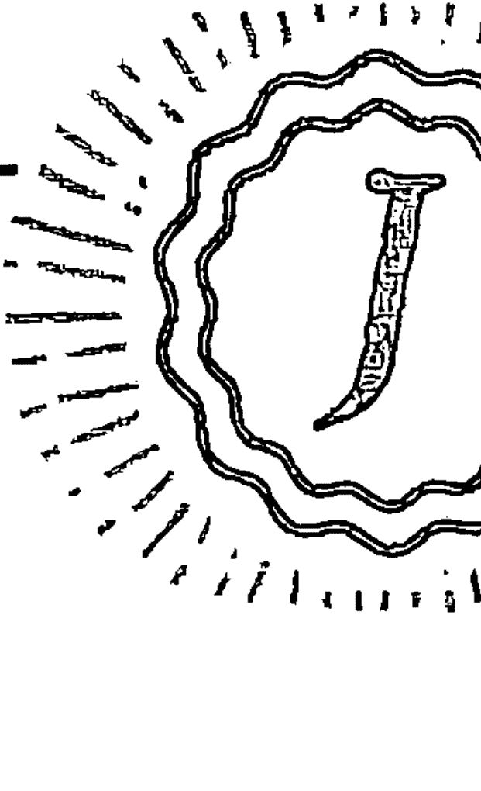

**意圖**
（想法）

**揚升情緒**
（感受）

- 1. 在任何地方都可以工作
- 2. 賺一樣多的錢或更多
- 3. 六個月至一年的合約
- 4. 熱愛自己所做的事
- 5. 自己做老闆並帶領自己的團隊

- 1. 充分授權
- 2. 熱愛生命
- 3. 自由
- 4. 感恩

圖 6 這是我兒子傑斯如何創造新工作所做的一份「許願清單」。字母 J 代表的是潛在的新經驗，在左邊「意圖」下面，他指定了新工作的幾個具體條件；在右邊「揚升情緒」下面，他主要列出了新工作會帶給他的某些感受。傑斯藉著結合這兩項要素，每天改變他的能量，以吸引新工作來到他身邊。

### 勒內·皮爾胥的實驗：隨機事件產生器的移動路徑

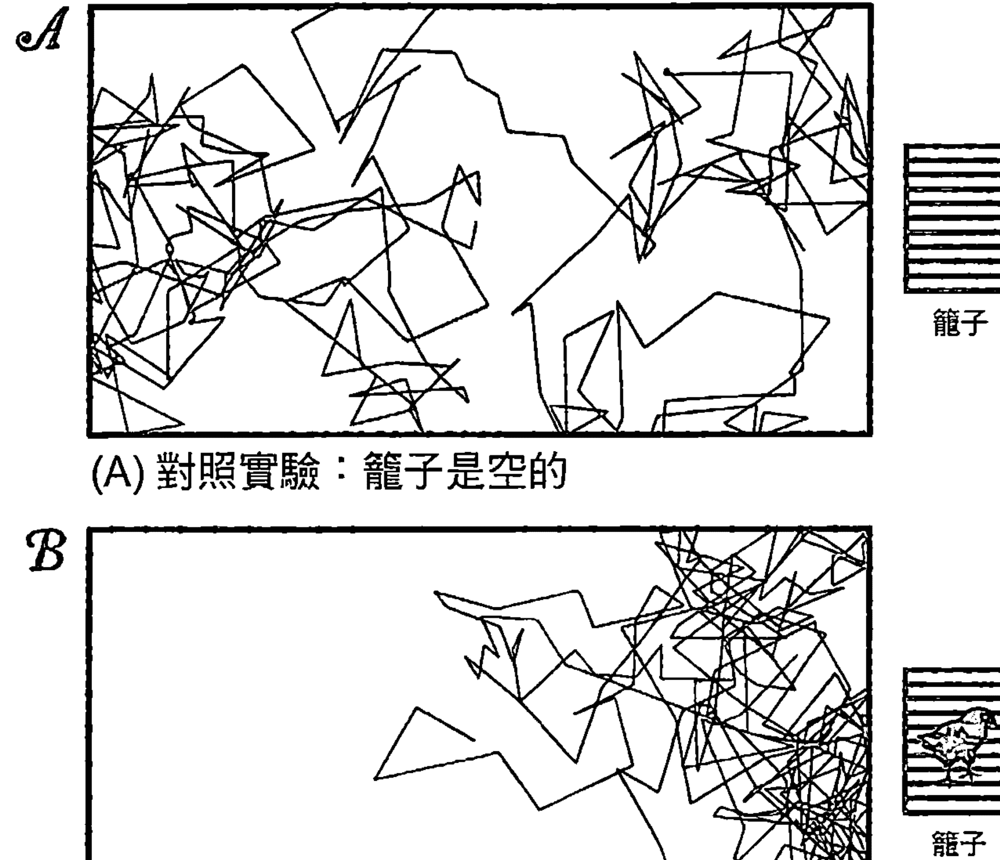

(A) 對照實驗：籠子是空的
(B) 意圖實驗：籠子中放入對隨機事件產生器印象深刻的一群小雞

圖5 上圖說明的是勒內·皮爾胥的小雞實驗結果。標示A的方塊代表籠中沒有放進小雞時，隨機事件產生器的移動路徑；標示B的方塊是籠中放入小雞後，圍場內隨機事件產生器的移動路徑都集中在右側。如果這些小雞的意圖可以影響隨機事件產生器，讓它集中在右側移動，你可以想像一下，如果你想吸引新的未來朝你而來，你可以做些什麼。

圖 4 一旦我們處於當下，量子場中即有無盡的可能性以電磁頻率的形態存在。當你有了明確的意圖，也攜帶了揚升的情緒，你就像正在對量子場播送一種全新的電磁特徵。一旦你的能量與量子場中某個潛能的振動頻率相符，你覺知到這股潛能的時間越久，就越有可能將這個潛在現實吸引過來。
上圖的每個字母都代表了一種不同的潛能：R 代表新關係，J 代表新工作，P 代表你生活中將被解決的問題，M 代表神祕經驗，G 代表天賦，H 代表健康，A 代表富足，O 代表新機會。子，我會資助你，直到你重新振作起來。「但好為人師的我戰勝了父親的角色，我回答：「這太酷了，現在你真的非創造出你的未來不可了。你已經進入了未知，要讓我知後續進展。」然後我掛斷了電話。我可以感覺到他的不安，但是我了解我的兒子，我知道他會繼續專注在這件事上。

傑斯真的感受到自己目前迫在眉睫的處境，他必須更認真地加快他的腳步。他開車去聖塔芭芭拉參加大學室友的聚會，一群人要去滑雪四天，就跟他們以往每年的慣例一樣。當四天假期結束後，傑斯回家前先到聖塔芭芭拉，他走進一間衝浪用品店。突然之間，他看到一位世界頂尖的衝浪板舵設計師也在這間店裡。

他們開始聊了起來，過沒多久，這位設計師就告訴傑斯：「我正想找一位工程師來幫我設計衝浪板舵，我們要一起為這個行業帶來革命性的突破，我需要他幫我工作六個月到一年，然後他可以自立門戶，做他想做的事。我只關心最後產出的是優質的產品。」

現在，你知道這個故事的結局了。傑斯得到了這份工作，合約以一年為期，隨時都可以續約。他現在賺的錢比先前的工作還要多，而且他熱愛他的新事業，因為衝浪一直都是他的最愛。有時他會發簡訊給我，說道：「我不敢相信他們只是付我錢，讓我露個臉。」他是自己的老闆，他可以在任何他想要的地方工作，他還可以繼續衝浪、試用所有的衝浪板舵，他熱愛生命；他不必寄履歷表，不必打電話或寫電子郵件，也不必到任何地方去面試或填申請表。工作自己找上了他。

當我們變成沒有身體、沒有身分、沒有人事時地物的能量狀態，並把注意力從外在世界所有令人分心的事物轉移回來，我們就得以進入統一場的智慧中。這個偉大的智慧一直都在我們內心及我們周遭。我們必須轉向自己的內在，與那始終與我們同在的意識合而為一；一旦我們與無所不在的意識緊密連結，就會像是在直視著一面鏡子，而這面鏡子也在回視著我們，最終它會反映出我們想讓它看到的事物。我們待在這個非物質之處交付我們的注意力與能量，留得時間越久，就離統一場更近一步。當我們終於來到這處無限潛能的祭壇上時，我們便能改變我們的能量，從而改變我們的人生。

當我們阻止我們的意識回到三維現實的感官物質世界，讓它走向未知並信任未知，我們的內在會體驗到更強烈的一體感及整體感。那樣的過程會開始圓滿我們的匱乏、我們的分離感、我們的二元性、我們的疾病，以及我們支離破碎的個性。隨著我們變得更完整，我們的生物機能也會變得更完整。

總結來說，一旦我們變得完整，就不再覺得匱乏，沒有任何缺失或遺憾。此時，我們只需觀察已然存在於量子場中的所有可能性或潛能，以我們的注意力與能量來召喚它們，將它們帶到生命中來。

因此現在，我必須問你：量子場中有什麼經驗正等著找到你呢？

## 調頻、接通，你做好準備了嗎？

靜坐冥想需要做好若干事前準備。首先，我希望你好好想一想：你想要擁有什麼樣的未來經歷？記住，就像尚未塌陷成為物質的電子一樣，經驗也是尚未成真、但已經存在於量子場的能量或頻率，也是你即將要調頻、接通的那股能量。光是接上這股潛能，我們有些學員就成功降低了他們的膽固醇濃度、癌症指標，甚至連腫瘤都萎縮消失了。此外，他們也創造出很棒的新工作、免費的假期、健康的新關係、更多的錢、深刻的神祕經驗，甚至中了彩券。相信我，我的團隊和我已經見證了這一切。所以，勇往直前，邁向未知吧！

一旦你決定好自己想創造的新經驗，就指定一個大寫字母給它，然後把這個字母寫在紙上，把這個字母當成你生命中某個特定可能性的符號，接著切切實實地寫在紙上而不只是想著它，這點很重要，因為「寫」這個動作會讓夢想成真的念頭更堅定。接著，畫上兩條如波浪般的曲線圈住這個字母，代表你需要在你身體周遭產生的電磁場，以便把頻率調到跟量子場中的某個潛能一樣。

現在，指定若干意義給這個字母，讓你可以更清楚自己的意圖。想想關於這個意圖的幾個細微之處，並至少列出四個意圖（唯一一件我不希望你放進去的，是任何跟時間有關的條件）。比如說，如果你的意圖是找到一份很棒的工作，你列出來的清單可能看起來就像以下這樣：

- 年收入五萬美金，高於我現在的收入
- 管理我自己的團隊，由很棒的專業人士組成
- 可以在全世界各地旅行，費用由公司慷慨報銷
- 擁有優渥的健保補助，以及很棒的股票選擇權
- 改變世界

現在，同樣在這張紙上，你要寫下當想像中的可能性成真時，你會有哪些感受。你可能會寫：

- 充分授權
- 不受限制
- 感恩
- 自由
- 敬畏
- 熱愛生命
- 充滿喜悅

## 接通新潛能」冥想法

首先，將你的注意力放在身體的不同部位，以及這些部位周圍的空間（你會在下一章學到更多施行要點及重要性，但現在你只需知道，專注於身體周圍的空間有助於改變你的腦波，從非同調性的 β 波變成同調性的 α 波及 θ 波）。接著，依次去覺知雙眼後方那個永恆黑暗的空間外面還有一個浩瀚無垠的空間，然後是頭部中央的空間、喉嚨後方與頭部後方的空間。接著是頭部以外的空間。然後，把注意力依次轉向喉嚨中央的空間、喉嚨之外的空間、頸部周邊的空間、胸腔中央的空間、身體周圍的空間、肚臍後方的空間，最後在無盡黑暗虛空之中，覺知到臀部周圍的空間。你必須花些時間，慢慢感受每一處空間，覺知到它們的存在並與它們同在。

接下來，去覺知房間所占的空間，再擴展你的覺知去察覺房間外面更遼闊的空間；最後去覺知包納所有空間的那個無限的空間，意識到它有多麼浩瀚無垠。

現在，把注意力從身體、周遭環境及時間上移開，進而成為沒有身體、沒有身分、沒有人事時地物的狀態，也就是成為純粹的意識，以這樣的意識狀態進入這個無限的黑暗空間，這裡存在著所有的可能性。如果在這個過程中你分心了，只要再回到當下即可（正如我們在前一章中所說的）。在不斷投入你的注意力後，你的意識在這個非物質空間中一無保留地展開。

想想量子場中已然存在的所有潛能，你希望藉由記住你設定的字母來接通其中某個潛能。感受那個未來潛能的能量充滿了你的內在及周遭，並接通了你的未來。當你這麼做時，你將會轉變成一種新的存在狀態，播送出去一種全新的電磁特徵到量子場中；當你的能量頻率與那個未來潛能的頻率一致時，新事件就會找到你——你毋須費力讓事情發生。我要在此重申的是，要讓你的新未來有機會出現在你面前，你可能不只是做幾次冥想就能達到目的。這個新未來可能需要一個星期、一個月或甚至更久的時間才會發生，關鍵在於直到它發生之前，你都要持續不斷地進行下去。

一旦你進入一種新的存在狀態，播送出一種新的電磁特徵，現在，在你的新未來真正發生之前要記住它，並開始進行心智預演：想像活在那樣的未來，會是什麼樣子？盡可能想像得逼真一點，同時召喚所有你先前列出的揚升情緒，訓練你的身體真實地去感受你在那個未來會有的所有情緒。

把你的創造全然交付給一個更偉大的心智，臣服於它。在這個無限可能的場域中播下一顆種子；然後，就全然放手！最後，讓新的心智來祝福你的身體、祝福你的人生、祝福你的挑戰、祝福你的靈魂、祝福你的過去，以及祝福你的未來。祝福你內在的神性，敞開你的心並感謝那個尚未展現成形的新人生。

緩慢地把意識帶回到房間，當你準備好時，再張開眼睛。從你的冥想中醒過來，宛如你要迎接的那個未來已經發生了。讓共時性與新的可能性找到你。

## 第4章 來自能量中心的祝福，升級你的能量

我們前面已經談了不少光與信息、能量與意識。現在，可以進一步來深入討論這些概念了，以便解釋冥想如何運作。正如你已經明白的，我們已知宇宙中的一切都是由光與信息或能量與意識所組成，或者說是發射電磁能量。事實上，這些元素結合得非常密切，不可能將它們分開。看看你的周遭，即便除了物體、事物、人或其他有形物質之外，你沒有看到其他東西，但事實上，還存在著無限個攜帶者編碼訊息的無形頻率。這不僅意味著你的身體是由光與信息、能量與意識組成的，更意味著你是一個意識存在，有一個塞滿信息且由光組成的身體，不斷發送並接收不同的頻率；而這些頻率全都攜帶者不同的信號，就像是一台收音機或是一支手機。

當然，所有的頻率都攜帶者信息，試想一下無線電波，你現在坐著的這個房間就有無線電波移動穿梭。如果你打開一台收音機，你可以轉到某個特定的波長或訊號，然後收音機裡一個小小的傳感器就會收到訊號，把它轉換成你可以聽見並理解的聲音，比如你最喜愛的歌曲、新聞或甚至廣告。只因為你看不到空氣中的無線電波，並不表示它們不存在，事實上，它們一直攜帶者特定頻率的獨特信息。如果你稍微改變一下頻率、轉到另一個電台，那個波長所攜帶的就會是截然不同的訊息了。

圖1A所示，是整個光譜以及我們所知的所有電磁頻率。可見光譜（亦即這個世界上我們察覺到的許多不同顏色）的比率不到所有光頻率的一%，其他大部分的光是我們眼睛察覺不到的。這也意味著，我們這個宇宙的大部分已知現實，都無法以我們的感官來體驗。因此，我們除了能夠察覺到的光（被物體所吸收或反射的光）之外，我們其實能感知到的現實只是小部分而已，還有許多其他信息不在我們肉眼能看到的範圍之內。請記住，當我提到光時，我指的是所有的光，其中包括可見及不可見的所有電磁波頻譜，而不只是可見光。

比如說，雖然X光我們看不見，但是它的存在是無庸置疑的。因為我們人類已經有能力創造X光，也能夠有效測量。事實上，X光的光譜中存在著無數的頻率。比起我們肉眼可以見到的可見光，X光的頻率要快得多，因此能量也更高（再次提醒，頻率越快，能量就越高）。有形的物質頻率最密集，因為它們是光及信息最緩慢也最濃縮的形式。

請看看圖1B，跟著穿越波峰及波谷的水平線移動你的視線，從字母a移動到字母b，再到字母c；每移到下一個字母，就經過了一個完整的週期（從一個波峰到緊鄰的下一個波峰），亦即所謂的波長。因此，字母a與字母b之間的距離就是波長。波的頻率指的是一秒內所產生的波數目或週期數，以赫茲（Hz）為測量單位。由此可知，波的頻率越高，波長就越短，反之亦然，波的頻率越低，波長就越長（參見圖1C）。以不可見光的紅外線及紫外線來說，紅外線的頻率低於紫外線，因此紅外線的波長較長，紫外線的波長較短。再舉可見光的紅色光與藍色光為例,紅色光的頻率(每秒四五○個週期)比藍色光的頻率(每秒六五○個週期)低,因此紅色光的波長比藍色光更長。

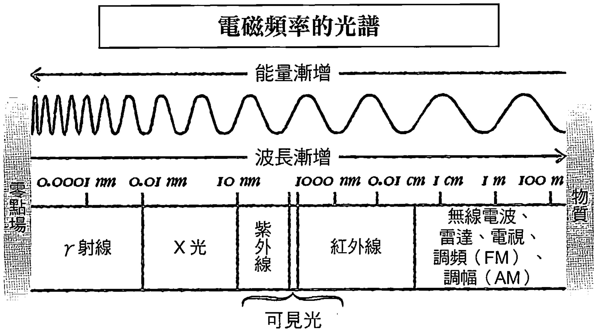

圖1A 上圖是所有的電磁波頻譜，頻率從零點場開始下降，一路來到物質。能量增加（或說頻率加速）時，波長會變短；而當能量減少（或說頻率變慢）時，波長會變長。中間處標出的可見光範圍，是我們唯一能在現實中察覺到的光譜範圍。

在人類歷史中,曾做過幾種不同的嘗試去拍攝及測量光的場域,其中一個特別的例子是一九三九年,俄國電氣技師克里安(Semyon Davidovich Kirlian)發明了克里安照相術。克里安運用這個技術捕捉到了環繞在有生命及無生命物體周圍的電磁場影像,他發現把底片放在一片金屬板上,再把物體放在底片上,然後向金屬板施加高壓電流,一幅放電影像就出現在底片上,看起來就像是被拍物體周圍的一圈剪影。

在克里安眾多的實驗中,有一次拍攝的是兩片看似一模一樣的樹葉,一片來自一株健康的植株,另一片摘自生病的植株。健康植株的葉子照片,散發著一圈強烈的光場;而生病植株的葉子照片,顯現出來的光場強度要微弱許多。這樣的結果讓克里安相信,他的這項照相技術或許可以當作評估健康的工具。雖然現今科學家對於把克里安照相術當作診斷工具的看法還是莫衷一是,但是目前這項技術的後續研究還在進行中。

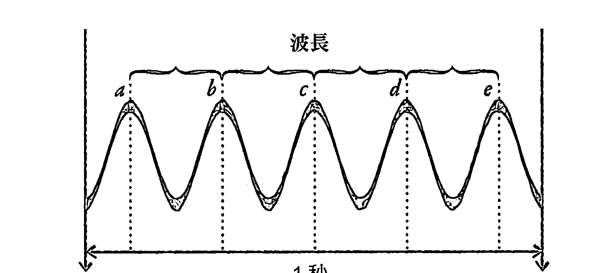

圖1B 我們可以從上圖看出頻率與波長的關係。一個完整波形的週期數就是波長,圖中以字母a與b、b與c、c與d、d與e之間的距離表示。兩條箭頭朝下的垂直線之間的空間,代表一秒的間隔。在這個例子中,因為在一秒內有五個完整的波形,我們便可以說頻率是每秒五個週期,也就是5赫茲。

延續這條路線的其中一項進展，則是來自德國生物物理學家弗里茨·艾伯特·波普（Fritz-Albert Popp）博士。他投入了三十多年的時間研究生物光子（biophoton），這是一種極微小、低強度的光粒子，所有生物體內都存在並會發出這種光粒子。一九九六年，波普成立了國際生物物理研究所（International Institute of Biophysics, IIB），這是一個橫跨全球十幾個國家的研究實驗室網絡，專門研究生物光子。波普與他在國際生物物理學研究所的同事相信，這些DNA內部的光粒子所包含的信息，與生物體細胞之間進行著極為有效的溝通，因此在調節生物機能方面扮演了至關重要的角色¹。有一種極端靈敏的攝影儀器可以用來偵測這些生物光子，測量它們的排放量：排放量越多，光場就越強烈、同調性越高，細胞之間的溝通也越良好、越強大，生物體也會越健康。

為了維持生命與健康，我們的細胞會藉由不同頻率的光來傳遞及交換重要信息，以便彼此溝通。相反的，波普也發現當某個細胞不能發出有組織、具同調性的電磁能量時，細胞就會變得不健康，無法與其他細胞充分分享信息。一旦缺乏這樣的信息交換，細胞就無法得到所需要的東西。因此，關於細胞內部的真正運作，我們在高中所學的生物學已經過時了；彼此相吸或相斥的帶電分子不再是細胞運作的原因，細胞所發出並接收的電磁能量才是主掌細胞生命力的關鍵。這個活力論*的觀點也支持了「我們是一體的」真相。

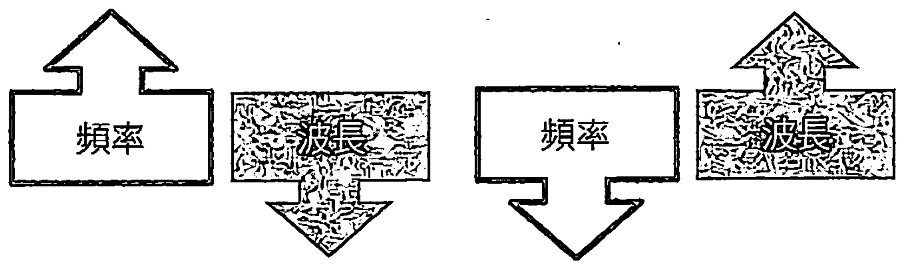

圖1C 頻率增加，波長變短；頻率降低，波長變長。

*編按：活力論認為生命擁有一種無形的自我力量（或稱生命力或生命能量），這種力量是非物質的，因此生命無法完全以物理或化學方式來解釋。

*編按：entropy 中譯為「能趨疲」或「熵」，是熱力學的名詞，指的是不可逆的熱能耗竭，也是宇宙中最基本的性質之一：能量無法創造或毀滅，但會趨於疲態而造成混亂失序。而負熵（syntropy）則是能量的甦醒再生，可以進行更深更廣的連結與溝通。

## 鍛鍊你的收斂聚焦與發散聚焦

在上一章介紹的冥想法中，我要求讀者一開始要將注意力放在身體的不同部位以及這些部位周圍的空間。現在，我想深入探討為什麼在我絕大多數的冥想法中，我都會要求大家這麼做。當你不斷這麼做時，就會銳化自己的能力去掌控大腦兩種不同的專注方式，也就是收斂聚焦（convergent focus）及發散聚焦（divergent focus）。

事實上，這意味著我們切切實實就是光的存在，每個人都散發出鮮活的生命力，並以圍繞在我們身體周遭的實際光場來表現，也就是說，光場是所有細胞的集體貢獻。可以肯定地說，我們越習慣用感官來定義現實，越是像個唯物主義者那樣專注於物質面，我們就越容易錯失有價值的資訊，也越容易觸發壓力反應。這是因為，我們越是習慣緊抓住幾個焦點不放，把注意力放在外面世界的人事時地物上面，我們就越無法覺知到肉眼看不見的那些頻率；而如果我們無法覺知到它們，對我們來說，它們就不存在。

在此我希望，你已經開始練習前面我介紹的靜坐冥想，如此一來，你才有機會接上你周遭的特定頻率，就像轉到收音機的某個頻道收聽電台一樣。當你閉上眼睛靜坐冥想，擺脫外在環境的干擾（比如常常使你無法察覺到其他頻率的靜電噪音），你可以訓練自己去接收清楚的信號並讀取其中的資訊。當你重複這麼做時，你就是在接通一個新層次的光與資訊，可以對物質造成影響。同時，你的身體也會體驗到一種稱為「熵趨疲」或「負熵」（syntropy）的能量整合再生狀態，而不是稱為「能趨疲」或「熵」（entropy）的失序混亂狀態**。一旦你能讓專擅分析的思維腦安靜下來，更快接通這些條理分明的資訊，你的身體在這股新的意識與能量之流的洗禮下，將會自動反應得更有效率、更協調一致，也更健康。

開啟你的驚人天賦。Becoming Supernatural 128

收敛聚焦指的是一門心思都放在狹窄的焦點上面，聚焦於某個目標或任一物質上面。這是我教導冥想時會要求的一種聚焦方式，不管是把你的注意力放在身體的某個特定部位，或是去關注周遭環境的某個目標，使用的都是這一種聚焦方式。通常來說，當你拿起一個玻璃杯、打電話或發簡訊給某個人或是綁鞋帶時，使用的就是收斂聚焦。多數時候，我們都處於收斂聚焦的狀態，把注意力放在外面世界的人事時地物（物質），而且大都是具有三個維度的事物。

還記得我們之前提過的生存模式嗎？壓力荷爾蒙持續湧進全身上下，讓我們得以做好戰或逃的準備。當我們處於這樣的狀態下，會把焦點收窄到更甚於平常，因為把注意力集中於外在的物質世界，是生死攸關的大事。事實上，此時的我們是個十足的唯物主義者，都靠我們的感官去定義現實。大腦中通常一起協同運作的不同腦區會開始各自為政，彼此不再進行有效溝通，不再以諧振方式來合作。現在，各個腦區處於一種不協調的狀態下，發送不協調的訊息給脊椎神經，再傳到身體各個不同部位。當學員們做腦部掃描來測量腦波時，我們已經不止一次看過這種情況了。

正如我先前所述，當你的大腦處於非諧振模式時，你也會處於失調狀態；當你的大腦無法以最理想的方式運作時，你也無法以最理想的方式運作。這就像你的大腦與身體正在製造不和諧的雜音，而不是合奏出美妙的交響樂。又由於這種失衡及失調狀態，你會試圖去控制或強行得到某些結果，或試圖去預測一個奠基於化學方式來解釋。

## 進入潛意識

一九七〇年代，紐澤西州普林斯頓的普林斯頓生物反饋中心（Princeton Biofeedback Centre）主任萊斯·斐米（Les Fehni）博士發現，將專注力從狹窄焦點（narrow focus）轉移至開放焦點（open focus），這樣的改變也會改變腦波。斐米是專注力與生物反饋的研究先驅，他試著找出一種能夠讓人們的腦波從β波（有意識的思維）變成α波（放鬆及創造力）的方法；而他發現最有效的方法，就是引導人們去覺知空間或虛無，亦即採用他所謂的開放焦點²。數千年來，傳統佛教也一直運用這種冥想法。當你放開你的焦點，並且有意識地去察覺信息而不是物質，你的腦波就會緩慢下來，從β波變成α波。這是有道理的，因為這時候的你不再執迷於你的問題，隨之而來的會是一個無法擺脫舊記憶的未來，而且情況會每況愈下。未雨綢繆會給你一個更好的生存機會，因為無論接下來發生什麼事，你都已經做好了準備。

然而，當你把注意力從這種狹窄的聚焦轉換成另一種更開放、寬廣的聚焦時（事實上，你即將在接下來的冥想中這麼做），那麼，你就會逐漸意識到空間，以及空間中環繞著你身體周遭的光與能量。這就是所謂的「發散聚焦」：你會從專注於某物的狀態轉變成專注於無物的狀態，也就是你的注意力會放在波（能量）上，而不是粒子（物質）上。實相既是粒子也是波，既是物質也是能量。所以，當你練習使用狹窄聚焦把注意力放在身體的不同部位（確認粒子的存在），然後再放大你的焦點去感受環繞在你身體不同部位的那些空間時（確認波的存在），你的大腦將會變成一種更協調一致的平衡狀態。

過去的未來。這樣的你，所有的注意力幾乎都給了外在世界，而忽略了存在著想法與感受的內在世界。換句話說，你一直停留在收斂聚焦上，執著且反覆思考的都是相同的那些事；而這些就是壓力帶來的影響，使你## 第4章 來自能量中心的祝福，升級你的能量

  是在思考，而是在感應與感受。當你的思維腦（新皮質）慢下來時，就可以超越分析心（也稱為批判心），此時意識及潛意識會分離開來（參見圖2）。現在，你可以進入身體的運作系統所在，亦即前面提過的自主神經系統；如此一來，你的大腦就能用一種更全面整體性的方式去運作。

  當你在做「能量中心的祝福」這項靜心冥想時（稍後我會在本章告訴你怎麼做），要先將注意力放在身體的每個能量中心（古代東印度的吠陀典籍稱之為脈輪），然後再把你的焦點放開。因為「你的注意力在哪裡，你的能量就在哪裡」，所以當你把注意力放在每個能量中心時，你的能量就會開始移往這些中心並且啟動它們。

  以下舉幾個例子來說明。如果你心中與腦海裡有個性幻想，當能量移往你身體中的那個能量中心時，它就會以一種特定的方式被啟動，緊跟著器官、組織、化學物質、荷爾蒙、神經組織也都會開始做出回應。假如你很餓並想著要吃什麼，你的消化液、唾液就會開始分泌，你的身體已經準備好要吃晚餐，這是因為能量啟動了那個部位。如果你想跟老闆請假，或是準備好好跟女兒談談，你的腎上腺素在對抗真正發生之前就會開始分泌。在這些例子當中，你的念頭變成了你的實際體驗。在下文中談到個別的能量中心時，我會做更深入的說明，現在你只需要知道，這是因為每個能量中心都會製造自己的化學荷爾蒙，進而啟動每個部位的器官、組織以及細胞。

  所以想像一下，如果你能在靜心冥想中使腦波慢下來，並把你的注意力放在這些能量中心周圍的空間、放開你的焦點，從而進入這些能量中心的運作系統，那麼會發生什麼事呢？這些能量中心將會變得更井然有序、更協調一致，它們會向神經元發出信號以創造出新的心智層次，並啟動該部位的器官、組織及細胞，製造出自己的荷爾蒙與化學傳訊兵；如果你持續這麼做，一段時間後，就會開始產生實質的改變。

  練習這個能量中心冥想法的學員們，已經自我療癒過慢性膀胱炎、攝護腺毛病、陽萎、憩室炎、克隆氏症（Crohn's disease）、食物過敏，以及乳糜瀉之類的過敏症、卵巢腫瘤、肝臟酵素升高、胃酸倒流、心悸、心律不整、氣喘、肺部疾病、背部問題、甲狀腺疾病、咽喉癌、頸部疼痛、慢性偏頭痛、頭痛及腦瘤等。我門已經見證過許多人在練習這項特別的冥想後，身體有了各種改善，有時候甚至是在做第一次練習後就出現了效果。至於那些令人驚訝的戲劇化療效，則能從表觀遺傳學來解釋：學員們改變了他們的 DNA 表達，開啟某些基因並關閉了其他基因，造成了生理上的大變化（參見第二章的內容）。

### 超越分析心

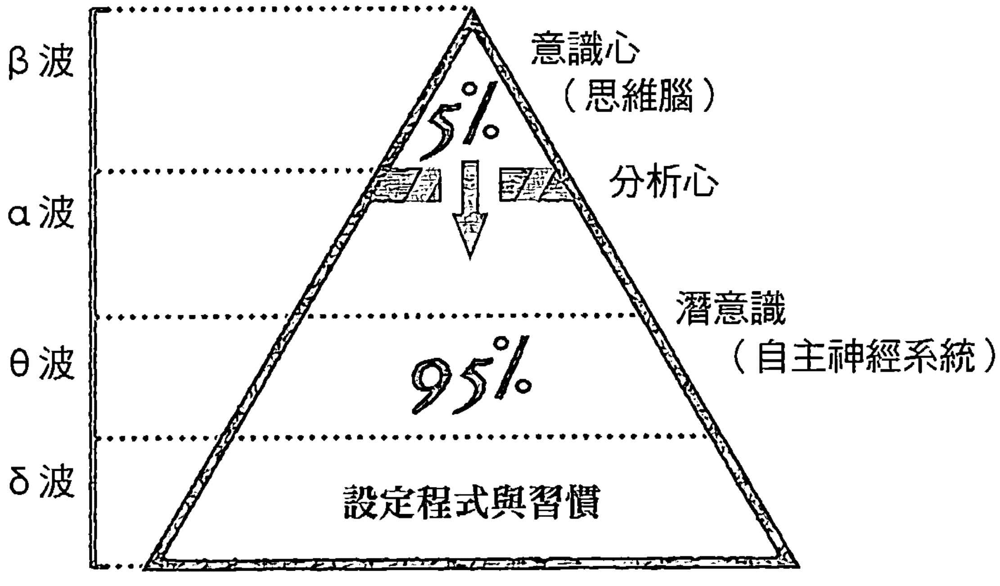

### 不只一個腦，你身上還有幾個微型腦

  下文中，我們會一一審視人體的每個能量中心，但在此之前，我想先簡單說明一下這些能量中心的運作方式。你不妨把這些能量中心想成是一個個信息中心，每個中心都有能對應不同意識層次的能量、表達專屬的信息的光（或者說帶著某個特定訊息的頻率）、各自的腺體、獨特的荷爾蒙、專屬的化學物質，以及各自的神經叢。再把這些個別的神經網絡想像成微型腦，也就是說每個能量中心都有它們自己的大腦，於是每個能量中心也都有它們各自的心智（參見圖3，可以看出每個能量中心的位置，以及與之相對應的解剖結構與生理機能）。

  正如在第二章提過的，當意識活化神經組織時，就會創造出心智，而心智就是行動中的大腦；因此，如果這些能量中心都有各自的神經叢，也就意味每個能量中心都有它們各自的心智，更精確來說，就是每個能量中心都擁有自己的心智。用來活化心智的，就是帶有指令與意圖的能量。當這些能量中心被活化後，會反過頭來活化荷爾蒙、組織、化學物質以及細胞功能，並且散發出能量。

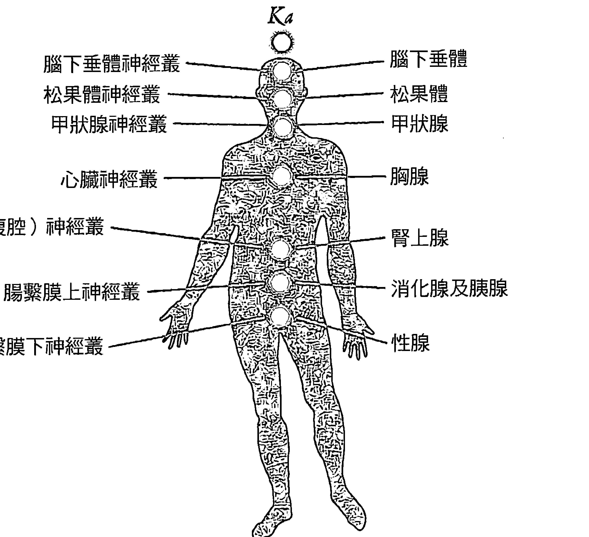

  舉例來說，當你身體的第一個能量中心（生殖腺體所在）被能量活化後，它的心智會產生非常特定的待辦事項與意圖。當身為有意識生物的你起心動念或是有了性幻想（這是意識作用於神經組織），能量就會發生變化，緊接著你的身體就會有生理反應。相對應的腺體會開始分泌化學物質及荷爾蒙，讓你在情感上有了性交的興致。現在，你身體的這個能量中心有了更多的能量，正在釋出攜帶了某個意圖的特定頻率。

  於是，攜帶意圖的能量活化了這個生殖中心，接著大腦的心智也開始影響那個特定部位（即生殖中心）的心智，並透過它所屬的微型腦，經由自主神經系統作用於潛意識層次，完全超越了意識的控制範圍。我們甚至可以這麼說，身體現在是跟著心智走，因為在生殖中心的微型腦活化了相關的腺體，而那些腺體接著又活化了相對應的荷爾蒙以發出確切的化學物質信號，進而改變身體的情緒狀態與生理機能。接下來，你會發出非常明確的能量，攜帶著來自生殖中心的特定指令。我們都曾經從某個性感的人身上感受過令人臉紅心跳的能量。一旦能量移動到生殖中心的神經組織或神經叢，就會創造出那個層次的心智；所以只要能量中心被激活，就會擁有自己的心智。

  位於肚子的第二個能量中心也有自己的心智，而當我們藉由它的心智去活化它的微型腦時，我們要相信肚子的感覺*。發生於第一個能量中心的同樣順序，也會在第二個能量中心上演，只是對應的是不同的神經迴路、荷爾蒙、化學物質、情感、能量以及信息。事實上，這個部位就被稱為第二個大腦，因為這裡有數億個神經元及神經連結（數量比脊椎神經或周邊神經系統還要多）。血清素（serotonin）是一種會「讓人感覺良好」的神經傳導物質，而我們體內九成五的血清素不在你的大腦中，而是在腸道裡。也因此，字面意義的「相信腸道」，就被賦予更深一層的意思——相信直覺。就像是我們的身體與這個中心的微型腦，足以全面壓制我們善於分析、做理性思維的大腦與心智。

  那麼，心臟能量中心呢？凡事跟隨著心走，又會發生什麼事呢？就像前兩個中心一樣，位於胸腔的第四個能量中心也有自己的頻率、荷爾蒙、化學物質、情感以及微型腦，也會汲取周遭的能量及信息場。當你順自己的心時，往往會更仁慈、更受啟發、更無私、更有同情心、更樂於付出、更感恩、更信任他人，也更有耐心。一旦這個能量中心的微型腦接獲信息時，會對相對應的器官與組織發送指示與訊息，並從這個特定的信息中心散發出充滿愛的能量。

  接下來，我們要逐一檢視這些能量中心，其中有些能量中心的功能有些重疊。大多數的情況下，即便你對身體構造只有一些認識，要弄清楚這些能量中心的功能都不會太困難，不需要太多說明。如果你一時混淆，可以回頭再看一下圖3。

### 身心靈的通道，人體的八個能量中心

  第一個能量中心掌管了人體的性器官部位，包括會陰、骨盆底、連結陰道或陰莖的腺體、攝護腺（男性）、膀胱、下腸道以及肛門。這個能量中心與生殖、生育、排泄、性事以及性別認同有關，也與雌激素（女性）、黃體素（女性）、睾固酮（男性）及腸繫膜下神經叢（inferior mesenteric nerve plexus）有關。

  第一能量中心蘊藏著巨大的創造能量，想想你用了多少能量來創造生命、孕育小寶寶。當這個能量中心處於平衡狀態時，創造力能量可以輕鬆自在地流動，性別認同也擁有一個穩固的基礎。

  第二個能量中心位於肚臍後方的略低處，掌管卵巢、子宮、結腸、胰腺以及下背部，與消耗、消化、排泄，以及將食物分解為能量有關（包括消化酶、消化液、平衡血糖值的酵素與荷爾蒙）；也與腸繫膜上神經叢（superior mesenteric nerve plexus）有關。

  此外，這個能量中心也與社交網絡、人際關係、支持系統、家庭、文化以及人際關係有關。我們可以把它想成是堅持與放手（或消耗、排除）的一個平衡中心。當這個中心處於平衡狀態時，你在周圍環境以及世界中都會感到安全無虞。

  第三個能量中心位於腸窩，掌管著胃、小腸、脾臟、肝臟、膽囊、腎上腺以及腎臟，相關的荷爾蒙包括腎上腺素、皮質醇（腎上腺分泌的另一種荷爾蒙）、腎素（renin）、血管收縮素（angiotensin）、紅血球生成素（erythropoietin），以及所有的肝臟酵素，還有胃蛋白酶（pepsin）、胰蛋白酶（trypsin）、胰凝乳蛋白酶（chymotrypsin）及鹽酸等消化酵素。這個能量中心也跟太陽神經叢——也稱為腹腔神經叢（celiac plexus）——有關。

  此外，第三個能量中心還跟意志力、力量、自我肯定、控制、驅動力、侵略感以及支配欲有關，同時也是競爭行為、個人權力、自尊及主導意圖的中心。當第三個能量中心處於平衡狀態時，你會運用意志力與驅動力去克服外在環境及人生中的突發狀況。與第二個能量中心不同的是，在你感知環境不安全或不可預測時，這個能量中心會自然而然地啟動，讓你能夠保護並照顧你的族群及你自己；當你想要某樣東西並想親力親為去得到它時，這個中心也會活躍起來。

  第四個能量中心位於胸骨後方的空間，掌管心、肺以及胸腺（人體的主要免疫腺體，被稱為「青春之泉」），相關的荷爾蒙包括生長激素、催產素（oxytocin）以及其他一千四百種不同的化學物質，這些化學物質會透過胸腺（負責生長、修復及再生）去刺激免疫系統。掌管這個能量中心的神經叢是心臟神經叢（heart plexus）。

  第三個能量中心都與生存有關，反映的是我們的動物本性或人性；但是第四個能量中心，則是讓我們從自私轉變成無私。這個中心與愛、關心、撫育、同情、感恩、感謝、欣賞、仁慈、靈感、無私、完整以及信任等情感有關，它是我們神性的源頭、靈魂的所在。當它處於平衡狀態時，我們會關心他人，會為團體的最大利益而攜手合作，會感受到對生命的真誠熱愛及完整，以及有更高的自我認同感。

  第五個能量中心位於咽喉中央，掌管甲狀腺、副甲狀腺、唾液以及頸部組織，有關的荷爾蒙包括三碘甲狀腺素（T3）、四碘甲狀腺素（T4）以及副甲狀腺分泌的所有化學物質（支配身體的新陳代謝及血中鈣離子的濃度）。掌管這個能量中心的神經叢是甲狀腺神經叢（thyroid plexus）。

  這個能量中心與表達能力有關，讓你使用語言和聲音表達你在第四個能量中心所感受到的愛，以及說實話並賦予現實成真的力量。當第五個能量中心處於平衡狀態時，你會說出當下的真相，表達出你的愛。你是如此地滿意自己，也滿意自己的人生，以至於必須透過言語把真實的想法與感受分享出來。

  第六個能量中心位於喉嚨後方與頭部後方的空間（如果你想像不出來，可以單純想成是靠近後腦勺的中央位置）。這個能量中心掌管的是一個神聖的腺體——松果體，有些人稱之為「第三隻眼」。不過，我更喜歡稱它為「第一隻眼」，因為它是通往更高維度的門戶，與轉換你的覺知有關，使你得以超越遮蔽現實的面紗，以非線性的方式去看見實相。

  當這個能量中心開啟時，就像是收音機的天線，你可以用它來接收到超越五感的更高頻率，彷彿化身為一個覺醒的鍊金術士。松果體很重要，因此我會另闢專章介紹，現在你只需要知道松果體會分泌血清素和褪黑激素等荷爾蒙（以及一些奇妙的代謝物）就可以了。這些荷爾蒙負責掌管你的生理節奏，也就是對白天可見光的清醒反應以及對夜晚黑暗的睡眠反應。事實上，松果體對可見光之外的所有電磁頻率都很敏感，並能製造相對應的褪黑激素化學衍生物，從而改變你對實相的看法。當這個腺體處於平衡狀態時，大腦會以清晰明確的方式運作，你的神智清明，清楚意識到你的內在與外在世界，每天你所看到、覺知到的都會越來越豐富。

  第七個能量中心位於頭部中央，包括被稱為主腺體的腦下垂體。腦下垂體掌管全身上的所有腺體（從大腦中央開始一路往下，包括松果體、甲狀腺、胸腺、腎上腺、胰腺，一直到性腺），讓它們能夠和諧運作。這是身體的中心，你可以在此體驗到神性最極致的表現，因為它正是你的神性、你最高層次意識的源頭。當這個腺體處於平衡狀態時，你會與天地萬物和諧一致。

  第八個能量中心位於頭頂上方約十六英寸（約四十公分）處，也是唯一一個不在身體部位的能量中心，埃及人稱之為卡（Ka），代表你連結上了宇宙及統一場。當這個中心被活化喚醒時，你會感受到自己值得去接收去擁有，它不僅提供給你洞察力、頓悟、深刻理解，更使你得以下載充滿創造力的頻率與信息。這些進入你身體與大腦的東西，不是來自儲存於你神經系統內的記憶，而是來自和諧大宇宙、統一場，或是任何你用來稱呼那股神奇力量的名字，總之它遠遠大於我們個人。我們可以透過這個能量中心去取得量子場的數據與內存記憶體，接收到許多未曾親身經驗過的知識。

### 能量卡住，就會出問題

  現在，我已經描述過這八大能量中心，我們可以用更動態的觀點來檢視它們的運作方式。正如我所言，我們身體的原始設計，就是為了去利用每個中心的能量，但是當我們的能量不只用於生存、而是被用在更多方面時，會發生什麼事呢？如果我們不再單純為了生育、消化食物、躲避危險等耗盡了所有能量，而是開始持續讓若干能量進化升級，提高頻率，從一個能量中心上升到另一個能量中心時，會發生什麼事呢？

  假設我們開始從第一個能量中心引導創造力能量，答案看起來會是這樣的：當我們感覺安全無虞到足以開始創造時，創造力能量就會進化，上升並流進第二個能量中心。在此，當我們必須在環境中掌控某些限制或是克服某些情況，我們就能善用這股創造力能量，然後它會繼續流往第三個能量中心，也就是我們的意志與力量所在。

  當我們成功超越或克服生命中妨礙我們成長的逆境，我們就有機會擁有更完整、更自由、更滿足的感受，然後能量會繼續往上流到第四個能量中心並活化它，這時的我們會產生大慈悲心，感受到對自己與他人無私的真愛。一旦發生這種情況，我們就會想要用聲音表達當下的真相——我們學到了什麼，或是我們感受到的愛或完整性，這會使得能量往上移動到咽喉的第五個能量中心並喚醒它。然後，當能量一路進化並流進第六個中心時，大腦中休眠的部位都會被打開，於是幻相的面紗被移除，我們覺知到比以往更為清明及廣闊的實相。當我們深受啟發時，能量會繼續上升到第七個中心並加以活化，此時我們的身體會更趨近和諧、平衡的狀態，連帶的，外在環境（包括周遭的自然世界）也會更和諧及平衡。一旦我們感受到那股受到啟發的能量，就會真正感受到自己的價值，能量也終於能上升並活化第八個中心，使我們得以收穫所有努力的成果：願景、夢想、洞察、示現及知曉一切。這些東西並非來自我們身心之中任何部位的記憶，而是來自我們內外在一股更強大的力量。這股生生不息的進化能量，從第一個能量中心不斷往上流動至第八個能量中心，如圖 4A 所示。

  在理想狀態下，當能量持續流動時，這種個人進化便會發生。然而，最常發生的不是能量進化，而是能量流被卡住：生活中所發生的事件以及我們對這些事件的反應，經常阻礙能量的流動，無法以我剛剛描述的那種很棒的模式運行。你身體中能量被卡住的部位，往往就是與你正在處理的問題有關的那些能量中心。圖 4B 告訴你，當能量被卡住而無法往上流動到更高層次時，會發生什麼事。

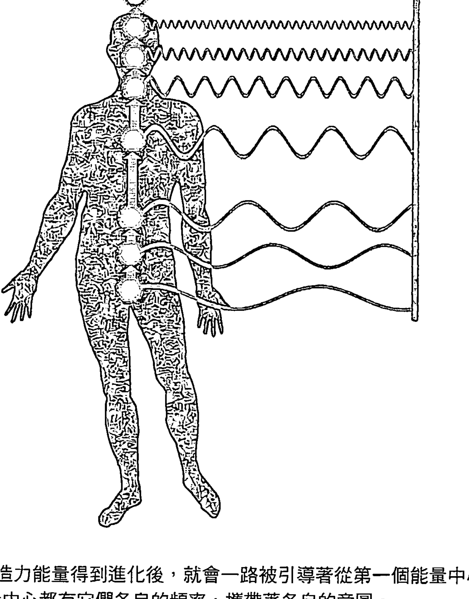

  舉例來說，如果有人曾經遭受性虐待，或是從小就受到制約而認為性是一件壞事，那麼他的能量就會被卡在與性有關的第一個能量中心，同時，也可能會在獲取創造力上遭遇到困難。再者，就算有能力獲取創造力，但未必有足夠的安全感去運用自己的創造力（反而會因為社交與人際關係而感覺到受到傷害）。再比如，曾經被人背叛或受到感情創傷的人，可能會讓能量滯留在第二個中心。這樣的人極可能有過度的負罪感、羞愧、痛苦、自卑、恐懼等感受。如果能量已經往上流到第三個中心，但是他們的自我問題讓他們妄自尊大、自私自利、控制欲強、專橫跋扈、怒氣沖天、過度競爭、尖酸刻薄，那麼，能量就會被卡在第三個中心上不去，導致他們在控制或動機上發生問題。如果一個人無法敞開他的心去感受愛及信任，或是害怕表達愛或說出自己真正的感受，能量也會分別被凍結在第四及第五個中心。

  雖然能量可以被卡在任何一個中心，但前面三個能量中心通常是最容易卡住的地方。一旦能量被卡住，就無法進化並以上述方式順暢流動，也就無法喚醒更高層次的能量中心，我們也就無法全心熱愛生命並獲得回饋。所以，讓這個能量迴路按照當初所設計的方式流動，正是一「能量中心的祝福」冥想法的一大重點：我們為每個能量中心祝福，讓被卡住的能量能再度流動。

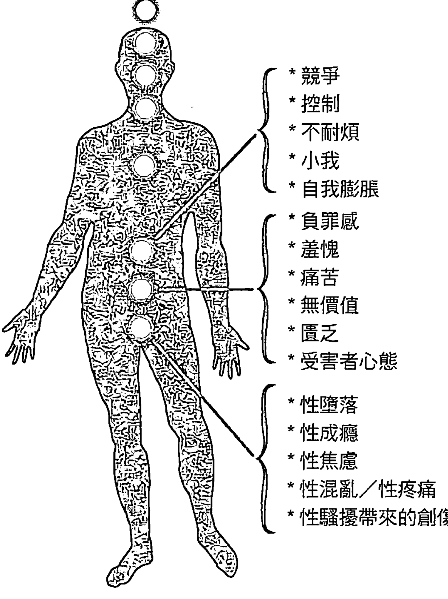

### 不當的欲望，不當的能量耗損

  如前所述，我們的身體周遭圍繞著不可見的電磁能量場，這些電磁能量始終攜帶者有意識的意圖或指令。當我們活化身體任一個能量中心時，我們可以這樣說：我們是把深埋在中心的能量表達了出來。簡單來說，身為有意識的生物，我們喚醒了每個中心的特定能量，也同時刺激了那些相關的神經叢，從而創造出某一層次的心智，接著活化每個中心相對應的腺體、組織、荷爾蒙以及化學物質。一旦每個獨特的中心都能一一被開啟後，身體自然就會釋出來自這個中心、攜帶特定信息或意圖的能量。

  相反的，倘若我們持續活在一貫的生存模式之中，並且靠著前三個能量中心過日子，從而縱欲過度、消耗過度或是壓力過度，我們等於是從周遭攜帶信息的無形能量場中不斷汲取能量，然後不斷地把這些能量轉換成化學物質。日復一日重複這樣的過程，將會導致身體周圍的能量場變弱縮小（參見圖5）。結果就是，我們不僅耗損了我們的光，也沒有任何攜帶者意圖的能量可以流過這些中心，並在每個中心創造出相對應的心智。基本上，這樣的我們只能從自身的能量場汲取資源，每個中心也只能以有限的能量創造出相對應的層次，發送有限的信號給周圍的細胞、組織、器官以及身體系統，最後只能製造出微弱的信號以及低頻率的能量傳送給身體。長此以往，這些信號微弱的頻率就會製造出疾病。從能量的角度來看，我們可以說，所有的疾病都是因為頻率降低以及不協調的訊息所導致的。

  還記得我前面提過：身體下半部的這三個能量中心與生存有關，因此代表著人性自私的一面。它們跟權力的使用、侵略性、壓迫、競爭或敵意有關，這些情緒反應使我們得以在各種情境中存活下來，並且時間久到足以消耗食物來餵養自己、生養後代，使得種族得以延續（這跟身體上半部代表無私及利他的能量中心剛好相反）。身體下方這三個能量中心，天生就能帶給我們愉悅感，以至於讓我們沉溺其中，不斷從事與它們

> *編按：「We trust out gut」句中的gut指的是腸道，也指直覺。整個句子的意思通常譯為「相信直覺」。

# 活在生存模式中

有關的行為及作為。比如說，性行為（第一個能量中心）與飲食（第二個能量中心）能讓人愉悅，與他人連結及交流（第二個能量中心）也一樣；其中又以個人的力量（第三個能量中心）最讓人沉迷，包括成功克服障礙、爭取想要的東西、從競爭中勝出、在某個特別的環境中生存下來，以及身體無法安止下來等等。

現在，你知道為什麼有些人會過度使用前三個能量中心，並因此消耗了身體周圍能量場與信息場的眾多能量。例如，性行為過度的人會從第一個中心周圍的能量場汲取額外的能量；覺得自己是個受害者的人可能深陷於羞恥或罪疚感中，他們會緊抓著老舊的情緒不放，或是長期承受著痛苦，因此會大量消耗第二個中心周圍的能量，進而緊抓住那個中心的能量不放。控制欲極強或是壓力過大的人，則會從第三個中心周圍的能量場汲取額外的能量。當我們的意識無法進化，能量也無法進化。

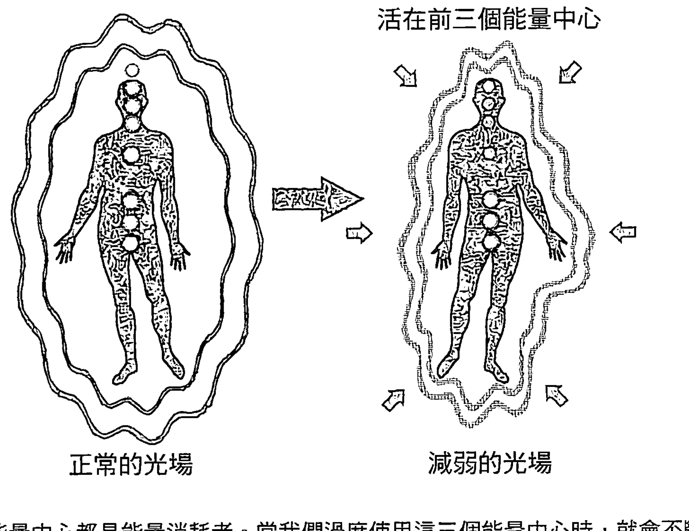

圖 5 前三個能量中心都是能量消耗者。當我們過度使用這三個能量中心時，就不斷地從無形的能量場汲取能量，將能量轉換成化學物質。於是，環繞我們身體的能量場就會開始縮小。

# 次原子層次的能量交換

所有這一切都始於次原子或量子層次，我們來看一看這是怎麼發生的。首先看一下圖6。兩個原子擺放在一起形成一個分子，兩個圓圈的重疊處即為它們鍵結的地方，也是分享光與信息的所在。因為分享信息，也就分享了有著特定頻率的類似能量。讓這兩個原子鍵結成一個分子的正是無形的能量場，而一旦這些原子鍵結成分子、彼此交換信息，便有了不同的物質屬性與特徵：密度、沸點、原子重量等等，都跟原來的原子形態不同。注意以下這個重點：是圍繞著物質的無形能量場賦予了分子特定的屬性，並保持著分子的形態與結構（亦即物質化）。倘若原子無法彼此分享信息與能量，就無法鍵結成分子。

如果你再加入一個原子，又會形成另一種不同的分子，擁有全然不同的物質屬性、特徵及結構。繼續加入更多原子會形成一種化學物質，圍繞這種化學物質的能量場會使它保持著物理形態，賦予它生命。這些原子的力量是真實且可測量的。

倘若你把夠多的化學物質放在一起，最後就會形成一個細胞；這個細胞也有一個無形的能量場圍繞著它、賦予它生命，並以不同頻率的光來維持生命。根據被稱為量子生物學（quantum information biology）這個生物學新領域的說法，指示細胞如何運作的並非分子或正負電荷，而是細胞所發出並接收的生物光子，以及這些生物光子的頻率模式。細胞越健康，所發出的生物光子越能趨向諧振或同調。如果你還記得前面學到的內容，就會知道諧振指的是一種有序頻率的表現。細胞與周圍的能量場會彼此交換信息（經由光的電磁頻率），而且速度比光速還要快，這也意味著這種交換是發生在量子層次5。

接著，把一組細胞放在一起形成組織，其外圍同樣有一個頻率及能量都協調一致的無形場域，讓這些不同的細胞可以全體協調運作。再進一步，讓這個組織發展出更專一的功能並形成器官，同樣的，這個器官也有

# 從能量到物質

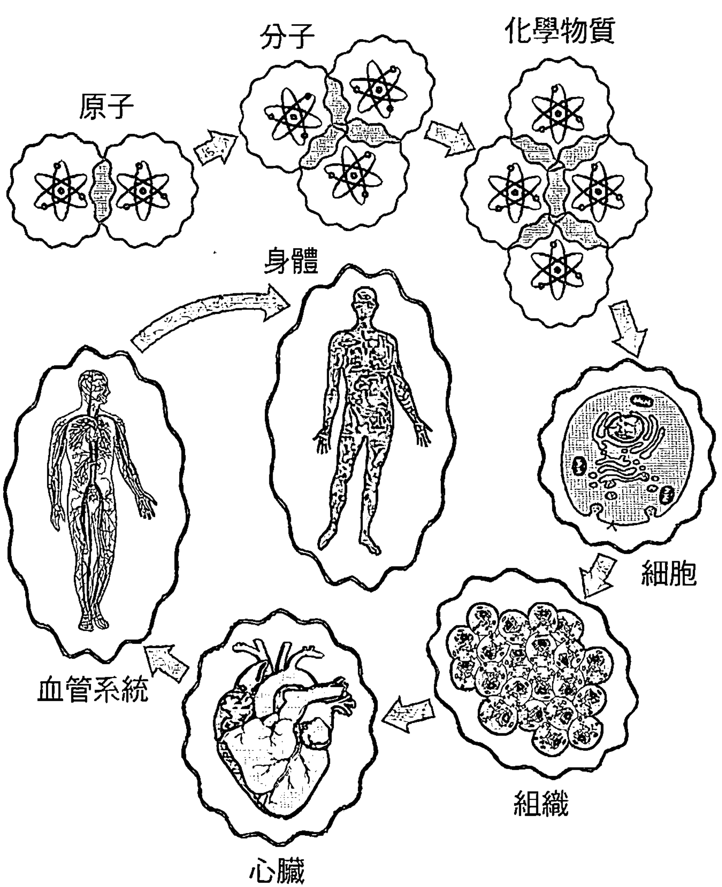

圖 6 當原子鍵結在一起並分享能量與信息，就形成了分子；分子周圍由能量與信息所組成的無形光場，會賦予分子物理屬性。當有更多的原子加進來時，分子會變得更複雜並形成一種化合物，周圍也有一個由能量與信息組成的無形光場，賦予了分子更多的物理屬性，讓它保持穩定。有更多原子加入時，這個化學物會變得更複雜並形成細胞。細胞周圍也有它自己特定的一個充滿能量與信息的無形場域，給予它如何運作的指令。然後，一群細胞結合成了組織，環繞在這個組織外圍的能量場讓這個組織能夠協調運作。更多的組織結合在一起形成了器官，這個器官能夠健康運作，靠的也是外圍的能量場。

接著，更多器官連結成了一個系統，不同的系統也有特定的無形光場，賦予它們能以整體方式運作的物理屬性。最後，不同的系統結合成了人體，人體周遭同樣也有一個能量與信息場，賦予身體一些物理屬性，讓它能夠保持形狀，並下達如何維生的指令。

一個無形的電磁能量場圍繞著它，並從其中接收信息。事實上，這個器官的記憶確實存在於周遭的能量場中。

這一點常會讓移植器官的患者大感驚訝，最有名的例子可能是克萊兒·希薇亞（Claire Sylvia）的故事。她曾在一九八八年接受心肺雙移植，並將親身經驗寫成了《換心》（A Change of Heart）一書。當時她只知道自己的新器官來自一名死於車禍的十八歲男孩；但在手術後，這位四十七歲的專業舞者，興趣愛好都大改變了，開始喜歡吃一些以前從來不吃的食物，包括炸雞、薯條、啤酒、青椒、士力架巧克力棒等等。她的性格也與以往不同，變得更具決斷力、更有自信，她的女兒甚至取笑她連走路都像個男生。後來希薇亞開始追查捐贈者的身分，才發現她在移植手術後愛吃的那些食物，都是那個男孩生前的最愛。像這樣的重要信息，就儲存於器官外圍的光場之中。

最戲劇化的是一位八歲女孩的經歷。她自從接受了來自另一位十歲女孩的心臟移植手術後，開始出現了慘遭謀殺的逼真夢境。事實上，心臟的捐贈者的確是被謀殺的，而凶手始終沒落網。女孩的家長帶她去看精神科醫師，醫師相信女孩夢到的是真實事件，於是聯絡警方。警方後來根據女孩對謀殺現場及凶手的詳細描述，包括犯罪時間、地點、凶器、凶手的身體特徵以及穿著等等資訊，逮捕了凶手並定罪。

這些真實案例可以得知，接受器官移植後，移植器官外圍能量場的信息會改變被移植者的能量場表達。這是因為被移植的器官引進了不同的光與信息，原先儲存於能量場的記憶在融入被移植者本身的能量場後，就會影響被移植者的身心狀態。這股攜帶特定信息的能量，一如我們所料地對物質產生了影響。

器官形成系統，比如肌肉骨骼系統、心血管系統、消化系統、生殖系統、內分泌系統、淋巴系統、神經系統或免疫系統，也會從外圍的無形能量場中汲取信息。接著，當所有系統一起結合成人體後，人體外圍同樣也有一個無形的電磁能量場，其中的電磁能量用以維持生命，組合而成的光場則是我們的真實存在。

現在，回頭來看壓力荷爾蒙。正如前述，當你處於生存模式之下，不論是縱欲過度、暴飲暴食、壓力過大或是所有的症狀都有，你都會從外圍的能量場汲取過多的能量，把它們變成你體內的化學物質，長此以往，你身體周圍的能量場便會逐漸減弱、縮小。這意味著你的身體周圍已經沒有足夠的能量或光，能給予物質正確的指示以達成體內平衡、生長及修復的目的。一旦發生這種情況，身體內個別的能量中心再也無法接收、處理及表達能量，也無法產生健康的神經心智來發送必要信號給這些中心所支配的身體相關部位。由於攜帶意圖的能量會活化創造心智的神經組織，因此負責調節身體細胞、組織、器官以及系統心智表達的能量中心，也會因為無法接收到足夠的能量而開始萎縮。一旦能量的光與信息失去了同調性（非諧振），身體就會開始以更像一大塊物質的方式來運作，而不是彼此的能量諧振聯動。當所有的微型腦變得不協調時，我們的大腦也會失去協調。

# 情感越崇高，所創造的能量就越強大

練習「能量中心的祝福」這個冥想法時，當你學會如何將注意力放在每個能量中心並覺知到這些中心周圍的空間後，就等於在每個中心的微型腦中創造出一個諧振的狀態，同時兩耳之間的那個大腦也達到了諧振的狀態。不管你是把注意力放在會陰（第一個能量中心）或肚臍後方的空間（第二個能量中心）或腸窩（第三個能量中心）或胸腔中央（第四個能量中心），都要堅持下去，不要隨便轉移注意力。因為注意力在哪裡，你的能量就在哪裡。

除此之外，當大腦因為壓力荷爾蒙而失去同調性並開始各自為政後，這個不再協調的大腦發送出去的信息也會變得極不協調，就像收音機的靜電干擾，包括中樞神經系統以及每個負責與身體溝通的神經都是如此。當這些微型腦接收到非諧振的訊息，也會依樣畫葫蘆，跟著把非諧振的訊息發送到跟這些能量中心有關的器官、組織、細胞，接著同樣的影響也會作用在不同器官、組織及細胞的荷爾蒙表達與神經傳導。這種非諧振的混亂失序狀態，會開始導致疾病或失衡。結果就是，當能量中心的微型腦失去同調性之後，身體中對應這些中心的部位也會失去協調，緊接著我們整個人也無法好好運作。

接著，你要把焦點放大，將注意力轉移到這些能量中心周圍的空間，接通能量中心外面的能量。這麼做時，很關鍵的一點是，你要進入揚升的正面情緒狀態，比如愛、感激或喜悅。正如在先前章節提到的，揚升的情緒就是能量，你能在開放焦點中保持這種情緒狀態越久，就越可能以極高的頻率在能量中心的周遭建立高同調性的能量場。

一旦你在能量中心周圍建立起高同調性的能量場，那個能量中心就有高同調性的能量可供汲取正確的指示。組成細胞進而形成組織、器官與身體系統的那些原子、分子以及化學物質，將可從一個光與信息的新能量場中汲取攜帶著明確意圖的高同調性能量，從而對身體的每個能量中心發出新指令；接著，身體也會隨之開始回應這個新的心智。當你臣服並進入到當下，了解到「注意力在哪裡，能量就在哪兒」，就可以建立起一個光與信息的新能量場並提高信號的頻率；這個意圖明確的想法將會把能量引至每個中心，在每個微型腦中生成一個新的心智。隨著每個中心從頻率與信息的新能量場汲取能量，身體就會回復到平衡或恆定狀態。

在這種新狀態下，你的能量會變多、物質會變少，亦即波會變多而粒子會變少。情緒越是崇高，所創造出來的能量就越多，產生的改變也會越發顯著。

如果你陷入擔憂、恐懼、焦慮、受挫、憤怒、懷疑等生存情緒而無法自拔，你的身體就無法擁有這樣的能量、信息以及光；當每個中心的頻率、光、能量的速度變慢且失去同調性時，你的物質會變多、能量會變少，長此以往，身體就會生病。這也是進行這項冥想法的一個重點：加快頻率。提升物質的頻率或將物質帶入一個更為協調一致的新心智，讓混亂失序的低頻率回復到井然有序的諧振狀態。

# 第 4 章 來自能量中心的祝福，升級你的能量

但是切記，你無法強求這樣的結果，你無法用意志力迫使它發生，也無法藉由多嘗試、祈願的方式來達成目的。因為，這是你無法靠意識去完成的一件事，你必須進入自主神經系統所在的潛意識中，那裡才是運作並控制所有能量中心的所在。

你必須跳脫β波的腦波模式，因為這個模式只會讓你待在意識中，並遠離實際操縱一切的潛意識或自主神經系統。一旦進入冥想狀態，越是深入（腦波從β波變成α波、甚至變成θ波），頻率就會越慢，也越能接近或進入這個運作系統。因此，在「能量中心的祝福」冥想法中，你的工作就是讓腦波慢下來，並結合一種帶有明確意圖的揚升情緒來祝福每個能量中心，真正地去愛它們，然後臣服並允許你的自主神經系統接管一切，因為它早就知道該怎麼做，也不需要你的意識去提供任何幫助。你不是在思考、想像或分析，你在做的事或許一開始看起來很困難：你正在種下一顆信息的種子，然後放手，讓這顆種子去接受指令與能量，再透過它在你的體內創造出更平衡、更有秩序的狀態。

我們曾經測量過學員們能夠多有效地運用「能量中心的祝福」這個冥想法，這主要表現在兩方面：其一，提升每個能量中心的能量；其二，達成各個能量中心之間的平衡。我們使用的工具是前一章提過的氣體釋放顯像技術設備，可以用來測量學員們在進行這個冥想法前後的能量場變化。氣體釋放顯像技術有專門的相機，我們拍下學員們的手指頭，同時把一股微弱（完全無痛）的電流施加於指尖，時間不超過一毫秒。此時，他們的身體會藉由釋出光子組成的電子雲來回應這股電流；肉眼看不見釋放出來的電子雲，但氣體釋放顯像技術使用的相機卻能捕捉到並將之轉化成數位電腦檔案，接下來一個名為「生物能量」（Bio-Well）的軟體程式便利用這些數據創造出一幅影像，正如你在彩圖 4 所見的。

彩圖 4A 到 4D 顯示這些學員的能量中心如何保持平衡（或不平衡），包括冥想前後的狀態。「生物能量」軟體利用氣體釋放顯像技術得到的數據，估計每個能量中心的頻率，並與平均標準值加以比較。平衡的能量中心會呈現對齊身體中心的完美直線，而失衡的能量中心則會偏離中心位置。代表每個能量中心的圓圈大小，顯示的是能量小於、等於或大於平均值，以及差距的幅度。彩圖4的每個例子，左側影像是學員在研習營之前所測量的結果，右側則是參加研習營幾天後所測量的能量中心。

現在，再看看彩圖5A到5D，左側的測量結果是研習營之前每個學員全身的外圍能量場，而右側影像是研習營開始後測量到的結果。

我們也使用氣體釋放顯像技術，去測量這個冥想法（以及本書所介紹的其他冥想法）如何增強全身外圍的能量場。正如你在下一節內容會讀到的，在冥想開始時，我會一再地要求你把注意力放在身體的不同能量中心，接著再放在這些部位周圍的空間；然後，在冥想結束時，再把注意力放在全身外圍的整個空間。這就是我一再強調的：「注意力在哪裡，你的能量就在哪裡」，假如你把焦點放在空間中，你的能量自然就會移往這裡。一旦你這麼做，就是在使用你的注意力、意識及能量，去建立並加強圍繞在你身體周圍的信息場，並進而營造出有序、同向的波動來取代混亂失序的狀態。現在，你有了更多彼此諧振的能量、更少的物質，還擁有了已被增強的個人光場與信息場，可以從中汲取能量來自行創造了。

# 「能量中心的祝福」冥想法

這是學員們最愛的冥想法之一，能夠創造出許多令人印象深刻的超自然結果。就如我在前一章中所做的，我會給你一些基本指示，好讓你自己練習這個冥想法時，知道應該如何進行。

開始，先把注意力放在骨盆底的第一個能量中心，然後放大焦點把注意力移向周圍的空間。一旦覺知到能量中心周圍的空間，就帶著最大的善意去祝福那個能量，然後連結上愛、感激及喜悅等揚升的情緒，來提高這個能量中心的頻率，並創造出一個能量諧振的場域。

逐一對其他七個能量中心進行同樣的做法。一路上升到距頭頂約十六英寸的第八個能量中心時，要懷抱著感恩或謝意來祝福這個中心，因為感恩是接受者最後的情緒狀態。然後，這個能量中心會開始敞開大門去迎接來自量子場的深刻信息。

現在，放開你的焦點，把注意力放在環繞著你全身的電磁能量上，然後為它們建立一個新的能量場。當你的身體從新的能量場中汲取能量時，你身上的光與能量會變多而物質會變少，同時身體的頻率也會被提高。

切記：一切唯心造，想要創造出無限，就必須先感受到無限；想用一種棒呆了的方式來自我療癒，你得先要有棒呆了的感受。連結上揚升情緒，冥想全程都要保持這樣的狀態。

逐一祝福完八個能量中心後，至少平躺休息十五分鐘。放鬆、臣服，讓自主神經系統接受命令，將所有信息都整合進身體裡。

獲取更多好书，请加微信号: strcdts

店铺: http://strc.cr.cx

## 第5章 擺脫制約，不再跟著潛意識走

在這一章中，我們會介紹一種呼吸技巧，可以在開始進行多種冥想法之前使用。我會不厭其詳地說明這個呼吸技巧，因為了解它如何運作，對於以下兩種能力至關緊要：一個是擁有真正能夠改變你的能量，一個是把身體從過去的制約中解放出來。你將會看到，正確運用呼吸是邁向超自然的關鍵之一。想獲得這項技巧的所有好處，你必須了解：你要做什麼？以及為什麼要做？了解這兩點可以幫你的經驗奠定基礎，也能讓你知道如何做會更輕鬆，以及可以讓這項技巧更為有效。一旦你了解這個特別的呼吸技巧與生理機能的關係後，做這項活動時會更有意義，也會促使你投入更多的意圖，正確去練習及體驗這個呼吸技巧的所有好處。

這個呼吸技巧的目的是：把舊的心智拉出體外，然後把你的身體調整成為另一個新的心智。

在我們開始之前，我想先複習一下我們在第二章討論過的「想法即感受」的迴路，因為這些概念對本章的冥想法非常重要。你可能還記得，想法會在大腦引發生化反應、釋出化學信號，而這些化學信號會讓身體的感受與腦中現在的想法完全貼近；接著，這些感受又會讓你產生更多的想法，使你的感受與你的想法越來越一致。因此，你的想法會驅動你的感受，而你的感受也會反過來驅動你的想法，到最後，這樣的迴路會牢牢地將你的大腦連結到相同的模式，把你的身體制約在過去；再加上情緒是過去經驗的紀錄，因此如果你的想法無法超越你的感受，這個「想法即感受」的迴路將會使你被束縛在過去，並創造出一種僵化不變的存在狀態。這就是身體變成心智的過程，長此以往，你的想法會開始控制你，而你的感受會開始占有你的心智，客觀到無法分辨出情緒感受的真假，自然也無從辨別這樣的情緒究竟是生命中的實際經驗，還是單純靠想像所創造出來的。

因此，一旦你的身體變成情緒的心智，你的身體就名副其實地深陷在過去了。再者，既然身體是無意識

# 讓你一再重蹈覆轍的情緒迴路

現在，讓我們來檢視一下這個「想法即感受」的迴路，是如何與身體的能量中心產生關聯的，尤其是前三個跟生存有關並造成最多問題的能量中心，這是因為許多人的想法與感受都會觸動這些能量中心。正如你在前一章讀過的，身體的每個能量中心都有各自的能量、信息、腺體、荷爾蒙、化學物質及神經電路，還有各自的微型腦或心智（簡單來說，每個能量中心都有一個專屬的心智）；這些被設定的微型腦透過自主神經系統，以潛意識方式在人體中運作。如此一來，每個中心都有它自己的能量以及相對應的意識層次，也都跟相對應的特定情緒有關。

舉個例子來說明。你產生了一個念頭，好比說：我的老闆很不公平。圖1描述了生起了這個念頭後，會如何開啟你大腦的神經網絡。接著，你又生起了另一個念頭：我的薪水太低了，於是大腦又開啟了第二個神經網絡。然後你又想到：哇！我的工作量太多了。現在，你的腦子已經忙得不可開交了。由於心智是行動的大腦，如果你繼續沿著相同的思路而生出更多念頭，就會觸發夠多的神經網絡以某種特定的順序、模式及組合一起放電，產生某個層次的心智，進而在你的大腦額葉創造出一種你自己的外部表徵或自我形象；此時，內在的想法甚至可能會比外在環境更為逼真。在這個例子，你看到的是一個氣憤的自己。如果你未經任何分析就接受、相信及屈服這樣的想法、觀念或形象，神經傳導物質（在你大腦神經元之間傳送信息、進而生成某種心智的化學信使）就會開始影響神經肽（neuropeptide，自主神經系統在緣腦所製造的化學信使）。你可以把神經肽想成是情緒分子，在這個例子中，這些神經肽會對荷爾蒙中心發出信號，打開第三個能量中心的腎上腺。當這些腎上腺釋出荷爾蒙時，你就會產生忿忿不平的感受。於是，你透過第三個能量中心傳送出某個特定的識別信號，攜帶了這樣的訊息：「傳送給我另一個理由來強化我已經擁有的感受；傳送給我另一個能讓我感到憤怒的理由。」當這個能量中心被活化後，就會產生某種攜帶特別訊息的特定頻率。

你的大腦會監控你的化學物質狀態，當你生氣時，大腦會想出更多一致且相應的念頭來回應你的感受：我的老闆太混蛋了！我應該辭職不幹。這個司機真是個白痴！我的同事偷了我的點子！只有我是對的，其他## 「想法與感受」的憤怒迴路

圖 1 由上圖可以看出我們如何以情緒形式把能量儲存在第三個能量中心，以至於陷入某種「想法即感受」的特定迴路之中。

人都錯了。大腦會以相同的方式反覆放電並連結類似的迴路，如果你開啟的這類迴路夠多，就會持續不斷地形成同一層次的心智，並一再地以你前腦中所形成的形象來肯定你的自我認同。接著，緣腦會製造出更多同樣的神經肽，對你第三個能量中心產生的荷爾蒙發出信號，讓你更憤怒、挫折感更深，從而讓你想出更多相對應的念頭來強化。不論你的想法是否合理，這種循環可以不斷反覆數十年之久，牢牢地固結在大腦上，形成一個特定模式（以這個例子來說，就是憤怒模式），並在情緒上反覆地將身體制約在過去。

當身體變成一個隨時都在憤怒的心智，憤怒的情感就不再只是存在你的大腦中（你思想中那僅剩的五%意識），而是成了一股能量儲存在身心之中，也就是你的潛意識（占心智活動的九五%）。由於這是潛意識的運作，所以你不會意識到自己正在做什麼。原本只是一個由念頭誘發的情緒（所有念頭都有它相對應的能量），最後卻成了儲存在身體裡並卡在第三個能量中心（太陽神經叢）的一股能量。

這一類儲存的能量會產生相對應的生理問題。以這個例子來說，對生理的影響可能包括腎上腺疲勞、消化問題、腎臟問題或免疫系統功能下降，其他更尋常的問題，還有脾氣暴躁、缺乏耐心、沮喪、挫敗或是不夠包容等心理上的影響。年復一年，你不斷地產生相同的念頭，不斷發送出相同的感受信號，更不斷地固結大腦迴路使之形成一個僵化的模式；你以相同的方式，持續制約你的身體變成一個動輒生氣的心智。最後，你所擁有的創造能量全都化為憤怒、悲痛、挫折、挑釁、沒有耐心、控制及憎恨，被儲存在身體的第三個能量中心了。

那麼，假如你不是氣憤，而是開始自責、愧疚或有受害者想法呢？人生太苦了！我是個糟糕的父母。我不該這麼粗魯無禮。我做錯什麼了嗎？看一看圖 2，就能看出同樣的事情又發生了：想著這些念頭會開啟大腦中另一個截然不同的神經網絡。倘若連結的神經網絡夠多，就會生出另一個層次的心智，大腦會創造出你自己的內在形象，一再確認你的自我認同（以這個例子來說，就是一個有罪的人）。於是，你會開始想：上帝會懲罰我、沒人愛我、我一文不值……一旦你未經任何分析就接受、相信或屈服這些有罪的想法，這時，活化你大腦神經網絡的神經傳導物質便會影響不同的神經肽混合物（與罪惡感、內疚情緒有關的神經肽），接著這些神經肽會發送信號給另一個不同的荷爾蒙中心——以這個例子來說是第二個能量中心。長此以往，你不斷製造出相同的「想法即感受」與「感受即想法」的迴路，便會開始把能量儲存在身體的第二個能量中心，然後對生理造成影響：由於你質疑自己的勇氣（gut，也有腸道之意），因此你可能會感到反胃噁心，或是身體的這個部位會感到疼痛，並伴隨著受苦、不幸或悲傷等情緒。

日復一日，如果你的負罪感一直都沒能消除，就會想出更多讓你內疚的念頭，發射並連結更多的神經元、送出信號給更多的神經肽，使第二個能量中心釋出更多的荷爾蒙。在此之際，你持續制約身體，讓它變成一個不停內疚與受苦的心智，從而在第二個能量中心儲存了越來越多的負面情緒能量；同時也持續傳送出攜帶某個特定信息的特定能量信號，透過第二個能量中心進入你身體的能量場。

現在再舉個例子，假設你腦中是完全不同的另一組想法：你對某個人產生了性幻想，接下來會發生什麼呢？現在，你開啟的是大腦中另一個不同的神經網絡，並生成另一個不同層次的心智。如前所述，倘若你發射並連結的這些神經網絡夠多，就會在大腦額葉創造出一個不同的內在形象；一旦你專注的念頭或形象變得比外在世界更逼真時，你的念頭就會成了如假包換的真實體驗，而最終的產物就是相對應的感受。

結果是，你的身體被啟動了。現在，第一個能量中心被攜帶著某種特定訊息或意圖的能量所觸發，接著又觸發了中心固有的神經叢，從而產生某種特定的心智，接著發出信號給相對應的腺體基因，製造出認同那些念頭的化學物質及荷爾蒙。現在的你，自以為是宇宙第一的種馬；如果你未經任何分析就接受、相信或屈服於這個想法或你的自我形象，那麼大腦中的神經傳導物質便會影響緣腦中不同的神經肽混合物，進而對第一個能量中心的荷爾蒙發出信號，設定自主神經系統準備啟動。我想，你應該很熟悉接下來會發生的生理反應。

這些生理反應會讓你保持某個特定的感受，然後使你生出更多能夠強化那些感受的對應念頭。現在，你正在往第一個能量中心儲存能量，並將某種攜帶特定訊息的振動信號，從該中心傳送至身體的能量場。你的大腦正在監控著你的感受，同時你也會生出更多相對應的念頭。這樣的循環會一直繼續下去，這就是身體回應心智、最後終於變成心智的過程。

所以，現在你已經了解想法會如何制約你的身體，讓身體變成你正在體驗的那種情緒的心智；此外，你也已經了解當這種情況發生時，你如何在相對應的能量中心為那種情緒儲存更多能量。至於能量會儲存在哪個能量中心，就端視你正在持續體驗的情緒是哪一種而定。

如果你好色、縱欲或一心想成為別人性幻想的對象，你的能量就會卡在骨盆底的第一個能量中心（生殖中心）；如果你心中充滿內疚、悲傷、恐懼、抑鬱、羞愧、無價值、低自尊、痛苦等等情緒，能量就會卡在第二個中心；如果你有憤怒、挑釁、挫折、控制、評判、妄自尊大等情緒問題，能量會卡在第三個中心（我

## 第 5 章 擺脫制約，不再跟著潛意識走

希望你已練習過「能量中心的祝福」冥想法，並開始體驗到能量如何從一個中心進化到下一個中心，在往上移動時，能量的頻率也會一路提高）。

長此以往，身體會成為情緒的心智，而一旦情緒能量被儲存（更精確來說是被卡住）在一個或多個下半身的能量中心，身體就真的被困在過去之中了。這意味著，你不再有多餘的能量可用來創造一個新的命運。而當這種情況發生時，你身體的物質會變多、能量會變少，因為正如你已經讀到的，前三個能量中心（生存模式的中心）會讓圍繞你身體的重要能量場減弱、縮小。

但在此要澄清的是，我不是說你不該有性行為、享受美食或有壓力。我說的是，你之所以會失去平衡，是因為這三個中心失去平衡。想像一下，如果這三個能量中心突然同時受到過度刺激，可以想見假以時日，你身體的能量會縮減、衰退到什麼程度。一旦這種情況真的發生，能被拿來作為生長、修復、療癒、創造或甚至只是回復平衡的能量，便所剩無幾了。

因此，許多自覺失衡的人會改變他們目前的生活形態並限制飲食，希望藉由消化較少的食物，讓身體有更多的能量可用來自我修復；他們也可能會禁止性生活一段時間，讓身體有復原機會。在這段休養期間，他們還會盡量阻絕外界環境的刺激及干擾，對象包括朋友、孩子、同事、聚會、日程、工作、電腦、家人及手機。這樣做，確實可以避免身體對外在世界的所有熟悉元素（亦即與過去想法及情感記憶有關聯的元素），有意識或無意識地做出回應。

我即將教你的呼吸技巧，可以讓你解放被困在前三個中心的能量，讓能量能夠自由地流往大腦，也就是它的源頭及來處。當你運用呼吸釋放被困住的情緒後，多出來的能量就可供更高層次的目的使用，也有更多能量可以用來自我療癒、開創不一樣的人生、示現更多的財富或是體驗神祕經歷，諸如此類有益身心的事。這些原本被儲存在身體中的情緒能量，將會蛻變成另一種不同類型的能量，透過激勵、自由、無條件的愛及感恩等揚升情緒，攜帶截然不同的訊息。事實上，這些都是相同的能量，只是先前被鎖在身體之中。呼吸是把心智拉出身體之外的一個方法，你可以把身體當作意識的工具來提升能量，把生存情緒轉化為創造情緒。唯有把身體從過去的枷鎖中解放出來並釋放情緒能量，你才有足夠的能量去實現不凡的事，邁向超自然的境界。

## 身體宛如磁鐵，磁性越大，人生越明亮

請看看圖 3，並想像一塊磁鐵。磁鐵當然會有磁力，有北極和南極，一端有正電荷而另一端是負電荷，兩端的磁力正是使磁鐵產生電磁場的要素；兩極之間的磁力越強，磁鐵所產生的電磁場就越大。雖然你看不見這個電磁場，但它確實存在，而且也能測量得到。

磁鐵的電磁場強度甚至會影響物質。如果你拿一些小金屬屑放在紙上，再覆蓋上另一張紙，然後把另一塊磁鐵放在第二張紙上面，那些金屬屑將會在磁鐵的電磁場中自行排列出圖案。磁鐵的電磁場強大到足以影響物質實相，即使這個場域的頻率已超出我們的感官所能察覺的範圍（參見圖 4）。

地球正是一塊大磁鐵，就像任何其他磁鐵，地球也有南北極以及圍繞著它的電磁場。雖然這個電磁場非肉眼可見，但我們都很熟悉某個可以證明它存在的驚人方式；地球的電磁場會使太陽光子偏轉，在日閃焰或是日冕大量拋射時，這個場域會以一種絢麗的、有規律的脈動，使數萬億噸的光子偏轉並拋向地球，於是出現我們稱之為北極光的現象。

你的身體也是一塊磁鐵，數千年前的古文明（特別是亞洲）早已深諳這個事實。你的北極就是你的心智與大腦，而南極就是你身體的脊椎底部。當你處於壓力荷爾蒙（生存情緒）之下，或是過度使用另外兩個與生存有關的能量中心，就會不斷地從身體周圍的無形場域汲取能量。於是，你身體中的能量不再流動，因為處於生存模式下的身體會把能量從場域中拉出來並儲存在身體中，尤其是儲存在前三個能量中心之中（這就是我們稍早描述過的，當「想法即感受」迴路被啟動時會發生的狀況）。

如果這種情況持續得夠久，身體就沒有任何電荷流過；沒有了電荷，身體就無法生成圍繞著它的電磁能量場，於是身體不再像是一塊磁鐵，而像是一塊普通的金屬，或者說是一塊失去電荷的磁鐵。正如你在圖 5 所見的，身體的物質變多而能量變少了（也可以說粒子變多而波變少了）。

當然，如果有辦法讓這些儲存於前三個中心的能量重新動起來，電流將會恢復流動，同時身體也會重新創造出電磁場。呼吸正好可以

## 磁鐵的電磁場

圖 3 磁鐵周圍有一個可測量的無形電磁場。南北極之間的磁力越強，通過磁鐵的電流就越多，電磁場也越大。

## 能量如何影響物質

圖 4 磁鐵的電磁場會把下方的金屬屑排列成它的樣子。

## 趨向能量的身體 VS. 趨向物質的身體

圖 5 有能量流動的身體就像一塊磁鐵，周圍會生成一個可測量的電磁場。當我們處於生存模式下，會從身體周圍的無形場域汲取能量，使這個電磁場萎縮衰退。此外，當我們陷入某個「想法即感受」的迴路而使得能量被卡在前三個能量中心時，流經身體的電流會變少，身體周圍的電磁場也會縮小。

# 第 5 章 擺脫制約，不再跟著潛意識走

做到這一點，它提供了我們一個方法，能夠把心智拉出身體，把所有儲存在前三個中心的能量移往脊椎、再往上流到大腦，然後回復身體周圍的電磁場。如此一來，我們就能將能量運用在生存之外的用途。只要檢視身體的構造，就能理解這個方法之所以可行的理由。

看看圖 6，位於脊椎底端的骨頭稱為薦骨（骶骨），看起來像是一個倒置的三角形，頂端有個薦骨平台（sacral plateau），脊柱就端坐在平坦的表面上，然後一路往上延伸至顱骨。在這個封閉系統內有大腦與脊髓組成的中樞神經系統，事實上，脊髓就是大腦的延伸，顱骨與脊柱保護這個人體中最脆弱又精細的系統。

中樞神經系統是人體最重要的系統之一，控制並協調身體所有其他系統；倘若沒有中樞神經系統，你將無法消化食物、清空膀胱、移動身體，你的心臟也無法跳動；沒有中樞神經系統，你甚至無法眨眼睛。因此，你可以把中樞神經系統想成是運作身體這部機器的電線。

## 骨骼系統之內的腦與脊髓

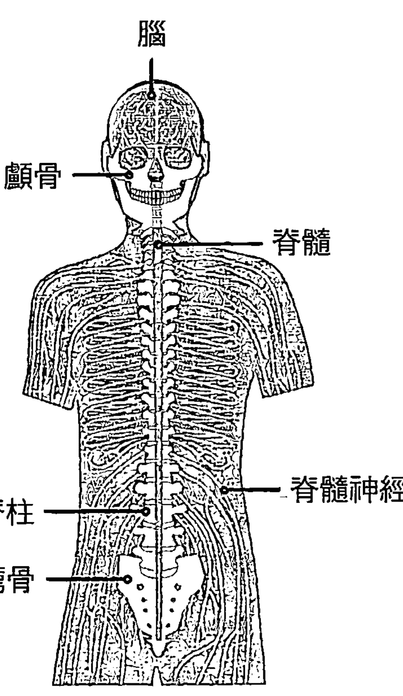

圖 6 薦骨、脊柱及顱骨等骨骼結構可以保護身體最脆弱、最精細的系統，其中包括控制並協調所有其他系統的中樞神經系統。

在這個封閉系統內的腦脊髓液是從大腦血液過濾而來，大腦與脊髓浸泡在這種液體中，並為中樞神經系統提供浮力。腦脊髓液的作用就像緩衝器，保護大腦與脊髓免受傷害，並經由不同的路徑將營養物質和化學物質運送到遍布全身部位的神經系統。就本質而言，腦脊髓液的作用就像電線的導管，可以強化神經系統的電荷。

現在，讓我們再回到薦骨。吸氣時，薦骨會稍微向後彎；呼氣時，則會向前彎曲一些些。這種運動非常細微，以至於就算你特別留意，還是察覺不到。吸氣時，顱骨縫（頭骨各板塊就像拼圖一樣接合在一起，也因此頭骨有某種程度的彈性與靈活度）會稍微打開，呼氣時，顱骨縫又會閉合回去。同樣的，這些動作都非常細微，你通常察覺不到。

當你緩慢吸氣或呼氣時，薦骨前後彎曲及顱骨縫的開合，會在這個封閉系統中的腦脊髓液傳導出一種波動，推動腦脊髓液流動，緩慢地將腦脊髓液抽唧到脊椎，再一路往上到大腦，流經四個稱為大腦導水管（cerebral aqueduct）及腦室的腔室。如果你能標記腦脊髓液的一個分子，然後跟著它從脊椎底部一路往上來到大腦、再一路往下回到薦骨，就會發現它要花十二個小時才能完整繞行一周。因此，基本上我們一天會沖刷兩次大腦。圖 7 描寫的就是這整個循環過程。

所以想想看，如果你收縮會陰部的肌肉（骨盆底肌肉，也就是性交與排泄時會用到的肌肉）會發生什麼事？現在，試著鎖住會陰部的肌肉，然後收縮下腹部，接著再收縮上腹部的肌肉。藉由收縮及擠壓這些核心肌肉（其中也包括前三個能量中心的肌肉），中樞神經系統內的腦脊髓液就會往上流動（參見圖 8）；藉由這個方法，就能讓中樞神經系統內的腦脊髓液往上流到脊椎部位。每當你收緊這三個能量中心的肌肉時，腦脊髓液就會被迫往上流動。

現在，把注意力放在頭頂上，頭頂成為你移動能量的目標（因為你的注意力在哪裡，能量就在哪兒）。現在，從鼻子開始做個緩慢平穩的呼吸，同時持續擠壓會陰部位的肌肉，接著是下部及上腹部肌肉。當你做這些動作時，你的呼吸會上行至脊椎，經過胸腔、喉嚨、大腦，一路來到頭頂。想像當呼吸來到頭頂時，你屏住這股氣息，一邊持續擠壓前述肌肉。藉由這個方法，你可以把腦脊髓液一路往上拉提至大腦部位。

這種呼吸法非常重要，原因如下。腦脊髓液是由蛋白質與鹽的溶液所組成，當蛋白質與鹽溶解在溶液中時，就會變成帶電分子。假如你能使一個帶電分子加速，就像你把分子往上拉到脊椎一樣，就會創造出一個電感應場（inductance field，圖 9 是電感應場看起來的樣子），這是一個充滿電磁能量的無形場域，會朝著帶電分子移動的方向以圓周運動的方式前進。你加速的帶電分子越多，這個電感應場的範圍會更大，力量也會更強大。

## 腦脊髓液的流動

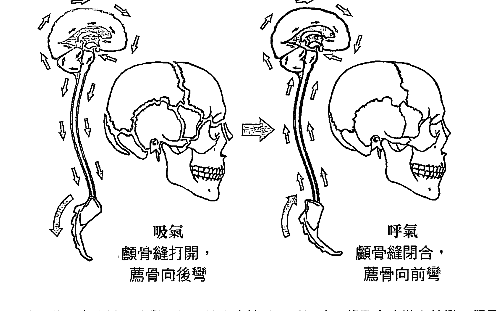

圖 7 吸氣時，薦骨會略微向後彎，顱骨縫也會擴展；呼氣時，薦骨會略微向前彎，顱骨縫會閉合。這種呼吸的自然行為會緩慢傳導出波動，推動腦脊髓液沿著脊髓上下流動並流經整個大腦。

把脊髓想成一條光纖電纜，扮演著雙向高速公路角色，同時從身體到大腦以及從大腦到身體傳送信息。每一秒鐘都有重要的信息從你的大腦被轉達到身體（譬如想走過房間或是抓癢），同時，也有許多信息會從你的身體被帶往脊髓、再送到大腦（譬如知道你的身體在何處或感知到飢餓的信號）。一旦你加速這些帶電分子以單一方向往上流到脊椎，由此產生的電感應場會反轉從大腦往下流到身體的信息流，把能量從下半身的三個能量中心汲取出來，往上流到脊椎、再送到大腦（參見圖 10A）。現在，你全身上下及中樞神經系統都有電流在運行，身體成了一塊大磁鐵，因此環繞這塊磁鐵的電磁能量場也會圍繞在我們身體周邊（參見圖 10B）。

你所創造出來的電磁能量場是一種三維的立體場域，隨著它的移動，這股能量會創造出一個撓場（torsion field）或環形場。順帶一提，這個電磁場的形狀在宇宙中十分常見，小自蘋果大至遙遠星系的黑洞，都能看到這種形狀（參見圖 11）。

所以，現在你已經了解到這項呼吸技巧影響甚鉅，善加使用可以激發所有被儲存起來的能量。如果能正確運用這項技巧，而且做的次數夠多，將會喚醒一條沉睡的巨龍。

## 收縮內部肌肉使腦脊髓液往上流至大腦

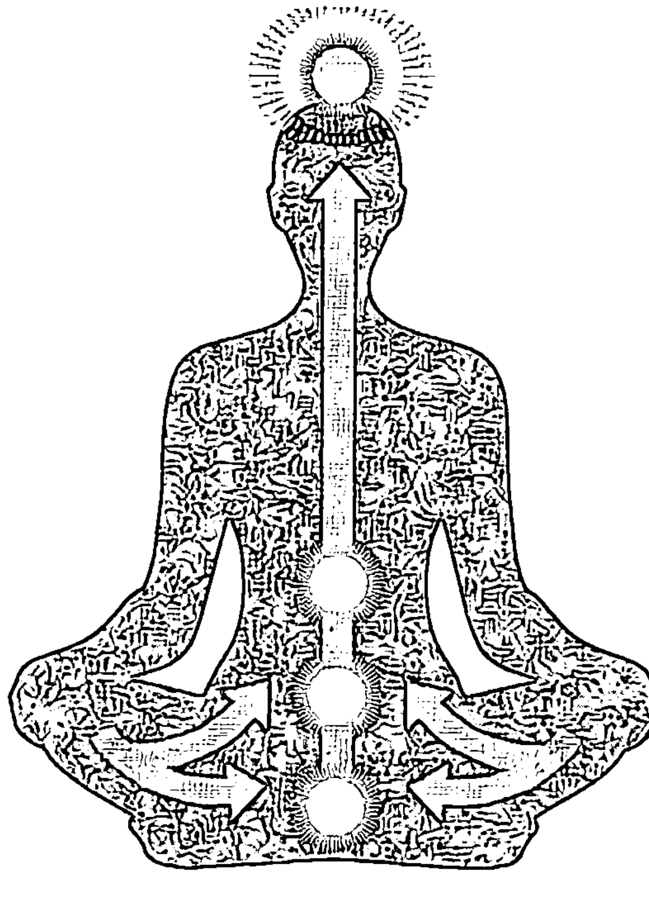

運用核心肌肉來移動能量

圖 8 收縮下半身的內部肌肉（內在肌），同時鼻子緩慢平穩地呼吸，並將注意力放在頭頂上。這樣做，可以加快腦脊髓液流往大腦的速度，並帶動一股電流穿行全身後往上來到脊椎中軸。

## 超意識腦波，提升你的創造力

一旦能量被活化、交感神經系統（自主神經系統的一個子系統，會喚醒大腦及身體以因應外來環境的威脅）被啟動，能量開始從下半身的三個能量中心往上移動到大腦。然而，與其讓身體因某些外在狀況而被喚醒，你更可以藉由融入內在呼吸的運作來啟動交感神經系統。一旦交感神經系統開始與副交感神經系統（自主神經系統的另一組子系統，會讓大腦與身體放鬆，好比飽足一餐後的感覺）達到平衡，來自下半身三個中心的能量就會像是被直接射進大腦一樣。當這股能量抵達腦幹，一個稱之為「丘腦」（thalamus）的構造會打開大門，允許所有的能量進入大腦。

## 電感應場

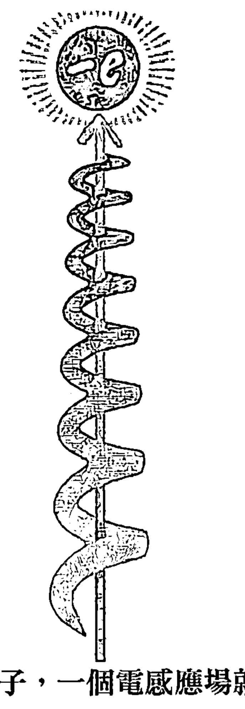

移動帶電分子，一個電感應場就形成了

圖 9 腦脊髓液由帶電分子組成，當你加速這些帶電分子以單一方向往上流到脊椎時，就建立了一個朝著帶電分子方向移動的電感應場。

一旦這股原本儲存於身體的能量進入大腦後，大腦會產生 γ 波的腦波模式（我們許多學員在做這個呼吸法時，都產生了 γ 波）。我把 γ 波稱為超意識腦波，不僅因為它能製造最多的能量，更在於這些能量都來自身體內部，而不是為了因應外部環境刺激才另外被釋放出來的。

## 儲存的能量從身體流向大腦

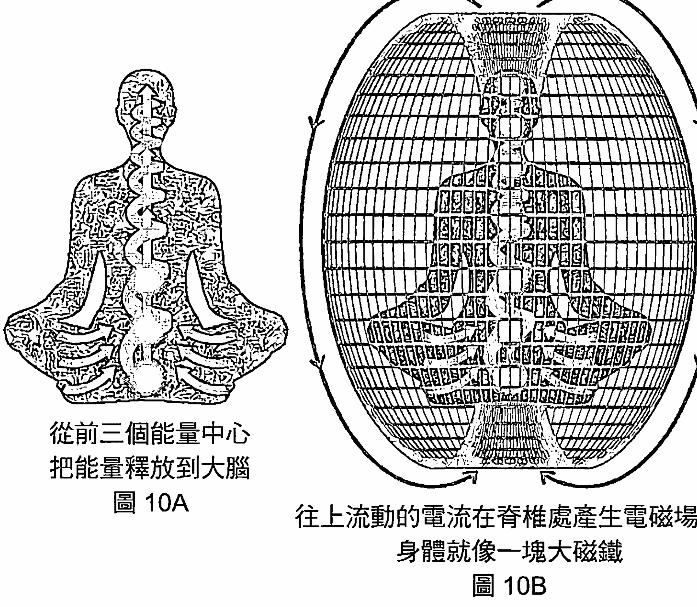

從前三個能量中心把能量釋放到大腦
圖 10A

往上流動的電流在脊椎處產生電磁場，
身體就像一塊大磁鐵
圖 10B

圖 10 腦脊髓液加快速度往上流到脊椎而建立一個電感應場，電感應場會把前三個能量中心所儲存的能量吸回大腦。一旦有電流從脊椎底部一路往上流至大腦，身體就會像一塊大磁鐵，一個電磁環形場（torus field）於焉誕生。

相反的，當身體釋出壓力荷爾蒙時，大腦產生的是高頻 β 波，好讓你對周遭環境的危險保持高度警覺。β 波會讓你覺得外在世界似乎比內在世界更真實。雖然 γ 波也會在大腦中創造出一種類似的警醒作用，從而引發高度覺知、專注力，以及對創造力、超自然、神祕經驗等相關能量更為敏銳，但 γ 波與 β 波的根本差別在於：γ 波是一種內觀腦波，會讓你感覺內在世界所發生的一切，比外在世界的諸多經驗更真實。看看圖 12，就可以看出 β 波與 γ 波非常相似。

我們有許多學員在使用這個呼吸法時產生了顯著的高頻 β 波，然後再進入 γ 波（頻率最高的腦波）模式；又或者，他們就停留在高頻 β 波狀態。我們發現，即便只是處於最高頻的 β 波狀態，同樣能讓他們更關注內在世界而不是外在世界。在使用這個呼吸法後，我們不僅能在大腦中看到更多能量，還持續觀察到更多明顯的心腦諧振現象。

看看彩圖 6A 與 6B，這是兩位成功運用這個呼吸法的學員，他們的優勢腦波都是頻率極高的 β 波，然後逐漸轉變。

## 環形場

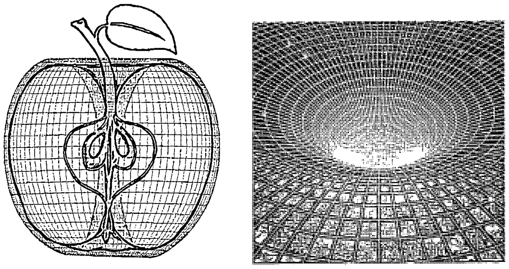

蘋果與黑洞都呈圓環形

圖 11 從蘋果到黑洞，圓環形是自然萬物中一種反覆出現的模式。

成 γ 波。注意 γ 波的振幅非常高，振幅越高代表大腦中的能量越多；甚至還呈現超出典型 γ 波的一六〇與二六〇個標準差（提供你一個參考，通常超出正常值三個標準差就被認為很高了）。在彩圖 6A (4) 中，你也可以見到採用這項呼吸法後，腦波的同調性更高了。大腦出現的紅色塊顯示在每種被測量的腦波狀態中，大腦都產生了高度的同調性現象。

當你這項強大的呼吸法時，就是在汲取原本儲存於下半身三個中心的能量，也就是你用來達到高潮、生小孩、消化一頓飯以及逃離掠食性動物的能量。與其讓這些能量被用於化學反應，不如透過脊椎將它們往上吸，就像你使用吸管一樣，然後在大腦中釋放出來。

事實上，沿著脊柱真的有一條能量或光的輸送管在運行著，名字就叫「普拉納管」（參見圖 13），普拉納（prana）在梵語中是生命力的意思。數千年來，瑜伽修行者早已知道有這條輸送管，但它不是一種實質存在的物理性結構，而是一種能量結構。這條輸送管被認為是一種以太物質，管中川流不息的是脊椎的電子訊息。當脊椎中移動的能量越多，普拉納管所創造的能量與光也就越多；而普拉納管所創造的能量越多，在脊椎中移動的能量也會越多，生命的表現也更強大。有時候，我在傳授靜心冥想時，有人會對我說：「我感覺不到普拉納管。」呃，你平常也感覺不到你的左耳，除非你把注意力放在左耳上，不是嗎？當我要求你收縮肌肉把能量透過脊椎往上拉時，沿著脊椎會創造出一條更強大的普拉納輸送管。

在此，要補充的一個重點是，這種呼吸技巧不是被動呼吸法，而是需要十足的主動性及熱情。想要移動這些年復一年被儲存起來（甚至儲存了數十年之久）的能量，當然需要有相當強的意圖及意志力才能做到。為了讓被困住的生存情緒被釋放及進化，你得像一位鍊金師一樣能鍊鉛成金，把畫地自限的憤怒、挫折、內疚、受苦、悲痛、恐懼等負面情緒變成愛、感激、喜悅等揚升情緒；你還可以連結上以下幾種揚升情緒，包括激勵、興奮、熱忱、沉醉、敬畏、啟發、驚異、感恩、良善、富足、慈悲、高尚、榮譽、無敵、不妥協、力量及自由，如果能夠再帶上有如宗教信仰的神性、虔敬、全心臣服於未知或神祕或內在的療癒者，那就更好了。

切記，要把能量進化需要某種程度的強烈意志力，至少必須能強過你把身體當成心智的慣性，也要強過你對任何生存情緒的沉溺；你必須全心接受啟發，讓身體的能量大於物質，把身體當作意識的工具來提升能量。因此，切勿讓你的身體成為心智。你要記住的是，你正在釋放被卡住的能量，把內疚、受苦、憤怒、侵略性都回復成純粹的能量；當身體釋出那股能量時，你也會釋放自己，因而感到喜樂、熱愛生命，單純只為活著而感到欣喜。

靜心冥想時，當你將能量往上拉到脊椎時，要跟隨呼吸一路來到頭頂；當能量到達頭頂時，你要持續擠壓會陰與腹部的肌肉，而且我希望你能屏住呼吸。這麼做，會增加脊椎與脊柱之內的壓力，也就是增加封閉系統內的鞘內壓（intrathecal pressure）。這種壓力，正是你在深吸一口氣舉起重物時所施加的壓力。但在這個呼吸法中，你有非常明確的目的：引導所有的壓力、所有的能量及所有的脊髓液進入脊椎，然後進入大腦。

當這股加壓的腦脊髓液一來到腦幹後方時，下腦部位的中心包括腦幹、小腦、緣腦等，馬上就會透過一群被稱為網狀結構（reticular formation）的細胞核，對這股能量開啟大門；然後，這股能量會穿越丘腦閥門，進入扮演分線盒角色的丘腦（位於中腦，傳遞來自受器的信號）。接著，所有的儲存能量會直接進入你的上腦中心，亦即新皮質。γ波就是在這時開始產生的。當能量抵達丘腦時，也會傳遞到松果體，於是令人驚異的事發生了：松果體會釋出某些極為強大的致幻迷藥，其中之一會麻醉你的分析心與思維腦。

## 能量如何經由網狀活化系統從身體進入大腦

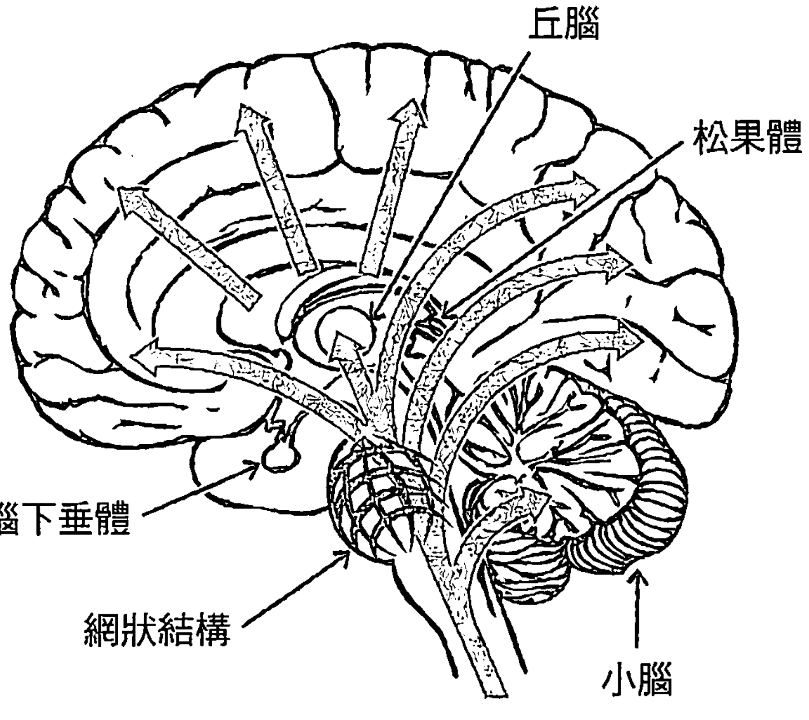

圖 14 當丘腦閥門打開時，大量儲存於體內的創造力能量會經由網狀活化系統（reticular activating system）送到丘腦及松果體，然後被傳遞到新皮質，產生γ波。

我們會在後面篇章深入討論松果體，現在你只要知道當松果體釋出這些強大的化學成分時，就像你的腦袋達到了性高潮一樣。這股極端強大的能量，有個專門的名字叫「昆達里尼」（Kundalini），或叫拙火、靈量。但我個人並不喜歡使用這些字眼，因為這會讓人聯想起某些宗教觀點或信念，而限制了我們對這股能量的理解，並可能會使得某些人對這個呼吸法退避三舍。我只希望你能確實明白，這股能量就是你以這種呼吸法所喚醒的。

再來看看彩圖 6B(4)，你可以看到這位學員的松果體周圍有相當活躍的γ波。看看藍色的箭頭；紅色塊代表能量，這個部位是松果體及緣腦中與強烈情緒及形成新記憶有關的一個腦區。圖 6B(5) 是同一名學員的大腦三維圖，松果體部位再度顯示出來自大腦內部的大量能量。

## 高頻 β 波與 γ 波的比較

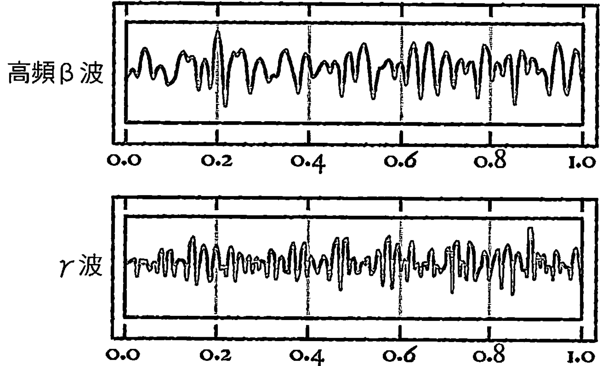

圖 12 儲存於三個能量中心的能量一經釋出，大腦就會被喚醒並產生 γ 波。發生這種情況時，大腦在進入 γ 波狀態前，可能會先進入高頻的 β 波。高頻 β 波之所以會出現，通常是大腦因為外在環境的刺激而變得警醒，並把我們的注意力放在引發刺激的事物上。

至於 γ 波通常是由來自內在環境的刺激所引發，我們會把注意力轉移至內在的心智世界。上圖可以看出高頻 β 波與 γ 波的腦波圖形極為相似，不過 γ 波的頻率更快。

## 普拉納管

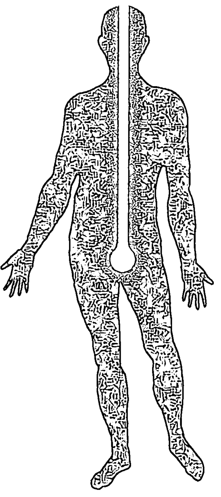

圖 13 普拉納管（prana tube）是一條輸送光或能量的管道，代表生命力沿著脊椎上下流動。脊椎中流動的能量越多，普拉納管的場域就越強；脊椎中流動的能量越少，普拉納管的場域就越弱，傳送給身體的生命力也會越少。

## 擁抱揚升情緒，突破自我設限

你剛學會的呼吸法，作用在於把心智拉出身體之外並釋出前三個能量中心所儲存的能量。一旦你成功了，就能重新把身體打造成一個新的心智；這是靜心冥想的第二部分，與如何達到揚升情緒的狀態有關。

我在此要補充說明，為何擁抱揚升情緒有如此強大的力量？在第二章中，從我們對基因的討論，你應該已經了解到是環境對基因發出信號，而不是基因對環境發出信號；如果情緒是環境經驗的最終產物，那麼開啟或關閉基因的也是情緒。

當你在靜心冥想時擁抱這些揚升情緒，實際上就是在對你的基因發出信號，而且是在外在環境與實際經驗發生之前。前面也提過，我們的身體無法分辨真實經驗與想像的經驗所引發的情緒有何不同，揚升情緒同樣也如此，因此當你的內心世界擁抱揚升情緒，並且強大到超越使你困在過去、自我設限的那些念頭時，你的身體會開始產生相對應的化學物質，為迎接新的未來做好準備（因為身體認為這樣的新未來正在發生）。

換句話說，如果你可以正確地進行這個靜心冥想法且進行次數夠多，身體會把你感知到療癒或任何狀況的感受，都當成是已經發生的事實而做出回應。

這些揚升情緒比起內疚、恐懼、妒忌、憤怒等基本的人類情緒，有著更高也更快的頻率。由於所有頻率都帶著信息，所以當我們改變頻率時，就等於改變了能量，而新能量會攜帶新的信息（也就是新的意識，或者說一組新意圖或想法）。情緒越是崇高，能量頻率就越高，你會感覺自己更像一團能量而不是物質，而且

## 第 5 章 擺脫制約，不再跟著潛意識走

有越多的能量可用來創造一個更協調一致的能量場，進一步使你遠離疾病，越來越健康（本質來說，就是發送信號給每個基因）。相反的，當你的情緒被困住或自我設限時，它們的能量頻率會偏低，你會感覺自己更像物質而不是能量，而且必須花更多時間才能做點改變。

舉個例子來說明。假如你過去曾因爲某個情感激烈的事件而受到創傷，留下痛苦、悲傷、恐懼等感受，那麼這個經驗極有可能會以許多方式在你的生理機能上烙下痕跡；這個經驗所誘發的基因，也極有可能使你的身體無法得到療癒。因此，為了讓你能够改變身體來產生新的基因表達，你所重新創造的內在情緒必須能夠超越那個經驗帶來的負面情緒；你所賦予的能量或情緒振幅，必須高過你原本的痛苦或悲傷。現在，你所改變的內在環境，對細胞來說正是它的外部環境；導向健康的基因可以被往上調節，而導向疾病的基因可以被往下調節。揚升情緒越是深刻強烈，你敲打基因大門的聲音會越發響亮，也就越可能發送信號給那些基因，進而改變身體的結構與功能。這就是靜心冥想的運作方式。

事實上，我們也能證明以上所言不虛。我們在坦帕（Tampa）舉辦的二〇一七年進階研習營中，曾在其中一場活動中隨機選出三十名學員做了基因表達的測量⁴。結果顯示，在四天活動中，我們的學員藉由改變自己的內在狀態，明顯地改變了八種基因的表達。這樣的結果只有二十分之一的機會是出於巧合，這是統計學家在認定結果時經常會用到的閾值。這些基因的功能廣泛，包括：神經新生（neurogenesis），這是為了回應新的經驗與學習而新生的神經元；防止細胞老化的各種有利影響；調節細胞修復，包括移動幹細胞至身體各部位來修復受損或老化組織的能力；建立細胞結構，尤其是細胞骨架（cytoskeleton，賦予細胞形狀的分子構造）；消除自由基，從而減少氧化壓力（與老化及許多重大健康問題有關）；以及幫助身體辨識並消除癌細胞，進而抑制腫瘤生長。

這些測量結果中，神經新生基因被活化的現象特別值得注意。參加研習營的學員們大部分時間都在做靜心冥想，他們是如此投入及沉浸於自己的內在世界，以至於大腦相信這些想像都是確實發生的事件，而這正是基因被活化的原因。參見圖 15，你可以了解到每個基因的功能，以及它們對你的健康如此重要的原因。

如果學員們能在短短的幾天中，就可藉由揚升情緒來改變他們的基因表達，那麼想像一下你練習這個呼吸冥想法幾星期後，可以達到什麼樣的效果。你只要運用呼吸技巧來釋出那些因經年累月的僵化思考與感受而被儲存在身體的熟悉情緒，然後每天練習以新的情緒狀態來取代，長此以往，這些自由流動的情緒就會變成你的新日常，你的大腦就會開始以能夠對應這些揚升情緒的新想法來思考；最後，這些揚升情緒終於取代了長期累積的那些受限的情緒，並發送新信號給新基因，製造出會改變身體結構與功能的新蛋白質，這時的你便有更多理由為自己正在做的事情創造出更強烈的意圖，從而創造出更可觀的成果，這就是一種改變自己的良性循環。

科學也告訴我們一個事實：我們一生中只使用了大約一.五%的DNA，其他都被稱為「垃圾DNA」（Junk DNA）。然而，生物學也存在著一種「天生我才必有用」的道理，認為大自然不可能會造出任何它用不到的事物。換句話說，垃圾DNA的存在必然有它的道理，否則以大自然的無限智慧，早在演化過程中就已被淘汰掉了（宇宙法則還有一條公認的法則：如果你不用它，就會失去它）。因此，不妨把你的基因庫想像成一座擁有豐富潛能的圖書館，那些休眠的基因蘊藏著無限的組合與潛能，等待著你去啟動與活化，使它們為無限的心智、長壽、不妥協的意志力、療癒力、神祕經驗、組織與器官的再生、活化青春的荷爾蒙、更多的能量與活力、記憶力以及超能力貢獻出心力。

這一切都掌握在你的想像力與創造力。如果你能在外部環境的實際經驗發生之前，就先對基因發出信號，藉由基因來產生新的表達、進而產生新的蛋白質來達到更強大的生命表現，你的身體就有機會表現出更大的潛能。所以，我會要求你在修復身體成為新心智之前，先去感受特定的揚升情緒。因為我知道，當你擁抱這些情緒時，就會敲開你自己的基因大門。為此，我邀請你在這個過程中放開一切、交出自己，全心參與這個體驗。

| 基因名稱 | 基因功能 |
| :--- | :--- |
| CHAC1 | 調節細胞的氧化平衡，幫助降低會導致氧化壓力（老化的最普遍原因）的自由基，並使神經細胞得到最佳的成形與生長。 |
| CTGF | 這種結締組織生長因子有助於傷口癒合、骨骼發展，以及軟骨與其他結締組織的再生。還可降低與癌症及纖維肌痛等自體免疫疾病有關的基因表達。 |
| TUFT1 | 有助於細胞修復與療癒，包括調節幹細胞（未分化的細胞或說是「空白」細胞，可以變成身體所需要的任何類型的細胞）。也跟牙齒琺瑯質的礦化過程有關。 |
| DIO2 | 對健康的胎盤組織及甲狀腺功能（與T3-甲狀腺激素的產生有關）非常重要。可藉由降低胰島素抗性來協助新陳代謝的調節，從而降低代謝疾病的發生率，並可能改善成癮症狀。也有助於調節及改善情緒，特別是沮喪、抑鬱。 |
| C5orf66-AS1 | 抑制腫瘤，有助於辨識及消除癌細胞。 |
| KRT24 | 與健康的細胞結構有關，也可抑制特定類型的癌細胞，包括結腸直腸癌。 |
| ALS2CL | 抑制腫瘤，特別是鱗狀細胞癌（一種皮膚癌）。 |
| RND1 | 可幫助細胞組織分子，給予分子精確嚴謹的結構。也有助於神經細胞生長，以及抑制特定類型的癌細胞（比如喉癌及乳癌）。 |

圖 15 二〇一七年，我們在佛羅里達州坦帕市舉辦的為期四天的進階研習營中，以上這些特定基因都出現調節效應。

## 「能量释放与疗愈」冥想法

在我們正式開始這個冥想法之前，我們要先進行一些練習。這些練習會有個別指示與說明，你可以按照步驟來學習。一旦你掌握了個別的步驟要點，就可以全部整合在一起練習。一開始，先在椅子上坐直並將雙腳平放地面，或者以蓮花坐（盤腿坐姿）坐在地板上，並在臀部下方放一個靠枕。雙手分別放在大腿上，也可以把眼睛閉上。

準備好後，先提起會陰部肌肉（位於骨盆底，性交與排泄時會用到的肌肉）。此時只需要自然呼吸，不需要屏息。盡可能擠壓這些肌肉並維持五秒鐘，然後放鬆；接著再做一次並維持相同時間。接著，重複第三次，同樣維持約五秒鐘，然後再放鬆。我希望你能有意識地控制這些肌肉，因為你將會以一種不同的方式使用它們。

現在，收縮剛剛提到的會陰部肌肉，同時收縮下腹部肌肉。提起並縮緊下腹部，鎖住前兩個能量中心，維持五秒鐘，然後放鬆。再次提起、縮緊、並擠壓這些肌肉，一樣維持五秒鐘，然後再度放鬆。重複第三次。記住要保持自然呼吸，不要閉氣。

接下來，同樣擠壓會陰部肌肉及下腹部肌肉，但同時也要收縮上腹部肌肉。現在你已縮緊了你的整個核心肌肉（也就是前三個能量中心），維持五秒鐘，然後放鬆。再做一次，這次把這些肌肉收縮得更緊一點，一樣維持五秒鐘，然後放鬆。現在，重複第三次。當你擠壓肌肉並讓它們保持在縮緊狀態時，要盡量收縮到最極致、提到最高處；維持一陣子後放鬆。

由於所有經驗都會在大腦中創造出神經網絡，因此當你以前一步驟為基礎來執行下一個步驟時，就是在大腦中安裝神經硬體，為即將到來的經驗預做準備。現在，我只是要你以一種不同的方式使用這些你經年累月都在使用的相同肌肉，這些動作會從前面三個能量中心擠榨、釋放出那些長期被儲存在你身體內的能量。

現在，我們要加快速度了。把你的手指放在頭頂上，用指甲在頭皮的正中央戳一下，好記住這個位置。別忘了「你的注意力在哪裡，能量就在哪裡」，所以戳的那個點就是你要專注的目標。把雙手放回大腿上，現在還不需要收縮任何肌肉，先用鼻子緩慢平穩地呼吸。我只要求你跟著你的呼吸，把注意力從會陰開始經過下腹、上腹、胸腔中央、喉嚨、大腦，一路來到頭頂你剛剛用指甲做了記號的那一點上。當你來到頭頂的那一點時，屏住呼吸，把注意力保持在那一點上，讓能量跟隨著你的意識來到這裡。維持大約十秒鐘，然後放鬆。

再度把手指放到頭頂並用指甲做記號，確定你可以記住這個位置時放開手指。雙手輕鬆放回大腿上。現在，再做一次呼吸，不需要收縮任何肌肉。這一次，你要從鼻子吸氣，然後就像使用吸管一樣，想像你正把能量透過普拉納管一路往上吸到頭頂。抵達頭頂時，再屏住呼吸約十秒鐘，讓你的能量跟隨你的意識一路到此，然後放鬆。

現在，你可以把這些步驟整合在一起練習。所以下一個呼吸，當你從鼻子吸氣時，要同時提起並收縮那些肌肉：鎖住會陰部肌肉、收縮下腹與上腹部肌肉。當你擠壓每個能量中心的肌肉，並拉出所有儲存在下半身的能量、使之進入大腦時，你會跟隨呼吸依序經過這三個能量中心。你要持續擠壓這些肌肉、鎖住這三個能量中心，把呼吸往上拉並依序經過胸腔（第四個能量中心）、喉嚨（第五個能量中心）、大腦（第六個能量中心），一路拉至頭頂。把你的注意力放在頭頂上，屏住呼吸並繼續擠壓你的核心肌肉，維持大約十秒鐘，然後呼氣、放鬆。

至少再重複練習兩次這個呼吸法，在你把呼吸往上拉到脊椎、經過每個能量中心一路來到頭頂時，務必收緊前三個能量中心的肌肉；然後憋氣屏住呼吸一會兒，最後呼氣、放鬆。

切記，當你做這項練習時，是把你的身體當成意識的工具，你全部的意圖就是把老舊的心智與身體分開。你釋出被鎖在下半身三個能量中心的能量，並將它們往上移動至更高層次的能量中心，讓你得以用來療癒身體、創造新事物，而不僅只是把寶貴的能量當成求生存之用。

練習這個呼吸冥想法多次後，你會非常熟悉這些步驟。正如我在本章一開始所說的，學會這個呼吸法對很多種靜心冥想法都非常有用。你要有耐心，就像你學習新事物一樣，在你真正精通之前都必須經過多次練習。

開啟你的驚人天賦 · Becoming Supernatural 180

習。一開始,你可能會覺得笨拙,因為你無法讓身體的動作與心智意圖同步;但練習得夠多次之後,你就能將所有步驟協調整合成一個連續動作。

我知道坊間有各種不同的呼吸技巧,你可能已經深諳其中一種或甚至多種。即便你已經有其他喜愛的呼吸法,我還是力勸你要嘗試這個呼吸技巧。最起碼,你做了新嘗試,就能得到新經驗;如果一直做相同的事,只會製造出相同的經驗;而如果什麼都不做,就什麼也得不到了。沒錯,這個呼吸法的確要花相當心力來練習,但一旦熟練後,就會看出你的努力十分值得,而且好處遠遠不只如此。

現在,你準備好要開始練習了嗎?如果你手上有我的《修復身體成為新的心智》(Reconditioning the Body to a New Mind)光碟或是從 djoe.dispenza.com 網站下載音頻,你會發現其中有一首我特別用來激勵你提升能量的歌曲。當你一邊聽光碟一邊練習時,我希望你能把這個冥想法視為一種能量運動。你也可以找一首合適的樂曲來配合這個呼吸法,長度大約四到七分鐘。然後,放開你的焦點,把注意力放在身體的不同部位以及圍繞著這些部位的空間。接下來,以純粹的意識形態——無實體、無身分、無物、無處、無時間的狀態,停留在當下。

現在,就是你逐一建立並培養揚升情緒去預演未來的時候了。切記:你的感受越強大有力,你就越能往上調節基因。祝福你的身體、你的生命、你的靈魂、你的未來及過去,以及生命中的所有挑戰及內在智慧,最後,感謝並迎接你即將展現的新生命。

## 第6章 真實案例,這樣的事也能發生在你身上

這些年來,我發現說故事的效果可以達到一個很棒的目的:以實際方式來加強資訊的流通。聽取別人的真實經驗,讓我們能與他人的經驗——在轉換意識狀態的旅程上所遭遇的挑戰及最終的勝利——產生連結,我們就會開始相信,類似的經驗也能發生在我們身上。同時,故事也可以使教學授課的內容與理念少了幾分學究味,多了幾分人性。

你即將讀到的這些案例研究都是真人真事,這些人應用了你在前述篇章中所學到的資訊。他們先是在心智上理解這些知識概念,然後在身體上應用並體驗這些概念,最後在靈魂中將這些概念轉換成智慧。這些實現超自然改變的學員們,成功駕馭了自身的不足與限制。如果他們能做到,你也可以。

### 驅離憤怒,慢性背痛與腿痛全好了

二〇一三年十二月九日,金妮開車行經洛杉磯的高速公路時,被人從後方追撞。雖然她馬上踩了煞車,但猛烈的力道還是讓車子衝撞到前方車子,導致了一場連環車禍。雙重衝擊之下,金妮感到下背部傳來一股灼熱感,而右腿則一陣劇痛。救護車抵達時,金妮還告訴急救人員她沒有痛得很厲害,但接下來幾天,疼痛卻一天天加劇,尤其是下腰椎部位,這是因為第四節與第五節椎間盤脫出了。此外,她還感覺到疼痛往下蔓延到右腿,甚至到右腳。

金妮一星期要看三次脊骨神經醫生,但疼痛還是有增無減。於是,她又去看疼痛管理醫生,拿了肌肉鬆弛劑、加巴噴丁（Neurontin，神經止痛藥）及莫比可（Mobic，非類固醇消炎藥）。用藥九個月後，疼痛仍然沒有緩解，她只好接受背部注射，但還是沒有改善。

後來金妮連走路都有困難，就不要說開車了；連帶的，睡眠也出了問題，每晚只能睡四或五個小時。只要坐下來、舉重物或久站後，下背部的疼痛都會變得更糟；甚至有時只能坐二十分鐘。情況逼得她大部分時間都只能臥床，只有在膝蓋彎曲往右側臥床時，才能稍微舒服些。

金妮再也無法照顧好一個三歲、一個五歲的兩個兒子，也不能像以前一樣工作，而且每次出門都只能靠丈夫開車接送。這所有一切，都給她的家庭帶來嚴重的財務問題與情緒壓力。金妮越來越沮喪沉默，更氣忿老天待她如此不公。她在意外發生之前曾經參加過一次我的研習營，也一直在練習冥想，但意外發生後，她就停止了規律的冥想練習，因為身體的疼痛讓她撐不下去。她說自己根本沒辦法好好坐下來，也無法集中注意力。

兩年後，金妮的醫生建議她進行腰椎手術來解決椎間盤突出的毛病。萬一手術結果不理想，可以再考慮動其他手術，比如脊椎融合術。金妮決定動第一個手術。

此時，金妮的丈夫說服她參加我在西雅圖舉辦的另一場進階研習營，時間剛好是在她預計手術日期的前一週。雖然在飛機上保持坐姿對她來說很痛苦，但她還是來了。在這個場合，金妮一方面很高興能看到老朋友、認識新朋友，但一方面也為自己感到悲傷又挫敗，因為她無法像其他人那樣興高采烈。事實上，她只想吃點止痛藥，然後躺在床上休息。當她第一晚離開聚會時，好友吉兒堅定地對她說：「金妮，妳明天就會被治癒了，就在這裡！」

我們的課程在第二天早上六點開始，金妮決定不吃任何藥效過強的藥物，讓自己能夠神智清明地參與冥想，享受這次難得的經驗。遺憾的是，第一次冥想時，疼痛讓她很難集中注意力，她開始懷疑來參加研習營是個錯誤的決定。

但早餐後的第二次冥想，事情真的有了轉機。金妮決定放開一切、交出自已，把她所有的判斷與看法都拋在腦後。冥想一如往常以呼吸練習開始，先讓參與者把心智拉出身體之外。這時，我要求所有學員專注於自己身上兩、三種負面或受限的情緒，從脊椎底端把前三個能量中心所儲存的能量一路往上移到大腦，最後從頭頂將它們釋放出去。

一開始，金妮選擇的是憤怒，她相信這是讓她身體如此疼痛的一個重要因素。在冥想中，她感覺能量從脊椎往上移動，然後她察覺到一股強烈的能量從頭部後方離開了她的身體。她選擇處理的第二個目標是疼痛，當她運用呼吸將大量有關疼痛的能量從身體移往大腦時，她感受到一股與處理憤怒時相同的能量在移動，不過這一次，她看到這股能量變成了帶著紫色光澤的明亮色彩；突然之間，她察覺這股能量慢了下來、變得不那麼強烈。隨著音樂改變，冥想的重頭戲開始了。金妮感到全身都放鬆下來了，她已經把那股能量從身體釋放出去了。

我一如往常地引導學員們去感受身體不同部位的空間感、察覺身體周圍的空間，然後引導他們進入無限的黑色空間之中，也就是量子場；我要求學員們成為無實體、無身分、無物、無處、無時間的純粹意識，覺知到自己是這個無盡廣闊空間中的意識。在我剛開始下指示時，金妮清晰地感覺到自己漂浮了起來，一種強烈的平和感及無條件的愛淹沒了她，她失去了時間感與空間感，完全感受不到肉體的存在，也感受不到任何疼痛。然而，她的意識完全清明，還可以聽見並遵照我所給予的所有指示來進行。金妮告訴我：

> 我從來不曾經歷過類似的事，它是如此深奧，很難以言語描述。我的感官都被放大了，我感覺自己可以連結到所有的人事時地物，我既是整體的一部分，整體也是我的一部分，毫無分別。

金妮超越了她的身體、外在環境以及時間。她的意識連結上了統一場（她所描述的完整一體、毫無區別的所在）的意識，她找到了當下的甜蜜點，於是她的自主神經系統介入，為她進行了療癒。

在我們的進階研習營中，學員們在每次冥想後都會躺下來、完全放掉自己，以便讓神經系統接管他們的身體，重新加以設定。在冥想結束後，我要求每個人回到他們新的身體之中，此時金妮驚訝地發現，以前她起身站起來時都需要他人的協助，但現在她竟然可以自己站起來，也感覺不到任何疼痛。然後，她開始正常走路，沒有一瘸一拐，背也可以挺直了。

接著，我宣布解散吃午餐，但金妮還沉浸在不可思議的冥想經驗中，捨不得離開。忍受兩年幾乎沒有停過的疼痛後，一下子體驗到不痛的滋味，讓她感覺到就像重獲自由一樣，也讓她嚎啕大哭，流下喜悅與困惑的淚水。她跟兩位朋友分享了這個好消息，其中之一就是前一晚肯定金妮能被治癒的吉兒；她們都鼓勵金妮再試試先前她因為疼痛而無法做的運動，金妮試了所有能做的運動，身體完全不再疼痛了。這一天的活動持續進行，金妮的疼痛也就此遠離了，同時她還感受到自己與統一場的連結仍然沒有中斷。

那天傍晚，金妮打電話給老公，他告訴金妮，他老早就有預感金妮能在研習營中治好她的長期疼痛。金妮跟朋友一起享受了一頓美好的晚餐，當她上床睡覺時，再也不用吃止痛藥或肌肉鬆弛劑了，兩年來她第一次可以安睡整晚，第二天精神飽滿地起床。第二天，我們做了步行冥想（稍後本書會介紹這個冥想想法，你也可以親自試試），金妮已經可以毫不困難地走得又直又挺。不用說，金妮取消了預訂的手術，而且從此擺脫背痛及腿痛的困擾。

### 改變信念，戰勝了電磁波過敏症

大約五年前，丹尼爾是一個瘋狂、緊張又焦慮（以上套用他自己的話）的以色列創業家，二十多歲的他驅策自己每天都「開足馬力」工作，也成功地建立起事業。當時，每星期工作六十個小時對他來說，是很稀鬆平常的事。有一天，當他生氣地用盡最大肺活量對電話另一端的客戶咆哮時，突然感覺到有一東西在他右邊腦袋啪地爆開了，他頓時失去了意識；醒過來時，他不確定發生了什麼事，也不確定自己昏厥了多久。從此之後，他開始感受到有生以來最糟糕的頭痛。他希望充分休息過後，頭痛就可不藥而癒，但是未能如願。

令人不解的是，只要丹尼爾靠近任何會發射出電磁波的東西，包括手機、筆電、顯示器、麥克風、相機、無線網路、基地台，頭痛程度就會劇增。甚至身邊有人講手機，他也會覺得不舒服。這是他不曾有過的狀態，事實上，他本人就是個電腦業者，被各種電子設備環繞是稀鬆平常的事。

丹尼爾連看了好幾個不同領域的醫生與專家，但都找不出他身體有什麼毛病。他做了各式各樣的血液測試、大腦掃描、身體檢查，每項檢查結果都是陰性的。有些醫生不相信他，甚至還揣測地轉動眼珠子，就像丹尼爾的症狀都是他自己捏造出來的。有些醫生只能開給他抗憂鬱藥物，但是他不肯吃。他們告訴他，他的疼痛全都是他的腦袋想出來的（問題的確在腦袋，但不是那些醫生所以為的那種）。

後來，丹尼爾去看了整體療法的醫生，他們懷疑丹尼爾罹患了一種稱為電磁波過敏症（Electromagnetic Hypersensitivity, EHS）的罕見疾病。雖然這種病症在醫學界仍然有爭議，但世界衛生組織已經承認了這種狀況的存在。電磁波過敏症的形成過程與運作機制仍不可知，但只要了解我們的大腦七八%都是含礦物質（就像我們身體中常見的成分，包括鈣與鎂）、會導電的水，就不難想見對那些有此一過敏症的人來說，一旦身旁出現會發射出電磁波的事物時，他們大腦中的電荷就會被放大及增強。

就像許多罹患電磁波過敏症的人一樣，丹尼爾除了頭痛，也有慢性疼痛和疲勞等症狀。他一天可以睡上十二個小時，醒來時仍然感到精疲力竭。為了克服這些不適症狀，整體療法的醫生建議他每天服用四十種營養補充劑，但這些補充劑仍然沒有發揮作用，他還是處於近乎持續不斷的痛苦狀態中。不久之後，丹尼爾不得不結束生意，此時的他不但欠了一屁股債，還失去了他辛苦掙來的每樣東西。最後他宣告破產，搬去跟母親一起住。丹尼爾告訴我：

> 我基本上可以說是放棄了人生，每天都像是行屍走肉一般。因為我無法思考、無法專注、無法做任何事。我所做的每件事都對我沒有幫助，只要我回到任何接近現實世界的地方，我的頭就痛得不得了。

丹尼爾也告訴我，他如果接近任何會發射信號的東西，頭痛程度會劇增到像是千倍那麼糟，甚至會讓他情緒崩潰。於是，丹尼爾大部分的時間只能待在母親屋子的小房間裡，在床上蜷縮成一團，痛苦地哭泣。

「我在浪費我的生命，」他說，「只能看著我所有的朋友結婚生子、升遷、買房子。」當他開始想自殺時，他的朋友和家人都力勸他試著去找出對自己有幫助的事。

由於慢性疲勞、憂鬱、嚴重疼痛的影響，丹尼爾每天只有半小時的時間是有精力的，所以他開始利用這短短的時間想找出或許能幫助他改善狀況的方法。在他的症狀持續了三年後，他讀到我的書《啟動你的內在療癒力》（You Are the Placebo）。

「我靈光一現，好像有些東西對了。」當我在最近一次研習營遇見丹尼爾時，他告訴我：「我知道這就是我的解答。」所以，他開始做我在那本書中提到的「改變信念與覺知」（Changing Beliefs and Perceptions）冥想法。隨著時間過去，丹尼爾逐漸而緩慢地感覺他的疼痛沒那麼強烈了，所以他持續練習冥想。又過了一陣子，他發現了我的「能量中心的祝福」冥想法，於是也開始做這個冥想法。

丹尼爾說他第一次練習「能量中心的祝福」冥想法時，發生了一些無法解釋的事。當他依序來到第六個能量中心，就像有一場燈光秀在他的腦袋中演出，他看到大腦某些原本關閉的不同部位突然被點亮，而且開始彼此交流。然後有一道大光束（他的說法是「愛之光」）從他的頭頂射出去；在那一刻，他的體驗徹底改變了：比起過去為他帶來痛苦的那些外在經驗，當下的內在體驗更為逼真。

正是從那時候開始，丹尼爾發現了一個顯著的大變化。在冥想後，他會有十分鐘完全不頭痛的時間；這段不痛的時間一天比一天長，幾個月後，他頭痛的痼疾完全好了。後來丹尼爾明白了，當他暴露於那些使他生病的電磁場中時，他可以利用這個冥想法去改變他內在的狀態。因此，他開始在他的手機與筆電前做冥想；剛開始當然很痛苦，又回到了以前的情況，但到了最後，只要能進入冥想就不會再頭痛。隨著時間一天天過去，完全不痛的時間變得越來越長。

終於，丹尼爾準備好要跨出另一歩。他在一間辦公室中分租了一張辦公桌，讓自己置身在無線網路、電腦、微波爐以及各式各樣的電磁頻率下，他決定就坐在那裡冥想。前幾個星期相當難熬，但他發現這個任務似乎越來越容易做了；一陣子後，他可以做到一天五個小時毫無痛苦地在這樣的環境下冥想。到後來，他的頭痛完全消失了，連同那些慢性疼痛與疲倦也不復存在。

到了今天，丹尼爾認為他已經百分百痊癒了。他回到工作崗位，也還清了債務。這個故事最精彩的一點是：丹尼爾現在每天真正工作的時間大約只有一個到一個半小時，但他賺的錢遠比以前壓力大到破表時還要更可觀。他說，他現在才真正享受到生活。

### 珍妮佛擺脫疾病走向健康

五年前，除了已經深受其苦的無數健康狀況與毛病之外，珍妮佛的醫生又診斷出她罹患了幾種新病症。總歸來說，她被診斷出來的問題有幾項自體免疫疾病，包括紅斑性狼瘡、伴隨乾燥症候群（Sjögren's syndrome）、若干胃腸疾病（乳糜瀉、食物不耐症及乳糖不耐症）、慢性氣喘、腎臟病、關節炎，以及劇烈到經常引起嘔吐的眩暈症。

對珍妮佛來說，每天要正常生活都很掙扎。她連刷牙都有困難，因為她沒有足夠的力氣長時間舉起手臂，甚至需要靠伴侶吉姆來幫她梳頭。但吉姆常常到外地出差，這些日子，珍妮佛就得在下班後先睡個覺才有足夠的氣力煮晚餐。珍妮佛告訴我：「最讓我難過的是，我覺得自己是個糟糕的母親，我無法跟我的孩子一起做件事，這令我感到心碎。為了能讓自己在週一早上有力氣起床去上班，我整個週末幾乎都得躺在床上休息。我放在臉書上所有在週末拍攝的合照，都是集中在一個小時之內拍出來的。」

這時的珍妮佛體重只有四十八公斤，關節炎以及腳踝和膝蓋的嚴重腫脹使她走起路來十分吃力，她也無法用罹患關節炎的右手去開罐頭或切菜；有時候，她會躺在床上，靠著床頭櫃一直敲打手臂，想讓疼痛停下來。她的身體處於持續急性發炎的狀態，連她去看的專科醫生都告訴她，他們對她無能為力，她只能盡可能學著與這些症狀共存。雖然珍妮佛從來沒對任何人承認過，但她的確很擔心自己可能沒有幾年好活了。珍妮佛已經打算放棄，但吉姆不這麼想。

每天晚上，吉姆都努力看書尋找幫珍妮佛的療法，他也會不斷鼓勵珍妮佛撐下去。後來，吉姆在《啟動你的內在療癒力》這本書中讀到一個與珍妮佛情況類似的女人治癒了自己；於是，珍妮佛與吉姆達成共識：讓珍妮佛去參加研習營。

兩個月後的二○一四年六月，珍妮佛參加了我在澳洲雪梨舉辦的一場週末研習營；她感覺狀況開始有好一點，於是又報名參加另一場在墨西哥舉辦的進階研習營。遺憾的是，就在她預計要前往時，又發現長了一顆八．五毫米的腎結石，醫生拒絕讓她搭機旅行。所以，她錯過了這場研習營，但她仍然（在每天早晨四點五十分起床）持續做冥想。當我第二年在澳洲辦進階研習營時，珍妮佛跟吉姆兩人都來參加了。她後來描述：

> 我記得第一個晚上，我幾乎無法爬上樓梯走到房間，不過這對我來說是常見的事。但是到研習營結束時，我已經能像健康的人一樣走來走去，而且不需要吃氣喘藥了。我們離開的前一天，吉姆說我看起來狀況很好，應該嘗試些正常的食物；雖然我還有些擔心，但也勉強吃了一點。結果，居然沒有產生任何反效果！沒有疼痛、沒有氣喘、沒有痙攣、沒有頭痛，沒有任何不適！我想那是我吃過最美味的披薩了。

珍妮佛冥想時，真的是竭盡全力。她不斷接通健康的潛能，感受到豐沛的能量流過身體，讓她獲得可以維持一整天的精力。冥想時，我會要求學員們想像自己活在新的存在狀態下。這時，珍妮佛會想像自己的雙腳敲擊著地面，聽到自己愉悅奔跑時的呼吸聲；所以冥想結束後，她流下了喜悅的淚水。到最後，珍妮佛藉由提升能量、改變頻率，以及重新調整身體成為新的心智、對新基因發出信號來修復她的身體，她成功地掌控自己的身體，讓它遺忘疾病感覺起來、看起來、聽起來及嘗起來是什麼感受。

「現在我可以吃正常的食物，」珍妮佛說：「自從二○一五年六月起，我就再也沒吃過氣喘藥了。現在，我可以一天走上十英里、舉起四十五磅的重物，我正在訓練自己，而我的目標是跑完半程馬拉松，我很快就要實現這個目標了。」

### 菲莉西雅克服嚴重濕疹

菲莉西雅從三個月大開始，就不時受到濕疹與皮膚感染之苦。透過嚴格的飲食控制與藥物療法（藥用乳膏、類固醇、抗組織胺、抗真菌藥及抗生素等），她的皮膚狀況可以得到暫時紓解，但從來不能持久。

到了二〇一六年，菲莉西雅三十四歲，身為英國的執業醫生，她發現自己因為這個職業的有限作為而感到越來越挫敗。經過十年的臨床執業，她看過的病人超過七萬人，菲莉西雅開始意識到她的病人也出現了類似的挫折感與疏離感。於是，為了尋求更令人滿意、以科學為基礎的解決方案，她偶然發現了我的研究。菲莉西雅一方面被這種可能性引發了好奇心，一方面也亟欲尋求其他立基於堅實證據的解決方法，因此她決定報名參加我的一場週末研習營。

> 「這次活動改變了我的一生。」菲莉西雅說：「它給了我一項工具，讓我重新評估並更新我之前對自己和對人體潛能所抱持的有限信念。「呼吸法特別讓她著迷。「她說：「我仍然有些懷疑與保留，沒能在過程中完全臣服、交出我自己。」

但在接下來的幾個月，菲莉西雅每天持續做冥想。她不但改善了自己的皮膚狀況，也成功地讓一段新關係如實地出現在她的人生中。她深受啟發之餘，也想找出新方式把她的體驗與所受的醫療訓練銜接起來，採用一種更全面、更整體性的療法。讓她失望的是，英國所有的醫療賠償機構都拒絕為任何非常規的醫療方式提供保險。菲莉西雅覺得自己又陷入另一個困境之中，於是在二〇一六年十二月間，她的濕疹與皮膚感染又復發了。

即便如此，菲莉西雅仍持續不懈地冥想，甚至又報名參加另一場進階研習營，還準備好她的一心靈電影」（mind movie，這是把你想要的事物視覺化的有力工具，我會在稍後篇章說明）用來闡述非常明確的意圖，片中出現了健康肌膚的畫面、舞台上的麥克風，以及「我無畏地分享真理，用以激勵他人」的證言。

進階研習營的第一天，我們練習了呼吸技巧來活化松果體，而這一次，菲莉西雅決定不再有所保留，並在過程中完全臣服、交出自已。「我注意到我的呼吸開始加快，」她回憶：「一股勢不可當的能量開始在我的喉嚨中形成，它是如此劇烈，以至於我的喉嚨感覺像是就要被堵塞住了，我當時還因為太害怕會窒息，在剩下的冥想時不得不抽離出來，回到舊有的存在狀態。」

第二天，在進行最後一次冥想時，菲莉西雅自願戴上大腦繪測設備，她認為這是一個珍貴的機會可以體驗這種新層次的信息。身為醫師，她覺得自己被困在一個處處受到限制的職業中，她的想法是：不管是懷疑論者或相信者，我是否能向他們證明身為人類的我們實際上有無限的潛能？懷著這樣的想法，她想利用這個呼吸法，帶著純粹自由與解放的揚升情緒，與統一場產生連結——無論最後會發生什麼事。

開始冥想後，菲莉西雅敞開自己去接受各種可能性及未知。她很快就注意到，她的呼吸改變了，有一股勢不可當的能量又開始在喉嚨形成；每次這種感覺加劇時，她不再像前一天那樣抗拒，而是跟著這個過程堅持下去。她讓身體回到當下，無視於任何令她分心的事情，並把她所有的能量與意識都用來連結能量場、真理以及愛。她原本堅持不屈的身體，也在不斷克服內在的掙扎後，終於臣服地交出了自己。她表示：

> 我在另一邊所經歷到的，是我大腦中令人振奮的能量爆炸，還有跟我的內在及周圍充滿愛的意識瞬間產生的連結。這是純粹之愛的絕對感知，伴隨著最勢不可當的喜悅。這是我畢生從未經歷過的感受，就像是回到了家，體驗到最深邃的合一感。然而，在這段冥想期間，我仍然對自己的外在感官有覺知，我可以聽到我後頭的科學家正在說「開始起作用了」。我們的神經科學家團隊中有一些新成員，他們以前從來沒看過大腦會產生這種能量。

> 我在另一邊所經歷到的，是我大腦中令人振奮的能量爆炸，還有跟我的內在及周圍充滿愛的意識瞬間產生的連結。這是純粹之愛的絕對感知，伴隨著最勢不可當的喜悅。這是我畢生從未經歷過的感受，就像是回到了家，體驗到最深邃的合一感。然而，在這段冥想期間，我仍然對自己的外在感官有覺知，我可以聽到我後頭的科學家正在說「開始起作用了」。我們的神經科學家團隊中有一些新成員，他們以前從來沒看過大腦會產生這種能量。本身就是醫生的菲莉西雅，通常會對這類令人震驚的描述感到憂心忡忡，但在那一刻她終於了解，這是她第一次體驗到絕對的真理與自由。冥想後的幾個小時，她雖然有些頭昏眼花，但身體的感覺卻比之前更輕盈許多。

彩圖7A至7C就是菲莉西雅大腦所顯示出的典型變化，跟我們在擁有高度能量的大腦中所見證到的情況一模一樣。她剛開始時的優勢腦波是正常的β波，接著先轉變成高頻β波，再轉變成高度能量的γ波，而且γ波的能量更達到超出正常值一九〇個標準差，松果體周圍的部位以及處理強烈情緒的大腦部位都被高度活化。

接下來幾天，菲莉西雅開始感覺到內在產生了某種無畏感與童心，也體驗到一連串的共時性事件，包括她在「心靈電影」中所播放的場景：她在舞台上對著麥克風說話。事實上，我也真的把她拉上去去跟大家分享她的經驗，但我完全不知道她的一「心靈電影」中有這一幕。等到她回到家後，才注意到她的濕疹竟然不藥而癒了。

「我看著我的皮膚，幾天前還在的紅疹子全都消失了。」她說道（參見彩圖7D）。第一組照片是在研習營前拍攝的，第二組是回家後拍攝的，可以看到只隔了一天，她的濕疹都消失了。

菲莉西雅至今都沒有再吃過任何藥物，而她的皮膚仍然很健康，她的人生也繼續以令人興奮且驚訝的新方式展開。她告訴我：「我很感激自己能領悟到我們都有無限潛能的此一真理。請記下我的話：如果一個失去熱情、身心疲憊、一向只注重數據分析的醫生都能做到，那麼任何人絕對都可以做到。」

## 第7章 當理性遇到感性，一顆玲瓏智慧心

自從我們的祖先開始把歷史蝕刻在洞穴牆壁與石板上，像是一條穿過時間之針的線，心即以代表健康、智慧、直覺、指引以及更高智能的象徵出現。古埃及人把心稱為「埃比」（heb），相信心才是生命中心及人類智慧的來源，而不是大腦。美索不達米亞人與希臘人都把心視為靈魂中心，希臘人更認為心是身體內部一個獨立的熱源；美索不達米亞人相信心是一部分的太陽熱能，他們甚至以活人獻祭，摘出一顆仍在跳動的人心獻給太陽神。羅馬人則了解到，心是人體中賦予生命的最重要器官。

在十七世紀的科學革命初期，法國哲學家笛卡兒（René Descartes）主張身與心是兩種截然不同的物質，人們開始透過宇宙機械論的觀點視心為一種非凡的機器。然而，把心視為一具泵浦機械的觀點，卻開始遮蓋了心的本質，也就是人類與先天智能之間的聯繫。因為對科學的探索，心逐漸不再被視為我們與感受、情感及更高自我的連結。一直到最近幾十年科學上的新研究，才讓我們開始理解並認知到心真正的重要性——既是產生電磁場的源頭，同時也是我們與統一場的唯一連結。

除了發揮維持生命的明顯功能之外，我們知道心臟不僅是一個輸送血液到全身的肌肉泵浦，更是一個能影響感受與情感的器官。心是擁有感覺及知覺的器官，能引導我們的決策能力，並能理解我們自己以及我們在世上扮演的角色。心是超越時間、地點以及文化的共通象徵。當我們與心的內在意識產生連結時，就能接通愛及更高指引的智慧，這是一個普遍被接受的前提。

你可能會納悶，為什麼在人體所有器官中（例如脾臟、肝臟及腎臟），心臟是唯一擁有智識的器官。自二〇一三年起，我們開始測量及量化心腦諧振與轉變的程度，這對了解心的作用非常重要；幾乎所有人都認知到，由心產生的揚升情緒可以讓我們與愛、同情、感恩、喜悅、團結、包容、無私的意識產生連結，是這些情緒讓我們感覺到充實、完整、緊密相連，而不是分裂、枯竭生命能量的壓力情緒。問題是，心的這些揚升情緒往往要碰運氣才會產生，也就是要靠我們外在環境中的事物去誘發，而不是應我們的需求而主動產生。

無庸置疑的，要在今日節奏飛快、充滿壓力、注重生產、一味求快的文化中維持我們的心理與情緒平衡是一項大挑戰；然而，心理失衡卻可能會為我們的健康帶來嚴重的後果。例如，二十世紀初期，幾乎很少人會因心臟病猝死，但時至今日，心臟病已成為男女兩性的死亡主因。光是美國，每一年就要花上大約二千零七十億美元在心臟病的醫療照護服務、藥物以及生產力的損失上[^1]。壓力是導致心臟病的主因之一，而且普遍性已經達到了如疫情般的水準。幸運的是，我們找到了解藥。從對心腦諧振的許多研究上，可以發現我們其實可以調節、控制我們的內在狀態不受外在環境所影響。就如開發任何技能一樣，想要自發性地創造出心腦諧振，也需要知識、應用以及練習。

整合我們對心的理解，一直是我們與心能商數學會合作不可或缺的一環。以前衛的開創性研究著稱的心能商數學會，是非營利的研究與教育機構，一直以來都在全力推廣心腦諧振的理論。自一九九一年起，心能商數學會已研究並開發出以科學為依據的可靠工具，幫助人們建立心臟與心智之間的橋樑，同時深化人們彼此之間的連結。心能商數學會的創立宗旨，在於藉由心的直覺引導，幫助人們把身體、心理以及情緒系統調整到平衡狀態。

我們的合作基礎建立在以下的共同信念上：為了創造新的未來，個人必須將明確的意圖（同調性的大腦）與揚升情緒（同調性的心）結合成心腦諧振的狀態。心能商數學會的研究結果已經證明，把意圖或想法（作用如同電荷）與感受或情緒（扮演的是產生磁場的磁荷角色）這兩者結合起來，就可以改變我們的生物能量；而能量一改變後，也就改變了我們的生命。這兩個要素的結合會讓物質產生可測量的效果，讓我們的生物機能從活在熟悉的過去轉變成活在嶄新的未來。我們在世界各地舉辦的研習營，就是在教導學員們如何維持並沿續這些崇高的存在狀態，讓他們得以不再以環境的受害者活著，任憑起伏不定的情緒擺布，而是能為自己開創想要的實相。這個過程讓我們得以藉此創造出新的存在狀態或新人格，從而創造出新的個人實相。

過去幾年，我們與心能商數學會的合作目標之一，就是教導學員去調節並維持所謂的「心腦諧振」（heart coherence）狀態。就像規律敲打的鼓，心腦諧振指的是心臟能以有節奏有秩序的方式跳動的一種生理功能（相反的，當心臟不能以有序有條理的方式運作時，就是心失去了諧振或處於非同調性狀態）。當我們達到心腦諧振時，我們就能觸及並獲取「心的智識」（heart's intelligence）。心能商數學會對「心的智識」有如下定義：

> 一旦心智和情緒藉由自發過程達到平衡及協調狀態時，我們將會體驗到覺知及洞見如水之流動。這種智慧將以直接且直覺的全知形態被體驗，並體現於有利於我們及他人的想法與情緒上。

正如你在本章將會發現的，保持心腦諧振會為我們帶來無數的利益與好處，包括降低血壓、強化神經系統、促進荷爾蒙平衡以及強化大腦功能等。當你持續保持揚升的情緒狀態，不被外在環境條件所支配，你便能接通這種高層次的直覺、促進對自己與他人的更佳理解、預防在生活中形成壓力模式，以及提升心智的清晰度、做出更佳的決策等等。除了心能商數學會的研究結果，我們的數據也強烈建議，維持以心為中心的情緒可促進更健康的基因表達。

心腦諧振始於穩定且一致的搏動，這是透過培養、練習及保持揚升情緒而產生的，這類正向情緒包括感恩、謝意、激勵、自由、良善、無私、慈悲、愛及喜悅等。諧振的心跳會帶來諸多好處，是全身所有系統都

# 心是一道通往更高意識層次的橋梁

正如你在「能量中心的祝福」一章所讀到的，位於胸骨正後方的心臟是人體的第四個能量中心，也是我們通往更高層次意識及能量的橋梁，更是我們的神性開始展開之處。心是我們下半身三個能量中心（跟世俗身體有關）與上半身三個能量中心（跟高我有關）的交會點，也是我們與統一場的連結，代表著二元與兩極的統合；在此，分離、分裂以及兩極化的能量都合而為一，對立之物如陰與陽、善與惡、正與反、男與女、過去與未來，都能消融對立而成為完整的一體。

心腦諧振會讓你的神經系統去回應大腦提升的大腦能量、創造力及直覺，對人體幾乎所有器官都會產生正面的影響。現在，在心腦合作無間之下，你會感覺自己更加完整、不再有疏離感，也更为滿足，這不僅是你身體的內在感受，也會影響你周遭所有的人事物。當你處於以心為中心的狀態下，你所感受到的完整性會讓你不再往外求索任何情感，也不再覺得匱乏；這種完整性與一體性的創造狀態也會為你的生命帶來神奇力量。因為你不再從極端的二元或分離中創造事物，不再等著身外之物來充實內在的匱乏、空虛或疏離；相反的，你會越來越熟悉理想的新自我，並且創造出自己的新經驗。如果你每天都在這個創造過程中不斷適當地、頻繁地活化你的第四個能量中心，假以時日，你會越來越強烈地感受到你的未來就像已經真實發生了。

倘若你感覺完整無缺，又怎會產生需要或匱乏的感受呢？

能感受得到的。有許多天會有意識或無意識地反覆感受不快樂、憤怒或恐懼的情緒，如果能換成去創造並保持喜樂、充滿愛、利他的情緒狀態又會如何？答案是，創造出一種內在的新秩序，從而帶來整體的健康與幸福感。

### 保持體內平衡,才能保住性命

如你所知,我們的自主神經系統又稱為不隨意神經系統,可以分成交感神經系統及副交感神經系統這兩個子系統。當交感神經系統開始運作時,會調節身體的無意識行動與反應,比如呼吸變急促、心率加快、排汗增加、瞳孔擴張等。交感神經系統主要的功能是在感知到危險逼近時,刺激戰或逃的反應,以便在危險的外在環境中自我保護。與交感神經系統互補的副交感神經系統,執行的是完全相反的功能,它的角色是保存能量、放鬆身體、減緩交感神經系統高度消耗能量,在我們的內在環境中提供保護。如果你把自主神經系統想成一部汽車,那麼副交感神經系統就是煞車,而交感神經系統是油門。自主神經系統的這兩個分支會不斷在心臟與大腦之間交流;事實上,心臟與大腦之間的神經連結比身體的任何其他系統都來得多。交感神經與副交感神經這兩個系統,始終都在我們體內努力維持著恆定狀態(所有系統之間的相對平衡)。

當身體處於恆定狀態時,通常代表外在環境讓我們感到放鬆與安全。在這種恆定狀態下,所有的身體系統會和諧運作,鮮少有能量被浪費掉,我們才有餘力去特意影響神經系統達到諧振模式。為了感受這一類協調的情緒,心與大腦之間的神經連結必須以平衡及協調的方式發揮最理想的作用;當心臟以有序、諧振的方式跳動時,會帶動自主神經系統也變得協調一致,反過頭來使我們感到更有創造力、更專注、更理性、更覺知、更樂於學習,從而改善我們的大腦功能。

正如你所知,同調性或諧振的反面就是非同調性或非諧振。當心臟以非同調性的方式跳動時,我們會覺得自己失去平衡、緊張不安、焦慮、失焦;由於身體以生存模式運作,我們也會以更原始的動物本能去運作,而非出自我們更崇高的人性與神性,也沒有安住於心而產生的揚升情緒。非同調性是由壓力引起的,而壓力又是來自我們的身體與心智對外在環境的擾亂與混亂的回應。如果副交感神經系統在我們感到安全時運作得最好,那麼交感神經系統就是在我們感到不安全時最容易被觸發及啟動;當我們感到不安時,所經歷的壓力不必然與事件本身有關,而是未加控制的情緒反應的結果。

在恆定狀態(即體內達到平衡)之下,我們可以把身體想像成一部精細複雜、經過微調的機器;而當憎恨、憤怒、妒忌、不耐煩、挫敗一類的負面情緒持續存在時,我們內部的平衡狀態就會被破壞。想想最近一次你倍感壓力的時候,或許你的感覺就像是生活步調變得支離破碎(事實證明,這正是心臟跳動的情形,它正以一種支離破碎、不連貫的失序節奏在跳動)。處於長期壓力的狀態下,身體會掙扎著維持體內平衡,於是我們可能會開始受到無數與壓力有關的症狀所困擾;而這種持續的壓力會從我們身體周遭的能量場汲取能量,耗盡我們不可或缺的生命力,幾乎不留任何時間與能量讓我們來自我修復。結果是身體對壓力荷爾蒙產生了依賴,讓我們陷入了一種令人成癮的惡性循環之中,開始視非同調性與混亂狀態為常態。我們必須為此付出什麼樣的代價呢?

長期的壓力,可能會帶來災難性的影響。根據梅約診所(Mayo Clinic)的研究顯示,有心臟疾病或心理壓力的人最有可能心臟病突發,包括心因性猝死、心搏停止及心臟病發作6。許多有慢性壓力的人甚至沒有意識到自己生活在壓力之下,直到心臟病發作。事實上這完全合理,如果心臟跳動失去同調性好長一段時間,無法以平衡及有序的方式運作,那麼失靈只是遲早的事罷了。

我們管理壓力的關鍵能力,就是所謂的復原力。心能商數學會對復原力的定義如下:「面對壓力、逆境、創傷或挑戰時,能夠做好準備去面對,並從其中恢復及適應的能力。」7對於許多重要的生理過程,包括能量調節、身體在壓力反應之後回復平衡的速度以及保持健康與體內平衡的能力,復原力與情緒管理都是不可或缺的一環。

# 心率變異:心臟與大腦之間的交流

我們始終以為是大腦在主宰著我們的生理機能。這當然是部分事實,但心臟是一個自律性(autorhyth-mic)的器官,這意味著心跳是從心臟內部自行啟動的,而不是受到大腦的操控。例如,各種物種的心臟從身體被移除、放進林格氏液(Ringer's solution) 這種含氯化鈉的溶液中時,還是能繼續跳動好長一段時間——不受連結到大腦的任何神經所支配,這是眾所周知的事實。母親腹中的胎兒在大腦成形(大約三週)之前心臟就開始跳動了,此時大腦甚至尚未產生任何電流活動(這樣的活動要到大約第五或第六週才會開始)8。這種現象顯示,心臟能夠啟動與中樞神經系統的交流。

另一個使心臟獨一無二的要素是,它包含了自主神經系統兩個分支系統的神經。這意味著,在交感神經系統與副交感神經系統中所產生的任一變化,都會影響到心臟的每次跳動情形。重點在於,不論我們是否意識到這一點,我們經歷的所有情緒都會直接透過中樞神經系統而影響到我們的心率。透過這樣的方式,心臟、緣腦以及自主神經系統建立起極為密切的聯動性，因為只要其中之一處於平衡或失衡狀態，就會影響到其他兩個（順帶一提，自主神經系統所在的緣腦也被稱為「情緒腦」，所以當你改變情緒時，同時也會影響你的自主功能）。現今，科學只要利用心率變異分析這個工具來檢視每一次心跳，就能以七五％的準確度預測出一個人的情緒與感受⁹。

心率變異是指每一下心跳的間隔時間並不一定（因此稱為變異），這種變動可以反映身體對環境及心理挑戰的回應。心率變異可用來測量我們的心臟與神經系統的彈性（可以看出健康及體能狀況），以及我們平衡心智與情感生活的能力¹⁰。藉由研究心率變異所測量出來的心跳節律，科學家可以偵測出某些模式，深化我們對人類如何處理情緒，以及感受與情緒如何影響健康的理解；透過這個方式，持續的心率變異研究可以作為一扇獨一無二的窗口，讓我們得以一窺心臟、大腦以及情緒感受之間的交流如何運作¹¹。

許多研究顯示，適度的心率變異可以讓我們更能適應人生的各種挑戰¹²，但較低水準的心率變異卻會造成日後的健康問題，也是所有死因不可忽視的一個獨立預測指標¹³。同時，較低水準的心率變異也與各種健康狀況有關；年輕時，心率變異性較大，隨著年齡增長，變異性也會跟著降低。由於心率變異的模式極為一致，因此科學家可以檢視約兩年之內的心率變異讀數，大致估算出受試者的年齡。

多年來，穩定的心跳節律（心律）始終被認為是健康的表徵。而現在我們知道，心律會隨著每一下心跳而改變，即使是在我們睡著時。這些年來，心能商數學會的研究人員在解讀心率變異讀數時，檢視的是心跳之間的間隔，而不是心跳峰值，因而發現了隱藏於心跳間隔的密碼信息，其作用有點類似摩斯密碼藉由電碼之間的間隔來得知報訊息¹⁴。以心臟來說，心跳之間的間隔就是一種複雜的訊息傳遞，可在大腦與身體之間交流信息。

一九九○年代期間，心能商數學會的研究人員發現，當人們把注意力集中在心臟部位並喚起理解、喜樂、感恩、慈悲等揚升情緒時，這些感受可以形成協調一致的心律模式而被觀察到。反之，壓力的情緒則會出現相反的結果，導致心律失去同調性，並出現不規則的鋸齒形狀。此一發現將情緒狀態與心率變異模式（參見圖 1）串連了起來¹⁵。研究人員也觀察到，心率（每分鐘心跳次數）與心律是兩種不同的生理反應。例如，某個人可能心率很高，但心跳節律仍可保持協調一致；也因此，心律被視為心腦諧振的一個決定性因素。

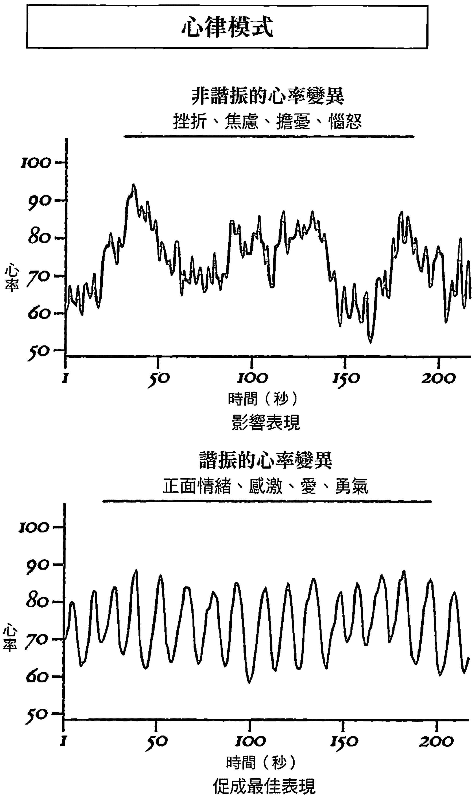

圖1 上圖取自心能商數學會的心率變異研究結果,第一張圖是非諧振的心律,這是憎恨、不耐煩及受挫等負面情緒造成的結果;第二張圖是諧振的心律,這是感激、欣賞、仁慈等正面情緒帶來的結果。

# 心腦諧振帶來的連鎖效應

當我們選擇去培養並體驗揚升情緒時，這些情緒的諧振信號會送達大腦；如果頻率振幅夠高，呼應這些情緒的化學物質便會被釋出到身體之中。我們把這種情況稱為感受，像這一類的正面感受會使我們感覺更輕鬆、更自由；換句話說，你整個存在狀態的能量都被提升了。如果你在安全的環境中感受到幸福感，這種感受的能量會啟動體內至少一千四百種可以促進生長與修復的一連串生化反應^{16}。因此，你不僅不用從身體外圍的能量場汲取能量來轉換成化學物質，反而你還能夠補充並擴展這個能量場，並從而引發可以反映這種能量變化的新化學反應。這是怎麼做到的?如果說前三個能量中心是身體失衡時的能量消耗者,那麼心所在的第四個能量中心就是能量的擴大者;當你把注意力放在你的心臟部位,創造並保持著揚升情緒,那麼隨之而來的心腦諧振所產生的能量會讓你的心臟像打鼓一樣規律跳動。就是這種協調、有節奏又合拍的跳動,在你的心臟周遭、甚至身體周遭創造出可以測量得到的磁場。就像專注打鼓時所產生的鼓聲,心跳也會製造出可測量的聲波,心律諧振調程度越高,你的磁場就能擴展得越大。

相反的,當你感受到受傷、生氣、壓力、妒忌、憤怒、爭強好勝或是沮喪受挫時,從心臟發送到大腦的信號就會變得不協調,從而觸發大約一千二百種呼應那些情緒的化學物質,並釋出到身體之中17。這些化學廢物大約會持續約九十秒到兩分鐘才能消耗完。短期來說,這些壓力情緒不會對身體造成傷害;事實上,如果這些情緒能夠被解決,甚至還能強化你的復原力。但長期來說,沒有得到解決的生存情緒會對身體造成全面性的影響,陷入失調的狀態,導致你更容易遭受到與壓力有關的健康問題。這些生存情緒會從你身體外圍的能量場汲取能量,讓你感覺更加孤立疏離且物質化,這是因為你把大部分的注意力都放在物質上面,包括你的身體、周遭的環境及時間;當然,還有你那些問題的源頭。

心能商數學會最重大的發現就是:我們每一分每一秒的感受都會影響我們的心,而我們的情緒則是打開「心識」的鑰匙。這是因為情緒會散發出強大的能量,揚升情緒越強烈,磁場就越強大。事實上,心臟部位會產生身體最強大的的一個磁場,以強度來說,比大腦所產生的磁場還要強上五千倍18。

把你的手指放在手腕上,感受一下脈搏的跳動。脈搏是被稱為血壓波的一種能量波,這股波動會流經你的全身並影響所有一切,包括大腦的功能。心臟的磁脈衝(magnetic pulse)不僅會通過身體的每個細胞,還會在身體外圍產生一個遠達八到十英尺的能量場。這個無形的能量場可以用一種稱為磁力儀(magnetometer)的敏感探測器測量到19。當你藉由揚升情緒的召喚而啟動你的心時,你不僅把這股能量傳送到每個細心，還把這些情緒發送進太空，這就是心從生物學橫跨到物理學的時候。

心能商數學會實驗室的科學家使用腦電圖（EEG）進行監測時，發現進入心腦諧振狀態後，腦波會以 0.10 赫茲的頻率伴隨心跳節律，同時，心腦諧振的受試者，心腦的同步化也會提高。0.10 赫茲的諧振頻率已被證明是最佳的表現狀態，可以提高我們接通更深直覺與內在指引的機率。一旦分析心不再礙事，我們就能走下意識的階梯，讓腦波從 α 波來到 θ 波、再到 δ 波；而我們身體自我修復的功能，在這種狀態下就會啟動。

無獨有偶的，我們的學員回報產生深刻或神祕經驗時，也常常在他們的腦電圖上看到 δ 波落在 0.9 到 0.1 赫茲之間（0.9 赫茲距最佳諧振頻率的 0.10 赫茲，只差了 0.01 赫茲）。在此之際，他們的心都處於諧振程度相當高的狀態下。此外，心所產生的能量，其振幅也會提升大腦的能量層次，在某些案例中，甚至超過正常水準的五十倍到三百倍以上。

支持心腦諧振的證據，可以在加里·施瓦茨（Gary Schwartz）博士跟他亞利桑那大學的同事所進行的一系列實驗，得到更進一步的證明。在這些實驗中，他們發現了心臟與大腦之間透過神經或其他既有的溝通管道，有著難以理解、看似無意義的交流；這個發現也證實心臟與大腦的確是透過電磁場進行能量互動。這個例子也指出了一個事實：當我們把注意力放在心與情緒上時，心跳就會產生放大器的作用，提高心臟與大腦之間的同步化，並創造出心腦諧振的狀態，這不僅會影響我們的身體器官，更影響到身體外圍的電磁場。

要注意的一點是，有個被稱為「胸腺」的腺體就位於胸骨後方，它與心臟能量中心息息相關。身為免疫系統的主要器官之一，胸腺在促進 T 細胞的增殖上有重要地位，而 T 細胞可以幫助身體抵禦細菌及病毒之類的病原體。胸腺在青春期開始發揮最佳功能，但隨著年齡增長，因為生長激素的分泌量降低而自然萎縮。

但是，就像許多重要器官一樣，胸腺也容易受到長期壓力的負面影響。一旦我們長時間處於緊急的生存模式之下，造成重要的能量場因而縮小時，為了保護我們免於外在威脅的傷害，我們所有的能量都將被引導著向外，因此幾乎沒有剩餘的能量能夠去對付內在的威脅，最終會導致免疫系統功能失調。假如心臟能量中心被喚醒，藉由動員副交感神經的修復及生長功能，胸腺應該會變得更活躍才對，這是說得通的，因為現在我們把能量注入了這個腺體中了。由此可知，當身體維持諧振狀態時，胸腺也會受益，同時還能支持整個免疫系統及長期的健康。

前面章節我也提過，我曾經以研習營的學員來做自己的研究，當學員們每天能夠維持感恩等揚升情緒十五至二十分鐘，持續四天後，情緒能量就會對免疫細胞的基因發出信號，使其製造出一種稱為免疫球蛋白 A（IgA）的蛋白質。免疫球蛋白 A 明顯增加正是一個完美的例子，可以證明心腦諧振真的能帶來許多正面連鎖效應。

所有這一切歸納起來可得出一個結論：心律的品質會影響整體健康。如果心臟可以和諧跳動，產生的效應能夠減少身體其他系統的壓力、最大化我們的能量，並且讓我們的心智、情感及體能都能有最佳表現。相反的，如果心臟不能和諧跳動，那麼我們能用來療癒、維持健康以及長期建造工程的能量就很有限，而且還會造成內在狀態的不穩定，以及增加心臟與其他器官的壓力。例如，當身體長期處於壓力下，就容易出现心臟病突發與其他心臟疾病。然而，當我們有意識地選擇揚升情緒，專注於感恩而不是其他不協調的情緒，我們的身體便會做出正面回應，從而改善健康情況。

下一次，當你運用揚升情緒去接通你的未來，並在事件真實發生之前擁抱這些情緒，彷彿事件已經發生一樣的心懷感恩，好事自然就會到來，最起碼的好處就是你開始被療癒了。

## 戰逃反應，讓你深陷壓力暴風圈

處於持續的壓力狀態下，心臟能量中心會失調，進而扼殺我們的創造能力。為了呼應混亂的心律，大腦也會變得四分五裂而失去同調性；這種非同調性，也會反映在自主神經系統的兩個分支上。套用我們前面的譬喻：副交感神經系統是煞車而交感神經系統是油門，當兩者運作不同調時，你的身體接收到的訊息就會類似想要加速而腳卻踩在煞車上一樣，不會開車也知道這兩種相反的力量會帶來什麼後果：煞車片會磨損、壓力施加在傳動系統上，抵抗的阻力會浪費能量以及降低燃油效率。到最後，這種壓力的習慣會嚴重損耗身體，破壞我們修復及保持健康的能力，並且耗盡我們的活力及復原力。

如果復原力是建立在有效管理能量的基礎上，在慢性壓力的影響下，你會感到精疲力竭、情緒不好、身體不適，或許還會生病。我們越深陷並沉迷於這種壓力狀態，就越不可能敞開我們的心，有意識地去創造心腦諧振。

我住在華盛頓州鄉間時有過的一個經驗，正好可以當例子。十一月的一天晚上，我下班回家時，一如以往地停好車子，開始沿著四十碼的一條小路走回家。一路上光線昏暗，就在距離我家前門約三十碼處，我聽到右邊大石塊後面傳來一陣不祥的咆哮聲；我的注意力立刻調集起來，心中一直想著：黑暗中潛伏的是什麼東西？我開始在大腦的記憶庫中搜尋已知的檔案，以便預測將會發生什麼事。會不會是我養的狗呢？我開始亂猜，然後大聲喊著牠們的名字，卻沒有得到任何回應。我又向前走了幾步，咆哮聲越來越大了。

我還沒想到如何動員身體的能量，頸後的寒毛已經自動豎起，心率與呼吸頻率都加快了，感官被高度增強，為戰或逃的反應做好準備。我拿出手機、打開手電筒，把注意力聚焦在可能的威脅上面，但仍然無法看到發出聲響的是什麼東西。咆哮聲不斷從黑暗中傳來；我慢慢往後退，終於逃進馬房，那是我的牧場幫手把馬匹趕進去過夜的地方。等我們抓了槍及手電筒再返回原處，剛好看見一頭美洲獅跟牠的幼獅竄過灌木叢迅速逃離。

你大概可以根據這個故事推測出來，像這樣極度緊張的狀況，並不是一個可以敞開心信任未知的時機，也不適合把注意力從外在的物質世界轉移開來，因為這時你必須逃跑、躲藏或戰鬥。但話說回來，如果你無休止地沉迷於這種戰或逃的狀態，即使連樹叢中已經沒有美洲獅也同樣緊張防備著，你便不太可能會想要閉上眼睛、深入內心，因為你必須將注意力放在外面世界你所感知到的威脅上。此時，除了呼應你所體驗到的情緒，沒有任何新信息能進入你的神經系統，所以你無法重新設定你的身體去迎接新命運。也因此，你越是沉迷於日常生活的壓力荷爾蒙，你就越不可能想去創造、冥想、敞開心，以及讓自己暴露在毫無防備或易受傷害的狀態下。

## 心與腦的親密關係，神經心臟學的興起

一九九一年，醫學博士約翰·安德魯·阿莫爾（J. Andrew Armour）率先證明了心臟的確擁有自己的心智。我們的心臟有多達四萬個神經元，還有一套可以獨立於大腦而自行運作的神經系統，特別稱為「內源性心臟神經系統」（intrinsic cardiac nervous system），通常簡稱為「心腦」（heartbrain）。這項重大發現也從而開創出一個新的科學領域，稱之為神經心臟學。

心臟與大腦藉由傳出（下行）路徑與傳入（上行）路徑連結在一起，然而，其中有九〇％的連接神經纖維是從心臟往上傳至大腦。阿莫爾博士發現，這些往上傳導的神經路徑會不斷發送信號及信息到大腦，調整認知與情緒中心的活動並進行互動。這些從心臟直接傳到大腦的信號，是藉由迷走神經來產生連結，並一路直達丘腦（上下訊息的轉運站，負責同步思考、感知及理解語言之類的皮質活動），接著來到額葉（負責運動功能及解決問題），還有大腦的生存中心「杏仁核」（負責發送情緒記憶的信號）。杏仁核的核心細胞甚至跟心跳同步（參見圖 2）。這意味著，如果你的心臟能量中心被啟動了，它就會約束大腦的生存中心。那麼可能的情況是，你越是以心為中心，就越不會輕易對生活中的壓力源做出回應；反之亦然，心臟中心的能量越少，你就越可能活在生存模式之下。

這告訴了我們，我們的感受與心率會影響發生在我們身上的情緒記憶與回應，因此壓力與焦慮會激發與過去焦慮習慣相符的腦波模式。反之，就像一部設定好模式的電腦，心的揚升情緒也會讓腦波進入諧振模式。因此，當你把自己擺在一個揚升狀態以召喚未來的感受時，大腦會開始為那些未來的感受或是新命準備好神經網絡。阿莫爾博士發現從心臟傳入大腦的神經路徑，就證明了心臟可以在沒有來自大腦信息的情況下，獨立處理情緒、直接回應外在環境，以及自行調節心跳節奏。原因在於，心臟與自主神經系統始終合作無間。另外值得注意的是，促進這種交流的神經能夠讓心臟去感受、記憶、自我調節，並且可以獨立於神經系統之外而自行做出與心臟控制相關的決定。

## 心的諧振影響到大腦的諧振

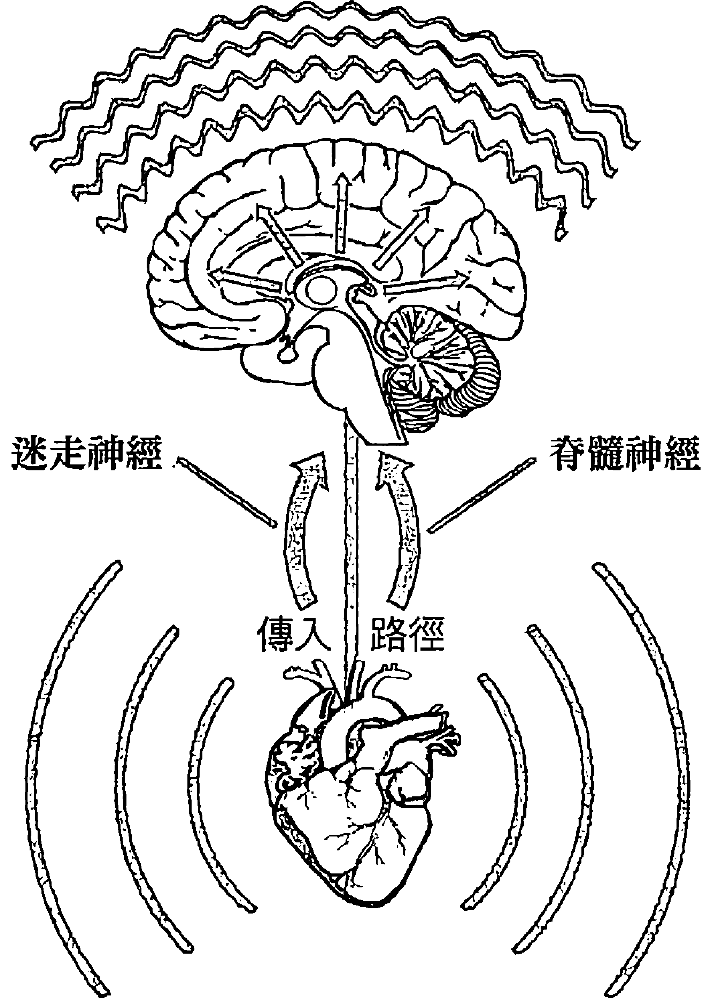

## 以心為本，人類最理想的存在狀態

如我先前所說的，你的每個想法都會產生相對應的化學物質，而這些化學物質又會反過來去創造出一種情緒。因此，你會很容易就被呼應你情緒狀態的想法所影響。我們現在知道，當學員們安住於心而感覺到更完整與合一時，他們會更容易擁抱夢想；當他們感受到感恩、富足、自由或愛等等情緒時，也會更欣然接受能夠呼應這些情緒的想法。這些安住於心的情緒會打開潛意識的大門，讓你得以重新設定自主神經系統，以便呼應新未來的那些想法。我們都知道，當我們懷抱著憂懼或匱乏的情緒，卻試圖把自己想像成富足無虞時，並無法產生可測量的改變成效，因為改變唯有在想法與身體的情緒狀態一致時才會發生。不管你的想法多麼積極正面，如果缺乏能夠呼應的感受或情緒，這樣的訊息便無法被身體的其他部分所感知或理解。

簡而言之，源自心的情緒與感受，對於我們思考、處理信息、感覺和理解這個世界，以及我們在這個世界的定位，都扮演著重要的角色。一旦心臟能量中心被喚醒，就會像放大器一樣去推動大腦、強化大腦的活動，並創造全身性的平衡、有序及協調一致。

因此，你可以重複肯定我無所畏懼這句話，直到你聲嘶力竭、面紅耳赤；但如果畏懼是你真正的感受，我無所畏懼的這個想法永遠只是想法，無法通過你的腦幹送出去。這意味著，你無法對身體與自主神經系統發送信號去創造一個特定的新命運。所有情緒都會製造出情緒電荷（也就是能量），從而刺激自主神經系統，進而創造出截然不同的命運。倘若沒有情緒及感受，你的大腦與身體之間永遠會保持著不相連的分離狀態，你想要健康的想法與健康的感受永遠隔了一層；換句話來說，就是你無法體現你想要的那個新的存在狀態。

只有當你改變能量，你才能產生更協調一致的成效。如果你能夠天天都抱持著這些揚升情緒，最終你的身體將會以與生俱來的智識，開始用我稍早描述的方式來產生相關的基因改變。這是因為，身體相信你所擁抱的情緒是來自環境的真實體驗。所以，當你喚醒心臟能量中心，練習去感受某種先於經驗而產生的情緒，並攜帶著清楚明確的意圖，身體的反應就會像是它已經處於未來的經驗之中。這種心腦諧振，會以一系列的方式影響身體的化學物質與能量。

如果心腦諧振可以從心臟開始，兩者的同步能夠促成最佳表現與健康，那麼你就有充分的理由每天花時間專心去活化你的心臟能量中心。你要有意識地選擇去感受心的揚升情緒，而不只是坐等著外在事物去誘發這些情緒，然後成為你真正想成為的人，亦一個由心來賦予力量的個體。一旦你的生活是由心來引導時，就會自然而然地選擇愛，並透過慈悲以及對你自己、他人、地球的關懷來展現這樣的愛。透過與心能商數學會的合作，我們的學員已證明，經由練習的確可以擺脫外在事件的影響，從事創造、調節並維持崇高的感受與情緒。

我們在世界各地舉辦的研習營中，也透過調節心律的練習來維持揚升情緒，教導學員如何達到心腦諧振。然後，我們會使用心率變異分析監測器來測量學員的能力。在引導學員冥想的過程中，我會要求學員放開一切、交出自已，讓自己臣服於感恩、喜樂及愛的正向情緒下，也鼓勵他們在正式指導之外，每天都要自行練習。因為，當我們選擇在身心協調的狀態中靜坐冥想，就會變成一種習慣。我希望經過足夠的練習，所有學員都能有更崇高的存在狀態、更熱愛生命，以取代先前的不值得、低落、恐懼、不安全等老舊的心理劇本。我們已經見證過很多真實例子，證明了光是藉由想法與感受的典範轉移，的確有可能對他們的生命產生積極、可衡量的實質影響。這些專注的學員在各自返家之後，不僅會對自己的生活造成正面影響，還會往外擴散，從而影響到他們的家庭與社區，甚至可以持續將這種和諧一致的振動擴展至全世界各地。

透過反覆練習及調節情緒狀態，假以時日，對揚升情緒的穩定感受將會創造出一種新的情緒基準線，這樣的基準線會開始持續不斷地生成一套呼應揚升情緒的新想法。接著，累積在一起的這些新想法又會創造出新的心智水準，從而產生出能夠呼應這些想法的正向情緒，進一步維持並鞏固這個情緒基準線。當心臟（身體）與心智（大腦）之間的這套反饋迴路發生時，你會處於一種全新的存在狀態，感受到無限心智的意識，以及充滿愛的深刻能量。這個過程的重複性，意味著你可以一再重新調節你的身體、重新為大腦神經網絡配線、重新配置你的生理機能，使其能呼應你全新的存在狀態。現在的你，正在自然、自動且規律地向能量場播放出一種截然不同的電磁識別信號。這就是你，一個全新的你。

數不盡的歷史書都會流露出一層層不協調一致的情緒，無論結果是一齣莎士比亞的悲劇、一場種族滅絕的大屠殺或是一場世界大戰，本質上都是由責備、仇恨、憤怒、競爭、報復等生存情緒所串成，因而導致了無止境且不必要的痛苦、受苦、壓迫以及死亡，也讓人類一直都活在對立與衝突之中，而離和平與和諧越來越遠。在歷史上的此時此刻，我們可以打破這個循環；在人類歷史的這個關鍵時刻，古老智慧與現代科學的交會提供了我們科技與科學的理解，讓我們得以學習如何以更高效能且更有成效的方式去管理情緒，同時也讓我知道這對健康、人際關係、能量、個人與集體的演進有什麼意義。何況，這不是一個浩大艱鉅的移山工程，只需要改變我們的內在狀態，讓我們得以改變對待彼此的方式，以積極正面的經驗取代充滿壓力的狀

## 心腦諧振的真實案例

心的諧振如何帶動大腦諧振，可以參見彩圖 8A 與 8B 的例子。第一幅影像可以看出頻率相當低的正常 β 波模式，這是在開始創造心腦諧振之前的腦波狀態；第二幅影像出現了重大的變化，這是進入心腦諧振之後幾秒鐘的腦波狀態。這是因為心會發揮放大器的作用去影響大腦，帶動大腦同步創造出更協調一致的 α 波。

圖 3A 與圖 3B 是我們學員在一場進階研習營的心率變異分析。她度過了相當驚人的一天。圖 3A 的第一幅圖代表兩次冥想的結果，一次是在早晨，另一次是在午餐前，每個區間代表五分鐘。你在掃描圖上方看見的第一個指向右下方的灰色箭頭，正是她進入（並持續）心腦諧振之際；在早晨七點的冥想中，該學員維持這樣的狀態超過五十分鐘之久，直到你看到第二個指向左下方的箭頭。在掃描圖下方，你會看到第二個指向右下方的灰色箭頭，這是她再度進入心腦諧振的狀態，這次是午餐前的冥想，她維持了三十八分鐘，直到第二個指向左下方的箭頭出現為止。你可以看出，她正在經由練習而逐漸發展出這項技巧。

現在，再來看看圖 3B。下一次的冥想時間是當天下午稍晚。圖表上方有兩個灰色箭頭，看看它們之間的間隔，可以看出她再次進入心腦諧振持續了約四十五分鐘。然而，這個讀數之所以迷人，是因為這個時間是晚上大約八點（見第二組指向內的灰色箭頭）。當時她沒做任何的冥想，我們後來詢問她當時經歷了什麼，讓她在正常的清醒狀態下進入「超同調性」的心腦諧振狀態超過一小時。

她告訴我們，她當時正準備上床睡覺，但突然之間感受到一股愛排山倒海而來。感受是如此強烈，以至

# 第 7 章 當理性遇到感性，一顆玲瓏智慧心

圖 3 在這兩張圖中的每一個灰色箭頭，所指之處是保持揚升情緒的學員進入心腦諧振的時間點。每個方格是五分鐘的間隔時間。在圖 3A 與圖 3B 這兩張圖中，你可以看出這名學員正在應用冥想技巧來調節她的內在狀態。

圖 3B 下方有兩個灰色箭頭，指出該學員自發性地進入了心腦諧振的狀態超過了一個小時。她的身體已被調節成一個全新的心智。於她必須躺下來臣服於這股情緒。她的心自發性地進入了心腦諧振的狀態長達一小時又十分鐘，她躺在床上，默默感受對自己生命強烈又深沉的愛。她的自主神經系統持續發生變化。你看到最後一個箭頭所指向之處，就是她說她翻過身陷入沉睡時。這個結束一天的方式挺不錯的，你不覺得嗎？

所以好好想想：對於尚未發生的未來事件，你會有多麼容易就生出恐懼或焦慮的念頭，並在腦海裡、在情緒上，一次又一次地擁抱這個虛構的結果？以及你是否清楚地知道，當你餵給這些想法越多的能量，你就越會在其他可能的結果上反覆去想、流連不去，最後，那些想法會把你帶進最糟糕的情境之中？驅策這些想法的正是情緒，你把你的身體制約成恐懼與焦慮的心智，如果持續一段長時間，你的身體可能會罹患恐慌症，這表示你的意識控制不住一種自發性的身體機能。

那麼，如果身體可以被制約成恐懼與焦慮的心智，是否我們也能懷抱著持續的揚升情緒，讓身體被制約成愛與諧振的心智呢？與其懼怕並擔心恐慌症再度發作，或許你可以選擇透過冥想練習，去期待一個讓愛自然湧現的大好前景。

圖 4 是三名學員的例子，他們都維持了心腦諧振的狀態一段時間。仔細觀察，可以看出他們的心都對揚升情緒做出回應，持續時間至少四十五分鐘；換句話說，他們的身體對這個新的心智做出了回應。我會說，這絕對是一種超自然現象。

圖 4 三名學員維持在「安住於心」的情緒狀態下，長達四十五分鐘。

圖 5 在這兩張圖中，你可以看出這兩名學員的心率變異度非常小（以指向上方的黑色箭頭表示）。然而，當他們啟動心臟的能量中心時，可以看到兩個灰色箭頭之間出現了顯著變化。即便只持續了八到十五分鐘，但仍然改變了他們的生理機能。

圖 5A 與圖 5B 顯示出在自然清醒狀態下兩個心率變異極糟的例子（注意兩組指向上方的黑色箭頭），再看他們進行心腦諧振練習後所造成的心率變異變化：兩個灰色箭頭之間所顯示的區域。雖然只有八到十五分鐘，但這些學員仍然改變了他們的生理機能。

## 「心腦諧振」冥想法

這個冥想法是以心能商數學會發展出來的鎖心技巧（Heart Lock-In Technique）為基礎。閉上雙眼，全身放鬆，把注意力帶往你的心；一開始從心臟能量中心呼氣及吸氣，並持續以緩慢且深沉的呼吸方式進行。

當你的心智開始漫遊時，要不斷將注意力與意識拉回到胸腔、心臟及呼吸上。

接下來，把注意力放在第四個能量中心，帶進揚升情緒，並持續從心臟能量中心呼吸。一旦能感受到胸腔部位存在著這些真摯的情緒，就把這股能量傳送到身體外面，並攜帶上你的意圖。持續朝你的周遭播送這股能量與意圖。一開始每次只練習十分鐘，再試著逐漸延長每天的冥想時間。

最後，當你開始掌握你的身體體驗到這些揚升情緒時會有什麼感受後，就可以嘗試每天睜眼練習這個冥想法（本書第九章介紹的「步行冥想」，可以學到更多這方面的技巧）。你甚至可以在手機上設定一天四次的提醒，只要手機一響起，就花一、兩分鐘去感受這些正向的揚升情緒。

# 第 8 章 心靈電影，演出你想要的未來

週六夜晚，我剛結束一場在佛羅里達洲奧蘭多（Orlando）舉辦的專題演講；第二天早晨，我一邊打包行李準備下午搭機返家，一邊打開電視想跟上美國的政治局勢。當時正值二〇一六年總統選戰正熾之時，而我前三個星期都在國外旅行與演講，好奇不在國內的這段期間，選情發生什麼樣的變化。於是，我快速轉到了新聞台，放下遙控器後一邊注意電視新聞，一邊繼續整理行李。突然之間，一則廣告出現，抓住了我全部的注意力，就在那時候我才理解了為何有節目「編排」（programming）一詞。

廣告一開始的畫面是夜闌人靜的一戶人家外面，鏡頭推進後，螢幕上出現了一行字「罹患帶狀皰疹的第十四個夜晚」。當鏡頭移往屋內時，溫柔但不祥的配樂響起，只見一位老人在床腳處痛苦呻吟，憂心的妻子走進房間，溫柔地詢問他的情況。「很痛。」他回答。「演員飾演」幾個小字不明顯地出現在螢幕右下角，字體顏色幾乎跟背景融在一起。

妻子帶著一臉絕望的神情走過來，慢慢撩起丈夫的襯衫，露出覆蓋住下背部一大半的紅斑病變部位。這個怪異的畫面令人毛骨悚然，看起來就像是大面積的三度燒傷。在我三十一年的執業生涯中，檢視過成千上百名罹患帶狀皰疹的病人，從來沒見過有任何一個人的病情跟這則廣告中加工出來的效果一樣嚴重。我恍然大悟，這樣的影像設計就是為了引發觀眾強烈的情緒反應，就像我當下的反應一樣。

只要你看到那個男人背上可怕的紅疹子，廣告就一定能達到控制你注意力的目的。那些皮疹是如此醒目，足以在你觀看當下的片刻改變了你的感受；就在那一刻，這個廣告明顯地改變了你的內在情緒狀態，使你投入更多的注意力與覺知在外在環境的干擾上面。它所引發的情感越是強烈（刺激），你就越會對它投入更多的注意力（反應）。這種刺激與反應之間的關聯或制約，就是創造長期記憶或聯想記憶的方式。

制約的過程，開始於將某種象徵或影像與情緒狀態配成一種組合，從而打開意識心與潛意識心之間的門戶。以前述帶狀皰疹的廣告為例，當他們抓住了你所有的注意力後，就開始了編排及設定的過程，你不由得會想知道他們接下來要說什麼。廣告以男人陰鬱的旁白繼續下去：「如果你得過水痘，帶狀皰疹的病毒就已經存在你的體內，當你年歲漸長，免疫系統逐漸衰弱後，就會失去抑制帶狀皰疹病毒的能力。」這樣的廣告強調的是顧客感受的「情緒品牌」行銷手法，以及告訴觀眾免疫系統會隨著年紀而衰退；接下來，畫面來到浴室裡的男人，他看著鏡中的自己，臉上寫滿了擔憂、沮喪及挫敗。

場景換到在廚房講電話的妻子：「我不忍心看他這個樣子。」她說。

接著，廣告中的男人在床上蜷曲成一團，痛到緊皺著眉頭。然後旁白給了你一個直接的暗示，並在螢幕上打出一模一樣的文字來強化：「每三人就有一人，一生中至少會得到一次帶狀皰疹。」這段文字一直停留在螢幕上，接著旁白繼續說道：「帶狀皰疹的皮疹可持續三十天。」

場景切換成妻子，她面對著鏡頭懇求：「我只希望能幫他減輕痛苦。」

痛苦的男人再度出現在螢幕上，還有這段文字：「每五個得到帶狀皰疹的人中，就有一人會有長期的神經痛症狀。」這段文字一直留在螢幕上直到旁白結束：「有些得到帶狀皰疹的人會有長期的神經痛問題，可持續數月到數年。別等到你愛的人得到帶狀皰疹才開始行動。請詢問醫生你得到帶狀皰疹的風險。」

讓我們仔細來討論這支廣告的意圖。首先，它藉著改變你的感受，讓你處於某種情緒狀態之中。一旦它抓住了你的注意力，你會立刻變得更容易接受接下來的暗示；現在的你更容易在未經任何分析之下，就接受、相信並屈服在廣告要給你的信息。如果你感覺到害怕、脆弱、擔憂、震驚、虛弱、疲憊或痛苦，你就會更容易被等同於這些情緒的信息所影響。你可能會開始懷疑，是否這種病痛也會發生在你的身上。

在廣告中的不同時間點，某個「事實」會以字幕方式呈現，讓你在看廣告時讀取，以強化「程式設定」的效果。此外，當思考腦專注於讀取這些文字時，一模一樣的旁白內容則會從意識心悄悄溜進潛意識心，這樣的操作就像錄音機一樣，一面記錄下整個腳本，一面在內在創造出一個設定程式。

接下來，藉由字面上的直接暗示，把恐懼傳達給你，讓你相信你的體內已經存在著帶狀皰疹的病毒，而且因為老化的自然過程，你的免疫系統不再強壯到足以抵抗這些病毒。這會打開你的情緒腦（自主神經系統的所在），讓它變得更容易編排及設定。一旦這些暗示長驅直入到自主神經系統，系統就會毫無異議地接受命令，並且開始忙著在你體內製造出能夠對應於這些字面暗示的化學物質。換句話說，你的身體將會下意識地、自動地被設定成逐漸削弱你的免疫功能。廣告的結論是，你正面臨風險，最好別坐等帶狀皰疹找上門。影響甚至會更進一步：如果你曾經得到水痘，在看過廣告後你會「認為」「有點年紀的你，免疫系統已經衰弱了，有必要趕緊預防帶狀皰疹，因此你更有動機去購買廣告推薦的藥物。

如果你碰巧已經得了帶狀皰疹，又正好看到這支廣告，看到自己的情況沒有廣告中的男人那麼嚴重，你可能會這樣想：「我現在應該買那種藥物來吃，以免病情日益嚴重，變得跟他一樣。」即便你沒有得帶狀皰疹，看完這支廣告後，可能也會疑心生暗鬼地想：「我會是那三分之二的幸運兒嗎？帶狀皰疹真的不會找上我嗎？或者我是會發病的那三分之一的人？」如果是後者，這意味著你已經相信自己是脆弱的、是有可能得病的，也代表你的潛意識認為自己已經罹病了。

你知道這支廣告最荒謬之處是什麼嗎？廣告從頭到尾都沒有提到藥品名，而這意味著藥商毋須說明該藥物的副作用有哪些。這支廣告引起了我的好奇心，我停下整理行李的工作，上網搜尋同一家藥廠製作的其他廣告，想知道他們到底建議什麼藥物來治療廣告演員那種誇大、加工出來的嚴重病變。沒多久，我找到了幾則有相同主題及用語的類似廣告，版本雖然不同，但都是同一個訴求，也全都是為了抓住觀看者的注意力而設計。

在另一支廣告中，有個女人帶著護目鏡在泳池中游泳，所有場景都是黑白的，拍攝手法承襲自上一支廣告。旁白（帶著權威感的英國女性口音）是帶狀皰疹病毒本尊，聲音來自於這個女人的腦袋：

> 太驚人了，琳達！歲月完全沒有減慢妳的游泳速度。但妳知道嗎？當妳年紀越來越大，免疫系統會跟著變弱，妳得到我（帶狀皰疹病毒）的風險也會跟著提高。從妳得到水痘後，我就一直潛伏在妳的體內，任何時候我都可能化成痛苦的皮疹現身。

接著，場景突兀地從黑白切換成彩色，一個男人掀起襯衫、露出最可怖的一大片帶狀皰疹；再度的，怪異的病變畫面吸引了你的注意力。然後場景迅速再切換回黑白的游泳畫面。

這兩支廣告都以類似的手法展開：首先是一段引人注意的陳述或令人震驚的畫面，用來改變觀看者的情緒狀態，情緒狀態的轉變會使他們更容易被信息影響；接著，再透過直接的暗示讓觀看者懷疑自己是否已經得了帶狀皰疹；或是暗示即使你現在很健康、定期運動、好好照顧自己，還是可能會變成病毒的受害者；而且更進一步地暗示，沒有人可以免疫。加上字幕後，可以更強化這個訊息，比如：「每三個人就有一人，在一生中會跟我相會。琳達，那個人會是妳嗎？」如果你在任何方面認同這個女人，那個聲音就是直接在對你說話。

最後，旁白換成了男人，他以自信、毫不擔憂的英國腔說道：「這就是琳達會選擇我──某某藥品──的原因。」除了女人的泳衣、泳帽，其他場景仍然維持著黑白色調，而藥品名稱則以一種複雜的大字體出現在螢幕上。同樣的，這支廣告也是在健康、安全以及宣稱能保護你的藥物之間創造出一種聯想關係；而要給你的信息則以標語形式出現在螢幕上，並加上旁白直接指出該藥物有助於「增強免疫系統對抗帶狀皰疹，保護你免受帶狀皰疹的傷害」。

廣告結束時，旁白說道：「某某藥品不在於治療，而是預防五十歲以上的成人得到帶狀皰疹，但不是對每個人都有幫助。」接著，最有趣的一句話來了：「如果你的免疫系統不夠強健，不該服用此藥。」

什麼？我們來倒帶一下。這不是很弔詭嗎？一方面，他們告訴你隨著年紀增長，你的免疫系統會變弱、得到帶狀皰疹的風險會增加，因此要使用該藥品來補強你的免疫系統；但另一方面，他們又警告你，如果你的免疫系統不夠強健，就不該使用它。

如果你仍然選擇用藥，代表你相信它比你可能不夠強健的免疫系統更為強大。於是，廣告的設定作用奏效了。

聰明的（或是有道德的）廣告主會了解，這些訊息會混淆、迷惑觀眾的意識心，但同時，它們也會以你的免疫系統不夠強健的暗示來重新設定你的潛意識心：「你的體內或許已有病毒潛伏，即使你很健康，你得帶狀皰疹的機率仍然很高。」但另一方面你又被告知，如果沒有用藥，你很可能會受病痛之苦，即便該藥物無法保證你能夠免疫。此外，如果你的免疫系統不夠強健，藥物可能無法發揮作用。

最後，副作用的說明終於出現了（其實不是副作用，而是直接的影響）：「注射部位會出現皮疹、紅癢、疼痛、腫脹、硬塊、發熱，或是頭痛。由於疫苗是水痘病毒的弱化菌株，如果可能接觸到新生兒、孕婦或是免疫力低下的人，請先諮詢醫師意見，以免造成傳染。」

哇！我都開始懷疑自己住在哪個星球上了。這一類的廣告手法會讓你懷疑，人類真的有自由意志嗎？或者我們都是在被制約的情況下去做選擇，包括選購啤酒、洗髮精、潤髮乳、智慧型手機，或某種可能有效或可能無效的帶狀皰疹用藥。大多數的廣告，都以匱乏或區隔做為訴求，提醒你去想去擁有那些你所沒有的東西，去渴望你能用來融入社會意識的東西，以及用東西來填補空虛感與孤獨感。當然，如果你生病了或是感覺自己生病了，廣告主也會為你的症狀提出答案，就像上面的例子。

在這次搜尋時，我還找到了第三支相同主題的廣告：片中患有帶狀皰疹的演員已經忍受了十七天的病痛，同樣露出了可怕的皮疹，也有一串字幕來影響觀眾的想法並強化內容。就像前兩支廣告，這一支廣告也明確地告知觀眾，這種藥物不是用於治療，但在廣告結尾，英俊的男演員卻微笑表示：「我想我會試試。」

這讓我萬分疑惑，如果他已經得到帶狀皰疹十七天了，為什麼還要試用這種「預防性」藥物？特別是廣告已經聲明該藥物無法用於治療。現在，我真的是一頭霧水了。

多年前，我從訓練中了解到，所謂的「催眠」就是抑制意識心過程的一種「迷航」，也就是繞過分析心，讓一個人對潛意識的暗示與信息產生高度反應；當意識心全神貫注地忙著把事情搞清楚時，潛意識心就會毫無判斷力地對外來信息全盤接受。如果你可以用信息（更多時候是假信息）、震驚或混淆視聽等方式使人們感到迷惘，你就能打開潛意識心的大門長驅直入，操縱他們的潛意識。

在這一章中，我們要學習如何反其道而行，也就是正面去重新設定我們生命中許多被制約的負面設定。

## 大腦的三個心智：意識心、潛意識心及分析心

到目前為止，你已經知道了當腦波從 β 波變化到 α 波時，用於分析、思考的新皮質的活動會減緩；而當腦波變慢時，你會離開意識心的領域、進入潛意識心的範疇。如果有若干意識與覺知沒有主動投入思考，代表你的意識正在離開新皮質而進入中腦（潛意識），也就是自主神經系統與小腦的所在位置。

如果你曾見過某人看電視看到入神，完全聽不到你說話，那麼此時對方的優勢腦波可能就是 α 波，這是一種極易受到信息暗示及影響的狀態。「可受暗示性」是指未經任何分析之下，接受、相信及屈服於信息的能力，也就是受暗示影響的程度。一旦看電視看到入迷或入神，一動不動地全神貫注在節目上時，除了所專注的對象，他們的腦海中別無他物。

一旦人們無法分析所接收到的信息，在欠缺分析這個過濾器的情況下，就可能全盤接受、相信以及/或者臣服於信息。因此，你越容易受到暗示影響，就越不善於分析，這是合乎邏輯的；反之亦然，你越善於分析，就越不容易受到信息暗示的影響，亦即你的大腦較不可能處於 α 波或出神狀態下。圖 1 可以幫你了解可受暗示性、分析心、出神狀態以及腦波之間的關係。

我前面提及的那些廣告，一手打造它們的人非常了解要重設人們的心智，最好的方式就是讓他們的大腦處於 α 波的狀態下，如此一來，信息就能在未經分析的情況下呈現在他們面前。當同一個廣告、或是帶有相同訊息的類似廣告被不斷播放，設定的效果遲早會在觀眾的潛意識發酵。我們越常處於刺激（例如廣告）的影響下，程式設定的反應就會越來越自動。最後，我們會在不知不覺中記住該刺激並自動做出反應，意識心不再需要思考或分析進入的信息；同時，潛意識心則會呼應該信息，以聲音或影像去記錄及儲存。一旦信息在你的大腦形成了相對應的位置，每次你只要接觸到那支廣告，就會引發相同的神經網絡去進一步強化同樣的設定、想法以及信念。如此一來，該信息不僅會影響你的健康，還會讓你接受它所提供的解決方法，亦即使用它所推薦的藥物。

其他會增加「可受暗示性」的情況，還包括受到打擊、創傷，或是強烈的情緒反應。例如，當一個人受到衝擊或情緒激動的情況下，大腦往往會進入一種轉變狀態（altered state）。當大腦由於車禍之類的感官超載而暫停運作時，人就會進入一種易於接受暗示的狀態，甚至在極端嚴重的情況下，還會屈服於衝擊而變得呆滯，思考能力也會受損。因此，當一個人看到來勢洶洶的皮疹畫面（加上適當的音樂與旁白，營造出一種不祥的預感或心情）並感到厭惡作嘔時，通往潛意識心的大門就會打開，而更易於受到設定的控制。

你應該還記得，潛意識心位於意識心的下方。緣腦是潛意識心自主神經系統的所在地，而自主神經系統控制了每個瞬間所發生的自主生物性功能。一旦某個想法被設定，自主神經系統就會像是一個只知道執行主人命令的僕人，盡忠職守地去執行這個想法的要求。

假如你不斷被告知，免疫系統會隨著年紀逐漸衰弱，而且每三個得過水痘的人中就有一人會在一生中得到帶狀皰疹；這種可能引起激烈情緒反應的經驗，會讓以上信息直接越過你的分析心進入潛意識，而為了回應該信息，自主神經系統會遵從它的命令，真的去削弱你的內在防禦系統。

對於那些真的想把錢花在刀口上的廣告主來說，他們的廣告最好可以不斷地在晚間播放，因為這個時段我們最容易受到廣告設定的操控。為什麼？答案是：褪黑激素的濃度會隨著夜色漸深而逐漸提高。褪黑激素會使腦波頻率慢下來，為即將來臨的睡眠及夢境預做準備：我們的腦波會在傍晚時分從 β 波轉變成 α 波、θ 波、再到 δ 波，於是時間越晚，我們越不善於分析，潛意識門戶也會慢慢被打開。當早晨的曙光喚醒我們時，大腦會開始製造血清素，反向的過程於焉發生：腦波會從 δ 波轉變成 θ 波、再到 α 波（到此，我們的潛意識門戶還是打開的），然後就回到了 β 波。

因此，如果你是廣告主，知道大部分的人並不清楚潛意識如何設定及操控，難道你不會試著製作系列廣告在晚間播放，並在所要傳達的訊息中摻入恰到好處的驚恐與憂慮來強化，以抓住觀眾的注意力，進而在他（她）們上床睡覺前，對自主神經系統進行設定操控，讓它們忙著接受命令？

> 經驗法則：任何你不想經歷的事，就不要去看電視或網路上的相關報導，也別參與任何你不想體驗的娛樂模式；不只是在睡前，任何時候都不要去挑戰。

## 萬花筒之眼：進入出神狀態

多年下來，我一直在思考我們是如何被設定成對自我設限的信念深信不疑的，而相信我們需要靠外在的事物來改變內在的感受。這就是所有廣告的目的：為了讓我們感覺更好或更快樂，只能永無止境地依賴並消耗外在資源。這種不斷提醒「人有別」的信念，透過媒體、電視節目、廣告、新聞、電玩、網站或甚至是音樂，已經在我們的腦海中根深柢固了。這樣的策略非常簡單有效：如果可以让人们沉溺在匱乏、恐懼、憤怒、反對、偏見、痛苦、悲傷、焦慮的感受之中，他們就會繼續依賴外在的人事物來讓這些感受消失。如果你一直處於忙碌的狀態，把注意力聚焦在求生存的情緒上，你永遠都會錯失真正相信自己的機會。

那麼，有沒有可能反轉或消除這樣的設定，讓我們可以擁有對自己、對生命的無限信念呢？這正是我們這些年來在進階研習營中所致力的目標，我們利用了兩項簡單的工具，其中之一就是很多孩童喜歡的玩具——萬花筒。兩者的差別只在於，我們是以一種先進科技的方式來使用它，以誘發出一種渾然忘我的出神狀態。

### 出神狀態、可受暗示性、腦波及分析心之間的關聯

圖 1 腦波變慢時，你會超越自己的分析心，大腦隨之進入出神狀態，你也更容易受到信息的暗示。相反的，當腦波加速，會讓你更偏向分析，大腦也會脫離出神狀態，這樣的你會不容易受到信息的暗示。所謂的「可受暗示性」，是指你在不做任何分析之下，接受、相信及臣服於信息的能力，也就是受暗示影響的程度。

到現在為止，我們的冥想仍以閉眼方式進入出神狀態及α波、θ波的腦波狀態。但倘若我們能在睜眼情況下生成α波或甚至θ波，並有意識地置身於為自己創造的新人生或目標等信息環境中，就可以重新將自己設定為超自然狀態，而不是日復一日的無意識狀態。不過，為什麼要用萬花筒呢？

這麼多年下來，我對神祕事物始終都熱情不減。每次只要經歷到這類深刻且清晰的神祕體驗，內在就會產生持久的改變，加深我對自己的理解以及我與生命奧祕的連結。一旦你經歷過神祕體驗，看過一眼面紗之後的世界，就再也無法回到以前的日子了。隨著你所經歷的每一個神祕體驗，你會越來越接近原始、完整及那個不可分割的統一場。好消息是，神祕體驗不再是聖女大德蘭（Teresa of Avila）、亞西西的聖方濟（Francis of Assisi）或冥想四十年的佛教僧侶才能擁有的經歷，而是人人都能夠參與、經歷及接觸到的親身體驗。

每當我經歷神祕體驗時，那種感覺比起生命中任何已知的事物都要更為深刻、真實，同時喪失了空間感及時間感。往往就在我深入其中之前，會在我的心智（有時候是外在世界）中先看見光與能量組成的圓形或幾何圖案，通常像是動態的曼陀羅；它們是干擾頻率的駐波，看起來像是不規則的碎形圖案。我只能如此描述這些圖案：它們是有生命的，會移動且不斷變化的，而且每個圖案會持續發展得更為複雜而精細。

它們就像你在看萬花筒時會看見的圖案，差別只在一個是三度空間，而一個是二度空間。當我將注意力放在這些神聖的幾何圖案上時，它們會不斷變化，在那個瞬間我知道，我的大腦吸收了這些帶著信息的圖案並將之轉換為生動的影像，而我接下來即將擁有一個深刻的神祕體驗。這也是為什麼我的團隊會想要為學員打造萬花筒，以及把萬花筒的構想納入媒體簡報的原因之一：希望能藉此誘導出這一類的神祕經驗。可惜的是，當時網路上所有的碎形圖庫都是電腦生成的，我們找不到可用來製作萬花筒的連續真實鏡頭。

## 第8章 心靈電影,演出你想要的未來

所幸,我們的好友蘿貝塔·布里汀漢(Roberta Brittingham)是一個才華洋溢的藝術家,她給了我們靈感,也與我們一起開始這趟創作之旅。經過長達數月的不斷討論與溝通後,她的聰慧與天分終於催生出改變了許多人生命的這個神奇工具。在四方尋找承製業者後,蘿貝塔找到了一個三代都在製作萬花筒的家庭,所以我們買了他們最好的作品之一。

接下來,我們租用了瑞德(RED)數位公司的一台相機,瑞德是好萊塢電影最常使用的專業數位電影攝影機的主要製造商。我們將萬花筒拆分成兩個獨立的部件:觀看的管子,以及末端有水晶玻璃的旋轉部件。然後,我們把相機鏡頭對準萬花筒的鏡片(鏡片附著在光纖燈絲的末端,是萬花筒的一部分),然後加上燈光來增強彩度。我們用相機放大萬花筒的末端,然後把馬達安置定位;接下來,我們緩慢旋轉裡頭的水晶玻璃,使其中的彩油能夠平滑一致地移動。在華盛頓州西雅圖的攝影棚中,我們花了好幾個小時捕捉萬花筒美麗的影像與色彩,並以黑色為背景進行拍攝(黑色代表一個沒有任何實體的存在,而我們要達到的正是一個無實體、無身分、無物、無處、無時間的存在狀態)。這正是我們在第三章中介紹的那個無限黑暗的空間或虛空。

經過幾天的努力,我們錄下了所有的連續鏡頭,由於重力作用,萬花筒中的水晶玻璃與彩油在每次旋轉時都會加速墜落,因此,必須有一名技術人員不厭其煩地每秒鐘逐幀確認轉換方式是否平順;萬一轉換不流暢,觀看者的焦點或出神狀態就有被打斷的風險。我們花了好幾個月去微調這些連續鏡頭,最後完成了一小時的影片用於我們的進階研習營上。此外,我們還請來了天才作曲家法蘭克·皮肖塔(Frank Pisciotu)幫影片配樂。我們希望所有學員都能被不斷變化的對稱性圖形迷住,持續進入一種被催眠的出神狀態。

> *編按:聖女大德蘭是十六世紀西班牙的加爾默羅會修女,是一個經由默禱過沉思生活的神學家。

## 心靈電影，一部關於你未來的短片

我們進階研習營的每個學員，都會收到一套有趣、易於使用、稱之為「心靈電影」的電腦軟體，用以製作關於他們新未來的短片。在進階研習營上，我們會同時使用萬花筒及心靈電影。學員們可根據他們想要創造的新事物去製作這部未來電影，把他們對未來的希望透過特定的畫面及文字來加以暗示及傳達出來，這種訊息的暗示效果，就像上面提到的帶狀皰疹廣告。至於你想要放在心靈電影中的新未來，內容可以包羅萬象，從治癒疾病、強化免疫系統、創造新工作機會，到環遊世界、吸引財富、找到人生伴侶、擁有神祕體驗等等，不一而足。心靈電影的目的是為了提醒學員，他們可以完成自己的夢想、創造不凡的事物或到達超自然的境界。這部學員為自己量身打造的短片，想要達到的目標如下：

1. 幫學員釐清他們想創造未來的意圖；
2. 將他們的意識心與無意識心一起設定為新未來的程式；
3. 從生理上改變大腦與身體，看起來就像未來已經發生了；
4. 持續把圖片、影像及音樂聯想在一起，在大腦創造出新的神經網絡，並在情緒上調整身體成為一個新的心智。這是一個讓學員們可以把自己想要的新未來，銘刻於身心的方法。

心靈電影的技術是由兩位澳大利亞的生意夥伴所開發出來的，亦即娜塔莉·利德威（Natalie Ledwell）與葛倫·利德威（Glen Ledwell）夫婦。他們兩人不僅是心靈電影的開創者，也是驗證其強大力量的最佳代言人。他們的這段旅程始於二〇〇七年，當時他們看了朋友記錄自己生活的一部自製短片，看完後，朋友向夫婦二人鼓吹這個以心靈電影軟體為基礎的創業點子。但是這項業務要能順利開展,必須先架設一個網站來負責行銷,並指導世界各地的使用者如何製作自己的心靈電影。由於當時利德威夫婦手上已經有四門生意在經營,加上對於網路及電子商務幾乎一無所知(葛倫甚至連怎麼開電腦都不會,娜塔莉則聽都沒聽過YouTube),所以沒能合作成功。然而,他們卻認知到了一點:心靈電影有成為一個強大工具的潛力,可以幫助人們建立信心,讓他們相信能為人生開創出真正的成果。有了這樣的考量,他們決定在YouTube上發布一支影片介紹心靈電影,並在影片結尾鼓勵觀看者去他們的網站學習製作個人化的心靈電影。

二○○八年初,利德威夫婦開始收到許多用戶的電子郵件,告訴他們心靈電影如何改變了他們的生命。自此,兩人決定全心投入這項業務,他們先飛到美國參加一場網際網路的行銷研討會,加入行銷策畫智囊團(Marketing Mastermind Group),開始規劃心靈電影的全球發行。當初他們抵達美國時,帳戶中的存款已經所剩無幾,幾乎沒有錢可以支付開展這項業務所需要的其他費用。這意味著,他們得靠自己學習、熟悉並執行所有業務;接下來數個月,他們日以繼夜地在辦公室(也是他們睡覺的地方)工作十二個小時以上。他們的這次冒險使他們遠離了熟悉的舒適圈,每天都要面對科技、業務以及個人的挑戰。讓他們得以挺過來的,正是彈藥庫中的一項祕密武器——他們自己的心靈電影。

在他們個人的心靈電影中,娜塔莉與葛倫明確設定了他們希望能吸引到的顧客人數,以及這些顧客會是哪些人,並清楚描述業內同行日後對他們的敬重,也設想好一旦成功了要做哪些事來慶祝:包括去哪家餐廳用餐或去哪裡度假等等;影片最後,他們還提出了一百萬美元銷售額的目標(後來他們說,應該把目標設得更高一點才對)。他們每天都要看很多次自己的心靈電影,幫他們減輕壓力、保持專注及激發靈感。即便現實生活似乎都在跟夫婦兩人唱反調,但他們知道,他們所有的努力、風險以及夢想,都將在他們全球產品發表會的那一天達到最高點。前景似乎光明在望,而不可思議的事情真的發生了。

他們的全球產品發表日訂於二○○八年九月,剛好碰上了全球金融危機爆發。全世界的金融機構都蒙受了災難性的損失,家庭與個人也在這場自經濟大蕭條以來最糟的低迷時期,失去了存款、資產以及生計,利德威夫婦也不可避免地面臨了財務困境。為了推展這項業務,他們的信用卡債務已高達十二萬美元;萬一生意失敗,他們就會失去一切,包括住家、車子、投資,更別提會被埋在永遠還不清的債務之下。

就在全球發表會的那天上午,夫婦兩人不知道的是,他們的電子郵件傳送系統因為定期維護而停擺了,因此沒有一位顧客收到確認購買成功的回覆信函。在午餐時間之前,除了網路銀行的難關(由於帳戶活動異常,銀行打算凍結帳戶)之外,他們還收到上千封客戶投訴的電子郵件。但到了當天晚上,他們體驗到了生命中最難忘的一天。

在第一天的第一個小時,他們的銷售已經成功達到了十萬美元大關,到第一天結束後,總計的營業額已高達二十八萬八千美元。最後,夫婦兩人以九十七美元打底的軟體程式投資,創造出七十萬美元的營業額。但故事還沒結束。

當然,他們對這樣的成績大感意外也欣喜若狂,但他們還面臨了最後一項巨大的挑戰。由於當時不確定的金融氛圍,銀行凍結了他們的帳戶,他們無法動用帳戶中的錢。這意味著,他們無法支付佣金給加入的成員,無法償還欠債權人的十二萬美元,也無法把利潤分享給幫助他們推動業務的人。但後來每一件需要仰賴資金去完成的事都解套了,經過六個月堅守願景並觀看自己的心靈電影,他們終於可以動用銀行帳戶,解除了幾乎讓他們陷入破產的財務重擔。此時,這個故事最棒的情節出現了。

由於世界經濟還在踉蹌舉步,美元對澳幣的價差相當大。感謝匯率之助,當他們把美金換成澳幣匯回澳洲時,又多賺了二十五萬美元。這一筆錢以及他們因為推廣合作夥伴的附屬產品所獲取的佣金,夫婦兩人當初設下的百萬美元銷售目標竟然達到了。

## 第8章 心靈電影,演出你想要的未來

他們的成功跟當時全世界大部分人的經歷,可說是截然相反,而他們把最主要的原因歸功於這個事實:他們每一天都很專注地觀看自己的心靈電影。

這個絕佳的例子說明了心靈電影的潛能。儘管有無限的選項可以用來創造自己的心靈電影,但創造過程並無二致。首先,學員們可以挑選一首他們永遠都聽不厭的歌曲來當配樂;接著,選擇他們自己或是某個未來事件的畫面或影片,將這些材料按照順序編排好,用來講述一個關於未來的故事。最後,我們會要求學員們想出具體的文字、用語、承諾或誓言加入這些場景之中,他們可以把這些語句疊放在影像上面當字幕。就像拍攝廣告的企圖一樣,需要設計出能打動人們或讓人們甘願掏錢購買產品的情節(比如喚出自己的欲望與匱乏感),你的心靈也要能說服自己,讓你能成功重新設定心智,有能力在自己創造的未來生活盡情遨遊。

在我們舉辦的進階研習營中,學員們會在觀看自己的心靈電影之前先看萬花筒,以幫助他們在睜開眼睛的情況下進入出神狀態,誘發出α波及θ波等腦波,並持續這樣的狀態去打開意識與潛意識之間的門戶。在他們維持著α波或θ波的整個冥想過程中,會更容易被自己重新設定的過程所影響。這一點非常重要,因為在觀看心靈電影時,越容易受到暗示,就越不可能進行理性分析,也就不會一直冒出一「這怎麼可能會發生?這絕對不可能!」或是「我怎麼負擔得起?這件事上次就沒發生,為什麼這次會發生?」等等質疑的念頭。

萬花筒會誘發學員進入出神狀態,打開潛意識的大門接受新的設定;而心靈電影就是你的新設定。就像電視廣告對我們進行設定以說服我們的相同手法,心靈電影也會在學員的潛意識心進行設定,但更為積極、可以無限延展,也更具建設性。當我們大腦的思考雜音靜默下來時,意識心就會停止分析傳入的信息;在這種狀態下,不論我們接收到什麼信息,都會被直接編碼進入潛意識心之中。這種操作,就像我們把某些聲音或影像錄下來以便重播一樣,我們的潛意識心也會記錄下新設定一再播放。

多年來已有大量的研究,記錄了大腦新皮質的左右半球如何進行連結。現在我們已經知道,右腦負責處理空間、非線性、抽象及創造性的思考，而左腦處理邏輯、理性、線性、條理分明及數學方面的思考。然而，最新的研究也指出，右腦負責處理全新的事物，而左腦負責例行的認知功能；這意味著，當我們學習新事物時，右腦比較活躍，而一旦這些學習成了例行事物後，就會被儲存到左腦。

大多數人都是使用左腦來進行日常運作，因為他們被固定連結到已經熟記的自動習慣與設定之中。這就是語言為什麼會被儲存到左腦，因為語言是一種例行性功能。你可以把右腦想成未知的領域，把左腦想成已知的領域，也可以合理地說右腦是浪漫的、創造性的、非線性的，而左腦是有條不紊的、合乎邏輯的、結構化的。當我們在一旁同步觀察學員的大腦掃描時，的確看到了左右腦同時進行雙重處理的現象。

由於萬花筒的流動萬化無窮，從幾何的碎形圖案又生出各種圖案，看起來不像是任何實體、任何事物，也不存在於任何地方或任何時間之中，所有圖案都是設計來繞過大腦中與已知人事時地物有關的感知網絡與聯想中心。那些存在已久的幾何圖案，都是你可以在自然界中一再看到的碎形圖案；這些圖案會活化你的下腦部位。這也是為什麼你無法深入萬花筒的世界，去看到你的瑪麗阿姨、你六年級時騎的那輛腳踏車或是你在裡頭長大的那棟房子，因為你並未活化或觸發與記憶有關、主要位於左腦的聯想中心。當你停止思考與分析，開始進入α波或θ波的腦波模式後，你的右腦會變得更加活躍。如果左腦是在已知領域運作，右腦則是在未知領域運作，一旦右腦的活動增加，你會更樂於創造未知的新事物。

彩圖9A(1)與9A(2)的大腦掃描，是取自兩名處於α波或θ波諧振狀態下的學員。彩圖9A(3)所示，是攝自一名正在看萬花筒的學員大腦，可以看出整個大腦都處於θ波狀態下。彩圖9A(4)的大腦掃描，也是來自另一名正在看萬花筒的學員。當他們在出神狀態下體驗這項新奇的經驗時，右腦都變得更為活躍。

在進階研習營播放萬花筒影片時，我們會選在一個黑暗的房間中進行，好讓褪黑激素的濃度提升，從而加強腦波的變化。我會要求學員們放鬆並有意識地放慢呼吸；而隨著他們的呼吸變慢，腦波也會從β波轉變成α波。接著，我會要求學員們繼續輕鬆地更深入探索自己的身體，以便進入類似半睡半醒的狀態，這會讓他們更容易受到暗示的影響，進一步地讓大腦準備好接受心靈電影的設定。

夜半時分，人們之所以會被電視購物節目打動，是因為褪黑激素的分泌（褪黑激素是為了進入深沉睡眠而預作準備，有助於身體回復健康）讓心理的防禦鬆懈下來；同樣的，我也希望學員們的褪黑激素濃度能夠提高，以便進入α波或θ波狀態，使他們更樂於擁抱心靈電影所要傳達的信息及可能性。

## 幫你未來的生活配樂

音樂可以喚起我們對生命中某個特定時間與地點的回憶，這也是為什麼藝人迪克·克拉克（Dick Clark）會說：「音樂是你人生的原聲帶。」當某首懷舊歌曲開始播放的那一瞬間，你的大腦會自動回憶起某個時間地點的畫面，而這些畫面又會使你聯想起不同經驗的人事物。以神經學的理論來說，音樂扮演的是外在提示的角色，能夠活化大腦中某組特定的神經網絡；透過聯想，還能讓腦海中已被凍結在時間之流中的某些影像重現。我們稱此為聯想記憶。

如果想進一步深入那首音樂或歌曲的回憶並真正去感受，或許可以一邊哼著歌、一邊隨著歌聲起舞，你可能會發現，屬於這段回憶的那些對應情緒開始在你的全身流動。不管你對這首歌的記憶是初戀、大四的春假，或是一場重要的比賽、上台前的感受，這些回憶都可能強烈到喚起當時的感受與情緒。而當你的感受或情緒夠深刻時，就會把你跟過去的能量連結在一起，因此情緒的回應越強烈，記憶就會越深刻。在你感受並體驗那段記憶的當下，會讓你的過去重現，在你的腦海裡，你彷彿瞬間穿越時空回到當時；你的身體也像回到了過去，從休眠狀態中甦醒，使你感受到與當時相同的情緒，並複製出某種能夠呼應過往記憶的心智。

也就是說，在那一刻，你的整個存在狀態都回到了過去。
對某個特定事件的情緒振幅越大，長期記憶就會越深刻。不論這段記憶是正面或是負面，都跟我們的心智如何處理這段記憶沒有關係。舉例來說，對於創傷、背叛、震驚等事件的記憶，都帶有同樣強大的情緒能量，只是它們都是消極負面而不是令人心生歡喜的記憶。一旦我們記起並再度經驗到那樣的痛苦、恐懼、憤怒、悲傷，以及連接到那些創傷性記憶的情緒強度，我們內在的化學物質狀態就會跟著改變，使我們更加關注外在環境中任何會導致我們產生這種感受的人事物。

那麼，要是你能製作一部跟你未來有關的電影，配上一首可以激勵與啟發你的配樂或歌曲，讓你從休眠狀態中甦醒過來，改變你的存在狀態，並且接通未來記憶的能量，你會怎麼做？如果那首音樂就是你人生的配樂，就像某些會喚醒過去的老歌，你能否以同樣的方式與未來連結上呢？

這就是心靈電影發揮作用的關鍵。帶著強烈的目的與心念，為你的未來配上可以觸動你的影像，以及強化內容的文字與用語，並將它們與揚升情緒及鼓舞人心的音樂結合起來。這樣的一部心靈電影，能在你的大腦中創造長期記憶，將你的生理狀態從過去移往未來。換句話說，這些影像誘發出的情緒感受，就是你希望能從未來的經驗中體驗到的，包括你想要住的房子、想去度的假期、想擁有的職業或言論自由、想要被療癒的關係或身體，或是想要體驗的神祕經驗等等。以上這些，只是存在於未來時間軸的無限可能性的其中幾個例子。在你觀看自己的心靈電影並連結上未來的情緒與感受時，感受越深，就越能專注在引發那些感受的畫面上。現在，你正在創造出你未來的長期記憶，只要一再重複這個過程，未來成真的可能性就會越來越高。

而你選中的歌曲是其中一個神奇、跨維度的未來構成要素，當你與歌曲產生連帶的情感時，就會改變你的能量，引發的情緒反應就是你在未來真正展現的感受。這就是為什麼你挑選的音樂或歌曲，最好有鼓舞、激勵或誘發熱切渴望的效果。

開啟你的驚人天賦 • Becoming Supernatural 234

## 第8章 心靈電影，演出你想要的未來

接著，你可以在個人的心靈電影加上字幕，例如肯定的承諾、誓言或是與你心意相通的文字，提醒自己將會成為什麼樣的人，以及你所相信的未來會是什麼模樣。你也可以依照個人意願，加上一個完成時間表。以下是一些例子：

- 通往各個維度的大門向我打開，使我得以體驗神祕事物
- 我的身體每天都在一點點好轉
- 我說了算
- 每天我都能深切地感受到有人愛我
- 財富源源不絕地向我湧來
- 我的所有需求總是能獲得滿足
- 我的身體一天比一天年輕
- 我每天的生活都能見證神性
- 我的人生伴侶跟我是對等的關係，並能以身作則地教導我有意義的巧合總是發生在我身上
- 我感覺自己一天比一天完整
- 我的免疫系統每天都變得更強健
- 願勇氣帶領我的人生前進
- 我是一個無可限量的天才
- 我始終能夠覺知到內在力量及周遭的力量
- 我相信自己
- 我擁抱未知
- 我的禱求都能得到回應

想想你最喜愛的MV或音樂劇的其中一幕，你也許會一字不漏地記住歌詞，或是記起對應每個音符、旋律或和聲的那些畫面。歌詞、音符、旋律或和聲等元素組合起來的力量，將會喚起你生命過往的某個片段：有一群特定的人、有一定的感受，以及該經驗發生的某段時間及地點。這正是你透過心靈電影想做到的事，只不過你創造的是未來的記憶，而不是過去的記憶。如果你一邊觀看未來的影像、一邊傾聽配樂，這樣的過程重複夠多次，是否有可能在沒有看到心靈電影的畫面時，只要聽見這首歌，腦海中就能自動浮現出未來的某些場景，就像你被熟悉的老歌傳送到過去的某個場景一樣？透過練習，你不僅能感受到與未來記憶連繫起來的情感，你的生理機能也會逐漸趨近於那樣的未來。

你已經明白這種情況之所以發生的原因：如果你的心智處於無意識狀態，身體就無法分辨當下的情緒是出自現在的經驗，或只是單純被某個想法所引發。正因為無法區別，你的身體會開始相信它正處於未來的那個實相之中。前面提過，環境會發送信號給基因，而情緒正是環境經驗所產生的結果，因此如果在實際經驗發生之前就先擁抱那些相應的情緒，就能開始改變身體的生理機能，使當下與未來趨於一致。既然所有的基因都會製造蛋白質，而蛋白質所負責的正是身體的構造與功能，因此你身體的生物機能就會開始發生變化，使自己看起來就像是你想要的未來已經發生了。

## 所有條件已到位，一切具足的你

如果你邀請一群人暫時脫離他們原有的生活四、五天，並在這段期間，移除外在環境中不斷提醒他們身分認同的各種刺激，那麼會發生什麼事呢？假如你讓他們跟所認識的人、平常會去的地方、每天在同一時間會做的事情分開得夠久，他們就會記起真正的自己——擁有無限可能性的人類。你可以先花一、兩天去教他們如何創造心腦諧振的狀態，並讓他們每天持續練習去維持這樣的狀態，他們必然能漸入佳境，然後敞開心胸，大腦也會運作得更為熟練。事實上，在沒有外物干擾的情況下，他們會更專注於一個新未來的願景；同時，也更容易感受到新未來所引發的情緒。一旦進入心腦諧振，個人的能量場也會更為協調一致，從而創造出一種更清晰、明確的電磁特徵。

只要持續不斷地突破自己、身體、環境及時間，讓腦波頻率慢下來，超越這個三維的現實環境而進入統一場，他們會越來越容易活化心臟能量中心，變得更有創造力。到目前為止，我們已經練習過如何超越身體、情緒、習慣、痛苦、疾病、身分認同、自我設限的信念、分析心及無意識的設定，現在可以加入「心靈電影」的冥想練習，準備去接收更多的信息，包括未來會成為什麼樣的人，以及哪些方法可以提升他們與未來的連結能力。這正是我們在研習營鼓勵學員採用心靈電影冥想法的理由。

你可以把心靈電影想成是二十一世紀的願景板（用以釐清、專注及維持生活目標的一種工具），只不過換成了動態的呈現方式。把心靈電影與萬花筒搭配使用，透過反覆體驗來幫你實現你的未來，效果非常好。

此外，心靈電影也是一個絕佳的工具，可以幫你釐清生命中真正的期望，還能每天提醒你，你所期待的那個未來會為你帶來什麼。這就是我們一直提到的意圖或心念。

心靈電影這個工具幾乎無所不能，可以廣泛被運用於許多不同的情境之中，用來創造良好的關係、財富、健康、新工作以及其他物質項目，還可以用來幫助孩童與青少年打造未來願景，讓他們學著掌控自己的人生。如今的現代社會，有很多年輕人在社群媒體中被快速的變化、壓力以及需求所淹沒，自殺成了美國青少年死亡的主因之一；因此，心靈電影的開創者也把這項技術用在校園，幫助青少年為自己構想出一個更光明更具體的未來。

此外，心靈電影也被用於公司行號，以建立團隊的凝聚力及共同遠景。企業家也會運用這個軟體來開發業務、建立公司宗旨、制定戰略及商業計畫書。試者想像由一群積極、有抱負的成員所組成的團隊，他們不僅能理解並理性闡述團隊任務，更能在達成任務之前就能以動態的視覺化方式來預見成果。

再來看看醫療界。心靈電影也被納入整合療法的組合之一，執業醫師運用這項技術去幫助患者預見健康的自己，讓他們重建信心來完成療程，以及鼓勵他們持續改變生活形態，其中也包括成癮治療及康復療程，心靈電影可以讓患者釐清下一個階段的治療，以及他們所期望的未來會是什麼樣子。心靈電影也可用來激勵失業者，幫助他們找到新工作，並為自己及家人制定更有計畫、更有生產力的生活。

如以上所見，這個工具可以應用在各行各業及各種人身上。不論心靈電影被如何運用，它之所以能發揮作用，就在於提醒人們每天做出的任何選擇、每個作為都與預期的生活息息相關，而改變能為他們構建一個新實相。一旦在潛意識中設定好這些情緒與行為，就能打破你對舊習慣、熟悉的生活方式以及無意識回應的依賴。你的新未來取決你的想像力及創造力，你要勇於築夢，也要勤於落實。

任何時間都可以觀看心靈電影，但我建議你把它當成早上起床的第一件事及晚上睡覺前的最後一件事來做，因為這是兩個最容易接受暗示的時間。如果早上一醒來就去看你個人的心靈電影，就能積極、正面地展開新的一天，一整天都謹記著想要完成的未來目標；而在入睡前再看一次心靈電影，可以讓潛意識心在你睡著後繼續沉浸在電影情節中，使身心都與你想要的未來保持一致，並讓自主神經系統在你入睡後繼續執行解決方案。基本上，只要你需要被激勵或是做選擇時，都可以善用心靈電影；而成敗關鍵就在於你觀看時，是否能完全融入。

開始運用心靈電影後，我們有很多學員陸續實現了他們的期望，包括買新房子、銷售多年的房子終於賣出、從天而降的假期、成功開展一段新關係，以及關於財富、自由、新工作、新車、療癒、擺脫困境等等的親身體驗，當然，還有足以改變學員認知的神祕體驗。我要強調的是，這不是魔法或巫術，你只是在學習讓自己成為有覺知的創造者，以及學習如何精準地走向你自己創造的命運。

你不妨把心靈電影想像成一個可以追蹤未來的雷達設備，然後，當你一再造訪存在於心靈之中的這個未來時，你在當下實相與未來實相之間所經歷的所有想法、選擇、作為及感受，都可用來修正你朝目標邁進的方向。你越是能灌注意圖、注意力、能量及愛，你想要的未來就越能以一個鮮明的新實相呈現出來。因為，你投注的一切既然能讓你對過去念念不忘，當然也會讓你牢牢記住你的未來。所以，你要做的，就是持續熱愛你的未來願景，站穩立場，別讓情勢、因循的態度、熟悉的負面情緒及無覺知的習慣來左右你。

這個工具能夠產生如此深遠的影響，原因在於我們是以模式識別（pattern recognition）的方式來感知現實，模式識別指的是我們大腦的神經網絡與外在環境人事時地物之間的連結。舉例來說，當你看到你認識的某人，大腦中的神經網絡便會瞬間回想起對那個人的記憶與經驗；相反的，如果某人在你的大腦中並未產生神經連結，你可能就認不出他。同樣的道理，倘若在你的未來展開之前，你的大腦尚未安裝好這項硬體（指的是心靈電影中的影像、想法及情緒的熟悉度），大腦中沒有與之連結的神經架構，你要如何去認出你的新夥伴、新工作、新房子或你的新身體（你可以這麼想：除非你已經安裝了微軟的 Word 軟體，否則無法在台麥金塔電腦上打開 Word 檔）？如果你無法感受未來實相的情緒並為其創造能量，當未知經驗找到你時，你可能就認不出來或不相信它。由於你的能量與情緒狀態無法呼應那樣的經驗，因此你可能會感到害怕或不确定，而不是了然於心。

### 更進一步：進入多維度的世界

關於心靈電影，還有最後一種方式是我們可以運用的。一旦我們的學員在大腦中成功繪製出與未來連結的神經網絡後，我會進一步要求他們從個人的心靈電影中挑選一個場景，放到某個特定的時空中，並在冥想時，把那個場景轉換成三度空間的立體畫面。我授課時，從來不使用視覺化這樣的字眼，因為「視覺化」一語通常意味著你要透過心靈之眼去看見事物，所以事物往往會以二維影像呈現。例如，要求你把一輛汽車視覺化，你多半會畫出一張平面的汽車圖像。反之，我希望你能運用所有感官在你挑出的場景中真實去體驗，感覺就像你真的進入了一個三維時空。

剛認識我的人都很納悶，為什麼我要花那麼多時間要求學員們在冥想時，去覺知他們身體所佔據的「空間」，還有要求他們把注意力放在身體周遭的空間以及用來冥想的房間在空間中的位置。其實這些做法，都是為了配合「萬花筒與心靈電影冥想法」所預做的訓練。

當學員們開始進行這種空間的維度化時，在心智尚未看見任何事物之前，我會先指示他們要以一種意識的存在狀態進入這個場景中。一開始，我會要求學員們去覺知在這個場景中，他們只是一種意識的存在狀態，這意味著他們沒有身體、沒有感官，無法看到、聽到、感覺、品嘗或是聞嗅任何東西。

一旦覺察到自己只是一種意識後，我會再要求他們從自己的心靈電影選擇一個場景，這會讓他們的大腦自然地加入感知，然後開始把他們心智中的場景維度化、立體化，逐漸變成三度空間的實景。接下來，他們會被指示去覺知右方、左方、上方、下方的事物，一步步探索這個三維場景的結構、形態以及空間，慢慢填補這個場景。隨著他們把自己的意識擴展至場景的每一個地方後，其他的感官也會開始充實，如此一來，又可填補上更多的結構、曲線、質地、氣味、影像、感受以及空間，把這個場景完全填滿。最後，當這個場景在他們的心智中鮮活起來後，他們就會以未來的身體棲息在這個未來的空間中，而不是坐在椅子上冥想的那個身體。此時，我會要求他們去感受自己的手臂、雙腿、軀幹及肌肉，直到他們能在這個未來的場景中覺知到整個身體為止。然後，他們就可以在這個場景中四處走動，體驗這個未來的現實世界。

我的理論是，每個特定時空的人事物都有相對應的神經網絡，一旦他們可以同步活化夠多的神經元後，就更可能產生全像式、身臨其境的直觀體驗。這是因為當學員在當下進入全像式的場景後，大腦中有一大部分的神經元被活化，包括分配給身體的感覺及運動神經，以及感知身體在空間位置的本體感覺。接下來，他們會在閉著眼睛的情況下，在當下經歷了一種未來式的真實感官體驗。

看看彩圖 11，這是一名學員的大腦掃描，她在冥想時體驗了心靈電影中一個極為真實的場景。在她對那個場景進行維度化時，大腦中產生了相當可觀的能量。據她的描述，那一刻彷彿身臨其境的全像式體驗，全部的感官都在發揮作用。她的主觀經驗在大腦掃描時，被客觀量化了。

我們有許多學員都曾經反映過，冥想時所經歷的體驗，甚至比他們過去任何一次真實發生過的經驗都更加真實。在沒有外在刺激誘發感官反應的情況之下，他們的感官卻被強化了，而他們真正所做的，不過就是閉著眼睛坐在椅子上冥想而已。也有不少學員反映，在他們那些十分清晰的經驗中，可以聞嗅到古龍水等特定的香味，或是茉莉花與梔子花等芳馥的花香，或是新車上那股熟悉的皮革氣味。我也聽過學員生動描述過某些身體記憶，比如臉上長出來的鬍渣、微風吹拂著頭髮，或是身體充滿了強大的能量等等。他們也證明可以清楚聽到特定的聲響，像是遠處的教堂鐘聲，那是從鄰近他們度假所在地的一座歐洲教堂傳來的；或是當他們走進新家時，聽到了狗狗正在大聲吠叫。此外，也有一些學員提到，他們還能看到一些引人注目的鮮豔色彩，或是嘗到椰子、巧克力、肉桂等強烈的味道。綜合這些不同感官的所有感受，為他們帶來一次極為真實的全新體驗。

我們的五種感官，讓我們得以去探索及覺知外在的現實世界。通常情況下，當我們經歷某個新體驗時，所看見的、所聽見的、所聞嗅的、所品嘗的、所感受到的一切都會透過這五種感官的途徑送往大腦。一旦這些感官信息被送至大腦，一簇簇的神經元就會開始組織成神經網絡；而一旦神經元串聯起來並就定位後，緣腦就會製造出一種稱為「情緒」的化學物質。由此可知，經驗會豐富大腦並產生某種情緒，進而對身體中的新基因發出信號。一旦學員的內在經驗產生豐富的情緒感受之後，甚至毋須動用到外在感官就能改變他們的大腦與身體，就像他們在冥想時的體驗是真實發生的一樣。所謂的「經驗」不就是如此嗎？我很喜歡聽到有過這類體驗的人親口說出：「你不了解，我真的就在那裡！我就知道一定會發生，你看，它真的發生了，而且我也體驗到了！」沒錯，關鍵就在於你確信那個經驗已經發生了。

在沒有身體的參與下，純粹靠意圖與心念在能量場中充分經歷某一實相，這種新經驗的能量可以作為物質實相中的能量模板。你投注於未來的能量越多，就越能在它真正發生之前一再重複體驗，你感受到的情緒越是真情實意，就越能在未來的實相上留下能量烙印；同時，你的身體也會跟隨著心智邁向那個未知的將來，因為那是你的能量所在之處。當你不斷地把注意力與能量投注於未來時，就會越來越愛它；而愛的能量可以連結一切，於是你就會跟你期望的未來連結在一起，把它吸引到你的身邊。

想了解更多有關心靈電影或萬花筒的資訊，可以前往我的網站：djoeodispenza.com/mindmovies 或 djoe dispenza.com/kaleidoscope。

每天觀看萬花筒及心靈電影連續一個月，或至少每天試著觀看心靈電影兩次（一次是早上剛起床時，一次是晚上睡覺前）。你可能會想要保留一份相關日誌，把這段期間發生的所有意想不到的機緣巧合都記錄下來。等你日後回顧時，你會看出每個事件就像是地圖上的點，一步步引導你去體現這個未來。你也可以為了不同的目的，同時製作幾支心靈電影，比如求健康、求財、求愛情或是發展良好的人際關係。

## 第 9 章 心靈電影，演出你想要的未來

## 第9章 步行冥想，簡單有效的身心鍛鍊法

大部分的靈修傳統會包括四種冥想姿勢,而在我們的進階研習營中,會指導學員們練習每一種姿勢:坐姿,這是最普遍的一種冥想姿勢,希望你已經精通熟練了;站姿及步行,會併入你將在本章學到的冥想想法;最後是躺姿。每一種冥想姿勢都各有其作用、適用地點及時間,而且每種姿勢都能搭配其他的姿勢來截长补短,讓我們可以不用理會外在的環境,隨時都能維持並調節內在的狀態。

話說回來,坐姿冥想與站姿冥想、步行冥想之間有何關聯呢?雖然每天一醒來就練習冥想是開始美好一天的理想方式,但如果你無法把這種沉穩的能量與覺知維持一整天,便可能重新陷入行之有年的那些無意識的設定當中。

例如,假設你剛剛才結束你的坐姿冥想,你睜開眼睛時,可能會覺得全身充滿了活力、神清目明、覺知更敏銳,也覺得自己更有能力開展新的一天。或許你的心感受到開闊與連結,或許你剛剛克服了某方面的自我、鬆開及轉移被卡住的能量,並且成功地在情緒上擁抱你的新未來。但等到時間慢慢過去,還沒過完這一天,你可能又重新陷入缺乏覺知的舊設定之中,將你創造揚升情緒的所有努力完全消弭於一份永遠做不完的代辦清單之中:做午餐、送孩子去學校、趕去公司、對那個在高速公路上超車的人火冒三丈、不停回覆電話及電子郵件、匆忙赴約:換句話說,你不再處於充滿創造力的狀態,又回到了過去的慣性設定模式及生存情緒當中。一旦發生這種情況,你就切斷了與未來能量的連結。因此,基本上,你一早創造的能量只留在你坐著冥想的地方,而不是帶著它陪你度過一整天。以能量角度來看,你又回到了過去。

我也犯過這樣的錯誤,因此我才會設想,要用什麼方式才能讓我們的學員留住冥想的能量,並且在一整天的每時每刻都能體現這股能量。這就是為什麼我會發想出這種結合站姿與步行的冥想方式。如此一來,當你對提升能量越來越得心應手,並與清晰的願景結合時,便能運用這種練習來讓能量維持一整天,假以时日,這就會變成你自然而然的存在狀態。本章的目的,就是幫你做到這一點。

### 你就是命運的創造者,走進你想要的未來

正如你早已了解的,一天當中,我們有大半天的時間都處於缺乏覺知的行為狀態,不知道自己在做什麼以及為什麼這麼做。舉例來說,你或許記不得上班途中發生的事,因為你的思緒正神遊在幾天前的一場爭論中,或是正在思索如何回覆另一半發出的那則氣憤的簡訊,或是同時正在做三件事:發簡訊、講話、檢查電子郵件。你或許沒有察覺到你會神經質抽搐,也不明白導致這種症狀的原因;你也沒有意識到你習慣性的姿勢如何被視為羞怯的表現,或是你說話的方式、臉部的表情以及你帶到辦公室的能量,對同事造成了什麼影響。這些缺乏覺知的設定與行為,都是因為你把身體設定成為心智,而這些設定的組合就形塑了現在的你。你現在已經知道,當你的身體變成心智時,你就不再活在當下,也脫離了創造力的狀態,這也意味著你跟你的目標、夢想、願景還在遙遙相望。

然而,一旦你察覺到這些無意識的行為與設定,就可主動送出一種全新的、與你的未來一致的電磁識別信號。你越是勤於把這樣的電磁識別信號送到能量場中,就越快實現你想要的那個未來,讓全新的未來更快來到你身邊。當你的能量與存在於能量場中的未來潛能產生一種相互呼應的振動時,你期待的未來事件就會找上你;或者更好的,你的身體會被吸往一個新的實相,你會變成一塊通往新命運的磁鐵,而新的命運將會以一種未知的體驗展現在你面前。

現在，花點時間想像你的未來，彷彿它已經存在一樣，事實上，它正在能量場中以非物質的能量形態振動著。把你的未來想像成一把剛被敲響的音叉，音叉發出的聲音帶著特定的頻率；如果你也是以音叉的形式存在，當你改變能量，並與代表未來的量子機率的相同諧波產生共鳴時，便可趨近它的頻率而連結在一起。接通頻率後維持得越久，你就越能在相同的能量諧波下持續振動。現在，你已經連結上那個未來的實相，因為你可以在相同的頻率或振動上運作。振動頻率越接近，在時空中相遇時越能互相影響，直到變成同一種頻率。此時，你的未來就會找到你，你創造出了你的新實相。

相反的，一旦你感受到層次較低的生存情緒，能量就會在瞬間發生改變，於是你與未來實相便會失去協調與連繫；你不再與量子機率的頻率產生共鳴，這也使得你與試圖創造的未來不再同步。如果你沉迷於生存情緒無法自拔，不能放棄無意識的感受與回應，就只能一再創造出更多相同的實相。這是因為你的能量會隨著你創造的實相而振動。

第三章中曾經提到，所有的可能性都存在於永恆的當下，一旦你超越人事時地物所組合而成的實體身分，就會成為一種無實體、無身分、無物、無處、無時間的存在狀態，也就是一種純粹的意識。正是在這最美的一刻，你超越了物質領域，進入信息與能量的量子場。現在，你擺脫了你與物質實相的聯繫，在統一場中創造你的新未來，你正在一個比物質更偉大的能量層次中進行創造。多數情況下，我們的學員都是採坐姿冥想；而站姿及步行冥想的目的，則是讓你能更專注於當下，整天都能維持能量提升的狀態，並在張開眼睛的情況下，與未來產生更緊密的連結，協助你一步步沉穩地走進你的新未來。

在你剛開始練習步行冥想時，最好先找個相對安靜的地點，才不會受到外界干擾而分心。你身旁的人物或活動越少，就越容易保持專注。一旦你精熟步行冥想後，就能不擇地練習，即便是喧鬧的購物中心或其他公共場合都能夠從容對應，甚至還可邊遛狗邊冥想。

站姿冥想與步行冥想，在許多方面都跟靜坐冥想沒有二致。一開始，先站著不動、閉上雙眼，把注意力放在心臟部位，同時放慢呼吸、從心臟能量中心吸氣及呼氣。當你感受到自己進入安住於心的狀態時，就可以開始醞釀能夠連接上未來的揚升情緒，就像你在靜坐冥想時所做的一樣。

一旦覺得所有的揚升情緒都已經沉澱下來，就能放開你的焦點幾分鐘，將能量發散到身體外面的空間，直到感受到能量充盈在你的體內以及你的周遭。接下來，把你對未來的意圖加進揚升情緒的能量之中，比如共時性、改變世界、出現新工作、開創人際新關係等等；現在，你正把新的電磁識別信號傳送到能量場中。

唯一的差別，在於你是站著閉上眼睛冥想，而不是坐著閉上雙眼；兩者同樣都散發出充滿愛的揚升情緒與能量。由於你是閉上眼睛站著冥想，睜開眼睛後就能攜帶者充盈的崇高能量直接開始步行冥想了。

在你仍閉上眼睛站著，放大焦點時，把注意力從外在世界移開，你的腦波變慢了，從β波轉變成α波；這使得你腦海中喋喋不休的想法及分析都安靜了下來，誘發出一種更容易接受暗示的出神狀態。如同我們在前一章提到的，你保持在這種出神狀態越久，新信息進入潛意識心的阻力就越小。當你處在一種與未來一致的揚升情緒下，你會更容易去接受、相信及屈服於能夠呼應那些情緒並帶有特定意圖的想法。這意味著，你的心智創造出來的想法、願景、畫面及影像都可以繞過分析心，而且你還可設定自主神經系統去創造出能夠呼應新未來的生物機能。

你閉上眼睛站著，生出一股股迎接新未來的能量；現在，是你睜開眼睛開始步行冥想的時候了。別看任何人、不要注意任何事物，也不要去管周圍的其他干擾，只要持續放開你的焦點及注意力，把目光固定在水平線上，保持出神狀態。你越是能夠長時間維持在出神狀態下，就越不可能以舊有的熟悉方式去思考。同時，你的心智會接通到新未來的畫面，而不是重播過去的舊節目。現在，你已經準備好以另一個人的模樣走進了你的未來。

## 新的內在體驗，打造未來的記憶

隨著你開始以不一樣的方式行走，並日復一日地持續練習，你會開始習慣像個富足的人一樣行走，像個健康的人一樣思考，像個自信的人一樣落落大方地站著，像個無拘無束、滿懷感激的人一樣去感受（就像你的所想所願已經發生了），跟那個飽受打擊、疲憊不堪、壓力沉重的你說再見。你越是勤加練習，這個新的存在方式就越能形成新習慣，而這些習慣會變成自動化模式，涵蓋了你的想法、行為及情緒。一旦你開始能夠自然而然地去感受並體現這些揚升情緒，它們就會長駐你心，你會真正成為那個你想成為的人。彩圖12所示，是一名學員在步行冥想約一小時後，大腦所產生的變化。

現在，正在行走的是未來的那個你，你必須覺知到一直以來你都是以無意識的方式在行走；現在，你要改變你的跨步、速度、姿勢、呼吸及動作，你可以用微笑來取代茫然的眼神。你可以想像一個富足的人走起路來是什麼樣子，他的感受如何；如果你有仰慕的勇者，也可以學習他慣有的姿勢，攜帶著未來的健康能量去行走；或是像個充滿愛心、大度包容的人，學他的樣子去行走。基本上，你必須有意識地去體現你一直都渴望要成為的那種人，那個未來的你正在以即將破繭而出的方式在行走。比如說，你可以想像現在已經是一、兩年以後，你已經擁有了想要的一切。對你來說，步行冥想最不可或缺的一項要素，就是你必須把未來的那個你具體表現出來。換個角度來說，如果你已經擁有了那樣的身分與認同，你就不用再希望自己會變成那個人，因為這件事已經發生了，你已經具體表現出了你未來的所有特質。你只需要去思考、表現及感受這樣的自己。

步行冥想還有一個作用：建立未來記憶，指的是那些尚未在線性時間發生的事件。簡單來說，就是去記住你的未來。你閉著眼睛帶入揚升情緒，然後把油然而生的能量發散到身體之外的能量場；接著你睜眼開始步行冥想，依隨著你的心（在睜眼情況下去感受那些揚升情緒），當你能夠更深刻地去感受那些情緒時，就會更專注去創造帶來那些情緒的具體畫面、影像及想法。當你創造出一種全新的內在體驗時，這個創造過程會自然而然地更新你的神經迴路，而全新的經驗會充實你的大腦並烙下記憶。現在，你的大腦不再停留於過去，而是進入了未來。如果你能正確去體現這些揚升情緒，你的大腦與身體的反應就會像那個未來經驗已經發生一樣。這也意味著，你已經牢牢記住了你的未來。

保持在出神狀態非常重要，因為當你的身體開始回應未來，而你的內在世界也開始改變時，你就是在創造長期記憶。由於「你的注意力在哪裡，能量就在哪裡」，當你在預見及感受到未來之際，可能會希望腦海中也能閃現心靈電影的場景。因為這些心靈電影的場景，是你能量及生理上通往未來的地圖。你當下對未來所感受到種種情緒，以及把這些情緒跟你的意圖結合，可以達到兩個效果：一是在大腦安裝新迴路，這是你通往新未來的意向書及地圖；二是為未來事件製造情緒的化學物質，讓它們以新的方式發射信號給新基因，藉此調整你的身體為迎接新命運做好準備。

切記，這種冥想法不是你會從中得到什麼，而是你會變成什麼樣的人；或者說，在新未來逐漸成形的過程中，你會變成什麼樣的人。假如你試圖去「取得」財富、成功、健康或是一段新關係，那麼你仍然被制約在這些想法之中：一旦你有了一「取得」的念頭，就代表你仍未得到，你與上述這些渴望的東西還是分離的。但真相是，當你越來越像那個未來的你時，就代表你想要的現實越來越具體，你嶄新的存在狀態也越來越有模有樣。這種有意識的轉變過程，會幫你跟煥然一新的命運保持一致的方向。勤於練習步行冥想，並想像未來的你會怎麼走路，你就更能在睜開眼睛的情況下，改變你的存在狀態，就像你閉上眼睛冥想一樣。只要你練習得夠多次，不僅能一整天保有這股能量不散，還能具體地把能量展現出來。反覆練習，能讓你在清醒時保持正念，並在你尚未察覺之前，就開始自動地產生截然不同的行為、想法以及感受，這是你正在為你的新實相設定一個新的人格。

隨著時間推移，結果又會如何呢？你可能會發現自己開始自然而然地像個快樂的人一樣行走，像個充滿勇氣及慈悲心的領導人一樣行動，像個高貴、有能力的天才一樣思考，像個當之無愧、富足的企業家一樣感受。每一天，你都不再感覺到痛苦，因為你感覺自己是如此完整、無限，充滿了對生命的熱愛。這樣的你正在為你想成為的那個人建立起習慣，因為你已經在大腦安裝好迴路，並對潛在的基因發出信號，讓它們得以用一種新的方式去思考、行動及感受。生理上來說，你已經成為未來的那個你了。

每一天，你有許多次察覺到當下，並體現你的未來。想像你在等待一個遲到的朋友，與其煩躁又惱怒，不如利用這段時間來醞釀、培養未來的能量。當你陷在車陣中進退不得，與其感到不耐煩又火冒三丈，不如趁此機會練習如何在睜開眼睛的情況下，接通你未來的能量。想像你在店裡排隊結帳並開始根據別人購買的東西來加以評判對方時，要學會把念頭重新拉回到對你的新生滿懷感謝，所有行動就像未來的那個你一樣。想像你在停車場走向你的車子，或是走向你的信箱時，你會因為想到你的新生而自然而然地充滿了力量。當你能夠這樣做時，表示你已開始去接受、相信及臣服於呼應這些情緒狀態的想法；而當你臣服於這些想法時，身體將會製造出回應那些情緒狀態的化學物質。這就是你重新把自主神經系統設定成不同命運的方式，你越是能夠身體力行，就越不可能回到無意識自動導航的老路而錯失過每個當下。

一開始，先找個相對安靜的地點。閉上眼睛，切斷你與外在環境的聯繫，讓自己安頓於當下。感謝你的心臟能量中心，那是靈魂、心與統一場的交會之處，並將感激、喜悅、鼓舞、同情、愛等揚升情緒帶進來。

如果想要全心全意去相信你的新未來，你必須打開及活化你的心臟能量中心。

把你的注意力放在這個能量中心，從你的心臟部位吸氣及呼氣，越來越緩慢、深入、放鬆，持續大約兩分鐘。然後，回到心臟能量中心去創造出揚升情緒，持續二到三分鐘。將這股能量發散到身體周遭的空間中，並與這股能量同在，同時接通你未來的能量。

腦海中保持著一個明確的意圖，持續數分鐘。你可以挑選一個具代表性的符號，來連結你與未來的能量（參照第三章的方法）。你對這些揚升情緒的感受將會改變你的存在狀態，並產生全新的電磁識別信號，而你要全心全意地把這樣的信號播送到能量場中。保持這個狀態二到三分鐘。

接著，睜開你的眼睛，別看任何事物或任何人，擴大你的焦點，在出神狀態下把覺知放在身體周圍的空間。睜開眼睛開始行走，你跨出的每一步都要體現你的新能量，那是你要創造未來事物的新頻率。當你在清醒時帶著這股能量陪伴你度過每一天，以新的自我坐臥行走時，效果就跟閉目冥想一樣，你能活化同樣的神經網絡，產生同一層次的全新心智。

接下來，記住你的新未來，讓那些畫面進到腦海中，去感受、體現、擁有及成為它們。繼續步行約十分鐘，然後停下來閉目調整，重新提升能量，保有這股能量約五到十分鐘。接著睜開眼睛，保持在出神狀態，並帶著你的意圖與目的開始行走，每一步都像是未來的那個你所踏出。你跨出的每一步都在體現這股新能量，你離你的新命運越來越近，而新命運也在逐漸朝你而來。

重複以上過程兩次。當你完成第二輪時，最後一次停下來並站著不動，真正去專注已經打開的第四個能量中心，體會所有感受。你可以利用這個機會，以當下的感受來確認你是什麼樣的人。例如，如果你的感覺是無限，你可以逐字認可這樣的感受：「我是無限的。」接下來，把你的手放在心臟部位，愉悅地去感受自己已足以當之無愧地接受你所創造的事物。把能量提升至最高點，心中充滿了感恩。

現在，認可並感謝你內在的神性，那是為你提供動力並激發所有一切的能量。感謝那個尚未示現的新生，感謝你內在蘊藏的力量，請求它讓你的生命充滿意想不到的奇蹟、共時性及巧合，一起創造出生存的喜悅。在對你即將成形的新生滿懷期待之際，也不要忘了散發及傳播你的愛。

## 第9章 步行冥想，簡單有效的身心鍛鍊法

# 步行冥想法

## 第10章 案例研究，心想事成這樣做

在接下來的案例研究中，你會認識幾個跟你一樣的人，只是他們願意從忙碌的生活中擠出時間來創造一個新的未來；每天，他們都以未來的願景來定義自己，而不是以過去的記憶。你可以說，相較於過去，他們更熱愛未來。將前三章的練習轉化為嫺熟的技巧，每天持續不間斷，使得他們得以一步步更接近超自然境界。請看看這些真實例子，看他們是多麼簡單就做到了。

## 心靈電影，讓富足的夢想成真

在西雅圖舉辦的進階研習營中，因為時間與萬聖節相近，我們要求學員們在第一個晚上把自己裝扮成他們未來的樣子。提姆扮的是超自然大師，一直以來，他的夢想就是當一名宗教導師，也認同那樣的生活方式。他在年輕時就離開了康乃狄克州的家鄉，前往某個靜修處學習。在活動開始前，每個學員都收到了主辦單位的一份禮物：一把鑰匙，用以象徵打開他們未來的自我潛能。

提姆過去曾經參加過幾次進階研習營，他第一次製作心靈電影時，在場景中插入了一張金幣及銀幣的圖片。多年來，提姆一直努力要馴服自己的恐懼，直到有一天他才恍然大悟，明白了恐懼背後其實是對自我價值的質疑；換句話說，他認為自己一無可取。因此，對提姆來說，金幣及銀幣象徵的就是自我價值。

「每個人都想要擁有財富，」他告訴我：「但因為我早就走在靈性的道路上，深入瑜伽以及相關的世界，一向的心態是擁抱貧窮，窮困苦行的生活才是我言行一致、以身作則的表現。對我來說，金幣與銀幣不是財富，而是代表我的自我價值被接受。」

在參加西雅圖的進階研習營時，提姆在他的心靈電影中加入了更多的影像，逐步建構出他對自已未來的願景。除了錢幣，他還用一個代表「財富」的中國字當作價值符號，但因為他從不渴望金錢，因此在這個中文文字下方又加註了「affluence（富足）」。他偏好「富足」一詞是因為他查詢過這個字的定義時，發現它的拉丁字根的意思是「流向」之意。他想，如果我想要的一切都能流向我，那不是很棒嗎？

雖然提姆是個理智又善於分析的人，但在不斷看他個人的心靈電影及萬花筒影片後，他發現自己可以很快就繞過分析心而進入潛意識心的運作系統，去重新設定他的未來。

在研習營期間，當我要求學員們從自己的心靈電影選一個場景來進行維度化時，提姆就有過一段相當深刻的體驗。一開始，他的感覺是充滿了喜樂，接著是對生命的熱愛，幾乎整個心都快著火了。他說，那種熱烈的程度就像是他可以讓整個世界都燃燒起來一樣。然後，當我告訴冥想的學員們可以試著去敞開及接受時，提姆說就在這個時候，他可以感覺到一股股能量開始湧入體內。

「我不知道能量從何而來，」他告訴我：「感覺就像是有人拔掉了軟木塞，大量的能量從我的頭頂灌注了進來，再從我的雙手流出去。我的掌心原本是朝下擺放的，但在沒有意識控制的狀態下，那股能量竟然把我的手掌舉起來並翻轉朝上。我失去了時間感與空間感，不知道身在何處，但在剩下的冥想過程中，我都處於一種狂喜的出神狀態。我隱約知道一切都將變得截然不同，我再也不是同一個人了。」

當能量被下載到提姆身上時，他相信它攜帶了一種有價值的資訊，因為從那時開始，他彷彿變了一個人。「我深信進入體內的新信息改寫了我的 DNA、抹除了舊有的那個我，因為我部分的性格消失了。」提姆說道。研習營結束後，他回去了鳳凰城，他在那裡經營一家蒲團專賣店。接下來，他一如既往地在週一上午開門營業；到了週四那天，數年前曾向他買過蒲團的一位女士來到店裡，兩人早已從顧客關係變成了朋友，每隔幾個星期她都會順道來提姆的店裡聊上幾句。如今，她已經退休了，特別來店裡告訴提姆她剛擬好了遺囑，希望提姆能當她的遺囑執行人。提姆感到很榮幸地應允了下來。

「給你，」她把遺囑及一把鑰匙放在櫃台上，「請你念出來吧。」

提姆快速瀏覽過一遍，發現這位女士不僅請他當遺囑執行人，還慷慨地贈予他價值十一萬美元的金幣與銀幣（完全符合提姆心靈電影中的那張圖片）；而她放在櫃台上的那把鑰匙，正是存放這些錢幣的保險箱鑰匙。就在那一刻，提姆猛然想起他在西雅圖研習營上收到的那把「通往未來」的鑰匙。現在，他的心靈電影成真了！

## 把期望具象化，迎來健康的身體

二〇一六年的勞動節這一天，為了阻止一艘五噸重的船撞上碼頭，莎拉受了嚴重的背傷。七個星期以來，她都在痛苦中度過，除了接受物理治療及服藥，還看了無數次的脊骨神經醫師。在一切努力都宣告無效下，莎拉的醫生們為她排定手術時間，但她決定先參加我們在墨西哥坎昆市（Cancun）舉辦的進階研習營。

莎拉背痛難忍，她的兒子建議她坐輪椅來參加活動，但莎拉沒有採納，因此抵達旅館時，她一度痛到癱倒在地。之後去泳池時，她套上泳圈下水，在試著拿掉泳圈時又發生了嚴重的痙攣。

莎拉以前曾參加過我們的研習營，這次來坎昆時，就帶著自己的冥想墊及心靈電影。在她個人的心靈電影中，她恢復了健康，身體強健到能夠再度跑步，還可跟兒子一起打籃球，跟女兒一起打曲棍球。每次當她在影片中看到自己做瑜伽的畫面時，心中都充滿了真實的喜悅，彷彿現在的自己真的能做到一樣。而當她聽到影片的配樂時，更覺得全身的能量都被提升了。

二〇一六年九月，泰瑞在澳大利亞美麗的陽光海岸練習她的步行冥想時，獲得了一次極為深刻的體驗。

在研習營的頭幾天，莎拉在收緊核心肌群並以呼吸技巧從脊椎把能量往上拉時，感覺到坐骨神經在振動，就像有一股溫暖的電流正流向那裡。同時，她也察覺到這股能量從脊柱一路往上竄，彷彿是一道療癒之光。

第三天，莎拉一早就開始上網搜尋，終於找到了一張女人做空中瑜伽的圖片；然後這一整天，她的腦海中一直都在想著這張圖片。當天下午，學員們開始練習心靈電影及萬花筒的冥想；在他們放鬆地進到量子場後，我要求他們挑選心靈電影的一個場景進行維度化，並在冥想結束後，指示他們在地板上躺下來。但事後莎拉告訴我，當時她只覺得自己不停往下墜落，身下根本感覺不到有地板支撐。接著她到了另一個空間，展開了一場身歷其境的全像實體經驗，但又完全沒有真正用上她的感官。她說，她去的那個立體實景，就是她從心靈電影中挑中的一個未來場景。這是因為她的大腦開啟了夠多的迴路，使她的內在經驗跟她曾有過的外在經驗一樣逼真。事實上，她不是把那個場景視覺化了，而是身在其中去真實體驗。

「我了解自己置身於另一個實相中，一個截然不同的時空。我來到了我的未來。」莎拉解釋：「而且，我真的在做空中瑜伽，我倒掛著，往下看不到地板；我就這樣倒掛在美麗的紅色絲巾上擺盪，從背痛中解脫出來，在空中自由自在地擺盪。」在莎拉終於躺下來後，臉上流滿了欣喜的淚水。即便她已從出神的冥想狀態醒過來，卻感覺不到一絲疼痛。

「我知道我被療癒了，」她說：「我對心靈力量的強大感到敬畏，心中也充滿了感謝。現在，我還在把心靈電影的場景一一維度化，甚至可以說，心靈電影還不及我真實人生精彩呢。」

就在冥想即將結束，她停下來做收尾的時候，感受到了與萬物合為一體那種令人振奮、廣闊無垠的情緒。她遵循著我的指示，攜帶著自己值得擁有美好未來生活的明確意圖，並且毫無保留地對能量場敞開自己，然後她突然感受到一股電流從頭頂灌注到體內，繼續流向心臟。隨著這股能量遊走過全身，最後湧入大腿並往下直到雙腳，她的雙腿開始無法控制地顫抖了起來。

「我只能這麼形容，那就像有一股強烈的抖動從我體內爭先恐後地往外湧。」泰瑞告訴我：「這種身體能量的電位差，我從來沒有經歷過，我還以為我會站不住而癱倒在地。因為那一刻，我幾乎失去了對下半身的所有意識控制。」她說，她克制不住洶湧的淚水，隨著這股情緒的釋放，她的身心也開始放手；時間彷彿停駐在這一刻。泰瑞明白，她的身體正在釋放她前半生鬱結在心的所有情緒。隨著宛如浪潮般的那股電流沖刷過全身，泰瑞感覺得到有大量又濃又黑的物質被帶離了她的身體。

「我相信這些暗黑物質是我過往的創傷，不僅來自今生，還包括我的前世。」她說道。「其中之一，就是我八歲時父親差點自殺身亡，這件事讓我的人生蒙上了陰影，再也無法相信世上存在著無條件的愛。」她覺得所有自我受限的信念（其中大半來自深層的情緒制約，以及他人無意識灌輸給她的信念），如今都已經消散得無影無蹤了。

「所有與真實自我相悖的事物都消失了，」泰瑞說：「我體驗到真正的解放，這是我的靈魂長久以來的渴望。那一刻我知道，是我的靈魂引導我來到這片海灘，讓我得以在這個非常時刻，跟所有人一起完成這項重要的任務。」

泰瑞跪倒在沙灘上，一股壓倒一切的愛排山倒海而來。在這股強大的力量面前，她感到無比謙卑。她看到目前為止，她所做的每個必要選擇，都在促使這個劇烈的轉變終於到來。就在那個瞬間，她看見了這一年來她如何始終如一地天天冥想，她愛上了這樣的自己；她知道，那一刻是未來的她在召喚著過去的她，去體## 第 10 章 案例研究，心想事成這樣做

  驗來自靈魂深處的愛。當泰瑞回到當下的現實世界時，體驗到了超越一切的平和感以及與萬物合而為一的強烈感受。她說，那是一種與自己的身體、心理、情緒及靈性的深沉連結，而這樣深刻的感受也讓她覺得更接近真正的「自己」。

  「這個經驗提醒了我，我們都是神聖能量的一部分。」泰瑞說：「而且我的確值得去領受這樣的自己。」

## 第 11 章 幻相與實相，我們都活在相對時空中

  我們生活在一個三維空間的宇宙（universe，字首 uni 指的是「單一或唯一」），一切存在都是由人、事、時、地、物所組成。在大多數情況下，宇宙是一個由粒子與物質組成的空間，我們藉由感官來體驗這些事物的形狀、結構、質量以及密度。比如說，我把一塊冰、手機或蘋果派放在你的面前，若是不用上你的五種感官，你無從知道它們是什麼東西；也就是說，你對這個物質世界的所有經驗，都是得自你的感官。

  儘管冰塊、手機、蘋果派各有不同的長、寬及高，但對你來說，它們之所以存在的先決條件，是你可以看見、聽到、品嘗、嗅聞及感覺。假設你喪失了五感，你將無法體驗到這些實質的東西，因為一旦你無法覺知到它們，對你來說，它們就等於不存在。因為在三維空間的現實世界中，你不能不用感官去體驗。

  根據天體物理學，在三維空間的已知宇宙（我們稱之為空間—時間現實）中有無限的空間；花點時間想這個概念。從我們坐在這裡的小小歇腳處，看向我們仰望夜空時所凝視的宇宙，我們看到的只是宇宙的一小片；對我們來說，宇宙是無限的，但是無限其實比宇宙更大。換句話說，在空間—時間的世界中，空間是永恆的，沒有盡頭且永遠不會消失。那麼，時間呢？

  一般說來，我們經歷時間的方式，是在空間之中移動身體。比如說，放下這本書、走到廚房、倒一杯水、再走回來，這樣來回一趟可能會花你五分鐘時間。這個過程之所以會發生是源自你腦海中冒出了一個念頭，從而創造出一個你打算去廚房做點事的畫面，你按照那個念頭行動，藉由從空間中的某個點移動到另一個點而體驗了時間。

  在你走向廚房之前，還沒從椅子起身時，一旦意識到廚房與你所坐位置之間的相對關聯性，你會感知到了這兩個意識點（你的座位及廚房）之間的距離。為了縮小這兩個意識點之間的距離，你花時間在空間中移動你的身體。因此，按理來說，若兩點之間的空間或距離越大，從一個點到另一個點所需要的時間就越長。反之，你在這兩點之間移動的速度越快，所需花費的時間就越短。

  測量物體在空間中移動所需要的時間，正是牛頓物理學（或古典力學）的基礎。在牛頓物理學的世界裡，如果知道一個物體的某些屬性，譬如力的強度、加速度、方向、速度及行進的距離，就可以做出時間上的預測。因此，牛頓物理學是以已知與可預測的結果為基礎。我們可以說，當兩個意識點之間分隔開來時，你從一個意識點移動到另一個意識點，就是在塌陷空間（collapsing space）；塌陷空間的結果，你體驗到了時間。看看圖 1，你將能更進一步理解在我們這個三維世界中空間與時間的關係。

  以下是另一個例子。如果我正在寫這本書，想把這一章寫完，當然得花時間去完成。我或許不必在空間中太過頻繁地移動身體，但我仍然能感覺得到時間的流逝。為什麼？因為在寫這一章的過程中，開始寫的那個階段代表了一個意識點，而寫完這一章又代表了另一個意識點。完成這一章所花的時間，就是當下時刻與未來時刻這兩個點之間的距離；而縮短這兩個意識點之間的距離，就是時間的體驗。再看一遍圖 1，有助於你對時間有更完整的理解。

  為了達成寫完這一章的目標，我必須不斷地「做事」，這需要運用我的感官與所在的環境互動，並以一系列協調的行為在這個環境中移動；當然，這同樣需要花時間。如果我暫時停筆、轉而去做其他事，比如看電影，要達到我預期的目標（也就是寫完這一章），就得花更多的時間。因此，為了堅定地朝目標前進，我必須調整我的行動來配合我的意圖，使這兩者保持一致。

  在三維空間的物質世界，我們必須靠感官在空間中導航，因此我們會把大部分的注意力都放在實體的東西上，包括人、物體及地點。這些人事物都是由物質所組成，占有一定的時空位置，分別代表了不同的意識點，使我們可以感受到它們在空間中的距離。例如，你的好友坐在桌子的對面，你會感受到你們兩人在空間中隔了一段距離；你看到停在車道上的愛車，你也可以感受到你跟車子之間有一大段距離：換句話說，你人在這裡，而你的朋友或你的車子在那裡。同理，如果你有某些夢想或目標，那麼當下的時刻跟夢想成真的那個未來之間，也同樣存在著距離。因此，我們可以肯定地說：

1. 為了讓我們能夠駕馭這個三維的現實世界，我們需要感官。
2. 我們越常使用感官去定義現實，就會越常感受到距離。
3. 由於大部分的三維現實都是以感官為基礎，空間與時間會創造出我們與所有人事時地物的距離感。
4. 一切有形萬物都在空間與時間中占據了一個位置，也就是物理學所稱的局域性（locality）。

  在這一章中，我們將探討並比較兩種實相模式：空間—時間及時間—空間。空間—時間（space-time）是牛頓的物質世界，立基於已知事物、可預測的結果、物質以及我們置身其間的三維宇宙（由無限的空間所組成）。時間—空間則是非物質的量子世界，是一種反現實（inverse reality），立基於未知事物、無盡可能、能量以及我們也身處其中的多維度宇宙（由無限的時間所組成）。

  在此，你必須挑戰你原本對實相本質的理解與感知，因為如果你想一窺多維度存在的奧祕，你需要一張路線圖才到得了那裡。

## 求生存的狀態，是所有的壓力來源

  由於我們使用感官去觀察並定義物質實相，我們視自己為存在於空間與時間之中的一具身體，與周遭環境中的所有事物都有距離。隨著時間推移，這樣的互動創造出我們的認同經驗。終其一生，透過我們與人事物在特定時地所產生的不同互動，逐漸發展出我們的性格。與外在環境的這些互動，會創造出持久的記憶，而這些記憶則形塑了我們是怎樣的人。我們可以把這個過程統稱為經驗，正是這些生命經驗，形塑了如今的我們。正如你所知，大多數人的性格就是由過去的種種經驗一點一滴塑造而成的。

  我們在第八章提過，對大腦來說，我們每天對人事地物的感知都會形成模式，而對這些模式的認知則稱之為記憶。如果自我是由過去經驗的記憶所塑造，而記憶又建立在已知的事物上，因此可以說我們身處的三維世界大都是立基於已知的事物，這也是我們注意力所投注之處。當你將外在的事物或現象與過去的經驗記憶加以對照，辨識出其中的相似之處，大腦中會有一組相匹配的神經網絡來對應；這個辨認、分類及解釋的過程就稱為模式識別（pattern recognition），我們多數人都會戴著這種過去的鏡片來感知外在的現實。

  深入來說，我們這些唯物主義者不僅活在這個維度裡，更受其奴役與限制。因為，我們把自己定義成具活在某個特定環境與時間中的身體，我們所關注的是物質而不是能量。從量子觀點來看，我們是把注意力放在物理粒子（物質）而不是可能性的非物質波（能量），我們也因此深陷於這個三維現實之中。

  當壓力被丟進這個方程式中，我們的身體就會開始從周遭的電磁場中汲取能量來製造稱為荷爾蒙的化學物質；壓力的頻率越高、強度越大、持續時間越久，我們身體消耗的能量也就越多。這些化學物質被用於強化感官，使我們能夠專注在物質及已知事物上。但隨著周遭的能量場逐漸縮小，我們會感覺自己越來越偏向物質而不是能量；事實上，隨著能量耗盡，我們的振動頻率慢下來時，身體的密度會增加。

  我們曾經提到，短時間內面對危險、危機或一旁虎視眈眈的掠食者時，我們體內的壓力荷爾蒙會激增，這是很正常的保命反應，而這種戰或逃的模式也是人類得以持續進化的基石。在這種情況下，這些壓力荷爾蒙會銳化感官，讓我們更能察覺到環境中任何可能的潛在危險。此時，新皮質（大腦中與知覺、運動指令、空間推理及語言有關的部位）會被活化喚醒。為了活下去，我們會把注意力收攏集中到身體及外界的威脅上，以便在面臨威脅當下到安全得以確保的這段期間全神貫注，這也就是上文說過的兩個意識點。我們體驗到的壓力越多，對兩個意識點之間的距離感受就越強。

  在第二章中，你已經知道長期處於生存模式下會造成哪些影響，當我們開始習慣活在這些壓力荷爾蒙下，甚至會成癮；而越是沉溺於此，就會越發相信我們的存在就是受到時空限制的這具身體，只活在某個特定的空間，只在線性時間軸上占據了一個特定的位置。結果就是，我們的注意力會不停在周遭環境中的人物、問題、事件及地點之間流轉，形成一種狂躁不安的狀態。這樣的狀態曾經被視為演化利器，為我們提供人身保護，但如今卻是身心健康的不利因素，讓我們一直活在高度警戒的狀態，並執迷於時間。由於我們把外在環境視為不安全的威脅，所以全部的注意力都虛耗在外部環境上。

  當我們把外在世界看得比內在世界更真實時，就會被外在世界的某個人或某件事物牽著走；在這種狀態下待得越久，大腦就越容易進入高頻β波的狀態。如今你已經知道，長時間處於高頻β波的狀態下，我們會感到痛苦、焦慮、擔憂、恐懼、憤怒、沮喪、評判、不耐煩、挑釁及爭強好勝，導致腦波不再協調一致，而我們整個人的狀態也一樣。

  一旦被求生存的壓力情緒所套牢，外在世界的各種情況（與不同人物之間的各種問題、財務困境、對恐怖分子的憂懼、對工作的不重視）會一再加深我們對這些情緒的沉溺。沉溺於這些負面情緒，會讓我們隨時提防著周遭環境的風吹草動，不論可能造成混亂的是「人」或「事」；如此一來，相關的基因就持續被活化。現在，我們就真的活在「自我實現」的預言中了。

  如果你真的明白「注意力在哪裡，能量就在哪裡」，就會知道，混亂不安的情緒越是強烈，就越會將注意力放在那些相關的外在事物或問題上面。一旦你被情緒帶著走，等於拱手將可觀的能量浪費在某個人或某件事物上。現在，你所有的注意力與能量都被固著在這個三維的物質世界，而你的情緒狀態會使你不斷去認同當下的現實世界。結果就是，你會在情感上更依戀這個你極想改變的現實狀態。能量的不當管理，會讓你看這個已知的世界所操控，把過去當成未來的範本；處於生存狀態下，甚至還會讓你畏懼所有不可預測的未知事物。因此，倘若有心改變，你必須勇於踏入未知的領域；如果你做不到，沒有什麼事能夠真正改變。

## 線性時空，牛頓的時空論過時了嗎？

  如果感受與情緒都是過去的紀錄，它們會讓你的思想與行為更為僵化，你將會一再重複過去，行事作風都變得更可預測。現在，你被困在牛頓的世界，因為牛頓物理學就是立基於可預測的結果。你的壓力越沉重，就越想以物質去影響物質，試圖用物質去對抗、強取、操縱、預測、爭奪或影響結果。到頭來，你想去改變、證實或影響的每件事都得花上許多時間，因為在這個空間——時間的現實世界中，你必須在空間中移動身體，才能創造出想要的結果。

  活在生存狀態下的你會以感官去定義現實，使得你與新未來的距離感更為深刻，你會感受到兩者之間彷彿遙遙無期。也就是說，你的當下（一個意識點）與你想達到的未來（另一個意識點），這兩個意識點之間存在著一段非常遙遠的距離，更何況你還執迷於自己的想法去預測事情將會如何發生。倘若你的預測、想法都是基於已知的事實，你的生命就再也沒有多餘的空間可以留給未知的新可能性了。

  比如說，你想買房子，就得先存下一筆頭期款、尋找理想的房子、打敗其他買家、申請房貸，然後花三十年的時間拖著你的身體上下班（穿越空間）以努力償清貸款。這個例子的兩個意識點（買房子的念頭，以及付清房貸後真正擁有房子），必須花上更多時間才能交會在一起。同理，如果你想發展一段新戀情，你能會上網、建立個人資料、瀏覽無數人的資料，然後挑出你想認識的那些人再一一聯絡，最後還得經過多次約會，才有希望找到一個有趣、迷人的交往對象。如果你想找新工作，就要先花時間寫履歷、尋找各家公司的職缺，然後再逐一參加面試。

  以上這些過程的共通點，在於它們都需要時間，也就是你所體驗到的線性時間。你或許可以因此達到目的或得到想要的東西，但你越是活在生存情緒之下，就會花上越多的時間才能得償所願。這就是你試圖以物質去影響物質的結果，因為在起心動念的這個當下到你想要的那個未來之間，在時間|空間上存在著明顯的距離。

  我們都同意，在這個三維時空的現實中，你所體驗的時間都存在著明確無疑的過去、現在及未來，這是因為你所經歷的時間是線性的，這也代表你會感受到時間的距離感，因為在線性的時間軸上，過去、現在與未來都是分開的：你在這裡，而你的未來在那裡。從圖 2 中，可以看到過去、現在及未來如何以不連續的每個瞬間存在於時間軸上。

### 線性時間的過去、現在與未來

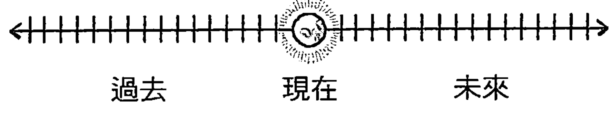

時間是各自獨立的每個瞬間

圖 2 在我們這個三維現實中，過去、現在與未來是以線性的、截然不同且各自獨立的每個瞬間存在於時間軸上。

  識點的交會）感受到種種情緒，這將會滿足我們先前所經歷的匱乏感。例如，新工作出現了，我們會覺得安心；有了新戀情，我們會感受到愛與喜悅；身體康復了，我們會感覺到自己更完整。如果我們一直都活在這種狀態下，就是在等待我們身外的「某件事物」或「某個人」來改變我們內在的感受。一旦我們從匱乏的經驗中解脫出來，去擁抱因為外在事件的實現而產生的相關情緒，就會促使我們更密切地關注帶來解脫的人事物。這樣的因果關係會形成一種新的記憶，某種程度來說，我們也因此能不斷進化及成長。

  然而，萬一事情並未如預期般發生，或者似乎要很久後才會發生，我們便會體驗到更強烈的匱乏感，因為我們會感受到離我們試圖要創造的事物越來越遠。現在，我們擁有的這些匱乏、挫折、不耐、分離等情緒，會把我們的夢想拒於千里之外，使我們渴望出現的結果更加遙遙無期。

## 「無」才是我們真正的存在狀態

  如果牛頓定律是空間—時間（這是一個空間多於時間的維度）物理法則的外顯表現，那麼我們可以說量子定律恰恰相反。量子是自然法則的內顯表現：這是一個充滿信息及能量的無形場域，所有物質都合為一體。這個非物質的場域組織、連結及統整了所有的自然法則，是一個時間多於空間的維度。換句話說，在這個維度之中，時間是永恆的。

  正如你在第二章與第三章學到的，當我們把注意力從外在世界的特定人時事地物轉移開來，不再將注意力放在身體上並停止思考時間與日程安排，我們將會轉變成無實體、無身分、無物、無處、無時間的存在狀態。我們可以藉由切斷與自身連結的過程而做到這一點，亦即脫離身體、身分、性別、疾病、姓名、問題、個人關係、痛苦及過去，也就是超越自我：意識從某個實體變成沒有實體，從某個身分變成沒有身分，從某件事物變成沒有任何事物，從存在某個地方變成不存在於任何地方，從存在某個時間變成不存在於任何時間（參見圖 3）。

  讓我們仔細來看一看圖 4。

  當我們從狹窄聚焦轉為開放聚焦，打開所有面向的自我，我們即遠離了外在世界的人事時地物、日程安排、代辦事項，將我們的注意力轉向充滿能量、振動、頻率及意識的內在世界。我們的研究顯示，當我們把注意力從物體與物質上轉移開來，放開焦點接納能量與信息，我們大腦中的不同部位會同步地和諧運作，而大腦頻率諧振的結果，會讓我們感到更為完整。

  如果你做得正確，心會開始敞開，跳動得更有節奏且協調一致。當心臟頻率進入協調一致的狀態時，大腦也同樣如此，這就是美好的心腦諧振。此外，因為我們的所有身分識別已經不再擋路（亦即超越了肉身、超越了已知環境中的某個地點、時間），排除這些外在干擾，腦波得以轉換成 α 波與 θ 波主導的模式，並且連結到自主神經系統。自主神經系統一經啟動，就會善盡恢復秩序與平衡的責任，我們的心臟、大腦、身體及能量場就能趨於協調一致及完整性。這種諧振或同調的狀態，接著會反映在我們各方面的生理機能上。

  正是在這種狀態下，我們開始接通了量子場（或統一場）。

### 同為宇宙之子，你我都不是孤立的個體

  如果牛頓物理學是從宏觀角度來說明自然與宇宙的物理定律，包括太陽在行星上的引力、蘋果從樹上落下的速度等，那麼量子世界就是從微觀角度（比如原子與次原子粒子）來處理事物的基本性質。牛頓定律是存在於自然界的物理常數，因此，牛頓的世界是一個可測量及可預測結果的客觀世界。

  然而，量子定律處理的是不可測及看不見的事物，包括能量、波、頻率、信息、意識以及所有光譜，而支配這個世界的，同樣是一個看不見的常數，一個信息的單一場域，我們稱之為統一場。我們可以把牛頓的物理世界想成是一個心智與物質分離的客觀現實，而把量子的世界想成是心智與物質統一的主觀現實——或甚至，心智與物質已緊密連結到不可能將兩者分開來。在量子場或統一場中，沒有哪兩個意識點是分離開來的，因為場域中的所有一切都是合為一體的。

  在我們三維的物質實相中，空間是無限的；相反的，在量子世界中，時間是無限的。如果時間是無限且永恆的，那麼就不再是線性的；這意味著，量子世界中沒有過去與未來的區別，所有一切都發生在現在，也就是永恆的當下。在時間一空間的這個實相中，時間是無限的，當我們穿越時間時，可以體驗到空間（或多重空間）。

  在物質實相的這個世界，當我們穿越空間時，體驗到了時間；但在能量與頻率的那個非物質的量子世界，卻正好相反：

+   在空間一時間的世界中，當我們加快或放慢從 A 點到 B 點的速度時，到達目的地所需要的時間也會隨之改變。
• 在時間一空間的世界中，當我們意識到能量的頻率或振動速度加快或變慢時，我們可以從一個空間到另一個空間，或從一個維度到另一個維度。

  在物質實相中，塌陷空間可以體驗到時間；而在非物質的實相中，塌陷時間可以體驗到空間或維度，每一個不同的頻率都攜帶著信息或某個層次的意識；一旦我們覺知到它們，會隨之體驗到不同的實相。在圖 5 中你可以看到，當你穿越時間時，可以在永恆的當下體驗到不同的維度。

### 超越自我

當我們超越自我時，我們會從左側移往右側：

| 狹窄聚焦 | 開放聚焦 |
| :--- | :--- |
| 專注於人事地物（粒子） | 專注於空間、能量、頻率、信息（波） |
| 物質 | 非物質（反物質） |
| 三維的牛頓世界 | 五維的量子世界 |
| 可預測 | 不可預測 |
| 空間—時間（一個永恆空間的國度） | 時間—空間（一個永恆時間的國度） |
| 分離、二元、對立、局域性的狀態 | 統一、一體、完整、非局域性的狀態 |
| 已知 | 未知 |
| 有限的可能性 | 無限的可能性 |
| 單一的宇宙 | 多個宇宙 |
| 感官世界 | 超越感官的世界 |

圖 4 物質世界與能量世界的區別

### 從感官世界轉移至超越感官的世界

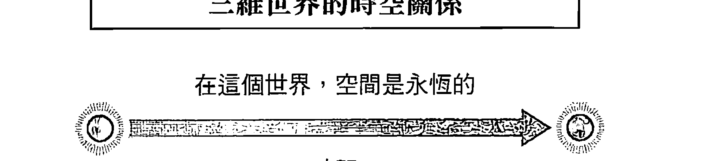

在空間中移動，我們可以感受到時間

圖 1 當我們從空間中的一個意識點（point of consciousness）移動到另一個意識點，可以感受到時間。當我們在這個三維世界塌陷空間時，時間就被創造出來了。

從感官世界轉移至超越感官的世界
進入量子世界

牛頓世界的三維現實
意識：
某個實體
某個身分
某件事物
某個地點
某個時間

以純粹意識進入量子世界
意識：
無實體
無身分
無物
無處
無時間

圖 3 當我們把注意力從身體、環境、時間轉移開來，我們就從「我」——擁有某個身體、某種身分、某些事物、在某個時間存在於某個地方，變成以無實體、無身分、無物、無處、無時間的狀態存在。現在，我們正將自己的意識與覺知帶離牛頓物理學的物質世界，進而轉移到統一場的非物質世界。

## 五維世界的時間與空間關係

在空間—時間的世界裡，你以你的身體、感官及時間去體驗環境；時間看起來是線性的，因為你與人事地物都是分離的，過去與未來也一樣。然而，在時間—空間的世界，你是以你的意識去體驗，而不是一個具有感官的肉身。這個世界存在於你的感官之外，當你完全處於當下，才得以進入這個國度，這裡沒有過去也沒有未來，只有永恆的現在。現在，因為你把全部注意力從物質轉移開來，你的意識已超越了物質世界，你會開始覺知到所有攜帶信息的不同頻率，同時，這些頻率會讓你得以進入不同的未知維度。

因此，如果你處於一個超越感官的世界，打開意識並進入統一場，你將會體驗到許多可能的維度實相（我知道短時間要消化這麼多的資訊很不容易，所以你要挺住；如果感到困惑不解，代表你快學到新東西了）。

當我們穿越時間（永恆的當下，存在所有的可能性）時，會體驗到不同的空間或維度。

圖 5 在量子世界中，時間是永恆的，一切都發生在永恆的當下。當你穿越時間，就會體驗到其他的空間（或多重空間）、其他的維度、其他的星球及其他的實相，還有無限的可能性。你就像站在兩面鏡子中間，從兩個方向看著自己進入無限的維度。圖中的方框代表無數個可能的你，全都同時存在於當下。

## 第11章 幻相與實相，我們都活在相對時空中

當我說你穿越時間時會體驗到空間或多重空間，我指的是所有可能的維度及可能的實相。那麼，我們可以說在時間—空間的實相中，所有可能的空間或維度都存在於無限的時間流之中。這就是統一場，一個充滿可能性、未知事物及新潛能的世界，所有這一切都存在於無盡的時間流之中，也就是每時每刻。

讓我們換個方式來思考。幾乎我所認識的每個人，都說他們希望能夠擁有或需要更多的時間來做更多事。如果你有更多的時間，就可創造出更多經驗、做更多事，從而完成更多目標。這意味著有更多的可能性會發生，你可以活得更精彩。

所以現在，想像你身處在一個有無限時間的世界（沒有過去與未來，時間是停滯不前的），你有了需要的所有時間，也因此你將可擁有無限個可能的經驗，還有各種不同的人生。那麼，或許我們可以這麼說：只要你想像得到的任何經驗都能實際體驗到，可能性是無窮無盡的。換句話說：

- 如果時間是永恆的，將會有更多空間存在於無限的時間中；
- 如果我們不斷延長或創造出更多的時間，我們應該可以在時間中置入更多空間；
- 如果時間是無限的，我們可以在時間中置入無限的空間，這代表無盡的可能性、潛在的實相、維度以及經驗。

在量子場中，過去與未來並無分別，因為一切只存在於永恆的現在，或說永恆的當下。如果所有一切正在以統一或連結的狀態存在於量子場中，那麼它的無限頻率中便包含了所有人事時地物的信息。所以，一旦你的意識開始融入統一場的能量與意識之中，你的意識會從實體轉變成沒有實體，最後再轉變成所有實體；從某個身分轉變成沒有身分，最後再轉變成所有身分；從某件事物轉變成沒有任何事物，最後再轉變成所有事物；從某個地點轉變成不存在於任何地點，最後再轉變成存在於所有地點；從某個時間點轉變成不存在於任何時間之中，最後再轉變成存在於所有時間之中（參見圖6）。

先進入無物，再成為萬物

| 牛頓世界的三維實相 | 以純粹意識走進量子場 | 統一場的五維實相 |
| :--- | :--- | :--- |
| **意識：** | **意識：** | **意識：** |
| 某個實體 | 沒有實體 | 所有實體 |
| 某個身分 | 沒有身分 | 所有身分 |
| 某件事物 | 沒有事物 | 所有事物 |
| 某個地點 | 沒有地點 | 所有地點 |
| 某個時間 | 沒有時間 | 所有時間 |

圖6 當你的意識與統一場的意識合而為一，一無保留地深入這個世界時，你的意識將轉變成所有人事時地物的意識。在這個國度中，兩個意識點之間不分不離，這意味著只存在著一體性。

## 原子的量子模型，要告訴我們的真理

要了解量子場如何構成，你必須先重新審視原子存在的可能性。當我們把物質縮小到最小的測量單位，會得到以極高頻率振動的原子；如果我們可以吧原子像剝洋蔥一樣一層層剝開，最後會發現一個原子核及質子、中子、電子等次原子粒子，但其中的主要部分卻是九九·九九九%的空間，這個充斥著無形能量的空間看起來是空蕩蕩的。關於這點，我們在前面的章節已提過。

看看圖7，左圖畫的是原子的傳統模型，這是我們以前在課堂上學過的。但事實上，這是一個已經過時的模型。真實的情況是，電子不會像繞著太陽旋轉的行星一樣，也圍繞著原子核日復一日一地旋轉；相反的，你會看到的是像右圖所畫的模型，原子核周圍的空間更像是一個無形的能量場，有一大團的信息雲。

像我們所知道的，所有的信息都是由光、頻率以及能量所組成。為了方便你了解這些次原子粒子有多麼微小，我們來舉個例子：如果把原子核放大成一部福斯金龜車的大小，那麼以同樣比例放大的電子就相當於一粒豆子的大小；而電子可以存在的空間將廣達八萬五千平方英里，相當於古巴的兩倍大。你可以想見，原子核周圍看似無一物的空間究竟有多大，這就是電子所在的空間。

根據海森堡的測不準原理，我們永遠不知道電子會出現在電子雲（electron cloud）的什麼地方，卻可以從無到有。這就是為什麼量子物理學如此令人興奮且不可預測：電子並不總是保持著物質的形態，相反的，它會以能量或機率波的形態存在；而且只有透過觀察者的觀察行為，才會出現。一旦有觀察者（心智）出現並尋找它，這樣的觀察行為（定向能量）會使所有潛在的能量塌陷成有形的電子（物質），從而讓無限可能性的未知變成已知（具備空間與時間的局域性）。等到觀察者停止觀察，電子又會變回無形的機率，也就是波函數。換句話說，有形的電子會再變回能量，回到未知；而當它變回能量及機率時，就不再具備局域性了。在量子世界，心智與物質是不可分割的整體；因此，如果說牛頓物理學是可預測的世界，那麼量子物理學就是不可預測的世界。

當我們閉目冥想並把焦點放大到無限的空間，我們所做的就是把更多的注意力放在能量、空間、信息及機率上，而不是放在物質上。我們對物質世界的意識會變弱，對非物質世界的意識會增強。換句話說，我們會把能量投注於不可預測的未知世界，同時逐漸將我們的注意力與能量從可預測的已知世界撤出。每次我們這麼做時，就會對統一場有更深入的理解。

在我們更深入討論之前，先來簡要回顧我們剛剛學到的內容。花點時間看看圖8，你可以看出，三維的牛頓世界是由人事時地物（包括物質與粒子）所組成的（基本上，大部分都是我們所熟知的外在事物），在這個世界中，空間多於時間。以肉身存在的我們，運用感官去定義身處這個空間，那是一個充滿形狀、結構、尺寸及密度的世界，也是一個已知及可預測的國度。

由於我們是以感官來體驗這個物質宇宙，感官所提供的信息會在我們的大腦中形成模式，經過我們認知而成為一種固定的結構，所有的外在事物就是經由這個過程而成為已知事物。同時，我們也是經由這個過程變成存在於某個特定地點與時間的某個人，擁有肉身及某些事物。最後，當我們以感官來體驗這個宇宙時，就會產生距離感；因此，這是一個二元與對立的國度。

現在，我們來看看圖 9。如果牛頓的世界是一個以感官來定義的物質世界，量子世界則正好相反，這是一個不以感官來定義的非物質世界。換句話說，這裡沒有任何建立在感官上的事物，也沒有任何物質。牛頓世界是建立在可預測的已知事物上，譬如物質、粒子、人事時地物等等，而量子世界則是由光、頻率、信息、振動、能量、意識所組成的一個不可預測的維度。

若說我們的三維世界是一個空間多於時間的物質維度，那麼量子世界就是一個時間多於空間的反物質維度；又因為時間多於空間，所有的可能性都存在於永恆的當下。三維世界是我們身處的宇宙，意味著只存在這一個實相；而量子世界是一個多重宇宙，同時存在著多個實相。如果空間—時間的實相是建立在分離的基礎上，那麼非物質的量子世界（或稱統一場）則是建立在一體性、連結性、完整性及統一性（非局域性）之上。

讓我們抽離空間—時間這個已知的三維宇宙——一個由物質組成、只會讓我們體驗到二元及對立的宇宙，來到時間—空間這個未知的五維多重宇宙——一個不存在任何物質，只有光、信息、頻率、振動、能量及意識的國度。在這兩個國度之間，我們必須跨越一座橋樑——也就是光速。當我們變成純粹的意識，沒有任何實體、身分及外在事物，不存在於任何地方或任何時間之中，我們就跨越了那道門檻，從物質變成了能量。

愛因斯坦在狹義相對論中提出 $E=mc^2$ 質能轉換公式，這是科學史上頭一遭從數學角度證明能量與物質的相關性，而將物質轉化為能量的正是光速。這意味著，任何物質只要速度快過光速，就可以脫離三維實相並轉變成非物質的能量。換句話說，在三維世界中，光速正是物質（或任何實質的東西）得以保持其形態的門檻。沒有任何「東西」能快過光速，連信息也無法做到。從一個點前往另一個點的任何東西只要速度慢於光速，都需要時間。因此，第四個維度就是時間，時間就是將三維世界與五維以上的世界連結起來的紐帶。

一旦某個東西的速度可以快過光速，兩個意識點之間就沒有距離，也不需要花時間到達；因為，全部的物質都變成了能量。這就是你如何從三維世界進入五維世界、從一個宇宙進入多重宇宙、從這個維度前往多重維度的方法。

為了幫助你理解，讓我舉個例子來簡化這個複雜的概念。一九八〇年代早期，法國物理學家艾倫·阿斯佩（Alain Aspect）進行了一場著名的量子物理實驗，被稱為貝爾不等式實驗（Bell test experiments）。在這個研究中，科學家們將兩個光子纏結起來，使它們產生關聯性，然後從相反的方向分別射擊這兩個光子，在它們之間製造出距離及空間。當他們對其中一個光子施加作用使其消失時，另一個光子竟也在精準的同一時間消失無蹤。在量子物理學的發展中，這個實驗可以說是奠定基礎的一項突破性研究，因為它證明了愛因斯坦的相對論並不完全正確。

這個實驗顯示，有一個信息的統一場存在於三維空間與時間之外，並連結所有的事物。如果兩個光子之間沒有藉由某種無形的能量場產生連結，那麼信息必得花時間才能從空間中的一個定點傳送到另一個定點。根據愛因斯坦的理論，兩個粒子不會同時消失，如果一個粒子不見蹤影，另一個粒子應該在片刻之後才會消失——即使它們占據了同一個空間，第二個光子也應該至少在一毫秒後才會受到影響，因為它們中間被空間隔開了，而跨越空間傳達信息需要時間。這重申了在物理實相中，速度的上限是光速，而存在於物理實相的所有物質都是分離的。

由於這兩個光子是精確地同時消失，因此證明了在一個超越三維實相及時間的國度，所有的物質（包括人、事、地及物）或甚至時間，都以頻率與信息彼此連結。超越物質之外的所有「事物」，都統一於一個整體的狀態之下，信息在兩個光子之間以非局域性、無所阻礙的方式傳遞，這是因為在五維實相中，兩個意識點之間沒有任何距離，時間也不是線性的，只存在著一個涵蓋所有時間的時間。

量子物理學家戴維．玻姆（David Bohm）稱量子世界是一個內隱秩序（implicate order）的世界，在其中，萬物相互連結；並稱我們這個分離的物質世界是一個外顯秩序（explicit order）的世界。你可以再看一看圖 8 與圖 9，有助於你更了解這兩個世界。

當你把注意力從某個實體、某個身分、某件事物、存在於某個時間的某個地方轉移開來，成為沒有實體、沒有身分、沒有事物、不存在於任何時間及任何地方，就是在轉變成為一種純粹的意識。你的意識融入了統一場這個只有意識與能量組成的場域，在這種狀態下，你連結到了所有實體、所有身分、所有事物、所有地方以及所有時間的自組織意識（self-organizing consciousness）*。當你全然交出自己變成一種意識（不上任何感官），進入這個無任何隔閡的完整場域，並持續深入這片虛空或黑暗的時候，由於這裡不存在著任何實體，以意識存在的你會變得與統一場的意識一無分別。倘若你能保持著更強的覺知，意識到這個統一場的存在並持續專注於此，你就是在這個統一場中直接投注你的能量與注意力。因此，隨著你繼續朝它前進，你將越來越感受不到疏離感，取而代之的是越來越強烈的完整感。

最後，由於統一場只有永恆的當下而不存在線性時間，因此當你以意識及能量去進行觀察而讓所有物質成形時，也只存在於永恆的當下。為了讓你自己能夠與統一場產生連結並合而為一，你也必須完全存在於當下。看看圖10的說明，你會知道要如何去瓦解你的疏離感及個人意識，以便體驗統一場的一體性與完整性。

關於光速的最後一點是，在物質世界中，可見光是一種帶著極性的頻率（電子、正電子及光子等等）。往下來看看圖11，按照比例來看，從最低的頻率往上約三分之一處就是光的分界（division of light），超過這個分界，物質會從固有形態變成能量與奇點（singularity）**；低於這個分界頻率，則是分裂與對立。出現光的分界時，光子、電子及正電子會隨之產生，因為可見光場是以物質的信息模板來作為光模式中的頻率；光的分界也是宇宙大爆炸發生之處，奇點在此變成了二元性與極性，宇宙最終也在此分界處出現有組織的信息及物質。這個虛空之所以是永恆黑暗，就是因為這裡沒有任何可見光^3。

由於物質的振動頻率極低，在進入時間—空間的維度或統一場時，無法以肉身或物質的形態進入，你必須先轉變成無實體的意識狀態。只要有任何殘留的物質成分，你就無法進入統一場，因此你必須轉變成沒有身分、沒有任何事物，也不存在於任何地點。最後，假如你還停留在熟悉的過去或可預測的未來，亦即線性時間的世界，想要進入時間—空間的五維世界，就必須先讓自己感受不到時間的存在。那麼，要如何做到這一點？答案是：持續把注意力放在統一場，不要使用你的五種感官，而是使用意識與覺知。一旦你的意識改變，能量會隨之提升，你對這個無形場域的覺知會變得越來越強，並逐漸遠離物質所帶來的疏離感，與這個場域慢慢合而為一。

現在，你進入了量子場（或稱統一場）。這是一個連結所有信息、所有實體、所有身分、所有事物、所有地點以及所有時間的國度。

*編按：一個系統如果不靠外部指令，只按照某種默契及規則自動地形成一個有序結構，就稱為自組織。
*編按：奇點也稱時空奇異點，是一個體積無限小、密度無限大、重力無限大、時空曲率無限大的點。在這個點上，目前所知的物理定律都不適用。

## 通往「一」的旅程

當我們塌陷兩個意識點時，會體驗到兩者的距離感越來越弱，而一體性與完整性會越來越強。越接近統一場時，我們的意識會與統一場的意識逐漸合而為一，並再也感受不到任何時間與空間的存在。

物質實相——注意力朝外

無所不在的觀察者、本源能量、統一場
- 某個實體
- 某個身分
- 某件事物
- 某個地點
- 某個時間

成為意識——注意力放在當下

無實體
無身分
無事物
無處
無時間

我們進入統一場並與它同在

一的意識——從不存在於任何空間與時間，進展到存在於所有的空間與時間

- 所有實體
- 所有身分
- 所有事物
- 所有地點
- 所有時間

越接近統一場，越能與它合而為一！

圖 10 越是把注意力放在外界（以某個實體、某種身分、擁有某些事物，並在某個時刻某個地方存在於三維實相中），我們體驗到的疏離感與匱乏感就會越強烈。當我們把注意力從外在世界轉移到內在世界並進入當下，我們的意識會逐漸與統一場的意識趨於一致。現在，我們已經進入了統一場，並與它同在了。我們臣服並以意識狀態更深入統一場，分別心與疏離感會越來越弱，而一體性與完整性則是越來越強。如果兩個意識點之間沒有分隔，就不存在特定的空間與時間，取而代之的，是所有的時間與所有的空間。因此，我們感受到的完整性會越強而匱乏感越少，我們就會越覺得未來已經發生了。現在，我們不再以二元性去創造事物，而是從一體性中塑造未來。

## 在統一场中，我們從「無」到「擁有一切」

由於物質的密度極高，因此是以宇宙中最慢的頻率在振動著。從圖11中你可以看出，當你藉由越來越快的速度去提升物質頻率時，物質就會藉由去物質化的過程轉變成能量。在可見光譜之外的某個點（已超出二元性及極性的範圍），任何與物質有關的信息都會轉換成更為统一的能量。正如你所見，頻率越高，能量就會變得更有序、更協調一致。這個層次的頻率與能量，不再有二元性與極性，所有物質都統一為一個整體；我們把這個整體稱為愛或完整性，因為從此不再有任何分裂或距離。正負在此交會，陰陽在此結合，過去與未來也在此匯聚；於是善與惡不復存在，對與錯不再適用，所有對立均合而為一。

隨著你的程度越來越高，離物質與疏離感越來越遠，你會持續體驗到程度越來越強烈的整體性、秩序感以及愛。這股更協調有序的能量所攜帶的信息，包含了越來越多的愛。如果你繼續以更快速度去加速物質的頻率，最終它會像能量一樣快速振動，變成像一條直線；在這條直線上存在著無限的頻率，每個頻率都代表在光速的頻率下，所有物質形態都被反映成一種結構模板。在光速之下，能量區分出極性或二元性，並產生了電子及正電子等。在光速之上，出現了更高層次的秩序（代表完整性更高）。

在物質轉換成意識的旅程中，我們會超越自我，將注意力轉向內在的統一場，一旦我們跨越可見光的層次，成為沒有實體、沒有身分、沒有事物、不存在於任何地方及任何時間的狀態時，我們將在此成為意識，體驗到其他維度、其他實相以及其他的可能性。由於頻率攜帶著信息，而量子場中有無限的頻率，因此我們將可體驗到存在於此的其他平行世界。

現在，看看上圖從物質往上指向統一場的箭頭（最上面的直線代表所有可能性），你會看到你必須穿越物質與光之間的較低頻率（代表不同層次的想法與情緒）。接著再看看達到一體性之前，你必須穿越不同層次的所有意識，於是你就能理解為什麼絕大部分的人都無法走到終點。

圖 11 一切皆始於一個意識的念頭。當這個念頭的頻率變慢，能量就會慢下來，最後終於具體形成物質。

著一個可能性。這就是零點場或量子場的奇點，是一個無所不在的信息場，以能量及頻率的形態存在，不論從哪一點來觀察，所有實相都是井然有序的。我們可以把這個自組織的宇宙法則稱為上帝的心智、統一意識或本源能量，或任何你想使用的名稱或術語來加以定義。這是所有潛能或可能性以心念存在的所在，是愛與智慧的終極源頭，暗中觀察著所有的物理實相具體成形。因此：

- 我們所感受的頻率越高，能量越大；
- 能量越大，可以獲取的信息就越多；
- 信息越多，意識越強；
- 意識越強，覺察力越敏銳；
- 覺察力越敏銳，心智越強大；
- 心智越強大，我們影響物質的力量也就越大。

在宇宙法則的層級中，量子定律遠勝過牛頓定律（或說古典定律）。這是為什麼愛因斯坦會說：「量子場是粒子的唯一主管機構。」量子場管理、組織並統整所有的自然法則，藉由將光化為形態的方式，直接以能量來引導有序的運作。在我們的星球上，只要看看大自然，就能看到被稱為黃金比例的費氏數列（Fibonacci's sequence）幾乎無所不在，在整個自然界中一直反復出現，帶來秩序及協調性。當機率、可能性或心念（心念就是可能性）所組成的零點場把頻率慢下來時，就能創造出秩序與形式。

統一場是一種自組織的智慧，始終觀察著物質世界的一舉一動，引導著它的秩序。你越是臣服於它、接近它、與它合而為一，就越不會感受到分離與匱乏，而更能深刻體驗到完整性與一體性。當你以意識狀態無保留地進入這個充滿無限可能性的領地中，你會開始感受到與所有實體、所有身分、所有事物、所有地方及所有時間的意識產生連結，其中當然也包括了你未來的夢想。由於意識就是覺知，而覺知就是交付出注意力，因此，想要體驗統一場的第一步就是去覺知它。如果你無法覺知到它，對你來說，它就等於不存在。因此，你越是把注意力集中在這個場域，就越能一步步深刻地覺知到它。

不過，有一點必須提醒你。正如我們所見，你唯一可以進入這個純粹意識領地的方法，就是成為純粹的意識。換句話說，你唯一進入這個心念國度的方法，就是把自己變成一個心念或一個想法。這意味著，你必須透過意識把物質與粒子轉換成能量或波，如此才能超越你的感官。

如果你能夠以意識狀態無保留地進入這個非物質、無盡黑暗的無形國度，覺知到你是存在於一個偉大意識之中的其中一個意識，你的意識將會回歸於此，並與之合而為一。如果你能做到這一點，避免重蹈舊習慣的覆轍，並以意識狀態停留在統一場中，持續臣服於愛的智慧（這是創造宇宙並賦予你生命的同一個智慧），全然交付自己，它就會重新充盈你。這股充滿愛的智慧同時屬於個人及宇宙，既存在於你的內在，也存在於你的周遭。當它充盈著你時，會為你創造及回復生理機能的秩序與平衡，因為它的本質就是以更協調一致的方式去組織物質。現在，你正在穿過針眼，而在針眼的另一端，兩個意識點之間不再有空間及距離，只存在一個合而為一的意識。所有的可能性、機率都存在於此。

你正在進入意識、心念、信息、能量以及頻率的世界，從空間—時間的維度來到時間—空間的維度，並從某個實體、某個身分、某件事物、存在某個地方及某個時間，變成無實體、無身分、無事物、無處及無時間的意識；這就是兩個世界的交叉點，也是通往統一場或量子場的門檻（參見圖 8 與圖 9）。

在這個一無止境、未知、充滿可能性的世界中，無限的新潛能與經驗正等著你去發現，你一次又一次反覆經歷的那些相同又熟悉的舊經驗都不復存在。畢竟，這是個充滿未知的國度。一個未知代表一種可能性，那是出自你意識中的一個念頭；當你以心念的狀態存在於一個純意識的世界中，唯一能限制你的，就是你的想像力。雖然你已經進入這個純意識的世界中，但一旦你的念頭又回到某個身分、某件事物、某個實體、某個地方或是某個已知時間，你的意識（及能量）馬上會回到三維空間的那個已知實相，亦即回到這個二元與對立的現實世界。

你的每一個念頭都帶有特別的頻率，當你開始想到身體的病痛、創傷、工作問題、母子間的紛爭或必須在期限內完成的事情，就在動心起念的那一刻，你就會回到這個空間——時間的現實世界。你的意識一返回物質世界，你的心念就會製造出與物質及粒子相同的振動頻率（參見圖 10），而你的能量就會重新回到三維的已知物質世界再次振動。現在的你，再也影響不了你個人的實相，因為你又重新掉落到以物質方式振動的老路上，而你我都知知道將會發生什麼事。

當你的頻率正在往更高的密度上走，你與統一場的距離越來越遠；結果就是，你與統一場之間出現了距離，不再合而為一。在這種情況下，你存在於統一場中對未來的一個心念就顯得遙不可及，你的夢想要成真就得花上相當漫長的時間了。

如果你仍然放不下某個實體、某個身分、某件事物、某個地方或某個時間，就代表你並未超越你的自我認同，而它正是你過去所有經驗所塑造出來的。相同的記憶、慣性思維以及被制約的情緒還是緊跟著你，這些都是你與這個實相中所有熟悉的人事時地物的牽扯；這意味著，你的注意力與能量都被束縛在過去，亦即你當下的個人實相之中。你的所思所想都在一再地認同你的身分，也因此，你的生命將會一成不變，因為你等於是在用一個舊的人格特性，徒勞地試圖去創造出另一個新的個人實相。

當我說你必須超越自己時，我的意思是要你忘記自我，也就是把注意力從你的性格及個人實相中轉移開來。想當然的，要療癒你的身體，你必須超越你的身體；要在人生中創造出新事物，你必須忘記過往一成不變的經驗。

## 第 11 章 幻相與實相，我們都活在相對時空中

變的生命；要改變外在環境的某些問題，你必須超越你的回憶以及與此有關的種種情緒。如果你想在未來創造出某個驚喜的新事件，你必須停止去預期一個相同的未來，也就是不要再根據過去的記憶去預測你的未來。你必須轉移到另一個層次更高的意識，至少要高於創造出你眼前這些實相的那個意識。

在統一場中，你不必前往任何地方，因为你已无所不在；你不需要拥有任何事物，因为你的感觉是如此完满无缺，觉得自己像是已经拥有了一切；你不会判断任何人，因为你就是所有人；你也不再需要变成任何实体，因为你就是万物。此外，如果你已经置身在一个有无限时间的世界中，又何需担心时间不够用呢？

你的感受越圆满，匮乏感就会越发薄弱，欲望也会跟著减少。一旦你感觉到完整与圆满，又怎会贪得无厌或觉得自己有所匮乏呢？只要降低匮乏感，想要在二元、对立及分离的世界中去创造事物的需求自然会跟著降低。当你感觉到完整时，又怎会需要更多的事物呢？当你感觉到一切已具足，从这样的状态中去创造，就不会被需求、渴望、强迫、预测、挣扎或希望所绑架。毕竟俗话说得好：「希望是个乞讨者。」当你在完整的状态下去创造时，只存在著豁达与观察；而这就是让实相具体成形的关键：保持连结，而不是分离。

如果在你的三维世界中，时间是由两个物体或两个意识点之间的空间幻相所创造出来的，那么，你与统一场越是合而为一，你与物质万物之间的距离就越能消融於无形。当你的意识与统一场交融，或是与统一场产生更深的连结时，任两个意识点之间就不再存在著距离。这种合而为一的整体性会反映在你身体的生理机能、化学物质、神经迴路、荷尔蒙、基因、心脏及大脑上面，从而恢复整个身体系统的平衡。现在，更高的频率或能量正流经你的自主神经系统，这是一个不断为你注入生命力的身体系统，它的存在就是为了创造平衡与秩序。这股能量所传递的完整讯息，会让你变得更具有神性。你体验到的频率越高，在空间—时间的这个三维实相中，你实现愿景所需要的时间就越短。

正如我们稍早在本章中提到的，当你缩短两个意识点之间的空间时，就是在塌陷时间；而当分离的幻相不复存在,你會察覺出你(棲息於某個肉身之中的身分,存在於線性時間中的某個物質環境中)與所有的人事時地物、一切物質或甚至你的夢想之間的空間也縮小了。因此,你越來越接近統一場,你覺得自己與所有人、所有事物的連結越來越緊密。

你以意識狀態存在於這個合而為一的國度中,因為這裡不存在任何距離,只有永恆的時間。切記:只要有無窮盡的時間,就有無窮盡的空間、可能的維度及實相等著你去體驗。你「認為」自己在哪裡,你就是在哪裡;你「認為」自己是誰,你就是誰。事實上,在這個國度中,沒有什麼東西是需要被創造出來的,因為所有一切早就以「心念」的方式存在著,這是個全部由心念組成的世界。你所要做的,就是去覺知它、去觀察它,看著它逐漸成形。

看看圖12,並試著把注意力從某個實體轉移到沒有實體、再轉變成所有實體,如此你就能創造出任一實體。當你把注意力從某個身分轉移到沒有身分、再轉變成所有身分,你就能創造出任一身分。當你把注意力從某件事物轉移到無物的境界,就能與萬物合一,從而創造出任一事物。當你把注意力從某個地方轉移到無處的境界、再轉變成無所不在,你就可以存在於任何一個地方。最後,當你把意識從某個時間轉移至沒有任何時間、再到所有時間,你就能 隨心所欲地存在於任何時間之中。

現在,讓我們走進超自然。

多年來,我一直來往於世界各地教學,教導學員們如何超越自己。我現在知道,對他們來說,這個過程 中的第一步就是駕馭自己的身體、超越外在環境及超越時間。一旦能做到這些,他們就會發現自己已經觸摸 到統一場的外圍了;然而,等他們更接近核心時,必然會被告知,還有更多體驗等著他們去發掘。

如果學習意味著建立新的突觸連結,那麼你對某事學得越多,就越能去欣賞它、意識到它的存在並體驗 它,因為現在你有了一組新的神經網絡去參與並連結。透過這樣的學習過程,你可以進一步改變或豐富你的 經驗。相反的,倘若你不曾學習任何新事物,你的經驗可能自始至終都一成不變,因為你一直都用如出一轍 的神經迴路來感知現實。所以我們說,知識才是讓你的經驗得以進化的先行者。

以我為例,我喜歡喝紅酒,每年都會組隊展開品酒之旅,前往世界各地。為期七天的這些行程,每年都 有很多人參加,一開始他們都會表示自己對葡萄酒一無所知。我對這種說法一開始的詮釋是,他們只是沒有 接觸過葡萄發酵的知識,或是接觸十分有限。而真相是,正是因為他們的知識及經驗有限,所以大腦中能夠 用來品味葡萄酒的神經硬體非常少。我們或許可以這麼說:他們只是不知道自己欠缺哪些必要知識,才能真 正享受品酒的經驗。

那麼,如果他們知道釀酒師如何生產葡萄酒,了解釀酒的歷史、使用的葡萄種類及使用原因,還有葡萄 酒如何儲藏於橡木桶、要儲存多久、原因為何,又會如何呢?這些學得的知識將會讓他們有理有據地去論 述,有哪些原因讓某種葡萄酒的滋味如此令人迷醉。

這就是過程。現在想想酒瓶裡那些很棒的葡萄酒。如果他們沒有覺知到梅子的風味、黑櫻桃和黑醋栗的調性、香草與皮革的味道、花朵的香氣、丹寧酸的比率、是在橡木桶或不鏽鋼桶中熟成、熟成的時間長短，那麼他們就不知道應該尋找什麼才能完全體驗葡萄酒的滋味。唯有當他們知道要尋找什麼或該覺知什麼的那一刻，這些東西才真正存在。於是，我們可以這樣說：他們的覺知改變了他們的經驗。

我知道這是事實，因為才過了七天，這群原本聲稱不懂紅酒的人，輕易地就與紅酒有了全新的互動經驗。經過多天的學習及探索後，他們全神貫注並沉浸於這些新知識中，他們將全部的覺知都放在特定的風味和香氣上，日復一日地體驗各種類型的紅酒，決定自己喜歡什麼、不喜歡什麼。由於持續地投入注意力，他們活化並組裝起一組新的神經迴路，才初入門就能精通他們所喜歡的酒款。從品評、覺知到理解，短短一個星期之內，他們就提升了個人的品酒水準；反過來，這些經驗也改變了他們。回頭來看統一場，也同理可證：如果你沒有覺知到它，對你來說，它就不存在。你對它越是了解，就越能意識到應該尋找什麼，也就越能更專注地去尋找，並且深入去體驗。接下來，它就會改變你。

從你一出生，就一直被訓練要把注意力放在物質而不是能量上，你被制約成需要靠感官去體驗現實。換句話說，如果你看不見、聽不到、無法觸摸、無法聞嗅、無法品嘗某個東西，那個東西就等於不存在。因此，絕大部分的人都會把注意力放在物質、物體及粒子等實質的東西上，而幾乎不會花時間在無形的能量及信息上。比如說，除非你把注意力放在左腳的大腳趾上，否則你察覺不到它的存在。左腳的大腳趾一直都在，只是你沒有覺知到它而已，只有在你意識到它的那一刻，它才開始存在。統一場的存在也是如此，你越能覺知到它，它就越能存在於你的實相中。可惜的是，人們通常只注意物質，而錯失了生活中的各種可能性，也就是所謂的機率波，這是一種潛藏的能量。簡單來說，你的覺察力越強，你的人生就會出現更多的可能性。

既然「注意力在哪裡，能量就在哪裡」，當你覺知到統一場的那一刻，你對它的注意力就會使它擴展開來。比如說,當你把注意力與覺知放在痛苦上時,因為體驗更深刻了,就會覺得更痛苦。如果你把注意力放在痛苦上而體驗到更多的痛苦,你的痛苦就成了你生命的一部分。統一場也是如此,當你把注意力放在它身上時,就會更深刻地覺知到它而讓它擴展開來。就像上面所舉的痛苦例子,當你體驗到更多的統一場,它的存在就會成為你生命的一部分。

僅僅是把注意力放在統一場,去覺知它、注意它、體驗它、感受它、與它互動、時時刻刻謹記,它就會每天出現在你的實相之中。它會以出其不意的未知形態出現,比如共時性事件、機緣巧合、運氣,或是在對的時間出現在對的地方。

以我的經驗來說,對統一場的最佳描述是:它是一種神聖且充滿愛的大智慧,也是充滿智慧的大愛,隨時存在於你的內心及你的周遭。所以每當你專注在它身上時,就會更加意識到你內心與周遭的神性。隨著你將注意力放在這股神聖的力量上,它也會在你的生命中出現得越來越頻繁。由於意識就是覺知,而覺知就是注意力,因此當你覺知到它、專注於它,就會開始融入它;你對它的種種體驗,將會如實地使你變成它。當你一無保留地越來越深入統一場,就會發現有越來越多的未知等著你去發掘與體驗。

回頭再看一次圖11,不難看出當你越來越接近那條代表本源能量的直線時,只有不斷專注於它、覺知它,才是你唯一可以越來越接近它的合理方式。由於情緒是經驗的終極產物,所以如果你做得正確,當你逐漸遠離二元性而朝著「本源能量」前進時,你應該能感受到越來越多的愛及圓滿等揚升情緒。一旦你體驗到更多這種智慧之愛,你的身上將會發生以下三件事。

第一件事是,當你把注意力及覺知集中在統一場時,隨著你越來越接近並深入這個本源能量,你對它的體驗也會越來越豐富且深刻。這趟旅程會從你的思維腦開出一條神經路徑,直達自主神經系統。現在,每當你大膽深入統一場,同時讓腦波頻率慢下來,你就是在修築一條有更多車道的神經高速公路。這條神經路徑會隨著你的頻繁使用，變得越來越密集且堅實，假以時日，你會更容易融入統一場而與之合為一體。

第二件事是，每當你與統一場互動並體驗它時，你的大腦就會改變，因為經驗能夠豐富我們的大腦，在大腦中組建新的神經迴路。現在，你正在大腦中安裝硬體，之後你就能夠更輕易地覺知及融入這個能量場。同樣的，由於經驗會產生某種情緒，當你覺知到統一場時，它就會變得更真實更具體，你也會體驗到更多的神性。

根據實相的量子模型理論，所有疾病都是一種低弱且不協調的頻率，因此當身體接觸到協調一致、揚升的新頻率時，所有能夠產生這種能量的事件將會提高身體的振動，使之進入諧振及有序的狀態。我們在世界各地舉辦的進階研習營，已無數次見證過學員們的身體因為新頻率與新信息而獲得改善，甚至還有馬上就回復健康的神奇變化。

自主神經系統原本的設定，就是創造及維持身體的平衡與健康，一旦我們不再妨礙它、停止分析與思考，完全臣服於它，這股智慧的力量將會為我們的身體帶來新秩序；而這一次，它會帶來更有自組織能力的新信息，也就是來自統一場的更高頻率。這股諧振的能量會提升物質頻率，就像把一個出現靜電噪聲的電台變成另一個帶有清晰頻率與信號的電台。你的身體接受到的信號將會更協調一致。

一旦發生這種情況，你會感受到強烈的愛、存在的深刻喜悅、無拘無束的自由感、無以倫比的狂喜、對生命的敬畏、感激的揚升情緒，以及被賦予力量的謙卑感。在那一刻，來自統一場的能量會透過揚升的情緒，將你的身體調整成一種新的意識及心智。於是，就在一瞬之間，這些情緒以新方式發出信號給新的基因，從而改變了你的身體機能，讓你的身體擺脫過去的制約而獲得解放。

第三件事是，當你越來越接近統一場時，會開始聽到或體驗到截然不同的知識及信息。這是因為你的大腦迴路改變了，你成了有別於以往的另一個人。你會在全新的層次上，發現你自以為早就知道的真理與事物,就像是第一次的新體驗。你的內在經驗,改變了你對外在事物的覺知及洞察力。換句話說,沉睡的你被喚醒了。

一旦你擁有了親臨統一場的經驗、感受,以及對統一場有更深刻的理解,就能確實改變你的大腦迴路,以新的方式去體驗並感知實相。事實上,你的視野會更開闊,見識到生命更豐富的樣貌,這是你的大腦迴路以前接收不到的頻譜。下一次,當你的大腦觸發更多的神經網絡時,這些新安裝的硬體會讓你體驗到更多不同的實相。換句話說,你現在感知到的更多實相其實早就存在,只是以前的你接收不到,因為你缺少了可以接收它的神經迴路。

如果你可以堅持旅程走到終點,一路來到本源(Source,回頭再看一下圖11)並與之產生連結,從你們真正開始互動的那一刻起,你的所有表現都會跟它更為相像。本源的特質會成為你的特質,現在,愛的大智慧將會透過你而表現於外;而它固有的特質,包括耐心、寬容、無私、專注於當下、覺知、奉獻、大愛、正念等等,也都將成為你的特質。你終於了解到你一直在尋找的東西,也在尋找著你,你成為它,而它成為你。

因此,這一課的目的就是:

- 讓你的意識與更高的意識合而為一;
- 臣服,深入智慧大愛;
- 信任未知;
- 持續放下小我的某些層面,加入大我之列;
- 放下所有成為無物,進而成為萬物;
- 放鬆進入協調一致、無窮無盡的能量海中;

## 成為無限的可能

| 牛頓世界的三維物質實相 | 以純粹意識進入量子場 | 統一場的五維非物質實相 | 無限可能性的世界 |
| --- | --- | --- | --- |
| 意識: 某個實體 | 意識: 沒有實體 | 意識: 所有實體 | 意識: 任一實體 |
| 意識: 某個身分 | 意識: 沒有身分 | 意識: 所有身分 | 意識: 任一身分 |
| 意識: 某件事物 | 意識: 沒有事物 | 意識: 所有事物 | 意識: 任一事物 |
| 意識: 某個地點 | 意識: 沒有地點 | 意識: 所有地點 | 意識: 任一地點 |
| 意識: 某個時間 | 意識: 沒有時間 | 意識: 所有時間 | 意識: 任一時間 |

圖12 一旦變成所有身分、所有實體、所有事物、存在於所有地方及所有時間中,理論上,我們就可以創造出任一實體、任一身分、擁有任一事物、存在於任何地方及任何時間。

# 「空間—時間與時間—空間」冥想法

首先，將意識放在你的心臟部位，一旦你鎖定了心臟所占據的位置，就把注意力移到呼吸上，從心臟部位吸氣及呼氣。與此同時，加深並慢慢放鬆你的呼吸。把注意力放在心臟部位，帶入揚升的情緒並維持一段時間，同時注意呼吸。接著，把這股能量發散到身體外面的空間。

播放能夠振奮及啟發你的音樂或歌曲（比如你在第五章用來幫助冥想的樂曲），將所有儲存在身體內供生存情緒所用的能量釋放出來，轉換成喜樂、感恩等揚升情緒，加強這些情緒，使之能夠超越制約身體的舊情緒。

接下來十到十五分鐘，播放一或兩首樂曲帶你進入出神狀態。現在，你已成為純粹的意識，沒有身分、沒有實體、不存在於任何地方與任何時間，你將以意識的狀態毫不保留地進入統一場。

現在，你的意識要跟所有身分、所有實體、所有事物、所有地方、所有時間連結在一起，並與更偉大的意識合為一體。你所要做的，就是去覺知這個場域、全心沉浸於其中，時刻去感受它。你會充盈著更完整且一體的感受，這種感受會反映在身體機能上，你的身體會體驗到有一股更協調一致的能量正在流經，並重建新的能量場。維持這樣的狀態大約十到二十分鐘，全心臣服。結束後，將意識帶回到新的身體、新的環境以及全新的時刻。

如果你能正確無誤地做到這些要點，就能不使用任何感官，因為你已超越了感官世界而成為一種意識。

- 一無保留地深入統一場；
- 持續放掉你的控制權；
- 去感受越來越強的圓滿情緒；
- 成為意識的存在狀態，時刻保持覺知、專注並體驗當下，深刻去感受到周遭的統一場，並盡可能停留在此，不讓自己回到三維的物質實相。

## 第11章 幻相與實相，我們都活在相對時空中

## 第12章 松果體：人體的鍊金師

現在你已經知道，當我們以意識狀態在這個超越感官及三維實相的世界中移動時，可以接通那些攜帶著特定信息、超越光速及物質振動的頻率。發生這種情況時，大腦會處理振幅極高的大量能量，我們一次又一次地在學員的大腦掃描中測量並觀察到這種現象。此外，你也知道：當大腦中的能量提升時，意識與覺知也會跟著提升，反之亦然；事實上，我們很難確定到底是能量或意識層次造成這些極端的測量結果。但我不認為可以將能量及意識分開來看，因為你無法改變能量而不改變意識，也不能只改變頻率而不改變其信息。

隨著你接通了更深層次的統一場，大腦也會被更強大的能量所活化，這些能量攜帶著特定的信息，並以心念及想像力的形態出現。於是，大腦如實地追蹤並記錄下這一類深刻的內在事件；而對擁有這類經驗的人來說，發生在腦海中的一切，似乎比以往任何的外在事件都要來得更加真實。在那一刻，那股增強的能量會以強烈而深刻的情緒形式，抓住心智全部的注意力。這個瞬間，也正是大腦與身體接收到生理機能升級的時刻。

如果有人閉目坐在椅子上冥想，在不動用到任何感官的情況下產生明顯增強的感官體驗，那麼，隨之而來的問題便是：大腦中發生了什麼事，可用來解釋這種超自然的效應？對擁有這種經驗的人來說，儘管他們坐著不動，但這個內在經驗似乎比他們曾經擁有過的經驗（所有感官都用上）更加真實。這又引發出更多的問題：我們怎麼能在不動用感官的情況下，產生這一類被放大及被強化的經驗呢？將量子場的互動轉化為深刻的內在經驗，使用的是大腦與身體的哪種功能？

換句話說，如果我們連結上一個更協調一致的信息場，從而創造出令人興奮的內在事件，那麼必然有某種神經、化學及生理學上的解釋，可以用來說明如此超自然的現象。有哪些獨特的系統、器官、腺體、組織、化學物質、神經傳導物質及細胞的參與，才會誘發如此強烈且深刻的經驗？是否有某些生理要素是處於休眠狀態，等著被活化？

以下四種意識狀態，有助於為本章的資訊提供一個大致的框架。第一個狀態是清醒，指的是在我們有覺知及意識的時候；第二個狀態是睡眠，這時的我們是處於無意識的狀態，身體也處於恢復與修復的狀態；第三種是作夢，這是意識改變的狀態，身體很緊張而心智正忙著參與內在的視覺想像與象徵。最後一種就是意識的先驗時刻，這種不必用到感官的經驗，超越了我們對現實的理解；這些先驗事件似乎永遠改變了我們，也改變了我們看待這個世界的方式。我希望能提供給你，我對這些先驗事件在生理、化學、神經科學上面的最佳理解，現在，就讓我們從褪黑激素的分子開始講起吧，它是這所有一切的答案。

# 褪黑激素：夢境的神經傳導物質

當你在早上醒來回到感官的世界，你的眼睛透過虹膜感知到光線的這一刻，視神經的受體會發送信號到大腦一個稱為「視交叉上核」（suprachiasmatic nucleus）的構造；接著，視交叉上核會發送信號到松果體，隨之製造出血清素，亦即白天的神經傳導物質。

前面章節曾經提到，神經傳導物質是在神經細胞之間傳送並交流信息的化學傳令兵。血清素這種神經傳導物質會告訴你的身體，現在是該清醒過來開始一天活動的時候了；而當你整合所有感官信息以便在內在與外在世界之間創造意義時，血清素會刺激你的腦波從θ波轉換到α波、再到β波，使你再次意識到你是位於空間與時間之中的一具肉身。因此，當你的大腦正在發射β波，你會將大部分的注意力都放在外在的環境、你的身體及時間上。這很正常。

等到夜幕低垂、天色轉暗，一種反向的類似過程開始啟動了。光線的抑制作用會沿著相同路徑發送信號給松果體，只不過，現在松果體是將血清素轉化為褪黑激素，後者是夜間的神經傳導物質。褪黑激素的分泌與釋放會使你的腦波頻率開始慢下來，從β波變成α波，你會昏昏欲睡、疲倦，以及不想動腦子去思考與分析。當腦波減緩至α波時，你會更傾向把注意力轉移到內在世界而不是外在世界。最後，當你的身體睡著並進入一種呆僵狀態（catatonic state），你的腦波從α波變成θ波、又變成δ波，從而誘發出夢境以及深沉的修復性睡眠。

外在環境的節奏，以及清醒與睡眠的晝夜模式（要看時區而定），讓我們的大腦習慣在早晚的特定時間，每天自動製造不同的化學物質。這就是有「生理時鐘」之稱的晝夜節律。大部分的人都知道，當我們脫離這種自然節奏時，身心會感到不適或無精打采。比如說，去另一不同的世界時區旅遊，那裡的日出日落比我們原本習慣的時間要提前幾個小時；這樣造成的時差，需要時間才能重新校準。當身體脫離了它原本的生理節奏，通常得花幾天時間重新調整，才能適應新環境的日出日落節奏。我們與外在三維世界的這種互動所製造的所有化學物質，全都來自眼睛對太陽及可見光頻率的反應。

其中的褪黑激素會誘發快速動眼期睡眠，這是生理節奏中會導致作夢的一個階段。隨著腦海中的念頭與喋喋不休減少，讓出位置給睡眠，最後進入了夢鄉，大腦開始往內觀看並感知到了影像、畫面及符號。褪黑激素是啟動睡眠及作夢的神經傳導物質，在我們開始介紹它的重要性之前，先來檢視它的分子結構。

製造褪黑激素的過程始於一種前驅物質——必需胺基酸的L-色氨酸（L-tryptophan），這是負責製造血清素與褪黑激素的原料，為了轉化成褪黑激素，必須經過一連串被稱為甲基化的化學變化。甲基化是一個碳原子和三個氫原子（稱為甲基）結合的過程，並運用在我們全身無數關鍵性的機能上，譬如思考、修復DNA、開啟及關閉基因、對抗感染等。在這個例子中，它則是製造褪黑激素的一個環節。

在圖 1 中，我們可以看到褪黑激素的運作。甲基是由非常穩定的化學物質所組成，五環和六環的基本結構在一系列的化學反應中始終保持不變；然而，當不同的分子群附著在這些環上時，它們就會改變分子的屬性與特徵。

一開始，松果體將 L-色氨酸轉換成 5-羥色氨酸（5-hydroxytryptophan, 5-HTP），然後再轉換成血清素。血清素是比 5-羥色氨酸更穩定的分子，這種幸福分子可以在大腦中自給自足，發揮更有效的功能。

透過一種化學反應，松果體會將血清素轉換成 N-乙醯血清素（N-acetylserotonin），然後再透過另一種化學反應，將其轉換成褪黑激素。所有這一切，全都發生在松果體之中。在二十四小時的循環週期，褪黑激素的分泌量在凌晨一點至四點之間達到最高峰，這一點很重要，我們必須要記住。

現在我們知道，腎上腺素與褪黑激素之間存在著一種反向的關係：腎上腺素的濃度升高，褪黑激素的濃度就會下降。這也是為什麼在壓力之下，我們會遲遲無法入睡。遠古時候，這被當成一種生物學上的安全機制，比如說，如果你在前往飲水坑的路上被掠食者追捕了好幾次，然後又在你的活動區發現更多大型野獸出沒，你的身體會以它與生俱來的智慧設法阻止你成為獵物，比起生死大事，睡眠與修復變得沒有那麼重要。更精確地說，為了活下來你必須徹夜保持清醒，這比冒著死亡危險睡上一覺更有價值。

當身體試圖在警戒狀態下勉強休息，將永遠無法得到所需要的修復性睡眠，因為與生存有關的壓力荷爾蒙，比如皮質醇，會開啟有利於求生存的基因。但是，如果你所感知的壓力源不是兇猛的劍齒虎，而是與前夫（或前妻）的緊張關係，或是某個你每天都不得不與之互動的人，這樣的慢性壓力也會使生存系統被持續啟動。現在，這個安全閥不再是為了讓你適應環境，反而讓你適應不良。這一類的慢性壓力會改變褪黑激素（甚至血清素）的正常濃度，使身體疲累到無法再維持體內平衡。

然而，倘若你降低皮質醇的含量，褪黑激素的濃度就會增加。換句話說，一旦你能克服對這些壓力荷爾蒙的情緒成癮，進而打破這種壓力反應，你的身體就可以回到長期的自動修復工程，而不再持續處理你所感知到的緊急狀況。從圖 2 中，可看出褪黑激素與皮質醇之間的關係。

褪黑激素還有許多其他有趣的應用。例如，已經證明褪黑激素可以改善碳水化合物的代謝。這點之所以重要，是因為有些人回應壓力時，身體會攝取碳水化合物並儲存為脂肪，而脂肪正是身體儲備的能量。

## 血清素與褪黑激素的甲基化過程

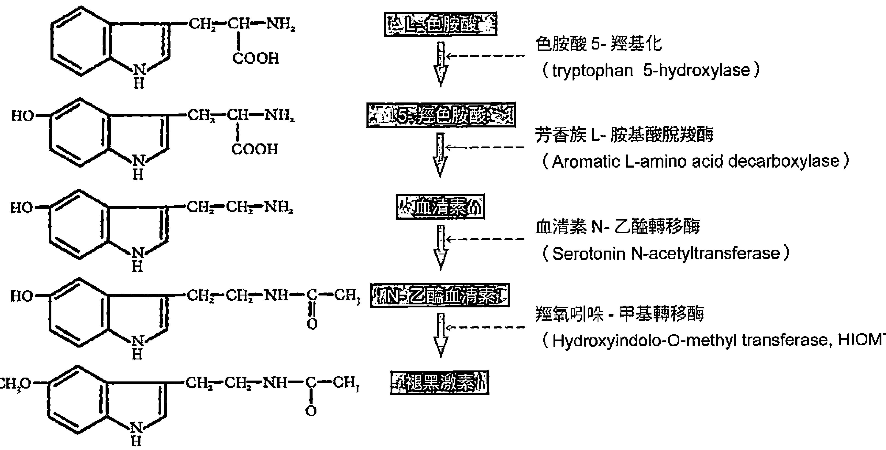

圖 1 胺基酸「L-色氨酸」轉變成血清素及褪黑激素的甲基化過程。

## 腎上腺素與褪黑激素的反向關係

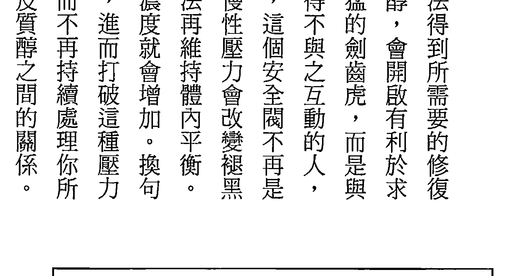

圖 2 壓力荷爾蒙濃度上升，褪黑激素的濃度下降；壓力荷爾蒙濃度下降，褪黑激素的濃度上升。

## 活化松果體，打開你的第三隻眼

我花了很多年的時間研究松果體，也不斷在尋找針對其代謝物及組織進行大規模測量的研究人員。我的興趣，在於將我的發現與某些古老的奧祕聯繫起來。以下這段摘要特別引起我的注意：

是原始基因發信號給身體，要身體儲存能量來應付饑荒的結果。大家更熟知的是，褪黑激素可以改善憂鬱症。此外，褪黑激素也被證實可提升抗老化荷爾蒙「去氫皮質酮」（DHEA）的含量。關於褪黑激素這個跟作夢有關的神經傳導物質，其他的重要性可參見圖 3。

松果體是神經內分泌的轉換器，分泌負責控制二十四小時生理節奏的褪黑激素。

### 與褪黑激素有關的科學事實

- 阻止因壓力而產生的皮質醇分泌過量
- 改善碳水化合物的代謝
- 降低血中三酸甘油酯的濃度
- 抑制動脈粥狀硬化
- 提高細胞免疫反應及代謝免疫反應
- 制止特定腫瘤的生長
- 使實驗室老鼠的壽命延長二五%
- 活化大腦的神經保護作用
- 增加快速動眼期（又被稱為「作夢睡眠」）的睡眠時間
- 刺激自由基的清除功能（抗老化、抗氧化劑）
- 促進 DNA 修復與複製

圖 3 褪黑激素可以為人體帶來的好處

在人類的松果體中存在著一種已被研究的新型生物礦化作用（bio-mineralization），其中包括一種長度小於二十微米的結晶體。由於其結構及壓電特性（piezoelectric properties），這些晶體負責松果體的生物傳導機制²。

這一段話中有很多名詞需要消化，先讓我們把這段文字分解成兩個有意義的重點，其中有兩個關鍵字是壓電特性及轉換器。

壓電效應是電介質材料中一種機械能與電能互換的現象，會在你對某些材料施加壓力、機械應力（mechanical stress）來改變電荷時發生。簡單來說，松果體中有鈣、碳及氧組成的方解石晶體，它們的結構會讓它們產生這種效應。松果體就像天線，能夠以電活化並產生可接通信息的電磁場。這是第一點。此外，就像用來發射或接收無線電波的天線，會有規律的脈動或頻率來匹配輸入信號的頻率，松果體也以相同的方式去接收帶有無形電磁場的信息。由於所有頻率都攜帶著信息，一旦天線連上電磁場的確切信號，必然有某個方法可以將該信號轉換並解讀成有意義的訊息。這正是轉換器所做的事。這是第二點。

轉換器可以是任何東西，只要能接收某種能量形式的信號、並將之轉換成另一種形式的信號。花點時間看看你的周遭，你坐在其中的空間中有電視、收音機、無線電波，全都是不同頻率範圍的無形電磁能量（雖然你無法以肉眼看見它們，它們仍然存在）。舉例來說，電視天線可以接收到攜帶信號的某個範圍的頻率，並將之轉換成電視螢幕上的畫面；當你將收音機轉到某個調頻電台時，你就是在將天線調整到某個特定的電磁頻率，那個頻率範圍所攜帶的信息，接著會被轉換成一種諧振的信號，成為你用耳朵可以聽到的音樂。

我所引用的研究指出，松果體是神經內分泌的轉換器，能夠接收並轉換大腦的信號。當松果體擔任轉換器的角色時，可以接收到我們這個以感官為主的三維現實世界的頻率。一旦松果體被活化，就能接通到超越這個時間與空間的更高維度，也就是我們在前一章中所說的時間—空間的五維世界。就像電視，松果體也能將這些頻率所攜帶的信息轉換成我們腦海中鮮明逼真的影像，以及超現實、清楚明晰的超凡經驗，包括超出我們言語所能描述的那種身歷其境的多感官景象，就像在看一部多維度 IMAX 電影一樣。

你可能會感到納悶：既然這個小腺體在我的頭骨裡面，我要怎麼對它裡頭的晶體施加應力，從而製造出壓電效應來活化松果體，好讓它變得像是一根天線呢？這根天線又要如何接收超越物質與光的頻率及信息，以便轉換那些電磁識別信號為有意義的圖像，就像一次超越三維實相的先驗經歷？

想要活化松果體，有四件重要的事必須發生。現在，我會先說明其中的三件事，等到學習冥想的時候，我再告訴你第四個步驟是什麼。

### 1 壓電效應，能量交換

如圖 4 所示，要製造壓電效應，松果體中的方解石晶體擔任了關鍵性角色。切記，這些都是非常微小的晶體，長度大約在一至二十微米。在此先提供一些背景知識：這些晶體的大小不一，從頭髮寬度的一%到四分之一都有。在大多數情況下，松果體中的方解石晶體有三種主要形狀：八面體、六面體及菱面體。

我們在第五章提到，在許多冥想前所做的呼吸技巧，其目的是要釋放底下三個能量中心以情緒形式儲存起來的潛在能量，好把心智與身體區分開來。當我們吸氣並收縮這些內在肌，能量會隨著我們的呼吸從會陰部一路往上來到脊椎，再往上直達頭部；然後屏住呼吸，更用力擠壓這些肌肉，以增加脊髓腔的壓力。正如我在本書曾提過的，當你從身體內部向上推時就會產生這種壓力，比如屏住呼吸舉重物的時候。

壓電的英文 piezoelectric 源自兩個希臘文 piezein 及 piezo，前者的意思是「擠或壓」，後者的意思是「推」。因此，當我要求你屏住呼吸並擠壓那些內部肌肉，自然有其意義，絕對不是隨興說說而已。當你這

麼做時，你正在把腦脊髓液往上推擠至松果體，對其施加機械應力，而這股機械應力會轉化為電荷。正是這個動作，可以擠壓松果體中的方解石晶體並產生壓電效應：松果體中的晶體會產生電荷來因應你所施加的壓力。

可逆性是壓電效應的獨特屬性之一，指的是具備正壓電效應的物質（結晶體）也具備了逆壓電效應（簡單來說，正壓電效應是機械能轉化為電能的過程，而逆壓電效應則是電能轉化為機械能的過程）。一旦松果體內的晶體被壓縮並產生電荷，松果體發散出來的電磁場，會讓松果體內的晶體隨著電磁場的擴大而延展；當產生電磁場的晶體延展到無法再進一步延展的極限時，它們會開始收縮，電磁場會反轉方向並往內朝松果體移動。當電磁場觸及到松果體內的晶體時，會再度壓縮它們，從而產生另一個電磁場。這種電磁場的擴大與逆轉會一再循環，而促使一個電磁場的脈衝得以永久不消失。

這就是我要求你屏住呼吸、擠壓並收縮這些肌肉的理由；而我堅持要你反覆練習這個過程，那就更理所當然了。當你一次又一次地保持呼吸、屏息、擠壓，在每次的呼吸循環中，你會一次次活化松果體的壓電屬性；你重複這樣的過程越多次，就越能加快這個電磁場每秒的擴張與收縮的週期，使它的脈衝變得越來越快。現在，松果體成了一種脈衝天線，能夠接收到更細微、更難以捉摸、速度也更快的電磁頻率。

仔細看看圖 5。我們在第五章曾談到呼吸時，腦脊髓液如何流動與運行，讓我們以此為基礎再接著深入探討。當腦脊隨液進入大腦，它會經由脊柱與脊髓之間的空隙，沿著脊髓中央管往上流動；從這個接駁處再分別流往兩個方向。首先，腦脊髓液會流入第四腦室，接著流入第三腦室。當它從第四腦室流向第三腦室時，會通過一條狹窄的管道；而緊貼在第三腦室後方的是一顆看起來像小毬果的構造（此即松果一名的由來），這就是米粒大小的松果體。其次，腦脊髓液也會流往小腦後方，來到松果體的另一邊。於是，兩個流向的腦脊髓液就這樣包圍住了整個松果體。

藉由增加脊髓腔的壓力，你得以將大量的腦脊髓液注入第三腦室及小腦周圍的空間。因此，當你屏住呼吸並擠壓內在肌時，就有更多的腦脊髓液會從上述兩個方向對松果體內的晶體施加壓力，使其壓縮而產生壓電效應。這是活化松果體的首要之務。

### 2 松果體釋出代謝物

腦脊髓液在一個被稱為腦室系統 (ventricular system) 的封閉系統內流動 (參見圖 5)，腦室系統促使腦脊髓液從脊椎底端往上流經脊柱，再流到大腦的四個腔室（稱為導水管或腦室），再往下流回到脊椎底端的薦骨。當你吸氣並讓這口氣上升到頭頂，然後屏息，往上及往內擠壓這口氣息，就是在加快腦脊髓液的流動。

松果體的表面被覆著稱為「纖毛」 (cilia) 的微細毛髮（參見圖 6）。當腦脊髓液以比平常更快的速度流經腦室系統的腔室時，會撥動這些纖毛，進而對松果體造成更強烈的刺激。整個松果體的形狀就像一根陰莖，藉由腦脊髓液加速流經它所帶來的刺激，以及在封閉系統中增加脊髓腔壓力所產生的電活化反應，會使松果體將更深層的褪黑激素代謝物射進大腦之中。現在，你在活化松果體、感受超凡體驗的道路上又往前邁進了一步。

### 3 能量直接傳遞至大腦

就像把太空梭送進太空，克服地心引力以離地升空是需要最多能量的部分；從身體較低的能量中心將能量往上轉移出去，同樣也需要相當大的強度與努力。我們可以吧呼吸看成是一種熱切的意圖，可以幫我們擺脫過去自我設限的情緒，脊柱則是能量的傳遞機制，而頭頂是我們要運送能量的目的地。

現在你已經知道，呼吸時，你會將帶電粒子往上送至脊柱。隨著這些粒子的速度與加速度增加，它們會製造出所謂的電感場（inductance field，參見圖 7）。這個電感場會反轉雙向信息的流動，有助於從大腦傳送至身體以及從身體傳送至大腦的雙向溝通；電感場就像真空管一樣，可以從下半身的能量中心將能量（與性高潮、消化、戰逃反應壓力及控制有關的能量）汲取出來，再將這些能量以螺旋運動的方式直接輸送到腦幹。當能量經由每節椎骨不斷往上流動時，會經過從脊椎運行至身體不同部位的神經，於是部分能量會轉移至影響身體組織及器官的末梢神經。這股沿著這些神經管道流動的能量，會進而啟動身體的經絡系統，使得身體的所有其他系統也能獲得更多的能量³。

一旦能量來到腦幹，必先通過網狀結構。網狀結構的工作，就是不斷地編輯從大腦到身體以及從身體到大腦的所有信息。這個結構屬於一個被稱為網狀活化系統（reticular activating system, RAS）的一部分，而這個系統會決定我們的清醒程度。例如，當你聽到屋內發出聲響而從深睡中驚醒過來，就是網狀活化系統在跟你示警，並進一步喚醒你，這是它的原始功能。然而，當交感神經系統被活化並與副交感神經系統交會時，反而會釋放出能量到大腦，而不是消耗身體所儲存的能量。一旦能量到達腦幹，丘腦室會像門一樣打開，能量就從網狀結構流至丘腦，將信息傳送到新皮質。現在，網狀結構已經打開，你會經歷到更高層次的意識；從某種意義來說，你會變得更有覺知、更覺醒（你可以把丘腦想成是大型的火車站，有軌道可以通往層級更高的大腦中心）。這就是大腦如何進入γ波模式的方式。

順帶一提，中腦有兩個獨立的丘腦（一邊一個）分別輸送養分給新皮質的兩個半球，而松果體剛好就端坐在兩個丘腦之間，面對大腦後方（參見圖8）。當能量到達兩個丘腦的接駁處時（記住，丘腦就像大腦的中繼站，可以接通所有大腦部位），丘腦會直接發送訊息給松果體，使其分泌代謝物到大腦之中，繼而喚醒負責思維的新皮質，並進入γ波等更高層次的腦波模式。這些褪黑激素的化學衍生物會放鬆身體，同時喚醒心智。

如果你還記得，當你的腦波處於β波時，交感神經系統會因為外在世界的緊急狀況而被喚醒，並進而使用身體的能量來達到生存的目的。而γ波的不同之處，在於你會在身體內釋出及創造更多的能量，而不是消耗生命能量。出現γ波時，你不是處於任何緊急狀況或求生存的狀態下，而是處於狂喜、極樂的狀態下，你的交感神經系統會打開，喚起你投注更多的注意力去察看在心智所發生的事。

在第五章中，我曾說過當能量從身體流往大腦時，身體周遭會創造出一個環形場。當你藉由加速腦脊髓液的流動，使能量從脊柱往上流動時，你的身體就像是一塊磁鐵，會創造出圍繞著它的電磁場。環形場代表動態的能量流，它會往上、往外、往你身體的周遭流動；而當松果體被活化，電磁能量的反向環形場會汲取能量，從你的頭頂將能量送入你的身體。由於所有頻率都攜帶著信息，現在，你的松果體正在接收超越可見光及超越感官的信息（參見圖9）。

當這三件事接續發生時，感覺就像是你的腦袋達到了性高潮一樣。現在，你的大腦中出現了一根天線，這根天線正在接收從超越物質、空間及時間的那個宇宙傳過來的信息。信息不再來自你的感官或你跟環境的互動；相反的，你接收到的是來自統一場的信息，而這些信息會轉移至你的第三隻眼——位於大腦後方的松果體。

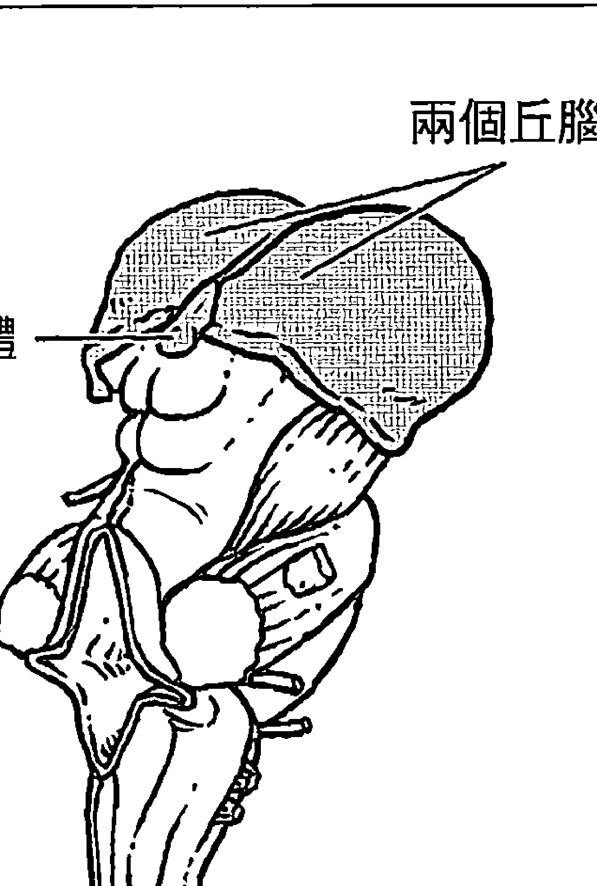

位於中腦的兩個丘腦及大腦後方的松果體

圖8 在中腦的兩個丘腦之間，端坐著一個微小、形狀如毬果的松果體，位置就在大腦中間偏後的地方。

## 反向環形場

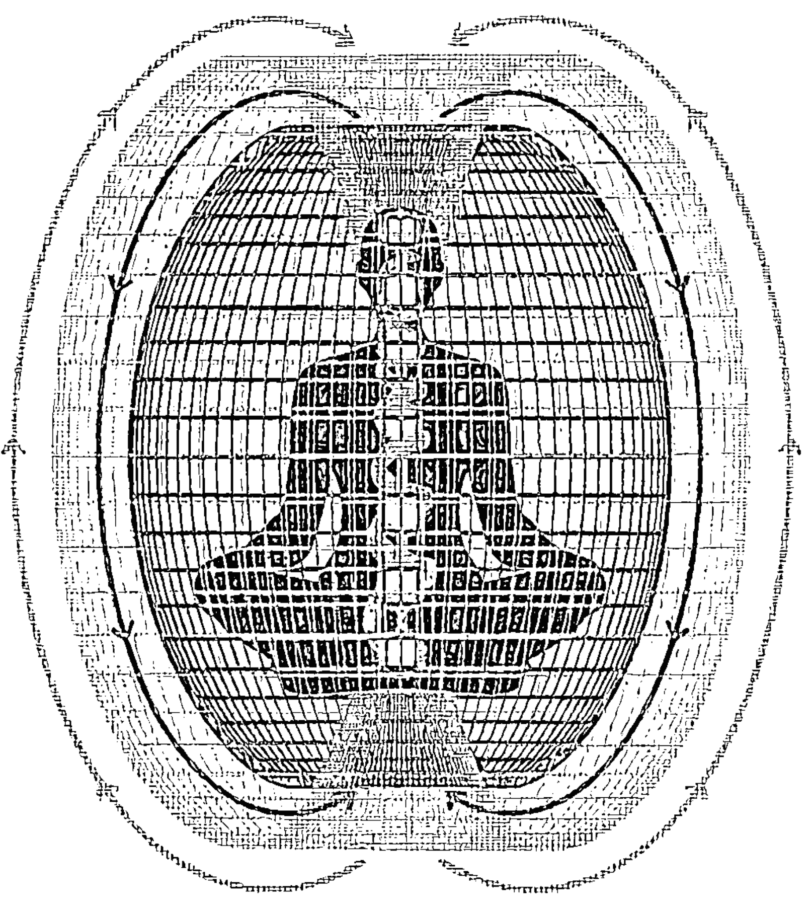

能量從統一場進入身體

圖9 當來自下半身三個能量中心的能量在呼吸時被活化，能量會從脊椎往上移動到大腦，一個電磁能量的環形場就會在身體周遭被創造出來。一旦松果體被活化，電磁能量的反向環形場會往相反方向移動，從統一場汲取能量，經由頭頂進入身體。由於能量就是頻率，而頻率又攜帶著信息，因此松果體可將信息轉換為逼真的影像。

## 褪黑激素升級時，奇蹟就發生了

當你的松果體（或第三隻眼）被喚醒時，由於它會接收更高的頻率，這些較高的能量會改變褪黑激素的化學成分；頻率越高，改變越大。正是這種將信息轉換為化學成分的功能，讓你得以為那些超凡的神祕時刻做好準備。現在，你已準備好要打開大門，迎接更高層次的時空維度了。這就是為什麼我喜歡把松果體稱為鍊金師，因為它會將褪黑激素轉化為某些神經傳導物質，這些神經傳導物質會徹底改變你，為你的人生帶來深遠的影響。

再來看看圖10。當更高的頻率及更高層次的意識狀態與松果體相互作用時，最先會發生的一件事，就是這些頻率會將褪黑激素轉化成稱為苯二氮平類（benzodiazepine）的化學物質，安眠鎮定劑地西泮（Valium）就是苯二氮平類藥物之一。苯二氮平會麻醉善於分析的思維腦，讓思維腦放鬆並停止分析。根據功能性大腦掃描，顯示苯二氮平會抑制杏仁核（亦即大腦的生存中心）的神經活動，從而限制使你感覺恐懼、憤怒、激動、敵意、悲傷或痛苦等負面情緒的化學物質⁴。現在，你的身體感覺是放鬆而平靜，但你的心智是警醒的。

另一種由褪黑激素製造出來的化學物質，會產生一種非常強大的抗氧化劑稱為松香烴（pinolines，參見圖10）。松香烴是β-咔啉（β-carboline）化合物之一，對我們的身體至關緊要，因為它會攻擊傷害細胞以及導致老化的自由基；這些抗氧化劑有抗癌、抗老化、抗心臟疾病、抗中風、抗神經退化、抗發炎、抗菌等多種作用。這是個完美的公式，可將褪黑激素抗氧化的正常功能升級至效力更為強大的抗氧化劑；相較於褪黑激素的正常作用，這種強大的抗氧化劑可在相當程度上更進一步地療癒身體（參見圖10所列出的強大抗氧化劑，這些全是從褪黑激素的代謝產物中製造出來的）。

如果你把褪黑激素分子再微調一下，會變成它的另一個表親，這是讓動物進入冬眠的同一種化學物質。正常的褪黑激素會使我們昏入睡並作夢，稍微改變一下組成，則會變成作用更強大的分子，所攜帶的訊息會延長身體休息及修復的時間；這個訊息也會使新陳代謝變慢，在某些情況下，甚至可持續數個月。哺乳動物冬眠時，牠們會打破棲息地的獨特習慣，比如失去性欲及食欲、失去在環境中移動的興趣或需求，以及中斷社交網絡的連結。牠們會躲藏起來保護自己、尋求安全感，而在這段由外在轉往內在的期間，牠們的身體會進入停滯狀態。當這些化學成分的數值升高時，相同的情況可能也會發生在我們身上。由於身體與心智已經分開，我們暫時失去了對外在世界的興趣；又因為我們不再有任何生物的本能欲望，不會因身體的需求而分心，我們能更全然、徹底地進入當下並深入內在。如果你想讓美夢成真，讓你的身體不要礙事不失為一個好主意。

讓褪黑激素的分子再度演進升級，就會製造出在電鰻身上發現的相同化學物質。那是一種具備磷光性及生物發光性的化學物質，可以放大神經系統的能量。你可以再次參考圖10。這種化學物質強大到足以引起重大的電擊，我的強烈直覺是，正是這種罕見的化學物質影響了大腦去處理如此大量的能量，也就是我們多次在學員大腦中所測量到的巨大能量。電鰻在受到刺激時，確實會以能量放電發光。

這就是大腦被活化時會發生的情況。但是，被創造出來的能量與信息並非來自感官所感知的環境經驗，而是來自大腦之內，由升級的頻率所引起。看到學員大腦中充滿了大量的能量，我們就知道，他們正在經歷某種深刻的、可被客觀測量的主觀經驗。

現在，請先停下來好好想想。松果體會透過我們的眼睛接觸到來自環境的感官輸入，進而製造出血清素及褪黑激素。來自太陽的可見光，使我們得以與環境節律和諧共處，這就是我們常說的生理時鐘。透過這樣的過程，血清素與褪黑激素所攜帶的信息得以呼應物質世界的頻率。由於我們是透過感官來察覺到可見光，只要有感官及可見光，那些化學分子對人類來說就可以說是與生俱來的；因此，它們會與我們的三維現實世界相互契合。

愛因斯坦說過，物質世界的極限是光速。但是，當大腦所處理的升級頻率與信息是來自超越感官及光速的另一個世界時，會發生什麼事呢？來自統一場的信息與能量是否可能改變褪黑激素的化學成分，變成大腦中另一種版本的褪黑激素？我們的大腦是否能將這些頻率轉換為訊息？如果能量是物質的附帶現象，那麼接收到的信息如果頻率比可見光更快，足以改變褪黑激素的分子結構，讓它變身成大腦中強大的靈丹妙藥，就不會毫無道理。松果體就是負責將這樣的信息轉化為升級版的褪黑激素，因此，褪黑激素的分子就會攜帶一個截然不同的訊息來呼應接收到的頻率。現在，這個新的頻率催生出一種強大的超級化學物質，這已經不再是自然了，而是成了超自然。褪黑激素被升級了。

這種具備磷光性及生物發光性的化學物質，不僅可以增加大腦中的能量，還能強化心智所感知到的影像，以至於每個畫面看起來都很生動逼真，就像是由超現實、發著冷光的光芒所組成。學員轉述他們的體驗，提到了前所未見的顏色，這是因為它們存在於可見光譜之外，是我們的已知經驗所無法觸及到的。這些顏色看起來就像存在於高科技電影中一個充滿飄浮之美的世界，清透明亮，散發著乳白色光芒，每件東西都像是超凡脫俗的發光體，散發著明亮耀眼的美麗光芒，你能感受得到其中充滿了活力及能量。所有事物與環境都籠罩著閃閃發光的金色光暈，這個世界看起來比我們以感官構築的現實更加燦爛；當然，你很難不去注意到它有多美。加上你是如此專注，把全部的注意力都放在這個經驗上，因此更像是你真的置身在另一個世界或維度之中，完全處於當下。

回頭再看一下圖10。再一次調整褪黑激素的組成，你會製造出二甲基色胺（dimethyltryptamine, DMT）的化學物質，這是人類已知最強大的致幻劑之一，與迷幻草藥死藤水（ayahuasca）所發現的化學物質如出一轍，而死藤水正是亞馬遜土著在儀式上使用的傳統致幻草藥。二甲基色胺的主要活性成分，據說可以產生靈性幻相及深奧的洞見。當死藤水或包含這種成分的其他植物被攝取時，人體只會吸收二甲基色胺；但是一旦松果體被活化，它會接收上述所有化學物質的混合物，從而使人們產生某些極為深刻的內在經驗。其中有若干經驗，據說可以創造時間膨脹（時間看起來像是無限的）、時間旅行、超自然國度之旅、複雜幾何圖案的幻覺、與靈性存在相遇，以及其他神祕的多維度實相。我們有許多學員轉述過在松果體的冥想中，他們所經歷的超越已知物質世界的神奇遭遇。

當這些化學物質被釋出到大腦時，心智的體驗非常逼真，甚至比起在感官為主的現實世界所發生的任何經驗都更加真實，這個新的維度很難以語言文字來加以清楚描述。這種被誘發出來的新奇體驗，將會以一種全然未知的形態出現，只要你懂得全然臣服，一定會不虛此行。

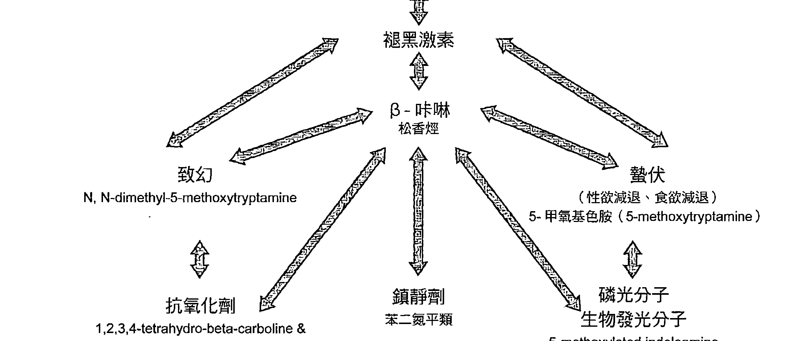

褪黑激素產生的其他代謝產物

| 類別 | 化學物質/成分 |
| :--- | :--- |
| 血清素 | 血清素 |
| 褪黑激素 | 褪黑激素 |
| β-咔啉 | β-咔啉 |
| 松香烴 | 松香烴 |
| 致幻 | N, N-dimethyl-5-methoxytryptamine |
| 抗氧化劑 | 1,2,3,4-tetrahydro-beta-carboline & 1-(3.5-dimethyl-oxypheny)-2-propyl- 1,2,3,4-tetrahydro-beta-carboline |
| 鎮靜劑 | 苯二氮平類 |
| 蟄伏 （性欲減退、食欲減退） | 5-甲氧基色胺（5-methoxytryptamine） |
| 磷光分子 | 生物發光分子 |
| | 5-methoxylated indoleamine |

圖 10 當松果體連結至比正常可見光更快的頻率時，褪黑激素這個神祕的成分會得到生物學上的升級，而產生各種不同的代謝產物。

# 第12章 松果體:人體的鍊金師

## 接通更高的維度:松果體就像個轉換器

馬太福音第六章二十二節，耶穌是這麼說的：「眼睛就是身上的燈。你的眼睛若瞭亮，全身就光明；你的眼睛若昏花，全身就黑暗。」我相信耶穌所說的，就是指活化松果體。活化松果體會讓我們體驗到更寬廣的實相，我們有許多學員都可以證明此一事實：當他們的松果體被活化時（也就是與統一場完全連結），身體會充滿能量與光。源自宇宙場、非感官能察覺的能量，經由頭頂灌注並往下流往全身；此時的他們可以下載宇宙的信息，那是超越記憶，也超越日常已知事件的珍貴信息。這一切之所以會發生，開始於松果體的褪黑激素所產生的化學變化。

在我所有關於松果體的研究之中，我將自己的理解綜合於下：松果體是個結晶狀的超導體，發送並接收經由量子場所傳導的信息（這是一種高能量的振動信號，超越感官的頻率），並經由有意義的影像轉化後進入我們的生物組織（大腦及心智）。其運作方式，跟使用天線將不同頻道轉換成螢幕上的影像，完全一樣。

當松果體被活化，你的大腦中就有了一根微小的天線；它所接收的頻率越高，就越能施加更多的能量在轉換及傳導褪黑激素的化學物質。由於這樣的化學變化，你將會得到截然不同的體驗，有別於正常版的褪黑激素帶給我們的一般經驗。或許更好的表達方式是，你會得到更加清晰的畫面，你可以這麼想：這種高頻畫面帶給你的震撼體驗，就像是把一九六〇年代的電視換成了三百六十度、高解析度的 IMAX 立體放映系統，還搭配上身歷聲的環繞音響。當讓人作夢的褪黑激素進化成一種更強大的神經傳導物質時，我們的夢境會更加逼真。

在這整個過程中，松果體有一位同謀者——腦下垂體。腦下垂體的形狀像一顆梨子，位於上鼻梁後方，就在大腦的正中央。它的前面部位（前葉）負責製造的大部分化學物質，都會影響每個能量中心的腺體及荷爾蒙。一旦松果體被活化並釋出升級版的特定代謝物⁵，腦下垂體的後葉便會被喚醒並製造出兩種重要的化學物質：催產素（oxytocin）與抗利尿激素（vasopressin）⁶。

第一種化學物質「催產素」已知會產生揚升情緒，使你的內心因為充滿愛與喜悅而鬆軟膨脹，因此有愛情荷爾蒙或親密荷爾蒙的別稱。當催產素被提升到正常濃度以上時，大部分的人都會經歷強大的愛、寬恕、悲憫、喜樂、完整、同理心等感受。這種難得的內在狀態，絕對不是你願意用某些外在事物來交換的；而這種狀態會帶你走向無條件的愛。

研究顯示，當催產素提高到超過一定的濃度時，你很難對別人心懷怨恨。由蘇黎世大學的科學家所進行的一項研究，有四十九位受試者連續玩十二次所謂的信任遊戲變化版。在這個遊戲中，會給投資人一定數額的金錢，他必須決定是持續保有這些錢，或是拿出部分本金給稱爲受託者的另一個玩家；而無論受託人獲得的金額是多少，都會被自動增加加成三倍。接著，受託人也會面臨抉擇：留下這些錢，讓投資人身無分文，或是將增加成三倍的金錢返還給投資人。基本上，這兩種決定都可歸結爲背叛與否的問題；自私的作爲會讓受託人獲利，而使投資人血本無歸。

## 第12章 松果體:人體的鍊金師

那麼,如果把催產素加入這個方程式之中呢?在該研究中,遊戲開始前,實驗組的玩家被研究人員噴了催產素,而對照組的玩家噴的是安慰劑。接著,在投資人做出投資金額以及是否信任受託人的決定時,以功能性核磁共振造影(MRI)來記錄他們腦波變化。

遊戲進行到六個回合後,重新給投資人金錢,並告訴他們大約有三個回合,他們的信任被受託人背叛了。對此結果,遊戲前被噴了安慰劑的對照組感覺到氣憤、被出賣,因此在接下來的六個回合,他們大幅減少了投資金額。再來看看被噴了催產素的受試者,在明知被出賣的情況下,他們在後六個回合所投資的金額跟前六個回合還是不相上下。功能性核磁共振造影的掃描顯示,主要受到影響的大腦部位是杏仁核(與恐懼、焦慮、壓力及敵意有關)及背側紋狀體(dorsal striatum,會基於正面回饋來引導未來的行為)。接觸到催產素的受試者,大腦杏仁核的活動大幅降低,代表他們對於再次被出賣的氣憤與恐懼降低了,對於財物損失的恐懼也如此;同時,他們大腦中的背側紋狀體活動也大幅降低,這意味著他們不再需要依賴正面結果去做出未來的決定7。

正如研究結果所顯示的,當腦下垂體後葉釋出化學物質提高催產素濃度時,杏仁核的生存中心會暫停運作;這意味著,恐懼、悲傷、痛苦、焦慮、敵意以及憤怒的大腦迴路被冷卻了。接著,我們唯一能感觉得到的,就是對生命的愛。我們在研習營前後,都會測量學員們的催產素濃度,而在活動結束後,很多學員的催產素濃度都有顯著的提升。我們訪談這些學員,其中有多人不斷表示:「我熱愛我的生命以及出現在我生命中的每個人,我希望這種感覺永遠不會消失,我想要永遠記住這種感覺。這才是真正的我。」

當松果體被活化時,腦下垂體也會分泌另一種化學物質——抗利尿激素(antidiuretic hormone)。抗利尿激素的濃度升高時,身體會留住水分而提高身體的保水度。假如你想處理更高的頻率,這一點就非常重要,因為你需要水分來充當導管,才能妥善處理身體中更高的頻率,將其轉譯至細胞中。抗利尿激素的濃度一升高,會使甲狀腺更穩定運作,而甲狀腺會連帶影響胸腺及心臟,從而影響腎上腺及胰腺,帶動一連串正面的連鎖效應,一路往下至性器官8。

當我們接通這些更高的頻率時,便有機會接觸到一種截然不同的光,那是一種比可見光更快的頻率。於是,突然之間,我們觸發了自己內在的大智慧。現在,松果體被活化了,所以我們可以接收到更高的頻率,從而產生化學物質的變化。我們所接收的頻率越高,它對我們的化學作用的改變就越強烈;這意味著,我們會擁有更逼真、能量更強大,有如幻境般的經驗。松果體內的晶體,發揮著宛如宇宙天線的作用,我們可藉此通往充滿光與信息、振動頻率更高的那個世界。這就是內在經驗如何能比外在經驗更逼真的過程。

松果體代謝物的化學成分,可以嵌入與血清素及褪黑激素一樣的受體位置,但攜帶的卻是截然不同的化學信息,它們來自超越這個物質感官真相的另一個世界。這也意味著,大腦現在已準備好迎接神祕經驗了,同時也對其他維度打開了大門,將個人從空間|時間的實相轉移到時間|空間的實相。由於所有頻率都攜帶著訊息,而訊息會造成化學成分的改變,因此一旦松果體被活化,你就會開始體驗並處理這些較高的頻率及能量,從而提升意識層次,它們往往會以錯綜複雜且不斷變化的幾何圖案出現在我們的心靈之眼。這是好消息,也是要給你的新信息。

你能擁有這些神祕經驗,是由於神經系統非常協調一致,才得以接通這些超諧振的訊息。在無盡虛空的黑暗中,松果體成了接納這些有序圖案及大批信息的渦流;而當你專注於此時,它們會像萬花筒一樣持續地改變及演進。松果體的運作方式就跟電視一樣,電視會接收頻率並將之轉化成螢幕上的影像,而松果體會以化學組成的方式,將更高的頻率轉換成栩栩如生的超現實畫面。

彩圖13有幾種不同的幾何圖案,這些圖案被稱為神聖幾何,已存在了數千年之久。在第八章我曾提到,這些圖案看起來就像是古代的曼陀羅,是以頻率形式出現的能量與信息。倘若你能臣服於它們,你的大腦透過松果體將會把這些形狀及信息轉換為極其生動的圖像、畫面或清晰的體驗。當你看到或感受到這些圖案時,最好的辦法就是臣服於它們,不要去期待事情發生。

這些圖案與形狀通常不會以二維或靜止的形式出現,而是鮮活的、有深度的、精確的、極其協調的碎形圖案,永無止盡,而且精細複雜。音流學(cymatics,也稱聲音幾何學)是將聲音視覺化的一個方式,cymatics源自希臘文,原意是「波」,是一種以振動或頻率為基礎的現象。以下是描繪它們的方法:想像你把一個舊揚聲器的蓋子取下來,放平後注入液體,從上面打光,並開始透過它來播放古典樂,音樂的頻率與振動最後會創造出協調一致的駐波。這些駐波會相互干擾,最後創造出幾何圖案中的幾何圖案。就像萬花筒一樣,你可以看到這些不斷發展的幾何排列與布局變得極為有條理。萬花筒與音流學之間的差異,在於萬花筒的圖案更趨於二維的平面,而音流學顯現出來的幾何圖案看起來非常生動立體,甚至是多維度的。除了水之外,音流學的振動效果還可使用沙子及空氣來表現。換句話說,這三種媒介都可接收到振動及頻率,並將其轉變成協調一致的幾何圖案(你可以在YouTube找到一些相關影片)。

當松果體接收到信息,所接收的正是你周遭環境中這些同類型的波;這些協調一致、井然有序的駐波存在於可見光譜之外,不斷被整合成信息包,並經由你的松果體轉換成影像。這些影像只是以協調一致的方式產生交集的信息圖案,當你把意識放在它們身上,它們會改變、進化成越來越多不斷重複的碎形,複雜、美麗又神聖。這些都是信息,而你的松果體就像個轉換器,接收到這些信息後再將之解讀為影像。這也是我決要把萬花筒當成一種心靈工具,並運用於進階活動的原因之一,以便訓練學員的大腦在體驗這種複雜的影像模式時能夠放下防備,在出神狀態下變得更容易接受及敞開心胸去接收這一類的信息。此外,一旦萬花筒使腦波轉變成α波與θ波狀態時,你會變得更容易接受暗示;你會發現自己在出神狀態下凝視著萬花筒,是一個讓潛意識心做好準備去迎接神祕經驗的好方法。

## 大腦的連線方式,創造出新現實

想像一下,如果這一刻你所有感官的敏銳度都被增強二五%,在這種情況下,你所見、所聽、所品嘗、所聞嗅、所感受到的一切,都會讓你更強烈地覺知到周遭的大小事物。倘若覺知等同於意識,那麼當你的意識被提升時,你大腦中所接收到的能量也會隨之增加(因為你不可能改變意識而不改變能量,反之亦然)。當你的大腦連接上一種正在處理新意識流的不同頻率時,大腦就會被開啟,又因為你所有的感知都被放大了,你的意識層次也會被提升。能量或頻率越高,大腦製造的化學物質變化幅度就越大;而這種轉變的程度越大,你的神祕經驗就會越發清晰。因此,當你處於這種超然物外的狀態時,你會覺得自己比在日常現實中更為清醒,也更有覺知。當你的覺知被放大,你會感覺自己就像真的在一個先驗的實相中身臨其境一般。

一旦松果體接收到影像,你就必須繫緊安全帶,因為這趟旅程要開始變得刺激了。你可能會抽離肉身,走進一條光的隧道,或是你全身會充滿光;甚至你可能會覺得自己變成了整個宇宙。而當你俯瞰自己的身體時,你還可能會納悶要如何回去。

一開始,當你經歷這些非常深刻的未知經驗時,可能會有兩個選擇:你可能會因為面對未知,心生恐懼而退縮;或是面對未知時,你可能會毫不保留地臣服並信任它。事實是,你越是能真心臣服並信任,你的未來經驗就會更深入且深刻。又因為經驗是如此深刻,你甚至不想被喚醒、回到β波狀態。相反的,此時正是你毫不保留臣服、放鬆並更深入這種超凡狀態的最好時刻。此刻的你非睡非醒,也不是置身夢境,而是超然於現實之外。如果你腦中的化學反應運作得當,你的身體會徹底平靜下來。這也是我們接受訓練的目的:體驗更高層次的完整性、一體性、愛及更高的意識。

## 第 12 章 松果體：人體的鍊金師

如果你從超越感官的另一個世界接收到不是來自太陽可見光的信息，那麼，將這種覺知稱為「第三隻眼」並不違和。因為你的內在體驗非常深刻，而這種新體驗會組合、裝配成一組新的神經網絡，於是這樣的體驗就會日漸豐富你大腦中的神經迴路。同時，當你的身體在處理更強大的能量時，這種能量也會改變你的化學反應。我們提到，所有情緒都是經驗的最終產物，那麼，這樣的內在經驗會創造出揚升的正面情緒與感受。因此，當「第三隻眼」被活化時，你確實是在用不同的眼睛去看見內在的景象。

倘若一次次的感受會累積成為情緒，而情緒又帶著能量，那麼就可知道，當你體驗到害怕、憤怒、緊張等生存情緒時，你會覺得自己更接近高密度、惰性的物質而不是能量，因為這類情緒的頻率較低。相反的，當你體驗到的是層次更高的意識狀態時，就會覺得自己越來越像能量而不是物質，因為高層次意識的振動頻率較高。這也就是為什麼我會稱這種能量為揚升情緒的原因。

如果環境會對細胞基因發出信號，而來自環境的經驗又會創造出情緒（情緒是環境經驗的化學反饋），那麼，外在環境若是沒有任何變化，我們的內在環境就不會有任何變化。比如說，當你多年來都處於自我設限的同樣情緒中，你的身體就不會有任何生物學上的變化，因為身體無法分辨，這是來自外在環境的情緒，還是衍生自內在環境的情緒。由於相同的情緒會製造出相同的化學信號，因此你的身體會相信它一直都處於相同的環境及條件之下。當身體處於一個沒有任何改變的外在環境中時，細胞也始終處於一個化學物質沒有任何改變的環境之中。

然而，當你開始擁有高度覺知的內在經驗時（比起過去任何經驗都要更真實，而且感覺更強烈），你所感受到的那股高漲的新情緒或狂喜的能量，會改變你的內在狀態，這會讓你更專注於內在世界所創造出來的實相影像。倘若你的新經驗真實到可以抓住大腦的全部注意力，那麼這個新經驗（或說覺醒的意識）便會以神經系統的方式在大腦中留下印記。現在，這種新情緒建立起長期的記憶，並發出信號給新基因。這一次，建立長期記憶的這個經驗並非來自外在環境，而是來自你的內在環境（對細胞來說，還是外在環境，稱為細胞外環境）。

這類事件會強大到讓你無法不去察覺，因為：

- 能量越大，意識越高；
- 意識越高，覺察力越強；
- 覺察力越強，你會擁有更廣闊的現實體驗。

正如我們知道的，所有的感知都是大腦根據過去的經驗而產生的連結方式。在我們的現實世界中，我們不是根據事物本身去感受它們，而是根據我們的方式去感受。如果你有個內在經驗，你在其中看到了難以解釋的神祕存在，見證到了每個東西都在閃閃發光，感受到了與萬事萬物融為一體的連結感，也經歷到了截然不同的時間與空間。當你在經驗結束後張開眼睛，在清醒的狀態下，你現實中的頻譜將會被擴展開來。這是因為這個內在經驗已經改變了你的大腦，現在，你的神經系統已重新架設，準備去感知更為寬廣的現實。這就是你開始從裡到外改變自己的方式，也是你開始去改變你體驗這個三維物質世界的方式。

不論對個體或物種來說，進化都是相當緩慢的過程。你有了經驗、受到了傷害、學到了教訓、成長了一點；然後，你有了更多的痛苦、學到了另一個教訓、面對下一個挑戰、成功完成目標、設定更多目標、再次成長，這個循環會不斷重複。這個過程會很緩慢，因為你沒有從外在環境得到更多的新信息。

然而，一旦你經歷過未知的內在經驗，它們比起你在外在世界的任何經驗都更真實，此後你將永遠無法再以相同的方式去看待這個現實，因為那些經驗會深深改變你。如果用另一種方式來說明，就是你已經升級或進行軟體更新了。如果你所感知的所有現實都是基於你的經驗，而你才剛有過一次跨維度的體驗，那麼，現在你的大腦將會感知到那些一直都存在的事物。它們始終都是存在的，只是以前你的大腦還沒能發展出能夠感知到這些東西的迴路。

如果你不斷增加這類經驗，將會持續把現實頻譜擴展開來，揭開幻相與錯覺的面紗。當面紗被揭開後，你將會看見現實真正的面貌：振動的、閃耀的、一體的、發出微光的、連結的；而驅動這整個過程的就是能量。現在，你接通了更寬廣的信息頻譜，於是突然之間，一切看起來、感覺起來都跟以前你只將它們視為物質的時候完全不一樣了；同時，你的關係也改變了。神祕主義者與大師們就是這樣走出他們修持的道路：進入他們的內在世界，從而擴展他們對外在現實的感知。想像一下，如果你不再背負底下三個能量中心的印記過日子，把那些關於生存、恐懼、痛苦、分離、憤怒、爭奪的負面情緒一掃而光，以發自內心的愛、一體性、與萬物連結等揚升情緒來取代，你會成為什麼樣的人。

取得超越感官的信息，獲得足夠的跨維度經驗，神祕主義者與大師們不再以他們天生的原始基因來看待這個世界，也不再以出生時被賦予的大腦連線方式（數千年來，已被銘刻在人類大腦中）來處理事情。相反的，他們與統一場的互動使他們產生覺知、建立新迴路及心智，有能力去覺知一個截然不同、但始終存在的實相。

有一「大腦鍊金師」之稱的松果體，其神奇的屬性並非新鮮事，只不過現代科學才剛剛追趕上古代文明一直都知道了的事實而已。

## 神話、巧合、神祕事件，都在告訴我們一個事實

二〇一一年七月二十三日，一個新的麥田圈出現在英國來回道、鄰近威爾特郡（Wiltshire）德維茲（Devizes）的鄉間，看起來與褪黑激素的化學構造一模一樣（參見圖11）。這是精心設計的惡作劇，還是另一個空間的人試圖要告訴我們某個信息？當你讀到以下內容時，可以自行判斷它們是純屬巧合，或是某種大智慧的神祕設計。

我們的大腦有左右兩個半球，你可以想像將大腦從正中間切開、分成兩半（也就是所謂的矢狀切割）。看看圖12的矢狀切面，你要特別注意松果體、丘腦、下視丘、腦下垂體及胼胝體（corpus collosum）的位置，還有全部組合在一起的樣子。其形狀是否讓你聯想到什麼？答案就是被稱為「荷魯斯之眼」（Eye of Horus）的古埃及符號，有「真知之眼」別稱的這個圖騰，意味著保護、力量以及健康。它如此形似大腦這個部位，是否可能暗藏著關於自主神經系統、網狀活化系統、丘腦室及松果體的古老教誨呢？想必古埃及人早就知道自主神經系統的重要性，也了解活化松果體代表的意義：帶著他們進入來世或其他維度⁹。

在埃及的測量系統中，荷魯斯之眼也代表分數的量化系統，用以測量整體的組成部分；在現代數學中，我們稱之為費氏常數（Fibonacci constant）或費氏數列。正如我在前面提到的，這是一個自然界中無所不在的數學公式，在向日葵、貝殼、鳳梨、松果、雞蛋或甚至銀河系結構中都可看到，也被稱為黃金螺旋、黃金平均值或黃金比例。費氏數列的特質是：前兩個數字相加會等於第三個數字。

如果你把這個公式套用於大腦，開始把它分割成正方形，加上另一個正方形、然後又一個正方形，你會得到一個碎形圖案，它們會在各種不同的尺度上不斷自我複製。從松果體開始，這個公式概要描繪出大腦結構的輪廓（參見圖13）。那麼，你是否也開始認為，松果體中有某些特別的事真的發生了呢？

在希臘神話中，荷米斯（Hermes）是諸神的信使，可以自由往返於神界與人界之間。他被視為穿越邊界及維度的旅行者之神，也是前往來世的指引之神。雙蛇杖就是荷米斯的主要標誌，由纏繞在權杖上的兩條蛇組成，頂端有一對展開的翅膀（參見圖14）。這根被荷米斯當成手杖使用的雙蛇杖，通常被視為健康的象徵；在手杖上遊走的蛇，是否代表了往脊椎上移動、從身體流往大腦的能量？而頂端的一對翅膀，是否象徵能量抵達松果體時，自我所獲得的解放？「自我的加冕就是對自我的征服」，最上方的皇冠代表的是當松果體被活化時，我們的最高潛能以及我們對神聖的最偉大表達。

由於褪黑激素的濃度在凌晨一點至四點之間會達到最高點，因此這段時間也是進行這個冥想法的最佳時刻。首先，以一首歌曲來啟動你的心臟能量中心，然後逐一祝福過各個能量中心：從最底下的第一個能量中心開始，使用你在第四章學到的「能量中心的祝福」冥想法，先把注意力放在能量中心的位置，然後放大到周圍的空間，接著給予祝福。首先，從第一個能量中心開始做起，然後是第二個能量中心；接下來，將注意力同時集中於第一個及第二個能量中心。後續六個能量中心都比照處理，每完成一個能量中心的祝福後，都要把前面的幾個能量中心連結在一起，以創造出一個越來越大的能量場。最後，你會將所有八個能量中心及周遭的能量同步調整成諧振狀態。做完這個冥想法大約需要四十五分鐘。接下來，平躺二十分鐘，讓自主神經系統接受平衡身體的指令。

現在坐起來，使用本書所教的呼吸法，將能量一路往上帶到頭頂。屏住氣息並擠壓松果體中的結晶體去活化它，從而創造出一個電磁場。這個電磁場會盡可能延伸到最遠之處，然後反轉過來壓縮這些結晶體。一旦你的頻率提升，就會從越來越高的振動頻譜中接收到信息，接下來，你的大腦會將這些信息轉換成影像。關於這個呼吸法，我要強調的是，你不用刻

## 「接通更高維度時空」冥想法

## 雙蛇杖：自我的鍊金術

圖 11 二〇一一年七月二十三日在英國教區來回道（Roundway）發現的麥田圈形狀，與褪黑激素的化學結構簡直一模一樣。這或許是有人試著要告訴我們某些信息。

圖 12 如果將大腦從中切成兩半，你可以看到緣腦。仔細比較一下，你會注意到它與荷魯斯之眼有著驚人的相似之處。

圖 13 如果你沿著大腦周邊，按照費氏常數的黃金比例來分割，這條黃金螺旋將精確地結束於松果體的這個點上。

圖 14

意去做快速的深呼吸，然後去擠壓內在肌、屏息憋氣到全身發紫的地步；相反的，我希望你可以極為舒緩、綿長、穩定地深呼吸，在呼吸的同時去協調這股氣息及內在肌的收縮，慢慢地將這股氣息一路帶往頭頂。

這是你活化松果體的第四個方法。當你完成這個呼吸法，請將注意力放在喉嚨後方及後腦勺之間，以此來定位松果體的位置，又因為「注意力在哪裡，能量就在哪裡」，所以持續專注那個位置五到十分鐘。你要以心念、覺知或意識的形態，把自己變得渺小到可以進入松果體所在的腦室，感覺它的空間、它位於大腦的位置，以及它在空間中的位置。停留在這裡約五到十分鐘。接著，去感覺松果體外面的頻率與空間，將這股能量發散到這個腦室外面的黑暗大空間中。引導這股能量攜帶以下的意圖：松果體為了迎接神祕經驗，會釋出神聖的代謝物質。把這個信息播送到大腦外面的空間。

現在，一無保留地敞開你自己，接通超越大腦、存在於永恆浩瀚虛空的能量，盡情去接收。你覺知到這股能量的時間越持久，能夠接收到的頻率就越多，你就越能大幅改變，並將褪黑激素升級成激進版的代謝物。別期待會發生任何事，也別試圖去預期，只要繼續去接收頻率。最後，再次躺下來，讓自主神經系統接管一切。享受這一路上的風景！

## 第13章 聯動計畫，創造一個更美好的世界

我們活在一個極端的時代，這些極端既反映了一種無法存續下去的老舊意識，也反映了一種地球本身及地球上所有的人正在轉變的未來意識。老舊的意識是由仇恨、暴力、偏見、憤怒、恐懼、受苦、敵對、痛苦等生存情緒所驅動，這些情緒誘使我們相信彼此是分離的，而分離的幻相會造成個人、團體、社會、國家以及大自然本身的分裂，並為此付出沉重的代價。正如我們所知，人類活動的盲目、不在意、貪婪、目空一切，已對所有生命造成了威脅。從純粹的邏輯與理性來看，這種意識維持不了多久。

由於一切都在走向極端的對立，不可否認的，隨著老舊典範的崩解，許多當前的體系也正在四分五裂，包括政治、經濟、宗教、文化、教育、醫療及環境。我們從媒體產業的變化就可見出端倪，現在再也沒有人知道應該相信什麼了。其中的若干改變反映出人們的選擇，其他改變則反映出個人意識水準的提升。但顯而易見的是，在這個資訊爆炸的時代，與這種新意識的進化不一致的所有事物都會逐漸浮現出來。

如果你尚未意識到這個時代的頻率與能量已經改變，焦慮、緊張、激情的程度劇增，那麼或許你也沒有留意到你本身的存在狀態、人類的相互連結與這股能量的關聯性。除了我們高度緊繃的政治、社會、經濟以及個人環境帶來的動盪與劇變，許多人也覺得時間彷彿正在加速前進，或者說重大事件發生的間隔時間越來越短了。這究竟是一個激動人心、令人覺醒的時刻，還是一個誘發焦慮、令人不安的時刻，完全取決於你的觀點。無論如何，舊的事物必須被棄置或崩毀，才能讓位給更具實用性的新事物。這就是人類、種族、意識、甚至地球本身持續進化的方式。

這種在人類及大自然之中的能量刺激，會引發以下幾個問題：是否有更巨大的影響在發揮作用，影響人類與暴力、戰爭、犯罪、恐怖主義的相關性？或相反的，影響人類與和平、團結、協調一致、愛的相關性？而所有一切都發生於某一個特定時期，有任何理由嗎？

## 以諧振的能量發送和平信號

至今為止，短期和平集會活動的力量已經在超過五十場的示範活動以及二十三項由同儕評審、世界各地的獨立學者負責審查的科學研究中，充分展現成果並進行徹底的實地試驗¹。這些成果持續展現出正面效應，包括犯罪、戰爭、恐怖主義等罪行平均都下降了七〇%以上²。試著想一想這背後的意義：有一群人聚在一起，帶著改變某件事或產生某個結果的特定意圖或集體意識，他們只是透過和平、團結、協調一致、一體性的能量及情緒去創造想要的結果，而不是實際去做任何事，就能改變百分之七十的時間。為了量化這些研究結果，科學家使用了一種稱為「領先—落後分析」（Lead-lag analysis）的測量方法。

「領先—落後分析」的目的，在於發掘人與事件之間的相關性。舉例來說，如果你檢視一個老菸槍的「領先—落後分析」，它會顯示抽的菸越多，罹患肺癌的可能性越大。至於和平集會的活動，研究則發現：冥想者或和平聚會者的人數越多（加上他們冥想時間的長短），就越能加大他們對降低社會犯罪與暴力事件的影響。

一個強有力的例子，就是黎巴嫩的和平集會活動。一九八三年八月與九月，一群冥想者在耶路撒冷展現出「和平輻射影響」的切實效應。雖然隨著時間推移，冥想者的人數時有變動，但產生的影響仍然大到足以對以色列與鄰近的黎巴嫩帶來超級輻射效應（super radiance effect）。當一群受過訓練的冥想者每天在同一時間聚在一起針對整個社會創造及散發正面影響，就會產生這樣的正面效應。這項長達兩個月的研究結果顯示，在冥想者出席率很高的那些日子，戰爭的死亡人數降低了七六%；其他影響還包括犯罪、火災、交通意外事件降低，恐怖活動減少，以及經濟成長率提高。其後，在黎巴嫩戰爭高峰期的兩年之內，這些結果在七次連續的實驗中重複出現³。這一切效應，只是因為人們懷抱著對和平的意圖以及愛與慈悲等揚升情緒一起諧振的結果，清楚展現一群帶有特定崇高能量的人所具備的意識與能量，以非局域性的方式去改變其他人的意識與能量。

被視為西半球三大和平集會活動研究之一的美國智庫蘭德公司（RAND Corporation），在一九八三年至八五年間的三個時期，每次八天到十一天不等，聚集近八千名（有時更多）訓練有素的冥想者針對世界和平的主題一起靜坐冥想。結果顯示在這段時間，全球的恐怖活動減少了七二%⁴。如果這一類的冥想與正念能成為教育課程的一部分，你可以想像隨之而來的正面效應有多麼強大，以及它們發生的速度有多快嗎？

另一項研究是在一九八七年至九〇年的印度，七千人聚集在一起為世界和平靜坐冥想。在那三年期間，這個世界見證了邁向世界和平的驚人轉變：冷戰結束、柏林圍牆倒塌、兩伊戰爭畫下句點、南非開始走向廢除種族隔離政策、恐怖攻擊逐漸平息。令所有人感到驚訝的是，這些迅速發生的全球性變化，全都以相當平和的方式完成⁵。

一九九三年六月七日到七月三十日，大約有二千五百名冥想者聚集於華盛頓特區，在一個受到高度控制的實驗中，以諧振能量祈祝和平。在那一年的前五個月中，暴力犯罪率始終穩定上揚，但在這項研究開始進行後不久，統計資料顯示華盛頓特區的暴力（根據美國聯邦調查局的統一犯罪報告測量結果）、犯罪及壓力開始顯著下降⁶。這些結果指出一個事實：一小群以愛及特定目的團結在一起的人，可以為一大群屬性各異的人帶來統計學上有意義的明顯效果。

二〇〇一年的九月十一日，全球媒體的即時熱門新聞，都在報導美國恐怖襲擊事件，並實況播放飛機撞擊並墜毀於紐約世貿中心、華盛頓特區五角大廈以及賓州尚克斯維爾（Shanksville）附近採煤田的畫面。全球各地都同感驚恐與悲傷，在那個瞬間，全球的集體意識一起聚焦在同一個事件，人們互相關照、安慰，而在全球各地引起強大的情緒宣洩現象。在九一一恐怖攻擊事件發生的這段期間，負責普林斯頓大學「全球人類精神意識偵測計畫」（Global Consciousness Project）的科學家們，透過網際網路從全球四十多個設備收集數據；當資料被輸進普林斯頓位於紐澤西州的中央伺服器時，科學家在隨機事件生成器中見證到模式的戲劇性變化（不妨將隨機事件生成器想像成用電腦來拋硬幣，它測量的是正面或反面、一或零，因此根據統計學來說，產生的結果應該接近五〇%比五〇%）。但是在九一一事件後，觀察到的模式大改變，讓科學家得以確認人類宣洩的集體情緒，已經強烈到足以在地球的磁場中被實際測量出來⁷。

所有這些研究最終都指向一個顯著的證據：專精的冥想者組成人數適當的冥想團體，透過改變他們的情緒與能量，就能對和平與全球凝聚力造成影響，並創造出非局域性的可測量成效。以上這些和平集會活動都是為了凝聚整個人類的和諧共識而努力，那麼，是否有相反的暗黑力量會破壞和平，為人類帶來非諧振、不協調的能量呢？

## 太陽黑子，是人類所有麻煩事的幕後黑手

當地球日復一日地繞著太陽旋轉時，每天早晨太陽都會將它的光芒帶入黑暗之中，用它的溫暖及舒適來驅散黑夜的寒意，為植物帶來光合作用，也為人類帶來白日的安全保障。這也是為什麼遠在西元前一萬四千年前，人們會在石碑與洞穴刻畫上他們對太陽神的崇拜。許多古文明（例如古埃及、美索不達米亞、馬雅、阿茲提克以及澳大利亞原住民）的神話都對太陽崇敬有加，視之為啟蒙、光明及智慧的來源。不論是東方或西方，都認同太陽是地球上所有生命的主宰，因為如果沒有太陽，地球上的生命就不可能存在。

人類幾乎可以視為一種電磁生物（可以持續經由振動能量發送並接收訊息的實體），由光及信息組成身體（事實上，在這個三維世界中的所有物質都是由光及信息所構成）。我們都是個別的電磁生物，是電磁世界一連串鏈結中的一個小環節，無法與整體分離開來。

從宏觀層面來看，我們不可能否認太陽能量、地球能量以及所有物種能量之間的相關性。在微觀層面上，你只需看看某種水果或蔬菜的生命週期，就能了解這種相互依存的關係：蔬菜或水果從一粒種子開始，當水、溫度、土壤、光合作用等環境條件都協力運作時，就會促成種子發芽；一直到最後開花結果，成為生態系統不可分割的一部分，也成為各種生命形態的食糧與營養來源。這種複雜的生物鏈與微妙的平衡，全都是因為地球處於太陽系獨一無二的位置，也就是一個被稱為適居帶（circumstellar habitable zone）的區域，因為恆星（就地球而言是指太陽）輻射量適中且存在著液態水，有利於生命發展。

雖然太陽離我們遠在九千三百萬英里之外，但當它變得活躍時，還是會對地球上的生命產生顯著影響，因為地球與太陽的電磁場有密切的相關性。地球的電磁場（參見圖 1）是為了保護地球免受太陽輻射、太陽黑子、宇宙射線及各種形態的太空天氣傷害。雖然我們尚未完全了解太陽黑子，但目前已經知道，太陽黑子是太陽磁場內一個相對黑暗又低溫的區域，直徑甚至可達三萬兩千英里。你可以把太陽黑子想像成一瓶蘇打水的瓶蓋，如果你搖晃瓶身後打開瓶蓋，將會湧出大量光子（光）以及其他形式的高頻輻射。

如果不是地球電磁場的保護與隔離，就我們所知，地球上的生命是不可能存在的，因為我們會不斷受到致命微粒源源不絕的衝擊。例如，當太陽耀斑出現時，地球的電磁場可藉由偏轉數萬億噸被釋放出來的光子來保護地球；這些光子稱為日冕物質拋射（coronal mass ejection），是太陽日冕的離子與磁場的巨大噴發，可延伸至太空中數百萬英里之廣。太陽耀斑往往在發生之後的平均二十四到三十六小時，會對地球造成影響。

這些噴發物會壓縮地球的磁場並加熱地球以鐵為主的核心，而隨著地球核心逐漸改變，地球的電磁場也隨之發生變化。這些噴發是太陽活動週期的一部分，大約每隔十一年就會發生，同時，它們也有可能對地球上所有的生物造成干擾。

太陽活動週期的紀錄始於一七五五年，但是在一九一五年，有一位叫做亞歷山大·奇茲維斯基（Alexander Chizhevsky）的十八歲俄羅斯男孩花一整個夏天在觀察太陽，從而將人類對太陽的理解提升到一個新的水準，其中也包括太陽與地球的關係。在那個夏天，他開始假設太陽活動時期可能會對地球這個有機世界造成影響。一年後，他為第一次大戰上戰場，在他沒有仗好打時，又開始專心觀察太陽。他特別注意到，戰事的增減趨勢似乎與太陽耀斑的強度有關（參見彩圖14）；奇茲維斯基後來彙編了七十二個國家從一七四九年到一九二六年的歷史，把重要的政治與社會事件（譬如戰爭革命、疫病爆發以及暴力事件）的年度數據拿來與太陽活動的增加做比較，證明太陽活動與人類的易激動性存在著相關性。同樣有趣的是，太陽活動也與人類的文明發展有關，包括建築、科學、藝術以及社會變革方面的偉大創新¹⁰。

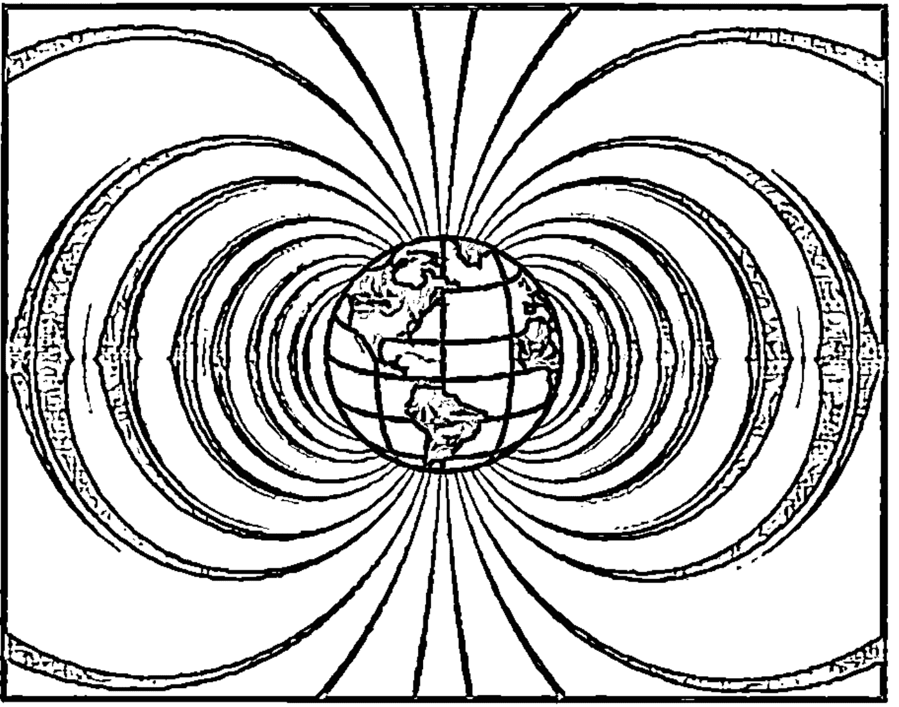

圖 1 地球電磁場

你在彩圖 14 看到的紅線，像波浪狀的每個尖峰，代表的是一七五〇年至一九二二年間活躍的太陽耀斑或出現太陽黑子；藍線則代表同一時期地球所發生的重大歷史事件。奇茲維斯基最終確定，這些國家最重大的事件有八〇%是發生在太陽活動與地磁活動期間¹¹。太陽能量（攜帶著信息）的釋放幾乎與我們星球的活動、能量以及意識完全一致，而在撰寫本文的二〇一七年間，我們恰好處於一個非常活躍的太陽活動週期內。

在過去十年間，已出現許多關於太陽能量如何影響地球及地球所有生命的說法。二〇一二年，末日預言者認為馬雅曆法的結束（與十二月冬至有關）意味著世界末日即將來臨；今日，占星家則談論著寶瓶時代（占星學上，一個時代大約是二千一百五十年，相當於春分點從黃道帶的一個星座移至下一個星座所需要的平均時間），以及它將如何為人類開創新意識。而天文學家和宇宙學家討論的天文大事件，則是銀河對齊（galactic alignment），亦即太陽與銀河系的中心對齊（太陽、地球及黑洞會排成一直線），這是每隔一萬二千九百六十年才會發生的罕見天文事件。

無論你相信什麼，所有這些發生的事件都指向在太陽活動週期時，從太陽向地球傳播的能量增加了。由於我們是電磁生物，不僅透過電磁場與地球連結，也藉由電磁場的屏障保護我們免受太陽傷害，因此，太陽能量增加不但會改變地球的能量，也會改變我們每個人的能量。這意味著，這種新增的能量可能以正面或負面的方式來影響我們，至於正面或負面則取決於我們每個人原來的能量屬性。例如，如果你平常就感覺疏離、依賴生存情緒度日，並受制於壓力荷爾蒙等化學物質，你的心與腦將無法協調一致地發射信號，導致你的能量與意識變得分裂並失去平衡；此時，來自太陽的新增能量就會強化你目前的狀態。因此，如果你處於不協調的狀態，這種失調狀態會被放大及增強。

同理，如果你處於心腦諧振的狀態，每天冥想時都會連結上統一場的能量，並克服自我設限的信念與心態，你將進一步被推往真相，理解你的真實存在以及今生的目的為何。

重點在於，我們正處於一個初始階段，需要大量的意志、覺知及意識來保持專注，以免受到這些易令人激動的能量所擺布。如果我們能保持專注，而不是成為不確定性的受害者，我們可以在個人或全球層面上將太陽的新增能量轉化為高度有序、協調或甚至平和的正面效應。用最簡單的話來說，這股能量將會支持並強化你的存在，亦即你思考與感受的方式。

## 舒曼共振，閃電引發的訊號

一九五二年，德國物理學家舒曼（W. O. Schumann）做出了如下的假設：地球的大氣層中存在著可測量的電磁波，就在地球表面與電離層之間的空腔中。據美國太空總署所稱，電離層是由豐沛的電子、電離原子及分子所組成，從地表上方約三十英里處延伸至太空邊緣，上達到近六百英里處（也就是說電離層的範圍是在三十到六百英里之間）。這個動態區域的成長與縮小（以及是否進一步分裂成子區域）都取決於太陽狀態，它是太陽與地球相互作用鏈中極為關鍵的一環¹²。正是這個「天體發電站」，使無線電通信成為可能。

一九五四年，舒曼與科尼格（H. L. König）藉由偵測主頻率為七・八三赫茲的共振，證實了舒曼的假設。所謂的「舒曼共振」是全球電磁共振，在電離層形成的空間中由閃電放電所引發。你可以把這種頻率想像為生命的音叉，換句話說，它的作用是一種背景頻率，會影響哺乳動物大腦（新皮質之下的潛意識腦，即自主神經系統的所在）的生物電路。舒曼波會影響我們身體的平衡、健康，以及作為哺乳動物的特質。事實上，缺乏舒曼共振會導致人體產生嚴重的身心健康問題。

馬克斯・普朗克行為生理學研究所（Max Planck Institute for Behavioral Physiology）位於德國的安德希斯（Erling-Andechs），所屬的科學家拉特格・韋佛（Rütger Wever）在其主導的研究中就證明了這一點。在一九九六年，心能商數學會的研究人員發現，當心腦處於諧振狀態時，會對環境散發出更為協調一致的電磁信號；而且，這種信號可以被其他人或動物的神經系統偵測到。事實上，正如你現在已經知道的，心臟可以在人體中形成最強大的磁場，即便遠隔幾英尺外也能被偵測到¹⁵。這為下面的事實提供了一個可信的合理解釋：當有人走進房間，你不必去看對方的肢體語言，就能感覺或察覺到對方的情緒狀態¹⁶。從純科學的角度，接下來我們或許會問：如果這種現象在個人層面上可行，那麼是否也可以在全球層面上發揮作用呢？

這項研究中，他召集了年輕健康的學生當志願者，進行為期四週的實驗。他將這批學生安置在嚴禁出入的地下碉堡中，過濾掉舒曼頻率。過了四個星期，這批學生的生理時鐘完全被改變了，還出現了沮喪、壓抑等負面情緒及偏頭痛。接著，韋佛把舒曼頻率重新導回地下碉堡，讓這批學生暴露在七・八三赫茲的頻率之下，短短時間內，這些志願者的健康都恢復了正常狀態¹³。

早在我們知道舒曼頻率之前，地球的電磁場一直都在以七・八三赫茲的自然頻率保護著所有生物。你可以把舒曼共振想像成地球的心跳，古印度聖人將此稱為嗡（OM），不管是不是巧合，七・八三赫茲剛好也是誘導腦波的一個極其強大的頻率，因為它與低頻的α波及高頻的θ波狀態都有關聯。正是這個腦波頻率，讓我們得以超越分析心，進入潛意識心。因此，這個頻率也與高度的易受暗示性、高層次冥想、成長激素濃度提升、大腦血流量增加有關¹⁴。這麼看起來，這個地球頻率與人類的大腦頻率有著極為類似的共振現象；同時，我們的神經系統也會被地球的電磁場所影響。或許，這就是遠離城市、走進大自然可讓我們重拾平靜的原因。

## 整體大於部分之和，突現概念的應用

十多年後的二〇〇八年，心能商數學會推出了全球聯動倡議（Global Coherence Initiative, GCI）的大型計畫，這是一項以科學為基礎的國際性志業，旨在啟動人類心念來促進和平、和諧以及全球意識的轉變。這個大型計畫是基於以下信念：

- 人類的健康、想法、行為以及情緒都會受到太陽地磁（地球磁場）活動的影響；
- 地球磁場是一個載體，連結所有生命系統的生物性信息；
- 所有人類都會受到地球電磁場的重大信息所影響；
- 人類的集體意識會形成或影響全球的信息場，當群眾對集體的信念、價值有共同的認同，以安住於心的關懷、愛及和平等揚升情緒共同打造一個更協調一致的環境時，可以利益他人，並有助於抵銷地球的不和諧與失調的現狀。

由於我們的心率和大腦頻率（以及心血管和自主神經系統）都在呼應著地球的共振場，全球聯動倡議的科學家們認為，我們是生物反饋循環的一部分，在這個循環之中，人類不僅從該場域中接收相關的生物性信息，更把信息反饋回場域之中。換句話說，人類的想法（意識）與情緒（能量）不僅會與這種信息交互作用，所有信息也會被編碼進地球的磁場之中，從而遍布於全球各地的載波上（發出的訊號中會刻印或攜帶著此一信息）。

為了進一步研究並檢驗此一假設，心能商數學會利用置放於全球各地最先進的感應器，建立了一個「全球聯動監測系統」（Global Coherence Monitoring System, GCMS）來觀察地球磁場的變化。其目的在測量全球的聯動性，此監測系統使用一組高度靈敏的磁力計，持續測量與人體生理頻率相同的範圍內所發生的磁信## 第13章 聯動計畫，創造一個更美好的世界

  號，包括我們的大腦及心血管系統。此外，他們也持續監測地球磁場的變動、太陽風暴、太陽耀斑及太陽風速度等等變化。不管是太陽風暴或舒曼共振的中斷，都可能影響人類社會，而情緒強烈的全球重大事件更可能發送出潛在的識別信號19。

  做這些事的理由為何？背後又代表了什麼意義？答案是：如果你能透過意圖在周遭環境建立一個諧振的電磁場，而你生命中與你相關或產生連結的人，同樣也透過意圖來建立他們周遭的電磁場，這個共享場域中的電磁波就會以一種非局域性的方式開始同步。當分別來自兩個個體的電磁波開始同步時，你周遭的電磁波及磁場都會變得更加強大，從而讓你與地球的電磁場產生連結。

  如果我們能找出遍布全球各地的一群人，讓每個人都帶著世界和平的明確意圖，當這群人提升本身的能量場時，有沒有可能在地球的電磁場內製造出一種全球性的效應？這個意圖明確的團體，是否可能在混亂失序的大環境中重新建立協調及秩序？

  和平集會活動的研究證據顯示，我們的想法及情緒確實會對所有的生命系統產生可測量的效果。你或許聽過「突現」（emergence）這個概念*，試著想像一群魚或一群鳥整齊劃一地同步游動或飛行，彷彿牠們都由同一個心智所運作一樣，這是透過一個無形的能量場、一種非局域性的方式來相互連結及傳遞信息的結果。突現的獨特之處，在於這是由下往上、由簡單到複雜的一種現象，這就意味著不存在著單一領導者，人都是領導者，因為他們是以一個心智在共同運作。當一個全球性團體以和平、愛及協調等訴求凝聚在一起時，根據突現的概念，這個團體應該能在地球電磁場及彼此的能量場中產生若干效應。那麼想像一下，如果我們都能在一個共同心智下表現、生活、茁壯、運作，這個世界會變成什麼模樣。如果我們明白事實上我們共享著同一個心智，是可以透過意識相互連結的生物體，我們就能理解，以任何方式去傷害或影響他人，就等於是在傷害或影響我們自己。這種思維上的新典範，將是人類這個物種有史以來在進化上最大的一次大躍進，我們不再需要戰爭、鬥爭、競爭、恐懼及苦難等過時的需求。問題在於，這個可能性要如何才能成為現實？

> *編按：突現按字面解釋就是突然出現，這個概念是用來說明「整體大於部分之和」的最佳例子。當一群個體組成一個整體時，這些個體之間會相互作用，使得所形成的整體會自動出現一些前所未有的全新屬性或模式，這種現象就稱為突現。

## 超越物質的諧振力量

  為了在地球的電磁場中形成某種效應（進而影響其他個體的能量場），你可能已經猜到，我們要做的，就是活化人體的兩個重要能量中心：心臟與大腦。我們在第四章提過，大腦是意識與覺知的中心，而心臟是一體性及完整性的中心，有它自己的大腦，是我們與統一場聯繫的關鍵。當人們能調節內在的關懷、善意、和平、愛及感恩等情緒狀態，他們的心會變得更協調一致也更平衡，並發送出強烈的信號給大腦，讓大腦也跟著變得更協調及更平衡，由此達到了心腦諧振。能做到這一點，是因為心臟與大腦始終不斷地在進行溝通。

  同樣的，人們一旦能夠超越身體、環境及時間的牽絆，並將注意力從物質轉移開來，他們會變成沒有實體、沒有身分、不擁有任何事物、不存在任何地方與任何時間的純粹意識。當他們超越自己並將意識放在非物質的能量世界上，就會接通統一場（一個任何實體、身分、事物、地方及時間都不存在著距離的國度），從而使他們與所有實體、所有身分、所有事物、所有地方、所有時間的意識凝聚合一。只有成為意識狀態，他們才能進入充滿能量與信息的量子場中；而在量子場中，意識及能量能以超越時間、空間的非局域性去影響物質世界。

  這個過程的附加作用，就是我們的大腦與能量狀態會變得更為協調一致，以至於生理機能也變得更為健康完整。根據我們的研究，當大腦處於諧振狀態時，會進而影響自主神經系統及心臟。心臟是我們跟統一場的連結關鍵，會催化及增強諧振、同調的過程，並將這樣的效果又送回到大腦中。由於心臟送到大腦的信息多於大腦送到心臟的信息，當你的心因為揚升情緒而達到同調性的程度越高，大腦與心臟就越能同步運行。這種同步性，會在身體內及身體周遭的電磁場產生可測量的效果；此外，身體周遭的能量場越大，我們就越能突破空間的限制去影響他人。如何證明？答案是：我們在學員的心率變異分析測量結果中，一再驗證了這種現象。

  一個人的心臟電磁場對他人的心臟電磁場所產生的影響，可從心能商數學會所進行的研究中得到證明。在這項研究中，四十位受試者被分成了四組，分別圍繞著十張牌桌。同一桌的四位受試者中，有三位接受過心能商數學會的訓練，懂得利用技巧來提升他們的情緒。當這三名受試者提升本身的能量，並將正面情緒發送給剩下那名未受過技巧訓練的受試者後，這第四個人竟然也進入了高度諧振的狀態。因此，該研究的作者得出了以下的結論：「跨對象心對心達到同步的證據，支持心對心生物通訊（heart-to-heart biocommunication）的可能性。」20

  達成諧振的過程，關鍵在於超越分析心（我們之所以知道這一點，是因為我們在學員的大腦掃描中多次測量到了這樣的結果。他們的例子證明了只要有足夠的練習，可以在相當短的時間就達到心腦諧振的狀態）。當思維腦安靜下來後，腦波會進入α波或θ波的狀態，開啟意識心與潛意識心之間的大門；接著，自主神經系統會變得更容易接受信息。藉由揚升情緒來提升能量，我們的物質會變少而能量會變多，亦即粒子會變少而波變多。我們以這些能量、覺知及意識所創造出來的能量場越大，就越能突破空間的限制去影響他人。

  你的心藉由揚升情緒所生成的能量越大，你就越能接通統一場。這意味著，你將會體驗到更深刻的完整性、連結感及合一性。但是，一旦你處於非同調、非諧振的狀態，回到疏離感或活在壓力荷爾蒙之下，馬上就會失去了那種連結感。當壓力所釋出的化學物質刺激大腦時，我們與統一場之間會產生隔閡，往往會讓我們做出不利於進化及成長的選擇。毫無疑問的，我們都知道敵意、恐懼、憤怒、內疚、羞愧、無價值感會在人我之間創造出距離，因為這些情緒所產生的是更緩慢、頻率更低的能量。反之，愛、感激、關懷、良善等揚升情緒，則會產生更快速、頻率更高的能量。頻率越高，能量就越多，這是不變的定理。這也讓我們得出以下幾個問題：

- 我們是否可以讓數百個人齊聚在一個房間裡，讓他們打開心去生成一種揚升的能量狀態，然後要求他們將意圖發送給同一個房間中的另一群人，使這群人獲得最大的好處與利益？
- 如果每個人周遭的電磁場都能與鄰座者的電磁場交融，會發生什麼事？
- 這些揚升的正面情緒是否會開始改變房間中的能量？
- 有沒有可能每個體驗到揚升情緒與能量的人，都能在團體中建立起諧振狀態？

## 建立一個諧振的能量場

  從二○一三年初以來，我們一直與心能商數學會一起合作，進一步推動我們的研究。我們開始測量學員們的生理狀態，掃描過成千上萬個大腦及心臟，獲得了驚人的大量信息。我們收集到的某些數據曾令我們嘖嘖稱奇，我們也曾親眼目睹平凡人成就不凡之事。

  我們與心能商數學會的合作，見證了學員們驚人的測量結果；同時，在學員們聚集的房間裡，我們也測量到同樣驚人的集體能量，顯示出能量每天都在提升。我們用來測量電磁場能量的，是稱為「史普尼克天線」的一種精密感應器，在第二章我們曾經簡單提過。由於與自主神經系統活動有關的揚升情緒會產生電磁場，因此增強這些情緒，會導致血管的微循環、排汗以及身體其他功能的改變。「史普尼克天線」相當敏感，因此可以藉由氣壓變化、相對濕度、空氣溫度、電磁場等來測量環境的波動21。

  看看彩圖15A及15B。從這些研習營的測量結果中，你可以看出房間內集體能量逐漸增加的趨勢。第一條紅線是我們的測量基線，顯示出活動開始之前房間中的能量；看看紅線、藍線、綠線以及最後的橘色線（每種顏色代表了不同的一天），你會發現每天的能量都在穩定地提升。在彩圖15C及15D中，相同的色標仍然適用，不過這些測量結果反映的是每天早晨冥想時特定的時間間隔。這意味著，學員們能夠藉由創造更為統一的協調性，逐日顯著地提升房間裡的能量。

  「史普尼克天線」的讀數顯示，學員們從研習營第一天至最後一天所創造的集體能量都在穩定且持續地成長。在整體上揚的趨勢中，我們也發現，大部分的群組都非常專注，因此能量才會逐日提升。在頭兩天中，約有四分之一的時間，能量大致維持不變，但在接下來幾天，能量開始明顯提升。我們認為這是因為頭兩天，各小組成員還在努力打破使他們與「過去即當下」現實緊綁不放的情緒紐帶，以克服自我；所以這段時間，他們正在從統一場汲取能量來建立自己的個人電磁場，而從統一場汲取能量，會使房間的集體能量下降。不過，一旦個人的電磁場變得更加強大、更協調一致，就會開始互相搭載，於是我們就看到房間中的能量明顯提升了。

  圖2顯示，當兩股諧振波匯聚在一起時，會創造出一股更大的能量波，這種情形稱為建設性干涉（constructive interference）。波越大，能量振幅就越高。由於學員們在研習營期間，能量波越來越趨近同調及諧振，使得團體場中的能量提升，因此有了更多的能量可以用於療癒、創造或觸及更高層次的心智，有時甚至可以帶出神祕經驗。

  親眼看到學員們達到如此美好的成果，我的團隊跟我更懂得謙卑。發生在他們身上的事，包括深度療癒、提升及調節崇高情緒的能力、對人生有更敏銳的洞察力以及出現神祕經驗等等。當然前提是，他們都已經學會如何去調節腦波、敞開自己的心，以及如何進入諧振狀態。其中發生的有些事或可以奇蹟稱之，但我們相信，這只是成為超自然的部分過程。這也讓我們想知道，除了自己，學員們是否可能影響他人的神經系統？如果可以，又代表了什麼意義呢？這些問題催生出「諧振投射」冥想法。

## 諧振的冥想，改變集體意識

  我們與心能商數學會的合作，進行了大量的實驗。我們從進階研習營中隨機抽樣了一群學員，大約有五十至七十五人，然後將心率變異監控器安裝在他們胸膛上，並將他們安置在前排座位，在二十四小時內進行了三次冥想。心率變異分析不僅可以讓我們了解心臟的諧振程度，還可提供我們關於大腦與情緒的信息，因此，我們希望能測量實驗對象的心率變異整整二十四個小時。

  冥想一開始，房間中的每個人都將注意力放在心臟能量中心，並開始透過這個能量中心舒緩、深沉地呼吸，正如你在第七章學到的方法。接著，他們要培養並維持某種揚升情緒二至三分鐘，擴展心臟能量中心的電磁場，心態也從自私轉變為無私。然後，我們要求五百五十名到一千五百名的學員一起把揚升情緒的能量傳播至身體之外及整個房間的空間。接下來，我們要求學員把這個帶著意圖的心念放進頻率之中，讓教室前排安裝上心率變異監控器的學員們能獲得最大的利益，豐富這一群人的生活、療癒他們的身體，以及獲得神祕經驗。

  我們的目標是測量房間裡的共同能量，以及這些能量是否能對那群安裝心率變異監控器的學員產生非局域性的影響。這些已提升層次的能量及頻率，是否能透過愛、感激、完整及喜悅，把他人的心也帶進相同的諧振狀態，即便他們在房間的另一邊？研究得到的結果確認了我們的假設，不僅被播送出去的能量會作用在安裝心率變異監控器的那群學員身上，他們每個人的心臟甚至在精確的同一時間、同一場冥想及同一天進入諧振狀態；而且，這並非只發生一次。我們不斷地在活動中發現同樣的結果，這意味著什麼呢？

  我們收集到的數據，支持了心能商數學會所發起的「全球聯動倡議」計畫，證明可能真的存在著一個傳遞信息的無形場域，這個場域連結並影響所有的生命系統以及人類的集體意識。由於這個能量場的存在，信息得以透過自主神經系統的潛意識層次，在人與人之間進行非局域性的傳播與溝通22。換句話說，我們因為一個無形的能量場產生連結，而這個能量場會影響每個人的行為舉止、情緒狀態、有意識及無意識的念頭。

  所有頻率都攜帶者信息，在心臟能量中心所形成的磁場，其作用就像這些信息的載波。如果我們可以在研習營期間對他人產生非局域性的影響，讓我們安住於心的那些揚升情緒，不是也應該對我們的孩子、伴侶、同事或跟我們有關的任何人，產生非局域性的影響嗎？

  看看圖3，你會注意到有十七個人的心臟在精確的同一時間、同一天、同一場冥想，進入了諧振狀態。所有進入心腦諧振狀態的學員們，都可以挾帶著他人的能量。在這些學員所傳送的能量中，挾帶著讓安裝心率變異監控器的那一群人獲得最大好處與利益的明確意圖。結果顯示，當我們不再阻擋彼此的道路，我們就能成為同一個心智，突破空間的限制彼此連結。透過這樣的連結，我們便可影響他人的自主神經系統，讓他們也產生更平衡、更完整、更協調一致的感受。想像如果有成千上萬的人同心協力地為同一個目標而努力，會發生什麼事。

  就在這些全球性的冥想活動舉辦後不久，學員們開始寄送電子郵件給我們，他們提出的問題是，既然已經證明我們的確可以在一個有五百五十人到一千五百人聚集的房間中創造出可測量的能量變化，那麼，我們能否在全球規模上創造出相同的效果？因此，應我們學員的要求，我們組織了一場稱為「諧振投射」的全球性冥想活動。二○一五年十一月，我們在臉書上直播我們第一次的「諧振投射」冥想，共有來自世界各地的六千多人連線加入這次活動，共同打造一個充滿了愛及和平的世界。我們的第二次冥想直播，有超過三萬六千名連線觀看及參與，第三次的全球冥想直播，則有超過四萬三千人加入。我們打算繼續舉辦下去，以更強大的和平與愛去輻射影響全世界。假以時日，我們也希望能夠測量這些冥想的成效。

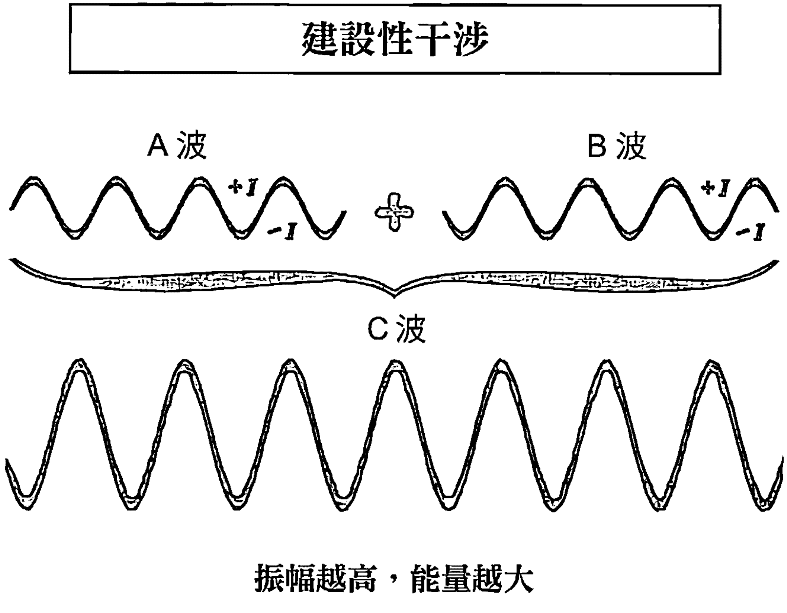

圖2 建設性干涉是指合成波的振幅比個別波的振幅大，即兩波匯聚在一起時會創造一股更大的波。振幅是測量波的高度單位，振幅越高，能量越大。如果一群人聚在一起並創造出諧振的電磁場，當他們的能量互相干涉時，房間的整體能量就會被提升。

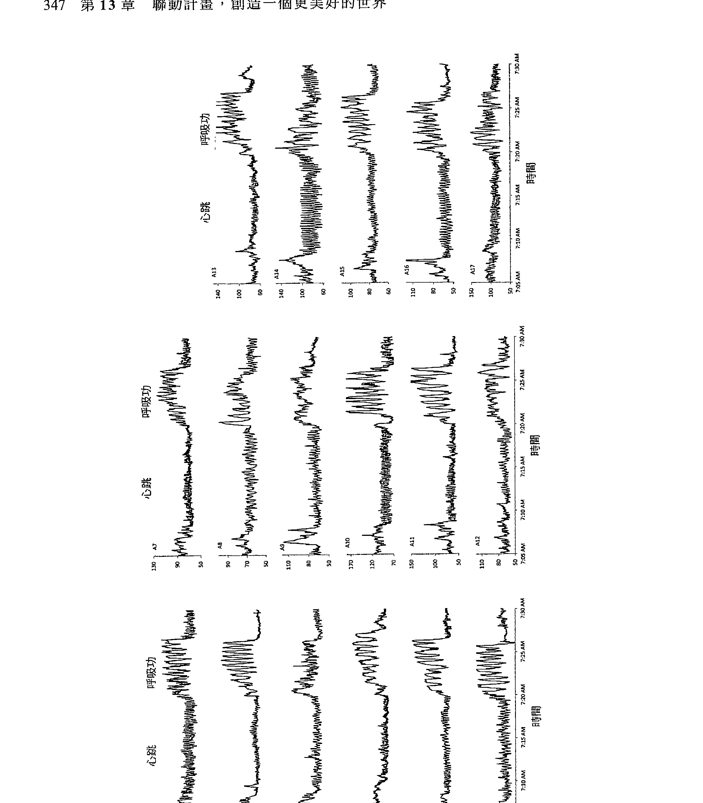

圖3 上圖顯示有十七個人在同一時間、同一天、同一場冥想中進入了心腦諧振狀態。垂直線之間的區域，代表每個人都進入了心腦諧振狀態。

## 「諧振投射」冥想法

  從認可及感謝心臟能量中心開始。把注意力及覺知放在這個能量中心，然後放開焦點去覺知這個能量中心在空間中的位置及周圍的空間。接下來，以一種心念與意識的形態進入地球中心，並將你的光散發至外太空。在此，你要提升頻率並緊抓住那股揚升的情緒；接著，仍然以意識的狀態慢慢遠離地球，把地球當成一種意圖擺放在你的心中。當你把整個地球放在心中時，提升地球的頻率將會成為一股帶著能量的心念傳送到你的身體外面，於是你散發的愛將會播送至整個地球。

## 第14章 案例研究：愛是我們共通的語言

  在最後這部分的超自然檔案中，請謹記，這些人都不曾試圖讓任何事發生，他們只是懷抱著一種意圖，同時把結果交給某個更偉大的存在來決定。當他們做到的那一刻，不論是療癒身體或是獲得某種神祕經驗，都不是他們的人格所創造出來的，而是某個更偉大的存在透過他們幫他們完成了這件事。由於已經連結上統一場，以某種方式改變，正是他們與這種智慧的互動結果。在你讀過本書所有內容之後，你知道那樣的大智慧也存在於你之內。

## 松果體冥想，她聽到聲音了

  二○一四年時，史黛西莫名出現了嚴重的頭痛。過去二十五年來，身為註冊護士及針療醫生，她一直都在醫療保健業服務，本身也一直維持著相當健康的生活方式，極少服用藥物。然而，這突如其來的嚴重頭痛卻幾乎讓她痛得昏厥過去，病情令人擔憂。史黛西花了一年時間，試過無數的替代療法，最後她終於去做了電腦斷層掃描。

  診斷結果是她得了良性的腦膜瘤，腫瘤位置靠近第八對顱神經，不僅開始阻礙到聽神經，也對她的神經功能造成重大改變。聽神經有兩組分支，一為聽覺，一為平衡；因此，除了無情的痛苦與逐漸喪失的聽力，她還會感到頭暈目眩、噁心作嘔。隨著病變不斷變大，開始擠壓到另一對顱神經，沿著她的臉一路往下延伸到肩膀，她又被診斷出罹患了投手肩。不久後，眼睛也開始痛了。

  據她的醫生說，唯一的解決方案就是進行開顱手術。基本上，這意味著要在她的後腦鑽一個大洞來切除腫瘤。史黛西不想採行這個解決方案，所以她鍥而不捨地尋求其他的治療方法。二○一五年，她第一次參加在西雅圖舉辦的週末研習營，她估計當時左耳的聽力已經喪失了七成；二○一六年的秋天，她在坎昆市參加了她的第一次進階研習營，覺得自己臣服於一個全新的層次。接著，二○一七年的冬天，她又在佛羅里達州的坦帕市參加了另一次進階研習營。

  史黛西在星期四抵達會場時，耳朵痛得非常厲害，第二天情況更糟。她說，她感覺自己的耳朵像是堵住了。但是，第二天活動結束前，在練習過「祝福能量中心」的冥想後，她的耳朵突然不痛了。接下來到了星期天上午，進行松果體冥想時，史黛西突然失去了時間感與空間感。

> 「我覺得自己快從椅子上掉下來了，」她說：「在那一刻，驚人的閃光吞噬了我左半邊的頭。想像一下，你把一千顆鑽石放在一起，在上頭打光，你甚至都還來不及摸一下，那股光芒就轟！」她的身體悚然豎起，一股白中帶藍的光芒鑽進了她的耳朵，她不曾見過或體驗過這樣的事情。

> 「那是我最神聖、充滿愛的一次感受，」她說道：「感覺就像是上帝之手充滿恩典的安撫，如此強大、如此驚人，我很難用言語描述，每次只要一想到，我就會忍不住哭泣。」

  一開始，她的鼻竇被清乾淨了，接著是頭顱的左半邊，然後右側肩膀的疼痛也舒緩下來，甚至完全不痛了。最後，三年來第一次，她的左耳聽得見聲音了。

> 「我滿心敬畏地坐在那裡又哭又笑，直到淚水流得滿臉都是。」她說：「音樂正在播放，我聽得清清楚楚，彷彿在音樂之外，還有天使在唱著天籟之音，我知道我所聽見的聲音已經超越了正常的聽覺。能量持續在我左後方腦袋流動著，那個部位幾年下來的麻木感就像是一塊水泥。」

  當我要求每個人躺下、放鬆、讓自主神經系統接管身體時，史黛西說，這時能量仍持續在她的全身川流不息，往下流到她的手臂、進入她的手掌。她開始無法控制地顫抖了起來。

> 「就像是我可以感覺得到全身的每一個突觸，彷彿每塊肌肉都被活化一樣，包括我的腳趾、雙腿、腦袋、脖子以及胸膛。我感覺自己的心臟能量中心敞開了。我只記得當時是這麼想的：『不管發生什麼事，這次我都要放手。』她完全交出自己，徹底臣服於未知；於是再一次地，她失去了時間感與空間感。」

  當這部分的冥想結束後，史黛西發現自己仍然坐在椅子上，全身能量逐漸平息了下來，但她的思維腦開始運作了起來。她已經聽得見，卻開始懷疑起剛剛發生的事：「或許我的耳朵還沒完全治好？或許那顆腫瘤還沒消失？或許我不值得被治癒？」她才剛剛冒出這些想法，能量與光就出現在她的面前，但這一次，是一股截然不同的能量。史黛西回想：

> 它紅得像心臟，藍得像能量，而且是立體的。它在我前方大約兩英尺處，就像一條蛇般滑行；這一切都發生在我閉上眼睛的時候。這股多維度的能量是美好狂熱、華麗燦爛的不規則碎形，逼近到我面前，像是想對我說：「妳懷疑嗎？我會證明給妳看！」接著，它筆直地射進我的心臟，我的胸膛被打開了，我坐回椅子上，覺得自己的手臂大大地張開。我知道它是萬物的能量，是氣的能量、聖靈的能量、神聖的能量，以及宇宙的能量。

> 「現在，我的生命變得不一樣了。」史黛西告訴我：「其中之一，就是我的聽力回復到百分之百。但是不止如此。雖然很難用言語來形容，但我知道且相信，我會好起來。生命再也不一樣了，因為現在我知道，萬事萬物都有聖靈，祂們希望被人們聽見，也希望有機會去療癒人們。」

# 臣服於光，超越俗世感官的無量感受

珍娜偶爾會冥想，但冥想並不是她規律的日常習慣。然而二十五年前的一個下午，她卻經歷了她稱之為自發性體驗的一次冥想經驗。當時她閉著眼睛，突然之間發現自己正置身於一團不可思議的明亮光芒之中。這道光芒既耀眼又柔和，完全不刺眼。她說這道光芒，就像是她從不曾經歷過的最純粹、最強烈、最完美的愛。接下來的二十五年，她祈禱、冥想，做了她所能做的一切，試圖重現那次的超凡經驗。

二〇一五年春天，珍娜參加在亞利桑那州凱爾福利（Carefree）舉辦的進階研習營。當時，她正處於嚴重憂鬱與精疲力竭的狀態，無法找出任何方法解決她生命中的問題。她下定決心，要讓自己得到療癒，打破眼前令人窒息的僵局。最重要的是，能跟五百多名懷抱相同信念、相信身體無法禁錮潛能的人聚在一起，就足以令人雀躍不已了。

在研習營期間，珍娜以一種超越她本身憂鬱感受的熱情，追尋著神祕的體驗。進行松果體冥想時，她以蓮花坐姿靜坐，把充滿愛的意圖帶進松果體所在的空間。突然之間，這個腺體被激活了，腦袋裡的一道燦爛白光照亮了她的松果體，這正是她睽違了二十五年之久的同一道光芒。

> 「這道光芒進入了松果體所在的空間，照亮了在那個微小腺體的微小洞穴中所有的結晶體。」她後來解釋：「這道光芒持續照亮我的整個存在，甚至往下深入至細胞層次。我的脊椎打直、頭往後仰，完全擁抱這道光。我讓一切順其自然發生，同時感受到狂喜、至樂、感恩與愛。」

接下來，一個由光組成的倒三角形出現在她的上方，接著往下穿過她的頭頂。她知道這個三角形是智慧之愛的展現，倒三角形的頂點與松果體的頂端相接，形成一個雙幾何的形狀。這道諧振的光芒帶著強烈的頻率，攜帶了給珍娜的訊息。它反覆對珍娜說：「妳是我的，妳是我的。」珍娜解讀它的意思是：「我愛妳遠超過這世上的任何事物。」「請進來並掌控我的生命吧。」珍娜如此回應。而當她臣服於這道光芒、在它面前交付自己時，她開始從頭頂那道光芒下載信息；光芒以線串起，看起來就像是發光的鑽藍色珍珠，緩慢移動並往下貫穿了她的全身。這股能量正是反向環形場（這個場域的移動方向，跟我們呼吸時所創造的能量場方向相反）的結果，同樣來自統一場，這是一個超越可見光譜、超越俗世感官的所在。這個內在經驗是如此真實，以至於在她的大腦中鋪設了迴路，並傳送給她的身體一個帶著情感能量的新信號。於是，就在一瞬之間，她的過去被沖刷殆盡，重新下載的完整、諧振頻率讓她的生理機能被升級了。等到珍娜離開研習營時，憂鬱與疲憊已經一掃而空。「這個令人欣喜若狂的經驗，」她強調：「永遠改變了我的生命。」

# 超越時空，以愛相連

在從義大利加爾達湖（Lake Garda）直播的一場「諧振投射」冥想活動中，世界各地的參與者懷抱著「我們不只是物質、身體以及粒子」的信念，深信這樣的意識會影響物質以及全世界。在這一場冥想中，人在紐澤西的莎夏正想像著把地球帶進她的心中。

「當我們走進內心，我感覺到所有的枝芽與嫩葉從我的心臟能量中心長了出來，穿過我的身體，」她告訴我：「我的手臂、手指、耳朵開始長出枝椏、樹葉以及花朵，臉上也開滿了白花。我真的變成了一座地表上的花園。」

冥想一結束，莎夏低頭看著她的手機，發現她的好友海瑟從愛爾蘭發了一張照片給她。我們冥想時，海瑟正走過一座花園，她低下頭時正好看到岩石上的青苔竟長成一顆心的形狀。於是，海瑟用手機拍了一張青苔的照片寄給了莎夏，還附上了一句話：「看到它時，有種妳就在這裡的強烈感受，愛妳。」

# 靈魂重獲自由，跨越彼岸的交流

二〇一四年，唐娜在加州長灘參加她的第一次週末研習營，當時的她還不是個冥想者，因為她的冥想次數屈指可數。身為技術文件的撰寫人員，唐娜的分析心很強大；而這個修持活動的美好之處就在於：當你不再抱任何期望時，你往往會擁有更為開放的心態。所以，當唐娜在週末一場冥想中的某個時間點滑出她的日常意識、發現自己被成千上百個跨維度的生命體所包圍時，她確實嚇了一跳。

> 「雖然他們沒有惡意，」她告訴我：「但我可以清楚感覺到，他們想從我這裡得到某樣東西。他們之中有些人相當年輕，看起來只有十二、十三歲。我立刻明白了過來，他們都是我未婚夫殺死的人。」

唐娜的未婚夫是一名前美國陸軍遊騎兵，在伊拉克服役期間擔任狙擊手。當唐娜從研習營回家之後，她告訴未婚夫這一次的冥想體驗，而她的未婚夫也承認他曾經為了保護同袍而殺死的人之中，有些人的年紀確實不大。

雖然唐娜發現了其中令人難以理解的關聯性，但她不知道該拿這樣的信息做些什麼事。毫無疑問的，她的內在經驗是真實的，因為這這樣的內容絕對不是她過往經驗能夠想像出來的。

兩年後，唐娜又參加了我們在亞利桑那州凱爾福利舉辦的進階研習營。在第一場冥想活動結束後，她轉向坐在她旁邊的一位朋友，茫然地說道：「房間裡還有其他的生命體，他們是來幫助我們的。」她甚至沒有意識到自己說了什麼。

星期天一早進行松果體冥想時，唐娜被選為大腦掃描的受試者之一。再一次的，在冥想進行到某個時刻，唐娜發現自己突然又置身於一群跨維度的生命體之中，是兩年前她第一次參加研習營時包圍住她的同一群生命體。但這一次，他們都站在她的右側，排成一列。

> 「我再次感覺到他們想從我這裡得到某樣東西，但我不知道是什麼。」她說道：「接著在我的腦海裡，彷彿我正透過虛擬實境的鏡頭在觀看，我看見我的左側也有一列隊伍，包括兩種生命體：一種看起來像人類，有非常高大、閃閃發光的金色外觀；另一種生命體的身上似乎帶著藍色光澤。」

唐娜的內心深處知道，如果她把右側的人（亦即那些在戰爭中死於她未婚夫之手的人）帶給左側的生命體，那麼右側的那些人就能得償宿願。由於這些被狙擊手射殺的人死得太突然，以至於有些人還搞不清楚自己已是生是死；還有一些人不確定何去何從或者該做什麼，其他人則試圖待在這個維度，因為他們仍然牽掛著所愛之人，無法繼續前進。因此，他們卡在物質與光之間。但不知怎麼回事，他們知道唐娜是一座橋梁，或說是個協調者，能夠幫助他們跨越到彼岸。而這一切，都發生在非常真實、非常清晰的體驗之中。

> 「說我把他們交給其他生命體也不太對，」唐娜解釋：「我就是個協調者，負責在其中傳遞、轉移他們到彼岸。這個體驗真的無法用言語來形容，當他們跨越到另一邊時，看起來就像是直接穿越過其他的生命體，我可以看到他們迅速走過一大片高度齊腰的紅霧，同時也可以感受到他們跨越這片紅霧時，得到的自由、喜悅及幸福感。」

再一次的，彷彿透過虛擬實境的鏡頭觀看，唐娜在腦海裡轉向她的右側，看見了一條蜿蜒的泥土道路，滿滿都是延伸到遠方的人潮。她覺知到這些人是波士尼亞人及塞爾維亞人，但她不太清楚發生了什麼事。

> 「感覺上，像是話已經被傳開了。我不覺得他們沒有意識到自己已經死了，更像是他們陷入了邊緣人的困境，不知道如何才能前往彼岸。」這是研習營時間最長的一場冥想，持續了二到三小時，但唐娜的感覺卻像只過了十分鐘。

## 第14章 案例研究：愛是我們共通的語言

二〇一六年秋天，唐娜又參加了另一次在坎昆舉辦的進階研習營。這一次，當我要求學員們交出意識以融入統一場時，唐娜感覺到自己變成了宇宙。她從某個實體、某個身分、某件事物、存在某個地方與某個時間的意識，變成沒有實體、沒有身分、沒有事物、不存在任何地方與任何時間的意識，再進入到所有實體、所有身分、所有事物、存在於所有地方以及所有時間的意識。在那個瞬間，她的意識與統一場（支配宇宙法則的一個信息場）的意識產生了連結，她成為了宇宙，置身於極樂與狂喜之中。

「自從那次體驗之後，我的生命開始變得神奇而不可思議，我也體驗到一股前所未有的新能量與生命力。」她後來描述，「我不斷經歷一個又一個強大的體驗，我再也無法回到剛開始進行這項修習之前的生活方式了。」

# 從瀕死經歷劫歸來

二〇一五年八月十四日，傑瑞正在後甲板進行一項組裝工程。當他閱讀說明書時，突然感覺到胸骨下方傳來一陣劇痛。他以為可能只是脹氣，所以吃了點藥，但是疼痛沒有消失；於是他躺下來休息，但是情況更糟了。

等到他想爬起床時，險些連站都站起來了，他覺得自己可能會昏厥過去。疼痛越來越劇烈，他的呼吸也變得越來越急促，他打電話叫了救護車。他拖著痛到不行的身體，硬是爬行到車道外十五英尺處，好讓急救人員不必踢開他家大門救他。他跪倒在車道上，癱軟在地，等待救護車到來。救護車抵達時，急救人員還以為傑瑞心臟病發作，立刻開始遵照標準流程進行急救。

「你們弄錯了，我現在呼吸很困難。」傑瑞告訴他們：「我們必須馬上去醫院。」傑瑞完全知道自己在說什麼，因為他就在他即將被送去的那間急診室裡，擔任了三十四年的醫技人員。

傑瑞認識急診室裡的每個人，所以他一被送達，醫生、護士、技術人員以及專科醫生都十萬火急地開始在他身上進行各種檢驗。其中有位醫生是傑瑞的朋友，他告訴傑瑞所有檢驗結果都出現了紅旗，傑瑞知道事情不怎麼樂觀了。有一項檢驗結果特別令人震驚，顯示出他的蛋白酶、澱粉酶及脂肪酶（胰腺製造的酵素）含量已超過標準值一百到二百。最後，他們把傑瑞推進了加護病房。

「不久後，疼痛越來越控制不了，他們給我的藥沒有一樣有用。」傑瑞說：「他們告訴我，我有一條膽囊管堵住了，胰腺出現了問題；更糟的是，我的肺部開始積水，現在兩邊肺部的肺活量已經下降到八〇%。這時，醫生給我接上了呼吸器，我知道自己情況很糟。」接著，醫生要求他的醫療小組「打開接通波士頓的電視」，他要跟那裡的大醫院醫師進行即時的視訊會議。

「我在這家醫院工作了數十年，這架電視只被打開過幾次，全是为了要緊急治療創傷最嚴重或瀕臨死亡的患者。」傑瑞說道。「這意味著，醫生對他的病症毫無頭緒。當一位你多年來信任的醫生告訴你，他們不知道這是怎麼回事時：…嗯，這就是我的壓力荷爾蒙開始加足馬力高速運轉的時候。」這時候，醫護人員告知傑瑞的妻子，如果有任何文件必須簽署的，趕緊回家去拿過來。於是，傑瑞的妻子哭著離開了。

傑瑞很快領悟到了一件事：一切只能靠自己了。他知道，如果他開始讓壓力荷爾蒙接管一切，他肯定贏不了這一戰。

「我是個很少生病、規律做瑜伽、注意日常飲食的人，但突然之間卻成了必須待在加護病房的重症患者。我不斷告訴自己，我不能再往這條路走下去，我不能對恐懼投降。」傑瑞最近才讀過我的書《啟動你的內在療癒力》，他開始想，我要改變這些思維模式，我不能讓這些想法製造更多的皮質醇進入我的身體，開始對我所剩無幾的生理機能造成更大的傷害。

醫生最後終於發現，傑瑞的胰腺導管中有一大塊阻塞物導致黏液無法排出，因此這個腺體中的所有東西只能回流並溢入他的血管。

「我的醫生一連三天寸步不離地照看著我，」傑瑞說：「他們給我戴上氧氣罩，因為我無法呼吸，兩邊都有靜脈注射器；同時，我不斷告訴自己：『觀照你的想法，放鬆，把某些東西放進量子場中，它會幫助你、不會傷害你，因為你已經敲了門。你會好起來的，這一切很快就會過去，你會沒事的。』」傑瑞只要還有意識的時候，就會把他的能量專注於克服他自己，改變他的存在狀態，並且藉由不斷地接通量子場的不同潛能，來創造截然不同的結果。幸運的是，傑瑞被安置在一間單人房中，這讓他有許多機會可以在想要的時候進行冥想練習。

傑瑞在加護病房中待了一個星期後移到了觀察室，這時他已經可以拿下氧氣罩四處走動了。即便如此，他仍有九個星期不能正常飲食（甚至只是喝水，他的胰腺都會釋出酸性物質，最終危及他的生命），只能以靜脈注射來獲得營養。

傑瑞入院時的體重是六十五公斤，出院時只剩下五十四公斤。一直到他終於可以回家時（身上還帶著靜脈注射的輸液架），都沒有停過冥想練習。快到十月時，傑瑞胰腺導管中的阻塞物仍然沒有清除掉。醫生建議他去波士頓看專科醫生進行手術，本身就是醫療專業人士的傑瑞到了手術前兩天，建議他的醫療小組再幫他做一些測試及掃描，好讓進行手術的醫師有最新的數據可以參考。

「我認識每個 X 光技師，當他們告訴我，我的阻塞物消失了，我還以為他們在開玩笑。我打電話給放射科醫生和我的主治醫生，他們告訴我：『傑瑞，我們現在正在看你的 X 光片，我們要告訴你，什麼都沒有。我要打電話給波士頓的那些人，告訴他們不用動手術了。』」

傑瑞後來領悟到，這樣的結果跟他堅定的信念有關。透過不斷提升能量、將情緒帶往健康的方向，並且從認為自己生病了的想法轉變成自己會好起來的信念，這些做法讓他提高了自己的頻率，從而使自己得到了療癒。傑瑞表示：

> 我不讓自己這麼想：「我好痛苦啊，一定很糟糕。」我每天都告訴自己要往正面想。我將正確的訊息、意圖及能量放進量子場中來療癒我自己。最後，我真的做到了，我康復了。

## 【後記】和平之境

我希望你在看過本書後，所得到的其中一個認知會是：只在冥想時改變存在狀態，遠遠不夠。只在閉上眼睛時思考和平，然後張開眼睛，以無覺知的身心狀態來度過一天，絕對不夠。第十三章提及的許多和平集會活動及研究都顯示，當實驗結束後，被降低的暴力事件與犯罪率往往又會回復到之前的水準。這意味著，我們必須身體力行地展現和平，我們必須從坐而思邁向起而行。

每當我們改變自己的存在狀態，帶入揚升情緒來敞開我們的心，連結上對生命的熱愛、對生存的喜悅、對活著的雀躍、對美好未來已然發生的感恩以及對他人的善意，從而展開每一天時，我們都必須在這一整天中，不論行住坐臥，都懷抱、維持並展現出那樣的能量與存在狀態。然後，當我們的人生或這個世界發生令人心煩意亂的事件時，能夠以平和的心態來應對，而不是無意識地讓憤怒、受挫、暴力、恐懼、受苦、侵略性等反動情緒來牽著你的鼻子走，我們就不會繼續再為所有的舊意識添加柴火。藉由打破這個循環並以身作則地展現出平和、冷靜的氣度，我們就是在帶著其他人一起前進。所有知識都是為心智所用，所有經驗都是為身體所用，因此當我們從坐而思轉向起而行，並感受到呼應和平及內在平衡的種種情緒時，從我們開始體現和平的那一刻起，就是我們真正開始改變大腦迴路設定的時候。

藉由調適我們的回應方式，從而不再創造相同而多餘的經驗與情緒，我們就能停止發射及連結大腦中相同的迴路；這也是我們不讓身體繼續活在自我設限情緒的方式，也是我們改變自己、改變與這個世連結的方式。每一次當我們這麼做時，就是在透過化學物質的變化，一次次地教導我們的身體去重新理解我們的心智，從而挑選並指導潛在的基因去擺脫只為求生存的舊習性。現在，和平就在我們之內，我們已經敲開了基因的大門，以生物學的方式去進化。這正是歷史上每一位偉大領袖、聖者、神祕主義者以及大師們，提供給我們的一個努力目標。

當然，一開始你一定會覺得勉強，因為你必須對抗經年累月的自動制約、無意識的習慣、反射性的情緒回應、根深柢固的心態以及世世代代以來的基因設定，但這是成為超自然的必經之路。去做這些會讓我們感覺不自然的事，意味著我們正在違背一直以來在基因設定或社會制約下我們採行的生活方式。我相信，為了適應不斷變化的環境而想打破部落、族群、魚群、畜群意識的任何生物，必然都會感受到未知的不適、不安及不確定性。但是，別忘了，活在未知之下，也意味著我們正處於各種可能性之中。

真正的挑戰是不讓自己再回到庸庸碌碌的生活，那是普遍社會意識一致同意的做法，但那只不過是你沒有看到還有一些人正在做的事。真正的領導者從來不需要他人的肯定與認可，他們只需要清晰的願景，以及改變他們的能量——一種新的存在狀態，這種狀態可被長久維持，也擁有足夠強大的意志來加以執行，同時能夠帶動他人去提升能量，激勵他們起而效之。一旦這些人將他們自己從有限的存在狀態提升至新的能量狀態，就會看到他們的領袖早已預見的相同未來。這正是眾志成城的力量。

多年來，我在個人轉型的課題上教導過許多人，但我知道沒有人可以真正改變，除非他們先改變自己的能量。事實上，當人們真正參與改變時，反而很少會開口談論，而是更傾向去身體力行。他們會努力活出生活的精氣神，這需要強大的覺知、意圖，以及活在當下、不斷關注自己的內在狀態，多管齊下才能奏效。或許最大的障礙不只是不適，更是去接受並安於這種不適，因為這種不適正是我們成長的挑戰，會使我們感覺更有活力及生氣。

如果壓力與生存反應是因為無法預測未來所導致的產物（也就是相信假如我們無法掌控結果，事情會變得更糟糕），那麼敞開心智去相信可能性，就需要對抗千百年來基因遺傳上根深柢固的生存特徵。我們已經習慣於得到自己想要的東西，現在我們必須先學會放棄，才能讓某些更好的事情發生。對我來說，這才是真正的偉大之處。

如果我們能打亂那些呼應憤怒、憎恨、報復的神經網絡，去培育關懷、付出、無私的神經網絡（從而創造出相對應的情緒），只要能做到一次，應該就能再次做到。當我們不斷複製這些選擇，就會以神經化學的方式去制約我們的身心，使其合而為一。當身體與心智都知道如何做時，那就會成了最熟悉、能輕鬆做到、與生俱來的第二天性；然後，曾經需要我們專心一致才能做到的和平心念與作為，也將成為我們潛意識中的一項設定。現在，我們已經創造出了一種新的、自動的和平存在狀態，這也意味著，和平已經存在我們之內。

這正是我們如何記憶一種新的內在神經化學作用的過程，遠比我們外在環境的任何條件都來得強大。現在，我們不只是處於和平之中，還能夠掌控它，就像我們可以掌控自己、掌控環境一樣。一旦我們有足夠多的人達到這樣的存在狀態，當每個人都鎖定相同的能量、頻率以及揚升意識，就會像魚群或鳥群一樣，宛如一個整體一般地以統一的順序移動；我們會開始像是共享一個心智般地行動，成為一個新的物種。相反的，我們若是繼續以癌症般的生物自居，處於與自己作戰的狀態，我們的種族將無法永久存活，而物競天擇的進化將會大刀闊斧地繼續下去。

從忙碌的生活中抽出時間來投資自己，當你這樣做，就是在投資你的未來。如果你已經被熟悉的環境控制所思所感，那麼，該是你從生活中撤退出來、反思內省的時候了。如此一來，你就可扭轉這個成為人生受害者的過程，反轉自己成為人生的創造者。讀了這本書之後，現在的你已經知道從內在改變自己是可能的；而當你付諸行動，結果就會反映在你的外在世界。

在歷史長河中，我們現在來到了一個「知其然，更要知其所以然」的時代，光是知道還不夠，你還要知道如何去做。根據哲學、量子物理學、神經科學及表觀遺傳學的科學原理，我們現在知道主觀心智會影響客觀世界，又因心智會影響物質，我們不得不研究心智的本質；接下來，我們的理解又會讓我們對自己正在做的事賦予意義。如果知識是經驗的前導，那麼，當我們越是了解自己有多麼強大，越深入了解事物背後運作的科學知識，就越能理解潛能的無極限，不論是個人或集體都如此。

我們正在不斷深化並拓展對所有生命系統的連結，我們每個人的所作所為都會影響身處的這個地球場域，因此我相信我們可以共同為這個星球創造或帶動一個和平且繁榮的新未來。這一切全始於養成以下的習慣：練習聽從心的指引、提升能量、接通愛與完整的信息及頻率。透過這樣的意圖及努力，我們會開始製造一種諧振的電磁識別信號，就像往靜止的湖泊一遍又一遍地丟小石頭；隨著我們持續提升能量、敞開我們的心，我們就能製造出越來越大的電磁場。這股能量就是信息，我們每個人都有力量以意圖來引導能量，並對現實的本質製造出非局域性的影響。

當我們以觀察者、意識或心念的形式去引導我們的能量，就可以開始影響並產生物質上的因果關係。換句話說，我們可以使我們的心智轉化成真實的物質。當我們持續不斷地修習這些概念，改變我們的能量層次，從生存狀態轉變成更高層次的意識、同情、愛、感激以及其他的揚升情緒，諧振的電磁識別信號就能互相搭載，產生的結果就是，我們將能使曾經分崩離析的團體再次團結起來，並讓他們擺脫「我們僅僅是物質」的信念。一旦我們的存在狀態從求生存，轉變為愛、感激及創造，而不再對暴力、恐怖主義、恐懼、偏見、敵對、自私、分離做出回應（順便一提，媒體、廣告、電玩遊戲及各種形形色色的刺激，都在不斷餵養我們這些信息及情緒），我們就能在危機中凝聚眾人、團結一心；如此一來，分裂、交相指責或是尋求報復的種種作為，就沒有機會捲土重來了。

每一次當我們以身為全球一份子的身分冥想時，就是在對全世界投射出一股更強大、更協調一致的愛與利他主義的能量波。如果我們進行的次數夠多，不僅能夠測量世界各地的能量與頻率變化，還能藉由扭轉未開啟你的驚人天賦 • Becoming Supernatural 364

  來的事件來測量出我們努力的程度。想要維護正義與和平，你必須先在自己的內在世界找到和平並對他人展現和平。這意味著，當你還在跟鄰居吵架、氣忿你的同事、批評你的老闆時，你就無法捍衛和平或成為一個和平者。

  如果每個人都選擇了和平，如果我們可以在精確的同一時間聚在一起，想像我們可以為共同的未來創造出強大的正面改變，就會壓縮衝突存在的空間。同樣威力強大的是，當我們身體力行為和平而努力時，別人會對我們的反應捉摸不定，而開始吸引他們的注意。有一種稱為鏡像神經元（mirror neuron）的特別腦細胞，會促使我們去模仿他人的行為，當我們對和平、正義、愛、良善、關懷、理解及同情的付出而成為他人注意及仿效的對象時，他們就會敞開心，從恐懼、侵略等生存狀態的情緒轉變成相互連結的圓滿情緒。試想，如果我們都能理解彼此之間以及我們與這個場域的連結有多麼強烈，而不是感受到分離與孤立，會發生什麼事？我們可能會真的開始對自己的想法與情緒負起責任，因為我們終於明白，我們的存在狀態會如何影響到所有的生命，這也是我們開始改變世界的方式——從改變我們自己做起。

  人類的未來不能只靠一個人、一名領導者或一位救世主，不能只靠別人的偉大意識來引導我們的方向。相反的，人類的未來需要一種進化的新集體意識，因為唯有透過認可並運用人類意識的相互連結，我們才得以改變歷史的進程。

  舊有的結構和典範看似正在崩毀，我們不應以恐懼、憤怒或悲傷去面對這個事實，因為這正是迎接進化與新事物的必要過程。相反的，我們應該以一種全新的光、能量以及意識去面對未來。正如我所提過的，舊事物必須崩毀、消失，新的事物才有蓬勃發展的立足之地。在這個過程中，不可或缺的一點是，別對領導者或當權者做出情緒性回應而浪費了我們的能量；當他們抓住我們的情緒時，他們就抓住了我們的注意力，從而抓住了我們的能量。這正是人們從我們身上獲取力量的方式。反之，我們必須捍衛原則、價值觀以及道德責任，包括自由、正義、真理及平等。當我們藉由集體力量去達到此一目的時，我們將會在一體性的能量背後團結一心，而非被分離的想法所控制。此時，捍衛真理不再只是個人志業，藉由連結並建立起團體，它成了宇宙的大業。

  我相信我們正在面臨一場進化大躍進。另一種說法是，我們正在經歷一場啟蒙過程。畢竟，所謂的啟蒙就是從一個意識層次來到另一個意識層次，不是嗎？它的目的就在挑戰「我們是誰」的這個大架構，並讓我們發掘出自己更大的潛能。或許，等到我們看見、記住、醒悟到我們真正是誰的那個時刻，人類才能以集體意識去行動，從生存狀態轉變成茁壯成長的狀態。唯有到了那個時刻，我們的真正本質才會浮現，也才能充分利用身為人類與生俱來的能力，亦即去愛、去付出、去服務、去照顧彼此以及這個地球。

  所以，何不每天問問你自己，愛會怎麼去做出來呢？

  這才是人類真正的本質，這才是我們要創造的未來，一個我們每個人都能成為超自然的未來。

## 【後記】和平之境

## 致謝

  這本書的構想來自數年前我與賀氏書屋（Hay House）管理高層的一場即興談話，當時我正與執行長瑞德·崔西（Reid Tracy）、營運長瑪格麗特·尼爾森（Margarete Nielsen）以及副總裁佩蒂·吉福特（Patty Gift）一起用餐，而我渾然不覺自己正講到了考慮寫一本新書的某些想法。

  事後自我反省，我想我可能被設計了。雖然這完全是毫無用處的後見之明。

  我必然說了某些令他們印象深刻的話，因為一個星期後，我同意寫一本書，但它必須以新典範為基礎。我認為要以一種簡單而一致的方式來寫這本書，必得付出相當可觀的時間與精力。持續研究的累積、不間斷的數據收集、嚴格的測量與分析、簡潔的組織後勤與運籌、活動策畫、活動期間排定數千名參與者進行科學掃描、與科學家就我們的測量結果進行長時間激烈的討論，以上的工作量都不是心臟不夠強壯的人能夠承擔的。由於我們觀察到的許多現象都無法以傳統科學來解釋，因此這份工作必須花上許多時間進行討論，更需要熱情，才能有勇氣去允諾以我們的心智來詮釋如此新奇的經驗。

  唯有獨特的心靈才能在這個過程中堅持到底，也才願意去相信存在於他人心中的願景——尤其是當這個抽象的概念還只是一個不怎麼具體的想法時。然而，對可能性的堅定信念，以及把想法落實的熱情碰撞出火花時，奇蹟就發生了。我有幸能與這些了不起的人組成團隊一起合作，無異是上天的恩賜。

  我要再次感謝賀氏書屋這個大家庭，感謝他們對我的信任與信心。我有幸能成為這個充滿善意、支持、志趣相投、能力足以勝任一切的團隊成員之一，著實感到滿心喜悅。在此感謝瑞德·崔西、佩蒂·吉福特、瑪格麗特·尼爾森、Stacey Smith、Richelle Fredson、Lindsay McGinty、Blaine Todfield、Perry Crowe、Celeste Phillips、Tricia Breidenthal、Diane Thomas、Sheridan McCarthy、Caroline DiNofa、Karim Garcia、Marlene Robinson、Lisa Bernier、Michael Goldstein、Joan D. Shapiro 以及其他的家人。我衷心希望因為我們的合作，彼此都能有所成長。

  特別要感謝我的重要編輯，活得優雅與感性的 Anne Barbel。感謝妳付出的無盡關懷與專業知識，以及對我的耐心包容。妳的謙遜讓我更懂得謙卑。還要感謝編輯 Katy Koontz 及 Tim Shields 的付出，你們對這本書貢獻良多，感謝你們始終不吝於深入挖掘一切。

  我也想對腦團隊（Encephalon team）的所有成員致意，感謝你們堅持不懈地支持我，包括 Paula Meyer、Katina Dispenza、Rhadell Hovda、Adam Boyce、Kristen Michaelis、Belinda Dawson、Donna Flanagan、Reilly Hovda、Janet Therese、Shasharin Quackenbush、Amber Lordier、Andrew Wright、Lisa Fitkin、Aaron Brown、Justin Kerihard、Johan Pool 及 Ariel Maguire。我更要向這些工作人員的配偶與伴侶致意，感謝你們的體諒理解與無條件的包容，允許你的另一半跟我一起投注如此多的時間與精力，致力於改變人們的生命。

  還要特別感謝 Barry Goldstein，為我們大部分的冥想音樂作曲。感謝你讓我再度愛上音樂。Natalie Ledwell 的心靈電影也對我們的志業貢獻良多。感謝妳對心智轉型以及我們的友情始終懷抱著熱情。妳幫我改變了許多人的人生。

  此外，我要向 Roberta Bittingham 表達最深的謝意。感謝你在創作萬花筒上的願景與精細做工，除了你之外，再沒有人可以把它做成如此一件活生生的藝術品。

  我要向我最好的朋友 John Dispenza 道謝。感謝你的耐心與熱情，我喜歡你內頁的設計、插圖以及棒呆的封面設計。你的才華著實耀眼無比。

  我要在此感謝我們那群優秀、一流的腦科學團隊，包括醫學博士 Danijela Debelic、腦電波神經反饋機構（Institute for EEG-Neurofeedback）的主任 Thomas Feiner、職能治療師 Nomen Schack、Frank Hegger、Claudia Ruiz 及 Judi Slivers。感謝你們出色的工作、開放的心智與心靈，以及懷抱著改變世界的熱情，並以如此充滿活力的能量去付出，也感謝你們提供所有大腦掃描、尖端設備、精湛分析、累積數據的貢獻，包括你們在忙碌的生活中還抽空與我進行長時間討論自然與超自然的區別。我何其有幸能認識你們每一位，更重要的是，感謝你們教導我並相信我。你們為我帶來煥然一新的活力，你們都屬於未來之子。

  此外，我也要感謝理學士兼社工碩士 Melissa Waterman 對我們的氣體釋放顯像技術與人造衛星測量結果貢獻專業知識。感謝妳的付出使我得以充分運用這項研究成果，也感謝妳始終堅守崗位並與我們同在。

  我還要大大地感謝 Dawson Church 博士的天賦才能與友情，感謝你相信我們能在研習營短短的數天內改變普通人的基因表達，感謝你加入我們的團隊，為我們的科學可行性提供豐盛的資源。我很榮幸能夠認識你。

  還要特別感謝 Rollin McCraty 博士、Jackie Waterman、Howard Martin 以及心能商數學會的團隊，你們無私地付出一切。能夠跟你們合作，我受益匪淺。

  我要感謝我的培訓管理團隊的所有成員，包括 Suzanne Qualia、Beth Wolfson 及 Florence Yaeger，感謝妳們能跟我一起擁有共同的願景。除此之外，我還要特別感謝其他分布在世界各地的企業培訓講師，你們是如此努力地成為許多人在改變與領導方面的實例。

  我要感謝 Justine Ruszczyk 花了許多時間深入了解這項工作。感謝你幫助我開發了訓練課程，我期望我們的人生道路有再度交會的一天。

  感謝 Vicki Higgins 的無私支持、實用建議以及所有無條件的愛，認識妳是我的榮幸，願妳的努力能千倍地回歸到妳身上。

  感謝桂格・布萊登為我撰寫如此用心且強而有力的推薦序，你就是現實生活中的真實典範，我們的友誼對我來說不啻是無價之寶。

  我的孩子傑斯（Jace）、吉娜（Giana）及尚恩（Shen），你們是如此獨特、年輕、健康，感謝你們對我如此寬厚，讓我有充裕的時間得以追尋我的熱情。

  最後，我要感謝所有參與的學員，你們許多人都讓我又感動又深受啟發，你們就是真正的超自然存在。

## 【附錄】本書九種冥想法簡介

### 1.「接通新潛能」冥想法

  這也是擴展覺知的一種訓練。把注意力從身體、周遭環境及時間上面移開，進而成為沒有身體、沒有身分、沒有人事時地物的狀態，也就是成為純粹的意識。接著以這樣的意識形態進入無限的黑暗空間，這裡存在著所有的可能性。從中選定你需要的一種可能性，感受這個可能性的能量正慢慢充滿了你的內在及周遭，並連接上你的未來。

  在你的新未來真正發生之前要進行心智預演：想像活在那樣的未來，會是什麼樣子？盡可能想像得逼真一點，同時訓練你的身體真實去感受你在那個未來會有的所有情緒。現在，你已在這個無限可能的場域中播下一顆種子，接下來你只要全然放手、全然臣服！

### 2.「能量中心的祝福」冥想法

  首先，把注意力放在骨盆底的第一個能量中心，然後再把注意力放大到周圍空間。帶著最大的善意去祝福這個中心的能量，然後連結上愛、感激及喜悅等揚升情緒，創造一個能量諧振的場域。其他七個能量中心都一一比照處理。最後來到頭頂上方的第八個能量中心，這個能量中心會敞開大門去迎接來自量子場的深刻信息。

  現在，把注意力放大到環繞全身的電磁能量，然後為它們建立一個新的能量場。當你的身體從新的能量場中汲取能量時，你身上的光與能量會變多而物質會變少，同時身體的振動頻率也會被提高。當你逐一祝福完八個能量中心後，至少平躺休息十五分鐘。放鬆、臣服，讓自主神經系統接受命令，將所有信息都整合進身體裡。

### 3.「能量释放与疗愈」冥想法

  一開始，先在椅子上坐直並將雙腳平放地面，或者以蓮花坐（盤腿坐姿）坐在地板上，並在臀部下方放一個靠枕。雙手分別放在大腿上，也可以把眼睛閉上。接著，提起會陰部肌肉，保持自然呼吸，不要閉氣。盡可能擠壓這些肌肉並維持五秒鐘，然後放鬆。重複三次。

  現在，收縮會陰部肌肉及下腹部肌肉，鎖住前兩個能量中心，維持五秒鐘，然後放鬆。重複三次。記住要保持自然呼吸，不要閉氣。接下來，同樣擠壓會陰部肌肉及下腹部肌肉，但同時也要收縮上腹部肌肉（鎖住前三個能量中心），維持五秒鐘，然後放鬆。同樣重複三次。這些動作會從前面三個能量中心擠榨、釋出長期被儲存在身體內的能量。

  現在，把手指放在頭頂上，用指甲在頭皮的正中央戳一下，記住這個位置。這個點就是你要專注的目標。雙手放回大腿上，不需要收縮任何肌肉，先用鼻子緩慢平穩地呼吸。跟著你的呼吸，把注意力從會陰部開始經過下腹、上腹、胸腔中央、喉嚨、大腦，一路來到頭頂你剛剛用指甲做記號的那一點上。然後屏住呼吸，把注意力保持在那一點上，讓能量跟著你的意識來到這裡。維持大約十秒鐘，然後放鬆。

  重新再來一次，同樣不需要收縮任何肌肉，但這一次，你要用鼻子吸氣，就像使用吸管一樣，想像你正把能量透過普拉納管一路往上吸到頭頂。抵達頭頂時，再屏住呼吸約十秒鐘，讓你的能量跟隨你的意識一路到此，然後放鬆。

  第三次從鼻子吸氣時，要同時提起並收縮會陰部、下腹及上腹部肌肉。當你擠壓肌肉並拉出所有儲存在下半身的能量、使之進入大腦時，你要跟隨呼吸依序經過下半身的三個能量中心、胸腔（第四個能量中心）、喉嚨（第五個能量中心）、大腦（第六個能量中心），一路拉至頭頂。把注意力放在頭頂上，屏住呼吸並繼續擠壓核心肌肉，維持大約十秒鐘，然後呼氣、放鬆。所有被釋出並往上移動的能量，可以用來療癒身體、創造新事物。

### 4.「心腦諧振」冥想法

  閉上眼睛，全身放鬆，把注意力帶往你的心。從心臟能量中心開始呼吸，保持緩慢且深沉的呼吸。如果心智開始四處漫遊，要不斷將注意力與意識拉回到胸腔、心臟及呼吸上。接下來，把注意力放在第四個能量中心，帶進揚升情緒，同時持續平穩的呼吸。一旦能感受到胸腔部位存在著這些真摯情緒，就把這股能量傳送到身體外面，並攜帶上你的意圖。持續朝周遭播送這股能量與意圖。一開始每次只練習十分鐘，再試著逐漸延長每天的冥想時間。

### 5.「心靈萬花筒與心靈電影」冥想法

  首先把注意力放在心臟部位的能量中心，並帶進喜悅、感恩等揚升情緒，維持數分鐘後，把那股能量散發到身體外面的空間。進入到當下，睜開眼睛凝視萬花筒；一旦進入到出神狀態，馬上換到你預先製作的心靈電影上面。大約花八分鐘觀看萬花筒，然後再花八分鐘看心靈電影，重複以上步驟，直到你可以預知到影片的下一個畫面是什麼。此時，你已經在大腦中繪製出未來的神經網絡，也能把配樂與心靈電影的不同畫面聯想在一起。

  最後，花七分鐘時間觀看萬花筒，同時聽著心靈電影的配樂。在這種出神狀態下，你的大腦會透過聯想，自動回憶起心靈電影中各種相對應的影像，使你的身體對你想要的未來產生更深刻的記憶。現在，你的大腦正在重新設定，彷彿那個新未來已經發生，你的情緒狀態也正在對新的基因發出信號以改變身體機能，準備迎接你的新未來。

### 6. 步行冥想法

  找個安靜的地點；閉上眼睛，切斷你與外在環境的聯繫，讓自己安頓於當下。對你的心臟能量中心表示感謝，帶入感恩、喜悅、鼓舞、同情、愛等揚升情緒。把注意力放在心臟能量中心，從這裡開始呼氣及吸氣，越來越緩慢、深入、放鬆，持續兩分鐘。然後回到能量心中創造出揚升情緒，持續二到三分鐘。將那股能量散發到身體周遭並與這股能量同在，同時接通你未來的能量。

  睜開眼睛，別看任何事物或任何人，把注意力及意識放在身體周圍的空間，保持著出神狀態，開始緩步行走。你的腦海中要想著新未來的影像，去感受它們。繼續步行約十分鐘後，停下來再次閉上眼睛五至十分鐘，重新提升能量。然後再開始步行冥想。完成第二輪後，停下來並站著不動，把注意力放在第四個能量中心去全心感受；再把手放在心臟部位，感受自己值得接受將要創造的新事物。最後感恩你內在的神聖（提供動力並激發所有生命力的能量），感謝尚未示現的新生及內在的力量，請求它們讓你的生命充滿意想不到的奇蹟、同步性及巧合。

### 7.「空間—時間與時間—空間」冥想法

  首先，將意識放在心臟部位，讓呼吸從心臟流入流出，並逐漸加深並放鬆呼吸。注意力放在心臟部位，

### 8.「接通更高維度時空」冥想法

  這是活化松果體的冥想法，最佳進行時間是凌晨一點至四點之間。首先，以一首冥想音樂來啟動你的心臟能量中心，然後從最下面的能量中心開始，往上逐一祝福其他七個能量中心。最後，你會將所有八個能量中心及周遭的能量調整成協調一致的狀態。這大約需要四十五分鐘。接下來平躺二十分鐘，讓自主神經系統接受平衡身體的指令。

  現在坐起來開始進行前面教過的呼吸法，將能量一路往上帶到頭頂；屏住氣息並擠壓、活化松果體內的結晶體，創造出一個電磁場。一旦建立起這個電磁場，你的頻率將會提升，就可接收到更高維度的信息，接著大腦會將這些信息轉換成影像。要注意的是，你不需要閉氣去擠壓身體的核心肌肉，全程只需要緩慢、悠長、平穩地深呼吸。還有，別預期會發生什麼事，你要做的只是接收信息。

  帶入某種揚升情緒並維持一段時間。接著，把這股能量散發到你身體外面的空間。

  播放能夠振奮你的音樂，將所有儲存在身體內供生存情緒所用的能量釋放出來，轉換成喜樂、感恩等揚升情緒。接下來十到十五分鐘，播放一或兩首音樂帶你進入出神狀態。現在，你已成為純粹的意識，沒有身分、沒有實體、不存在於任何地方與任何時間，你將以意識的形態進入統一場，並與統一場中更偉大的意識合為一體。

  你所要做的，就是去覺知到這個場域、全心沉浸於其中，時刻去感受它。你會充盈著更完整且一體的感受，這種感受會反映在身體機能上，你的身體會體驗到有一股更協調一致的能量正在流經，並重建新的能量場。維持這樣的狀態大約十到二十分鐘，全心臣服。結束後，將意識帶回到新的身體、新的環境以及全新的時刻。

### 9.「諧振投射」冥想法

  從感謝心臟能量中心開始，把注意力及覺知放在這個能量中心，然後放大注意力去覺知這個能量中心在空間中的位置及周圍的空間。

  接下來，以意識的形態進入地球中心，並將你的光散發至外太空。此時，你要提升頻率並緊緊抓住那股揚升的情緒；接著，仍然以意識的形態慢慢遠離地球，把地球當成一種意圖擺放在你的心中。當你把整個地球放在心中時，提升地球的頻率將會成為一股帶著能量的心念傳送到你的身體外面，於是你散發的愛將會播送至整個地球。

  最後，再次躺下來，讓自主神經系統接管一切。

## 參考書目

### 前言 奇蹟，只是心想事成的必然結果

1. Global Union of Scientists for Peace, "Defusing World Crises: A Scientific Approach," https://www.gusp.org/defusing-world-crisis/scientific-research/.
2. F. A. Popp, W. Nagl, K. H. Li, et al., "Biophoton Emission: New Evidence for Coherence and DNA as Source," Cell Biophysics, vol. 6, no. 1: pp. 33-52 (1984).

## 第1章 改變現狀，找到你人生的出口

1. R. M. Sapolsky, Why Zebras Don't Get Ulcers (New York: Times Books, 2004). In addition, emotional addiction is a concept taught at Ramtha's School of Enlightenment; see JZK Publishing, a division of JZK, Inc., the publishing house for RSE, at http://jzkpublishing.com or http://www.ramtha.com.

## 第2章 活在當下，不讓生命淪為自動程式

1. 又名Hebb's Rule 或Hebb's Law; see D. O. Hebb, The Organization of Behavior: A Neuropsychological Theory (New York: John Wiley & Sons, 1949).
2. L. Song, G. Schwartz, and L. Russel, "Heart-Focused Attention and Heart-Brain Synchronization: Energetic and Physiological Mechanisms," Alternative Therapies in Health and Medicine, vol. 4, no. 5: pp. 44-52, 54-60, 62 (1998); D. L. Childre, H. Martin, and D. Beech, The HeartMath Solution: The Institute of HeartMath's Revolutionary Program for Engaging the Power of the Heart's Intelligence (San Francisco: HarperSanFrancisco, 1999), p. 33.
3. A. Pascual-Leone, D. Nguyet, L. G. Cohen, et al., "Modulation of Muscle Responses Evoked by Transcranial Magnetic Stimulation During the Acquisition of New Fine Motor Skills," Journal of Neurophysiology, vol. 74, no. 3: pp. 1037-1045 (1995).
4. P. Cohen, "Mental Gymnastics Increase Bicep Strength," New Scientist, vol. 172, no. 2318: p. 17 (2001), http://www.newscientist.com/article/dn1591

## 第3章 把宇宙天線架起來，讓想像變成現實

1. N. Bohr, "On the Constitution of Atoms and Molecules," *Philosophical Magazine*, vol. 26, no. 151: pp. 1-25 (1913).
2. Church, Yang, Fannin, et al., "The Biological Dimensions of Transcendent States: A Randomized Controlled Trial."
3. Childe, Martin, and Beech, *The HeartMath Solution*.
4. "Mind Over Matter," *Wired* (April 1, 1995), https://www.wired.com/1995/04/pear.

## 第4章 來自能量中心的祝福，升級你的能量

1. Popp, Nagl, Li, et al., "Biophoton Emission: New Evidence for Coherence and DNA as Source."
2. L. Fehmi and J. Robbins, *The Open-Focus Brain: Harnessing the Power of Attention to Heal Mind and Body* (Boston: Trumpeter Books, 2007).
3. A. Hadhazy, "Think Twice: How the Gut's 'Second Brain' Influences Mood and Well-Being," *Scientific American Global RSS* (February 12, 2010), http://www.scientificamerican.com/article/gut-second-brain/.
4. C. B. Pert, *Molecules of Emotion* (New York: Scribner, 1997).
5. F. A. Popp, "Biophotons and Their Regulatory Role in Cells," *Frontier Perspectives* (The Center for Frontier Sciences at Temple University, Philadelphia), vol. 7, no. 2: pp. 13-22 (1988).
6. C. Sylvia with W. Novak, *A Change of Heart: A Memoir* (New York: Warner Books, 1997).
7. W. X. Yao, V. K. Ranganathan, D. Alexandre, et al., "Kinesthetic Imagery Training of Forceful Muscle Contractions Increases Brain Signal and Muscle Strength," *Frontiers in Human Neuroscience*, vol. 7: p. 561 (2013).
8. B. C. Clark, N. Mahato, M. Nakazawa, et al., "The Power of the Mind: The Cortex as a Critical Determinant of Muscle Strength/Weakness," *Journal of Neurophysiology*, vol. 112, no. 12: pp. 3219-3226 (2014).
9. D. Church, A. Yang, J. Fannin, et al., "The Biological Dimensions of Transcendent States: A Randomized Controlled Trial," presented at French Energy Psychology Conference, Lyon, France, March 18, 2017.
10. P. Pearsall, *The Heart's Code: Tapping the Wisdom and Power of Our Heart Energy* (New York: Broadway Books, 1998), p. 7.

## 第 5 章 擺脫制約，不再跟著潛意識走

1. M. Szegedy-Maszak, “Mysteries of the Mind: Your Unconscious Is Making Your Everyday Decisions,” U.S. News & World Report (February 28, 2005).
2. M. B. DeJarnette, “Cornerstone,” The American Chiropractor, pp. 22, 23, 28, 34 (July/August 1982).
3. 同上
4. D. Church, G. Yount, S. Marohn, et al., “The Epigenetic and Psychological Dimensions of Meditation,” presented at Omega Institute, August 26, 2017.

Submitted for publication.

## 第 6 章 真實案例，這樣的事也能發生在你身上

1. “Electromagnetic Fields and Public Health: Electromagnetic Sensitivity,” World Health Organization backgrounder (December 2005), http://www.who.int/phe-emf/publications/facts/fs296/en/; WHO workshop on electromagnetic hypersensitivity (October 25–27, 2004), Prague, Czech Republic, http://www.who.int/phe-emf/meetings/hypersensitivity_prague2004/en/.

## 第 7 章 當理性遇到感性，一顆玲瓏智慧心

1. D. Mozaffarian, E. Benjamin, A. S. Go, et al. on behalf of the American Heart Association Statistics Committee and Stroke Statistics Subcommittee, “Heart Disease and Stroke Statistics—2016 Update: A Report from the American Heart Association,” *Circulation*, 133:e38–e360 (2016).
2. Childe, Martin, and Beech, *The HeartMath Solution*.
3. HeartMath Institute, “The Heart’s Intuitive Intelligence: A Path to Personal, Social and Global Coherence,” https://www.youtube.com/watch?v=QdneZ4fIHE (April 2002).
4. Church, Yang, Fannin, et al., “The Biological Dimensions of Transcendent States: A Randomized Controlled Trial.”; Church, Yount, Marohn, et al., “The Epigenetic and Psychological Dimensions of Meditation.”
5. R. McCraty, M. Atkinson, D. Tomasino, et al., “The Coherent Heart: Heart-Brain Interactions, Psychophysiological Coherence, and the Emergence of System-Wide Order.”
9. T. Allison, D. Williams, T. Miller, et al., “Medical and Economic Costs of Psychologic Distress in Patients with Coronary Artery Disease,” *Mayo Clinic Proceedings*, vol. 70, no. 8: pp. 734-742 (August 1995).
10. R. McCraty and M. Atkinson, “Resilience Training Program Reduces Physiological and Psychological Stress in Police Officers,” *Global Advances in Health and Medicine*, vol. 1, no. 5: pp. 44-66 (2012).
11. M. Gazzaniga, “The Ethical Brain,” *The New York Times* (June 19, 2005), http://www.nytimes.com/2005/06/19/books/chapters/the-ethical-brain.html.
12. R. McCraty, “Advanced Workshop with Dr. Joe Dispenza,” Carefree Resort and Conference Center, Carefree, Arizona (February 23, 2014).
13. W. Tiller, R. McCraty, and M. Atkinson, “Cardiac Coherence: A New, Noninvasive Measure of Autonomic Nervous System Order,” *Alternative Therapies in Health and Medicine*, vol. 2, no. 1: pp. 52-65 (1996).
14. McCraty, Atkinson, Tomasino, et al., “The Coherent Heart: Heart-Brain Interactions, Psychophysiological Coherence, and the Emergence of System-Wide Order.”
15. R. McCraty and F. Shaffer, “Heart Rate Variability: New Perspectives on Physiological Mechanisms, Assessment of Self-Regulatory Capacity, and Health Risk,” *Global Advances in Health and Medicine*, vol. 4, no. 1: pp. 46-61 (2015); S. Segerstrom and L. Nes, “Heart Rate Variability Reflects Self-Regulatory Strength, Effort, and Fatigue,” *Psychological Science*, vol. 18, no. 3: pp. 275-281 (2007); R. McCraty and M. Zayas, “Cardiac Coherence, Self-Regulation, Autonomic Stability, and Psychosocial Well-Being,” *Frontiers in Psychology*; vol. 5: pp. 1-13 (September 2014).
16. K. Umetani, D. Singer, R. McCraty, et al., “Twenty-Four Hour Time Domain Heart Rate Variability and Heart Rate: Relations to Age and Gender over Nine Decades,” *Journal of the American College of Cardiology*, vol. 31, no. 3: pp. 593-601 (March 1, 1998).
17. D. Childre, H. Martin, D. Rozman, and R. McCraty, *Heart Intelligence: Connecting with the Intuitive Guidance of the Heart* (Waterfront Digital Press, 2016), p. 76.
18. R. McCraty, M. Atkinson, W. A. Tiller, et al., “The Effects of Emotions on Short-Term Power Spectrum Analysis of Heart Rate Variability,” *The American Journal of Cardiology*, vol. 76, no. 14 (1995): pp. 1089-1093.
19. Pert, *Molecules of Emotion*.
20. 同上
21. Song, Schwartz, and Russek, "Heart-Focused Attention and Heart-Brain Synchronization."
22. Childre, Martin, and Beech, *The HeartMath Solution*, p. 33.
23. Song, Schwartz, and Russek, "Heart-Focused Attention and Heart-Brain Synchronization."
24. Childre, Martin, and Beech, *The HeartMath Solution*.
25. J. A. Armour, "Anatomy and Function of the Intrathoracic Neurons Regulating the Mammalian Heart," in I. H. Zucker and J. P. Gilmore, eds., *Reflex Control of the Circulation* (Boca Raton, FL: CRC Press, 1998), pp. 1-37.
26. O. G. Cameron, *Visceral Sensory Neuroscience: Interoception* (New York: Oxford University Press, 2002).
27. McCraty and Shaffer, "Heart Rate Variability: New Perspectives on Physiological Mechanisms, Assessment of Self-Regulatory Capacity, and Health Risk."
28. H. Martin, "TEDxSantaCruz: Engaging the Intelligence of the Heart," Cabrillo College Music Recital Hall, Aptos, CA, June 11, 2011, https://www.youtube.com/watch?v=A9kQBAH1nK4.
29. J. A. Armour, "Peripheral Autonomic Neuronal Interactions in Cardiac Regulation," in J. A. Armour and J. L. Ardell, eds., *Neurocardiology* (New York: Oxford University Press, 1994), pp. 219-44; J. A. Armour, "Anatomy and Function of the Intrathoracic Neurons Regulating the Mammalian Heart," in Zucker and Gilmore, eds., *Reflex Control of the Circulation*, pp. 1-37.
30. McCraty, Atkinson, Tomasino, et al., "The Coherent Heart."

## 第 8 章 心靈電影，演出你想要的未來

1. E. Goldberg and L. D. Costa, "Hemisphere Differences in the Acquisition and Use of Descriptive Systems," *Brain Language*, vol. 14, no. 1 (1981), pp. 144-73.

## 第 11 章 幻相與實相，我們都活在相對時空中

1. A. Aspect, P. Grangier, and G Roger, "Experimental Realization of Einstein-Podolsky-Rosen-Bohm Gedankenexperiment: A New Violation of Bell's Inequalities," *Physical Review Letters*, vol. 49, no. 2 (1982): pp. 91-94; A. Aspect, J. Dalibard, and G. Roger, "Experimental Test of Bell's Inequalities## 第12章 松果體：人體的鍊金師

- Using Time-Varying Analyzers, *Physical Review Letters*, vol. 49, no. 25 (1982): pp. 1804-1807; A. Aspect, “Quantum Mechanics: To Be or Not to Be Local,” *Nature*, vol. 446, no. 7138 (April 19, 2007): pp. 866-867.
- D. Bohm, *Wholeness and the Implicate Order* volume 135 (New York: Routledge, 2002).
- I. Bentov, *Stalking the Wild Pendulum: On the Mechanics of Consciousness* (New York: E. P. Dutton, 1977); Ramtha, *A Beginner’s Guide to Creating Reality* (Yelm, WA: JZK Publishing, 2005).
- W. Pierpaoli, *The Melatonin Miracle: Nature’s Age-Reversing, Disease-Fighting, Sex-Enhancing Hormone* (New York: Pocket Books, 1996); R. Reiter and J. Robinson, *Melatonin: Breakthrough Discoveries That Can Help You Combat Aging, Boost Your Immune System, Reduce Your Risk of Cancer and Heart Disease, Get a Better Night’s Sleep* (New York: Bantam, 1996).
- S. Bacomier, S. B. Lang, and R. Seze, “New Crystal in the Pineal Gland: Characterization and Potential Role in Electromechano-Transduction,” URSI General Assembly, Maastricht, Netherlands, August 2002.
- T. Kenyon and V. Essene, *The Harbor Material: Messages from an Ascended Civilization* (Santa Clara, CA: S.E.E. Publishing Co., 1996).
- R. Hardeland, R. J. Reiter, B. Poeggeler, and D. X. Tan, “The Significance of the Metabolism of the Neurohormone Melatonin: Antioxidative Protection and Formation of Bioactive Substances,” *Neuroscience & Biobehavioral Reviews*, vol. 17, no. 3: pp. 347-57 (Fall 1993); A. C. Rovescalli, N. Brunello, C. Franzetti, and G. Racagni, “Interaction of Putative Endogenous Tryptolines with the Hypothalamic Serotonergic System and Prolactin Secretion in Adult Male Rats,” *Neuroendocrinology*, vol. 43, no. 5: pp. 603-10 (1986); G. A. Smythe, M. W. Duncan, J. E. Bradshaw, and M. V. Nicholson, “Effects of 6-methoxy-1,2,3,4-tetrahydro-beta-carboline and yohimbine on hypothalamic monoamine status and pituitary hormone release in the rat,” *Australian Journal of Biological Sciences*, vol. 36, no. 4: pp. 379-86 (1983).
- S. A. Barker, J. Borjigin, I. Lomnicka, R. Strassman, “LC/MS/MS Analysis of the Endogenous Dimethyltryptamine Hallucinogens, Their Precursors, and Major Metabolites in Rat Pineal Gland Microdialysate,” *Biomedical Chromatography*, vol. 27, no. 12: pp. 1690-1700 (December 2013), doi: 10.1002/bmc.2981.
- Hardeland, Reiter, Poeggeler, and Tan, “The Significance of the Metabolism of the Neurohormone Melatonin.”

## 第13章 聯動計畫，創造一個更美好的世界

1. Global Union of Scientists for Peace, "Defusing World Crises: A Scientific Approach."
2. 同上
3. D. W. Orme-Johnson, C. N. Alexander, J. L. Davies, et al., "International Peace Project in the Middle East: The Effects of the Maharishi Technology of the Unified Field," Journal of Conflict Resolution, vol. 32, no. 4 (December 4, 1988).
4. D. W. Orme-Johnson, M. C. Dillbeck, and C. N. Alexander, "Preventing Terrorism and International Conflict: Effects of Large Assemblies of Participants in the Transcendental Meditation and TM-Sidhi Programs," Journal of Offender Rehabilitation, vol. 36, no. 1-4: pp. 283-302 (2003).
5. "Global Peace—End of the Cold War," Global Peace Initiative, http://globalpeaceproject.net/proven-results/case-studies/global-peace-end-of-the-cold-war/.
6. J. S. Hagelin, M. V. Rainforth, K. L. C. Cavanaugh, et al., "Effects of Group Practice of Transcendental Meditation Program on Preventing Violent Crime in Washington, D.C.: Results of the National Demonstration Project, June-July 1993," Social Indicators Research, vol. 47, no. 2: pp. 153-201 (June 1999).
7. R. D. Nelson, "Coherent Consciousness and Reduced Randomness: Correlations on September 11, 2001," Journal of Scientific Exploration, vol. 16, no. 4: pp. 549-70 (2002).
8. "What Are Sunspots?" Space.com, http://www.space.com/14736-sunspots-sun-spots-explained.html (February 29, 2012).
9. A. L. Tchijevsky (V. P. de Smit trans.), "Physical Factors of the Historical Process," Cycles, vol. 22: pp. 11-27 (January 1971).
10. S. Ertel, "Cosmophysical Correlations of Creative Activity in Cultural History," Biophysics, vol. 43, no. 4: pp. 696-702 (1998).
11. C. W. Adams, The Science of Truth (Wilmington, DE: Sacred Earth Publishing, 2012), p. 241.
12. “Earth’s Atmospheric Layers,” (January 21, 2013), https://www.nasa.gov/mission_pages/sunearth/science/atmosphere-layers2.html.
13. R. Wever, “The Effects of Electric Fields on Circadian Rhythmicity in Men,” Life Sciences in Space Research, vol. 8: pp. 177–87 (1970).
14. Iona Miller, “Schumann Resonance,” Nexus Magazine, vol. 10, no. 3 (April–May 2003).
15. Childre, Martin, Rozman, and McCraty, Heart Intelligence: Connecting with the Intuitive Guidance of the Heart.
16. R. McCraty, “The Energetic Heart: Bioelectromagnetic Communication Within and Between People, in Bioelectromagnetic and Subtle Energy Medicine,” in P. J. Rosch and M. S. Markov, eds., Clinical Applications of Bioelectromagnetic Medicine (New York: Marcel Dekker, 2004).
17. Childre, Martin, Rozman, and McCraty, Heart Intelligence: Connecting with the Intuitive Guidance of the Heart.
18. R. McCraty, “The Global Coherence Initiative: Measuring Human-Earth Energetic Interactions,” Heart as King of Organs Conference, Hofuf, Saudi Arabia (2010); R. McCraty, A. Deyle, and D. Childre, “The Global Coherence Initiative: Creating a Coherent Planetary Standing Wave,” Global Advances in Health and Medicine, 1(1): pp. 64–77 (2012); R. McCraty, “The Energetic Heart,” in Clinical Applications of Bioelectromagnetic Medicine. HeartMath Institute, “Global Coherence Research,” https://www.heartmath.org/research/global-coherence/.
19. S. M. Morris, “Facilitating Collective Coherence: Group Effects on Heart Rate Variability Coherence and Heart Rhythm Synchronization,” Alternative Therapies in Health and Medicine, vol. 16, no. 4: pp. 62–72 (July–August 2010).
20. K. Korotkov, Energy Fields Electrophotonic Analysis in Humans and Nature: Electrophotonic Analysis, 2nd edition (Createspace Independent Publishing Platform, 2014).
21. D. Radin, J. Stone, E. Levine, et al., “Compassionate Intention as a Therapeutic Intervention by Partners of Cancer Patients: Effects of Distant Intention of the Patients’ Autonomic Nervous System,” Explore, vol. 4, no. 4 (July–August 2008).
7. David R. Hamilton, Why Kindness Is Good for You (London: Hay House UK, 2010), pp. 62-67.
8. R. Archer and J. Chauvet, "The Neurohypophysial Endocrine Regulatory Cascade: Precursors, Mediators, Receptors, and Effectors," Frontiers in Neuroendocrinology, vol. 16: pp. 237-289 (July 1995).
9. D. Wilcox, "Understanding Sacred Geometry & the Pineal Gland Consciousness," lecture available on YouTube at https://youtu.be/2S_mbAqJKs8?list=PLxAVg8IHIsUwwKHeg5MopMjrec7Pxqzhi.

## 參考書目

國家圖書館出版品預行編目資料
開啟你的驚人天賦:科學證實你能活出極致美好的
人生狀態/喬·迪斯本札(Joe Dispenza)作.--
初版.--臺北市:三采文化,2019.04--面;公分
.--(Spirit;19)
譯自:Becoming Supernatural: How Common
People Are Doing the Uncommon
ISBN 978-957-658-091-8(平裝)
1.另類療法 2.健康法 3.能量
418.995
107019226

◎封面圖片提供:
PhilipYb Studio/Shutterstock.com

## 開啟你的驚人天賦

Spirit 19

科學證實你能活出極致美好的人生狀態

作者|喬·迪斯本札 Joe Dispenza 譯者|林資香
企劃主編|張芳瑜 特約執行主編|莊雪珠 校對|黃薇霓
美術主編|藍秀婷 封面設計|張惠綺 內頁排版|曾綺惠
行銷經理|張育珊 行銷企劃|蔣羽筑

發行人|張輝明 總編輯|曾雅青 發行所|三采文化股份有限公司
地址|台北市內湖區瑞光路513巷33號8樓
傳訊|TEL:8797-1234 FAX:8797-1688 網址|www.suncolor.com.tw
郵政劃撥|帳號:14319060 戶名:三采文化股份有限公司
初版發行|2019年4月26日 定價|NT$550
2刷|2019年6月15日

BECOMING SUPERNATURAL
Copyright © 2017 by Dr. Joe Dispenza
Originally published in 2017 by Hay House Inc. USA
Complex Chinese edition copyright © 2019 by Sun Color Culture Co., Ltd.
This edition published by arrangement with Hay House UK Ltd, through Bardon-Chinese Media Agency.
博達著作權代理有限公司
All rights reserved.

著作權所有,本圖文非經同意不得轉載。如發現書頁有裝訂錯誤或污損事情,請寄至本公司調換。All rights reserved.
本書所刊載之商品文字或圖片僅為說明輔助之用,非做為商標之使用,原商品商標之智慧財產權為原權利人所有。

获取更多好书,请加微信信号: strcdts

店铺: http://strc.cr.cx

## 進階研習營活動的能量變化

氣體釋放顯像技術科學實驗室
AUS 15 基線:平均值:6.732;標準誤差:0.006;信賴區間:0.012
AUS 15 週四:平均值:6.705;標準誤差:0.007;信賴區間:0.014
AUS 15 週五:平均值:6.827;標準誤差:0.006;信賴區間:0.012
AUS 15 週六:平均值:6.942;標準誤差:0.007;信賴區間:0.014
多因子變異數分析變異數分析(ANOVA),顯著性差異(p)=0

圖1A

氣體釋放顯像技術科學實驗室
AUS 2016 基線:平均值:6.622;標準誤差:0.005;信賴區間:0.011
AUS 2016 週四:平均值:6.586;標準誤差:0.006;信賴區間:0.011
AUS 2016 週五:平均值:6.740;標準誤差:0.006;信賴區間:0.012
AUS 2016 週六:平均值:6.628;標準誤差:0.006;信賴區間:0.013
多因子變異數分析變異數分析(ANOVA),顯著性差異(p)=0

圖1B

在我們的幾次進階研習營中,當學員打破他們與「過去即當下」這個現實世界一切人事物的能量鏈結時,會從周遭的場域汲取能量以建立起他們自己的電磁場。一旦發生這種情況,會場內的能量就會下降。在二○一五年及二○一六年這兩場在澳洲舉辦的進階研習營所取得的兩組數字,都顯示出這種現象。紅色線段是週三(活動開始的前一天)的基線測量,當時會場內空無一人;藍色線段是週四(研習營第一天),可以看到會場內的能量略微下降;綠色線段是週五(研習營第二天),可以看到當學員們在這一天有了突破後,會場內的能量持續升高。就在此刻,他們已不再從身邊的場域汲取能量,反而是為這個場域提供能量。

## 諧振與非諧振狀態的對照

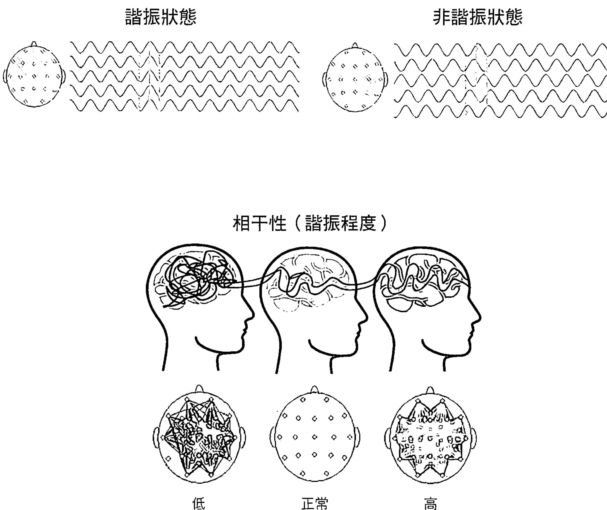

圖2

第一組圖的左右兩個圓圈，畫的是戴著EEG腦電極帽(brain cap)的頭部俯視圖(臉朝前，鼻子指向書頁上方，耳朵在兩側)。帽子上小白點分別是不同的腦區間，是我們用來測量腦波的特定部位。左圖的腦波，你可以看到波形非常有秩序，整齊劃一，顯示的是處在諧振(同調性)狀態的同步腦波；而右圖的非同步腦波，上下排腦波的波峰與波谷並未對齊，這就是非諧振的狀態。

再來看看下面第二組的圖。如果大腦中出現大量深藍色，代表的是低相干性(hypo-coherence)，不同的腦區之間溝通較少；如果大腦中出現大量紅色，意味偏高的相干性(hyper-coherence)，不同腦區之間的交流頻繁；如果大腦中既沒出現藍色也沒有紅色，代表的是正常狀態的相干性。

## 正常的 β 頻率腦波 (Beta 波)

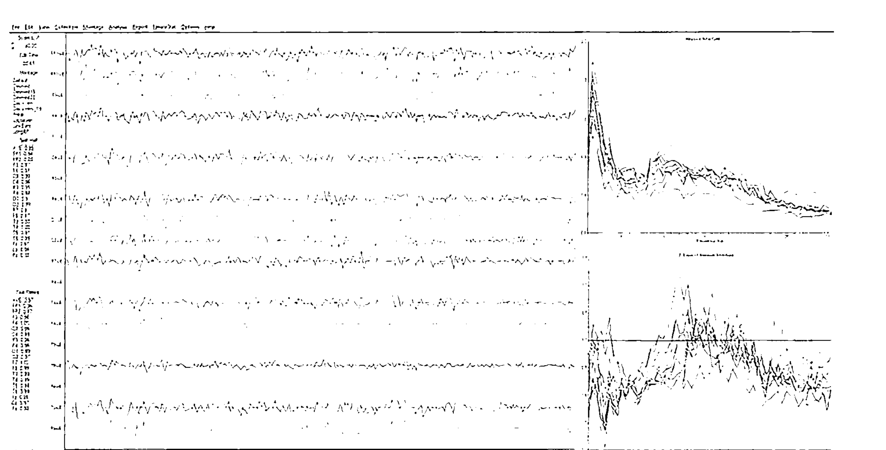

圖 3A

## 諧振狀態下的同步 α (Alpha) 波

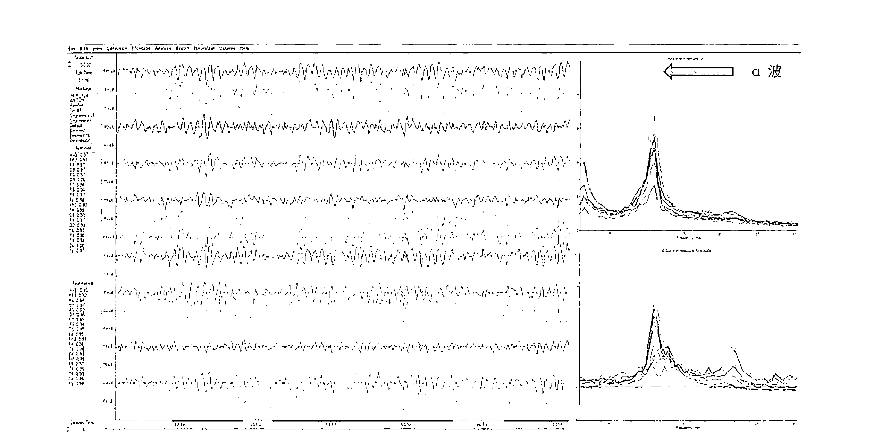

圖 3B

## 諧振狀態下的同步 θ (Theta) 波

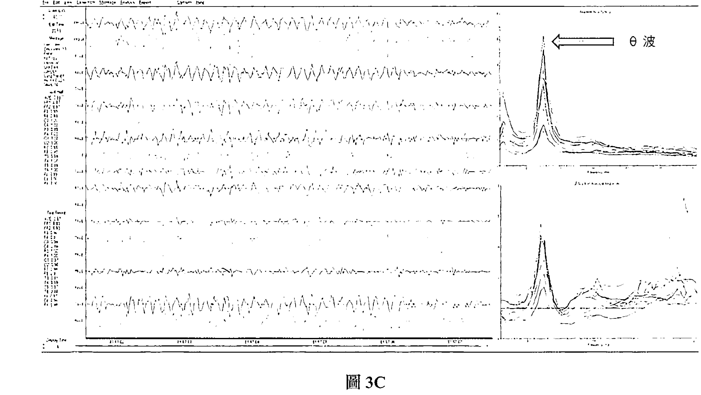

圖 3C

圖3A到圖3C這三張圖中各有十九條水平的波浪線，分別代表了不同大腦部位的測量值，包括大腦前方、兩側、頂端及後方。如果你計算兩條垂直藍線之間的週期數（從波峰到相鄰的下一個波峰），就會得知大腦各部位的腦波是 β 波、α 波、θ 波、δ 波或 γ 波（想知道不同頻率的腦波簡介，可參見第二章圖7）。

當你的注意力從狹窄的焦點轉變成開放焦點，把注意力從有形的物質轉移到無形的空間或能量，你的腦波會從較高頻的 β 波轉變成低頻的 α 波或 θ 波。圖3A所示，是忙著思考、以 β 波為優勢腦波的正常腦波圖。圖3B是以 α 波為優勢腦波、處於諧振狀態下的腦波圖。要注意的是，當你不再把注意力放在有形的事物上時，大腦各部位會達到美妙的同步狀態。指向波峰的藍色箭頭顯示的是，整個大腦如何以每秒鐘十二個週期的 α 波狀態達到諧振。圖3C是處於諧振 θ 波的腦波圖。再次的，從指向波峰的藍色箭頭可以看出，整個大腦以大約每秒鐘七個週期的頻率同步，也就是處於 θ 波的狀態。

## 「能量中心的祝福」冥想後的能量改變

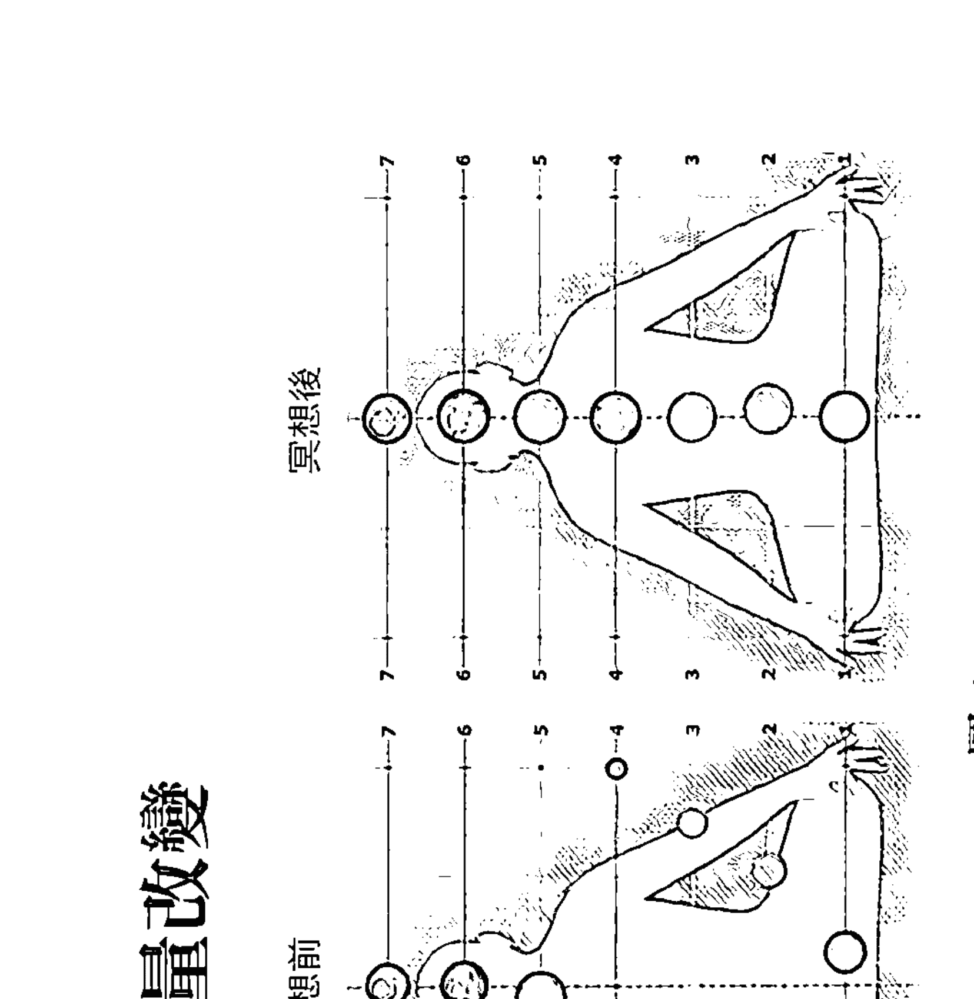

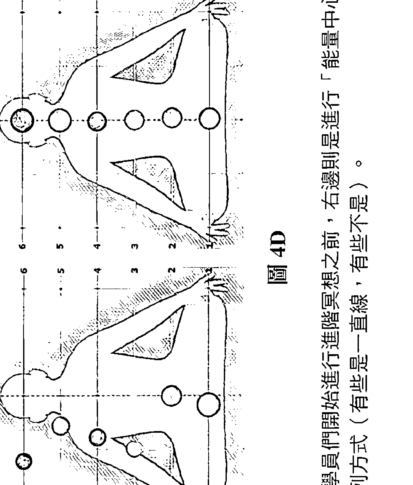

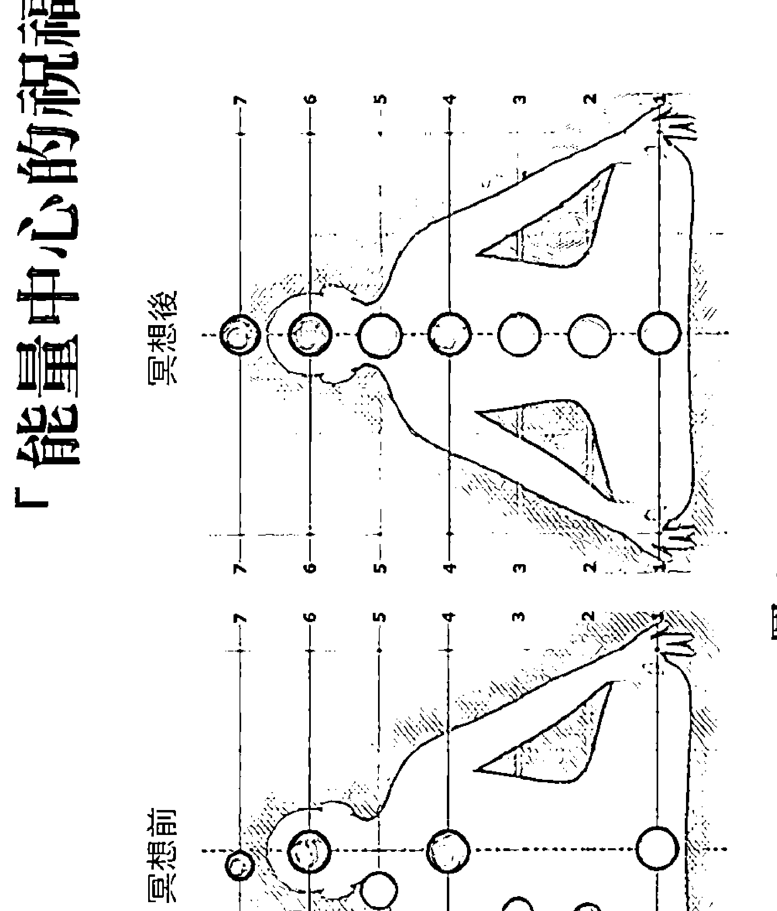

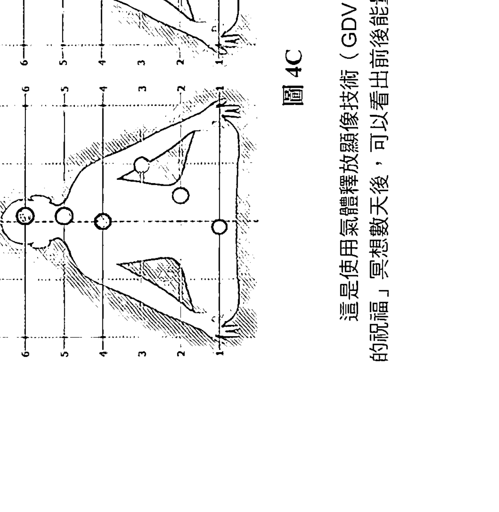

這是使用氣體釋放顯像技術（GDV）所得到的能量測量圖，同一組圖的左邊是在學員們開始進行進階冥想之前，右邊則是進行「能量中心的祝福」冥想數天後，可以看出前後後能量的變化。要注意看每個能量中心的大小及排列方式（有些是一直線，有些不是）。

## 進階研習營前後的整體能量改變

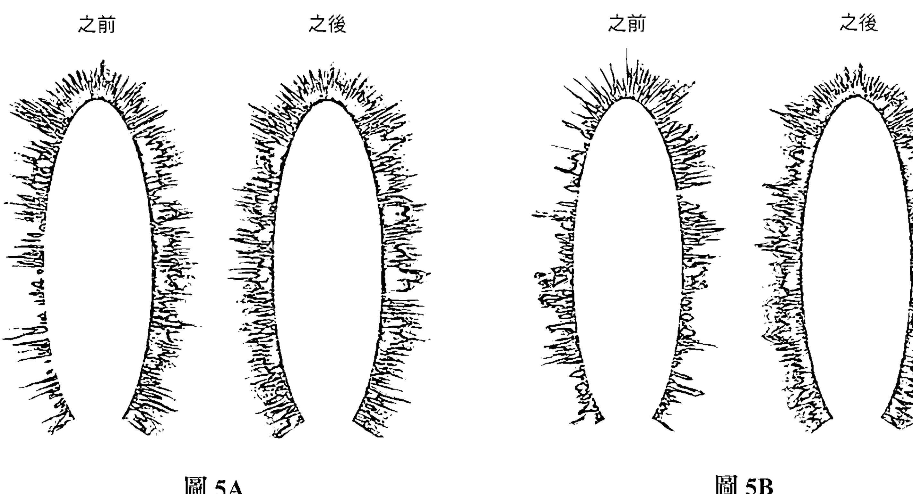

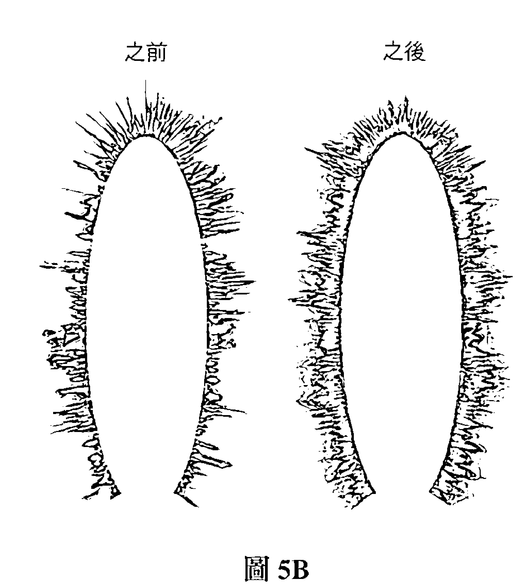

這是部分受試者的GDV能量測量圖，同一組圖的左邊是在參加進階研習營之前，右邊是研習營進行數天之後。兩圖比較，可以看出重要能量的變化。

## 應用呼吸技巧進入 γ (Gamma) 波的一位學員

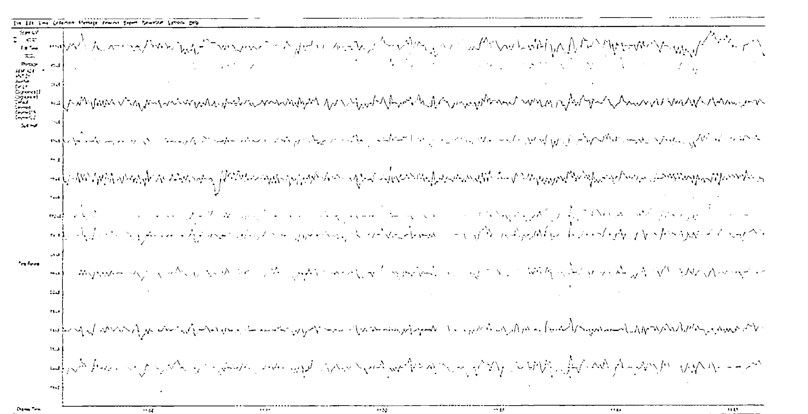

圖 6A(1)

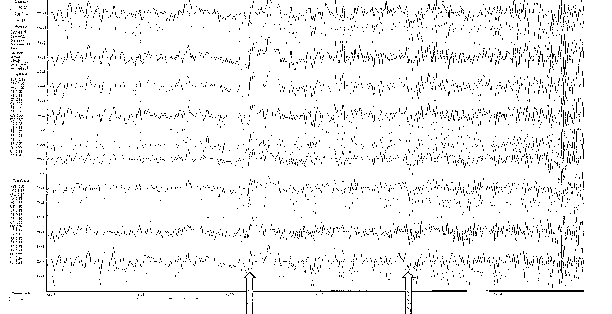

圖 6A(2)

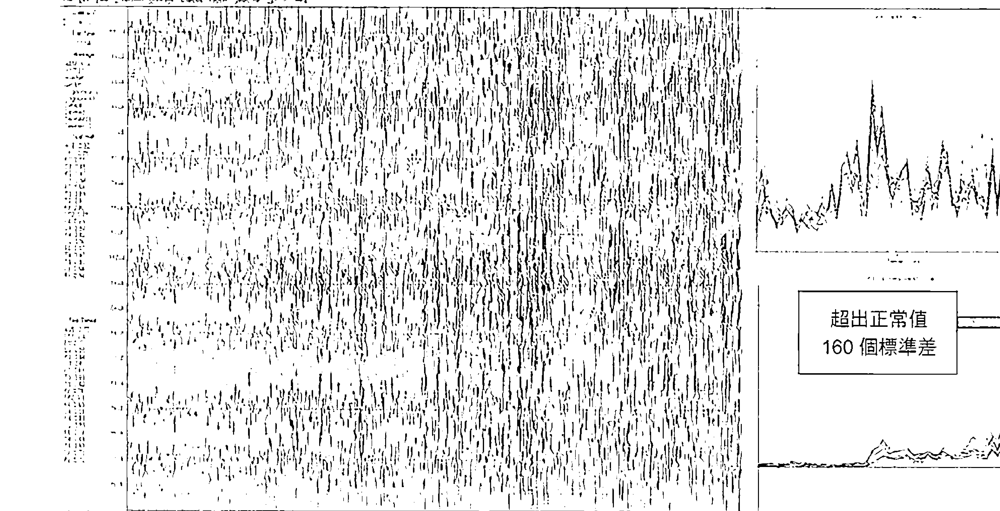

圖 6A(3)

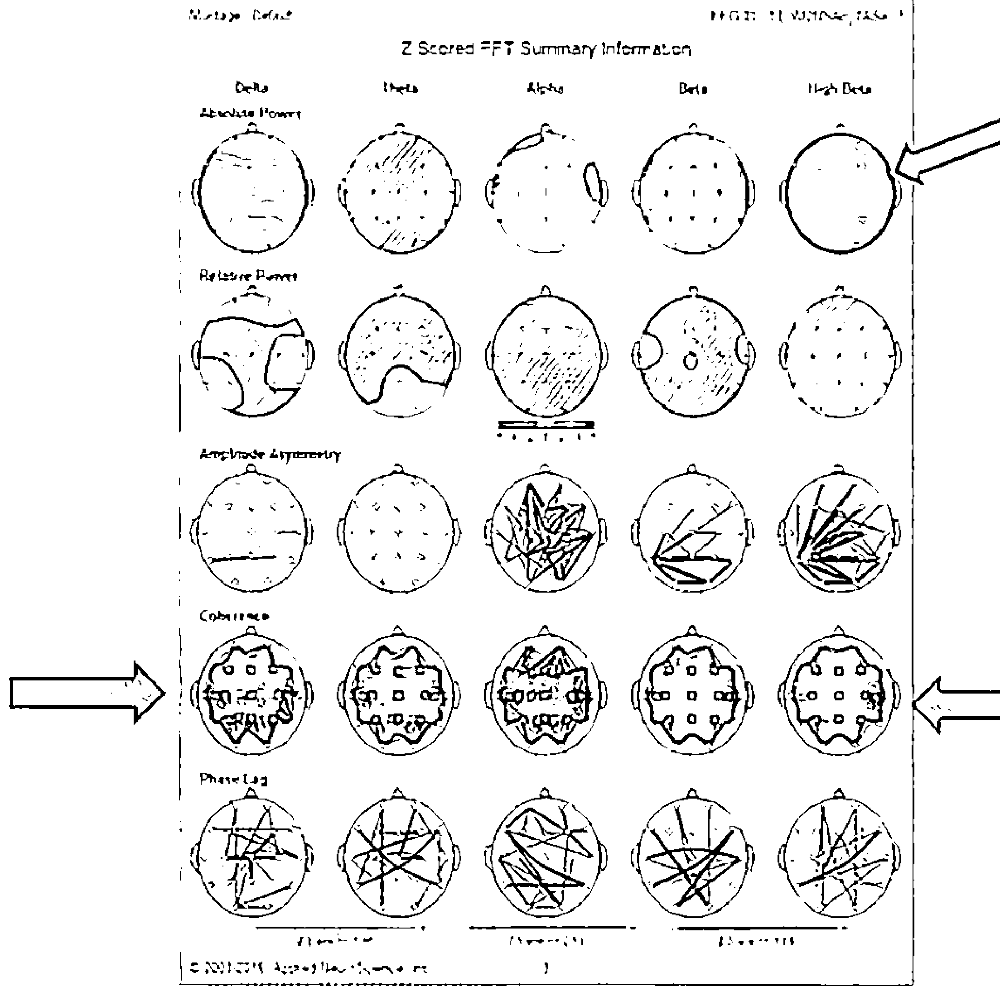

圖 6A(4)

圖6A(1)、6A(2)及6A(3)是一位學員在進行過特殊的呼吸法後，腦波從高頻的β波轉變成γ波的情形。他的大腦被能量徹底激發了，你可以看出他的腦波頻率明顯改變了（見藍色箭頭）。大腦中的能量變化，已超出正常值的160個標準差。現在，再來看看圖6A(4)，由於腦中出現大量紅色，代表充滿了能量，而腦中出現藍色，代表能量非常少；因此，紅色箭頭所指的全紅圓圈，就意味著當高頻β波轉換成γ波時會產生大量能量。此處使用的軟體雖然沒有記錄下每秒的γ波，但從上圖的其他測量可知，全紅圓圈滿滿的能量反映的是γ波與β波的能量變化。在藍色箭頭所指的那一排標著「同調性」的腦圖中，可以看出所有被測量的腦波頻率，都伴隨著高能量的熱烈交流。

## 應用呼吸技巧進入 γ（Gamma）波的另一位學員

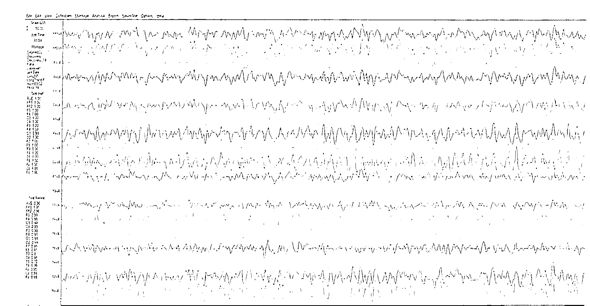

圖 6B(1)


圖 6B(2)


圖 6B(3)

在以上這些圖中，可以看出一種類似的轉變模式。圖6B(2)中位於腦波圖底端的藍色箭頭，指出大腦從高頻β波進入γ波的時刻；從圖6B(3)可以看出，腦中能量已超出正常值的260個標準差。在此先做個背景說明：高達99.7%的人是落在正常值上下3個標準差之內。任何超過3個標準差的情況，都可視為超自然現象。

## 顯示松果體周圍腦區活動的掃描圖


圖 6B(4)


圖 6B(5)

圖6B(4)藍色箭頭所指的紅色部位，正是松果體周遭以及被稱為布德曼30區（Brodmann's area 30）的腦皮質分區，後者與強烈情緒及新記憶的形成有關。當學員們的腦波處於γ波狀態時，我們的研究團隊會在學員的大腦中看到這些部位出現這種模式。圖6B(5)是往下俯瞰同一位學員大腦的3D圖，可以看出有相當大量的能量來自緣腦內部。

## 菲莉西雅的大腦掃描


圖 7A(1)


圖 7A(2)


圖 7A(3)


圖 7A(4)


圖 7A(5)

(X,Y,Z)=(11,-46,1)[mm];(1.03E+0)


圖 7B

## 菲莉西雅的個案紀錄


圖 7C


圖 7D

圖7A(1)到圖7A(5)是菲莉西雅的大腦從正常的β波轉變成高頻β波，再轉變成高能量γ波的腦波圖(藍色箭頭是腦波轉變處)。當菲莉西雅與統一場連接上時，她的γ波能量達到超出正常值的190個標準差，同時如圖7B所示，松果體周圍以及處理強烈情緒的大腦部位也被高度活化了。圖7C顯示的是大腦底部，從紅色區塊可以看出γ波的能量來自緣腦內部。再來看看圖7D，這是菲莉西雅從統一場接收到生物機能的升級信息後，皮膚狀況在第二天的變化。

## 心腦諧振的腦波圖


圖 8A


圖 8B

第一張掃描圖是學員們在活化心臟能量中心之前的腦波測量結果，優勢腦波是不同步的 β 波，顯示的是一個忙碌且注意力分散的大腦。第二張是大約十秒後的腦波紀錄，這是同一個學員進入心腦諧振狀態的大腦測量結果，可以看出整個大腦也隨之進入了諧振的 α 波狀態。

## 看萬花筒時進入諧振狀態的 α & θ (Alpha & Theta) 波


圖 9A(1)


圖 9A(2)

圖9A(1)是一位學員在看萬花筒時的大腦掃描，顯示腦波處於諧振狀態的 α 波；圖9A(2)是另一名學員專心看萬花筒時的出神狀態，其大腦掃描顯示腦波進入諧振的 θ 波狀態。

## 看萬花筒時的大腦活動變化


圖9A(3)


圖9A(4)

圖9A(3)則是另一名學員大腦的3D影像(全為紅色)，顯示整個大腦幾乎都處於θ波狀態，右側的紅色橢圓形標出此時測得的腦波正處於θ波。圖9A(4)同樣是另一名學員在看萬花筒時所測得的腦波頻率，藍色箭頭所指的紅色與橘色塊，指出這裡出現了δ波、θ波、α波及β波的大量腦波活動。

## 看心靈電影 (Mind Movie) 時，大腦產生的高能量


這是一個完全沉浸於心靈電影經驗中的腦波狀態，達到諧振狀態的大量高頻 β 波與 γ 波與化了整個大腦。

圖 10

## 維度化心靈電影場景時的大腦活動


圖11A


圖11B

冥想前，先編寫好自己的心靈電影。當這名學員把她心靈電影的某個場景具象化後，她描述自己體驗了一場超展開的感官經驗，完全沒有用上她的五種感官。如圖11A所示，你可以看出她的大腦處於諧振模式的高頻β波與γ波狀態；此時，她的大腦能量已超出正常值230個標準差。圖11B紅色箭頭的那一列，可以看出當腦波由高頻β波進入γ波時，產生了大量的能量。藍色箭頭那一列，可以看出腦波的諧振程度(相干性)相當高。要注意的是，如果無法有逼真的親身經驗，這名學員的大腦就無法呈現這種狀態。

## 步行冥想前後的大腦變化


圖 12A


圖 12B

圖12A是一名學員在步行冥想前所做的基線測量，顯示的是正常β波與α波的腦波狀態。圖12B是在步行冥想一個小時又二十分鐘後的大腦掃描，可以看出他的腦波變化：處於高能量的γ波狀態。

## 信息的駐波


圖 13

這些以複雜幾何結構呈現的碎形圖案是頻率與信息的駐波，可以被大腦解讀成非常強大的影像。上述這些圖案雖然都是二維的平面圖，你仍然可以從中一窺這些圖案是如何形成的。

## 太陽活動與人類事件的相關性


年

資料來源:亞歷山大·奇茲維斯基論文:Physical Factors of the Historical Process

圖14

俄國科學家亞歷山大·奇茲維斯基(Alexander Chizhevsky)比較了一七四九年至一九二六年期間每年所發生的政治社會重大事件數量與太陽活動增加的相關性。在上述圖表中，藍線代表的是太陽耀斑，紅線代表的是人類的易激動性。你要注意的是，每一次一出現劇烈的太陽活動時，人類發生的重大事件也會隨之增加。

## 週三、週四、週五及週六連續四天的能量比較
（華盛頓州塔科馬市，2016年）

氣體釋放顯像技術科學實驗室
Tacoma16 基線：平均值：6.186；標準偏差：0.005；信賴區間：0.010
Tacoma16 週四：平均值：6.400；標準偏差：0.006；信賴區間：0.012
Tacoma16 週五：平均值：6.523；標準偏差：0.006；信賴區間：0.012
Tacoma16 週六：平均值：6.712；標準偏差：0.007；信賴區間：0.013
多因子變異數分析變異數分析（ANOVA），顯著性差異（p）= 0


圖 15A

## 週三、週四、週五及週六連續四天的能量比較
（亞利桑那州凱爾福利，2015年）

氣體釋放顯像技術科學實驗室
Arizona 2015 基線：平均值：6.148；標準偏差：0.006；信賴區間：0.013
Arizona 2015 週四：平均值：6.321；標準偏差：0.007；信賴區間：0.013
Arizona 2015 週五：平均值：6.602；標準偏差：0.008；信賴區間：0.016
Arizona 2015 週六：平均值：6.758；標準偏差：0.006；信賴區間：0.012
多因子變異數分析變異數分析（ANOVA），顯著性差異（p）= 0


圖 15B

如圖15A與圖15B所示，在為期三天的進階研習營期間，會場內的集體能量增加了。第一條線（紅線）是我們的測量基線，代表在週三活動開始之前會場內部的能量。請比較紅線、藍線、綠線及橘色線（每個顏色各代表一天），你就會發現每天的能量都在穩定增加。

## 週三、週四、週五及週六在晨間冥想前後的能量比較
(墨西哥坎昆市, 2014年)

氣體釋放顯像技術科學實驗室
墨西哥坎昆市2014週三晨間冥想基線:平均值:6.239;標準誤差:0.025;信賴區間:0.049
墨西哥坎昆市2014週四晨間冥想:平均值:6.365;標準誤差:0.020;信賴區間:0.040
墨西哥坎昆市2014週五晨間冥想:平均值:6.642;標準誤差:0.029;信賴區間:0.058
墨西哥坎昆市2014週六晨間冥想:平均值:6.680;標準誤差:0.025;信賴區間:0.050
多因子變異數分析變異數分析(ANOVA),顯著性差異(p)=0


圖15C

## 週三、週四、週五、週六及週日在晨間冥想時的能量比較
(德國慕尼黑, 2015年)

氣體釋放顯像技術科學實驗室
德國2015週三晨間冥想基線:平均值:6.253;標準誤差:0.013;信賴區間:0.026
德國2015週四晨間冥想:平均值:6.319;標準誤差:0.013;信賴區間:0.025
德國2015週五晨間冥想:平均值:6.381;標準誤差:0.013;信賴區間:0.026
德國2015週六晨間冥想:平均值:6.391;標準誤差:0.014;信賴區間:0.027
德國2015週日晨間冥想:平均值:6.501;標準誤差:0.015;信賴區間:0.029
多因子變異數分析變異數分析(ANOVA),顯著性差異(p)=0


圖15D

在圖15C與圖15D中，相同色標仍然與上一頁一樣，但這些測量值反映的是每天晨間冥想時的能量變化。圖15D多了一個深綠色的色塊，這是我們凌晨四點在松果體冥想中所測量的房間能量。如你所見，那天早上的能量非常高。

## 喚醒自己的奇蹟人生
### 平凡人也能成就不凡之事

我們的心是中樞能量中心，可以產生一個超越自己身體的電磁場，攜帶著能量頻率的訊息往內往外傳播。作者結合心理學、神經科學、表觀遺傳學及量子物理學等最新研究，用淺顯易懂的方式說明我們是如何與萬物連結及受到無形場域的束縛。了解能量場的原理後，就能透過學習進入潛意識系統，改變自己的腦波及重設自主神經系統，啟動自我更新，成為自己真正的生命主人。

這是一個超越你目前理解，但科學已經證實你能做到的事。書中分享許多真實案例，讓你從中發現自己人生的無限可能。作者將複雜的科學資訊變得更淺顯簡單，並提供實用且清楚的步驟，讓人們能夠輕鬆地運用在生活中，進而實現自己的超凡人生。超潛能不是少數人才有的天賦，而是身為人都擁有的共同可能。


