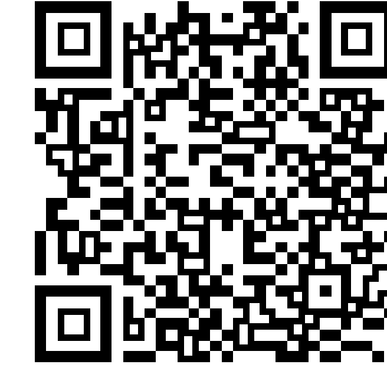
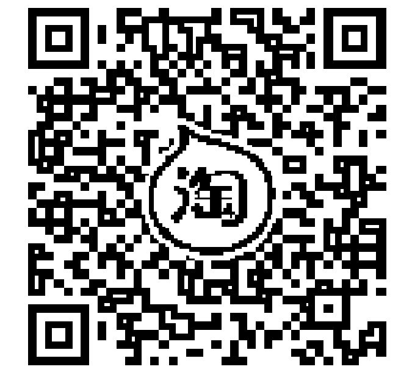
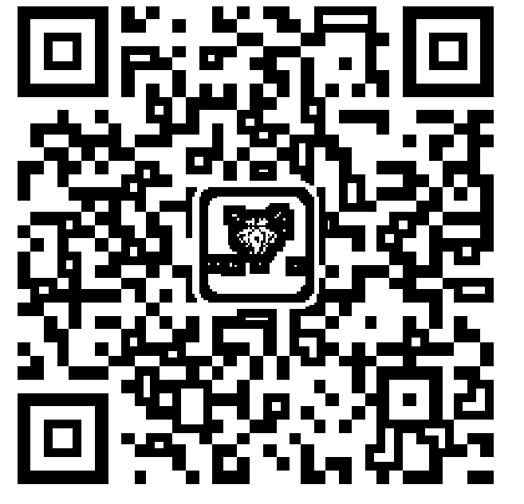
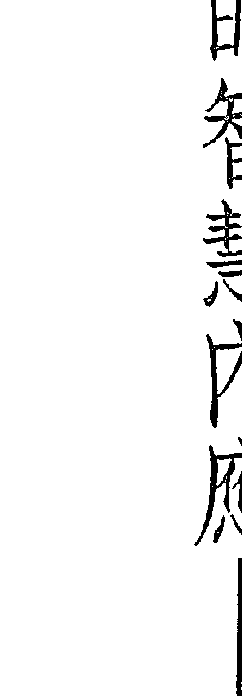

### 開放通靈
### 如何連結你的指導靈

珊娜雅·羅曼 Sanaya Roman & 杜安·派克 Duane Packer/著
羅孝英/譯

Asha老師 誠摯推薦
心悅人文空間創辦人之一

這事關覺醒、提升與真理，
你將更為誠摯、開放以及光明。

### Opening to Channel:
How to Connect with Your Guide

### 制作说明：

本书由《天使神秘学院》出重金从台湾购入的原版书籍扫描制作完成。为达到最好阅读效果，特地把书全部切开后，再经由专业扫描设备高精度扫描完成，并经过一张张的PS后期处理最终成书，其间花费大量的人力、物力以及时间，只为能给大家提供经济并优质的神秘学学习资料而努力。

本学院强力谴责某些机构和个人，把本学院花心血制作完成的电子书籍，包装后直接放在自家网上低价倾销的行为，以谋取不劳而获的经济利益。如果长此以往最终将无人愿意再为大家花心思制作电子书，那以后可能大家再无新书可读。

为让大家以后能够读到更多的好书，也为了本学院的良性发展。本学院恳请大家尽量做到如下几点：

- 一、 尽量在天使神秘学院的官方网站购买电子书籍。
官网访问地址：http://www.ac2011.cn
短网址：ac2011.cn
网址含义：(Archangel College 成立时间：2011年)

手机微信购买
请扫以下二维码

手机淘宝等购买
请扫以下二维码

加店长微信号
请扫以下二维码

- 二、 在收到电子书后小范围传阅即可，千万不要公开传播，更别挂到网上低价销售。

同时为答谢广大支持者，学院电子书将做如下调整：

- 一、 学院会把一些早已收回制作成本的电子书折价销售。
- 二、 最新制作的电子书籍会开放打印功能，大家购买后有条件的可自行打印成书。

天使神秘学院
2022 年 1 月

### 開放通靈
### 如何連結你的指導靈

珊娜雅・羅曼 Sanaya Roman & 杜安・派克 Duane Packer/著
羅孝英/譯

Asha老師 誠摯推薦
心悅人文空間創辦人之一

這關乎覺察、振動與真理
你將更為誠摯、開放以及覺醒

### Opening to How to Connect with Your Guide

## 目 錄

- 推薦序 與神共舞 羅孝英 5
- 譯者序 陪伴人生的智慧內應——指導靈 羅孝英 9
- 前言 給所有對通靈訊息開放的人 15
- 介紹 教導通靈的源起 27
- 第一部：介紹通靈 27
  - 第一章：歡迎你來到通靈的領域 28
  - 第二章：在出神中通靈 45
  - 第三章：誰是指導靈 57
  - 第四章：指導靈如何與你溝通 71
- 第二部：開放通靈 97
  - 第五章：預備通靈 89
  - 第六章：達到出神狀態 98
  - 第七章：連結指導靈 128
  - 第八章：通靈解讀 147
  - 第九章：預言以及可能的未來 164
- 第三部：開放通靈的故事 183
  - 第十章：我們的通靈經驗 184
  - 第十一章：預備通靈教學 198
- 附录 376
- 第四部：开展通灵能力
  - 第十一章：通灵教学 206
  - 第十三章：开放通灵之后的故事 248
  - 第十四章：通灵——巨大的觉醒 262
  - 第十五章：强化你的通灵 269
  - 第十六章：以灵媒身份面对世界 276
  - 第十七章：通灵——现在正是时候 370

### 推薦序——與神共舞

我第一次閱讀歐林的《開放通靈》，是幾年前剛從法國回台灣定居時。這本書伴隨著我，清理了許多身為通靈者的疑惑。那時候我的通靈接訊能力已開啟一段時間，對於通靈接訊的概念，一部分因循著台灣傳統社會對鬼神位階的認知，一部分建立在過去幾年旅居法國時，所接觸到的西方新時代思想。這樣的背景環境，造就我成為一位既不全然傳承東方，也不全然承襲西方的傳訊者。當時《開放通靈》協助了我將這兩部份的觀念做了很好的整合。在邁向穩定的接訊的過程中，指導靈為了教導我更加深入台灣集體意識，讓我在能量上與眾菩薩及道教神佛有頗為頻繁的連結。那兩年期間，我學習到如何運用地（台灣）的能量，以漸進式的能量導引，協助個案清理身體能量場，讓個案可以在溫和不過度崩解的狀況下提升。這所有一切的學習，歸功於我個人高層指導靈（精神導師）白長老。在高靈白長老的教導下，我一步步學習到如何穩定的通靈接訊，並運用宇宙能量來進行療癒。

對於生命潛能出版社邀請我為《開放通靈》一書寫序，我感到既巧合又榮幸。在生命潛能出版社聯繫的半個月前，我的高層指導靈白長老，已請我重新閱讀歐林的作品。幾次靜心中，我感覺到歐林與達本溫柔又寬廣的能量，與高靈白長老的振動頻率有著相同品質。歐林與達本透過書中正向的訊息，引導大家如何敞開自己，與個人的神性自我、高層指導靈連結，其中所描述的引導方式與我學習過程頗為相應，具有異曲同工之妙。

在寫序的過程中，白長老也請我傳遞以下訊息給各位讀者：

> 各位有緣的朋友，歐林、達本是西方振動頻率極高的兩位存有，他們藉由訊息帶來的能量，不管是對亞洲或西方國家，都具有清理、穿透的力量，能協助療癒靈魂體中集體意識的負面囤積。

整個世界在過去的歷史中，都有因戰爭和革命而交織著淌血殺戮的集體記憶。這會在個人的「靈魂體」中存有負向印記，例如恐懼他人侵犯、國與國之間的對立隔閡等等；在個人的「情緒體」中則會呈現過度的自我防衛。（這些過往記憶，對於開放通靈的你們，將會是最直接面臨的學習。）在過去集體意識的影響下，人們對於向「未知」或「外在」開放是充滿緊張與不確定感的。幸而《開放通靈》一書所能協助閱讀者連結到的能量，正好可以清理這個部分。

本書有詳細的介紹如何與指導靈連結，在此也補充通靈時可能有的狀態：有些人通靈模式是輕微出神傳遞訊息，有些人是藉由靈感乍現完成各種創作，還有部分人是在夢中得到指導靈的回應，少數人是透過失去意識完成。這幾種模式又可依接收的感官不同做細分，比如聚焦在第三眼讓畫面呈現於眼前、使用身體直接接收感覺、由鼻嗅覺理解個案所處狀況、也有藉由觸覺與個案雙手掌心交疊而獲取資訊的。

通靈時使用的感官模式，取決於你所連結的指導靈與你共振的方式，指導靈會與你在連結過程中，感知現階段哪個方式最直接也最清晰。當然，隨著更長時間的學習，這些方式都是很有機會同時開啟的，能夠開放於各種接收訊息的方式，通靈者在個案處理的面向上也會更深入與全面。

最後鼓勵渴望進行通靈接訊的讀者們，在心態上要謹記通靈是為了服務自己、他人，如果通靈接訊單單只是為了滿足個人私慾（在此指的是操控與傷害他人），終將使高層指導靈與你在頻率上產生無法共鳴的斷裂。

#### Asia（黃莉婷）老師

- 心悅人文空間創辦人之一，著有《星宇》、《小奇的奇幻之旅》二書。
- 熱愛地球，夢想能旅遊全世界，探索與連結各地大自然能量。喜歡與無形空間的存有們對話並且習得智慧。

### 譯者序——
#### 陪伴人生的智慧內應——指導靈

「我是誰？」「我為什麼在這裡？」記得小時候常常仰望天空，在心中詢問這些問題。我從未聽見答案，然而這些疑問帶領著我的追尋。它們先把我帶進了各種宗教，然後送進高能物理的領域，而我同時開始接觸新時代訊息，開始有了「指導靈」的概念。我很難界定自己相不相信指導靈的存在，仿佛心是相信的，而頭腦不然。

我喜歡「歐林」的書，喜歡悠遊在歐林的字裡行間所感受的心情變化。仿佛天下沒有什麼好苦惱的事，而自己也變得溫柔寬大起來。看歐林的書會讓痛苦與低潮結束得更快，讓喜悅和內在的滿足延續得更久。很自然地，我常在心裡和歐林對話，思考他提出的觀點，自言自語、自問自答、自得其樂。完全不需要提醒或學習，就像祈禱時和神說話一樣，久而久之，「指導靈」從概念變成了「想像」的經驗。

記得一九九九年，我拿了《開放通靈》書中「請朋友幫忙提問指導靈的題庫」，準備好錄音機，和一位有經驗的朋友，第一次嘗試「開放通靈」。有趣的是，什麼事也沒有發生……因為錄音機壞了。當下壞了，而當我離開讓指導靈口述的狀態，就又好了。

然而，就是從那個時候起，我開始殷切地追逐歐林和達本各種主題的課程。如有「神」助，當一個探索完成，另一個探索就開始。我從來沒有計畫，然而我的經驗就是計畫。或者這麼說，當我完成其中一個，我發現它剛好是必要的認識和過程，引導我到下一個過程，而這一切嵌合在更大的版圖中，一個接著一個發生。

後來順隨自然，我開始分享課程、帶冥想。我能清楚地分辨不同的意識狀態。我常常向我說出的話學習，儼然不是我懂得才說，而是我說了才懂。特別在一些我感興趣的主题上，像是次元、能量、空間……等等，彷彿我得到某種靈感，可以把資訊組合成新的觀點。

直到時機成熟，我才逐漸接受「通靈」。通靈是心理現象還是物理現象？我想，兩者皆是。回首當初，我感謝我的「不成功」經驗，我的指導靈全盤了解，對我而言，「不成功」比「成功」更好。因為即使我的第一次徹底成功，也不敵我的頭腦的質疑。這個在書中的第十四章有詳盡的說明。

我的經驗是：人生的重要際遇，都有安排。我們除了心想事成的天生本領之外，還有一個內應。如果宇宙像是阿拉丁神燈，這個內應會指導你如何要求，好讓神燈精靈為你實現一切。即使你不要求，他也會幫你安排，而且會自然得像是你自己想要的一樣。

指導靈並非信仰，指導靈毋寧說是一位朋友，一個我們在人間旅行的陪伴。有意识地對最高的指導靈開放，像是允許我們建構通往未知宇宙龐大資料庫的光纖，必要的資訊能隨時下傳，如此讓這段旅程更豐富、更輕易。

神通並非「通靈」的重點，「通靈」的目的是成為美好資訊的通透管道，啟動「天人合一」的合作。亞特蘭提斯人曾經在地球上建立的極盛文明，便來自聆聽並與內在的神聖存在一同合作，這種開放讓他們與自然和諧相處，尊重所有的生命，並為自己創造極度純淨、美好而先進的環境和生活品質。這一種能力，在2012年之後，將被廣泛的開展和應用。

當你翻閱這一本書，你的通靈時機便成熟了。因為不管你知不知道，你的指導靈都已和你合作許久，而正在強烈地向你傳訊，邀請你對他開放，因為你們有更大的合作計畫要完成，需要更加緊密的連繫。如果你像我一樣，『成功』經驗夾雜在『不成功』之中發生也無妨，請耐心嘗試。因為這是一個劃時代的經驗，它無論如何都在進行。人類世界的進化將突飛猛進，順利而輕易。邀請你探索發送者的協助如何協助接收者的生活，並且改善通訊的品質，如此，

### 前言——
#### 给所有对通灵讯息开放的人

> 「自从我开始通灵以来，我经常感觉我的心是开放的，我对世界的看法完全不同。人们变得友善许多，而我也更愿意做我自己。我遇见许多美好的人，我无法相信生活可以感觉这么好。」

一位与指导灵连结的女士

##### ◆通灵能改变你的生活

这本书传达一个讯息：通灵是一种可以学习的技巧。通灵包括达到一种扩展的意识状态，如此你能连结高层次的指导灵、你的大我或你的本源。要通灵，你不需要有高度的灵性进化或是天生的灵通者，然而你确实需要有耐心、坚持和强烈的欲望去连结。

我們鼓勵你做個有意識的通靈者——能覺察你的指導靈說什麼。你將學習如何提升你的振動頻率，在你的指導靈所在的高次元空間感知、觀看或聆聽，並有意識地帶回訊息。過去用「靈媒」或「靈通」等字眼來談與指導靈的接觸，現在則用「通靈」來取代。「出神通靈」指的是在出神狀態的通靈，在這本書中，我們用「通靈」來簡稱它。

通靈是真的嗎？有數百則科學家想否認超自然現象、卻不得不相信眼睛看不見的事情的確存在的故事，因而開始贊同通靈或自己也成了訊息管道。雖然在普通知覺下沒有辦法證明通靈是否為真，我們卻看見許多人運用它在生活中創造正面的結果。

過去幾年，我們與我們的指導靈——歐林和達本教會許多人通靈，並追蹤他們的通靈發展。這些人的共通點是對通靈的強烈渴望；他們的報告表示通靈讓他們的生活更美好。他們說他們能看到更大的畫面，更正面地面對世界，發現他們能對自己和別人更慈悲。幾乎所有的人都說，他們因為這些新的態度、更清晰的生命願景和更信任內在的訊息而改變，並體驗到更大的豐盛。人們說這種成就就像自然發生地，他們覺得自己順著生命之流而非抗拒它。點點滴滴中，人們發現生活有了更高的秩序、更有意義和目的感。很多人覺得通靈是他們的重大突破和邁向開悟的工具。

我們不斷發現，許多學習通靈後有了巨大的個人和靈性成長的案例；我們不僅看見人們的內在生活——人際關係、感情、自我價值——變得更正面，外在生活也變得更美好。父母對於幫助孩子開展潛力更有知覺；夫妻開始新的溝通，並發現彼此更深的連結；人們發現自己更容易幫助、體諒和寬恕別人。他們創造生活環境、工作和生涯規劃，更符合他們是誰和他們喜歡做的事。

通靈幫助人們發現更高的方向並達成它。我們還沒有發現，通靈引導人們的探索、披露的資訊和個人的擴展有何極限。

歐林和達本想去人們對通靈的恐懼和神秘。我們的通靈學生從未對指導靈有不好的體驗。他們全都能順隨自己的心意，連結更高層次的指導靈。他們運用的是書中所述的過程，一種用來創造安全開放的設計。

我們鼓勵你把書中的資訊當作起點，幫助你建立信任感並對你的指引更加開放，只運用那些適合你的經驗，放下那些你不適合的部分。記住，你閱讀的內容是我們的真理，因為我們如此體驗。如果你發現你需要更多資訊，向你的指導靈或大我要求，並信任你收到的訊息。通靈經驗十分龐大，這本書無法蒐羅所有的內容。有愈來愈多關於通靈的著作，在我們有更多人探索、發現和在這些更高世界遊玩時被寫出來。尊重你自己的體驗，真誠地表達你的真理。當你開放通靈，你會讓人們更容易開放。保持探險的心情、愉快地、自由地透過你的開放通靈，帶進愈來愈高層次的智慧。我們歡迎你踏上眼前美妙的旅程。

##### ◆ 如何利用這本書

這本書可以作為學習通靈的課程，它分成四個部分。第一部分（一～五章）：介紹通靈。給你通靈相關的背景知識——它感覺起來如何、指導靈是誰、指導靈如何和你溝通，以及你如何知道自己已經準備好通靈。第二部分（六～九章）：開放通靈。它是一堂學習通靈的課。如果你能成功地完成第六章的前兩個練習（達到放鬆狀態和保持專注的焦點），你可以繼續完成第六章的其他練習然後進入第七章，找個放鬆的午後，開始口語通靈。依你自己的速度進行，在你想完成課程的時候這麼做——用一個下午的時間或幾個星期都可以。

第三部分（十二～十三章）：開放通靈的故事。包括我們如何開始通靈，以及我們教導的學生的一些通靈故事。這些故事說明人們開始通靈時可能碰到的共同問題，和你若遇到這些問題時可以處理的步驟。第四部分（十四～十七章）：開展你的通靈能力。給你歐林和達本對於培養通靈能力的指引，針對問題和你可能出現的懷疑和恐懼提出答案，以及關於通靈之後你可能會經歷的變化，包括加速的靈性成長和你在身體上可能發生的變化。附錄則是提供一些幫助你的資源，包括一些人們的音樂創作，以及歐林的書和冥想錄音。

> ——珊娜雅與杜安

### 介紹
#### 教導通靈的源起

珊娜雅：
一九八四年十一月二十三日，感恩節後一天，前一天天空氣中便洋溢著一種期待，因為我們和慶祝感恩節的一些朋友在一起玩樂、通靈和冥想。我們透過通靈收到一些關於我們會發生什麼事的新訊息。我們的朋友愛德和琳達預測這一天他們的小寶貝會誕生，我們都對準並分享這個新生兒進入肉體生命的旅程。對我們每一個人而言，這個週末的主題似乎都是出生與重生。
杜安和我決定各自暫停我們在進行的課程和個案，花一些時間相處。我們的計畫是坐杜安的橡皮艇到附近的湖划船，那天的氣溫對於十一月的北加州而言相當溫暖。我們感覺充分休息與寧靜，決定在出發前一起通靈。因為過去幾個月來，我們一直在追問我們的指導靈——歐林和達本，什麼是我們的人生的更高目的？

起初，歐林很天真地告訴我們需要注意的幾件個人生活上的瑣事，然後他問我們，是否想知道如何能真正地服務人類，並同時結合我們的個人目標和靈性道路。我們當然想知道更多！歐林開始告訴我們人類將遭遇什麼，繼續說了一些關於銀河的變化，談宇宙，談正在影響地球的能量。他討論到即將發生的振動改變，和它們對人類命運的衝擊，並告訴我們，人們如何在這些改變中找到喜悅。歐林偶爾會停下來，然而就像協調好的，達本——杜安的指導靈就會接著說話，中間沒有絲毫間隔。

他們說話的要義是告訴我們，在五年內會有為數眾多的人開始通靈，十年內會有更多人想連結他們的指導靈。他們解釋人類的靈性自我正在覺醒，導致追求進化和靈性成長的渴望大幅提升。他們說，人類需要的指引不僅在於協助啟發靈性，也在於了解和運用那些到臨的新能量。一種「靈性光輝」開始在人類氣場上發光，有更多人可以接觸更高的意識並尋求開悟的經驗。

歐林和達本認為，通靈——連結高層次的指導靈或大我並說出訊息，是協助人們啟發靈性的關鍵之一，幫助他們得到重要的新體驗。因此提議在他們的協助下，我們開始教導人們通靈。他們說，新時代的主題在於自我激勵和直接體驗。人們將學習信任他們的內在指引，而許多人會自然地開放通靈。人們會發現他們的老師來自內在——以自我創造和自我教導的方式學習，而非外在。歐林和達本希望確定開放通靈的人能連結高層次的指導靈，他們想幫助人們學習認出更高的指引，並將通靈用在靈性的目的上。

他們建議我們開通靈課，要我們在接下來的三個月作準備，他們會提供資訊和預備通靈的冥想以及課程的內容。如果我們決定教導通靈，他們要求我們承諾至少用兩年的時間把事情建立起來，因為逐步建構需要這麼多時間。兩年之後，我們才能再評估是否要繼續待在這條路上。

那個時候我在教「地球生活」的課，由歐林指導我和那些參加課程的人們提升意識。回想起來，我了解這些課程是在預備人們活在更高的能量空間、打開心、釋放負面能量並發現他們的更高目的。這些都是為通靈作準備的能力。並不是所有的人都想繼續成為通靈人，但是許多遵循更高紀律的人會開始感覺到他們的指導靈和大我，而渴望有更強烈與更有意識的連結。這些課堂中的教導後來變成《喜悅之道》和《個人覺醒的力量》（均由生命潛能出版）這兩本歐林書的內容。

### 介绍

在这一天之前，杜安和我从未想过一起合作并结合我们的能力。然而我们愈思考合作，它似乎就愈自然。教导人们通灵像是一个有趣的挑战。我们可以吗？我们的指导灵可以吗？我知道欧林和达本能帮助个人连结他们的指导灵和大我，因为他们两者都做过这样的事，然而我和杜安从来没有教导过一群人通灵的经验。直到那个时候，帮助人开放通灵要花几个月的工作，但是此刻欧林和达本却提议：让人们在一个周末的课程中开启通灵的管道。

我们质疑他们会不会过度乐观。我们知道许多人认为通灵很难，只有少数的特殊人士做得到。有人说，通灵需要多年的训练或者只发生在天生有灵通能力的人身上。另外的看法是，高层次的指导灵只会前来帮助特定人士，而最好别要求高层次的疗愈大师为老师。欧林和达本向我们保证，因为这是地球非常重要的转化期，会有很多高层次的指导灵到临，而且他们非常想协助我们。他们也说，过去通灵需要经年的特别训练或只发生在有天赋的人身上，因为过去这里并没有那么多的指导灵存在。而现在，因为种种理由——人类气场的改变和地球本身振动的改变——许多人一起连结指导灵和通灵才变得可能。

欧林和达本告诉我们，通灵是一门可以学习的技巧，只要你渴望并有意图这么做。不需要多年的冥想经验、拥有灵通能力或在过去当过灵媒。他们想教导人们对指导灵通灵时保持意识，如此人们会听见自己带来的讯息，并有能力选择连结哪位指导灵。这样人们能听到指导灵的更高智慧，自己也能得到灵性成长。他们觉得只要使用书中的过程，人们可以很安全地要求或连结高层次的指导灵或他们的大我。

杜安告诉达本他要一种可验证的成果，不然他就不做。他想确定就像指导灵所说的：每一个真心想要通灵的人都可以学得会。在接下来的一个月，我们反复考虑。真的我们能教导许多人在一个周末的课程就开放通灵，进入更高的世界和连结高层次的指导灵吗？

进一步指示前，欧林和达本给我们足够的时间，化解自身的疑虑和问题。他们喜欢我们自行解决问题，只有在我们肠枯思竭、弹尽援绝的时候才回去找他们。在我们的经验中，指导灵不限制个人的起心动念，反而鼓励和激发它。最后我们决定教导这门通灵课，再看事情如何发展。欧林和达本说，人们不需要花太久的时间便可以和指导灵建立连结，那比人们以为的更容易。他们希望我们帮助人们穿越那道门。

### 介绍

我们解决自己的问题之后，课程的流程及架构，在欧林和达本的指引下很轻易地完成了。我们最后同意，只要人们有兴趣，我们就尽量开课。那天我们并没有去湖上划船，但是朋友的小孩确实在感恩节后的那一天出生。这对我们而言，都是一个全新的开始。第一堂课非常成功。每个人都学会了通灵。接下来的两年，我们教导了几百个人开放通灵。现在，我们可以非常自豪地说：通灵是可以学习的技能。这些人来自各行各业，代表许多不同的专业，年龄从十八岁到七十岁。就像我们的指导灵宣称的，人们无须多年的静坐体验、事前准备或灵通经验，甚至没有通灵概念，就能学会如何通灵。这些人的共通之处是——对连结指导灵或大我强烈的渴望。人们确实能通灵，而且这远比他们想像的容易许多。我们和许多人保持联系并观察他们的成长和改变。他们提出许多问题，对我们贡献很多关于他们通灵时碰到的疑惑、挑战、抗拒和灵性觉醒，以及他们的希望与梦想。透过他们和我们自己的体验，以及欧林和达本持续的教导，我们对于如何成为清晰和有意识的讯息管道有了许多了解。

### 开放通灵

之后欧林和达本告诉我们，他们想写一本书来教导人们通灵。他们要我们分享学到的一切和他们教导的过程，如此想要通灵的人会找到现成的资讯。我们在书中和你分享课堂中所有的过程，这是欧林和达本为了让你在没有课程的辅助下，连结指导灵或大我所特别预备的书。只要你呼请，就可以收到他们的能量。虽然我们刚开始非常怀疑人们可以通过一本书学会通灵，然而欧林和达本向我们保证——这是可行的。他们说，人们的指导灵和大我会帮助这个连结，很多来自高次元的协助让人们的通灵成为可能。

欧林和达本早些时候曾让我们整合一本课程用的讲义，很多内容都包含在这里。

我们发现人们流通那本课程用书，并听说有人仅仅阅读书的内容就有了自发性的开启。有位女士在飞回家的旅程上读了那本讲义，因为对书中提到的事很怀疑，于是把书放在膝盖上，说：「如果你是真的，我的指导灵，那么给我你的名字。」结果她感受到一股能量，并听见不知哪来的声音给了她一个名字。从此她改变对通灵的想法，并开始追求一条连结指导灵的灵性道路。还有很多人用书中的过程连结上自己的指导灵和大我。

### 介绍

这本书的焦点在于如何和指导灵通灵，同样的过程也可以用于你和大我的连结。如果你想通灵的是你自己的大我，在你开始这个过程时要求。你也可以阅读欧林的《灵性成长》这本书，它是特别为了协助你对大我的连结和通灵并成为你的大我而写的。

你能学会与高层次的指导灵或你的大我通灵，你就可以接收指引、启发并建立与这个智慧泉源的连线。如果你想要的，现在就开始要求。这本书的设计是透过故事、通灵资讯和过程来教导你通灵。当你继续阅读，注意那些跳出或是似乎有特殊讯息的地方，让这些成为你的指导灵或大我帮助你建立通灵连结的第一个讯息。

## 第一部

### 介绍通灵

## 第一章

## 欢迎来到通灵的领域

#### 什么是「通灵」？

> > 欧林和达本：
> 欢迎你进入通灵的领域！开启你对高次元的讯息管道将为你创造进化的跃升，因为通灵是对于灵性开展和意识转化很有力的途径。通灵时你建立与高次元连结的桥梁，它是充满爱与关怀的、有目的的更高集体意识，又被称为「神」、「一切万有」或「宇宙心智」。
> 在通灵的状态中，你可以接触所有已知和未知的想法、知识和智慧
> 通灵时你连结高层次的指导灵或你的大我，为你承接更高的振动，让你更容易接近高次元。通灵意指有意识地提升你的头脑和心智空间，到达一种所谓「出神」的意识扩展状态。要进入这种通灵的出神空间，首先你必须学习专注，避开你的思维以接收更高次元的指引。在这种接收状态之中，你成为一种容器，能够导入那些为你创造美好事物的更高能量。

你天生便有接触高次元的能力，在那些灵感涌现、充满内在指引和创意的片刻，你便是直接连上了高次元。你也许还不能随心所欲地接近这些境界，指导灵会帮助你发展连结高次元的天赋。他们会用能量提振你，带给你新的成长方向，作为你的老师和翻译官，指引你如何精练能力，悠游于高次元的空间。他们帮助你结合你的更高目的，舒服地向上旅行。

指导灵是一个永远在你身边爱你、鼓励你和支持你的朋友

你的指导灵会鼓励和帮助你发现你的内在知晓。当你与指导灵保持连结，你和高次元就是建立了更坚固、更开放而精细与稳定的连线。你会更经常拥有可靠的直觉洞见，在更高振动直接进入你的头脑时，体验内在指引或知晓。

## 第一章 欢迎来到通灵的领域

通灵是一道门，通往更多的爱，而高次元充满了爱；通灵是一种能激发、鼓励和支持你的连结。指导灵的目的是让你更有力量、更独立和有自信。完美关系中具备的品质——永恒的爱、全然的体谅和无限的慈悲，你会在指导灵的身上发现这些。通灵会带给你寻求已久的睿智导师，他会从内在而非外在世界与你相会。通灵带给你更伟大的理解，帮助你发现答案，找到诸如「我为什么在这里？」、「人生的意义是什么？」等的问题解答。通灵就像登上视野辽阔的山顶，它是一种方法，让你发现更多实相的本质，让你对自己和别人更了解，并从囊括全貌的观点来看人生，帮助你了解你所处情境的更大意义。你的指导灵会帮助你发现答案，从生活上的日常琐事到最富挑战的灵性问题。你可以运用通灵来疗愈、教导并在生活中的所有领域发挥创意。当你接近更高的世界，你能带回更多伟大的知识、智慧、发明、艺术作品、诗歌和各种发现。我们——欧林和达本，是光界存有。我们存在于更高的次元，而我们的目的是协助你开启对高次元的讯息管道，如此你能进化得更快。我们对你有无尽的爱，希望你

## 第一章 欢迎来到通灵的领域

能轻松而喜悦地成长和向上提升。我们为了让你连结你的指导灵或大我，一起组成了这个课程。

我们希望帮助你了解通灵是什么，和如何开展这个天生的能力。它比你想像的容易，也因为它是如此自然，有些人一开始很难相信他们已经与他们的指导灵或本我连结上了。

无论你是刚接触通灵或已经自我探索多年，这本书中的资讯都能帮助你。它将帮助你学会分辨——高层次的指导灵和不够进化的灵体，并决定你接收的建议是否值得采信。它将告诉你：如何连结最高指导灵。如果你想要，我们将尽我们所能地提供你成为讯息管道的机会。

高层次的指导灵会鼓励你依从内在指引，胜于他们的建议

我们鼓励你阅读这本书时，只运用那些与你的内在深处共鸣的资讯，而忽略其他的部分。相信你的内在指引和讯息。你是一个特别、独特的生命存有，你有无限的潜力。

我们邀请你更完全地去发现你的神性。

#### 通灵能为你做和做不到的事

欧林和达本：

通灵将帮助你为世界带来改变。这并不意味如果你执意选择挣扎痛苦，你也能免于受苦；它指的是如果你选择，你能毫不费力地完成事情的方法。这并不表示你能轻松度日、一事不做，每件事就会自动发生；它指的是，你会对你想要创造的事情更有感觉，并找到更容易的方式实现它。如果你遵循指导灵的建议并持续通灵，你的情绪会改变，你将不会那么经常地感觉沮丧、烦躁或沉重。

#### 高层次的指导灵不会占有或控制你

通灵并不会解决你所有的问题，它只会让你以你想改变的方式改变。你才是运用那些智慧话语的人，那个采取行动、把工作推展到世界的人。你仍然需要为你自己的生活负责。通灵不是万灵丹，也不会为你了结一切。通灵，如我所言，只是加速你的成长机会和课题。你也许会发现自己不断经验许多老问题，而终于将它们清理完毕。

虽然这些经验一开始也许让你难受，它们最后都会带给你更大的喜悦和力量。对小的改变保持开放，你会发现回报超乎想像。你也许会发现，即使你是为遵从指导灵的指引所投入的些微努力，都会带来巨大的改变和报偿。这些回馈未必依你期望的方式发生，因此请对快乐的惊喜保持开放。

#### 通灵帮助你学习更爱自己

通灵并不能担保人们爱你，也不会保证你出名或受欢迎。然而，通灵确实会让你以更慈悲的方式体谅别人。你能够更客观地看待自己，放掉你对自己持有的偏见，教会你更爱自己。通灵帮助你强化和厘清你的灵魂道路。当你遵循你的更高道路，你确实有可能体验名声和人们的敬重与欢迎，然而它们会变得不像以前那么重要。

#### 欧林和达本：

你可以运用通灵来做什么？

## 第一章 欢迎来到通灵的领域

通灵除了可以得到更高的智慧和个人指引外，有些人用通灵来创作，例如剧本写作、音乐或歌词创作，以及绘画、雕刻、陶艺和其他的手创工作。有些人的指导灵协助他们的谘商、教学、疗愈或身体工作。有些人利用通灵状态和指导灵的更高振动，扩大他们在戏剧表演、指挥和各种活动企划上的创意。每一位指导灵以及指导灵与你的关系各不相同，各有特殊与独特之处。有些指导灵饶富诗意，有些指导灵很能鼓舞人心，有些指导灵擅长启迪。你们有些人也许会发现自己能够通灵写一本书，或者写作变得如此容易，好像书「自己写好了」一样，因为通灵和写作是非常理想的搭配。

通灵帮助你连结上一个源源不断的稳定的灵感与资讯的泉源。

#### 通灵会大幅增加创造力

艺术家告诉我们，在维持轻微出神的状态下，他们能睁着眼睛接收指导灵的讯息。绘画或雕刻的成品甚至在他们开始动手之前就已经浮现眼前。许多人感觉意识状态的轻微变化，让他们更加放松，而对于意象拥有超乎平常经验更敏锐而丰富的觉察。

## 第一章 欢迎来到通灵的领域

许多的音乐家发现学会通灵后的音乐创作更容易，他们对自己的个人风格有更强烈的感受。有人发现他们创作音乐的状态就是自然的通灵状态，而连结指导灵强化并精练了这种状态，提供他们更持续和稳定的创意之流；有些人发现这种出神状态让他们更能跟随自己的音乐流动，直觉地创作而非用头脑去创作。有一位知名的音乐家在通灵中分别在不同时间创作了十六个音轨的内容，而它们在第一次合成就组成了一曲完美的乐章。

人们用他们对准更高智慧的能力，去发现适合他们的运动、饮食习惯、食物和修炼方式。我们鼓励你发现自己的方式去运用这个与高次元的连结。

#### 如何知道你已准备好？

> 欧林和达本：
能够成为好的讯息管道的人往往喜欢思考，个性独立，喜欢控制自己的生活。那些在通灵上成就卓越的人，通常具有旺盛的好奇心和一颗开放的心。他们有觉察力、

### 开放通灵

敏感、很清楚自己的感觉；他们爱好学习，并对各种新的技巧和知识保持开放。各种在创意领域工作的人都是天生的通灵者——作家、疗愈工作者、各式处方的治疗师、诗人、音乐家、艺术家、规划师和设计师等等。通灵人士来自各种领域，从事各种专业。指导灵最重视的特质是对于通灵的投入、热忱和意愿。你们之中有足够的聪明才智或直觉力的人，喜欢独立思考、重视真理、以及能分辨更高智慧的人，都能在通灵上出类拔萃。

通灵人士通常待人亲切，真诚而努力；投入工作时非常热心。他们的想像力丰富，喜欢做白日梦或幻想。他们似乎能预期别人的需要，并关心他们的家人和朋友。在关系上，他们有时候无法区分事实和想像，因为他们常常看到的是人们的潜力而非他们的现况。

#### 指导灵帮助你达到新层次的个人力量与灵性成长

能完成事情的人是很珍贵的。我们并不要求你的生活完美，因为我们的承诺之一就是帮助你建立生活的秩序，我们认为：对你而言，生活顺利是重要的。我们特别喜

### 第一章——欢迎你来到通灵的领域

欢连结那些喜爱和我们在一起工作，而能用游戏的心情去做的人，我们寻找的是，那些对于这个连结的机会心存感谢的人。

最高的指导灵会连结那些——尽全力运用和珍惜他们带进来的讯息的人。我们对于有志追求灵性、坚持不懈和充满热忱的人很感兴趣。作为高层次的指导灵，我们在这里的目的是带来改变，服务人类，和你一起经验创作的过程。我们认真地执行对你的承诺，竭尽所能地协助你。我们希望你也认真地秉持你的承诺和看待我们共同的工作。我们非常珍惜那些为我们的共同工作贡献时间和能量的人，这是你给我们最美好的礼物。

强烈渴望帮助他人并关心人们的福祉的人，也会吸引高层次的指导灵。通灵总是会对周围的人有益处，它提高了你周围的振动。你们之中以任何方式帮助别人的人——不管是透过你的事业、个人生活、家庭生活或是创作的努力，都会吸引高层次的指导灵。无论你疗愈和帮助人们到什么程度，你自己都会跟着成长。

别担心或怀疑你吸引高层次指导灵的能力，我们有许多人！我们在这里的目的是服务你们。只要你表示意愿，我们将尽力帮助你突破与我们之间连结的藩篱。我们关

### 开放通灵

心的是带给人类更高的意识，也乐意将更高的意识带给你。

学会通灵的人说，他们感觉更落实和稳定并能掌握自己的生活

有些人担心如果他们学习通灵，会变得太「出神」、「空灵」而不切实际。他们告诉我们，他们对处理生活上的琐事已经很不擅长了，他们需要的是更加落实。我们观察到的是——通灵能帮助人们感觉更务实、更停留于核心，并且更能有效率地处理他们的日常生活。

有些人害怕通灵或连结指导灵，他们会失去个人的身分，或被指导灵的临在给淹没。高层次的指导灵从来不会想占据你的生活，通灵并非臣服于控制。指导灵有他们自己的生活，他们只是想在你的灵性道途上服务你。你将保有自己的身分，你很有可能发现你的自我感大大地提升。你比以前更能设定界线和定义你的范围。你不仅不会被指导灵占据，你还会明白，和指导灵在一起你会更有力量、更平衡，思考更清晰。有一个很担心失去个人范围和被指导灵控制的人，在学习通灵之后，说他感觉比以前更能控制自己的生活和保持自我的完整。

## 第一章 欢迎来到通灵的领域

有些人担心如果他们开放自己，会被负面或较低的灵体伤害。事实上你不会被伤害，因为你可以从他们的负面感受，轻易地辨识出较低的灵体，你需要做的只是坚定地要求他们离开就可以了。你也可以呼请我们——欧林和达本，或任何高层次的老师，例如基督或是你的守护天使，这些存有比任何较低的灵体更有力量。只要你呼请高层次的指导灵，不管你是否有意识的通灵，这位指导灵都会开始保护你。我们只要求并提醒你，不要出于无知的好奇而与较低的灵体连结。

你能够连结高层次的指导灵，只要你渴望并有意这么做

如果你对形而上的哲学有兴趣，阅读关于通灵、自我开发、科幻小说或心理学方面的书籍，并喜欢书中的想法，你就有能力连结并与高层次的指导灵通灵。如果你总是被超越一般大众想法的事物所吸引，喜欢领先时代并站在世界变化的前端，那么你已经准备好通灵。当你开始通灵之后，维持出神状态和保持专注的能力、良好的体能与稳定的情绪都有助于清晰的通灵品质，并帮助你触及更高层次的智慧。

虽然通灵会对你的生活有立即的贡献，然而要成为好的通灵者需要练习。卓越的

### 开放通灵

通灵人会腾出时间做例行的通灵，就像大多数的人不会在一期课程中就变成钢琴演奏家一样，那些与指导灵建立清晰连结的人，通常都是经过规律的练习。

最后，只有你自己明白你是否准备好通灵了。你可以进入内在，自问：「我真的渴望通灵或与我的指导灵连结吗？有内在冲动或声音吸引我朝这个方向前进吗？」聆听你的内在讯息。

#### 你可能比你以为的更有准备

> 欧林和达本：

觉察你的指导灵通常有几个阶段。刚开始，你也许无法有意识地觉察你的指导灵，指引可能只在梦境里出现。你也许会梦见去上学或有人在夜里对你说话、给你课程或指示。你可能会开始询问你是否有指导灵或常思考指导灵的事；你可能经常被通灵书籍或谈论通灵的书籍所吸引。

#### 指导灵常透过梦境与你连结

在初期的通灵准备中，你可能会对你的生活、关系或工作感到不满意，而发现你真心想要更有意义和更有成就感的关系或工作。你可能很渴望知道，你的灵性道路和你的人生志业是什么。你可能愈来愈渴望成为老师或治疗师，愈来愈想和人们以疗愈或治疗的方式互动。你可能发现你想要写作、从事媒体工作、玩音乐或认识新朋友。你也许发现你希望你的活动有更高的目的，而觉得漫无目的的虚度光阴不如过去那么有趣。你或许感觉有什么重要的事情正要发生，而你正处于转化的阶段。你也许正在寻找什么新事物，但不确定它到底是什么。你可能已经达成了一些目标，却没以为的满足，而正在思考创造什么才能让你真正地快乐。你也许已经明白你的道途，但需要用更具体或有意义的方式去经验它。你可能感觉准备好进入更高的意识，希望对高次元有更开放的连结。

#### 通灵将帮助你发现你的更高目的

有些人会经验一些奇特的事，一些他们无法用理性解释的事，来帮助他们开放。例如：预见后来真正发生的事，造访一个新地方却感到莫名的熟悉，出体经验或做预知梦。有人说他们感觉像是被卷进了什么——同时性事件开始发生，门户畅通，该看的书籍开始自然地出现在他们的生活。他们开始认识新的人，对实相的整体观也开始转变。有些人开始研究瑜伽和静坐，探讨东方的宗教或参加新时代研讨会，例如 ESH 或希瓦心灵术，并且发现当他们问道：「接下来是什么？」的时候，他们会吸引到更多学习疗愈或通灵能力的机会。有些人从来没有指导灵的概念，某天突然读到有关指导灵和通灵的书，就感到莫明的兴趣，想知道更多，并感觉通灵会为他们带来追求多时的改变。

#### 要求就能拥有指导灵

当你进化，你对高次元的敏感度会提升，观念和想法似乎从超越你的地方出现，# 第一章 欢迎来到通灵的领域

你发现你明白那些以前不知道的事，你可能感觉到，你与更高或与你的普通知觉不同的能量连接。这些事情是表示你开始有意识地体验更高的次元。此时如果你要求指导灵的协助，就会有一位指导灵开始和你一起工作。在这个阶段，你和指导灵的连接大部分会发生在梦境中，在不由自主或意想不到的时刻发生。

有可能到了某个点，你会有清晰的梦境，你知道指导灵在接触你。你也许发现透过塔罗牌、灵应盘、自动书写或冥想，会与你的大我或指导灵连接。在冥想时，你可能会开始接收到指引，而它似乎来自超越你曾体验的更大智慧。

有许多方法可以开始这个连接，并没有特定的方式来让你预备通灵。通灵的准备是一种个别的体验，人人不同。

通常那些尚未准备好通灵的人自己会知道，他们很清楚通灵不是他们的事，他们可能在灵魂层次还没有准备好，他们的世界观或许无法认同通灵的可能性，他们的疑虑阻挡他们的经验，直到他们准备好。通灵也许在他们的这个生命阶段并不适合，因此别试图说服任何怀疑通灵的人来尝试它。

当你和你的指导灵与大我的连接变得更稳固时，你会更常想要与你的指导灵通灵或与你的大我连接。你也许会接受别人的指导灵的解读，出席一场现场的通灵会，阅读别人的通灵讯息，或是聆听或观赏通灵的录音或影片。虽然你对通灵也许仍有疑问，你会发现自己珍惜这些体验，并热切地想知道更多。如果你准备好了，想到与指导灵通灵会让你很期待、很兴奋。你的焦虑感和对自己是否有能力的怀疑，只表示——通灵对你而言是一件愈来愈重要的事，不代表你连接指导灵和大我的能力。

## 第二章 在出神中通灵

#### 什么是出神状态？我如何达到它？

欧林和达本：

出神是一种能让你连接指导灵的意识状态。通灵状态的体验有很多种，通常描述它只会把它变得更复杂，你大概也不容易说清楚当你在开车、演奏乐器或做运动时的心智状态。然而一旦你经验过通灵，要回想和回到那个状态便很容易。大多数的人发现达到通灵状态和他们想像的不同，更简单也更精细。

灵感充分流动的状态和通灵状态很接近。你们大多数人都有类似通灵的短暂经验，例如：你和一个需要帮忙的朋友谈话，你感觉智慧之流穿透你，然后你说出一些本来没有想到的话。那些当你对朋友表达深刻的爱、被落日时满天虹霞的绚烂所震慑、赞叹一朵花的美丽、或沉浸于深沉的祈祷而感到静穆的片刻，都包含了这种意识状态的成分。当一个非常清楚的声音在你的内在对你说话，而这些话语似乎高于你的一般想法，或是当你教导别人时，有一种突然被启发的感觉，或你有一种冲动而脱口说出超乎预期的智慧内涵，或你用特别的疗愈方式去碰触别人……这些时候，你都可能经验了某种出神的状态。

#### 出神状态感觉像是你突然变聪明了

出神状态让你对实相的觉察产生精微的变化，问题的解答可能轻易出现，而且似乎特别简单或明显。刚开始你可能会感觉你在想像或创造那些字语或想法，你像是非常常的聚精会神，不想把这些出现的意念赶跑；积极地运用它，会帮助你到达更高的状态。

通灵通常会造成呼吸的变化，刚开始你的上半身也许会变得特别敏感，你可能感觉手心发热或体温变高。出神状态是个别的经验，有些人可能会感觉身体知觉的消失。当你通灵一阵子之后，你会习惯这些伴随的感受，不寻常的感觉会很少发生。有些人反而会抱怨他们想念那些感受。偶尔，当你达到新的层次，也许你的脖子或前额会有电流流动的麻痒感；有些人的脊柱会有特别的感受，或前额有一块区域感觉绷紧或有能量。当你通灵时，你说话的速度和语调会有变化，或许比平常缓慢和深沉。

珊娜雅和杜安：
意识的各种状态与你保持放松和警觉的程度有关。每一天，你会处于几种不同的意识状态。走路和睡觉是两种你所熟悉的意识状态；不同类型的活动涉及各种不同特定的意识状态。当你在看电影、处理高难度工作、在高速公路上开车或做快速运动时的知觉状态都不同。它们随着你投入活动时保持的警觉、与环境互动的程度、放松或专注的层次、身体的知觉、情绪和思考方式的变化而有所不同。
在一般的清醒状态，人们会十分注意环境并不时出现许多脑内对话。这种放松程度很低的状态通常是人们思考、作计划或担心的时候。当你很放松地聆听音乐、看电影、泡澡或沉浸在大自然时，你会发现你对环境的知觉，处于半梦半醒之际或甚至对环境毫无知觉的梦境之中。当你进入更深的放松状态，你会对周遭事物愈来愈没有知觉，直到你睡着为止。

通灵涉及进入一种轻度放松的状态，你能把注意力转向内在，向上接收高次元的讯息。通常在轻度放松时，你会对声音很敏感，有时候声音像是被放大一般。在深度放松或高度凝神的状态，你也许会感觉完全沉浸于你在做的事情，而对环境毫无知觉。你也许全神贯注其中，假如有人突然走进来，你可能会吓得跳起来。因为在轻度和深度的放松状态，你都有可能回想起你接收的讯息和听见声音，因此最好不要用你的清醒和知觉程度来判断你是否处在出神。

刚开始的时候，在你进入出神状态时，确实有可能你对环境更有知觉，特别是当你接收到指导灵的讯息时，因为你在做有意识的连接并启动你的声音。然而，很快地，环境会变得愈来愈不重要，你会学会不让外在的杂讯让你分心。你可以对自己说：

> “我听见的任何噪音都会加深我的出神。”

冥想状态的经验对通灵有帮助，但并非必要。冥想状态和通灵空间，都要靠向内聚焦的放松状态来达到，然而两者运用心智、意图和精神体的方式不同。在深度冥想时不需要记忆和说话，因此它主要的体验是画面、能量和感觉。

大多数做冥想的人都已经开始接近通灵的空间，然而除非他们要求指导灵出现，否则会直接经过通灵空间而进入更深的冥想状态，然后从那些状态直接回来，在这个期间获得有意识的洞见。因为通灵比起深度冥想是轻微得多的出神状态，对有冥想经验的人而言，通常它比想像的容易得多。在通灵中，你要学习引导你的意念到某个地方，像是一个入口，你可以在那里连接你的指导灵。进入深度冥想可能要花十到十五分钟的时间，然而进入通灵状态不需要那么长的时间，也许不到五分钟就达到了。

当你进入通灵空间，你的指导灵会加入你，协助引导你的能量。通灵并不像冥想状态一般要求安静寂定的头脑，然而它需要你保持专注的能力。进入通灵状态并不是你想要就可以，当你要求连接与指引，你要接受指导灵的很多帮助才能达到这个状态。

> > 欧林和达本：

#### 指导灵进入时你会去哪里：选择保持意识清醒

有些人通灵时完全地退出他们的意识。他们说通灵就像睡着一般，完全不记得自己说了什么。这些通灵时失去知觉的人被称为“无意识的讯息管道”。这些无意识的通灵人通常进入了如此深沉的放松，以致完全无法回忆指导灵的讯息。他们通常在灵魂层次收到传送的能量，如果不是确实的字句，便无法想起指导灵的话语。你对通灵的印象，会依你出神状态的性质不同而不同。有些通灵管道会保持部分清醒，因为他们能记得一部分传送的内容，他们被称为“有意识的讯息管道”。这些人对于进来的资讯有着程度不一的知觉。有些人对于指导灵的讯息只有模糊的知觉，记不得到底说了什么。有些人觉得通灵就像对梦的印象，它褪得很快，他们可能只有在刚离开出神状态时记得那些资讯，一小时后便完全想不起来。有些通灵人的出神轻微，能记得说话内容，并且在通灵时保持非常的清醒。大多数人的经验落在深度的、无意识的出神和完全清醒之间。我们建议你保持有意识的通灵。如果你发现自己睡着或进入潜意识中，用意志力保持清醒。充分休息后再通灵会有帮助。出神时失去意识并没有什么不对，只是如果你能保持清醒，你就能把指导灵的更高智慧和光明直接带进你自己的知觉，并有意识地运用那些资讯来学习和成长。我们鼓励你在出神状态时，对你说的话保持某种程度的觉察。

有意识的讯息管道能对于指导灵的话保持部分觉察。那些记得通灵内容的人，通常会感受到超越文字的丰富性，仿佛进入扩展的意识状态，每个字眼都有比他们认知的更有意涵。有时候话语伴随悠游的感觉，有时候伴随进入更高振动的内在转变。有人说，通灵像是进入鲜活的梦境，充满了动作、情感和颜色。离开出神状态时，这种丰富感会消退。有人说，他们感受到其他次元，感觉在语言。有些人感觉像是整袋资讯球活生生地丢进了脑袋，完整的想法封装其中，要等待他们在传达讯息时再慢慢地解开。

那些很擅长清醒地进入深度出神的人说，他们并没有陷入昏迷或失去知觉，相反地，他们像是直接经验指导灵的思想波，瞬间就发生许多事情，仿佛清醒地作梦一般。这些用光的宇宙语言组成的思想波，携带着体验、画面和意象，远超过人类语言的传达极限。那些完全保持清醒意识的人，能以不同的程度觉察超乎言语形容的能量的丰富性，同时经验指导灵和他们自己的世界。

在有意识的通灵中，你也许发现自己呈现轻微的抽离状态，你能不干预地觉察正在发生的事，许多人说，那仿佛是他们能同时以两个角度来观察自己的生活——指导灵和自己的。

有意识的通灵涉及提高你的振动去感觉、观看或聆听指导灵的世界。

通灵的体验有许多版本，为什么人们会记得或忘记他们的通灵有许多理由。有些人不想失去意识或被占据，并想明白每一件经由他们带出来的事；有些人是有深度出神的天赋，他们想学习在通灵时保持清醒，避免进入无意识的状态。

在指导灵说话时保持意识，并避开人格、思想和情感的干扰，本身就是一种丰富的体验。有些人认为，他们只有在无意识的状态下才是真正的通灵，然而大部分的讯息管道都对他们说的话有一定的知觉。完全没有知觉是比较少有的。许多知名的大灵媒，描述到指导灵说话或透过他们写作时不同的意识状态。

#### 我们对欧林与达本的经验

如果你想体验出神的状态，可以直接进入第六章做“达到放松状态并保持聚焦与专注”的练习。

珊娜雅：我感觉欧林是非常挚爱、睿智而温柔的存有，他出现时，有特有的氛围。他的智慧、观点和知识的渊博远超过我所知道的一切，他的言语背后的丰富意象超越他的词句。我虽然是有意识的通灵，但是我无法影响那些透过我传达的讯息，我可以停下它们，却无法加入我自己的意思或改变讯息的内容。在欧林开始对我口述一本书的前一 week，我可以感觉他在组织书中的想法，觉察到它们正一点一滴地流进我的意识。一旦欧林决定教授某个课程主题，我会不定时地接收到课程的资讯，通常在我跑步、冥想或思考那个主题或课程的时候。当我通灵，我会收到许多画面、感觉和意象，我会听见自己对于欧林讯息的想法和评论。当欧林离开，我对他说话的记忆就像梦境般褪去。我会在某种程度上记得他的大概意思，特别是他的话冲击我的人格的时候，然而，除非我在事后阅读它，否则我不会记得讯息的细节。我似乎比较能觉察的是想法或概念，整体的大方向，而非单独的句子。除非在事后讨论，我甚少记得欧林说了什么。然而，当我再次通灵，欧林总是会精确地记得他和人们说过什么——即使在数年之后。
我的出神经验因着我带进的讯息内容而变化。当我为写书或传达宇宙的奥义通灵时，我会进入很深的出神状态；当我为人们通灵时，我的出神状态比较轻微，因为欧林传递这类讯息需要的能量比前者小。

杜安：接收达本的传送变化就大得多，它和被问到的问题及发问的人是谁有关。对于我精确地传递答案而言，最有挑战的问题是达本提出科学解释的问题。有关生命能量和实相本质的问题，会让达本传送给我很多能量波形，我必须为它们解码，这些图案挑战我选择什么语汇和观念去解释它。当达本引导冥想的时候，我经验到他会直接传送能量给聆听的人。当通灵结束，人们常表示他们感觉像是经验了一段高次元的旅程，或感觉比之前更好、更扩展。当他给人们的生活资讯，或谈到关于个人话题时，我很少记得他说了什么，尽管我能觉察能量的流动。我经验的达本是非常明亮灿烂的能量，很有爱心，非常精确，很关心人们；他的知识钜细靡遗。有些资讯如此复杂，他会协助我发展新的语汇去传达，而不愿意我约略地简化它们，即使人们无法立即了解。有时候我也只有在事后，把他的几则科学方面的通灵资讯彙整起来，明白其中的关联后才能理解他说的内容。我经常必须查阅书籍，才能了解他在解释什么。通常在碰触和调整人们的能量系统时，我处于轻微的出神状态，因为我必须走动并保持对环境的觉察。而当我传达资讯，以及达本在引导人们进入不同的意识扩展状态时，我会进入较深的出神。虽然达本会搜寻人们的生活，找到特定资讯以回答问题，但显然达本比较喜欢直接对准人们的能量工作。透过我的触碰或传送能量，他帮助人们达到更高的能量状态，在那里人们能自行回答问题。

当通灵结束时，我会短暂地记得刚才进行的概念，虽然我的心智似乎以新的方式工作。然而具体的细节消失得很快。当我阅读文字纪录时，我会对于它的资讯量比我记得的多得多感到惊讶，仿佛我只记得压缩到文字的数百个概念中的几则。

## 第三章 谁是指导灵？

#### 高层次的指导灵

欧林和达本：指导灵可能来自很多地方，他们的数量无可计数。也许以下这样分类还满可行的：曾经在地球转世至少一次的指导灵；从未在地球生活，来自银河和星系之外的次元，例如第四次元的指导灵、大师——例如圣哲曼、天使——例如米迦勒、拉斐尔和守护天使等等；以及来自其他银河系和行星的外星实体。还有那些无法如此区分的指导灵。

我——欧林，非常久远之前曾在地球转世一次，因此比较能理解物质实相。我已经进化成纯粹的光和精神体很久了，我没有物质身体。达本也是光之灵，他从未在地球转世。

你的指导灵选择与你一起工作，因为你们有类似的目标。并非所有高次元的存在体都选择成为指导灵，就像并非所有的人都想成为讯息管道一样。在其他空间的工作就像地球上的工作一样，形形色色。指导灵指的是，那些特别擅长从他们所在的空间传送能量给你们的存有。从我们的空间穿越至你们的世界，需要消耗相当庞大的能量，我们这么做是因为出于对人类纯然的爱和奉献，而传送更高的理想给你们。当你们到达更高次元，无私的服务是通往快速进化的道路。我们选择你是因为我们的目标一致，而且我们爱你。

当我们对你说话时，我们的同伴会帮忙放大能量，因为我们的质地如此精细，要能穿透你，需要相当的聚焦和强度。我们的振动非常广博巨大，要把它窄化到你们的心智所能接收的范围，需要很多的练习、技巧和很高的意图。我们调整我们的觉察过程，以适应你们的概念和理解。为了与你连接，我们需要有能力在非常精緻细微的层次上对準能量工作，并调整我们的电磁场，而这种能力有很多不同的精炼层次。

如果你探索形上学，你会听过起因界。起因界是非常崇高的精微振动的次元，只有当你的肉身生命结束后，你的许多层次的能量和谐并进化到某种崇高状态时，你才能停留在这个空间。大多数灵魂在离世后会来到星光界，因为他们还不够进化到足以生活在起因界。很多高层次的指导灵来自起因界，或更高的空间——来自所谓的“多次元实相”。要生活在这些次元，需要对二元极性有很好的驾驭能力，对情绪和意念有高阶的控制力，以及对于能量的使用很有技巧。有些指导灵曾在地球生活，快速进化，完成那些功课，现在是居住在起因界的纯粹精神体，要藉由服务人类继续进化；还有其他的指导灵则来自“多次元实相”，是其中极为崇高的存有。

你们有些人也许会选择与你的大我通灵。你的大我会给你爱、慈悲、灵性的指引和睿智的建议。你的指导灵和大我在这里都是为了服务你的成长，提升你和协助你活出更高的目的。

你的内在眼睛可以看见指导灵有特定的国籍，穿适当的衣服。我——欧林，在珊娜雅通灵时会坐在她身旁，看起来像是一团闪耀的光。她觉得我大约有八、九呎高，当她想看清我的脸，她只会看到一团明亮的光。我通常会穿着古代修士的长袍出现。

有些人说他们看见指导灵的颜色，有些人是听见指导灵的声音，有些人则感觉指导灵是心中的开启。当你习惯在更高振动空间的看，你也许会清楚地看见你的指导灵。有些人描绘指导灵为熟悉的人物，例如耶稣基督、佛陀或天使——对他们而言代表爱与智慧的人士。指导灵也可能以美洲印地安人、中国圣者、印度咕鲁或伟大的大师，例如圣哲曼等形象出现。

指导灵也可能以男女的性别出现，虽然在纯粹能量的世界并没有二元极性，所以指导灵并非真的是男性或女性。指导灵会选择最能完成他在此地要做的事的形象，或与你最有关系的身分出现，如果他们想展现的工作本质是柔软和滋养，他们也许会以女性的形象出现。想显现男性特质的指导灵会以男性的形象出现。有些指导灵会采用他在地球生活的那一世的形象，并用当时的名字自称。人类有多少身分，指导灵就有多少身分，所以对指导灵想对你显现的形象开放吧！

有些指导灵非常知性，想教导你新的科学、逻辑、数学观念或新的思想体系。有些其他次元的存在体来自超越一切形式的本質的世界，他们适合那些不在意形式、细节或生活和工作等的特定资讯，而想直接运作能量或经验能量本质的人来通灵。如果你期望指导灵给你特定的建议，像是住在哪裡或做什么生意，你恐怕会失望。然而，如果你想透过碰触或身体工作运用能量，他们可能会帮助你创造惊人的成果。如果你想探究实相的本质，他们可能会为你做长篇大论的解释。即使在最高层次的指导灵，也有不同的天赋和专精的领域，就跟你们一样。有些指导灵可能非常擅长提供具体的建议、解决问题和帮助你处理每天的生活；有些指导灵则非常擅长启迪人心和提供资讯的谈话，或阐释灵性的真理。如果你问了一个并非你的指导灵专长的问题，他们也会设法为你找到资讯。例如：你的指导灵可能擅长传达灵性讯息，而对科学类的议题缺乏资讯，如果你需要科学方面的资讯，而取得它对你而言很重要，那么你的指导灵会为你找到它——也许是把拥有的这个知识的书或人送到你身边，或是由别的指导灵来给你答案。别认为一旦你开始通灵，你便无所不能。指导灵选择你是因为，你的目标和他们想为地球做的事一致，所以很有可能你想要做或正在做的事，在指导灵的帮助下继续开展。当然，如果你碰到的是你或你的指导灵的知识范围以外的事也无妨。

有些指导灵称为“光之灵”，因为他们运用光，并以光为语言。有很多高层次的指导灵几近纯粹的能量，他们已进化为精神体并散发灿烂的光芒。有一些被称为“光之灵”，因为他们在光的世界里工作，使用光为语言，并直接传送思想波给他们工作的对象的灵魂。我们——欧林和达本是光之灵，能在第四、第五以及更高的次元遨游。我们的进化超越起因界，我们来自你所谓的“多次元实相”。只要你呼请我们或你的指导灵，我们就会提供协助。我们的目的是，帮助你从我们的世界连接你自己的指导灵、或与我们有着同等智慧与光明的指导灵，以协助你进化，并达到更高的意识。指导灵可能来自的地方难以计数，因此比较有用的不是担心指导灵的来处，而是分辨哪些是帮助你的指导灵，哪些不是。各种修为的灵魂可能存在于每一个次元。存在体可能来自许多不同的次元和实相，处于他们个别的进化的不同阶段；对你而言，分辨你和什么样的指导灵连结很重要。每一个实相的空间都有伟大的老师。我们最在意的是，你的指导灵有足够的能力，并承诺帮助你的灵性成长。

## 第三章——誰是指導靈？

高層次的指導靈是帶給你指引、明晰和方向的來源

人們經常問我們：「如何知道自己吸引的是高層次的指導靈？」我們認為你們全都擁有分辨的能力。當你和人們碰面，你對他們的智慧和愛會立即有感受，你知道你在他們身邊是否感覺舒服、愉快或是貶抑挫折。你可以把對人的判斷用在指導靈身上。你有分辨智慧的能力，真理會和你對真理的感覺一樣。

高層次的指導靈前來照亮你的道路，他們唯一的願望是為你帶來更高的益處。他們在那裡為了幫助你憶起你是誰，放掉恐懼，學會愛自己和別人。他們來增加你的喜悅，並幫助你的個人成長以及你在地球的工作。

高層次的指導靈從不恐嚇你，也不助長你的小我人格。他們不諂媚，但會讚賞你的進步。他們會創造你對於擴展的知覺和更大的內在視野。他們鼓勵你運用你的智慧和判斷力，而非盲目地遵從他們的話語。他們絕不告訴你「應該」做什麼，或意圖直接決定你的生活。他們支持和鼓勵你發展並運用你的內在力量和更深的智慧，他們會鼓勵你不要把力量交給他們。

高層次的指導靈通常很謙虛，認知他們的真理並非唯一的真理。他們可能會提出強烈的建議並幫助你做自己的選擇。高層次的指導靈也許會點出你的人生有什麼不對的地方，但是他們告訴你的方式會讓你感覺自己是被支持和有力量的。高層次指導靈很少預測未來。如果他們這麼做，是因為那些資訊對於你的成長或對全人類有益。如果別人的指導靈給你的訊息，矮化你或讓你對自己感覺不好，你可以選擇是否要接受它成為你的真理。如果你接受一個通靈諮商後，對你的人生感到恐懼，那麼你遇見的並非高層次的指導靈，因為他們會讓你感覺提升和被支持，支持你作自己，幫助你用新的、更寬廣的方式看自己。然而請小心，你也可能把一個提升你的訊息變成不喜悅的訊息，如果你選擇以負面而非正面的方式來聆聽它。高層次的指導靈最關心的是你的更高目的。高層次的指導靈會表達得很精確，以最少的言語傳達最多的意涵。他們教導包容，鼓勵寬恕。他們的建議很實際，通常很簡單，謙虛，絕不誇大，並且讓你感覺很好。他們建議的任何步驟都是有用的，會讓人們的生活更幸福。高層次的指導靈只談論人或事物的美好，因為他們全部的本質之中充滿了愛與美好。如果你要求，他們會讓你看見你的課題，告訴你在這裡要學習的是什麼，但是允許你繼續停留在某個情境中，如果你選擇如此。他們會小心翼翼地不取走你的功課。如果你正面對的是一件會教給你珍貴功課的事，但它頗為困難，他們可能會指點你，以更喜悅的路來學習相同的事。然而如果你堅持原來的方式，他們也不會阻止你。選擇喜悅的決定權在你，如果痛苦和掙扎可以讓你獲得最佳的學習，高層次的指導靈不會取走它們。

#### 認出不夠進化的靈體

歐林和達本：

對於是否要遵從某位指導靈的建議，有時候人們會感覺迷惑。是否要用你自己的能力去分辨和認出智慧的決定權在於你。當你接收到你自己或別人的指導靈的指引時，問你自己：「對我而言，遵循這個訊息是對的嗎？這個訊息是限制我還是讓我擴展？它是正確的嗎？它對我有實用的價值和即刻的效益嗎？它符合我內在的真理嗎？——回想上一次你接受朋友或指導靈的建議但效果不好的經驗，難道沒有某一部分的你其實也不想遵循那個指引嗎？你大抵知道什麼事情對你最好，仔細地衡量你收到的訊息，用你的常識去決定要不要採用那個資訊，不要盲目地接受關於你的生活的訊息。高層次的指導靈會幫助你對你自己的真理愈來愈有自信，通靈的建議只有在感覺起來對的時候再遵循，別因為它是通靈得來的便照單全收。

只做那些你感覺喜悅與適當的事。

只接受那些符合你最深內在的訊息

你如何認出那些不夠進化的靈體？他們有些喜愛預言災難，並享受挑起人們恐慌的高張情緒。他們的預言並非為了幫助人們或心中懷著更高的目的。他們的訊息可能錯誤地滋長人們的小我，例如：告訴人們說，他們將來會變得有錢或出名，卻知道這顯然不是他們的道路。你會知道你是否連結到了較低的指導靈。在他們的諮詢之後，你會感覺害怕、無力、沮喪或擔心起你的生活。

不夠進化的靈體，有可能誘使你去做那些你心裡明白不高尚和沒有愛心的事。不夠進化的靈體經常在朋友之間挑撥離間，意圖激起你的報復之心。他們可能建議你要為一些恐怖和看不見的危險保護自己。有些靈體，特別是不夠進化的靈體，對於你的濃密情緒特別感到興奮，所以會設法引起它們；其他靈體可能只是浪費你的時間，給你不正確或前後不連貫的資訊。不夠進化的靈體說話裝腔作勢、言語瑣碎，或看起來好像很有深度，其實盡是一些言不及義、毫無價值的話。低層次的指導靈無心帶引你的能量進入更高的秩序。他們可能對你的靈性成長不感興趣，甚至沒有覺察靈性成長的道路，也不明白人類此刻的進化方向。你會認得出來，因為他們給你的指引可能聽來有趣，但對你而言並沒有實際的價值。他們也許不是壞的靈體，只是他們和你並沒有相同的目標，或並不了解你的獨特命運，因此無法「指導」你。這些靈體未必會對你造成傷害，雖然他們的負面能量在靠近你時，可能讓你感覺不舒服。他們甚至有可能出於愛而接近你，但他們也許不如你進化。你會因為他們缺乏宏觀和智慧，而認出他們是否不夠進化。有一個和你們相差一階層頻率的實相稱為「星光界」，那是許多靈魂在轉世之間會去的地方。在較低的星光界，有很多想重返地球的靈體，他們或許想透過你體驗生命。他們通常沒有惡意，只是無知罷了。當他們靠近，你會認出來，因為你可能會感覺他們情緒中的恐懼、痛苦和疑慮，感覺他們的不平靜。這個層次的靈魂，大多數的進化程度不足以幫助你，我們不建議你對他們通靈。他們代表的是通往各式生命途徑的十字路口。這些被束縛在地球次元的靈體可能並不明白他們已經死了，如果你感受到他們是這種情況，告訴他們——進入光。

#### 指導靈只有在你的允許下才能透過你說話

我們建議你，絕對不要把這些靈體帶進你的身體，或對他們做口語通靈。你會認出他們，因為他們的振動頻率和感覺並不高，你會感到沉重甚至抗拒。他們無法佔據你，因為地球次元對他們而言很難穿透，在這個實相你才是有主控權的人。你的好奇、想和他們一起玩或對他們的遷就，會讓他們不願離去。保持堅定，切斷連結。如果你問指導靈來自哪裡，他們不會欺騙你；如果你問他們是否來自光界，如果不是，他們無法說是。當你要求一位高層次的指導靈，他就會出現。

## 第三章——誰是指導靈？

高層次的指導靈會幫助你對自己和別人更慈悲

如果有不夠高或沒有愛心的指導靈想透過你說話，清楚而堅定地說『不』就行了。當你對你的指導靈通靈，你知道他感覺起來怎麼樣，別的靈體無法騙你。一個高層次的指導靈會讓你感覺提振、充滿愛、美妙，你會感覺很安好。如果你感到絲毫的沮喪、悲傷或憤怒，你便不是和一位高層次的指導靈在一起。那麼請他離開，並要求更高的指導靈。

#### 個人的指導靈

> > 歐林和達本：每個人都有一位陪伴你度過人生的指導靈，人們稱他們為守護天使。有時候會有好幾位指導靈一起幫助你，特別當你處於人生重要的轉捩點時。通常這些指導靈並非高層次的指導靈，然而他們進化的程度高於你，因為他們經歷過地球生命，並且能夠覺察比你所知更大的實相。他們可能是在世時你認識的人，他們的進化超越了地球的負面情緒；他們也可能是在其他轉世時和你在一起的人。他們在此幫助你遵循你選擇的命運和度過特殊的課題，不論你是否踏上你的最高道途，或者能否覺察他們的存在，他們都和你一起工作。他們的部分目的是協助你完成你來這裡要做的事。這些指導靈並非「不如」高層次的指導靈，只是他們的次元或意識的範圍，不像高層次的大師指導靈那麼寬廣。

高層次的指導靈與你的個人指導靈一起工作，協助給你關於此生的細節或特定資訊。在某些方面，你的個人指導靈會作為你和高層次指導靈之間的橋樑。一旦你連結了高層次的指導靈，你和指導靈的連結就會從個人指導靈轉到高層次的指導靈。

珊娜雅和杜安：

談到指導靈，有無限的各種可能性。你對指導靈的體驗，可能與我們的不同。我們鼓勵你尊重自己的體驗，讓指導靈告訴你他們是誰、來自哪裡，別把他們放進任何分類。歐林和達本對通靈所給的資訊並非不變的法則，只是通用的指導原則。

## 第四章

### 指導靈如何與你溝通

> 歐林和達本：

指導靈接觸你的靈魂，他們的訊息經由你的靈魂流進你的意識，然後透過你具備的語彙和概念轉譯出來。指導靈用來傳達訊息給你的靈魂的方法是無限的。出神狀態和聚焦有助於避開人格的干擾，創造讓資訊可以流動進來的清晰「管道」。
為了通靈，你進入出神狀態設定你的頻率，而我們則調降頻率來對準你。它並不是精確的能量對準，而是一種互補的情況。我們在我們所在的次元創造與你在你的次元類似的電磁場，當我們的能量場彼此對準時，傳送就開始了。我們「配合」你處理頻率的能力，對於正確的資訊傳送很重要。當你繼續通靈，透過你的回饋，我們學習監控我們的傳送和控制我們的電磁場；當你對通靈更有經驗時，你會知道如何更精確地追蹤我們的能量場。只要你進入出神狀態，我們會立即給你能量的提振。
為了幫助你理解這件極度複雜的事，請你想像只有一個宇宙。別把我們的存在想成與你不同的宇宙，我們只是以不同的頻率存在於相同宇宙中。你看不見我們，直到你能改變或擴大你的意識而接收我們的思想波。

#### 我們能覺察你們每一個向上伸展的人

我們只有在設定與你相同的頻率時，才會像打開門一般地，能夠通過你。唯有當我們把頻率調整到你們的宇宙能夠顯現的狀態時，才能看得見和聽得到你。當你向上伸展、要求與指導靈的連結時，你的能量場會改變而讓我們看得見你。你向上伸展的意圖在我們的次元看起來十分清楚，是以當你向上伸展時，我們會覺察到你。然而即便我們看得見你，也不是像你們看見彼此的那種看見。我們感知你為一組變動的能量圖案、色彩與旋律。你們的世界對我們而言，是一組變動的能量和生命能的諧波。當你要求連結，我們便開始在我們的次元設定配合的頻率，讓連結能夠發生。

我們指導靈把你們的地球實相視為三次元的世界。次元愈高，限制或阻礙便愈少。當你死亡，你的振動頻率會變高，在地球空間變得看不見你，但在別的實相卻看得見你。你變得能夠穿透牆壁或物質，並不是牆壁的密度，而是你和牆壁之間的相對振動讓你無法穿越它。當你的振動頻率增加，你會開始看見以前看不見的東西，像牆壁這樣障礙，對你而言也像是透明的一樣。

#### 通靈是一種學得會的技巧

你的大腦結構由左右腦組成。一般而言，右腦處理直覺、感覺、非語言溝通、創造力和靈感；左腦則用於記憶、邏輯、文字和語言。大腦的功能是把你的經驗以理性的方式整合、組織和歸類。通常指導靈傳送訊息給你的右腦，它對印象的接收力和敏感度比較好。通靈要求建構一種特定的流動以及左右腦的協調合作，這在比較安靜平和的出神狀態能夠做到，讓你對更高次元有更好的接收能力。接收指導靈訊息的挑戰之一是放手，學會接收更高資訊流（右腦功能）的說話或寫作（左腦功能：包括行動、組織和詞彙）。

同時使用你的左脑和右脑，让指导灵的讯息有可能被精准而正确地传达。当你通灵时，新的神经通道会在你的大脑建立、发展和使用，对你的思维模式产生改变。每一次你学会一项新的技能，诸如打字或画图，就会有新的神经资讯通道在连接你的手臂和大脑的肌肉中生成。每一次你透过通灵带进更多的光，你便能用更高、更专注的方式思考，即使当你离开通灵状态时也一样。

在有意识的通灵中，指导灵把讯息以一种更高的心电感应的印象加在你的心智上，这是我们鼓励你进行的接收，如此你能保留对肌肉的控制权。有些人「感知」讯息（称为灵知力），有些人「看到」讯息（称为灵视力），有些人「听见」讯息（称为灵听力）。有些人会收到丰富的意象之后，再用言语表达出来。

有些指导灵运用更高的心电感应的形式对你传送

在所有的心电感应中，传送一般的想法比特定意象例如名字、日期和细节来得容易。要培养接收特定细节的能力，通常得要练习对准指导灵一段时间。我们通常对你传送光的意象、思想波和能量层次的资料，让你自行填充材料、动作和最贴切的字眼，來表達這些我們送出的能量。很多訊息以畫面和意象的效果最好，它們通常需要你運用你的詞彙和概念來轉譯為話語。有些指導靈會以隱喻或故事和栩栩如生的例子來說明；有些指導靈直接處理卡住的能量；有些指導靈用顏色、形狀和形式來傳達訊息；有些指導靈透過你的聲音說話，或用你的手來做創作。有些指導靈談論能量中心，有些指導靈談論前世；有些指導靈談論靈魂的目的，有些指導靈談論宇宙的更高真理。有些指導靈是詩人，有些指導靈是哲學家；指導靈有的幽默，有的嚴肅。指導靈偶爾會直接拋出一連串的問題，挑戰人們找到自己的答案而非提供訊息。指導靈會選擇在語文或技能上能一起工作的人作為訊息管道。科學型的指導靈可能選擇具備科學素養的人，藝術型的指導靈會選擇藝術家，哲學型的指導靈會選擇對哲學有興趣的人為訊息管道，以此類推。當指導靈傳達的訊息超過你的語彙範圍時，他會尋找最接近的字眼。例如，當提到某個你不知道怎麼說的身體器官時，他們可能會以一段敘述來替代它的名稱。

#### 指導靈用你的語言和概念來表達他們的訊息

有時候當你連結指導靈，腦海中會立刻浮現話語；有時候你就是感覺話在嘴邊，完全不知道接下來要說什麼。有一個人說，他會看見字眼從打字機裡跳出來，他只是把那些訊息讀出來；有人會看見螢幕上演出了影像，他們只是談論或解釋那些意象。指導靈會運用最適合你和當下訊息的方法。訊息不一定透過你的聲音來傳達，它們可能以任何你能表達的方式進來，例如透過你的手的觸碰來傳送能量。指導靈會選擇最輕易的方式來傳達訊息，而你會用最自然的方式去接收它。傳送的方式也可能會隨著你繼續通靈而改變。

#### 接收者和翻譯者的角色

歐林和達本：既然你是說話的人，你可以把自己當成翻譯。你或許會對你的翻譯正不正確有種感覺，對於不那麼正確的字眼沒有這種感覺。你也許會對於正確的字眼「感覺」特別偏「感覺」，或對於要說什麼有種「感覺」。你會對於作為翻譯的正確性，注意你的感覺。如果你突然感覺不舒服，放掉你正在通靈的訊息，讓其他的方向出現。放慢速度，注意那些正在透進來的話。如果你選用了不恰當的字眼或概念，我們會用一個信號或感覺告訴你——方向不對。
如果你發現你自己對收到的資訊感覺無趣，那表示你已經失去和指導靈的連結。
有時候你會發現你在說話，但是話語後面的、來自指導靈的思想脈動的源頭已經不見了。如果你發現自己在填入話語，慢下來，放慢速度說話。這會給你時間去找到對的感覺的字眼，以符合傳送給你的能量流。
在一次通靈之後，我們可能也會指導你如何增進接收的能力。你也許會發現自己想法反映了我們想要提升你傳送能力的意圖。

### 開放通靈

#### 清晰地接收指導靈的訊息需要練習

你的指導靈必須習慣你的能量系統，並能對它進行精微的調整。即使有時候那些文字和概念看起來像是你的意念，它們的振動也會被提升並以不同的方式陳述或結構。或許最困難的通靈訊息是那些顯而易見或你已有預期的答案。有時候為你所愛的人或認識很深的人通靈更難，因為有一部分的你已經知道答案，而你的指導靈如果說了一樣的事，你可能會認為那來自你，而非來自你的指導靈。我們一起工作的靈媒，大多數都非常真誠地將他們接收的資訊一字不差地傳達。如果你收到一些訊息和你已經知道的一樣，別不把它視為一個訊息而不說。並非所有的傳送都有完美的形式或文字，甚至概念來詮釋它。通常在傳送中總會有一些損失。你們從事翻譯的人都明白語言轉譯之間的困難，不同的語言反映不同的思考過程。當你開始通靈時，我們會注意你選擇用來描述我們的傳送的字眼、語法或觀念。我們能觀察你的人格、信念和概念結構，並依此調整我們的思想波來接近你。他們會密切地觀測你的轉譯，並不斷地微調我們的傳送，讓你的接收愈來愈能反應我們送給你的訊息內涵。

有時候，你在通靈時會想起或提到你的過去經驗，而它們很適合你解讀的內容，彷彿你在回憶而非通靈。你的指導靈也許讓你談你自己的經驗，但以一種更高的智慧和理解的層次去說。

#### 從事擴展知覺的活動，有助於你成為更好的訊息管道

你所有的閱讀和探索，都能增加你對指導靈提供的資源。指導靈會運用你閱讀過的內容，並以新的方式整合重組，他可能會用上你在十年前讀過的資訊，或你昨天才知道的概念。請了解，你頭腦中的一切對指導靈而言，都是潛在的材料。

當你的指導靈對別人說話時，他可能會在你的心裡說：「回想起這本書。」想起這一段。想起這個概念。」那可能恰好是你諮商的對象此刻最需要明白的事。你的指導靈也許會在你的意念中穿梭，並選擇在你的記憶中適合此刻談論的事。另一種傳送的方式是給你一個「靈感」字眼。你也許從「勇氣」這個字開始接收，當你說出這個字，整個相關的想法就泉湧而出，被那個字眼所啟動。你的指導靈會把你的人生智慧放進一種通用的架構。他會指引你透過經驗正在學習的宇宙功課是什麼，幫助你用更高、更靈性的觀點來觀察你的生命。你的指導靈也許也會運用這些宇宙真理來指引別人。

#### 指導靈鼓勵你連結自己的靈魂的智慧

一般而言，我們會用你的思想說話。在你通靈的時候，我們是推動你的思緒的源頭、選擇觸動你的哪些想法的角色，推動你的心智以特定的方式說出某些特定的事。我們照亮你的心智的特定區域，我們也啟用你自己的靈魂的知識。我們並非汲取我們的想法，而是從你的心智找尋必要的字眼去表達那些事。你的心智有愈充實的知識和經驗，我們就有愈多的選擇來表達我們的思想波。你的指導靈透過你的人格和聲音出現，所以他（或她）一開始感覺起來有點像你。請記住，因為你一向認為你的聲音是你，當你聽見你的指導靈講話，你會把這個聲音當做是你自己在講話。如果你的指導靈聽起來和你平常說話的方式不一樣——也許帶點口音或速度或音調不同，你會比較容易相信那是你的指導靈在說話。語言非常重要，而語言的精確和你理解的畫面的大小有關。我們可能必須寫下幾冊的書，才能為你們解釋我們的基本概念。為了簡縮資訊以對你提供幫助，可能要犧牲其中的一些精準與正確，因此誤解是可能存在的。我們遊走於微妙的邊界上，一邊為你簡化資訊，讓它們可以理解，一邊同時保留它們的深度、清晰、智慧與存在在我們的層次的真理。我們通常運用舉例、隱喻和比較來傳達我們想給你的訊息，在這過程中，總是有過度簡化訊息的可能性，不一定能包含那些例外和特例的情況。我們可能需要創造字眼去解釋我們的意思，因為你們經常沒有那些我們要的語彙。當你成長和了解得更多，我們便能傳達更複雜或範圍更廣闊的訊息。我們給你的是，你此時能運用和理解的建議。有時候因為你看不見更大的畫面，而對我們的建議做下錯誤的結論。你在某個階段對於特定主題接收的資訊，在你成長時通常會被擴大、釐清和修正。這是為什麼記錄並重新閱讀你的通靈訊息是很有價值的，因為當你從一個可以覺察更大畫面的未來往回看，你通常會看見和原來不同的訊息詮釋，你可能會在指導靈給你的訊息中，看見比先前更大的智慧。通靈訊息在未來的時間來看，可能會有更深的意義。

## 第五章

### 預備通靈

#### 吸引高層次的指導靈

> > 歐林和達本：

你與指導靈的首次相遇是一段特別的時光，最好把它當成特別的事件來準備。它是個獨特的經驗，人人不同。即使是那些已經隱約知道指導靈存在的人，也發現當最後的調整完成，真正地做到和指導靈第一次完整的連結之前，那些時光是讓人充滿期待的。

### 开放通灵

程，可以作为呼请指导灵的程序。你可以自己执行这个过程或请朋友帮忙，另一种方便的做法是，录下第六和第七章的过程再放出来为自己引导。如果你喜欢，你也可以参加开放通灵的课程，以协助你呼请你的指导灵。

另一种轻松的方式是——请朋友在现场为你提问，保持焦点，相信你，聆听并提供协助。有些人发现，在有人需要帮助或解答的情况下，通灵会变得更容易，因为帮助别人的欲望会刺激他们克服说话或连结上的迟疑。在第七章，我们提供了有关你的朋友如何支持你通灵的指引。

到了某个点之后，你希望通灵时有其他人在场，因为别人的回应会提供你额外的回馈，让你的指导灵知道要带给你什么层次和难度的资讯。当你和你的朋友表示对讯息的理解程度，你的指导灵就能更完整地评估你对讯息的转译情况，并作适当的调整。你的指导灵于是就可以决定是否需要简化讯息或增加它的复杂度，或者是否要给你额外的资讯或背景知识。

#### 期待第一次通灵

欧林和达本：

高层次指导灵的进入几乎是全然的温柔，除了甚为少数的例外，当指导灵和你们的振动有极大差距的时候。在我们和我们观察许多人的经验中，指导灵宁愿温和地进入而让你怀疑他们的存在，也不愿意让你惊吓或害怕。由于大多数指导灵进入时都很温柔，而你又处于轻微出神的清醒状态，你也许会发现自己怀疑这一切只是想象？

指导灵轻柔地进入你的能量场，你可能会怀疑他们的出现。

有些人很容易开始通灵。当你和指导灵的能量场很接近，你可能不需要太长的转换时间或不舒服的感觉，就能进入出神状态。有些人需要更久的时间来达到出神，需要时间去平静头脑、凝聚能量，并对准指导灵的能量。有些人在指导灵进入时会颤抖或有强烈的感受，但这并不常见。当他们开放并学习处理更大的能量流动时，这些强烈的感受就会降低。发热和麻痹是最普遍的现象。这些身体知觉通常在指导灵刚进入时会出现，在你继续通灵后便会慢慢消失。如果你有任何不舒服，要求你的指导灵帮助你对他的能量开放。

当你继续通灵，你会感觉到指导灵的振动与你的不同。通常指导灵的振动超越你的一般知觉，你可能要花一段时间才能学会分辨你和指导灵的差异。你可能会注意到你的身体、姿势或呼吸有些微改变；或者你会观察到你说话声音的韵律、速度或模式有所不同。有些人会立刻感受这些差异，有些人不会。

当指导灵觉察到你处理他的能量的能力，他会加深你们的连结。你也许会收到如何加强连结的建议。随着每一次的通灵，你和指导灵的连结会变得愈深也愈稳固。

为了增强你对指导灵的知觉，你可以想像身边有一位非常有力量和爱你的高灵，他完全地接纳、保护、关心和支持你，而且很有智慧。继续假装指导灵就在你身旁，最后你一定会感受到他，而不只是想像他的存在。

你也许能感觉指导灵，但看不见他的样子。有些人看到的是光影和颜色，有些人感觉他们飘浮在空间中。指导灵的世界是如此充满光明，有时候人们进入时会感觉目眩神迷，像是从暗室走进白昼，需要调适一段时间才能看得清楚。

当人们开始接触这个更高的世界，有时候会对这些感受不知所措而无法带回具体的讯息或建议。他们觉察到一个振动更高的世界，然而在他们能悠游其中之前，需要一些时间来适应。

#### 接触指导灵需要保持聚焦和专注的能力

如果你让心思意念四处游走，你可能会失去连结。在你轻松地维持必要的聚焦和专注之前，你需要运用意志力来保持连结的稳固与确定，把注意力完全放在指导灵谈话的内容上。为了做到这件事，你必须摒除其他干扰你的念头。有些人说，那像是一个高度向内聆听的状态。当你愈来愈熟练，你能同时体验你的想法和指导灵的讯息。一开始讯息可能很模糊，感觉起来像是话在舌尖上呼之欲出，但是你无法具体表达。请直接移到下一个想法，也许你会发现，当你说其他的事情时，原先的想法会变得更清楚。

在第一个字眼出现时立即说出来，好让下一个字眼流动。你可能会觉得这样很冒险，因为平常说话时，你会先知道自己要讲什么才开口。当你开始通灵时，只要让资讯流动就好了。你也许担心自己看起来很荒谬，或说出没有意义的话。请你放下、信任、像孩子般游戏、保持实验精神。如果进来的讯息太快或太慢，要求你的指导灵调整速度。有时候你会发现，自己像是浸泡在一堆资讯中，很难一次表达清楚。如果你发现不相关的细节东一块、西一块地进来，你可以选择一个你有兴趣的地方，从那里开始。刚开始你无法从讯息的内容分辨指导灵的层次。然而，和高层次的指导灵在一起，会有一种美好、正面和提升的感觉。指导灵会激发你的大脑的特定区域，然而一开始，他们未必有足够的经验可以和你一起工作。建立连结也许要花一些时间。你说的第一句话也许无法正确地反应指导灵传送的意思。在这段期间，就像其他任何的学习过程一般，很多怀疑会生起，这是很正常的。通灵伴随一种知觉力的提高和美好的感受。在指导灵探索如何传送最清晰的讯息给你的初期阶段，会有一些实验和试误的过程。我们有几百种方式可以在你的意识留下讯息印象，而我们会选择阻力最小的路径。你对指导灵的感觉愈舒服自在，指导灵愈能成功地以适当的知觉方式传递讯息给你。如果讯息和它的意义对你而言感觉很远，表示你的指导灵没有以最直接的方式与你连结。

## 第五章——预备通灵

你和你的指导灵之间可能对很多事情有着相似的想法和意见，你常常感觉彷佛你和你的指导灵是同一个人。当你达到与指导灵感通和谐的境界，阻隔你们两个世界的帷幕将会变得稀薄，你会自己能够观察和理解许多新的事物。

#### 通灵比人们以为的更容易

大多数人说：“这比我想象的容易。”或是：“我以前就经验过那种感觉——很相似。”或是这么容易。你最大的挑战在于，让你继续说话而不中断那个流动，不要老是怀疑你的通灵是真是假。

你也许会对那些穿透过来的智慧感到讶异。当你说话时，在更高的振动中你会感觉自己相形失色。别追求那些隐藏、伪装、晦涩、含糊或玄秘的讯息，你并非挖掘深藏的资讯。说那些看起来清楚明显的事，因为有时候，最显著的也是最重要的。当你处在高灵的空间中，真相通常明显而简单。

请明白在你刚开始通灵的时候，不一定会有口语的讯息透过来。你的指导灵可能只是在能量层面工作，为你扩展、开放和准备你进入下一个阶段的开展。或者你会收到的指引是内在的讯息和画面。

当你通灵到了某个程度，你可以开始做实验。在呼请指导灵前先问一个问题，记住你心中的答案；然后呼请你的指导灵，再问相同的问题。你大概会发现一种不同的回答，更有爱心、观点更宽广。即使你们有相同的答案，你也可能发现指导灵的版本和你的有微妙的差别。

在初期阶段，记录你通灵时说的每一件事特别重要。有好几种理由：它会帮助你了解你的进步，帮助你回顾并看见你带进来的智慧。一位并不确定自己是否通灵的女士，把指导灵的讯息打字保存下来。她在三个月后找到那份纪录，阅读它时简直目瞪口呆，那些讯息中的智慧震慑了她。指导灵说她会发生的事，她都真的经验了。重读那份纪录让她相信，她做的事很有价值。

记录你的通灵内容还有另一个原因，当你的话被录下或写下，它们会变成你的部分实相，它们会帮助你在物质世界创造甚至更高的智慧。每次你记录你的话，你再进一步实现它们，让它们向现实世界推进一步。

#### 当你呼请指导灵，他必然出现

> 人们问：“为什么当我呼请指导灵，他都会出现？”容我们解释，我们生活在超越时间和空间的世界，当我们承诺和你一起工作，我们会觉察我们工作的一切。对你而言，当你的想法改变，你的画面就变了，然而对我们而言，我们随时都保有与你一起工作的完整图像。在我们每一次和你说话之间的时间并不存在，对我们而言，没有结束或开始，只有一条连系构成我们在一起的时间。当你进入出神状态，我们的一部分便会立即出现在你的宇宙；而那一部分的我们并不知道线性时间，仍觉察着我们上次的相聚。这就像你们电话进进出出的热线一样，我们等待的是你的下一个清楚的连结。组成我们的意识比你们的广懋得多，我们可以同时处理成千上万件事。我们对你的连结只占据我们的知觉的微小部分，而我们对你的承诺之一就是，在你呼请时，维持稳定清晰的讯息管道。

#### 是你的灵魂还是指导灵？

欧林和达本：人们通常在第一次通灵时会寻求解释。他们不明白他们接触的是自己的一部分或是指导灵的智慧。通灵时，有些人体验他们的指导灵为与他们不同的灵体，有些人则感觉他们接触的是他们的大我或灵魂。让我们检视这些知觉。你可能会想知道，接通你的灵魂而非指导灵是什么感觉。你们很多人不知道自己的灵魂感觉起来如何，因此很难区别灵魂的想法和指导灵的思想波有何不同？我们会称你的灵魂为——存在于这个次元之外的更大的你，你死后灵魂仍活着，记得你的生生世世，为你选择下一次生命和成长的机会……等等。我们会交替使用“灵魂”、“本我”和“大我”等字眼。除非你能觉察细微的差异，否则很难在体验层次决定你是在对指导灵通灵，还是带进了灵魂的光。随着时间和练习，你会愈来愈能觉察其间的差异。

#### 所有的通灵都经过你的灵魂

在我们透过你说话之前，必须经过你的灵魂同意。我们首先传送能量波给你的灵魂，然后你的灵魂会把讯息送进你的心智。不管你在通灵时是否保持清醒，我们都直接传送给你的灵魂。这是为什么即使你是无意识的状态，那些谈话也会带有灵魂的印记，因为它是从你的灵魂过来的，很有可能对你而言，带着一种熟悉感。

如果你想证明你接通的是指导灵而非你的大我，你可能无法找到证据。什么是证明，对别人而言可能不是。带进你本来不知道的资讯和惊人准确的洞见与预言，对你而言是证明，你总会获得一个自己的了解。有些人号称那是他们的较高智慧、灵魂或大我在说话，另一些人则言之凿凿地说那是指导灵。如果你收到指导灵的名字并感觉是指导灵透过你说话，信任你自己的内在了解。

也许你感觉你的灵魂在说话而非指导灵，有时候确实是你的灵魂。和你的大我或本我通灵也很好，因为你们确实是美丽睿智的存有。你的灵魂的智慧远高于你的认知，来自你自己较高层次的本我的智慧，就像任何来自高层次指导灵的智慧一般深邃。

杜安：

当我观察人们通灵，我看见他们的能量场真的有某种变化，他们会离开所谓的“直觉自我”层——他们的能量体之中看起来很平顺和谐的一层，而进入指导灵的空间，从外部带进资讯和能量的提振。当我和人们说话时，对他们指出我看见的变化，他们会几乎在同时体认一种身体知觉、想法或讯息的改变。

#### 请教指导灵的名字

珊娜雅和杜安：

有些人会立刻收到指导灵的名字。有些人会听到发音和字母，之后才会形成名字。有些人说，他们很努力想得到“正确”的名字时反而感觉很迷惑，只有在后来放鬆时才真正地收到名字。有些人在要求之后的一週才收到它，还有人从来不知道指导灵的名字。指导灵说，他们在意的不是他们的名字是否正确，而是他们希望人们对这个名字感觉很好。很多人发现他们在通灵后的几天内，指导灵的名字会改变或做修正，直到他们收到一个感觉良好和适当的名字。指导灵告诉我们，直接向你的指导灵问名字，而不要由别的指导灵告诉你，这会强化你们的连结。

> 刚开始通灵时，知不知道指导灵的名字并不重要。在我们的世界，我们透过能量的型态辨识彼此，因此我们寻找的是最符合我们能量的名字，包括我们在过去曾使用的名字。

有些人发现，从收到第一个字母或发音开始，他们能自然找着名字的正确发音和拼法。有时候当他们读到一个名字，就立刻知道那是指导灵的名字。有些人会收到好几个名字和好几位指导灵。一位女士拥有十二位指导灵，他们自称为“十二议会”。还有一位女士有三位自称为“亲爱的”的指导灵，其中一位指导灵会回答所有的问题，但是偶尔，特定型态的问题会由另一位回答。有位男士要求指导灵的名字，他的指导灵不断告诉他“我们没有名字”。有位女士的指导灵非常睿智，讯息灵通，但她从未收到名字，两年后她终于放弃询问指导灵的名字。接受你的体验为最好的体验。

很多人查询他们的指导灵名字的意涵，发现那对于他们有特别的意义。有位以花精为工作的女士，感受指导灵的能量并听见他的名字是“玛雅”(Maya)。当她去查这个名字时，她发现它的意义是“花丛”。有位男士从他开始通灵的那个夜晚便一直梦见月亮。他的指导灵给他的名字是“玛格利特”(Margaret)。当他查访这个名字，发现它源自希伯来文的“珍珠”，并且是从波斯文的“月亮”翻译过去的。把玩接收到的名字，让它自然开展。

如果你感觉自己准备好要学习通灵，请继续看第六章。如果你想先阅读我们和别人的通灵经验，可以看第十章。

## 第二部

### 开放通灵

## 第六章 达到出神状态

#### 练习指引

珊娜雅和杜安：

如果你想要连接高层次的指导灵并学习通灵，以下的练习和过程可以帮助你。它们的内容是根据欧林和达本教导我们的开放通灵课程，有数百个人已经借由这些过程有效地开启通灵的管道。欧林和达本为了这本书特别加进额外的资讯，让人们能借由阅读来学习通灵，而不需要我们的直接协助或透过上课的过程。只要你要求，欧林和达本将会帮助你开放通灵，提供你指引和能量上的协助，而你的指导灵也会帮助你。

你最好循序渐进地运用这些练习和过程。依照你自己的速度练习，从你已经会的技巧开始。我们把它们放在一起的用意是——你可以从头练习到底，如果你准备好了，一个下午的时间就能完成它。当然你也可以用几个星期的时间来完成它们。在你开放通灵的过程中，请对自己保持爱心与耐心，用游戏的心情投入努力。请记住，你是个独特的人，你会有自己专属的体验。就像学习任何新技能一般，探索新领域的预备和意图很重要。人们通常对于能够接近通灵的机会感到兴奋，甚至紧张和焦虑。只有当你感觉自己对通灵准备好了的时候，再做那些练习和过程。如果你觉得自己还没有准备好，可以跳过这部分而直接进入第三部分的第十章，读读我们和其他人的通灵经验。如果你渴望通灵，那么时机就会到临，可能比你预期的更快。你可以为通灵作准备，你也许已经为预备通灵做了许多工作。为了开始通灵，你必须能够达到和保持放松，并且做到至少在这放松状态中聚焦和专注五分钟。你也许在冥想或做自我催眠时，便已达到这个要求。如果你对放松和专注很有自信，你可以快速完成前两个练习，直接进入第三个练习——对准生命能量。记住，放松和专注是通灵的主要条件，因此在你培养通灵能力时，你可以直接对这两种能力工作，而让你的通灵轻易地变得愈来愈清晰。

如果你不能轻松地达到放松而专注的出神状态，那么前两个练习可以帮助你。花几天时间去熟悉放松的技巧，并学习保持专注，如同练习二中的专注状态。另一种能引导你进入出神状态的方法是——聆听冥想的引导。你可以先录下这些练习步骤来引导自己出神，你可以自己录制冥想，或用别人的录音。这些练习或过程的步骤被清楚地列举出来，你可以用它们做为大纲，录制引导自己进入出神状态的冥想。欧林和达本有冥想录音课程协助你所有的过程，你也可以参考使用。

有些时候最好不要做这些练习或学习通灵。当你在生病、处于短暂的忧伤或惊吓中，或者正在经历十分动盪的危机时，最好不要学习通灵。同样的，如果你处于长期沮喪、精疲力竭或体能耗弱，那也不是通灵的好时机。最好在你充分休息、身心健康、思想正面时，与你的指导灵做首次的连结。在你与指导灵取得清晰的连结后，你将能用上这个连结帮助你离开负面的情绪状态。如果你心中对于通灵还有未化解的恐惧、怀疑或问题，你可以等到彻底地检视它们，并找到可接受的解答之后再通灵。

企图、衷心地喜爱和做那些有助于改善的事。毕竟，最伟大的老师是你成为卓越清晰的通灵管道，而你的指导灵会提供你需要的一切。运用这些过程，用它们可能到达最高的状态，如此你向上伸展和与高次元连结的能力将增加。你可以利用这些过程做第一次开放，或运用它们创造你自己的过程。一旦你学会通灵，愈来愈熟悉这些经验，我们会鼓励你放下在这里学习的形式和过程，并发展你自己的风格。我们甚少或不用仪式就能轻易地进入出神。

有人问我们：“需要用白光环绕自己吗？”你或许想用白色的光泡环绕自己作为开始。然而你并非是用白光来保护自己，而是用它来提高你的振动。我们只有在帮助别人时曾运用白色光泡的意象，因为它似乎能帮助人们放下忧虑，而停留在较高的状态。当珊娜雅进入出神状态成为欧林时，她经验自己放手和臣服于更高的存有。她并没有在欧林进入前用白光环绕自己，因为当欧林进来时，他就是光。

最好在任何通灵状态中保持愉快。做你感觉喜悦的事。做做实验！别把任何事情变成必须或应该。你愈习惯通灵的状态，你愈能发现这些空间的微妙之处。你在通灵时能旅行的空间并无止尽，它们是通往无限成长新体验的大门。

要练习放松的技巧，你可以利用“达到放松状态”的练习，当你能够放松之后，练习“保持聚焦与专注”。当你熟悉这两者之后，就可以开始练习“对准生命能量”。

##### ◆ 练习：达到放松状态

###### 目标

这个练习是进入出神的基本准备。我们希望你的通灵经验是放松、自在和愉快的。

###### 准备

挑选一段十至十五分钟不受干扰的时间。关掉电话。如果你和别人住在同一间屋子里，让他们知道你要单独一阵子，并关上你的房门。然而令人惊讶的是，一种宁静和沉思的状态，有多么容易吸引小孩和人们突然想要和你说话。为自己创造一个喜悦和轻松的环境，穿著宽松的衣物，最重要的是你感觉很舒服。挑一段你很清醒的时间。如果你刚刚吃饱或感觉疲倦，你可以稍等一下。放一些放松、温和和平静的音乐。

###### 步骤

1.  找一个舒服的坐姿，坐椅子或地板都可以，让你能轻松地维持十至十五分钟的时间。
2.  闭上眼睛开始平静而缓慢地呼吸，连续做二十个缓慢而有节奏的呼吸，把空气吸到你的上胸腔。
3.  让所有的想法离开，想像它们消失。每当有想法出现，想像它被写在黑板上，被你毫不费力地擦掉。或者想像每一个想法都被你用气泡包起来，飘升而去。
4.  放松你的身体。感觉你沉静下来，愈来愈感觉宁静、平静和安静。用你的想像力观察你的全身，放松身体的每一个部分。在心里观想你放松你的脚、腿、大腿、胃、胸部、手臂、手掌、肩膀、脖子、头部和脸部。微微松开下巴，放松眼睛周围的肌肉。
5.  用白色的光环绕你自己。想像它的大小、形状、亮度。改变它的大小，直到你感觉适中。
6.  感觉你非常平静放松，当你准备回来，把注意力慢慢地带回这个房间。品尝和享受你的平静与平和。

###### 评量

如果你感觉自己比平常更平静与放松，不是你想像别人感觉你如何，而是你自己的感觉，那么你便可以进入下一个练习：保持聚焦和专注。

如果你并不感觉比平常平静和放松，你或许可以停下来，再另外找个时间做这个练习；或是回头重复这些步骤，花更多的时间放松每个身体部位。尝试发明你自己的过程或想法，带你进入更放松和平静的状态。如果你没有成功地放松，通常持续到两週每天二十分钟的练习，可以让你适应更深的放松和内在的寂定。这个状态并非绝对必要，然而它能帮助你熟悉通灵的最佳心智状态。

##### 聚焦——通灵空间的基本要素

欧林和达本：

通灵的一个重要的面向是：有能力保持聚焦，如此你能同时接收和送出能量。如果你在疗癒个案，你会想成为一个管道，一边接收更高的能量，一边执行必要的治疗。如果你是在对指导灵做口语通灵，你会想在说话时同时接收资讯。对某些人而言，通灵的挑战就在于接收容易但要同时说话很难。然而，身心同时使用的状态是可以学习的。

当人们坐下来冥想或放松时，他们心里的事可能会一一浮现。有位女士说，她只要一坐下来准备通灵，就会立刻想到她必须做的事。想起那些她忘了打的电话、需要回的信和该做的家事。于是她决定在手边放一组纸笔，去写下来那些进来的想法。只要她知道它们被记录下来了，就能放松并进入更深的出神状态。她说，如果不把它们写下来，就会担心忘记的可能性而很难再进入更深的状态，最后必须停下来。这么做帮助她卸下了责任，她能更放松地进入通灵空间。

可以解决她的问题。如果你有相同的困扰，不妨试试是否有用。

花时间习惯扩展的意识状态是很重要的。学习平息你的一般思想流动，一次专注一个想法。如果你发现自己很难保持聚焦，也别担心，因为当你继续，会愈来愈容易。你专心一意向上对准的能力，让你能和指导灵保持清晰的链接。

##### ◆练习：保持聚焦与专注

###### 目标

头脑本来就是快速而活跃的。然而为了通灵，你的头脑需要发展一定程度的技巧，来引导这种心智的速度和活动专注于指导灵送给你的资讯流。

###### 准备

要有能力放松身体和情绪，如果你喜欢，可以听听那些让你感到舒缓和平静的音乐。如果你想要，可以在身边准备纸和笔。

###### 步骤

1.  当你感觉放松，选一个你想带进生活的正面特质，例如爱、慈悲、喜悦或和平等等。

###### 评量

2.  当你想著那个特质，想像你有多少方法可以在生活中体验它。那样的感觉会如何改变你的生活？如果你拥有更多那种特质，你会做什麽不同的事？拥有它会如何改变你的人际关系？
3.  清楚地在心中维持那些画面或想法，愈久愈好，至少五分钟。
4.  观察那些与主题无关的想法出现，如果它们很重要，你需要记住它们，那就写下来，好让它们从你的脑海中离开。

找其他时间重复这个练习，选一样东西，例如一朵花、一块水晶或任何你想要的东西，保持专注。这一次观察这样物品——注意它的颜色、大小和细节。至少维持五分钟，不要有任何杂念。

你也可以想像一位伟大的存有，一位大师，坐在你面前。想像你注视这位大师的眼睛并对准他的振动。看看你是否能维持这个意象与连结至少五分钟。

注意你能保持聚焦的时间有多长，五分钟是一个很好的开始。如果你无法维持这种聚焦至少五分钟，你可以从每天一分钟开始，练习一週，直到你至少能保持专注五分钟为止。如果你能维持聚焦五分钟或更久，你就可以继续下一个练习「对准生命能量」。

##### 练习：对准生命能量

###### 目标

当你通灵时，你必须在一种直觉的感觉层次上觉察指导灵的临在。感知生命能量的精微振动，会开始打开你的知觉。

###### 准备

要有能力放松，并且已经做到轻松自如地维持至少五分钟的聚精会神，进入「保持聚焦与专注」练习的情况。用「达到放松状态」练习为自己作准备，包括利用适当的音乐。腾出一个不受打扰的时间和空间，把水晶和花放在身边垂手可得的地方（你需要两块水晶，最好是天然的白水晶和紫水晶，一种一块，以及两种你能触碰的花卉或植物）。

###### 步骤

1.  找一个舒服的姿势，放松身体，平静思绪，至少用两到三分钟的时间放松。想像你召唤你散落宇宙的所有能量，想像你放掉一切不是你的能量，将它们向上送出。
2.  右手握住一块水晶，欢迎它，感觉它完美的能量图案。想像每一块水晶都有一种特别型态的能量，它能为你放大某种好处。真实地感受水晶内的能量，在心中询问它的目的，看看你是不是能用言语描述你的感受。专心感受这块水晶至少两到三分钟。
3.  放下这块水晶，拿起另一块，对它做同样的事，看看你对两块水晶的感受有何不同。也许你感觉这些能量是出于你的想像。这就是它应有的样子。注意你确实能够在精微的层次上感受能量。
4.  把水晶放在一边，拿起其中一朵花或一样植物，问候它并认识它。注意你对它的生命力、它的能量有什麽感受。用两到三分钟的时间感受和问候它。
5.  放下它，拿起另一朵花或植物，招呼它并认识它。注意你如何能感受它的生命活力和能量。注意你对两种花或植物的感受有无不同。
6.  完全离开出神的状态，伸展你的身体，张开眼睛。
7.  当你回想你的观察，让你心中充满自信，你能轻易感知其他生命型态的精细能量。对于水晶和植物的生命能量，尽你所能地回忆它们的特质和差异。

###### 评量

如果你能觉察这些精微的振动，即使很轻微或感觉你是在想像，都可以，请继续下一个「出神姿势和位置」的练习。如果你没有任何感受，另外再找时间重复这个练习，直到你有所感受为止。

##### ◆ 练习：出神的姿势和位置

###### 目标

找到一种最能支持你出神的姿势和位置，让你能够进入更高的灵性层次。

###### 准备

完成前一个「对准生命能量」的练习，具备基本的放松和聚焦能力。穿着宽松衣物，在地板或椅子上舒服地坐着。坐直，感觉你的脊椎一节一节地叠起，一个让你能维持二十分钟左右的坐姿。如果你选择坐地板，用一个枕头支持你的臀部。让你的身体获得某种程度的舒适，不見得是完全没有疼痛或不适，只是它们不会让你分心。环境不要太冷或太热，放一首能让你感觉灵性提升的音乐。

###### 步骤

1.  闭上眼睛开始放松你的身体、安定你的情绪、平息你的心。花两到三分钟的时间放松和安静你的想法。召唤你散落宇宙四处的能量。
2.  想像你向上旅行，进入那个光与爱的更高次元。调整你的能量让你开始感觉你，在一个更高的灵性空间，用一些画面帮助你挑起对这些空间的特殊感受。也许想像你观照夜晚满天的星斗，或是忆起你进入教堂或庙宇时的神圣感受。用一段连结把你带进更高的空间，感觉与你内在的神合一。
3.  与这种情境流动，你也许想调整姿势。试试轻轻转动你的脸、脖子和肩膀，看看什麽姿势会让你感觉更扩展，并能以更高的方式思考。深吸一口气进入你的上胸膛。注意你的姿势有什麽改变，也许你的头轻移了位置。让你的感觉像是飘浮起来似的，能轻微地向后摆动。试试不同的角度。让你的想法慢下来，放松你的胃。留意微小的姿势变化如何造成感受的大量改变。
4.  体验你的内在感受，用你的所有感官去聆听。注意你的脑内对话和忙碌已经消失无碍。注意你也对你的周围、对房间、对声音、对气味和能量更有知觉。让这种知觉把你带向更高。
5.  注意你的呼吸，让你的双手和手腕放松。当你开始向更高的能量打开管道，你可能会感觉发痒或发热。让自己超越地球的更高世界开放。想像你的右脑——你用来接收的心智——中的所有细胞，就像镜子一般完美地映照更高的实相空间。想像更高的能量，以完美的精確和清晰，从你的右脑流进左脑——你的意识心智。观察你的心，感觉它像是清澈的高山湖水一般能反映更高的实相。花些时间吸收这种更高的振动频率。
6.  把你的心意思念带到尽可能高的地方。你也许会感受到比平常更大的爱和慈悲。让你自己归于核心，感觉平衡、爱与开放。实验性地进出这个空间，注意你的身体如何随之变化。注意你如何用你的思想，直接和立即地影响这种感觉。
7.  当你稍微在这个空间探索了一些可能性后，请你回到这个房间来，保持完全的临在与警觉。

练习在不同环境和场所进入通灵的空间。学习辨认出那些一天之中，你自动进入通灵空间的时刻：当你专注于找寻答案，倾注你对某人的爱，为他们提供意见，在你进行绘画、着色、教学等活动时。别让特定姿势或环境变成一种仪式或条件。学习在各种环境建立良好的连结与通灵的状态。

###### 评量

如果你在练习中能感觉比平常更大的爱和慈悲或感觉扩展，请你前进至第七章「连结指导灵」。如果你感觉很困难，你或许把它想得太复杂了。放轻松，放掉你对于应该是什麽感觉的想法，用你自己的速度再练习一次。

## 第七章 连络指导灵

#### 问候和欢迎

欧林和达本：

是时候了，开放通灵的时刻就是现在。你一直在梦想它、阅读相关的内容、思考它。现在你要进行它。

在最初的过程中，你将接受指导灵的欢迎，请呼你专属的指导灵，和他进行一场内在对话。你能决定你是否想要这位指导灵透过你说话，如果是，你会进入下一个过程——口述通灵。

如果你看这本书到现在已经过了一段时间，我们建议你重读第三、四章，以及第五章关于你的指导灵是谁、通灵感觉起来如何、以及指导灵如何与你沟通。

只有你感觉准备妥当、健康良好、情绪正面，并且对于认出高层次的指导灵已经没有什麽疑惑时，再进行接下来的过程。别忘了，你并非单独付出努力，事实上，通灵比你想像的容易的理由之一，是因为你将获得指导灵的协助。

##### ◆程序：进入指导灵的世界并进行首次会面的欢迎典礼

###### 目标

欢迎你进入指导灵的世界，让你对你将要通灵的指导灵获得有意识的印象。

###### 准备

在进入这个过程之前，需要完成第六章「对准生命能量」和「出神的姿势和位置」两个练习。放一曲舒缓放松的美丽音乐，让你感觉崇高宁静，将你向上提升。你可以使用前面让你感觉扩展的音乐，像是在前一个练习「出神的姿势和位置」中使用的音乐。

###### 步骤

1.  进入出神的姿势，确定你能舒服地保持背部挺直。再一次检视你的身体位置，从你的双脚开始。注意你的手摆放的位置，以及你的背和你的腿怎麽放。觉察你的呼吸。闭上眼睛，做几次深呼吸，进入你之前练习过的出神状态。
2.  想像你进入愈来愈高的世界，超越了日常实相，而进入由光、爱和喜悦组成的更高次元。想像你浸润在光中，感觉你四周充满美丽、柔软的银白光辉。
3.  想像你们之间的实相门户大开，感觉你周围充满许多爱之灵与高灵，他们正在欢迎你进入更高的世界，一个只有喜悦和无条件的爱的地方。想像他们为你打开了一扇门。
4.  明白你做这个连结并非偶然。看看那些引领你到这个片刻、这个会面机缘，背后的整体事件，那些在你的生活中出现的书籍和你发生的改变。你的指导灵和这些高灵们认出了你，并给你一个特别的欢迎礼，因为你现在与他们愈来愈靠近。
5.  想像在你眼前有一道门，门的另一边是光的世界，由更高的振动组成，并且有加速的成长等著你。进入内在，进入你的心，问你自己是否准备好为你的服务道路许下更大的承诺。

当你准备好，穿过这道门（如果你还没准备好，几周之后准备好了再穿过它也无妨）。感觉倾注而下的光疗愈和净化你。接受这个新层次的光进入你的生活。请明白这是一道非常真实的门，当你通过之后，你的生活将开始改变。
6.  有一个关于人类进化的计划，由许多高灵们所传播。安静地坐下，想像你是在对准这道传播。假装你的能量正在与这个计划连结，如此一来，当你的道途从此刻展开，每一件你做的事都会合乎这个更宏伟的计划。无论你选择用来追求成长的方式是什麽，你都是光的管道。
7.  在你进入愈来愈高的空间时，继续调整你的姿势。要求与你连结的最高指导灵和导师出现。想像你的指导灵，一位特别的指导灵，向你走来。觉察他，感觉他对你的爱，开放去接受他。感觉你的心欢迎这位指导灵，感觉这个回应。相信它是真实的！你的想像力是最接近通灵的能力，也是你的指导灵和你之间最容易产生连结的方式。
8.  你的指导灵看起来或感觉起来如何？，让你的印象流动，不要过滤或批判你收到的知觉、画面、印象或资讯。让你熟悉指导灵给你的这种更高的感觉。
9.  在心中问候指导灵，问他是否来自光界。确认你要求的是可能的最高指导灵，他与你的更高益处与灵性成长的连结一致。用意念与这位指导灵对话，直到你完全放心让他更接近你。如果你对这位指导灵感觉不好，请问他是否有任何有价值的事情要教导你，然后请他离开。再一次要求一位高层次的疗愈大师作你的老师（关于这个部分你有问题，请参阅第四章）。当你对指导灵感觉很好，便可以进行下一个步骤。
10. 要求你的指导灵做他能做的所有的事，为你打开通灵的管道，现在你已承诺并预备进行口述通灵了。要求你的指导灵用意念送给你一个讯息，是否还有什麽需要为口述通灵作准备的工作。
11. 如果你收到任何资讯，谢谢这此提供帮助的光之灵，也感受他们对你的欣赏。感谢你的指导灵，要求他帮助你为口述通灵作准备。向他告别，然后缓慢而轻松地回到你的实相来。你已经完成与指导灵的连结，你将开始口述通灵。

###### 评量

如果你能通过那扇门，并且能用意念感知并与你的指导灵相会，请进行下一个过程「口述通灵」。

如果你能走进那扇门，但不能感知或与你的指导灵用意念交谈，那麽另外找时间重复这个过程。不要进行以下的过程，直到你已经能用意念与你的指导灵相会和交谈。

如果你还没有准备好进入那扇门，也不要进行以下的过程。透过那扇门，并愿意对自己许下更大的承诺是重要的一步。在进行之前，你可以阅读第十至十三章关于珊娜雅、杜安以及其他人的经验。当你决定进入那道门，请回来重复这段过程，直到你与指导灵建立良好的意念连结。

> 珊娜雅：
> 当欧林第一次提供我走进那扇门的机会时，我花了三个星期去说：『好』。在承前我不住地思考。而就在我以意念的方式通过那扇门之后的几天内，我的人生开始有了剧烈的变化，服务和助人的机会蜂涌而至。杜安的经验几乎是同样的，他也花很长的时间反复思考这个承诺，而他也是在几天之内便经历了戏剧化的改变。

##### ◆程序。口述通灵

###### 目标

这个过程是指导灵透过你的声音说话，知道指导灵的名字，以及在出神中回答问题。

###### 问题

###### 准备

完成前面的练习和过程。在你开始之前，请先读完以下的完整过程，如此你会熟悉它的整个方向。不论你在什麽时候做口述通灵，都把它录下来。你会在重听你的通灵录音时获得宝贵无比的洞见。注意录音设备的麦克风位置，不要让它偏离或被遮盖了，用分离的麦克风也很好。准备你的录音器材，测试录音，让你的声音能和设备有良好的配合，它们是你传达的工具，协助记录你的通灵资讯并保留到未来使用。监看你的录音过程，在接收通灵时，要检查它是否正常运作。当你在出神状态，你可能会发现这些机械设备的操作很困难。要记得打开录音设备，并按下录音键。

确定你读过前面那些关于指导灵第一次进入和请教指导灵名字的章节。把你想问的问题准备好，包括你的个人问题。你可以先录下你的问题，在你通灵时，用另一台设备播放它。如果你有朋友陪着你，你可以请他们帮你发问。确定他们读过「协助同伴首次通灵」的指引内容。

我们建议你，在首次通灵时不要出神超过四十分钟。更长的时间并没有什麽危险，但可能很累人。如果你感觉连结变弱或感到疲惫，请你完全离开出神状态。你已经成功达成首次的连结，以后还有很多机会。再进入下一次出神前，至少休息一个小时。

###### 步骤

1.  如果你想要，放一些能帮助你放松的特别音乐。找一个挺直而舒服的姿势坐下，闭上眼睛，维持你的通灵姿势并进入出神状态。缓慢地做几次深呼吸，把气体吸入你的上胸腔。想像一道金色的光进入你的脑后和颈后的上方，启动连结。如果你想要，也可以用白色的光泡把自己包围起来。
2.  现在，想像能量和光流进你的喉咙和声带，把这些地方对你的指导灵高层次的光能开放。有一个打开这些地方的方式是——在吐气时发出Om的声音。你可以让自己更进一步的放松，并花几分钟发这个声音。让Om的声音振动和提升你。
3.  相信你能很轻易地达成连结。调整你的能量，让你感觉自己连结上光与爱的更高世界。想像你再一次向上旅行，扩展你的存在，而你的指导灵则再一次地为你创造了一扇让你通过的大门。
4.  请先前与你相见的那位指导灵，问候他，用意念与他交谈。确定这位指导灵让你感觉很崇高，有爱心和睿智。当你感觉信心充分和准备好了，就可以进一步让你的指导灵进入你的气场和能量场。
5.  现在，想像你邀请指导灵更完全地进入你的能量系统。想像指导灵温柔地穿透你的气场，柔软而慈爱地接近你。你更强烈地感觉他的存在。你继续让这个结合更紧密，要求你的指导灵协助你。你也许想要做一个最微小的姿势调整——你的头部和颈部的位置，去强化这个连结，并保持随后头后的能量开放。想像你的指导灵正在加入你，你就坐在指导灵的光中，然而你也知道，你个人的能量并没有被打扰。想像你对自我的感觉强烈，你感觉自己很完整。
6.  现在，让你的指导灵完全进入你的气场。指导灵的振动非常光明、挚爱与睿智，你感觉一种爱的临在笼罩你，仿佛他放大了你内在最好的部分。你感觉如此安好。只有在你感觉指导灵的层次很高，并确认他来自己光界时，再继续你的开放。如果你有任何沉重、抗拒和负面的感受，不要继续带入这位指导灵。要求一位更高的指导灵，并命令这位指导灵离开。
7.  注意你的情绪。通常在我们加入你时，你会感觉慈悲，因为我们是爱的存有，你也许会感到和平与宁静。我们明白，要加强这个连结需要你的练习和时间。你可以请我们的能量——欧林和达本，来协助你开放。我们赞赏你今天的意愿，做这个初次的连结。
8.  现在这个连结变得更坚固。如果你的头脑说：「我怀疑这只是我。」或者问：「我真的有连结指导灵吗？」让这些想法离开。此刻，相信你真的连结了一位高层次的指导灵，即使你无法感受或证明它为真。
9.  按下录音键，问指导灵的名字或发音，你可以藉此认识他。给自己充分的时间。如果你没有收到完整的名字，要求第一个字母或发音。确定你录下这个名字。你也许会发现，在未来的数週里，你的指导灵不断地更换名字。有些人发现不只一位指导灵出现，有些是不同的指导灵前来，协助你生命中不同的面向，或者是因为你在进化，而指导灵转变以配合你的层次。在刚开始时，他们可能会收到好几个名字。如果你得到了名字，就进行下一个步骤。如果刚开始你没有收到名字——或从来都没有，也无妨，因为并非所有的指导灵都选择有名字。如果你等了一会儿都没有收到名字，你就直接进行下一个步骤。
10. 从问指导灵问题开始通灵。『初次通灵询问指导灵的问题』题库里，有许多可供挑选的问题。如果你对接收关于宇宙本质的问题的答案有困难，你也可以问一些私人的问题。若你收不到特定的答案，看看你是否收到画面或象征，你可以把它们说出来。如果你没有收到问题的答案或也没有任何意象，要求你的指导灵进一步开启和强化你们的连结。然后，为了让你的口述连结开始，请大声地描述你的任何身体感受或感觉。录下你的答案。如果你发现你很难以指导灵的口吻直接说话，你可以用第三人称的方式来说，例如：『我的指导灵说……』。如果你有任何不舒服，要求你的指导灵为你打开那些痛苦的地方。
11. 当你和指导灵建立回答问题的能力之后，在你感觉舒服的情况下，你可以继续问问题。当你或你的指导灵结束问答时，在你关闭通灵管道前，安静地坐几分钟，享受指导灵的能量。不必说话，找到这个状态带给你的和谐。
12. 当你准备好了，要求你的指导灵加强你们之间的连结，让你在下一次通灵时更容易。
13. 当你结束，感谢你的指导灵，也感受他对你的感谢。完全离开出神状态，伸展你的身体，动动四肢，睁开你的眼睛，把你目已带回完全清醒的意识状态。

###### 评量

恭喜你开放通灵成功。你开始了一段非常特别的关系，喜悦和探索的旅程正在前方欢迎着你。请你阅读并参加「毕业典礼」，它在本章的最末。

如果你还没有找到你的指导灵，重复这个练习直到你达成为止。通常培养能力提升自己到对的振动需要专、耐心和坚持。继续要求指导灵帮助你建立连结，给自己独处的安静时间让指导灵可以接触你。如果第一次自己尝试这个过程，下一次可以安排一位朋友帮你问问题，并成为指导灵回答时的听众。阅读「协助同伴首次通灵」的指引内容。

如果你在几番尝试之后仍未建立连结，你也许想用其他方式进行，例如请指导灵。

讓想法流動從你的頭腦進入你的手，然後用電腦、打字機或紙筆來表達。偶爾有人會覺得，用這種方式達成第一次通靈的連結比較容易。如果你在離開出神狀態後仍感覺空靈，表示你並沒有完全解除連結。指引自己完全離開出神狀態，也許再伸展一下身體，動動四肢。如果你還是感覺空靈，出去走走或在室內走動。做一些左腦活動、分析性質的思考。我們引導你閉著眼睛通靈，因為排除視覺刺激比較容易聚焦和接收內在訊息。大部分的人喜歡繼續閉上眼睛通靈，然而，睜開眼睛的通靈也是可能的，完全可以接受。

#### 初次通靈詢問指導靈的問題

珊娜雅和杜安：

如果你不是和朋友一起進行這個過程，你也許想要先錄下這些問題，用另一台設備播放出來提問，在問題之間預留較長的時間作為回答用。當你連結你的指導靈，要記得按下錄音鍵，然後在出神狀態中回答問題。如果你有朋友可以協助，讓他幫你對指導靈提問。如果指導靈的回答很簡短，要求他解釋那個答案。提問的目的是，要讓你建立和穩定你與指導靈的口述連結。

有些發現現在初次通靈時，接收關於宇宙本質問題的答案比較容易；有些人則並非如此。如果你對於接收宇宙本質的答案感到有困難，你可以問那些與個人相關的問題，它們就在「宇宙本質」的題庫之後。如果你沒有收到特定的回答，但是用內在眼睛看見符號或畫面，你就說出那些畫面。

#### 題庫：宇宙本質的問題

1.  真正喜悦地生活有可能吗？什么是真正的喜悦？人们能分辨什么是真正的喜悦和喜悦的幻象吗？大我的喜悦和人格的喜悦有什么不同？有可能兼得这两种喜悦吗？
2.  大我和人们一般知道的我有什么不同？人们如何接触他们的大我？每个人的大我都一样吗？大我的感觉是什么？
3.  意志的功能是什么？能不能不费力的使用意志？如何以其他方式行使意志来达成目的？你的意志如何服务你？一个人要做什么才能创造想要的一切（过程、技巧……等）？
4.  人们如何为自己的生活带进更多的光？
5.  每个人都有人生目的吗？人们选择出生的原因是什么？人们在地球的一生一世是为了完成什么样的事情？
6.  这个宇宙真的是丰盛而友善的吗？
7.  人们有可能被别人的想法和情绪影响吗？人们如何分辨自己是否受到影响？又该如何？
8.  每一段關係都有目的嗎？你在別人身上看見的，都是你正在處理自己的部分嗎？
9.  未來是注定的嗎？自由意志存在嗎？擁有自由意志的好處是什麼？人們如何創造自己想要的未來？
10. 地球有自己的意識或生命力嗎？它的本質是什麼？地球現在要什麼？她正在發出任何訊息嗎？
11. 個人對於世界和平可以有什麼貢獻？個人對自然保育可以有什麼貢獻？
12. 學習通靈的目的是什麼？它對我和人類有什麼好處？

#### 題庫：有關個人的問題

有些人發現，這些問題比宇宙本質的問題更容易引發答案。請教你的指導靈一些這種問題。如果你沒有得到任何回應，也不是和一位朋友一起進行這個過程，錄下你感覺到什麼，包括想法和身體感受等等……開始講話很重要，即使在你剛嘗試的期間，那感覺像是你而非你的指導靈。當你和指導靈建立了口語的連結，再回到宇宙本質的問題去。

1.  我的人生目的是什麼？
2.  我此生的課題是什麼？
3.  我如何能在我的生命中創造更大的豐盛？
4.  我和 ______ 的關係要讓我學習什麼？
5.  我現在的最高道途是什麼？
6.  什麼是我發揮創意的最好方法？
7.  我如何達到內在平靜？我的內在平靜感覺像什麼？

#### 任何你希望獲得答案的問題

1.  __________________________________________________________________________________
2.  __________________________________________________________________________________
3.  __________________________________________________________________________________
4.  __________________________________________________________________________________
5.  __________________________________________________________________________________

#### 協助同伴首次通靈的指導

如果你在幫助某個人開放通靈，請仔細閱讀這些指引。對你和對那個想要通靈的人而言，這都是一段特別的時間。作為夥伴，在這位想要通靈的朋友對他的指導靈第一次開放時，你可能為他提供莫大的幫助。你可以在他第一次進入出神狀態與指導靈連結的時候，為他提示這個過程並幫助他。你可以幫他檢查錄音設備的狀況，準備錄下指導靈對問題的答案。要幫忙你的夥伴進入出神，你可以遵循「口述通靈」步驟一到八的指引。當他達到出神狀態並帶進他的指導靈時，按下錄音與請教指導靈的名字。如果你收到名字，請教拼法，並把它寫下來。如果你沒有收到名字，問你的夥伴是否有字母或是發音。如果還是沒有得到回應，請問指導靈是否已經準備好要回答問題。這個時候如果你直接和指導靈對談，會提供很大的幫助。如果你的指導靈給你名字，用指導靈的名字稱呼他。如果指導靈同意，先問宇宙本質的問題。如果你的朋友對於這類的答案有接收的困難，就提問與個人相關的問題。如果你的朋友仍然沒有辦法建立聲音的連結，你可以慢慢地問他一些關於身體感受的事情。讓他在出神狀態下說話，是你此刻最重要的工作。這些問題的目的，是讓訊息管道打開喉輪並開始講話。如果沒有立即的答案，也別擔心。記得，有些人在回答前會遲疑很久，請給予訊息管道充裕的時間。沉默通常表示他在接收他的指導靈，所以給他足夠的時間找答案。如果訊息管道回答的內容非常簡短而快速，鼓勵他多說一些細節。你可以用他回答的內容發問，或是表示你對資訊的興趣。

如果訊息管道已經建立了口語的連結，但仍有接收回答的困難，提問一個他不認識而你卻知之甚詳的人的問題，讓你稍後能對他的答案提供有意義的回饋。給指導靈你那位朋友的名字，提出像這樣的問題：「我該怎麼幫助他？」或「我和他的關係要學習的課題是什麼？」別要求預測結果或包含細節的答案，例如時間和日期。

你的同伴在通靈狀態最好不要超過二十到四十分鐘。當他離開出神狀態，你的正面回應和熱忱將能幫助他穩固這個連結。如果你的同伴和他的指導靈並沒有建立口語的連結，保持支持，另外找時間再做一次。

#### 題庫：幫助同伴探問身體知覺的問題

只有在你的同伴無法針對「詢問指導靈的問題」帶出口述的答案時，再問此問題。只要你的同伴開始能自如地說話，就回到宇宙本質的問題去提問。

1.  你有什麼身體知覺嗎？你的身體感覺如何？
2.  你的情緒如何？
3.  你看見或聽到什麼嗎？
4.  盡可能仔細地描述你現在經驗的一切。

如果這位訊息管道無法感受任何事，或回答問題有困難，問指導靈是否可以強化這個連結。如果你的同伴表示有地方卡住了，要求指導靈告訴他該怎麼做。你的正面而協助的態度，對於幫助指導靈穿越你的同伴是極為重要的。你的鼓勵、興趣、耐心和愛，是你能提供的最重要的品質。

#### 畢業典禮——恭喜開放通靈

## 第七章——連結指導靈

歐林和達本：

每當一個指導靈被有意識的接受，我們的世界會湧現許多喜悅。我們對這樣的開啟感到無比興奮，我們慶祝我們可以帶著我們的光抵達地球。不僅是你的指導靈對於這個有意識的連結欣喜不已，我們也為你能與我們溝通而感到歡喜。我們滿懷著愛為你慶賀，你擴展的意識出現在我們的國度就像是一個新生命的誕生。這是你進入光的新生。

我們慶賀你與我們建立的連結

你現在已經開放了通靈的訊息管道，如果你想要，很多美好的改變會在你的生活中發生。你的欲望會比以前實現得快速許多。當你的靈性進化，精確地知道你想要什麼便愈來愈重要。想著它們時要小心，因為你會收到它們。如果你想要的都有了，接下來你會渴望什麼？這個問題會出現，因為你的許多目標會來到你身邊。運用正面的想法和語言，留意你說話的方式，你將與宇宙心智更加緊密連結，你會接近高次元的創意、本質和光。你的語言和思想將發揮更大的影響力。你所說的話和你的想法將擁有更大的傷害力或療癒力。正面地敘述你的需要和欲望，聚焦於你想要的事物而非你不要的，因為你會得到你的焦點所在的一切。說提振人心的話語，並把注意力放在人們的美好和正確的部分，而非他們做錯了什麼。

#### 歡迎來到光的世界

生活不需要辛苦。你不再需要痛苦掙扎。我們可以幫助你幫忙自己。記得要求，因為只有當你要求，我們才能提供協助。我們可以協助你的每一個生活領域。你的指導靈會幫助你取得讓你的生活成功所需要的一切工具。當你通靈了，你就是更大社群的一份子，一個存在於更高實相的社群。你的和諧感受與想法將大大地有助於我們合作的工作。當你煩憂，我們會有同感。我們將和你一起工作，幫助你平息生活中的波濤，幫助你活在更大的自在與和平之中。

#### 生活可以很輕鬆——事情可以喜悅地發生

你有意願去保持開放、去接受、去信任自己、以新方式體驗世界，並利用這個機會成長便已足夠。還有許多事在前方等著你，因為開放通靈是一個新世界的開始。當你準備好了，人們會前來要你協助他們成長。你的正直和負責是其中最重要的部分。好好地把自己展現給世界。保持謙虛，認出人們內在的光，說人們的好處。你是新時代的領導者、老師和治療師。因為你帶進更多的光，你將具備吸引群眾的能力。你帶著這種開放走進那道門，你將更輕易地為世界帶來改變。你的選擇會變得更清楚，你將開始看見你眼前可能的未來，並能有意識地選擇你要踏上的道路。要願意把你的道途看得比其他任何事更重要，對自己許下更大的承諾。放下你對別人的道途的責任，除非他們是你的道途的一部分。你將和進化的力量一起工作，順著進化之流潛泳而非逆流。許下承諾讓你的生活過得很好。允許更大的美好在你的生活中實現。你可以在今生一躍進入更高的意識。現在要比以往更有可能在一次生命中成就更高的意識。我們的世界有很多的喜悅和歡樂，所以別對自己太嚴肅。和宇宙一起遊戲，讓宇宙陪你玩耍。帶進你的指導靈只是這個美妙旅程的開頭，這個旅程將充滿探索的神祕、學習的喜悅和活在光中的一切安好。

珊娜雅和杜安：

我們建議你暫停一下，給自己一點時間去整合你的體驗。在你休息之後，你也許會想閱讀第八章的「通靈解讀」，或閱讀第十至十三章的杜安和珊娜雅的通靈經驗，以及其他人的開放經驗。如果你想閱讀更多關於開展通靈能力的資訊，直接閱讀第十四章。

## 第八章 通靈解讀

#### 為人們做通靈解讀

歐林和達本：

在你通靈的道路上，會出現很多為別人通靈的機會，那是讓別人與你的指導靈相遇的特殊機緣。你最享受的會是為渴望、接納和支持你並因此受益的人做的通靈。要挑人。你不需要對每個要求你的人服務，你和指導靈的連結是件珍貴的禮物，只提供給真心珍惜你和你的指導靈的能量與時間的人。為那些有回應和支持你的人通靈，會讓你精神百倍，而為那些只想滿足好奇心或不懷敬意的人通靈，只會消耗你的能量，並增加你對這個工作價值的疑慮。你不需要為那些只想測試你是不是真的在通靈的人解讀。有很多人能向你的指導靈學習並獲益，我們建議你只為那些人通靈。

#### 通常你教得最好的是你剛學會的事物

放掉任何你認為指導靈會如何回答人們問題的既定想法，他的建議可能是你以前從未想過的事，或是一些你剛好體驗過的事。宇宙教你功課的方式很有趣。有時候你剛學會某件事，來找你通靈的人就遇到你才解決過的問題。當你為別人帶進指導靈所給與的智慧建議，你也許會發現，你對自己生活中的事情也更清楚了。

#### 通靈時，真理看起來十分明顯

即使建議看起來對你而言顯而易見，也請把它說出來，因為這些明顯的事通常是當事人最需要聽的。當你帶進訊息的時候，有時對別人有意義的訊息，對你而言可能並不滋養或具有意義。訊息進入時，你並不需要了解所有的事，你的指導靈對於人們的生活有更大的畫面，他只會告訴人們他們適合知道的事。別擔心或期望答案應該如何。如果你找不到適當語彙轉譯那些崇高而充滿愛意的訊息，用你的常識說話，不要用轉譯的方式說那些訊息，因為在這些情況下，很有可能是你接收的訊息有所扭曲，而非真正的傳送。

請明白，任何問題都沒有絕對的答案。如果你問許多指導靈相同的問題，你可能會收到很多不同的答案，所有答案都可能是對的，每位指導靈會給你不同的觀點或方式來了解問題。解決問題可以有很多方法，看待任何情況也有很多方式。

你不需要為人們的生活順利負責，或解決他們全部的問題。當人們帶著問題來找你，記住，除非他們準備成長，否則無論你的指導靈說什麼，他們都不會成長。只有他們能改變自己的生活。從你的內在感覺和人們投入的過程去衡量你的通靈品質，不要只看他們回報的結果。有些人可能不採用你的指導靈的建議，而自然無法得到它真正的價值。你們全都渴望幫助別人，當人們帶著手足無措的問題來找你時，你會希望幫他們找到解決之道。但是有些人尚未準備好面對解答，所以你的指導靈可能只會簡單地引導他們到下一步，而不會給與他們完整的答案。

#### 指導靈不會拿走人們的功課，而是幫助他們了解

不回答人們的每個問題也無妨。如果有人問你問題，而你與指導靈連結時沒有任何答案進來，就請直接告訴人們：你沒有收到任何訊息。即使你的指導靈有答案，他也可能想要提問者自己發現答案。指導靈有智慧不剝奪人們自我學習的機會。

指導靈不會侵犯他人隱私，對於別人的事，指導靈只會揭露對他們有益、能幫助他們成長的細節，而不會揭露任何侵犯別人心中的隱私。如果有人詢問你的指導靈——別人對他們的感覺或看法，你也許不會收到指導靈的答案。這與你接收訊息的能力無關，而是你的指導靈不適合揭露這種訊息。

有些人可能會比另一些人更容易得到諮商的訊息。如果人們只是出於好奇心，而不想使用指導靈的建議來成長，你可能會發現指導靈給的訊息變得很膚淺。指導靈會給那些尊重並運用他的建議的人深入的資訊。你也許注意到，指導靈會依照人們的程度與他們對話。如果你們剛剛踏上靈性成長的道路，你的指導靈可能會用很簡單的語彙為他們解釋基本的法則。如果他們已經很進化了，你可能發現指導靈會指導他們並且給他們相當複雜的建議。

#### 處理人們的提問

歐林和達本：

你會發現，人們問的問題通常不如他們可以為之的那麼高。他們來找你，抱著你的指導靈會解決所有問題的想法，希望被告知要怎麼做，或知道某件事會不會發生。高層次的指導靈鼓勵獨立自主。他們希望人們採用他們的建議而變得更自足，而非毫無疑問地照章行事。那些希望得到「是」與「否」的問題，可能很難接收到答案。看看你是否可以改變或是重新組合那些問題。如果有人問你的指導靈：是否應該現在賣掉車子，還是要等待更好的價錢，你可以把問題改變成：「如果我現在賣車會有什麼好處？如果我等待一些時間又有什麼好處？」稍微改變問題的問法，會讓指導靈帶出更高的回應。幫助人們提出好問題。

珊娜雅：歐林幫助理整理了一份明細表，說明人們可以從他的解讀得到什麼資訊。這些包括：

-   找出隱藏的信念和兒時制約
-   關係中正經歷的課題和成長機會
-   可以發展的天賦才能和資質
-   通靈能力
-   影響今生的過去世
-   此生的目的
-   靈魂在地球轉世的所有旅程
-   成長的領域
-   和金錢與事業有關的模式、信念和決定

通常來解讀的人會說，他沒有想過可以問這些問題，但是他們知道可以問，他們會問。人們開始問歐林關於他們生命的深入和核心的問題，結果解讀往往創造了他們生命巨大的改變和轉化。

歐林要求人們準備好問題來問他，大多數人發現僅是準備和思考問題，就讓他們打開自己的智慧。即便歐林能幫忙人們處理生活實務和日常瑣事，他更願意告訴人們關於他們的人生目的、靈魂旅程和如何踏上靈性道路。歐林和達本都喜歡在人們發問前提問資訊，然後在後半個小時以對話的方式進行解讀。找到你的指導靈的喜好。有些則不然。

當人們來找你解讀，除了回答他們的問題之外，試著回答更深入的問題。即使他們沒有問，也要你的指導靈談談他們的此生目的和成長機會。如果他們詢問關係，幫助他們把焦點放在關係的更高面向。有位女士問歐林：她的男友是否忠實，與其談論這個話題，歐林反問她：為什麼要和她不信任的人交往？他告訴她有關她的早期童年的生活模式、她的關係問題，她要從生活處境中學習的功課。他告訴她如何改變這些模式，完全沒有提到她的男友是否忠實。有了這些資訊，她開始檢視她過去和男性交往的模式，並決定有所改變。一年之後，她放掉之前的關係，並和一個她能夠完全信任的可愛男士結婚。

歐林和達本：

如果你們來問：「我應該做這件或那件事嗎？」指導靈可能完全沒有立場。他們可能會做的事是——引導人們檢視可能的結果，並幫助他們為自己做選擇。例如，人們如果來問他們應該去海邊還是去山上，指導靈可能會告訴他們兩邊的情況：海邊有陽光，浪頭很高，路上會塞車；山上天氣溫暖，山路潮濕，交通順暢。然後指導靈會引導人們去發現他們追尋的本質。他們也許發現，他們想要安靜的沉思並和大自然交流，或是他們想和大家一起享受衝浪的樂趣。有了這些觀點和資訊，大部分的人會確定他們想要的是什麼，和選擇哪一條路；同時他們也獲得能幫助他們為未來做選擇的知識。大部分的指導靈會告訴人們，未來可期待的是什麼，並讓他們自己去選擇行走的道路。

#### 高層次的指導靈幫助人們探索更多的選擇

有些人會來問：他們是否應該離開現有的工作、另找工作，或者離開他們的工作而成為個人工作者。指導靈可能會幫助他們更清楚地看見，每種選擇所包含的生活型態、技巧、金錢等等，如此他們對於自己的選擇有更多的資料，而不是告訴他們做什麼選擇。指導靈也許會告訴他們其他的可能性，以給予他們更多選擇。如果人們有太多選擇而不知如何作決定，指導靈會幫助他們縮小範圍，如此他們可以離開無法決定的狀態。

如果人們問：『我應該做什麼工作？』指導靈可能不會告訴他們特定的工作。他們很少會說：『你應該在電腦開發公司當經理。』指導靈只會幫助他們探索他們想要運用的技能和天賦，他們想待下來的環境、工作時間、負責的層級……等等。從這裡，人們可以以為自己吸引喜歡的工作，樂於從業，並能獲得滋養與成長。指導靈可能會為人們指出正確的方向，給與許多寬廣的暗示，告訴人們可以做什麼帶來更多喜悅，但是幾乎從不會說：「做這件或那件特定的事！」我們通常會給你適當的步驟，讓你自己發現你來這裡做什麼。讓你找到那個工作的形式。我們在這裡是為了引導你與你的靈魂有更大的連結，幫助你對你的狀況發光，讓你更清楚並支持你。然而考量讓你自己發現真理和道路，以及最適合你的人生際遇。很多人會問：「我在這裡做什麼？什麼是我的人生目的？」這些是非常重要的問題和議題。人們在這裡出生有很多理由。他們也許為了學習更能無條件地愛，而將自己放在非常缺乏愛的環境，挑戰他們愛的能力；他們可能為了學習為自己設定範圍和界限，而總是在關係中吸引有力人士踩在他們的頭上。有千百種理由讓來到他的人生，而你的指導靈可能會為他們指出一些。不要覺得你的指導靈必須給與他們「那個目的」。你害怕無法通靈到正確的理由，或害怕誤解答案的恐懼，會切斷你和指導靈之間的連結。信任你的指導靈——知道人們適合聽到什麼關於他們人生目的的事。

#### 讓你的解讀更正面

歐林和達本：

偶爾會有訊息管道感覺人們抗拒他們的指導靈給的資訊。如果你碰到抗拒，有可能是因為你沒有正確地轉譯指導靈的訊息。從更高層次，每件事都會以無比的愛與圓融來傳達，抗拒無以存在。這是高層次大師教導的方式。你的挑戰是帶著與指導靈相同的愛、圓融和智慧來傳達他的訊息。你變得愈清明，你自己的想法愈高、愈正面，你的解讀就會帶著更多的愛並更有轉化人們的能力。

#### 高層次的指導靈說話帶著慈悲與愛

藉由放掉你平常的表達習慣——那些帶著隱藏的假設與暗示的語彙模式，你能增加轉譯的正確性和解讀的正面性。你可以更加留意——指導靈如何以愛的方式來組合字句和解釋事情。這可以幫助你發現，你日常的表達模式是否阻擋了指導靈愛的智慧。你也許會告訴別人：「不要那麼負面。」而你的指導靈會說的則是：「保持正面。」——讓人們把焦點放在是什麼，而非不是什麼。設法運用正面的語彙和思想配合指導靈傳送的訊息。當你為別人通靈，注意你的遣詞用字。當你的指導靈看見人們有卡住的地方，或是就你看來負面的事情，他會用正面和愛的方式來指出這些地方。如此收到這個訊息的人處理這些阻塞的地方，會變成有益和帶來成長的經驗。如果某人正歷經痛苦，你的指導靈會對他的際遇表示同情，然後幫助他看見從這些狀況中會得到什麼好處，以及經歷這些以後會達到什麼成長。他們可能會指出正在開展的靈魂品質是什麼，例如信任、耐心或愛。如果指導靈看見你哪裡卡住了或有什麼讓你退步，他們會用一種正面和支持的方式指出這些地方，為你創造成長的空間。我們很少說：「這會很困難」或「你做得不好」，相反地，我們會指出你正在做的所有好事，並引導你看到事情可以多麼容易達成。指導靈也許很溫和，只談談你能得到學習和成長的地方；他們也可能直率粗魯，如果那樣可以引起你的注意力。我們只告訴人們他們準備好處理的事，並且僅談論他們可以接受的程度。如果人們還沒有準備好處理特定主題，我們可能完全不提。我們想要加速他們的進程到下一步，並一路協助他們的道途。雖然我們有能力看見在那之後的許多可能的步驟，然而如果我們給的建議太超越人們理解或行動的能力，只會徒然產生困惑和抗拒。

當你從出神的狀態回來，與其不斷重複你說過的話，擔心它是否正確，不如回顧你傳達的訊息，看看你是否能用更精確和有愛心的方式轉譯它。那些來找你解讀的人們想要知道，他們可能以什麼方式學習和成長。人們將受益於你的指導靈的解讀，得到適合他們此時知道的內容。請記得，你會不斷地開放與成長。那些被你的通靈吸引來的人，完全適合你現在的能力程度。

作為訊息管道，你成為人們愛與指引的來源。

如果你感覺人們因為指導靈的訊息而批判你，請不要認為那是你的問題。面對人們的批判和負面保持開放，是挑戰也是機會。你並不是在法庭上受審。如果你發現你正在通靈服務的人很負面，送給他們更多的光與愛。保持你的核心，與你的力量同在。他們的懷疑或恐懼不需要造成你的恐懼或懷疑。明白他們的反應是為了要求更多的愛。通常他們這麼做是因為想要相信，好挑戰你證明給他們看。他們的懷疑是他們內在的疑慮正在對他們說話。送愛給他們，讓他們保有他們的懷疑而無須捍衛自己。

## 第八章——通靈解讀

珊娜雅：

當歐林進來，我對整體實相的觀點改變，我對人們有不可思議的愛和關懷。當我透過歐林的眼睛看人們，他們美極了。對歐林來說，每個人都是獨特、美麗和完美的生物。他明白每個人都已經盡力做好一切，並以他們可能的最快速度成長。透過歐林的眼睛，每一件事都變得很正面。我發現歐林在做的事情之一是，重新架構。當人們談到發生的困境和痛苦，他會讓人們看見事情如何為了他們的益處而發生。雖然他會對人們的困境或痛苦表示關切，然而他也會堅定地向人們顯現他們生命的更大畫面。他會告訴他們正在學習什麼，並解釋通過這些經歷會讓他們變得多少有力量和進化。當他結束，人們會對他們正在經歷的事情感覺好多了，他們有方法更快地穿越他們的困境。歐林不斷地為我保證宇宙是安全而友善的，並且永遠照顧我們的更高益處。

#### 發展你的解讀風格

歐林和達本：

每一位指導靈都不同。每一位指導靈有自己的喜好和專長。如果你的指導靈不想做某些事或看起來做不到，可能是因為你還沒有準備好開放那個層次的技巧，或是你的指導靈想引導你到不同的方向。別因為你不能做到某些事，就認為你不是在通靈。就像大多數訊息管道發現的，他們的能力隨著他們與指導靈的連結更強固，而不斷開放與成長。

當你為別人通靈時，你能在基礎的層次上影響人們的生命力。

歐林：

你的指導靈也許想為你的解讀發展一個架構。透過別人的教學和我的指導，珊娜雅學習脈輪的知識。我利用這個架構一段時間之後，開始和她探討人類在地球轉世的整個循環，包括整體的模式和他們的靈魂的興趣，以及人們為什麼選擇這些特定的轉世經驗。珊娜雅的能力在與我合作的幾年時光之中開展起來。當我在探討這些領域時，珊娜雅必須讓更強的電磁線與維持更大範圍的振動通過她的身體。杜安學習許多身體工作的標準手法和結構概念。他利用這些結構執行他的能量工作，直到一個超越這些認知的新架構出現。當他看見身體周圍的「密度圖案」時，他了解他開始看得見物質能量場，所謂的「情緒體」與「心智體」。當一切調和時，靈性的光輝變得清晰可見。他開始看進肌肉和生理的結構，「明白」碰觸哪裡和怎麼做能夠終結特定的疼痛，釋放前世或今生的創傷，並重新形塑能量體（肉體、情緒、心智）到一種更高的靈性模式。他開始能看見人們的身體中和他們的能量場有來自別人的心電感應連線，並發現他能截斷這些能量線，而在人們的生活上創造立即的改變。從一個他能理解和操作的結構開始，他最終能夠進化並超越它，而展開他和達本自己的方法。幾位能夠通靈的身體工作學生，透過與杜安、達本和他們自己的指導靈的合作，能夠看見相同的能量圖案，並在調整後創造類似的結果。這個新的結構讓杜安和其他人有更擴展的方式來協助別人。

珊娜雅和杜安：這些為人解讀的指導原則和建議，基於我們對歐林和達本為人們進行解讀的經驗。我們給你這些想法和架構，來幫助你開始像你的指導靈一般思考，並不表示你需要遵從它們才能做出好的解讀。這些指導靈處理提問的意見是為了幫助你開始你的通靈，而非限制你的指導靈該如何回答問題。做做實驗，更重要的是，信任你的指導靈。

##### 程序：对准别人的能量

###### 目標

為別人通靈。

###### 準備

只有在你與指導靈建立口述通靈的連結之後，才能為別人通靈。找幾位支持而開放的朋友，想做解讀並想會見你的指導靈的人。準備你的錄音設備。喜歡的話，放一點音樂。找個舒服的姿勢坐下來，地板或椅子上都可以。剛開始也許你會感覺，直接面對你要解讀的朋友比較容易。

###### 步驟

1. 開始做幾次深呼吸，放鬆你的身體，你可以想像白色的光環繞著你。請求最高的...
2. 閉起眼睛，進入出神狀態。呼請你的指導靈，你需要多久就用多久的時間。感覺指導靈對你的解讀對象的慈悲。當你準備好，你的指導靈也許想問候你的朋友。讓你的指導靈的人格，以你的聲音、舉止態度或姿勢表達出來。他也許會發展出一種標準的問候語，像是歐林會說：「問候你！」達本會說：「歡迎！」大多數的指導靈會用一種方式表示他已經出現。
3. 讓你的指導靈問你的朋友一個他想問的問題。對於剛開始學習通靈的情況，問題可以是：「我會從這段關係，或是這個情況學習到的是什麼？」或是：「我如何得到靈性成長，並為生活帶進更多的光？」指導靈可以自由地釐清問題或問一些背景資訊，如果你感覺無妨，讓你的指導靈和人們互動，這也會幫助提問者弄清楚，他們想知道的是什麼。
4. 讓答案從你的指導靈流進來。別期望你會收到令人詫異或不尋常的資訊。當你坐在這種更高的光中，最有用處和最深入的資訊往往顯得很淺顯。被吸引前來的人是想聆聽你在通靈中必須說的話。讓指導靈選擇注意的焦點和要告知對方的訊息，這些訊息對你而言可能沒有意義。信任你的指導靈知道說什麼，因為他能覺察提問者生活的更大畫面。
5. 進行下一個問題，有些訊息管道發現，他們的指導靈喜歡在一開始就問出所有的問題，有些指導靈喜歡對話，你可以用你的指導靈喜歡的方式。出神的狀態可能依你通靈的對象和找尋的資訊而不同，你甚至會發現，即使相同的人通靈，你每次的出神都有些微的不同。你可能發現，為某一人通靈比另一人更容易。
6. 一開始你可能只想做比較短時間的通靈，然後逐漸加長時間。如果你感覺累了或連結變弱，或你已經回答夠多的問題，你可以結束解讀。許多指導靈有標準的結束用語，你可以發展你的指導靈的方式。

> 歐林曾說：「祝你擁有愉快的一天！」

> 達本曾說：「歡迎你再次進入高次元！」

## 第九章 預言以及可能的未來

#### 指導靈如何處理預言

歐林和達本：

你也許相信如果你開始通靈，你會有能力預測未來。很多指導靈不給預言。未來只是一種可能性，因為發生的事情很強烈地被你的想法、信念和無意識的程式所影響。每一次你放下一個信念、改變一個目標或發展不同的期望，你就自動改變了你的未來。我們寧願幫助你設定一個更好的未來，也不願告訴你會發生什麼事。

當人們要求我們預測未來，我們會看待這些請求為——要我們幫助他們創造更好的未來。當人們要求我們預測某件事會不會成功，他們通常只是害怕它不會成功。當人們問：「我能賺錢嗎？」與其告訴他們是否，許多指導靈寧願引導他們去了解做什麼能夠賺錢。藉由引導人們以更高的視野看待自我和自己保有的潛能，我們能幫助人們創造比他們以為能擁有的更多。我們幫助人們覺察自己的真理，並釋放舊有的模式和信念，如此他們能創造他們想要的一切。

#### 你能創造你想要的一切，未來並非注定

當我們被問道：「我可以得到我應徵的工作嗎？」這個問題暗示他們的無力感，認為他們只能坐著等待事情發生。通常人們對於未來的問題，只是指出他們對於自己影響生活的能力缺乏信心。作為指導靈，我們幫助人們看見他們能做什麼去創造想要的一切。在找工作的問題中，我們可能會告訴人們：觀想得到它。我們可能會建議他們，和應徵的主考官做心的連結。或者建議他們，放手並信任最好的事情會發生，並指出，如果沒有得到特定的工作，是因為一個更好的工作正在等著他們。

當一位開始與男友約會的女士來問我們：「我會和他結婚嗎？」或：「這段關係會長久嗎？」我們也許相當清楚事情可能的方向，然而，我們理解在這一個時間點上，揭露那個未來將不利於這段關係的可能性，反而剝奪她學習的經驗。如果我們建議她關係可能會結束，知道這個訊息後可能會引起抗拒，因而讓關係延長，超過自然的結果，或者，也有可能造成關係的立即結束，比原本該有的時間還短，同樣都是剝奪了她的功課。

我們非常小心地避免提供建議而干預人們的成長。我們希望幫助人們更輕易而快速地通過他們的功課。因此在這個個案中，我們會告訴這位女士：她正在學習的功課是什麼，以及她正在經驗的關係模式為何，然後協助她找到這段關係的更高目的。我們不會告訴她關係的未來，特別是如果她的功課是學習相信自己的判斷力或信任別人對她的愛。我們可能會點出她正在培養的靈魂品質是什麼，例如自愛和信任。

如果她擔心關係會結束，我們也許會幫助她明白：擁有這一段關係是可能的，並指出她需要做什麼來維持這段關係。我們也許告訴她如何讓關係變得豐富，並讓她擁有的部分發揮最大的效益。而她需要去決定，維持這一段關係的代價是否值得。有時候，維持關係意謂著讓理想妥協或讓生活不夠喜悅。我們會幫助她更看清楚她的選擇，讓她能決定一條適合自己的路。

高層次的指導靈對於告訴人們未來將發生什麼事是非常謹慎的。如果人們想要預測未來，你不必覺得必須滿足他們，事情並沒有註定以什麼方式發生。

##### 珊娜雅：

從我對歐林通靈開始，他不曾做過任何預言。我感到很失望，因為指導靈應該要給預言才對。歐林一再告訴我，他是一位靈性的指導靈，不是算命師，兩者有如天壤之別。他向我保證，他看得見人們正在設定什麼，卻不希望人們來解讀只是為了想被告知未來是什麼或該做什麼。有時候他會告訴人們，他們未來的成長。他會告訴他們，要打開他們的心，或者，他們的下一個功課會集中在什麼溝通或關係上，但只有當這樣對他們的現況有益時才說。
在我通靈幾年之後，有一天歐林告訴我，他想教我關於未來和可能的實相。有幾個月的時間，他給我各種預言，個個成真。有幾次他給我報紙的頭條新聞和日期，幾個月之後，果真一模一樣的事情出現。所有的預言與群體事件有關。對於這些事件，他指出它們全都被主事者所設定、視像化並計劃了，他只是透過閱讀集體心智和可能的結果，投射出去，即成為事件的預測。

他告訴我大型的事件很容易預測，因為許多個月前就有能量線從集體意識中投射出去。這些事件的心靈重量，與它們周圍的集體同意，以及所牽涉的人數讓它們更加難以停止或改變。不像一個人改變他的想法就可以輕易地改變他的未來，影響眾人的事件，通常不會因一個人的改變想法就有變化。這些要素讓大型的社會事件可以被預測。歐林曾把牽涉某個集體事件的人在夢中連結，而集體事件確實可以被改變，如果有足夠的共識這麼做的話。當他向我清楚解釋這些成因之後，就不再給我任何這一類的資訊。如果時機恰當，歐林仍會看進可能的未來，然而這只有在如此能協助我或那些真正與他談話的人的靈性道路時。

#### 指導靈如何看待未來

歐林和達本：

未來不是註定的。這是個自由意志的世界。如果你想看看人們的可能未來，問你指導靈是否同意談論它們。在你進行之前，在內在確定一種對的感覺。在這件事情上確認很重要。如果感覺不對，或者取得建議很掙扎，或者你接收不到任何事，那麼就不要說出什麼可能的未來。不回答也無妨。簡單地說：「這個問題指導靈沒有給我任何資訊。」如果你因為你的預言而取走了人們的功課，他們可能需要設立另外一個類似的情境去學習相同的事。有些人把自己一再放進相同的情境中，只為了教導他們自己一項主要的課題。你看過有人從一個關係走進另一個關係，認為只要對的人出現，每一件事都會變得很好，然而只有在付出巨大的努力之後，他們最終會發現，他們需要的是內在的改變而非向外尋求。

歐林：

當我剛開始透過珊娜雅送出指引時，她經常能感覺出來兩個人之間的關係會愈變愈好還是會結束。我會用一種感覺通知她——這些事能不能講，如果不適合說而她卻沒有認出我的信號，我就會把這個資訊取走，讓她看不見，說不出那個可能的未來。她會「忘了」這個洞見而發現自己用其他的資訊取代。

#### 改變自己就改變未來

> 歐林和達本：

空間的結構中。我們看見我們和你共同工作的整體，而你只能一步一步看見它。我們並不是在說那是預先決定的。你在任何時間向前跨步或做了決定，我們都能把它以全方位的角度投向未來，並看見這個動作完成的樣子，藉此探索所有的可能性。因為這個完全的觀照，我們得以協助你看見你的選擇造成的結果，而幫助你找到最適合你的路徑。我們用兩個方式看待你設定的未來，其一包含你想要的創造，其二包括你到達那裡需要的步驟。要預測事情發生的時間是困難的，然而預測事情是否發生比較容易。如果你對某件事的慾望很強烈，如果你意圖擁有它，那麼它最終一定會實現。除非你改變你的心意不再想要它。我們可以看見你想要的程度、你到達那裡需要的步驟、你的意圖是否清晰等等因素，因此我們可以相當準確地預測，你是否會得到那樣東西。

你做或你沒有做的事，都可能會加速或延緩你的進程。要得到某樣特定的事物，包括採取特定的步驟，如果在某一個點上你耽誤行動的時機，那麼得到它的時間可能就會增長。我們可以看到你可能會得到的某樣事物，但是你的行動如果改變，要準確地知道何時你會實現你的渴望便比較困難。
長遠的未來有更多的變數並且更難預測，因為愈遠的未來，含納的「可能性」的數量愈多；在此刻與彼刻之間，你能選擇的路徑數量增加。每一個你做的決定都會改變最終的結果。
我們處理可能的未來很像你們的天氣預報員。我們可以看見有百分之八十的機率你會獲得你想要的升遷，基於你的意圖、欲望以及你和老闆的關係。而我們也看見，百分之十的機率你會辭職，因為注意到你心裡有幾個朝那方向的想法。還有百分之十的機率你得不到那個升遷，因為一些其他的因素。任何時間你都有可能啟動那百分之十的可能性而辭掉你的工作，所以預測是基於事情發生的機率而做的。
你在每一個片刻都依你的自由意志、行動來創造你想要的事物。有時候，一個人朝向特定未來的運動如此強烈，要花很大的力氣才能轉向。然而，仍然是可能完成的。你能改變未來！即使只有百分之一的機率，也永遠有可能發生。
你進入的未來愈遠，你處理的愈是本質而非形式。你也許渴望擁有一個有成就的工作。「有成就的工作」這個想法就是本質的想法。那個工作的形式、頭銜和職務是比較難預測的。我們更能精確預測的是——你會得到的本質，例如成就很高的工作，而非告訴你：它以什麼形式來到。

如果你想問我們：「什麼時候我會遇見我的靈魂伴侶、我的另一半？」許多指導靈可以相當準確地告訴你，是否有人會在不遠的將來進入你的生活。我們看得出來你是否有這個意圖，也通常能發現這位正要進入你生命的男性或女性的靈魂和能量。但是有可能，你突然進入一段急遽的成長週期，你的習慣和品味可能有所改變，因此你的振動也變化了。如果像這樣的事發生，你將有能力交往一個很不同的人。你也許會吸引一個不同的人或一段非常不同的經驗，和吸引原本將進入你的生活的那個人。

大部分你將遇見的人，在你實際見著他之前，就已經開始與你在能量層次上有連結了。所以如果那個人已經進入你的能量場，我們可以相當精確地告訴你，多快你會見到他，如果這是一個適合對你揭露的資訊。通常在他們進入你的能量場數週之內，你們就會碰面。常常人們自己就能覺察這一點，他們會說：『我想我會很快遇見一個特別的人，我感覺到了。』

有時候，在你遇見長期關係之前的幾年，我們可以看見一個短期關係要進來。如果我們告訴你，這個短期關係不是你的靈魂伴侶，可能會剝奪你的成長。更恰當的是幫助你看見，你正在學習的功課和你可以表達愛的方法，而不是告訴你這一段關係是否會永遠維持，或是這位來到的人是不是你的靈魂伴侶。

指導靈看得見你的想法和情緒，並能從這些地方分辨你設定的事件是什麼。有時候你經驗到不想要也沒預期的事件，你肯定自己沒有參與創造它。但是再想想，你們的宇宙是個因果世界。如果你常常認為自己沒有力量，是個受害者，你就會『受到迫害』；如果你常常想著自己有多麼幸運，你會經驗許多『幸運』事件。你吸引事件來確認你的信念。我們可以看見組合你的能量、思想和情緒，從這裡分辨你正在吸引什麼事件。再說一次，沒有一一定的事。你可以改變自己是受害者的看法，下決定主宰你的生活或主導某個情況，這將改變你的未來。人們問起的任何關於預測的問題，都可以用靈性的觀點回答。如果有人問起，他們是否會在新的事業成功？與其預測未來會如何，你的指導靈可能提點他們，如何讓事業成功。當人們問：「我會結婚嗎？婚姻會長久嗎？」與其回答是或否，你的指導靈可以幫助他們看見——他們能做什麼來創造想要的愛的關係。任何關於未來的問題，都可以變為讓那個未來發生的建議。當你們的指導靈把問題變成了機會，幫助人們創造想要的未來，他們就服務人們變得更有力量。你們一起提升了你們幫助他人轉化生命的能力。

### 開放通靈

##### ◆程序：為自己看見可能的未來

###### 目標

旅行到未來，為現在帶回指引。

###### 準備

只有在你和指導靈建立了口述的連結之後，再進行這個過程。準備錄音設備。舒服地坐下並放鬆。決定你想看進多遠的未來，六個月到一年是最好的。

###### 步驟

- 1. 進入出神狀態，連結你的指導靈。想像一個代表你最想要的未來的象徵，讓它代表你明年最光明的道路，將它「拋進」未來，並想像它開始傳送給你關於你如何到達那裡的資料。打開你的錄音設備。

- 2. 想像你進入一週之後。讓你的指導靈為你照亮並強化你看見未來的能力。看著你心中的月曆，將一週之後的日期標出來，讓你的感覺和想法透過來。你心中出現什麼主意嗎？你在計畫或執行什麼新事物嗎？花一點時間讓意象進來，錄下你的描述，然後消融這些意象。

- 3. 想像你進入一個月之後。再一次，在心中看見那个月曆，把一個月後的日期標出來，讓相關的感覺、意象、想法進入你的意識。你在做什麼？思考什麼？或計畫什麼？注意那個你最想要的未來中的自己，和現在的你有什麼不同？也許你注意到，當你將未來的你的能量帶進現在，你感覺周圍有更多的光。錄下你的印象。現在，消融那些影像。

- 4. 想像你進入三個月之後。注視你心裡的月曆，把三個月後的日期標出來。注意你心裡想做什麼和你內在的感覺。

- 5. 用同樣的步驟，看著六個月後的日期。然後，依你感覺適合設定未來的時間，繼續看進九個月後或一年或更久的時間。想像你回頭看看現在的你，在指導靈的洞見幫助之下，讓你的未來自我給現在的你一些意見。你可以看看你現在生活中的任何事件，從這個更高、更睿智、更全知的角度給自己建議。

- 6. 在這些未來時間點上你所接收的感覺或意象的光中，你可以直接問指導靈如下的問題：

- 7. a. 我現在可以做什麼選擇和決定，把我放進這個可能的最高途徑？
b. 什麼活動、想法和行為是我在明天、下週、下個月適合做的，讓我能遵循光的道路？

- 8. 當你完成，感謝你的指導靈並離開出神的狀態。

###### 評量

人們發現這個過程非常有力量。你可以定期這麼做，你也許會發現你對生活的態度會有更宏遠的觀點，更像指導靈的視野。在未來偶爾讀讀你的筆錄，你會很愉快地看見你的成就與成長。

#### 為自己通靈

珊娜雅和杜安：
有些人發現為自己解讀很容易，有些人覺得很難。有時候，用一些對你而言不涉及情緒的問題來開始會容易些，因為你對結果的投入，會讓你很難相信你接收的答案。在以下「為自己解讀」的過程中，歐林和達本設計了一些問題，來幫助你學習為自己獲得指引。

珊娜雅：
在我通靈許多年後，我才開始為自己解讀，我發現它要求很高的抽離和平靜。如果答案啟動我內在強烈的情緒反應，就會破壞那個連結。我花了幾年練習才能為我自己得到一些特定的生活細節。剛開始接收歐林傳送有關我的生活的一般指引比較容易，然而為我的生活細節通靈時，我發現自己會相當涉入其中，而與指導靈失去連結。花了幾年時間我才能對指導靈的建議保持足夠的抽離，並維持穩定、清晰的連線。

##### ◆ 程序：為自己解讀

###### 目標

為自己取得關於個人問題的答案。

###### 準備

只有在你和你的指導靈建立口述連結的經驗之後，你才能進行這個過程。準備好錄音設備。你也許想事先準備問題。你可以記錄你已經有的答案，然後和指導靈給你的答案作比較。有些人會花一個星期的時間隨時寫下心中浮現的問題，如此在他坐下來通靈的時候，已經有很好的、事先想過的問題可以提問。

###### 步驟

- 1. 進入通靈狀態，與你的指導靈連結。打開錄音設備。

- 2. 提問並錄下答案，讓資訊流動，不管它看起來是顯而易見或者是意料之外。

以下是幾個你也許想問指導靈的問題。

- 3. a. 什麼是接下來六個月中代表我的最高生活目的、對我而言最重要、最需要專注的事情？第二重要的事情又是什麼？

b. 想一個生活的現況。問你的指導靈，「眼前的情況要我學習什麼？它如何幫助我的靈性進化？」

c. 我如何成為更好的訊息管道？我可以在身體、情緒、心智和靈性方面做什麼，以更緊密地連結你以及我自己的靈魂？

- 4. 當你準備好了，謝謝你的指導靈並完全離開出神的狀態。

如果你對接收私人問題的答案有困難，請繼續練習。你的情緒和對事情的成見可能非常強烈；而指導靈很不容易穿透你的濃密情緒。另外，如果你已經得到從指導靈收到的想法，你也會懷疑是你還是指導靈在說話。許多人覺得，為自己通靈比為別人困難。有些人覺得，為自己通靈很容易，但是為別人通靈很難。它是非常個別化的經驗，保持耐心，多做實驗。

## 第三部

## 開放通靈的故事

## 第十章
我們的通靈經驗

## 歐林的第一次出現

> 珊娜雅：

人們常問我如何遇見歐林，以及在那之前我是否知道自己會通靈。我從未想過做一個靈媒，直到我去找貝蒂·比薩德（Betty Beahrs）女士解讀，她說我二十幾歲時會開始通靈，並且通靈會是我的終身志業。我解讀的時候十八歲，剛上大學，成為靈媒似乎是不錯的願景，然而卻離我很遠。雖然我偶爾會想起這件事，然而我把它和其他夢想一起束之高閣。
大學畢業後，我開始投身一些現實的事務，例如賺錢生活。我做了幾年辦公室的工作，然後自己開始了一個小型的行銷顧問事業。我喜歡商業世界，但總感覺少了些什麼。大約在那個時候，珍·羅勃茲（Jane Roberts）藉由通靈賽斯寫了幾本書，我閱讀了它們並且非常喜愛。幾位朋友開始和我一起聚會討論賽斯書，並買了一個靈應盤想要連結我們自己的指導靈。我們立即就收到訊息。我們要求一位最高的指導靈出現，我們想要像賽斯一樣的高靈！這是我在一九七七年第一次遇見歐林的緣起。歐林透過靈應盤進來，聲稱他是一位大師級的老師，並且說，當我成長到更能接收他的時候，我們會聽見他更多的訊息。那時候很明顯的我是接收訊息的人，所以其中的一個朋友便成為我的夥伴，而另一個人負責記錄。我們每週聚集一次接收歐林的指引，以及來自另一位指導靈——丹的許多資訊。丹其實更常透過來。我的朋友會聚集在一起接收這些指引。我們接收了超過兩百頁的筆記。那一年的稍晚，我發生了一次車禍意外。一輛車突然出現在我的福斯小金龜車前面，我急踩煞車，但是煞車卡住了。當我的車在高速公路上翻轉時，時間大大地慢了下來，而似乎其他次元的門戶打開，我彷彿看進了未來，並且知道自己會沒事。當我最後在上下顛倒的車中頭昏眼花時，我明白一個轉換在我內在發生。於是那天晚上，我放下了靈應盤，開始直接用我的聲音通靈。

我還記得我對口述通靈最初的猶豫，我害怕什麼也沒有發生，或出現的是無意義的訊息。我有很多朋友在現場，熱切地期待我開始。我閉上眼睛，聆聽進來的訊息，就像我「聆聽」靈應盤的訊息一樣。剛開始我收到的訊息像是快轉的錄音帶，意念快速穿越我的知覺，我還來不及說出口就過去了。我要求字句來得慢一些，於是它們便又來得太慢，甚至讓我分心而失去連結。然而，我確實帶進了意思連貫而且有意義的訊息，那個晚上是非常令人興奮的成功。這過程持續了幾週，直到資訊進來的速度和我接收的能力一致。

我收到的意象十分鮮明豐富，我感覺我的言語不過是表達了我體驗到的本質很小的一部分。通靈的輕易與否，與我的能量和我願意給我帶進的訊息多少肯定和信任有關。透過專注於接收第一、二個字眼並想像它們就像從靈應盤流進來，我成功地轉換了通靈的方式。一旦我收到第一個字，其他的訊息便自然流動。

那時候我用我的聲音說話，因為我對於在朋友面前表現怪異感到很害羞。我會壓抑我的手勢和語氣，但我知道那是丹的一部分，他正透過我講話。丹向我解釋，他在為我傳遞歐林的能量，直到我能直接接收歐林的更高振動為止。歐林向我解釋，我的身體就像只能承受二十伏特的電路，但是歐林卻是五十伏特。我學到即使我讓注意力分散很短的時間，也會失去訊息並需要用我的意識重新找到它。通靈要求極高的專注力。它就像找尋某個電視頻道，我要盡可能穩定地想著它，才能把它帶進來。一段時間之後，我能夠感覺我的想法和丹的想法是分開的。當丹向別人解釋事情時，我會在心中問他問題，我可以感覺他回答我，即使同時我正在為他傳遞訊息。歐林仍舊用靈應盤和我說話，他建議許多幫助我提高振動的事，讓我有可能直接接收他。第一次我嘗試讓歐林透過來的時候，我幾乎昏厥。我感覺我從頭到腳膨脹起來，像是海綿一樣，比整個房間還大，但是被容納在一個能量場中。我感覺胸部一陣酥麻，並感受到力量和愛。我對於光和顏色的感知也改變了。我不再嘗試直接和歐林做口述通靈，但是我遵從他的建議調整體型，並開始在我家後山的樹林中慢跑。我的突破發生在我買了新的錄音機並坐下來錄音的那一天，我進入非常深的出神且錄了一卷內容。當我倒帶回去想聽我錄了什麼，我明白我為歐林做了第一次的口述通靈。錄音內容是一段為我做的冥想引導，內容是增進我和歐林的連結並成為更好的管道。歐林教導我許多關於通靈的事。他建議我把節拍器設定在心跳節奏以練習通靈，然後練習以不同的速度通靈。他要我調整呼吸，練習聚焦和專注，還有其他許多事情。就在這個時候丹離開，丹說他的目的已經完成，而歐林會從那個時候接手。

接下來的三年都用在解讀和對各種不同的人說話。當我回顧，我明白這是一段練習、再練習和更多練習的時光。

我的能力增加了，我能清楚地通靈並精確地反應訊息。那些訊息是很有建設性並十分正確，能幫助人們改善生活。那時候我仍有一份全職的工作，但是我能找到的每一分鐘餘暇都用來投入追隨歐林的道路。和歐林在一起通靈充滿了樂趣，我愛這個勝過一切。

我體驗到歐林是一位非常有智慧和愛心的高靈，他對世界有一種和我完全不同的觀點。對我而言，靈性成長和達到基督意識變得愈來愈重要。歐林成為我進入更高意識的老師和嚮導，幫助我喚醒我的內在智慧並擁有更多愛的感受與更大的平靜。他引導我做許多冥想，幫助我達成我的靈性成長。一九八二年我遇見杜安，他來找歐林和我做解讀。杜安因為我們共同的朋友而聽說了歐林，他想知道關於他的生活的訊息。他在地質和地球物理的領域工作多年，擁有博士學位，旅行世界各地，提供地震帶水壩建築工事的諮詢，並管理大型的石油探勘公司。在晚上，他則用他自行研發的身體工作技巧做教學和療癒。他不確定自己想要什麼，是要繼續目前的職業生涯？開始建立自己的諮詢事業，全力投入教學和發展身體工作？或是探索地球的不同部位，寫書和找尋能量點（有強大能量的地方）。歐林鼓勵杜安遵循他的內在訊息，並嘗試新事物。那個解讀是關於他的人生目的，並從眼前的眾多機會中找到方法去選擇做什麼。那個解讀完成後，我向杜安提起我坐得很不舒服，因為參加了一個很激烈的體能訓練，造成背部的肌肉拉傷。於是杜安便動手調整，在幾分鐘之內解除了我的痛苦。我簡直無法相信，他可以做得這麼快！事實上，我不相信這樣就可以完全解除，我一直以為肌肉痠痛和痛苦是做運動必須承受的代價。

於是我開始以杜安為師，學習能量和身體、心靈與靈性的精彩旅程。杜安和我有很多共同的興趣，並且都很喜歡激勵對方探索新的成長領域。我們在爾後的幾年一起工作，互換教師和學生的角色，彼此學習。和杜安一起工作，我開始去除我對於療癒的世界可能做到什麼的既有概念，特別是「治療需要時間」的想法。因為他讓我看見，療癒以奇蹟式的速度發生。杜安幫助我調整我的身體，讓它能對準我通靈時帶進的更高頻率。歐林和我正在教導一門課程，後來它的內容變成《喜悅之道》這本書。他和達本建議我們一起教通靈。在那之前我已經辭掉所有其他工作，全心投入我對歐林的工作。歐林也鼓勵杜安發展他的靈視力，並幫助他了解他在身體工作上發生的改變。

#### 達本的進入

杜安：

我和達本的第一個經驗是發生在我做身體工作的時候。當時我處理人們的能量，我發現我正在做一些我的訓練或知識中沒有的事，而這些動作或技巧產生令人驚訝的效果。

人們發現長年忍受的傷害或疼痛，有時候短短一個小時便消失無蹤，我只是沒有辦法解釋我是如何創造出這些效果的。我似乎「知道」我什麼時候真正完成了一個程序，我可以感覺有一個看不見的存在在幫助我。我沒有辦法去調整個案的其他部位，除非我完成特定的手法或技巧。這一位看不見的存在幫助我知道怎麼做，並「給予」我療癒的方法，而那是我從未學習或使用過的。

我對於心靈和身體的互動十分著迷，特別在我成為一個慢跑熱愛者之後。我的慢跑生涯在接近兩年的足、踝和膝蓋的疼痛中剛畫下句點。我想治療我自己，但是似乎毫無希望。有人告訴我，那是因為骨骼或是結構的問題。

當我愈來愈常去思索我的身體，我彷彿變得可以看見它的內部。我了解到，幾乎每一種不舒服都是肌肉造成的。逐漸地，我開始明白我可以運用意念改變我對受傷地方的想法，然後利用按摩的手法重新調整肌肉的結構來療癒自己。

運動員開始來找我。一開始，我了解我可以用同樣的方式療癒別人受傷的地方。我會先在我的身體創造相同的傷害，我得想出辦法去療癒，然後我會用它治好對方，在他們離開後，我再療癒我帶進自己的他們的傷。於是我開始探索，有什麼方法能療癒人們卻不用帶進他們的問題。其中一件我開始做的事是——幫助人們發現，他們如何可以利用自己的意念，在我為他們調整時療癒自我。

當我處理人們受傷的地方時，我了解到我在感知進出他們身體的能量，而非他們的身體本身。在我工作時，我對身邊那位看不見的存在的感受愈來愈強烈。但是我排斥指導靈和心靈治療的概念，因為它們不符合我所受過的科學訓練。

作為一個科學家，我開始有方法地研究每一種我能找到的身體工作法，從東方的方式，像是穴位按摩以及相關的理念，到西方的深層組織、運動學、運動表現、動作研究……以及林林總總其他身體工作的類型和技巧。

有一位很熟悉通靈也找過許多指導靈做解讀的朋友，給了我一份找歐林解讀的禮物。在我聽過她所有通靈解讀的錄音後，我選擇歐林，因為歐林的資訊和傳達方式，有辦法通過我對於「心靈」能力的懷疑。這就是我怎麼遇見珊娜雅和歐林的經過。

那個解讀真的讓我重新檢視我對生活的看法。我不相信歐林說我可能會辭掉工作，也不相信通靈本身是真的。然而我暫時不下判斷，因為我也無法解釋，我在傳統的身體工作方法中獲得的新經驗。當我繼續和珊娜雅一起工作，我注意到她在通靈時，她的能量和氣場會有一種改變。我也明白，歐林的愛和智慧的觀點超越任何我知道的人類。如此我發現，自己在面對我相信和眼前發生的事情上有很多矛盾。後來一連串的心靈經驗，更加速產生我在信念架構上的衝突。有一天，我在一個山丘上慢跑，周圍的一切全都成為變化的圖案。樹看起來不再像樹，卻像振動的圖形，並且我可以看穿它們。我立刻擔心我的精神是否有問題，我不僅不想告訴任何人，我甚至不想承認自己發生了這些事。幾天以後，我在紅燈前停在一輛車的旁邊，我看了一眼鄰車的女駕駛，讓我嚇一跳的是我沒有看見人，我看見的是一團光和從她的身體四散的能量線條。我非常擔心，我要求這些經驗停止，所以它們也就不再發生。後來我想進一步開展靈視力時，我還花了好些時間把這些經驗帶回來。當我繼續和珊娜雅一起工作，那些通靈和對心靈能量敏感的人開始來找我療癒。我開始探索透過碰觸和能量工作協助人們通靈的可能性。我發現，跟隨我的內在知覺和那位看不見的存在的幫助，確實可以產生很顯著的效果。
大約那個時間，我又開始可以鮮明地看見人們身體內部和周圍的能量。我可以分辨三種，然後是四種不同的能量質地或層次。之後，透過仔細的觀察，我發現這些與人們的身體、心智、情緒以及靈性的氣場息息相關。有些人的周圍有進出的能量漩渦。當我能夠「平息」它們，透過我的碰觸把它們放進更有條理的紋路和圖形中，人們會立即體驗他們向上進入靈性空間的能力有劇烈的改變。
我開始感到深刻的分裂。科學部分的我每天去上班，處理管理的工作和科學及商業的一般事務。下班後，我回家並處理人們的能量，看見那些科學界否認的事，並產生似乎不可能的結果。雖然這種平衡還滿理想而舒適地維持了幾年，但是這兩種實相的距離愈來愈大了，我明白如果我要繼續保持正常運作，一定要找到一種解決之道。
我的科學自我告訴我，如果我做能量和身體方面的全職工作，我將墜入萬丈深淵。我的直覺自我告訴我，我將無法再忍受去工作而否認那個正在變成我的生活最有樂趣的部分——我對超意識實相的體驗。在一九八四年四月，我花了一整天的時間和珊娜雅與歐林在一起，想要解決這個衝突。

四月的那一天，我知道將有事情發生。幾個星期前，在我開車的時候，「達本」的名字便出現了，像是有人在我的耳邊輕聲地說「達本」這個名字。從那個時候起，我就有一股衝動想探討這個現象。我不確定我相信通靈這回事，儘管我可以看見指導靈進入時，人們氣場的改變，我已經愈來愈難否認我看見的事，但我又確實不願意把我的生活交給一位指導靈，我想自己掌握。

那一天，歐林要我說出「達本」的名字，並邀請這位存在更靠近一些。當我這麼做，我開始變得又冷又熱，我看見珊娜雅變成了顏色和一層一層的能量線條，而且我可以看穿她。這位靈體似乎更靠近也更真實了。我身體的知覺真是非常地強烈。我的橫膈膜下方不由自主地震動著，而我不停地喘息。那真的是非常地戲劇化。而我事後了解那是因為，如果它不那麼嚇人，我不會相信那是真的。在那個時候，我相信事情如果沒有難度便不夠真實，而且我相信事情要有一些體能的要求才是有價值的。後來我了解達本的進入不需要那麼嚇人，我現在可以很輕鬆地連結他。

開放通靈讓我的生活立即改變。從達本的更高的觀點看來，我需要做什麼讓我的生活順利是十分地清楚。曾經有幾個月的時間我難以下決定，我做兩面人，忖度著該怎麼辦。現在我內在有一種篤定，我很明白我需要依從的是，無論如何都能讓我繼續做身體工作和支持別人的途徑，而且我想學習更多有關通靈的事。隔天，我擬了一個離職計畫，並且向公司提出辭呈。

這是一個重大的決定，因為我面對的是多年的科學訓練忽視也嘲諷的形上學的現象。通靈和指導靈絕對不會是我的科學家同事們討論的主題。我明白為我自己的心理健康著想，我需要為通靈找到一些邏輯的科學解釋。所以我著手研究通靈，就像我做科學和身體工作的研究一樣。於是從開放通靈的角度研究身體和能量系統，變成我的主要焦點。我也開始閱讀所有有助於我了解通靈的資料，包括哲學、宗教和科學的觀點。

從那個時候起，珊娜雅開始和我一起通靈。似乎我們的指導靈認識彼此，而且他常常想要談論相同的主題，談話由兩位交錯進行。在一九八四年四月到十一月間，我們接收了許多指引，幫助我們的生活做了某些重大的改變。

並不是任何單一的事情或事件說服了我通靈這個事實，而是一連串的事件。達本說的話可以前後連貫，即使在幾個月後接著之前談過的主題，他也能一字不差地從他結束的地方開始。他告訴我會發生的事情，真的發生了。起初我還不願意，慢慢地，我開始對達本要展現給我的洞見感到著迷而渴望。我頻繁地對身體工作和能量系統的主題通靈。事情持續不可思議地順利進展，一種信任和工作關係穩固地在我和達本之間建立了。

## 第十一章 預備通靈教學

#### 準備工作

珊娜雅：
我們想和你分享人們的開放經驗，以及通靈如何改變他們的生命。當然你會有你自己的獨特體驗，然而希望藉由我們和人們的故事，你更能發現你與生俱來的通靈能力。更重要的是，通靈對我們而言是莫大的樂趣。在通靈中，我們做我們喜愛的事，它讓我們看見，我們的每一刻生命可以是多麼豐富和有意義。

在十一月歐林和達本第一次建議我們開課教導通靈之後，我們開始變得非常忙碌。我們繼續原本每個月一次的週一夜的聚會，並擬出一到六月的課程規畫。課程題目是關於看不見的能量體：脈輪、星光體、乙太體和因果體，以及多層次的自己。我們對於這些主題的認識不多，但是歐林和達本告訴我們，這是他們想教的內容，所以我們很期待這些課。在紛飛的耶誕卡和忙碌的課程規劃中，我們還規劃了一趟加州沙漠尋找能量點的旅行，來繼續我們的學習。我們在沙漠中度過美好的幾週，在那裡，歐林和達本給我們許多關於指導靈的資訊，包括他們是誰、他們如何傳送訊息和如何分辨指導靈的高低。

#### 設定白色光泡

珊娜雅：

我們的第一次通靈課在二月底。一月份就有超額的人報名，所以我們定在三月進行第二次課程。金·聖馬丁，一位優秀的通靈諮商師和幾年前一起合作的朋友，邀請我們去達拉斯教兩堂通靈課。我們有些擔心事情會發展得太快，因為我們還沒有把課程架構好。歐林和達本給我們資訊，但還沒有給我們過程。人們從四面八方出現，表示他們對學習通靈的興趣。感覺上我們像是被一道強勁的洪流帶引，只是跟上它是一種挑戰。

我們把所有從歐林和達本接收到的相關通靈的資訊編輯成書，讓參與課程的人能用它預備自己的開放。在狂風暴雨的天氣中，偶爾有幾天溫暖的放晴日，我們會在杜安家後面的小山丘通靈，歐林和達本給我們他們所說的幫助人們開放的過程。

在開課前幾天，歐林和達本建議我們設定白色光泡。他們解釋白色光泡並非用來保護我們，而是用來轉換或改變能量為更高的振動。任何坐進白色光泡的人，將受到幫助而進入更高的狀態。他們解釋，我們可以藉由專心想像自己被白光包圍而創造光泡。他們要我們把玩光泡的大小和密度，讓它變小然後又變大、大過我們的屋子，並觀察我們的感覺。他們要我們在週一的晚間課程觀察它對人們的影響，結果令人驚訝。

那個月的週一夜，聚會的主題是多次元的自我——存在於更高世界的更大的我們。有人稱它為「本我」。歐林和達本帶領人們做練習，幫助他們向上造訪起因界，甚至更高，去發現他們的本我。當人們在練習時，杜安和我則嘗試運用光泡的意象。當我們感覺光泡很堅固而且我們的能量很集中時，整個屋子的能量似乎提升了，人們會感覺彼此更相愛和連結，並且更有體會。當有人強烈質疑或拒絕進入更高，我們會感覺光泡的晃動。屋子裡的人似乎也感受得到這種效果。當光泡動搖，他們會更難有體驗或者自己也懷疑起來；而當我們維持光泡的穩定，人們會發現向上移動很容易。

我們開始在上課前幾天就設定光泡，用光的意象為上課空間增加能量。我們開始與人們做心電感應的連結，送愛和支持給人們。用光泡環繞他們，為他們創造一個「安全空間」。

我們發現讓人們自己觀想光泡，也會創造同樣的效果。

我們現在有了進行的過程和要給世人的書，歐林和達本說我們已經準備好要教授通靈課程了。

我們期盼課程發生，然而第一次上課的前一晚，我和杜安都很緊張。如果我們的指導靈對人們的通靈能力太樂觀怎麼辦？我們等待也期待去知道，人們是真的能學會和指導靈的口述通靈。

#### 人們的故事：我如何探索通靈

珊娜雅和杜安：

每一回課程的第一個上午，我們會以詢問人們如何被通靈吸引開始。對大多數人而言，作為指導靈的訊息管道是非常令人興奮的事，並代表靈性旅程的下一個階段。對於某些人而言，它似乎是等待多時的事。有些人從未聽說過通靈或指導靈，直到幾個月前，然而當他們知道以後，就明白那是他們必須做的事。許多來學開放通靈的人都這麼說。

來上課的人都是有自發性和自我倚賴的人，他們來自各行各業，有科學家、醫生、律師、生意人和專業人士，還有療癒者、藝術家、音樂家、治療師、上班族和家庭主婦。有些人很早就接觸通靈訊息，但是擱下想要深入探索的欲望，直到孩子長大或有時間投入其中。有些人投身療癒領域一輩子，是執業的醫生、身體工作者、占星師或傳統的心理治療師。他們碰到接觸通靈的機會，並且有衝動想學習更多。他們之中，沒有人計畫讓自己成為訊息的管道，只是它看起來像是下一步。許多人說，他們感覺自己「適應不良」，他們不能了解，為什麼有些人要來地球。但是，他們都感覺一種驅力要做些什麼。他們明白他們有任務或重要的事要完成，雖然有些人還不知道那是什麼。他們覺得，通靈也許能提供一些他們一直在找尋的答案。

他們都對成長和自我改善有興趣，被這個領域的書籍、研討會、老師或課程所吸引。有一些人有過敏或反覆感冒等傳統醫學幫不上忙的毛病，於是轉向另類療法或營養學尋找答案，這讓他們對於「什麼是可能的」擁有全新的信念系統。許多人寧願透過更改信念架構或以正面情緒或改變飲食而找到療癒方式，也不願意吃藥。隨著這個改變，開門已開，有更多更多的新體驗和信念得以湧入。很多人說他們是透過雪莉．麥克林（Shirley MaClaine）的書《邊緣外》，第一次知道有指導靈和通靈這回事，她在書裡談到她對通靈的體驗。而當他們閱讀這本書，通靈似乎變成他們想追尋的那一件事。有些人發現夢境變成真實，或者夢包含了強烈的訊息。有些人聽見內在的低語變得很大聲，大到無法忽視。有些人在他們追尋答案的過程中，探索了東方宗教、新時代研討會和課程、以及靜坐和瑜伽等訓練。有些人讀了珍．羅勃茲的「賽斯書」而想要自己連結這些更高的智慧與智能，但是直到最近才認為有可能。有些人聽朋友聊起通靈和指導靈，發現它像敲動了他們心中的那個回答鈴。有些人和別人的指導靈學習了一段時間，現在他們想自己通靈。很多人處於個人轉換期，恰好離開一段長期關係或打算離開，或辭去多年的工作並進入新的領域。有些人正在經驗他們自己無法解釋的巨大內在變化。許多人開始質問他們一向視為理所當然的事。一次又一次，人們說他們開始踏上一種並不是有意識去選擇的追求，然而卻感覺有一股推力讓他們繼續，即使不知道它會把自己引領到哪裡去。興奮和冒險是其中共同的感受。大多數人的抗拒和懷疑，都不如他們前進和探索自己內在可能性的欲望強烈。

很多人是成功人士，他們已經達成他們的目標並得到想要的一切，但仍然感覺生活少了什麼。大部分的人無法在他們探索過的傳統宗教、科學或心理學系統中，找到他們尋求的答案。他們不一定想要離開這些體系，只是感覺有必要在某些方面增進它。很多人已有宗教信仰。有些傳統的心理治療師發現，他們透過靜坐和其他非正統的形式與人們的靈魂和靈性一起工作，會比只用傳統的心理治療方法更有效果。

所有的故事都出現一種共通性，那就是當他們決定要學習通靈，同時性的事件便層出不窮地出現來支持他們的方向。也許幾天之後，就有一本書或一位朋友提供額外的訊息，或是某個可以和他談談通靈的人的名字就來到身邊。提供答案的機會增多，包括可以造訪的地方和可以經驗的事。彷彿有一股看不見的力量在指揮它們。大多數人會覺得它耐人尋味，而讓自己順隨好奇心和探險的感受引導，更重要的是，他們受成長的喜悦和向上伸展的可能性所吸引。

早上听完人们的故事后，我们会给他们有关通灵的额外资讯。引导他们经过欧林给我们的过程。欧林会让他们呼请他们自己的指导灵，并引导他们开放，而杜安则会在过程中监测他们，并透过碰触打开他们的能量。

下午我们会让他们为彼此解读。人们做这件事，要比通灵宇宙智慧的各种主题更加容易。他们的解读会立刻得到伙伴的回馈，而这似乎大幅增加他们的自信。他们对於一些事能够提供除了通灵之外不可能知道的资讯，他们发现他们的正确性极大。我们用团体通灵结束一天，请所有的指导灵谈谈让许多人学习通灵的目的。几天後会有一个晚上，人们学习如何为自己通灵并看进可能的未来。每个人都有自己的体验和改变，这些故事我们会在後面几章分享。

在接下来的一个半月的时间，我们给了四次通灵课程，每个人都能通灵。从那个时候起，只要人们有兴趣，我们就尽可能地开课，大约一个月一次。我们惊讶的是，和我们工作的每一个人都能通灵，他们的成功让我们很振奋。

## 第十二章 通靈教學

#### 第一次和指導靈相遇的故事

珊娜雅和杜安：

以下的故事說明一些人們在課程中第一次遇見指導靈時的反應。大多數（超過百分之八十一）的人很容易開始通靈，有些人卻會遇到一些小困難。如果你碰上相同的事，每個故事的後面是我們對人們的建議。以下的敘述像是發生在同一堂課，然而那是我們在過去兩年間從許多課程陸續蒐集的例子。你們可以和我們分享開放通靈的興奮，因為它是一段特別的時光，無論你是一群人、和朋友一起或是自己通靈。通靈課程進行一上午了，教室裡的人愈來愈興奮。歐林和達本兩位高靈一直在運作能量開啟，並預備人們連結他們自己的指導靈。人們已經學習出神狀態、姿勢和位置的調整，可以達成更好的連結。他們已經體驗過對準花與水晶的生命能量，打開喉嚨，運用聲音和各種吟唱及其他技巧，並且讓喉嚨與他們的更高能量中心連結。現在人們正在首次連結他們的指導靈，興奮度不斷地上升。
一位女士淚流滿面。整個上午她都緊握雙手，說她有放鬆的問題和無法向上旅行。我們看著她的指導靈被呼請時愈來愈放鬆。最後，當她的指導靈完全出現，她感受到極大的釋放。她說她的男友剛和她分手，整個星期她一直強烈地感覺自己被遺棄、拒絕和不夠好。她懷疑她是否能夠找到一位指導靈，因為她覺得自己一點也不特別或值得。她的淚是放心和喜悅的眼淚，之後她感覺到從指導靈湧現的極大的愛和保護，彷彿她內在的某個深處終於放鬆和開放了。

歐林指導她，幫忙她釋放一直背負的情緒傷痛，她的臉慢慢地展現了光澤，很快地她說她感覺像是飄浮了起來。她變得非常地平靜，她的指導靈開始透過她說話。他先表明自己的身分，然後告訴她關於她的關係的許多事——它的更深層的目的，她的男朋友發生了什麼事以及他為什麼要離開。她事後向我們報告說，這是一次巨大的療癒。她明白她經驗了指導靈，因為之前她只感到傷心、氣憤和無法原諒。現在，她明白她的男朋友為什麼離她而去，並且某些悲傷消失了。

歐林稍後告訴她，她已經準備和這位指導靈連結一段時間了。在學習通靈前，她最需要處理的信念是覺得自己不算什麼，也不會對世界有什麼貢獻。而她已經逐步解決這個問題，因為除非她了解她可以為這個世界帶來不同，否則一個指導靈無法透過她有效率地工作。高層次的指導靈是很有效率的，並且確實為這個世界帶來改變。

幾個月後，她告訴我們她比以前有自信，覺得離開關係是好的，她正在讓生活步上正軌，然後再開始約會。一年之後她向我們報告：她換了新工作、搬到新的公寓並且和一位當治療師的男友約會，而他們兩人正在嘗試一起教學的可能性。

如果你發現自己在開放時有情緒，就讓你的感覺流動吧！對你感受的悲傷或喜悅開放。保持平緩的呼吸，並練習放鬆的技巧，像你之前學習的那樣。在你感覺比較平靜之後，你就可以建立口語的連結。要求你的指導靈對於你感覺有情緒的事情，提供更多的訊息，或找一個你感興趣的題目，問你的指導靈問題。

一位高大、持南方口音並帶著愉快幽默感的男士，完全沒有任何心靈或形上學的經驗，來到這個課程想學習他聽說的神奇「新玩意」。他擁有和經營幾家大型的不動產公司和礦產事業，想利用通靈來幫助他的事業。他想學習通靈是因為，他對於成長和找尋答案很感興趣，並對新事物很開放。他練習前面的程序很容易，但是到了和指導靈相見的時刻卻遇到困難。他總是說接觸指導靈的感覺，就像找到一個在舌尖上的字眼，很接近卻碰不到，令人挫折。這種狀況偶爾會發生，他連結更高次元的渴望很強烈，但是尚未發現向上連結的方法。他從來沒有冥想、閱讀形上學或如此運用意念向上連結的經驗。當杜安和這樣的人一起工作時，他會幫助他們引導他們的能量向上提升，有時候藉由碰觸調和他們的心智和情緒能量，來增強他們維持較高振動的能力。杜安幫助他提升他的能量，直到他的指導靈能夠傳送並透過他說話。對於很多人而言，我們發現我們需要做的只是——告訴他們的指導靈，調整他們的呼吸或提振他們的能量。指導靈會這麼做，或是告訴人們怎麼做，然後他們的管道便會輕易地開放。當他的指導靈開始講話，這位男士開始冒汗和發抖。當他發現他能處理更高的振動時，這些感覺就開始消退。他的指導靈開始告訴他一些關於如何處理事業的實務細節，他感到很高興。雖然他稍早進入出神狀態的過程不太順利，到了下午他報告說他對出神狀態有了熟悉的感覺。他的指導靈有絕佳的幽默感，帶給每個人歡樂的感受。他在一年後回報說，他收到指導靈對於他所有的生活領域無數的協助，就像是他找到一個真正關心他的朋友。他說他做生意的決策輕易了許多，而通靈讓他對別人有更大的慈悲和體諒。

如果你對「連繫」指導靈有困難，繼續想像你進入更高的世界。放鬆，打開腦後頸後的區域，想像你讓更大的能量流動，或者要求你的指導靈幫你打開這個區域。練習專注想著你的指導靈並要求他提升你的能量。

要求你的指導靈再靠近一點，當你準備好了，想像你對這個連結開放。放一些能夠啟發你的音樂，想一些很美和充滿愛的事。假裝你在通靈，專心想著你想問的問題。這些事都會幫助你擴展意識、提升振動，並且更接近指導靈的世界。

歐林幫助一位還沒有辦法帶進指導靈的女士。她靜坐多年，擔心自己無法發現通靈，她「看見」他高坐雲端而不知該如何讓他靠近自己。她很遲疑這麼說，因為一開始她不確定她想要他更靠近。雲霧開始遮蔽他。她不確定那位指導靈是否友善，或者真的是她的指導靈。歐林要她想像雲霧被陽光驅散，並建議她和那位指導靈說話。她非常猶豫地開始在心裡要求指導靈證明他來自更高的世界，並且懷著良善的意圖。內在對話進行了一段時間，直到她確定他是友善的。然後她讓他靠近她，直到他能透過她說話。對於這次的連結，她很快樂和興奮。她的工作是小丑，幾個月之後她報告說，她在扮演小丑時連結她的指導靈，把他的愛和能量帶給她服務的孩子們。

如果你看見指導靈在某個距離之外，有些人會這樣，花些時間在心裡認識你的指導靈。慢慢來，準備好了再要求指導靈靠近你。

一位女作家，想用通靈完成她的書，因而進入深度出神。她說雖然她可以聽見教室裡的聲音，也感覺到她的指導靈並且想帶出他的訊息，然而她卻無法說話。歐林和杜安都有幫忙她。杜安開始穩定她的能量，他觸碰她的身體的幾個位置，幫助她穩定她接收的能量。當她用意念放鬆身體也可以做到相同的事，杜安告訴她這麼做。追蹤發生的情況，歐林幫她了解她的指導靈的能量非常強大，所以當她開放時，她會感覺像是被淹沒了。那麼多的訊息透過過來，像洪水一樣，然而她卻只能得到片段的想法，似乎不具任何意義。

這位指導靈用能量波動的方式傳送訊息給她。當波進來的時候攜帶大量資訊，讓她彷彿溺水一般，不知如何開始；當能量波消退，她又感覺像是失去了連結。杜安和達本幫忙她打開一些能量中心，讓她能處理指導靈的較高頻率。歐林要她挑選一串想法，專注於它。有了這個焦點，她終於能穩定這個傳送。我們知道她後來的的確通靈完成她的書，而一年之後有三本書正在進行。除了寫作之外，她還為人們進行很精采的解讀，並建立了一個諮商的服務。你會知道訊息是否以波動的方式進入，如果你好像得到它，下一刻又好像失去它。要求你的指導靈穩定那個傳送，加快或者放慢它，以適合的方式進行。專注於你收到的部分訊息並開始對它通靈，即使它只是一個片段。如果你在你對那個片段通靈之後還是沒有收到任何內容，簡單地等待下一個波動，在它來的時候說出「那一片」訊息就好了。

有一位男士，他是承包商，學習通靈的原因是想轉換工作。他一直想要成為一位諮商顧問，對於自己的靈性成長和幫助別人很感興趣。他從來沒有冥想的經驗，但是已遍讀所有他找得到的關於指導靈及相關主題的書籍。當他要連結指導靈的時候，他無法說話也不能移動。杜安通靈達本來協助他，達本發現他迷失在聲光影像的世界裡。他不斷飄浮，像是身在迷幻燈光秀中。他雖然感覺不到指導靈，卻感到極度的平安喜樂。達本開始指導他的指導靈，用不同的方式調整這位男士的能量系統，並碰觸他的身體的幾個位置來協助這件事。這位男士用內在眼睛看進了更高次元，因為不習慣在高次元看東西而感到迷惑。

杜安繼續指導他運用注意力，他的指導靈也開始做必要的能量轉變。他終於到了一個地方，能看見並覺察他的指導靈為一個具體的存在。最後，他達成了直接的連結。他的通靈十分成功，並且從此之後，他不斷獲得關於生活的很好的建議和指引。

一年之後，他仍然兼職承包工程的事業，然而投入更多的時間，為人們解讀和提供自我成長的課程。在指導靈的幫助下，他發現那些總是把他帶回原地的信念和老舊程式，他也照做了。兩年之後，他徹底離開了原來的工作。現在他擁有全職的教學和諮商的工作，並且前景看好。

如果你陷入顏色、光影和感受中，請在心裡繼續要求口語訊息。用你的意志力和頭腦讓自己專心。雖然迷失在顏色和感覺中不會有任何傷害，卻會延遲你的口述通靈。專心想著你要指導靈回答的問題，把思緒放在那個問題上而非顏色。

一位練達而且受過良好教育的女士來到通靈的課程，因為她被一連串的事件引導而這麼做。她說兩年前，她是堅決反對通靈的，但是她現在迫不及待地想建立這個連結。她擔心自己是課程中唯一做不到通靈的人。當她的指導靈被帶進來的時候，她報告說她沒有任何感覺。透過達本，杜安能夠看見她的指導靈已經完全出現在她的氣場中。歐林透過珊娜雅告訴她，她的頭腦很明顯地掛在通靈程序上，而阻礙了她通靈的能力。歐林能追蹤人們的體驗，並引導他們離開或穿越它。他給了她幾個指導靈的問題，並要求她假裝通靈。在這個建議下，這位美麗睿智的回答者，以一種比平常更柔軟和慈悲的聲音說話。然而她持續報告說，在每一個句子之後，有一部分的她會說：「那不是真的指導靈，那只是我。」或「妳在愚弄自己，妳看看妳在說什麼！」她期待感覺巨大的變化，卻徹底失望，因為她完全沒有任何身體感受。歐林要她在出神中，回答一些個人正面臨掙扎的問題。透過指導靈，她給出十分精闢的解釋，她自己承認那遠超過她認知的任何事。她的同伴問了一些她不認識的人的私人問題，她的指導靈給出精確而有啟發性的答案。儘管在通靈時，她感覺真的有個指導靈，但當她離開出神的狀態，她又開始懷疑他的真實性。她的頭腦阻礙了她。她的指導靈告訴歐林，她有太多的恐懼，如果太強烈地進入而讓她受到驚嚇，她可能再也不想連結。他寧可錯在太溫和，也不想太強大。歐林告訴她繼續假裝通靈，並追蹤接收到的訊息。一整天，她持續為別人通靈，提供那些她不可能知道的資訊。儘管她一整天都說那是她編造出來的答案，但是她的理智已經愈來愈難解釋那些精確的解讀。幾個月之後，她打電話告訴我們，她在通靈時有了具體的感覺，並且終於能向自己承認她是真的連結到了指導靈。一年之後，她報告她仍然懷疑，並且說沒有如所希望的那麼經常通靈。然而她說，當她偶爾帶進指導靈為別人解讀時，仍能給出令人驚訝的準確訊息。她說她還在處理她的懷疑，但是她現在認知到——懷疑是她的重要過程，而她的生命中的主要課題，就是學習在任何方面完全信任而非懷疑自己。如果你懷疑自己是否真的通靈，你可以閱讀本書第十四章裡的「把懷疑變成朋友」的部分。

有一位女性藝術家，經營一家成功的服裝設計公司，為了打開創意而來學習通靈。她最大的恐懼在於，失去控制或被指導靈占有。她的個性獨立、意志堅強，喜歡掌控生活中的每一件事。她曾經找歐林解讀，歐林說她會是很好的訊息管道，因為她的聰慧、力求完美和專注的能力。歐林指出，即使是苛求或批判都是有益的，特別是如果她把這些特質用來發展高度的通靈技巧。他指出她的努力、對事情監督和控制的欲望、對細節的要求和渴望成功，都會幫助她成功達成通靈。

她在課堂上非常努力地把事情做得很「正確」，然而她的內在有一個部分總是拉扯她——擔心她的指導靈會占據或控制她。她害怕失去自己而被指導靈「吞沒」。結果，她的指導靈非常溫和地連結她，避免給她威脅或控制的感覺。因為他的溫和，她無法有太具體的感覺，因此懷疑他是否真的出現。她讓自己走進了死胡同，她一方面害怕被控制或指導靈太強勢地出現，而當指導靈不夠強烈時，她又擔心自己是否真的通靈。杜安和達本協助她，幫助她放鬆和調整能量系統，讓它們更開放。達本和她的指導靈說話，並指導他協助打開她的能量，產生很大的幫助。歐林繼續和她的頭腦說話，它妨礙了和指導靈的連結。歐林告訴她：

> 「在許多優秀的訊息管道心裡，都有放棄掌控的原始恐懼。掌控對於不同的人，有不同的意思。它是一種感覺，你把事情做得很好，並且以你感覺很好的方式進行。作為一個訊息管道，你會發現，你的挑戰是你的話完全符合指導靈送給你的訊息。你說你的大腦妨礙通靈。讓我們稱讚你的大腦靈活、敏銳和聰明。你精於運用文字，而你的頭腦有能力看見並保留內在畫面和象徵，因此我們發現傳送訊息給你很容易。我們不想接管你或取走想掌控的你。相反地，重要的是規劃這個部分的你做不同的事，讓它幫助你而非阻礙你。我們想要那個喜歡掌控一切的你，小心監督你說的每一個字是否精確地符合指導靈傳送的訊息。再者，在你無意識的狀態，控制你的聲帶會耗費我們太多能量，我們喜歡你有意識的參與，它省力得多。」

她開始更放鬆並進入她的感覺。她的指導靈繼續幫助她解除她的身體中阻礙能量流的地方。她希望有巨大的改變和強烈的知覺來證明指導靈出現，又相當謹慎於如果感覺被控制便不允許指導靈進入。

回顧過去，她了解她接觸許多新事物也是用同樣的方式，包括成立她的服裝設計公司。她了解她的模式是在過程中太多擔心與掙扎，即使結果是很有力量和成功的。

她用一整天的時間處理釋放疑慮的課題，克服感覺不強烈的失望，放掉擔心太強烈的恐懼。她的解讀始終很好，訊息的品質也很高。

幾個月後，她報告她有一些非常成功的通靈經驗，獲得強烈的感官知覺，和更有信心接受她的指導靈真的出現了。接下來的幾個月，她的事業開始起飛。雖然她沒有像她想要的那樣，花那麼多時間維持與指導靈的連結，事情開始在她的生活中以更容易和神奇的方式發生。她感覺當她要求的時候，指引會直接傳送到她的頭腦，過去這些必須在出神時才做得到。

一年之後，她的事業非常成功，她必須常常在國內搭飛機旅行。她僱用業務代表並獲得超乎想像的成功。她報告說，她把通靈用在十分實際的事情上，例如幫她決定哪一條產品線會賣得好，是否某一個特定的行程會獲利和值得進行，並幫助她發現可以探索的新事物。她說一點一點的，她更信任她的指導靈，雖然她仍會確定是她在掌握自己的生活，而非倚賴指導靈。在她收到指導靈的建議後，她會謹慎地和確定自己的內在指引，只有在很深的層次感覺對的時候才行動。她說在深思之後，指導靈的建議通常會感覺很可行，而遵循它總是會帶來最好的結果。

一位個性溫暖而可愛的女士來學習口述通靈，她很愛教導她的兩個青少年小孩——相信他們能創造自己的實相。她參與許多博物館和文化活動，以及許多其他計劃。她在多年前參加發展心靈力的課程時，遇見她的指導靈。那時候，她發現她寫下來的訊息似乎來自一個超越她的源頭。那時孩子還小，照顧家庭讓她無暇繼續追求這個，但現在她感覺時候到了。當她的指導靈第一次進來時，她感受到一陣強烈的感官知覺——溫暖，然後一陣暈眩。杜安開始過來穩定她，要她深呼吸，並且繼續開放讓她的指導靈進來。幾分鐘之後，她開始能夠口述通靈。她的訊息很好，她也很喜歡這次的口述連結。

在接下來的幾個月，她瞭解到她有一個還沒探索的興趣——在身體工作方面。她報名了好幾門課程，並參與許多計劃來增加她在治療藝術方面的活動。學習了身體工作和靈性成長的課程，她感覺現在她處在一段靈性高度成長的階段。她盡可能地學習，希望在準備好的時候向世界展現她的服務。她可以感覺到指導靈的出現，以及想要遵循更高道路的衝動。如果指導靈第一次進來時，你感到暈眩，你可以改變呼吸和放鬆，讓更多能量通過你的身體。有些人捂住呼吸或呼吸短淺而不自覺，這些都可能造成暈眩。通靈常常讓你感覺發熱，如果房間太熱也會造成暈眩。正常地呼吸，並保持空氣流通，或降低室溫都會有幫助。在任何情況下，這些感覺很少會持續超過數分鐘。

另一位女士，她擅長編織和設計品質很優越的服裝，當她第一次遇見指導靈時說她只看到畫面、影像和色彩。她擔心她不是真的連結到指導靈，因為她的指導靈感覺太溫和與柔軟，而且似乎不能提供語言的訊息。歐林對她說：

> 「妳溫和柔軟的本性反應在指導靈的本質上。高層次的指導靈，會挑選符合她們的能量和有著相同的成長與光明道路的人，作為訊息的通道。妳的指導靈反應妳的溫和、柔軟和妳待人的仁慈，她反應妳想透過顏色和形式來做療癒的能力和渴望。她會變得多多才多藝，除了幫助妳的事業，妳的指導靈還會用柔軟的觸碰和溫和的字眼來做治療。作妳自己。妳有自己獨特的道路，而妳的通靈會自然地展開。」

她花了几个月寻找和指导灵一起工作的方法。她持续看见颜色和意象多于文字。因为她把自己和其他得到口述讯息的人做比较，她感觉自己是不是哪里做错了。她开始对颜色分析感兴趣，并研究如何在服装和环境布置上运用色彩。她注意到当她在出神时，她能够看见人们周围的颜色，最后她开始了解不同的颜色代表不同的事。她接收到的画面、象征和图案变得更加清晰。不再执着于口述通灵，她开始对人们描述她收到的意象。令她惊讶的是，那些意象对人们是有意义的，并且帮助他们以象征的方式看见他们正在经历的事。人们能够运作那些意象而改变他们对事情的看法。她继续接收颜色和象征的讯息，这对她的工作很有帮助。她现在为人们谘商，穿著什么颜色的衣服去创造特定的心智和情绪状态。她做颜色的冥想来帮助人们疗愈自己，并探索以不同的方式把颜色运用在她的织品上。她说她最大的困难在于，期望她的通灵以特定的形式和特定的方式发生。直到她接受了她对指导灵的经验，她的通灵经验才开始成长和开展起来。如果你接收的是影像和画面而非语言，你可以从描绘那些象征和意象开始通灵。指导灵传送纯粹的能量，象征通常比文字更接近他们的传送。当你继续描述那些画面，你是在建立與指導靈更強固的連結。當時間過去，你很有可能會直接接收到話語，而並不需要解碼的畫面。

一天接近尾聲，每個人都接觸到了自己的指導靈，並對於學習的一切和看見的新視野及新潛能得到一些提升，如果沒有一點驚嚇。我們被再一次提醒，每一個人都是獨特的，以及有各種指導靈和接收訊息的方式。開放通靈也有許多方法。

目前為止，人們最常碰到的起始障礙不是害怕說話的指導靈，而是說話的自已。因為這種恐懼，有些人會撤回他們開始接收的交流。如果你擔心這個，你的挑戰會是——放手說出來你的訊息。一旦你開始說，字句會流動，指導靈會接手，而訊息會愈來愈不像是你的想像。這就像開始推動一輛車，一旦它動起來，再繼續下去就很容易。你需要的只是開始的勇氣，不管你是不是能感覺指導靈的出現。很多人要花幾個月的時間，才能感覺到他們的指導靈。持續練習通靈的人，終究能夠分辨他們和指導靈的不同。

## 第十三章 開放通靈之後的故事

#### 人們開放通靈的反應

珊娜雅和杜安：

我們並不期待人們的生活會立刻改變，所以人們和我們分享的故事，和那些他們開放後立即感受或發生的事，著實讓我們驚訝。我們開始發現人們的反應模式，相對於大多數人一般習慣的意識狀態，學習通靈要求相當高的專注與保持靈性焦點的能力。我們與你分享人們的回應，讓你明白一些人們的共同反應。人們開放通靈後的共同反應之一，是密集的夢境。有一位男士，工作是律師，想學通靈是因為，他知道生活一定比工作更有意義的事。在一般上班時間他只用到左腦——他的邏輯心智，而他希望通靈能開發他的創意。在課堂中他和指導靈連結得很好，他向我們報告，課程結束的那天晚上，他幾乎沒有睡。夢中充滿各種點子，一個接一個啟發他在生活中可以做的事。一旦那個門戶開放，彷彯所有封裝的夢境、埋藏的天賦和許多資源都會開始浮現。通靈讓他和他想要的創意右腦發生密集的連結。

有些人在開放通靈後是另外一種反應——隔天感覺情緒低落。通常這只會持續幾個小時，最多一天。它和有些人報告的那種離開出神時發生的失落感很像，因為他們不想回來！一位經營旅行社的女士在隔天來找我們，她覺得生活沮喪。她說這對她而言並不尋常，因為她平常總是能專心處理客戶、生意和其他需要。她喜歡她的通靈，並對於自己接收資訊的層次和正確感到很快樂。事實上，她並不想停下來，因為通靈的感覺是那麼的好。然而，現在卻什麼事都不對勁。

我們讓她的指導靈說明她的反應是怎麼回事，他回答說，她總是把許多更深的渴望、真正的需要和靈性成長放在一邊，而讓自己全心投入不那麼喜悅和重要的生意業務。當她透過指導靈連結她的超意識心靈，她感覺自己彷彿回家了。相較之下，生活的其他部分便顯得單調無趣。就如同你開始清潔一塊白色地毯，本來整體看起來還不錯，但是當你特別洗刷其中的一個角落，相形之下整塊地毯就變得很骯髒。

隨著時間過去，當她的內外生活達成平衡時，她瞭解她確實聽見很大的內在聲音在告訴她，她所做的事情並未讓她感到滿足，也不符合她的內在需要。

她一直很忙碌，沒時間聽見更深的核心自我。連結指導靈，讓她開始聆聽更深的自己。重新整頓事業之後，她把一些責任移轉給一位雇用多時的經理人，於是她開始有餘暇培養畫畫的嗜好。一段時間之後，她報告說：很多指引似乎直接進入她的頭腦。她繼續通靈，更正式地連結她的指導靈，她得到許多關於新的生活領域的訊息，並進入出神狀態為人們通靈。她後來說她再也不擔心未來，她只是允許任何她需要的事物來到身邊。

另一種也屬於情緒本質的反應是，感覺到更大的和平和滿足。有一位女士，因為不感覺自己受到支持而經常和先生吵架。在開放通靈的隔天，她領會到一種解放，她不必再捍衛自己或向他證明什麼。她開始放下被忽視的感受，並原諒所有她想像的錯誤。由於不再需要擁握這些來對抗她丈夫對她的冷漠和不了解，她反而能懷著慈悲的心去看待他的生活和他正在經歷的事。她開始有能力感謝和欣賞，他為她做的那些她視為理所當然的小事。幾個星期內，他們有了好幾年不曾發生的首次真誠而親密的談話。幾個月之後，我們收到她的來信，她很興奮地分享：他們的夫妻關係變得非常甜蜜，她仿佛和一個新男人一起生活。

有些人報告，在隔天或一兩天之中出現的疲累和倦怠感以及頭腦的不清楚，像是經過長途跋涉的跑者，他們的心智與靈性的「肌肉」疲倦了。開放通靈的隔天是需要休息的。通靈要求心智的聚焦和覺醒，而大部分的人並不習慣長時間如此使用大腦。這種放空的飄浮感，會在適當的休息或放鬆、戶外散步、畫畫、聽音樂或泡個熱水澡之後減輕。許多人發現，體能的運動會有幫助。這一類疲倦感是暫時的反應，當人們繼續通靈，便會感覺頭腦比以前更清明。

另一些人在通靈之後會感覺能量極度充滿。有些人說，他們在隔天會很想大掃除或去做那些拖延已久的事，彷彿生活突然增添光彩。有些人說，他們很想去掉那些不符合他們的生活的衣物和用品。因為當你開始通靈，你的振動會產生變化，那些代表舊有的你的事物可能會開始離開你的生活。有些人發現，他們會在幾天內去買風格和顏色不同以往的衣服。他們想要穿得更有活力，似乎那些舊衣服不再能代表他們。另一種反應是，人們習以為常的事突然變得不同、不尋常或陌生，彷彿他們第一次來到這個世界，或剛從夢中醒來。有一對參加課程的夫婦說，他們在課後一起去吃晚飯，結果食物的味道完全不一樣。他們逛了一下那個區域的商店，他們看見的東西變得很不像真的，顏色特別鮮豔，人們看起來也很怪異。感覺就像他們剛到地球一樣！幾天後他們恢復正常的知覺。他們說太好玩了，希望能享受停留在那種知覺提高的狀態更久的時間。

在通靈之後，人們開始真正觀察和注意周遭環境，而不再心不在焉地行走其中。有些人在課後幾天參加派對或社交活動時，發現自己看人的方式變得迥然不同，無意義的閒話變得更加有意義和沒那麼無聊了，而以前不曾去注意的人變得有趣起來。彷彿他們能夠從靈魂而非人格的層次去看人。

另外一個開放通靈後，人們會有的共同反應是——懷疑自己是否真的通靈（第十四章有一部分在談論這個主題）。有一位優雅的女士，她是運動員，有三個小孩。她的通靈情況良好，和指導靈有很好的連結，但是第二天，她開始強烈質疑她的經驗是否真實。她不斷問指導靈：他是不是真的。有一天，當她開車載著她的孩子，其中一個在前座睡著了，另一個在後座安靜地玩耍，她突然感覺全身通電，有聲音從她的頭裡面跟她說話，告訴她關於她的未來和一些她不知道的事，後來這些事都成真了。

她回來告訴我們，那個經驗太嚇人了，她不再懷疑指導靈的真實性。從此，一個全新的世界向她開放。

還有一些效應會在日後出現。有些人說，他們在接下來的幾個星期都沒有感覺什麼變化，然而，當他們回想時，卻發現不尋常的事。有位女士告訴我們，她原本和一位朋友計畫去沙漠旅行，但是後來她決定改爬洛磯山。當她想打電話問她的朋友是否願意更改計畫時，她的朋友正好打來說她想去洛磯山而不去沙漠。

很多人開始收到老朋友的消息，而有機會解決過去的糾紛或爭執。那些在能量層次卡著他們的事，開始獲得清理和釋放。有一位女士報告說，當她從通靈課程回家時，一位六年沒有聯絡的朋友打電話給她。她們在一次爭吵後和彼此斷絕關係，並且堅決拒絕任何求和的機會。課程結束的那天晚上，那位朋友打電話向她致歉，並探索療癒和寬恕這個過去傷害的可能性。

有時候，會有一些身體上的變化，像肩膀、脖子或上背部的輕微疼痛，反應人們的開放通靈。這些身體層面的疼痛發生的原因之一是，你習慣以特定方式使用身體，然而當你和指導靈通靈時，你用了新的方式使用身體，但是你的肌肉並不習慣這種新的模式，因此有時候會感覺疼痛。要求你的指導靈幫你放鬆，記得調整姿勢、保持舒適。

以能量的層次來解釋，疼痛通常就是能量被局限的地方。指導靈一般從脖子和肩膀的區域進來。當你的指導靈帶進更高能量給你的身體，有些地方會無法承受這麼大的波動。以水管做比喻，一條水管在設計時能承受固定的水流，如果你突然放大每分鐘的進水量，水管將無法處理那些流量，而一些地方會膨脹或扭曲變形。如果指導靈送給你的能量超過你習慣的範圍，要開放這些額外能量很容易，你可以想像——打開你的能量場，並要求指導靈協助你，任何不舒服都會在數分鐘內消失。

有些人在離開出神狀態時，會經驗能量低落、悲傷或情緒敏感。歐林和達本解釋，這是因為你提高的知覺，讓你體驗到一種幸福感、心胸開放以及與宇宙相連的感受，這與人們的一般意識對比很大。很多人一輩子都在他們所謂的「正常」意識狀態打轉，他們相信什麼是他們能擁有的最高感受。然後他們體驗了指導靈的更高實相，了解還有一整個喜悅與寬廣的新世界可探索，這種對比會造成一些打擊。

我們觀察當人們繼續通靈、成長並改變他們的生活和態度時，這兩種狀態的距離會縮小，人們會開始感覺連貫的更大快樂和成就感，當離開出神時，也就不再有能量低落或悲傷感了。

另一個讓能量下降的理由是——通靈得太多。長時間通靈的能力需要慢慢培養。一個跑者不會在體力還不夠時，就去跑馬拉松。通靈太多的朕兆是出神後的疲憊、躁動、不安、焦慮或像通電一般，彷彿太多能量在全身游走。如果這種情況發生，縮短出神的時間，做做運動或需要身體的活動、一些不需要聚精會神的事。這些活動會幫忙你釋放過多的能量。

珊娜雅：

當我開始對歐林通靈時，我只能維持他的能量二十到三十分鐘。一年之後，我才導靈的臨在和守護。

人們一再向我們回報一些小奇蹟，如果有任何奇蹟稱得上是「小」的話：逾期的長期負債還清了、賣了很久的房子突然出現買主、遺失已久的珍貴首飾被找到了……有些人想用「巧合」來解釋這些奇蹟，但是當「巧合」一再發生，他們開始確信，指導靈的臨在和守護。

能增加到一個小時。逐漸地，我能通靈更長的時間。在許多鍛鍊之後，我可以一次進行幾個小時，中間休息幾次。也許對你而言，建立長時間的通靈能力會更快、更容易，所以請依循你自己的步調。

杜安：
剛開始我發現我在做身體工作時，可以斷斷續續地保持一個小時的出神和專注。隨著時間繼續，我發現我能保持三到四個小時的出神狀態，全然專注於調整某一個人的能量和身體，甚至感到精神奕奕。

珊娜雅和杜安：
大部分的人在開始口述通靈之後，會在每一次的通靈中改善並強化與指導靈的連結，如果你保持警醒，你會在過程中發現豐富的體驗。

有一位女士，她是一位頗有名望的醫生，來學習通靈是想發現更多方法療癒和幫助人們。她個人經驗過許多個開放，於是想讓自己打開所有的面向，而通靈似乎是合乎邏輯的下一步。

她相信，傳統醫學僅治療症狀，而非病因。她希望她能藉由指導靈看見疾病的原因，明白那是出於心智、情緒、靈性或身體的哪一種問題。雖然這些都是剛起步的新觀念，但她學習得很快，並懷抱極大熱情做這些事。她從呼請指導靈進入的那一刻起，便滔滔不絕、流暢如飛，她的指導靈簡直是辯才無礙，對於她和其他人提出的問題，提供非常美妙的回答。

她來自其他城市，當她回家時，她感覺很迷失。她周圍沒有任何認識的人會支持或甚至相信通靈。她充滿疑慮，並懷疑自己會失去和指導靈的強大連結。通靈對她而言是件困難的事，而她幾乎完全放棄了。然而，她發現自己不斷地閱讀每一本她碰到的形而上主題的書，只要書中的主題是她感興趣的。她有點擔心她會讓指導靈失望，於是指打電話問歐林，她是否該用意志力讓自己每天通靈。歐林告訴她，她需要擴展觀念以成為她的指導靈更好的管道。而她現在正在做對於發展她的通靈最恰當的事。他告訴她繼續閱讀，因為她的指導靈希望她擴充自己的知識，並且說她想通靈的欲望會回來。

幾個月後，她飛過來參加進階的通靈工作坊，那是歐林和達本鼓勵我們開的課，以擴大並強化人們和指導靈初始的連結。她和指導靈的連結穩固許多，而歐林建議她開始一天用五分鐘通靈，因為這個點上規律的練習會帶給她莫大的益處。幾個月後她來電說，現在每天的五分鐘變成了半小時穩固而規律的連結。她通靈接收到許多醫學資訊，而開始以新的方式了解人們的身體和能量體。她說她也遇見一些對通靈感興趣的人，並且還成功地引導過幾次團體通靈。她花了一年的時間考量，如何運用這種更高的知識。之後，她發現「同類療法」，讓她的思維再次轉換。她明白治療人們的身體症狀不過是更大畫面的一環，她理解到身體症狀指出了能量系統的紊亂存在，而在能量層次的治療，將避免它演變成系列的身體問題。當她把這些途徑用於她的治療工作，她的整個生活大幅調整。最後我們聽說，她和指導靈的連結情況很穩健，而且她開始提供同類療法給那些對另類治療開放的病人。她針對療癒和健康通靈了許多卓越的資訊，而我們也期待聽到她在這條道路上更多的好消息。

#### 太古——珊娜雅的另一個次元的指導靈

珊娜雅：

到了第一年的年底，我們總共教導了超過一百人通靈。那一年杜安和我發現，我們有必要定期離開城市，去安靜的戶外空間運作我們自己的能量，並增強我們和高次元的連結。於是我們在春天去了一趟茂宜島（夏威夷，MAUI）。在那裡，我們所有的時間都在運作能量和通靈。杜安潛水探索整個海底新世界，在轉換的意識狀態裡待上好幾個小時，這讓他獲得一種完整感。我在美國中西長大，沒有接近海洋的經驗，因此，學習一個人衝浪和浮潛是很大的進步。我喜歡浮潛，看著杜安消失在海底深處是一件有趣的事。

我們通常在早晨做一下通靈，我們也利用完整的幾天通靈。似乎茂宜島特別的能量和島上一萬英尺高的美麗火山—哈雷卡拉（Haleakala）把我們的能量提升得更高。歐林和達本告訴我們，這裡有一「能量點」，是穿越我們的實相和其他次元的門。

我們開車探索整座島嶼，感知不同地方的能量並進行通靈，看看我們和指導靈的連結，是否會隨地點、天氣、高度和環境而變化。在這趟旅程的最後，我有一個很特別的體驗——另一位指導靈「太古」（HUU）的出現。「太古」以前曾經出現一次，在我和我的姊妹淘們去考艾（夏威夷，Kauai）旅行的三週之間。在那個更早的年代，他每天早上都會出現，對我們通靈一些關於療癒自己和別人的書，並討論一些宇宙的能量定律。歐林鼓勵我和他連結。歐林說「太古」是一位很高的存有，他們在一起工作。我們之前寫作的那本療癒的書包含了很多很有幫助的資訊。在那次的考艾之旅後，「太古」就沒有再出現過。

> >一位掌管時間的神，來自創造一切物質的本質世界的入口。他談到其他宇宙和許多形式與物質的世界。杜安和我都覺得他的資訊匪夷所思，非常迷人。

他說我們的世界靠近火山口的部分，是他此時最容易進來的地方，他對我們解說他所在的那個以同時性穿入並穿出地球實相的世界。他告訴我們，與他連結需倚賴我們在特定的時間出現在特定的地點才能達成。他向我解釋，我要隨時帶進他是困難的，因為他存在的宇宙和我們的頻率很不相同，他只能偶爾在特定地點「切進」我們的宇宙。那次的經驗令人著迷。我學到在「太古」的世界裡能量是對稱的。他發現人類的身體對他而言是個詼諧的挑戰，並且體驗我走路是很愉快的經驗。他不知道我是怎麼平衡我那不對稱的身體載具，每一次他試圖走路，我就幾乎要跌倒，直到他終於能抓住與重力平衡的訣竅。在一年前，他穿透我的那個經驗中，我感受到他穿戴我身上過多的「存貨」並嘆道：「它的形體不怎麼好，不過它終會不錯。」的感覺。從此我開始改變我的飲食習慣，並且改造我的身材，而我和他的連結也變得更穩固。

當「太古」觀察我和杜安吃飯，他對我們的營養系統感到驚訝。起初他顯得迷惑，後來他感覺好玩。他說：

> >現在我明白了，吃飯是你們一切問題的根源。首先你們必須有食物，然後有碗盤，於是是你們蓋房子來保存碗盤，然後你必須工作來付房屋的錢，這一切都是因為你們必須吃飯。

他補充說，在他們的系統中，他們只要需要便吸收能量，這讓生活變得簡單得多。

他的幽默感讓人很愉快，我們有時候會笑得在地上翻滾。他看待我們的世界的方式，讓我們重新檢視我們最基本的前提和假設，這全都以一種充滿愛的方式發生。有一天，他透過帶給我們他觀察到的關於地球改變的額外資訊，並鼓勵我們繼續教導人們通靈，因為那將幫助人們適應在地球發生的頻率和振動的改變。離開茂宜島後他又來過幾次。每一次都是不可預期的。通常是告訴我們更多關於宇宙正在發生的事，並給我們很實際的建議，教我們如何利用那個能量成長，並創造我們的更高目的。

#### 造訪雪士達山

珊娜雅：

杜安和我在八月休息了一陣子，到加州北邊的美麗小鎮「雪士達山城」，在雪士達山腳下住了下來，打算為這本書工作、探訪能量點，並和我們的指導靈做更強大的連結。雪士達山是傳說中「列木里亞人」和許多淨光兄弟的「揚昇大師」們的家。人們說，他們就住在雪士達山上。許多人到這座山旅行，期望能遇到這些偉大的大師，有傳言說，他們會出現在靈性準備好的人的眼前。

我們的舒適小屋隱藏在樹林間，我們在那裡寫作並享受一切的和平與寧靜。我們有時間沉思，並且在雪士達山中遠足。杜安攀登這座山，這需要相當好的登山技巧，他的體格也因此改變。

我們從未真正遇見那些特別的存有，但是我們和歐林與達本度過一段十分美妙的時光。山的力量非常強大，讓我們與我們的指導靈有更穩固的連結，和更好的向上伸展的能力。

杜安很期待這一次的攀爬，天氣變得好的極了，他從九千六百呎高的露營地開始爬，要爬六個鐘頭才能登上頂峰。在那裡他可以遠眺西邊海岸，也可以欣賞東邊的綿延山勢，每個方向都可以看見百哩之遠，毫無阻礙。

他在山頂對達本通靈。待在家中的我，突然感覺一陣巨大的能量湧現，我立刻停下手邊的工作，閉上眼睛。我感覺彷彿我也在山頂，並且能清楚地看見一切。我原本不知道杜安何時會到達山頂，但是當我們後來比對時間，我突然湧現的知覺和被傳送到山頂的感受發生的時間，便是杜安開始通靈達本的時間。我所描繪的景象和看見的地方，正是杜安在山頂看見的景色。我們發現，透過通靈，我們有更強的心電感應連結。我們有愈來愈多的經驗以直接覺連結而能覺察彼此，即使相隔數英里之遠。許多一起通靈的人們也告訴了我們相同的經驗。

# 第十三章——開放通靈之後的故事

## 第四部：开展通灵能力

## 第十四章

### 通靈——巨大的覺醒

#### 一條加速成長的靈性道路

珊娜雅和杜安：

人們在會見指導靈之後得到這麼多的擴展經驗，他們想要一個定期聚會來分享並探討這些美妙的冒險，於是我們開始了每月一次的聚會，讓人們有機會繼續開展通靈能力，並讓歐林和達本回答他們的問題。從他們的經驗，以及歐林和達本回應他們的答案與資訊之中，我們對於開展通靈能力和它對人們的生活影響有了許多學習。

歐林和達本：

一旦你帶進一位高層次的指導靈或連結你的靈魂本我，你便置身於一條快速成長的道路。開放通靈讓你在你的超意識和普通意識之間，創造一條更大的連結，這個開放會產生或加速靈性的覺醒，而你的指導靈將協助你的覺醒。他們幫助你體驗更多的喜悅、更大的自信，並更覺察你是誰。當你和指導靈一起工作，你會發現生活的轉化和改變。這些改變或許並不劇烈，但是在一段時間，或許數月或數年之後，你會以一種嶄新的方式認識自己。

通靈後，人們經常對他們的生活和內在啟發感到興奮。任何的新開始都會有這種能量強烈的特質，經歷一段特別充滿興奮、洞見、自我實現和渴望改變的時期。人們報告在開放之後，他們對身旁的每一個人都有極大的愛，他們感覺到一種完整和與宇宙的合一。他們感覺自己彷彿能做任何事。生活中的每一件事都沾染了一種特別的氛圍。就像初戀的感覺一樣，人們覺得自己像是活在雲端。他們以一種全新的方式覺察自己和周遭的世界。

這段時間長短不一。如同潮汐，生活在開放後仍有起落；那是一段你更新普通實相的時間。你也許需要轉換工作或關係，你也許有些私人議題需要面對或解決。這些更新的過程和你的每日生活，也許看起來像是能量的耗損。請明白，這個過程——建構外在形式以符合你的內在新層次的光——未必讓人興奮。它可能會引發一些不愉快的事。但是在真實世界做出你必須做的改變，最終會增強你的通靈與連結，而那種興奮感將會放大數倍後再度出現。

靈性覺醒是一種週期性的循環，就像大海中來來去去的波浪。有些浪濤又大又長，有些浪頭小但反覆不絕。在第一個階段的興奮期之後，通常是一段整合期，在其中，你的洞見會進入更深的層次，並融入你的其他生活。那些一開始用熱情擁抱通靈的人，這個階段會通靈得少一些。

連結已經在某些地方建立，現在人們需要在下一次連結指導靈進入更高空間之前，把這種新的開放整合到生活的所有領域。他們也許會投注能量，將日常生活與更高願景結合，或把焦點放在讓生活以更好的方式運作。如果你後來不像一開始那樣經常通靈，別認為自己有什麼不對，這段期間可能有很深的內在改變發生。有時，也會有外在改變發生。

這段期間，事情將由內向外而非從外向內變化。你正在將更高的振動整合到生活的所有層面。有時候你努力想找尋問題的答案，很可能做不到，直到你放下問題去做別的事，答案卻突然出現了。就好像你的頭腦在你做其他事情的時候，在內在自行解答那個問題。通靈也是一樣的，你可能會暫時休息，然而當你稍後回來，你會發現你連結的情況比之前更好。

人們對通靈常抱著不正確的期待。有些人以為，通靈會讓他們連結一位睿智的高靈，為他們解決一切問題，於是他們可以袖手旁觀或完全不改變。他們後來會發現，應該學習的事都得學會，他們必須為自己的進化負責並管理自己的生活。當人們接受指導靈不會為他們解決所有的問題，而僅提供他們需要的工具去解決自己的問題時，他們通常會調適得很好。通靈不會取走你的成長課題或機會，但它確實能讓你看得更清楚，讓你能採取更適當的行動，並帶著喜悅與自在完成事情，而非痛苦與掙扎。

#### 通靈給你你需要的工具去找尋你的答案

在初期的開放後，通常會跟隨一段消退期，讓你能重新檢視並質問你的生活，整合你的新智慧。你甚至會停止通靈。請信任這個暫時的狀態。當你準備好對通靈做更大的開放時，你很可能會發現你與指導靈的連結更深、更清晰也更強大。

當最初的興奮感消退時，生活中許多你忽視的課題，例如：早就想離開的工作或無法滋養你的關係會變得難以忍受，並且似乎要求你要立即有所行動。

通靈會為你指出生命活力和成長的方向，任何干擾你體驗它們的事會變得痛苦而明顯。你可能對於你想要的事情有更清晰的畫面，因為你能用更高的觀點來看你的生活，而你明白什麼是可能的。你很難否認你有能力創造更美好的生活。即使你也許並不是立即清楚事情怎麼做。

如果你總是壓抑你的感覺，過著不適合你的生活，困境很可能會立刻出現。你也許會發現衝突浮上表面，這是為了讓你看見它們。請記得，當它們被看見時，你就有辦法解決它們。有時候老課題會再次浮現，是因為你在新層次的光中，它們更能被完全解決而歸於平靜。

當這些問題浮現時，人們也許會試圖否定，他們在通靈中看見的實相或體驗的真實性。我們發現疑慮、抗拒和批判，在這個階段出現得最為密集。因為有一部分的你，也許想回到那個陳舊、舒適或至少熟悉的實相當中。然而，由於你已經看見你的新願景，要回頭接受那些在生活中一直行不通的事，幾乎變得不可能。有時候人們會因為他們沒有更早採取行動、活出新願景而為難自己，甚至貶抑自己。請對自己好一點。每件事都有自己的時機。在這個階段，有時候人們會認為自己沒有意志力，感覺他們應該為自己的生活多做些什麼。他們可能會猶豫不決。經驗了更高的實相，有時候他們會對痛苦或負面的事無法忍受或極度敏感。請記住，這是人們密集自我檢視的期間。你的人格或許會拿你潛在的新實相與你的生活作比較，並找到你缺少什麼。有些人覺得通靈後事情會不同，覺得他們應該不必考慮自己的現況、技能、優點和缺點就去做任何事。但是，他們會發現他們還是得處理自己的現實生活。有些人的能量充沛，同時為生活帶進太多事。他們做了很多規劃，執行許多新計畫，投入許多事務，後來，發現他們只有一一定的時間和能量，必須集中目標而非分散能量。我們看見這些情況在所有行走靈性成長道路的人身上出現，程度因人而異，但它們並非專屬於通靈才發生的情況。它可以發生在——每一個向超意識實相開放，並丟下人格去連結更高次元的人身上。

#### 通靈將幫助你做到你想要的生命轉變

在這個階段之後，通常是一段創意和靈感爆發的時期。那是一段執行、完成和結束的階段，實現你想要的事。它經常會從阻擋你感覺喜悅的事開始。你也許會經歷一段放手期，甚至有時候，你仍有情緒擺盪，或在亢奮、自信與不確定之間搖擺。你會逐漸感覺充滿活力，並能掌握自己的生活。這是一個你對內在指引發展信任的階段，你不再倚賴人們的權威。然而這並非一夜之間便能成就的事。但是當你通過這個階段，你會發現自己在許多方面變得很強壯。它像搬家——舊家具打包裝箱，而新家具還沒有來。在舊有的事物離去而新的事物還沒到來的期間，你可能會有些迷惑。但當每一件事就定位的時候，感覺多麼好！

歐林和達本：

#### 把懷疑變成朋友

懷疑通靈的真實性是很平常的。諸如：「我真的做到了嗎？」或「真的有位指導靈出現，還是這一切只是我的捏造？」等的問題，會是你在首次開放時產生的疑問。一般說來，懷疑是你的保護裝置，來自你從父母和社會得到的程式，為了幫助你選擇接受的資訊。你常常被告知要小心、謹慎、要提防壞人。懷疑可以是你的朋友，保護你不墜入深淵，直到你獲得足夠的探究，明白它是否有價值以及對你而言是否安全。

當你到達遇見懷疑的靈性覺醒階段，有很多的方法可以處理它們。如果你知道為什麼懷疑會在你開放通靈後出現，或許可以幫助你應付它們。當較高的自我被啟動時，較低的自我也會被啟動。我們用「較低」這個詞，來描述那些還無法感覺與宇宙的創意智能連結的你，那些並不感覺被滋養或疼愛的你。

想像你的人格由很多部分組成：智慧的你、懷疑的你、自信的你、慈愛的你、喜歡掌權的你、聽命服從的你……在你的所有部分之間，存在一種細緻的平衡。那個喜歡放縱、總是玩樂的你，被一向保守、努力工作的你所平衡。諸如此類……

有一個部分的你想要快速成長，而有另一部分的你喜歡穩定、不喜歡任何改變。當你通靈，那個渴望快速成長的你受到支持，導致攪亂了這部分的你與那個喜歡安全和負責讓你保持務實與穩定的你之間的平衡。這個安全的你總是守護你，認為如果那個成長的你太有力量，可能會讓事情失控，而太快做太多改變。於是這個保護的你可能會藉由製造抗拒，來破壞你向上提升的努力。它有許多配備可以阻擋你，例如倦怠、懷疑或失去耐心。

#### 你的懷疑是想幫忙你

有時候你的懷疑設法讓你慢下來，讓你不要做那麼多的通靈連結——否則你會，是要讓你的人格有時間去調整、整合並迎頭趕上你在生活中的一切變化。你以對你而言適當的速度去成長。有時候，當你想要超越那個對你很好的速度，你會在一時之間帶進太多光。你看過太多的光在身體上產生的效果——在防護不足的情況下，在太陽底下躺好幾個小時而被曬傷。最好的方式是，逐漸適應那個光，讓每一個部分的你有調整的時間。當你通靈，你為生活帶進更多的光。它可以是一個溫和而安全的過程。有時候你的懷疑就像是保險絲，讓你不至於燒壞整個電路。如果你做了太多通靈而不聽任何讓你慢下來的訊息，你的懷疑就會介入來阻擋你。

還有另外兩種內在「人格」會發現它們的平衡被通靈所擾動。其一是，相信指導靈並幫助你通靈的人格。這個人格願意幫助你旅行超越你所知的實相。另一個人格則說：「我只相信我能夠看見、碰觸、感受、品嘗和聽到的一切，其他的我都不相信。」這一個「證明給我看」的人格，也會在通靈過程中被啟動。它要的是，足以證明指導靈是真實的證據，而它會製造你的內在衝突，引發你對通靈和指導靈的懷疑。當你帶進的資訊挑戰你的信念或擴大你的想像力時，這種衝突就會發生，甚至它也在你帶進簡單而實用的指引時發生。你要求指導靈給你一些驚人的訊息，好讓你信服你確實接觸了高的次元。當我們給你，你懷疑它是你虛構的；當我們給你平凡而簡單的建議，你又想，這是我在哪裡讀過的東西，這是我已經知道的事。要說服你相信我們的實相很困難，因為你的理性頭腦，可以把每一件我們告訴你的事，解釋為你已經知道的事。我向你保證，我們知道你在經驗什麼。我們不會因為你懷疑我們的真實性而感到冒犯，我們只會送給你慈悲和愛。如果你可以體會我們給你的愛，即使只有一小部分，你就會明白我們以任何可能的方法幫助你。我們不會批判或挑剔你。

你懷疑通靈的原因之一是，你可能也懷疑自己。如果你不習慣信任你的內在訊息，那麼你可能很難信任你的通靈。因為它們都來自內在。處理自我懷疑最好的方式之一是，回顧過去所有你信任並遵循內在訊息因而事情變得很好的時光。如果你產生了懷疑，繼續保持練習。當你繼續下去，你會得到一些小小的確認，告訴你你真的在通靈。如果你感覺沒有能量通靈，或是某天或某個星期不適合通靈，那麼請尊重那個深處的感覺，因為它也許在保護你免於開放得太快。要處理你的各種「次人格」間的內在衝突，你可以看看你以前做過哪些你貼上「不高」的標籤，卻讓你保持放鬆的活動。在這段期間，人們會以各種方式處理他們的抗拒，有些人看電視、放空和無所事事。他們可能用各種方式表現叛逆，例如停止運動計畫，暴飲暴食或吃得很差，或做一些其他的事把你帶回那個老舊而熟悉的實相。看起來，他們好像走上了回頭路。有許多方法可以中和你擴展的意識。有些人發現，自己需要更多睡眠，有些人發現，會有一陣子做什麼都可以，就是不想通靈或做任何與成長有關的事。如果舊習性再次出現，別擔心，那個喜歡安全、不願改變的自我，我，正在試圖為你維持舊的平衡。在你採取任何行動改變之前，觀察這個舊模式一陣子。

記住，這是你們向更大層次的光開放時會有的反應，不僅僅是因為通靈。如果你懷疑你是否真的通靈。賦予你的懷疑一個新角色，要求那個懷疑的你，幫你監看你的通靈。看看你是否精確地傳送訊息，並確認你接收的是最高的指引。問自己，那些帶進來的資訊是否有用。處理懷疑最重要的一件事就是，別讓它們減損你的喜悅。

你可以為那個對改變表現抗拒、懷疑或威脅的自己命名。和它聊聊天。問它想要為你做什麼好事？你會發現，它只是想要你保持先前對實相的觀點。它認為你在「現實」世界會比較有效率。你當然不會想要解除這個人格的活動，相反的，你會想要讓它看見你要成為的樣子，一個新的、更高的願景，並徵召它協助你到達那裡。請它幫助你，以更簡單的方式運用你的通靈，去完成一些實際的事。

為了把懷疑、抗拒和恐懼的聲音帶進光明之中，需要的是你不過度注意它們。不要怪罪它們或害怕它們，也不要給它們太多力量，以至於讓它們阻擋你。當你聽見那些懷疑在說：「我不是真的在通靈。我做得不夠好。」你可以停下來問問：「是誰在說話？」還有：「你想要什麼？」對待這個聲音像是一個需要保證的小孩。懷疑是無妨的。幾乎每一個人都會走過心存懷疑的時光，即使是最精細、最有經驗的訊息管道也一樣。你並不寂寞。

當你到達一種新的通靈層次，或進入另一個境界的靈性覺醒，即使你已經是一個很有經驗的靈媒，你可能還是會發現懷疑出現。卓越的訊息管道和平庸者之間的差異是——前者會繼續通靈，不讓懷疑阻止他們。那些會問：「我如何能變得更好？」的人，會把懷疑變成正面的力量，而能帶進與指導靈更好和更強大的連結。懷疑的那一面並不是想破壞你，它只是在尋找方法，整合它對世界的舊觀點以及你在通靈時獲得的新視野。一旦你賦予懷疑新的角色，它們將幫助你向前邁進，而非阻撓你。

珊娜雅：一位男士，經營連鎖店的生意，在開放通靈之後來找歐林解讀。即使他已經通靈帶進很好的資訊，卻仍然不斷地懷疑它的來源。他認為那是他自己虛構的。他說通靈帶給他全新的視野去看他的工作和他的員工，並帶給他一種新的層次的內在寧靜，他覺得充滿感謝。

真心想要放掉他的懷疑。因此歐林請他，對他的懷疑自我說話。於是，他理解到他堅強而務實的那一面有備受威脅的感覺。是這一個部分的他讓他的事業成功，而這個他並不想受制於那個新的，像是隨時有可能墜入深淵的、大膽的他。他要求那個懷疑的部分小心地監督他的通靈，好讓通靈以實際的方式幫助他的生活，並要求他幫忙檢查他對指導靈的傳訊是否正確。這個懷疑的部分似乎很快樂地接受新工作，而他的疑慮便消退了不少。歐林讓他的指導靈對他談談這個議題。他的指導靈問他：「這還是在講話？」這種擔心持續了許久，但是現在已經不重要了。告訴你的頭腦，把焦點放在你接收的訊息上，決定是否用得上那個訊息。如果你讀到有用的資訊，你很少會問是誰說的。你接受它是因為，它讀起來像是你內在的真理。對通靈做同樣的事。」這段話以及之前的處理造成了轉變，讓他能夠繼續通靈，並且放下之前那些喋喋不休的懷疑。

#### 通靈只是你的想像嗎？

歐林和達本：

和指導靈通靈常常會要求你擴大想像力。你們有多少人被教導要信任你的想像力？大多數人普遍相信想像力是不可信任的，只有科學證實為真的事才是可以倚賴的。然而，你們最偉大的科學發明，卻來自想像。

#### 學習信任和尊重你的想像

愛因斯坦「發明」相對論，然後才用數學證明它的可行性。愛迪生「發明」電燈泡和留聲機，在他真實製造出成品之前，在他的腦海中看見它們。他如此相信心中的畫面，為了創造那個電燈泡嘗試了上百次，並且持續不輟，即使每一個人都告訴他：他不可能成功。存在你們的實相中的每一件事物，在它們存在之前都只是一個想法。你能理解你的想像力有多麼豐富嗎？你的想像力可以讓你連結其他的宇宙。它能帶領你穿梭時間回到過去，造訪未來。它能為你連結你的大我心智，並創造它所專注的一切。

想像力可以幫助你出體旅行。如果你想要，你可以投射你的意識，運用想像力去造訪一些地方和人物，即使他們離你很遠。

當你的想像力開啟，你可以旅行到許多的實相。你的想像力可以超越物質，它是你擁有的最高的能力之一。它給與你超越你的普通知覺的願景、夢想和覺察。

你感覺你「虛構」了什麼，並不代表它不是真實的。實相始於你的內在。

當你開始經驗通靈，它感覺起來像是你在運用你的想像力。

想像力的振動比頭腦還高。它比你的實相的限制和架構更自由，它能持有對你的頭腦而言顯然不可能或不尋常的想法。

你的想像力是進入更高實相的墊腳石。

繼續通靈，用你的想像力去表達你的指導靈的訊息，你將發現，你在帶進愈來愈多深刻而寬廣的資訊。

#### 你和身体的新关系

歐林和達本：

當你通靈，你向更高的振動開放，你會開始改變身體的分子和細胞結構。簡言之，你在為你的細胞帶進更多的光。你也許會渴望特定的食物或想吃得不一樣。通常在你開放之後的幾個月內，會伴隨一個身體的釋放和淨化的過程。你也許會很想做身體工作，或改變運動習慣或營養需求。你可能更喜歡待在戶外。也許你注意到氣味變得更濃烈，或發現你的觸感更豐富。你或許對身體有更大的知覺，聽力和理解力變得比以前更好。每一個人的變化都不一樣。有些人變胖，有些人變瘦。你會重新定義你和生活中的許多事物的關係，包括你的身體。

當你通靈，你為身體帶進更多的光。帶著你的身體一起旅行進入這些更高的振動很重要，你會希望你的身體狀態和靈性狀態協調一致。並沒有什麼特定的飲食組合和運動內容是為這個而設計的。我們建議你跟隨你的內在衝動，並讓你的指導靈幫助你。

歐林：

幾年前，當珊娜雅開始通靈時，她決定要完全改變飲食，戒糖、酒精、肉類和咖啡因，只吃健康食物。當她坐下來要求我的建議時，我幽默地說，我覺得她試圖在一夜之間完成五年才能做到的振動的改變。當你在飲食或運動上劇烈變化，你的身體振動也會改變，於是你的外在世界沒有適當的形式去支持那個新的振動。她的活動、朋友和她花時間的方式全都符合她的身體振動。身為指導靈，我們看見當外在實相與內在實相的分裂太大時，通常舊的方式會獲勝。珊娜雅執意進行她的健康飲食計畫，兩週內，她感覺煩躁不安，很不舒服。她感覺外在世界什麼事都不「對勁」。

她有兩個選擇：徹底地改變外在世界，把每件事都連根拔起重新改造，或者，重新回到她的舊習慣。我慈愛地告訴她，當她回到舊有的習慣，別認為自己是失敗者。然而，一次改變一件事，溫和而有愛心地對待身體。現在，七年過去了，她大部分的……習慣都轉變為更高的表現（她承認自己仍熱愛巧克力）。改變會輕易而溫和地，一步一步達成。你不需要和她做相同的改變，每個人的身體不一樣。

##### 達本：

杜安發現飲食不會影響他維持更高振動的能力，運動和直接對他自己做能量工作才會。他發現愈來愈多的方式，運用我們在一起的工作、控制身體能量，並調和他攝取的飲食與他的身體達到和諧。透過這種調和，他能讓身體進化而不必改變飲食。並非只有一種對的方式。為你找到自己的真理並遵循它。

##### 歐林和達本：

記住，你不需要戒掉任何習慣。你只需要轉化它在生活上表達的方式。你對糖的渴望可能是一種情感需求的不滿足。追求情感的滿足，而別用意志力禁止自己吃糖。你對菸的需要可能反應了一種對深度呼吸的渴望，而抽菸是你發現這麼做的最好方式。別只是停止吸菸，留意多做深呼吸。你可以提升你的習慣進入一種較高的表達形式。習慣總是企圖提供你什麼正面的事情。與其否定你的習慣，不如對它們的更高展現要求指引。一旦你發現一種習慣的更高表達，它的舊形式自然就會改變。

有一個我們經常用的練習是，讓人們想像一個時鐘。中午十二點是它開始的位置，傍晚六點在中間，晚上十二點到了最高、最進化的位置。閉上你的眼睛在心中想像這個時鐘，如果它的時間等於你進化的程度，那麼當你觀察你的身體，你的身體是在幾點鐘？你的情緒發展是在幾點鐘？幾點鐘最能代表你的心智發展的情況？你認為你的靈性發展又是幾點鐘？注意在什麼地方，你的時間差距有三或四個小時之多。

也許你感覺你的身體在四點鐘，而你的心智層面在九點鐘。如果你想要為生活帶進平衡與和諧，要先專注於進化你的身體。

有一位女士發現開放通靈快速地改變她的生活。她做到她想了很多年的——減重三十磅。在沒有節食的情況下，她在六個月瘦了這麼多。因為指導靈協助她將能量流通全身，而幫助她降低對甜食的渴望和減少食慾。她說這是她在許多年間，第一次感覺食物不再主宰她的生活。

## 第十五章

## 強化你的通靈

#### 你有多常通靈？

歐林和達本：

很多人問我們，應該如何保持規律地通靈，才能和指導靈發展強大而清晰的連結？「規律」可以定義為，每週一次或一天幾分鐘。你可以針對某個主題做週期的規劃，也許一次幾個小時。不過，別讓它變成一件「必要」或「應該」的事。只要你感覺很好，次數和時間長短都是不拘的，最重要的是跟隨內在的喜悦。當你向高次元開放，你心中可能會有一種對通靈的渴望。如果你發現自己不如希望的那麼經常通靈，用意志力來維持練習是可能的。然而我們發現，當通靈對你而言是愉悅和有用時，會有最明顯的成果。有些人發現每次五分鐘，一週三、四次的練習便足以維持和指導靈強大的連結，並持續帶進實用的指引。

會有一些日子你感覺連結強大，你的狀態開放，接收情況良好，訊息流暢無礙，時間過去，你還是沒有建立連結，那麽因為影響的因素很多，不要責怪你自己。可能傳送變化了。當很難建立連結時，你可以把注意力先放到別的地方。你也許需要改變場景，多做運動，或是更多的睡眠。也許你需要休息一陣子。我們的世界有時候會有磁性風暴或干擾，讓連結變得微弱。如果你發現通靈有困難，換個時間再試一試。

人們對通靈的體認是，突然流入的點子、洞見、創意和清晰的指引。

也許你會發現，當你做那些讓你放鬆或提升知覺的事時，很容易進入通靈空間。然而它總是在你的控制之中。它或許在你運動、跑步、沐浴、聽音樂、做晚餐、看電視、祈禱或靜心的時候發生。你感覺輕鬆而平靜的時刻，就是你與指導靈或你自己的內在知曉最容易連結的時刻。

#### 強化連結

> 杜安：一開始，我發現和達本每一次做簡短的通靈最好。這給與我時間去適應通靈會引起的身體和人格的變化。一次增加一點，負擔不會太大。我喜歡隨身攜帶錄音機，如果我必須等待開會，就會利用五分鐘的時間通靈。達本總是能銜接上一個無論任何他談論的主題。我發現把通靈用在生活的事情上，是一種增進連結的方法。通常一星期我會做幾次半個小時的通靈，帶進一些科學方面的資訊。有時候，我會挑選我道不新的觀點，學到一些自己從來沒有想過的事。這些都幫助我強化我的連結，也幫助我相信，我的通靈的確是有價值的。

> 歐林和達本：為了增強你和指導靈的連結，你可以想著你的指導靈或想著他的名字。你不需要做更多事才能带进指导灵的光与爱。你可以学习闭起眼睛呼请指导灵，利用短暂的时间要求指引，或给你一个立即的对或错的提示。你可以在排队结账、开车或走路时这么做。你可以随时带进你和指导灵的连结，时间的长短无妨，三十秒或三分钟都可以。这种连结不需要很长的过程。利用这种方式做连结而非进入正式的出神状态的好处之一是，你可以在上班、开会、公开场合，事实上，随时随地都可以这么做，为你带来你需要的额外灵感或指引。

当你继续通灵，你会发现你连结的能力增强，你能带进新层次的智慧。在你培养通灵能力的过程中，会发生一连串的改变。当你变得愈来愈习惯高次元，学会旅行进入它们并扩大你连结的振动，以及当你的讯息管道变得愈来愈开放，你可以在纯粹的能量层次带进更大的力量。

当人们进入新的通灵层次时，有时会在事后感觉躁动不安，即使是很经验的灵媒也一样。当你的变化在更高的振动发生，它有时候会触发如同你首次开放一般的成长过程。这种躁动不安，通常是因为你带进了超越你习惯的更大的能量。

不需要等心情好才通靈，想要就可以。即使在你的情緒低落、心情煩躁時，你還是有可能接觸你的指導靈。然而你確實必須願意保持好心情。因為你一旦開始通靈，你會很難心情不好。從指導靈的視野，你可能會看見你和人們的觀點，或了解你要從這個情況中學習什麼，以及你參與創造的部分。從這種更高、更慈愛的觀點出發，你很難再保持憤怒與封閉。

#### 接收更具體的資訊

**歐林和達本：**藉由讓人們提問更具體的問題，你可以接收具體的答案或釐清人們想知道什麼。當人們問的問題很籠統，例如：「告訴我關於約翰的事。」很多指導靈會先釐清他們與約翰的關係，以及他們想知道他的什麼事。如果有人說：「談談我的工作。」指導靈會問：「你特別想知道關於工作的什麼事？」要收到特定資訊，端賴你放鬆和信任接收資訊的能力。

指導靈運用能量很精簡。指導靈講究能量效益。我們做事很簡單，儘量不消耗能量。我們可能看見某個人的每件事或是他們的工作，然而這些事情陳述起來花費很多時間。最迅速並節省能量的方式是，讓提問者精確提問他想知道的事，並只問這個問題。這會幫助人們看清楚最重要的課題是什麼。一種獲得詳盡準確的答案的好方法是，設法讓人們告訴你的指導靈他們想知道什麼。

另一個挑戰是，你對傳達的細節的信任感。你的頭腦經常會跳出來阻擋你的路。你也許會收到來自指導靈非常具體的建議，但你因為害怕它是錯的而不敢傳達它。這通常是妨礙訊息精確的阻礙之一。記住，你通常用右腦接收通靈訊息並從左腦傳達訊息，因此對於正確通過資訊的細節而言，轉譯的能力很重要。一般而言，不帶具體細節的資訊一開始比較容易接收，然而透過練習和信任，你會對細節愈來愈有掌握的能力。

##### 珊娜雅：

當我開始對歐林通靈時，我很在意他的訊息對人們是否有用和有價值。很多來解讀的人的正面肯定，讓我對歐林指點人們的人生目的和方向——所做的具體建議的正確性和價值慢慢有信心。然而，歐林有時會對個人提出很細節的資訊——對於關係、新家、尚未發生的假期或一些我不可能知道的事。我很擔心它們正不正確，有時候我會故意不說。然而就如同人們報告中提到的那些諮詢人生目的的智慧一般，我發現歐林的細節也很正確，於是我慢慢地建立了對他的信任感。回顧以往，我不知道自己為什麼要這麼擔心。從我那時候的角度來看，我不知道那些細節是對還是錯，所以需要很大的信任去傳達我接收的內容。

現在我可以輕鬆地傳達從歐林接收到的一切。資訊來得如此快速，我甚少能在他說話之前知道他要說什麼。他傳送訊息給我，並在我能思考之前的幾分之一秒便透過我的聲音出去了。歐林本來不是這樣傳送的，直到我對他的訊息的正確性有足夠的信心，並願意不檢查任何句子就讓它們說出去時，他才這麼做。我沒有辦法增加或改變他的訊息，但我可以不說或是切斷那個資訊。記住，有意識的通靈，相對於無意識而言，會給你在通靈時一邊學習的機會。然而，清醒的通靈同時也給你兩項挑戰——讓訊息能流動進來，以及負起正確傳達指導靈訊息的責任。

> 杜安：當達本第一次進來，我告訴他：『我要自己處理我的生活，我不要你的涉入。』

達本對於給與我科學方面的資訊、解釋地球的改變和談論各種理論都非常精采。幾個月之後，我想要達本給我一些對於生意決策的細部建議，他不肯這麼做。我開始去想，是不是我和他的連結不夠清晰，而且我也開始擔心，我是不是沒有能力接收關於生活細節的資訊。

在我花了六個月的努力，試圖接收有關個人的具體訊息後，我問達本到底什麼地方出了問題。他告訴我，是我要求他不要給我任何具體的細項資訊，他只是遵照我的意思。我告訴他，我改變心意了，我現在願意獲得關於個人的指引和具體的資訊。從那之後，他才開始精彩地給我關於特定事務的具體建議。我的經驗是，指導靈非常敬重你的個人範圍和要求。他們不遺餘力地尊重你和你的生活。

#### 指導靈接近你的其他方法

歐林和達本：除了直接和你通靈之外，我們還有其他方法帶給你更具體的資訊。我們不會浪費珍貴的能量，我們盡可能用最容易的方式來完成事情，如此我們一切的可用能量都會帶來最高的益處。

##### 指導靈用許多方法接近你

你也許會發現 在你通靈接收某些資訊後，相關的書籍就會被送到你的面前來，或有人來和你談起不久前才接收的內容。當杜安和珊娜雅開始針對地球變化做通靈的時候，每一次他們碰到需要額外解釋的部分，幾天內他們就會收到一本書，闡述相同的主題，釐清或證實他們通靈的資訊。書中恰好提供了他們需要的資料，而節省了許多通靈的時間。

我們會在你經過的路上送給你一道彩虹或特別的水晶來問候你。你恰好在收音機裡聽到的歌詞，也許像是直接在對你的心說話。也許你做了一個夢，夢境裡就有答案。一堂課或是一位老師可能幫助你找到解答。指導靈有許多方法接近你。

#### 通靈能讓你中樂透嗎？

> 歐林和達本：預測號碼或事件的心靈能力和超感應力，與通靈是兩回事。你們有七個能量中心，被稱為「脈輪」（查卡拉）。它們的一部分會集中在你的身體層面。第一脈輪在脊柱底端，第七脈輪在頭頂上方，其他幾個則分布其間。靈通中心——第六脈輪，又被稱為「第三眼」，它在你的兩眉之間。靈通能力來自第六脈輪或第三眼。

然而當你通靈，你從第七脈輪——又稱為「頂輪」，接收指引。當第七脈輪開啟時，你向上建立一座連結更高次元的光之橋，因為這個中心和靈性覺醒有關。這個中心心也處理想像力、夢想和願景。這是為什麼當你處於通靈空間時，會感覺一切都像是你「虛構」的。你透過對於你的更高目的的要求指引，以及運用通靈來豐富和支持你的生活，而開啟這個中心。你能活出更高的想法，負起責任，誠實並發自真誠地做每一件事。

##### 珊娜雅和杜安：你並不需要發展靈通能力才能變成一個好的訊息管道。你的第六脈輪——靈通中心，處理靈視力、預知力、心電感應、遙視（不在現場 也能看見遠方發生的事情的能力）以及類似的技能。當你通靈，你可能會喚起你的靈通能力；但是我們鼓勵你以開啟頂輪——你的靈性中心，作為通靈的主要焦點。心電感應、靈視力和直覺，都是你在通靈時會發展的能力，但是也能夠在沒有學習通靈的情況下被培養。

我們一再觀察的事情是，利用指導靈來預測賽馬的優勝者或轉輪盤的數字很少成功。我們的指導靈告訴我們，高層次的指導靈到這裡來，是為了豐富我們的靈性生活，藉由賭博獲得金錢並不是他們認為有助益的事。即使想用得到的金錢來做好事的人，也發現金錢通常會透過他們的靈性努力和對人們的直接幫助而來，而不是透過幸運的骰子或轉盤。通靈是一種和高次元的連結，最好把焦點放在連結高層次的指導靈，而非發展靈通力。如果這些能力對你而言有靈性的價值，它們會依照適當的時間自行開展。高層次的指導靈只與那些將通靈用於靈性成長的人合作。然而，相當可能的是當你遵循你的靈性道路，你的經濟豐碩也會同時展開。

#### 你會更換指導靈嗎？

珊娜雅和杜安：剛開始一位指導靈與你合作，而有另一位指導靈隨後接手的情況並不尋常。你可能連結了更高層的指導靈或原來指導靈的更高部分。或許你的方向改變，有必要更換其他類型的指導靈一起合作的時候到了。這並非你原先的指導靈不足以勝任，而是他也許為你承接一位更高指導靈的振動，直到你的身體、心智和情緒方面都準備好處理更加精細的頻率。你們有些人會同時和好幾位指導靈一起工作，每一位都各有專精的領域。

有很多方式可以認出你是否有一位新的指導靈。你的出神狀態可能不同，更明亮、輕盈或更深入。你的聲音可能改變，更低或更深沉，或口音不同。指導靈交流的內容本質也許多從前不同，你的指導靈也許感覺起來更有智慧，或能給你更大的觀點。某一天晚上，一位通靈多年的女士發現，她好像帶進了一位新的指導靈。這位新指導靈的振動是如此之高，在場的每一個人都獲得更深的洞見，並感覺內在有許多轉變。她在事後請教她熟悉的指導靈，是否有另一位新的指導靈與她通靈。他告訴她並沒有，她只是比以前連結到了他更大一部分的能量。他過去無法帶進這麼大的能量，因為她先前對於這種擴展帶來的力量很抗拒。經過我們的課程學習通靈的人，大概有十分之一會在第一年更換指導靈。而他們在一開始就會有某種感覺，知道他們的第一位指導靈不是他們長久的指導靈。有些人在幾個月的規律練習後會感覺有某種變化，而它常常以一種對通靈的不安和挫折感開始。新層次的訊息似乎超過他們能擱得到的範圍。大部分的人在更換指導靈之前，都會有某種感應或感應。如果你不確定是否有新的指導靈出現，不妨詢問。指導靈會向你說明他們是誰，以及發生了什麼事。

有一位女士很興奮地打電話來告訴我們，關於她的新指導靈的事。她很喜歡和第一位指導靈的相處，但是感覺他們之間的連結變弱了，並且她對指導靈的真實性仍有存疑。她定期和一群一起上通靈課的同學聚會。有一天晚上，當她進入出神狀態時，她用一種開朗而強壯的男士聲音說話。他宣稱他是她的新指導靈，並且已經到了他們開始合作的時候。他給了她一些關於接下來要怎麼進行的指引。他的聲音非常簡潔、有趣而且堅定。每一個人都喜歡他，從那個時候起他們就在一起合作。她對她的解讀品質感到很興奮。原先的指導靈已經離開，完成為她開啟大門迎接新指導靈的工作。

達本經常有許多指導靈協助他。達本協助杜安執行他的能量工作和身體工作，並喜歡談論科學方面的題材。他能夠用他的聲音和能量帶領人們運用用心智旅行到其他次元，讓他們自己去探索新的經驗。然而，對於特定資訊有需求時，達本會呼請一些他稱為「濾波器」的存有來幫忙。達本仍然在場維持能量，但是「濾波器」會為杜安傳達資訊。

#### 和其他人有相同的指導靈

歐林：人們常詢問我，是否會有一個以上的人對相同的指導靈通靈。有一些指導靈確實曾經由好幾個人透進來，雖然他們也或許帶著些微不同的語調和訊息內容。以「米迦勒團體」的訊息管道為例，他們都通靈「米迦勒」，一個由上千靈體組合的更高意識的集合體。很多人感覺他們都在對「歐林」通靈，我會說我確實透過其他人進來，但我不會用「歐林」的身分，因為「歐林」是我透過珊娜雅說話時，用來標定我的能量的特定頻寬。我的能量會以些微的差異通過我的每一個訊息管道，而我會用不同的名字來創造不同的「頻寬」特徵。當然，其他的指導靈也可能以「歐林」為名，就像你們很多人擁有相同的名字一樣。我們是更大的集體意識或多次元意識的一部分。我們確實感受我們為個別獨立的存有，即使我們是更大整體的一部分。當你成長，你仍然感覺你是獨立的個體，與你的靈魂合而為一，移動進入多次元的意識中。那個你稱之為「我」的你，會由更大的本體組成，就像現在的你比你的孩童時期，有更大的身分認同一樣。有很多指導靈感覺起來像我，並且和我談論相同的事情，因為還有很多與我來自相同實相或是相同多次元層次的指導靈。我和其他的指導靈以特定的頻率或能量波段傳播，帶來相似的愛與和平的訊息。我們許多個體的頻率差距非常些微，並超過你們一般的能量感知能力所能分辨的範圍，所以你可能無法分得出我們是誰，直到你大幅地擴展你的意識和知覺。

#### 通靈能力會消失嗎？

歐林和達本：通靈是除非你要求，否則一旦建立就不會消失的技巧與連結，然而它的形式可能會起變化。你的人生之中，也許有一些時期會暫停通靈或較長的時間不通靈。我們發現大多數因為種種理由停止通靈的人，在他們準備好的時候，都能重新開始。

有一些情況會改變你與指導靈的直接連結。正在經歷重大健康危機的人，可能會暫停他們的口述連結。部分的原因是：與我們接觸，需要你的能量體具備相當層次的和諧，而當人們生病時，他們可能無法達到口述通靈需要的和諧。我們從未撤離我們對你的愛與守護，只是你的口述能力也許消失了。一旦你恢復健康，你的口述連結將會像以前一般穩定強壯。

我們只會在為你好的情況下，撤回口述連結。

另一種我們會暫停通靈的情況是——深痛的哀傷。那些正在經歷失去心愛的人的傷痛，或為任何理由哀傷的人，會發現他們的口述連結比較難以達成，即使並非完全不可能。哀戚和悲傷是非常強大的情緒。比較短暫的悲傷情緒不會阻礙連結，但哀戚是一種對整個系統的震撼，也許需要一些時間，才能恢復口述連結需要的和諧。強大的情緒就像層層雲霧環繞著你，讓我們很難穿透你。當你哀傷時，我們會在你的心裡對你說話，但是很可能不會穿越層層的能量而進入你的身體。我們也可能會送給你朋友、事件和資訊來療癒你。

## 第十六章 以靈媒身分面對世界

#### 成功的關鍵——擁有支持的朋友

珊娜雅和杜安：

對許多的知名靈媒而言，他們發展的過程中很重要的一環是，開始時只把通靈局
限於一群支持的朋友之間。溫暖、私人的環境，會比冷漠的臨床診間和批判的環境，
更有助於喚醒和開啟人們的通靈能力。從那些對這個過程有基本概念的朋友，開始你
的通靈服務，不要去找那些需要你說服通靈為真的人。你可以透過新時代的中心和機
構接觸那些能夠接受的人。

在你尚未成熟時便面對公開的大眾，會製造很多問題，特別是如果你對你的通靈
能力還不夠有自信的時候。經驗不足的通靈人，經常會感受到人們強大的懷疑和恐懼，因而關閉他們對指導靈的連結。在你還不完全肯定和相信自己的時候，人們的批評一開始是很難消受的。

有一位女士原本很喜歡她的通靈和指導靈，直到她為一位朋友通靈。她的這位朋友沒辦法從她的先生那裡獲得想要的對待。當這位女士在課堂上通靈的時候，杜安清楚地看見她的指導靈出現在她的氣場中。這位女士的指導靈很坦白地以慈悲的方式告訴她的朋友，現在是她停止要求她的丈夫依照她想要的方式行動，並接納他本來的樣子的時候了。她的指導靈既溫和又有愛心地對她的朋友說，該是停止扮演受害者，並開始學習為自己創造想要的一切的時候了，因為她有能力創造快樂美好的生活。然而她的朋友回應她，她很確定這個通靈訊息來自她的人格，而非她的指導靈。

這位女士對自己的通靈能力並不完全有信心，她感覺很受衝擊，於是便停止了通靈。這個遭受別人懷疑的體驗，把她自己對通靈的疑慮全都帶上了表面。經過好幾個月，她才又重新開始。她最後終於理解到，她的朋友對於她充滿力量的新角色感到威脅，並且尚未準備好放棄那個受害者的模式。

在她通靈之前，她通常會同情她的朋友有個「壞」先生。然而這一切在她通靈之後改變了。她的指導靈更在意的是，幫助她的朋友創造快樂和有成就感的生活，而非聆聽她的抱怨。一旦她了解她的朋友如此反應的原因，她便開始恢復通靈的練習。她也理解了她的朋友透過懷疑送給她的寶貴禮物。因為藉由面對和檢視她的疑慮，她變成一個更強壯和清晰的訊息管道。

一位很有吸引力並擁有高收入的商場女強人，從波士頓飛過來上課。她對通靈有十分強烈的渴望，卻感覺這是一件她不願意告訴朋友的事。她在課堂上帶進一位指導靈，並為另一個人做了相當成功的通靈。當她離開時，她對自己的通靈能力充滿自信。但是當她回到家裡，她的先生幾乎不和她說話，因為他認為她做的事很愚蠢。而她的朋友看待她彷彿她說的是外國話，當她說起她對指導靈通靈，有人甚至懷疑她的精神不正常。

她打了幾次電話告訴我們，她沒有辦法面對每個人的懷疑而保持和指導靈的連結。歐林肯定她，他告訴她，她要選擇培養對自己的信心，即使人們不支持她做的事。歐林指出她的生活裡有很多做了人們批判的事，結果卻十分成功的經驗。他也鼓勵她與那些支持她通靈的人見面。

幾個月之後，她來電說她去了一家形上書店，發現一些她可以參加的課程，並遇見一些一起談論這方面新生活的朋友。她的先生雖然還是不明白通靈的價值，但已經不再公開地表示敵對。她仍然十分投入商業世界，但是發現要面對周遭所有的非難和冷漠而繼續相信她所做的事，是很大的挑戰。歐林鼓勵她去探索她是否還想要留在商業的世界，並檢視實現她從小到大的夢想，離開她的工作而去寫她想寫的書的可能性。這對她而言是很困難的決定。她一方面擔心自己會寫不出來，同時也不認為她能夠失去工作的收入，並且感覺她的先生會強烈地反對。

一年之後，她再次來電，她說她已經辭職並且正在寫她的書。她的通靈讓她有勇氣朝著這個方向移動。而且她很驚訝她在寫作時發生的事，她很快便得到寫書時需要用到的研究資料，她本來認為它們很難取得。她的先生令人意外地支持她寫作，並且很幸運地該付的帳單都能夠支付。她不再因為別人的想法苦惱，而能充滿熱忱而快樂地投入她的生活。她感覺對自己有一種新的信任與自信。她仍然懷疑自己是否能完成那本書，並仍然對於真心地相信她能獲得想要的一切有一些困難。但是他明白這些將會隨著時間消逝。

## 第十六章 — 以靈媒身分面對世界

另一個人們會有的問題是，他們對學習通靈懷抱的期望。他們希望在一夜之間就能變身為專業通靈人或解決他們所有的問題。有一位年輕的女士在開放通靈之前經歷過一段痛苦的時光，她不斷發胖並和她的男友分手，然而她覺得現在事情正在轉變之中。雖然她的自信還是不足，但是已經開始減重並照顧自己的身體。她在公司擔任經理的工作，她想把通靈變成自己的專業或職業，同時也想尋找她的道途和更高目的。她覺得她目前的職業只是暫時的，並認為那會在她發現自己真正的靈性道路時結束。她非常熱中於學習通靈，迫不及待地想要和指導靈連結，雖然她也擔心自己會不會沒有指導靈，或是在連結時發生問題。

在課程要進行的那天早上，她緊張得胃都抽痛起來。然而她做得很不錯，而且感覺很快樂。當她通靈的時候，她的聲音變了，她的指導靈顯然也會用一些和她不同的手勢，更重要的是，她帶進清晰而崇高的訊息。四個月後，她打電話來說她感覺很苦惱，部分原因是她的朋友不感興趣或不支持她。而且她覺得，她和指導靈的連結沒有以前那麼強。她以為到了這個時間，她會對自己全然的有自信，並且知道自己的道路是什麼。她本來希望... 歐林告訴她：

> 「妳只體驗了妳的指導靈真正能量的一小部分，妳的身體此時沒有辦法處理更多的能量。事實上，因為妳的熱忱，妳的指導靈進來得比預期更快，並已經帶領妳到比他原先想帶妳去的更高的境地，而他現在正在往回修正，好讓妳的身體、情緒和外在世界可以跟得上。妳的指導靈一次傳送大量的資料給妳，在下一次傳送前妳必須等待，讓妳有時間去消化那些資訊，並讓妳能自己維持訊息通道的開放。別擔心能量消失，它就像退去的浪濤，它還會再回來。妳的指導靈現在正在給妳時間為自己思考，」

如此妳才不會變得倚賴並認為妳的智慧只來自於妳的通靈。保持耐心，享受認識妳的指導靈的過程。花時間整頓自己的生活。早期的階段會帶給妳許多成長和豐富的感受。妳就像是一個學習走路的嬰兒，在妳走到外面的世界之前，妳需要時間練習並保持穩定。不久之後，妳的工作將會推展到外面的世界，但首先妳要培養一個強大而堅固的基礎，基於妳的經驗和智慧。在妳準備好轉換外在工作，並負起责任透過专业的通灵服务人们之前，你的内在自我还需要很多的改变。
这可能需要好几年的准备。你的指导灵无法给予你真正的自信，因为那是只有你能送给你自己的礼物。
你现在做的每一件事都加速了你的更高道途，即使它看起来似乎无关。
只要决定依从你的道途，每一件发生的都事都在帮助你这么做。
你心中也许有一个画面，以为当你行走在你的道途上，你会很有名，会有很多人来寻求你的指导灵的指引。
达到更高意识是你能帮人们做的最重要的事。
因为当你成为一座人们的广播站。
你成为一支发声的音叉，而人们只要在你身旁，便会开始经验更高的意识。
很多伟大的教师以身作则，并将生活带进更高的秩序来教导人们。
人们说，只要靠近他们便感觉开悟。
当你提升你的意识，你便是在你的道途上。
特定的细节和形式会自然出现，你想要的每一件事都会随时时间到来。
你的指导灵不会告诉你什么是你的道路，然而他会帮助你达到更高的振动，而让你能自己看见它。
他现在最优先的工作是，帮助你稳定和强化你连结高次元时带进的更高振动。
他已经帮助你以更高的方式思考，但是你尚未认出它。
因为那个改变相当温和，而且合乎你先前的方向。
你的外在世界很快迎头赶上内在的变化。
现在变化的重點不在外在世界而是在開展妳的內在生活。當妳完成這個階段的經歷，妳會發現妳向指導靈的另一個層次的資訊開放，妳也可能會再度感受挫折。妳目前正在成長的部分是打開妳的心。保持妳對自己和妳的指導靈的信心，學習信任妳會得到妳想要的。這是妳開放的過程之一，它可能會伴隨妳的進化不斷發生。

這個解讀幫助她放下挫折感和焦慮，並且更加享受她的通靈。一旦她放下憂慮，她等待的改變便開始發生。她的工作晉升、獲得加薪，她開始養成打籃球的習慣並持續減輕體重。她暫時放下了通靈，但六個月後，它又開始重回她的生活。這個時候她的連結變得強壯而穩定。一年半後，她報告說她和朋友一起經營零售生意的機會實現了，雖然這並不是她期待的事，但是她懷疑學會經營自己的生意，可能是讓她成為專業通靈人的下一步——教導她如何服務別人、管理金錢以及其他珍貴的技能。她說她正在學習信任來到眼前的一切，並且放下讓每一件事以特定方式發生的企圖。

#### 你對朋友的新角色

> 歐林和達本：
以崇敬的心情介紹你的指導靈，以及你與指導靈的工作。你在通靈中投射的信心和慈悲，決定人們如何回應它。你對通靈的表達過程，包括你說的話、你對細節的關照和你的外表等，都在告訴人們你的工作品質。花時間謹慎地處理通靈的過程，用最高的正確性和精確度傳達訊息，以可能的最高的光介紹你的指導靈。你的正直、愛與人格會反映在你的解讀中。你是你的指導靈在地球空間的代表。

當你為人們解讀，你便是擔任人們的生活顧問。你的角色是一位助人者，在全方位的向度協助人們的生活，也包括靈性的成長。他們會愈來愈仰仗你為一位老師和治療師。為人們通靈通常包括一種身分的改變，你的指導靈也許說話的方式帶著權威和力量，和平常的態度不同，因此人們可能把你看成一個權威或有力人士，你會需要習慣以這種新的智慧層次說話。有些人會發現，接受這個新角色是為人們通靈最困難的部分。隨著這個角色而來的是，更大的幫助別人的機會和保持更大的正直的責任感。不要覺得你需要人們來見你。只要求那些你能夠服務得最好的人前來，那些因為你的工作而能在靈魂層次裡真正獲益的人。你會發現他們真的會出現。你會想吸引那些與你有著類似振動並欣賞你在做的事的人來到你身邊。與其送出能量，不如將這些人「吸引」過來。假裝你是一塊磁鐵，你在為自己吸引那些因為你的服務而成長的人。

當你通靈，你散發更多光並變得更有吸引力你會自然地開始吸引——那些行走在相同的加速成長道路並和你的新志趣相關的人。你將來可能會發現你喜歡和不同的人相處。對成長沒有興趣的老朋友會離開你的生活。你可能會不再喜歡和那些生活似乎沒有目標的人在一起。你也許會找到機會處理你和朋友之間的老問題。你也會發現，當你準備好的時候，許多新的朋友會進入你的生活。

# 第十六章｜以靈媒身分面對世界

#### 如何和別人談論通靈

杜安：

許多學過通靈的人會想和朋友談論通靈，或向他們解釋通靈是什麼。通靈是一種體驗。然而就像許多體驗一樣，很難描述。通靈也是必須個別體會，才能產生意義的某種實相的一部分。如果你企圖解釋通靈，那麼我們發現它最好出於你自己的體驗。

告訴你的朋友通靈對你的意義，並談論你的真實經驗。

當你談起通靈，人們的反應可能從非常興奮的「真是不可思議！我想知道更多！」到「那不可能」甚至「那很危險」。因為人們的第一反應會讓你對友誼有新的感受，就讓你的熱情引導你吧！你有可能對於人們進一步的反應所說的話感到驚訝或遺憾，所以我們給你我們的經驗以及歐林與達本的建議。

首先，當你碰到懷疑時，保持諒解，無須反駁。記住，你的朋友並非第一個有問題或不相信通靈現象的人。可能有一段時間你也是如此質疑的人。意圖為那些還沒有體驗或不相信它有可能的人『證明』通靈，似乎只會讓你的實相與人們更分離。你不需要證明任何事，你自己的內在知曉是你最終的自主來源，而非人們的意見和想法。真誠地維持你內在的完整。我們每一個人對彼此的最終貢獻是我們的生活成功的例子。運用你的內在真理和你的通靈讓你的生活成功。同樣重要的是，允許人們擁有他們自己的真理。有些人必須重新整頓全部的生活，才可能接受這些想法，這是個讓人害怕的前景，你可能還記得你自己的經歷。所以保持開放，活在當下，聆聽周遭的人獲得的更高意識，因為當他們成長，他們也許會找你討論這些想法。要證明『指導靈存在』和通靈過程是『真的』有一些很難克服的困難。最後我們學習到的是，每個人都需要的證明不一樣。當我們接受一件事的時候，我們會根據我們對實相的觀點或我們基於實相的行動，用自己的標準來檢視和比對證據。通過我們測試的，我們便接受它為『已證實』。我們接受每天生活中很多事為已證實的事，而不去檢視它底層的假設。事實上，如果我們必須花費時間和精神去證明我們遇見的每一件事情，一天大概做不了幾件事。我們的信念，相當真實地決定了個人對世界的感受。我們接受原子的存在，即使並未親眼看見。我們毫不求證地接受所有的資訊——從高速公路的路況到全球新聞，基於信任資訊為提供人們的謹慎的觀察者，對主題有足夠了解而能做出正確的結論。然而通常我們實際求證那些資訊時，會發現他們的結論和觀察與我們的有所不同。終究，我們個人的經驗對於我們而言，才是真正有意義。人類還有一些時期的信念因久未檢視而不堪使用。例如相信「地球是平的」，讓我們晚了許許多年發現新大陸。「通靈」是社會信念太久未被檢視的區塊之一，而這些地方正開始被許多像你們這樣的人重新檢視。通靈挑戰人們檢視對實相本質的信念，並為擴展人類相信什麼是「可能的」提供龐大的潛力。它帶人們去接觸在這個進化的時間點上，處於人類可驗證之邊緣的一些想法。這些想法決定我們如何看待自己，並形成我們的哲學、宗教與科學的基礎。這些想法上的改變，有力量帶給人類思考模式真正的方法轉移。通靈立即開啟了——人類對於死亡之後的生命、宇宙的智慧生命、物質的本質和生命系統的本質等思想結構的轉化與超越。而這似乎只是透過通靈能帶來的開放與改變的開端。科學經常被拿來測試事情是否為「真」。部分的原因歸功於一種信任，相信科學家同儕的發現。他們甚少質問那些結論，那些倚賴科學人士的誠實與正直才能正確傳達的資料，特別是在這些結論符合他們自己或社會接受的觀點時。這些結論變成了一種底層和經常為潛隱的假設，而其他的科學家則基於這種假設來做研究。有時候後來會發現那些底層的假設根本就是錯的。熟悉科學歷史的人都看過那些新理論——那些後來被證實為真，並大幅改變我們的世界觀的新理論，經常在尚未經過相關驗證的情況下，被基礎科學排斥多年。

當科學家看待通靈時，有些令人玩味的事情發生。通靈在科學界被稱為「靈異現象」。「靈異」這個字本來就有問題。「靈異」通常用於描述正常實相之外的現象。科學家一直在試圖定義實相的本質是什麼。「靈異」的標籤隱射非正常的事，一開始便清楚地表明它並不合乎科學家的邏輯。而這個似乎反應在典型的科學報告中——靈異要嘛沒有發生，不然就是即使發生了，但因為無法輕易解釋，為了心理健康，最好忽略它。

上述這兩者都是接受探索訓練，期望最後能解釋那些無法解釋的事的人，所提出的有趣報告。

為了探索新領域，我們會碰見未知。我們許多人對未知的反應是驚恐。每一個個體都有自己的恐懼／興奮區，每一個社會也都有自己的恐懼／興奮區。把這些不可解讀的領域帶進社會大眾的關注之中，有時候會碰到社會的壓力。然而，當未知變成已知，恐懼被人們克服了以後，人們會熱情地擁抱許多新想法。當我探索新時代的領域時，我是相當堅定的懷疑論者。然而經過幾次鮮明的個人體驗，以及多年個人探索所得到的智慧寶藏後，這些證據的分量已經巨大到讓我無法再忽視，於是我開始改變信念。我開始了解，雖然我無法在科學上解釋或證實我的體驗，但它們十分珍貴，並且讓人訝異的是，運用起來有相當的一致性與可靠性。簡言之，它們能創造成果。儘管經驗層面的現象很難證明，但也許最重要的是記得，我們定義的「通靈」這個可觀察的現象，為人們的真實世界與靈性活動帶來正面和傑出的貢獻。我們觀察的訊息管道都是才藝和產出豐碩的人，事實上，有一些是很有聲望的名人。許多人在有意識地進行通靈之前，就已經很有錢或事業成功，並且把他們的通靈用在許多地方，如同他們在文章裡所說的。人們在開始通靈之後變得更成功，並為他們的生活帶進更大的秩序。

### 開放通靈

當我以我的科學面來看待通靈，即使我對「它」已經知道很多，仍然無法用科學方法證明它。有很多旁證和間接證據，對我而言，便足以說明有事情在發生——一些我們現在對實相的觀點無法解釋的事情。我可以觀察到它在連貫的基礎上，創造正面的結果。

我不再試圖「證明」通靈是真的，現在我比較用商業的口吻來談它：「有效就用吧！」

#### 面對社會大眾

珊娜雅和杜安：

你們有些人比另一些人更早準備好讓你們的通靈面對社會大眾。聆聽你自己對這件事的感覺，不要覺得你必須早早對別人提供解讀服務。那些很快就做得有聲有色的人，通常本來就是諮商師或治療師，對於與人們談話和提供協助有相當多的經驗。

有一位女士——茱莉，是身體工作者和專業諮商師，被邀請到當地的女子學校演講。

## 第十六章 — 以靈媒身分面對世界

作為一位專業諮詢師，她每年都對她認為相當保守的一個婦女團體，做幾場自訂題目的演講。她才開始通靈一個月，而她的指導靈就鼓勵她對她們分享最近通靈的經驗。她起初完全不這麼做，因為她並不想造成抗拒，或讓人們覺得很奇怪。所以她對指導靈說：「不！」並且計畫做一個普通的演講就好。然而到了最後一刻，當她站在那個房間的前面，一個內在的改變發生——她決定要冒險一試，信任她的指導靈，並告訴現場那些女士她的通靈經驗。

結果反應非常令人驚訝，那些女士們非常著迷，唯恐遺漏任何一句話，表現得一點也不冷漠或懷疑，她們愛極了這一個講題。很多人開始談論那些她們一直放在心裡視為秘密，因為害怕人們會嘲笑而不敢談論的經驗。她說，結果現場的溫暖和親密，是她前所未有的體驗。

有了這個反應作為鼓勵，茱莉決定每個月在家裡舉辦一次聚會，為她的客戶對她們的指導靈「杰森」通靈。她的指導靈每一週都會挑選幾個主題，對一群人談論這些主題的內容。因為這些通靈經驗，她開始著手寫一本書，而且有愈來愈多的人來加入她。她的私人練習後來變得非常龐大，她必須想辦法安排這些想來見她的人。她上杜安的課，並開始學習開啟靈視力。她和我們一起工作，在開放通靈的工作坊協助許多參與課程的人調和他們的能量。

因為她先前多年的諮商與課程帶領的經驗，茱莉已經準備好對社會大眾開放她的通靈工作。尊重你自己感覺舒服的步調，保持耐心。你和你的指導靈的工作，會以自己的速度自然展開。

#### 你和其他訊息管道的關係

歐林和達本：

你們已許多人開放通靈，重要的是去支持和鼓勵人們的開放。你們每個人都有珍貴的貢獻要做。當你開放通靈，你成為所有通靈人口的廣大社群的一份子。因為你為全世界散播一種更高、更有愛心的思想模式。

形式追隨思想而生。當有愈來愈多的人開放並精煉訊息的管道，對準更高的次元，並將日漸增強的光帶進日常生活中，地球會發生真正的改變。在更高的世界，許多事須藉心意相同的人形成團體合作來達成。當你們有更多人開放，你們會形成一個光的網絡環繞這個星球，為人類創造更高的潛能。透過合作、支持和激勵彼此，而讓你們每一個人都在想發揮的方向上被推得更遠。

#### 慶賀每一個個人的成功——為人們持有正面而崇高的願景

人們也許會問，你對別人的指導靈有什麼看法？對每一個議題都可以有許多觀點。你的成長的一部分是對於生活中發生的任何事，找到最高的觀點。當有人問起一位指導靈，與其批判他好或不好，除非你有非常強烈的看法，不如反問：「你特別想要我或我的指導靈給你什麼資訊？」然後就人們要求的資訊回應或評論。

如果你聽見二手的轉述資訊，把意圖放在學習那個指導靈真正想說什麼。即使最高的指導靈有時候也會說一些你不知道、不同意或看法不同的事，而這只意謂著你如你應當地順隨你自己的體驗，並非指導靈錯了。這種應對方式幫助你——不需感覺你有必要「批判」其他指導靈的思想架構是對或錯，相反的，你能用你自己或你的指導靈的觀點來談論事情。

人們常常會因為已經有很多別人在做類似的事，而覺得他們沒有必要去推展他們的工作、寫他們的書或教他們的課。相反的，我們建議你，不妨去看見每一個把他們的工作推向世界的人，讓你更容易推展你的工作。

人類的進化有一個偉大的計畫，你們每個人都參與了一個特別的部分。現在正在發生的更高意識的轉化，不可能由一個人單獨完成，你們每一個人都有珍貴的貢獻。不要因為有很多人看起來已經在做你想做的事，而停止你的行動。永遠有空間留給另一本好書的出現。如果你有寫書的衝動，即使某個主題已經有好幾本書了，也請務必寫你的書。你的訊息、你說話的方式、你的文字中的能量，都將和其他作者不同而觸及不同族群的人。

如果你發現有人正在教導一個類似你想教學的主題，務必教你的課。它將帶著你的能量接觸需要你教導的人，並且以一種獨特的方式啟發他們。有興趣的人永遠比現有更多，為你們每一個人充滿你的課堂、購買你的書，並為你的服務和產品提供豐富的支持。為了傳達新的思想模式，有必要為所有生活型態的人，在許多的不同領域推展類似的訊息。人們碰見特定想法的次數愈多，特別當它以不同方式，由許多不同的人來說時，這個想法對他們而言便愈真實。當它變得愈真實，讓更多人改變的意識轉換便得以發生。

完成你的工作，將它對世界推廣，如果那是你真正的渴望！

## 第十七章 — 通靈——現在正是時候

#### 過去時代的通靈

珊娜雅和杜安：人們並非現在才開始對連結其他空間的靈體有興趣。這一章接下來的部分，提供一些知名的通靈人物基本的資料，和近代通靈歷史的重點側寫。當代有很多卓越的訊息管道，我們鼓勵你跟隨你的興趣去探索他們的書籍、課程和影音資料，學習更多關於通靈和指導靈的事。

在過去的年代，和精神體連結的人被稱為「靈媒」，那些出神而帶進他們與精神體連結的人被稱為「出神的靈媒」。這些名詞近來都被「管道」所取代。

在十九世紀中期，有很多人對於和靈體溝通的現象很感興趣：降神桌、隔空移物、靈體現身、物件飄浮……還有許多不可解釋的現象到處發生。和靈體溝通是很熱門的話題。

一九六二年，內蒂·卡柏恩（Nettie Colburn），一位很有能力的年輕靈媒造訪白宮，為總統亞伯拉罕·林肯出神通靈，就在他發表「解放奴隸宣言」的前夕。

約翰·福克斯（John Fox）和福克斯姊妹也引發了全世界對靈體的極大興趣，並開始十九世紀中期的「巫士運動」。故事是這樣開始的，福克斯一家人搬進一間屋子，他們總是聽見奇怪的搖晃、敲擊和噪音。有一天晚上，為了解決噪音問題，福克斯太太問：「誰在這裡？」並要求如果有人的話，請他敲擊兩下表示「是」，敲擊一下表示「否」。她們立刻建立了與靈體對話的方式。透過「是」和「否」的敲擊，「他」被發現是一位三十一歲的前房客，號稱自己被謀殺，並說他的身體還在地下室。幾週之內，幾百個人前來想要聽聽那個敲擊的聲音，並且後來真的就在他描述的地方發現一具骨骸。

福克斯太太有三個女兒，後來變成有名的福克斯姊妹。不管她們去哪裡，都有敲擊聲跟著她們，於是她們變成了靈媒，還做了許多公開的問訊。在她們成為靈媒之後，有許多名人參加她們的解讀會，於是福克斯姊妹成為公眾的焦點。有趣的現象是，很多來看福克斯姊妹的人也變成了靈媒，似乎待在她們身邊會造成開啟。

還有許多的其他靈媒也引起眾人矚目。其中，丹尼爾·宏（Daniel Home）是最偉大的操作物質界的靈媒，他讓物件騰空飛起、音樂憑空出現、還有許多隔空移物的表演，有時候鬼魂的手會顯影，還有其他偶爾現形的靈體。一些當代頂尖科學家把他作為研究對象，其中還有幾位因為發表書面聲明證實現象的真實性，而幾乎喪失他們的名譽和地位。其中有幾位科學家，自己也變成了靈媒。

丹尼爾·宏可以把他的超能力傳遞給周圍的人，讓他們很有信心。舉個例子，有一次他把對火的免疫力傳給一位女士，他握著那位女士的手，把一塊燒紅的木炭放在她的掌心，她說那感覺像是一塊冰冷的大理石。接著在幾秒鐘後，沒有他的幫助下，她去觸碰那塊木炭，便立刻縮手，說那幾乎燒著了她。

史丹頓·摩西（Stainton Moses）是另一位知名靈媒，他創造許多被記載的實質顯化，例如讓桌子騰空升起。他在意識清醒的情況下，通靈書寫他的指導靈啟迪人心的文章，然而他非常在意不讓他的想法影響這些自動書寫。他寫道：「推測我的想法是否進入這些溝通的內容是一項有趣的觀察。我忍受非比尋常的痛苦，以避免任何這種混淆。開始時，這種寫作非常緩慢，我必須用眼睛盯著它，即使如此，我知道那些並不是我的想法。很快的，那些訊息有了某種特質，不管它的內容如何與我的想法相反，我都不會感覺懷疑。我培養了一種能力，在寫作時，能讓我的心思意念被其他事情佔據。」史丹頓·摩西的通靈是非常高的靈性指引，他對靈性指引的可信度貢獻良多。然而他不斷惡化的健康狀況，逐漸讓他失去帶進這種訊息的能力。

安德魯·戴維斯（Andrew Davis）所寫的書《大自然法则——她的神圣启示》（Principles of Nature, Her Divine Revelations），對於通靈界造成巨大的影響。某天晚上，在半出神狀態之中，他從床上起來漫遊，當他醒來時，已身處四十英里外的地方。他說他遇見兩位已經過世很久的哲學家，他們協助他達到內在的開悟。然後，他花了十五個月的時間聽寫了這本大部頭的著作，涵蓋廣泛的題材，囊括許多令人驚訝的資訊，涵蓋的範圍之大，許多內容在後來都被科學所證實。例如，書中提到一些他不可能知道的事，像是太陽系有九大行星，那個時候普遍相信的是七大行星，懷疑可能有第八個。

派普女士（Mrs. Piper）是那個時代的另一位知名靈媒，可能也是其中經過最多檢驗的靈媒。她二十二歲時開始通靈，和同一位指導靈通靈八年，才換其他指導靈。她的指導靈能說出人們過去經歷的具體細節——那些她不可能知道的事。然而在測試時，她似乎沒辦法給出正確的日期和特定內容。值得注意的是，即使是最有名的通靈人也發現，在測試的情況下要給出名字或日期的具體資訊是困難的。但他們能提供他們的指導靈認為重要，或對人們的生活和靈性成長有益的特定細節。

派普女士由霍金森博士（Dr. Hodgson）進行測試。霍金森博士向來是心靈界的福爾摩斯，測試並確認靈媒的正確性。他讓人日夜監看派普女士，避免她能秘密地取得任何人的資訊。她和人們隔著幕簾作解讀，她看不到對方，也不知道對方的名字。她告訴人們的細節資料則被記錄下來，一一證實為真。後來，她早期的指導靈離開，她開始從一個更高的來源帶進指引，這個來源自稱為「大將軍團」（Imperator Group）。值得注意的是，當她更換愈來愈高的指導靈時，本來對她而言頗為困難的出神過程，變化成一種安靜、平和與輕易的過程。

約略在同期的還有一位艾倫·卡爾德克（Alan Kardec），他是法國人，出了很多與靈體溝通有關的書，包括《靈媒書》（The Book of Mediums）與《指導靈》（Spirit Guides），這兩本現在都還有流通。如果你還想讀早期的通靈歷史，一本名為《心靈科學百科全書》（An Encyclopedia of Psychic Science）的書，一九三四年由南朵·佛鐸（Nandor Fodor）寫成，最近更新過，值得參考。

當時最受爭議也最有影響力的靈媒之一，就是海倫·布拉瓦茨基夫人（Madame Helene Blavatsky），她亦被稱為HPB。一八三一年出生於烏克蘭，她旅行到過英國、加拿大、印度和希臘等地，不尋常的物理現象總是跟著她在他各地出現。後來亨利·奧科特（Henry Olcott）加入她，一起建立了「通神學會」（Theosophical Society）。她的第一本書《揭開艾希絲的面紗》（Isis Unveiled），迄今仍是經典之作，書中討論遠古宗教的復活，並指稱它們是現代宗教背後的起源。她感覺她受到喜馬拉雅大師的祕密組織所啟發，並與他們一起工作，他們分別是大師摩亞（Masters Morya）、庫圖米（Kut Humi）和西藏大師德瓦·庫（Tibetan Master Dvajha Khul）。

這些大師們寫了很多信給她在印度的朋友辛內特（A.P Sinnett）和其他人，這便是後來有名的《聖雄書》（Mahatma Letters）。這些信件不是從天花板掉下來，就是平白無故出現在盤子上或口袋裡。關於那些大師們是否存在，以及那些信是她還是那些大師寫的，一直很有爭議。

不久之後，她說她開始聽寫東方大師們的教誨，完成她的主要著作《秘密教義》(Secret Doctrines)。這本書斷言所有宗教與秘教體系都來自單一的源頭，那個源頭據說是被隱藏在一個秘密地點，僅以神祕符號示人。引人高度關切的「通神學會」至今仍然存在，而HPB對於西方的揚昇大師的信仰扮演了舉足輕重的角色。

她的工作由安妮·貝讚特（Annie Besant）和查理·立德畢特（Charles Leadbeater）接手，他們在二十世紀初出版了許多神祕學的書籍，包括思想形式、靈視力、業力、脈輪、指導靈等等，以及更多主題。

一九一九年，非常認真的年輕女士愛麗絲·貝禮（Alice Bailey）開始接收西藏大師德瓦·庫的訊息，每天聽寫他的資訊，創作整個系列著作，包含許多珍貴的神祕學資訊。她建立了自己的「通神協會」（Theosophical Association），並將它在一九二三年更名為「神祕學校」（the Arcane School）。她建立的組織體系包括：「三人會」（Triangles）——全球性的冥想連繫網絡，「露希絲基金會」（Lucis Trust）以及「露希絲出版社」，專門出版她的書籍。書中敘述開始追尋者的道路、揚昇大師和淨光兄弟們的社群階層，和成為大師需經歷過的種種啟蒙。

在第一次世界大戰後，因為美國的經濟蕭條以及對科技與科學的重視，社會大眾早期對靈性的熱情萎靡，通靈的消息不再登上報紙的頭版新聞，邏輯和左腦的思維在一波科學發明與新科技的浪潮中成為主流。

艾加·凱西（Edgar Cayce）被稱為「沉睡的預言家」，他在二十世紀中期再次引起美國民眾對通靈現象的興趣。在催眠狀態下，他產生十分驚人的資訊，包括對千里之外的病人提供醫療諮詢。他對各種主題提出了精闢的哲學討論，都蒐集在關於他的工作和生活的書籍中。他畢生致力於服務人群，A.R.E.基金會（Association for Research and Enlightenment Foundation）現在仍在繼續執行他的重要工作。基金會總部位於維吉尼亞州的維吉尼亞海灘，人們如果需要，可以在那裡取得他的治療處方和通靈資訊。

珍·羅勃茲近年來以高品質的通靈訊息引起世人注意。從一九六〇年代起，她和她的指導靈「賽斯」，針對廣泛的各種主題通靈許多冊的資訊和哲學討論。她的書寫得很好，提供大量的訊息，對於許多形而上學和神秘學的主題有正面的觀點。它們支持每個人相信他們自己，並接受人人都有內在力量去創造想要的一切。她的其中一本最知名的書《個人實相的本質》，解釋了實相的本質，強調我們擁有透過改變信念而改變結果的能力。她的書為通靈資訊樹立品質與誠信的標準，開啟人們對指導靈存在的可能性，並啟發許多人想要自己通靈。

值得提的是，愈來愈少有靈媒能創造實際的物理現象，像是讓指導靈顯影或是搖動桌子。有人問起這件事，歐林和達本告訴我們，這些顯化在早期確實有必要，那是為了喚起人們對其他實相空間的連結能力，並建立人們對指導靈和死亡之後的生命的概念。這些活靈活現、有科學證據並被攝影留存的現象必須出現，好讓人們覺醒並建構人們進一步開展這個領域的階段。現在有足夠多的人相信通靈了，所以那些戲劇化的事件便不像以前那麼需要。今日的一些知名靈媒，戲劇化地呈現他們的指導靈，他們志願以這種方式協助人們相信指導靈是真的。指導靈必須花費很大的能量才能創造這些現象，而現在，這個能量被用來接觸愈來愈多的人。歐林和達本告訴我們，人類下一個階段的通靈能力是——有意識的通靈。

#### 通靈——人類現在正是時候

歐林和達本：

愈來愈多人對宇宙心智和他們的大我的連結有所覺醒。他們開始能覺察宇宙的更高實相。在人類有紀錄的歷史中，始終都有與超越已知的宇宙連結的人，他們有許多名字：薩滿、藥人或藥女、透視者、先知、巫士、靈通、靈媒、訊息管道和巫醫……然而，直到最近的一百五十年，才有相當數量的人能夠超越地球的實相，並從更高層次的世界帶進指引。那個讓他們能觸及更高世界的能量，在過去五十年來變得更為強大，這可以從科學和科技的創新新浪潮上看得出來。

你有能力看見並連結，超越肉眼和已知宇宙的實相。許多很高的靈魂選擇在這個時代出生，他們的數量在過去六十年間增加許多，並且持續在增加中。當愈來愈多人相信通靈和直覺感官，會有更多的人向這些層次開放，並具備天生的靈通、心電感應和超感官能力。

這是一個當人們把能量投入靈性成長會有豐碩收成的時代。他們將快速地進化，因為地球正在充滿能量。他們會取得接觸新的知覺層次的能力，並且有意識地，在可控制的情況下從更高的世界帶進訊息和資料。他們將有能力探索存在其他次元和媒介的自己，這比從前更有可能發生。和以前相比，會有更多人能通靈、探索可變化和可能的未來，移進新的時間概念，控制頭腦和無意識層次，並連結超我的力量。

當更多人旅行進入其他次元和更高的世界，一道大門就將開啟，讓許多過去沒辦法進行這些旅程的人輕易通過。現在發生的事情並非偶然。許多力量正在影響人類。在超越地球的次元中，有許多的改變正在發生，通往之前人類無法接觸的其他實相空間的通道正在建立。兩個次元交錯並以某種特別的方式運動，讓任何想要跨進更高次元的人都能得到，這在過去時代只有少數特異敏感的人士才能到達。當那些接觸靈性自我的人愈來愈能感受這些改變，它們會開始對所有的人產生作用。

#### 愈來愈多的人會開放通靈

地球的振動持續變動，有些人可以感受它的加速。時間的本質在改變。你們正在從線性時間移動到某種直觀時間。地球的重力場有些微變化，而地球的電磁場也發生頻率的改變。

在過去五十年間，你們發展了新的「超感」知覺。這些超感包括：預知（知道未來的能力）、心電感應（思想的移轉）和靈視（能看見一般看不見的能量，通常發生在其他存在空間並存的時候）。這些感官的發展是因為你們的靈性中心的啟動，以及地球的變化。這些地球變化會對許多人造成影響，並必然會改變集體未來的潛能和方向。

心電感應能讓你探索看不見的世界。你們每個人都有比想像中更好的心電感應能力。心電感應是接收別人思想波的能力，以及把想法從一個次元或實相，轉移到另一個次元或實相的能力。當你的心電感應進化，你將發展出一種比飛機或汽車更快、更有效率的載具，帶你去許多地方。心電感應讓你有能力旅行，到那些沒有任何其他辦法可以接近的地方。

你的肉眼只能看見彩虹的光譜，你們經常忘記還有很多電磁頻率，諸如紅外線和紫外線，它們存在於你的眼睛偵測範圍之外。你們有些人培養了超越一般感官的精微頻率的感知能力。就在這些頻率之中，你開始能覺察你的指導靈和其他生命存有——像是植物、水晶和其他世界的存有溝通，當你能精微地調整你的知覺時。

相信人類能夠透過非實體次元去接觸那些看不見的世界的信念，雖然還不普遍，但是全世界相信超越地球的次元可能存在，以及死後仍有生命的信念已愈來愈普遍，對指導靈存在的可能性保持開放的意願也大幅增加，再加上人們對通靈和連結指導靈的熱切期待和興奮之情，讓那些渴望有意識地連結指導靈的人更容易達成它。人們也比以前更信任那些以超感官帶進來的資訊。

#### 人類的黃金時期即將來臨

現在正在撞擊地球的能量，將啟動並為你專注的事物灌注能量。對於那些敏感並專注於靈性道途的人而言，這些新能量將讓事情比以往更加順利。每扇門都是開啟的，關係變得更美好。你也許發現，自己向內觀照去找尋你不斷追求的答案。在你放手讓舊事物離去並接受新事物的到臨時，你也許會經歷短暫的困頓時光。你們有許多人……人類已經經歷了這一段調適期間，在另一頭等待你的是更好的生活，充滿更大的豐盛、愛與成功。欣賞和感謝你的課題，如果它們出現，明白它們只是預備你能夠處理更高振動的能力。
你也許發現人們仍處於他們的痛苦或困難中，你也許仍聽聞許多混亂的世界事件。當你到達更高的次元，你的挑戰會是——記住你現在的平衡將來會與更高世界的連結而非周圍的人。當你達成這連結，你將為人們提供穩定和平衡。重要的是，幫助那些你看見對適應新的振動有困難的人，而非被他們的恐懼攜獲。當你開放通靈，你是那個維持光明、為人們帶進正面的鼓勵和方向的人。這是一段擁抱大好機會的時光，人類最偉大的音樂、藝術、創作和文化表達，將在這個更高振動的影響下發生。

#### 找到開始的時機

珊娜雅和杜安：
從歐林和達本開始建議我們教導通靈以來，已有兩年的時間。我們看到數百人因為連結他們的指導靈或源頭本我、喚醒他們的內在老師、探索他們轉化自己和人們的能力而獲得對生活的掌握。我們看到人們透過通靈在生活上成功、變得更快樂、更富足，並找到他們的生命目的。我們自己的通靈經驗也大幅地豐富我們的生活，我們從歐林和達本身上發現源源不絕的愛、指引和成長。

根據我們自己以及很多人的經驗，通靈是可以學習的技巧。指導靈在人們要求連結時，確實會到臨。歐林和達本是對的，我們從觀察並協助人們開放通靈之中，得到了深刻的滿足。人們是可以開悟的，能夠到達他們想要到達的更高意識狀態。通靈是其中一道門，我們非常感謝有機會能將它提供給你。

在你放下這本書之前，請決定什麼時候你要開放通靈並連結你的指導靈。閉上眼睛，安靜地坐下來，要求你的大我給你一個可以開始的日期。有可能是今天，也可能是一年之後。

一旦你有了一個日期，問問自己是否真的想在那個時間通靈。會不會太快了？或是太久，你其實不需要那麼多的時間準備？繼續觀想一個日期，直到你感覺它是最好的日子。張開你的眼睛並在日曆上註記這個日期，然後放下書。你的大我現在將會開始為你帶來所有的環境、同時性事件、成長的機會和讓它發生的必要事件。當你依從內在訊息行動，你所做的任何事都會預備你的開放通靈。

## 第十七章——通靈——現在正是時候……

### 附錄——歐林和達本的書及相關資訊

#### 地球生活系列Ⅰ

##### ◆喜悅之道——個人力量與靈性轉化的關鍵

這本書教導你如何愛和滋養自己，活在更高的目的中，並找到生命的目的。你將學習如何散發愛，保持慈悲、寬容與寬恕，感覺內在的平靜，向前大步邁進，獲得清晰明白，向新的事物開放，信任內在指引、轉化負面能量為正面並能開放去接受。你將藉由增加愛的能力，學習提升自己的振動，擁有更高的自尊，在周遭創造和諧、清明和寧靜。活得喜悅而不掙扎。

#### 地球生活系列Ⅱ

##### ◆個人覺醒的力量——能量敏感人士的指導手冊

這本書是循序漸進而不斷加快腳步的能量感知課程。運用這些很容易執行的過程，成千上萬的人學習在他們的關係、自我影像和愛與被愛的能力上，創造即刻而深遠的改變。你不需要被人們的情緒和負面所影響，你能認出自己何時感染了人們的能量而能輕易地釋放它們；你能學習停留於核心並保持平衡，明白自己是誰，增加自己周圍的正面能量，並幫助和療癒別人。你的敏感是一種禮物，學習運用它來送出和接收心電感應的訊息，增加你的直覺能力並向更高的指引開放。你能離開較濃密的能量，在這種狀態下，事情常常先是顯得痛苦，然後活在更高的能量中，感覺更多的愛、平靜、專注與正面。

#### 地球生活系列 III

##### ◆ 靈性成長——成為你的大我

《靈性成長》教導你如何在每日生活中成為你的大我，開創更高的目的願景，並快速而輕易地實現想要的一切。如果你想探索針對大我的通靈，這本書能協助你這麼做。你將學習運用光來療癒和成長，連結宇宙心智來增進創意，並與你的大我意志相連來實現你的更高目的。你將學習揭開幻象的面紗，看見真相、伸縮時間、提升振動，達到更高的意識狀態，開放心胸，並以更新和充滿愛的方式認識你自己。《靈性成長》教導你運用保持中立、正確使用意志、對人們的能量保持通透，以及如同大我一般地溝通的技巧，來享受更滿意的人際關係。你將學習作為一個光源，並透過對世界的服務成長。這本書對於想要更認識自己是誰、知道自己為什麼來到這裡和來這裡做什麼的人，提供靈性成長的下一步。你可以對準進入地球的更高能量，運用它們創造你能想像的最美好的生活。這些十分容易學習的過程幫助了成千上萬的人向前躍升、加速靈性成長，並在生活中擁有更多喜悅、和諧、寧靜與愛。

##### ◆ 創造金錢——吸引豐盛

這本書，不僅是創造金錢——它更是一本關於顯化藝術的指導手冊，逐步指引你運用先進的能量技巧、磁化和靈性的豐盛法則，發現並開創你的人生志業，轉化限制性的信念，創造奇蹟並吸引你想要的一切。重要的是，身為光之工作者，你擁有你需要的工具去獲得豐盛與成功，並將你的助人工推廣到世界。重要的是，金錢成為這個星球的一種光源，讓像你這樣貢獻光明與美好的人能夠吸引豐盛。

#### ◆ 靈魂生活系列 I

##### ◆ 靈魂之愛——開啟心輪

當你閱讀《靈魂之愛》這一本書，你不僅僅是讀書，你還踏上了轉化的旅程。你是展開一趟遇見你的靈魂並學習如同靈魂一般去愛的美妙探險。當你向你的靈魂的愛和智慧開放，許多美好的改變將發生，你種下成長與擴展的種子，它們將在數週或數月內開始發展。有些會立即萌芽，有些則會隨著時間綻放美麗的花朵。

#### ◎開放通靈課程（三個階段）

##### 開放通靈Ⅰ

在這個課程中，歐林和達本的能量將加入你，幫助你與你的指導靈相見並學習通靈。歐林和達本將引導你經過所有的通靈步驟，包括放鬆、專注、感知生命能量、在心智層面上與你的指導靈相會、出神姿勢、口述通靈及六個達成出神的狀態，並引導你為自己解讀，看見你的未來，並幫別人進行一次解讀。

##### 通靈技巧 Ⅱ

這個通靈課程將教導你運用你與指導靈的連結，取得你對自己或其他人的通靈資訊，包括過去世、情緒能量體、心智能量體和身體能量以及脈輪的狀況。你將探索心靈連結並旅行到未來世紀，打開願景的能力。課程中亦並包含開啟喉輪的方法，以帶進指導靈更加完整的能量、智慧和表達。珊娜雅和杜安會談及通靈如何突破到新的層次，以成為更清晰的管道並達到更深的出神狀態。

##### 演進你的通靈 Ⅲ

這個通靈課程是為了已經達到口述通靈的人，學習通靈新的資訊並強化與指導靈的連結。學會進入更深層的出神，成為更清晰的管道，認出核心信念並學習站著通靈。你將學習通靈你自己的和人們的人生目的、父母制約程式、人際關係模式、關係的更高目的、你的人生目的、你的工作或是每日活動的更高目的。課程並包括珊娜雅和杜安對人們的提問所作的回答，包括：如何對自己的通靈更有信心、放下懷疑、帶進新層次的資訊……等等。

#### ◎ 發現你的生命目的

這個課程讓你發現並實現你的生命目的。你將和你的大我以及大師們一起工作，認識你真正的道路，加入世界計畫，看見你的工作的更大畫面，創造理想的工作，為自己吸引客戶、生意、學生和機會。明白自己正走在正確的道路上，看見自己是一個領導者，從更高的次元請求協助，並進入大師光殿為你的工作灌注能量。

#### ◎ 開啟光體

七十二個冥想逐步建構靈性成長的程式。這個課程只有在你探索形而上科學並踏上成長旅程一段時間之後，當你預備快速躍升並加速你的成長時，才建議學習。許多學習開啟光體的人發現，它能大幅提升他們的通靈能力。你將學習如何感知更高世界的精微能量，以及達到放大而擴展的意識狀態，在那裡，通靈變得更加清晰，你與指導靈的連結也更強大。你將練習打開你與你的大我、靈魂和指導靈的訊息管道，你將學習運用七個能量中心來調和你的身體、情緒體、心智體和靈性體，讓你更能覺察並開啟你的三個光體中心。這些中心並非脈輪。如果你感覺自己準備好躍升到更高的意識，你可以加入開啟光體的學習。

歐林中心還有許多歐林和達本幫助人們進化的探索和導引。原文課程請上歐林官方網，網址是：www.orindaben.com，或造訪Lucia的部落格：http://blog.xuite.net/lucialuo，上面有工作坊的中文資訊。

### 生命潛能出版圖書目錄

**心靈塔羅系列**

| 編號 | 書名 | 作者 | 譯者 | 定價 |
| :--- | :--- | :--- | :--- | :--- |
| ST11010 | 白鷹醫藥秘輪卡 | 瓦納尼奇 (Wa-Na-Nee-Che) & 伊莉阿娜・哈維 (Eliana Harvey) | 邱俊銘 | 850 |
| ST11015 | 亞特蘭提斯神諭占卜卡 | 黛安娜・庫柏 Diana Cooper | 羅孝英 | 780 |
| ST11016 | 聖地國度卡 | 柯蕾・鮑陸瑞 Colette Baron-Reid | 王培欣 | 850 |
| ST11017 | 守護天使指引卡 (新版) | 朵琳・芙秋博士 Doreen Virtue, Ph.D. | 陶世惠 | 850 |
| ST11018 | 女神神諭占卜卡 (2013 年新版) | 朵琳・芙秋博士 Doreen Virtue, Ph.D. | 陶世惠 | 850 |
| ST11019 | 浪漫天使指引卡 | 朵琳・芙秋博士 Doreen Virtue, Ph.D. | 周莉萍 | 850 |
| ST11020 | 揚昇大師神諭卡 (2013 年新版) | 朵琳・芙秋博士 Doreen Virtue, Ph.D. | 鄭婷玫 | 850 |
| ST11021 | 天使塔羅牌 | 朵琳・芙秋博士 Doreen Virtue, Ph.D. & 羅賴・瓦倫坦 Radleigh Valentine | 王培欣、王芳屏 | 980 |
| ST11022 | 神奇精靈指引卡 (2013 年新版) | 朵琳・芙秋博士 Doreen Virtue, Ph.D. | 陶世惠 | 850 |
| ST11024 | 靛藍天使指引卡 | 朵琳・芙秋博士 Doreen Virtue, Ph.D. & 查爾斯・芙秋 Charles Virtue | 王培欣 | 850 |
| ST11025 | 指導靈訊息卡 (2014 新版) | 桑妮雅・喬凱特 Sonia Choquette | 邱俊銘 | 850 |
| ST11026 | 神奇花朵療癒占卜卡 | 朵琳・芙秋博士 Doreen Virtue, Ph.D. & 羅伯・李維 Robert Reeves | 陶世惠 | 850 |
| ST11028 | 神奇獨角獸神諭卡 | 朵琳・芙秋博士 Doreen Virtue, Ph.D. | 王培欣 | 850 |
| ST11030 | 生命療癒卡 (2015 年新版) | 凱若琳・密思 Caroline Myss, Ph.D. & 彼得・奧奇葛羅素 Peter Occhiogrosso | 林瑞堂 | 850 |
| ST11031 | 智慧脈輪指引卡 | 托莉・哈特曼 Tori Hartman | 安德魯 | 850 |
| ST11032 | 守護天使塔羅牌 | 朵琳・芙秋博士 Doreen Virtue, Ph.D. & 羅賴・瓦倫坦 Radleigh Valentine | 林瑞堂 | 1280 |
| ST11033 | 神奇美人魚與海豚指引卡 (2016 年版) | 朵琳・芙秋博士 Doreen Virtue Ph.D. | 陶世惠 | 1180 |
| ST11034 | 大天使神諭占卜卡 (2016 年版) | 朵琳・芙秋 Doreen Virtue, Ph.D. | 王愉淑 | 1180 |
| ST11035 | 天使回應占卜卡 (2016 年版) | 朵琳・芙秋博士 Doreen Virtue & 羅賴・瓦倫坦 Radleigh Valentine | 黃春華 | 1180 |
| ST11036 | 天使夢境神諭卡 (2016 年版) | 朵琳・芙秋博士 Doreen Virtue, Ph.D. & 梅麗莎・芙秋 Melissa Virtue | 黃春華 | 1200 |
| ST11037 | 天使療癒卡 (2016 年版) | 朵琳・芙秋博士 Doreen Virtue, Ph.D. | 陶世惠 | 1180 |

**心靈成長系列**

| 編號 | 書名 | 作者 | 譯者 | 定價 |
| :--- | :--- | :--- | :--- | :--- |
| ST0177 | 把神秘喝個夠 | 王靜蓉 | | 250 |
| ST0179 | 最高意志的修練 | 陶利・柏肯 Tolly Burkan | 江孟蓉 | 220 |
| ST0184 | 治療師的懺悔 | 傑弗瑞・柯特勒 Jeffrey A. Kottler & 瓊恩・卡森 Jon Carlson | 胡茉玲 | 280 |
| ST0186 | 瑜伽上師最後的十堂課 | 艾莉絲・克麗斯坦森 Alice Christensen | 林惠瑟 | 250 |
| ST0195 | 擁舞生命潛能 | 許宜銘 | | 220 |
| ST01103 | 克里昂靈性寓言故事 | 李・卡羅 Lee Carroll | 邱俊銘 | 250 |
| ST01104 | 新世紀揚昇之光 | 黛安娜・庫柏 Diana Cooper | 鄭婷玫 | 300 |
| ST01105 | 預知生命大蛻變 | 弗瑞德・思特靈 Fred Sterling | 邱俊銘 | 320 |
| ST01107 | 曼陀羅小宇宙 | 蘇珊・芬徹 Susanne F. Fincher | 游琬娟 | 300 |
| ST01108 | 家族系統排列治療精華 | 史瓦吉多 Svagito R. Liebermeister | 林群華 | 380 |
| ST01109 | 啟動神秘療癒能量 | 道格拉斯・德隆 Douglas De Long | 奕蘭 | 280 |
| ST01111 | 在覺知中創造十大法則 | 弗瑞德・思特靈 Fred Sterling | 黃愛淑 | 360 |
| ST01112 | 業力療法 | 狄吉娜・沃頓 Djuna Wojton | 江孟蓉 | 320 |
| ST01114 | 靈性成長 | 珊娜雅・羅曼 Sanaya Roman | 羅孝英 | 320 |
| ST01115 | 如何聆聽天使訊息 | 朵琳・芙秋博士 Doreen Virtue, Ph.D. | 王怡淑 | 240 |
| ST01117 | 影響你生命的 12 原型 | 卡羅・皮爾森博士 Carol S. Pearson, Ph.D. | 張蘭馨 | 400 |
| ST01118 | 啟動天使之光 | 黛安娜・庫柏 Diana Cooper | 奕蘭 | 300 |
| ST01120 | 天使筆記書 | | | 200 |
| ST01121 | 靈魂之愛 | 珊娜雅・羅曼 Sanaya Roman | 羅孝英 | 350 |
| ST01122 | 再連結療癒法 | 艾力克・波爾博士 Dr. Eric Pearl | 黃愛淑 | 380 |
| ST01123 | Alpha Chi 風水九大封印 | 阿格尼・艾克曼 Agni Eickerman & 杜嘉・郝思荷舍 Durga Holzhauser | 林素綾 | 360 |
| ST01124 | 預見未知的高我 | 弗瑞德・思特靈 Fred Sterling | 林瑞堂 | 380 |
| ST01125 | 邀請你的指導靈 | 桑妮雅・喬凱特 Sonia Choquette | 邱俊銘 | 380 |
| ST01126 | 來自寂靜的信息 | 李耳納・傑克伯森 Leonard Jacobson | 鄭羽庭 | 320 |
| ST01127 | 呼吸的神奇力量 | 德瓦帕斯 Devapath | 黃翊展 | 270 |
| ST01128 | 當靜心與諮商相遇 | 史瓦吉多 Svagito R. Liebermeister | 莎薇塔 | 380 |
| ST01129 | 靈性法則之光 | 黛安娜・庫柏 Diana Cooper | 沈文玉 | 320 |
| ST01130 | 塔羅其實很簡單 | M. J. 阿芭迪 M. J. Abadie | 盧娜 | 280 |
| ST01131 | 22 個今生靈魂課題 | 桑妮雅・喬凱特 Sonia Choquette | 林群華 | 360 |
| ST01133 | 地心文明桃樂市 (1) | 奧瑞莉亞・盧意詩・瓊斯 Aurelia Louise Jones | 陳菲 | 280 |
| ST01134 | 齊瑞爾訊息：創世基質 | 弗瑞德・思特靈 Fred Sterling | 邱俊銘 | 340 |
| ST01135 | 開放通靈 | 珊娜雅・羅曼 Sanaya Roman & 杜安・派克 Duane Packer | 羅孝英 | 350 |
| ST01136 | 綻放直覺力 | 金・雀絲妮 Kim Chestney | 許桂綿 | 280 |
| ST01137 | 點燃療癒之火 | 凱若琳・密思博士 Caroline Myss, Ph.D. | 林瑞堂 | 380 |
| ST01138 | 地心文明桃樂市 (2) | 奧瑞莉亞・盧意詩・瓊斯 Aurelia Louise Jones | 黃愛淑 | 300 |
| ST01139 | 我值得擁有一切美好的改變 | 露易絲・賀 Louise L. Hay | 蕭順涵 | 250 |
| ST01140 | 齊瑞爾訊息：重返列木里亞 | 弗瑞德・思特靈 Fred Sterling | 林瑞堂 | 380 |
| ST01141 | 朵琳夫人教你認識大天使 | 朵琳・芙秋博士 Doreen Virtue, Ph.D. | 陶世惠 | 280 |
| ST01142 | 克里昂訊息：DNA 靈性 12 揭密 | 李・卡羅 Lee Carroll | 邱俊銘 | 380 |
| ST01143 | 重拾靈魂悸動 | 桑妮雅・喬凱特 Sonia Choquette | 丘羽先 | 280 |
| ST01144 | 朵琳夫人的天使水晶治療書 | 朵琳・芙秋博士 Doreen Virtue, Ph.D. & 茱蒂斯・洛克斯 Judith Lukomski | 陶世惠 | 300 |
| ST01145 | 喜悅之道 - 25 週年版 | 珊娜雅・羅曼 Sanaya Roman | 王季慶 | 300 |
| ST01146 | 地心文明桃樂市 (3) | 奧瑞莉亞・盧意詩・瓊斯 Aurelia Louise Jones | 黃愛淑 | 380 |
| ST01147 | 女人愈熟愈美麗 | 莎拉・布洛考 Sarah Brokaw | 盧秋瑩 | 350 |
| ST01149 | 你的人生不一樣 | 露易絲・賀 Louise L. Hay & 雪柔・李察森 Cheryl Richardson | 江孟蓉 | 250 |
| ST01150 | 發現亞特蘭提斯 | 黛安娜・庫柏 Diana Cooper & 莎朗・赫頓 Shaaron Hutton | 林瑞堂 | 380 |
| ST01151 | 光行者 | 朵琳・芙秋博士 Doreen Virtue, Ph.D. | 林瑞堂 | 320 |
| ST01153 | 水晶光能啟蒙 (1) | 卡崔娜・拉斐爾 Katrina Raphaell | 鄭婷玟、陶世惠 | 300 |
| ST01154 | 創造生命的力量 (附光碟) | 露易絲・賀 Louise L. Hay | 吳品瑜 | 280 |

| 书籍编号 | 书名 | 作者 | 译者 | 定价 |
|----------|------|------|------|------|
| ST01155 | 开心曼陀罗 | 林妙香 | | 280 |
| ST01156 | 天使之药 2013年新版 | 朵琳·芙秋博士 Doreen Virtue, Ph.D. | 陶世惠 | 340 |
| ST01157 | 颂望 | 安洁拉·唐诺凡 Angela Donovan | 杨佳蓉 | 300 |
| ST01158 | 居家魔法整理术 | 泰丝·怀特赫思特 Tess Whitehurst | 林群华 | 300 |
| ST01159 | 通向宇宙的钥匙 | 黛安娜·库柏 Diana Cooper & 凯西·克洛斯威尔 Kathy Crosswell | 黄爱淑 | 380 |
| ST01160 | 创造金钱 2013年新版 | 珊娜雅·罗曼 Sanaya Roman & 杜安·派克 Duane Packer | 罗孝英 | 350 |
| ST01161 | 中年不败 | 洁西卡·卡吉尔汤普生 Jessica Cargill-Thompson & 约翰·欧康乃尔 John O'Connell | 游懿萱 | 250 |
| ST01162 | 不费力的静坐 | 阿嘉彦·波伊斯 Ajayan Borys | 舒灵 | 300 |
| ST01163 | 水晶高频治疗 (2) | 卡崔娜·拉斐尔 Katrina Raphael | 奕兰 | 300 |
| ST01164 | 梦想的显化艺术 | 韦恩·戴尔博士 Wayne W. Dyer | 非语 | 300 |
| ST01165 | 凯若琳的人格原型书 | 凯若琳·密思 Caroline Myss | 林瑞堂 | 360 |
| ST01166 | 七道神圣火焰 | 奥瑞莉亚·卢意诗·琼斯 Aurelia Louise Jones | 陈菲 | 380 |
| ST01167 | 通往幸福的奇迹课程 | 盖布丽儿·伯恩丝坦 Gabrielle Bernstein | 谢明宪 | 360 |
| ST01168 | 新世代小孩与人类意识大蜕变 | P.M.H. 阿特沃特 P. M. H. Atwater | 杨仕音 | 350 |
| ST01169 | 个人觉知的力量 | 珊娜雅·罗曼 Sanaya Roman | 罗孝英 | 300 |
| ST01170 | 人间天使的决断力 | 朵琳·芙秋博士 Doreen Virtue, Ph.D. | 林瑞堂 | 300 |
| ST01171 | 水晶光能传导 (3) | 卡崔娜·拉斐尔 Katrina Raphael | 思逸 | 350 |
| ST01172 | 高敏感族自在心法 | 伊莲·艾融 (Elaine N. Aron) | 张明玲 | 400 |
| ST01173 | 奥修静心治疗 | 史瓦吉多 Svagito R. Liebermeister | 陈伊娜 | 420 |
| ST01174 | 召唤天使 (2014年新版) | 朵琳·芙秋博士 Doreen Virtue, Ph.D. | 王愉淑 | 280 |
| ST01175 | 为人生带来奇迹的魔法书 | 山川紘矢 & 山川亚希子 | 李琼祺 | 300 |
| ST01176 | 来自长岛灵媒的疗愈讯息 | 特蕾莎·卡普托 Theresa Caputo | 非语 | 320 |
| ST01177 | 遇见神奇独角兽 | 黛安娜·库柏 Diana Cooper | 黄爱淑 | 380 |
| ST01178 | 托尔特克爱的智慧之书 | 唐·梅桂尔·鲁伊兹 Don Miguel Ruiz | 非语 | 260 |
| ST01179 | 初学者的内观禅修 | 杰克·康菲尔德 Jack Kornfield | 舒灵 | 250 |
| ST01180 | 疗愈破碎的心 | 露易丝·贺 Louise Hay & 大卫·凯斯勒 David Kessler | 谢明宪 | 280 |
| ST01181 | 当下是良师 | 佩玛·丘卓 Pema Chödrön | 舒灵 | 280 |
| ST01182 | 天使塔罗全书 | 朵琳·芙秋博士 Doreen Virtue, Ph.D. & 罗赖·瓦伦坦 Radleigh Valentine | 星宿老师 (林乐卿) | 350 |
| ST01183 | 看见神性生命的奇迹 | 韦恩·戴尔博士 (Wayne W. Dyer) | 非语 | 420 |
| ST01184 | 灵性能量净化书 | 泰丝·怀特赫思特 Tess Whitehurst | 陈丽芳 | 300 |
| ST01185 | 天使能量排毒法 | 朵琳·芙秋博士 Doreen Virtue Ph.D. & 罗伯·李维 Robert Reeves | 黄爱淑 | 420 |
| ST01186 | 天使占星学 | 朵琳·芙秋博士 Doreen Virtue, Ph.D. & 亚思敏 Yasmin Boland | 陈萱芳 | 720 |
| ST01187 | 情绪艺术 | 露西雅·卡帕席恩博士 Lucia Capacchione Ph.D. | 沈文玉 | 350 |
| ST01188 | 五次元的灵魂扬升 | 黛安娜·库柏 Diana Cooper & 提姆·威德 Tim Whild | 黄爱淑 | 450 |
| ST01189 | 天使数字书 (2016年版) | 朵琳·芙秋博士 Doreen Virtue, Ph.D. | 王愉淑 | 300 |

| 书籍编号 | 书名 | 作者 | 译者 | 定价 |
|----------|------|------|------|------|
| ST01190 | 催眠之聲伴隨你 (2016 年版) | 米爾頓・艾瑞克森 Milton H. Erickson & 史德奈・羅森 Sidney Rosen | 蕭德蘭 | 450 |

| 书籍编号 | 书名 | 作者 | 译者 | 定价 |
|----------|------|------|------|------|
| ST6012 | 蘇菲靈性之舞 | 奧修 OSHO | 沈文玉 | 320 |
| ST6016 | 歡慶生死 | 奧修 OSHO | 黃瑣瑩 | 300 |
| ST6023 | 奧修談禪師：馬祖道一 | 奧修 OSHO | 陳明堯 | 280 |
| ST6024 | 奧修談禪師：南泉普願 | 奧修 OSHO | 陳明堯 | 280 |
| ST6026 | 女性意識 | 奧修 OSHO | 沈文玉 | 220 |
| ST6027 | 印度，我的愛 | 奧修 OSHO | 陳明堯 | 320 |
| ST6028 | 奧修談禪師：趙州從諗 | 奧修 OSHO | 陳明堯 | 250 |
| ST6029 | 奧修談禪師：臨濟義玄 | 奧修 OSHO | 陳明堯 | 250 |
| ST6030 | 熱情 | 奧修 OSHO | 陳明堯 | 280 |
| ST6032 | 靜心春與夏 | 奧修 OSHO | 陳明堯 | 220 |
| ST6033 | 靜心秋與冬 | 奧修 OSHO | 陳明堯 | 220 |
| ST6034 | 蓮花中的鑽石 | 奧修 OSHO | 陳明堯 | 320 |
| ST6035 | 男人真實解放自己 | 奧修 OSHO | 陳明堯 | 300 |
| ST6036 | 女人自在平衡自己 | 奧修 OSHO | 陳明堯 | 300 |
| ST6037 | 孩童做自己的自由 | 奧修 OSHO | 林群華 | 320 |
| ST6038 | 愛、自由與單獨 (DVD) | 奧修 OSHO | 黃瑣瑩 | 350 |
| ST6039 | 奧修談禪 (DVD) | 奧修 OSHO | 陳明堯 | 280 |
| ST6040 | 奧修談情緒 (CD) | 奧修 OSHO | 沈文玉 | 280 |
| ST6041 | 叛逆的靈魂 - 奧修自傳 (DVD) | 奧修 OSHO | 黃瑣瑩 | 450 |
| ST6042 | 奧修談身心平衡 (CD) | 奧修 OSHO | 陳明堯 | 300 |
| ST6043 | 靈魂之藥 (DVD) | 奧修 OSHO | 陳明堯 | 280 |
| ST6044 | 與先哲奇人相遇 (DVD) | 奧修 OSHO | 陳明堯 | 320 |
| ST6045 | 奧修談瑜珈 (DVD) | 奧修 OSHO | 林妙香 | 280 |
| ST6046 | 奧修談勇氣 (DVD) | 奧修 OSHO | 黃瑣瑩 | 300 |
| ST6047 | 奧修談自我 (DVD) | 奧修 OSHO | 莎薇塔 | 380 |
| ST6048 | 奧修談成熟 (DVD) | 奧修 OSHO | 黃瑣瑩 | 280 |
| ST6049 | 奧修談覺察 | 奧修 OSHO | 黃瑣瑩 | 280 |
| ST6050 | 奧修談直覺 (DVD) | 奧修 OSHO | 沈文玉 | 280 |
| ST6051 | 奧修談恐懼 (DVD) | 奧修 OSHO | 陳伊娜 | 300 |
| ST6052 | 奧修脈輪能量全書 (DVD) | 奧修 OSHO | 莎薇塔 | 450 |
| ST6053 | 奧修談創造力 (DVD) | 奧修 OSHO | 莎薇塔 | 300 |
| ST6054 | 奧修談親密 (DVD)2015 新版 | 奧修 OSHO | 陳明堯 | 280 |
| ST6055 | 夢幻泡影 | 奧修 OSHO | 陳伊娜 | 300 |

### 開放通靈——如何連結你的指導靈

- 原著書名 | Opening to channel
- 作者 | 珊娜雅．羅曼（Sanaya Roman）&杜安．派克（Duane Packer）
- 譯者 | 羅孝英
- 封面設計 | 上承設計
- 責任編輯 | 黃 瑋
- 資深編輯 | 陳莉萍
- 總監 | 王牧竑
- 發行人 | 許宜銘
- 出版發行 | 生命潛能文化事業有限公司
- 聯絡地址 | 台北市士林區承德路四段234號8樓
- 聯絡電話 | (02)2883-3989
- 傳真 | (02)2883-6869
- 郵政劃撥 | 17073315（戶名：生命潛能文化事業有限公司）
- E-MAIL | tgblife66@gmail.com
- 網址 | http://www.tgblife.com.tw

郵購單本九折，五本以上八五折，未滿1000郵資60元，購書滿1000以上免郵資

- 總經銷 | 人類文化事業股份有限公司 | (02)8667-2555 | www.humanbooks.com.tw
- 內文編排 | 菩薩蠻電腦科技有限公司 | (02) 2917-0054
- 印刷 | 日光彩印刷．電話 | (02) 2262-1122
- 法律顧問 | 普華商務法律事務所 PricewaterhouseCoopers Legal
- 版次 | 2011年1月初版 2016年10月二版
- 定價 | 450元

ISBN : 978-986-5739-71-3
Opening to Channel
by Sanaya Roman and Duane Packer
Copyright© 1998,2008 by Sanaya Roman and Duane Packer, originally published in the USA by H J Kramer Inc.
Complex Chinese Translation copyright© 2016 by Life Potential Publications.
through Big Apple Agency

ALL RIGHTS RESERVED.
行政院新聞局局版台業字第5435號 如有缺頁、破損，請寄回更換
版權所有・翻印必究

國家圖書館出版品預行編目資料

| 開放通靈：如何連結你的指導靈 / 珊娜雅．羅曼 (Sanaya Roman) &杜安．派克 (Duane Packer) 著； 羅孝英譯. -- 二版. -- 臺北市：生命潛能文化, 2016.10 |
| :--- |
| 面； 公分. -- (心靈成長系列；195) |
| 譯自：Opening to channel |
| ISBN 978-986-5739-71-3 (平裝) |
| 1. 通靈術 |
| 296.1 105014755 |