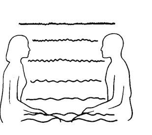
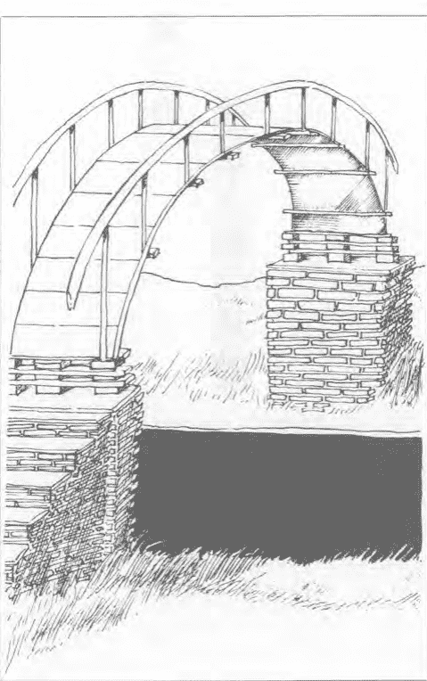
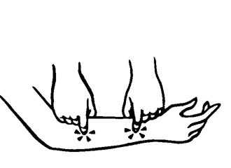
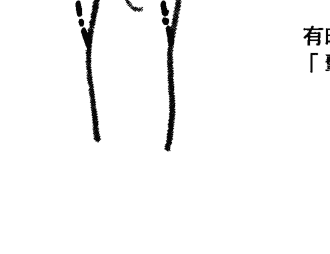
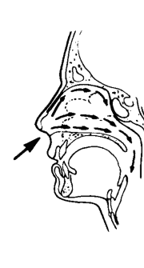
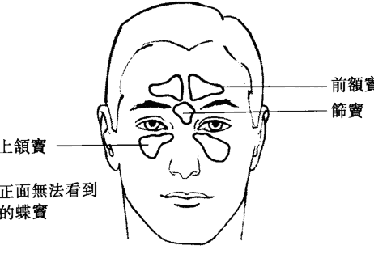
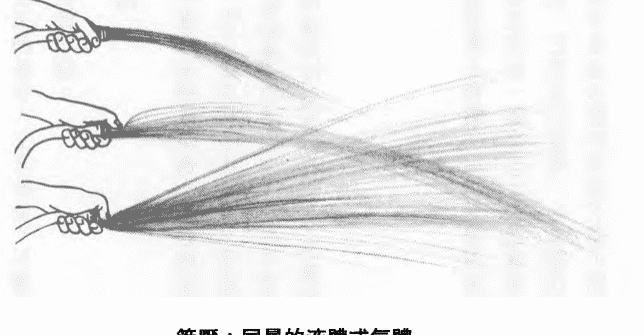

# 心桥：结合身心的能量疗法

## 出版序

人類文明的演進至二十世紀末到達了物質追求與發展的高峯，隨著寶瓶世紀的來臨，地球所處的宇宙時空中，正醞釀著另一種新文明的誕生；這股改變的浪潮，將帶領全體人類轉向精神領域的探索和提昇。過去的教育、心理學、哲學、神祕學乃至科學、宗教等，無一不是在探求生命的真相與原貌，在衆多分歧、百家爭鳴的表象下，統合萬物的真理逐漸在各個領域悄然浮現，心物一元或是身心靈的結合與昇華，成為當代世人所共同追求的理想與遠景。

於是新時代之光同時在世界上每個角落點燃，而所謂的「新時代運動」是以歐美國家為最早發端，逐漸地發展與演進，目前已成為一股強大的思想潮流，世界各地相關之集會活動、教學課程、藝文出版、音樂創作，乃至科學、醫學的新生命觀、愛護地球的環保運動等，皆屬於此新思潮的展現，它們共同的目的皆在於提昇人類的意識，回歸生命光與愛的本質，進而邁向天人合一、宇宙和平與世界大同的未來。

在台灣，新時代運動的起步較晚，然而近幾年來由於有許多先進及熱心人士用心地投入與推動，並引進各種不同的觀念活動課程，已奠定了良好的基礎。本社在此風雲際會、新時代來臨之際，自覺亦應肩負起出版者的使命，希望能將新時代的全貌完整且如實地介紹給讀者而規劃出一系列的新時代叢書；新時代的領域包含甚廣，大致可分為十二大類：包括新時代思想類、星際資訊類、光能靈療類、心靈潛能類、水晶礦石類、古文明與神秘學類、星象研究類、創造與生涯類、養生保健類、傳統心靈哲學類、兩性關係類、心靈童書類等等。針對如此浩瀚的領域，本社將有計劃地網羅各類別的好書，在此系列問世的第一、二年間，先推出其中七大類，共約四十本以饗讀者。

- A、新時代思想類：此類叢書首重闡釋新時代的生命觀、哲學觀以及意識架構，啟發我們以另一種多元整體的觀點來省察生命的真理與意涵。
- B、光能靈療類：介紹能量與光的本質，以及如何將光能運用在身心靈的治療上。
- C、心靈潛能類：透過冥想、能量的操作乃至各類心靈技巧的演練，把人類天賦的潛能予以開發。
- D、創造與生涯類：應用新時代生命觀來創造更美好與豐富的物質世界，真正將心物一元的理想落實在生活中。
- E、水晶礦石類：介紹各類礦石水晶，以及它們與身心靈的提昇及治療的關係和實踐。
- F、養生保健類：以自然而符合生命的原始法則之養生方式來增進生活品質，以健康和樂的生活作為心靈提昇的基石。
- G、星際資訊類：了解來自其他星系和文明的心靈訊息，喚醒我們內在的宇宙記憶和知識，重建天人合一的連結。

隨後數年將逐漸發展到其餘類別，希望以階段性的方式將這十二類國內外新時代的相關著作予以完整的介紹，並計劃於適當時機，與國內相關的團體、工作坊結合，舉辦各種活動及讀書會，或邀請國內外作家、專業人士舉辦座談會或相關課程，作為書籍出版之後續服務，及對讀者的回饋。

當然要圓滿達成這樣的一個書香遠景，是需要長時間的投入及努力，與各方的奧援及支持。我們願善盡出版者的責任，希望能以好書陪伴這急遽變動中的世界，邁向另一階段的躍昇，更期待新時代中的光與愛能普照全體人類和十方宇宙，讓衆生萬物都回歸到真實而喜悅的生命中。

## 總審訂簡介

胡雅沛畢業於台大政治系，於學生時代即開始探索新時代的訊息與能量研究，曾接受歐林、光的課程，和知見心理學等新時代專業課程的訓練，目前致力於星象能量和行星意識的研究。此外，經常擔任新時代各類課程現場口譯，以及光能冥想教學和個人諮商治療。

## 導讀

能量治療的歷史如同生命一樣的悠久，而一切生命皆具有能量，治療能量也被形容是生物電磁，因為這能量帶有電荷和磁場，並且似乎由人體自然產生。在人類的文明裡能量有著不同的名稱，比如中國的「氣」、印度的「普那」，在美國和加拿大則稱之為光、宇宙生命力、女神生命力等等。治療能量有三大來源，一個是個人的能量，也就是人體所產生的能量；第二種是所謂的靈通能量，這是一種集中念的力量，透過思想來導引和集中能量；第三種是心靈或神祕的能量，當你與上帝、佛、聖靈、老天或藉由祈禱來運作事物時，即是使用神祕的能量。

如果你只用前兩者，而沒有接受到那神祕能量的無限滋潤時，可能導致身心疲憊和能量的枯竭，因為這二種能量是有限的，所以要成為一名治療師並且成功的運用能量在治療工作上，必須敞開心房打開與無窮盡的生命來源連接。理想的能量治療是利用神祕的宇宙能量來進行，藉由設下意念來喚請宇宙能量，你即可提昇頻率來導引更高的宇宙能。這股宇宙能在二十世紀後期為探索生命的科學、醫學界所致力研究的方向，許多應用能量的療法與療程被開發出來，也產生了許多奇蹟般的結果，它不僅只是治癒人的身體，而是促成身心靈整體的轉變，也可說是生命體質的轉變，這是與現代一般的治療最為不同的地方。

據我所知，中國文化對能量的探索有著悠久而豐富的歷史，是足以傲世全球的，如今歐美人士企圖透過科學的方式，將這古老的寶藏詮釋成現代的語文，讓接受現代教育的人士得以進入這深奧而令人驚嘆的能量世界，這樣的努力也有所成果，而使能量治療在有心人士的研究之下，能夠以全新的面貌展現在世人面前，而逐漸與現代主流的西方醫學一同加入治療的行列，並把治療的境界提升到對心靈的關懷。

在世茂出版社所出版的這一系列好書中，對能量治療有著詳盡的說明與分析，能提供專業人士與一般讀者對此類知識的需求，由於能量治療涉及心靈的領域，有著不同心靈信仰的朋友不妨在閱讀之餘，將這些訊息整合到您的生活中，而把能量治療的原理展現得更具有創意。

Laurie Yorke（加拿大籍靈氣治療師）
一九九七年四月十日謹識於台北

## 序言

我希望藉由這本書，可以對拓展人類身體的視野作一個統整。我特別想要探索的是存在於人體中，可見和不可見組成元素間的關聯或橋樑。在《心橋》中我要表達的信念是，能量確實是存在的特殊力量，而且有其獨特的解剖學、生理學和病理學。根據經驗，我確信，一旦你親身體認並接受，這個能量就可以改變我們對自然的看法，並且在過程中，幫助我們維持健康和抵抗疾病。

我出身於一個篤信科學和醫學的家庭，並且在科學的環境中接受教育。我擁有動物學和化學學士學位，在一九一五年受訓成為整骨內外科學醫生，一九六一年得到博士學位，緊接的是十七年的實際執業。然後我對人體健康和疾病的認知卻被完全推翻和重新吸收。

有一段時間，我因為體驗新的人體觀及醫學療法，而感到自己的醫學知識完全不可靠。我說不出是哪裡不對，可是我知道一定有所解釋。六〇年代中期，在我尋找資料時，又因此探索了不同的領域，包括頭蓋整骨學、臨床催眠術及結構整合。雖然我有開放的見識和經驗，卻從未面對如此有力及深奧的衝擊，讓我無法漠視或扭曲新知來配合原有的科學觀。然而，在一九七一年，我因接觸傳統中國針灸和威司立教授的傳授，舊有的科學模式在短短兩天之內完全粉碎。我觀察到許多無法用我原有的醫學知識來解釋或成立的現象。我故有的科學基礎因此轉變成一個更開闊的宇宙觀。

我原本的醫學資訊不是不正確，只是太侷限於感官或實驗。它要求證物，要求有形的，要求普遍通則，要求事實。為符合這些要求，我被教育的每件事都忽視了生命的本能和體驗。它灌輸我們生病是一個突發事件，而不是人體自然會發生的某一個流程。它忽視無聲卻固有的能量概念，和久為東方哲學與其他醫療體系承認的天地運行。我原本以為我的醫學模式是一個完整的故事，現在才知道，這只不過是健康、宇宙和人類潛能等大主題下的一個章節而已。

因此，我重回學生身分，努力地去體驗、練習，最後終於成為能量療法的老師。我的啟蒙恩師是威司立教授。我在他的英格蘭中國針灸學院，取得針灸的執照、學士和碩士學位，之後並加入馬里蘭哥倫比亞傳統針灸協會。我曾跟隨傑克·史屈沃茲和波福·喬依，研究 Jin Shin Do 和 Shiatsu。我也學習藥學、瑜伽、太極拳和氣功。在臨床治療時，我逐漸將天地運行和能量融合於科學技術與知識中。在這個過程裡，我發現一個特殊的領域，人體的運行和構造就像風（運行）和帆（構造）一樣，合力推動帆船前進。依照這個界面的解釋，我在一九七三年將零點平衡（Zero Balancing）穴道系統編寫成一個公式，以便估算能量和構造之間的聯繫。在零點平衡會場看到的事實，讓我了解到，確實有一座位於能量和物體之間的橋，聯繫人的身體、頭腦和心靈等不同層面，讓我們可以藉此達到任一個層次。

由於對構造和能量界面的了解及經驗，我毅然離開醫學工作，投入鑽研健康和人類潛能的大領域，教授我所知的構造及能量基本原則。《心橋》就是這段過程的記錄，其中有數以千計的案例。

這不是一本使用說明書，應該說，這是一篇檢視古老能量學說和現代醫學、東方奧秘解剖學和西方人體解剖學、主觀內在經驗和客觀觀察間關聯的論文。它思索能量的自然生理和病理，以及對現代西方醫學生理常識造成的衝擊。此外，《心橋》探討國內漸起的另類療法風潮和西方醫學的關係。希望這些橋樑能夠促成彼此之間更好的溝通。

這本書中表達的想法跟概念，是一個醫生實際經驗的報告及感想。我希望藉此增加或挑戰讀者對人體能量的了解。對能量的研究和探討正快速擴展，我的目的不是要為這些信念建立一套科學理論，而是要刺激讀者回應自己的個人經驗。隨著世界的多元化，我們應該分享我們的知識，創造而不是壓抑更多的選擇。如果讀者因這本書而發現任何新的潛能或機會，那我就達到擴大對人體潛能前所未有視野的目的。

## 第一章 建立信念之橋

> 「地圖不是真的土地。」

當我們建立個人生活的時候，同時也在有意無意之間建立內在精神模式的觀感，融合為自已的一部份。通常我們稱之為「建立信念系統」。隨著年齡的增長，信念系統的模式也不斷面臨各種挑戰，為了維持生理精神與心靈的健康，我們必須成功地應付各種挑戰，同時吸收新資訊。通常大部份的經驗會和我們的模式一致，來應證以前所學的，或者幫助我們更上一層樓。這也是教育系統和文化活動的目的。然而，生活中也有一些經驗卻似乎和我們的理念背道而馳或前所未聞。遇到這些經驗時，我們可以選擇改變以前的模式以順應新訊息，或者是用已有的模式來理解它；也可以刻意忽視它，或者是假裝它根本不存在。就是藉助這些挑戰信念系統和徹底改變視野的事件，我們得以減低傳統信念的束縛。這些事件塑造我們的生命，帶來新的潛力。

這些精神模式或信念系統是處理資訊與經驗的學術理論，卻無法反映事物的真實面貌。模式不能代表事實，就好像地圖不是真的土地一樣。可是這個模式卻直接塑造我們對真實的認定，如此根深蒂固，以至於改變地圖或放棄以前信念的過程，往往是充滿疑慮和痛苦的掙扎。

## 在西方世界的東方哲學

在醫療領域中，目前面臨最大的挑戰是東方哲學的引進。西方科學傳統要求我們客觀分析外部的資料與事件，然而在東方傳統中我們卻要透過均衡、藥學及身體控制，主觀調查內部的世界。東方傳統體系對「真實」有非常不同於西方的定義——至少表面看起來是如此。菲喬夫·卡本若博士在他的書《物理之道》（The Tao of Physics）中為西方科學探究原子和次原子的物理世界寫出精闢的見解：越是深入鑽研，越是發現符合古老東方的醫療。

東方思想裡有一個關鍵是「能量」的存在。千年以來，它已經被視為確實的力量。中國人和日本人稱它為氣，印度人稱它為普那（prana）。最近西方科學史中已經有一些先鋒，如塞謬爾·哈尼、彿萊德·麥斯爾、瑞夫·李德及威爾漢·李其等人把「能量」視為醫療資源。因為這些人的方法和西方主流醫學如此不同，以至於一開始被斥為荒謬異教邪說，甚至有牢獄之災。

## 針灸止痛

西方醫學團體於一九七二年又再度面對「能量」的議題：針灸止痛。一九七二年六月十四日，我到舊金山史丹福大學參加由心靈學會和美國醫藥協會合辦，為期一天的針灸研討會。尼克森總統最近才打開中國的大門。名人詹姆斯割盲腸時，用針灸作手術後止痛。那天在史丹福有許多知名人士到台上為超過一三○○名醫護人員講解針灸的原理及操作，觀衆中瀰漫著一股浮躁及不相信的感覺。對只受過西方醫療訓練的人而言，這些訊息聽起來是如此陌生和遙不可及。

最戲劇化的時刻發生在午餐後播放動手術的影片時。在切除肝癌手術中，唯一的麻醉，是由針灸治療師在病人的兩隻耳朵和手臂各插一根針，隨時操控。還有一個病人動腦瘤切除手術時，只用一根針插在前臂。影片記錄一個又一個手術，全部都使用針灸止痛。有些針灸是由人來控制，有些是用機器放出低伏特的電流。病人全程都是清醒的，還會說話，甚至有時候還喝點水。有一個病人在手術結束時，坐在檯上和醫生及護理人員握手致意。在另一個切除甲狀腺瘤的例子，病人真的自己從手術檯上下來走到輪椅。當影片結束，燈光亮起，史丹福的大禮堂靜的就像教堂一樣。觀衆全都啞口無聲，充滿寂靜和畏懼的氣氛，大家都懷著幾近虔誠的心情。人們剛剛目睹一連串超過他們「真實模式」的事件。隨後的休息時間中，可以看到各式各樣的反應，從深深著迷到完全不信都有。一位醫生說這整個影片根本是個大騙局，是中共的宣傳花招。幸好聲譽卓越的心臟學家保羅·都德立·懷特列席隨後的座談會。他是到中國去拍攝這些手術的醫生之一，他證實觀衆在影片裡看到的全是真的。即使現在經過十數年後，已有許多人到中國親眼見證這個過程，我們仍然無法解開針灸止痛之謎。這個事實強力挑戰我們的生理及醫學模式，並且激發許多相關的研究。

## 學術界的反應

自從發現針灸止痛，世界各地的研究中心無不爭先恐後想要找出箇中奧秘。這些努力已經獲致無數相關領域的成果，包括有刺激皮層自我止痛、用電流刺激來促進組織痊癒、發現安多芬的化學合成，以及用我們體內自然產生的類嗎啡物質發展臨床止痛，擴展生理反應的非正常現象也開始受到注意。在這其中有一個看似不顯眼卻十分重要的支派，著眼於針灸止痛功能之外的治療效果。對這個療法的踴躍研究也推動東方哲學與中醫的風潮。坊間出現許多翻自東方傳統典籍或現代研究，關於針灸、草藥、醫術和武術的書籍。可看出中國文化從古到今的成就源自業餘及專業的貢獻，彼此的交流也非常頻繁。

隨著針灸資訊和研究的交流，西方醫學界逐漸肯定針灸和傳統中醫的可靠性。可是除了正在進行的研究之外，據我所知到目前為止，還沒有任何一個理論能對針灸止痛和療法的效果，提出令人滿意的解釋。

## 顯而易感的能量

針灸療法另一個難以捉摸的部份是氣，生命最主要的力量。雖然練功時可以明顯的感覺到它的存在，但尚未有人能用科學的方法證明。經由針灸與身體療法的研究，以及能量運行於人體時主客觀的感受，氣似乎確實是體內不可或缺的力量。它的運行可以用自然的通則來解釋。它或許以流動的方式運作，有特定的速度與方向，或許以波動的方式，或許是一個頻道。如果將「能量」視為自然及人體的一部份，我們的認知就會發生基本的轉變。我們就可以用更多不同的選擇和方法來了解這個充滿潛力的萬象世界。在醫學中如果採用能量的角度，例如氣，我們就可以解釋許多超出科學領域之外的現象，例如自我療癒。在心理和心靈學中，能量可以解釋瑜伽典籍的心電感應及超能力。許多明顯的現象如果不用能量的角度來看，就會變成無法解釋或違背常理。過火（fire-walking）就是一個例子。

## 過火考驗我們的信念

一九七六年在聖地牙哥的曼答拉哈力斯健康協會，伯諾奎格表演他過火的能力。約有一千人聚集在高爾夫球場，觀看他走過二十呎火熱的煤炭。主持人諾曼希利醫學博士歡迎任何在場的醫生檢查奎格先生過火前後的狀況，我就是在當場評估的醫生之一。

奎格先生是一般的中年人，稍微有點超重，穿著正式的西裝，還打了領帶。他把褲管捲到膝上，可以看到他的腿毛與一般人無異。他的腳板柔軟，沒有硬疳，溫度與觸感都很正常。

奎格告訴觀眾，他需要一些時間來準備走過這些煤炭，當他舉手就表示已經準備好要開始過火。在準備中他於火堆前來回踱步，喝了一罐可樂和吸了一些煙。大約過了半個小時，他走到麥克風前說，因為臨近公路的吵雜聲讓他很難專心，希望觀眾再等一會。又過了半個小時，他又吸了一些香煙喝了一罐可樂。奎格回到麥克風前說，他仍然無法完全沉靜下來，雖然現在他可以走過熱炭而不覺得痛，但是他的腳恐怕會燒傷起水泡。迫於觀衆開始不耐煩，他說他願意嘗試，但希利博士打斷他說，唯有在奎格自認不會受到任何傷害的情況下，才會允許他過火。這時候觀衆中有人說願意借給奎格一付耳塞，用來隔絕噪音。戴上耳塞後奎格表示很滿意，接著又開始踱步。過了幾分鐘他舉手，然後走過二十呎的熱炭。

他一走完我們馬上再檢查他一次。除了有點疲憊之外，他看來很好。腳底沾了一些灰燼，但摸起來是冷的，稍微汗濕卻完全沒有燒傷或水泡或紅腫等不適，甚至沒有改變觸感。這幾年來我也讀到或看過不少在精神恍惚或歇斯底里狀態下的過火。前幾年我得知在美國有一個團體教一般人過火，只要他們用幾小時的時間學會「克服恐懼」。然而最令我難忘的還是目睹奎格鎮定過火的非凡壯舉。我先前的經驗與精神模式都告訴過我，人類的肌膚遇到高溫就會燒傷，即使我現在發現這不一定永遠成立，但是我的大腦仍努力想要找出到底有什麼自然法則可以解釋這個可能性。我找到最接近的解釋是，假設可以藉著改變人體的波動來配合或融入炭火的波動，使得熱波實際只是通過身體而已，達到對燒傷「免疫」的效果。隔天早上奎格發表一場演說，解開他過火能力之謎，以及其他如止痛、止血、快速痊癒的能力，都是學自瑜伽大師若瑪·卡若卡的書《瑜伽哲理及東方秘術的精進》。基本的原則包括調息，學習有意識的掌控身體的自然律動。

# 能量就在日常生活中

罕見的能量操控也許挑戰我們對「常理」的認定，也暴露出個人經驗與科學分析的矛盾，但只要你稍微細想，能量的概念與體驗在我們的生活中隨手可拾，甚至反映於日常用語中。例如「我真的筋疲力盡」、「我現在處於低潮」、「我覺得神清氣爽」及「我的士氣低落」，全都和我們對能量的體驗有關。

除了能量意識之外，還有對能量直接的感應。每個人都有感應的能力，只是有些人的感應力比較強。這與接受它真的存在的程度成正比。我們可以藉著呼吸練習和掌控意念的技巧，如冥想、靜坐等來增進自己的感應力。當思慮澄靜時，身體本然微妙的韻動就會顯明。此時我們可以感受到各種體內的聲音，看到環繞人體四周的光，或者超脫到另一個空間。

奎格架起一座通往身體自律神經系統的橋，藉此修習如過火等神奇的能力。諸如此類的事實挑戰西方醫學模式的基礎。

長久以來人們一直在觀察這些看似神奇超凡的現象，既然它被記載於許多不同語文的典籍中，它的存在應該是無庸置疑的。然而隨著文化的不同，這些高人異士的信仰與能力也不盡相同，但卻有一個共通點，就是都談到一股超乎醫學常識的特殊力量。

# 身體能量的運作模式

針灸就是一個直接體驗能量的途徑。針灸時能量活躍的感覺稱為得氣，包括穴道的痛楚及全身搔癢。針灸典籍對於這點有更明確的說明，並且早在二千五百年前就精準預測到會有相對反應的穴道。這些痛楚或搔癢不是巧合而是有理可尋。

其它療法如指壓、同種療法、肢體運動與念力都和能量有關。如果你要自己修習能量，可以透過武術、瑜伽或靜坐。有人會於狂喜或瀕臨死亡的情境感受到能量，有人則是在意識轉換、入定、放空時，甚至有人是在吸毒時，更有些人在生命過程的辛酸或喜悅裡有意識的感受到它。

當我們修習身體這個微妙的部份時，一定要謹慎小心地遵照自然法規，同時也要符合我們個人的宇宙觀，還要跟得上新資訊的變化。為了實際應用在醫療上，它們要有多元性，同時也要清晰易解。以下我要講的模式都按照這些前提所設計。

# 能量運作模式：質子及波動

廣義的來說萬物都源自能量，或者以中國的說法，萬物都源自氣。然而我們需要為能量運作模式下一個精確的定義，如此才能釐清各種現象的關係。質子及波動就是其中一個重要基本定義。以光學來說，能量以質子或光波的方式呈現，並且可以自由轉換。以感官來說，我們不但可以用物體（外表和結構）、用波動（律動和振動）的方式來體驗萬物，也可以感受到兩者相交的界面。如站在強風中靠著一棵樹，或於任何律動和結構相遇的界面。

水和空氣的運動方法幫助我們了解質子和波動的關係。水和空氣都是傳遞能量波的媒介，從下列這個例子我們可以看出質子傳遞波動的效果。例如這棵生長於加州中部海岸著名的蒙特利柏樹，即使在平靜無風的日子，看起來仍像被強風吹襲的樣子（見下頁圖）。經過常年不間斷海風的吹襲，它的枝幹已生長成固定的形狀。這顆樹就是質子受波動影響的見證。

另一個較複雜的例子是海底景觀的形成。將海水看成是受強大外力主導的波動，看似亂無章法的波濤，實際卻是週期性特定方向的律動，多年以來井然有序的按照不同的溫度排列，陽光可以透過某些溫層的聯繫傳遞千里。哺乳動物如鯨魚，則經由這些管道作長距離的溝通。

任何一個水分子都直接受各種力量影響，同一時間身屬於不同的能量模式裡。加州沿海的海流繞日本與海岸線平行南進，同時大海潮汐也因月球引力不停的上下運動，海水因海岸的地形改變流向，魚類等的游動也會影響它，還有一些非生物因素如海層複雜的地貌。每一個水分子都與這些運動模型息息相關，即使我們用最先進的電腦也無法計算出這些影響的數據結果，但是大自然輕而易舉將不同物體和能量錯綜複雜的關係化成和諧流暢的系統。

蒙特利柏樹

### 追溯體內能量通道

人體中的能量運作複雜。如同大海一樣，能量在人體中可以自由游動，停留於一個層面或各自井然有序運作，不互相干擾。我們可以儲存、流通能量，或將它分流成不同的部位或強度。身體中的能量有自成一格、獨立於生理結構的系統，雖然這個系統存在肉體裡，也受肉體狀況的影響，但維繫它的力量卻是我們的思想與感情。我們可以感覺它、接受它、用內外在的力量改變它。它對人體或環境的變化都同樣敏感。人體能量有三種主要的形式：

### 背景能量場

不會停留於特定部位，遍布充滿全身的波動。它無所不在而沒有一個固定的形式。這個波動就好比身體的背景音樂。

### 垂直能量流

當能量通過時身體扮演的角色就是輸通的管道，能量自己會找到最合適舒服的部位安定下來。

### 內部能量流

這個能量會以特定的管道和路線周遊全身。

## 背景能量場

這個充滿全身的力量並無固定的形式，卻是人體內外重要的防護罩。它無時無刻都在因應體內外環境的改變，並且直接受到思想、情緒和肢體運動的影響。平緩的刺激如微波一般輕掠過，劇烈的刺激則會掀起驚濤駭浪。它就像生理變化的明鏡。然而除了鏡子的功能外，它還能反映靜態的情況。實際的關係是任何構造或波動上的變化都會互相影響。如果一個人在這場的能量低落，他就會看起來「軟趴趴」的樣子，萎靡不振毫無生氣。

### 能量運行模式

- A 無特定形體的背景能量流
- B 聯繫人類和自然的垂直能量流
- C 流通於體內的內部能量流（八字型）

# 垂直能量流

要成為一個獨立的個體，超脫物質的控制，我們必須在與自然共同運作的同時，不受其所限。這個二元性主要靠體內兩個基本能量流來維繫：一個溝通體內能量及大自然，另一個周遊全身保持我們的獨立性。

只要是正常的物體，不管是生物或非生物，在大環境中就好像天線或避雷針一樣隨時放出能量與自然溝通。因為這是與生俱有、從未間斷的過程，所以我們通常不會察覺它的存在，除非有一天它的頻率或音量發生明顯的改變。

因為我們的高新陳代謝率，及大能量環境裡的身體活動，我們實際上是進行體內及體外能量的交換。當空間中自由的能量波，通過體內各種不同密度的組織及能量場時，它就會轉換成特定形式的能量，在重回外部大環境之前，它會和體內的能量波產生微妙的交流。

當我們移動到一個新環境，就可以輕易的察覺到天線波動的效應。比如說經過紅檜林及蘋果園我們會體驗到不同的能量（見下圖）。紅檜樹高大，沒有太多枝幹，附近通常也不會有灌木叢。果園的樹則比較低矮茂盛濃密，卻沒有那麼巨大。我們在紅檜林中的感覺是，安靜舒暢或是壓迫。在果園中的感覺則是，輕鬆愉快或雜亂。確切的感覺因人而異，就像天地間遊走的能量因天線材質的差異產生不同的波動。

古人指出世界上有幾個特殊的「能量中心」，他們發現這些地方給人特別的感覺、質感及恰如其名的特別力量。有些能量中心位於地下的溪流或河道，有些在高地，特別是周圍被平原環繞。因為它們座落的位置，這些地區成為天地間重要的天線或媒介。

教堂尖塔就是一個非常有力的天線，並且在教堂內製造出強大的能量場。天主教堂中挑高的天花板更增強它的力量，就像當你從吵鬧的大街走入大教堂中的感受一樣。

身體是一個具有各種密度的電樞，器官密集的地方有較強的能量。我們全身密度最高的部份就是骨骼。即使死亡後，骨骼裡仍保有能量。一旦能量消失，便化為塵土。分子藉著能量形成骨骼，能量也因此停留在骨中。我們可以經由骨骼電樞的張力及扭力推測出一個人生前的樣子。

主要中樞流：這是最強的能量流，通過人體的頭蓋骨、脊椎、骨盤，然後由腿到地面。在骨骼系統中它垂直與地面相通，負責統合人體與自然。日本能量學稱這個脊柱能量流為主要中樞流或宇宙生命流。

第二垂直能量流：第二垂直能量流始於肩膀，到骨盆時斜向匯入宇宙生命流。

第三垂直能量流：第三垂直能量流始於肩帶，通過上臂到手指。正確的使用手臂可以增強這個能量。

垂直能量流以漏斗或漩渦狀灌入人體

### 內部能量流

能量不只流通於背部及垂直貫通人體，也以特定的管道和通路周遊在體內。這個流通於體內能量塑造我們成為獨立的個體。它由三個層面組成。

體內能量流——深層：這是三層中最深的能量流，它流通於骨與骨間狹窄的通道，自成一個獨立運行的單位。當我們行走移動時，動作帶動能量波在體內成八字形流動。理論上人體的重心位於骨盆腔中薦骨節兩側前，這只是個大概，因為當我們行走移動時，重心也不停改變。當我們踏出左腳時，會從腳部延伸出一個能量動徑，通過骨盆及重心點到右邊的肩膀及手臂。當重量轉移到右腳時，右腳同樣延伸出能量動徑，到達左邊的肩膀及手臂。當我們行走不停換兩腳，這兩股斜線交叉的力量便在體內形成八字形。若我們擺動雙手配合雙腳，就更加強這個模式。當身體重心在兩腳之間移動時，產生一系列的斜線八字形；當身體重量從膝蓋傳到腳底，會產生另一個前後的八字形。

體內能量流——中層：中層能量位於身體柔軟的組織，如肌肉、神經、血液、器官及內臟。這個層次是能量理論中首要的體系，它主導我們的能量體。和骨骼深層能量流比起來，它與個人心理、精神、情緒的需要更緊密相關。許多文化對它都發展出成熟完整的一套學問。針灸和傳統中醫便是其中之一。這是一套奠基於幾百年實際臨床經驗、歷經時間考驗、綜合詳細的療法。下面我們會談到一些與主題相關的中醫概念，如果讀者感興趣，可以再繼續自行研究。傳統中醫相信能量運行於經脈中。主要的經脈包括有十二條互相對稱的路徑及兩條成對的管（並非血管）。能量不停流通其間，二十四小時完成一個循環。十二條經脈又分為陰、陽，每一個都有對應的身體器官或功能。按照五行分門別類。

傳統中醫的五行是金、木、水、火、土。分別代表宇宙組成的基本元素，彼此互相合作協調（見後頁）。除了對照關係外，五行的相互運作正是宇宙及人體能量運行的基本法則。其中有創造和滋養的循環（生），及統治和管理的循環（剋）（見五行表）。對身體能量「隱形解剖」的研究已有幾千年的歷史，無論古今的針灸典籍裡都有詳細的描述。針灸穴道沿著經脈分佈，我們可以觸動或觀察出穴道和其它周圍組織不同的「感覺」。隨著電子測量儀器的發明，發現穴道正是人體電流阻力最低的部位，與原本針灸理論不謀而合。這個發現確定能量在針灸療法的科學可靠性。

體內能量流——表層：中醫對表層能量流的描述，正如它對中層的剖析一樣詳細清楚。衛氣位在皮膚下一股比較普通的能量。它扮演絕緣體或保護者的角色，是我們和外部環境間的緩衝，也是防衛我們抵抗氣候、濕度和外部波動變化的前線。它掌控皮膚下的汗腺及組織能量。衛氣在體內與中層有特定的交流。如果衛氣虛弱不足，邪惡的能量就會滲透過這個緩衝層，進入肌層經脈，進入主要經脈，若未能及時阻止，最後到達體內器官。

# 第一章

垂直能量流以漏斗或漩渦狀灌入人體

# 思想的轉移

思想的本質是波動。它流散於四周的環境中，直到有人將它接收並予以回應。通常我們會在一些有經驗的老師或演講者和觀衆之間的互動中感受到這種交流。空間裡的波動呈現了演說者及觀衆的情緒和想法。當演講者「啟動」後，他的垂直能量流就會大增。一旦空間裡的能量大量流通，便可以和觀衆的思考波動互相回應，直接回答觀衆心裡的想法或問題。有一個有趣的實驗是，在小教室裡凝神聚精猜想一件與主題無關的問題，看看演說者會不會提到。我曾經多次得到驗證，並且深信他確實接收到我的思考。

人的能量高速的轉換。能量流通過人體的量，比流通過其它差不多體積、重量的物體大的多。如果一個人正在做能量傳導（一般來說，比如靜坐或練功），垂直能量流和人體天線作用的結果，會產生幾股漏斗狀流，通過肩膀及頭頂。就和水急速流進溝中時出現的漏斗狀或漩渦一樣。

垂直能量流對體內能量系統有清潔的作用。當它流通過人體，會和體內原有的波動或能量交融，離開時我們就好像被洗滌過一次。這解釋了為何靜坐、冥思的人通常都比較澄明平和，超脫肉體的侷限。但也可能在能量流通過後，心緒反而更加紛亂。端視個人在當時心靈狀況而定。能夠調理肉體、真正靜心的人，便可接收到潔淨的能量流。

# 人類溝通時的能量

我們的靈光波動會根據互動的原則影響周遭的環境。我們知道，如果彈動一個音叉，然後把它放置於其它音叉之中，會讓原本靜止的音叉自己震動起來。同時也觀察到，把幾個祖父級的老古董鐘放在同一個房間，過了一段時間後，它們會有一致的鐘擺節奏。以人類來說，女性的經期會因住在一起而逐漸相同。

當人們交往時，他們的靈光場會結合，如果兩人內在能量互震的「音叉」頻率一致，就會有種投緣或契合的感覺。有些人只要見幾次面就會成為無話不談的好友，若彼此有共同的經驗或身體的接觸，會更加強互動。一般的禮儀如握手、擁抱、問候、致意，都是消除緊張、完成互動回應的方法。這裡的緊張不是平常我們講的壓力，而是指兩個能量之間的力量。好像作曲家巧妙的運用各種不同的樂器譜出合弦，進而寫出和諧的樂章。

在能量的領域中，只有一個一致性。一個人能建築他自己的靈光場或增加它的密度，造成一堵牆。任何反應都有可能出現，視兩人之間的相處模式而定。

# 建立信念之橋

在教學團體中，我發現如果於學期初先教互動之圓（手牽手圍成一個圓圈），訊息的傳遞及接收率就會大幅的增強。我有一個朋友對學校的事務委員會做過這個實驗，每次開會時都先做互動循環，結果發現工作的速度及品質都有顯著的改進。

當聽者的能量場和說者的話互動時，溝通的效果會更強。說話的人會感覺真正被「傾聽」。我們都有和別人說話，卻覺得他根本沒在聽的經驗——不是說他不了解。就算聽的人有反應，我們也會覺得所說的話未能得到共鳴，好像在對一面牆壁說話一樣。若能量得到互動，就令人感到圓滿，反之則感到疏離。與他人最好的溝通就是能量的互動。

一旦我們對他人的能量採取開放互動的態度，本身澄明和原則的把持就益發重要。

如果自己的能量是雜亂游離，很可能會被別人的能量淹沒同化。

## ◎ 有意的能量吸收

有的治療師會刻意將能量頻率調到和患者的一樣，以便吸收患者的能量進入體內，然後再描述所體驗的情形。另一個方法是，治療師透過本身的垂直能量流和患者的能量接觸，以便「探知」患者的情況，而不需親身去「體驗」。

## ◎ 無意的能量吸收

## 能量緩衝

在我執業時，曾有一個時期，在未事先得到患者資料的情況下，一走進房內，身體就自動吸收患者能量，在他不舒服的地方也痛了起來。這個發現使我更確定能量的互動和轉移。也使我了解，對忙碌的醫療執業者而言，這並非是恰當的溝通方式。

有幾種降低能量互動及吸收的方法。先決條件是，了解反應的對象是波動，並認知我們有緩衝及抵抗的能力。藉由對能量流通的了解，我們可以將靈光場密度改為絕緣體，保護我們免於他人能量的干擾。醫學博士布福喬伊建議，想像創造一個蛹圍繞四周。就像毛毛蟲在蛻變成蝴蝶時，用蛹來保護自己一樣。當我們對抗不良的或有害的能量時，可以想像自己被白光或有益的和諧波動圍繞，創造能量的蛹。只要經過幾個月的練習，每天在早晨想像一次，就可以整天保護我們免於不和諧能量的侵擾。

有時我們會需要較強的緩衝。想像面前有一堵巨大的能量牆，我們可以經由改變行為，或拒絕濫情和軟弱成為更理性和獨立，來收縮能量場。如果我們已牽扯入他人的痛苦或情緒，可以用下列方法來斬斷。想想我們和他人之間的不同點，這方法通常很快奏效。例如：她是女的，我是男的。她是黑髮，我是金髮。他沒戴眼鏡，我有。他穿藍的，我穿綠的。這些都很有用。任何差異都可幫助能量分離。通常在想出四、五個差異點之前，不良的能量互動就會消失或大幅降低。

## 建立信念之橋

### 物體暫存能量

如果我們相信能量的存在及運行，就能解釋護身符等具有神奇力量的物體。當能量從人體釋出後，會游動在四周的空間中，或附存於周圍的物體裡。釋出的能量越強大純淨，就能附存在越多物體裡。有一個說法是，世界公認的頂尖藝術作品，可能在被創作時吸收了藝術家的能量，而且不斷地和觀賞者的能量互動。

### 能量模式總結

以科學的角度來說，能量以分子或波動的形式存在。以醫學的角度來說，分子就是生理結構，波動就是能量流。體內的各種波動集結成能量體。有一個總合的能量遍佈全身，主管我們的思想及感情。它能超越我們的肉體，圍繞四周。有如大洋中流動的海潮，這個總合的能量又因體內外各種力量的影響，分成好幾股流向，產生各種波動。聯繫個人及宇宙，並同時支持我們獨立運作。

垂直能量流通過人體及統合內外在環境。它根據避雷針的原理運行，聚集在人體中密度最大的骨骼裡。

在體內運行，支持我們成為獨立個體的能量可分成三個層面。最深層以八字形流通於骨骼中，並因走路等肢體運動更加強。流通在身體柔軟組織裡的中層能量流，在中國傳統醫學裡有詳細的介紹。中層能量流通的路徑常跟隨體內的肌絡而行，掌控我們臉部的運動，並因人體柔軟組織的運動而加強。我們的精神、心理、情緒等功能都與中層能量流密切相關。衛氣是最表層的能量流，流通全身皮下。由皮下組織的運動主導，擔任防衛的功能。在接下來的章節，我們將由瑜伽的觀點來探討這個能量模式（主要中樞垂直能量流）。也要討論分子及波動之間的關係。

## 第二章

### 東方瑜伽術及西方解剖學之橋

今日的科學新發現引導我們重新檢視昔日的能量理念。

有一次在零點平衡的課程裡，當我在講解骨質解剖及一般的脊椎弧度時，突然間想到：當能量流通過脊椎時——同我相信的——於明顯彎曲的地方產生能量渦動。在我研究骨骼摹擬渦動時，想起以前看到一張瑜伽修行者冥想時體內脊椎脈輪的圖象，當下我立刻確定脈輪真的存在。它們不只是古代宗教體系的抽象圖徽，它們實際上和人體骨骼構造及生理法則配合無間。

依據東方瑜伽術，有幾個主要的能量中心（或稱為脈輪）沿著人體的脊椎分布。脈輪字面的解釋是輪子，古老瑜伽典籍視它們為人體的能量中心。有些修行者說這些能量中心點只是一個比喻，便於描述個人的冥想體驗；也有一些人，如高彼·克里辛那，相信它們確實和個人的修習有關。那時我尚未找到證明能量中心存在的證據，但內心卻毫無懷疑。之後在我的冥想過程中，脊椎產生的熱能搔癢感及學會用手控制能量流更進一步證明能量中心。

我到現在還深深記著，將這個能量失落的一角重新放回原位的滿足感及輕鬆感，這個至今仍被視為抽象理論的脈輪，因和我從西方醫學得到的訊息符合不悖，對我而言早已是鐵的事實。能量的渦動配合脊椎的弧度，不但流傳幾世紀之久的瑜伽冥想可以用人體證明，並且以我對骨骼及能量運行法則的研究，都支持我們推斷人體生理解剖和脈輪能量之間的關係。

## 七個主要脈輪

| 脈輪編號 | 名稱 |
| :--- | :--- |
| 脈輪7 | 頂輪 |
| 脈輪6 | 眉心輪/第三眼 |
| 脈輪5 | 喉輪 |
| 脈輪4 | 心輪 |
| 脈輪3 | 胃輪/太陽神經叢 |
| 脈輪2 | 臍輪 |
| 脈輪1 | 海底輪 |

## 脊椎對脈輪的關係

能量流動及脈輪的存在也許很難用現在科學來證明，可是在古代，卻已記載了許多體內能量及天地能量的共通點。為了說明能量運行原則和體內脈輪的結構，我們將它比喻成河流，當河流流經一個彎度，能量和河彎撞擊形成一個漩渦。

在第一章裡我提到脊椎如何扮演天線和避雷針的角色，傳導能量從頭到脊椎、骨盤、雙腿，最後由腳底垂直流通人體。當能量流到脊椎就會遇到彎度，流到脊椎的能量就像河水，脊椎的彎度就像河彎。脈輪的渦動就像水流經過河彎時產生的漩渦。

能量不只受到脊椎弧度的影響，理論上來說也應該受到脊椎的面積、重量與脊椎弧度的直徑以及骨盆和胸腔組成的影響；而物體的大小及密度關係著它所能承受的能量，也就是說密度高的物體能承受強大的能量。一般的情形是脊椎會從上到下逐漸增大。從精巧的第一、二節頸椎到底端大型的骶骼關節，除了四個位於骨盆之下的小尾骨之外，每一節脊椎的體積都在增大。

### 尾骨及第一脈輪

當能量流經尾骨的彎度，碰到脊椎骨體積的驟減及彎曲的角度，能量尖端就產生擴散，第一個脈輪散布為完整網狀能量，充滿骨盆腔並和第二個脈輪部份重疊。第一脈輪鬆散的能量接著流過骨盆、雙腿，最後到達地面，完成體內天氣能量的落實。

在能量流從第一個脈輪經過長距離到達骨盆及地面的過程中，尾骨扮演一個很重要的角色。尾骨的骨骼面積及彎曲角度的縮小，就像動力減壓汽門一樣，使能量前端分散，降低密度及強度。如此它便能輕易的通過骨盆到雙腿，最後抵達地面。

### 薦骨關節及第二脈輪

身體重力中心——理論上來講，身體的重力中心位於第二薦骨節前端兩吋處。能量上它和第一脈輪中心緊密相關，解剖學上它卻較靠近薦骨關節，因為我們的身體重心離地面很高，所以我們有極佳的行動力及靈活度。基於相同的理由，我們的穩定度也不高，特別是靜止站立的姿勢。我們通到地面的能量愈強，身體各部份的穩定度也愈高，這個強度的關鍵在於精巧的尾骨動力減壓。如果第一脈輪位於一個大型骨塊，而第二脈輪位於結實的薦骨關節，要主導能量就會愈形困難，經過長距離通到地面的能量會更顯得不穩定。

第一脈輪擴散的能量部份重疊於第二脈輪緊密的能量。這個現象證明脈輪系統的相關觀察。摩佗亞瑪在脈輪的學說裡提到，因為第三脈輪不停往上能量作用力的影響，導致第一脈輪和第二脈輪之間產生相互的能量流。每一個脈輪都會因為擴散而在周邊與緊鄰的脈輪交錯，然而因為尾骨和薦骨關節間特殊的骨骼關聯，產生了第一脈輪和第二脈輪大面積的重疊。

和第二十一脈輪交疊的第二脈輪，穩穩的座落於薦骨關節，也就是脊椎中最結實的骨節。

### 腰椎及第三脈輪

第三脈輪是由五個組成腰椎的厚重關節所支持。這個腰椎的弧度正好位於肚臍的對面,當然我們都知道肚臍是我們在母體時所有能量的來源。第三脈輪特別與我們個人力量及能量控制有關。

在脊椎四個承受體重的弧度中,腰椎及頸椎不同於薦骨關節和胸椎的是,它們没有其它骨骼的支持系統幫它們承受重量。（薦骨關節實際上是由五個小脊椎關節合組成一個單一大型的骨塊）,這個位置加上薦骨關節的大弧度,造就第二脈輪為最密實的脊柱能量點,這個能量和性能力有關。照拙火瑜伽術的說法,這個脈輪的能量在脊椎中直線往上,加強能量中心上部的功能。

### 胸椎及第四脈輪

心輪也就是第四個能量點，座落於胸腔，和長形的胸椎結合。這個長形的弧度使得能量流擴展的面積比第二和第三脈輪更大。相似於骨盆腔及頭顱能量的擴散，胸腔提舉的動作更加大第四脈輪擴展的區域。

鬆散的第四脈輪和肩胛、上肢結合，從幾種瑜伽體位法都反映出，我們可以利用雙手及雙臂的能量和第四脈輪配合。

### 頸椎和第五脈輪

位於頸部的第五脈輪是由脊椎中最具機脊椎關節凌空站立的特質得自於個人運用腰椎（第三脈輪），及頸部一帶（第五脈輪）的能力。分別稱為「個人力量」及「個人創造力」。

### 額頭和第六脈輪

一般稱第六脈輪為第三眼，它與我們的前額有關，並和直覺結合。碗狀的頭蓋骨加大能量點的擴散。有些瑜伽修行者將意志力集中於頭蓋骨後部，從裡到外通過前額「透視」脈輪，就像我們用第三眼直接從腦部「透視」。

### 頭蓋頂端及第七脈輪

第七脈輪位於頭蓋頂端，也就是宇宙生命能量流最先進入人體的地方。

有些瑜伽修行者集中意志於頭蓋骨後部，通過第六輪，到達前額。

## 脈輪的能量是感官與心靈世界的橋樑

在印度系統中,脈輪理論源自於東方對宇宙靈魂的信仰,主張個體的靈魂藉此維繫。如果一個人能夠超越及克服幻象就可以達到天人合一。照瑜伽術的說法幻象就是我們日常認知的一切:受限於時空的感官世界。在瑜伽術中一個人可以修練到無意識的狀態,融合時間與空間的無重力狀態。在此主觀及客觀,智者、知識和已知,都合而為一。

在瑜伽系統中有許多不同的體系,他們相同的宗旨是要追求物體以及精神的純淨,學習思想集中、呼吸控制以及精神寧靜來體驗內在的意志。

瑜伽思想的中心是能量或稱普那,普那是充滿於每種東西、每個地方的宇宙能量,它存在於各個形式的物質,可是它不是物質,它是給予物質生命的能量來源。舉例來說,它是賦予各種動物及植物活力的生命泉源。普那可以轉換各種形式,以科學名詞來說就是能量的轉換:重力、電力、體力、思考以及所有的神經運作形式。普那存在於空氣中,可是它不是氧氣或者是任何化學元素;它也存在於食物及飲水中,可是它不是卡路里或者是營養素。

個人可以修行許多方法來引導這個力量,其中一個方法稱為pranayama,也就是控制呼吸。其它的方法包括瑜伽體位法,或者是身體姿勢、精神集中、冥想、內省、誦經、凝想以及齋戒。

隨著瑜伽修行者修練更高的普那,或者是體驗它在體內存在的能力,更多的可能性也隨之產生。普那可以被儲存或者是從體內釋放,可以從一個人轉換到另一個人,也可以隔著遙遠的距離傳送。西方學術界研究一些瑜伽修行者的結果是:這些瑜伽修行者展示了控制自律系統的能力。控制體內自律系統包括心跳、血壓、腸蠕動、止痛,以及自我療癒的高度能力。

呼吸練習法能力,例如千里眼、隔空移物、心電感應,稱之為siddhis。它們通常是呼吸控制及催化脊柱脈輪的成果。瑜伽修行者對siddhis能力都採取謹慎小心的態度，以免被誤導。瑜伽修行的目的不是要得到任何特異功能，而是要追求一個最高境界——超脫感官及二元的世界，融入宇宙靈魂。

## 瑜伽觀點的人體

瑜伽修行者認為人體是由三個部份所組成，和西方文化中普遍的肉體、心理、心靈三個觀念相似。這三個部分是生理（肉體）、心理（或「細微」體）以及心靈（或「因果」體）。換句話說，生命活力又分成三個部分，存在於非靈性的物質就是肉體；能量運作也就是情緒或者是心理，為細微體；宇宙智慧，就是因果體。

肉體——根據這個理論，肉體本身是不具備元氣或精神的，它由肌肉血液以及骨骼組成。

細微體——包含生命活力最重要的精神，因為它會隨著肉體的輪廓及活動來變化，所以它本身不具有任何的形式，跟實在的肉體相比之下，「細微」體顯得較不穩定。它能夠很快的適應人體的生理、心理及情緒狀態。它隨時和外在環境變化相呼應，例如早晚、春夏秋冬、月亮的陰晴圓缺和氣溫氣壓的改變。細微體的變化會直接影響肉體，可是由於後者的高密度，因此這個過程是緩慢進行的。

因果體——這第三個體稱之為因果體或心靈體，包含了天地精華、宇宙智慧、直覺知識。它是聯繫我們與外在宇宙的力量。

在瑜伽術的模式中，能量經由幾千個不同大小被稱為氣脈（nadi）的管道通行於細微體裡，這一些氣脈在體內穿梭編織成一個網狀，溝通各種能量，它們源自於肚臍，通常跟隨著脈搏及神經而行。當我們出生時，因為必須要和母體分離，在體內產生了一個巨大的轉變，突然之間我們必須呼吸才能得到氧氣，吃飯才能得到養分。可是在分娩過程後肚臍繼續扮演著更高能量的動力中心，一直都是氣脈的來源點。

sushumna——在體內的許多氣脈中有三個是最重要的，它們分別是 sushumna、ida 和 pingala，它們都起源於脊椎底部的尾骨和會陰區。sushumna 以有如衛星繞著脊椎運行，通常它的尾端是閉合的，並且儲具著巨大的潛力能量。瑜伽修行者描述這個能量以三又二分之一個彎纏繞成一個盤狀，通常稱為拙火，或者是蛇狀能量。

左脈和右脈——左脈和右脈分別位於脊椎的兩邊，可想而知左脈位於左邊，右脈位於右邊。左脈中的真氣是一股清涼的力量，平緩及調息身體內臟的活動，並且和精神與心理活動有關，它是屬於太陰的能量。右脈中的真氣正好相反，它是火熱的刺激身體的內臟，控制器官的活動，它是屬於太陽的能量。

這兩股氣流都緣起於脊椎底部再往上通過肚臍最後到達前額的眉心。有些瑜伽典籍，左脈和右脈是以平行的方式進行於脊椎的兩邊，一直到達最後的目的地。有些則說這兩股氣流是以螺旋狀的方式沿著脊椎上升，最後抵達前額。西方醫學原理中的彈性原則，和左脈及右脈能量流有共通之處。根據彈性原則，當一個物體彎曲超過某一個角度時，就會產生一個循環，而當這個循環通過彎度，就會產生側彎。所以在體內因為自然的脊椎彎度，當我們做出側彎的動作時，就會在脊椎內產生一個循環。如果我們做出旋轉脊椎的動作就會產生側彎的動作，然而當我們前後仰時，並沒有旋轉脊椎，所以脊椎內不會產生循環，這只是一個單純的動作而已。

根據生理原則，我們日常生活的動作或行走都是連貫的側彎或循環，它會刺激脊椎雙邊兩股能量交叉往上升，這個說法和左脈右脈的波動模式非常的類似。可是當我們處於休息的狀態，或者是做出前後的動作時能量上升的路線並不會交叉，而是沿著脊椎平行前進，和瑜伽經典描述的左脈右脈沿著脊椎平行前進一模一樣。我們從左脈和右脈的運行模式可以清楚的瞭解到，身體的動作如何造成體內能量的流通。

## 身體能量的覺醒

脊椎內由下往上的能量流會刺激脈輪的運作。在個人的成長過程中有一個逆向的能量流由下往上的運行，它啟動脈輪的運作。一般來說，在人的一生中這個能量流不停的從第一個脈輪往上流通到第七個脈輪，然而幾百年以來，我們發現到許多特別的方法來阻止這個逆向的能量刺激能量中心，並且加速個人的成長。這種特別的方法就是一些所謂的密法。譬如說魔術、煉金術、巫術以及超能力。在瑜伽的學理中拙火的覺醒和sushumna 的開發正是加速運行的基本法。位於脊椎底部並且以三又二分之一圈蛇狀盤繞的拙火裡蘊藏著許多的能量，當這個能量被啟動並且喚醒時，它就會瀰漫在sushumna 的通道裡。這個往上移動的能量流刺激著脊椎中的主要中心，也就是脈輪。瑜伽修行通常會花許多的時間和精力來修練推動脈輪的能量，如果這個能量真的進入脈輪，就會增加許多動力來加速脈輪的滾動，擴大能量漩渦的半徑，刺激並且加強所有的功能，包括身體、心理、精神的層面，這些波動遍佈全身。覺醒的能量波因此不僅影響到脊椎能量中心，也遍佈瀰漫於整個人體。喚醒加速能量運作的方法有許多種，有些是自發性的。它也能通過大師的教導、接觸或影響而達到。其他如靜坐冥想也都可以達到同樣的目的。

如何統一左脈右脈就是一個特別的方法。左脈和右脈分別位於脊椎的兩邊，他們是均衡的勢力，並且各自聯繫著肉體及精神。可是一旦我們將這兩股能量從脊椎底端融合，拙火就會被啟動，而sushuma的通道就會開放。這個能量由下往上通過中央，一旦這個通道被打通，七個主要的脈輪就可以暢通無阻自由傳送。瑜伽修行者稱這個境界是超越時空的侷限，並且和宇宙靈魂融合為一。

以下我們就來看看瑜伽修行者眼中的脈輪究竟是何種風貌，以及對每個脈輪做簡略的演化功能介紹。

## 第一脈輪

第一脈輪是所有脈輪的根基，它的生理位置位於脊椎底部的會陰（介於肛門及生殖器間的區域）並和尾骨及薦骨神經叢相關。我們人體的基本功能及個人的安全感、自我尊嚴、自我價值都根繫於此。它主要是提供個人生存的基本需求及能力，例如吃飯、睡覺以及各種感官官的需求。拙火所謂以蛇狀盤繞的能量也位於這個脈輪中。

喬瑟夫·坎培爾在他的書《密法印象》中說許多人將拙火比喻成龍。據熟知龍的人告訴我們說，龍有一個儲藏和守衛東西的癖好，而牠們最喜歡的東西就是珠寶及美女。牠們自己不能夠享用，可是卻堅持守衛這些東西的價值，對世人及對牠們來說，都是無法衡量的。同樣的道理拙火蛇後也有一個巨大的力量，可是卻沈睡著。它無法和自己掌握的生命之樂溝通，卻也沒有辦法鬆手放開。它的態度是固執的：我就是要在這裡。對於瑜伽修行者的第一個任務，就是必須要打破蛇后所謂的大門，釋放其中的珍藏，也就是它自己的能量，上升到高層的部位。藉此蛇后可以成為瑜伽修行者的精神導師，並且帶

## 第二脈輪

第二脈輪位於薦骨，梵文的翻譯是「她的領域」或是「特別的領域」，這個脈輪關係著人體的腎臟生殖腺以及性能力，和攝護腺神經叢相連。它儲藏著人體與生俱來的能量及部份的潛在能力。如果一個人專注地修練這個脈輪，就會大幅地提昇他的感官能力及性能力。他著眼的每一件事情也都會從這個觀點來出發。對拙火的昇華而言這個脈輪強大的能力扮演的是一個阻礙的力量。

印度的哲理相信萬事萬物都起源及啟動於性輪。如果我們能夠將它提昇到某個境界，就可以幫助個人的創造力及成長。雖然說這個脈輪的主要作用是生殖，可是它卻具有啟動較高能量中心的潛力。

全世界的宗教，無論東方或西方，都同樣強調性能力，也就是第二脈輪的力量。一派主張要禁欲守貞，將所有性欲的力量都儲藏在體內，以便昇華成更高的力量。相反的譚崔瑜伽宗派卻公然的鼓吹性行為，指示信徒利用性行為達到天人合一的境界。在這兩個截然不同的理念中，第二脈輪都被用來作為個人能力及精神層次的進階，目的是希望領他到一個長生不老的極樂境界。

## 第三脈輪

第三脈輪是寶蓮或光彩珠寶之城。它位於肚臍的後方，聯繫著太陽神經叢，並且是消化的中心。它是個人力量的中心點，在出生前，我們依賴臍帶從母體獲得各種能量以便成長。如果一個人受到第三脈輪的驅動，他就會有強烈的競爭心、征服欲，想要控制整個狀況，膨脹自己的重要性。以性能力來說，這個脈輪的力量是一種征服的、復仇的控制欲。

## 第四脈輪

第四脈輪位於胸腔，它和胸腺聯繫，也是兩股沿著脊椎上升能量的交會點。對位於它以下的三個脈輪而言，它代表著一個主要的轉運站，原名的意思是暢通無阻、所向無敵、屹立不敗的。這個脈輪關係著人體的協調性，以及最基本的自由意志。它以下的三個脈輪都只掌控人體的生理能力，但從第四脈輪起，我們開始進入精神的層次。我們在第四脈輪中可以發現到同情心、歸屬感及無條件的愛。如果我們不用與別人競爭和比達到和諧的境界，及和宇宙靈魂更深更親密的關係。

## 第五脈輪

第五脈輪位於喉嚨，和甲狀腺相關。它原名的意思是純淨。主掌我們的營養、吸收及個人創造力。在心輪中的同情心及無條件的愛，都和給予或其他人有關，喉輪的能力是接受、承認以及真誠的關懷。在密法中這就是接受、榮耀以及智慧，並且得到內在浩瀚無邊的資源。這個脈輪主導個人的藝術能力、聲音美妙、教導技巧、書寫以及表達我較，並且充滿了滿足感及充實感，我們就會有同情心。心中的感覺是喜悅及歡樂的是，一種不虞匱乏的充足感。心輪掌控我們感動的感覺以及隔空取物的能力。

根據坎培爾的說法，我們的心是一個可以聽到美妙樂聲的地方，可是這個樂聲卻不是由任何的物體撞擊產生的。唯一不需要由兩個物體撞擊產生的聲音，是我們個人的創造力及宇宙結合的聲音。是我們內在沈澱的聲音。

如果拙火能量能夠突破第三脈輪到達第四脈輪，在人體內就會產生一個巨大的轉變。書本上所謂的天人合一將會變成真實的體驗。我們不再感到疏離及被排斥，我們可以和周遭的社會及生活環境充分的配合，在處理各種事情上也能從小我的觀點提升到大我的境界。

## 第六脈輪

們真實自我的創造力。它和第二脈輪的創造力有一個特別的關係：分別是個人的創造力及宇宙空間的創造力。為了要達到接受、滋養以及創造表達，瑜伽修行者努力地澄靜他的思慮，去體驗神真正的聲音，這種澄靜的體驗可以提昇我們的洞察力，並且讓我們具有長期不飲不食的能力。

第六脈輪位於頭蓋骨中，它的生理位置是在前額的兩眉中心，和松果腺相連。原名的翻譯是控制。在西方世界中稱之為第三眼，它主導我們的直覺以及進一步的心電感應能力。在瑜伽及生理結構中提到開啟第三眼，即意味著統合左右腦，協調左腦的判斷力及右腦的描述力，將偏執的、自以為是的觀點昇華至圓融的、面面俱到的境界。以瑜伽的宇宙觀來說，這個脈輪正是左脈跟右脈匯合的地方，它成為一個單一的力量延續到頭部頂端的第七脈輪。

在第一脈輪和第六脈輪間的左脈和右脈是一個直接的關聯。根據瑜伽典籍的說法，如果我們在開發其他較低的脈輪之前，先直接修練眉心輪，釋放的能量可以刺激較有效率的能量修練。

## 第七脈輪

在密法傳統中，如果我們要開啟第六脈輪，需要三摩地(samadhi)，也就是一個高層的冥想境界，超越時空和因果輪迴。雖然我們無法精確的描述這個境界，可是它大致的輪廓是對自己有完美的自信心，體認自己身為宇宙的一部份，不評斷別人，生活於當下。除此之外，哈瑪柯西納提到：「每次我嘗試去描述我所經歷的感覺，去思索我究竟見證到什麼樣的感覺；我的思考急速的昇華，快到無法言喻。我感覺到處於超我的境界，我看到一面如鏡子般澄明的螢幕。我與我的超我是如此的接近，以至於我整個人都融入其中。我就是我的超我。」

第七脈輪的原文是「千瓣蓮花」。它聯繫著人體的腦下腺及中央內分泌腺，從眉心輪往上升的能量，部份會灌入第七脈輪，部份則回流到肉體、細微體以及因果體之中。

在拙火發展的過程裡，意識的最高境界是存在於千瓣蓮花中，你我之間的界線消失了，見者與所見之物也融合為一，這是真正的三摩地。

## 純潔肉身及瑜伽淨行（kriyas）

根據傳統，一位潛心進修的瑜伽修行者必須經年累月的站在他的修行之處，直到他感受到能量的靈光喚醒及點燃潛在的能量。這一段長時間的苦行，目的是為了要純淨肉身。所以當能量在體內運行時，不會導致傷害、疾病或走火入魔。在瑜伽典籍中，這一段修行是一個神聖的過程，不具有任何危險，可是每個人都需要一位有經驗的導師加以指引。

在啟動身體、心理、情緒裡強大的微細能量時，我們體內建設的及破壞的力量也產生正面的衝突。通常人們在這過程中會有瑜伽淨行現象。瑜伽淨行是當能量通過人體厚實或充血的部份時，自動產生的反應。這個現象可大可小，也許是暫時的、持續的或者是週期性的。它也可能產生於任何部位、精神層次以及意識之中，通常它出現的模式是不由自主的痙攣或抽搐、牙齒打顫或眼皮亂跳，以及身體部位自發性的抖動。

我第一次看到瑜伽淨行的現象是在一次冥想的機會中。一個男人躺在地上，從我的專業知識來看，他應該是癲癇發作，我趕緊過去，想要對他急救。這時候一位有經驗的修行者走過來，冷靜地撫摸他的雙腳，很快地他的癲癇情況逐漸的平緩，並且恢復正常意識；更令我驚訝的是，與他交談之後，我發現對他而言，這不但不是一個恐怖的經驗，反而充滿了喜悅與滿足，隨後還有一股平靜祥和的感覺。我的醫學模式又再一次的受到震撼，我也在想，不知道有多少瑜伽淨行的過程都被誤診為癲癇。

瑜伽淨行也可以呼吸模式、聲音、手部姿勢或者是跳舞來呈現，各種不同肢體表現的目的有助於開放特定的能量中心並且是冥想情境的體現。

同樣的瑜伽淨行也會以情緒的爆發、不由自主的哭泣、一段時間沮喪難過的方式來呈現，他們可能會無意識的說出一些話或自動寫出一些字，任何的反應都有可能。它決定於體內自然的抵抗力和修練的能量衝突時的模式。曾有一些極端的案例是，當這些情況發生，現場卻沒有一位有經驗的大師，造成了致命的毀滅。但絕大部份的瑜伽淨行都是非常安全。目的是藉著持續瑜伽練習冥想，以及純淨儀式來淨化求道者的身體和神經系統，以便承受更高意識狀態的能量。

## 脈輪及人類發展理論

在一般没有被刺激唤醒的脉轮情况下，人类通常会以一个七年一周期的过程缓慢的成长。第一脉轮处理我们的自我价值以及生存技巧。我们在青少年时期进入第二脉轮，也就是性轮。在青少年后期重心转移到第三脉轮，个人意识及个人力量都巨幅的增加，感到有能力可以征服整个世界。随著向第三脉轮的迈进，独占感、控制欲，以及竞争力都扮演了一个重要的角色。

当我们开始在生活中发展出和他人的亲密关系，譬如结婚或生育子女时，一股关爱他人胜于自己的热情以及无条件的爱就会从第四脉轮油然而生。经过一段时间之后，我们愈显成熟及充满经验、拥有智慧，开始扮演起老师的角色。此时也就是我们迈入第五脉轮的鼓励及圆融的创造力的阶段。当我们再老一点，通常便会开始思考宗教问题，想到死亡的可能性，也就达到第六脉轮及第七脉轮的阶段。

以上是各个脉轮在我们成长阶段的程序。所有的脉轮在人的一生之中都是不停的在运作者，每一个脉轮从我们出生到死亡从未间断地持续运作，只是随著人生不同阶段的成长，各个脈輪依序分別扮演主導者的角色。

## 知覺的智慧

我們可以將貫穿人生的能量過程看成是一個螺旋梯。這個階梯總共有七個螺旋，當我們逐漸向上攀爬時，我們也在七個不同角度的螺旋中，面對到各個角度的人生歷練及智慧。舉例說在青少年時當性能力逐漸啟蒙，我們站在第二脈輪角度的螺旋中，看到的是性能力、生存力、個人的能力、衝動的热情。我們不停的藉由溝通個人及家庭、父母、朋友之間的關係來建構自己的歷史。當我們在人生的螺旋梯上往上爬時，對於同樣的問題、同樣的事情，隨著我們所站的位置改變，就產生了不同的解決之道。你是否經常感覺到自己在處理著多年前就應該解決的問題呢？

## 觀想

我們可以藉由觀想有意識的開放不同的脈輪之窗，改變自己的行為。譬如憤怒（第三脈輪）是一個基本的情緒。如果我們陷入這個情緒，有幾種方法來處理它。我們可以直接的表達，我們可以將這一股怨恨之氣轉變成暴力，我們也可以將它壓抑下來，雖然一般來說這不是一個健康的處理方法。我們可以選擇將這股源自第三脈輪的能量提昇到另外的脈輪層次，用另一個模式來表現。舉例來說，我經常在心裡想像這股能量從我的第三脈輪升到第四脈輪，讓這個憤怒或沮喪的波動轉化為同情或同理心。

在最近的一個研討會中，我們要求每對夫妻分別盤腿而坐，面對對方，利用觀想溝通彼此的脈輪能量。其中有一個練習是當能量中心聯繫完成時，他們必須要專注的感覺它，全心的接納它，並且要有意識的體驗和另一個人溝通時的感覺，接著他們要切斷這個聯繫回頭重整自己的能量區域。我們從事後的討論分享中得知大部份的人都可以感覺到能量中心的聯繫，甚至有些人可以區分出不同的等級。每個人都有了一種和他人融合的感覺。有趣的是有一對在他們的關係中飽受無名壓力困擾的夫婦，成功的溝通每個能量中心，唯獨無法聯繫第三脈輪。在處理第三脈輪問題的過程中，他們發覺到了壓力的核心，也看到了解之道。

## 現代社會的影響

因為現在高度發展的社會，我們都受到長期巨大能量場的影響，它不但不能幫助我們，反而會影響通過我們細微體的能量。此外由於迷幻藥的浮濫，以及各種密法知識的普遍，意味著昔日溫和漸進的深層能量中心啟發模式已經在逐漸的式微之中。結果是由許多人在有意無意之中超快速地身體能量不同階層的成熟度，對於這個現象我們只能說好壞參半。

最主要的缺點是它會造成肉體、心理及精神層次的衝突。這些衝突在我們的日常生活或身邊的人隨處可見。幸好我們也有許多團體提供諮詢及專業的服務，透過個人的經驗及學術研究，愈來愈多人開始意識到這些深層能量的轉移，並且學習著扮演一個指導者或老師，在這個困難的轉移過程中，提供他人援助。因為現代社會快速的變遷和我們與大自然韻律不停疏遠的距離，我相信在未來我們將會看到許多從未發生過的瑜伽淨化現象。加速發展這些能量的好處是，發覺出新的潛能；如果脈輪的開發是人生一股無法抗拒的力量，如果這個人生的螺旋梯是通往更高更深的智慧，那麼人們接收到日益增加的資訊將是一個非常有利的情況。社會中各種不同的能量都是我們用來增加自己能力的利器，如果我們能夠學到使用健康且正確的方式，就會驚訝的發現到，運用今日高科技的社會資源結合昔日古老的知識系統，將是創造一個美麗世界的催化劑。

## 第三章

### 能量之橋的基礎

## 能量之橋的基礎

> 科學和宗教之間的分界並非永恆不變……今日主流科學家所堅持的嚴苛、不人性的科學觀點，經過若干年之後，可能只成為過時的看法。
>
> ——威廉·詹姆斯

對習慣於現代科學方法的人而言，用能量作為臨床治療方法似乎非常難以接受，就像現代物理學中的許多現象，它必須要對其它的現象或周圍環境做出影響，才可看出其存在，我們無法光用肉眼來檢視它。舉例來說，雖然我們不能用肉眼看到電，可是當燈泡亮起或機器開始運轉時，我們就可以確定它的存在，我們體驗能量的存在就像我們體驗其它的现象，雖然他們無法用肉眼看見或測量。

當人們首次體驗到能量的運作情況以及平衡時，許多人對於這種超乎肉體的感應，都會採取懷疑的態度。他們會想「我真的有感覺到嗎?」、「這件事真的發生了嗎?」或者是「這是我的想像」。一個初學者首次學習運作能量時，最好是處在於一個充滿支持的環境中，譬如有同好的協助及心理上的支援，若沒有和曾經經歷過同樣體驗的人一同討論個人的體驗，很可能遭到強烈的質疑。例如，如果有一個學生相信他看到了光，他把這個經驗提出來和從未看過光或不相信光存在的人來討論，無論這個學生的體驗是多麼的真實，都有可能被質疑。

## 感應力

我們與生俱來四個特殊感應力，它們分別是直覺、影像的接收、預言以及敏感度。雖然這些能力是我們的天賦，但是只有少數人學到如何有意識的使用，以及傳達這些能力的技巧。藉由訓練及練習，大部份的人都可以學會運用其中一個能力或者是全部。它們之中任何一個都可以幫助我們掌控宇宙及人體內的能量，甚至可以幫忙我們從宇宙能量中得到特殊的援助。在本章中我們將要討論敏感度及如何用雙手感應能量。

在堅定信念的支持下，我們才能發揮學習的最佳效率。在本章中我們將要提出一些原則、定義以及指導方法，來幫助學生建立自己的信念。

其中有許多資料取自於零點平衡（Zero Balancing）的穴道系統，我們必須瞭解這些練習並不是特立獨行，而是要和一個完整的治療法系統相輔而成。我們特別將它從零點平衡系統中提出的目的，是要提供大家一些能量運作法則的練習。

## 能量感應

- **運用雙手掃視能量**

身體的能量場通常會超過生理界線，能量波的密度及長度根據個人的健康情形而定。如果我們把手伸向一個人的身體，我們可以感覺到溫度、彈性、密度，這是一種不用觸摸就可以感應到的能量。有些人將它比喻成磁鐵互相吸引或互相排斥的兩極，雖然肉體的感覺比較柔軟及微妙。這種感覺通常發生在能量距離之內，一般而言，是肌膚表面的一八吋。在這個距離內我們將手沿著身體移動就可以感覺到溫度或者是彈性及密度，甚至有時候在我們的手掌心會有搔癢的感覺。

當我們用手來瀏覽能量時，必須要不停的移動。能量的感應是藉著雙方的互動而產生。正確的移動速度是很重要的，通常是每幾秒鐘六吋，維持著適當距離（一八吋）在你能感應到彈性的距離內，手部放鬆，心靈和精神要維持開放的態度。

一個很好的練習是先瀏覽一個人的身體，再瀏覽另一個人的身體，然後把這兩個例子加以比較。在瀏覽者和被瀏覽者之間應該會激盪出絕對和相對的感覺。

對評估一個人發出的光、身體脈輪、能量運行以及肌膚底層下的能量流動而言，用手來瀏覽能量是一個特別有用的方法。在治療過程中我經常使用瀏覽的方式來調整能量。能量治療的方法有許多種，有些是使用這種方式來促進能量流動，並且加以協調；有些是使用雙手來引導病人周遭的能量；有些是利用雙手扮演磁鐵的兩極來溝通能量。根據不同的治療系統、治療師的風格以及能量功能的需要，我們分別使用不同的治療方法。

### 觸診

人體的每一吋肌膚都儲存著能量，所以我們不可能接觸到另一個人而不干擾對方的肉體接觸。相信大家都有和他人握手時，在心靈上沒有任何感覺的經驗，也許你也曾經和他人共同擠在車上達數小時之久，在能量場上卻毫無接觸。

### 根本接觸

根本接觸是一個基本的概念。它的意思是和另一個人、動物或者是物體，在能量運行中互相接觸或被觸動。它注重的是彼此溝通時的品質，而不是方法或技巧。它是和另一個人經由擁抱、握手或者是眼神接觸時，一種被強烈觸動的感覺。有許多形容這種經驗是和另外一個人透過超越肉體接觸的方式強烈緊密的聯繫。

在能量運作的過程中，基本接觸是一個根本的要求。許多人同意這種經驗可意會而難以言傳。這是人和人之間根本的聯繫。大部份的人都沒有意識到這種聯繫多麼的特別及有用。根本接觸最明顯的例子是，當一個母親抱起不停哭泣的嬰兒時，懷中的嬰兒會因為母親的根本接觸，也就是撫慰及擁抱的力量而停止哭泣。

在治療情況中，我們要把這個過程提升到意識的層面，瞭解到和他人聯繫的經驗對我們有極大的幫助，並且能夠從中加以選擇。矛盾的一點是，我們在有意無意之中又常保持和他人的距離，也就是說，阻止基本接觸的發生。能夠掌控能量的人也必須要學習如何將基本接觸在意識上獨立出來，成為達到任何能量場的利器。

感應的方法有許多種，通常牽涉到能量運行及活力的感覺，我們可以藉此確定已經和其他能量達成聯繫。我們可能從他人的身體或者是靈光場，接受到能量波動。這是一種有如被低伏特的電流電到的感覺，它可能是微癢、嗡嗡聲或者是顫抖、雞皮疙瘩，還有一些人意識到所謂的波動；有些人甚至會感覺到雙方的肉體延伸出去、互相接觸，雖然事實上我們沒有看到任何肉體上的改變。

你可以回想當你走在機場的電動走道時的感覺，你踏上電動走道的第一步，也就是和他人能量接觸一開始的感覺。站在移動的電動走道上，就有如在你本身靜止的情況下，接觸到他人運行的能量。如果你在移動的走道上行走，而不是維持靜止的狀態，情況就好像你使用運行中的能量和別人的能量接觸。

有時候當我們和別人在能量上接觸時，會有一種潛在運行的感覺。如果我們把身體靠在樹上，會感覺到結實、靜止，但基本上非動物。可是如果我們是用我們的能量場靠在一棵樹上，就會有這棵樹是活的、有能量的、有彈性的感覺。雖然我們沒有辦法移動這棵樹，可是我們幾乎可以感覺到它彎下腰來，回應我們的依靠。

潛在運行的臨床實例是對他人作手部觸診。如果我們摸到的只是一個人的肉體，感覺就像是一個沒有生命力的手套。如果我們從能量的角度來接觸，就會有截然不同的感覺。最好的驗證方法是，多摸幾雙不同的手，然後體驗彼此的不同。有些手溫暖柔軟，有些手摸起來則非常的冷硬。

### 支點——建構簡易的能量技巧

支點就是平衡點。這是一個能量運作的重點、要素或者是基本方法。

建立支點最簡單的方法，是用一隻或多隻手指，直接在人體上施壓，形成一個穩定

## 能量之橋的基礎

  的支持力。支點必須要足夠的深入人體，這樣才能彌補身體柔軟組織的鬆弛。利用這一點持續的施壓，透過你的手指感覺身體內自然的抵抗力。基本的原則是我們必須透過肉體的接觸聯繫上他人的能量體，但是又必須超越肉體的限制，如此我們才能將我們的能量成功的轉移給他人體驗中。

  我們可以用一個簡單的方法來呈現這個原則：將氣球用水充滿成直徑約十～十二吋的水球，把它放在桌上，然後用手指舉起它，可以稍稍將手指提起來，感覺指尖的水壓，注意到手指被水球柔軟的包圍，感覺就好像被人體肌肉溫柔包圍的感覺。因為水球面積的不同，指尖也會承受不同的壓力，在這個情況之下，指尖扮演的正是水球的支點。從水球的例子中可以看出，我們可以將手指支點維持表面接觸，或者是更用力的施壓，讓手指完全陷入水球之中。無論是支點或平衡點都必須和物體做穩定的接觸，指尖所直接覆蓋的面積及其周圍，都會影響到人體的能量。

  創造支點的方法有許多種，除了用手指或雙手直接的施壓外，也可以將支點延伸、展開、旋轉、彎曲。

  支點的延伸就好像橡皮筋。拿起一條橡皮筋將它拉直。拉直的橡皮筋就像一般的支點，如果我們用橡皮筋變出花樣，就像支點的延伸。如果我要牽動一個人的雙腿或頸部，通常會使用半月向姿勢。半月向包含有指力和拉力，就像拉弓一樣；這些方法都是根據同一個原則。一旦我們接觸到身體的柔軟部位，我們就建立了一個界面，就是一個支點。一方做出的任何舉動都會被另一方敏銳的察覺，因為我們接觸到的是對方的能量體。

  建立這個橋樑之後，我們可以藉由呈現的行為能量及波動，直接評估對方的情況。或者是經由施壓、做一些動作檢測對方的反應。

  我在尋找支點的過程中，會不停地反問我自己「病人的感覺是怎麼樣的」和「如果是我，我會感覺如何」。這兩個問題可以幫助我決定是要拉大力一點，還是溫柔一點；是要多轉動一些，或者是少轉動一些。讓我建立一個可以完美的和他人溝通的界面或平衡點。此外，我也會問病人覺得如何，是不是改變一下會比較好，或者是恰好。在支點直接施壓支點的例子中，最好的運行模式是施展的壓力恰到好處，也就是我所謂的「快感」層面。只要是你感覺好的、對的、正確的，就是對你的能量體有利的。

## 接觸評估要領

  當我們把雙手放在另一個人身上，通過直接接觸建立溝通管道時，是兩個肉體及兩個能量系統的結合。我們必須能夠分辨來自本身和他人的感應，此外我們不能混淆自己和他人的肉體及能量體。在這個關鍵時刻，最重要的課題是「哪一個是我的？哪一個是他的？」

## 療法論

  在肉體和能量之間總共有四種關係。治療師能夠清楚的分辨自己的，以及病人的肉體（分子是靜止的成分）和能量體（波動是運行的成分）之間的不同。身為一個觀察者，我們可以站著看一列靜止的火車，或站著看一列行駛的火車，我們也可以站在一列行駛中的火車內看靜止的月台，或者我們可以站在一列行駛中的火車內看另一列行駛中的火車。最後一個例子是特別的情況，如果我們的火車跟我們觀察的火車，以同樣的方向、同樣的速度前進，此時我們感覺本身是靜止的，然而周遭的世界卻不停的在往後退。

  在治療法中最簡單的關係，就好像我們站在一個最有利的地點觀察火車。觀察者或評估者維持靜止的姿態，來評定另一個人的能量狀況。

  治療師和被治療者間最複雜的關係，是在當評估者本身狀態不穩定的情況下，試圖評量他人的能量運行，就好像站在一列行駛中的火車來看另一列經過的火車。在這個情況中，沒有一個人是穩定的。如果治療師稍有疏失，就會產生能量的混淆，如果治療師和病人的能量系統正好同時運轉，情況就會更加的複雜。因為如果兩列火車以同樣的速度及方向前進，在不穩定的情況中卻會產生靜止的錯覺。

| 治療師和病患間四種可能關係 |
| :--- |
| (圖示：治療師和病患間四種可能關係) |

## 病患的感應

  在治療師施予治療的同時，病患也感受到這個治療師的技巧、接觸及注意力，無論有意或無意，訊息都會傳入病患個人的資料庫裡，並且影響他對治療師信任的程度，結果會反過來直接影響病患能量體的呈現，以及治療的過程。

## 能量中斷

  不管治療師只是單純的作能量練習，或實際上從事能量評估及協調，每隔一段時間都必須間斷和另一個人的能量聯繫。如果能量場接觸太久，一旦兩者互相適應，我們就會失去閱讀他人和自我不同經驗的能力。一個常見的例子是，走進一個有異味的房內，剛開始這個異味會引起你的注意力，經過一段時間之後，我們就沒有感覺了。就像味道一樣，我們會很快地適應他人的能量場。

  經常間斷能量聯繫的另一個理由是，在長時間的聯繫之後，一個人可能會吸收另一個人的能量，就像接上電燈的電池一樣。

## 接收能量體回應的要領

  沒有兩個人是一模一樣的。在直接接觸能量的過程中有幾個可能性。

### ◎延伸

  最常見的現象是感覺到自己的身體好像往前延伸，在零點平衡的情況中，我通常會在中央能量流加速通過脊椎的情況下，體驗到這種感覺。如果我保持能量的牽引力，會感覺對方好像往前延伸了六吋、八吋、十吋，遠超過他們肉體的極限。如果你把眼睛閉上，這種感覺就會更加的真實。視覺上來說，肉體並沒有任何的改變，然而能量體的感覺卻給我一種不停的往我的雙手延伸過來的感覺。這種延展的感覺也可能實際伴隨著能量流向你的雙手。一旦我和能量接觸，我便和運行的感覺接觸，如果我維持能量的牽引，通常延展的感覺會有個終止點。因為牽引力輸出的數量不同，延展的長度也有一定極限。

### ◎伸展

  如果達到這個極限，可能會發生幾個現象。第一個是病人的身體，看來似乎呈現平靜、放鬆的狀態，在這個同時我會逐漸地減低我的能量牽引力，然後慢慢地把病患的雙腿放回治療枱上。一般的情形是，病患會非常非常的放鬆，通常會停留在意識轉換狀態。我會給這個人幾分鐘來回神到正常的意識狀態，去體驗這個感覺，等到他已經完全恢復再繼續進行。

### ◎收縮

  延伸能量體的第二个反應是對方能量試圖從我手中脱離。遇到這種情況我必須决定是否要繼續進行或將能量固定在原處。這兩個反應都會把一個人帶入更深的意識轉換狀態中，尤其是固定在原處。

### ◎反彈

  如果我選擇繼續進行而出現收縮反彈的力量，我會對這個反彈力量施予適當的抵抗力，直到反彈力量消除為止。就好像讓一個繃緊的橡皮筋逐漸恢復鬆弛的狀態，感覺拉力逐漸消失的過程，直到他穩定為止，然後我再放下他的雙腿。

### ◎固定

  如果我決定要讓這個人在意識轉換狀態中停留較長時間，我會在他的雙腿對反彈的能量體施予一樣程度的力量，這時會感覺到能量流反向的拉力，以及這個人正朝反方向延伸，感覺就好像他朝桌腳延伸了好幾吋。要維持固定在原地的狀況，必須具備相當的能量。所以我通常需要一段準備時間，一旦進入這個過程，我就會安靜的等待，直到這個人自動回返或回到我的掌握。然後我才把他的雙腿放回桌上。

  有時候能量體在回返的過程中，會遭遇一些困難，並且留滞在延展的狀況中。此時

### ◎ 流動

  有時候因為能量牽引的力量太小，我無法感覺到能量體是否延伸，也無法判斷它是靜止或反彈。相反地我會感覺到一種持續的流動遍佈我自己的身體，可能感覺到我的形體正在變化之中。這個情況就是我不小心對換了彼此的角色，進入病患的能量體，以致於我本身的能量流失。我們兩個人以同樣的方向運行（正如火車理論），彼此沒有交叉點。結果可能致使雙方能量枯竭，此時我必須穩定雙腿、護住重心、堅守立場並且改變牽引角度。角度的改變可以是任何方位，若這個流動仍然沒有停止，我會輕輕拉扯幾下，就好像設定魚鉤，一旦能量安裝完成，就意味著建立了病患和我之間的界面，然後我再繼續建立支點。

  我會施加一些平緩的刺激，來促進他的恢復。例如加強手部的壓力或腿部的拉力或輕聲的要求這個人回返。一旦能量場回到肉體，我就會切斷彼此的聯繫，讓這個人自己恢復。

## 細微體能量評估

  在第一章的能量簡介中，我們曾經提到宇宙靈魂的垂直能量流幫助我們融入大自然。中央能量流使我們獨立成為一個個體，並使能量流流貫全身。它們都是細微體的基本功能。然而實際評估這些能量時，它們與通過的組織之間的關係更深於能量流的功能。所以我們以下要探討的模式將基於身體組織，特別要從骨骼系統的能量流開始。骨骼系統被歸入自由活動關節（深層中央能量流）、基本功能關節（垂直能量流）、身體柔軟組織的討論（深層及表層中央能量流）以及自由流通於身體組織的流量（背景能量流），最後還包括獨立關節的特別能量流。

### ◈ 骨骼評估

  要閱讀觀察骨骼本身的能量流，最簡便的方法是測量身體的長形骨。基本原理是沒有一個對稱的兩個前臂在能量上完全相同。我們可以輕易的證明它。

  握住一個人手肘以下、手掌以上的前臂輕輕的轉動或扭動，將肉體及柔軟組織轉動到某一個程度，就會碰到骨骼本身的抗拒力，試著將手臂往下折然後輕輕的放鬆，接著再往反方向折一次，閉著眼睛、張開眼睛各自重複幾次這個動作，然後再試試另一個人的手臂，比較彼此的不同。

  在手臂正常未受傷的情況下，某一個方向彎曲的角度會大於其他。朝某一個方向彎曲容易造成扭傷。同樣的，有人的手臂感覺像鋼條，而有的人的感覺像皮條。

  在任何評估身體的方法中，所謂正常的範圍很廣泛，我們必須要建立自己認可的標準，決定何謂正常的功能及反應。因為何謂「正常」因人而異，所以每個治療師都必須建立自己對正常的界定範圍。簡單的練習，譬如利用前臂可以幫助我們建立概念；第二個練習是扭轉長形骨，就像輕輕地擰乾毛衣。這個練習適合用於腿上，因為前腕的靈活度容易混淆骨骼的真正彈性。將腿骨朝特定方向旋轉，直到肌肉緊繃。

  因為腿部的骨骼比前腕的骨骼厚重，肌肉也更加結實，必須要多花一點時間才能感應到旋轉的能量流。也許有人會覺得把這個層面的能量流速度形容成糖漿太誇張，不過原則上是如此。

  多找些人做這個練習，在短時間內體驗三或四個不同的例子，然後比較不同的經驗，相信你所體驗到的，並且和他人分享。同時對其他的可能性採取開放的態度。

  在早期能量訓練過程的重要的課題不是判斷何者是好的或壞的，正常或不正常；而是如何來描述這個經驗，幫助我們手部感应的敏銳度。藉由在他人身上的練習，可以大幅度的增強這個能力，探索人體並且感應能量的訊息，你就失去了最寶貴的一課。

### ◎治療骨折

  透過治療身體長形骨折的過程來評估能量運行，可以讓我們更深入瞭解骨折部位的能量場。接觸的感覺可能是厚重、密實、缺少活力或混亂無章，這些特性來自於重新建立受傷害骨骼能量場的過程。當然原始傷害的程度愈嚴重，愈是可能產生扭曲的能量。可是有些嚴重骨折的病人,結果卻能恢復異常平順的能量場。

  當我在研討會討論這個主題時,通常人們都會問我在曾經骨折部位的能量低迷情形是否有改善之道?答案是可以的。在曾經受傷的骨骼上施予更強的能量流,維持一段時間,通常會有顯著的改善。

  舉例來說,對曾經骨折的前腕,首先我會評估他的能量,接著握住前腕的部位,扭轉肌肉直到緊繃,藉此來調整能量流。除此之外,我還會加入延展的力道,做左右旋轉調整,仔細的檢查骨骼的彈性,握著手腕一段時間,也許十五〜二十秒,然後再緩緩地放鬆它。

  通常在複檢時,我都可以發現到能量分佈逐漸趨於均勻,在長形骨內流動的能量也更加的自由暢通,通常需要三次的治療過程,才能達到完全恢復。

### ◉骨骼能量測量:垂直能量流

  宇宙能量流經由頭部進入骨骼,經過頭蓋骨流到脊椎,經臀部到尾骨,通過雙腿到達足踝,然後透過雙腳到達地面。另一道平行的能量流經由肩胛進入,環繞四肢,在骨盆的地方和宇宙能量流匯集。這道能量流的部份能量會經由肩胛通過雙手流出垂直能量流, 藉由兩個特別的關節羣來評估: 不動關節及少動關節。

#### ◎不動關節——它包括有頭部、四肢以及恥骨結合處關節。不動關節負責人體各種動作的平衡、傳遞以及能量, 而非肌肉和骨骼間的活動, 它們就像由脊椎分支出去的電線。

  所有的不動關節都有小幅動作。這些動作可以小到具有爭議性。西方醫學主流認為頭蓋骨無法移動, 然而由整骨療法家所領導的一羣日益壯大的科學家認為, 頭蓋骨關節不但可以移動, 並且是人體發揮功能最佳狀態的關鍵。

  同樣的爭議也發生在薦骨關節上。有些醫學叢書說它不可能移動; 有些說它確實可以移動, 只是這些動作並非十分明顯; 有些則主張薦骨關節只有在分娩時才會產生移動, 更有些人認為它是骨盆動作中最重要的關鍵。有趣的是大部份的人都同意薦骨關節具有自主移動的能力。

  這些關節共同的重要特性, 是它並無自主動作, 仰賴於聯繫關節的肌腱。不動關節上有韌帶或表層組織, 卻沒有肌肉系統。這些關節會有動作產生是基於反應刺激的需要, 而非自發性。我們無法以意識來控制這些動作。

  因為缺乏自主動作, 當這些關節發生不協調或扭傷的情形時, 我們的身體就會用彌補的方式來處理問題, 而不是真正解決它。這個彌補的過程十分廣泛, 還會牽扯到與關節有關的組織。結果是造成身體部份的阻塞，限制了其他的功能及潛力。

| 較重要的不動關節(由上至下) |
| :--- |
| (圖示：較重要的不動關節) |

#### ## 重要的少動關節

| 重要的少動關節 |
| :--- |
| (圖示：重要的少動關節) |

### ### 骨骼能量的評估：深層中央能量流

  骨骼將全身的關節合併成一個統一的單位，我們通過各個關節而非單獨的骨頭來連貫全身的深層中央能量流系統，在走路或行動的過程中，能量主要以兩個方式流通於骨骼的關節。一個是各個骨塊間的關節，另一個方法則是通過韌帶。要充分瞭解這些能量之前，必須要先回顧整個關節系統。

  少動關節和不動關節間有許多共同的特性。它們的動作也是小幅度的，雖然跟不動關節比起來大了許多。它們超出我們的自主控制之外，雖然它們直接與肌肉連結。舉例來說，肌肉確實連結脊椎以及它鄰近的組織，當我們運動整個脊椎時連帶牽動這些肌肉，若要特定地移動其中兩節脊椎間的肌肉，比如第三或第四節脊椎間，幾乎是一件不可能的事，甚至能夠單獨移動第三、第四節腰椎，對人類而言都是一項了不起的成就。

  ◎ 少動關節——少動關節是不動關節的附屬羣。比較重要的是肋骨關節，其他還有胸骨以及第一節肋骨。發生在這些關節的動作通常是所有動作的極限，這些韌帶通常處於壓力之下，任何其他的動作都會造成傷害。在體內的關節中，它們和細微體有最密切的關係。

  藉由觀察這些關節尾端的動作，幫助我們直接獲取個體深層制式動作的資料。這些特性和不動關節非常的類似，它們同樣扮演著肉體和細微體之間溝通的橋樑。

### ◈ 關節滑動

  在關節活動之中有一個非常微妙的部份稱為關節滑動，它不在我們的自主控制之內，只能透過反射動作來觀察。關節滑動在關節中扮演了一個重要的潤滑角色，失去它，我們可能就會全身僵硬無法動彈；反之如果太過，我們可能就會無法精確控制自己的動作。

  關於關節滑動，在醫學博士約翰・麥克邁尼爾的書中有詳細的介紹。簡單的來說，關節滑動就是當我們把手指撐開時雙指之間柔軟的聯繫部位，任意往任何方向伸展手指就可以看出關節滑動所扮演的功能。

  如果關節滑動受到傷害，不只關節無法正常運作，肌肉功能也會受到損害，因為關節受傷而導致肌肉不正常的動作，最後會造成肌肉本身的傷害。

  從能量的觀點來看，關節滑動提供了關節的彈性，在骨頭跟骨頭之間扮演著避震器或彈簧的角色，在骨頭跟骨頭的銜接處柔軟的襯托，宛如海綿。傳遞各骨節之間的能量流，如果這個距離太窄能量流通的速度就會太快，如果這個距離太寬能量就會被抑制，流通不順。

### ◎ 動作幅度

  在自主能力的控制下，每一個身體能運動的關節都有一個特定的動作幅度。在典型的西方醫學系統中，我們也可以用主動以及被動的方法來測量動作幅度。首先我們要求病患彎腰，然後直立；或者輕輕轉動一個關節來觀察他是否有一個正常的動作幅度。我們也會要求病患完全放鬆，讓我們來為他轉動關節，測驗關節運動功能的極限。

  如果他的動作幅度發生問題，西方醫學的治療方法是找出造成這個問題的原因：是不是因為關節本身的問題，或者是支撐它的柔軟組織發生問題，還是牽動關節的神經肌有問題，或者是支持系統（肌肉、血管）的問題，或者是身體中央神經系統的問題，或者是血液化學成分產生變化。限制動作幅度的原因可以是非常廣泛。

### ◎ 關節動作的終點

  除了自主性的關節動作幅度之外，還有動作幅度終點。動作幅度終點是關節韌帶的功能之一，並且包含在韌帶之中，或通過韌帶能量的反應。動作終點涵蓋的範圍包括從我們開始感覺到抵抗阻力，也就是柔軟組織限制動作，到我們達到動作的極限。動作終點的含義並非是要精確、分毫不差的測出關節再也無法移動的那一點，而是指肌肉組織停止延展的那一點。以生理學來說動作終點廣泛被理解為關節接合點感覺結束之處。

  通常我們透過被動動作來測量關節的動作終點，是它們而非肌肉來限制關節的活動。當韌帶達到伸展極限時，我們會感覺到逐漸緩慢增加的一個限制感，以及一種彎曲拉扯的感覺，直到不可能再作任何的動作。如果韌帶受到傷害，這個過程就會是急促突然，而非逐漸緩慢。如果關節之間的距離不夠，我們可能會感覺到身體組織的抗拒力，即使是同一個人也不會有兩個完全相同的關節。

  你可以彎曲自己的手腕並且輕柔的在指關節上施加壓力，來感覺動作終點的柔軟及韌性。另一個感覺動作終點的看法是，充分地伸展手肘就是兩節骨頭結合之處，當關節達到它的極限時，我們會有一個突然骨接骨的感覺。即使是這種急遽的動作終點，在一個微妙的程度上我們仍然可以感覺到韌帶的彎曲幅度。在體驗關節的動作終點時，不一定要將關節延展到最大的極限，當我們要求一個人做出超過一般範圍的動作時，無論在它的關節功能、情緒、心理及精神層面上，都極有可能在刺激反應的同時造成負面的影響，在這種非常態的動作中造成的傷害是很難復原的。因為它們並非一般的日常情況。

### ◎ 動作幅度及動作終點的比較

  治療師常會解決一些超出動作終點的不均衡，因為這種解決的方案，無法靠著個人的能力來達到。

  我們必須要清楚的分辨動作幅度及動作終點的不同。動作幅度是一個可以發生於任何關節的自主動作，當它伸展時會牽動到韌帶，我們可以從主動動作或被動動作來評估它。動作終點則是韌帶的功能之一，是超過韌帶所能控制的關節動作，我們只能靠著被動的動作來評估它。動作終點的範圍大於動作幅度，我們可以說它超出我們意志力所能控制之外，基本上源自於內在的能量經由韌帶來疏通。

  我們可以從動作終點裡看到退化的早期徵兆。它的極限並不會表現於自主動作幅度或 X 光的檢查，它是由關節的被動動作來表現。我們可以經由在關節上施加另一個更強的能量場，來改善動作終點。你可以使用我們前面提到，在治療骨折時所採用的方法，任何試圖改善關節非自主部份方法的努力，都可以幫助我們減少痛苦並且預防將來惡性的變化。

## 關節動作

關節動作全幅度

自主範圍

動作終點

動作終點

自主範圍和動作終點相對於關節動作全幅度的關係

## 柔軟組織能量的評估：中層

### 中央能量流

細微體的意義是我們精神的所在。它和我們個人的需求，以及情緒或心理對宇宙的回應關係最為密切，幾乎任何的治療都會影響到這個層面。

透過肉體的柔軟組織來評估能量運動，非常不同於經由骨骼來衡量能量，我們無法藉由改變體內柔軟組織的型態來觀察能量流動的變化。通常我們採用的方法是觸摸手指或雙手的柔軟部份，感覺它抵抗的力量來評估能量。在按摩時所感覺到皮膚肌肉的緊張或鬆弛度是最明顯的例子。

最簡易觀察柔軟組織本身能量流動的方式是，我們雙指導引能量交會並且觀察能量由一端流到另一端的情形。舉例來說用手指直接緊壓手腕的柔軟組織，另一隻手在距離適當的地方做同樣的動作，穩住這兩點靜待幾分鐘，等到感覺兩指之間的交流。這種連續的感覺也許會像脈搏一樣的明顯，它就像我們直接用手指和他人的身體聯繫一樣。

測量並記錄這股能量流巡迴一周所花的時間以及它的強度及密度。

能量修行者對右手是否必定送出能量，左手接收能量，和左右手使用順序是否有特定關係一直無法達成定論。我個人的經驗是能量流通時，雙手都可以用來輸出或接受能量，只要我們建立的管道順暢無阻，能量就可以自由流通，從左到右或從右到左。我們現在所考量的柔軟組織評量方法，依我個人比較偏好維持治療師雙手的中立性，讓被治療者自己決定流通的方式。

### 中國傳統醫學評量法

有許多其它的方法可以用來達到測量以及平衡中和能量的要求，其中發展最完備的是中國傳統醫學的穴道系統，它牽扯到治療師敏銳的觸覺。

中國傳統醫學診斷的四個基本方法是問、視、聽、覺。治療師需要用心傾聽病人的症狀，求診歷史以及家庭歷史，像我們在西方醫學中詢問病人用藥經驗。一般對我們比較陌生的是中國醫學觀察病人肌膚的顏色，傾聽聲音的強弱和品質，嗅聞身體的異味，這些方法都可以提供人體能量平衡的情況。以感覺或觸摸這一項來說，實際上超越了我們一般所知道的觸摸。治療師藉由穴道以及經脈與被治療者的能量聯繫，感應肌膚及組織的狀況以及傳統中國的脈搏。

### 傳統中醫的脈搏

傳統中國醫術和西方醫學主要的不同點之一是脈搏的概念。傳統中醫認為針對十二條主要經脈和其所聯繫的器官和功能，各有特定的脈搏。這十二個脈搏最明顯的地方是橈骨動脈，六條位在右腕，六條位在左腕。此外，在頸部和膝蓋部也可以分別找到這十二個重要脈搏。

依我個人學習中醫的經驗，十二個中國脈搏的概念剛開始對我而言非常的陌生和難以接受，但在我學習如何去感覺並且使用它們之後，各種證據使我相信能量的網路確實存在。實際醫療時脈搏對於診斷病症所在採取的治療方法，以及決定治療方法是否適合及有效確實非常值得信賴。利用傳統中醫診斷法得到的資訊包羅萬象，包括了五行（金、木、水、火、土）、十二個器官及功能（肺、大腸、腎、膽囊、肝、膀胱、心臟、小腸、胃、脾臟、心包絡、三陰焦）和八個情況（陰、陽、內、外、冷、熱、太過或不及）。

傳統中醫的治療方法也包括針灸、草藥、按摩、氣功、肢體運動（通常和武術有關）。除了草藥之外，其他的方法都要求治療者幫助病患重新調整內在能量聯繫。

### 柔軟組織能量的評估：表層中央能量流

傳統中醫裡的能量表層被稱為衛氣或防衛氣，它是位於肌膚底下一層粗糙的緩衝地帶。我們可以就在身體表面藉由雙手直接來瀏覽這個能量流。以觸診來說，它是肌膚的觸感及溫度。經由一些活動，例如冷水浴，或者是身體的磨擦，都可以刺激衛氣。我曾經過看過一些對於外在環境改變敏銳的人，藉由每日運動衛氣來養身保健。

### 背景能量場的評估

在骨骼內有組織的能量場之下，存在於柔軟組織中，人體的背景能量流就在肌膚底下。背景能量流遍佈全身各個層面，更超過肉體的極限延展入周圍的空間，這個場的能量流動代表著個人的「背景音樂」。在這個「媒體」之內的波動及運行，溝通我們內外在的環境和我們的情緒思想及感情。它對我們的肉體精神和心靈的需要活動感應敏銳，尤其是一般日常生活的變化和影響。在功能良好的人體身體系統中，背景能量流的作用是將其吸收轉化再釋出，有一些過程發生於我們意識以外的範圍。

### 深層記憶

然而因為身體能量不平衡的結果，造成我們無法在能量場中留下深層記憶的軌跡以及能量變化運行的結果。能量不平衡導因於不正常能量流動或者是能量區內的能量不足，它們與身體的需要無關，也不是短時間內產生的結果。相反地，它們來自於過去日積月累的影響或者是對未來事件感應（對於期望或考驗的畏懼或恐懼感）。這些不平衡通常是強烈聚集外力的結果，或者是近期所受到的外傷及刺激。它們可能發生在精神、情緒、化學組成、或者是心理層面上，經由能量系統或特定身體組織的吸收而深植於體內。

能量場的深層記憶極有可能是因為伴隨強大壓力的創傷趁虛而入所引起，特別是當肉體的創傷和情緒的創傷同時發生時，深層記憶會牢不可移。尤其當一個人在極度亢奮，如憤怒或緊張時，能量場會呈現枯竭、缺少彈性，例如沮喪、營養缺乏、或者是極度勞累種種不同因素的重疊，使得壓力深植於細微體中。在這個能量高度緊繃或扭曲變化時受到的創傷，即使身體功能恢復正常狀態，也不容易平復。就像我們從乾衣機中拿出皺折不平的衣服，這些皺折有可能停留在布料上，有時候衣服乾了這些皺折也就消失了，可是有些時候，特定的衣料必須再重新加熱熨平。在我們體內有些記憶會隨著身體狀況的恢復而消失，可是有些時候身體卻必須藉助外力的幫助來熨平情緒的皺折。使能量恢復平順的方法之一是利用另一個更強能量適當地將扭曲的部份拉回原狀。

### 評估

在評估背景能量流時必須注意兩點。第一點是必須要使肉體完全平靜，如此才能感受更深的能量流動。第二點是要使能量場維持飽滿狀態，如此我們才能完全接收任何能量波動。我們可以利用牽引雙腿的支點或雙肩的支點，來達到讓能量場充滿彈性的目的。

在透過雙肩探討背景能量場時，通常我會坐在治療椅上輕緩舒適地把我的雙手放在病患的雙肩上，然後再慢慢地朝雙腿，讓身體準備好迎接能量接觸。

當我輕柔地從肩膀往雙腿施壓時，體內的能量開始流動，直到最飽滿的狀態。藉由這個動作來讓身體蓄勢待發。一旦肉體準備好之後，我再增加一點壓力來建立跟能量場的聯繫，如果我和能量場達成良好的交流就繼續維持施加的壓力，如果在這個能量場有任何不正常的能量流通，藉由我的雙手和病人能量的接觸，可以立刻就感覺到到這種情況。

### 均衡背景能量流

要使體內脫序的能量流重回正常軌道的方式有許多種，其中之一是直接用另一股更強而有力的能量流將它掩蓋；另外的方法是在正常的能量軌道上重新補上一股合適的能量流，如果這股新的能量流恰到好處，脫軌的能量流自然就會消失，問題也隨之解決。

第三種方法是用直接接觸將脫軌的能量流拉回原位重新固定。雖然如此，經過各種努力之後問題仍然存在的狀況也時有所聞，然而經過幾個禮拜的治療之後，我們可能會發現到狀況逐漸的改善，被治療者也會明顯地感覺到身體情緒日漸康復。對根深蒂固累積已久的病例而言，通常需要一段時間才能完全解決問題。

### 臨床實例

我曾經治療過一位中年紳士，一年多以前他在一件車子衝過堤防的意外中受了傷，經過治療後除了還有一些瘀傷外，身體已經完全恢復原狀。可是在意外發生之後，他每天都感覺到疼痛。在為他檢查之後，我發現無論肉體上或關節活動上都沒有任何原因造成他的疼痛，即使用傳統中醫的角度也看不出任何毛病。可是當我檢查背景能量時，就發現到一股從右胸到左腹嚴重扭曲的能量流，這是當車禍發生時車子衝過堤防，身體受到嚴重外力牽扯所遺留下來的創傷。

我發現到問題所在之後，立刻抓住這個能量場，然後往他體內輸入另一股稍強的能量流。在輸入的過程中，我感覺到扭曲的能量本身產生了反彈的力量，於是我在輸入新能量的同時，也持續地嘗試平息這股反彈力。當治療過程結束，我輕柔地放開能量體，接著放開肉體，然後將他的雙腿舒緩地平放於桌面。當他意識清醒之後，立刻體驗到一股平靜安穩的感覺。兩天之後，我再為他做另一次的檢查時，他告訴我說自從上次的治療，他已經不再感覺疼痛，恢復健康穩定的生活。檢查能量場時，我發現扭曲的情形已經完全恢復了，我從經驗中得知，雖然這股更強的力量已經完全取代了扭曲的能量，但是仍然需要一段時間持續地治療，讓它完全穩固。

一旦消除能量體的創傷之後，當年與這段創傷有關的陳年舊事往往會一一浮現。身體能量的創傷通常累積了許多的記憶，如果我們能將表面的傷口清理乾淨，才能深入內部解決其他問題。有一次當我在為病患檢查治療時，我在腰部遇到一股鋸齒狀的能量，這是典型由側擊引起的能量不勻稱現象，我問他這個部位是否曾經受過傷，可是他否認。第二天他告訴我，那天他回去想了想，確實有一個特別的事情在高中美式足球隊時，他曾經在一次飛身接球的情形下，在空中被對手的肩膀撞到腰部，也就是我所指的部位。他說自己是在飛身跳離地面時完全沒有防衛的狀態下受到傷害。他清楚地回想當他被撞的當時，告訴自己說，「我再也不給別人有機可趁的機會」。要不是那一天晚上的治療，他根本就已經忘記這件事情了。

經過一番討論許多事情紛紛浮上檯面，在過去二十年中（他現在四十二歲）他在人際關係上一直有所困擾，特別在處理和伴侶情緒上的親密關係時。這種現象甚至造成幾次合作關係破裂。六個月之後，我又遇到這個人，他告訴我說自從治療之後他發覺到自己不再像以前那樣戒慎恐懼，在人際關係上也有顯著地改善。面對伴侶他更能打開心扉發展親密的關係。當年他受傷時心理情緒的立即反應，造成日後刻意武裝自己與人保持距離的心態，影響了他的生活態度。一旦將能量創傷治癒他再也不用情緒的武裝，能更自然的表露內心真正的感情和情緒。

### 基本原則回顧

從這個案例我們可以看出幾項大原則。首先在情緒和精神緊繃的狀態下所受到的傷害，會比一個人在情緒穩定時所受到的傷害影響來的更大。在這個情緒中，能量體完全開放伸展，如果肉體受到傷害很可能在能量體中留下深刻的烙印。

任何的傷害對我們都會造成影響，特別是當能量體處在騷動的情形下，例如離婚的壓力、家族中有人死亡、或大病初癒，此時的傷害往往會形成複雜難解的問題。

另一個原則是，外力的影響往往決定於受傷的部位。如果只是普通部位的挫傷，只會對普通能量體造成傷害。如果直接傷害到經脈，就極有可能影響到體內更深的系統。一個人的內臟受到外力傷害，例如脾臟，就會破裂。如果傷害的地點在關節或長形骨，骨內的能量流可能因此扭曲。當然一次意外同時可能導致數個層面的傷害。

古代中國人認為被馬踢傷和被駱駝踢傷的嚴重程度有天壤之別。被馬踢傷會有劇烈疼痛，情況非常嚴重，需要幾天甚至幾個禮拜的時間才能恢復。看似差不多的駱駝踢傷，一開始只會隱隱作痛，可是它會逐漸移轉入內部，所以要耗上好幾個禮拜甚至個把月，它傷害的層面不僅是有肉體，更有能量體。被馬踢傷的力道直接由肉體接收，停留在原處，立即在生理上造成疼痛。被溫馴的駱駝所踢傷的力道則會擴散到肉體，在毫無預警的狀態下，滲透入防衛系統，經由能量管道轉移到內臟及精神層面。

## 特定能量場的評估

我們可以使用評估一般能量場的方法來衡量特定能量場。通常在膝蓋受到側面撞擊或扭傷時，能量體會呈現被外力撞離正常軌道的情形，一般而言，在這種特定部位所受到的傷害，反應微妙，無法用醫學的方法來檢驗損傷。一些傷害的潛伏期可能已經長達數個月，甚至數年之久。在這樣的案例中人體健康檢查和X光照射的結果都是正常無恙，但是病人總是覺得膝蓋部位非常不舒服、搔癢難耐、或不時有狀況發生。

除了一般的檢查方法之外，我分別將雙手放在膝蓋關節的兩邊，集中精神注意手掌傳遞的感覺來檢查。如果膝蓋外側曾經受過傷害，我放在膝蓋外側的手就會感覺到凹陷空洞，缺少活力甚至冰冷。同時膝蓋內側的手會感覺到飽滿，也許是隆出。我將手分別放在大腿內外側緩慢而穩定的順著大腿移動，將能量流延導到小腿。正常的情形是，雙腿內外側的雙手應該感覺到同樣程度的溫軟、飽滿、平順，在雙手向下移動過程中，接近膝蓋外側的手就會感覺到一股空洞感，直到小腿部份才又重新感覺飽滿。就好像是大腿以下的能量流在膝蓋部位被推出常軌，直到小腿才重回軌道。

另一個治療方法是將雙手放在大腿中段兩側，大約四分之三吋距離以外的地方，然後徐徐緩地往下移，瀏覽整個能量場。同樣地你還是會感覺到外側的手部有空洞及冰冷的感覺，然而內側的手則感覺到飽滿及溫暖。

治療不規則能量場的大原則基本上如同以上幾個案例所示。在膝蓋上輕柔地施加一股更強的能量流，就由直接接觸聯繫能量場，在支點上停留十五～二十秒。我也可以在膝蓋兩側直接施壓，處理膝蓋的能量。藉由治療師雙手的幫助，讓能量場自己恢復原狀，然後將它們導回正確的軌道。

## 結論

檢查或治療體內能量場的方式有許多種，對大多數的人而言，使用雙手直接讀取觸覺是最方便有利的方法，因為它具有穩固不變的特質。我們可以完全信任自己的感覺，所獲取的絕對是千真萬確的第一手資料。

能夠藉由觸覺來溝通能量體需要一段時間的練習，如果在練習過程中能夠得他人的反應和回饋，會更加強自己的信心。然而如果有可能的話，也可以從觀察病人的反應得到能量運行的回饋。在下一章中，我們把探索這些客觀的現象，並且找出在能量體中它們代表何種意義。

## 第四章 反應之橋

## 標準和原則的定義

在說明這些觀察之前必須要先清楚地界定我用於細微體的標準及原則。

> 人不可能沒有反應。

觀察這麼多能量平衡及身體治療，例如針灸、零點平衡、穴道、按摩、冥想之後，從經驗中我瞭解到這些系統都會引起一些特別的反應，我們可以明確的推測，這是被治療者在實際能量交流的過程中正常的反應。藉由瞭解這些反應，我們可以模擬實際的治療過程。在我接觸能量意識之前就已經開始對這些反應與其代表的意思感興趣，直到我融合東西方的學術理念之後才瞭解到，只有在特定能量被觸動的情形之下，才會有這些反應，它們是直接接觸的一般反應。

### 直接觀察

以能量分散來說，如果部份的思考被用來做客觀觀察我們稱之為「見證」。見證的意思是觀察者完全處於客觀的角度來評估一個事件。見證是不帶任何批判意味，不下降任何決定，不期待任何現象，也不在過程中做任何主動參與。見證者不影響過程的進行以及環境的互動，見證者也不能參與任何的能量聯繫。

在處理自己的能量時，我會將意識分散。這是一種日常生活中的意識狀態，通常是當我們同時處理兩件事情時。舉例來說，開車時部份的注意力在駕駛，部份則在欣賞窗外的風景，思考工作或家庭情況，或者收聽電台。如果我們把注意力平均分散在這些事情上，可能就會造成意外，可是不同程度地分散注意力，可以讓我們同時處理不同的資料庫檔案。

在處理能量體時，我們主要的注意力也就是我們的能量，是集中在直接接觸上，接著才是觀察或感覺任何病患的反應。

如果我們的思想轉移或渙散到別處，可能就會失去能量聯繫，能量是緊跟著思考的路線。如果我們全心觀察病患，可能就會失去透過雙手建立的能量聯繫。反過來說，如果我們學會如何適度地兼顧不同的意識狀態，就可以在處理訊息的接收同時，維持直接能量聯繫。

從見證的角度來看，與集中注意力全心等待某個現象發生比較起來，我們反而能從病患身上得到更多的資訊。任何情況都充滿了可能性，如果我們太執著於其中之一，可能就會失去其他。這些能量的反應可能是嗅覺、視覺、觸覺、感覺以及其他。身為一個見證者，我們可以預先模擬一些反應，而不會影響會改變過程的進行及結果。我們無法預先知道個人對氣的反應會是如何，可是如果我們能夠掌握大方向，無論是任何反應我們都早已了然於胸，並且能夠用它來引導互動。見證者無須冒著失去聯繫的風險，能在當下立刻找出反應的意義。

見證者的角色就有如第三眼。第三眼的原則是讓訊息自然流入心中，而非向外探求或瞪視。我們都知道被瞪著看的感覺，這種強力侵犯的感覺會對能量接受者造成影響，甚至改變結果。使用第三眼，讓我們以一個全然局外者的角度來得取訊息。

### 運作情形

正常狀態的人體應處於放鬆平衡和諧的境界。當然我們的身體無時無地不在改變和運行，可是這些千百萬個小細胞的動作和細微的潛意識，早已是再自然不過的事。如果肉體和能量體和諧並進就是所謂的均衡，在肉體維持原則的情形下，能量體受到刺激並且急速運作，人體為了適應這些變化就必須建立新的平衡之道。能量轉換、重新整合尋求新平衡的過程就是所謂的能量運作。意思是在能量或平衡改變的情況下，肉體精神心靈的反應重組以及重新融合的過程。

### 意識轉換狀態

在能量運作的過程中我們通常會轉移到另一個意識狀態。也許你會感覺到一股深刻的安全及穩定感，也許你會感覺到身體外型正在扭曲變化，感覺自己正在漂浮之外，甚至以為自己消失了。時間和空間感通常都會被扭曲，實際上十五分鐘的過程也許像是兩個到三個鐘頭或一到兩分鐘。

這些變化的觀感以及扭曲的時空感並非矛盾，因為它們實際上是我們日常生活的一部份。就以扭曲的時空感來說，一場好的電影時常讓人覺得意猶未盡，而無聊的演講好像怎麼都聽不完。走在一段熟悉的路程上，也會有同樣的時空扭曲感，忽然之間我們已經快到家了，而怎麼也想不起來開車的過程。

運作狀態在能量均衡治療中具有相當重要的地位，這是治療開始發生作用的關鍵時刻。

### 慣性及變化的原則

當一個人處在意識轉換狀態中時，他脫離了一般思考模式，忘記原來平衡失調的情形，任何合乎邏輯的思考模式、概念、想法都會使原有的問題更深根蒂固。如果在思考模式改變的同時，我們提供肉體精神或心靈另一個平衡狀態的經驗，它就會覆蓋原來的不平衡或疾病，讓能量模式重新組合，治療效果於是產生。

雖然我們的見證者親眼看到病患意識狀態轉換的情形，但是被治療者在回神之後，也許完全不記得曾經發生的事。這對肉體、精神、心靈意識轉移而言是非常普遍的情形，可說是旁觀者清、當局者迷。不過如果我們曾經觀察過能量轉移的徵兆，就會知道無論被治療者對治療過程是否有印象，他的效果都是不待言喻的。

這是自然界的兩大定律。第一個定律是變者恆變，另一個也就是慣性定律。意思是除非遇到外力的影響，否則物體照著原有的方向行進。在我早期的醫學訓練中，我被教導要去改變一個人的狀況。如果一個人的關節發生問題，治療的方法是直接在相關的組織上施加另一個改變的力量，這樣基於主導地位的方法雖然非常有效，但是自從我開始學習並瞭解能量運行的原則之後，我瞭解到除了主導之外還有其他的方法。

第四章

假設能量失調的情形發生在關節，如果我在關節上建立一個支點施以直接聯繫，靜地把持這個平衡，我所建立的這個狀況對於肉體或者精神層面並沒有造成任何改變。當我維持這個平衡狀態並且阻止任何變化時，我會接著用變者恆變的原則來挑戰身體，於是支點便開始轉移。我在支點附近促進能量流動以及轉移，帶動全身任何與這個支點有關的關節，然後我會保持這個均衡狀態，直到發現能量運行的徵兆或其他現象告訴我放開的適當時機。

當我移開雙手，讓受傷部位功能重新調整三十秒後，通常這個關節的功能就會明顯的改善。這代表了能量的轉移，病患也會感覺到似乎某個東西已經改善了。

在我這個固定點的周圍，身體本身會產生變化。在運行不停的系統中，我們把持的地點愈是穩固，周圍能量運動的範圍愈是廣大。在支點周圍產生的迅速轉移，源自身體本身能量的制式反應。它們源自於體內，自然地散發至體外。我個人的經驗是個人自然產生的能量轉移力，比由外界巧妙操縱的影響來的更長遠，範圍更大。

## 可被觀察到的治療反應

在瞭解能量運行的定義和原則之後，現在讓我們來看看參與者的反應。在治療過程中，我們可以看到明顯和細微的徵候，重要的一點，刺激和反應之間並沒有一個特定不變的配對關係，可能性有很多。我們的任務是單純的觀察發生的情況，千萬不要刻意引導任何反應。

反應比較明顯的部份，包括眼睛、呼吸、聲音。改變細微的反應，包括氣色的變化、氣味、身體的反應和動作以及周圍環境的改變。

### 明顯治療反應：眼睛

第一個我們可以看到明顯徵兆的地方是眼睛和眼瞼。我喜歡病人在能量治療中平躺在地上，如此我便可以經由一個有利的角度來觀察他的反應。有些人喜歡張開眼睛，有些人則喜歡閉上眼睛；我們的目的是要觀察個人的自然反應，所以無須要求病人的眼睛一定要張開或閉上，讓病人選擇最自然舒服的方式，這樣我們也可以分別觀察到兩種不同的結果。

假設這個人是張開眼睛躺在桌上，在他完全放鬆之前，我們看到的任何反應都和能量無關，也許他會直視治療師，或盯著房內的某個東西看或無特定目標。當他逐漸放鬆感覺舒適時，眼神會變得和緩，也許會開始四處遊動，通常過了幾分鐘就會闔上。

#### ◎ 閉眼徵兆

在眼睛閉上的情況下，我們能看出能量正在運行的重要徵兆是眼皮開始快速的跳動。如果你不清楚什麼是眼皮快速跳動，請一個人將他的眼睛闔上，然後上下轉動眼球，你就會看到他的眼瞼急速的顫動。

眼皮快速顫動代表意識狀態的轉移，通常發生於睡眠作夢時，雖然研究發現延腦腦波和眼皮顫動有關，但我個人的經驗是，並非所有眼皮顫動的現象都是來自延腦腦波活動。研究發現，在能量運行中延腦腦波沒有變化，但眼皮卻可以急速顫動。

眼皮顫動時間的長短和能量刺激的強度密度並沒有直接的關係。針灸治療時將針插入穴道，病人的眼皮常會自發性的顫動，如果把針留在原地十五～二十分鐘病人就會逐漸地放鬆，眼皮也不會再顫動。然而如果我們在將針插入一兩秒後就急速把它抽出，在病人留在桌上不被打擾的情況下，他的眼皮仍然會每隔一段時間就自發性的顫動；另一個可能性是，眼皮顫動的情形在針抽出後立即停止。刺激結束之後反應並非一定會立即停止。我們閉眼躺著時眼皮下的眼球可能會左右移動，這和眼皮快速顫動並不相同，它也不是能量運行的狀態，這是正常意識之下常有的現象，當被治療者真正放鬆，這些現象就會逐漸消失。

#### ◎ 張眼徵兆

如果在能量直接聯繫之後，一個人的眼睛保持張開的狀態，我們可以看到三個常見的反應。第一個是凝視某一點，原本隨意張望或目光柔和看著天花板的眼睛，突然之間停住不動，固定在某一個特定的焦點。這樣固定的凝視可能持續少則幾秒鐘，多則幾分鐘，再恢復原本柔和的目光，開始四處游離。就像士兵站立的姿勢，從稍息到立正，然後再回到稍息。

第二個是空洞的眼神。原本炯炯有神閃亮的目光，在能量體聯繫上之後，突然之間變得空洞呆板呆滯，因為意識已經抽離，心不在焉。這種茫然的神情可能在過程中重複發生，持續幾秒鐘到幾分鐘不等。如果治療過程結束而被治療者仍不時出現空洞的眼神，我們可以確定他的意識狀態仍然尚未恢復。不用擔心，這種情況在舒筋活骨之後消失。然而如果他接下來要做一件必須全神貫注的事，例如開車，我們必須做一些特定的活動幫助他迅速恢復正常意識。常用的方法像讓他在室內走動，與他聊聊天。

最後一個常有的反應是眼睛突然閉上。原本被治療者可能輕鬆愉快，目光柔和，也許隨意瀏覽房間的擺設，眨眼的速度也非常的正常。當我們刺激他聯繫能量之後，眼皮會突然閤上，就像有人大力將窗簾拉下。他們閉著眼大約五（十秒鐘，然後，再突然的張開，眨眼的速度也恢復正常。如果我們再給他另一次刺激，眼睛有可能又再快速閤上與張開，這種眼睛突然閉上張開的舉動，與一般正常機械式的眨眼非常的不同。

在運作能量時，瞳孔大小的變化並不是能量運行狀態的徵兆。即使體內能量聯繫發生，瞳孔也會維持原來的大小，在其他眼部徵兆出現的同時，瞳孔並不會有所改變。

### 明顯治療反應：呼吸模式

第二種在能量調和的過程中常見的反应是呼吸模式。呼吸是身體重要基本功能，它同時可以直接由自主以及反射神經系統來控制，它也是意識和非意識之間的關鍵橋樑。

呼吸是活力和能量最主要的來源。在能量運行過程中，呼吸模式改變是能量轉移的重要徵兆。

在能量治療過程中，我會非常仔細觀察呼吸。如果被治療者以一種他自以為正確的方式謹慎控制呼吸，例如所謂大口吸入、用力呼出，我會特別要求他只要正常自然的呼吸就可以了。我不會說明我要觀察他的呼吸系統，因為這樣會讓被治療者有所警惕，反而影響到原始的反应。我會建議他只要自然的呼吸、放鬆並且享受這個過程。我們常用幾個特別的名稱來形容呼吸模式：急促呼吸也就是大口呼氣。淺呼吸表示低沈不明顯的呼吸。中界呼吸指的是一種舒緩的呼吸法，它介於淺呼吸和深呼吸之間。最後一個是停止呼吸的狀態。在呼吸系統中，淺呼吸通常會連續出現，振幅和頻率也會愈來愈小。深呼吸則傾向單獨出現，所以只要注意振幅即可。

#### ◎ 呼吸週期

仔細瀏覽及觀察仰躺著的被治療者，當他逐漸放鬆而深入治療過程時，呼吸通常會變得有節奏性，傾向於徐緩和平淺，通常不會有太大的變化。一旦正常的呼吸模式開始轉變，我們就可以看到非常細微的徵兆。運行呼吸週期是自發性的反應，常見的典型是在深呼吸之後緊接著一個中界呼吸。深呼吸的週期很明顯，大約十～三十秒之後會深吸一口氣，然後恢復正常的呼吸模式。如果個人原本的呼吸模式已經相當地緩慢平淺，我們可能很難透過衣服看到細微的呼吸變化，甚至可能在深呼吸週期結束時才發現。另外的情況是，如果能量運行過程非常溫和，在呼吸後部週期也許只能觀察到氣息。

不受拘束的深呼吸或氣息表示過程即將結束，一般的人通常會忽略這個最後的階段。

[圖示：刺激接觸 / 刺激遠離]

#### ◎ 刺激和呼吸模式的關係

呼吸模式產生變化是因為能量直接接觸的刺激。接受刺激之後和深呼吸出現之前，通常間隔一～三個正常的呼吸模式。

有時候在能量成功銜接時，會有一個特定反應。第一個刺激的反應可能是深呼吸，但絕不可能是深呼吸。受到第二或第三個反應時，呼吸時間便開始變長，最後在第四或第五個刺激時，便產生了典型的反應。這些一再重複的刺激點，可能都是同樣的支點或是同一個線路的支點和穴道。

有些人在淺呼吸和正常呼吸的過程中並不會出現深呼吸，對這些人我通常不會採取觀察呼吸作為能量反應，因為我不認為這是一個完全的呼吸週期。我會另外從身體的其他部份尋找更清楚的徵兆。

我們施予刺激的時間長短並沒有限制，視刺激和反應間的關係而定。如果在給予刺激之後馬上就出現深呼吸，我們可以決定全程施予刺激，通常是十五～三十秒。如果深呼吸的時間很長，我們可以在深呼吸開始時解除刺激，等到週期結束後再繼續。

有些人在治療過程中會出現非常微小或幾乎沒有的呼吸現象，通常這些人在治療過程結束前會完全陷入不呼吸的狀態。在這種情況發生時，我會等到他終於吸一大口氣之後才認為治療過程完全結束。如果不呼吸的時間過長，我們可以適度地施予一些小刺激，例如碰碰他的腳或腿，或要求他吸一口氣。一般來說他就會順從的深呼吸。在治療快要結束時，被治療者的情緒會完全放鬆，甚至有意識轉換的情形。此時我們可以看到眼皮快速顫動，呼吸平淺。治療過程實際接觸的徵兆是一個很特別的呼吸，通常他會有一段時間的淺呼吸以及一個深呼吸，緊接著一個喉嚨吞嚥的動作，臉部表情舒緩，眼球轉動或眼皮眨動，然後眼睛張開清楚閃亮。

#### ◎ 理論上的呼吸模式

能量運行時的呼吸模式——淺呼吸緊接著深呼吸——是能量刺激的反射動作帶來的刺激，掩蓋過正常的呼吸控制，刺激點的強度及深度，影響改變後呼吸模式的時間長短。

根據西方的生理學，呼吸同時受到自主及反射神經系統的控制。此外傳統中國醫學認為，氣也就是空氣中包含的能量，是經由呼吸進入體內。我們從這個管道得到的氣及能量，是主導日常呼吸的第三個因素。如果元氣不足，呼吸就會急促，如果元氣過多，吸呼吸就會平淺，視當時的能量需求而定。

有一些刺激會造成淺呼吸。舉例來說，吸一大口飽滿有力的空氣可能促動身體的循環，短時間內不用再吸氣。一旦身體直接和宇宙聯繫——雙腿的牽扯力，肩胛的支點，或在穴道上針灸——常會造成淺呼吸。

這個反射呼吸動作確切的原理，從西方觀點來看仍然十分令人好奇。二～三秒的針灸刺激在體內還不至於大到可以造成自主呼吸控制的改變，它也不會影響血壓。實際上我們的反射功能（瞳孔大小、肌膚濕度及溫度、心跳、腸蠕動）並沒有改變，表示針灸刺激對於非自主神經系統沒有影響。可是呼吸卻明顯的發生變化，無論針灸的是哪一個穴道，都讓神經反射受到影響進而改變呼吸。

解釋呼吸趨於平淺的能量理論，是刺激本身能夠供應或釋放能量，部份分擔了呼吸供應的功能。我們施加刺激的時間愈長，強度愈大，運送的能量就愈多，相對地不需要呼吸的時間也拉長。然而這段時間血壓的變化或其他種氣的需要，刺激另一個深呼吸的反應來平衡身體。

### 明顯治療反應：音質

第三個可以被觀察到的能量反應是聲音的品質，雖然它不如眼皮跳動或呼吸模式明顯易於觀察，對細微體飽滿或枯竭的情況來說，它是一個很好的指標。聲音的品質和活力，並非是人力可以改變的，所以它具有相當的代表性。在能量平衡過程裡，我會問對方感覺如何，傾聽他的答案以及聲音的品質，這兩者以後者比較重要。也許他的回答是「我很好」但聲音聽起來卻單調乏味，細如蚊蠅，表示實際上一點也不好。平緩的語調是能量供應中斷的徵兆，表示我們應該加速能量治療過程或立刻停止。我們也要小心觀察，是否還有其他能量枯竭的徵兆。「你好嗎？」的回答也許是點點頭。同樣地，點頭的動作是否有力，遠比它肯定的含意來的重要。

## 細微治療反應

除了雙眼、呼吸、聲音活力這些主要的徵兆之外，還有一些比較不明顯的反應。它們和能量運行狀況並沒有特定的關係，身體回應的是能量轉移。它們通常是轉換過程的現象，不會特別影響維持支點的強度或深度。但身為主要徵兆間的銜接點，它們讓觀察能量交流反應的過程更為完整。

### 打嗝

打嗝是個人在能量運行時的一個細微反應，它是腸部的蠕動，這是刺激常見的反應。所以我們將它認為是細微體轉移時的現象。然而打嗝的原因也可能是個人在治療前所吃的食物或是飢餓的表現，但如果它重複發生的時間與能量的刺激精確銜接，我們認為這非常有可能是被治療者能量系統轉換的徵兆。

在我們的文化裡認為這些餐桌上的異響都是不雅的，這種尷尬的感覺也許會造成體內能量運行的阻礙。如果我聽到有人打嗝我會告訴他這是一個好的現象，消除他的尷尬，降低阻礙能量流動的可能性。

### ◎ 異味

一個經常受到忽略不被討論的現象是身體味道的改變。常常有戒煙好幾年的人在協調能量系統的過程中，突然發出煙草的味道。同樣的道理，以前常吃大蒜喝酒的人，有時也會發出異味。有些人會因過去的習慣而發出熟悉的味道，和過去經驗有關的味道常是已經戒除的習慣，它們表示身體底部沈積的能量受到釋放。

### ◎ 氣色

對於能夠看到光並且瞭解光的組合的人而言，身體四周光的顏色及臉上的氣色，代表了不只是微妙的徵兆，而是主要的指標。在中國傳統醫學中，五行的每一個元素各有其代表的顏色，臉色改變的原理和身上散發味道的原理相同。我記得一位病人在治療過程開始時臉上的顏色是橘色，幾乎像是蜂蜜的顏色，過程中氣色逐漸好轉紅潤，到現在我還搞不清楚道理何在。可是這位病人在治療之後，感到非常舒服神清氣爽。

在中國傳統醫學中聲音味道以及氣色的改變都有特別的道理。五行中的每一個元素都各有其配合的項目，在中醫穴道治療或能量調息過程裡，這些要素互相配合不可分離。我們可以從這些外在的變化看到個人體內的反應，來決定治療的經脈或情緒的調整。

經脈可以看成是能量反應的主要徵兆，如果我們刻意刺激一個經脈或穴道，會看到反應點實際上相隔一段距離。舉例來說，常

## 五行互動

| | 金 | 水 | 木 | 火 | 土 |
|---|---|---|---|---|---|
| 情緒 | 悲 | 懼 | 怒 | 喜 | 憐 |
| 色 | 白 | 藍，黑 | 綠 | 紅 | 黃 |
| 嗅覺 | 惡臭 | 腐臭 | 臭 | 焦臭 | 芳香 |
| 聽覺 | 泣 | 呻 | 吼 | 笑 | 唱 |

見到我們指壓腳部的穴道，被指壓者的反應是，用手摩擦前額或不經意的揉眼睛。如果我們瞭解這條膀胱經脈開始於眼角內部，上升到前額，然後往下延伸到腿部，就可以瞭解為何刺激會引起前額或眼睛的反應。如果我們不明白特定經脈的路徑，就非常有可能會忽略類似揉眼睛這樣的小動作。我們對經脈路徑及一般能量原理的知識愈廣博，就愈能瞭解刺激與反應間的關聯。

### ◎ 傾斜

在這個現象裡我們看到身體會朝作用力的反方向移動，這使我聯想到地質學像山坡上暴露於地表，頁岩上的平行線，通常會出現從原始位置轉移的現象。當我看到身體傾斜時，我的腦中就會浮現能量層面滑動或移動到另一個位置的畫面。我們常可以在胸部觀察到這個現象。在治療過程中也可能重複發生好幾次，每一次大約維持數秒鐘。這是一個微小的反應，大部份的人都沒有感覺，也許只有少數人感覺到輕微的搖動感。傾斜代表著細微體和肉體間關係的重新組合以及交流。

### ◎ 動作

有時候在能量協調過程裡會發生身體痙攣的現象。像我之前所講的，對經常練習打坐的人而言，身體部位輕微的痙攣或顫抖是常有的現象。如果必要的話，藉由增加肉體的接觸，將重心放在肉體而非能量體上，來減少動作的幅度。但並非所有的痙攣或顫抖都跟能量有關。有些是肌肉的問題或冥想系統的反應，有時很難分辨這究竟是單純的肌肉反應或能量治療的微小現象。

### ◎ 平靜

大部份的治療都會引導身體到放鬆的境界，當一個人在做能量直接接觸時，他所體驗到的就不只是放鬆——而是一種相互接受的和平寧靜感。我們常常可以在他們的臉上看到類似天使般的表情。這段反應的時間正是能量聯繫的現象。

### ◎ 環境變化

一個特別的微妙現象是感覺房間的氣氛突然起了變化，空間感的密度突然增加，時間好像也停滯不動。這是兩個能量場相遇的正常結果，因之產生的平靜感，不只是兩位當事者而是全房間內的人都可以感覺的到，像是兩極相遇時磁場的變化。

## 平衡能量過程的注意事項

### 責任

能量運行事實上是相當安全，但就像所有的治療系統一樣還是有潛在的危險性。第一個應該注意的是不要加入個人的期望，強迫病患的細微體做出特定的反應。每一個人對於能量刺激都應該有他自己獨到的反應方式，我們的工作是觀察這個反應究竟是什麼。如果我們強迫身體在沒有任何呼吸週期或眼皮快速眨動的傾向下，製造這些現象，我們就是向這個人灌輸我們的意志力和能量。一旦我們凌駕了自然的反應，實際上就等於製造了不平衡。

### 深層記憶

另一個問題是負面或不和諧的深層記憶，尤其是發生於個人處於意識轉換狀態或高亢情緒時，或當我們處理他意識控制外的層面時，或在他個人經驗的邊緣。在這些治療過程中，我們必須特別小心謹慎使用的語言及身體手勢。

### 枯渴

在一個人出現呼吸週期或其他表示能量運行的徵兆時，身體防衛系統的功能減低。此時我們傳遞的能量會深刻地印在他的身體、精神或心理層面，這些能量可以透過接觸語言或思想來輸入。

在能量運作過程中可能發生能量枯竭的問題，尤其是當我們過度消耗身體機能太久時，可能會導致缺氧的情形。

在我從事教學工作的早期，有一次我為一位年輕女士治療，那是在一個夏季午後的傍晚，教室裡擠滿了人，大家都很累而且精神不振。當我開始為這位女士治療時，能量運行徵兆很快地出現，眼皮快速眨動，還有相關的淺呼吸及深呼吸，完全符合前面所講的特別徵兆。可是當過程進行到四分之三時，我注意到她的呼吸非常的緩慢，看起來似乎太過放鬆及安靜。我傾身問她感覺如何，令我驚訝的是她並沒有回應，我更大聲地問了一次，她仍然沒有反應。我突然警覺起來，更仔細地觀察她，發現她的臉色蒼白，前額冒冷汗。我立刻刺激她的雙腳及雙腿，當她有反應時我問她感覺如何，她回答說我很

#### 能量枯竭的危險徵兆

好，可是她的聲音微弱没有任何力量，當我放開她的膝蓋時，她又立刻出現沒有反應、眼皮快速眨動及呼吸平淺的情形，我繼續刺激她直到臉色恢復正常，聲音又有活力，然後她才終於清醒。稍後我要求她形容一下在治療過程中的體驗。她說這是一個非常美好的過程，她感覺祥和和甚至似乎超脫了肉體，雖然我講話時她有聽到我的聲音，可是她並沒有回答。因為她說她不想回來。她最後說的這句話真是嚇壞我了。從外在的觀察來看，她的情況一點都不好。從這個可怕的經驗讓我瞭解到當出現呼吸緩慢、延長、平淺、微弱的情形時，表示缺氧以及中央神經系統脫離的訊號。她的蒼白、毫無血色的面容和冒冷汗的情形，讓我想起在醫院急診室情況危急的病人。我一直繼續在想，如果我們沒有及早發現這個情形，而繼續進行治療的話，她會不會發生心跳停止。從此以後我對能量進行時可能導致的傷害更加的警覺。我也著手建立特別的指導方法來觀察監督治療，以便及早發現危險徵兆。

提醒我們能量枯竭的徵兆有精神萎靡、蒼白、冒汗，特別是冷汗、鼻塞、打呵欠、四肢冰冷。

### ◎ 元氣不振

它容易透過聲音來觀察。藉由提出問題來檢查每一個回答的時間和聲調，如果這個人立刻回應，表示他的意識還留在這空間和時間。如果隔了很久才回答，那他可能已經在意識轉換狀態中。如果他的回答清脆響亮，表示能量充沛。如果這個回答聽起來氣弱游絲，不管他講的答案是什麼，表示有能量枯竭的危險。

### ◎ 臉色蒼白

當我們放鬆時，氣色通常也會有所改變，稍微不紅潤。這種因缺少活動而導致的蒼白，和能量枯竭的情況是不可混為一談。臉色灰白或肌膚成灰藍色，可能都表示缺氧或元氣枯竭，特別是伴隨著冷汗及呼吸緩慢平淺的情形。

### ◎ 冒冷汗

在能量運作過程中冒冷汗或體溫下降，可能是能量枯竭的早期徵兆。尤其是伴隨著氣色蒼白，這種情形通常發生在前額或四肢。

### ◎ 鼻塞

可能代表支氣管抵抗能量枯竭傳遞的訊息。

## 打哈欠

這是身體機能鬆懈的證據，呼吸週期運行結束的徵兆是氣息。和鼻塞比起來，打哈欠是支氣管傳遞出更強的訊號。除非我們能證明其他原因，否則就應該當成能量枯竭緊急處理。

## 精神不振

第一個元氣不足的現象是精神不振，這和治療過程中正常出現的身心放鬆、呼吸變得平緩的情形並不相同。精神不振時，一個人的頭可能會垂向一邊，雙手無力的放在桌上，看起來好像只剩一副空殼。如果你不確定他的元氣情況，看看他現在在做什麼。

## 四肢冰冷

如果在治療過程中發生體溫下降冒汗的情形，通常也會出現四肢冰冷。但很多人在平常常會手心冒汗或體溫較低，所以這個徵兆並非完全可靠。

要注意一點，在體內能量已經枯竭情況下，病人極有可能告訴你他很好。能量枯竭開始的感覺不但不痛苦，甚至讓人覺得祥和舒適，意識不受侷限。然而這種透過能量枯竭或疲倦達到的意識轉換並不安全，它可能嚴重耗損能量體造成持續的疲倦或沮喪，也有可能耗損肉體造成缺氧昏迷。這些個別的元氣不足或缺氧的現象雖然不是很明顯，但我們只要發現其中一個徵兆就應該警覺潛在的問題，更小心仔細觀察病患的情形。如果好幾個危險徵兆一起出現，發生能量枯竭的可能性就非常大。

如果在雙手接觸的治療中，我們懷疑自己可能導致對方能量枯竭就必須趕快控制情況。防止能量流失的方法是，加速進行過程，將注意力集中在肉體而非能量體。然後用手去刺激對方，千萬不允許出現呼吸停止或眼皮快速跳動的情形，穩定刺激點但不可用力。利用交談留住他的意識，要求他做幾次深呼吸，過了一段時間後，我們應該就會發現能量枯竭的徵兆逐漸消失。如果沒有的話，趕緊用急促有力的命令結束治療過程，保持冷靜。在治療過程結束時讓這個人站起來，而不是癱坐在桌上造成神智更加脫離。如果對方表示寒冷或口渴，讓他喝一杯熱茶或穿一件毛衣。如果我們必須要讓對方留在桌上幾分鐘，可以讓他側面躺著，雙膝弓起護著能量場。

## 可能造成能量枯竭的原因

有一些人比平常人更容易發生能量枯竭。易發生能量枯竭的人的共同點是素食者、冥想者、或過去曾經有吸毒經驗的人。並不是說這些人一定會發生問題，但是我們要特別小心。尤其是那些天生臉色蒼白、身體瘦弱、音量小的人。

素食者的能量波動比一般人更好，只吃水果的人能量場又比素食者更好。所以他們的能量運行快速，而且不會像一般雜食者的能量一樣為肉體所牽絆。

經常冥想或曾經冥想過的人能量系統已被啟動，身心沈靜較無窒礙，所以他們的能量流動較快速。他們對於氣體運行於體內的感覺也較為熟悉，能夠迅速的轉換意識或靈魂出竅。

有嗑藥經驗的人熟悉意識轉換的經驗，也有過靈魂出竅。這些人瞭解神遊太虛的感覺，他們喜歡超現實，並且不由自主的有這個傾向。這些不穩定的人最有可能靈魂出竅，特別是如果我們施加了牽絆的力量。如果意識脫離太遠，最有可能造成能量枯竭。能量運行的目的是要協調對方的身心，而非提供刺激的經驗。一個人是否容易能量枯竭的線索是，他對於能量刺激反應的速度。如果他一躺下立刻就出現眼皮快速顫動或呼吸週期模式，表示他已經準備好了意識轉換。對於這些人，我建議採取短促斷續的治療節奏。

幾年以前，一位先生來到我的工作室，要求體驗雙手接觸的能量治療。這件事發生在我還未充分瞭解能量治療潛在危機以前的執業初期，在沒有詳細詢問他背景的情況下，我答應為他治療。他平躺在桌上，然後我把雙手放在他的腿上，以半月形姿勢引導他。在我接觸到他那一刻，立刻就發生眼皮快速眨動及淺呼吸的情形。我問他情況如何，他的聲音已經非常微弱，這種情形很明顯的不適合再繼續進行，所以我開始刺激他回到正常意識。當他看起來似乎已經恢復神智時，我把手移開，想不到他立刻又出現眼皮快速跳動，催眠沒有反應的情況。我花了大約十五分鐘才讓他穩定下來，讓我把手移開，使他自行恢復。只是把手放在他的腿上建立接觸就發生了這麼多事情，事後我詢問他的背景。結果是，他過去十年都有服用藥物的習慣。他的能量場如此的混亂、鬆散，以至於稍微接觸就全面崩潰。千萬不要在有嚴重藥癮的人身上進行能量運行，對於長期用藥習慣複雜的人也要特別小心。他們反應可能非常快速劇烈，和一般日常接觸的情形截然不同。

每一個人對於意識轉換的反應都不盡相同，有些平常處於沈重壓力或情緒亢奮的人，也許變得更穩定、更精確及更踏實。同樣的情形，有些人會很快地失去立場、神遊太虛，逃避到一個不存在的世界。

通常理想的能量治療是要建立一個更高的能量場，以便引導對方探索異於平常的方

## 結論

我們可以從觀察能量平衡過程中的反應得到許多訊息，讓我們瞭解體內能量運行的可能路徑及反射動作，並幫助我們做出正確的判斷，提供對方更大的協助。同樣地，我們也藉此透視個人的能量，讓我們在過程中進行的更安全更有效率，充分達到能量平衡的目的。

對於變得穩定的人，應該鼓勵他擴大身體的能量，體驗不同的層面，接受輕鬆、自由的感覺，享受漂浮、無所羈絆的寧靜。當我們看到眼皮快速跳動、呼吸暫時停止的情形，表示他的意識狀態已經轉換，我們應該延長刺激點的時間。

對於經常轉換意識，雙眼一閉自動出現眼皮快速跳動情形的人來說，我們應該將能量維持在8字形能量流中，預防靈魂出竅的情形。這方法也許感覺並不愉快，也不如神遊太虛或如電擊般的刺激，但事實上能夠給他更大的幫助。藉由將高層流量留在肉體及中央能量場，他的精力、元氣及穩定度都會增加，對於壓力的處理也能夠發展出不同的方式。

# 第五章

# 謹慎之橋

# 疾病診斷

在很多病例中問題的來源很清楚,病人也能預期隨後的治療過程。但有些例子是發病的原因及過程尚未清楚,未來治療的方向也難以定論。以我的經驗來說,如果從何著手變成一個棘手的問題,全身健康檢查將會提供很大的幫助。「不要造成任何傷害」的第一個條件就是確定沒有遺漏任何可能的病狀。一旦有一個完整的醫療評估及詳細的病狀資料,就比較容易決定未來醫療的方向。

「不要造成任何傷害」是無論古今中外的醫療人員最基本的教義,乍看之下這似乎是一個非常簡單的要求,但一旦深入探討就會發現事實上非常複雜。在本章中要提出幾項重點,幫助醫療從業人員如何在治療病人之前做好自我練習。討論的重心是疾病的診斷,治療過程的溝通,以及創造痊癒的美景。

> 在治療病人之前自己先演練一次。
> ——希伯考特歐斯

## ◆ 紅燈

在複雜難解的病況中有些情況或是一「紅燈」是重要的警訊，它們出現的順序和重要性並沒有絕對的關係，個別出現或集體出現都有可能。

### ◎ 突然的體重變化

體重變化代表體內原本的和諧狀態產生移動，我們一定要找出移動的原因。體重突然減輕，比體重突然增加更值得關切。體重減輕的原因包括糖尿病、癌症、肺結核、愛滋病、內分泌失調、慢性病、肝硬化、心理及精神壓力。家庭病史很重要，因為有許多疾病是遺傳性。當體重減輕的情形伴隨著不正常出血、排便情況改變、夜間冒汗、原因不明的疲倦時，更值得注意。

曾經患過癌症的人如果發生體重突然減輕的現象，需要立即的檢查。有許多人患了癌症之後完全康復。癌症復發通常是在治療後頭五年間，如果在這段時間沒有復發的跡象，痊癒的可能性就會大幅地增加。所以，頭五年是治療的關鍵。然而不幸的是癌症確實可能在任何時間復發，所以即使是安全度過前五年的人也要保持警覺。

曾經患過癌症的人在心理上對於復發的可能性有深切的恐懼，所以在與他們討論任何復發的可能性時，需要運用高層的溝通技巧，任何的肢體語言都可能觸動他們的警覺系統。有些人因為太過於恐懼，無法面對這個嚴重的病症，所以他們拒絕再和醫生接觸，因為他們害怕發現癌症又復發了。他們可能轉而向另類療法尋求協助，希望得到另一個答案。醫學檢驗至少有非常重要的兩點。首先，如果疾病真的復發，可以立刻著手新的治療，不浪費寶貴的時間。第二點是，如果疾病沒有復發，檢驗結果可以消除恐懼。因為恐懼本身會帶來壓力，危害健康。對體重減輕採取拖延的態度，在曾經患過癌症病人身上是最要不得的。突然地體重增加與體重減輕相較而言較不嚴重，它可能是肝臟、心臟或內分泌功能失調，但和體重減輕一樣，我們一定要找到發生的原因。

### 任何部份異常出血

在治療中這是最基本的警訊之一。需要立刻檢查，當然出血的部位決定緊急性和檢查的方法。一般的原因包括腫瘤（惡性或良性）、傳染病、潰瘍、發炎、荷爾蒙失調，以及外傷。

### 身體功能改變

任何身體功能的巨大改變都是「紅燈」。特別重要的是年過四十（尤其是男性）排便功能的變化，有可能是直腸癌。

### ◎生理變化

在不影響功能的情況下，生理情況也會變化。癌症的早期徵兆有不明的傷口或腫塊（尤其在胸部），以及腫塊本身任何形式的改變，痣或色素沈澱的變化。其它的例子包括，無法痊癒的酸痛、紅腫、發癢以及關節痛。

在治療過程中對於求診問題之外，其他微小現象也要保持警覺性。我曾經在維持三個月的能量平衡研習中，「意外」發現兩個纖維腫塊、一個肝腫囊以及一個腹部動脈瘤的例子。在最後案例中，這位先生結果在最後的求診中進行了六個小時的手術。記住，任何人都可能發生自己意料不到的問題，對於不尋常的情況保持警覺，很可能就可以救人一命。

### ◎外傷

這個部份包括許多情況，特別重要的是醫護人員通常會面臨朋友家人或其他相識者的求助。另類療法治療師遇到當受傷病患要求醫生趕快解除他們痛苦的例子時，要特別謹慎小心。治療師必須問自己：「受傷的程度有多嚴重，以及這個問題是否超過我的專業知識及執照」。當然並非每個外傷都要看醫生，但如果有任何疑問，千萬不要猶豫拖延，認為如果受傷的部份仍然能夠照常運作，就無大礙。這是一個絕對錯誤的想法，在我個人的執業生涯中，曾經看過許多膝蓋破裂、臀骨骨折、骨盤骨折、脊椎斷裂，甚至脖子折斷的人，自己走入我的診所。一個人能夠移動或行走，並不代表骨骼健康。只要有任何骨骼系統的傷害，就有骨折的可能性。重點是受傷的嚴重度、傷口的疼痛度、個人的年齡及健康狀況、受傷部位的外觀、意外發生的時間長短。

骨骼的狀況可能穩定，可能不穩定。有些傷害很嚴重，有些只是使人困擾。然而基本上不是大問題，快速且正確的治療對某些傷害幫助很大，有些卻會被忽略或只是簡單包紮。骨折最後的診斷依靠 X 光檢查，或對骨骼做另一種評估。X 光如果照的好，通常很可靠，但有些傷害並不會顯示在底片上，他們只有在三～四個禮拜後才看得到。因為在治療過程中，骨骼持續地吸收成長，相對地突顯出受傷的部份。

有幾個常見的外傷需要特別的注意。第一個是跌倒，臀部受到直接撞擊下墜的力量，直接上傳到脊椎。因為背部有正常彎度，如果能量撞擊力過強，傷害會留在彎度中，而非通過彎度傳遞上去。我治療過一位飛快開著吉普車撞到坑洞的先生，這個撞擊造成第一節脊椎綜合性骨折。任何時間突然直接地撞擊力會造成身體任何部位脊椎的傷害，包括肩頭或頭頂。

發生在背部的骨折很常見，幸運的是它們大部份都相當穩定，不會經由脊椎線嚴重轉移。除了痛楚之外，也不會造成太多立即的問題，然而可能會其他副作用。如果脊椎高度發生相當程度的降低，經過幾年就會影響身體姿勢，可能造成駝背。

轉移性或不穩定的脊椎骨折完全不同，因為有可能傷害到脊髓。這些問題很嚴重，需要相當技巧的治療，特別注意在受傷後脊椎不可做劇烈運動或移動。無論是從腳踏車跌下、跳入深度不夠的水中時，墜落點在頸部或頭部極有可能造成悲慘的頸部骨折。

### ◎病狀骨折

一些特別的骨折為病狀骨折，因為傷害的部位是骨頭。骨骼本身沒有痛感纖維，所以只有當骨折傷害影響到其他部位，我們才有感覺。這表示一個人可能有嚴重的骨折問題而不自覺。病狀骨折實際上可能是潛在問題的第一個徵兆，看似溫和的外傷可能引起骨折。也些女性在停經後因為荷爾蒙變化，可能發生骨骼疏鬆症或骨質流失。骨質流失的骨骼失去彈性，容易造成骨折。一次跌倒，同樣的撞擊力發生在六十五歲有骨骼疏鬆症的女性身上，可能造成嚴重骨折，但對三十歲的女性而言，也許只有瘀傷。

其他造成骨骼脆弱的原包括：長期服用可體松、良性的骨骼腫囊、癌症、年紀老化造成的骨骼彈性減低，及其他骨骼疾病。

一些容易受到忽略的骨折是壓力骨折。「行走骨折」常發生在軍中士兵在強行軍時,足部長形骨發生骨折,我們也常在慢跑或競走者身上看到同樣的情形。通常壓力骨折發生在老年人的臀部,可能在移動或轉身的時候聽到臀部的斷裂聲,然後就摔倒在地上。骨折實際上是導因於身體動作,然後造成跌倒;而非是由跌倒本身造成的傷害。

有時候其他原因也會造成骨骼或關節痛。例如年前一位女士來找我,埋怨臀部強烈痛楚已經困擾她大約一個月。一個重要的醫療背景是四年前她曾經患過乳癌,一聽到這一點,我的腦中立刻亮起紅燈。稍微令我安心的是，她曾到過整型外科照過X光,顯示沒有任何問題。她來找我尋求另類療法,不想再吃止痛藥。我檢查的結果顯示,臀部有嚴重的能量失衡。然而經過三、四次治療,病人表示情況沒有改善。看到這個情形我請她再回到原來的外科醫師處複檢,他重新幫她照X光,顯示癌症轉移。短短兩個禮拜,X光的結果從正常變成不正常。

這個病例給我幾個啟示。如果病人提供的不是最新的檢查結果,也許必須重新複檢,而且一定要找到適當的醫師。第二點,如果治療方法在合理的時間內沒有發揮效果,就應該認定這個方法無效。第三點,一些紅燈警訊的出現(曾經患過癌症加上不明原因的疼痛),提醒治療師採取迅速適當的行動。

### 不明原因的發燒

這是另一個基本的訊號。任何一種癌症，無論初期或末期，第一個徵兆可能是發燒。相關的組織疾病、傳染病、藥物反應、血液凝塊，都可能造成「原因不明」的發燒。

### ◎發炎

發炎的徵兆是紅腫、發熱以及疼痛，發炎的原因可能是因為傳染。這三個徵兆需要不同的治療方法。

### ◎傳染病

嚴重或重複發生的傳染需要特別注意。皮膚表面的傳染，例如身體任何部位的割傷或酸痛造成的紅斑，可能會形成大面積的傳染。一直無法痊癒的傳染，可能是潛在病狀，例如糖尿病的徵兆。持續不斷的傳染可能影響全身。肺結核會造成的身體變化，包括體重下降、疲倦、咳嗽以及身體機能衰弱。

### ◎藥物

藥劑師要特別注意幾點。不同醫療系統的人對於常見的藥物都非常瞭解，但是千萬不要受到他們的操縱，開立處方、改變用藥、或停止服藥都必須有專業知識的協助。藥物威力強大且精細微妙，可能引起副作用、負面的藥物反應或藥物過敏。如果懷疑服用的藥物造成問題，立刻向藥劑師或任何醫療界的人反應。在特定的治療情況中，用藥習慣必須漸進的變化，因為突然的改變可能造成傷害或危險。

### ◎ 疼痛

疼痛可能發生於任何層面：肉體、心靈（情緒）或精神。以能量的觀點來說，疼痛是因運行路徑被阻塞所引起。疼痛本身可能因為服藥或其他治療而轉移或減輕，但千萬不要忽略潛在的原因。疼痛提供警告的訊號如果只是阻止它而未找出真正原因，反而對人體有害。

### ◎ 面有病容

一個人生病的愈嚴重，愈是需要緊急就醫。通常能量問題不像肉體問題阻礙身體功能，造成面有病容。

### ◎ 異於尋常的情況

任何對你個人而言異於尋常的身體狀況，都可能是身體發出的警訊。每一個醫療從業人員都有自己一套疾病和治療反應的標準，醫療從業人員確定病狀施予治療，然後透過個人的背景及累積的經驗監督治療過程。如果你覺得任何部份的效果令人不盡滿意，就應該認定這是一個警訊。這種資訊來自於個人的膽量，一旦醫療從業人員感覺到事情出了差錯，他應該立即停止，並且重新評估。如此不但不會造成任何傷害，更能避免許多傷害。

## ◎警訊重要性總結

每一個醫療系統及系統下的人都有特別的習性、偏好。我個人認為在這個國度中，西方醫學是主要的醫療體系，所以一旦發生任何疑問，我們必須向它尋求協助。以上的看法目的是協助另類療法治療師進入醫療體系，不是主張西方醫學一定比較優秀。同樣地，經由另類醫療專業人員的幫助，現代西方科學醫療界可以輕易地列出警訊的名單。前提是，治療師提供多功能服務，並且確保不造成任何傷害。

## ◈權威

在治療過程中我們使用的字眼，對病患的影響力至少和藥物及治療方法一樣大，清楚、鼓勵、積極的溝通是成功醫療的一部份。一旦一個人得到醫師的執照或認可為醫療從業人員，他在歷史上和文化上就被賦予權威。我們的社會法律系統以及飽受煎熬的病人和他的家屬，更加強這個權威的崇高性。因為這個潛在力量影響力如此巨大，醫療從業人員必須充分認知自己的角色，善用這個資源。當然建立這個權威的過程包括了意識及潛意識的層面，與醫療技術和學位相形之下，這個無形權威的議題常被忽略，它的存在和作用也未得到充分的重視和認可。醫療從業人員在繁忙的執業生涯中，經常忽略或者遺忘權威底下的責任，結果是這份特權也許反而變成傷害。讓我們來看看道理何在。

在醫療技術的層面之下埋藏著一個微妙的議題：治療師和病患間的互動，它是直接影響治療效果和病情的有利因素。話語、建議、態度以及肢體語言一旦披上權威的外衣，都在尋求協助的病患生理、心理以及精神層面上深深烙印。醫療人員使用的語言以及傳達的暗示，強烈影響病患對病情的寄望。舉例來說，如果一個人患有長期但不至於威脅生命的疾病，也許並不嚴重，例如一些過敏的案例。如果一位醫生跟他說「我無能為力」或「你永遠也無法擺脫這個疾病」會實際傷害這人的生理功能。這樣的描述方法會造成絕望、焦慮。更重要的是，如果病患預期病情無望或根本不可能治癒，真正的事實反而會被改變。負面的暗示可能侷限或捆綁我們，正如正面的暗示可以發揮鼓勵和釋放的功能。身為醫療從業人員，我們必須意識到自身意見、肢體語言、態度，甚至日常對話的影響力，如果這位醫生說「我實在不需要為你做些什麼」，效果將會變得多好。我在行醫時經常重覆遇到的一個情形，使我有以下的想法。一個最近經常背痛的人去照X光，結果顯示長期的退化現象，比如關節炎。許多醫療人員會用X光的結果來解釋背痛的原因，向病患展示問題所在。令人不解的一點是，背痛發生的時間不過一、兩個禮拜，但在X光片顯示的變化卻已經有幾年之久。這個人可能因為姿勢不良引發的簡單背痛，走進醫院求診，然而走出醫院時，卻背負著年紀老化、身體功能退化的病名，疾病的種子已經深植入心。他被賦予了一個疾病，從此盤據他的意識，可悲的是，這卻不是一開始引起背痛的原因。以我的經驗來說，X光的檢查結果和疼痛的程度或身體部位的功能失調之間並沒有絕對的相互關係，X光本身並不代表特別意義，而是應該視為病患的病史及症狀的參考。

人們生病時無助的心理，相對地加強醫療從業人員的權威性。因為深感對自己健康情形無能為力，缺乏安全感，病人才會向另一個人尋求協助。在自信心動搖相形之下，外界的資訊更顯重要。再加上病患內心糾結的恐懼疑問或其他情緒問題，他很可能誤解資訊，更顯慌亂。身為醫療從業人員，我們和病患的溝通是治療關係的一部份，在傳遞訊息時應該更小心清楚。如同其他形式的治療，我們在此更要恪守「不要造成任何傷# 健康的語言

一個醫療從業人員可以幫助病人在面對疾病的問題時，經由創造正面積極的想法和態度，開發治療的效果，而非消極的承受疾病的傷害。研究顯示，生理功能對於語言和潛意識的反應效果驚人。一般人無法用意志力控制非自主神經系統，我們無法「告訴」血壓降低或雙手變暖。可是透過訓練，在腦海中創造適當的意念，這些效果是可以達到的。意志力影響潛意識及非自主神經系統，因為這些系統無法分辨真實和想像力。醫學博士卡爾·賽蒙頓成功的展示如何運用意志力戰勝癌症，正如醫學博士詹姆·波斯基在他的心理治療中心秉持的宗旨一樣。

意志力可以幫助病情，但它也能造成問題。潛意識並沒有幽默感、嘲諷感或時間感，因為潛意識是如此的矮呆，人們常在不知不覺中自我灌輸負面的印象，侷限自己的能力和健康。我們一定要清楚瞭解，在醫療過程中醫療人員的行為模式及心理態度，可能不自覺傳達負面訊息。

我們常見四個傳達強烈訊息的字眼。第一個字是試試看。「試」的暗示之一是不會害」的信條。

## 第五章

成功。一個想要戒煙的人如果說「我會試著戒煙」，向非自主神經系統傳遞一個訊息，雖然他會做些改變和努力，但都不會成功，等於是為這項努力設置了雙重阻礙。

第二傳遞雙重訊息的字眼是「不能」。令人困惑的一點是我們常用「不能」來表達「不想」。沒有人能從地球跳到月球，所以「我不能跳到月球」這句話是真實的事實陳述，但如果說「我不能減肥」卻不是事實。但我們潛意識已經接收這個訊息，最好說「我不想減肥」或「我一直無法減肥」。一旦你告訴你的潛意識你不能做某事，那幾乎就沒有成功的機會，因為它是一個近乎獨裁專制的事實陳述。

第三個要注意的字眼是「應該」。這個字眼暗示外來的權威，強迫你的舉止行為應該或不應該如何。如果我們習慣性的生活在「應該」的世界，壓抑自己的意志力、自我控制，無法享受現在。即使我們所做的只是責任或義務，也可以在陳述這個事實或從事這項行為時，不要使用「應該」這個字眼。舉例來說過馬路之前你「應該」注意兩邊的來車，這是一個很好的建議以及訊息，然而把它想成「過馬路前注意兩邊來車」就變成是生活的一部份，而非外在的規定。

第四個字傳達雙重訊息到意識層面而非潛意識的字眼是「但是」。它是一個很好，也很重要的一個字，用來否定或消除之前的陳述。只有當它被錯誤的使用，在實際上說話者真正的意思是「而且」時它才變得使人迷惑。「而且」這個字眼延續思想、往前推進，然而「但是」這個字眼，扭轉改變思考及想法的方向。

### 原因和效果的分別

除非絕對必要，千萬不要將疾病歸因於年齡老化。任何歸因於老化的症狀會跟隨著病人，只要他變老，也就是說永遠跟隨著他。傾聽病患陳述他的背景或症狀，如果他做一些陳述，例如「我再也不像以前那麼年輕」、「我覺得自己好像一個老人」通常在表示他個人的想法，至少問題部份的原因和老化有關。儘可能消除這種想法，如果你能夠將這兩件事分開，把疾病和症狀獨立出來，斬斷它和老化的關係，改善健康的可能性就會大增。

一位醫療人員千萬不可對一個單純頭痛或輕微疼痛的病人說些「老了自然會這樣」之類的話。我曾經看過一些病例立刻改善，一旦他們瞭解背痛是因為壓力、天氣或傷害，與老化無關。長久以來困擾他們的問題，或另一位專家言之鑿鑿的老化症狀立刻消失。更重要的是一旦他們脫離老化的陰影，就可以重拾自尊、信心、活力。

正如醫生可以藉著分離症狀和老化現象來支持和鼓勵病人，在為疾病命名的過程中，也可以發揮鼓勵支持的作用。說「我肩膀痛」只是一個事實的陳述，他單純描述現在的感受，而無未來的暗示。說「我的關節炎疼痛」，卻將關節炎這個疾病深植入病人的腦海，將它視為如手臂或雙腿一樣，是身體不可分離的一部份。為症狀命名通常令人不舒服，如果只是說一個人的手臂痛，單純的描述症狀會對健康比較有益。

## ◈ 肯定

一旦圖像目標想法深植在腦海，日後就極有可能實現。人體會將這些陳述或精神圖像視為事實，然後發揮功能將它變成事實。使用有創造力、肯定的字句，例如「我愈來愈好，無論何時何地」或「我認為自己完全健康」或「我珍惜擁有的每一分、每一秒」在潛意識輸入程式，引導個人美夢成真，創造更積極的生活。

有許多病人在每天早晨，用大聲唸誦肯定句來迎接一天的開始。如果我們能夠把這些肯定句大聲地唸出來，一天重複幾次，它們的效果就會大大的增加。事實上，腦中的想法經由口說和耳聽的過程，會更加強它的訊息傳送，成為我們腦海和精神中深植的一部份。你可能要重複五次或十次，才能真正「聽到」這個訊息。

## 創造痊癒的美景

最後一個討論的重點是，在醫療過程中始終堅持一個肯定清楚美景的重要性。有太多的醫療從業人員在醫療系統中成為彼此的敵人，這些偏見部份來自於求學過程中的競爭力，部份因為在現實環境中，我們確實會從其他醫療者手中接收對先前醫療效果不滿意或對醫療體系不信任的病人。這些心存不滿的病人並不能代表全部。如果一個醫生整天接觸的病人都埋怨另一個醫療方法無效，或甚至引起其他問題，很可能這個醫生就會從此排斥其他醫療體系。切記不能片面聽取一些病人的意見就妄下定論，他們無法代表其他痊癒的案例。

其它的專業人員看到我們的缺點就好像我們看到他們的缺點一樣。只聽取不滿意病人的意見就妄下判斷，只會為自己樹立更多敵人，對醫療界的自尊與和諧也無所助益。如果我們能夠接觸更多的例子，花一些時間觀察其他療法，參考他們的方法和結果，聽一些滿意病人的意見，我們就會建立對其他從業人員真實客觀的看法。

西方醫療界和另類療法對於健康和疾病有不同的瞭解。對前者而言，疾病通常被視為單獨事件，一旦病情康復問題也隨之解決，他們並不強調醫療過程本身。在自然療法中，疾病被視為體驗生命過程的一部份，在疾病來臨之前一定有所徵兆，身體自然會自行評估解決。從這兩個不同的觀點，衍生出來的治療方法當然也截然不同。對自然療法學派的人來說，氣喘病人有發疹子的現象代表治療過程的關節之一，證明病人逐漸好轉，不需再接受治療。對現代醫學派的人而言，同樣的疹子也許代表併發症，或治療過程不當，應該立即處理。

同樣的道理，在西方醫學的眼光中某些特定情況，終生無法痊癒並且需要持續不斷的醫療。一個被診斷出有焦慮症的人，必須長期服藥。自然療法系統卻將它視為潛在壓力或能量失調的現象，只是生活的過渡期，一旦給予適當協助，不久之後他就會恢復正常血壓。

## 治療遠景

一位馳名的西藏醫師葉辛博士，在中國傳統針灸會議上說，一旦一個人成為醫療從業人員，他就應該變成別人的人生明燈。他說這種人應該有四個特質：愛、溫情、喜樂以及公正。他又接著指出，痊癒者和失敗者態度上最大的不同點在痊癒者腦海中根深蒂固的想法。它的世界並非是失敗者無望的、不可能的世界，而是充滿潛力和可能性的世界。

教導針灸術的傑克·威司立教授洞悉人性，可以用肉眼看出一個人的健康、經歷以及痊癒的潛力，他說，一個能看見曙光的人就一定能戰勝病魔。

如果在治療過程時，我們的心態充滿痊癒的可能性及希望，然而卻在過程中失去了這個信心，我們的治療效果就會大打折扣。如果我們無法再重拾正面積極的期望，為我們的病人規畫充滿可能性的宇宙，我們就應該將病人移轉給其它的治療師。身為一個真正有醫德的醫療從業人員，必須要求自己對他人的健康和生命堅持信心，直到他們和我們一樣能看到未來的美景。

# 第六章
## 預估之橋

# 能量及運作

科學介於事實與想像之間。在這章中即將討論的能量與生理概念，既非事實也不是想像。它們是體內能量和生理間平衡關係機制的推測。喬治·卡斯在他的著作《同類療法科學》中提到：人類器官最主要的生命力量稱為電·動力波動⋯⋯內容十分精細複雜，多樣的器官運行規則⋯⋯非常繁瑣，它的頻率及振幅時時刻刻都在改變人體器官，首要能量層面。身體的主宰同時操縱人體所有部份，不論身體處於生病或健康的情況，它各有一套運作原則。

這些法規原則的基本是，對能量運作的徹底瞭解。運作的方法有許多種，一次原子的波動、器官相對運作的關係，以及各系統之間的傳遞。

細微體的運作受到許多因素的刺激和支持。在機制層面，它受到生理運作的刺激：呼吸系統、心跳、腸蠕動、血液流動以及身體熱量。它同時也受到物質流動於體內摩擦力的刺激（血液流過血管、人體在空氣中活動以及其他）。以電磁學來說，能量體受到神經系統成千上萬電磁活動波的影響。支持細微體的能量同時來自陽光，人體的新陳代謝和呼吸作用透過五種感官的波動，以及脈輪和穴道經絡來運行。

因為肉體和細微體間不停的交流互動思想（我們的想法、情緒以及觀感）的波動，影響全身的分子架構。這些互動，解釋冥想及意志的力量，並且建構疾病和痊癒的基本原則。在《未來醫學根基於能量控制》這本書中威廉提及聯繫握夫法則（骨骼架構）與精神層面：正如骨骼架構的握夫法則所言，如果骨骼長期承受不尋常壓力，就會改變生長方向，自行調整承受壓力。同理，身體其他組織也會改變運行模式或分子運動，來適應壓力或突發狀況。再進一步推論，我們可以把心理能量場模式視為一種壓力，影響分子的磁性化學潛在力。

細微體中的能量和運作，受到外在因素的影響極大。這些因素包括溫度和濕度，生理時鐘（早晚或季節）。身體狀況和周遭環境息息相关，就像月球引力影響潮汐，「太陽黑子」造成日照不足引起沮喪急躁等等的新發現不斷在出現。

對於水吸收大量太陽能量有一個引人注意的實驗。這個實驗是把裝水容器暴露於不同日蝕時段，不斷的攪拌。實驗結果有重大的發現，證實我對能量影響細微體的看法。在這個實驗裡，放置數個裝水容器於日蝕陽光下，每隔十五分鐘分別攪動不同容器，然後在容器中種植水生植物，並記錄生長狀況。結果顯示，生長狀況最差的是吸收日蝕中段陽光的容器中的水生植物。席多·威克用這個實驗來說明，陽光賦予水的生命力。我在實際醫療中也常將陽光當作評估病人情況的指標之一。正如我之前所提兩個看似相同的傷害，對同樣的治療卻完全有相反的反應，可能性極高的推測是，意外發生時個人身心的壓力情況。

# 順勢靜態的關係

雖然影響能量的原因如神話般撲朔迷離，但仍然可捉摸出幾個主要方向。根據傳統中醫的說法，人們終其一生都必須從所吃的食物，所呼吸的空氣中吸取氣。這兩個氣的滋養來源間的關係，加上原本就存在於體內的氣，更形複雜。有點類似人體生理呼吸和食物新陳代謝的關係。基於個人對醫學及能量的瞭解，我大膽假設，在食物和空氣所供給的能量間，有一個簡單而順勢靜態的關係。就如同我們消化的食物和呼吸的空氣間的關係一樣。在食物的能量和卡路里間也有簡單的關係，同理類推，空氣提供的能量和氧氣。人體有這四個需要，彼此互相聯繫平衡，任何一個系統都可以刺激身體反應。

這四項需要中最緊急需要的那一項，對人體的消化及呼吸系統影響最大。在生理現象中，血壓、日常呼吸、胃壁蠕動、血糖以及口欲感，是影響飲食量的原因。

在能量體中從未間斷的能量運行需求，刺激呼吸動作。身體需要的能量大部份來自於空氣分子，植物和水分子的能量則提供不時之需。因為它們必須經過腸胃蠕動消化、吸收、新陳代謝的過程，所以效率緩慢。但一旦發揮作用，持續力及穩定度都極高。人體巧妙均衡運用這兩個來源，維繫身體能量運作，在不同特殊情況，我們會分別倚重其中一個系統。

## 相互關係

| 肉體 | 細微體 |
| :--- | :--- |
| **對食物的需要** | **對食物的需要** |
| **對空氣的需要** | **對空氣的需要** |

# 第六章
## 規律能量的生理機制

為了要更瞭解生理的機制和它協調能量的功能，我們要探索生理自制系統。這其中又以呼吸系統的鼻咽喉最為重要。它是呼吸系統中空氣進入體內的首要必經之路，在每個鼻孔中各有三條通路（上、中、下）。通道是黏液保護的氣管，空氣通過的通道決定它確切的方向和目的地。流通最頂端通道的空氣持續往上流，刺激嗅覺，接著轉一個彎，回流到肺部。在最上層通道的上面是篩狀顎，它支持嗅覺器官，區隔鼻腔和腦前端部位，它本身具有嗅覺空氣細胞。再往上有一個骨脊支托腦部的架構，這些部位都接收流通鼻腔上層空氣的刺激。

在鼻咽腔中有四個主要鼻竇，它們和鼻腔主要區都有相互影響的關係，且藉由一條黏液保護的管道，和鼻壁相連。在鼻竇和鼻腔通道間空氣和液體，可以自由流通。我們吸入的空氣一部份會進入、充滿，然後再離開每一個鼻竇。

鼻竇的骨壁和空氣細胞非常薄，整個鼻竇機制的作用提供共鳴和擴大鼻腔中空氣分子的運動和能量。有不少人體驗過鼻竇炎發作時或臉部因太冷而僵硬時麻木、無生氣的感覺。

鼻腔中充滿空氣，空氣的震動引起骨耳共鳴，進而影響寧靜區域。前額竇位於前額雙眉間，也就是第六脈輪或第三眼的所在。篩竇緊鄰鼻樑骨，蝶鼻竇和腦下垂體有關。

部份鼻竇的骨架被腦部四周腦脊髓液體包圍，因此鼻竇的能量會直接影響腦脊髓液。腦脊髓液保護脊椎和腦部，並且跟著由脊椎向外擴散的神經延展。研究顯示，這些聯繫組織內部實際上是空心的。雖然西方醫學尚未正式承認，但許多人相信，部份腦脊髓液實際上藉著這些空心管流離中央神經系統，擴散到全身的相關組織，再經由淋巴系統回歸主流。根據這個論理，腦脊髓液中的任何能量，都可以透過組織聯繫網路傳達到全身任何部位。

### 鼻腔側面圖及相關構造

# 第六章

鼻腔中的能量波動也可能影響臉部經絡。上頷竇正位於胃脈通道，並且和結腸脈相對。前額竇和膀胱脈正好交叉。幾乎所有臉部深層聯繫網路都和一個或多個鼻竇有聯繫關係，透過這些經絡通道可以將波動直接帶入能量體。

## ◆ 呼吸節奏

一個鼻孔大於另一個是普遍的現象。西方醫學認為，兩個鼻孔具有同等功能，任何差别都不正常。然而，有些人相信對兩個鼻孔有不同使用率，不但正常而且非常平衡。對功能完美的人體而言，每隔三、四個小時，自動轉換輸流倚重左右邊的鼻孔來進行呼吸，形成一個自然的節奏。任何一邊的鼻孔，皆可藉著鼻壁充血來調整吸入空氣數量。

## 瑜伽呼吸術

一個有名的瑜伽呼吸術是呼吸轉換。安靜的坐著，關閉右邊的鼻孔，從左邊鼻孔吸空氣；關閉左邊鼻孔，從右邊鼻孔呼出空氣。重複右邊吸入左邊呼出，持續進行這個循環約十回。在《完整瑜伽指導》這本書中，史瓦米宣稱這個模式可以幫助心情平靜，身體功能協調和清潔脊椎兩邊的深層能量通道（左脈和右脈），及均衡身體左右兩邊的功能。

## 管壓

縮窄鼻內的空氣通道產生管壓；以物理學來說，當我們在未減少流動物質的數量和時間的情況下，縮小通道的任一個出口，會造成管壓。如我們在同樣的時間讓同量的液體或空氣通過一個小孔，它流通的速率一定會變快。當我們澆水時，把水龍頭接上水管或蓮蓬頭，就是在不減少通過水量的情況下縮小開孔的面積，造成水以高速噴出，從水孔，皆可藉著鼻壁充血來調整吸入空氣數量。根據我對能量生理的研究，呼吸道縮窄的目的可能扮演重要的調節功能。

# 第六章
## 呼吸和分子能量的推測

噴射距離的增長即可證明。開口的面積愈小，水噴的距離愈遠。它不僅速度增加，分子運動能量也更活躍。管壓的影響力是特別讓我們感興趣的地方。

在臨床經驗上，能量不足的早期徵兆通常微小易被忽略，常見有鼻塞。鼻孔因為充血稍微腫大縮小一邊或兩邊的呼吸通道，造成管壓，呼吸肌肉必須更大力運作才能通過窄小的管道帶入空氣，正如同水管必須施加更多壓力才能通過蓮蓬頭將水推擠出去。根據能量原則，空氣或水中增加的速度，其能量來自於呼吸肌肉和水管的作用力，高速運行或分子運動活躍的空氣已經被「能量化」。一旦用在我們的系統中，它能增加體內能量的總和，抵銷彌補能量體的枯竭。鼻壁的充血消退，呼吸管道恢復暢通，細微的管壓機制扮演能量的「退燒藥」。呼吸管道藉由能量體的需要，及三或四個小時的呼吸節奏來調整面積鼻小薄膜的變化，是維持能量中分子運行能量和諧的第一個調節器。

如果溫和的管壓不足以滿足能量體的需要，充血的程度就會增加。然而這個情況是有所限制的，因為如果充血情形太過分，鼻孔就會完全堵塞。如果鼻塞的現象反而阻擋能量的供應，或肉體需要更多的氧氣，就會出現打哈欠的情形。打哈欠提供空氣一個比鼻孔更大的通道，許多空氣透過咽喉快速進入體內，增加氧氣和分子能量。雖然我們常將哈欠和疲倦聯想在一起，但當打完哈欠的第一個感覺是更有精神，在許多情況中能幫助我們清醒。

如果我們必須立刻獲得讓自己精神煥發的能量，可以急速呼吸幾下，雖然不是縮窄呼吸道，但通過相同面積的開口增加流通的空氣量，達到管壓的效果。這些短促的呼吸動作必須強而有力，才能提供刺激。在二、三個短促呼吸動作後，我們通常會立刻感到一股冷冽的空氣流通體內，這是增加的能量通入細微體的現象。不久會稍有窒息感，因為增加的空氣速度短暫填滿能量需求，降低刺激緊接呼吸動作的原動力。

在性能力高昂的情況下，不僅在特定部位，鼻腔也會充血。鼻腔的充血現象造成管壓，配合個人情緒的亢奮狀態，增加能量體的波動，這是另一個維持體內機能和諧的機制反應。

## 食物及分子能量的推測

食物提供的能量有不同於空氣提供的特性。相較於來自空氣的能量，食物所包含的能量範圍較繁複多樣，並且因為它必須經過消化吸收和轉換的過程，花費較長的時間才能為細微體所用。另一方面來說，食物所提供的能量卻能維持較長的時間，並且為能量體提供穩定的中和基礎。總而言之，呼吸過程滿足並且配合立即且自動的能量需求，長期穩定的能量則由食物提供。

雖然空氣和食物提供的能量在功能性和適用性上有基本的不同，然而它們之間卻有一個互相支持的和諧關係。在緊急需要時，自動能量需求可以暫時由食物提供，正如長期支持能量需求可以暫時由空氣維持。然而如果我們倚賴代替的系統太久，會影響身體的生理狀況、精神和穩定度。

不同的食物及烹調方法提供不同程度的能量。一般來說，食物烹調的過程愈是繁瑣精緻，對食物原始型態能量的改變愈大。烹調的過程也許不會影響熱量，也仍然能夠滿足肉體的需求，卻也可能大幅改變能量本質，造成對細微體的影響。

## 第六章

假設一個人原本的飲食習慣無法滿足細微體的需求，體內能量的支持系統就會逐漸減弱消失，影響個人對壓力的承受度。身體自然轉向呼吸系統尋求援助，彌補不足的能量。因為呼吸本身是不停改變的現象，再加上空氣能量原本就不如食物能量穩定，當它暫時滿足背景能量之後，等於在已經失調的能量場又加上不穩定的特性。

### 高熱量低能量：食糖憂鬱症

消化食物得到的糖分可以滿足身體熱量需求，卻無法提供支持系統能量的要求。身體處於雙重狀態，一方面肉體的需求已經滿足，另一方面卻匱乏。他們會感覺到輕微程度的疲倦及沮喪（源自於能量不完整），吃過食物消化新陳代謝之後便可以解決。血糖釋放的能量掩蓋沮喪的感覺，但這些食物並沒有提供細微體需要的能量，隨著高熱量的結束低能量的沮喪和疲倦立刻恢復。為了應付這些症狀，我們又用食物來暫時填補，於是產生高熱量低能量的循環。這個循環的面積愈大，能量和熱量的情形就愈失調，對體內平衡的機制破壞力也愈大。因為誤解了身體傳遞的訊息，採取錯誤的飲食習慣，不但不能解決問題，反而加重嚴重性。這個惡性循環存在的時間愈長，會更深根蒂固，造成精神和生理嚴重問題。

## 特殊狀況

在日常活動中，食物是能量體的長期能量主要來源。然而在緊要關頭我們必須動用戰備能量，呼吸代替食物成為長期能量的來源。通常這些情形發生的原因是強烈的情緒狀態，情緒確實影響身體的能量，但它們本身並不增加體內能量總和。如果身體需要更多能量來維持某種情緒，可能會發生下列的情況，包括大吃大喝或呼吸加速。

當我們使用戰備能量或情緒高亢時，通常會吃的比較少。如果情緒高亢的情形持續一段時間，睡眠也會減少，亢奮的情緒會使人產生幸福、滿足、期待和樂觀的感覺。

在這段特殊時間經過繁瑣加工食物的影響力會比較明顯，尤其情緒亢奮維持一段時間，營養失調及睡眠不足不但無法維持先前精力充沛的感覺，更會造成精神緊繃。

對於這種戲劇性的變化，我個人有一次親身體驗，發生在一次為期四天，令我精神亢奮的會議中。我彷彿置身夢幻之中，正享用這段時間以來最豐盛的一餐，一切都很美好，直到最後一道冰淇淋甜點，只吃了兩口，我就崩潰了，過了一、兩分鐘，我已經無法張開眼睛、維持對話或甚至坐在椅子上。在完全癱軟無力的情況下，我必須請別人載我回家。

我的食欲很好，在餐廳通常可以吃完全餐，包括冰淇淋。對我而言，這是一個很不尋常的經驗，引起我極大的興趣，決定要弄清楚背後的機制。隨後的一個月，我實驗許多食物，嘗試去發現原因為何。我發現在我有充足睡眠和飲食均衡的正常情況下，精心烹調製造或單醣的食物不會對我造成任何問題。另一方面，當我情緒亢奮使用戰備能量，享用這些食物卻快速降低我的興致，甚至引起沮喪。幾個月之後，我聽到史瓦瓦談到，他建議如何使用糖來安撫過度緊張或亢奮病人的情緒。

### 斷食

逐漸降低食物量也可以產生精力充沛的感覺；試試斷食。利用簡單的蔬菜水果或飲水斷食，會產生包括身體、精神和情緒改善的效果。真正斷食的時間也許一天到七天，甚至更多，實際上必須有一段緩慢漸進的準備期。當斷食結束，同樣也需要一段恢復期，才能再次進食中和食物。

在斷食期間，尤其對之前有一、兩次經驗的人，通常在第二天可以感覺到毒素。在生理上可能有背痛、頭痛、排尿量大增、身體異味、排便習慣改變以及舌苔的現象。在情緒上可能會感覺沮喪、焦躁、生氣、難過、陰鬱。但度過這個時期，緊接而來的是明朗、輕鬆、敏銳、思路清晰、感覺完美。有趣的是，在斷食期間，飢餓反而不是一個大問題。一個決定結束斷食的標準是飢餓感的出現，另一個則是舌苔消失。斷食對肉體有清潔的作用，以排毒過程為證。在細微體來說，則以情緒的變化為證。無論哪一方面，結果都是通體舒暢。

## 能量來源的互動

食物和身體能量間的關係牽涉許多因素，一個主要原因是攝取的食物及製造過程，其他原因則是個人的精神情緒狀態、肉體和細微體的情況，能量滋養的來源，以及潛意識狀態。

正如呼吸可以是食物能量來源的支持力，食物也可以是呼吸能量來源的支持力。如果正常的呼吸機制因為長期鼻腔問題或鼻竇炎感染功能因而受損，進而影響到能量供應，食物能量系統就可以馬上遞補。食物能量和空氣能量合作，隨時平衡情緒的需要。然而在這個目的下，我們對食物的倚賴愈深，我們對所消化食物品質的敏感度也愈高。一旦鼻腔發生小問題，能量低的食物可能引起些微沮喪，但在健康情況良好時，不會有任何影響。

一個比較複雜的情況是，能量含量低的食物對長期鼻竇炎的患者造成的影響。情形如下：發生鼻竇感染嚴重降低通過鼻腔到達體內空氣能量轉換效率，因為感染鼻咽喉無法轉換原本由空氣提供的身體能量，身體轉而向食物能量尋求援助，補償不足。在健康的人身上造成鼻咽喉功能降低，直到感染消失。然而對習慣性攝取低能量食物，極可能已經倚賴空氣能量提供長期資源的人而言，食物能量卻無法彌補鼻咽喉感染造成的能量不足，情形演變成不但無法從空氣得到能量，加上鼻竇炎造成對食物能量過分倚賴，元氣不足成為長期毛病，也可能引起食物過敏。事實上這就是鼻腔和消化系統功能失調的後果。自我治療的方法包括強化呼吸及消化功能，和加強兩者間的合作關係。呼吸方面可以經由溫和的練習改善，消化方面則是注意攝取食物的品質。會引起鼻塞的食物，表示容易造成食物過敏。

### 鼻塞的解決及感冒藥

鼻塞恢復通暢的影響非常有趣。鼻腔或鼻竇腫大的部份原因可能是因為病症（外傷、傳染等等），部份可能是生理現象的反應（管壓機制），部份可能是因為鼻子正常的呼吸週期。如果服用感冒藥或疏通鼻子的藥物，立即改善生理狀況，也許藥物會阻礙病症本身的影響。但如果在服藥之後好轉的情形只維持幾個小時，然後又產生疲勞或鼻塞，必須再度服用藥物才能控制病情，原因可能是正常生理功能不平衡或對服用藥物中的某種特定成分過敏。

分辨協調能量的鼻塞現象和生病引起的鼻塞間的不同很重要，兩者治療處理方式也非常不同。我們知道有些感冒藥會引起沮喪或精神不濟的副作用，如果它們被用來治療能量鼻塞現象，副作用可能會破壞身體企圖恢復平衡的自然過程。在診斷疾病的同時，必須能夠分辨它是病狀治療現象，或身體針對某些需求發出的訊號，或根本只是因為特定刺激所引起的自然反應。

## 生理平衡

如果發生長期能量或波動不足，身體自然會企圖阻止更多的流失或消耗，但可能造成體內系統效率減低。結果也許是呼吸淺促、便秘、頻尿、皮膚乾燥、四肢冰冷、排汗量減少等等。在行動力尚可能有遲緩、疲倦、性欲降低、機能減退的情形。

如果身體能量或波動過剩，可以藉著增加生理功能來消耗。流汗、打噴嚏、咳嗽、腹瀉、流鼻涕、頻尿、皮膚癢都是可能發生的現象。以行動來說，過剩的精力可能伴隨出現的現象有，大笑大哭、喋喋不休、精力過人等等的現象。

總而言之，身體藉著各種程度的運動來達成平衡與和諧存在。每個系統中或系統間的檢查和平衡功能，及平衡和補償反應，表現在身體功能的變化上。

### 功能失調

一般美國人習慣將身體功能的改變視為不正常的現象，醫學教育灌輸我們的觀念是，所有的鼻塞或腹瀉、便秘都必須加以治療或用藥物控制。這不但是不正確的觀念，甚至可能造成傷害。習慣性的服藥，實際上可能擾亂體內與生俱來維持健康的機制。長期治療這些「症狀」會阻擾體內複雜精細的平衡機制，造成抵抗力低落、各層面健康狀況不良。同樣嚴重的是，相信這些徵狀代表疾病，造成任何身體功能改變，就是生病的錯誤觀念灌輸入實際身體狀況良好的人的潛意識，「他生病了」。這些精神的圖像和意識深印腦中，反而自我實現造成疾病。

消化系統（胃、小腸、結腸）和呼吸系統（鼻腔和肺）雖然位在體內，卻是體外和體內運作的橋樑。除非物質或空氣已經通過呼吸道薄膜，否則它就不算真正進入體內。這些系統的症狀，尤其是初期疾病，也許是身體企圖擺脫可能造成疾病的物質，防止它被吸收。咳嗽、嘔吐、腹瀉也能對健康有益。

切記除了生理因素，細微體中過剩或不足的能量，有時藉著影響器官或系統的功能來釋放或保存能量。這些以協調功能為目的的改變，不應該被視為疾病，也不要企圖阻止或改變它。找出功能失調的深層原因，就可以解決這些徵狀。未經考慮和評估潛伏因素，就貿然下藥有違健康和常理。

## 疾病程度

在自然治療中，我們用程度來描述疾病的嚴重性和平衡失調的情況。我們相信，疾病發生於能量層面，依據每個層面的特色，容易產生特定疾病。一個既非疾病也非醫療行為的強烈刺激，會引起體內相當數量的能量層面轉移到另一個。在這個新的層面，同樣有許多可能性，因每個層面所管轄的區域範圍而改變。當然個人可能因刺激的不同，轉移到接近康復的層面或使病情加重的層面。

在一定的範圍內，人體可以吸收肉體或能量體的微小振動，而不影響健康。如果我們的抵抗力弱或刺激過於強大，肉體或能量體的防衛系統就會不敷使用，病狀也因而發生。在這個層面，如同前面所提，在某些特殊情況如果完全改變，發生問題的背景環境會發生相當數量的能量轉移。

在我的親身經驗中，曾經有一位女士因為嚴重的氣喘發作送進醫院。我們立刻讓她服用氣喘藥，隔天早上氣喘現象完全消失，但她卻出現精神分裂的危險。中止生理病症發作的作用力過大，逼使這位女士從一個疾病層面轉換到另一個。但在昨晚病情如此嚴重的情況下，卻可能救她一命。

## ◆ 賀林的痊癒法則

疾病不會突然出現或消失，通常在之前有潛伏期，之後伴隨著痊癒期。也許會有細心的醫療人員注意到這段過程，但在許多自然療法系統裡，它被認為是病人保健的重要指標。醫學博士康斯頓·賀林為治療過程下一段評語，這段評語稱為賀林痊癒法則。他說，一個人的痊癒是從深層到淺層，由嚴重的器官到不嚴重的器官或系統。我們治療的順序是從身體的頂部到腳，從深到淺的。

治療有兩個意思，第一個是發生疾病的部位從體內深處浮出表面。發高燒時，體內的熱會隨著汗排出，這是一個例子。疾病轉移的例子，比如發病的原因可能是冷風吹到脖子，結果是引起頸部肌肉僵硬酸痛。

生理被認為是最表面的影響，心理、情緒其次，最深的影響是精神。在治療過程中，當病情逐漸好轉，病患重拾希望和生命的光輝，表示最深的層面已經有所改善，然後治療的重點轉移到情緒心理層面，最後的階段則是生理功能重建。如果在治療過程中，病人感到身體情形好轉，但精神卻更委靡，表示治療的方向錯誤病情加重，雖然病患在生理上可能感覺好轉，但診斷和治療都需要重新評估。

為了瞭解治療如何從嚴重轉移到不嚴重的器官或系統，我們看看以下的例子：傳統中醫師認為皮膚是第三個肺，因為它提供類似呼吸及排泄的功能。如果一個人正接受氣喘治療，在過程中氣喘情形改善，卻發生皮膚癢，表示這個人正處於自然療癒的過程。主要的器官首先被治療（肺），次要的器官（皮膚）則在完全康復之前處理，輕微的症狀皮膚癢是好的徵兆。

西醫也承認患有皮膚炎的孩童在成年後可能會發生氣喘症狀，治療的方法是將時光倒流。在這個情況，病人事先必須瞭解醫療原則，如果病人在氣喘康復期發生皮膚癢的現象，它代表的是痊癒的徵兆，不要服藥來阻止它。服用一些治療皮膚癢的藥，例如可體松，絕對是違反自然療法過程的反效果，阻止皮膚發癢等於是阻斷通往健康的道路。

在自然療法過程中，舊有的疾病可能照發生的時間順序出現。如果我們看到以前曾經發生的問題或病症再度出現，我們認為這是治療過程的一部份。這些從記憶底層浮現的問題，導出身體深部的惡能，所以不能阻止它。

我曾經看過一位因偏頭痛求診的婦人，根據她的背景，曾經罹患過氣喘直到青少年期才痊癒；在針灸治療之前，我向她解釋痊癒法則。第一次診療之後的晚上，她的氣喘在隔二十年後，首度復發。瞭解這是痊癒法則下可能出現的現象，她並沒有驚慌，也沒有嘗試阻止它。氣喘在經過一段時間後便平息了，這是在整個針灸治療過程中唯一發生的一次氣喘，她的頭痛問題也完全痊癒。

一般來說舊症復發的時間不會維持太久，也許幾個小時或一、兩天。然而有時候如果是嚴重的問題，會持續久一點。一位婦人因為嚴重氣喘，每日服藥達五年之久，在她的恢復期間出現持續兩年的皮膚問題，當氣喘情況終於改善，她才能停止服藥。

有些特殊情況是，賀林法則間出現互相矛盾。在偏頭痛治療過程中，出現氣喘發作的婦人可能是從淺層的問題（頭痛）移轉到生理深層（氣喘），或從較不嚴重的頭痛症狀移轉到嚴重的呼吸困難，這是治療方向錯誤行徑。然而這個案例的真正情形是舊症復發的法則強過於其他兩個法則，當氣喘情形不再出現，頭痛問題也消失，我們便可以明白事實真相。

皮膚在痊癒法則中扮演雙重角色，一方面它能呈現深層器官（肺）的影響，另一方面它是我們最表層的器官。所以在能量平衡或自然療法過程中出現的皮膚紅癢或皮膚問題應該被特別注意。

但如果說在治療過程中出現的任何其他徵狀或皮膚問題都是痊癒的現象或治療法則，這是個太過天真且危險的想法。幾年前我遇到一位年輕人，他告訴我他正處於痊癒過程的解毒期，我好奇的問他解毒的現象為何，他告訴我體內深層的問題已經浮現到表面，使他產生皮膚紅癢。我檢查紅癢的情形，赫然發現他得的是接觸性疥瘡，我立刻建議他趕緊去醫院求診，以免感染面積擴大。

## 治療期症狀

威司立博士在他的針灸手札提到，沒有人可以在痊癒之前不經歷治療期症狀。在能量治療期間，病患可能發生有史以來最嚴重的頭痛或最嚴重氣喘發作。理想上我們對治療期症狀的處理方式是讓它順其自然的發生和結束，但如果病患確實需要協助或治療，我們的原則是加速這個症狀發作的時間，幫助它趕快結束，而不是治療或阻止它。我們必須瞭解，這是治療過程中正常出現的治療期症狀。

治療期症狀可能一開始出現在身體的任何層面（生理、心理或精神），它出現的形式可能是生理病狀、情緒崩潰、做惡夢、沮喪、擔憂。一旦一個層面受到影響，所有的層面可能都會隨後發生問題。有時候在生理、心理、精神三方面都可能出現類似的徵狀。

我曾經用針灸幫一位病人治療長期腹瀉，他的情況有顯著的改善。在第八次治療時，他向我抱怨發生嚴重抽筋的情形和心情難過沮喪，他甚至回想到五歲時他家小狗死掉的傷心事。但在內心，他清楚的感覺到自己即將痊癒。這三件事件發生在十二小時之內，隨後腹瀉的情形隨即消失。

## 疾病的獨特系統

一旦身體發生病症或功能失調情形，它便自成一個獨立系統。雖然這個問題可能和其他生理大部份健康平衡情形相抵觸，但從全面的觀點來看，它有自己的定位和影響力。日本一位提倡和平的武術大師強調，真心的珍惜並幫助你的敵人。在處理功能失調或疾病的過程中，我們可以認可它的獨立存在，並且真心友好的幫助它離開身體。在自然療法中，我們採取溫和漸進的方式，而非用英雄主義將它們驅逐出境。即使在某些案例，我們必須採取激烈的非常手段，我的經驗告訴我，保有對疾病的尊重會加速治療過程。

通過自然療法系統來治療問題，會比效果強大、立即可見的藥物花費更多時間。但這樣的比較並非絕對，有時會出現相反的結果。許多藥物的功效和重點是消除或轉移症狀，自然療法的主旨是支援自然的生理現象和身體原有的防禦力，並且觸發復原的過程。在健康和疾病之間有一個平衡之道和互動，並且由於功能失調或疾病的獨立系統，它也有自己的生命。在身體動員自己的力量維護健康時，可能有一段時間功能失調的情形會持續復發，愈接近痊癒，次數減少、情形趨緩、時間縮短，即使在復原期症狀之後，在身體還沒康復之前仍需要一段時間觀察和休息。發生疾病和恢復健康是一個過程而非事件，它需要時間。

## 治療態度

在我們觀察一個人經歷治療過程的幾個禮拜或幾個月時間中，最好採取客觀的角度來看待這個過程。我們的責任不是去治療任何人，治療是由大自然完成，我們責任則是貢獻自己最好的技能及知識來協助他。藉由維持不判斷、不批評的態度我們才能隨著病人病情好轉或變壞的七上八下心情或不穩定的情緒中跳脫出來，捲入病患的治療過程不但不能幫助他，更會影響到我們的專業判斷。

## 壓力升降

最後一個基本原則是注意到在以能量體生理學來說，當一個人處於劇烈變化的時期，對疾病的抵抗力會減弱，並且容易發生意外，這就是所謂的壓力升降常見的例子。尤其是當一個人忍受長期的情緒壓力，也許是家庭中有人長期臥病或發生離婚糾紛，在整個事件發生的期間，他都能堅強度過，一旦事件結束壓力解除，卻生起大病。生活中面臨的大轉型或壓力改變會引起體內狀況轉移，在這段轉移重新替位的期間，會有一股穩定的能量幫助你抵禦疾病或意外，如此生理可以幫助心理度過難關。當壓力層面改變，這股能量就會消失。

瞭解這個壓力的自然現象之後，可以幫助我們這個即將來臨的壓力層面改變做準備。在這段壓力從一個層面轉移另一個層面的過程中，藉由多休息、注意飲食、避免新的壓力以及沈思靜坐、能量平衡，我們便可以安然度過這段期間。

## 對健康和疾病的全新瞭解

生理和心理的獨立系統衆所皆知，但能量和細微體的存在和重要性以及它的獨立系統、生理系統與波動方式卻沒有得到廣泛的注意。隨著我們對它存在的瞭解和研究發現，日常生活現象和環境的意義與含意大不相同於那些只侷限於生理事實者的視野。疾病變成一個過程而非偶發事件，如果一個人知道如何從學習的角度看待意外或疾病，那意外或疾病的發生可能是我們一生中的轉換點或幫助成長的動力。

各層面生理轉移的原則和追尋對一個系統隱藏因素的瞭解，拓寬了我們的選擇性。如果能將東西方的治療系統融合，截長補短，將帶給人類健康和醫療一個新的遠景。瞭解能量和肉體的自然平衡，賦予我們為自己和他人創造健康的力量。

# 第七章
## 未來之橋

> 我們的內在會因灌溉而生長，這是自然永恆的真理。
>
> ——高斯

中國哲學自然法則之一是，宇宙間萬事萬物循環、生生不息。宇宙星球運行法則相似於原子中電子運行法則。上至天文、下至地理，宇宙大我的現象無不反映在本體小我之中。

我們可以觀察或體驗許多法則中存在的現象——溫度和濕度的變動，日夜的循環，一年中四季的流轉。我們可以欣賞到許多由感官物質世界交流的自然運行——微風清拂過綠草，水潺潺流動於溪流中，植物從土地中得到滋養欣欣向榮。

我們可以透過感官與主觀感應、或觸摸、或嗅聞、或品嚐許多大自然的模式變化，近距離的接觸並不使他們失去美感。但有許多循環太緩慢（造山運動）、太快速（電子運動）、太巨大（海洋中的潮流）、或太微妙（體內細胞分化），無法直接觀察——但我們知道它們確實存在。

# 人體不斷拓展的視野

千年以來東方文化從未間斷的研究發展自然天地運行的奧妙，並找出它對人體的影響力。西方科學對東方「科學家」的主觀經驗並不全然陌生，最新的物理研究發現，他們的態度與期許影響「客觀」的實驗結果，顯示主觀和客觀間緊密的聯繫。在醫學界，我們正著手探索內在力量的重要性，它與我們的關聯以及測量平衡它的方法。

當我在一九七一年第一次參加針灸研習，遇到一位七十多歲的老先生，因為右手無法緊握成拳的問題來向威司立教授求診。這個問題已經困擾他超過十年之久，在這期間他曾向無數位醫生及醫學中心求診，沒有一個治療真正有所幫助。

我並沒有看到他針灸治療的過程，但當他走出診療室，十幾年以來右手首度再次握成拳頭時，我也在場。他簡直是欣喜若狂，我和幾位針灸學生興奮的詢問他治療的過程：把針插在哪裡？會不會痛？他告訴我們，從頭到尾只用一支針插在左腳的軟組織。在針插在左腳的十秒鐘之中，病人完全沒有感到任何痛苦的情形使我非常驚訝。在我的醫學經驗中，沒有任何原理可以解釋我所聽到的事實，在這件事情過後不久，我便全心投入能量和內在力量的研究。

# 能量運行模式回顧

人體內的運行模式和規則十分複雜，為了讓大家瞭解這個模式，我將它們依功能不同大致簡化，將所有功能總和分析統整，幫助我重新整理所學和經驗，更能透徹瞭解。人體內能量運作模型可依功能分成三區：首先不規則的能量背景區，再者引導我們和外在環境交融的中央垂直能量，最後是源自於個體獨立性和獨特性流貫全身，使我們成為一個自主功能單位的內部能量流；最後一個周遊全身的能量模式，又再細分成三個層面：流通於骨骼系統深層能量，流通於身體軟組織中層能量，表面肌膚底下的表層能量。所有能量的流通和波動間都有互補及互動的關係，同時各自有獨特的功能和特性。

東方醫學及能量模式和我的科學訓練間有許多明顯的衝突，使我面臨許多挑戰，卻也激起存在的創意。我相信和許多在西方傳統中成長訓練的醫生和醫療人員而言，我所體驗到的掙扎並不特殊。重要的是在這個掙扎的過程中，一個對人體新的瞭解已經融合成更完整的健康及醫療模式。我寫《心橋》的目的正是要分享這個嶄新的視野。

# 模式說明

在本書中我透過對瑜伽和針灸的討論來說明這些基本模式，並展示這些基本的學說，如何和基本能量模式相呼應。許多其他自然療法系統——同類療法、夏威夷土著的信仰以及美國印地安人神話——都和這個模式有深切的關係，一再說明它潛在的力量。

# 模式的實行

用橋樑來說明能量和個體間的關係，是一個非常適當的比喻。每個內在都有一座位橋樑聯繫我們的肉體架構和內在能量，橋樑聯繫我們和大宇宙，在人和人間也有一座座溝通能量和架構的橋樑。

我已經在前面說明能量場和波動可以透過許多方式聯繫：經由雙手針灸、許多生理功能（冷、熱、超音域）、透過身體姿勢（瑜伽）、冥想齋戒等等。其中最令我感興趣的是用雙手建立直接接觸，聯繫肉體架構及能量模式。

使用一些動作（施壓、彎曲、扭轉、牽引和一些靜止動作）支點，我們可以在達成自成系統。聯繫時感應對方身體的延展或抵抗。我們可以探測它的純淨度、密度和柔軟度，在能量體內相當程度的運行和供應，對樂觀的健康是必需的。在呆板或脆弱的個體中常可發現無法變通，缺少反應的現象。在個性激進的個體中，常可發現不穩定、缺乏個人力量，及傷痕累累的運行現象。

個人能量的特性透過回應針灸施壓及支點的速度，表露無遺——出現眼皮快速眨動、呼吸模式或其他回應能量刺激的反應有多快。身體各個部位能量過剩或不足的情形，提供個人內在的資訊。我們可以利用能量標準來評分。骨盆相對於安全感，薦骨相對於性能力，腰部相對於力量，臀部和關節相對於憤怒，心臟相對於同情心，胸部相對於悲傷，喉嚨相對於創造力，前額眉部相對於直覺。這些只是大方向，卻能幫助我們透過肉體，瞭解個人情緒（能量）。

正如評量個體能量的方法有許多種，也有許多方法可以用來平衡及潔淨它。包括身體運動針灸、草藥、能量治療，直接的能量平衡以及意志力。我們可以在進行這些方法的過程中，客觀觀察病患對能量刺激的反射回應。在雙手治療身體平衡系統過程中，我們可以用自己的雙手實際感應對方的回應。

在以上全部的方法中，雙方能量體互動的結果可以幫助我們技巧精進，同時卻也可能造成在心緒不定、意志不明的情形下走火入魔的險境。如果對病患的直接反應（例如深呼吸、淺呼吸、眼皮快速眨動）及肉體能量和運行的關係有系統地加以瞭解，這些能量運行的方式會更穩固有所幫助。

# 疾病的全面觀

一旦將能量納入健康和疾病的體系之中，就可以清楚看到所有的疾病都會產生能量轉移。疾病產生的原因也可能是能量失調，然而將所有的問題歸咎於能量失調，正如將所有問題拘限於肉體一樣不完整。例如手腕骨折處一定伴隨著能量場受創，但受傷部位的主要原因是骨骼而非能量通道阻塞。治療重點是醫學方法，接著才是能量治療。相反地，功能問題例如氣喘或結腸炎，可能產生生理症狀，但主要的病因絕大部份源自生活壓力。針對這個案例，治本的方法可能必須採用能量治療或心理輔導。

另類療法或異種醫學模式通常側重不同的需要，不但不會產生重疊或互相排斥，它們使醫療體系更行完整。在健康和人體這本人生鉅著中，它們代表不同的章節。

# 人生過程的開展

根據醫學博士普高福教授的说法，腦海中的潛意識並非如佛洛伊德所言，只代表性格中被壓抑的部份，而是包含了個人尚未啟蒙的潛力。

普高福將這個潛意識比喻成可以播種的種子。耕耘的動機並非來自個人過去經驗，而是寄託對未來遠大夢想。這個思想存在潛意識，並非被壓迫而是因為開展個人生命的契機未到。人生花朵的綻放有它自己的時間表，隨著生命過程的開展，酣睡於溫暖土壤中的未來也逐漸甦醒。

普高福的說法使我想到隨著未來潛力的種子破土而出，我們可以從一個人現階段世界觀及肉體、心理、精神的能量和架構中看出端倪。在潛意識中無限潛力的開發之後，同時並進的是七個脈輪人生階段的流轉。在時間成熟時，因為個人身體、心理、精神情境的轉變，人類各項潛能逐漸開發。

古印度的瑜伽修行者花費多年時間沈靜內心，為脈輪的覺醒開發做準備。藉由修行沈靜內在，幫助個人勝任人生各種階段的關頭，堅強心靈的力量抵禦各種疾病困擾，或因壓力造成的精神分裂。

# 未來遠景

在今日社會的文化裡，繁忙脫序的生活使我們沒有時間為脈輪及深層潛意識的開發做準備。這些生活事件對某些人而言輕而易舉再自然不過，甚至不費吹灰之力，但對其他人來說，卻是震驚、恐懼、陌生、無法接受。這些反應的背後，揭露了個人在肉體、心理、精神、潛力被開發的純淨度。如果個人心緒成熟健康良好，態度開放積極樂觀，他就很可能按照自然、井然有序之道逐漸自我開發。能量可以自由流通於體內，潛意識的種子有能力完全萌芽綻放。

我們無法改變自己或病患埋藏在潛意識中尚未萌芽的種子，但我們可以改變在事件逐次出現時，細微體的能量情況。正如瑜伽修行者的內在儲備，幫助脈輪開發自由流暢。細微體的能量平衡在潛意識開發種子的過程中，對個人行為舉止改變也提供類似功能服務。

透過身體能量和內在聯繫橋樑的知識和技巧，我們可以在人生過程的開展中幫助他和自己。

> 「一本充滿遠見的書……將改變讀者對自身及周遭世界的態度，並喚醒精神層面的全新想像。」
>
> 莫頓·馬修斯 詩人，小說家

《心橋》建構了東西方對人體及健康的不同理念間、獨一無二的橋樑；這些聯繫根基於能量是宇宙自然界中特定基本力量的共同信念。史密斯博士結合中國（針灸）及印度（瑜珈）塑造了一個全新模式來描述不可見的能量系統，他並展示了西方醫學原理和古老東方知識不謀而合之處。

藉由融合能量概念及個人體驗，史密斯博士解釋醫療從業人員如何利用自己的雙手感應其存在、觀察其運行於人體時的反應來抓住能量。聯繫感官及能量世界，史密斯博士提供健康醫療另類療法之橋，及對自我內在更深層的了解。