The request was rejected because it was considered high risk

泡。迫于观众开始不耐烦，他说他愿意尝试，但希利博士打断他说，唯有在奎格自认不会受到任何伤害的情况下，才会允许他过火。这时候观众中有人说愿意借给奎格一副耳塞，用来隔绝噪音。戴上耳塞后奎格表示很满意，接着又开始踱步。过了几分钟他举手，然后走过二十呎的热炭。他一走完我们马上再检查他一次。除了有点疲倦之外，他看来很好。脚底沾了一些灰烬，但摸起来是冷的，稍微汗湿却完全没有烧伤或水泡或红肿等不适，甚至没有改变触感。这几年来我也读到或看过不少在精神恍惚或歇斯底里状态下的过火。前几年我得知在美国有一个团体教一般人过火，只要他们用几小时的时间学会“克服恐惧”。然而最令我难忘的还是目睹奎格镇定过火的非凡壮举。我先前的经验与精神模式都告诉过我，人类的肌肤遇到高温就会烧伤，即使我现在发现这不一定永远成立，但是我的大脑仍努力想要找出到底有什么自然法则可以解释这个可能性。我找到最接近的解释是，假设可以藉着改变人体的波动来配合或融入炭火的波动，使得热波实际只是通过身体而已，达到对烧伤“免疫”的效果。隔天早上奎格发表一场演说，解开他过火能力之谜，以及其他如止痛、止血、快速痊愈的能力，都是学自瑜伽大师若玛·卡若卡的书《瑜伽哲理及东方秘术的精进》。基本的原则包括调息，学习有意识的掌控身体的自然律动。

奎格架起一座通往身体自律神经系统的桥，藉此修习如过火等神奇的能力。诸如此类的事实挑战西方医学模式的基础。
长久以来人们一直在观察这些看似神奇超凡的现象，既然它被记载于许多不同语文的典籍中，它的存在应该是无庸置疑的。然而随着文化的不同，这些高人异士的信仰与能力也不尽相同，但却有一个共通点，就是都谈到一股超乎医学常识的特殊力量。

## ◆能量就在日常生活中

罕见的能量操控也许挑战我们对“常理”的认定，也暴露出个人经验与科学分析的矛盾，但只要你稍微细想，能量的概念与体验在我们的生活中随手可拾，甚至反映于日常用语中。例如“我真的筋疲力尽”、“我现在处于低潮”、“我觉得神清气爽”及“我的士气低落”，全都和我们对能量的体验有关。
除了能量意识之外，还有对能量直接的感应。每个人都有感应的能力，只是有些人的感应力比较强。这与接受它真的存在的程度成正比。我们可以藉着呼吸练习和掌控意念的技巧，如冥想、静坐等来增进自己的感应力。当思虑澄静时，身体本然微妙的韵动就会显明。此时我们可以感受到各种体内的声音，看到环绕人体四周的光，或者超脱到另一个空间。

针灸就是一个直接体验能量的途径。针灸时能量活跃的感觉称为得气，包括穴道的痛楚及全身搔痒。针灸典籍对于这点有更明确的说明，并且早在二千五百年前就精准预测到会有相对反应的穴道。这些痛楚或搔痒不是巧合而是有理可寻。

其它疗法如指压、同种疗法、肢体运动与念力都和能量有关。如果你要自己修习能量，可以透过武术、瑜伽或静坐。有人会于狂喜或濒临死亡的情境感受到能量，有人则是在意识转换、入定、放空时，甚至有人是在吸毒时，更有些人在生命过程的辛酸或喜悦里有意识的感受到它。

当我们修习身体这个微妙的部份时，一定要谨慎小心地遵照自然法规，同时也要符合我们个人的宇宙观，还要跟得上新资讯的变化。为了实际应用在医疗上，它们要有多元性，同时也要清晰易解。以下我要讲的模式都按照这些前提所设计。

## ◆能量运作模式：质子及波动

广义的来说万物都源自能量，或者以中国的说法，万物都源自气。然而我们需要为能量运作模式下一个精确的定义，如此才能厘清各种现象的关系。质子及波动就是其中一个重要基本定义。以光学来说，能量以质子或光波的方式呈现，并且可以自由转换。以感官来说，我们不但可以用物体（外表和结构）、用波动（律动和振动）的方式来体验万物，也可以感受到两者相交的界面。如站在强风中靠着一棵树，或于任何律动和结构相遇的界面。

水和空气的运动方法帮助我们了解质子和波动的关系。水和空气都是传递能量波的媒介，从下列这个例子我们可以看出质子传递波动的效果。例如这棵生长于加州中部海岸著名的蒙特利柏树，即使在平静无风的日子，看起来仍像被强风吹袭的样子（见下页图）。经过常年不间断海风的吹袭，它的枝干已生长成固定的形状。这颗树就是质子受波动影响的见证。

另一个较复杂的例子是海底景观的形成。将海水看成是受强大外力主导的波动，看似乱无章法的波涛，实际却是周期性特定方向的律动，多年以来井然有序的按照不同的温度排列，阳光可以透过某些温层的联系传递千里。哺乳动物如鲸鱼，则经由这些管道作长距离的沟通。

任何一个水分子都直接受各种力量影响，同一时间身属于不同的能量模式里。加州沿海的海流绕日本与海岸线平行南进，同时大海潮汐也因月球引力不停的上下运动，海水因海岸的地形改变流向，鱼类等的游动也会影响它，还有一些非生物因素如海层复杂的地貌。每一个水分子都与这些运动模型息息相关，即使我们用最先进的电脑也无法计算出这些影响的数据结果，但是大自然轻而易举将不同物体和能量错综复杂的关系化成和谐流畅的系统。

## 追溯体内能量通道

人体中的能量运作复杂。如同大海一样，能量在人体中可以自由游动，停留于一个层面或各自井然有序运作，不互相干扰。我们可以储存、流通能量，或将它分流成不同的部位或强度。身体中的能量有自成一格、独立于生理结构的系统，虽然这个系统存在肉体里，也受肉体状况的影响，但维系它的力量却是我们的思想与感情。我们可以感觉它、接受它、用内外在的力量改变它。它对人体或环境的变化都同样敏感。人体能量有三种主要的形式：

- 背景能量场：不会停留于特定部位，遍布充满全身的波动。它无所不在而没有一个固定的形式。
- 垂直能量流：当能量通过时身体扮演的角色就是疏通的管道，能量自己会找到最合适舒服的部位安定下来。
- 内部能量流：安定下来。这个能量会以特定的管道和路线周游全身。

## ◆背景能量场

这个充满全身的力量并无固定的形式，却是人体内外部重要的防护罩。它无时无刻都在因应体内外环境的改变，并且直接接受到思想、情绪和肢体运动的影响。平缓的刺激如微波一般轻掠过，剧烈的刺激则会掀起惊涛骇浪。它就像生理变化的明镜。然而除了镜子的功能外，它还能反映静态的情况。实际的关系是任何构造或波动上的变化都会互相影响。如果一个人在这场的能量低落，他就会看起来“软趴趴”的样子，萎靡不振毫无生气。

## 能量运行模式

- (A) 无特定形体的背景能量流
- (B) 联系人类和自然的垂直能量流
- (C) 流通于体内的内部能量流（八字型）

这个能量可以超越人体构造的限制，波动延展的速度视个人的健康情形和兴奋程度而定。如果你把手放在另一个人身旁就会感觉到他散发出的热度，逐渐将手移开到某一个距离，这个热度会消失。热是能量的形式之一，不消说明大家都知道人体散发的热与能量强弱息息相关。除了热能，还有由几个微妙的波动合组的“灵光”或称为“灵光场”。

有一些人对于光特别敏锐，他们不但可以看到人体四周灵光的颜色、范围、层次，甚至检视出灵光是否有破洞或裂痕。“敏锐”的人藉着“解读灵光”可以说出以前发生的事，并依此调合重整光来施行治疗。另外有一些人可以听到发光的声音，或感觉到它的强度。

## ◆垂直能量流

要成为一个独立的个体，超脱物质的控制，我们必须在与自然共同运作的同时，不受其所限。这个二元性主要靠体内两个基本能量流来维系：一个沟通体内能量及大自然，另一个周游全身保持我们的独立性。只要是正常的物体，不管是生物或非生物，在大环境中就好像天线或避雷针一样随时放出能量与自然沟通。因为这是与生俱有、从未间断的过程，所以我们通常不会察觉它的存在，除非有一天它的频率或音量发生明显的改变。因为我们的新陈代谢率，及大能量环境里的身体活动，我们实际上是进行体内及体外能量的交换。当空间中自由的能量波，通过体内各种不同密度的组织及能量场时，它就会转换成特定形式的能量，在重回外部大环境之前，它会和体内的能量波产生微妙的交流。当我们移动到一个新环境，就可以轻易的察觉到天线波动的效应。比如说经过红桧林及苹果园我们会体验到不同的能量（见下图）。红桧树高大，没有太多枝干，附近通常也不会有灌木丛。果园的树则比较低矮茂盛浓密，却没有那么巨大。我们在红桧林中的感觉是，安静舒畅或是压迫。在果园中的感觉则是，轻松愉快或杂乱。确切的感觉因人而异，就像天地间游走的能量因天线材质的差异产生不同的波动。
古人指出世界上有几个特殊的“能量中心”，他们发现这些地方给人特别的感觉、质感及恰如其名的特别力量。有些能量中心位于地下的溪流或河道，有些在高地，特别是周围被平原环绕。因为它们座落的位置，这些地区成为天地间重要的天线或媒介。
教堂尖塔就是一个非常有力的天线，并且在教堂内制造出强大的能量场。天主教堂中挑高的天花板更增强它的力量，就像当你从吵闹的大街走入大教堂中的感受一样。
身体是一个具有各种密度的电枢，器官密集的地方有较强的能量。我们全身密度最高的部份就是骨骼。即使死亡后，骨骼里仍保有能量。一旦能量消失，便化为尘土。分子藉着能量形成骨骼，能量也因此停留在骨中。我们可以经由骨骼电枢的张力及扭力推测出一个人生前的样子。
主要中枢流：这是最强的能量流，通过人体的头盖骨、脊椎、骨盘，然后由腿到地面。在骨骼系统中它垂直与地面相通，负责统合人体与自然。日本能量学称这个脊柱能量流为主要中枢流或宇宙生命流。

## 垂直能量流

第二垂直能量流：第二垂直能量流始于肩膀，到骨盆时斜向汇入宇宙生命流。以增强这个能量。

第三垂直能量流：第三垂直能量流始于肩带，通过上臂到手掌。正确的使用手臂可。

## ◆内部能量流

体内能量流——深层：这是三层中最深的能量流，它流通于骨与骨间狭窄的通道，自成一个独立运行的单位。当我们行走移动时，动作带动能量波在体内成八字形流动。理论上人体的重心位于骨盆腔中荐骨节两吋前，这只是个大概，因为当我们行走移动时，重心也不停改变。当我们踏出左脚时，会从脚部延伸出一个能量动径，到达左边的肩膀及手臂。当重量转移到右脚时，这两股斜线交叉的力量便在体内形成八字形。若我们摆动双手配合双脚，就更加強这个模式。当身体重心在两脚之间移动时，产生一系列的斜线八字形；当身体重量从膝盖传到脚底，会产生另一个前后的八字形。当我们走动时，左右边、斜线、前后重量的转移都在骨盆内一个固定的重力中心取得平衡，并将这三度空间的八字形整合为钟漏状。换句话说，能量应该是持续从左脚流到右边肩膀及手臂，再从左边手臂及肩膀流到右脚。这个交叉流动的过程以身体重心为中心，不停进行。

## 体内能量流——中层

中层能量位于身体柔软的组织，如肌肉、神经、血液、器官及内脏。这个层次是能量理论中主要的体系，它主导我们的能量体。和骨骼深层能量流比起来，它与个人心理、精神、情绪的需要更紧密相关。许多文化对它都发展出成熟完整的一套学问。针灸和传统中医便是其中之一。这是一套基于几百年实际临床经验、历经时间考验、综合详细的疗法。下面我们会谈到一些与主题相关的中医概念，如果读者感兴趣，可以再继续自行研究。传统中医相信能量运行于经脉中。主要的经脉包括有十二条互相对称的路径及两条成对的管（并非血管）。能量不停流通其间，二十四小时完成一个循环。十二条经脉又分为阴、阳，每一个都有对应的身体器官或功能。按照五行分门别类。传统中医的五行是金、木、水、火、土。分别代表宇宙组成的基本元素，彼此互相合作协调（见后页）。除了对照关系外，五行的相互运作正是宇宙及人体能量运行的基本法则。其中有创造和滋养的循环（生），及统治和管理的循环（剋）（见五行表）。

对身体能量“隐形解剖”的研究已有几千年的历史，无论古今的针灸典籍里都有详细的描述。针灸穴道沿着经脉分布，我们可以触动或观察出穴道和其它周围组织不同的“感觉”。随着电子测量仪器的发明，发现穴道正是人体电流阻力最低的部位，与原本针灸理论不谋而合。这个发现确定能量在针灸疗法的科学可靠性。

体内能量流——表层：中医对表层能量流的描述，正如它对中层的剖析一样详细清楚。卫气位在皮肤下一股比较普通的能量。它扮演绝缘体或保护者的角色，是我们和外部环境间的缓冲，也是防卫我们抵抗气候、湿度和外部波动变化的前线。它掌控皮肤下的汗腺及组织能量。

## 能量传导

人体的高新陈代谢率，活络的神经系统，及我们活动时不间断与外界的交流，使我们能量高速的转换。能量流通过人体的量，比通过其它差不多体积、重量的物体大的多。如果一个人正在做能量传导（一般来说，比如静坐或练功），垂直能量流和人体天线作用的结果，会产生几股漏斗状流，通过肩膀及头顶。就和水流急速流进沟中时出现的漏斗状或漩涡一样。

垂直能量流对体内能量系统有清洁的作用。当它通过人体，会和体内原有的波动或能量交融，离开时我们就好像被洗涤过一次。这解释了为何静坐、冥思的人通常都比较澄明平和，超脱肉体的局限。但也可能在能量通过后，心绪反而更加纷乱。端视个人在当时心灵状况而定。能够调理肉体、真正静心的人，便可接收到纯净的能量流。

垂直能量流以漏斗或漩涡状灌入人体

## ◆ 思想的转移

思想的本质是波动。它流散于四周的环境中，直到有人将它接收并予以回应。通常我们会在一些有经验的老师或演讲者和观众之间的互动中感受到这种交流。空间里的波动呈现了演说者及观众的情绪和想法。当演说者“启动”后，他的垂直能量流就会大增。一旦空间里的能量大量流通，便可以和观众的思考波动互相回应，直接回答观众心里的想法或问题。

有一个有趣的实验是，在小教室里凝神聚精想一件与主题无关的问题，看看演说者会不会提到。我曾经多次得到验证，并且深信他确实接收到我的思考。

## ◆人类沟通时的能量

我们的灵光波动会根据互动的原则影响周遭的环境。我们知道，如果弹动一个音叉，然后把它放置于其它音叉之中，会让原本静止的音叉自己震动起来。同时我们也观察到，把几个祖父级的老古董钟放在同一个房间，过了一段时间后，它们会有一致的钟摆节奏。以人类来说，女性的经期会因住在一起而逐渐相同。

当人们交往时，他们的灵光场会结合，如果两人内在能量互震的“音叉”频率一致，就会有种投缘或契合的感觉。有些人只要见几次面就会成为无话不谈的好友，若彼此有共同的经验或身体的接触，会更加強互动。一般的礼仪如握手、拥抱、问候、致意，都是消除紧张、完成互动回应的方法。这里的紧张不是平常我们讲的压力，而是指两个能量之间的力量。好像作曲家巧妙的运用各种不同的乐器谱出合弦，进而写出和谐的乐章。在能量的领域中，只有一个一致性。一个人能建筑他自己的灵光场或增加它的密度，造成一堵墙。任何反应都有可能出现，视两人之间的相处模式而定。

在教学团体中，我发现如果于学期初先教互动之圆（手牵手围成一个圆圈），讯息的传递及接收率就会大幅的增强。我有一个朋友对学校的事务委员会做过这个实验，每次开会时都先做互动循环，结果发现工作的速度及品质都有显著的改进。当听者的能量场和说者的话互动时，沟通的效果会更强。说话的人会感觉真正被“倾听”。我们都有和别人说话，却觉得他根本没在听的经验——不是说他不了解。就算听的人有反应，我们也会觉得所说的话未能得到共鸣，好像在对一面墙壁说话一样。若能量得到互动，就令人感到圆满，反之则感到疏离。与他人最好的沟通就是能量的互动。

### ◎有意的能量吸收

一旦我们对他人的能量采取开放互动的态度，本身澄明和原则的把持就益发重要。

### ◎无意的能量吸收

有的治疗师会刻意将能量频率调到和患者的一样，以便吸收患者的能量进入体内，然后再描述所体验的情形。另一个方法是，治疗师透过本身的垂直能量流和患者的能量接触，以便“探知”患者的情况，而不需亲身去“体验”。

**五行关系表**

|        | 金   | 水     | 木       | 火   | 土     |
| :----- | :--- | :----- | :------- | :--- | :----- |
| 正     | 肺   | 肾     | 肝       | 心   | 脾     |
| 负     | 结肠 | 膀胱   | 胆囊/膀胱 | 小肠 | 胃     |
| 感官   | 鼻   | 耳     | 眼       | 舌   | 口     |
| 感觉   | 闻   | 听     | 看       | 言   | 嚼     |
| 组织   | 皮肤，体毛 | 骨，头发 | 腱，韧带 | 血管 | 血肉，唇 |
| 色     | 白   | 蓝，黑 | 绿       | 红   | 黄     |
| 情绪   | 悲   | 惧     | 怒       | 喜   | 怜     |
| 听觉   | 泣   | 呻     | 吼       | 笑   | 唱     |
| 味觉   | 辣   | 咸     | 酸       | 苦   | 甜     |
| 嗅觉   | 恶臭 | 腐臭   | 臭       | 焦臭 | 芳香   |
| 季节   | 秋   | 冬     | 春       | 夏   | 夏末   |
| 气候   | 干   | 冷     | 风       | 热   | 湿     |
| 成长发展 | 收成 | 储备   | 萌芽     | 成长 | 转型   |
| 方位   | 西   | 北     | 东       | 南   | 中央   |
| **五行间关系** |      |        |          |      |        |
| 滋养   | 水   | 木     | 火       | 土   | 金     |
| 控制   | 木   | 火     | 土       | 金   | 水     |
| 剋力   | 火   | 土     | 金       | 水   | 木     |

**五行：十二条经脉的阴阳，两个主要能量循环生（创造）、剋（控制）**## 第一章

在我执业时，曾有一个时期，在未事先得到患者资料的情况下，一走进房内，身体就自动吸收患者能量，在他不舒服的地方也痛了起来。这个发现使我更确定能量的互动和转移。也使我了解，对忙碌的医疗执业者而言，这并非是恰当的沟通方式。

## 能量缓冲

有几种降低能量互动及吸收的方法。先决条件是，了解反应的对象是波动，并认知我们有缓冲及抵抗的能力。藉由对能量流通的了解，我们可以将灵光场密度改为绝缘体，保护我们免于他人能量的干扰。医学博士布福乔伊建议，想像创造一个蛹围绕四周。就像毛毛虫在蜕变成蝴蝶时，用蛹来保护自己一样。当我们对抗不良的或有害的能量时，可以想像自己被白光或有益的和谐波动围绕，创造能量的蛹。只要经过几个月的练习，每天在早晨想像一次，就可以整天保护我们免于不和谐能量的侵扰。

有时我们需要较强的缓冲。想像面前有一堵巨大的能量墙，我们可以经由改变行为，或拒绝滥情和软弱成为更理性和独立，来收缩能量场。如果我们已牵扯入他人的痛苦或情绪，可以用下列方法来斩断。想想我们和他人之间的不同点，这方法通常很快奏效。例如：她是女的，我是男的。她是黑发，我是金发。他没戴眼镜，我有。他穿蓝的，我穿绿的。这些都很有用。任何差异都可帮助能量分离。通常在想出四、五个差异点之前，不良的能量互动就会消失或大幅降低。

### ◆ 物体暂存能量

如果我们相信能量的存在及运行，就能解释护身符等具有神奇力量的物体。当能量从人体释出后，会游动在四周的空间中，或附存于周围的物体里。释出的能量越强大纯净，就能附存在越多物体里。有一个说法是，世界公认的顶尖艺术作品，可能在被创作时吸收了艺术家的能量，而且不断地和观赏者的能量互动。

### ◆ 能量模式总结

以科学的角度来说，能量以分子或波动的形式存在。以医学的角度来说，分子就是生理结构，波动就是能量流。体内的各种波动集结成能量体。有一个总合的能量遍布全身，主管我们的思想及感情。它能超越我们的肉体，围绕四周。有如大洋中流动的海潮，这个总合的能量又因体内外各种力量的影响，分成好几股流向，产生各种波动。联系个人及宇宙，并同时支持我们独立运作。

垂直能量流通过人体及统合内外在环境。它根据避雷针的原理运行，聚集在人体中密度最大的骨骼里。在体内运行，支持我们成为独立个体的能量可分成三个层面。最深层以八字形流通于骨骼中，并因走路等肢体运动更加加强。流通在身体柔软组织里的中层能量流，在中国传统医学里有详细的介绍。中层能量流通的路径经常跟随体内的肌络而行，掌控我们脸部的运动，并因人体柔软组织的运动而加强。我们的精神、心理、情绪等功能都与中层能量流密切相关。卫气是最表层的能量流，流通全身皮下。由皮下组织的运动主导，担任防卫的功能。在接下来的章节，我们将由瑜伽的观点来探讨这个能量模式（主要中枢垂直能量流）。也要讨论分子及波动之间的关系。

# 第二章 东方瑜伽术及西方解剖学之桥

今日的科学新发现引导我们重新检视昔日的能量理念。

有一次在零点平衡的课程里，当我在讲解骨质解剖及一般的脊椎弧度时，突然间想到：当能量流通过脊椎时——同我相信的——于明显弯曲的地方产生能量涡动。在我研究骨骼摹拟涡动时，想起以前看到一张瑜伽修行者冥想时体内脊椎脉轮的图像，当下我立刻确定脉轮真的存在。它们不只是古代宗教体系的抽象图征，它们实际上和人体骨骼构造及生理法则配合无间。依据东方瑜珈术，有几个主要的能量中心（或称为脉轮）沿着人体的脊椎分布。脉轮字面的解释是轮子，古老瑜珈典籍视它们为人体的能量中心。有些修行者说这些能量中心点只是一个比喻，便于描述个人的冥想体验；也有一些人，如高彼．克里辛那，相信它们确实和个人的修习有关。那时我尚未找到证明能量中心存在的证据，但内心却毫无怀疑。之后在我的冥想过程中，脊椎产生的热能搔痒感及学会用手控制能量流更进一步证明能量中心。我到现在还深深记着，将这个能量失落的一角重新放回原位的满足感及轻松感，这对而言早个至今仍被视为抽象理论的脉轮，因和我从西方医学得到的讯息符合不悖，对我而言早

## 七個主要脈輪

- 脈輪1：海底輪
- 脈輪2：臍輪
- 脈輪3：胃輪／太陽神經叢
- 脈輪4：心輪
- 脈輪5：喉輪
- 脈輪6：眉心輪／第三眼
- 脈輪7：頂輪

### 脈輪能量配合脊椎彎度

### 脊椎對脈輪的關係

已是鐵的事實。能量的渦動配合脊椎的弧度，不但流傳幾世紀之久的瑜伽冥想可以用人體證明，並且以我對骨骼及能量運行法則的研究，都支持我們推斷人體生理解剖和脈輪能量之間的關係。

能量流動及脈輪的存在也許很難用現在科學來證明，可是在古代，卻已記載了許多體內能量及天地能量的共通點。為了說明能量運行原則和體內脈輪的結構，我們將它比喻成河流，當河流流經一個彎度，能量和河彎撞擊形成一個漩渦。

在第一章裡我提到脊椎如何扮演天線和避雷針的角色，傳導能量從頭到脊椎、骨盤、雙腿，最後由腳底垂直流通人體。當能量流到脊椎就會遇到彎度，流到脊椎的能量就像河水，脊椎的彎度就像河彎。脈輪的渦動就像水流經過河彎時產生的漩渦。

能量不只受到脊椎弧度的影響，理論上來說也應該受到脊椎的面積、重量與脊椎弧度的直徑以及骨盆和胸腔組成的影響；而物體的大小及密度關係著它所能承受的能量，也就是說密度高的物體能承受強大的能量。一般的情形是脊椎會從上到下逐漸增大。從

### ◎尾骨及第一脈輪

當能量流經尾骨的彎度，碰到脊椎骨體積的驟減及彎曲的角度，能量尖端就產生擴散，第一個脈輪擴散為完整網狀能量，充滿骨盆腔並和第二個脈輪部份重疊。第一脈輪鬆散的能量接著流過骨盆、雙腿，最後到達地面，完成體內天線能量的落實。在能量流從第一個脈輪經過長距離到達骨盆及地面的過程中，尾骨扮演一個很重要的角色。尾骨的骨骼面積及彎曲角度的縮小，就像動力減壓汽門一樣，使能量前端分散，降低密度及強度。如此它便能輕易的通過骨盆到雙腿，最後抵達地面。

### 第二章

### ©薦骨關節及第二脈輪

身體重力中心——理論上來講，身體的重力中心位於第二薦骨節前端兩吋處。雖然能量上它和第一脈輪中心緊密相關，解剖學上它卻較靠近薦骨關節，因為我們的身體重心離地面很高，所以我們有極佳的行動力及靈活度。基於相同的理由，我們的穩定度也不高，特別是靜止站立的姿勢。我們通到地面的能量愈強，身體各部份的穩定度也愈高，這個強度的關鍵在於精巧的尾骨動力減壓。如果第一脈輪位於一個大型骨塊，而第二脈輪位於結實的薦骨關節，要主導能量就會愈形困難，經過長距離通到地面的能量會更顯得不穩定。
第一脈輪擴散的能量部份重疊於第二脈輪緊密的能量。這個現象證明脈輪系統的相關觀察。摩佗亞瑪在脈輪的學說裡提到，因為第三脈輪不停往上能量作用力的影響，導致第一脈輪和第二脈輪之間產生相互的能量流。每一個脈輪都會因為擴散而在周邊與緊鄰的脈輪交錯，然而因為尾骨和薦骨關節間特殊的骨骼關聯，產生了第一脈輪和第二脈輪大面積的重疊。
和第一脈輪交疊的第二脈輪，穩穩的坐落於薦骨關節，也就是脊椎中最結實的骨節（薦骨關節實際上是由五個小脊椎關節合組成一個單一大型的骨塊），這個位置加上薦骨關節的大弧度，造就第二脈輪為最密實的脊柱能量點，這個能量和性能力有關。照拙火瑜伽術的說法，這個脈輪的能量在脊椎中直線往上，加強能量中心上部的功能。

### ◎腰椎及第三脈輪

第三脈輪是由五個組成腰椎的厚重關節所支持。這個腰椎的弧度正好位於肚臍的對面，當然我們都知道肚臍是我們在母體時所有能量的來源。第三脈輪特別與我們個人力量及能量控制有關。
在脊椎四個承受體重的弧度中，腰椎及頸椎不同於薦骨關節和胸椎的是，它們沒有其它骨骼的支持系統幫它們承受重量。這個脊椎關節凌空站立的特質得自於個人運用腰椎（第三脈輪），及頸部一帶（第五脈輪）的能力。分別稱為「個人力量」及「個人創造力」。

### ◎胸椎及第四脈輪

心輪也就是第四個能量點，座落於胸腔，和長形的胸椎結合。這個長形的弧度使得能量流擴展的面積比第二和第三脈輪更大。相似於骨盆腔及頭顱能量的擴散，胸腔提舉的動作更加大第四脈輪擴展的區域。鬆散的第四脈輪和肩胛、上肢結合，從幾種瑜伽體位法都反映出，我們可以利用雙手及雙臂的能量和第四脈輪配合。

### ◎頸椎和第五脈輪

位於頸部的第五脈輪是由脊椎中最具機

### ◎額頭和第六脈輪

一般稱第六脈輪為第三眼，它與我們的前額有關，並和直覺結合。碗狀的頭蓋骨加能量點的擴散。有些瑜伽修行者將意志力集中於頭蓋骨後部，從裡到外通過前額「透視」脈輪，就像我們用第三眼直接從腦部「透視」。

### ◎頭蓋頂端及第七脈輪

第七脈輪位於頭蓋頂端，也就是宇宙生命能量最先進入人體的地方。

有些瑜伽修行者集中意志於頭蓋骨後部，通過第六輪，到達前額。

### 脈輪的能量是感官與心靈世界的橋樑

在印度系統中，脈輪理論源自於東方對宇宙靈魂的信仰，主張個體的靈魂藉此維繁。如果一個人能夠超越及克服幻象就可以達到天人合一。照瑜伽術的說法幻象就是我們日常認知的一切：受限於時空的感官世界。在瑜伽術中一個人可以修練到無意識的狀態，融合時間與空間的無重力狀態。在此主觀及客觀，智者、知識和已知，都合而為一。

在瑜伽系統中有許多不同的體系，他們相同的宗旨是要追求物體以及精神的純淨，學習思想集中、呼吸控制以及精神寧靜來體驗內在的意志。

- 普那（prana）

瑜伽思想的中心是能量或稱普那，普那是充滿於每種東西、每個地方的宇宙能量，它存在於各個形式的物質，可是它不是物質，它是給予物質生命的能量來源。舉例來說，它是賦予各種動物及植物活力的生命泉源。普那可以轉換各種形式，以科學名詞來說就是能量的轉換：重力、電力、體力、思考以及所有的神經運作形式。普那存在於空氣中，可是它不是氧氣或者是任何化學元素；它也存在於食物及飲水中，可是它不是卡路里或者是營養素。個人可以修行許多方法來引導這個力量，其中一個方法稱為pranayama，也就是控制呼吸。其它的方法包括瑜伽體位法，或者是身體姿勢、精神集中、冥想、內省、誦經、凝想以及齋戒。隨著瑜伽修行者修練更高的普那，或者是體驗它在體內存在的能力，更多的可能性也隨之產生。普那可以被儲存或者是從體內釋放，可以從一個人轉換到另一個人，也可以隔著遙遠的距離傳送。西方學術界研究一些瑜伽修行者的結果是：這些瑜伽修行者展示了控制自律系統的能力。控制體內自律系統包括心跳、血壓、腸蠕動、止痛，以及自我療癒的高度能力。

## ♦ Siddhis

呼吸練習法能力，例如千里眼、隔空移物、心電感應，稱之為siddhis。它們通常是呼吸控制及催化脊柱脈輪的成果。瑜伽修行者對siddhis能力都採取謹慎小心的態度。

### ◆ 瑜伽觀點的人體

瑜伽修行者認為人體是由三個部份所組成，和西方文化中普遍的肉體、心理、心靈三個觀念相似。這三個部分是生理（肉體）、心理（或「細微」體）以及心靈（或「因果」體）。換句話說，生命活力又分成三個部分，存在於非靈性的物質就是肉體；能量運作也就是情緒或者是心理，為細微體；宇宙智慧，就是因果體。

肉體——根據這個理論，肉體本身是不具備元氣或精神的，它由肌肉血液以及骨骼組成。

細微體——包含生命活力最重要的精神，因為它會隨著肉體的輪廓及活動來變化，所以它本身不具有任何的形式，跟實在的肉體相比之下，「細微」體顯得較不穩定。它能夠很快的適應人體的生理、心理及情緒狀態。它隨時和外在環境變化相呼應，例如早晚、春夏秋冬、月亮的陰晴圓缺和氣溫氣壓的改變。細微體的變化會直接影響肉體，可以說是由於後者的高密度，因此這個過程是緩慢進行的。

因果體——這第三個體稱之為因果體或心靈體，包含了天地精華、宇宙智慧、直覺知識。它是聯繫我們與外在宇宙的力量。

在瑜伽術的模式中，能量經由幾千個不同大小被稱為氣脈（nadis）的管道通行於細微體裡，這一些氣脈在體內穿梭編織成一個網狀，溝通各種能量，它們源於肚臍，通常跟隨著脈搏及神經而行。當我們出生時，因為必須要和母體分離，在體內產生了一個巨大的轉變，突然之間我們必須呼吸才能得到氧氣，吃飯才能得到養分。可是在分娩過程後肚臍繼續扮演著更高能量的動力中心，一直都是氣脈的來源點。

sushumna——在體內的許多氣脈中有三個是最重要的，它們分別是 sushumna、ida 和 pingala，它們都起源於脊椎底部的尾骨和會陰區。sushumna 以有如衛星繞著脊椎運行，通常它的尾端是閉合的，並且儲具著巨大的潛力能量。瑜伽修行者描述這個能量以三又二分之一個彎纏繞成一個盤狀，通常稱為拙火，或者是蛇狀能量。

左脈和右脈——左脈和右脈分別位於脊椎的兩邊，可想而知左脈位於左邊，右脈位於右邊。左脈中的真氣是一股清涼的力量，平緩及調息身體內臟的活動，並且和精神與心理活動有關，它是屬於太陰的能量。右脈中的真氣正好相反，它是火熱的刺激身體的內臟，控制器官的活動，它是屬於太陽的能量。
這兩股氣流都緣起於脊椎底部再往上升通過肚臍最後到達前額的眉心。有些瑜伽典籍，左脈和右脈是以平行的方式進行於脊椎的兩邊，一直到達最後的目的地。西方醫學原理中的彈性原則，和左脈及右脈能量流有共通之處。根據彈性原則，當一個物體彎曲超過某一個角度時，就會產生一個循環，而當這個循環通過彎度，就會產生側彎。所以在體內因為自然的脊椎彎度，當我們做出側彎的動作時，就會在脊椎內產生一個循環。如果我們做出旋轉脊椎的動作就會產生側彎的動作，然而當我們前後仰時，並沒有旋轉脊椎，所以脊椎內不會產生循環，這只是一個單純的動作而已。
根據生理原則，我們日常生活的動作或行走都是連貫的側彎或循環，它會刺激脊椎兩邊兩股能量交叉往上升，這個說法和左脈右脈的波動模式非常的類似。可是當我們處於休息的狀態，或者是做出前後的動作時能量上升的路線並不會交叉，而是沿著脊椎平行前進，和瑜伽經典描述的左脈右脈沿著脊椎平行前進一模一樣。我們從左脈和右脈的運行模式可以清楚的瞭解到，身體的動作如何造成體內能量的流通。

### ◆身體能量的覺醒

脊椎內由下往上的能量流會刺激脈輪的運作。在個人的成長過程中有一個逆向的能量流由下往上的運行，它啟動脈輪的運作。一般來說，在人的一生中這個能量流不停的從第一個脈輪往上流通到第七個脈輪，然而幾百年以來，我們發現到許多特別的方法來阻止這個逆向的能量刺激能量中心，並且加速個人的成長。這種特別的方法就是一些所謂的密法。譬如說魔術、煉金術、巫術以及超能力。在瑜伽的學理中拙火的覺醒和sushumna的開發正是加速運行的基本法。位於脊椎底部並且以三又二分之一圈蛇狀盤繞的拙火裡蘊藏著許多的能量，當這個能量被啟動並且喚醒時，它就會瀰漫在sushumna的通道裡。這個往上移動的能量流刺激著脊椎中的主要中心，也就是脈輪。瑜伽修行通常會花許多的時間和精力來修練推動脈輪的能量，如果這個能量真的進入脈輪，就會增加許多動力來加速脈輪的滾動，擴大能量漩渦的半徑，刺激並且加強所有的功能，包括身體、心理、精神的層面，這些波動遍佈全身。喚醒加速能量運作的方法有許多種，有些是自發性的。它也能通過大師的教導、接觸或影響而達到。其他如靜坐冥想也都可以達到同樣的目的。

如何統一左脈右脈就是一個特別的方法。左脈和右脈分別位於脊椎的兩邊，他們是均衡的勢力，並且各自聯繫著肉體及精神。可是，一旦我們將這兩股能量從脊椎底端融合，拙火就會被啟動，而sushumna的通道就會開放。這個能量由下往上通過中央，一旦這個通道被打開，七個主要的脈輪就可以暢通無阻自由傳送。瑜伽修行者稱這個境界是超越時空的侷限，並且和宇宙靈魂融合為一。

### 脈輪

我在第一章中提到中央垂直能量流通我們的脊椎，聯繫人體以及宇宙並且和古代瑜伽典籍的脈輪能量相符合。各個脈輪之間有相當緊密的關係，就像中國的五行一樣。

如同中國的五行每個能量中心點在體內都有個特定的位置，也聯繫特定的神經叢、內分泌腺、感官及情緒，每一個都有特定的顏色、聲音以及幾何圖形。幾世紀以來，也各自發展出代表的圖像或神話。這些都是瑜伽修行者在修行的過程中所看到的景象或體驗。

以下我們就來看看瑜伽修行者眼中的脈輪究竟是何種風貌，以及對每個脈輪做簡略的演化功能介紹。

### ◆ 第一脈輪

第一脈輪是所有脈輪的根基，它的生理位置位於脊椎底部的會陰（介於肛門及生殖器間的區域）並和尾骨及薦骨神經叢相關。我們人體的基本功能及個人的安全感、自我尊嚴、自我價值都根繫於此。它主要是提供個人生存的基本需求及能力，例如吃飯、睡覺以及各種感官的需求。拙火所謂以蛇狀盤繞的能量也位於這個脈輪中。

喬瑟夫・坎培爾在他的書《密法印象》中說許多人將拙火比喻成龍。據熟知龍的人告訴我們說，龍有一個儲藏和守衛東西的癖好，而她們最喜歡的東西就是珠寶及美女。牠們自己不能夠享用，可是卻堅持守衛這些東西的價值，對世人及對牠們來說，都是無法衡量的。同樣的道理拙火蛇后也有一個巨大的力量，可是卻沈睡著。它無法和自己掌握的生命之樂溝通，卻也沒有辦法鬆手放開。它的態度是固執的：我就是要在這裡。對於瑜伽修行者的第一个任務，就是必須要打破蛇后所謂的大門，釋放其中的珍藏，也就是它自己的能量，上升到高層的部位。藉此蛇后可以成為瑜伽修行者的精神導師，並且帶領他到一個長生不老的極樂境界。

### ◆第二脈輪

第二脈輪位於薦骨，梵文的翻譯是「她的領域」或是「特別的領域」，這個脈輪關係著人體的腎臟生殖腺以及性能力和攝護腺神經叢相連。它儲藏著人體與生俱來的能量及部份的潛在能力。如果一個人專注地修練這個脈輪，就會大幅地提昇他的感官能力及性能力。他著眼的每一件事情也都會從這個觀點來出發。對拙火的昇華而言這個脈輪強大的能力扮演的是一個阻礙的力量。

印度的哲理相信萬事萬物都起源及啟動於性輪。如果我們能夠將它提昇到某個境界，就可以幫助個人的創造力及成長。雖然說這個脈輪的主要作用是生殖，可是它卻具有啟動較高能量中心的潛力。

全世界的宗教，無論東方或西方，都同樣強調性能力，也就是第二脈輪的力量。一派主張要禁欲守貞，將所有性欲的力量都儲藏在體內，以便昇華成更高的力量。相反的譚崔瑜伽宗派卻公然的鼓吹性行為，指示信徒利用性行為達到天人合一的境界。在這兩個截然不同的理念中，第二脈輪都被用來作為個人能力及精神層次的進階，目的是希望## ◆ 第三脉轮

第三脉轮是宝莲或光彩珠宝之城。它位于肚脐的后方，联系着太阳神经丛，并且是消化的中心。它是个人力量的中心点，在出生前，我们依赖脐带从母体获得各种能量以便成长。如果一个人受到第三脉轮的驱动，他就会有强烈的竞争心、征服欲，想要控制整个状况，膨胀自己的重要性。以性能力来说，这个脉轮的力量是一种征服的、复仇的控制欲。

### ◆ 第四脉轮

第四脉轮位于胸腔，它和胸腺联系，也是两股沿着脊椎上升能量的交会点。对位于它以下的三个脉轮而言，它代表着一个主要的转运站，原名的意思是畅通无阻、所向无敌、屹立不败的。这个脉轮关系着人体的协调性，以及最基本的自由意志。它以下的三个脉轮都只掌控人体的生理能力，但从第四脉轮起，我们开始进入精神的层次。我们在第四脉轮中可以发现到同情心、归属感及无条件的爱。如果我们不用与别人竞争和比较，并且充满了满足感及充实感，我们就会有同情心。心中的感觉是喜悦及欢乐的，是一种不虞匮乏的充足感。心轮掌控我们感动的感觉以及隔空取物的能力。根据坎培尔的说法，我们的心是一个可以听到美妙乐声的地方，可是这个乐声却不是由任何的物体撞击产生的。唯一不需要由两个物体撞击产生的声音，是我们个人的创造力及宇宙结合的声音。是我们内再沉淑的声音。如果拙火能量能够突破第三脉轮到达第四脉轮，在人体内就会产生一个巨大的转变。书本上所谓的天人合一将会变成真实的体验。我们不再感到疏离及被排斥，我们可以以周遭的社会及生活环境充分的配合，在处理各种事情上也能从小我的观点提升到大我的境界。

### ◆ 第五脉轮

第五脉轮位于喉咙，和甲状腺相关。它原名的意思是纯净。主掌我们的营养、吸收及个人创造力。在心轮中的同情心及无条件的爱，都和给予或其他他人有关，喉轮的能力是接受、承认以及真诚的关怀。在密法中这就是接受、荣耀以及智慧，并且得到内在浩瀚无边的资源。这个脉轮主导个人的艺术能力、声音美妙、教导技巧、书写以及表达我的境界。我们真实自我的创造力。它和第二脉轮的创造力有一个特别的关系：分别是个人的创造力及宇宙空间的创造力。为了要达到接受、滋养以及创造表达，瑜伽修行者努力地澄静他的思虑，去体验神真正的声音，这种澄静的体验可以提升我们的洞察力，并且让我们具有长期不饮不食的能力。

### ◆ 第六脉轮

第六脉轮位于头盖骨中，它的生理位置是在前额的两眉中心，和松果腺相连。原名的翻译是控制。在西方世界中称之为第三眼，它主导我们的直觉以及进一步的心电感应能力。在瑜伽及生理结构中提到开启第三眼，即意味着统合左右脑，协调左脑的判断力及右脑的描述力，将偏执的、自以为是的观点升华至圆融的、面面俱到的境界。以瑜伽的宇宙观来说，这个脉轮正是左脉跟右脉汇合的地方，它成为一个单一的强大力量延续到头部顶端的第七脉轮。

在第一脉轮和第六脉轮间的左脉和右脉是一个直接的关联。根据瑜伽典籍的说法，如果我们在开发其他较低的脉轮之前，先直接修炼眉心轮，释放的能量可以刺激较有效率的能量修炼。

在密法传统中，如果我们要开启第六脉轮，需要三摩地（samadhi），也就是一个高层的冥想境界，超越时空和因果轮回。虽然我们无法精确的描述这个境界，可是它大致的轮廓是对自己有完美的自信心，体认自己身为宇宙的一部份，不评断别人，生活于当下。除此之外，

> 哈玛柯西纳提到：「每次我尝试去描述我所经历的感觉，去思索我究竟见证到什么样的感觉；我的思考急速的升华，快到无法言喻。我感觉到处於超我的境界，我看到一面如镜子般澄明的荧幕。我与我的超我是如此的接近，以至於我整个人都融入其中。我就是我的超我。」

### ◆ 第七脉轮

第七脉轮的原文是「千瓣莲花」。它联系着人体的脑下腺及中央内分泌腺，从眉心轮往上升的能量，部份会灌入第七脉轮，部份则回流到肉体、细微体以及因果体之中。在拙火发展的过程里，意识的最高境界是存在于千瓣莲花中，你我之间的界线消失了，见者与所见之物也融合为一，这是真正的三摩地。

## 纯洁肉身及瑜伽净行（kriyas）

根据传统，一位潜心进修的瑜伽修行者必须经年累月的站立在他的修行之处，直到他感受到能量的灵光唤醒及点燃潜在的能量。这一段长时间的苦行，目的是为了要纯净肉身。所以当能量在体内运行时，不会导致伤害、疾病或走火入魔。在瑜伽典籍中，这一段修行是一个神圣的过程，不具有任何危险，可是每个人都需要一位有经验的导师加以指引。

在启动身体、心理、情绪里强大的微细能量时，我们体内建设的及破坏的力量也产生正面的冲突。

通常人们在这过程中会有瑜伽净行现象。瑜伽净行是当能量通过人体厚实或充血的部份时，自动产生的反应。

这个现象可大可小，也许是暂时的、持续的或者是周期性的。它也可能产生于任何部位、精神层次以及意识之中，通常它出现的模式是不自主的痉挛或抽搐、牙齿打颤或眼皮乱跳，以及身体部位自发性的抖动。

我第一次看到瑜伽净行的现象是在一次冥想的机会中。一个男人躺在地上，从我的专业知识来看，他应该是癫痫发作，我赶紧过去，想要对他急救。这时候一位有经验的导师向我解释，那是净行的自发性反应，只要从旁观察即可。

修行者走过来，冷静地抚摸他的双脚，很快地他的癫痫情况逐渐的平缓，并且恢复正常意识；更令我惊讶的是，与他交谈之后，我发现对他而言，这不但不是一个恐怖的经验，反而充满了喜悦与满足，随后还有一股平静祥和的感觉。我的医学模式又再一次的受到震撼，我也在想，不知道有多少瑜伽净行的过程都被误诊为癫痫。

瑜伽净行也可能以呼吸模式、声音、手部姿势或者是跳舞来呈现，各种不同肢体表现的目的有助于开启特定的能量中心并且是冥想情境的体现。

同样的瑜伽净行也会以情绪的爆发、不由自主的哭泣、一段时间沮丧难过的方式来呈现，他们可能会无意识的说出一些话或自动写出一些字，任何的反应都有可能。它决定于体内自然的抵抗力和修炼的能量冲突时的模式。曾有一些极端的案例是，当这些情绪状况发生，现场却没一位有经验的大师，造成了致命的毁灭。但绝大部份的瑜伽净行都是非常安全。目的是藉着持续瑜伽练习冥想，以及纯净仪式来净化求道者的身体和神经系统，以便承受更高意识状态的能量。

## 脉轮及人类发展理论

在一般没有被刺激唤醒的脉轮情况下，人类通常会以一个七年一期的历程缓慢的成长。第一脉轮处理我们的自我价值以及生存技巧。我们在青少年时期进入第二脉轮，也就是性轮。在青少年后期重心转移到第三脉轮，个人意识及个人力量都巨幅的增加，感到有能力可以征服整个世界。随着向第三脉轮的迈进，独占感、控制欲，以及竞争力都扮演了一个重要的角色。当我们开始在生活中发展出和他人的亲密关系，譬如结婚或生育子女时，一股关爱他人胜于自己的热情以及无条件的爱就会从第四脉轮油然而生。经过一段时间之后，我们愈趋成熟及充满经验、拥有智慧，开始扮演起老师的角色。此时也就是我们迈入第五脉轮的鼓励及圆融的创造力的阶段。当我们再老一点，通常便开始思考宗教问题，想到死亡的可能性，也就达到第六脉轮及第七脉轮的阶段。以上是各个脉轮在我们成长阶段的程序。所有的脉轮在人的一生之中都是不停的在运作着，每一个脉轮从我们出生到死亡从未间断地持续运作，只是随着人生不同阶段的成长，各个脉轮依序分别扮演主导者的角色。

## ◇ 知觉的智慧

我们可以将贯穿人生的能量过程看成是一个螺旋梯。这个阶梯总共有七个螺旋，当我们逐渐向上攀爬时，我们也在七个不同角度的螺旋中，面对到各个角度的人生历练及智慧。举例说在青少年时当性能力逐渐启蒙，我们站在第二脉轮角度的螺旋中，看到的是性能力、生存力、个人的能力、冲动的热情。我们不停的藉由沟通个人及家庭、父母、朋友之间的关系来建构自己的历史。当我们在人生的螺旋梯上往上爬时，对于同样的问题、同样的事情，随着我们所站的位置改变，就产生了不同的解决之道。你是否经常感觉到自己在处理着多年前就应该解决的问题呢？

## ◇ 观想

我们可以藉由观想有意识的开启不同的脉轮之窗，改变自己的行为。譬如愤怒（第三脉轮）是一个基本的情绪。如果我们陷入这个情绪，有几种方法来处理它。我们可以直接的表达，我们可以将这一股怨恨之气转变成暴力，我们也可以将它压抑下来，虽然我们可以将它压抑下来，虽然一般来说这不是一个健康的处理方法。我们可以选择将这股源自第三脉轮的能量提升到另外的脉轮层次，用另一个模式来表现。举例来说，我经常在心里想像这股能量从我的第三脉轮升到第四脉轮，让这个愤怒或沮丧的波动转化为同情或同理心。 在最近的一个研讨会中，我们要求每对夫妻分别盘腿而坐，面对对方，利用观想沟通彼此的脉轮能量。其中有一个练习是当能量中心联系完成时，他们必须要专注的感觉它，全心的接纳它，并且要有意识的体验和另一个人沟通时的感觉，接着他们要切断这个联系回头重整自己的能量区域。我们从事后的讨论分享中得知大部份的人都可以感觉到能量中心的联系，甚至有些人可以区分出不同的等级。每个人都感到了一种和他人融合的感觉。有趣的是有一对在他们的关系中饱受无名压力困扰的夫妇，成功的沟通每个能量中心，唯独无法联系第三脉轮。在处理第三脉轮问题的过程中，他们发觉到了压力的核心，也看到了解决之道。

因为现在高度发展的社会，我们都受到长期巨大能量场的影响，它不但不能帮助我们，反而会影响通过我们细微体的能量。此外由于迷幻药的浮滥，以及各种密法知识的普遍，意味着昔日温和渐进的深层能量中心启发模式已经在逐渐的式微之中。结果是由许多有意无意之中超速地完成身体能量不同阶层的成熟度，对于这个现象我们只能说好坏参半。

最主要的缺点是它会造成肉体、心理及精神层次的冲突。这些冲突在我们的日常生活或身边的人随处可見。幸好我们也有许多团体提供咨询及专业的服务，透过个人的经验及学术研究，愈来愈多人开始意识到这些深层能量的转移，并且学习着扮演一个指导者或老师，在这个困难的转移过程中，提供他人援助。因为现代社会快速的变迁和我们与大自然韵律不停疏远的距离，我相信在未来我们将会看到许多从未发生过的瑜伽净化现象。加速发展这些能量的好处是，发觉出新的潜能；如果脉轮的开发是人生一股无法抗拒的力量，如果这个人生的螺旋梯是通往更高更深的智慧，那么人们接收到日益增加的资讯将是一个非常有利的情况。社会中各种不同的能量都是我们用来增加自己能力的利器，如果我们能够学到使用健康且正确的方式，就会惊讶的发现到，运用今日高科技的社会资源结合昔日古老的知识系统，将是创造一个美丽世界的催化剂。

# 第三章 能量之桥的基础

> 科学和宗教之间的分界并非永恒不变……今日主流科学家所坚持的严苛、不人性的科学观点，经过若干年之后，可能只成为过时的看法。
——威廉·詹姆士

对习惯于现代科学方法的人而言，用能量作为临床治疗方法似乎非常难以接受，就像现代物理学中的许多现象，它必须要对其它的现象或周围环境做出影响，才可看出其存在，我们无法光用肉眼来检视它。举例来说，虽然我们不能用肉眼看到电，可是当灯泡亮起或机器开始运转时，我们就可以确定它的存在，我们体验能量的存在就像我们体验其它的现象，虽然他们无法用肉眼看见或测量。

当人们首次体验到能量的运作情况以及平衡时，许多人都对于这种超乎肉体的感应，都会采取怀疑的态度。他们会想「我真的有感觉到吗？」、「这件事真的发生了吗？」或者是「这是我的想像」。一个初学者首次学习运作能量时，最好是处在一个充满支持的环境中，譬如有同好的协助及心理上的支援，若没有和曾经历过同样体验的人一同讨论个人的体验，很可能遭到强烈的质疑。例如，如果有一个学生相信他看到了光，他把这个经验提出来和从未看过光或不相信光存在的人来讨论，无论这个学生的体验是多么的真实，都有可能被质疑。

在坚定信念的支持下，我们才能发挥学习的最佳效率。在本章中我们将要提出一些原则、定义以及指导方法，来帮助学生建立自己的信念。

其中有许多资料取自于零点平衡（Zero Balancing）的穴道系统，我们必须了解这些练习并不是特立独行，而是要和一个完整的治疗法系统相辅而成。我们特别将它从零点平衡系统中提出的目的，是要提供大家一些能量运作法则的练习。

## 感应力

我们与生俱来四个特殊感应力，它们分别是直觉、影像的接收、预言以及敏感度。虽然这些能力是我们的天赋，但是只有少数人学到如何有意识的使用，以及传达这些能力的技巧。藉由训练及练习，大部份的人都可以学会运用其中一个能力或者是全部。它们之中任何一个都可以帮助我们掌控宇宙及人体内的能量，甚至可以帮忙我们从宇宙能量中得到特殊的援助。在本章中我们将要讨论敏感度及如何用双手感应能量。

## ◆ 能量感应

### ◎ 运用双手扫视能量

身体的能量场通常会超过生理界限，能量波的密度及长度根据个人的健康情形而定。如果我们把手伸向一个人的身体，我们可以感觉到温度、弹性、密度，这是一种不用触摸就可以感应到的能量。有些人将它比喻成磁铁互相吸引或互相排斥的两极，虽然肉体的感觉比较柔软及微妙。这种感觉通常发生在能量距离之内，一般而言，是肌肤表面的一到八吋。在这个距离内我们将手沿着身体移动就可以感觉到温度或者是弹性及密度，甚至有时候在我们的手掌心会有搔痒的感觉。

当我们用手来浏览能量时，必须要不停的移动。能量的感应是藉着双方的互动而产生。正确的移动速度是很重要的，通常是每几秒钟六吋，维持着适当距离（一到八吋）在你能感应到弹性的距离内，手部放松，心灵和精神要维持开放的态度。

一个很好的练习是先浏览一个人的身体，再浏览另一个人的身体，然后把这两个例子加以比较。在浏览者和被浏览者之间应该会激荡出绝对和相对的感觉。

对评估一个人发出的光、身体脉轮、能量运行以及肌肤底层下的能量流动而言，用手来浏览能量是一个特别有用的方法。在治疗过程中我经常使用浏览的方式来调整能量。能量治疗的方法有许多种，有些是使用这种方式来促进能量流动，并且加以协调；有些是使用双手来引导病人周遭的能量；有些是利用双手扮演磁铁的两极来沟通能量。根据不同的治疗系统、治疗师的风格以及能量功能的需要，我们分别使用不同的治疗方法。

### ◎ 触诊

人体的每一时肌肤都储存着能量，所以我们不可能接触到另一个人而不干扰对方的能量。可是很多经验却告诉我们：我们可以在完全不察觉有任何能量接触的情形下和对方的肉体接触。相信大家都有和他人握手时，在心灵上没有任何感觉的经验，也许你也曾经和他人共同挤在车上达数小时之久，在能量场上却毫无接触。

## ◆ 根本接触

根本接触是一个基本的概念。它的意思是和另一个人、动物或者是物体，在能量运行中互相接触或被触动。它注重的是彼此沟通时的品质，而不是方法或技巧。它是和另一个人经由拥抱、握手或者是眼神接触时，一种被强烈触动的感觉。有许多人形容这种经验是和另外一个人透过超越肉体接触的方式强烈紧密的联系。在能量运作的过程中，基本接触是一个根本的要求。许多人同意这种经验可意会而难以言传。这是人和人之间根本的联系。大部份的人都没有意识到这种联系多么的特别及有用。根本接触最明显的例子是，当一个母亲抱起不停哭泣的婴儿时，怀中的婴儿会因为母亲的根本接触，也就是抚慰及拥抱的力量而停止哭泣。

在治疗情况中，我们要把这个过程提升到意识的层面，了解到和他人联系的经验对我们有极大的帮助，并且能够从中加以选择。矛盾的一点是，我们在有意无意之中又常常保持和他人的距离，也就是说，阻止基本接触的发生。能够掌控能量的人也必须要学习如何将基本接触在意识上独立出来，成为达到任何能量场的利器。

感应的方法有许多种，通常牵涉到能量运行及活力的感觉，我们可以藉此确定已经和其他能量达成联系。我们可能从他人的身体或者是灵光场，接受到能量波动。这是一种有如被低伏特的电流电到的感觉，它可能是微痒、嗡嗡声或者是颤抖、鸡皮疙瘩，还有些人意识到所谓的波动；有些人甚至会感觉到双方的肉体延伸出去、互相接触，虽然事实上我们没有看到任何肉体上的改变。

你可以回想当你走在机场的电动走道时的感觉，你踏上电动走道的第一步，也就是和他人能量接触一开始的感觉。站在移动的电动走道上，就有如在你本身静止的情况下，接触到他人运行的能量。如果你在移动的走道上行走，而不是维持静止的状态，情况就好像你使用运行中的能量和别人的能量接触。有时候当我们和别人在能量上接触时，会有一种潜在运行的感觉。如果我们把身体靠在树上，会感觉到结实、静止，但基本上非动物。可是如果我们是用我们的能量场靠在一棵树上，就会有这棵树是活的、有能量的、有弹性的感觉。虽然我们没有办法移动这棵树，可是我们几乎可以感觉到它弯下腰来，回应我们的依靠。潜在运行的临床实例是对他人作手部触诊。如果我们摸到的只是一个人的肉体，感觉就像是一个没有生命力的手套。如果我们从能量的角度来接触，就会有截然不同的感觉。最好的验证方法是，多摸几双不同的手，然后体验彼此的不同。有些手温暖柔软，有些手摸起来则非常的冷硬。

## ◆ 支点——建构简易的能量技巧

支点就是平衡点。这是一个能量运作的重点、要素或者是基本方法。建立支点最简单的方法，是用一只或多只手指，直接在人体上施压，形成一个稳定的支持力。支点必须要足够的深入人体，这样才能弥补身体柔软组织的松弛。利用这一点持续的施压，透过你的手指感觉身体内自然的抵抗力。基本的原则是，我们必须透过肉体的接触联系上他人的能量体，但是又必须超越肉体的限制，如此我们才能将我们的能量成功的转移给他人体验中。我们可以用一个简单的方法来呈现这个原则：将气球用水充满成直径约十一到十二吋的水球，把它放在桌上，然后用手指举起它，可以稍稍将手指提起来，感觉指尖的水压，注意到手指被水球柔软的包围，感觉就好像被人体肌肉温柔包围的感觉。因为水球面积的不同，指尖也会承受不同的压力，在这个情况之下，指尖扮演的正是水球的支点。从水球的例子中可以看出，我们可以将手指支点维持表面接触，或者是更用力的施压，让手指完全陷入水球之中。无论是支点或平衡点都必须和物体做稳定的接触，指尖所直接覆盖的面积及其周围，都会影响到人体的能量。创造支点的方法有许多种，除了用手指或双手直接的施压外，也可以将支点延伸、展开、旋转、弯曲。支点的延伸就好像橡皮筋。拿起一条橡皮筋将它拉直。拉直的橡皮筋就像一般的支点，如果我们用橡皮筋变出花样，就像支点的延伸。如果我要牵动一个人的双腿或颈部，通常会使用半月向姿势。半月向包含指力和拉力，就像拉弓一样；这些方法都是根据同一个原则。一旦我们接触到身体的柔软部位，我们就建立了一个界面，就是一个支点。一方做出的任何举动都会被另一方敏锐的察觉，因为我们接触到的是对方的能量体。

建立这个桥梁之后，我们可以藉由呈现的行为能量及波动，直接评估对方的情况。或者是由施压、做一些动作检测对方的反应。

我在寻找支点的过程中，会不停地反问自己「病人的感觉是怎么样」和「如果是我，我会感觉如何」。这两个问题可以帮助我决定是要拉大力一点，还是温柔一点；是要多转动一些，或者是少转动一些。让我建立一个可以完美的和他人沟通的界面或平衡点。此外，我也会问病人觉得如何，是不是改变一下会比较好，或者是恰好。在支点直接施压支点的例子中，最好的运行模式是施展的压力恰到好处，也就是我所谓的「快感」层面。只要是你感觉好的、对的、正确的，就是对你的能量体有利的。

## 接觸評估要領

## ◆ 療法論

當我們把雙手放在另一個人身上，通過直接接觸建立溝通管道時，是兩個肉體及兩個能量系統的結合。我們必須能夠分辨來自本身和他人的感應，此外我們不能混淆自己和他人的肉體及能量體。在這個關鍵時刻，最重要的課題是「哪一個是我的？哪一個是他的？─」

在肉體和能量之間總共有四種關係。治療師能夠清楚的分辨自己的，以及病人的肉體（分子是靜止的成分）和能量體（波動是運行的成分）之間的不同。身為一個觀察者，我們可以站著看一列靜止的火車，或站著看一列行駛的火車，我們也可以站在一列行駛中的火車內看靜止的月台，或者我們可以站在一列行駛中的火車內看另一列行駛中的火車。最後一個例子是特別的情況，如果我們的火車跟我們觀察的火車，以同樣的方向、同樣的速度前進，此時我們感覺本身是靜止的，然而周遭的世界卻不停的在往後退。在治療法中最簡單的關係，就好像我們站在一個最有利的地點觀察火車。觀察者或評估者維持靜止的姿態，來評定另一個人的能量狀況。治療師和被治療者間最複雜的關係，是當評估者本身狀態不穩定的情況下，試圖評量他人的能量運行，就好像站在一列行駛中的火車來看另一列經過的火車。在這個情況中，沒有一個人是穩定的。如果治療師稍有疏失，就會產生能量的混淆，如果治療師和病人的能量系統正好同時運轉，情況就會更加的複雜。因為如果兩列火車以同樣的速度及方向前進，在不穩定的情況中卻會產生靜止的錯覺。

| 治療師 | 病患 |
|--------|------|
| 肉體靜止 | 肉體靜止 |
| 能量體運作中 | 能量體運作中 |

治療師和病患間四種可能關係

## ◎病患的感應

在治療師施予治療的同時，病患也感受到這個治療師的技巧、接觸及注意力，無論有意或無意，訊息都會傳入病患個人的資料庫裡，並且影響他對治療師信任的程度，結果會反過來直接影響病患能量體的呈現，以及治療的過程。

## ◎能量中斷

不管治療師只是單純的作能量練習，或實際上從事能量評估及協調，每隔一段時間都必須間斷和另一個人的能量聯繫。如果能量場接觸太久，一旦兩者互相適應，我們就會失去閱讀他人和自我不同經驗的能力。一個常見的例子是，走進一個有異味的房內，剛開始這個異味會引起你的注意力，經過一段時間之後，我們就沒有感覺了。就像味道一樣，我們會很快地適應他人的能量場。

## ◆接收能量體回應的要領

沒有一兩個人是一模一樣的。在直接接觸能量的過程中有幾個可能性。經常間斷能量聯繫的另一個理由是，在長時間的聯繫之後，一個人可能會吸收另一個人的能量，就像接上電燈的電池一樣。

## ◎ 延伸

最常見的現象是感覺到自己的身體好像往前延伸，在零點平衡的情況中，我通常會在中央能量流加速通過脊椎的情況下，體驗到這種感覺。如果我保持能量的牽引力，會感覺對方好像往前延伸了六吋、八吋、十吋，遠超過他們肉體的極限。如果你把眼睛閉上，這種感覺就會更加的真實。視覺上來說，肉體並沒有任何的改變，然而能量體的感應卻給我一種不停的往我的雙手延伸過來的感覺。這種延展的感覺也可能實際伴隨著能量流向你的雙手。一旦我和能量接觸，我便和運行的感覺接觸，如果我維持能量的牽引，通常延伸的感覺會有個終止點。因為牽引力輸出的數量不同，延展的長度也有一定的極限。

## ◎ 伸展

如果達到這個極限，可能會發生幾個現象。第一個是病人的身體，看來似乎呈現平靜、放鬆的狀態，在這個同時我會逐漸地減低我的能量牽引力，然後慢慢地把病患的雙腿放回治療枱上。一般的情形是，病患會非常非常的放鬆，通常會停留在意識轉換狀態。我會給這個人幾分鐘來回神到正常的意識狀態，去體驗這個感覺，等到他已經完全恢復再繼續進行。

### ◎ 收縮

延伸能量體的第二個反應是對方能量試圖從我手中脫離。遇到這種情況我必須決定是否要繼續進行或將能量固定在原處。這兩個反應都會把一個人帶入更深的意識轉換狀態中，尤其是固定在原處。

### ◎ 反彈

如果我選擇繼續進行而出現收縮反彈的力量，我會對這個反彈力量施予適當的抵抗，直到反彈力量消除為止。就好像讓一個繃緊的橡皮筋逐漸恢復鬆弛的狀態，感覺拉力逐漸消失的過程，直到他穩定為止，然後我再放下他的雙腿。

### ◎ 固定

如果我決定要讓這個人在意識轉換狀態中停留較長時間，我會在他的雙腿對反彈的能量體施予一樣程度的力量，這時會感覺到能量流反向的拉力，以及這個人正朝反方向延伸，感覺就好像他朝桌腳延伸了好幾時。要維持固定在原地的狀況，必須具備相當的能量。所以我通常需要一段準備時間，一旦進入這個過程，我就會安靜的等待，直到這個人自動返回或回到我的掌握。然後我才把他的雙腿放回桌上。

有時候能量體在回返的過程中，會遭遇一些困難，並且留滯在延展的狀況中。此時我會施加一些平緩的刺激，來促進他的恢復。例如加強手部的壓力或腿部的拉力或輕聲的要求這個人返回。一旦能量場回到肉體，我就會切斷彼此的聯繫，讓這個人自己恢復。

## ◎流動

有時候因為能量牽引的力量太小，我無法感覺到能量體是否延伸，也無法判斷它是靜止或反彈。相反地我會感覺到一種持續的流動遍佈我自己的身體，可能感覺到我的形體正在變化之中。這個情況就是我不小心對換了彼此的角色，進入病患的能量體，以至於我本身的能量流失。我們兩個人以同樣的方向運行（正如火車理論），彼此沒有交叉點。結果可能致使雙方能量枯竭，此時我必須穩定雙腿、護住重心、堅守立場並且改變牽引角度。角度的改變可以是任何方位，若這個流動仍然沒有停止，我會輕輕拉扯幾下，就好像設定魚鉤，一旦能量安裝完成，就意味著建立了病患和我之間的界面，然後我再繼續建立支點。

## 細微體能量評估

在第一章的能量簡介中，我們曾經提到宇宙靈魂的垂直能量流幫助我們融入大自然。中央能量流使我們獨立成為一個個體，並使能量流流貫全身。它們都是細微體的基本功能。然而實際評估這些能量時，它們與通過的組織之間的關係更深於能量流的功能。所以我們以下要探討的模式將基於身體組織，特別要從骨骼系統的能量流開始。

## ◆ 骨骼評估

要閱讀觀察骨骼本身的能量流，最簡便的方法是測量身體的長形骨。基本原理是沒有一個對稱的兩個前臂在能量上完全相同。我們可以輕易的證明它。握住一個人手肘以下、手掌以上的前臂輕輕的轉動或扭動，將肉體及柔軟組織轉動到某一個程度，就會碰到骨骼本身的抗拒力，試著將手臂往下折然後輕輕的放鬆，接著再往反方向折一次，閉著眼睛、張開眼睛各自重複幾次這個動作，然後再試試另一個人的手臂，比較彼此的不同。

在手臂正常未受傷的情況下，某一一個方向彎曲的角度會大於其他。朝某一一個方向彎曲容易造成扭傷。同樣的，有人的手臂感覺像鋼條，而有人的感覺像皮條。

在任何評估身體的方法中，所謂正常的範圍很廣泛，我們必須要建立自己認可的標準，決定何謂正常的功能及反應。因為何謂「正常」因人而異，所以每個治療師都必須建立自己對正常的界定範圍。簡單的練習，譬如利用前臂可以幫助我們建立概念；第二個練習是扭轉長形骨，就像輕輕地擰乾毛衣。這個練習適合用於腿上，因為前腕的靈活度容易混淆骨骼的真正彈性。將腿骨朝特定方向旋轉，直到肌肉緊繃。因為腿部的骨骼比前腕的骨骼厚重，肌肉也更加結實，必須要多花一點時間才能感應到旋轉的能量流。也許有人會覺得把這個層面的能量流速度形容成糖漿太誇張，不過原則上是如此。驗，相信你所體驗到的，並且和他人分享。同時對其他的可能性採取開放的態度。在早期能量訓練過程重要的課題不是判斷何者是好的或壞的，正常或不正常；而幅度的增強這個能力，探索人體並且感應能量的接觸。如果你從未接受身體能量的訊息，你就失去了最寶貴的一課。

柔軟組織的討論（深層及表層中央能量流）以及自由流動於身體組織的流量（背景能量流），最後還包括獨立關節的特別能量流。

## ◎治療骨折

透過治療身體長形骨骨折的過程來評估能量運行，可以讓我們更深入瞭解骨折部位的能量場。接觸的感覺可能是厚重、密實、缺少活力或混亂無章，這些特性來自於重新建立受傷骨骼能量場的過程。當然原始傷害的程度愈嚴重，愈是可能產生扭曲的能量。可是有些嚴重骨折的病人，結果卻能恢復異常平順的能量場。當我在研討會討論這個主題時，通常人們都會問我在曾經骨折部位的 energy 低迷情形是否有改善之道？答案是可以的。在曾經受傷的骨骼上施予更強的能量流，維持一段時間，通常會有顯著的改善。舉例來說，對曾經骨折的前腕，首先我會評估他的能量，接著握住前腕的部位，扭轉肌肉直到緊繃，藉此來調整能量流。除此之外，我還會加入延展的力道，做左右旋轉調整，仔細的檢查骨骼的彈性，握著手腕一段時間，也許十五～二十秒，然後再緩緩地放鬆它。通常在復檢時，我都可以發現到能量分佈逐漸趨於均勻，在長形骨內流動的能量也更加的自由通暢，通常需要三次的治療過程，才能達到完全恢復。

## ◆ 骨骼能量測量：垂直能量流

宇宙能量流經由頭部進入骨骼，經過頭蓋骨流到脊椎，經臀部到尾骨，通過雙腿到達足踝，然後透過雙腳到達地面。另一道平行的能量流經由肩胛進入，環繞四肢，在骨盆的地方和宇宙能量流匯集。這道能量流的部份能量會經由肩胛通過雙手流出。

垂直能量流藉由兩個特別的關節羣來評估：不動關節及少動關節。

### ◎不動關節

它包括有頭部、四肢以及恥骨結合處關節。不動關節負責人體各種動作的平衡、傳遞以及能量，而非肌肉和骨骼間的活動，它們就像由脊椎分支出去的電線。所有的不動關節都有小幅動作。這些動作可以小到具有爭議性。西方醫學主流認為頭蓋骨無法移動，然而由整骨療法家所領導的一羣日益壯大的科學家認為，頭蓋骨關節不但可以移動，並且是人體發揮功能最佳狀態的關鍵。同樣的爭議也發生在薦骨關節上。有些醫學叢書說它不可能移動；有些說它確實可以移動，只是這些動作並非十分明顯；有些則主張薦骨關節只有在分娩時才會產生移動，更有些人認為它是骨盆動作中最重要的關鍵。有趣的是大部份的人都同意薦骨關節具有自主移動的能力。

這些關節共同的重要特性，是它並無自主動作，仰賴於聯繫關節的肌腱。不動關節上有韌帶或表層組織，卻沒有肌肉系統。這些關節會有動作產生是基於反應刺激的需要，而非自發性。我們無法以意識來控制這些動作。因為缺乏自主動作，當這些關節發生不協調或扭傷的情形時，我們的身體就會用彌補的方式來處理問題，而不是真正解決它。這個彌補的過程十分廣泛，還會牽扯到與關節有關的組織。結果是造成身體部份的阻塞，限制了其他的功能及潛力。發生在這些關節的動作通常是所有動作的極限，這些韌帶通常處於壓力之下，任何其他的動作都會造成傷害。在體內的關節中，它們和細微體有最密切的關係。

### 較重要的不動關節（由上至下）

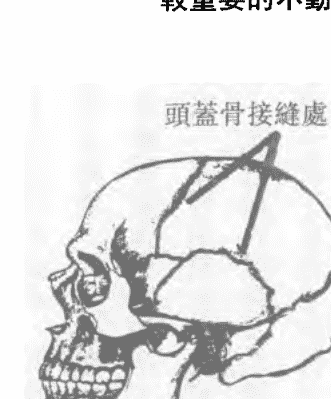

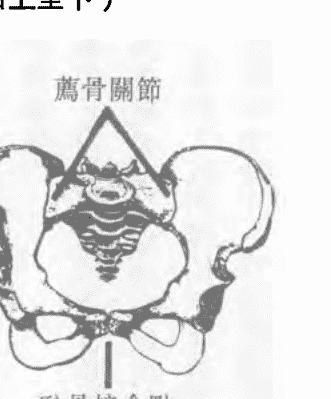

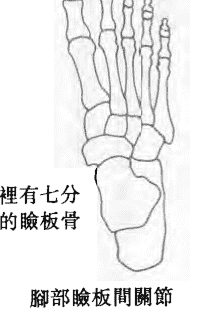

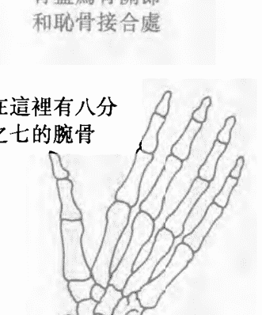

### 重要的少動關節

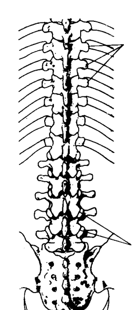

肋橫突關節

椎間關節

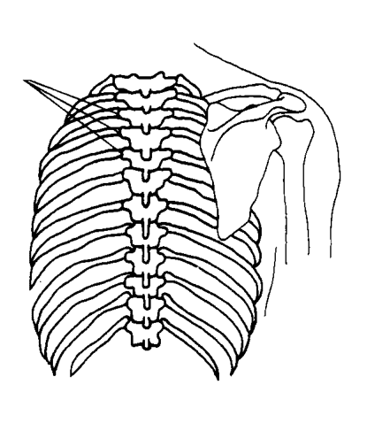

肋橫突關節

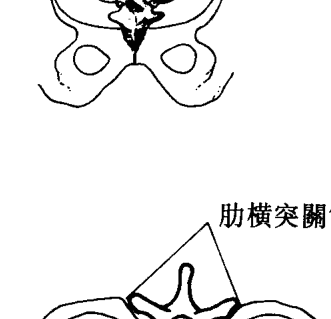

肋橫突關節

肋橫突關節

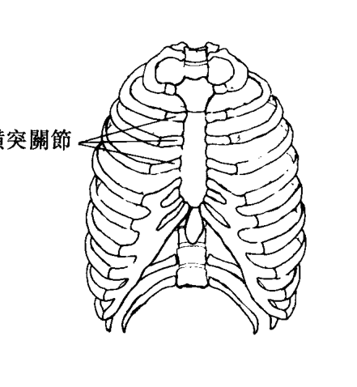

肋橫突關節

### ◎少動關節

少動關節是不動關節的附屬羣。比較重要的肋骨關節，其他還有胸骨以及第一節肋骨。

少動關節和不動關節間有許多共同的特性。它們的動作也是小幅度的，雖然跟不動關節比起來大了許多。它們超出我們的自主控制之外，雖然它們直接與肌肉連結。舉例來說，肌肉確實連結脊椎以及它鄰近的組織，當我們運動整個脊椎時連帶牽動這些肌肉，若要特定地移動其中兩節脊椎間的肌肉，比如第三或第四節脊椎間，幾乎是一件不可能的事，甚至能夠單獨移動第三、第四節腰椎，對人類而言都是一項了不起的成就。

這些特性和不動關節非常的類似，它們同樣扮演著肉體和細微體之間溝通的橋樑。藉由觀察這些關節尾端的動作，幫助我們直接獲取個體深層制式動作的資料。

骨骼將全身的關節合併成一個統一的單位，我們通過各個關節而非單獨的骨頭來連貫全身。

## ◆ 骨骼能量的評估：深層中央能量流

深層中央能量流系統，在走路或行動的過程中，能量主要以兩個方式流通於骨骼的關節。一個是各個骨塊間的關節，另一個方法則是通過韌帶。要充分瞭解這些能量之前，必須要先回顧整個關節系統。

## ◆ 關節滑動

在關節活動之中有一個非常微妙的部份稱為關節滑動，它不在我們的自主控制之內，只能透過反射動作來觀察。關節滑動在關節中扮演了一個重要的潤滑角色，失去了它，我們可能就會全身僵硬無法動彈，反之如果太過，我們可能就無法精確控制自己的動作。

關於關節滑動，在醫學博士約翰·麥克邁尼爾的書中有詳細的介紹。簡單的來說，關節滑動就是當我們把手指撐開時雙指之間柔軟的聯繫部位，任意往任何方向伸展手指就可以看出關節滑動所扮演的功能。

如果關節滑動受到傷害，不只關節無法正常運作，肌肉功能也會受到損害，因為關節受傷而導致肌肉不正常的動作，最後會造成肌肉本身的傷害。

從能量的觀點來看，關節滑動提供了關節的彈性，在骨頭跟骨頭之間扮演著避震器或彈簧的角色，在骨頭跟骨頭的銜接處柔軟的襯托，宛如海綿。傳遞各骨節之間的能量流，如果這個距離太窄能量流通的速度就會太快，如果這個距離太寬能量就會被抑制，流通不順。

## ◎動作幅度

在自主能力的控制下，每一個身體能運動的關節都有一個特定的動作幅度。在典型的西方醫學系統中，我們也可以用主動以及被動的方法來測量動作幅度。首先我們要求病患彎腰，然後直立；或者輕輕轉動一個關節來觀察他是否有一個正常的動作幅度。我們也會要求病患完全放鬆，讓我們來為他轉動關節，測驗關節運動功能的極限。

如果他的動作幅度發生問題，西方醫學的治療方法是找出造成這個問題的原因：是因為關節本身的問題，或者是支撐它的柔軟組織發生問題，還是牽動關節的神經肌肉有問題，或者是支持系統（肌肉、血管）的問題，或者是身體中央神經系統的問題，或者是血液化學成分產生變化。限制動作幅度的原因可以是非常廣泛。

## ◎關節動作的終點

除了自主性的關節動作幅度之外，還有動作幅度終點。動作幅度終點是關節韌帶的功能之一，並且包含在韌帶之中，或通過韌帶能量的反應。動作終點涵蓋的範圍包括從我們開始感覺到抵抗力，也就是柔軟組織限制動作，到我們達到動作的極限。動作終點的含義並非是要精確、分毫不差的測出關節再也無法移動的那一點，而是指肌肉組織停止延展的那一點。以生理學來說動作終點廣泛被理解為關節接合點感覺結束之處。通常我們透過被動動作來測量關節的動作終點，是它們而非肌肉來限制關節的活動。當韌帶達到伸展極限時，我們會感覺到逐漸緩慢增加的一個限制感，以及一種彎曲拉扯的感覺，直到不可能再作任何的動作。如果韌帶受到傷害，這個過程就會是急促突然，而非逐漸緩慢。如果關節之間的距離不夠，我們可能會感覺到身體組織的抗拒力，即使是同一個人也不會有兩個完全相同的關節。你可以彎曲自己的手腕並且輕柔的在指關節上施加壓力，來感覺動作終點的柔軟及韌性。另一個感覺動作終點的看法是，充分地伸展手肘就是兩節骨頭結合之處，當關節達到它的極限時，我們會有一個突然骨接骨的感覺。即使是這種急遽的動作終點，在一個微妙的程度上我們仍然可以感覺到韌帶的彎曲幅度。在體驗關節的動作終點時，不一定要將關節延展到最大的極限，當我們要求一個人做出超過一般範圍的動作時，無論在它的關節功能、情緒、心理及精神層面上，都極有可能在刺激反應的同時造成負面的影響，在這種非常態的動作中造成的傷害是很難復原的。因為它們並非一般的日常情況。

## ◎動作幅度及動作終點的比較

治療師常會解決一些超出動作終點的不均衡，因為這種解決的方案，無法靠著個人的能力來達到。我們必須要清楚的分辨動作幅度及動作終點的不同。動作幅度是一個可以發生於任何關節的自主動作，當它伸展時會牽動到韌帶，我們可以從主動動作或被動動作來評估它。動作終點則是韌帶的功能之一，是超過韌帶所能控制的關節動作，我們只能靠著被動的動作來評估它。動作終點的範圍大於動作幅度，我們可以說它超出我們意志力所能控制之外，基本上源自於內在的能量經由韌帶來疏通。我們可以從動作終點裡看到退化的早期徵兆。它的極限並不會表現於自主動作幅度或X光的檢查，它是由關節的被動動作來表現。我們可以經由在關節上施加另一個更強的能量場，來改善動作終點。你可以使用我們前面提到，在治療骨折時所採用的方法，任何試圖改善關節非自主部份方法的努力，都可以幫助我們減少痛苦並且預防將來惡性的變化。

## 關節動作

關節動作全幅度

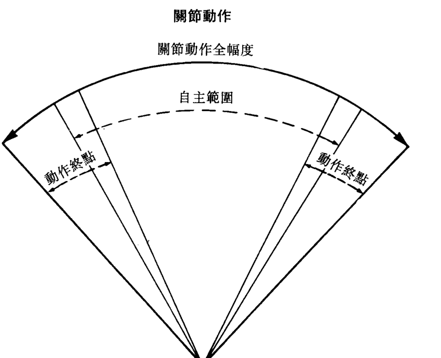

自主範圍和動作終點相對於關節動作全幅度的關係

## ◆ 柔軟組織能量的評估：中層

中央能量流

細微體的意義是我們精神的所在。它和我們個人的需求，以及情緒或心理對宇宙的回應關係最為密切，幾乎任何的治療都會影響到這個層面。

透過肉體的柔軟組織來評估能量運動，非常不同於經由骨骼來衡量能量，我們無法藉由改變體內柔軟組織的型態來觀察能量流動的變化。通常我們採用的方法是觸摸手指或雙手的柔軟部份，感覺它抵抗的力量來評估能量。在按摩時所感覺到皮膚肌肉的緊張或鬆弛度是最明顯的例子。

最簡易觀察柔軟組織本身能量流動的方法是，我們雙指導引能量交會並且觀察能量由一端流到另一端的情形。舉例來說用手指直接緊壓手腕的柔軟組織，另一隻手在距離適當的地方做同樣的動作，穩住這兩點靜待幾分鐘，等到感覺兩指之間的交流。這種連續的感覺也許會像脈搏一樣的明顯，它就像我們直接用手指和他人的身體聯繫一樣。

測量並記錄這股能量流巡迴一周所花的時間以及它的強度及密度。

能量修行者對右手是否必定送出能量，左手接收能量，和左右手使用順序是否有特定關係一直無法達成定論。我個人的經驗是能量流通時，雙手都可以用來輸出或接受能量，只要我們建立的管道順暢無阻，能量就可以自由流通，從左到右或從右到左。我們現在所考量的柔軟組織評量方法，依我個人比較偏好維持治療師雙手的中立性，讓被治療者自己決定流通的方式。

## ◎ 中國傳統醫學評量法

有許多其它的方法可以用來達到測量以及平衡中和能量的要求，其中發展最完備的是中國傳統醫學的穴道系統，它牽扯到治療師敏銳的觸覺。

中國傳統醫學診斷的四個基本方法是問、視、聽、覺。治療師需要用心傾聽病人的症狀，求診歷史以及家庭歷史，像我們在西方醫學中詢問病人用藥經驗。一般對我們比式是。

## ◎傳統中醫的脈搏

傳統中國醫術和西方醫學主要的不同點之一是脈搏的概念。傳統中醫認為針對十二條主要經脈和其所聯繫的器官和功能，各有特定的脈搏。這十二個脈搏最明顯的地方是橈骨動脈，六條位在右腕，六條位在左腕。此外，在頸部和膝蓋部也可以分別找到這十二個重要脈搏。

依我個人學習中醫的經驗，十二個中國脈搏的概念剛開始對我而言非常的陌生和難以接受，但在我學習如何去感覺並且使用它們之後，各種證據使我相信能量的網路確實存在。實際醫療時脈搏對於診斷病症所在採取的治療方法，以及決定治療方法是否適合及有效確實非常值得信賴。利用傳統中醫診斷法得到的資訊包羅萬象，包括了五行（金、木、水、火、土）、十二個器官及功能（肺、大腸、胃、脾臟、心包絡、三陰交）和八個情況（陰、陽、內、外、冷、熱、太過或不及）。傳統中醫的治療方法也包括針灸、草藥、按摩、氣功、肢體運動（通常和武術有關）。除了草藥之外，其他的方法都要要求治療者幫助病患重新調整內在能量聯繫。

## ◆ 柔軟組織能量的評估：表層中央能量流

傳統中醫裡的能量表層被稱為衛氣或防衛氣，它是位於肌膚底下一個粗糙的緩衝地帶。我們可以就在身體表面藉由雙手直接來瀏覽這個能量流。以觸診來說，它是肌膚的觸感及溫度。經由一些活動，例如冷水浴，或者是身體的摩擦，都可以刺激衛氣。我曾看過一些對於外在環境改變敏銳的人，藉由每日運動衛氣來養身保健。

## ◆ 背景能量場的評估

在骨骼內有組織的能量場之下，存在於柔軟組織中，人體的背景能量流就在肌膚底下。背景能量流遍佈全身各個層面，更超過肉體的極限延展入周圍的空間，這個場的能量流動代表著個人的「背景音樂」。

在這個「媒體」之內的波動及運行，溝通我們內外在的環境和我們的情緒思想及感情。它對我們的肉體精神和心靈的需要活動感應敏銳，尤其是一般日常生活的變化和影響。在功能良好的人體身體系統中，背景能量流的作用是將其吸收轉化再釋出，有一些過程發生於我們意識以外的範圍。

## ◎深層記憶

然而因為身體能量不平衡的結果，造成我們無法在能量場中留下深層記憶的軌跡以及能量變化運行的結果。能量不平衡導因於不正常能量流動或者是能量區內的能量不足，它們與身體的需要無關，也不是短時間內產生的結果。相反地，它們來自於過去日積月累的影響或者是對未來事件感應（對於期望或考驗的畏懼或恐懼感）。這些不平衡通常是強烈聚集外力的結果，或者是近期所受到的外傷及刺激。它們可能發生在精神、情緒、化學組成、或者是心理層面上，經由能量系統或特定身體組織的吸收而深植於體內。

能量場的深層記憶極有可能是因為伴隨強大壓力的創傷趁虛而入所引起，特別是當肉體的創傷和情緒的創傷同時發生時，深層記憶會牢不可移。尤其當一個人在極度亢奮，如憤怒或緊張時，能量場會呈現枯竭、缺少彈性，例如沮喪、營養缺乏、或者是

## ◎評估

在評估背景能量流時必須注意兩點。第一點是必須要使肉體完全平靜，如此才能感受更深的能量流動。第二點是要使能量場維持飽滿狀態，如此我們才能完全接收任何的能量波動。我們可以利用牽引雙腿的支點或雙肩的支點，來達到讓能量場充滿彈性的目的。

在透過雙肩探討背景能量場時，通常我會坐在治療枱上輕緩舒適地把我的雙手放在病患的雙肩上，然後再慢慢地朝雙腿壓，讓身體準備好迎接能量接觸。當我輕柔地從肩膀往雙腿施壓時，體內的能量開始流動，直到最飽滿的狀態。藉由這個動作來讓身體蓄勢待發。一旦肉體準備好之後，我再增加一點壓力來建立跟能量場

## ◎均衡背景能量流

任何不正常的能量流通，藉由我的雙手和病人能量的接觸，可以立刻就感覺到這種情況。要使體內脫序的能量流重回正常軌道的方式有許多種，其中之一是直接用另一股更強而有力的能量流將它掩蓋；另外的方法是在正常的能量軌道上重新補上一股合適的能量流，如果這股新的能量流恰到好處，脫軌的能量流自然就會消失，問題也隨之解決。第三種方法是用直接接觸將脫軌的能量流拉回原位重新固定。雖然如此，經過各種努力之後問題仍然存在的狀況也時有所聞，然而經過幾個禮拜的治療之後，我們可能會發現到狀況逐漸的改善，被治療者也會明顯地感覺到身體情緒日漸康復。對根深蒂固累積已久的病例而言，通常需要一段時間才能完全解決問題。

## ◎臨床實例

我曾經治療過一位中年紳士，一年多以前他在一件車子衝過堤防的意外中受了傷，經過治療後除了還有一些瘀傷外，身體已經完全恢復原狀。可是在意外發生之後，他每天都感覺到疼痛。在為他檢查之後，我發現無論肉體上或關節活動上都沒有任何原因造成他的疼痛，這些疼痛純粹是能量脫軌的結果，經過幾次的治療之後，這位紳士終於恢復正常，他非常高興能擺脫這種狀況，並且在治療結束之後向我表示，很感謝我讓他找回失去已久的睡眠。

成他的疼痛，即使使用傳統中醫的角度也看不出任何毛病。可是當我檢查背景能量時，就發現到一股從右胸到左腹嚴重扭曲的能量流，這是當車禍發生時車子衝過堤防，身體受到嚴重外力牽扯所遺留下來的創傷。 我發現到問題所在之後，立刻抓住這個能量場，然後往他體內輸入另一股稍強的能量流。在輸入的過程中，我感覺到扭曲的能量本身產生了反彈的力量，於是在輸入新能量的同時，也持續地嘗試平息這股反彈力。當治療過程結束，我輕柔地放開能量體，接著放開肉體，然後將他的雙腿舒緩地平放於桌面。當他意識清醒之後，立刻體驗到一股平靜安穩的感覺。兩天之後，我再為他做另一次的檢查時，他告訴我說自從上次的治療，他已經不再感覺疼痛，恢復健康穩定的生活。檢查能量場時，我發現扭曲的情形已經完全恢復了，我從經驗中得知，雖然這股更強的力量已經完全取代了扭曲的能量，但是仍然需要一段時間持續地治療，讓它完全穩固。 一旦消除能量體的創傷之後，當年與這段創傷有關的陳年舊事往往會一一浮現。身體能量的創傷通常累積了許多的記憶，如果我們能將表面的傷口清理乾淨，才能深入內部解決其他問題。有一次當我在為病患檢查治療時，我在腰部遇到一股鋸齒狀的能量，這是典型由側擊引起的能量不勻稱現象，我問他這個部位是否曾經受過傷，可是他否

認。第二天他告訴我，那天他回去想了想，確實有一個特別的事情在高中美式足球隊時，他曾經在一次飛身接球的情形下，在空中被對手的肩膀撞到腰部，也就是我所指的部位。他說自己是在飛身跳離地面時完全沒有防禦的狀態下受到傷害。他清楚地回想當他被撞的當時，告訴自己說，「我再也不給別人有機可趁的機會」。要不是那一天晚上的治療，他根本就已經忘記這件事情了。經過一番討論許多事情紛紛浮上檯面，在過去二十年中（他現在四十二歲）他在人際關係上一直有所困擾，特別在處理和伴侶情緒上的親密關係時。這種現象甚至造成幾次合作關係破裂。六個月之後，我又遇到這個人，他告訴我說自從治療之後他發覺到自己不再像以前那樣戒慎恐懼，在人際關係上也有顯著地改善。面對伴侶他更能打開心扉發展親密的關係。當年他受傷時心理情緒的立即反應，造成日後刻意武裝自己與人保持距離的心態，影響了他的生活態度。一旦將能量創傷治癒他再也不用情緒的武裝，能更自然的表露內心真正的感情和情緒。

## ◎基本原則回顧

從這個案例我們可以看出幾項大原則。首先在情緒和精神緊繃的狀態下所受到的傷害，會比一個人在情緒穩定時所受到的傷害影響來的更大。在這個情緒中，能量體完全

開放伸展，如果肉體受到傷害很可能在能量體中留下深刻的烙印。

任何的傷害對我們都會造成影響，特別是當能量體處在騷動的情形下，例如離婚的壓力、家族中有人死亡、或大病初癒，此時的傷害往往會形成複雜難解的問題。

另一個原則是，外力的影響往往決定於受傷的部位。如果只是普通部位的挫傷，只會對普通能量體造成傷害。如果直接傷害到經脈，就極有可能影響到體內更深的系統。

一個人的內臟受到外力傷害，例如脾臟，就會破裂。如果傷害的地點在關節或長形骨，骨內的能量流可能因此扭曲。當然一次意外同時可能導致數個層面的傷害。

古代中國人認為被馬踢傷和被駱駝踢傷的嚴重程度有如天壤之別。被馬踢傷會有劇烈疼痛，情況非常嚴重，需要幾天甚至幾個禮拜的時間才能恢復。看似差不多的駱駝踢傷，一開始只會隱隱作痛，可是它會逐漸移轉入內部，所以要耗上好幾個禮拜甚至個把個月，它傷害的層面不僅是有肉體，更有能量體。被馬踢傷的力道直接由肉體接收，停留在原處，立即在生理上造成疼痛。被溫馴的駱駝所踢傷的力道則會擴散到肉體，在毫無預警的狀態下，滲透入防衛系統，經由能量管道轉移到內臟及精神層面。

## ◆特定能量場的評估

我們可以使用評估一般能量場的方法來衡量特定能量場。通常在膝蓋受到側面撞擊或扭傷時，能量體會呈現被外力撞離正常軌道的情形，一般而言，在這種特定部位所受到的傷害，反應微妙，無法用醫學的方法來檢驗損傷。一些傷害的潛伏期可能已經長達數個月，甚至數年之久。在這樣的案例中人體健康檢查和X光照謝的結果都是正常無恙，但是病人總是覺得膝蓋部位非常不舒服、搔癢難耐、或不時有狀況發生。除了 一般的檢查方法之外，我分別將雙手放在膝蓋關節的兩邊，集中精神注意手掌傳遞的感覺來檢查。如果膝蓋外側曾經受過

有時能量體似乎被「擊出」肉體之外

傷害，我放在膝蓋外側的手就會感覺到凹陷空洞，缺少活力甚至冰冷。同時膝蓋內側的手會感覺到飽滿，也許是隆出。我將手分別放在大腿內外側緩慢而穩定的順著大腿移動，將能量流延導到小腿。正常的情形是，雙腿內外側的雙手應該感覺到同樣程度的溫暖、飽滿、平順，在雙手向下移動過程中，接近膝蓋外側的手就會感覺到一股空洞感，直到小腿部份才又重新感覺飽滿。就好像是大腿以下的能量流在膝蓋部位被推出常軌，直到小腿才重回軌道。另一個治療方法是將雙手放在大腿中段兩側，大約四分之三時距離以外的地方，然後徐緩地往下移，瀏覽整個能量場。同樣地你還是會感覺到外側的手部有空洞及冰冷的感覺，然而內側的手則感覺到飽滿及溫暖。治療不規則能量場的大原則基本上如同以上幾個案例所示。在膝蓋上輕柔地施加一股更強的能量流，就由直接接觸聯繫能量場，在支點上停留十五～二十秒。我也可以在膝蓋兩側直接施壓，處理膝蓋的能量。藉由治療師雙手的幫助，讓能量場自己恢復原狀，然後將它們導回正確的軌道。

## 結論

檢查或治療體內能量場的方式有許多種，對大多數的人而言，使用雙手直接讀取觸覺是最方便有利的方法，因為它具有穩固不變的特質。我們可以完全信任自己的感覺，所獲取的絕對是千真萬確的第一手資料。能夠藉由觸覺來溝通能量體需要一段時間的練習，如果在練習過程中能夠得到他人的反應和回饋，會更加強自己的信心。然而如果有可能的話，也可以從觀察病人的反應裡得到能量運行的回饋。在下一章中，我們將要探索這些客觀的現象，並且找出在能量體中它們代表何種意義。

## # 第四章 反應之橋

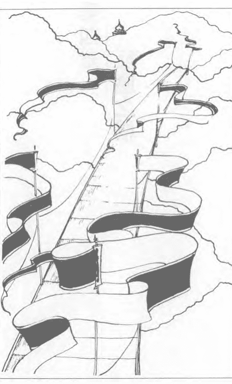

> 「人不可能沒有反應。」

觀察這麼多能量平衡及身體治療，例如針灸、零點平衡、穴道、按摩、冥想之後，從經驗中我瞭解到這些系統都會引起一些特別的反應，我們可以明確的推測，這是被治療者在實際能量交流的過程中正常的反應。藉由瞭解這些反應，我們可以模擬實際的治療過程。在我接觸能量意識之前就已經開始對這些反應與其代表的意思感興趣，直到我融合東西方的學術理念之後才瞭解到，只有在特定能量被觸動的情形之下，才會有這些反應，它們是直接接觸的一般反應。

## 標準和原則的定義

## ◆ 意識

在說明這些觀察之前必須要先清楚地界定我用於細微體的標準及原則。
在處理自己的能量時，我會將意識分散。這是一種日常生活中常見的意識狀態，通

## ◆ 直接觀察

以能量分散來說，如果部份的思考被用來做客觀觀察我們稱之為「見證」。見證的意思是觀察者完全處於客觀的角度來評估一個事件。見證是不帶任何批判意味，不作任何決定，不期待任何現象，也不在過程中做任何主動參與。見證者不影響過程的進行。

路線。如果我們的思想轉移或渙散到別處，可能就會失去能量聯繫，能量是緊跟著思考的路線。如果我們全心觀察病患，可能就會失去透過雙手建立的能量聯繫。反過來說，如果我們學會如何適度地兼顧不同的意識狀態，就可以在處理訊息的接收同時，維持直接能量聯繫。

在處理能量體時，我們主要的注意力也就是我們的能量，是集中在直接接觸上，接著才是觀察或感覺任何病患的反應。

常是當我們同時處理兩三件事情時。舉例來說，開車時部份的注意力在駕駛，部份則在欣賞窗外的風景，思考工作或家庭情況，或者收聽電台。如果我們把注意力平均分散在這些事情上，可能就會造成意外，可是不同程度地分散注意力，可以讓我們同時處理不同的資料庫檔案。

以及環境的互動，見證者也不能參與任何的能量聯繫。從見證的角度來看，與集中注意力全心等待某個現象發生比較起來，我們反而能從病患身上得到更多的資訊。任何情況都充滿了可能性，如果我們太執著於其中之一，可能就會失去其他。這些能量的反應可能是嗅覺、視覺、觸覺、感覺以及其他。身為一個見證者，我們可以預先模擬一些反應，而不會影響會改變過程的進行及結果。我們無法預先知道個人對氣的反應會是如何，可是如果我們能夠掌握大方向，無論是任何反應我們都早已瞭然於胸，並且能夠用它來引導互動。見證者無須冒著失去聯繫的風險，能在當下立刻找出反應的意義。

## ◆ 運作情形

見證者的角色就有如第三眼。第三眼的原則是讓訊息自然流入心中，而非向外探求或瞪視。我們都知道被瞪著看的感覺，這種強力侵犯的感覺會對能量接受者造成影響，甚至改變結果。使用第三眼，讓我們以一個全然局外者的角度來取得訊息。

正常狀態的人體應處於放鬆平衡和諧的境界。當然我們的身體無時無地不在改變和運行，可是這些千百萬個小細胞的動作和細微的潛意識，早已是再自然不過的事。如果

肉體和能量體和諧並進就是所謂的均衡，在肉體維持原則的情形下，能量體受到刺激並且急速運作，人體為了適應這些變化就必須建立新的平衡之道。能量轉換、重新整合尋求新平衡的過程就是所謂的能量運作。意思是在能量或平衡改變的情況下，肉體精神心靈的反應重組以及重新融合的過程。

## ◆ 意識轉換狀態

在能量運作的過程中我們通常會轉移到另一個意識狀態。也許你會感覺到一股深刻的安全及穩定感，也許你會感覺到身體外型正在扭曲變化，感覺自己正在漂浮之外，甚至以為自己消失了。時間和空間感通常都會被扭曲，實際上十五分鐘的過程也許像是兩個三個鐘頭或一到兩分鐘。

這些變化的觀感以及扭曲的時空感並非矛盾，因為它們實際上是我們日常生活的一部份。就以扭曲的時空感來說，一場好的電影時常讓人覺得意猶未盡，而無聊的演講好快到家了，而怎麼也想不起來開車的過程。

運作狀態在能量均衡治療中具有相當重要的地位，這是治療開始發生作用的關鍵時

刻。當一個人處在意識轉換狀態中時，他脫離了一般思考模式，忘記原來平衡失調的情形，任何合乎邏輯的思考模式、概念、想法都會使原有的問題更根深蒂固。如果在思考模式改變的同時，我們提供肉體精神或心靈另一個平衡狀態的經驗，它就會覆蓋原來的不平衡或疾病，讓能量模式重新組合，治療效果於是產生。

雖然我們的見證者親眼看到病患意識狀態轉換的情形，但是被治療者在回神之後，也許完全不記得曾經發生的事。這對肉體、精神、心靈意識轉移而言是非常普遍的情形，可說是旁觀者清、當局者迷。不過如果我們曾經觀察過能量轉移的徵兆，就會知道無論被治療者對治療過程是否有印象，他的效果都是不待言喻的。

## 慣性及變化的原則

這是自然界的兩大定律。第一個定律是變者恆變，另一個也就是慣性定律。意思是除非遇到外力的影響，否則物體照著原有的方向行進。在我早期的醫學訓練中，我被教導要去改變一個人的狀況。如果一個人的關節發生問題，治療的方法是直接在相關的組織上施加另一個改變的力量，這樣基於主導地位的方法雖然非常有效，但是自從我開始學習並瞭解能量運行的原則之後，我瞭解到除了主導之外還有其他的方法。

假設能量失調的情形發生在關節，如果我在關節上建立一個支點施以直接聯繫，穩靜地把持住這個平衡，我所建立的這個狀況對於肉體或者精神層面並沒有造成任何改變。當我維持這個平衡狀態並且阻止任何變化時，我會接著用變者恆變的原則來挑戰身體，於是支點便開始轉移。我在支點附近促進能量流動以及轉移，帶動全身任何與這個支點有關的關節，然後我會保持這個均衡狀態，直到發現能量運行的徵兆或其他現象告訴我放開的適當時機。當我移開雙手，讓受傷部位功能重新調整三十秒後，通常這個關節的功能就會明顯的改善。這代表了能量的轉移，病患也會感覺到似乎某個東西已經改善了。在我這個固定點的周圍，身體本身會產生變化。在運行不停的系統中，我們把持的地點愈是穩固，周圍能量運動的範圍愈是廣大。在支點周圍產生的迅速轉移，源自身體本身能量的制式反應。它們源自於體內，自然地散發至體外。我個人的經驗是個人自然產生的能量轉移力，比由外界巧妙操縱的影響來的更長遠，範圍更大。

## 可被觀察到的治療反應

在瞭解能量運行的定義和原則之後現在讓我們來看看參與者的反應。在治療過程中，我們可以看到明顯和細微的徵候，重要的一點，刺激和反應之間並沒有一個特定不變的配對關係，可能性有很多。我們的任務是單純的觀察發生的情況，千萬不要刻意引導任何反應。

反應比較明顯的部份，包括眼睛、呼吸、聲音。改變細微的反應，包括氣色的變化、氣味、身體的反應和動作以及周圍環境的改變。

## ## ◆明顯治療反應：眼睛

第一個我們可以看到明顯徵兆的地方是眼睛和眼瞼。我喜歡病人在能量治療中平躺地上，如此我便可以經由一個有利的角度來觀察他的反應。有些人喜歡張開眼睛，有些人則喜歡閉上眼睛；我們的目的是要觀察個人的自然反應，所以無須要求病人的眼睛一定要張開或閉上，讓病人選擇最自然舒服的方式，這樣我們也可以分別觀察到兩種不同

同的結果。

假設這個人是張開眼睛躺在桌上，在他完全放鬆之前，我們看到的任何反應都和能量無關，也許他會直視治療師，或盯著房內的某個東西看或無特定目標。當他逐漸放鬆，感覺舒適時，眼神會變得和緩，也許會開始四處游動，通常過了幾分鐘就會闔上。

## ◎閉眼徵兆

在眼睛閉上的情況下，我們能看出能量正在運行的重要微兆是眼皮開始快速的跳動。如果你不清楚什麼是眼皮快速跳動，請一個人將他的眼睛閉上，然後上下轉動眼球，你就會看到他的眼臉急速的顫動。

眼皮快速顫動代表意識狀態的轉移，通常發生於睡眠作夢時，雖然研究發現延腦腦波和眼皮顫動有關，但我個人的經驗是，並非所有眼皮顫動的現象都是來自延腦腦波活動。研究發現，在能量運行中延腦腦波沒有變化，但眼皮卻可以急速顫動。

眼皮顫動時間的長短和能量刺激的強度密度並沒有直接的關係。針灸治療時將針插入穴道，病人的眼皮常會自發性的顫動，如果把針留在原地十五～二十分鐘病人就會逐漸地放鬆，眼皮也不會再顫動。然而如果我們在將針插入一兩秒後就急速把它抽出，在病人留在桌上不被打擾的情況下，他的眼皮仍然會每隔一段時間就自發性的顫動；另一## ◎张眼征兆

如果在能量直接联繫之后，一个人的眼睛保持张开的状态，我们可以看到三个常见的反应。第一个是凝视某一点，原本随意张望或目光柔和看着天花板的眼睛，突然之间停住不动，固定在某一个特定的焦点。这样固定的凝视可能持续少则几秒钟，多则几分钟，再恢复原本柔和的目光，开始四处游离。就像士兵站立的姿势，从稍息到立正，然后再回到稍息。

第二个是空洞的眼神。原本炯炯有神闪亮的目光，在能量体联繫上之后，突然之间变得空洞呆板呆滞，因为意识已经抽离，心不在焉。这种茫然的神情可能在过程中重复发生，持续几秒钟到几分钟不等。如果治疗过程结束而被治疗者仍不时出现空洞的眼神，我们可以确定他的意识状态仍然尚未恢复。不用担心，这种情况在舒筋活骨之后消失。然而如果他接下来要做一件必须全神贯注的事，例如开车，我们必须做一些特定的停止活动帮助他迅速恢复正常意识。常用的方法像让他在室内走动，与他聊聊天。

我们闭眼躺着时眼皮下的眼球可能会左右移动，这和眼皮快速颤动并不相同，它也不是能量运行的状态，这是正常意识之下常有的现象，当被治疗者真正放松，这些现象就会逐渐消失。一个可能性是，眼皮颤动的情形在针抽出后立即停止。刺激结束之后反应并非一定会立即停止。

最后一个常有的反应是眼睛突然闭上。原本被治疗者可能轻松愉快，目光柔和，也许随意浏览房间的摆设，眨眼的速度也非常的正常。当我们刺激他联繫能量之后，眼皮会突然合上，就像有人大力将窗帘拉下。他们闭着眼大约五～十秒钟，然后，再突然的张开，眨眼的速度也恢复正常。如果我们再给他另一次刺激，眼睛有可能又再快速合上与张开，这种眼睛突然合上张开的举动，与一般正常机械式的眨眼非常的不同。在运作能量时，瞳孔大小的变化并不是能量运行状态的征兆。即使体内能量联繫发生，瞳孔也会维持原来的大小，在其他眼部征兆出现的同时，瞳孔并不会有所改变。

### 明显治疗反应：呼吸模式

第二种在能量调和的过程中常见的反应是呼吸模式。呼吸是身体重要基本功能，它同时可以直接由自主以及反射神经系统来控制，它也是意识和非意识之间的关键桥梁。呼吸是活力和能量最主要的来源。在能量运行过程中，呼吸模式改变是能量转移的重要征兆。在能量治疗过程中，我会非常仔细观察呼吸。如果被治疗者以一种他自以为正确的

## ◎呼吸周期

仔细浏览及观察仰躺着的被治疗者，当他逐渐放松而深入治疗过程时，呼吸通常会变得有节奏性，倾向于徐缓和平浅，通常不会有太大的变化。一旦正常的呼吸模式开始转变，我们就可以看到非常细微的征兆。运行呼吸周期是自发性的反应，常见的典型是在深呼吸之后紧接着一个中间呼吸。深呼吸的周期很明显，大约十～三十秒之后会深吸一口气，然后恢复正常的呼吸模式。如果个人原本的呼吸模式已经相当的缓慢平浅，我们可能很难透过衣服看到细微的呼吸变化，甚至可能在深呼吸周期结束时才发现。另外的情况是，如果能量运行过程非常温和，在呼吸后部周期也许只能观察到气滞。我认为不受拘束的深呼吸或气息表示过程即将结束，一般的人通常会忽略这个最后的阶段。呼吸模式产生变化是因为能量直接接触的刺激。接受刺激之后和深呼吸出现之前，通常间隔一～三个正常的呼吸模式。有时候在能量成功衔接时，会有一个特定反应。第一个刺激的反应可能是浅呼吸，但绝不可能是深呼吸。受到第二或第三个反应时，呼吸时间便开始变长，最后在第四或第五个刺激时，便产生了典型的反应。这些一再重复的刺激点，可能都是同样的支点或是同一个线路的支点和穴道。有些人在浅呼吸和正常呼吸的过程中并不会出现深呼吸，对这些人我通常不会采取观察呼吸作为能量反应，因为我不认为这是一个完全的呼吸周期。我会另外从身体的其他部份寻找更清楚的征兆。我们施予刺激的时间长短并没有限制，视刺激和反应间的关系而定。如果在给予刺激之后马上出现深呼吸，我们可以决定全程施予刺激，通常是十五～三十秒。如果深呼吸的时间很长，我们可以在深呼吸开始时解除刺激，等到周期结束后再继续。有些人在治疗过程中会出现非常微小或几乎没有的呼吸现象，通常这些人在治疗过程结束前会完全陷入不呼吸的状态。在这种情况下发生时，我会等到他终于吸一大口气之后才认为治疗过程完全结束。如果不呼吸的时间过长，我们可以适度地施予一些小刺激，例如碰碰他的脚或腿，或要求他吸一口气。一般来说他就会顺从的深呼吸。在治疗快要结束时，被治疗者的情绪会完全放松，甚至有意识转换的情形。此时我们可以看到眼皮快速颤动，呼吸平浅。治疗过程实际接触的征兆是一个很特别的呼吸，通常他会有一段时间的浅呼吸以及一个深呼吸，紧接着一个喉咙吞咽的动作，脸部表情舒缓，眼球转动或眼皮眨动，然后眼睛张开清楚闪亮。

## ◎理论上的呼吸模式

能量运行时的呼吸模式——浅呼吸紧接着深呼吸——是能量刺激的反射动作带来的刺激，掩盖过正常的呼吸控制，刺激点的强度及深度，影响改变后呼吸模式的时间长短。

根据西方的生理学，呼吸同时受到自主及反射神经系统的控制。此外传统中国医学认为，气也就是空气中包含的能量，是经由呼吸进入体内。我们从这个管道得到的气及能量，是主导日常呼吸的第三个因素。如果元气不足，呼吸就会急促，如果元气过多，呼吸就会平浅，视当时的能量需求而定。

有一些刺激会造成浅呼吸。举例来说，吸一大口饱满有力的空气可能促动身体的循环，短时间内不用再吸气。一旦身体直接和宇宙联繫——双腿的牵扯力，肩胛的支点，或在穴道上针灸——常会造成浅呼吸。

这个反射呼吸动作确切的原理，从西方观点来看仍然十分令人好奇。二～三秒的针灸刺激在体内还不至于大到可以造成自主呼吸控制的改变，它也不会影响血压。实际上我们的反射功能（瞳孔大小、肌肤湿度及温度、心跳、肠蠕动）并没有改变，表示针灸刺激对于非自主神经系统没有影响。可是呼吸却明显的发生变化，无论针灸的是哪一个穴道，都让神经反射受到影响进而改变呼吸。

解释呼吸趋于平浅的能量理论，是刺激本身能够供应或释放能量，部份分担了呼吸供应的功能。我们施加刺激的时间愈长，强度愈大，运送的能量就愈多，相对地不需要呼吸的时间也拉长。然而这段时间血压的变化或其他种气的需要，刺激另一个深呼吸的反应来平衡身体。

### 明显治疗反应：音质

第三个可以被观察到的能量反应是声音的品质，虽然它不如眼皮跳动或呼吸模式明显易于观察，对细微体饱满或枯竭的情况来说，它是一个很好的指标。声音的品质和活力，并非是人力可以改变的，所以它具有相当的代表性。在能量平衡过程里，我会问对方感觉如何，倾听他的答案以及声音的品质，这两者以后者比较重要。也许他的回答是“我很好”但声音听起来却单调乏味，细如蚊蝇，表示实际上一点也不好。平缓的语调是能量供应中断的征兆，表示我们应该加速能量治疗过程或立刻停止。我们也要小心观察，是否还有其他能量枯竭的征兆。“你好吗？”的回答也许是点点头。同样地，点头的动作是否有力，远比它肯定的含意来的重要。

### 细微治疗反应

除了双眼、呼吸、声音活力这些主要的征兆之外，还有一些比较不明显的反应。它们和能量运行状况并没有特定的关系，身体回应的是能量转移。它们通常是转换过程的现象，不会特别影响维持支点的强度或深度。但身为主要征兆间的衔接点，它们让观察能量交流反应的过程更为完整。

## ◎打嗝

打嗝是个人在能量运行时的一个细微反应，它是肠部的蠕动，这是刺激常见的反应。所以我们将它认为是细微体转移时的现象。然而打嗝的原因也可能是个人在治疗前所吃的食物或是饥饿的表现，但如果它重复发生的时间与能量的刺激精确衔接，我们认为这非常有可能是被治疗者能量系统的转换的征兆。
在我们的文化里认为这些餐桌上的异响都是不雅的，这种尴尬的感觉也许会造成体内能量运行的阻碍。如果我听到有人打嗝我会告诉他这是一个好的现象，消除他的尴尬，降低阻碍能量流动的可能性。

## ◎异味

一个经常受到忽略不被讨论的现象是身体味道的改变。常常有戒烟好几年的人在协调能量系统的过程中，突然发出烟草的味道。同样的道理，以前常吃大蒜喝酒的人，有时也会发出异味。有些人会因过去的习惯而发出熟悉的味道，和过去经验有关的味道常常也会发出异味。是已经戒除的习惯，它们表示身体底部沉积的能量受到释放。

## ◎气色

对于能够看到光并且了解光的组合的人而言，身体四周光的颜色及脸上的气色，代表了不只是微妙的征兆，而是主要的指标。在中国传统医学中，五行的每一个元素各有其代表的颜色，脸色改变的原理和身上散发味道的原理相同。我记得一位病人在治疗过程开始时脸上的颜色是橘色，几乎像是蜂蜜的颜色，过程中气色逐渐好转红润到我现在还搞不清楚道理何在。可是这位病人在治疗之后，感到非常舒服神清气爽。在中国传统医学中声音味道以及气色的改变都有特别的道理。五行中的每一个元素都各有其配合的项目，在中医穴道治疗或能量调息过程里，这些要素互相配合不可分离。我们可以从这些外在的变化看到个人体内的反应，来决定治疗的经脉或情绪的调整。

## ◎经脉

经脉可以看成是能量反应的主要征兆，如果我们刻意刺激一个经脉或穴道，会看到反应点实际上相隔一段距离。举例来说，常见到我们指压脚部的穴道，被指压者的反应是，用手摩擦前额或不经意的揉眼睛。如果我们了解这条膀胱经脉开始于眼角内部，上升到前额，然后往下延伸到腿部，就可以瞭解为何刺激会引起前额或眼睛的反应。如果我们不明白特定经脉的路径，就非常有可能会忽略类似揉眼睛这样的小动作。我们对经脉路径及一般能量原理的知识愈广博，就愈能瞭解刺激与反应间的关联。

## 五行互动

|     | 金 | 水   | 木 | 火 | 土 |
|-----|----|------|----|----|----|
| 情绪 | 悲 | 惧   | 怒 | 喜 | 怜 |
| 色   | 白 | 蓝，黑 | 绿 | 红 | 黄 |
| 嗅觉 | 恶臭 | 腐臭 | 臭 | 焦臭 | 芳香 |
| 听觉 | 泣 | 呻   | 吼 | 笑 | 唱 |

## ◎ 倾斜

在这个现象里我们看到身体会朝作用力的反方向移动，这使我联想到地质学像山坡上暴露于地表，页岩上的平行线，通常会出现从原始位置转移的现象。当我看到身体倾斜时，我的脑中就会浮现能量层面滑动或移动到另一个位置的画面。我们常可以在胸部观察到这个现象。在治疗过程中也可能重复发生好几次，每一次大约维持数秒钟。这是一个微小的反应，大部份的人都没有感觉，也许只有少数人感觉到轻微的摇动感。倾斜代表着细微体和肉体间关系的重新组合以及交流。

## ◎ 动作

有时候在能量协调过程里会发生身体痉挛的现象。像我之前所讲的，对经常练习打坐的人而言，身体部位轻微的痉挛或颤抖是常有的现象。如果有必要的话，藉由增加肉体的接触，将重心放在肉体而非能量体上，来减少动作的幅度。但并非所有的痉挛或颤抖都跟能量有关。有些是肌肉的问题或冥想系统的反应，有时很难分辨这究竟是单纯的肌肉反应或能量治疗的微小现象。

## ◎平静

大部份的治疗都会引导身体到放松的境界，当一个人在做能量直接接触时，他所体验到的就不只是放松——而是一种相互接受的和平宁静感。我们常常可以在他们的脸上看到类似天使般的表情。这段反应的时间正是能量联繫的现象。

## ◎环境变化

一个特别的微妙现象是感觉房间的气氛突然起了变化，空间感的密度突然增加，时间好像也停滞不动。这是两个能量场相遇的正常结果，因之产生的平静感，不只是两位当事者而是全房间内的人的感觉，像是两极相遇时磁场的变化。

## 平衡能量过程的注意事项

## ◆ 责任

能量运行事实上是相当安全，但就像所有的治疗系统一样还是有潜在的危险性。第一个应该注意的是不要加入个人的期望，强迫病患的细微体做出特定的反应。每一个人对于能量刺激都应该有他自己独到的反应方式，我们的工作是观察这个反应究竟是什么。如果我们强迫身体在没有任何呼吸周期或眼皮快速眨动的倾向下，制造这些现象，我们就是向这个人灌输我们的意志力和能量。一旦我们凌驾了自然的反应，实际上就等于制造了不平衡。

## ◆ 深层记忆

另一个问题是负面或不和谐的深层记忆，尤其是发生于个人处于意识转换状态或高亢情绪时，或当我们处理他意识控制外的层面时，或在他个人经验的边缘。在这些治疗中，在一个人出现呼吸周期或其他表示能量运行的征兆时，身体防卫系统的功能减低。此时我们传递的能量会深刻地印在他的身体、精神或心理层面，这些能量可以透过接触语言或思想来输入。

## 枯竭

在能量运作过程中可能发生能量枯竭的问题，尤其是当我们过度消耗身体机能太久时，可能会导致缺氧的情形。

在我从事教学工作的早期，有一次我为一位年轻女士治疗，那是在一个夏季午后的傍晚，教室里挤满了人，大家都很累而且精神不振。当我开始为这位女士治疗时，能量运行征兆很快地出现，眼皮快速眨动，还有相关的浅呼吸及深呼吸，完全符合前面所讲的特别征兆。可是当过程进行到四分之三时，我注意到她的呼吸非常的缓慢，看起来似乎太过放松及安静。我倾身问她感觉如何，令我惊讶的是她并没有回应，我更大声的问了一次，她仍然没有反应。我突然警觉起来，更仔细地观察她，发现她的脸色苍白，前额冒冷汗。我立刻刺激她的双脚及双腿，当她有反应时我问她感觉如何，她回答说我很好，可是她的声音微弱没有任何力量，当我放开她的膝盖时，她又立刻出现没有反应、眼皮快速眨动及呼吸平的情形，我继续刺激她直到脸色恢复正常，声音又有活力，然后她才终于清醒。

稍后我要求她形容一下在治疗过程中的体验。她说这是一个非常美好的过程，她感觉祥和甚至似乎超脱了肉体，虽然我讲话时她有听到我的声音，可是她并没有回答。因为她说她不想回来。

她最后说的这句话真是吓坏我了。从外在的观察来看，她的情况一点都不好。从这个可怕的经验让我了解到当出现呼吸缓慢、延长、平浅、微弱的情形时，表示缺氧以及中央神经系统脱离的讯号。她的苍白、毫无血色的面容和冒冷汗的情形，让我想起在医院急诊室情况危急的病人。我一直继续在想，如果我们没有及早发现这个情形，而继续进行治疗的话，她会不会发生心跳停止。从此以后我对能量进行时可能导致的伤害更加的警觉。我也着手建立特别的指导方法来观察监督治疗，以便及早发现危险征兆。

提醒我们能量枯竭的征兆有精神萎靡、苍白、冒汗，特别是冷汗、鼻塞、打呵欠、四肢冰冷。

## ◎元气不振

它容易透过声音来观察。藉由提出问题来检查每一个回答的时间和声调，如果这个人立刻回应，表示他的意识还留在这空间和时间。如果隔了很久才回答，那他可能已经在意识转换状态中。如果他的回答清脆响亮，表示能量充沛。如果这个回答听起来气弱游丝，不管他讲的答案是什么，表示有能量枯竭的危险。

## ◎脸色苍白

当我们放松时，气色通常也会有所改变，稍微不红润。这种因缺少活动而导致的苍白，和能量枯竭的情况是不可混为一谈。脸色灰白或肌肤成灰蓝色，可能都表示缺氧或元气枯竭，特别是伴随着冷汗及呼吸缓慢平浅的情形。

## ◎冒冷汗

在能量运作过程中冒冷汗或体温下降，可能是能量枯竭的早期征兆。尤其是伴随着气色苍白，这种情形通常发生在前额或四肢。

## ◎鼻塞

可能代表支气管抵抗能量枯竭传递的讯息。

## ◎ 打哈欠

这是身体机能鬆懈的证据，呼吸周期运行结束的征兆是气滞。和鼻塞比起来，打哈欠是支气管传递出更强的讯号。除非我们能证明其他原因，否则就应该当成能量枯竭紧急处理。

## ◎ 精神不振

第一个元气不足的现象是精神不振，这和治疗过程中正常出现的身心放鬆、呼吸变得平缓的情形并不相同。精神不振时，一个人的头可能会垂向一边，双手无力的放在桌上，看起来好像只剩一副空壳。如果你不确定他的元气情况，看看他现在在做什么。

## ◎ 四肢冰冷

如果在治疗过程中发生体温下降冒汗的情形，通常也会出现四肢冰冷。但很多人在平常会手心冒汗或体温较低，所以这个征兆并非完全可靠。要注意一点，在体内能量已经枯竭情况下，病人极有可能告诉你他很好。能量枯竭开始的感觉不但不痛苦，甚至让人觉得祥和舒适，意识不受局限。然而这种透过能量枯竭或疲倦达到的意识转换并不安全，它可能严重耗损能量体造成持续的疲倦或沮丧，也有可能耗损肉体造成缺氧昏迷。这些个别的元气不足或缺氧的现象虽然不是很明显，但我们只要发现其中一个征兆就应该警觉潜在的问题，更小心仔细观察病患的情形。如果好几个危险征兆一起出现，发生能量枯竭的可能性就非常大。

## ◆ 能量枯竭处理方式

如果在双手接触的治疗中，我们怀疑自己可能导致对方能量枯竭就必须赶快控制情况。防止能量流失的方法是，加速进行过程，将注意力集中在肉体而非能量体。然后用手去刺激对方，千萬不允许出现呼吸停止或眼皮快速跳动的情形，稳定刺激点但不可用力。利用交談留住他的意识，要求他做几次深呼吸，过了一段时间后，我们应该就会发生能量枯竭的征兆逐渐消失。如果沒有的话，赶紧用急促有力的命令结束治疗过程，保持冷静。在治疗过程结束时让这个人站起来，而不是瘫坐在桌上造成神智更加脱离。如果对方表示寒冷或口渴，让他喝一杯热茶或穿一件毛衣。如果我们必须要让对方留在桌上几分钟，可以让他侧面躺著，双膝弓起护着能量场。

## ◆ 可能造成能量枯竭的原因

有一些人比平常人更容易发生能量枯竭。易发生能量枯竭的人的共同点是素食者、冥想者、或过去曾经有吸毒经验的人。并不是说这些人一定会发生问题，但是我们要特别小心。尤其是那些天生脸色苍白、身体瘦弱、音量小的人。

素食者的能量波动比一般人更好，只吃水果的人能量场又比素食者更好。所以他们的能量运行快速，而且不会像一般杂食者的能量一样为肉体所牵绊。

经常冥想或曾经冥想过的人能量系统已被启动，身心沉静较无窒碍，所以他们的能量流动较快速。他们对于气体运行于体内的感觉也较为熟悉，能够迅速的转换意识或灵魂出窍。

有嗑药经验的人熟悉意识转换的经验，也有过灵魂出窍。这些人了解神游太虚的感觉，他们喜欢超现实，并且不由自主的有这个倾向。这些不稳定的人最有可能灵魂出窍，特别是如果我们施加了牵绊的力量。如果意识脱离太远，最有可能造成能量枯竭。

能量运行的目的是要协调对方的身心，而非提供刺激的经验。一个人是否容易能量枯竭的线索是，他对于能量刺激反应的速度。如果他一躺下立刻就出现眼皮快速颤动或呼吸周期模式，表示他已经准备好了意识转换。对于这些人，我建议采取短促断续的治疗节奏。

几年以前，一位先生来到我的工作室，要求体验双手接触的能量治疗。这件事发生## 第四章

在我還未充分瞭解能量治療潛在危險以前的執業初期，在沒有詳細詢問他背景的情況下，我答應為他治療。他平躺在桌上，然後我把雙手放在他的腿上，以半月形姿勢引導他。在我接觸到他的那一刻，立刻就發生眼皮快速眨動及淺呼吸的情形。我問他情況如何，他的聲音已經非常微弱，這種情形很明顯的不適合再繼續進行，所以我開始刺激他回到正常意識。當他看起來似乎已經恢復神智時，我把手移開，想不到他立刻又出現眼皮快速跳動，催眠沒有反應的情況。我花了大約十五分鐘才讓他穩定下來，讓我雙手移開，使他自行恢復。只是把手放在他的腿上建立接觸就發生了這麼多事情，事後我詢問他的背景。結果是，他過去十年都有服用藥物的習慣。他的能量場如此的混亂、鬆散，以至於稍微接觸就全面崩潰。千萬不要在有嚴重藥癮的人身上進行能量運行，對於長期用藥習慣複雜的人也要特別小心。他們反應可能非常快速劇烈，和一般日常接觸的情形截然不同。每一個人對於意識轉換的反應都不盡相同，有些平常處於沉重壓力或情緒亢奮的人，也許變得更穩定、更精確及更踏實。同樣的情形，有些人會很快地失去立場、神遊太虛，逃避到一個不存在的世界。通常理想的能量治療是要建立一個更高的能量場，以便引導對方探索異於平常的方向。

## 結論

對於變得更穩定的人，應該鼓勵他擴大身體的能量，體驗不同的層面，接受輕鬆、自由的感覺，享受漂浮、無所羈絆的寧靜。當我們看到眼皮快速跳動、呼吸暫時停止的情形，表示他的意識狀態已經轉換，我們應該延長刺激點的時間。

對於經常轉換意識，雙眼一閉自動出現眼皮快速跳動情形的人來說，我們應該將能量維持在8字形能量流中，預防靈魂出竅的情形。這方法也許感覺並不愉快，也不如神遊太虛或如電擊般的刺激，但事實上能夠給他更大的幫助。藉由將高層流量留在肉體及中央能量場，他的精力、元氣及穩定度都會增加，對於壓力的處理也能夠發展出不同的方式。

我們可以從觀察能量平衡過程中的反應得到許多訊息，讓我們瞭解體內能量運行的可能路徑及反射動作，並幫助我們做出正確的判斷，提供對方更大的協助。同樣地，我們也藉此透視個人的能量，讓我們在過程中進行的更安全更有效率，充分達到能量平衡的目的。

# 第五章 謹慎之橋

> 在治療病人之前自己先演練一次。
> ——希伯考特歐斯

## 疾病診斷

是一個非常簡單的要求，但一旦深入探討就會發現事實上非常複雜。在本章中要提出幾項重點，幫助醫療從業人員如何在治療病人之前做好自我練習。討論的重心是疾病的診斷，治療過程的溝通，以及創造痊癒的美景。「不要造成任何傷害」是無論古今中外的醫療人員最基本的教義，乍看之下這似乎。

在很多病例中問題的來源很清楚，病人也能預期隨後的治療過程。但有些例子是發病的原因及過程尚未清楚，未來治療的方向也難以定論。以我的經驗來說，如果從何著手變成一個棘手的問題，全身健康檢查將會提供很大的幫助。「不要造成任何傷害」的第一個條件就是確定沒有遺漏任何可能的病狀。一旦有一個完整的醫療評估及詳細的病狀資料，就比較容易決定未來醫療的方向。

### ◎突然的體重變化

在複雜難解的病況中有些情況或是「紅燈」是重要的警訊，它們出現的順序和重要性並沒有絕對的關係，個別出現或集體出現都有可能。

體重變化代表體內原本的和諧狀態產生移動，我們一定要找出移動的原因。體重突然減輕，比體重突然增加更值得關切。體重減輕的原因包括糖尿病、癌症、肺結核、愛滋病、內分泌失調、慢性病、肝硬化、心理及精神壓力。家庭病史很重要，因為有許多疾病是遺傳性。當體重減輕的情形伴隨著不正常出血、排便情況改變、夜間冒汗、原因不明的疲倦時，更值得注意。

曾經患過癌症的人如果發生體重突然減輕的現象，需要立即的檢查。有許多人患了癌症之後完全康復。癌症復發通常是在治療後頭五年間，如果在這段時間沒有復發的跡象，痊癒的可能性就會大幅地增加。所以，頭五年是治療的關鍵。然而不幸的是癌症確實可能在任何時間復發，所以即使是安全度過前五年的人也要保持警覺。

曾經患過癌症的人在心理上對於復發的可能性有深切的恐懼，所以在與他們討論任何復發的可能性時，需要運用高層的溝通技巧，任何的肢體語言都可能觸動他們的警覺系統。有些人因為太過於恐懼，無法面對這個嚴重的病症，所以他們拒絕再和醫生接觸，因為他們害怕發現癌症又復發了。他們可能轉而向另類療法尋求協助，希望得到另一個答案。醫學檢驗至少有非常重要的兩點。首先，如果疾病真的復發，可以立刻著手新的治療，不浪費寶貴的時間。第二點是，如果疾病沒有復發，檢驗結果可以消除恐懼。因為恐懼本身會帶來壓力，危害健康。對體重減輕採取拖延的態度，在曾經患過癌症病人身上是最要不得的。突然地體重增加與體重減輕相較而言較不嚴重，它可能是肝臟、心臟或內分泌功能失調，但和體重減輕一樣，我們一定要找到發生的原因。

### ◎任何部份異常出血

在治療中這是最基本的警訊之一。需要立刻檢查，當然出血的部位決定緊急性和檢查的方法。一般的原因包括腫瘤（惡性或良性）、傳染病、潰瘍、發炎、荷爾蒙失調，以及外傷。

### ◎身體功能改變

任何身體功能的巨大改變都是「紅燈」。特別重要的是年過四十（尤其是男性）排便功能的變化，有可能是直腸癌。

### ◎生理變化

在不影響功能的情況下，生理情況也會變化。癌症的早期徵兆有不明的傷口或腫塊（尤其在胸部），以及腫塊本身任何形式的改變，痣或色素沉澱的變化。其它的例子包括，無法痊癒的酸痛、紅腫、發癢以及關節痛。

在治療過程中對於求診問題之外，其他微小現象也要保持警覺性。我曾經在維持三個月的能量平衡研習中，「意外」發現兩個纖維腫塊、一個肝囊以及一個腹部動脈瘤的例子。在最後案例中，這位先生結果在最後的求診中進行了六個小時的手術。記住，任何人都可能發生自己意料不到的問題，對於不尋常的情況保持警覺，很可能就可以救人一命。

### ◎外傷

這個部份包括許多情況，特別重要的是醫護人員通常會面臨朋友家人或其他相識者的求助。另類療法治療師遇到當受傷病患要求醫生趕快解除他們痛苦的例子時，要特別謹慎小心。治療師必須問自己：「受傷的程度有多嚴重，以及這個問題是否超過我的專業知識及執照」。當然並非每個外傷都要看醫生，但如果有任何疑問，千萬不要猶豫拖延，認為如果受傷的部份仍然能夠照常運作，就無大礙。這是一個絕對錯誤的想法，在我個人的執業生涯中，曾經看過許多膝蓋破裂、臀骨骨折、骨盤骨折、脊椎斷裂，甚至脖子折斷的人，自己走入我的診所。一個人能夠移動或行走，並不代表骨骼健康。只要有任何骨骼系統的傷害，就有骨折的可能性。重點是受傷的嚴重度、傷口的疼痛度、人的年齡及健康狀況、受傷部位的外觀、意外發生的時間長短。

骨骼的狀況可能穩定，可能不穩定。有些傷害很嚴重，有些只是使人困擾。然而基本上不是大問題，快速且正確的治療對某些傷害幫助很大，有些卻會被忽略或只是簡單包紮。骨折最後的診斷依靠X光檢查，或對骨骼做另一種評估。X光如果照的好，通常很可靠，但有些傷害並不會顯示在底片上，他們只有在三～四個禮拜後才看得到。因為在治療過程中，骨骼持續地吸收成長，相對地突顯出受傷的部份。

有幾個常見的外傷需要特別的注意。第一個是跌倒，臀部受到直接撞擊下墜的力量，直接上傳到脊椎。因為背部有正常彎度，如果能量撞擊力過強，傷害會留在彎度中，而非通過彎度傳遞上去。我治療過一位飛快開著吉普車撞到坑洞的先生，這個撞擊造成第一節脊椎綜合性骨折。任何時間突然直接地撞擊力會造成身體任何部位脊椎的傷害，包括肩頭或頭頂。

發生在背部的骨折很常見，幸運的是它們大部份都相當穩定，不會經由脊椎線嚴重。

### ◎病狀骨折

一些特別的骨折為病狀骨折，因為傷害的部位是骨頭。骨骼本身沒有痛感纖維，所以只有當骨折傷害影響到其他部位，我們才有感覺。這表示一個人可能有嚴重的骨折問題而不自覺。病狀骨折實際上可能是潛在問題的第一個徵兆，看似溫和的外傷可能引起骨折。也有些女性在停經後因為荷爾蒙變化，可能發生骨骼鬆軟症或骨質流失。骨質流失的骨骼失去彈性，容易造成骨折。一次跌倒，同樣的撞擊力發生在六十五歲有骨骼鬆軟症的女性身上，可能造成嚴重骨折，但對三十歲的女性而言，也許只有瘀傷。

其他造成骨骼脆弱的原因包括：長期服用可體松、良性的骨骼腫囊、癌症、年紀老化造成的骨骼彈性減低，及其他骨骼疾病。

一些容易受到忽略的骨折是壓力骨折。「行走骨折」常發生在軍中士兵在強行軍。

### ◎不明原因的發燒

時，足部長形骨發生骨折，我們也常在慢跑或競走者身上看到同樣的情形。通常壓力骨折發生在老年人的臀部，可能在移動或轉身的時候聽到臀部的斷裂聲，然後就摔倒在地上。骨折實際上是導因於身體動作，然後造成跌倒；而非是由跌倒本身造成的傷害。

有時候其他原因也會造成骨骼或關節痛。例如年前一位女士來找我，埋怨臀部強烈痛楚已經困擾她大約一個月。一個重要的醫療背景是四年前她曾經患過乳癌，一聽到這一點，我的腦中立刻亮起紅燈。稍微令我安心的是，她曾到過整形外科照過X光，顯示沒有任何問題。她來找我尋求另類療法，不想再吃止痛藥。我檢查的結果顯示，臀部有嚴重的能量失衡。然而經過三、四次治療，病人表示情況沒有改善。看到這個情形我請她再回到原來的外科醫師處複檢，他重新幫她照X光，顯示癌症轉移。短短兩個禮拜，X光的結果從正常變成不正常。

這個病例給我幾個啟示。如果病人提供的不是最新的檢查結果，也許必須重新複檢，而且一定要找到適當的醫師。第二點，如果治療方法在合理的時間內沒有發揮效果，就應該認定這個方法無效。第三點，一些紅燈警訊的出現（曾經患過癌症加上不明原因的疼痛），提醒治療師採取迅速適當的行動。

這是另一個基本的訊號。任何一種癌症，無論初期或末期，第一個徵兆可能是發燒。相關的組織疾病、傳染病、藥物反應、血液凝塊，都可能造成「原因不明」的發燒。

### 發炎

發炎的徵兆是紅腫、發熱以及疼痛，發炎的原因可能是因為傳染。這三個徵兆需要不同的治療方法。

### 傳染病

嚴重或重複發生的傳染需要特別注意。皮膚表面的傳染，例如身體任何部位的割傷或酸痛造成的紅斑，可能會形成大面積的傳染。一直無法痊癒的傳染，可能是潛在病狀，例如糖尿病的徵兆。持續不斷的傳染可能影響全身。肺結核會造成的身體變化，包括體重下降、疲倦、咳嗽以及身體機能衰弱。

### 藥物

藥劑師要特別注意幾點。不同醫療系統的人對於常見的藥物都非常瞭解，但是千萬不要受到他們的操縱，開立處方、改變用藥、或停止服藥都必須有專業知識的協助。藥物威力強大且精細微妙，可能引起副作用、負面的藥物反應或藥物過敏。如果懷疑服用。

### ◎疼痛

疼痛可能發生於任何層面：肉體、心靈（情緒）或精神。以能量的觀點來說，疼痛是因運行路徑被阻塞所引起。疼痛本身可能因為服藥或其他治療而轉移或減輕，但千萬不要忽略潛在的原因。疼痛提供警告的訊號如果只是阻止它而未找出真正原因，反而對人體有害。

### ◎面有病容

一個人生病的愈嚴重，愈是需要緊急就醫。通常能量問題不像肉體問題阻礙身體功能，造成面有病容。

### ◎異於尋常的情況

任何對你個人而言異於尋常的身體狀況，都可能是身體發出的警訊。每一個醫療從業人員都有自己一套疾病和治療反應的標準，醫療從業人員確定病狀施予治療，然後透過個人的背景及累積的經驗監督治療過程。如果你覺得任何部份的效果令人不盡滿意，就應該認定這是一個警訊。這種資訊來自於個人的膽量，一旦醫療從業人員感覺到事情出了差錯，他應該立即停止，並且重新評估。如此不但不會造成任何傷害，更能避免許多傷害。

### ◎ 警訊重要性總結

每一個醫療系統及系統下的人都有特別的習性、偏好。我個人認為在這個國度中，西方醫學是主要的醫療體系，所以一旦發生任何疑問，我們必須向它尋求協助。以上的看法目的是協助另類療法治療師進入醫療體系，不是主張西方醫學一定比較優秀。同樣地，經由另類醫療專業人員的幫助，現代西方科學醫療界可以輕易地列出警訊的名單。前提是，治療師提供多功能服務，並且確保不造成任何傷害。

## 治療過程的溝通

### ◆ 權威

在治療過程中我們使用的字眼，對病患的影響力至少和藥物及治療方法一樣大，清楚、鼓勵、積極的溝通是成功醫療的一部份。一旦一個人得到醫師的執照或認可為醫療從業人員，他在歷史上和文化上就被賦予權威。我們的社會法律系統以及飽受煎熬的病人和他的家屬，更加強這個權威的崇高性。因為這個潛在力量影響力如此巨大，醫療從業人員必須充分認知自己的角色，善用這個資源。當然建立這個權威的過程包括了意識及潛意識的層面，與醫療技術和學位相形之下，這個無形權威的議題常被忽略，它的存在和作用也未得到充分的重視和認可。醫療從業人員在繁忙的執業生涯中，經常忽略或者遺忘權威底下的責任，結果是這份特權也許反而變成傷害。讓我們來看看道理何在。在醫療技術的層面之下埋藏著一個微妙的議題：治療師和病患間的互動，它是直接影響治療效果和病情的有利因素。話語、建議、態度以及肢體語言，一旦披上權威的外衣，都在尋求協助的病患生理、心理以及精神層面上深深烙印。醫療人員使用的語言以及傳達的暗示，強烈影響病患對病情的寄望。舉例來說，如果一個人患有長期但不至於威脅生命的疾病，也許並不嚴重，例如一些過敏的案例。如果一位醫生跟他說「我無能為力」或「你永遠也無法擺脫這個疾病」會實際傷害這人的生理功能。這樣的描述方法會造成絕望、焦慮。更重要的是，如果病患預期病情無望或根本不可能治癒，真正的事實反而會被改變。負面的暗示可能侷限或捆綁我們，正如正面的暗示可以發揮鼓勵和釋放的功能。身為醫療從業人員，我們必須意識到自身意見、肢體語言、態度，甚至日常對話的影響力，如果這位醫生說「我實在不需要為你做些什麼」，效果將會變得多好。

我在行醫時經常重複遇到的一個情形，使我有一下的想法。一個最近經常背痛的人去照X光，結果顯示長期的退化現象，比如關節炎。許多醫療人員會用X光的結果來解釋背痛的原因，向病患展示問題所在。令人不解的一點是，背痛發生的時間不過一、兩個禮拜，但在X光片顯示的變化卻已經有幾年之久。這個人可能因為姿勢不良引發的簡單背痛，走進醫院求診，然而走出醫院時，卻背負著年紀老化、身體功能退化的病名，疾病的種子已經深植人心。他被賦予了一個疾病，從此盤據他的意識，可悲的是，這卻不是一開始引起背痛的原因。以我的經驗來說，X光的檢查結果和疼痛的程度或身體部位的功能失調之間並沒有絕對的相互關係，X光本身並不代表特別意義，而是應該視為病患的病史及症狀的參考。

人們生病時無助的心理，相對地加強醫療從業人員的權威性。因為深感對自己健康情形無能為力，缺乏安全感，病人才會向另一個人尋求協助。在自信心動搖相形之下，外界的資訊更顯重要。再加上病患內心糾葛的恐懼疑問或其他情緒問題，他很可能誤解資訊，更顯慌亂。身為醫療從業人員，我們和病患的溝通是治療關係的一部份，在傳遞訊息時應該更小心清楚。如同其他形式的治療，我們在此更要恪守「不要造成任何傷害」的信條。一個醫療從業人員可以幫助病人在面對疾病的問題時，經由創造正面積極的想法和態度，開發治療的效果，而非消極的承受疾病的傷害。研究顯示，生理功能對於語言和潛意識的反應效果驚人。一般人無法用意志力控制非自主神經系統，我們無法「告訴」血壓降低或雙手變暖。可是透過訓練，在腦海中創造適當的意念，這些效果是可以達到的。意志力影響潛意識及非自主神經系統，因為這些系統無法分辨真實和想像力。醫學博士卡爾・賽蒙頓成功的展示如何運用意志力戰勝癌症，正如醫學博士詹姆・波斯基在他的心理治療中心秉持的宗旨一樣。

意志力可以幫助病情，但它也能造成問題。潛意識並沒有幽默感、嘲諷感或時間感，因為潛意識是如此的矮呆，人們常在不知不覺中自我灌輸負面的印象，侷限自己的能力和健康。我們一定要清楚瞭解，在醫療過程中醫療人員的行為模式及心理態度，可能。

### ◆ 健康的語言

我們常見四個傳達強烈訊息的字眼。第一個字是試試看。「試」的暗示之一是不會成功。一個想要戒煙的人如果說「我會試著戒煙」，向非自主神經系統傳遞一個訊息，雖然他會做些改變和努力，但都不會成功，等於是為這項努力設置了雙重阻礙。

第二個傳遞雙重訊息的字眼是「不能」。令人困惑的一點是我們常用「不能」來表達「不想」。沒有人能從地球跳到月球，所以「我不能跳到月球」這句話是真實的事實陳述，但如果說「我不能減肥」卻不是事實。但我們潛意識已經接收這個訊息，最好說「我不想減肥」或「我一直無法減肥」。一旦你告訴你的潛意識你不能做某事，那幾乎就沒有成功的機會，因為它是一個近乎獨裁專制的事實陳述。

第三個要注意的字眼是「應該」。這個字眼暗示外來的權威，強迫你的舉止行為應該或不應該如何。如果我們習慣性的生活在「應該」的世界，壓抑自己的意志力、自我控制，無法享受現在。即使我們所做的只是責任或義務，也可以在陳述這個事實或從事這項行為時，不要使用「應該」這個字眼。舉例來說過馬路之前你「應該」注意兩邊的來車，這是一個很好的建議以及訊息，然而把它想成「過馬路前注意兩邊來車」就變成是生活的一部份，而非外在的規定。

第四個傳遞雙重訊息到意識層面而非潛意識的字眼是「但是」。它是一個很好，也很重要的字，用來否定或消除之前的陳述。只有當它被錯誤的使用，在實際上說話者真正意思是「而且」時它才變得使人迷惑。「而且」這個字眼延續思想、往前推進，然而「但是」這個字眼，扭轉改變思考及想法的方向。除非絕對必要，千萬不要將疾病歸因於年齡老化。任何歸因於老化的症狀會跟隨著病人，只要他變老，當然也就是說永遠跟隨著他。傾聽病患陳述他的背景或症狀，如果他做一些陳述，例如「我再也不像以前那麼年輕」、「我覺得自己好像一個老人」通常在表示他個人的想法，至少問題部份的原因和老化有關。儘可能消除這種想法，如果你能夠將這兩件事分開，把疾病和症狀獨立出來，斬斷它和老化的關係，改善健康的可能就會大增。一位醫療人員千萬不可對一個單純頭痛或輕微疼痛的病人說些「老了自然會這樣」之類的話。我曾經看過一些病例立刻改善，一旦他們瞭解背痛的原因是因為壓力、天氣或傷害，與老化無關。長久以來困擾他們的問題，或另一位專家言之鑿鑿的老化症狀立刻消失。更重要的是，一旦他們脫離老化的陰影，就可以重拾自尊、信心、活力。正如醫生可以藉著分離症狀和老化現象來支持和鼓勵病人，在為疾病命名的過程。

### ◆ 肯定

中，也可以發揮鼓勵支持的作用。說「我肩膀痛」只是一個事實的陳述，他單純描述現在的感受，而無未來的暗示。說「我的關節炎疼痛」，卻將關節炎這個疾病深植病人的腦海，將它視為如手臂或雙腿一樣，是身體不可分割的一部份。為症狀命名通常令人不舒服，如果只是一個人的手臂痛，單純的描述症狀會對健康比較有益。

一旦圖像目標想法深植在腦海，日後就極有可能實現。人體會將這些陳述或精神圖像視為事實，然後發揮功能將它變成事實。使用有創造力、肯定的字句，例如「我愈來愈好，無論何時何地」或「我認為自己完全健康」或「我珍惜擁有的每一分、每一秒」在潛意識輸入程式，引導個人美夢成真，創造更積極的生活。

有許多病人在每天早晨，用大聲唸誦肯定句來迎接一天的開始。如果我們能夠把這些肯定句大聲地唸出來，一天重複幾次，它們的效果就會大大的增加。事實上，腦中的想法經由口說和耳聽的過程，會更加強它的訊息傳送，成為我們腦海和精神中深植的一部份。你可能要重複五次或十次，才能真正「聽到」這個訊息。

## 创造痊愈的美景

最后一个讨论的重点是，在医疗过程中始终坚持一个肯定清楚美景的重要性。太多的医疗从业人员在医疗系统中成为彼此的敌人，这些偏见部分来自于求学过程中的竞争力，部分因为在现实环境中，我们确实会从其他医疗者手中接收对先前医疗效果不满意或对医疗体系不信任的病人。这些心存不满的病人并不能代表全部。如果一个医生整天接触的病人都埋怨另一个医疗方法无效，或甚至引起其他问题，很可能这个医生就从此排斥其他医疗体系。切记不能片面听取一些病人的意见就妄下定论，他们无法代表其他痊愈的案例。

其他专业人员看到我们的缺点就好像我们看到他们的缺点一样。只听取不满意病人的意见就妄下判断，只会为自己树立更多敌人，对医疗界的自尊与和谐也无所助益。

如果我们能够接触更多的例子，花一些时间观察其他疗法，参考他们的方法和结果，听一些满意病人的意见，我们就会建立对其他从业人员真实客观的看法。

西方医疗界和另类疗法对于健康和疾病有不同的了解。对前者而言，疾病通常被视为单独事件，一旦病情康复问题也随之解决，他们并不强调医疗过程本身。在自然疗法中，疾病被视为体验生命过程的一部分，在疾病来临之前一定有所征兆，身体自然会自行评估解决。从这两个不同的观点，衍生出来的治疗方法当然也截然不同。对自然疗法学派的人来说，气喘病人有发疹子的现象代表治疗过程的关键之一，证明病人逐渐好转，不需再接受治疗。对现代医学派的人而言，同样的疹子也许代表并发症，或治疗过程不当，应该立即处理。同样的道理，在西方医学的眼光中某些特定情况，终生无法痊愈并且需要持续不断的医疗。一个被诊断出有焦虑症的人，必须长期服药。自然疗法系统却将它视为潜在压力或能量失调的现象，只是生活的过渡期，一旦给予适当协助，不久之后他就会恢复正常。

## ◆ 治疗远景

一位驰名的西藏医师叶辛博士，在中国传统针灸会议上说，一旦一个人成为医疗从业人员，他就应该变成别人的人生明灯。他说这种人应该有四个特质：爱、温情、喜乐以及公正。他又接着指出，痊愈者和失败者态度上最大的不同点在痊愈者脑海中根深蒂固的想法。他的世界并非是失败者无望的、不可能的世界，而是充满潜力和可能性的世界。及痊愈的潜力，他说，一个能看见曙光的人就一定能战胜病魔。教导针灸术的杰克・威司立教授洞悉人性，可以用肉眼看出一个人的健康、经历以及潜在的问题。如果在治疗过程时，我们的心态充满痊愈的可能性及希望，然而却在过程中失去了这个信心，我们的治疗效果就会大打折扣。如果我们无法再重拾正面积极的期望，为我们的病人规划充满可能性的宇宙，我们就应该将病人转移给其他的治疗师。身为一个真正有医德的医疗从业人员，必须要求自己对他人的健康和生命坚持信心，直到他们和我们一样能看到未来的美景。

## 第六章

## 预估之桥

科学介于事实与想象之间。

## 能量及运用

在这章中即将讨论的能量与生理概念，既非事实也不是想象。它们是体内能量和生理间平衡关系机制的推测。乔治・卡斯在他的著作《同类疗法科学》中提到：人类器官最主要的生命力量称为电・动力波动……内容十分精细复杂，多样的器官运行规则……非常繁琐，它的频率及振幅时时刻刻都在改变人体器官，首要能量层面。身体的主宰同时操纵人体所有部份，不论身体处于生病或健康的情况，它各有一套运作原则。这些法规原则的基本是，对能量运作的彻底了解。运作的方法有许多种，一次原子的波动、器官相对运作的关系，以及各系统之间的传递。细微体的运作受到许多因素的刺激和支持。在机制层面，它受到生理运作的刺激：呼吸系统、心跳、肠蠕动、血液流动以及身体热量。它同时也受到物质流动于体内摩擦力的刺激（血液流过血管、人体在空气中活动以及其他）。以电磁学来说，能量体受到神经系统成千上万电磁活动波的影响。支持细微体的能量同时来自阳光，人体的新陈代谢和呼吸作用透过五种感官的波动，以及脉轮和穴道经络来运行。因为肉体和细微体间不停的交流互动思想（我们的想法、情绪以及观感）的波动，影响全身的分子架构。这些互动，解释冥想及意志的力量，并且建构疾病和痊愈的基本原则。在《未来医学会基于能量控制》这本书中威廉提及联系握夫法则（骨骼架构）与精神层面：正如骨骼架构的握夫法则所言，如果骨骼长期承受不寻常压力，就会改变生长方向，自行调整承受压力。同理，身体其他组织也会改变运行模式或分子运动，来适应压力或突发状况。再进一步推论，我们可以把心理能量场模式视为一种压力，影响分子的磁性化学潜在力。细微体中的能量和运作，受到外在因素的影响极大。这些因素包括温度和湿度，生理时钟（早晚或季节）。身体状况和周遭环境息息相关，就像月球引力影响潮汐，“太阳黑子”造成日照不足引起沮丧急躁等等的新发现不断在出现。对于水吸收大量太阳能量有一个引人注意的实验。这个实验是把装水容器暴露于不同时段日蚀下，不断地搅拌。实验结果有重大的发现，证实我对能量影响细微体的看法。在这个实验里，放置数个装水容器于日蚀阳光下，每隔十五分钟分别搅动不同容器，然后在容器中种植水生植物，并记录生长状况。结果显示，生长状况最差的是吸收日蚀中段阳光的容器中的水生植物。席多・威克用这个实验来说明，阳光赋予水的生命力。我在实际医疗中也常将阳光当作评估病人情况的指标之一。正如我之前所提两个看似相同的伤害，对同样的治疗却完全有相反的反应，可能性极高的推测是，意外发生时个人身心的压力情况。

## 顺势力态的关系

虽然影响能量的原因如神话般扑朔迷离，但仍然可摸出几个主要方向。根据传统中医的说法，人们终其一生都必须从所吃的食物，所呼吸的空气中吸取气。这两个气的滋养来源间的关系，加上原本就存在于体内的气，更形复杂。有类似人体生理呼吸和食物新陈代谢的关系。基于个人对医学及能量的了解，我大胆假设，在食物和空气所供给的能量间，有一个简单而顺势静态的关系。就同我们消化的食物和呼吸的空气间的关系一样。在食物的能量和卡路里间也有简单的关系，同理类推，空气提供的能量和氧气。人体有这四个需要，彼此互相联系平衡，任何一个系统都可以刺激身体反应。

这四项需要中最紧急需要的那一项，对人体的消化及呼吸系统影响最大。在生理现象中，血压、日常呼吸、胃壁蠕动、血糖以及口欲感，是影响饮食量的原因。在能量体中从未间断的能量运行需求，刺激呼吸动作。身体需要的能量大部分来自于空气分子，植物和水分子的能量则提供不时之需。因为它们必须经过肠胃蠕动消化、吸收、新陈代谢的过程，所以效率缓慢。但一旦发挥作用，持续力及稳定度都极高。人体巧妙均衡运用这两个来源，维系身体能量运作，在不同特殊情况，我们会分别倚重其中一个系统。

## 相互关系

| 肉体 | 细微体 |
|------|--------|
| 对食物的需要 | 对食物的需要 |
| 对空气的需要 | 对空气的需要 |

## 规律能量的生理机制

为了要更了解生理的机制和它协调能量的功能，我们要探索生理自制系统。这其中包括以呼吸系统的鼻咽喉最为重要。它是呼吸系统中空气进入体内的首要必经之路，在每个鼻孔中各有三条通路（上、中、下）。通道是黏液保护的气管，空气通过的通道决定它确切的方向和目的地。流通最顶端通道的空气持续往上流，刺激嗅觉，接着转一个弯，回流到肺部。在最上层通道的上面是筛状颚，它支持嗅觉器官，区隔鼻腔和脑前端部位，它本身具有嗅觉空气细胞。再往上有一个骨脊支托脑部的架构，这些部位都接收流通鼻腔上层空气的刺激。

在鼻咽腔中有四个主要鼻窦，它们和鼻腔主要区都有相互影响的关系，且藉由一条黏液保护的管道，和鼻壁相连。在鼻窦和鼻腔通道间空气和液体，可以自由流通。我们吸入的空气一部分会进入、充满，然后再离开每一个鼻窦。

鼻窦的骨壁和空气细胞非常薄，整个鼻窦机制的作用提供共鸣和扩大鼻腔中空气分子的运动和能量。有不少人体验过鼻窦炎发作时或脸部因太冷而僵硬时麻木、无生气的感觉。

鼻腔中充满空气，空气的震动引起骨耳共鸣，进而影响宁静区域。前额窦位于前额双眉间，也就是第六脉轮或第三眼的所在。筛窦紧邻鼻梁骨，蝶鼻窦和脑下垂体有关。

脑脊髓液保护脊椎和脑部，并且跟着由脊椎向外扩散的神经延展。研究表明，这些部分鼻窦的骨架被脑部四周脑脊髓液体包围，因此鼻窦的能量会直接影响脑脊髓液。

脑脊髓液实际上藉着这些空心管流离中央神经系统，扩散到全身的相关组织，再经由淋巴系统回归主流。根据这个论理，脑脊髓液中的任何能量，都可以透过组织联系网络传达到全身任何部位。

## 鼻腔侧面图及相关构造

鼻腔中的能量波动也可能影响脸部经络。上颌窦正位于胃脉通道，并且和结肠脉相对。前额窦和膀胱脉正好交叉。几乎所有脸部深层联系网络路都和一个或多个鼻窦有联系关系，透过这些经络通道可以直接带入能量体。

## ◆ 呼吸节奏

一个鼻孔大于另一个是普遍的现象。西方医学认为，两个鼻孔具有同等功能，任何差别都不正常。然而，有些人相信对两个鼻孔有不同使用率，不但正常而且非常平衡。对功能完美的人体而言，每隔三、四个小时，自动转换倚重左右边的鼻孔来进行呼吸，形成一个自然的节奏。任何一边的鼻孔，皆可藉着鼻壁充血来调整吸入空气数量。根据我对能量生理的研究，呼吸道缩窄的目的可能扮演重要的调节功能。

## ◇ 瑜伽呼吸术

一个有名的瑜伽呼吸术是呼吸转换。安静地坐着，关闭右边的鼻孔，从左边鼻孔吸空气；关闭左边鼻孔，从右边鼻孔呼出空气。重复右边吸入左边呼出，持续进行这个循环约十回。在《完整瑜伽指导》这本书中，史瓦米宣称这个模式可以帮助心情平静，身体功能协调和清洁脊椎两边的深层能量通道（左脉和右脉），及均衡身体左右两边的功能。

## ◇ 管压

缩窄鼻内的空气通道产生管压；以物理学来说，当我们在未减少流动物质的数量和时间的情况下，缩小通道的任一个出口，会造成管压。如我们在同样的时间让同量的液体或空气通过一个小孔，它流通的速率一定会变快。当我们浇水时，把水龙头接上水管或莲蓬头，就是在不减少通过水量的情况下缩小开孔的面积，造成水以高速喷出，从水管压：同量的液体或气体在同样时间通过较小开口，喷射距离的增长即可证明。开口的面积愈小，水喷的距离愈远。它不仅速度增加，分子运动能量也更活跃。管压的影响力是特别让我们感兴趣的地方。

## 呼吸和分子能量的推测

在临床经验上，能量不足的早期征兆通常微小易被忽略，常见有鼻塞。鼻孔因为充血稍微肿大缩小一边或两边的呼吸通道，造成管压，呼吸肌肉必须更大力运作才能通过窄小的管道带入空气，正如同水管必须施加更多压力才能通过莲蓬头将水推挤出去。根据能量原则，空气或水中增加的速度，其能量来自于呼吸肌肉和水管的作用力，高速运行或分子运动活跃的空气已经被“能量化”。一旦用在我们的系统中，它能增加体内能量的总和，抵销弥补能量体的枯竭。鼻壁的充血消退，呼吸管道恢复畅通，细微的管压机制扮演能量的“退烧药”。呼吸管道藉由能量体的需要，及三或四个小时的呼吸节奏来调整面积鼻孔薄膜的变化，是维持能量中分子运行能量和谐的第一个调节器。如果温和的管压不足以满足能量体的需要，充血的程度就会增加。然而这个情况是有所限制的，因为如果充血情形太过分，鼻孔就会完全堵塞。如果鼻塞的现象反而阻挡能量的供应，或肉体需要更多的氧气，就会出现打哈欠的情形。打哈欠提供空气一个比鼻孔更大的通道，许多空气透过咽喉快速进入体内，增加氧气和分子能量。虽然我们常将哈欠和疲倦联想在一起，但当打完哈欠的第一个感觉是更有精神，在许多情况中能帮助我们清醒。

如果我们必须立刻获得让自己精神焕发的能量，可以急速呼吸几下，虽然不是缩窄呼吸道，但通过相同面积的开口增加流通的空气量，达到管压的效果。这些短促的呼吸动作必须强而有力，才能提供刺激。在二、三个短促呼吸动作后，我们通常会立刻感到一股冷冽的空气流通体内，这是增加的能量通入细微体的现象。不久会稍有窒息感，因为增加的空气速度短暂填满能量需求，降低刺激紧接呼吸动作的原动力。在性能力高昂的情况下，不仅在特定部位，鼻腔也会充血。鼻腔的充血现象造成管压，配合个人情绪的亢奋状态，增加能量体的波动，这是另一个维持体内机能和谐的机制反应。

## 食物及分子能量的推测

食物提供的能量有不同于空气提供的特性。相较于来自空气的能量，食物所包含的能量范围较繁多复杂，并且因为它必须经过消化吸收和转换的过程，花费较长的时间才能为细微体所用。另一方面来说，食物所提供的能量却能维持较长的时间，并且为能量体提供稳定的中和基础。总而言之，呼吸过程满足并且配合立即且自动的能量需求，长稳定的能量则由食物提供。

虽然空气和食物提供的能量在功能性和适用性上有基本的不同，然而它们之间却有一个互相支持的和谐关系。在紧急需要时，自动能量需求可以暂时由食物提供，正如长期支持能量需求可以暂时由空气维持。然而如果我们倚赖代替的系统太久，会影响身体的生理状况、精神和稳定度。

不同的食物及烹调方法提供不同程度的能量。一般来说，食物烹调的过程愈是繁琐精致，对食物原始型态能量的改变愈大。烹调的过程也许不会影响热量，也仍然能够满足肉体的需求，却也可能大幅改变能量本质，造成对细微体的影响。

假设一个人原本的饮食习惯无法满足细微体的需求，体内能量的支持系统就会逐渐减弱消失，影响个人对压力的承受度。身体自然转向呼吸系统寻求援助，弥补不足的能量。因为呼吸本身是不停改变的现象，再加上空气能量原本就不如食物能量稳定，当它暂时满足背景能量之后，等于在已经失调的能量场又加上不稳定的特性。

消化食物得到的糖分可以满足身体热量需求，却无法提供支持系统能量的要求。身体处于双重状态，一方面肉体的需求已经满足，另一方面却匮乏。他们会感觉到轻微程度的疲倦及沮丧（源自于能量不完整），吃过食物消化新陈代谢之后便可以解决。消化血糖释放的能量掩盖沮丧的感觉，但这些食物并没有提供细微体需要的能量，随着高热量的结束低能量的沮丧和疲倦立刻恢复。为了应付这些症状，我们又用食物来暂时填补，于是产生高热量和低能量的循环。这个循环的面积愈大，能量和热量的情形就愈失调，对体内平衡的机制破坏力也愈大。因为误解了身体传递的讯息，采取错误的饮食习惯，不但不能解决问题，反而加重严重性。这个恶性循环存在的时间愈长，会更根深蒂固，造成精神和生理严重问题。

## ◆ 高热量低能量：食糖忧郁症

## ◆ 特殊状况

在日常活动中，食物是能量体的长期能量主要来源。然而在紧要关头我们必须动用战备能量，呼吸代替食物成为长期能量的来源。通常这些情形发生的原因是强烈的情绪状态，情绪确实影响身体的能量，但它们本身并不增加体内能量总和。如果身体需要更多能量来维持某种情绪，可能会发生下列的情况，包括大吃大喝或呼吸加速。

当我们使用战备能量或情绪高亢时，通常会吃的比较少。如果情绪高亢的情形持续一段时间，睡眠也会减少，亢奋的情绪会使人产生幸福、满足、期待和乐观的感觉。

在这段特殊时间经过繁琐加工食物的影响力会比较明显，尤其情绪亢奋维持一段时间，营养失调及睡眠不足不但无法维持先前精力充沛的感觉，更会造成精神紧绷。

对于这种戏剧性的变化，我个人有一次亲身体验，发生在一次为期四天，令我精神亢奋的会议中。我仿佛置身梦幻之中，正享用这段时间以来最丰盛的一餐，一切都很美好，直到最后上一道冰淇淋甜点，只吃了两口，我就崩溃了，过了一、两分钟，我已经无法张开眼睛、维持对话或甚至坐在椅子上。在完全瘫软无力的情况下，我必须请别人载我回家。

我的食欲很好，在餐厅通常可以吃完全餐，包括冰淇淋。对我而言，这是一个很不寻常的经验，引起我极大的兴趣，决定要弄清楚背后的机制。随后的一个月，我实验许多食物，尝试去发现原因为何。我发现在我有充足睡眠和饮食均衡的正常情况下，精心烹调制造或单糖的食物不会对我造成任何问题。另一方面，当我情绪高亢使用战备能量，享用这些食物却快速降低我的兴致，甚至引起沮丧。几个月之后，我听到史瓦米谈到，他建议如何使用糖来安抚过度紧张或亢奋病人的情绪。

## ◆ 断食

逐渐降低食物量也可以产生精力充沛的感觉；试试断食。利用简单的蔬菜水果或饮水断食，会产生包括身体、精神和情绪改善的效果。真正断食的时间也许一天到七天，甚至更多，实际上必须有一段缓慢渐进的准备期。当断食结束，同样也需要一段恢复期，才能再次进食中和食物。在断食期间，尤其对之前有一、两次经验的人，通常在第二天可以感觉到毒素。在生理上可能有背痛、头痛、排尿量大增、身体异味、排便习惯改变以及舌苔的现象。在情绪上可能会感觉沮丧、焦躁、生气、难过、阴郁。但度过这个时期，紧接而来的是明朗、轻松、敏锐、思路清晰、感觉完美。有趣的是，在断食期间，饥饿反而不是一个大问题。一个决定结束断食的标准是饥饿感的出现，另一个则是舌苔消失。断食对肉体有清洁的作用，以排毒过程为证。在细微体来说，则以情绪的变化为证。无论哪一方面，

## 能量来源的互动

食物和身体能量间的关系牵涉许多因素，一个主要原因是摄取的食物及制造过程，其他原因则是个人的精神情绪状态、肉体和细微体的情况，能量滋养的来源，以及潜意识状态。

正如呼吸可以是食物能量来源的支持力，食物也可以是呼吸能量来源的支持力。如果正常的呼吸机制因为长期鼻腔问题或鼻窦炎感染功能因而受损，进而影响到能量供应，食物能量系统就可以马上递补。食物能量和空气能量合作，随时平衡情绪的需要。然而在这个目的下，我们对食物的依赖愈深，我们对所消化食物品质的敏感度也愈高。一旦鼻腔发生小问题，能量低的食物可能引起些微沮丧，但在健康情况良好时，不会有任何影响。一个比较复杂的情况是，能量含量低的食物对长期鼻窦炎的患者造成的影响。情形如下：发生鼻窦感染严重降低通过鼻腔到达体内空气能量转换效率，因为感染鼻咽喉无法转换原本由空气提供的身体能量，身体转而向食物能量寻求援助，补偿不足。在健康的人身上造成鼻咽喉功能降低，直到感染消失。然而对习惯性摄取低能量食物，极可能已经倚赖空气能量提供长期资源的人而言，食物能量却无法弥补鼻咽喉感染造成的能量不足，情形演变成不但无法从空气得到能量，加上鼻窦炎造成对食物能量过分倚赖，元气不足成为长期毛病，也可能引起食物过敏。事实上这就是鼻腔和消化系统功能失调的后果。

## 鼻塞的解决及感冒药

自我治疗的方法包括强化呼吸及消化功能，和加强两者间的合作关系。呼吸方面可以经由温和的练习改善，消化方面则是注意摄取食物的品质。会引起鼻塞的食物，表示容易造成食物过敏。

鼻塞恢复通畅的影响非常有趣。鼻腔或鼻窦肿大的部分原因可能是因为病症（外伤## ◆ 生理平衡

如果發生長期能量或波動不足，身體自然會企圖阻止更多的流失或消耗，但可能造成體內系統效率降低。結果也許是呼吸淺促、便秘、頻尿、皮膚乾燥、四肢冰冷、排汗量減少等等。在行動力尚可能有遲緩、疲倦、慾望降低、機能減退的情形。

傳染等等），部份可能是生理現象的反應（管壓機制），部份可能是因為鼻子正常的呼吸週期。如果服用感冒藥或疏通鼻子的藥物，立即改善生理狀況，也許藥物會阻礙病症本身的影響。但如果在服藥之後好轉的情形只維持幾個小時，然後又產生疲勞或鼻塞，必須再度服用藥物才能控制病情，原因可能是正常生理功能不平衡或對服用藥物中的某種特定成分過敏。分辨協調能量的鼻塞現象和生病引起的鼻塞間的不同很重要，兩者治療處理方式也非常不同。我們知道有些感冒藥會引起沮喪或精神不濟的副作用，如果它們被用來治療能量鼻塞現象，副作用可能會破壞身體企圖恢復平衡的自然過程。在診斷疾病的同時，必須能夠分辨它是症狀治療現象，或身體針對某些需求發出的訊號，或根本只是因為特定刺激所引起的自然反應。

## ◆ 功能失調

如果身體能量或波動過剩，可以藉著增加生理功能來消耗。流汗、打噴嚏、咳嗽、腹瀉、流鼻涕、頻尿、皮膚癢都是可能發生的現象。以行動來說，過剩的精力可能伴隨出現的現象有，大笑大哭、喋喋不休、精力過人等等的現象。

總而言之，身體藉著各種程度的運動來達成平衡與和諧存在。每個系統中或系統間的檢查和平衡功能，及平衡和補償反應，表現在身體功能的變化上。

一般美國人習慣將身體功能的改變視為不正常的現象，醫學教育灌輸我們的觀念是，所有的鼻塞或腹瀉、便秘都必須加以治療或用藥物控制。這不但是不正確的觀念，甚至可能造成傷害。習慣性的服藥，實際上可能擾亂體內與生俱來維持健康的機制。長期治療這些「症狀」會擾亂體內複雜精細的平衡機制，造成抵抗力低落、各層面健康狀況不良。同樣嚴重的是，相信這些徵狀代表疾病，造成任何身體功能改變，就是生病的錯誤觀念灌輸入實際身體狀況良好的人的潛意識，「他生病了」。這些精神的圖像和意識深印腦中，反而自我實現造成疾病。

消化系統（胃、小腸、結腸）和呼吸系統（鼻腔和肺）雖然位在體內，卻是體外和體內運作的橋樑。除非物質或空氣已經通過呼吸道薄膜，否則它就不算真正進入體內。這系統的症狀，尤其是初期疾病，也許是身體企圖擺脫可能造成疾病的物質，防止它被吸收。咳嗽、嘔吐、腹瀉也能對健康有益。切記除了生理因素，細微體中過剩或不足的能量，有時藉著影響器官或系統的功能來釋放或保存能量。這些以協調功能為目的的改變，不應該被視為疾病，也不要企圖阻止或改變它。找出功能失調的深層原因，就可以解決這些徵狀。未經考慮和評估潛伏因素，就貿然下藥有違健康和常理。

## ◆ 疾病程度

在自然療治中，我們用程度來描述疾病的嚴重性和平穩失調的情況。我們相信，疾病發生於能量層面，依據每個層面的特色，容易產生特定疾病。一個既非疾病也非醫療行為的強烈刺激，會引起體內相當數量的能量從某個能量層面轉移到另一個。在這個新的層面，同樣有許多可能性，因每個層面所管轄的區域範圍而改變。當然個人可能因刺激的不同，轉移到接近康復的層面或使病情加重的層面。在一定的範圍內，人體可以吸收肉體或能量體的微小振動，而不影響健康。如果我們的抵抗力弱或刺激過於強大，肉體或能量體的防衛系統就會不敷使用，病狀也因而發生。在這個層面，如同前面所提，在某些特殊情況如果完全改變，發生問題的背景環境會發生相當數量的能量轉移。

在我的親身經驗中，曾經有一位女士因為嚴重的氣喘發作送進醫院。我們立刻讓她服用氣喘藥，隔天早上氣喘現象完全消失，但她卻出現精神分裂的危險。中止生理病症發作的作用力過大，逼使這位女士從一個疾病層面轉換到另一個。但在昨晚病情如此嚴重的情況下，卻可能救她一命。

疾病不會突然出現或消失，通常在之前有潛伏期，之後伴隨著痊癒期。也許會有細心的醫療人員注意到這段過程，但在許多自然療法系統裡，它被認為是病人保健的重要指標。醫學博士康斯頓·賀林為治療過程下一段評語，這段評語稱為賀林痊癒法則。他說，一個人的痊癒是從深層到淺層，由嚴重的器官到不嚴重的器官或系統。我們治療的順序是從身體的頂部到腳，從深到淺的。

治療有兩個意思，第一個是發生疾病的部位從體內深處浮出表面。發高燒時，體內的熱會隨著汗排出，這是一個例子。疾病轉移的例子，比如發病的原因可能是冷風吹到脖子，結果是引起頸部肌肉僵硬酸痛。生理被認為是最表面的影響，心理、情緒其次，最深的影響是精神。在治療過程中，當病情逐漸好轉，病患重拾希望和生命的光輝，表示最深的層面已經有所改善，然後治療的重點轉移到情緒心理層面，最後的階段則是生理功能重建。如果在治療過程中，病人感到身體情形好轉，但精神卻更委靡，表示治療的方向錯誤病情加重，雖然患者在生理上可能感覺好轉，但診斷和治療都需要重新評估。為了瞭解治療如何從嚴重轉移到不嚴重的器官或系統，我們看看以下的例子：傳統中醫師認為皮膚是第三個肺，因為它提供類似呼吸及排泄的功能。如果一個人正接受氣喘治療，在過程中氣喘情形改善，卻發生皮膚癢，表示這個人正處於自然療癒的過程。主要的器官首先被治療（肺），次要的器官（皮膚）則在完全康復之前處理，輕微的症狀皮膚癢是好的徵兆。西醫也承認患有皮膚炎的孩童在成年後可能會發生氣喘症狀，治療的方法是將時光倒流。在這個情況，病人事先必須瞭解醫療原則，如果病人在氣喘康復期發生皮膚癢的現象，它代表的是痊癒的徵兆，不要服藥來阻止它。服用一些治療皮膚癢的藥，例如可體松，絕對是違反自然療法過程的反效果，阻止皮膚發癢等於是阻斷通往健康的道路。在自然療法過程中，舊有的疾病可能照發生的時間順序出現。如果我們看到以前曾經發生的問題或病症再度出現，我們認為這是治療過程的一部份。這些從記憶底層浮現的問題，導出身體深部的惡能，所以不能阻止它。

我曾經看過一位因偏頭痛求診的婦人，根據她的背景，曾經罹患過氣喘直到青少年期才痊癒；在針灸治療之前，我向她解釋痊癒法則。第一次診療之後的晚上，她的氣喘在隔二十年後，首度復發。瞭解這是痊癒法則下可能出現的現象，她並沒有驚慌，也沒有嘗試阻止它。氣喘在經過一段時間後便平息了，這是在整個針灸治療過程中唯一發生的一次氣喘，她的頭痛問題也完全痊癒。

一般來說舊症復發的時間不會維持太久，也許幾個小時或一、兩天。然而有時候如果是嚴重的問題，會持續久一點。一位婦人因為嚴重氣喘，每日服藥達五年之久，在她的恢復期間出現持續兩年的皮膚問題，當氣喘情況終於改善，她才能停止服藥。

有些特殊情況是，賀林法則間出現互相矛盾。在偏頭痛治療過程中，出現氣喘發作的婦人可能是從淺層的問題（頭痛）轉移到生理深層（氣喘），或從較不嚴重的頭痛徵兆轉移到嚴重的呼吸困難，這是治療方向錯誤行徑。然而這個案例的真正情形是舊症復發的法則強過於其他兩個法則，當氣喘情形不再出現，頭痛問題也消失，我們便可以明白事實真相。
皮膚在痊癒法則中扮演雙重角色，一方面它能呈現深層器官（肺）的影響，另一方面它是我們最表層的器官。所以在能量平衡或自然療法過程中出現的皮膚紅癢或皮膚問題應該被特別注意。
但如果說在治療過程中出現的任何其他徵狀或皮膚問題都是痊癒的現象或治療法則，這是個太過天真且危險的想法。幾年前我遇到一位年輕人，他告訴我他正處於痊癒過程的解毒期，我好奇的問他解毒的現象為何，他告訴我體內深層的問題已經浮現到表面，使他產生皮膚紅癢。我檢查紅癢的情形，赫然發現他得的是接觸性疥瘡，我立刻建議他趕緊去醫院求診，以免感染面積擴大。
威司立博士在他的針灸手札提到，沒有人可以在痊癒之前不經歷治療期症狀。在能量治療期間，病患可能發生有史以來最嚴重的頭痛或最嚴重氣喘發作。理想上我們對治療期症狀的處理方式是讓它順其自然的發生和結束，但如果病患確實需要協助或治療，我們的原則是加速這個症狀發作的時間，幫助它趕快結束，而不是治療或阻止它。我們必須瞭解，這是治療過程中正常出現的治療期症狀。

治療期症狀可能一開始出現在身體的任何層面（生理、心理或精神），它出現的形式可能是生理病狀、情緒崩潰、做惡夢、沮喪、擔憂。一旦一個層面受到影響，所有的層面可能都會隨後發生問題。有時候在生理、心理、精神三方面都可能出現類似的徵狀。

我曾經用針灸幫一位病人治療長期腹瀉，他的情況有顯著的改善。在第八次治療時，他向我抱怨發生嚴重抽筋的情形和心情難過沮喪，他甚至回想到五歲時他家小狗死掉的傷心事。但在內心，他清楚的感覺到自己即將痊癒。這三件事件發生在十二小時之內，隨後腹瀉的情形隨即消失。

## ◆ 疾病的獨特系統

一旦身體發生病症或功能失調情形，它便自成一個獨立系統。雖然這個問題可能和其他生理大部份健康平衡情形相抵觸，但從全面的觀點來看，它有自己的定位和影響力。日本一位提倡和平的武術大師強調，真心的珍惜並幫助你的敵人。在處理功能失調的過程中，我們可以認可它的獨立存在，並且真心友好的幫助它離開身體。在自然療法中，我們採取溫和漸進的方式，而非用英雄主義將它們驅逐出境。即使在某些案例，我們必須採取激烈的非常手段，我的經驗告訴我，保有對疾病的尊重會加速治療過程。通過自然療法系統來治療問題，會比效果強大、立可見的藥物反應花費更多時間。但這樣的比較並非絕對，有時會出現相反的結果。許多藥物的功效和重點是消除或轉移症狀，自然療法的主旨是支援自然的生理現象和身體原有的防禦力，並且觸發復原的過程。在健康和疾病之間有一個平衡之道和互動，並且由於功能失調或疾病的獨立系統，它也有自己的生命力。在身體動員自己的力量維護健康時，可能有一段時間功能失調的情形會持續復發，愈接近痊癒，次數減少、情形趨緩、時間縮短，即使在復原期症狀之後，在身體還沒康復之前仍需要一段的時間觀察和休息。發生疾病和恢復健康是一個過程而非事件，它需要時間。

## ◆ 治療態度

在我們觀察一個人經歷治療過程的幾個禮拜或幾個月時間中，最好採取客觀的角度來看待這個過程。我們的責任不是去治療任何人，治療是由大自然完成，我們責任則是貢獻自己最好的技能及知識來協助他。藉由維持不判斷、不批評的態度我們才能從隨著病人病情好轉或變壞的七上八下心情或不穩定的情緒中跳脫出來，捲入病患的治療過程不但不能幫助他，更會影響到我們的專業判斷。

最後一個基本原則是注意到在以能量體生理學來說，當一個人處於劇烈變化的時期，對疾病的抵抗力會減弱，並且容易發生意外，這就是所謂的壓力升降。常見的例子。尤其是當一個人忍受長期的情緒壓力，也許是家庭中有人長期臥病或發生離婚糾紛，在整個事件發生的期間，他都能堅強度過，一旦事件結束壓力解除，卻生起大病。生活中面臨的大轉型或壓力改變會引起體內狀況轉移，在這段轉移重新替代的期間，會有一股穩定的能量幫助你抵禦疾病或意外，如此生理可以幫助心理度過難關。當壓力層面改變，這股能量就會消失。

瞭解這個壓力的自然現象之後，可以幫助我們即將來臨的壓力層面改變做準備。在這段壓力從一個層面轉移另一個層面的過程中，藉由多休息、注意飲食、避免新備。的壓力以及沉思靜坐、能量平衡，我們便可以安然度過這段期間。

## 對健康和疾病的全新瞭解

生理和心理的獨立系統眾所皆知，但能量和細微體的存在和重要性以及它的獨立系統、生理系統與波動方式卻沒有得到廣泛的注意。隨著我們對它存在的瞭解和研究發現，日常生活現象和環境的意義與含意大不相同於那些只侷限於生理事實者的視野。疾病變成一個過程而非偶發事件，如果一個人知道如何從學習的角度看待意外或疾病，那意外或疾病的發生可能是我們一生中的轉換點或幫助成長的動力。各層面生理轉移的原則和追尋對一個系統隱藏因素的瞭解，拓寬了我們的選擇性。如果能將東西方的治療系統融合，截長補短，將帶給人類健康和醫療一個新的遠景。瞭解能量和肉體的自然平衡，賦予我們為自己和他人創造健康的力量。

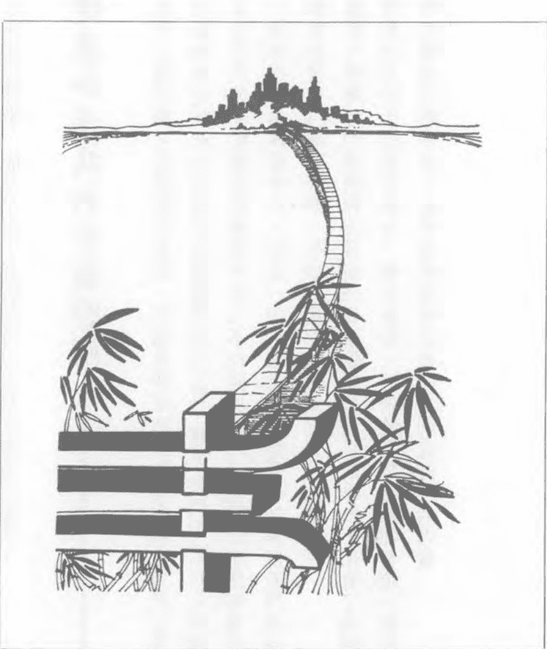

# 第七章 未來之橋

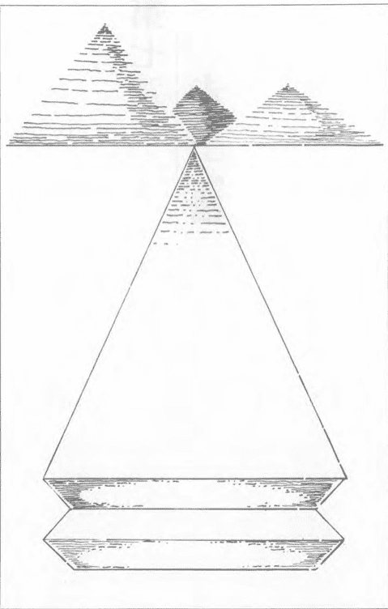

> > 我們的內在會因灌溉而生長，這是自然永恆的真理。
>
> ——高斯

中國哲學自然法則之一是，宇宙間萬事萬物循環、生生不息。宇宙星球運行法則相似於原子中電子運行法則。上至天文、下至地理，宇宙大我的現象無不反映在本體小我之中。

我們可以觀察或體驗許多法則中存在的現象——溫度和濕度的變動，日夜的循環，一年中四季的流轉。我們可以欣賞到許多由感官物質世界交流的自然運行——微風清拂過綠草，水潺潺流動於溪流中，植物從土地中得到滋養欣欣向榮。

我們可以透過感官與主觀感應、或觸摸、或嗅聞、或品嚐許多大自然的模式變化，近距離的接觸並不使他們失去美感。但有許多循環太緩慢（造山運動）、太快速（電子運動）、太巨大（海洋中的潮流）、或太微妙（體內細胞分化），無法直接觀察——但我們知道它們確實存在。

## 人體不斷拓展的視野

千年以來東方文化從未間斷的研究發展自然天地運行的奧妙，並找出它對人體的影響力。西方科學對東方「科學家」的主觀經驗並不全然陌生，最新的物理研究發現，他們的態度與期許影響「客觀」的實驗結果，顯示主觀和客觀間緊密的聯繫。在醫學界，我們正著手探索內在力量的重要性，它與我們的關聯以及測量平衡它的方法。

當我在一九七一年第一次參加針灸研習，遇到一位七十多歲的老先生，因為右手無法緊握成拳的問題來向威司立教授求診。這個問題已經困擾他超過十年之久，在這期間他曾向無數位醫生及醫學中心求診，沒有一個治療真正有所幫助。

我並沒有看到他針灸治療的過程，但當他走出診療室，十幾年以來右手首度再次握成拳頭時，我也在場。他簡直是欣喜若狂，我和幾位針灸學生興奮的詢問他治療的過程：把針插在哪裡？會不會痛？他告訴我們，從頭到尾只用一支針插在左腳的軟組織。

在針插在左腳的十秒鐘之中，病人完全沒有感到任何痛楚的情形使我非常驚訝。在我的醫學經驗中，沒有任何原理可以解釋我所聽到的事實，在這件事情過後不久，我便全心投入能量和內在力量的研究。

東方醫學及能量模式和我的科學訓練間有許多明顯的衝突，使我面臨許多挑戰，卻也激起存在的創意。我相信和許多在西方傳統中成長訓練的醫生和醫療人員而言，我所體驗到的掙扎並不特殊。重要的是在這個掙扎的過程中，一個對人體新的瞭解已經融合成更完整的健康及醫療模式。我寫《心橋》的目的正是要分享這個嶄新的視野。

人體內的運行模式和規則十分複雜，為了讓大家瞭解這個模式，我將它們依功能不同大致簡化，將所有功能總和分析統整，幫助我重新整理所學和經驗，更能透徹瞭解。

人體內能量運作模型可依功能分成三區：首先不規則的能量背景区，再者引導我們和外在環境交融的中央垂直能量，最後是源自於個體獨立性和獨特性流貫全身，使我們成為一個自主功能單位的內部能量流；最後一個周遊全身的能量模式，又再細分成三個層面：流通於骨骼系統深層能量，流通於身體軟組織中層能量，表面肌膚底下的表層能量。所有能量的流通和波動間都有互補及互動的關係，同時各自有獨特的功能和特性，自成系統。

## 能量運行模式回顧

在本書中我透過對瑜伽和針灸的討論來說明這些基本模式，並展示這些基本的學說，如何和基本能量模式相呼應。許多其他自然療法系統——同類療法、夏威夷土著的信仰以及美國印地安人神話——都和這個模式有深切的關係，一再說明它潛在的力量。

## 模式說明

用橋樑來說明能量和個體間的關係，是一個非常適當的比喻。每個內在都有一座橋樑聯繫我們的肉體架構和內在能量，橋樑聯繫我們和大宇宙，在人和人間也有一座座溝通能量和架構的橋樑。

我已經在前面說明能量場和波動可以透過許多方式聯繫：經由雙手針灸、許多生理功能（冷、熱、超音域）、透過身體姿勢（瑜伽）、冥想齋戒等等。其中最令我感興趣的是用雙手建立直接接觸，聯繫肉體架構及能量模式。

## 模式的實行

使用一些動作（施壓、彎曲、扭轉、牽引和一些靜止動作）支點，我們可以在達成聯繫時感應對方身體的延展或抵抗。我們可以探測它的純淨度、密度和柔軟度，在能量體內相當程度的運行和供應，對樂觀的健康是必需的。在呆板或脆弱的個體中常可發現無法變通，缺少反應的現象。在個性激進的個體中，常可發現不穩定、缺乏個人力量，及傷痕累累的運行現象。個人能量的特性透過回應針灸施壓及支點的速度，表露無遺——出現眼皮快速眨動、呼吸模式或其他回應能量刺激的反應有多快。身體各個部位能量過剩或不足的情形，提供個人內在的資訊。我們可以利用能量標準來評分。骨盆相對於安全感，薦骨相對於性能力，腰部相對於力量，臀部和關節相對於憤怒，心臟相對於同情心，胸部相對於悲傷，喉嚨相對於創造力，前額眉部相對於直覺。這些只是大方向，卻能幫助我們透過肉體，瞭解個人情緒（能量）。正如評量個體能量的方法有許多種，也有許多方法可以用來平衡及潔淨它。包括身體運動針灸、草藥、能量治療，直接的能量平衡以及意志力。我們可以在進行這些方法的過程中，客觀觀察病患對能量刺激的反射回應。在雙手治療身體平衡系統過程中，我們可以用自己的雙手實際感應對方的回應。在以上全部的方法中，雙手能量互動的結果可以幫助我們技巧精進，同時卻也可能造成在心緒不定、意志不明的情形下走火入魔的險境。如果對病患的直接反應（例如深呼吸、淺呼吸、眼皮快速眨動）及肉體能量和運行的關係有系統地加以瞭解，這些能量運行的方式會更穩固有所幫助。一旦將能量納入健康和疾病的體系之中，就可以清楚看到所有的疾病都會產生能量轉移。疾病產生的原因也可能是能量失調，然而將所有的問題歸咎於能量失調，正如將所有問題拘限於肉體一樣不完整。例如手腕骨折處一定伴隨著能量場受創，但受傷部位的主要原因是骨骼而非能量通道阻塞。治療重點是醫學方法，接著才是能量治療。相反地，功能問題例如氣喘或結腸炎，可能產生生理症狀，但主要的病因絕大部份源自生活壓力。針對這個案例，治本的方法可能必須採用能量治療或心理輔導。另類療法或異種醫學模式通常側重不同的需要，不但不會產生重疊或互相排斥，它們使醫療體系更行完整。在健康和人體這本人生鉅著中，它們代表不同的章節。

## 疾病的全面觀

人生過程的開展

根據醫學博士普高福教授的說法，腦海中的潛意識並非如佛洛伊德所言，只代表性格中被壓抑的部份，而是包含了個人尚未啟蒙的潛力。普高福將這個潛意識比喻成可以播種的種子。耕耘的動機並非來自個人過去經驗，而是寄託對未來遠大夢想。這個思想存在潛意識，並非被壓迫而是因為開展個人生命的契機未到。人生花朵的綻放有它自己的時間表，隨著生命過程的開展，酣睡於溫暖土壤中的未來也逐漸甦醒。

普高福的說法使我想隨著未來潛力的種子破土而出，我們可以從一個人現階段世界觀及肉體、心理、精神的能量和架構中看出端倪。在潛意識中無限潛力的開發之後，同時並進的是七個脈輪人生階段的流轉。在時間成熟時，因為個人身體、心理、精神情競的轉變，人類各項潛能逐漸開發。古印度的瑜伽修行者花費多年時間沈靜內心，為脈輪的覺醒開發做準備。藉由修行沈靜內在，幫助個人勝任人生各種階段的關頭，堅強心靈的力量抵禦各種疾病困擾，或## 未來遠景

因壓力造成的精神分裂。在今日社會的文化裡，繁忙脫序的生活使我們沒有時間為脈輪及深層潛意識的開發做準備。這些生活事件對某些人而言輕而易舉再自然不過，甚至不費吹灰之力，但對其他人來說，卻是震驚、恐懼、陌生、無法接受。這些反應的背後，揭露了個人在肉體、心理、精神、潛力被開發的純淨度。如果個人情緒成熟健康良好，態度開放積極樂觀，他就很可能按照自然、井然有序之道逐漸自我開發。能量可以自由流通於體內，潛意識的種子有能力完全萌芽綻放。

我們無法改變自己或病患埋藏在潛意識中尚未萌芽的種子，但我們可以改變在事件逐次出現時，細微體的能量情況。正如瑜伽修行者的內在儲備，幫助脈輪開發自由流暢。細微體的能量平衡在潛意識開發種子的過程中，對個人行為舉止改變也提供類似功能服務。透過身體能量和內在聯繫橋樑的知識和技巧，我們可以在人生過程的開展中幫助他人和自己。

> 「一本充滿遠見的書……將改變讀者對自身及周遭世界的態度，並喚醒精神層面的全新想像。」
莫頓·馬修斯　詩人，小說家

《心橋》建構了東西方對人體及健康的不同理念間、獨一無二的橋樑；這些聯繫根基於能量是宇宙自然界中特定基本力量的共同信念。史密斯博士結合中國（針灸）及印度（瑜珈）塑造了一個全新模式來描述不可見的能量系統，他並展示了西方醫學原理和古老東方知識不謀而合之處。

藉由融合能量概念及個人體驗，史密斯博士解釋醫療從業人員如何利用自己的雙手感應其存在、觀察其運行於人體時的反應來抓住能量。聯繫感官及能量世界，史密斯博士提供健康醫療另類療法之橋，及對自我內在更深層的了解。