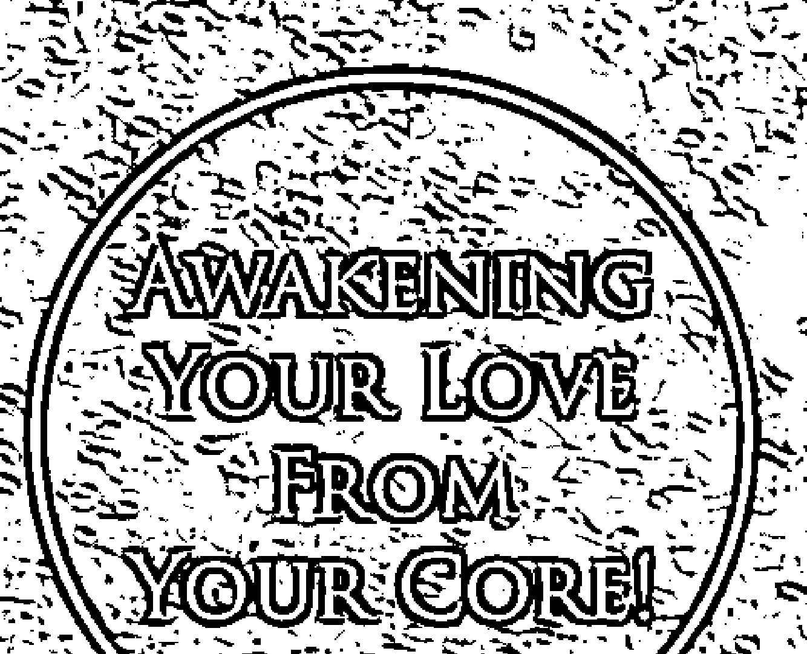

# 疼痛疗愈师

## 从高敏感身心到不委屈自己的幸福之路

一本地球新时代的能量启蒙教本，将帮助你扫除负能量，重启正向光明。

献给每个生命遭遇困顿、生活窒碍难行的人，让他们得以建构起个人独特的内在喜悦工程。

体质天赋敏感之人、想投入能量领域工作者，都可以从中获得一个明确的引领与借镜。

疗愈科学家 上官昭仪——著

# 关于作者

## 上官昭仪

以西方教育背景融合东方传统底蕴，超过二十年心理咨询与团体辅导经历，致力内在成长教育推广十五载，专研生命之美。

藉由大量个案与授课，透过色彩、文字、声音、形体等多元化方式引导人们感知身心和谐、认识自己，训练心念的美感，抒解生活压力与困境，协助人们有勇气面对生命的挑战，找到促进生命全面幸福成功的道路，创造生命的成功和富裕。更重要的，是希望藉由各类成长能量管理法，支援孩童以及支援成人内在的孩童，得到充满成长智慧的快乐！

教学与讲座足迹遍至台湾，中国，香港，马来西亚，加拿大与英国。主要议题涉及个人，家庭与企业成长。并专书专栏探讨亲子，家庭，两性关系，爱与生命本质的追寻等疗愈科学的应用与推广。

忙碌之余，仍热爱大自然，修行，爱情与旅游，渴望成为天地间充满光明与爱的讯息传递者！

相关课程及活动讯息，请见美力集团官网
http://www.ishangkuan.com/

# 资历

- ◇美力系统及台湾伊莎贝尔色彩教育学院（ICEA）创办人
- ◇曾任英国Aura-Soma生命色彩艺术与科学应用学院（ASIACT）全球专任教育训练讲师
- ◇比利时认证巴厘『孩童教育基金会』亚洲区负责人
- ◇美国身体智慧-动能园（AuraJin）全球指定全阶段讲师及督导
- ◇香港「爱上官」（ISHANGKUAN）生命之美品牌创建人
- ◇中国二级心理咨询师
- ◇中国人社部『色彩全脑智能系统分析评测评师』课程及师资培育总监
- ◇中国卫生部自然疗法高级调理师、精油疗法康复理疗师

# St. Royal College

## 天使神秘学院

- ※ 专业占卜预测机构
- ※ 神秘学培训机构
- ※ 水晶能量研究中心
- ※ 神秘学资料库
- ※ 官方微信：strcdts
- ※ 微信公众平台：strc2011
- ※ 读书交流QQ群：
    - 占星塔罗占卜师交流群：814594478（加入密码：PDF）
    - 神秘学其他综合群：659338717（加入密码：PDF）

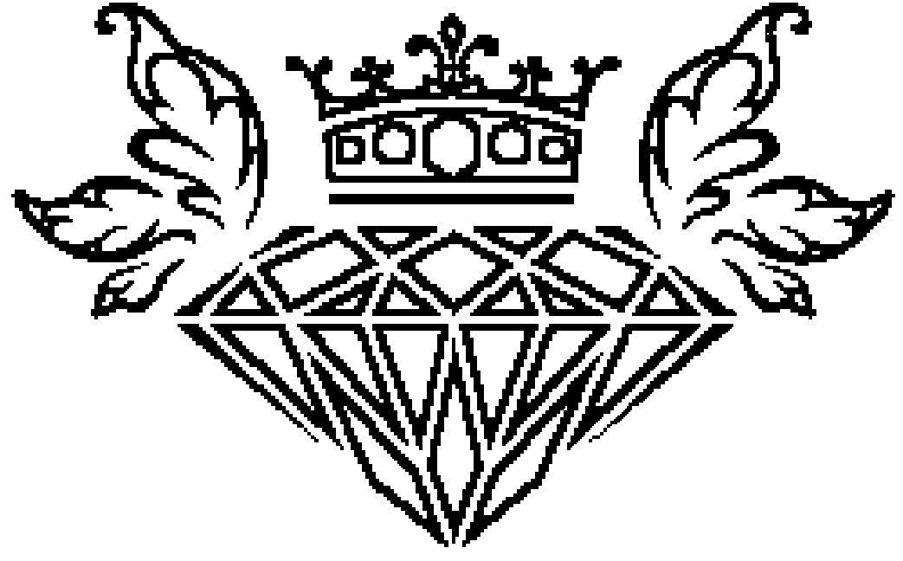

微信号：strcdts
天使神秘学院

天使神秘学院 院长QQ：715104687

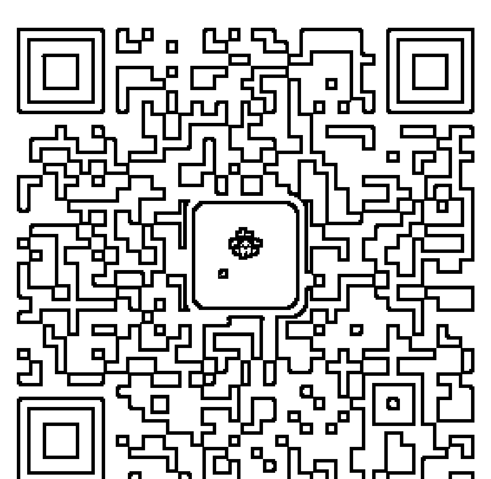

微信公众平台：strc2011

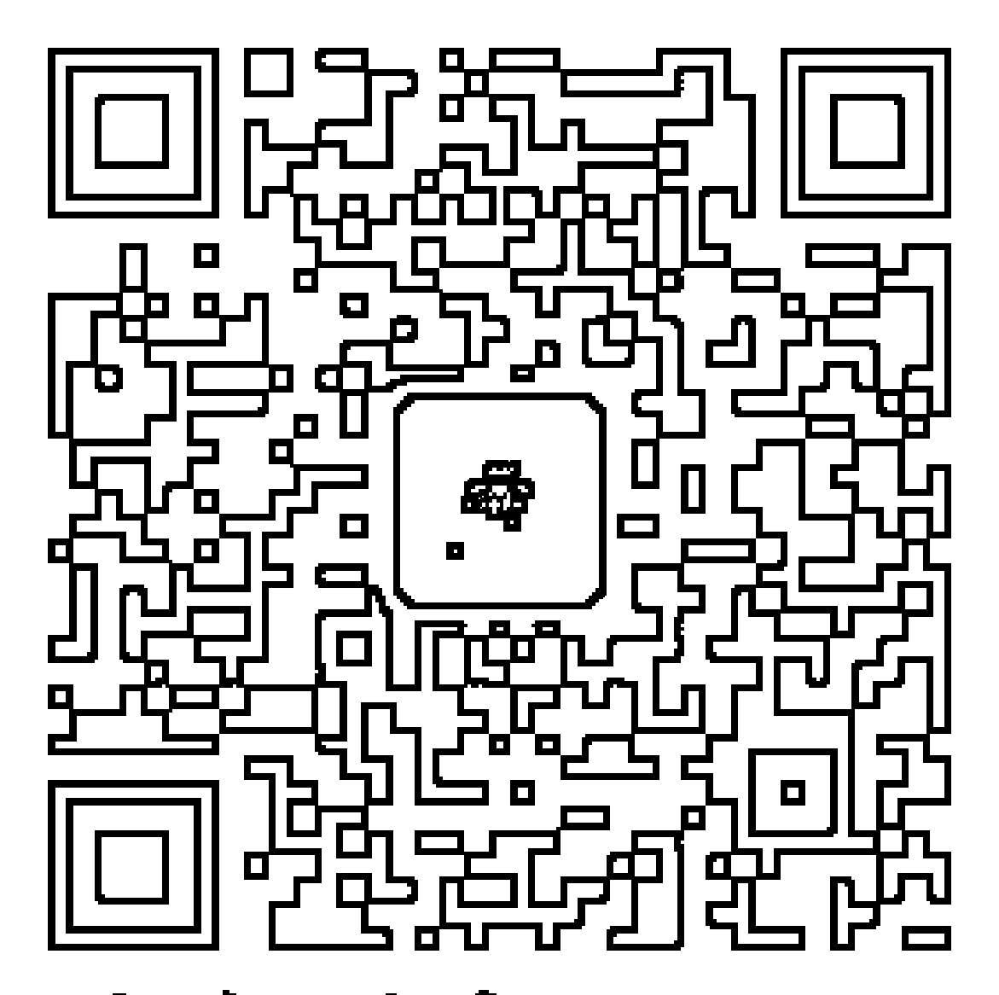

# 制作说明：

本书由《天使神秘学院》出重金从台湾购入的原版书籍扫描制作完成。为达到最好阅读效果，特地把原版书全部切开后，再经由专业扫描设备高精度扫描完成，并经过一张张的PS后期处理最终成书，其间花费大量的人力、物力以及时间，只为能给大家提供经济并优质的神秘学学习资料而努力。

本学院强力谴责某些机构和个人，把本学院花心血制作完成的电子书籍，包装后直接放在自家淘宝网上低价倾销的行为，以谋取不劳而获的经济利益。如果长此以往最终将无人愿意再为大家花心思制作电子书，那以后可能大家再无新书可读。

为让大家以后能够读到更多的好书，也为了本学院的良性发展。本学院恳请大家尽量做到如下几点：

- 一、尽量在本学院的网站购买电子书籍。
- 二、请勿用技术手段把电子书内的水印及加密去掉。
- 三、在收到电子书后小范围传阅即可，千万不要公开传播，更别挂到淘宝网上低价销售。

同时为答谢广大支持者，学院电子书将做如下调整：

- 一、学院会把一些早已收回制作成本的电子书折价销售。
- 二、最新制作的电子书籍会开放打印功能，大家购买后有条件的可自行打印成书。

天使神秘学院
2019年1月

# 心痛疗愈师：
从高敏感身心到不委屈自己的幸福之路

- 作 者：上官昭儀
- 封面设计：林淑慧
- 主 编：劉信宏
- 總 編 輯：林許文二

- 出 版：柿子文化事業有限公司
- 地 址：11677臺北市羅斯福路五段158號2樓
- 業務專線：（02）89314903#15
- 讀者專線：（02）89314903#9
- 傳 真：（02）29319207
- 郵撥帳號：19822651柿子文化事業有限公司
- 投稿信箱：editor@persimmonbooks.com.tw
- 服務信箱：service@persimmonbooks.com.tw

業務行政 鄭淑娟 · 陳顯中

- 初版一刷：2018年5月
- 定 價：新臺幣360元
- ISBN：978-986-96292-1-8

Printed in Taiwan 版權所有，翻印必究（如有缺頁或破損，請寄回更換）
歡迎走進柿子文化網 http://www.persimmonbooks.com.tw
Facebook 粉絲團搜尋：小柿子波柿萌的魔法書店
粉絲團搜尋：柿子出版
～柿子在秋天火紅 文化在書中成熟～

# 國家圖書館出版品預行編目(CIP)資料

| 心痛療癒師 : 從高敏感身心到不委屈自己的幸福之路 / 上官昭儀著. -- 一版. -- 臺北市 : 柿子文化, 2018.05 |
| 面 ; 公分. -- (New life ; 13) |
| ISBN 978-986-96292-1-8(平裝) |
| 1.自我實現 2.生活指導 |
| 177.2 107005497 |

# 以愛成長，以愛療癒

## 愛是慈悲的唯一途徑

This is not a typical biographical book. There is no magic or miracles, only love coming from realization of life.

這不是一本典型的傳記書，沒有魔法或奇蹟，只有來自生命覺悟的愛。

多年前，當我第一次見到Isabelle時，我感受到了她那溫柔而美麗的微笑在我眼中的流動。我問她：「你從哪裡來？」她很誠實，並且熱衷於幫助人們。然後，她成了我的心靈弟子和翻譯。我們透過佛陀的教導，而有了非常深的連結。

When I first met Isabelle (Chao-Yi) many years ago, I felt an incredible flow through her gentle and beautiful smiling into my eyes. I asked her, “Where are you from?” She is honest and has a passion for helping people. Then she became my heart disciple and translator. We have a very deep connection through the Buddha's teaching.

As her root teacher, I am glad that she follows the Great Perfection and studies hard for realization. As her family, I care about her happiness in the middle way. This book is her true story. I know that she has pure perception and beautiful inner heart. I wish that all the readers could get a lot benefit from her writing, and realize the meaning of Love. Love is healing, love is the only way to compassion.

作為她的根本上師，我很高興她能遵循著大圓滿法教，並努力學習與覺知。作為她的家人，我以中庸之道關心著她的幸福。這本書是她的真实故事。我知道她擁有純粹的覺知和美麗的內心，真心希望所有的讀者都能從她的寫作中獲得諸多好處，並且認識到愛的意義。愛是療癒，愛是慈悲的唯一途徑。

May all the sentient beings be released from sufferings and become as free and happy as Isabelle.

May Isabelle keep sharing her love and positive energy as her mission to work.

願Isabelle能一直分享她的愛與積極的能量，一如她的工作使命。

願所有的眾生得以擺脫苦難，像Isabelle一樣自由幸福。

May all the readers be free from sufferings and love the treasure of life.

願所有的讀者免受痛苦，領受愛的生命寶藏。

# 關於本篇序文作者：

佐欽巴楚仁波切，即第四世佐欽喇納巴楚仁波切（Dzogchen Ranyagpaltrulrinpoche），出生於一九六三年，幼年時便具有無限的純淨素質。十四歲進入佐欽寺，依此偉大寺院的純淨舊譯傳規，聽聞修習秘密壇城諸續部的四證悟行的法軌。二十歲時進入佐欽師利星哈五明佛學院就讀。巴楚仁波切的著作《普賢上師言教》、《證悟者的心要寶藏》，內容清新切要，深入淺出，在西藏是不分教派人人必讀之作。蔣揚欽哲旺波曾稱讚他：「外是寂天論師、內是大成就者夏瓦里、密是聖觀世音！」

# 充滿法喜的菩薩行

洛桑龍達／大英博物館首位熱貢唐卡藝術家

善弟子昭儀與我在六年前因唐卡藝術，於上海結下善緣，在上海及台灣，只要她抽得出時間，往往會來支持我的唐卡展覽，並向我請益色彩藝術的人生哲學。她對色彩和佛法的領悟及虔心令我印象深刻，特別她早年在佛法中的培養，使我第一次見到她時，就能感受到一種尊敬上師和謙卑的美好品德，這種日漸式微的德行，我很喜悅可以見到有善弟子依然保有。
曾經，她就自己在內地的修行和事業發展如何平衡，來與我分享及討論，我建議她要更廣大的成就自己的教育事業，並且成為獨有的色彩心靈專家。如今，喜見她的努力果然走出一片利益眾生的天空，願她永不退轉並充滿法喜的走在菩提道中，用文字和藝術來表現與示範世間修行的菩薩行！

# 關於本篇序文作者：

一九七六年，誕生於「佛法聖地文化藝術之鄉熱貢唐卡發源地」吾屯村。一九八〇年代，承接法王十世班禪大師傳承的大威德金剛密法和菩提心願法。一九八三年，被當地一代法主洛桑尼瑪大師選為「善根」，在隆務大寺受僧戒。之後進入吾屯寺，師從紫西拉旦等數位上師，學習佛法和唐卡泥塑等文化藝術。龍達上師的唐卡藝術成就享譽全球，不僅榮獲各大獎項，二〇一四年更獲讚為「中國十大唐卡大師」。

# 這本書可以讓你認識自己，然後愛上自己

劉長灝／綠光劇團表演學堂主持人

昭儀五年前曾經來找我上課，我是個表演老師，她希望我能指導她的聲音表情與肢體語言，讓她在演說的時候能夠真實的感動人心。她是個領悟力很高的人，很多聲音表情與表演技巧她一學就懂。後來她跟我說，她是心靈引導的老師，我從她那裡聽到她的課程內容，覺得她真是個能量很強的人。

後來她邀請我為她出版的書籍寫推薦文，我細看她寄來的文章，有一些領悟：

1. 我在上表演課的時候常說，演員要先認識自己，愈透徹的了解自己，就愈能夠從自己的生命經驗中，用同理心去理解各種劇本中、各類角色的心理活動與變化。然而，每個角色在追求目標行動的過程中，總是會期待自己成為更好的人，這與昭儀在許多文章中所說的有異曲同工之妙。我的很多學生在課後閒談中，偶爾也會用生命靈數與九型人格分析來討論認識自己的方法，我想昭儀出了這本書之後，我會推薦他們閱讀這本書來認識自己。

2. 當然，想要把演員這個職業當作終身職志的人是辛苦的，因為除了勤練基本功夫外，還要有一種信仰，才能在這個夢幻變動、不可捉摸的環境中生存下去。昭儀這本書或許可以讓演員提升自己的生命能量，找到「愛上自己」的生存理由，照亮自己的道路，勇敢地向前邁進。

3. 昭儀的這本書中有許多真實故事案例，這些故事活生生的存在這個世界中，這些真實故事比小說還要精彩。如果有一天能夠把這些故事搬上舞臺，我相信更能夠激勵人們去勇敢的面對自己，這比哈利波特作者J.K.羅琳更有魔幻的力量。昭儀總是在世界各國演講，每一次她回臺灣時總是說：「老師，我們要找時間聊一聊。」而我們總是他挪不出彼此可配合的時間聚會。也許我該問問她：「我們要怎麼轉換頻率，才能定靜下來，找到我們共聚的時間？」

# 以愛為名，從覺醒到重構之路

楊慰芬／鍇德文教基金會董事長

在尋找自我的過程中，昭儀老師不斷想傳達給我們每個人與生俱來的禮物，想告訴我們人生真正重要的東西，這讓我想起了Christopher Nolan在《星際效應》（Interstellar）提到的：「愛是能夠穿越時間與空間的物質。」（Love is the one thing that transcends time and space）

當我們面對生命所遭遇的種種磨練與關卡時，如何能正向的轉念、轉化，若有幸透過色彩能量的引導治癒，感受大自然的能量頻率，便能幫助我們面對困境，進而實現美好。認識上官老師是一個偶然的機緣，她的正能量很難讓人不注意到她，我大半生的生活裡只有數據與事實，但遇到這樣靈性的夥伴後，我開始學習細心的體會每一件事、物的本質，以及它到來的因緣。真的很不一樣的感動，這讓我專注於生活的每一個當下，享受陽光、聆聽鳥鳴、感受風吹草動，從生活中去發掘體會感知這許許多多的萬物，回歸於自我的寧靜，尋找自我內在靜心的品質，創造自身美好感知力，並透過專注的力量，感受生活的萬事萬物。愛是一種和諧的連結，能彼此相互聯繫又保有獨立自主愛著另一個體，因為愛、因為感恩，所以我們彼此豐富。以此心得與您分享。

> Love is the one thing that transcends time and space

# 最好的療癒——來自內心的平和與寧靜

胡宗明／臺北榮總玉里分院副院長・世界自然醫學學會聯合總會理事

與上官老師的結緣非常奇妙，未來若跟讀者有緣，再一一訴說……拜讀老師的書，彷彿像看一場又一場精采又叫好的電影，令人像著迷一樣，不由自主的一頁頁往下翻去。老師透過色彩、符號、隱喻、影像等方式，來表達她在夢中的修煉，這對她而言是「自我療癒」，但在看了她的書後，卻也深深的被她所療癒，頗有「見即解脫」的舒暢，在此，先代替讀者真心感謝老師。

# 推薦語

## 來一碗人生快樂湯吧！

陳俊生／71快速記憶學校校長

上官老師是一位求知欲非常強的學者，書中提到，別人家小孩是要家長拉著去學習才藝，而老師卻是自己主動要求去學習，所以從小一直都是資優生。也許是這樣性格，遂造就了現在的她，因為內心不夠平和與寧靜的人，是無法主動且專注去學習的。更難能可貴的是，老師用她所學習到的方法來幫助需要幫助的人，這也是需要這份平和與寧靜，再加上愛的流動，這樣的幫助才得以完整且圓滿。老師在書中提到，我們為什麼要和自己連結？是因為所有的夢境連結只有一個目的：連結豐富美好。老師也在書中教導大家釋放內在壓力與恐懼的方法，讓自己的身心靈更健康，更有感知力。看了老師的書，對修行這二字又有了更深一層的體悟與認知，這真的是一本值得推薦、非看不可的好書！

身體受傷，大家都懂得要去包紮、塗藥止血；心理受傷，當然也要去包紮止血。但是，一般大眾都沒有這種觀念，看得到的很重視，殊不知內心世界的健康順暢，更是影響我們外在行為的重要支柱。

# 成為自己生命的療癒師

薛博仁醫師／聖緹雅集團執行長、一站式醫美健管召集人

上官老師走遍地球，覓得良藥，此藥是一種想法，一種感悟，一種頻率，一種磁場，一種彩色的氣圍，一種氣場，這些妙趣的混合體，我們看了，看完思考，思考後用自己的經驗去消化每一個細節，讓養分能從融合的過程中成長出來，滋潤我們每一分鐘。極樂的世界，是性靈與物質同時存在的極樂，當我們缺了一邊，都只能是庸庸碌碌的用那匱乏的情緒過日子，教人賺錢的書很多，教人賺快樂的書不多，上官老師用多種角度來引導每一個缺乏快樂的朋友，值得我們每個人，細細品味她慢火熬燉出來的人生快樂湯。同為教育工作者，我和老師也一起在內地工作過，感受到她的精神力量就像一個能量小巨人，我們重疊的生命軌跡，讓我對人生有了不同的看法，希望這本書也能給大家相同的力量，灌注到每一個缺乏快樂的心靈。

經歷裡，都是以科學基礎為患者診斷與治療，但隨著現代人對身體、心理健康的重視，這種用輔助傳統醫學的疾病治療方式，不僅跨越了傳統「預防醫學」，從心理層面出發用心照顧，更是促進健康重要基礎之一。而作者所要傳達的療癒能量，也是我目前要啟動的「一站式醫美健管」的精神主軸，由內而外健康，並與美麗心靈完全契合，因其中包含了以愉悅心情及能量來迎接自己。昭儀是位能量極強的老師與朋友，以前有很多成功的著作，但這次她是將自己的人生經歷，透過文字傳遞，帶我們走進色彩世界，讓你我能成為自己生命的療癒師，進而啟動愛的能量，療癒自己與他人，每個人都該一讀。

# 學員心聲 / 彩光湧現，真愛無限

十年前，我在加拿大唸大學時，同時也開始了與上官老師的緣分。那時候我是帶著情緒的創傷，而為了療癒自己和家庭，便去上了老師的色彩身心靈課。上完課後，我得到的不是一個療癒，而是內在轉化的智慧。

後來，我在亞洲再次跟上官老師相會，感恩她的鼓勵，讓我在心靈上療癒別人，除了自己，當你能與情緒同在，覺察背後的動力，有意識地為自己負責時，宇宙會開一扇門給你。感恩能再上老師的課，讓我找回生命的信任。

感恩上官老師！『信任的第一步，源自我們為自己生命的定義。』

> > — 香港 JEN

認識上官老師有兩年多了。印象中的老師，是一位特別優雅的女士，愛穿白色的衣裙，總是和藹可親的樣子。每當我遇到挫折，或是生活不如意時，上官老師總是鼓勵我，並不經意的用最柔和、最不傷害的方式，點出我當時問題的要害。每次被老師提點，都能讓我心服口服，因為老師每次都能說出我心裡的癥結，並溫柔的指出我當時都不願意面對的自己。而被老師指點後，那個面具後面的我，便有了勇氣走出自己的偽裝。

感恩遇到上官老師，感恩老師一步一步帶領著我，讓我遇見更好的自己。

我是一個普通的女性，兩個女兒的媽媽，曾經自認為很幸福，做著生意，我的初戀成了我兩個女兒的爸爸，而媽媽和弟弟都生活在同一個城市。

在二〇一二年，我平靜幸福的生活發生了變化，弟弟出車禍走了，媽媽為此差點沒挺過來，我們全家都沉浸在悲痛之中……屋漏偏逢連夜雨，我的老公和我的閨蜜好上了，我差點崩潰掉，都不想活了，期間的心酸實在無法用言語來表達，我每天都祈禱上帝給我指點方向，我該怎麼辦？

上帝派了天使來指引我，她就是上官老師，第一次見到她，我就覺得好熟悉，好溫暖，好有愛，在家居生活色彩課程裡，老師在講，我在聽，每一句都講到我的內心最深處，然後不自覺地眼淚就像斷了線的珍珠，止不住的流。老師的一言一語都影響著我。

重慶、成都、上海、臺灣一路的跟隨，一路的學習，上官老師真的很神奇，什麼都懂，包羅萬象，我現在認真的在學習老師的天使光能靈氣，不但可以療癒自己，還可以療癒別人。

就在今日，我活在感恩裡。老師說，愛能解決所有問題，我深深的相信。

在此，用老師說過的話總結此刻的心情：

「願我走過的痛楚，你不必經歷；願我已有的幸福，你觸手可及。」

——重慶 懷建

就在今天，我心存感恩！之前，色彩對我而言是陌生又擔心的，總覺得我只能用黑與白，總覺得自己什麼都不行，用力地過著每一天，深怕沒把自己與事務做好，所以大家總覺得我很苦，心一直處於匱乏狀態。認識上官老師後，她讓覺得她就是帶著色彩光的女神，她的溫暖和陪伴是真心的，帶著我用心去體驗生活，感受色彩帶給我的不同感受，也開始接受原本的自己，開始欣賞別人。帶著感恩的心去看世界，真誠的感恩時，漸漸的，所有的東西都變得美好了。不再有抱怨，每個到生命中來的事物都是有原因的，感謝他們讓我學習成長。一系列學習後，不一樣了，家庭、工作、生活都變得更好了。所以我決定，要跟隨老師的腳步，把這善的能量像漣漪般傳遞出去，將利人利己的心發揚出去。第一眼的接觸時，感覺這位老師好漂亮，是一種由內在散發出光芒的美麗，是一種給人超親和感與自信的魅力。當老師一開口說話，有如天籟般的聲音，一種無法形容的吸引力深深的打動了我，心就這樣完全的被引領著向前走，進入到一個令人驚奇與期待的色彩能量世界。一種從來沒有的觀念開拓了我的視野，原來我可以透過色彩找到生命的課題，原來可以透過色彩了解性格，原來可以透過色彩剖析內在，原來可以透過色彩運用帶來正向光明及改變命運。從老師的身上，可以感受到對生命的熱情與活力，一種愛與慈悲的能量源源不絕地湧出，在每一次的課程中，都能感受到身心靈被老師療癒了。很謝謝這難得的緣分讓我遇見上官老師，能跟隨著老師的步伐前進，繼續朝著自己的天賦與使命邁向人生旅程，沒有擔憂、沒有恐懼，只有歡喜、只有愛與美的心靈，謝謝！—臺北蘋兒

五年前遇見上官老師時，我只想解決生活難題：人生中遇見那個真心想要嫁的人，卻第一次被分手；被銀行追債，可我卻已身無分文。我坐在上官老師的對面，對老師說：「老師，我不知道我的人生該怎麼繼續下去了，我不知道該怎麼活了。」那時候老師只問了我一個問題：「你相信我麼？」那時，對我來說，上官老師完全是陌生人，可不知道為什麼，當時混亂無措的我，卻感受到前所未有的平靜和安全。我點頭，對老師說：「我相信您。」然後老師說：「只要你相信我，我願意幫助你！」那個時候，老師給我的這句話像是一種承諾，只是沒想到，這一幫，便到了現在，還一直支持著我成長！從那時起，一步一步地走進色彩能量的世界，開始了人生神奇的療癒歷程。才了解，原來我的痛苦是因為心一直在漂泊，我不知道家裡有愛是什麼感覺。就好像你已經習慣了黑白灰，已經痛到麻木，放棄對生活的渴望，覺得人生就是這樣啊，大家都一樣。然而，突然的出現一個人告訴你，愛是這樣子的，你可以不用痛苦，你可以活出和別人不一樣的生命歷程！你可以有愛，你有能力愛自己，也有能力愛別人，你可以活出和別人不一樣的生命歷程！感謝老師讓我重新感受到世界的愛及溫度。—貴陽昕昕

## 彩光湧現，真愛無限

在上官老師的課程中，很自然地就會在一種很愉悅的氛圍裡被療癒，很容易自嗨的老師，會讓上課的氣氛充滿歡笑愉悅，並充滿粉紅色的愛之光。老師的嗨很快就感染了在座的學生，瞬間融化第一次上課的緊張感。

但你以為上課只有歡笑嗎？就錯囉！老師的催淚功力也非常了得！當她使出幻化於無形的「武功神力」時，那個「一陽指」就正中你的罩門！沒錯，包含著各種複雜情緒的淚水，就自然地溢出了雙眼，

就在歡笑與淚水的洗滌下，身心慢慢被療癒了。是的，如同描寫孔明「羽扇綸巾，談笑間、檣櫓灰飛煙滅」的情緒般，問題……種種就隨風而逝。

——台北 怡萱

我從未遇過這樣一位如此為人著想的人。她會因為你的快樂和成功，而感到快樂（甚至比本人更高興）。也會因為你的痛苦而難過流淚，比你更渴望你可以離苦得樂，解決煩惱。

我在人生的低潮時遇到了上官老師，在我最難過的時候，老師跟我說：「你相信老師，你已經夠好了。」這句話，引發我的淚崩。

有多少人聽過這樣真摯的讚美？我們眼中看到不好的多，感受美好的卻少之又少。

在老師的眼中，彷彿世界萬千色彩，她都可以看到色彩的正面力量，對於負面的，老師則運用色彩的療癒力，扭轉乾坤，像把灰灰的、霧霧的洗刷乾淨一樣。

色彩徹底改變了我的人生。曾以為幸福離我很遠，但因著老師，發現原來幸福是觸手可及的。

## 感恩，這美好的緣分。

當我因為好奇，而開始接觸色彩能量，老師卻看見我心裡更深的渴望；當我覺得自己就是如此了，老師卻看見與激發我沒有想像過的潛能；當我困在自己的牢籠中鑽牛角尖、憤世嫉俗、畫地自限，老師不斷敲著我的門，告訴我鑰匙就在自己手裡；當我面對母親罹癌，家庭頓失依靠，束手無策的時候，老師用她溫柔慈愛的光，陪伴我和我的家人走出憂傷。她總是能看到更遠、更深的未來，也總是最嚴謹、認真、踏實地在努力；她能看見人心最黑暗的地方，也能挖掘出人性最光明的力量。她能上達天聰，下至地府，儘管如此，卻比誰都更純真、更熱情、更謙卑地擁抱活著的每一天，以及遇見的每一個生命。她是上官昭儀，一個美麗而不凡的女子。

> > — 臺北淳涵

認識上官老師，真的是冥冥中上天的指引，機緣巧合，把當時正陷入人生困境中的我，帶到了老師面前，有幸與老師吃了一頓飯。席間我捧起老師的書，將左手放在上面，卻不知怎的，淚水就止不住的流下來。

> > — 香港小圈

將色彩能量的美好傳遞給更多和我曾經一樣迷惘的人們。

願更多有情眾生可以走近老師，感受老師的光明指引！

——上海 吳俏

認識上官老師已經超過五年了，時光真是善待她，似乎並沒有在她身上留下歲月的痕跡，五年前她就美麗如此，五年後（我想甚至十年後）她美麗依舊。

但接觸久了，我才發現外表的美麗是她美力修行的結果。她無時無刻不在實踐色彩能量，從大自然的一花一木中得出感悟，豐盛自己，也傳授給我們，盡她所能的渡身邊的每個人。

我有幸跟隨老師學習，讓我在這短短幾年裡，由一個繃得特別緊、凡事都要爭第一的小姑娘，變成一個知道放鬆自己、享受生活、愛自己也愛別人的大女孩。我的人生也像開了掛一樣，感情和工作都開始順遂起來。我這個時候才理解老師帶給我的點撥，其實對我造成了多麼深遠的影響。

> 我開始愛上色彩能量，持續學習，從最基本的色彩搭配開始，到高層次的天使光能靈氣，未來我期待我能學有所成，將老師的理念與心血傳遞給更多的人。

——上海 Laurio

認識老師是一場意外，原本的我體弱多病，又深受敏感體質困擾，在家一天到晚被鬼壓床不說，身體累到連正常上班都很困難。沒想到機緣巧合下認識了老師和美力系統，也沒想到會成為工作夥伴。在真正認識上官老師後，才發現她不僅溫柔、細心，能力還很強大，我們總想著出門要保護老師，卻往往是反過來被老師保護。認識老師後，體弱多病沒了，鬼壓床也沒了，換來的是家中和諧的氣氛，而自身的情緒問題也慢慢的在調整、療癒。 跟在老師身邊，你會發現她總是精力滿滿，衝勁十足！總是能帶動旁邊的氣場，讓大家也幹勁十足、信心滿滿的做事！ 待人處事，老師總是充滿著正能量，她有一種特別的感染力，就像太陽一樣，所有的黑暗在她面前都無所遁形，她溫暖的照亮著。 願更多的人能認識老師，有機會能受到她光明的指引，開展更亮麗的人生。 ——臺北 逸筑

我的老師——上官昭儀，是很專業且善心的好老師，更是溫暖的太陽。 ——高雄幸儀

認識上官老師，我總認為是一段很幸福的緣分，我是藉由居住於加拿大的朋友，輾轉介紹，與同樣生活在臺灣的老師認識。第一次上課時，只覺得她是個好有時尚感的老師，有別於一般校園見到的「老師」啊！ 與老師相識的十年來，對老師的敬仰與愛從未曾變動過，她就像溫暖的太陽一樣，在每個人生階段陪伴著我走過大大小小的經歷，快樂時老師會一起大笑，傷痛時老師會很溫柔的運用她的十八般武藝支持著，而無論發生了什麼事，這顆太陽從不曾遠離過，這樣的溫暖，一直支持陪伴在我的人生道路上。 因為工作關係，所以能與老師有更多的親近與了解。老師是很孝順且貼心的孩子，我總想著，作為一個教育傳承者，有著孝順善良的本心，並且有專注的工作態度，那麼，我能夠跟隨在她身邊學習著、共創著，是多大的光榮與幸福！

## 學員心聲/

## 寫在前面／

## 愈過愈快活的人生

每個故事中都會有個結局，但在真實世界中，每個結局都是新的開始……年過四十之後，我才敢在公開的課堂上承認，說自己也有一點「敏感」。

> 孔子說：「三十而立，四十而不惑。」

很遺憾的，雖然自小學習了中國文化基本教材，一心以孔子為心目中的偶像英雄，可是，我卻無法做到孔先生所說的，所以到了四十歲，即使好像比較有自信了，但我依然覺得懵懵，依然迷惑。我一直在猶豫於兩界之間——生與死，靈與肉，守身與婚姻，正常與不正常，世俗與非世俗，胖與瘦，美與醜，是與非，有神與無神，有情與無情，有錢與沒錢……是滿足父母？還是滿足自己？是取悅外界？還是取悅自己？於是，前半生的我就在這樣迷迷糊糊間，為了我深愛的家人、工作夥伴和學生及個案的幸福，而奮鬥，而放棄，而努力。也在懵懵懂懂間，遇到貴人和高人。

愚鈍的我，總是在最低潮的時候好運連連，也在最驕傲的時刻跌落谷底。 我有時希望走入宗教及靈性，但有時又需要錢的支持。 我很希望父母家人能懂我，放我自由，卻又不忍他們生活匱乏，總是一肩擔起所有家計。 彷彿龍困淺灘，辛苦的施展著，就這樣，闖闖難過卻又闖闖過。 五十歲，我對於自己的狀態算是沒有不滿意了，身體健康、心理健全、工作順利、心情愉快，白手起家成就中港臺的小小企業，雖然遊遍世界知名的學校，但依然朝著博士學位邁進。 更重要的是，到了這個年紀，反而可以自豪地說，自己變美，變得很魅力了，煩惱變少，很容易開心，桃花也朵朵盛開。 你說我全部滿意嗎？也還沒有，因為我依然個性倔傲，不易妥協，常咄咄逼人，嚇退眾桃花，卻依然得理不饒人，有著靈性的驕傲，也自以為是。 在家族親友的眼中，我是讓眾人跌破眼鏡的孩子，一直看好我是勝利成功組的組員，沒想到到了後半生，才發現原來是個放牛班的小孩。 然而，有天在演講中我才驚覺到，原來不知不覺地，我已然成為他人眼中羨慕的對象，我已經是個實現夢想的女人。 尤其是對一些飽受婚姻感情折磨而痛苦的人來說，我這樣乾乾淨淨，不欠任何人，也不必還任何人的債，過著自己想要的生活，做著自己熱愛且引以為傲的工作，身旁有著一大批已然是家人關係的可愛知心小夥伴，夫復何求？ 原來，在不同的人眼裡，我是如此的成功與自在！而我，依然朝著心中理想的目標邁進。 對我來說，五十歲的心境，竟是二十歲的熱情；五十歲的年紀，竟沒有為我帶來任何巨大的匱乏，

反而像是經歷過《班傑明的異想世界》的情節，愈活愈年輕，愈活愈有生命力，愈活愈有朝氣，愈活愈有愛，愈愛我自己。一掃二十歲時，那個覺得人生痛苦不堪，每天為家人和生存奮鬥著，不喜歡人群卻必須聽話的留守於人群中，也因為弟弟意外過世而找不到快樂的女憤青；也一掃那個肉身是女性，但靈魂卻活脫脫像個男人的女漢子。現在的我，愈來愈像個女人，如此深愛著這個世界，真心愛著身旁每個緣深緣淺的生命，也感恩的度過每一天，不願浪費這值得珍惜的人身與人生。

沒想到能夠有機會這樣寫出我前半生的生命奇蹟故事（當然，我是以靈魂永生，存在於生生世世的因果觀點來看待），也沒有想到高人無所不在，在出版界存在著富有使命感的靈性覺知者，成了願意意識我的伯樂。

> > 僅以此書——感恩眾靈性指引者，有形的，無形的，聲音的，訊息的，畫面的，感知的，夢境的，彩色的，黑白的，光明的，黑暗的，東方的，西方的，古代的，現代的，前生的，今世的，自我的，無我的，內在的，外在的，美麗的，醜陋的，天界的，地界的，植物界，動物界，各次元的……

> > 一「感恩所有生命中的相遇」，我知道，這是很老的舊話，不過，對於一個經歷過痛苦挫折及低谷的人來說，那些生命中所有的高高低低，事後總能證明這句話的真實性。

原本我不怎麼相信，不過在每每的失望、期待落空、不明所以後，現在已然臣服。Thy will will be done.（上天的意旨，就是我的意志）。

感謝所有成就我、指引我的師長，及一路上始終鼓勵、義務指導我的眾高人前輩們。

如果這本書中的故事能對讀者及同道中人有一點點啟發和鼓舞，那麼，對我來說，已經是最大的榮耀了。

## 寫在前面/

## 昭儀

寫於地球 值天秤座滿月，水星／土星／金星逆行，太陽與天王星合相，對分月亮和木星，四分冥王星，五顆星在開創星座形成強大的T三角格局，適合兩極能量統合的時機。

當然，如果書中的個人觀點未盡成熟，而令你感到不舒服或質疑，也請你一笑置之，當作一部沒寫好的科幻小說，就此略過吧！

## CONTENTS
目錄

推薦語／以愛成長，以愛療愈
愛是慈悲的唯一途徑／佐欽巴楚仁波切 3

充滿法喜的菩薩行／洛桑龍達 5

這本書可以讓你認識自己，然後愛上自己／劉長灝 6

以愛為名，從覺醒到重構之路／楊慰芬 7

最好的療愈——來自於內心的平和與寧靜／胡宗明 8

來一碗人生快樂湯吧！／陳俊生 9

成為自己生命的療癒師／薛博仁 10

學員心聲／彩光湧現，真愛無限 12

寫在前面／愈過愈快活的人生 20

## Part ① 人生夢想設計藍圖 27

## Chapter ① 夢境奇遇——打開夢境大門 30

## Chapter ② 面對生死關：弟弟死了——擺脫「分離之苦」 40

## Chapter ③ 水晶精靈的訊息——水晶聖壇的神聖力量 48

## Chapter ④ 另一個世界的啟發——愛你的恨 57

## Chapter ⑤ 夢中的學習之旅——如何在夢中修練 69

## Chapter ⑥ 神奇的修行人——找到對的師父 79

## Chapter ⑦ 我的東西方啟蒙老師——專注的品質 89

## Chapter 8 重返歐洲——天生的雙手療癒能力

# Part II 心與物質的生存考驗

## Chapter 9 走進色彩異世界——彩色禪修的定、靜、慧

## Chapter 10 這不是我想象的身心靈行業——找回清晰思緒的雜念管理

## Chapter 11 生存的考驗——用色彩能量氣場解讀剪開業力鎖鏈

## Chapter 12 非自願治療師——啟動核心之光

## Chapter 13 治療師的才華——內在「孩童意識」的信任問題

## Chapter 14 天使神諭——連結高層的光明力量

## Chapter 15 愛上自己的道路——用正念觀照跳脫混亂暴風圈

## Chapter 16 走進西藏、不丹和印度——拙火之樂

# Part III 進入臣服天職的階段

## Chapter 17 再次面對生死關——面對死亡的準備

## Chapter 18 治療師的愛與欲——尋找靈魂伴侶

## Chapter 19 能量工作的職業道德——落地的覺知法

## Chapter 20 心靈與物質雙豐收——四個方法讓自己輕而易舉的豐盛

## Chapter 21 提高覺醒的全頻率能力——Color U 進化的道路

## Chapter 22 愛和恐懼不會同時存在——成為勇敢的彩虹戰士
256

## Chapter 23 勇敢的人有福了——揭開靈魂的面紗
265

## Chapter 24 轉換頻率到下一個階段——轉換頻率的實戰經驗
272

## 結語／接下來呢？
284

## Part ①

## 人生夢想設計藍圖

東西方都有著一種信念，認為我們的人生藍圖是自己設定的，只是出生後自己就忘了。不管是哪一種說法，元辰殿、生命藍圖、阿卡西紀錄、生死之書……很多的傳說中，不論東方或西方的研究，都脫離不了「光」。在《西藏生死書》中，有一個很重要的論點，就是人在投生為人之前，以及死亡之後，在七七四十九天的中間過渡期（Bardo，中陰，中間階段），我們沒有物質的身體，就只是一團光，這團光體帶有自己的意識銘印，帶有一種專屬的色彩頻率，這團光帶著自己的顏色特性往著被吸引的方向前去……

準備再次經歷生命輪迴的光體，會被相同頻率的組合所吸引，這個組合由一男一女的相合力量構成，或可以說是一種共同類似的光芒，於是三種光芒融為一體，就像是宇宙中的大爆炸。我們，這個了不起又勇敢的生命，就此種下了生命的開端，在所選擇的母體中開始新生命之旅。

類似互相吸引的頻率湊在一起，是因為有共同的功課和學習，也有著共同的問題想一起解決，這種顏色光，就是生命的緣起，也是家庭與家族一直繁衍下去的原動力。

夢想渴望被實現，所以我們帶著色彩的意識，開始走入彩虹的色彩人生地圖，希望走一場彩虹的生命。而這些夢想，都被儲存在記憶深處——內在潛意識的原型地圖中，等著我們出生後開始解碼，不僅重新找回自己，也希望創造出新的自己。

我從來沒有想過，自己的人生會從顏色開始，而且還是從生死的體悟開啟彩色的大門。而這些色彩的寶藏，屢屢透過死亡或瀕死，向我印證其不可思議的存在，自小的藝術學習和儲存在潛藏記憶中的許多才華，也因為這些色彩的記憶，而逐漸被打開，具有與眾不同的彩色觀點和意念，特別是醒與半醒間的色彩力量，不斷牽引著我走進彩色的大宇宙，也打開了我的創造能量和高度運用想像力的療癒能力。

這些能力，後來大家稱之為潛能開發、全腦開發、創造力開發、右腦教育、藝術治療、靈性開啟……不論是哪一種說法，都帶有神秘又神奇的過程或結果，也引發了許多教育專家及科學家的研究和探索。而我的這種能力，就是實現人生藍圖（我稱之為夢想設計藍圖）的超能力。我可以具備，每個人也都可以。

只是你相不相信這個世界的顏色，竟然有如此強大的能力？

我的能力，不是來自我個人，而是來自對自然界的臣服和喜歡，所以可以輕而易舉的擁有，這種連結自然界的美好力量，因為色彩的美麗，只能用於創造和所有帶來美好感受的人事物上，沒有辦法呈現醜陋，因為顏色只能帶給世界美麗和力量。

它也稱作光，是宇宙生命源起的力量。

## ### Chapter 1. 夢境奇遇

※人生所有的一切，都脫離不了痛苦的本性。我生命初期遇到的痛苦，不是生離，就是死別。我沒有談過戀愛，家庭幸福美滿，第一次撕裂的經歷是死別。有一次在一個飯局上，一位女性企業家問我：「你知道前世今生嗎？我讀過一本書談到前世今生，你懂這部分嗎？你讀過那本談前世今生的書嗎？」

主辦人了解我的背景，在座的學生也都知道我的「功能」，不過我沒有直接回答，因為這個女企業家並沒有誠意在請教我，也不是真的想和我研究，她的能量只是在「炫耀」她的履歷，一份美好的人生履歷表。然而，我的履歷表很多元、很豐富，而且不只有今生的，還有前世的。但我懶得一一報告，

很多的體驗說了她也聽不懂，因為層次不夠，多說了又造成過多的幻想和崇拜，也可能創造錯誤的理解，能說什麼呢？

四十歲以前，我實在很難對這部分開口承認，並輕鬆自若地應對提問，我不想藉此炫耀這毫不起眼的功能，也不想用此賣錢上媒體，最不想的是以我粗淺的認知和體會，造成了對方的誤解。

但是，擁有了之後卻往往不夠珍惜。

大多數的人，生命之所以痛苦，正因為有著無止盡的追求，沒擁有的就特別想要擁有，所以，為了避免在對方生命中創造更多的問題，也避免在我的生活中帶來莫名的煩惱，我往往把這部分答案和體悟放在一個潛在的空間中，這是我個人的秘密，也是我自己的體悟。

## Part Ⅱ 人生梦想设计蓝图

幼年的我常常在梦里醒着，不知道自己是在梦中，还是醒着。有时候我也常常觉得，醒着时也很像在做梦。

人生如梦，梦如人生。在很小的时候，我常梦到一些新鲜的故事情节，有古装，有科幻，在月球上的，在外太空的，又或是常梦到自己在飞，飞去巡视某些地方，甚至有时候会不小心飞到奇怪的地方，出现一些好像不是我的世界的一些怪人类。一旦觉察到自己跑到感觉不安全的地方时，大吃一惊，就可以安全地离开梦境。但有时候是梦中梦，要一连醒来好几次，才是真正的醒来。后来有学生告诉我他们在梦中梦到我，或在梦中和我讨论，其实很多时候我去了学生的梦中「说教」，或解答一些问题，或告知疾病的解决方法、来源罢了。

这是很平常的事情，我没有向任何人提起过，因为这是我的秘密花园。

六岁起，家中多了一位新成员——我的弟弟，一个可爱的、胖胖白白的小朋友。由于母亲忙于照顾弟弟，并和自己身体的健康纠葛着，以致无暇顾我，但我也不太会让大人们操心，因为我是個「特別」懂事聪明的孩子。只是小小一两岁的时候，我却有个顽固的个性，就是绝不轻言道歉，年轻刚有孩子的母亲也不知道为什么我会这样，母亲说我的眼神总有一股穿透力，似乎有着可以看穿人心的能力，这种不用说话就有的强大力量一发出来，好像我才是她的主人。

往往母亲想逼使我低头认错，却在见到我坚毅的眼神和宁愿被打死也不愿道歉的决心时，她就抓狂了，更疯狂的打我，想逼我认错，而我依然直直站着，只会摇头拒绝，绝不道歉。爸爸看到妈妈打我打到失心似的，才出面阻止说：「一个小小孩能犯多大的错误呢？不需要这样打吧？」

所以，在六岁之前我受到母亲很多的「行为教导」与「言语限制」，这多半与我不服输和可怕的倔强眼神有关吧？当然，我也学会了隐藏感受和心灵之眼所见到的情境。就在弟弟来之后，母亲多了一个孩子，很忙，而本来就习惯安静的我，也因此有了大量阅读神话故事的机会，与大量独处、大量自我思考的时间。

对孩童的发展来说，七岁以前的情绪认知和情感培养是发展重点，七岁以后的孩子开始觉察身体，但在此之前，孩子多半仍带有自己原来的灵性特质，也具有独特的性格。如果父母在这个时候可以保留孩子的本质，然后引导孩子补充自己的不足，以爱培养，这样，孩子在精神领域中所拥有的安全感，以及以爱为主的精神感受，这些无意识的生命涵养，或许可以受用一辈子。

父母对我最大的迷惘，就是从我会说话开始。因为我似乎可以「铁口」直断，往往一语可以直指他人的内心。但我的母亲比较受不了，因为这样的孩子很难教育，不是很听话，我常会反问她为什么这样？对于大人的语言，我会感受后反馈，往往逼得大人无法回答。我觉得自己没有错，只是很不明白为什么大人不回应？也不依照「心」来说正确的事情？
本来就是一种平凡的反应，当年那小小孩也照着自己内心渴望的方式活着，却在弟弟去世后，才开始真的正视一些问题：为什么我有这些梦境和灵性体会？这些到底会对我带来什么影响？对其他人有什么影响吗？

我实现。
※
于是我开始踏入荣格的无意识心理学，经历个体化过程，然后开始懵懵懂懂的探索「无意识的自我实现」。

在寻找自我的过程中，梦境分析是我最大的乐趣。
人类对于未知的探索，特别是对于自己潜在的力量，总是充满了好奇和渴望。所以从高中时期开始，我开启了很多研究梦境的渴望，主要是从每天的梦中，我的神游、鬼压床，以及梦中所见、所听、所闻、所学展开，有时候是梦中会有声音告诉我一些讯息。

国中时期，我便尝试过找学校的辅导老师想获得解答，但老师们总认为是我「想太多」，看到我的智商测验一百三，只告诉我聪明的小孩要好好考试。到了高中还是一样，这些辅导室的回应无法满足我内在世界的探索，我感觉自己必须找些答案，因为内心的声音愈来愈大声，再也挡不住了。

当弟弟过世时，痛苦的我，脑海中只出现两个字——快乐。我发现，人只要一口气没了，想追求的什么也没有了。那么，人活着的又是什么呢？不管我们追求些什么，都只是为了「快乐」吧？

弗洛伊德的「超越快乐原则」中，潜意识成了一名稽查者，我们通常在放松时容易敞开大门，容许潜在的讯息进入意识之中，所以透过分析梦境的结构，我发现了自己擅长的图象式象征喻，再加上与心理学的结构比对，很容易就能找到答案，而这正是弗洛伊德所说的：「梦是通往潜意识的王道。」

因为自己的灵性梦愈来愈多，梦中教育的内容往往自己没有学过的，但醒来去查资料也十分准确，这对渴望求知的我来说，勾起了极大的兴趣，我并不想知道类似「算命」的结果，而是更想知道「源头」何在！

> > ①弗洛伊德（Sigmund Freud），奥地利心理学家以及精神分析师，也是哲学家，是精神分析学的创始人。一八九九年十一月出版的《梦的解析》是精神分析的入门书，被称为是「理解潜意识心理过程的捷径」。身为荣格的老师，他强调梦境是一种心理结构，对于所解释的梦境，都是属于「欲望的满足」。

尽管有很多科学和精神的验证，但我常常感觉到，只有弗洛伊德才能抚慰，在幽暗的灵界中梦到亲人的释梦。因为很难解释逝去的亲人为什么会到你的梦中来，除了过度思念之外，当然还有其他的讯息与意义，后面我们再聊。

当然，随着进入到二十多岁的时期，我还是放弃了佛老师，因为他凡事离不开性的解读，令我感受到狭隘局限，特别是我对性没有很大的探索兴趣。我只想知道，为什么宇宙中有这些现象？为什么我总是要像天线一样地接收？而我可以如何找出答案？这些讯息的出现，到底是在传达些什么呢？

最奇妙的一次，是二十多岁的一次五天神游，我感到自己似乎脱离了身体，但我依然是清醒的，我 從 yahoo 寄出的，一开始还是乱码，后来出现「from Heaven」字 不知道自己要走向何方，好像也没有方向感。

有一封一次梦到上天给的一封信，实在令我啼笑皆非。 在梦中太过真实地收到电子邮件，实在令我啼笑皆非。

下一场梦，却是一群天使围绕着我在哭泣，我是他们的一分子，但我快要死了，天使们为我哭泣， 渴望唤醒我，因为大家的哭声惊动了我，那声音太强烈，所以又把我震醒。

这些种种，在二十多岁时从死亡中延伸的迷茫，挣扎中也带给我许多灵性启发经验，成为日后生命中的宝藏。

每一场的灵性启发，都成了我生命的核心力量，我感觉自己像是碎片一样，透过每次的经验，一片片的将拼图重组起来，每组回一片，我就得回一次力量，像是得回一个我本有的功力，只是需要通过关卡的考验，然后赢回真我。 这个过程，一直延续到今天，未曾停止，只是年轻时候的拼图，和中年后拼图，性质上已经不太相同了。年轻时的拼图，虽然是认识自我的旅程，但更像是疗愈的过程；而中年后个性上的稳定，则像是灵魂漩涡向上提升的过程，也充满了乐趣。

弟弟是引领我进入梦境的推手。

六岁的时候，因为家里出现了这个新成员，从此我就像是个可爱的小妈妈和小老师。我非常喜欢可爱的弟弟，他也一直陪伴了我十七个年头，直到血癌过世前，我们一直分享着彼此灵性和感受的内在世界。弟弟的善良让我感知到爱与包容，弟弟的聪慧也让我从他身上学习到双鱼座的牺牲和奉献。短短的十七年，我和弟弟的爱非常深刻。

过世之后的弟弟，也是我穿梭现实和精神世界的关键人士，他一直陪伴着我，直到我找到自己的道路为止。

拥有手足之情，和失去手足之情，可能是很多独生子女无法理解的，而我也在成为独生子女之后，更感觉到爱的力量。灵性和细胞的链接是很多生生世世的功课，我们不仅要完成自己的功课，，还需要协助家人一起完成生命旅程。

「链接」是我非常尊敬的一种爱，就是因为这种爱，把大家串连在一起，即使是生命中没有血缘关系的人；又或是说，爱把许多没有血缘关系的人变成了有关系。灵性精神上的链接，可以使一对爱人深刻的彼此相吸引，有时候，甚至胜过了有形血缘的链接。

我从拥有到失去，愈来愈体悟到爱的真谛。什么是得到？什么又是失去呢？其实根本不重要，因为在灵魂进化的过程中，拥有是会由感恩堆积出来的。如果没有感恩，就算曾经拥有，也不会深藏在记忆深处。等到某一天灵魂回顾这一生的时候，那也如同「没有拥有」。

因为爱，因为感恩，所以我们彼此丰富，我们不断进化。这种进化的感受，除非亲身体悟，否则你是无法了解自己的灵魂深处，还有多少丰富的宝贝礼物，正等着我们去领取。

### 自我觉察 『打开梦境大门』

我天生好奇，对人生充满期待，但有时可能是过高的期待，所以生活中失望的也多。然而，梦境却永不令我失望，因为那是个不可预期、却可以预见的真实境界。

记得有一次，很用心的想「救」一位爱我的人士，但最后，梦中忽然预告我「他掉队了」。梦中的景象是，他跟不上某一群一直在前进的人们，梦中的声音说，他上不去了。这里的上不去我很清楚，就是灵性卡住，提升不上去了。而这个当事人，坚持活在自己的争夺和痛苦中，不愿意离开。我苦苦地拉着对方，却也莫可奈何。

人的意志力，如同弗洛伊德说的，潜意识中有着层层的守门员，有时候，外人根本无法取得守门员的同意进入。

因为梦境，引导了我一生的事业与志业。每当无助时，我睡觉就会得到力量或指引。也因为这种与自己梦境（心灵）沟通的方式，我的心永远有着一块秘密花园，那是一个神圣地方，也是我今生灵魂游历过去、现在，或游历各地的一把「钥匙」，我称之为「打开幸福的钥匙」。

如何取得这把「打开幸福的钥匙」？

想要和自己的灵魂沟通，你必须真的「相信」。假如你半信半疑，那么这些效果就会有时灵，有时不灵。但如果你太过渴望得到，因此抓得太紧，也会无法取得这把钥匙。

所以，松紧适中，是非常重要的第一步。

在做精神分析时，你会发现，其实并不是不好打开那一层层的大门，而是我们往往有着自己的内在机制，像恐惧、担忧、沮丧、怀疑……这些内在的感受，会形成一个个打不开的厚重大门。

有时候想强行打开，但尽管拥有万能钥匙，还是可能会失败。所以，我自己会非常「享受」睡觉这件事。身体和灵魂的沟通是睡眠，在这个微妙的半现时空中，我们的灵魂可以说话给身体和自我的心智聆听。因此，喜欢、享受这种感觉很重要，我就很喜欢和自己身体在一起睡觉的感觉，也觉得是一种享受。

以下是快速打开梦境大门的简单步骤：

- 1. 上床睡觉前告诉自己：「一切都是可以接受的，不管什么，我都接受。」

唯有自己先接受这一切，然后你的守门员才能收到讯号，不为难你自己。这种画面像是科幻片中敌我双方的较劲，甚至有时候敌人也会冒充自己，变成另一张脸，让自己也看不清楚。

### 以爱疗愈

爱是一切的根源。有了爱，所以打破限制，勇往直前。

- 2. 告诉自己，醒来要记住该记得的。意识是需要被提醒的，如果你不在意，他也不会去记得。所以我们需要提醒，但只是情绪释放，无用的垃圾，就不必再花脑筋去记住了。
- 3. 床头准备好一本素描本和一支笔。这笔必须是方便使用，最好是随时可用、好书写、不断水的，甚至黑暗中抓起来就可以写。所以，建议是已经削好的铅笔，或是原子笔。
- 4. 告诉身体，我们现在要享受舒服的一场睡眠。让自己感觉很快乐，也感觉自己的身体已经准备好，要做一场不紧张、不急躁、放松舒服的修复。
- 5. 喷点安神的香气。香气可以令大脑放松，容易心生喜悦。如果懂得精油，可以用点适当且具功能性的精油，用喜欢的香水喷洒在床上也很好。总之，要用「喜欢自己身体的心」去享受睡眠，安心入睡。
- 6. 不论记得什么，都仔细地写下来。如果以为早上醒来再写就可以，保证你醒来后啥也不会有印象了。不要太高估自己，一个字，一个图，任何的灵光，乍泄的时候都要想办法记住。也不要在梦里说我会记得，这同样是太高估自己了，用写的才是王道。

## Chapter 2 面对生死关：弟弟死了

> 面对逝去的生命，不紧紧抓着思念是对的。也唯有懂得摆脱「分离之苦」，我们的心才能得到安宁。

直到弟弟过世的事实成立，眼看着医护人员在拔他身上的管子，我即使站在现场，都不肯相信这是真的，所以当下我也没有表现得很伤心，也没有太多情绪，我只是很努力的照顾母亲，心觉得有点累，冷冷的，像个旁观者看着这已经「完成」的一切。
眼睁睁，冷静地看着死亡后的场景，不悲伤吗？只是还来不及悲伤，我的国小死党同学们赶到现场，其中一位同学是宗教迷，因为年纪轻轻就洗肾了，他找的伴侣也是在洗肾时相遇的，我心疼他们，所以当他们要结婚时，我义不容辞的愿意协助策划一场西藏式素食婚礼，并且担任主持人。他赶到现场时偷偷的告诉我：「我现在相信一种宗教，说人死时，只要在对方耳朵旁说一句话，你现在马上到弟弟耳边告诉他一句话，七天后他就会醒来。」
如果你是家属，听到这话，你会怎么反应？自从弟弟确定生病后，我一直不放弃任何希望，所以我好像没有选择似的，也希望他说是真的。我真的马上跑去弟弟耳边，怀抱着希望对他说了一句话。其实，说的时候我心中是怀疑的，「不是已经死了吗？真的可以吗？」
七天，我一直等待着。当然，冷冰冰的冰库打开时，并没有如电影般，男主角自己推开冰库爬了出来。迎接我的只是更冷、更硬的身体，而灵魂，早已离开身躯，准备朝向下一个目标迈进。

※

为了照顾弟弟，我在儿童癌症病房待了一段时间。小朋友很可爱，许多小光头每天进进出出的，有时昨天才见到的小光头，今天我问护士昨天的小朋友去哪了？得到的答案竟是：「他已经『走了』。」然后，弟弟也走了。突然遇见生死，我开始理解人生不如意的事，原来是我们所无法控制的。而我们无法控制的事，竟然那么的多！只是在伤感中，我完全不能明白自己原来是有功能的，这也或许造成了自己日后的使命感，甚至可能是一种愧疚。也许，如果我早点承认自己有功能，那么我天生疗愈的特质，或许还可以救我的弟弟。
我虽然明白，就算有这些能力，也无法挽回一个人注定的人生与性命，但为什么我们还需要有这些功能？这又无法挽回什么？也救不了我弟弟呀？我知道唯一可以做的，只有在活着的时候，好好教育灵魂（意识），才能顺利转变死亡的道路与死亡的方法。但我弟弟已经过世了，我还需要了解什么？我还能为家人做什么？为弟弟做什么呢？
在弟弟住院的期间，我开始经历了鬼打墙的「醒来」。在医院里，急救时我会找不到领取血袋的地方，眼前所见到的偌大空间竟空无一人，只有我不断楼上楼下的找着血库，却始终是个黑色的空间，直到医生派护士来找我，拍了我的肩膀一下，我才回到有颜色的空间中。离开黑色的空间，这才赫然发现血库的大门根本就在面前。这之后的好多年，我不断遇到类似的经验，走错时空是一种常态，甚至在加拿大的淘金博物馆中，也曾经在清醒的状态下走到不同的时空里。

弟弟过世后不久，因为弟弟的关系，我们不仅在梦中相遇聊天，甚至在梦中，他来告诉当时尚未正式踏入心灵领域的我说：「姊姊，我们以后，你在那边，我在这边，我好好学习，你也一样，我们不要管那些没有感应的人，你要开神秘学校喔！」弟弟过世后，我一直有种深深的孤单感。我们感情非常好，经常聊天聊地，聊所有的心事，我已经习惯被某个人叫「姊姊」。但如今，这个一直聊心事的人却消失了。有过家人手足的感受，但当你失去亲人时，那种失落，真的很难形容，特别是当我们都觉得还没准备好要说再见，却被迫道别离，就是一种「不甘心」、「没有完成」的感觉。而人生，对贪心的我们来说，应该永远也不会准备好把？有一天，我走在路上，忽然听到一个小男生叫「姊」，我习惯性地回头说：「什么事？」结果，风冷冷的吹来，是别人的弟弟在叫着姊姊……那天，我站在路边，被风吹着，眼睛看过去都是黑色的空间，看不到任何色彩。我知道，我的弟弟没有了，回不来了，再也没有人会叫我姊姊，我没有弟弟了。从小，弟弟因为小我六岁，我几乎就是一个小妈妈，特别是我是弟弟的偶像，他是我的头号粉丝。每次我站在台上演讲或表演，他就会在台下开心地鼓掌，他觉得姊姊特别棒，然后骄傲的告诉大家，那是我姊姊。有一次，我在做珠算比赛的练习，妈妈带着弟弟跑来看我们选手们的练习，小小的弟弟竟然跑来亲了一下我的脸颊，还甜甜的叫：「姊姊。」真的是好可爱的贴心小暖男。后来，父亲生意失败，母亲也必须工作常不在家，每次回家，我就搬个小凳子给弟弟上课打发时间，这样小小的他就不会因为想念妈妈而哭泣吵闹。我对弟弟，对家人或家族的爱，一直都非常浓烈，很多的爱，像是永不匮乏的一口井，而今，弟弟过世了，我的爱——这口不缺水的井，又如何给出呢？那天站在路边，冷风吹过之后，我明白真的是没有弟弟了，但我心中满满的爱怎么办？于是，我决定去个很多人可以叫我姊姊的地方，报名加入了教育部的朝阳计划，学习心理学，并且从事青少年的生活学习管理辅导。就这样，又有很多人叫我姊姊，我一脚踏入了认识自己的心理学专业辅导与团体带领的领域中。

※
我有很多的爱，我想传递给更多的「弟弟」。
面对死亡，往往让人变得狭隘，而我们总是会抓着那个所谓的「家人」不放。我很清楚弟弟的优秀在哪里，但我有很多对于弟弟和家人的爱，我想把这个爱传出去。今天，我唯一血缘的弟弟失去了，可是我却多了很多没有血缘的弟弟、妹妹。但感觉还不够，因为我有很大很大的爱的容器，我就是很想传递出去。

看到很多年轻人不好好学习，或是因为家庭或经济因素，无法有着美好的前程，我心里都会非常难过，感叹人生的际遇怎么如此不完美！弟弟非常优秀，心地善良，就读第一高中，多才多艺，长得特别帅，你无法想像这样一个优秀的人，说走就走了。
一直记得那天，我给弟弟喂食，他说：「谢谢你，姊姊。」在弟弟走之前，我们聊了很多很多，包括那个妈妈不同意他交往的女生，他什么都和我聊。然后，一句话：「谢谢你，姊姊。」之后昏迷就再也没机会聊了。我们两人从小无话不谈，常睡一个房间大聊特聊，感情之好，是无法形容的。

优秀的人努力地上天堂当天使，却留下许多痛苦的生命还在地面爬行。我感觉自己的爱必须要有出口才行，做辅导青少年的小小老师，可以让我找到爱的出口，弥补无法再陪伴弟弟的遗憾。
不过思念的确太苦了，面对挚爱的弟弟逝去，我始终走不出心理的阴霾，多情的我也造成了一生的伤口：为爱伤心。

尽管有另一个空间可以打开，但在梦境中，我却始终无法自我控制，所以，我尝试过很多疗愈方法，很想逃离痛苦，也因此打开了我的灵性治疗空间。不是因为想要成为一名治疗师，反而像是一个冥冥中的安排，就是可以感受到另一个空间的魅力。也因此，不断探索，不断和其他时空接触，也愈来愈渴望知道更多。

学习或听闻过佛教理论的人都知道，佛教的修行不是为了今世，而是为了来生；不是为了今世的美好，而是为了日后的美丽。如果你这辈子你长得丑，你可能要研究下前世，或许你是个容易愤怒的人。如果你这辈子长相尚可，器官健全，那你应该是前世积了福报，所以这次健健康康地成为一个完整的人。

基督教思维中的天国说，人死后是会永生的，可以走进天国。不是因为佛教思维，而是因为在我的体会中，人的能量是可以抽开分离，并且继续延伸下去的。只是我们能量都不太高，在清醒的时候往往无法控制自己的心念，以至于当身体愈来愈衰弱时，我们的心便纷乱不已，甚至到了生命的最后，完全无法安宁下来。无我们，根本不能清晰的记得此生曾有过的宁静与快乐。大多数的人，在最后一刻想紧紧抓住的，只有那已经即将逝去的「不满足」（匮乏），或是死命想远离最后痛苦的「挣扎」（渴望）。

## Chapter 2. 面對生死關：弟弟死了

這些是我曾經經歷或協助處理過的小小經驗，也是我深深的震撼。我看到那些心願未了的遺憾，曾經未處理好的遺留，還沒準備好要離開的恐懼，都可以深深的拉住一個人，拖著殘破的身體，想解脫卻無法離開，繼續承受著痛苦，直到「想通」為止。

後每次在教色彩學課程時，即深深明白自己的色彩能量學就是生死學。如果我們無法在清醒的時候提高意識層次，也就是抓住內在的色彩，充滿美好的無意識。那麼，我們都會失去掌控力，無法由內掌握，反而會被外界更大的力量侵襲，就像在海中無法對抗海的強大力量，你會被海水吞噬，剎那間感覺到自己的渺小。但更恐懼的是，你將面臨另一種可知的巨大力量。

所以，如果在那個時候我們已經準備好了，你猜，我們在洶湧的大海中會變得如何？也許，靠近你，你說：「好喔，來呀！」痛苦靠近你，你說：「好喔，歡迎喔！」於是，在浪高浪低的時候，你會在海洋中形成一種平衡，感受到一種寧靜。

讓你的心像海洋，這樣，你的生活才會有高有低，不同的體驗。你不抗拒，反而可以乘風破浪，甚至可以乘著這個浪頭，把自己帶到下一個高峰去。

假如你對抗、恐懼，或是怨天尤人，覺得這個世界怎麼會有海洋這種地方？怎麼會有浪濤這種現象？你就會失去觀賞他們或體會這自然現象的機會。然後，你可能就掉進更沉不見光的海底，被黑暗吞噬。

說說容易，做起來，真難！

我聯想到自己連脾氣都控制不了，控制不了的紅色嗔恨心，是要下地獄去體驗焚燒火災的，每生氣一次，就火燒功德林一次。每次，我好不容易種好了樹林，才幾秒鐘，就可以全部焚燒殆盡，這證明了我很有實力吧！而我不必等到以後再下地獄，我已經每天活在地獄之中了。

紅色的能量，可以是生命力，也可以是摧毀力。它們猙獰的程度，我在每天生活中難得的一次小清醒中，便可以清楚見到。但是，我們依然不害怕這樣的死亡，直到真正的死亡來了，我們才驚覺自己啥也沒準備好，而驚慌失措。

## 自我療癒擺脫「分離之苦」

面對逝去的生命，我們不緊緊抓著思念是對的。生命會有執著性，如果我們緊抓著，便無法安寧。但我們活著的人仍會感到難過痛苦，還有依依不捨。以下的方法，可以幫助你擺脫這種「分離之苦」：

想像你逝去的親人正坐在你的對面，想像對方的每一個細節，而且是清清楚楚的呈現著。

你們像往常一樣的談天說地，讓最快樂的畫面重現。那些還沒有說完的知心話，這時候全部告訴對方。

說完後，想像你和你的親人都坐在粉紅色的大蓮花上，身邊被淡淡藍色的光芒圍繞著。

你們一起靜心打坐，享受平靜。

完成後，你對親人道感謝，謝謝對方在有生之年這樣的愛你，並且帶給你這麼多美好的靈魂記憶。

你不會忘記對方，你會帶著這份美好的記憶，和對方一起走向生命的盡頭。然後，想像你的親人離開，走進金黃色的光明之中，消失。你繼續在藍色光中，再靜默一會兒。

## 以愛療癒

> 失落是引領生命進入愛的良藥。只有愛，可以填滿失落的生命。

## Chapter 3. 水晶精靈的訊息

## 水晶精靈的訊息

面對生命無助或空虛的關卡，利用大自然裡的色彩力量、水晶能量，以及所信奉的神聖力量，都能夠來支持我們個人的所有美好。

## 根

據說，這些治療師們都精通大自然的溝通術，自然界的地上植物、地下礦石水晶、空中的天使、海中的海豚、顏色光的療癒，都是這些治療師天生具有的本能。

亞特蘭提斯本來一直活在與自然界和諧相處的高能量世界中，人們可以以意念來傳送訊息與溝通。高能量的世界裡，人們和天上地下的生命可以和諧共存。在這樣的世界中，直到人們開始產生了權力鬥爭，才使得世界毀滅，最後亞特蘭提斯陸沉在大西洋中。

當時的靈魂投生到各大洲。這些治療師的靈魂天生敏感，對於大自然的訊息可以輕易獲取，活在人情世故的都市叢林中卻往往不太適應。

他們藝術的天分濃厚，自小就呈現著對美的才華或熱愛；唱歌很好聽，卻不太擅長表達自己的感覺，有時候覺得和世界上其他人格格不入；靠近水就感到自在，對於充滿美麗光芒的事物也總是特別有感受。

據說，這些靈魂到了各地，便開始尋找靈魂的記憶，也渴望找回靈魂的碎片，想找到真正的家，想要回家。

你以為我在寫魔戒的電影內容，或是魔幻小說奇異故事嗎？如果我告訴你，我從年輕就一直相信這個故事，你會不會覺得我真的是個不切實際的瘋子？

很多時候，我們都說要從小培養孩子的才華，所以在做成長教育時，我們也是這樣告訴成年人，不僅可以鼓勵孩子，大人也可以重新再活一次。因此，自小培養才華的這個過程，父母的角色就非常重要，因為時間稍縱即逝。愈遠離童年，僵化的情況便愈嚴重，往往被制約後，就算靈魂再美、再高，也無法掙脫身體和已經被制約的思想。除非生命中一再遇到不如意的痛苦或意外，否則是很難再取回前世記憶、細胞記憶、潛意識記憶，或本來具有的美好特質。

我很幸運，遇到了重視子女教育的父母。十歲以前，家庭的幸福還沒有被破壞前，我和弟弟的生活充滿了藝術之美。我會自己要求父母想學習一些才藝，專心在家帶孩子的母親，週末也會帶我們去寫生畫畫，看藝術展覽，聽音樂會，或陪我去學舞蹈。對於很渴望擁有自己的家的父母，他們的共識，就是一心一意把愛放在孩子身上。母親專心的陪著我們做功課、學習藝術。這樣的培育，對小孩的成長來說實在很美好，而對於我這樣敏感的孩子來說，更是一生受用不盡。

生活的環境本來就充滿自然界的力量，以及色彩的美麗。我熱愛畫畫，只要參賽就會得獎，老師總以為我特別優秀，可是我只是喜歡，並沒有特別的得獎想法，但就是可以輕易被評為特別優異的、有才華的小孩。兩歲開始，我對音感特別有想法，也會自己表演或打出非常精準的節拍，好歌喉更是得自母親遺傳，這些天生的遺傳，除了父母，還有靈性特質。

②亞特蘭提斯 (Atlantis)，傳說中擁有高度文明發展的古老大陸、國家或城邦之名，最早的描述出現於古希臘哲學家柏拉圖的著作《對話錄》裡，據稱其在西元前一萬年左右被史前大洪水所毀滅。

弟弟過世後，我太過思念，又非常懊悔，懊悔自己為什麼沒有早一點承認自己的靈性能力，總是自責地以為，如果我沒有太過執著或不信任另一個世界，如果我沒有老是用批判的想法來質疑和懷疑自己，或許我就能救回我最愛的弟弟。就這樣，天使和水晶的能量體開始向我靠近，直到他們展現高彩色及快樂的能量世界給我，才讓我在另一個世界中得到了幸福，不再孤單。

因為對弟弟的思念與執著，我和治療師朋友決定用最堅固（比人類還堅固）的水晶，做一次執念治療。我害怕自己的執著會拉著不能自由的弟弟，但我又無法由悲傷中走出來完全放下，於是開始用水晶，希望透過這強大的頻率網格，可以清除我悲傷的情緒之網。第一次和礦石水晶的接觸，就是因為想逃離這種分離的傷痛。沒想到，在水晶治療的冥想過程中，我彷彿進入了一種冥想似的昏睡，一股帶有顏色的大水沖了過來，弟弟拉著我的裙襬大聲叫著：「姊，救我！」他好像要被擺了水晶陣的顏色洪水沖走似的。我在夢中回頭一看，看到了朋友在我身後所擺的水晶陣，一個不忍心，我由夢中醒來，捨不得弟弟被療癒的洪水沖走吧！醒來之後，我回憶被療癒的過程，我知道弟弟沒有走，因為我的執著，還有對弟弟離去的不忍心，不忍弟弟被我拉著痛苦。我想救他，於是，我也緊緊的拉著他。之後我很努力想療癒自己的執著，主要不是因為自己心痛，而是理解，也特別有療效。然後我也在那次的經驗後，回家開導父母，希望父母也放下白髮人送黑髮人的不捨與依戀。※

## 水晶精靈的訊息

很多人好奇水晶能量是怎麼一回事？
關於水晶能量，我會形容像是小精靈一般，實際上也是。它們特別細小，敏感，但是像孩子一樣，可愛到不行。它們喜歡乾淨，喜歡開Party，喜歡快樂，喜歡一切快樂的環境。如果你有著童心，有著快樂的好奇心，就能夠輕易地和它們接通連線。在世界各地中，如果你經常去旅行，你會發現它們都在當地成為特產，旅行的人們喜歡買的紀念品，往往就是這些活了比我們還久的礦石水晶。
我們人類所圖的是戴起來漂亮美好，礦石水晶們所圖的是令這個世界美好。「美好」的目的不太一樣，人們是為了讓自己給人稱讚，相信的人就會希望可以帶來好運之類的目的，或是帶來好磁場。但水晶礦石的目的，卻是希望用美好而剛強的頻率，去共振人類遺忘已久的頻率，希望用它們美好的力量，喚起人類沉睡已久的慈善與美好，並且得以對抗生存的恐懼。
人類愈能夠向水晶學習，就愈可以得回過去美好古老世代中的天然氣息。在那原始而接近大自然的境界裡，可以減少因為恐懼而產生的攻擊和爭奪。

水晶礦石的美好，可以助長人們去實現美好。一方面，是因為它們是色彩能量的祖師爺，在吸收了光的祝福後，它們天生不用裝扮，就可以呈現自然光的折射之美，形成天然的色彩；另一方面，它們結晶體結構所帶來的能量頻率，也可以讓使用的人逐漸明白，原來人們可以如此無爭就得到快樂。如果你們師法礦石水晶，就可以快速回春，並且可以感受到大地的訊息，得到大地的滋養和祝福，而減少破壞。

這是我所得到的訊息，也是我連結到的許多背後意涵。我們如果明白這背後的意義，用美來吸引每個渴望美的靈魂，那麼，美麗的靈魂終將戰勝恐懼的自我，就能感受到真正無憂的快樂，這就是天然礦石水晶的影響力。

還有一次，我清洗了我的水晶寶寶們，由於數量實在太多了，所以我鋪放開來放在木質地板上陰乾它們。不久，疲憊的我就把一地的水晶們推開了一個位置，然後睡了起來。

才剛進入夢中沒多久，就忽然聽到：『耶！耶！耶！……』然後樂聲開始響起，大遊行開始，有不少『人』在我身上跳過來跳過去，我有點生氣地大喊：『不要吵啦，我要睡覺！』

忽然我意識到，我一個人在家睡覺，躺在地板上，身旁只有水晶，沒有別人啊！然後我知道那些五顏六色的小精靈，是真的開心的洗乾淨了，然後一起開起了home party（轟趴）。

那次難得的快樂轟趴經驗，讓我從此更認真於清理它們，為它們洗澡，或是用水晶音缽來磁化它們，就像是給自己小孩洗澡一樣。我知道洗化乾淨的它們，喜悅之光將更為強大。

也因為這樣，當年為了想要斷除思念弟弟的一次療癒，開啟了我認識水晶精靈的世界，也奠下了日後我從事音波唱頌及音缽療癒的靈感與興趣。

因為靈肉仍需合一，如果肉身可以透過水晶礦石的震動來提高，那麼，我們的肉身會更為結構化，也會更為健康，甚至透過特殊音頻，可以帶來靈魂的糧食，轉換基因和粒線體的振頻。

## Chapter 5. 水晶精靈的訊息

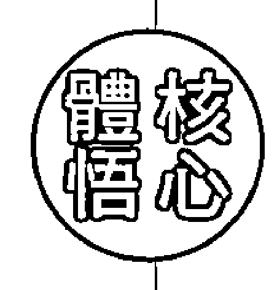

充滿色彩的水晶，有著光的折射力量，它們所呈現的色彩能量，直接對應到人們的十二層脈輪上，人體的水晶結構，也可以這樣以色彩的力量來判斷。

在所有療癒的基礎上，肉身是最重要的基礎，一個人如果沒有健康，沒有肉身，就無法成為天地間的橋樑，更無法實現一切的美好。一個再厲害的治療師，失去了身體的健康，甚至失去生命，那麼，他也將失去一切。雖然我們知道不能執著於物質的現象，但是人類沒有了物質的身體，便是絕大的損失，也就不用談及任何一切了。

物質的現象除了肉身，還有金錢及財富的一切物質世界。當人們愈來愈在乎身外之物，在乎生活中的車子、房子、存款等一切享受時，往往就會忽略了往內在的世界進行探索，而把所有的目光焦點放在身體之外。因此，一行禪師才會倡導他的弟子們要「放下身外的一切」，但是，那是針對於願意放下世俗一切的明白人，對於我們所有仍在紅塵俗世中忙碌的人類，又談何容易呢？

也就是這樣，礦石水晶界的啟發對我們就更為重要了。人類需要透過這些水晶色彩能量明白不同的人擁有，它們存在於天地之間的目的，就是帶來永恆的美好。不是它們為人們帶來的金錢價值，而是它們的奉獻價值。它們一代換過一代，或是不斷的被不同的人擁有，它們存在於天地之間的目的，就是帶來永恆的美好。

而這種美好，是因為它們的色彩光芒，它們的色彩能量能夠帶給人們的振動，可以讓人類在佩戴或用在身上做療癒的時候，被觸動到內在細胞中最深的記憶——愛和原諒。也會如同魔戒一樣，凡是擁有魔戒的人，都會經歷一個擁有的貪欲考驗過程，這個時候，人們的欲望會被放大，特別渴望的心願都會成為考驗，這不正像極了我們的人生嗎？

非常堅硬的礦石水晶，它們想要提醒人類的是，沒有什麼是你可以永遠堅持下去的，因為你的身體也只是短暫的擁有，而你唯一可以擁有的，就是這美好的色彩頻率，以及透過色彩頻率所啟動的高層意識。靈魂深處透過物質層面而理解的高級智慧，這就是人類透過對生命以及生活中對物質世界的追尋與追求後，所頓然明白的人生哲理。而這是最後的道理，更是可以提早於生命結束之前來明白、提早明白，我們才有能力過個不遺憾的人生，並且在生命結束前，有時間和精力提升自己的頻率，以便走入下一個更高的生命道場，實現靈魂的承諾。硬邦邦的水晶礦石，也代表了我們不斷碰撞的人生痛苦。不過，正如礦石水晶一樣，如果沒有痛苦的擠壓和磨練，又如何形成晶瑩剔透的高品質、高價值的水晶礦石呢？如果人們理解這樣的痛苦原來是值得的，就會學習不逃跑、不迴避，而勇敢的去面對每個考驗。畢竟，考試過關後，才會有下一個更高的考試出現，而高階的考試，總是比低階的考試要好玩，因為更有意思，你才會發現自己愈來愈喜歡自己的顏色光芒，也更為珍惜自己天生帶來的價值，進而減少浪費、羨慕和比較的事，一次比一次提升，一次比一次快樂，一次比一次明亮。對於能量療癒者來說，生命有時候反而比一般人還要脆弱。他們往往想要隱藏在安全的堡壘中，不想輕易地透露真心的世界，因為不夠「安全」。但實際上，這些療癒師一旦接近自然界的所有恩典，便可以立即「翻轉」。例如，一個憂鬱的治療師，只要接觸到光、陽光，以及陽光散發出的美好力量，這照亮到身上的色彩就會立刻活化細胞，成為情緒的養分，也可以成為生命的力量。Mandala（壇城）、神殿，不管哪一種說法，這個神聖的自然力量，就可以扭轉你的生活和生命，我的教育中心都會擺放這些力量，建議你也不妨一試。

## 自我療癒——水晶聖壇

覺醒，在於自覺。這層覺醒，還多虧了我退出彩油爭奪的商業世界後，心裡恢復了平靜，並且更喜歡人類的心，這才有了創作的空間，可以出現靈感做出類似壇城的神聖殿堂。人們的覺醒，多半需要先放下，然後在新的空間裡沉澱思索。當我們感覺失去時，會忽然空掉，於是會習慣性地把我們拉回原來的習慣模式中，我們因而就會反反覆覆的猶豫不決，無法走向新生命。要面對內在的「空」，或許是一種空虛，但必須度過這樣的「空虛寂寞」，我們才能過渡到下一個境界中。這個過渡的支持力，你可以用「水晶聖殿」或「天使聖殿」或你個人聖殿的排列擺放。相信這樣自然的力量，可以協助你度過生命無助或空虛的關卡。這裡面的色彩力量、水晶能量，以及你所信奉的神聖力量，都會因此來支持你這個人的所有美好。以下是簡單的神聖排列法：

- 最好做一個立體的燈箱，或是找個立體的架子。
- 把你手上所有的水晶擺放在面前。
- 以香粉或清水淨化所有的水晶及水晶飾品。
- 用眼睛挑選那閃閃發光，向你發亮的它們。
- 用你的直覺，一層一層的拿起每次對你發亮說話的水晶。
- 由上而下逐一擺放。
- 建議上層放神聖的物品，如果你有信仰，先放你信仰的聖物。
- 中層可以放些天使的象徵物及美麗的水晶飾品。
- 下層可以放些原礦水晶，大地色系愈多愈好，色彩愈豐富愈好。
- 這樣的擺放，正好可以築成一個人類和世界的豐富聖殿。

這個圖像的放置，也是多年前我在看到DK（Dval...）的一本書中所描述的世界，人類和天界、地界和睦相處，共同繁榮這個世界的美好意象。當時我急哭了，因為感覺到這中間傳遞美好訊息的人類失去功能了，我們人類只有恐懼和競爭，只想著金錢和自我，卻忘了讓生存環境的美好也是我們的責任，和大自然合作也是人類需要記得的一種生存本能。於是，當時我看著書就哭了起來。而今天，我可以透過這樣的神聖觀想法，將這樣一層層的立體世界傳遞到每個家庭和每個身心靈教育中心。這不僅僅是平面的一種意念，而是立體的覺悟。

## 以愛療癒

愛是實現美好的顏料。有了愛，就可以復原通曉礦石水晶訊息的能力。

## Chapter 4. 另一個世界的啟發

所有的負面，都能以愛療癒。但是，愛卻會延伸出恨；當恨出現時，我們便失去了愛，充滿毒性。如何從恨中脫離？就先從愛你的恨開始吧！

莊老師是我第一位拜學的靈學師父。
身為他老人家生前最後一位閉關弟子，可以說是生命中很幸運的一件事。那時候，我已經認識他好幾年了，但我從來都是以一種不想跨入靈性領域的旁觀者姿態，以及批判之心，來面對這位老先生。
直到某一天，我忽然感受到自己不應該一直這樣漫無目標的活著，既然是靈性人士，就該好好的拜師學藝，也因為在老先生身邊一直長期觀察，早已對老先生的功力完全信賴；也因為老先生的慈悲和溫和，可以包容我全然的懷疑，卻又每每在必要關頭救我，並拉我一把。當年正是因為他的鼓勵，我才去英國學習。而那時，我完全不知道自己未來會走上靈性治療的道路，但他卻早已看出來了。
就在我開始覺得要認真對待靈性治療這件事時，他告訴我，要收我成為他的閉關弟子。
但是，就在他要開始傳更多功夫給我，我也開始認真練習時，他卻因為自身無法看破的業力問題而突然離世，這讓我在之後的兩年時間裡，常常覺得找不到方向，並霎時明白，原來老先生一直在保護我，而就在他離開人世後，這股力量似乎就消失了。

這份很深的連結，其實還是弟弟牽的線。記得，我是在一次無意間的場合中遇見了莊老師，而弟弟的靈正好在身邊。當時老師告訴了我一句話，我立刻大哭，因為他的陰陽眼見到了我弟弟。老師說：『你弟弟在旁邊喔。』在此之前，不是沒有別的高人說我身旁跟著誰誰誰，但就這一次，是我思念已久的弟弟，我的悲傷與痛苦立刻排山倒海而來。那些除了我在夢中可見，完全沒有告訴其他人的事情，老師彷彿完全明白。慈悲的老先生以一種輕鬆的態度告訴我：『不要難過，因緣和合，總有定數。』然後老師給了我四個字：成住壞空。叫我終生要記住這四個字。※來拜訪老先生的社會名人其實很多，有的甚至因為跟隨老先生一段時間後，就嫁入豪門。許多有著通靈感應力或命理界的人士，也都喜歡到老先生家裡聚會，但更多的還是去求助的人，特別是苦於無法和另一個世界溝通而受苦於其中的人們，甚至是不明所以、被前世所苦的人，他們都會輾轉被介紹給老先生。老先生的解讀很有趣，他可以用氣功傳遞，打開對方第三眼的能量與訊息來解讀。比較重要的『溝通』，老先生就會如同美國最著名的通靈專家艾格·凱西（Edgar Cayce）一樣在睡夢中進行。睡著之後的老先生，會講著天語來溝通，但醒來後又彷彿忘記這些事似的。我見過幾次這樣的溝通，我自己有一陣子也遇到一些需要溝通的能量，會忽然不能控制的睡著。有一次因為正在開車，行經臺灣中部某個地方時，忽然發現自己快要睡著了，便立刻把車子停在路邊，睡了足足二十分鐘，在夢中處理完事情後才清醒過來。幸好我學藝不精，而且我也很抗拒這種『溝通』的。怪异表现，之后就逐渐减少这样的事情发生，但仍然会三不五时地出现，直到我一直强化自我，变得愈来愈固执，这样的情況才愈来愈少。

我的梦中也经常会有老人出现。记得有一次，一位很可爱的老太太出现在我梦中，白白胖胖的，花白头发，像极了圣诞老婆婆。她的出现，疗愈了我当时思念弟弟的泪水，我以为自己又遇到贵人了，直到多年后，在自己的一次工作坊中，为学生做回溯的能量疗愈。当我协助现场所有同学，回头找到当年那个最痛苦的自己，和当年的自己相遇时，我才忽然意识到，二十几岁遇到的那个老太太，很可能就是未来的自己。当时的我，不知道未来的我已经成为治疗师，推算起来，年龄更老一些。看来，我终生从事疗愈的工作已经注定。

这些疗愈的事，也是我事后自己摸索时，猛然有讯息出现，才明白过去的许多事。

犹记得当时，自己总以为自己是上天眷顾、被拣选的人，好运到不行，许多的奇遇不断发生。因为不论在宗教或灵性领域中，我总是被师父们礼遇着，殊不知自己是在吃老本，前世所造的光芒与福气，也会有用尽的一天呀！

然而，这些灵性世界中的幸运经历，也形成了我自视甚高的性格。特别我能解读讯息与能量，并且天生的灵性光芒可以自动疗愈空间与在空间中的生命，所以往往也成了师父们身边，加分不可缺少的助力。因着自己天生的傲慢，再加上这些宠爱，遂形成了一股强烈的习气，也常无意间得罪了他人而不自知。现在想起来，实在可笑又无知呀！果然应验了那句话：「愈是井底蛙，愈自以为是。」

老先生是很慈悲的好人，对师母好，对孩子好，对自己的弟子们更好。他选择了与世无争的工作方式，考进公务员才能生活安定无忧。

一个灵性人士往往会面临的是经济问题，而现在的人已经不再拥有古代般的生活方式，我们已经无法离群独居。养家糊口是灵性人士首要的考量。身为一个男性，有一家人要养活，又有着疗愈的使命必须完成，所以老师选择了一个不争名、不抢利的公务人员身分，而且只要有机会升迁一定回避，因为太忙碌的生活也会影响清修与能量。虽然也会被他人误解，或是面对世间人所认定的一事无成，但灵性人士不贪财是首要的特质。灵性人士必须有满满的丰富内在，但不能有太多的贪心和欲望，才能心无旁骛地专注在灵性精神上的事物。而第三眼开启的灵性人士，又往往会具有清贫生活的特色，不会太有钱。这样，心灵和物质想要双丰收，真的有点难度。

※ 我的天生性格以及灵性特征，往往受到这些高人的疼爱。或许，他们看出有一天我对众人是有帮助的？又或许，他们也见到我的生命将充满着坎坷？或者，我可能注定无法拥有一般人拥有的，但他人无法理解的丰富内在，我却将一生受用无尽？不管是哪种理由，我只知道自己非常幸运，花不了大钱就可以上很多课程，而且有许多高人走向自己，愿意当我背后的支持者。这些我遇到的高人们，他们无所求，不求什么回报，也不喜欢站在台面上风光，更不是以金钱为诉求来为我占卜续命，可以说，我在另一个世界里的亲人不少。因此，也多少弥补了我在人生路上坎坷不顺的痛苦，我一直感谢着有他们的存在，所以我不孤单。也因为有这些幸福的世界支持着我，所以过去的我相信，无形能量场更甚于有形的世界，而且往往无形的世界不会令我失望，但有形的人间却总是令我害怕与看不明白。就在这样的际遇中，遇上老先生的灵性启蒙，让我奠下了正面与正确的灵能知识，并且一路指引，直到他的生命结束。

## Chapter 4. 另一个世界的启发

我一直以为，提升灵性是很好，但这种事情只能作为慈善或免费，是无法真的以此为业的，因此一直不肯跳进这个行业圈中，直到我被封锁了所有的道路，手上所有的工作全都不明所以地被停止，如果想赚钱，似乎冥冥之中有个奇怪的手，让我没得选择。我从大学开始打工自食其力，不是天生家境富裕的人，所以不工作没收入是无法生活下去的，而我至少要把自己养好，所以生存也是我的课题。然而，我努力的所有工作，却在一个时期内全部被取消，于是我求助老先生，他才告诉我：「上官，是该想一想以此维生了喔！」我的人生中其实充满了抗拒与对抗，老先生这样说，我是不以为然的。因为我的个人经历及个性，都不可能去做关于灵性的行业，但正因为弟弟过世的打击，让我的人生观重新改写，也感到迷惘。我忽然明白，虽然当时申请到法国的奖学金可以去读博士学位，可是，当一个人下一秒钟的呼吸上不来，失去了气息时，还能拥有什么呢？名利？地位？名誉？财富？爱情？幸福？哪一样可以拥有呢？我忽然感觉到，「快乐」才是人生最重要且必须追寻的事，但自从弟弟过世之后，我连快乐的感觉都一起死去了，我找不到这种热情和快感。有能力帮助人是很快乐的，但是用这种帮助人的方式来赚钱谋生，我不以为然。我父亲、母亲的家族，全都是以物质世界为拼搏方向的一般众生，甚至在其中打转痛苦着，有混得很好的，也有混得很好的。而我的父亲在生意失败后，我们马上就被归类为混不好的亲戚。家族亲属的好坏是以财富、社会名誉来衡量。身为子女的我，在弟弟过世之后，也只剩我一人，必须为父母亲争口气，哪有时间想到帮助他人？我帮自己都来不及了，家里都还在缺钱，我怎么可能为其他那些势利又坏心来讨债的人着想呢？

因此，在前几百名个案中，我都是不收费用的。即便是星象能量的解读，我也不肯收任何费用，只愿意解读，不愿意碰钱。老先生似乎看出我的心结，也不多说，只是在聚会中添加了一个项目：上官看星盘。

星盘？我也没正式拜师学过，只是曾受到希腊老师的点化。那位老师是身为希腊贵族的星象专家，自小学习星盘与观星，小时候必须被丢入深山野林中，依照观星找到回到古堡的家。老师可以由人的瞳孔算命，然后打出一份星盘，顺便解读，而他预测未来我将带领着一大群人，并且是在中国。当时二十出头年轻的我，心里一直不以为然，因为这样的工作，带领一大群人心灵成长，还是在中国，怎么可能呢？我家族中有能力的人多已在美国、加拿大，而我自己从父亲生意失败、弟弟过世后，总是申请奖学金读书，为了家庭状况，也无心再前往法国读书，这一连串的不可能，又怎么可能前进中国呢？

当时我只是笑笑，不以为意。反正算命就是这样，只能说说还没发生的未来，但我坚信，未来是由自己创造的。总之，我是不会进入什么身心灵、什么算命的领域，我也不喜欢通灵这种字眼，因为弟弟过世时也见多了，虽然我也能看见一些有的没的，但我不喜欢低灵，也不喜欢看到丑陋，我有太多的不喜欢，根本不想向命运臣服。

老先生开始叫我练习看星盘，我只好照做。那个学习过程，之后也在我生命中经常发生，就是我本来觉得自己不会的事情，这辈子也没学习过，可是拿到手上就像是学过一样，一下子就熟悉了。我闭关休练藏传佛教的仪式，很快就通；我练瑜伽，很轻松就可以运动；后来开设灵性彩油课程，校长也是一再问我：「你不觉得教这些很熟悉吗？」

解读星盘也是一样。不过，因为我很抗拒人们的迷信和误导，因此心中总是有着不愿踏入的阻抗。 第一次在老先生家被迫给大家看星盘时，老先生提供了他的生日资料给我，我吓到了。因为我眼睁睁看到命盘在转动，明明打好的上升星座，却在我认真研究的时候转动了起来，换成了另一个上升星座。再仔细一看，这个原来的盘，好像本人应该已经「命该绝了」呀？我惊慌地看了下老先生，然后揉了揉眼睛，再仔细看下星盘，没有错，真的变了。 我真的以为自己不适合解读星盘，因为连盘都看错、看不清楚。记得当时的我，在众目睽睽下需要说几句话，但我一句都说不出来，我只能看着老先生说：「老师，这个盘……好像，有点问题。」 老先生笑着说：「喔！你看到了呀？」 我点了点头，说：「怎么盘在动？而且，照这个盘看来，你已经……」 后面的话我不敢说，说出来，应该会被现场那些尊敬老师的师兄弟姊妹们打扁吧？ 老先生笑着说：「对，你看得没有错。上官，记得，修行胜五行。永远记住。」 后来我才听其他资深的师兄弟们说，老师本来命该绝，因为和阴间谈了条件，所以又活了下来，条件是直到他的儿子长大成人为止。 所以，老先生也在努力修行帮助他人，这是他活下去的交换条件。而在他最后的几年，我也搭上了这部神奇的灵性列车，遇到神奇的灵性高人。 『该入行了，』老先生提醒我。『上官，你该想一想，收费了喔！』 我实在很难接受要进入这个行业。在当时，感觉自己好像变low（低）了。我的脑中只出现那些做宫庙的乩童，或是会算命的半仙，再不就是频频上电视的名嘴，但在我的脑海中，我就是不知道该把自己放在哪个位子上，我觉得，哪个位子都不像是我可以待着工作赚钱的地方啊！

> 核心体悟
Core Enlightenment

于是，梦境又来了，然后，老先生鼓励我去英国学习。回来之后，好多人忽然出现找我解读色彩密码。就这样，透过物质的交换（精油产品），我感觉可能比较像个样子；就这样，用着英国买来的工具，把我包装在这个领域中，我可以躲在漂亮的产品背后，尽情地做我的灵性疗愈，高大上的感觉，多少可以让我免去成为宫庙庙公的恐惧。
老先生给了我入行的一句话：「上官，记得，谨言慎行。」
从此，我踏入了无心插柳的不归路，成为非自愿的治疗师。

## 自我疗愈——爱你的恨

假如你要面临最后一天最后一口气了，你可以怎么做？

也许现在提出这样的想法还太早，因为你不觉得自己会面临死亡。但如果现在不练习，你将依然会活在傲慢的世界中，凡事以自我为中心，以自己的痛苦为痛苦，以自己的私心为活着的唯一目标。

因此，如果能够趁着身体强壮时，可以有小小的修练，到了衰弱无力时，你的身体就不会反弹出那些魔性，那内在的魔性可以用各种情绪的字眼来称呼，像是：恨、怒。

这些瞑恨的力量，往往会烧坏我们的脑神经，烧毁我们的生命原动力，甚至毁了我们的美好灵魂记忆。例如，同样是红色的动能，是唤醒的力量，却也是摧毁的力量。因为一样有力量，只是结果不同。

有一次，我问一位自己接讯息来找我的灵媒姊姊，『为什么你要这样默默地支持我呢？』她说：『因为你值得。你早就被设定好是灵性的领袖，所以你会走在众人之前。你的思维超出常人，非常先进，不过你太单纯，无法适应这复杂的人间，所以我要助你，助你觉醒。一路走来的觉醒路，真的很难走。重重的考验和关卡，就像人生的阶梯一样。走在灵性的道路上，最难的，应该是面对『爱』你的『恨』吧！』

## Part 1 人生梦想设计蓝图

红色的魔性，瞋恨的力量，往往是摧毁一个人生命原动力的基础。而恨与爱，是一体两面。在红色的力量中，这两种力量是同一个源头，你会发现，爱是源头，恨也是源头。这两种力量，都是可以滋养生命的力量，却会养出不一样的两种人性。只是，这两种力量都在养活着我们，最后形成了今天的我们。

在我们的人性中，有一种力量，红色的瞋恨力量，也是所有混乱的源头。这股力量，像是佛教宇宙观的阿修罗。阿修罗，又称为「非天」，是欲界中的大力神，天生易怒好斗，喜欢攻击和战斗。在佛教的六道里，遍布在五种境界中。这样的性格，我们可以在很多层面中见到，特别是个性中的「斗」性。妒嫉、羡慕、贪婪、掠夺，这样的能量往往会造成许多问题，而这也是我们疗愈的缘起。

所有的负面，只能以爱疗愈。但是，爱却会延伸出恨；当恨出现时，我们便失去了爱，充满毒性。我常常在疗愈中见到这种力量，很多的仇恨争夺，往往都是由于这股力量作祟所致。

阿修罗羡慕天人所拥有的一切，就如同我们羡慕他人的幸福快乐一样。想想，为什么我们要羡慕呢？因为我们想拥有，想要和他人一样的拥有，所以会羡慕，会想要得到，甚至想要掠夺他人的所有。

在恨中，我们想不择手段地争夺得到；在爱中，我们只能不争地得到。其实恨也是爱，只是一这是「得不到」的爱，而爱是可以得到的爱。所以，恨与爱，还是同一件事。然而，争到了就一定幸福吗？那也未必，只是阿修罗看不到远方，只有眼前。

因此，如何由「得不到」成为「得到」呢？如果从另一个角度来理解，「得不到」是不是就是「得到」呢？所以，让我们先来爱我们所恨的吧！

## Chapter 4. 另一个世界的启发

-   1. 由斗到不斗，是一个关卡。斗就是不争，不争就是斗。可惜阿修罗不能明白，只贪顾眼前，没有关系，请你找到内心平静的渴望，只有争斗度日。我们每个人都有这一面，如果你也有，没有关系，请你找到你的「阿修罗」，只是「静静地看着他（她）」，接受他的存在。
    2. 我们无法驱除内在的阿修罗，只能以爱疗愈。看看他想闹什么事？你会读到他的不平、不满、委屈、仇恨、不满足、不幸福、抱怨……当你接收到这些讯息时，全都吸收进你的身体来。
    3. 直接进入最深的恐惧，了解你的阿修罗在恐惧什么？害怕什么？他之所以要争取，是因为害怕；之所以要争斗，是因为恐惧。去进入内在最深的恐惧，停留在这些恐惧的状态中，不要反应，只是感受。
    4. 把注意力导向身体，从内在去感受身体。将这些所有负面的感觉融入到自己的身体。你可能会感觉到身体某部分卡住了，没关系，知道就可以了。然后继续停留在这些恐惧的感觉中。
    5. 只是去感受，不要用想的。这样你就由心智收回意识，确认身体的放松，然后感觉自己只是一直在呼吸。
    6. 最后，去感受全身活生生的器官、细胞，让光流经全身。
    7. 觉察整个身体的能量场，想像身体整个在发光发亮，晶莹剔透，闪闪发光。
    8. 我们身体最后所具有的，只是存在一种「无所不包的爱」的感觉，而身体内的感受将突破任何

> > ③ 佛教宇宙观的一部分。《法华经》提到：「六道众生生死所趣。」十界中由上而下的六道，分别是天道、阿修罗道、人间道、畜生道、饿鬼道、地狱道。

## 以爱疗愈

> 生生世世，菩提之心就是以爱为愿，以爱为行，以爱为光。

限制，不再受限。阿修罗只能以爱唤醒，无法与之争斗，愈斗愈限制，愈无法找到出口，只能用更高层次的包容力降伏。你我都有阿修罗，如果运用得好，也是战将一位。人生也是需要打仗的，我们的功力，可以用在正向的事情中，而不是展现自苦来砍死自己，那就可惜了一身的好功夫呢！

## Chapter 5

## 梦中的学习之旅

很多人常常因为想法和身体被紧紧捆绑在一起，所以思想所创造的能量便会由身体所掌控，以致于难以改变一些偏执的想法。
而其实，愈固执的人，愈适合由梦中来快速转化。

我的灵性世界是由梦境开启的，或许可以说，我有个活跃的灵性视觉（灵视）。在能量的世界中，说我是个造梦人，或是梦想的实践者，具有打造令人满愿的专业，我想我应该当之无愧。

从很小的时候，我就很能做梦。国中的时候，我可以一连三天梦到月球上的连续剧，男主角是楚留香和苏蓉蓉（这样你就知道我的年龄层了），他们的腰上都有著一个金黄色的腰带，并且可以发出光芒来，有危险或有需要时，腰上的腰带就会发射出金光。

当时梦醒后，我告诉母亲，妈妈说我以后可能可以成为小说家，因为太厉害了，这种不切实际的科幻内容也能够一连几天梦出来。我曾经以为自己可能真的可以成为一个剧作家或小说家，不过后来才发现，原来这些灵能梦境，却是日后学习到的理论基础。

多年后的科学能量疗愈工作中，我才明白十多岁时梦到的内容，那一腰带竟然是彰显一个人最重要的「价值能量场」。

一个有自信、有自我存在价值感，或是有着高度智慧与幽默感的人，他的腰上就会出现一股这样的「金黄色腰带」能量，而且是金黄色的频率。那些可以用第三眼见到色彩能量的人们，特别可以观察到这股能量带。我在学习和工作的过程中，往往在疗愈的场域里可以「见到」这股力量。一些在原生家庭受创伤的成年人，当他们想拿回自己失去的力量时，我也会见到这些力量由外回到他们的身体里。多年后想起的童年记忆，我也会觉得特别有意思。虽然写这本书的时候我是信心满满的，但那是在我的内心深处，有着许许多多自己和上天（或无形界）的誓约与秘密。要公开这些内在的秘密，我还是有点紧张，不知道大家会如何来「认可」我的身分和形象。这样的担心或顾忌，也是金黄色价值区的呈现。在这个区域，存在着我们过去生带来此生的细胞记忆；而我们本来带在身上的记忆，也因为成长过程中的种种体会，被心酸或生命磨练、父母教养、文化背景而制约，以至于我们像是喝了孟婆汤的新生人般，这一生一世得要重新寻回这失落的记忆。另一方面，梦境也是一个有趣的管道，主宰着我们无意识中一切存放的记忆。这些记忆，有来自父母的基因遗传，以及我们自身的灵性记忆。对我来说，梦中的学习比醒来后的学习轻松多了。不管是梦里出现的情节、画面、色彩或声音，不同的人物，甚至是治疗，醒来时我总能印象深刻地写下来。一开始我并不清楚这是怎么一回事，也没有问过任何人。由于好奇心使然，开始在床上放一本素描本，在不开灯的情况下，有时只是记下来几个字，或是画个图示。不管什么情况，我的梦数十年来始终活跃。睡觉成了我很喜欢的补充能量方式之一。也可能是睡得很开心，睡眠中的梦境，遂成了我和其他的世界、以及和另一个自己沟通的桥梁。不擅言词，不善表达情感的我，也往往可以透过梦境自我修复，甚至灵魂出体地跑出去做出更多美好助人的事。

## Chapter 5. 梦中的学习之旅

第一次真的认真的梦，并且从梦中学习到如何修练，其实不是一个愉快的经验。以前一想起来就想哭；二十年后，我才能不带情绪地对人谈起这段经历，我才能感恩地说出这段往事。

那第一次的不愉快梦境体验，差点毁了我的身心灵之路。我常常无法理解，为什么会有这些奇怪的事情发生？

那是最长的一场梦境，大约历时了三年。这三年，也是我正式进入身心灵领域的决定关键。

我体会到，如果一个人可以在梦中修练，并且能成功地由潜意识转化意识状态，透过没有形体的掌控来转换形体，这样的效果会更为神速和成功。毕竟我们的想法和身体紧紧绑在一起，如果不松开身体的认知，当我们从梦中醒来时，思想所创造的能量便将由身体掌控，所以大多数人明明知道自己应该改变，却难以改变。其实，愈固执的人，愈适合由梦中来快速转化。

※

一个来自巴西的年长外国女性，号称通灵很厉害。因为属于印度某个新兴宗教，所以我带着兴奋和朝圣的心，和一位台湾很美的通灵姊妹，希望能一起去朝圣。当时心中想像诸多美好，总以为身心灵是喜悦的，是和谐的，老师也应该是充满爱和光，想像中老太太也应该慈悲和具有强大的疗愈能力。

然而，四天的课程完全不是这么回事。

首先，老师不断吹嘘她通灵多么强大，但对于我这种不崇拜的人来说，根本没什么强大的崇拜感，从小见的高人不少，身边的台湾修行人更强大。在台湾，我的灵学老师及师长们都是非常优秀的，所以对于一个外国人在课堂中不断说自己有多麽灵通，完全吸引不了我，我只想感受到疗愈力。

接着，老师开始施放奇怪的不同能量。对于像我这种充满怀疑、不是他们教派的人来说，接受到的感受就是奇怪又不舒服。我的通灵姊姊当时已经四十多岁，见得也多，她感觉不太对劲，因为老师好像开始针对我「迫害」了起来。

我猜，当时的我可能太过骄傲，虽然表面上很恭敬，但内心却完全没有宗教崇拜的「敬意」，这或许是好奇加上质疑的惨痛后果。当然，光是这样，还不只是一点点的惨。更震惊我的是，整个上课的群体都在传播一种理念：人不应该结婚，因为结了婚也会离婚。因此，整场的姊妹们不断地告诉我，我们只需要享受性就可以了！

这样的理念和道德观对我来说，实在是不可思议。我的家庭教育虽然开明，却仍传统。父母虽然有一定的文化背景，但也属于无神论的家庭，只会慎终追远地敬拜祖先。对于当时年轻的我来说，来到这里想要学习的，不是一种人生的痛苦要用性来解救，我的家族中都婚姻幸福美满，哪怕不是天天快乐，至少也能婚姻一路走下去，直到生命的尽头。

因此，我无法想像的是，自己竟然走进了一个崇拜性解放的圈子，这样的圈子是灵性吗？当时年纪轻的我，虽然知道礼貌上应该尊敬各种不同信仰的人，但一直被大家「灌输」这种想法，实在很难接受。更难堪的是，当时我也鼓励了交往中的男性友人一起去学习。结果，年纪已经可以成为奶奶的巴西女老师，竟然投射了一种奇怪的能量，让这位男性友人每天对我大发脾气，甚至想要吵大架，最后课程结束后，还被老师留下来不走了。我和姊姊哭着离开那个上课的地方，莫名其妙地回到台北。

The request was rejected because it was considered high risk

# 自我療癒

尋找上師

人家說上師選弟子要觀察三年，弟子選擇上師也要三年，這樣匆匆已經六年過去了。年輕的時候覺得很好笑，不過匆匆數年過去，我自己也成了別人的老師，這樣一來一去的觀察，還真的不是太長。現在，我的執行長也跟隨了我十年，這樣的年歲，我們真的靠著不信任和信任等種種考驗得來的戰地情感。

除了上師，師父也不好尋找。但當我們成為師父之後，又是如何呢？

我一直是個不稱職的師父，因為我不夠堅強，也不是很有信心，但我卻是個好弟子，並且非常稱職。因此，當我成為老師之後，我會為了學生掏心挖肺，甚至努力實現學生的夢想。只是，有時候即使已經做了最大的努力，卻依然因緣產生分裂，這也是莫可奈何的事。有時候回想起來，其實沒有對錯，只是過程。

我覺得，目前檯面上所能看到的課程裡，其實沒有修行中的師父，頂多只有職業培訓的老師。

什麼叫做師父？什麼是上師？什麼叫做修行？金錢觀又是如何？這一種的過程，都需要小心再三。不是只是信就可以，信了迷，反而誤了人生中重要的階段。

所有的宗教都勸人向善，但如果勸人執迷，那可能真的要小心再三，哪怕是有多少功力傳遞給你，也可能是一個障礙。有時候，的確不好分辨。

# Chapter 6. 神奇的修行人

現在的中華文化中，尊師重道的精神已經式微，這也很可惜。所以，一個真正懂得對待師父的弟子，應該也不會太差。

人說「當弟子準備好的時候，師父就會出現了」。我曾經師事偉大的巴楚仁波切，曾經師父百般考驗我，覺得我這個小女生竟然很有禮節，並且知道師父的心意。我其實沒有刻意，純粹是中華文化基本教材中的教育得當。我們從小受到的禮儀培養，讓我們見到師長時都會秉持著應該有的禮節。所以，我們就來看看如何先成為稱職弟子的步驟吧：

- 1. 師父交代的事，再辛苦也要完成。
- 2. 師父交代的功課，不睡覺也要完成。
- 3. 師父交代的修練，一定盡力完成。
- 4. 師父想要的任何東西，一定努力實現。
- 5. 師父想要達成的目標，一定認真實現。

我不是開玩笑，一個真實的弟子是應該努力完成師父的一切。

當做學生的，很認真的實現老師的教導時，並且不懷疑、不擔心，只是認真的相信師父的安排，這樣的用心，就像是孝順父母一樣。然後你就會發現，所有的考驗都可以過關，因為你朝著目標邁進。

當不帶任何懷疑的向前衝的時候，事情是最容易達成，也是最沒有雜念的時候。

我因為是乖小孩、好學生，所以，一直沒有太多的懷疑，在前半段的學習路上，也能夠堅持到底。每次我完成師父交代的工作時，都會發現自己更進了一大步。也許在現代已經很少有這樣的機緣，可以有專心培養你的師父出現，但在藏傳的傳統系統中，或是能量教育的系統裡，依然維持著這樣的古老傳統。所以，愈核心，愈靠近師父的能量，就愈能得到精髓。我的口傳唱誦，也是這樣得自師父一對一的傳授。在心法的傳授中，都不是刻意擺好教室，放好紙筆，然後坐著正式上課。有時候，傳遞心法的師父會興之所至，然後就傳遞了心法。我很榮幸，有著很好的法傳。這些其他人渴望卻得不到的經驗，我卻輕鬆的，只是因為傻傻的聽話照做，就得到很深的灌頂和口傳。這和現在以商業手法來開的課程，學生資質不一，老師也不是真的很滿意所教的學生，這樣的師徒品質，實在差別很大。因為有了很神奇的師父在前，於是，當我成為老師時，教學也就變得有趣了。特別是工作的團隊全都是懂能量的小夥伴們，特別在於與學生一起共創時，我總能因為靈感而給予學生們更適當的指點。這樣的工作模式，也延伸到各地的聖地旅行，在不同的地方得到當地土地的啟發，得以提出不同的靈感訊息，貢獻給當時一起工作的夥伴或當地主辦方。這種走向未來的能量共創，在能量場域中已經是可以看到的事實，也是一種可以見到的競爭力。往往在各地結合的工作成果，都可以為當地帶來美好的火花，甚至是在事業財富上的火花。

# 以愛療癒

跟隨愛，可以找到尊敬的師父，也可以成為有愛的導師。

## Chapter 7. 我的東西方啟蒙老師

你在意的品質是什麼，就能創造什麼品質的人格特色。
而當一個人充滿熱情的走在自己的路上時，那是全然專注的。

一次見到各帝·參夏仁波切這位老者，是在他的大法會中，那是一個觀音慈悲的修法會。
慕名而來，不過不是因為我特別崇拜他，也不是因為藏傳佛教，而是我因為能量的干擾，知道觀音的慈悲能量或許對我有點幫助，於是透過朋友的引薦前往「觀摩」。
有句話說得很好，愈是高智慧者，就愈謙卑，而愈是低階的無知之人，反而會傲慢。不好意思，我正是那個無知的傲慢之人，所以對於任何的高人，我都會以「懷疑」的眼光來「檢查」。我不會特別崇拜，也不會特別敵視，但我心裡明白，自己有一種「敏感的驕傲」，對於那些感應不到的人們，我的內心中還是有一種驕傲與傲慢。
於是，帶著這種傲慢之心，以及自以為是的一雙不一樣的眼睛，如同楊戩的第三眼，我有著無以言喻的傲慢，自以為很「與眾不同」。
在前往會場的路上，我便感受到一種不一樣的氣場。
雖然是大白天，天氣也很好，但我卻看到濛濛的氣場，好像迷姊迷妹們等待偶像一樣，大排長龍的排在門外。當然，其他人是看不到他們的。忽然間，我有點嚴肅了起來，心裡納悶，為什麼那些無形都排隊在門外呢？

朦朦朧朧的，我帶著一點點的不安進入到演講大廳。一進入大廳，兩尊大大的「什麼」就站立在高臺的兩邊，我猜那是一種保護的能量場（後來知道那叫做護法），我依然有著一種在外旁觀與不太信任的批判之心，於是，我選擇了最後一排。現場應該有上百人吧！

小老頭上臺後，我開始驚恐了，然後逐漸由驚恐，到好奇，到安靜，到認真地參與整個活動。在現場，一個老老的、矮矮的小老人站在臺上，他的光芒穿透了整個會場，穿透了最後一排的我。

「我也想像他這樣！」我的心發出了一股聲音。

我想，當年佛陀的感召力大概就是這樣吧？而阿難對美女的吸引力，那些大修行人所形成的一種「美好」氣場或長相，真的太迷人了。於是，這些形成美好能量場的人，吸引了許多渴望一樣美好的人，我就成了小老頭的其中一個迷妹。

我沒有很迷的心，只是遠遠觀望著，欣賞著，我也不會衝向前去拉著師父的衣角，成為其中一個會員。但上師的光芒已經深深地穿透了我的心，我的淚水在現場就像看了一場精彩的電影，剎那間，一股向上的光芒出現。這些法會的光芒，在日後的生命中經常出現讓我看見，我想，這一再出現的光場，可能都是在示現給我這個愚蠢又自以為是的凡人看到，一再證明地讓我看到，讓我信任這個能量的世界，是真實存在的。

但儘管一再出現，我卻因為生命中一再遇到的困境，常常還是在懷疑之中。

我在現場，第一次看到了所謂的保護能量（護法）異常的強大，又高又大。然後，我也看到師父自身的光芒，穿透了在場的每一個人。這個光場，在多年後的貴陽，我的市場部經理，也在一個吃飯的聚會中看到了我的光籠罩全場，剎那間她感受到我的善與愛，當場淚如雨下。

但是，在這法會現場，我看到的不僅這兩種層面，還有那些默默藏在一旁，等待被光明照亮的黑暗能量團。也許你會形容那是眾生的靈體，或是什麼無形的遊魂，但我只想以「能量體」來形容，不想以我的個人文化意識來擬人化的形容。

面對無形世界，擬人化讓我們總是回到人性之中。而這個世界，其實有著超越人性的其他場域，如果我們只深深地抓住了人性思維，便無法理解奧妙的能量境界。所以，為了避免誤導我們自己的心，或其他人的思維，我用顏色和能量體來形容，或許能更為客觀一點來詮釋我所體悟到的世界。

那些默默守候的眾生，隨著進來的有形形體（人）一起被光芒照亮著。許許多多本來濛濛混混黑暗的能量，開始變得明亮，其中很多忽然就消失了。等到整個法會結束，那些等在外面的能量團已消去了大半，場外的氣氛不再沉重，現場的人也好像忽然覺得天氣更好，自己的心情也變好了。

而我見到的是，整場的光芒像是開了燈光一樣，人心的燈，現場的燈，我已經分不出差異。我的腦子覺得昏昏的，無法解釋，但我的思想仍在對抗著。銜接著質疑思想和昏昏感受的橋樑，則是我說不出的震撼感。

這樣被光所吸引的我，從此陷入到光明與黑暗的歷練中，不僅是心靈的光明與黑暗，身體的光明與黑暗，還有靈性的光明與黑暗，這種種的考驗似乎才是開端。

我的西方启蒙老师，是在美国的凯洛老师。她在黑蜘蛛的经历后，不想放弃所遇到的西方启蒙导师。之前遇到那个巴西人之后，我的心实在有点不甘心，也想找出自己倒楣的理由。然后，我找到同一门课程的另一位老师，我想再试一次。如果第二次的体会，老师还是一样的烂，那我就永远不再参与这个学习，或许就表示西方来的这种灵性课程不是我的菜，我也不合那些老师们的口味吧！于是，我上网查到另一位老师也有课程，我打了电话过去，遇到了一个迷人的声音。我深深的感觉被一种强大的疗愈和理解包围，没有见过对方，但我的心便想要前往了。三天不到，我订了机票飞去美国，寻找我未完成的答案。于是，遇上了凯洛老师，也改变了我的观点。在电话中遇到的那个迷人声音，原来不是凯洛老师，而是她当时的主办人兼助理。课程像是几个女性的聚会，在助理的豪宅家里开课。一些美国有钱的人，也喜欢这些美美、高灵性的能量课程，我加入之后，大家非常好奇，凯洛老师更没有遇过东方来的学生。现场的所有姊妹们都年长许多，我成了年纪最小的学生，每天听着妈妈姊姊们的叮咛，在充满异国与新心灵的圣地牙哥，一待就是十天。凯洛老师是引导我进入色彩能量世界的启蒙老师，她最大的特色，不是因为知识广博，也不是特别会做行销卖弄自己，更不是一直吹嘘自己有多麽神通、多厉害。她是色彩世界工作者的启蒙老师。美国在全球的能量工作推动上算是非常重要的地区，许多新思潮都是由美国开始流行起来的，也由于美国这个大熔炉国度，许多国家的移民力量都会进入到美国，因此，当年由美国开始源起时，也是一股很强大的推动力引领着我前往取经。但凯洛老师完全颠覆了我们中国学子对老师的认知。我们认为老师应该懂得多，错得少，但凯洛老师却总是告诉我们，她不是明白这部分，她会再去确认。她有时候也会在课程中，告诉我们她自己的...

## Chapter 7. 我的東西方啟蒙老師

疑惑，很少有老師可以如此坦誠地去承認自己內在的世界，並且如此敞開。一開始，我覺得不太適應，但一次次的，我發現凱洛老師並不是真的不懂，只是她往往會很誠懇地往內去探索、去覺察，她其實懂得非常多，甚至是數字學大師、古神秘學大師，但她卻從來不會這樣告訴他人；相反的，她常常表現出來的，是對社會的關懷，對女性和小孩的關心，對大環境國際局勢的關注。

她不是一般的女性，早在十九歲時，就開始參與了美國的社會運動，並且積極參加改革與藝術教育。凱洛老師對愛的追尋，最令我震驚。特別是年輕時候的我，只因我心中只有父母和家族朋友圈的示範，家人們都婚姻幸福和諧，也都中規中矩地過著小日子。但凱洛老師卻成功示範了一個新女性在傳統社會中的努力，她勇敢創業，勇敢面對婚姻的失敗、事業的挫折，她也勇敢地養育了自己的子女；五十多歲遇到真愛，也認真的去愛。現在七十多歲的凱洛老師，和老伴走了二十多年，師丈是知名的植物學家，兩個人相遇在身心靈的課程中，對靈性世界有共同的愛好。

遇到凱洛老師，遇到凱洛老師和師丈的靈魂之愛，也改變了我們以為老女人遇不到真愛的錯誤價值觀。更有趣的是，老師一直就是這樣認真地活著。在老師的課堂中，她智慧女性的睿智之光，常常令我感動到莫名的想哭，第一次上她的六天課程時，我哭了六天。一方面是因為遇到巴西黑蜘蛛老師的委屈，終於有人可以傾吐，雖然凱洛老師也無法給我任何這種遭遇的答案（她不會通靈看前世），但凱洛老師會默默地陪伴著我，並且給我一點智慧點評。這種點評，二十年來沒有間斷過。

往往我們會透過網路視訊，只是聊聊彼此的生活日常，然後害羞的師丈Henry就會在旁邊默默的出現打個招呼；有時候師丈也會給我們來個男性點評，而老夫妻兩人特別關心我一直沒有著落的感情世界。凱洛老師以「亞洲Coco」（香奈兒女士的名字）來稱呼我。從很早的時候，凱洛老師就對我預言，「Isabelle，你是亞洲女性勇敢又智慧的代表，你是亞洲版的CoCo。你也代表了亞洲新女性的強大力量喔！」

雖然老師的物質生活一直不是很優渥，但她和先生對於能身處在能量世界與大自然中感到滿足（他們有大花園，有小狗，有滿院的花朵植物，也有著他們夫妻創造的自然植物精華水）。凱洛老師熱愛藝術和烹飪，對於社區教育也有著強烈的熱情，往往她也會聚集一堆婦女摔盤子，大家利用色彩工具來做各種生活創作，甚至做成家庭裝飾品。

凱洛老師常示範給我一種溫柔女強人的清朗智慧和居家示範，她也經常鼓勵我，不要放棄去愛，要勇敢追尋。我想，西方女性和東方女性最大的相同，就是女人在男人世界的覺醒。但不同的卻是，西方女子對自己的愛的追求，不會因為年紀而停歇。這個優點，在年輕的我的生命中，給了我無限的可能性。

※ 無形的導師也是我生命中神奇的經歷。

對於一直以頑固而死板的頭腦生活的我，另一個世界的能量引導，完全打開了我的僵化。Aura-Soma的維琪·渥爾（Vicky Wall）女士是引導我進入身心靈產業的無形導師，她於一九九一年逝世於英國，但一九九一年卻是我在弟弟過世後接收訊息最頻繁的一年，同一個年份中，我們在不同的地方和時空裡結下了一個彩虹誓約，然後在多年後，二〇〇〇年的千禧年相遇。

維琪·渥爾女士是英國的手足科醫生，天生自然的療癒力量以及眼通能力，並沒有給她的人生帶來財富和幸福。相反的，她的情感世界，以及自小情緒與身體的受虐經驗，讓她的生命充滿了坎坷。但她卻在晚年創辦了一個以大自然精華為主的產品系統。

# Chapter 7. 我的东西方啟蒙老師

## 核心體悟
Core Enlightenment

生命最後的七年，她還沒有完成整個體系就因病過世。我無意間在加拿大的雜誌中見到了這個系統產品的介紹，沒想到回到臺灣就見到了產品直接擺在面前。在夢中相遇的創辦人維琪·渥爾女士，在每一次我不能理解身心靈世界的攻擊和背信的商業險惡中，往往會出現來指引我，叫我做我自己。也或許有著這樣的創辦人在背後支持，我硬著頭皮聆聽內心的指引，一路堅持走下來。第一次想放棄時，夢中的維琪女士就出現來教導我成分，並且帶我去看產品的保存。夢中一個黑一個白、且非常高的大天使，看守著產品的材料。女士回應了我二十個對系統的疑惑及使用上的問題，但醒來後，卻只記得最後一個問題：「我要不要做別的事業？」維琪女士在夢中直接以英文回應我：「NO！」第二天，所有的一切彷彿如有神助，我開始了非自願治療師的工作，進入了身心靈的領域。

二元的世界是個對立的境界，而我們就一直活在二元的對立世界中。

在她治療後沒多久，她得了癌症，於是到處找尋另類療法，希望可以在傳統的醫療之外，找到其他的療癒方式。就在她開始的彩油世界也是一樣。有愛，沒有愛；有錢，沒有錢。記得我們有位南非的工作夥伴，她剛好在開始的彩油世界也是一樣。有愛，沒有愛；有錢，沒有錢。記得我們有位南非的工作夥伴，她剛好在……

樂的事。於是很快的，她去學習，然後成為色彩的治療師。接著，她決定在自己有限的人生中做點快樂的事。她成立了小小的工作室，每天早上認真的到工作室上班，然後打坐靜心，淨化能量，讓自己一天的開始，保持在正向的彩色覺知中。

家人反對她這樣做。大家的想法是，有時間還不去多休息，保養身體，怎麼反而去忙了起來，而且還這樣辛苦，每天開店，每天給人做解讀，這樣病體豈不是會更糟？她說：「是呀，我的確身體有病。不過，我每天在忙碌之餘，卻感到非常快樂。更重要的當來訪的個案離開，我轉過身，回到我內心的寧靜時，我感受到藍色的平靜。剎那間，我就忽然完全不累的了。」

身心靈工作很重要的一個絕活，就是「打坐」，又稱為「靜心」。我們的同事沒說錯，與其坐著等死，不如起來做場靈性的服務。我們有句行話：「把恐懼交給上天，恐懼就去做靈性的服務。」南非的治療師開始回頭找到內心的平靜。這平靜，就像是上天給予的「充電」。她說：「每次這樣回到藍色的平靜，我的心就靜了，然後人就不累了。身體充滿了電，又可以去幹活了。」這個真實的故事很令當時同期的我感動，我也有同樣的感受，每次好像做得很累了，但只要一平靜下來，就忽然不累了。比較有趣的是，長年的工作，沒有停的奔波，我有時候也真的覺得非常疲憊，但自然界的能量就是如此神奇，神奇的色彩能量往往帶給我出其不意的充電。

記得有一次在高雄，下了課，我也累了，就在學生帶我去餐廳的路上，途中經過美術館旁的高大綠樹時，我的疲態竟在剎那間立刻被綠色吸收了，完全消化完我的疲態，等到了餐廳，我已經煥然一新，完全沒有疲態之態。這種深深融入自然界的色彩力量，每個人都有機會可以體會，但卻不是每個人都可以感受到。為什麼呢？因為沒有靜心的品質。沒有靜，就沒有境，也就無法進入到當下的「境」去吸取色彩能量。對我來說，生命的歷練和能量場域的能量視覺一直困擾著我，我試圖想在其中找到和諧的道路。

## 專 注 的 品 質

但 是 父 母 不 接 受 宗 教 和 靈 性 的 力 量，只 信 任 自 我 一 樣 。 但 我 卻 一 直 在 靈 性 的 力 量 中，感 受 到 它們經常幫著我，甚至支持我超越眼前的困境。這又怎麼解釋呢？我的身體與生活被制約到努力 活著，並且是為了生存而活，但另一個我卻勇 朝向大家不明白的境界邁進。久而久之，我覺 得自己活在兩個拉扯的世界中，常常在夢中或修行場 中，便感受到「出離」的快樂。也 許 是 逃 避 ， 但 我 卻 深 刻 感 受 到「 寧 靜」的永 恆 。

多年以前，我剛加入色彩的諮詢工作時，就有八卦說我人雖然不錯，卻「沒有靜心的品質」。

當時的我其實不知道那是一種「批判」，因為我連什麼叫做「靜心的品質」都不明白。

懵懵懂懂地成為英國彩油系統的講師，然後又莫名其妙的被「邀請」成為代理商，首位說華語的講師就這樣出現，的確跌破很多人的眼鏡。因為我是乖學生，只會聽老師的話乖乖讀書，然後就這樣一路走來成為講師。相較於那些不想跟隨制度走的聰明學生，彷彿龜兔賽跑的故事，的確應該令不少人覺得驚訝。

其實，在這個小小的系統中，就算成為講師又代表什麼呢？但我當時真的很感動，因為沒有任何背景，也沒有任何爭取，只有著靈性感應和服務熱忱，就這樣被「欽點」了。我真的是初生之犢不畏虎，什麼也不怕。於是，這愚者的道路就在非常「誠意」又「專心」的心情下展開了。

# Part ① 人生夢想設計藍圖

從來他人對我的批評，我其實也不太放在心中，不是不在意，而是沒有能力在意。有時候你就是大家的焦點。這時候我才開始明白，有新聞比沒新聞好，有人注意表示你很紅，但我也學習了「不在意他人」，而是「在意自己」。這「在意」的品質，就是「專注」。

當一個人充滿熱情的走在自己的路上時，那是全然專注的。在色彩的訓練道路中，我體會到「專注」的重要，因為只有專心，才能如同馬戲團走高空的吊人，專注地走著，不落到地面。而這種專注，是需要放輕鬆的。但輕鬆卻不能放逸、不能隨便，因為稍一不慎，就會掉下去。也唯有專心在色彩的專注中，才會全然進入色彩遍佈所有內外世界的能量感知裡，且愈不在意地進入色彩，就愈能感知到色彩，也愈能放下色彩的負向訊息，因為已把全然的專注力都放在「欣賞」色彩的美與好中。所以，就可以快速地由色彩中「領悟」顏色的語言，並可以馬上感受到，彷彿置身於彩色的網狀世界中。

在所有的練習中，禪宗的故事是最令人喜歡的。我喜歡禪的境界，也喜歡禪的能量狀態。不用多餘的言語，也不必多的行動，只需要去「悟」。這種悟，即是一種能量場域。宇宙中的色彩能量有三種漩渦，向內，向外，以及向內也向外。但體會這三種力量都需要靜的品質，也就是一顆寂靜的心。

有時候，靜是一種孤獨的境界，因為沒有人、沒有事在旁邊，才能真的靜下來。有時候你會對著靜物傻笑，因為這種領悟，只有自己和物才能產生火花。這種感覺，也像是所有在專注做一件事的人，也許是煮飯，也許是游泳，也許是洗碗，也許只是開車，不管哪一種生活方式，只要專心重複地進入情況，其實都有靜心的品質。

# 以愛療癒

靜，無所不在。悟，也無所不在。
我曾經在洗碗的時候，洗出了自己傲慢的懺悔心，也曾經在開車經過圓山時，忽然進入了寂靜的另一個時空，完全聽不到其他的聲音。許多的靜心，有時候是刻意靜坐下來，抑或是讀了篇經文或祈禱文後，想要得到啟示，卻反而得不到的。因為靜的本質就是一種自在。
靜心的品質，我認為還有一個重點，即在於——誠意。
如果有誠意做一件事，那麼就會有寧靜的品質，像是專心地畫一幅畫，專心地享受陽光，專心地聆聽鳥叫，這許多的誠意，都會是安靜的過程。如果每天可以擁有這樣的寧靜，也許是念個經文，也許是點個薰香，也許是創造神聖的水晶聖壇，這許多靜心品質，都可以創造出美好的感知力。以此誠意的感知力，就會有靜心的品質，而有了這種專注的力量，就可以有愛所有萬事萬物的心境。
愛，就是一種不鬆不緊的專注力，也是靜心的品質。

愛，可以成為一種不鬆不緊的靜心品質。

# 重返歐洲

> 金錢、性、權力，是人生最基礎的三個階段，
也是多數人一輩子關注的焦點。
唯有落實了這基礎的三階段，
才能將自己的靈性層級再往上提升。

# 對

於我信仰的導師來說，我一向是個乖學生，就在維琪・渥爾女士的指引，以及靈學老先生的鼓勵下，於是我直奔英國而去。

一個非常舒適、卻很遠很遠的地方，讓我搬東西搬到手軟，搭火車和捷運沒有電梯，想賣弄點女性姿色也沒人理你，只好自己搬著大行李，辛苦的一臺階、一臺階拖著，行李把手還給拖斷了。不過這些種種，都沒有阻斷我奔向英國的家的決心。

課程其實是講銷售概念的，因為要成為自己與他人的橋樑，所以要學會如何帶領賺錢的工作坊。

人很少，只有十三個人，還要背書練習演講，每天都很緊張。不過，我依然快樂的活在這樣一個大自然田園的懷抱裡。

我沒有初生之犢的差澀，反而有著回家的熟悉感，因為我的靈魂早已在夢中來過了呀！所以，我覺得只是讓自己的身體來到這裡罷了。

總覺得對這個國度有著熟悉感，後來去了法國凡爾賽宮，又去到比利時閉關時，我才知道，原來這些地方都是以前皇族來過的。

# Chapter 8. 重返歐洲

而我已經來過了，只是景物依舊，人事全非。一路上的順利成行，彷彿有天使在旁支持著。

我喜歡這裡勝過我的出生地，如今回想起來，歐洲不也是我過去的出生地嗎？不管過去的恩怨如何，如今我又重新回到這個熟悉又陌生的地方，重新認識一些覺得熟悉卻又陌生的朋友，也重新建立起我的新思維與新靈性觀點。

以為是靈性的高階課，沒想到一開始的第一天，女皇般的老師就說：「如果你以為自己是高明的治療師，必須在天上飛，那你就錯了。Money（金錢）、Sex（性）、Power（力量）是我們生存的三大基礎，也是我們生命最重要與最重視的三大目標。」

我又被顛覆了一次，不是來上高階課程嗎？為什麼反而低階的告訴我們，性、錢、社會成就反而是最重要的呢？我開始懷疑自己是不是又走錯了道場？

在一次能量水的課程中，老師竭盡所能的逗我們開心。那是一個非常有意思的陰陽能量課程，運用海中精華以及蝴蝶的陽光力量，將這些有形、無形生物的力量灌注在水中。歐洲有很多能量水的課程，由於個人的靈性體質問題，我很喜歡一方面身體有著感應，一方面又能得到靈視的訊息，特別是我在上課前，經常收到前世的畫面和夢境。

我在接受講師階級培訓的過程中，有一晚從夢中驚醒，回到前世的記憶似乎愈來愈清晰。不過，那一晚的驚醒，並不是我自己的前世，而是關於我父母的——我在夢中見到了我今世的父母他們靈魂本質上的問題。一直以來，我和我的原生家庭，甚至家族，都有著陌生感。也不知從幾歲開始，總有著「想回家」的念頭。我的家庭與家族的人都只對物質世界感興趣，並且是牢不可破的物質界觀念，我一直都覺得格格不入，很難交心，好像他們就是活在地上的人，而我總是在天上飛。這種疏離感一直在我的生命歷程中不曾散去。

# Part 11 人生夢想設計藍圖

在夢中，我看到父母「貧」的本質，我這才明瞭父母是應該要修行的人生。但是「貧」往往會創造自己的生命中落地的「貧」（渴望），成了終生的核心願望。一旦專注在這核心願望中，終日忙於生存的事情，就很難有靈性的觸動，甚至視而不見。想想，生活上，物質、金錢都匱乏了，怎麼有能力去研究

形而上的空泛之說呢？

我對於英國、法國和比利時反而有著奇妙的熟悉感覺，也因為這樣的熟悉感，當我重返這些國家時，我覺得自己如有神助。除了無比的勇氣，莫名的熟悉，還有著不斷遇到貴人的機遇，甚至在這些土地上，我的靈性覺知更為活躍。所以在年輕的歲月中，有多數時間我一直待在歐洲經歷與生活，誠如靈

學老先生說的，我就是得來到這個地方「歷練」。

一次帶領學生到了亞瑟王的聖地格萊斯登堡（Glastonbury）朝聖時，我遇到了一位靈媒姊姊。在那裡，有著許許多多的奇異人士，這個姊姊忽然和我一見如故。她是專門和靈界師父們溝通的，當然，她也和我的靈界師父溝通了起來。她斷言，我將前往中國大陸，並且將如同天使夫人般。因為已經有很多

天使等在那裡，等著我。

這些有趣的言論對我來說不是第一次了。小時候母親是不允許我隨便出門的，哪怕是走到巷口前的教堂裡唱聖歌，都是不允許的。因此，我只好自己大量閱讀，從神遊的另一個世界中，找到和自己相契

合的族群。

年輕時擔任記者工作，有更多的機緣接觸到各方高人。各種奇異人士不斷出現在我的身邊，總是給我神奇的「預言」。因此，英國靈媒姊姊的預言我也見怪不怪，我神奇的星象學啟蒙老師，那個希臘貴

族，不也是這樣說的嗎？

# Chapter 8. 重返歐洲

> 靈媒姊姊告訴我：「你要前往埃及，因為那裡有你要取得的靈魂記憶。」這個訊息我聽進去了，因為這和我北京的靈媒姊姊說的一模一樣。

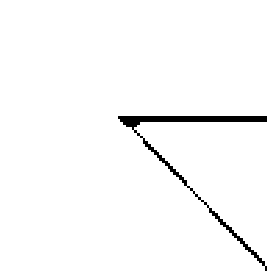

> 有時候，在靈性世界中最好玩的，就是不必太多懷疑。因為你的心，可以證實這一切的真假。《小王子》中曾提到：一個人只有用心去看，才能看到真實。

我的靈魂，其實也不斷的引導我走在世界各地。但我的心卻常常充滿了矛盾與不安，只因為人性面的我，總是一直牽絆著靈性面的我。不過，總有某個時刻，心異常清醒時，會透過身體的震動，知道訊息是真還是假。對我來說，長久在人生中的迷惘和對真理的追尋，一直是很重要的歷練與功課，我沒有辦法說清楚，只好在世界各地中繼續尋走（The Way），繼續找尋我的真理（Truth）。

在重返歐洲之前，我住過澳洲的墨爾本（文藝復興的藝術啟蒙），後來又移民到加拿大的溫哥華（天使的啟蒙），這兩個城市給了我歐洲藝術的記憶（維多莉亞女皇時代的建築和人文藝術）。在墨爾本，我開始懂得欣賞城市建築，並且明白了歐洲古老的藝術與城市創作的表現，城市色彩之美開始打開了我封閉的心，也讓我日後走到各個城市時，開始懂得去聆聽城市的生命與能量訊息。在溫哥華的日子，我參與了神秘學院的學習，結交了一堆神秘學家，亞特蘭提斯的文明記憶就是在那個時候開啟的。

更有趣的是，我認識了住在多倫多的好朋友，他們是西方神秘主義卡巴拉的研究學者，他們對卡巴拉的執迷，簡直可以說是窮盡一輩子在研究。

# Part ② 人生夢想設計藍圖

這些都與宗教無關，我就是喜歡這二輩子認真研究的精神。你能想像二十多歲的我，受教於一位已經六十多歲的大叔，把他收藏多年的紀錄打開，一一解說亞特蘭提斯研究史的模樣嗎？還有幾個有趣的神秘學家，一聽說年輕的東方女生喜歡這個難懂的哲學，馬上親手做了一個立體的卡巴拉送給我。這些無私的奉獻和分享，也為我年輕的生命打下了美好的靈魂記憶基礎。也就是循著這樣的藝術美感記憶，我逐漸循線找到了歐洲，那西方文明的源頭。

在歐洲，我不僅進行閉關，學習我的大圓滿法，也參與過凡爾賽宮的香水啟蒙研究（多年後，我與當年在皇宮旁經營了二百年的法國某時尚品牌有了合作），更在英國完成了我的色彩治療學習。由歐洲開始，我的足跡到了各大洲，只要有華人的地方，就有我的努力，我也將色彩的商品工具成功地以神學及神秘學的行銷手法，推廣到有華人的地方。

執著的我，相信校長及自己的靈性體驗，並且深深以為校長就是我的靈性導師，儘管我的藏傳師父完全不認同，但對於我的執著也莫可奈何。年少的我深信，自己是一「高級靈性業務員」，這是校長給我們灌輸的封號，我以為自己已經找到了修行的家，更何況這個我以為可以修練的家，還能讓我養家餬口賺錢維生。對於從未參與過身心靈學習，或加入過任何宗教團隊謀生的我，光是這樣，就已經心滿意足、心存感恩了，而我也想就這樣一輩子認真的走下去。心裡有根、有家、有家人的感覺，我一直很渴望，特別是靈性的家人，這在我實際的家族生活中是感受不到的。對於現實生活與家族中的名利與比較鬥爭、女人間的八卦與是非心結，總讓我看不見靈性的光芒與和諧，這些匱乏的能量感，令我常感覺格格不入，不知道如何與家族的人們連結。但只要在這些團體裡，我便能感受同類人的喜悅，更何況我還受到重視及認可，因此，我一直帶著感恩的心，努力賣著靈性商品，藉以感謝帶領我的校長師父。

我把校長當作父親一樣。不過和我父親一樣的是，每次我遇到人生疑問時，他們都無法給我方向和解答，總是要我自己去想。只是，在忙碌得無法想太多的生命歷程中，金錢的生存課題時時壓得我喘不過氣來，我只學會了向前衝，沒能想太多其他的事情。
即使如此，這樣的努力地活著，已經是一種活在當下的顯現，雖然世間事情未能盡如人意，但在這股靈性力量的庇蔭下，我已經很滿足了。

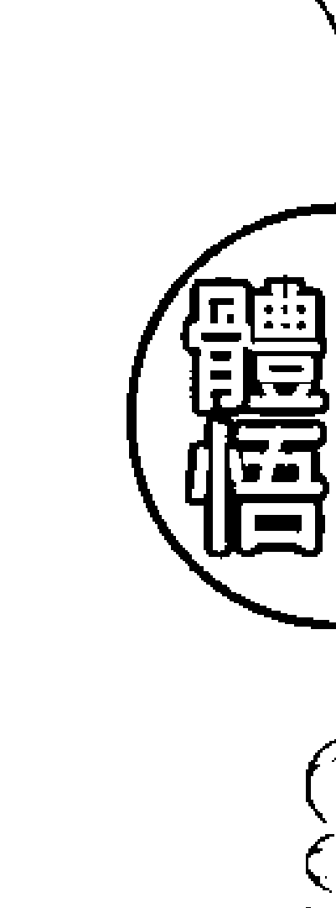

金錢，對應著紅色能量中心。
性，對應著橘色能量中心。
權力，對應著黃色能量中心。
這三個色彩能量中心，對應於我們身體的下半身，從腳往上，經過生殖器官區，然後到胃部。它們分別代表了人生最基礎的三個階段，也可能代表了大多數人一輩子只關注的三個重點。治療師本身必須更為腳踏實地（落地），不是成天只是會打坐，生活卻無法穩定。因此，如果一個靈性治療師無法把人生基礎的三階段實現，並且滿意，那麼這個治療師將會不斷的被拉回原地做功課，直到通過考驗為止。

如果一個治療師沒能腳踏實地，並且實現人生最基礎的生存歷練，也無法真的往更高的靈性層次邁進。只是一味的往靈性裡面鑽，而不處理與面對基礎的三個階段，那叫做逃避，而不是靈

性。維琪・渥爾這樣清楚的指示：「一個不落地的治療師，連靜心都是一種逃避。」我喜歡這種務實的見解，也喜歡這種不轉彎的直接。只是，大多數飄在高空的治療師，可以在高空享受另一種被認可、被尊重，以及被膜拜的價值感，所以儘管老師們不斷強調落地的重要性，但大家又豈能聽得進去？

另一方面，「落地」又豈是如此簡單？在色彩能量的世界中，我愈來愈體會到，培育色彩能量管理師的責任，並不在於只是治療的技術培養。在過去的時間中，辦教育時我也踢過不少鐵板，因為最終都是卡在金錢的基礎上。

曾經培養過一個學生，是處於社會底層的市井小民。我一路提拔到講師，就是相信教育的偉大，並且相信孔子的因材施教。但是，最後這個同學竟然夥同同伴，想來恐嚇我並取得金錢。當我實在非常震驚。雖然心痛，但也痛定思痛的思考，什麼樣的人才適合從事能量工作？什麼樣的人才成為良好的治療師？

有時候，我們迷失在金錢的恐懼中，往往想要不勞而獲，或是投機取巧。這些迷失，也真的是一種考驗呀！

當時，律師以及行政經理都經過查帳，查出那位同學經手的帳務有問題，並且建議我報案。不過想想，我們彼此沒有深仇大恨，如果只是金錢的價值觀不同，要再經歷一些不愉快的對峙，這樣的過程，又能得到什麼啟發？會獲得什麼提升呢？

當時的我，還一心希望可以和學生合作。我相信人是有感情的，不過卻錯估了人性的黑暗面。這個同學竟打算「斷我的手腳」（形容詞），特地跑來找我的助理，說我給多少錢，她願意加三倍給助理，希望助理離職，這樣我就沒有幫手了。

# ## 【自我療癒】雙手療癒

我一直有著天生的療癒能力，經由許多師父們的認可，以及我自己的經驗，不管是身體（氣場）或是身體的能量，我都知道自己就是可以帶來療癒力。你問我為什麼，我不知道。但也因為是天生的功能，我一直認為這不應該當作是賺錢的工具，你又如何告訴他人「我摸過你就會痊癒」？或是一「你和我聊過天就會舒服些，甚至身體的疼痛就會改善」？

當時的助理極具義氣，雖然非常害怕被恐嚇，卻充滿了正義感的支持著我。這事情令我難過了好一陣子，不時地在檢討自己，但也讓我看到了人性的光明面。我對於當時的助理心懷感激，卻對於相信我的工作夥伴面對因我而起的恐懼，又實在心痛。想了好幾天，最後，我相信祝福的力量。既然那位負面的同學已經心有所屬，並且有了相反的意願，我深知人的意願是不應該勉強的，那就祝福吧！這時候，我教授的雙手療癒給了我很大的啟迪，並且也為我觸礁的事業再次帶來了新契機。我的另一位師父適時出現了。根本上師巴楚仁波切，開始鼓勵我在佛堂裡進行能量課程。這一個我以為只能當作學生有特別狀況教授的課程，一直以為永遠不會賴以為生的授課，竟然在出家師父考驗我幾年後，叫我重操舊業，並且在他的佛學會裡開班授課。這不正應驗了那句話：生命自會尋求出路！

# 以愛療癒

也许很多人渴望，甚至可以这样说出来，但在我的出生背景裡，这是不被允许，也是不被认可的怪异。所以，我说不出口。
巴楚仁波切是一位非常伟大，却异常低调的师父，他的前世著有《普贤上师言教》。我在因缘的带领下，透过药师佛的法会结识了仁波切。仁波切住在欧洲，一天到晚见一些「西方治疗师」，但仁波切不以为然。他常告诉我「千万不要学那些不究竟的作法」，但迫于生存的课题，我一直三心两意的做着治疗师。
我的师父不认可我，我却有这样的能力，而我需要金钱，却用着师父不同意的方式维生。这不是很奇怪吗？就在我读大圆满佛学院的时候，仁波切亲自考验了我。
那时候，我已经是他的弟子兼佛学会的负责人，但经常我更像是他的侍者，因为我很向往出家僧团的生活圈，很宁静。
有一天，可能时候到了。上课中休息的时候，师父叫我到他的座前，他告诉我：「我的背很痛，你给我疗愈下。」我悄悄地询问师父，「您不是不同意我做这件事吗？」
结果上师说：「有爱就有疗愈力。重点不在技巧，在心。」
我把发抖又发冷的手放在师父疼痛的背上，闭上眼睛，只想著爱的力量流经我，透过双手，到师父的背上。第二天早课后，吃早餐时，师父忽然带着其他的侍者与翻译走到我的面前说：「俄国的一个同学生病了，请你去看看他。」
从那天起，我在佛学会的同学群中忽然忙了起来，各国不舒服的同学及翻译，都会来找我做「双手疗愈」。我想，师父是认可了我的疗愈力，因为我以爱疗愈。
以下是自疗的部位：

# 以愛療癒

有愛就有療癒力。重點不在技巧，在於一顆真心。

- 1. 療癒「金錢」的相關問題，對應的是「紅色能量中心」
我們可以透過雙手集結大地的生命力（紅色的熱情活力），然後放在鼠蹊兩側、膝蓋，還有雙腳，想像連結土地的力量。

- 2. 療癒「性」的相關問題，對應的是「橘色能量中心」
我們可以透過雙手集結火球的力量（橘色的溫暖活力），然後一手按摸著丹田（肚臍下的下腹部），另一手摸著後腰部命門的位置，想像連結社會全體的安全感。

- 3. 療癒「權力」的相關問題，對應的是「黃色能量中心」
我們可以透過雙手帶來太陽的光明與穿透力量，放在胃部以及肋骨兩側的尾端位置，想像結合眾生內在慈悲喜捨的「四無量心」願力，一起放大黃色光芒。

# ## Part Ⅲ
心與物質的生存考驗

長期以來，我一直在兩個方向被拉扯。一方面我是個守規矩、孝順乖巧又認真讀書的好孩子，希望能夠滿足父母對我的期待，能讓家族和家庭可以光耀門楣；在取得法國博士班的獎學金後，對於朝向嫁個好男人，生一堆小孩，並且在大學擔任教授工作的夢想更靠近了一些。另一方面，我又不由自主的走到哪裡都會遇到靈能人士，這些高人出現在我的生活中、工作中、修行中、朋友圈中，我見到他們總覺得更像家人，可以更親近，也更能溝通。

我也經常被兩種力量糾纏。外在的我長得年輕可愛，比實際年齡年輕，而童心特別重，只要看到色彩就能精神一振；內在的我又為了家庭的經濟問題，好強又堅定地工作著，常綻放出壓死人的陽性活力，工作起來不輸給真男人。

當我開始進入身心靈的領域後，又掙扎於我應該向商業及現實低頭，可以多賺點錢，還是應該堅持我想做的事情，不被五斗米嚇死。於是經常的，我也面臨到是否該休息幾天不工作，還是持續全年無休，東西方國家飛透的生活模式。也曾面臨到我應該是西方人，還是東方人的尷尬，因為我感受不到東方的熟悉，卻對於西方的一切感覺莫名的熟悉。

更嚴重的時候，甚至想放棄靈性療癒的工作，因為開始接受佛教教義的我，是不應該論神通和解夢的。我喜歡唱詩和研究宗教，特別熱愛沉浸在各國的宗教氣氛中，但各國的宗教和神明又都有各自的門檻，也都不認同「外道」這回事，可是我的人生，根本就是由這些玄奇的人事物所組成，如果要加入某些宗教團體，我都必須放棄某部分的我。但是，如果放棄了那個部分的我，我也不完

整了。这种不完整的失落感，令我感到迷惘与困惑，根本无法专心于只听从一个信念系统。

所以，我也曾经认真的去找英文补习班的工作，希望成为不常飞行的「正常人」，这样或许我才能过着正常女人的生活，也可以成为社会可以接受的女性角色，渴望被家人或社会，甚至被男性所认同。

心和物质像是绿色和红色的对比关系，又像是大我（蓝色）和小我（黄色）的纠结关系。而我的二元对立状态，也会出现在我的工作上，如右脑型和左脑型的人，喜欢理性思维论证和渴望情感纾解疗愈的两类人。我如果选择培训讲课或配合左脑型的工作模式，就得被迫放弃感受的层面，因为他们不接受太多情绪和感觉，也认为感受是没有用处的，只会干扰工作进度。但我如果只针对身心灵要命的动不动就感觉来、感觉去，感应这、感应那，始终喜欢停留在一堆的问题和疗愈当中，乐此不疲的玩着转圈的游戏，我这聪明的左脑又会感到愚蠢和难以提升；面对这类型的人们，太过理论的教学或文字，他们也会受不了，甚至拒绝接受，因为脑子转不过来，因为无法理解而产生情绪问题。左脑和右脑的战争，如同男人和女人的玫瑰战争，似乎永远无法达到共识！

这些多年来困扰我的信念问题，虽然根源来自我的无神论家庭，且迟迟得不到解脱。但是，我却在加拿大工作时，从我的疗愈客户身上找到了解答，从此解禁。

# Chapter 9

# 走進色彩異世界

你不能對抗生命中帶來的不適應與不舒服，但當你把心思灌注在彩色的事物時，你將發現自己根本可以和疾病共存。之後你還會發現，疾病已經消失……

一個無心插柳的人生，源自於一場夢境。
——
維琪·渥爾女士在夢中告訴我，她做產品的庫存地方有兩個大天使守著原料；之後，靈學老先生告訴我，我應該去英國一趟。
就這樣，我回到夢中的歐洲，開展了二十年的彩油代理與各地開拓的狼式工作。
所有的，我們往往說是無心插柳，但真相果真如此嗎？這場由顏色展開的靈性人生，其實從五歲就開始了。自小我就畫畫，這熟悉的色彩，也開啟了帶領人類意識發展的童年訓練。
但十三歲開始，因為父親的生意失敗，我忽然畫不出彩色的畫作，也拿不起我的畫筆。本來充滿創意的我，怎麼觀想都是黑白色的世界。除了夢境依然精采，青少年生涯完全是黑白的，再加上弟弟的過世，我已經不知道該如何規劃自己的人生，也不知道要如何掌握自己的生命了。
今天可以重回到色彩的世界裡，用色彩帶來生命的奇蹟，我覺得很幸運，很幸運上天揀選了我，讓色彩與能量在這個時候找上我，並且養活了我，更帶我走向全世界。
這種際遇，現在想起來還是覺得自己很lucky。

# Chapter 9. 走進色彩異世界

很早以前，在拿起畫筆時，我就知道，顏色可以治療情緒問題。我發現大多數來找我的人，都有著情緒上的困擾，早期很多是病理性，甚至是精神性的。雖然沒有到達精神疾病的階段，但官能症或神經症也是有的。

二〇一七年九月，美國知名的男演員金凱瑞發表了他的一部紀錄短片《I needed Color》，描述他如何透過繪畫走出生命的低潮，重新體會活著的滋味。

金凱瑞常說「我的幽默來自於絕望」，他從小就活在一個居無定所的生活中，十多年前他罹患憂鬱症，透過當時的女友陪伴才走出來；後來分手，他又開始不順利，事業和感情都很挫敗，然後更誇張的是，二〇一五年他當時剛分手的女友竟然因藥物過量而死亡。這種種的低潮，令金凱瑞消失了一陣子。

直到二〇一七年九月，他出現了。在一段充滿了亮麗色彩、由大衛·布希爾（David Bushell）拍攝的紀錄片中，金凱瑞說：「你可以從我的畫、我喜歡的顏色中，看到我對光明的渴望。」

色彩帶來的光明力量，是令人無法想像的盛大。在我個人經驗中，早期有不少很年輕就投入的治療師，甚至是天生的治療師，他們的身上都有著這種氣質。曾經我的一位老友告訴我，他很驚訝我的內心竟然會有如此悲觀的一面，當時我回說：「是呀！但不同的是，我們會在最短的時間轉換磁場，而不會順著這個情緒一直走下去。我們可以自覺，並且醒來。」

金凱瑞說：「無論是表演、繪畫或雕塑，重點都是愛。我們想表現自己，並且希望自己被接納。我喜歡活著的感覺，藝術就是活著的證明。」

對我來說，進入色彩能量的空間，如同進入佛教的光音天，也如同進入上帝充滿光與愛的天堂。色彩的能量，把人由疾病直接帶至無病痛的世界，你不必花功夫用力面對內在的疾病，因為你根本就沒有病，你只需要在進入黑暗時，把你的黑暗帶進光明，讓自己成為這一道光明。

這些把天堂帶到人間的工作，是我無心插柳的前半生，是在我最難過的時候，成了陪伴自己與陪伴他人的正能量生活方式。我相信，金凱瑞也是來自亞特蘭提斯的靈魂。

你不能對抗生命中帶來的不適應與不舒服，但你可以享受生命中帶來的、面對低潮時勇氣所帶來的高能量。當你把心思灌注在彩色的事物時，你將發現自己根本可以和疾病共存。之後你還會發現，疾病已經消失，因為你本來就可以沒有任何疾病。

去英國之前，我已經向美國的凱洛老師拜師學藝了。老師非常慈悲，第一眼見到她，在她大熊般的溫暖擁抱下，我忍不住哭了。然後在她的指導下，我開始運用關懷人的力量，展開了能量工作。靈學老先生依然鼓勵我好好學習，我也覺得自己懂得太少，光靠一點點的靈通感應能力，完全不能滿足我的求知欲。

原來這些都是所謂的新時代運動（New Age Movement）。我完全不懂這些背景，但在夢中儼然已經開始進入學習了。

於是，我需要從其中一項學習先入手。很多的巧合，無心插柳，卻愈走愈清晰。
由美國回臺灣後，正巧有位媒體工作的姊姊開始轉戰出版界，想有番作為，於是邀請我一起去個飯局。她要我帶上色彩卡片，而我想，我這樣去白吃飯也不好意思，於是帶了專門療癒創傷的精油給請客的大哥。
那是一場有趣的會面，我自己也覺得顏色很好玩。在學習的階段，初學者多半比較沒有顧忌，也容易賣弄，我當時就處於這樣的狀態，一知半解卻是最狂熱的時候。所以，就這樣去了我的第一場「記者會」（之後有著無數場。直到現在，我的團隊仍繼續沿用著這些，在沙龍分享及親親節能量活動中）。
先送了禮物給請吃飯的大哥，飯後姊姊介紹我剛從國外學了新奇的東西，要我給大家介紹下。我略微說明了一下色彩心理學的原理後，請吃飯的大哥身先士卒，決定試一下體會是否有我說的神奇經驗。
於是，大哥自己洗了牌，抽了第一張。當他看到時，臉色抽了一下，因為他從一百多張色彩卡片中，竟然就抽中了我送他的那個橘色油卡片。
「這個有點古怪了。」他說。然後他檢查了卡片，我忽然覺得自己很像魔術師，他在懷疑是否我在卡片上做了什麼記號。當然沒有。當下我講解了下他的情況，當然，我也感應了一下他，以便雙重確認。然後，當晚就結束了。
三天後，那個大哥晚上十一點請女助理打電話給我，說在我家附近，希望請我喝個咖啡。我想，半夜喝咖啡這個習慣很詭異，但因為信任的姊姊會一起陪同，我便帶著好奇心去赴約了。結果是，他們希望我能寫出我的色彩奇蹟故事。
這種故事有人看嗎？我覺得沒有什麼人會好奇吧？
大哥說：「你只要寫出真實的故事即可。」因為他自己回去後發生了一些被我說中的事，而且有些事只有他自己知道，有些問題也只有他自己明瞭，卻在三天內有了變化。基於更多的好奇，所以他們想知道更多的原理。

他們認為，人們往往對於無形的世界感到好奇又質疑，現在有個人可以溝通，也很有意思。更何況，我有時尚工具，不會顯得很怪。色彩又是時尚圈與商業界熟悉的工具，這樣的新興領域大家都不太明白，為什麼色彩可以提升人類的意識，用一個顏色就會有靈感？為什麼？他們覺得找到現身說法的我，更具真實性，而且我在接觸之前的靈能故事已經很多。於是，我被邀請開始撰寫。當我同意的那一天開始，我的其他工作就忽然全被取消了。接下來三個月的埋頭苦幹，就是寫作。

※

寫作的過程是快樂的。現在想起來，這十八年來平均每年都有一本作品推出，出版第一本書之前，我一直在報紙和時尚雜誌寫專欄，也曾經在《聯合報》寫星座。我一直知道自已是有著寫作的狂熱，雖然不善言語，但我喜歡文字和藝術，這些亞特蘭提斯人的特徵在我身上特別明顯。年少時期的我，一直深信自己來自那個陸沉的地方；現在的我，只是派到其他國家去做外交工作。而我現在開始做的，是天生就會的工作。

就寫作來說，我的打字簡直不是我打的。每次要寫到什麼色彩，大自然就顯示給我那個顏色。記得有一次，寫到寶藍色與檸檬黃時，家中陽臺忽然來了一隻這樣顏色組合的鳥兒，就一直停在陽臺上，直到我把色彩的靈感寫完才飛走。這樣的經驗，之後在英國寫《天使神諭》時也是一樣。我的手成為一種訊息的載體，這種「訊息書寫法」，便是把自已放空後，完全容許訊息靈感的流動，然後用手配合著訊息完成。後來也有學生希望我教他們，也許以後會開設這類課程吧，順便還可以學習外文呢！

每天快樂又有希望的寫作，活在充滿神奇訊息的奇蹟之中，真的很充實。雖然暫時沒有收入，可是卻正能量滿滿，毫無畏懼。然而，正當全彩書稿做好，準備要送印刷廠印製時，忽然我接到了電話，說出版社忽然有財務的問題，可能出書要延遲了！

除了震驚，我也充滿了懷疑。心裡想著：對呀，本來就應該出版不了，畢竟這不是我正式的工作，而且，我又不是專業作家，怎麼可能有這種機緣呢？當時的我倒也沒有什麼難過，因為自己也沒抱著太大的希望，所以反而覺得沒有也是應該的。只是有點失落感，畢竟書稿真的好美，自己也是有所期待的。而且在弟弟過世後，我就開始認為自己的期待落空是正常的，也學習著不去期待太多事物。也許，出書本就不是屬於我可以做的事吧？

當天晚上，夢境再度來到。創辦人來到夢中告訴我彩油原理，帶我去英國，並且要我不要轉業，要繼續下去。早上八點多醒來，我對夢境印象非常深刻，然後剎那間，我的眼睛像是被很亮的光照射，我看到了一對極大的金黃色翅膀閃過。
沒多久，人還在床上，就接到電話，說出版社財務問題解決了，等一下馬上就要送廠印製了。我的第一本新書，就在這樣的信念考驗下，神奇的誕生了。

※

我天生是文字媒體的工作者，也就是說，我是屬於靈性人士中可以靈性書寫的這類人。進行過程中，不能有太多自己的想法，也不能佈局規劃或賣弄太多寫作技巧，只能在感覺到來時，雙手不停地實打字。有時候一坐下來，便是四五個小時不停。如果我用了大量的技巧、規矩和頭腦，文章就無法持續，成不了一篇。但如果靈感不受阻礙，就可以一個月寫完一本十幾萬字的作品。
幸運的我，因為新工具的引進，成了這個產品的代言人，也成了媒體新寵兒。可惜的是，我一直沒有自信，所以我一直給自己的定位不是靈性人士，只是推動靈性教育的工作者。

我也不喜歡為人算命或承擔業力。弟弟過世後我遇到的種種高人都不能滿足我，我問的所有的問題，也沒有人可以完整回答，令我滿意或臣服。所以，高傲的我堅持人要相信自己，但我自己卻一直有靈啟經驗的發生，家中的經濟困境也沒有停止，逼得我在求學的歷程中，除了要養活自己，也得認真工作為家中還債。

這樣的困窘，讓我必須工作賺錢，而我的才華，正好是賺錢的方式之一。填補了家庭的負擔後，我才能繼續學習了解自己。幸運的是，我可以透過工作賺錢，而工作也是滋養我心靈最好的良藥。工作多年並成為指導業界工作者的專業顧問後，我才明白，經濟壓力是非常好的上進動力，正因為我們需要生存，所以必須「被迫」認真工作，這反而促進了我們的靈性提升。

困境可以是我們的心靈導師，這是我累積多年經驗之後的心得。只是在當時，我們都是充滿矛盾和不安的，特別是生存的恐懼。

## 核心體悟
Core Enlightenment

我非常能夠體會金凱瑞的心，因為色彩是我們在生命的過程中，唯一可以自救的武器。

二十年不算短的時光中，甚至在從小的基因裡，我一直在色彩的敏感中度過。眼睛所見到的世界，往往可以把我們的世界轉變為三維度空間以上的場域（energy field），像是現在4D的虛擬世界，可以立即真實地呈現在我們的眼前。

往往我們所聽所想，腦海中所見的一切，都只能構建出一維和二維的世界，哪怕我們從小拿在禪修的過程中，人們透過靜心，透過靜，感知到一種安定的力量，然後產生智慧。 在二〇一七年的冬天，一位十多年前在我課程中受益的女同學，因為我而成為佛教徒，也因在畫筆，也都還是只有二維度的空間見解，那是因為我們的思維限制了自己。直到我們能用「眼睛」去看，透過眼睛傳遞給大腦的圖示，人類才會進入到三維度的空間，感知到場域。 我自小對場域敏感，不僅人的場域，還有空間的場域。 人們在情緒升起時，往往會散發出光和熱，進而伸展出色彩光能的輻射，進而影響了空間的感受。每個人都在創造自己的場域，就像金凱瑞的畫作一樣，大多數的人雖然沒有終日繪畫，但透 過如同相機的眼睛看出去，就可以有了立體的感受。 眼睛的迷人之處，就在於可以拍攝下靈魂的紀錄片。這些記憶儲存在靈魂深處，到了人生最後的際遇時，就可以拿出來深深地回味。喔，我去過瑞士的高山；啊，我親歷過埃及的金字塔；對了，我還去過大昭寺……種種的美好感受，在靈魂深處都會像播放錄影帶一般，播放出美好色彩的影片，讓心情感覺美好，讓靈魂感受豐富。我們也會透過這有形有相的色彩世界，建構出無形無相的內在色彩世界。當心情美好時，我們便會收到這樣美好的夢境，或是促成生活中美好的事情圍繞著我們，只因為我們的感覺會變得很「彩色」。

## 自我療癒

## 彩色禪修

了畫筆，也都還是只有二維度的空間見解，那是因為我們的思維限制了自己。直到我們能用「眼睛」去看，透過眼睛傳遞給大腦的圖示，人類才會進入到三維度的空間，感知到場域。 我自小對場域敏感，不僅人的場域，還有空間的場域。 人們在情緒升起時，往往會散發出光和熱，進而伸展出色彩光能的輻射，進而影響了空間的感受。每個人都在創造自己的場域，就像金凱瑞的畫作一樣，大多數的人雖然沒有終日繪畫，但透 過如同相機的眼睛看出去，就可以有了立體的感受。 眼睛的迷人之處，就在於可以拍攝下靈魂的紀錄片。這些記憶儲存在靈魂深處，到了人生最後的際遇時，就可以拿出來深深地回味。喔，我去過瑞士的高山；啊，我親歷過埃及的金字塔；對了，我還去過大昭寺……種種的美好感受，在靈魂深處都會像播放錄影帶一般，播放出美好色彩的影片，讓心情感覺美好，讓靈魂感受豐富。我們也會透過這有形有相的色彩世界，建構出無形無相的內在色彩世界。當心情美好時，我們便會收到這樣美好的夢境，或是促成生活中美好的事情圍繞著我們，只因為我們的感覺會變得很「彩色」。

為我而成為一個智慧加身的好妻子與母親。她透過靈性的敏感，也陪伴了丈夫度過生命的危機，是我色彩能量教育的實踐者。

由於指引我的靈學老先生，以及諸位靈性指導導師，都希望我能把佛法的生命哲理融入教學中，因此，我加入了一個國際的色彩組織（這也是靈學老先生的建議），把我的靈能動見融入在教學中。

一開始，我們是透過某個商業的環境做買賣，但逐漸的，我發現我的能量教學中融入的自己的風格，特別的「禪」（Zen）味十足。

很像我的畫畫一樣，我很喜歡意境式的作品，或是可以從藝術作品中感受能量場域（意境）。這樣一點一滴過了二十多年的色彩工作，我的學生們也奉行著這些做法，比較有悟性的同學，就會依著我的教育方式融入到生活。畢竟學習心靈平衡，不就是為了人生幸福美滿、和諧豐盛嗎？

另一方面，我也不贊成學了就要離婚、獨身，甚至出家。因為每個人的生命軌跡不同，如果已經有婚姻了，為什麼不好好認真地走下去，偏要離群獨居呢？

彩色禪修就是依著這樣的藝術品味，走成人生一幅美圖的宗旨，而逐漸成形的修練方法。這當中，我們透過情緒的淬煉，逐漸感知到快樂、無憂、無私、大愛。

十多年前這個成都的學生，不僅自己幸福美滿，靈性強大，更因此支持了先生的事業，以及兒子的健康成功。

這對夫妻從網路上找到了我，然後一年半後我們終於在成都相見。他們成了成功的房地產商，並且在青城山都江堰旁邊擁有大片土地和飯店、別墅。盛情地在我成都課程結束後，親自來接我到他們的飯店給我慶生，於是，「青城山彩色禪閉關中心」就這樣被贊助成立了。

那麼，我們現在就開始一起進入彩色禪修吧！

### 1. stop-thinking（停止思考）

所有感知的一切，都無法透過思考發生。因此，彩色禪修的第一步，就是放下繁重的頭腦。思考對多數人來說非常不容易，而且愈成功的人愈難達到。一秒鐘不想事情，一天不去規劃未來，真的不怎麼活著。但所有的高感知力，都要從停止思考開始。因此，先練習發呆，休假時不做，把原本創造負面的思考力降低、減弱，你才能走進下一步。

### 2. 專注一件事

不思考之後，你可能會很恐慌。因此，我們需要先專注一件事情。術的事情，如畫畫、攝影，讓自己放鬆的事，後者可以是運動、旅行，讓自己快樂的事。沒有放鬆，便無法快樂，你也不會有色彩感知力。

### 3. 開始呼吸

如果你可以感受到專注，接下來，就可以專心在呼吸上。走路時呼吸，睡覺時呼吸，講話時呼吸，打坐時呼吸。呼吸是非常美好的經驗，只有活著我們才能感知到。如果可以隨時知道自己在呼吸狀態，我們就可以覺察自己的情緒與感受，就會平靜下來。

### 4. 進入色彩

在專注呼吸的同時，我們開始加入眼睛的力量。用眼睛辨識一切的色彩，一切進入眼中的色彩，然後把顏色連結到心中。心是感受一切的發源地，不平靜、不快樂的心無法感知色彩能量場，因此，必須透過以上幾個步驟，才能打開色彩能量的場域感知力。

### 5. 彩色禪修

- 透過呼吸，吸入一切的能量感知。
- 透過眼睛，攝入一切的色彩訊息。
- 透過覺察，感知一切的能量覺受。
- stop-thinking, just awareness。停止思考，只是感知。

## 以愛療癒

愛可以幫助我們對抗疾病和不舒適；愛更是一種禪的藝術。

# Chapter 10

## 這不是我想像的身心靈行業

人在面臨生存恐懼時，各種的負面能量將紛紛出現，像憤怒、不滿、恐懼、擔憂等等；而有效利用雜念管理，即可以簡單有效地讓心沉澱下來。

滿 懷著朝聖的感動和對一份全新事業的信心，我從英國回來了。

美國的凱洛老師告訴我，她要去泰國做新課程的發佈會。身為她唯一的東方學生的我，當然義不容辭地得去捧個場。

在這次的三天課程中，我第一次體會到人天合一的感受。當我們把手放在身上，我可以立即由自己摸著的身體，像導電一樣，立即從另一個維度（次元空間）中感受到宇宙的智慧，以及從沒學過的神秘學意涵。對於這樣的體悟，我實在嚇壞了，因為這第一次的接觸並不舒服。

我一向敏感過了頭。敏感沒有辦法給我很好的安全感，因為我常常無意間會誤闖他人的空間，透過他人的磁場，明瞭到他人的內在問題或是身體的問題。這立即性的明白，帶給我的不是快感，而是驚嚇。

這種驚嚇我持續了很多年，弟弟過世之後愈來愈明顯，也私下找過一些方法，希望能夠得到改善。在我不太想知道別人怎麼了，但就是可以知道。所以，我沒有遇上藏傳佛教有修行的師父前，我的自我保護力不夠，所以常常沒有安全感。

我刻意不太與人碰觸，特別是身體上的碰觸。記得高中時，我連女同學間的拉手都會避免，女生之間常會手勾手臂，這對我來說也常是一種痛苦，因為對方的磁場會跑到我的身上來，我會感受到對方像是生理期來到，或是對方身上正在不舒服的部位，而我也會立即同樣的不舒服。但因為來自無神論的家庭，我不會朝著神學或靈能的方向去解釋，唯一能做的，只是避免碰觸而已。這個問題多年未獲解決，也同样阻礙了我的男女交往關係。

在泰國的三天裡，第一場的碰觸練習，一個滿頭紅髮的壯碩德國姊姊，興沖沖的跑來想和我配成一組，一起練習凱洛老師教的手法。我瞄了她一眼，心裡想：慘了！她的氣場和她的頭髮一樣，很紅。對我來說，很可怕！但我不會拒絕，在那個場合裡，必須要有人可以練習的呀！我瞄了凱洛老師一眼，心想：反正老師在呀！她會幫助我的，我不應該害怕。於是，我的眼睛看著「紅紅的Tiger」（一隻紅色大老虎），接受了邀請，一起互相做能量碰觸的練習。

果不其然，再次發生慘劇。紅老虎姊姊的身體一下子釋放了所有憤怒和負面情緒，身體輕按後準備交換練習時，我已淒慘的全身發抖，坐在地上根本站不起來。本來心裡就已經犯嘀咕，有了抗拒，對紅老虎姊姊的能量已經產生了排斥，所以當一股不熟悉的能量排山倒海衝來時，我就失去了抵抗力。凱洛老師發現我無法站起來，便等其他同學離開後，默默的坐在我的身邊，用「勁能量」來陪伴我。這是我第一次發現，心懷仁善的療癒，一種慈愛的陪伴，能夠化解所有的衝擊，把身體卡住的關卡一一融化。

沒多久，凱洛老師把放在我身上的手離開，我的身體恢復了正常。我很難向老師解釋我的感受，我直覺知道凱洛老師不是靈能體悟者，她是智者，清高的知識傳遞人，但她的功能不在於我們這種感應力，說了也是白說。但老師教會我一件事，就是「不要抗拒」。

> 任何的能量靠近，如果我們不心懷對抗，這個能量就不會隨之以更強大的姿態起舞。對抗性的能量，也是因為我們對抗後產生的抗性所致，像是憤怒、不滿、恐懼、擔憂等等。其中最強大的，就是憤怒。

紅老虎姊姊全身都是紅色的憤怒氣場，嚇到我了，只因我不擅長和很會吵架或強悍的力量為伍。直到粉紅色的凱洛老師靠近，才舒緩了我的壓力和不舒服。

當我一明白這個道理，並且不再抗拒後，第二天的課程我開始體會到，原來宇宙當中所有的一切秘密，都收藏在我們的身體裡。對於有很多神秘學知識與學習的我來說，不能理解的是，老師在上課中所講的身體所有對應區，如某個位置對應某個星相，某個位置對應某個塔羅或卡巴拉的概念，不過我發現，當我閉上眼睛，把手放在那個對應的位置上時，瞬間就有很多Flow（流動）進來，就像是從另一扇門的另一個房間流進來，完全不費力氣就能理解了。

我不知道是自己身體很神奇？還是老師教的手法很神奇？當晚我夢到，一個新生的嬰兒躺在我的胸前，我就像個母親一樣，全裸著抱著這個全裸的小嬰孩。夢境實在太栩栩如生了，我問他，你是我的小孩嗎？是代表我要生小孩了？還是，你是誰呢？

第三天，我夢到我給凱洛老師一只大皮箱。於是我明白，我將帶著我的老師去旅行了。

※

對於一個以靈性和療癒為主的事業，我真的是滿懷著崇高的目標與熱情。

特別是在受過藏傳佛教的師父與弟子的訓練，我對於「師父」這樣身分的人，都是全然的奉獻和尊敬。因此，儘管這些課程都是要付費的，但對我來說，這就如同我參加佛教活動一樣，付錢是應該的。
我沒有金錢的障礙，我有的是全然的熱情。
崇高的使命感與靈性的熱情，是二十多年來支持我的唯一源頭。
在身心靈的行業中，我是誤打誤撞下闖進來的。其實從一開始，彷彿就闖錯了道場，而我憑藉的是，自己強大的信念和積極的行動力。但也不知道為什麼，只要每次我想去實現，似乎所有的一切「存在」就支持著我。
成為臺灣區以及後來加拿大地區的代言與商品代理，都源自於凱洛老師的一番鼓勵。老師鼓勵我寫論文，並且認真做個案報告，但我直覺認為，自己不是很有能力做這些課程的授課老師。對我來說，我只想請我的老師來就可以了。
我知道自己很敏感，所以擅長照顧人。我彷彿也認同自己好像很輕鬆就可以讀懂他人的心（後來前輩說這叫他心通），所以我想，我應該是個可以善解人意、心地善良的課程主辦人，對於更大的壓力和考試，我敬謝不敏。
不過凱洛老師不這樣想，她告訴我，「我知道你們東方學生聰明，對於考試有著完美成為第一名的迷思。但我們西方人的想法不是這樣，特別是在你學習的過程中，我們希望你能體驗這個過程。當你很努力去完成，這個過程才是最精華與最美好的。所以，我們不是要考倒你，而是希望你盡力去完成。」
凱洛老師也是當時僅有的幾位主考官，我的老師開口了，我便全然信任的去做。三個月，我又以優的態勢取得了論文通過，並且正式可以代表英國學校開始教學了。
取得證書之後，我依然沒有想要教書。想想自己要準備，還要背臺詞，英文教材也要一讀再讀，何## Chapter 10. 這不是我想像的身心靈行業

必那麼辛苦？我只需要請我的老師來就好了呀！天不從人願，體弱多病的凱洛老師在來臺灣之前忽然生病無法飛行，助理建議我自己開課，因為錢已經收了。就這樣，我的人生，又面臨了轉捩點。

我想推動身旁的工作夥伴，可是好像情勢只能我自己下場了，但我沒有經驗，於是面對已經交錢的十多位同學，我們只好據實以告。沒想到，只有兩位同學願意等待凱洛老師復原繼續上課，沒有人退費，其他的十多位同學都想上華語教學的老師的課。我以為大家會選擇凱洛老師，這樣我就有理由可以退縮，沒想到，又一場天不從人願的戲碼。為了承諾，我得上陣開課。

戰戰兢兢的，連帶領靜坐都偷看講義，用念的完成，我感覺自己超級不專業的。接下來如何帶領六天呀？沒想到，維琪·渥爾又出奇招了。這次非常奇妙的，她教了我靜心之術。

當我結結巴巴的帶領靜坐時，忽然間，我進入到藍色的寧靜之中。

我很清楚知道，有個不一樣的能量團出現，霎時我又進入了一個完全沒有聲音的安靜空間裡。這個感覺年幼時出現過，弟弟過世後出現過，只要當我感覺到很不能平靜，甚至情緒激動時，覺得要崩潰時，我就立刻會進入到一個無聲的世界，然後，不同顏色的光就會降臨。這次，是藍色的。

我一下子平靜下來，好像變了一個人似的，非常平穩，像個專業的老師。這藍色的平靜感不預期的出現，卻引領我明白了藍色代表平靜的能量意涵。我進入到這個能量場域裡，感覺到前所未有的舒服和平靜，沒有任何煩惱，只是平靜，還有一股難以言喻的「信任」。當下覺得自己就是一個「權威」或「專家」。

食髓知味，為了想念這個藍色的平靜，我願意再次開課，而且一教就教了二十多年。

所有的靈性商品或行業都像是另一種宗教，新興宗教。當然，不管是賣心靈、賣課程、賣產品，領導人的風格自然是一個企業系統的靈魂關鍵，彩油也不例外。而在心靈的世界，投入的人大多是心靈脆弱者，想找到依靠。因此，在缺愛、缺錢或缺性的世界中，也容易形成另一種宗教團體的崇拜。但在這様的世界中，也不乏充斥著金錢和性愛的醜聞與曖昧。

帶著神聖崇高的崇拜心，依著靈學老先生的指引，再加上佛教徒修練的培養，令我對於老師十分尊敬。由於無形的世界優先來到，然後才是人性的世界，所以我不疑有他，認真而專心的為了「使命」而前進，無所畏懼。

當一個人沒有私心，只是為了像是世界和平、土地寧靜，或是人心和諧有愛等，為這些目標奮鬥，而無所懷疑時，是最幸福的時刻。我的二十年幾乎是在這樣毫無懷疑的情況下努力的，所以成功很快，賺錢不少，一切都來得非常容易。我彷彿是以這樣的事業作為一輩子的終身目標，並樂此不疲。

本以為就這樣一直持續下去，但人生的劇本就不是以永恆來安排的，而是以無常安排的。

長久以來，凱洛老師和英國的彩油學校一直沒有良好的互動。這源自於她的一個學生剽竊了她的教學內容，創造了另一個課程；也和英國為了版權問題，還有商業制度上的不健全而有摩擦，有些成員是為了錢，而不是為了理想的狀態，她非常不以為然，卻是投訴無門。

彩油世界中老一輩的老師中，生活清苦貧窮的不在少數，因為他們必須依附著組織而生。如果不喜歡這個人，或是停止了產品或授權的供給，甚至禁止這個老師繼續教授組織的課程，這個老師就如同被切斷了生路。有大量的老師們依靠著這個組織，卻無力成為自己，只能依從權威的規範，像極了中古世紀的宗教權威。我曾經問過老師，為什麼不去爭取或抗議？有的，但抗議無效，於是凱洛老師和組織愈走愈遠。

她的生活清苦，我是明白的。我一方面心疼老師，又不能理解為什麼一個賺錢的大組織，為什麼不能好好照顧那些曾經為你奉獻青春的開國元老？這樣的故事一直重演，許多老一輩的老師，都因為無力再交錢給組織而被迫退出。去年，我的一位英國老師，也面臨了這樣的困境。老師們被組織「退出」後，都面臨了生存的問題。我在兩年前曾提醒過這位老師，去年當他寫信來希望我為他辦課程時，我還提醒他，要成為自己，不是賣瓶瓶罐罐的，不自由的人。可惜我們都是經歷了二十年時光才明白。換個角度想，我們可能都沉溺在某種宗教情懷中，而忘了這是個商業世界。

遺憾的是，在我所有輔導的賺大錢企業中，最大的問題往往出自領導者。像是某些金融或直銷行業，老闆見到錢多了，立刻改變了當初的發心。人的貪心和傲慢往往是改變的關鍵，身心靈的商業國度中，崇拜多了，卻不再自我覺察，甚至依然堅持內心缺愛的舊有創傷，忘了療癒的初衷，這樣仍然會掉回到老路上。舊有的模式不斷重演，人們的貪心與爭奪不斷發生，而身心靈的考驗更為殘酷，因為賣的就是人性和夢想。

能量的世界更是如此。二〇一〇年，在中國工作的經驗中，在我的盲從和執念背後，我開始意識到一個現象。就算做的是希望幫助眾人身心靈和諧的工作，但一掉入了一個大市場，面對一堆金錢，如果不是修行人，可能也會掉入這殘酷的大染缸中。果不其然，所有的外國人到了中國似乎都瘋了，因為中國市場很大，中國的商人也很能畫大餅，如果沒有把持住自己的心念，貪欲的力量往往令人迷失。

我的偶像世界開始崩塌，就像塔羅牌中的高塔。一直以為在安全生存的高塔中，便是安全的，殊不知，當高塔形成了我們和世界的鴻溝，也將令我們不再感知到這個世界的公平正義與光明的愛。這種隔絕，像是塔羅牌中的死亡牌，會讓人靈魂黑暗，見不到光明。

於是，我的生命中又出現了一堆阻力，開始阻止我走在這條自以為已經鋪好的道路上。就像當年被摧毀一切道路一樣，我又得開始調整腳步，重新出發。

依戀父母的孩子，往往是依賴習慣了。彩油早期的工作者，像凱洛老師他們，都是經濟上不富裕的一群人，我常常仗義要為老師們開課，然後供養金錢給他們。因為我感覺自己好像是個很好的橋樑，只要這些有靈魂能力、卻無助的靈性工作者找上我，我都願意付出心力，為他們創造一條物質的道路。就這樣，不少外國老師找上我，我也為他們創造了金錢的機會。

但是，畢竟這些人不是修行人。記得在我自己覺得走上困境時，一位彩油老師竟然毫不留情。不僅繼續要收錢，完全無視於我的困境，還和我的學生聯合起來，想找其他的跳板繼續在臺灣工作。

第一次，我忽然明白，原來我活得很不落地，一直為了理想奮鬥，卻不理解人心與人性。但我沒有多說，因為我知道金錢物質的困境是人生的底線，除了修行人的清高可以看清，大多數人無法走出這樣的糾結與掙扎。

人在面臨生存恐懼的表現，是出於自衛，不是意圖。我自己不也是這樣？長年在身心靈機構，卻一直被同組織的同業鬥爭的環境，讓人無法自拔的只能奉承（非奉獻）組織。最後一次到英國學校時，我見到很多黑色的力量圍繞著。我知道，那應該是我最後一次來這裡了。就這樣，我意識到該走自己的道路，而不能再盲從了。因為我很受不了每個國家都因為這一個產品，而使自己人反目，甚至爭奪，又互相陷害。這樣為了錢而工作，失去了靈性的意義，爭到了代理權又如何呢？

我的失望在於，如果不能促進世界的美好，只是用美好吸引人心的慾望和虛假，卻使我們的心逐漸失落，那就不是我真心想要的境界。

很多的智慧不是上一兩天的課程就可以獲得的，更多的體悟是在成為治療師之後才會有收穫。我多虧了入行早，年紀輕輕就一頭栽進了這個奇幻的國度。很多小時候的靈性功能，全是在工作中逐漸恢復，甚至更為擴大。另一方面，也或許我已經走過那一段道路，所以，畢業了，可以放手了。

如果你看過哈利波特《鳳凰會的密令》這部小說或電影，你可能印象深刻的是哈利波特和黑暗勢力的競爭。最後一次去英國學校，我是生病回來的。當時的掙扎，就是這樣的心境。我開始感受到自己的內在，也在被同化為一種黑暗的力量（像是欲望）。但是，似乎我內心排斥的同時，自已竟然好像也有這一面。

一直記得那個場景，完全是一個背叛的場景。我的老師聯合了我的學生，然後出現在我的面前，令我尷尬的必須接受眼前的難堪。我天生痛恨背叛與欺瞞，卻在面對時完全無招架之力，不知如何面對信任的老師和學生聯合上演的一齣戲碼。

我反觀自己，外在的背叛，或許只是呈現我的內心也早已背叛了。記不清楚那時的情節，但依稀記得情緒上的強烈波動。

當哈利波特在掙扎對抗自己內在的黑暗勢力時，像是憤怒、仇恨、想殺死對方，校長鄧不利多告訴他：「重點不在你們的相似處（負面），而是你們的不同處（愛）。」這對當時掙扎快陷入昏迷的哈利波特來說，實在辛苦。但我想鄧不利多點出了一個重點，就是對抗我們的「軟弱」。

我覺得沒有老師、學生的支持，心裡很孤單困苦。但我面對這種變化時也在反思，我有什麼？我想要什麼？看不慣療癒機構不去療癒眾人，卻不斷在製造紛爭；已經努力建議過，卻無力改變變時，我要繼續這樣活著，還是有所選擇？我不想關注我們共同擁有的執念和欲望，但我真心想關注在擁有的共好與和諧。曾經，我也花在信守遊戲規則下，創造了他人的不快樂與爭奪。現在我想想，就算我爭到了，又如何呢？我建立起自己的品牌，也釋出友善，不希望與之為敵。也逐漸發展出另一種整頓貪婪與思維混亂的能量思維斷捨離——「雜念管理」。有趣的是，就在這個時候，英國發出了極不友善的郵件給我的執行長，因為我，我的學生們都是彩油的信徒。但這一次，這個宗教組織要剷除異己了。五年前，我的心中早已做好準備，但我的學生們放不下。沒有親近核心，總是心存幻想。這次，連親自在其中交涉的執行長，都感受到一股「殺氣」。執行長沒有辦法想像，這個美好的面具背後的真相，仍然想停留在虛假的美好中。而這一次，我依然說著五年來沒有停止的勸告：「覺醒吧！做自己才是最棒的禮物。」於是我們對外公告，並且立刻清理掉所有的剩餘產品。向過去說再見，最難的是情緒和深深的依戀。我理解我的團隊及學生們的難過，大家依依不舍和相處了二十年的產品說再見。但是，分離，只是一種因緣的結束，卻不代表我們過去沒有美好，這是靈魂深處的記憶，也是一種歷練。時間到了，就繼續向前流動。生命是需要向前流動，才能體現美好的精神。我們早已領教過那些非靈性的行為，但那也教會我們，當我們自己的團隊組織做大時，我們可以免於犯下同樣的錯誤。我們，帶著過去的禮物，向前開拓了新的局面。「成住壞空」，當年靈學老先生提醒的，如今呈現眼前。

### 【自我療癒】雜念管理

我開發最簡單、卻立即有效的雜念管理法，也許可以為紛亂的你，找到意識清晰的最簡單方法。雜念管理的三步驟：

- 第一步：接受，了解心理動機（所有的行為都有背後的動機）。
- 第二步：放下，透過放下信念（了解之後才能放下）。
- 第三步：原諒，原諒行為模式（放下之後就能原諒）。

我們以高階治療師茹絲的真實案例，來套用雜念管理的三步驟：

第一步，接受。

在課程中，身體不舒服的茹絲先接受自己身體失去力氣的現況，並開始探索自己身體背後的心理動機為何？茹絲意識到，她好不容易抽出時間來進修，眼見同學們都認真的學習，並且馬上有身體感悟，但她的身體竟然開始不聽使喚。她一方面氣自己的不爭氣（我怎麼可以有這樣的反應），也很著急自己「跟不上」。愈急，身體就愈無力，怎麼辦？

既然抗拒讓我們無法進入改變的情況中，那麼就接受吧。

第二步，放下。

茹絲理解到，她內在極大的自我，產生了對自己的批判，同時也令自己不願意走進課堂中，以免自己失敗，被同學比了下去，證明自己的不夠聰明（以往她是不必太用心，也不用花時間，就可以輕而易舉的學會任何技巧，讀懂任何知識）。今天，茹絲需要放下自己過去的傲慢，而因為理解了，所以也就放下了。她自己也笑自己：「一直認為自己的基因很好。是傲慢和自大讓她卡住了。

第三步，原諒。

當我們嘲笑自己的同時，是不會感受到愛的，而原諒就是愛的表現。茹絲開始明白自己的心，因為過去一直用批判替代了愛，所以不能容許自己有時間生病，不允許自己慢一點。很急，很快，是她想要的，但「成長是需要時間的」，我們無法揠苗助長。

三個步驟，可以充分放下障礙我們的「思緒」。我們只需要把如同雜草般的念頭梳理，除去雜草，頭腦就清明了。

再一次，我們透過色彩能量的直接呈現，達到了意識的提升。這個過程，就是管理好我們的雜念了。

這是在量子力學中，心想事成法則中的前半段。如果可以用能量的概念清除雜念，後面的心想事成，就會事事如意，建議不妨一試，保證有效。

## 以愛療癒

愛和恐懼不會同時出現，我們，只願選擇愛的道路。

## # Chapter 11. 生存的考驗

我相信人的未來可以自己創造，更相信如果日日修持心念，能量提升到另一個更高的維度，就可以破解業力密碼。

無意間的藍色平靜，帶領我進入了一個新的世界。上的慈善，甚至和宮廟、算命的工作，感覺上是很難分清楚的。對於金錢，多半認為應該是以捐獻來當作收入來源；如果要收費，那麼像我的家庭，就是不迷信的家庭，是不會花錢去做什麼事，也不覺得需要花錢捐給廟宇、上師，或是尋找算命，來解決問題。在社會上有一派人認為，進入宗教或找算命的，多半是屬於脆弱或心裡有疾病的一群，比較需要依附他人而生。臺灣是一個奇妙的島嶼，它和夏威夷一脈相傳。同樣的山脈，列木里亞的古老文明，一樣位於地震帶上的不穩定和隱藏的爆發力，讓這塊土地吸引來的靈魂，都彷彿特別失根與無助。不過特別的磁場所帶動的人群，又特別崇尚心靈世界。換句話說，也因為沒有太多沉重的民族包袱，又喜歡外來文明，所以對於外來的任何新事物都很容易接受。我曾經聽過一位心靈老師說，任何在世界各地不紅，沒有知名度的心靈導師或宗教，或傳銷事業，只要來到臺灣過一過水，都可以紅起來。我有時候覺得，臺灣人的純樸和友善也是一個優點，雖然有時候我們似乎有點愚鈍，但又充滿世界奇蹟的智慧。這個小島，我們真存感恩的。雖然有很多的不順利，但父親認為自己能活著長壽，並且曾經擁有一切的豐盛，對於一無所有來到人間的他來說，已經很值得感謝了。

我的父親不是跟著國民黨來到臺灣的老兵。他原在香港，因為不想當二等公民（當時還是英國屬地），於是撕掉了香港身分證，到了臺灣。我的母親雖然祖籍大陸，但實際上一天也沒待過大陸，她在母親肚中就來到臺灣，生長都在臺灣。

正因為沒有家庭的支持，我的父母是真正屬於失根的一代。戰後嬰兒潮的一代，他們沒有真正的家和土地，所以來到臺灣，努力的想要生根茁壯，特別是自小失去父母的爸爸，和只依靠著外婆的媽媽，儘管兩大家族來頭都不小，但對於我的父母來說，都是虛幻的，沒有任何金錢的支持，他們只能依靠自己的努力，和來自大陸家族祖先慎終追遠的傳統信念而生存著。

我的父母是很了不起的一對夫妻，他們雖然一直承受著不是很順利的人生，卻很融入臺灣的土地。因為資深的商業背景和專業管理素養，而服務於企業界擔任顧問，儘管一直遇不到心胸開闊的好老闆，卻也清高得如一縷青煙，勇敢而光明的活著。母親的閩南話流利，甚至還加入客家團體，熱心參與社會公益和志工服務，也努力接受政府支持的各種社會服務訓練，有時候我不得不佩服母親能如此自然地融入當地生活。父親雖然觀測，經商失意後也

父親過世前開始進出醫院洗腎，他曾告訴我，如果讓他現在就離開世界，他回顧自己的一生也是心存感恩的。我非常驚訝，父親在晚年竟然不會記恨放他高利貸的親叔叔，也不會記仇害他破產背叛他的朋友，更不會因為獨子的英年早逝而怨嘆；對於他自己一直無法遇到好老闆，總是遇上奸人，他也從不記掛。

父親的心中總是保有一片光明的園地：對當下所擁有，及過去曾擁有過的心存感恩。這種不貪、不求、不攀緣、不依附、不強求的個性，雖然辛苦了他的妻子，眼看不是個成功賺大錢的富裕男人，讓他的妻子也跟著匱乏。但是，父親的風骨卻贏得了家族和同事晚輩們的敬重。

我想，我投生為父親的女兒，雖然一直因為爸爸事業上的困頓，必須養家而一直活在生存的恐懼中，但從靈魂的角度來看，如何在需要生存之際卻不貪心、不擔憂，這樣在生存中的磨練，可能才是人生中最後看破與解脫的關鍵之處，我只不過是提前在早年開始練習罷了。

父親年少在香港開始學習少林拳，也學習打坐與太極拳，更熱心資助朋友和晚輩。這些俠義精神也一直影響著我，令我充滿了急公好義或愛恨分明的強烈性格。父親在財富上的匱乏，雖然多少磨損了他年少的意志，但高傲的風骨卻也深深讓我學在心中。只可惜，我體驗到人到老年，如果沒有心靈的世界為依託，那麼老年人的世界是十分孤單寂寞的。如果沒有濃厚的愛或親密關係可以分享或表現出來，那麼生命就更容易早早凋落。

我雖然在父親生命最後的三年，因為父母的渴望，而返回臺灣更多的時間，卻也因為一直以來對生存的考驗放不下，各地奔波工作，而失去了與父母更多相處的機會，十分可惜。

※

我的父母是很標準的業力人士，他們人很好，很努力，也很心對他人，卻總是時運不濟。我總無法理解，為什麼人很好卻還會受苦？父親運氣不好的事，等我長大理解後，很多次我都覺得非常不可思議。但我不承認這是業力，我也不喜歡那些算命的或宗教人士的說法：業力，前輩子怎麼了，所以後輩子怎麼了。我覺得那些人只會道聽塗說，沒有根據，而且往往是馬後砲，沒有實踐精神。特別是我也會有某些感應，我總感覺不到那些說話的人有多少自己的正能量。因此，從小起我就不信這些套路。

但對於自己的父母，我百思不得其解，直到我在英國夢到了父母的本質，我才稍微緩解了這些前世今生的說法。我內心的靈性洞見，讓我看到了其他維度，以及其他層次的解釋。

我相信前世今生，我更相信活在當下。我相信人的未來可以自己創造，更相信如果日日修持心念，能量提升到另一個更高的維度，就可以破解業力密碼。

我一直很想改變父母，就像是一直不容許我自己犯錯，無法接受我自己的不精進。但很奇怪的，就是有一個看不見的大手，似乎在後面主導著一些事情。你的命運有時候有著規劃和限制，但那又似乎不是不可打破，只是需要更加努力。靈學老先生莊老師說：「修行勝五行。」往往我們明白，但在身體力行的時候，卻是考驗重重。

家中的經濟情況一直不是很理想，有時候我賺的錢，前腳進後腳出，沒有在手上熱一下，就馬上得轉出去。我用了很多種方法，卻不能明白為什麼家中始終缺錢。這也造成了我的拼命三娘不服輸的個性。從小我就有個強大的信念，就是可以為愛的人去拼命。所以，因為很努力的個性，讓我的工作沒有停滯期。不過，生存的考驗，在一個不太能以金錢計算的世界裡，還是很辛苦。特別是人性在遇上金錢的恐懼時，往往脆弱到不堪一擊。

剛拿到色彩諮詢師的資格時，我就開始被流言攻擊，二十年來從未間斷。一開始的流言是指「我不具資格」。我不太明白靈學老師和佛學老先生對我的鼓勵，是因為見到了未來的什麼景象，但我對於老師們的鼓勵從不懷疑，所以我認真的在色彩療癒的團體中努力認真工作。我一直以為把自己弄好，不隨便對人哭泣抱怨，遇到他人有狀況時認真解決，一個人只要有專業和風骨，總是會有飯吃的。事實證明也是如此，我從未失業過，但對人性的不理解，就算會看能量，也是常受到驚嚇，不明白人心的黑暗。

因此，對我的工作來說，要一直眼見黑暗，就是一種辛苦。

同業的攻擊我覺得奇怪，但一古腦地為了家人的生活而努力，總沒有多餘的時間想太多，而我深信兩位老先生叫我利益眾生的工作是不會害我的。所以，除了認真工作，就是努力修持自己，追求一個女人想要的幸福美好。我以為人世間應該還是光明美好的，而我，就是光明的使者，我是帶光來給他人照亮的人，我是這樣相信的。

不過，世間法好像不像我們讀書和打坐那麼簡單。臺灣的殺價文化、人情文化、八卦文化、抹黑文化，連小小的身心靈界都分派分系。老師和學生的交惡背叛，同業的互相競爭，到了國際場合依然自己人攻擊自己人。我很幸運沒有什麼同輩和同業，因為在一開始我就是一個人。但是，臺灣的市場是，當大家都覺得這是一個好賺錢的門路時，就會出現很多一起搶飯碗的人。我一直以為盜亦有道，賺錢在身心靈界應該是最守道德的環境；不過後來我發現，好像我也有所誤解。因為對於有錢的人來說，賺的是另一種金錢價值，但對於生活匱乏的人來說，搶的只是金錢，完全沒有步數和格調。

我錯估了這個世界。雖然還是很努力地做著我相信的心靈志業，而且朦朧中知道自己被上天保佑著，得到多助，但我的眼睛和心總是會被黑暗的事物所吸引。愈光明，黑暗的包圍就愈多。漸漸的，我不得不把心思，只用來關注在自己的內心平衡和養家餬口上，不太去想更高層次的事物。因為如果我期待很高，那麼失望就會愈大。

對我來說，我總是很難在心靈與物質間找到平衡點。我的辛苦在於，得為了養家不能出家或離群獨居，也因為有著「天命」，而必須認真誠實地面對自己的內在世界。一個做著標榜平衡的工作，賣著標

## # Part 心與物質的生存考驗## Part Ⅲ 心與物質的生存考驗

平衡與愛的工作者，卻與平衡愈來愈遠。我不知道從什麼時候開始，我對工作没啥大樂趣，錢賺得容易，卻一直被黑暗人心包圍。我滿滿對人的熱忱和愛，逐漸被黑暗的人事物和負能量吞噬。漸漸地，我愈來愈聽不到自己內心光明的聲音，我感覺自己不能融入黑暗的那個族群，但我又脫離不開這個賴以為生的群體。愈趨近核心，所見的黑暗就愈多。慢慢的，我對於我的西方師父們開始產生懷疑。我想，他們如果夠高，為什麼還對金錢放不下？為什麼欲望愈來愈大？為什麼臉愈長愈歪斜？為什麼不是創造各國和諧，而是在各國創造人民的自相殘殺？我也不能明白，為什麼靈性導師自身的情感關係也如此複雜？我的誤解和質疑愈來愈大。

我發現，坦白和熱忱不能真正贏得靈性導師對我的喜愛，原來還是需要巴結與搞崇拜。我很努力地為了我所信仰的靈性事業努力著，卻逐漸發現這些為錢爭執的問題愈來愈多。我也發現自己如果太聰明，功高震主也一樣會被不友善的對待。更重要的是，我以為人與人是有情有義的，特別是在一個重人性的身心靈環境，但服務了二十年的機構，依然會有「信任」課題。而不信任的源頭，卻是從一踏入行業就遇到的「流言」與「八卦」。

我不是明星，不會承受像那些大明星所面對的流言蜚短，但我在業界或許是個混得久的小明星，當我只想穩穩的依照正能量法則來教化人心，或是用另類的自然醫學療法，為一些信任我們的朋友解決身心靈的迷惘與痛苦時，我發現自己也無法倖免於難。永遠也無法擺脫所有人的偏見，就算再努力完美，不心存惡念，為自己曾經的過錯或魯莽懺悔懺罪，要繼續責怪你的人還是會續責怪，想要把你搞垮的人還是會繼續他們的志業。因為唯有這樣，他們才有活下去的力量。

負面的生命力，永遠大過愛和光的影響力，但比較容易賴以維生。就像在選舉中的抹黑或社會中任何的負面傳言，你只能在傳言中成為傳奇，而傳言就是提升你變成傳奇的強大動力。曾經我一個彩油的學生告訴執行長，最好上官老師留在大陸不要回來，這樣他們才有飯吃。執行長感到很傷心，因為她知道，我是如何一路上挺這個同學走出自己的人生道路。對於人類迫於生存所產生的恐懼和狹隘，在心靈的產業中更是血淋淋的呈現，因為大家都很匱乏。逐漸我明白到，身為華人世界中提升人類意識的先驅，有時候衝在前面是很難討好所有人的。就像凱洛老師所說，我是亞洲版的CoCo，新女性的代表。想要當一個與眾不同的女人時，如何能夠要求自己符合眾人的期待，做個人人喜歡的舞臺明星，或是鄰家女孩，或是生兒育女的婦人呢？從一開始陰錯陽差地踏入身心靈療癒行業，從一開始，我就已經註定要和負能量為伍，而美麗的外表下所包覆的醜陋面也會同時存在。光明與黑暗就是雙生兄弟，如果沒有了黑暗，如何凸顯光明？如果沒有這些困境與心靈的折磨，又如何能成為更高明、更慈悲、有同理心的治療師呢？

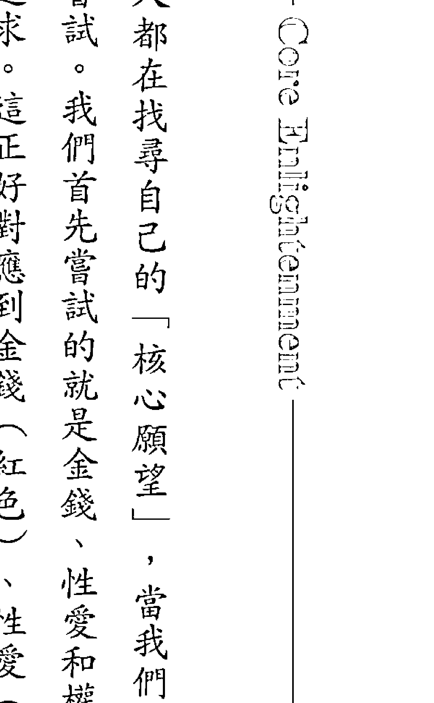

每個人都在找尋自己的「核心願望」，當我們還沒碰觸到那個「核心願望」前，總是尋尋覓覓。我們首先嘗試的就是金錢、性愛和權力（事業成就）。其次，我們會努力的就是信仰和靈性追求。這正好對應到金錢（紅色）、性愛（橘色）、權力（黃色），以及信仰（橘色）與靈性（黃色）。

其實，信仰是對應到藍色（橘色的互補色），而靈性對應到紫色（黃色的互補色）。但在我所見到的是橘色和黃色氣場，有兩種追求。

身體外的氣場比較不容易有變化太大，因為從初步的靈視和機器檢測中看，比較像是情緒所帶來的慣性模式。但身體內的能量中心區，比較像是和身體的直接對話，會立即呈現放大或縮小。

因此在健康層面上，比較容易立即調整，我稱之為「平衡」。

有一天，在進行雙手療癒高階課程時，我用了佩戴在身上的氣場檢測儀，來驗證我的靈視所見的色彩變化，給大家看什麼叫做色彩意識的提升，與立即的療癒轉化。

在諮詢的過程中，當學生被觸動而產生療癒效果，面對自己的內在黑暗面時，往往會先由身體產生對抗或好轉的反應。

有一次在十多位學生中，就有四位身體出現了反應，也就是我們所說的「不舒服」。當學生逐一被柔軟的解開，以為自己生病了，身體沒有力氣，無法上課時，我進行了色彩能量解讀。

我把那位在治療室下不了床的同學請到課程中，然後進行解讀。當學生逐一被柔軟的解開，並與自己身體的對話時，眼前機器中和我靈性視覺所見的氣場反應，開始了瞬間的改變。想反胃的同學，覺得身體沒力的同學，就這樣立刻轉好了。而大家看到的是，當一個人意識轉變，氣場的色彩也就立即變化了。色彩意識的呈現，讓同學的身體快速的好轉，並且恢復了元氣。

其次，因為撰寫的自然醫療論文以及企業管理論文，是關於色彩能量課程的效益評估。我也開始正式展開觀測學生氣場，來明瞭他們背後的業力問題，或是遺傳性的情緒問題。

曾經一個富家千金罹患癌症，從沒有不好的生活習慣，心性也很穩定，甚至經常做善事，但就是找不到自己狀況愈來愈差的原因。因為這樣挫敗和迷惘的心情，所以上課，希望調整情緒。但結果我見到她每一次領悟到什麼，一快樂，心的背後就忽然像是被洩了氣一樣，好像很多力量自她的身體完全無法儲存任何力量，所以身體愈來愈弱，無法治癒。

## ## Chapter 11. 生存的考驗

### 自我療癒【色彩能量氣場解讀】

想要檢視自己，必須先要有治療自己的能力。以下列出簡要的步驟，可以依著這樣的步驟，一一剪開自己的業力鎖鏈，然後才有能力協助他人了解個人的色彩能量場域帶來的困擾，進而自我解套。

氣場中給我看到的，是她的業力現前，身體免疫系統出了問題，卻查不出原因。她的身體如果形容成一個容器，我會形容那是一個有破洞的器皿，所以裝什麼漏什麼。後來我試圖調整她的心，附近的氣場，並且協助修復這個能量中心。另一方面，運用了色彩能量氣場解讀，讓她意識上明白更多，而不怨懟。

經過這樣的過程，後來聽說她愈來愈好，還跑去克什米亞旅行，實現夢想。

透過這些領悟，我開始發展了色彩能量場域的教育與諮詢，並且開始訓練有興趣或有慧根的學生，進行氣場解讀。我的意圖是，希望愈來愈多人可以解讀到自己的情緒，甚至思維，進而轉化自己一手創造的惡性循環（或是業力）。

對很多本就有靈感直覺的人來說，氣場解讀是最簡單的一件事，但感受到的，要如何解讀清楚呢？這中間依然會牽涉到人性和心理健康指數的干擾。所以培育出健康的治療師，遠比培育出敏感的治療師更為重要。

- 1. 療癒情緒
情緒問題會卡在身體內與身體外的場域中，並且經常會因為核心力量不夠穩定，而一再重複我們所謂的業力或輪迴。在雙手療癒中，我很強調氣場中的情緒治療，因為從過往的經驗中得知，這些是我們一直重複的關鍵。

- 2. 停止衝動
衝動的身體反應是我們要控制的第一步。如果你覺知到自己不高興了，也許你可以忍，但你總會在適當的成熟時機中爆發出來，這種情緒猛獸往往會壞了一件美好的事情，令雙方無法溝通。因此，在正觀禪修中便強調停止，停止這樣的想法，停止這樣的做法。一個可以「停止」的人，就可以成功的喜歡上自己，而無法「停止衝動」的人，事後都會回到混亂的情緒中，繼續氣自己，或是恨他人。

- 3. 開始觀察
開始觀察自己的感受，觀察自己在整個事件中的角色，也觀察自己的心念，到底自己想要什麼？你想要一直為了鬥氣而爭？還是你想要爭了之後爽一下？還是你希望一直這樣爭個對錯？又或是，你根本想要摧毀一件事或一個人呢？開始觀察後，你往往會發現，自己根本沒什麼後面的意圖，只是為了不知所云的憤怒和衝動，所以也就無法讓事情變得更美好。

以愛療癒

- 4. 感知場域
去感受自己創造的業力場域，這個源頭何在？這個事件你為什麼會這樣感受？多半衝動之後都不會很開心，感覺也不好。問問自己，這樣「爽」過之後得到了什麼？為什麼自己老是喜歡活在這樣的能量（情緒）場域中？你想在這樣的衝動中，得到什麼好處？

- 5. 創造未來
如果你開始明白自己想要什麼結果，你就會發現自己開始可以由這樣的結果，來調整自己的做法。如果你不想要惡果，那麼你必須先種下善因。於是，在每次夫妻吵架時，和自己過不去時，你可能就會朝「愛自己」的路上邁進，而不是朝向「毀滅」自己的道路前行。

生存的種種考驗，都是為了讓我們實現愛的本質。只要學會感知和觀照，愛可以在每天的生活中扮演最好的治療角色。

## Chapter 12

## 非自願治療師

持有正念，療癒力才能不斷強大。
人生的路上，不管你信什麼，
個人的正面信念，以及自己的勇敢，
才是一輩子最需要具備的特質。

有時候，要成就一番事業，需要一點傻勁。
看過印度片《來自星星的傻瓜》嗎？我感覺自己很
像片中的男主角，有點傻，又有點直覺，有點執著，又有
點創意。不斷追尋，又永無止境。
非自願治療師，是一個聽起來不太順耳的名詞，也許
正好可以形容我的不太自願，又得學習甘願的工作歷程。
因為一切都來得很自然，很順利，在還沒有真的認清方向
或調查清楚之際，你已經掉入染缸中，開始被染色了。
剛開始時我常向靈學老先生抱怨，我為什麼要這麼辛
苦？他總是回答：「你的願力呀！」
我心想，我從來沒有想過做這種吃力不討好的工作，
感覺像在玩命。

面對負能量，治療師的承受方法因人而異。我的特
別功能是，講課時能邊講邊感應不同時空，感應後還會順
便療癒清理磁場；或是不僅說給眼前的人們聽，還能說給
靈界聽；有時候聽到不同的聲音，還想要唱出來；有時站
在臺上或人前講話，已經很緊張了，還要控制住自己的身
體不隨意震動，也要能制止自己的身體不隨便出現負面反
應，以免課程中斷。

對我來說，吃下去所有來到面前的能量是唯一的選擇。所以，初期教學時，雖然有神聖的藍光護體，也有大師、天使、地面精靈、神佛或動物靈體、渴望被療癒的家族靈體在現場守護，但是，人的肉體一下子承受太多不同空間的頻率，根本很難適應。特別是像我這樣很有想法的人，身體磁場是最不受控制的。因此，除了事後去吐出所有的負能量，沒有其他的選擇。有時候要像減肥的人一樣，由口裡挖出來，甚至只要一嘔出氣體，我就可以立刻恢復能量，瞬間又是一尾活龍。

如果你去看過電影《綠色奇蹟》，你可能就知道我說的是什麼情況了。我花了很多年想要控制這種力量，卻始終因為自己的「乾淨」，而無法選擇的把黑暗負面的能量吸收進來。

所以，現在你能明白，何謂「非自願治療師」了對吧？

我也不能明白，為什麼大家總是渴望特殊的功能？

HSP我們稱之為「高感知功能」（High Sense Perception）。每個人都有聽覺、視覺、嗅覺、心電感應及觸感，但如果你能聽得到更高頻率或背後的聲音，看的不只眼前，還包括後面的氣場，又或是你可以解讀他人心思，甚至身體可以立即感受他人或某個地方的能量場域，那你就是有HSP的感受力了。

但是，有這樣的感受力並不是一開始就是快樂的，這中間切換頻率空間時的痛苦，走不出的痛苦，或是無法控制的恐懼，甚至不想來就不請自來的畫面與訊息，我從來沒有覺得快樂很多，也不解為何大家都喜歡？

你以為HSP的人就很清楚一切了嗎？那你又錯了。除了學習有技巧的療癒，終其一生都要不斷的自我覺察，並且學習心理學與精神分析來正確解讀。更不能因為感應到任何狀態，就信以為真，要花很長的一段時間，才能真實無誤的把這些感應到的，正確且界限分明的詮釋出來。這樣的過程，很孤獨寂寞，也很無奈。

有學生常問我，「為什麼老師你可以觀氣場，卻還是會被人背叛、被人欺騙，老師你難道沒有分辨的能力嗎？「這時候我「非自願治療師」的痛苦光環就會出現，因為「我也是人」，我不是神。我只有天生專業功能，或是領了證照，適合做這行的專業人士。但我也是會犯和個案一樣的錯誤，我也會誤判，我更會因為自己的心理問題或情緒問題而卡住，我既不萬能也不完美。

我想，我這類人，只是一直辛苦地想在不同時空中，找到平衡的立足點而已。在沒有完全通透自己的天命與甘願從事本業之前，是很難真的順利自在的。更不用說自由與解脫了。

幸好在各國，甚至在大陸與臺灣，都有著我的同類朋友與師長。

記得有一次，我們這些有點功能的朋友相聚，其中一位女性治療師大多面對的都是遇不到好男人的慘況。我雖然早已置身事外，還是得陪著姊妹淘經歷找不到Mr. Right或只有Mr. Right Now的痛苦。

其中一位長者，大家喜歡問她問題。一個姊妹說：「姊，我何時才能找到對象呀？」

後來這個妹妹好像遇到了一個男人，立即宣稱她終於要幸福去了。那時候我也有點不平衡了，我也問那個姊姊：「姊，那我呢？」

姊姊說：「一直到你心甘情願呀，快了快了，只要你為天地做事，上天就會賞賜你好的男人。」

姊姊還是說：「快了快了，你為天地做事，上天就會賜你個好男人。」

就這樣，每年都是同樣的回答，但我也未曾遇到所謂的「好男人」呀？

終於有一年，一個閨蜜說：「我不再問了，我都快五十歲了，就算沒功勞也有苦勞呀，怎麼男人還是沒出現？」

我笑到差點摔下椅子，想想，這樣的痛苦大概也沒人能體會吧？大家總是看我們這些美美的女神站在臺上為大家宣講或解決痛苦，殊不知女神的痛苦也無人能解呀！而當時轟轟烈烈昭告天下她「終於要幸福了的姊妹，當時我真心開心她多年的渴望可以實現，但後來我卻一直默默陪伴她想要脫離婚姻的歷程，最後仍以離婚收場。

非自願的女神們都有同樣的特質：個性強、智慧、聰明、反應快、見識廣、眼界高、漂亮、多情，最慘的是，可能很會賺錢，容易吸引吃軟飯男子。你說她們是女強人嗎？也不是，因為她們心裡其實很脆弱，對愛很渴望，甚至不少這類女性都要養家餬口。你說，這種女神，幸福嗎？痛苦嗎？真的很難有標準答案呀！

當然，並不是當女神都會離婚或獨身，只是比例偏高些。大家自己上網去看看那些走身心靈的老師，如果是天生的治療師，而且不是後天透過學習來做的，常常都有這樣的特色。不過，我倒是有一個不同的樂趣，就是每次我要面臨考驗時，其他維度（無形）的世界就會傳送好消息給我。

這種情況屢試不鮮，頻率多到我自己都覺得很好笑，也不得不讚嘆這個世界、宇宙何其廣大，我們何其渺小。我們的認知更是太少太少，許多的未知永遠在等著我們去探索。在我的工作中，也因為這樣的樂趣，往往可以彌補我感覺失落的情緒。

記得以前剛開始開課時，有一次我覺得全身痛到很難自己處理，當晚就夢到有一雙大手在我背上摸了摸。在夢中，我全身的疼痛立即消失，我立刻從夢中醒來，醒來時都還記得那雙手的溫暖，還有療癒背後所要告訴我的主題是「療癒潛意識」。就這樣，疼痛自己好了，很難詮釋出一個道理來。

我誠實地寫出，不是希望大家看我或我這類人有多神奇。我只是想詮釋出，在這世界上的某一類人，他們有這種狀態。

我的朋友圈中，不少真正的高人都是不出現在檯面上的，但他們也是這樣的勇士，走在孤獨的道路上，默默地盡力做著療癒的工作，也不想炫耀，只想平靜的生活和工作。遇到困難或無法理解、也不同於一般人的大痛苦時（如忽然地失去、疾病、失去一切），這類人只能默默的體悟，然後被奇妙的力量「點化」，然後繼續往前進，繼續吸引有緣的人來再續前緣。

你說他們很神奇，或許是的，但有沒有痛苦？也許更多。因為當你看到不能說，聽到不能講，感受到卻沒有人理解時，能怎麼做？

我很想為這類型人（HSP）的世界多做介紹，或是分享我們所體會到的另一個美好世界（大自然），甚至為這些橋樑（Bridge，我這樣形容我這類翻譯或傳遞訊息的人）做職業平臺或教育。
有一次我去洗頭，洗頭小妹一摸到我，就問說：「你也是喔？」
我說：「是什麼？」
她說：「你也會通喔？」
原來，小妹妹一直為著眼通所苦，她有時候連在家看電視，身邊都陪著一堆跟著看。她克服了恐懼，卻無法擺脫。她無意間遇到我，一直問我，「老師，我可以怎麼辦？」我也不懂。因為HSP有很多種，但我的療癒科學及工作訓練，讓我唯一知道的，就是愛和覺察。
如果你願意成為光明，那需要面對黑暗。因為光明一定吸引黑暗。這原理就像是一個快樂的人，大家遇到他很開心，就會想再遇到他。人們都是想要靠近可以令自己舒服快樂的人，沒有人想靠近面帶黑氣，看來怪裡怪氣，甚至滿身病氣的人。有的人你一靠近，就想要和對方吵架，那一定是受到對方的磁場干擾。這些雖然肉眼看不見，但我們總能感受到。

持有正念，療癒力才能不斷強大。人生的路上，如果你不藉由信仰，你還是要有正面信心。不管你信什麼，個人的正面信念，以及自己的勇敢，這才是一輩子最需要具備的特質。因為最終，我們都是一個人行走在生命的路上。我們的靈魂和肉體如何合作走這一個人的道路？想要合作走得好像，是一門學問。療癒，就是來整合這道路的唯一方法，而讓一個人「完整」，就是療癒的目標。

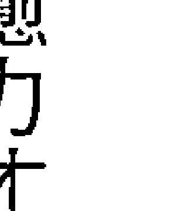

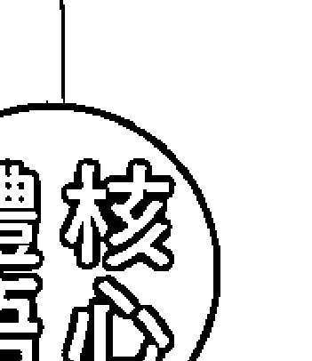

明星王菲和我受教於同一個上師，我覺得她就是一個高靈性的奇女子。有一個網路文章分析婚姻，並且以王菲為例，用靈性的角度分析得非常好。「如果一個人決定要離開你，只有一個簡單的原因——你不能再給予他能量了。王菲，她的生命早就走到了靈性需求的層面，可惜，她的伴侶無一能在這個層面上滿足他，更別說在更高的層面引導她、教練她，她的能量一直無法得到回補……其實，如果你不懂一個人，你根本就沒有資格談愛，你愛不起，給不了。你愈愛她，對方就愈痛苦，你便愈無奈。太多夫妻都是這樣分手的，沒有第三者，也都說對方是好人，還會是永遠的親人，可是，就是必須分手了。夫妻，此生結緣的最大意義不是吃飯穿衣，不是生兒育女，而是心靈的交流。在愛的流動中，彼此慰藉，彼此成就，在愛中修行，是提升生命層次最好的方法。不論男女治療師，或許多多少少都有這樣的困擾。治療師始於愛，也終於愛。在愛中提升，不論單身狗還是神鵰俠侶，最終的療癒終點，就是愛。

## 自我療癒 啟動核心之光

非自願治療師最大的課題就是「自己」。雖然明白道理，但自己卻往往就是自己最大的障礙。太多非自願治療師容易過於自滿或自傲，又或是成了控制欲強大的魔頭，往往也障礙了兩性關係或人際交往。非自願治療師也可以稱為光的使者、光能工作者。有時候，當光照亮時，黑暗現前，照亮的結果更為痛苦，但光能工作者卻不得不看到。一股清流也往往無法面對黑暗的習慣和控制，這樣會形成更強大的痛苦。因此，面對無法掌控的黑暗力量，不管來自內在或外在，永遠都是光能治療師的致命傷。但同時也是優勢，因為只有光能治療師可以啟動自己身上的光明力量，以愛啟動，照亮黑暗，而不會被黑暗吞噬。

不管你是不是光能治療師，你都有內心光明的一面，因此，你都可以啟動自己的核心光能，成為一個太陽，而不是反射太陽的月亮。

啟動核心之光的步驟：光能治療師本身具有光明，所以不必學習或是接受，只需要「成為」。啟動核心之光也是光能治療師最痛的道路，但卻是一個救贖的過程。如果過不了這個考驗，就無法真的享受不斷電的光能之樂。

- 連結丹田，回歸自己的中心
晚上睡覺前，早上起床後，都在床上待一陣子，和自己連結。
你只需要把雙手放在肚臍以下兩手指寬處，輕輕按壓，然後開始深呼吸，去感受腹部的起伏。

## Chapter 12. 非自願治療師

俯。然后把全身力量灌注在这个点上，缩小自己，非常集中在这个点上。每天持续练习，练习无意识地消失，然后归于中心，和自己最深处做深度连结。

用舒适放松的姿势，闭上眼睛，感觉全身每一处都放松下来，最后连意识都不存在，也不存在于身体任何部位。特别要注意脸部的肌肉，因为全身的紧张往往百分之九十都在脸上，所以晚上睡觉会磨牙，只因我们把所有压力都灌注在脸上。正因为脑中的紧张会存在脸部，所以脸部是一个储存站。去感觉两个双肩之间的部位，胸部的部位，让全然的爱充满在这个区块中，使强大的和平开始产生。

2. 连结本心，找回心的平静

想到爱，就会想到心。爱来自于心，和平也来自于心。如果你不在爱之中，你就容易被干扰，被影响。但如果你爱谁，谁就会变得重要。这时候，你就会变得容易被干扰，因为你「爱的空间」（心）被他人占据了，你自己的爱就会遗忘，然后就会失去平静，变得情绪化或失去控制。所以，我们需要保留个内心的空间给自己，每天持续练习回到爱自己的空间（心）中。

3. 爱来自于心，但我们无法透过爱来找到平静

不要透过爱找平静，因为在我们那里我们的心已经受干扰了。但是，我们可以先回到平静。平静的感受可以让我们的生命充满爱。当我们感受到无私的爱充满在心中，便可以同时感觉到平静。这时候，我们可以透过平静的呼吸，让爱无意识的流动，没有任何想法，然后留在平静的爱里。

4. 透过平静，才能回到无干扰的爱里

试着去感受心中的平静，然后停留在强大的爱的能量中。如果用颜色观想，蓝色代表平静，

5. 生根的爱，没有痛苦

## 以爱疗愈

在呼吸的时候可以吐出蓝色的光，让自己活在平静中。而粉红色代表无私的爱，就像莲花一般，我们可以停留在温柔的粉红色光之中，享受爱的光芒，然后直到自己也全部变成这样的光芒，直到心情美好起来为止。

透过平静，才能回到无干扰的爱里。在爱中，可以找回心的终极觉悟。

## Chapter 13

### 治疗师的才华

有很多成人心理存在著一个拒绝长大的孩子，以致养成一种不信任的执念。而其实，只要增进孩童意识，这个孩子就会成为我们内在的小天使，而不是小恶魔了！

非自愿治疗师一开始是玩票的，公益的。既然灵学老先生说我得开始认真思考这个行业，并且真的要赖以维生，可是我要如何平衡呢？读书出身的我，身负家中的期望，没有办法想像自己变成一个算命师，或是灵媒，或是做零售买卖的商人。刚开始我很有点鸵鸟心态。我想，我就假装是个卖精油产品的，这样人们要买就得付钱，因为我也是花钱买来的。然后，我把自己的疗愈能力隐藏在瓶瓶罐罐后面，这样我就没有收钱的纠结了。就这样，为了让自己的心感觉平衡一点，我以色彩咨询和推广精油瓶，隐藏我的灵性感悟及身分，并且以色彩精油瓶推广讲师的身分，做自己可以做的灵性业务。我也需要一个说服自己接受的过程。用色彩和精油对我来说，是很自然，很好的开始。在研究教学的过程中，我深深的连结上大自然，自然界的讯息何其强大，我往往被一股纯粹和单纯的精灵感觉支持着。有时讲课讲得很有道理时，花朵就会立即传香气过来。享受着这种和自然界一起共创美好的感觉，有了植物们的支持，我开始充满了勇气。记得有一次看一个通神论的书籍，迪瓦库（Djwal The）的一本书，书中谈到地球的磁场，论及人类、动物、花朵植物、矿石水晶种种。看着看着，不觉地进入到书中的磁场，突然的我哭了起来。一起看书的朋友吓了一跳，他看了看我手中的原文书，不解地问我，这本书有什么好哭的？当时我也觉得很意思，因为我看着看着，体会到这个世界的美好，而且分成了两个层次，一个人类之上的天界国度，以及人类之下的地上国度。但他们快要断绝联系了，而唯一可以联系这天上与地下美好的力量——人类，已经愈来愈混乱。人类的猜忌、恐惧、攻击、负面……让整个世界愈来愈乱，我一下子急了起来，忽然想到这该怎么办？人类不可以再这样混乱和负面了呀！然后感受到自己还有着恐惧和负面，这怎么得了！连我都没有办法正面起来了！于是，忍不住大哭了起来。朋友觉得我非常不可理喻，无法理解这本书有什么好哭的？但我却哭得很伤心。那次的经验之后，走在任何地方我都会更留意大自然，而自然界也从未让我失望，有时候我工作得很累了，只是坐在车子里，我就能连结到车窗外路边的树木，而他们都可以在刹那间清理掉我的疲惫。所以，一直以来，任何活动的主办方都会送花到我的房间，这不知道是何时开始养成的习惯。虽然我很少在各地工作后游玩，但我的房间里一定要有鲜花，有了它们，我就不会太累。说也奇怪，这样的习惯十多年来没有改变过，我原以为自己一直怪怪的，直到这些现象一直重复发生，我才开始信任这些是真实的。我的治疗师道路一开始就非常顺利，但我的内心却是不顺遂的，主要在于自觉认知有限，所接受的教育训练只是让我成了很会行销的灵性业务员，但对于自己的喜欢和认知却是缺乏训练的，这让我仅仅拥有一半的自信。

## Chapter 13. 治疗师的才华

也许正因为我是一开始的先驱，是一个领头羊与开创者，所以来找我疗愈的、踢馆的、尝鲜的、询问是否可以以此为业的，各式各样找寻自己人生方向的名人都曾经找上门来，其中也有那些通灵的、做身心灵职业的人士。没有任何广告就人满为患，但我却很不能适应。由于缺乏自信，我实在不知道自己对那些『很厉害』、可以看前世今生，或是灵修几十年的人，我能做什么呢？玩票的心忽然不太好玩了，于是我打了电话给凯洛老师，因为我觉得自己可能没有很厉害，也许不太适合色彩咨询师的行业。我问凯洛老师，『到底做一个治疗师要有什么特质？』接着我说了我的处境，『很多高人来找我，名人来找我，我不知道自己有什么能耐可以为他们做疗愈？』她想了想，然后说：『我不知道是否需要那些通灵什么功能的，但我只想问你，你是否有关怀他人的能力？』我一听就开心了，我告诉凯洛老师：『关心人？这个我最行。』老师说：『那就是了，只要你有关怀他人的能力，我想就足够了。』从那次开始，不管什么人来找我，不管对方是什么背景，我只记得『关心对方』，这是我最擅长的事，至于来了什么感应，什么感觉，都没有关系，最重要的就是『关怀』。我感觉如释重负，并且用了外部工具，我也不是在用自己的业力为人承担责任。回避了所有的恐惧后，我开始安心的『关怀他人』，继续满满的工作，以及认真的学习。※一个理想的治疗师，到底该具备什么样的特质呢？在国外，有人说我们是光的使者，或是光能者，或是疗愈师、灵疗师、讯息的使者等等。但不管如何，在我看来，有一点很重要，就是一个能量治疗师该有的态度，也就是管理人生的态度。那么，能量

1. 没有灵感无法行动
2. 情绪来时没法做事
3. 莫名的干扰常发生
4. 意志力不是很坚强
5. 容易吸引负面的人
6. 容易创造事物改变
7. 容易受到惊吓创伤
8. 常被莫名梦境所苦
9. 身体有时突发异状
10. 经常陷入低潮情绪
11. 金钱状态不太稳定
12. 容易进入生命低谷
13. 困难于肯定自我

很多问题？对吧？这就是治疗师背后所可能带来的问题包袱。我有一个学生甚至曾经罹患精神疾病，为此休学，也无法等等等等。我还可以继续列举出来，像是魂不守舍、不守信用、容易健忘、没有原则、经常恐惧、各层面都匮乏无法日常生活，但后来却摇身一变成为教天使学的老师。你永远也无法得知，很大的困难背后，有什么样礼物在等着你。当然，这个过程并不容易，因为需要走一段疗愈之路，我有时候喜欢说这是“成道之路”。虽然无法像佛陀成道那样的精彩和不可思议，但对于这样的个体来说，等于让自己的生命可以走出阴霾。不论罹患哪种身体、心理或心灵疾病，始终没有选择结束生命，而是努力找寻生命的出口。光是这一点，我觉得已经值得尊敬和赞叹了呀！我喜欢做色彩美学与气场分析的咨询，是因为我不想从“疾病”的角度来看人。我相信人天生有自愈能力，我自己就有，当我光明时，我便能帮助自己，但当我情绪低落陷入黑暗时，我也很需要他人的援手。只是有的人光明指数高一些，可以长时间维持在高光的光中，有的人稍微弱一点，比较容易掉入黑暗里。但人生而平等，也天生具有向光性，这正是人类最了不起的特质。天生自带功能的疗愈师也不例外，只是光明比一般人多一点，黑暗也比一般人多一点。因此，如果我以色彩来找到人的本质，并且提升人们的意识，在讲到美好时，就已经在扬升其高层意志（higher will），而不是一直强化对方的低层自我（lower self），我就会看到对方的气场由暗沉转为明亮，连皮肤或长相都会瞬间改变。所以我相信这样的疗愈力，更能协助那些一脚踏在黑暗中，一脚站在光明里，正在彷徨不知该往哪儿去的人们。而这些看似健康，却又可能不太健康的人群，其实是占大多数的。至于已经形成的疾病，那是归属于医生的治疗，而不是我们的主要专长了。其次，应用气场分析的角度，我另外加入了精神分析的作法。精神分析强调自由联想，我在英国学习后，发现更接近我们所谓的创作过程。我的目标是把作品（来访的个案）打造成经典，让当事人开

## Part Ⅲ 心与物质的生存考验

始喜欢自己，而不是排斥自己。所以，一开始我就给对方贴上“有病”的标签，后面我们将会困在这个圈子里打转。基本上，会来求助的，谁不知道自己有病呢？只是多和少、承认不承认而已，你不用多在对方的伤口上洒盐巴，对方都已经快把自己淹死了。我们的目的是要救出对方离开黑暗，而不是动动小指，把对方再推入火坑。所以，运用焦点谘商的心理学模式，把集中的力量放在“如何更好”，我感觉这样的做法才能“扬升”。我用扬升而非提高，是因为这两个意境不同，扬升强调跳离现有的维度，而提高是在原来的空间里爬高一个台阶。我觉得在光能的意识世界中，地球的苏醒已经加快到不可思议的地步，聪明的人早已上去。如果更好的做法，为什么还要辛苦的爬梯子呢？因此，当我终于找到一种可以运用我天生功能的方式了。这类的工具我逐步透过二十年的体会，将之融合成一种新的生活管理模式：色彩能量管理学。在我后来因为陪伴父母，回去就读企业管理时，我的企业管理硕士论文，就是以这样的一个培训效益评估，并且搭配科学气场验证来做研究。充分把我的灵视功能中所见到的、所感知到的，以科学数据来做进一步研究。这个研究不仅让我的个人体悟有了更深的惊喜，也对于我所开发的光能学派有了更多的信心和快乐。当指导教授指点我，何不用我的工作来做研究时，我第一个念头就是：这不是自寻死路吗？我告诉教授：“没有一个能量老师会这样测量的，因为人性和人心是不可测的。”那是我之前的旧认知。没想到，一个企业管理攻读下来，彻底的改变了我的认知。

## 那么，理想的治疗师到底该具备什么样的特质呢？

身为一个治疗师，我们像一面镜子，也像是窗户，可以穿透，也可以反射。身为治疗师，职业道德是首要重点。金钱、性关系、情绪、权力欲望，很多很多的考验，都会令治疗师迷惘。但是，所有的欲望考验，却又是人生中必经的过程。因此，除了不断在挫折的道路上一再反省与改善，不断去思索外，对老师、上师、师父，以及对任何人的尊重，都是必须要有 的道德感。这种道德感，对于真正有大能量的治疗师来说，就是一种『谦卑』。以前我的上师巴楚仁波切曾经在比利时开导我，他希望我不要像那些欧洲的通灵治疗师，自大而无礼，自以为是。我当时其实没听懂，也没有能力理解，因为我的内心已经装满了自己的想法，就像一杯装满水的杯子，怎么可能再装入新的水呢？更何况，我也很自大呀！自以为可以掌控一切。虽然对于老师，我很尊敬，但自我还是非常大，只是自己不自知罢了。

## 治疗师需要的，是谦卑

多年后，我逐渐放下自己的偏见与执见，才能见到乌云后面透出的一线光明。一直以来，我的情况是连在梦中都会努力的去追寻真理。这真理包括为个案找到解决问题的答案，找到解决痛苦的灵药，找到解脱生命困境的方法，找到跳脱生命桎梏的跳板。甚至连我的学生或个案，都有人梦到我去为他们解谜。所以，我知道晚上的自己比白天的自己更热忱；梦中的自己比清醒的自己更热心；灵魂的自己比肉身的自己更善良。大我的上官昭仪，比小我的伊莎贝尔更大爱。

## 治疗师需要的，是善良

没有善良的心，技术再高明的治疗师都可能因故走偏。我有个学生，来找我的时候，简直可以用“地痞流氓”等级来形容他的出身。我本以为自己非常相信孔老夫子说的因材施教，而我的确用尽心思来教育这个学生。我相信教育之后纯正的心，会比高明的学历或精良的技术更重要，因为当时我相信，治疗师并不需要成为最完美的人，只需要令他人更完美。结果我的确将这个学生提高到成为团队老师的资历。正当我以为自己已经成功而沾沾自喜时，学生开始勒索，希望我给他更多钱；学生也开始以为自己是我，如果一起出国，怎么可以睡次一等的房间？他完全迷失了自己的心，很可惜。我失败了，但也开始透过这个经验明瞭，原来一个治疗师的灵魂出身才是最重要的。不是对方生长在有钱或贫穷的家庭，也不是对方如何努力在社会上出人头地，而是遇到欲望的挑战时，是否可以挺住，做得有为有守。我自己如果没有很坚定，我的学生也会一样。灵魂上的贵气才是贵族的起源，而灵魂上的贵气与霸气，也是一线之隔。所以，真正的善良，是这一行人对人本质的慈悲，而不是运用这行善良的本质，去做欲望的事情。

## 治疗师需要的，是爱

爱是所有人都需要的，特别是治疗师。有时候你会发现，治疗师反而会比一般人更需要爱。除了经常过度沉溺在牺牲奉献的爱里，往往也会纠缠于情爱中无法自拔。就如同能量一样，如果有时爱他人，有时却批判他人，或是只爱自己想爱的人，只爱自己的家人，对他人却没有真正的关怀，那么这个治疗师必然需要心理辅导。毕竟治疗师自己也有缺憾，也有需求，一不注意就容易被有缺憾的心勾住，反而会在治疗个案的过程中索取爱。如果治疗师可以区分出人与我，以及大我与小我的界限，就比较可以有大爱，否则治疗师的爱仍是有目的的，也容易在纯净的道路上走偏。

## 治疗师需要的，是灵魂

治疗师很需要学会珍惜自己的生命，珍爱自己的灵魂。陆续有治疗师私下来寻求我协助疗愈，其中有的产生了身体疾病，有的发生了心理危机，有的家庭失和，有的依然找不清方向。最严重的，我觉得是灵魂问题发生在身体健康上。有一位治疗师，赚了几场大钱后，很快就生病了，而且是极为严重的疾病。记得以我的灵学老师所说的“没有天命”，大概就是这种情形了。这几年，身心灵培训或是疗愈的行业愈来愈受到欢迎，但其中有时界线不太明确，是生意？还是天意？很难分明。有时候，健康就是个“讯息”，并不是每个人都可以到世界各地去行走，以灵性赚钱，或是贩卖灵性。因此，懂得珍惜自己的治疗师，会很珍惜自己的灵魂是为谁服务，而不会随意地和魔鬼打交道，也不会贱卖自己的灵魂。这种珍爱灵魂的做法，才能为上天服务，或是把这个志业做得长久，做得赚钱。

> > 宗萨仁波切说：“信任往往比我们所感受到的还重要。”

这些年来训练了无数的学生，特别是这几年，我的团队里人才愈来愈多了，其中有些本来看似没有天分的人，却在极度虔诚和信任我之后，逐渐转化了内心世界，竟然也能见到光，感受到世界的场域能量。很多人一开始信心满满，却在遇到一点障碍，或是遇到现金金钱考量后，就会中间半途而废，但天生的治疗师不会这样退缩，后天的比较容易这样。有不少台湾式的宫庙主持人也会鼓励人们看待天命这件事，但往往大家卡住的都是“金钱关卡”，所以也半信半疑。常常这种人来求助的主要目的，只是为了生活的这些目标，都只是表面生活的暂时安逸，像是夫妻关系修复，或是金钱危机度过，又或是得到爱情，一旦这些目标达成，本来渴望成为治疗师的初衷，就很容易被遗忘。有一些学生一开始时，看起来也是很有希望，但很快的就心念转变了。毕竟这条路不是很好走，如果没有上天把路给断了（像我），或是一直有退路没有生活、生存压力的人，是很难坚守下去的。毕竟大家比较想要轻松快乐，不想要一直有压力和痛苦，所以，天生的治疗师们往往对于痛苦的承受度会比一般人强大许多。治疗师之所以一直在这个领域，除了一直渴望精进和自由，甚至可以了悟更多、解脱更多，或是找到无痛的生命内涵，高阶一点的就是想要享受丰盛的感受一直存在。但是，很多人在初级阶段时，便碍于内在的“孩童意识”问题，就打了退堂鼓。这个部分我不用“内在小孩”，是因为我的恩师芭芭拉·布莱能（Barbara Brennan）曾经说过，内在小孩往往是我们成长的借口，好像你的内在总是有个长不大的小孩，然后就可以为所欲为。所以疗愈科学与德国心理学的说法是“成人意识”及“孩童意识”。而且在逐渐长大后，我们内在的成人意识就要有责任来教育自己的孩童意识。她的观点令我大为激赏，因为长久以来我一直见到的，正是她所描述的。许多人动不动就说

## Chapter 13. 治疗师的才华

### 自愈觉察题「内在「孩童意识」的信任问题」

我们的一部份，只是这个“孩童意识”占生活中的比例多少。我有个学生五十多岁了，依然拒绝长大。但有一些人是没走出来的。其实，大多数人内在都多少有这个孩童的状态，因为这也是我们成熟过程中必然的现象，没有怀疑就没有追求，所以，人类本来就会因此不断的学习成长，甚至发现了质疑，那么这个幸福的生活立刻会变得不平衡，内心也将开始不信任。这本来是孩童成长、自我学习的过程。我们小的时候，如果能全然信任父母，那么生命是真的很快乐，没有怀疑。一旦我们发现无法信任，就会产生不信任。自己的内在小孩有渴望，这当然没错，但难道这个已经很老的大人，还要动不动就说因为我父母怎么对我，所以我的内在小孩情绪永远如何如何。在芭芭拉老师这样说明后，我虽然被打断了一直以来所学到的认知，但我非常开心，好歹也有个清醒的治疗师仗义执言了，而且不担心被同业攻击。这种正直的疗愈态度，一直深植我心，也让我种下了一个“亚太能量治疗学校”的种子在心中，希望自己有一天能力够了，便要结合亚洲的华人，一起共创这种科学的疗愈概念。当年学校的学年教务长也成了我的支持者，我们一直相知相扶持，朝着疗愈科学的理性教育走着，而且这条路愈走愈多人，也愈走愈快乐幸福。

## 1. 不信任

不信任是因为曾经有某些事情发生，以至于我们无法再次相信。要疗愈孩童的不信任意识，这类的想法往往源自童年经验，并且和责任有关。长大后，这样的小孩必须由生命中的实际事务中得到认可，像是做成功一件事，赢得一个奖项，或是没有虎头蛇尾的成功跑完一次马拉松。总之，需要证明给自己看，自己是个值得自己信任的人。

## 2. 强烈批判

孩童如果特别要求完美，或是过去父母特别要求完美，或是自我性格中有着极强烈不信任的特质，如父母某一方可能没有负起照顾家庭的责任，这样的小孩长大后，就特别容易沦为“批判的指导者”。

許多看不過去，然後事必躬親的大人，往往很難被滿足，難以被滿足的背後，就是因為太過批判，最後只好自己獨立完成。不論是在婚姻或療癒過程中，都會成為掌控的一方，非常辛苦。解決的方式，只能練習先從嘴巴做起，做個不說出「批判」語言的大人，然後訓練心中不批判，最後訓練可以信賴他人的行為，像是相信自己的員工可以完成計畫。

## 3. 相信沒有人會無條件愛我

這也是很可怕的常見現象。許多人的孩童意識，是覺得總要付出才能得到愛，像是金錢、性、工作等等，這些價值低落的孩童意識，往往令人無法去愛，也無法享受愛。在愛中也會算計對方，該給自己多少金錢或房產。這在很多互鬥的夫妻中經常可見，爭房產，爭家產，爭自己付出多少，也爭自己應得多少，完全忘了自己是個不用努力付出，就值得被愛的人。這樣的孩童意識，往往會導致離婚，在關係上是非常辛苦的狀態。解決之道，可以由停止輸送「毒藥」給自己的腦子，不要再一直給自己「錄音帶」模式，一直重複說自己有多糟，別人有多壞，世界有多嫌貧愛富。

我有一個企業家學生，就是中了這個毒，所以常常自憐自艾，不相信人間有愛，只相信金錢萬能，可以買愛情，買親情，買友情，買一切。

愛可以帶給孩子們安全感和信任，愛也是引導孩童意識提高的主要教練。

## Chapter 14 天使神諭

人的內在有時候有太多恐懼，所以「小我」會一直掌握全局，而一再錯過生命中的機會。而透過快樂的方式開發「高感知力」，我們的人生自然會渴望選擇快樂，而不是痛苦。

第一次接觸天使，和我預期的完全不同。電影中的天使，中性，小孩樣，有點像希臘羅馬神話中的邱比特和天神，如果你去希臘，你會覺得那些男神女神都是披著白色的白紗，很純淨。電影中又或許充滿幽默，出現穿著黑色西裝的男性模樣，如《天使情人》、《命運規劃局》電影中的天使，完全不太像傳統中的樣子，倒像是男神帥哥，師奶殺手。這些模樣，或許比較符合人們意識中的想像。二十多歲，第一次覺得靈魂飄出身外，但又知道自己還活著，這感覺非常奇妙。那時，我得到一本像是東方天書的東西，然後又得到一本西方天使的翻譯草稿，能量強大到讓我身體有點受不了，一連睡了五天。其次，自從弟弟過世後，我總覺得自己有點「虛弱」，情感也似乎沒有著落，喜歡的人總不能如我所願，不知道為什麼，身體開始沒有了力量，內在有股能量一直想跑出去，我猜想自己的求生意志其實不是很強。於是，就賴床了。比較接近人類的天使，位階比低，比較容易被人們所感知到。我在夢中所遇到的場景是，有一大群天使圍繞著我哭泣，夢醒來，他們的哭聲我好像都還可以聽到。他們全是白色的，我躺在床上，一看就像是彌留狀態，所有的天使哭泣著，覺得我不應該就這樣離開，而他們說我是他們的一分子，所以大家都感傷。我不太知道為什麼自己的夢境會出現這種場景？因為我沒有天使這樣的概念存在腦海中，也沒讀過什麼天使的書籍，更沒有西方宗教的任何思維與認知。但就是一大堆的天使圍著我哭，把我哭醒了。之後，在我收到一本關於天使的翻譯手稿，是朋友送來分享給我的。一天上午，我在床上打開書，還躺在床上的我就眼睜睜的「看到」一股金黃色的力量，太耀眼了！但畫面完全就是我們在漫畫中看到的天使形象，嚴峻的、帥氣的金黃色翅膀，感覺像個男性。我當時想，天使不是都是沒有性別的嗎？但眼前這個太像漫畫中的男主角了，酷得令我驚豔。就這樣幾秒鐘，我發現自己是清醒的，是睜著眼睛而不是睡覺的狀態。有人常說：「我見鬼了！」當時，震驚之後的我想到，我是不是應該大喊：「我看見天使了！」除了遇見天使，我還收到『天書』，一封來自上天的書信，回答了我很多關於天上的問題。當時的我，弟弟過世沒幾年，我想或許是自己太過思念弟弟死後的世界，所以日有所思、夜有所夢，不過心裡倒是有點沾沾自喜，覺得自己有著不一樣的經驗。但多年後，我在帶領藝術治療，帶學生畫畫時，忽然發現天使好像比較會接觸的是瀕死人士，並不是很神聖或光明的什麼靈魂經驗，西方人士的天使書，大多是在最慘的情況下，或是失落的狀態中初遇天使，而天使拯救的人，也都是最接近死亡臨界點的人，有很多年，我從個案身上也會發現，那些失去人生意志，失去鬥志，或是沒有生命力，甚至生病的人，他們似乎更容易「遇見天使」。後來我理解，這些是最低階、最接近人們頻率的小夥伴能量，而不是最高階的光明能量。曾經非常喜歡加拿大，溫哥華的郊區總令我感覺和天使們很靠近。那些天使不是屬於瀕死的一群，而是一群喜樂的感覺。天使和大地的精靈不同，但都令人感覺舒服。我習慣不接近黑暗，一方面覺得自己無法處理與面對黑暗勢力，一方面也是覺得自己沒有能力，所以我喜歡留在光明裡享受那種美好。在加拿大這天使的國度，走在森林裡，或是海岸旁，感覺不到人類世界的影響力，反而天使們的能量無所不在。那種接觸的感覺，像是一直和心地善良的人相處，完全不需要防備，只需要快樂的在一起。在加拿大某天晨起，我感覺要寫下些什麼，於是便有了第一版的天使書。每次靈感來時做記錄，是從小已經養成的習慣，但都沒想出版過，所以我只是很自然的把靈感寫下來。這樣的記錄三不五時的就出現，所以我常準備了空白的小本子，以便隨時可以馬上記錄；夢中的情景也可以記下，以免睡醒後忘記。一次回到臺灣，我和出版社總編輯聊天吃飯，談起這個靈感。沒想到，美麗的總編輯立即邀請我，她說她正好想做一本華人版的天使神諭，因為我們一直都是看外文書，沒有本國人的真實經驗。我也是幸運，正當總編輯想做一本這樣的書籍時，我也正好已經開始在用靈感撰寫了。於是，一本超級棒的《天使神諭》就這樣準備要出版了。

※

我的腦子很容易記住美好的事物，人生或生命中的黑暗面我卻很容易遺忘，不知道這樣是好還是不好？我的綠色心輪可能是有著時空障礙，這種時空障礙正好對於我的療癒力量很有幫助，因為可助我穿越三度空間的限制。也因為我沒有一般生活中對三度空間裡線性時空的固執己見，所以對我來說，「穿梭」是件輕而易舉的事。有時候想想，也許某人的缺點，到了另一個人身上就成了優點。我容易遺忘和人曾發生的不快樂事件，甚至昨天，或是幾年前，我都會誤以為這是很久以前的事，而我的心思總是很容易徘徊在某個空

## Chapter 14. 天使神諭

我可以很容易進入書中的能量和情境中，好像看電影一樣，光影重現。
過度美化的習慣，也往往令我容易失望，或令他人失望，因為大家預期的我，總會有不一樣的表現，往往無意間得罪了人也不自知。當然，這種狀態我覺得很「愚痴」，也是我人際關係一直有障礙的主因，我的想法總是和「正常人」脫節，但我沒有辦法改變，因為改變了，我的感應就會不準確。我只能一直努力適應，幸好我一直遇到的工作夥伴和學生，都可以逐漸包容我的愚痴和無知。
我一直以為，只要專注於工作，把治療做好，會不會做人其實並不重要。年輕時，我更在意的是「能量感」，你說，這種性格是不是很愚痴呢？我覺得是的，很愚痴。在此向我曾經無意得罪的所有人，如果你們心中還記著對我的不滿與憤怒，請原諒我，因為我已經忘記了，但我會記得曾經令人不舒服，作為今後自己的警惕。
後來我在加拿大曾經努力修練「自他交換」。自他交換就是把他人的不舒服吸收到自己身上，感受到那種對人不滿的能量是一種黑色團。然而，即使我很努力的在天使國度修練這種練習，但依然不能理解，為什麼就是有人會看我不順眼？所以有很長一段時間我都很自閉，不太敢和不熟的人太靠近，只能靠著助理和外界保持聯繫。
當時我的世界除了貼身助理或經紀人，沒有太多的社交，因為我不想無意間又得罪人。但在我的工作中，我又很勇敢，因為我的信心大過於自己的感受，我相信上天的安排，也信任我所有師長的指導，因而無所畏懼。只是在做人的這個功課上，交了很多年的白卷，也創造了身心靈事業的危機。
不過，彷彿你該做的事，自然地就會出現。
總編輯在我不可思議的情緒中與我簽下了新書合同，我沒想到臺灣的大出版社竟然這麼先進，也願意出版印刷在臺灣業界前所未有的精美書籍中，是唯一可以勇於拋開成見，沒有包袱，願意為著理念而奮鬥的一群了不起的靈魂。於是我回到英國，開始聆聽天使的工作，完成「神諭」的口傳。

※

有時候對自己寫的內容很不敢相信，那肯定不是我的智慧，所以我只會被採用，很有趣。

有時候我會寫得很快，特別是為了教學或是寫書時，感覺那不是我，我沒有那麼高的智慧，只是誠實書寫，那些我用人性設計書寫的東西，都沒有辦法為了文筆而寫，也沒辦法為了靈感就有生命力，我沒有辦法記錄下所有訊息。

印象最深的是二〇〇五年一本天僑相關的書，雖然不是在臺灣一炮而紅，卻在大陸一直長紅。如果你在西方人談天使的書中，看到天使可以幫助我們變年輕貌美，健康回春，還能心想事成，你可能會覺得這是小朋友玩牌卡，或是小女巫的小戲法，但我都不屬於這類人士，也沒有這類背景的宗教信仰，何來訊息？

二〇〇五年要拍書籍封面照片的前一天，我還在臺北的工作室裡做著例行的療癒聚會。當天晚上拍照的照片，我略顯疲憊，而且似乎臉有點因疲累而顯得垮垮的。我自認不是長相好看的人，肢體也略嫌僵硬，更沒有拍照的自信感，所以告訴出版社我需要好的配合。於是一大早，化妝師、造型髮型師，還有攝影師全都嚴陣以待。

拍照的前一天晚上，我忙完聚會，聆聽完學生們的分享，心中非常感動，但也開始擔心第二天自己的狀態，可能拍不出好照片。二〇〇五年的技術，可沒有今天神奇的修圖技巧，甚至可以拍出完全不像自己的美麗。臨睡前，我想到自己寫出來的幸運天使，以及每個幸運天使對應到的色彩，還有他們對應的正念肯定語，我忽然心中充滿感恩。 一切的發生都來得太快，也來得太神奇，我不想相信，卻已經發生，但愚痴又執著的我，總是一直以不信邪的態度、自以為科學又知識的清高者自居。但是，神奇的經驗不斷發生。我想到自從弟弟過世後一直不開心，心裡想要的雖然得不到，但工作事業上卻一直很順利；想到自己的工作，這麼微小的力量卻可以影響到身邊人。當晚活動中的一個學生，從之前身體半身不遂的萎縮狀態，到現在已經可以活動身體健康起來，小女孩差點因為身體健康而輟學，後來卻成了心理系的高材生。點點滴滴的感恩，當晚忽然全湧入我的腦中。感恩的力量，在睡前似乎融化了我的心酸與內心的痛苦。 第二天醒來，我起床梳洗照鏡子時，差點嚇壞我了。 發生什麼事？當年也沒有微整型什麼的（前一晚應該也無法產生什麼效果吧？），但前一晚還為著相貌擔憂拍照問題，第二天我的臉、頭髮，甚至水腫的身形狀態全都不一樣了。到了拍照現場，所有的大師都無用武之地，還被出版社同仁虧說，老師狀態好好，完全用不到任何打扮。當天上午，就這樣，我連彩妝都是自己化的，因為狀態太好了。對我來說，一時變漂亮真是嚇到我了。 一夜之間的轉變，我知道又是天使幹的好事。我也知道，當心存感恩時，神聖光明便替代了人心中的苦澀，苦澀轉為希望的果實，於是，女神出現。 之後常常在我上臺前，就會有這樣的事情發生。二〇一七年更有一次類似經驗，上千人的舞臺上，我又變漂亮了，拍起照片完全是另一個我似的，但誰能看出我其實已經三天每晚睡不到兩小時的痛苦。每次提高能量之前，我都經歷著無人能理解的內在痛苦，如果換成是你，你願意交換嗎？我從未願意過，不過命運的規劃就是這樣，只能接受。潮來潮去，完全無法推開命運河流的自然潮汐。

## Part Ⅲ 心與物質的生存考驗

天使訊息一直帶給我一團光明的感覺，也教會我「團隊合作」的重要，因為真正的天使光明，或光明的天使，不會慾望勾結或是利欲薰心，完全是一種純淨的孩子們在一起同樂的感覺。只有天使的領導人（大天使與天使長）才給我一種像二十多歲見到的黃金光明體，那種嚴峻和俊俏感。這種感受，也在我後來自創的天使能量噴霧裡，被創作出了出來。
這樣的創作，在我的理解中，比較像是翻譯人員，將多維度的訊息轉變成三維度空間的版本，有人說這像是線性化專業人員（linearization specialist）。我在同步創作天使能量噴霧時，便運用一直以來喜歡的天使唱誦，把自己從三度空間帶到其他次元中，不僅可以讓我以歌聲來療癒及教學，更可以引導每個人唱出自己靈魂的光芒力量，來延緩老化及豐富靈魂。而這種豐富靈魂的計畫，後來更成就了我去從事長照老人公益事業及培訓專業天唱人員的開端。
就在今日，我活在感恩中。

### 核心體悟
天使的力量我會形容為「孩童意識」。往往我們內在需要的是快樂年輕的小孩，這個「正常健康」的孩童意識，不是一直抱怨、批判或挑釁攻擊的那個小孩。如果能保有正常健康的孩童意識，那麼，這種天使力量就非常容易連結上。
早年我發現很多連結到天使的人，都有著「瀕死」的內在離棄感，似乎是不滿這個世界，又或是不能適應這個世界。在西方，像是黛安娜·庫柏（Diana Cooper）就很喜歡療癒的天使，總是感受當人們受到痛苦時，天使就會過來支援。我總覺得，天使連結了死亡的橋樑，並不如眾人所說的那樣美好。但不可諱言的，這類的訊息往往不是帶給眾人死亡的訊息，而是由有著瀕死訊息的使者，來傳遞出天使的美好。連結天使的訊息，也需要「放下」及「不貪」的特質。有時候你必須提高自己的頻率，然後「放下人性」，甚至沒有人性層面，或可以快速轉換磁場，才可以立即感受到他們，通常在快樂的時候、沒有煩惱的時候，就可以連上這些高的頻率。這種感覺很微妙，就像現在我在寫這幾個字時，他們的力量就來了。我的第三眼會緊一下，好像有股訊號降臨。在之前我去上海居住的前五年，就在夢中見到好多天使聚集在上海等我過去。當然，我通常會放著觀察，不會馬上興奮的告訴大家，或是信以為真，因為所有的訊息都還需要經過時間及人性層面的準備。準備好了，一切才會自然地發生。有時候並不是我們以為的那種「神聖或成功」的方式，有可能是受到創傷、痛苦，甚至是一個措手不及的意外而導致改變。我領悟到的是，人的內在有時候有太多恐懼，所以「小我（lower self）」會一直掌握全局，而因為很害怕失望。所以，當天使訊息來告訴我們需要改變時，我們反而不會照一個看不見、聽不到，又無法立即顯化在眼前的訊號去做事。很多學生收到了訊息時都是先質疑，因為這和他們理解的不同，所以會將其推開，因為實在不符合所認知的層次。有時候我在解讀給他們聽時，會覺得很好笑。如果天使的訊息能量沒有高過我們，那還叫天使訊息嗎？人類思維之狹窄，實在無法理解。有一個上海的個案就是如此，明明所有的好訊息已經降臨到這位企業家的身上，他卻始終要算出一個最有利於自己的「結果」來，所以一再錯過生命中的好機會及訊息，一路走入下滑的人生。這種解讀我也很煩，面對不相信的人，有時候連翻譯我都會覺得是在浪費時間，因為這些人只會一再的浪費生命，天使群只會覺得「可惜」。然而，這類「可惜」的案例比比皆是。

## 自覺療癒 連結高層的光明力量

不想成為浪費生命的可惜案例，那就要學習提高層次。有時候不是你想提高就提高的，因為能量不夠高，根本是有心無力。所以，對於那些「可惜」的案例，只能「捲回」輪迴的漩渦中，繼續痛苦，成為痛苦輪迴的人。

天使能量可以幫助我們「解脫」，但必須放下世故，放下算計，沒有恐懼，只有快樂。可是人們有自由意志，所以就算「想」，也不會「做」。既然懂得很多道理，那為什麼還做不到呢？就是因為沒有「感知力」。

古老佛教經典中的咒音，也是宇宙帶來的訊息與力量。透過聲音，可以啟動並打開封閉的心，快樂的感受是源自於心，所以我們要用聲音才能開啟。這也是在我們的生活中，音樂為何能帶來如此大影響力的原因，不管我們是去K歌，還是聽音樂。這個世界的音頻中，聲音絕對是宇宙三大力量中一項重要的神聖力量（第一是色彩光能，第二是聲音，第三是符號）。

透過快樂的方式開發「高感知力」，我們的人生自然會渴望選擇快樂而不是痛苦，會願意放下人情世故，而不會一直說自己「我不得已」、「我沒辦法」這些藉口。人生，只是一秒鐘的選擇，不是一世人的痛苦。

### 成為快樂天使的簡單步驟：

- 1. 唱誦天使聖音
有兩本書可以參考，一本是我的《天使神諭》，裡面記載了所有我下載記錄的天使名字；一本是我的好友特拉・考克斯（Teal Cox）在二〇〇四年出版的《出生天使》這本書，其中詳細記載了神聖希伯來發音的七十二個天使的名字。在《天使神諭》裡，你可以依照祈求，然後用左手翻起任何一頁，再依照如下祈禱文念誦：
我召喚宇宙愛之光，我是潔淨完美的管道，光是我的指引。
然後隨意用你喜歡的音樂和聲音，唱出任何一個天使的名字。

- 2. 唱誦藏傳佛教的任何咒音
和快樂最相關的咒音，就是〈財神咒〉和〈六字大明咒〉。前者助你快樂發財，後者助你健康順利。
〈財神咒〉：嗡。藏巴拉。札楞札也。梭哈
〈六字大明咒〉：唵嘛呢叭咪吽

- 3. 唱誦漢傳佛教的任何咒音
〈大悲咒〉是我最推薦的咒音，可以徹底清潔你的所有障礙，然後感受到快樂的力量。

- 4. 唱誦自己內在的神聖咒音
聲音的療癒力，如果是以靈性的感知力來唱誦，就會產生如同治療般的震動效果。

### 以愛療癒

深處相遇，運用聲音和名字，
自己可以啟動自己的靈性密碼。
最簡單的，就是以靈感唱出我們的名字，
中文、英文，任何語文都可以。
這樣和自己的靈魂

唱吧！就此唱出你心中的力量和愛。
在愛裡，聲音成了我們愛的完美呈現。
充滿愛的聲音，你我都需要培養。

## Chapter 15 愛上自己的道路

漠視或逃避問題時，
真正掩埋的是我們持續學習、成長、改變與療癒的力量；
而唯一能安然度過問題的方式，只能是勇於面對。

許多的徵兆告訴我：這是你的宿命。而我雖然說是抗拒，卻好像也甘之如飴的走向治療師的靈性之路。
四十歲我才開始認同自己，不知道這樣會不會太晚？
雖然在無形的靈性世界中，往往給我有形的照顧和物質界的支持，可是我沒有很快樂。因為弟弟的過世，以及家中的變故，所以就算哲學修得高分，得到了獎學金的提供，也決定不去法國攻讀碩士與博士學位。
我必須向生活低頭，家中已經少了一名成員，如何能再少一名呢？特別是父親在美國，母親想回到臺灣，我如果還去了法國，那這個家怎麼辦？我成了家中唯一的孩子，所以我決定放下自己的夢想，向現實低頭。大學畢業也不繼續讀學位，因為我需要照顧家人。
不快樂的因素還有感情世界，我愈來愈無法更靠近人群，過度的敏感讓我無法和男人靠近，我可以立即感受到對方身體的問題，或是見到對方因為情緒而產生的能量變化，所以讓我很難以正常的心態與人交往。
而無形的靈性世界十分吸引我，往往在這個世界中我可以快速得到平靜，有時候還可以得到很深的對話，這種溝通勝過所有語言上和其他人的溝通。我好像是新時代的高頻率小孩，雖然我的年紀不應該這樣反應，但我的確身上存在著所有新時代小孩的種種跡象，擺脫不掉。為了這個情況，我還飛去夏威夷一趟，找尋天使與精靈界的訊息。

一個世界不快樂，卻可以在另一個世界做創作，是不是很奇怪的一種現象呢？但我也在佛學的世界中找到另一種快樂，特別是念佛經的快樂。我一直不是用功努力的學生，只是有著小聰明。但是，我卻可以在寧靜的夜晚，瞬間放下內心地抓取上達天聽、且連結甚深的佛經能量，儘管我不必讀太多經文，卻可以領悟能量。

然而，對於可以感受能量的人來說，光有感覺是不夠的，一定需要道理和理論的學習與思維。因為光有能量只會傲慢，進入思維才能揚升。所以，在我悟到佛經高能量的第二天，卻是畢生以來覺得最無聊的一日，因為內心沒有了八卦與是非，連打電話找閨蜜閒扯的行為都沒有動力，剎那間才明白，為什麼那麼大多數的人不肯離開舒適區，或是很難改變習性。因為一下子清理太空了，而空白卻沒有新的事物可以填入，於是人們必然會回到原來的狀態裡。

這種情況需要來來回回數次，才能真的成為新的習慣。佛法中所謂的心相續正是這樣的道理。心意識相續會在一種持續的心念高頻中，才能捨棄那些無聊的行為，因為你不會想要浪費時間精力在無謂的談話中，這種浪費會特別疲憊。當然，或許你就會開始換一群朋友，或是去做更多的學習，也許是唸書，也許是靜坐，也許是運動，總之，你會開始靜下來，願意一個人獨處。

我的根本上師曾告訴我，他觀察我日後以不披袈裟的方式去行走天下，會更為方便。我便回到亞洲，回來更認真在工作上。

對我來說，我感覺沒有很快樂，因為躲在寺院和師父的身後，我才會感到安心又快樂，但這樣對於我個人的提升與今世的成長，並沒有更大的發展。而回到亞洲面對壓力與挑戰，特別是面對我不喜歡的# Chapter 15. 愛上自己的道路

八卦身心靈圈，面對那些我心裡很批判的人事物，這個鍛鍊，應該才是我更需要的中年歷練。但我儼然發現，即使自己的肉身年齡年提高，內心靈魂卻非常年輕，這雖然讓我感覺舒服，卻不知該如何因應自己的與眾不同。

我的另一個不快樂在於，我始終不明白，我從年輕一直效力的系統，為什麼總是創造各國人的內鬥？為什麼我總置身於鬥爭和爭寵，金錢和欲望，還有溝通受阻的八卦困境中？我發現，我再怎麼檢討自己，都擺脫不掉一直發生的誤會和攻擊，就算我退居幕後，就算我做我自己啥也不聽，我還是得一直面對備受批判的事實。

因為這樣，有一次我很挫敗的連結引我入門的維琪·渥爾女士，訴說我努力想建立制度，努力想和眾人合作共生，但為什麼總是阻力重重？看著她的照片，她回應我：Be yourself。

> > Be yourself

我很想以和為貴，但愚痴的自己就是一直搞砸這一切。自我習性的可怕，令我吃足了苦頭，無法理解這個世界的人性思維，也無法改善這外界的一切不圓滿。回到人間，我感受到三度空間的人性思維限制和無法欣賞他人美好的醜陋；回到神性，我又可以從四度空間直升向上，在仁神術和凱洛老師教導的勁能量中，直通到第八層次（宇宙光明層）。

我感覺很挫敗，因為自己心性的狹窄，無法真實的發展靈魂的美麗。似乎，我未來的道路還有著不可知的變數。

+   ⑤ 心相續：心連續不斷的運作，下一秒的運作是依著上一秒的運作繼續著，從來沒有停止過。例如，我們的心，如果聽到一個聲音，就會由這個聲音馬上聯想那是什麼聲音，然後產生許多雜念，但有修行的菩薩就不同，他們不會一直聯想並產生執念，而我們則會依照過去的習性和經驗訓練出不停的雜念延伸。

# Part III 心與物質的生存考驗

※ 愛上高人，愛上別人，愛上師父，都比較容易，因為可以把自己推給他人，不必為自己負責。而要愛上自己，真的很不容易，特別是為自己的人生找到道路，為自己的道路找到信仰。 有時候就是一直鬼打牆，感覺就像在弟弟的醫院中，一直鬼打牆找不到光明的出口，我渴望那個可以在我背後拍一下，把我換回的「醫生」可以出現。但現實生活中，往往所寄託的人常常令我失望。 再一次的，我的西方師父，我視之如父（一日為師，終生為父）的師父，因為市場競爭和他人的閒言閒語，對我除了懷疑與批判，還是懷疑與批判。為什麼人喜歡聽負面的八卦，喜歡聽信攻擊他人的言論，不用心靈的眼睛看真相呢？我一直不能明白這個情境，以為我崇拜的師父很高的，甚至不用言語，他應該就能明白我的真心呀？後來我挫敗的發現，原來這些高人也還是平凡的人，如果沒有修行後的慈悲心，沒有心相續的正念培養，是無法理解他人的本質。我對於老師的期待，正如同我對於父母過高的期待與失望一樣。我總有著高標準的期許，希望他們與眾不同，高人一等。在精神分析的學習中，這让我看到了自己的執著——坚持希望他們与众不同的期待。

「靈魂的暗夜」，我卻很難接受。 逐漸的，命運也推動著我，愈是不開心，就愈經歷淬煉，似乎靈魂就會飛得就愈高。這個經驗彷彿當我們需要改變時，改變的關鍵就是「創造空間」，像是化繭成蝶的過程，一定有疼痛、有掙扎，並且需要時間的淬煉，在三度的地球空間中，直到我們跳脫線性思維，離開原有的空間，這像是有時候我們需要換個工作，搬個家，換個愛人，才能有所轉化。否則，就需要透過時間慢慢淬煉和代換這一切，

而等我們明白之後，我們也已經老了。不過，靈魂的暗夜會很快地發酵，促使我們必須變化。 從二十多歲開始，我就一直在研究「如何可以快速化解業力」、「如何可以療癒並且不再輪迴」，

而等我們明白之後，我們也已經老了。不過，靈魂的暗夜會很快地發酵，促使我們必須變化。 從二十多歲開始，我就一直在研究「如何可以快速化解業力」、「如何可以療癒並且不再輪迴」，

## Chapter 15. 愛上自己的道路

而我深信，我們是有方法可以支持這種轉化的。但這種轉化，竟然不是靈性師父，也不是靈性產品，更不是愛人或家人。而是信念的破除。

※

對我來說，逐漸從治療師成為指引他人方向的生命教練，成為一堂課程上百人的靈性導師，如果我無法思索出邏輯，有深刻的體悟，並且可以落地實現，那麼，我就無法誠實地站在舞臺上，告訴大家這是宇宙的真理。我無法只由書本中學習，靈學老先生告訴我要謹言慎行，我一直謹記在心，但太過在意，卻又過於嚴肅地活著，無法跳回我本性中可愛快樂的一面。所以，每個階段我都在尋找平衡。

我在加拿大的一間大型美容連鎖會所中，為他們的客戶施行能量平衡術時，忽然明白到：佛陀就活在基督的身體之中！不論基督或佛陀，都是我們的一部分呀！

接受療癒的華人，許多人沒有著宗教信仰，甚至，也許唯一的信仰就是金錢。但是，客戶卻在療癒後分享告訴我，天使在按摩他們的雙腿，也感受到基督，感受到佛陀，甚至一位女士同時覺得基督力量在腳部，佛陀能量在頭部。這些我一直沒有說出的內心秘密，竟然被不知情、只是純調整身體健康的客戶解答了出來。

一連串的回饋讓我終於明白，「沒有分別」是何等的重要。

眾人尋求的內心力量，多是想透過外在世界反射回內心，我們對自己愈無力，就愈想在外面的世界中找到力量。於是投射我們的心念給神明，或是其他更高明的人，然後短暫的以為自己重新找回力量。如果一直有這樣的依靠，那這個人真的很有福氣，肯定是幸運的。

## Part III 心與物質的生存考驗

何其幸運，也何其不幸，我連依靠的機會都逐漸喪失。我不明白老天的安排是什麼？每當我想依靠時，就會失去，親人、光環、金錢、名聲、情感、朋友，我想依靠什麼，什麼就會莫名的失去，這彷彿成了我的詛咒。對於一個給人快樂光明、具有天命的人來說，不是很詭異嗎？

沒有人可以傾訴，也沒有人可以真的代你受過，陪伴在身邊。然而，不管有沒有人在身邊，那都是外在的力量。

我唯一能做的，就是在和自己長年相處中，陪伴自己面對痛苦和失望。真正陪伴自己的，只有自己。真正陪伴自己身體的，只有身體。和自己結婚，和自己談戀愛，逐漸成了我可以快樂的事情。我不孤獨，我做了精神導師該做好的事，不再只受攻擊，也幫助了一些人，並且這些人圍繞著我充滿感謝。只是我依然寂寞，因為所有的一切還是無法依賴，我還是只能自己幫助自己，想辦法陪伴自己。

愛上自己，愛上自己的道路（Love my own way），遂成了我們這群人的寫照，也成了我們的口號與實踐。

不論外界如何不看好我們，攻擊我們，甚至聚眾想打擊我們，我們依然只能默默地如苦行僧，用盡可能平衡我們的心，來看待同時存在的心靈與物質世界。

因為我們同時活在靈魂（心靈，無形）與身體（物質，有形）的世界中，不可能分開，也必須一直綁在一起，直到生命的盡頭現前。

愛上自己的一切，包括美好的，更包括醜陋的；愛上自己所選擇的道路，包括成功的，也包括失敗的。在每一次的生命十字路口，我看到大家都已經在當時盡力了，不管是我自己，或是那些與我對立的人們。我心中開始有一種聲音：「大家都已經盡力了。」所以，我無法再去苛責那些令人不快樂的人，

因為他在當時也為自己做了最好選擇。或許他會道歉，或許他會生氣很久，但他已盡力了。憤怒是大多數人最喜歡帶在身上的力量，有了憤怒，彷彿就有了全新的生命。沒有了憤怒，只存在愛和光裡，有可能顯得軟弱，而我們並不想讓自己有軟弱的一面，所以會持續投射憤怒給這個世界，或是聚集更多憤怒的力量，來摧毀他人，以為這樣的摧毀，自己才能永生。

這種二元論，我一直以為不會存在於身心靈界，因為以為，只有萬惡的金錢世界中那些生意人，才會有這種思維。我或許高估了這個世界的人群，因為大家本來就生活在一個金錢的世界裡，沒有 days 例外。我怎麼會如同一個不肯長大的小孩，只想看到自己想看的世界呢？

於是我發現了，原來自己帶了有色眼鏡不肯摘除。虧自己還教色彩學，結果自己是染色最多、最執著的一個。

具有 ISP 高功能，就代表更應該可以穿越這一切，但《心經》中所說的「色不異空，空不異色」，卻反而無法參透理解，所以，所見的根本不是真實的色彩，所聽的也不是真正的聲音，直到能夠愛上真實的自己，那個赤裸裸的自己，才能真切的感受到這個有熱有冷、有高有低的世界。

漫畫家蔡志忠這幾年住在杭州，在他的創作世界中，曾經提到一個和能量界極為相近的概念來形容他的工作：停留在高處。

「小鳥對長頸鹿說，雖然你長得很高，但我會飛。」

一歲開始讀《聖經》的蔡志忠，其富於禪味的漫畫，就是走出了他自己的道路。有時候能量療癒工作就是一種創作概念，你很難只拘泥在一種狀態裡，因為人的問題千變萬化，人的能量也是靈活的變動著，如果只想停留在一種狀態裡，那是不可能的。就像四季的變化，你不可能只停留在一秒鐘裡，除非死亡了，沒有能量，否則每分每秒都在變動，很難保持完全的一致。

因此，爬到巔峰就馬上會下來。反映到我自己，我每次打勝仗，或是成功完成一個活動，做完一場療癒，寫完一本書，把一個學生點醒，但之後呢？

？

所以，蔡志忠說：「想辦法上去高原，一生永遠不下來。」這種能量境界，我想是所有成功的高人都一樣的想法吧！對我來說，如果每天在心靈上沒有進步，我就會很焦慮，彷彿已經落下來。曾經在北京時，我的一個學生問我，為什麼我總能保持心情的愉悅？因為每次學生跟著我去演講，擔任助手時，回來時常感覺疲倦，但見到我卻總是可以保有光彩或是快速復原。她很疑惑，累的應該是我，為什麼反而她感覺比較累？因為她十五歲的女兒也可以見到色彩能量光，所以她的女兒說：「因為上官老師內心是光明的，當外面髒的能量靠近時，她只需要洗乾淨外在就可以恢復乾淨。可是媽媽你正好相反，你的內在是黑暗的，所以一沾到外界的黑暗，就會吸收進去，更形黑暗。」學生的女兒解答了她的疑惑，也給了解答。我總以為是自己曾善用能量工具，所以可以常保能量清新。後來才明白，原來如果只會在外在塗抹，是抹不出內心的光明，充其量只是添加了更多的色彩，甚至最後變成黑色，可能形成更為強大的執著；但如果內心如水晶般澄澈，那外在不論遇到什麼樣的色彩，都可以回到內在恢復澄澈光明。我很驚訝一個九〇後小孩的表達竟能如此清晰。後來在指導這孩子時，她天生對於生物科技有興趣，便鼓勵孩子到美國深造，專攻生物細胞科技。我對水晶小孩與靛藍小孩等特殊的孩子，特別有吸引力，因為他們很乾淨，也知道什麼是光明本質。我很榮幸，一直以來帶領過不少這類孩子，因為他們總能看出自己父母的黑暗特性，所以經常對人生感到茫然，但對我卻能夠完整連結與接受，所以我也很榮幸的能與他們相處愉快，並且可以在他們的人生中給予指導，圓滿其今生的使命，也圓滿與父母家族的關係修復。所以，我也愈來愈喜歡自己了。本來一直為著無法達到父母的期待而耿耿於懷，也因為無法給予父母優渥的經濟生活，或是嫁入豪門，或是擁有金飯碗而感到愧對父母的恩情。但是，年歲增長，所做

# Chapter 15. 愛上自己的道路

的很多，我就愈能明白：如果無法欣賞自己，總是取悅他人，做出他人眼中的自己，那麼，把取悅父母移情到取悅師長、取悅老闆、取悅高層的權威人士，能量狀態還是一樣的。我還是沒有真正的愛上自己，而是愛上別人眼中、心中的自己。

很遺憾的，我一直無法滿足我想取悅的這些人群，所以，我只好被迫的「成為我自己」，為自己找到一條路。而我走向的道路，卻成為一些同類人的示範，我的努力和認真，贏得了那些也渴望走出自己道路的人們的心。雖然我身為女性渴望的一切未曾圓滿，但我卻成功的示範了另一種人生，也是很美滿的。這樣的我，怎能不感謝？怎能不感恩呢？

漠視或逃避問題時，真正掩埋的是我們持續學習、成長、改變與療癒的力量；而唯一能安然度過問題的方式，只能是勇於面對。

生活一直都是苦樂交融的，即使是在痛苦艱難的處境下，依然有著療癒的機會和力量。對我來說，能面對痛苦，就像是可以更深刻地體悟深層美好的一面。如果沒有經歷痛苦和折磨，便無法深入地明白快樂，還有生命的本質。我被迫地面對生命的課題，但我也小心地不想跳入任何痛苦當中，因為見多了吧？

但是，生命的劇本並不是這樣寫的，學習如何和自己的痛苦和平相處，這樣才能有機會提升。曾聽過有同學告訴我的團隊執行長說：「為什麼上官老師每次遇到困難，不但沒有被打倒，反而

體悟 核心 -Core Enlightenment-

而愈發強大？—我一直以為這是天蠍座的強大特質，但我也認同，這是天蠍座本身具有的自我療癒力，只是我並不滿足於只是奮發圖強，力爭上游。因為我們真的要做的，不是逃離痛苦，或是活得比敵人更好，我們需要的是，認同生命的本質就是痛苦。如果可以包容這樣的特質，或許我們的高能量才能啟動；如果只活在公主般的世界裡，或舞臺上衆人擁戴的光環下，都免不了要承受下了舞臺或離開各種掌聲與甜蜜恭維後的失落感。

每經過一次挫折，我體會到的是：如果任由自己在暴風中隨波逐流，失去生命的希望，不如讓這些暴風雨來教我更多面對暴風雨的療癒方式。久而久之，我就忘了挫敗的痛苦，反而忍不住一直研究如何更上層樓。我的心中逐漸充滿正念，減少了停留在挫敗和痛苦的思維及情緒中；我的想法愈來愈趨近於「正能量」，並且每次都藉由失敗經驗，來研究下一次的成功模式。

就這樣，我不斷修正自己內心的問題與行為模式，也成功地將自己的事業與接手的商業顧問業模式一一改善。這些透過能量感知力來提高的生活方式，我樂此不疲，也喜歡上自己的功能和事業。不再逃離人群，相反的，更喜歡靠近人群，並且喜歡賺錢的滋味。

逐漸的，我不覺得自己的生命有太多遺憾，因為遺憾已經發生，但也不表示未來還要繼續創造遺憾。我嘗試把自己心中的遺憾轉化成為有用的素材，像是幫助更多年輕人創業和選擇人生方向（因為爸爸也提前上天堂了），其次，我更幫助了許多愛情關係的成功（因為我沒有自己的愛情關係），我也培養了許多有意願走入這個行業的人（因為我一直還在努力成長中）。透過所有的遺憾，我的正念把遺憾變成快樂的成就感。

## 自我療癒」正念觀照」

身陷暴風圈中，其實被吹得亂七八糟的心，想找個避風港都來不及了，哪還有心力去提升？這是大多數人所面臨的困境。

要想遠離風暴圈，不需要很費力的脫離這個圈子，而是跳進去！跳進去嗎？不要懷疑，就是「毫無疑惑的跳下去」。

愈進入暴風圈，愈能走出一條正念之路，這在療癒科學的方式，叫做「stay」（停留）。

當你痛苦時，不要急著跳出來，進入，然後，停留。就把心停留在那個暴風雨的流淚混亂中。

當你認真的、不費力地只是停留在那個暴風圈中，忽然間你會發現，這就是所謂的「颱風眼」。站在颱風眼中，龍捲風的核心中，你反而會很平靜，根本不會有任何的痛苦和混亂。

當你靜靜地置身在暴風圈中，感受到心裡的平靜時，那你就等於找到了正念提升的鑰匙，可以步驟很簡單：

1.  體會痛苦不要離開。
2.  進入痛苦一直停留。
3.  繼續停留不要離開。
4.  發現耐心可以安住。
5.  培養耐心體會痛苦。
6.  發現痛苦不再疼痛。

## 以愛療癒

愛可以安住一顆混亂的心，可以促使我們運用正念思維，創新人生，愛上自己的道路。

之後，你知道的，正念的幼苗開始滋長，你的想法與行為將開始改變，你的情緒會莫名其妙地被帶離暴風圈現場，毫不費力的，你就成功轉換自己的能量了。這是我的心得，提供給聰明的你參考與實踐。

7.  感覺開始有心觀察。
8.  發現痛苦不再存在。
9.  心感覺平靜無波浪。
10. 正念的苗開始滋長。

# Chapter 16

# 走進西藏、不丹和印度

> 每個人也都在尋找生存的價值與存在的意義，
因此，身體需要更高的意識，
才能更為無私的成為公器，為天地所用。

從很小時我就知道，自己不太適應東方的世界。母親覺得小年紀的我怎麼習慣和西方人一樣？喜歡的飲食永遠不像北方人的爸爸喜歡麵食，也不像南方長大的媽媽喜歡米飯。母親隱約覺得這個小孩很奇怪，但也莫可奈何，因為這孩子很有主見。

小學三年級，我要求母親帶我去學游泳，我的理由是：因為我怕再被淹死。

母親因為我這個理由驚恐了很久，她無法回應這種學習的動機，只能默默的帶我去學游泳，而我心裡的目標，竟然也是為了「預防有一天再溺水」。但是，哪怕我的游泳教練是國家選手，也是國家級教練，每次跳入水中，我依然有種「溺水」的恐懼。

年長後，一次聽母親提起，我才暗自驚訝於這種童年的回應，我從未向母親提及我的恐懼，為何我努力學游泳。高中時，我曾經在游泳課救起一位溺水的同學，但對我來說，我還是會充滿驚恐但純熟的在水中游泳。母親對我的童年反應實在不願多想，只是覺得這孩子很奇怪。

# Part III 心與物質的生存考驗

是有太多的人性思維限制，所以她已經忘記了自己，卻遺傳給我這種特殊體質，並且需要修行，以療癒這場關係。

正因為今生是東方人，所以必然有著需要喚醒的理由。因此，當我看見西藏的師父們時，我開始逐漸恢復了記憶。

※第一次登上西藏的高山時，我坐在車裡，卻彷彿見到了另一個我騎著馬的畫面。這種類似的畫面也曾出現在泰國、印度。只是物換星移，從一個宗教信仰到了另一個，不變的卻是在方寸之間，依然在找尋著宇宙真理與和諧之道。

我總覺得，因為心性的執著，所以我沒有提高太多能量階級，所以仍然在追尋著，這好像是撒旦的故事一樣。撒旦本是天使路西佛，被上帝推回人間來帶領人類，但路西佛瞧不起那些兩隻腳的低等生物，卻因為由天堂摔到人間時，把帶有十三顆翠綠之心寶石的皇冠給遺落了。所以，在路西佛找回綠寶石皇冠前，祂仍需要在人間追尋。而這十三顆翠綠之心整合的那天，就是人類找到回天國之路的日子。東西方的神話故事常常閱讀起來很驚悚，因為我內心早有類似體悟，所以一看到這同樣的內容時，總是驚訝於生命的奇妙。未知的我們似乎已經是已知，但為什麼已知的我們卻依然未知呢？

當我不斷有這些疑問時，我接觸到了藏傳佛教的一些高人，並開始了我的追星之旅，而且這一追就是十年。我沒有迷過明星，卻會因為一位全球知名、英語流利的聰明上師——宗薩欽哲仁波切，而成為追星族。連我的根本上師都知道，每次宗薩仁波切到臺灣，我都會剪報紙來收藏，而且不僅每場活動必定到，有一次還衝上前去，硬是請仁波切簽名在我的《金剛經》法本上。根本上師常常譏笑我：「發心動機要正確呀！又去追你的偶像了嗎？」我常常覺得自己很可笑，因為

# Chapter 16. 走進西藏、不丹和印度

為我喜歡聰明人，聰明又幽默是智者，不喜歡愚笨或僵化的人。所以相對的，我眼見一個比我還聰明的人，就會非常著迷。我發現這些有修行力的導師，都會有優點讓我很著迷。像是根本上師，未曾學過電器與電腦，但總是在專心很短的時間後，就全部精通。我經歷過幾次這樣的近身觀察後，終於有一天我向上師提出請求：「你可不可以教我，像你一樣聰明？」上師說：「可以呀，你努力唸文殊咒就可以了。」我很挫折，因為我已經好幾十歲了，哪能比得上那些從小就開始唸經的人腦呢？但我還是很努力，希望可以勤能補拙，渴望終有一天能像師父一樣聰明。我發現自己的腦海中，根本沒有結婚生子的想法，而是一直不斷追求著這種境界，就這樣匆匆一晃，十年就過去了。然而，雖然我非常喜歡這些高能量，但只要能量一蛻變，我就立即得轉換場景，去到下一個學習場域中，絲毫不浪費生命。去西藏的幾次，除了前兩次是跟著上師前進，之後就是我也成了師父，帶領學生到西藏，上心性療癒課程。從第一次前往，我就覺得似曾相識，完全沒有不適應感，就像是回老家一樣。記得在西藏開課時，到最後連藏族導遊都叫我師父，甚至最後也去佛學院進修了，我的影響功不可沒。如同基督的靈魂進入佛陀的身體中，人的肉身需要光明意識。當光明進入到身體，人就會覺醒；一旦覺醒，便可以有更大的奉獻力量。另外，每個人也都在尋找生存的價值與存在的意義，因此，身體需要更高的意識，才能更為無私的成為公器，為天地所用。

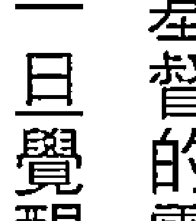到西藏的旅行，我开始发现自己逐渐拾回了某些遗忘的过去，我去给孩子们讲课，募款到孤儿院，特别是帮助一些女童。师父告诉我，我有著独立的生存能力，能够走遍世界，勇敢又有智慧，但很多藏区女童是没有这样的幸运。她们一出生为女性，便注定了一生的悲剧，没有学识，有的未婚怀孕，甚至被抛弃，只能帮助家计，过著没有明天的低层生活。所以，我们开始去帮助一些幼童，特别是女孩子，给他们教育，也希望能助养她们的生活。

在西藏，我学会了另一种生活方式，就是没有担忧，这个特性在传统的老一辈人身上特别鲜明，这些天性乐天知命、有信仰的藏族老人，吃完饭第一件事就是继续诵持六字大明咒，他们不担心下一餐能不能吃饱，钱从哪里转来，他们在乎的是「念经」。

你如果由外在环境来看，可能只会看到贫穷和脏乱，然后我们的思维会想，这么穷怎么办呀？要赶快想想赚钱的事，多弄一点钱，生活才会变好啊！或许，等生活条件变好了，有时间才能念经吧？这是我们的思维。

在藏区，你看不到这种信念，他们只有谢天、谢菩萨，然后把这种感谢回向给世界，给众生。这种纯朴的感觉，虽然在年轻人的身上愈来愈少，但灵魂层次上的特性，并不会因此而丧失。当我在英国遇到藏族人时，虽然还是有著同样的生存课题，但他们却比较容易苦中作乐，或是根本就还是活在一个「乐」的境界里。

完全不夸张，如果你有机会去接近他们，会发现，在纯朴的地方也许脏乱，但却有著纯洁的心灵，你看到大家的生活主要不是为了生存、名誉和金钱，也不是为了有几栋房子和车子，而是当天心灵的平静和感恩。这样的信念，也难怪藏传佛教的修行能扩散到全球，甚至风靡许多西方名人。这种天性上的特质，我个人特别崇拜。

## Chapter 16. 走进西藏、不丹和印度

也或许，我的内在也有著同样的特质，所以会互相吸引。因为对我来说，吃不好没关系，钱不多可以再努力，但是，如果心灵失去自由，或是失去平静，就算给我山珍海味，我也会吃不出任何味道。

在一次机缘下，学生透过不丹文化部的人士，帮我们安排了一次不丹之旅。为了艺术和朝圣幸福的国度，我们一行人又启程前往。

很奇妙的是，再一次的，进入到一个没什么科技又不富裕的环境，但精神上却是丰富与满足的，那种安定的感觉，让世界上的人称这块土地是「充满幸福」的地方。

如果我们放下生存的担忧和恐惧，跳脱现有的空间思维，不从外表看，你在不丹，就会逐渐感受到自己的心开始融化，说不上是一种什么变化，这种变化很细微，需要细细体会。我总觉得，当人们不再关注外在的一切时，似乎才能找回内心的平静。而当我们在辛苦的生存环境中，像我，在西藏时，成天是满身灰尘到处跑的汉族女子，对外在的美丑不再关注，结果每天的生活就是从单纯的起床开始，享受著被牛叫醒的快乐，然后就会发现，当不再专心于今天会吃什么好料，或是要去哪间SPA店享受按摩，完全没得比较时，这时候的自己，才真的是内心丰盛。

我们常常外在丰富了，却形成了贪心和比较心，所以现在的人才会觉得，为什么生活变好了，但心灵却感觉更痛苦了？大家百思不得其解，却仍继续在痛苦中追求著。

我遇过一些大陆的企业领导人，浑浑噩噩的一直追求金钱财富，身体坏了也不想停止，总是不满足于小笔收入，而想来笔大的，投机的心态令自己家庭失和，婚姻失败，也让内心更加痛苦。而台湾的一些企业主，虽然不会这样追寻，却又迷失在宗教和信仰当中，想运用神明的力量或是地方信仰，来渴望事业的顺利。

我常常在想，是不是我们真的脆弱到了这种程度，需要超越人类层次的力量，来支持我们找到自己？或许父亲的坚持也有几分道理，父亲总说：「难道我不信神就会不幸运吗？」而且说人是有自由意志的，可以靠自己而不是靠外界。我的天生能量感虽然帮不到父亲的信仰，但是，当我看到不管有钱没钱，大家都在追寻著人生的迷思，却往往无法找到方向时，我便明白，不将能量放在外界，也就是不能全副心力专注于外在的生活，金钱的追求，富裕的面子，穿衣打扮，整容化妆，开什么好车，住什么豪宅。不论内心相信什么，如果可以动动脑子思考一下，或许在自己所相信的世界中，就会有著非凡的成就，而不是沉迷于某种信念，失去灵魂的质感。

在能量的世界，能量的掠夺与尊重是非常需要理解的。不然，你很容易陷入迷惑，但要明白不陷入，自我的探索、反复的自我理解与疗愈是必须的过程。走进藏传佛教的西藏与不丹之后，我们一行人更坚定了心性主导一切与不抱怨的重要，也有更多的经历可以见到大自然的美好，并且更能与自然界互动连接。

从不丹回来后，有很久的一段时间，我连睡在自己的床上都有着幸福感觉。难怪大家说不丹是幸福的国度。不是收入，不是奢华，也不是极为美丽的天空，而是一种内在满意的能量感。这种感觉，似乎才是灵魂可以一直带着走的。

想想，我们一生中去过多少地方？现在的人生活都已经有一定的水准，大家三不五时就可以去旅行。当你旅行结束回来，除了美美的照片和满满的纪念品，还保有了什么呢？除了一种感受，其实我们什么都留不住呀！

每丰富一次，我就会感觉自己的灵魂又厚实了一点，像是拼凑的灵魂地图又完整了一块。这也像是路西法的故事，当心拼凑得更完整，翠绿的宝石逐渐收藏齐全时，心也将更为丰盛，我们就会找到回天国的道路了。

很多年来，我都有这种心灵回家的感觉。如果我们的心愈来愈和谐了，撒旦魔鬼不再心魔丛生，我们也就比较不会给自己添麻烦。更重要的是，不会一直习于给自己破碎的心找痛苦，因为心的习惯在逐渐完整后就会改变，不会再渴望回到缺憾不完整的状态里。这就是我们丰富的习性，一直停在高处的丰富状态。

让自己的灵魂丰富，或许才是我们旅行的主要目的吧？人生，又何尝不是一场旅行呢？

> 核心体悟 Core Enlightenment

不丹之旅，因为同团的伙伴中有人是刚做完化疗还光着头，有人是婚姻出了问题，也有人是想找回自己生命的美好，许多不同心态的一群人，创造了这场旅行，也让我不丹的教学深感触动。在良好土地，做对的事情，这种天时、地利、人和的感觉，特别可以创造更强大的疗愈力。

记得当年光头的团友，一开始都用假发和帽子作遮掩，只因为之前身为模特儿的美丽，令她病后非常自卑。没想到，不丹这个佛教国家（以藏传佛教白教为国教），对光头是崇敬的，让这位病友到了当地非但不自卑，还大方地亮起光头。当地人以为她是女尼姑，也纷纷给我们最大的方便，连法会都可以坐到最前排，这个团友完全打开了快乐因子，也光荣地展现自己病后美丽的光头。大家一起蜕变，到现在想起来都还怀念不已。

## Part III 心与物质的生存考验

几年后，另一次不丹行程中，一位三个孩子的妈，就是因为一直持续观察我们团队，被触动了，所以决定加入。除了爱上自己，还爱上了自己生命的道路，更重要的是，她逐渐走出痛苦，渴望拥有创造生命奇迹的能力。

就这样，三年后的另一场旅行，这位妈妈又一起来到了印度，来到我们的印度医学回春养生中心。大家因为都热爱身体的舞动，每天练瑜伽又增进了彼此的感情，就这样，我们的深圳教育中心也因此实现，并且专攻瑜伽和能量舞动的培训。

支持着这个妈妈想要经营教育事业的原因，主要是来身旁朋友们的惊讶，大家纷纷问她，是做了什么让自己变得如此有光彩与美丽？她自豪的说：『我跟随了老师！』

这样的荣耀与光环，使她吸引到美容院所及瑜伽馆的女性负责人，大家纷纷想要了解，什么是能量疗愈？什么是色彩能量？什么是色彩能量的管理法？

而当年坚持去一趟不丹的重庆好姊妹，回来会后宛若新生，重新恢复了健康与美丽，也重新开创了美丽的事业。不过回来之后的她，开始学会珍惜身旁的爱，也学习不再随便发脾气，对于疼爱她、一直捧著她在手心上，却一直被挑剔的老公，也开始学会更珍惜与感恩。

每次的因缘都让我深深体会到，虽然创新或是首次创作都充满了艰辛，但每次的结果都是成功和美好的，没有一次例外。这样的过程，我开始享受美好的果实，因为只要假以时日，总是会见到好的种子所结出的好成果。除了感恩，我们没有别的事可以做了。

就在今日，我活在感恩中。

> 自我疗愈
拙火之乐

随着自己的心灵层次提高，我们会见到不同的世界，也能见到他人的美好。有一种人内心充满喜悦，哪怕没见过本人，光是看到照片，都会感受到其美好的温暖，甚至想要亲近这个人，感觉内心的喜悦。我就是因为一张照片而被吸引了。

来自西藏的耶喜喇嘛就是这样一个代表人物。不可否认的，我的道路很多是来自于他的亲身实证，因为他不仅忙于各地中心或弟子的指导，却不曾耽误他自己的西行，反而愈忙愈忙愈随之增长。而他快乐的磁场，连走在路上不认识的人都可以感知到，这是何等了不起的一种能量呀！

耶喜喇嘛如同寂天大师一样，都是一个伟大的秘密瑜伽士，不太以外相来吸引人，也不随便显示自己的高级证量，这样的人我十分崇拜。更巧妙的是，当我读到他的传记，才发现我们都一样「嗜睡」，睡眠中的休息和体悟对我们来说，非常重要，我常常也是一段时间好好睡觉，才能得到灵性的提升。因为睡觉是灵性提升的桥梁，以及能量修复的重要时刻。有时候我觉得不像是在睡觉，反而像是手机或汽车充电一样，充饱了电就完成过程了。这在我学习那洛六法时，教导的空性大师却仁波切，给我带来了睡觉中的修行技巧，可惜我仗着天生的灵敏，不用学就会通。的傲慢，始终也没有好好的练习。现在想起来，真的很惭愧自己的年少无知呀！

- ⑥ 证量：在佛法中指实证之后，体验之后，可以观察到、印证到，和佛经印证无差，就是证量。
- ⑦ 那洛六法：又称那洛六法瑜伽，藏传佛教中集合拙火瑜伽、幻身瑜伽、光明瑜伽、梦瑜伽、中阴瑜伽、迁识瑜伽成为六法，传承自那洛巴，故名。

耶喜喇嘛曾经表示过：「证得了大乐和空性之后，就不会有风袭的疾病。如果一个人心中有大乐，就没有容纳紧张的空间。」梭巴仁波切说：「伟大的禅修者因为有密续（Tantra）的证量，即使是在处理问题时，也不会产生忧郁的感受。」这真的是我向往的境界，也是我逐渐开始体会到的能量境界。如何成为不忧郁、快乐的瑜伽士：

## 1. 调整身体四大元素（地水火风）的健康（神经系统）

用乐观的想法让自已心情平静，不产生高或低的情绪。很多人现在无法入睡，或是精神亢奋出现，都是因为思路过多，杂念太多，令所有没有意义的思想进入干扰了神经系统，然后影响健康和心情，如果保持正面不多想的生活方式，就可以让神经系统趋向稳定，愈来愈健康。

## 2. 调整呼吸进入气脉的平稳，让情绪可以逐渐受到控制

心肺功能，呼吸状态，都会锁在我们的横膈膜部位。如果内在压力很高，经常心里藏着苦涩无人可诉，呼吸就会变得薄弱，血压也会比常人低，这样的状况容易无力。因此，多练习呼吸或是慢跑，可以逐渐提高心肺功能，情绪也会得到改善和控制。

## 3. 身体的锻炼可以多练习哈达瑜伽，让身体的柔软度不断提高

这是个非常古老传统，也最为普遍的瑜伽练习，重点是为了提升肉体和精神的双重健康。哈达瑜伽的文字中，HA代表了瑜伽中三脉里面的右脉，象征太阳的力量，TA则代表左脉，象征月亮的力量。如果两个相对应的阴阳合而为一，就可以促进中脉的畅通，净化干净与畅通的中脉可以让人灵性力量提升，身体也会非常健康。

## 4. 清理神经系统（气与脉），让自己没有容纳痛苦的空间

如果依照前面的方法进行锻炼，呼吸的气（如慢跑锻炼心肺）和身体的脉（如瑜伽练习）都

- ⑧ 密续：佛教秘密传承的修行秘法。

## 5. 去观想身体和能量体都如水晶般干净

这个层次需要练习，因为一直想像自己很透明或洁白，需要经常性重复练习。想像自己的吸气、吐气都很干净，也可以想像练习瑜伽的三脉七轮都是透明洁白，非常明亮的状态。色彩的观想法，需要一点时间进入情况。

## 6. 最后身体和心灵会一起进步，然后进入快乐的禅修能量中

我所带领的彩色禅修，主要是以快乐和轻松为主要的方式，我们有时唱，有时跳，有时静，有时动。在动静之中享受身体和心情的愉悦，身心合一却不停留在情绪的释放，平静地进入一种美学的体悟，这就是彩色禅。

彩色的身体地图，需要以爱滋养。身体的地图会因为爱的养分，体验到快乐的最高境界！

## Part Ⅲ 进入臣服天职的阶段

孔子说：三十而立，四十而不惑，五十而知天命，六十而耳顺。从很小我就非常喜欢读中国文化基本教材，并且一直规范自己成为君子般的贤圣之人。不能圣，好歹也要贤呀！

但论懂命的我，人生却仿若电影《班杰明的奇幻人生》一样，是倒着生长的，愈老愈开花，愈入世，愈需要勇敢地跳入凡间，而不是永不食人间烟火。

四十有一点点不惑是真的，因为四十之后，我才敢小小的公开承认自己的天赋本能。长期以来只想为了家人的生存打拼的我，走入这一行也是非自愿的结果，虽然可以有各种机会做选择，但奇妙的是，做能量及梦想工作的我，就是如此信手拈来，并且在自我制约极多的情况下，总能机会不断。

这样自动涌进的工作机会，以及家层出不穷的事件，忙得我根本忘了做选择。以前身心灵界一些同业竞争的人总说我很爱赚钱，明明家里有钱还死要钱。殊不知，我的家庭状况正好相反，我忙着解决学生问题、无形界问题、家庭问题、个人问题，忙得已经无法多加思考，自然也养成我不在乎他人的耳语、八卦与是非，因为我只能专心爱我所在意的人事物，无法分出心思来在乎莫须有的负能量。

但我的心仍是在乎和害怕的。不能明白自己努力生存下去，为什么总招致一堆的闲言闲语和恶意打击与误解。因此，我能低调绝不高调，我只希望平安平静的把工作完成，赚到我该赚的钱，让父母衣食无忧，我的学生和员工可以相对没有烦恼，这样我就满足了。

但四十之后，我终于开窍了，因为明白我的痛苦也是大家的痛苦，我的迷茫更是众人的迷茫，我的奋斗也会是大家的解药。

而四十岁以后，我也开始明白，如果我有一点点的成绩，或者顺利发展，甚至这么忙碌还能健康变年轻，都不是我个人的，而是更大的自然色彩能量场所给予的支持，以及对更高层次的无限崇敬和一心不二的正念臣服，才让我可以如此幸运。

当然，还有我的孝顺众人皆知，这些累积的好能量，保护着我可以做更多令人美好的事情。

一旦明白原来这些不是出自我个人，而是身后有太多的正能量，我只能把一切的美好归于更高的层次，不居功，自然也就没有个人荣辱的压力。

这种打通，我终于学会爱自己，承认并且接受自己的一切。因为，在我的自由意愿之下所设计的人生蓝图，真的值得拍拍手，我一路的努力，也值得自己认可和得到荣耀！

## Chapter 17 再次面对生死关

不论是信神，或是信医，这中间的信念才是关键。因为如果没有强大的信念，愿意自己帮助自己健康起来，谁都没有办法伸出手来帮你解决问题。

再次面对生死的课题，是我最钟爱的父亲要向这个世界告别了。帮助无数人，疗愈多少人心。我的脆弱点，就是见不得所爱的人痛苦。我一直以为父亲可以长寿到九十岁，并且陪伴我长长久久，毕竟我是做天地的工作，也因为非常孝顺，所以常常机会很多，幸运不断。但是，就在我一场近千人演讲演唱场的前一天，父亲进了医院。这次进去，便再也没有机会离开医院了。

我的治疗师开端是从生死理解的。而时光飞逝，没想到很快又轮到了我的家人。家人是我的死穴，我可以忍受一切的不完美，一切的失落，就是无法忍受家人的失落或痛苦，甚至死亡。自从凯洛老师告诉我：「照顾关怀他人就是治疗师的本质。」我听话照做，不是因为有特殊的才华，而是因为强迫症一般的性格，只求完美。这在创作上、工作上、治疗上，甚至在日后的团队带领上，这种性格让我们始终战胜一切。但是，我承认我有「强迫症」，如对色彩的敏锐，对疗愈的要求，对所有工作细节完美与严苛的要求。我没有想过对「不完美」的包容，虽然人生本就没有完美，但我却不肯低头。

二〇一五年，根据迈可·卡尔辛柯（Michael Kalesniko）的故事拍摄的电影《天菜大厨》，男主角由于对错误及不完美的无法容忍，结果把自己逼上绝境。我开始觉得自己愈来愈走上这样的感觉里，直到了父亲进了医院，我才爆发出来。

像我这样骄傲的人，总以为只要有灵界的力量，没有什么做不到的。但我忽略了，人性中信念、信心、信仰的三观，往往左右著连神都无法掌握的变数。

我的父亲本来不必进医院洗肾，当时还健在我的通灵和尚好友、我的灵性师长们、我的玄气门师父，全都保证父亲可过此关卡不会有事，也不需要洗肾。我向父亲保证再三，然后才安心的飞离台湾。没有想到，就在我离开之后，当年弟弟过世时，专程跑来告诉我只要在弟弟耳边说一句话，七天后弟弟就可以苏醒，那个国小同学，那个二十岁开始洗肾，我替他和他洗肾的女友策划婚礼的那个同学。

忽然在多年后，就在那天经过父母的住处，他想到好久没有联系我母亲，于是福至心灵的打了问候电话，并且立即到我家拜访。

父母对于我和弟弟自小到大的好朋友都视如自己的孩子，当然热情的接待了我的国小同学。结果谈起了医生建议洗肾这件事，我的朋友立即以过来人身分大力推崇洗肾的好处，并且告诉父亲，如果不洗肾反而会立即死亡。

就这样，我一手安排好的计划，被一个数十年来未碰面的程咬金给破坏了。我的父亲第二天立即洗肾，洗肾的道路一旦走上去，就再也脱不了身。

洗肾会破坏身体本有的机能，反而会让健康衰败，这是我的认知，所有以机器功能来转动身体自然运作的事情，都会让身体失去本有的功能。因此，我的父亲终究没有度过他恐惧的一关，就在最后那一秒钟，他做了生命中最令我伤心的功课。

当我一听到父亲「已经洗肾」，我的脑中轰地一声，把我带回到当年带领学生走丝绸之路的圣地旅行时，第一站在西安大雁塔的场景。

大雁塔存有当年玄奘带回的《心经》抄本。当时我走近塔时并不知道，但我却在靠近时，《心经》的声音不断地出现在脑海中，之后我才明白，原来那里收藏著手抄本。

听到父亲已经洗肾的消息，我手里的手机无法回应母亲，脑中全是《心经》的唱诵。刹那间，我知道要领悟空性，色即是空，空即是色，父母没有真的信任我的灵性洞见，他们为自己的人生做了恐惧的选择。我哭不出来，只能一再的失望，因为接下来，父亲不仅要面对自己洗肾的辛苦，也要开始面对逐渐衰败的身体机能，更重要的是，我将无法再带父亲出国到远方，因为他将受限于身体的限制。

所有的一切，要得到结果前，必须先了解所种下的原因种子。这个种子一旦种下，便没有退路。

本来我在打的战役，是避免父亲因为肠道问题而逐渐产生的老年痴呆现象，这些在我们用能量检测时就已经看出，但父母不肯继续配合，认为没有发生的都是无稽之谈，并觉得人们都是要骗我们花钱。所以，当父亲决定洗肾时，我已经是第二次的伤心，却没想到，这种伤心得如此之快。父亲不信任我的灵疗团队，也不相信人们可以运用能量和神圣的高能量解困。这或许也是父亲一辈子的坚持，他活在他相信的物质世界中守著困顿，而我不停用神奇力量创造奇蹟的灵能女儿，却丝毫无法动摇父亲的强大信念。

我很气愤这位程咬金，足足有一年时间都不愿意再与对方通话。他不知道他的一句话，用恐惧的能量勾动了恐惧，自以为学习了藏传佛教，就能成为指引人心的老鸟，自以为通达因果业力，就可以断人生死。偏偏，我的父母不相信我，却信了这个外人，这种业力，我实在无话可说。

虽然后来我的同学在父亲过世两年后也忽然过世，因为他也不肯相信我的建议，即使我对于能量调理的这部分很有信心，但他只信任他的佛法，以及似乎有点神通力的师父及自己。我的团队小朋友也都觉得很遗憾，因为我们竟然就是无法转动身边这样的执著与信念。

对于执著的父亲和国小同学，我心里的遗憾实在难以释怀，却只能眼睁睁的看著他们走著自己相信的道路，并用自己相信的方式结束自己的人生。

自从父亲洗肾后，我开始减缓自己的『强迫症』。我开始明白，我们敌不过业力，或者说，我们敌不过人的执著与习性。毕竟这是要用极大的决心来克服的，也毕竟，人们总用尽一生的精力，用生命经验来证明自己的信念。没有多少人想要追求真实的信念，大多数人只想用各种证明，来证明自己相信的是真的，却不肯相信宇宙中还有另一层道理，那是和天地衔接的大能量。渺小的我们，常常在生命中最后选择的，是自己的信念，而不是聆听宇宙法则。

以前我的学生看到我会害怕，因为我不容许那些充满业力的语言，或是心念，甚至在疗愈上我也很霸气，我说了算。我也不会在外人如何看我，我只是很坚持地走在自己相信的道路上，用尽我的力气来防堵，来爱护我的人群。

我從不妥協，因為強大的自我認為，我的認知才是對的。所以，我的員工也知道我的脾氣，只有在能量的事情上我無法妥協，凡是牽涉到業力的發生，或是會創造因果問題的事，我絕不能縱容與忍受。

記得有一次，我在公司的白色地板上發現一根頭髮，當我蹲下來撿起時，行政小妹馬上陷入一種緊張的能量情緒。當下，我感覺自己真的太認真了，太認真的相信，太認真的堅持，實在太認真了，認真到太過嚴肅，沒有玩樂，也不需要玩樂。

> 《心經》的“色不異空，空不異色，色即是空，空即是色”，聲音一直在我心中繚繞著，我霎時明白，該是放下一切了。

當你不緊緊抓住，不緊緊控制，那才是尊重。對自己所愛的人，往往我們會更加掌控，卻以為那就是愛。如果以為自己的愛才是對的，或許就不是愛了，因為那只是希望對方照著我們的方式去做、去行，而對方其實一點也感受不到我們的愛。

父親忽然跌倒，就在一間私人醫院外。前後四十九天，我們盡力的完成了一切，但依然無法挽回父親的生命。

臺灣的醫療應該是不錯的，但私人醫院實在未必如此，再加上醫療設施老舊，也因為摔到腦部，無法立即轉院，即使我的學生有在醫院工作的，卻也無法協助轉院。我們只能忍受著老舊的醫院與老舊的人誤，父親的運氣一直不是很理想，連離開世界前都必須忍受一切的失誤與巧合——素質不優的看護，清洗腹部的失誤引發了發炎與併發症。人在離開世間之前，許多未能完成的能量都必須一一承受完畢。這個時候如果有信念，或許可以減輕一些疼痛。但是，父親摔到腦部，無法以意志力來克服一切的恐懼與失能，這讓驕傲了一輩子的他更為難受。有時候，年紀大的人剩下的僅有尊嚴，但醫護和醫療單位完全無法認知靈魂這件事，他們認知的只是一具身體。所以，根本無法理解一個失去意識狀態的身體，還有著什麼痛苦與感知。

> > 如果我們可以尊敬其他人內在的神性，不論是對大人、小孩，有能力或沒能力的，失智的或弱智的，也許都可以用潛意識的靈魂方式來對待。而我的工作，以色彩能量方式來做的教學，並不是教人如何化妝，如何穿搭，或是如何使用精油瓶，而是教導人在從生到死的過程中，如果能夠趁著年輕有力、健康富足，有全然自主的行動力時，能夠認真調整內在的意志力，多儲存豐富的內在能量記憶，那麼，到了脆弱恐懼或身體愈來愈衰弱時，就不會被自己的負面能量打敗，也不會心存無能為力的恐懼。而在不斷面對困境，並努力克服的過程中，都必須在意識裡加強美好的訓練，這樣當我們到了某一天要面對困境時，才可以將心性維持在『一個高度上』，這才是我教授色彩能量學的主要目的。在色彩能量的工作裡，我們深入到所有人中的黑暗面，就是為了鍛鍊心志，不被黑暗所同化，不會隨意移情，而能清楚見到『色不異空，空不異色』的境界。而人們往往會落於形、色的迷惑，以致無法進入空性，等到了生命的最後關卡，便無法真的擁有的灑脫和清明，然後會更強化情緒的波動，在生命的最後一戰中，落入負能量的低潮裡。

## Chapter 17. 再次面對生死關

## 【自我療癒】面對死亡的準備

一直以來，在靈性的道路上，「療癒死亡」一直是沒有變過的工作。甚至在從事色彩能量工作、甚至踏進靈性世界之前，「療癒死亡」就已經是我的工作了。有時候一覺醒來，覺得自己死過一次；有時候一個觀念改變，也覺得彷若重生。這種不斷蛻變的經驗，一直不停的發生。

只可惜，在幫助很多人重生或挽回生命的過程中，信念的問題真的是最大的考驗。每個人都有著自己一套相信生命健康的辦法，很難接受其他人的建議。有的人寧可到處去宮廟拜拜或找他的上帝，不會認真的去研究自己的身體健康要如何挽回，如何治療？也有的人完全被恐懼所蒙蔽，任何的方法都好像是要騙財似的。在我認識的民俗醫療，甚至可以協助的靈療治癒法，往往因為不夠信任，就算能由靈性場域挽回生命一陣子，最後也都敗在信心上。更有的，只相信醫生的手術，寧可信眼前的，也不肯相信自己的信心療癒，還有細胞療癒、能量療癒，相信自己可以幫助自己。

不論是信神，或是信醫，這中間的信念才是關鍵。因為如果沒有強大的信念，願意自己幫助自己健康起來，誰都沒有辦法伸出援手來幫你解決問題。

我曾經見過基督教和佛教中非常虔誠的人士，或是很核心的主辦人罹患癌症，大家都說：「怎麼你的神明或上師沒幫助你呢？」當事人本身也會覺得很質疑，「我非常虔誠，為什麼我的神明還會讓我生病？」

當然，各種教派都有一套說法，但在我看起來，實際上是自己真的沒有療癒自己的心，也沒有真正有效地面對治癒這件事。經驗實在太多了，也給我上了很多很棒的人生課程，有時候，不需要真的病過才知道要健康，不需要真的離婚或墮胎才知道婚姻或愛情的問題，也不需要真的親自體驗，就能提前預防。而預防的態度，更不是因為恐懼，所以事事要用害怕的心來小心提防，這種拿捏，真的只有我們這樣的工作者才能學到精髓。

沒有處理過生死，永遠不知道有很多方式可以預防和面對呀！

每個人都會死亡，我們每天都在面對死亡，走向死亡。所以，如果趁著健康的時候可以準備好，這樣等到死亡來臨時，我們就不會措手不及，也不會呼天喊地，反而可以安靜地面對，快樂的離開。

最近臺灣有個安樂死的案例申請，電視知名的運動新聞主播傳達仁罹患癌症，可能活不過幾個月了，他到瑞士去申請加入安樂死的會員籍，並且安排全家進行了一場旅行，上百萬元的花費，只為了陪伴他「回家」。雖然，當事人事後又因為眷戀人生而沒有執行計畫，但試想，有多少人會決定自己的死亡時間呢？耶喜喇嘛的故事就是一個很好的案例。其實，醫生在一檢查出心臟病時，就告知他已經得到嚴重的心臟病，但他始終沒有考慮進行手術，反而繼續忙碌地進行佛行事業，結果這樣也依然活了下去，並沒有如醫生預言的「快死了」。他在圓寂前考慮是否進行心臟手術時，卻表示自己已經心滿意足，沒有憂慮，因為他已經為僕服務他人，覺得自己做得足夠了。

## 以愛療癒

我們因愛而生，因愛而死。因為有生，所以必然有死。在愛裡，沒有生，也沒有死，只有愛，可以伴著我們走向寂滅。

這種豁達，覺得人生已經滿足，又有多少人可以做到呢？恐怕真的只有大成就者吧！而現在，我們如果不期許自己成為大成就者，至少也應該期許自己死得漂亮吧？

-   躺在床上，想像自己已經進入死亡的準備階段。
-   回想自己的一生，那些快樂、痛苦的人與事。
-   重新感受自己痛苦的過往，心裡對這經歷心存感激。
-   重新回想自己快樂的過往，然後謝謝這一切的經歷。
-   提升自己的靈魂感受，在高感知中與自己的靈魂對話。
-   融入到金黃色溫暖的光明中，和宇宙的力量合一。

## Chapter 18 治療師的愛與欲

在愛中，我們必須先找到自己的靈魂，才能遇上對的靈魂伴侶。

感，所以也很容易添麻煩。
像成了一種注定的模式。
很多時候，受到原生家庭的影響，多情又渴望愛，好
人天生對於這個板塊，特別難處理。換句話說，可
能對親人、朋友特別有情，而處於一種很容易自陷困境的
狀態裡。正是這樣的困擾，於是更容易鑽研在療癒的世界
中，所以大多數的治療師，都有著辛苦的過程，或是心酸
的歷史，天生擅長這個領域工作卻沒受過苦的人，實在是
少之又少。
這就像是雞生蛋、蛋生雞的問題一樣，很難知道誰先
開始這場輪迴。
愛有很多種層面，有個網路故事是這樣的：
一個女人很容易煩躁，一是因為身體疲倦，一是因為
缺乏愛和性的滋養。而愛，是一種舒服的極致。所以，如
果知道如何舒服的相愛，那麼愛就會滋養心靈，也會滋養
身體。
許多女性治療師比較像老師，容易指出錯誤或挑出細
節上的問題。這用在工作上非常專業，而且必然可以幫助

更多的人；但如果進入兩性關係中，面對像小孩的男人，就會失去效用。試試去跟小孩子講道理，或是去跟正在鬧脾氣的孩子說話看看？

往往跟小孩講道理時，小孩就不快樂了，但如果能夠快樂又有愛，不斷地給予支持或愛的教育，小孩就會勇往直前。因此，讓心回到童年的快樂，就可以快樂的享受當下，而我們和父母的關係，就如同伴侶的關係，要嘛依賴，要嘛分離。能量工作的人，應該在協助他人發展獨立又能相愛的關係前，需能夠建立起自己的界限和完整獨立的人格特性，而這需要學習與培養。

有時候到底是活在自己的幸福裡？還是活在他人眼中的幸福？身為能量治療師，必須不斷的搜索這靈魂在身體裡的幸福感受，才不會被愛的欲望所蒙蔽。但這條路，何其不容易啊！

※ 我的感情路是單純而失敗的。我常常感受不到自己是一個只有一種關係的人。記得在大學時，一天走在回宿舍的路上，我看到美麗的月光，路燈和月光映照在路上，顯得非常美麗典雅，我覺得自己在那個瞬間，簡直可以愛上那個月亮，也可以愛上那盞路燈。這種多情的感覺，實在讓我感覺超級好笑。有人會這樣愛上路邊的一朵花嗎？我會。我甚至會愛到不忍採下來，只能每天經過時對著花朵傻笑，我覺得我真的『很愛』。很多的愛，對他人、對個案的愛，是沒有限制和痛苦的，並且充滿希望和呵護。當治療師付出愛的時候，很像愛一盞路燈，愛一彎新月，這種愛，在治療師身上真的很常見。不過，當進入到兩人的關係時，就很容易變得自私和掌控。

很多時候愛和恨是同一種能量，甚至，有愛也會有恨，愛和恨的能量其實是一樣強度的，只是一個令人上揚，另一個讓人下降。但是，都可以給人帶來強大的生命力。所以，對治療師來說，愛也是一種考驗。

對我來說，因為敏感的關係，讓我很難從信任中走出來。雖然一方面充滿愛和慈悲，但被負面能量煽動時，過度的敏感就變成了猜忌，很容易讓敏感的心變得更為神經質，在兩性關係中正是如此。我天性容易信任他人，這是母親一直非常擔憂的，我不容易懷疑，而且容易執迷不悟。所以，在愛的道路上，母親非常渴望可以保護我，但我總是在想，即使成為父母眼中的好孩子，還是可以在勇闖情關的路上徘徊。

然而，在國外求學生活時，連外國人的搭訕我都不敢回應。因為雖然對於愛有強烈的渴望，但另一方面，又因為靈魂深處似乎有另一種桎梏在箝制著，以致令我無法自由自在地與人談戀愛與交往。

記得有一次，一位男性想要與我交往，但每次要來見我之前就會摔倒或發生倒楣的事。更誇張的是，連在餐廳吃飯，都可以有蟑螂掉到他的頭上，我覺得這男生也太倒楣了呀！另一方面，我也覺得是自己身上有不好的能量影響到對方？畢竟對方不是修行人，沒有任何信念和能量概念。

本來還在苛責自己是不是帶給他人不好的能量時，卻忽然發現，對方雖然是朋友介紹的，卻同時跨著兩條船，也就是說，對方想同時和兩個女性交往。這奇妙的經驗給了我很大的感觸，難怪他每次來見我的時候總是障礙重重，離奇的倒楣事一再重複，最後一次就是蟑螂掉在他的頭上，而我實在忍不住笑了起來。當然，這場朋友介紹的相親就破局了，幸好不是什麼好男人，失去了也不覺得可惜。但是，我感覺自己備受保護，內心充滿了感恩，也開始放下一點不安全感。

我的治療師老師們，很多在私下相處時都是如此的侷促不安，甚至有的很害羞，我也是這樣。我可以很努力地挖掘個案的問題，但自己的內在卻很難釋放，對於想要和我交往的對象，我也往往不知所措，這種情形延續了很長一段時間，直到我遇上了可以包容我的靈魂伴侶，我才逐漸釋放出這種尷尬的處境。

在愛中，我們必須先找到自己的靈魂，才能遇上對的靈魂伴侶。如果我們一直處於徬徨與恐懼，對自己的人生仍充滿了追尋與迷惑，那麼，在這條路上所遇到的臨時男主角，都不會是可以持續相伴走下去的Mr. Right。

我有時候從一對正在交往中的男女眼睛中，就會看到他們是不是一對合適的伴侶。因為靈魂目標相同的人們，會在靈魂之窗看到同樣的火光。如果一對非常契合的夫妻，也會看到他們有著相仿的氣場。這種感覺很奇妙，在亞特蘭提斯時代的傳說中，在當時人們要結婚時是需要先檢測氣場，才能測出男女雙方是否契合。而孩子在很小的時候要找到學習的方向時，也需要先檢測氣場才能知道。這在我們的世界中很難想像，但在我看到氣場時，感覺這種傳說特別有道理。我們常說物以類聚，或說近朱者赤、近墨者黑。這種氣場理論在我看來，是真實得不能再真了。可以說，這不是一種理論，而是真理。所以，如果一對夫妻已經沒有任何連結的理由了，像是金錢慾望、社會名譽，或是同心合力想把家照顧好，那麼他們也會逐漸脫離彼此。一對貌合神離的夫妻，從氣場上絕對可以看得出來，騙不了人的。

> > ※ 愛是一種提升，但也是一種辛苦的歷程，如果沒有經歷愛的考驗，就沒有提升。直到遇到全然包容與呵護我的男人之前，我一直都沒辦法遇到真正願意無條件付出的男人，有的是被我的「特異功能」嚇跑，有的是被我的保護能量（蟑螂兄）嚇跑，有的是本身個性古怪而無疾而終。

总之，身为治疗师，很容易遇到的不是爱人，而是病人。如果治疗师无法去分辨，而且有着对爱的强烈渴望，那就很容易进入爱情，但却很可能是一场辛苦的爱恋，甚至是虐恋。我在一次自以为心痛的爱情后，就觉得自己从前世到今生，就是个不适合爱情的人，虽然渴望，却无法实现。那段自以为是的心痛爱情，最后以为对方背叛而分手收场，但多年后我才惭愧地觉得，原来那也不是爱，因为大家的心里其实都不懂爱，又怎么能算是爱呢？

我们为什么会受苦？是因为我们根本不知道自己要的是什么。我们往往会说「想要爱」，但仔细推敲一下，到底什么才是你想要的爱？有时候很模糊的我们，根本就说不清楚。而不知道自己要什么爱，也就无法清楚地得到灵魂之爱。

有一次我的幼稚园同学找到了我。五岁时候的朋友，找到我之后，才知道对方在爱中充满了心酸与无奈，本应是享福的年纪，却因为娶不到贤妻而过着辛苦的育儿人生。当我听完对方辛苦的爱情故事后，我忍不住画了一幅画送给对方。我透过对方知道，原来我们以前「曾经」两小无猜，当然，五岁小朋友的故事我早已不记得。回家找妈妈询问的时候，妈妈竟然告诉我，我虽然不是长得美若天仙，但自小就很吸引人，老是被男同学喜欢。这令我感觉实在夸张，与我对自己的认知是完全相反的，我以为自己不是很有异性缘，但妈妈却作证，我一直「很受欢迎」。我当晚开始回溯，知道自己可能前世到今生都没有很顺利的情感生活，甚至不少经验中都是修行的背景，不论是西方还是东方的记忆都是如此。于是，当那位同学在四十年后来找我时，我便很想把这种感受画下来。

还记得那天画下来的疗愈画很有趣，一开始我觉得很困难重重，甚至画出像是监狱的框框，一直画着一颗心，一颗好大的、红色的、热情的心，然后，逐渐像剥落似的，透过许多生生世世的过程，心痛的爱逐渐昇华为柔软温暖的心。在这图完成后，我也彻底转化了自己的误解。

原来我不是一直在情伤中，而是一直在多情中。情很多，不怕伤，伤了之后还会复原。难怪我虽然没有很好、很多的爱情经验，但我总能感受到自己内心有很多、很满的爱，像是很多爱给了幼小的弟弟，很多爱给了我的父母，许多爱又可以给无形的生命，甚至从小学开始，就发动全校捐爱心捐书送到泰北，也有很多爱从国中就一直做「爱盲读书」义工。我总有着很多鬼点子可以帮助不同的人，甚至第一次开女性工作坊，训练可以在家工作的女性成为双手治疗师，都是因为看到受家暴的女性又得在家带小孩，而那施暴的男人往往又无法提供良好的经济照顾家庭，我一气之下，就开了这样的培训班，配合我进口的能量精油，藉以支持更多女性独立自主。

在能量画的过程中，我已经完整蜕变。我理解到自己不是悲伤的人，而是勇敢有爱的人。于是，把画送给幼稚园的同学后，我对这一场相遇做了祝福与结束。之后好像再也没机缘可以再见到这位同学了，但对我来说，这五岁的记忆，已成功疗愈了我对自己前世的爱情误解。

我的日本同事曾经告诉我，她是到五十二岁才遇到美国男人的真爱。当时的我没有很在意，但我明白她想告诉我的是，「不要将就，要做你自己。终有一天，你会发现，真爱就在莫名其妙不经意间出现。」一晃眼，她说这话已经十年了，而我也在莫名的机缘下遇到了爱情。

关于爱情，我理解到这是一个有趣的功课，却不是我的主要功课。也许每个女人的生命功课大不

核心體悟 — Core Enlightenment

同，有的女人忙于繁衍后代，但我不属于这类型的女子。因为我无法被框在一个两人的爱恋中，而失去灵魂更大提升的机遇。但关于爱，却是我一辈子的功课，把爱延伸到更广大的层面，或许是我最好的课题。如何不紧紧抓住属于自己的爱恋与依赖，而把爱的层级继续扩展到更多人的身上，这些爱的体悟，随着年龄的增长，开始让我理解，可以用不同的方式来呈现爱的品质。这是清楚能量的人需要明白的。爱是一种无私的表现，爱也是人终其一生追寻与拥有的宝物，值得我们一直在爱中体会生命的美好。对于爱，我也才发现，原来我是拥有很多的爱，所以才能成为一个带光的天使，可以给予更多能量的支持。没有了爱的本性，就无法提供更多更强大的疗愈力了；也因为有了爱的灵感，所以才能连接更多超维度的神灵，感受到世间更多美好的爱和力量。

## 【自我療癒】尋找靈魂伴侶

父亲的离世对我来说还是很伤感，特别父亲的灵魂一直还是挂念着我的婚姻，担忧没有人可以照顾我。天下父母心，我这个天下女儿心也是一样，我也很渴望能够满足父母的要求，让我的父母无忧与满足。

就在父亲过世前，一位非常疼爱我的男士出现了。我们没有什么交往的关系，但他却非常关心我的双亲和我。在没有交往关系的时候都如此疼爱，甚至愿意照顾我的家人，这种关怀令我很惊讶，原来男女之间，除了爱情，还有一种很深的关心。那些以往说要追求我的男士，一旦我家中发生事情，就避不见面，漠不关心，这种奇怪的表现便让我反思，到底什么是爱？如果连一个朋友的关心都没有，那这种男女关系似乎就变得现实了。

男女关系的疗愈，其实是更深刻的修练。

亲密关系之中的磨合，往往比我们打坐念经还要吃力。我没有很多时间和机会去历练这种「日常的磨合」，但我开始领悟到，人生的历练就是这样有趣，我们都需要去经历，才会明白那是一种什么样的痛苦。

如果要遇到相爱的人，首先必须自己先准备好。相爱容易相处难，所以，如果已经准备好要去「难」一下的话，要求不高的随时可以进入，但要求高的话，遇到对手又很艰难，可能就没那么好混。我的个案中和追求我的人当中，不乏受感情或前段婚姻困扰的男士。追究其原因，其实相处中，自我真的是个很大的考验，往往男女之间的能量，就是一种「权力」之争。

### 1. 练习容忍

如果没有练习对于不顺自己心意的人与事的包容，那彼此的关系可能就会变得很困难。容忍自己看不下去的事、看不下去的行为、看不下去的语言，这些都是必须练习到可以看在眼里，却不动声色。不过，容忍的能力虽然可以减少口角之争，但不能保证感情顺利。

### 2. 练习沟通

没有人不认同沟通的重要，但卡住情绪能量的沟通，是永远不会有用的。有效的沟通不是说「舒服」，因此，必须先由包容开始，先吞下了对方的负能量或怨气，然后才能让对方接受自己的观点。

### 3. 有效表达

说重点比说故事重要。如果一直回溯，老是旧事重提，这样的感情也会破局。有效地表达就是「说重点」，说出自己内心的感受，说出自己心中的渴望，这个步骤必须在前两个步骤完成后才能见效。

### 4. 感受温暖

亲密关系中，如果感受不到温暖，两个人的感情就会降入冰点。如果没有温暖，两个人为什么要继续在一起呢？一起受苦吗？这恐怕是最笨的人才会这样做吧？感受温暖，由自己的心感觉到温暖，这样的感觉，才能扩及到他人的关怀。

### 5. 共享美好

不断地在自己的心中投射出美好的感觉，两人共处的美好，对方对自己关心的美好，去加强。

就在这样的感动下，对这位也面临爱情考验、一辈子都在爱情的痛苦中度过的男人，我也充满了爱的感受与关怀。一个前半生在婚姻与两性关系中饱受折磨的男人，终于如愿的离婚了，虽然仍必须饱尝前任婚姻带来的痛苦结果，但我却见到对方在爱情上的努力和犹豫。毕竟受伤的灵魂想要再重新站起来，即使在爱情和婚姻中一直痛苦，却仍渴望能找到心灵相吸的灵魂伴侶，这是人生中多么重要的功课啊！

觀想過去對方對自己的關懷。加強對方的正面，逐漸忘記對方的缺失，這樣的創造力，也等於有美好的加持力投射給對方，如此，才能共創美好。

## 6. 找到對的人

如果你還沒找對人，沒有關係，照上面的方式繼續練習，直到你的包容力增強，感激的心增多，經常感覺到被愛、被關懷，甚至可以關心他人。以這樣的感覺，當你遇到一個同樣可以溫暖你的心的人時，你們不會一直被痛苦所綁縛，而會一起創造更強大的愛，愛上自己，也愛上對方。

## 以愛療癒

親密關係是非常棒的人生功課，也是最佳的修練。在親密的愛中，我們會深刻體悟到愛的精髓。親密關係更是一場能量的角逐，直到我們理解、原諒了對方的需求，也就明白自己的需求，能夠成為完整的自己了。

## Chapter 19

### 能量工作的职业道德

一行禪師認為，關照生活的問題，才是真正的法。因此，落實到生活中的正念覺知，就是非常重要的一項修練。

職業道德一直是能量工作者最重要的世間法，因為職業道德是延續工作生命力的關鍵。如果不明白職業道德的重要，就沒有辦法把這個工作的精華呈現出來，甚至在只賺到一筆錢後，就會消失在業界，甚至生病。我是在做這個工作很久之後，才明白這個道理的。剛開始時，其實沒有人帶領，就算是以為可以依靠的學校，也沒有良好的制度可以來指導我們。學習中擁有的，只有個人崇拜和產品的訓練。該怎麼開始呢？我找到了描述如何因為理解《金剛經》，而入世間法修煉的《當和尚遇到鑽石》。在當年開始做能量工作時，這是一部好的參考書，因為作者以銘印（imprint）的概念，施行六時書的修煉法，讓我感覺和自己的修煉十分接近。

> ⑨ 銘印：在《當和尚遇到鑽石》的書中描述業，是以「心的銘印」來解釋。心就像是一臺錄影機，永遠保持錄影狀態，眼耳及其他部分是錄影機的視窗，好壞的感受銘印會有身（行動）、語（說話）、意（思考）的三種方式植入種子，最重要的是思想。心理學上稱為儲存在潛意識中的信念，透過環境存入個體意識中。

## Part 03 進入臣服天職的階段

既然人家可以從出家人還俗成為大商人，我也被師父叫我回到世間好好做我的天職，那麼，這樣的人應該是我可以學習的成功典範。就這樣，這本書成了我的開店指南。我需要活在心靈的世界中感受到愛與支持，但我的支持對象卻不是家人和老公或親戚，我從無開始，唯一能靠的，只有這些數千年的傳承力量，還有我的勇氣。人家說「關關難過，關關過」，就算撞得頭破血流，想想古聖先賢的歷練，以及大乘佛法的「利他一心」，我這點小傷就不算什麼了。就是這樣一股傻勁，我每次感到迷惘時，就去查書，書裡面有許多問與答，你遇到的商業經營問題，都可以在書中找到。也因為這樣，所以我很認真的去實踐。可以支持找不到工作、有情緒疾病，或是需要住所的人。這些不同支持他人的方法對我來說，主要是因為「愛」，所以我很認真的去實踐。其實一開始，生意好到真的很誇張，沒有宣傳，沒有什麼門面，每天小地方擠滿了人。從一個人開始，到後來不得不請個助理，如同靈學老先生的指點，我開始了靈性工作，用我自己猛闖的精神，勇敢的開創著自己的道路。※ 說不清開始的精神如何確立並存在，但開始就是開始了。現在想起來，所有事情的開始都需要一股傻精神。就是因為別人沒做過的，我們才有機會，就是因為從來沒實現過的，所以我們才需要來試試看。

## Chapter 19. 能量工作的職業道德

我把國外的新時代商店搬到了臺北，很小一間，店中每天都來了很多人，許多後來的名人，在追尋自我或是想入行前，都來過這個超心靈新時代商店，因為在當時只有這一間。除了喜歡塔羅牌、占星學、花精、療癒、色彩的國內、外朋友，諮詢的個案也很多。對我來說，一個小小的地方卻能崛起，除了上天的眷顧，我想不出還有什麼道理可以解釋。
這是一個新興的行業，因為我不是開精油美容業的人士，也不是傳遞新興宗教的道場起家，更不是屬於命理師出身，對於我這個奇異冒出頭來的人，引起了所有人的眼紅。而其實，我常常有靈感寫出一些內容，像是占卜類職業道德與規範，事後在國外的相關書籍中看到類似的內容，連自己都嚇了一跳。
我做的事，在他人看來像是首創，可是對我來說，好像不是第一次了。我做著熟悉又陌生的工作，妙的個案客戶都會帶給我能量的奇異體驗。
以色列諮詢或占卜起家，但是我憑藉的卻不是命理，而是一股能量感受。常常在小小的商店裡，許多奇
有一次，我忽然「看到」許多女生的下腹部，都像是穿了中古世紀的黑紗蓬蓬裙，當然不是真的穿了裙子，而是像蒙了一層紗質的網狀在身體外側，我揉了揉眼睛，有的女人有，有的女性沒有。我不知道這樣的情況讓我看到，是為了什麼？我的個案諮詢內容中，也沒有人提到她們的腹部發生了什麼問題。於是，我打算想辦法去弄清楚，開始旁敲側擊找答案。
在一一的專訪中，最後我發現，只要女性有生理感染的現象，像念珠菌感染，生殖器官會搔癢，就有這層黑色網狀薄紗。有這現象的大多數女性都有著共同現象：脾氣暴躁，時不時就會發怒。
我從我的助理身上就看到了這一點，但我以為是因為她有著憂鬱症，後來才發現，原來女性的生理不適，對女性的情緒與思維有著極大的影響關係。我開始詢問國外的合作專家關於病理型特色，然後在工作室附近去掛號找了婦科醫生，想體驗下生病的感覺。

# Part III 進入臣服天職的階段

當護士問我要看什麼問題時，我就把我的個案告訴護士，於是，觸診，塞劑，回家坐浴。當我把醫生給的藥拿來做自我治療時，我感受到很多女性的頭部能量問題（頂輪），和生殖器官（海底輪）是直接相通的，換句話說，如果一位女性她在性器官上出了問題，或是性生活不能協調，就會出現腦子偏激思維的問題，這個大發現太棒了。
因為大多數女生就我的靈視看到的，幾乎都有著網格在生殖器官外圍，也就是說，多數女性多多少少都有這方面的病理困擾，然後影響到情緒。而我擅長用植物油、水晶和色彩來產生正向振頻，於是我是把震動海底輪的玫瑰與粉紅色，搭配平衡頂輪的薰衣草紫色，一起用在這樣的女性身上，然後，她們很快就得到了改善。
但我不能說我看到了什麼，這是我的職業道德。因為我相信老先生說的，道破人的情況就得處理，除非個案本身自己明白，否則我們不能主動說出來，只能引導這些人們去自己找答案。
這個論點和我學習色彩諮詢時是一致的，所以，我很堅信不能用論命或傳統通靈的方式來告知客戶，雖然這種做法無法一下子吸引很多信徒，但至少我不必擔心替對方背上業果的後遺症。自從弟弟過世後，我變得很小心翼翼地愛惜自己，我還有父母要供養，暫時不能隨便生病，更不能因為從事了這個奇怪的行業，而導致父母出現疾病或受到負能量的牽連。
在初期的工作上，我鑽研很多，也非常努力。主要是因為這樣的靈性洞見天天都會發生，也一直會出現許多需要投入心力，為來訪者找到解答的努力。
記得剛開始時我經常很不舒服，卻不知道如何解決。有一次，一天來了三位女性，當她們離開後，我開始無預警的下部出血。我很清楚知道，這不是例行的生理週期，但我不明白為什麼會出血？到了晚上整理個案紀錄時，我才明白，原來這些女性都有墮胎經驗。相信我，你不會想要有這種體會的，下部實在很不舒服。我不能明白，為什麼女性為了愛與欲，可以用另外一種方式來傷害自己而不自知。更糟的是，她們走後我還得「處理」一下。幸好我的內在充滿光明，這些能量不會黏著我太久。

> **體悟 核心**  
Core Enlightenment  

大的壞處，就是必須一直過著覺知的生活。  
黑暗生於光明，光明源於黑暗。  
過著覺悟的生活，能量工作才能一直長紅下去。  
這類工作最

我體會到，一個人如果能量是正向的，就不會與負面狀態連結，更重要的是，你的光不僅可以照亮所有的生命，也不會讓自己受傷，只是必須學習「不對抗」。如果個性中對於不熟悉或不適應的人事物會強烈的「對抗」，這種抗拒的能量，反而會讓自己身體的不舒服持續更久。
所以，找對靈性的師長很重要，但我的師長只是要我好好練氣功，我卻總是藉小聰明過關，錯失了老師在世間可以指點我的機會。幸好十年後我又遇到一位師長，才彌補了前十年的遺憾。
這些難得的入行經驗，扎紮實實的成了我的臨床紀錄，也在我日後受到靈性啟發，創造雙手療癒系統時，自己這些深厚的經驗也可以分享給同學們。
但是，在能量世界中，你永遠不會有滿意的一天，因為每天都有新的變化。人們的情形千百種，我們只能秉著一種「敬意」來工作，面對未知，仍然心存感激。
憑良知（良心）來工作，才能心安理得地睡好吃好，把每一個歷練都當作是靈魂提升的練習，這種心態可以保持高度不墜的熱情，工作也才能繼續長紅。

## Part 進入臣服天職的階段

什麼叫做覺知的生活？現在各種身心靈的書籍中，早已經把「覺知」這句話講爛了。所有的修練都在強調覺知，然而，真正的覺知不是想出來的，而是活出來的。一行禪師在法國的梅村，一直提倡正念的覺知生活，我把他的理念也用在我們的高階治療師訓練中，每個整點就來做點不一樣的正念覺知。正念，就和正能量有關係。
我們在治療師培育營隊中，強調的正念覺知是「四無量心」。如果沒有慈悲喜捨的正念覺知，那麼治療師將是個生冷的機器，就算有一些讓人平靜的療癒力，也不會有更高靈性上的覺知。
第一階段的治療師，目標都是「放鬆壓力」，而其實，這樣的覺知已經很了不起。如果要往上成為情緒上、思維上或是靈性上的覺知，甚至到生活中時刻覺知，那真的非常不容易，也許要閉關一段時間才能這樣的覺知力。
一行禪師認為，觀照生活的問題，才是真正的法。
在青城山彩色禪修閉關中心成立後，我開始認真思考這個覺知的問題。我們一直強調把色彩能量帶入生活中，而不是只會看氣場、測幸運色，或是用個神奇的油，就可以完全覺知，這是不可能的。因此，落實到生活中的正念覺知，就是非常重要的一項修練。個人、企業、兩性關係，各種的正念覺知，所有處理的都是生活中的事情。我們的治療師工作不是只有在一對一的時候覺知，而是把這種能量修練放在日常生活中，時刻覺知。
我發現，自己太過努力會變得苛刻，有時又太過放鬆變得隨興，遇到工作上或與人相處，特別是在親密關係中，卻又無法把持得很好。這個時候，我真的體悟到「落實在生活中」，以及社會服務中的社區服務推動，更是非常重要的未來工作。

## Chapter 19. 能量工作的職業道德

> 自覺落實  
落地的覺知法

### 1. 放下頭腦的誤解

我們的自我很喜歡編故事，所以，往往我們可以編寫出許多精美的劇本來，但卻不是真相。落地的覺知必須要以事件為主要對象，不需要分析太多、批判太多，也不需要歸咎是誰的責任，放下頭腦的第一步，就是停止自己的誤解。我們往往會把誤解的事情、頭腦的扭曲想法當作真相，然後去信以為真。所以，放下頭腦的誤解，不要去想為什麼我有這樣的遭遇，不要去想我為什麼要做這些事，停止批判，因為這些鑽牛角尖只會讓自己更痛苦，何苦呢？

### 2. 不要變成另一個人

看過李安導演的電影《綠巨人浩克》嗎？如果沒看過，去看看復仇者聯盟、正義聯盟，一堆美國的神奇超人與神人電影，裡面有很多有意思的「非我」情節。像是浩克，只要恐懼或失控，就變成綠巨人，這樣的劇情其實也每天發生在我們的生活中，我們一旦生氣失控時，就變成腦中的浩克，活著似乎只為了破壞而破壞。這個時候，我們如何回來成為真我班納呢？呼吸，平靜，回想美好，不要痛苦，馬上班納就回來了。

### 3. 正念靜觀練習

我經常會給自己靜觀的時間，有時候一天，有時候兩天，就在家中誰也不理會，也不出門，只是靜靜的生活。也許是很認真的打掃住家，或是整理一牆面的書籍，或是寫作，或是念經，最舒服的就是只是打掃、吃飯、睡覺，休閒時看看不勾起情緒的電影，這些都是可以在居家生活中做的靜觀練習。

### 4. 情緒書寫練習

現在的交友網絡興盛，臉書（facebook）、推特（twitter）等等，各種的網路工具都可以讓我們抒發情緒。情緒書寫是一個不錯的練習，有時候寫給自己的內容中，也可以讓我們透過文字整理，見到自己的靈感與覺知。我們在臺灣與大陸的治療師，在講師訓練之前，都會有個一百天打卡，或是意識流書寫的打卡練習。同學們每天堅持五分鐘、十五分鐘書寫，來和自己獨處與溝通。

### 5. 全面親近自我才能減壓

所有的練習，其實都在強調靠近自我。這也是覺知當下、認清自己心理狀態的重要關鍵。我們一旦認知自己當下的內在狀態，就會馬上紓解壓力。這些自己給自己的誤解、批判、要求、期待，都會因為我們可以靠近自己的心，而得到正確的對待。所以，這才能讓我們理解，我想要成為一個怎樣的自己？我可以如何微調自己的生活方式，讓自己的「心」好過？這樣的訓練，可以減少心臟疾病的問題，因為心收集了太多痛苦，承受不住就會成為負念的收發站。所有的落地覺知，都可以讓我們開始正向生活，並且活出有良知、有意義的人生。

> 以愛療癒

愛可以成為一種有用的法器，也可以成為傷人的利器。我們潛意識中儲存的愛的意識，會引動我們的生命動機，動機牽扯我們對事物的判斷、行為和感覺。正向的愛具有慈悲和智慧的兩種功能，這種愛的意識，才能引領我們做對判斷，正確行動。

## Chapter 20
### 心靈與物質雙豐收

「做自己」，就是希望鼓勵大家不迷信、不盲從，找到真實的自己。一旦你不迷失時，就可以理解真實的靈魂本質，進而可以掌握自己的人生，創造真實的雙豐收幸福。

執行著我的使命。
然後始終以克服任何困難的高度覺知，每天認真地
進入這個行業，我是懷著極高崇敬和神聖的使命感，
會很後悔進入這個領域吧？
現在想想，幸好當初具有愚人般的傻勁，不然我應該
這個領域是無法一開始就要求回報的，沒有很光鮮
亮麗，相反的，常常會身體不太舒服。我因為靈性功能是
屬於治療教化系統，所以，藥師佛肯定是我的祖師爺。其
次，因為兼具教化功能，我也必須學會教育這門事。剛入
行時，我聽從了兩位老先生的指導，用色彩當作磨練與對
外交流的工具，但我明白，保持內在的靈質乾淨，才是能
否從事此行業的關鍵。
在努力學習的過程中，意外的一個收穫，就是成為色
彩產品公司的代理商。
我從來沒有想過，身心靈的工作也可以有產品代理，
並讓我可以成為一個代理商。在得到凱洛老師的鼓勵，
並通過個案與論文的審核後，便前往斐濟島去完成我的教
師培訓課程。
很遠的一個地方，我依然憑藉著自己的傻與信，單身

## Part 03 進入臣服天職的階段

匹馬的繼續我的靈魂聖地之旅。見到美食、美景，實在太開心了！沒想到，到了當地面對所有美食，特別是我熱愛的甜點，我的身體卻完全無法接受，每天在渡假村過著如苦行僧的日子，我就是得飲食清淡，最愛的食物一點都不能入口。鬱悶死我了！這樣的情況，更造成我長達八年的純素生活，因為身體告訴我她的決定，所以就算我怎麼想吃，只要吃得不對，就會上吐下瀉，有時候真的覺得不自由極了，還沒辦法抗爭一下。有時候，我甚至覺得自己的身體不屬於自己，像是帶學生去西藏時，我的土地療癒就會不由自主的為山川大地做光能傳送，這種種的身不由己，讓我終於明白，什麼叫做「附身」。只是我的佛學老師告訴我：「新時代的人喜歡附身，但讓外靈進入的人，都是屬於比較沒有自我主見的人。上官，你要做有主見的人，沒有自我才會依附外在力量。」我聽懂了，於是花了三個月時間對抗這些外來的干擾力。之後，只要高層力量要藉助我時，必須正向光明的才能經由我做事，如果是低階黑暗的，是進不了我的身。也因為如此，我才一直保持單身的狀態，因為這樣我才能保有自己的純淨與單純管道。這些都是我事後才知道的，在當時，我始終掙扎於沒有對象、沒有愛人、形單影孤的抱怨中，但切換到另一個頻道，我又身不由己的做出更多對眾生有益的事情。這樣是好還是不好呢？我不知道，只能練習活在當下，才能保有當下的快樂和能量的平衡。如果我沒記錯，在斐濟島我接受了校長還有律師的邀請談話，他們要邀約我正式加入組織，成為代理商。我的英文沒有很好，再加上很緊張，聽到濃厚的英國腔，有點沒能理解對方的意思，再重複詢問了一下，就是可以成為受邀請的代表。我感到莫大的榮幸，但唯一的條件是，我需要回到臺灣找到已經在賣同樣產品、卻不是擔任講師的產品業者，並告知對方，公司的決定與我的新身分。

我覺得特別開心，也信心滿滿的願意回臺灣攜手共創，畢竟我已取得老師資格，可以一起貢獻力量給更多人。帶著可以一起共好的美麗藍圖，我回到臺灣。
但沒想到，這是災難的開始。
從心靈到物質，人們往往充滿了恐懼的考驗。我一開始就註定成了「瓜分市場」的破壞者。流言、攻擊、打擊、分化、謠言，沒有人恭賀我完成論文及努力，回到臺灣所擁有的，竟然是和好朋友決裂，因為我搶了人家的市場?!
這種令我挫敗的現象，讓我簡直想就這樣放棄這個工作，幸好又是老先生提醒了我，自己的使命更為重要。我沒有想到靈修原來也是充滿恐懼和狹窄的，對方願意合作卻出爾反爾，市場殺價的問題一直無法得到共識與解決。
許多讓我背黑鍋的事情，都是出自於我自以為是的「使命感」。現在想想，原來做人比會做事還重要，我年紀輕輕的入行，卻忽略了老人家不平衡的心情，於是我像是公司新聘的空降高階主管，開始舉步維艱的在公司裡工作著。
從一開始，我就是形單影隻，因為我不曾屬於任何教派，也沒在商場上打滾的經驗，我只有文化人的背景，只會寫書，後來教書。光是這樣，我已經不夠格成為一個經營者了，但身為會說中文的第一位英語講師，對於英語世界的市場來說，這是踏入中國人世界非常重要的第一步，也是東西文化交流的第一步。
我因為信任凱洛老師，因此誤打誤撞的走進商業世界，開始承受殺價、沒有信用、抹黑，並且被提醒這就是臺灣的「菜市場文化」。我必須能練習與人一起八卦是非他人的不是，然後一起傳遞人云亦云的謠言，並且要能夠像在菜市場買賣的精神般行事。

## Part 03 進入臣服天職的階段

一開始我就崩潰了。對於不去傳統市場買賣的人來說，我只會去超商或是百貨公司，我沒辦法想像去菜市場買進口貨的概念，所以一開始就出現與臺灣文化不合的痛苦。
我百思不得其解，也許是當年的智慧真的不夠，心胸也不夠寬大，總自以為是正義使者，想要維持市場秩序，卻不敵已經形成的市場機制與人文背景。去程的愚人牌，總是令我踏在未知的懸岩中，樂觀地走下去。但這種現象，也讓我一直維琪・渥爾及靈學師長們的支持下，繼續做我自己。我不知道這些培養，原來是要我能做更大的事情，可以為日後華人的世界做出更多能量界的貢獻。
我對能量非常有天分，但就是對人性沒有慧根。
或許被蒙蔽了一種心智，也是一種執著，仗著自己的天分，也很驕傲又孤僻的活著。這種磨練，造就了我除了在臺灣把能量盛會打開，也前往加拿大成了代理，然後前往馬來西亞、香港，最後前進內地。身為一個到處傳播色彩理念的華人，我一直以為自己像個宗教狂熱分子般前進著，但實際上，其實也是一個商業產品代表而已，不過我全然被熱情蒙蔽的心，卻一點也聽不到真相。
我的心不僅被蒙蔽，更因為自以為是的靈性，而以為一切都掌握在手中，便一次又一次的，走上毀滅自己純真信任的道路。
在代理的十五年中，學生背叛老師的情形一直不斷地重複發生。美國的凱洛老師被向她學習的另一位澳洲老師抄襲，多年來她始終無法釋懷這個背叛的過程，因而遠離英國公司。我雖然替老師感到憤怒，也一直希望能杜絕這樣的事再發生，但我畢竟不是公司老闆或負責人。我對身心靈感受崇高，卻一直直眼見世界各國的紛爭，這種重複的紛爭令我不能理解，為什麼美好的產品，因為商業機制的設計問題，而不能兼容並蓄中國傳統尊師重道的精神與禮節？
各國的代理之爭，以及學生與老師的分裂與市場爭奪，這個能量圈充滿了不信任與背叛。我一直思# Chapter 20. 心靈與物質雙豐收

索，甚至有一次鼓起勇氣對公司老闆進行了建言，我真的希望老闆可以出來整合一下，因為又有另一國家的成員向我抱怨與訴苦了。

我覺得，愈是在上位者，愈應該要把團隊帶領做好，讓大家合作，這比只有自己當國王更為重要。

我看到了許多失望的治療師，心裡實在不忍心。但是，本來就是人治環境，我卻以為可以聆聽上天訊息的人，又是藏傳佛教徒的擁護者，應該會不一樣吧？

在經歷許多的心靈與物質的考驗後，我發現，當人們匱乏的心沒有被滿足時，這面鏡子就會一直重複地照亮人們的心靈。我開始明白，心靈和物質的雙豐收是我的野心。

終於，一次的紛爭掃到了我及我的學生。在學生聚集學習的地方，我被爭取成為代理的中國同行告上了公安。前一天，我忽然得到訊息，感應到將有事要發生，而當天上午，我聽到耳邊一個男聲發出了嘆息：『為什麼他們就是不知道要珍惜你？』我一聽到這聲嘆息，便明白當天有事要發生了。

結果，早上公安衝了進來，因為只是小型聚會，十幾位同學們即使驚慌卻穩定。當下剎那間我看到了另一個時空，明曉在當天一起受到驚嚇的同學，在前世都有著受虐的過程，像是宗教迫害的前世記憶，但我沒有說什麼話。公安很有意思，他們的頭兒告訴我：『之所以驚動高層來了很多人，是因為告密的人也是你們行業的人，而且對方動用了勢力。不好意思，我們得來出現一下，有壓力。』然後公安很客氣地請我去了他們單位，全部的過程都很客氣，我也很感謝他們的盡職。

提前的訊息並沒有讓我想要逃跑，因為在臺灣，我的助理也正在遭受著威脅。

那一天是我最心痛的一天！我們和任何人沒有深仇大恨，我的學生和助理不應該被恐嚇與驚嚇，但因為信任了我，而遭受這一切。我打了電話給我的高層朋友，朋友們了解了一下，也覺得不可思議，因為實在找不出什麼問題所在。

「做自己」，就是希望鼓勵大家不迷信、不盲從，找到真實的自己，一切由心所造。 我們的新開始不迷失時，就可以理解真實的靈魂本質，更重要的是，可以掌握自己的人生，創造真實的雙豐收幸福。

「做自己」。 因為能量可以轉換思維，也能改變磁場，磁場好就能產生吸引力。 但我們總會把分數重新配比一下，想要讓心靈與物質雙豐收，三分靠努力，三分天注定，四分靠能量（運氣）。 有人說七分努力，但三分仍然是天注定。 我對於一直挺我的好助理、好學生，一路以來那些曾經支持我的人，在二元的時空中，我明白大家都在最好的時間，盡力做了最好的選擇」。於是，那次事件後，我開始遠離令人迷惑的能量圈，開始整理對身心靈的人感到很失望，常笑我說：「你們身心靈的人……」 聽到另一個學生說，希望上官老師不要回到臺灣教學，因為老師如果回臺灣，她就沒飯吃了。當時的助理覺得，受虐者可能也是施虐者。晚上打坐時，我跳出二元對立的時空，冷眼看著這爭執的雙方，為什麼不能化解呢？為什麼這個環境充滿了你爭我奪，或是非要置對方於死地才能開心呢？我親信的助理，曾經想分享給更多人，擁有的，是一種傳教的情懷和使命感吧！ 在一個大保護傘中，嚴格說來，當時我沒有商人的事業野心，我只想好好地把接近大自然的美好力量，帶給更多人。不可思議的事其實都只是一種經驗。我感覺冥冥之中一直有個力量想要喚醒我，但我仍像鴕鳥般的想躲在裡面。

就這樣，我們在兩岸同時經歷了一次「迫害」，而這種經驗，前世也曾出現過。對我來說，很多不可

> 你們身心靈的人……

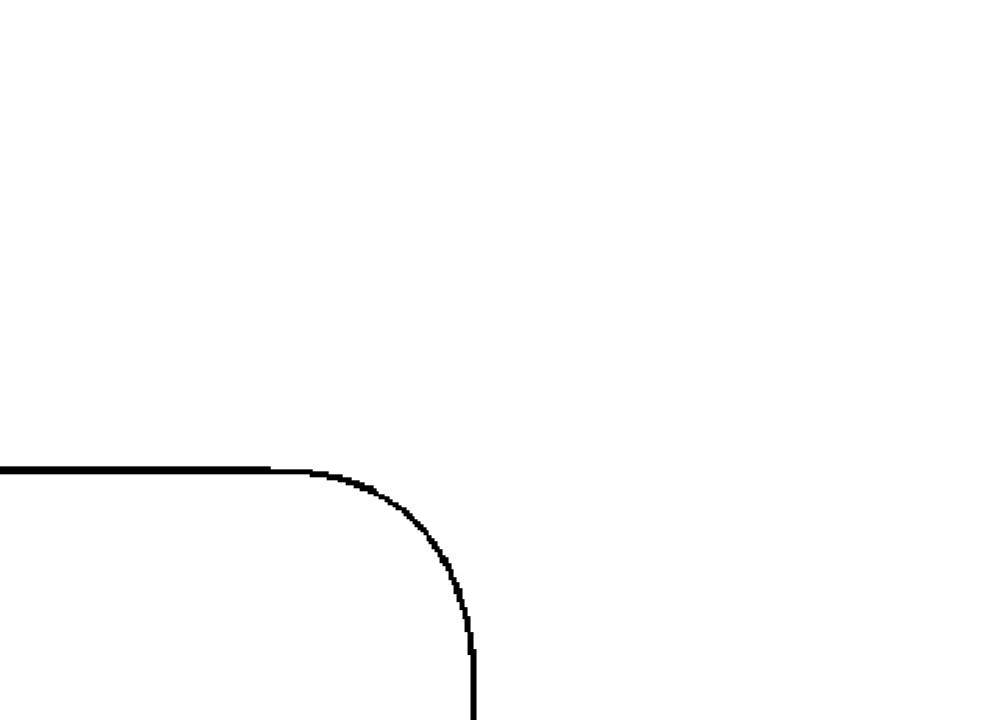

其實心靈與物質雙豐收，是一件不可能的事情。心靈的方向與物質的方向，基本上是兩個相反方向。當物質生活中愈來愈忙碌，愈來愈多事情時，你的心便很難完全的安定與專注下來。而心靈是需要安定與專注的，太過忙碌的生活與品質，是無法有著高檔次的心靈觀點。在快二十年的生活中，我其實一直不曾想過這兩者的差異，相反的，我每天都在追求這兩者的合一。我的心思沒有想過其他的可能性。直到2017年，我感覺自己的生活，如果繼續這樣忙碌，我將無法達到自己心靈想要追求的境界。因為每次忙一圈回來，我總需要花一點時間來修復。本來內心狂妄的不認為自己需要休息，也不覺得自己會有任何的空間與時間來休息，我總是自傲地認為，自己就是適合到處飛，到處體驗的能人。但在一次新疆的行程後，我忽然被學生的重感冒傳染上，得了可能會致死的嚴重流感。記得當時臺灣在短短數月內就死了三百人，而我還毫無覺知地染上了這會致死的疾病。一回到臺灣就開始發高燒，去看了醫生，醫生說如果三天後他的藥沒有用，就必須去找他，然後轉到大醫院。我熟悉的醫生輕描淡寫地這樣說，沒有加重我的恐懼，直到事後我才知道自己得了什麼疾病。但奇妙的是，我卻開始深沉的發燒，然後一直睡覺。在睡夢中，我彷彿走到另一個世界，我好像曾經死在一個冰冷的世界，然後看見自己是個中國人，古代的中國人，很漂亮，卻不快樂，然後年紀輕輕就死了。高燒把我因為父親死亡而冷藏的心好像化開了，高熱也把我因為照顧父親而疼痛不已的肩周炎竟也治癒了。後來我聽氣功老師說，我夢中經歷的事，是在宮廷中被打入冷宮的死亡記憶。有趣的是，我的主治醫生很震驚，因為我一週就恢復了健康，他不知道我經歷了什麼奇遇。更奇妙的是，高燒也把我的手治好了，我的氣功師父也努力的協助我，把西藥的毒性盡快退出身體，就這樣，我又創造了一次奇蹟。 但我明白，這樣的忙碌奔波，還是與我的心背道而馳。於是，2017年一整年，我實現了一個計畫，就是一個月只做兩場課程，也就是兩個週末，其他的時間我決定用來思考、學佛，或是生活。 後來發現，當我這樣休息的時候，我的收入反而更好，並且因為靈性的提高，似乎開始到了

> > 下一個階段：輕而易舉的獲得。我開始進入體驗真正所謂心靈與物質雙豐收的能量感悟，那就是「不必用力」。

不要用力，不要揪心，不要費勁，不必算計。 只要實踐了這四種方式，在生活中，你就會逐漸發現，原來自己可以這樣輕鬆的活著，根本不必擔心金錢，也不必用力地找機會去工作。 以下是作法：

- 不必擔心金錢，也不必用力地找機會去工作。

## 自覺療癒——輕而易舉的豐盛

# ○ 以愛療癒

- 1. 不忙是第一步，太忙將無法騰出空間去進入高維度的生活品質中。
- 2. 開始玩耍，要一直玩到自己不再思考任何工作上的事情為止。
- 3. 盡可能什麼也不做，工作完全放下，也許去畫畫，去讀書，去旅行。
- 4. 開始運動健身，練習馬拉松長跑是非常好的一個身心鍛鍊。
- 5. 勇敢放下心中大石，像是渣男戀情，或是不合適的事業夥伴或賺錢機會。

放得下嗎？就看你敢不敢一試了！

要不斷努力，不努力就會有罪惡感。我長年受制於這樣的罪惡感，花了快三十年才逐漸解脫，終成目標的輕鬆富足，建議你也不妨一試，後面的快樂就是心靈與物質可以雙豐收。

As above, So Below. 在愛的場域裡，我們需要了解「誠於中，形於外」的宇宙法則。這樣，我們就可以領悟到內在與外在豐盛的生活方式，愈愛愈有力量。

# Chapter 21. 提高覺醒的全頻道能力

當能量提高到身心靈和諧時，心靈與物質雙豐收的狀態就會逐漸出現。你可以不必太過費力，只要順著流動走，就會發現有那種順流而上的機會出現。

從「做自己」開始，境隨心轉，好運也開始展開。 ※ 我七歲時的好友出現了，他看到臉書上忽然出現我的名字，而這個名字又不是很普遍，所以同學陳總他想，這是我的小學同學嗎？ 當年我和陳同學帶著弟弟出去玩耍，我們聽說從士林走回北投不是很遠，於是回程時三個人便決定一起走回北投。弟弟差我們六歲，當然，我們自己也不大，才國小。 但從士林走回北投，真的好遠，最後是陳同學背著弟弟回來。 這段難得的小學記憶，我一直沒忘，特別是和弟弟共有的回憶。 我當然記得這個好心的小學同學，卻記不得為什麼我們會去士林，還決定這樣走回北投。但真的很好笑！ 陳同學聯繫上我，他已經是事業有成的公司負責人，家庭也幸福美滿，有著很賢慧的老婆和一雙好兒女。 我們先在路上聯繫上，有鑑於之前五歲同學的有趣前例，我雖然很開心，但助理們總會希望我小心點，畢竟我有出書，有上媒體，有點社會形象，又是靈能工作者，需要更加小心保護自己。也因為因緣還沒到，我和陳總初期都是透過回臺灣的時候線上閒聊。只是沒想到，原來陳總也是我的貴人，他是電商公司老闆，所以他開始回答我相關問題，甚至來協助我們團隊創作最新的電商系統，與現在美美的專業服務網站。

※
做自己的品牌，首先是命名。大家想了很多，卻始終感覺還沒到位。有一天，陳總急著找我，他說：「上官，你有個好名字，你知道嗎？」
我說：「嗯，家族姓氏不能改，名字又是爺爺取的，希望以後的女子能夠有學識，不可以無才便是德。這樣的名字，也是很大器的呀。」
陳總說：「對，所以，我說是好名字。因為『大家都要上官網』。」
我沒有聽懂。陳總接著說：「每個網站都會有一句話在搜尋引擎：上官網……（請上官方網站）」

於是，愛上官（ishangkuan），我的品牌名，就這樣出現了。中英文都有著意義和諧音，上網查詢時也很容易會不小心就進入我們的網站，因為大家都「愛上官」網。
這個由來真的很有趣，但一開始，因為多年被壓抑的慣性，我真的很怕又被被人評為「自大狂」一族。我本來的傲慢就被人欺負得五體投地，每天都恨不得在地上走路，好求人不要再攻擊我了。現在還來個「愛上官」，大家一定會聯想到「愛上官昭儀」、「愛上上官昭儀」，我的天！我已經有著與人無法親近的高傲女神感，加上這樣一個驕傲的名字，這還得了！
但陳總說服了我，主要是因為「方便上網」。而我的內心世界，總有個對於網路世界的喜愛，因為網路和能量一樣，都是新世代的產物，而亞特蘭提斯時代的心電感應，也和現在的網路世界一樣。新世代的網路，活脫脫就是過去世代的現代版，這對我來說，真的是生命中不可以缺少的一部分。

## 進入臣服天職的階段

網際網路和能量傳遞是一樣的，只是舊酒裝新瓶，我們在新的時代，一秒鐘就可以和遠在地球另一端的家人、朋友聯繫上，和古代的能量世界，真的是一模一樣呀！就這樣，迷信的我接受了陳總的建議：愛上上官 ishangkuan，首先在香港成立了品牌規劃公司。

※

我開始明白，原來不躲在一個以為安全的世界，走出來才是安全的。在那個不安的世界裡，我只想安居樂業，捧個像公務員的飯碗一樣，可以不必擔心明天沒飯吃，但弱小的我會希望可以得到家長的喜歡。這種無價值感，一直在獨立之前是不會得到療癒的。

奇妙的是，一位住在北京的靈媒姊姊，一直默默地支持著我。她一直鼓勵我離開原來的組織，做自己。我沒有和姊姊有任何的關聯，但她一直在默默地支持著我的蛻變與覺醒。

有一天，我又很挫折，我問她：「姊姊，你為什麼要這樣無條件地支持我呢？」她說：「因為你值得。」被同樣是靈性的人士認可，是一件開心的事，特別是在別無所求的人身上，你會感覺到更多的關懷和鼓勵。

我開始明白，自己得道多助，但我一直覺得自己不夠好，沒想到就是有人可以這樣無條件的支持。

相較於第一次接觸身心靈時遇到的老巫婆，這種療癒的質感差距實在太大。中國人的世界，我們應該要有中國文化傳統的能量，這種道德的能量，似乎更是現代人們身上所需要喚醒的。

我決定要跳出原來的窠臼，學習做自己。這個決定，整整走了三年。

我開始走出所謂的身心靈做法，既然我們能感知能量，為什麼不能創造呢？正巧，有更多的人開始對於全腦開發與能量場域好奇了起來。我接受了上海一家教育集團的邀請，擔任教育顧問，後來甚至帶人員下市場做培訓，許多以前沒有實驗過的事，現在全新體驗。

# Chapter 21. 提高覺醒的全頻道能力

要把自己的過去放下，全部更新，實在不是很容易。每天，我都和小助理加班忙到晚上十二點，然後第二天一早再回到辦公室繼續認真研究和規劃。略通命理的我知道，中年後我必須歷練更世俗面的事情，就是進入商界。本來想出家的我，現在竟然坐在上海的繁華區，坐在自己的辦公室裡，研究著教育市場，然後面對一群我永遠也不會認同的左腦型人員，這真的是很棒的挑戰！

當時我天真的想，讓右腦型的人可以聽懂不稀奇，如果讓那些不信的左腦人聽明白，那就真的很酷了。我接受了挑戰，也面臨了前所未有的信念考驗，硬把自己推離舒適區，推離熟悉的環境不做教主，然後走出來面對人情世故，我覺得這是我開始成長的一大步。巧妙的是，在這之前，我因故得到了機會，和一些上海的彩妝與公關公司連結上，開始接受時尚公司的邀請，不僅在線上開課，也再次做現場的活動。許多活動不是很難，同樣是用色彩來療癒，同樣是用能量來療癒，同樣是愛上自己喜歡的道路，換個公司，也不是很難。唯一難的是，講出平易近人的能量語言，一樣用色彩當工具。

於是，我開始小有名氣，被我做過的公司都會賺錢，被我參與過的能量場也會業績快速提高。就這樣，我從純教學進入做身心靈的老師，然後搖身一變成了舞臺講師，後來又簽了演藝人員合約，不僅接了國際品牌，後面又接了中國本土非常知名的保養護膚品牌，甚至還有各種品牌合作的機會。這所有的經驗，對我這個不知變通又不懂結人脈的能量教書匠來說，實在是很感恩的機緣。

一路走來的每一個機會，每一位遇見的朋友，我都用心體會，認真學習。我相信，能量不是給少數人用的，能量是給天地的生命一起用的。如果我們有能量的訊息可以傳遞，那也不是個人工具，不屬於某個人，而是這樣的訊息更應該要分享給大眾，分享給那些聽得懂的大眾。

※ 我懷抱著理想，朝著迎面而來的機會去實現夢想。

# Part 03 進入臣服天職的階段

不過事情總不是很能如願，面對那些永遠也聽不懂的人群，有了經驗之後就得放下。在不同物質理念的團體中，我感覺不是很舒服，也無法發揮。因為他們永遠只活在物質和人性的思維中，沒有辦法對應。相對的，當我覺得能量的浪費比得到的還多，和我的意念相反時，就表示該離開了。雖然離開總裁顧問及教育部長的工作，但我覺得十分感恩，感恩能夠有機會受到賞識，把理想付諸實現。公司每個人員，從上到下，我都感覺到在中國大集團中集體創作的美好與激動。也因為這樣的磨練，我沒有活在一成不變的環境中。美好的禮物就是，我發現自己的功能竟然愈來愈全頻道，可能因為我沒有太多設限，並且很努力的開發，於是我所有的功能都出現在我需要的時候，而每一次的演出與表現，我都無愧於天地，讓每個能量場得到它應有的療癒。我想，這或許就是我的功能。我的功能逐漸被環境所激發，雖然還處於摸索階段，但我深深明白，自己不是屬於口才好的人，我永遠也無法學會並跟上那些上臺口若懸河、反應快的能人異士，我不屬於那樣的磁場和功能。試了幾次，往往三次內我就可以理解沒去過的地方會是什麼能量，一旦理解，感覺對自己靈魂沒有提升的事，我就再也沒有興趣去做了。靈性洞見一看到虛假的自我狀態時，靈魂就會覺得很疲憊，不想停留。這種自動的屏蔽功能，我一直很想突破，而隨著功能愈多，能量不斷提高，雖然心裡排斥，但我仍會有所節制的參與。讓自己投入這樣的場域，是因為我想練習自己不懂人情世故的個性，很想有所突破，所以常逼著自己去接受磨練。慢慢地，我愈來愈體會到人生不是用來浪費的，我開始可以更安靜地不忙著安排自己的行程，努力工作賺錢，或是聆聽一場國際講座，試著和世界上聰明的科學家或心理專家接上線，然後覺得自己也被提升了。這樣不放逸的感覺，讓我愈來愈喜歡自己的『坦白』和『堅持』。這樣的我，也讓自己愈來愈喜歡和滿意，不再只是看到自己的不美好。

# Chapter 21. 提高覺醒的全頻道能力

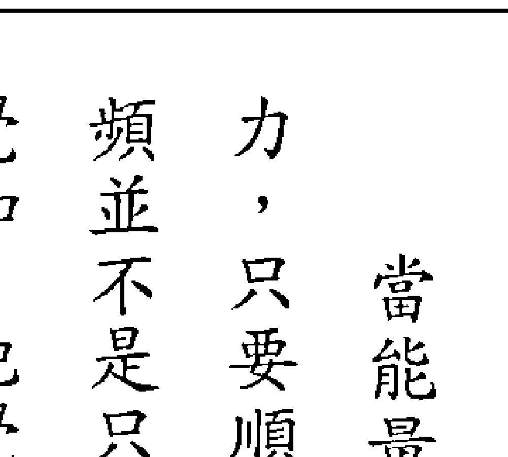

當能量提高到身心靈和諧時，心靈與物質雙豐收的狀態就會逐漸出現，你可以不必太過費力，只要順著流動走，就會發現有那種順流而上的機會出現。高頻的能量人士會抓住機會，這種高頻並不是只有靈性人士才有，馬雲、郭台銘、美國總統川普，他們都有一定的頻率，去感受到某種覺知，把覺知放在這種順流而上的機會中，自然可以成就某些心中想要發生的事情。

所有這些成功的人們，都有著極高的快樂度，這種快樂，可以說是一種成就感。這就像是你完成了一個作品，很開心，很有成就感；如果失去了這種成就感，就會從原來的寶座跌落下來。

養這種高頻的成就感，也可以鼓舞一個人全心全意地去發揮。

那些只會計較、擔憂、恐懼、算計，或是一直不敢大膽放下過去，勇敢走向未來的人們，頻率相對就是比較低的。所以，這類低頻的人們，比較容易在人生的路上發生‘意外’。也許有些事情是好的，但他們卻無法感知到，因為所有的感覺都被恐懼和痛苦填滿，所以會用扭曲的想法來看待意料外的事。我曾幫助過不少人扭轉人生，也曾眼睜睜的看著某些人有機會卻任其逝去，差別就在於有沒有這種快樂的高頻和成就感。有一次，我試著以‘解構’這樣的思維和狀態，後來對個案開始生氣，因為真的太不爭氣了，我明白，停留在痛苦中也是一種舒適。要掙脫舒適圈是一件痛苦的事，就像是蝴蝶的蛻變，成蛹後要如何掙脫出繭？我開始動怒，十分生氣，不能明白怎麼會有這樣的人存在著，寧可痛苦也不願意跳脫？後來我明白，這奮力的過程必然十分艱辛，這也讓我想到了在接受馬拉松運動訓練時，教練要我努力達到身體的極限，那種過程逐漸讓呼吸減少，壓力增加，而我卻想努力的讓身體的容忍度提高，但霎時才猛然發現，原來身體這個容器不大，我想裝得更多時，卻裝不下去了。但是，從那次訓練之後，我開始不再害怕挑戰極限，因為極限之後，身心舒暢，甚至有更大的勇氣願意再往下努力。如果沒有突破心理的恐懼和身體的極限，我們的雙豐收往往只會有一半的力量，而可能在身體或在意志力的極限中被拉回來。身體的訓練，意志力的訓練，全都是一種狀態，那就是能量。人本身就是一個容器，你的心量，你的心肺功能，你的靈性覺知，全代表了容器的大小。想要有錢，如果沒有更大的靈性覺知，而且容器太小，心量太小，總會有事情發生把錢財漏光，或是家中發生意外或不幸，而無法讓心靈或物質都同時豐收。

我想，高感知功能的提升，是因為要更大格局的事，而不是用來浪費和沾沾自喜。也因為心靈一直感到痛苦，想要的得不到，得到的不想要，有時候也不知道自己想要什麼。靈魂在徘徊時，就會想要知道答案，這種動力，督促著我去找尋自己。

終于，我找到了答案，那就是，快樂無所求的快樂，就可以提高磁場。

# 自我的療癒 | Color U 進化的道路

禪宗裡有一則故事，是老和尚和小和尚的故事。老和尚在倒茶的時候，一直不停的倒著，小和尚說：「師父，水滿了。水灑出來了。」水滿了。水灑出來了。」我的玄氣門氣功老師楊師父曾經告訴我，要有全新的力量，就要先捨棄全部。能量工作也是，不管是過去的負面經驗，或是過去的榮耀歷史，都已不復存在。因此，我們需要學會聆聽，聆聽內在和外在的聲音，聆聽高層的聲音，也要聆聽細小的恐懼之聲，然後放掉一切。我在加拿大的靈氣導師做得更徹底，她甚至離婚，由東邊搬到西邊，換了一群新朋友，換了新工作，全部重新開始。你如果去訪問所有的能量高人，那些勇於放下一切重新來過的人，總是很快的更高人一等。人的身心狀態如同一個U型容器，我常形容這個容器，如果切開，正好形成上下兩個半圓的U型，上半U是靈性面，下半U是物質面，合起來正好是一個圓形。東方有空杯的理論，西方在卡巴拉的訓練中也有容器理論。在麻省理工學院的奧托・夏莫（C. Otto Scharmer）博士，在求師於南懷瑾老師之後，也在管理學中加上了東方的人文思想和U型理論觀想法，並推動到世界各地。不論東西方的研究，人類的進化就是一個U型的演化過程，然後進化成圓形。全頻道的過程中，我們一方面要聆聽上半圓心靈的訊息，一方面也要同步完成下半圓的生命實踐過程，這樣兩個同步進化的圓形，才可以創造無所畏懼卻充滿感知力的圓型創意人生。今天就讓自己這個初級的U容器，變成可以裝下更多能量的大圓吧！

## Color 令你彩色起來的能量願望方法：

- 階段0：
  概念：根源階段，沒有接受也沒有給予
  作法：在一開始，我們練習什麼都沒有。全頻道在開始時，不要去設限自己是哪種靈感的天賦本能，不論是可以看色彩觀氣場，聽音樂做療癒，可以雙手觸療，可以聆聽訊息，或可以睡夢中將負面潛意識釋放轉為有用的訊號。
  總之，階段0，什麼都不期待，來什麼都好。

- 階段1：
  概念：容器向下階段，接受的願望
  作法：全頻道的初期，開始要逐漸形成你的選修科目，就像大學選科系一樣，你最好選擇自己擅長的來練習。因此，我們開始充滿希望，希望能夠愈學愈好，以實現美好。這個時候會有兩種力量產生，一種是接受，一種是給予，能量的流動就是接受和給予，在這個練習中，我們用呼吸來體會何謂能量。能量如同愛，能量如同呼吸，沒有進就沒有出，有出必然有進。這個階段1，我們練習HOW（流動）。

- 階段2：
  概念：容器向上階段，給予的願望
  作法：形成流動的過程中，我們開始會愈來愈感受到各種的波動和訊號，身體這個容器會逐漸知道自己是哪種特質的載體，例如，你可以研究自己是哪種屬性特質的人？是聽覺型？體覺型？還是視覺型？聽覺型人是藍色能量的傾向，比較喜歡講道理，聽道理。體覺型？傾向紅色能量，比較需要身體觸感，對身體的感受比較強烈。視覺型傾向黃色能量，對於情感上的情緒觸動很強大，也善於藝術呈現方式來表達情感。

  每個人一開始擅長的入門科目不同，逐漸練習之後，到了階段2，開始有了專攻的項目出現。我開始的時候是色彩，然後是夢境，最後停在訊息。每個功能的鍛鍊都會重複這幾個階段，就像是一個專業的養成，都需要基本訓練和時間培養。於是我们想要更超越，甚至是希望更上層樓的研究和學習。

  這時候我們希望的不只有學習（接受），更可以利他（給予）。我們也會發現，原來給予他人的過程中，我們自己受惠更多，也會學習更多，這就是為什麼我創辦網路上及各地的教育中心，會建立社會服務項目，並且輔導身心靈同業一起提供社區能量服務。能量的認知可以增進心靈工作的落地實踐。

  容器中雙向的階段，為了給予的、接受的願望

  療癒的過程中我們可能會有遺憾，發現自己乘願而來，卻又不敵內在的各種挑戰，或是現實生活上的問題，我們發現自己可能會敗下陣來，或是需要更高階的繼續療癒。因此，這個階段形成了雙向的流動，我們可以同時給予社會服務，但也可以同時向內學習。我們走在光的道路上，卻又充滿畏懼或懷疑，這時候，靈性導師或引導的講師、諮詢師、治療師、管理師、分析師們，全在這時互相療癒，一起相愛。

  在這裡，我們可以有翻轉的可能性，就是回到階段0，重新學習另一個新的過程。然後會逐漸發現，原來不是找到自己生存的工具來學習，而是先熱愛自己喜歡的工作，才得以生存。

  生存從來都不是問題，問題是覺得生存很辛苦，讓信念造成了問題。如果可以學會「享受去做熱愛的事情，並且享受這個過程，再辛苦，都不會變成問題。在這個階段的重點，我們鼓勵大家樂在工作，樂在生活，樂在成為一個有愛的人。

### 4. 階段3：概念與作法：

  概念：容器向上階段，給予的願望（接續階段2）

  作法：形成流動的過程中，我們開始會愈來愈感受到各種的波動和訊號，身體這個容器會逐漸知道自己是哪種特質的載體，例如，你可以研究自己是哪種屬性特質的人？是聽覺型？體覺型？還是視覺型？聽覺型人是藍色能量的傾向，比較喜歡講道理，聽道理。體覺型？傾向紅色能量，比較需要身體觸感，對身體的感受比較強烈。視覺型傾向黃色能量，對於情感上的情緒觸動很強大，也善於藝術呈現方式來表達情感。

  每個人一開始擅長的入門科目不同，逐漸練習之後，到了階段2，開始有了專攻的項目出現。我開始的時候是色彩，然後是夢境，最後停在訊息。每個功能的鍛鍊都會重複這幾個階段，就像是一個專業的養成，都需要基本訓練和時間培養。於是我们想要更超越，甚至是希望更上層樓的研究和學習。

  這時候我們希望的不只有學習（接受），更可以利他（給予）。我們也會發現，原來給予他人的過程中，我們自己受惠更多，也會學習更多，這就是為什麼我創辦網路上及各地的教育中心，會建立社會服務項目，並且輔導身心靈同業一起提供社區能量服務。能量的認知可以增進心靈工作的落地實踐。

  容器中雙向的階段，為了給予的、接受的願望

  療癒的過程中我們可能會有遺憾，發現自己乘願而來，卻又不敵內在的各種挑戰，或是現實生活上的問題，我們發現自己可能會敗下陣來，或是需要更高階的繼續療癒。因此，這個階段形成了雙向的流動，我們可以同時給予社會服務，但也可以同時向內學習。我們走在光的道路上，卻又充滿畏懼或懷疑，這時候，靈性導師或引導的講師、諮詢師、治療師、管理師、分析師們，全在這時互相療癒，一起相愛。

  在這裡，我們可以有翻轉的可能性，就是回到階段0，重新學習另一個新的過程。然後會逐漸發現，原來不是找到自己生存的工具來學習，而是先熱愛自己喜歡的工作，才得以生存。

  生存從來都不是問題，問題是覺得生存很辛苦，讓信念造成了問題。如果可以學會「享受去做熱愛的事情，並且享受這個過程，再辛苦，都不會變成問題。在這個階段的重點，我們鼓勵大家樂在工作，樂在生活，樂在成為一個有愛的人。

### 5. 階段4：

  概念：容器再度向下的階段，成為創造者

  作法：階段4 一開始更好玩了，只要你穿越了前四個階段繼續向前，你就真的出師了。在這個階段，有能力開始接受所有的願望實現。這個階段像是高頻率的能量者可以體會到的，可以全然的類似造物主，創造自己想要的，但同時自己這個容器也不再分辨要接受什麼，不再限制給予，全然地接受。

  我們臺北和上海的兩個中心就是這樣出現的，臺北的中心是源自訊息，而上海的中心更是全體夥伴一起觀想，我在靈性洞見中見到了房屋的租金金額，所以才花不到一天的工夫就實現了，找到了符合眾夥伴期待的地方，也承擔得起的好房子。這個階段的創造力非常強大，特別是一群人共同創造的力量。所以，為什麼在我們的練習中，一群人的共修、共同感知、共同創作、共同繪畫，都能夠進入到這個階段的作品。不過，並不是每個人都能夠這樣心想事成，

### 6. 循環階段

  一旦「挫敗的限制」發生，容器就會繼續回流，回到階段0，然後重複下去這個循環模式，直到創造物的本身可以自己感受到創造為止。這已經接近造物主的能量狀態，但似乎所有的人一面臨限制，或是空虛感的時候，能量就會下降，無法達到造物主的狀態。所以我們的習性一旦發生，就會重新回到懷疑、不安，然後再度繼續經歷。

## 以愛療癒

  幸好，這些循環因人而異。有的人愈來愈快，有的人特別辛苦，在我們的卡巴拉生命之樹的心理諮詢中，常常為眾人排列的四重天生命軌跡，就會這樣不斷地重複。正向信心堅強的人，往往是全勝將軍，但大多數人的信心不夠堅定，都會退回原地，重複著生存的那些基本生命模式。

  我用這套理念來建立財富能量的思想結構與解構，我也用這樣的U理念，在企業管理學派中找到了類似的理論。這中間不乏經濟學和卡巴拉神學的概念，我在其中用能量的感受方式做企業引導或心靈引導時，發現了他們非常一致的目標：創造，讓自己成為造物主，甚至感受到整體的能量場域。

  這種進化的過程，我認為是神秘學落地的能量感知再度進化的過程，很興奮。我們可以用新的能量感知力，來享受愈靈性、愈富裕的人生。

  愛的實踐力強大而驚人。如果是一群人共同有愛，並且一起來愛我們的生活環境，這種連結的光芒，可以創造出意想不到的勝利和榮景。

## Chapter 22

## 愛和恐懼不會同時存在

  人們往往被生存恐懼抓住時，是跳不出原來的池塘的。直到具備智慧，不再被生存這底層的關卡所繃綁時，才能縱身一躍，飄浮到更高的次元。

  「愛和恐懼不會同時存在」，這是一句老生常談的話，特別在身心靈世界中，已經被說爛了。但是，總是在守護潛意識的大門沒關好時，恐懼就會偷偷跑出來。一般當我們覺得一切順利時，是不會感到恐懼的。但是，一旦感到脆弱、面臨考驗時，或是最低的生存安全受到挑戰，感受到危險時，恐懼便會油然而生。在這時候，你如果依然有愛，就能夠知道自己不會有恐懼。當我們決定要向二十年來依賴的色彩產品說再見時，最先受到驚嚇的是執行長，然後是核心團隊的震撼。但其實這個念頭，早在七年前就已經成立，歷經了五年，甚至更久的時間，才真的實現。我告訴執行長：「愛和恐懼不會同時存在。」又是一句高深的身心靈唬弄口號！我心裡這樣想，執行長會不會也在心中這樣吶喊著？一句很高卻不落地、不切實際的回覆，也聽不懂葫蘆裡賣什麼藥。執行長雖然已經跟隨我十年，近幾年開始接手兩岸三地的經營事務，但卻是我想轉型之後的執行長。過去莫名其妙地和前面的助理斷了不止一次，通常是

  在能量等級不同時，就會出現這樣的情況。我常常在課堂中比喻，這就像是一對夫妻或戀人，當相愛的心已經失去，其中一人一直在進步，另一個停滯不前時，就會產生能量上的裂變。這時候，如果雙方經過深度的溝通後，決定希望能攜手走下去，那麼，就可以協商如何共同努力，一起提升，因為這時候還有愛的存在，還有渴望合作，而不是競爭的內在動機。

  但是，如果已經貌合神離，甚至已經互相無法再相處在一起，彼此的人生觀早已無法同行，這時相處在一起就會產生摩擦和痛苦。這種磨合和痛苦是無法容忍的，這時候的靈魂功課也已經改變，大家得為自己選擇下一個人生方向，分離分手就是需要的成長。

  小夥伴們仍依依不捨，放不下已經長期使用且有感情的產品。然而，如果沒有更深的進步，或是無法進入到更深的喜悅中，無法有成長的感覺，那便只是一種習慣罷了。

  深談之後才發現，敏銳的執行長早已經嗅到這股改變的力量，並且也嗅到如果夫妻相處，一方不能成長，或雙方無法達到共識，就像商業夥伴或商業合作案，是無法順利發展下去的。

  身為兩岸企業家的她，心裡是雪亮明白的。但是，就因為有愛，有情，我明白多情的團隊們總是希望抓住幸福的尾巴，哪怕是短暫的，也想抓住美麗的虛幻。

  ※ 終於，到了要說再見的時候了。一方面天象如此，一方面也是如果內心不放下舊的能量，就不會有新的力量出現。我們內在同一個空間裡，是無法容下兩種不同的頻率，不可能一方面死命地抓著恐懼和舊有的負能量，一方面又想要幸福快樂地往前擁有新事物。就像一對男女的分手，除了表面分手，心裡也要分手，要真實的分手，並且不帶有情緒的分開，這才是高明人的做法。

  因此，分手或分離，或是死亡，都是一種快樂。

  知道時間到該放下了，就不需要遲疑。很多人臨死前，滿心的掙扎，充滿了不甘願，不想放手，種種到了終結時候的不灑脫，我常常覺得才是人生的一大歹戲拖棚，也是在最後光榮戰績上的一個敗筆。五年前，我和我的團隊都還沒準備好，也試圖修復關係。不過，如果夫妻雙方只有一方想復合，另一方已經有小三，並且渴望離婚，沒有同心同德、貫徹始終的心念，要復合恐怕就有點辛苦了。我開始走入愛上自己的道路，不是愛上產品，也不是愛上師父，更不是愛上金錢的豐厚，我只想重新找回自己。於是，我開始獨自上路去發展，團隊則依然做著喜歡的色彩療癒，而這一拖，就是五年。跟了我多年的團隊小夥伴，在堅持著他們對身心靈與身心靈產業的夢想，而我早已走出來看著他們。因此，我成立了美麗藝術會所的平臺，給我的學生們去做練習。其實，我不太像老師，倒像是個功德主。我投資的地方沒有賺錢，反而一直貼錢，不過我的信念是，如果從事教育，就是要這樣培養弟子。但是，如今我走上愛自己的道路，反而錢變多了，人變輕鬆了，也不會在任何的人言諺短中恐懼和痛苦著。快樂又變美麗的我，走上愛上自己的道路，而且愈來愈勇敢，這種勇敢，是因為心中沒有恐懼，只有愛。在我的人生中，我花了很多時間在說再見，向親人，向愛人，向我尊敬的師父，向那些不喜歡我的人。但是，當我很用力的努力想要逃離（當年逃到加拿大），或努力的想要分手時，都分不開，因為所有的用力，都還是一種緊密的連結，愈用力，就像拍打皮球一樣，反彈力就愈大。現在愈走愈美麗的我，心中充滿了美好的感覺與力量，這種陰與陽的力量在我內心逐漸交會，主動、被動和中和的三股能量逐漸匯聚在我的身體七輪中，三脈七輪的整合也在我穿梭於不同頻道與空間，和不同能量場域的族群相遇時，得到了提升。有時候進入某個場域，我被染色了，身體非常不舒服，也可能不被身旁的人所諒解，以為我利欲薰心。但如果本身有光明覺知的話，就會自動有種清理淨化的功能，然後透過覺知，可以逐漸清理乾淨。就這樣，我開始無所畏懼。

  不必選擇待在一個自以為安全卻失去自由的地方，但我可以歷經淬煉依然澄澈。我通過許多染缸的考驗，最後發現，我仍然是那個純潔無瑕的我，多的歷練，只是讓我的光芒愈來愈穩定，力量也愈來愈無所畏懼。我發現，我可以不再依賴父親，不再依賴上師，不再依賴我的西方導師，我就是我。

  當滿心只有愛時，何來情緒？何來仇恨？何來痛苦？何來負面記憶？

  所有研究全腦與視覺開發的人都知道，人的長期記憶會蒙騙自己。我們的記憶中，仇恨和痛苦的故事會愈編寫愈精彩，但我們往往會很容易忘記美好的過去。我試圖在愛回我自己的過程中，依然記得過去那些所有的好，並且深深感激。

  臺灣電視上有一個閩南語發音的電玩廣告，是這樣說的：「不是你算沒有偏財，是你玩不對所在（請用閩南語發音會更順）。」於是，我開始想在對的地方，玩對的遊戲。我不想只停留在第三度空間，我的心識早已經跳離這平面的限制。

  人們往往被生存恐懼抓住時，是跳不出原來的池塘的。直到具備智慧，不再被生存這底層的關卡所繃綁時，才能縱身一躍，飄浮到更高的次元。

  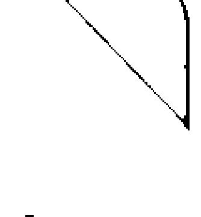

  電影《我的老爸喵星人》，描述一個很有錢的男人變成了一隻貓的有趣故事。我有時候覺得，這五年我就像這隻貓，說著不同的語言，卻得活在人話的空間中。但當我放下了恐懼和憤怒不平時，我就會重回肉身，得到重新的開始，充滿愛的生命。

## Part I 進入臣服天職的階段

  ※ 要說再見不是一件容易的事，就像一對要離婚的男女，要處理龐大的財產分割，然後分別找到下一個住所，或是找到下一個春天？然而，在還沒有把上一段婚姻處理完前，恐怕下一段也很難開始吧？我知道分手不容易，但依據我輔導的心得，以及能量教育多年的經驗，我知道怨懟，或是拖泥帶水，回顧過往，甚至恐懼未來，都不是正確的處理方式。於是，很快的，我和執行長在兩天內決定了昭告廠商及學生的日期，定在一個月後，然後立即處理變賣所有商品，既然要分手，就不要拖泥帶水。

  不過，心懷感激是需要的。因為不相愛了，兩個好人，還是各自需要好好生活，沒有必要帶著過去的怨懟，繼續上演相互迫害與毀謗的芭樂劇。這是我和執行長的共同感受，在這幾年，我成功地培養了能量工作夥伴「共同感知」的橄欖綠能量，也就是「女性領導能力」的工作方式。我們會共同感覺，一起做決定，不再充滿上與下的權威關係。但在工作的流程上，執行長對我這個指導老師是絕對的敬意和尊重，令我深深的感受到，總算有充滿愛的夥伴出現了。

  這十年來，我見到當年那個恐懼又只會哭的小女生，現在竟然已經長大，又成熟得可以翻過來療癒我。這種充滿愛的天使心在身邊，而且圍繞在我的身邊，我不再孤單一人闖蕩江湖，也不再恐懼的想要保護自己，我有貼心的天使心在身邊，可以互相支持。很多快樂的事情我們開始一起分擔，很多痛苦的事情我們也一起分享，但沒有了沉重的情緒壓力，只有一起療癒，一起成長。

  亞太能量療癒線上移動講堂，也遇上了好的平臺老闆支持。初期以服務分享各地學員的延伸成長教育為宗旨，英國、美國、日本的能量老師們都成了我的好夥伴，繼續一起扶持著進行我們一輩子都不曾離開的人生志業——能量療癒。
  我心中美好的療癒國度，終於開始出現了雛形。

  我其實感覺很難過，在關於恐懼這件事情上。
  就在我決定結束經營多年的彩油事業後，我發現之前同期、甚至比我更早期的資深老師們，還有人依然陷入在生存困難的課題上；有的老師因為交不出繼續進修的學費，被迫放棄教學資格；有的老師因為沒有別的謀生技能，他們只會賣彩油，所以生活辛苦。他們想要靠近核心，卻像個不受寵的孩子，不管怎麼表現，就是被家長厭惡，得不到父母的歡心。
  其中一位老師寫信來告訴我困境，卻仍必須依賴著顏色瓶來教學，但其實自己已經失去教學的資格，卻無法獨立站起來。這位老師來問我的想法，並且希望一起繼續合作，我很明確地告訴對方，我的建議是「做自己」。因為我已經不再提供這個產品，所以要和我合作繼續賣油是不可能的事了，除非提升，否則我不想走回頭路。
  對這些老師來說，與其苟活在這個處處被打壓、不受重視的系統中，到各地教學總是被禁止，去哪裡想做個活動也被通知違規（哪國的規定呢？大英國協嗎？），這樣的環境，不是能量人應該要有的生活態度。

  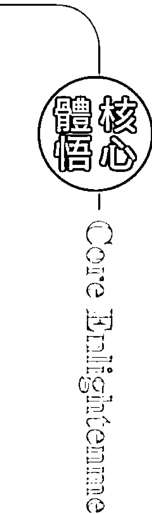

## 自我察覺 成為勇敢的彩虹戰士

  我明白「恐懼」的底線就是生存，讓旗下的老師過得好，為什麼不能同步呢？如果要求上進，只要有好的管理，共好不是更好嗎？為什麼不以愛打破呢？我無法告訴那些老師們生存問題要如何解決，我只能告訴他們，有勇氣的去打破現狀，就是未來狀況好轉的開始。能量人士如果被限制在很窄的生存空間中，往往無法在自己生活的地方賺到足夠的錢，而必須四處去流浪，真的要這樣的生命軌跡嗎？我不以為然。恐懼太強大了，所以往往綁著我們無法行動，只能得過且過，這樣的過程，如果不能療癒自身，將無法掙脫這些細綁，繼續打回原點，回到根源的階段，重新面對生存的考試。

  在《聖經》中有著彩虹契約的故事，當年，我深深為著這樣的神聖契約而著迷。在十二至十四世紀時的歐洲，有一群到處旅行的表演者，被人稱為抒情詩人或吟遊詩人（troubadour），他們透過到處演出，朗誦詩歌，演出戲劇或舞蹈，甚至神秘得像魔術般的表演，來傳遞他們所信仰的基督教神秘學，但這是被當時教會所反對的，於是他們透過這些藝術的方式，透過對眾人的服務來傳遞真相。而教會當權人士為了要防止這些人（也包括如聖殿騎士等）在法國南部的擴張，於是進行了宗教迫害。心的轉變是靈性的曙光。透過藝術的呈現，我們可以在感受和表達中找到自己生存的空間。

### # Chapter 22. 愛和恐懼不會同時存在

  受到靈感啟發的創造力，可以讓靈性的人釋放焦慮和恐懼，所以透過藝術創作及靈性服務，把這樣的靈性藝術帶到所有需要突破恐懼的土地和人群中，藉以突破自己混亂的情緒和失望的心。我曾經在課堂中，見到我在前世法國的一批宮女，她們有人因為深信當年的我而慘遭砍頭。當我看到其中一名當年的女性（擅長塔羅牌）脖子有著「狀況」時，她正好告訴我，自小她的脖子就有種查不出的疼痛困擾。我心裡嚇了一跳，但我當時沒有說出來，只是盡自己的能力，在教學中引導她和其他好爭好鬥的一群漂亮女人，走出自我心裡的恐懼，找到人生的彩色道路。

  彩虹戰士，是英國的一個靈媒姊姊給我的封號，實際上她稱我是「Warrior Queen」。我多年來領受這個封號，果然也到處打勝仗。這個領悟似乎是我的還願之旅，我願意不計任何費用到處教學，和我應該相遇的靈魂伴侶重相逢。很多痛苦的靈魂沉睡已久，想要甦醒，也有很多走不出迷惘的靈魂想要有人引導他們。我深信自己簽了彩虹約定，所以以顏色的方式，來讓眾人回到彩色的命命中，重新記起他們的誓約。

  以下是重新覺醒，成為彩虹戰士的幾個步驟。如果你也有著被迫害的潛意識，或是生活中一直有個更高的隱形心靈目標，歡迎你一起來，加入我們的靈魂覺醒練習：

  - 1. 當你恐懼時，就去從事靈性工作
    這就是為什麼我開始訓練愈來愈多的人來進行能量服務，因為從事靈性服務，才能遠離自我創造的恐懼。

  - 2. 當你恐懼時，就去從事慈善志工服務
    選擇自己喜歡的團體，也許是自然環保，也許是流浪動物，也許是植物人之家，也許是照顧老人。不論是什麼，只要你去從事後發現可以免除恐懼，就去報名吧！

  - 3. 當你恐懼時，不要去愛上一個人
    你還沒有準備好去愛，所以當你恐懼時，適合獨處或單身，不要貿然進入一場愛戀，那只會死得更慘。除了你自己，沒有人可以協助你重新感受愛。人和外在的戀情都無法讓你真的有愛的感覺，只可能引發更深的情緒困擾，更多的混亂以及痛苦。

  - 4. 當你恐懼時，就去學習能量治療
    也許你沒有能力療癒他人，但至少你可以療癒自己，療癒自己內心最深的恐懼。我們的治療師在一開始時，都會覺得自己怎麼滿身問題似的。大多比較有悟性的學生，非常能明白自己需要先療癒自己，而不是急於去從事工作賺錢，因為這會引發更大的生存危機與恐懼，變成變相的搶錢商人，只是販賣靈性，運用他人的恐懼來行銷，而自己卻依然痛苦。

  - 5. 當你恐懼時，去成為一名諮詢師、治療師或分析師
    我在學習精神分析並考取心理諮詢師後，更是特別明白，一個能量工作者如果沒有分析自己的精神或心理能力，沒有引導自己的諮商技巧，是很難正常健康的成為一名能量治療師，因為恐懼始終存在。愛需要取代恐懼，也就是清醒的自我分析能力，自我諮商的引導力量，以及自我療癒的能量覺知，這樣，愛才會存在我們的內在空間，而免於恐懼的痛苦。

## 以愛療癒

  > 引動內心彩虹戰士愛的力量，可以支持我們勇敢地生活在地球上，為著更大的存在和幸福，無怨無悔的行走著。

## Chapter 23

## 勇敢的人有福了

「勇敢」是一件重要的抉擇。因為勇敢，隨之而來的會是「義無反顧」，所以才能「勇往直前」。

※ 色與能量是我的專業，而當一個專業玩到很深的時候，就可以開始創新了。在我開始打算「做自己」，而不再為某組織拼搏賣命時，一位在形象顧問行業，被老闆整到沒有退路的學生來找我，當時她已經走投無路，而我知道她發生了很大的生活問題。因為我的社會關係還不錯，認識的老闆也多，就在那個時候，我受邀到上海一間培訓公司。女老闆是我的閨蜜兼粉絲，但我也是她的粉絲，她非常渴望我能夠搬到上海，不過條件就是我不能再世界各處飛，必須完全屬於她的公司。當時我不是很適應內地的這種「獨家」，對方要出我每個月收入的三倍薪水，但我還是婉拒了。如果我不能飛，我的學生可能會很失望吧？基於不讓我的學生失望，我很樂意去協助朋友的公司看看風水能量，以及協助人員的培訓。那位脾氣太硬又不受老闆喜歡的學生，我總是覺得很可惜。正好這個女老闆缺員工，而我的學生專業是形象顧問，幫人指點穿著打扮，於是我想，也許可以牽個線。

這個脾氣硬的學生很倒楣，做什麼都不順利，心高氣傲，會的專長又少，我想介紹她離開北京重新開始，但她讓我感覺到，她的自卑創造了自傲，而且把她團團圍住。表面上，她因為待過大公司又很風光，所以無法壓低身段好好找份踏實的工作，但實際上，她很需要再磨練，再被規範。於是我在車上，把電話裡的那個她狠狠臭罵了一頓，然後，她跟著另外一些學生，由我帶著去上海面試了。

※

面試前，發生了一個有趣的經驗，就在上海城隍廟。

我其實對東方地方的神明系統不是很清楚，但因為能量的關係，在世界各地不論是哪個地區，只要是正能量的，或是香火旺的，我都喜歡去體驗那種能量場域。這給我的感覺就像在交朋友，但我知道自己的立場，所以我不太加入任何體系，但我願意成為大家的橋樑，而不是專屬於一個系統。

那次在上海給朋友的公司做完諮詢與建議，忙完工作時已經有點晚了，學生們建議何不抽時間去上海最熱門的城隍廟逛逛，他們知道我喜歡古蹟和有文化的地方，當下決定立刻趕去，但沒有想到趕到城隍廟時，開放時間已過並且關門了。我覺得有點可惜，但既然來了，就在門外先看看吧！我的身體就是覺得想再停留一下。

結果，眼睛忽然見到城隍廟的頂端有一股能量場盤旋，十分吸引著我。我告訴學生，再等一等，然後我走近已經關起的大門，從外面看了看裡面。正在張望時，忽然門打開了，一位男士（看起來像是在裡面工作的人）半打開門問我：「你是不是老師？」我愣了一下，不知道怎麼回答，我的一個學生馬上湊向前，告訴那位男士說：「對，這是我們老師。」

我還記得當時很多人都在外面圍著，結果那位男士（應該稱師父吧）告訴我：「你請進來。」我有點不知道要如何回應，也不知道該進去還是不進去？不是已經關門了嗎？學生推了我一把，我想想也好，我沒來過城隍廟，既然有內部的人員願意帶領我，就進去吧！然後我回頭一望，五個同學都不敢跟我進去，我跟師父說他們是跟我一起來的，就這樣，我們一行人，就在眾目睽睽下踏進了城隍廟。不少人在門口也想擠進去，都被那個師父擋了回去，告訴他們今天已經關門了。

進去之後，因為已經關門了，所以沒有其他的遊客走動，師父不僅帶著我們一一介紹，連一般人不能上去的樓層，也帶我們進去參訪，真的很有特權的感覺。這是我第一次進入上海城隍廟，卻也很深入的理解了這個地方，詳細的解說令我非常感動，也很快地認識了裡面的每一尊神明。這之後，城隍廟便成了我每次回上海都要去走走的地方。城隍老爺的磁場很靈驗，也很嚴峻，因為賞罰分明，你是不可以在那裡說謊或亂想事情的。但是，你可以去上海城隍廟抽抽籤，祂的籤非常靈驗，我也很喜歡去和祂連結，得到啟發。

就因為太感謝這場引導，我打算供養一點金錢給引領我們進入的師父，我用英語通知同學們準備點錢，沒想到他根本不收，於是我再以英語告訴學生，大家去投點香油錢吧！因為對我們這群人來說，這是個難得的經驗，很需要感恩。

臨走前，我們充滿感恩。那天我忽然覺得會講英語，而且幾個學生都聽得懂，覺得很開心。以前在國外，我們只講中文就可以屏蔽旁邊的老外，但這次，我們在講中文的地方卻以英語來溝通。

有趣的是，那個師父竟然對我說：「你可以教我嗎？你也會音樂對吧？」我不知該如何回應，師父希望我留個聯繫電話，以後可以向我學習。

我靈機一動，回說：「可以留個聯絡的訊息給您。」於是把那個運氣差的學生電話留給了師父，並且告訴學生，找到上海工作後，記得去找師父修法除障礙。

沒多久，冥冥之中我和那位學生都到上海發展了起來。這場天使與城隍老爺的相遇，讓我們這群人走出城隍廟後，都覺得特別有意思，也感覺這個世界很不可思議。對我們這群人來說，我們的靈魂深處都有一個共有的神奇經驗，這是上海城隍廟給我們這群外地人的溫暖迎接呀！

後來那個學生，我鼓勵她到上海發展，重新開始，不要對過去的老闆與所有發生的事情心生怨懟。同時，既然要到上海，就要去城隍老爺那裡，請城隍廟的師父們修法，安了太歲，後來竟然一直就以上海為主要居住地，並且工作也愈來愈順利。我們一直保持著聯繫，她三不五時會想聯繫我聊一聊，總是稱我為恩師。

我感覺自己是真性情的人，很少罵人，但是當時覺得如果不把她罵醒，那真是很可惜。不說真話不是我的個性，在社會公平正義中，我也不忍心見到小蝦米對抗大鯨魚的社會事件在她身上發生。所以，很希望有能力幫助小蝦米的她，能走出自己的另一條道路。

我的生命中，這種仗義不平、拔刀相助的事始終重複著，從來沒想過要改脾氣或想法，也不會害怕與任何的大鯨魚對抗。只要人有公平正義的法則在身上，秉持著一股正氣，我相信總會有出頭的一天。

我不知道自己是天真還是真的勇敢，但是，就一股傻勁，我還是很喜歡自己這樣的傻靈魂樣子。也許人不要太聰明，有點傻氣，就有正氣，為了理想而奮鬥，就有勇氣。

## 自我覺察 揭開靈魂的面紗

在生命的流動中，色彩能量非常重要，因為人的本質就是光，光釋放出不同的色彩波動，所以形成了我們的家族和家庭。所有能量體之間的吸引，創造了生命和現象，也就是我們的體驗。靈魂性格可以用色彩來描述，以下你可以嘗試比對一下，看看自己是哪一種靈魂體驗的色彩人：

勇敢，後面隨之的是「義無反顧」，所以才能「勇往直前」。像個純真的小孩，其實有點無知，因為無知，所以不知道天高地厚，然後容易信任，特別是對靈性人士和靈性世界。儘管跌倒多次，也背叛欺騙多次，不過我依然願意信任。沒有人會刻意欺騙你或與你不合，這中間總有著因果關係，不正直的觀察，永遠不知道誰是受害者或加害者。勇敢在初期可以是無知，但在後期可以是智慧。生命本來就是來體驗的，沒有冒險和新體驗的人生，又如何得到智慧的結晶呢？如果事事害怕，什麼都只想自我保護，沒有進入體驗，如何得到智慧的結晶呢？我的勇敢來自於信念。我信任這個宇宙，我信任上天的正能量，更信任佛和所有的神聖正念。這些都是因為愛，所以我們才來經歷。但無知的小孩就算再勇敢，也容易被自己的愚痴蒙蔽，而看不清楚真相。這一層層不同顏色的面紗，就是我們來體會的靈魂經驗。

### 紅色靈魂：

需要經歷冒險，對於身體的感知力特別強大，像是打不死的蟑螂，生命力特別強大。許多金錢力量強大的人，都具有這樣的色彩力量。天生就是冒險家，也是實踐家，多半富有；如果沒有富裕，肯定是因為憤怒和挫敗的失望情緒沒有療癒完整。所以，這類的人需要進入自我療癒的旅程，才能完全一展長才。

### 黃色靈魂：

需要經驗刺激，對心智的感知力非常敏銳，天生就是個聰明傢伙，反應力極強，辯才無礙。不過，雖然可以舌燦蓮花，卻總說是自己，標準的聰明反被聰明誤。基本上，多半從事智慧和動腦的相關工作，演說也很精采，不過是歸屬於行銷市場類。因為有著光明的人格特質，是個與世無爭的精靈，所以人緣特別好，社交能力強大，是人見人愛的鬼點子王。

### 綠色靈魂：

天生的慈善家，對情緒的感知力特別強，從出生開始就喜歡照顧他人，往往背負著家族的重擔，或是結婚後成為那個養家的人。往往一出生就有著家族的功課，但一顆心非常渴望遇到真愛，真理也喜歡在愛裡尋求真理。不過，其實真理就在自己的靈魂深處，如果學會和萬事萬物談戀愛，真理就會自然出現。所以，過於人性思維的綠色靈魂，是會被愛所傷，在愛裡痛苦，直到放下一切，到無我的境界，就能享受愛。這種靈魂是天生的藥草治療師，擅長手作的一切事務。

### 藍色靈魂：

天生的領袖，好的溝通力和令人信賴的好口才，就是個有肩膀可以承擔一切的好人。天性中渴望和平，但容易受環境影響，特別是權力慾望的影響，所以政治家，以及舞臺上擅長說話的名嘴、演說家往往是這類人士。假如沒有善用眾人對自己的信任，這些人很容易因病早逝，但如果可以擔任讓眾人共好的世界和平者，往往可以創造很多人的福利和社會的進步。要求完美的高目標，也是這類人容易不快樂的原因，藍色靈魂是最適合接訊息通靈的一群人，他們容易有著不切實際、好高騖遠的不落地精神，也很容易陷入成為一種為理想而奮鬥的戰士。一旦接通靈性管道，他們會潔身自愛，但也充滿矛盾。他們的人生歷練，就是不斷地嘗試活在心靈和物質的平衡當中。

### 紫色靈魂：

這是古老的靈魂，充滿悲傷的一種緩慢力量。總是需要經歷一些內在的傷痛，才能發現自己是天生的治療師，很多藝術家都有著這樣的古老力量。憂傷是一種原動力，但也可能會傷害自己的生命，像一些因為憂鬱症自殺的演藝人員或藝術家。不論成就高低，總是在他們的生命中綻放光芒，只是長短不一。這些靈魂也非常適合成為治療師，因為天生就懂，所以一學就會，生命就完全改觀。另一群人，會成為宗教家，也是一樣的道理。在印度，我見過一些靈性領袖他們都有著這樣沉靜哀傷的悲天憫人情懷；我也見過靈性強大的老師，總是用這樣強大的紫色光去控制他的信徒。這是個極端的靈魂，很強，也可以很弱。信念的考驗很多，但也很有自救的力量。以上可以在做情緒氣場的檢測時，就可以看到自己的屬性色彩。靈魂色彩則無法用機器檢測，但可以用肉眼觀測，或是透過自己打坐去感知。

顏色是靈魂的鏡子。當我們準備好的時候，靈魂的密碼就會清楚地呈現出來，所以需要珍愛自己的靈魂。

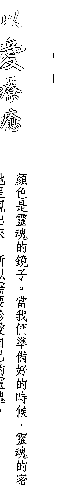

## Chapter 24

## 轉換頻率到下個階段

> 一個人的快樂或痛苦，都在於自己內在的平衡。
如果可以平衡，便表示可以合作。
感覺平衡，也不會有著失衡的翻滾。

合作（cooperation），是很重要的一種社會能力。在能量的世界中，合作的能力也代表了建立關係的能力。關係，是一種「連結」的力量，「建立關係」卻是一個巨大的工程。然而，今日已經進入了網絡時代、區塊鏈時代、電商時代，所有的一切連結，正如同新世代的能量世界，人們可以靠著心電感應尋求靈感，也可以運用自自己的心，形成一個發送和接收的收發器。關係，就是這樣的一個狀態，所以我看待關係如同能量網絡。

*

由於自我太大，不是很懂得合作，因此早些年我總是受到關係之苦，屢戰屢敗，又屢敗屢戰，卻一直無法領略其中的奧妙。奇妙的是，我卻又是專門處理解決關係問題的能量治療師。

從能量的角度來看，可以中立客觀的找到別人的解藥，卻不容易解決自我內心的思想問題。可以說，我努力希望平衡，卻一直在失衡中擺盪。

合作很難真的平衡，主要的緣起和禍因都是「自我」（ego）。我們在人生中所有的一切都與「合作」有關，而所有的關係（relationship）也都和能量的運用技巧有關，兩性關係、同事關係、家人關係、事業關係，甚至你去問個路，都需要合作。不過，我的職業工作反而派上了用場，可以好好的去理解關係治療的問題。和能量合作，或是和訊息合作，都源自於心。太過於計較心，是沒有辦法連結的，能量上也無法合作。做能量工作的人，如果真的很專業，並且不斷的探索自己，給人的感覺就會很祥和，沒有掠奪的暴戾之氣，也不會有令人喘不過氣來的控制感。這種合作的感覺表現出來，就像是一種慈悲的柔軟感覺，但不是柔弱。很多人的表現雖然感覺很弱，但其實氣場很霸道，並沒有真正的接納與合作。所以，在能量的世界中，一切都非常真實，騙人不得，也無法欺騙。聽說百度上面，關於我个人探討最多的話題，就是：「上官昭儀結婚了沒有？」想想，這個世界很渴愛，但我們有時往往最關心的還是八卦與是非。我可能太過保守，家庭的束縛感也過於強大，不敢走危險的道路，也因為家庭教育的形象問題，我也一直是個充滿愛與乖巧的好孩子。儘管如此，在治療工作中想找到合適的對象卻無法順遂。療癒的世界，除了希望另一半可以理解和尊重，更需要體諒與支持。到了靈性的世界中，更多的無形與奇妙事情都有可能隨時發生，如果治療師的伴侶沒有辦法理解，將是一場拉鋸戰或是鬥爭，非常消耗。一旦處理到更深的能量問題，像是因果業力，治療師的伴侶如果福德不夠，或是自我療癒得不夠，反而會成為治療師的負擔，形成困擾。年輕時有很多年，我都無法接受身旁有人同床的狀態，因為當一個人睡著的時候，氣場場域會放大，甚至在作夢時也會放大。記得在日本求學時，我們幾個女孩子一間房，我常常會感受到對方的光逐漸向我襲來，讓我喘不過氣來，或是忽然被驚醒。所以要調整到可以「接納」不同的頻率，甚至有時遇到比自己還低的頻率，那就是一件辛苦的事了。

我不知道那些後天的治療師如何，但我知道自己先天的問題，常常因為被干擾而有苦難言。我的愛情一直是個考驗，除了遇上的人無法對頻，還有自我的問題，毫無例外。親密關係是最挑戰的一環，因為太靠近，所以真實，也因為真實，所以考驗。

很多年後，我才赫然明白自己的驕傲，我在無形世界的執著，讓自己一心一意沒有其他的想法，卻也形成了一種執念。

我一直以為自己是想要追求愛情和婚姻，卻沒有真的用心在關係的經營上。年輕的時候我以為自己應該要出家，也做了很多準備，卻沒有真的緣分達成。幸好從事能量工作可以保持生活的單純和誠實，所以很喜歡這種單純的工作或閉關靜思。這樣的生活，在愛情的關係中是完全顛覆的，久而久之，以為自己此生就這樣了，小姑獨處，身旁不是和尚就是女人、小孩，日子倒也過得清幽。

一次聖地之旅，我帶領著二十多名學生來到希臘。到了修道院，在神聖東正教聖潔的土地上，我感受到上帝的神光，同行的夥伴們也有幾個人感受到紫紅色的神聖光芒，大家感動得流下淚來，「臣服」正是這樣的感受。我們常常自我過於強大，而忘了「臣服」於天地，臣服於自我的傲慢之下。當下，我向上帝發誓，今後我將臣服於上天的一切安排。也就在那一天後，當我回到亞洲，上天做了和我預期大不同的安排。

我以為上天的安排是要讓我更為潔淨的努力於能量工作，卻沒想到一回到亞洲，兩岸三地同時出現了追求的男士。我很訝異，這是什麼上天安排呀？但我已經發下誓言，而上天意味著生命的流動，所以我也就開始接納了男士的邀請，去了解這是什麼樣的上天安排。

表面的相處，若只是相愛，都不難，但相愛容易相處難，表面上看到的女神，原來私下也會動怒，這樣一來，兩性關係就像是另一類的戰爭，這反而是我始料未及的。我以為當自己平靜時，也可以和對方平靜相處，卻沒想到，這中間的學問比能量治療還難。我一向覺得很辛苦，女神的公主病在兩性關係中，受到的折磨原來是這樣的大。這也才讓我恍然大悟，原來自己算命，知道中年要步入更多的關係和商業整合工作，只是沒想到，是由這樣的兩性關係開始理解起。

※也因為遇上的人都很挑戰，也不斷地在考驗我歷劫之後的體悟。曾經，我的玄氣門氣功師父告訴我，就是要去真實的面對，這樣才能有所體悟，不要逃避，因為逃避不能提高力量。

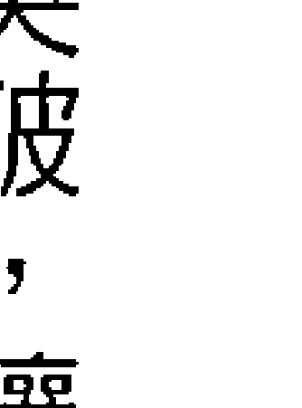

只有去突破，讓自己的氣場更強大，格局放大了，知道自己不再和一小群池塘中的青蛙戰鬥時，才能明白大海的廣闊。

師父的一番話，正好是針對我一直走不出情關格局時，所給予的建議。當他說到『小池塘』，我彷彿見到了那個小小的世界，而我，卻忘了了自己的心願，好好修正言行，努力推動能量工作的初衷。自己心卡在不高不低、男人不守承諾的痛苦中，無法自拔，內在冒出了狂躁的一個人。我這才忽然明白，許多躁鬱症、抑鬱症患者為什麼會自殺。在當時我的內心，真實感受到靈魂的『受不了』，就好像心魔出現，再也無法忍受這個身體般，一直忍受著另一個不快樂的自我虐待的事情，我想要咆哮，想四處求助。這個感覺，我在自殺的韓國明星遺書中見過，『我的裡面生病了』。當時我也是這樣的感受。

那是一次神奇的經驗，內在的傷痛與無法接納事情不如預期的結果兩相撞擊著。然而，身為治療師的好處，就是可以「觀」到這個現象，然後，停下來。

我體會到，自己創辦的雙手療癒，是時候要更深的進入以光療癒的階段了。因為身體需要光，把光注入後，不只氣場，還有內部的光明都會出現，於是我開發了聲音療癒的三階段整合課程，這三個階段分別是：水晶的聲音淨化氣場；銅鉢的聲音啟發心性；能量唱誦連結DNA。也許以後我還能運用更多的工具，但目前，我發現這三種聲音的整合，可以讓沒有生命力的人恢復生機，或是生命一直被他人干擾的人，可以阻斷這個干擾，然後找回自己身體裡面的力量。這些在運作過程中，可以再一次感受到內心所啟發的愛，重新愛回自己，重新找到生命的愛與情，這實在是非常重要的一個情愛療癒過程。

從聲音，連結到心。一個人的快樂或痛苦，都在於自己內在的平衡。如果可以平衡，便表示可以合作，所以感覺平衡，也不會有著失衡的翻滾。在失衡的色彩能量頻率中，可以對應到我們的三種基本情緒——貪、瞋、痴。貪和瞋的情緒來自於痴，因為痴象徵的是一種不明白，這種不明白源自於自我，或是一種自我的執著。如果有了自我和他人的區隔，就會產生不合作的狀態。因此，如果我們很強調「我的想法」、「我的觀點」、「我的感覺」，一切都和自我有關，很強大的自我，就會創造一個不和諧的關係，關係上只有矛盾，而無法找到合作點。

因為合作需要妥協，妥協是因為能夠包容，而不生氣的包容，是有著慈悲和體諒，而體諒源自於不堅持其大的自我。在能量界，強調找到「平衡」，可以平衡就得以疏導。就像是中醫的經絡學說，不通就會痛。所以，一旦打通不通的經絡，就不會疼痛了。

我常常看到一對頻率不怎麼高的伴侶，一直不斷互相給對方難題。有時候難題是因為強大的自我堅持的結果，這種因果法則，是可以用能量來做結束或解決的。

伴侶關係就是一種合作的狀態，可以一起合作，但只要是互相創造痛苦，關係就不會太長久。主要是因為，人的天性就是像植物的向光性一樣，喜歡溫暖有愛，不喜歡冷酷無情。所以，如果是一對互相創造和諧愉快關係的伴侶，就會相伴得久一點，因為這種關係合作度比較高，也比較穩定，不太想要脫離彼此。如果是痛苦的關係，就會想盡辦法逃離，因此會創造很多的事件，像是背叛、外遇，或是意外災害。

這也像是我們和地球、與生存的社會環境關係。如果我們內心很不和諧，就會創造地球的失衡，我們的頻率就會降低。因為人們一旦感到失衡，就會充滿情緒與渴望更好的欲望，貪嗔痴就會出現，人類就是一直在這樣的失衡漩渦中打轉。

因此，當我在教授天使光能的雙手療癒法時，我體會到這種漩渦可以連結到色彩的三原色本質。如果你們知道自己的三種本性一直在翻滾，並且打擾了平衡，就算不能制止這生命的流動翻滾，那至少也可以學會如何令其平衡，但不是靜止，而是合作。

於是，我把所體會到的三原色本質，將其符號畫下來，成了第三階段對於色彩性格的啟蒙，讓我們可以領悟自己的思緒思維本就如同河流般，是一直在流動的。我們不能笨得只想要其停止，也不應該隨著波動一直轉動，像個停不下來的陀螺。

能量工作可以體現這樣的流動，並且可以明白。一旦心明白了，愚痴就能改善，我們的意識有了光注入，就會變得明白。

當我的來訪者聽到我的解說，頓然明白時，我就會看到本來繞不出去的晦暗能量忽然就發出光芒，對方就會告訴我，本來的胸悶不悶了，或是呼吸順暢了，身上的疼痛舒緩或消失了。這種意識上的光明覺知，我在能量場域中會立刻看到。

在大陸內地我的初級居家色彩實用課程中，人們會立刻看到當事人的臉色馬上變亮，像是本來不適合穿搭的色彩也忽然變得適合起來，又或是氣色馬上改變，又或是立刻皮膚變好、變年輕，這類瞬間的變化，主要在於當事人的「明白」。

但也有依然堅持自我的人，他們的身上就不會有很多明亮的光，甚至容易暗淡，因為很堅持自己的自以為是，不肯包容和接納，所以就不會有瞬間光速般的蛻變。我在課堂上，對於那些滔滔不絕，一直丟出自己信念卻制止他人表達，或是完全不接納不同觀點的人身上，就會看到他們的兩性關係也困難重重，屢試不爽。

課堂上，不乏夫妻其中一方覺得自己得到療癒，然後想把另一半也帶來療癒的對象。但我只能說，直到自己的光增加了，自己的頻率轉變了，才可能辦到。換句話說，就是包容增加，指謫減少；慈愛增多，怨懟減少，這樣夫妻的一方，才能提高對方的頻率，進而增進雙方的感情。

我也見過不少「驚世夫妻」，他們其實真的是半斤八兩，旗鼓相當，所以是特別來互相折磨，彼此拖垮，誰也不讓誰，誰也不給誰好過，但也不想放過對方，就像比武想要好的對手一樣。問題是，這種不會有輸贏的豬隊友，只是兩個人一直玩著重複的遊戲。

我常常看到一方非常堅持，死都不肯妥協的夫妻，只能覺得，他們在貪嗔癡的三種色彩失衡漩渦中，似乎還不夠，也不想走出來，甚至以此為生命的動力。有的夫妻彼此鬥很久很久，我常常覺得，這種「蠢人蠢事」實在不該發生，但當人們不理解能量時，其實就是這樣活著。轉眼間，人老珠黃，齒牙動搖，為什麼不趁著大好健康年輕時去提升，而非要把對方拉下地獄才罷休呢？

這種依賴毀滅的親密關係，實在很可怕，幸好我的學生都在勇敢之後，願意成為家庭光明的種子，成為改善關係的大使。然後雙方有一方想通，至少這段關係就會再延續一陣子。

## Chapter 24. 轉換頻率到下個階段

轉換自己的頻率，是我們自己唯一能做的事。如果想走進愛裡，就必須要先成為愛。因為我們只能「吸引」，別無他法。

在很早的時候，我就覺得自己和課程主辦方，或是助理，或是經紀人，總是會有著合作上的能量感，很微妙，這種合作感就很像是伴侶關係。

遇見對的伴侶和合作方是一樣的概念，也是能量的考驗。我們往往在尋找愛的路上遇不到正確的人，或是老是遇到痞子無賴，但不管是哪一種相遇，都是一種愛，也是一種靈魂的體會。愛上自己，才能愛上另一個自己。

在愛中，流動頻率如同空性，而我們在宇宙的迷航記中，只能順著愛的流動走著，絲毫勉強不來，也沒有辦法逆更高的安排。

在伴侶關係中，如果想要走得更順暢，唯一的方法還是提升自己。因為在流動的能量場中，你唯一能夠掌握的只有自己的心。能轉換自己的頻率到下一個高度，才能體會空性。其實沒有什麼好抓住的，如果事事抓住，就無法成為好情人。

倘若眾生都是我們的情人，那麼，我們如何能對身邊的有情人施虐，令其不開心呢？又或是，我們要如何感謝充滿愛的眾生，成為生命的友伴？就因為這樣，我和愛的人，相遇，相知，相惜，卻也互相磨合。因為有愛，所以充滿包容，因為有愛，我們知道不完美也很美。我們以愛療癒，也互相修練，共同邁向更好的未來。

## 核心體悟

在還沒有達到自己滿意的時候，我們總是會刻意地想要轉換頻率。直到某一天你不刻意轉換頻率了，不努力奔向蛻變的道路時，才會發現自己可能已經正在轉化中，已經蛻變了。

這種能量上的體悟是很微妙的，每次遇到不能解決的問題，有想不透的因果法則時，我就會停下來思考，必須「想通」。這想通不是找到解決的方法，而是「感覺通了」，一旦感覺「通了」，就會自動有解決的方案進入腦海。長年我都用這樣的方式，來解決商業上或人際關係上的問題，這幾年開始為自己打造品牌時，這樣的靈感更是愈來愈駕馭得順手，我也不再用頭腦來想破頭，只需要交給能量，交給自己的心，然後就可以逐漸出現做事的方法。

我很習慣這樣的工作狀態，因此幾年下來，我已經開始不做年度計畫，因為該出現的道路總會自動出現。

後來感覺比較吃力的部分是人的問題。有時候我執意的希望跟某個人合作，就像是男女交往初期，以為這個人十分契合，甚至覺得應該就是結婚的對象了，沒想到才相處幾個月，就發現三觀差太多，甚至是道德上的歧異，根本無法再繼續相處下去。

我一直很努力這個部分，直到有一天我發現，又不需要太努力了。

那也是另一個靈啟的經驗。一次回到臺灣休息，我開始發現一個訊息出現，告訴我以後不用太努力工作，工作不用太多，而財富還是會繼續出現，甚至我很明確地感知到，不必再恐懼生存的課題。於是我清楚地知道，又到了工作減量的時間了，而且愈來愈明白，輕鬆不費力賺錢的概念是...

## Chapter 24. 轉換頻率到下個階段

> 【自我覺察】轉換到對的頻率」

什麼。那就是在你準備好之後，進展到下一個維度的境界時，將沒有痛苦，沒有恐懼。當然，一切

其實，所有的道理和教條都很有道理，也都是對的。『當你準備好自己，改變了自己，對方就改變了』、『當弟子準備好時，師父就會出現了』，這些老掉牙的老生常談，現在聽起來，竟然一點也不老掉牙。

古人的智慧，到了靈性的殿堂裡，反而成了經驗的法則，只是你雖然相信了，但有沒有實現才是最後的考驗。沒有親身驗證，總是在千鈞一髮之際敗下陣來，因為沒有親自走一遭，就會在最緊要關頭時出現『恐懼』和『信任』的考驗。所以，這種實戰經驗就如同修行的實證經驗一樣，不僅帶來強大的信心，也可以創造奇蹟的果實。

以下是實戰經驗：

+   1. 啥也不做
如果只是沉思，啥也不做，你敢嗎？

我曾經花了快三年的時間，痛苦的思考愛情這個卡住的關卡。我不明白自己為什麼老是遇不對人？也不明白為什麼進入一段關係會如此困難？於是，最後我決定，什麼努力都不去做了，努力離開？努力留下？都沒有必要了。啥也不做，這是第一步。

## 2. 開始只是吃和睡

這也是個很難的功課，因為很有可能就回不來，就一直懶惰下去。
如果有人指導，或是自律精神足夠，可以嘗試這樣的方式。只是「吃」和「睡」。養身體，讓自己滿足，身體的養分足夠，便可以產生正向的感受；如果沒有養好，情緒就會出現問題，更無法提高頻率。

## 3. 開始放下一切的得失

把自己逼急了，也不過就是在得到和失去中間打轉。但如果沒有得到，也沒有失去呢？生活還可以繼續過下去嗎？
所以，既然現在沒有得到，也沒有失去，什麼都不重要，又何必放在心上去在意呢？

## 4. 生活在簡單之中

做一下讓自己快樂的事。首先，丟東西，丟掉所有不用的、無用的、用不到的東西，包括，清理掉手機和FB朋友圈中的不用名單。然後，簡單的活著，看著自己手上擁有的一切。

## 5. 充滿儀式優雅的寧靜感

生活或工作的空間也如同神聖的殿堂，每一天的生活都可以活在神聖的能量空間中。如果可以，在家中清理出一個神聖的區域，依照信仰放置些聖物，或只是一盆花、一個水晶、一個坐墊、一個可以擁有安靜的空間。

## Chapter 24. 轉換頻率到下個階段

想走進愛裡，必先成為愛。我們只能以愛吸引，吸引愛的同頻。

+   6. 讓身體動起來
身體DNA的所有一切，是可以自行轉動起來的，而最好的開始就是運動。打掃家裡也是運動，但有計畫的運動更能提高頻率。

+   7. 只是放鬆，還是放鬆
讓身體和心理都輕鬆起來，都放鬆下來，感覺身體沒有負擔，心裡也沒有負擔，然後去覺察這種輕鬆。哪裡很緊，就繼續地鬆開。

+   8. 接下來，只是等待
等待對的時機，對的狀態，遇見對的人，對的一切，對的環境。
重點是不背叛的人、不欺瞞的人，因為你用了真心，也會有人真心以對。
那些痛苦和糾纏的關係，都不需要留戀，就留給那些喜歡在痛苦中的人去享用吧！

## 結語 / 接下來呢？

## 接下來呢？

曾經，我的工作團隊夥伴問我：『老師，大家都渴望有你這樣的能力，為什麼你反而不渴望？是因為你天生如此，太容易得到，所以覺得沒什麼嗎？像我們都好想擁有你的功能，我們很想要得到。』

我立即不給對方思考的時間，馬上提出問題給這發問的兩個夥伴，『如果在『有錢』和『通靈』中，你只能選一樣，那你會選擇什麼？』她們馬上毫不猶豫異口同聲地回答：『有錢。』這樣不假思索的答案一出現，兩人都嚇了一跳，也同時笑了出來。

答案不攻自破，因為一切都是你的選擇。而在你只能選擇一樣的時候，你會在意什麼呢？

能量和心靈的平衡世界，在於你和真實的自我相處愉快，而不是在生活中賺進了財寶，卻失去了自己這個愛人。量子物理學法則中的平行實相原理，可以理解我們的原子關注力產生出影響力，例如，你關心的是衰退和負面，你的存在便是衰變和衰退的負面發展；相反的，如果你每天關心美好，你專注渴望的事物也會不斷擴大，快速增強實現的機率。

色彩能量的世界中，如果你學會管理好自己的身、心、靈，並且釐清信念，時時覺察自己的顏色狀

## 結語/

> 曾有個求道者問薩古魯（Sadhguru）：『一個人才能始終保持靈性年輕？』
薩古魯回答：『一個人才能始終保持靈性年輕？』
六十年的重擔，你就會像六十歲，如果你輕裝上陣，你便像個新生兒般。不管肉體的年齡多大，都沒關係，你一定青春永駐；當你變老的時候，你的修行也就結束了。』

能量跟隨思想，思想創造能量，小小的自我需要明白與接納這樣的觀點，瞭解在看似真實的物質世界中，一切皆有可能，一切也都如同虛假。這樣，以《金剛經》『如夢幻泡影』的鑽石眼光，藉由自己已經創造出的物質實體，明瞭《心經》中的『色即是空，空即是色』，物質也是能量所構成的，堅固的物質其實正是能量。這樣的理解，就可以突破二元對立，你不需要站在哪一邊，你只需要包容這兩邊，甚至形成一個整體（合一），沒有分別與對立，這時候，我們才會明白，原來自己才是人生設計藍圖中的設計師，我們才是創造者。無論你是信佛，信神，信宇宙，都不重要，因為你會和你所相信的信念『合一』，共同合作創造，這種合作共創，才是你的完美人生藍圖。

這樣，也才不枉你走這趟人生路，來來回回的發現明白一個真理，那就是你的人生很完美，而這完美的設計圖，裡面的劇情都是為了你的體悟而來，你會開始帶著愉快的愚人精神，不必成為社會邊緣的隱士，而能成為天上地下的國王，心靈和物質終將合一，你才會沒有遺憾，讓靈魂滿載豐富的記憶到下一站。

## 接下來呢？

每一次在自然的狀態中，該來的體驗就會自動到來。時間到了，如果準備好了，該來的玩樂與提升就會出現。這就像當學生的準備好了，師父就會出現。我也感受到，如果我認真努力的提升，那麼對應的同頻率也會出現，同頻會帶來對的人，對的事，對的成功，而那些不對頻的人事物，就會自動地遠離和消失。

以往我會努力抓著過去的人事物，不希望員工離開，不希望生死分離，不希望愛情消逝，這種種的不希望，當我努力抓住時，其實只是因為恐懼和習慣。現在我卻發現，如果早知道放手和放下是如此的美好，我早早就放下，並得以快快地提高，也能減少很多不必要的痛苦，更加速成功美好的快樂發生。

但一切都是最好的安排——這句話是真的！真的也只有在準備好的時候，就像栽種植物一樣，陽光、空氣、水，一切都恰到好處時，所播下的種子才能生根發芽，開花結果。世界的運轉，大自然的運作，就是這樣恰到好處，我們的生命就如同自然界，任何的違反自然，任何的揠苗助長，都不會讓事物扭曲地成功；即使成功，那種成功事後也會落敗下來，再重新考驗，直到扎扎實實的經歷過、體悟過，然後一步步的自癒成功，才能開花結果。

那倘若到了心滿意足的境界，又是如何呢？也許你會這樣問。

我的理解是，就像登高山，一山還有一山高，只是那時的登山，就是心滿意足充滿感恩的體悟。又像是鍛鍊身體，當你的腹肌練出來了，你的鮪魚肚消失了，你的身體鍛鍊就不再是去彌補缺憾，而是享受美麗。那個時候，不論你是鍛鍊身體，還是面臨挑戰極限，你已然沒有恐懼，而只有樂趣了。

※ 這樣的能量場，怎麼會不豐盛？不喜悅呢？

接下來呢？接下來會怎麼樣？

在能量的世界，你可以創造。想要走向光明，就可以創造出光明，想要走進黑暗，也必然走入黑暗。唯一的前提，你站在第幾維度呢？這個立足點是你可以走進什麼境界的關鍵。在能量的世界中，你只能一直走向光明，成為光明；在療癒的世界中，你也只能走進愛，成為愛。

現在，我當年的學生也都是這個領域的老師或校長，他們的優秀令我感到榮耀。每次同學們回來問我還有什麼課？或是一直私信希望我再到某地開課時，我的腦中就會出現當年和這位同學的快樂記憶。我發現，原來在這個行業中，我內心的記憶全是如此的快樂和豐富。我感謝這一切的發生，以及所有相遇的人與事。

所有的往事，我的腦中竟然只出現快樂的記憶，很難想起任何負面的記憶。看來，我一直以來對自己的嚴苛磨練，似乎有點小小成就了。我發現自己開始愈來愈開心，一直訓練的潛意識也愈來愈充滿美好，更重要的是，我的心充滿光明與快樂感受，內在的空間可以有更大容量繼續靈性學習與攻讀我的下階段學識。吸引來的工作夥伴也很棒，全是我喜歡所愛的，而他們，也能延續我的影響力，成為幸福的人，享受喜歡他人和愛上自己的道路。

看著學生們寫來的內容，刊登在公開的臉書或朋友圈中。身邊陪伴我的是從年輕開始就跟隨的執行長，十年後她也依然年輕。去年的教師節，同學們開始好玩的拼資歷，每個人都亮出自己的年份，好像在排誰在公司裡待得最久，非常好笑。我開始如同倒吃甘蔗，有點甜頭了。一切的辛酸化為希望，我發現自己放下愈多，得到的就愈多。

忍受孤單寂寞的時間足夠了，愛也會悄悄地靠近我。在我不經意的時候忽然發現，原來身邊一直默默守護的人，也是未來將要繼續為我所愛的人。
我想像可以自由自在地行走世界各地，勇敢而堅強的成為不受威脅與束縛的仁者。

## 當靈魂自由時，所有的一切迷霧必然散開。

接下來，我要把中華文化的淬煉融入到能量的工作中，創造更多美好的提升與課程，靜靜地享受生命的美麗和綻放。
世界上再一次的文藝復興黃金紀元正要展開，而展開的必然由中華文化開始。我明白了自己身為華人身分的重要性，也明白生生世世被培養的生命歷練，在東西方與古今的穿梭，都是為了今後的下一步。我不再迷戀外國人與國外的一切，我更在意的是，如何培養與共創華人世界能量教育的繁榮。
期待，開放，共創，大家一起進入到天界的美好，活在一個互相尊敬而無爭的世界，而且有愈來愈多的人會感知到靈魂與靈魂相遇的快樂，也可以快樂的相遇，這樣的人生，不枉再走一遭。

色彩能量療癒師上官昭儀，看起來清純年輕有朝氣，完全不像是一個已步入半百人生的能量導師。她說她的靈性人生是從顏色開始，更是從生死的體悟開啟了色彩能量的大門。

從死亡、挫折、黑暗，到自信、美麗與光明，「我一直猶豫於兩界之間——生與死，靈與肉，守身與婚姻，正常與不正常，世俗與非世俗，胖與瘦，美與醜，是與非，有神與無神，有情與無情，有錢與沒錢……是滿足父母？還是滿足自己？是取悅外界？還是取悅自己？……然而，有天在演講中我才驚覺到，原來不知不覺地，我已然成為他人眼中羨慕的對象，我已經是個實現夢想的女人……」

這本書除了陳述她如何成就成為能量療癒師，達致事業成功之路，更提領諸多的核心體悟，以及自我療癒之法，讓你在面對紛雜繁亂的人生世事，遭遇困頓挫厄時，得以愛上自己，療癒自己！

## 華人首位色彩療癒師，自我靈性成長的核心體悟！

從毫無宗教背景的家庭，一腳跨進能量靈性的修行之路

從面對親人死亡的鬱結，到普愛大眾的高能量大愛……

她的靈性體悟，能讓你找到真正的自己，啟動你內在的靈性覺知！

## ✿ 在異世界中潛能開發，找回真正的自己 ✿

-   ◎ 小時候及長大後的許多夢境，原來都是真的！
-   ◎ 鐵口直斷親友遇難，在父母疑惑的眼神中，探索「無意識的自我實現」。
-   ◎ 在天使圍繞哭泣的死亡迷茫中，獲得靈性啟發，成為日後生命中的寶藏。
-   ◎ 水晶的療癒過程，啟動了內在最深的記憶，開始尋找拚回自己的靈魂碎片。
-   ◎ 天生療癒的體質，卻無法解救弟弟的死亡；耗盡所有能量資源，卻無法阻止父親的洗腎之路。但生老病死的挫折，帶來了全新的體悟。
-   ◎ 黑蜘蛛魔女三年的夢中追害，奠定了未來靈性修持之心。
-   ◎ 在現實界，在靈界，獲得能量高人引領，開始邁向色彩能量之路……

## ✿ 世間道的核心體悟，啟動自我療癒的本質 ✿

-   ◎ 找到你的「阿修羅」，把所有的不平、不滿、委屈、仇恨、不滿足、不幸福、抱怨……都找到出口放下。
-   ◎ 以「雙手療癒」，來對治金錢、性與權力的相關問題。
-   ◎ 應用「彩色禪修」，透過情緒的淬煉，逐步去感知到快樂、無私、大愛。
-   ◎ 運用「雜念管理」，來充分放下障礙我們的「思緒」，轉瞬間回復清明。
-   ◎ 四種方式，在生活中不必擔心金錢問題，也不必用力地去找工作機會。
-   ……諸多療癒方案，將你的所有負面逐一消弭。