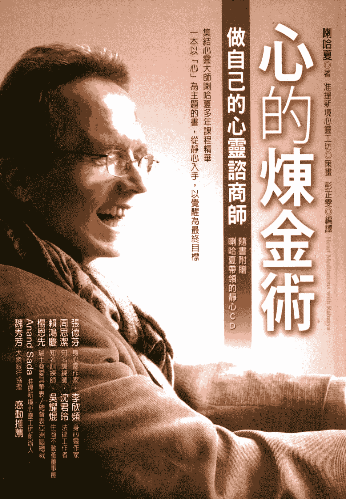
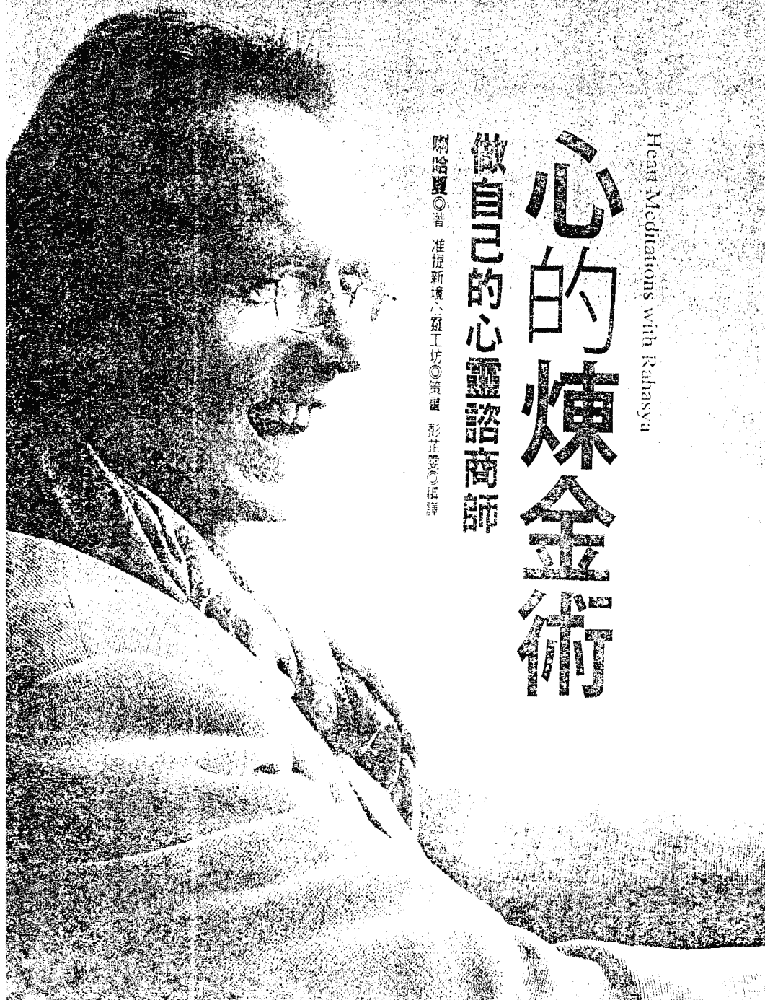
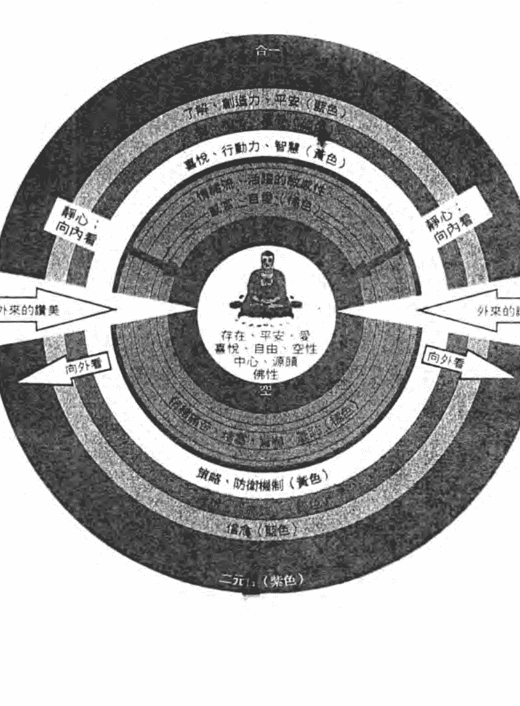
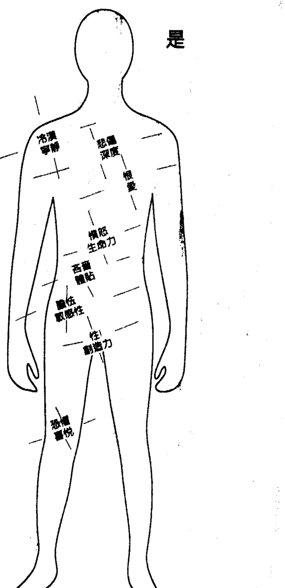
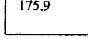
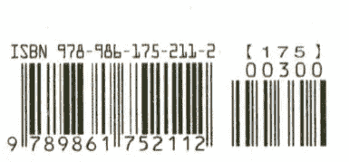

# 心的煉金術

## 做自己的心靈諮商師

集結心靈大師喇哈夏多年課程精華

一本以『心』為主題的書，從靜心入手，以覺醒為最終目標

隨書附贈 喇哈夏帶領的靜心CD

喇哈夏◎著 准提新境心靈工坊◎策畫 彭芷雯◎編譯

Heart Meditations with Rahasya

- 張德芬 身心靈作家
- 李欣頻 身心靈作家
- 周思潔 知名訓練師
- 沈君玲 法律工作者
- 賴鴻慶 知名訓練師
- 吳耀焜 住宅不動產董事長
- 楊恩先 瑞士商愛其華代表／總裁表亞洲區總裁
- Anand Sada 准提新境心靈工坊創辦人
- 魏秀芳 大眾銀行協理
- 感動推薦

St. Royal College
天使神秘学院

- 专业占卜预测机构
- 神秘学培训机构
- 水晶能量研究中心
- 官方淘宝：http://strc.taobao.com
- 官方微博：http://weibo.com/715104687
- 新书发布QQ群：659338717
- 购买更多好书请联系院长大天使

大天使
天使神秘学院 院长
QQ：715104687
手机/微信：13641926204

微信公众平台：strc2011

## 制作说明

本书由《天使神秘学院》出重金从台湾购入的原版书籍扫描制作完成。为达到最好阅读效果，特地把原版书全部切开后，再经由专业扫描设备高精度扫描完成，并经过一张张的PS后期处理最终成书，其间花费大量的人力、物力以及时间，只为能给大家提供经济并优质的神秘学学习资料而努力。

本学院强力谴责某些机构和个人，把本学院花心血制作完成的电子书籍，包装后直接放在自家淘宝网上低价倾销的行为，以谋取不劳而获的经济利益。如果长此以往最终将无人愿意再为大家花心思制作电子书，那以后可能大家再无新书可读。

为让大家以后能够读到更多的好书，也为了本学院的良性发展。本学院恳请大家尽量做到如下几点：

- 一、尽量在本学院的网站购买电子书籍。
- 二、请勿用技术手段把电子书内的水印及加密去掉。
- 三、在收到电子书后小范围传阅即可，千万不要公开传播，更别挂到淘宝网上低价销售。

同时为答谢广大支持者，学院电子书将做如下调整：

- 一、学院会把一些早已收回制作成本的电子书折价销售。
- 二、最新制作的电子书籍会开放打印功能，大家购买后有条件的可自行打印成书。

天使神秘学院
2017年6月

# 心的煉金術

Heart Meditations with Rahasya

## 放閃的心靈諮商師

喇哈夏◎著 准提新境心靈工坊◎策劃 彭芷萱◎校閱

# CONTENTS

## 〈推薦序〉兼具實用性、知識性和趣味性的靈修指南／張德芬

005

## 〈推薦序〉如實如是的「生活大師」／Anand Sada

007

# 第一章 靜心是一切的根本

011

# 第二章 心的重要主題

025

> 〔我與喇哈夏的相遇〕靜心，是為了聽見最重要的聲音／周思潔

037

# 第三章 進入內在的中心

039

# 第四章 身心各層面與七個脈輪的關連

067

> 〔我與喇哈夏的相遇〕喇哈夏讓我向生命說「是」／魏秀芳

082

# 第五章 心理痛苦如何運作？

085

> 〔我與喇哈夏的相遇〕有助於走向覺醒的日常指南／吳耀熒

097

# 第六章 接納的煉金術

099

# 第七章 轉念作業讓你不再創造痛苦

107

> 〔我與喇哈夏的相遇〕我的靜心體驗／沈君玲

127

# 第八章 成為「空間」，療癒自己和他人

141

# 第九章 從心諮商的切入點

145

> 〔我與喇哈夏的相遇〕我見到自己如實的面貌／李欣頻

157

# 第十章 將覺知帶到不同層面

161

> 〔我與喇哈夏的相遇〕喇哈夏讓我看見生命裡所有的美／楊恩先

191

# 第十一章 從心諮商的實務技巧

175

> 〔我與喇哈夏的相遇〕鑽石般的光與智慧／賴鴻慶

209

# 第十二章 給從心諮商者的提醒

193

# 〈附錄一〉真實的練習

211

# 〈附錄二〉合一大學與合一祝福

216

> 〔我的合一體驗〕無法以言語形容的合一祝福／努拉

221

## 〈推薦序〉

# 兼具實用性、知識性和趣味性的靈修指南

身心靈作家 張德芬

方智出版社轉來喇哈夏老師的新作《心的煉金術》初稿，我仔細閱讀之後，發現這是喇哈夏老師「從心諮商」的上課內容，不禁又驚又喜。回想起二〇一六年末，當我還在醞釀寫作一本有關自己靈修心得的書時，我到上海去擔任喇哈夏老師「從心諮商」工作坊的翻譯。在上課的過程中，他的教導深得我心，常常讓我有「啊哈！」的感應。於是我在我翻譯之餘，忍不住拿起紙筆偷抄筆記，令旁人嘆為觀止。印象最深刻的就是喇哈夏老師上課用到的一個大同心圓（編按：即本書第四十三頁的心智層面圖），給我很大的觸動。看過《遇見未知的自己》的讀者應該記得，書中那個簡化了的同心圓，正是源自喇哈夏老師教導的靈感。在眾多靈性老師中，喇哈夏真的讓我印象深刻。他的教導簡潔有力，又非常人性化。

心理和靈性層面的問題都能兼顧，這樣的老師非常難能可貴。

《心的煉金術》是喇哈夏老師多年課程的精髓，整理成書後讀起來更容易消化、理解。其中有他非常口語化的教導，也有符合華人國情的問答（因為都是從他多年來在臺灣開工作坊的內容截取而來的），更有許多發人深省也讓人會心一笑的真實小故事、禪宗公案和軼事等。

我們靈修的最終目的和境界——全然體驗、如實接納、只是存在——就在這內容豐富、布局精采的一本書中，以不同的風貌完整呈現。

此外，這本書也是我覺得除了《靈性煉金術》之外，最能給當今「助人者」——心理諮商師、輔導老師、靈性老師等——最大幫助和忠告的好書。它有一般性的建議，也有實際操作的練習，是本兼具實用性、知識性和趣味性的靈修指南。

## 〈推薦序〉

# 如實如是的「生活大師」

這些年影響我至深的人，莫過於喇哈夏。他不僅對我個人心靈成長有很大的幫助，並且在二〇〇五年五月將充滿恩典的古老殊勝法門「合一祝福」（Deeksha）引進臺灣，對這個婆娑之島的集體靈性意識貢獻很大。同年七月，我跟隨喇哈夏的指引前往印度「合一」大學，經歷二十一難以置信的覺醒之旅。合一祝福的力量在於可以帶來無條件的愛與喜悅，更美的是，有一份自然的平靜會無聲無息地充滿內心深處。將近六年的時間裡，我往往來合一大學二十次，而每當喇哈夏再度來臺時，總會耐心地一次又一次引領。認識他至今，我親眼看見同修的生命有著不可言喻的美妙蛻變，恩典總在對的時間自動匯集進入生命。喇哈夏亦師亦友，教導我們傾聽內在的聲音，他從不吝於分享自己悟道的旅程，是我生命成長過程中的好嚮導。他一直在幫助我們了解一件事：「無論是在內在或外在，你都得敞開來，對所發生的一切說『是』。」因為喇哈夏的出現，我覺得自己整個心靈探索之旅變得愈來愈清晰，也愈來愈有方向。喇哈夏說過：「你如何知道自己所走的靈修之路究竟正不正確？當你愈來愈放鬆、自在、喜悅和平靜，那麼你不可能走錯；當你發現自己愈來愈痛苦、掙扎、不快樂，並且失去和平，你走的路絕不可能是對的。」與喇哈夏一起在心靈工作上下功夫，並非他可以為你做些什麼，而是他能指出正確的方向，然後你得一個人勇敢前行。路上雖然有許多同伴，不過喇哈夏說：「你還是得獨自一個人行走。」這扇門很窄，你無法與任何人同時進入，甚至你的行囊也必須放在門外。一開始，或許你會覺得陌生和恐懼，因為我們已經習慣遠離心靈，在忙碌和逃避的生活中，「單獨」是一種奢多。那些過往的心靈夢魘——你壓抑在無意識心靈的種種記憶或試圖掩飾和抗拒的情感——都會在你放鬆下來之後，像老友一樣來拜訪你。如果你夠勇敢、夠誠實，可以去面對並探索，這將會是一部很精采的內在電影，你會覺知到自己是誰，得以一窺心靈的核心與本質。喇哈夏談話的方式是活生生的，指導和啟蒙是創新的。目前准提新境心靈工坊每年固定為他在臺灣舉辦靈性指導工作坊兩次，受惠的人也愈來愈多。從他一九九九年首度來臺開課，一轉眼，竟已二十一年了。

准提新境心靈工坊創辦人 Anand Sada

# 推廣序

與喇哈夏相處，會自然地體驗到一種難以言喻的寧靜，這份寧靜並非努力掙來，而是自動發生的。他是位如實如是的「生活大師」，透明、清澈、輕易、簡單。我常常形容喇哈夏像空氣一樣，雖然看不見他的光芒，卻覺得他無所不在而珍貴。透過他「愛」的存在，會讓人自然經歷一種完全放鬆、很「深度」的寂靜；有一份難以形容的「空性」，看起來好像什麼都沒有，但一切卻是如此「充滿著」。對頭腦而言，這是一種不尋常、無法理解的經驗。

我一向覺得如果想要什麼，就必須努力才能得到，但每次上喇哈夏的課所感受到的內在寧靜，課程結束後卻一直都在，我不知道自己到底做了什麼才讓它發生，一切似乎來得太容易了。我心中有許多感動，很怕它們消失，希望能繼續保持在這樣的狀態中，所以當喇哈夏帶領大家進行了幾次靜心後，持續練習就成了我結束課程之後的目標。

> 記得在課程結束前，喇哈夏說了一段很美的導引：「請你離開後要持續靜心，如果你對這個靜心有感覺，回家後請練習三天；三天之後，對靜心仍有感覺，請練習三個星期；三星期後，如果你對這個靜心還是有感覺，請練習三個月；三個月之後，這個靜心的感覺還在，就請練習半年。然後，你就可以換不同的靜心方式繼續這段旅程。你不可能只用一種交通工具就到達目的地，就從這裡開始，讓這段期間的靜心轉化你吧！」

與喇哈夏同在的經驗是：學習幾乎消失了，而是「臨在」的狀態深入每個片刻。如果你問我這十一年來，每當課程結束後，我學到的是什麼，我得老實說，我不記得學到了什麼，因為那個所謂「我的學習」已經被一位大師的慈悲和智慧悄悄洗滌，我已不存在學習裡，而是與喇哈夏的「空」會合，然後，一切就變得愈來愈清晰了。 這幾年，我從許多學習之中漸漸明白，除非你知道自己要的是什麼，否則追尋是沒有意義的。生命的弔詭是，人在一開始求道時，動機往往是錯的，只有當那些充斥腦中的浪漫想法幻滅後，才能知道自己真正要的是什麼。 回顧自己二十年漫長的心靈之旅，喇哈夏是我生命中的第一盞燈，讓我有機會瞥見旅途的終點。與大師相會之際，光點亮了我的內心，在一份極深的定靜中相互輝映，進入永恆。

## 第一章

# 靜心是一切的根本

對一個沒有開悟的頭腦來說，開悟是一種野心、一種「想成為」、一個追求的目標。

當你真正覺醒時，所有的目標都被放掉了，包括開悟的目標……

為什麼要靜心？其實，靜心只是一個藉口，引領我們進入當下。

靜心有許多不同的技巧，各宗教也教導了不同的方法，目的都是一樣的。如果每天靜心一小時，另外二十三個小時做其他事，而在那二十三小時中，你一直離開「當下」，一直在外面追逐，從來不曾臨在，問題便因此產生。

## 靜心讓你更健康

經由靜心，我們得以來到當下，這對健康非常有益。因為當人移動到不同的意識層面，在較高的振動與當下臨在的狀態裡，問題會消失，身體恢復自然狀態，疾病自然就被療癒了。醫學上已有許多研究顯示，人在靜心的時候，高血壓會下降，心臟的疾病也會減少。

靜心可以支持身體、情緒和心靈的健康。如果你的頭腦總是思緒繁忙，而且一直擔心未來，就會在身體上創造出害怕的情緒。我每次來臺灣授課，都發現許多人的壓力很大。壓力到底是什麼？其實簡單地說，就是你一直處在，比方說，兩步或兩百公尺遠的前方，雖然你現在人在這裡，但你心想「我要趕快到那裡」，所以情緒一直都在其他地方，從來不在你所處的位置。難怪你會很恐慌、很有壓力，因為這裡根本沒有人「在」啊！如果頭腦一直處在這樣的焦慮、恐懼之中，就會創造出身體上的疾病。

另外，以憤怒來說，許多人會壓抑憤怒，因為在社會上，大家都不喜歡憤怒，但憤怒是怎麼來的？它來自你的想法。你認為事情本來「應該」這樣，結果卻沒有如你所願地進展。事情的實相在那裡，如果你抗拒事實，而且希望有所不同，能量就會被耗盡，憤怒便會升起。但由於社會文化的束縛，你又必須將憤怒壓抑下來，因為你想做個「好人」。於是，憤怒的能量必須往別的地方流竄，比方說跑到肝或膽，然後肝或膽就會有問題，健康就出狀況了。此時，最好的療癒方法是靜心，當你靜心時，就會安靜下來，處於臨在之中。

我們再來看看那些平常你很討厭的負面情緒，例如羞愧感、罪惡感、恐懼、憤怒、悲傷，或是覺得自己沒有價值等等。如果你真的可以在當下對這些情緒全然敞開，會發生些什麼呢？請試著去感受那些你很不喜歡的感覺，而不是一直想著「唉呀，怎麼會這樣？」「我不喜歡悲傷」「恐懼應該消失」「我不喜歡這種感覺」。不管升上來的是什麼，只要靜心、歡迎它，那扇門就會很奇妙地打開來，讓你直接去感受升上來的感覺——然後，恐懼和痛苦會轉化為喜悅，而悲傷則變成愛。

只要全然去體驗，任何痛苦都會轉變成喜悅。我有個很美的例子：

我住在澳洲，有一年，澳洲有個盛大的合一大學聚會，結束後，某位印度的資深指導師來我們家，他當時是合一大學的執行長，一個非常美的年輕人。澳洲有很多野生動物，我特別帶他到花園去看一種很大的螞蟻，並提醒他要注意這些螞蟻，因為他們咬人很痛，是那種痛死人的痛，而且這些螞蟻還會跳，最好不要讓們跳到身上。之後某一天，指導師一邊講電話、一邊光著腳丫走到花園去（你只要去過合一大學，就知道那些指導師一天到晚都在講行動電話）。然後，我知道有事情發生了！我走了過去，他剛好講完電話，對我說：「真的很痛！」原來有兩隻巨大的「跳跳蟻」緊緊咬著他的腳趾頭，但他笑得好開心。我們把螞蟻搬開，過了幾分鐘後，指導師覺得愈來愈痛，我問他：「你還好吧？」他說：「很痛，有一份非常特別的痛苦和喜悅緩緩上升到我的腦子裡。」他的接受度非常高，我覺得太美了，這是活生生的教導。

千萬不要把這當作一個新的認知或學問，也就是說，不要相信我的話，而是把我所說的當作一份邀請，然後自己去體驗，看看是不是真的如此。

當我第一次聽到這些開悟經驗時，覺得那不可能發生在我身上。不過幸運的是，我有個師父，他很直接，而且從不允許我們以任何方式逃避，所以我必須去感覺。而從我的經驗來說，我可以告訴你，這是真的，覺醒是個很大的蛻變！在臺北這個大城市裡，每個人都很匆忙，都在催促自己，希望自己更有功能性。但如果你停下來一會兒，就會發現你一直在追逐、希望未來有一天可以達成的那些目標，正讓你生活在恐懼之中。其實我們一直嚮往的寧靜，當下就已經存在、已經毫無條件地提供給我們了。

## 靜心讓你看到真實的自己

我看過艾克哈特·托勒（編按：《一個新世界》的作者）寫的一篇文章，描述他收到美國一位被判死刑的囚犯寄來的信。死刑犯再過幾天就要被處決了，所以對他來說，繼續活下去根本是不可能的——這應該是人所能想到最痛苦、最無力的狀態。然而，死刑犯在信中對托勒說：「我一直在學習你的教導，盡量去感受那份失望、悲傷、無力感和全然的痛。然後我靜心，允許所有的恐懼上來。我沒辦法用言語解釋……我覺得自己處於一種平靜的狀態，我是完整、合一的，是被祝福的。在我生命的最後五天可以真正地活著，我非常感恩。我知道五天之後自己就會被處死，但那已經不重要了。我自由了、解脫了……」

這個例子很極端，卻是很大的一步。

人的頭腦喜歡爭論、喜歡抱怨。頭腦會說：「是啦，你說起來簡單！」還喜歡講故事：「我真的好可憐，如此如此……這般這般……」成千上萬個故事，每個人都希望自己的被聽到。

為什麼有這麼多人一直握住自己痛苦的故事不放？因為在故事裡，你產生了自我認同。表面上，你是在說：「唉呀，我好痛苦，我不要那種痛苦！」但事實上，你的內在卻希望告訴別人：「我有多痛苦啊！你知道我深受疾病之苦……」「你知道我婆婆這樣這樣，我的小孩又那樣那樣……」「我好擔心我的工作……」「老闆給我的壓力好大……」

而朋友在抱怨時，你會跟他們比賽：「你那個沒什麼啦！我的痛苦才厲害呢……」

頭腦很喜歡這些故事，因為在那樣的狀態裡，最起碼你知道自己是那個受苦的人！

但你要知道，你不是你的過往歷史——無論你的過去有多輝煌或多失敗。

許多人一直活在童年創傷裡。也許你今年四十五歲了，卻還在想，為什麼小時候媽媽不愛我？其實你媽媽確實是愛你的，只不過是用她的方式愛你——當你能覺知到這點時，你可以看到，我們是多想創造一個「我」，卻又這麼討厭那個「我」。

每個人都在做這種事，而且從童年就開始了。小時候，父母從沒問過你：「你是誰？」他們只是跟你說，你將來要如何如何，然後問你長大後要做什麼，從來沒有人對當下的你感興趣，所以你當然也對真正的自己沒有興趣了。最後，你習慣成自然，總是想著：「我將來要變成什麼樣子？」於是悲劇發生了。你開始慢慢走向成功。在學校裡，你的功課很好，因此你在那個「我」上面裝飾一些美麗的羽毛：「你看，我是比較好的。」問題是，其他人也有同樣的想法。如果你覺得自己比較差勁，就會跟別人競爭：「我要變成那個樣子！」在這個狀態裡，產生了自我認同。如果你覺得自己成功，就會自我膨脹；如果覺得失敗了，就會認為自己很渺小。然後，愈是因為看到別人成功而覺得自己渺小，你就會愈難過。於是，你一直夾在成功與失敗之間，像個三明治，因而覺得痛苦。這該怎麼辦呢？請你靜心，往內看，去覺察這些標籤之下的真我。靜心會讓你看到真我。沒有了這些故事，你就是真實的自我。你想過嗎？當所有的「故事」都消失不見時，你是誰？你不是你的名字，不是你的名氣與成就，也不是你的挫敗。那些個人經驗都不是你，當一切都沒有了之後，你還是在——事實上，你的存在會更豐富。剎那間你會發現，沒有成功，也沒有失敗。這些都無法影響真正的你——在這樣的醒悟中，你的恐懼消失了，然後，你的壓力也隨之不見。你瞭解到，每個人都來自同樣的本質，我們是一體的、合一的，我們就是「一」。

我們必須從心覺醒，這是十分重要的；如果你能了解一些些，就得以轉化，所以千萬不要錯失這個機會。讓自己繼續醒著的好方法，就是深呼吸，邀請更多生命力量進來。人把生命局限得好小，把它擠壓在一個非常狹窄的空間裡，但生命是廣大無邊的，我們絕對有權利把生命全然地活出來，所以請保持覺醒。

## 靜心帶你探索內在的神性

許多人覺得靜心就是要端正地坐著，看起來很用功的樣子，因為那時正在與神合一。他們認為靜心是很嚴肅的事，靜心時必須試著讓頭腦放空，停止思考。我以前也這麼認為，但我愈想放空，腦袋反而愈瘋狂，裡頭的聲音吵雜不堪。一開始要試著安靜地坐著並不容易，但有一些靜心技巧可以解決這個困難。因為頭腦常常在兩極間遊走，所以有些動態靜心（例如透過跳舞或聲音來靜心）比較容易讓人進入寧靜之中。

一開始「動」了之後，會比較容易感受到「靜」。所有的靜心方法都只是創造出一個空間，讓人進入當下的臨在之中；它會跟你內在的生命連結，像是「空」的感覺。就跟喝茶一樣，剛開始茶杯是空的，喝完茶之後它又空了，再次跟「空」連結。你會發現，那裡頭不是空空的、「什麼都沒有」，而是臨在的完滿，充滿了生命。於是，另外一個向度打開了，那是我們從未經驗過的廣闊空間，那裡有著無限的可能性。

## 静心带你走上开悟之路

这颗头脑一直想达到的状态是不一样的。当你发现了内在的「空」，就创造出一个空让神性降临；接下来，身体、心理和灵性都被疗愈了。
当你从内在找到真我，就会发现，以往习惯性地往外祈求的「对象」，早已在你之内了。许多人会对著佛、耶稣、观音、圣母或老子祈祷，在脑袋里为这些神圣的代表创造了许多投射，但是藉由静心，你会了解到，原来「佛」早就已经在这里了——你就是佛性，或者，基督意识是在你之内升起的。所有的大师都不断提醒我们不要往外找，要往内看；每位大师都代表不同的指头，却指向同一个月亮，而他们所指的月亮就是你神圣的本质，你跟神性是合一的。我这样说不是要你相信，而是邀请你去探索，探索的方法之一就是静心。

人类的意识正不断提升，觉悟的速度是很快的。
当你看到内在的神性时，观点就转变了。刹那间，你看见地球上到处都是男神和女神——一旦了悟到这点，所有的竞争都会停止，闲言闲语也都消失了。你唯一能做的就是满怀敬畏，赞叹每个人的美丽与光彩；你会充满爱与恩典，整个世界因而转化。当然还有许多愚蠢的行为，让世界急速沉沦。看看那些战争和伤害环境的事物，你就会了解，提升与沉沦都在加速。过去我必须花上十五年才能获得的了悟，现在可能一瞬间就发生了。许多大师都看到，二〇一二年时，整个人类都会开悟。

这样的开悟以前只有少数人有幸得到，但在不久的将来，它会成为每个人的自然状态，神性将主掌一切。藉由静心，头脑有更多部分会开始运作，最后来到前额叶，将顶轮打开，然后我们与神性分离的感觉就不见了。

## 靜心讓你與較高意識連結

一位比丘尼旅行到某个陌生的村庄，晚上想找个地方蔽寒，但她敲遍村里每户人家的门，却没一户有空间容纳她，最后只能来到一棵树下歇息。比丘尼抬头一看，才发现原来自己躺在一棵开满樱花的树下——月光照耀着樱花，并穿过花的间隙洒向她，她才真正看见这样的美。

同样一件事，如果用另外的观点去看，就会有完全不一样的感受。不同的观点来自不同的意识层次，所以很显然地，你可以跟较高或较低的意识连接。

## 第一章 静心是一切的根本

低意识的特性就是重复、强迫或毁灭性的思想或行动，即使心中可能有个宁静的声音在召唤，你还是会不停地落入这些习性中，老是重复着占有、竞争、毁灭等低意识模式。直到有一天你觉醒了，看见自己的限制模式，才能进入较高的意识里。而高层意识的特性又是什么？就是自动自发、创造力和建设性——也就是说，较高意识具备生产性，而不是破坏性，里面有很多爱。

你可以从它们各自的特性判断自己是处于较高或较低意识。事实上，人类继承了两者。我们继承了较低意识，也就是集体的无意识（从父母、父母的父母、祖先而来，起源已不可考），但也继承了集体的超意识——较高意识，这就是为何我们会被爱与美好的事物感动。

就某方面来说，你是有选择的，可以选择与较低的意识结盟，也可以选择与高层意识连结。旧习性喜欢跟较低意识连在一起，在低意识里，人会觉得熟悉，因为那一整套模式都是已知的。如果跟高层意识连结，就必须进入没有规则、充满活力的河流里。那河流有时宁静，有时湍急，有时候则非常宽容，广纳百川。但所有的河流最后都会流入大海，进入合一的意识里。

### 檢視自己是與較高或較低意識連結

### 親密關係

在亲密关系中，你是跟较高或较低意识一致？或者，你是在两边来来去去？有时你可能接受伴侣原本的样子，所以在你们的关系里有爱、有空间，彼此分享一个共同体；但有时你的伴侣做了某件事，你就起了反应，然后砰地一声掉进那个循环不止的旧模式里。

### 工作／金錢

在工作上，你必须求生存、必须支持日常生活所需，有时很平顺，有时却很挣扎，然后不断重复这个循环。金钱上也是如此，你是连结高层意识，充满创造力和丰盛的感觉，或是落入低层意识，常常抱怨没有钱、抱怨自己总是那么辛苦？其实，即使成了世界首富，你还是会有恐惧，怕钱赚少了。丰盛不在于金钱多寡，而在于你是与高意识或低意识连接。

### 生命

你认为自己是生命的受害者吗？你是不是与低层意识连接，觉得生命没有善待你、觉得自己没有价值？或者，你把生命变得非常有创造力，带着感恩的心，觉得生命很美妙？即使人生不时有颠簸，甚至连立足点都被打破，但你内在是否仍然有个很扎实的基础？请你仔细检视，把它写下来。

### 靈性

第四个要检视的就是灵性。你是否不断在追寻？你是否一直往外祈求神佛赐予你好运？或者，你允许自己变得有创造力？你跟神的关系是什么？这是属于灵性的层面。你有没有赞美自己的成长？或者你是对自己说：『我这个人真是没救了！我已经上了那么多课，却一点都没有改变！』看看自己有没有这些重复性的竞争、破坏、比较和占有的心态，或者你真的有勇气去体验更多的爱、喜悦与连接。

## 第一章

### 心的重要主题

没有什么事比跟自己连接、比「你」来得重要。花点时间回到自己身上，那扇门不在外头，而是在你之内。

无论你做的是什么——也许是经营公司，也许是个家庭主妇——一定都要留个空间，倾听内心的声音。

心是一扇门，当你走进门里，会发现许多人格特质一一出现，例如情绪，甚至在更深的地方，你会发现里面好像是空无，是宁静或定静，但看看每天的日常生活，你会发现充满了争吵、权力斗争，以及你我的分别。然而，当你的意识提升之后，就会进入不同的氛围，很多事情开始变得不一样。

首先，你本来以为的问题将不再是问题，你认知的那个「我」——所谓的你我之别——在那个向度里消失不见了。你会了解到，所谓的「你」和「我」虽然是两个不同的个体，却来自同一个源头，就好像叶子发现，虽然它们表面上看起来是不同的叶子，但其实都来自同样的根源。觉察到这件事之后，人跟人之间就不可能有战争，或是彼此伤害、争执、比较、嫉妒或猜疑；日常生活当中所有的争执与冲突，在这个向度里都消融了。

但是，你必须先回到「心家」，先进入自己的内在，进入这个真心的空间。这个空间可以像杯子一样被充满，而你唯有跟内在这个可以填满空虚的空间连接时，才能得到满足。

## 第二章 心的重要主题

让你重新与自己连接。任何借口都是背叛你的真心，没有什么事跟自己连接、比「你」来得重要。花点时间回到自己身上，那扇门不在外头，而是在你之内。所以请放松，然后走进心里那扇门，与自己连接。身体和心灵是相连的，有时只要一次深呼吸，就能让你回到当下，然后你就可以成为这个空间，接纳当下的经验。在伊斯兰教苏菲教派的传承里，人内在的指导灵叫凯特乐，他穿着一双绿色的长袍。当你愈是将频率调到跟心的绿光一致时，就愈能与内在的指引连接。我要说一个跟凯特乐有关的故事。有个男人名叫蒙鸠，有一天，他正在办公室算帐，突然「叮」地一声，凯特乐出现了，并且对他说：「蒙鸠，放下你的工作去河边，然后跳进河里！」蒙鸠是个很纯真的人，他非常清楚凯特乐是他内在的指导灵，所以信任他远超过自己的理性，便勇敢地跳进河里。但蒙鸠不会游泳，所以在水里不断挣扎，幸好有个渔夫经过，才把他救了起来。渔夫问他：「你是傻瓜吗？干嘛跳进河里？你差点就淹死了！」蒙鸠一脸无辜地说：「我也不知道。」渔夫很同情他，便把他带回家一起生活。于是蒙鸠学会了捕鱼，渔夫则学会了算帐。有一天，凯特乐突然「叮」地一声又出现了。他说：「蒙鸠，现在你要离开这个渔夫，去隔壁的城市当个皮革商。」于是，蒙鸠谢过渔夫之后，便离开了，来到隔壁的城市，变成事业有成的生意人。他赚了很多钱，正打算买一栋房子的时候，突然「叮」地一声，凯特乐又出现了。他要蒙鸠放弃事业，把所有钱都送给穷人，离开这个城市，去另外一个城市找个老师，做他的学生。蒙鸠非常信任凯特乐，便放下一切，跑到另外一个城市。然后奇怪的现象出现了：蒙鸠身上的光愈来愈亮，只要在他面前，人们就开始慢慢地疗愈，变得健康。每次蒙鸠放掉一样东西、跟随内在的声音时，就会变得更加透明，并散发光芒。最后，他成了一个伟大的老师，在那座大城市里疗愈了许多人。

其实，这不是别人的故事，而是你我的故事。

有一天，凯特乐来找我，要我丢掉医生的工作，去喜马拉雅山，去找奥修。那时我觉得，印度普那的奥修社群就是我永远的家了，结果凯特乐又跑来说，离开普那，去澳洲吧！就这样，我一直听从他的话，生命转了许多方向，不断地放下，也愈来愈透明、愈散发光芒。

现在很多指导灵凯特乐都出现了，不断发出「叮！」「叮！」「叮！」的声音，只要仔细倾听自己的心，你就会听到「叮！」
愈是仔细聆听，愈能听到内在明师的声音。那么，真心的声音究竟是什么？其实就是你已经知道的真相。每个人都知道真相，只是有时间假装自己不知道而已。

真相会为你的心带来真正的喜悦、快乐与幸福，是很深刻的内在指导。你的心里有个真正的上师，它是有感染力的。这个真心的教导在你的内在成熟，释放出振动频率，也跟你内在的频率连接。每个人都活在能量的振动里，如果某人真的很快乐，你可以感受得到；如果某人很感恩，你也会有感觉。我们都是拥有振动频率的存在体，所以跟周遭的世界都会共鸣、共振。生气也会共鸣，它通常是在集体意识的某个层次，我们无法与之分开。在意识里，所有的负面事物也是有感染力的，而内在的明师会在意识的层面传播出。所以，你要好好照顾自己的心，让自己愈来愈能听到真心的声音。而「蜕变转化」的秘诀，在于当你有勇气拥抱负面经验时，这个经验就消失了。比方说，当你去拥抱恐惧、体验恐惧时，恐惧就消失了。你不必相信，请你亲身实验看看。这真是好消息，因为你再也不必害怕任何经验了。每一天，生命会给我们许多不同的经验，很显然地，如果你只想要某种经验，而不想有其他经验时，就会产生许多痛苦与麻烦。所以，现在你不必有所挑选，只要直接去体验生命给你的经验就行了。

如果陷在无意识里，便容易伤害别人，或者觉得被别人伤害，因为处于无意识状态时，你会投射到外在，觉得自己是因为外界事物而受苦。这种情形会发生在夫妻、朋友、家人、员工和雇主等各种人际关系里。有任何负面的事情发生时，你会倾向把心封闭起来，因为你不敢去体验内在被碰撞到的东西。别人讲了一些话、做了某些事，你就会觉得受伤，于是便把心封闭起来。慢慢地，你的心死了，变得愈来愈受苦，然后心就枯萎了，彷佛干掉的果实一样。有时候，你实体的心（心脏）甚至也会真的萎缩。有时你做得太过火，例如讥讽、讽刺、骄傲，便会造成心律不整，或者觉得好像就要心脏病发一样。许多人都是因为封闭了自己的心，后来引起心脏疾病而过世。会把心塞住的不只是胆固醇，情绪的封闭也会造成心脏动脉堵塞。

另外，你可能会去参加一些新时代的课程或宗教活动，然后他们说：「你应该宽恕。」于是你就「逼迫」自己宽恕。但是在那种被强迫而产生的宽恕里，你会觉得自己比被原谅的人更优越，于是隔阂继续存在。那并不是真正的宽恕。

心的本质是一座花园。这座花园里充满了爱，所以会有宽恕，不需要跑到外面去原谅别人，因为那种「有所为」的宽恕，并不是真正的宽恕。在心的花园里，宽恕会自动发生；这花园里的空气就是宽恕，就是爱，就是放下，就是重生。

附录一提供了一项宽恕练习，透过这个导引式的练习，你可以真正地宽恕，而不是「做」出宽恕。

## 你本來就是愛

心给了你空间，但你能否成为这个空间，来包容一切呢？其实你就是「空」，连物理学家都发现人都是「空」。表面上人有形有相，看起来的确有个肉体形象存在，但根据物理学家的研究，其实物质的九十九．九九九九九％都是空，只有○．○○○○一％的极少数粒子在快速振动，显现出肉体这个幻相。从次原子的层次来说，如果用电子显微镜看这个肉体，会发现里面全部都是空间，只有少数几个粒子跑来跑去。所以即使在物质世界的层次里，人其实绝大部分都是「空」的。
「空」里面可以包容一切，苦难会消失，你对发生的所有事物都没有任何抗拒。于是你终于发现几千年来神秘学家所发现的真理：在全宇宙的「空」里，形成宇宙的那些粒子都是被「爱」凝聚在一起的；我们可以说，「爱」就是形成全宇宙的黏胶！
许多人从小误以为「爱」就是「应该」怎么做、「应该」如何如何：我们应该当个好人，应该充满了爱、很温柔、很会关心人……这个清单可以一直列下去。你以为只有当自己变成「应该」具备的模样时，才能得到爱。然而，那些都跟爱毫无关系，所以你从来不曾真正学会什么是爱，成了一个到处求爱的乞丐。

奥修道场里曾经发生过一个小故事。有个叫孙由的人负责照顾奥修的生活起居，她很喜欢做那些事，喜欢帮奥修洗衣服、整理房间。她是个很有尊严的女人，也有颗温暖的心，可以把人照顾得非常好。

有一天早上，她拿食物给奥修吃，安静地把东西放在他面前，结果奥修对她说：「孙由，你别再跟我求爱了！」她吓坏了，因为她觉得自己完全处于静心的状态，很宁静地把食物奉给师父，根本不是在要求爱，而是纯粹地奉献、服侍师父。第二天早上，她又被奥修斥责：「孙由，别再求爱了！」她还是搞不懂，觉得自己明明没有那样做啊！第三天早上，孙由又去找师父，结果突然间，她觉知到自己的确在乞讨爱，所以一句话都说不出来，开始不停地发抖。奥修告诉她：「很好，孙由，有觉知就够了，你只要觉察到这件事就行了。」

如果我为你做了许多很好的事，你会不会爱我？然而，你根本不懂什么是爱，又怎能真的爱我？所以，「爱」成为世界上最被误解的字眼，它已经在你之外另行创造了一个中心；那个外在的爱占去你的空间，让你回不了心的「家」。事实上，你无法「产生」或「制造」爱，也无法「努力」去爱——因为你本来就是爱，爱就是这个存在的空间。

## 「從心觀看」—— 如實如是地接納一切

向外看的时候，我们通常是带着评断的头脑，企图攫取眼睛的所有事物。这个静心练习利用不同的方式，让能量回过头来进入内在——我们称为「从心观看」。做这个静心时，你要「看进来」，而不是习惯性地「看出去」。当你允许存在来观看自己、当你从「心」去看的时候，会见到所有面向：没有好坏、对错、高低、长短、美丑，一切都如实如是，一切都处于存在的空间里。

「从心观看」的静心可以在任何地点进行。通常在搭乘交通工具、散步或逛街时，你都是往外看，能量处于外放的状态，所以一直在流失。如果你想起了这个静心练习——例如在百货公司里——就不要再「往外看」，而是允许每样事物来「看」你。如此一来，能量就会充满你。这是为什么呢？因为你并未专注在某样东西上，所以各种色彩、形状都流向你，那会是个很美的经验。

这是个很不一样的能量接受方式。例如去参加派对，每个人都在往外看，想要壮大那个闪亮的自我；回家之后，却觉得彷佛气球被戳破一样，突然之间没气了。所以，「从心观看」是接受世界的不同方式，就好像内在的「气」被唤醒了。当你允许这个世界看着你时，你就允许自己原本所是的状态被看见、被接受，不在意别人有没有在看你，也不必抓住任何特定的事物。其实，你曾经很熟悉这种「从心观看」的方式——婴儿时期，人都是从心观看的；长大之后，才会聚焦、外放。

我第一次坐在奥修师父面前、被他看着的时候，就有这种感觉——第一次有人完全不带任何想法、意见或评断地看着我；在那之前，我从来不曾觉得被如此接纳过，甚至不知道可以被用这样的方式观看。唯有当你可以从这个浩瀚的空间看自己时，才能看见别人、接纳别人；当你用这种方式观看的时候，就是从更高的意识去看，如此一来，每样事物看起来都不同了。

## 「分享」是心的重要面向

心的本质里有一个非常重要的面向，就是分享。正如许多人已经发现的，心唯有在奉献的时候才会获得满足——不是出于道德或内疚自责那种勉强的付出，也不是因为「应该」，而是因为充满而流溢出来。你了解到，别人就是你自己，当你跟他人分享时，自己也更加丰富了。

我曾在奥修道场待了十年多，学到的就是这些。我在那里担任志工，食宿都要自己付钱，但是透过让自己变得愈来愈有空间，我收到了许多礼物；透过话语、透过宁静、透过我所碰到的人、透过静心，我变得极为丰富，远超过我所能理解。我的杯子不断被填满，而我的师父总是叫我进入世间，去分享那满满的一杯，然后再回来进入内在的宁静空间，让它再次被纯净的恩典充满；接着，再出去分享。所以我要邀请你花点时间回顾这一生。你内在有些什么准备与人分享的？什么是你已经装得非常满，可以很自然且轻易地分享出来的——无论是金钱、技术、服务、爱或临在？你要如何让这个世界变得更美好？不管你内在已经有了些什么，只要分享出来，就至少有一个人可以更快乐。请你倾听内心的声音。你不必有什么特殊贡献，可以纯粹很简单地付出。例如，你要如何在自己的关系中付出？你要做些什么，让生命变得更加健康？如果你倾听自己的身体、信任内在更深的指导，那么当你关怀、照顾自己时，也能够关怀、照顾别人。你要如何在物质层次上支援这个世界？如何利用自己的技术能力服务社会？你可以将自己的丰足贡献给一个很靠近你的心的人，或是贡献给一个让你感动的机构，让它帮助更多美妙的生命。让这一切都从你的内在产生。你要如何分享生命？你内心的歌是什么？内心的祈祷呢？你要如何将自己贡献给灵性，让整体拥有更高意识？请聆听自己的真心。没有什么对与错，任何感动你的人事物，就是你服务、贡献的对象。请给出最美妙的自己、分享心中的爱，这样你就可以消融任何恐惧，然后继续往前走，继续给出自己内在的天赋、才华，以及真心。在分享之后，请重新连接，回到宁静的心之花园里。然后，再一次出发、分享。

## 我與喇哈夏的相遇

*靜心，是為了聽見最重要的聲音

二〇〇五年，一位来参加我「生命其实可以重来」研习课程的学员，大力推荐她在十多年的学习旅程中，花了上千万学费周游列国之后，所结缘的一位超棒的心灵导师。她希望我也去上这位老师的课，亲身体验，于是我因着这样的缘分，走进了喇哈夏的学习殿堂。也感谢命运的安排，让我因此进入更深刻的生命体会。
自一九九〇年起，我就大量自我投资在各项学习领域，但认识喇哈夏之前，我的学习一直聚焦于比较外在的层面，例如成功学、行销学、潜训、公众演说，还忙着学各种才艺、考各种证照；而受到喇哈夏影响之后，我开始学着往内走。我到印度普那的奥修中心，以及斐济和印度的合一大学，不断地向内观照与自省，让我对生命的理解有着不同以往的大跃进。我常深深感谢上天，让我在今生有幸走入这么深刻的旅程。
多年来，我一直跟学员分享：「闭上眼睛」，是为了看得更清楚；「静心」，是为了听见最重要的声音。」喇哈夏老师的这本书直指现代人最需要的精神食粮——静心，是一本温柔中透出力道、无为中更见壮阔的引导书。大家若能善用书中所教导的步骤，必能在生活中自我疗愈，也能成为最有智慧的聆听者。许多人问我，这些年来我如此忙碌，为何却能随时保持神采奕奕。我的答案是：因为我活用了最棒的「自然疗法」——静心。除了睡前或工作中抽得片刻空档，我甚至在上演讲的几分钟前都会让细胞沉淀，享受那种「空」中的平安与宁静。一旦尝到了静心的甜美，你就再也离不开它了。祝福大家除了在喇哈夏老师的书中得到教导，也能从此踏入「静心的花园」。
训练师 周思洁## 第二章 進入內在的中心

你內在的存在跟宇宙一樣大。你愈是多靜心，就愈能發現你跟宇宙一樣大。

覺醒之後，身為一個諮詢師和心靈老師，我不再試圖改變別人心智裡的內容，不再試圖為他們找到處理問題的新策略，不再強調透過情緒發洩來達到目的。我把重點放在覺知，幫助人們瞥見自身的完美，因為在覺知中，與虛假之間的身分認同會鬆脫，新的資源打開了，幸福就會自然而然地產生。

情緒經過適當的疏通，人就會覺得舒服多了；而情緒疏通後會產生一些空間，直到你再次將它填滿。不過，只要你依然停留在同樣的心智架構裡，療癒就會是個永無止境的旅程。你可以一直不停地接受心理分析或原始治療，一直在處理情緒創傷，但永遠都會有更多東西冒出來。

感覺和情緒就跟思想一樣，總是來來去去，但如果把感覺和情緒當成你的，你就將它們個人化了。你跟感覺和情緒依附在一起，在它們周遭創造出問題，於是你產生了一個態度，就是正向的感覺應該留下來，負向的感覺應該離開——這就造成了進退兩難的困境。

在了解到感覺是來來去去的之後，我就不再嘗試去改變感受，而是將注意力帶到那個感受升起與消退之處。在覺知當中，痛苦就消失不見了。

我很感激從心理學和身體頭腦運作方面所學到的一切，但現在我不再透過治療師的眼睛來觀看，因為那樣只會看到別人心理不平衡而已。現在我在每個地方都看到佛，看到初始的臉，那些在心理層面底下的真我，而我唯一的挑戰就是找到一個入口，去引導他人直接認出自己內在的佛。當他或她認出來之後，接著就會放鬆，進入存在之中，其他的都不必發生。所以，治療已經轉變成存在的藝術。現在當我進行諮詢時，感覺已經不像個工作，而只是把充滿愛的注意力帶入本然所是之中，於是幻相消失了——即使那是很痛苦的過往故事。我本來對那些故事非常有興趣，因為我以前總認為，除非人們走過那些很深沉的東西，然後解除自己的故事，否則他們是無法敞開的。不過，我現在覺得那些戲碼其實沒什麼意思，只能當作很好的切入點，讓人們得超越。如果在此時此地與創傷會合，那些原本看起來很強大的苦難與痛苦會瞬間消失——「砰」地一聲就不見了！看見本然所是會讓意識形態改變，然後帶著人們往前走。充滿愛的臨在是個神奇的催化劑。

覺醒之後，一開始我以為自己再也沒辦法繼續處理心智的內容，為人進行心理治療。但後來我了解到可以心智的內容作為切入意識的起點，於是我的焦點就從「內容」轉變成「容器」——意識。意識就是所有一切，體認到這個簡單的真理，就是解脫。所以，我依然在進行諮詢工作，但現在是教人超越心智，透過不同的切入點來到他們內在的中心。

「從心諮詢」是一種與人相處的藝術，運用現代心理學的洞見，並超越心理學的架構、超越頭腦心智，來揭露存有的本質。這個訓練適合任何人，特別是希望完全了解自己的人；另外，對於諮詢師、醫生、心理醫生、護士、公司顧問、老師、身體工作者、按摩師、靈性彩油治療師、靜心老師、治療師來說當然也是無價的。

在本書接下來的章節中，我想要分享我多年訓練課程的一些教導、練習及問答，希望對每一位想變得更有意識、更加覺醒的人都有幫助。

讓我們先來看看你的本質和人格之間的關聯，以及人格和它的各個層面是如何發展成形的。

## 你的本質是「空」

圖一是心智層面的模型。這個模型像一張地圖，讓你在特定時間看到更多周邊的狀態，輔助你進入內在探索。

### 完全發展人格裡的心智層面（圖一）

靜心：向內看  
外來的讚美  
向外看

如果我問，你在追求什麼？答案可能是寧靜、喜悅、覺醒、使命、合一、解脫、快樂、智慧、健康、真理、豐盛等等。我在世界各地問過許多人，得到的答案其實大同小異。

假設你展開靈性之旅，到喜馬拉雅山上去找開悟的大師。在費盡千辛萬苦、筋疲力竭之後，終於找到了大師，於是你很高興地問他：「大師，大師！請告訴我真理，我是誰？」大師說：「你就是喜悅。你的本質是神性，你就是神，你來此的使命是活出神性。你的本質就是平安，你是自由自在的，只是你誤會自己被捆綁著，其實你擁有的力量遠超乎你所能想像！」於是你覺醒了，了解到你就是真理，快樂是你的本質，你就是完整圓滿的一部分，你是無限的機會，你就是愛、是自己的大師——換言之，你已經是你在尋找的那一切。

如果真是這樣，那麼你到底是如何遮蓋隱藏，變得不認識自己呢？

這個小我就在每個人之內，而這個中心是「空」——事實上，這個「空」跟宇宙一樣大。也就是說，你內在的存在跟宇宙一樣大。你愈是多靜心，就愈能發現你跟宇宙一樣大。本質上，你出生之前是沒有形體的，你就是意識本身、是永恆，你從未出生，也未死亡；你一直都在這裡。

### 顯化為形體的重要時刻

某一天，你父母做愛之後，卵和精子結合。突然間，這個浩瀚無垠的意識就顯化在一個非常小的細胞裡，開始複製，形成身體。無形無相誕生了，形成了擁有身體、頭腦的形體。

胚胎時期，你在母親的肚子裡，一切都被宇宙照顧得很好，非常自在、舒服。這時父母的能量場就已經開始影響你了，所以在子宮裡，你會經歷許多不同的階段，例如母親懷你的時候如果很害怕，那麼你生來就很容易恐懼，而且你不知為何有那樣的恐懼；或者，也許你父母的感情不好，母親懷你的時候常常對父親生氣，那麼你長大之後，可能常常對男生氣，卻不知道為什麼。這是因為你細胞裡的記憶，從母親那裡接收來的，在子宮裡就已經受影響了。人的能量場會跟外在的能量場互動，所以如果你母親的內在有許多衝突，你也會感受到很多內在衝突；如果你母親覺得平安、自在，常常跟你說話，那麼你也會有同樣的感受，覺得自己被深深地愛著。

接著，來到急遽變化的重要時刻——出生，決定了你會怎樣過一生。這裡有兩個版本，一個是理想版本，一個是一般的。

理想版本是這樣的：你的父母深愛著彼此，母親做了許多準備來孕育你，天天打坐靜心、散步，讚嘆你在她的肚子裡就是神的一個面向。時候到了，她在溫暖的水裡分娩，四周光線暗暗的，播放著很美的音樂，你的父親也在旁邊陪伴。你生下來之後，他們馬上把你放在母親的肚子上，讓你躺在那裡休息，因為從產道自然出生是很疲累的。你知道自己進入了一個新環境，開始慢慢地深呼吸，有很充裕的時間讓肺展開。接著，你本能地找到母親的乳頭，開始吸吮維持生命所需的食物。你覺得心靈充裕而自在。你的頭腦就像在印表機上等待列印的白紙，如果有個很好的開始，那麼接下來的幾年裡，你將完全活在這個「空」裡，完全活在當下，每個片刻都充滿驚奇，所有情緒都可以被表達出來。

### 那一般的版本又是如何？

母親懷你的時候，或許覺得恐懼，很想逃離，於是到醫院去讓醫生幫她打催生針，以便儘快生產。在這樣的狀況下，你會覺得自己還沒準備好，就被催促著「踢」出去了。而歡迎你的儀式是什麼呢？你覺得有個塑膠手套把你拉出去，還有在你頭上插針抽血，這一切的折磨把你弄得疲累不堪。出生之後，你並沒有被放在母親肚子上放鬆、休息，而是被人抓著腳倒吊起來。原本你在母親子宮裡時，身體是蜷曲的，突然之間，你感受到地心引力，因為你頭下腳上被拉得直直的。你的臍帶忽然被剪斷，覺得彷彿要窒息了，接著有人拍你的屁股。你不習慣這種野蠻粗魯的行為，覺得很痛，所以哭了。你被迫大哭，許多肺泡在你胸腔裡燒灼，簡直像地獄一樣，這就是為何現在的人都不喜歡深呼吸。接下來還有很多折騰，例如讓你穿上粗糙的衣服，並且放在冰冷的磅秤上量體重；更糟的是，你被放在小搖籃裡，跟母親離得遠遠的。你原本跟母親是合一的，突然間，你們倆分開得如此遙遠。

長大之後，你很害怕心愛的人離開自己，因為你一出生就經歷了分離與許多恐懼，讓你再也不願有這種經驗。這是你的傷痛。雖然之後你還是可以陪在母親身邊，但因為剛出生時，你老是覺得跟她在一起的時間不夠，所以你這一輩子總認為沒有足夠的愛——這雖

### 體驗到分離的痛

然可能不是真相，卻是來自你童年的經驗。

這對永恆意識有什麼樣的影響？你開始體會到自己的肉身是另一個存在體，跟你母親的身體分開了。你的頭腦仍包含在永恆意識裡，但此刻你忘了它，因為出生是那麼大的創傷。

如果仔細觀察嬰兒，你會發現嬰兒的情緒一產生就被表達出來，而且一直在改變。嬰兒的感官是敞開的，看到一朵花，他就會全然被那朵花吸引；看到在動的東西，他就會全神貫注地注意；聽到微小的鈴聲或沙沙作響的聲音，他另一個通往敏感的門就打開了。

如果你經歷了健康的出生過程，並且被以健康的方式帶大，這種情形會一直持續。你的能量會從一個經驗流動轉變到下一個經驗，然後在休息和睡覺時回到源頭，歸於平靜。

然而，如果你出生後的第一年常常無法接觸母親的身體，被孤單地放在搖籃裡，與外在源頭分離，你就會一而再、再而三地體驗到出生的創傷，就好像臍帶被割斷一樣。

嬰兒的經驗是：愛、營養和食物的源頭是在自己之外，在母親身上。所以，母親是你第一個外在源頭。然後父親進入，接著照顧你的人也加進來。為了得到滋養，嬰兒會以很實際的態度適應生活，就像做生意一樣。「採取任何必要措施」成了嬰兒的真言，只要能產生作用，他就做。嬰兒會想：「如果尖叫有用，可以讓我得到食物，那我就尖叫；如果尖叫沒用，沒有人理我，反而讓我被推開，我就嘗試其他方法。」「如果微笑有用，我就微笑。」嬰兒心情的轉變，會受到「採取什麼方式才能得到資源」的態度影響。

比方說有一天，身為嬰兒的你笑了起來，結果人們說：「他在笑，好可愛喔！」突然之間，你得到許多能量與注意力，所以你心想：「噢，我需要這些能量！」一、兩次之後你就知道，笑是很有效的方式，可以得到注意力、讚美與認同，於是你就會表現出這個行為，以獲得認可。但你花了許多力氣想讓別人認同、讚賞你，卻還是覺得不夠。

或者你在哭鬧時，母親很生氣地打你一巴掌，這對你來說是最糟糕的事了。你剛生下來，還在分離的驚慌裡，結果母親又拒絕你、把你推開，所以你開始知道什麼樣的行為會讓別人排斥你，讓你覺得很痛。於是，你不敢生氣、發怒，因為不想受到傷害，便創造出分裂。你很快就學會，任何的分離都會提醒你最初那種與合一的分開的驚慌，那實在太痛苦了，你根本不想再經歷。所以，當嬰兒想躲開痛苦時，臉都是僵硬的。如果你的身體有許多僵硬、疼痛的地方，那都是因為你想要躲開那些「緊張」；如果去感覺、去經驗，就會很痛。在情緒的層次上，你攜帶了許多痛。情緒的痛是沒有被充分經驗的痛，那是個情緒記憶，住在你的能量體裡，如果有人按到按鈕，你的情緒傷痛就會出現。因為不想體驗身體的痛和緊張，所以你建立了銅牆鐵壁，發展出眾多防衛策略，好讓自己不必經歷、感受痛苦。有趣的是，因為不想體驗痛苦的真相，你就必須用另一個東西取代。你想要逃避被拒絕的感受、想吸引別人的讚美，於是對理想而美好的「自己」比較有興趣，而不接受自己原來的樣貌。所以你變得愈來愈像政客，精通歪曲真理的藝術，只為了避免痛苦，獲得歡愉。

### 進入二元世界

大約三歲時，當文字與觀念變成你的語言，你就開始在原本空白的頭腦裡寫入一些東西。你進入了二元對立的世界，愈來愈活在自己的頭腦裡。原本你是在合一之中，並且無條件地接受本然所是的樣貌；漸漸地，你開始吃下「知識的禁果」，如同《舊約》裡敘述的。你離開了伊甸園，創造出策略和防衛機制，並按照這個世界對你的期望來塑造自己。

### 避免感受痛苦的防衛機制與策略

現在你開始發展防衛機制與策略，意味著你試圖吸引讚美，同時希望避開孤單、避免被拒絕。你創造出一層保護罩，包覆了你純粹的身體能量，也覆蓋住你自然的感覺與情緒，於是它們就被扭曲了。因為你的壓抑與調整，肉體開始緊張，在情緒體產生心理創傷。你將沒有被解決的能量積壓在身心之中，於是「痛苦之身」開始成形。如果你不接受自己的需求和感情的本然樣貌，就必須以某種方式扭曲它們。你可能會壓抑並否認那些不被周遭認可的慾望和情緒，因為你怕如果表達出來，會受到懲罰。而一旦你隱藏了自己內在的某些部分，可能就會把那些錯誤投射在別人身上。當你看到別人在做你不允許自己做的事情時，就會覺得不舒服，然後開始批判、譴責。或者，你會將事情合理化或重新改寫歷史，好讓你不會感受到那個痛苦；你也許會將自己的基本需求昇華成更能被接受的東西。

這些逃避或防衛策略可能是這樣的：為了避免衝突，你變得習慣討好別人，總是一副好好先生的樣子；為了被注意，你變成好鬥的人；為了避開痛苦，你將注意力轉移到工作、電視、電腦遊戲、食物、酒精或藥物上。

仔細檢視自己的生活，看看你到底都做些什麼來逃避痛苦。你會發現，無論你採取什麼策略都沒用，但你還是繼續那樣做，不是很奇怪嗎？

你要很努力，才能按照策略行動。它讓你繼續處於分裂之中，同時隱含著「他人是潛在的威脅，會引發痛苦」的意味，因此你必須防衛，這就造成了更大的分離感；然後，你「從伊甸園、從真我與合一中被驅逐」這件事，就真的發生了。

### 你創造出來的理想和「應該」

通常你的父母對於你「應該」怎麼做，比對你「是」什麼來得有興趣。這讓你很痛苦，因此你學會跟那個痛苦分開，同時學會合理化這樣的分離。在這些策略之上，你創造出一層理想和「應該」——「我應該表現得很好，不生氣。」「我應該很誠實，不說謊。」「我應該很聰明，不可以無知。」「我應該安靜，不可以撒野。」如果出現了任何「不被接受」的行為，你會無意識地視為「錯誤」，然後壓抑它。你告訴自己，你應該跟現在的自己不一樣，而如果你應該不一樣，那麼別人應該也是。你把自己和別人都弄得不對勁，因而造成更大的分離。

吵。這就是為什麼你的親密關係老是出現困難，你總覺得無法跟伴侶合而為一，總是在爭吵。

### 接受了一個信念系統

為了讓你的理想和「應該」得以成立，於是在理想之上，你盲目地接受另一層信念系統。你相信你是基督徒、猶太教徒、佛教徒、伊斯蘭教徒或印度教徒；你相信你是德國人、美國人、俄國人、義大利人或日本人。你相信一個由思想捏製出來的事實，覺得自己必須護衛它，然而那底下的實相根本對你的信念一無所知——它只是這樣存在。在這個信念裡，你所相信的神只是一個想法、是不存在的。《聖經》裡面說神按照他自己的形象創造出人，但真相是，人按照他自己的形象創造了神。「全能的神」是個強而有力的思想，創造出一個信念：『我的神是唯一真實的神。』伊斯蘭教徒相信他們的真主阿拉是唯一的真神，基督徒則相信他們的上帝是耶穌的父親，是唯一真神。這些信念之間存在著無法連接的空隙，所以從信念的層次來說，人類是極度分歧的。世界上大多數的戰爭都跟宗教有關，這是不同信念最強烈的衝撞。信念只是想法，是頭腦的產物，不是真實的，卻非常強而有力。

馬克思主義認為只有物質世界，沒有意識；只有身體、頭腦和信念，沒有其他的，而共產主義是最好的制度。無數的人在共產主義的名義下被殺害，加害者以『更美好的未來』作為信念，將當下的殺戮合理化。事實上，『未來』是個想法、是個信念，它並不存在；當『未來』來臨時，總是以『現在』的形式出現。

### 發展出身分認同——小我

具體成形的信念和它之下的其他層面有個危險，就是它們會創造出與其他『身分認同』明顯分離的認同。就好像肌腱黏在骨頭上一樣，你會與所有我們之前討論到的層面形成身分認同，而你認同的所有層面都會組成你的小我。然後，小我會從所有不同的分離原成裡，繁衍出一個假想的生命；按照你的身分認同，小我會產生它自己的路線。你的小我就是你對生命說「不」，對生命的自然之流說「不」。本來自由流動的能量與改變之河，成了一條僵硬死板的溝渠。

你健康的個體性在你覺醒之後依然存在，但那隻不過是跟你的身心與名字有關連的身分認同，是你的獨特性。小我的有限層次會蛻變成你的特質，例如你特有的身體能量組合、敏感度、接受度、喜悅、行動力、智慧、愛、慈悲、創造力、理解、覺知、清晰，以及跟整體的連結。

### 為了去除小我而展開追尋

所有信念系統都有絕妙的架構，好讓你相信二元性的幻相。它讓你相信「分離」，這樣存在或生命才能重新發現自己，因為在合一之中，什麼都不會發生。生命唯有在二元的狀態下、唯有呈現出「二」的時候才能發生，然後這兩個相對的東西就可以開始「玩」出許多可能性。

到最後，你發現這種分離的感覺讓你很受傷，於是開始踏上心靈之旅，開始尋找那個你知道自己曾經擁有的事物。也許你會去拜訪大師，然後他跟你說，你的小我就是問題所在，應該去除。

有好幾年的時間，我真的很努力地去除小我，結果發覺去除小我的唯一方式，就是殺掉我自己。但即使那樣做也沒用，因為我必須在死掉之後才能知道，但是就我的了解，可以被殺死的不過是肉身，頭腦和小我的結構則會以結晶的能量模式持續下去，再去尋找另一個子宮，重新開始運作，所以自殺看起來不是個好方法。

過去人們會到寺廟修行，希望可以去除小我。在很深的靜心之中，他們可能會瞥見那超越小我認同的真實本性，然後心想：『我在靜心中找到了真我，而為了保存它，我必須棄絕世俗，留在寺廟裡，這樣才能歇息在純粹的意識中。』經過了二十年深入的內在沉思與靜心之後，他們或許會回到俗世，不過當有人嘲弄他們時，他們可能會突然變得很生氣，接著便質疑自己：『我那些內在的平安都跑到哪裡去了？』

為什麼會這樣呢？原來，當他們被挑弄時，那些未解決的人格層面——也就是他們仍認同的層面——會想要主張自己。所以，拒絕世界或遠離人群會使你偏向一方，你會變得害怕這個世界。

這就是我在印度的奧修社區待了十年所發生的狀況。我一直不想離開，但奧修堅持我們必須到真實世界去測試自己根植於內在的平安有多深、測試自己的轉化是否真實。

因為無法去除小我，一開始小我只是幻相，你可以開始去調查、探索超越小我之後的你到底是誰。這樣的追尋通常起於將焦點轉向內在。

主要的方法有兩種。第一種是靜心，這涉及覺知。你可以開始學習靜心技巧，並練習讓自己更警覺。你靜靜觀照自己的思想、情緒和身體的感覺，這可以漸漸引導你脫離小我的身分認同。另一種方法就是進行存在性的治療，讓頭腦的各個層面變得更透明，覺知與充滿愛的接納就得以進入，然後身分認同會逐漸鬆脫。

這兩種方法的目的是要讓你深刻地瞭解到，身分認同不過是整體的一部分而已，不可能長久維持下去；而超越頭腦二元性的量子跳躍，再回到合一之中是可能的。

### 希望去除小我的，正是小我

小我的架構其實就是每個靈性追求者一直想甩掉的「我」，它根本不存在。所以希望去除小我的，就是小我自己。小我不願經驗當下的一切，只是你並未察覺到自己無意識的模式一直在抗拒。我之前提到的「從心諮詢」就是要把意識帶進你的世界，當你能夠看見覺知時，就可以解脫自在。你看見原先一直抗拒的習性，並且不再抗拒時，第一個體驗到的就是恐懼。恐懼並非來自你的存在，而是你的小我，因為小我很害怕自己會消失。而你的真理實相就在你的心中，小我消融之後就會顯露出來。

無條件的接納就是沒有好、壞、對、錯、高、低、長、短，那些都是心智創造出來的分裂。你只想要「好的」，不想要「壞的」，這有可能嗎？當然行不通，那些所謂「壞」的部分還是會冒上來，愈是壓抑冒得愈兇。這就是為什麼道德教育無法成功，如果光憑教條就行得通，哪還會有罪犯？

分裂的心智不斷在好、壞、對、錯、高、低、長、短之間選擇，但你剛出生的時候是沒有這種分裂的。那時你是完整的，這個片刻生氣，下個剎那悲傷，再下個瞬間歡呼，一切都是如此全然。

當你看到自己的小孩如此完整時，會召喚出你內在的什麼東西？愛。你真的好愛這個孩子，對他不會有任何預設的限制，要他現在不應該生氣、不應該哭、不應該叫，你就是按照他原本的樣貌愛著他。奇怪的是，之後你又把孩子的完整摧毀，你摧毀了愛與源頭的本質。

為什麼你會自動自發地愛著一個小孩？孩子並沒有刻意做什麼事來乞求你的愛，但你卻愛著他，為什麼呢？因為在孩子的完整性之中，他本身就是愛，他在這個核心之處是圓滿完整的，允許所有面向呈現，因此他跟你自己內在的愛起了共鳴。所以，孩子可以召喚你去愛這個實相，然後很自然地愛著他。然而，當你開始教導孩子時——這個對，那個錯；你應該這樣，不應該那樣——孩子就分裂了。他會延伸出一個虛假的中心，建立虛假的身分，而不是從真我裡面運作。

你是否認為如果不繼續教導這個孩子，他就無法表現出讓人接受的行為？但如果你支持孩子、讓他處於完整之中，他自然會表現出適當的行為，因為愛不會傷人。但不幸的是，我們學到的就是基於恐懼而行動。有多少行動源自恐懼呢？例如你害怕得不到母親的愛，所以必須做更多，但其實你根本不知道你為什麼要做這麼多，只是因為怕母親不愛你而做——『我怕我沒賺到足夠的錢、不夠成功、不被社會重視……』看看你的生命裡有多少出於恐懼的行動？你也因此創造出更多恐懼。而從愛出發的行動具有不同的性質——基於愛的行動只有支持、只有合作；你所需要的，就是愛。

### 我曾有過的恐懼

在醫學院就讀的最後一年，我覺得自己所學的還不夠，害怕自己沒有足夠的知識承擔做醫生的責任。我從小就有許多恐懼，而這件事變成另一個挑戰。我決定如果要行醫，就應該成為一個好醫生。有一年兩個月的時間，我極端壓榨自己，每天早上六點起床，然後從六點半讀書讀到晚上十點，早、午、晚餐只休息半小時，日日夜夜不斷地用功。這個階段結束之前，我的大腦已經被訓練得很好，讓我可以在三天之內讀完一本眼科學的教科書，並了解裡面大部分的內容。那時我們在六個月裡有二十五場考試，每場考試之前，我都會變得偏執、害怕，覺得自己很無知、很沒有價值。然後，我會以班上的最高成績通過考試。我拿到了有史以來最好的成績，但我了解自己還是什麼都不知道，怎麼能當醫生呢？學得愈多，我愈覺得自己知道得太少；我依然投射在那些執業的醫生身上，覺得他們的聰明才智一定遠超過我。

醫生有關的事實：「盡可能做好，並且假裝自己知道！」有三個月的時間，我在一家很小的醫院當外科醫生，那裡的醫療人員只有一個資深主管、一個小主管，和我。夜班和週末就只有我一個人，實在讓人害怕，因為我必須做很多決定，動一些小手術，而大部分時間我的內心都在顫抖。我想神聖的力量一直跟我在一起，所以沒發生過大錯。

在成為醫生的最後試用階段，我必須到各個分科去擔任實習醫生，結果我發現一個跟我後來去擔任麻醉科和急診室的醫生。我看过许多濒死之人，那样的经验是个创伤，虽然我學會如何處理它，但那種不安和不適任的感覺一直都在。

我最怕病人在重大意外之後失去意識，有時甚至瀕臨死亡。為了更深入自己的恐懼，讓我我想成為「大人物」的動力主要源於自卑感。我一生崇拜過許多人、把他們捧得高高的。在內在，我必須跟他們競爭、往上爬，爬到類似的位置，只是為了領悟：其實那個從下面看起來很誘惑人的東西，根本沒什麼。我仍然有相同的苦惱和不適任的感覺。

我父親和哥哥都是滑雪高手，我對這個事實很不滿意，所以必須變成滑雪教練，只是為了打敗他們；我父親還是個老經驗的水手，所以我當然得成為航海教練；而小時候我很怕醫生，所以我必須成為一個醫生——所有我家裡人認為特別的事，我都必須去征服、經歷。接著那個興趣通常會漸漸消逝，因為我在那裡頭從來沒找到任何東西。

二十九歲時，我獲得一個很好的工作機會——擔任德國康士坦茲一家醫院的加護病房主管，合約是五年。康士坦茲位於波登湖旁，靠近瑞士和阿爾卑斯山，是個完美的工作場所，許多醫生都在爭取這個工作。我看見未來五年裡，自己會愈來愈往「大人物」的位置邁進，但我內在卻有個聲音在說「不」。每個人都來恭喜我，說我很幸運：「你獲得德國最好的醫院的工作，我們都很想要，卻被你拿到了。千萬別拒絕這個機會！」我的朋友們告訴我該怎麼做，但是我的內心卻說：「不，這樣不對。我還這麼年輕，不可以把自己囚禁五年。我要去旅行！」後來我拒絕了那個工作，並且辭職了。

我存了兩萬德國馬克，然後就跟當時的女友一起去旅行，打算把錢花完為止。我們在喜馬拉雅山區旅行了好幾個月，爬上一千八百五十公尺的高峯，就只有我們兩個人。許多老經驗的隊伍要花很長的時間攀登的山峯，我們很快就爬上去了。

後來我發現，雖然我非常享受這些冒險，但我會這麼做，有一部分是為了向自己證明，我能登上比我父親更高的山，我想讓自己知道，至少我跟我所尊敬的人一樣好。

## 問與答

> 之前在描述嬰兒出生的過程時，我融入那個情節裡，然後感受到不被愛與分離的苦，還有剛出生時被倒吊、被打屁股的痛。於是我開始一直哭，覺得舊有的傷口透過眼淚療癒了，感覺很棒！

首先，你是「看見」並理解自己舊有的傷口；其次，你允許眼淚打開這些傷口，突然間，它們就被療癒了。我一直強調，你必須完整、全然地經驗任何一件事，這是最重要的。雖然你的頭腦很高興地說：「我要完整地去體驗。」但事實上，在運作的並不是這種態度，因為你尋求、期待的是「平安寧靜」，因此無法全然地經驗「痛苦」。有看出這其中的差別嗎？如果你在尋求別的東西，這樣是行不通的。而你剛剛是說你看見並去體驗舊有的傷口，並沒有在尋求什麼，所以你就療癒了。

那麼，如果有人來找你幫忙解決他的痛苦，你該怎麼做？看見別人痛苦，你可能會想幫助他逃離傷痛——雖然意圖良好，但那樣做完全錯了。也就是說，你以為安慰他，跟他說「你好可憐，不要哭了」是在愛他，結果根本不是。你那樣做反而妨礙了他，讓他無法徹底體驗痛苦，進而從痛苦中解脫。我們在這本書裡要打破許多像這樣錯誤的信念。

> Q 我想分享的是細胞記憶的部分。我突然明白為什麼我會去上許多課，或是接受各種療法。在諮商的時候，每當提到分離，我都會感覺到那似乎是一種和我的孩子分離的傷痛。

了解之後，有些傷痛就會出現，因為我們的細胞是記得的。到目前為止，當這些事情發生時，我們會一直想壓抑、逃離痛苦，就像你說的，你會以為這是與孩子分離的傷痛。再次去感覺，也許很不舒服，但只有當你願意進入痛苦時，細胞才有機會釋放記憶和傷痛。所以當這些事情出現時，你必須像歡迎新生嬰兒一樣，迎接這些傷痛浮現：擁抱，並且去愛它們。你也許會流淚，不過那是綻開的眼淚、解脫的眼淚、歡迎的眼淚；在迎接這些傷痛的時候，裂痕已然消失。

> Q 聽到你說：「你就是一切。」我覺得很震動，於是把自己放在那一切裡面。然而，當我去體驗時，覺得很緊張、全身無力、心跳加快，然後眼淚湧了上來。但我一直試圖把它壓下去，不要掉入，不停地與它爭鬥。我不知道發生了什麼事。

這裡沒有一個「我」可以在這些體驗裡指出我；我們都說我是這個、我是那個，到底哪一個才是真正的我？這個範圍下會出現的「我」和「你」，是所謂的小我，是你所有的信念、認同、理想中的自己、情緒的痛苦、身體的緊張所創造出來的「我」。

當我跟你說你是「空無」時，你的小我架構就會開始想著：「如果我真的是空無，那麼這一切都會消失不見！」一開始你會害怕，但是當你看見虛假的自我認同時，會發現：「天啊，我根本就不是這些東西！」然後這些身份認同就會崩潰。即使你會因為強烈地認同這些東西而受苦，但它們卻會給你一種「踏實」「實在」的錯覺。當有「一個人」在反對自己時，你覺得很「實在」，但是當分裂消失時，「我」是誰？所以，內在有衝突，覺得得不了解、不安全，都是很自然的反應。給小我一些空間，你的核心之處有個東西等著你去認識。在我的經驗裡，當你進入這個空間時，最震驚的是發現沒有一個「人」，沒有一個「我」，而是生命裡的各個人格一直在玩它的遊戲。在某個角色裡，你可能是母親，然後就有一套母親的理想、信念；另外一個角色可能是公司老闆，那麼你也會在這之上建立一些信念、理想、角色；還有一個角色是你父母的孩子……有許多種不同的角色。可是這麼多角色背後卻沒一個「我」，而是意識本身扮演了這些角色，是意識承接了這個身體。允許那些不安呈現是沒有關係的，那只是小我架構的虛假性開始崩潰而已。因為從來沒有人教過我們，那裡面有一個無法被摧毀的真我，所以當虛假的架構崩潰時，你會覺得很恐怖、很害怕。其實小我架構的崩潰是最美妙的事，你要有勇氣面對。而你所遇到的每個人，都是一面鏡子。不要因為恐懼而退縮，恐懼是一扇大門，我就是個很好的例子，因為我是恐懼大師。六歲時，我因為胃出血而住院住了三個月，醫生替我治療時，讓我覺得飽受折磨，所以我很怕醫生；當我成為醫生時，我很害怕會遇上因為意外或災害而全身是血被送進來的病患，可是我後來成了急診室醫生，就發現那其實也沒什麼，反而是一個分享慈悲的機會。為了拯救生命而竭盡全力；當我開始接受諮詢、治療時，我也很怕那些治療師，覺得他們好像知道所有的事，可以把我看穿，結果後來我成了治療師。所以，恐懼是一扇門，不要因為害怕而退縮不前，那不過是一種能量，就去歡迎它吧。

> Q 你說我們創造了自己的實相，要為自己的生命負責。可是我們的經驗並非由我們決定的，所以這其中是不是有矛盾呢？

看起來好像是彼此矛盾，因為有了「我們創造自己的實相」這個概念，所以如果出現「壞事」，你就會有罪惡感。然而，這是個誤解。是什麼創造了我們的實相呢？是無意識。如果你帶著童年的傷痛，這個傷痛就會在你的無意識裡創造出一個身分。舉例來說，當你出生時，有人把你抱到另一個房間，所以你有了與母親分離的經歷，可是你還不曾「有意識」地體驗這份分離，於是你會一直防衛這個部分。但是整個存在就是要使你完整，所以在無意識中，你會反覆地吸引離開你的人。因為這個傷口大喊著：「你要感受我！」但你說：「我不要感受你，這太痛苦了！」於是這個傷口會不斷創造類似的情境，來逼迫你重新體驗這個傷痛。從這個層面來看，是我們創造了自己的實相，但不是你的「表意識」清醒地創造，而是你的「無意識」不斷在受苦，這就叫業力。假如你這輩子不肯去體驗它，下輩子還是得經歷；當你真正去體驗之後，它會消失、結束，其中的能量就會釋放出來，進入好的面向。所以當你有意識的時候，就會創造出新的實相。那麼是什麼在創造你的實相？是意識本身，而不是你的小我在創造。

# 第四章 身心各層面與七個脈輪的關連

身心的各個層面彼此緊密關連，任何一個層面的結構，都會影響到其他層面。當身心變得愈透明，本性之光就愈容易穿透。

要使頭腦的各個層面變得更透明，讓你的本質不被遮蔽，有許多存在性治療的技巧可以運用。存在性治療運用充滿愛的覺知來穿透這些堆疊起來的層面，幫助被扭曲的能量轉化。

- 1. 生物能量學可以幫助你打開身體，讓能量開始流動。你將身體置於某種壓力狀態之下，當覺得停滯、卡住時，就將呼吸帶進來，緊握不放的情緒和痛苦就會浮現，然後被釋放。

## 存在性治療的分類

我利用不同的身心層面為切入點，替多種存在性治療分類。下面介紹一下我自己建立的這個分類方式，並簡單說明每種療法（請參照第四十三頁的圖一），其中幾種療法會在接下來的章節陸續介紹該如何運用。

從能量層面、第一脈輪、第一體或肉身進入的治療

- 2. 哈達瑜伽、按摩、能量平衡按摩、羅夫學派之軟組織整脊法、頭薦骨平衡，以及其他許多身體工作治療技巧，都是以身體為開端，來深入心靈的更深層。
- 1. 呼吸重生療法運用深度連結的呼吸，來揭露並打開身體的能量堵塞，幫助你觸及自己的情緒與深處的感受。
- 2. 原始治療幫助你敞開，面對童年時隱藏起來的感受和情緒，你可以有意識地重新經驗童年時的經驗和創傷。在過程中，你被支持著去表達任何情緒和身體上的壓抑，所以會有一種「我有所選擇」的感受，但是在過去，你根本不可能做選擇。你學著重新恢復自發性和純真，隱藏的生命泉源可以再度被打開。
- 3. 脈動與情緒釋放利用呼吸和身體技巧，幫助釋放舊有、累積的情緒。
- 4. 西藏脈動可以幫助你調整身體各部位的脈動，讓你的能量回復自然的流動。
- 5. 互依症候群療法是一項複雜的工作，處理依賴和上癮。每一種對藥物、菸、食物的癮頭，或是在關係之中對另外一個人的依賴，都是想藉此掩蓋舊有的傷痛。當你去打開並擁抱那個痛苦時，就可以重新恢復信任和純真。
- 6. 其他。

從感情和情緒層面、第二脈輪、第二體或情緒體進入的治療

- 3. 譚崔運用性能量作為轉化的基礎，並喚醒亢達里尼的能量。
- 4. 「切掉恐懼之根」是一種團體療法，讓人看清基本的恐懼，而這些恐懼都跟害怕肉體死亡有關。當你發現不死的意識之後，所有恐懼都會消失。
- 5. 其他。

## 由策略和防衛層面、第三脈輪、第三體或星光體進入的治療

- 1. 會心團體療法引發你的防衛機制，以便打破它們。當防衛機制被粉碎時，你就會向更深的感受敞開。
- 2. 「穿透權力之旅」這個團體將充滿愛的覺知帶入你追求權力的旅程，以及第三層面的意識，指出跟權力有關的課題，例如比較、競爭、批判、責怪、暴君與受害者的遊戲。
- 3. 其他。

## 由理想和「應該」、心的層面、第四脈輪、第四體或心智體進入的治療

- 1. 「心的敞開」和「心的誠信」這兩個團體直接處理「心」的理想主義，並揭開在理想之下的痛苦、憤怒與哀傷。
- 2. 「呼吸重生療法」和「聲音治療」也可以從這個層面進入。
- 3. 其他。

## 由信念層面、喉嚨層面、第五脈輪或第五體進入的治療

- 1. 神經語言程式學（NLP）和催眠是強而有力的工具，可以改變信念，以及與之相關的行為。比方說，如果你相信自己永遠無法賺錢，可以運用NLP來改變那個信念，然後讓自己賺錢。
- 2. 拜倫·凱蒂的「一念之轉」利用四個問題和轉念，直接從信念和想法下功夫。比方說，「我的愛人必須永遠為我存在」是一個沒有被探討的想法，現在你可以問四個問題：
   - 這是真的嗎？
   - 你能百分之百確定這是真的嗎？
   - 當你一直持有這個想法時，會有何反應？
   - 如果沒有這個想法，你會變成怎樣？

你在這將那個思想拔掉，去除信念，然後每一件在它底下的事都會瓦解，包括痛苦，轉念則會加速瓦解。針對剛剛那個想法，一個轉念可能是：「我必須永遠為我存在。」另一個轉念則是：「我必須永遠為我的愛人存在。」然後去探討這個轉向之後的念頭是否跟原來的想法一樣真實。大多數情況下，你會發現兩者同樣為真。所以轉念之後，你就不可能繼續緊握某一種特定信念。

- 3. 聲音和歌唱治療，例如泛音歌唱可以瓦解喉嚨部分的堅固信念架構，幫助你打開自發性的表達。
- 4. 阿梵達是一套完整系統，也是在處理信念的力量，以及塑造我們的日常生活。
- 5. 其他。

## 由認同層面、第三眼層面、第六脈輪或第六體進入的治療

- 1. 內在聲音對話是一種治療形式，處理對不同次人格或聲音的認同。每個次人格都有自己獨特的一組層次，在跟這些不同的聲音對話時，它們的本質就可以被清楚地看見，同時被接納成為整體的一部分。有個很棒的例子顯示了自體免疫疾病如何受到頭腦認同的影響：有人針對某個有多重人格症狀的人進行科學研究，發現當他的某個次人格掌控時，他就會有嚴重的糖尿病，必須注射胰島素；但是當另一個次人格接管時，他就變得非常健康。
- 2. 觀想。
- 3. 靜心技巧，例如內觀、佛教的打坐、那達布拉瑪靜心、戈利仙卡靜心、第三眼靜心等等。
- 4. 靈性彩油。
- 5. 自我探詢團體，例如覺知密集課程、「誰在裡面？」，以及頓悟。
- 6. 撒桑靜心僻靜會。

由任何一個層面進入的技巧，主動引導你走向你的本質、你的存在，走向整體

這一類療法最好由已經達到真實本性的諮商師來做。一個已覺醒的諮商師，不管用上述哪一種技巧，最後都會進入這個範疇。

- 1. 頓悟的團體。
- 2. 拜倫．凱蒂的做法。
- 3. 從心諮商。
- 4. 生活本質工作。
- 5. 本質工作。
- 6. 「旅程」的個案。

## 廣泛的做法包括大多數層面：

- 1. 會見你自己。
- 2. 阿梵達。
- 3. 地標。
- 4. 愛之路。
- 5. 生命的奧秘訓練課程。
- 6. 生命的訓練。
- 7. 冒險訓練。

## 身心變透明，本性之光會更容易穿透

身心的各個層面彼此緊密關連，任何一個層面的結構，都會影響到其他層面。這就是為什麼治療技巧一開始可能只在某個層面作用，但也會影響到其他所有層面，以及整個的身心系統。而當身心變得愈透明，本性之光就愈容易穿透。如果治療的極限局限在頭腦，你就沒有自由。經驗——甚至覺醒的經驗——是來來去去的，只要你依然執著於某一組經驗，而拒絕另外一組，就是生活在枷鎖裡。本性——你的真實本性、你的本質——完全不會被任何身心的內容物打擾，透過治療，你會不斷體驗到放鬆，不斷對愛與自由敞開；事實上，這是定靜、停止想要成為什麼，以及無欲的副產品。存在性治療可以將頭腦帶到一個筋疲力竭的點，幫助真實本性呈現為深沉的平安、愛、喜悅與自由。但是，只要與內容的認同更為有趣的話，頭腦就會傾向於忽略真實本性。

## 身心層面與七個脈輪的關連

我把心智的各個層面用不同顏色代表，那些顏色與脈輪的能量振動有關。以下是一些基本概念。

## 紅色／第一脈輪（海底輪）／第一層面

在意識裡，紅色代表生命能量、生命力、活力、身體的能量、對身體的愛，以及熱情。在無意識裡，紅色跟憤怒、挫折、憎恨、性的創傷、緊張及身體裡的能量阻塞有關。細胞記憶會保存這些阻塞，因而可能導致疾病。

## 橘色／第二脈輪（臍輪）／第二層面

在意識裡，橘色跟驚嚇、羞恥、情緒痛苦、不敏感、被拒絕、缺乏給予和接受愛、性的罪惡感，以及內在小孩有關。因為壓抑了許多感受，所以這裡有一層又一層的過往情緒可以重新被打開。在意識裡，橘色的能量跟情緒的敞開、敏感度、感官慾望、愛自己、歡愉，以及感覺的真實與表達有關。

## 黃色／第三脈輪（太陽神經叢）／第三層面

在意識裡，同樣的能量則代表決斷力、喜悅、意志、聰明才智、原創力、行動力、臨在、智慧和充滿愛的覺知。

在意識裡，黃色跟恐懼、控制，以及想要逃避痛苦的策略和防衛機制有關。它會顯現出權力慾望、判斷，以及有關自卑感與優越感的課題。

## 綠色／第四脈輪（心輪）／第四層面

在意識裡，綠色則代表愛、接納自己、給予、接受和慈悲。

在意識裡，綠色跟理想和「應該」、對空間的需要，以及在愛裡的嫉妒與不信任有關。

## 藍色／第五脈輪（喉輪）／第五層面

在無意識裡，藍色跟溝通困難、不信任和退縮有關，因為喉嚨帶著僵化的信念。你會注意到，當你認同的某些信念和觀念受到威脅時，你可能會開始咳嗽。這就是企圖把受到威脅的觀念拋出去，因為它不適合你的信念系統。在意識裡，藍色代表存在性的了解、創造力、平安、對未知的信任與臣服。

## 靛藍色／第六脈輪（第三眼）／第六層面

在無意識裡，靛藍色與虛假的認同有關。你從身心學來的程式，衍生出你對自己的感覺。你以別人的意見定義自己：「爸爸認為我是像這樣，媽媽認為我像那樣，姊姊的意見又不一樣——我試著遷就、配合所有意見。」這就是為什麼你的人格會變得如此不完整。靛藍色同時指向沒有覺知、靈性的傲慢，以及想要與眾不同的需求。在意識裡，靛藍色則代表清晰、覺知、直覺，以及體認出一個人無可比擬的獨特性。

## 紫色和白色／第七脈輪（頂輪）／第七層面

在無意識裡，紫色跟過度的精神追求、教條、僵化的信仰體系有關，這些都可能成為一種認同和逃避。在意識裡，紫色代表智慧、與宇宙的連結、靈性覺知、與整體合一，以及純粹的意識。白色則是所有顏色的結合，代表完整、純粹、光明和神性。

# 第四章 身心各層面與七個脈輪的關連

問與答

Q：前幾天，我跟我姊姊聊天——她即將成為醫生，她先生則是心理醫生——談到不同的治療方法。我告訴她，我從拜倫·凱蒂的「轉念作業」裡體驗到，改變可以非常快速，十分鐘內就能改變。我姊姊說，在他們當醫生的人看來，如此快速地改變是很危險的，因為你可能會變得沮喪、會……

在某些傳統裡，頂輪屬於紫色，而在其他傳統中，它是白色的。
在意識裡，紫色指向內在男性和女性能量的整合與平衡、合一、靜心及療癒。
在意識裡，白色代表覺知、如鏡子般的意識品質、對中心的觀照，以及在彩虹之內不可分割的光。
至於白色則包含了所有顏色。在無意識裡，它跟死亡與失去有關——沒有哭出來的淚之海（在印度傳統中，寡婦通常穿著白色衣服）。
在意識裡，紫色指向內在男性和女性能量的整合與平衡、合一、靜心及療癒。
在意識裡，白色代表覺知、如鏡子般的意識品質、對中心的觀照，以及在彩虹之內不可分割的光。
在無意識裡，紫色跟極度需要治療、與整體失去連結、內在男性和女性能量的不平衡與不完整、放棄生命及憂傷有關。

> 「發現自己錯過了多少，並了解到原來自己一直在浪費生命。這樣的說法讓我們有點害怕。我認為我姊姊可能是從「恐懼」的層次來看，而不是從臨在。」

提到醫生，我可以從我的經驗來說。我曾經被訓練成一個醫生——訓練成什麼都知道，即使我明白自己其實並不知道。我接受的訓練是要假裝自己知道：「我知道如何幫助你，你必須信任我。」但我的內在卻很害怕，因為我真的不知道！不過我很有效率地推開那個恐懼，以至於甚至不了解自己在害怕。醫生最怕的就是「不知道」，因為那是他們一直壓抑的。

在某些情況下，你姊姊說的是對的——如果你只是在頭腦的限度之內工作的話。但是你提到的轉念作業是引導人去認出他或她的真實自我，而那是超越頭腦的。一旦你這麼做，不論進行得多快，你都只會受益。

我曾經看過你所說的情況，有些人經由語言引導後，在很短的時間內就拋掉極大的重擔。當你轉化成你真正所是時，確實會發生奇蹟，不過那是在放下並進入空無之後。

一般來說，很少人可以進入內在的探索，主要是因為放下並進入空無之前的感覺不是太好。他們會陷在空無裡，在一個巨大幽深的黑洞裡，在深沉的絕望裡。醫生可能會認為……

他們掉入了憂鬱之中——從外在看來似乎是如此。不過憂鬱只是代表停駐在某個地方，沒有繼續深入；而憂鬱也可以是被拒絕的憤怒，或是被拒絕的活力。

我曾經在急診室工作一年，有一次，我真的碰觸到了絕望。那時我正在值班，有個患氣喘病的年輕人躺在我懷裡，快要死了——他才剛當上爸爸。我嘗試了所有可能的方法，但最後他還是死了。

我可以選擇切斷自己的感受——這是大多數醫生的做法——或是告訴自己，他的命運並非我所能掌握。我哭了一整個晚上，然後陷入了深沉、黑暗、沒有意義的空——空無。

突然間，我覺得很平安，每件事感覺都是對的，彷彿它本應如此。

這樣的情況可以把醫生推到更深處去觀看。如果可以看得更深，就會變成很好的醫生。

## 我與喇哈夏的相遇

# 喇哈夏讓我向生命說『是』

我第一次見到喇哈夏，是在二〇〇六年三月淮提新境於臺北國際會議中心主辦的一場大型演講會上。我非常感謝有此因緣認識喇哈夏。現在喇哈夏多年的精闢教導終於變成文字，多麼令人振奮啊！

本書第一章就開宗明義地告訴大家，靜心是一切的根本。靜心讓我們更健康，帶領我們如實如是地體驗當下，並看見真實的自我、探索自我，讓自己變得豐盛、變得更能體驗生命。因此，覺醒就在當下。

讀這本書的過程對我來說，就是靜心的開始。這些年從喇哈夏的教導及經驗分享中，我不敢說我體驗了當下，但我像是沉睡已久之後，從夢中驚醒。當我翻閱本書時，喇哈夏彷彿在身旁帶領我，書中的隻字片語不斷引導我進入內在，傾聽內心的聲音。是的，心是一扇門，走進去之後，你會發現許多人格特質一一出現，也會發現愛。

喇哈夏除了教導，也帶領我們去體驗，書中的內容涵蓋許多練習及案例，都是他多年累積的自身故事、經驗及精華。記得當時我曾經想過，我不是諮商師，也沒打算成為諮商師，為何要去聽「從心諮商」的課程呢？但是出於好奇心，我還是去參加了。結果我發現，就像喇哈夏說的，「從心諮商」是一種與人相處的藝術，運用現代心理學的洞見，並超越心理學的架構、超越頭腦心智，來揭露存有的本質。在此我要特別建議大家，無論你在心靈探索這條路上是新手或專業人士，這本書裡的部分內容或許會讓你覺得讀起來有些艱難，不過，請你帶著全然敞開的心，允許自己安靜地進入意識層面去閱讀。那麼你將發現，一切又回到核心開始。心是一切的根本，技巧只是輔助而已。

喇哈夏就如良師益友，雖然他不希望人家稱他大師，但對我來說，他就是。喇哈夏總是以最簡單的方式讓我明白，帶領我從問號轉為驚嘆號；他永遠允許空間存在，讓我更深入自己；他總是說他沒有任何教導，但他的一言一行其實就是最佳示範。喇哈夏讓我向生命說：「是。」

大眾銀行協理 魏秀芳

# 第五章

# 心理痛苦如何運作？

事實從來不會產生任何心理痛苦，帶給你痛苦的是「詮釋」。若改變詮釋、改變看法，同樣的事物就會變得令人愉快。

## 解剖心理痛苦

我們現在要去拜訪地獄，看看痛苦是如何運作的。在引導你進入內在地獄的過程中，你可能會覺得身體痛起來了，沒關係，這就是地獄的氛圍。另外，面對苦難時，你的頭腦會逃避、不想看，所以就睡著了。請保持清醒，因為唯有「看見」才得以解脫自在——看清之後，地獄自然不再是地獄。

接下來，我將以上課時和學員的兩段對話為例（明體字是我說的話，楷體字是學員的回答），讓你了解進入內在、解剖心理痛苦的整個過程是如何進行的（請參照圖二），之後你也可以遵循這樣的過程。

## 案例一

> 心理痛苦一直都跟身體的感覺有關，會讓身體的某個部位變得緊張。什麼東西在你之內產生了痛苦？
——壓力和恐懼。

是的，心理痛苦通常是由壓力和恐懼造成的。你在身體的哪個部位感受到恐懼？
——在我的胃這裡，而它會上升到肩膀的位置。
其他還有嗎？當你處於心理痛苦之中，是什麼東西在你的內在引發痛苦？
——罪惡感。
那麼罪惡感落在你身體的哪個部位？
——它上下移動，涵蓋了我整個肩膀。
其他還有什麼東西在你之內造成痛苦嗎？
——羞恥。
羞恥出現在哪個身體部位？
——它從我的胃部湧上來。
是的，它就好像泉水一樣從你的胃部湧上來。其他還有什麼會產生痛苦？你可以回憶上次覺得痛苦的時候。
——傷心和絕望，在我的雙肩。
是的，你很容易就能在身體上找到這些反應了情緒的部位。
——一種失落和擔心的感覺，讓我覺得肚子痛。
是的，當你煩惱時，常常就會肚子痛。

> ——拒絕和胡思亂想。

我了解，你把這個看得比痛苦重要。不過，是什麼造成了痛苦？你在拒絕什麼，或是在胡思亂想什麼？

> ——關於結論。

是的，不過這離開始的地方很遠。什麼情況下你會有這些憂慮？
——在危險當中。

那麼當有危險存在時，是什麼東西讓你開始胡思亂想？是因為你覺得害怕嗎？還是覺得無助？或者你僵住了？

> ——我僵住了，不知所措。

當困難出現時，你就會僵住，這也是你面對較深刻的事物時會出現的反應。這是個逃避策略，所以請你仔細探究你是为了不想體驗什麼而僵住。花一點時間，你會找到的。

你正在經歷的這個痛苦是什麼？我知道當你處於痛苦之中時，很難將它看清楚，但我們還是試試看，將覺知帶入其中。

> ——失落！

> ——很好。那個失落感呈現在你身體的哪個部位？那個很深的失落之洞在哪裡？

> ——在我的下腹部。

> ——在下腹部，我了解！

> ——還有背叛，我感覺到它在我的背部。

> ——非常好，魔鬼就等在那裡！

> ——被拒絕。

> ——是的！當你被拒絕時，你會在哪裡感覺到它？

> ——在我的子宮裡。

> ——在子宮裡？我發現「被拒絕」這樣的經驗，每個人有所感受的身體部位各不相同。

> ——害怕滅絕，我在第一能量中心（海底輪）感覺到它。

> ——是的。

> ——對於表演的恐懼和焦慮，出現在我的太陽神經叢。

> ——是的。

> ——不足，也在太陽神經叢。

> ——是的。

> ——分離和被遺棄，在我的肚子。

謝謝你！如果再多挖一些，或許可以找到更多魔鬼，但目前這樣就夠了。

奧修說過：「請以非常感恩的方式接納你自己，不管那是什麼，就是如此，它不可能是其他樣子。所以，不要與之抗爭。事實從來不會產生任何心理痛苦，帶給你痛苦的是『詮釋』。痛苦是你創造出來的，因為那是你的詮釋；若改變詮釋、改變看法，同樣的事物就會變得令人愉快。請放掉所有詮釋，事實就是事實，既不是痛苦的，也不是愉悅的。不要去選擇，不要有任何偏好，只要觀照和接納，那麼你就握有了秘密之鑰。」

> 「請以非常感恩的方式接納你自己，不管那是什麼，就是如此，它不可能是其他樣子。所以，不要與之抗爭。事實從來不會產生任何心理痛苦，帶給你痛苦的是『詮釋』。痛苦是你創造出來的，因為那是你的詮釋；若改變詮釋、改變看法，同樣的事物就會變得令人愉快。請放掉所有詮釋，事實就是事實，既不是痛苦的，也不是愉悅的。不要去選擇，不要有任何偏好，只要觀照和接納，那麼你就握有了秘密之鑰。」

以恐懼為例：造成心理痛苦的並不是恐懼，而是詮釋；認為恐懼不應該存在，就會讓恐懼變成痛苦。也就是說，你在恐懼周圍創造出一個牢籠，那個牢籠是由「不，我不想要它！」這個想法所構成的。

你為何受苦？什麼事情會讓你產生心理痛苦？可能是嫉妒、失落、失去親愛的人、失去自己、被拒絕、被欺騙、被抹黑、被忽視、恐懼、生氣等等。而奧修的意思是，這些都是事實，這些都是事實所創造的痛苦或苦難，因為你加以詮釋，認為這些東西根本不應該存在。

## 何謂痛苦之身？

當你經歷失落，但不想體驗痛苦時，就用能量的牢籠把它關起來，加以抗拒；當你經驗到害怕，身體就會有反應，會想對抗或逃跑，可是你不想有這個體驗，於是把它關在牢籠裡；當你經驗到嫉妒、被拒絕、失去自己、被騙、被忽視，或是覺得自己不夠好，但你不想有這樣的感受，就會用個籠子把它關起來——製造苦難最簡單的理由，就是拒絕經歷事實。

對於在意識裡升起、你不喜歡的任何事物，你會加以拒絕，然後創造一個牢籠，把它關進去，推進無意識裡，這樣你就不再感覺到它。

為什麼會這樣？小的時候，害怕時你就哭，生氣時你就尖叫來釋放憤怒，直到它消失不見，這樣就沒有痛苦。然而，為什麼你现在会因为害怕和愤怒这些事实，而创造了这么多苦？因为你在压抑。那么为何你要压抑？因为要保持形象。你压抑这些情绪、不想去感觉，就是为了保持形象。为什么要这样？因为你想成为一个完美的人。可是，压抑情绪，情绪就会消失不见吗？

请告诉我，台湾人最在意什么形象？可能是善良、中规中矩、热情好客、谦卑、负责、任、有爱心、有赚钱能力、三从四德等等。我也曾把自己脑中出现过的完美形象记录下来，结果一星期居然有一千多种。然而，当你建立一个理想形象时，它的背后都有个阴暗面，一个被你拒绝的面向。那就是你的痛苦之身，它看起来像只怪兽，让人很不愉快。而创造痛苦之身的不是你，是你想要成为的“理想”。
你愈是想要保持发亮的形象，就愈需要强力压制你的心魔、你的阴暗面。事实上，你内在本来就拥有忠诚、善良、坚强、勤劳、负责等美好的特质，那么为何这些天生具备的美好特质，却变成你虚假的形象，然后为了表现这样的形象，希望自己永远闪亮？那是因为你希望得到爱，但那不是真正的爱，而是“有条件的爱”。所以在成长过程中，你埋葬了许多感受，接着多年之后，你的能量体到处堵塞、充满了你自己创造的牢笼。艾克哈特·托勒在《一个新世界》这本书中，就把这些被压抑的情绪和感受称为“痛苦之身”，因为它看起来的确像个分开的、自主的实体，有自己的生命。
当你想去掉这些你拒绝的东西时，就会跟存在性的真相失去连结。因此你创造出一个能量黑洞，吸引了更多同样的东西。在拒绝当中，你会与痛苦之身认同，而它只会吸引更多痛苦。痛苦之身像一只永远吃不饱、永远不满足的野兽，一直想要吃进痛苦，一直呐喊着：“给我更多痛苦！”
如果你没有拿更多痛苦喂养它，痛苦之身就会消失不见。但是你的小我不希望它消失，所以会透过抗拒、透过说“不”来让痛苦之身存活。你可以在亲密关系中看到痛苦之身的演出。蜜月期结束之后，有些伴侣完全忘了爱这回事，只顾着折磨彼此。他们将自身的负面特质投射到对方身上，一直在争吵，那样的无意识造成许多伤害。每当你伤害某人，同时也会伤害到自己——至少是同等程度，也许还更多。当你将痛苦之身表达出来时，你会变得更加无意识。这就是你认同痛苦之身的方式。

## 逃離痛苦的策略

現在，讓我們來找出你最喜歡的策略：

*   我會孤立自己。
*   我會限制和規範自己。
*   我會擔心。
    *   （那擔心的時候，你如何轉移注意力？）

> 「我的內在有些東西是不對的」—— 這是個謊言，但你從來不質疑這一點，因為你不想去感覺或探索。為了不要感受到痛苦之身裡的這些牢籠，你發展出許多不同的策略，以逃離痛苦。

*   我會看電視。
*   我會睡覺。
*   我會扮演被需要的角色。
*   我會假裝。
*   我會讓自己保持忙碌。
*   我會數數字。
*   我會找人麻煩。
*   我會去逛街。
*   我會玩電腦遊戲。
*   我會幫助別人。
*   我會看報紙。

看報紙！是的，當你忙著注意發生在世界各地的悲慘事件時，就不必去感覺自己的。

你一直都在找比你淒慘的人來比較，這是一種很好的慰藉方式。

## 讓投射成為帶你進入愛的鑰匙

我分別以悲傷、恐懼和覺得自己有所不足為例，說明當你不想有這種感覺時，會如何投射到外在。

拒絕悲傷並不會讓它消失，即使你可能沒有感覺到那份悲傷。然後，當某人覺得悲傷時，你就會想要趕緊幫助他，讓他不要傷心，因為他的悲傷很容易引發你自己的。

那個策略接下來會是這樣：你覺得對方的確有什麼事不對勁，他不應該傷心，於是你將壓抑的悲傷投射到自己之外，可能是正向，也可能是以負向的方式。你要不是試圖幫忙，讓他不再覺得悲傷，不然就是逃避／拒絕他。

當你不想感受到自己的恐懼時，可能採取的策略之一就是凌駕它，假裝很勇敢。你會扮演英雄，然後對害怕的人投射批判：「這傢伙真沒用，根本是個懦夫！」你的內在不歡迎的任何事物，你都會批判；當你看見它出現在自己或別人身上時，你都會譴責。

而如果你想要壓抑認為自己有所不足的感覺——因為你被認為「應該」很有能力——你就會去批判那些沒有效率的人。你的內在會對他們說：「拜託！振作一點好嗎？」然後你會覺得自己比較優秀，而且痛恨別人不做或做得不好。

投射之美在於，一旦覺察到，你就能讓它們直接引導，進入內在你原先拒絕的地方。

所以，請不要試圖停止投射，那是行不通的。你要投射，並且同時去覺察這個過程，然後那個被你投射的人就成了一面鏡子，讓你看到自己。一開始你或許會覺得不舒服，但最後這個投射將成為解放你、讓你進入愛的一把鑰匙。

有幾個非常簡單的方法可以處理被拒絕的能量，其中一個技巧非常強而有力，而且可以解除幻相，那就是拜倫·凱蒂的「轉念作業」（請見第七章）。另外一個是「空椅子」，這是廣為人知的完形心理學技巧：你開始跟一個你所投射的人對話，藉由輪流坐在你自己和對方的位子上，你會感覺到這兩個部分都是你自己。

## 我與喇哈夏的相遇

## 有助於走向覺醒的日常指南

禪修了十幾年，至今仍維持每天聽經禪坐兩小時的習慣，也把這樣的修行文化帶進公司與同仁分享，感受到佛學智慧為生命帶來的定靜與助益。

多年來，也陸續參加過一些心靈課程，像是恰克的知見心理學，以及近年風行各地的合一大學，當然，心靈大師喇哈夏的課程也是這其中美麗的遇見與風景。

聽喇哈夏的課或看他這本書，覺得這位大師一定讀過佛經、《聖經》，甚至《可蘭經》，融合了幾乎世上所有靈性修為的智慧，對人心、生命，乃至於宇宙哲理的觀點，都與末學尊崇的老法師們的開示相應。

本書對讀者來說，是一本很棒的日常運用指南與行動工具，喇哈夏在書中所提到面對恐懼的方法尤為經典。他主張人不須逃避恐懼的感覺，只要帶著全然的意識去面對，用慈悲心來擁抱恐懼，恐懼將會自然地轉化、消融——這與我敬愛的師父上聖下嚴生前的開示——凡事只要面對它，接受它，處理它，然後放下它——有著異曲同工之妙。

住商不動產董事長 吳耀焜

只是這樣的心靈功課不是一次就能清理、消融的。上空下淨老和尚曾說，人的一生必須學著放下「自私自利、名聞利養、五欲六塵、貪嗔癡慢」。一旦展開了這樣的心靈之旅，在一次次面對生命的心魔時，我們便能有更多勇氣停下來面對，而非逃開。如此，慢慢學著放下，有一天終將體會出生命可以過得「愉悅」、「法喜」、「輕易」！喇哈夏大師接受過完整的醫學院教育，且有多年的西醫臨床經驗，對於人類生理與心理的研究頗為深入。之後，大師既豐富又多采多姿的參學、閱歷，讓每一個呈現在書中的個案顯得生動、活潑而有趣，的確有助於讀者逐步走向覺醒、開悟的合一之路。衷心地祝福大家！

# 第六章

# 接納的煉金術

想要跟感覺或體驗分開，就是在拒絕生命的某個部分。這會無意識地引發痛苦。事實上，你不必跟任何事物分開。當你溫柔地邀請一切進入意識中，它就變成有意識的。

## 學會接納恐懼

任何層面都可以成為切入點，但是要如何啟動療癒？比方說，該如何面對死亡的恐懼（請參照圖二）？

每個人都可以跟死亡的恐懼連結。如果把上述心的特質帶入對死亡的恐懼裡，會發生什麼事？

我們在心裡面發現到的特質有：

*   敞開
*   接受性
*   感恩
*   慈悲
*   無限
*   柔軟
*   敏感
*   脆弱
*   喜悅
*   流動
*   允許
*   信任
*   值得信任
*   新鮮
*   活生生的
*   顫抖
*   接受
*   給予
*   擴張
*   紅色和跳動
*   浩瀚
*   空……

在上課時，我會引導學員進入心裡，然後跟大家分享進入內心後發現到的特質。我會把學員提到的特質寫在白板上，然後大聲唸出來，讓大家感受隱藏在每個字背後的能量。你在看這本書的時候也可以這樣做。當你看見以下這些詞語時，請做個深呼吸，掉入每個詞語的背後，去體驗該特質的氛圍，感受其中的意義，讓它進入你的內在，這樣你才能對這個特質所代表的氛圍敞開。

### 接納的煉金術（圖三）

當允許心的特質包圍事實時，負向特質就會轉化為必要特質

**心的特質**
- 愛
- 接納
- 慈悲
- 傾聽
- 直覺
- 分享
- 允許
- 擁抱
- 歡迎
- 空間
- 寧靜
- 空性
- 反映
- 包容
- 合一
- 光
- 流動

- 如果對死亡的恐懼感恩，情況會變成怎樣？
- 如果允許死亡的恐懼在自己的內在軟化，情況會變得如何？
- 如果在死亡的恐懼面前變得容易受傷，會發生什麼事？
- 如果真正承認「這就是現在發生的事實，我要去感受它」，情況會如何？
- 如果真正接受死亡的恐懼呢？
- 如果歡迎死亡的恐懼留在那裡——那份恐懼會變得無窮無盡嗎？
- 如果允許那份恐懼如同生命一般流入自己的內在，又會怎樣？
- 如果歡迎因恐懼而產生的脆弱，情況會如何？
- 如果打開洞穴，讓恐懼進入洞窟裡，會發生什麼事？
- 如果讓恐懼在內在擴張呢？
- 如果允許恐懼變得新鮮、活生生、充滿生氣，情況會怎樣？
- 如果用慈悲來擁抱恐懼，讓它不斷跳動，讓整個身體都在顫抖和疼痛，又會怎樣？
- 如果讓死亡的恐懼掉進廣大的空之中——也就是你所是的狀態——會發生什麼事？
- 在這些心的特質的臨在裡，對死亡的恐懼會變成怎樣？

恐懼會消融，轉化成其他事物。那原本彷彿凍結的、被標記為「對死亡的恐懼」的能量，變成了生命本身。你原本切斷了跟生命某一部分的連結，現在你重新擁抱它。對死亡的恐懼很自然，但是當它在意識中呈現，而且被完全接納時，就會變成光芒四射的生命，變得敞開，轉化成意識。而那個神奇的字眼就是「是」。這裡有個好消息：你不必去除任何在意識裡面產生的東西。這個「不須去除內在任何事物」的真理，必須深入你的內心。存在的一切都是生命和愛，只是以偽裝的姿態出現，而我們就是要來面對這個挑戰。這是走向完整、一體的路。有了這樣的體悟，憤怒無法燃燒你，憎恨無法碰觸你，暴力無法殺死你……或許可以殺掉肉體，但是無法殺死你！是抗拒、是「不」讓痛苦之身繼續存活。痛苦之身表達了沒有被承認的情緒，是一個虛假的怪物，吃著它最想要的東西，也就是痛苦。它想：「如果你傷害我，我就把你傷回來；既然我已經停止感覺我的傷痛，我就要傷害你來代替！」但事實上，這樣會傷自己傷得更深，因為我們是一體的，如果我傷害你，當然也會傷到我自己。這就叫作戰爭，它發生在世界各地，永無止境，並且以自己為食物。用意識、愛和覺知來穿透它，痛苦之身就消融了。想要跟感覺或體驗分開，就是在創造二元性，就是在拒絕生命的某個部分。這會無意識地引發痛苦。事實上，你不必跟任何事物分開。當你溫柔地邀請一切進入意識之中，它就變成有意識的。這是個好消息。如果敞開來觸碰那些課題，當你進入內在時，感覺會好像要死掉一樣。但死去的是『模式』，並不是你。而且，這是不能保證的。人們往往都想先有『保證』再去做某事，不過存在是不提供保證的。如果你進入內在的時候覺得很安全，就不會很容易受傷。所以，不要有條件。然而令人驚訝的是，你會發現那看起來很黑暗的中心，其實是光。你不必跟黑暗對抗，因為它並不存在。當光不存在時，就是黑暗，所以如果想要處理黑暗，可以從光著手，把光帶進來。內在那些牢籠是由於缺乏意識而造成的，你可以說它們是黑洞，將能量吸入黑暗裡。它們其實是一種『不在』，所以當充滿愛的臨在進入其中時，那些牢籠就消失了。你不必相信我，可以自己去體驗。

## 問與答

> 當你允許恐懼發生，當你允許自己去感受那份恐懼時，身體會出現什麼反應？血液中的腎上腺素或跟恐懼有關的物質會怎麼樣？那些化學物質還會存在嗎？

它們還會存在一陣子。身體對於直接的危險有一種自然反應，會釋放出應急的化學物質，讓身體準備好戰鬥或逃跑。但是請你記得，當你面臨直接、立即的危險時，恐懼並不在那裡，只有純粹的臨在、純粹的生命能量，準備要去回應。恐懼是頭腦的產物，是不真實的，你之所以一直在餵養不真實的東西，是因為你還沒有認出真相。

> 有時恐懼是不是後來才出現？

沒錯，恐懼常常事後才到來。事情發生時，化學物質會本能地湧進你的身體系統，而危險狀況結束之後，它們還會繼續運作。這時，你必須找到某種釋放能量的方法——跑一跑、振動身體，將這些化學物質消耗掉，或是胡言亂語，也就是說些沒有意義的話來表達自己的感覺。

艾克哈特·托勒在《當下的力量》一書中提到，針對釋放能量這個部分，他是以鴨子為師。兩隻鴨子在爭奪地盤的衝突之後，會分開一下子，很用力地拍動翅膀，以釋放剛剛打架時所累積的多餘能量，這樣能量就不會殘存在身心裡。

但是在大多數的情況下，你會聽從自己的頭腦，然後開始繞著這個事件創造故事。頭腦會告訴你：「你差一點死掉！」然後你就開始顫抖，開始體驗到各種恐懼的症狀。不過，在任何階段你都可以醒過來，允許一切發生。

另外一個想要克服恐懼的企圖，就是去從事一些危險的運動，例如登山、賽車或高空彈跳，來向自己證明你並不害怕。其實，你不必只為了逃避恐懼的感覺，就去冒生命的危險；只要帶著全然的意識面對恐懼，就足以轉化它了。

## 第七章
### 轉念作業讓你不再創造痛苦

轉念作業的美妙之處在於用四個問句檢查自己的念頭，然後將它轉向，再次檢驗反轉之後的念頭是否為真。

在這一章，我要介紹拜倫·凱蒂的「轉念作業」，這是一個非常簡單卻強而有力的技巧。到目前為止，你一直致力於體驗和感覺苦難，卻還沒有真正了解自己創造痛苦的過程，現在我們就先來談一談這個部分。第五章曾經提到痛苦之身是因為拒絕事實而產生的。小我的一部分不斷拒絕事實，但其實人出生時，這個「拒絕事實」的架構並不存在，只不過隨著成長，這個架構變得愈來愈大。組成這個架構的「磚塊」是過往的經驗，從前的痛苦經驗被帶到當下，停駐在你的能量體中，形成了痛苦之身。所有的苦難都是過往的故事，並不存在於此時此地，但是你用「故事」把痛苦之身從過往拉到當下。「故事」其實都是虛假的，所有苦難只會在「不在當下」的內在裡面發生，所以有些大師會說：「要活在此時此地。」如果可以活在當下，那麼就不必再探索、追尋了。然而，小我為了存活，必須看到痛苦不斷被製造出來——或者說，你會不斷重複「選擇」創造痛苦。讓我們來看看這個創造痛苦的過程。首先，有個念頭會出現——假設你摯愛的母親四天前過世了。到目前為止，母親去世是個事實，你本來好端端地坐著，結果突然想到摯愛的母親剛過世，於是又開始悲傷起來。那麼這個感覺是如何出現的呢？因為「念頭」先出現，你想到一個不是在當下發生的過往事件，所以就在第二層面（請參照第四十三頁的圖一），也就是感覺和經驗的層面一直經歷這個苦難。它是由一個「念頭」開始，然後有了「感覺」，接著因為感受到「痛苦」而產生一個「行動」，而這個「行動」又製造了一個「問題」——這一切，都是從一個念頭開始的。

當然，你無法掌控自己的想法，但如果把這個念頭移轉，前面所說的一連串創造痛苦的過程都會跟著瓦解。換言之，你的小我只是個念頭罷了。有些靈修的人拼命想丟掉小我，但小我只不過是個念頭。拜倫．凱蒂的「轉念作業」就是運用這個方式，所以必須了解創造痛苦的法則。

另外還有一個存在法則——這個世界上只有三種事：我的事、你的事、神的事。你可以處理的是哪一種？你只能處理你自己的事。所以，既然沒有別人，顯然你只能從自己的內心去處理。

## 轉念練習

在開始練習「轉念作業」前，一定要先填寫第一百二十四頁所附的轉念作業單（編按：參考來源為「一念之轉」中文網站），不可以只在腦子裡想想就好，一定要真正地把答案寫下來。這點很重要，因為人的頭腦很會耍詐，你不能只仰賴頭腦的空想來進行轉念作業。當你寫下問題的答案時，就是在把自己的思想具體呈現在紙上，因為思想是飄浮變動的，如果沒有寫下來，頭腦馬上會開始玩把戲，說你不是這樣想的。整個練習的過程是利用拜倫·凱蒂的四個問句來引導，用問題不斷衝擊自己的想法，想知道更多資料，可以參考「一念之轉」相關網站（英文網站：http://www.thework.org；中文網站：http://work.soul.tw）。

## 用四個問題衝擊自己的想法

1. 假設你有個念頭：我對小陳很生氣，因為他不了解我。
   請自問：「小陳不了解我，這是真的嗎？」然後安靜下來，讓答案由內心自動浮現。
2. 你能百分之百確定這是真的嗎？
   請自問：「我百分之百確定小陳不了解我嗎？」再次安靜一會兒，讓答案自動浮現。
3. 當你一直持有（相信）這個想法時，會有何反應？
   當你認為小陳應該瞭解你時，你會如何待他？會對他做什麼、說什麼？（例如給他一個白眼，或者講話時提高聲調？）你又會如何對待自己？
   請閉上眼睛，觀想小陳不了解你，而你正回應他一個白眼、對他大小聲，或者有其他反應。當你這麼做或這麼說時，感覺如何？是否能抱持這個想法（小陳不了解你）而不痛苦？如果你會覺得痛苦，那麼是身體的哪個部位感到不舒服呢？
   讓這個問題在心裡多停留一會兒，這樣浮現出來的畫面會愈來愈清楚而具體。
4. 如果沒有這個想法，你會變成怎樣？
   閉上眼睛想像：如果沒有「小陳不了解我」這個想法，你會變成怎樣？你的生活會有何不同？你會是怎樣的人？
   請觀想你正站在那個不了解你的人面前，然後看著這個人，但心裡沒有「他應該瞭解我」的想法。讓自己安靜下來，看看眼前會出現什麼景象。
   想像一下，如果沒有那些陳年往事，你和這個人只是初遇，你會看到什麼？

## 轉念過程示範

接下來，我利用一個諮商過程，來說明轉念作業如何進行（明體字是老師說的話，楷體字是學員的回答）。請參照第一百二十四頁的轉念作業單。

請唸出轉念作業單上的第一道題目。

「誰讓你感到憤怒、挫折、迷惑？為什麼？誰激怒了你？他有哪些地方是你不喜歡的？」

好，現在請唸出你寫下的答案。

「我對我婆婆感到生氣，因為她丟掉我的菜、我的花和我的經書。

她這麼做的時候，你認為她是怎樣的人？顯然她這些行動都不對。她做這些事情時，你對她有什麼想法？在這個事實之後產生的想法是什麼？」

——自私、霸道。

很好，「我婆婆自私又霸道」。我們先檢視「自私」這個部分，從拜倫·凱蒂的第一個問題開始：你婆婆很自私，「這是真的嗎？」

——乍看之下是真的。

第二個問題是：「你能百分之百確定這是真的嗎？」你剛剛說「乍看是真的」，那你是不是真的確定她就是自私的？據她的說法，她是出於愛……所以你是否能確定她真的很自私？你不知道，好。第三個問題：「當你一直覺得「我婆婆很自私」的時候，會有什麼反應？」不被尊重。你覺得不被尊重。這很重要，是「你的想法」使你覺得不被尊重。那麼當你認為你婆婆很自私時，你在心態上是如何對待她的？我心想：「天啊！你怎麼會這樣？」所以你會用什麼樣的心態對待她？否定的。對，否定。好，接下來是第四個問題：現在請你想像一下，如果「我婆婆很自私」這個想法根本不存在、如果沒有這個想法，你是怎樣的人？——我是我自己。那麼當「你是你自己」的時候，有什麼感受？感受一下根本沒有「我婆婆很自私」這個想法時，你會體驗到什麼？接下來有個很有趣的部分：請你把同一個想法一百八十度反轉。

沒錯，「我很自私」，也就是把「我婆婆」換成「我」。請你檢視一下這句話的真實性。現在我們來看看你前面提到的「我婆婆很霸道」這個部分，同樣先從第一個問題開始：你婆婆很霸道，「這是真的嗎？」

——她很霸道。

你是否百分之百確定她很霸道？

——非常確定。

很好。當你想著「我婆婆很霸道」時，有什麼感覺？

——不舒服。

對，不舒服。你必須記得，是你自己的想法讓你不舒服的哦！那麼當你相信「她很霸道」這個想法時，你的反應是什麼？

——冷漠。

冷漠，很好。現在，我沒有要你丟掉這個想法，只是請你想像一下：如果你根本沒有「我婆婆很霸道」的想法，你會變得怎麼樣？

——自在。

——然後去檢視一下是否為真。你知道怎麼反轉嗎？

——變成「我很自私」。

——「我」很霸道。——有時候。「我很霸道」這個想法是真的嗎？有時候就算是了。有時你雖然是在付出，但對別人來說卻是霸道的表現。你在回答轉念作業單上的第一個問題時，還提到什麼？——她亂動我的東西。也許這是事實。當她亂動你的東西時，你的想法是什麼？你如何評斷她？——不受尊重。對，「我婆婆不尊重我」，這是你的想法。現在你對自己說：「我婆婆不尊重我。」看看是否真是這樣。——我婆婆不尊重我。這是真的嗎？也許她愛你，不過我們現在的問題是「她不尊重你」，這是真的嗎？檢查看看。——不確定。那麼第二個問題是要你看看自己是否百分之百確定婆婆真的不尊重你，而你的答案很清楚：你不確定。所以，當你一直想著「她不尊重我」的時候，有什麼反應？

- 極度不舒服。

是「你的想法」讓你不舒服。當你抱持著「她不尊重我」的想法時，內心會怎麼對待她？

- 冷漠。

換言之，你也不尊重她，是不是？當你根本沒有這個想法時，你會是怎樣的人？當這個想法消失時，你會有什麼感覺？

- 很快樂。

所以請你轉一百八十度，要反轉兩次，兩邊都試試——「我婆婆不尊重我」反過來會變成什麼？

- 「我」不尊重我婆婆。

檢查一下這句話是否為真，還是變得更真實了？

——她如果踩到我介意的點，我就不尊重她。我不會「主動」不尊重她。好，我們覺得別人不尊重自己，其實是自己不尊重別人。現在再轉另一個方向。第一個反轉句是「我」不尊重她，而另一個則是「我」不尊重「我自己」。

- 「我不尊重我自己。」

覺得這句話對不對？有些時候你根本不尊重自己。

> ——可是我不想引起爭吵啊！

所以你就繼續停留在這個想法裡，覺得她不尊重你，然後讓自己痛苦，是嗎？我不是要你跟婆婆吵架，只是要你去辨識你有沒有尊重自己，以及你有沒有尊重你婆婆。這些真相都是合理的，我們只要看清楚這樣的真相就好，因為「看見」之後才得以解脫自在。

> ——好，接下來請你唸出轉念作業單上的第二個問題。

> ——「你要她如何改變？你期待她怎麼表現？」

好，請唸出你的答案。

> ——我希望我婆婆先問過我之後，再丟東西。

「我婆婆應該先問過我」，對不對？同樣地，針對這個想法，你也可以問拜倫·凱蒂的四個問題——「婆婆應該先問過我」，這是真的嗎？

> ——本來就應該這樣，因為那是我的東西啊！

那麼，「本來就應該這樣」是誰的想法？

> ——我的想法。

「我婆婆應該先問過我」，事實是什麼？她有沒有問過你？

> ——從來沒問過。

深呼吸。真相是「你婆婆應該先問你」嗎？真相是「她根本不問」嗎？那麼，當你抱持著「婆婆應該先問過我」的想法時，你的反應是什麼？

> ——痛苦。

所以這又是另一個使自己受苦的想法。當你認為她應該先問過你時，你會如何對待她？

> 她？

對。如果你根本沒這想法——「婆婆應該先問過我」——的話，你會是怎樣的人？

> ——自由自在啊！

現在反轉一百八十度。先針對「我婆婆應該問過我」，轉過來是什麼？

> ——我應該問過我婆婆。

這也是個好主意。

> ——她常常這樣說啊，老是告訴我：「你最好什麼都問！」

沒錯。轉念之後，所有限制性思想突然都離開你了。

> ——原來這些痛苦是來自自我的想法！

很驚人吧？接下來請你唸出轉念作業單的第三個問題。

> 「她應該（或不應該）做、想、成為或感覺什麼？你想給她什麼忠告？」

好，你要給你婆婆什麼忠告？——她不應該未經我的允許就亂動我的東西，讓我覺得被侵犯，請她尊重自己。好，現在把「她不應該侵犯我」反轉過來。——我不應該侵犯她。——好主意，還有呢？——請她尊重自己。不，是另外一個針對自己的反轉句。「她不應該侵犯我」可以轉成你剛剛說的「我不應該侵犯她」，而另外一個是「我不應該侵犯……」？——我不應該侵犯我自己。沒錯。——可是我沒有亂動自己的東西啊！——亂動東西是外在的顯化，重點是「侵犯」。你檢查一下有沒有「我不應該侵犯我自己」這個想法，換言之，你不應該強求自己的情緒、要求自己應該如何如何。好，接下來前往第四個問題。——你需要她怎麼做，你才會快樂？——我需要我婆婆去尋找她自己的快樂。現在反轉過來。對，「我需要我婆婆去尋找她自己的快樂」，現在反轉過來。

——「我」的快樂「我自己」尋找。

「我要找到自己的幸福快樂」，這是個好主意，因為我們老是捲入別人的事，就沒辦法照顧好自己的事情。神的事就是允許事情自然發生，而你的事，就是允許你自己快樂。

好，現在請唸出第五個問題。

> ——「此刻她在你心目中是怎樣的人？請詳細描述一下。」這句話的意思是要講出我當時寫的，還是現在的感覺？

> ——「此刻她在我心目中是自私、霸道的人。

她自私、霸道的人。還有呢？

就停留在你當時寫的，不用轉到現在。你要面對真相；除了真相，沒有別的。

> ——「此刻我是自私、霸道的人。

這個我們已經找到了，沒有其他的嗎？好，你已經認清自己也很自私、霸道，可以擁抱並接納這個事實了。現在請唸出第六個問題。

> ——「你再也不想跟這個人經歷到什麼事？」我再也不要經歷到她亂動我的東西。

我們來試試在另一個不同的點上面轉念：「我願意再經歷到她亂動我的東西。」請你照著唸出這句話。

> ——「我願意再經歷到她亂動我的東西。」

感覺如何？事實上，這件事很可能再發生，你之後就可以檢視一下這句話是否為真，這就是它給你的教導。現在請你先說：「我願意。我很期待她下次再來亂動我的東西。」
——我很期待她下次再來亂動我的東西。
你看，多麼解脫自在！

## 轉念讓負荷與殘餘能量消失

我們很喜歡自己的故事，因為如果沒有了這些故事，那我們是誰？不過當我們自問這些問題時，終於了解到，我們只不過是把過往的事件帶到當下，然後讓自己在此刻受苦。轉念作業的美妙之處在於用四個問句檢查自己的念頭，然後將它轉向，再次檢驗反轉之後的念頭是否為真。你會發現，每一個你所批判的人都是你的好老師，都在教你生命的功課，然後你會因此浮現對他們的寬恕與感激之情。你無法直接甩掉那些批判的想法，可是當你質詢自己，將念頭反轉時，其中的負荷（charge）與殘餘能量就會離開你。

當我學會這個方法之後，就去研究自己的每個思想，將它們寫在筆記本上，然後一一練習轉念，結果非常驚人。一開始，每個念頭我都會仔細審視，現在則是已經到了這樣的境界：「啊，他那個白痴！哦，我這個白痴！」好了，結束。整個負荷都消失了。而當負荷消失以後，小我緊緊抓住的東西也就脫落了，因為小我就是靠這些負荷的幫助才能存在。

拜倫．凱蒂在洛杉磯上課時，其中有兩天，她會沒收每個學員的錢和信用卡，然後叫他們身無分文地到街上找遊民，而且只能跟遊民說三句話。第一句是：「可以坐你旁邊嗎？」第二句是：「給我一點食物吃好嗎？」（完全不能多加一句，例如說：「我肚子很餓」，拜託你給我食物好嗎？）第三句則是：「不用，謝謝！」

這個「作業」十分嚇人，因為你會一直想著：「我的天啊，這個人看起來很像殺人犯！」「我的天啊！如果我跟他在一起，他可能會傷害我……」很多念頭會在腦子裡不停轉來轉去，但你必須練習問自己：「這是真的嗎？」

有個跟我很好的治療師朋友與我分享了上這個課的經驗。她說她怕死了，一整天都不願靠近任何一個遊民，就是不肯做這個練習，可是又非常非常餓。後來，她看到有個黑人壯漢坐在街角，身邊還有一顆蘋果，她真的餓壞了，終於開口問道：「可以坐在你旁邊嗎？」那個壯漢遊民說：「過來坐啊！」她又對他說：「給我點東西吃好嗎？」那個遊民問道：「你看起來又不餓，怎麼會這樣？」她因為不能講其他的話，只好又問：「給我點東西吃好嗎？」遊民便帶她去一家很棒的餐廳，然後對她說：「進去點任何你想吃的東西。」她說：「我沒有錢。」遊民答道：「你就進去點你要吃的嘛！」透過餐廳的玻璃天使神秘学院官方淘宝 : http://strc.taobao.com

# 第七章 轉念作業讓你不再創造痛苦

她看見那個壯漢去找了另外一個遊民，借了那個遊民的吉他，然後就在餐廳前面演奏，向來往人群收集小費，一直唱到有足夠的錢付她那一餐為止。

我聽過許多上過這個課程的朋友分享類似的經驗，他們必須撞擊內心的批判、評斷：

這是嗑藥的人、這是壞人、那是流浪漢、那是會拒絕我的人……人的內心就是有這麼多故事。有個非常有錢的學員穿著名牌西裝，跑到加州馬里布的海邊去找遊民，結果找不到，但是發現一對全身名牌的夫婦好像滿有錢的，便上前問道：「給我東西吃好嗎？」那對夫婦看看他，抽出一百美元，對他說：「去享受吧！」

如果肯做這個功課，那麼你在思想過程中不斷創造出來的負荷，會在練習當中消融，然後許多奇蹟都會變得可能。有些人比較喜歡用體驗的方式來轉念，就像我們之前提過的諮詢過程；有些人則走理解路線，當腦子一想通，念頭很快就翻轉過來。

有時候，你的思想裡面會隱藏某種批判、評斷，例如「我婆婆都亂動我的東西」可能是真的，但也許相關的念頭才是真的造成痛苦的原因。或者，你有個批判的想法：「哈利怎麼那麼胖啊？」如果直接反轉這個念頭，或許就不適用，因為「我」不是那麼胖。此時，你就要去看看在這個表面的批判底下，你真正嫌棄的是什麼——也許你是討厭哈利不在乎自己的健康，這個想法就很容易反轉，讓你找出自己的問題。

获取更多好书，请加微信：13641926204 或 QQ:715104687

### 批评周遭人的「转念作业单」

请写下一位你至今无法完全原谅的人，回想当时冲突的情景，感受自己的愤怒或痛苦。此刻不必反省自己的表现，只须诚实写下心中对那个人的不满。

谁让你感到愤怒、挫折、迷惑？为什么？谁激怒了你？他有哪些地方是你不喜欢的？

我對（人名）感到（愤怒/挫折/迷惑），因為（例如我对小陈感到愤怒，因为他不肯定我，我说什么他都有意见）

（例如我对小陈感到愤怒，因为他不肯定我，我说什么他都有意见）

你要他如何改变，你期待他怎么表现？

我要（人名）去做（例如我要小陈承认他错了，然后跟我道歉）

他应该（或不应该）做、想、成为或感觉什么？你想给他什么忠告？

（人名）应该（或不应该）……

（例如小陈应该管好他自己的事，不要老跟我争论）

你需要他怎麼做，你才會快樂？
我需要（人名）去做
（例如我需要小陳尊重我、聽我的意見）

此刻他在你心目中是怎樣的人？請詳細描述一下。
（人名） 是
（例如小陳傲慢自大、講話很大聲、不公平、不誠實，而且不關心別人）

你再也不想跟這個人經歷到什麼事？
我再也不（經歷到）
（例如我再也不想看到小陳跟我爭辯，感受到他不肯定我）

# 第八章 成為「空間」，療癒自己和他人

當一個人處於絕望中，你會想要支持他，但事實上，他所需要的就是空間和勇氣，去跟本然所是在一起，將充滿愛的覺知帶入本然所是之中。

心是最容易进入本性的门之一，在我带领的所有训练课程和僻静会裡，每一天都是从开始，它可以帮助你超越忙碌的头脑，进入空与宁静之中（编按：本书附有“心的静心”CD，读者可按照CD中的引导来练习静心）。如果有人带着问题来找你，为了让疗愈和转化发生，你必须在比头脑内容更深的层次与对方会面，也因此，你必须先深入自己的内在，找到空与宁静，才能和对方的空与宁静进入同步性之中——当两个人或更多人的“空”变成“一”的时候，就会在存在的层次上开始产生共振。请闭上眼睛，用很放松的方式呼吸，超越头脑的内容，进入内在的“空”裡，然后停留一会。只是停留在“空”之中，就能跟对方的“空”共振——无论他有没有察觉。两个“空”合而为一，就像将两个零加在一起，总合也是零。在内在最深处，两个“空”合而为一——你们是一体的。从存在层面的共振和同步性来看，那些被认为是在生活情境中浮出表面的难题，其实只需要更多的了解。当一个人处于绝望之中时，你会想要支持他，但事实上，他所需要的就是空间和勇气，去跟本然所是在一起，将充满爱的觉知带入本然所是之中。如果你认为对方做错了什么，那只表示你并没有跟他同步，而是陷在你自己的策略与防卫层面——也许是陷在微妙的优越感裡——那么你就会在那个层面与对方会合，然后他會微妙地感受到自己是比較低劣的。接下來，你們兩人就可能在爭執的關係模式裡行動。如此一來，療癒是不可能發生的。你們其中一人——或者兩個人都是——會試圖成為「對」的一方，試圖改變對方。每當你發現自己想要改變對方時，要立刻停止，直接進入自己的中心，停留在內在的「空」裡一會兒，什麼事都不要做。這會創造出一股拉力，幫助你回歸自己的本性，而對方的本性也會開始回應。於是，你會看到另一個存有的完美，然後在他本然所是的層面去擁抱他。而在那樣的同步性之中，與難題緊緊相連的認同就會開始鬆動。當對方帶著問題來找你時，你感受到他的傷痛，會想去幫助他，這是人性。你除了真心渴望幫助對方之外，小我也會出現。尤其是你會不允許別人痛苦，會想要「治療」對方，因為你小的時候，母親也會捨不得你因痛苦而哭泣，所以如果看見有人受苦，你就會想要趕快讓他分心、讓他不哭。但你必須了解，最大的幫助就是提供一個充滿愛的空間，容許對方去經歷他必須走過的一切，而你只是擔任接納的角色。你要很清楚地覺知到自己是一個空間。也許你怕體驗到自己的痛苦，所以轉移注意力去助人，或者你自覺是非常了不起的治療師，認為自己可以幫助人——這兩種狀況都會導致不理想的結果，所以請反覆問自己：當你也感覺到很痛苦、很難受時，可以接受那種痛嗎？你是否能成為空間？

你就是這個空間，讓對方去體驗所必須經歷的一切。這裡的關鍵字是「空間」，而不是「我能為你做什麼」。任何從空間出來的話語和感覺，都能支持這個空間，無論對方發生什麼，你都能歡迎、接納。

## 透過不同層面來引導

消融對方問題的可能性之一，就是去探討這個難題的徵狀，然後透過心智的各個層面來引導對方。你可以運用先前提過的心智層面模型（請參照第四十三頁的圖二）。 你可以引導對方重新經歷問題產生時的情境，而對方在重塑回憶時，要請他盡可能包含所有感覺，包括看到、聽到、嘗到、聞到和感覺到的。 然後，你會在對方身上看出跟這個問題有關的信念，接著，你就可以開始探察隱藏在問題底下的理想、策略和防禦機制，這些層面通常會蓋住許多情緒上的痛苦。當這些防禦機制被認出來之後，你或許可以問他：「現在請感覺一下，你試圖用這些防禦機制掩蓋什麼？」對方可能會說他覺得很悲傷，然後你可以問：「當你讓這份悲傷變成一個開口，會在它底下找到什麼？」也許是憤怒或絕望。接著你繼續引導對方走向更深處，認出過程中呈現的每個情緒。

每一個情緒通常都會跟頭腦裡的心理記憶連結，但不必在心理記憶下功夫，或者試著分析它。分析只會在認同、信念與理想上不斷繞圈子，而只要依然停留在頭腦的內容裡，新的問題就會一直出現，永無止境。

你所能做的就是幫助情緒打開，然後讓心理記憶隨著它浮現。當感受到情緒，並看見記憶時，積壓在身心裡的模式就會被釋放，然後你可以進一步探討比這個情緒層面更深入的東西。

情緒和感覺之間的差異，就是過去和現在之別。強烈的情緒，例如憤怒、悲傷和恐懼，是強大而密集的能量流，都跟過去有關，是過去積壓在身心之中的能量模式。感覺則與現在相連，是身心對近來狀況的直接反應，也就是透過感覺器官而來的純粹敏感性和接受性。

情緒會引導你深入感覺，深入你的敏感性。你可能會發現恐懼、驚慌和絕望等情緒，都跟特定記憶有關。當你透過許多層面往內走時，最後會發覺一開始所抗拒的核心情緒，觸碰到細胞記憶。核心情緒是細胞積存的能量，直到你有意識地揭開它，細胞才會釋放那個能量。這就是治療情感創傷的方法，而身體的疾病，如癌症、過敏和自體免疫系統方面的疾病，一般來說也可以運用這樣的方式治療。

將覺知帶入身體累積的舊有情緒和緊張，將它們釋放掉，這樣做確實有許多很棒的理論。

## 放下，進入空無之中

深入探索內在世界之後，你知道在走向內在的旅程裡，最後你會進入某個所謂「空無」的境界。當你愈來愈接近空無，可能會覺得彷彿快要死掉一樣；如果有勇氣「死亡」，你將會發現某個令你非常驚訝的東西——當你完全放下，進入空無、進入黑暗、進入死亡時，你會很驚訝地發現：「我還在這裡。」但是有某種東西死去了，死去的是你的認同——你跟你的人格，以及跟你是個「做者」（doer）的認同。這就是為什麼所有大師都說：「在你過世之前要先死去。」人為何那麼害怕空無？因為空無就是殲滅你的認同。只要你的認同仍在，不管在哪個層面，都是虛假的認同；而藉由進入空無，那個認同將會消失。這就是為什麼你會害怕死亡。當你走到空無的另外一邊，你就是一個全新的人；當你放下、進入死亡——就像拉瑪納·馬哈希那樣——你就能找到答案。拉瑪納·馬哈希是印度的開悟聖者，他發展出這個很美的方法——就只是自問：「我是誰？」他十七歲時被死亡的恐懼完全佔據，但他很快就了解，死亡無論如何會在某一時刻來臨，問題是：「誰在害怕？」當你深入觀照，你會發現並沒有一個實體在害怕，那個害怕是來自你的認同。

個時間點發生：『也許在五十年之間，也許更快，所以讓我來體驗它吧。』
於是他躺在地板上說：「好，讓我們來死吧。」然後就盡可能去體驗。他想像自己離開了身體，快要死掉了；他的身體被抬到火葬的柴堆上，接著就被燒成灰。不過讓他非常驚訝的是：他還在那裡。於是他開始大笑，因為他了解到，原來自己就是這一切背後的意識，一直以來都是如此。意識一直都在那裡。
然而，死亡的恐懼必須被面對並揭露出來。我可以告訴你每一種很棒的模式，卻不會有幫助；我的教導可以變成書架上一本很美的書，但如果你只是放在那裡，它是沒有用的。所以請你好好利用它，來幫助自己親身試驗。

## 源頭，就是中心

即使你的心智可能很想離開空無，但如果你可以不要逃離、不要抗拒地進入空無，你會發現自己處於另外一個面向的臨在裡。頭腦很容易忽略這個面向，因為它感覺起來如此自然，一點都沒有戲劇性。

來向我尋求諮商的人往往如此描述這個面向：「我覺得非常平安。」「每樣東西都是一個光」。「我只是在這裡。」
「我可以清楚地聽見鳥叫聲。」「我所有的緊張都不見是光」。

## 脫離認同

除非你在真實狀況中試驗我在這裡所教的，否則它完全沒有用處。當你實際測試這些模式時，它們會非常有幫助，然後你會再度發現：「喔，這就是為什麼我會在這裡卡住，這是愛的臨在尚未穿透的地方。」於是妳讓它發生，然後就脫離了認同。

當你了解自己是誰時，你就自由了，釋放掉每個你在無意識之中緊握不放的東西。但這並非只是智性上的了解，智性上的了解是很重要的一步，但還是不夠。全然的自由需要存在性的了解，才能完全與你整個存有緊密嵌合，然後就可以脫離認同。

## 慾望是探索自己的「鑰匙」

> 了。」「我覺得感恩。」「有許多的愛。」

這就是你的「家」，你重新發現了它；這就是你真實的本性，與你出生的源頭合而為一；這是你一輩子都在尋覓的，而它一直在這裡，等著你發現。奇怪的是，你會在你一生大部分時間都試著逃避的課題的中心，重新發現它！

因為遠離了源頭，所以你生活在欲望裡，想要各種事物與經驗，「因為這樣我才會再度覺得自己是完整的。」你一直希望有一天自己會覺得很好，而欲望幫助你將美好的感覺投射到未來。

車、新衣服或任何東西，然後你可以往下探尋：它能給你什麼？

所以欲望是個很好的指標，可以用來探察你真正追尋的是什麼。你或許想要的是新

無論從哪裡開始探索，最後你都會來到下列特質之一：

- 完整和合一
- 滿足、實現和歸屬
- 喜悅、快樂和有趣
- 放鬆、平安和寧靜
- 真理
- 愛、柔軟和慈悲
- 自由

讓我們來看看三個探索欲望的實例：

（一）
你很想要的是什麼？
—— 我想要釋放緊張。
—— 當你釋放你的緊張時，這樣能給你什麼？你為什麼想釋放？
—— 當我回到日常生活時，我就能應付自如。
—— 當你在日常生活中可以應付自如時，這樣能給你什麼？
—— 它能給我一些空間，讓我決定自己的生命。
—— 那是自由嗎？或者是其他不同的東西？
—— 我覺得我得到一些空間，讓我發現回到我自己的路。
—— 那麼假定你已經有了空間，也已經發現了回到你自己的路，這樣可以給你什麼？
—— 它可以給我自由、平安、喜悅和愛。

（二）
你很想要的是什麼？
—— 我想要一份圓滿的關係。
假如你有了一份圓滿的關係，這樣能給你什麼？

如果我有一份圓滿的關係，我就不會覺得寂寞。

一種歸屬感。

當你不覺得寂寞時，這樣能給你什麼？

一種歸屬感。

那個歸屬感可以給你什麼？

它能讓我放鬆，給我喜悅、平安和愛。

（三）

你很想要的是什麼？

我想要有個健康的身體。

健康的身體能給你什麼？

可以讓我從甲地到乙地。

從甲地去到乙地這件事可以給你什麼？

變化和冒險。

那麼冒險能帶給你什麼？

樂趣！

是的，你想要樂趣，而樂趣也包含在喜悅之中。

從上面的例子可以知道，所有的欲望最後都會帶到你一直都具備的真實自我的特質。你只是迷失了，一直在自己之外尋求滿足。不過迷失的並不是你的真實自我，而是你的頭腦，它必須醒過來，看清你本來所是的事實！

## 問與答

> Q 有人向我尋求幫助，當對方的感覺上來時，我卻無法感同身受。所以我想知道，我自己在過程中也要完整地去體驗嗎？

如果你只管自己的情緒，可能無法顧及對方，而迷失在自己的情緒裡。如果你感受到和對方相同的情緒，請記得告訴自己：「我可以成為那個空間，接納對方的情緒和我自己的反應。」這會創造不同的動力，就是你能否處於臨在之中。當你捲入你的情緒時，你就不是臨在；而如果你可以臨在地看見自己的情緒，就能幫助對方不迷失在自己的情緒裡，然後徹底經歷一切。因為情緒只是其中一層，當這一層被打開之後，你就可以更深地融合。

這些情緒呢？
我們都是合一的，如果一直在情緒上共振，你就會和對方一起陷入情緒與痛苦的漩渦裡；而當你更深入自己的內在，自然就能幫助對方進入更深的地方與你共鳴，然後他就可以在那個空間釋放了。當你再問他裡面有什麼，接下來出現的就是愛了——從痛苦變成愛，其實是同一股能量。

> Q
在練習深入引導時，你說不要壓抑感覺，讓它自然流動。後來有人來向我尋求幫助時，我就請他更深入地去感覺。但是後來對方告訴我，當我跟他說讓那些情緒自然流動時，「流動」這兩個字讓他的身體變得更痛；而當我要他「再深入」時，他就不知道如何繼續下去了。

這是個很好的問題，因為講話的方式很重要，還有你的能量狀態也很好。現在仔細比較這兩種說話方式，一種是：「讓你的痛更深入、再深入……」你有什麼感覺？你會不知道要深入到哪裡，因為我在能量上強求你；也許你會跟著做，卻沒有價值。

> > 「現在允許自己去感受痛，也許是在身體的任何地方，讓自己融入得更深……」

聽到我這樣說，你的感受是否不同？

第二種說話方式是個邀請，需要你的許可；更重要的是，我並未對你有所期待，我所有的能量是進入自己的內在，並不在乎你有沒有深入，而是要讓自己進入得更深。 換言之，剛剛那句話就能創造一個能量的共鳴，你和對方就會更深入了，也不必擔心要去抓哪一個痛苦。 所以，你的能量可以做許多事，愈是深入，愈能夠了解自己的內在，然後對方也能愈深入他自己之內。

## 我的靜心體驗

## 我與喇哈夏的相遇

法律工作者 沈君玲

從事法律工作多年的我，常被人問到怎麼會認識心靈大師喇哈夏，我想，這份奇妙的機緣應該是上天的安排吧。

二〇〇四年自美學成歸國後，我一直覺得自己還沒有「著陸」(landing)，總想要成就些什麼，日子過得很忙碌、時間排得很緊湊，眉頭卻老是深鎖，一直暗自擔心會錯過什麼。有一天，美國的朋友來臺灣看我，她覺得我過得不好。我倆在美容院的談話被設計師聽到了，她便提議要給我一個Deeksha（合一祝福）。以我法律人的頭腦來看，直覺那是「怪力亂神」，敬謝不敏，偏偏我的美國朋友帶著開放的心說：「Why not?」於是我接觸到了神奇的經驗。那天也是我第一次聽說德國醫生喇哈夏的名字，但一時間，我覺得那些與我距離好遙遠，也不以為意。

三年後，我仍然追逐著想要成為某個「重要的、叫得出名號的人」。在密集地上法文課時，一位同學跟我說：「我覺得你不快樂。」便給了我一本書——《遇見未知的自己》，在書裡，我看到了自己。當天晚上，我看書看到午夜，然後在書末看見作者提到，這本書的許多觀點來自喇哈夏「從心諮商」的課程。隔天早上，我想去剪髮，順便問那位設計師有關喇哈夏的事，結果美容院的人說設計師不在，去上喇哈夏老師的課了，我立刻趨車前往上課的教室。 這是我第一次見到喇哈夏老師：一身全白造型，學員也都穿著白衣，然後在昏暗的燈光下點了一堆蠟燭——「怪力亂神」四個字又出現在我腦袋裡。不過我想，還頗多巧合，冥冥中一定有安排，於是我立刻報名，加入他們的行列。 喇哈夏老師的第一句話就是溫柔地說著：「是的……」我突然體會到，原來我是可以被接受的，就以自己全然素顏、沒有打扮的樣子：「是的……」原來，我不須堆滿笑容，表現出與內心不同的氛圍，來彰顯我的自信；「是的……」我閉上雙眼，看見紛紛擾擾的思緒不停亂竄：「是的……」終究，我只想躺下來好好休息，委屈得大哭一場。我腦子裡冒出的是：我可以不要再做些什麼了嗎？我好累好累，可不可以就這麼在當下打混，不要再進步了？我可不可以就在此打住，好好地活一場？「是的，生命就是去體驗它、享受它。」在我第一次閉眼靜心時，喇哈夏老師的話提供了前所未有的撫慰。這位生命的導師給了我全然的愛，愛一個不長進的自己，愛一個自以為是的自己，愛一個內心很多愧疚的自己，愛一個不像表面形象的自己。 喇哈夏老師送給我一份禮物。他要我們抬頭看看天空，然後問自己：「你能成為那天空嗎？你能給予自己和別人空間嗎？」是的，我終於明白，一直以來，我一個人占著舞臺的光環不放，要大家注視我、跟著我走，而忘了生命的戲碼是由許多角色共同演出的。是的，向上拉高、退後一步，我也看見整齣戲裡每個角色的共同目的，都在尋求被支持、被肯定；在每一份關係中，你我都在不同的戲碼裡，用不同的表現方式渴求關愛。當我看清楚了這一點，覺得自己的眼神就像菩薩一樣，連注視著罪大惡極的當事人，都能看見他生命中的卑微。這種與對方合一的心，讓我漸漸釋放開來自心底深處的寬恕。

跟著喇哈夏老師靜心的過程中，我曾經被神奇地引導進入沒有身體這個「載體」的境界，那是人出生之前、死亡之後的狀態。我覺得很恐懼，簡直到了要哭著回家找媽媽的地步；而在徹底經歷恐懼之後，竟轉變成全然的喜悅——我的這個經驗實在無法用法律工作者的邏輯頭腦來描述。喇哈夏老師偷偷告訴我，他第一次在海外教死亡體驗的課程時，上課的第二天就接到他母親在德國自殺身亡的消息，讓他非得親身體驗自己在課堂上教給學生的，是不是真的可以用——生命的考驗就是這樣，讓你一點也不能自以為是。

這幾年跟著喇哈夏老師學習的過程裡，我拋下了驕傲自持的外表，願意與「庶民」同在（抱歉，以前我總是「高高在上」），看見每個人的思想、行為都是來自成長過程中的既定模式，都帶著負荷而來。我總得笑著再format一下這部電腦，重新出發。

看到這本書，就像看到我這些年來上課的內容。現在的我有更多生命經驗可以分享，成為自己與友人的諮詢師，也成為合一祝福導師（Deeksha Giver）。願大家都能停下腳步、靜下心來，看見自己生命的藍圖，享受這段旅程。

## 第九章
## 從心諮商的切入點

對方所呈現的一切都是被歡迎的，那像個指標，讓你知道他是從哪個層面說話。然後，不論他是怎樣的人，你都愛他，因為只有愛才能療癒一切。

## 問對問題，從心諮商

當有人帶著問題來尋求你的幫助時，你可以利用第四十三頁的心智模型，找出他是在哪個層面振動，然後就從那裡切入。也就是說，你可以幫助對方揭開無意識深處的模式，並將意識帶入。

那麼要如何開始呢？如果對方處於「理想」之中，就將充滿愛的覺知帶那個層面；如果他停留在「策略」裡，就將充滿愛的覺知帶進去，然後開始注意隱藏在策略之下的可能是什麼；如果他在投射，例如覺得「我老婆是個吝嗇鬼」，就可以從那裡進入，然後看看吝嗇鬼隱藏在他內在的什麼地方。

除了從不同的心智層面進入，你也可以利用下面列出的問題作為切入點，這些都是你在默默在內心問自己的問題。它們都只引導到一件事：在臨在之中，覺察現在所是的狀態。然後，你可以請對方注意這些問題。

請記住，對方所呈現的一切都是被歡迎的，那像個指標，讓你知道他是從哪個層面說話。然後最重要的是，不論他是怎樣的人，你都愛他，因為只有愛才能療癒一切。

## 有任何讓你覺得傷痛的問題嗎？

首先，請問問對方是否覺察到什麼讓他痛苦的事、是否帶著任何緊握不放的能量。如果他沒有覺察到任何問題，那麼你可以花一些時間支持臨在的喜悅，或是去探察他更深的無意識層面，以揭開生命能量沒有完全流動的地方。你可以模仿牙醫的做法。牙醫會將小鉤子放進你嘴裡，敲敲牙齒，看是哪個地方在痛：

> 「這顆牙齒沒問題，它不會痛，這裡也不會。喔，喔，這裡會痛！」

比方說，生命是閃閃發光的臨在，如果你無法在對方身上感受到那種煥發的能量，就表示他的臨在還有更多潛力可以展現。那麼你就會覺得好奇，會很想知道：

> 「要打開哪一扇門，才會有更多臨在？」

換句話說，你必須揭開哪個部分的無意識，才能讓它變得有意識？哪個地方在阻止生命的自由流動？是什麼妨礙了對方的一體與完整？探索就從那裡開始。你可以問對方覺得哪個部分有問題，然後循著他所說的方向繼續深入。

當你聽到限制性的描述——例如：

> 「我害怕做決定」

——就可以利用問話來引導對方進入更深處，更靠近痛苦的源頭。比方說，你可以問他：

> 「當你害怕做決定時，你真正害怕的是什麼？」

接著繼續往下挖，直到觸碰到某種對方已經決定永遠不要再碰的舊事物為止——例如害怕犯錯、害怕不被愛。你會知道他痛苦的反應是不是對過往的認同，而這就是那顆會疼痛的「牙齒」。有時你在對方身上就可以觸碰到這個疼痛的地方，那是能量習慣縮回去的點。那可能是個尚未被接納的舊有情緒記憶，直到覺知和臨在溫和地揭開這個問題。

## 是否有個「是」或「不」？

接下來你可以問對方：「你對問題背後的能量是否有個「是」或「不」？」即使你不知道他的問題，也會注意到他是退縮或敞開的——他的振動頻率是顯示出「不」的跡象，或者他是完全敞開、流動的，顯示出「是」的徵兆。如果顯示出來的是「不」，你可以幫助他將「是」帶到那個被拒絕的點，支持他來到一個接納的地方。比方說，對方的問題跟失去摯愛有關，他可能帶著深切的悲傷，這時你可以問自己：「在此情境中，他對這個悲傷的能量是在說「是」或「不」？」如果對方在說「是」，你可以支持他敞開來面對悲傷，並揭開悲傷背後更深層的憂傷；到最後，你可能會帶著他放下。但如果對方拒絕這個事實，與憂傷對抗，並且想要改變它，那麼他就是在說「不」——這樣的話，你可以從「接納」著手，也許第一步就是為這個「不」找到「是」。

## 有沒有負起責任？

對方對這個問題有沒有負起責任？

「我不信任我的伴侶，因為從孩提時代開始，我就無法信任我母親。」——他有覺知到「不信任」，這是個「是」。

「我不信任，甚至接受我無法信任這件事，這是因為我母親的緣故，我要繼續不信任！」——責任被推到母親身上，那就沒希望了，因為母親永遠不會改變，她甚至已經過世了。如果是這樣，你就要從「負責任」著手，幫助對方將責任放回自己身上。

## 是否執著於問題？

另外一個值得探索的面向是：「對方是否執著於他的問題？」他或許不是那麼想成為一個開放、美麗、性感而耀眼的人，反而對擔憂、痛苦和不快樂更有興趣。所有的喜悅或許都隨手可得，但是「擔憂是我最好的朋友，對我來說，它甚至比「感覺良好」更親近。我對擔憂是如此熟悉，才不會輕易放掉呢！」這就是對問題的執著。

執著沒有什麼不對，就跟其他每件事一樣，我們只須將充滿愛的覺知帶入。執著來自於無意識，那麼一開始，我們為什麼會將它儲存在無意識裡呢？我們因為執著而遭到批判，並且因此不被愛、被責罵、被操控，這就是為什麼「執著」必須被推入無意識之中。

如果你發現對方執著於他的問題，而你不喜歡這一點，那麼你認為他會放掉這個執著嗎？不，絕對不會，你所抗拒的將會持續。你必須為對方找到愛，無論是他的執著或其他任何情況，唯有在愛與覺知之中，才有可能放下。

## 其中有任何「投資」嗎？

如果對方問你：「我無法信任別人，但一直想要改善這個狀況，也因此找過許多治療師，做了所有我能做的，但問題依然存在。你能幫我嗎？」

在這種情況下，你或許可以問他：「你從自己的不信任中可以得到什麼？報償為何？你在其中有什麼「投資」？當你放掉不信任時，會有什麼「損失」？」

從對方的回答中，你或許發現他會失去很多東西：

| 項目 | 描述 | 可能失去的東西 |
| :--- | :--- | :--- |
| 感覺 | 「我會失去自由和獨立的感覺。」 | 自由、獨立 |
| 風險 | 「我一定會涉入其中，而且很容易受傷。」 | 安全感 |
| 資源 | 「我會喪失優越感、權力和安全。」 | 優越感、權力、安全感 |
| 力量 | 「我會失去製造痛苦的力量。」 | 控制感 |
| 財富 | 「如果我開始信任陌生人，可能會損失金錢。」 | 金錢 |

有些人則喜歡抓住權力和控制，因為那帶給他一種認同。然而，損失一點金錢並不會損失很多，但失去信任就失去了你的心。

你會發現這其中有許多「投資」——投資在金錢、權力、控制和痛苦，因為這些事物都能提供認同感。

因此，你一定要充滿愛地將注意力帶到這些投資上面，然後一起找出更聰明的方式，例如投資在信任和覺知，或者投資在「是」，而非「不」。

## 其中是否有認同？

另一個問題跟認同有關：

> 「對方會認同他的痛苦嗎？」

在無意識中，我們已經跟痛苦之身認同，告訴自己：

> 「這就是我，一個不能信任他人而孤獨的人，無法將自己的生命安排好。」

我們從這些未曾質疑過的信念導引出對自己的感覺，但這是一個完全虛妄的認同。我們跟痛苦之身認同，因為至少它提供了參考點，讓我們可以說：

> 「這就是我！」

想要解除這個虛妄的認同，可以將覺知和幽默帶到這些限制性信念上。如此一來，就能創造出一些距離，至少可以短暫地脫離認同。

## 有互依和投射嗎？

還有一個有趣的面向可以探討：對方的問題，或是這個有問題的狀態，是否涉及另一個人的能量？另一個人或他的伴侶是否介入其中，緊抓住他早已放棄的能量？如果有，那麽他就是讓另一個人替他活出生命，這稱為「互依」（互相依賴）。

我來舉個經典的例子。有個女人非常柔軟、溫暖、敏感而有愛心，她的丈夫卻是權威而容易生氣，所以家裡的氣氛很糟，對兩人來說都像地獄一樣，於是這位女士來尋求協助。

> 我非常有愛心，已經做了我所能做的一切，但我不知他為什麼依然對我大吼大叫，還虐待我！他一直很憤怒。

在這個例子裡，我們可能會發現這位女士需要她先生來活出她沒有發洩出來的怒氣，他是為了她才這樣過活的，而她先生也需要太太來活出他沒有表現出來的溫和、溫暖和愛心。

我們就是這樣找到對方的。解剖心理上的痛苦時，那些我們所發現的隱藏牢籠都是能量的振動。如果太太攜帶著一種「我害怕憤怒和暴力」的無意識能量振動，就會吸引一個讓這種恐懼活起來的男人。他會來填補這個牢籠裡的洞，並且威脅她，甚至打她——她找到了「對」的人，可以觸碰到自己最大的恐懼。而丈夫則壓抑了自己的溫暖和愛心，因為小時候，他可能曾經因此受罰，或是被嘲弄。這就是所謂的親密關係！

為何許多人一再重複同樣的模式？這就是原因之一。我們會一再重複，直到我們拋棄的能量被看見、被接納，並且回到了家；我們會一再重複，直到覺知穿透，進入我們原以為早已很安全地推開的能量之中。當能量回到了家，那個模式就消失了，然後我們就可以自由地在愛裡面相連。

接下來，我利用兩段上課時和學員之間的對話，說明關係之中的互依與投射（明體字是我的話，楷體字則是學員的）。

——和男友相遇時，我很狂野而好強，他則是退縮而自我否定。我覺得他會喜歡我，可能是因為我可以表現出他所拒絕的那一部分自己。

當然，這是吸引對方的一部分。

——而且他很柔軟、很溫和，因為我不柔軟，當時我們並未覺察到這一點。

你不會知道的，因為當你知道的那一刻，它就變成有意識的，然後你就可以自由地活出一切。

——我認為每段關係裡都存在著互相依賴的情況。

> —— 我的丈夫非常有侵略性，我則扮演比較敏感的角色。幾年之後，我選擇了另一個男人，他非常敏感，然後我發現自己變得有侵略性。這不是很有趣嗎？存在是很慷慨的，你所抗拒的一切都會回到自己身上。你一直在跟你丈夫的那股能量抗爭，於是它就在你之內被認出來。如果你很有耐心地歡迎並接納你所說的侵略性，它就可以被轉化成愛。當你和丈夫在一起時，你沒有讓他身上的侵略性轉化成愛——你因為這一點而不愛你的丈夫。現在你必須自己將它活出來，活出你的侵略性。

—— 沒錯，那是遊戲的一部分。

> —— 我不想變得有侵略性。

你這是在說：「我不想要我生命的一部分！」這裡的挑戰並不是要去除你的侵略性，因為這樣你就無法將它看清楚。你的挑戰在於「看見」侵略性只是一種無意識情緒的外在表達，這部分的情緒沒有被愛、被活出來、被欣然接受。你根本不知道，如果可以在自己的存在之中很溫暖地接納侵略性，那麼隱藏在它底下的東西就會顯現出來。你或許會發現，藏在無意識中的侵略性，在意識層面則變成活力和行動的喜悅。

你在別人身上看到，並且對它有意見的任何事物——無論好壞——都是你內在所拒絕的東西。那些事物可以在對方身上被找到、被面對、被接納，並且向無條件的愛敞開。

## 前世回溯是最後手段

親密關係的美麗之處在於：你的伴侶比其他人更能反映出你，可以看到許多你並未察覺的面向。想想看，你的伴侶非常清楚你的痛點所在，不是嗎？

當蜜月期過去，也就是美夢與正向投射都結束之後，所有的地獄都會掙脫開來，一一浮現。此時，負向投射如「我以為你是個美女，原來是個潑婦！」這樣的話就會進出來；而當這些負向投射也被經歷過，愛的潛力就會打開，然後你會說：「當你投射在我身上時，我讓它進來。它讓我傷心，但我敞開來面對它，於是我了解到，我從來沒有去觸碰這個傷口。感謝你給我這個機會，讓我進入痛苦之中，我因此發現比痛苦更深的是寧靜、喜樂、敞開、無限的喜悅、愛，以及臨在。感謝你讓我向臨在敞開。」

這就是伴侶存在的作用。你的伴侶並不是要來讓你感覺美好，而是要幫助你覺醒的。

## 前世回溯是最後手段

如果其他切入點都失敗了，你或許可以問：「這個問題是否跟前世的記憶有關？」有個患有長期頭痛的人來找過我，我已經解決了他所有的痛苦，但他頭痛的症狀還是沒有解除，最後我帶領他進行前世回溯。在朦朧恍惚之中，他說出自己曾經是個騎士，被敵人的軍隊追趕，他轉過頭去看他們距離多遠，就在那一刻，有一根樹枝擊中他的頭，他從馬背上掉下來，然後死了。他這輩子都在頭痛，但是當他一回想起這一幕，頭痛隨即消失，累積在細胞裡的能量被釋放了。

不過如果來找你的人從來沒做過前世回溯這種事，然後你開始問起他的上輩子，那他可能會認為你瘋了。你不可以一開始就採用前世回溯這個方法，即使有人這樣要求我，我通常也會拒絕。我對當下比較有興趣，因為治療所有創傷、解除過去的傷痛及與痛苦之身的認同的可能性，就在此時此地。我只有在極少數的情況下才會使用前世回溯這個手段。

當我幫助某人面對此刻被觸發的任何情緒、痛苦或傷痛時，那個情緒本身就會透露出故事裡的重要洞見。不需要去尋找故事，故事無關緊要，它已經過去了，是個幻相，而情緒是現在可以被感受到的。當情緒被允許、被接納時，會引導你進入比情緒更深的地方——它會帶領你去感覺生命本身，帶你進入臨在，回到你一直都在的家。

## 我見到自己如實的面貌

身心靈作家 李欣頻

我開始接觸喇哈夏，是從他一本自傳式的書《生命的教導》開始，我對他如何從醫生轉成心理治療師的過程充滿好奇，也包括他與同修愛人努拉的關係。當我知道他要來台灣帶領長達九天的課程時，我報了名，花掉一筆原本打算到歐洲自助旅行的費用。不過現在回想起來，這九天的心靈經歷，讓我走得比之前任何一次旅行都還要遠。

九天的課，有痛，有淚，有愛，有笑，經歷了內在幽谷的黑暗，也飛升到外太空浩瀚的光帶之上，在原欲與神性之間大幅地自由遊走，不斷闖進連想像力都不曾到達的地方。每天九小時的課程，就是一次又一次新向度的旅程，我很捨不得返回。

在這之前的三年，我對靈魂的未知世界起了探索的野心，大量靈修書上的文字不斷解構我有限的理解力，也不斷治療我的傷痛，但都不及這樣的課程來得直接有效，因為我身在其中，在人與人之間看與被看——在現場聽到別人的痛苦，看見別人的眼淚，感受到別人絕處逢生的勇氣，知道自己不是一個人孤單地活在地球上，於是同理心與愛在彼此之間暖暖地交流開來，美麗的感恩便一朵朵地蔓展四溢，小小的課堂場域，成了豐盛的眾神花園。

如果回想九天來我最大的收穫是什麼，應該是覺察到自己對事情的解讀，都是來自過去傷痛所形成的防衛性思考模式。於是，跟著喇哈夏的引導，我提起勇氣往自己最害怕的深處走去，與傷口在一起，讓痛打開我，跟著恐懼進入最內在，像是動了一次又一次的心靈清創手術，一層又一層地撕掉假面的鱗皮，傷痛便會有蛻轉淨化的力量，直達最底層永恆的真我。當我不再躲避黑暗，大膽地走進痛裡，面對自己的心，徹底去經驗憤怒、暴力、嫉妒、恐懼...當黑暗的能量用盡，一如燒光自己的垃圾後，衝突停止了，新的光明能量升起。就如同《與神對話》所明示的：愛並非負面情緒的不在，卻是所有感受的總和……你所抵抗的東西會持續存在，你所靜觀的東西會消失。

終於讓自己完整了，全然接受自己同時擁有光明與黑暗、愛與憤怒、慷慨與嫉妒、勇氣與恐懼、好與壞等兩面。當我不再分裂，把破碎在外的自己一一拾回，陰陽兩極重新癒合...我見到自己如實的面貌，不再編織虛假美好的故事幻相與成功目標，不再逼自己成為更美好的人，不再強迫自己成為別人。就像出汙泥的蓮花已經開展，它生來就是一朵完美的蓮花，完全不必與玫瑰比較，也不必努力成為一朵「更好的蓮花」。

現在就是最美好的時刻，這也是為什麼每當我們害怕情人不愛如實的我，而努力想在對方面前表現得更好時，真我與真愛就被藏到假面之下。於是，「恐懼」與「虛假」被帶入關係中，靈魂之間便無法真實地互相連結，所以只要任何一點誤會或猜疑，就會導致關係破裂。這也是為何剛格會要大聲疾呼：「醒過來，處在當下！」

在與真實的自己相遇、與自己真誠地和解之後，就會知道沒什麼好害怕，沒什麼可以損失，沒什麼需要改善，沒什麼要去克服，甚至可以大膽地邀請恐懼前來，大肆慶祝自己的失敗。於是，挫折感消失了，迎向未知的勇氣自然升起，讓自己敞開在全然的經驗之中，潛能會不斷地衝破過往的上限，就像水滴回到大海一般，自我的邊線消失了。這就是真正的自由。

## 第十章
## 將覺知帶到不同層面

確認對方的問題之後，你就可以將他的注意力帶到心智的各個層面，加深他的覺知。

如果有人來尋求你的協助，你在前面已經學會如何找到對方需要處理的問題。一旦確認之後，你就可以將他的注意力帶到心智的各個層面，加深他的覺知。

## 將覺知帶入不同的心智層面

## 將覺知帶到信念層面

如果對方的問題是害怕被拒絕，你就可以去探討圍繞著這個課題的信念。「你認為什麼是正確的？當你處於困難之中，你相信世界會如何運作？」如果你很真誠，你會發現這個課題周圍有許多信念，它們像鎖鍊般互相連結，而且跟「過去」的經驗有關，跟當下則沒有關係。通常這些信念鎖鍊最後會落入被毀滅的恐懼之中。

如果問題是害怕被拒絕，其信念鎖鍊可能是：

> 「我害怕被拒絕；當我被拒絕時，我就會覺得自卑，相信沒有人愛我；當我不被愛的時候，我就會覺得寂寞；在寂寞當中我會枯萎，沒有人關心我，到最後我會孤獨地死掉……」

所以，為了不要感受到那個被毀滅的恐懼，對方或許會逃避去探討被拒絕的經驗。

你要做的就是將充滿愛的覺知帶到這些信念裡，而不必去改變或試圖剷除它們。

## 將覺知帶到理想和「應該」的層面

不必對這些信念做什麼，你可以引導對方一層一層地進入心智層面裡。你進入理想和「應該」的層面，然後探討：「由於害怕被拒絕會創造痛苦，當這個恐懼產生時，你帶著什麼樣的理想？你覺得應該怎樣？你在無意識之中告訴自己什麼事？」接著你開始探討那些「理想」。

當出現被拒絕的恐懼時，對方可能會告訴自己：「我應該變得更有魅力。「我應該更強壯。「我應該更加肯定自己。「我不應該相信自己被拒絕。「我不應該以我感受到的方式來感覺。「或「我應該知道如何更有意識地反應。」

每個理想底下都隱藏著一個不想被看到的痛苦陰影，你可以接下去探討那些陰影，問他：「如果你應該是強壯的，那麼你必須隱藏什麼？」答案或許是：「我必須隱藏脆弱的感覺。」

當理想和陰影被揭露之後，就能以它們本然所是的樣貌被放下。

## 將覺知帶到策略和防禦機制層面

信念和理想會在事實的周圍創造故事。對方試圖遠離某種內在的東西，因而發展出自己特有的防禦機制或策略。

> 你可以問他：「你通常如何保護自己，讓自己不會感受到痛苦？你的策略是什麼？」他可能會回答：「為了讓自己不要感受到恐懼和被拒絕的痛苦，我會假裝自己是優越的、否認自己的感受、用很情緒化的方式表達、責怪別人、吃很多甜食等等。」

當你將覺知帶到策略的層面，臨在就進入了；不必去改變或試圖去掉它們，只要充滿愛的覺知就夠了。

## 將覺知帶到情緒層面

現在你可以去找出是哪一種情緒被策略掩蓋了。人在壓抑感覺和情緒太久之後，可能會失去與自己的連結，因而不知道如何去感受。痛苦和情緒或許就在這裡，他卻無法觸及，那麼，你就要支持他，幫助他學習如何感受。首先，你引導對方去回憶一個產生了此特定問題的真實情境。你請他再次去看這個情境的每個細節與色彩，建議他去聽當時聽見的所有聲音，並引導他去感覺隨著這個記憶產生的身體覺受，通常會是緊張、收縮、麻木、熱或癢等感覺。我通常會問對方：「你在身體的哪個部分感受到它？你的感覺是什麼？是熱的、溫暖的或冷的？是緊張的、刺痛的、劇烈的或柔和的？它有形狀嗎？你可以感覺到那是由某種東西做成的嗎？它有多大？是什麼顏色？你可以敞開來面對它嗎？你可以給它空間嗎？你可以允許它存在嗎？」

### 放大感覺

另外一個克服隱藏的抗拒的有用技巧，就是讓那個感覺變得更強大。你可以找出跟對方的故事有關的句子，請他說出來，以放大那個感覺。

如果他的痛苦記憶是跟被拒絕有關，你可以建議他重複說出：「請愛我！」支持他與內在深處缺乏愛的感覺重新連結。大聲說出來可以幫助他回到舊有的痛苦之中，而你所要做的就是讓他花一些些時間全然地經歷那份痛苦，而不是想要除掉它。在那個全然的體驗中，原本分裂的能量會合而為一，凍結的能量波會開始再度流動。

你可以引導他繼續深入。「現在你感受到這份憂傷了，那麼比這更深的是什麼？先做個深呼吸。也許還有另一個情緒被憂傷蓋住，一個你從沒想過會出現在那裡的感覺……」## 進入空無

後，那個感覺的波浪可以自我完成，然後回到意識的海洋中。去感覺，而不要迷失在故事情節裡。只要能夠感覺到一下下，它就會完全被消融。到兩歲，覺得母親離開了我……我覺得自己好像快死掉了。」重要的是要讓故事引導，直接個情緒第一次被壓抑就是在童年時期。對方可能會說：「我的天啊，我覺得自己好像只有也許會出現跟這個感覺有關的不同故事或記憶，那些記憶通常來自孩提時代，因為這麽，還有什麼比那更深？」

到最後，在更深入的過程中，對方會觸碰到某個地方，然後可能會說：

-   「我不知道……」
-   「這裡只是一片黑暗……」
-   「我覺得自己好像快要死了……」
-   「這裡什麼都沒有……」
-   「它是空的、黑暗的。」

你可以告诉他：「當你經歷到這個時候，做個深呼吸，然後繼續深入。」最後問他：「這裡有些什麼？」

他的回答通常會是：「什麼都沒有。」

現在他已經在終點的邊緣，我稱之為空無。

請在這裡幫助對方放下，進入空無，然後在那空無一物之中歇息，不要試圖用任何事物填補。在那個點上，通常會有一種很微妙的驚喜——突然間，他變成靜止的，有一種全然臨在、深刻平安和微妙喜悅的氛圍就這麽出現了；他觸碰到源頭了。

請注意對源頭的描述。通常它會被描述成「有個非常寧靜的感覺」、「我在這裡覺得很安全」、「我覺得全然和諧」、「在這裡非常平安」、「我覺得很自由」，或是「我不知道」。
那是種深刻的「不知」，就只是存在。這些描述都指出合一的狀態、回到家的狀態，這就是內在旅程的終點。

在這個向內走的旅程中，你不必試圖改變、操控、抓住或拒絕任何事，也不要試著變得平安。這個原本看起來是個限制的問題或課題，成了覺醒之門！

## 從源頭說話

你可以邀請對方從這個完整狀態往回看，穿過許多層面，回到旅程開始的地方。他可能會在往內走的過程中遇見所有人。也許他會碰到母親——就是她引發了被拒絕的恐懼，因為她工作很多、很煩躁，沒有空間可以給小孩；也許他會碰到喜歡嘲弄或跟他競爭的哥哥。他可以從源頭跟這些人說話——帶著智慧、愛和超然的意識——並允許他們一一回應，然後或許會很驚訝地突然了解他們的動機。了解會帶來寬恕，所有的衝突都在這裡解決了。

## 你和對方的關係

從完整狀態來看過去的分離，會產生許多深刻的理解。他或許會發現事情本來就該如此，然後只留下寬恕。接著，他會升起深刻的感激之情，並且對所有他會迷失其中的情境懷著慈悲心。
這是個短暫的覺醒，也被稱為「頓悟」。

某人帶著問題來尋求協助時，你和對方之間是什麼樣的關係？（如果你是個諮商師，那就是要探討你和個案之間的關係。）我這裡所謂的「關係」，指的是兩個人在一種無意識模式下的互相依賴。在這種互依狀態下，兩股能量彼此勾住，兩個人會挑起事件並互相影響。 當你陷入與對方互相依賴的模式時，必須能夠辨認出來，否則你可能會無意識地反應，然後整個（諮商）過程或許會很戲劇化，但是對他並沒有幫助，因為你們兩個人只是在要弄自己的策略。所以一旦發現自己陷入互依模式，請你更深入內在，讓自己跳脫出來，而對方就可以自由地看見他自己。 在互相依賴的模式裡，你會推或拉；它是個枷鎖，能量是卡住的。 只有當你願意面對自己內在的狀態，而不是一直將它投射到外在的某個人身上時，洞見、理解和成長才會發生；你必須願意脫離對方，在自己之內面對原本投射到他身上的事物。 互相依賴的模式主要有兩種，跟策略層面有關，然後兩者都可以轉化成第三種模式——那比較是一種關連，而不是關係。其他大多數模式都是從這兩種衍生出來的。 你將會感受到模式。你會覺得出來、「聞」得出來、「嘗」得出來；你會聽到那細微的不和諧，或是微妙的操控與表達，會知道聲音在哪個地方不協調。

### 駱駝

當對方的注意力完全放在你身上時，第一種模式就會顯現出來。他會試圖討好你、為你做每一件事，一直跟著你到世界末日。這看起來好像是個「是」，言語上聽起來也是個「是」，但這並非真的「是」。他是在對別人說「是」，但對自己說「不」。這種模式稱為「駱駝」。

駱駝住在草木不長的沙漠裡，背上背負著自己的山，跪下來讓主人把任何重物放在他身上。在駱駝式的關係裡，駱駝不認識自己是誰，總是對主人說好，這在典型的家庭裡可以看到——妻子為丈夫犧牲了一輩子，對丈夫說「是」。無論怎麼虐待，她都說「好」，接受一切，為他做飯，像個傭人似的。她不知道自己真正的感覺是什麼，為丈夫打點一切，接受丈夫給她的所有重擔。因此她對任何人都說「是」，但她之內沒有一個人「在」。

到了一個臨界點，妻子會覺得：「他根本不愛我，只是在利用我。」然後有一天，她把碗盤往下一砸，對丈夫說：「你自己洗碗。我也受夠了幫你洗衣服，從今以後你自己洗，我不是你的傭人。」丈夫覺得很震驚，不知道發生了什麼事，搞不清楚自己的妻子怎麼突然之間成了一隻獅子。

### 獅子

駱駝受夠了，開始回應，變成了「獅子」。獅子非常排斥權威，開始對權威說「不」，一場革命隨即展開。獅子開始主張自己，想要做自己的事；他開始表現得好像不需要別人，他是自主的。他透過對別人說「不」來找回力量，不過雖然好像有了更多能量、更多自由，卻不是完全的自由，因為他只有在對抗別人時才覺得自己有力量。革命份子就屬於獅子型，他們反政府、反權威，然後覺得自己很有力量；而當他們贏得革命之後，就變成一樣的爛政府，因為他們對抗的只是外在形式的力量。

### 小孩

當駱駝或獅子模式開始運作時，你必須覺察到，必須認出這是正在發生的事實。你或許無法逃離而陷入，但是你可以認出你已陷在其中。然後，你要深入自己的內在，脫離這個糾結。對對方來說，他所表現出來的模式是他最好的選擇，如果你隨著他的反應起舞，可能就會陷入相應的模式裡。但是，你也不要試著避免陷入那個反應裡，因為你可能因此變得不夠敞開；如果你試圖避免，就會從「策略」的層面來行動。

這裡最重要的就是要瞭解到，「更深入」才是關鍵。當你往下進入得更深，你就不會認同，那麼你們之間的對話（或諮商）就可以在自由之中繼續進行。這會帶領你們到第三階段，也就是「小孩」的階段——小孩是自由的、敞開的，很自然地針對此刻反應，自由地成為他自己；小孩是自發性的。

這些模式也反映出從童年、青少年到成年的自然進化。你一開始是個天真無知的小孩——自由、敞開、自發、容易受傷，但還不是有意識的。然後制約介入，你用自己的完整性、力量和意志來換取注意、愛、食物和住所。你的意志被打破，然後安於對父母、老師和權威說「是」。你認為他們知道得比你更多，你是一隻好駱駝。

然後到了青春期，你之前學到的每一件事突然都不對了。你開始叛逆，試圖找到一個跟父母或老師不一樣的認同；你開始對抗和爭辯，開始抱怨和破壞；你主張自己，製造革命。但你不知道的是，你仍然需要一個「體制」來讓你反對。你成了一隻獅子。

然後有一天，如果你已經面對並處理兒時的戲劇事件和創傷，也長大了，可以主張自己的獨立，那麼你會再度變成一個小孩。有一天，你會對自己的人生和所有行動負起責任，你會發現在心智的戲劇事件裡面是沒有自由的，於是，你開始處於自己的本然所是裡，處於臨在之中，自然而然地針對當下反應。你醒了過來，再次成為小孩，變得純真，但不再無知。

請注意，你兩種角色（駱駝或獅子）都有。當你開始覺察到這些，你的頭腦很快就會說：「我不要變成那個樣子。」愈是那樣說，你愈是會變成那個樣子。你必須了解，那是因為在無意識狀態下才會掛勾；當你有意識時，即使「做出」策略，只要加上覺知，就會變成喜悅。

帶著意識的駱駝可稱為「已轉化」的駱駝，他非常有愛、非常喜歡服務他人；雖然外在行為看起來還是駱駝，但他的行為是出於愛，他是喜歡付出的。

而獅子假如落入無意識，就會老是想要對抗某人；但如果他變得有意識，就成了「轉化過」的獅子，是個非常獨立自主、能夠站在自己的中心面對任何風暴的存在體，通常會成為很棒的領袖人物。

所以當你認出自己落入哪一種模式時，請不要逃避，只要「看見」就會解脫自在。只要「看見」，就可以選擇是否要繼續保持這種狀態，或是「有意識」地待在這個角色裡。

# 第十一章 從心諮商的實務技巧

大多數時間，我們都是被無意識所駕馭。所以，找到跟無意識頭腦溝通的方法是很有幫助的。

在這一章裡，我要介紹一些基本的溝通技巧，無論你是不是諮商師之類的心理專業人士，瞭解這些技巧都是很有幫助的。

## 無意識頭腦

人的頭腦有百分之十是有意識的部分，其他百分之九十則是無意識的——意思就是，大多數時間，我們都是被無意識所駕馭。例如你決定戒菸，於是告訴自己：「從現在開始我要停止抽菸！」但是幾分鐘、幾小時或幾天之後，你又開始抽菸——你的無意識頭腦並不瞭解你想要戒菸！

找到跟無意識頭腦溝通的方法是很有幫助的。你的無意識頭腦就像個四歲大的小孩——敞開、天真、容易受騙、對愛具有接受性。你的年紀或許很大了，但你的無意識還跟四歲小孩一樣，而這個四歲的無意識小孩有個很重要的特質——聽不懂負面的東西，也就是說，他聽不懂什麼是「不要」、什麼是「不可以」。比方說，你是個四歲小孩的媽媽，小孩很喜歡新東西，也喜歡挑戰，所以看見一道窄牆就站了上去。你叫他「不要」上去、「不要」掉下去，結果他就乖乖掉下去了。為什麼會這樣？因為他的無意識聽不見「不要」，只聽見「掉下去」；只有表意識才會聽到「不要」。所以小孩很緊張，一緊張「不要」，只聽見「掉下去」；只有表意識才會聽到「不要」。所以小孩很緊張，一緊張就掉下去了。如果你希望這個孩子能好好走在這道窄牆上，就對他說：「好棒喔！你繼續在上面，你真棒！」他就可以走得好好的。所以，請不要給小孩負面的說法。

為了了解人類如何在意識與無意識層面運作，出現了神經語言程式學和催眠。而根據神經語言程式學的基本原則，人的無意識喜歡感受到被別人肯定，喜歡處於「密切關係」，喜歡覺得「我們屬於同一群」。所以「密切關係」是個很美的工具，可以用來進入同步性（共時性）。

## 透過身體同步、帶領

無意識有種特質：如果你在這裡，小孩在另外一個地方，你叫他到你這邊來是行不通的；但如果你去小孩身邊把他帶過來，他就會過來你這裡了。

那麼要如何到那個小孩所在的地方跟他會合，要如何跟無意識建立密切關係呢？你可以透過「同步配合」。同步配合就是和對方「走」在同樣的節奏裡；要先「配合」，之後才能「帶領」他到你希望他去的地方。

你可以藉由身體姿勢來跟對方同步配合。當你和他坐在一起時，可以跟他採取同樣的身體姿勢，這樣一來，他內在的某種東西就會不自覺地放鬆下來。

你可以利用身體動作來「同步」。當對方輕輕把腳上下擺動時，你也可以用同樣的節奏擺動你的腳，這樣他無意識的某處會覺得：「啊！這個人是我可以信任的。」

身體動作的「同步」可以是直接的（如上一段所述），也可以間接發生。讓我們來看一個比較極端的例子。比方說，對方有顏面抽搐的毛病，也就是臉部會跳動，而你不想跟他做同樣的動作，因為他可能會覺得惱怒。碰到這種情況，你可以利用手來「同步」——先以同樣的節奏移動你的手，然後漸漸把手的動作放慢，就可以引導對方慢下來。你會很驚訝地發現，他的顏面抽搐居然緩和了。你只要跟對方同步，直到覺得進入密切關係中，

另一個方法是配合對方的呼吸模式，與他同步吸氣、吐氣，這樣他會覺得：「喔，我很安全，有人了解我。」然後他的無意識就會放鬆下來。如果對方覺得很緊張、呼吸急促，你就可以先同步配合他的呼吸節奏，然後一步步引導他把呼吸放慢。這樣做非常有效。

## 透過語言同步

除了利用身體的姿勢和動作，也可透過語言來同步和帶領。我先舉個例子。比方說，我在上課時間某位學員：「你現在覺得怎麼樣？」
——非常好。
——非常好嗎？
——是的！

他說「非常好」，然後點點頭；我也重複他的話，跟著說「非常好」，然後點頭，其他什麼事都沒做，對方就說「是」了——這就是你要的，你希望對方說「是」，然後你們立刻就進入密切關係中。

當你重複對方所說的話時，他內在的某個東西會說：「喔，是的，這個人了解我。」這個無意識的小孩覺得：「他了解我！」然後就很 high。其實你什麼事都沒做，只是重複他的話。

接下來，讓我們來看看透過語言同步的不同方式：你可以透過重複對方的話來同步，也可以透過音調、透過某種語言，或是透過說話方式——這是非常微妙的。

## 人有不同的感官偏好

每個人各有其特定的理解世界的方式，我們如何經驗實相，視我們偏好利用哪一種感官而定。

-   視覺的：有些人以視覺為主，一到某個地方就開始往四周看，透過眼睛觀察。
-   聽覺的：有些人偏好聽覺，透過耳朵、透過聲音來感知實相，一到某個地方就開始聽。
-   感覺的：有些人以感覺為主，到了某個地方並不會看太多細節，而是去感覺其中的氛圍。
-   嗅覺的／味覺的：有些人偏好嗅覺或味覺，會用聞或嚐的方式感知實相。
-   數位的：如果沒有學會使用感官，或者因為受到太大的傷害，而將這些感知世界的大門都關起來，那麼或許就會以非常實際、非感官的方式來經驗實相。我們稱之為「數位的」。

人通常會有一個主要的「門戶感官」，現實就從那裡進入。我們會先用那個主要感官來感知世界，然後其他感官再加進來，也就是會有「橋樑感官」和「內在感官」——這是感知內在實相的方式。這三種感官或許並不相同，例如我的「門戶感官」是感覺型的，「橋樑感官」是聽覺型的，而「內在感官」則是視覺型的。在成長過程中，哪個感官被支持、哪個感官被壓抑，就會發展出對某種感官的偏好，透過那個感官來理解世界，也會使用跟那個感官相關的語言。比方說，進入某個房間時，不同類型的人描述的方式就不一樣，讓我們來看看下面的例子。

### 視覺型語言：

> 「當我向四周一望，看見房間裡有許多光。我喜歡那些開著五彩繽紛花朵的漂亮植物。透過窗簾射進來的光，很美妙地映在白色牆壁上，從窗戶看出去則好像一幅三度空間的畫。我喜歡顏色，不過踏墊的顏色跟房間不太相稱。」

### 聽覺型語言：

> 「這個房間的寧靜如此美妙，我甚至可以聽到機器的嗡嗡聲，它成了一段旋律。你們之間和諧的互動聽起來好像一首交響曲。」

### 感覺型語言：

> 「進入這個房間時，我覺得整個身體都放鬆下來，感覺很好。我想要躺下來感受房間的柔軟，它幾乎可以觸摸得到的。我喜歡坐墊上這些絨布的觸感，它讓我覺得想要深呼吸。我可以感覺到自己的身體在打開、在擴張。」

### 嗅覺型和味覺型語言：

> 「我可以感覺到一種味道，就像我地窖裡最好的酒的味道。這個房間裡有一股芬芳，我不知道那是什麼，你有噴香水嗎？我想品嚐這些美好的人——尤其是女士們，她們實在太棒了，具有一種令人無法抗拒的芳香。」

### 數位型語言：

> 「這個房間的結構很有趣，我懷疑這些梁能否支撐屋頂，因為它們已經往下彎了。這裡的音響設備很好，喇叭很大。我不知道這些人在這裡幹什麼，你在這個課程中可以經驗到任何事嗎？你可以證明自我發展課程有什麼價值嗎？」

這就是數位型語言，裡頭並未涉及任何感官。如果你跟電腦專家說話，他們常常會使用數位型語言，或許是暫時忘了跟他們的身體和感官接觸。

以上這些說話方式全部在描述同樣的事物，但每一次都使用不同的語言。語言很有力量，是溝通的重要工具，如果可以傾聽對方，注意他用的是哪一類型的語言，然後學著用他的語言說話，就能化解許多不必要的衝突，溝通因此變得容易多了。

## 用對方偏好的語言溝通

如果不知道對方是哪一種感官類型的人，可以先跟他聊天，問他是怎麼來的、搭什麼交通工具、有沒有碰上塞車、天氣如何等等，就是一些很表面的問題。然後，請注意對方是用什麼類型的語言回答。

藉由對方使用的語彙，你可以找出他的感官偏好，然後就能盡量利用該感官類型的問題來引導他、跟他溝通。如果你是個諮商師，那麼了解你的個案是哪一種感官型的人很重要。利用他的感官類型與他配合，會讓諮商更有效地進行。

下面以數位型丈夫和感覺型妻子的對話為例。

> 妻子：親愛的，你看，我買了一條新的圍巾，你不覺得它很美，而且很柔軟嗎？你可以摸一下。你覺得它適合我嗎？我這個樣子你喜歡嗎？
>
> 丈夫：這一條多少錢？我認為它太貴了，你確定它是用純喀什米爾羊絨織成的嗎？我認為它對你來說太大了一點！
>
> 妻子：但是，親愛的，你感覺不到它的柔軟嗎？不要擔心價錢，只要看看我！你喜歡我這個樣子嗎？來，親愛的，給我抱抱！
>
> 丈夫：現在不要，親愛的，讓我去把電腦弄好。稍後把帳單給我，我來付。
>
> 然後，妻子抓狂了。
>
> 妻子：你要觸摸我！你從來不摸我、不感覺我！你從來不抱我！
>
> 丈夫：我不知道你為什麼一下子變得那麼情緒化。一切都很好，沒有必要起衝突。沒問題，我會付那筆錢！
>
> 妻子：但是我需要一個擁抱！你不愛我！
>
> 丈夫：冷靜一點，冷靜一點！沒問題的，我現在得去工作，你冷靜一下，我待會兒就回來。

這個妻子後來放棄了。但是假如她知道利用感官偏好溝通的秘訣，就可以學一些數位型語言，到丈夫所在之處與他相會，用他的語言跟他說話。她可以先跟丈夫「同步」，在數位型領域與他產生密切關係，然後慢慢帶領他進入感覺，那麼他一定很願意跟隨，因為那正是他內在的小孩想要的。同步和帶領只意味著：「你在那裡，我在這裡，而我希望你來到這裡。讓我們在你所在之處會合。來，拉著我的手，跟我來，我們一起走。現在，我們休息吧。」就是這樣，所有小孩都很喜歡這樣做。

或者，這個丈夫可以學習一些感覺型語言，然後到妻子所在之處跟她會合。如果他能以妻子的語言跟她說話，她一定覺得自己已被了解——這只不過是溝通問題。突然間，夫妻兩人都可以理解對方了。

或許有人認為這是一種操控手段。假如你為了自己的利益，把它當成詭計使用，那就是操控；如果你是利用它來幫助對方敞開，讓他在更深的層次認出自己，那麼這就是一項禮物。

## 透過語言帶領

無意識是個非常聰明的小孩，當你用一種非特定的模糊語言說話時，無意識就會挑出它需要聽的。例如我說：「當你坐在這裡時，了解正在發生，不是嗎？」我並沒有說你應該了解的是什麼，但無意識就會挑出剛好適合它了解的東西。這就是無意識的美。

你可以用跟對方同一種感官類型的語言來帶領他，也可以用不特定的模糊語言來引導。例如我常常說：「你或許會聽到我說：……」這種說話方式真的很怪！「你或許會聽到我說『是』，那麼它會說：『當然，我有聽到你說。』」
我說「這樣的說法，讓無意識頭腦自由選擇想不想聽，而既然無意識頭腦不批判、喜歡說「是」，我可以说。「或」不！我不想說。」之間選擇，而無意識一直都想要回答：「是的，當然！」

你也可以說：「當你感覺到這個情緒時，或許你可以允許用幾句話來形容？」多麼奇怪的問法。你當然可以說說現在發生了什麼事，但「或許你可以允許用幾句話來形容」讓你得到許可，停留在你的經驗之中。無意識會感覺到自由，因為這種說法顯然讓它可以在「是的，我可以說。」或「不！我不想說。」之間選擇，而無意識一直都想要回答：「是的，當然！」

你可以透過「許可」的語言來帶領：「現在，你可以允許自己做個深呼吸。」對接受者來說，這種說話方式似乎給了他許可及選擇。無意識——也就是那個四歲大的小孩——總是盡可能想要合作，因為它是個社交性的存在體。它覺得可以允許自己，有個連結在那裡；它想要有密切關係。

透過語言，透過說話方式，你會引發不同的反應，而運用我在這裡教你的技巧，你所得到的反應會「繞過」抗拒。這就是為什麼這個工作得以如此深入。你有沒有注意到，我們不處理任何人的抗拒，因此沒有能量會進入抗拒裡。我們只是把那個部分拿開，看看更深處有些什麼。當然，我們也不希望無意識頭腦會抗拒，所以使用的是邀請和許可的語言。

雖然命令可能也有效果，但以我來說，命令對我是沒用的，可能只會讓我變成一隻依賴的駱駝，或者我會想要抗拒、想要叛逆；允許的態度才會把我內在最好的部分帶出來。

你可以用發問的方式來帶領，將命令藏在問題裡——我的意思是說你呼吸。如果你這樣要求你，無意識會說：

「你現在可以做個深呼吸嗎？」

「當然，我可以呼吸，不必客氣！」

該用什麼樣的方式說話，就看你想在對方身上引起什麼反應。假如你想透過同步和帶領讓對方放鬆，以下有兩種說話方式，請你比較看看。第一種方式是告訴對方：然後提高音調說：

「當你坐在這裡聽我說話、感受到身體坐在椅子上時，你可以感覺到你的身體陷入椅子裡嗎？」

「現在你可以放鬆了！」

這樣是行不通的，對吧？命令裡的音調及能量，跟說話的內容並不相稱，這就是所謂不協調的語言和音調。你的音調必須配合你想傳達的內容。

或者你可以跟對方說：「當你坐在這裡，聽著這些美麗的洞見與故事時，只要去發掘此刻的感受有何不同。你可以感覺到自己的背部在椅子上放鬆，並感受到坐墊的柔軟。」

然後聲音轉為深沉，在吐氣放鬆的時候慢慢說出：「現在你可以放鬆了。」

你可以感受到兩者之間的差異嗎？

另外，如果你說話的對象是一群人，不僅要使用你自己的感官類型，同時還要包含至少三種主要感官——視覺、聽覺和感覺的，這樣就能涵蓋大多數聽眾的偏好。如果你只用感覺型語言來說話，將會失去聽覺型和視覺型的聽眾，他們會覺得無聊，不了解你在說什麼；假如你只用到視覺型語言，就會失去感覺型和聽覺型的聽眾。

用三種不同的語言來說同樣的事情，是很有幫助的。我在引導人們進入心的靜心時，會說：「當你進入內心更深處，你們之中有些人可能會感覺到心，有些人可能會看到心，有些人則可能聽到內心微妙的旋律，另外有些人就只是單純地知道。」這樣說涵蓋了所有主要的感官類型，每個人都覺得我是直接對他說話，他是被了解的。接著，我會帶領你學習如何感覺：「當你看到、聽到、嘗到或聞到心的時候，可以把那些感覺全都轉化，去感受心的能量場。」這樣你就很容易跟隨和感覺。

## 問與答

人的感官偏好是不是會改變？有可能一開始是視覺型，後來變成感覺型嗎？我覺得我的情況就是這樣。以前的我是很「數位」的，所有東西都必須講求實際，「美」一點都不重要。但現在我喜歡到處擺花，將一些不必要的東西丟掉。我丈夫不是很了解，他說：「花是很好啦，但這有什麼大不了的呢？」

沒錯，你可能會改變；或者說，你對更多感官敞開了。像我一開始是感覺型的人，不介意東西看起來怎樣，在乎的是感覺要好；我的妻子努拉則是極端視覺型的人，把家裡整理得乾淨清爽，這樣她才能放鬆。起初努拉幾乎不進我的房間，我很納悶，後來我終於知道，我的房間雖然讓我很舒服，但看起來很亂，床鋪不平整，櫥櫃門開著，書桌上堆滿紙張，我想寫東西時隨手一抓就有紙。這讓我很棒、很舒服，但對努拉來說卻很難受，因為她是視覺型的人，無法忍受看起來很亂的地方。經過這幾年，我學會打開視覺型的那一面，讓房間變得乾淨清爽，但我依然覺得很舒服，所以現在努拉願意進我房間了。

Q 嬰兒的感官一開始是敞開的嗎？或是關閉著？後來如何發展成各種不同的感官路徑？是一個個被慢慢關閉，僅剩其中一兩種，還是慢慢被開啟，而成為不同感官類型的人？

我學會以視覺型的方式來看待事物，但我主要的感官仍然是感覺型的。

嬰兒所有的感官一開始都是敞開的。假如你誕生的環境不是很理想，例如一出生就面對醫院的強光、醫護人員滴進你眼裡的眼藥水，那麼你可能就會在心裡認定——「看」是很痛苦的。於是，你開始發展其他感官，而且後來可能會戴眼鏡，因為你很不想看，眼睛自然弱化了。如果你一出生就聽到許多雜音，例如醫護人員的說話聲、媽媽的尖叫聲，這第一次的聽覺印象對感官完全敞開的嬰兒來說非常「有威力」。加上成長過程中，如果你父母又老是對你大吼大叫，你就不愛「聽」了。但是所有的感官都可以重新被喚醒，愈是回到自己身上，你的敏銳度就會愈敞開。

## 喇哈夏让我看见生命裡所有的美

瑞士商愛其錶／總督錶亞洲區總裁 楊恩先

祖父說：「你是人中之龍，男人的價值在一統江山，所以你要逐鹿中原。」英國搖滾樂團不也唱著：「Everybody wants to rule the world.」（每個人都想要統治世界）父親則說：「人定勝天。所以身是菩提樹，心如明鏡臺，時時勤拂拭，莫使惹塵埃。」我從小就像曹操，心有百萬雄兵，做著我的春秋大夢——醒掌天下權，醉臥美人膝。金庸小說寫著佛道老莊，我們也都進入自己的劇情，在社會價值的框框裡掙扎。

小學時代的作文，我們都寫過父親，而英雄是天下父親共同的形象，所以我一直忍痛背負著那個使命，直到我在人生最挫折的時候，遇見喇哈夏。他讓我「看見」自己，而改變就從「放下」十字架開始「發生」。我發現，生命原來可以如此輕盈——肩膀沒有負擔，呼吸不必用力。喇哈夏點出了海明威灰色人生觀的誤導，《老人與海》裡面的主角可以不必這麼孤寂。

就像大文豪泰戈爾辛的諾貝爾文學獎感言並未依附主流價值，有勇氣指出西方價值的錯誤；而當我重讀諾貝爾文學獎得主羅曼·羅蘭的巨著《約翰·克利斯朵夫》時，才了解到原來生命可以以經驗低潮、享受噓聲。

在最近的治療中，我分享著：「年輕時的叛逆，看似離經叛道，卻很美。」經歷喇哈夏的洗禮之後，我現在「不年輕」的叛逆少了一分悲壯，卻多一分自在，感覺自己像一團火，不像年輕時那容易枯萎。

西方有個文學家說過，當人生走到又路時，因為我們選擇一條滿布石頭的崎嶇小路，拒絕了那條康莊大道，所以生命變得不同。喇哈夏讓我停止悲傷，看見生命裡所有的美，所以練就一身好本領。

二十五歲開著勞斯萊斯上大學——那是幼稚。年輕時的成功靠天分，但那其實只是唐吉訶德手持長矛，對著空洞的目標比手畫腳。海明威說生命是個旅程，而喇哈夏讓我懂得享受成功的過程，而不是急於成功。年輕時的成功只是煙火，瞬間即逝，中年累積智慧再站起來，才是巨人。而我仍願再一次選擇唐吉訶德——安靜於真實。

## 第十二章
### 給從心諮商者的提醒

如果你已經達到寧靜，就有權利告訴別人要寧靜；如果你已經解決了自己的問題，就有能力去幫助那些不知如何走出生命混亂的人。

## 心的煉金術

身為一個團體的帶領者，學員往往會將許多正面特質投射在我身上。我的小我想要相信它，但是在內在深處，我知道人們在我身上看到的和我自己的真相差異很大。在帶領課程時，我體驗到喜樂、寧靜和連結的神奇狀態，我發覺自己是自發、機智、清楚和直接的。我喜愛真理。

一九八八年二月的某一天，我想讓我的師父奧修知道上述現象，於是在聽他講課時，問了他一個問題：

「摯愛的師父，如果課程帶領者處於一個『沒有自我的狀態』，可以稱得上靜心嗎？或者我只是在愚弄自己，因為當我在帶領課程時，就不必去看自己的問題？我那麼喜歡帶課，是因為它給我靜心的機會，或者我只是對『課程的能量』上癮了？」

奧修師父這麼回答：

當你開始涉入別人的問題時，就忘了自己的問題，而忘記自己的問題會創造出某種平安。但是當你獨自靜心，很難忘掉自己的問題；閉上眼睛時，這些問題全都排成一列站在那裡。

我想起一個很有名的故事。有一隻狗開悟了，那隻狗的口才非常好，在城裡走來走去，告訴每一隻狗：「你們唯一的問題就是經常不必要地吠叫，這個吠叫的毛病讓你們無法開悟。看看我，我從來不叫。」

他花了一整天在城裡繞了一圈，教導所有的狗不可吠叫，直到他們都接受他是開悟的狗，而且沒有一隻狗對他有所懷疑。

這些狗覺得很羞恥，因為他們無法停止吠叫。而既然他們做不到，就必須接受那隻不會叫的狗是開悟者。他幾乎是個狗菩薩，成就很高，城裡其他的狗對他們說：「你出生在我們之中讓我們覺得很驕傲，我們會崇拜你、記得你，會讓自己的小孩知道你在世時的那段黃金歲月。但是請原諒，我們已經很努力了，但愈是努力不去叫，想叫的力量就變得愈強。」

狗會對著月亮吠叫，沒有人知道為什麼。我們因為不懂牠們的語言，便稱之為吠叫。

誰知道，也許那些狗是在吟誦詩句讚美月亮，也許吠叫就是他們祈禱的方式。總之，狗就是會對著月亮叫。而在滿月的夜晚即將到來的某一天，所有的狗決定不再忍受「狗菩薩」對他們的指責：「這隻開悟的狗實在太過分了！」他到處躲藏，暗中注意我們，你一叫，他就突然出現。所以，這個滿月的夜晚我們都不要叫——雖然可能會死掉。大家也都不要張開眼睛，這樣就看不到月亮。」

到了滿月那天，這隻狗菩薩在城裡到處遊逛，因為滿月的夜晚通常是牠傳道的最佳時機。但是所有的狗都消失了，他們知道自己的弱點、知道自己有多脆弱，於是決定最好安全機靜地待在黑暗裡，躲在屋子後面。那些狗認爲一旦看到月亮，他們可能無法抗拒吠叫——即使大家已經約好了。

月亮已經高掛在天空，但整個城裡一片寂靜，這是以以前不曾出現過的狀況，所以狗菩薩很擔心：「發生了什麼事？所有的狗都死了嗎？」他一直在找其他的狗，因爲他老是想著要教導他們，所以沒有時間看天空。突然間，他看到月亮，整個天空朝他掉了下來，然後他就像有生以來第一次吠叫那樣，開始叫得很大聲。

這時，其他的狗紛紛從各個角落出現。他們包圍在狗菩薩身邊，問他發生了什麼事。

就在那一刻，他才了悟：他一直都在教導別人，所以沒有時間叫；你無法同時做兩件事——吠叫和說話。領悟到這一點之後，他覺得非常羞愧，從高處掉了下來。

這個故事意義重大。如果你自己無法安靜，那麼當你在帶領課程時，你的安靜只是在逃避自己內在的噪音；你把注意力放在別人的問題上，這樣你就可以隱身其後。

只有當你獨自一人，沒有任何思想在你之內升起時，這樣的安靜才是真實的。你必須變得愈來愈靜心，因爲這是唯一準則。如果你已經達到靜心，就有權利告訴別人要靜心；如果你已經解決了自己的問題，就有能力去幫助那些不知如何走出生命混亂的人。

那是個涼爽的冬日，但師父給我的當頭棒喝，卻讓我覺得燥熱不堪。演講結束後，其他幾位治療師朋友來跟我說，他們覺得奧修的話正是說給他們聽的。

## 在幫助別人走出混亂之前要注意的事
### 跟著自己的內心走

你要跟著自己內在的知曉走，而不是跟著任何大師或師父。許多人迷失了，即使是跟著奧修，因為他們會跟隨師父，而不是跟著自己的心。所以，請跟從自己的「明白」，而這份明白就在你心裡。

### 與對方情緒的共據

當你在幫助他人解決問題、走出生命混亂時，會在某個層次與對方相遇，然後常常可以感受到他的感覺。這裡的困難之處在於，你要去檢查你的執著。在那個情緒層次和對方一起受苦，其實是不必要的；當你進入內在時，請不要執著於自己的痛苦。如果有某個強烈的情緒湧上來，讓你呼吸困難、心臟緊縮，那就代表你和對方起了強烈共鳴。這時，你要清楚地知道自己正在跟他共振，不要迷失在這個層次裡，因为那只不过是心智的其中一層而已。其實你已經很靠近了，所以，請勇敢地進入更深的地方，那裡不會有戲劇事件，而是更清涼、更寧靜，就像颶風眼一樣。請你用自己的方式找到那個中心，假如你會因為感受到對方的痛而受苦，這樣的方式可以幫助你從不必要的痛苦中解脫出來。不要讓「感同身受」的痛苦擋住了你的同理心。同理心是個很美妙的天賦，但你要讓自己「是」接受同理心的空間，而不是同理心本身。為什麼進入那個空間如此困難？因為在那個空間裡，「我」會消失，根本沒有「我」。然後，你自己情緒的共鳴也會消失，我們無法預知會轉化成什麼，不過一定是和那些戲劇事件很不同的美妙事物。這需要勇氣，因為必須往前再走一步，但我相信你有這樣的勇氣。

### 不要停留在某个经验裡

这是个内在的旅程，许多人走到某一点时，觉得太美了，于是停驻不前。你会获得美妙的灵性经验，然后会希望不断地有同样的体验。但是，请你不要驻留在那里，不要执著於那份經驗，因為所有體驗都會來來去去。回到人世間吧！沒有人可以停駐不動，不要任由自己待在宇宙的狂喜裡，那種經驗是很棒，但享受一陣子就好了，不要一直待在那裡。你已經到達巔峰，但是後面還有許多更美妙的高峰，所以，請繼續往前走。

### 諮商師的小我遊戲

如果你是個諮商師，請注意不要陷入小我的遊戲。當你還不是個很好的諮商師，但你的小我希望你是的時候，它會運用你所學到的技巧來擴展，同時創造恐懼，讓你害怕自己做得不夠好，這是小我很會玩的把戲。有些人會經歷真正美好的諮商過程，這是因為「你」不在了，而你就是「臨在」。於是變成神的管道，分享神的愛。

所以，請放掉「我可以幫助你」的想法，因為「我」沒辦法幫助「你」，只會造成阻礙。事實上，唯有「我」離開，真正的幫助才能經由你這個「管道」出現。這就是為什麼要從「心」諮商。當你的「我」不在時，你就會發現自己「是」一個空間。你無法把「我」推開，因為愈想推開，它就反彈得愈激烈。所以每次在為人進行諮商之前，你都會覺得害怕，因為那個「我」會說：「我夠資格嗎？我是不是做得不夠好？」

我帶領過幾千個團體，每一次開課前，小我的恐懼還是一樣大。其實這跟我無關，是這個「人格」在搞鬼。如果你以為有一天，你的這個人格會消失，對不起，它不會消失的。你不可能是「你所不是」的其他人，相信我，我也這麼努力過，也曾試著在開課前不要害怕、不要去想我有沒有辦法做得很好、我是不是夠棒。唯一的差別在於，我很久以前就已經認出那只是小我的聲音，然後歡迎它：「哦！你來了。」

如果你也可以認出是你的小我在說「我是不是不夠好」，就能帶著「不知道」進入諮商過程中。然後你會很驚訝地發現，該發生的一定會發生，無論那是什麼。一個好的個案會讓你這個諮商師非常感激，事實上，你可能還想付錢給他。

所以，不必企圖擺脫自己「不夠好」的感覺與恐懼，要接受「我不夠好」這個程式——它就在你之內。請進入內在，到更深處與自己會合，然後說：「啊哈，我還有這種程式。」

「小我」無法幫助你，「無我」才行。當「我不夠好」的感受湧現時，請歡迎它，因為它也是存在的一部分。如此一來，你就會真的變成很棒的諮商師，因為沒有一個「我」在聲稱自己有多棒。如果你出現了一些感覺，例如生氣、不安，無論是什麼，你都歡迎它，把它包含進來，跟它在一起。還有另外一個方式，就是在諮商過程一開始時，你就一直往內走，不斷地深入。利用這個方法，你離開了所有公式，觸及空隙，然後再從「空」開始。這兩種方式都有效，就看你適合哪一種。如果有個很大的雜質出現，你覺得無法用掉，就擁抱它，把它包含進來；如果那個東西沒有巨大到會拖住你，就直接進入那個空隙，信任對方，讓他的空間引導你。

### 練習說「是」，練習接納

接下來我要提供一些練習，不僅適合諮商師，也適合所有想走上內在之旅的人。透過這些練習，你可以感受到思想帶來的影響，然後就能在日常生活中更加注意自己的想法、語言和行動。

### 練習對生命說「不」與「是」

現在請你做個實驗，去體驗當你對生命說「不」與「是」的時候，身體分別有什麼感受。你會發現，當你說「我才不要經歷這個」，拒絕眼前的真相，對生命說「不」、抗拒它的時候，痛苦與問題就會出現；而想要有解脫、自在、喜悅、快樂和平安——無論你要找的是什麼——只有一個關鍵字：「是」，也就是對自己的任何經驗都說「好」。當然，面對外在世界還是要很實際，該說不就說不，該說好就說好。當你在內心肯定的狀態下，對外在世界說「不」——也就是，你在內心說「好」的狀態下說「不」——那麼你的「不」就是有尊嚴且清晰的。有時你必須設定好自己的界限，當你因為自己內在的過往經驗，而對外在說「不」的時候，就會為你自己和你所拒絕的人，創造更多痛苦。這是一個能量層次的實驗。請你對自己說：「當我對生命說「是」的時候……」然後再接一句話，描述你目前正在做的事情，對它說「是」。例如，我自己在做這個練習時，會這樣說：「當我對生命說「是」的時候，我正坐在這裡東看西看。」「當我對生命說「是」的時候，我正站起來。」「當我對生命說「是」的時候，我正一邊走路，一邊扶好眼鏡。」就這樣如實地描述當下自己所發生的一切，非常簡單。請你試著這麼說，除此之外，也讓你的覺知擴展，去感受自己內在狀態的改變。這是個很簡單的實驗，準備好了就開始。你可以選擇站起來，到處走走，或者繼續坐著都行。請你不斷以這樣的方式形容當下發生的一切，然後經過一段時間，去感受自己的能量狀態。再過一陣子，你就可以停下來，然後進入更深處去感受。

### 「我也是」——練習接納

我在課程中引導學員練習對生命說「是」時，他們所感受到的是放鬆、擴展、行動自由、敞開、脆弱、處於當下、獨立、充滿愛、自發、同步、溫暖、能量、有活力。

你也可以用同樣的方式去感受「當我對生命說「不」的時候」：對你目前所做的事說「不」，然後停止原本在做的事，或者改做其他事情。請感受一下，對生命說「不」和對生命說「是」，兩者的能量有何不同。我在課程中引導學員練習對生命說「不」時，他們所感受到的是緊張、萎縮、停滯、黑暗、無聊、被囚禁、封閉、凍結、作夢、不安、憂鬱、卡住、身體疼痛、寒冷、死亡。

當你在幫助他人解決生命中的問題，或者若你是諮詢師，當你在為個案進行諮詢時，你會發現其實「沒有別人」，你與對方是合一的。當你瞥見這樣的狀態，許多事情會開始就定位。你已經感受到，所有外在的衝突都是內在衝突的反映；好消息是，我們在「從心諮商」裡學到，內在衝突都是可以化解的。那什麼是真正的解決之道？不是把自己變成一個更好的人，也不是為自己神性的部分多裝飾幾根靈性羽毛。你會真正瞭解到，你是個凡人，有自己的限制、自己的問題，但假若能去除所有的限制、枷鎖，你是否可以停止跟宇宙對抗，開始唱出自己的歌？——「我很美好，也很暴虐；我是個大好人，也是個兇手；我是這樣，也是那樣。」每天晚上，我都會進行一項很美妙的靜心，叫作「我也是」，它是這樣做的：「今天我真的很有智慧，可是也很愚蠢；今天我覺得自己好堅強，不過也很軟弱；今天我好聰明，但也很笨；今天我好成功，不過也失敗了……每個人都有兩面，然後小我老是想緊緊抓住某些東西。假如你的小我總愛抓著負面事物，覺得自己很差，一天到晚說：「我真是太笨了；我實在不夠好。」那你就要常說：「「我也是」很聰明。」如果你的小我喜歡抓住正面事物，老是說：「我是這麼慷慨。」那你就要常常說：「其實「我也是」很小氣。」你可以了解嗎？每個人都有兩面。當你不斷追逐，想讓自己變成這樣或那樣，內在會一直有衝突；如果你接受自己有兩面，追求就會停止。而當所有內在衝突都消失時，會發生一個非常奧妙的現象。臺灣很多人都在誦唸《心經》，但知道意思的人卻不多。《心經》所描述的是真我的狀態：色不異空，空不異色——這是空無，沒有「人」在那裡。對小我來說，這是非常嚇人的事，但這個「空」就是我們的本性。

所以在某個剎那，當你不再「只要這個，不要那個」的時候，就會進入合一之中。

外在世界的二元性永遠會存在，如果沒有二元對立，生命根本不會發生。要有男人和女人，生命才能開始，麻煩也才可以出現，這是外在世界。那內心呢？當內在的分裂因為恩典而消失時，你能想像我們會創造出什麼樣的世界嗎？

如果從太空往地球看，會發現她是一個很美妙的球體，是我們內在的分裂將地球劃分界線，才會出現國界和分歧，這是很荒謬的事。人類只有一種。當然，的確是有不同的種族、不同的膚色，可是我們的內在只有「一」，只有一個「空」，只有一個意識，一份寧靜。而這份合一，就是神，就是上帝，就是道。

## 生命的教导——脱离「助人者」的身份认同

待在印度普那的时候，我加入了奥修神秘学院，后来几乎带领了神秘学院的所有课程，包括恐惧、互相依赖、权力、罪恶感、无价值感、心的过程、死亡的过程，以及被称为「超越心理学」的训练课程。身为治疗师，我飞得很高。

一九九一年春天，住在希腊的母亲寄给我一封预警信。信上写着她在当导游，而且很喜欢这个工作，但是当她回到空荡荡的小屋时，就会变得非常沮丧。她总会失眠。

在父亲过世后的十年间，母亲非常享受她的自由。她曾经到奥修社区找过我和努拉两次，也很喜欢这个地方。而在希腊她住的那个城市，她几乎被视为圣人。希腊人很喜欢她，因为她总是对每个人说出充满爱的话语。另外，她也充满幽默感和机智，在智性上的兴趣永无止境。在学习了整个希腊史之后，母亲开始学俄语，所以她在希腊是以五国语言带领考古旅行团，用她的机智娱乐游客。没有人想得到，她居然会沮丧。

我和努拉去希腊陪母亲，带领她静心和放松，想要帮助她。母亲进入得很深，我们都觉得她身上发生了很美好的事。每次做完颅荐骨疗法，进入深沉的放松之后，母亲会说：「我不想回来！」她宁愿放下一切死去。她一直都有睡眠障碍。

我们支持母亲安排每一件事，这样她才能恢复在希腊的生活，然后到普那来跟我们一起。

## 第二章 给初学咨询者的提醒

起初。她不断提到想要死，我们就告诉她：「跟我们一起去普那吧！在那里，你可以用一种不同的方式死去——你的小我会死在静心里。」于是她结束希腊的工作，先到德国去跟我哥哥住，因为她想在那里治疗好牙齿，然后准备来印度。

努拉和我在欧洲各地旅行、带领课程。在电话里，母亲有时听起来非常奇怪，好像很惊慌、很恐惧，一直说：「我的头怪怪的。」我哥哥带她去看医生，医生认为是老年沮丧的问题，开了一些药给她。有一天，母亲告诉我们，她担心自己会成为我们财务上的负担。我对她说，她永远不会是负担。

我正准备多开一门课来筹措母亲的旅费，每件事都进行得很顺利。就在要出发前往普那的前六天，我们在挪威带了一门课，叫作「死亡的艺术」，是在探讨死亡的现象、对放下的恐惧、对控制的需求，以及面对无法逃避的事情的勇气。开课的第一个晚上，我接到哥哥打来的电话。他告诉我，母亲上吊自杀了。

这是多么大的震撼、多么巨大的教导！即使用上学到的每一项技巧，我还是无法拯救挚爱的母亲。我觉得身心交瘁。面对这种情况，我不能再掉进深渊里，于是决定继续带课，每天跟学员一起探讨死亡与执着。「死亡的艺术」是我带过最强烈的团体，有些学员认为他们几乎认为我虚构了母亲的死亡，这样他们才能去面对一件如此真实的事。然而，我的悲痛千真万确！我责怪自己没有放下一切去陪母亲，而我所能做的，就是在带课时，将

我悲痛的所有层面整合进课程里。那是一个很深入的过程。

我之前觉得自己可以「帮助」或「拯救」任何人，但母亲的死彻底消除了我认为自己是个「助人者」的身份认同。这是存在给我的打击，用来摧毁我的骄傲自大，很可怕，也很美妙。

于是，我开始松脱、解构了。从外在看来，我的生活一切如常；但是在内在，某样东西正在死去。我花了好几年消化母亲的死亡，然后花了更多的时间才了解到，即使「母亲死亡」这件事，也是从存在而来的伟大礼物。

## 我与喇哈夏的相遇

## 钻石般的光与智慧

我认识喇哈夏已经超过十年了，要写一篇关于他这个人的短文却很困难。这个暂居在人称喇哈夏的身体里的灵魂，踏上追寻之旅二十年后，在一九九九年的某一个清晨，终于发现了每个人渴望找到的内在钻石，从此这个人在求道的路上消失了——其实应该说他已经成为道，或者说他与道合一了，但是他从未如此说过。

经历这份恩典的祝福，他不改生活的样貌，不以悟道者自居，不宣扬任何灵性成就，只是继续平凡地旅行世界各地，展开他的教导工作，热情地分享这道来自钻石的光，以及自然流露的智慧。他的分享不仅是一种教导，更像是灵性启蒙，可以传递或点燃相遇之人的内在火焰。

从他踏上台湾这块土地至今，已经有许多人曾经围绕在他身旁，经验到来自信性所散发的芬芳，那是一种无法抹灭的心灵烙印。

我们都曾经听闻过一些开悟者的悟道方式和过程，那些美丽的故事给予许多求道者无比的鼓励和力量，让有心人也渴望跟随开悟者留下的足迹，一窥生命内在的神圣堂奥。不幸的是，

训练师 赖鸿庆

当中会有不少人凭借着头脑产生了个人的无尽遐想，凭空想象出一种开悟后的生活，这个错误一直都在发生，需要有一位真正走过这个旅程的明白人来提醒我们。当我们对灵性生活的一切误解全部消融，不再有任何头脑的遮蔽来阻碍我们看见时，即与澄净的本性相遇。这份合一将个人从许多过往的痛苦中解脱出来，因为找到了本性钻石般的光与智慧，它会照亮你的路，提供你内心的指引。

喇哈夏教导的不是神秘或晦涩难懂的心灵概念或哲学，而是真正的生活，是悟道后所展现的一种对生命的爱与接纳的回应。在他身上看不到故弄玄虚和高不可攀的距离感，反倒处处可见亲切和温柔、平凡和简单，这对每个追求卓越出众和超凡入圣的头脑来说，是多么大的棒喝啊。坐在课堂聆听他的教导和分享，是一种享受，但是有机会与他在生活中比邻而坐，一起吃饭、喝茶或聊天，你更能够就近品尝那份自在放松和当下临在的品质。

这十年来可以跟喇哈夏学习和相处，我非常感激，对我而言，他真是亦师亦友。我相信你会从这本书上的某个字句或段落，发现喇哈夏想要唤醒你的努力和企图，却又如此恬淡温柔、不着痕迹，在你感受到他的优美时，这些教导早已悄悄渗入你的灵魂深处了。

### 《附录一》

## 真宽恕的练习

请找两张椅子或两个垫子，面对面摆在一起，让你可以随时在两个位置上移动。这样做是为了让你与对方合而为一，使你能进入对方感同身受，然后自然而然地真正宽恕他。

### 第一部分

- 1. 请坐在其中一张椅子上（位置A），并想像另外一个人坐在对面的空椅（目前那张椅子上没有人）。
- 2. 当你坐在这张椅子上时，请把它当成你的空间。接下来，请想一个曾经伤害你的人。尽可能挑最近发生的事，想想看你觉得因为谁的行为、言语，或者他不肯说什么、做什么，让你很痛苦。请一次挑选一个人。
- 3. 想象这个人坐在你对面的椅子上，去感觉他就坐在那里，感觉你心里暗藏的那个伤

因为那个伤口，你决定再也不跟他扯上任何关系，对他封闭了心。现在，不管什么理由、无论谁对谁错，请你去感觉并进入那块被你封闭起来的受伤区域，它正在痛。

- 4. 允许你的呼吸去触碰这个会痛的地方。你一直想要完全封闭，竭尽全力不去体验那一份痛，但请你还是把它打开吧！花一点时间去体验，让自己和那份伤痛在一起，全心全意地陪伴它，温柔地待它；重新去经历，并让自己变成一个空间，可以包容那份痛——请问问自己：「我是否愿意变成一个空间，来接纳并体验那份伤痛？」让那痛苦被打像花朵一样绽放，进入你心里，然后被这个空间接纳。
- 5. 请深呼吸。我们常常迷失在故事里，总是有一大堆「为什么」「如何做」「应该这样」「不应该那样」，接着就把故事封闭起来。现在若有任何故事出现，就让它引导你回到那个经验里，让你心中的体验跟那份痛苦合一。我并不是说要放纵伤痛，而是要跟它会合，很临在地跟它在一起。请邀请那份痛进入你所是的空间，就像欢迎新生婴儿一样地欢迎你的痛。

### 第二部分

- 1. 请坐到对面的椅子上（位置B），也就是那个伤害过你的人的位置。当你坐上那张椅子，你就成了那个人。请闭上眼睛，变成对方，去感受他的恐惧和痛苦，看见他为什么那样伤害你。请进入他内在那块伤痛的区域，那是未被原谅的痛处——看起来好像是你伤害了对面的那个人（位置A），但你自己也很痛。现在请你敞开面对那份伤痛，放掉任何故事，或是想搞清楚到底怎么回事的企图；去感觉对面那个被你伤害的人（位置A）的痛。当对面的人感受到那份痛时，去感觉你内在也很痛的那个区域，是你自己在痛。
- 2. 敞开来经历那份痛，去感觉那个区域。你一直防卫保护自己，不想去体验那里面的痛，所以变得很有攻击性。请你深呼吸，对那份伤痛敞开，勇敢地重新经历它，并且让自己成为浩瀚的空间，可以包容、接纳痛苦。那份伤痛隐藏在任何“但是”后面、隐藏在任何故事背后，请你与它合一。
- 3. 无论经历了什么，请继续在这当下的临在之中，与你的内在觉受及整个身体保持连接，重新打开那份陈旧的伤痛，并面对它。你就是让伤痛之花绽放的空间。透过它，你可以回到完整之中，回到你内在的合一里。

### 第三部分

- 1. 请你再换位置，回到一开始坐的那张椅子（位置A）。深呼吸，回到自己的空间。
- 2. 在你已经体验过对方的痛苦之后的此刻，再回到你的位置上去看他，你会有一种新的感觉。没有什么解决之道，你只要成为一个空间，超越对与错、好与坏，让自己去感觉，让疗愈与完整可以发生。然后跟这份疗愈连接，让你的心融化。
- 3. 在这个空间里，你的头脑想跟对方说：「请你原谅，无论我让你感受到什么样的痛苦，都请宽恕我。」请用自己的方式说。现在请发出声音，好让你听见自己所说的话，并且让你的心去感受与对方的连接。
- 4. 说完之后，再换一次位置，坐到对面那张椅子上（位置B）。换好位置之后，允许你的心向对面的人（位置A）请求，用心去感觉。对面的人刚刚已经跟你说：「无论我让你感受到什么样的痛苦，都请宽恕我。」现在去感觉你的心的回应，感觉你的心找到了空间，让宽恕得以发生。这份宽恕不是你努力挤出来的，这是没有任何造作的宽恕。请待在你所是的空里，然后看看会发生什么。
- 5. 当你感受到你所要的回应时，对着对面的人（位置A）说：「请原谅我，我是出于无意识才会伤害你，请原谅我。」去体会这些话语背后的氛围、感受，让你的心在你所处的空间里疗愈。
- 6. 最后，回到你一开始坐的位置（位置A），然后花一点时间，让你心中生出这份请求，在你之内找到这个空间。在这个空间里，不须特别努力，宽恕就自然而然发生了。

在这个空间休息，让呼吸融化到这里，让它成为你内在的朋友，成为你与自己最亲密的连结。

你会在这里体验到感恩，感激彼此可以合一，然后也许你想告诉对方：「你比我更加重要，远比我必须经历的任何痛苦都更重要。谢谢你，我爱你。」或者是其他你必须讲的话。去感受你与对方的连结，然后如果可以，请把自己想讲的话说出来让对方听见，也让你自己听见。你也可以把手放在心上，去跟内在打开的部分会合，然后把那些开始融化的东西收进自己的手中。

这是个不可思议的机会，让你可以与自己合一。在这份合一之中，你会体验到跟对方、跟你自己深刻的连结，你会发现究竟宽恕是什么，然后允许它整合、疗愈你全部的身心，进入宁静里。

### 《附录二》

### 合一大学与合一祝福

二〇〇五年三月，我和努拉造访了位于印度千奈附近黄金城的「合一大学」。我们是在瑞典参加心灵祭典时听说合一大学的，当时安妮特·卡尔斯特姆和佛雷迪·尼尔森正在那里给出Deeksha。Deeksha是一种神圣能量的传递（现在被称为「合一祝福」），能够为合一的意识或开悟播下种子。他们说，这个神圣能量的传递是透过两位阿梵达（神的化身）——阿玛和巴观——的恩典而来，他们的愿景是，全球将在二〇一二年觉醒。安妮特和佛雷迪那时大概给了一千个人合一祝福，但我们当时并没有想要站在行列之中，接受这个能量的传递。不过我和努拉两个人同时感觉到有个非常美丽、深刻而完整的现象正在发生。当我们看着阿玛和巴观的照片时，觉得这两个存有似乎代表了目前地球上男性和女性能量的最高形式。于是我们内升起一种感觉，觉得如果行程允许的话，一定要找时间去拜访他们。那个时间来得比我们想像得快。回到澳洲的家之后，有个朋友问我们能否接受一对来

自墨尔本的伴侣——莉萨和巴斯科——在我们家举行合一祝福的活动，所以，合一祝福就直接被带到我家门口了。

一群朋友聚集在这里两天，接受这个活动的祝福。一开始，我们的头脑对整个方法感到怀疑：难道开悟真的能透过这种能量的传递来给予吗？我们已经从挚爱的师父奥修那里得到许多祝福，同时也了解到，所有的经验都在意识之光里来来去去。那么从这里还要去哪里呢？我们绝对不是在寻找另外的心灵高峰，而在这两天里，我们内在有某些东西打开了，并且显示是那个河流很清楚地带我们去印度，而不是我们自己要去。由于我们的行程很紧凑，所以很难排进二十一天的课程，然而藉由一个机缘，我们被邀请到黄金城去参加十六天的个别课程，这成了一个意外的祝福。

几个星期后，我和弗拉搭上飞往千奈的班机，又回到了印度。

## 合一祝福的奇妙经验

那次和我们一起在合一大学参加课程的人里面，有五位是来自南非的基督徒，他们在课程中全然经验到内在的基督意识。另外，有一些佛教老师则深刻体验到佛陀就在他们之内，还有些伊斯兰教徒也经历了阿拉的能量。你可以想像，当这些人回到他们的教会、寺

## 万有合一的愿景

祝福能很快带领人进入合一状态，所以我们很高兴能在这里跟大家分享。

我带领课程的时候，有学员问我合一祝福是不是类似中国禅。其实，当你把一样东西放到盒子里，它就死了，而这个盒子就是学员提到的中国禅。为一样东西命名、贴上标签时，就扼杀它了，因为如果我说：「对，这就是中国禅。」基督徒恐怕会抗议，然后问：「那么祈祷是什么？」那又是另一个盒子。是的，它就是中国禅所指向的，也是佛教、伊斯兰教和基督教所指向的，但它无法被标签分类，它就在你之内，但是没有名称，没有形式，没有解读，而是真实的、活生生的。不过说到这里我该停止了，因为无论说什么都只是个名号。有人称它为意识，有人叫它作意识的觉知、临在，或是禅、道，这些都只是名号，都指向那个本质。所以请不要执著于名称，而是要真正去体验那份本质、那个源头。

合一的美妙之处在于，它不是宗教，不是信仰，不是异端，不是什么团体，也不是什么运动，最接近的说法是：这是个大家族；或者我们可以说，合是个愿景。许多人没有参加过合一的任何活动，但他们的内心其实都有一个愿景，就是希望万有可以合一。当我们刚开始展开内在旅程时，出发点都是我、我、我，但你是谁呢？你就是全世界。你一转化之后，周围的能量场就会影响到其他人，让他们也被转化。就如同负面性会扩散出去并造成影响，同样地，提升的意识也会影响他人。自有人类以来，我们一直想要以暴制暴、以负向抵消负向，可是从来没有成功过。

然而现在是时候了。阅读这本书时，你可能会受到启发，想要帮助或共同创造一个新世界。透过你对意识的贡献、藉由更多充满爱的觉知，在生命里那些简单的时刻，以充满爱的临在跟你的人类伙伴分享你独特的天赋。我们内在的转化会自然影响到全世界，所以你的转化不只关系到你个人的小我，还会影响全球。我们是有责任的，而且比自己所想的这个小我浩瀚得多。许多人已经感受到，每次去帮助别人的时候，就是在帮助自己；每当你帮助别人打开心，你也会打开心。

## 我的合一体验

## 无法以言语形容的合一祝福

苏尔特旅馆是典型的印度中产阶级旅馆，那里友善而温暖的服务人员和品尝到的第一份印度点心，都让我们在南印度的第一个晚上有种真正被欢迎的感觉。隔天来了一辆很大的巴士，载着许多澳洲的学员去参加二十一的课程，直接到黄金城。就在抵达目的地之前几公里处，我们好像进入了另一个次元，仿佛穿过一张看不见的帘幕，进入香格里拉。泥泞的道路上有一些牌子指示着不同校区。大型的二十一天开悟课程被安排在黄金城的第一校区，那里有两栋很大的建筑物，每栋都可以容纳三百个学生，然后男女是分开住的。我们已经准备要花两个星期的时间在这里，不过让我们惊讶的是，我和喇哈夏两个人竟然被带离大团体，直接前往第三校区，也就是巴观住的地方（编按：这是二〇〇五年的状况，目前巴观已搬离第三校区）。他们给了我们一间很美的双人房，周围种了许多老芒果树。隔天就是我们第一次跟巴观的会面，那天刚好是他的生日，有好几百人聚集在草坪上庆祝，感受他的来到。喇哈夏、我和几个朋友坐在芒果树的树荫下，从那里可以看到讲台和周遭

芳拉

多采多姿的景色。当那些奉献者唱着歌，将他们的心与灵魂全都投入当下那个片刻时，我们的内在非常感动，眼泪不禁夺眶而出，因为这个情节唤起我们与挚爱的奥修师父在一起时的许多记忆。我体验到要放下过往的痛苦，因为过去已经无法重现了，同时内心充满深刻的感激。我很清楚，我到这里并不是要寻找另外一种师徒关系，但我却深深被巴观神圣的临在感动。

> 「我是你……事实上，我除了你之外不会是别的，这是我此刻做这个工作唯一的方式，而我的工作就是帮助人类在二〇一二年之前开悟。」——有个人问巴观「你是谁」，巴观是这样回答的。对我来说，这就像是未来佛（弥勒佛）的意识在说话，来实现让这个世界觉醒的承诺。

那个夜晚让我们非常感动、感恩，并且觉得自己是在对的时间，来到了对的地方。

我们的课程从三月八日开始，那是我的第二十五个门徒生日。那天的课程是安排大家看影片，巴观会有一些简单的教导，然后求道者针对那些教导提出问题，巴观再进一步解释，并由两个指导老师加以评论。那些影片的内容跟人类的心理及灵性有关，并反映出大多数人熟悉的灵性教导。当天课程结束后，我们被要求回到自己的房间，躺在床上唤请合一祝福的能量，来接受教导所带来的直接经验。

整个课程所强调的是「经验」，因为除非我们能够在自己之内体验到真理，否则这些古老的教导是没有价值的。

课程开始的头几天，我们学习清理自己过去的问题，发现自己的中心，并敞开来无条件接受自身所有面向。

接下来进入「倒空」或开悟的过程，它是要让你发现，「自我」事实上并不存在的。我们学着超越头脑的反射，直接去体验自己、感觉自己，并从思想当中解放出来。

最后的阶段称为「神的体现」，会经历到自我的消失，并让神圣的归在接管。

大多数的教导都不算新，但是那个活生生的经验却是前所未有的而纯正的。它引领我们进入最深的接纳、臣服、放松和信任的空间，并改变了我们的意识状态。

每个早晨，我们都会到附近的山上沿着一条河道走，让我们在大自然的纯净之中深化了经验。每天我们都会体验到合一祝福，以及在这里的那种轻盈的感觉。指导老师也经常来看我们，然后我们会互相分享经验，尽可能以言语表达出那无法用言语形容的状态。

在合一大学的最后一天，我们与巴观私下会面。那是一个备受祝福，却也很平常的经验，就像跟老朋友见面一样，打从心里高兴地分享一切。有一份知晓升起了，来自各个文化背景与宗教的众多河流都汇集于此，让我想起所有存在体都有个共同的、活生生的本质——已开悟的灵魂。

## 國家圖書館出版品預行編目資料

心的煉金術——做自己的心靈諮商師 / 喇哈夏 (Rahasya) 著 ; 彭正雯編譯 .--初版.--臺北市 : 方智 , 2010.12
224面 : 14.8×20.8公分
ISBN 978-986-175-211-2 (平裝附光碟片)
1.心靈學 2.靈修

出版事業機構 方智出版社 Fine Press
http://www.booklife.com.tw
inquiries@mail.eurasian.com.tw

142

## 心的煉金術——做自己的心靈諮商師

- 作者/喇哈夏 (Rahasya)
- 策劃/准提新境心靈工坊
- 編譯者/彭正雯 (Taruj a Tracy)
- 發行人/簡志忠
- 出版者/方智出版社股份有限公司
- 地址/台北市南京東路四段50號6樓之1
- 電話/(02) 2579-6600, 2579-8800, 2570-3939
- 傳真/(02) 2579-0338, 2577-3220, 2570-3636
- 郵撥帳號/13633081 方智出版社股份有限公司
- 總編輯/陳秋月
- 資深主編/賴良珠
- 責任編輯/黃淑雲
- 美術編輯/劉嘉慧
- 行銷企劃/吳幸芳、王韜鈞
- 印務統籌/林永潔
- 監印/高榮祥
- 校對/賴良珠
- 排版/陳朵淇
- 經銷商/叩應股份有限公司
- 法律顧問/圓神出版事業機構法律顧問 蕭雄淋律師
- 印刷/祥峰印刷廠
- 2010年12月 初版
- 2011年1月 5刷

## 世界知名「心的靜心」與「心的諮商」帶領人喇哈夏，邀你從心的這扇門，進入一個意識提升的新世界。

喇哈夏原本是位醫生，行醫八年後，決定跟隨內心的聲音，放棄擔任知名醫院急診室主任的機會，遠赴印度研習東方文化，探索自我心靈。後來與奧修結緣，並成為奧修神秘學院的院長。之後二十五年，他在澳洲、美國、加拿大、歐洲、尼泊爾、印度和日本等地帶領過不計其數的團體工作坊、個人諮商、靜心與治療師訓練等課程。近幾年，喇哈夏每年固定兩次到臺灣帶領短期靜心課程，來臺期間，除了工作坊之外，也應邀到臺灣各界演講，廣受讚譽。

喇哈夏在書中提供許多故事與自身經歷，來分享與靜心及覺醒有關的重要觀點。另外，他也運用多年來在世界各地舉辦工作坊所教導的練習和技巧，帶領你一步步領略生命的更高品質與喜悅。例如，他剖析人的痛苦如何運作，讓你學會感受並接納痛苦，而不是逃避：帶你學習接納的煉金術，讓你知道如何允許恐懼存在並擁抱它；教你提供一個充滿愛的空間，療癒自己，也療癒他人；或是告訴你如何轉念，讓你看清你怎麼「創造」出自己的痛苦。

透過這些蘊藏著極大覺醒力量的教導與練習，你也可以成為自己的心靈諮商師，回歸到真實自我。

