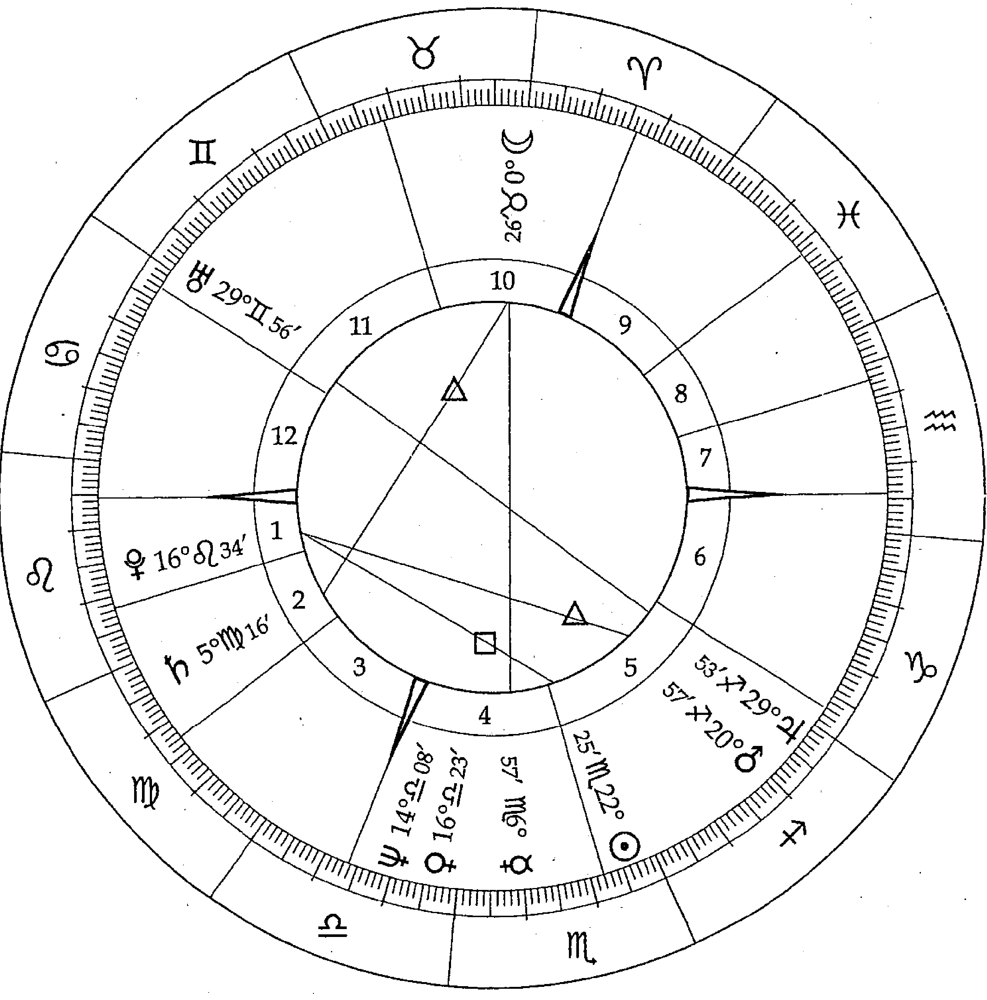
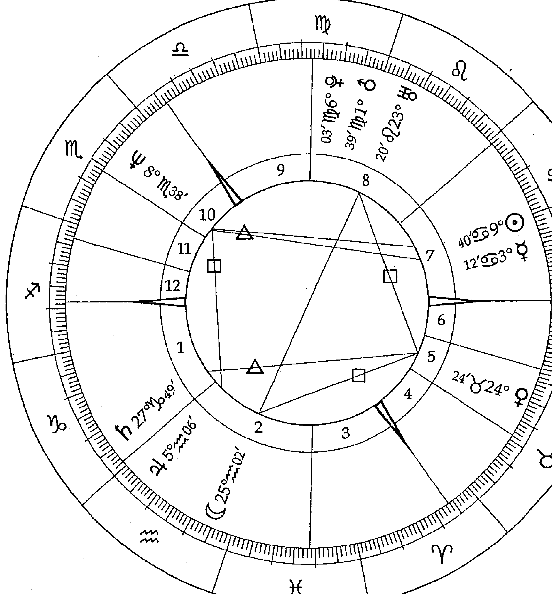

韓良露
生命占星學院

## 情感合盤

Astrological Aspects: Moon, Mercury, Venus, Mars

韓良露 著

月亮、水星、金星、火星相位中的風景

深入了解內在情緒、心智溝通與性愛的邏輯，從容面對親密關係的課題。

## 南瓜之車

啊南瓜
南瓜種在星子與星子
之間的雲泥上
開花，完熟，化成了
黃金的車輛

南瓜的籽是我們的夢
星圖是我們身世的臉譜
占星之學是我們的靈魂所
隨身攜帶的天平
在偌大的宇宙中
我們不會迷航
憑著地圖
靈魂有他最好的旅行方向

親愛的你
坐上黃金的馬車了嗎？

## 情感的合唱

— Astrological Aspects: Moon, Mercury, Venus, Mars —

韓良露 著

月亮、水星、金星、火星相位中的風景

## 出版緣起

興趣廣泛、身份多元的知名文化人韓良露，除了大家熟知的作家、媒體人及文化推動者身份之外，她也是藝文圈中最受重視的占星學大師。
二〇〇三年起她在金石堂金石書院（現龍顏講堂）開設占星課程，由於口耳相傳、好評不斷，課程一直持續到二〇一〇年才劃下休止符。在長達八年的四百多堂課中，她以歷史、哲學、心理學、社會學的角度，將占星的深層智慧化為生動的教學內容，讓大家在學習與命運對話的同時，獲得看待人生的更高視野。

這一系列課程不但架構了宇宙法則的邏輯，也融入她對人性與社會的觀察，但因資料整理工程浩大，成書計劃一直未能完成，為避免這些珍貴課程內容成為絕響，南瓜國際透過多年來數量龐大的上課錄音及相關資料，依據當時課程的規劃邏輯，整理成為系列書籍，期望能藉由文字重現精彩、動人且充滿智慧的上課盛況。

## 目 錄

序

從逆境中昇華

15

### Chapter 1

星圖的基本架構：星座、宮位、相位

19

### Chapter 2

月亮與水星：情緒與心智的互動

29

月水合相——以語言表達情緒

月水九十——衝突不斷的溝通障礙

月水一百八——貌合神離的互不溝通

月水一百二——溝通順暢的內在情緒

### Chapter 3

月亮與金星：安全感與感情的互動

39

月金合相——安全感與美感合而為一

月金九十——安全感與情感的兩難

月金一百八——以物欲取代母愛

月金一百二——安全感與情感的和諧

### Chapter 4

月亮與火星：情緒與行動力的互動

47

月火合相——勇於表達內在情緒

月火九十——過度起伏的內在情緒

月火一百八——家庭生活的暴力衝突

月火一百二——充滿能量的內在情緒

### Chapter 5

月亮與木星：情緒與資源的互動

55

月木合相——家庭環境帶來的資源

月木九十——溺愛造成的自我放縱

月木一百八——過度自信帶來的對立衝突

月木一百二——女性貴人的幫助

### Chapter 6

月亮與土星：情緒與壓力的互動

65

月土合相——實事求是造成情緒壓抑

月土九十——壓力過大的情緒深淵

月土一百八——女性關係的困難

月土一百二——務實穩定的內在情緒

### Chapter 7

月亮與天王星：情緒與創新的互動

73

月天合相——開放前衛的內在情緒

月天九十——不合常理的內在情緒

月天一百八——不斷擺盪的內在情緒

月天一百二——創意十足的事業桃花

▽不快樂的王子：查爾斯王子

### Chapter 8

月亮與海王星：情緒與靈性的互動

81

月海合相——浪漫夢幻的內在情緒

月海九十——逃避現實的內在情緒

月海一百八——製造夢幻的內在能量

月海一百二——充滿想像力的內在情緒

▽受難的王妃：黛安娜

### Chapter 9

月亮與冥王星：情緒與控制欲的互動

91

月冥合相——占有欲強烈的內在情緒

月冥九十——情緒失落的扭曲執著

月冥一百八——向外投射的影響操控

月冥一百二——將情感落實的行動力

103

### Chapter 10

水星與金星：聲音與美感的互動

113

水金合相——具有美感的表達能力

### Chapter 11

水星與火星：心智與行動力的互動

117

水火合相——勇於表達自我溝通能力

水火九十——過於主觀的心智溝通

水火一百八——與外界對立的心智刺激

水火一百二——語言與行動的和諧互動

### Chapter 12

水星與木星：心智與社會價值的互動

125

水木合相——流暢的表達能力

### Chapter 13

水星與土星：心智與社會現實的互動

133

水土合相——結構嚴謹的思考能力

水土九十——過度樂觀的心智表達

水土一百八——過度大膽引起的溝通糾紛

水土一百二——行雲流水的思考能力

### Chapter 14

水星與天王星：心智與創意的互動

143

水天合相——跳脫現實的獨特創意

水天九十——脫離常軌的心智干擾

水天一百八——宇宙意識造成的過度刺激

水天一百二——宇宙意識與個人心智的和諧

### Chapter 15

水星與海王星：心智與靈性的互動

151

水海合相——宛如夢境的創造力

水海九十——過度浪漫的心智溝通

水海一百二——心智與夢想的兩極對立

水海一百八——宇宙靈性的藝術才華

### Chapter 16

水星與冥王星：心智與權謀的互動

159

水冥合相——深入探索的心智能力

水冥九十——過度權謀的心智損耗

水冥一百八——心智與權謀的互相挑戰

水冥一百二——集中深邃的心智思考

### Chapter 17

金星與火星：情感與性能量的互動

165

金火合相——性愛合一的性感魅力

金火九十——性愛兩難的挫折

金火一百八——靈肉分離的擺盪

金火一百二——性愛和諧的適度桃花

### Chapter 18

金星與木星：情感與資源的互動

173

金木合相——情感與金錢的豐富資源

金木九十——情感與金錢的過度浪費

金木一百八——情感與金錢不可兼得的兩難

金木一百二——情感與社會資源的和諧

### Chapter 19

金星與土星：情感與現實的互動

181

金土合相——情感與金錢的謹慎態度

金土九十——情感關係的冷淡與傷害

金土一百八——以世俗利益補償情感空虛

金土一百二——情感與現實兩者兼顧

### Chapter 20

金星與天王星：情感與創意的互動

189

金天合相——前衛突出的強大桃花

金天九十——金錢與情感的快速起落

金天一百八——不合常理的情感生活

金天一百二——廣受喜愛的明星特質

### Chapter 21

金星與海王星：情感與靈性的互動

197

金海合相——過度夢幻的情感理想

金海九十——一廂情願的情感付出

金海一百八——不切實際的情感追尋

金海一百二——浪漫靈性的藝術天分

### Chapter 22

金星與冥王星：情感與控制欲的互動

205

金冥合相——金錢與情感的占有欲

金冥九十——激情與執著的強大壓力

金冥一百八——為了金錢與情感不擇手段

金冥一百二——追求激情意志堅定

### Chapter 23

火星與木星：活力與社會資源的互動

213

火木合相——將活力展現於社會領域

火木九十——自我意識造成利益受損

火木一百八——因外在環境而損及利益

火木一百二——自我能量與社會能量和諧互惠

### Chapter 24

火星與土星：活力與現實的互動

223

火土合相——嚴謹周到的自我管理

火土九十——權威壓抑的活力扭曲

火土一百八——活力與權位的無所適從

火土一百二——精於算計帶來社會成就

### Chapter 25

火星與天王星：活力與變革的互動

231

火天合相——突破傳統的行為表現

火天九十——過於衝動的大膽行徑

火天一百八——外界環境帶來的意外傷害

火天一百二——突破傳統的能量特質

### Chapter 26

火星與海王星：活力與靈性的互動

239

火海合相——模糊柔化的陽性能量

火海九十——過度軟弱造成自我設限

火海一百八——外在環境造成自我傷害

火海一百二——溫柔療癒的個人能量

### Chapter 27

火星與冥王星：肉體與控制欲的互動

247

火冥合相——性與暴力的潛意識連結

火冥九十——內化隱藏的暴力衝突

火冥一百八——因暴力業力而受害

火冥一百二——性能量的轉化與昇華

### Chapter 28

天王星與海王星：革新與靈性的互動

255

天海合相——靈性與文明的新局

天海九十——信仰與理想的革命

天海一百八——理想帶來的衝突

天海一百二——宇宙直觀的天分

### Chapter 29

天王星與冥王星：變動與重生的互動

263

天冥合相——權力的毀滅與新生

天冥九十——宇宙能量的巨變

天冥一百八——權力鬥爭的強烈衝突

天冥一百二——宇宙激情的直覺

### Chapter 30

海王星與冥王星：靈性與轉化的互動

271

海冥合相——集體潛意識的操控

海冥九十——激情與夢想的耽溺

海冥一百八——信仰的毀滅與新生

海冥一百二——夢想與現實的互助

▼最後的煉金術士：艾薩克·牛頓

### 附錄

查詢星圖網站

## 從逆境中昇華

占星的功能之一是算命，但是如果只把占星當算命，那就實在太可惜了。占星跟通靈不同的地方，在於它具有縝密的邏輯，而且能在現實生活中得到印證。例如月亮相位會顯示出一個人小時候母親的對待方式，經由這樣的童年經驗形出一個人的內在安全感與情緒反應，進而影響到當事人長大以後的婚姻關係與家庭生活。對於女性來說，情緒對內分泌有很大的影響，因此月亮相位也跟卵巢、子宮等等跟女性內分泌相關的疾病有關。占星學是一個非常全面的解釋系統，可是它畢竟只是一個解釋系統。占星學可以幫助我們解釋這個世界，可是解釋不等於活在這個世界中。舉例來說，金星跟個人價值與享受有關，木星與社會資源有關，金星跟木星一百二十度和諧相的人容易遇到貴人、獲 得資源，但是他們也可能會因此變得很自私、很偷懶；金星跟木星九十度剋相的人容易有過度浪費的問題，但是他們也可能是捐錢不手軟，很願意慷慨助人的人。

本命星圖中的負面相位都一定會帶來現實生活中的阻礙與挫折，甚至造成很大的痛苦，正面相位必然會為生活帶來一些順境。如果只是停留在算命的層次，強調這些事情一定會發生，而不去理解背後意義的話，即使算得再準，對人生也沒有幫助。

每個人的星圖中必然會有負面相位，也會有正面相位。正面相位雖然帶來順境，但也是也常使人不去尋求突破，因為沒有必要；負面相位的挑戰會讓人努力奮鬥，但也可能因為剋相的壓力而完全發揮負面能量，導致向下沈淪。學習相位的意義就在於學會藉由正面相位的協助，讓我們更有能力面對負面相位的壓力。

命不會越算越薄，但狹隘的觀點會讓命運也變得狹隘。行星高掛天空，它們的能量具有無限的可能性。行星的相位會帶來生命情節的邏輯，它或許像是命運的地圖，標示出這輩子要去哪裡，但是沒有規定要用什麼走法走過去。一個人透過不同的方式來發展星圖能量，命運的曲線就會有所不同。同樣的相位，有的人可以把命運曲線走得很高，也有人會把曲線走得很低。

透過占星學，可以讓我們更深入的了解自己的生命，學習與命運對話。但如何發揮創造力來面對生命中的各種功課，這才是學習占星最重要的意義。

> 註 | 本文內容依據二〇〇五年「相位」相關課程錄音彙整編寫而成。

### Chapter 1

星圖的基本架構：星座、宮位、相位

本命星圖是每個人這輩子人生一場的劇本，星圖中的十顆行星，就像是十個演員，各自扮演不同的角色。

- ⊙ 太陽：意志、人生目標，以及生命中的重要男性。
- ☽ 月亮：情緒、安全感，以及生命中的重要女性。
- ☿ 水星：思想、溝通能力、表達能力。
- ♀ 金星：情感、價值觀、吸引力。
- ♂ 火星：慾望、性衝動、肉體的行動力。
- ♃ 木星：智慧、機會、社會價值帶來的助益。
- ♄ 土星：責任、權威、現世世界的限制。
- ♅ 天王星：無常、變動，宇宙性的巨大改革力量。
- ♆ 海王星：藝術、慈悲，宇宙間沒有邊際的靈性力量。
- ♇ 冥王星：控制欲、執著，宇宙間毀滅與新生的巨大能量。

十顆主要行星中，太陽、月亮、水星、金星、火星屬於內行星，它們都是一個人的內在個性特質。

月亮是一個人生命中最重要的陰性能量，它會顯示出童年經驗中的母親原型，這個原型塑造了當事人的情緒模式，也會在生命中的重要女性身上反覆出現，對於男性來說，他們會選擇符合月亮形象的女人為妻，對於女性來說，她會在重要的親密關係中展現出自己的月亮特質。如果月亮受剋嚴重，可能會使人經常陷入憂鬱情緒。本書在月亮土星相位的單元中，以占星邏輯提供了一些建議。

水星代表了心智與溝通，它的重要性經常被低估。水星的理智，往往能夠幫助我們安度生命的難關。

金星是一種討人喜歡的吸引力，它可以吸引愛情、招來人氣，也可以帶來金錢。

火星是一個人的性能量，它是一種單純而充沛的生物本能，它不僅只是性欲，也是一個人展現活力的方式。

這幾顆行星是每個人情感的合唱。本書透過相位的邏輯，帶領大家深入理解在我們的成長過程中，它們是透過什麼方式塑造出我們的性格，進而藉由它們的力量，唱出美妙的情感樂章。

木星、土星、天王星、海王星、冥王星屬於外行星，木星跟土星跟社會環境有關，天王星、海王星、冥王星屬於宇宙能量，它們的影響力更大。本書最後三章也將帶大家研究天王星、海王星、冥王星這三顆行星互相形成相位時，會帶來哪些改朝換代的巨大能量。

> 註：太陽代表人生目標，木星代表社會潮流與資源，土星代表社會權威與地位。這三顆行星對於人生之路是否平順的影響很大。太陽相位、木星相位、土星相位的相關內容，請見《成功做自己：太陽、木星、土星相位中的生命之旅》。

從一張星圖中，可以解讀出各式各樣命運的密鑰。以我為例，月亮代表生命中的重要女性，所以它會跟我的母親有關，跟我的姊妹有關，也跟我自己有關。我的本命星圖中，月亮在雙魚座，落在三宮，月亮跟海王星有一百二十度和諧相位，又跟冥王星有一百八十度負面相位。

月亮跟海王星的和諧相位會帶來藝術天分與想像力，從我母親來看，她的太陽就在雙魚，她很有藝術天分，不但會彈琴、很喜歡閱讀，個性也很浪漫。月海一百二也反映在我的三妹良憶身上，她也很有藝術天分，不但是個作家，而且對音樂很有研究。從我自己來看，由於月亮落在跟寫作有關的三宮，月海和諧相帶來的想像力，讓我在早年寫過非常多劇本，後來也一直從事寫作工作。

此外，我的月亮跟冥王星有一百八十度的負面相位。冥王星具有隱藏與執著的特質，月冥一百八代表我跟母親之間會有心靈感應的聯繫，也意謂著我的母親會因為控制欲而造成母女之間的緊張關係。月冥一百八的剋相也反映在我的二妹良雯身上，由於她一出生就有先天智能不足問題，終身都需要別人照料，月亮三宮的剋相代表我會有一個出問題的妹妹，也顯示出我必須要照顧這個妹妹，掌控她的生活。

從這裡大家可以看到，單憑月亮的相位與星座、宮位，就同時顯現出我兩個妹妹、我的母親跟我自己的狀況。

星座、宮位、相位是占星學最重要的三大基本功。行星落在什麼星座、行星落在什麼宮位，以及行星跟行星之間形成什麼相位，透過這三個面向，占星學得以解讀出每個人不同的生命風景。

十二個星座代表了十二種不同的特質，當行星落入不同的星座，就會透過不同星座展現出不同特質。舉例來說，水星代表了一個人的思考與溝通，水星牡羊的人思考都會具有原創性，而且勇於表達自己的意見；水星金牛的人思想與溝通都很務實，他們對沒意義的閒聊不感興趣。

十二個宮位代表十二個生命情境不同的領域，例如一個人的水星落在二宮金錢宮，當事人就會將水星的心智，發揮在跟理財有關的領域，如果一個人的水星落在十宮事業宮，當事人就在事業舞台上展現水星的機智與口才。

十二個宮位，分別代表以下十二個生命舞台：

- 一宮：童年環境，以及一個人看起來的感覺。
- 二宮：靠自己賺取的有形與無形的資產。
- 三宮：基礎教育、大眾媒體、寫作、兄弟姊妹。
- 四宮：家庭生活、內心之家。
- 五宮：戀愛、創作、子女、娛樂與賭博。
- 六宮：工作、健康，維持生命正常運作的事情。
- 七宮：伴侶、配偶、一對一的合夥關係。
- 八宮：權力、潛意識，與他人相關的金錢與性。
- 九宮：高等教育、哲學、宗教，旅行及外國事務。
- 十宮：事業、地位、社會形象。
- 十一宮：志同道合的友誼及社團關係。
- 十二宮：前世、業報與無意識。

相位代表了行星與行星之間因為特定角度而產生的關聯。正面相位會讓能量增強，負面相位的衝突，往往會引動出雙方的負面能量。一般來說，形成相位的誤差度數在六度以內，都會具有一定的影響力。誤差度數越大，影響力越小，誤差度數越小，影響力就越大。

占星學中的主要相位，可分為合相、九十度衝突相、一百八十度對立相、一百二十度和諧相。四個主要相位的意義如下：

- 合相：當兩顆行星之間的距離在六度以內，雙方的能量就會因為不斷互相刺激而被強化。合相就像是兩顆行星齊聲合唱般能量很強，但是如果遇到本命星圖或行運剋相，就會帶來雙倍的負面能量。也就是說，合相的力量雖強，但是可能是大好，也可能是大壞。

- 九十度衝突相：當兩顆行星之間形成九十度相位，雙方就會各唱各的調互相干擾，因此引發出彼此的負面能量。

- 一百八十度對立相：當兩顆行星形成一百八十度相位，代表雙方完全南轅北轍，往往因為對立而互相挑戰，因此會比九十度的衝突內耗能量更強。

- 一百二十度和諧相：一百二十度是一個比零度合相更好的相位。原因在於兩顆行星彼此可以互相幫助，但是不會出現合相的過度刺激的負面作用。

以下頁影星瑪麗蓮夢露（Marilyn Monroe）的星圖為例。最外圈的三百六十度刻度被等分為十二個星座，標示出行星的星座與度數。從圖中可以看到，瑪麗蓮夢露的太陽在雙子座十度、月亮在寶瓶座十九度。第二圈被阿拉伯數字劃分的十二個區塊，就是十二個宮位。瑪麗蓮夢露的海王星落在一宮、土星在四宮、月亮跟木星在七宮。最內圈的連線代表了行星之間的相位，為了方便閱讀，一百二十度相位以「△」標示，九十度相位以「□」標示。瑪麗蓮夢露的太陽在雙子十度，水星在雙子六度，太陽水星形成了誤差四度的合相；金星在牡羊二十八度，海王星在獅子二十二度，形成誤差六度的一百二十度和諧相；土星在天蠍二十一度，海王星在獅子二十二度，形成誤差一度的九十度剋相。

尽管本书的主题是「相位」，但为了让大家熟悉占星语言，有些地方还是会带到星座、宮位相关内容，也透过一些名人的本命星图来解析占星逻辑。对星图陌生的初学者，不妨参考十九、二十页的行星简介、二十四页的宮位简介。

## Chapter/2

## 月亮与水星：情绪与心智的互动

月亮相位通常会展现在当事人小时候跟母亲的相处关系。从月亮跟水星形成的相位中，可以看出当事人小时候跟母亲之间的沟通状况，月水相位好的人小时候跟母亲很谈得来，长大以后也会跟家人也会很谈得来，这也意味着当事人的情绪跟能量之间的心智能量和谐。

如果月水形成的是九十度或一百八十度克相，当事人小时候一定跟母亲会有沟通上的问题，长大结婚以后也会在自己的家庭中遇到同样的问题。

不过如果没有其他克相的话，单纯的月水克相虽然会让家人或夫妻之间沟通不顺畅，但是不见得会出问题。因为人际关系之间的意见不合其实没关系，很多时候家人之间吵来吵去只是大家在拌嘴，很多夫妻一天到晚在吵架，但是两人的感情还是很不错。

### 月水合相——以语言表达情绪

不管男女，一个人如果本命星图中月水合相，除非同时月亮还跟其他行星形成克相，否则当事人都会有一个很能跟子女沟通的母亲。即使他们的母亲一辈子只是个家庭主妇，当事人都会觉得妈妈很聪明、很有才智、很会动脑筋，他们跟母亲很有得聊。
并不是所有的男人都喜欢美女，对于月水合相的男性来说，由于从小跟母亲很有得聊，长大以后如果娶到一个无法聊天的太太，他会觉得怪怪的。对他们来说，可以跟他们沟通比漂亮更重要，当他们遇到谈得来的女生的时候，就很容易唤起他们的感情，让他们觉得熟悉。所以月水合相的男性喜欢挑选聪明的、谈得来的女生来做自己的伴侣。

由于月亮是阴性的能量，所以月水合相的人声音都会比较柔软，而且可以用语言表达情绪。除非月水合相同时又有别的克相，否则月水合相的人讲话都会比较委婉，基本上他们讲话都不会太冲，也不会说出很苛刻的言语。即使水星落在非常直率的射手，他们讲话时也会比一般的水星射手委婉许多。对于月水合相的女性来说，这些特质本来就符合女性的既定形象，别人未必察觉得到，但如果当事人是男性，这些特质就会让人感觉到很特别。例如前內政部长吴伯雄，就是月水合相的人。此外，月水合相还有个特色，就是月水合相的人会处理很多家庭事务，他们的聪明才智与心思，有很大部分会放在家中。像我有个月水合相的朋友，他是一个医生，可是家里大大小小的事情都要他去处理，吴伯雄也有类似的状况。有的男生可能一辈子都没碰过家里的事，简直跟房客一样，但月水合相不论男女都不会这样。

### 月水九十——冲突不断的沟通障碍

当一个人的月亮与水星呈九十度的克相，代表当事人跟母亲之间从小就很容易有意见上的分歧。当事人的母亲比较容易焦虑，也容易因为情绪焦虑而批评子女，跟子女容易产生沟通障碍，而且程度会跟相位的紧密程度成正比。如果是误差度数为零的精准九十度克相，当事人母亲情绪焦虑的情况会很严重，很可能精神与心智也会很不稳定。

如果水月九十的交角比较宽，还差三、四度以上的话，当事人的母亲也会显现这种特质，但情况不会这么严重。

不论男女，月亮跟水星九十度时，当事人会感到很难与母亲沟通，他们常常因为想法上的差异，而让双方感到受伤。月水九十的人对于别人的批评非常敏感，他们特别不能被人家批评，不管是母亲、太太或兄弟姊妹都一样，任何一点的批评，都可能让对方觉得很严重，造成情绪的冲突，情绪的伤害。在任何人际关系中，如果其中一方对于批评过度敏感，完全不能被批评的话，关系自然不会很和谐。

对于家庭生活的看法不一致，也是人与人之间产生冲突最主要的一个原因，尤其是家人，因为家人住在一起往往没有分界，而在生活中我们容易触及的就是家事，所以也比较容易在这些方面引起冲突。月水九十的人家庭生活不会很稳定，家中常常会为了家事起冲突，争执内容甚至会涵盖家里的清洁、卫生、家事怎么做等日常生活琐事。

月水九十的人虽然容易跟姊妹、母亲、妻子之间产生冲突，可是基本上这个相位并不容易造成关系的分裂。很多关系亲密的夫妻，其实也一天到晚都在吵架。吵架从来都不是人与人之间会分开的原因，除非星图上面的月亮有其他的克相。

月亮代表当事人生命中的重要女性，对于月水九十的女性来说，除了母亲之外，也代表她自己。月水九十的冲突会反映在容易焦虑的母亲身上，母女关系的不和谐也会造成她自己容易有情绪的困扰。月水九十的冲突大大小小，严重性各自不同。例如影星林青霞就有月水九十克相。她有一张非常好的本命星图，可是这张图上最大的问题，就是月亮相位不好。由于她的月水九十是误差度数很小的准确九十度相位，她的妈妈常常跟子女有冲突，结束了自己的生命。可想而知，这个问题也容易变成林青霞自己的困扰。

九十度的克相跟一百八十度的差别在于九十度是一种内耗，它会是一直存在的冲突。

我有个朋友也有月水九十的问题。由于她的星图上还有日土九十的克相，从小她父亲就不太回家，照理说，母亲应该是这位当事人很重要的依靠，可是她跟妈妈之间从小也不断争吵，吵得非常严重，这让当事人后来产生焦虑问题，一直在看心理医生。

对于月水九十的人来说，在他们的亲密关系经验中，所有跟讲话相关的记忆通通是不愉快的，因此当他们年纪越来越大，会变得越来越不爱跟人讲话。不少年过三十的月水九十，他们在社交场合中话非常少，除非是商场应酬或带有功利目的的必要情况，他们才会开口，否则平常不会为了要跟别人建立情感关系而说话。我有七、八个朋友就是这样。这几个月水九十的朋友不分男女话都不多，但他们可能会在某一些特殊状况下突然多话了起来，譬如像喝了酒之后。他们平常都会写点东西，这种情况跟不会写东西而话少是不同的，这代表他们其实不是没有能力表达自我，而是他们跟别人在日常生活中有言语上的沟通障碍。刚刚说过月亮水星九十度的人，常常会为了家事吵架，我这边有个有意思的故事。我有个很熟的朋友就是月水九十，从小到大我一直看他跟自己母亲为家中大大小小的事起冲突。在占星学中，月亮除了家庭之外，也跟房屋有关，这个朋友偏偏长大以后做了室内设计师。当居家设计成为他的职业之后，他的月水九十让他以前常常跟母亲吵架，长大以后变成常常跟自己的客户吵架。由于月亮跟女性有关，我发现他只要遇到的是男性业主或公家机关的案子就相安无事，但只要是女性业主都会跟他吵架。其中跟他有过冲突的两位女性业主，还是我认识的朋友，这两位女生当初在找他的时候，看过他所有作品，都觉得很好，可是做完之后双方都翻脸。这两位女性朋友都批评这位设计师的作品虽然有特色，但根本难以住人。也就是说，月水九十的设计师表面上看來好像做了很多聪明的设计，可是这些功能完全是展示性质，住起来很不舒服。所以后来我提醒他，月水九十代表他跟女性业主以及家庭相关事务上特别没有缘分，接这类的案子一定会倒霉，还不如多接些公家案。

### 月水一百八——貌合神离的互不沟通

如果大家观察一下身边的小孩，就会发现，很多小孩会跟母亲吵嘴。但是月水一百八的小孩不会。月水一百八的人可能会碰到一个很会批评他们的母亲或妻子或女儿，可是当事人并不会回应。月水一百八的人你不管怎么啰嗦他，他就随便敷衍两声，或者就当做没听到，他们不会跟你吵，根本不对抗，可是基本上他跟你之间比月亮水星九十度的人还更不和，只是他们不把冲突表现出来而已，他们根本不想沟通，所以连吵都懒得吵。

月水一百八的人家庭生活一定有问题，可是这些问题从来没有浮出过表面。当事人与亲密女性关系之间从不沟通，长期下来会形成一种冷战的状态。他们从小跟妈妈貌合神离，长大以后就可能跟太太貌合神离，跟姊妹貌合神离，也跟女儿貌合神离。相较于月水九十的冲突，月水一百八意谓着他们知道彼此之间是为了什么感到不愉快，譬如说为了家事怎么做，为了牙膏怎么挤之类的问题，双方都会很清楚，而且这种冲突会诉诸言语表现。但月水一百八的情况就不一样了。一百八的对立不像九十度的冲突内耗，当事人从小就容易跟母亲形成一种几乎是尽量不要说话的冷战状态，而不是吵架或争执。表面上两人关系会比月水九十度的人看起来还要好，因为他们不会经常吵架，也不会在别人面前起争执。月水九十之所以会吵个不停，代表他们一直希望可以说服对方，希望对方能跟自己的想法达成共识。相较之下，月水一百八不把话说出来其实等于放弃沟通。月水一百八意谓着双方对于事情的观点南辕北辙，他们根本不觉得双方可以达成决议，所以选择各行其是。月水一百八的人从小跟母亲的沟通问题，会使当事人在语言表达上比较退缩，他们通常会比月水九十的人更沈默，也更不愿意跟人讨论双方的歧见。由于他们常会将无法沟通的情绪问题转移到别的地方，所以容易引发身心症。有些月水一百八的人，会有饮食不正常的状况，有一些人会在家庭生活中显现出过度的洁癖，或是过度的邋遢，非常极端。

### 月水一百二——沟通顺畅的内在情绪

月亮跟水星一百二，当事人不管男女，都会碰到跟他们沟通无碍的妈妈。他们跟母亲很谈得来，双方不太会吵嘴，彼此意见很协调。月水一百二的人常常觉得母亲很聪明，他们跟母亲就像是朋友，母亲也经常扮演意见库的角色。他们的家庭生活会比较和谐，也比较不容易为了家里的事情去争执。

从小跟母亲意见协调的水月一百二，长大以后也容易跟身边的女性谈得来。水月一百二的当事人如果是女性的话，主要的谈话对象会是姊妹淘，她会比较喜欢跟姊妹淘相处，也会有许多感情很好的姊妹淘可以陪她谈心。当事人如果是男生的话，他们会比较喜欢跟女生谈话，也比较愿意通过聊天将心里的感觉与想法说出来。很多人跟别人聊天时是不告诉别人的心事的。可是水月一百二的人有个特色，他们的心事会是他们与人沟通时的重要主题。水月一百二的男性也常常会娶跟他们很谈得来，很能给他们意见的太太。我有个水月一百二的朋友就是这样，虽然因为其他星图上的问题，所以他的太太已经分居很久，太太住在台湾，先生住在国外，但是有时是为了家里的事，有时是为了公司的事，两人还是经常通电话，他们之间的互动，其实比很多住在同一屋檐下的夫妻还多。先生有时候回到台湾的时候，他们还是会住在一起，还是会跟朋友一起聚会。而且我认识他们那么多年，从来没有看过这对夫妻吵架，由此可见人与人之间的缘分真的有数不清的可能性。

## Chapter/3

## 月亮与金星：安全感与感情的互动

金星代表的是一个人的喜好，金星代表的是一个人喜欢什么，它跟月亮的情绪安全感是不同的。

一个人不可能不知道自己喜欢什么东西，它是一种本能，但是很可能这样的东西并不适合自己。月亮与金星如果形成负面相位，当事人就会遇到安全感跟自己喜欢的事物无法兼得的问题。这就像一个人喜欢吃的是麻辣锅，但是他也就知道就算再喜欢也不能餐餐吃，因此不得不做出别的选择。他也许只能偶尔偷偷吃，或者从此戒掉麻辣锅，但这個人内心深处都会知道自己放弃了真正喜欢，却不能够拥有的东西。

### 月金合相 —— 安全感与美感合而为一

月亮金星合相的人，通常会有个具有魅力的母亲，他们的母亲不見得一定是美人胚子，但一定会被一般人认为具有某种吸引力。月金合相的男生，长大以后娶的太太，也通常面貌姣好，他们生命中的重要女性往往都很漂亮。

当事人的母亲或妻子通常会比较爱打扮，尤其喜欢美丽的衣服、美丽的居家环境，比较喜欢社交、享受，个性也比较敏感、比较温柔、有点虚荣，有点像王家卫电影中经常出现的那种母亲角色。

金星跟生活中的美感有关，当一个人月亮跟金星合相，他们的母亲通常会有些才艺，但不見得是艺术的才华，她们通常都会烹饪、做衣服，或布置家庭、插花之类的才艺。

小说家D. H. 劳伦斯就有月金合相，这也意谓他会有恋母情结，因为月亮代表的母亲与他的喜好——金星形成合相，这代表他的母亲与他喜欢的女性原型结合在一起，以后他的太太也会反映出这种情结，当然这并不见得会形成乱伦，但精神上一定有一点恋母情结。

像 D. H. 劳伦斯作品《儿子与情人》，其实就在描述恋母情结。劳伦斯跟母亲之间的关系也非常亲密，劳伦斯出外时，一直会与他母亲通信，信件内容简直与情书没什么两样，好比「我今天一整天都在想你」、「记得写信给我」等等，如果看过《查泰莱夫人的情人》的读者就会知道，查泰莱夫人与男主角之间简直就像母子关系。劳伦斯当然没有跟他妈妈在一起，可是他后来找的太太，跟他相处时也如同母子。

我有个亲戚，就有月金合相，他有个好看的妈妈，可是因为他同时还有月天一百八，所以他的妈妈在他小时候就跟他爸爸离婚了，后来这个小孩子长大之后在大陆也娶了一个很漂亮的天津女孩，不过不到两年就离了婚。他的月金合相，显现出他的母亲与太太都很漂亮，可是月天一百八让他与他妈妈、太太之间都没有缘分。他妈妈现在已经五十几岁，还是满好看的，她会花很多时间整理家务，平常也会打扮。月亮金星合相的人往往很会打扮，出现时永远都是妆点得很好的样子，如果当事人是男性，他的太太也会打扮，如果当事人是女性，她们自己也很会打扮。

### 月金九十——安全感与情感的两难

当本命星图中月亮跟金星形成九十度克相，代表当事人会在生命中遇到月亮安全感与金星感情的两难。月金九十的人可能会因为注重安全感、物质的舒适与社会关系，导致感情被牺牲，他们也可能必须牺牲安全感或资源来得到感情。

月亮金星九十度的人不管男女，他们的妈妈当初可能是为了金钱结婚，当事人自己在生命中，也会在财务安全感与感情之间游移摆荡。他们的现实安全感与爱情无法同时并存，也容易喜欢上让他们觉得没有安全感的对象。当事人害怕亲密的关系，因为他们在月亮的亲密感与金星的喜欢之间常常会出现冲突，他们的生活中，也容易出现跟财务相关的冲突。

男性当事人容易遇到为了安全感而跟他结婚的妻子，妻子不见得真的喜欢他。女性的话容易以自己的母亲为榜样，也常为了追求安全感而跟一个她不见得真正喜欢的对象在一起，她们常常会为了物质生活而结婚。

通常月金九十的人会因为选择了月亮而牺牲金星，因此他们不会喜欢他们的对象。 一个人的星图中，如果没有这种相位时，一开始或许不见得会跟喜欢的对象在一起，可是久而久之也可能会日久生情，但月亮金星九十度的人不会。因为月金九十度不是要让情感与安全感比谁赢谁输，九十度带来的是冲突内耗，它会时时提醒当事人安全感跟爱情不可兼得的两难，让他们一直活在强烈的矛盾中。

### 月金一百八——以物欲取代母爱

月亮跟金星一百八的情况跟月金九十的情况不同，月亮跟金星一百八的人从小跟母亲之间常常会有情感障碍，月亮金星的一百八十度对立，通常意谓着当事人的母亲容易过度发展自己的金星，容易为了金钱或自己的喜好而没有善尽母职，因此当事人从小跟家庭母亲之间是隔绝的。 由于一直没有得到足够的母爱，基本上当事人并不相信来自家庭与母亲的安全感，因而容易过度发展金星的那一面。月金一百八的人，尤其是男性当事人，长大以后常常会有两种状况：第一种状况是他们可能会很需要爱情，即使在婚后，当事人还是会去追求他喜欢的对象，他们会有种不断恋爱的强烈需求，想要用谈恋爱来弥补童年欠缺的母爱。另一种状况是当事人会有强烈的物欲，他们会用物质上的享受来取代安全感，或者是用金钱来弥补匮乏感。如果当事人是女性，她们从小遇到的就是过度重视金星的母亲，她们自己长大以后也会成为这样的人。所以很多月亮金星一百八的女生，会对珠宝或服饰特别执着。

如果一个人拜金、拜物到了很严重的程度，往往童年都有缺乏母爱的问题。例如我认识一个月金一百八的人，由于当事人星图中还有其他严重的克相，所以母亲很早就过世了。月金一百八本身并不会造成母亲早逝，但是母亲早逝却会让当事人从小缺乏母爱，因而导致当事人长大以后过度重视物欲，因为这些物质对他而言，等于是母亲的象征。

同样的道理，一个人如果从小欠缺母爱，长大以后就常常会很本能的想要藉由不断的谈恋爱来取代母爱。如果没有月金克相的问题，一般人不会一辈子不断的在谈恋爱。

### 月金一百二十——安全感与情感的和谐

即使是性荷尔蒙特别高的人，他们对于性爱的冲动，也会随着年纪增长而逐渐消退，不会像月金一百八的人终生都在追求新恋情。

月金一百二十的人通常有个具有艺术天分的妈妈，例如我认识一个月金一百二十的人，他的妈妈是很有名的花道老师，教了三十年的花道。月亮跟金星的一百二十度和谐相位，意谓着当事人和母亲之间有种温柔的关系，他们生命中的重要女性也会显示出这种特质。如果一个男人本命星图中有月亮金星一百二十度和谐相，代表他们容易娶到对他们很好的太太，夫妻之间会有亲密的情感交流。

不过一个人本命星图中有月金一百二十的好相位，不代表生活中不会有问题。我看过一个非常特殊的案例，当事人是我的远房亲戚，他的本命星图中有月金一百二十的好相位，他通过电脑征婚安排的相亲，找到了理想的对象，两人一拍即合坠入情网，后来就结了婚。两个人在婚礼上手牵着手，即使以新婚夫妻的标准来看，他们的亲密程度也很少见。这还不稀奇，两人婚后每次出现在众人面前，永远都是手牵手，像一对小鸟一样，完全不在意别人的眼光，大家都觉得这两人关系简直是亲密到不正常。
但人生真的很古怪，三年多之后，那个男的突然精神出了问题。原来他的本命星图中虽然月亮相位不错，但是太阳水星同时跟天王星有严重克相，又落在十二宫，所以他有精神病的家族性遗传。一开始只是轻微的被害妄想症，但后来情况越来越严重，岳父岳母偶尔会抱怨，希望女儿不要跟他在一起，可是女儿跟他感情很好，不愿意跟他分开，最后有一天他就拿起刀把岳父岳母都砍了，还上了报，他的太太才不得不把先生送去疗养院。即使如此，他的太太还是经常去探望他，并且定期寄钱给当事人的爸爸。如果一个男人的本命星图中有月金一百二十的和谐相，他们都会跟太太感情很好，即使像这个特殊案例，当事人的人生因为其他严重克相而变了样，但是他的太太还是因为顾念夫妻情分，持续的为当事人提供了很大的协助。

## 月亮与火星：情绪与行动力的互动

月亮是一个人最重要的阴性能量，而火星是很强烈的阳性能量，当月亮跟火星形成相位，就容易反映在一个人的情绪、家庭的气氛，以及女性的健康上。由于月亮跟家庭有关，月火的不和谐相位常常会跟家庭暴力有关。此外，对于女性来说，月火的克相会带来很大的情绪波动，进而造成内分泌的不稳定，会对健康有很大的影响。

### 月火合相 —— 勇于表达内在情绪

月亮跟火星合相如果没有同时跟其他行星形成克相，通常当事人都会有一个很有勇气的母亲，母亲会有一点大女人，属于女中豪杰。当事人的母亲很能够承担责任，性格也比较强。如果一个人本命星图中是单纯的月火合相，当事人只是个性比较强，但并不会特别容易发脾气。但如果月亮火星的合相又同时跟其他行星形成克相时，就等于是月火受克，当事人会特别没有耐心，做事时比较焦躁，很容易发火。

月亮火星合相的人，不分男女都很能够表达感情，很直接，火星跟性欲有关，月火合相的人会比较重视性欲，他们对性欲的追求是很本能的。

月火合相的女性像她们的母亲一样，都是比较勇于表达情绪的女中豪杰，月火合相的男性则喜欢个性比较强、很有活力的女性，而且他们会寻找能够引起他的性欲，而且勇于表达情绪、很直接的女性做他们的太太。

### 月火九十——过度起伏的内在情绪
如果一个人的本命星图中月亮跟火星有九十度的冲突相位，代表当事人的情绪常常会受到脾气干扰而显现出一种不稳定的状况。月亮跟火星九十度的人，都会有个很容易发火的妈妈。容易发火跟容易吵架是两回事，一个人可以跟妈妈常常在言语上起争执，可是不带脾气，像月水九十的人就是这种类型。月火九十的人妈妈个性很强、脾气不好，当事人跟妈妈之间不见得经常意见不合，但是他们常常会因为情绪不合而冲突。通常月火九十的人，妈妈都很强硬，当事人跟母亲常常会有情绪上的冲突，可能是为小事而冲突，而不是为意见不合冲突。

月火九十是一个对女性健康很不利的相位，它常常会跟子宫、卵巢等问题有关。对于女性来讲，子宫跟卵巢的问题，可能都跟情绪的不稳定有关，经常发脾气或经常情绪很不稳定的人，荷尔蒙是不会稳定的，长期的情绪波动会造成荷尔蒙的波动。所以星图上如果有月火九十，尤其如果月亮或火星又有其他克相时，很多人会有子宫肿瘤，如果当事人又有火冥九十或月冥九十时，就很容易出现恶性肿瘤。月亮代表一个人生命中的重要女性，对于男性来说，它可以代表母亲、姊妹、女儿或妻子，对于女性当事人来说，它代表母亲、姊妹、女儿，它也代表当事人自己。我认识几个星图上月火九十的男性，他们的母亲都死于子宫或卵巢相关疾病，当然时间或早或晚，不见得很年轻就会走。他们的太太跟当事人的母亲虽然没有血缘关系，来自不同的家庭基因，却也常常会因为星图的同时性，经常会有类似的问题。对于一个女性来说，月亮负面相位的问题往往会直接表现在她们自己身上，而男性的月亮问题则经常会透过间接的方式显现。如果一个男性，月火九十带来的情绪不稳，也常因为他们不像女性会把月亮表现出来而被隐藏，结果月火九十的男性很多都有很严重的消化系统问题，例如有的人有严重的胃疡，可能严重到得把胃割掉。

### 月火一百八——家庭生活的暴力冲突
月火九十的人常常会有个脾气不好的母亲，在家经常会有情绪障碍，当事人也经常有情绪不稳的问题，但月火九十的冲突只是动口，月火一百八则往往会演变成动手打人的肢体暴力。如果月火一百八同时还有冥王星涉入，暴力的程度会非常严重，即使只是单纯的月火一百八，当事人小时候还是免不了会被妈妈打耳光或丢东西，当事人碰到的家庭纠纷会牵扯到动粗，绝对不是大吼大叫而已。

月火一百八常常跟家庭暴力有关。月火一百八的女性，小时候她们的母亲很可能是家庭暴力的受害者，她们长大结婚以后，月火一百八常常会反映在妻子身上，他们的妻子常常成为家庭暴力的受害者，他们自己反而成为家庭暴力的施暴者。

从跟家庭暴力有关的研究中常会发现，很多童年曾经遭受家庭暴力的男性，他们小时候最痛恨的就是打老婆的男人，没想到长大以后却重蹈父亲的覆辙，成为他们小时候最痛恨的那种人。从这里可以看到家庭暴力学跟占星学的相同逻辑。

月火一百八有时候会反映在家里有人犯罪，或者是家里遇到火灾之类的家庭问题。如果月亮跟火星形成的是误差值接近零度的精准一百八十度克相，当事人的母亲有可能会是意外事件的受害者。尤其如果当事人还有土星天王星或土星冥王星的负面相位时，当事人的母亲有可能会因为战争或社会上的犯罪事件而受害。如果当事人是女性的话，她们要小心自己可能也会遇到类似的状况。

### 月火一百二——充满能量的内在情绪
如果一个人本命星图中月亮跟火星形成一百二十度和谐相，意谓着当事人会有一个很有自信的母亲。当事人的母亲有勇气但不会过分胆大，行动力会比较强，通常也比较独立，不会那么需要他人，是个比较强悍的母亲。月火一百二的人，他们的母亲很有能量，他们自己也会很有能量。大家在学习相位的时候，一定要有一个基本概念：尽管合相的力量很强，但一百二十度的和谐相永远比合相好。本命星图如果出现合相，意谓着一个人过度想要拥有某个事物的渴望，合相强大能量的背后，其实是一种补偿心理。从占星逻辑来看，如果一个人想过度拥有某些东西，时候到了永远就必须为此付出代价。合相如果跟其他行星形成九十度克相，就等于是两个九十度的双倍克相，即使合相在本命星图中没有跟其他行星形成克相，也一定会遇到行运的九十度或一百八十度克相，当合相每一次遇到行运的克相，都会是两个九十或两个一百八的双倍克相。相较之下，一百二十度和谐相，不管是其中一端跟本命星图中其他行星形成九十度克相，或者遇到行运带来的九十度或一百八十度克相，都会同时跟另一端形成三十度或六十度的次和谐相位，藉由次和谐相位提供的救援，当事人会比较容易度过克相的难关。

## Chapter/5
## 月亮与木星：情绪与资源的互动
在本命星图中，月亮、金星、木星，这三颗星跟财富最有关连。如果将太阳跟月亮两相比较，太阳的相位会显现出一个人的性格特质，也看得出当事人在追求人生目标时会比较辛苦，或者是很轻松就能成功，但是个人成不成功跟有不有钱是两回事。太阳的好相位会让当事人比较容易获得事业成就，但是有成就、有地位的人不见得有钱。而月亮代表的是一个人的安全感，其中包含了物质生活的稳定与舒适，所以月亮跟财富有直接的关连。

本命星图中月木合相或月木一百二的人，如果月木没有其他克相，代表当事人一定可以继承到家庭的财富。由于月亮代表当事人生命中的重要女性，月木好相位的人一定是从母亲手中得到遗产，这也意谓着当事人的父亲会是双亲中比较早走的人——不过这跟父亲长不长寿无关，当事人的父亲可能活到八九十岁，但一定会比母亲早走，否则财富来源不会来自母亲。如果月木的好相位又同时跟天王星形成了好相位，这个人拥有的财富可能是一般有钱人的好几倍，甚至好几十倍，有钱程度可能会超乎想像。

### 月木合相——家庭环境带来的资源
月木合相的人绝对不会来自于贫穷或者很困苦的家庭，他们的家庭在社会标准中，一定是属于相对富裕、家庭较好的家庭。

月亮跟木星合相的人，不论男女，即使月木合相同时间还跟其他行星形成克相，他们都会有一个能够为子女提供很多资源的母亲。他们的母亲很大方、很有活力，她们对子女不会太严格，而且很愿意为子女付出。木星代表的是社会资源，他们的母亲通常教育水准较高，具有相当的智慧，而且对于教育、文化宗教有一定的兴趣。如果当事人是女性，她们也会很大方，很能给予资源，如果当事人是男性，他们也容易娶到教育水准比较高，比较大方，对当事人很支持的妻子。

美国前总统小乔治布希（George W. Bush）就是月木合相。他的家世背景非常好，他的母亲跟妻子也对他很支持。小布希的星图中，不只是月木合相，而且月木还同时跟天王星一百二，等于是月木合相，再加上月天一百二、木天一百二，所以他的财产恐怕不是一般人可以想像。美国总统薪水其实不多，像美国另一个前总统柯林顿到现在都还在还选举债。可是布希在还没有当上美国总统以前就很有钱，因为他整个家族是德州的油商。尤其几年前行运天王星、海王星都在宝瓶，跟他的本命月木合相形成了一百二，又跟本命天王星也形成一百二，那几年石油一直涨了三年多，整个布希家族的财富更是增值到不得了的程度。油价跟战争有很直接的关联，也难怪有不少人认为，布希的主战态度，让他的财产翻了好几倍。

### 月木九十——溺爱造成的自我放纵
月木九十的人会有一个情绪很夸张、很过度的母亲。她们愿意为小孩买很多玩具、给小孩吃很多好吃的东西，愿意带小孩到处玩、愿意在小孩身上花很多钱，她们愿意给小孩很多资源，但是过度浪费。简单来说，就是他们会有一个过度溺爱小孩的妈妈。

如果说月木合相的人情绪乐观、开朗，那么月木九十的人就是过度乐观了。月木九十的人都会勇于表达自己的情绪，但他们的情绪会比情绪火爆的月火九十的人更不稳定。由于月木九十的人从小被一个喜欢溺爱小孩的母亲养大，这样的人长大以后就会比较自我放纵，所以常常会因为过度浪费而出现财务问题。也因为他们不懂得控制自己的口腹之欲，即使他们小时候可能瘦瘦的，但年纪越大，他们的体型也会越来越膨胀。

对于男性的当事人来说，妈妈的情况会在妻子身上重演，他们的妈妈很浪费，很宠爱他们，他们的太太也会很浪费，很宠爱他们。如果当事人是女性，她们就容易跟自己的妈妈或太太，的妈妈一样，具有过度浪费、过度夸张的倾向。月木九十相位的人，他们的妈妈或太太，或当事人自己，他们都有太爱花钱的问题。例如他们都会很爱买衣服，但是可能衣服只穿了一次就拿去送人。他们对别人很大方，对自己也不小气。结果常常会搞到财务调度出问题，他们会是经常把信用卡刷爆的那种人。月亮木星九十的人都很喜欢花钱，我们不妨比较一下两者的差异：月亮跟家庭有关，金星跟当事人的喜好有关，所以月木九十的人花钱很浪费，但这些钱通常是用于讨好家人，而金木九十的人则通常会把钱花在自己身上。例如我认识一个月木九十的人，她住在美国，她跟她妈妈都很喜欢装潢屋子，她靠借钱来把房屋弄得很漂亮，结果全家因此欠了一大笔债。我的大舅舅也是月木九十，所以他的妈妈——也就是我的外婆，也有过度浪费、过度溺爱小孩的问题。外婆也是把钱花在家庭上，她不爱打扮，不爱买衣服、首饰。月亮跟家人有关，也跟食物的分享有关，她花钱的对象就是她儿子、她的家或是跟家人一起分享的食物上。看过我写的《良露家之味》就会知道，我从小看外婆就是那种活在山珍海味当中的人，她的几个小孩都很有出息，都是博士硕士，只有被她过度溺爱的月木九大儿子是烟毒犯，后来还因此被关入监狱。外婆曾经为了这个儿子去借高利贷，惹出一大堆麻烦。

> 虽然月木九十常常会因为过度浪费、放纵而惹出大问题，但是月木九十的浪费，毕竟是为了表达对家人的宠爱。从小我就看外婆经常大包小包的买各种好吃的东西，到我们家让我们大家享受美食，所以后来尽管她因为借高利贷，让大家都受到拖累，大家也拿她没办法。

### 月木一百八——过度自信带来的对立冲突
月木一百八的人很热情、自信。但当事人要小心自己会有过度自信、自以为是的问题。许多月木一百八的人会跟别人因为哲学、神学或个人原则起冲突。月木一百八的人也要小心跟法律产生冲突，如果木星又跟冥王星九十的时候，最容易出现法律问题。一百八十度具有对外投射的特质，木星又跟社会有关，所以月木一百八的对立，常常会跟社会或者某一个组织团体有关，最常见的是家人之间的宗教冲突。月木一百八常常会显现在家庭生活跟宗教生活的冲突与对立，导致家中的不和谐状态。

很多月木一百八的人，当事人母亲可能是宗教狂，不管是信基督教、信佛教、信一贯道、信各种的教，她们不但自己信得很狂热，她们也希望全家都跟她们一样，家中因此出现很多冲突。有一个我认识的朋友，他妈妈就是信一贯道，信教信得非常热衷，一天到晚要她儿子去信教，儿子只好尽量躲着她。

### 月木一百二——女性贵人的帮助
月木一百二跟月木合相的人都会遇到对他们很有帮助、能够提供很多资源的母亲。两者的差别在于，月木一百二的人，他们的母亲会鼓励他们、提供充分的资源，对小孩却不会过度宠溺，所以月木一百二的人长大以后，他们乐观大方，但是不会自以为是。对于女性当事人来说，她们会遇到这样的母亲，长大之后她们也会具备同样的特质，成为能够为先生、小孩提供资源，很能鼓励他们的人。对于男性当事人来说，他们容易遇到这样的母亲，也容易娶到这样的妻子，他们容易从妻子身上得到物质跟精神上的双重利益。例如知名小说家亨利米勒 (Henry Miller) 就是月木一百二，他的情妇安涅丝宁 (Anaïs Nin) 不但跟亨利米勒上床、给他生活费，连亨利米勒的第一本书，都是安涅丝宁帮忙集资出版。社会学家卡马克思 (Karl Marx) 也是月木一百二。马克思因为政治理念而流亡海外，移居英国伦敦以后，花了三十几年都在大英博物馆图书室中研究、写作，可以说几乎没有固定收入，还好太太对他非常支持，而且娘家家境不错，能够提供必要的帮助，让马克思没有后顾之忧。此外，马克思的日月合相在金牛，木星在摩羯，这也意谓着他不但月亮木星一百二，太阳跟木星也是一百二，也就是说，他不但有女性的贵人，也有男性的贵人。马克思的挚友恩格斯 (Friedrich Engels) 为他提供了大量经济上的支持，甚至在马克思过世之后，还帮他继续整理未出版的手稿，花了十二年的时间，让资本论第二、三卷得以出版。月木一百二的人通常也会得到家庭的遗产，而且当事人的家庭遗产通常会来自母亲。我认识一个本命星图中天王星跟木星合相，又跟月亮一百二的朋友，他得到的遗产就是亿级以上。天王星木星合相再跟月亮一百二，当事人拿到的遗产绝对不是三、五百万而已，如果同时又跟金星有好相位，金额就会更高。

## 月亮与土星：情绪与责任的互动
月亮是本命星图中最重要的阴性能量，它对一个人内在情绪的影响很大。当本命星图中月亮跟土星形成相位，土星的严肃与现实，都会为月亮带来压力。月土的负面相位常常会跟情绪压力与忧郁症有关，即使是月土的好相位，当事人从小就会遇到比较务实、比较保守的母亲，他们从小会受到母亲在物质上的稳定照顾，也养成了他们负责、务实的个性，他们都会很尊敬自己的母亲，但是他们跟母亲的关系都不会很轻松。

### 月土合相——实事求是造成情绪压抑
一般来讲，月土合相的人会有一个比较理性的母亲，她们比较严格，也比较实事求是。她们不太宠小孩，不会给小孩很多糖吃。她们会用很多规则来要求小孩，当事人如果达不到这些要求，就会受到责备。月土合相的人不分男女，他们都会遇到望子成龙、望女成凤的母亲，她们会要求子女功课好好写、考试好好考、必须早睡早起、不能迟到等等，这些都是社会价值观的具体化规范。她们希望藉由这些规范，让小孩长大以后能够出人头地，成为一个能够负责任的人，她们希望让小孩从小就接受社会的现实面。月土合相的人在成长过程中，他们不会被母亲当成心肝宝贝捧在手心，所以他们都会比较早熟，比较容易接受学校或社会某些实际的要求，也比较愿意跟社会面接触。

土星代表社会的权威，月土合相的人，他们的母亲绝对不会是慈母，而是严格的权威，当事人从小在这种成长环境中长大，因此他们都不太会任性或调皮，也比较容易吃苦耐劳，比较自律，比较善于管理。长大之后也比较适合从事我们一般人认为比较严肃的职业，像是科学、法律、医学、工程等等。

他们从小就很习惯母亲的权威，长大以后也很容易适应社会的权威。尽管母亲很严，但是月土合相的人其实都满认同母亲的价值标准，认为母亲对他的要求是对的，因此他们一辈子都会很尊敬自己的母亲。不过，他们也不太能够挣脱母亲的严肃带来的影响，终其一生他们都会满怕自己的母亲。

月土合相的人情绪从小就受到约束，习惯自我压抑，因此容易出现一些身体的问题。尤其如果本命星图中月土合相又跟水星合相，或者遇到行运的外行星跟当事人本命星图中的月土合相形成克相的话，就容易产生身体或情绪上的反应，容易在脊椎、背、血液循环等方面出现问题。

月亮代表情感，月土合相会对月亮能力的发挥产生限制，所以当事人不太容易快乐，都会有一点闷闷的，情绪比较不容易展现。如果当事人是男性，他们会是很一板一眼的人，由于他们不太习惯跟人在情绪上水乳交融，所以婚后跟太太之间也不容易感情很好。如果当事人是女性，不管外表如何，她们内心永远会有比较实际的部分，比较深沈，比较放不开。

### 月土九十——压力过大的情绪深渊
很多明星的屏幕形象，跟他们私底下的生活有很大的差距。例如台湾以前的电视明星张俐敏。由于她的太阳、金星、水星合相，从她主演的『家有娇妻』等等电视剧中，一般人看到的是嘻嘻哈哈、甜美聪明的屏幕形象，但是由于她的月土合相，所以她也很怕她妈妈，小时候她母亲对她管教很严，也养成了她节俭的个性。大家绝对不会不相信，像张俐敏这种在台湾这么出名的明星，在洛杉矶生产时，住的却是最普通医院的六人房。因为在美国如果生产时住六人房，就不用付钱，美国政府会帮你买单。如果要住三人房或两人房的话，在美国就医是非常昂贵的，也就是说，家居生活里头的张俐敏，跟她屏幕形象是完全不同的。

月亮土星九十度的人，他们早期的家庭生活以及母子关系都是痛苦而艰难的。月土合相的人，小时候绝对不会碰上大方的父母，至于月土九十的人，童年生活会比月土合相的人更艰辛。

月土九十的克相，可能会显现在当事人小时候家中经济出状况，当事人的母亲生活过得很辛苦、压力很大，因此容易因为生活问题或是自身状况而带给小孩子压力。月土九十承受的压力跟月土合相情况不同。月土合相的人，他们的母亲虽然严格，但是通常她们在管教小孩时都会有一套完整而务实的价值观。月土九十的母亲就不像月土合相的母亲那样讲究事理，她们对小孩的严格并不是基于一套完整的价值观，而往往是因为自己在生活上遭遇困难，而将压力转嫁给小孩，或者对小孩过分严格，她们会让小孩觉得必须靠着竞争，才能出人头地。也就是说，月土合相的人通常都会觉得母亲是对的，虽然这个“对”让他们承受压力。可是月土九十的人常常只是在忍受，他们并不觉得母亲一定是对的。

月土九十的人不管男女，他们童年经验中的母亲都会面临很多生活上的困难，不管是家境贫困，或者夫妻之间的相处有问题，她们都会压力很大，也有可能会很孤单，可能会有轻微的忧郁症。因此导致月土九十的人通常会有很强的母亲情结，他们生命当中的童年经验是受创的、不愉快的、孤立的或是悲伤的，他们的内在其实是忧虑沮丧的小孩，这些不愉快的经验，往往使他们长大之后容易掩饰自己的情绪。我有个朋友的太太就有这个问题。我认识他们夫妻很久了，太太是个太阳人马的女生，她也一直很开朗、很健谈，跟大家相处得很好。直到这个先生后来有了外遇之后，他的太太才出现忧郁症的症状，甚至一直想自杀。这个太太就有月土九十的克相，细问之下才发现，原来她在童年时期，她的母亲因为先生外遇而得了忧郁症，后来还因此跳楼自杀，结果她自己结婚之后也因为先生外遇而产生忧郁症，重演了当年母亲的情境。月土九十的人早年遇到的生活压力与家庭重担，长大以后都会成为他们情感的牢笼。当他们在行运时遇到生命的低潮期，就很容易掉入情绪的深渊，产生很大的心理的问题，所以月土九十的人，往往是忧郁症最主要的族群。月土九十的人，不论发生了什么事情，他们都会觉得自己是有罪的，因为他们小时候习惯被谴责，习惯被怪罪，所以容易先入为主觉得一切都是自己的错。不过，月土九十的人并不是每一天都活在忧郁当中，本命星图中的月土九十就像是一个定时炸弹，当它遇到行运的克相时才会被启动，尤其是当行运土星跟本命月土九十形成克相的大约两年的时间，一定要特别小心。

行运形成准确相位，克相最严重的时间前后不过两个半月，其实只要能熬过这两个半月，难关也就过去了，但很多人就是熬不过这两个月。如果将占星学跟现实生活结合，想要安度这两个多月，有几个具体可行的方法。

如果经济状况允许的话，可以考虑在行运克相的那段时间离开台湾。因为当事人遇到的问题往往跟宫位情境有关，宫位会随着经纬度而改变，出国一段时间，尤其是行运形成精准克相的那两个半月期间，地运的改变能使当事人远离压力源，有助于安度这段危险期。

行运形成精准克相的两个月时间，往往也是当事人遇到的问题压力最大的时候，有的人可能会觉得这个时候离开台湾，等于是不负责任。但月土九十最大的问题就在于土星带来的责任。不看重责任的人其实根本不会想要自杀，月土九十的人最重要的就是一定要学习别被责任给逼上绝路。在行运克相时，即使无法出国，在压力最大的半年期间，不管是工作的责任、感情的责任、家人的责任，全部都先丢开，等到行运克相结束，再回来慢慢面对。留得青山在，不怕没柴烧。

土星的克相带来的是现实世界的压力，最能够拯救土星月亮九十的，就是具有艺术跟宗教性的海王星。当事人如果能够藉由艺术或宗教的出世力量，就比较可以从中得到帮助，不管是藉由艺术让自己放松、跟随宗教上师，甚至如果可以短期出家，都有可能可以解套。

此外，海王星也跟药物有关。忧郁症的人可以从精神科医师那边得到医学上的帮助，精神科医师并不见得可以开导你，但他们可以开药，以药物让当事人的血清素提高。

月土九十在医疗占星来说，因为土星的克相会影响血液环境，所以这是一个跟血清素不足有关的相位，一个人如果体内的血清素不够，就容易感到沮丧。

月土九十会使当事人在情感上得不到滋养，导致一个人缺乏活在这世上的价值感。

当事人小时候常常会觉得母亲并不真的爱他们，所以当他们长大以后遇到了生命中的重大问题，例如感情、婚姻问题，或者经济出状况的时候，他们就会产生强烈的孤绝感，觉得世上没有人爱他们，觉得自己是不值得活的，通常这会是造成忧郁最主要的因素。

## 月土一百八 | 女性关系的困难

月土九十意谓着母亲或生命中重要女性会给他们很大的压力，因此容易情绪低落，感到忧郁。月土一百八的人不像月土九十受到母亲带来的庞大压力，但往往会跟母亲无缘，因而当事人会特别希望由外界寻求母亲的象征。当一个人小时候跟母亲无缘，长大以后就会不自觉的想要用其他方式来补足这个欠缺。

如果一个男性本命星图中有月土一百八相位，他们容易对身处困境的女性产生特别的感情。但是他们可能小时候跟母亲无缘，长大结婚以后也跟妻子无缘。有一些月土一百八的人会因为早期跟母亲无缘，因而造成日后跟妻子相处时产生困难。

月土九十代表当事人会跟妻子在相处上出现问题，可是不见得会与妻子生离死别，但月土一百八常常会反映出当事人跟妻子无缘。所以对于月土一百八的人来说，与其死别，不如生离，最好的状况有时反而是离婚或相隔两地。

不过月土一百八的当事人并不会因此而忧郁，他们会有压力，也会有痛苦，可是他们把苦难当作一种补偿，他们不像九十度会自我挣扎。月土九十的人往往在想要又想要不要之间产生内耗，因此感到忧郁。可是，一百八的相位会使当事人全力以赴，虽然这个全力以赴背后也会有很大的痛苦，但是不会内耗。

月土一百八的时候，问题会向外投射，反映在外界。如果当事人是男性，常常问题会反映在他的母亲与妻子身上，如果当事人是女性，问题就容易反映在她的母亲身上，也容易反映在她跟其他女性的关系上。如果一个女性的本命星图中月土一百八，月土一百八的问题就容易反映在自己身上，她们比较容易遇到外界处境带来的沉重压力。

她们特别要小心行运土星跟本命月亮的克相，当行运土星跟本命月亮形成了九十度克相时，会同时跟本命土星九十，她们这个时候会特别巨大的压力，因而产生严重的忧郁。

由于月土一百八的女性会遇到女性关系上的困难处境，所以这也是一个跟女同性恋有关的相位，月土九十会产生忧郁症，但是跟女同性恋无关。同样的道理，日土一百八跟男同性恋无关，而日土九十跟男同性恋无关。《蒙马特遗书》的作者邱妙津，她本身就是月土一百八，她就是女同志，当她遇到行运土星跟本命月亮形成九十度克相时，因为女性关系上的困难，她选择以自杀结束自己的生命。

### 月土一百二——务实稳定的内在情绪

如果一个人本命星图中有月土一百二的和谐相，代表当事人的生命当中，都会有一个受到他们尊敬的女性形象。由于土星代表权威，所以常常会跟年纪较大的人有关，月土一百二的男性特别喜欢年长成熟的女性，他们常常是会谈姊弟恋的男生。同样的道理，对一个女性来说，太阳代表的是生命中的重要男性，如果一个女生的本命星图中的太阳跟土星一百二，这个女生就比较容易受到年长男性的吸引，对同龄男生兴趣缺缺。月土一百二的人家中通常会有比较威严、比较让他们尊敬的母亲。他们不像月土合相会感受到来自母亲的压力，所以这是个比月土合相更好的相位。月土一百二的人不管男女都比较实际，只要他们的月亮没有同时又跟木星、海王星形成负面相位，当事人的情绪基本上都会比较稳定与实际，比较不会乱花钱，也比较保守。

### 不快乐的王子

### 查尔斯王子 Charles, Prince of Wales

1948/11/14

英国女王伊丽莎白二世与王夫菲利普亲王的长子，从一九五二年起列名英国王位继承的首位。

一九八一年七月二十九日，英国的查理王子跟黛安娜在伦敦圣保罗大教堂结婚，全球大约有七点五亿以上的观众在电视机前见证，堪称世纪婚礼。

不过这个婚姻童话只维持了十几年就宣告破局，这也再次应证占星关於婚姻的理论：婚姻关系中最重要的是月亮的相位。一对夫妻如果金星、火星不和谐，其实不见得会想离婚，但是如果双方的月亮不和谐，就特别会造成家庭生活的冲突，如果每天都要面对令人情绪不愉快的家庭生活，婚姻就很难维持下去。

身为英国历史上在位最久的王储，查理的星图有非常多值得观察之处。包括代表出生名门的上升狮子，以及包括太阳在内的四颗行星落在四宫家庭宫，显示出他这辈子虽然含着金汤匙出生，但是他也一辈子无法真正做自己，永远都要为家庭而奉献。查理的本命星图中有月土一百二十的和谐相。月土一百二十度的人都会有一个很权威、很令当世人尊敬的母亲。查理的妈妈是英国女王，当然很令人尊敬。月亮代表当世人生命中的重要女性，查理的月亮落在金牛座零度，而查理的母亲伊丽莎白二世出生于一九二六年四月二十一日，太阳落在金牛零度。也就是说查理的月亮跟伊丽莎白二世的太阳位于完全相同的位置，由此可以看出母亲在查理生命中的重要地位。当一个男性本命星图中月土一百二，当事人都会喜欢比较年长、成熟的女性。其实不只卡蜜拉，查理婚前有过的几段恋情，几乎对方都是年纪较长，甚至已婚的女性，不少人认为这是一种恋母情结的投射，其实不无道理。月土一百二的人从小得到的是非常稳定的照顾，他们长大以后也会希望拥有这样的家庭生活，问题是他娶的对象黛安娜的月亮却落在最不稳定的宝瓶座，而且还有月天一百八的强烈克相（请见第八十九页），也就是说，查理娶到的是跟他的月亮倾向完全相反的女性，如果占星家看到这两个人的星图，应该在一开始就会断定这场婚姻不会偕老，因为查理娶到的太太，不符合他的星图上该有的妻子形象。更麻烦的是查理的月亮又跟水星一百八，月水一百八十度的人从小跟母亲之间就有无法沟通的问题。如果一个人星图中有月水九十度克相，他们可能天天跟母亲为了各种大小事吵个不停，但如果是月水一百八克相，一百八十度代表双方完全南辕北辙，根本无法达成共识，因此当事人就会完全放弃沟通——如果妈妈是英国女王，除了乖乖听话之外，大概很难有其他的选择。因此查理小时候跟妈妈貌合神离，跟黛安娜结婚之后两人也貌合神离，两人经常处于冷战状态。月水一百八的查理永远不会把自己的想法告诉妈妈或黛安娜。月水一百八的人内心可能对于双方的关系很忧虑，但是他们永远不会说出口，以致于问题越来越严重，永远无法解决。

## Chapter/7

## 月亮与天王星：情绪与创新的互动

天王星前卫创新、变动无常，如果一个人的月亮跟天王星形成相位，当事人的内在都会具有强烈的与众不同的特质，因此容易受到大众瞩目。月亮跟天王星之间如果是合相或一百二十度的和谐相，当事人就会具有丰沛而且奇特的想象力，如果月亮跟天王星形成的是九十度或一百八十度克相，当事人的情绪就会非常不稳定，而且很难控制忽然爆发的情绪。但不管是好相位或坏相位，只要月亮跟天王星形成了相位，都意谓着当事人会有丰沛的情绪能量，他们的内在都有很强的爆发力。

### 月天合相——开放前卫的内在情绪

如果一个人的本命星图中月亮跟天王星合相，不管月亮落在什么星座，当事人都会有一个与众不同的母亲，当事人的妈妈一定思想比较开放、比较古怪，性格也会比较独特，绝不可能是守旧人士。月亮代表一个人的潜意识跟想象力，本命星图中月天合相常常会当当事人成为具有奇特想象力的人。当我们跟月天合相的人相处时，会觉得这个人有着澎湃的情绪，他们可能在情绪上比较古怪，可是很勇于表达一些大胆的情绪。如果当事人是女性，她们容易有突如其来的情绪，如果是男性，他们则跟特立独行的女性比较有缘。此外，由于天王星代表变化无常，而且开放不羁，月天合相的男性都有个特色，他们很容易有很多短促的恋情，这些人在情感上都很开放、不按常理。因此月天合相的男人很有可能成为花花公子。例如知名作家亨利米勒（Henry Miller）、诗人拜伦（Lord Byron）都是月天合相的名人。这两个人的情绪都比较古怪，他们跟女性的关系都很复杂，他们都很欣赏特立独行的女性，而且她们都勇于表达自己的大胆情绪，藉由小说、诗作展现出澎湃、与众不同的内在世界，因此成为举世闻名的文学家。

月天合相的人非常适合走大众路线，他们特别有大众缘，不少吃大众饭的演员、艺术家与明星都是月天合相，其中也包括靠选票而在政坛立足的政治明星。选票就是一种大众缘，一个具有大众缘的人才有可能高票当选，如果是文官系统的公务员，例如经由上级点选出来的部长、次长、局长、课长，他们就未必需要借助月天合相的影响力。

通常需要靠大众支持的人，本命星图上一定会有月亮或金星的重要相位，因为月亮跟大众的关联性最强。所以一个人的本命星图中，如果月亮、金星跟木星、天王星、海王星形成了相位，他们才有吃大众饭的资格。

### 月天九十——不合常理的内在情绪

如果一个人的本命星图中月天九十，代表他们会遇到一个比月天合相更古怪、更有特色，也更不符合传统形象的母亲。他们小时候很可能早上起来没有早餐，放学回家妈妈也不在，妈妈可能忙着做一些她们自己的事情而不在家，也可能她们很怕被家庭约束，总而言之，当事人绝对不会有规矩呆板的母亲。

天王星代表了不合常理与变动，因此月天九十的人小时候容易遇到一个不太能善尽母职的妈妈，妈妈可能会把他们交给别人照顾，或者把他们丢到安亲班。对于男性当事人来说，他们小时候会遇到这样的母亲，长大以后也容易娶到这样子的妻子。

英国的安德鲁王子（Prince Andrew, Duke of York）就有月天九十的相位。从这边可以看到一个有趣的地方，英国的查理王子，也就是安德鲁的哥哥，本命星图中有月土一百二十相位。这两个人都是英国女王伊莉莎白二世的小孩，为什么会有这么大的差别？

其实原因很简单，查理王子出生的时候伊莉莎白女王还没有即位，所以查理小时候可以受到母亲的照顾，但是安德鲁出生的时候，伊莉莎白已经登基即位成为女王，自然没有办法兼顾身为人母的责任。月天九十的人从小就容易觉得被母亲忽略，但是换个角度来看，他们也不会受到母亲的严格管束。也就是说，这个相位的好处就是没人管，坏处则是当事人常常从小就有资源匮乏的问题，很容易欠缺安全感，所以很多月天九十的人性格会不太稳定。之前在月火九十的章节中提到，月火九十的人脾气坏，但是他们往往就只是那种容易发脾气的人，并没有什么稀奇。但是月天九十的人不是脾气坏，而是脾气发作起来，像打雷闪电一样超乎常理，让人大吃一惊，而且情绪冲动起来的时候会比较无法控制。月天九十的人情绪都会比较不稳定，如果当事人是男性，他们也容易碰到个性不稳定的妻子，如果是女性的话，她们就特别小心自己会有情绪失控的问题。还有个例子是杀人犯陈进兴。他不但有月天九十，月亮还跟海王星一百八，从这里可以看出，他的母亲可能从小就很不稳定，没有办法好好照顾他，他的妻子也有这样的特性。不过月天九十只是让人情绪不稳定，跟性侵无关。陈进兴本命星图中还有火冥九十的克相，火冥九十才是跟性暴力有关的相位。一个人如果本命星图有火冥九十，但其他相位都还算稳定的话，当事人就比较有能力可以压抑住火冥九十的冲动，但如果火冥九十再遇到不稳定的太阳、月亮，内外都不稳定，又加上暴力倾向，就会非常危险。

### 月天一百八——不断摆荡的内在情绪

月天一百八的人可能也会有一个不负责任的母亲，但跟月天九十不同的是，月天九十的母亲虽然不稳定、不照顾小孩，可是母亲基本上并没有真的离开，月天一百八的母亲也同样有不稳定的特质，而且通常会在小孩的成长过程中因为某一个事件而离开自己的小孩。当事人会跟一个不稳定的母亲无缘，可是他们心中其实对母亲一直很向往。

对于男性的当事人来说，他们容易遇到这样的母亲，也容易遇到这样的妻子，对女性当事人来说，她们自己也容易成为这样的人。

所有的一百八跟九十的不同，都在一百八都会像跷跷板在两端来回摆荡。举例来说，月土九十的人经常感觉沮丧，但月土一百八的人往往很难察觉到他们有情绪问题，因为他们平常不会沮丧、忧郁。

月天一百八的人虽然也有情绪不稳的问题，但他们不像月天九十这么容易被发现，因为他们的情绪不会经常不稳，别人根本完全无法察觉他们会有情绪问题，但是一旦爆发，都会令人大吃一惊。月天一百八的人情绪永远在稳定与不稳定之间摆荡，不像月天九十的人情绪永远像是吊钢丝一样，令人胆战心惊。

此外，一百八十度由于会对外投射，所以常常会反映在跟外界有关的事情上。也就是说，月天九十可能是母亲本身个性不稳，所以无法稳定地照顾小孩，但月天一百八有可能是母亲因为某个外在突发事件，导致无法继续照顾小孩。

我有个月天一百八的朋友就是这样。他从小在南部长大，他的母亲是那个年代少见的独当一面的成功职业妇女，由于常常要去台北出差，而且每次出差时间都很长，所以从小妈妈就经常不在家，在他的心目中，母亲一直是一个很独立自主的女性。对于男性当事人来说，月天一百八会反映在母亲身上，也会反映在妻子身上，这个朋友长大结婚，他的太太也是个性独立，而且事业很成功的妇女，担任一家上市公司的高阶主管。不过后来这间公司因为违法炒股而遭到搜查，包括他太太在内，公司一大票高阶主管都受到牵连，不但财产遭到查封，而且可能会有牢狱之灾。结果他的太太因此潜逃大陆，他们夫妻也因为这个意外事件而莫名其妙的被拆散。

### 受难的王妃

### 黛安娜 Diana, Princess of Wales

1961/7/1-1997/8/31

英国王储查尔斯王子的第一任妻子，威廉王子、哈利王子的母亲。她在离婚后为了躲避狗仔队追逐，不幸车祸身亡。

黛安娜的太阳在巨蟹，落入七宫婚姻宫。如果一个女性太阳落在七宫，她们常常会以夫为贵，而且很重视先生的成就，因此婚后常会像是行星绕着太阳转一样，她们会将婚姻视为生命的重心，绕着婚姻不停转动。黛安娜在十九岁的时候嫁入英国王室，宛如飞上枝头成凤凰一般，生命有了截然不同的改变。结婚之前她是一个默默无闻的幼稚园老师，结婚之后成为了全球知名的指标性人物。关于婚姻我常告诉大家：同居可以，结婚前要多考虑；结婚可以，生小孩前要多考虑。从占星学的角度来说，婚姻生活中，两人的月亮合不合得来非常重要，可是月亮本身是一个隐性的能量，除非很懂占星学，否则如果不同住一个屋檐下一起过生活，很难得知双方的月亮是否能够协调。黛安娜就是一个最明显的例子。太阳巨蟹的女性都会展现出注重家庭的特质，但是不见得所有的太阳巨蟹女性都能够胜任婚姻生活。太阳巨蟹的女性必须分为两类，第一类是她们童年被养育的经验中，如果她们的母亲为她们提供了很好的照顾，她们童年的家庭生活过得很不错的话，她们就会仿照自己的母亲，很有能力经营好婚姻关系。但如果她们小时候家庭并不美满，当她们结婚以后，遇到婚姻生活中的各种压力时，她们的情绪就会回到不愉快的童年经验，以至于完全没办法面对婚姻生活中的现实问题。黛安娜的月亮落在宝瓶，而且又跟天王星形成一百八十度克相，她的母亲在她才六七岁时，就因为外遇而离家出走，因此她的童年就在没有母亲陪伴，而且因为父母离异而气氛低迷的环境中长大。

月天一百八跟月天九十的不同之处，在于月天九十意谓着当事人的妈妈可能脾气古怪或情绪不稳，当事人的母亲一天到晚在旁边找他们麻烦，当事人长大以后情绪也会经常不稳定，身边的人也都会知道他们有这样的问题。月天一百八则代表当事人可能有个不符社会礼教的母亲，也意谓着他们跟母亲之间缘薄，母亲不会经常在旁边找麻烦，因此他们平常完全不会显现出情绪不稳的一面——如果黛安娜是平常就情绪不稳的月天九十的话，一开始她就不会有机会嫁进王室当王妃。这些问题都必须要一起生活之后，才会显现出来，一般人在谈恋爱交往的时候，其实很难看到这些跟月亮有关的问题。

我在旅居英国时曾经跟友人一起探访黛安娜长眠之处，黛安娜娘家史宾赛位于英国北安普顿的世传古宅。这里曾经是黛安娜祖父母家，小时候黛安娜经常来这里玩，因此留下了她从五六岁到十几岁时的照片。看着这些照片最令人感叹的地方在于，她六岁以前的照片完全跟一般小孩没两样，笑得很灿烂，眼睛很明亮。可是从六、七岁开始，照片完全变了样，她的妈妈离开了以后，照片里的神情跟以前完全不同了，她不再笑得无忧无虑。黛安娜王妃最著名的就是她永远眼帘微微垂下，不时会流露出一种哀伤的神情。这个表情就是从她七岁以后开始出现的。

### 月天一百二——创意十足的事业桃花

一百二十度的和谐相比合相更好，月天相位尤其如此。因为月有阴晴圆缺，月天合相的人很有创意，可是合相力量太强，当事人的月亮经常在受刺激，想像力有时候会失控，因此合相的稳定性反而不如月天一百二。因为月天一百二的人月亮的想像力可以被天王所带动，可是月亮本身受到的刺激却不会过强。月天一百二的人都很有想像力，天王星会为月亮带来天马行空的创意，因此当事人的想像力通常也会比较超现实，不那么有逻辑，但一定很新奇。

此外，由于月亮跟一个人的日常生活有关，所以月天合相的人往往会是很有桃花的人，而月天一百二的受欢迎则通常会反映在事业上，他们虽然不像月天合相的人在日常生活中这么有桃花，但是他们很有事业桃花，例如作家几米、蔡康永都是月天一百二的人。

本命星图中如果月亮跟天王星形成一百二十度的和谐相，代表当事人可以将天王星的创意用来吸引大众的情绪，基本上他们就是天生的明星。前面在月木一百二的章节提到，月木一百二的人通常可以得到丰厚的遗产，由于天王星的力量比木星更强，所以月天一百二当事人有机会得到比月木一百二更大的财富，而且是一种透过女性得到的女性财。所以月天一百二的人特别适合从事以女性市场为主的事业。从前面举的两个实例来看，几米的读者群显然以女性居多，喜欢蔡康永的观众也显然女多于男。

## Chapter/8

## 月亮与海王星：情绪与灵性的互动

研究名人星图时，我们常会发现，天王星、海王星很强的人，他们或许不像木星、土星很强的人那么受当时社会的欢迎，但是他们的影响力往往流芳后世，不被世人遗忘。

原因在于木星跟土星是社会星，木星跟土星带来的成就，一旦离开了当时的社会条件，就会被淘汰。而天王星、海王星唤起的是宇宙意识，因此可以突破时空限制，不会被时代淘汰。

不过由于海王星具有模糊疆界、脱离现实的特质，月海的负面相位会使当事人在情绪上想要逃避现实的倾向，当事人也容易会有酒瘾、毒瘾或药物滥用的问题，例如浪漫主义时期的重要诗人拜伦，就有酒瘾跟毒瘾问题。由于海王星跟海洋有关，本命星图中如果月亮海王星克相，或者水星海王星克相，都要小心水厄。原因在于月海或水海克相的人常常会比较迷糊，也比较浪漫，又喜欢喝酒逃避现实，如果再跑去河边或海边玩，就可能会演出李白后捞月的危险情节，遇到水厄意外了。

### 月海合相——浪漫梦幻的内在情绪

月海合相的人，他们一定会有一个比较浪漫的母亲。她们一定比较温柔、有点爱做梦、有点弱不禁风，她们不像月天合相的母亲那么独立有劲、开放大胆，月海合相的母亲会是比较敏感、比较爱作白日梦的人，她们通常也会具有宗教、灵性与艺术倾向。对于月海合相的男性来说，他们会有比较浪漫的母亲，他们的妻子也会比较浪漫。

在所有的行星中，最像梦境、最跟做梦有关的就是海王星。如果一个男性的本命星图中月海合相，他们会跟他们喜欢的女性之间具有一种很强的精神连接，容易感觉到对方是他们的梦中情人。前面提到，月天合相的人桃花虽然很强，但是天王星具有强烈的变动特质，月天合相的人碰到喜欢对象的时候，好像电光石火被雷打到般的强烈，可是那种喜欢是很短暂的，一下子就会过去，因此很多月天合相的人都是花花公子。月海合相不同，月海合相遇到喜欢对象的时候，都会有一种恍如隔世的情感，对方会像是他们的前世情人，因此月海合相往往会对他们心仪的对象产生长期的迷恋。

例如苏格兰小说家罗伯特史蒂文生（Robert Stevenson）就是月海合相的人。由于他的月海合相落在双鱼，力量格外强大，他写的《金银岛》就是幻想性十足的作品。他在法国旅行的时候，认识了一个来自美国的女孩芬妮（Fanny Osbourne），当下他就感觉到芬妮是他前世的情人，因而展开追求。

但是芬妮当时已经结婚，不久之后就返回美国，回到丈夫身边。但史蒂文生并没有放弃，一路尾随苦追不舍，还好他的金星跟冥王星之间有一百二十度的好相位，他在旧金山苦等了三年多之后，芬妮终于离婚，总算抱得美人归。如果不是月海合相的迷恋，加上金冥一百二的执着，一般人不可能为爱付出这么大的代价。

### 月海九十——逃避现实的内在情绪

不管是灵性或艺术，海王星的本质就在于超越现实。如果形成的是负面相位，海王星就会展现出逃避现实的负面能量，所以海王星克常常会跟酒瘾、毒瘾，或者不当用药有关。很多艺术家会有酒瘾、毒瘾的问题，可是很少听到科学家有这类问题。原因在于艺术归海王星管，而科学则跟土星、天王星有关。科学家可以大致分成两类，土星型的科学家实事求是，他们通常会是实验室科学家，天王星型的科学家勇于创新，他们往往会是理论型科学家。但不管是重视实际的土星型科学家，或者是有古怪、不近人情的天王星型科学家，这些都跟海王星的超越现实或逃避现实无关，也因此，酗酒的艺术家很多，而酗酒的科学家则很少见。月海九十的人，他们的母亲通常都很浪漫，但是也会有点迷糊，她们也可能会有酒精、药物成瘾的问题。月海九十的人通常会有一个爱做梦又不能接受现实的母亲，但情绪上比较疏远，而月海九十的母亲除了不负责任之外还会有点软弱无能、有点混乱，但是月海九十的人不会觉得母亲不爱他，只会觉得母亲没有能力好好爱他，他们可能会觉得母亲的方式有问题，但是他们不会像月天九十的人因为疏远而对母亲产生心结。

月亮代表的是一个人的安全感，它包含了精神的安全感与物质的安全感，因此月亮跟情感有关，也跟财产有关。从一个人月亮的星座、相位，可以同时看到这个人面对情感的态度与面对金钱的态度。一个情感上很大方的人，用钱也不会太小气。

月海九十的人通常有感情容易受骗，金钱方面也比较大意的母亲，他们自己也会有这样的问题，不管对自己或是别人，他们在感情与金钱上都很泛滥——这也很符合逻辑，如果一个人经常藉由酗酒来逃避现实，他们不可能同时会对金钱非常小心。

不过我们在实际面对星图的时候，一定要考量到当事人身处的时空环境。同样是月海九十，一个台湾的家庭主妇，多半基于社会压力而不太敢酗酒，更不太可能有毒瘾，但是她们可能会有过度使用处方药物，常常使用镇定剂的问题。

此外，月海九十的人或许并没有酒瘾、毒瘾的问题，但他们有可能会因为药物而受害。例如他们可能被某些药物或食物影响到身体健康，因而成为洗肾患者。我认识一个本命星图中月海九十又有严重土星克相的人，她有一次感冒去医院看病，结果因为医院开错药而过世。

### 月海一百八——制造梦幻的内在能量

对于月海一百八的人来说，艺术永远比宗教更好。原因在于海王星是一种出世的能量，它不适合太实际的世界，但宗教组织里可能会有许多实际的问题，例如财务的问题、权力的问题，这些问题都跟土星的现实有关。

一百八十度由于彼此对立，所以能量会比九十度更强。月海九十的人有可能为了藉由宗教来逃避现实，结果成为某些神通力或者宗教的受害者，月海一百八的人也容易有强烈的宗教狂热，他们可能会因此成为受害者，也可能会成为骗人的人，因为他们有能力创造幻觉。

艺术本身就是一种幻觉的产物，制造幻觉的艺术家往往可以很可爱，但在现实中做骗子却是很难看的一件事。何况从来都没有人规定只有展现正面能量的作品才是艺术，即使展现的负面能量，只要够诚实，它还是可以成为很好的艺术。

月海一百八的人会比月海九十的人更有艺术天分，但也因为一百八比九十的能量更强，所以带来的问题也会更严重。影星玛丽莲梦露就有月海一百八的克相，有人是说她是被人谋杀，也有人说是自杀，但不管如何，她的死因都是过度服用药物造成的结果。

一般来说，月海九十并不会造成这么严重的问题，可是月海一百八的人在这方面就要特别小心。

### 月海一百二 —— 充满想像力的内在情绪

月海一百二的和谐相比月海合相好。月海一百二的相位会使当事人内在的灵性自我，比较容易能够跟海王星宇宙能量结合，所以他们常常具有预言能力。月海一百二本身也很有艺术美学的想像力，同时还兼具灵性，而且他们的想像力比较不会像月海合相那么容易陷在狂热的漩涡中，因此比较可以发挥出艺术的灵性，而不会被艺术控制。月海一百二的人想像力虽然不如月海合相强，但他们也不像月海合相的人这么容易失控。像我就有月海一百二的和谐相，我跟小说家史蒂文生都是太阳天蝎、月亮双鱼，不同之处在于，史蒂文生是月海合相，相较之下，不管是情感或艺术的想像力方面，我就不会像史蒂文生那么狂热，我的海王星会比较可以被控制。

## Chapter/9

## 月亮与冥王星：情绪与控制欲的互动

冥王星是本命星图中最强大的执着能量，当月亮跟冥王星形成相位，当事人就会透过生命中重要女性有关的情境，面对月亮的情绪与冥王星控制欲课题，当事人必须从月冥相位的强烈激情中，体认到冥王星带来的死亡与重生。

冥王星的控制欲跟土星的权威不同。月土相位的人在亲密关系中遇到的压力都跟现实有关，他们的母亲从小就会对他们很严格，对他们有很多的规范，目的不外乎希望他们长大以后能够功成名就，她们并不会想要在每件事上操控小孩。但月冥相位的人从小会从母亲身上感受到强烈的激情，她们不只要小孩听话，还希望小孩爱她。月土相位的人虽然会因为母亲的严厉而压力很大，但是他们不会像月冥相位的人对母亲又爱又恨。

### 月冥合相 — 占有欲强烈的内在情绪

月冥合相的人通常都会有个极具控制力的母亲。前面提到，月土合相的人都会有一个很严格的妈妈，她们的妈妈很权威，对当事人有很多要求，月土合相的母亲会对当事人有很多期望，希望当事人长大以后可以成为社会上的重要人物，她们对小孩很严格，但是不会很激情，她们只会控制小孩的心智，控制小孩的身体，但是她们不会像月冥合相的妈妈一样，连小孩的灵魂都要控制。
如果当事人是男性，他们小时候会遇到控制欲很强的母亲，他们跟母亲之间会有一种强烈的激情，他们长大以后不管是为了逃离母亲的控制，或者是在别人身上找寻同样的激情，他们都很容易娶到控制欲很强的太太。但是由于冥王星的控制欲具有独占性，所以月冥合相的男性婚后自己的母亲跟太太容易因为都有很强的控制欲而互相排挤，当事人常常会夹在婆媳之间，受到很大的压力。相较之下，月土合相的人不见得会遇到这样的问题，月土合相的男性可能妈妈很严格，太太也很严格，她们可能婆媳两人一起联手来管当事人，她们未必不能共处一个屋檐下。
月冥合相的人都有一个情感强烈的母亲，她们对小孩有着强烈的占有欲，很容易嫉妒，而且要求小孩必须对她全心全意。月冥合相激情的背后，其实隐含了强烈的性能量。它代表当事人的母亲可能有一些这方面的问题，因而将压抑的性能量投射在小孩身上，这并不意谓着乱伦，而是性压抑转移的心理问题。
不少男女同志星图中都有月冥合相，就是一种基于母亲情结带来的结果。从占星学的角度，同性恋大致可以区分为三类：一类是跟太阳、月亮有关的性别角色认同有关，一类是跟金星、火星、天王星、海王星的性爱越界有关，第三类则跟土星、冥王星的父亲情结、母亲情结有关。其中以第三类最为复杂，当事人也最容易感到痛苦。月冥合相的人，他们的母亲都让他们承受了过大的情绪压力，当事人可能因此产生恋母情结，或是对母亲又爱又恨。

### 月冥九十——情绪失落的扭曲执着

如果一个人的本命星图中有月冥九十的负面相位，当事人的童年往往会经历到十分困难的母子关系。例如当事人小时候母亲遇到了情感上的问题，可能她因为父亲的出轨背叛，而将对父亲的愤怒发泄在小孩身上。

在实际星图解析时，我们常常会发现，很多月冥九十的人，明明知道母亲是受害者，但是小孩却很同情父亲。这并不是说当事人觉得父亲外遇是对的，而是因为身为外遇受害者的母亲不断地将自己的压力转嫁到小孩身上，因为情绪无从宣泄，因而一天到晚对小孩摆臭脸，一天到晚骂小孩，到最后导致小孩对母亲产生怨恨。而问题的元凶，也就是外遇的爸爸，因为一直没有待在小孩身边，因此没有造成小孩的压力，以至于很多月冥九十的人反而会觉得父亲没有母亲那么可恶。

月冥九十的人也常常会跟母亲之间产生金钱的纠纷。这也是冥王星跟土星的不同之处。土星带来的是现实的责任，太阳、月亮跟土星形成相位的人，当事人的父母虽然带给当事人很多现实上的磨难，但是他们不会贪婪，他们并不会有从小孩身上要爱的渴求。

### 月冥一百八——向外投射的影响操控

月冥九十的人会明显受到母亲控制，可是月冥一百八不会，当事人的母亲会比较隐形，她们不见得会用强有力手段来控制小孩。

月冥九十的女性跟月火九十的女性，都一定要特别注意跟子宫、卵巢等等跟生殖系统有关的问题。这是因为月冥九十跟月火九十特别会造成女性的荷尔蒙的分泌与肾上腺长期受到刺激，很容易因为内分泌的过度起伏而造成女性生理的相关问题。

冥王星得不到它应得的感情时，就会转移、扭曲成对于金钱的强烈执着，他们会想要藉由金钱渴求来弥补对于爱的失望。月冥九十的人会感受到母亲的痛苦，以及随之产生的控制欲。但月冥一百八的人会感觉到母亲或生命中的重要女性遇到的一些问题，例如当事人的母亲可能遇到了父亲外遇而有一些心理困扰，可是这些困扰并没有明显的表现出来。九十度克相是内耗，一百八十度克相往往会对外投射。很多月冥九十的人可能跟妈妈闹一辈子，妈妈也未必会有事。但是月冥一百八的问题往往会反映成外在事件。当事人生命中的重要女性可能会出问题，也许是他的母亲、姊妹、妻子或女儿，这些问题可能跟死亡有关，也可能跟重大疾病有关，这要藉由宫位来进一步判断。像我的例子就是，我有月冥一百八，月亮落在三宫，所以我的相位问题就反映在我妹妹身上，我有个妹妹是迟缓儿。但如果我是月冥九十，月亮落在三宫的话，可能我这辈子就会一直跟母亲有很多情感议题，但是不见得会有一个一辈子生病的妹妹。

### 月冥一百二——将情感落实的行动力

一个人如果有月冥一百二的和谐相，代表当事人的感情很深沉，对于情感的承受力很强，很愿意为情感受苦。他们在感情上也比较愿意为别人付出，而且会用很实际的方式来付出感情。

相较之下，月海一百二的人很有同情心，但是很可能也仅限于同情，并不会因此实际去做些什么事，月海一百二的人最多只是在文章小说里抒发情感，他们没有能力把感情变成行动。如果你有个月海一百二的情人，他常常会对你说好听话，可是他不见得能够付诸行动照顾你，当你生病的时候他的心会很痛，可是他不像月冥一百二的人那么有行动力。冥王星是一个具有实际行动力的行星，月冥一百二的人付出的情感绝对跟行动有关，他们不会只有情绪而没有行动。

月冥一百二也意味着当事人在金钱方面比较有能力、有意志力去赚钱。月天一百二或月海一百二的人本质上都不像月冥相位这么重视金钱，他们的财富也不是仰赖努力经营才能获得。但冥王星不同，冥王星跟大权、大钱有关，冥王星代表的是物质世界的执着，所以月冥一百二的财富需要经营。月冥一百二的人很会说服别人，他们很适合做保险或进入大财团工作。

当事人的占有欲不会那么扭曲，不会过度算计。他们能够运用情感的力量从事公益用途，也能够用来保护自己所爱的人。月冥一百二的人可以藉由冥王星的执着，将情感变成很强的行动力，他们愿意为自己所爱的人事物做一些重要的牺牲，他们也有能力付诸行动完成一些困难的工作。

月冥一百二的人在情感上还是会有占有欲，不过由于一百二十度是和谐相位，因此影星伊丽莎白泰勒（Elizabeth Taylor）就有月冥一百二相位。她的本命星图中太阳、水星、火星合相在双鱼，同时跟海王星一百八，等于是日海一百八、水海一百八、火海一百八，造成了她生命中各式各样的问题，包括她梅开八度的婚姻，其中还两次下嫁有严重酒瘾的李察波顿，她自己也有酗酒问题。其实日海一百八、水海一百八、火海一百八可以让她惹出更大的麻烦，甚至因此一蹶不振。但是她生命中有个核心，就是月冥一百二，这个核心是很强的能量，可以让她减肥，可以让她戒酒，可以让她致力于慈善工作，甚至成立基金会持续推动艾滋病防治。月冥一百二的强大能量，让她勇于面对人生中的困境，并且将爱心转化成帮助弱势族群的实际行动。

## Chapter/10

## 水星与金星：声音与美感的互动

水星跟金星这两颗行星位于地球跟太阳之间，它们是最靠近太阳的两颗行星。在黄道坐标上，水星跟太阳的距离最远不会超过二十八点三度，金星跟太阳的距离最远不会超过四十八度，也就是说，水星跟金星只可能出现合相，不可能出现九十度、一百八十度跟一百二十度相位。水星跟思考有关，跟沟通有关，跟语言有关，它是各式各样形式的声音的表达。有的声音是音乐，有的声音是诗，有的声音是文字，有的声音是语言，它可以是外在的声音表达，也可以是内在的心智思考。如果一个人的水星跟金星合相，代表当事人会在水星的沟通、表达上与金星的美感结合，当事人就会具有讨人喜欢的表达能力。

### 水金合相 —— 具有美感的表达能力

之前在《成功做自己》书中太阳相位的章节中谈到，如果一个人的太阳水星合相，而且落在跟音乐有关的星座时，当事人有可能会是很会唱歌的人。这是因为当水星落在适合表达声音的星座，例如金牛、人马，当事人的音质就会比较优美，如果水星又跟太阳合相，水星的能量就容易附着在太阳的个性中，随着太阳一起展现出来。例如芭芭拉史翠珊（Barbra Streisand）就是日水合相在金牛，法兰克辛纳屈（Frank Sinatra），就日水合相在人马。但是会唱歌跟懂音乐是两回事，日水合相的会唱歌，在某种程度来说，他们是表达能力好，加上音色好，通常这种人唱歌的时候，大家就容易觉得他们唱得好。

但如果是水星跟金星合相，等于是水星的声音跟金星的美感产生了连接，当事人就会是大家常说的有音感的人。水星主宰我们的神经网路系统，当一个人的水星跟金星合相，当事人天生就对音乐有好记性，他们的神经系统很可能生来就对音乐很敏锐，因此具有成为音乐家的潜力。

水星不只是内在的记性与思考，它也是对外的声音、语言沟通。水金合相的人都会有一副好听的嗓子，他们的声音中具有一种美感，听他们讲话就像是听音乐一样，会让人感觉到愉悦。此外，水金合相也意谓着当事人特别注重沟通的美感，除非当事人的水星同时又跟火星或冥王星形成克相，否则他们一定特别不喜欢跟别人吵架，他们喜欢用比较柔和、比较讨人喜欢的方式跟人沟通。

不过水金合相的人虽然有音感，但这只是具有音乐天分的一个基本条件，如果只是想要学弹钢琴、拉小提琴，水金合相的人一定会比没有水金合相的人学得好，但是水金合相的能量有限，除非还有很强的天王星、海王星、冥王星的配合，否则当事人可能就只能停留在琴弹得很好的才艺层次，而不具备更高的艺术家才华。

## Chapter/11

## 水星与火星：心智与行动力的互动

在太阳系行星中，金星与火星分别位于地球的两侧，它们就像是地球的两扇门，位于地球内侧的金星就像是一扇拉门，它代表了讨人喜欢的吸引力，它是一种内收的阴性能量；位于地球外侧的火星就像是一扇推门，它具有向外展现自我的特质，它是一种外放的阳性能量。当一个人的水星跟金星形成相位，代表当事人会想要用和谐的方式与人沟通。而如果一个人的水星跟火星形成相位，当事人在跟别人沟通时，重视的就会是自我的意见的表达，而不是和谐了。

### 水火合相 —— 勇于表达自我沟通能力

水星跟火星合相的人，有着反应很迅速的脑筋，如果水星没有同时跟其他行星形成克相的话，即使当事人的水星落在不爱表达的巨蟹、天蝎、双鱼等水象星座，只要水星跟火星合相，他们都会是敢表达自我的人。水星巨蟹、水星双鱼虽然不爱表达，不代表他们不思考，他们其实想得很多，只是不喜欢或不习惯把他们的想法讲出来，假如他们的水星跟火星合相，他们就会比较勇于表达自己的想法。如果当事人的水火合相落在本位就很爱表达的星座，例如水火合相在牡羊、狮子、人马等火象星座，他们就会比一般的水星牡羊、水星狮子、水星人马更喜欢表达，思想也更强烈。水火合相的人，脑子是不太容易放松的，他们的脑子很少休息，也喜欢与人辩论。不过水火合相的人如果水星没有其他克相的话，他们就只是单纯的喜欢争论，他们争论完了事后不会不快，或产生情绪反应，原因在于水星跟火星合相的力量，其实是比较理性的。我们在生活中也常会发现，很多喜欢跟别人争辩的人，往往不见得容易对人生闷气，或者对人怀有成见，因为他已经把心里所有的意见表达出来了。相反的如果一个人永远对你很客气，从来不跟你争辩，你也不要以为他心里对你没有嘀咕。

水星是个中性的能量，光是水星的争吵，如果没有牵涉到月亮的情绪冲突，其实并不影响到双方的感情。在人际关系的双人合盘中，如果两个人只是水星不合，顶多经常意见不合吵来吵去，未必会伤感情，但是如果两个人的月亮不合，两个人的关系根本很难维持下去。水星的特质比较客观，可是月亮是非常主观的，我们在与人相处时，主观影响其实比较大。两个意见不合的人还可以做朋友，可是两个情绪不合的人不行。我们都会有想法与自己南辕北辙的朋友，可是绝对没办法维持一个让双方情绪不愉快的关系。这也就是夫妇关系中，月亮非常重要的原因。一对夫妇水星不合没关系，但夫妻如果月亮不合，就会遇到很大的困难。

The request was rejected because it was considered high risk## 水天合相——跳脫現實的獨特創意

水星除了語言文字之外，也代表思考，許多水天合相的人，很容易有心電感應，尤其合相度數越接近時，力量越強。即使他們不見得會隨時顯得很聰明，但是他們往往會突然冒出一些獨特的見解或領悟，讓人大吃一驚。

天王星是一種突破傳統的宇宙能量，水天合相的人都會具有進步、獨特的思維角度，即使當事人的水星落在相對保守的星座如摩羯，或者當事人的太陽落在保守的星座，他們也一定會比一般人開明，他們絕對不會聽到批評政府或同志婚姻就害怕的人。如果當事人的水星本身就落在牡羊或寶瓶這類非常不保守的星座，水天合相的力量當然就會更強。

木星是社會意識，天王星是宇宙意識，水天合相的人會對很多事物有興趣，天王星是木星的高階能量，水天合相的人比水木合相的人興趣更廣泛，而且他們不會只對本科或主流議題感興趣，他們會想要探索各種非主流領域。

### 水天九十——脫離常軌的心智干擾

在占星學中，天王星是跟土星對立的能量。土星代表的是物質世界的現實與常態，天王星則代表破除土星現實的變態。我們不要將「變態」這兩個字視為負面，其實所有非常態的事物都是變態。水天九十意味著當事人會在思想方面具有反對常態的特質，有的人會反映在對於政治、經濟現狀的對抗，有的人可能反映在與社會大眾不同的性意識。

水天九十的不和諧相位會使當事人的水星處於不穩定狀態，由於受到天王星宇宙意識的干擾，當事人在心智上容易有神經質的傾向。他們的思考方式常常會是不規則的閃電般突兀，容易讓人覺得他們的想法很古怪、不合邏輯。水天合相或水天一百二十的人雖然想法像是飄在空中的風箏，但是都還有一條風箏線跟地面連結。相較之下，水天九十的人常常會像斷了線的風箏一般，容易陷入無法控制自己思想的狀態。

水天九十的人很容易改變主意，不容易接受他人想法，在思考上比較自我且容易脫離社會、人倫、價值的常軌。他們有可能自以為想法很獨特，但是缺乏深思熟慮，往往很容易跳入自以為是的結論之中。

### 水天一百八——宇宙意識造成的過度刺激

水天九十是一種內耗衝突，當事人可能有很多革命思想，但除非有其他行星相位輔助，否則他們在表達溝通時容易斷斷續續，無法穩定的將自己的思想完整表達，他們有可能成為革命行動者，但是很難變成革命理論家。相較之下，水天一百八雖然意謂著水星跟天王星兩極的過度發展，但這也代表他們有能力將天王星在無政府主義、反主流意識、驚世駭俗方面的種種想法，透過水星傳達給世人。

當一個人水星跟天王星形成了一百八十度相位，意謂著當事人的水星會受到天王星對立帶來的強烈衝擊。水星是個人與心智的連結，天王星是個人與宇宙意識的連結，當天王星強到一個程度之後，這個人的心智就會受到天王星的控制而脫離現實，產生一種神智漫遊太空的狀況。不管是任何相位，誤差度數越小，力量就會越大。水天一百八的誤差度數大一點反而好，它會讓人會保有水天一百八現象，但作用力不會這麼強。像德國哲學家尼采（Friedrich Nietzsche）就是水天一百八的人。儘管尼采對後世影響很大，但是他的哲學思想並不是當時社會的主流意識，甚至很多學說都違反了當時的社會邏輯。尼采的水星在天秤四度，天王星在牡羊三度，水天一百八相位的誤差度數其實不到一度，是非常緊密的對立相位。緊密的水天一百八雖然為他帶來很多神諭般的思想，但是這些思想也超過一個人的心智可以承受的範圍，這讓他的心智到後來被天王星整個控制，因而發瘋過世。我們一方面可以說尼采是得到天啟的哲學家，但從另一方面來說，他也可以算是哲學界的乩童。希特勒（Adolf Hitler）也有水天一百八相位，希特勒提出的種族進化、日耳曼至上，其實也是非常脫離現實的想法。由於他的水星落在牡羊，水天一百八的對立，使他的思想中充滿了我行我素的特質。再加上他的月亮落在摩羯，摩羯是一個非常現實的星座能量，如果當事人是藝術家反而好，他們會很有紀律，也能兼顧現實面。但太陽摩羯或月亮摩羯的人如果從商、從政，假設當事人靈性發展程度不夠，他們就可能會為了現實目的而冷酷無情。水天一百八本來就具有無政府主義的特質，將這種特質展現在哲學上的思辨還不會出問題，但是如果將它落實成實際的政治主張，有時候可能會比專制政權害死更多人。

▽

### 水天一百二——宇宙意識與個人心智的和諧

水天一百二是水天相位中比較好的狀況，因為一百二十度的和諧相位會讓當事人的心智容易與宇宙產生連結，卻不會受到宇宙意識控制而過度狂熱。

例如美國女星珍芳達（Jane Fonda），她的水星落在摩羯，所以她是關心政治的人，她在越戰期間曾到河內演說，引起不少爭議，但是返美之後還是有跟政府協調，所以其實並不是真正的反政府主義者與革命家。

她後來從事健身運動推廣，率先以健美操錄影帶成為減肥天后，這也顯示出水天一百二可以將現實與創新整合的一面。

由於天王星跟電有關，水天一百二的人往往具有較強的心電感應能力。他們的腦筋反應很快，常常會在剎那間靈光乍現。如果水天一百二的相位落在追求知識、靈性的八、九、十一、十二宮，或者落在天蠍、人馬、寶瓶這些跟高階智慧有關的星座時，當事人會很適合從事玄學相關的研究。

### 水星與海王星：心智與靈性的互動

天王星的能量讓人得以脫離土星社會現實的邊界，從物質世界中解脫，所以天王星的學問是解脫的學問，是不執著的學問，最大的價值是脫離常軌的自由。天王星是人類意識脫離現實世界三度空間的第一個能量，如果繼續推向更遠的地方，就會進入沒有疆界、有如迷霧般的海王星領域。天王星管的領域是占星學、玄學，以及科學裡面的非實驗科學，而海王星掌管的則是通靈與神秘學。所以我常說占星學並不是神秘學，占星師必須依據星圖才能論命，占星學來自於宇宙意識的啟發，但是它具有嚴謹的邏輯系統，而且可以被實證。但通靈不屬於海王星領域，我們很難證明通靈者對你說的前世今生對或不對，通靈者傳達的訊息往往沒有邏輯、沒有疆界，它們是來自無形界的力量。

### 水海合相——宛如夢境的創造力

天王星的力量具有框架，所以與天王星相關的學問，不管是哲學、神學或是占星學，它們都還是在框架之內探討思想的疆界。天王星是高等意識的頓悟，它本身是一個用來理解宇宙萬物的詮釋系統，但海王星是一個沒有邊界的呈現系統。天王星的能量讓我們明白意義之所在，讓我們得以闡釋宇宙之意義，但海王星能量讓我們參與宇宙的造化。

天王星很強的人都會對於各種意義產生質疑，不管是反對或贊成，其實都是意義的追求。海王星則是一種融入宇宙創造本質的能量，因此海王星跟藝術創作有關。很多海王星很強的藝術家並不追求意義，他們無法回答自己為什麼要創造出這樣的作品，他們的作品只是呈現他們想要呈現的世界，想要參與宇宙的創造，即使那些創造是地獄。

水海合相的人喜歡幻想，他們容易具有通靈能力，或是具有詩、小說、戲劇等創造能力。他們通常比較具有藝術天分，因為他們比較容易接觸到較高意識，會有無形界的靈感。他們雖然對神秘學有意識，卻不見得會去學習占星，他們通常只想知道的是神秘的資訊，但對來龍去脈卻興趣不高。他們的想像力豐富，潛意識很強，如果水海合相落在適合的宮位時，他們很適合從事寫作、表演、藝術等活動，即使不是從事相關領域的工作，他們也會對藝術有強烈興趣，很有能力欣賞純藝術作品。他們尤其喜歡攝影與電影，因為它們是一種介於現實與夢境之間的媒材。

### 水海九十——過度浪漫的心智溝通

當本命星圖中水海九十，意謂著海王星會過度發展，容易衍生為浪漫主義或濫情傾向。當事人不會欠缺創作能力，但會欠缺現實意識，他們常常會覺得自己的腦筋不清楚，數學很差，也很容易在現實財務與人際關係上出問題或是被騙。例如英國詩人拜倫就是水海九十、月海九十的人，而且海王星落在跟創作、戀愛有關的五宮。他一生的活動都跟海王星息息相關，他被認為是那個時代最為風流的詩人，情史非常豐富，作品也都在歌頌愛情，有些作家雖然也像拜倫一樣，男女關係很亂，但不見得會歌頌愛情。這主要是因為拜倫的水海九十，海王星落在五宮，這讓他歌頌所有浪漫的情感，沒有疆界的愛，這讓他的感情創作世界無法受到婚姻、倫理、現實與疆界的約束。

許多藉由喝酒來創作的藝術家，都有水海相位。並非所有藝術家都會喜歡喝酒或吸毒，但是酗酒的藝術家一定比酗酒的科學家要多，原因在於酒精跟藥物歸海王星管，藝術跟超越現實的海王星有關，科學則與天王星、土星有關。

水海九十的人一定會有容易耽溺的問題，他們不太有處理現實問題的能力，思考邏輯也不強。有些水海九十的人會有酒癮、藥癮，也有的人會沈迷於愛情或做白日夢。這些事物都是讓人脫離現實進入夢境的方法。本命星圖中水海九十的人容易被海王星拖出現實疆域，帶入宇宙的無意識夢境之中。

水海九十跟酒癮有關，也跟水厄有關。簡單來說，這個情況就像李白喝了酒後要在水中撈月，結果溺死了。我之前有個朋友在端午節喝完酒去外海看日出，結果也死在海裡，他還是個游泳健將，所以水海九十的人要特別小心這種意外。

水海的負面相位有一個很特殊的現象：如果水星跟土星或冥王星形成負面相位時，一定會帶來負面的影響，但是水海的負面相位則未必。因為海王星是一顆超越現實的行星，所以水海剋相只有在與現實產生關聯時產生負面作用，如果將水海剋相運用在與現實無關的領域，例如創作，這些作品很可能會是很好的作品。在藝術創作的領域中，沒有所謂對的作品或錯的作品，只有真不真誠、感不感人的差別。一個水海九十的作家寫出來的東西可能宛如夢囈，讓人看不懂，卻不見得不能感動人心。世界上令人看不懂但是非常動人的佳作不勝枚舉，原因在於它們觸碰到了靈魂的深處。這些作品也許難以用心智看懂，但是靈魂看得懂。知名歌手鮑伯狄倫（Bob Dylan）就有水海九十的相位，他的水星落在雙子，對他而言，聲音表達與思想表達很有關係，所以他很多的歌會很像念歌，因為他有太多的想法想要表達，他也可以表達出宇宙訊息，但比較沒那麼清晰，一般不會覺得他的聲音是優美的天籟或和諧的宇宙，因為他的內在宇宙並不和諧。

### 水海一百八——心智與夢想的兩極對立

水海一百八的人也有藝術能力，但有可能過度。水海一百八的人會比水海九十更有創造力，因為他們的水星與海王星兩極的能量可以完全發展。但這種人也可能發揮海王星不實的、夢幻的本質，成為商業騙子或宗教騙子。水海九十的人會自欺但不一定會欺人，水海一百八的人比較會玩弄海王星伎倆，他們比較容易自欺也會欺人。

例如希臘船王歐納西斯（Aristotle Onassis）就有水海一百八加上金木一百二十的和諧相，讓他有能力成為鉅富。他的發跡過程，可說充滿了海王星意象。當年他曾經大量收購報廢船隻，保以重險後將船弄沈，藉以領取高額保險金。不管是船隻、海洋、詐騙，這些都跟水海一百八有關。

法國小說家巴爾札克（Honore de Balzac）運氣就沒有這麼好了。巴爾札克也是水海一百八，前面提到水海即使是負面相位，還是可以成為很強的藝術創作能量，但不適用於現實世界。巴爾札克的水海一百八讓他打破了以往法國小說的創作侷限，成為法國最重要的小說家之一。或許是因為作品本本暢銷，讓他與其讓出版社分一杯羹，不如自己來開出版社自己賺。但是他沒想到當老闆會有虧錢的可能，他因為開出版社而欠下巨額債務，後來只好一直寫小說來還款，但不管他寫多少東西，永遠都是兩袖清風還欠很多錢。

▽

### 水海一百二——宇宙靈性的藝術才華

占星學中水星跟語言、文字、思想、聲音都有關係。前面提到，如果一個人本命星圖中日水合相，當事人就有能力透過水星的聲音來傳達太陽的意志，如果又落在跟音樂有關的星座時，當事人的音質就會好聽，這樣的人有機會成為好歌手。如果一個人本命星圖中水星金星合相，當事人天生就會很有音感，有成為音樂家的潛力。但是這些都只是個人特質，他們雖然比一般人更能夠擁有把歌唱好、把琴彈好的技術，但未必擁有藝術家的才華。

如果想要具備藝術家的才華，就需要水海的好相位。原因在於海王星是金星的高階能量，如果說金星是美術，海王星就是藝術。水海一百二的相位能讓當事人的聲音傳達出宇宙的旋律，例如歌劇名伶卡拉斯（Maria Callas）就有水海一百二的和諧相，而且她的水星在人馬十九度，海王星在獅子二十度，水海形成了誤差度數不到一度的緊密和諧相，加上她的水星在高昂嘹亮的人馬，海王星在具有明星魅力的獅子，因此她唱歌的時候會讓人感覺歌聲宛如天籟。

水星也可以是思想與文字創作，相較於水海的其他相位，水海一百二的和諧相的優點在於水海一百二的人可以接收到宇宙靈性的高等意識，但是不會被海王星過度影響而有如著魔般脫離現實。由於海王星具有沒有疆界的特質，水海一百二的藝術家往往可以具有多元性的特質，而且他們有能力持續創作，成為多產的創作者。例如法國作家雨果（Victor Hugo），他一生中不斷創作了許多小說、劇本、詩歌，他寫的《鐘樓怪人》、《悲慘世界》到現在依然很受歡迎，他也致力於人權與各項社會運動。又如愛爾蘭文學家蕭伯納（George Bernard Shaw），他曾經榮獲諾貝爾文學獎及奧斯卡最佳改編劇本獎，一生創作的劇作高達六十多部。

### 水星與冥王星：心智與權謀的互動

水冥有相位的人，當事人一定會具有生意頭腦。冥王星特別喜歡大機構、大錢、大權，因此凡是本命星圖中有水冥相位的人，都會對大企業、大生意有興趣，對小買賣興趣缺缺。他們熱衷於大規模的人類活動，政府、軍事、政治、經濟都是他們有興趣的範圍。此外，水冥也跟共財有關，水冥相位的人都會對股票之類的集資市場有興趣，儘管賣麵線或賣芒果冰的小店可能賺的錢比炒股更多，但是這些都不會是水冥相位的人感興趣的事。

冥王星跟隱藏的事物有關，水冥相位的人特別喜歡探索隱藏在現實背後的隱情。冥王星具有很強的現實感，水冥相位的人如果寫小說，他們很可能會選擇寫偵探小說，寫魔幻小說可以靠水海相位，但寫偵探犯罪小說一定要靠水冥相位，例如福爾摩斯小說系列的作者柯南道爾（Conan Doyle）就有水冥合相的相位。

### 水冥合相——深入探索的心智能力

水冥合相的人對於隱藏事物都有某種天賦，具有某種思考的穿透力，具有集中性的能量，這些人喜歡追查隱藏事務與蒐集情報，對於犯罪、偵探、大企業、礦產、神秘能量、權力有關的事物都很有一套。

不過冥王星非常重視現實，冥王星很強的人在探討神秘學時不僅想知道意義，還想知道功能。天王星很強的人研究神秘學時只會對為什麼有興趣，冥王星很強的人則對於怎麼用有興趣。如果水冥從事科學研究，科學領域最小、最隱藏，但是具有強大力量的大概就屬核子物理，我在英國的時候認識一個念核子物理的女孩，她的本命星圖中就有水冥合相。

水冥合相的人意志集中，對權謀很感興趣，而且有能力操弄權謀。水冥合相的人都會對政治、經濟中的大權、大權非常感興趣，例如美國總統小布希就有水冥合相，不管是從政選總統，或者是經營家族的石油生意，這些都跟水冥合相的能量有關。

### 水冥九十——過度權謀的心智損耗

水冥合相的人在從事政治活動時的能量很強，因為水冥合相會帶來非常專注的強大能量，讓他們可以一路爬上權力高峰。但水冥九十會帶來能量的衝突內耗，水冥九十的人雖然也對政治感興趣，但是他們的專注力與自制力都不如水冥合相，而且他們經常會遇到比較大的壓力。

水冥九十的人往往曾經在水星的發展塑型過程中遭受過威權的操控，因此對威權與操控特別敏感，這些人很容易感受到外界壓力，也很容易防衛心很重，容易對人懷疑與不信任，所以經常會造成心智的過度耗損，也因此很多水冥九十的人會有失眠與焦慮的問題。他們常常擔心被人操控，但他們也喜歡控制別人，他們對人缺乏信任，可能反而會過度操控權謀，結果被權謀所害。德國文學家歌德就有水冥九十的問題。他早年對政治的興趣很大，一度在威瑪共和國擔任重要公職，但是好在他的從政之路並不順利，這個世界因此少了一個政治歌德，但多了一個文學歌德。

### 水冥一百八——心智與權謀的互相挑戰

水冥一百八的人的心智焦慮問題會更大，一百八十度對立會互相挑戰，形成很大的能量。有一些水冥一百八的人有能力可以成為經濟罪犯，或者涉足黑道，從事賭場或洗錢等生意。而水冥九十的人則沒有這種能力。

我認識一個混黑道的男孩，他就有一百八相位。一般來說，水冥的一百八十度的負面相位容易跟黑道有關，水冥合相或一百二十度和諧相的比較容易混白道——但黑道與白道其實只有一線之隔，因為本質上談的都是權力操作，仔細想想，水冥合相的小布希的很多施政作為，實在跟黑道也差不了多少。

水冥負面相位的人其實只要越不執著於現實的權力，就不需要操控權謀，也就不必沾染無謂的糾紛。同樣是水冥一百八的追求深入的神祕幽微事物，美國的新時代學者肯恩威爾柏（Ken Wilber）就把水冥一百八的能量用於神祕學與科學的整合，因此成為推動新時代運動的健將。

### 水冥一百二——集中深邃的心智思考

水冥一百二是比水冥合相更好的相位，這個相位代表他們有比較集中的心智力量，想法也比較深邃，如果當事人的水冥一百二相位不是落在跟寫作有關的三宮時，他們就可能會透過想法與語言來表達水冥一百二的能量。

他們具有穿透外表了解他人動機的能力，因而很適合從事法醫、犯罪小說家、金融調查員等工作。水冥一百二的人對於神祕學、醫學、精神分析、犯罪學與心理學都會有興趣，而且現實感很強，適合進行相關事務的整合。

## Chapter/17

## 金星與火星：情感與性能量的互動

金星是一個人偏好的事物，例如一個人偏好辛辣的食物或是清淡的飲食，或者一個人喜歡穿什麼樣的服飾風格，當事人喜歡的是簡潔俐落路線，或是古怪的，或是新潮的。不管是一個人在飲食、穿著，或者家居生活上偏好的風格，這些都屬於金星的範圍。金星跟月亮代表的安全感並不一樣。金星代表的是一種本能上的喜歡，月亮帶來的則是一種情緒的滿足。對於一個金星相位不好，但月亮相位不錯的人來說，不好的金星相位未必會讓他們找不到理想的婚姻伴侶，因為他們往往可以透過月亮跟另一半建立起良好的情緒與安全感的連結，雖然雙方可能沒有那麼熱情洋溢，但是彼此可以像家人一樣互相照顧。金星也跟情感的享樂有關，但它跟火星的「性」是不同的。在戀愛關係中，情感的歡愉跟性的享樂是不同的事情。我們可能跟一個人彼此之間擁有很好的情感上的歡愉，但不見得有性上面的歡愉；也有可能跟一個人享有很好的性方面的歡愉，但不見得能跟對方享有情感的歡愉。當然也有人可以兩者同時兼顧，從金星跟火星的相位中，可以看得出當事人的情感跟性愛之間，到底是和諧或是兩難。

### 金火合相——性愛合一的性感魅力

金火合相的人，在人群中會很自然的散發出一種情感跟性混合的魅力，他們很容易會有一點不自覺的招蜂引蝶。除非金星、火星有相位，否則大部分的人並不會在日常生活中散發出這種特殊魅力。不管是性感的、肉感的，或者是一種迷人的魅力，套用大家常用的說法，就是「桃花」。因此金火合相的人特別適合從事表演藝術有關的工作，因為這類工作中，站在台上的人能不能吸引到別人的注意是很重要的。

不過，生活中大部分的人際關係其實都是中性的，金火合相的人常會是那種大家常桃花太重的人，由於他們跟別人相處時會不自覺的展現魅力，有時候會因此惹上一些不必要的麻煩。

只要本命星圖中金火合相，當事人都會是很重視戀愛的人。金火合相的特質在於，當事人會特別注重性愛的合一。他們不會是談柏拉圖式戀愛的人。喜歡一個人但不必上床，這對金火合相的人來說是辦不到的事，如果有個金火合相告訴你，他跟某個人上床只是為了性，這種話也不能相信。金火合相的人不分男女，他們在性愛關係上都不會太被動。雖然不見得一定很主動——要看金火合相落在什麼星座，但他們一定不會非常被動。

火星代表的不只是一個人的活力，它是生命的能量。當一個人金火合相，意味著當事人的情感跟活力是結合的，因此會帶來很強的創造力。金火合相的人會有強烈的愛的衝動，如果將這股能量發揮在跟創作有關的工作上，當事人可能會因此拍出很好的電影，或者寫出很好的小說。例如電影大師卓別林（Charlie Chaplin），以及義大利重量級導演羅塞里尼（Roberto Rossellini），他們的本命星圖中的金星都跟火星合相。

### 金火九十——性愛兩難的挫折

金星、火星分別是一個人很重要的陰性、陽性能量。如果一個人本命星圖中金火九十，往往意味著當事人小時候父母會有性愛不協調的問題。即使他們小時候看到的都是父母相敬如賓的那一面，但長大以後仔細回想的話，都會發現，其實他們父母的性愛關係其實是不協調的。相較之下，金火合相的人小時候父母就算感情再不好，他們的父母也都可以床頭吵、床尾和。

父母對子女的影響很大。從星圖中可以看得出來，每個人其實都傳承了許多父母關係的模式。金火九十的人由於陰性與陽性能量無法協調，所以他們一輩子都容易遇到性與愛之間兩難的問題。他們很難遇到可以同時滿足性與愛的對象。

九十度相位會使能量內耗，金火九十的人在性愛方面往往會有點不自然，即使他們長得很好看，他們也不容易讓人感覺很性感、很熱情或很溫暖，因此他們不容易在異性關係中受歡迎。這裡所說的是跟性愛有關的異性關係，而不是婚姻關係或者是友誼關係。一個金火九十的人如果月亮相位很好，他們可能還是很有異性緣，但往往大家喜歡跟他們做朋友，卻不想當他們的男女朋友；一個金火相位很好的人可能在金火領域很受歡迎，但也可能其他方面都很討人厭。

十九世紀法國小說家喬治桑（Georges Sand）就有金火九十的相位。金火九十意味著當事人會有陽性能量跟陰性能量不協調的問題，由於他們不知道要認同陽性能量或陰性能量，有時候會讓當事人產生性別認同的困難。他們常常會從陽性或陰性能量中選擇一個來扮演，像喬治桑選擇的就是自己的火星，雖然身為女性，但她經常會扮成男性，經常穿男裝、吸雪茄，在性方面也是比較主動的角色。

金火九十的負面相位都會讓當事人感覺到自己在性愛方面的問題，他們都會經常感覺到自己在異性關係的性愛方面（如果當事人是同性戀者，則是同性的性愛關係）不太幸運。金火九十的人非常需要藝術的陶冶，他們很需要藉由藝術活動來平衡金火九十帶來的性愛挫折。

### 金火一百八——靈肉分離的擺盪

金火一百八意味著當事人小時候父母會有性愛分離的問題。他們的父母可能有很火熱的性而沒有愛，也有可能父母之間有愛而無性。一個人如果本命星圖中金火一百八，當事人一生在性與愛的兩極不斷擺盪。他們可以靈肉分離，性歸性、愛歸愛。他們有可能像翹翹板般選擇有性無愛或有愛無性，也有可能會同時跟不同人發生關係，有的關係是柏拉圖式的純粹精神戀愛，有的關係則完全只有肉欲，或者在人生中有時候選擇金星，有的時候只要火星。

一百八的對立會帶來很強的能量，金火一百八的人如果從事藝術創作，對立相位帶來的挑戰，會使能量變得很極端、很衝動，因而能夠激發出強大的創造力。相較之下，由於九十度會使能量內耗，所以很難產生足夠的創作能量，金火九十的人需要藉由藝術來調整能量，但通常不容易像金火一百八的人本身就具有藝術的創作能力。

金火九十跟金火一百八最大的不同，在於九十度的內耗會使當事人展現金火能量時無所適從，常常因為性與愛的兩難而感受到自己在這方面的不幸運。相較之下，金火一百八的問題則在於過度發展，一百八十度會使金星跟火星互相挑戰，因此金火一百八往往過於性感外露，而且情況比金火合相更為嚴重。金火一百八跟金火九十都有陽性能量跟陰性能量不平衡的問題，所以他們也會有從陽性能量與陰性能量中擇一的問題，不過由於一百八十度的對立，會使兩邊的能量都受到激化，所以他們常會同時展現陽性能量與陰性能量，以至於有時候會給人一種雌雄同體的感覺。

### 金火一百二——性愛和諧的適度桃花

金火一百二的人在人際關係中會很受人歡迎，一百二十度的和諧會比零度合相更為有利。因為在日常的人際往來中，他們展現出來的是一種適度的性感，而不會像金火合相的人那樣簡單性感到要流了出來——如果一個人跟你不是男女朋友關係，可是跟你相處時一直流洩出強烈的性感能量，這其實挺讓人困擾。在同性別的相處上更是如此，我們常會發現，女生們不喜歡找一個太性感的女生來當她們的好朋友，男生也不會喜歡找一個很性感的男生當好朋友。金火一百二的優點就在於他們不會讓人有這種不安，他們在日常生活的情感跟性感魅力的展現上比較平衡，而且不會有性愛衝突的問題，他們跟配偶的關係也會比較愉快——當然他們也可能在配偶關係中會有月亮不合的問題，但他們在性愛關係上不會不愉快。

### 金星與木星：情感與資源的互動

金星是一個人希望得到的價值，為什麼金星是愛，也是價值？因為我們喜愛什麼事物，這是我們對於喜歡或不喜歡的價值判斷，別人喜歡我們或不喜歡我們代表了別人對我們做出的價值判斷。從本命星圖的金星，可以看得出當事人對於價值觀的基本態度。一個人在情感跟金錢上到底是永遠感到匱乏，或者是過度揮霍，這些都跟金木、金土相位有關。

### 金木合相——情感與金錢的豐富資源

金木合相的人都會是在情感方面比較幸運的人。不管金木合相落在什麼星座，金木合相的人在情感上都會比較能夠表達，即使落在處女，他們在情感上都不會過於小心謹慎。

金木合相的人從小一定會從父母那邊得到充分的情感與物質上的支持，除非同時有土星的相位來剋，否則金木合相的人無論他們實際上擁有多少財富，他們在心理上都不會有貧窮感。

一個人是否有貧窮感跟實際擁有的財富並不能畫上等號，有的人明明非常有錢，但他們很可能一輩子都覺得自己很窮。金木合相的特色就在於，他們不容易真的有貧窮感，而且他們不會有貧窮感。

金木合相的人不管在情感上與金錢上，他們既不會苛刻別人，也不會苛待自己——一個在花錢上不小氣的人，在感情上多半也會很大方。如果一個人本命星圖中金木合相，對於付出感情或金錢，他們都不會是太過小心謹慎、太計較的人。他們從小就像是不斷的有人把錢存進他們的情感撲滿，因此長大以後，他們的情感撲滿中也會有充裕的餘額可供付出。一個人如果從小得到充足感情的人，長大以後就會比較容易付出感情；一個人如果從小得到的感情很少，長大以後付出的感情也不容易多。

### 金木九十——情感與金錢的過度浪費

金木九十的人對於金錢與感情上，他們會比金木合相的人更為揮霍浪費，往往會有過度透支的問題。金木九十的人在情感上的過度，並不是因為他們好色，而是因為他們太喜歡追求情感上的新經驗。譬如說他們可能已經有男女朋友，但他們看到了別的滿有吸引力的男孩或女孩，雖然不見得每次心動都一定會出手，但他們會比一般人更容易採取行動。對於金木九十的人來說，新鮮的人就是特別容易喚起他們的注意。他們或許並不會真的會怎麼樣，但要他們心裡完全不心動是不可能的。金木九十的特質在於當事人對喜歡的東西特別容易心動，不管是在情感上或消費上都是一樣。所以如果你認識一個男朋友或女朋友，他們一天到晚喜歡買新東西送你的話，可別高興得太早，因為不愛送禮的人在感情上往往也不會喜歡招蜂引蝶，一個人如果在消費上很大方，他們在情感上對其他人也不會小氣。有的女生會嫁給那種很愛送禮物、很大方的男人，跟這種人結婚之後就要小心了。

如果用買鞋子做比方，有的人可能有一雙鞋子就夠了，但對於金木九十的人來說，即使已經有了三雙鞋子，他們看到第四雙、第五雙、第六雙鞋子的時候，他們都還是會一直很有興趣。金木九十的人在花錢方面過度樂觀，在感情上也有同樣的問題。另一段感情就像另一雙新鞋子一樣，對他們而言有很大的吸引力。他們不覺得一定不能有別的情感關係。

金木九十的人就是會忍不住會去買比較多的鞋子、比較多的新東西，而且他們總是有過分樂觀，永遠不會想到再買下去荷包會吃不消，更別提要留點錢當下半輩子的養老金。除非他們真的非常有錢，否則他們一定會是那種刷卡刷到透支的人。如果星圖中沒有其他更有利的木星相位，金木九十的人就會因為花錢花得太多而出現問題。

CNN創辦人泰德透納（Ted Turner）就有金木九十的愛花錢問題。他在西元兩千年年初的時候，因為 CNN 跟 AOL 合併賺了很多錢，於是捐了一億美金給聯合國去做和平計畫。這是因為泰德透納的木星在寶瓶，所以他在金木九十金錢上的大膽，就反映在寶瓶的理想主義上。我在看星圖時常常感到有趣的地方在於，例如金木九十的人都會有愛花錢的傾向，但把錢花在哪裡，就有很大的不同。一個金木九十的人，只要錢不是跟銀行借貸來的，或是跟別人騙來的，如果他花的錢都是自己賺來的錢，就算老了以後身邊剩下的錢不多，但是他一輩子對於社會繁榮的貢獻，會勝過金土相位的人。因為木星畢竟是一種跟社會利益有關的能量，一個花錢花得很浪費的人，他們在促進社會利益上的功勞，其實會比土星大。尤其像是泰德透納的浪費，是為了理想主義的目的——一個在花錢上很理智的人不可能一口氣捐這麼多錢。如果就個人角度來說，像他這樣捐錢的的確過度慷慨，但是如果他負擔得起，比起花錢精打細算，把子孫三代的現實考量全部算好之後才肯花錢的金土一百二，其實金木九十的人反而花錢花得很痛快。所以這種相位吉凶，有時候好壞倒也很難論斷。

### 金木一百八——情感與金錢不可兼得的兩難

一百八十度相位會造成彼此的對立，由於一百八能量的強烈對立，所以金木一百八往往會很懂得怎麼樣去吸引別人，但他們也常常必須在金星的情感跟木星的利益中選邊站。就像金火一百八的人可以靈肉分離一樣，金木一百八也會有情感跟利益分離的問題，他們往往如果選擇了其中一方，就得要犧牲另一方。例如有些金木一百八的人會因為婚姻對象可以帶來實際利益而結婚，也有些人會因為情感而犧牲木星的利益。他們生命中常常會遇到必須在情感跟利益中做出抉擇的難題。木星的擴張能量也跟自由有關，金木一百八的人也常常必須為了自由犧牲情感，或者為了情感犧牲自由。他們有時候為了不想要在感情上固定下來，而有不能負起情感責任的問題，他們在這方面的情況會比金木九十的人還嚴重。

《少年維特的煩惱》的作者，德國文學家歌德就有金木一百八相位。金木一百八會造成能量的過度發展，他們可能會有情感跟利益對立的衝突。歌德曾經在八十幾歲的時候跟一個十幾歲的少女談戀愛，彼此的年齡差了六七十歲。這是在感情上很大膽的人才做得出來的事。

### 金木一百二——情感與社會資源的和諧

對於從事演藝、寫作、娛樂業、表演業的人來說，金木一百二是一個很好的相位。例如名導演李安、賴聲川等人，都有金木一百二相位。他們很適合從事金星領域的相關工作，金木一百二的和諧相會使他們容易受到社會歡迎。如果從事跟木星相關的文化工作或社會地位較高的工作，他們也容易獲得金星在人際及金錢方面的回報，可以過著資源充足、充滿藝術跟美的生活。在日常生活中，金木一百二的人都會以很友善的態度跟別人相處，他們會是很長於社交的人。金木一百二是一個滿幸運的相位，由於金星跟木星都算是吉星，因此當事人不管在私人情感或公眾領域，他們都容易遇到貴人。

### 金星与土星：情感与现实的互动

金星指的是一个人生命中本能的情爱。它很罗曼蒂克，但也很自我、很自私。你喜欢什么样的人，对方有没有让你心动，这是骗不了人的。从金星的相位中，可以看出一个人能不能完成生命中本能的情爱。如果金星的相位很好，代表他们能够得到很多人的爱，因此一个能够得到很多人喜爱的大明星，他们或许人生中会有各式各样的问题，但他们一定不会缺乏爱的问题。从哲学的观点来看，金星要探讨的就是价值观，它包含了自我的价值与金钱的价值，所以它既代表了一个人爱的价值观，同时也代表了一个人的金钱观。金木跟金土的不同，举个例子来说，假设一个金木的人跟一个金土的人，他们有相同的银行存款，金土的人一定天天觉得自己很穷，而金木的人则会觉得自己还有很多钱可以花。即使两个人拥有的存款完全相同，金土的人永远觉得钱不够多。他们在感情上没有安全感，在金钱上也同样没有安全感。

### 金土合相——情感与金钱的谨慎态度

金土合相的人往往会在感情上受到限制，他们在感情方面一直很有压力、很保守，在金钱方面也很小气。

金土合相的人往往会比较晚婚，而金木合相或一百二的人则经常早婚。我认识很多金木合相或金木一百二的男性，往往二十四、二十五岁就结婚了，尤其是金木一百二的人早婚的机率非常高。木星的扩张特质会带来大胆与冲动，因此金木相位的人想结婚就会去结婚，他们不会考虑再三而不行动。

金土的状况相反。金星跟土星有相位的人，如果要结婚，他们都会考虑很久，这种问题对男性来说还无所谓，我认识一个金土合相的男生，他到四十四岁才结婚，而且娶是一个非常漂亮、非常年轻的女生。但金土合相的女生就比较累，因为晚婚对女生比较不利，如果超过适婚年龄太多，就很容易错过了婚姻的缘分。

金土合相的人在年轻的时候，通常都会喜欢年纪比他们大的人，他们比较喜欢成熟、稳健的对象。他们如果在大一大二谈恋爱的话，对象往往会是大三、大四，或是社会人士。金土合相的人不喜欢把时间浪费在情感游戏上，他们在谈恋爱的时候都会希望能够有具体的结果。如果金土合相的人结婚得早，代表他们将土星的能量反映在年纪较大的婚姻对象上，他们一定会嫁或娶年纪比他们大的人，否则他们不太可能早婚。

金土合相意味着当​事人在金钱上很小心，在表达情感上也很小心。你不会从金土合相的人口中听到“好久不见，很想你”这类热情的话。他们不会是没事拍拍你的肩膀要请你吃饭的人，也不会经常找你去哪里玩。

金星跟艺术有关，在各式各样金星艺术领域中，建筑恐怕是最讲求精确的艺术之一，因此金土合相的人特别适合从事工艺美学的相关工作，像我有两个当建筑师的朋友，就有金土合相的相位。金土合相或金土一百二的人，都会是那种可以很细心、很精确的去完成工作的人。相对来说，金木合相就不具备这种能力，金木合相的人或许很有想像力，他们很适合从事表演工作，但在我认识的金木合相的朋友中，没有人从事建筑或类似的工作，因为他们不像金土合相的人这么细心、专注。

### 金土九十——情感关系的冷淡与伤害

金土九十的人在情感上不幸运的程度，比金火九十更为严重。他们或许在其他方面什么都不缺，但就是得不到爱。金土九十是一个比较不幸运的相位。从小当事人情感扑满里面的存款就很少，他们小时候一定会有长期的情感缺乏问题，他们从小就会感觉到父母对自己付出的情感很少，常常感觉到自己的情感需求遭到拒绝，因此长大以后容易在情感关系上感到恐惧，担心自己在恋爱中同样会遇到小时候遭到拒绝的状况。他们有可能会变成主动拒绝爱的人，或是被动的成为被爱拒绝的人。我看过一些金土九十的人，他们可能恋爱才谈了没多久，就会告诉对方彼此不合适，还是不要在一起比较好。其实这种打退堂鼓的行为是一种自我保护，因为他们担心再继续下去，对方就会不要他们了。土星是一颗宿命星，金土九十有一些人会碰到一些刚好嵌住他们金土九十相位的人，因而感受到情感的冷淡、伤害或无法完成。即使他们长期处于婚姻状态，结婚了三十年都没有离婚，他们都会知道，自己的婚姻中缺乏了情感的慰藉。或许他们可以从婚姻中拥有小孩、亲人与安全感，但就是没有办法获得情感。这是因为小孩跟婚姻关系中的安全感，主要看的是月亮，而金星则反映的是爱情或感情的相关面向。金土九十的人如果月亮相位不错，他们跟婚姻的另一半之间也可能会拥有亲人般的亲情，但是他们在爱情方面一定会有所缺憾。金土九十还有一个例子是希特勒，金土九十代表当事人很难得到情感的抚慰，从希特勒的身上来看，他到临死才跟伊娃布郎（Eva Braun）简单成婚，这也显示出其实这两个人的感情是有问题的。由于金土九十的人会有人缘不足的问题，因此不太适合从事演艺圈这类非常倚赖大众缘的工作。他们比较适合从事法律、银行、保险、财务之类跟管理有关的专业性质工作。

### 金土一百八——以世俗利益补偿情感空虚

金土一百八的人一生中重要的情感关系对象，往往跟他们有很深的前世的关系，因此很难挣脱。这个情感关系并不能带来快乐，但是他们会被困住。他们在情感上无法自由挥洒，但又无可奈何，因此他们会本能的接受情感上的重责。

金土一百八有时候会使当事人过度看重世俗成就，他们常常是事业心很重的人，他们容易会用世俗成就来取代情感上的空虚。例如贾桂琳甘迺迪欧纳西斯（Jacqueline Kennedy Onassis）就有金土一百八相位。

金土一百八的人有时候会给人一种他们结的是政治婚姻的感觉，因为他们在情感或婚姻关系中会有强的土星世俗利益，但是却不能为他们带来情感的慰藉。

### 金土一百二——情感与现实两者兼顾

金土一百二的人在感情的选择上会比较谨慎。他们不会未经盘算就陷入恋情或结婚，他们在谈恋爱的时候，都会先想好这段恋情会为他们带来什么现实利益。虽然情况不像金土一百八那么严重，但是当事人都会希望能够将情感与现实两者兼顾。他们会寻找能够带来现实利益的对象，但不会像金土一百八那样为了现实而牺牲情感。金土一百二也是一个很适合从事理财、建筑、工艺美学，这类很实际的跟金钱、艺术有关的工作。不管是在感情或金钱上，金土一百二的人都不会太冒险。由于他们比较小心谨慎，如果从事投资理财工作，他们会考量现实因素与投资报酬的安全回报，因此他们给的理财建议，会比金木一百二的人经得起时间的考验。

### 金星与天王星：情感与创意的互动

本命星图金星有相位的人往往会受人欢迎、受人喜爱。所以金星跟一般常说的“桃花”意义很接近。不管是大众娱乐业的演艺人员、政治舞台上的政坛明星，想要从事这些需要获得大众支持的工作，如果缺乏金星的好相位，他们就很难广受欢迎，根本当不了真正的大牌明星。

金星的成功一定跟受大家欢迎有关，它是一种跟美丽的能量有关，因此金星也跟艺术有关。一个人如果金星相位不错，多半也代表当事人会具备某一种程度的艺术天分。不管是表演、绘画，这些都包含在金星的艺术天分范围内。这里谈到金星的艺术天分，跟前面谈到的水星是不同的。如果以大家习惯的中国命理用语来形容的话，水星比较偏向大家常说的“文昌”格局，它跟科举、功名这类跟脑筋好不好、聪不聪明的能力有关。

相较之下，金星就比较偏向「文曲」，它跟绘画、表演、娱乐这类的艺术有关。金星也跟利益有关，但它跟木星的利益不同。木星为我们带来的好处，是一种社会集体资源产生的利益。金星的好处，都跟个人资源有关，跟社会资源无关。金星的利益是基于这个人本身的才艺得到的好处——长得漂亮也算在内。一个人因为长得好看而得到利益，这也属于一种个人资源的一部分。本命星图中金星的利益，有可能是因为自己的才艺而赚来的金钱，或者是因为别人喜欢这个人而给的，或者是因为他们很受欢迎而得到的。这些都跟做股票、得奖、中乐透无关，因为做股票、得奖或中乐透，这些都是社会资源，属于木星而非金星领域。

要在演艺圈站上顶尖的地位，必须要有金星跟天王星、海王星好相位，否则光靠金星木星相位并不足以让人成为一代巨星。

能够当上顶尖地位的巨星，本命星图中往往会有很强的金星跟天王星、海王星的相位，例如伊丽莎白泰勒就有金天合相，而且她的金星在牡羊十七度，天王星也在牡羊十七度，是一个误差值为零，力量非常大的零度合相。同时她的金星又跟冥王星九十度，如果她只有金天合相，恐怕演不来埃及艳后。埃及艳后这样的角色，必须得透过冥王星对权力掌控的能力，才能获得充分诠释。伊丽莎白泰勒是金天合相，林青霞是金天一百二，从这里可以看出。如果想当经纪人的话，其实可以参考旗下艺人的星图，如果缺乏天王星、海王星相位的话，代表这个艺人的格局不足以成为一代巨星，未必非签不可。金星跟天王星的好相位，都会使当事人受到很大的欢迎，而且天王星是一种突如其来、爆发力很强的能量，从刚才举的这两个例子可以看到，她们都是一下子就成功，从一出道就红，并不是慢慢苦心经营了很多年，才终于被人注意到的巨星。如果一个人太阳跟金星合相，大家会觉得他们满可爱、满讨人喜欢，但未必会觉得他们性感。日金合相如果同时有相关的好相位，也可能成为明星，但是他们跟金天合相，又跟木星同时一百二，但是她的金星跟火星九十，所以虽然她很有观众缘，但是也不会让人觉得她很性感。所有金星跟天王星有相位的人，他们都会是开放式情感的信徒。本命星图中如果金星跟天王星有相位，无论相位好坏，当事人在观念上都会认为，婚姻及情感关系不应该受到伦理或传统价值的规范。差别只在于金天一百二的人比较可以透过和谐的方式来处理这件事情，而金天一百八的处理方式冲突性比较强，逾矩得比较严重，但他们在面对情感及婚姻上的态度一样开放。天王星是前卫开放的能量，土星是保守固定的能量，金土一百二的人在婚后通常不会外遇，因为他们在情感上的观念很保守。但金天一百二的人虽然不容易因为外遇而心动、不容易离婚，但他们并不会认为一个人结了婚以后，金星的情感就必须受到限制。赖声川有个舞台剧，剧名《开放配偶（非常开放！）》刚好说明了金天一百二的情感态度。李安的《断背山》其实也反映出金天一百二不保守的爱情观——这些都是金土一百二的导演是不会碰的题材。

### 金天合相——前卫突出的强大桃花

金星跟天海冥如果合相，力量都会比金星跟太阳、月亮等内行星或金木、金土更强。但因为海王星是一种消融扩散的力量，所以金星跟天王星合相时，力量会比海王星更大。金天合相可说是金火合相的加倍，他们会比金火合相的人更容易被人注意、更有桃花，因此很适合从事演艺工作。

金天合相代表当事人在情感上不受拘束，喜欢不合伦理、具有颠覆性的关系。他们在情感上不喜欢太规律、太重复、太老旧的 relationship，他们会是可以接受分偶婚姻或者或不固定伴侣的人。受到天王星的影响，金天合相的人喜欢时尚与新奇的事物，如果从事艺术工作，他们也喜欢从事比较前卫、新潮的艺术，他们也会打扮得比较新潮。

影星张国荣就有金星天王星的合相，而且他的金天合相落在狮子，所以更利于从事演艺工作。一般来说，狮子座是一种很有大众缘、很通俗的能量，但狮子座的能量本身并不前卫，张国荣不管在表演或情感上展现出来的前卫，其实是金星天王星合相带来的力量。

### 金天九十——金钱与情感的快速起落

金天九十的人跟金天合相一样不喜欢传统、固定的感情关系。金天九十的特质在于，当事人的情感关系往往会突然展开、突然结束，特别容易波动。如果搭配流年行运来看，金天九十往往意味着情感关系的意外结束。一个人本命星图中如果有金天九十相位，他们一生中一定会有好几段重要的情感关系起落，他们不会是那种只谈一次恋爱就顺利步入婚姻，之后一路到老的人。他们一辈子一定会遇到好几次巨大的情感变迁。

跟金木九十一样，金天九十的人也会有「杂爱」问题，他们总是没办法固定只喜欢一个对象，而且情况比金木九十更严重——虽然本命星图中如果火星本身不活跃的话，金天九十的人未必会真的付诸行动，但是他们在情感上其实都会有不专一、不长久的状况。如果金星落在双子、人马这类容易变动的星座时，情形就会更严重。金天九十在金钱上也跟金木九十一样，有过度大胆、浪费的问题，他们在金钱上的问题。

### 金天一百八——不合常理的情感生活

金天一百八的问题会比金天九十要来得大，由于天王星具有不合常规的特质，一百八十度会造成能量的过度发展，所以金天一百八有可能会发展出一种变态的情感关系。他们在发展情感关系时，可能会没有办法像一般人那样展现金星应有的温柔、体贴，他们可能会因为一百八十度过强的能量，而过度发展天王星的一意孤行、不受拘束，甚至因为过度追求刺激而显得变态的情感。一百八十度的强烈能量，有时候也会反映在当事人情感生活的巨大变动，他们会比金天九十的人在情感上更不稳定。一般人离婚一次其实都在正常范围内，我认识一个金天一百八的人，他就有离婚四次的纪录。白晓燕命案的凶手陈进兴，他也有金天一百八相位。他在情感上也有非常不稳定的状况。俄国大文豪托尔斯泰（Leo Tolstoy）也有金天一百八相位。金天一百八意味着感情上不合常规的奇怪状况，有时候会造成情感上的变态，在托尔斯泰身上则反映在情感上不合常理的博爱。金星是一个人的价值观，天王星是超越时代的前卫理念，托尔斯泰虽然身为贵族，但他一直对废除农奴，甚至废除贵族制度非常狂热。他跟小他十七岁的妻子索菲亚生了十几个小孩，但晚年因为强烈主张要放弃土地财产的激进想法，夫妻之间闹得水深火热，最后他也因此离家出走，死在一个小火车站中。从这个故事中可以看到，托尔斯泰的金星反映的并不只是男女情爱，它显现出金天一百八博爱的人道价值观。其实星图相位的好坏有时候会随立场而不同。托尔斯泰金天一百八展现出来的博爱理想，从外人的角度当然是一种崇高的理想，他是领先时代的先驱。但是是一个先生居然要把所有财产捐出去，这件事情会让太太气得要死。星图里面正面或负面相位，其实都是一种能量的表达方式。如果大家找出黄花岗七十二烈士这些人的星图来看，大概都会觉得他们这辈子拿到的本命星图真是一张烂图。他们的目的很高，但用的是一种九十度、一百八十度的急切的、冲突的、容易引起暴力的方式，所以很可能会危及到生命。火冥九十的克相，有的人或许演出杀人放火的负面剧情，但也有的人将这个相位演成了上战场打仗的革命英雄。星图只能告诉你这个人用什么能量、用什么方式来表达相位的剧情，但要怎么去评价当事人实际做出来的事情，其实会随着不同的观点而有不同。如果经常研究命理的话，到最后会发现，所谓的「好命」的星图，往往都是最自私的人。自私、保守、小心翼翼，永远不去冒犯土星价值，都是一百二、六十度的和谐兼容，永远不去冒险，永远守住应该拥有的东西，他们很可能永远不会把时间精力花在没什么利益的艺术创作，也不会想去多做些什么贡献社会的事情。星图会客观的告诉你生命的能量会怎么样被发挥，可是这些能量的意义，以及要怎么使用这种能量，这些都会因人而异。

### 金天一百二——广受喜爱的明星特质

金天一百二的和谐相位，会使当事人特别适合演艺圈与科技业，他们容易得到突然的成功。他们往往会因为艺术、才艺表现或因为他们提出的某些特殊价值，因而获得大众喜欢，并且带来很大的金钱利益。

由于天王星的宇宙能量比木星的社会能量更强，金天一百二在金钱方面会比金木一百二幸运很多。如果金天一百二的金星没有其他克相干扰，金天一百二的人会很适合从事股票投资，尤其适合投资高科技产业。但前提在于本命星图中金星没有克相，而且没有遇到行运的不利相位。影星林青霞就有金天一百二相位，又加上木星跟天王星合相，等于金星跟木星也一百二。一九五四年十月、十一月出生的人，都有很强的本命星图格局，例如林青霞、导演李安、赖声川，以及趋势科技的老板张明正。从这些名人中可以看到，他们有的人在演艺圈广受喜爱，有的人在高科技业获得巨大成功。

其实不只是演艺圈的明星需要金天一百二，连搞革命的政治家都需要金天一百二，例如俄国的共产主义革命家列宁（Vladimir Lenin）就有金天一百二的紧密和谐相。在俄国到处都有列宁的雕像，从他的金天一百二可以看得出当年他在俄国其实是很受欢迎的政治偶像，他并不是完全是极权统治的独裁者。不过也并没有完全没有金星相位，却能当上总统的例子，就是美国前总统小布希。他的水星跟冥王星紧密合相、天王星跟北交点紧密合相，而且木星天王星也是误差度数很小的紧密一百二十度和谐相，但是金星并没有相位。我们可以说布希有当总统的命，但是他其实民调很低，他命中注定当总统，但是即使当了总统，他也不是一个讨人喜欢、受人欢迎的总统。

### 媒体世代的政治巨星

### 约翰甘迺迪 John F. Kennedy

1917/5/29-1963/11/22

美国第三十五任总统。他的政绩中上，但在大众文化的地位很高。

美国总统约翰甘迺迪（John F. Kennedy）的本命星图中，太阳跟金星都在双子，而且水星、火星、木星合相，等于是水火合相，加上水木合相，再加上火木合相。水火合相的人很有辩才，水木合相的人讲话容易受大众欢迎，火木合相的人在从事跟社会有关的事情时非常有活力。从这边可以看到一个有趣的地方：甘迺迪能够当上总统，电视辩论时的出色表现功不可没。当时是美国历史上的第一次总统电视辩论会，事实上甘迺迪跟尼克森都有水火木的合相，理论上应该旗鼓相当，但尼克森的太阳、水星、木星都落在摩羯，水木同时又跟冥王星一百八十度，摩羯本来就比较过于严肃，加上冥王星的一百八十度克相，以致于尼克森显得很权谋。而甘迺迪的太阳金星都在双子，双子最擅长大众媒体的沟通，而且甘迺迪的金星又跟天王星一百二。金星是决定一个人讨不讨大家喜欢的重要关键，它是一个人有没有桃花的指标，想要当大明星，一定需要良好的金星相位。依靠票选出来的总统，当然也是明星的一种，当金星跟天王星形成一百二十度和谐相，等于是超级大桃花，因此甘迺迪在电视前显得轻松、愉快，而对手尼克森则神情憔悴。甘迺迪也因此史无前例的在四十三岁的时候，当上了美国总统。不过甘迺迪本命星图中还有一个月金九十度的克相，月亮在处女，金星在双子，而且误差度数不到一度，是非常紧密的九十度克相，意谓著他一定会遇到安全感与情感无法兼顾的问题，他跟太太之间有家人的缘分，他也需要太太提供的实际协助，但是他跟太太之间没有爱情。甘迺迪的金星在双子，意谓著他喜欢的女性典型会双子特质很强，有点轻佻、有点活泼的娇媚女性。简单来说，太阳水星合相在双子的玛丽莲梦露，才是他最喜欢的女性典型。不过即使如此，由于他的月金九十，月亮落在非常务实的处女，所以他一定会选择能够提供实际帮助的人当太太，因而无法顾及金星的需求。甘迺迪家族以酒商起家，虽然在很短的时间内成为美国首富之一，但是对于上流社会的人来说，甘迺迪家族根本是靠着黑心钱发迹的暴发户。贾桂琳则相反，贾桂琳的家族非常有名望，贾桂琳从小就身处于名流的环境，问题是她们家的财务状况不好。所以这两家人，一个有钱但没有名望，一个有名望但是没有钱，双方一旦结婚，甘迺迪家可以给贾桂琳家经济支持，而贾桂琳家可以帮甘迺迪家族洗白，双方一拍即合。也的确甘迺迪在竞选的时候，贾桂琳帮了很大忙，如果不是贾桂琳家族在东岸的政治影响力，甘迺迪可能顶多只能当个参议员，绝对不可能可以一路往上选总统。从这个地方我们也可以看到，夫妻关系能不能维持，月亮很重要。即使一对夫妻金星、火星有问题，双方根本没有什么情感的连接，只要双方的月亮具有共识，能够互相协调，其实这样的婚姻并不会有什么大问题。

### 金星与海王星：情感与灵性的互动

大家在金星的章节中或许会发现，跟金星有关的名人中，演艺圈或政坛明星占了很大的比例，作家的比例就低很多。这是因为金星的能量跟当明星很有关，而水星的能量跟写作比较有关。

金星跟受欢迎有关，这个世界上受受欢迎的永远是明星。金星也代表爱的能量，得到广义的爱的能量最多的也是明星，很多人都会把爱的能量投射在自己喜欢的明星身上。金星就是一种桃花，一个人的金星桃花力量一定要够强，他才有可能得到众人喜爱而成为明星。简单来说，一个艺人其实不需要太阳或水星有很好的相位，只要金星相位够好，就可以很受大众欢迎。

金海相位跟金天相位有一些不同。本命星图中有金海相位的人也很有魅力，但是魅力不像金天相位那么直接、强烈。如果以艺人而论，金天相位会比金海相位成功得更快。金海相位会为当事人带来一种神秘感特质，但是这种特质未必能立刻让他们窜红。而且海王星是一颗艺术星，金海相位如果从事演艺工作，他们的表演方式也会比天王星更倾向艺术化，比起演艺圈，他们更适合往艺术圈发展。

金天一百二的舒曼，作品很好听，很吸引人，但是不会让人感觉到金海相位会带来的一种神秘感、神圣性。如果表演来说，金天一百二的作品会立刻吸引到大家的注意。

如果将木星视为大众艺术，天王星就可说是高阶的大众艺术。但如果提升到脱离尘世的作品，就得要靠金海相位才做得到。

尽管天王星跟海王星是完全不同类型的能量，但当它们跟金星形成相位，都会使当事人呈现出某一种迷人的魅力，例如影星苏菲亚罗兰（Sophia Loren）就是金海合相。所有本命星图中有金天、金海相位的人长得都不会难看。这是因为金星本身跟美貌有关系，金星就是桃花，即使可能是不同种类的桃花，它都一定是桃花，不会是喇叭花。

金海一百二的明星多不胜数。包括玛丽莲梦露、詹姆士狄恩（James Dean），这些都是死后依然被人怀念的明星，海王星对身后名的影响力，往往比天王星更大。

海王星跟土星一样，都具有宿命的特质。金土相位遇到的情感关系，往往会让当事人觉得自己遇到的是宿命的孽缘，但所有金海相位的人追求的都会是一种宿命的情感关系，他们会对这种宿命关系有很强的向往，而不像金土相位面对宿命关系时的无可奈何。所有本命星图中有金海相位的人，无论相位好坏，他们都必须要在现实生活中找到一个适当的能量出口，否则如果只拿爱情做为金海能量的出口就会很惨，因为他们要的并不是人间的爱情，他们只有从艺术中才能得到海王星想要的理想之爱。即使金海相位中最好的金海一百二，人间的爱情也总是会让他们失望；而即使是金海相位中最差的金海九十，他们去从事艺术也都一定会获得比人世之爱更大的满足。因为他们在世俗的恋爱上一定谈得一塌糊涂，不是只能暗恋就是被人辜负，唯有将这种能量拿去从事艺术工作，他们金星的能量才能够获得正面发展。

### 金海合相——过度梦幻的情感理想

本命星图中如果金海合相，代表当事人常常会耽溺于幻想。他们很易感，容易戴着粉红色镜片一样来看这个世界。由于海王星是一颗脱离世俗的行星，金海合相的人都会对感情很敏感，但也比较不容易得到他们想要的感情。他们在现实中的情感生活往往不会很幸运，海王星要的是非现实的理想，金海合相往往会使当事人不容易在现实中得到他们想要的理想感情。不过金海合相的人一生当中都会遇到一个对象，这个人会让他们感觉到这是他们永恒的恋人——永恒的理想恋人通常越得不到越珍贵，得到了以后可能就惨了。

由于海王星的非现实特质，所有金海有相位的人都缺乏金钱意识。即使他们可能有少数金海合相的人，金海合相同时又跟土星一百二，或者本命星图中除了金海合相，还有很强的水星或火星之类的内行星跟土星有一百二十度相位，让他们的梦想可以藉着土星根著在现实世界，否则金海合相的人都不适合从事非常现实的工作，他们比较适合的是具有理想主义特质的事情。

### 金海九十——一厢情愿的情感付出

金海九十的人一生经常会陷入暗恋。不过金海九十的暗恋未必会出什么纰漏，他们可能会暗恋一个人十十几年，但未必会让对方知道，所以虽然不会有结果，但也不会惹出什么麻烦。

金海九十的人最要小心的其实是财务问题。会被骗财又失身的人，很多就是金海九十的人——会被欺骗感情的人未必同时会被骗钱，被人骗钱的人未必同时失身。但因为金海九十的人在感情上的付出是很不明智的、很一厢情愿的，所以金海九十特别要注意这方面的问题。

### 金海一百八——不切实际的情感追寻

金海一百八往往会是在感情上无法负责的人。金海九十的人常常会在感情上被别人亏待，他们觉得自己无法从喜欢的人身上得到他们想要得到的爱；金海一百八的人则往往在人海中，连他们真正想要的人都找不到。他们常常会强烈的感觉到自己想要的爱，在人间是不存在的。

金海九十的人常常会因为对方不够爱他们而感到失望，而金海一百八可能对方明明对他们很好，但他们会觉得自己这些对方给的这些都不是理想的爱。

金海一百八的人往往会有一种幻象，他们总是认为世界上有理想的爱这回事，结果导致他们的情感关系受到影响。例如我有一个金海一百八的朋友，每隔一阵子我就听到她说想跟男友分手，因为她老是觉得她跟男友之间的情感不是她心中理想的爱。但事实上她跟男友一点问题都没有，男友对她很好，也从来没有出轨，两人在一起也都有说有笑，可是她在情感上有一种只有她才知道的，极端的、不存在于尘世的灵魂之爱，因此金海一百八的人永远不断的寻寻觅觅。

金海一百八的人并不是花心，因为他们并不是想要出轨找别人吃吃野食，他们在每一段感情中追求的都是一种神圣的爱。我有个朋友就是这样，他在上海经商的时候认识了一个舞女，他真的相信对方是他追求的灵魂伴侣，于是很认真的打算回台湾跟太太离婚，但后来对方还是离开了他。

金海一百八的人往往有个问题，越是得不到的感情，他们越相信这是他们想要追求的神圣之爱。金海一百八的人要特别注意的是，他们往往会因为无法得到他们想要的爱，而求诸药物、酒精或其他可以寄托情感的事物上。他们要小心当海王星的幻象让他们对爱情感到失望时，他们会用酗酒之类的方式来满足自己的情感。

### 金海一百二——浪漫灵性的艺术天分

金海一百二的人通常都会很有想象力与创造力，他们很有艺术天分。他们对于感情很有理想，而且具有大爱的情怀。他们也很有慈悲心，很乐于帮助别人。英国浪漫主义重要诗人拜伦就有金海一百二相位。虽然他因为火星与天王星的相位被世人视为花花公子，但在他的内心，对于感情还是具有一种神圣的崇高理想，也因此，他后来会跑去希腊独立战争。金海一百二的人在情感上不会很执著，所以拜伦曾经在威尼斯的时候，曾经跟很多女人交往。海王星跟金星的一百二相位会使金星的情感没有边界，也会使当事人很受欢迎，也因此拜伦会成为英国浪漫主义时期的代表性人物。

### 金星與冥王星：情感與控制欲的互動

金天相位要新奇，不要控制，這兩件事情彼此並不違背。金海相位要幻想，而且越得不到的越美，這兩件事更不衝突。以上金星的種種相位中，金冥的相位最累。因為金冥相位要的兩樣東西：激情與控制，它們是不可能永遠並存的。金天的好相位，財富往往隨著名氣從天而降，金海相位通常與錢無關——除非是相位不好，容易被人騙錢，否則金海的相位一定意味著當事人重視情感勝過於金錢。而金冥的各種相位都一定會跟金錢有關，金冥所有相位都代表當事人的情感跟金錢是合一的。金冥相位跟金土相位在金錢態度上也不太一樣。金土相位的本質是一種小氣，但金冥相位喜歡的是控制金錢，尤其是大錢。金土相位的人不見得會有興趣做大生意，但冥王星一定有興趣。

金冥相位不見得沒有外遇，但他們就算外遇，也會維持很久。例如金冥合相的法國作家雨果，他有一個情婦，雙方維持了二三十年的婚外情關係。金冥相位最麻煩的地方在於，他們要的是激情。但人在婚姻中是不可能永遠保持激情的。在這個地方金冥一百二的人算是比較幸運，他們比金冥合相的人好，比起金冥九十或一百八更不用說。金冥一百二的人如果能夠在婚姻中可以找到維持激情的方法，或者可以將他們的激情轉移到別的地方，他們就不會因為激情而產生大問題。所以如果一個有金冥相位的人，他們假如對藝術，或者對宗教等等都毫無熱情就很危險。因為他們都一定會有強烈的激情，如果這個激情不是投諸於「事」身上，就得要投諸於「人」身上。金冥的問題也在於他們很不喜歡離婚。我們之所以說金冥容易有三角戀情的問題，就在於他們不喜歡離婚——一旦離婚，三角問題也就不存在了。金星冥王星相位的麻煩之處在於不肯放手，我看過有人搞到後來不只是三角關係，甚至變成了四角關係，讓所有人都痛苦不已。

任何相位都需要行運來啟動，金星相位固然可能會引發痛苦而且麻煩的情感關係，但是也是在遇到行運行星跟本命星圖的金星形成相位的那段期間壓力特別大，並不是一輩子都這麼痛苦。不過話說回來，最令人痛苦的行運土星帶來的剋相，會讓當事人在形成剋相的兩年多時間都維持在極度痛苦的高焦慮狀態，如果是金天相位的人可能連半年都無法忍受，早就跟對方分手，如果是金海相位的人遇到這樣的問題，他們一定會躲起來假裝沒這回事，完全不吵不鬧，即使是對方遞上離婚證書，他們也不理不睬，有時候被他們拖個兩年多，等到行運剋相過去，還真的有時候就這樣一切恢復正常。只有金冥相位的人才有辦法忍這麼久，他們遇到行運剋相時吵也吵了，鬧也鬧了，但是搞到最後婚也沒離，外遇的問題也沒解決。對金冥相位的人來說，他們絕對不可能會有什麼平靜的外遇這回事。

### 金冥合相——金錢與情感的占有欲

他們絕對不像金天相位的人可以接受開放式關係，或像金海只要暗戀、得不到也沒關係。金冥合相的人要的是很強烈的感情，而且他們要的一定會是具有控制性的感情。所以在金星跟天王星、海王星、冥王星這三顆宇宙行星形成的相位中，金冥合相是唯一有辦法真正的掌控感情與金錢資源的人。金冥合相的人對於掌控金錢很有興趣，也有這方面的能力。金天跟金海有好相位的人雖然可以成為賺很多錢的大明星，但不表示他們具有掌控金錢的能力。

在情感關係上，金冥合相的人很在乎情感上的忠誠，因此跟他們談戀愛時會比較有壓力。相比之下，金土合相的人雖然也很在乎忠誠，但是他們不像金冥合相的人那麼精明。只要別晚上不回家，只要表面忠實金土合相的人就不會多想，但你不可能騙得過金冥合相的人，他們要的不只是肉體的順服，他們要求的是靈魂的順服。所以如果想要跟金冥的人在一起的話，得要先考慮清楚自己有沒有辦法真的很忠實，否則就容易產生很大的問題。

金冥合相要求的感情很強烈，他們給愛也給得很深。冥王星的能量跟火星有點類似，金冥合相跟金火合相的相同之處在於，他們都不懂得什麼是柏拉圖式之愛，對他們來說，沒有性的激情，就到不了愛的激情——金海相位的人就不會有這樣的要求。這也是冥王星跟海王星最大的不同：冥王星有很強烈的占有欲，如果沒有性的交流，也就不容易產生很強的占有。金火合相跟金冥合相的差別，在於冥王星有很強的控制欲，而火星沒有。金火合相的人追求靈肉合一，但金冥合相的人要的不只是靈肉合一，他們要的是更強烈的激情。簡單來說，如果金冥合相像是辣度一千度的咖哩，金火合相的辣度大概就只有三百度。也由於這個原因，其實很多人會受不了金冥的感情。

### 金冥九十——激情與執著的強大壓力

本命星圖中的金冥九十相位，代表當事人容易跟伴侶之間產生很強烈的情感與金錢方面的衝突。他們操控性很強，又很執著，還同時要激情，所以這是一個有點危險的相位。因為婚姻跟激情是背道而馳的。婚姻的本質不可能帶來這麼大的原欲，他們要激情、又要控制，而且在婚姻的激情慢慢退去時，他們容易陷入新的激情中，但對於舊的感情又不能放手。這比金天九十更麻煩。因為金天九十雖然在外頭看到新對象就心動，但他們對舊愛沒有那麼大的執著。金天九十的人可能對婚姻冷卻以後，就不管太太在家怎麼樣，自己在外頭偷偷交女朋友。但金冥九十的人，又想在外頭尋找新戀情的刺激，又要太太在家很忠實。金冥九十的人陷入外遇激情時，有可能會好幾天都不回家，金天九十的人不會。如果看八卦雜誌會發現，劈腿大致上可分兩種：一種劈到後來會無疾而終，這種通常屬於金天型的劈腿；一種會越演越烈、大打出手，這就比較屬於金冥型的劈腿。因為冥王星具有佔有、暴力、報復的特質，金冥相比較累的原因在此。

九十度的相位帶來能量的內耗，在情感關係中，其中一個人對於情感關係強烈執著的內耗，對另一方也會造成很大的壓力。冥王星的重點在於控制，金冥九十遇到情感問題的時候，他們會憤怒與歇斯底里，他們如果感到難過，一定不會偷偷摸摸躲著自己難過，他們一定會到對方面前難過給對方看，讓對方感受到他們的痛苦。

### 金冥一百八——為了金錢與情感不擇手段

金冥合相的人感情往往會跟金錢有關。金冥九十的往往會因為陷入三角戀情而無法自拔。金冥一百八的人主要會呈現出冥王星控制的一面，但未必會顯現在控制感情、婚姻上。金冥一百八如果產生情感或金錢糾紛，往往會是跟一個集體、集團、制度，或是大企業產生的糾紛。所以金冥一百八相位有時候會跟黑社會有關。他們很有可能會為了達到金星的好處，而去從事許多非法的行為。玩很大的金錢遊戲，或者控制龐大金流的人，很多都是金冥一百八的人。

### 金冥一百二——追求激情意志堅定

金冥九十的人有時候痛苦的原因在於，他們有很強的激情，但又想要控制原來的生活，以至於不得不把激情壓制得很深。當金冥九十遇到激情或金錢、控制的兩難時，他們往往必須壓抑其中一個，才能獲得另一個。所以金冥九十的一生都不會太容易，如果深深挖掘，一定會發現，他們容易壓抑情感而得到控制，或者為了情感而犧牲了其他事情，他們的金星情感非常容易受到扭曲。金冥一百八的狀況則不同。金冥一百八會是可以操縱情感的人。他們有可能會因為情感或金錢而去賣身，或是從事非法行為、做黑道，他們有可能會去做一些不那麼正派的事。

金冥一百二的人不管是表達情感，或者是筆下作品，都一定會展現出他們的激情。例如法國小說家巴爾扎克就是金冥一百二十一。金冥一百二十一願意追求激情，而且意志很堅強。例如小說《金銀島》的作者史蒂文生就有金冥一百二十一相位，當年他為了追求有婚之婦芬妮，一路從歐洲追到美國，又在美國等了好幾年，才終於等到芬妮離婚。如果是金天九十的人就算追到了美國，大概頂多等半年，就會回家了；金海九十的人大概會放在心底就算了，根本不採取行動。金冥九十的人會逼著對方離婚，但對方未必想離，結果鬧得天翻地覆，金冥一百二十一就幸運得多，雖然得等好幾年，但終究可以等到他們想要的感情。

### 火星與木星：活力與社會資源的互動

整張星圖中，火星是最強的陽性能量，而且較具攻擊性，所以在傳統占星學上，它一般被認為是偏負面的力量，這並不是說火星就是凶星，火星的好相位也可以產生很正面的意義，但火星的能量被扭曲時，它的負面能量相對來說會比較大。如果跟金星做個比較，金星也會有負面能量，但是金星是陰性能量，而且金星的特質在於向內吸收，金星的問題不一定會表現出來，即使表現出來，引起的衝突也不像火星這麼大。可是火星如果遇到問題，一定會表現出來，不可能自己吸收就算了。如果將占星視為一種治療的工具，在五顆內行星的個人能量中，火星負面相位的問題，通常比較不容易克服。從本命星圖火星位於什麼星座、宮位、相位，可以看出當事人運用什麼樣的能量、在什麼領域展現活力，以及當事人展現自我的活力時會遇到的各種狀況。火星的本能與活力，其實就是一種性能量，從火星的相位中，也可以看出當事人展現性能量的特質。

當火星跟木星形成相位，代表當事人的個人活力與社會資源產生了關聯，從火木的相位中最能看到一個人想要從社會中得到什麼，以及當事人在社會領域中怎麼展現自我的活力。

### 火木合相——將活力展現於社會領域

木星代表社會、教育、學習、智慧追求、探險旅行與運動，當一個人本命星圖中火木合相，代表當事人一定會對於社會領域的活動有很大興趣。火木合相如果沒有同時又跟其他行星形成剋相的話，其實是個滿有利的相位，因為這個相位會讓當事人比較容易從事社會參與，在社會舞台上比較有活力。

火木合相的人有幾個特質，第一點就是個人對於社會能量的追求慾望會被放大，因為木星會將所有能量放大，所以這些人一定會對於探險、旅行與知識追求、文化等活動都有興趣，但個人能量是有限的，所以不同當事人會隨本命星圖的不同，而尋找當時最適合表達木星能量的東西，有的人花很多時間從事探險旅行，但同時也對文化有興趣，有的人將時間花在文化的追求，但沒有花時間旅行。不過，不管他們把時間、精力花在旅行或文化上，只要本命星圖中火木合相，他們都一定對於新鮮事物、異國事物與探索新的情境有興趣。

火木合相而沒有其他相位時，因為火星力量被木星加強，當事人一定會顯得活力充沛，可是這種活力通常是表現在跟社會有關的領域上，而不是表現在情感或健康等個人領域。相較於金火合相的人很性感，水火合相的人腦筋反應很快，這些都屬於個人領域，但火木合相不同，火木合相會顯現在當事人對社會參與上很活力充沛、熱心，也很有勇氣，如果層次比較高時，火木合相的人，對於文化與教育一定會有強烈的追求熱情。

火木合相的人通常都會有肉體的能量，但不見得會用在性上面，他們可能對於知識的追求表現出熱情與耐力，可以研究一個東西一坐就坐十幾個小時。法國作家莫泊桑（Guy de Maupassant）就是火木合相，他寫過很多人道主義的著作。火木合相的人也會跟社會有較多互動，好比現在的英國女王伊莉莎白二世就有火木合相。

我的朋友胡因夢的本命星圖中也有火木合相，她翻譯的時候可以一口氣翻十幾個小時，她在工作時肉體能量很強。但是她平常並不是一個體力很好的人，如果要她去玩十幾個小時，她可能一下子就累了。也就是說，大家要注意的是，火木合相的人只有在跟社會性目的有關的事情上才很有活力，他們不像日火合相的人隨時在生活中都很有精神。

《花花公子》雜誌創辦人海夫納（Hugh Hefner）也是火木合相。火星跟性欲有關，性欲本來是非常個人的事，而火木合相的海夫納將火星的性欲與木星的社會領域結合，把性欲端上了社會檯面。

### 火木九十 — 自我意識造成利益受損

火木九十的人要特別小心與社會活動有關的問題，不管在金錢還是文化參與上，他們在參與社會領域的事務時，會表現出很多空想，不管做什麼都會用大計畫的方式去執行。我們都容易出現過度擴張的問題。所有火木有相位的人都要小心因為自己衝動，造成利益的受損。由於木星的樂觀、膨脹特質，往往會讓人過度大膽，而沒有意識到會出問題。

火木九十的人會比火木合相的人更大膽，也更有活力，九十度剋相會強化火星跟木星的負面能量，當事人會比火木合相的人更性急、更沒有耐心、更不懂得管理與計畫。行運木星出現剋相時，這些問題就會被引爆。比如我認識一個火木九十的大老闆，她在我行運木星剋相時用公司的資產投資了很多股票，當時還被財經雜誌盛讚，結果等到行運土星來剋的時候，當時買的地雷股就爆了。

木星的樂觀特質往往會讓人掉以輕心，實際解析星圖時大家常會看到，火木相位的人遇到行運木星剋相時並不會出問題，這個時候反而可能會出現一些讓他們更大膽的順境，就像老子所說「禍兮福所倚，福兮禍所伏」，火木有相位的人的大膽，會在行運順境時被鼓勵，接著在下一個行運剋相時吃大虧。

### 火木一百八——因外在環境而損及利益

火木一百八的對立會使當事人非常大膽，他們都會對大計畫與社會領域的活動很有興趣，但是他們也容易因為外在因素而受害。九十剋相跟一百八的差異，在於九十度的衝突都跟自己有關，而一百八十度往往會向外投射，當事人容易因為外在的人事物而受到牽連。火木九十的問題常常在於當事人自己本身過度樂觀，但火木一百八的人有時候問題從天而降，而且往往狀況超過當事人能力所能控制的範圍，尤其必須小心跟法律有關的糾紛。例如火木九十的人可能是因為自己亂刷卡或亂投資，因而導致了很大的財務損失，而火木一百八則可能跟會的時候會頭跑了，或者是因為公司同仁做了某些決定，結果讓他們利益受損。

例如導演王家衛就有火木一百八相位，所以有時候他的電影一拍拍個五年拍不出來，並不是因為他個人的問題。如果一個導演火木九十，可能會有的狀況是所有人都在拍片現場準備好了，但導演在現場控制不了場面而拍不出來。而一百八則是導演本人都準備好了，但所處的社會或外在環境有某些失控，例如演員的檔期忽然出問題，造成這個導演白做工。

### 火木一百二——自我能量與社會能量和諧互惠

火木一百二是個滿好的相位，當事人都是會被認為運氣好的人。他們通常都知道如何將自我能量與社會能量結合，而且行動力很強。前面曾經提到，一個人是不是討人喜歡，金星很重要。不過對於男性來說，火木一百二更容易讓一個男性產生性魅力，他們的外在陽性能量可以讓他們表現得很順利，因此比較容易成功。木星會讓當事人的成功從天而降，如果是土星的話，不管相位再好，也不可能像木星這樣第一次就成功。

好比男演員李奧納多狄卡皮歐（Leonardo DiCaprio），就是火木一百二，他從沒做過小牌演員，一開始就是演男主角，而且也被公認是很有男性魅力的演員。或者像《野性的呼喚》的作者傑克倫敦（Jack London），他做過船員、漁夫，作品很多都與荒野有關，在作家中他算從事許多體力活動的人，他的作品也表現出蠻荒的能量，以做為荒野作家出名，而且在很短時間內就迅速竄紅。

木星也代表社會主流與社會價值，火木一百二的人通常不會跟當時的社會主流起衝突。這意謂著火木一百二的人就算碰到改朝換代，也不會有太大的價值觀衝突，除非當事人的火木有受剋，不然當事人不會跟社會主流抗爭。例如我認識一個媒體人，她的火木一百二中的木星落在六宮工作宮，所以她在工作領域中一直滿順利，儘管她不斷的換老闆，政治立場也更改過幾次，但是在工作表現上一直很受歡迎。

### 火星與土星：活力與現實的互動

只要本命星圖中有火土相位，不論相位好壞，當事人都會給人一種握緊拳頭過生活的感覺。土星的壓力會讓火星沒有那麼容易展現活力，火土有相位的人在展現火星的能量時，都會有一種沈重的感覺。

火星是一個人生命的基本活力，而土星代表社會的現實、權威與限制。一個人的火星如果是跟木星形成相位，代表他們在成長過程中受到的制約比較小，如果一個人的火星是跟土星有相位，不管相位是好是壞，當事人在成長過程中就會受到或大或小的社會權威的管制。

土星代表現實、實際、小心翼翼，本命星圖中有土星相位的人會認同社會價值，也願意接受重擔，當事人在表達能量時，會比較遲緩與集中。

火土相位的人即使相位很好，當事人也必須要累積到足夠的經驗之後，才能夠獲得成功。由於土星要的東西比較多，它需要被人尊重，而且需要有權威，它不像木星只要受歡迎就好，所以需要比較長的累積，但也因為過程比較完整、扎實，因此他們的成功會比較穩固、持久。

### 火土合相——嚴謹周到的自我管理

火土合相的人往往從小就會受到家庭或者學校環境中的父權管束，當事人會將他們經驗到的權威內化為自我管理的能力，並且逐漸形成一種小心、謹慎、負責、考慮周到的人格特質。火土合相的人在完成目標的過程中很可靠、很有紀律，而且做事時考慮得很周延，但有時候會令人感覺到他們似乎缺少了一點熱情。

如果將火木合相跟火土合相做個比較，火木合相的人做事時比較熱情，因為他們是憑著興趣來做事，他們只要樂觀的展現木星能量就可以了，但是火木合相的人往往不會只對一件事情有興趣，他們在進行某件事情的時候，都一定同時還對其他很多事情有興趣，而且如果要讓他們負擔太大的責任時，他們就會失去興趣，所以火木並不是一個可以擔負重任的相位。相較之下，火土合相的人做事情不會只靠著興趣，他們會把能量集中在他們想要達到的目標上，興趣也不會太過廣泛。此外，火土合相的人也不像火木合相的人這麼熱衷於社交，除非這些社交活動跟他們的工作目標有關，因此火土合相的人會比火木合相更適合擔任企業領導人這類的工作。

舉實例來說，導演楊德昌與歌劇名伶卡拉絲都是火土合相。楊德昌在正式執導筒之前經歷了非常漫長的學習、準備過程，卡拉絲在出名之前也經過非常漫長而曲折的訓練，他們的成功都絕對不是一蹴可幾。

### 火土九十——權威壓抑的活力扭曲

火土九十的人成長過程中往往會受到嚴重的父權壓制，使得當事人的肉體與自我能量難以施展。很多火土九十的人小時候被管得很嚴，而且很多人小時候會受到體罰，經常會挨打。我有個親戚的小孩就有火土九十相位，他從小就被父親虐待，儘管後來父母離婚，監護權歸母親，但是父親依然有探視權，每次這個小孩只要知道父親要來看他，就會嚇得發抖。

當一個人本命星圖中火星與土星出現九十度剋相，代表當事人的活力會受到抑制，他們會受到壓抑的火星能量轉為追求土星的成就，因此他們會對世俗成就有很強烈的欲望。如果當事人星圖中有好的相位，這些人也可能會成功，但因為當事人習慣將自我能量拿去發展事業，所以都會有活力低落的問題。由於他們火星的能量扭曲，這些人要不然就是心臟不好，要不然就是血液流動不順暢，他們也容易出現骨骼慢性疼痛的問題。

火土九十並不是個順利的相位，當事人早期的活力會受到父權限制，長大後會努力追求社會肯定，他們有時會有階段性成功，但也容易嚐到失敗的教訓。他們想要以社會成就取代父親的肯定，以社會的父權來取代父親，但火土九十的負面相位，遲早還是會讓當事人挨上社會的巴掌。

例如希特勒的童年就遇到父親的虐待，長大以後明顯的想要藉由社會成就來彌補童年受到的創傷，火土九十的相位反映在他過度發展土星的負面能量，過度功利、運用很多權術的手段，雖然爬得很高，但是最後還是重重挨了社會一巴掌，因為戰敗而自殺。此外，電影大師卓別林也有火土九十的相位，他的童年生活非常辛苦，後來到好萊塢發展，電影事業非常成功，但是美國當時麥卡錫保守主義盛行，卓別林也因為輕微左傾的政治態度而被列入黑名單，不得不離開美國而中斷了電影事業。由於火星跟性欲有關，火土九十代表當事人會因為土星的壓抑而性欲受阻，他們容易會有性冷感的傾向，甚至有可能對性感到恐懼。不管是火土合相或火土九十，當事人都會非常重視土星的社會成就，他們喜歡將火星的能量用來追求實際目標。除了傳宗接代以外，性行為本身並沒有實際結果，因此他們對性的興趣都不太大。土星也代表業力法則，火土九十如果相位很近，形成相位的誤差度數很小，當事人就很可能會遇到業力的不合理對待而發生嚴重意外。這些意外多半不是當事人自己的疏忽所造成的，也更讓人感覺到命運的無奈。例如我有個朋友的小孩就有嚴重的火土九十相，而且土星落在代表異國的九宮，這個小孩很節儉，也很能幹，但是有一次他在國外旅行時，因為航空公司超賣機位，導致他必須滯留機場很久，結果引發了心臟病。外高速公路开车时车子抛锚，他下车修车时千斤顶忽然松脱，结果因为车子塌下来压碎胸骨而过世。

### 火土一百八——活力与权位的无所适从

一百八十度跟九十度克相的不同，在于一百八十度具有选边站的特质，当事人永远阶段性的有时候完全发展这一端，有时候完全发展另一端。如果一个人有火土一百八的对立相位，当事人就会像坐跷跷板一样，有时候完全发展火星的自我活力，有的时候又完全专注于追求社会地位。他们可能有的时候对性非常有兴趣，有的时候又会对性完全冷感。

火土九十的人特别喜欢承担重任，他们常常因为小时候受到权威的压制，所以长大以后想要成为权威。他们童年的自我被夺取，所以长大之后要将权威夺回来。火土九十的人可能终生汲汲营营，像是蜜蜂、蚂蚁一样追求社会成就，即使毫无乐趣可言。他们认为权威可以让他们快乐，却因此忽略了生命中还有其他的可能性。

但火土一百八不同，火土一百八的问题出在当事人内心的自我价值感不足，他们都会很想藉由火星的生命力或土星的权威来展现自我的价值，也会在这两端举棋不定、无所适从。

由于一百八的负面影响可能会向外投射，因此火土一百八的人要小心因为外界的人事物而受害，他们虽然权力欲不强，但是常常会被卷入权力的漩涡，他们也常常会在出乎意料之外的状况下遭到权力的打击。例如被绯闻重挫的亲民党立委黄义交，他就有火

### 火土一百二
精于算计带来社会成就

以世俗观点而言，火土一百二的相位是比火木一百二更容易成功的相位，因为他们很专心，而且不管做任何事情都追求实际的结果。火木一百二的人做事的时候通常不会计算实际的结果，他们往往只是做着自己想做的事情，就刚好水到渠成获得成功，但火木一百二的人心中永远会有个账本，他们会计算做这件事情是否会有实际的好处。他们很有纪律、很有效率，也很能承担重责，他们也容易在工作岗位上树立起自己的权威。以运动为例，火木一百二的人喜欢从事的是上山下海之类的运动，他们的能量是奔放的。而火土一百二喜欢的则是体能的锻炼，他们的能量可能很持久、很集中，但是不会很奔放。因为土星的能量是收缩的，这是一种为了要打持久战而培养出来的能量。火土一百二的人喜欢的会是在健身房里面规律的持续运动，或者像我认识有个火土一百二的老先生，他每天可以练甩手一千次，或者每天练太极。火土一百二的运动一定有一种规律，是一种锻炼，这是火木一百二做不到的。

火土一百二的人比较懂得在组织中长期的工作，也比较容易获得世俗成就，不过他们有停不下来、无法退休的问题。我有个朋友就是这样，她是一个成功的企业家，退休之后在家休息了三个月，每天都不知道应该要做什么，还是每天打电话回公司，她这辈子最不会做的就是闲人。火土一百二虽然容易让当事人得到社会成就，但是他们即使成功了以后，依然像是蜜蜂或蚂蚁般忙碌，他们没办法轻松的让自己当一只随性的蝴蝶。

### Chapter 25

## 火星与天王星：活力与变革的互动

火星是一个人的活力与本能，简单来说，火星就是欲望，如果一个人的火星跟木星、土星形成了相位，代表当事人会有追求木星、土星社会成就的欲望。木星、土星是社会行星，不管是木星的社会主流意识、社会资源，或是土星的社会现实制约，这些都是每个人到了一定年纪都会感受得到，也能够理解的事情。火木、火土相位都在说明当事人的个人欲望想要在社会上得到什么样的结果，这些都是当事人很容易意识到的驱策力。

但如果火星是跟天海冥形成相位，天海冥这三颗行星代表的是宇宙的集体意识，因此火天、火海、火冥相位反而不像火木、火土相位这么容易让当事人在意识层面感觉到这些是他们追求的目标。

有火天相位的人观念一定不会很保守，他们如果是科学家，往往会是可以提出很多原创性理论的理论型科学家。由于火星跟性有关，天王星是一种脱离社会的宇宙意识，所以火天相位的人在性欲方面特别容易脱离社会主流认定的性别意识，即使当事人自己并不是同志，他们也不会是那种会视同性恋为罪恶的人。

### 火天合相 —— 突破传统的行为表现

火天合相的人比火木合相的人更大胆，因为木星是社会价值，所以火木合相的人会希望自己的作为能够符合社会价值，或是当时社会流行的状况。但火天合相的人的心中是没有社会的，所以他们一定会超越当时社会的主流观念，他们可能会领导潮流，但也常常会前卫怪诞到令大众吃惊。

火天合相的人往往行为大胆、不受控制、具有革命性、出人意表或是不守法律，火天合相的人的能量不喜欢受到拘束，他们要前卫自由，他们喜欢改变。比如我有个火天合相的朋友，前阵子就把头发染成满头红色。

此外，火天合相的人性能力量很强，他们在性关系上面是主动的。在火星跟外行星的相位中，木星跟天王星是外放、扩张的能量，所以火木、火天相位的人会对性比较有兴趣，性能力量比较强，相较之下，火土相位的性能力量会比较保守，他们比较会把能量用在跟社会有关的、有目标的实际用途上。

影星玛丽莲梦露同时有火天合相跟火土一百二的相位，火星天王星落在性感之宫八宫，这让她容易成为性感偶像，但她在工作上其实很有纪律，一生中持续拍了不少电影，甚至开设了制片公司来主导自己的演艺事业。她想求取成功的意愿很强，不是徒有美貌的性感美女。

▽

### 火天九十——过于冲动的大胆行径

火天九十的人会比火天合相的人更大胆、更冲动。火天九十的人表达欲望的方式更会脱离社会常轨。不过倒也不必看到火天九十就急着认定当事人是同志，火天九十的人或许是异性恋，或也是同性恋，他们在本质上都是对性的态度比较开放的人，他们都会觉得性不应该受到制约。

火天九十会使当事人的欲望特别容易脱离社会既定的标准，他们会想要尝试不一样的性关系，所以双性恋对他们而言是可行的，就算当事人现实生活中既不是同性恋也不是双性恋，他们也绝对不可能会认为任何的性倾向有什么不可以。而且火天九十的人比较大胆，即使跟别人不同，他们也愿意公开自己的性倾向，不像火天九十的人会隐藏。

火天九十的人很好动，也容易冲动，当事人的火星容易因为天王星而突然失控，因此火天九十的人开车时要特别小心，火天九十是一个开车特别容易出问题的相位，如果火星或天王星落在八宫或九宫的话要格外小心意外事故。

九十度跟一百八十度相的差别在于，一百八十度的能量容易对外投射，当事人有可能是因为外界的人事物而受到影响，尤其天王星是宇宙能量，有可能会反映在意料之外的天灾人祸上。前面提到火天九十的人开车的时候，容易因为自己太冲动而出车祸，而火天一百八的人则要小心被别人撞。例如我有个朋友就是火天一百八，而且天王星落在跟异国有关的九宫，所以他出国不利，去神户就碰到神户大地震，去旧金山就碰到旧金山大地震。
火天一百八十也可能会跟他人有关。例如我有个朋友本命星图中有火天一百八十度相位，结果她嫁的先生是个同志。又如我有个朋友本身具有火海九十加火天一百八，从他身上可以看到，火海九十反映出他自己是一个比较被动、隐藏的同志，火天一百八则反映出他的伴侣的特质，他的男友是一个大胆而公开的同志。

### 火天一百二——突破传统的能量特质

火天一百二的人跟其他火天相位的人一样，他们对于性的观念都不会保守，他们不可能是因为外界的人事物而受到影响，尤其天王星是宇宙能量，有可能会反映在意料之外的天灾人祸上。前面提到火天九十的人开车的时候，容易因为自己太冲动而出车祸，而火天一百八的人则要小心被别人撞。例如我有个朋友就是火天一百八，而且天王星落在跟异国有关的九宫，所以他出国不利，去神户就碰到神户大地震，去旧金山就碰到旧金山大地震。
火天一百八十也可能会跟他人有关。例如我有个朋友本命星图中有火天一百八十度相位，结果她嫁的先生是个同志。又如我有个朋友本身具有火海九十加火天一百八，从他身上可以看到，火海九十反映出他自己是一个比较被动、隐藏的同志，火天一百八则反映出他的伴侣的特质，他的男友是一个大胆而公开的同志。

火天一百二是一个满好的相位，当事人的兴趣广泛，容易有原创性想法，因而常常会是社会上领先潮流的人。例如法国作家雨果就有火天一百二和谐相，他在封建时期就积极参与社会运动、推动共和主义。又如美国知名思想家肯恩威尔柏，他致力于各种科学与灵性、宗教、文化的整合与实践，因而成为新时代思想大师。知名摄影师杜可风也是火天一百二，他的摄影风格就很不保守，他也因此领先时代潮流，开创出自己的风格。

## 火星与海王星：活力与灵性的互动

火星是一个人生命的活力，它是一种生存的本能与欲望，从本命星图中的火星中，可以看得出当事人怎么展现自己的活力。

火天与火海相位都跟同志有关。两者的差异在于，天王星想要挑战、打破既有规范，火天相位代表当事人主动跨越社会主流的性别意识，因此火天型同志通常对自己的性倾向不会感到困扰。相比之下，火海相位意味着性倾向的模糊，当事人在性倾向上没有边界，他们对于性欲的态度不像火天相位这么主动而大胆，因此常常会是不主动出柜的同志，他们对于同志身份的认同也不像火天型同志这么高。

### 火海合相——模糊柔化的阳性能量

火星是本命星图中的重要阳性能量，尤其对于男性来说，当事人展现男性气概的方式，会随本命星图中火星的状况而有不同。当一个人本命星图中火海合相，当事人的个性就会比较阴柔，他们都不会非常阳刚。这个特质对女性当事人来说并没有太大影响，但是在男性当事人身上就会非常明显。例如《大亨小传》作者费兹杰罗（F. Scott Fitzgerald）的火星在双子座二十度，海王星也在双子座二十度，火海形成了非常紧密的合相。

火海合相的男性都会显得很阴柔，容易让人产生同志的联想，但其实这是两回事。火海合相除非同时还有其他克相，否则当事人的火星只是被海王星模糊、柔化，相较之下，火海九十的同志比例要比火海合相高得多。

### 火海九十——过度软弱造成自我设限

火海九十的人跟火海合相的人，当事人的火星都不会带有攻击性，他们在表达火星能量时也都会显得比较客气、柔软与细腻。差别在于火海合相并不会造成负面影响，火海合相的柔软是出于当事人自己的决定，因此他们不会觉得自己是软弱的。但火海九十不同，火海九十意谓着当事人的火星受到海王星九十度克相的影响，他们会自我设限而无法展现出坚强的样貌，因此火海九十的人常常会感到自己很软弱。如果当事人是男性，他们就会常常觉得自己不够男性化，如果当事人是女性，则更必须小心会遇到被骗失身的问题。

火星跟性有关，火海九十跟火天九十的人都可能会因为九十度克相而性关系复杂，两者的差别在于，火天九十的自主意识很强，他们在性方面即使过度大胆，也一定是出于自己的主动选择。但火海九十意谓着当事人受到海王星负面能量的影响，他们可能在性上面无法展现足够的自我意识，因此很容易在半推半就的情况下上了不想上的床。

此外，海王星具有脱离现实的特质，火海九十度的人也特别容易出现耽溺现象，他们必须小心酒瘾、毒瘾或者药物滥用与药害问题。如果火海九十落在跟健康有关的六宫或十二宫，当事人的肉体防御能力会被海王星削弱，因此必须格外留心感染与中毒的问题。

### 火海一百八——外在环境造成自我伤害

火海九十跟火海一百八最大的差别在于，火海九十的问题往往是自己造成的，而火海一百八则往往会遇到外来的问题。火海九十的人有可能自己有酒瘾、毒瘾或者性关系复杂问题，让当事人感到很困扰，他们也容易遇到不忠实的伴侣。例如英国女王伊丽莎白二世的本命星图就有火海一百八的问题，她的先生菲利浦亲王的花心，经常让她非常烦恼。如果简单的举酒瘾为例，火海九十一定是自己的问题，火海一百八有可能是伴侣有酒瘾，结果当事人后来也因为伴侣而开始酗酒。例如影星伊丽莎白泰勒就是火海一百八加日火一百八，所以她几段婚姻中，先生都有酒瘾、毒瘾问题，她自己也有酒瘾跟不当用药的问题。

### 火海一百二——温柔疗愈的个人能量

火海一百二的男性不会像火海九十或火海合相的人这么阴柔，但是他们一定会是男性中比较柔软的人。由于火星特别跟一个男人的男性气概有关，只要一个男人的火星跟海王星有相位，即使是一百二十度的和谐相，当事人都不会非常阳刚霸道，当事人的火星都会因为海王星而被柔化，他们都不会让女性感到强烈的肉体威胁。

例如我认识一个医生就有火海一百二的相位，小时候因为母亲的健康问题，让他立志长大以后要成为医生。果然他成为了一个很好的医生，他会愿意花很多时间帮病人看诊，对病患非常有同情心。音乐家萧邦（Frédéric Chopin）也有海火一百二的相位，他也给人一种温柔的感觉，他的音乐也会让人觉得有种疗愈的作用。

### Chapter 27

## 火星与冥王星：肉体与控制欲的互动

在五类外行星中，土星与冥王星被视为与业力关系最深的两颗行星。这两颗行星都与执着有关，土星的执着是一种社会的执着，在意识层次上比较容易被认知、理解。而冥王星是潜意识的执着与操纵，它往往会在潜意识中被压抑得很深，而且表现的方式也比较幽微。

冥王星的执着与土星执着相比，是比较复杂的能量。土星代表权威，但土星权威一定与社会价值有关，当土星要管你的时候，这种管束一定与社会价值的制约有关，例如尊师重道、男尊女卑，但土星的社会价值也容易随着时间而改变，而且很容易被颠覆。

例如对学生来说，老师就是一种权威，但是如果有老师对学生很凶，家长到学校跟老师吵架之后，尤其如果家长背后还有议员当靠山的时候，老师往往也就会算了，因为老师的权威会屈服于更大的社会权威。土星的控制，依靠的是社会权力结构，但一山还有一山高，当它遇到更大权威时，土星的权威就会消失。又如很多小孩童年受到父亲的权威压制，他们长大以后可能就会致力于追求社会地位与成就，当他们自己成为比父亲更大的权威时，父亲的权威也就消失了。

但冥王星不同。冥王星跟社会权力结构无关，它是一种来自于人格结构的潜意识操控，对于冥王星受克的人来说，他们内在的冲突不会因为自己当了大老板之后就消失，冥王星只会带来对抗跟挣扎，它不可能在权威前低头。

冥王星最特殊的地方在于它具有两极的特质，它既是地狱之门，也是天堂之门，它既是毁灭，也是新生。在天海冥这三颗行星中，天王星是不断变动的无常，海王星根本令人摸不着边，它们都跟控制无关。冥王星不但有着截然不同的两极能量，而且具有强烈的控制欲。因此冥王星的功课往往最为难修。

### 火冥合相——性与暴力的潜意识连结

一个人的本命星图中如果有火冥相位，意谓着当事人在潜意识中与性犯罪、性暴力之间有某种连结。

当火星的原欲跟冥王星的执着形成合相，如果火冥合相没有跟其他行星形成负面相位，而且当事人本命星图中天王星或海王星的相位不错，藉由天王星、海王星的协助，当事人就容易将火冥合相的强大能量用于转化与灵性提升。如果火冥合相同时候又跟其他行星形成克相，当事人就要格外小心火冥合相会停留在火冥的最低阶的生物本能，失去升华的机会。

### 火冥九十──内化隐藏的暴力冲突

五颗外行星中，冥王星的能量最难被控制，本命星图中如果出现冥王星的负面相位，它往往为当事人带来最为困难的功课。以火星的各种克相来说，火木的负面相位带来的不过是冲动跟冒失，火土的负面相位或许会使当事人受到业力牵连，火天的负面相位可能造成性方面过于不合常理，火海负面相位的人可能会沈迷于酒精药物，这些问题伤害的都是自己，顶多让身边爱你的人感到难过。但不管是火冥九十或火冥一百八，火星的原欲都有可能会透过冥王星的操控手段或犯罪行为来控制他人。它可能从性到暴力，从操控到杀人，甚至可能会跟军事、战争有关。
我认识一个年轻女孩，她的本命星图中就有火冥九十的问题。这个女孩平常看起来非常温柔，但是她有一次跟男朋友吵架，当下控制不住，竟然咬下男友身上的一块肉。
火冥九十的困难在于它并不是有意识的暴力，火冥九十的问题往往出自于某一种潜意识的情结，有一些火冥九十的人在生命早期会经历到一些暴力事件，这些暴力后来内化成为潜意识的一部分，变成了当事人内在自我的暴力，这种暴力在正常状况下不会表现出来，但容易在激情的状况下出现。

火冥九十的问题有机会通过良好的教育而有所改善，一般而言，教育程度较高的人比较有能力以理性来控制暴力的冲动。此外，天王星可以让人因为想通而悟道，海王星可以让人比较慈悲，因而避免往暴力的方向走。藉由本命星图中天王星、海王星的正面相位，当事人会比较可以克服冥王星负面能量的问题。

▽

### 火冥一百八——因暴力业力而受害

火冥的负面相位往往会跟暴力有关。其中火冥九十的人容易成为施暴者，火冥一百八的人则容易成为暴力的受害者。

大家现在学占星都是一个相位、一个相位的逐步学，但学到某个程度之后，就可以开始培养综合分析星图的能力，进而学习如何藉由星图中各种相位的不同能量，让整张星图得以平衡。

一个人有火冥的负面相位时，就算有其他天王星、海王星的好相位来帮助平衡，火冥的负面能量也不可能消失，天王星、海王星的好相位可以让人更有智慧的去面对火冥功课，但是这些功课不可能不出现。

火冥的负面相位有可能会跟暴力犯罪有关，但是不能说每个火冥受克的人都会犯罪，当事人如果能够藉由天海相位来帮助转化，虽然火冥受克的负面能量还是会出现，但不至于完全不可收拾。可是如果当事人完全没有从天海中得到帮助，又碰到火冥的负面相位，火冥的负面能量可能就会宛如洪水猛兽，闸口一开就一发不可收拾。

### 火冥一百二——性能量的转化与升华

本命星图中的火冥一百二是一个满好的相位，它跟火土一百二有点类似，当事人都可以能量集中、按部就班的得到成功。两者的差别在于，火土一百二的人追求的成功一定跟现实社会价值有关，当事人可能会努力开一间公司、担任某个组织的领导者，或者从政，努力爬上高位。但火冥一百二十的人追求的绝不仅止于现世目标，当事人一定会想要将能量升华。 火冥相位的能量可以展现在简单的生殖、性交上，也可以表现在宇宙创造的本质上，一般人多半会将冥王星的能量局限在肉体的性欲与现实的欲望上，很少人能够将冥王星的能量升华，转化为宇宙创造的生命力。尽管能够升华到多高会随本命星图的整体配置而异，但是火冥一百二十的和谐相位，都为当事人提供了一个让冥王星能量升华的难得机会，很值得好好把握。

### Chapter 28

## 天王星与海王星：革新与灵性的互动

天海冥这三颗星都是力量很大的宇宙行星。

天海冥如果形成相位，相位的影响力大致可以分成两种：其一是对当时的社会集体意识形成影响力，第二是在那段时间出生的人，他们的潜意识中会带有宇宙意识的影响，如果当事人本命星图中内行星又跟天海冥有相位的话，天海冥的宇宙意识就会成为当事人显意识的一部分，当事人会特别容易察觉到宇宙意识的能量。

所以研究天海冥相位时，要先研究这个相位的宇宙意识特质，以及它会用什么方式在当时社会展现影响力，再研究它们会在本命星图有这样相位的人身上发生什么影响。

### 天海合相——灵性与文明的新局

天王星与海王星大约一百七十一点四年才会合相一次，天王星带来的巨大改变与海王星带来的巨大梦想，代表这个时代一定会有跟发明创造、灵性艺术有关的重要改变，因此天海合相在历史占星学中扮演着重要角色。天海合相时一定会出现重要的思想家与重要文明，并且对于当时的历史产生重大影响力。

西元前五七五年，天海合相于金牛，金牛座所代表的不仅是资源，也代表价值，尤其是个人资源与生命价值，天海合相于金牛座时期会让当时的人倾向于探讨什么是理想的生命价值与人生价值。这也让那个时期成为思想的黄金年代，全世界当时不管是释迦牟尼、老子孔子与希腊雅典文明，几乎都是同时发生的，对于当时社会而言，这些思想家与文明当时提出的几乎都是新兴信仰，探讨的都是与金牛相关的价值追寻。

西元六二四年，天海交会于处女，此时穆罕默德成立了伊斯兰教，对于当时世界而言，伊斯兰文明也是新兴宗教，是重要的时代意识与潮流，西元一四七九年，天海会合The request was rejected because it was considered high risk