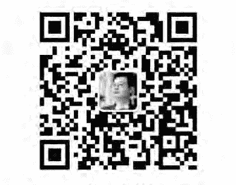
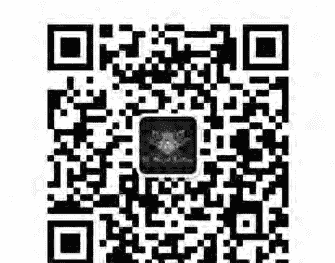
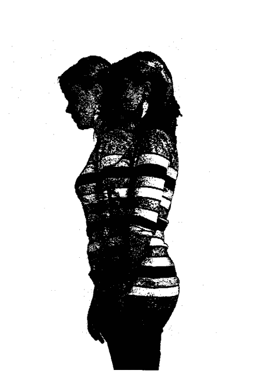
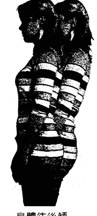
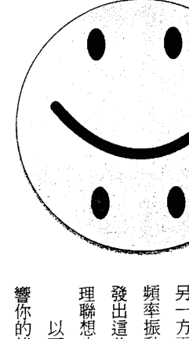
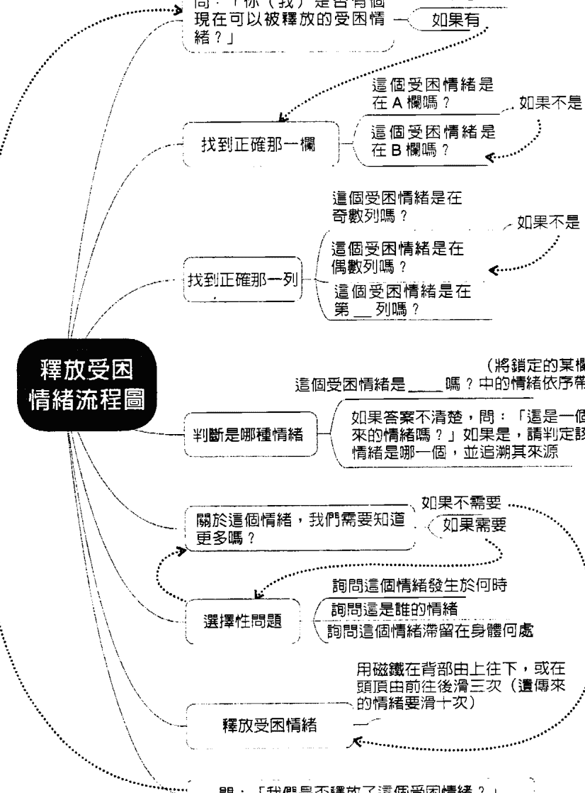
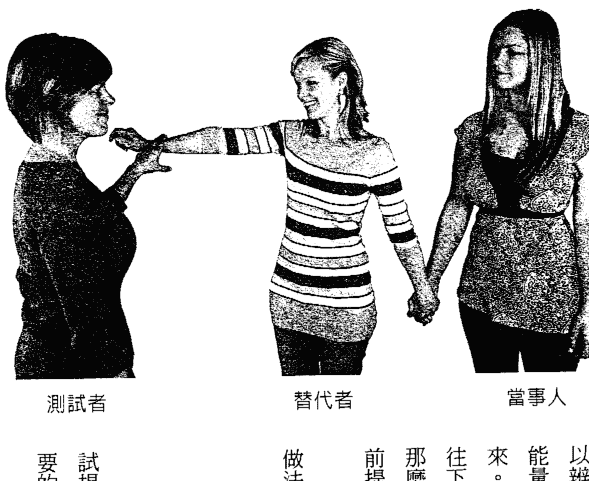
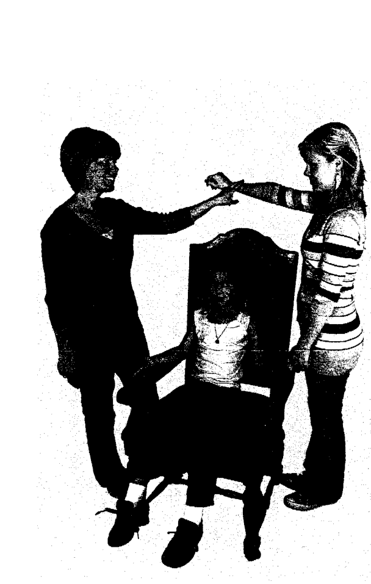

## The Emotion Code: How to Release Your Trapped Emotions for Abundant Health, Love and Happiness

★Amazon 長銷書・讀者★★★★★ 4.6顆星好評！

布萊利・尼爾森 Bradley Nelson 著 陳威廷・愛那 譯

## 情緒密碼

### 釋放受困情緒的奇效療法

癌症、糖尿病、氣喘、各式慢性疼痛、帕金森氏症、憂鬱症、恐懼症、暴食症
長期焦慮、失眠、各式上癮症、對某人的多年怨恨、公職考試多次失敗
學習障礙、孩子不願親近父母、妻子離不開家暴夫……

以上問題絕大多數源自「受困情緒」的影響！
想要釋放受困情緒，恢復身心健康，你需要的，只有一塊磁鐵！

## St. Royal College 天使神秘学院

- 专业占卜预测机构
- 神秘学培训机构
- 水晶能量研究中心
- 官方淘宝：http://strc.taobao.com
- 官方微博：http://weibo.com/715104687
- 新书发布QQ群：316790219
- 购买更多好书请联系院长大天使

大天使
天使神秘学院 院长
QQ：715104687
手机/微信：13641926204

微信公众平台：strc2011

## 制作说明：

本书由《天使神秘学院》出重金从台湾购入的原版书籍扫描制作完成。为达到最好阅读效果，特地把原版书全部切开后，再经由专业扫描设备高精度扫描完成，并经过一张张的PS后期处理最终成书，其间花费大量的人力、物力以及时间，只为能给大家提供经济并优质的神秘学学习资料而努力。

本学院强力谴责某些机构和个人，把本学院花心血制作完成的电子书籍，包装后直接放在自家淘宝网上低价倾销的行为，以谋取不劳而获的经济利益。如果长此以往最终将无人愿意再为大家花心思制作电子书，那以后可能大家再无新书可读。

为让大家以后能够读到更多的好书，也为了本学院的良性发展。本学院恳请大家尽量做到如下几点：

- 一、尽量在本学院的网站购买电子书籍。
- 二、请勿用技术手段把电子书内的水印及加密去掉。
- 三、在收到电子书后小范围传阅即可，千万不要公开传播，更别挂到淘宝网上低价销售。

同时为答谢广大支持者，学院电子书将做如下调整：

- 一、学院会把一些早已收回制作成本的电子书折价销售。
- 二、最新制作的电子书籍会开放打印功能，大家购买后有条件的可自行打印成书。

天使神秘学院
2017年6月

布萊利·尼爾森 Bradley Nelson 著　陳威廷、愛那 譯

## 情緒密碼

釋放受困情緒的奇效療法

## 致讀者

「情緒密碼」是一套易於自行操作的自助式療癒工具，儘管尚屬相當新的領域，且仍具更值得深入研究的空間，但它確實具備強大且顯著的身心療癒效果，能讓使用者受益匪淺。
本書係根據布萊利·尼爾森醫師的個人觀察與經驗所出，讀者必須為自己的身心健康負起百分之百的責任。「情緒密碼」不應被誤用，或用於診斷任何特定心理、生理或情緒方面的疾病；肌肉測試及搖擺測試不應被用於診斷任何疾病的有無。
本書無意取代健康照護專業人士提供的任何醫療服務，任何因採取書中討論或教導的療法而產生的後果，作者及出版社概不承擔。本書內容涉及的案例請讀者自行研判，並為自己採取的行為負起完全責任。除非當地法規許可，本書涵蓋的所有資訊僅供個人使用，且不作為任何形式之醫療行為。所有內容皆無意取代醫生的囑咐，並且不應用作診斷或醫藥處方之憑據。
本書所述故事皆為真人實事，然為保護當事人隱私，部分人物姓名業經更動。

## 【目录】

《推荐序》 让自己放下过去情绪的包袱，迎向快乐的未来

莊宇元

《译者序》 一套简单、易学、强大的疗愈系统

陈威廷

《译者序》 一旦试过，你就知道情绪密码的功效让你无法否认

爱那

《给台湾读者的话》 愿你重拾每个人与生俱来的疗愈能力

## 第1部 受困情绪这样影响你的人生

### 第1章 受困情绪：让人难以察觉的流行病

何谓受困情绪？

你的未来被挟持了？

受困情绪的破坏力

### 受困情绪在心理层面的影响 079

### 受困情绪的共振现象 072

### 受困情绪其实很普遍 071

### 小孩的受困情绪 066

### 古老的疗愈法门：能量医学 060

### 测试你是否有受困情绪 056

### 摇摆测试 052

### 与身体对话 050

### 储存大量资讯的潜意识 048

### 第2章 受困情绪的神秘世界 046

### 受困情绪与疾病的关联 043

### 受困情绪造成身体疼痛 036

受困情緒在身體層面的影響 83

恐懼症 90

夜驚 91

受困情緒會影響你的生活品質 92

第 2 部 認識能量世界 93

第 3 章 古老能量療法的奧秘 94

靈魂與其居住的殿堂 95

簡單的肌肉測試展現思想的力量 97

不可思議的量子世界 100

擁有智能的宇宙 103

信心＋感恩＝你想要的結果 106

### 來自水的訊息 109

### 與健康訊息相關的人體能量場 110

### 第4章 神奇的療癒工具：磁鐵 120

### 人的體內存在著磁力 121

### 我的磁療法初體驗 125

### 一種新的療癒工具 127

### 磁鐵可以放大療癒意念 130

### 督脈是釋放受困情緒的完美通道 132

## 第3部 情緒密碼這樣用 137

### 第5章 从你的内在智慧取得答案 138

肌肉测试 138

你需要知道的，身体最知道 142

为他人测试 145

自我测试法 148

疗癒时的沟通不一定要透过语言 159

肌肉测试疑难排解 163

汲取宇宙智慧的管道 171

### 第6章 释放受困情绪 173

步骤一：取得受试者同意 174

步骤二：建立测试基准 174

步骤三：判断是否有受困情绪存在 176

### 第7章 圍著心築起的那道牆

- 步驟四：判斷是哪種情緒 178
- 找到正確的情緒 182
- 挖掘受困情緒相關資訊 185
- 為自己釋放情緒 193
- 為他人釋放情緒 193
- 確認情緒是否已被釋放 194
- 處理特定問題 196
- 釋放過後的重整 198
- 胎兒期的受困情緒 199
- 遺傳來的受困情緒 201
- 受胎前的受困情緒 204

### 擁有思考、感覺和記憶能力的心 210

### 發現心牆 212

### 保護自己的心 216

### 我們本該過著充滿愛與喜悅的生活 228

### 小孩子的心牆 232

### 如何找到並釋放心牆？ 238

### 確認心牆的材料 242

### 安妮·霍恩的故事：打開心，讓神聖能量充滿這個世界 244

### 建造心牆的代價 249

### 第8章 替代者測試、代理人測試與遠距療癒 254

### 替代者測試 256

### 如何進行替代者測試？ 258

### 为孩童进行替代者测试 260

### 茱莉的故事：受困情绪如何影响孩子的健康与心理发展 262

### 为动物进行替代者测试 267

### 为失去意识的人测试 268

### 取得疗愈对象的同意 269

### 代理人测试 270

### 如何进行代理人测试？ 274

### 第 9 章 运用情绪密码疗愈动物 279

### 动物也会有受困情绪 279

### 为动物释放被困住的情绪 282

### 遭绑架的小支 283

### 捣蛋狗白兰地 286

- 偏執貓輕鬆寶 287
- 被惡意遺棄的小狗 289
- 一匹馬的傷心遺憾 291
- 發生在馬兒身上的驚人療癒故事 294
- 情緒密碼幫助馬兒恢復身心健康 297
- 你有了可以幫助動物的工具 300
- 第4部 更加光明的未來 301
- 第10章 沒有受困情緒的人生 302
- 吸引力法則 304
- 你選擇了你的情緒 306
- 關於放下 308

### 《附錄》情緒的定義 323

關於驕傲 309

關於原諒 310

關於慈愛 314

關於誠信 316

生命的精煉之火 317

關於禱告 320

## 《推薦序》讓自己放下過去情緒的包袱，迎向快樂的未來

復健科專科醫師，身心靈整合專家 莊宇元

情緒密碼是藉由肌肉測試與潛意識建立溝通，來獲得受困情緒的資訊，然後以磁鐵滑過督脈（或脊椎）的表面，釋放受困情緒的技巧。潛意識以信念的形式，儲存了過去經驗的結論；這些信念可能來自祖先或父母的教養方式、童年經驗與文化的影響等，而伴隨著信念的情感會使得信念更穩固。因此，當一套信念不能有效地解決人生問題時，藉著釋放負面情緒，有助於改變信念，解決問題。肌肉測試最早是由喬治·古德哈特醫師所提出。這種技巧被整脊師運用於評估人體的能量平衡與否，以及營養補充品的選擇上。讀者可以藉由閱讀本書、大衛·霍金斯的《心靈能量》與勞勃·威廉斯的《Psych-K: The Missing Peace In Your Life》這三本書，來描壓練習，學會這種技巧。在這本書中，肌肉測試是用來獲取潛意識中的受困情緒。在《心靈能量》一書中，肌肉測試被用來連結人類集體意識資料庫，以呈現心靈能量的數值。而勞勃·威廉斯更進一步指出，肌肉測試可以用來獲得來自超意識的訊息。

本書作者厄爾森醫師發現除了磁力以外，還有一種零點能量棒（zero point energy wand）也可用於釋放受困情緒。我個人則發現市面上買得到的遠紅外線按摩滾輪與無相氣學的星隕石，也有類似的效果。

曾有一位中年女性帶著約一、兩歲的嬰兒，到我的診所就診，希望讓嬰兒接受另類的能量療癒。這個嬰兒的問題是平常易哭鬧，不好照顧。我用情緒密碼的技巧，讓這位媽媽成為嬰兒的代理人，替嬰兒釋放掉在媽媽子宮內接收到的受困情緒。後來這位媽媽接受物理治療時，嬰兒明顯變得乖巧安靜。

我們也許跟這個嬰兒一樣，平常的焦躁不安，甚至沮喪，是因為我們活在過去情緒的「背景噪音」之中。這些情緒可能來自傷痛的過去、童年、出生前尚在母親的子宮時，甚至來自祖先。

我們的意識察覺不到，只因我們把這些情緒深深地埋藏在潛意識中。

情緒密碼中的技巧，就像玩一場遊戲，我們何不藉此放下過去情緒的包袱，享受當下，並迎向快樂的未來？

## 《譯者序》 一套簡單、易學、強大的療癒系統

陳威廷

> > 在你的意識能觀照到你的潛意識之前，它會主導你的人生，而且你會認爲這是命運的安排。

——卡爾·榮格

二〇一三年夏天，身邊一位朋友憂鬱症併發厭食症復發，讓我第一次見識到情緒疾病的可怕。當時憑著一股想幫朋友的熱心及工程師蒐集資料的專長，上網找方法幫助朋友。一直以來，我都深信所有正面臨的問題在地球的另一端早已有更有智慧的人提出解決方案，而這位智者就是布萊利·尼爾森醫師。尼爾森醫師是美國的脊骨神經醫師，他根據二十多年的行醫經驗將疾病的成因歸納成六種不平衡，這六種不平衡分別為：

- 1. 體內的病原體
- 2. 器官系統失調
- 3. 營養與生活型態相關問題
- 4. 有毒物質影響
- 5. 循環與器官系統失衡
- 6. 能量相關問題

尼爾森醫師將這六種不平衡整理成非常系統化且容易學習的工具，並命名為「身體密碼系統2.0」。他顛覆了現代醫學以追逐症狀為導向的治療方式，相反地從「疾病成因」的角度來預防問題發生與解決問題。而本書《情緒密碼》就是「能量相關問題」中的一小部分。雖然只是疾病成因這個大拼圖的一小部分，但其威力不容小覷。

我非常認同尼爾森醫師的理念，並且為這套簡單、易學且強大的系統感到著迷，因此踏上了我的療癒之旅。在與尼爾森醫師連絡並積極學習上手後，我成功地將這位憂鬱症併發厭食症的朋友推回生活的正軌，並解決了母親長年以來的胸痛問題。母親自退休後就開始出現不定期的胸痛問題，發作時非常痛苦。其症狀看似心肌梗塞，但到各大醫院檢查心臟和其他器官，都沒有任何異狀。這問題困擾母親超過十年之久，而在我認識情緒密碼之後，判斷應該是由「受困情緒」能量造成的，因此著手釋放母親的受困情緒與「心牆」，幾次療癒釋放了一百個以上的情緒。自此之後，母親的胸痛問題再也沒有發生過。這次經驗讓我非常震撼！除了再次驗證尼爾森醫師的發現之外，也讓我對從母親身上釋放出來的情緒感到驚訝。那些因小時候生活困苦而產生的「卑微感」、「羞辱」、「挫折」、「苦悶怨恨」、「不堪負荷」等情緒能量並不會隨著時間消逝，反而會滯留在身體或潛意識中，伺機造成身體或心理問題。

有了這樣的經驗，不禁讓我思考：為什麼這麼有系統、科學化、容易學習且強大的療法，在台灣卻鮮為人知呢？為什麼全球已有超過千位療癒師的療法，華文世界卻缺席呢？今天有此機緣讓認識它，那就讓我來引進吧。於是，我著手準備通過療癒師資格考核、設立臉書群組推廣，並且幫助身邊的朋友療癒。在此感謝每個來到我身邊的個案，我從你們身上學到許多寶貴的療癒經驗與人生經驗。我見過情緒引起的腫瘤、器官失調、精神官能症、身體虛弱等不明原因問題在釋放情緒後，奇蹟似地改善，也見過人們的思想與自己的潛意識是多麼背離，明明頭腦想的是健康、幸福、豐盛，潛意識中的信念卻恰恰相反。若不整合意識與潛意識的觀點，在意識與潛意識背離的情況下，一輩子恐怕都得在事倍功半的苦難中掙扎。

而透過情緒密碼釋放受困情緒的真正意義，不是將問題推離而已，更重要的是從每個事件中學習到寶貴的人生經驗。以霸凌為例，假使某人因學生時期遭受霸凌，而在身、心、靈層面留下嚴重傷害，這些傷害進而引起日後的精神官能症，例如憂鬱、躁鬱、人際關係不良等問題。日後當事人每每回想，總會感到異常氣憤，覺得自己為什麼會遭受如此不公平的對待，因而久久無法平復。然而透過情緒密碼釋放受困情緒，我們可以將當年被霸凌所造成的受困情緒釋放。這釋放並不是將當事人「被霸凌」的這段記憶抹去，不是這樣的！而是將該事件引發的多餘情緒釋放掉，藉由這樣的釋放來改變當事人對該事件的「看法」，改變當事人如何「感知」該事件。這樣會造成什麼影響？如果這些情緒能量沒有被釋放掉，這些情緒就像隱形的「音叉」藏在當事人體內或潛意識中。我們都知道音叉會因為相同的共振頻率而引發共振，因此每次當事人處於類似的情境時，內在的這些受困情緒又會開始奔放，輕則讓當事人心情激動無法平復，重則影響當事人身、心、靈健康，甚至讓當事人覺得自己遭受如此不公平的對待，那麼自己也有「權力」如此對待他人。這樣冤冤相報，不知道什麼時候才能平息。而受害者回頭變成加害者的情況到處可見，尤其在家庭中，很多婆媳問題都由此而起。身為婆婆的人年輕時遭受她自己婆婆的不公平對待，變成人家的婆婆後，也認為自己有權力以同樣的態度加害自己的媳婦。代代相傳的親子間家庭暴力也是如此。但如果我们將這事件造成的受困情緒釋放了呢？當事人對該事件的「感知」，可以從「憤恨不平」轉變為以「心平氣和」的態度來觀照此事件的人生意義。當事人可以用一顆平靜的心去分析這件事，想想：當年為什麼會被霸凌？是自己的問題，還是對方的問題？對方為什麼會霸凌我？是不是加害者內心比任何人更脆弱、更需要愛，卻只能透過這種方式（霸凌別人）偽裝自己？如果在這種情有可原的情況下，我願意原諒對方嗎？更重要的是，我願意原諒自己嗎？（許多遭受家暴與霸凌待遇的人內心深處是責怪自己的。）而被霸凌是如此痛苦，日後看到不公的情況，自己是否願意挺身而出，為受害者發聲？如此冷靜觀照之後，讓自己因為這件事而成長，進而轉變為懂得原諒自己、原諒他人的人，甚至成為高正義感、懂得體諒別人痛苦的人等等。
發生在生命中的任何事件都可以讓我們學習與成長，一切只是時間早晚的問題罷了。在療癒中，我甚至見過因受困情緒無法被釋放，而困在地球超過數百年的靈魂。它們有如時間靜止般被困在虛空中無止境地等待那解不開的枷鎖消失，或是等待不知何時才會出現的救贖。每每想到這些，都讓我感慨萬千。但如果我們可以釋放這些受困情緒，讓我們有一顆平靜的心去觀照每個事件，而不是每次都都被當時的情緒綁架，那我們就可以更快速地學習與成長，更快地跨越這一切，並迎接更多生命中的美好。因為，生命的提升永遠是往內看，答案永遠在我們之內。
我非常喜歡本書第七章提到的安妮·霍恩的故事。安妮在二十三歲（一九七五年）時經歷了瀕死經驗，她通過光與隧道，來到天堂。天使告訴安妮時辰未到，她會回到人間，並從事「打開心」的工作。天使還說會有許多人做一樣的工作，其目的是要將人心打開，這樣天堂的愛就能從這些被打開的心進入人間。而一旦達到「關鍵多數」，人間將會充滿天堂的愛，這世界也不再有黑暗。安妮當時並不明白天使的意思，直到多年後認識了尼爾森醫師才恍然大悟。原來，當年天使告訴她那個「打開心」的工作，就是利用情緒密碼釋放人們的「心牆」。

你會拿起這本書不是偶然，你的內在正呼喚著想要和安妮一樣打開自己的心、打開人們的心，讓每個人都成為那「關鍵多數」，讓天堂的愛進入人間，讓這個世界從此沒有黑暗。相信自己，只要具備信心、感激心與助己助人之心，你也可以做到。

在這療癒之路上要感謝的人太多了！感謝尼爾森醫師的支持與方智出版社出版本書，感謝每個來到我面前的個案與家人無盡的支持與包容。特別感謝廖庭均小姐的協助與寶貴意見。謝謝你們。

最後我要提醒讀者，誠如尼爾森醫師所言，肌肉測試是上天給我們的恩典，切勿濫用這份恩典。請僅將肌肉測試用於療癒，切勿用在療癒以外的範疇。

## 《译者序》一旦试过，你就知道情绪密码的功效让你无法否认

爱那

一旦试过，你就知道情绪密码的功效让你无法否认

《圣经》上说，要切切保守你的心，因为一生的果效是由心发出。

有些时候很奇怪，我会在读书那个当下好像读懂了，可是过了一段时间以后，通过不同媒体的启示，对当初的理解又有了不同的领悟。

《情绪密码》正巧是给我这样一个相同却又全新的领受的一本书。

情绪，Emotion，可以拆解成e-motion，亦即每一个变化中意象。我认为我们生命里遇到的那些令人不舒服的情绪或生理问题，都是一种提醒：Remind。Re-mind，迫使我们去检视内心到底哪里出了问题，好让我们做调整，重新决定下一步要怎么走。因为我们的心可以大大影响思考路径，而思想是个强而有力的能量，可以创造出不同的物质形式。也就是说，一个搞不定情绪的人，就很搞定自己的行动，进一步扩及健康、人际关系、信念系统等等；而一旦我们的心开了，就不容易受情绪搅扰，整个周边的世界都会一起跟着动起来。

我相信每个人一生中一定都有过被自己的负面情绪搞得昏天黑地、不可自拔的时候，甚至说出或做出一些让人事后后悔或不解的事。我自己就因为在原生家庭和亲密关系中受到的挫折，踏上了疗愈的寻觅之旅。然而，在参加大大小小的工作坊和讲座当下往往感到兴奋无比，呐喊着我的人生就要大翻转了，一回到原来的环境，无法控制的不耐烦和实相里的问题就会原封不动地依照旧有模式爆发，总是让我倍感挫折，期间也一度放弃这些灵性及心理谘商的疏导理论。说句心底话，刚接触本书介绍的疗愈方式时，我也是半信半疑，实在是因为被这种能量疗愈术鼓吹过太多次了。当时只能透过国外网站得知相关讯息和电子书，推广者还是一位阿兜仔医生。用一块磁铁就可以解决你生命里的许多难题，这可能吗？直到经过一段时间的清理以后，我才猛然发现，好像有些生命中的议题确实消失了，其中当属肩膀肌肉痠痛和生理痛的消失最为明显。我想说的是，如果你也有过情绪或生理上的问题，如果也像我一样看过各式各样教你如何在灵性上成长，或是别被情绪绑架的书籍，却徒劳无功，那我想要鼓励你给自己最后一次机会，再试一次！因为你一旦试过这套疗愈术，你就会知道它真实到你无法否认。起步的肌肉测试也许会有些难，我自己就属于那种花了小半年才学会肌肉测试的地才。但请不要灰心，持之以恒，就一定会看到成效，而且人人都学得会。在这里也要特别感谢我的伙伴，亦即本书的共同译者陈威廷。要没有他在前几个月不断鼓励我，每周协助我清理，我现在大概还在不稳定的肌肉测试中苦苦挣扎。

# 023 〈译者序〉一旦试过，你就知道情绪密码的功效让你无法否认

最后我想提醒大家，在疗愈开始前总是向你的神献上祷告，为的是感谢在背后动工的祂，同时也预备自己一颗清净的爱心。特别是在实际操作上有受挫的时候，不要着急，静下来祷告。因为凡祈求的，就得着。让我们一起加油！

# 《给台湾读者的话》 愿你重拾每个人与生俱来的疗愈能力

亲爱的读者：我有个强烈预感，《情绪密码》将在疗愈知识普及的华文世界引发诸多回响。因为经过千百年的薰陶，经络穴道的知识，以及对能量医学的理解与悦纳，早已深深根植在你们的文化之中。我衷心期盼藉由本书与各位分享我获致的一切，可为读者揭开崭新的人生蓝图：重拾每个人与生俱来的疗愈能力！

布莱利・尼尔森，二〇一七年一月于美国犹他州圣乔治市

## 第 1 部

## 受困情绪这样影响你的人生

### 第1章 受困情绪：让人难以察觉的流行病

现实世界比小说更离奇，因为小说情节尚须基于可能性，现实世界却不必如此。

> ——马克·吐温

想想看，没有了情绪，你会是什么样子？如果你所有的人生经验构成一匹华美的挂毯，没有了你体验到的种种情绪，何来挂毯上各式缤纷的色彩？

我们的情绪确实为生活添上一抹色彩。试想一下，一个没有情绪起伏的世界会是什么模样？

没有喜悦，也没有快乐、幸福、仁爱或友善的感觉，没有人可以感受到爱，没有任何正面情绪存在的可能。

而在一个没有情绪的幻想星球上，自然也不会有负面情绪存在。没有哀伤，没有愤怒，没有忧郁，没有悲痛。生活在这样的星球上，仅仅就是活着罢了。没有了感受任何一种情绪的能力，生命只是一个从出生到死亡的灰暗而机械性的仪式。因此，为了能感受到情绪而感恩吧！

话说回来，你是否也体验过一些最好不要有的情绪？大多数人都曾经经历人生的黑暗时期，你大概也有过焦虑、哀伤、愤怒、受挫、恐惧的时刻，也曾体验到悲痛、忧郁、自尊低落、绝望，或是其他各种负面情绪。然而你不明白的是，即使事隔已久，你感受过的这些负面情绪可能依旧以一种隐晦但颇具破坏力的方式造成你的困扰。“情绪密码”就是要帮助你挖掘这些过往情绪，并将之永远释放。我们身体与心理上的许多痛苦都是因为负面情绪能量被“困”在体内所致。想要找到并释放这些受困能量，“情绪密码”是一个简单且有效的方法。受困情绪会造成心理和生理问题。很多人发现，摆脱受困情绪后，他们就能过着更健康、更快乐的生活了。接下来列出的这些真实案例在在说明了，运用情绪密码释放受困的情绪能量，可以迅速让生理与心理健康获得多么惊人的改善：

- 琳达一直以来因为忧郁而想要自杀的念头消失了。
- 珍妮佛的慢性焦虑不见了，现在感受到她长久企盼的那份自信。
- 萝莉有生以来第一次能够感觉到神对她的爱。
- 雪莉终于可以放下对前夫的愤怒，与另一位男士展开美好的爱情。

几次失败后，茱莉亚高分通过法院书记官考试。
赖瑞的脚痛好了，走路也不跛了。
康妮的过敏不复存在。
尼尔两年来对上司的怨恨霍然消失。
约兰达终于减重成功，在此之前她奋斗了好多年。
琼安的暴食症一周内就消失了。
汤姆的视力改善了。
吉姆的肩膀痛好了。
明娣的腕隧道症候群不复存在。
珊迪看了三个医生都未能痊愈的膝盖痛一下子就好了。
三十多年来一直困扰着卡萝的夜惊问题一周内消失得无影无踪，而且不再复发。
上述事件，以及其他许多类似的事发生时我都在场。多年执业与教学生涯中，我看过无数次这种近乎奇迹般的疗愈，全都是仅仅运用情绪密码释放受困情绪的结果。
我写这本书的目的，就是为了教你帮自己和身边的人找到并释放受困情绪。
无论你是医生或渔夫，是家庭主妇或青少年，都可以学习情绪密码。这一点都不难。任何人都能学会摆脱受困情绪造成的那些非常真实且有害的影响。

## ★ 何谓受困情绪？

这辈子活着，你无时无刻不在体验这样那样的情绪。生命中不免出现一些不如意之事，涌现的情绪有时让人难以承受。每个人偶尔都会体验到极度负面的情绪，大部分宁可忘却其中某些挑战，但不幸的是，这些事件造成的影响会以受困情绪的形式长伴我们左右。有时因为某些不明原因，情绪没有被完全消化掉。在这种情况下，你不是在经历那股情绪之后就继续过日子，该情绪的能量会莫名其妙地被“困”在体内。因无法超脱愤怒的时刻，或是一时的悲伤或忧郁，这些负面情绪能量会滞留在你的身体里，可能导致严重的生理与情绪压力。绝大多数人在发现这些“情绪包袱”比想象中真实时，都惊讶不已。受困情绪实际上是由定义明确、有形有状的能量组成，虽不为肉眼所见，其真实性却毋庸置疑。

## 尼尔的满腔怨恨

在下面这则故事中，一位教师分享某个难熬的状况如何导致受困情绪滞留在他体内，进而让他的生活每况愈下。

几年前我还在学校教书，当时的校长和我处得非常不好，我们几乎从一开始就为了各种议题争执不休。无论从哪个方面来看，她都是一个非常恶毒、爱报复、喜欢灭人威风的人。最后，在该学年度的一月份，我终于放弃，去看了医生，然后以身心俱疲为由请了“压力假”。医生给我的建议是：“好好休息，重新整装再出发！”我遵照医嘱休息了大概三个月，第三个月快结束时，我带着健康证明书回到学校董事会，不过医生有个但书：我不能再置身于和那位难搞校长过招的相同情境。

然而，跟她有关的感觉和当时整个情境始终挥之不去，时不时就从心底冒出来。忆起昔日种种，一想到我当初的待遇，一想到她在任期间是如何恶意对待持相反意见的教师，而且从未因此受到惩处，我就不禁血压飙高，满腔怒火，愤恨难平。

## ★你的未来被挟持了？

总而言之，这些负面感受让我十分恼火、夜不能眠，这种状况持续了两年之久。 在一次去南加州途中，我前往布莱利．尼尔森医师的诊所。 他当时拿了一块磁铁在我的背部滚上滚下，释放这股怨恨的感受，而当他这么做时，我感觉到了，真的感觉有东西离开我的身体。 从那时起，即使我还是不喜欢那个女人，我已经没有了负面感受，也没有了纠缠我好几年的高血压、愤怒和怨恨。 布莱利．尼尔森医师教授的这套方法和情绪密码帮助我移除情绪包袱，让我在这里和大家分享自己的故事。

- 你是否曾经觉得自己为了某件说不上来的事苦苦挣扎？ 也许生活不如预期； 也许你想要发展长久稳定的亲密关系却总是无法如愿； 也许你希望过往的某些事从来不曾发生，想要挥别过去却又无能为力； 甚至，你也许有一种不舒服的感觉，觉得自己的现在被过去以某种模糊不清、难以说明的方式挟持了。
- 却又无能为力； 甚至，你也许有一种不舒服的感觉，觉得自己的现在被过去以某种模糊不清、难以说明的方式挟持了。

## 珍妮佛的自我破坏行为

珍妮佛的经验可作为受困情绪如何造成阻碍的借镜。珍妮佛是我女儿的好友，是个活泼可爱的大学生，前途一片光明。某年回家过暑假的路上，她顺道来拜访我们。她的大学生活一切顺利，但她很担心过去的某些事依旧折磨着她，而她怀疑自己是否正为受困情绪所扰。

珍妮佛告诉我，她前一年和一位年轻人发展了一段轰轰烈烈的爱情。而自从那段狂风暴雨般的关系结束后，每次遇见新的异性，她总是觉得有股不安全感刺得她隐隐作痛，而且对承诺有种没来由的恐惧，无法克服。珍妮佛说她似乎会不自觉地破坏每段才要开始的恋情，我帮她检查后，发现确实至少有一个受困情绪造成她的问题。

由于她家住得比较远，我决定教她情绪密码，以便她日后不需要我从旁协助，就可以持续为自己释放受困情绪。珍妮佛很快就轻松学会，并在体内找到好几个受困情绪，其中最特别的是“对创造感到不安”的情绪。这种情绪是因为对创造事物缺乏自信所致，范围从画一幅画、开始一份新工作，到进入一段新关系等。珍妮佛在上一段感情中经历过这种情绪，然后这个情绪就被困在她的身体里。那一天，在不到几分钟的时间内，她就把这个“对创造感到不安”的情绪，连同其他几种受困情绪一并释放掉，然后开车回家。

几天后，珍妮佛打电话来，激动地说着她感受到惊人的不同。她说她明显觉得自己在现在的约会对象面前的表达能力进步了。之前在他身边，她会害羞、胆怯，心里有很多话都没办法好好表达；但释放了受困情绪之后，她整个人变得非常自在、有自信。几个月后，她持续看着这段感情成长。她很确定，如果没有释放受困情绪，她应该早就把这段关系搞砸了。摆脱受困情绪有助于克服你的过去造成的阻碍，为你的婚姻、家庭及其他人际关系带来新生命。摆脱受困情绪，你会觉得更有安全感、更有动力，得以自由地去创造你一直想要的关系、职业生涯和生活。人们经常感受到过去的情绪以某种方式烦扰着自己，却似乎不知道该如何克服那些情绪。有些人会寻求传统的心理治疗，但这种方式并非直接处理受困情绪，而是处理相关症状。许多人无法发挥自己所有的能力，并且很难让人生以它本该有的方式运转。很多时候，他们受挫的潜在原因是过去某件事造成他们也许并未意识到的受困情绪，而那个受困情绪正在破坏他们的努力。接下来这则故事就是个很好的例子。

## 公职考试屡次失败的茱莉亚

茱莉亚因为想成为法院书记官而去上课，对未来工作的展望让她兴奋不已。法院书记官要学会在一种专门的语言机器上打字，而且要打得又快又正确，以记录法庭里所有人的发言。茱莉亚在课堂上表现不错，但每当面临充满压力的考试时，她就考不好。她已经连考三次不过了，为此忧心忡忡，深怕接下来这一次是她通过考试的最后机会。我测试是否有受困情绪影响了她在考试情境中的行为，而她的身体回答“是”。造成她表现失常的受困情绪是“灰心丧气”，原来，她的父母在她十五岁时离婚，让她倍感煎熬，而那段时间感受到的那股令她难以忍受的“灰心丧气”，就这么被困在她体内。身处充满压力的考试情境时，那个“灰心丧气”的受困情绪就会妨害她的表现。我们替茱莉亚释放了被困住的“灰心丧气”，她因此觉得放松且有自信，轻松通过接下来的考试，并拿到近乎满分的好成绩。在此之前，茱莉亚不知道双亲的离异和她过去对这件事的感受会对她现在的生活造成负面影响。如同你看不见风，却可以感受到风一样，受困情绪虽不为肉眼所见，对你的影响却不容小觑。在我的经验里，有很高比例的身体疾病、情绪问题及自我破坏行为其实都是这些看不见的能量引起的。透过情绪密码，你可以取回自己的人生，活得更健康，最终摆脱受困情绪施加在你身上那些暗中为害的力量。

## *受困情绪的破坏力

受困情绪会使你做出错误假设、对没有恶意的言论过度反应、错误解读他人的行为，并且破坏你的人际关系。更糟的是，受困情绪还可能引起忧郁、焦虑，以及其他你不想要却似乎甩不掉的感觉。它们会干扰你身体器官和组织的正常运作，破坏你的身体健康，导致疼痛、疲劳和疾病。然而，无论你多么不堪言，正统医学依旧诊断不出受困情绪的无形能量，即使它们可能是造成你身体与情绪问题的主要原因。想要消除任何与身心健康有关的问题，一定要处理那个问题的根本原因。现在有许多可以缓解疾病症状的强效药物，但是当药力消失时，症状往往回来，就是因为疾病的根本原因没有解决。要活出更美好的人生，你最好在受困情绪造成更多伤害之前把它们找出来，并释放掉。

## 时间未必能疗愈所有伤口

有人说“时间可以疗愈所有伤口”，其实不见得。你可能以为自己已经放下之前的人际关系造成的所有情绪伤痛，也许还为此接受过心理治疗。一切都好像是昨天的事了，然而，你的身体可能仍被过往情绪的无形能量占据。这些伤口不是单靠时间就能疗愈的，它们也许会让你在目前的人际关系中出现异样行为与感受，甚至导致你去破坏这些关系。

释放受困情绪时，真的有个重担被拿掉了。事实上，很多人在受困情绪被释放的当下，都会感觉到一阵轻盈。

找到并释放那些被困住的负面能量，真的能改变你的感受和行为，进而改变你的选择，最后改变你得到的结果。

情绪密码就是要清除包袱，帮助你活出内在的真我。你不是你那些情绪包袱，但有时受困情绪会使你偏离轨道，或是让你走上你宁愿别走的路，导致你无法活出原本该有的、充满生气又健康的人生。

## ★受困情绪造成身体疼痛

除了明显的情绪痛苦之外，数百万人也苦于身体疼痛，而很多时候，身体上的痛苦是由看不见的受困情绪能量间接或直接造成的。

下面的例子说明了受困情绪如何能够在人的身体发挥惊人的强大影响力。

## 黛比破碎的心

黛比接受我的治疗约莫一年，有一天她来到诊所，说她觉得自己可能是心脏病发作了。她不但胸口痛、呼吸困难，左臂和左脸也完全麻木，这个情况在过去二十四小时内愈来愈严重。我马上请她躺下，并通知同仁待命，因为我们可能需要医疗协助。确认过她的生命征象正常后，我测试她的身体，以厘清这些症状是不是某个受困情绪引起的，结果她的身体回答“是”。

我继续测试黛比，很快就发现这个受困情绪是“心痛”，而进一步测试的结果显示，这个情绪是三年前被困在她体内的。这时，黛比突然哭了起来，大喊道：“我以为我已经在接受心理治疗时都处理好了！我不敢相信那件事现在又浮出来了！”我问她：“你愿不愿意说说发生了什么事？”

她说，三年前她丈夫有外遇，这消息对她而言简直是晴天霹雳，毁了她的婚姻，也把她的生活搅得支离破碎，不过她慢慢接受了这件事。她流了许多泪，花了一年接受心理治疗，再婚，然后继续向前走——至少她这么认为。

黛比很惊讶，过去的心痛竟然依旧影响着她，而且是以这么戏剧性的方式。在她已经不遗余力去处理之后，这件事怎么会是她身体痛楚的根源呢？她做了人家劝她做的每一件事：将自己的感受哭出来、表达出来；寻求朋友的慰藉和治疗师的建议；开诚布公和丈夫对话，并与离婚这件事和解。这一路走来并不容易，她也有许多重大进展，所以心里认为自己已经处理好这件事，并置之脑后了。

黛比的盲点正是我们所有人的盲点。从她的经验中可知，有一个实质影响无声又无形，直到她开始将之显化为症状。她已经运用各种方式处理自己的问题了，除了这个——释放让她吃尽苦头的受困情绪。

我将那个被困住的心痛从她身体释放掉，几秒钟之内，她的脸和手臂就恢复了知觉。突然间，她能够自由地呼吸，胸口的疼痛和压迫感也消失了。不久之后，她就离开诊所，觉得自己全然安好。

黛比在婚姻破裂那段日子里感受到的那股难以承受的心痛，真真实实被困在她体内，而她身体上的症状瞬间解除这件事令我感到惊奇，我不禁开始思考其中的运作机制。单单一个受困情绪怎么有办法引发如此剧烈的身体症状？

针对受困情绪如何影响我们的身体，黛比的经历算是极端案例。一般而言，受困情绪不会造成黛比那种剧烈症状。大部分的症状都比较不明显，但依旧会让身心失衡。传统心理治疗虽然有其地位，却没办法、也并未试图移除受困情绪。

## 雪伦的母亲是她身体疼痛的原因

有一天，一位名叫雪伦的患者来到我的诊间，说她下腹疼痛。她告诉我，那个痛似乎来自右侧卵巢。我为她做检查，以确认她的疼痛是不是受困情绪所致，果不其然。进一步测试的结果显示，那个情绪是“挫折感”，和她母亲有关，三天前被困在她体内。我一说出这个结论，她马上气愤地说道：“唉，又是我妈！她三天前打电话给我，把事情一股脑儿地往我头上倒！我真希望她从我的生活里消失，还我一个清静！”我把那个被困住的挫折感从她身体释放掉，她立刻不痛了。雪伦大为惊奇，几乎不敢相信疼痛就这么突然完全消失了。更让雪伦惊讶的是，她母亲给她的那种强烈挫折感，竟是她过去三天身体疼痛的主因。

## 吉姆保住了膝关节

很多人在移除受困情绪后立即摆脱疼痛、不适，就算被正统医学宣告无望的病例也一样。下面这封信是我以前一位病人写给我的，他的例子正好是这种状况的最佳写照。

我是你好几年的病人了，当初会去找你，是因为我的双腿、膝盖和背部出现许多问题。我撑过了你为了清理我的身体而开立的营养补充品造成的副作用，接着，你帮我释放了我紧紧抓住的怨恨、愤怒和恐惧，我的膝盖终于不再痛了（之前帮我置换人工髋关节的医生告诉我，我的膝关节也磨坏了，必须换成人工关节），多年来头一次可以无痛地走路或爬楼梯。到目前为止，我基本上行动自如，不会疼痛。虽然不能说年纪愈来愈大之后关节炎不会来找我，但磨损的膝盖还堪用，就让我感激不尽了。我希望你的书大卖，并祈祷这本书可以为其他人开启通往健康生活的大门。
——吉姆

疼痛往往是一种警讯，是身体在告诉你某个地方出了问题。很多人会忍受疼痛，然后最终只能“与疼痛共处”，特别是找不到解决办法或原因的时候。在处理疼痛患者的经验中，我观察到，至少有一半的疼痛是受困情绪引起的。

## 被别针【别】在过去

有一次，我在拉斯维加斯带工作坊时发生一件很有意思的事。我当时征求一名自愿者，一位二十出头的女孩从观众席中起身走来。我问她有没有任何身体上的不适，她说没有，她很健康，没什么问题。我为她进行肌肉测试，看看她是否有受困情绪，结果是有的。这个情绪是“孤立无援”，是一种类似你很需要帮助时却独自一人、求助无门的感觉。我利用肌肉测试问她的身体，这个情绪是何时被困住的。“这个情绪是最近五年内被困住的吗？”“不是。”“这个情绪是十到二十岁之间被困住的吗？”“是。”“这个情绪是在你出生后的前五年被困住的吗？”“不是。”“这个情绪是在你出生后的第一年被困住的吗？”“是。”“这个情绪出现在你一岁以后吗？”“不是。”我问她有没有什么头绪，她摇摇头表示没有。这位年轻女士的母亲那天正好也一起参加工作坊，坐在观众席。此时，我向观众席望去，发现她母亲神情有异。她的手捂着嘴，看起来不知是吓到或觉得尴尬，我分辨不出来。我问她是不是知道一些内情，因为她女儿当时年纪太小，不可能记得发生了些什么。

她用一种难受且不好意思的声音解释：“那个……洁西卡还是婴儿的时候，我给她穿的尿布是布做的，必须用安全别针固定起来。这真的很启齿……有一次我在别别针时，不小心把她跟尿布别在一起了。她哭个不停，而我是直到再次帮她换尿布时才发现她的肉被别在尿布上了，当下我真是难过得不得了。我不敢相信这件事现在竟然浮现了，此刻想起来，我依然觉得很难受。”我转头问洁西卡：“这件事是否导致这个受困情绪产生？”结果，她的手臂在我将它往下压时出现很强的抵抗肌力，显示事实的确如此。我用磁铁在她背部滑过三次，将受困的情绪能量释放掉，然后请她回座。大约两周后，我收到下面这封电子邮件：

嗨，布莱利医师：

我女儿洁西卡从十二岁开始就为髋部和膝盖疼痛所苦，而且随着年纪增长，问题愈来愈严重。自从你在拉斯维加斯帮她清理掉襁褓时期觉得孤立无援的受困情绪后（约莫一周半以前），她的髋部和膝盖就不再感觉疼痛或紧缩了。以前她少有超过一天或两天不觉得痛，而且因为状况愈来愈严重，也开始影响到她走路的姿势了。现在，她觉得欣喜若狂，感受到一种“新的”内在喜悦。她对你有满心的感谢。

洁西卡请你尽量分享她的故事，不要客气。她也非把这件事告诉所有拉斯维謝謝你！

這是受困情緒造成身體疼痛的另一案例。潔西卡完全不記得發生在她嬰兒時期的意外事件，其導致的受困情緒如果沒有被釋放，我相信她最後很可能會不良於行，而造成她行動不便的真正原因——她的受困情緒——永遠不會被發現。

當然，並非所有身體疼痛皆是受困情緒造成的，但想到受困情緒能夠直接或間接導致身體疼痛，你不覺得很有意思嗎？

我後來慢慢了解，我碰到的幾乎每一種疾病好像都在某種程度上與受困情緒有關。這怎麼可能？

## ★受困情緒與疾病的關係

在療癒這門技藝中，最古老的觀念是：疾病是身體裡的不平衡造成的。受困情緒或許是人類最常遭受的一種不平衡，而我認為受困情緒可能直接或間接與幾乎所有疾病相關。

——瑪琳

|   |   |   |
|---|---|---|
| 下背痛 | 便秘 | 過敏 |
| 大腸激躁症 | 胃食道逆流疾病 | 慢性疲勞 |
| 不孕 | 胃酸逆流 | 網球肘 |
| 失眠 | 背痛 | 鼻竇問題 |
| 甲狀腺功能低下 | 恐慌發作 | 憂鬱症 |
| 多發性硬化症 | 恐懼症 | 膝蓋痛 |
| 低血糖症 | 氣喘 | 學習障礙 |
| 克隆氏症 | 癲癇 | 糖尿病 |
| 貝爾氏麻痺 | 眩暈 | 頭痛 |
| 夜驚 | 胸痛 | 頸痛 |
| 帕金森氏症 | 偏頭痛 | 癌症 |
| 性冷感 | 眼痛 | 關節痛 |
| 性無能 | 結腸炎 | 讀寫障礙 |
| 注意力缺失症／注意力不足過動症 | 腕隧道症候群 | 織維肌痛症 |
| 肩痛 | 腹痛 | 髖部疼痛 |

因為受困情緒近乎普遍現象，因為它總會扭曲人體的能量場，也因為它完全是肉眼看不見的，因此可以在不被察覺的情況下造成各式各樣身體方面的問題。受困情緒真的是流行病，是暗中導致許多身體與情緒痛苦和疾病的無形原因。容易被疾病傷害。它會讓身體組織變形，阻礙能量流動，並使器官和腺體無法正常運作。上面這張表列出上門來找我的患者的症狀和疾病，受困情緒似乎是其中一項致病原因，很多時候甚至是絕對因素。我並不是說只要釋放受困情緒就可以百病全消。情緒密碼不應被單獨用來處理任何重大疾病或症狀，而是應該被視為一種輔助療法。當受困情緒促成身體疾病時，將之移除絕對有幫助。

情緒密碼很容易使用，而且很精準。釋放受困情緒有時會立即帶來戲劇性的效果，但大多時候，其作用是比較隱微的。然而，無論效果是立刻產生或慢慢顯現，似乎總是會帶來一股很大的滿足感與平靜。

如果你像過去這些年來參加我的講座的許多人一樣，操作情緒密碼會為你的人生帶來嶄新的喜悅與自由。

情緒密碼會幫助你擺脫過去的情緒包袱，為你帶來前所未有的身心平衡、內在平靜，以及全然的療癒。

## 第2章 受困情緒的神秘世界

> 未來的醫生不會開藥，而是會引導病人去關注身體與飲食，關注疾病的成因與預防。——愛迪生

這本書讀到這裡，你或許開始懷疑自己是否也有受困情緒，那些情緒又會是什麼。下面就列出一些往往會導致受困情緒的狀況：

- 失去所愛之人
- 離婚或親密關係遭遇問題
- 財務窘迫
- 家庭壓力或工作壓力
- 流產或墮胎
- 身體創傷
- 身體或情緒遭受打擊
- 身體、心理、言語或性虐待
- 負面的自我對話
- 對自己或他人抱持負面信念
- 長期壓力
- 被拒絕
- 身體疾病
- 覺得自卑
- 把感受藏在心底
- 被忽視或被拋棄

這張清單不可能涵蓋所有狀況，唯一可以知道你是否有受困情緒的辦法，就是詢問你的潛意識。這並不難，但開始之前，我必須先說明一下。

## ★儲存大量資訊的潛意識

首先，我們來談談意識與潛意識之間的差別。這裡提供一個簡單的區分方式。經常有人提到，我們人類只使用了大腦的百分之十，這意味著意識只需要用到百分之十的腦力；換句話說，思考、行動、做選擇、做計畫、看東西、聽聲音、嘗味道、觸摸和嗅聞都是意識活動，而這一切只佔用了大腦百分之十的處理能力。

假如這種說法成立，那麼，大腦的其他百分之九十在做什麼？如果意識佔了大腦的百分之十，我們就可以稱其他百分之九十為潛意識。這一大部分沉默又無意識的大腦始終忙著儲存資訊、忙著讓你的身體系統可以有效運作。潛意識對我們所做的事，以及我們的行為和感覺有著看不見卻很強大的影響力。

大多數人很少想到自己的潛意識，但想像一下接管潛意識負責執行的功能會是什麼景象。指導致消化系統如何消化你的午餐，或是告訴你的細胞如何製造蛋白質或酵素，是多麼困難啊！如果你一整天時時刻刻都必須為了維持心跳或呼吸而操心，你還會認為現在的日子過得很緊湊嗎？

就像電腦一樣，你的潛意識能夠儲存大量資訊。腦部手術時常在病人清醒、有意識的情況下進行。大腦沒有痛覺神經，外科醫師便利用這一點，在手術中小心地以探針探查病人大腦，以獲得病人的回饋。

## 第 1 部 受困情緒這樣影響你的人生

知名神經外科醫師威爾德・潘菲爾德發現，在某些情況下，接受腦部手術的病人大腦某個部位被刺激時，會喚起回憶。舉例來說，當醫生以電極刺激腦部某個區域時，處於清醒狀態的病人會突然想起生命中某個特定時刻的場景、味道或聲音。

這些突然閃現的場景或事件在正常情況下往往不會被憶起，但如果以電極再次觸碰相同腦部區域的相同位置，同樣的記憶便會再度湧現。

如果你和我一樣常常記不得昨天發生什麼事，我相信你的潛意識依舊會完整無誤地幫你將事情記錄下來。

我相信，你一生中做過的每一件事，都被記錄在你的潛意識裡。

你在人群中見過的每一張臉，以及經歷過的每個氣味、每個聲音、每首歌曲、每個味道、每次觸碰、每個感覺，都被你的潛意識記錄下來了。

曾經侵入你身體的每一個病毒、細菌或真菌，你受過的所有傷害，你的一切想法和感覺，以及你體內每個細胞的完整歷史，都被存檔。此外，潛意識對你身體可能藏匿的任何受困情緒都瞭若指掌，也知道那些情緒對你的身體、情緒及心理健康有何影響。這一切都被儲存在潛意識裡。

## 潛意識是你的超級電腦

不僅如此，潛意識也非常清楚你的身體需要些什麼才能恢復健康。不過，你該如何取得這項資訊？

我在脊骨神經醫學院就讀時開始問自己這個問題，後來才慢慢理解，大腦本質上是一部電腦，一部在已知的宇宙中最強大的電腦。這不禁讓我想到，療癒者有沒有辦法汲取大腦的巨大力量，以獲得關鍵資訊，弄清楚自己的病人到底怎麼了。

行醫那些年，我發現利用「肌肉動力學」或俗稱的「肌肉測試」，真的有可能從潛意識提取資訊。肌肉測試是一九六〇年代由喬治·古德哈特醫師首先發展出來的一種方法，用來矯正骨骼結構不平衡問題，現在則被廣為接受。雖說世界各地許多醫生都利用肌肉測試來矯正脊椎錯位及其他的不平衡，卻比較少人知道，肌肉測試可以用來直接從潛意識取得資訊。

## ★ 與身體對話

透過肌肉測試與患者的潛意識展開對話的能力，成了我的一項強大工具，讓我可以儘快得知患者需要些什麼才能康復。我慢慢變得完全相信身體的智慧，並且對於身體藉由肌肉測試將那份智慧傳達給我的天生能力很有信心。多年來針對一般民眾和醫生舉辦的教學講座讓我明白，人人都可以做到這件事。任何人都能學會問身體的答案，也都能採取一些必要步驟去幫助身體療癒。

許多年來，我一直迫切地想要與世人分享這份非凡的知識。過程中，我持續不斷地禱告，努力把「情緒密碼」這套系統淬煉得更為簡易，而現在，它已經簡單到人人都學得會了。你很快就能擁有你所需的全部知識，以開始運用這個方法移除體內的受困情緒能量。

你不需要是個醫生，只需要有學習的意願。

## 負面刺激與正面刺激

在我教你如何從潛意識取得資訊之前，你必須知道一個基本原則：所有的有機體，無論多原始，都會對正面或負面刺激產生反應。例如，植物會向陽生長，避開暗處。水族箱裡的阿米巴原蟲會游到光亮處，遠離陰暗；如果在水裡滴入一滴毒物，阿米巴原蟲會離開有毒的地方，往乾淨的水游去。

而在潛意識層次，人類的身體也一樣。

你的身體會被正面的事物或想法吸引，排斥負面事物或念頭。

事實上，這一直在你的生命中發生，只是你沒注意到而已。如果你可以讓自己的意識安靜下來，

## ★ 搖擺測試

想要從潛意識獲取答案，我所知道最簡單的方法就是「搖擺測試」。之後你會從本書學到其他的肌肉測試技巧，但搖擺測試非常容易學，而且不需旁人協助，因此可以用在獨自一人的時候。做搖擺測試時，需要採取一個舒服的站立姿勢，所處的房間最好很安靜，沒有電視或音樂等讓你分心的事物。獨自一人，或是和另一個人一起練習，將讓你更容易學會。

以下是操作步驟：

- 雙腳打開，與肩同寬，讓身體自然平衡。
- 雙手自然垂放在兩旁，身體靜止不動。
- 放下一切煩惱，讓身體完全放鬆。如果閉上眼睛會令你覺得比較舒服，就閉上眼睛。
- 幾秒之內，你會發現完全站立不動是一件不可能的事。肌肉在運作以維持站姿時，身體會不停地往不同方向小幅擺動，這些擺動非常細微，而且不由你的意識控制。

## 身體往前傾

當你說出一個正面的、真實的或符合真相的陳述句時，通常不到十秒，你的身體應該就會明顯開始往前傾；而當你說出一個不符合真相或不真實的陳述句時，你的身體應該會在同樣的時間範圍內往後傾。

我相信這種現象發生的原因，跟你習慣用來感知周遭世界的方式有關。雖然你的周遭狀況時時刻刻都從四面八方圍繞著你，但無論何時，無論你是在開車、走路、吃東西，或是坐在辦公桌旁工作，你都習慣只處理眼前的狀況，而不是身後或身旁發生的事。當你說出任何一個陳述句時，你的身體會將那個想法理解為它必須去處理的事物，就像辦公桌上的文件或盤子裡的食物。基本上，你可以想像你說出的陳述句就在你面前，準備要被處理了。

當你準備好時，請說：「無條件的愛。」在心中想著這句話，並試著感受它讓你聯想到的種種感覺。不消片刻，你就會發現自己的身體會輕輕地往那個想法的正面能量擺動，有時速度之快會讓你驚訝！

現在把心智清理一下，然後說：「憎恨。」試著感受這個念頭讓你聯想到的種種感覺。如同任何有機體都會自動避開有毒或有害物質一樣，你的身體也會遠離「憎恨」這個想法。你應該會發現，你的身體在約莫十秒鐘內就會開始往後傾。不要試圖強迫身體向前或向後，這點很重要。請讓身體自行擺動。你正在給你的潛意識第一次機會，以這種非常直接的方式對你說話，而為了得到最佳效果，請一定要輕柔，不可強迫。透過練習，你會愈來愈駕輕就熟。

現在，請說出一個你知道為真的陳述句。例如大聲說出自己的名字：「我的名字是______。」

假設你叫艾力克斯，你就說：「我的名字是艾力克斯。」你的潛意識知道什麼是符合真相或真實的。當你做出真實的陳述時，你會感覺到自己的身體開始微微往前傾，因為它會被正面的、符合真相或真實的事物吸引。

現在，請說出一個不真實或不符合真相的陳述句。假設你叫艾力克斯，你可以說「我的名字是克里斯」或「我的名字是基姆」。只要你選擇一個不是你名字的名字，你的潛意識會知道這句話並不符合真相或不真實。若保持心無雜念，一說出這句話，你就會在幾秒鐘內感覺到自己的身體往後傾。不只是「憎恨」之類的負面想法會被你的身體排斥，不符合真相和虛假的事物也

## 身體往後傾

保持心無雜念

說出陳述句後，請確保心裡沒有其他念頭。如果任由思緒游蕩，你的潛意識會分不清楚你指的是哪一件事。舉例而言，如果你做出一個正面或真實的陳述後，馬上開始回想前一晚跟另一半吵架的事，會怎麼樣呢？

你可能會往後傾，因為你對那件事的記憶是負面的，身體自然想要遠離它。

對自己要有耐心，這很重要。第一次學習這個方法時，你的身體可能會比預期多花一點時間才會擺動。假如出現這種狀況，請不要氣餒。

透過練習，你的身體需要的反應時間會愈來愈短。對很多人來說，這種測試方法最大的挑戰在於必須放棄控制權一會兒，讓身體去做它想做的事。對有些人而言，交出控制權不是一件簡單的事。儘管如此，這還是一項簡單易學的技巧，應該用不了太多時間你就能得心應手了。

首要之務是專注於你發出的陳述或想法。保持心智平靜，讓你的潛意識透過身體的運作機制與你溝通。

如果有任何原因讓你無法實際執行這項測試，不要擔心，我會在第五章提供其他選擇。

## * 測試你是否有受困情緒

一旦你覺得自己上手了，你就準備好要善加運用搖擺測試了。請試著說：「我有一個受困情緒。」你的身體很有可能會往前傾，給你一個肯定的答案，表示你至少有一個受困情緒。如果你的身體往後傾，先不要急著認定你沒有受困情緒，這可能代表你的受困情緒被埋得比較深，需要再努力一點才能把它挖掘出來，但這不是問題，我稍後會說明如何找到並釋放這類受困情緒。

## 受困情緒是什麼組成的？

宇宙中的一切，無論是以物質形式存在或看不見的事物，皆由能量組成。這些能量的特定排列方式和振動頻率決定了它們呈現在我們眼前的樣貌。在最基本的層次上，所有存在的事物都由同一種東西構成：能量。不只你是能量構成的，此時此刻，其他形式的能量也正在通過你的身體。看不見的能量以無線電波、X光、紅外線、思考波及情緒的形式存在在我們周遭。

我們好比優游於能量大海裡的小魚。能量是組成所有事物的材料；它存在在每一樣事物之中、穿過一切，並填滿宇宙的空隙。

當能量以情緒的形式存在時，我們可以感覺到，而負面情緒能量如果被困在體內，就可能對我們產生不好的影響。受困情緒由能量組成，如同我們的身體和宇宙中其他事物都由能量構成一樣。

## 情緒從何而來？

數千年前的醫生對人體就已觀察入微。他們發現，人的生活如果被某種情緒支配，該情緒就會導致相關的身體疾病。舉例來說，一個被憤怒控制的人，他的肝臟和膽囊常會出狀況；終日悲傷的人往往有肺臟或大腸的問題；經常陷入恐懼的人似乎會出現腎臟和膀胱的毛病。最後，人們發現情緒與身體各個器官有所關聯，甚至有人相信情緒是由器官本身製造出來的。

換言之，如果你現在體驗到恐懼的情緒，你的腎臟或膀胱正在製造那個特定的能量或振動；假如你覺得悲傷，這個情緒是由你的肺臟或大腸製造出來的，以此類推。
當然，現在我們知道，感受到某些情緒時，腦部的某些區域會被觸發，而且我們感受到的情緒都有其生化成分。甘德絲·柏特博士在她的著作《情緒分子的奇幻世界》清楚解釋了我們本質中屬於「生化」的這一面。
我們的本質中也有能量的一面，而現代科學正開始探索我們情緒的能量成分，並找出其關連性。
多年門診經驗下來，我完全相信古時候的醫生所言是真的，身體裡的器官的確製造了我們體驗到的情緒。如果你現在覺得憤怒，這個情緒不完全來自你的大腦，它其實是由你的肝臟或膽囊發出來的；若你此刻感覺被背叛，這個情緒其實源自你的心臟或小腸。
以前我們習慣把身體和心智分開，或將兩者視為獨立個體，但現在身心的界線變得模糊，甚至沒有人知道是哪一方影響了哪一方。
不只你的大腦，你的整個身體都充滿智慧。每個器官都是一個智能體，各司其職，並製造特定的情緒或感覺。
得知體內器官製造了我們感受到的情緒，人們往往覺得很詫異。然而，這當中還是有些關聯性可循，雖然大部分醫生都不會把注意力放在這上頭。

## 受困情緒殺死了黛娜·李維？

我們都記得那個讓演員克里斯多夫·李維癱瘓的墜馬意外，他的妻子黛娜一直守在他身邊，给予他坚定支持。所以聽說她去世時，我們都很震驚、難過。丈夫過世十個月後，黛娜就向世人宣布自己罹患肺癌，並於七個月後撒手人寰，得年四十四歲。

黛娜當然有理由悲傷，而我相信受困情緒，尤其是悲傷，至少是她死亡的部分原因，也許是全部的原因。

## 怒氣沖天的酒鬼

另一個例子是酒精對人的影響。我們都知道，酗酒的人經常死於肝臟疾病，而我們也明白，許多喝酒的人在酒精的影響下會變得易怒、有暴力傾向。酒精是由肝臟分解、處理，過量飲酒會導致肝臟被過度刺激。當一個器官被過度刺激或負擔過重時，會製造出比正常狀況更多的情緒，

而肝臟製造的是憤怒，這就是飲酒往往導致暴力背後的運作機制。

如果你的某個器官生病了、被過度刺激，或是在某方面失衡，與其相關的情緒往往會高漲。我們發現，無論受困情緒存在體內何處，總是源於某個特定器官。舉例來說，一個被困住的憤怒情緒一開始可能從你的肝臟發出，但最後也許會存在你身體裡的任何部位。器官與情緒之間的關聯頗令人玩味，對於了解人體如何運作也很重要，而這一切都要回到古老的能量療癒藝術。

## ★古老的療癒法門：能量醫學

能量醫學是世界上已知最古老的療癒法門之一。早在公元前四〇〇〇年，療癒者就了解人的健康與流經身體及組成身體的能量息息相關。中醫稱這個能量為「氣」，古印度或阿育吠陀醫學則稱之為「普拉納」。我們的這個部分如果不平衡，身體與心理健康可能會受到很大的影響。

我們可以將這個能量比作電。你看不見電，卻感覺得它；電無色無味，不為肉眼所見卻真實存在。如果你曾經把手指放進插座裡，或者在拿出烤吐司時被烤麵包機電到，一定知道我在說什麼。你看不見電，但它的確在那裡！身為人類，我們習慣以合乎自身信念系統的方式去感知事物。很小的時候，我們就發展出對於物質世界的一套信念。我們知道如果從單槓上掉下來，就會「砰」地一聲跌到地上，痛得要命，但我們從未想過地面和單槓實際上是由振動的能量組成——它們看起來那麼結實。我們也喜歡以自己習慣的方式看待周遭世界，但愛因斯坦、特斯拉和其他科學家已經指出，宇宙遠比我們所能想像的更加複雜與奇特。

## 不可思議的量子世界

你一定聽過「我對它瞭如指掌」這個說法，但你對你的「指掌」到底有多了解？

你的雙眼可以看見皮膚表面的皺紋、指甲和體毛，就這一方面而言，你完全熟悉你的指頭和手掌是什麼模樣。但是，如果你的手擺在顯微鏡底下放大，你不會看到你熟悉的皮膚和皺紋；相反地，你可能會以為自己看見的是一個奇異星球的表面，上面佈滿丘陵和山谷。

把你的皮膚用顯微鏡放大到兩萬倍，你會看見一片擠在一起的細胞；再高倍放大，你會看到分子；放大這些分子，你會看見組成這些分子的原子；再放大這些原子，你會看到組成這些原子的次原子能量團——電子、質子、中子和其他次原子粒子。那依舊是你的指掌，但它看起來和你所知的手大相逕庭。

如果你現在瞥它一眼，你的手看起來很結實；將它往桌子上一拍，會發出扎實的一聲「砰」。雖然看起來是實心的，但你的手裡面其實有許多空隙。在次原子層次上，每個轉動的電子之間有著莫大的距離。原子有九九．九九九九九九九九九%是空隙，你的手也有九九．九九九九九九九九九%是空隙！如果你能移除手部所有原子中的空隙，你的手會縮小到必須用顯微鏡才看得見！雖然它的重量不變，所含的原子數量也相同，但你的手幾乎消失了。

你可能需要花點時間來消化這個想法。你的手看起來是實心的，但它是由持續振動的能量構成。事實上，物理學家現在了解到，組成原子的那些所謂「次原子粒子」根本不是粒子。他們改用「能量單位」來計量原子的內容物，因為這樣精確多了。

## 思想是能量

如同宇宙中的萬事萬物一般，你創造出來的想法同樣是由能量組成的。想法這種能量沒有界線可言，你的思想不像肉體一樣受地點及體積限制。

大家都以為自己沒有說出來的話被好好地藏在腦袋裡，實則不然。我們所有人都像個無線電台，持續將自身想法的能量發射到無邊無際的空間中，觸及身旁的一切人事物，進而產生好或壞的影響。這不表示我們能讀取他人的心思，但某種程度上，他人思想的能量可以在潛意識層次被偵測。

## 063 第1部 受困情绪这样影响你的人生

你可以试着注视人群中某人的后脑勺，过不了多久，那个人就会转过头来看你。许多人都有这样的经验，如果你没有，试试吧，每次都见效！

## 人与人彼此相连

事实上，整个人类家族在能量上是连接在一起的。地球另一端的人们受苦受难、性命垂危时，我们在潜意识层次上会感受到他们在远方的哭泣和痛苦，并因而变得阴郁、不快乐。当这个世界发生了一件悲惨的事，全世界的人都会在潜意识层次上感觉到，并受其影响；另一方面，若发生了一件美好的事，所有人都会同感喜悦。

我们每个人都有的这种连接常会化为各种隐微的念头，从潜意识浮上意识层次。

这种能量连接在母亲与孩子之间似乎最强烈。孩子有麻烦时，母亲往往可以感应到。我们称之为“母亲的直觉”，我母亲就是这方面的专家。大概是因为这种将母子系在一起的灵性脐带，让我们和母亲之间有最强的连接。

几年前发生在我一位病人身上的事，正好可以用来说明这个能量连接的存在。某天晚上，她和丈夫正在家中看电视，突然感觉有一阵剧痛莫名其妙从一个部位转移到另一个部位，游走她全身。这突如其来的袭击的剧烈程度让她吓坏了，疼痛感退去后，她大大松了一口气，但整个人虚脱无力，惊恐不已。她从来没经历过这种事，不明白身体突然出了什么问题。她试图向大家说明这莫名而来的怪痛，但每个人都听不懂她在说些什么，包括她的医生。三天后，她接到正在菲律宾工作的儿子的电话。他从医院病床上打来告诉她，几天前他被当地警察毒打了一顿。母子俩比对他被殴打的时间与她被疼痛袭击的时间，赫然发现是一样的。不知何故，她和儿子之间的连接强到可以真正“感受到他的痛”。这就是母亲的直觉啊！

## 思想是有影响力的

你的思想非常强而有力。每当你透过言语或文字表达自己的想法时，就是在用思想的能量影响你周遭的世界。所有事物都是藉由想法、信念和意念发生的。具公信力的科学实验一再证明，人的想法可以直接影响植物、真菌和细菌的生长速度。而史丹佛大学的物理学家威廉·堤勒也证实了，思想能够影响电子仪器。

研究证明，透过刻意引导思想的能量，你可以影响另一个人，无论他身在何处。比方说，如果某人利用使人平静下来的心像来集中自己的念头，他就会在目标对象身上引发一股令人放松的感觉；假如他运用的是让人觉得焦虑的心像，就会在目标对象身上引发令人焦虑的感受。其效果明显到可以在实验室透过“皮肤电反应”这种量测皮肤表面电流变化的方法测量到。

## 065 第1部 受困情绪这样影响你的人生

想像一下你的想法对自己会有什么样的影响。每个人不时都会进行某种内在对话，你都对自己说些什么？许多人自我批评的次数远比赞美自己多，然而，负面自我对话对你造成的伤害可能比你知道的严重许多。

那身旁的人呢？你是否想过别人能够感受到你对他们的感觉？其他人的潜意识一直在侦测你的想法发出的振动。你有没有过身边的朋友恰好说出你脑袋中正在想的事情的经验？你是否曾经在电话铃响之前就直觉地知道是谁打来的？这些不是巧合，而是思想能量具备影响力的证明。

利用情绪密码寻找受困情绪，与侦测他人思想或感觉发出的振动是类似的原理，其中的差异在于你可以询问身体并真正得到明确的答案，而不是透过臆测。然后，你就可以一劳永逸地释放受困情绪，并确知它们不会再回来了。

> 精确找出并释放受困情绪，而不是碰运气

任何一位替代疗法工作者都会告诉你，几乎所有人都带着过往的情绪能量。人的身体会紧紧抓住受困情绪，医生和身体工作者很清楚这一点，因为一个简单的触碰往往就能让患者的情绪和记忆如洪水般涌出。几乎我认识的每一个疗愈工作者——从脊骨神经医师、能量工作者到按摩治疗师——都有过这种经验：患者的身体在释放它一直紧抓不放的能量时，意外地一并释放了情绪。

释放那些受困情绪会立即产生非常有效的疗愈结果。虽然机缘巧合释放情绪是件好事，但这通常不是那些疗愈工作者原本的目的，过程中发生的情绪释放纯粹是意外。然而，情绪密码这套方法目标明确。我有时会把它想作是一种“情绪手术”，因为我们是带着“将之移除”的明确意图在寻找受困情绪，其中没有任何运气的成分。受困情绪有潜在的破坏性，你必须把它们找出来，排出体外，并确认它们已经被释放了，而情绪密码能够帮助你以精确而简单的方式做到这一点。

### ★小孩的受困情绪

在我写这本书的时候，我那对双胞胎儿子已经十八岁了。我处理受困情绪的早期经验之一来自我儿子睿特，当时还是个学步儿。睿特和德鲁是异卵双胞胎，相异的程度就和其他任何两个小男孩差不多。德鲁一直很黏他妈妈和我，睿特则是和我妻子琴恩很亲，但三岁左右开始不太搭理我。当我想抱他、亲近他，或是跟他依偎在一起时，他会把我推开，并且说：“坏医生——走开！”起初我们以为他只是正在经历某种阶段，一阵子之后就好了，但是他的对负面感受持续了超过一年，让我很伤心，也倍感挫折。我不了解自己的儿子为何会对我有这种感觉。

某天晚上，我和琴恩坐着聊天，睿特坐在琴恩的腿上。我张开双臂准备给他一个拥抱，他的反应则一如往常，将我推开，然后说：“坏医生！走开！”这一次，我真的觉得很受伤，胸口简直痛到要爆开，眼泪都快流下来了。我妻子说：“你知道的，也许他有受困情绪。”当时我们只处理过成人的受困情绪，但我们决定帮睿特做个检查。透过情绪密码，我们发现他真的有个受困情绪：哀痛。然而，不是他对我感到哀痛，而是我对他；换句话说，他在某个时间点感知我对他有哀痛的情绪。他强烈地感受到那股哀痛，以致它被困在他的身体里。测试的结果显示，那个受困情绪源自有一次我和大女儿吵架，而睿特刚好目睹整个过程。虽然我的哀痛不是针对他，睿特还是感知到我对女儿的哀痛情绪，并且揽到自己身上。释放那个被困住的哀痛后，让我惊奇的是，睿特向我走来，用双臂抱住我。我哭着抱住我的小男孩，当下觉得既惊讶又兴奋。如果只是移除受困情绪就能让我儿子瞬间转变，那么，世界上还有多少孩子可以因而受益？

### 飞行员的女儿对他从疏离到亲近

隔天我在诊所和一位病人聊到睿特，她说：“我觉得我女儿可能也有受困情绪。我丈夫是民航机飞行员，每星期都会连续离家几天。每次他结束工作回家，我们的六岁女儿就会跑去躲起来，不愿意和他亲近，这伤透了他的心。”

第二天，她把女儿带来诊所。检查后发现，这个小女生确实因为父亲而产生一个受困情绪：伤心遗憾。父亲长时间离家让她感到伤心遗憾，而在某个时间点，这个情绪强烈到让她的身体失去平衡，情绪就被困住了。这股情绪能量在意识层次上强烈影响到她对父亲表现出来的行为。我们帮她释放了伤心遗憾的情绪，然后她们母女俩就回家了。

隔周，这位母亲回到诊所对我说：“尼尔森医师，情绪密码这个疗法真的有用。我带女儿来接受治疗时，我丈夫刚好不在家；几天前他从国外回来，一打开家门，我们的小女孩就跑过去跳进他怀里。她以前从来不会这样，一次都没有！我丈夫高兴极了！非常谢谢你。”

### # 德鲁出生时的创伤经验

我的双胞胎儿子到了四岁时，睿特在口语上已经可以表达得很清楚，而且很爱讲话，德鲁则恰恰相反，让我们夫妻不禁开始担心起来。德鲁在四岁时还无法说出完整的句子，且几乎不太说话，要说话时还常常把手放在嘴巴上，彷佛很怕讲话。他似乎对很多事都感到恐惧。去社区的游泳池，睿特马上跳进池子里，德鲁则不安地站在池边。他对任何新事物都显得小心翼翼，并且有幽闭恐惧症。出去玩的时候，只要身后的门一关上，他就会陷入恐慌，然后放声尖叫。

心理测验显示德鲁有高智商，但发展速度不如龄孩子的标准值。听力测验也显示他的听力很正常。似乎没有什么原因可以解释德鲁的状况。

经历过睿特的事之后，我们决定帮德鲁检查看看他是否有受困情绪，但当时我们不知道受困情绪真的就是造成他问题的原因。

测试德鲁时，我们很快就找到几个受困情绪，这些情绪是他出生时，以及之后一小段时间里的某些创伤引起的。

琴恩生这两个小家伙时，产程长达二十二小时。睿特首先出生，他看起来很漂亮、很满足，马上就沉沉睡去。德鲁则在十四分钟后出生，而且状况很不好，全身发青，没什么生气。一群医生立刻围着他急救，他们不确定德鲁能撑过来，他的情况危急。

最后他还是撑过来了，但接下来的十几天还是有很多紧急状况。我们在两个男孩出生几天后就把他们带回家，但德鲁必须再入院检查到底哪里出了问题。他喝下去的母奶统统吐了出来，体重直线下降。医生告诉我们，他在出生后的头几天受到感染，可能危及性命。为了救他，医生必须在他小小的身躯上做脊椎穿刺，并且透过静脉注射抗生素。

虽然百般不愿意，但这个医疗程序开始时，我和琴恩都被请出了病房。在医疗团队多次尝试把针刺进德鲁小小的血管和脊椎里时，我们都没办法在他身旁安抚他，只能无助地听着他因为惊恐而发出的尖叫声。

我俩自己并没有老是想着德鲁的创伤经验，也从未在他小时候跟他讨论过这些事。我们联想到都觉得不舒服。四年后，就我们所知，德鲁完全不记得这些事，但他的确对很多事物都很恐惧。

我们一一找出并释放与这些创伤事件有关的受困情绪。婴儿时期的德鲁感知到的事，以及那使他产生多深的恐惧，让我们很惊讶。他可能预期来到这个世界会是一件很美好的事，想不到却陷入一个他几乎无法应付、极度痛苦的情况，仿佛降生到地狱里了。你可能想像得到，他有恐惧、惊恐、觉得被遗弃的受困情绪，发现时我们也觉得心痛难耐，这些无疑就是他当时接受急救治疗时的感受。

德鲁在妈妈的子宫里等着在哥哥之后出生时，还产生了“恐慌”这个受困情绪。他哥哥睿特不急着离开那个阴暗却舒适的家，这让排队等候的德鲁有了恐慌的受困情绪，因而造成日后的幽闭恐慌症。

此外，他还从他祖父那里遗传了一个“愤怒”的受困情绪，就是这个遗传来的愤怒让他不愿开口说话。他很害怕自己说出的话会伤人，这也解释了为什么这孩子说话时总捣着嘴。那天晚上我们释放了这所有的受困情绪，然后就上床睡觉了。

隔天上午吃早餐时，我们简直不敢相信眼前的变化！德鲁就像个小话匣子，突然间，而且是生平第一次，他说出了完整的句子。没有受困情绪将他和旧时的创伤绑在一起，德鲁终于能抛下恐惧。他的幽闭恐惧症消失了，畏畏缩缩的态度也是，完全成了一个开朗、快乐、充满好奇心的小孩。

### ★受困情绪其实很普遍

虽然不太可能透过肉眼判别，但差不多所有人都有受困情绪。我执业的那些年几乎没治疗过没有可识别的受困情绪的病人，记忆中只碰过一个。这个人花了许多时间静心，在我眼中是个平静、仁慈、泰然自若的人，很能掌控自己的情绪。我刚刚是不是说了“掌控自己的情绪”？是的，我会在第十章进一步说明这个主题，让大家知道如何在未来避免受困情绪产生。

仅仅因为经历过的事，以及在人生旅程的此刻自己是什么样的人，就让我们绝大多数人都有受困情绪。

当某人经历创伤或引发强烈情绪的事件，如车祸、争吵或离婚时，就会产生与该事件有关的受困情绪能量。然而，并非每个情绪事件都会创造出受困情绪。人的身体是被设计来处理一般情况下的情绪能量，所以，当某个情绪被困住了，有部分是因为情有可原的状况，如抵抗力下降、太过疲劳或身心失衡。当身体不是处于最佳状态时，我们会比较容易产生受困情绪。

### *受困情绪的共振现象

每个受困情绪都会在体内某个特定部位，以它自己的特定频率振动着。不久后，这股振动会让周围的身体组织也以同样的频率振动，我们称这种现象为“共振”。在我的讲座里，我会用音叉示范我们的宇宙对共振的回应有多强烈。我有一支音叉的振动频率是五百一十二赫兹，发出的声音高亢尖锐；另一支音叉的尺寸不一样，振动频率是一百二十八赫兹，声音低沉许多。如果将数支不同尺寸的音叉放在同一个房间，然后敲击其中一支，其他所有具备那个频率的音叉都会开始发出微弱的嗡嗡声；假如你让你敲击的那支音叉又不再发出声音，其他的音叉会继续振动。这不是什么音叉之间的自然吸引现象，而是宇宙的运行方式。

如果你敲打一支音叉并把它放到玻璃上，那片玻璃会开始以同样的频率振动，这是因为音叉迫使构成玻璃的能量动起来——与音叉同步振动。当你有个受困情绪时，就有点像体内有支音叉持续以某个负面情绪的特定频率振动着，而不幸的是，这可能会将更多那种情绪带进你的生活中。

## 共振让负面情绪引来更多相同的负面情绪

如果你有一个受困情绪，就会吸引更多同样的情绪到你的生活中。此外，你也更容易且更经常感受到那种情绪。

你有没有看过一个人的情绪影响到一屋子人的情绪？也许你今天心平气和地坐在候诊室等着看病，旁边有几个人正安静地在看杂志，然后，一个焦虑不安的病人进来了。他在候诊室来回踱步，一会儿拿起杂志，一会儿又放回去，跟柜台人员说话时也显得很烦躁。他的肢体语言完全暴露了他的情绪，然而，这种无形的影响威力最强大。

那个病人将一个强烈的、焦虑的振动发射到候诊室，然后，你、柜台人员和其他病人体内的某些细胞会开始以那个频率振动。很快地，房里的每个人都觉得有些焦虑不安，候诊室的气氛随之改变，大家开始出现不一样的感觉和反应。那个焦虑的病人不只将更多的不安吸引到自己的生活中，也在周遭的人身上引发那种情绪。

你可以把受困情绪想成一颗一颗的能量球，因为它们就是。即使只由能量组成，且不为肉眼所见，它们还是有各自的尺寸和形状——大小从柳橙到甜瓜都有可能。

被困住的情绪能量总是会滞留在我们体内的某一处，而位在它范围内的身体组织往往会和那个受困的情绪能量共振；也就是说，那些身体组织会持续感受到那个情绪振动。

假设你有个受困多年的愤怒情绪，而你毫不知情。结果，每当你碰到一个可能会让你生气的状况时，有很大的机率你一定会生气，因为——虽然听来不可思议——有一部分的你已经生气了。

如果你身体的某个部分已经因为受困情绪而以愤怒的频率振动着，那么，当发生一件可能引发你愤怒反应的事情时，你整个人会更容易与愤怒共振。

有时候，人们不了解为什么自己这么容易被惹毛，或者为何无法摆脱某些情绪。背后的原因很有可能是：他们正在与之搏斗的那个情绪，因为他们几乎不记得的某个过往经验而被困在体内。

这就是为什么释放受困情绪总能带来其他疗法远不能及的成效。很多时候，那些难以摆脱的情绪和行为就这么消失了。

这似乎简单到令人难以置信，然而，一旦亲身体验过，你就会明白了。在你释放自己的受困情绪之前，你会一直背负着它们费力前进。

### ## 洛丽对高中时期啦啦队长的怨恨之情

这种现象我看过不知凡几，下面这个发生在我病人的故事正好可以用来说明。洛丽有个受困情绪：怨恨。我回溯这个情绪最早是在何时出现，发现这情绪在她高中时被困住，是她对一个女生的怨恨所致。此时，洛丽表示：“噢，当然啦，我很清楚这是怎么一回事。”她说，啦啦队有个女生让她很受不了，反正高中那几年她就是对那个女生满怀怨恨。那股怨恨从未真正离开，因为它已经被困在洛丽体内。

洛丽说：“你知道吗？我现在想起她还是会恨得牙痒痒，有点奇怪吧？我现在都四十三岁了，高中时代已经是好久以前的事，你一定以为我已经把她忘了，但我就是摆脱不了那股怨恨。高中毕业后我就没见过她，但每次一想到那个人，我就会觉得内充满怨恨，然后再次感受到从前对她的那股怨恨之情。”

我向洛丽说明，受困情绪会使人难以放下那些我们宁可忘掉的事。我利用一块磁铁在几秒内释放了她的受困情绪，然后她就离开诊所了。几天后，我又见到洛丽，她很兴奋地说：“尼尔森医师，真的有用耶！昨晚我在跟一位老朋友聊天时，提到那个女生的名字，我竟然毫无感觉——从高中到现在，这是第一次！像这种情况，我通常会感受到对她的怨恨，这次竟然一点感觉也没有！真是太棒了，谢啦！”

### 科克大半辈子的臭脾气

科克一天到晚发脾气，他将近八十岁时因为背痛问题来找我，我很快就发现显然还有其他问题困扰着他。他大声责骂我们诊所的同仁，对我也很唐突无礼。此外，即使他的妻子全然支持他，对他很宽容，他对妻子的态度还是非常轻蔑。一开始，我以为他这种行为是背痛所致，但是，当他的背痛问题开始改善之后，他的行为并没有跟着改变。我决定检查他是否有受困情绪，结果找到了愤怒、愤恨、焦虑、怨恨、挫折感和恐惧，其中有不少源自孩童时期。

释放了这些情绪后，科克整个人改头换面。他现在是个贴心的丈夫，关心妻子更胜过自己的病痛。

科克以前会不断抱怨所有的事，现在他把焦点放在别人身上，脸上时常挂着微笑，也很少抱怨了。认识他的人都对他的转变感到惊讶。如果他的受困情绪早一点被释放掉，他也许会有不一样的人生。

科克一直都可以自由选择自己的情绪状态，但受困情绪让他比较容易与它们共振，而不是抵抗它们的牵引。他身体的某些部分充满愤怒、愤恨、焦虑、怨恨、挫折感和恐惧，这是他醒着的每一刻都面临的问题，直到我们释放了那些能量。

### # 为何怕者恒怕？

这一切都要回到身体的量子本质来探讨。每天早上起床时，我们都预期自己的身体应该和昨天、前天看起来一模一样。它们看着是实心的，我们也能充分预料其应有的模样。我们从来不会在穿衣服照镜子时，看到手脚变成旋转的能量团，但说实话，那才是我们的真实样貌。

无论在你眼中是什么样子，你的身体实际上是一个以紧密结构流动着的能量集合。

当你把某个受困情绪的负面振动带进那个结构时，整体的正常振动频率就被改变了。

你不一定感觉得到，当然也没办法凭肉眼看出不同，但有其他方法可以分辨。

记得音叉效应吧？一个停留在你体内的受困情绪会吸引其他同频率的情绪。例如，若那个受困情绪是恐惧，你比较容易受惊、害怕。那个能量停留在你体内愈久，你愈容易感觉到它；随着时间过去，你会开始认为自己就是个满怀恐惧的人，因为你似乎大部分时间都在担心、害怕。

事实上，因为你身体的某个部分真的被那个受困情绪能量——或者说“恐惧球”——笼罩，你注定要失败。你身体的一部分已经在持续感受那个情绪，因此，当一个让人害怕的状况出现时，你会更容易进入恐惧的状态；换言之，既然你身体的一部分已经与恐惧的频率共振，距离你整个身体跟着共振也只剩一小步了。

### 受困情绪滞留在哪里？

很多人问我，为什么某个情绪会困在身体的这个区域，而不是那个区域？我发现，受困情绪常常滞留在身体比较容易受影响的部位——那些部位的能量因为遗传易感性、损伤或营养不良而减少或失衡，让它们容易受影响。

有时，“隐喻”也发挥作用。当你了解潜意识主宰了身体和梦境时，这个说法就很合理了。

象征和隐喻是潜意识的语言，受困情绪很自然会滞留在具有象征意义的身体部位。

假设你为一个小产的朋友感到哀痛，并且没有在感受过那个情绪之后就抛开，反而让它被困住了，那么，该受困情绪如果滞留在你的子宫或乳房（滋养的器官），也不令人惊讶。或者，假设你正处于生命中的困难时期，事情接连出状况，让你感觉受挫、快要被压垮了，彷佛全世界的重量都落在你一人肩上。这种情况下，受困情绪也许就会滞留在你的肩膀。事实上，身体的任何部位都可能变成情绪受困之处。

如果没有注意到，这种失衡的状况可能会持续很多年，最后在你的身体和心理健康上引发真正的问题。

## 079 第 1 部 受困情绪这样影响你的人生

### ★受困情绪在心理层面的影响

让人出现过激的情绪反应，接下来的几个真实案例在在说明了，受困情绪对一个人的心理有显著影响。

### 玛莉失去儿子的创伤

玛莉是个五十多岁、美丽又善良的女士，来找我看诊的一年前，她的独生爱子被残忍地谋杀身亡。你可以想像，独子死亡对玛莉来说是个非常可怕的打击；更糟的是，对凶手的审判在法庭一再被拖延，让她想放也放不下。

第一次来找我时，玛莉正处在生命的低潮。在儿子被谋杀身亡后的一年间，她完全被困在失去所爱的哀痛中。经过测试，我们接连找到几个跟她儿子及其死亡有关的受困情绪。释放那些被困住的情绪之后，玛莉自由了，回复到以前那个身心平衡的她。虽然还是会想念儿子，而且会永远感觉到他已经不在了，玛莉依然是我所认识最快乐、最身心平衡的人之一。

受困情緒不斷發出負面振動，讓瑪莉失去平衡、難以招架。那些情緒被消除之後，她就能夠以比較健康的方式面對生命中的失落了。

## 莎拉與甘迺迪遇刺案

我永遠不會忘記莎拉。她是個七十一歲的老婦人，來找我看診。我透過肌肉測試詢問她的潛意識，她需要些什麼，結果發現她有個受困情緒：悲傷。你的記性也許不是特別好，但你的潛意識可是會把發生過的所有事情記得一清二楚，當然也了解每個受困情緒的詳情。潛意識知道受困情緒何時發生、那個情緒到底是什麼、有誰牽涉其中等等。在向莎拉的潛意識探詢該受困情緒的相關細節時，我試著確定發生的時間點。結果，這個悲傷的情緒是在一九六三年被困在莎拉的身體裡。一個直覺讓我問道：「這股悲傷與甘迺迪遇刺有關嗎？」她的身體透過肌肉測試給了肯定的答案。得出這個結果時，莎拉立刻潸然淚下，邊哭邊說：「噢，沒錯，那件事對我影響至深。非但如此，當甘迺迪總統的兒子，小約翰·甘迺迪幾年前墜機身亡時，我又猛然想起那件事。我什麼都沒辦法做，在家哭了好幾天。」

## 第 1 部 受困情緒這樣影響你的人生

如果你年紀夠大，記得一九六三年十一月那一天，就會想起那件事多令人震驚、傷心。事發當天，莎拉整個人都沉浸在悲傷之中，這個情緒強烈到她的身體沒辦法處理，結果就被困在她體內了。

### 受困情緒會放大你的反響

受困情緒會產生一個特定的有力振動，此外，我們的心智也將受困情緒與某些特定事件連結在一起。以莎拉來說，正以自身特殊頻率共振著的悲傷情緒，是與一位甘迺迪家族的人突然死亡連結在一起。當小約翰·甘迺迪悲慘身亡後，她對這個事件的正常悲傷就被早已存在她體內的受困情緒放大了。她身體的一部分——這個情緒的能量滯留的部位——將近四十年來都沉浸在甘迺迪總統死亡的悲傷中，已經盡可能地運作了。得知小約翰·甘迺迪死亡時，莎拉整個身體都和受困情緒共振起來。結果，她不是哭過一場就繼續過日子，而是一連哭了好幾天，且一九六三年十一月那天的痛苦也火力全開地回到她身上。事實上，那份痛苦根本從未真正離開她的身體。說起來很不可思議，她身體的某個部分從來沒有停止感受那股深沉的悲傷。這個例子充分說明受困情緒可能持續存在許多年，並導致你以一種誇大的方式體驗類似的情緒。

### 找到被受困情緒影響的身體組織

如果受困情緒從未被釋放，你剩下的人生可能都會感受到那份痛苦與過激反應。然而，這一切根本不必，因為你的受困情緒可以輕易被擺脫掉。

在釋放莎拉的悲傷之前，我決定對這個困在她體內近四十年之久的情緒一探究竟。這麼多年來它都存在身體何處？一直被籠罩在這深沉的悲傷之中費力運作的是哪些身體組織？這些組織又受到什麼樣的影響？潛意識對答案一清二楚，所以找出答案跟問問題一樣簡單。結果，得到的答案讓我們兩人都大吃一驚。

肌肉測試的結果顯示，被困住的悲傷情緒滯留在她左邊的乳房。

莎拉和我對望一眼，大感驚奇。她是一位乳癌存活者，四年前透過手術切除了左邊的乳房。

這個受困情緒的能量滯留在她的左乳房。為什麼是這裡，而不是身體其他地方？也許是因為某種輕度感染、以前受過的傷或其他失衡狀況，讓她左邊的乳房變得比較脆弱，容易受影響。

我則是覺得，這個情緒之所以被困在如此靠近心臟的身體組織中，源自她對甘迺迪總統的敬愛。

不論原因為何，這個受困情緒多年來一直留在莎拉體內，使該組織持續處於輕微發炎的狀態，而這可能就是她罹患癌症的一個原因。這些徵兆沒有及時被看出來，最後為了拯救她的性命，只得切除左乳房，但悲傷並沒有被切掉，留了下來。釋放被困在她體內的悲傷幫助莎拉在情緒上療癒，不過，我要是早幾年發現就好了，這樣她也許就能免於承受那麼多痛苦，甚至免於罹患乳癌。

### 受困情緒在身體層面的影響

持續被受困情緒扭曲的身體組織遲早會因為它的影響而受苦。

如果把一個磁鐵放在舊型的映像管電視螢幕或電腦螢幕前，磁鐵的磁場會干擾螢幕中的電子的正常流動，你就會看見眼前的畫面明顯扭曲了；如果將磁鐵靠得太近或停留在那裡太久，畫面會永遠扭曲，螢幕甚至會壞掉。受困情緒就是以類似方式在影響我們的身體。畢竟，身體是由能量組成，受困情緒也是，但受困情緒是負面能量，會扭曲身體組織，如同磁鐵讓電視螢幕上的畫面變形一樣。身體組織長期被扭曲的結果就是疼痛和功能失調，這就是為什麼釋放受困情緒常常能夠立刻緩解不適或其他症狀，甚至可能逆轉某些疾病。

我認為這是很值得深入研究的領域，可以對疾病如何形成提供深切的洞見。我的經驗是，受困情緒會對身體組織造成令人不可置信的影響。那些身體組織長期受到刺激會發生什麼事？一開始的症狀通常是比較不容易察覺的疼痛或輕微的功能失調，但如果身體組織不斷被刺激，時間一久，該組織就有可能進入變形狀態；換句話說，特定類型的細胞會回復為較原始的細胞，下一步就是惡性腫瘤或癌症了。

儘管癌症的成因眾說紛紜，但我堅信受困情緒是促成癌症和其他許多疾病的重要因素。

### 我治療過的每一位癌症病患，其患部都被發現有受困情緒

該部位的組織也許處於嚴重失衡狀態，因而將這些能量吸引過去。這很有可能是疾病發展過程中會出現的狀況，但我認為，受困情緒是癌症發生的根本原因。

重要，即使它們可能已經促成癌症發生，然而一旦被釋放，它們就無法在未來造成進一步的傷害。

### 羅雪兒的肺癆

羅雪兒第一次來找我治療時，肺部有個棒球大小的腫瘤，正在接受化療。我詢問她的身體，這個惡性的肺部組織中是否有受困情緒，結果得到肯定的答案。

羅雪兒腫瘤中的受困情緒是許多年前產生的，那時她還是個年輕女孩。羅雪兒是菲律賓人，嫁給當時駐紮在菲律賓的美國水手。兩人有了孩子後，羅雪兒的丈夫每次出海都超過六個月。在意識層次上，她預期丈夫會經常不在身邊，並逐漸接受這樣的分離，但一個人撫養孩子還是很難、很孤單。意識層次上，羅雪兒相信丈夫不在也沒關係，她的身體卻顯示出，怨恨、挫折感、被遺棄等情緒在這段期間被困於她體內。

「噢，不不不，」羅雪兒堅持，「我從來沒有那種感覺。我知道丹尼必須離開，我可以理解，我自己一個人不要緊。」然而，當我用磁鐵滑過她的背部後，羅雪兒坐直身子，搖著頭說：「這真是太奇怪了，我竟然感覺身體變輕許多，彷彿胸口有個重物被移開了。」

由於羅雪兒來我的診所必須開上九十分鐘的車，我只幫她看過三次診，不過這已經足夠讓我清除所有出現在她腫瘤部位的受困情緒。約莫五週後，她來到我的辦公室，欣喜若狂地宣布好消息：她的醫生重新幫她照了X光，發現她肺部的腫瘤完全消失了。受困情緒可能是促成這個癌症形成的重要原因嗎？我相信是。當然，因為羅雪兒當時也正在接受化療，我無法證明腫瘤之所以消失是因為受困情緒被釋放。不過，移除滯留在她胸口的情緒也許讓化療的效果變得更好，也提供了她身體療癒所需的條件。

### 琴恩的卵巢疼痛

琴恩四十二歲，抱怨她左邊的卵巢會痛。肌肉測試顯示，問題出在左邊的卵巢，而且是情緒所致。我立刻開始為她尋找哪個情緒該「負責」，讓我驚訝的是，我找到的情緒不是一個，而是六個。你後來會知道，我們一次釋放一個受困情緒。有時候，你會發現一個以上的情緒「套疊」在同一部位，琴恩的狀況就是這樣。除了最後一個情緒，其他所有情緒都跟與琴恩關係密切的女性生命中發生的悲劇或煩心事有關。每找出一個情緒，我便將之釋放。驚人的是，每釋放一個受困情緒，琴恩的疼痛程度立刻顯著下降。清除五個受困情緒後，她的疼痛只剩一點點。

她的身體指出還有一個受困情緒。測試結果顯示，有一個覺得自己「無用」的情緒從琴恩幼稚園時期就被困在她體內。

那是一九六〇年，是尼克森和甘迺迪兩人爭奪美國總統大位那一年。琴恩的老師告訴她，學校選出一男一女接受當地報社採訪，談即將來臨的總統大選，而她正是被選中的那個小女生。她在訪問中會被問及一些關於總統候選人的問題，特別是如果她有投票權會投給誰。

小琴恩為此興奮不已，而那一天很快就來了。她被領進學校為採訪準備的房間裡，工作人員擺了兩張椅子給兩位小朋友坐。採訪者先問小男生問題，同時因為要拍照，閃光燈打在他身上。雖然那天琴恩也被拍了照，但不知為何，採訪者完全沒有問她問題。除了拍照時被告知要如何擺姿勢，她幾乎徹底被忽略，然後採訪就這麼突然結束了。被帶回教室時，琴恩滿肚子疑惑。慢慢地，有個念頭開始在她心裡萌芽：她一定是個無足輕重的人。

琴恩開始覺得自己沒用，這個情緒強烈到被困在她身體裡。情緒是能量，而由其特定振動可以判別這是哪一種情緒。一個受困情緒就像一個小能量球，總是「降落」或滯留在身體某處。因為某個原因，這個被困住的「無用感」滯留在琴恩左邊的卵巢三十年。

釋放這最後一個受困情緒時，琴恩剩餘的一絲疼痛瞬間消失。她從地上站起來，我倆望著彼此，都對剛剛經歷的一切驚訝不已。在此之後，琴恩的那個部位再也沒有痛過。我不禁想著，如果我們沒有釋放她卵巢上那些能量，她的健康不知會承受什麼樣的後果。

### 傑克的網球肘

另一個因受困情緒導致身體疼痛的例子是傑克。傑克是我的一個病人，來找我治療令他痛苦難耐好幾個月的網球肘時是四十二歲。他的右前臂痛到沒辦法轉動鑰匙發動汽車。一開始，我採用傳統的整脊和物理治療；約莫一週後，他的狀況沒什麼改善，讓我我很驚訝，因為以整脊療法處理網球肘問題的成果通常很不錯。

傑克的狀況沒有改善讓我感覺受挫。那時我剛進入受困情緒的領域，沒想到要去詢問傑克的潛意識他的問題是否和情緒有關。我剛開始了解受困情緒的威力，以及它們可能造成許多不同的症狀。我知道受困情緒可能導致身體疼痛，但我也知道網球肘是一種發炎反應，我以前成功治癒過。不過，既然以傳統方法治療沒用，我決定詢問傑克的潛意識，受困情緒是不是他網球肘的根本原因。當他的身體回答「是」時，我有點詫異。

運用情緒密碼，我們找出第一個受困情緒：自卑感。這個情緒被困在他體內的原因和他高中時心儀的一位女生有關。我將之釋放，而傑克對他的手臂立即感受到的效果大吃一驚，因為他手肘的疼痛突然顯著減少。我再次詢問是否還有可以釋放的受困情緒，他的身體回答「是」，因此我開始問下一個情緒是什麼、何時被困住的、是否跟某個特定的人有關。結果，這個受困情緒也源自傑克的高中時期，不過這次是跟另一個女孩有關。在那段不算美滿的關係裡，傑克有個「緊張」的情緒被困住了，而當我們將之釋放時，傑克手肘的疼痛更是大幅減輕。我們持續重複這個過程，直到總共移除了五個受困情緒。

傑克的妻子陪他一起來就診，饒富興味地看著我幫他找出五個源自高中時代、每一個都和不同女孩子有關的受困情緒。

每當釋放一個受困情緒，傑克前臂的不適程度就會明顯減輕。最後一個情緒被釋放那一刻，他的疼痛完全消失，手臂可以這樣那樣轉了！他模仿轉動汽車鑰匙的動作，怎麼轉都不會痛。

傑克的肘關節突然恢復以前的靈活，而且之前我用手指按壓他前臂的肌肉，他會疼痛難耐，現在竟然一點痛楚也沒有。這樣的結果讓在場所有見證者都大為驚奇。

傑克高中時期是個網球選手，但有好多年沒有拿起球拍了。受困情緒往往會被吸引到身體比較脆弱的地方，亦即那些有過多壓力、受了傷、受到感染，或是有其他某種失衡狀況的部位。這些受困情緒滯留在傑克的前臂組織，我認為是因為高中時代他的前臂一再承受壓力，甚至受過一定程度的傷；然後同時期，他因感情受挫而產生受困情緒——記得受困情緒很可能停留在身體最脆弱的部位吧？

數分鐘之內，傑克的疼痛就從讓他無法活動到完全消失。

儘管親眼看見，我依舊對情緒可以直接導致這樣劇烈的身體疼痛感到萬分驚訝。一路使用情緒密碼下來，我發現受困情緒會嚴重損害病人的健康，許多症狀可以完全或部分歸咎於受困情緒。

強大的療癒效果會在受困情緒被釋放後顯現出來。誰想得到藉由消除受困情緒可以完全避免多少痛苦、不快樂和慢性疾病！我很快得知，有些情緒被困在我病人體內的時間比我原先以為的更久。這些病人多年來持續承受某種其實很容易擺脫的東西帶來的痛苦，一想到這個，我就覺得很難過。

### 恐懼症

恐懼症的定義是對某些活動、人、物體或狀況有不理性且持續的恐懼。我發現，受困情緒是恐懼症的重要成因——也許是唯一的原因。潛意識知道恐懼症的根本原因是什麼，而導致每一種恐懼症的受困情緒有一個或多個。

### 飛機圖片恐懼症

幾乎任何事物都可能引發恐懼症。舉例來說，我一個女患者有一種非常奇特的恐懼症：只要在雜誌或電視上看到飛機的圖片，她就會恐慌發作，而且很嚴重。如果頭頂上有一架飛機飛過，她眼睛必須盯著地面；假如抬頭看著飛機，恐慌就會發作。

我透過肌肉測試詢問她的潛意識，是否有個受困情緒造成她的恐懼症，結果得到肯定的答案。

經過進一步測試，我得以確定發生了什麼事。

幾年前，她在雜誌上讀到一篇民航機失事的文章，文章旁邊有一張飛機墜毀前被拍到的照片。讀這篇文章時，她被情緒淹沒了，強烈感受到乘客的恐懼，這個情緒因而被困在她體內。我釋放了這個受困情緒，她的恐懼症立刻消失了，可以直視圖片和天空中的飛機，而且症狀未再復發。

### 夜驚

我有個名叫卡蘿的四十二歲患者幾乎一輩子飽受夜驚所苦。她在睡夢中的驚叫聲會吵醒丈夫和孩子，每週至少三次！夜驚和噩夢的不同處，在於夜驚似乎不是由某個特定的夢引起的，而是患者在睡眠中感受到一種令人恐懼的特定情緒。

卡蘿的夜驚一直是她生活中的大問題。她摔斷過兩根鎖骨、好幾根肋骨，連頭骨都裂過，因為她拼命想要逃離恐怖的夢境。

我詢問她的潛意識：「你的夜驚是不是受困情緒引起的？」結果得到肯定的答案。進一步測試之後，發現她五歲時有一小段時期重複經歷某個噩夢，導致恐慌、驚恐和恐懼的情緒被困在體內。那個噩夢早就消失了，情緒卻依舊受困。

釋放完這些被困住的情緒一週後，卡蘿的夜驚就此消失，未再復發。

### 受困情緒會影響你的生活品質

我相信移除受困情緒對你的生活品質很重要，可以預防許多問題發生。希望你了解到，釋放被困住的情緒有助於解除身心症狀，讓你從苦海中脫身。

透過釋放受困情緒，你可以移除有害的負面能量團，使它們無法繼續妨礙身體組織的正常運作，讓能量恢復自由流動，進而幫助身體自行療癒。

你的心智也將回到更為自然的狀態，不再有過往情緒帶來的戲劇性事件、痛苦和重擔阻礙你在生命中前行。

接下來，我將分享一些古代醫生所知、關於人體能量場的驚人秘密，這些秘密近年才重新被發掘出來。

## 第2部 認識能量世界

### 第3章 古老能量療法的奧秘

降生，只是入睡，只是忘卻；
撐起這一具具軀殼的靈魂，生命之星，
原先在他處安居，如今遠道而來。
並非記憶全無，亦非身無寸縷，
從祂而來，我們披戴著榮耀的彩雲，
神才是我們的歸宿。
——威廉·華茲華斯

一九三九年，一位名叫塞姆揚·克里安的俄國電子工程師發明了克里安攝影術。克里安攝影術是利用高壓電拍出所有生物周圍散發的能量場，又稱為氣體放電顯像法。過去七、八十年間，俄國科學家利用克里安攝影術進行大量實驗，發現所有物體皆有個能量場，不過有生命物體的能量場比無生命物體活躍得多。利用克里安攝影術拍攝的影像中，最引人注目的是被切掉一半的葉子在照片裡呈現一整片葉子完整無缺的能量場。這些克里安影像有可能其實是顯現了事物的內在靈性本質？

『人體能量場』的存在長久以來一直是療癒藝術的基本信條。五千年前印度人就把賦予事物生命的能量稱為「普拉納」，中國人則稱之為「氣」，並且知道只要體內的氣不平衡，人就會變得不健康。

### 靈魂與其居住的殿堂

我認為人類的能量場本質上是存在於每個人內在的靈魂，假使可以用什麼魔法將一個人的靈魂抽離身體，然後兩兩放在一起比較，其相似度會讓你驚訝不已。

許多瀕死經驗的紀錄都顯示出，那些「死去」的人其實只是暫時離開身體，有時他們甚至沒意識到自己已經死亡，直到飄浮在半空中往下看，發現自己的肉體還躺在那裡。這些人透過自身經驗瞭解到，他們並非自己的內體；相反地，肉體比較像是他們的靈魂居住的殿堂。我有過一個難忘的經驗，讓我領悟這個概念的真諦。執業生涯中，我經常遇到為棘手和慢性疾病所苦的病人，每次治療前，我都習慣先簡短地在心裡向神禱告，祈求祂的引導；而許多時候，當我力有未逮時，我都會感謝神的幫助。有一次，在心裡說完祈求幫助的禱詞後，我的注意力轉向躺在眼前診療台上的患者。那一刻，我領受了一來自天上的禮物，感知到自己是站在一座神聖的殿堂之前，這座殿堂就是身體。我心裡充滿敬畏，這份受到啟發的感知在一個更高的理解層次上揭示了關於身體的真相。這個靈性體驗改變了我看待人的方式。我對人類一直滿懷愛與尊重，但現在我瞭解到，人類存在的真相遠比我們想像的更深奧、更神聖。我們真的是在地球上體驗物質世界的靈性存有。一個人的想法源自他的靈性智能，對周遭的人會產生深遠的影響。你的思想是能量，毫不受地持續從身體向外發射。你的想法與感覺的能量會對其他人及其他生命形式產生微妙的影響。無論有沒有意識到，我們一直與他人連繫，因為所有能量都是連續不斷且連結在一起的。

琳達因為慢性疲勞症候群來找我，她說這些症狀是從她和一位女同事共用一個小隔間之後開始出現的。那位同事充滿負能量，經常因為這件事或那件事而發怒。琳達覺得那個人的負面能量是她健康惡化的導火線。

### 簡單的肌肉測試展現思想的力量

古代療癒者深刻了解思想的力量。在講座中，我會利用一個簡單的測試，說明思想如何對他人的身體和心智產生巨大影響，而且不受距離限制。

我請一位志願者站到房間最前面，背對聽眾，然後很快地進行基準肌肉測試，以確保他是可測試的：我請他說「愛」，然後輕輕但穩定地將他伸出的那隻手臂往下按，此時應會出現強勁的肌肉反應，也就是說，他應該可以輕鬆抵抗我往下壓的力量；接著，我請他說「恨」，再將他的手臂往下按，這時手臂肌肉應會呈現疲弱的反應，讓他無法抵抗我的按壓。

確認一切就緒、可以示範了之後，我請志願者閉上眼睛，保持心無雜念。當然，我也讓自己靜下心來，以免干放示範過程。接著，我請聽眾在我於志願者背後豎起大拇指時，安靜地對志願者傳送正面想法，如「我愛你」「你很棒」；當我在志願者背後將大拇指往下時，則請他們對志願者傳送負面念頭，如「我恨你」「你真令人噁心」。

每當我豎起大拇指，聽眾便開始向志願者送出正面想法，然後我輕輕地將他伸出來的那隻手臂往下壓。毫無例外地，志願者的手臂總是呈現強勁的肌肉反應。為了使眾人明白這個結果單單是他們思想的能量造成的，我在示範過程中始終保持緘默，不發一語。

接著，我將拇指朝下，聽眾開始向志願者發送負面念頭，然後我再次將他的手臂往下按。此時，志願者的手臂一定會變弱，屢試不爽。請注意，志願者在整個過程中都不知道我給聽眾什麼樣的信號。他不只背對聽眾，我向聽眾傳送訊息時還不發一語，在他背後打手勢，而且他的雙眼是閉著的。

在我多年的教學講座中，這個簡單的測試始終呈現一致且可靠的結果。此測試之所以成功，是因為我們每個人都是能量組成的，思想也是，而當他人思想的能量穿過你的能量體，一定會產生正面或負面的影響。在我舉的這個例子中，聽眾向志願者傳送的負面念頭明顯讓他手臂的肌肉變弱，正面想法則使他的肌肉變強。這個簡單有趣的測試有幾個相當深刻的含意。

當然，你自己的想法對你自身能量場的狀態會產生最強烈、最立即的影響。把念頭從正面轉為負面，你的振動能量會立刻由正轉負，最後無可避免地造成負面結果，最明顯的就是身體機能普遍變弱了。你可以想像負面念頭會如何讓你身體的器官與組織變弱，以及持續處於這個狀態會對健康造成什麼樣的危害。

看起來不一樣、嘗起來不一樣、聞起來不一樣、感覺起來不一樣。我喜歡稱我們居住的地方為「樂高」

## 所有事物都由「能量積木」構成

你的潛意識察覺得到可能會傷害你的負面想法，無論那是不是你自己發出的念頭；而如果你沒有看到負面想法的證據，如臉部表情、肢體語言或口語表達，你的意識往往不太能偵測到負面能量。這裡的「證據」指的是那些你從小就被教導要去尋找的東西。

我想我們都有點麻木、遲鈍了，所以大部分人都沒辦法有意識地偵測到看不見的能量。

從出生那天起，我們就被「這世界該是什麼模樣」的相關資訊轟炸。

我們被灌輸了許多觀點、意見、偏見、傳統、理論、事實及信條，希望自已學到的東西是基於真理。我們進到學校去學習與大自然、科學及世界歷史有關的「事實」，長大成人後，我們的世界觀基本上已經就定位了。

很自然。假如這個新資訊出現時，我們的心智會比較慢接受與理解跟以往學到的資訊不符合的事物，這是很自然的。那麼，該資訊可能就難以被接受。

我們的宇宙。可能有人不知道「樂高」（或從來沒跟小孩相處過），容我說明一下：樂高是有各種顏色、形狀和尺寸的小塑膠積木，任何去過樂高主題樂園的人都會告訴你，這些小塑膠積木可以用來打造任何東西，從大象到摩天大樓。

我們的宇宙也是由被稱為「次原子粒子」的小積木構成，但它們實際上並非粒子，你可以把它們想成振動能量的極小單位。如果把夠多的這些小能量放在一起，你會得到一個原子。而就像樂高積木一樣，這些小能量的排列方式不同，就會製造出不同元素的原子，如氫、碳、鈦等；同樣地，就像排樂高積木，各種原子也可以被排成蛋白質、脂肪、碳水化合物等分子。最終你會發現，你在周遭看到的一切，以及存在的所有事物，無論是植物、動物、礦物、氣體、液體、固體或其他任何東西，都是由這些小積木構成，而小積木是由能量組成的。

## ★ 不可思議的量子世界

次原子粒子其實不是粒子，而是「量子」，或是無法定義的某物的一個量。量子物理學，或是針對這些最小能量單位的研究，始於愛因斯坦，以及和他同時代的科學家。這群聰明絕頂的人構思出一些相當巧妙的實驗，企圖進一步找出這些能量的本質。量子研究一個非常驚人的部分顯示，這些能量會根據觀察者預期看到什麼，而有不同的行為表現。許多物理學家認為這些神秘行為唯一的解釋，是原子中的能量本身具有某種程度的智能。

在一項著名的實驗中，科學家將一個原子一分為二，然後將它的兩個粒子（或能量）以接近光速送往不同的方向。在這兩個粒子往不同方向行進一定距離後，其中一個粒子通過一強力磁場，改變了該粒子行進的方向。同一瞬間，它的姊妹粒子也轉向了，而且轉的角度毫釐不差。雖然兩個粒子已相距遙遠，彼此之間依舊保持著不可思議的連結，其中一個粒子身上發生的事，立刻會影響到另一個粒子，不受距離限制。你認為這是怎麼一回事？在相距如此遙遠的情況下，這些微小能量如何能表現出這麼明顯的瞬時交流？

沒人知道確切答案，至少目前還沒有。然而，量子物理學已經一再證明這種現象。讓一個粒子發生改變，會讓另一個相連結的粒子即刻出現同樣的變化，無論兩者相距多遠。距離似乎不會阻礙它們之間的能量連結。所以請記住，每一樣事物都和其他所有事物連結在一起！

不過，這個無法解釋的現象不是只存在次原子粒子的行為中，這種奇怪的連結在人體細胞中也被觀察到了。

在一項非常著名的研究中，受試者的白血球被取出來放在培養皿上。白血球在人體中負責尋找並摧毀外來細菌、毒素及其他入侵者。實驗中，受試者會被接上電極，以測量他身體的電子活動，而他的白血球也會被放在一個高度敏感的儀器中，同樣測量它們的電子活動。受試者及其白血球的電子活動程度都被精密量測。此研究中的一位受試者曾經在二戰時期服役於海軍，服役地點是一艘駐紮在太平洋的航空母艦。該戰艦是當時日本神風特攻隊的目標之一，那種自殺式攻擊讓他驚恐不已，有好幾次，他都覺得自己死定了。身體接上電極後，研究人員讓他觀看神風特攻隊飛行員在戰爭期間向下俯衝並攻擊航空母艦的新聞影片。雖然已經是很久以前的事了，他的身體依舊沒有忘記這一切，突然湧現的強烈焦慮感立刻透過他身上的電極顯示在螢幕讀數上。這並不令人驚訝，真正讓研究人員大感驚奇的，是他們看見房間另一頭的白血球也同樣出現暴衝的讀數，兩者的讀數基本上完全相同。白血球的電流突然和他身體的電流一樣不穩定。而當研究人員關掉影片，受試者身體和他位於房間另一頭的白血球的電子活動便都恢復正常。科學家簡直不敢置信，他們重複測試多次，每次都得出相似的結果。為了看看會發生什麼事，他們再次測試，但這次將受試者與其白血球之間的距離拉大——事實上，他們把裝有還活著的白血球的測量儀器搬到好幾哩外的另一間實驗室，然後再次進行這項測試。科學家反覆實驗，精確記錄受試者和他幾哩外的白血球的電子活動。他們讓受試者觀看神風特攻隊的影片，然後讓他休息；接著又看影片，然後又休息。結果，受試者的電子活動讀數，與他位於幾哩外的活白血球電子活動讀數，每次都一致。這項測試的結果違背這些科學家所學的一切。某人在看電影時生了氣，他位於好幾哩外的白血球會不會跟著生氣？隨便找個人問這個問題，我想對方應該會嘲笑你。這聽起來像天方夜譚，卻真的發生了。

## 103 第2部 認識能量世界

## ★擁有智能的宇宙

還有比這更令人驚奇的事，而這些事之所以看起來如此不可思議，是因為我們不了解。事實上，我們剛開始要去了能量的神秘本質、能量如何運作，以及該怎麼利用它。我相信宇宙最大的秘密之一正要被揭露。

這個大秘密與現代科學發現有關：次原子粒子（或能量）擁有智能。

想像一下量子物理學家說的都是真的，想像一下我們居住的宇宙完全由能量組成，而且這些能量不知為何具備智能。試想看看，你現在坐的這張椅子是由能量組成，而那個能量擁有智能。你的椅子當然不會真的「思考」，但在某種程度上，它是由無數微小能量組成，這些能量正在做它們該做的事，好讓你的椅子維持一張椅子的狀態，幫助你體驗這個世界應有的樣貌。

二十世紀最有才智的人之一、被視為量子理論之父的馬克思·普朗克，在獲頒諾貝爾物理學獎時說出這番感言：

身為一個畢生致力於研究「物質」的人，我可以告訴諸位多年來我研究原子的結果：沒有所謂的物質。所有物質皆源自一股力量，並且單純憑藉這股力量而存在——該力量讓一個原子的粒子振動，並讓這個最微小的原子太陽系凝聚在一起。我們必須假定這股力量背後存在著一個擁有意識與智能的心智，這個心智是所有物質的母體。

## 意念的力量

你的意念其實只是能量的另一種形式，我喜歡把它想成一種「經過引導」的思想能量。

因為能量擁有智能，它其實有能力服從你的意念，或與其合作。

古代療癒者了解這個概念：宇宙充滿具備智能、可以回應意念的能量，並且由這些能量組成。

耶穌基督是史上最偉大的療癒者，他使盲者得以看見，使跛足者得以行走，甚至使死者復活。

他行的第一個神蹟雖然與療癒無關，卻戲劇性地示範了「擁有智能的能量」這個概念。

耶穌和門徒去參加喜宴，結果主人的酒用盡了，這在當時是一件很失禮的事。耶穌吩咐僕人將幾口大石缸裝滿水，接著使那些水變成酒，讓在場的人驚奇不已。（見《聖經·約翰福音》第二章一至十一節）。

我相信耶穌只是叫水變成酒，然後水就照他的話去做。但我認為這之所以行得通，是因為水本身具有智能，才能夠遵循耶穌的命令。

> 宇宙會如實回應你對自己的信念

《聖經》中的另一個例子是與門徒彼得有關的故事。耶穌遺他的門徒渡海，他則上山禱告。當那些門徒在清晨時分看見一個人影在海面上朝他們走來時，船已行至海中央，遇著逆風，在波浪中顛簸。眾門徒驚恐萬分，以為來的是個鬼。當他們發現那是自己的夫子時，彼得大喊道：「主，如果是你，請叫我從水面上走到你那裡去。」耶穌說：「你來吧！」彼得就從船上下去，開始在水面上朝耶穌走去。他行走在水面上了！但是，當他環顧四周，意識到自己正在做的事有多不自然、風勢有多猛烈時，他感到害怕，然後立刻開始往下沉。他大喊：「主啊，救我！」耶穌趕緊伸手拉住他，說道：「你這小信的人哪，為什麼疑惑呢？」（見《聖經·馬太福音》第十四章二十二至三十一節）

彼得一開始是帶著信心的，相信自己可以在水面上行走。他的信心和意念如此強烈，讓他真的做到了。水的智能只是立刻回應了他的信心、他的意念，然後事物的正常狀態馬上改變，去支持他的意念。而在彼得開始感到恐懼那一刻，他相信自己有能力行走在水上的清晰意念和信心開始變小。當他的信心變小，清晰的意念就消失了，於是，他開始往下沉，因為宇宙必須回應他新的心智狀態。

你看，彼得心一生懷疑、一生恐懼，馬上開始往下沉。懷疑和恐懼是信心的相反，無法並存。

同樣地，宇宙會支持你對自己的信念。如果你覺得自己辦不到，宇宙會支持這個信念，然後你就不會成功。

另一方面，如果你覺得自己可以，宇宙也會支持這個信念，然後你就被賦予力量，得以做到。

## ★信心與感恩＝你想要的結果

父親過世兩個月後，我做了一個不尋常的夢。這個夢對我意義深遠，我把它視為神給我的訊息。我夢見自己沿著一所大學的長廊走，長廊裡人很多，每個人都在忙著自己的事。我身旁都是人，但有一件非常奇特的事發生在我身上——我當時確確實實走在空中，大約離地一吋，那感覺真是棒極了。我試著一下走快、一下走慢，看看會不會讓我的高度改變，結果沒有，我還是離地一吋。

一吋，那感覺真是難以形容！

我身旁的人好像都沒有注意到這一點，只專注地做自己的事。我心想：「如果我可以離地一吋行走，離地一吋肯定也沒問題。」我這麼想，這件事就發生了！我走在距離地面一吋的空中！那一刻，我往身後望去，看見一群小孩，他們正盯著我。雖然似乎沒有其他人注意到，但他們和我一樣，正在離地一吋的空中行走。

我繼續走著，然後發現自己可以隨心所欲增加高度。沒多久，我的頭就幾乎要碰到天花板了。

此時，我注意到所有人都放下手邊的事，仰頭看著我，問道：「你怎麼做到的？你怎麼可能在空中行走？」

我告訴他們答案是神給我的訊息，現在我要把這個訊息告訴你。

我對他們說：「很簡單啊！你要做的就是『相信』自己可以做到，然後因為自己正在做這件事而『感謝』神！」

然後，我向長廊的盡頭望去，看見好幾扇通往戶外的大玻璃門。外頭有連綿起伏的美麗綠色山丘、更多校園建築，以及廣闊的天空。我心想：「到了那些玻璃門之外，我就能飛了！」

那一刻，我醒了過來。還在做夢般的狀態中，我就清楚領悟到這個夢境的含意。我可以在空中行走意味著我能夠做到我相信自己做得到的任何事，只要我因為自己正在做這件事而感謝神。

那些孩子象徵不受一生學到的限制束縛、簡單純粹的信心。玻璃門則有雙重意義，一方面象徵我們在這有限生命中加諸自身的限制，另一方面也象徵死亡。這個訊息有一部分是說，我父親就在那些門之外，他的能力不受物質世界限制，因此可以飛翔了。

如果用一個數學式來表達這個夢的含意，會是這樣：

你相信自己做得到的信念 + 你因為自己正在做這件事而對神抱持感恩之心 || 你想要的結果

如果你不相信自己可以做到，我們會開始去做任何事嗎？不會的。信念對我們所做的一切而言是不可或缺的條件，是必要的第一步。

感恩在這個等式中是不可少的一部分，而「正在做」這個詞的重要性再怎麼強調也不為過；換句話說，你因為自己「正在做」這件事而對神抱持感恩之心非常重要，因為我們是誰、我們擁有的一切，以及我們人生道路上的每一個機會，都歸因於神。如果你有個想要完成的目標，想像一下達成目標時你會有多感激；假如你可以感受到那份感激之情，並且預期就是會有這樣的感覺，它就會發生。

當你慢慢學會為了自己已經擁有的事物而感謝神時，你的信心和信念就會增強，因為你會更靠近那個一切事物的力量源頭。很快你就會發現，自己正在做那件曾經只是個夢的事。

當你心中充滿感恩，你覺得自己有可能感受到懷疑或恐懼嗎？我不這麼認為。想要進行療癒工作，你必須放下懷疑、棄絕恐懼，你的心必須充滿愛與感恩。請以這種心態試著使用情緒密碼，很簡單的。你要做的就是相信、感恩，然後你就能做到，我是說真的！

## ★來自水的訊息

日本科學家江本勝在他的著作《生命的答案，水知道》中詳述他對水結晶的研究，幫助我們了解周遭的能量世界。他和研究同仁發現，暴露在不同種類的音樂之中，水滴會形成不同的結晶圖案或「雪花」。比方說，接觸到迷幻搖滾樂的水，形成的結晶混亂無章；聽了莫札特交響曲的水，形成的結晶則美麗工整。他們進一步研究，發現如果在紙上寫下不同的字或句子，然後把這張紙貼在裝著水的瓶子上，靜置一整夜，會形成不同的水結晶。寫著「我愛你」的紙條會讓瓶子裡的水形成對稱、形狀完整漂亮的結晶；紙條上若寫著「我恨你」，形成的水結晶則不對稱而混亂。

其中最美麗的水結晶，出現在接觸「愛與感恩」這個句子一整夜的那瓶水中。

如果你記得你的身體有超過百分之七十是水，就不難理解保持正面想法、遠離負面念頭有多重要了。想像一下，如果讓自己一直抱持充滿愛與感恩的想法，你的人生會如何？想想看，這樣你會有多麼吸引人？你的人生會是什麼模樣？我相信這才是我們的生命真正該有的模樣！

我讀過很多暫時死亡後去到『另一邊』的人寫下的自身經歷，發現在他們的瀕死經驗中，這些人從來沒被問到他們在人間開什麼樣的車，或是銀行裡有多少存款；相反地，他們常常被詢問「你對他人付出過多少愛」或「你在地球上學到多少知識」。

我們來到世上是為了擁有喜悅，為了提升付出與接收愛的能力，為了盡可能地吸收知識。此外，也為了服務他人，為了感謝自己擁有的一切，為了學習創造自己想要的人生。而受困情緒會讓我們較難體驗到這些喜悅，且往往會使我們在身體或情緒上「短路」。

## ★ 與健康息息相關的人體能量場

數十年前，科學界否認人體能量場的存在，但目前這種情況已經大大改變。科學家現在非常確定能量場存在，隨著新科技出現，他們已經可以透過試驗確認其存在的事實。舉例來說，有一種叫作「超導量子干涉磁量儀」的儀器可以偵測人體生化及生理活動產生的微小磁場。利用這種儀器，科學家得知人體所有的器官和組織都會發出特定的磁性振動，他們稱之為生物磁場。雖然不是所有醫生都知道，但比起傳統的電子測量方式，如腦波圖及心電圖，人體周遭的生物磁場可以讓醫生更準確地解讀病人的健康狀況。

事實上，科學家現在知道心臟的電磁場非常強大，在距離身體三呎之處都可以測到準確的心電圖讀數。

人體任何一個點和電磁場中任何一處都能測到讀數，因為這個電磁場本身是以三維——或說全息——的方式涵蓋資訊。

現在的醫生從他們的教授那裡學到知識，而教授的知識又是從以前的教授那裡承襲而來。西方醫學屬於經驗主義，是根據觀察而來。若某樣事物沒辦法被觀察到，就無法被驗證；如果無法被驗證，那麼它就不是真的。

儘管有這些缺點，跟隨西方醫學模式的醫生還是促成了史上一些非常了不起的醫學進展。他們開發出測試精密度的重要方法、突破性的外科手術程序和先進技術。這種模式有許多優勢，但也有不利之處。

一九四〇年代，耶魯大學一位著名的醫學研究者哈洛德·薩克斯頓·伯爾博士即主張：早在生理症狀顯現之前，就可以在人體能量場中偵測到病變。雖然當時的技術限制讓他無法做到，但伯爾博士建議可以透過調整或操控能量場來預防疾病。他的醫學同僚認為他的想法不可能實現又牽強，這也許是因為他們在念醫學院時沒有學過這種可能性。

時至今日，傳統西方醫學在治療時依舊沒有考慮到能量場的重要性，所以，病人常常因為醫生沒有注意到他們疾病的根本原因，而受了不必要的苦。

然而，許多從前被人嘲笑的非傳統療法，近來愈來愈受重視——一部分是因為科技進步了，科學家得以更準確地檢驗，一部分則是因為這些替代療法確實有效。

現在，主流科學界甚至開始承認幾千年來中醫在治療時運用的經絡是存在的。針灸的能量治療效力尤其受到認可，即使醫學界尚未完全了解。此外，整脊也在臨床試驗中被證實有持久而顯著的益處——這一點，脊骨神經醫師和病人已經知道超過一百年了。

大量證據顯示，人體是一個充滿能量的、振動的、情緒上的、靈性上的實體。當我們知道了能量和宇宙的本質，以及萬事萬物是如何持續與其他事物交流，就會發現從前那種機械論方法太受限、太簡單化了。如同賽門·米歐爾在他的著作《癌症不要來》指出的：

過分依賴邏輯且主要限於藥物和手術的醫學觀，基本上是有缺陷的。那些依據邏輯做出的行為建立在分析之上，也就是把「整體」分解成一個個組成部分，然後一一仔細檢查。像這樣的簡單化方法無法看出所有事物之間的連結，因此，這種醫學觀提供的「解藥」就跟疾病本身一樣危險且具破壞力。

今日，我們正處於醫學史的轉捩點。隨著量子物理學和分子生物學上的發現證明萬事萬物皆為能量，且彼此相連，一扇門開啟了。

科學研究一再證實，我們是能量組成的存在體，且宇宙中有一股具備智能的力量在運行。

研究會讓我們對人體能量場的認識不斷擴大，如此一來，我相信我們會更清楚了解人類思想的能量基礎，而科學界最終會承認受情緒造成的破壞。

隨著科技發展，科學家和醫生勢必會了解，讓身體保持在一個平衡的狀態非常重要。我衷心希望替代療法中使用的磁性和能量療癒技術能夠被整合進正統醫學中，以提供最好、最徹底、最溫和的療癒。關於人體能量場，我們還有很多要學的，而且可以從中獲益。不久前科學家還不承認人體有個能量場，更別說我們的健康與其息息相關了。

每一種療法都有其功效和一席之地。我可以看見，未來所有可能的治療方式會被結合在一起，嘉惠所有人類。

在多年的执业生涯里，我第一手目睹身体有一套内建的自我疗癒能力，这是身体天生具备智能的另一項證明。為了恢復平衡狀態，身體有時需要幫助，例如移除受困情緒、排出毒素、整脊、補充適當營養等。療癒是一段過程，需要花點時間。

## 快速解決方案只是治標不治本

但是，等待身體自行療癒對我們的耐心來說自然是一項考驗，我們常常想要快速解決方案，不願意等，只想即刻恢復健康。我們被無數廣告制約，以為只要吞下一顆藥丸，問題就會解決。儘管有些處方藥確實解決了疾病的成因，但大部分藥品只是治標不治本。這些藥物十分擅長粉飾症狀，讓人覺得問題已經消失，殊不知它只是被以化學方式抑制住了。

**記住，症狀的出現其實是身體要告訴你有個地方出了問題，那是一種警訊，提醒你必須改變某些事物，或者你的身體需要幫助。**

用藥物掩飾症狀，有點像以膠帶把汽車儀表板上那個最近閃個不停的油箱缺油指示燈貼住一樣，雖然可以暫時掩蓋，但你的車最終會動不了。

**藥廠會讓你相信，恢復健康最好的方法就是服用他們的產品，例如在媒體不斷播放的廣告幫助創造了一個龐大的抗憂鬱藥物市場。不過，和所有藥品一樣，這些抗憂鬱藥幫助了一部分人，同時有其副作用。請看下面這段文字（節錄自美國食品藥物管理局二〇〇四年十月十四日發布的新聞稿）：**

> 美國食品藥物管理局今日發布一份大眾健康報告，警告民眾：服用抗憂鬱藥物提高了兒童和青少年出現自殺念頭和行為的風險……

而釋放受困情緒不斷幫助病人克服憂鬱症。下面是我以前一位苦於嚴重憂鬱症的病人的見證：

我曾經極度渴望自殺，每天起床都必須決定：「我今天要活，還是要死？」

我被睏住了，因為我有一部分的信念系統告訴我，我的生命不是我的，不能由我奪走。好幾年來，那一直是我的真言，但我真的不想活了。然後，我碰巧去參加尼爾森醫師的一場講座，他提到情緒。那時他並沒有談太多，所以在他演講結束後，我去找他說話：「你剛剛提到情緒，但並未多加著墨。我需要幫助……我不想活了，但我知道世上有些人很快樂，有些人生活的各方面都運作得很好。我不是那種人，但我想變得和他們一樣，你能幫助我？」

尼爾森醫師那時幫我清除了跟我「缺乏喜悅」有關的某樣東西，而在清除的那一刻，我真的可以感受到所有的能量又回到我身上。

我幾乎徹夜未眠，在那之後，我像是被打足了氣，整個人充滿能量。從那時開始，我們下了許多工夫，大部分都在清除被困住的情緒，還有一些其他療法，但最有用、最关键的，当属释放受困情绪。跟一年半前比起来，我是个截然不同的人了。我不再恐慌发作，不像以前一样有夜惊问题，整个人改头换面，充满活力，拥抱生命，也热爱生命。
—— 凯伦

如果身体疼痛，我们也许需要止痛药来应对。我很感谢有止痛药，而就像我之前说过，所有疗愈方法皆有其效力。药物适用于短期，因为它们可以缓解症状，只不过有时弊多于利。

请看下面这则《今日美国报》2006年12月20日刊出的报道：

美国食品药品监督管理局表示，数百万美国消费者使用的非处方止痛药，其标签上应加注警语，以提醒民众注意其对肝脏或胃部健康造成的风险。

这些药物包括市面上常见的阿司匹灵、布洛芬、对乙酰氨基酚，将影响到莫疼、安舒疼、萘普生及泰诺等家庭常用药品牌。

食品药品监督管理局建议：

- 任何含有对乙酰氨基酚的产品，如泰诺，应加注其具有“肝毒性”的警语，特别是在服用剂量高、与其他含对乙酰氨基酚之药物同时服用，或是一天三杯以上的含酒精饮料一起服用的情况下。
- 不需处方笺即可购买的非甾体抗炎药，应于标签上注明其在下列情况中可能导致胃出血：六十岁以上的患者；有溃疡病史、正在服用抗凝血剂或服用一种以上非甾体抗炎药的人；与酒类一起服用，或是服用此类药物的时间超过指示的患者。

2004年，需处方笺才能购买的非甾体抗炎药万络因为其可能导致心脏病发作和中风，被从市场撤回，服用此类药物的风险开始受到关注。去年，食品药品监督管理局要求，同样需处方笺才能购买的非甾体抗炎药西乐葆，标签上应加注其造成心血管与胃部疾病的风险。食品药品监督管理局顾问委员会于2002年表示，不需处方笺即可购买的非甾体抗炎药应加注其可能导致胃出血的警语。

下面这则见证来自我从前的一位病人，她从两层楼高的地方跌到一颗大石头上，摔断背部，之后的四年一直饱受慢性疼痛所苦：

我是因为几年前跌断背部，接受过好几种物理治疗和复健运动都没办法改善背痛问题，而去到尼尔森医师。在尼尔森医师第一次帮我调整时，我便知道他是个真正的疗愈者，我就是感觉得到。而几乎每一次的调整都包含从我体内的能量淤塞处“释放情绪”（能量淤塞指的是尚未解决的创伤事件存在身体的能量系统中，阻碍了能量的流动）。

一开始我并未察觉有任何改变，但渐渐地，我的疼痛开始减少！尼尔森医师让我我知道，藏在我身体深处的情绪是让我不堪的主要原因……我的体内老早以前就积存了许多痛，尼尔森医师能够跟我的身体“对话”，帮助我释放疼痛。每一次疗程的释放，以及随之减少的疼痛，对我而言都是不可思议的过程和体验。今天我可以从事兼职工作了，这四年来头一次，但最重要的是，我感觉到自己在身体和情绪上都获得很大的疗愈，并学到“身体和情绪彼此相关”这个宝贵的事实。

> —— 琳达

## 疗愈疾病的根本原因

如果没有处理疾病的根本原因，那么在身体能够自行疗愈前，那个病都不会离开你。我看过太多患者因为某种疾病服药多年，一旦停药，原本的病就会全面反扑，因为疾病的根本原因还在制造问题。根本原因必须被翻转，否则问题不会消失，你就得继续受苦，或是永远服用药物。大部分人从来不知道可以使用自己身体的能量，去了解哪里出了差错、该如何解决。幸好，

## 第2部 认识能量世界

我们处在一个很棒的年代，各个时代的知识都被灌输到人类身上。
古代的疗愈原理充满对人类能量本质的真相与洞见，而这些疗法的功效，现在被再次认可了。
磁铁是一种古老的疗愈方法，也是情绪密码不可或缺的一部分，我们会在下一章详细说明。

## 第 4 章 神奇的疗愈工具：磁铁

> 一个受负面情绪左右的人也许立意良善，也许言语诚实，但绝不会是发现真理的那个人。

——甘地

你觉得家里最有效的疗愈工具是什么？维他命？处方药？疗愈花草茶？你冰箱里的某样东西？或者，你冰箱上的某样东西？噢，不，不是你的购物清单，我说的是将你的购物清单固定在冰箱上的磁铁。

信不信由你，想要释放受困情绪，冰箱上那块平凡的磁铁会是你所能拥有最有效的疗愈工具，前提是你知道如何使用，我会在这一章加以说明。

一个人有多健康取决于他的能量场有多平衡，而能量疗愈有助于恢复并维持能量场的和谐，进而让身体保持健康。但是，如果看不见人体能量场，又该如何开始疗愈它？你在前面的章节已经学到可以通过摇摆测试与潜意识沟通，找出受困情绪之类的不平衡，那么，你可以用什么作为工具，以移除受困情绪？

答案是你必须运用其他形式的能量，而最容易使用、最便宜、最方便取得的能量工具，非磁铁莫属。磁铁发射出纯粹的能量，是一种强效工具，可以解决你看不见的能量不平衡。

我试过所有种类的磁铁，从最昂贵、磁力最强的，到最便宜、磁力最弱的都有；有些磁铁专门设计来疗愈人体，有些则否。但我发现，使用情绪密码时，几乎可以用任何一种磁铁来释放受困情绪。

## ★人的体内存在着磁力

你的存在范围比你能够看见或感觉到的大得多，这是因为你是个能量存在体，即使你也以肉体形式存在。也就是说，如果你看不见自身存在体的一部分，那么，你看不见造成你健康问题的某些根本原因，或许也是一件非常合理的事。

大部分人都认为他们只存在自身皮肤的范围之内。你的皮肤代表你肉眼所见的最外层，而你一直被教导“眼见为实”。如今，科学研究已经证明，肉眼所见之外还有更多东西。

举例来说，我们现在知道体内的电子活动会产生一个电磁场，这是神经系统中的电流，以科学家现在了解到，由身体往四面八方——上下、前后、侧面——延伸八到十二呎（约二．五到三．六公尺），都是心脏电磁场的范围。

1956年，日本科学家进行了突破性研究，证实人的体内毫无疑问存在着电力与磁力。藉由将人体暴露在脉冲式电磁场中，科学家在细胞层次创造出电流变化，改变了细胞的新陈代谢。医学界称这种现象为“压电效应”。

西方医学毫不保留地承认并接受这个电磁场的存在，但多年来只测量了“电”的部分。科学家与医生已经在临床上量测人体的电子活动许多年。1895年，测量心脏电脉冲的心电图第一次应用在实务上，测量脑部电子活动的脑波图则是从1913年起开始运用。

一条基本物理定律告诉我们：只要有电子活动，就会产生相应的磁场。科学家可以利用脑磁波仪和心磁图仪来测量这个磁场。相较以往，这些仪器在技术层面上大跃进，不再只限于测量心脏和大脑的电场。科学家慢慢认识到这些磁场交互作用的影响有多大、多重要。

脑部的松果体会分泌影响全身的荷尔蒙，它被磁铁矿群围绕，这些磁铁矿被仔细调整，以感知磁场，并与其产生相互作用。让信鸽、蝴蝶和蜜蜂得以利用地球磁场导航的就是这同样的磁铁矿群，而我们松果体中的这些磁铁矿与方向感似乎也有很大的关系。发表在《英国医学期刊》中的一项研究发现，松果体钙化或硬化的人迷路的可能性明显较高！

## 利用磁能量让青蛙腾空飘浮

科学家试图了解磁力为何对生理机能有这么大的影响，于是利用超强力磁铁和青蛙做了一个有趣的实验（美联社在1997年4月12日刊登过相关报道，如下）。这实验有点古怪，我之所以举其为例，是因为它说明了磁铁对肉体的确有影响。

科学家让青蛙飘浮在空中

英国及荷兰科学家表示，他们利用一个磁力是地球百万倍的磁场，成功地让一只青蛙飘浮在空中。

根据他们的说法，更大型的生物，甚至人类，没有理由无法利用同样的方式对抗重力。

> > “如果你有个够大的磁场，这完全可行。”诺丁罕大学物理学教授彼得·曼恩说。曼恩是与荷兰奈梅亨大学的同行合作创造出第一只飘浮两栖动物的英国科学家之一。

最近一期的英国《新科学家》周刊也简短报道了他们的努力。

这群科学家说，要成功托起青蛙，该磁场的强度必须是地球磁场的百万倍，这样的强度才足以改变青蛙原子中的电子运行的轨道。

曼恩解释：“如果磁场以足够的力量将青蛙推开，你就能战胜重力，那只青蛙就会飘浮着。”

这一招不只适用于青蛙，科学家说他们也以同样的方式，让植物、蚱蜢和鱼飘浮在空中。“每一样寻常物体，无论是青蛙、蚱蜢或三明治，都具有磁性，只是平常很难得看见这样壮观的示范。”

这群科学家表示，他们的青蛙在磁力圆筒中漂浮之后，并未出现痛苦迹象。曼恩说道。

## 磁铁的疗愈力

将人体暴露在磁场中，会发生更有意思、更令人惊奇的事：人们的疾病与不平衡的状况完全消失了。疼痛减少，眩晕消失，也不再感到疲劳。已经有数千人藉由磁铁的疗愈力恢复健康，但即使证据就在那里，将磁铁用作疗愈工具目前在现代医学中仍处于实验阶段。许多生机论疗愈者已经知道磁铁的妙用，但医学界还无法在科学上解释他们于实验中发现的事。

2005年3月，《时代》杂志刊载了一篇报道，描述哥伦比亚大学的医生意外发现一种治疗抑郁症的惊人方法——利用磁能量。

美国康乃狄克州一位叫玛莎的妇人有将近二十年的抑郁症病史。她试过所有被认可的传统治疗方式——去看精神科医师和心理医师，并遵照医嘱按时服药——却不见任何成效。于是，玛莎决定参与哥伦比亚大学一项实验疗法。医生们让她的头部接受一连串的磁脉冲刺激，他们将这种疗法称为“重复性经颅磁刺激术”。

在接受每次一小时、一周五次、连续六周的治疗后，玛莎说：“到了大约第三周，我开始看到改变的迹象；到了九月，我又感觉到快乐了，能够在食物和阳光等事物中找到乐趣。”玛莎定期回哥伦比亚大学接受治疗，这篇文章刊登出来时，她的抑郁症已经半年没有发作了。

这些医生无法解释为什么磁刺激可以治疗抑郁症和其他不适。根据维克森林大学神经病学家乔治·威滕堡的说法：“磁刺激是一个引发电流的聪明做法，而不必真的连接电。”美国国家心理健康研究院同意这项技术的有效性无可否认，并赞助哥伦比亚大学及其他三个机构进一步研究磁刺激的治疗效果。

2002年发表于《神经精神医学与临床神经科学期刊》中的一项研究指出，接受同样的磁疗法后，百分之七十五的抑郁症患者状况有显著改善。

## ★我的磁疗法初体验

我个人是多年前经由我哥哥葛雷格的介绍，见识到磁疗的威力，他那时已经在自己的脊骨神经工作室使用磁疗法了。葛雷格提起日本一家保健公司制造的磁铁，并且对其效用非常狂热，最终说服我也在自己的诊所试试看。收到寄来的磁铁时，我手边正好有个颇为棘手的病例。萝拉当时因为纤维肌痛症来找我，这种病的特征是全身性的肌肉疼痛，目前在医学上还找不出原因。萝拉的疼痛大部分集中在上半身，导致她双臂能动的范围很有限。她几乎没办法把两只手臂举到水平位置而不感到疼痛。我跟萝拉说我想采用一种新疗法，看看能否改善她的状况。她同意了，于是，我们一边聊天，我一边用磁铁在她左手臂的肩膀和手肘之间来回滚动。这样做了几分钟后，我再次测试萝拉手臂的活动范围。我先请她举起没有施以磁疗的右臂，她便将手臂举到几乎与地板平行的位置，而一如预期，我看得出来她很痛苦，便请她停下来。接着，我请萝拉举起刚刚用磁铁在上面来回滚动的左手臂。让我俩都很意外的是，她轻松地将左臂举到头旁边，一点也没有觉得不舒服。罗拉睁大双眼，大喊道：“你用那东西滚过的地方一点都不痛了耶！那是什么？我能不能跟你买一个？”我让萝拉接受更多活动范围测试，让我惊讶的是，她的左手臂能够做到全幅度活动，而且丝毫没有痛苦。我不禁像萝拉一样，睁大双眼望着手中那个银蓝色的小磁铁。这么迅速而戏剧性的结果实在出乎意料。我把我知道的都告诉萝拉：刚才用的磁铁是设计来减轻身体不适的。我们几乎没花什么力气就把造成萝拉症状的原因移除了。我的直觉是，让她罹患纤维肌痛症最大的潜在原因，是所谓的“磁场缺乏症候群”。这种症候群的拥护者相信人可能会缺乏磁能量，就像缺乏某种维生素或矿物质一样。看起来，萝拉只须在身上增加一点磁能量，就可以摆脱疼痛。而萝拉得从纤维肌痛症中解脱，只是我看过的第一个磁铁创造的奇迹。

## ★一种新的疗愈工具

我认为磁场缺乏症候群是许多疾病的成因之一。如同大多数疾病，纤维肌痛症有各种因人而异的潜在病因，磁场缺乏症候群是其中很常见的一种。在磁场缺乏症候群是这个疾病主要或唯一潜在成因的案例中，运用磁能量会有戏剧性的改善，就像萝拉一样。

每天有源源不绝的人上门求诊，让我很容易测试这些磁铁的疗效。有时，其结果让人无法解释，甚至有点不可思议。比方说，我有个病人把磁力鞋垫置入鞋内，结果长期的肩膀问题立刻消失了；在四个不同的场合中，我只是把一块磁力垫放在病人的胸口，就中止了他们的急性气喘发作；我还见过疗伤几乎在一夜之间就不见，骨折只花了正常的一半时间就痊愈了。

在许多病例中，我开始要求某些病人穿戴磁铁，作为治疗方案的一部分，因为他们的复元时间似乎大幅缩短了。

## 惊人的软骨再生案例

我有个患者椎间盘凸出八毫米，但拒绝接受医生建议的手术。她来找我时，右腿已经因为神经压迫而完全丧失感觉了。在椎间盘损伤处穿戴一块磁铁二十四小时后，随着疗愈过程展开，她之前麻木的右腿开始出现尖锐的刺痛感；不到一周，她就可以停止服用止痛药了。她一直把磁铁穿戴在背上，疼痛和发炎现象持续减少，直至完全消失。一年后，她的放射科医师觉得很困惑，因为在她新的断层扫描影像中完全找不到椎间盘凸出的迹象。

请注意，这些案例都使用了特别设计来用在身体上，以缓解不适、促进疗愈的磁铁。

我见过最惊人的疗愈经验之一，发生在我叔叔罗威身上。1937年，罗威叔叔还是个年轻小伙子时，右膝受了伤。医生建议他开刀，但不保证一定有帮助。他决定不接受手术，因为成功机率只有一半。所以，打从有记忆以来，我总是看到叔叔的右膝缠着弹性绷带；后来才知道，他因为膝盖旧伤，经年饱受疼痛的困扰。1995年，有个朋友介绍他磁疗法。这位朋友坚持罗威叔叔应该在膝盖上放两块磁铁，至少放十天。这两块迷你磁铁跟银币差不多大，罗威叔叔虽然很怀疑这样做会有效果，但觉得反正没什么损失，就试试看吧。

五天后，他没有感受到任何变化，甚至七天后依旧毫无动静。终于在第十天，一件戏剧性的事情发生了——他惊讶地发现自己的右膝不痛了，这是六十年来第一次。罗威叔叔欣喜若狂，几乎不敢相信这是真的。接下来两个月，他日夜都穿戴着磁铁，而疼痛没有再复发。那时，他决定让自己的膝盖照X光，以便与三年前照的X光片比较。旧的X光片显示他膝关节的软骨几乎磨光，相衔合的两根骨头末端都磕在一起了。

然而，新的X光片显示他膝盖的软骨不知怎么地重新长出来了，这让他的医生十分惊讶。

这种软骨自然再生的现象，在医学上被认为是不可能的，但它真的发生了。

## 愈了解人体，愈能做出有利于健康的决定

这些运用磁铁的惊人成功案例迫使我敞开心胸，接受一种新的思考方式，接受我之前从没学过的东西。但我知道，很多人也有同样的问题。

医学史上大多数的进展都来自想象力的跃进。当人们发现新的治疗方法时，旧疗法就会被抛弃，让位给更有效的治疗方式。这通常是一段漫长而艰辛的过程，因为一路上没有任何指引，只能试误。

身為人类，我们已经拥有肉体数千年，但因为肉体并未附带“使用手册”，我们已经花了许多时间，试图弄清楚人体的运作机制，以及如何使它运作得更顺畅。

从前，人们认为疾病是“血液败坏”引起的，所以从古代到十九世纪晚期，放血都是非常流行的疗法，直到更先进的医疗技术出现才终于被抛弃。

一旦对人体运作方式有新的了解，众人认可的医疗标准做法即使立意再良善，也往往会被抛弃。

比方说，在我小时候，切除扁桃腺被认为是无害的手术。一项研究指出，1960年从军的年轻人，有高达百分之四十接受过扁桃腺切除术。

那时人们认为扁桃腺无关紧要，也没有人真正知道它有什么作用。最后大家才了解，扁桃腺是人体免疫系统的一个重要部分，所以现在的医生比较不愿意切除病人的扁桃腺。这是医学进步的迹象。

愈了解人体的真实本质，我们愈能做出更有利於自身健康的决定。虽然过去有些疗法是错的，而且已经被抛弃，但有不少古老的疗愈方法和观念一直都是正确的，且现在又重获关注了。

## ★磁铁可以放大疗愈意念

由于你是能量构成的，想要真正疗愈，必须针对你这一方面的特质。而受困情绪本身也是能量，因此，释放受困情绪最有效的方法，就是使用另一种能量。

意念是一种强大的思想能量，单单运用意念的力量，就有可能释放被困住的情绪。我认为，想要释放受困情绪的意念是整个疗愈过程最重要的一环。

我之所以使用磁铁，是因为我相信磁铁真的会放大意念的力量，释放受困情绪。

如同放大镜可以放大图像，我认为磁铁实际上也会放大你的思想能量和意念。

这使得任何人都有可能释放受困情绪，你不必是个有天赋或有经验的疗愈者才能做到。

如果你的意念很清楚，你要做的只是运用一块简单的磁铁来放大自己的意念，以取得过去只有资深疗愈者才能得到的结果。

一块简单的磁铁可以有效增加意念的能量，并将它带进人体的能量场。而针灸系统提供了完美的通道，让你将意念的能量导入体内，释放受困情绪。

## 运用针灸系统

针灸疗法是以“人体能量场存在”这一点为基础，而且已经有数千年的历史。事实上，世上已知最古老的医书、著于大约公元前2500年的《黄帝内经》就已提到针灸穴位和经络了。

所谓穴位，指的是人体经络上的一些特定位置。至于经络，你可以把它们想成在皮肤底下流动的能量小河。经络循行的路线十分明确，且不会因人而异。

## 督脉

## ★ 督脉是释放受困情绪的完美通道

某些经络扮演能量储存的角色，负责连结其他经络并提供能量，其中最重要的，当属督脉。督脉始于上唇中心点，往上经过头顶，然后沿着脊椎中线往下，直到尾椎。由于督脉和其他所有经络相连，最适合作为利用情绪密码释放受困情绪的通道。受困情绪是能量，想要将之移除，必须用另一种能量取胜，而督脉为这个目的提供了一个进入人体的完美入口。记住，磁铁可以放大你的意念（亦即能量），当你抱着想要释放你找到的受困情绪的意念时，只要用磁铁滑过督脉就可以了。这个被放大的释放受困情绪意念会进入督脉，然后很快地从这里流进身体其他所有经络和部位。这股突然流入的意念能量具有永久释放受困情绪的效果。我行医和教授情绪密码多年，从未见过有受困情绪回来的。受困情绪一旦被释放，就永远消失了。你不必知道穴位，不必了解这一切究竟如何运作，真的。你要做的，只是拥有一点信心和意念，就成了。但另一方面，背后的运作机制有些了解，会增加你对这个过程的信心，进而提升你的疗愈能力。

## 受困情绪去哪里了？

为了说明受困情绪如何离开身体，让我做个比喻。现在有许多公司在制造可以抵销背景噪音的特殊耳机，这种耳机可以让用吹叶机清除树叶的人或建筑工人工作起来比较舒服，因为它能够抵销工作时使用的机器发出的响亮噪音。另一个普遍使用消除噪音耳机的职业是飞行员，因为飞机引擎持续发出的嗡嗡声已经证明很容易让人疲劳。消除噪音耳机可以侦测外面进来的声波频率，并立即产生相位相反的声波。当这两种声波碰在一起，就会互相抵销，让人们的耳根变得清净多了。我相信释放受困情绪也是类似的道理。每个受困情绪都有其特定的振动频率，而就像相位相反的声波可以抵销外来噪音一般，你被放大的意念能量也能抵销受困情绪的“噪音”。当你用磁铁滑过督脉时，你实际上是以放大意念的形式创造了一股相反的能量流，然后受困情绪就被抵销了。它就这么消散了、消失了，如同飞机引擎的噪音一样。另一个你也比较熟悉的例子是信用卡。信用卡背面的磁条被编写了特定资讯，如果把磁铁放在上面，可能会消除那些资讯，这张信用卡就没用了。释放受困情绪的状况很类似。当你用磁铁顺着督脉往下滑时，被编码的情绪能量会被迅速且轻易地消除，而且是永远消失。一般来说，磁铁很安全，但有些情况下还是不应该使用，或者必须有医生许可才能使用，例如...簡單的磁鐵就能釋放受困情緒

如懷孕、使用植入式止痛輸液幫浦或胰島素幫浦、植入人工電子耳，以及安裝心律調節器等。

現在，請開始把自己想成由純粹能量組成的存在體。我一再強調受困情緒會在身體、情緒和心理上對你造成嚴重危害。受困情緒也是由純粹的能量組成，不過是負面能量，你愈快擺脫它們，就愈過得愈好。你家冰箱上的磁鐵就能用來釋放受困情緒。

而當你意念的清晰程度、你對自身能力的信心增加時，你會發現你不一定要使用磁鐵了。畢竟，你自己的手就是一項有磁性的工具，而且你還隨身攜帶！請記住，你有個磁場，你本身就是一個有磁性的存在體。

你正在取得利用情緒密碼釋放受困情緒所需的知識與能力。你很快會學到這個簡單的療癒方法，它非常有效，而且可以改變你的人生。下一步就是要學習更多進入潛意識挖掘具體答案的方法。

## 第3部 情緒密碼這樣用

### 第5章 從你的內在智慧取得答案

人類的大腦在本質上是不是一部與宇宙能量場相連的神奇電腦，它知道的遠比它以為自己知道的多得多？ —— E·華倫

你已經在第二章學會用搖擺測試連結潛意識。對某些人來說，搖擺測試特別管用、特別容易學，因而變成他們唯一使用的測試方法。這當然沒問題，但在這一章，我會教一些其他方法，讓你有多樣化的選擇。

### ★ 肌肉測試

想要進入身體的內在電腦系統，最廣為使用與接受的方法，就是肌肉測試，或稱作肌肉動力學。

雖然有些人從未聽過，但肌肉測試並非什麼新玩意兒，早在一九四〇年代就有醫生用它來評估肌肉力量和受傷程度。如今，醫生和專門研究人體運動動力學的人知道，肌肉測試的用途比一開始以為的更多。人們有時會懷疑它到底有沒有用，然而一旦親眼目睹其效果，便會大呼神奇。

舉例說明肌肉測試的一些用途：幫助我們在疾病爆發之前找出身體的脆弱區域；讓我們可以直接問身體有何困擾，而一旦處理了那個問題，還可以讓我們知道問題是否已被矯正；告訴我們體內是否有受困情緒，並且讓我們當下就知道該情緒是否已被釋放。

#### 怕水的荷莉

難怪人們看到肌肉測試的效果有多好時，會噴噴稱奇。

為了說明這一點，讓我分享幾年前一位名叫荷莉的年輕女子寫給我的信。她的姑姑葛雯上了很多年我的課，而且非常有效利用肌肉測試釋放受困情緒。當她剛開始學習情緒密碼時，把荷莉當作練習對象。

一九九九年夏天我姑姑葛雯來猶他州時，滿嘴都在稱讚她學到的一項新技術。她說透過肌肉測試，她可以問身體關於「被困在體內」的情緒的問題，而身體會回答「是」或「不是」。她想要盡己所能利用這個新方法助人，而為了讓葛雯姑姑精通這項技術，我勉強同意當她的白老鼠。我還記得我站在房間裡，把手臂伸出來時，心裡想著：「這也太裝神弄鬼了吧！」然後，姑姑在我體內找到了第一個受困情緒：驚恐。我聳聳肩表示：「我沒有什麼好驚恐的啊……」要不要問問這個情緒是幾歲時發生的？」葛雯姑姑問道。我又聳聳肩：「可以啊。」她向我的身體提問，而我的手臂似乎會跟著她的問題變強或變弱。當她問我的身體，這個情緒是不是發生在我四歲左右，我的手臂變得強而有力。你有想起四歲時發生了什麼事嗎？」她問道。我立刻想起我小小的、無助的指頭從一道金屬欄杆往下滑，然後身體滑入高於我頭部的水中。姊姊跑來救我，我記得自己緊緊抓住她，不停地說：「謝謝你！謝謝你！」就這樣一直重複著。

我不情願地答道：「噢……有啦，我四歲時差點淹死。」

葛雯姑姑馬上幫我檢查，看看這個事件是不是我驚恐的源頭。果真如此。於是，她用一塊磁鐵順著我的背往下滑，以釋放這個受困情緒，就這樣。太、太簡單了。

我離開時邊走邊想：「這也太酷了。不過話說回來，這對我有什麼幫助？我會告訴你，這對我有什麼幫助……」

當時我剛結束和三個孩子一起上的游泳課，我覺得那完全是浪費錢，因為孩子們老是跟我爭吵，一直在抱怨。

那年夏天，我討厭死游泳課了。我發現每次一堂課要開始前，我就會變得非常焦慮；如果有合理的藉口，我們便會蹺課。

然後，葛雯姑姑為我釋放受困情緒。游泳季節結束了，我並沒有想太多，但我開始感覺到內在出現了一種神祕又微妙、我無法解釋的變化。

隔年我們又試著去上游泳課，突然間，我強烈意識到有個地方不一樣了：沒有了童年那個驚恐的回憶，我在水邊不再感到焦慮不安了。

事實上，我很喜歡去游泳池，而且小孩上課時，我可以趁機看點書。

#### ★你需要的，身體最知道

更令我驚奇的，是孩子們的改變。

有人會說那是因為他們長了一歲，就沒那麼怕水了，但我不同意。清除了一個非常真實、被困在我體內的情緒後，我知道我不只解放了自己，也讓我的孩子自由了。

——荷莉

肌肉測試提供了一扇窗，讓我們知道身心發生了什麼事。運用肌肉測試，我們真的可以進入自己身體的內在電腦系統，找出不平衡之處。

我把這個過程稱為「向身體提問」，以找出身體知道的事。我已經在診所運用多年，因為它能讓我很快地直接找到問題根源。身體電腦總是知道，因為它連接到所謂的「宇宙意識」，也就是一切萬有的資料庫。

無論我示範過多少次，人們還是對肌肉測試的準確性與立即性印象深刻。對於自己的內在心智居然知道這麼多，以及它已經準備好提供他們要的資訊，人們總是大感驚奇。

#### 連結巨大資料庫的人類心智

講到健康，身體可以透露的訊息比我們的意識所知的更多。執業那些年，我非常感謝病人的潛意識智慧，因為它幾乎總是知道哪裡出了問題，以及身體需要些什麼。想一想，我們的身體跟那些讓眼睛眨動、讓肺部隨著吸氣擴張的系統協調一致，我們的潛意識則持續監測血管裡的白血球和心臟的跳動。幸好，那些系統是無意識運作的。由此可以推測得知，我們的內在電腦隨時都掌握著我們體內各個層面的所有狀況。不僅如此，身體還能告訴我們，什麼事物對我們好、什麼不好，甚至在我們說實話或說謊時，身體還會有不一樣的反應——說謊時，肌肉抗力會立刻變弱，說實話的時候則維持強而有力。沒人有辦法欺騙自己的身體。我們的潛意識毫無疑問會立刻知道我們在思想、陳述、行為和健康上是真實的或虛假的，亦即是否帶著誠信行動。為了讓我們保持健康、有活力，身體運用的技巧遠遠超過我們意識上所知的一切。為了證明這一點，精神病學家大衛·霍金斯博士過去經常在演講時，於上千名聽眾面前進行非常生動的實地示範。他的工作人員會將沒有記號的密封信封傳下去給每一位聽眾，每個信封裡都裝有一些粉末，

半數信封裝著人工甘味劑，另一半裝的則是有機維他命C。

接著，霍金斯博士會讓所有聽眾兩兩配對，練習一種簡單的肌肉測試技巧。其中一人將沒有做記號的信封擺在心臟上方，由同伴幫忙測試他的肌肉力量，並將結果是強是弱記錄下來。之後，兩人角色互換，並做比較。結果顯示，有些人的肌肉抗力強，有些人的肌肉抗力弱。

所有人都完成這項簡單的測試之後，霍金斯博士會請他們打開信封，看看所持信封內裝的是人工甘味劑，還是維他命C。

結果每一次，肌肉抗力弱的那些人所持信封裡裝的都是人工甘味劑，而肌肉抗力強的人拿到的都是裝有維他命C的信封，屢試不爽。在我自己的演講中，我發現這個結果確實是可重複的。

所有人都知道，與人工甘味劑比起來，有機維他命C對我們比較好。然而，人體在某個更深的層次上知道一個被封住的信封裡裝的是什麼，這件事著實令人覺得不可思議。

霍金斯博士是這樣解釋的：

人類的個別心智就像一部連結至一座巨大資料庫的電腦終端機，這座資料庫就是人類的意識，而我們的認知只是意識的個人表達，它的根是在所有人類的共同同意意識裡。

這座資料庫是「天才」的領域，因為身為人類即代表著分享這座資料庫，所以每一個人生而具有取用這份天賦才能的權利。資料庫所包含的無限資訊，已證明能在瞬間讓任何人取用，無論

### ★ 為他人測試

肌肉測試也可用於為他人找出身體有什麼問題。你可以直接測試當事人，或者採用替代者測試或代理人測試，第八章會詳述這些方式。為數眾多的生機療法醫師和療癒工作者會在例行療程中使用肌肉測試來幫助自己的病人。你很容易就能學會肌肉測試，用來幫助自己、朋友或你所愛的人找出受困情緒，並運用情緒密碼將之釋放。

接下來介紹幾個用來為他人進行肌肉測試最常見也最簡單的方法。

#### 按壓手臂肌肉測試（測試他人用）

首先，詢問受試者有沒有哪一邊的肩膀會痛，如果有，請勿使用該手臂進行肌肉測試，以免症狀加劇。假如受試者兩邊的肩膀都有問題，或是年紀太小、身體太虛弱或病得太嚴重，你應該使用本章提到的其他方法測試，或者可以採用替代者測試來進行（詳見第八章）。

1.  請受試者站起來，將一隻手臂往前伸，舉到與地面平行的位置，且不要將拳頭握緊，輕鬆握住即可。
2.  將你一隻手的食指與中指輕放於受試者的手腕上方，如上圖所示。
3.  將你另一隻手放在受試者另外一邊的肩膀上，幫助他平衡。
4.  告訴受試者：「我會請你說出一個陳述句，然後把你的手臂往下壓。我要你試著將手臂維持在同一個位置，抵抗我下壓的力道。」
5.  請受試者說出自己的名字。比方說，如果對方叫金恩，他就說：「我的名字是金恩。」
6.  執行肌肉測試時，請穩定地施加壓力，將受試者的手臂往下按。花三秒鐘將下壓力道從零增加到相當結實的壓力。
7.  此時，受試者的肩膀關節應該會維持在「鎖住」的狀態，成功抵擋你往下按的結實力道，不會被壓下去。

如果你用力過猛，受試者的手臂力氣很快就會耗盡。記住，肌肉測試不需要使用蠻力。如果受試者剛剛說出的陳述句是真實的，你應該會感覺他的手臂「鎖住了」，讓你壓不下去；若對方剛剛的陳述句並不真實，你應該會覺得他的手臂隨著你穩定增加的力道而被往下壓。測試時使用的力道只要可以感知受試者的手臂是否「鎖住」即可，因為你是要找出答案，而不是要征服對方的手臂。

現在，重複前述步驟，但這次請受試者說出明顯不真實的陳述句——請對方說出一個不是他名字的名字，緊接著執行肌肉測試。你應該會發現受試者的手臂變弱了，因為他的潛意識知道他剛剛做的陳述與事實不符。

#### 按壓手臂肌肉測試的施作訣竅

這裡提供幾個訣竅，幫助你改進並精通這項肌肉測試技巧。

1.  別太用力，使用足夠得到答案的力道即可。重點在於手法的巧妙，而非力量的強弱。
2.  花三秒鐘穩定增加力道，從完全不施力到確定答案為何。
3.  將你的手指放在正確位置。如果把手指放在受試者的腕骨上，他的身體會為了避免腕骨受傷，而讓手臂疲軟。你的手指應該放在略高於小指沿腕骨凸起處的位置，即尺骨莖突上（見第146頁圖）。
4.  請確定受試者有意愿接受測試。受試者如果抱持質疑或憤世嫉俗的態度，會讓測試變得比較難進行。人生苦短，別將時間花在不願意敞開心胸接受幫助的人身上。
5.  你可以試驗各種手臂位置，看看哪個對你和受試者而言效果最好。另一個選擇是請對方把手臂伸到身體旁邊、眼睛看不到的位置，而不是往前伸。

#### ★自我測試法

現在來看一些利用自己的肌肉獲得答案的方法。

在嘗試這些方法時，最簡單的是運用你已知真假的陳述句，這樣你就能確知哪個方法對自己是否管用。

在第二章，你學會藉由說「無條件的愛」或「憎恨」來做搖擺測試。這些詞非常強而有力，會讓身體給出明確的答案。

「無條件的愛」會使你往前擺動，而且會在各種肌肉測試中讓肌肉變強；「憎恨」的效果則相反，會讓肌肉變弱。「是」與「不是」也會有類似的效果。「是」這個詞是正面的，如果你的陳述句是真實的或正面的，肌肉測試結果就會是強的，或者你的身體會向前傾。「不是」則是個負面的詞，若你的陳述句是不真實的或負面的，肌肉測試結果就會是疲弱的，或者你的身體會往後傾。

相較於我們討論過的其他方法，自我測試法比較主觀，所以學習起來較有挑戰性。我發現小孩子大多可以輕鬆學會這些測試方式，但成人有時就會花比較長的時間。有些人會發現某種自我測試法特別適合自己，因此，請把各種方法都試過一遍，看看你喜歡哪一種。想要精通任何一種自我測試法都需要花時間練習，主要的挑戰在於讓自己的意識退居幕後，不再掌控，這樣你的身體就能自然地反應。

你用過那種調整燈光明暗的調光器嗎？藉由轉動調光器上的旋鈕，你就能選擇讓燈具獲得多少電量，以調整亮度。除了搖擺測試之外，所有自我測試法的關鍵都在於找到「抵抗指」所需的抵抗力道，就像用調光器的旋鈕調整到你所需的亮度一樣。

#### 單手測試法

這個方法看起來有點好笑，但它實際上只要一隻手就能辦到，很容易操作，也剛好是我個人最喜歡的一種。

你可以在同一隻手上選兩根指頭，大部分人會選擇食指和中指，這樣操作起來最容易。不習慣的人可以試試中指與無名指。

基本上，一根指頭會擔任被測試手臂的角色（稱為「抵抗指」），另一根指頭則在測試時負責微微往下壓（稱為「測試指」）。

首先，請決定你要用哪兩根手指，將一指搭在另一指之上，自己感覺舒服就行。

現在把注意力放在要被下壓的那根手指頭上（抵抗指）。

然後，就像使用調光器的旋鈕將燈光調亮一樣，慢慢增加這根手指的肌肉緊繃程度，直到極限。

維持抵抗指的力道，輕輕地將測試指往下壓。

你會發現沒什麼變化，抵抗指仍然保持原位置不動，並未被壓下去。沒關係。

現在，像轉動調光器旋鈕將燈光調暗一樣，慢慢調降抵抗指的肌肉張力或緊繃程度，直到它可以剛好保持伸直狀態的強度即可。

讓抵抗指維持這樣的低強度，然後用測試指慢慢將之往下壓。你會發現抵抗指很容易就被壓下去，這樣也沒關係。

到目前為止一切都很好，接下來是你要了解的重點。

自我測試法和我們學過的其他測試方法有些許不同，基本差異在於你必須找出自己的「調光器」設定；也就是說，你得學會拿捏力道，什麼樣的力道剛好讓抵抗指在陳述句符合真相時保持位置不變，陳述句不符合真相時則被壓下去。準備好了嗎？這一點都不難，跟我一起做吧。

一開始，請將抵抗指的肌肉力量調高到百分之百。現在，請說「不」，或者可以說「憎恨」，然後以測試指往下壓。你會發現，當抵抗指用盡全力阻抗時，即使你說了負面字眼，它依舊不會被壓下去。

好，現在稍微調降抵抗指的肌肉力量，接著重複負面字眼「不」或「憎恨」（任一個皆可，但在練習時請選擇其中一個，以保持一致）。現在，把抵抗指往下壓，看看會發生什麼事。毫無動靜？沒關係。

試著再稍微調降抵抗指的肌肉張力，然後重複那個負面字眼，再測試一次。

就這樣重複前述步驟。某一刻，你會發現當你說出負面字眼時，你的抵抗指已足夠軟弱，可以被測試指壓下去，這就表示你找到你抵抗指的調光器／肌肉力量設定了。一出現這樣的狀況，請運用抵抗指的這個力量設定，然後說一個正面字眼，例如「是」或「愛」，並馬上再測試一次，這時呈現的結果應該是強壯有力的，亦即抵抗指不會被壓下去。

這個自我測試法的關鍵在於拿捏抵抗指需要的力道，好讓它在你說出「愛」這樣的正面字眼時，呈現強而有力的狀態；在你說出「憎恨」之類的負面字眼時，變得軟弱無力。就這樣而已，真的。

有些人很容易就能學會自我測試。這種類型的測試法最困難的地方在於它的「主觀性」。人往往會質疑自我測試得來的每個答案，但你就是必須相信自己，相信答案的來處——你的潛意識。

我發現自我測試是個無價之寶，雖然需要花時間練習，而且一開始似乎怎麼都學不會，但只要能堅持下去，我相信最後你也會同意這是個無價之寶。

#### ★ 單指測試法

如果你想用單手測試法，但不是用一隻手，而是兩隻，那看起來會像接下來要介紹的這個方法。

如果你是右撇子，請以左手握拳，並將左手食指直直伸出。這根食指會是你的抵抗指，也就是接受測試的手指。

把你的右手放在拳頭上，穩穩握住，並將右手小指頭的最後一個指節放在伸出的左手食指上任何一個你覺得舒服的位置（右手小指頭是測試指）。如果你是左撇子，將左右手位置對調即可。

手指擺在正確位置後，你可以按照之前提過的單手測試法步驟開始測試。為了方便起見，我再說明一次執行步驟：

先將抵抗指的肌肉力量調到最大，然後說出「不」或「憎恨」，再以測試指將抵抗指往下壓。你會發現抵抗指的力量被調到最強時，即使說出負面字眼，它依然不會被壓下去。

接著再將抵抗指的肌肉張力往下調，重複負面字眼，再試一次。

現在稍微調降抵抗指的力量，然後重複那個負面字眼（說「不」或「憎恨」都可以，但要統一）。

接著再將抵抗指的肌肉張力往下調，重複負面字眼，再試一次。

#### ★ 單環測試法

以一隻手的食指指尖碰觸拇指指尖，做出OK的手勢。再將另外一隻手的拇指、食指和中指放入OK手勢的圓圈裡。圈內的手指是測試指，形成圓圈的那兩根手指則是抵抗指。

依照我在前兩個方法所述的步驟，透過反覆說出負面字眼或不符合真相的陳述句，慢慢找出抵抗指的恰當力道。說陳述句時，利用圓圈內的手指往外推，試著讓形成圓圈的指頭分開。形成圓圈的那兩根手指則負責抵抗，保持圓圈不被破壞。當你說出負面或不符合真相的陳述句，手指肌肉是弱的，而說出正面或與真相一致的陳述句，手指肌肉是有力的時，就表示你做對了，你已經找出抵抗指的恰當力道了。

在反覆試驗的過程中，你會在某個時間點發現，當你說出負面字眼時，你的抵抗指已經足夠軟弱，可以被測試指壓下去，這就表示你找到你抵抗指的調光器／肌肉力量設定了。一旦成功，請運用抵抗指的這個力量設定，然後說一個正面字眼，例如「是」或「愛」，並馬上再測試一次，這時呈現的結果應該是強壯有力的，亦即抵抗指不會被壓下去。

#### ★ 雙環測試法

用一隻手的拇指與食指做出一個環，再用另一隻手的拇指與食指做出另一個環，然後將兩個環連結在一起，好像鎖鍊一般。形成其中一個環的拇指與食指擔任抵抗指的角色。再次運用負面或不符合真相的陳述句，慢慢調整抵抗指的力量，直到找出恰當力道為止。說陳述句時，試著將雙環拉分開（由擔任測試指的那個環負責拉）。記住，你只是要找出當你說出負面或不符合真相的陳述句時雙環會被拉開，說出正面或與真相一致的陳述句時雙環保持連結的恰當力道。

### 找到適合自己的測試法

來參加我講座的人，約有百分之八十可以馬上成功運用至少一種我在本章介紹的自我測試法，我衷心建議大家好好練習。

千萬別放棄！雖然有些人看似立刻就學會這些自我測試法，但多數人還是得練習。請堅持一下，就像小時候學騎單車一樣，不久以後，這件事就會變成你的第二天性了。

如果其中某種測試法讓你覺得比較舒服或自然，就好好的練習它。練習時只用「是／不是」或「愛／恨」這些很明確是正面或負面的字眼，你會更快精通這項技巧。使用情緒密碼不是非得學會自我測試不可，但精通任何一項自我測試法會讓你執行起來更容易。

易、更有效率。

當然，最簡單的自我測試法是搖擺測試，大部分人不需要花太多時間練習就可以學會。搖擺測試僅有的幾個缺點是使用時必須站著，以及相較於其他自我測試法，它花的時間多一點，因為你必須給身體一些時間去擺動，不能強迫它。

精通自我測試後，我馬上看見其中的好處。比方說，面對暫時無法被測試的患者，我不再需要另一個人幫我測試，我可以在自己身上為病人測試。此外，我也可以檢查自己有沒有受困情緒和其他不平衡的地方，然後自行矯正、釋放。自我測試給了我一個非常快速、有效率而簡單的方法，以得到我正在尋找的答案。

> > 測試時覺得不舒服，請立刻停止！

做這些測試時如果感覺到任何一絲不適，就換另一種方法。覺得不舒服或疼痛就表示你用的力氣太大了，假如你忽視不舒服的感覺，繼續測試下去，可能會讓自己受傷，或是導致身體組織發炎。

理想狀態是，無論何種測試法，你都應該用最少的肌力就能分辨強弱。第一次學習這些肌肉測試時，我也是用了太多力氣，導致手指疼痛不已。最後我才發現，使用的力道只要足以撐住我的抵抗即可，手指也愈容易痠痛。如果在執行任何一項測試時覺得不舒服，請立即停止，改用另一種測試法，直到痠痛消失，並且試著不要用太多力量抵抗。

## 肌肉測試是直覺的輔助輪

運用情緒密碼很長一段時間後，你可能會開始注意到一個奇怪的現象——在你透過肌肉測試得到答案之前的那一瞬間，答案會突然出現在你腦袋裡，好像有個小小的聲音正在對你低語。一開始，這個聲音也許細微到讓你忽略了它。你可能不習慣聽從這個小小的聲音，但你也許會發現自己正說著：「我知道那就是答案。」正當你要開始測試時，你會馬上感覺到、知道答案是什麼。這份直覺來自宇宙意識的資料庫，來自圍繞著我們所有人的智慧與能量之海。對你的直覺而言，肌肉測試就像輔助輪。當你愈來愈善於傾聽直覺時，你會發現自己可以藉由傾聽直覺得知答案。你就是感覺得到。愈是留心這些細微的提示，你就愈能找出問題的答案。

## ★ 療癒時的溝通不一定要透過語言

療癒者和療癒對象之間的溝通不一定要透過語言，我自己許多年前就有過這樣的經驗。那時我習慣用「腿長測試」來評估病人的狀況，多年來都用得很順手。要學會並精通腿長測試必須花比較多時間，我在這裡就省略不提，有興趣的人可以上我建立的網站學習：HealersLibrary.com。
腿長測試其實是另一種形式的肌肉測試，只不過身體是透過腿長變化而非肌力變化提供答案。我很快就知道，運用這種測試法，身體很容易便會給我答案，就和其他測試法一樣。因此，腿長測試成了我從病人身體獲取答案的主要方法。事實上，多年來我在治療大部分患者時，第一件事就是請他們臉朝下趴著，然後透過是非題提問，病人的身體會藉由腿長變化給出答案。如果答案為「是」，雙腿長度就會一致；假如答案為「否」，病人的雙腿就會不一樣長。我每次測試都見效，直到有一天發生了一件有趣的事。
當時我正在診療一名患者，快要結束時，我雙眼往下檢查他的腿長，發現他兩條腿的長度完全平衡。然後，我將視線上移，看著他的背部，並且開闊地將注意力轉到他右邊的腎臟，關注了一會兒。接著，我再次檢查他的腿長，突然發現他雙腿的長度居然不一樣。我放鬆自己，然後視線上移，這次則將注意力放在他左邊的腎臟。之後，我又檢查他的腿長，發現兩條腿的長度是均衡的。
我再次想著他的右腎，想了一會兒，之後又檢查腿部長度，發現雙腿明顯不一樣長，讓我驚訝不已！如同你可以想像的，這名患者的右腎確實出了問題。事實上，他身體的那個區域有個受困情緒，導致右腎不平衡。釋放那個受困情緒後，即使我想著他的右腎，他的腿長也不會發生變化了，因為讓那顆腎臟失衡的因素已經不存在了。

這次的經驗讓我頓悟，我立刻將這份知識運用在其他病人身上。從那時起，默默對身體發問成了我的標準程序，而結果就跟以前一樣，差別在於過去我是想著問題並且說出來，現在只要在心裡想著要提出的問題就可以了。

多年來，我運用這種測試方法都沒有任何問題。我與患者之間似乎有一種連結，讓我們不必透過語言就可以溝通無礙。

我發現，任何我可以大聲問出來的問題，都能在心裡默默地問，結果會是一樣的。
順道一提，非語言溝通適用於任何一種測試法，無論是搖擺測試、按壓手臂肌肉測試，或是我見過的其他每一種測試法都可以。

受試者只要在心中想著自己的陳述句，測試結果會跟說出來一致。同樣地，執行測試的人可以想著要問受試者的問題就好，得出的結果也會跟把問題說出來一致。

我在執行這種非語言測試時一直都沒碰到什麼問題，直到下面這名患者幫助我學會重要的一課。

### 負面事物對測試結果的影響

幾個月前，比爾因為下背痛來找我。他治療的狀況一直很不錯，而這一天，他來做例行檢查。

他面朝下躺在我的診療檯上，以方便我為他執行腿長測試。我將注意力放在他身上，心裡想著：

「給我一個肯定的答案。」然後檢查他的腿部長度，結果是均衡的。接著我又想：「給我一個否定的答案。」並再次檢查他的腿長，但令我驚訝的是，他的兩腿長度依舊均衡，沒有變化。這非常奇怪，我用這個測試法已經超過十年了，從未見過這種情況。他的腿長理應有所變化，卻完全沒有。我實在不明白為什麼在他身上行不通。

我重複執行整個程序好幾次，依舊沒有任何變化，讓我著實大惑不解。我從他的腳一路往上看，看了一會兒，然後注意到他背上的東西。他穿一件白色T恤，衣服背面有個圖案，是一張邪惡的小丑臉，血從小丑的尖牙上滴落，模樣怪嚇人的。

我直覺地拿張紙把那個小丑圖案蓋起來，接著再次檢查比爾的腿長，測試結果突然恢復正常了。老實說，我大感驚奇。我拿掉紙張，讓小丑圖案露出來，再次測試，結果比爾的腿長又沒有任何變化了。我又把小丑圖案用紙遮起來，比爾便呈現可接受測試的狀態。重點是，從開始測試到現在，我和比爾之間沒有任何言語交流。

幾次把紙張拿起再放下，每次的結果都一樣，我終於把剛剛發生的事告訴比爾。我對他說：

> 「我認為你 T 恤背面的小丑圖案對你有負面影響，你還是把這件 T 恤丟掉比較好。」從此之後，他再也沒有出現在我的診間。

存在的一切事物都會發出振動能量，那能量最終會影響我們自己的能量場，無論是好影響或壞影響。

有些事物帶有較為正面的影響，有些則是負面的。舉例來說，如果你注視著希特勒的照片，你很可能會在肌肉測試中呈現軟弱的肌力，或者在搖擺測試中身體往後傾，遠離他的照片，以及那張照片暗示的負面性；假如你看著德蕾莎修女的照片，你很可能會在肌肉測試中呈現強壯的肌力，或者在搖擺測試中身體向前傾，接近她的照片，以及她的能量擁有的正面性。若你凝視一幅描繪美麗鄉村景色的圖畫，這幅畫發出的正面振動能量對你會有正面影響；另一方面，一幅描繪墮落、邪惡場景的畫，會以非常低的頻率振動，讓你的身體出現排斥反應。我相信是物體本身發出這些或正面或負面的頻率，而我們的個人價值觀和心理聯想也起了些作用。

以下這個測試將讓你了解正面事物和負面事物如何影響你的能量。請看著上面這個簡單的圖案。

從某個方向看過去，它是一張積極正面的笑臉；假如倒過來看，它就變成一張充滿負面性的愁眉苦臉。凝視正面笑臉的圖案時，你會發現自己在肌肉測試中呈現強壯的肌力，或者在搖擺測試中身體往前傾；若將圖片倒過來，你在搖擺測試中身體會向後傾，或者在肌肉測試中呈現軟弱的肌力。別只聽我說，自己試一試，看看結果如何。

### ★ 肌肉測試疑難排解

#### 受試者的肌肉測試突然一直呈現「軟弱無力」的結果

心智將記錄事物的工作做得很好，而且你通常可以在心智不須休息的情況下清除受困情緒。但有些時候，巨量的互連資料，以及釋放受困情緒後必須進行的連結與再連結，會讓心智不堪負荷。

我稱這種現象為「超載」，它會讓一個人的肌肉測試呈現「軟弱無力」的結果，無論你怎麼做。

這種情況是暫時的，通常不會持續超過三十秒。

在很罕見的情況下（通常是受試者有特別嚴重的受困情緒），我也遇過病人的超載狀態持續數小時，甚至一整天。但大多數時候，你只要給受試者一分鐘左右，他的心智就能完成處理程序，

#### 無論怎麼做，受試者的肌肉測試都呈現「強壯」的結果

為了說明，請想像下面這個場景：你發現自己半夜坐在車裡，車頭燈打開，但引擎熄火，車子發不動。你轉動鑰匙試圖發動汽車，引擎卻一直空轉，發出「噗噗噗噗……噗噗噗噗……噗噗噗」的聲音。你注意到，當引擎空轉時，車頭燈就會變暗。這就類似超載時身體裡發生的事。當心智激烈空轉，忙著處理你剛剛做過的事情時，可以用來做肌肉測試的能量就會變少。

無論你怎麼測試受試者，他的肌力都是「強壯的」，那麼他目前也許處於不可接受測試的狀態。在我的經驗裡，大概每五十人就有一人會暫時無法接受測試；也就是說，無論受試者做出多麼不符合真相或不真實的陳述，他們的肌肉都會維持強而有力的狀態。不過，這並非什麼嚴重的問題，也不會永久持續下去。

我發現，導致這種狀況的原因不外乎以下兩種：受試者有脫水現象，或是頸部有一處以上的骨頭錯位。

當一個人有脫水現象時，會直接影響到他的肌肉力量與導電性。這時你要做的，就是讓他喝杯水，然後再試一次。有時這樣就夠了。你或許也可以喝點水，因為如果你也有脫水現象，測試的結果同樣會受影響。假如受試者的頸部因為骨骼錯位需要調整，錯位的骨頭可能會擾亂神經系統，妨礙神經連結，以致無法將正確訊息傳達給肌肉。如果是這種情形，請對方去找脊骨神經醫師調整頸椎，之後他應該就會恢復到可測試狀態了。請注意，如果你練習過，在當事人處於無法接受測試的狀態時，你可以藉由測試自己來為對方測試。你也可以利用替代者測試來處理這個問題（我們將在第八章詳述）。替代者測試雖然是在第三者身上執行，而不是直接測試當事人，依舊可以讓你進入當事人的潛意識，把答案找出來。**如果某人堅決不接受肌肉測試，他往往就真的無法使用肌肉測試。**不過，這表示他故意不配合，不想讓測試順利進行。他有自己的打算。如果是這樣，他就不是運用情緒密碼的理想人選。我偶爾會遇到一些人打從心底認定肌肉測試不可行，結果，你知道嗎？肌肉測試對這些人就是起不了作用！他們確保了這一點。如你所見，這些測試並非只受純粹的物理力量左右。我就看過有人的肌肉軟弱到連一點點下壓力道都抵擋不了，但這種情況並不常見。大多數時候，你可以察覺肌肉力量的細微變化，察覺肌肉「被鎖住」或「軟弱無力」有何不同。肌肉測試大多數時候對大多數人都有用，但它還是會受其他因素干擾。有時行不通是因為受試者不知為何覺得不舒服，或者認為肌肉測試是騙人的，或者防備心特別強，擔心自己的隱私被揭露。例如，我發現有些人在一群人面前會變得無法接受測試，但只要離開眾人視線，就恢復可測試狀態了。

### 一定要獲得對方同意

在進行每個步驟之前，一定要向受試者說明你接下來要做什麼。如果你要將對方的手臂往下壓以進行測試，請先說明這個步驟，並取得對方同意。確實有可能在當事人不知道的情況下，透過自我測試去測試他人，但這是不對的。沒有取得當事人同意或違反對方意願去做測試，是侵犯他人隱私且完全錯誤的行為。這是不道德的，請不要這麼做！此外，沒有父母或監護人的允許，也請不要測試未成年人！

### 肌肉測試無法幫你贏得樂透

肌肉測試是來自神的禮物，好讓我們可以互相幫助。它不是讓你用來測出樂透中獎號碼，或是詢問是否該接受那份工作之類的。就我的經驗，詢問與健康無關的問題大概都不管用。你可以探問現在的狀況，但不要試著預測未來，因為這不是肌肉測試的目的，測試的結果也不會可靠。這種測試是針對「現在」，適用於此刻正在發生的事，也適用於查明來自過去的受困情緒。

### 不要利用肌肉測試做重大決定

從經驗來說，我愈來愈清楚肌肉測試是一項天賜的禮物，有個特殊目的，但那個目的是受限的。你可以利用肌肉測試來幫你做任何決定，但我認為你只會變得神經質而已。請運用肌肉測試找出受困情緒，幫助自己和他人保持身心健康就好，勿濫用。

### 讓自己接受指引

放下驕傲，去尋求神的幫助吧。神知道你正在尋找的答案，而且很樂意幫助你，但你必須提出請求。我記得一幅關於耶穌的名畫，畫裡的耶穌站在一戶人家的門口，正在敲門。有趣的是，那扇門外側沒有門把。耶穌打不開門，要去開門的是你！相信我吧，我每次替人測試前，都會在心中默禱，祈求神幫助我，而每一次，神都會幫忙。你也試試吧！

### 對自己有點耐心

有些人輕而易舉就能掌握這些技巧，有些人則要花比較多時間。我向你保證，如果你堅持不懈，這些技巧對你來說會變得很簡單，而且會為你打開一整個療癒世界。當第一次有人看著你的雙眼，熱淚盈眶地為你所做的事向你道謝時，你就會明白我的意思。沒有什麼比助人的感覺更令人著迷的了。那感覺棒透了！雖然不是每次都會發生，但只要抱持著盡可能幫助他人的心，那種美妙的感覺就一定會出現。

### 建立測試基準

因為每個人人都不一樣，所以在進行肌肉測試前，先建立每個人的基準是很重要的，這樣你才知道他們做出符合真相或不符合真相的陳述時，個人的肌肉感覺起來是怎樣。

最簡單的方法就是請他們說出一個已知為真的陳述句，然後再說出一個已知是虛假的陳述句。例如讓他們說出自己的名字，之後再請他們宣稱某人的名字是自己的名字；或者，請他們說出「是」或「愛」之類的正面字眼，之後再請他們說出「不」或「恨」等負面字眼。

### 檢查施作結果

進行肌肉測試時，如果我連續三次以上都得到『強壯』或『軟弱無力』的反應，亦即連續好幾個測試結果都相同，我會重新進行基準測試，以確保受試者仍處於可測試狀態。

假如你測試所花的時間比平常更久，不妨定期檢查你的基準，以確保自己得到的答案無誤。

有時候，當你在為他人測試時，對方可能會進入超載狀態，這種情況下，你每次測試都會得到『軟弱無力』的結果，直到他們的心智結束處理程序。如果受試者的肌肉持續呈現『強壯』的反應，不妨利用一個負面字眼去測試他，反之亦然。

### 請注意四處遊蕩的思緒

你當下的念頭可能會影響測試結果，不信的話，你可以在幫人進行肌肉測試時，心裡想著他們不好之處或貶低對方，看看會發生什麼事。他們的肌肉會變得軟弱無力。所以，保持專注真的很重要。

如果你心中對受試者懷有負面想法——即使那個受試者是你自己——肌肉很容易就能偵測到，並變得軟弱無力。
想要獲得準確的測試結果，正面意念與清明的思想是非常重要的關鍵。讓一切保持簡單，專注在說出的陳述句上，屏除雜念。也請指導受試者這麼做。
讓你的心充滿對受試者的愛，懷著想要幫助對方的真誠渴望。相信自己做得到，並且因為你正在做這件事而感謝神。你要做的就是這些而已。

### 除非你是醫生，否則不要做診斷

如果你是醫生，為人診斷病情是你分內之責；但假如你不是醫生，請不要為任何人做診斷。
沒有執照就執行醫生業務是不合法的。請留心來找你的人告訴你的一切，如果對方的症狀聽起來不太尋常，請建議他去尋求適當的醫療診治。

### 別為不相信的人感到困擾

不是每個人都能敞開心胸接受像情緒密碼這樣的新療癒方式。也許你的家人會覺得你腦袋進水，或者連你的狗都想離家出走了，但別讓這些事困擾你。史上最偉大的療癒者是耶穌，而當時幾乎沒有人相信他，所以你並不孤單。

### 測試時，我們向什麼人或什麼東西提問？

我們是與潛意識對話，而在我看來，這就好像跟我們內在的靈或更高智慧對話一般。這一部分的我們以某種方式與神的智慧及宇宙連結，而肌肉測試似乎也能汲取這些智慧。

### ★ 汲取宇宙智慧的管道

當你在某人身上施作療法時，你其實是在為一個擁有肉體與靈的雙重本質存有療癒。我相信當我們來到這世上時，心智都被蒙了一層紗，所以不記得自己的前世。我們是以完全失憶的狀態來到這個世界。

請讓我與你分享一個與此概念有關的親身經歷。

有一天，我坐著靜心時，出現了一個深刻的靈性體悟。

那層將我們與自己來到這世上之前的存在分開的記憶之紗突然被掀起，我身體的每個粒子立刻被一股巨大的、難以形容的「鄉愁」填滿。我渴望返回我天上的家，回到我來的地方，那裡才是我真正的家。這股強烈到令人難以置信的思鄉之情只持續了幾秒，然後就消失了，徒留我一人在敬畏中，久久難以平復。

我有過幾次想家的感覺，但在這個靈性啟示中體驗到的鄉愁遠遠超過我能形容的一切。

這次的經驗讓我了解，那層讓我們遺忘的紗其實是個好東西。如果沒有它阻礙我們想起與天父住在一起時的榮耀過往，我相信我們連五分鐘的人世生活都無法忍受。

我領悟到，我們真的都是過客，就像華茲華斯的詩所說的：「從祂而來，我們披戴著榮耀的彩雲，神才是我們的歸宿。」

地球不是我們真正的家，我們旅居此地是為了分辨善惡，為了增加信心，為了得到存在於一個肉體裡的經驗。我們來，是為了學習愛彼此、服務彼此，藉由做這些事，我們服事了神。

在某種程度上，你的靈與超乎你意識理解範圍的事物有所接觸，而你的靈能夠透過肉體與你對話。肌肉測試就是讓你可以汲取那份知識的管道。我相信我們一直存在著，更多浩瀚的知識就深埋在我們的心智裡，只是我們的意識不得而知。

現在只要提問就可以知道答案，不覺得棒極了嗎？

## 第6章 釋放受困情緒

> 信心是相信肉眼未見之物；其回報則是：得見所信之物。

——聖奧古斯丁

既然你已經有機會學習並進行肌肉測試，現在該來學習運用情緒密碼找到並釋放自己和他人的受困情緒了。

你會發現整個流程既簡單又合邏輯，練習幾次之後，你就會得心應手。透過練習，大部分人都可以在一、兩分鐘內找到並釋放一個受困情緒。

開始之前，請先確定你和你的夥伴（如果有的話）對所處環境感到舒服自在。最好關掉電視和音樂，因為它們可能讓人分心，而且也許會在能量上帶來正面或負面的影響。

情緒密碼的施作程序如下頁步驟圖所示：

- 取得受試者同意
- 建立測試基準
- 判斷是否有受困情緒存在
- 判斷是哪種情緒
- 釋放該受困情緒
- 確認該情緒是否已被釋放

### ★ 步驟一：取得受試者同意

假如你是施作在自己身上，你已經同意了，可以直接進入下個步驟。
假如是要為他人施作，進行測試和從受試者身體取得資訊前，必須確保對方同意你這麼做。你可以問：「我可以測試你是否有受困情緒嗎？」不要以肌肉測試取得這個問題的答案，而是要讓你的夥伴在口頭上允許你，或者至少點頭同意。
一旦雙方都覺得舒服、放鬆，你們就可以開始了。

### ★ 步驟二：建立測試基準

詢問關於受困情緒的問題之前，必須先建立測試基準。請選擇一個你覺得用起來最舒服的肌肉測試法。
你必須確認識試者是否處於可測試狀態：當對方說出一個真實或符合真相的陳述句時，其肌肉是否呈現強而有力的反應？當對方做出不真實或不符合真相的陳述時，其肌肉是否變得軟弱無力？

此外，因為每個人都是獨一無二的，你對不同的人做肌肉測試的感覺也會有所差異。建立測試基準的目地在於獲得明確的強、弱肌力反應，這能讓你知道對方的肌肉在測試中處於「強壯」與「軟弱」狀態時各是什麼感覺。

想要建立測試基準，最明確、最廣為使用的方法，就是由受試者大聲說出自己的名字：「我的名字是________。」

只要對方說出這個符合真相的陳述句，其肌肉應該會呈現強而有力的反應。

現在，請你的夥伴大聲說出一個不真實的陳述句：「我的名字是________。」空白處請使用任何一個不是他名字的名字，其肌肉應該會變得軟弱無力。

### 如果夥伴處於不可測試狀態

當然，讓你的夥伴說「是」或「不」、「愛」或「恨」等字眼，同樣也可以用來建立測試基準。

請記住，建立測試基準的部分原因是要確認受試者目前是否處於可測試狀態。假如對方無論說什麼陳述句，手臂肌肉皆維持強或弱的反應，那麼他此時就無法接受測試。在這種情況下，你## 有几个选择：

如果你或你的伙伴有脱水现象，会让肌肉测试变得较难、甚至无法进行。

轻微脱水很常见，也容易解决。让自己和伙伴喝杯水，然后再试试。如果还是不行，你的伙伴很可能有颈椎错位的问题，在对方去找脊骨神经医师调整之前，你可以藉由在替代者或自己身上施作，来为他们测试。

有些人则是因身体方面有所损伤或限制，而无法接受测试。此时，替代者测试就是帮助他们最好的选择（第八章会更加详细地介绍替代者测试）。

## 步骤三：判断是否有受困情绪存在

让受试者说出下面这个陈述句：「我有个现在可以被释放的受困情绪。」

然后，使用你选择的方法测试其反应。左边的表格列出你可能选用的测试法，以及可能出现的结果。

## 177 第 3 部 情绪密码这样用

如果身体给出的答案为「否」，有三种可能：

- 1. 受试者没有任何受困情绪。这个可能性非常低，因为几乎每个人都有受困情绪。
- 2. 受试者确实有个受困情绪，但出于某种原因，其潜意识现在不想释放受困情绪。陈述句是这样说的：「我有个现在可以被释放的受困情绪。」受试者也许有意愿，但他的潜意识可能不愿意。这个状况会改变的，之后也许就有不一样的答案了。
- 3. 受试者有「心墙」。如果是这样，身体也许会表示它没有任何受困情绪，但其实是有的。心墙会让受困情绪变得较难被找到。为避免混淆，我会在下一章介绍心墙。即使你得到的答案为「否」，我建议你还是先把本章看完，因为无论如何你还是需要知道整个流程。

如果答案为「是」，你就可以进行下一个步骤了。

| 测试法         | 任何一种肌肉测试法 | 强而有力 | 是 | 摇摆测试 |
|----------------|--------------------|----------|----|----------|
|                |                    | 软弱无力 | 否 |          |

## ★步骤四：判断是哪种情绪

如果答案是肯定的，意味着有个受困情绪需要被释放，下一步就是要深入了解该情绪。这是哪一种情绪？是愤怒吗？是伤心遗憾吗？是挫折感或忧郁，还是其他情绪？这个情绪是何时被困住的？什么事件造成的？

透过简单的删去法，你很快就能归纳出答案。下一页的「受困情绪表」可以让你更容易进行这项工作。

## 「受困情绪™」表

| | A栏 | B栏 |
|---|---|---|
| 第一列 心脏或小肠 | 被遗弃 背叛 凄凉 迷失方向 得不到回应的爱 | 徒劳无功 心痛 不安全感 狂喜 脆弱 |
| 第二列 脾脏或胃 | 焦虑 绝望 厌恶 紧张 担忧 | 失败感 无助 无望 缺乏控制 低自尊 |
| 第三列 肺脏或大肠 | 哭泣 灰心丧气 被拒 悲伤 伤心遗憾 | 困惑 防卫 哀痛 自虐 倔强 |
| 第四列 肝脏或胆囊 | 愤怒 愤恨 内疚 憎恨 怨恨 | 忧郁 挫折感 犹豫不决 恐慌 付出被视为理所当然 |
| 第五列 肾脏或膀胱 | 责备 惧怕 恐惧 恐怖 恼怒 | 冲突 对创造感到不安 惊恐 孤立无援 优柔寡断 |
| 第六列 腺体与性器官 | 羞辱 嫉妒 渴望 强烈的欲望 不堪负荷 | 傲慢 羞耻 震惊 无价值感 无用感 |

* 各情绪的定义请见附录（第323页）。

## 找到正确那一栏

我们来看看这张表。请注意，表中的每一列都包含了由两个器官其中之一产生的情绪。例如，第一列的情绪是由心脏或小肠产生的。你可能还记得，所有的情绪都源自身体器官，而这两个器官会在体内产生相同的情绪。表中其他器官产生的情绪，可在它们各自那一列找到。对我们而言，一个受困情绪源自哪个器官并不重要，只要我们可以认出它来，并将之释放。整个流程进行过几次后，就会变得相当简单又快速，你会很惊讶地发现自己竟可以这么快就找到受困情绪。请记住，潜意识一直知道那个受困情绪是什么，你做的测试只是去确定潜意识早已知道的事。即使受试者从未实际见过这张受困情绪表，他的潜意识也能「看见」！事实上，在测试时，最好别让受试者看到这张表，否则他可能会「选择」其中一个情绪，来让测试结果呈现强或弱的反应。他以为这样做是在帮你，其实是帮倒忙。如果你想在疗程开始时让对方看一次这张受困情绪表，没有关系，但就算他自己从未看过这张表，他的潜意识还是「读」得到，因为其潜意识链接到宇宙意识。你可以尝试看看会有什么结果。你可以从下面这个问题开始整个探问的过程：「这个受困情绪是在 A 栏吗？」然后进行肌肉测试。如果答案为「是」，你可以问：「这个受困情绪是在 B 栏吗？」藉由得到「不是」这个答案，来检验正确性。每一次只能寻找一个受困情绪，而且它只会在两栏的其中之一，因此，这两个问题只会有一个是真的。

如果身体给出矛盾的答案，例如告诉你受困情绪在 A 栏也在 B 栏，那么你只是没有得到一个好答案而已。此时，不妨做个深呼吸，重新集中注意力，让自己的心充满对自己想要帮助的那个人的爱（如果你施作的对象是自己，那就让你的心充满对自己的爱），同时默祷祈求神的帮助，相信你可以得到正确的回应，并对即将找到答案心怀感恩，然后再试一次。请注意，如果你要找的那个情绪不在第 179 页的受困情绪表上，对方的潜意识会在这张表上选择一个最接近的情绪，所以，你只需要这张受困情绪表就够了。

## 找到正确那一列

确定受困情绪在哪一栏后，你已经把搜索范围缩减了一半，接下来就是判定它在哪一列。

我们可以由最上面开始一列一列往下问，但为了加快速度，我为每一列编了号（第一列到第六列）。因此，不需要一列一列问，我们立刻就能排除好几列。

| 第五列 肾脏或膀胱 | 责备 惧怕 恐惧 恐怖 恼怒 |
|---|---|

你可以问：「这个受困情绪是在奇数列吗？」如果答案是否定的，你就知道它一定是在第二、第四或第六列；假如答案是肯定的，你就知道该受困情绪是在奇数列，也就是第一、第三或第五列。接下来，我们必须判定它在哪一列。

如果还不是，就询问是否在第五列。

## ★ 找到正确的情绪

找到正确的栏、列之后，你已经把搜索范围缩小到只剩下五个可能的情绪。

假设你判定该受困情绪在 A 栏的第五列，我们来看看表中的那一格有哪五个情绪（见上表）。

再强调一次，受试者的潜意识明确知道你要找的受困情绪是哪一个。

而透过肌肉测试精准找出该情绪，你便让受试者的「意识」觉察到这个受困情绪了。

想要释放受困情绪，这是一个不可或缺的必要步骤。受困情绪必须被表达出来，才能被释放。

藉由确认并将之带入意识层次，我们证实了该情绪的存在，并在某种程度上了结当初创造它的情境。

从某种意义上来说，我们让受困情绪发声，让它被听见。如果不这么做，该受困情绪会一直制造身体疼痛或情绪障碍（或两者都有），好让我们感受到它的存在。

为了找出到底是哪个情绪被困住，你要做的只有一件事：开口问。

比方说，在这个例子中，你可以从A栏第五列的第一个情绪开始问：「这个受困情绪是真实的吗？」然后进行肌肉测试，答案非是即否。

以同样的方式依序测试每个情绪（一次一个），直到你确信自己找到正确的情绪了。如果清单上的第一个情绪就给了你肯定的答案，为了检验正确性，聪明如你会去测试下一个情绪，这时应该会得到否定的答案。记住，一次只能测试一个情绪，而且一次只会有一种结果。

清楚自己在问什么非常重要，你的意念和说出的话语必须保持一致。请注意这一点，这样才不会把潜意识弄糊涂了。

此外，请丢掉你对这个过程可能有的焦虑。焦虑是一种恐惧，而信心与恐惧无法并存！

## 提问诀窍

以陈述句或疑问句来提问最好。假设该受困情绪是「惧怕」，那么你可以说：「这个受困情绪是惧怕。」然后你会得到一个肯定的答案。

如果改用疑问句形式：「这个受困情绪是惧怕吗？」你也会得到一个肯定的答案。

两种询问方式效果是一样的，无论哪一种说法，身体都会给你相同的回应。

如果你只是顺着清单念出「惧怕」这个词，而不是让它以陈述句或疑问句的形式呈现，可能会得到一个混乱的答案。当你只是说「惧怕」时，即使那个被困住的情绪就是「惧怕」，你的身体也可能会在摇摆测试中往后倾，或者在肌肉测试中呈现软弱的肌力。假如你只是抛出这个词，潜意识也许无法正确解读你的意思，而仅针对这个词本身的负面能量做出反应。

## 找出受困情绪后

一旦找到受困情绪，恭喜你，你已经学会情绪密码中一个非常重要的部分了！你的觉知的一个全然不同的面向已经在你眼前展开，而你正在学习汲取自己的灵性智慧，只要持续练习，这项能力就会一直帮助你。

## ★ 挖掘受困情绪相关信息

有时，潜意识会在它愿意释放情绪之前，要求揭露更多信息，好让意识对该情绪有更深入的了解。此时你不妨问问：「关于这个受困情绪，我们需要知道更多吗？」若答案为否，就可以直接释放该情绪；如果答案为「是」，你就必须再往下挖掘。让意识参与这个过程非常重要，可以帮助受试者将自己与即将被释放的情绪链接起来。请记得，潜意识知道关于这个受困情绪的一切，包括它什么时候开始被困在体内、涉及哪些人、该能量滞留在身体哪个部位，以及它如何影响身体与心智。如果潜意识想要意识知道更多与这个受困情绪有关的事，我建议你先试着找出该情绪是「何时」被困住的。有时，这会引领人进入出乎意料的过去，且往往会揭露制造出这个受困情绪的事件。

### 情绪是何时被困住的？

想要深入挖掘，可以从询问「这个情绪是何时被困住的」开始。有很多问法可以获得这项资讯，如果你在当下有什么直觉，就跟随它吧。

例如，若找到受困情绪后，受试者心中刚好想起某件事，该情绪可能就是因为那件事被困住的。想要确认，你可以询问受试者想起的这件事和制造出受困情绪的那件事是不是同一件。受试者如果不想与你分享跟那件事有关的一切，就不必这么做，他只须在心中想一下该事件，然后你询问这个受困情绪是不是因为那件事产生的，再帮他做肌肉测试就可以了。

> > 这是情绪密码的优点之一：人们可以保有自己隐私。

受试者不需要解释或说出制造这个受困情绪的状况或事件，这让人们在面对非常私密、可能引发痛苦或因为觉得难堪而说不出口的事件时，依旧能够释放因而生的情绪。受试者完全可以自己选择要揭露多少。

若你的伙伴想不出与该情绪有关的特定事件也没关系，你可以用删去法来确认受困情绪发生于何时。找出发生的时间点，有助于揭露情绪受困的原因。

如同我们把受困情绪表分栏、分列，以加快搜索速度，你也可以把一生分成不同的时间段，这样比较容易找出受困情绪是哪一年产生的。

判定情绪何时被困住的方法没有对错。你只要提问，直到把答案缩小至某一年或某一事件。有个简单的方法是把受试者的年纪除以二，然后看看受困情绪发生于他前半段或后半段的人生。比方说，若受试者是四十岁，你可以问：「这个情绪是二十岁之前被困住的吗？」如果答案为「是」，你就进一步以同样的方式缩小范围。可以问：「这个情绪是在你（我）十岁之前被困住的吗？」 若答案为「是」，就把年纪除以二：「这个情绪是在你（我）五岁之前被困住的吗？」 如果得到肯定的答案，你可以继续往下问，这个情绪被困住的年纪是不是一岁、两岁、三岁等。

我发现，以这种方式确认受困情绪发生的时间范围，肌肉测试结果的准确度是正负一年；换言之，如果身体说某个受困情绪发生在十七岁时，它实际上有可能发生于十六岁或十八岁，但十七岁的可能性最大。

显然，在搜索受困情绪相关信息时，相较于发生的实际年龄，你的心智对特定事件、状况或情境有更强的链接。

假设你大学毕业后一个月碰到的某个情绪性事件造成某个受困情绪，而你当时刚好二十三岁，那么，肌肉测试的结果可能显示这个情绪发生于二十二、二十三或二十四岁，也就是实际发生那一年的前后一年都有可能。假如你问的是这个受困情绪发生在毕业之前或之后，你会得到比较精确的答案。用这种方式，你就能够更确切地知道发生的时间。

相关信息够多时，心智会让你知道你完成了，这个情绪可以被释放了。

## 南西的偏头痛

这真是个奇迹。当时我们几乎要失去尚恩，而你竟然知道我头部后面有这些

很谢谢你。

然后我开始回想：「噢，我的老天！那是尚恩出生的时候，那时我怀孕三十三

周。」他因为肺部塌陷住院二十一天。在你为我治疗之后，我感觉好多了，真的

开始问我身体问题，例如一九九四年发生在我身上的某件事，结果将范围缩小到

一九九四年一月发生的一个「无望」的情绪。

当你说我这些疼痛可能是某个受困情绪引起的，我根本无法理解你在说什么。你

我一直受到严重的头痛和颈部疼痛所扰，甚至开始在头颈的背面注射可体松。

她出现偏头痛问题。

情绪如何影响身心。以下案例中的女士在一段充满压力的日子里产生了受困情绪，该情绪后来导致

有时候，找出受困情绪发生的时间范围，有助于更加深刻地理解当时发生的事，以及受困情

以及其中的因果关系。

一旦你确认该情绪是何时发生的，受试者很可能就会知道当时发生了什么事造成这个情绪，

## 是谁的情绪？

> 淤滞的能量。如果你见到尚恩，就会知道他真是我生命中的奇迹。
——南西

了解受困情绪产生的当下涉及哪些人，有时是有帮助的。比方说，假设你就快要抓到发生在你高中时期的受困情绪——愤恨——了，却不记得可能导致这个情绪的任何事。

你也许可以问：「这是我的愤恨吗？」如果答案是肯定的，你可以问：「这股愤恨是否针对某人？」若答案为「是」，就接着问：「这个某人是一位男性吗？」「是一位女性吗？」「是一个朋友吗？」「是家族成员吗？」「是我哥哥吗？」「是乔伊吗？」像这样通过删去法逐渐锁定可能的目标。

如果这股愤恨是你的，却无关某人，你可以询问它是否与某个状况有关，接着逐步缩小你的问题范围，以找出那个状况是什么、何时发生等等。

受困情绪很少凭空发生，通常会牵涉到他人，但也可能与家庭、学校、工作、财务、人际关系有关。

如果你测试之后发现这并非你的愤恨，可以接着问：「这股愤恨是不是我从别人身上吸收来的？我们有时确实会吸收别人的感觉，而那股能量就会变成我们多余的负担。好比一个母亲觉得愤恨，她的孩子也许就会接收到些许那样的能量；或者，某个朋友正经历生命的低潮，而你对她处境的感同身受可能就会为自己制造出一个受困情绪。就我的经验而言，如果一个情绪是从他人身上吸收来的，潜意识在同意释放它之前，总是会让意识明白这是怎么一回事。如果你让心智安静一会儿，尤其，如果你求神帮助你厘清问题，相信我，你会弄清楚的。记住，「凡祈求的，就得着；叩门的，就给他开门。」

## 情绪滞留在哪里？

另一件有趣的事，就是寻找受困情绪的藏身之处。记住，受困情绪一定会躲在身体的某个部位，你不一定要弄清楚这个藏身处，但找出它的位置是一件有趣且具启发性的事。记住，受困情绪是一个能量构成的球体，尺寸通常介于柳橙到甜瓜之间，你可以利用删去法判定这颗能量球的确切位置。询问：「这个受困情绪被困在身体的右半边吗？」如果不是，就问：「这个受困情绪被困在身体的左半边吗？」每次提问，都利用肌肉测试来让身体告诉你答案是什么。

## 忆起受困情绪

假如这两个问题的答案皆为否定，就问：「这个受困情绪被困在身体的中线吗？」接着，询问这个受困情绪是否在腰线以上、以下，或者正好在腰线上。很快你就会找出这股情绪能量大概滞留在哪个区域。只要继续向身体提问，就能得到更明确的答案。这很简单，而且通过练习，你会愈来愈得心应手。不要小看自己辨别情绪受困位置的能力。倾听直觉提供的受困情绪位置资讯，你的心里可能会冒出答案。先测试是否就是那里，然后，你会对正确率之高感到惊奇，发现这样做真是省时又省力。一旦找到受困情绪的位置，就想着那个身体部位有的任何症状。如果受困情绪所在之处有疼痛的感觉，当情绪被释放后，那股疼痛可能会突然消失。

举例来说，某一天似乎万事不顺，你看电影前去吃晚餐，结果餐厅的服务糟透了。你知道电

有时候，你还是想不起来到底是哪件事导致这个受困情绪。其实，受困情绪颇常是由很快就被忘掉的状况造成的。

影快开演了，自己就要迟到了，因此变得心烦意乱。好不容易等到账单来了，你发现自己的卡刷爆了，于是你选择觉得愤怒或丢脸，或者两种情绪都有。当事情不如己意时，我们可能会非常火大，在这种情况下感受到的强烈情绪可能会有一、两个被困在身体里，但一年后，你很难再想起这件事，尤其如果你选择不要停留在这个负面经验里。几年后，被困住的情绪还是在那里，但现在要有意识地想起这件事可能变得很难了。

有时候，受困情绪是由短暂事件造成的，且你的意识永远想不起那件事本身。即使你无法马上想起某个受困情绪跟什么事有关，我的经验是，你有大概一半的机率会在接下来的几天内想起来。通常隔天或当晚，你可能正在做某件完全不相关的事，结果那件事突然出现在你脑海里。你会想起发生了什么事，因为你的潜意识超时工作、搜索，试着把它弄清楚，并从你的记忆库里挖出来。

> 「关于这个受困情绪，我们需要知道更多吗？」

这个问句的使用次数没有限制。而一旦得到

> 「不需要」

这个否定的答案，意味着你已经知道所有必须知道的相关讯息，你可以释放那个情绪了。你是否真的想起了发生了什么事及受困情绪的起因，并非释放情绪能量的关键。把那件事找出来会很有意思，而且这么做也可能让你得到一些更深刻的理解，不过，要释放受困情绪，你只须找出是哪个情绪被困住，并让意识觉知到它就够了。下一步，就来学习如何释放受困情绪。

## ★ 为自己释放情绪

想为自己释放受困情绪，请将一块磁铁放在眉心，保持平稳呼吸，不要憋气，然后滚动或滑动磁铁，往上经过前额、头顶，延伸到后脑、颈部后方，一直到你的手没办法再往下为止。重复这个动作三次。

## ★ 为他人释放情绪

帮助他人释放受困情绪时，请把磁铁放

你可以带着释放体内受困情绪的意念，用磁铁滑过督脉的任何部分。假使你有一头蓬松的卷发，怕磁铁在头发上滑动会弄坏造型，那么使用磁铁在前额滑动，能滑多远就多远。就是这么简单。记得要做三次，并且专注地想着要释放这个受困情绪。

## ★ 确认情绪是否已被释放

这份意念。其结果就是，磁铁滑过三次之后，受困情绪便永远被释放掉了。就是这么简单。

想要确认情绪是否已被释放，只须询问：「我们（我）是否已经成功释放了这个受困情绪？」答案应为「是」。如果得到肯定的答案，这个受困情绪的释放程序便完成了，现在你可以检查看看是否有另一个受困情绪要被释放，如果你想要的话。

督脉

背部

在对方的背部，颈根处。告知你的伙伴在你滑动磁铁时保持自然呼吸，然后从他的颈根处往下滚动或滑动磁铁，一直滑到下背部或再往下。每一次滑到底之后，就将磁铁拿离开对方背部，再放回颈根处往下滑，总共做三次。

磁铁每滑过一次，就会将磁能量转移到督脉，这个磁能量会放大你的意念，并将之带进其他所有经脉，让全身充满## 情緒一旦被釋放，就永久消失了

情緒密碼有個很棒的地方：受困情緒一旦被釋放，就永遠消失了。多年來在診所及講座中，另一方面，滯留在體內的某種受困情緒卻可能被找到不只一次。遇到這樣的情況，你可能要從受試者身上釋放同一種情緒好幾次。雖然是同一種情緒，卻分別是不同的受困能量，且往往源自過去不同的情緒性事件。此外，一個人也可能有好幾個因為同一件事而被困住的不同情緒。我從未見過任何一個受困情緒被釋放後又回來的。

若測試結果顯示該情緒尚未被釋放，就像之前那樣用磁鐵再滑三次，但這次在心中對受試者（無論是你自己或他人）抱持多一點愛，相信你可以釋放這個情緒，並讓自己因為情緒正在被釋放而感謝神。

記住，信心和信念可以成就任何事，就算只有一點點信心，也能看見偉大的事情發生！

> 記得耶穌的話：『我實在告訴你們，你們若有信心，像一粒芥菜種，就是對這座山說：『你從這邊挪到那邊。』它也必挪去；並且你們沒有一件不能做的事了。』（見《聖經·馬太福音》第十七章二十節）

## ★處理特定問題

如果你正為生活中某個特定問題苦苦掙扎，判斷受困情緒是否可能在其中扮演一個隱形角色是很重要的。
你也許懷疑自己有受困情緒，但當你詢問「我是有個現在可以被釋放的受困情緒」時，它又不出現。這時，你需要以更直接的方式處理，才能將受困情緒揭露出來。
這裡提供一些常見問題及對應的提問方式。這張清單可以一直列下去，不過這些應該夠讓你了解如何針對自己的特定問題發問了。

- 是否有個受困情緒在阻止我減肥？
- 是否有個受困情緒導致我的身體組織一直發炎？
- 是否有個受困情緒在阻礙我賺更多錢？
- 是否有個受困情緒在阻礙我賣出更多商品？
- 是否有個受困情緒造成我的背部／頸部／肩膀／膝蓋疼痛？
- 是否有個受困情緒導致我憂鬱／脾氣壞／易怒？
- 我是否有個與我的丈夫／妻子／兒子／女兒／上司有關的受困情緒？
- 是否受困情緒在阻礙我達成目標？
- 是否受困情緒讓我難以戒菸／戒酒／戒毒／戒看色情片？
- 我是否有個與——（特定事件）相關的受困情緒？

如果某個像這樣的直接問題的答案為「是」，潛意識已經辨認出該情緒了。接下來，你可以按照我之前在本章提到的程序，透過提問繼續找出這個情緒位在受困情緒表的哪一欄、哪一列（第206頁有流程圖）。

請記住，任何問題的發生都可能是由一個以上的情緒造成的。此外，受困情緒常常要像洋蔥一般，一層一層地剝開。如果你今天釋放了一個與某特定問題有關的受困情緒，和這個問題相關的其他情緒也許要過一陣子才會出現。所以，如果你想徹底解決某個問題，最好時不時就重新檢查是否仍有任何導致該問題的受困情緒存在。

## 套疊的受困情緒

幾個受困情緒滯留在身體的同一部位並不罕見，我稱這種現象為「套疊」。有「套疊」現象時，你有時會發現受試者覺得特別不舒服。一個部位有多個受困情緒，似乎會在身體組織上造成較為嚴重的變形與疼痛。有趣的是，運用情緒密碼找出並釋放套疊的受困情緒時，每釋放一個情緒，受試者的不適程度往往明顯減少。關於這類案例，請見第85頁「琴恩的卵巢疼痛」及87頁「傑克的網球肘」。

## *釋放過後的重整

當身心在「重整」被釋放的受困情緒時，這個「重整」過程的症狀就會出現。一旦受困情緒被帶到意識層次，並且被以磁鐵釋放時，療癒的過程就開始了。

在療癒過程中，當事人會像在山谷裡聽到回音一樣，重複體驗到已經被釋放了的情緒。這段期間，他們會覺得情緒有些起伏，這並不罕見。

身體通常會願意在釋放至少一個情緒後才開始重整；另一方面，身體有時會連續釋放多個受困情緒，然後同時重整一組情緒。請務必信任身體的智慧，千萬別逼它，而是要溫柔以對，讓身體有充分的時間重整與療癒。

如果釋放了一個受困情緒後，身體就不願再釋放另一個，你可以問問身體什麼時候會準備好釋放下一個：「我可以在——釋放另一個受困情緒嗎？」空白處請填上「十分鐘後」「兩小時後」「今天下午」「明天」等時間。假如身心開始重整情緒，通常會持續數小時到數天。

### # 請注意重整期間的情緒起伏

一定要讓接受療癒的人明白，釋放受困情緒後，他們會經歷一段輕微情緒起伏的重整期，這點非常重要的。如果你讓他們事先知道有這種可能性，真的發生時，他們會有心理準備。若接受療癒者確實出現明顯的重整症狀，例如哭泣或做了栩栩如生的夢，而你沒有先告知可能會經歷這種事，他們也許會認為釋放受困情緒反而讓自己的狀況變糟，而不是好轉。每次有個受困情緒被釋放，就會進行重整，但大約只有三成的時間會出現明顯的情緒起伏。身心通常可以不受影響地處理受困情緒的釋放過程，畢竟它是一部多工電腦，可以同時執行多項任務，但有時候，它會需要多花點時間從一個受困情緒中療癒，並且掌握這個新狀態。一般來說，當人們在處理一個或多個受困情緒的釋放過程時，他們的正常活動不會受限。

### # ★胎兒期的受困情緒

有時你會發現，某個受困情緒並非發生在出生以後的任何一個時間點。其實，受困情緒也可能發生在母親的子宮裡，如果是這種情形，你可以問：

> 「這個情緒是在子宮裡被困住的嗎？」

> 「這個情緒是在第一孕期（懷孕第一到十二週）被困住的嗎？」

> 「這個情緒是在第二孕期（第十三到二十七週）被困住的嗎？」

> 「這個情緒是在第三孕期（第二十七週至生產）被困住的嗎？」

根據我的經驗，胎兒期的受困情緒通常發生於第三孕期，而且往往往往是受試者的母親當時經歷的情緒。

換句話說，假設一個女人在她懷孕的第二或第三孕期經歷「哀痛」的情緒，她整個人人都跟著這股情緒能量振動，肚子裡的寶寶就會開始與這個情緒共振。結果，胎兒可能會從自己的母親那裡接收到這個受困情緒。

我從未見過胎兒自己製造出受困情緒的例子，但不論這個情緒是來自胎兒或母親的身體都無關緊要，重要的是，它都可以透過同樣的方式釋放：用磁鐵順著督脈滑過三次。

## **遺傳來的受困情緒**

如同你遺傳了父親、母親和其他祖先的眼睛顏色或鼻子形狀一樣，你也可能遺傳了他們的受困情緒。遺傳來的受困情緒，和胎兒期的受困情緒或其他任何類型的受困情緒是不同的。如果是遺傳來的情緒，你在受精卵形成的當下就從精子或卵子接收到那個情緒的能量了。當精卵結合時，其中一方已經帶著某些額外的情緒能量了。這個受精卵開始分裂，然後，存在原本那個受精卵中的一切也被複製了。隨著受精卵不斷分裂，這額外的情緒能量也會被複製。你當然可以詢問「是否有個我們現在可以釋放、遺傳來的受困情緒」，來揭露這類受困能量的存在。但大多數時候，你會在尋找一般受困情緒時，偶然發現這是遺傳來的受困情緒。

## **如何找到遺傳來的情緒？**

我的經驗是，潛意識會引導你到某個遺傳來的情緒所在正確欄、列，但不會告訴你是那一格所列的五種情緒中的哪一個，除非你在情緒名前面加上「遺傳來的」這個詞。舉例來說，假設你發現你要釋放的受困情緒在B欄第二列，並且測試了那一格裡面的每一個情緒，但得到的結果都是否定的。如果出現這種狀況，你就詢問：「這是一個遺傳來的受困情緒嗎？」如果答案是肯定的，這就解釋了你為何測試該格的情緒卻得不到肯定答案。

若得到肯定的答案，就接著問：「這是遺傳來的——嗎？」空白處依序填入B欄第二列那一格裡的五個情緒，直到你找到正確的那一個。

一旦辨識出遺傳來的受困情緒，你也許會想要判斷該情緒是遺傳自受試者的父親或母親。若還想進一步挖掘，你可以詢問這個遺傳來的情緒是源自祖父（母）或曾祖父（母）等等。一般來說，遺傳來的受困情緒大多源自父母或祖父母。

幾年前，我女兒娜塔莉幫我進行遠距離療愈時，在我身上找到一個遺傳來的受困情緒：無望感。當娜塔莉判定這個情緒源自自我父親那一位二十二代以前的愛爾蘭女性祖先時，她突然覺得那位女士就在身邊。娜塔莉感覺非常想要讓這個情緒從她的子孫身上被釋放掉，同時也感受到她對於這個情緒正在被釋放有多感激。

在那之前，我並不知道有這個情緒存在，它就像背景聲一樣，我一直沒有察覺。而這個「無望感」被釋放的那一刻，就像背景聲突然不見了，我也因而知道這個情緒被釋放了！當一個遺傳來的受困情緒被釋放時，它會從所有透過血脈將這股情緒能量往下傳的祖先身上被釋放掉，無論往回追溯多少代。這是情緒密碼一個非常強大的地方！而因為受試者可能已經把這股能量傳給自己的孩子了，我建議你抱持清楚的意念，將受困情緒從每一個擁有這股能量的靈魂身上釋放掉，無論他們在世與否。釋放結束後，你可以透過肌肉測試確認是不是除了受試者之外，其他每一個可能遺傳了這股能量的人也都沒有了這個情緒。

## 為自己釋放遺傳來的情緒

想要從自己身上釋放遺傳來的受困情緒，請把磁鐵放在眉心，然後按照之前說明過的、釋放非遺傳受困情緒的步驟進行：保持平穩呼吸，不要憋氣，然後滾動或滑動磁鐵，往上經過前額、頭頂，延伸到後腦、頸部後方，一直到你的手沒辦法再往下為止——唯一的差別是要重複「十次」，而非三次。

## 幫他人釋放遺傳來的情緒

想要幫他人釋放遺傳來的受困情緒，請把磁鐵放在對方的背部，頸根處。告知你的夥伴在你滑動磁鐵時保持自然呼吸，然後從他的頸根處往下滾動或滑動磁鐵，一直滑到下背部或再往下。每一次滑到底之後，就將磁鐵拿離開對方背部，再放回頸根處往下滑——總共做「十次」，而不是三次。

### # ★受胎前的受困情緒

雖然罕見，但我曾經發現產生於受胎之前的受困情緒，而且我指的不是遺傳來的情緒。我相信人類在受胎前是以「有意識的實體」這樣的方式存在，不具備肉體，而是以靈魂存在，能夠自行思考，而且知道這趟來到地球的旅程。大部分受胎前的受困情緒，都與我們即將旅居地球這件事有關。有時候，即使我們或許因為有機會來到地球而欣喜萬分，也似乎會對即將展開的旅程感到驚慌、害怕。要離開那個充滿愛與美的地方，來到這個滿是麻煩、暴力和戰爭的地球，就算最勇敢的心，也不免畏縮。有時，受胎前的受困情緒就跟離開天家而產生的某種哀痛或悲傷有關，但我見過非常久遠以前的感情問題造成的受困情緒。受胎前的受困情緒並不常見，但我確實見過，你以後可能也會碰到。雖然很罕見，且往往影響力強大，釋放受胎前受困情緒的方式，就跟釋放其他被困住的情緒一樣，讓意識覺知這些情緒的存在後，用磁鐵刷三次，將之釋放。使用情緒密碼幫助自己和他人時，你會因為看到人們的重擔一個一個被卸下，而充滿喜悅。你會看見生命被人們被療癒，而心，連結在一起了。別放棄！雖然想要精通情緒密碼必須花一些時間，但請相信自己的療癒能力，這絕對值得你花費精力。相信自己可以做到，並因此感謝神，其結果便是你因為相信而得到的回報。

下面兩頁分別是釋放受困情緒的流程圖，以及受困情緒表，供你參考。

而在下一章，你會學到受困情緒如何圍著你的心造出一道牆，讓你沒有能力付出與接收愛。

## 「情緒密碼™」流程圖

* 請按照這個流程圖及下頁的「受困情緒表」釋放受困情緒。

## 「受困情緒™」表

| | A 欄 | B 欄 |
|---|---|---|
| 第一列 心臟或小腸 | 被遺棄 背叛 淒涼 迷失方向 得不到回應的愛 | 徒勞無功 心痛 不安全感 狂喜 脆弱 |
| 第二列 脾臟或胃 | 焦慮 絕望 厭惡 緊張 擔憂 | 失敗感 無助 無望 缺乏控制 低自尊 |
| 第三列 肺臟或大腸 | 哭泣 灰心喪氣 被拒 悲傷 傷心遺憾 | 困惑 防衛 哀痛 自虐 倔強 |
| 第四列 肝臟或膽囊 | 憤怒 憤恨 內疚 憎恨 怨恨 | 憂鬱 挫折感 猶豫不決 恐慌 付出被視為理所當然 |
| 第五列 腎臟或膀胱 | 責備 懼怕 恐懼 恐怖 惱怒 | 衝突 對創造感到不安 驚恐 孤立無援 優柔寡斷 |
| 第六列 腺體與性器官 | 羞辱 嫉妒 渴望 強烈的欲望 不勝負荷 | 傲慢 羞恥 震驚 無價值感 無用感 |

*各情緒的定義請見附錄（第 323 頁）。*

### 第7章 圍著心築起的那道牆

我不想看起來像個傻瓜，我不想為你心碎。
我要築一道牆，每日每日將它加高。
這次我不再淪為愛的犧牲品，我要把內心所有感覺都鎖上，這樣你就闖不進來了。

> ——滅跡合唱團〈愛的犧牲品〉一曲的歌詞

受困情緒會圍著你的心築起一道牆，讓你無法活出生命所有的可能。我從前的一個病人，一位很棒的女性寫信告訴我心牆對她人生的影響。

## 活出童話般的人生

尼爾森醫師為我清除心牆時，我大概五十一歲，已經在迪士尼公司工作了二十二年。我生活忙碌，工作充滿挑戰，經常出差到世界各地，與許多聰明且充滿創意的人一起工作。我有非常好的家人和很多要好的朋友，一直未婚。我並不反對婚姻，但也不急著出嫁，總之婚姻對我來說不是個重要問題，我的生活已經很充實了。

那年的下半年，我的兩個朋友計畫去中國旅行，問我要不要一起去。我說我工作實在太忙了，但他們鍥而不捨地慫恿我。說也奇怪，這一切背後彷彿有一隻看不見的手把我推向中國，我只好靜下來思考，我是不是真的想去中國看看？大概是吧，因此，我就決定去了。

當時在中國旅行尚有諸多限制，因此我們選擇參加旅行團。旅途中，我遇見一位翩翩紳士，他是個律師，離婚七年，住在新港灘，距離我在加州海岸的家大約四十哩。在那次的中國旅行中，我們以一種非常保守的方式認識了彼此。

回程的飛機上，我們坐在一起，他邀請我隔週末外出約會。我們交往了一年，後來他在感恩節向我求婚，六個月後我們就結婚了。那時我五十三歲。

回想起來，我發現心牆被拆除之後，事情變得不一樣了，我開始敞開心接受「在生命中擁有一個互相關心照顧的人」這樣的想法。我可以很真實地感受到自己的改變，而這個改變驅使著我，彷彿找到一個與自己共同生活的人自然是下一步要做的事。這種「準備好了」的感覺是前所未有的體驗。我想一定是因為那道我從未察覺其存在、看不見的心牆被拆除了，讓我可以允許這麼棒的男人進入我的生命。

所以，如果你們當中有誰認為「大齡熟女」就結不了婚，請記住我的故事，去把心牆拆掉，敞開心接受生命中的各種可能吧！我和我丈夫即將慶祝第五個結婚紀念日，而且剛搬進位於加州海岸、可以俯瞰整片大海和卡特琳娜島的新家，過著童話般的人生。

尼爾森醫師，謝謝你。

琳思

## ★擁有思考、感覺和記憶能力的心

心臟產生的功率和電磁能量，比大腦多六十到一千倍，說心臟是身體裡最強而有力的器官完全實至名歸。當你還在子宮裡時，你的心臟比大腦更早形成。心臟一天跳動大約十萬次，一年就是四千萬次，而且即使與人腦之間的連結被切斷，它還是會持續跳動。

## 你的心就是你的存在核心，你的本質的核心。

新的研究顯示，心臟絕對不只是一個幫浦。一九七〇年代，科學家發現心臟有個複雜的神經系統，這項發現導致醫學上出現新的分支——神經心臟學。事實上，我們每個人都有兩個腦，而出乎這些科學家意料之外的是，我們頭裡面的腦會聽從「心臟裡面的腦」發出來的訊息。當你對某人充滿愛意時，實際上是在透過你的心腦發送一個強而有力的電磁訊息給對方。醫學研究不斷證實，當我們對他人充滿愛與感恩時，會對自己的身體產生可觀的正面影響；而當有人對你發送愛與感恩，也就是你成了接受方時，這樣的正面影響也同樣會發生在你身上。科學家發現，從你心臟發射出的電磁訊號，可以在另一個人的腦波裡檢測到。這個現象在兩人接觸或靠得很近時最明顯，但即使相隔一段距離，還是量測得到。數十年來，醫學已經突破到可以將一個人的器官移植到另一個人身上。不過，還記得前面提到的二戰退伍老兵和他血液細胞的故事嗎？如果一個人的個別細胞無論在哪裡，都可以維持彼此之間的緊密連結，想想看，整個器官的連結能力會有多強大！大家一定都聽過，器官移植接受者一夕之間對某種運動感興趣，或是莫名其妙愛上器官捐贈者喜愛的食物。接受心臟移植的病人從一開始就反映有這些現象，但醫生們毫無頭緒，便將之歸因於病人的想像。

去跟那些接受移植手術的病人說，那都是他們的想像吧。有位男士之前從來不喜歡棒球或熱狗，但自從接受一位美國職棒芝加哥白襪隊忠實球迷捐贈的心臟後，突然變得非常熱中這兩樣東西；還有一位女士每次聽到某一首歌就會哭到不能自己，然而在她接受移植手術之前，這首歌對她沒有任何意義。

## *發現心牆

我們的心有其獨特智能，可以思考、感覺和記憶。調查指出，許多病患在接受心臟移植手術後出現某些變化，包括對食物或音樂的偏好、筆跡，以及出現原本不屬於他們的記憶。現在有相當多的證據顯示，心臟具有感覺和記憶。調查指出，許多病患在接受心臟移植手術後出現某些變化，包括對食物或音樂的偏好、筆跡，以及出現原本不屬於他們的記憶。

你是否曾經覺得需要「建造一道牆」，以保護自己不受外在負面狀況影響？看來，「建造一道牆」這個常見的說法實際上是有根據的，我們稱這種現象為「心牆」。現在就來說說當初是如何發現心牆的。

一九九八年三月，我和妻子琴恩一起去奧勒岡州的波特蘭參加一場磁療法的會議，我是主辦單位邀請的其中一位講者。一天清晨，琴恩叫醒我，說她做了一個很鮮明的夢。她強烈感覺到這個夢有個深遠的意義，而且她自己的健康有關。

在夢裡，琴恩看見一個不銹鋼點菜轉盤，就是常在餐廳看到的那種。她說，有三張點菜單夾在那個轉盤上，而直覺告訴她，這三張單子分別代表一個和她健康有關的問題。

琴恩的潛意識知道這個夢的意義，所以我開始幫她做肌肉測試，提出和轉盤上的單子有關的問題。我們很快就確認前兩個健康問題代表的意義，而當我把注意力放在第三張單子上時，發生了一件完全出乎意料的事。

突然間，我產生一個清醒幻象。

我的心眼清楚看見一片擦得發亮的美麗硬木地板，隨即領悟到，琴恩的心就在這片地板之下！

這實在不合理，但這片光亮地板的影像，以及琴恩的心就在它之下的感覺是那麼持久、清晰，讓我決定盡可能找出其中的意義。我告訴琴恩我看見的景象，問她是否了解這是什麼意思。

「嗯，昨晚我有點不舒服，拉娜說她感應到我心上有某種能量。不知道這跟她感應到的有沒有關聯。」

我的小姨子拉娜是個直覺超強且很有天分的靈氣療癒師。「我真的不曉得這代表什麼。」琴恩說道。

「還好我們可以利用肌肉測試找出更多與這片硬木地板有關的訊息。」我說，「它是否有一片木板那麼厚？」

琴恩的手臂呈現強而有力的狀態，亦即答案為「是」。

「它是否有兩片木板那麼厚？」 「是。」

「它是否有三片木板那麼厚？」 「是。」

我們很有耐心地把數字往上加，五片、十片、二十片、五十片、一百片、兩百片。沒多久，我開始以「呎」為單位發問。

「這片地板是否有一百呎那麼厚？」 「是。」

「它是否有五百呎那麼厚？」 「是。」

然後繼續加到一千呎、兩千呎、三千呎、四千呎……「它是否有五千呎那麼厚？」 「是。」

「這片地板是否有一哩那麼厚？」 「是。」

「它是否兩哩、三哩、四哩那麼厚？」 「是、是、是。」

「這片地板是否有五哩那麼厚？」 「是。」

「這片地板是否有六哩那麼厚？」 「否。」

這真是滿奇怪的，我們無法想像這是什麼意思。我很確定其中一定有個重大意義，便繼續測試，然後很快就發現，我的心眼清楚看見的這片硬木地板正好是五哩厚。我以前從未有過這樣的清醒幻象，然而，我們得到的答案卻如此清晰。

現在有三件事是可以確定的：

- 一、我能夠在心中清楚看見這片地板
- 二、我知道在某種象徵意義上，我妻子的心就在這片地板之下；三、這片地板非常厚，精確地說是五吋厚。這到底可能代表了什麼？我問：「你的心周圍是否有一道牆？」「是。」「這道牆是不是五吋厚？」「是。」「它是木頭做的嗎？」「是。」這到底要引領我們去發現什麼？會是一件很重要的事嗎？我讓心智安靜一會兒，這樣做使我問出另一個問題：「這道牆是受困情緒組成的嗎？」琴恩的手臂呈現強而有力的狀態。答案為「是」。突然間，其中的象徵意義對我來說變得再清楚不過。我知道人的心是何等脆弱、何等容易受傷害，也知道琴恩的過去。琴恩一直是個害羞敏感的小女孩。跟許多人一樣，她在一個不完美、不健全的家庭裡長大，雖然有一些美好的回憶，雖然愛自己的父母、愛自己的手足，也知道他們愛她，但在情緒上，琴恩依舊沒有安全感。她總是猜不到家裡的氣氛何時會風雲變色，怒氣和刻薄的言語常常毫無來由地突然出現。那種無法預測什麼時候會因為某件小事而被猛烈攻擊或責難的生活，常常令她和其他家人過得如履薄冰。

## ★保護自己的心

人們處理這類令人不愉快的情況的方法很多，有些人選擇攻擊，有些人選擇逃離，有些人則選擇躲藏。不過，我們通常會覺得必須保護自己不受傷害。

你的心是你的存在的核心，潛意識知道它必須盡一切可能保護你的心，保護你纖弱易碎的核心。

所謂的「心痛」和「心碎」是心在強烈的情緒張力下產生的特殊身體感受，幾乎每個人一生中都體驗過這種感覺。

受困情緒擁有實體，由能量組成，就跟其他所有事物一樣。當受困情緒被製造出來時，必須寄居在身體某處，而有時候，它們會滯留在你的心裡面和周圍。

你無所不能的潛意識有時會利用受困情緒的能量，在你的心周圍建造一道屏障。實際上，潛意識圍著你的心築起一道能量牆，用來保護它。

一開始，這整個過程讓我百思不解，直到我領悟到，潛意識極有可能遵循著某些規則。例如，它不可能憑空造出一道牆，在我們居住的世界，所有事物都是由能量組成，而我相信潛意識絕對了解這個概念。我們周遭的物質世界裡所有的牆，無論是由何種材質建造而成，最終都是由能量組成的。潛意識創造出來的心牆也一樣，它只是剛好由某一種特定能量構成——受困情緒的能量。我相信對潛意識而言，心牆就跟你屁股底下的椅子一樣真實。心牆的確存在，只是存在於和我們肉眼可見的世界不太一樣的空間罷了。這會讓心牆變得較不真實嗎？我不這麼認為。我們看不見紫外線，或者更確切地說，是看不見電磁波譜中絕大部分的電磁波，但沒有人會否定它們的存在。

我問琴恩的身體，我們可不可以釋放組成她心牆的受困情緒，答案是「可以」。

她的情緒漸漸開始願意釋放那些情緒。我和琴恩發現，從心牆上釋放情緒的步驟，就跟釋放其他受困情緒一樣。唯一不同的是，我們必須明確詢問，我們是否可以「從她的心牆上釋放一個情緒，以獲得進入那些情緒的權利」。

每次從琴恩的心墙上釋放一個情緒之後，我都會詢問我們是否可以釋放另一個情緒。有時她的身體會讓我們在單一療程中清除一個以上的情緒，但通常得到的答案都是否。

她的身體需要一段時間去處理每個被釋放的情緒，這不令人意外，所以在每個療程之間，我們會耐心等待。我們發現大約每隔一天就可以釋放一個不同的受困情緒，直到它們完全消失。而現在，琴恩的心牆已經不見了。

## 琴恩的心牆是這樣築成的

琴恩從小就學會保護自己的情感，退縮到她內在的一個安全堡壘，關閉自己的正面感受，且盡量避開那些會讓她受傷的人事務。當家中出現一觸即發的緊張事件時，她選擇去感受恐懼、怨恨和其他負面情緒，其中有些情緒她會表達出來，但多數都被她內化了。有些內化的情緒從未被徹底處理，於是變成她身體裡的受困能量。雖然她有意識地努力把人生過好，但在此同時，她的潛意識正在建造一道牆，一座可以讓她的心免於再次受傷的終極堡壘。琴恩的潛意識選擇用想像出來的木質地板作為她的心牆，明確地說，就是那種可以走在上面的硬質木材。你有沒有看見其中的象徵意義？她從小到大的房間有一片硬木地板，她當時的家裡絕大部份的地板也是由硬木鋪成，所以這是一個很熟悉的景象。她的潛意識在她年幼時就創造出心牆，但多年來，這道牆仍在持續建造。每新增一個受困情緒，都會為她的心牆增加厚度與強度，直到它變成數千、數萬呎厚。當我們從她的心牆釋放受困情緒時，會發現牆的厚度減少了。我們無法預測每釋放一個受困情緒能減少多少厚度，有些受困情緒可以大大減少心牆的厚度，有些情緒的影響幅度則比較小。心牆上最後一個受困情緒被釋放後，發生了一件很有趣的事，幫助琴恩揮別過去，以及她看待自己的方式。

## 重新建立與他人的連結

琴恩的心牆雖然保護了她的心免於受傷，但這樣的保護是有代價的。

心牆的存在讓她感覺麻木、感覺有些孤獨，覺得與他人失去連結。她想要擁有親密的朋友，多次嘗試，卻總是被一些事情阻擾。大部分人都喜歡她，她卻發現自己很難與人自在相處。她有很多夥伴，但幾乎沒有真正知心的朋友。在社交聚會中，即使和認識多年的人在一起，她總覺得自己是個旁觀者，從來沒有真正的歸屬感。

當最後一個受困情緒終於被釋放，她的心牆消失時，神奇的轉變發生了。

「這輩子第一次，我不再覺得自己是個旁觀者。」琴恩告訴我，「我這一生一直渴望這種感覺，現在我終於知道成為朋友圈的一份子、成為團體的一份子是什麼感覺了。這是我從未體驗過的新感受，這種感覺真是太美妙、太棒了。」

從那天起，這些感覺一直和琴恩在一起，並且幫助她在許多方面成長。我們發現，拆除心牆後，隨之而來的往往是與他人連結的深刻體驗。

我們的個人成長與靈性成長經常源自對他人的愛，以及與他人的互動。心愈敞開，我們彼此之間的連結就愈強；連結愈強，我們就能給出更多愛，並接收更多愛，而我們的生命就會變得更強大、更富足。

我真是感謝琴恩和她那天做的夢。沒有她，可能到現在都沒人知道心牆的存在。

當我們開始針對其他人測心牆時，發現心牆其實是個非常普遍的問題。在我們的經驗裡，大約八成的人都有心牆；事實上，你很可能就有心牆。

## 喬安不堪的婚姻

在我們測試心牆的第一批對象中，有一位名叫喬安的女士，她結婚二十二年，有五個孩子。她的丈夫在心理和言語上虐待她，只要他在，家裡氣氛就會變得很糟糕、很可怕，其他家人都不明白喬安為何年復一年選擇留在這樣不堪的婚姻裡。

如同大部分面臨相同處境的女人一般，喬安打造了一道心牆，來幫助自己忍受這段婚姻，並讓她柔軟的心與丈夫的言語虐待和情緒暴力隔開來。

我猜想喬安應該有一道心牆，結果當我問她是否有心牆時，她的身體回答：「是。」接著，我想知道她的心牆是由什麼組成的。是否所有心牆都是木頭做的？我不知道，但是當我提出這個問題時，她的身體給出否定的答案。

不是木頭。那麼是某種金屬嗎？答案為「是」，是某種金屬組成的。

我試著縮小範圍，便問道：「這種金屬是鐵嗎？」「不是。」

「這種金屬是鋼嗎？」「不是。」

於是，我改用不同的角度趨近答案。

我試著問鈦、鋁、銅，以及我聽說過的其他所有金屬，但答案都是否定的。

「這種金屬比鐵還硬嗎？」「是。」

「這種金屬比鋼還硬嗎？」「是。」

以這種方式繼續問下去，我逐漸發現這種金屬比我想得出來的所有金屬都堅硬。我有點火大地問道：「構成你心牆的金屬是否比這地球上實際存在的任何金屬都要硬？」

喬安身體給出的答案很明確：「是。」

> 心牆也可能由不存在這世界的東西構成

等一下，這是什麼情況？構成她心牆的金屬怎麼可能比地球上存在的任何金屬都堅硬？

> 我整個腦子都塞滿自己那些具象的問題，以致完全忘記了一個非常重要事實

心牆是潛意識創造出來的，而在潛意識裡，任何事物都有可能。

除了數種受困情緒的能量之外，這道牆實際上並非由任何材料組成。也許它對我們而言並不「真實」，但我相信對潛意識來說，儘管是想像出來的，它就跟存在於這個世界的任何事物一樣真實。

而心牆對身體的實際影響也非常強大。如同我們的思想一樣，心牆的存在會影響到整個身體系統，對我們的健康有直接影響。但要記著，心牆是一種想像出來的構造物，可以由任何東西組成。

結婚兩年後，喬安的丈夫就開始虐待她。但她最重視的就是保住婚姻，因此她選擇忍氣吞聲，留在這段婚姻裡。

喬安從小在快樂又平靜的家裡長大，是家人的掌上明珠。根據她的說法，她不記得見過父母爭吵，家中出現憤怒言語的次數屈指可數。

當她婚姻中的虐待情形愈演愈烈時，她的潛意識拼了命地尋求保護。受困情緒形成了，所以，建造一道牆的原始材料有了。不過，潛意識認為什麼樣的材料才夠堅固，足以保護她不受丈夫尼克的虐待呢？

據說潛意識無法像我們（或意識）一樣分辨「真實」與「非真實」。例如，你在觀看一部驚悚片時，你的潛意識「不知道」你並未真正經歷電影中的場景。於是，你的心會狂跳，你的掌心會冒汗，你的腎上腺素會透過血液流竄到全身，然後出現所謂「戰或逃」的反應，彷彿你眼前所見的「現實」就是現實本身。

基本上，潛意識會將所有來自意識的訊息都當真，無論它是不是真的。回到喬安的故事，她的心牆由金屬構成，但這種金屬比地球上存在的任何金屬都堅硬。

很久以前，喬安在一部科幻電影裡看過一艘外星太空船。在片中，軍隊向它發射飛彈，煙霧散去後，那艘太空船還是在那裡。即使用大砲或核子武器攻擊，煙霧消散後，整艘外星太空船依然完好無缺。電影中的科學家大感震驚，那艘太空船是由一種完全陌生的物質打造而成，一種不存在於地球的金屬，而且顯然堅不可摧。

喬安的潛意識大叫：「太好了，這正是我需要的！」於是，這種來自一部老科幻電影、虛構的陌生金屬成了她心牆的建造材料。

所以，喬安的心牆是由來自一艘外星太空船、堅不可摧的金屬打造而成。要保護她的心，會有比這個更好的方法嗎？記住，心牆來自深層的想像，來自無意識創造出它來的那個人的潛意識。

一旦發現喬安的心牆是由何種材料組成，我們便開始釋放她心牆上的受困情緒了。

由於喬安依舊與虐待她的丈夫維持著這段婚姻，我們了解到，她的心牆很可能是讓她可以維持與尼克之間婚姻關係的重要因素。

這道心牆多年來一直保護著她的心，將之移除是對的嗎？對現階段的喬安而言，移除心牆是正確的嗎？她的身體建造出心牆必定有其原因，然而擁有心牆是要付出代價的，其主要代價就是讓你逐漸失去感受的能力。

我們決定詢問喬安的潛意識，看它覺得釋放構成她心牆的受困情緒好不好，這是唯一安全的做法。

「我們現在可以從你的心牆上釋放一個受困情緒嗎？」我問道。

她的身體回答「可以」，開始釋放構成她心牆的受困情緒是沒問題的。事實上，喬安的身體想要它們離開！所以，我們開始透過肌肉測試找出這些情緒，把它們清掉。

每釋放一個受困情緒，我們都會再次檢查心牆的厚度（一開始是七吋厚）。

「心牆還是七吋厚嗎？」

「不是。」她的身體答道。

「是六吋厚嗎？」「是。」

隨著受困情緒一一被釋放，她的心牆變得愈來愈薄。厚度減少的程度根據每個情緒而有所不同，有時釋放一個情緒可以減少整整一吋的厚度，有時則沒有那麼多，可能減少六分之一吋或更少。此外，以喬安來說，釋放一個受困情緒到釋放下一個情緒之間毋須等待，只要我們一發現受困情緒，就可以立刻釋放它。很顯然，她的潛意識已經準備好將受困情緒一個接一個全部擺脫掉了。

## 回溯情緒為何受困，找出答案

每辨識出一個受困情緒，我就會順道測試這個情緒是什麼時候被困住的，這樣問可以幫助喬安把受困情緒與讓她痛苦不堪的特定事件連結起來。我們發現她一直到結婚第二年才有心牆，也就是當日子開始變得很難熬的時候。

當我們回溯各個受困情緒的由來時，便不難理解喬安為何需要一道堅不可摧的心牆。有個受困情緒源自她丈夫有一次將槍抵在她頭上，並威脅要殺了她；另一個情緒之所以被困住，則是因為她丈夫有一次對她的宗教活動大發雷霆，並在她面前把《聖經》燒了。喬安身體裡總共有九個不同的受困情緒，每一個都和她丈夫尼克的某個極端行徑有關。

## 拆掉心牆，讓心恢復感受能力

把喬安的九個受困情緒找出來釋放掉，並完全清除心牆，大概花了三十分鐘。當她的身體告訴我們心牆已經不復存在時，喬安靜靜地笑了。

「你現在感覺如何？」我問她。

「有點暈，」她說，「不過挺好的……」然後她就回家了，回去那個有尼克在的家。

## 米蘭達和前男友

二十二年來，喬安的心周圍一直有一道穿不透的牆。現在這道牆被拆了，從她走進家門那一刻起，她的心突然能夠感覺到尼克加諸她身上的所有冷嘲熱諷，以及各種卑劣、惡毒的行為。

多年來第一次，喬安真正感覺到她和尼克的這段婚姻裡發生了什麼事。過去她的心牆保護她不受尼克的殘酷對待影響，現在既然沒有了這道保護牆，她已經可以真實地體驗到這一切，便再也難以相信自己竟然跟這樣的人耗了這麼多年。誰能夠忍受這樣的虐待？她有什麼理由再忍受這一切？兩週之內，她就上法院遞狀訴請離婚，永遠離開尼克了。

如同身體的許多防衛機制一樣，心牆是無價的短期安全措施。

發生生命令人無法承受的事件時，適當的緊急措施可以救你一命。

遇到空襲，躲在防空洞裡是個好主意，但你不會想永遠待在那裡，因為如果那麼做，你會錯過生命裡許多充滿喜悅和驚奇的體驗。

心牆也一樣。無論它對當時的你有多重要，一旦拆掉心牆，你就可以過著更快樂、與他人有更多連結的生活。有時候，是否清除心牆之間的差異，可以是「活在失望的深淵」對上「從此過著幸福快樂的生活」。

## 227 第3部 情緒密碼這樣用

米蘭達的例子非常適合用來說明一個人的心牆如何影響感情生活。三十八歲的米蘭達是個迷人的護士，因為頸部疼痛的問題來找我。做檢查時，米蘭達提到她已經很多年都沒有和任何人約會，也對於和男人發展任何戀愛關係不再感興趣。所以，當測試到她有心牆時，我一點都不驚訝。八年前，米蘭達為了她深愛的男人而心碎。為了保護自己的心不要再次受到那樣的傷害和痛苦，潛意識為她創造出一道心牆。米蘭達頭部的症狀已經出現好一段時間。去看門診時，有些醫生告訴她，這可能是慢性病，而且病因不明，但藥物似乎也無法緩解疼痛。在她的案例中，有二三個受困情緒滯留在她體內，多年來一直在阻礙她展開新戀情，而她不知道這些受困情緒也是造成她頸部疼痛的主要原因。我們一一清除這些情緒。最後我問她的身體，心牆是否已經被釋放了，她的身體說心牆已經完全消失了。之後大約三個月，我都沒有再見到米蘭達。當我再次遇見她時，她看起來無比開心。我問她這段日子有什麼變化，她很興奮地告訴我，所有事情都不一樣了！她說她的頸部疼痛早就消失得無影無蹤，但還有比這更棒的事。就在我上一次去找你之後，米蘭達說，我碰見我兒時的青梅竹馬。小學畢業後我就沒有再見過他了，他居然就住在我家附近，距離不到一個街區，而且已經住了八年。我們開始約會，而且彼此之間有火花。我們陷入愛河了！我想他很快就會向我求婚。

當初來到我的診間抱怨脖子痛，並且誓言不近男色的那個女人已經消失不見了。她現在彷彿換了個人。

「非常感謝你的幫助。」米蘭達說，「如果你沒有幫我拆除心牆，老實說，我真的不覺得這一切都會發生。我以前太自我封閉了。」

當心牆和受困情緒被釋放之後，人們有時會描述，這就好像他們終於恢復感受能力了。長久以來，他們第一次可以自由地付出愛、接收愛。如此一來，有趣且美好的事就會發生。

## ★ 我們本該過著充滿愛與喜悅的生活

這才是我們應該過的生活。我們應該過著健康有活力、充滿愛與喜悅的生活。在所有的情緒中，愛是最純淨的，擁有最高的振動頻率。愛這個最強而有力也最常見的情緒，由心產生，也由心接收。

當你有心牆時，就無法給出你本來可以給予的愛，因為你心中那股愛的能量無法順利傳遞出去。

同時，別人傳送給你的愛在某種程度上也被擋掉了。

結果，因為你經歷過的情緒創傷，以及那道潛意識創造出來的心牆，你這一生可能多少會與他人隔絕開來。過往的創傷如此真切，它們造成的痛苦遠超過你當時所能負荷及感受的程度，這正是心牆產生的背景。然而，直到拆除心牆之前，你某種程度上都會為其所困。它將使你較難與他人產生連結，即使是你最愛的人也一樣。

移除心牆後，人們的生命，以及其子女、家人的生命都會徹底改變。

大約三成的人可以明顯且立即感受到釋放心牆帶來的效應，但多數人的改變是微妙且漸進的，以一種他們自己也無法馬上察覺的方式進行著。

### 寶拉和她叛逆的兒子

有一天，寶拉帶著她十七歲的兒子瑞克來到我的診間。寶拉說瑞克有憤怒相關的情緒問題，而且最近和一些狐群狗黨廝混，成績因此一落千丈，讓她不免擔心孩子可能會染上毒癮。她聽說我們藉由釋放受困情緒進行療癒，因此想了解她兒子的憤怒是否與受困情緒有關。

我為眼前這位沉默的青少年測試，發現他有一道心牆。而當我接著測試他母親時，毫無意外地發現她也有心牆。

很快地，我就發現瑞克不是唯一受憤怒所苦的人，他母親心中也充滿對前夫——也就是瑞克父親——的憤怒與怨恨。她神情冷酷，下巴緊繃，露出氣憤與決然的表情。

我們用了五個療程替瑞克拆除心牆，每次療程大約十分鐘。有時一個療程可以釋放兩個情緒，但多數時候只能釋放一個。瑞克心牆上的受困情緒大多與他的父親有關，因為過去幾年，瑞克一直覺得被父親拋棄。父母離異對他而言是非常難以承受的事，也因此不免會有憤怒、挫折感、怨恨、自卑感等受困情緒。

整個療癒過程一結束，瑞克便開始改變。有趣的是，他連髮型都變了。記得最初見到瑞克時，他留著橘色的龐克頭，那是一種反抗叛逆的表現；而現在，他已經不再需要宣洩憤怒與怨恨，因此髮型也換回一般造型。不僅如此，他的成績也進步了許多。其實他一直是個聰明的孩子，之前的脫序行為是因為心牆上的受困情緒及長期累積的壓力所致。

在我們釋放他的心牆之前，瑞克一想到父親，心中就會迸發一陣狂怒；心牆清除之後，瑞克才能平心靜氣地面對父親，甚至願意花些時間陪伴他。既然一觸即發的憤怒已經是過去的事，瑞克現在整個人變得快樂許多，也更有衝勁。在釋放心牆之後，他便拿回了自己的人生。

我永遠不會忘記最後一次看到瑞克時的情景，他完全變了。他和我分享最近與父親一起去釣魚旅行的經過，臉上洋溢著無法抑制的笑容。他們的父子關係變得完全不一樣了。

較令人好奇的是，我們清除他母親的心牆之後，她似乎沒有感覺到任何變化。兩個月後，寶拉回到我的診所抱怨道：「這是怎麼回事？瑞克彷彿完全變了個人，我幾乎認不得他了，但我怎麼覺得自己跟以前沒有什麼不一樣？」

## 231 第3部 情緒密碼這樣用

我向她說明，心牆被拆除後通常需要一段時間才能感受到變化，並讓生命裡的大小事重新洗牌歸位。

此外，移除心牆後，身體必須經歷一段療癒過程，這可能會花一些時間。

我不知道她當時有沒有聽進去，我想她可能對自己的生活沒能像兒子瑞克一樣有戲劇性的變化而感到失望。之後好一陣子，我都沒再見到他們母子倆，偶爾想起，總會好奇他們過得如何。

約莫一年後，我在橘郡一家高檔百貨公司遇見寶拉，她馬上認出我來，並等著看我是否也能認出她。她看起來很眼熟，但我真的不知道眼前的女士是誰。在聊天時，我才慢慢想起她是誰，但她變得完全不一樣了，讓我幾乎認不出來。她的臉龐散發喜悅的光彩，神情煥然一新。自從我們最後一次見面後，她不僅在這家百貨公司找到一份好工作，也遇到了一個好男人，幸福地走入婚姻之中。

在聊天的過程裡，我也得知瑞克無論在學校或生活上都過得很充實順利。我提醒寶拉一年前我們談到心牆時的對話。

她露齒而笑：「我不知道這是否和移除心牆有關係，但我的生活跟一年前比起來已經好太多了，好到我自己都不敢相信！」

向寶拉道別後，我想起一年前的她有多憤怒、多不快樂，然後不禁好奇：如果當時沒有清除她的心牆，現在她不知道會過著什麼樣的生活。

## ★小孩子的心牆

很遺憾，在這個世界上，就連小孩子往往也有心牆。

想想看，年幼孩子的心是何等柔軟、何等敞開。他們如此無助，且完全相信人，但有太多時候，他們會成為大人暴虐言行和不當管教的犧牲品，甚至有些性情殘暴的孩子也會扮演加害者的角色。

面對這種遭遇的小孩往往會有心牆。

## 九歲男孩的憂鬱

有時候，即使身處一個甜蜜美滿的家庭裡，生命依舊可能充滿挑戰。下面這封信是一位女士寫給我的，她兒子被醫生診斷出罹患憂鬱症。因為親眼看見好友死亡，他產生了一個受困情緒，而為了避免自己可憐幼小的心完全破碎，心牆就這麼形成了。

親愛的尼爾森醫師：

幾週前，我帶著九歲的兒子去見你。這陣子以來，他一直表現出不太尋常的行為。他食不下嚥，夜不能寢，注意力渙散，且整個人變得很憤怒、負面和悲觀。

上學更不用說了，簡直是惡夢一場。我們用盡各種方法，無論敦促、責罰、獎賞、賄賂，他就是不願意完成學校作業；即使好不容易完成了，他也不願意把作業交給老師。我知道他是個聰明的小孩，但因為不願意繳交作業，導致學校成績一塌糊塗。

我帶他去找小兒科醫師，接著被轉診到一位小兒神經科醫師那裡，然後又去給一位心理醫師做進一步的評估，而他們的結論是：我兒子有憂鬱症。（兩年前，我兒子一位非常好的朋友溺水死亡，當時他正好目睹這一切；十個月後，他又參加了表哥的喪禮；之後半年內，陸續又有四位親人過世。我相信這一切都讓他非常痛苦。我試著協助他處理這些事帶給他的打擊，但顯然沒什麼效果。）

我帶他去見你時，你測試出他有一道「心牆」，造成他情緒上的不平衡。然後，你用磁鐵移除了他心牆上的負面情緒。我雖然不了解這種療法的科學面，但我相信這會是我兒子日趨嚴重問題的解藥。在你幫他治療後的幾天，他都呈現昏昏欲睡的狀態，但接下來幾週，他行為上的改變實在令人難以置信！

第一週結束時，他的飲食和睡眠都恢復正常，又變回原本那個開心熱情的小傢伙。他現在不必我催促也能如期完成作業了，家裡氣氛變得更和諧、愉悅。他樂於助人、善良且有耐心，我覺得那個貼心的寶貝重回我身邊了！

> 當初我如果因為懷疑而沒有去嘗試這種療法，我的兒子還是一個憂傷、充滿挫折感的男孩，而我仍是一個無能為力的母親。幸好這種情況沒有發生，我找到一個拯救了他的療法。尼爾森醫師，謝謝你，謝謝你的幫助。要不是有你在這個專業領域的知識、經驗，以及耐心、關心，今天絕不會有這麼好的結果……我衷心感謝你幫助我的兒子恢復健康，真的非常非常謝謝你！
——（姓名保留）

## 小雅各因孿生兄弟死亡而產生的心牆

在我治療小孩子的案例中，有個非常感人的故事，是一位年輕媽媽梅莎告訴我的。她三歲的兒子雅各出生不久後就因為孿生兄弟死亡而產生一道心牆，而我在第一次治療時就幫他釋放了心牆。不久之後，他母親寫了下面這封信給我。

三年半以前，我產下一對雙胞胎兒子，他們在出生九天後感染了一種最終可能會侵襲心臟的病毒，之後的兩個月裡，他倆的情況皆陷入危急。哥哥約旦因為多重併發症拋下雅各離去，弟弟之後很快恢復到可以出院的狀態，但回家後，他

雅各不僅心臟有狀況，也產生了一道心牆，這道心牆是由顯現為強烈憤怒、破壞性、不快樂、不安全感和攻擊性的深層持久情緒構成的。接受治療的一、兩天後，我那個溫柔的孩子又回來了，朋友都說他看起來開心多了。他現在是個善良、愉快、富有愛心、熱心助人的小孩。比起那段肩負沉重情緒的日子，現在的他一言一行都像是被太陽照過般散發正向特質。我知道只要再繼續治療一段時間，我兒子就會在情緒上完全被療癒，活出他原本應有的快樂人生。

——梅莎

## 討厭的事物構成的心牆

我發現人們在挑選砌造心牆的材料時，通常會選擇對他們來說有正面回憶或印象的物質，所以，當我發現佩兒對自己的心牆是杜鵑花叢構成的這件事出現負面反應時，真的很詫異。她非常討厭杜鵑花，根本無法相信自己的潛意識竟然用杜鵑花來建造心牆。我再次確認，沒錯，就是杜鵑花。有趣的是，她的身體直到她第三次來找我才願意讓我校出她的心牆，而且只讓我移除幾個情緒。它一定是在保護她不受某件事傷害。我建議佩兒持續接受治療，直到把原因挖掘出來。

到了第五次診療時，我們開始移除更多情緒，其中包括內疚、心痛、憎恨、背叛、哀痛等。我們很快就發現，她的心牆似乎扮演著她生命中某個特定事件的儲藏室。大約十六年前，她有過外遇，導致她被內疚和自我憎恨壓得喘不過氣來。雖然獲得丈夫的原諒，也終止了那段婚外情，安分守己，沒有再紅杏出牆，但她似乎無法放下這一切，也無法原諒自己。現在我們終於知道她的心牆為什麼是她最討厭的杜鵑花構成的，因為其中包含了一段她討厭、憎恨的經驗。在我們清除了她的心牆之後，她找到了平靜，也終於能夠原諒自己。

佩特和她的丈夫吉米一起參加過我第一場講座，那是在一九九六年的聖地牙哥。之後我收到他們來信，內容是關於心牆如何導致一個惡夢不斷重複出現。

> 葛溫

我想與你分享一個關於心牆的故事。我和吉米一起去參加你在聖地牙哥舉辦的講座，在會中，你解釋了何謂心牆，以及如何找到它並將之拆除。

我的女兒南西在一九八七年過世，不久之後，我開始重複做同一個惡夢，我把它叫作「戒指夢」。南西一直很喜歡戒指，所以我總是把她跟這個夢連結在一起。我會在歇斯底里的尖叫聲中醒來，雙手緊握地尋找我的戒指。我完全想不起來到底是什麼原因讓我如此恐慌，也不知道為什麼找到戒指對我來說很重要。

直到參加了你的講座之後，我們決定測試看看我有沒有心牆。不消說，找到了。我們回溯過去許多年的經歷，一層一層把受困情緒清理掉。我們發現，我兩歲時產生了一個受困情緒：「被遺棄」。但由於我一直都和家人在一起，所以不太相信測試的結果。我將心牆和這個因為覺得被遺棄而產生的受困情緒告訴我母親，她說在我兩歲時，她曾把我放在祖母家，好去見人在軍營的父親。當時我祖母要她放心離開，她可以照顧我，而且我還是個小寶寶，不會想媽媽。我之前從沒聽說過這件事，但它就這麼在兩歲大的我身上留下了印記。

吉米和我一起清除了構成我心牆的所有受困情緒。之後，我再也不做那個惡夢了，這讓我倆都鬆了一大口氣。我們在你的講座上學到很多，而那個惡夢停止後，我們感受到的喜悅更是無法言喻。

我們跟所有認識的人分享這件事，但我真的很高興最後終於有機會告訴你。

真的很謝謝你舉辦了這麼棒的課程。

佩特

## ★如何找到並釋放心牆？

現在我們來談談如何判定一個人有沒有心牆，以及如何將之釋放。要找到心牆，只要問問題就可以了。除非你實際詢問受試者的潛意識，他有沒有心牆，否則心牆是不會被揭露出來的。心牆由受困情緒構成，然而潛意識卻不再將它們歸類為受困情緒。那些情緒現在已經是一道牆的一部分了，除非你詢問「是否有心牆」，否則你是無法接近它們的。在你得以接觸那些造出心牆的受困情緒之前，你必須讓身心承認確實有一道牆在那裡。一旦你這麼做，受困情緒就會再次被潛意識認定為受困情緒，也因此很容易被釋放掉。當你一個接一個地釋放受困情緒之後，心牆就會瓦解了。

第3部 情緒密碼這樣用

這真的很簡單，你只要問：「你是否有心牆？」然後利用你選擇的肌肉測試法，讓身體告訴你答案。

> 在我經驗裡，大約八成的人都有心牆。

> 「隱藏的」這個詞的使用時機

當你詢問「你是否有心牆」，然後得到否定的答案時，也許有另一種可能。很多時候，心牆都是隱而未現的，除非你在問句或陳述句裡用了「隱藏的」這個詞。心牆的目的是為了保護一個人的心；換句話說，它是为了把心隱藏起來，讓心不被那些可能導致情緒傷害的人事物所傷。有時，心牆似乎隱藏得太好了，以致難以被發現，但只要你特意在問句中加上「隱藏的」這個詞，它就會顯現出來。

要確認有沒有這種可能性，你只須在問句或陳述句裡加上「隱藏的」三個字。比方說，你可以問：「你是否有隱藏的心牆？」如果對方有一道心牆，而且是隱而未現的，這時就會被揭露出來。

這個訣竅很重要，請牢記在心。很多時候，我都是用了「隱藏的」這個詞，才找到受試者的心牆。

隱藏的心牆和一般心牆沒有不同，只是比較難被發現罷了。

一旦身體敞開來讓你知道那裡有一道隱藏起來的心牆，你就可以不必使用「隱藏的」這個詞，因為它已經不再藏起來了。

## 心牆準備好要被釋放了嗎？

一旦確認心牆存在，就問：「我們現在可以從心牆上釋放一個情緒嗎？」即使擁有心牆最終會對個人的健康和福祉產生負面影響，但心牆之所以存在一定有它的理由。有些人的處境讓他們暫時還沒準備好，或是不願意放棄心牆提供的保護，請你務必尊重這一點。

如果心牆確實存在，但詢問能否將之移除時，卻得到否定的回應，受試者可能要好好想想潛意識為什麼會給出這樣的答案。是因為不安全，或者因為身心目前正在處理其他事情而不堪負荷？無論如何，受試者都應該聽從潛意識，因為潛意識知道什麼對他們最好。

若得到肯定的答案，你只要照著第六章敘述的步驟操作即可。為了方便你使用，可以翻到第252頁，參考「釋放心牆流程圖」。

無論受困情緒有沒有組成心牆，利用情緒密碼將之釋放的流程都是一樣的。當你詢問「我們現在可以從心牆上釋放一個情緒嗎」，然後得到肯定的答案時，身心早已選好一個它願意釋放的特定情緒了。

你無法選擇要先釋放哪個情緒，受試者的潛意識會自己決定。

一旦你得到肯定的答案，那個受困情緒就已經被選中了。你要做的，就是判斷它到底是受困情緒表中的哪一個情緒，好將它帶到意識層次。找出那個情緒，並且把潛意識想讓意識知道的所有相關資訊都挖出來，然後將之釋放。

## 身體可能需要花一些時間處理被釋放的情緒

如同我先前解釋過的，有時你可以一次就把心牆上的所有受困情緒一一釋放，但有時候，身體只會讓你釋放一定數量的受困情緒，然後它就需要休息一段時間，去處理那些被釋放掉的情緒。

在你可以釋放下一個受困情緒之前，等待期可能持續數小時到數天不等。

證實心牆上的一個受困情緒已經被釋放之後，你只須回到原來的問題：『我們現在可以從心牆上釋放一個情緒嗎？』如果答案是『可以』，而且時間允許，就繼續往下進行。

若答案是『不可以』，請藉由再次詢問『你是否有心牆』，來確認心牆是不是消失了。如果心牆還在，就詢問何時可以再釋放下一個心牆上的情緒——也許是晚一點、一個小時後或明天等等。

## ＊確認心牆的材料

請記住，潛意識是很有邏輯的。既然憑空造出一道牆顯然不合邏輯，所以，潛意識總會挑選一種材料來建造心牆。如果僅以釋放心牆為目的，你其實不需要知道潛意識選擇什麼作為心牆的建材。因為到頭來，所有的心牆都是受困情緒的能量構成的，重要的是將其上的受困情緒釋放掉。另一方面，找出潛意識選中的材料很有意思，因為它往往會揭露一些象徵意義。想要問出心牆的建材其實沒有標準程序，但我通常會從那個材料是不是木頭開始測試起。如果不是木頭，我就會問那個材料是不是一種金屬，諸如此類。透過刪去法，你很快就能歸納出可能的答案，同時還可以好好練習肌肉測試。若你已經找出心牆的材料，接下來，你可能會想問出這道牆的厚度。心牆可能像紙一樣薄，也可能有好幾哩厚，我只能告訴你，這是我們透過一次又一次的測試發現的結果。我們的潛意識不像意識那樣受限制，它有著天馬行空的想像力！然而，我相信潛意識非常認真看待這一切，它真的相信那道由它選擇的材料建造而成的牆是真實存在的。

## 心牆的象徵意義

有一次，一對老夫妻來到我的診所，丈夫一臉忿忿不平，對待妻子的態度既粗魯又輕蔑，太太看起來則溫和許多。他們兩人都有心牆。丈夫的心牆是鋼做的，堅硬、冰冷，且有好幾哩厚；妻子的心牆則由成千上萬層帷幔構成，為她丈夫那不甚討喜的性格提供很好的緩衝。

我也見過一位男同志的心牆是由鑽石建造而成。鑽石是目前已知自然界中最堅硬的物質——順帶一提，他的潛意識當時不願意讓我幫他釋放心牆。

我看過各式各樣的心牆材料，從花、被子、毛毯、泥土、石頭、植物、皮革、玻璃，到所有種類的金屬，例如鋼、鈦、鐵，甚至是各種建築材料，如木頭、水泥塊、磚頭等等。

人的性格通常與他們心牆的材料有很明顯的關聯。我治療過一個小朋友，她的心牆是黃色塑膠做成的，就和她的黃色塑膠玩具一樣。

有時候，心牆上會有一道門或一扇窗。門往往是鎖上的，除了主人，誰也沒有鑰匙。

雖然心牆時常是球狀的，但也有可能是箱形，或是你可以想像到的其他任何形狀。有些心牆的邊緣很尖銳，或是表面有投影，讓人無法輕易靠近。

我遇過一個年輕人，他長相英俊，各方面條件都不差，而且生活中有許多機會，卻似乎總是無法和女性發展出親密關係。

我發現這個年輕人的心牆是單面鏡構成的，這讓他可以從裡面看出去，卻沒人能從外面看進來。

我也治療過一個孩子，他的口頭禪就是：「我辦不到！」他的心牆是一張紙做成的，這張紙上寫著：「我辦不到！」我為他找出並拆除心牆，他的父母說自從孩子的心牆被移除後，他就不再覺得自己無法將事情完成，也變得比以前更樂觀、更開心。他從此不再時不時就慘叫「我辦不到了」。

## ★安妮．霍恩的故事：打開心，讓神聖能量充滿這個世界

一位名叫安妮．霍恩的女士從西雅圖寫信給我，描述她不可思議的瀕死經驗。在那次瀕死經驗中，她看見未來的人幫助彼此移除心牆。下面就是她寫來的信。

> 親愛的尼爾森醫師：
最初接觸到你這個療法，是因為西雅圖這裡一位療癒師瑪格麗特用這個療法調理我的身體。療程接近尾聲時，瑪格麗特轉過身來，似乎只是隨口提了一下：「噢，我們來看看你有沒有心牆......」

「心牆是什麼？」我問道，「我不明白。」
她說：「沒關係，你不需要知道它是什麼，我會幫你檢查。」
測試之後，她說我沒有心牆。
接著她又說：「不然看看你有沒有隱藏的心牆好了。」
「好啊。」我說，「不過這到底是什麼？」
「沒事，」她笑著說，「你不需要了解。」
她幫我檢查我有沒有隱藏的心牆，結果還是沒有。接著，她向我解釋情緒是如何累積成一道牆，這道牆又是如何讓你的心與其他人隔絕開來。如果她發現有心牆存在，她會用磁鐵滑過那個人的背部，釋放那些情緒，好讓對方的心敞開。
我幾乎不敢相信我耳朵聽到的事。那一瞬間，彷彿有電流通過我全身。二十五年前發生在我身上的那件事突然說得通了，那是我二十三歲時經歷的重大事件。
二十三歲時，我死過一次。那是一個激烈的死亡過程，我經歷了其他上千萬人也有過的「瀕死經驗」。但在我二十三歲時，沒有人討論這種事，至少我從沒聽過有人看見一條隧道或一道白光之類的。
我離開了自己的身體，然後回顧我的一生，這對我來說是無比重要的經驗。
那時我還非常年輕，從沒做過什麼轟轟烈烈的事，但我要回去了，回到天上的家。

在回去的路上，出現了一道光、一條隧道，我覺得我正在被自己的心拉往一個好的地方。就在那一刻，我被一股充滿智慧與無限美好的愛包圍，而我當時一心只想回家，那感覺太奇妙了。

我發現我面前站著一個男人，而且我們不是站在地上，是飄浮在空中。然後，他開口說道：『你的時辰還沒到。』

我說：『可是我想回家了。』

他轉過身去，我可以看見他正在和別人商量，但我不知道他們在說些什麼。接著，他轉回來對我說：『不好意思，你的時辰還沒到。』但他顯然已獲准向我透露某件跟我的人生有關的事。

突然間，我了解我們身在何方了，因為當我們往下看時，可以看到地球。我們正在太空中的某個地方，地球在我們下面。我們當時正直視美洲，特別是北美西岸。我們看著西北地區、科羅拉多州、德州，然後一路來到加州。

我在維吉尼亞州出生，死於北卡羅萊納州。當時二十三歲的我非常年輕，連州境都沒跨著過。

我可以看見許多人組成一個個小團體，有些團體人比較多，大約二、三十人，有些只有幾個人。他們以團體的方式正在接受一種非常特別的訓練，通常是兩、三個人一起，其中一人趴在檯上或站著，另一個人拿著什麼東西在這個人背上滾動。
我知道這一切發生在未來，而且我是其中的一員。我可以感受到他們的急迫感，好像這一切和數目有關，我們必須盡可能去治療他人，愈多人愈好。我們真的很急，這攸關生死。我不太了解到底發生了什麼事，但我注意到我們身著白衣，於是我問那個男人：
「我們是護士嗎？」
他說：「不，你們不是護士。」
我說：「那我們在做什麼？」
「你們正在打開人們的心，」他說，「但不是在肉體上。你們正在移除人們心裡所有的阻礙，好讓他們透過自己的心給出愛和接收愛。」
那一刻，正在做這件事的眾人開始意識到彼此的存在。這一切並非事先計畫好的，它就這麼自然而然發生了。我們覺知到彼此，而就在那個當下，這項工作的意義對我來說變得再清楚不過。
突然間，有一股能量從我所在之處奔向地球。這股白色閃電般的能量從背部進入那些人敞開來的心，再經由心臟從他們身前散播到世上。我們幫人把心打開，於是他們就可以將這股神聖的能量錨定在這個世界。不到三秒，整個世界就被這股能量轉變了。這道光照進每個縫隙、每個角落，從此以後，這個世界再也沒有黑暗。

接下來發生的事情是：醫生把我救活了，我甦醒過來，回到人間。不過沒有關係，因為我認定神已經指派給我一項任務。我心想：「太好了，這下我的人生肯定會變得很精采！」

但意想不到的是，我後來的人生簡直一團糟，就像掉進地獄一樣糟。我試過各種訓練課程，企圖找到一件事可以符合我在另一個世界的體驗。我不禁懷疑：「到底在哪裡？如果神有指派任務給我，我到底什麼時候才能發現該從哪裡著手？」

我在愛德格・凱西探索及領悟協會工作過；我研究量子物理學二十五年；我上過心智物理的課；我拿到催眠師和神經語言程式學訓練師的執照；我是心數學院的畢業生；我受過藥物依賴、時間線療法和核心轉化療法的諮商師訓練。我盡己所能幫助他人改善生活，同時也不斷嘗試將當時所見和自己正在做的工作連結起來。

我不知道你是否聽過「百猴效應」，也就是關於達成所謂「關鍵多數」的理論。

## ★建造心牆的代價

有一座小島上有許多猴子，科學家來到島上教會其中一隻猴子先把地瓜洗乾淨再吃。在一百隻猴子都學會洗地瓜的技能後，島上所有的猴子全都懂得如何洗地瓜了。科學家認為這真是太神奇了，然而這只是其中的一部分。他們很快就了解到，只要這一百隻猴子知道如何洗地瓜，其他所有猴子自動就知道怎麼做這件事，但不只是那座小島上的猴子學會這項技能，而是附近所有小島上的猴子也都開始洗地瓜了。如同尼爾森醫師所言，量子物理學告訴我們，訊息的傳送是瞬間發生的。如果你們的心打開來，我們就能達到關鍵多數。在那次的瀕死經驗裡，我對遇見的那個男人說：「可是我們只有幾千人啊。」他答道：「數百萬人會聽見，但只有幾千人會牢記。」不過，這幾千人已經足夠了。謝謝你給我這麼一個方法，去完成我的使命。

——安妮・霍恩

築起心牆的代價無法估量。有多少人因為心牆的關係離群索居，過著孤獨的生活？有多少人從未體驗過找到真愛的喜悅？有多少妻子與孩子因此遭受虐待？
心牆可能導致憂鬱、離婚和凌虐他人的行為，而這樣創造出來的虐待模式可能會一代又一代地延續下去，造成各式各樣的痛苦和破壞行為。
擴大規模來看，心牆會導致誤解、歧視、仇恨和暴虐行為；若以全球為範疇來看，心牆則會造成種族滅絕、國與國之間的對立、恐怖主義和戰爭。
這世界上有太多的孤立和暴力，太多的悲傷和痛苦。走在街上，我看到太多像寶拉和她兒子一樣的人，他們下顎緊縮，一臉怒氣和怨恨，只能透過各種可能的管道表達自己的痛苦與挫敗。
一個又一個的人築起心牆，每晚電視新聞上層出不窮的故事，都是他們將自己的心封閉起來而做出的舉動。
憂鬱症是心牆與受困情緒另一個常見的副作用。光是在美國，估計就有一千三百萬到一千四百萬人為憂鬱症所苦，這是美國女性最主要的失能原因，其中約莫百分之十五的人最後選擇自殺。而在十到二十四歲的孩童與年輕人中，自殺是第三大死因。透過釋放受困情緒與移除心牆，我們已經看過許多憂鬱症重症患者康復的例子，而且不再復發。我們見過很多人因此挽救了婚姻、解決了家庭暴力，以及為生活帶來巨大轉變。我們也見過有人開始發展美好的愛情關係，孩子們做出更好的抉擇，世界重回平靜美好。
能分享並傳播我所知關於受困情緒與心牆的一切，讓我滿懷感恩之情。我毫不懷疑地認定這# 第3部 情緒密碼這樣用

是來自上天的恩典，這恩典是要賜福給所有求助無門的人。能發現這個方法，幫助人們大幅改變人生，我真心認為自己無比幸運。

如果你有心牆，你現在明白把心牆拆掉對你有多重要了嗎？你現在知道幫助自己的孩子和家人有多重要嗎？你現在看出如果我們能夠在世界各地做同樣的事，會出現什麼樣的轉化效果了嗎？想像一下，假如我們可以敞開夠多人的心，以達到關鍵多數，這個世界會變成什麼模樣？如同安妮在她的瀕死經驗中領悟到的，那個關鍵多數——也許只需要數千人——就足以永遠改變這個世界。那些已經把心敞開的人將成為鑰，讓那股神聖能量得以改變並療癒這個世界。

讓想像成真吧！

你會在下面兩頁看到釋放心牆的流程圖及受困情緒表。我把它們放在一起，方便你使用情緒密碼。

情緒密碼釋放心牆流程圖

你（我）有個（隱藏的）心牆嗎？

問：「我（們）現在可以從心牆上釋放一個情緒嗎？」

如果不可以 稍後再問一次

如果可以

這個受困情緒是在 A 欄嗎？

如果不是

找到正確那一欄

這個受困情緒是在 B 欄嗎？

這個受困情緒是在奇數列嗎？

如果不是

找到正確那一列

這個受困情緒是在偶數列嗎？

這個受困情緒是在第 __ 列嗎？

釋放心牆流程圖

判斷是哪種情緒

這個受困情緒是 __ 嗎？（將鎖定的某欄某列中的情緒依序帶入）

如果答案不清楚，問：「這是一個遺傳來的情緒嗎？」 如果是，請判定該遺傳情緒是哪一個，並追溯其來源

關於這個情緒，我們需要知道更多嗎？

如果不需要

如果需要

選擇性問題

詢問這個情緒發生於何時

詢問這是誰的情緒

詢問這個情緒滯留在身體何處

釋放受困情緒

用磁鐵在背部由上往下，或在頭頂由前往後滑三次（遺傳來的情緒要滑十次）

問：「我們是否釋放了這個受困情緒？」

「受困情緒™」表

|  | A欄 | B欄 |
|---|---|---|
| 第一列 心臟或小腸 | 被遺棄 背叛 淒凉 迷失方向 得不到回應的愛 | 徒勞無功 心痛 不安全感 狂喜 脆弱 |
| 第二列 脾臟或胃 | 焦慮 絕望 厭惡 緊張 擔憂 | 失敗感 無助 無望 缺乏控制 低自尊 |
| 第三列 肺臟或大腸 | 哭泣 灰心喪氣 被拒 悲傷 傷心遺憾 | 困惑 防衛 哀痛 自虐 倔強 |
| 第四列 肝臟或膽囊 | 憤怒 憤恨 內疚 憎恨 怨恨 | 憂鬱 挫折感 猶豫不決 恐慌 付出被視為理所當然 |
| 第五列 腎臟或膀胱 | 責備 懼怕 恐懼 恐怖 惱怒 | 衝突 對創造感到不安 驚恐 孤立無援 優柔寡斷 |
| 第六列 腺體與性器官 | 羞辱 嫉妒 渴望 強烈的欲望 不堪負荷 | 傲慢 羞恥 震驚 無價值感 無用感 |

> * 各情緒的定義請見附錄（第 323 頁）。

# 第8章 替代者測試、代理人測試與遠距療癒

> > 雙手總能搞定腦子裡糾結半天卻徒勞無功的問題。
> ——卡爾·榮格

想像一下你可以為遠在千里之外的所愛之人釋放受困情緒；想像一下你可以進入一個陷入昏迷或失去意識、需要你幫忙的人的潛意識；想像一下你可以測試自己的寵物有沒有受困情緒，進而改善牠的行為——以上這些，你都可以透過替代者測試或代理人測試做到，它們是延伸版的肌肉測試。

替代者測試和代理人測試可能是目前已知的肌肉測試輔助工具中最有幫助的。我指導過許多人，這些人都因為這兩種方法讓他們在原本不允許的情況下使用情緒密碼而療癒。

雖然我自己也用替代者測試和代理人測試很多年了，還是每對其成效讚嘆不已。這兩種方法不只讓你可以測試那些原本不能被測試的人，同時也使你可以進行真正的遠距療癒。

我認為我們正處於一個匯集古今智慧的時代，而情緒密碼也許就是當初人體智慧裡那塊失落的拼圖。就在人類努力看清這個世界如何運行的同時，我們在許多領域也有不可思議的進展，以往超乎想像的事，如今看來已稀鬆平常。

約莫一個世紀以前，如果想要捕捉一個人的神韻，你必須畫上一張畫，而且若要畫全彩圖，往往得花費許多時間和顏料；現在，你需要的就是一部數位相機，然後花不到一秒的時間按下快門。以前去拜訪一位住在一百哩外的親戚，可是會花上你一週的時間，現在往返還用不著半天。利其器則善其事。掌握對的工具，任務就會變得簡單許多。替代者測試和代理人測試都是很好的工具，無論對象是近在眼前，還是遠在天邊，你都可以用這兩種工具幫他們有效釋放受困情緒。

# 來自上天的禮物

我把替代者測試和代理人測試看作上天賜予的禮物，使我們在面臨艱難的環境時也能完成任務。

舉例來說，假設家中的幼童有憤怒管理問題，而且你懷疑這是受困情緒所致，請問你要如何對一個小孩進行肌肉測試？

假設你駐軍海外的丈夫正為失去戰友哀痛不已，你如何在相距如此遙遠的情況下伸出援手？
如果家裡的狗自從你的孩子去外地唸書後就變得無精打采，你可以用什麼方式確認這是否和受困情緒有關？我知道你會跟寵物溝通、對話，但牠們能夠聽懂肌肉測試時的「施力抵抗」指令嗎？如果可以，請打電話給我！
替代者測試和代理人測試可以讓你在另一個人身上施作肌肉測試，以代替原本要被測試的人（或動物）。替代者測試適用於當事人在場，但其身體狀況不允許施作肌肉測試；代理人測試則讓你可以為不在現場的人找到並釋放受困情緒，這個人可能身處世界任何角落。

# ★替代者測試

下面這個比喻應該能幫助你了解替代者測試如何運作。
在美國，有很多小型農場或牧場在牧區邊界設有低電壓通電圍籬，如果一頭牛不小心衝撞了電圍籬上的電線，就會因觸電而受驚嚇。這些電圍籬的設置非常簡單，卻可以有效將牛隻限制在安全範圍內。
安裝電圍籬之後不久，有些農夫發現了一個有趣的現象。假如有人握住電圍籬，這個人當然會因而觸電，這種低強度的電流會進入人體，雖然感覺頗強烈、頗嚇人，但並不會致命。不過，如果碰觸圍籬的人牽著另一個人，被牽住的那個人就會因此有觸電的感覺，碰觸電圍籬的人反而會覺得：……什麼事也沒有；換句話說，碰觸電圍籬的人只是扮演傳導電流的角色，好比一條延長線。

沒多久，只要是在農場工作過的人都發現了這個秘密，只要是在電圍籬農場長大的小孩都會告訴你，他們玩過這個把戲。我還記得某天與朋友聊到這個現象，朋友記得他曾經位在電圍籬延伸出來的人鏈末端，也因此一直有觸電的感覺，直到他找到下一個人。就是這麼神奇。

替代者測試也是以類似的原理運作。你可以把接受測試的當事人想成「人體電圍籬」，他們全身布滿電流，而你必須進入這樣的電流場。替代者測試要當事人在場才能進行，替代者藉由碰觸當事人產生連結，測試者則在替代者身上執行肌肉測試，而非當事人。

無法接受測試的可能原因如下：

+   1.  年齡，例如當事人是嬰兒、幼童或長者。
    2.  身體上的限制，例如受傷、生病、疼痛、虛弱、脫水或頸椎錯位。
    3.  失去意識，例如處於睡眠或昏迷狀態。
    4.  因智能遲滯導致失能，或者你要幫助的對象是動物。

替代者測試適用於任何當事人在現場卻無法接受測試的情況。

# ★ 如何進行替代者測試？

假設你的測試對象是嬰兒，任何一位目前處於可測試狀態的人都可作為替代者。如果測試對象是孩童，你可以選擇他的母親或父親，或是任何一位他覺得親近或相處自在的人作為他的替代者。當然，如果你不是孩子的父親或母親，測試前請先取得孩子父母的同意。

只要是當下處於可測試狀態的人，都可以為任何人擔任替代者。

這些年來，我已經把替代者測試視為肌肉測試不可或缺的輔助工具。

如果為某人測試時，得到的結果反覆無常，並不一致，我會建議在你和當事人中間安插一位替代者，然後在替代者身上執行肌肉測試，這樣就會得到一致的結果。藉由替代者的幫助，你往往會發現找尋答案變得更容易。

你會注意到，有些人就是比別人容易測試。例如，我妻子琴恩就是非常容易測試的人，我倆一起工作，所以我經常請她擔任替代者。

執行替代者測試的首要之務，就是確保替代者本身處於可測試狀態。你可以像我先前提過的那樣，請替代者說「是」或「否」、真實或不真實的陳述句，然後做肌肉測試。一旦確定替代者沒有問題，就可以往下進行了。步驟如下：

+   1.  先建立連結，替代者可以輕輕觸碰或牽著當事人的手。
    2.  請當事人用陳述句說出自己的名字：「我的名字是 _______ 。」然後對替代者進行肌肉測試，其肌肉應該會呈現強而有力的反應。
    3.  接著，請當事人說出一個不真實的陳述句：「我的名字是 _______ 。」空白處請填入任何不是他名字的名字。
    4.  對替代者進行肌肉測試。此時，替代者的肌肉應該會變得軟弱無力；如果沒有，請重複步驟三，直到肌肉測試結果是「軟弱無力」為止。一旦當事人說出不真實的陳述句，而替代者的肌肉變得軟弱無力時，就表示連結已經建立，可以往下測試了。

一般來說，當雙方有了身體接觸，當事人和替代者之間的連結在幾秒內就會完成，此時即可開始測試。連結一旦建立，就可以開始對當事人發問，或者讓當事人說出適當的陳述句，但此時是在替代者身上執行肌肉測試，而非當事人。

# ★ 為孩童進行替代者測試

受困情緒可能透過遺傳而來，也有可能在子宮內、出生過程中，以及出生後的任何時刻形成。小孩一出生就帶有受困情緒是很常見的，一出生就有心牆倒是罕見，不過還是有這種案例。

每個小孩都是寶貝！如今只要透過替代者測試，你就可以在許多情況中幫助孩子，因為情緒密碼也能施作在小孩身上。面臨壓力和艱困境的小孩當然會有受困情緒，但任何一個孩子——無論他得到多少愛或家庭環境好壞——都有可能產生受困情緒。

幼童的肌肉測試結果通常較不穩定，替代者測試提供了一個簡單且有效率的方法，讓你得到你需要的答案，以幫助孩子。

按照前面幾章描述的流程詢問所有相關問題，以辨識並找出受困情緒。當事人身上產生的任何能量變化，會立即流經替代者，並透過測試表現出來。要釋放受困情緒，則將磁鐵順著當事人的背往下滑即可；如果這個動作出於某種原因不可行，那麼，用磁鐵滑過替代者的背也會有同樣的效果，前提是雙方在能量上依舊保持連結。

結束後，請中斷當事人和替代者之間的連結。
做法非常簡單，只要替代者停止觸摸當事人即可。

下面這則故事描述一位處境堪憐的小女孩在移除受困情緒後，生命如何產生戲劇性的變化。

# ★茉莉的故事：受困情緒如何影響孩子的健康與心理發展

茉莉是個「毒癮寶寶」，出生後頭一天就被送到寄養家庭，而寄養家庭希望可以領養她。但茉莉的問題不是只有毒癮。我還記得第一次見到茉莉時，她才兩歲半，被診斷出有腦性麻痺、智能遲滯及嚴重的氣喘問題，同時還有注意力不足過動症。她的行為舉止如同一隻野生小動物。茉莉一直處於極度煩躁不安的狀態，如果可以，我覺得她真的會翻牆而出，逃離我的診療室。茉莉無法和其他孩子互動，也不想玩玩具。她一刻也靜不下來，甚至根本坐不住，而且也不說話。每次她發脾氣，就會持續好幾個小時。在接受我的治療之前，她已經因為氣喘多次進出醫院，而且必須透過機器改善呼吸問題。令人覺得安慰的是，寄養媽媽對她非常有耐心。透過替代者為茉莉測試後，我立刻發現她有心牆及其他失衡問題。接下來要提到的都是構成她心牆的受困情緒。當時我們花了一個月，在每次的療程中幫她釋放一個心牆上的受困情緒。

# 遺傳自生母的「得不到回應的愛」

「得不到回應的愛」是一種很常見的情緒，通常是在覺得自己不被愛，或是對別人付出的愛被拒絕時產生的。茉莉的生母就有「得不到回應的愛」這個受困情緒，並且在受孕當下將這個情緒傳給茉莉。

在現今的社會，我們往往會批判茉莉的生母這樣的人，因為他們有毒癮問題。我們會因為一個人的外在表現及不良行為去責備對方，就像我們瞧不起茉莉的母親一樣。但是，我們看不見他們的心牆，那些由創傷、悲傷和哀痛的受困情緒組成的心牆，而茉莉的生母就背負了這樣的包袱。

# 遺傳自生父的「憎恨」

我們可能永遠不會知道茉莉的生父究竟經歷了什麼，導致他產生憎恨的情緒。茉莉雖然沒見過自己的生父，但絕對難逃這個憎恨遺毒的影響。當受困情緒能量一代一代往下傳時，會擾亂我們本來應該活出的人生。情緒會影響我們所做的選擇，影響我們對待他人的方式。這讓人不禁懷疑，那些代代相傳的暴力行為和不健全的家庭功能，是不是有一部分應該歸咎於遺傳來的受困情緒？

# 遺傳自生母的「哀痛」和「憤怒」

透過替代者測試，我得知茉莉在子宮裡（第一孕期）就有哀痛和憤怒這兩種受困情緒。這兩種情緒是茉莉的生母得知自己懷孕時的反應，然後就被困在茉莉體內了。

# 第三孕期的「哀痛」「沮喪」及「傷心遺憾」

孩子在子宮時接收到母親的強烈感受而產生受困情緒的狀況其實並不少見，我在茉莉身上找到的哀痛、沮喪、傷心遺憾等受困情緒，都是她母親在第三孕期體驗到的感覺。懷孕期間任何時刻都有可能產生受困情緒，但最容易出現在第三孕期。

# 來自生母分娩時的「無望感」

茉莉的母親在分娩時顯然感受到「無望」這個情緒，那時茉莉還在母親的身體裡，也就是處於母親的能量場中。當她母親的身體以「無望」的頻率振動時，茉莉也開始以這個頻率共振。

# 一歲時的「無價值感」和「自虐」

由於母親濫用毒品讓茉莉背負許多受困情緒能量，她自己一歲時就產生無價值感和自虐的情緒。她的寄養媽媽表示，茉莉在一歲左右經常會用自己的頭去撞地板和牆壁。

# 釋放受困情緒的驚人成果

第三次治療之後，茉莉終於可以一覺到天亮，呼吸時也沒有再發出怪聲。治療進行到第四次時，她的氣喘症狀也完全消失了。

茉莉的氣喘症狀消失後不久，社工去他們家探訪。那一天，社工請她的寄養媽媽填寫收養問卷表格，而且聊了近兩個小時。整個過程中，茉莉都坐在地板上，安靜地玩玩具，表現好得不得了，和之前完全不一樣。社工對此驚訝地問道：「你給小孩餵了什麼藥？」她的寄養媽媽貝蒂答道：「嗯，她現在什麼藥也不吃了。」貝蒂用自己的話描述茉莉的轉變如下。

茉莉來到我們家時，才出生一天。她從胎兒時期就暴露在毒品的環境中，但我們還是決定收養她。她生母在懷孕期間吸食毒品，導致茉莉的健康狀況特別不好，而且常常生病。因為嚴重的氣喘，她一個月要進出醫院三、四次，還得服用強體松，合併其他兩、三種治療氣喘的藥物，有時甚至需要透過機器輔助呼吸。不僅如此，茉莉還患有腦性麻痺，行為舉止非常失控。

一開始，我們是因為母親身體出了些狀況而找到尼爾森醫師。一路上，我們親眼見證母親的情況一天天好轉，所以我們決定也帶女兒去給尼爾森醫師看診。到目前為止，茉莉已經接受尼爾森醫師十三次診療。我還記得我們剛去時，茉莉在那年的十二月已經進出醫院七次，還必須仰賴機器呼吸。如今，茉莉已經完全停止服用氣喘藥三個星期，而且不必依靠機器或其他任何器材輔助呼吸。她現在的狀況真的大有進步，走路也穩健許多，連一些不好的習慣和舉止也消失大半。

最棒的是，茉莉現在開口說話了。還記得她剛到我們家時是不講話的，而現在她不但會說話、數數，而且狀況好得不得了。我們對目前的成果都滿意極了，她現在完全是脫胎換骨的小女生。老實說，在那段茉莉不定期出現氣喘警報和漫天揮舞著小拳頭的日子裡，我們一度真的不知道能否再多撐一天。從前的茉莉一發作起來會超過兩個半小時，現在的她也許會覺得心煩意亂，但已經不再隨便發脾氣了，頂多只是小哭一陣。我們真的覺得好棒、好開心！

——貝蒂

茉莉的狀況持續改善，沒多久，她的醫生就告訴貝蒂，他們認為茉莉沒有腦性麻痺和智能遲滯現象，要取消之前的診斷。

茉莉過去那些乖張孤僻、捉摸不定的行為都消失了，現在的她就像個全新的小女孩。

經驗告訴我們，許多孩童的行為及健康問題都可以透過情緒密碼獲得長足的改善與進步。

而茉莉的故事讓我們知道，一個孩子的健康與心理發展，和體內的情緒能量有著強大的連動關係。此外，能夠見證一條年輕生命獲得自由，切斷負面受困能量，不再被受困能量威脅，我心中充滿了難以言說的感激。

# ★ 為動物進行替代者測試

替代者測試對動物而言是最好的方法。當然，如果動物能明白我們在做什麼，我想牠們大概就可以直接參與測試！但我還是直接幫他們安排一位替代者比較快。假設你想要測試你的馬，可以請替代者直接碰觸馬，然後將你要問馬的問題說出來，接著在替代者身上執行測試。

我在測試動物時，總是直接對他們說話，就像對人說話一樣。動物也許不明白字面上的意思，但他們似乎可以接受到我們的想法傳達出來的情緒意念。相信我，動物可以了解我們要對他們做什麼，他們感受意念的能力很多時候甚至超越人類。

# ★ 為失去意識的人測試

替代者測試適用於貓、狗及其他所有動物。我有許多非常精采的情緒密碼療癒經驗都發生在動物身上，我會在下一章詳述這些故事。替代者測試讓我們可以為失去意識或陷入昏迷的人進行測試。當事人即使無法做出回應或透過言語回答，他們的潛意識依舊一刻不停地運作著。一個人雖然失去意識，他的身體功能還是在運作，呼吸正常，心臟也持續跳動，其潛意識依舊隨時對外在環境保持警覺，以確保一切都在控制之中。當你問潛意識問題，它會知道答案。假使當事人處於失去意識的狀態，無法主動參與測試，替代者測試就成了最佳解決方案。

請注意，肌肉測試不應該用在緊急狀況，例如需要進行搶救時，心肺復甦術才是合宜的措施。

幾年前，我父親因為大腦動脈瘤陷入昏迷，我真是憂心忡忡，想盡一切辦法幫助他。我和琴恩一起去醫院看他，當時他身體插滿管子，還有其他管線纏繞在身上，那樣的情況根本不允許我們接近他到可以為他進行肌肉測試的距離。

# ★ 取得療癒對象的同意

我只好請琴恩當我父親的替代者。雖然他處於昏迷狀態，我們依舊可以進入他的潛意識。透過測試，我們找出除了醫護人員所做的處置之外對他最有幫助的辦法。那次執行替代者測試的經驗，讓我對這項恩典充滿感激之情。

請記住，在使用情緒密碼療癒他人之前，無論是直接施作在對方身上，或是透過替代者或代理人測試，你都必須先徵得對方的同意。下頁的表格列出一些基本原則，讓你知道在不同的情況下應該取得誰的同意。

替代者測試是非常好用的工具，為了讓療癒效果發揮到淋漓盡致，這項工具是不可或缺的。若療癒對象是寵物、嬰兒、幼童，或是失去意識、極度虛弱或處於極度疼痛狀態而無法接受測試的人，運用替代者測試就不成問題。

# ★代理人測試

獲得授權、可以代表他人的人，稱作代理人。代理就是代替他人行動的意思。執行代理人測試時，代理人必須暫時「成為」那個當事人。代理人透過自願「成為」他所代理的人而嘉惠對方，這時施作在代理人身上所有測試，就像直接施作在他所代理的人身上一樣。

| 意識清楚的成年人 | 失去意識的成年人 | 未成年人 | 寵物 |
| --- | --- | --- | --- |
| 本人 | 受試者最親近的成人親屬 | 其父母或監護人 | 寵物的主人 |# 第 3 部 情緒密碼這樣用

## 人在日本的艾莉森被療癒了

在當事人不在現場或因為某種理由無法來接受測試的情況下，代理人測試是最好的選擇。代理人測試法讓你可以為不在現場的人釋放受困情緒，實際上是一種遠距療癒形式。雖然遠距療癒目前尚未被併入西方醫學中，但無論古今都出現許多這類令人崇敬的技術，如西瓦心靈術、氣功、靈氣等。

我曾經治療過我診所附近一所舞蹈學校的幾位芭蕾舞者，其中一位名叫艾莉森的舞者跟著迪士尼的團隊到日本演出。某天傍晚，她母親憂心忡忡地打電話給我：「尼爾森醫師，我們遇上大麻煩了。艾莉森的臀部受傷，現在無法跳舞。她明天就要登台演出了，你能不能想法子幫忙？」我表明必須先和艾莉森談談才行，她母親便給我艾莉森在日本住的飯店的電話。接通電話後，艾莉森向我描述她臀部的問題。她說她的臀部當天毫無緣由地出現異常狀況，後來連走路都有困難，隔天根本不可能登台表演。

取得艾莉森和她母親的測試同意後，我請琴恩擔任艾莉森的代理人。雖然艾莉森遠在地球的另一端，但是要完成她與代理人之間的連結，一點也沒有問題。為了方便取得艾莉森的資訊和即時回饋，我們打電話給艾莉森，但你不一定要這麼做。請注意，進行代理人測試時，你不一定和當事人通上電話。代理人和當事人之間只要透過能量連結就夠了。

距離對能量而言不構成任何阻礙。能量無所不在，充滿整個世界，實際上是充滿整個無邊無際的空間。物體之間的能量與物體內部的能量同樣充沛。因為能量具有連續不斷與無所不在的特性，因此療癒艾莉森沒有任何困難。

我們發現有兩個受困情緒滯留在艾莉森的臀部組織，這兩個情緒和日本之行給她的寂寞與悲傷感受有關。

我在電話上問艾莉森：「你是不是覺得不想待在日本？」她不情願地承認：「能來這裡確實很讓人興奮，但我很想家，好想念我媽和家鄉的夥伴。不知怎麼地，我就是不想待在這裡，真的好希望可以回家。」

我用磁鐵滑過琴恩的背，釋放艾莉森這兩個受困情緒。

雖然艾莉森當時在地球另一端的日本，療癒成效還是立刻出現，絲毫不受影響。在我們掛上電話之前，她的臀部已經完全不痛了，隔天正常登台演出，一點問題也沒有。

## 朵蘭的遠距離療癒經驗

一位名叫朵蘭的患者與我分享這個故事，她提到遠距離療癒的效果和親臨現場一模一樣。

過去十年間，因為各式各樣的毛病，我時常會去找尼爾森醫師。有一次是因為橫膈膜疝氣的問題，併發胃灼熱和其他疼痛症狀，當時真是慘不忍睹，而我什麼也做不了。

我和我丈夫瑞克坐在客廳發愁，後來瑞克決定打電話給尼爾森醫師，看看他能不能幫我。醫師透過測試發現我的症狀源自受困情緒，之後他就把那個情緒釋放掉。當時我倆坐在客廳裡，而那些症狀就在我們掛上電話的同時消失了。我建議各位不妨敞開心胸去試試這類療法。透過許多人的寶貴知識和不可思議的發現，今天我們真的可以因為這種遠距離療法而受惠良多。

——朵蘭

## ★如何進行代理人測試？

現在就來談談代理人測試的實際執行步驟。

首要之務是取得當事人同意，一定要這麼做，以避免侵犯隱私及道德爭議的問題。

假設有一位名叫萊恩．瓊斯的男士想要接受測試和治療，但他因為有事出城了，所以同意讓你和你的朋友蘇珊為他進行代理人測試。蘇珊自願擔任萊恩的代理人，因此，你會在蘇珊身上進行測試。

- 1. 如同其他肌肉測試一樣，你要先在代理人身上建立測試基準。這是為了確保代理人本身在當下是可被測試的。
- 2. 建立蘇珊與萊恩之間的能量連結。讓蘇珊說：「我的名字是萊恩．瓊斯。」然後進行肌肉測試。一開始，這個陳述句可能會讓肌肉測試結果呈現軟弱無力的反應，但稍微堅持一下，連結便會逐漸形成。
- 3. 請代理人重複這個陳述句幾次（在本例中，就是請代理人蘇珊重複「我的名字是萊恩．瓊斯」），每次說完陳述句之後，就做肌肉測試。你（測試者）想要將蘇珊（代理人）與萊恩（當事人）連結在一起的意念愈清晰，結果就愈快出現。通常在幾次之後就能成功產生連結。

繼續用這個例子說明。現在當蘇珊說出「我的名字是萊恩·瓊斯」，然後對她進行肌肉測試時，她的肌肉會呈現強而有力的反應；如果蘇珊說「我的名字是蘇珊」，肌肉測試的結果反而是暫時會是「軟弱無力」，因為她現在是代替萊恩行動。此時，無論萊恩身在何處，對代理人蘇珊施作的一切測試都等於施作在萊恩身上。

請記住，當代理人與當事人之間的能量連結形成時，這個連結是真實無比的。

雖然我們不明白其中的奧秘，但是在執行代理人測試時，為了協助當事人，代理人本身的需求會暫時被擱置。你問代理人的任何問題，實際上都是針對當事人詢問。透過測試代理人所找出的任何受困情緒，實際上都是當事人體內的受困情緒。

在你切斷兩人的連結之前，任何你想對當事人做的測試，都可以直接在代理人身上進行，因為答案會是一致的；同樣地，如果你想為當事人釋放受困情緒或進行調整矯正，只要施作在代理人身上即可。

現在你可以想像這項工具有多好用了吧？它不僅讓你可以為身在遠方的人找出受困情緒，還可以幫他們釋放這些情緒，而且當事人的症狀通常會立刻減輕或消失。

一旦代理人與當事人之間建立連結，你就可以按照前面章節描述的步驟那樣操作情緒密碼。透過測試代理人，你提出問題，然後找出當事人體內的受困情緒。當你藉由測試代理人找出受困情緒後，就可以把它釋放掉，如同當事人就在你身旁。你只要用磁鐵滑過代理人的背部，就可以為當事人釋放該受困情緒。記住，距離對能量而言不構成任何阻礙，你想要療癒他人的意念，以及相信這件事做得成的信念，才是成就這一切的關鍵。

## 切斷代理人與當事人之間的能量連結

完成整個療癒程序後，請務必記得切斷代理人和當事人之間的連結。若連結沒有被切斷，代理人可能會慢慢開始體驗到他所代理之人的情緒狀態。

例如，若代理人叫蘇珊，你可以請她說：「我的名字是蘇珊。」如果肌肉測試結果為軟弱無力，表示她與當事人之間還有連結。那麼，就請她反覆陳述自己的名字，直到她的肌肉在測試中呈現強而有力的反應為止，因為這代表她與當事人的連結已經被切斷。就是這麼簡單。

療癒程序完成後，請感謝代理人。而要切斷連結，只要請代理人陳述自己的名字，然後反覆做肌肉測試，直到其肌肉出現強而有力的反應為止。

有一次，我使用情緒密碼幫助住在克里夫蘭的一位女士，她的妹妹剛好是我之前的病人，便主動擔任姊姊的代理人。在某一次的療程結束時，我竟然犯下一個錯，忘記切斷兩姊妹之間的連結。隔天，我的病人來診所對我說：「好像有什麼事不太對勁，我覺得自己彷彿要變成我姊姊了。我可以感受到她的情緒，這未免太詭異了吧？我是不是還跟她連結在一起？」我馬上知道自己犯了錯，連忙切斷她們之間的連結，而她也立刻恢復正常。

## 不可思議的代理人測試

我覺得透過代理人進行療癒是一件神聖又特別的事。代理人的潛意識暫時讓自己位居次要，去幫助他人，真是讓人覺得不可思議。當中的奧秘，包括如何在遠距的情況下建立連結，著實遠遠超出我們的理解範圍。每次透過代理人測試進行遠距療癒，只要當事人立刻好轉或症狀減輕，都會讓我興奮不已。希望大家都可以試試替代者測試和代理人測試這兩項工具，我保證每個人都學得會，你也不例外。雖然我很有信心大家都可以學會替代者測試和代理人測試，但我知道有些讀者還是比較想要尋求我們的幫助。如果你想要請合格的療癒師為你進行遠距的代理人療癒，可以透過下列兩個連結進入我們的網站，獲得更多資訊：

- 駐院療癒師：HealersLibrary.com/services
- 國際療癒師：HealersLibrary.com/practitioners

替代者測試則特別適用於家裡的寵物。在下一章，你會讀到更多將情緒密碼運用在動物身上的精彩故事。

## 第 9 章 運用情緒密碼療癒動物

動物的溝通能力毫不遜色，只不過大多時候都被人忽略。

所有喜愛動物的人都會告訴你，動物也有感覺。也許他們不會說話，但如果透過行為去認識他們，久而久之就會了解他們情緒上的細微變化。即使不透過語言，動物也能清楚表達自己的情緒。當發生會擾亂情緒的事件時，動物也和人一樣，可能會被受困情緒影響。

### ★動物也會有受困情緒

我第一次為動物釋放受困情緒其實是個意外。某天，我接到一位名叫琳達的患者打來的電話。她是個動物訓練師，大概一年前來找我治療過。當時她氣喘挺嚴重的，不過這通電話與此事一點關係都沒有。

「尼爾森醫師，我有個奇怪的請求，不知道你能不能幫幫我。」她在電話裡說，「我有一匹叫遊俠的馬，最近不知怎麼搞的動不動就小便。我替牠找了三位獸醫，卻都找不出是什麼原因。獸醫宣稱遊俠非常健康，但牠帶來的麻煩可不小。牠不只替我製造麻煩，也為鄰近馬廄的主人與其他馬兒帶來不少困擾。我知道你偶爾會幫忙療癒動物，如果你可以過來看一下這裡的狀況，我真的會非常感激你。也許你可以幫忙治療遊俠。」

還記得琳達之前來就診時，我們都會分享彼此對馬兒的熱愛。我自己就是在有許多馬匹圍繞的環境下長大的蒙大拿小孩，小時候的我從不放過任何可以騎馬的機會。琳達讓我看過四、五張她養的馬的照片，不過我沒有真正去她的馬廄見過那些馬。

隔天，琴恩和我決定去琳達的馬廄一探究竟。我們走進一棟寬敞的長方形建築，上面有尖起的屋頂，裡面約有兩排、共四十個欄舍。一來到遊俠的欄舍，我們立刻了解琳達為什麼會這麼擔心牠。有別於其他乾淨、整齊的欄舍，這匹馬因為便溺問題，整個欄舍一片濕濘、髒亂不堪。

為了在乾燥的環境中診察遊俠的狀況，琳達把牠帶到外面。琴恩自願當牠的替代者。她把一隻手搭在馬兒身上，另一隻手則伸出來讓我做肌肉測試。

我們發現有某樣東西導致遊俠的腎臟出現不平衡現象，但測試了幾分鐘之後，我有點摸不著頭緒，因為我找不到那個導致不平衡的原因。

琴恩突然冒出一句話：「你怎麼不測試看看他有沒有受困情緒？」

我忍不住大笑道：「幫一匹馬測試受困情緒？這也太搞笑了吧！」我在蒙大拿出生、成長，小時候自己也養過兩匹馬。雖然我很愛牠們，也把牠們照顧得很好，但如同大多數人，我從未想過馬兒也會有受困情緒的問題。

琴恩平靜地看著我，再次說道：「你測試一下就是了。」琴恩的直覺非常強，也許她已經感應到遊俠真正出了什麼問題。

我只好大聲地問：「這個不平衡是受困情緒引起的嗎？」然後，我將琴恩的手臂往下壓。結果，答案竟為「是」。

令人驚訝的是，我居然可以在受困情緒表上找到遊俠的受困情緒：「衝突」。透過刪去法，我們發現遊俠是因為和另一匹馬處得不好而產生這個情緒。琳達證實幾個月前確實來了一匹新馬，遊俠和這匹新馬從第一天起就不對盤，偶爾還得將兩匹馬分開，以免牠們互相傷害。工作人員雖然已將新馬移到距離遊俠較遠的欄舍，但即使只是擦身而過，兩匹馬每天還是不免照到面。

進一步測試之後，我發現這個被困住的情緒滯留在遊俠的右腎，而且確實是他腎臟出現不平衡現象的根本原因。

一旦找出這個受困情緒，我使用磁鐵滑過遊俠的背，幫牠釋放這個情緒。

那之後，遊俠的狀況逐漸好轉。幾天後，我和琳達通電話，她告訴我，遊俠的欄舍是乾的，這還是近幾個月來第一次出現這種情況，而且自此之後，遊俠再也沒有出現這個問題了。

我療癒的對象基本上是人，不常幫動物看診，但這次的經驗著實讓我大開眼界，也大大擴展我的視野，我相信有一天你也會有同樣的感受。

## ★ 為動物釋放被困住的情緒

幫助動物釋放受困情緒的步驟，跟釋放人的受困情緒一樣。你會用到你已經很熟悉的受困情緒表，唯一需要克服的心理障礙，是你得直接和動物對話——或者應該說，是跟動物的潛意識說話，而不是人的潛意識。其餘部分大致相同。

- 1. 因為要透過替代者測試動物，開始之前，自然要對作為替代者的那個人進行基準測試，以確保他處於可測試狀態。
- 2. 請替代者將一隻手搭在該動物身上，另一隻手臂伸出來接受肌肉測試。測試者會問動物一個簡單的問題，以確認替代者與該動物之間已建立連結。比方說，如果你的測試對象是一匹馬，而那匹馬叫作「元寶」，你可以問：「你的名字是元寶嗎？」
- 3. 接著，對替代者進行肌肉測試。假如問該動物一個符合真相的問題，而替代者肌肉測試的結果呈現強而有力的反應；問一個不符合真相的問題，替代者的肌肉變得軟弱無力，就表示連結已經建立成功。

一旦建立能量連結，你就可以開始透過測試替代者找出答案，如同你的測試對象是人一樣。就實際目的而言，這兩者並無差異。第一次為動物做測試的經驗會讓你大感驚奇，畢竟突然發現一個跟動物溝通的新管道，大部分人都會為此感動不已。

## ★ 遭綁架的小支

有一隻叫小支的拉薩犬是個絕佳的例子。小支的主人博特和凱西一帶牠進入診間，便告訴我牠的故事。幾個月前的某一天，博特和凱西帶著小支在丘陵散步。充滿好奇心、喜歡到處探險的小支那天正好跑在主人前面，距離五、六十呎。突然，樹葉發出一陣沙沙聲，一隻土狼從路邊樹叢裡竄了出來。倏忽之間，那隻土狼已經叼著小支跑掉了。博特和凱西幾乎沒有時間反應，他們追著那隻土狼，一直追進樹林裡，最後還是只能束手無策地看著小支消失。他們傷透了心，回家後因為失去小狗變得無精打采。四天後，正當兩人還沉浸在哀痛之中時，小支出現在家門口。牠全身發抖地站在那裡，雖然毛髮糾結亂纏，而且渾身是血，但牠很高興可以回到家。他們馬上把小支出送到動物醫院，請獸醫為牠縫合傷口、注射抗生素。

「這就像奇蹟一樣，我們都鬆了一口氣。」凱西說道。她親暱地把小支出抱在臂彎裡，不斷用手撫摸小支出。

「所以，現在看來還有什麼問題嗎？」我問道。

「牠不是原來的小支出。」博特向我解釋，「牠現在既不亂吠，也不再追著任何東西跑，彷彿牠生命裡再也沒有什麼事物可以引起牠的興趣。」

「而且牠隨時隨地都在發抖。」凱西補充道，並且把小支出舉起來，好讓我看見牠抖得多麼厲害。

「獸醫認為可能是傷到了神經，」博特繼續說，「而且這個情況可能會持續一輩子，他也無能為力。」

凱西把小支出放在診療檯上，讓我仔細幫牠檢查。我發現小支出的脊椎有幾處錯位，跟我預期的差不多，於是我幫牠調整了一下。

「其實我們心裡糾結的是，」凱西繼續說，「安樂死不知道對牠會不會比較好……」

「小支出現在的生活品質比起從前有很大的落差，」博特說，「牠在我們跟前既不吠，也不跑，跟從前的模樣大相逕庭。我們去哪兒都必須帶著牠，牠的好奇心全然消失，好像一直在受苦。」

我們全都看著小支，那坐在診療檯上發抖的小狗。牠的眼神裡盡是恐懼，模樣說有多慘就有多慘。

不難想像在被攻擊和擄走的瞬間，這隻小狗體驗到多麼驚恐的情緒。我判斷這一切很有可能是因為受困情緒在牠體內作祟。取得博特和凱西的同意後，我向他們解釋何謂替代者測試，並請他們其中一人擔任小支的替代者。

當我問牠是不是有個受困情緒時，答案為「是」。我想當然地認為這個情緒應該是恐懼或驚恐，但是當我逐漸縮小答案的範圍時，我很驚訝地發現，被土狼挾持的當下充滿這小狗心靈的情緒竟然不是驚恐，也不是任何類似的情緒，而是悲傷。被那隻土狼咬在嘴裡時，小支心裡想的全是牠可能再也見不到博特和凱西了。一想到這裡，強大的悲傷淹沒了牠。

一旦找到這個受困情緒，我很快地用磁鐵將之釋放，治療就結束了。

當我把小支放到地上時，牠就像一顆衝出槍管的子彈，飛也似地衝了出去，穿過走廊，跑進候診室。之前被凱西抱著進入那個候診室時，牠抖得很厲害，抖到彷彿沒有注意到那裡有人在；現在，牠用好幾聲友善、健康的吠叫，向候診室裡的每個人打招呼。接著，牠沿著走廊向前衝，往每個房間探頭探腦，並奉送幾聲狗吠，最後終於回到凱西和博特跟前，快樂地搖著牠的狗尾巴。

這立竿見影的效果真是驚人！我們都大感驚奇，對這奇蹟般的療癒結果感動不已。博特和凱西說，小支從那一刻起就不再發抖，而且重新展現牠好奇且討人喜歡的個性。

為動物測試受困情緒時，最棒的就是你可以直接在牠們身上看到變化，而且往往會有立即且全然的療癒成效。動物不會為了讓你開心，而偽裝牠們覺得比較舒服了。小支當時似乎知道我們想要幫牠，所以當牠一覺得自己比較舒服了，所有人都看得出來！

## ★ 搗蛋狗白蘭地

有天傍晚，我們去找朋友。一進門，他們的狗白蘭地就以一種熱情無比但稍嫌猥褻的方式迎接我。

「真是不好意思！」史基連忙道歉，「每次有客人上門，牠就會衝上去磨蹭他們的腿，真令人難為情，但我們也不知道該怎麼阻止牠的行為。最後不得已，只好在客人來訪時把牠鎖在外面。我們不知道你們要來，否則一定先把牠關到後院去。」

我們坐下聊天，很快就聊到別的地方去了，但是從我坐的位置，我可以透過移動式玻璃門看見另一頭的白蘭地，端著一臉被遺棄的可憐相。

我把話題轉回白蘭地身上，告訴他們，牠表現出來的一些詭異行為有可能肇因於受困情緒。他們雖然從未聽過這種說法，仍舊信任我，讓我為白蘭地測試。

不久之後就證實我的直覺是對的，白蘭地的受困情緒是「哀痛」。事情發生的經過是這樣的：這家人最近在山上買了一幢小屋。一開始，他們會把白蘭地放在車子後座一起帶上山，但太長的旅程實在讓這隻小狗難以忍受，所以白蘭地常常暈車，並且吐在車裡。幾次之後，他們就不再帶著白蘭地去山上小屋了。白蘭地總是一臉興奮地看著家人打包行李，然後獨留牠一狗揚長而去。白蘭地簡直要抓狂，牠不明白為什麼只有自己被丟在家裡。明明牠也很興奮，準備好要跟家人一起出門。

麻煩就是從這個時候開始出現的。白蘭地從來不會給這家人捅過什麼簍子，但突然間，牠性情大變，只要有客人來家裡，牠一定會衝上去磨蹭他們的腿，讓人覺得反感又噁心。顯然，除了這樣做，白蘭地找不到其他方式表達自己的哀痛。

移除受困情緒後，白蘭地的反常行為再也沒有出現過。雖然這家人去山上小屋時還是沒有帶上牠，但至少牠現在不會被鎖在屋子外面了。

## ★ 偏執貓鬆鬆寶

下面這個故事的獨特之處不在於貓咪身上發生了什麼奇事，而是一位年輕女子如何找到自己的天賦，以及人生的新方向。

「我和朋友賽瑞娜去參加尼爾森醫師為期兩天、有關受困情緒的講座。上完課之後，我們兩人迫不及待想要試試這個新方法。回到家時，我的貓正好睡在沙發上，我倆靈機一動：『啊哈！這不正是我們的頭號白老鼠？』」

鬆鬆寶是一隻流浪貓，約莫一歲大的時候被我們家領養了。家裡人悉心照料牠，甚至給牠買了一個有鈴鐺的項圈，避免牠再次走失。一開始，我們花了一個月試著尋找牠原來的飼主，但總是杳無音訊。最後我們決定留下牠，因為牠真的是一隻好乖的貓。雖然鬆鬆寶對我們很友善，但牠對陌生人總是抱持著極大的恐懼。鬆鬆寶不像一般的貓那樣會去磨蹭陌生人的腿，以尋求注意；相反地，牠會將所有陌生人視為威脅。假使有任何不認識的人走進房間，牠絕對會以迅雷不及掩耳的速度逃離現場。

那天，我讓自己擔任鬆鬆寶的替代者，以釐清牠有沒有受困情緒。果不其然，如我們所預料，牠的受困情緒是「恐懼」。當我們用磁鐵滑過牠的背，釋放那個受困情緒後，鬆鬆寶就把身體滾過來讓我們搔搔肚子。就這樣，沒有發生什麼特別的奇蹟，但鬆鬆寶確實開始改變了。

前几天，我又收到卡翠娜寄来的一封令人动容的信。利用情绪密码帮助动物对她来说已经是驾轻就熟了。

## 被恶意遗弃的小狗

但几天后，有个客人来家里，我们发现松松竟然没有逃跑。事实上，每次有新面孔走进屋子里，牠现在的表现就跟其他猫咪一样，有时会走上去吸引注意和讨拍拍。

真是多亏了尼尔森医师的训练，我才发现自己很喜欢跟动物一起工作，甚至发掘了一项特殊天赋：我发现我可以透过自我测试，快速找出并释放动物的受困情绪。现在我不但有自己的宠物治疗事业，也亲眼见证许多动物经由情绪密码产生惊人的变化。

> ——卡翠娜

去年有个朋友打电话给我，表示想向我们借船。事情是这样的：他们去斯蒂拉瓜密什河边的一个私人庄园时，听到一群小狗的呜咽声。四处张望之后，他们发现那群小狗就在河对岸的峭壁边，被困在一块小沙洲上。我的朋友担心暴风雨一来，水位上涨，小狗一定会被淹死，因此向我借船救狗。
我一听，赶紧跟我哥哥带着我们的独木舟，赶到那个庄园去救狗。抵达现场时，有一只小狗已经死亡，我们把其他四只带回家。它们都是漂亮的小黑狗，身上还有白色的斑点和花纹，是斗牛犬和德国牧羊犬的混种。
其中一只小狗总是抖个不停，即使我用毛毯包住牠，抱在我身边，情况依旧。
我心里明白天气没这么冷，牠会发抖完全是因为受到惊吓的关系。我拿出我的受困情绪表，让自己担任牠的替代者，开始帮牠测试受困情绪。我找出这只狗的主要受困情绪有惊恐、震惊、恐惧、背叛，以及被遗弃。
在询问究竟发生了什么事，然后在我身上进行测试以找出答案时，我发现这些小狗是被恶意遗弃在那里，等着被淹死。不难理解这是一件多么令人伤心又可恶的事！我仔细找出牠身上的每一个受困情绪，并确认这些负面能量全都被移除殆尽。
不到半小时，这只狗就停止发抖，并且安静了下来。虽然我不介意一直用毯子包着牠抱在我怀里，但我可以明显感觉到，牠想跑出去玩了。

知道这些小狗的创伤经历后，我一一为其他小狗移除受困情绪，以确保它们到了动物收容所，以及之后到新的领养家庭时，可以有个比较美好的开始。相信收容所一定会帮它们找到一个美满幸福的新家。

——卡翠娜

## 一匹马的伤心遗憾

在为勇士疗愈时，一群人把我团团围住。我询问是否有人自愿担任替代者，一位名叫玛丽莎的训练师自告奋勇上前。

透过测试玛丽莎，我很快就找出勇士行走困难的症结：有个受困情绪导致牠的后臀出现不平衡问题。

进一步测试的结果显示，这个受困情绪是“伤心遗憾”。

我询问：

> > 这份伤心遗憾是跟另一匹马有关吗？

玛丽莎的手臂变得软弱无力，代表答案为否。

> > 这份伤心遗憾是跟某个人类有关吗？

玛丽莎的手臂再次变得软弱无力。

> > 不是。

> > 这份伤心遗憾是跟一只狗有关吗？

> > 不是。

> > 这份伤心遗憾是跟一只猫有关吗？

> > 不是。

我知道如果可以把这个情绪产生的原因找出来，对勇士会很有帮助，但偏偏所有可能的原因都快问完了，还是没有答案。

我持续不懈继续问。看见附近有一只松鼠，我便问道：

> > 这份伤心遗憾是跟一只松鼠有关吗？

> > 不是。

> > 这份伤心遗憾是跟一只鸟有关吗？

此时，玛丽莎的手臂变得强而有力，显示答案为“是”。

一匹马为了一只鸟觉得伤心遗憾？不知为何，我只觉得很滑稽，不禁和其他人一起笑了出来。

还真是出乎众人意料之外。

突然间，饲主卡拉说话了：“等一下，我想我知道这是怎么一回事。”

看她的表情，我知道她是认真的。她说：“上星期，有一只小雏鸟从鸟巢里掉出来，摔到地上，正好落在勇士的栏舍前面。那只小雏鸟挣扎了好一阵子，最后还是走了。”

我透过玛丽莎问勇士：“这份伤心遗憾是跟那只死去的小雏鸟有关吗？”

结果，答案为“是”。

勇士一定目睹了整个过程。当那只小雏鸟无助地挣扎求生，最后依旧死去时，勇士被一股伤心遗憾的情绪淹没了，并因此形成一个受困情绪。这个情绪导致他的后臀出现不平衡问题，进而影响他的步态。

我用磁铁滑过勇士的背部，帮他释放受困情绪。卡拉把勇士带到马厩外面散步，结果，他不再行走困难。随着那份因小雏鸟而起的伤心遗憾情绪被释放，勇士的步态问题也突然消失了。

## 发生在马儿身上的惊人疗愈故事

我的小孩以前在本地一处赛马场上马术课时，最后总会演变成我们帮忙饲主疗愈马儿们的受困情绪。下面这则故事就是马主人分享的。

从十四岁开始，我就一直参与骑术及马术训练，如今我也拥有一座赛马场，并亲自打理。我跟我的马经常到全美各地参加国家马术协会举办的各项赛事。

大约一年前，我认识了尼尔森医师和他的妻子琴恩，并有幸请他们帮我诊治几匹马。由于治疗效果显著，且出奇地好，因此，我想跟各位分享我看见的一切。

我养的马都是夸特马，这种马原本是牧场用来赶牛羊的。

其中有一匹我很喜欢的马叫蚂蚁，牠已经退休五年了，目前高龄十四岁。能活到这岁数，在马界算是很罕见，但蚂蚁有些毛病。

大概十年前，蚂蚁睡在蚁丘上，以致左后腿有一大块皮肤被蚂蚁咬了又咬。

几天不到，那块皮肤上的毛就掉光了，之后也没有真正复元。虽然后来毛有长出来，但我大概在六、七年前就不再让牠露面，因为牠已经不太能表演了，而且我知道牠身体不舒服。蚂蚁的活力不再，仿佛一瞬间苍老许多，我都看在眼里。过去五年，我让牠完全退下来，但为了让牠活动活动筋骨，我一年还是会带牠出去两次，好让牠有些事情可以忙。

这几年，我请过兽医和整脊师为蟒蟒诊疗，甚至试过电击疗法，不过都没有用。蟒蟒是一匹很珍贵的马，牠父母的祖父母都系出鞋克跋，这是一种非常有名的奇特马。此外，蟒蟒母亲的血统在美国的马术和牧牛用马中排名高居前五。

尼尔森医师和琴恩看过蟒蟒后，表示牠有受困情绪的问题——明确地说，牠在两岁左右产生“缺乏控制”和“紧张”两种受困情绪。这是在我买下牠之前，那时牠在前任饲主／训练师手中工作得太辛苦、太激烈了。他们还说蟒蟒的左后腿组织链接出了些问题，这可以回溯到牠被蚂蚁咬那件事。

自从尼尔森医师和他妻子来过以后（医师总共只治疗一次，大约三十分钟），蟒蟒就改头换面了。事实上，牠仿佛突然回到四岁时的状态！

我现在可以用牠来以套索捉牛，这对马的背会造成很大的负担，但蟒蟒做来完全没问题。我可以在牠身上套缰绳，让牠展现各种步态，牠表现得非常好，处于巅峰状态。对我而言，蟒蟒现在的表现简直不可思议。退休后这些年，牠原本几乎什么事都做不了，但现在的牠充满活力，整天都想跑出去玩，宛如新生啊。

我还有另外一匹马，叫元宝。元宝大概是我拥有过最棒的马，牠是一匹漂亮的小夸特马，有着鹿皮色的毛。我在三个月前买下牠，牠从一开始就显得无精打采，而且有很严重的不信任感，没有欲望做任何事，一点都不想工作。我碰巧知道牠之前的训练过程，而我只能说，把那个过程形容为激烈，都算是客气的。我观察多年的心得是，你也许可以一匹马接受那种严酷的训练之后上场表演大约一年，然后你就再也使不动牠，因为你的马最后会说：“你想要怎么伤害我都没关系，我已经不在乎，老子不干了。”

元宝就是被逼到绝境，索性不干了。牠痛恨生命，痛恨工作，痛恨人类，因为他们严重虐待牠。尼尔森医师和他妻子为元宝做检查，发现牠有以下受困情绪：三岁时产生了“憎恨”（牠觉得自己的训练师痛恨牠）和“忧郁”，以及其他时期被困住的“不堪负荷”、“恐慌”、“付出被视为理所当然”等情绪。

治疗过后，元宝完全改头换面。牠的节奏改变了，骑起来平稳许多，感觉起来更放松了，我骑牠时就有这种感觉。此外，牠不再怕人，也没有那么戒慎恐惧了。

现在的牠各方面看来都与普通马儿无异，喜欢工作，也充满活力。这真是太令人惊奇了，元宝现在就像一匹全新的马。

上个月，我带元宝去参加国家马术协会的比赛，牠获得三十四匹种马排名的第三名，并在赛马活动中拿下第三名的佳绩。我现在可以很高兴地说，元宝在这场赛事打败前训练师的最佳纪录，领先五个积分点。以灌输恐惧的方式训练或许行得了一时，但互相信任的关系才能持续下去。我不太确定尼尔森医师的方法是怎么发挥作用的，但我绝对相信受困情绪的真实性。能够见证这整个过程，并看到这么好的结果，实在太美妙了。尼尔森医师虽然不知道马儿先前遭遇过什么事，浮现出来的情绪和事件却完全吻合。我早就知道这个方法管用，如今也在自己的马身上看见成效。每当我试着跟别人描述这个疗法时，大家总是说这听起来像巫毒法术。我只知道这个方法真的有效，而我只关心这一点。

我叫黛比·史毕森菲，是国际马联的花式骑术训练师和讲师，曾经和奥运训练师一起在德国受过训。我在加州经营一座训练场十七年，训练场中有二十三匹马，从训练级到第二中级都有。现在的我基本上是半退休状态，跟我的荷尔斯泰因马“启示录”住在奥勒冈州，并且在奥勒冈州、加州及科罗拉多州教授花式骑术。

> ——波依德·朗帝

术及担任比赛评审。

一九九八年七月，我参加了尼尔森医师在加州圣地亚哥举办的磁疗法讲座。我用他的方法清除受困情绪，发现这用在马和人身上都是一项无价的工具。我有好多令人惊奇的故事可以分享，这里就挑几则特别精彩的来说。

有一匹随我训练好几年的马叫“高地人”，牠一年总会跛脚几次。我们替牠请过三次兽医，照过X光，也尝试整脊复健及针灸疗法，但似乎都没有什么用。大伙儿备感挫折，因为我们必须带着牠去参加比赛，却从不知道那神秘的跛脚症状什么时候会发作。当我因为接受尼尔森医师诊疗十年，以及参加他举办的讲座，而学会情绪密码之后，便开始把这套能量平衡疗法施作在我训练的马儿身上。

高地人的跛脚症状发生在右边的附关节，我开始帮牠清除情绪包袱。牠有一道二十九间栏舍厚的心墙，而透过释放情绪，我让这道心墙消失了。牠对牠的主人怀有“被遗弃”、“愤怒”和“怨恨”等情绪，其中最主要的是“哀痛”。我往回追溯到牠五岁时，当时牠被以拖车运送，却在拖车里倒了下来，而主人没有停下来帮牠，就让牠一路上那样躺着。我向牠的主人查证有没有发生过这件事，她很羞愧地承认了。她当时不知道该怎么做，只好让牠在拖车里躺着，继续开车前往表演场地。高地人知道主人知情，因而怨恨她，也觉得自己被主人遗弃了。

我帮高地人清除所有情绪之后，牠在十分钟内就从跛脚马变成一匹完全健康的马，并在接下来三年的训练期间维持健康状态。中间我只有再帮牠清理过两次，都是在牠看见其他马儿不愿意进去拖车的时候，我想也许是那样的情景让牠想起往日的哀痛。话虽如此，高地人的健康情形依旧良好，而且拿了好几个冠军回来。另外一匹来接受我训练的马也有跛脚问题，我之前从来没有教过牠。我问牠的主人是否愿意让我为牠做肌肉测试，以厘清这个跛脚问题是身体或情绪因素。测试结果显示，这是情绪造成的跛脚。有一匹马在马场被安乐死，这匹马因为哀悼逝去的同伴，而造成多处脏器与心脏短路。我花了十分钟帮牠清理，结束之后牠立刻健康地小跑了起来，而且直到被卖掉前都保持健康无恙。买马之前，我都会利用情绪密码看看我打算买的马是否有情绪问题，以及是否真的可接受训练，这在选择理想马匹上对我有很大的帮助。我总是会为我的马做肌肉测试，以检查牠们的健康状态。因为有了尼尔森医师的方法，我认为我的马在身心方面都变得更健康、更快乐了。
黛比·史毕森菲

## 你有了可以帮助动物的工具

我们和动物共同生活在这个地球上，而很多时候，我们是牠们非常亲密的照护者。动物是我们的同伴、我们的朋友，有时我们甚至把牠们视为家庭成员般爱护——事情就应该是这样。

如同对待家人般，我们有责任确保自己照顾的动物是不是有被喂饱、是不是有地方住，尽力让牠们活得健康且安全。

请随时注意自己照顾的动物，如果发生了什么让人心神不宁的事——例如雏鸟死在勇士面前——想想你的动物会有什么感觉。当动物出现任何症状时，无论是身体上或行为上，都可能是受困情绪的影响。不过，你现在有工具可以自己帮助牠们了。

别害怕尝试，你只要把自己的心填满对动物的爱，然后祷告，抱持着想要帮助牠们的清晰意念，相信自己做得到，那么你一定做得成。

## 第4部 更加光明的未来

### 第10章 没有受困情绪的人生

> 我对明日一无所惧，因为我经历过昨日，又热爱今日。
> ——威廉·艾伦·怀特

毫无受困情绪的人生，诚然是美妙精彩的。然而就我的观察，这即使有付诸实现的可能，却鲜少有人不被受困情绪羁绊。这似乎是人的经历的一部分。

人生就像个福袋，里面装满令人感恩的祝福、必须跨越的困难、各种探索机会、需要做的抉择，以及三不五时的哀痛与磨难。这些事使我们得以体验人生、强健信心、增长见闻，并滋养心中的爱。人类大家庭的所有人都是彼此相连的，发生在其中一个成员身上的事，或多或少会影响到每一个人。透过这些体验，我们发展出对彼此的了解与同情，让人与人之间连结得更紧密。

你的生命如何流动，取决于你决定如何带着你面对的这许多事去感受每一天。

什么样的事物会呈现在你面前、会有哪些机会来临，以及你会学到什么东西，与你的态度大有关系。

事实上，你眼前所见的许多事物，是因为你相信自己的生命中可以拥有那些事物而被吸引过来的。

## 你的焦点决定你的实相

每一天都可以做选择，选择要对生活中发生的一切抱持正面或负面感受。任何时刻几乎都会发生好事，以及没那么好的事，而你选择把焦点放在哪一类事情上，大大影响你会有多少幸福感。

人们有时会将太多注意力放在过去。如果你一直聚焦在过去的某个负面事件，重新经历那些情绪，即使事件发生已久，你还是会因此产生受困情绪。

说到这里，我不禁想起一位名叫黛安的病人。黛安的父亲十年前过世，但我在她身上找到一个被困住的“伤心遗憾”，竟是在她父亲去世四年后产生的。黛安当时虽然撑过父亲的丧礼，没有产生任何受困情绪，但在父亲逝世第四年的忌日，黛安选择让伤心遗憾的负面情绪压倒她。那时她有意识地决定让自己重新经历痛失至亲的伤心遗憾，而非想着父亲带给她的那些美好而正面的事物。结果，她为自己制造了一个负面且有潜在危险的受困情绪。

请停下脚步，观察一下自己的思绪。在你生命中的任何一天，你的念头都是偏向正面或负面？你会选择专注于让人欢喜的正面事物，并决定抱持感恩、满足和喜悦的感受，或是选择停留在负面情绪之中？比方说，假如你的感情出了问题，我相信你还是在伴侣身上找出一些让你感谢的事。选择聚焦于一段感情中的美好事物，并把注意力放在它正向的那些部分，可以帮助你心怀感恩、觉得快乐。这么做甚至可能打开一条通往正面改变的路，尤其如果你还想继续发展与维持这段感情。

## 吸引力法则

对自己想要的事物抱持正面感受，将帮助你创造出自己梦想的一切。当你观想你想要的人生，并能感受到美梦已然成真，最终你将找到机会创造出让你快乐的一切事物。把注意力放在你想要的事物上，并体验到负面感受，不是会创造出同样那些负面问题，就会让那些问题持续存在你的生活中。比方说，假如你总在担心这辈子与真爱无缘，你向宇宙发出的讯息就是你找不到真爱。结果，你真的会找不到，或者至少不那么容易找到。

我们不断将自己的想法发射到宇宙中，我相信这些想法会散布在无垠的空间里，且不受光速或其他任何因素所限。人的思想强有力，是我们创造了自己的想法与感受。

> > 记住《圣经·箴言》第二十三章第七节所说的：“因为他心怎样思量，他为人就是怎样。”

创造随时随地都在发生。每当一个人有某个想法或某种长期的惯性思考模式时，他就是在创造，而某样事物将会从这些想法中显化出来……因此，你最后会吸引来你觉知中的主要思想，无论那些思想是有意识或无意识的。
——麦克·贝克威牧师

你也许已经了解到，控制自己有意识的思想，并让那些思想保持正面有多重要了。不过，你潜意识的念头呢？

潜意识对你想达成的目标有很大的影响力，然而，受困情绪会藉由潜意识的运作扯你后腿。

你也很努力地保持正面心态，尽可能把半杯水看作半满，但在此同时，潜意识里的受困情绪却背叛了你，不断向宇宙发送负面的思想频率。

你体内的受困情绪愈多，它们发送出的负面思想能量就愈多，你也愈难吸引到自己真正想要的事物。还好，受困情绪是可以被释放的。只要你把使用情绪密码变成习惯，就能改变思想的频率，如此即可避免发生于潜意识层次的想法和感受带来的伤害。当你摆脱了负面的受困情绪，你会发现自己比较容易去选择正面情绪，而这些正面情绪将帮助你吸引来你真正想要的事物。

## 你选择了你的情绪

你是否说过“我丈夫让我气死了”“那让我好沮丧”“那件事让我心情糟透了”之类的话？这样说法很普遍，如果你仔细倾听自己内心的声音，可能会发现自己正在说差不多的话。不过，假如你停下来思考一下，会发现这样的说法颇荒谬。事实上，没有人可以让你感受到任何你并未选择去感受的情绪。发生在你身上的事并未真的决定你感受到的情绪。也许你没办法有意识地控制每一件影响你人生的事，你却有能力选择自己要如何想、如何感受、如何行动。无论发生什么事，最终选择要感受哪种情绪的，是你自己。许多人有时会不自觉地成为自身情绪的受害者。也许你不相信你有能力掌控自己的感受，

## 第4部 更加光明的未来

负面情绪可能会以迅雷不及掩耳之势快速浮现，让人仿佛没有时间选择别种情绪，只能表现出自然的反应性情绪。假如你约会快迟到了，自然会觉得焦虑不安；如果有人粗鲁无礼地对待你，你可能会不自觉地被激怒；而当你被羞辱或虐待时，你也许会立刻觉得怨恨或愤怒。

如果你像大多数人一样，不如意事，十常八九，那么除非控制自己的情绪，否则当事情发生时，你只能“反应”。而当你让自己去反应时，你的潜意识可能会基于你过去在类似状况中选择的情绪，让你感受到负面情绪。

也许过去在类似状况中你都选择某一种负面反应，但你不一定要以同样的模式作为你未来的处理方式。每当你必须去处理或面对负面事物时，你都有选择权。你可以选择总是以老路子回应，或是选择不同的方向。重点是，你的过去不一定等于你的未来。

关于情绪的真相是：你才是有选择权的老大。只有你才能选择要用什么方式去感受一件事。

面对任何情况，你都可以选择你想要的情绪。没错，这需要练习，也没有人说这很容易做到，但确实是一条可行的路。

下次当你发现心中充满负面情绪时，停下来想一想，这一路上到底发生了什么事，让你如此难受。也许乍看之下是情绪选择了你，其实不然，是你选择了情绪。

有意识地做出选择，而不是让旧有的潜意识模式掌控你，就是在选择进化与成长。

| | 正面情绪清单 | |
| :--- | :--- | :--- |
| 接纳 | 欣喜／愉快 | 希望 |
| 进取心 | 勤勉 | 谦逊 |
| 期待 | 兴高采烈 | 感兴趣／关心 |
| 敬畏 | 同理心 | 喜悦 |
| 仁慈 | 兴奋 | 善意 |
| 平静 | 信心 | 爱 |
| 慈爱 | 原谅 | 虚心 |
| 舒适 | 友谊 | 热情 |
| 满足 | 宽容／慷慨 | 耐心 |
| 自信 | 高兴 | 和平 |
| 勇气 | 感恩 | 满意 |
| 好奇心 | 快乐 | 惊喜 |
| 渴望 | 荣耀 | 乐意 |

在自动反应模式掌控大局之前，可以利用你新学到的、关于受困情绪的知识，来帮助自己停下来，转换思考方向。
下次面对负面状况时，不要一下子就反应。想一下，然后问自己：“哪一种对我比较好？负面情绪或正面情绪？”我猜通常正面情绪会胜出。有太多美好的感受提供你选择，这里提供一份正面情绪清单，下次想要选择以正面方式回应时，不妨试试。
★ **关于放下**
《活出意义来》一书点出选择你自己的情绪，而不是让负面情绪选择你的重要性。这本书的作者维克多·弗兰克博士是一名心理学家，第二次世界大战时被送进纳粹集中营The request was rejected because it was considered high risk## 挫折感：令人惱怒的；遇到瓶頸了；無法再繼續了；無法再往目標前進的受阻感。

## 猶豫不決：沒有做決定的能力；在兩個選擇之間擺盪不定，源自不信任自己，或是懷疑自己有做出好決定的能力。

## 恐慌：突如其來的、全面壓垮的恐懼讓人產生歇斯底里的行為；不合理的恐懼念頭或身體症狀，例如顫抖、過度換氣；強烈感覺厄運即將到來。

## 付出被視為理所當然：感覺被漠不關心地對待；不受感激；被忽視。

## 衝突：「內在衝突」是指個人自己內心及情緒上因為衝突或衝突而引起的掙扎（例如：要不換新工作）。「外在衝突」是指與之對抗、意見相左、不合意、抗拒之、使敵對之；長期的衝突與爭吵（例如：她與前夫因為監護權的問題引發長期衝突）。

## 對創造感到不安：因為感受不到安全感，或是不信任自己，以致無法創造或發展任何事物，其中包括無法創造或發展關係、家庭、健康、金錢、事業或藝術創作。因為不安全感而阻礙了創作過程（例如作家的寫作瓶頸）。

## 羞恥：一種覺得自己做錯、有缺陷或不名譽的感覺；做了或經歷了不光榮、不適當、愚笨、羞恥的事，受侮辱的痛苦感覺；悔恨的起因。羞恥是所有情緒中最接近死亡的情緒，會導致罪惡感、憂鬱，甚至自殺。

## 傲慢：過分看重自身一些真實擁有或想像出來的長處或優勢；過分虛榮（強烈渴望被注意、被稱讚、被認同）；覺得自己優於他人；無法被教導的；堅持自己一定才是對的；期望名過其實；用鄙視或輕蔑的態度對待別人。有強烈的驕傲但還在健康範圍內，是不會變成受困情緒的。

## 優柔寡斷：脆弱的；無精打采的；猶豫不決的；性格不堅定、不果断；沒有骨氣。

## 孤立無援：缺乏支持、幫助或鼓勵；不被他人支持；當需要幫助時求助無門；感覺獨自承受巨大的負擔。

## 驚恐：強烈的、猛然的、全面的恐懼；過度的驚嚇。

## 震驚：突如其來的強烈情緒或情感擾動；極度驚訝；覺得精神受創或震驚。

## 無價值感：覺得自己不夠好、出身低賤；不值得讚許的；不配的；沒有價值的；不合適的；不得體的。

## 無用感：覺得自己不重要或沒有價值，沒有任何卓越的特點、性質或自我，沒有任何用處。

Eurasian Publishing Group 圓神出版事業機構 方智出版社 Fine Press
www.booklife.com.tw reader@mail.eurasian.com.tw

## 情緒密碼：釋放受困情緒的奇效療法

作者／布萊利・尼爾森（Bradley Nelson）
譯者／陳威廷、愛那
發行人／簡志忠
出版者／方智出版社股份有限公司
地址／台北市南京東路四段50號6樓之1
電話／（02）2579-6600・2579-8800・2570-3939
傳真／（02）2579-0338・2577-3220・2570-3636
總編輯／陳秋月
資深主編／賴良珠
責任編輯／黃淑雲
校對／黃淑雲、賴良珠
美術編輯／李家宜
行銷企劃／陳佩蒨、陳禹伶
印務統籌／劉鳳剛、高榮祥
監印／高榮祥
排版／杜易蓉
經銷商／叩應股份有限公司
郵撥帳號／18707239
法律顧問／圓神出版事業機構法律顧問 蕭雄淋律師
印刷／祥峰印刷廠
2017年4月 初版

The Emotion Code: How to Release Your Trapped Emotions for Abundant Health, Love and Happiness
Copyright © 2007 Dr. Bradley B. Nelson
First edition, June 2007
Complex Chinese edition copyright © 2017 by Fine Press, an imprint of Eurasian Publishing Group.
This edition published by arrangement with Wellness Unmasked, Inc.
All rights reserved.

定價 310 元 ISBN 978-986-175-455-0 版權所有・翻印必究
◎本書如有缺頁、破損、裝訂錯誤，請寄回本公司調換 Printed in Taiwan

> 了解「行動力」的秘密，就能得到超越自己能力的漂亮成果！
——《結果，立刻去做的人得到一切》

+   - ◆ 很喜歡這本書，很想要分享
  圓神書活網線上提供團購優惠，或洽讀者服務部 02-2579-6600。

+   - ◆ 美好生活的提案家，期待為您服務
  圓神書活網 www.Booklife.com.tw
  非會員歡迎體驗優惠，會員獨享累計福利！

## 國家圖書館出版品預行編目資料

情緒密碼：釋放受困情緒的奇效療法／
布萊利·尼爾森（Bradley Nelson）著；
陳威廷·愛那譯．--初版．--臺北市：方智，2017.04
336面；14.8×20.8公分--（方智好讀；94）

ISBN 978-986-175-455-0（平裝）

1.心靈療法 2.心身醫學

418.98                    106001814

運用隨手可得的磁鐵，為自己拆解心牆，釋放困在體內的情緒，療癒人生中的種種問題！

覺得自己正在生活、工作、感情或家庭中苦苦掙扎？覺得人生從沒照著你希望的方向發展？長期為醫藥無法解決的身心問題所苦？雖然知道負面情緒是百病之源，但看了坊間許多教你情緒排毒、別被情緒綁架的書，還是一無所獲？再給自己一次機會，試試「情緒密碼」！

### ◆ 強效、快速、簡單易學的能量療法！

「情緒密碼」是本書作者、美國知名脊骨神經醫師布萊利·尼爾森歸納三十年臨床經驗建立的身心靈療癒系統。在本書中，他揭露了過去種種充滿情緒張力的事件如何在現今仍以「受困情緒」的形式困擾著你，並解釋受困情緒如何在身體層面導致疼痛、機能失調，最終引發疾病，在人生層面對你的思想、你做的選擇，以及你會有多成功產生驚人影響。而尼爾森醫師最重要的發現，是找到受困情緒的能量往往聚集在心臟周圍，形成一道「心牆」，妨礙你自由地付出與接收愛！

### ◆ 步驟簡單、工具易取得，人人都能上手！

以情緒密碼釋放被困在體內的情緒非常簡單。透過肌肉測試找出受困情緒，然後利用隨手可得的磁鐵，你就能釋放被困住的情緒、拆解心牆，療癒身體健康問題、自我妨害傾向及一再出現的人際關係問題。這套療法很容易學，學會之後，不僅可以運用在自己身上，也可以用來療癒家人、朋友，甚至寵物。更棒的是，他們可以不必在你身旁，也就是說，你可以執行「遠距療癒」！