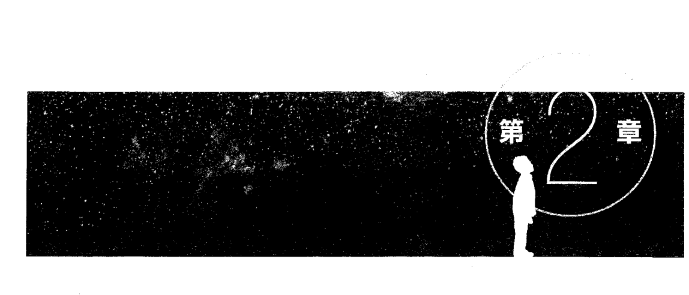
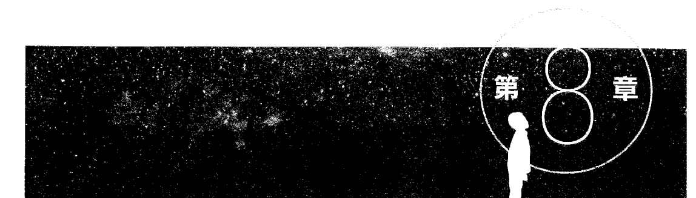
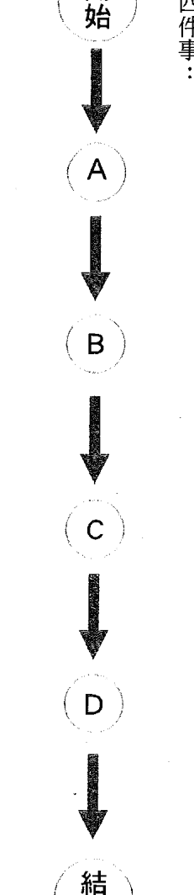
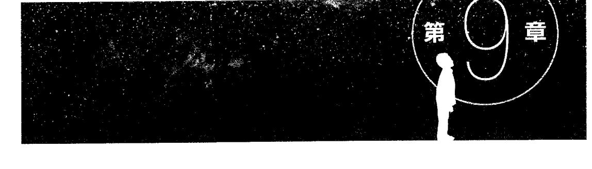
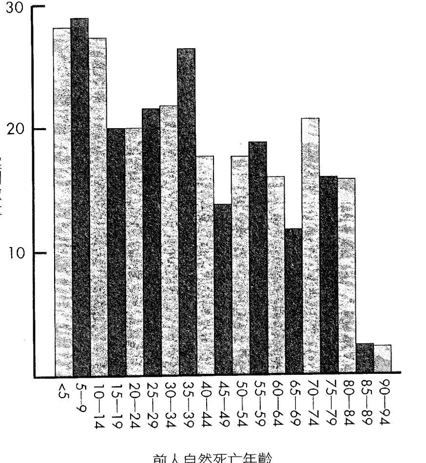

## 驚人的孩童前世記憶

我還記得「那個我」？
精神醫學家見證生死轉換的超真實兒童檔案

吉姆·塔克 Jim B. Tucker ◎著
張琤文 ◎譯

媽媽，我是記住前世的老孩子？
—最震撼真實的「前世記憶」兒童訪談紀錄—
用證據檢驗幼兒意識世界的深度真相：
當四、五歲的孩子說出不可思議的「前版人生事件」，
他們就像在不同夢境間切換穿梭……
我們該如何看待這類真相？又該如何思索死後存在……

Return to Life
Extraordinary Cases of Children Who Remember Past Lives

## St. Royal College 天使神秘学院

- ※ 专业占卜预测机构
- ※ 神秘学培训机构
- ※ 水晶能量研究中心
- ※ 官方淘宝：http://strc.taobao.com
- ※ 官方微博：http://weibo.com/715104687
- ※ 新书发布QQ群：659338717
- ※ 购买更多好书请联系院长大天使

大天使
天使神秘学院 院长
QQ : 715104687
手机/微信 : 13641926204

微信公众平台：strc2011

# 制作说明：

本书由《天使神秘学院》出重金从台湾购入的原版书籍扫描制作完成。为达到最好阅读效果，特地把原版书全部切开后，再经由专业扫描设备高精度扫描完成，并经过一张张的PS后期处理最终成书，其间花费大量的人力、物力以及时间，只为能给大家提供经济并优质的神秘学学习资料而努力。

本学院强力谴责某些机构和个人，把本学院花心血制作完成的电子书籍，包装后直接放在自家淘宝网上低价倾销的行为，以谋取不劳而获的经济利益。如果长此以往最终将无人愿意再为大家花心思制作电子书，那以后可能大家再无新书可读。

为让大家以后能够读到更多的好书，也为了本学院的良性发展。本学院恳请大家尽量做到如下几点：

- 一、尽量在本学院的网站购买电子书籍。
- 二、请勿用技术手段把电子书内的水印及加密去掉。
- 三、在收到电子书后小范围传阅即可，千万不要公开传播，更别挂到淘宝网上低价销售。

同时为答谢广大支持者，学院电子书将做如下调整：

- 一、学院会把一些早已收回制作成本的电子书折价销售。
- 二、最新制作的电子书籍会开放打印功能，大家购买后有条件的可自行打印成书。

## 驚人的孩童前世記憶

我還記得「那個我」？ 精神醫學家見證生死轉換的超真實兒童檔案

吉姆·塔克 Jim B. Tucker ◎ 著

張樂文◎譯

#### Return to Life

Extraordinary Cases of Children Who Remember Past Lives

致伊恩，永遠的懷念

# 目次

- 1. 第1章 回到前世的小孩？ 7
- 2. 第2章 散佈亞洲的案例 25
- 3. 第3章 來自巴拉的男孩 51
- 4. 第4章 詹姆士三世 71
- 5. 第5章 來自好萊塢 99
- 6. 第6章 我的前世是名人？ 131
- 7. 第7章 身份不明的那個人 149
- 8. 第8章 科學證據之外的是... 177
- 9. 第9章 徘徊在夢境 207
- 10. 参考文献 232
- 11. 致謝 238

## 回到前世的小孩？

您或許覺得前世記憶太過虛幻、不可思議，這一點我可以理解。我之所以投入此研究領域，並非因為我對前世的存在深信不疑，我亦非想透過本書推銷此一論點。我之所以投身此研究領域，是想找出死後世界存在的可能性。雖然我確信在某些案例中，肉體死亡後，生命卻得以延續進行，但我也持續思考各種不同的可能性。

留著深色長髮、臉上掛著淘氣笑容的可愛小男孩派翠克，是我的第一個案例。

伊恩相當看重派翠克的案例。雖然他發表過許多孩童詳述逝者細節的文章與書籍，但研究案例多來自普遍相信轉世輪迴存在的亞洲國家。相形之下，他手邊的美國案例顯得薄弱許多，大致上可分為兩類：

一是小孩依稀記得自己是某個已故親人；二是小孩雖然談論前世記憶，但無法說出能夠辨識出逝者身份的詳細細節。若案例中的孩童與逝者來自相同家庭，論述會有一個缺陷——孩童可能是無意間聽過家人談論往生者。派翠克的案例雖然也是發生在同一個家庭，但有另一項重要特徵：他身上的三處胎記與他過世哥哥身上的傷處一模一樣，這也代表此案例不受是否曾無意間聽到其他人談話內容的可能性所影響。

## 回憶早逝的凱文

伊恩規劃為期三天的完整採訪計畫：第一天先與家庭成員進行詳細訪談；第二天再次訪談其家人，一來確保沒有疏漏之處，二來釐清相關細節；第三天則訪問派翠克身邊相關人士。我們也希望藉由增加與派翠克的相處時間，讓他習慣我們的存在，並放心說出他記得的事情。

我們抵達派翠克家後，便與他母親麗莎一同坐在客廳。伊恩從跟著他征戰世界各地、飽受風霜的小背包裡拿出寫字板及錄音機。他先測試錄音機功能，把它放置茶几上。他先詢問麗莎關於過世兒子的事情，也就是派翠克記憶中的那個人。伊恩開口問道：「這個話題會不會讓你感到不自在？」麗莎回答：「不會。我的意思是，雖然我心裡難過，但並不介意提起這件事。你希望我從哪裡開始說起？」伊恩要她從兒子生病之初開始。接著，她以平靜語調緩緩道出過往記憶。

二十年前，年輕的麗莎生下凱文，這是她人生中的第一個孩子，雖然當時已與凱文的父親分手，但凱文依然過得很好，但在他十六個月大時，卻出現跛行症狀。一開始，他的情況時好時壞；三週後，他完全不良於行。麗莎帶他去看醫生，住院三天做了各種檢查；骨骼掃描結果正常，但X光片顯示左髖關節有多餘液體，醫生研判應該是受到感染。

凱文出院時走路一瘸一拐，兩天後他再次跌倒，另一間醫院的醫生發現他一隻腳斷了。醫生以石膏固定他的腿，卻讓這小男孩疼痛不已，因此三天後便把石膏拆掉。當下，他的腿無法承受身體重量，於是他拒絕行走。麗莎帶他去看另一名骨骼外科醫生，醫生幫他多照幾張X光片，結果顯示是左腿兩骨連接處有問題。於是，凱文再度入院。醫生告訴麗莎，凱文的左腿有顆腫瘤——這無異是在原本的不確定性上雪上加霜。麗莎表示，有整整兩週的時間，他們飽受不斷被告知「可能是血癌」與「不是血癌」的折磨，但最後結果卻更糟。

凱文被轉入三級兒童醫院繼續接受治療。除了腫脹的左腿，醫生還發現他的左眼凸起並有挫傷跡象，右耳上方則有疑似腫瘤的結塊。醫生懷疑是「神經母細胞瘤」，是始於體內某處神經組織的癌症，常發生於腎臟上方的腎上腺，然後擴散至其他器官。凱文的腎臟X光片顯示在左腎上有一大塊陰影。骨骼檢查結果發現不同的機能障礙，而凸起的左眼也有一大片不明區域。入院後第四天，凱文被送進手術室。醫生從他右耳結塊取出活組織切片，並從右頸植入一條大的中央靜脈導管。

活組織切片結果證實是轉移性神經母細胞瘤。至此，雖然不是好消息，但至少有個確定結果。凱文開始透過中央靜脈導管接受化療。頸邊插入化療導管的地方不時會紅腫發炎，但整體來說，整個治療過程他都忍下來了。接下來，醫生也針對他的左眼與左腿進行放射治療。十天後，他出院回家，但後續的放射療程依舊持續進行。

凱文有段時間情況還算穩定。麗莎拿照片給我們看。第一張照片是他生病前拍的，相片中的他充滿笑容，是個帶著一頭茂密淡色捲髮的粉嫩寶寶。另外兩張是之後拍的，相片中的小男孩顯得瘦弱，還有點禿頭，左眼周邊帶有挫傷，看起來是不該屬於他的傷痕。年紀尚幼的他，絲毫不知自己漸漸邁向死亡。

## 你不記得嗎？我是在那裡離開你的啊！

第一次住院的六個月後，凱文再度入院。他的牙齦因為癌細胞滲入骨髓而出血，並且沒有足夠的血小板。左眼的傷腫漸漸消失後，右眼的傷腫隨之而來。麗莎表示，當時凱文的病已經進入末期，左眼全盲，意味著這小男孩不久於世，但透過輸入血小板，他的右眼窩又多接受了一天的化療與一天的放射線治療。凱文出院兩天後死亡。

麗莎說話的語氣平靜且不帶情緒，或許也是受到我和伊恩注重事實層面多於情感層面的態度所影響。伊恩認為，凱文的死肯定對麗莎影響很深，但她當下並未多做回應，我們便繼續談其他事情。我們並未期待她會對我們完全敞開心房，而我們也只是問一堆讓她重新回憶凱文生病與死亡過程的問題。

凱文過世後，麗莎還是得繼續過日子。與凱文父親分開許久後，她在凱文生病前就已跟一名男子約會。他們兩人在凱文過世後結婚，沒多久就生下女兒「莎拉」。兩人在四年後離婚，而麗莎隨即再婚，生下第二個兒子「傑森」。

接著，在凱文過世十二年後，她透過剖腹生下派翠克。她說，在護士將派翠克遞給她的瞬間，她立即說，凱文過世後，她整個人彷彿被掏空，每天都希望凱文能再回到身邊。當新生兒派翠克進入她的懷裡，她似乎感覺到自己放下了心中長期的沉痛悲傷。麗莎更看出兩個孩子身體上的相似，其中的牽連不只表面上的簡單。她立刻注意到派翠克的左眼有一塊白色不明斑痕，醫生診斷後認為是角膜白斑。派翠克後續也定期接受眼科醫生診治。幾週後，白斑漸漸淡化，但並未完全消失。在派翠克非常小的時候，不管透過何種治療，他的視力仍退化至左眼全盲，就跟凱文過世前的狀況一模一樣。麗莎也摸到派翠克右耳上方有一塊突起物，那裡也正是凱文曾接受活組織切片檢驗的腫瘤位置。我們也確實在派翠克右耳上方摸到結瘤。在他五歲時，該結瘤有稍稍往後移位，但麗莎表示，他剛出生時，那顆結瘤是在耳朵正上方，是一顆近乎圓形、堅硬的結瘤。當時我們測量該結瘤直徑為一公分左右，壓起來硬梆梆，而派翠克也讓我們放手大力壓它。派翠克出生時，頸邊也有不尋常的痕跡。我們見到他時，他的右頸邊有一條四釐米的深色斜線，看起來就像手術的小切口，那裡也正是凱文植入中央靜脈導管之處，不過我們無法親自確認當時凱文被植入中央靜脈導管究竟是左頸或右頸。我們試圖透過醫療紀錄確認中央靜脈導管位置，很幸運地找到一份手寫、字跡清楚的手術紀錄，上頭記載中央靜脈導管的位置。該記錄列出手術過程，包括「插入中央靜脈導管（外頸靜脈），尖端位於上腔靜脈或在右側鎖骨下靜脈。」翻成白話文就是，中央靜脈導管是置入外頸靜脈，也就是在前頸兩側的靜脈。由於軟管曲折進入體內，靜脈導管的尖端要不是停在右側鎖骨下靜脈，也就是注入外頸靜脈之處，要不就是一路通往上腔靜脈，將血液由其他靜脈輸往心臟。對我們而言，外頸靜脈就是關鍵訊息，代表靜脈導管是從頸邊插入，而且是右側鎖骨下靜脈，意味著是從他的右頸插入——正是派翠克胎記的位置。

派翠克的案例中有一個很難解釋的特徵。在他大到可以走路後，也曾一度跛行。派翠克走路的步伐很不尋常，甚至會擺盪旋轉左腿——這也符合以前凱文的走路方式，自從他腿斷之後，就必須穿戴支架。我們要求派翠克在屋裡來回行走數次，而他依然有輕微的跛行狀況，但從醫學角度來看找不出任何原因。

派翠克四歲時開始談起凱文的生活。他說的第一件事情，是他想到另一間屋子去。派翠克說了好一陣子，有時甚至迫切想前往。麗莎問他為什麼要回去那個地方，是不是有什麼特定玩具或衣服？他回答，「你不記得嗎？我是在那裡離開你的啊。」她回答，「是沒錯，可是我現在跟你一起在這裡啊。」麗莎問派翠克，「他們家」長什麼樣子？派翠克說，那是一間「巧克力和柳丁」的房子。麗莎和凱文的家，其實是一間公寓而非獨棟房屋，不過正是一間橙棕色的建築物。

派翠克開始談起凱文的事，但總是出其不意。如果麗莎試圖引導他談談凱文，他通常不願多說，但事後卻會冷不防的提起。有一天，麗莎準備出門上班，派翠克卻突然問她是否記得他曾動過手術一事。麗莎告訴派翠克，他從未動過任何手術，但他說，「我肯定有動過手術，就在我耳朵這邊。」然後指著右耳上方的位置，那正是凱文進行活組織切片的腫瘤位置。麗莎要他描述手術過程，但他說不記得了，因為他當時睡著了。還有一次，派翠克看到凱文的照片時變得相當興奮。先前他從未見過這張照片，因為麗莎並沒把凱文的相片擺在屋裡。派翠克雙手顫抖的說，「這是我的照片，我一直在找這個。」他很肯定的說，「這就是我。」他也提到，家裡曾養過一隻棕色小狗。麗莎和凱文確實有養過這麼一隻狗，那隻狗原本是麗莎母親的，但因為她搬入公寓大樓無法繼續養才給他們。

在我們到訪的前一週，派翠克坐在沙發上問道，「你還記得我們上次去游泳的時候嗎？」派翠克從未真正游泳過，但他口中描述的，是凱文在他祖母公寓的泳池情景。他說祖母跟他妹妹的父親在一起。他記得他們如何把繼父的頭壓入水中，並且模仿繼父從水中抬頭大口呼吸的模樣。

麗莎也告訴我們，派翠克曾與哥哥傑森談論天堂的事情。我們詢問傑森時，他告訴我們幾個例子，例如有一次派翠克曾說他想帶家人到天堂，尤其是他的母親。隔天早上，我們拜訪了麗莎的姊姊，她也談到派翠克曾說過的天堂一事。她描述凱文與派翠克間的相似性，說話輕柔，相當害羞，甚至很膽小。

在那之後，我們希望如果能去之前的公寓看看是再好不過了。我們與派翠克和麗莎一同前往她和凱文以前住的公寓。派翠克已經有好一陣子不曾提起這個家，但我們帶他到現場，希望能藉此刺激他的記憶。我們無法實際進入公寓內部，派翠克看起來似乎也不認得此處。但他提到賽車車軌，麗莎認為，他指的應該是凱文以前的玩具，但因為他說他曾與傑森一起玩過，我也不知該如何解釋這一現象。但至少我們確定該建築物的確是棕橘色。我們在派翠克父親工作的地方跟他碰面。他說派翠克身上的疤痕－眼睛上的白斑、頭部的結瘤與頸邊的疤痕－絕對是在他出生時就有的。派翠克不曾與他談過凱文的事情，但他曾無意間聽到派翠克與麗莎談論。他認為這種事情太不尋常，但也不得不接受派翠克有著凱文記憶的事實。我們也與麗莎的前夫碰面，也就是派翠克姊姊的父親。他記得與麗莎一同帶凱文往返醫院，不過不記得自己曾如派翠克所描述般，與凱文一同游泳。但畢竟這是將近十七年前的事，就算他忘了也不令人意外，但他倒是記得有一次曾帶凱文去公園。他對派翠克記得前世的可能性不予置評，但他認為，這或許有助於減緩麗莎的悲傷。他說麗莎過去與凱文的關係十分親密，因此凱文過世後，自然也承受巨大莫名的傷痛。他告訴我們，之所以接受訪談是因為他希望我們對前世記憶的研究能夠幫到麗莎。隔天，派翠克漸漸能自在的與我們交談。由於他說話方式相當輕柔，再加上有時表達不夠清楚，我們偶而很難理解他在說什麼。更令我們困惑的是，他有時候會以第三人的角度稱呼凱文，並說些他們兩個人一起做的事。我在想，是不是因為五歲的派翠克，雖然有著凱文的記憶，但卻不知道那其實是另外一個人。

他告訴我們和凱文及表兄弟一起去動物園的事情。派翠克兩年前曾去過一次動物園，但並非與表兄弟一起去的，但是凱文倒是去過好幾次。派翠克曾提到凱文的房間，還說裡面有兩座衣櫥。不過凱文的房裡其實只有一座衣櫥，但衣櫥倒是有兩扇滑門，可從兩端開啟。派翠克還描述一個蘋果狀的「水球」，麗莎說，凱文是有那種洗澡玩具。派翠克也說他跟凱文一起去過有大公牛的農場——派翠克從未去過這種地方，但凱文確實去過阿姨經營的養牛場。

這趟造訪算很成功。我們從麗莎口中得知過去發生的事情，並且調查凱文傷痕的相關檔案，甚至親自聽到派翠克口述記憶。

跟麗莎一家人見面過程相當愉快，我也深深感謝願意接受訪談的受訪者。他們不僅是伊恩研究報告裡的紙上人物，而是活生生、有血有肉的人，經歷孩童前世走向生命完結的悲劇。

回家後，我們嘗試計算派翠克與凱文身上出現相同傷痕的機率。先不提跛行一事，光是一個小孩出生時，身上與自己親兄弟有三處相同傷痕的機率有多高？伊恩之前有算過，兩個人身上要有兩處相同胎記位置的機率是兩萬五千分之一。他以身高一百六十公分的成年男性為例，若將其全身皮膚攤平成正方形，則大小約為一百二十七公分乘以一百二十七公分。他假設若胎記與傷口大小皆在十平方公分的範圍內，則可填滿一百六十次該成年男性的全身皮膚。也就是說，一處胎記與一個傷口位置正好相同的可能性為一百六十分之一；則兩處胎記與兩處傷口位置正好相同的可能性為一百六十分之一的平方，或者是兩萬五千六百分之一。

但也有人對此數據抱持懷疑態度。在派翠克的個案中，我們決定尋求外界協助，從醫學院找來兩位統計學家，並向他們解釋情況。他們看似感興趣，但其中一位最後還是決定拒絕評估其可能性。他表示，任何的計算方式都可能過份簡化背後的複雜機制。他補充道，「或許這種情形只能用『極難發生』與『極度罕見』來描述。」

伊恩長期以來對胎記的案例都感到十分好奇。早在他進行身心醫學的主流研究時，就對心智與身體間的互動非常感興趣。我們拜訪派翠克的前一年，伊恩出版了長達兩千頁的《輪迴轉世與生物學：胎記和先天缺陷的病因》（Reincarnation and Biology）研究。這是他投入多年心血的著作，內容包含兩百多件案例，描述孩童出生時身上的胎記或天生缺陷正好與某位逝者的身上傷痕（通常是致命傷）吻合。

伊恩醉心於研究這類案例，但我一開始其實很難接受。我不懂的是，就算我們相信此世與前生有所關連，但原本在某個人身上的傷痕，怎麼會變成另外一個人身上的胎記？有一次，有個學生在我演講中就問過這個問題。伊恩則是引述諾貝爾生物學獎得主，但同時也研究靈媒與靈氣的查爾斯·里奇特（Charles Richet）的話：「我從未說這有可能。我只是說它是真的。」

這個解釋還是很難說服我。但伊恩在《輪迴轉世與生物學》中曾提到，從許多方面來看，「心理畫面」會對身體產生特殊影響。

有個例子是一名男子回憶起九年前他雙手被反綁的精神創傷事件，彷彿一切歷歷在目。就在他回憶的同時，他的前臂出現了看似被繩索細綁的痕跡。如果心中畫面能對身體造成特殊影響，加上如果人的心智在肉體死後還能繼續存在，並附著於胎兒身上，那麼我就可以解釋心理因素會如何影響胎兒發展——並非逝者身上的傷痕導致新生兒身上出現胎記或先天缺陷，而是當事人心中受傷畫面所造成的影響。

在派翠克的案例中，他的胎記與缺陷似乎就符合凱文心中難以抹滅的印象：左眼全盲、頭皮上進行活組織切片的腫瘤位置，以及接受化療插入靜脈導管的位置。

兩年後，我們再度拜訪派翠克與麗莎。派翠克又說出一些不尋常的事情。他甚至說出另一段跟凱文一樣已逝生命的故事，這一次事件背景在夏威夷。他談到他在那裡的某個家人及其過世的兒子，還說那裡有一座雕像因為火山爆發而融化，鎮上居民又是如何重建它。按照他的描述內容，他的父母認為他是在回憶一九四○年代發生的事件。

我們第二次碰面的數月前，派翠克在母親準備晚餐時，問道，「你知道你有個大家都不曾提起的親戚嗎？」派翠克說，他出生前曾在天堂遇到一位名叫比利的親人。他個子很高，有著棕色頭髮與眼睛，而生前大家都叫他「海盜比利」。他是被繼父在山裡面近距離開槍射殺。比利說他很難過，他過世之後都沒人再提起他。

丽莎對這個名叫比利的親戚一無所知。她打電話詢問母親後才發現，母親的大姊確實曾有過一個兒子叫比利。而派翠克所描述的細節完全正確。比利是在丽莎出生前三 年被繼父所殺。當丽莎問起「海盗比利」時，她的母親大笑，這個暱稱是來自於他的瘋狂行徑。丽莎母親表示，自比利過世後，她也不曾再聽過這個名字。所以派翠克之前應該沒機會聽到關於比利或這個暱稱的任何事情。

### 思維開放的科學家

您可能覺得派翠克的故事有些耳熟，因為我曾在前一本書中略述過此案例，而它是經由寫過兩本兒童前世記憶書籍的作者卡洛·鮑曼 (Carol Bowman) 轉介來，讓伊恩得以探討這獨特的案例，而卡洛也曾在她其中一本書提到此個案。

長久以來，伊恩不斷的聽聞類似的故事。伊恩是一位非常特別的人。他可以是典型、個性沉穩的學者，看起來正經八百，講話用字精準，但他同時又喜愛探索極度奇異的事情。探索並不等同接受，他在每個案例中，也從未失去理性分析的態度。派翠克的母親曾表示，伊恩讓她聯想到詹姆斯·史都華（Jimmy Stewart，已過世的美國著名男演員），相較之下，除了沒有史都華的不拘小節之外，這描述倒還挺貼切的——這兩人都是高瘦身材，帶著親切笑容的優雅長者。

伊恩很和藹，也總是支持著我，特別是在我於此領域剛起步的時候，而且某些特殊情況下，他會適時發揮獨特的幽默感。比如，曾有位作者聲稱自己已感應並與美國心理學家兼哲學家威廉·詹姆斯（William James）的靈魂溝通，伊恩對此則表示：「如果這種缺乏靈性的文字……真的是來自於他，我只能說這意謂人死後，個人能力會降低到多可怕的程度。（如果死後必須承受如此顯著的人格衰退，那麽至少對我而言，這樣的未來可一點也不吸引人。）」

伊恩自1957年擔任弗吉尼亞大學精神病學系主任，在此之前，他已發表過許多傑出的研究文章。他長期以來都對心靈學研究感興趣，並懷疑在人死之後，是否會有某部分的意識繼續存在。他開始在這些興趣上投入更多時間，並卸下擔任長達十年的系主任一職，全心投入孩童前世記憶的相關研究。

在伊恩開始撰寫相關案例研究報告時，期刊編輯因他長年以來在主流研究上的豐碩成果而認識他，這也使得某些主流刊物至少願意為他的著作刊登書評。1975年的《美國醫學協會期刊》（The Journal of the American Medical Association）一篇書評寫道，「對於他煞費苦心、不帶個人情緒從印度蒐集的轉世案例，這些難以解釋的證據……他所提出的大量資料都不容被忽視。」兩年後，《神經與精神疾病期刊》（The Journal of Nervous and Mental Disease）幾乎用一整輯的內容介紹伊恩的研究。

## 主流科學能接納前世嗎？

我們遇見派翠克時，伊恩已經離開主流領域很多年了。伊恩長期以來的寫作對象都是科學類讀者，而非一般大眾讀者，企圖為這些學術界讀者提供精確細節的研究報告。

過去幾年來，重視他研究的學術界讀者人數越來越少，但伊恩還是不放棄。在我們首次拜訪派翠克的尾聲，伊恩在晚餐席間提出發表派翠克案例研究一事。當時他構想以〈男孩與已逝兄長：四處相同身體變異之意外巧合〉為題，並認為應該要向世界級的英國知名醫學期刊《柳葉刀》（The Lancet）投稿。

結果證明他太樂觀了。向該期刊寄出研究報告的九天後，我們收到回覆表示，「經過本刊編輯群討論，認為來稿或許更適合刊登於他處。」我們又向另一份期刊投稿，試過一間又一間。總的來說，我們一年內向六間主流期刊投稿，但皆未被採用。

最後，我們把派翠克的案例，納入發表在《科學探索期刊》（Journal of Scientific Exploration），探討胎記與先天身體缺陷的案例裡。該期刊由「科學探索協會」發行，這是由一群包括伊恩在內的科學學者所發起的組織，他們的主要研究興趣，是各門科學領域中不被普遍接受的題目（例如研究幽浮）。

因此，該期刊裡收錄的學術文章特別著重衝突議題。雖然我們的研究報告很適合刊載其中，卻無法讓伊恩所預期的廣大學術讀者看到派翠克的案例。

不過他的樂觀還是發揮作用。在《柳葉刀》拒絕刊登我們的研究文章隔年，發表了一封伊恩的信，是關於他與同事研究的四十二對雙胞胎中，至少有一對表示自己記得前世。該信的內容長度比專欄還長，而該期刊下的標題是《雙胞胎的前世》——結尾甚至沒打問號。伊恩在2007年過世，《科學探索期刊》出版特輯回顧伊恩一生的研究，並讓外界留言表達追思。其中一則訊息來自《華盛頓郵報》的編輯湯姆·向德爾（Tom Shroder），他曾與伊恩一起進行兩次研究之旅，並出書紀錄。向德爾在文末表示，「不管最後的真相為何，伊恩所做的一切，這些數不盡的案例都是他研究熱情的動力……這些都是有價值的。真的非常有價值。」該特輯亦收錄伊恩1958年為《哈潑》雜誌（Harper's）所撰寫的《半封閉的科學家》一文。該文雖旨在評論科學界眼中初期失敗的各種例子，其實都具有某些突破性見解之外，似乎也預告了伊恩的未來。他提醒大家，人們總是傾向拒絕接受與認知有衝突的新概念，這種心態對科學家而言尤其危險。儘管伊恩心知肚明此現象，仍未因此停下腳步。有次他笑著告訴我，他過世時可能是個失敗者，因為他還未達成主要目標，讓主流科學正視輪迴轉世的可能性。這目標或許難以實現，但伊恩從不後悔選擇走上這條路。相反地，他很享受這段探索之旅，有幸能投入多年生命，致力於研究感興趣的事物，並且獲得許多資源協助。而他確實讓許多人大開眼界，當然，當中也包括許多科學家。伊恩的一生就如他在1958年文章中鼓勵科學家的話一樣，他一路走來始終對任何事情保持開放的接受態度。他最後一份論文《半生超然》（Half a Career with the Paranormal），是他過去四十年來所秉持的接受態度。

> 有研究的精彩總結，文末最後一句寫道：「別以為我知道答案，我仍在探索當中。」

希望各位讀者也能以此態度看待本書案例。

您或許覺得前世記憶太過奇幻、不可思議，我可以理解。我之所以投入此研究領域，並非因為我對前世深信不疑，亦非想透過本書推銷此一論點，而是想找出死後世界的可能性。我確信在某些案例，肉體死亡後，生命卻得以延續進行，但我也持續思考各種不同的可能。我不打算拿個人想法來煩讀者，但我鼓勵各位，無論事情平凡無奇，抑或離奇詭譎，請保持開放的心胸看待。

我在第一本書中，總攬過去五十年來的相關研究。而在本書中，我專注於個人近年來研究案例中某些令人印象深刻的事件，都是不曾在我第一本書提出的個案（派翠克的案例例外）。但我不只希望讀者認識此一現象，更希望能賦予意義。

如果您無法接受這類事情，或許是因為這些案例超乎科學解釋範圍，也超乎現實世界所能理解。儘管《美國醫學協會期刊》刊登了伊恩著作的書評，但我想這也解釋了為何有這麼多人長期忽視如此大量的資料證據。

在本書最後，我會對此進行討論，如何在現代科學中取得對前世的記憶共識。如果您抱持懷疑態度，我建議您看完本書所有案例後再做定論。我也會探討這種超出科學認知的現象，如何引導我們認識真實世界的本質：我們的存在以及死後生命繼續存在的可能。

我希望大家試著學習伊恩的態度——在仔細審視判斷之餘，亦能保持開放的心態。如此一來，你除了能明白某些家庭的驚人遭遇，也能進一步思考帶著同母異父的亡兄記憶與疤痕出生的小男孩派翠克，他的故事背後有何意義。

# 第2章

## 散佈亞洲的案例

只有五分之一帶有前世記憶的小孩有辦法談論發生在此世與前世之間的轉世過程。對於說得出具體內容的小孩，他們說出的過程可能差別很大，有些人就如安蟠一樣，描述在人世間的過程；也有人說自己到了一處像天堂的世界。……我們有足夠的理由相信每個人『死後的世界』（如果要用這個詞的話）是因人而異，人死後並非就只有那一、兩個地方可去，所經歷的事情也不盡相同。

當伊恩已花了數十年探索並記錄前世記憶的研究，我的探索過程卻才剛以派翠克為起點展開。翻開我過去的人生經歷，絲毫沒有任何跡象顯示有一天我會投身於前世記憶的相關研究。在北卡羅萊納州長大的我，每星期固定與家人一同到「南方浸信會教堂」做禮拜，順從的相信每週日在教堂裡聽見的一切。進入北卡羅萊納大學後，我上教堂的次數明顯減少，甚至在離開教堂山鎮後就完全不去了。後來我搬到「夏律第鎮」，在弗吉尼亞大學接受精神病學的專業訓練。我選擇放下大部分從小接受的教會信條。雖然我對靈界沒有任何完整且絕對的定論，但因為自己所接受的科學訓練，讓我選擇保持沉默。我是在受訓期間，首次聽到伊恩的事情。我對他的選擇感到好奇，怎麼會有人願意放下學術聲望，轉而注意如前世生命之類的虛幻議題？但我也不好奇到主動與他聯繫，而我在醫學中心的五年間也不曾遇過他。受訓結束後，我待在夏律第鎮，並在附近社區成立私人診所。再婚後，我重拾對靈魂議題的興趣。我的妻子克里思並沒有任何信仰，卻對我鮮少深思的議題有著開放的心態與討論空間，例如超自然力量、靈魂，甚至是前世生命。我開始閱讀相關的書籍，包括伊恩所著的《記得前世的兒童》（Children Who Remember Previous Lives），描述他接觸那些具有前世記憶小孩的過程。雖然當時我並未特別相信前世生命的可能性，但我很詫異他在過去這些年來，縝密分析了數百個案例，這一點深深打動我。閱讀該書時，我和克里思在當地報紙看到他的研究單位（當時名為「人格研究部門」，DOPS）獲得經費補助，研究瀕死經驗對當事者的影響。在瀕死經驗的案例中，當事者往往會提到離開肉身，從上方觀察自己，並檢視一生中所有事件，以及穿越如隧道般的空間進入另一個已逝親人存在的世界，甚至提到明亮的光線，或發亮的生物。

◆

當時，由於我沒法從個人診所事業得到太大成就感，克里思便建議我致電該研究單位，看看該計畫是否需要人手協助個案訪談。我打電話過去時，他們立刻邀請我參加隔週的午餐研究會報。

事前準備出席時，我納悶著做這種工作的人通常都如何打扮。男生會打領帶嗎？我決定穿著便裝前往，穿襯衫打領帶，但不是精心講究的那種。然後，伊恩穿著三件式西裝走進來。

後來，我每週都會參加人格研究部門的午餐會報。一段時間後，我參與其中一項研究，檢視曾有瀕死經驗之人的醫療紀錄，評估他們究竟有多麼接近實質死亡。我們很快發現到，這份工作其實也在評估醫療紀錄的品質；因為有些紀錄，尤其是年代久遠的案例，內容少的出乎意料。

我很享受與這個研究計畫人員一起工作的時刻，即便每週只有短暫的相處，仍讓像是在從事一項無償的興趣，一切都非常值得。

在我加入該部門約兩年後，伊恩問我是否有興趣跟同事酋根·克勞（Jurgen Keil）一同前往泰國與緬甸研究前世記憶的案例。我把握此機會並開始規劃。在我們第一次拜訪派翠克的三週後，我前往亞洲一個月，在曼谷與酋根會合；他之前就在泰國進行個案研究。酋根在德國出生，戰後移民澳洲，年紀尚輕的他，一開始從事機械車工及裝配工，後來變成心理學家。我剛認識他時，他是塔斯馬尼亞大學的榮譽教授。我們與口譯員會合後，前往拜訪個案。

### 追尋屍體的女孩

我們的案例之一是位名叫「安蟠」的女孩。我們接觸時，當事人已經十九歲，算是年紀較大的案例；但對相關受訪者而言，當年的細節依舊清晰在目。她的雙親表示，安蟠是在五歲時開始談論前世記憶，相較於其他案例的當事者，她算是比較晚開口談論。有一天她突然哭著說要回家。她母親說，「你的家就在這裡啊！你說的是哪個家？」安蟠回答，「布宏鎮。」布宏鎮離他們的村莊三英里外。在我們到訪時，已有一條鋪好的道路連接兩個村莊，但目睹此事的人皆表示，當年兩個村莊間只有一條泥濘道路，也少有巴士行駛。雖然安蟠的父親有遠親住在布宏鎮，但她的父母從未去過那裡，也不認識任何從布宏鎮到他們村落做生意的商人。安蟠接著說出前世的故事：她因為感染登革熱，病死在當地醫院。登革熱是透過蚊子散播的病毒疾病，常見於熱帶及亞熱帶氣候地區。一般來說，登革熱不會致命，但若是另一種出血性登革熱，就有可能致人於死。

安蟠的父母詢問她的前世名字時，她說她叫「翁」或「蘇翁」。他們表示，安蟠當時曾說出她的前世姓氏，但事隔久遠，他們不記得。她母親問到她為何會投胎到他們家時，安蟠表示，她在當地醫院過世後，有輛貨車載走她的屍體。她一直在車後緊追，卻怎麼也追不上，她只好一直走，走了五英里後，經過現在雙親家門前。當時她想找水喝，看見了未來的母親，然後一陣涼風吹過，便停下腳步，就地躺下休息。後來，她就被現在的母親生下來了。

安蟠第一次說出前世之事的當天，哭著要回家。之後長達三年，她經常哭泣，有時甚至是天天哭。

終於，在她八歲那年，安蟠的村莊裡有三十個人合租一台巴士，前往布宏鎮參加佛教的功德節。安蟠便與母親和一位親友一同前往。

巴士抵達布宏鎮後，安蟠帶著兩人走到一間房屋前，跑上前擁抱一名婦人，口裡喊著「媽咪」。

這名婦人曾有個女兒叫蘇翁，而她過世的過程也正如安蟠所描述。我們訪問了蘇翁的父母、妹妹與兄弟。在他們第一次到訪時，安蟠的母親他們將安蟠帶入屋內，私下相處。安蟠告訴她的前世家人，她想要蘇翁的佛教護身符；那是一件宗教物品，人們常戴在身上藉以避凶。蘇翁的家人表示，是安蟠告知護身符的收藏地方，而他們確實就在她描述的地方找到符。她也想找些蘇翁的衣服，但那些衣服都已經不在了。

約莫一小時後，縱使安蟠有千百個不願意，但她母親表示必須離開了。之後，她時常回來拜訪前世家庭，有時一個月會回來兩三次，有時會待上十天之久。她的現實父母看到她變得比較快樂，也就不反對。他們表示，她的前世記憶到十九歲時都還存在，這比起一般有前世記憶的孩童還來的久。但我們第一次去的時候，並未遇到安蟠本人，當時她到外地訪友。我們之後又再去一次，還是沒有遇見她。

雖然我們沒機會和當事人交談，但她的故事令我印象深刻。她的案例是前世記憶存在的有趣證據：她的陳述不但符合另一個女孩的人生經歷，她也清楚知道如何找出另一個女孩的護身符。然而，最讓我難忘的是她描述逝者靈魂追趕載走屍體的貨車畫面。在貨車駛遠後，她試圖尋找回家的路，而那渴望回家的心情似乎延續到她的來生，正如安蟠常常哭著想回家看家人的心情。

安蟠描述轉世的過程很真實，肯定不是什麼虛幻的空靈狀態。我曾在第一本書中提過，只有五分之一帶有前世記憶的小孩有辦法談論轉世的過程。而且雖然小孩說得出具體內容，內容可能差別很大，有些人就如安蟠一樣，描述在人世間的過程；也有人說自己到了一處像天堂的世界。

當然，這有一部分是受到文化影響，但就如我稍後會提到的，我們有足夠的理由相信，每個人「死後的世界（如果要用這個詞的話）是因人而異，人死後並非就只有一、兩個地方可去，經歷的事情也不盡相同。

在本案例裡，如果蘇翁就是安蟠的前世，則蘇翁的「意識」（或者你認為是靈魂）似乎還與前世及前世家人緊密相連。這也導致安蟠早期的生活充滿痛苦，但她終究還是與前世家人團聚了。蘇翁與其父母的連結或許也影響她過世後的經歷，並將這份記憶帶到下一世安蟠的生命。但這並非表示我們死後也會有類似經歷，或是還能投胎到前世生活的附近。我會在本書最後進一步討論這一點，但現在，我們要注意的是，此世的態度可能會影響死後的經歷，甚至影響來世究竟是否會投胎回到原處。

### 時間錯置

另一個案例是個名叫「猷他」的小男孩。我們前往拜訪時，猷他才剛滿四歲，跟母親與祖父母同住在泰國東北方小鎮上一間漂亮房屋裡。猷他出生四個月後，他的舅舅在曼谷附近騎車時遭到卡車撞擊，一頭撞上橋墩欄杆，意外過世。三、四個月後，猷他的呼吸系統出現問題，持續高燒數日，身體與牙齒不斷打寒顫。在他復原後，家人注意到他的左上臂出現兩處深色斑塊，在我們與他見面時，這兩處斑塊依舊清晰可見。斑塊呈現不規則形狀，近似三角形，直徑約0.25英寸。位置正好與已逝舅舅左臂上的斑塊位置吻合。他舅舅原本打算在該處刺青，但因為過程太痛苦，才刺下第三針他就喊放棄，而前兩針的位置現在彷彿就在猷他的手臂上重現。猷他當時也跟舅舅一樣出現「凸肚臍」。

雖然猷他是由母親親自照顧，但在他年紀大到足以開口說話時，他卻稱祖父母為「母親」與「父親」。他已逝的舅舅是家中小男孩，唯一會以較正式的稱謂來稱呼父親與母親，而非用爸、媽來稱呼。至於他自己的母親諾伊，他稱她「小諾伊」或「傻諾伊」——這也是只有他舅舅在逗惹小妹時才會這樣說，其他人不曾這麼叫她。猷他的祖父母先告知此事，我們稍後詢問起猷他的母親時，她笑著說她當時還得威脅要打猷他屁股，他才停止這麼叫他。

猷他的行為在在提醒家人他舅舅的存在，尤其是舅舅的友人來訪時，他總會以哥兒們間不拘小節的方式開玩笑。他會跟他舅舅一樣，把冰塊放入玻璃杯中，倒入啤酒或威士忌，然後用手指頭攪和，接著把飲料分給友人，然後他自己（哇！）喝掉一杯。其中一個朋友注意到他倒啤酒的手勢就跟他舅舅一模一樣：倒出啤酒後，還要敲敲瓶底，連最後一滴也不浪費。

猷他兩歲時表示，他曾在曼谷的某建設公司工作，這正是他舅舅從事的事。他表現出對建築工具的高度興趣，並會指著舅舅的摩托車說那是他的。在首次拜訪他們的八個月後，我們再度造訪這一家人。當時，猷他剛滿五歲，但他不再提起舅舅以前的生活，也不再稱祖父母為母親與父親，不過稱他的媽媽為「母親」或「諾伊媽媽」（這很不尋常）。

相較於他在兩歲時會小酌威士忌，他當時也不再碰酒類飲料，如果有人給他一杯啤酒，他也不喝。

至於手臂上的斑點也逐漸模糊褪去。當下的他，看起來與一般的小男孩無異。

上述的案例，伊恩歸類為「時間錯置」案例；意指「某人在孩童出生後才過世，但逝者生前的事情卻出現在孩童的記憶中，意即逝者靈魂進入孩童的身軀裡，將原有的靈魂推出其軀殼，或者是兩者的靈魂處於互相角力的狀態。」

猷他的家人表示，他小時候的行為模式反反覆覆，有時候會想喝酒，有時候又滴酒不沾。也許是兩個靈魂在他體內爭奪主導權吧。

雖然這聽起來很奇怪，但伊恩之前曾有兩個令人費解的著名案例可以支持此現象的論點。這兩個案例是他與印度的臨床心理學家莎塔汪·帕斯芮查（Sarwant Pasricha）共同研究；最近剛退休的莎塔汪是「國家精神健康和神經科學研究所」（NIMHANS）的臨床心理學教授。

第一個案例是位叫「烏塔拉」的婦女，她在三十二歲時突然出現全新的人格特質。烏塔拉曾因多種健康因素而住院，住院期間，有一名瑜珈修行者到醫院探視她，並引導她進行冥想，包括呼吸練習，進而誘發出某種意識狀態的改變。烏塔拉之前也做過冥想，但並無任何異狀產生，這次她的行為卻大幅改變，有時極度興奮，有時卻異常安靜，甚至莫名其妙自行從醫院離開。最奇怪的莫過於她開始講另一種語言，醫生認為她說的是印度孟加拉地區的孟加拉語，烏塔拉並不理解。醫生表示，院方無法照顧行為如此詭異的患者，因此要烏塔拉的父母將她帶回家照顧。

烏塔拉的父母必須自行處理女兒的情況，但她不只行為怪異，而且無法跟家人溝通。她說著父母聽不懂的語言，甚至不懂她的母語馬拉地語。一開始，父母只能跟她比手劃腳；後來，他們找來懂孟加拉語的人跟她溝通，也學會一些孟加拉語的單字。

烏塔拉說她叫「莎拉達」，並且詳述她在孟加拉的生活，很明顯覺得自己還活在前世的人生中，但她顯然對工業革命後所發展出來的器具設備，譬如車輛都非常陌生，像是來自另一個時代的人。她不認識烏塔拉的親友。有好幾個禮拜，莎拉達都像是「主控中」的上風角色，直到烏塔拉回來，恢復原本正常的人格特性。但她的家人並非從此與莎拉達毫不相干。有好幾年的時間，莎拉達的人格特質會時不時出現。伊恩與莎塔汪計算過，事情發生後的三年裡，莎拉達出現了二十三次，每次大多只待一、兩天，但有時候會比較長，有一次長達七個禮拜。

莎拉達除了說出孟加拉不同的地點，包括五處名不見經傳的村落，還說出其他家人的名字。依此追溯，那是一戶在十九世紀初，住在孟加拉西部的家庭，而她講出的父親與其他六名男性家人的姓名，通符合我們找到的某戶宗譜中的男性成員名字。

六十五年前，該宗譜曾刊載於孟加拉當地雜誌，但由於烏塔拉不曾造訪該地，伊恩與莎塔汪認為她之前不曾看過該宗譜。由於該宗譜只記載男性名字，因此無法作為有力證據，證明莎拉達這個人曾經真實存在，但她所提的家人，經確認後是真實存在的。

顯然，烏塔拉的身體被一位在一百五十年前、住在不同地區的婦女莎拉達所佔據。

關於莎拉達會講孟加拉語這件事，烏塔拉及其家人都表示，除了中學時在某幾堂課看過孟加拉文的圖片外，她不曾學過該語言，而且該任課教師本身也不會說孟加拉語。

一位研究同仁帕爾（Pal）教授曾以孟加拉語與莎拉達長談四次，他與另外五位以孟加拉語為母語的人士皆表示，雖然莎拉達的用語有些小瑕疵，但確實對該語言有足夠的基礎。伊恩與莎塔汪曾針對此案例發表研究文章，四年後，伊恩也將此案例納入書中。伊恩在最近的研究報告中註記，有人指出烏塔拉就學期間曾學過孟加拉語，但該說法缺乏有力證據。

他曾拜託語言學家聽兩段莎拉達說話與唱歌的錄音檔。該語言學家表示，他沒聽出曾與她對話過的人所指出的古式孟加拉語，他也表示，莎拉達說話的腔調並非道地的孟加拉語。

我希望能撇開她的腔調與說話時不完美的反證。因為這就像塞繆爾·強納遜（Samuel Johnson）針對狗兒用後腳走路寫的一段話：「雖然做不好，但你也許很驚訝他還是辦到了。」如果這個女人真的開口說自己不懂的語言，這就好好探討解釋了。

這個案例究竟是孟加拉的靈魂以不盡完美的方式操控一個不會說孟加拉語的女人？抑或是一起解離的異常個案，這名婦女就像多重人格障礙（現稱解離性身份障礙）的患者一樣，突然以另一個人的身份和行徑做事？不管如何，此案例中的烏塔拉的確具備了此世未曾學過的知識。

自莎拉達出現後的三十年裡，伊恩持續與烏塔拉保持聯繫。直到最後，莎拉達還是存在，不過後一年只短暫出現一次，而且不會影響烏塔拉的生活。

第二個案例是年輕婦女「桑米塔」，由伊恩、莎塔汪與精神病學家尼可拉斯·麥卡連—雷斯（Nicholas McClean‑Rice）共同研究。桑米塔會出現翻白眼與咬牙的症狀，短則數分鐘，長則一整日。有幾次，她的意識似乎被不同的人佔據；一個說她是投井自盡，另一個說他是住在印度另一區的男子。

這一切的一切，都是從某個時間點、在她失去意識後開始。當時她已停止呼吸，脈搏停止跳動達五分鐘，所有情況都顯示她死了。桑米塔的家人圍在她身邊哀悼之際，她不知怎麼卻復活了。一開始，她顯得有些困惑，隔天幾乎什麼廢話都沒說。之後，她完全不認得身邊的親友。她自稱自己是汐娃，在迪比耶普爾被婆家的人謀殺，那位在桑米塔的家約六十英里外之處。她說出的許多細節，後來證實皆與一名叫「汐娃·迪薇笛」的人吻合。桑米塔的家人不認識該名女子，她是在桑米塔出現轉變的兩個月前，慘死在迪比耶普爾。

在她死亡當日，汐娃和婆家發生爭執，並告訴舅舅，婆婆與小姑聯手毆打她。隔天早晨，有人在鐵軌上發現她的屍體。汐娃婆家的人表示，她是自己臥軌自殺，但她的舅舅看到屍體時認為很可疑，因為汐娃似乎只有頭部受到傷害。他要求汐娃的婆家暫緩火化四小時，等汐娃的父親前來。但婆家無視他的請求，在汐娃父親抵達時，屍體已成灰燼。

桑米塔後來看到小姑拉瑪·卡尼蒂的照片時，她說，「這是拉瑪·卡尼蒂，就是她用磚塊砸我的。」桑米塔堅持自己是汐娃，有段時間甚至排斥她的先生（以及求歡）和兒子，並且要求家人帶她去找汐娃的兩個小孩。

家人一開始以為她瘋了，後來認為她著魔了，也並未求證她說的事情。最後，是汐娃的父親聽到傳聞，說他女兒的靈魂佔據遠方村莊裡一名年輕婦女的身體。桑米塔復活的三個月後，汐娃的父親找上門。桑米塔立刻認出他，並說自己是他的女兒，後來透過照片或親見本人的方式，她總共認出二十三名汐娃身邊的親友。

桑米塔的行為也出現轉變，如同研究人員所加註，「從一個簡樸的村莊女孩變成種性制度上層受過良好教育的現代婦女，表現出都市人的生活習慣，能流利的書寫與閱讀北印度語。」她寫信給汐娃父親時所顯示的書寫能力，介於桑米塔之前有限的文字運用與汐娃受過良好教育的程度之間。

在後續的調查中（由安東尼亞·米勒斯和庫帝普·笛翰瑪執行）發現一封信，其中有段話寫道，「爸爸我不喜歡這裡……上帝很壞，把我丟在這裡。」

桑米塔復活一年後，她有一次似乎重拾原本的人格特質短短數小時。除此之外，長達將近兩年，在我們完成初步調查時，她都是以汐娃的身分活著。事實上，在後續研究終止後，她一直維持汐娃的身分直到過世（大約是自復活後的第十三年）。

每個人，包括桑米塔在內，似乎都慢慢調整自己，接受她改變後的事實與新身分。她開始與家人熟絡，還有那個應該是她丈夫的男人，而且多了兩個小孩。汐娃的家人經過一段時間後也不再打擾，讓桑米塔過著屬於她此世的生活。

自桑米塔首次見到汐娃的父親後，莎塔汪便著手研究這個案例。她和伊恩訪問了兩個家庭共二十四位成員，仰賴其他二十九名相關人士提供背景資訊。除非這是由一大群人在沒有任何明顯目的下，刻意安排捏造的謊言，否則研究人員似乎只能將此案歸檔為「附身」。

在討論此一可能性時，研究人員寫道，「雖然無法武斷稱這是對此案最正確的詮釋，但我們相信這麼多的證據都能證明這是最有可能的解釋方式。」

就我們的標準，這些案例非常不尋常，我之所以提出來是想指出：我們一般總認為大腦與心智間是一對一的關係，但這或許不一定是對的。

現代神經學最基本的假設是：大腦創造人類心智或所經歷的意識。因此，一個死亡已久的大腦意識，要如何佔據另一個活人的身體？另一種假設是：意識本身可以穿透大腦，並存在於大腦之外，是一種獨立於大腦之外的東西；正常情況下一條生命緊密相連，但還是可以分開。

相較於現代科學認為心智是大腦的產物，這種一個大腦包含兩個意識且互相依存發展的案例，似乎比較符合我們的假設。

可以肯定的是，正常情況下，大腦一生只有一個心智意識。然而案例再罕見，也未減損其重要性。

正如威廉·詹姆斯（William James）所說，「如果你想顛覆天下烏鴉一般黑的定律，你要做的並非找出一隻又一隻不是黑的烏鴉，你只要找出一隻白烏鴉即可。」逝者意識佔據另一名活人身體的案例，挑戰當今意識或心智是由大腦形成、且侷限在腦內的認知。

### 一場不幸的狩獵意外

我和酋根在泰國的另一個研究案例，和以上主題有某種有趣的關連。

小孩與逝者住在同一個村莊，而且是親戚：小孩的祖父是逝者母親的大哥。逝者是名叫「邦恩」的年輕人，有一天，他和三名友人外出打獵，其中一名友人的獵槍不小心掉落，結果槍枝走火，子彈射進邦恩的胸膛。肇事的友人因為緊張而逃跑，另一個年輕友人豐恩背著邦恩回到村莊。村民試圖搶救，但邦恩已經沒有生命跡象。

我們訪問事後幫忙處理邦恩遺體的人，他說邦恩當時大量出血，傷口位在左乳頭下方。但子彈並未完全射穿胸膛，因此背部有一處凸起，應該就是子彈的位置。在他右側背部、肩胛骨下方有一大片發青的挫傷痕跡。

兩個月後，小男孩「索馬斯克」出生了。他的家人表示，他出生時，左胸與背部即帶有胎記。我們見到索馬斯克時，他已經九歲，當時這兩處痕跡已經很難辨識，甚至無法照下來清楚顯示，但還是看得出他左胸上的痕跡。

邦恩的母親親眼見過兒子的遺體，她告訴我們，索馬斯克的胎記位置與邦恩被子彈射入的地方一樣。

索馬斯克的母親在他五歲時因為癌症過世，因此我們訪問他的祖母與姑姑，以瞭解他過去的行為。

她們表示，索馬斯克長大、會開口講話後，某天一大清早，他醒來就問母親為什麼豐恩要開槍射他。

接下來幾年，他不斷問同樣的問題。他左思右想，就是想不懂為什麼豐恩要殺害邦恩。即便事實是另一個朋友的槍枝走火，但不管怎樣，他就是很氣豐恩。

兩歲時，他接近豐恩，並且說：「你是殺人兇手，就是你殺了我。」我們訪問豐恩時，他說索馬斯克氣到想勒死他。稍微聊過後，豐恩說他不記得邦恩的死亡細節，然後突然轉身離開。邦恩的死肯定是他心中非常痛苦的記憶，但我心想，被人說是殺人兇手，就算只是從幼兒口中說出，是否也會增加他心中的疙瘩？

我們訪問邦恩的父母，他們說索馬斯克小時候可以正確指出邦恩房間的位置，並且辨識哪顆枕頭是哪個家人的。他記得邦恩的物品，例如鋸子與小盒子。他只拿走邦恩的東西，不是邦恩的他一件也沒碰。

邦恩的父母覺得索馬斯克依然記得當他們兒子時的生活，也總以熟悉的邦恩方式稱呼他們。據說，他也認得邦恩的女朋友，但我們訪問時她在外地工作，無法見到。

索馬斯克也指出豐恩把他的身體從樹林帶回村莊後，有四個人走掉。他認為他們當時根本就不管他的死活，不願與這四人見面。

我們與其中一人碰面。該男子解釋，邦恩受傷當天他原本要去幫忙，但又必須到草原救一隻因為雨季淹水而受困的牛。他看到邦恩的父母站在身後，心想他們一定會好好照顧邦恩，所以才沒多做停留，直接去救那頭牛。他後來雖然回到現場，但一切都來不及了。

該男子表示，從來沒人說過他無視邦恩遺體的事。但不知怎麼，索馬斯克就是知道這件事。當這名男子向我們解釋時，我有些詫異，他竟然會因為一個年輕男孩指控他前世的事件而解釋自己的行徑。

隔天，我們與索馬斯克碰面。當時他已經九歲，也不再談論邦恩的事情，但我們還是想看看他究竟會告訴我們什麼。他說出許多邦恩死亡的細節，有些事聽得出來與事實有些出入，但能確知他依然記得自己被射殺，只是他把別人口中的細節與自己的記憶全混在一起。

說實在，如果當事人多年不曾談起邦恩，後來仍能清楚記得前世的死亡，這個案例會更具可信度。

一般來說，如果逝者身份已得到確認，我們便不會太過仰賴孩童的陳述內容，畢竟孩童有可能在無意間聽到逝者的各種事情。我們會把重點擺在案例剛發生時，孩童所做的陳述，這些發現往往非常驚人，尤其是當孩童談論著陌生的人生。

在此案例中，儘管索馬斯克是描述某個他家認識的人，但他的陳述與行為，都讓此一案例更引人好奇。

結束泰國之行，我們轉往緬甸。一九八九年，緬甸軍政府將緬甸的英文寫法更改為「Myanmar」，民眾對這項改變接受度不一，大部分人還是傾向使用「Burma」。

緬甸給我的感受與泰國形成強烈對比。我在泰國看到許多發展中的跡象，特別是在曼谷。我第一次到訪時，看到一幅大規模的建設景象，例如水洩不通的馬路聳立巨大的快速道路，曼谷有些地區看來就像發展失控、市容奇特的未來都市。

但在緬甸最大的城市仰光沒有這種未來感。當地的建築看起來年久失修，也不見任何現代摩天大樓。不過，當地人非常友善，在我們前往北方城市密鐵拉與曼德勒之前，先待在仰光拜訪幾個案例。

### 特殊印記

其中一個案例，伊恩歸類為「實驗性胎記」，我在前本書裡也曾討論過。

東南亞國家某些地區的人民會在某人過世後，在屍體上做標記，希望逝者能將此印記帶到來生。如此一來，只要新生兒出生時帶有相同胎記，人們就知道這個嬰孩是前人投胎再來。伊恩研究過二十個類似案例，而我和酋根又找到另外十八個類似案例。

我們第一次見到「瑩瑩」時，她是個七歲的小女孩。在她出生前九年，瑩瑩的外婆因腎臟病過世，一兩個小時後，她的女兒（瑩瑩的阿姨）以煤灰在遺體上留下兩處標記。一處在左腳踝外側上方，另一處在右腳踝內側下方。好幾個人都看到她做標記，包括我們訪問到的一位鄰居。

瑩螢出生時，她身上兩處胎記都與外婆遺體上的標記位置一樣；關於這一點，我們向其家人與鄰居確認過。瑩螢身上沒有其他胎記，兩個哥哥身上也沒有。她六歲時，身上的胎記漸漸淡化，因此隔年我們訪問她時，無法親眼看到。

瑩螢是在十八個月大時開始說話，她說了一些外婆的生活瑣事。她詢問外婆的研缽在哪裡；舅舅膝蓋受傷時，她說應該要把草藥放入缽中搗碎，敷在膝蓋上。她時常提起前世，例如問起金錢與珠寶。顯然她外婆在世時還算富裕，但她過世後，家裡經濟出現困難。

我們訪問一位熟識瑩螢家人的鄰居「馬薇琪」。瑩螢的外婆總叫她「老薇琪」，但身邊的人都不會這麼稱呼，而瑩螢總以外婆的方式叫她。她也直接以名字稱呼父母、阿姨與舅舅。

有一次瑩螢問道，為什麼這個家把她的錢全花光了？當她被打屁股時，她會問，「為什麼你不尊重我的母親？」

瑩螢的外婆在二次大戰期間，與堂妹住在緬甸另一區的城市土瓦（Tavoy）。她是唯一會叫堂妹「寶貝」的人，有一次還告訴她，「搗住你的耳朵，英國人要丟炸彈了。」她的家人對此的解釋是，二次大戰期間，英國人曾投擲炸彈要炸駐紮在緬甸的日軍。

每當瑩瑩談起外婆的生活點滴，家人不免感到難過，也希望她別再提起過去。有段時間，家人一直餵瑩瑩吃雞蛋，這是一種在緬甸普遍流傳的習俗，相信有助於她忘記前世的一切，但這方法似乎不管用。

不過隨著年紀增長，瑩瑩提起外婆前世的次數越來越少。我們拜訪她時，她只會在生氣或傷心的情況下說出外婆的事。然而，我們與她碰面的前兩天，她確實對著來訪的大堂姊說，「你長得好像我兒子。」她的家人表示，這位大堂姊的確很像瑩瑩外婆的兒子（也就是堂姊的父親），但他當時並未與女兒一同來訪。

除了她說的話，瑩瑩還有一個習慣常讓家人想起她的外婆：吃飯時把一隻腳翹在椅子上。家族裡只有她和她的外婆會這麼做。這跟伊恩之前研究的某個案例很類似，一個斯里蘭卡的小男孩蘇季斯，每次喝東西時總會雙腿打直，就跟她記憶中前世的男人一樣。

我們跟瑩瑩聊天，但她並未透露太多事情。她說記得曾照過大合照。她的家人拿出一張有外婆在內的大合照，但她說不記得照片裡的人，還有另一張是在屋裡某個房間裡拍的，那才是她說的照片。

她的家人表示，瑩瑩的外婆二十五年前的確在那房間裡照過一張大合照，但三十多年前就送給住在土瓦的親戚，就連瑩瑩身邊的家人都已經多年不曾想起那張照片的存在。

為了做個完整交代，我要告知另一件事：幫瑩瑩外婆遺體做記號的阿姨，也曾幫一隻狗做過標記。後來家裡有人生下一名小男孩，腿上的胎記就跟她當年幫小狗做的標記一模一樣。

### 動物行為

「動物前世」的話題或許會讓人有些不自在。伊恩曾經寫道，面對這類案例時，必須先克服自己的成見（事實上，他在某封信中寫自己第一次去亞洲時，心裡對這種事情是嗤之以鼻）。克服心中成見後，他記下所有關於動物前世的說法，並發現這類案例其實相當罕見。他指出，如果這類案例純粹是因為信仰而發生，那麼在南亞地區應該可找到更多才對，因為當地的印度教徒與佛教徒都相信動物可以投胎為人，而人也有可能轉世為動物。

當然，大部分關於前世是動物的說法都無從證實，但有一個泰國案例卻是例外。

伊恩當年與同事法蘭西斯·史托利（Francis Story）一同在泰國行走，有人給他們一本小冊子，上頭記載有名男孩自稱前世是條巨蟒。史托利想要研究此案例，但因為該地位於泰國的另一端，伊恩覺得這耗時費力又浪費錢。伊恩先行離開後，史托利獨自前往拜訪此案例，認為這聽起來頗具可信度。他訪問了男孩本人與其父母和姐姐。但當時他無法親自訪問案例中的關鍵人物賀屋先生，因為通往賀屋先生村莊的道路淹水無法通行，但賀屋本人曾接受《曼谷時報》訪問。

小男孩名叫「達拉翁」，聲稱前世是一隻鹿，被獵人殺死後，重新投胎變成一條蛇。

在達拉翁入胎前，他父親曾吃下熟人請的蛇肉——是那個人費盡九牛二虎之力才殺死的蟒蛇。達拉翁三歲時，那名熟人，也就是「賀屋」先生，到達拉翁鄰居家參加派對。達拉翁和他母親先前都沒見過這個人。達拉翁第一眼看見他時，立刻火冒三丈，想要找鐵鎚或木棒攻擊對方。他說賀屋先生殺的那條蛇就是他的前世，而且還詳細說出被害經過——在哪個洞穴，一條蛇與兩隻狗如何纏鬥，最後死在狗主人手中的細節，這些達拉翁應該是無從得知。賀屋先生證實細節內容正確無誤。

達拉翁說，他前世被殺害後，靈魂看見未來的父親時，覺得他比起另一個吃蛇肉的男子慈祥，所以就跟著父親回家，進入母親胎中。

他父親表示，達拉翁看到賀屋時，碰觸賀屋的左肩，說那裡曾被蛇咬過。賀屋先生該處的確有被蛇咬過的疤痕。其他人倒是沒提到這方面的事。後來，達拉翁放下對賀屋先生的憤怒，並表示當人比當蛇好太多了。事實上，他長大後因憐憫而開始殺蛇，因為他說當蛇太痛苦了。

在法蘭西斯·史托利第一次見到他的二十年後，酋根再次拜訪。達拉翁依舊相信自己前世是一條蛇，每隔幾個月就會前往那條蛇被殺害的洞穴裡靜坐禪修。在禪修過程中，他學到草藥知識，並藉以幫助生病的人，現在是當地村莊公認的醫生。

我還要補充說明一件事：達拉翁出生時身上就帶有「魚鱗癬」。這種皮膚病，會讓身上的皮膚看起來像是被鱗片覆蓋，尤其是下半身。或許你會說，他的皮膚看起來很像蛇皮！

看到這裡，我想上述內容已經超出讀者的接受範圍，可能讓你覺得難以接受。我必須承認，這類案例我同樣難以置信。但它並非個案。

最近，我接到一位美國母親的來信，說自己在兒子「彼得」六歲時，某天送給她一條糖果項鍊。彼得告訴她，「以前我還是黑猩猩時，有個小男孩也朝籠子裡丟一條糖果項鍊給我，但當時我不知道這是幹什麼用的。」她問彼得為何會被關在籠子裡？彼得告訴她，他當初是掉入陷阱，然後被帶到動物園。她也詢問當猩猩時的他過世後，在進入「媽媽肚子裡」的過程中，可曾發生什麼事，但他只回答，「沒什麼。」後來她因丈夫和其他孩子陸續回家而忙起來，稍晚她試著進一步詢問彼得先前說的事，但彼得甚至不記得有說過這段話。彼得後來不曾再提起當猩猩的事情，明顯是因為那條糖果項鍊喚醒他的記憶，而不是其他物品。

我提出動物案例是有原因的。雖然我相信猩猩可能對糖果項鍊會有某些記憶，卻很難相信一條蛇能如此清楚記得特定地點與一連串的事件，甚至在事隔多年後，還能認出、報復當年殺他的兇手。我的確不知道蛇在想什麼，但這還是太令人匪夷所思。我能想到的解釋是，或許蛇的意識也會與肉體分離。大腦活動會產生訊息，而意識涉及到許多記錄在大腦裡的事。意識能超越肉體，就是因為這種超自然、非肉體的力量，讓意識得以在大腦與肉體死後繼續存在。

此概念可透過某些瀕死者大腦停止運作的案例得到支持。曾經歷瀕死經驗的人經常表示，他們記得發生在身邊的事情，而且描述的細節事後證實都是正確的。即便大腦停止運作，與瀕死者肉體緊密相連的意識，依然可以接收新訊息（透過「五識」【譯註：指眼、耳、鼻、舌、身的感官】以外的某種機制）。許多經歷瀕死的人都說到自己離開肉體後，離開這個世界的感覺。

由瀕死案例可知，即便大腦停止運作，意識依然持續運作；這也表示，意識可以獨立於生命與大腦之外運作。

達拉翁知道他當蛇時發生的事件，或許不是一般蛇類會經歷的。這是在蛇死後、轉世此生之前才形成的靈魂意識。

總的來說，亞洲是能找到許多這類案例的好地方。這一點也不意外。我拜訪的地方，當地人普遍相信輪迴轉世，或至少對此議題持開放態度。

當小孩說出自己的前世記憶，就會開始口耳相傳。只要孩童的說詞夠引人注意、讓人信服，內容自然會出現在新聞上。同事想在這些地方尋找適合的研究案例，當地人通常也會願意協助找出正確方向。

西方國家的情況就稍微不同。許多與我們聯絡的美國家庭都不曾告訴外人孩子說過的話。祖父母或旁系親人或許不知道，也或許無法接受這類說法。能登上媒體版面的案例少之又少。正如我稍後要提出其中一個案例，我們通常都得依賴當事人父母的陳述，因為沒有其他方法發現他們。

三度前往亞洲後，我決定將研究重心擺在西方社會。我很享受與酋根一起旅行的日子，也一同見證許多有趣案例。但對我而言，只收集亞洲案例似乎還不夠。如果伊恩手中的兩千多個亞洲案例都無法說服人們正視他的研究，那就算我找再多，結果可能還是一樣。

有別於此，我希望透過西方案例引起社會重視。儘管他們難以發現，但手中的某些案例，依然證明一切努力都是值得的。

## 來自巴拉的男孩

雖然人類一生的記憶多有變化，但意識與肉體分離的概念仍值得我們深思。牽涉到累世記憶的案例顯示，每一世的記憶是由不同的意識所構成，而非單一意識連貫多世記憶。心智或許可分為兩部分，其中一部份是存在於日常生活之外。

## 謝絕奇聞式的媒體簡單陳述

雖然伊恩拒絕參與電視節目或新聞採訪，但並不反對我跟媒體打交道，有時甚至會主動提供早期案例的資訊或照片給我。倫敦製作人來信時，已退休的伊恩讓研究助理代為回信婉拒，但在信末補充，他有一天，伊恩收到一位倫敦電視製作人的來信，希望將我們的研究製成紀錄片的可能性。我們不時會收到電視製作單位的邀請，有時候對方只想採訪，有時則希望把研究內容做成專題。伊恩對這類媒體始終非常小心，而且通常直接拒絕電視媒體，就算沒有當下拒絕，最後也不會點頭答應。我對這方面就比較開放了。既然我決定把重心擺在西方國家的案例，就得想辦法讓更多人知道我們的研究，如此一來，如果有誰家小孩開口談論前世記憶，他的家人才知道要與我們聯絡。

伊恩向來擔心我們的研究內容會被媒體刻意炒作，就算製作人保證會以客觀角度拍攝，也無法降低伊恩的疑慮。某種程度上，炒作有助於將訊息傳遞給觀眾。我明白電視節目對研究的報導有限，某種程度上算很膚淺（它畢竟是電視節目），但還是有其價值。

我甚至曾接受《未解之謎》（Unsolved Mysteries）節目的訪問。當時我其實是想為手上的心理學研究找到美國案例，也知道這麼做並不會挑戰到艾德華·穆羅（Edward R Murrow，美國著名的新聞主持人）的新聞權威。後來一名苦惱的母親看到節目主動聯絡我，而她的女兒成為我第一本書的重要案例。

我的研究工作目前由我接手繼續。於是，對媒體抱持開放態度的我，希望先進一步瞭解相關細節，再決定是否願意接受拍攝。四個月後，製作人回信了。這是跟電視節目製作人打交道常有的模式。一開始他們充滿興趣找上門，接著消失一段時間，然後再次聯繫，有時甚至會換不同的人主導。這次似乎是一間獨立製作公司，對方想先確認我方意願，再決定是否要向電視公司提出製作計畫。我們清楚其中是如何運作，所以也不會因為對方回應而太過興奮。該製作人解釋說，製作公司目前的資源全被另一個大節目掃光，因此她得先暫緩規劃後續的節目。

一個月後，她來信告知英國的第五頻道提供她任職的「十月影視」（October Films）一筆經費，製作關於我們研究的紀錄片。影片完成後將在第五頻道的《特殊人物》（Extraordinary People）節目中播放。我們開始討論哪些研究案例適合播出，但相當具挑戰性。伊恩大部分的重要案例都來自亞洲，但製作公司通常沒辦法提供足夠的經費讓我們飛去亞洲，而伊恩的案例當事人現在可能也好幾十歲了。一位來自冰島的同事厄蘭朵·賀拉德森（Erlenđur Haraldsson），最近曾調查一些案例。我請製作人與他聯絡，但飛去斯里蘭卡的成本超出第五頻道願意支付的數字。

西方家庭通常不願意被人知曉他們的小孩會談論前世記憶，因此較不願意接受電視節目採訪。我與訪問過的案例家庭聯繫並解釋節目，所以還有一些可能的參與名單。後來，原本的製作人因產假而離開團隊，改由另一位製作人布蘭達·古德布拉特（Brenda Goldblatt）跟我聯絡。

時光飛逝，從一開始跟布蘭達聯絡後，又過了十一個月才與布蘭達再度通上電話。她說電視台會撥出三分之一的製作經費，拍攝我採訪新案例的過程。然而，他們希望先確定最後能得到正面、有效的結果；換句話說，就是要在我親自證實孩童的前世陳述為真之前，就得先預設立場，確定他們的陳述全是事實。基本上，這是不可能的。後來的調查結果，部分為真，部分有待商榷。但對電視節目來說，那一個小時的內容已經夠有趣了。

這還不是最糟的，該頻道還建議應該要讓某個在英國「即將出名」的「兒語專家」參與。這位「兒語專家」會坐在嬰兒旁邊，解讀他們的心思。第五頻道希望拍攝這個專家究竟能看出孩童前世有何端倪。但我完全不感興趣，因為我最不想看到的，就是把前世議題與某些奇怪的話題做連結，所以我拒絕了布蘭達。

我想，第五頻道指的人應該是一位來自蘇格蘭、自稱會幫寶寶讀心術的專業靈媒戴瑞克·歐基維（Derek Ogilvie）。他曾是《特殊人物》其中一集的主角；雖然在該集節目裡，他有兩次沒通過測試。

有好一段時間，我都沒收到布蘭達的消息，但在那同時，十月影視播出的宣傳廣告聲稱，蘇格蘭某地有個小孩具有前世記憶。我後來得知，製作單位接到了一些聯絡，但只有一個案例符合條件。

某天布蘭達來信說，她剛與一位五歲小男孩「卡麥隆」的母親愉快的通完電話。這個小男孩近年來一直說著相同的故事。這家人住在英國格拉斯哥，但卡麥隆聲稱他有個母親住在巴拉——蘇格蘭西岸的一個島嶼。

## 拜訪英國小男孩

我從華盛頓搭夜班飛機前往倫敦，然後轉搭國內短程航班轉往格拉斯哥。我在飛機上沒睡好，因此抵達時精神有點糟糕。在旅館稍作休息後，我接到節目導演雷斯理來電，討論拜訪卡麥隆一家之事。於是，我們出發了。

巴拉是個地處偏遠的小島，居民不到一千人。這家人從未去過那裡，也不認識任何當地人。由於布蘭達隔天準備動身前往拜訪卡麥隆與他母親，她希望我能教她該如何掌握、處理訪問過程。我強調關鍵是要謹慎記下卡麥隆所說的每條陳述。唯有先這麼做，後續才會有必要帶卡麥隆前往巴拉證實。她希望我能一同前往巴拉，而我心裡其實也很想去。

然而，卡麥隆的母親不斷推遲訪問，三個月就這麼過去了。製作人終於說服她回心轉意，並準備進行拍攝。雖然知道電視台忽快忽慢的做事方式似乎是司空見慣，但他們這次卻希望我能在最短時間內前往蘇格蘭。我會在格拉斯哥和卡麥隆及其家人碰面，然後一同前往巴拉。製作單位希望能在當年《特殊人物》系列結束前完成這趟行程（但結果這段影片到了隔年都沒播出），所以我們必須要在二月前往，不過那時候的外赫布里底群島氣候一點都不宜人居。

卡麥隆與母親和六歲哥哥「馬丁」一起住在一間維持得不錯的房子裡。我們在客廳裡，開始與他的母親「諾瑪」進行訪談。諾瑪表示，卡麥隆大約從兩歲半開始談起巴拉的家人，三歲之後提到的次數更加頻繁。他總會說，「我想去巴拉找我另一個家庭。」而且十分堅持。在幼稚園，他每天都會提起巴拉，不下數百次。

他描述巴拉家人的各種細節，例如他的巴拉父親名叫尚恩·羅伯特森。現在想來，真希望當時有進一步問他，如何確定他父親是這個名字？因為到最後，我也不確定得到的名字是否正確。當時導播雷斯理早在一個月前，在電郵告訴我已經與卡麥隆的舅舅談過，舅舅記得卡麥隆在兩歲半左右，說他的父親叫西恩（Shane）或尚恩（Sean）。

在我與諾瑪見面時，我們已經掌握羅伯特森的訊息；但我沒問卡麥隆提起這個名字已經多久，或者頻率如何。不管怎樣，他都很清楚表示他的巴拉父親跨過柵欄跳到馬路時，沒有注意雙向來車，結果被撞死了。卡麥隆說撞死父親的那輛車，如果不是綠色和銀色，就是銀綠色。

卡麥隆也提到許多巴拉母親的事。他說母親原本有一頭棕色長髮，但後來剪短了。有一天他一直哭，說巴拉家人會很想念他。他希望幼稚園下課時，巴拉母親能來接他，也說母親肯定會想來看看他。

他說自己還有三個兄弟、三個姊妹，大家常常一起玩耍。他曾一度提到，其中一個姊姊叫「琳賽」，但其他時候他都說記不得了。他說他家是一棟白色房屋，比現在諾瑪與馬丁的家還大間，有好幾間廁所，一大堆大箱子擺在外頭。

卡麥隆說起許多在巴拉做的事。他會在岩石池中游泳，也會到海邊跟朋友玩耍。家裡養了一隻胸前有白毛的黑狗，他會在外頭的大片空地遛牠。他曾跟巴拉的家人一起度假。許多時候他會說，「我以前在巴拉時也這麼做過。」有一次他提起用過的一隻黑色電話，聽他形容，應該是轉盤式電話。

卡麥隆從未談到成人的生活，描述的似乎都是當小孩的情景，而且年紀似乎比他陳述當時還小。他從未明確表明自己已經死了，而是說自己是「掉進」諾瑪的肚子裡。他口中的「墜落」過程，似乎跟他說過的深洞與房屋有關。

他說，「我之前在巴拉，我現在在這裡。」

卡麥隆也提到曾看著飛機降落在巴拉的海灘。他的母親對此毫無概念，但我們隨即發現，飛機的確會在海灘起降。卡麥隆談到巴拉的次數之多，讓哥哥馬丁產生反感。卡麥隆會說，「真的有巴拉。」但如果馬丁不高興，就會改口，「如果你要我說沒有巴拉，我就會說沒有。」不過他現在希望大家去看看這究竟是不是真的，也很期待我們接下來的旅程。

我跟卡麥隆對話時，很意外他願意談論此事。之前的案例，孩子們通常不願意跟我們談論前世。一來因為我們是陌生人，孩子無法自在的暢所欲言，二來許多孩子必須心情對了，才有辦法跟旁人（包括父母）談論此事；他們通常必須處於安靜與放鬆的情況下，才會說出口。卡麥隆就沒有這些限制，在幼稚園就講過無數次巴拉，在採訪當下，就算一旁有攝影機拍攝，他也無所顧忌。

他說自己以前常會跑到山下摘蘋果，也會跟朋友在家中前院玩耍，或是去海邊抓螃蟹，不過他都站得遠遠地，才不會被螃蟹夾到。他說父親叫尚恩．羅柏特森，黑髮平頭，他目睹父親過馬路時被一台藍綠色的加長型禮車撞到，不過這一點跟他之前說是銀綠色車輛不同。

卡麥隆告訴我，他家是白色平房，但他母親說他曾提到樓梯。這間房子靠近沙灘，他就是從那裡看著飛機降落。他有一隻黑白色的狗，很好動，但其中一條腿行動不便。他也描述一隻橘色貓咪。他說屋外有大箱子，裡頭有水也有魚，不過之前他曾說自己不記得箱子裡有什麼。他說自己四歲時從床上掉下來，然後掉入一個洞，最後來到現在母親的肚子裡。

## 巴拉之行

根據卡麥隆舅舅的說法，有長達三年的時間，卡麥隆的陳述內容都相當一致。朋友的母親也說，卡麥隆一遍又一遍的談起巴拉的家，非常堅持持有另一個家庭。她的兒子有一次告訴她，『如果你死了沒關係，因為卡麥隆說你會用另一個人的身份再度回來。』

此時，我們已確定卡麥隆從非常小的時候，就會陳述在巴拉的前世生活。這應該不是假的。在卡麥隆心裏，每個有關巴拉的記憶都是真的。他談起家人時，語氣帶著濃厚的情感，並且能提出許多生活細節，甚至很多事情連他母親都不知道。

就算卡麥隆曾接觸巴拉的相關訊息，若要將訊息轉化為完整的前世場景也極為罕見；至少就諾瑪所知，卡麥隆並未接觸過巴拉的相關訊息。

隔天，我們搭乘英國航空的小型商務機前往巴拉，並且確定會在沙灘上的機場跑道降落。這是全世界唯一一座以沙灘做為固定航班起降的跑道。卡麥隆下飛機後告訴哥哥，『我就告訴你這是真的吧。』

從沙灘走進機場大廳後，他的神情滿心歡喜，很開心能再回來這裡。我們抵達的時間點是九一一恐怖攻擊事件隔年，當時機場規模很小，甚至沒有安裝金屬探測器。回程登機時，機場人員也只是簡單檢查我們。

劇組希望所有人搭乘租來的巴士在當地逛一會兒。雖然卡麥隆說他認得眼前景象，但並沒辦法判斷他說的是真是假，所以那一趟車程收穫有限。

有趣的是隔天。我和諾瑪到島上的遺跡中心拜訪當地的歷史學家卡倫·麥克尼爾（Calum MacNeil）。我先問他是否曾發生過如卡麥隆所說的路人被害事件。卡倫表示，如果有發生任何不尋常的意外死亡事件，他一定會知道，因為就算是十九世紀的溺斃事件，現在依然有人記得。有名男子麥卡連在五○年代初期被公車撞死，但並沒有人的死法符合卡麥隆的描述。

我一開始刻意隱瞞羅柏特森的名字，看看卡倫是否會主動提起。但不久後發現，劇組人員先前在島上勘查時就曾與他交談，他早就知道我們在找尚恩·羅柏特森。不過他先前的回應有點讓人沮喪。他說，羅柏特森這個名字在島上並不常見。一九三○年間是有羅柏特森一家人住在島上，但男主人之後便搬走，而且島上也沒出現過叫尚恩·羅柏特森的人。

關於其他細節，卡倫表示，如果要像卡麥隆所描述般看著飛機在沙灘上降落，應該要位於島的最北邊，但卡倫對北方的情況不如對南方熟悉。他也說，屋裡有廁所是在五、六○年代才慢慢普及，之後才成為家家具備的東西。若如卡麥隆所說，一間屋裡有數間廁所的話，應該是近年來才有。

卡倫說他小時候，很少人家裡有電話，自六○年代後期才慢慢普及，而當時的電話正如卡麥隆所描述，是轉盤式電話。卡倫也說，在岩池中游泳非常常見。卡麥隆口中的巴拉故事聽來很像一回事，問題是，沒有一戶人家符合他的描述。不過卡倫提到，當地人念起約翰的名字，有時候發音很類似於「尚翁」，尤其是如果家裡不只一個人叫約翰的話。尚翁的發音聽起來很接近尚恩，若如此，我們就多了另一種可能性，但比對之後還是找不到符合的家庭。

當下，我們顯然已走進了死胡同。不過下午卡倫來電通知有新消息，於是我們重返遺跡中心。他告訴我們，他做了進一步調查後發現，島上北方曾住著羅柏特森一家人，但這家人住在本島，只有度假時才會到巴拉，因此當地紀錄才沒有他們的名字。他們從事運輸業，六O年至七O年間在巴拉置產，這個時間點正好引起我們的興趣。他們房子被暱稱為「三趾鶇」，是間近岸邊的大白屋。

### 回到老房子？

這無異是突破性發展。隔天早上，我到戶政單位查詢所有姓羅柏特森的資料。我找到四個已婚的羅柏特森，但可用訊息有限。於是我們再度回到遺跡中心。卡倫也持續調查。他跟一名目擊者談過，對方說三趾鶇附近總有小孩玩耍。他也找出羅柏特森家庭成員的名字，但就是沒人叫做尚恩。

這個家庭肯定在巴拉待過一段時間，但並未十分融入當地生活。我跟一名表示與羅柏特森先生有交情的婦人通電話。她的記憶似乎有些模糊，不過她也不記得羅柏特森先生的名字。

卡倫掌握一名男子的姓名，這個人應該認識羅柏特森一家人。我和製作人布蘭達找到他家地址，一起前往拜訪。經過漫長車程終於抵達他家後，我們先敲敲前門，但無人回應。布蘭達試圖尋找其他方法進入。她是個大膽的記者，正當她準備翻過籬笆從後門進入時，有名男子從門口走出來說，「我什麼都不知道！我什麼都不知道！」結果，他是真的什麼都不知道。我們只能站在門外，感受刺骨寒風打在身上，當下除了滿心失落，更慘的是，這趟行程可說是徒勞無功。就在我們爬回車內時，布蘭達對天氣下一個犀利的評論：「去他媽的！」

當我們像隻無頭蒼蠅誤打亂撞時，導演雷斯理帶著諾瑪和卡麥隆前往三趾鶉。他們不得其門而入，但在屋外繞了一圈。從影片可見，卡麥隆看到房屋時，表情震驚得說不出話來。雖然他後來稍稍放鬆，但過程始終保持沉默、目光低垂。

隔天，劇組人員跟當時看顧房屋的人溝通後，對方同意讓我們進去，而且燃起壁爐裡的火。我們在屋裡走動時，卡麥隆表現出彷彿一切都很熟悉的模樣，還能說出屋裡部分的東西。

當我們坐在火爐旁，卡麥隆看起來非常難過。諾瑪問他是否在想念巴拉媽媽，他點點頭，將頭靠向諾瑪胸前尋求擁抱與安慰。

這類情緒反應在我們的研究案例中時而可見。一個五歲的小男孩也許無法清楚表達自己為什麼有這種感覺，甚至可能也不知道為什麼，但卡麥隆很明顯正在經歷一種對他而言非常真實的感受，是一種悲傷與失落。這樣的反應或許無法與經過證實的陳述內容（例如飛機以巴拉沙灘做起降跑道）有同樣的客觀價值，但並不代表不重要。情緒反應在某種程度上也頗具說服力。

我們也發現，情緒會隨著案例的主觀成分而起伏。我曾設計一套量表，專門用來測量案例真實性的強度。我們會用兩百個變項評估所有案例，並將結果輸入資料庫。接著挑出讓某案例強度高於另一個案例的變項，包括：胎記或先天缺陷位置符合逝者的傷口、孩童陳述內容符合逝者生活的數量、孩童的行為模式與逝者的相關性，以及孩童家庭與逝者家庭的位置距離。最後，再透過電腦計算出每個案例的強度。我發現孩童在回憶前世時，所顯示的情緒濃度與強度指數有正向關連，這意味著，情緒較多的孩童通常會有其他特徵增加其案例的強度。前世留下的其中一件明顯事情，似乎是他們延續情感的連結點。

◆

拜訪完白屋，也該是我打道回府、卡麥隆一家返回格拉斯哥的時候了。我們找到羅柏森一家人曾住過的房屋位置，外觀也完全符合。但此案例還需要進一步調查。劇組人員持續進行調查，聯絡到一位有辦法追蹤羅柏特森家族史的家譜學者。知道這家人來自格拉斯哥，並在巴拉有房屋長達二十餘年。她找到其中一名家庭成員的聯絡方式，這位名叫「吉莉安」的婦女，小時候常在巴拉度假。諾瑪和卡麥隆前往拜訪吉莉安，她證實了在巴拉的夏日情景，也說當時住在那棟屋裡的人，曾養過一隻黑白色的牧羊犬，符合卡麥隆的記憶，但是沒人叫尚恩·羅伯特森。不過那戶人家有兩個男人都叫詹姆士（也可能叫夏穆士），但沒有人被車撞到。事實上，那家人沒有任何成員因車禍意外而過世，也沒有小孩像卡麥隆所說的，年紀輕輕就死亡。

不過，諾瑪認為巴拉之行對卡麥隆有療癒作用。自從他去過巴拉後，每當他面對過去記憶時，情緒顯得較為緩和平靜，諾瑪認為這是我們為他做過最好的事情。

卡麥隆說，他很難過家人都不在那裡了，但很開心能回去之前住的地方看看。能證明記憶裡的事真實存在過，似乎對他來說已經足夠。在此同時，他也看清一件事——沒有他，世界依然在轉動，已經沒有家人在巴拉焦急地盼著他回去了。

雖然這趟旅行療癒了卡麥隆，但對我而言就不是了。他曾準確說出一個離他家很遙遠的小島生活細節，但某些關於家人的特定資訊卻明顯有誤。這有幾種可能性。

有人懷疑，卡麥隆可能看過電視節目介紹巴拉，然後想像自己在當地的生活。然而，這種說法低估了當事人的情緒反應。卡麥隆所說的記憶對他而言明顯很真實，有極大意義，並非單純為了好玩而想像。到底是什麼樣的事，能讓一個孩子在心裡發展出這種心思？

更重要的是，卡麥隆像個愛幻想、會把幻想當真的孩子嗎？

「兒童解離檢核表」（Child Dissociative Checklist）或許有助於回答這個問題。這是一種測量童年解離行為的量表，包含評估某些簡單的行為，例如做白日夢的同時是否伴隨令人煩惱的事，像是聽到某些聲音，或者有兩種以上的不同人格特質控制著孩童行為。它是由家長或照護者填表。年紀較小的孩童通常比年紀較大的孩童得分要高；若得分超過十二分，即代表有顯著的解離行為，特別是在年紀較大的孩童身上。不過，卡麥隆的得分是一分。

針對具有前世記憶兒童所做的研究發現，他們在兒童解離檢核表的得分通常偏低，表示並無明顯的解離跡象。同事厄蘭朵·賀拉德森在亞洲進行研究時，也以量表評估孩童受周遭資訊影響的程度，他發現，具有前世記憶的孩童並不會比其他孩童更容易受到外界資訊影響。雖然有人懷疑卡麥隆是憑空想像，進而不相信他的陳述內容，但這些孩童顯然也沒有特別喜歡幻想。

在卡麥隆的案例中，還有幾種可能的解釋。紀錄片播出後，有幾個人跟我聯絡討論「尚恩」這個名字。在蓋爾語中，肖恩（Sean）代表「年長」之意，而祖父一詞則為seanathair 或者 seanathair。有位婦女從英國來信說，她的先生來自外赫布里底群島，而他的家人都稱父親為肖恩，與父親的真實名字完全不同。我不確定肖恩與尚恩這兩個名字在當地念起來發音是否完全一樣，但肯定很接近。

不過，如果姓氏不符合，名字其實也沒那麼重要。在此案例中，我們唯一找到的羅柏特森家族，雖然在巴拉島上的生活大致符合卡麥隆的描述，但卻沒人經歷過他所描述的特定事件。我有點擔心我們是否太快一股腦兒投入尋找名字的過程。

卡麥隆是先描述他記得的人物與事件，後來才提起尚恩·羅柏特森這個名字。有可能是他將該名字誤植於記憶中。事後回想，或許我們應該要將重心擺在尋找一個父親出車禍、小孩早逝的家庭。而且，卡麥隆看飛機在沙灘起降的地點是在北部，但歷史學家卡倫熟悉的區域是在南方。我們以姓名為線索，是因為名字有可能得到明確的確認，但這麼做可能錯了。如果卡麥隆真的記得另一個家庭，那意味他在羅柏特森家時的反應，或許是因為看到一栋與前世記憶中類似的房屋，但誤以為那是他前世的家。另一個可能是卡麥隆有兩個前世的記憶，並且搞混了。他對巴拉的描述是正確的，但或許父親出車禍的記憶來自另一段前世。雖然這種情形不常見，但有些小孩的確能說出累世記憶。當孩童清楚說出他記得兩世不同的人生時，我們就很容易分辨記憶的時間點；但我們不知道的是，究竟有多少人清楚知道自己所記得的事件，其實來自過去累世的記憶。

## 唱起陌生的歌，跳着遥远的舞步

伊恩有個印度案例，當事人「莎旺拉塔·蜜雪拉」很顯然就擁有兩段前世記憶。莎旺拉塔三歲跟家人出遊時開始提起前世。當車輛行經卡特尼縣，一處她從未到過的地方，她卻突然要求司機轉進某條路，說要開去「我家」。當大家打算稍後要停下來喝茶休息時，莎旺拉塔卻說在家附近可以喝到更好的茶。

旅程結束後，她透露更多前世在卡特尼縣的生活細節：她以前的名字叫「拜姬」，來自帕塔克家族。她還仔細描述她家房屋結構，說有四間灰泥房間，門是黑色的，還裝有鐵柵欄，從屋裡可以看見外面的石灰爐與鐵軌，屋後有一間女子學校。

雖然莎旺拉塔曾搬過幾次家，但都距離卡特尼縣百里之外。十歲時，她遇見一位來自卡特尼縣的婦女，立刻認出對方是前世中的人。隔年，研究調查員得知她的個案，並從莎旺拉塔家蒐集到足夠資訊後，便前往卡特尼縣調查，發現她的許多陳述（包括上述的事）都符合一名女子拜姬的人生。她來自帕塔克家，在莎旺拉塔出生前九年過世。

數月後，帕塔克家族與拜姬娘家家人前往拜訪莎旺拉塔。這一群人同時抵達，且事先刻意隱瞞身份，但她明顯認出他們。

不久後，莎旺拉塔和家人前往卡特尼縣，探訪拜姬婚後的生活環境。她認出拜姬熟悉的人物與地點，還指出拜姬過世後有哪些地方改變了。莎旺拉塔也與拜姬的兄弟與孩子重逢，一舉一動流露出深厚情懷。

莎旺拉塔五歲時就會表演唱歌與跳舞，總是一曲接一曲，第一首是獻給母親，然後也會在其他人面前表演。她的表演內容與父母之前熟悉的截然不同。莎旺拉塔說這是來自她另一段前世記憶，她記得在拜姬過世後與此世的中間，還曾有過另一段短暫的生命。她說自己曾是一個名叫「卡蕾夕」的小女孩，住在錫爾赫特市（在以前的東巴基斯坦，也就是現在的孟加拉，伊恩在該地調查莎旺拉塔陳述內容的能力範圍有限，因此這部分尚未獲得證實）。她所唱的歌曲並非母語北印度語，她的父母原本也不知道那是什麼語言，還以為是阿薩姆語，因為錫爾赫特市曾隸屬阿薩姆邦。

伊恩的同事派爾教授觀察莎旺拉塔的歌曲表演後，認為應該是錫爾赫特市的主要語言孟加拉語。他三度觀看演出過程，將內容逐字謄寫，確定其中兩首是「泰戈爾」(Rabindranath Tagore)的詩，第三首也是孟加拉語，但派爾教授無法確定其出處。

派爾教授拜訪一間由泰戈爾建立的機構，欣賞莎旺拉塔曾表演的其中一首歌曲演出。音樂部分正如莎旺拉塔所呈現，但歌詞內容有些改變。莎旺拉塔表示，那是身為卡蕾夕時，跟朋友瑪德胡所學的。她的表演代表瑪德胡曾看過這些歌曲表演，而卡蕾夕向她學習，不過學得不夠完美而已。

卡蕾夕這個名字以及莎旺拉塔所提的其他家人名字，對一個孟加拉的家庭而言並不尋常。莎旺拉塔無法以孟加拉語交談，甚至如果沒有同時表演舞蹈的話，她就想不起歌曲中的孟加拉語。這一切說明了在錫爾赫特市有一個小女孩，雖然不是孟加拉人，但卻有孟加拉的朋友，而且還從友人身上學習唱歌跳舞。

伊恩想調查莎旺拉塔是否曾在此世中學過這些技能，這不是不可能，但機率真的很低。這個案例的確有一部分超過正常的理解範圍。

接觸此案例後，伊恩在往後四十年依然固定與莎旺拉塔及其家人聯繫。他們最後一次聯絡時，是與植物學教授結婚的莎旺拉塔，寫信邀請伊恩參加她兒子的婚禮。

## 生生世世的記憶

莎旺拉塔的家人表示，她有時還是會將前兩世的事情搞混，雖然有時也可能是因為他們也搞不清楚她究竟在說什麼。

如果卡麥隆的記憶比莎旺拉塔還模糊的話，很有可能是他將兩段不同的前世記憶混淆而不自知。這就可以解釋為什麼他的訊息有些非常準確，有些卻無法得到證實。

記憶呈現方式並非與前世出現順序有線性關連。伊恩曾寫道，當孩童說出兩世記憶時，通常會先談第一世的記憶，而第二世的記憶則傾向以某種無法證明曾經存在的過渡階段呈現，所以孩童能說出的細節相對較少。

因此，第一世的記憶內容較清晰。不過伊恩有四個案例，當事人的前世家庭成員皆表示，逝者皆具有前世記憶。然而，這些案例中的孩童，對於較早期的前世記憶卻幾乎沒印象。

雖然人類一生的記憶多有變化，但意識與肉體分離的概念仍值得我們深思。牽涉到累世記憶的案例顯示，每一世的記憶是由不同的意識所構成，而非單一意識連貫多世記憶。心智或許可分為兩部分，其中一部份是存在於日常生活之外。

我想起了弗德雷課·梅亞司 (F. W. H. Myers) 曾說的「潛意識自我」(subliminal self)。梅亞司是「心靈研究學會」(Society for Psychical Research) 的創辦人之一，並對威廉·詹姆斯等人有重大影響。

驚人的孩童前世記憶
我還記得「那個我」？精神醫學家見證生死輪迴的超真實兒童檔案

梅亞司認為一般的表面意識，是一種存在於意識之上的自我。他想像在表面意識的自我與潛意識中的自我之間，存在著某種阻隔或心靈薄膜；這層薄膜允許訊息從表面意識流動到潛意識，但要從潛意識流回表面意識則多有限制。這有其必要性。如此一來，自我意識在平時的運作過程裡，才不會受到潛意識的種種影響。然而，當意識從潛意識流入表面意識，也有濺起水花的時候，可能會造成問題，也可能產生正面效應。梅亞司認為，天賦與靈感就是從潛意識湧出的。前世記憶也許可視為是一種潛意識湧現，是潛意識中的自我滲入表面意識的結果。梅亞司的潛意識自我比佛洛伊德所說的「潛意識」（Unconscious）更深入。梅亞司認為，每個人有一部份是源自於超自然世界的靈魂。靈魂不僅與有形世界的生命共存，即便有一天身體腐化，靈魂依然存在。我稍後會提出我的看法，進一步討論究竟讀者能從這類研究得到什麼。至於卡麥隆的案例，雖然他對巴拉具有某些特定知識，但他的案例還不算完整，主要是因為我們無法找到符合他描述的逝者。接下來要探討的美國案例沒有這種情形，因為逝者身分是確認過的，而且還發生一些有趣的事情。

### 詹姆士三世

這是一個前人靈魂與此世身份是兩個陌生人的美國案例，而且在前人過世將近六十年後，還能成功正確辨識逝者身份，這是我們前所未有的研究案例。

這是唯一一件我苦追孩童父母多年才得到資料的案例。我是在一個收視不佳的電視節目，第一次認識詹姆士·賴寧哲。雖然知道不好，但我還是接受ABC新聞與ABC娛樂頻道共同製作的超自然現象節目訪談。我一開始雖然拒絕，但其中一位製作人保證會「以嚴肅態度看待前世記憶現象」來說服我。製作單位與專門撰寫前世議題的作家卡洛·鮑曼（Carol Bowman）聯絡，得到兩個孩童談論前世的案例。他們決定要播出其中一位詹姆士的故事；他的父母覺得他是在回憶二次大戰時，在太平洋上被擊落的戰機駕駛。負責這部分的記者是夏利·貝拉法特（Shari Belafonte），她和劇組人員到辦公室採訪時，看起來很高興。不過這段節目從未播出，ABC事後將錄影內容寄給我，我看過之後深深慶幸沒有播出。原來那次採訪其實是《奇異之謎》（Strange Mysteries）的試播節目，正如影片片頭所說，該節目將會帶領觀眾探索「超自然、謎樣、鬼魂出沒」的事件。除了令人「毛骨悚然」的前世主題，還探討如動物靈媒、通靈、心靈手術等話題。節目中關於前世的部分，是從夏利·貝拉法特（Shari Belafonte）晚上坐在一間陰森房屋前開始，背景還伴隨著各種戶外聲音，例如嚎叫。以鬧鬼的房屋作為開頭肯定不是我想要的「嚴肅」方式。

## 靈魂存續者

這段節目的內容還好，還拍攝到詹姆斯和他父母的神情。四歲的小男孩詹姆斯非常迷戀飛機。他的父母說，大約兩歲開始，詹姆斯就常夢見墜機惡夢。三歲時，他告訴父母在出生前，他是在船上起降的戰機駕駛，他的飛機引擎被日軍射中，飛機墜海後他就死了。

這些話從一個生長在路易斯安那州拉法葉市的小男孩口中說出，實在很奇怪。

當時，沒人知道他說的是是否為真，也不知道他是否真有另一名飛機駕駛的人生記憶。由於種種的不確定，當時並未引起各界注意，但這段影片現在成為詹姆斯陳述內容的最佳紀錄——因為影片拍攝的時間點，是在確認逝者身份之前。如此一來，便可排除他父母對已逝戰機駕駛的死亡細節陳述錯誤的可能性。

節目拍攝結束將近兩年後，ABC電視的《黃金時間》（Primetime）播出另一段詹姆斯的故事，這次是由記者克理司·庫模主持（Chris Cuomo），他重新訪問詹姆斯和他父母。詹姆斯的故事當時已經造成轟動，但這節目的調性倒是偏向事實取向。

詹姆斯的父母現在已經證實他說過的大部分內容。詹姆斯說他曾經是「納托馬灣號」航空母艦上的戰機駕駛，前世的名字也是詹姆斯。他的飛機是在硫磺島被擊落，還有個朋友叫「傑克·拉森」。他父親查出美國納托馬灣號曾有一名戰機駕駛詹姆斯，休斯頓在硫磺島戰役中被敵軍擊落殉職，而納托馬灣號上的另一名戰機駕駛，名叫傑克·拉森。

這聽來就是個值得研究的案例了。隔天，我寫信給卡洛·鮑曼，並請她代為詢問我是否可以前往拜訪詹姆士的父母。幾天後她回信說，詹姆士的父母因為《黃金時間》播出後引起的迴響感到惶恐，所以不願意再接受任何訪問。不想被拒絕的我，直接寫信給賴寧哲一家人，向他們解釋這個故事的潛在重要性：這是一個前人靈魂與此世身份是兩個陌生人的美國案例，而且在前人過世將近六十年後，還能成功正確辨識逝者身份，這是我們前所未有的研究案例。

詹姆士的母親安卓拉一週後回電，態度非常友善且願意分享他們家的經歷，並且同意我對此進行研究。在我回信感謝她願意撥空跟我談話後，詹姆士的父親布魯斯也回信表示，很樂意分享發現的事情。

幾次信件往返，敲定了我前往路易斯安那州的拜訪日期。

結果，我接到一通回電。因為《黃金時間》播出他們的故事後造成轟動，有人建議布魯斯和安卓拉，在還沒決定要如何處理他們的故事之前，暫時先不要接受任何採訪。布魯斯認為將他們的案例文獻化後便可長期保存，因此見面一事可以暫緩。我決定接受他們的選擇，但沒想到這一等就是六年，才終於有機會坐下來面對面討論。

我定期寫電子郵件或寄信給詹姆士的父母，布魯斯雖然總會正面回應，但從未鬆口答應見面。

二〇〇九年，布魯斯與安卓拉將詹姆士的經歷寫成《靈魂存續者》（Soul Survivor）一書出版。我除了為該書撰寫推薦文，也寄信恭喜他們。布魯斯回信說，經過這麼久，該是見面的時候了。

### 終於見面了

布魯斯與安卓拉並不想獨佔這個故事，這一點我相當瞭解，既然書已出版，他們就願意大方分享所有事情。

我飛到路易斯安那州那年，詹姆士即將滿十二歲。因為許多帶有前世記憶的孩童，通常在六、七歲時就會停止陳述與前世相關的事情，因此如果跟詹姆士談，可能未必有太多收穫。但我一點也不擔心。向他確認前世詹姆士·休斯頓所說過的話，才是我最感興趣的部分，而且除非他出現此世明顯沒學過、卻對某些東西具備特定知識的現象，否則他的陳述內容也不太能證明是否真有前世記憶。

某個星期六早晨，我抵達賴寧哲家。布魯斯和安卓拉看起來就是典型的美國夫妻。布魯斯是企業的人力資源主管，而之前是專業芭蕾舞者的安卓拉，擔任芭蕾舞教師兼履撰寫服務作者。布魯斯是個有條理的人，非常合作且直接，但也相當有主見。他說在目睹詹姆士出現前世記憶之前，他認為前世之說根本「一派胡言」。不過，他對發生的事情倒是抱持彈性態度，最後也改變自己的看法。

發生種種事情後，基督教信仰仍是他生命中的重要一部份。有時他會查詢聖經，努力將他在詹姆士身上看到的一切，融入他的信仰觀點。安卓拉對前世議題並沒有特別強烈的感覺，但打從一開始就對非傳統思考更為開放。

由於安卓拉與詹姆斯還有其他事情要忙，我先訪問布魯斯。我們坐在他家餐桌前，另一端有個小書櫃，上面擺滿布魯斯蒐集的研究資料，顯示他試圖釐清詹姆士的陳述內容。

在詹姆士的案例中，首度引人注目的事件發生在詹姆士二十二個月大時，當時全家人還住在德州，布魯斯帶他到達拉斯外的「卡拂納夫飛行博物館」（Cavanugh Flight Museum）。在此之前，詹姆士有時會指著天空上的飛機，但那次在博物館，他變得呆若木雞。他一直想回到二次大戰的展區。結果布魯斯和他在博物館停留長達三小時，因為詹姆士著迷地看著這些飛機，離開時還帶了幾台玩具飛機，以及美國「藍天使」海軍特技飛行展示的影片。

這部影片成了詹姆士的最愛，一次可以連看好幾個小時。我試著想找這部影片，但因為早期沒有DVD，現在也無從找起。不管如何，因為藍天使是在二次大戰後才成立，這部影片不可能是詹姆士之所以能詳述許多細節的來源。

當詹姆士拿著飛機玩具玩耍時，常重複將飛機摔在咖啡桌上，口中喊著「墜機失火了」。他的父母對此行為顯然很包容，因為從布魯斯提供的照片看得出來，那張桌上有無數刮痕。但這還不夠。每次只要布魯斯搭飛機出差，安卓拉和詹姆士去機場送機時，詹姆士都會對他說，「爸爸，墜機失火了。」每次他在阿姨上飛機前這麼說，他父親就會嚴厲訓斥他。

在他們去過博物館的幾個月之後，惡夢開始了。安卓拉發現詹姆士半夜睡覺時，手腳會在空中揮舞狂踢，大喊著「墜機失火了！小男人出不去！」而且不止一次。詹姆士夜復一夜做著相同惡夢，一週會發生數次。

在我結束路易斯安那州的行程後，我跟他的阿姨（安卓拉的妹妹）談過。她多次強調在半夜目睹這種情況有多困擾。因為她常去詹姆士家，這種情況也看過不少次，看起來詹姆士就像在驚恐中求生，還說詹姆士對著天花板手打腳踢時，會發出令人毛骨悚然的尖叫聲，嚷著墜機與失火，吼著「小男人出不去！」

惡夢發生的數月後，有一晚，安卓拉為詹姆士朗讀睡前故事時，他突然說，「小男人就像這樣，」然後重演他作夢時在空中狂踢腳的動作嚷著，「出不去。」她把布魯斯找來。這對布魯斯而言是個重要轉捩點。他一直把詹姆士的情況當成典型的小孩作惡夢，沒放在心上，但這次詹姆士是完全清醒的在講這件事。布魯斯問說他的飛機究竟發生什麼事。詹姆士說飛機失火。布魯斯問他為什麼，詹姆士說被射中了。布魯斯問他是誰射的。當時剛滿兩歲的詹姆士情緒微怒的回答，「日本人！」

數週後，安卓拉與布魯斯又和詹姆士進行另一場睡前對話。詹姆士說他飛過幾次在二次大戰期間展出來的海盜式戰鬥機。關於這一點，有人懷疑指出，卡拂納夫飛行博物館裡曾展示海盜式戰鬥機，可能因為詹姆士看過，才對戰鬥機的名字有印象。

布魯斯告訴我，他帶詹姆士去博物館時，該架戰機並未在展示之列。博物館確實展出過海盜式戰鬥機，但該架戰機在進行空中表演時墜落，館中現有的戰機是事後才重新補上。我查過資料後，確定他說的是真的。

一九九九年七月二十九號，博物館借出的海盜式戰鬥機在威斯康辛州進行空中表演時墜毀，時間點在詹姆士首次前往博物館的六個月前。我致電博物館詢問目前館中的海盜式戰鬥機資料，對方告訴我，目前展出的戰鬥機是館方在二〇〇三年時取得，為一九九九年墜毀機型的替代品。所以二十多個月大的詹姆士在博物館時，並未看見任何海盜式戰鬥機，他肯定是從別處認識它。

### 我的飛行夥伴

那晚，詹姆士除了說自己飛過海盜式戰鬥機之外，還說他曾從船艦上起飛。布魯斯問他是否記得船名時，詹姆士回答，「納托馬」。布魯斯問他，納托馬聽起來像日文。詹姆士心神不寧的回答，「不是，是英文。」

後來，布魯斯在網路上搜尋「納托馬」，經過一番努力，他找到美國納托馬灣號航空母艦的介紹，原來這是一艘二次大戰期間位在太平洋上的航空母艦。幸運地是，他當時有將找到的資料列印保存，所以我們今天才有這份紀錄。列印下來的每頁頁末都有網站名稱以及列印日期：08/27/2000。

因此，我們知道布魯斯在詹姆士二十八個月大時曾查閱過納托馬的資料。此案例中，有些特定事件全仰賴布魯斯與安卓拉的記憶正確與否，但這份證據不用。除非你認為是這對路易斯安那州的基督徒夫婦捏造記憶，刻意詐騙、愚弄身邊親友與鄰居；不然，你就得接受小詹姆士確實曾說出納托馬一詞。這不是普通單字，就算有人想猜一下美國海軍船艦，通常也不會說出這個名字。布魯斯和安卓拉問詹姆士在飛機上的小男人是誰，他會說「我」或者「詹姆士」，當時他們不以為意。一個多月後，他說出另一個名字。父母詢問詹姆士，他夢中是否還有別人時，詹姆士說出「傑克」這個名字；詢問是否還有其他名字時，他說「拉森」。合起來就是「傑克·拉森」。他們的書中提到，安卓拉接著問，「傑克是詹姆士的朋友嗎？」詹姆士回答，「他也是飛行員。」很明顯，詹姆士回憶的當下，是在表達他是名叫詹姆士的飛行員，然後還有另一位飛行員叫傑克·拉森。但在當時，布魯斯根本沒多想。布魯斯只知道詹姆士做惡夢，除此之外，他也不知該如何處理，但他知道詹姆士提過傑克·拉森這個名字。所以他又開始尋找。這次的尋找過程比找納托馬的資料還困難。二〇〇〇年十月十六日，他在美國戰爭紀念委員會網站上搜尋二次大戰的資料。我有他當日搜尋紀錄的副本，後來也按著搜尋了一遍。搜尋結果顯示，有一個傑克·拉森，一個約翰·拉森，一個傑克·羅森，四個約翰·拉森。該網站只包含埋在紀念墓園或列在失蹤名單牆上的名字。更重要的是，它只列出重大傷亡名單。而納托馬灣號上的傑克·拉森，是戰爭的倖存者。我註冊使用美國二次大戰紀念網站，利用該網站的四個資料庫，以「約翰」或「傑克」為名，搭配「拉森」或「羅森」為姓的組合進行搜尋，發現二次大戰中，共有九名可能人選曾於美國海軍服役。雖然這不是完整名單，但至少感覺出來這名字的普遍度。不是每艘船上都有傑克·拉森，但納托馬灣號上剛好有一個。布魯斯當時一心要找過世的人。雖然詹姆士不斷說他就是夢裡的「詹姆士」，但布魯斯認為詹姆士的夢如果是前世記憶，那就是他當傑克·拉森時的記憶。我試圖向布魯斯釐清這一點，他表示自己當時壓根不認為詹姆士的夢境是前世的記憶。

當安卓拉的母親提出前世的可能性時，布魯斯當下的反應是，「那根本是鬼扯蛋。」詹姆士說「我」或者「詹姆士」都是跟夢裡的傑克·拉森在一起，所以布魯斯直覺認為詹姆士是在陳述傑克·拉森的夢。

另一方面，安卓拉的注意力則較少擺在拉森身上。她問過詹姆士不下數十次他在夢裡的名字，他總是回答詹姆士，並說傑克·拉森是他的飛行伙伴。有鑑於布魯斯的混淆，很有可能詹姆士當時描述的友誼關係，或許不像安卓拉現在記的如此清晰，但我看得出來，當詹姆士說夢中的自己是「詹姆士」時，在旁人耳中聽來是多麼的奇怪。

詹姆士陳述訊息如此明顯，布魯斯卻始終聽不出來，這或許跟布魯斯本身不太相信前世的天性有關。安卓拉的妹妹證實，多年來，布魯斯抗拒用前世記憶來解釋詹姆士的行為，因為這與他的基督徒信念相抵觸。安卓拉也因此感到挫折，兩人不時發生歧見爭執。

## 繼續尋找

詹姆斯提到傑克·拉森這個名字的一個月後，才剛滿兩歲半的他又透露了新的訊息。當時布魯斯訂購《一九四五硫磺島戰役》一書送給父親當作耶誕禮物。某個星期六早晨，他翻閱該書時，詹姆斯爬到他的大腿上。他們翻到一頁印有硫磺島的地圖，一頁印著島嶼的空拍照，上頭顯示休火山「摺缽山」的位置。詹姆斯指著那張照片說，「我的飛機就是在那裡被射中。」布魯斯說，「什麼？」詹姆斯回答，「爹地，我的飛機就是在那裡被擊落的。」

一週後，布魯斯首度與納托馬灣號的退役士兵交談。他在網路上找到「納托馬灣號協會」，並撥打網站上的聯絡電話。對方曾在硫磺島戰役中於納托馬灣號上服役。他記得船上有個飛行員叫傑克·拉森，但不知道這個人後來發生什麼事情。他有一天看到拉森駕機起飛後，就再也沒見過他了。布魯斯假設，這代表拉森從那次飛行任務之後就再也沒回來，變成失蹤人口。

當時，他證實了的確有納托馬灣號，也有硫磺島，傑克·拉森也曾是船上的飛行員。但距離他把解開謎團還有好長一段距離。

安卓拉的母親寄來一本卡洛．鮑曼的書，雖然布魯斯一開始抗拒前世存在的可能性，但還是翻閱了，然後漸漸軟化態度。後來，安卓拉與卡洛聯絡，並依照卡洛的建議，在詹姆士做完惡夢後跟他討論夢境——結果惡夢發生的頻率與密集度迅速減少。

詹姆士變得常在清醒時說出惡夢與記憶內容。這常發生在無預期的情況下，往往他簡單提起後，父母也不知該如何接話。在他三歲生日過後，詹姆士開始畫畫。他一遍又一遍畫著飛機與船艦的戰爭場景，據他父母親表示，他畫了數百張這類的圖。這種強迫性重複症狀常見於孩童目睹重大災難或倖存於難之後，稱做「創傷後遊戲」（post-traumatic play）。

在此情況下，要如何分辨究竟是「創傷後遊戲」，抑或單純是普通男孩喜歡飛機並不容易，但既然這些圖伴隨著不斷重複的惡夢、在相同背景重複發生，這代表孩童試圖度過創傷事件。在詹姆士的案例中，這似乎是代表前世事件。

詹姆士開始在圖片下簽上「詹姆士三世」。你大概在想，也許是因為他當時三歲，但布魯斯和安卓拉說並不是這樣。當他們問他為什麼叫自己「詹姆士三世」，他說，「我是第三個詹姆士。我是詹姆士三世。」我向每個人確認這一點，他們都非常肯定他當時是說，「我是第三個詹姆士。」一家人保留了詹姆士四歲後的圖畫，當時他依舊稱自己是三號詹姆士，因此那個「三」應該不是指年齡。這可能代表詹姆士·休斯頓是二世，而詹姆士·賴寧哲就成了詹姆士三世。

後來安卓拉的妹妹告訴我一件這對夫妻沒告訴我的事情。有一次，布魯斯很不高興所有話題都繞著

## 最後的飛行紀錄

墜機打轉時，他把一張世界地圖甩在桌上，並告訴詹姆斯，「好吧，小男人的飛機在哪裡？」詹姆斯指著太平洋，所有大人全低下頭，看著他手指頭指的小笠原群島。上頭以極小的字體寫著：硫磺島。布魯斯證實這件事情，並且把地圖照片傳給我。那是大小約二十一英寸乘十七英寸、橫跨兩頁的地圖，圖上顯示地球大部分的區域。當下之所以令人印象深刻，是因為一個三、四歲的小孩就能認出特定地點，而不是因為這是前世事件發生的地點。詹姆斯三歲半的時候，有一天說起飛機被擊落的過程。布魯斯問他是在哪裡被擊落？詹姆斯立刻指著引擎前方，指飛機的螺旋槳被擊中。詹姆斯形容的飛機機型只有一隻螺旋槳位在機鼻處，所以如果說飛機的螺旋槳被射到，那表示是飛機前方被擊中。夏利·貝拉法特在《奇異之謎》節目中指出，詹姆斯的玩具飛機機鼻處全部都沒有螺旋槳，很明顯是因為詹姆斯持續撞擊玩具飛機的螺旋槳，所以全都斷掉了。夏利·貝拉法特與《奇異之謎》節目劇組人員在詹姆斯滿四歲的數月後抵達路易斯安那州。布魯斯跟一名製作人談到尋找傑克·拉森的過程。拍攝結束後，製作人寄給他一封電子郵件（我有副本），告知追蹤傑克·拉森的後續發展。製作人跟海軍歷史中心的人談過，也問起傑克·拉森。對方提供一名約

翰·M·拉森的資料，但並無記錄顯示他在戰爭中死亡。結果，那並不是他們要找的人，但電子郵件可以以證明布魯斯找了很久才釐清所有事情。

二〇〇二年九月，詹姆士快滿四歲半時，布魯斯首次參加納托馬灣號聚會。當時他並未告訴任何在場的退伍軍人說他的兒子有前世記憶，而是說他在撰寫一本有關船艦的書籍。他發現的確有一個人叫傑克·拉森，而且他還活著，只是人不在現場。原來當年他只是離開納托馬灣號，執行其他任務，並非如布魯斯所假設的已經過世了。布魯斯也發現在硫磺島戰役中，納托馬灣號上唯一殉職的飛行員，是來自賓州的詹姆士·休斯頓。

詹姆斯·賴寧哲與布魯斯之間關於硫磺島的對話內容，我是從布魯斯在二〇〇四年接受克理司·庫模《黃金時間》訪問節目中取得。當時，他引述詹姆士的話，「我的飛機就是在那裡被擊落的。」他現在回想起來，詹姆士當時說的應該是，「我的飛機就是在那裡被擊落的。」是時間點，而不是地點。
事情發生這麼久之後，我不指望他們還能清楚記得每個字，但這點差異性倒是值得一提。詹姆士·休斯頓的飛機是在硫磺島戰役中被擊落，但並非在硫磺島上。就字面上來說，時間比地點更正確，因為墜機是發生在硫磺島戰役期間，而非硫磺島當地。

「我的飛機就是在那裡被擊落的」這句話其實也無可能。如果詹姆士·休斯頓能在幾年後親自說出這段故事，或許會說自己是在硫磺島被射下來的。在硫磺島戰役之前，納托馬灣號上的戰機駕駛就曾進行過一百二十三次的飛行任務，一九四五年二月十九號當天進行過五十二次飛行任務。之後，隨著硫磺

島戰役持續進行，飛行任務也越來越多。由於日軍準備進行補充兵源與補給，納托馬灣號派出八名戰機駕駛突襲，阻止父島（位於硫磺島一百六十五英里外）港口的船艦運輸。

該次突襲行動的記錄顯示，港口兩側都有軍火反擊。詹姆斯·休斯頓的飛機在靠近港口時被反擊火力擊中。沒有任何人看見他被擊中，但他的戰機突然傾斜四十五度，墜入海中後隨即爆炸起火，其他兩名戰機駕駛趕到時，海上已不見任何飛機殘骸，只剩下水面上黃綠色的光點標示出墜機位置。這起意外發生在一九四五年三月三號，也就是納托馬灣號完成硫磺島任務的前四天。

在納托馬灣號的聚會之後，布魯斯前往阿肯色州拜訪傑克·拉森。拉森先生還很有活力，清楚記得休斯頓遇難當天的情形。據他描述，飛機飛抵父島二見港時，遭到重型高射砲反擊。拉森並未親眼目睹休斯頓的飛機墜落，但他覺得休斯頓肯定有被高射砲擊中。

布魯斯返家不久後，納托馬灣號的歷史學家寄給他一份海軍分遣艦隊的軍事紀錄副本，其中包含了休斯頓最後的飛行紀錄。布魯斯將注意力集中在休斯頓身上，眼看著所有的拼圖即將湊齊。然而，關於詹姆斯說飛機引擎被擊中一事，他還是找不到證據證明。休斯頓的飛行記錄報告顯示，該戰艦上的其他飛行員都沒看見他的戰機被擊落。不過，納托馬灣號並非唯一的資訊來源。

布魯斯在一個關於父島的網站詢問休斯頓墜機一事。幾個月後，他接到來自另一艘船艦的退役軍人來電，表示曾目擊休斯頓戰機被擊落的過程。他是「薩金特灣艦」上的飛行員，也曾參與該次突襲行動。他的飛機當天第二次出勤時也被射中。第一次出勤時，他看到納托馬灣號的戰機「直接被射中機動」

鼻一，他曾在私人紀錄中寫下這段記憶。

布魯斯跟其他三位目睹休斯頓戰機被擊落的人談過，說法皆一致。其中一個人說，休斯頓的飛機非常靠近他的飛機，在休斯頓的飛機引擎被擊中、迅速遭到火焰吞噬之前，他還曾與休斯頓四目相交。另一個人在接受《黃金時間》訪問時曾說，「我看到他被打中。我會說他是正面被打中，沒錯，就是引擎正中央。」所有的說法完全符合詹姆士的描述，正如《奇異之謎》節目中所記錄，這些全發生在賴寧哲知道詹姆士·休斯頓的事情之前。在那次訪問中，布魯斯說，詹姆士是在兩歲時出現墜機失火、無法逃生的夢魘。

安卓拉說，有一天詹姆士在日光室玩耍時告訴她，「媽媽，在我出生之前，我是飛行員，我的飛機引擎被射中，掉進海裡，那就是我怎麼死的。」安卓拉也在節目中表示，詹姆士曾說他的飛船是在船上起降，後來被日本人擊落。夏利·貝拉法特在節目旁白中提到硫磺島，表示詹姆士可能是該場戰役中的一名飛行員。那段節目內容再加上詹姆士說他曾從納托馬灣號起飛，在顯示詹姆士·休斯頓的死亡記憶。

詹姆士也表示，墜機時傑克·拉森在場。休斯頓罹難當日的飛行報告記載每位飛行員的飛行路線；拉森的飛機就在休斯頓的飛機旁邊。布魯斯找到他要找的人了。

關於詹姆士·賴寧哲的陳述與行為模式，除了布魯斯與安卓拉補充的細節，我們也掌握確切文件《奇異之謎》的訪問記錄與當年的文獻記錄，這些資料都是在確認前人身分是詹姆士·休斯頓之前所記錄的。以下就是詹姆士·賴寧哲與詹姆士·休斯頓的行為與陳述對照表：

| 詹姆士·賴寧哲 | 詹姆士·休斯頓 |
| :--- | :--- |
| 圖片上有「詹姆士三」的簽名 | 曾是詹姆士二世 |
| 從納托馬起飛 | 納托馬灣號的飛行員 |
| 駕駛海盜式戰鬥機 | 曾駕駛海盜式戰鬥機 |
| 被日本人擊落 | 被日軍擊落 |
| 死於硫磺島 | 這位納托馬灣號的飛行員在硫磺島戰役中罹難 |
| 「我的飛機引擎被射中，墜入海中，我就是這樣死掉的。」 | 目擊者表示，休斯頓的飛機被「迎面擊中引擎中央」 |
| 做惡夢夢見墜機、沈入海中 | 飛機墜海、迅速沈沒 |
| 傑克·拉森在場 | 傑克·拉森的飛機就在休斯頓的飛機旁邊 |

## 尋查前世家庭

有一天，安卓拉問詹姆斯，小男人是否有其他兄弟姊妹。詹姆斯說，她有一個姊姊叫安妮，另一個叫蘿絲（他一開始是說「蘿芙」）；蘿絲比安妮大四歲，而安妮又比詹姆斯大四歲。這些細節與詹姆士·休斯頓的家庭成員資料皆吻合。

這段對話過程只能憑藉安卓拉的記憶，並無其他方式可以證實。在《黃金時間》播出後，我第一次跟安卓拉談話時，她告訴我，每次詹姆斯說起這些事情，她都有記錄下來，這樣才能讓常因工作不在家的布魯斯知道情況。

那次我前往拜訪後，最令人失望的莫過於發現，他們將案例寫成書後，安卓拉專門記錄詹姆斯說話內容的線圈筆記本丟了。雖然他們在書中有寫下清楚的時間點與詳細細節，但重要性卻無法與那本筆記相提並論。雖然本案例有許多資料都可透過其他方式證實，缺少那份筆記不會有嚴重影響，但如果有會更好。

無論如何，安卓拉還是透過某些管道，發現詹姆斯·休斯頓的姊姊安妮還活著。安卓拉致電當時高齡八十四歲的安妮，布魯斯也打過電話。後來，安妮寄給他們一些弟弟的照片，其中兩張解開了賴寧哲夫婦心中的謎團。根據他們在《奇異之謎》節目中表示，在確認前身分是詹姆斯·休斯頓之前，他們的詹姆士一直提到他飛過海盜式戰鬥機。但休斯頓似乎沒飛過。布魯斯發現在納托馬灣號上沒有飛過海

盜式戰鬥機，休斯頓是駕駛FM－2死亡的。安妮寄出的照片中，有兩張是休斯頓站在海盜式戰鬥機前方，一張是跟中隊合照，一張是獨照。
布魯斯後來發現，休斯頓加入納托馬灣號上的VC－81中隊之前，隸屬VF－301中隊，負責檢測海軍的海盜式戰鬥機。飛機出現降落問題經過修正後，為了測試結果，便由VF－301中隊的飛行員進行飛行測試，執行一百一十三次降落，證明沒有問題。
布魯斯手中有幾張休斯頓與中隊的合照，他也跟一位退役軍人以及另一位同期的退役軍人之子談過。通過飛行測試後，海軍開始使用海盜式戰鬥機，休斯頓則轉入納托馬灣號的VC－81中隊，其中一名來自VF－301中隊。雖然詹姆士·賴寧哲說自己罹難時是駕駛海盜式戰鬥機的陳述有誤，但休斯頓曾飛過海盜式戰鬥機這一點無庸置疑。而且對休斯頓而言，可以測試新型海盜式戰鬥機肯定是個難忘的興奮記憶。
布魯斯跟其他飛過海盜式戰鬥機的飛行員聊過，他們都覺得後來被派去飛一般的FM－2戰鬥機（休斯頓罹難時所駕駛的機型），感覺像被降職下放似的。
安卓拉事後也表示，有一天晚上，她帶著酒杯走進詹姆士的房間，詹姆士看著酒杯說，他前世的父親是個酒鬼，常喝得爛醉，還把屋裡砸得稀巴爛。他（前世）十三歲時，家人不得不把父親送入醫院治療六週。在那段期間，母親不得不去別人家幫傭，而大姊蘿絲為此「備感羞愧」。父親出院後，安妮選擇搬離家中。

當時，雖然安卓拉曾與安妮透過電話聯繫，但雙方並未見面，顯然詹姆士無從得知這些細節。安卓拉致電安妮，詢問詹姆士陳述的內容是否真實，而安妮也證實細節無誤。她的父親的確接受過治療。擔任當地報紙社會專欄作家的蘿絲，因為母親在她報導對象的家中幫傭而感到羞愧。父親返家後，可以的話，我想親自證實那通電話內容的真實性。安卓拉並無保留當時的電話筆記，但安妮還活著。我透過賴寧哲夫婦取得她的電話號碼，在我回到維吉尼亞州後，曾致電安妮。遺憾的是，我当时是在要求一位九十一岁的妇人，回想超过五年以前的电话对话纪录。她记得安卓拉当时曾问父亲是酒鬼这件事，但她不记得其他事情了。之后，我回顾手边詹姆士的档案，发现一则安卓拉在二〇〇五年七月时，在卡洛·鲍曼网站的转世论坛中发的一篇文。她在该文中将詹姆士与家庭有关的对话细节做连结：一开始先提出休斯顿两个姊姊的名字，后来又说出父亲酗酒一事。安卓拉发文时詹姆士才七岁，显示事件发生不久。五年之后，在我访问安卓拉时，她对这部分的记忆依然没变。虽然这并非完美的证实方式，但还是证明经过时间变化，陈述内容依然一致。

### 神奇的幼童特殊知識

賴寧哲夫婦常因詹姆斯的二次大戰飛機知識而感到驚奇。在詹姆斯兩歲左右，安卓拉買了一台玩具飛機給他，並說飛機底部有一顆炸彈。詹姆斯糾正她說，那是『可棄式油箱』。拍攝《奇異之謎》的過程中，詹姆斯剛滿四歲。製作人問他海盜式戰鬥機的事，他則做出評論表示，海盜式戰鬥機的輪胎經常爆胎。ABC電視台的工作人員訪問到的軍事歷史學家表示，海盜式戰鬥機著陸時常因衝擊力過大而爆胎。詹姆斯六歲時，布魯斯做了一架FM－2飛機模型送他，那正是休斯頓在納托馬灣號駕駛的機型。詹姆斯說模型上缺少側邊天線，人們有時會撞到那裡。這架模型並沒有天線，但布魯斯研究FM－2機型時發現，詹姆斯說的沒錯。詹姆斯七歲左右，和父母一起觀賞『歷史頻道』介紹海盜式戰鬥機，有段畫面是海盜式戰鬥機追逐另一架飛機，旁白說被迫的是零式戰鬥機（Zero）。但詹姆斯說那是三式戰鬥機（Tony），不是零式。布魯斯聽過三式戰鬥機，但無法判斷差異，倒不是因為那只是戰爭老片的一幕畫面。詹姆斯解釋，三式戰鬥機是日本戰鬥機，比零式戰鬥機小而且迅速；而這種戰機之所以暱稱為『東尼』，是因為戰機都是以男孩名命名，而轟炸機是以女孩名命名。布魯斯調閱休斯頓服役的中隊軍事記錄發現，該中隊曾擊落一架三式戰鬥機，是由六架戰鬥機包圍，並將其拿下。軍事紀錄顯示，休斯頓是第一個發現的人。

詹姆士似乎也記得在納托馬灣號上的生活。布魯斯在修理某些腐朽的東西時，五歲的詹姆士拿起一塊研磨盤，說他一直在尋找這個東西。布魯斯問他要這麼做什，詹姆士說納托馬灣號的唱片一直很少。研磨盤看起來很像老式黑膠唱片。布魯斯與納托馬灣號的退役軍人談過後發現，船上是有一台唱片機，而且也只有一張唱片。詹姆士五歲時，安卓拉準備了詹姆士人生中的第一塊肉餅。當她告訴詹姆士什麼是肉餅時，詹姆士說自從離開納托馬灣後，他就再也沒吃過了。當晚，他把肉餅全數吃光，還說他在船上時一直很喜歡這道食物。幾位退役軍人告訴布魯斯，肉餅是當年船上常見的食物。詹姆士六歲半時，他首次出席納托馬灣號聚會。在他與安卓拉參觀博物館時，看見了一座五英寸大砲（雖然名字如此，但其實是非常龐大的砲彈，五英寸指的是發射物的直徑）。幾名退役軍人都聽到他說納托馬灣號上有一座五英寸大砲，事實上也真的有。有人問他說大砲在哪裡，詹姆士正確指出是在扇形船尾處，也就是在船後方。布魯斯想不出他們看過的納托馬灣號照片，有哪張是可以看到大砲的角度所拍攝。聚會時，安卓拉和詹姆士在旅館走道遇見一位納托馬灣號的退役軍人鮑伯·格林瓦特，他曾與布魯斯通過電話，但並未見過賴寧哲一家人。他問詹姆士，「你知道我是誰嗎？」詹姆士回答，「你是鮑伯·格林瓦特。」布魯斯證實這件事，因此布魯斯說他代為聯繫，但致電多次對方始終沒回電。後來，布魯斯伯·格林瓦特。布魯斯事後問詹姆士為何知道，他說他認得格林瓦特的聲音。我想向格林瓦特證實這件事，因此布魯斯說他代為聯繫，但致電多次對方始終沒回電。後來，布魯斯

## 過去的行為

在我們的案例中，具有前世記憶的孩童，行為模式顯然與前世記憶息息相關，而且最常受到前人的職業影響。

詹姆士的案例中尤其如此。他對飛機的喜愛程度已經從熱情轉為著迷。除了擁有許多玩具飛機，他四歲時還曾用舊的汽車座椅以及不同東西的零件，在布魯斯家中辦公室的壁櫥裡，打造飛機駕駛艙。布魯斯聽到他模仿飛行員的聲音，接著詹姆士會從壁櫥裡滾出來，假裝是飛機被擊中後，跳降落傘逃生。
斯終於跟格林瓦特的妻子聯絡上，才知道他健康情況不佳。八十多歲的他總要帶著氧氣面罩，還有其他嚴重的身體毛病，因此不方便接受訪問。
詹姆士六歲時，他看過布魯斯做給他的FM-2模型，說以前軍方都將汽油裝在可棄式備用油箱中，從飛機上將油箱拋落，撞擊地面後會引發大火。布魯斯回想起之前與傑克·拉森的對話：拉森曾擔任納托馬灣號上的武器助理，並且描述過如何在可棄式油箱中混和汽油與汽油膠化劑，做成凝固汽油彈；然後將手榴彈綁在電線上，當油箱墜落時，電線會拉開手榴彈插銷。如果算準時間，手榴彈會在油箱落地的同時引爆，爆炸效果十分驚人。布魯斯之前不知道這件事，也知道詹姆士應該無法從其他地方學到這些事情。

那個年紀的男孩應有的行為模式。他的口才不錯，但不會太過正經或假裝成熟。有時開玩笑也傻氣十正式談談之外，我也看到他私下的一面，有時在他家，有時兩人一起到外面用餐。他的行為就像孩童的記憶會隨年齡增長而淡化，不過詹姆士暗示我，即便隨著年齡增長，他還是有辦法談論前世。在我終於有機會和詹姆士談話時，他已經快二十歲了，上述情緒自然也不再明顯。在許多案例中，孩童的記憶會隨年齡增長而淡化，不過詹姆士暗示我，即便隨著年齡增長，他還是有辦法談論前世。案例中的孩童一樣，會與很久之前的記憶保持情感連結，這也是另一項證明。我第一次跟安卓拉通電話時，她就提過這件事，那時是在事情發生的一年半後。儘管事隔六年，她姊姊和布魯斯都還清楚記得這件事。對大人來說，他們覺得有些尷尬，但也感到有趣；詹姆士就像許多士假裝要射飛機，口中還嚷著要射「日本鬼子」。不久後，安卓拉把他叫過去，告訴他不可以這樣說話。她說戰爭已經結束，而且美國打敗日本了。詹姆士愣了一會兒，然後變得十分狂喜，又叫又跳的開心慶祝。詹姆士四歲半時，和父母一起拜訪安卓拉在達拉斯的家人。詹姆士和表弟在社區泳池玩耍時，詹姆士坐在模擬機的駕駛艙，他的父母才發現駕駛員都會戴耳機與麥克風。安卓拉看著詹姆士戴上耳麥罩，用同樣的動作戴上耳機，將麥克風調整在下巴前方——這就是他坐上汽車安全座椅後的習慣動作。詹姆士坐上汽車安全座椅後，常有一個習慣：把雙手高舉過頭，然後將手放在耳朵兩旁，接著右手從臉頰移至下巴。詹姆士三歲半時，父母帶他去看飛行表演後，才發現這習慣的由來。那次，詹姆士有機會坐在模擬機的駕駛艙，他的父母才發現駕駛員都會戴耳機與麥克風。安卓拉看著詹姆士戴上耳麥罩，用同樣的動作戴上耳機，將麥克風調整在下巴前方——這就是他坐上汽車安全座椅後的習慣動作。

## 天堂記憶

他與父母關係親密，但又不會密不可分。總的說來，他看起來就是個正常的年輕人，肯定不是什麼奇怪或心理不正常的人。

詹姆斯滿三歲時，他收到第一個人形玩具，取名為比利（或應該是畢利）。同年的聖誕節，他收到第二個人形玩具，取名為里歐。又過了兩個聖誕節，在他五歲半時，他收到了第三個人形玩具，取名為渥特。這些人形玩具是他的伙伴，走到哪就帶到哪，要跟他們一起洗澡玩耍，連晚上睡覺也不分開。

安卓拉的妹妹記得，詹姆斯一打開禮物包裝後，隨即就想出名字。他的父母對里歐與渥特這兩個名字尤其感到困惑，這不是一個小孩常用的名字。他們問起原因時，詹姆斯說這是他在天堂遇到的三個人。

休斯頓在納托馬灣號服役期間的同袍裡，有十個人比他早罹難，其中三個人的名字就叫畢利、里歐與渥特。

詹姆斯的父母甚至發現，這三人的髮色跟人形玩具的髮色一模一樣。畢利．彼勒是棕髮，里歐．康納爾是金髮，而渥特．迪維林是紅髮。

在詹姆斯提到天堂相會的隔天，安卓拉再度詢問詹姆斯是否有天堂存在？他說「有」，安卓拉問他天堂在哪裡？他隨即展開雙臂說，「就在這裡。」她問天堂長什麼樣子？詹姆斯說，那是世界上最漂亮的地方。安卓拉問他是否真有上帝存在？詹姆斯說有。她接著問，上帝是男性或女性？我猜想，許多來自新教家庭的小孩子都會想像上帝是一個有白色長鬍鬚的男人，大概像電影《十誡》坐在王位上的卻爾登·希斯頓（Charlton Heston）。詹姆斯回答說，上帝不是男人，也不是女人；祂就是你當下需要遇到的人。安卓拉也曾問他，是不是每個人都會投胎轉世回來。詹姆斯說，不是這樣的，你得做出選擇；你不一定要回到人世，你可以回來，但是如果你不想，也可以不用再回來。關於重返人世，詹姆斯也說了一個有趣的小故事。他四歲半時，有一天「幫忙」布魯斯除草，布魯斯抱住詹姆斯告訴他，他多麼高興能有詹姆斯這個兒子。詹姆斯回答，在他選擇布魯斯時，就知道布魯斯會是一個好父親。布魯斯問他這句話是什麼意思？詹姆斯說，當時他看到布魯斯和安卓拉，就知道這兩個人會對他很好。布魯斯問詹姆斯，他是如何找到他們的？詹姆斯說，是在夏威夷。不過那年夏天，他們一家曾到夏威夷，因此布魯斯告訴詹姆斯，他們已經在一起，不能算是詹姆斯找到他們。詹姆斯說他指的不是三人共度的那年夏天，而是只有布魯斯和安卓拉兩人單在夏威夷的那一次。布魯斯問詹姆斯，他是在哪裡找到他們的？詹姆斯說，是在一間粉紅色的大飯店。他還補充說，他是在哪裡找到他們的？詹姆斯說，是在夏威夷。看到布魯斯和安卓拉時，兩人正在海灘上吃晚餐。布魯斯和安卓拉的確在詹姆斯出生前去過夏威夷。他們住在夏威夷皇家飯店，那是一間座落於威基基海灘上的粉紅色大飯店；之前他們帶詹姆斯去的地方是在檀香山的另一個區域。當時是他們試圖懷孕的第一週，安卓拉才剛停止服用避孕藥。布魯斯和安卓拉在當地最後一晚就是在海灘上用晚餐。雖然他們並非在夏威夷受孕成功，但一、兩個月後安卓拉就懷了詹姆斯。

◆總的來說，這是一個令人印象深刻的案例。如果我能早點研究，或許就能更深入證實，但不管怎麼樣，這個案例還是處理得非常好。說實在，我也沒辦法用一般方式來解釋此一案例。你或許覺得一切都是巧合，即便如此，那也是一個要命的巧合。詹姆斯·賴寧哲顯然帶有詹姆斯·休斯頓的生活記憶。這個小男孩展現出二次大戰時發生在太平洋上的事件知識，而且不只是單純的知識，還包括這些事情帶來的情緒與罹難後的創傷陰影。即便如此，他現在是個快樂、充滿活力的年輕人，創傷似乎也漸漸遠離他。詹姆斯三世正享受著解脫後的新人生。

## 他來自好萊塢

> 「雷恩，你知道你已經不再是照片中的男孩子了。我們希望你就是你，你只是雷恩。」

某天，我們的辦公室收到一封郵件，開頭寫著「敬啟者」，寄件人是住在奧克拉荷馬州的母親辛蒂，她與丈夫認為他們五歲兒子「雷恩」帶有前世記憶，希望我們能幫忙釐清這是否為轉世案例。辛蒂在浸禮會的教條下成長，丈夫則是基督教會的牧師之子，從來沒人教他們相信轉世的概念。這是一個普通家庭，先生是警察，辛蒂則是法院書記官助理，但雷恩卻非普通人，他的背後有一段不尋常的故事。

約莫從一年前開始，雷恩常哭求辛蒂帶他回「好萊塢的家」，他想看看其他家人。在幼稚園玩耍時，他有時會大喊「開拍！」，然後執導著想像中的電影。他的父母原本不以為意，直到幾個月後，雷恩開始做惡夢，常抓著胸口醒來，說自己無法呼吸。他說在好萊塢時，他的心臟好像爆開了。

有一天晚上，雷恩突然表示想告訴辛蒂關於人過世後的情形。他說，人死後會看見一道驚人的明亮光束，並說逝者應該要隨光而去。他還說每個人都會再回到人世，而且他以前就認識辛蒂。聲稱是他選擇辛蒂當他母親的。

由於雷恩對這些記憶似乎有點不知所措，辛蒂便到當地公共圖書館，找出幾本好萊塢的相關書籍，希望透過某些特殊景物，刺激雷恩的記憶。翻閱時，雷恩看到麗塔·海華斯 (Rita Hayworth, 二十世紀前半的美國著名女演員) 的照片，瞬間變得很興奮，直嚷著他認識麗塔，還說她以前常做某種冷飲，並喚它做「漂浮可樂」。

他們又在另一本書看到一張一九三二年的電影《夜復一夜》(Night After Night) 的劇照。雷恩情緒再度變得激動，他看著照片裡的幾名男子，指著其中一位說，「嘿！媽，他是喬治。我們曾一起合照過。還有，媽，那個人是我！我找到自己了。」照片中有六名男子，中間兩名男子的視線交錯。雷恩指出的第二個男子在其中一側，跟其他人一樣戴著黑色蝶形領結，還有圓頂黑禮帽與大衣外套。

該書並未列出照片中的人名，因此辛蒂不知道雷恩指的人的確實身份，但她證實雷恩指出的第一個人是三〇年代到四〇年代間，主演盜匪電影的明星喬治·萊福特（George Raft）。

雷恩說電影裡飾演牛仔的人是他的朋友。他說這個牛仔有一匹馬，總拿馬兒來要花樣，還說這名牛仔曾做過香菸交易。雷恩的父母稍做調查後發現，雷恩口中的牛仔是電影《夜復一夜》的演員戈登·南斯（Gordon Nance），後來改名為「瘋狂比利」，主要是在西部演出，同時也是「總督牌香菸」代言人。

雷恩說電影中有一幕是壁樹裡滿是槍枝的畫面。當天稍晚，辛蒂在YouTube上找到《夜復一夜》的影片，也看到其中一幕真的是壁樹裡裝滿槍枝。她說雷恩當時才五歲，也從未看過黑白電影。

雷恩看到美國著名女星「瑪麗蓮夢露」的照片時，稱她為「瑪麗小姐」，並說他曾在某晚派對上試圖和她交談。他大笑著說，其中一個工作人員朝他眼睛揍了一拳，並且說一般人根本無法靠近瑪麗蓮夢露，因為工作人員根本不會讓你有機可乘。他喜歡當雷恩，但是也喜歡住在好萊塢。他說自己曾參與電影製作，還住在有室外游泳池的豪宅裡。

在辛蒂的記錄中，雷恩說過最不可思議的事情，是描述在她懷孕期間發生的某些經歷，因為那是他應該無從得知的——但雷恩表示，他是從天堂看到一切。辛蒂雖未在來信中詳述細節，但我後來還是得到不少訊息。

辛蒂之所以記錄雷恩的說話內容，純粹是希望找出雷恩所指的照片人物身份。雷恩告訴她，他漸漸忘記了好萊塢的生活，這令他非常難過；但另一方面，他又只想當雷恩就好。

辛蒂在信末表示，雷恩是個很棒的小男孩，但常在夜晚哭泣時提出一些問題，她希望能幫雷恩找出答案。

◆我們經常接到美國父母的來信，有時是透過電子郵件，有時是傳統信件，但卻很少有機會獲得進一步細節，而孩童能指著陌生男子的照片並聲稱是他的前世身份，這倒是前所未見的案例。

我自己也在YouTube上看過《夜復一夜》，真的有一幕是壁櫥裡裝滿槍枝。我也發現書中照片攝於何處。問題是，雷恩所指之人與電影本身毫無關聯；他是其中一名角色的隨從，因此要辨識他的真實身分有點困難。

這部電影之所以出名，是因為這是另一位美國名女星梅·蕙絲（Mae West）的首部電影，並且包括一段梅·蕙絲的經典片段——一名衣帽間的女服務生看到她驚呼說，「老天啊，多麼美麗的鑽石啊！」蕙絲回答，「老天跟這個鑽石沒關係，親愛的。」

我回信詢問辛蒂與家人是否同意我前往拜訪。她表示非常歡迎，也很樂意提供所需資料。辛蒂並提到她開始記錄雷恩的談話內容，所以雷恩的口頭陳述內容都有文字紀錄。

雷恩向來不願對旁人提起好萊塢的事，因為他怕大家以為他瘋了。我告訴辛蒂，如果雷恩不願意跟我談也無妨，但希望和他相處之後，彼此可以變得稍微熟悉一些。我也告訴辛蒂，她可以放心告訴雷恩，我絕對不會以為他瘋了，我只是對他所說的前世生活非常感興趣。

見面之前，我們不斷透過電子郵件聯絡。辛蒂在其中一封信提到，雷恩說他之所以再回到人世，是因為覺得與前世家人的相處時間不夠；前世的他太投入工作，忘記「愛」才是最重要的東西。除此之外，她說雷恩常做惡夢，夢到一個男子，大家都叫他「參議員法佛」。

據雷恩描述，那是一個討厭的小人。他提到一間仲介公司，還跟一個在仲介工作的搭檔一起到紐約的墓園。一週後，辛蒂說雷恩很排斥去幼稚園，因為他在說故事時間告訴全班關於好萊塢與仲介的事情後，每次只要他說那些事情是真的，小朋友們都會取笑他。

關於這些故事，有些我實在不知該如何判斷。但我對雷恩提到的仲介和參議員法佛很感興趣。這些故事讓我想起另一位同事的研究案例：有一名小男孩說出住在百里外陌生男子的生活，而且相關細節準確度高的驚人。那位小男孩在訴說時會變得很興奮，開始說些賽車駕駛的事，以及各種令人覺得信服的話題。我們很難判斷這類陳述內容，究竟是前世記憶，抑或是單純幻想。

雷恩也提過「百老匯」。他跳起了踢踏舞，還說他之所以想起來，是因為卡通音樂讓他想起以前跳舞的配樂。他說自己是跟其他兩個好友一起跳舞，而且沒有接受正式訓練，純粹靠自己練習。

在我們見面前，雷恩一家人前往密蘇里州的勃蘭森度假。辛蒂告訴雷恩，在當地看表演時，他可以好好打扮一番。雷恩回答，「媽，拜託，我討厭試演。」他們看的那場表演有點像綜藝節目，內容五花八門，還有一段節目是向退伍老兵致敬。

在一場有關「珍珠港事件」的演出片段中，雷恩變得情緒化。他看到小羅斯福總統的畫面，忍不住發出噓聲，當父親出聲阻止時，他卻轉頭告訴母親，「爸爸根本就不知道這傢伙有多白癡。」表演進到一半時，他口裡嘀咕著「該死的日本鬼子」。雷恩在表演過程中落淚，並在表演結束後起立鼓掌。

在規劃與這家人見面時，我打算帶一台小攝影機錄下訪談。辛蒂來信的前一個月，我接到一名電視製作人盧思·史達頓（Russ Stratton）來電，希望能將我們的研究內容製作成電視節目。通常這類電話，都是出於製作人想將點子推銷給有線電視頻道。但這一次，盧思表示「A & E頻道」已經準備好了。其中一名製作人是知名電影《神鬼認證》與《史密斯任務》的導演道格·李曼（Doug Liman）。他們打算聘請一流的導演重新拍攝A&E頻道在九○年代的系列節目《無解之謎》。

盧思相當有誠意，所以我同意配合。節原本是要重現過往的案例，但在討論過程中，我提到即將前往奧克拉荷馬州拜訪一個案例。其中一名製作人便寄來一台攝影機好拍下採訪過程。

我們的共識是不會在電視上播出採訪內容，尤其是不會在沒有當事人家庭同意的情況下公開使用。

## 前世的大明星

即便如此，製作人仍認為拍下這系列初步訪談是個不能錯過的大好機會，而且至少可以讓他們瞭解，研究這類案例所涉及的相關過程。

某個星期六午後，我飛到奧克拉荷馬州與雷恩一家人碰面。

辛蒂非常熱情且親切，她的丈夫凱文是警察。看到凱文精短結實的身軀、極短的頭髮，加上緩慢的西南部說話速度，看來就是奧克拉荷馬州執法人員的模樣；看到凱文本人，絕對想不到這個人會支持前世之說。

當時還差三個月滿六歲的雷恩，一開始就與一般的受訪孩童一樣選擇保持沉默。但很明顯，他感興趣的是製作人寄給我、架在折疊三腳架上的攝影機。訪談過程中，凱文還數度告誡雷恩不準動手。雷恩沒碰它，但我看得出來，他肯定很想玩攝影機。

我們坐在廚房餐桌前討論雷恩說過的事。他通常是在晚上洗澡後才會開口。雷恩在不同時間似乎有不同的人格特質，夜晚的他用字遣詞較為成熟。他可能連著三天說出記得的事，然後連著三天什麼都不說。一開始他只願意告訴辛蒂，但後來也願意跟凱文分享。

辛蒂將她保存的筆記副本寄給我。她有時每天會寫些新東西。這表示在她提筆記錄時，雷恩說的話在她腦中記憶猶新。

雷恩有一次說，「我曾經是大人；但我現在年紀還小。」雷恩還說，「我比較喜歡當大人，隨時都可以去想去的地方。我討厭當小孩。」辛蒂表示，如果雷恩在電視上看到好萊塢山莊的畫面，他總會說，「那是我家，我屬於那裡。」有一次雷恩表示，「我受不了住在這種環境，我之前的家比這兒好多了。」

雷恩說出不少前世家人的事。他說前世的母親有一頭棕色捲髮，還頻頻提起唯一一個小他三歲的妹妹。他也說到女兒，並說妻子很喜歡把女兒的頭髮綁成辮子或馬尾。他有時也會提到三個小孩，但不確定那是不是他的孩子，不過他記得曾買過精美的彩色書籍送給小孩。他說他開一輛綠色轎車，妻子開的是一輛黑色好車。

雷恩也常談起旅行。之前他們在勃蘭森度假期間，他們走在市區磚道時，雷恩興奮地指著一間有戶外座位的小咖啡館，說那裡讓他想起以前在巴黎的時光，還說巴黎餐廳也有提供戶外座位，街道中央有噴水池，他曾在巴黎看過高塔。他問辛蒂那座高塔的名字。辛蒂告訴他，那是艾菲爾鐵塔。

「媽咪，真的，我去過中國、巴黎和紐約。你什麼時候才肯相信我說的？我真的看過外面的世界。」他說，「媽，就是那裡。我之前去過巴黎的艾菲爾鐵塔。」辛蒂問他是否真的到過該地，他說，「媽咪，真的，我去過中國、巴黎和紐約。你什麼時候才肯相信我說的？我真的看過外面的世界。」

有一天，他走進廚房問辛蒂是否能一起跳舞。他說，「媽咪，我等不及再次長大，我好想開大船、穿帥氣的衣服，跟所有的美女跳舞。那是你認識世界的方式，媽咪，在大船上。」他模仿著華爾滋的舞步，並說這舞步中的下沉步（Lb）是他在船上跳舞時最喜歡的部分。

雷恩還談起到訪中國一事，並說「你必須先學會使用筷子，因為他們沒有使用刀叉的習慣。」他說想吃東西就得先掌握使用筷子的技巧。他還頻頻提起中國城，並說曾在那裡吃到最棒的食物。

雷恩念幼稚園時，某天曾問家人是否可以到使用筷子的地方用餐？於是，父母帶他到中式餐館。他愛極了那兒的食物，除了吃光食物外，還拒絕使用刀叉。凱文說他看到雷恩熟練地使用筷子時，感到非常驚訝。

雷恩也說他很討厭貓咪。他告訴辛蒂，之前在好萊塢，有次他試圖幫助一隻貓，但因為貓兒對他不熟悉，結果狠狠抓傷他，當時流了不少血。然後他讓辛蒂看手臂上的抓痕。有一次他還說他買了一隻看門狗送給女兒，但女兒不喜歡。

有一天，雷恩說他想整天看卡通，接著又說，「媽，我喝『Tru Ade果汁』就得了。」「什麼？」「我是指Dr Pepper。」她後來在網路搜尋，發現Tru Ade是一種在四O年代到六O年代或七O年代初期間販售的非碳酸飲料，有柳橙與葡萄口味。辛蒂拿Tru Ade的廣告圖片給雷恩看，他笑著說，「你現在已經找不到這東西了。現在我只喝Dr Pepper。」

關於雷恩提的仲介一事，我認為雷恩是指當密探，辛蒂也這麼認為，但他從未明白說清楚。他說他曾在一個仲介單位工作，裡面的人不斷換名字。他還經常提到參議員法佛，說他是多麼刻薄的人。他有次要了一張美國地圖，指著紐約說，他們就是在那裡的墓園見到參議員法佛。

## 「看見」父母的對話

又過了數小時，雷恩告訴辛蒂，如果她能在網路上找到參議員法佛的照片，他就能指認出來。他說之所以認得對方，是因為他曾在睡夢中看過對方的臉。

孩童的父母常告訴我，孩子在「描述前世記憶」與「說服父母相信某說詞」時，會有非常不同的表現。他們提起前世記憶的態度較嚴肅，像是在訴說事實。

我問辛蒂，雷恩談起仲介與談起好萊塢時態度有無差異。她說看起來差異不大。談到好萊塢，雷恩會變得難過，渴望多談些相關事情；至於談到仲介公司時，則表現的較有活力。

雷恩對某些小事也有意見；通常會因為受到周遭環境的刺激，例如某些氣味或音樂會激起他的前世記憶。某天下午，雷恩說他想起在好萊塢，他常會「皮膚燒傷」，辛蒂拍拍雷恩的腿，問他是否指曬傷？雷恩說，他以前在好萊塢一直都有曬斑。

有天晚上睡覺前，雷恩說不想睡覺，因為他不想再做惡夢。他哭鬧近半小時，不停地說，「媽咪，我好想家，我就是好想家。」另一次，他說自己以前住在一處地名中有「石」或「山」的地方。訪談後沒多久，我告訴辛蒂，我試圖尋找鎮名中有包括這兩個字的地方，但她說雷恩的意思是，石或山應該是街道名稱中的一部份。

雷恩也提到了自己轉世過程。他說他過世後去到一個地方，那裡並非天堂，而是「等待區」。另一次，他說他從天堂看到父母，而他選擇投胎到這個家庭，是因為母親而非父親，他是回來照顧母親的。由於凱文在上一段婚姻有兩個孩子，因此兩人結婚時，決定只要一個小孩，而辛蒂非常希望是女兒。有一天晚上，雷恩走到辛蒂身邊，問她為什麼以為他是個小女孩。辛蒂問他是誰這麼說時，雷恩說沒人告訴他，是他自己從天堂上看到的。

雷恩說，「醫生檢查後，告訴你我是個男孩，當時你非常抓狂，還說醫生搞錯了，你知道懷的是女生。媽咪，那天是爸爸的生日，後來你在餐廳吃飯時還哭了很久。」

辛蒂說，事情發生過程正如雷恩描述，她很難想像竟然雷恩能聽到這些話，也一直很後悔自己在那一天的反應。

訪談結束後，我們外出用餐，雖然我可以報帳，但凱文堅持請客。他和辛蒂態度非常誠懇，看不出來會故意教雷恩說這些話。

然而，問題在於，這一切究竟是不是雷恩自己編造的？很明顯，他的想像力非常活躍。然而他的陳述中所夾雜的感情，顯示出這一切並非是他想編出一套故事取信眾人。

唯一能解開謎團的方式，就是找出照片中的男子，看看他是否曾做過如雷恩描述的事情。但要從三○年代的電影中辨識出無名人士的身份，幾乎是不可能的任務。後來，我將照片上傳至「特納經典電影頻道」的留言版。雖然不知結果如何，但還是值得一試。

## 驚人的孩童前世記憶

## 我還記得「那個我」？精神醫學家見證生死輪迴的超真實兒童檔案

### 找出可能的前世身份

結束奧克拉荷馬州之行的數週後，我接到一通電話，改變了整個研究的探索方向。

電視製作人來電說，原本打算接受節目拍攝的受訪者臨時取消，因此希望能用雷恩的案例作為替代方案。這代表電視台的人可以運用更多的資源尋找照片中的男子，這肯定能大幅增加找到相片中人物的機會。問題是，雷恩的家人會同意接受電視節目拍攝嗎？

我透過電子郵件向辛蒂解釋，清楚表示，是否要在電視上公開探尋雷恩前世身份的過程，決定權完全在他們手中。如果他們不想上電視，也不會影響我們之間的互動。

辛蒂回信告訴我，前幾天晚上，她看到一個孩童靈媒的節目，而她心裡所想的，是雷恩的故事要怎麼樣才能幫助有類似情形的家庭。她願意讓雷恩參與這節目，但希望能以剪影和化名的方式呈現。

辛蒂並詢問製作單位是否想在好萊塢拍攝雷恩。我回答她，如果她和凱文同意的話，製作單位或許會希望能這麼做。她說自己之所以這麼問，是因為雷恩連續三天一直吵著要去好萊塢，要搭大飛機。她說在得知電視台有意來拍攝採訪之前，雷恩就一直在吵這件事情了。

凱文與製作人通過電話後，和辛蒂決定先告知辛蒂的父親，也是雷恩唯一在世的祖父，但他還不知道雷恩曾說過關於前世的話。最令他們驚訝的莫過於，雷恩祖父對此事的接受度比其他家人還高。他說他曾親眼見過與雷恩情況類似的孩童。雷恩對此感到興奮，知道祖父不會以為他發瘋，他就可以大談特談。

那天晚上，雷恩上床就寝前，辛蒂告诉他：“雷恩，你知道你已经不再是照片中的男子了。我们希望你就是你，你只是雷恩。”他回答说，他的外表虽然不再是照片中的男子，但他的内心依然没变。辛蒂隔天透过电子邮件告诉我，雷恩说他不想以剪影和化名的方式接受采访，他认为他所经历的一切都是真实的，只要父母相信他，就不需隐藏。这一点反倒让辛蒂和凯文不知该如何是好。他们住在小镇上，也很在意旁人观感，不知道亲友在电视上看到凯文的故事后会有何感想。辛蒂的家人也反对这件事，但她不希望让雷恩觉得她和凯文以此事为耻。于是她告诉制作人，他们决定用真实身分上节目。

接着，制作单位前往拜访雷恩家人。先和我接洽的制作人卢思·史达顿当时已经离开制作团队，但他持续监督计划进行，只是请来另一个团队来拍摄。辛蒂说雷恩与制作单位相处愉快，也很开心的把玩所有摄影设备。制作单位拍摄访谈雷恩家人的过程。他们让雷恩看一本书，里面有《夜复一夜》的照片，并拍摄到雷恩指着照片中男人说“那就是我”的画面。剧组人员接着想，他们或许知道相片男子的身份——演员“莱夫·贺罗德”，但这纯粹只是他们觉得《夜复一夜》里的男子，看起来很像贺罗德。经过搜寻，我个人倒是抱持怀疑态度。光看照片，我就不觉得这两人会是同一人。我看过莱夫·贺罗德的本名是劳夫·维格。我找到维格的户口资料，发现他是独子，但雷恩曾说过他有个妹妹。就维格的资料来看，他在十岁与二十岁时都没有其他的兄弟姐妹。

剧组人员决定带雷恩前往好莱坞，看看是否能引发他的记忆，也让他的好莱坞之行程成真。我虽想陪他们前往，但时间上无法与导演的行程配合。由于剧组人员有拍摄的时间压力，他们决定在没有我参与的情况下先自行前往。

雷恩一家人返家后，已是凌晨两点，不过我随即收到辛蒂来信。那趟旅行比雷恩一家人所想得还困难。一开始是先在旅馆房间采访。问题在于，当剧组想拍摄雷恩在镜头前说些不寻常的话时，雷恩的反应有点气愤，因为他迫不及待想出去看看好莱坞。他们住在好莱坞罗斯福酒店，雷恩相当享受饭店设备。这间饭店建于一九二七年，开幕两年后曾是第一届奥斯卡金像奖的指定入住饭店。他告诉辛蒂和凯文，他记得这里，但说话当下并没有摄影机在场。

剧组人员带雷恩一家人前往莱夫·贺罗德曾住过的两间房屋，贺罗德显然住过好几处地方，他们去的是他第一间与最后一间房屋，但雷恩对此毫无反应。在最后一间房屋时，凯文在镜头前问雷恩是否看到熟悉的东西，但雷恩说没有。辛蒂说，雷恩倒是认出《夜复一夜》演员疯狂比利的家，说他们是在拍摄那部电影后才变成朋友的。她也说雷恩很爱看海，还说雷恩曾告诉她，以前他都会带女朋友到当地海边。

我回信告诉辛蒂，既然雷恩对疯狂比利的房屋有反应，但对莱夫·贺罗德的房屋却没印象，不由得让我再度怀疑，贺罗德真的是我们要找的人吗？雷恩继续说出前世记忆，不只在好莱坞，还有在纽约，

## 突破性发展

雷恩的好莱坞之行结束后六个月，我收到负责监督该节目计划的制作人卢思・史达顿来信，“方便时请打电话给我……雷恩的案例有突破性发展……我们查出该名演员身份了。”这立刻引起我的注意。我致电卢思，他告诉我他对剧组先前的好莱坞之行不甚满意，后来发现剧组人员仅凭照片做为辨识依据，更是相当不悦。

于是，卢思聘请了影片档案顾问凯特・柯伊（Kate Coe），试图找出《夜复一夜》电影中那名男子究竟是谁。凯特原以为这是小事一桩，进一步了解后，她改变想法。如她曾在《无解之谜》节目中说过，她心想，“噢，等一下，这是无名的临时演员，是戴帽子的路人甲！”她把电影剧照寄给其他研究人员，没人认出照片中的男子究竟是谁。

最后，她到全世界最大的影片图书馆——“美国电影艺术与科学学会图书馆”查询资料。她找出所有关于《夜复一夜》的文献，大部分都与该部电影的明星有关。但她发现某张照片上的男子，就是她要找的人。照片中的男子看着镜头，口中叼着长雪茄，头上戴着圆顶黑礼帽。照片下方的解释文字只提到电影明星。然而，照片背后有一段文字描述：“精心打扮的诈骗者。马尔汀·马尔汀恩 (Marty Martyn) 在派拉蒙公司的电影《夜复一夜》中饰演一名诈骗者，与乔治·莱福特、康斯坦丝·康明斯、维尼·吉普森、梅·蕙丝与爱利森·史基普沃斯等演员，携手精湛诠释下层社会的生活。”

最奇怪的是，在《夜复一夜》片尾的演员名单中，马尔汀饰演“马洛伊”；但雷恩指出的男子，在电影中并无任何台词。”

我起初不确定马尔汀是否就是我们要找的人，所以我将电影重看一遍。电影中真的没有任何角色叫马洛伊，也没有演员看起来像马尔汀·马尔汀恩。剧中只有两名角色配戴圆顶黑礼帽，一个是雷恩所指之人，以及那个人的老闆——由演员布莱德利·贝吉饰演。如此一来，雷恩所指出的演员，肯定是马尔汀·马尔汀恩。

我们终于找到一个符合这张脸的明确姓名。

没多久，卢思的团队查出马尔汀的真实姓名与基本资料。他只有一个独生女，是与最后一任妻子所生。

卢思的团队找到她女儿的联络电话后，由卢思去电；他们的部分对话曾在《无解之谜》节目中播出。

卢思告诉她一部分故事，最后说他们认为雷恩所指认的男子应该就是马尔汀。他女儿回答，“那是我父亲！你们在跟我开玩笑吗？”她对整件事情的惊吓程度可想而知。卢思透过信件向她详述他们是如何找到她，包括在纽约市立图书馆找到的家族谱纪录，以及在网络上各个数据库的数据。

在马尔汀女儿消化讯息的同时，我们也有其他事情要做。

既然知道照片男子的身份，我就可以测试雷恩是否认识马尔汀认识的人。亚洲案例中，家人常会进行完全不受控制的非正式测验。如同伊恩写道，这类测试往往是在一大群人中进行。有些人会问引导式问题，例如“你有看见你太太在这里吗？”当每个人用充满期待的眼神看着前人的遗孀时，孩子也很难认错人。当然也有例外，例如斯里兰卡的小女孩“葛娜娜提勒卡”看到前世生活中的不同人物时（还有一对前世从未见过的夫妻），我问她是否认识眼前众人，她除了正确认出前世认识之人，还说出一些无法仅凭外表而得知的细节。

在雷恩的案例中，由于马尔汀于一九六四年过世，把马尔汀认识的人带来让雷恩指认似乎有点可笑。但我可以让雷恩看照片。卢思的团队取得马尔汀的生活照，并在我的要求下，加入马尔汀不认识的人的照片。

有了这些东西，我再度前往奥克拉荷马州拜访雷恩一家人，这次随行的还包括由卢思和他的制作搭档艾咪·霍比（Amy Hobby）一同带领的制作团队。出发之前，我们先告诉辛蒂，照片中的男子并非之前制作单位所猜测的莱夫·贺罗德，但我们现在已经知道该男子的真实身分。但为了确保辨识过程不受影响，我暂时无法告知她正确的名字。

我不认为辛蒂有办法事前大肆搜寻马尔汀的个人资料，但我只是想确定没有这个可能性。这对辛蒂来说很不容易。卢思曾透露些许辨识细节的讯息，但似乎只是更加折磨她。她表示，如果我们所有人都这么迅速再度飞到奥克拉荷马州，应该就代表雷恩的描述内容没错，而这几个月来都在处理这件事的她，已经迫不及待想知道所有结果。

雷恩听说我们查出照片男子的身份，证明他的前世不是莱夫·贺罗德时，一开始还很高兴，但随着我们的到访日越来越近，他对于再次接受媒体拍摄却有所迟疑。他不想跟剧组人员打交道，因为他觉得那些人在好莱坞时都取笑他。他想知道为什么他说不认识莱夫·贺罗德的家时，大家都不听他的，还有，为什么要欺骗他前世的真实姓名？他不记得前世名字也不是他愿意的啊。

辛蒂告诉雷恩，这次来的是不同剧组，而且每个人都有犯错的时候，之前的剧组并不是故意要骗他。但雷恩还是很抗拒、不愿意配合。辛蒂希望在我们周末抵达以前，能和凯文一起帮雷恩做好准备。我告诉她，我们一定会采取柔性方式，运气好的话，相处一段时间后，雷恩或许会跟我们变得更熟悉。

我们抵达时，雷恩在闹脾气。他前一晚没睡好，对我们的到来明显感到不自在。卢恩为好莱坞所造成的不愉快向他道歉。

尽管如此，这对一个小孩来说，还是太沉重了。雷恩才刚满六岁，尤其在一旁有人拍摄的情况下，要让这个年纪的小孩长时间配合，格外棘手。同时，以前世记忆的鲜明度而言，六岁的孩子似乎年纪有点大了。

雪上加霜的是，因为我们事前不愿告诉辛蒂照片中男子的真实姓名，她的情绪也很沮丧。那时辛蒂把不愿意配合的雷恩带到外头，当时雷恩就感受到她的沮丧情绪。她事后说，当时她对雷恩的严厉态度

度，应该可以拍成一集《超级保姆》了。
我们试图进行辨认测试。卢思与他的团队搜集到一些马尔汀认识的人的照片。让雷恩看照片时，我或许犯了两个错误。第一，我一次要求他看四张照片，其中只有一张照片是马尔汀认识的人。这对六岁小孩而言，要求似乎太高了。我应该先混合马尔汀认识与不认识之人的照片，一次让他看一张就好。
我犯的另一个错误是让雷恩看照片时，只问他是否觉得谁看起来很熟悉。我故意讲得模糊不清，希望雷恩如果认出谁，能自动讲出细节，例如马尔汀与相片人物的关系。雷恩后来说，他不知道我到底在问什么，以为我是问他有没有觉得照片很熟悉，而不是要他辨识某个人士。
一开始的测试进行得并不顺利。雷恩很明显不想配合，干脆随便指认。我们短暂休息几次，一段时间后，决定放弃进行。我们所有人到一间炭烤店用餐，过程相当愉快。回到屋内后，雷恩说他想多看几张照片。我本来担心他太累，但他很坚持要这么做。
我们坐在餐桌前，桌上摆着四名妇女的照片，其中一张是马尔汀的最后一任妻子。我问雷恩是否觉得哪个人对他具有意义时，他指着马尔汀妻子的照片。我请他说说照片人物的事，雷恩只说她看起来很熟悉。
我告诉雷恩与他的父母，我大概知道参议员法佛的真实身份。我先让雷恩看四个男人的照片，他指着其中一人、语带肯定的说，“这就是参议员法佛。”我问他，“你确定吗？”他回答，“我确定。”雷恩说他在纽约见过参议员法佛。我查过，纽约并没有参议员名叫法佛，但有参议员“艾佛斯”

（IVes）。艾佛斯在四O年代晚期至五O年代期间担任过十二年的美国参议员。我认为，法佛与艾佛斯发音相似，小孩子搞混了也不奇怪。而雷恩指出的男子，正是参议员艾佛斯。
接着，我让雷恩指认另外四名男子的照片；照片里每个人都拿着网球拍，其中一个是马尔汀。雷恩指出马尔汀的照片，并说他记得这张照片，看起来很熟悉。我问他如何熟悉，他只说看起来就是很熟悉。
我告诉他，这个男子与雷恩指出《夜复一夜》电影照片的男子是同一人，只不过当下手中照片的他比较年轻。因为雷恩已经在《夜复一夜》电影照片中见过马尔汀，这一轮的指认过程并不若前两轮来的印象深刻；但这两张照片中的马尔汀是在不同年纪、以不同角度拍摄，看起来不像同一人。
经过几轮测试后，雷恩开始恍神了，我们决定当晚到此为止。我留下几张照片给雷恩和辛蒂。其中一张是家庭照，包括马尔汀最后一任妻子与五名继子女，并且穿插他亲生女儿的照片。雷恩指着年纪最长的继女告诉辛蒂说，“我以前都会跟她聊聊，给她建议。但她从不听我的，一点都不尊重我。”雷恩不喜欢马尔汀年纪大的照片，戴眼镜又秃头，他比较喜欢他看起来“年轻又帅”的照片。
隔天早上我们再度碰面。我列出四个名字，其中一个是马尔汀·马尔汀恩。另外三个则是同样类似的名字——强·强生、威廉·威廉森，以及罗伯特·罗伯特森——因为我不希望雷恩指出马尔汀·马尔汀恩只因为那个名字看起来很特别。
我让凯文念出名字，不过只有我知道哪个是正确的。在他念出其他名字时，雷恩都说不是，但一听到马尔汀·马尔汀恩，他沉默起来。他指着马尔汀·马尔汀恩的名字，凯文问，“是马尔汀·马尔汀恩吗？”

## 与马尔汀之女见面

吗？”凯文点头证实。

那之后，雷恩有时还是不免对马尔汀的女儿感到困惑。大家告诉他，马尔汀的女儿与他记忆中不同是因为当年的小女孩长大了。雷恩总觉得女儿应该还小，甚至女儿当年的年纪应该没有比他现在大多少，是大家在骗他，他真的不认为自己离开那么久了。

辛蒂希望藉由解开照片男子身份之谜，能让雷恩将前世身份留在过去。她一直希望雷恩的记忆能慢慢淡化，只要雷恩能快乐度日就好。有一次，雷恩告诉她，“妈咪，我只想当我不想当以前的我。”然后他很生气地说不想与马尔汀的女儿见面。“她变老了。为什么她不等我？”他气馁地转身离开。

后来，雷恩又回来。他预言自己会与马尔汀的女儿见面。雷恩打算在见到她第一眼，就要让她感受到爱——因为爱从未消失。马尔汀的女儿还不确定是否要上节目。卢思先寄给她一片光碟，内容是雷恩与其父母的影像。最后，我们终于见到她本人。经过再三保证，她终于同意见面；她愿意跟我谈话，也愿意见雷恩，但不愿意接受拍摄。

## 雷恩的前世人生

由于马尔汀的女儿住在洛杉矶，要见面代表雷恩必须再次远行。卢思的团队安排所有人先在一间小屋见面。雷恩一家人此次的打扮比上次还慎重，我想这除了代表他们对马尔汀女儿的尊重，也是要感谢她愿意跟我们见面。

虽然雷恩原本打算一见面就要立刻展现出对马尔汀女儿的爱，但他似乎又有些不安。就在这一家人进屋后，辛蒂要雷恩自我介绍。雷恩站出来，和马尔汀女儿握手。她说：“嗨，雷恩，很高兴见到你。”雷恩没有反应，转身躲回辛蒂身后。在接下来的见面过程中，雷恩态度都很冷淡。

后来，雷恩告诉辛蒂，马尔汀女儿跟他想像中不同，整个人的感觉都变了。辛蒂告诉他，人长大都会改变。雷恩说：“她还是有同样的脸，但她没有等我。她改变了，感觉也变了。我不想回到过去，我想要一直跟现在的家人在一起。”他跟许多亚洲案例孩童与前世家人见面后的反应很类似。他们不断表达与前世家人见面的渴望，但通常在见到后，发现对方随着年龄增长，日子依然照过时，原本想见的渴望通常会消失（但并非总是如此）。除了让孩童的记忆得到证实，但也让他们看清何谓人事已非。

在马尔汀的女儿与雷恩面前，我和她先讨论了雷恩的陈述内容。马尔汀过世时她才八岁，与马尔汀有些愉快回忆，但她对马尔汀的人生经历并不熟悉。事实上，她甚至不知道马尔汀有个妹妹年纪轻轻就过世了。
即便如此，从她的记忆与卢思查到的档案，我们可以大约拼凑出马尔汀的人生，并与雷恩的陈述做比对。在大部分的案例中，我们会检视孩童的陈述是否与辨识出的前人生活符合。在此案例中，雷恩唯一指出的只有一个人——就是照片中的男子。因此，我们这次不是要找出谁符合雷恩的描述，而是要看马尔汀是否符合我们寻找的条件。
我们发现，尽管雷恩在某些细节陈述上与事实有出入，但大部分关于马尔汀的事情都是正确的。虽然很难想像一个连台词都没有的临时演员曾在百老汇跳舞表演，曾拥有一间附带大泳池的豪宅，还搭乘游轮到世界各地旅行，不过上述事物，马尔汀都曾拥有、经历过。
马尔汀一九○五年出生于费城。雷恩一直提到他有个姊姊，有时也会提到另一个妹妹，而马尔汀有两个姊妹，母亲有一头棕色卷发，这一点正如雷恩所描述。雷恩说曾在纽约跳舞一事也没错，因为马尔汀曾与姊姊到纽约当舞者。他在百老汇有多场演出经验，姊姊也成为当地知名舞者。
然后，他变成好莱坞的“侦探”，但并非密探，而是“星探”。他成立“马尔汀人力仲介公司”，旗下知名客户包括格伦·福特。雷恩曾说过仲介公司里的人不断改变名字，这一点在影视圈里很常见。马尔汀的女儿证实他与丽塔·海华斯有交情。他可能也与玛丽莲梦露有来往，因为他的妻子认识她。
马尔汀喜欢做日光浴，身上的晒斑就如雷恩所描述。雷恩说他以前常带女朋友们到海边，而马尔汀有许多照片是跟不同的年轻女子在海滩上。他喜欢到海边看人冲浪，雷恩也这么说过。
马尔汀有四次婚姻纪录。他变得相当富有，与最后一任妻子享受着上流社会的生活。
雷恩说他曾开绿色车子在好莱坞间穿梭，而妻子是开一辆黑色好车。其实马尔汀的妻子并没有开车，但他们有一辆客制化的劳斯莱斯，这应该算是好车。雷恩记得有一个美籍非裔的女佣，而马尔汀和妻子有数名特征相似的女佣。
雷恩说他有一架钢琴，马尔汀的家中则有数架钢琴。马尔汀一家人住在有大泳池的豪宅。雷恩说他家地址有“石”或“山”的字在其中，而马尔汀最后住过的家，那栋有大游泳池的豪宅在哪儿呢？它位在“洛克石贝利北街八百二十五号”。
雷恩有一次提到，前世小时候家里没有电视；那个年代，没人家裡有电视。他说家里买第一台电视时，他非常兴奋。这项陈述是马尔汀生活年代普遍的情况，也没有错，与马尔汀同年代的人都有相同经验。不过，一个六岁孩童会知道那个年代没电视，这一点值得留意。
雷恩说马尔汀与妻子曾在世界各地旅行。马尔汀的女儿对于他是否如雷恩所说去过中国，倒是持怀疑态度，但好莱坞有一间中式餐厅他非常喜欢。马尔汀和妻子的确常去巴黎。他的女儿还拿出一张父母在巴黎的照片。雷恩说他曾搭乘大船旅行，并在船上跳华尔滋——马尔汀和妻子曾搭乘玛丽皇后号邮轮前往欧洲，也曾在船上跳舞。
雷恩说老罗斯福是最好的总统，但不喜欢小罗斯福。马尔汀和妻子都是共和党员。在政治人物部

分，马尔汀确实曾见过纽约的参议员艾佛斯，女儿说他们两人有合照。雷恩说他讨厌参议员法佛，但我们没有证据直接证明马尔汀讨厌参议员艾佛斯，但这两个人确实见过面。雷恩提过他有女儿，并且和其他孩子有互动，但他不确定其他的孩子是不是他的。马尔汀有一个亲生女儿，五个继子女，与年纪最长的继女关系紧绷，正如雷恩所描述。但有件事雷恩可能说错了，他曾说马尔汀的妻子喜欢帮女儿绑马尾或扎辫子，如果真的是这样，那就是他女儿当时年纪太小，忘记有这回事。马尔汀的女儿说父亲讨厌猫，雷恩也这么说。雷恩说他曾送女儿一条看门狗，但女儿不喜欢。马尔汀曾帮家里买过一只狗，不过是约克夏梗，应该算不上是看门狗，而他女儿也确实不喜欢。雷恩提过带彩色童书给一群小朋友，马尔汀的女儿说，父亲曾买给她许多彩色童书。雷恩曾说要喝Tra Ade，马尔汀的女儿不记得看過父亲喝过这类饮料，但倒是很爱喝类似的柑橘苏打。雷恩说他前世爱吃面包与蓝莓。马尔汀的女儿证实黑麦面包、贝果与水果都是父亲生前最喜欢的食物。雷恩说他以前常抽烟，而马尔汀是抽雪茄，他有一个花押字的烟盒。雷恩说他是“心脏爆炸”过世，但这明显与马尔汀的情况不同；马尔汀罹患白血病，一九六四年圣诞节当天因为大脑出血在医院过世。雷恩时常抓着胸口醒来，说自己无法呼吸。马尔汀过世时显然没人看见，所以无法得知他过世前的确切情形。雷恩倒是说过，他是死在一间门上有号码的房间里，这很像马尔汀的医院病房。

雷恩的陈述并非完全符合马尔汀的人生。举例来说，他说前世的父亲是种玉米的，并且在他小时候就过世了。因为我们的资讯来源只能靠公共纪录以及马尔汀过世时年仅八岁的女儿，因此许多细节我们无法证实或否定是否曾经存在于马尔汀的人生中。

即便如此，雷恩所陈述的许多细节确实符合他指出的照片男子。身为电影临时演员，他的生活或许比一般人想的还多彩多姿。虽然这很像转世案例，也的确是，不过雷恩的案例还有其他复杂因素。

## 预测未来的孩童

雷恩似乎数次出现预测未来的特殊能力。

有一晚，雷恩告诉辛蒂，她家应该有三个宝宝，但辛蒂当下听不懂雷恩的言下之意；结果，雷恩不断重复说她的原生家庭里应该有三个小孩，其中一个是七月的第一週出生，而不是跟辛蒂一样在七月的第一天。那个孩子本来要先来，他本来应该要再等久一点。但那个孩子还没准备好再回到人世，因此上帝就没让他留下。辛蒂再次表示她听不懂雷恩究竟想说什么时，雷恩放声大哭，要辛蒂打电话给外婆，问她有关第三个宝宝的事情。雷恩说外婆一直很难过，原以为她能把宝宝带回家。辛蒂告诉他，当时时间已晚，她隔天再打电话。

原来，除了辛蒂与弟弟之外，辛蒂的母亲确实还曾生下第三个宝宝。她第一次怀孕时因为早产，宝宝就过世了。

寶出生沒幾分鐘就過世了，出生日期是七月八號。辛蒂明確表示，母親從未在孫兒面前提過那個小孩的事情。辛蒂告訴母親，這件事情是雷恩告訴她的時候，她的母親落淚了。

另一次，雷恩、辛蒂與辛蒂的母親一起到鎮上購物，當時她們帶雷恩隨機走進一間髮廊理髮。雷恩告訴理髮師，希望她使用那把對她有特殊意義的紅色剪刀。理髮師問雷恩是如何知道這件事。雷恩說他有特殊能力，可以看見過去。結果，理髮師從抽屜拿出黑盒子，拉開拉鍊，拿出一把紅色剪刀。

雷恩有時會以手指碰觸旁人的臉頰，說是要感受對方的「能量」。有一次，他觸摸外婆的臉頰，說她不久後會長水痘。兩週後，外婆因帶狀疱疹而臥床，那是由引發水痘的水痘帶狀疱疹病毒所導致。

某天，雷恩與父親在前往電影院途中，先到辛蒂的辦公室。辛蒂的電話響起，雷恩接起電話、遞給辛蒂。對方一開口，雷恩便伸手掛斷電話。辛蒂當下無疑是氣炸了，問雷恩為什麼要這麼做。雷恩說對方打錯電話，而且是個白癡。對方再度來電，結果真的是打錯電話，而且還為了電話號碼與辛蒂起莫名爭執。

雷恩第一次到洛杉磯時，他告訴辛蒂，飛機降落後，他們會搭乘白色車輛前往好萊塢。一行人前往租車公司的停車場時，他們領到一台白色轎車與一台白色廂型車。

還有一天晚上，辛蒂帶雷恩到商店購買泳池玩具，讓他隔天帶去祖父母家玩耍。他挑了一把水槍，辛蒂說他可以買兩個，另一個給堂弟玩。雷恩堅持要買三個，但辛蒂說兩個就夠了。前往祖父母家的途中，雷恩說祖父會在堂弟拿到玩具前就把玩具弄斷。辛蒂告訴他，祖父或許不會去池邊。當他們抵達時，雷恩的祖父穿著短褲，準備下水游泳。在雷恩的堂弟抵達前，祖父不小心弄壞雷恩為堂弟準備的水槍。正如雷恩所預測，他們的確需要三把玩具水槍。

父親節隔天，辛蒂透過電郵告訴我，雷恩前幾週一直說要幫凱文買手錶。辛蒂告訴他，凱文已經有手錶了，但雷恩還是堅持凱文在父親節當天需要手錶。父親節上午，凱文結束工作返家後說，前一天晚上跟一個醉漢打架，手錶壞掉了。

父親節當天稍晚，辛蒂帶雷恩出門讓他挑選祖父的禮物。雷恩的祖父是引擎技師，雷恩想幫他買個特別的扳手。他不確定祖父是否需要不同類型的扳手，還是原本的扳手壞掉了，但就是知道祖父需要新扳手。

幾天後，辛蒂再度來信，雷恩的祖父前一天在完成工作前得先離開公司，所以他搭別人的車，然後請員工把他的卡車開回家。該員工並未將工具全部放進工具箱，雷恩的祖父到家後發現工具散落在平板卡車後方。他心想，有些工具可能掉在路上。果然，那禮拜快結束時，他不得不添購新扳手。

父親節隔天的來信，辛蒂也提到父親節當天雷恩告訴祖母說她的背部會受傷，之後得接受脊椎治療。四天後，辛蒂來信告知，她剛與母親通完電話，母親在廚房整理餐盤時因為動作不當，閃到背了。

那年八月，雷恩預測出他二年級的導師人選。他告訴辛蒂，他在心中看到一份名單，知道誰是他的導師。辛蒂告訴雷恩，校方要等到下禮拜才會確定導師人選，雷恩想跟辛蒂打賭，並且以Xbox遊戲機為賭注。辛蒂並未跟他打賭，結果證明這是聰明的決定。一週後，她寄給我一張照片，是雷恩收到新老師寄來的明信片，對方正是雷恩預測的人。

我致電雷恩祖母，證實在祖父母家的相關細節。我可以再多寫一、兩個類似例子，但因為不勝枚舉，很顯然雷恩具有某種通靈能力。（我知道這聽起來有所衝突，但如果這本關於前世記憶的書你已翻閱至此，我希望超感官知覺對你而言不會太誇張）。

這一點性所延伸出的問題在於，雷恩心中關於馬爾汀的記憶究竟從何而來？是記憶嗎？還是通靈能力讓他能知道一些即使沒有親身經歷也能知道的事情？還有，馬爾汀的照片是否也讓雷恩看出某些事情，進而將此解釋為記憶？雷恩提供的部分細節之所以與馬爾汀的人生有出入，是因為這些資訊是來自於雷恩的通靈能力嗎？

我們的研究案例中，大部分孩童都沒有特殊能力可以得知前人以外之人的事情。他們說出的不只是客觀資訊，還有似乎是前世之人的觀點記憶。

當雷恩哭著說想念舊生活時，顯示出他曾對經歷的事物有情感，而不只是知道這件事。不過，從雷恩似乎可以透過大腦以外的方式獲得資訊可知，知識並非只是待在人類的大腦裡。或許，知識會融合，而非各自存在。

同樣地，人們常以為前世是一種線性概念，不同的靈魂會從此世移動到下一世，然後隨著另一段生命繼續前進。但現實情況或許更複雜，我會在本書最後提出討論。

## 告別馬爾汀

見過馬爾汀的女兒後，我必須先趕往機場搭機離開。製做人帶著雷恩與其父母前往馬爾汀生前的熟悉地。他們先前往馬爾汀在洛克石貝利北街的最後住所，也就是有大游泳池的豪宅。遺憾的是，舊屋最近才剛拆掉，打算在原地重建新屋，不過雷恩似乎不以為意。他們也前往馬爾汀仲介公司的大樓，雷恩在各層樓裡穿梭，並詢問是否能停留久一點。雷恩感興趣的，除了馬爾汀之前住過的公寓，還有比佛利山莊酒店，因為馬爾汀曾住過裡面的別墅。他們一行人隔天前往海灘，雷恩很享受在海邊玩沙、看人衝浪的時光。那次行程之後，雷恩提起馬爾汀的頻率明顯減少，除非特定事物勾起他的記憶。辛蒂發現，讓雷恩早上沖澡比晚上泡澡好，因為晚上泡澡似乎較會引起他對過去的渴望。她很高興雷恩現在比較活在當下。不過雷恩還是一直說想與馬爾汀年紀最小的繼子見面，很遺憾去好萊塢時沒能見到他，不過他也不知道那孩子目前身在何處。

辛蒂相當緊張電視節目播出雷恩案例後的效應，包括節目的呈現方式以及觀眾的反應，這是可以理解的。所幸節目播出後一切都非常順利。《無解之謎：電影裡的人生》在二○一一年四月三十日於「人物頻道」播出（並非原本計畫的A&E頻道）。辛蒂、凱文和雷恩一致認為製作單位做得非常好。

不久後，一位浸禮會牧師收到友人寄給他的節目影片，牧師看完後，辛蒂接到他的電話。之前，凱文曾與這位牧師有過衝突。他是辛蒂同事的本堂牧師，所以辛蒂也看過他幾次，這個人一直很客氣。他打電話的目的是想告訴辛蒂，不要讓任何人阻止她幫雷恩找回完整的自己。他說，雷恩的故事極具啟發性，也證明上帝之偉大。他等不及太太回家、要跟她分享，而且打算在下一次教會讀經活動中跟大家分享這段影片。雷恩帶有前世記憶原本是辛蒂難以啟齒之事，但這位牧師選擇來電為她加油打氣，反而讓辛蒂愣住了。雖然他們的朋友不是人人都如此開明，但大多數人的反應都是正面的。

雷恩後來一直有通靈現象，但幾乎不再提起馬爾汀的生活。《無解之謎》播出六個月後，某天晚上辛蒂走進雷恩的房間，發現他將牆上裝飾全部取下，包括艾菲爾鐵塔與紐約的照片。

雷恩說，他該當個普通小孩了。他想知道父親是否能重新粉刷他的房間，能否為他添購奧克拉荷馬足球隊的寢具組。

對於這樣的結果，雷恩的父母非常開心。

## ### 我的前世是名人？

有些人懷疑，神童的天賦究竟是否來自前世。我們肯定對特殊能力從何而來的認識有限。究竟莫札特如何會在五歲作曲、在六歲公開表演？

我們經常收到各界來信，說自己感受到與某歷史人物有關聯，前世應該就是某名人。來信者通常會強調自己與該歷史人物的相同興趣、能力或共通性，例如兩個人都沒有父親、都就讀寄宿學校，或曾到異國旅行。

有時候，催眠回歸（hypnotic regression）或解讀前世（past-life reading）是判斷當事人前世是否為知名人物的方法。雖然許多來信者無法說出前世為名人的記憶，但不管怎樣，他們就是認定自己前世是某著名歷史人物，並且深信不疑。

這些人當中，有些人其實非常有成就，他們也沒有心理疾病或過度幻想的症狀。即便如此，我們在檢視這類陳述時依舊抱持謹慎、持疑的態度。首先，從統計數字來看，過世的名人畢竟只佔總人口的一小部分；也就是說，要從此刻活生生的人類中，找到某人前世是名人的機率非常小。

想想看，在所有來信人當中，怎麼可能有五個人的前世都是蘇格蘭瑪麗女王、五個人是湯瑪斯·傑佛遜（美國開國元勛）、兩個人是愛蜜莉亞·厄爾哈特（Amelia Earhart，第一位獨自飛越大西洋的女飛行員，也是美國著名女權運動者）……等等。不過，其中一封來信卻讓伊恩留下深刻印象。如果每個人都有前世的話，「某些人」的前世肯定出名過。

除了數據之外，更重要的是能判斷出誰真的有前世記憶。除非當事人提出可供檢驗、證實的記憶內容，否則聽到任何人說他有前世記憶，很難不讓人懷疑其真實性。

我們的研究案例多以孩童為主，因為他們常會主動說出某逝者的特定記憶，可供旁人驗證。「年輕」也是另一項驗證某些知名人物身份的重要因素。在我們的案例中，最令人印象深刻的莫過於孩童的記憶裡含有未曾學過的知識。對成人而言，如果事先不熟悉某名人的生活，他們是無法清楚回想、交代細節的；但某些成人的陳述內容，經過證實後也可能是正確的。

我們蒐集到的資料中，幾乎都是成人聲稱自己的前世是名人，但也偶有例外。伊恩和兩名同事曾發表一篇文章，是關於詐騙或自我欺騙的七個案例。

其中一個案例是一名非常欣賞約翰·甘迺迪的土耳其男子。在他兒子出生不久前，他夢到甘迺迪總統到他家，說想跟他住在一起；他的兒子出生於一九六五年，取名為甘迺迪，是英文甘迺迪的土耳其寫法。伊恩訪問該土耳其男子時，他的兒子剛滿兩歲，據他表示，每次他問兒子叫什麼名字，兒子都會說他是甘迺迪總統。

一開始，伊恩對此案一笑置之，並未多想，直到甘迺迪十九歲時，出現了某些有趣的關聯性。據他的父親表示，肯尼迪曾補充說他以前住在美國、已婚、有兩個小孩，家境富裕——不過，這應該是社會大眾對甘迺迪總統的基本認知。肯尼迪本人在十九歲時，深信自己就是甘迺迪總統。但伊恩認為此一案例突顯出，家長可能在無意間把對偶像的認同感灌輸到孩子身上。

接下來，我要提出與上述案例明顯不同的兩件案例，其中的「逝者」非常有名，或者至少在他活著時，許多人都認識他。當事人都是說出逝者生活內容的幼童，完全出乎父母親的意料。雖然任何關於名人的陳述難免引發爭議，但這兩起案例都有些出人意料、令人玩味的地方。

## 他也來自好萊塢

雷恩的母親來信一個月後，我收到另一位母親珍妮佛的來信。她在信件開頭中說，「請原諒我冒昧跟你聯繫。」（嗯，我一直都在尋找新案例，所以不用說抱歉。）並表示她一直在網路上尋找可以幫助她的人。她的兒子「李伊」當時三歲半，可能記得前世生活。她說，大約從一年前開始，母子倆有時會發生小摩擦，例如爭執李伊的中間名字與出生日期。從那之後，李伊對其他事情也開始有意見，甚至情緒變得愈加憤怒，就因為她不帶他去「另一間房子」。李伊對此相當不滿，還說他很久沒回去那裡，他得回去工作。珍妮佛很擔心有一天，李伊可能會想辦法自己偷跑。她覺得她應該知道李伊口中的前世身分是誰，但她不太願意說出名字，因為那個人某種程度上算是個成功的知名人士，她不希望外界認為她是想要騙錢才編出這個故事。六週後，我前往跟這家人碰面。他們住在美國中西部的小鎮上，當地居民不到兩千人，幸好該地距離主要機場大約只有二十五英里。我跟李伊及其父母、以及他十四歲的姊姊一同坐下。除了李伊和他姊姊外，還有一個十八個月大的寶寶，而珍妮佛甚至還搬空重返校園生活。她認為自己是不受宗教宗派侷限的「新時代」基督徒，也正因為此一信念，她要求自己在面對李伊的陳述時要更加謹慎。她一直小心避免問他引導式問題，也不預設立場，認定李伊說的事情都是關於前世生活。

李伊約兩歲半時，口中出現「另一個媽咪」。一開始，他的父母並未多想。也大約是在那段期間，李伊堅持他的中間名字是「柯伊」，並說他母親的名字也叫柯伊。當李伊母親說她叫珍妮佛時，李伊說珍妮佛是他女兒的名字。事情發生將近一年後，每次提到他的全名，他都堅持中間名字是柯伊。然後，珍妮佛認為李伊對好萊塢的一切「過份迷戀」。他時常提到好萊塢的生活以及他的「另一間房子」，還說他必須回好萊塢工作。威廉覺得他大概是在談論前世生活。

有一天，全家人坐在一起，威廉問當時才三歲三個月大的李伊，「你在好萊塢的工作是什麼？」李伊說他從事電影業。威廉問他是否演過電影，但李伊說不是，他負責撰寫電影劇本。於是，李伊的父母念出一連串電影名稱，並問是否由他撰寫。李伊的父母表示，他們說出五、六個電影名稱後，提到《亂世佳人》的當下，李伊突然回答，「沒錯，那是我的電影，是我寫的。」當珍妮佛在電影資料庫網站查詢《亂世佳人》時，李伊的姐姐問他，他是幾歲死亡的？他回答四十八歲。同一時間，珍妮佛在電腦螢幕上看到資料顯示，《亂世佳人》的劇本是由西尼·柯伊·霍華德（Sidney Coe Howard）所著，霍華德享年四十八歲。李伊的雙親和姐姐都對當時的對話印象深刻。

六月初時，如果李伊的前世是西尼·柯伊·霍華德，那就可以解釋他之前的行為與陳述內容了。六月初時，李伊面對即將到來的三歲生日，自己卻堅持生日是在六月二十六日，而非他實際的出生日期六月二十一日。小孩子總想提早過生日，很少會堅持延後。不過，西尼．柯伊．霍華德的生日是一八九一年六月二十六日，母親的娘家姓柯伊，第一個小孩是第一段婚姻中生下的女兒，名叫珍妮佛。

有一天，珍妮佛要李伊說些好萊塢的事情，但他拒絕了。他說出一個聽起來像是「奧隆」的字眼。珍妮佛問他那是什麼，他說那是他父母親住的地方。珍妮佛問他有關雙親（也就是李伊口中「另一對父母」）的事情，他說了一段母親貨車輪胎爆胎的故事。然後他才提到好萊塢，並說一些「六什麼」的事情（珍妮佛的筆記寫著：六月眼？六月九？）當珍妮佛聽不懂李伊究竟在說什麼時，他變得很沮喪，不願再多說。我們始終想不出「六什麼」到底是何意，但「奧隆」聽起來很像是地名奧克蘭。霍華德出生於加州的奧克蘭，直到他父親於一九一五年過世時，雙親都還住在那裡。他的母親後來搬到加州柏克萊，最後落腳於紐約市。

李伊也提過他在好萊塢的房子，並說他還有另一棟房屋。有一次他告訴珍妮佛，他的另一間房子裡有台拖拉機，但家人都沒有好好照顧它。這似乎也牽涉到霍華德之死，他的死無疑是一場悲劇。事情發生在他位於麻薩諸塞州的農場，他原本打算把拖拉機（克利夫蘭履帶式拖拉機是大型的重機械）從車庫中開出，到剛買下的田地施工，拓展他的產業版圖。但是僱工沒將拖拉機停好，當霍華德啟動點火開關，從前面轉動曲柄，拖拉機突然向前傾斜，他被困在車庫的石壁前，最後被拖拉機碾過。

李伊從小就討厭上半身被包住，也討厭被困在珍妮佛與任何家具之間，甚至不喜歡被緊緊抱住。他雖然對拖拉機感興趣，也覺得那東西很酷，但就是害怕靠近拖拉機，總選擇保持距離。有鄰居買新的拖拉機，但李伊不願靠近它，就算是熄火時，他也不願意坐上去。

李伊夜晚經常做惡夢，但又講不出夢境內容。有一次，李伊做惡夢之後，珍妮佛發郵件給她，她發現李伊半夜會哭，但每次問他怎麼了，他都說「我的手斷了！」她安撫李伊說手沒事，但他就是堅持手斷了。問他發生什麼事，他都說「車子碾過我的手」之類的話。她問道，「是有一台車子碾過你的手臂嗎？」李伊回答，「不是，是好多台車碾過！」一旦她繼續追問，他就會大吼著說「不」，然後從夢中慢慢清醒。

跟這家人見面結束前，我提到丹麥的電影製作人湯瑪士·布萊霍特（Thomas Breinholt）正為丹麥電視台進行的《靈魂與科學》（Soul and Science）系列節目。前一週，湯瑪士來採訪我，詢問是否能拍攝我採訪個案的過程。我告訴他，我會在與李伊家人碰面時詢問他們的意愿。我向李伊家人提出此事，並告知這一系列節目只會在北歐地區播放，但影片可能會被上傳到YouTube或其他網站。李伊的父親表示，他對於媒體拍攝沒意見。我感覺得出來，他並不在意外界眼光。珍妮佛對此態度則較為保留。她擔心在電視節目上談論前世話題對李伊可能造成的影響。她不在意全家人公開露面，但不希望有人在網路上搜尋他們的資料。後來，湯瑪士·布萊霍特再三保證會以匿名處理並隱藏居住地資訊，珍妮佛才同意接受拍攝。於是，我們安排另一次訪談。某個星期天早晨，我跟湯瑪士先在機場碰面，中午一起前往李伊的家。

## 驚人的孩童前世記憶
我還記得「那個我」？精神醫學家見證生死輪迴的超真實兒童檔案

這樣一來，我要搭一早的班機離開夏律第鎮，不過當天凌晨，我接到航空公司來電留言，告知班機取消了。我終於聯絡到湯瑪士並告訴他這個壞消息時，他的失望可想而知，畢竟拍攝我採訪這家人的過程，才是他大老遠從丹麥飛來的主因。這也代表我們必須採取B計劃——在沒有我訪問的情況下，湯瑪士直接拍攝這家人自己談論此事的過程。不過，威廉的卡車在密蘇里州壞了，所以他也無法參與訪談。

即便如此，湯瑪士跟李伊其他家人的碰面過程還算順利，而且似乎也很滿意拍攝到的畫面。當天，李伊的姐姐在YouTube上找到一段我的影片。剛滿四歲的李伊驚呼，「為什麼塔克博士在電腦裡？他應該在這裡的啊！」

湯瑪士問珍妮佛是否可以帶李伊到西尼·柯伊·霍華德之前的住處，看看他會有什麼反應。珍妮佛同意了。所以我們得先做點研究功課。湯瑪士在網路上找到霍華德之前的住處以及兒女的資料。我後來發現，他的一個女兒就住在麻薩諸塞州的小村莊，也就是霍華德過世之處，因此要找到他女兒的地址與電話號碼並不難。

我提筆去信，但要打擾一名七十七歲的老婦人，還提出如此不尋常的請求，感到很不安。我告訴她有關李伊說過的事情，並表示若有機會，我很樂意與她一同逐一檢視李伊的陳述內容，看看有多少事情符合她父親生前的情形，我也想帶李伊去看看對她父親具有意義的地方，藉此觀察李伊的反應。信中也解釋我是如何找到她，並為自己冒昧打擾感到抱歉，希望這封信不會造成她的困擾，也期待早日收到回信。

幾天後，霍華德的女兒來電。她一開始即表明對此事抱持高度懷疑，但似乎也很感興趣。據她表示，現在已經沒人認識她父親了。她後來寫信告訴我，是我們的談話，消除她心中疑慮，她也提供一些無法在網路找到的父親個人資料，例如他養過的寵物，以及曾與他共事之人的名單。然後，我寄了一些問題給珍妮佛，讓她在我李伊提起霍華德時可以藉機問他。

霍華德的女兒住在父親過世時的農場。她願意讓我們前往拜訪，並提到附近的斯托克布里奇有夏日戶外電影院，以前父親常去。我想，帶李伊到麻薩諸塞州應該比帶他去洛杉磯更有意義吧。

霍華德曾在好萊塢租過一間工作室，但並沒有屬於自己的房屋。除此之外，我們也可以進入他在麻薩諸塞州的家中。順帶一提，霍華德的女兒一家人在秋天會關閉農場，舉家到紐約市過冬，畢竟那裡天氣較好。我前往時已是九月，見面時間相當有限。

選定日期後，討論細節時出現了新的問題。李伊的父親威廉在附近機場找到新工作，他的受訓期會在我們預定出發日期前結束，但他不確定之後的工作班表。我們雖已規劃好行程，但威廉的時間表卻不斷變動，最後不得不取消行程。但這或許不失為一件好事，因為霍華德的女兒事後來信說，在我們原定抵達當天有颶風來襲，當地整日都籠罩在強風暴雨中。她答應六個月後再讓我們拜訪，屆時寒冬已過，家中房屋也整修得差不多了。在這段期間，珍妮佛察覺到，如果家人問起前世，李伊會覺得大家都在取笑他，整個人變得很困窘，不願意再提起好萊塢的事情。即便如此，在他年紀稍長後，偶而還是會告訴母親一些小事，例如：

「以前我是大人時，有一件像這樣的藍襯衫。」

我們的麻州之行終於在隔年春天成行。當時李伊即將滿五歲，談起好萊塢的次數大幅減少。在一個愉悅的週六早晨，我跟李伊及父母在機場碰面，一起前往霍華德的農場。我們見到霍華德的女兒及她的先生與妹妹，霍華德的小女兒在他過世時才十個月大。這三個人都很棒，態度莊重且相當友善。我不知道他們對整件事情的真實想法為何，但過程中表現得非常尊重，也完全配合我們的需求。我們進入屋內，廚房裝修工作還在進行，不過大致上都已經完成，看起來美輪美奐。霍華德的女兒帶我們參觀房屋內部，指出過去這些年來的改變。李伊對於見到這家人與這間房屋並無太大反應。我們看到庭園，然後在池塘邊聊了一會兒。霍華德的女兒帶我們到霍華德生前常去的幾個地方，包括他死亡的地點，但李伊同樣沒反應。

這一家人在寬敞的後陽台招待我們午間野餐。之後，我讓李伊看幾張霍華德認識之人的照片。其中有一張是霍華德本人，但其他照片中的人物，我想應該是李伊和他父母事前沒機會見過的人，例如霍華德的前妻，還有幾個曾跟他一起工作的夥伴，以及他的岳父（名叫沃特爾·達默謝的指揮家）。或許有人懷疑，李伊的父母事前可能幫助他「補充」記憶，但親自見面後，我相信他們對此事的認真與誠意。

如果李伊能說出照片中人物的身分，那他的案例就不符一般詐騙的條件。我之前讓雷恩一次看四張照片，這次我讓李伊一次看一張，看他是否能認出誰。結果，他沒認出任何人。整體來說，這次的行程收穫不大。如果我們提早六個月來，結果或許不同，但我們也不知道就算提早來是否會有不同結果。

早來了，結果又是如何。唯一確定的是，李伊在旅程中並未如以往般談論好萊塢的生活。如果李伊家人對於他早期陳述內容沒記錯的話，也就是他說過他的中間名字是柯伊，曾寫過《亂世佳人》劇本，有個女兒叫珍妮佛，並且在四十八歲過世，這些都證明他對西尼．霍華德的人生有不尋常的認知。他也曾提過一些霍華德女兒無法證實的小細節，例如李伊說他在另外一間房屋有一台紅色的拖拉機。霍華德的約翰迪爾輪式拖拉機應該是綠色，但他女兒不確定壓死他的那台克利夫蘭履帶式拖拉機是什麼顏色。我在網路上找到霍華德過世那年代、又符合型號的拖拉機照片剛好就是紅色的，但李伊說的拖拉機顏色已無從考證。霍華德的女兒表示，她很確定母親沒有如李伊所描述的貨車，但那台貨車也可能是圖丁的車。由於李伊無法進一步提出符合與霍華德相關、但又無法從網路上找到的個人資訊，他的案例便不像詹姆士或雷恩的案例具有與前世高度連結的證明。即便如此，從李伊的陳述內容與行為模式來看，我也不會完全否定此案例的真實性。整體來說，此案例尚有疑點無法釐清，頗令人玩味。

## 高爾夫球頻道

接下來的案例與孩童的明顯行為與能力有關。我第一次接到小男孩「亨特」的父親來信時，這小男孩才三歲。

亨特的父親表示，亨特剛滿兩歲時收到一套塑膠高爾夫球組玩具，他很愛這套玩具，天天玩不膩。
幾個月後，亨特的父親看電視時正好轉過高爾夫球頻道；亨特一看到，立刻要求父母轉回去。亨特的父母都沒打過高爾夫球，他父親甚至不知道家中電視有高爾夫球頻道。從那時起，亨特對所有兒童節目都不感興趣，除了高爾夫球頻道，其他節目都不看。他的父母後來還得限制他每天早晚只能各看三十分鐘。
有一天，電視購物頻道出現鮑比·瓊斯（Bobby Jones）的訊息。鮑比·瓊斯是一九二〇年代的知名高爾夫球選手，他的名字現在還是一間高爾夫球用具公司的名稱。
亨特一看到那節目，隨即告訴父母，以前他還是大人時，就是鮑比·瓊斯。他不斷重複這樣的話，如果有人問他叫什麼名字，他總會回答鮑比·瓊斯。他希望人家叫他鮑比，如果有人叫他亨特，還會糾正。如果有人叫他老虎或其他名字，他也會糾正。他從高爾夫球頻道上認識老虎·伍茲以及其他高爾夫球選手，雖然他很喜歡這些人，但他對鮑比·瓊斯的事情更熱情。
起先，他的父母對此只是覺得很好笑。他們兩人都是基督徒，不過亨特的父親讀過佛教書籍，對於重生的概念相當感興趣。他決定要測試亨特。
他找來六張一九二〇年代的高爾夫球選手照片，並問亨特哪一個才是鮑比·瓊斯。亨特指著鮑比·瓊斯的照片說，「這是我。」這可能不令人意外。但他接著指出另一名選手的身份：亨利·瓦登。亨特說，「這是我朋友亨利·瓦登。」亨特的父親從網路上找出幾間房屋的圖片並列印下來，其中包括鮑比·瓊斯的童年住所。亨特看到照片時，指著每張照片說「房子、房子、房子」；直到看見鮑比·瓊斯的房屋照片，他以明顯充滿思念的語調說：「家」。

他的父親認為，亨特之前從未見過亨利·瓦登，也沒看過鮑比·瓊斯童年的家，所以對他的反應感到十分驚訝。

亨特不管走到哪裡都帶著玩具高爾夫球組。他在海邊練習時，說那叫「障礙沙坑」。高爾夫球選手看到他練習的模樣，都稱讚他的揮桿技巧很棒。父母送給他一套真的高爾夫球組當聖誕禮物，然後他開始參加高爾夫球俱樂部的課程。小朋友一般開始學高爾夫球的年齡是五歲，但當工作人員看到亨特的揮桿技巧後，雖然他才兩歲，俱樂部還是決定收他。他的教練稱他是高爾夫神童。

幾名年紀較長的高爾夫球員表示，亨特的揮桿動作讓人想起鮑比·瓊斯。我不會打高爾夫球，也無法判斷任何相似性，但我覺得這兩個人的前腳動作很類似。

亨特三歲時，有天晚上他們一邊討論當父母親的小孩，母親一邊將他放到床上。他說，「就像我的小孩一樣嗎？」他母親問起小孩的名字，亨特回答，「我兒子叫鮑比·瓊斯。」鮑比·瓊斯的兒子（羅伯特·泰瑞·瓊斯三世）的確與他同名。我事後看到，《時代雜誌》曾有一篇報導提到鮑比·瓊斯的兒子在十四歲時便被稱為「小鮑比」。

看完亨特父親的說法後，我隨即提出拜訪要求。他的父母同意見面，我們很快約好時間，前往他們位在充滿陽光的南加州家中。亨特的父母非常高興且願意配合，三歲多的亨特也非常可愛。我帶來幾張鮑比·瓊斯與其他幾名高爾夫球球員的照片，但我實在無法讓亨特好好靜下来看完照片並給予回應。最後，我們只能在院子裡看著亨特將高爾夫球打進網中。即使此行並未獲得新收穫，但並非毫無用處，至少我可以和亨特的父母一同檢視他之前的陳述內容，並且看到他們其實是非常理性、負責任的人。

一年之後，我收到亨特父親提供的最新消息。亨特在這段期間鮮少提起鮑比·瓊斯或其他相關記憶，但他依然熱衷於高爾夫球。他除了喜歡打球，晚上還會將毛毯設計成高爾夫球場，然後展示給父母看。他最喜歡的實體球場是美國名人賽的舉行地點——奧古斯塔高爾夫球俱樂部以及協助設計球場的人，正是鮑比·瓊斯。

亨特三歲半時，在全美國各地都設有訓練球場的「高爾夫球科技訓練中心」（GolfTEC）主席的朋友對亨特打高爾夫球的模樣印象深刻。他幫這家人與高爾夫球科技訓練中心牽線，讓亨特每週接受職業高爾夫球課程訓練。訓練中心的人都說亨特揮桿動作很自然，堪稱是神童。

他的父親向我強調，他和妻子從未強迫亨特打高爾夫球。他們也讓亨特參加足球聯賽，亨特對各種活動都樂在其中，但還是持續要求去高爾夫球練習場，並且參加練習課程。

隔年，亨特的父親寄來亨特打高爾夫球的影片。雖然我不會打高爾夫球，但看得出來，他的表現十分傑出。很難相信那流暢的揮桿動作是來自一個五歲的孩童。

亨特現在七歲了。他最近一次的紀錄，是在五十場青少年高爾夫球錦標賽中，贏了四十一場，其中包括了二十一場連勝。在他父親來信告知後的隔週，亨特在當地的高爾夫球競賽六至九歲組以十桿領先取勝。他在其他領域的表現也十分傑出，讀完一年級時，他已經具有三年級的閱讀、寫作與算數能力。

亨特對高爾夫球的著迷程度，就如詹姆斯·賴寧哲對飛機的熱愛一樣。這類行為在我們的案例中相當常見。許多小孩的遊戲主題顯然都與他們口中的前世記憶相關，大部分更與前人的職業有關，但不代表他們具備該職業的特殊技能。舉例來說，身為小孩的詹姆斯很難熟練、專業地駕駛飛機。在亨特的案例中，高爾夫球是他展現傑出技能的領域。

在我們的案例中，有百分之九的孩童具備與前世相關的特殊技能。這通常牽涉到家庭的主觀意見，總認為自己的孩子在某方面表現的比一般孩童傑出。在亨特的案例中，連贏二十一場比賽即屬主觀意見，由此認定亨特在高爾夫球方面，能力異於常人。

有些人懷疑，神童的天賦究竟是否來自前世。我們肯定對特殊能力從何而來的認識有限。究竟莫札特如何會在五歲作曲、在六歲公開表演？在莫札特的案例中，他的父親是音樂老師，不過這世界上也有無數的音樂老師希望好好打造自己的孩子，但怎麼就是訓練不出另一個莫札特。

我向來抗拒將「神童」的能力歸因於前世技能，因為除非他們能談論前世記憶，否則對此現象認知有限的情況下，我不會貿然將其歸因於前世因素。伊恩也不會這麼說。當他針對孩童的特殊能力撰文發表時，所謂「特殊能力」指的是完全不受基因或環境影響所發展出來的能力；伊恩曾討論某些孩童在沒有明顯外力刺激下，早熟地談論興趣與目標。他提出的案例包括作曲家韓德爾與現代護理始祖南丁格爾。就他所知，上述人物沒人記得前世生活，但這些人的特殊能力都無法以基因或環境因素解釋。伊恩也指出，在我們研究的孩童案例，有些人的確會出現特殊才能，但都不如莫札特從小即形成的天賦。亨特或許是例外。我想，孩童的表現究竟是因為具有特殊能力，抑或是當事者具備完整技能，答案見仁見智、因人而異。但如果要說亨特從小在高爾夫球領域就有特殊表現，或許低估了他背後的付出。他從小就接受訓練，但也是因為他先表現出特殊能力才有此待遇。同樣是孩童，亨特從小的表現似乎無法與莫札特的成就相比，但亨特就算不是神童，以他小小年紀的表現，也堪稱是非常棒的高爾夫球球員。而他的技巧正好與先前說的前世生活符合。李伊與亨特都說自己是知名人物。雖然社會上早已沒人記得西尼．柯伊．霍華德，但許多人都還對鮑比．瓊斯相當熟悉。這或許會讓你懷疑亨特的陳述內容。然而，上述兩則案例與土耳其男孩肯尼迪的情況不同：肯尼迪的父親非常崇拜約翰．甘迺迪，但亨特的父母對高爾夫球幾乎一無所知，李伊的父母更從未聽過西尼．柯伊．霍華德這號人物。儘管我對牽涉到知名人物的案例持保留態度，但上述兩則案例有一部分值得我們認真深入思考。

涉及知名人物的案例還有另一項共同特徵：帶有前世記憶的孩童都是男生。這或許也不意外，畢竟我們手邊的案例，有百分之六十二的當事人都是男孩。我們也曾想過，為什麼談論前世記憶的男孩比女孩多？百分之九十的孩童所談論的前世身分，通常與此世性別相同。
因此，換個角度思考，為什麼男生比較可能具有前世記憶？在伊恩研究的個案中（尤指在緬甸的案例），整體來說女性的生活不若男性生活來得多采多姿，他懷疑或許就是如此，才會導致較少女性記得生活內容。這一可能性聽起來或許合理，但結果證明，這並非正確的解釋。我們現在不用再懷疑了，從資料庫中多達兩千份案例來看，我想我有答案了。
如果是死因確定的案例，只有百分之三十的前人是自然死亡。在這些案例中，男女比例將近各半，但男性死亡人數比女性稍多（一般的人口死亡比例似乎也是如此）。
另外百分之七十的案例是非自然死亡，包括他殺、自殺與意外死亡。（我會在後續章節中進一步討論非自然死亡的議題。）這些案例就顯示出性別差異——百分之七十三的案例當事人都是男性。
在一般人口中，非自然死亡也有相同現象。非自然死亡的男性多於女性，因為他們較常從事高風險行為，例如開快車、酒後打架等事。我查出美國五年中的死亡數據與男女比例，發現百分之七十二的男性都是非自然死亡。

我很驚訝我們案例中的男女比例正好符合一般人口的比例現象。如果是孩童對前世有高度幻想，為甚麼會出現這個比例現象？從性別來計算死亡方式的比例，為何會完全符合一般人口的比例？我找不出理由。

另一方面，如果孩童真的想起前世，你應該會期待在兩千多個案例中，男女比例的隨機樣本數會相同。但整體來說，我們的案例當事人以男性居多，而許多案例也牽涉到非自然死亡。以死因（自然與非自然）為分類的情況下，男女比例正好符合人口比例現象。我認為可將此現象視為證據，證明孩童的記憶或許是真實的。

## 身份不明的那個人

奧莉薇冷不防地走到母親身邊說：「三十歲。」母親問她誰三十歲？她說，「是我，我三十歲過世的。我因為沒東西吃所以死掉。」然後她又跑掉了。

如果能找到某逝者生前情形與孩童描述細節相符，這是可信度最高的案例，我們稱之為「已解案例」；反之，若無法找到與孩童描述細節相符的逝者，則稱之為「待解案例」。

在我們所有的研究案例中，後者數量約占百分之三十。處理待解案例必須考慮更多的可能性，例如要將孩童是否在幻想，或是刻意編造故事的可能列入考量；但不能因此而漠視它們的重要性，有些待解案例也值得留意。至少我們可以進一步思考，究竟是哪些因素可能導致孩童相信自己記得前世事件。

## 走在灰塵彌漫之路的創傷記憶

前一陣子，我在會議中認識一位非常有成就的臨床心理學家「蘇珊」，她從小就有另一個人的生命記憶，但這件事情除了她的先生，沒有任何人知道。她的先生選擇接受，也認為轉世輪迴就跟許多事情一樣，都有可能；即便如此，他們還是會固定帶小孩到新教會做禮拜。她不記得是否曾告訴母親前世之事，但非常確定自己不曾告訴其他人。

白人蘇珊從小就記得自己是一個走在泥濘道路上的七、八歲美籍非裔女孩。蘇珊在山區長大，但她記憶中的地方卻是另一處截然不同的環境，是一處潮濕、炎熱、平坦且充滿塵土之處。蘇珊認為那裡應該是美國東南部。記憶中的她，走路時會低頭看著皮膚上佈滿塵土的雙手，心想著那看來真像「灰塵」。一輛看起來大約是四〇年代的車款從旁駛過，她突然被拉進車內。車裡有兩名白人成年男子，年紀約為二、三十歲左右，一個是駕駛，一個是把她拉進車內的人。她記得車內的長椅、椅套上的線條，以及滿是灰塵的車底板。她就在車子裡遭到強暴。
對蘇珊來說，這是她童年記憶的一部分，而且同樣的場景不斷在夢中出現。有些事情，她彷彿再度親身經歷；有些事情，她是從天上看到。她常從夢中驚醒，但不覺得這是惡夢。
蘇珊從以前到現在，都有驚嚇過度的反應，即便聲音細微，她受到的驚嚇程度也遠比一般人還高。
她童年時不曾因為沒安全感而過度焦慮，但倒是經常擔心父親的安全。
父親是醫生，工作時間很長，蘇珊小時候為了確定父親平安與否，總堅持要看到父親把車在路邊停好、安全到家後才肯吃飯，不免因此延誤晚餐時間，這一點常惹毛她母親。母親一度帶她接受心理治療。蘇珊當時還小，記不得治療過程。她想，大概是因為說出前世內容，母親才會帶她尋求治療。
蘇珊知道，她並非受到任何刺激才有此記憶。她居住的鎮上是有美籍非裔的居民，但並無種族歧視的問題。後來，她加入啦啦隊，隊上的黑人朋友告訴她，美籍非裔的皮膚往往很乾，看起來很像灰色，他們都形容那是「灰塵」。
蘇珊是在基督教循道宗的教會中成長，在該教義下，應該不會有人灌輸她有關前世的事。蘇珊的母親也是在天主教家庭中成長，但對宗教的各種觀點倒是抱持開放態度；而父親是牧師之子，所以蘇珊絕不可能從父親身上學到關於前世的概念。父親從小就以教堂為生活中心，是一個以邏輯和科學為依歸的研究同事厄蘭朵．賀拉德森曾提過，某些具有前世記憶的孩童可能會出現創傷後壓力症候群 (PTSD) ，例如反覆看到慘死畫面。但厄蘭朵也指出，從亞洲的案例來看，具有前世記憶的孩童其焦慮症狀與侵略性並不會高於沒有前世記憶的孩童；然而，帶有前世記憶的孩童就算有焦慮症狀與侵略性，狀況也不會太嚴重，許多孩童甚至不會表現出來。

中學時，蘇珊從選修的哲學課中認識從科學家轉為神秘主義者的伊曼紐．斯威登堡 (Emanuel Swedenborg) 。雖然斯威登堡並不相信輪迴之說，但他主張人死後的生活取決於生前的行為模式，這一點在蘇珊看來非常有意義。然而，她變成心理學家後，完全依循研究的主流。她長大後覺得這份記憶並未對她造成負面作用，也未影響到她的性關係；她除了有過度驚嚇的反應之外，並無其他持續性的焦慮問題。

蘇珊一生都有偏頭痛的毛病。雖然大家都告訴她不可能，但她記得常透過嬰兒床的木板縫隙，看到線條閃爍的視覺現象，所以自己才記得某些早期記憶。除此之外，她顯然也帶有前世記憶，而且是可怕事件的細節，不是什麼愉快事。

一般來說，我不認為具有前世記憶的孩童大多會有創傷後壓力症候群，但許多孩童確實重複提到創傷記憶。此外，若記憶中的前人是非自然死亡，則有超過百分之三十五的孩童會對死亡表現出明顯恐懼；根據創傷後壓力症候群官方精神病診斷和統計手冊，逃避行為正是創傷後壓力症候群的指標之一。

蘇珊確實有創傷後壓力症候群的症狀。除了白天的記憶，晚上還不斷夢到受創事件。她也有某種程度上的焦慮，並且驚嚇反應過度。她確實有出現相關症狀，但還不需接受全面性治療，這就跟詹姆士．賴寧哲有墜機的創傷後症狀類似。蘇珊沒道理幻想自己是住在國家彼端、被強暴的非裔美籍女孩，更沒理由因此出現創傷後壓力症候群。 如果她心中所經歷的畫面為真，那麼讓她受創的，不是幻想，而是記憶。

我與接下來兩組案例的家長或當事人都有書信聯絡，但並未見面。雖然有些孩童無法明確描述細節，讓我們成功找出前人身分，但每個案例都有值得注意的事。 我們時常接到類似下面的案例，顯示出許多家庭都曾經歷類似情形。本書也許還可呈現更多，不過以下是近期內最讓我感興趣的個案。

## 小女孩的話

一位加拿大的父親來信，說明他女兒的情況。他解釋自己童年時對曲棍球毫無興趣，使得喜愛曲棍球的父親大失所望，無法與兒子共享樂趣。因為此一差異，兒子從未感受到父親的愛，父子關係也不親密。

曲棍球造成的父子心結，使他長大後不只討厭曲棍球，甚至可以用怨恨來形容。所以當他遇見未來的妻子時，他告訴對方，只要不談曲棍球或是看曲棍球節目，兩人就能相安無事。

他們育有一女名叫「漢娜」，他們都非常保護孩子。由於兩人工作時間不同，妻子在白天，先生則在晚上做自己的事業，所以在漢娜九歲由外婆接手照顧之前，家裡都不需另請保姆。

漢娜與父母一樣，一開始並未對曲棍球感興趣，直到她三歲時間起父親，為什麼兒子再也帶她去看曲棍球比賽。父親問她，她兒子什麼時候這麼做過？漢娜回答，「爹地，你知道的，就是我以前是老婦人的時候啊。」接連數月，漢娜一直問起兒子，並且對他不在身邊感到難過。

漢娜細數兒子的一切，並說他身材纖瘦，有一頭紅色捲髮。雖然漢娜的父母親吃素，也不穿皮革，但她有一次指著父親說，她兒子有一件長度及膝的皮革外套，還開一輛長鏽斑的白色轎車。她父親印象最深的，莫過於漢娜使用「競技場」一詞，但她從未去過競技場，身邊應該也沒人提過這種地方。後來，漢娜不再提起兒子與曲棍球比賽。幾個月後，父親再度問起時，她似乎對自己曾說過的話一點印象也沒有。

雖然我們無法證實此案例的陳述內容究竟是真是假，但我個人覺得值得關注。是什麼原因讓一個三歲小孩，尤其是在全家人都不喜歡曲棍球的情況下，會想像自己是一個等兒子來帶她去看曲棍球比賽的老婦人？

同一個月，我也收到美國中西部另一位父親的來信，說他女兒「雀兒喜」三歲時提到有個叫「朵恩」的朋友。雀兒喜先告訴母親，隔一、兩天後才告訴父親。她說她與朵恩在泥濘的街道上玩耍時，幾個騎馬的壞人殺了她的朋友，事發後有個戴圓帽的警察到現場勘查。

不管是從細節或主題來看，這個故事跟她平常的說話內容毫不相干。父親很確定她從未經歷口中的這些事情，平常也不會讓她獨自看電視。數週後，父親再度提起此事，她的回答讓父親認為她說的一切，應該是來自記憶深處。然而，又隔了一段時間，父親再度提起，她卻似乎不知道父親在說什麼。

現在已長大的雀兒喜，對提起朵恩一事毫無印象，甚至覺得聽起來有點奇怪。不過這種情形在我們的案例中倒是很常見。當大部分孩童描述慘死的過程時，有人談的是目睹暴力事件，有人談的是經歷非致命性創傷。她跟大部分的案例當事人一樣，隨著年齡增長，前世記憶似乎也漸漸消失，算是很典型的情況。

接下來的案例可信度更高了。不只是母親記錄下小女孩的陳述內容，小女孩還通過了母親的測試。
「奧莉薇」是個英國女孩，世界各地都有她們一家人居住的蹤跡。她的母親在天主教家庭中成長，但長大後對宗教絲毫不感興趣，還稱自己是「不可知論的無神論者」。奧莉薇似乎有兩世記憶，但我會將討論重點擺在其中一世。奧莉薇兩歲時和母親外出散步，母親問她覺得當時幾點了。奧莉薇說，「七點」，接著補充道，「一七八九。」母親疑惑地重複一遍，「一七八九？」奧莉薇思考片刻、語帶肯定的說，「不對，是一七八七。」

隔月，奧莉薇和父母搭公車時，母親說奧莉薇戴的有耳朵的白毛帽讓她看起來像隻小羊。結果奧莉薇卻開始說起「剝羊皮毛」的事。她說取下毛皮後，要用刷子將羊毛上的塵土刷掉，還補充強調這非常重要。

有一天，兩歲的奧莉薇跑到母親身邊，像是在陳述事實般地告訴母親，她以前的名字是「戴西」。不久後，她又去找母親，突然沒頭沒腦的說，「羅賓森。」母親問她在說什麼，奧莉薇回答是名字。母親問她誰的名字，奧莉薇說，「是我以前的名字。」她告訴母親，她以前叫戴西．羅賓森。

奥莉薇两岁半时数度谈起前世事件。她的父亲于是怀疑奥莉薇可能记得前世，但每次他问，“你有没有另一个妈咪和爹地？”她总是一脸疑惑地说没有。有一次，他问奥莉薇以前是否有不同的妈咪和爹地，她却兴奋地点头说有。问到是否有其他兄弟姊妹，她则说没有。他们还提到刺羊毛，也问她以前做什么。她回答，“毛毯。”这一点让她的母亲很惊讶，因为奥莉薇是看过羊皮地毯，但从未拥有过羊毛毯子。

有一天，奥莉薇走到正在做家务的母亲身边说，“所有空气都是从这里出来的。”她母亲没听懂，于是问，“从哪里出来？”奥莉薇指着身体中间说，“这里。然后我就死了。但我不喜欢谈这件事。”接着她转身离开房间，看起来很难过。她母亲当场愣住。奥莉薇除了看过一只死青蛙之外（而且她的父亲并未告知她那是一只死青蛙），她从未接触过死亡话题。

有一次，奥莉薇午睡醒来，坐在吊床上，又对母亲提起一七八七年的事情。母亲问她是否熟悉当年的歌曲，奥莉薇立刻回答“伦敦铁桥垮下来”，这也是她最喜欢的一首歌。

结果证实，“伦敦铁桥垮下来”确实是在一七八七年左右发行，但该歌词可追溯至一七七四年发行的《大拇指汤姆的可爱歌本》，甚至可能更古老——一六五九年的一场表演中，出现过“伦敦铁桥”的舞蹈，而“伦敦铁桥垮下来”与一七二五年出版刊物里的孩童故事有关，故事背景亦曾出现在一七三〇年的伦敦歌剧表演中。

还有一回，奥莉薇冷不防地走到母亲身边说：“三十岁。”母亲问她谁三十岁？她说，“是我，我三十岁。三十岁过世的。我因为没东西吃所以死掉。”然后她又跑掉了。母亲从两岁半小孩带来的惊吓中回神后，想起奥莉薇刚出生进食时狼吞虎咽的好胃口，如此想来，她前世可能是饿死的。

奥莉薇开始会对格格傻笑后，每天都要吃一颗青苹果。她告诉母亲，戴西·罗宾森只吃过红苹果，但她现在只喜欢绿苹果。她似乎觉得这很有趣。有一次，她说戴西·罗宾森的母亲叫“凯蒂”。母亲非常确定奥莉薇并不认识任何叫凯蒂的人，自己也没听过谁的名字叫凯蒂。

后来有好长一段时间，奥莉薇不再提起前世。母亲以为她忘记了，直到有一次家里的狗过世，当时四岁的奥莉薇说出一些有趣的话，她母亲立刻抓起纸笔记下。奥莉薇纳闷着这条狗是否会变成另一条狗再回来，还说她觉得会，因为她本身就有前世，但她不认为他们的狗已经变成新的狗，“因为你得先花点时间经历死亡，可能是数周或数月。”

母亲问她之前是否经历相同事情，奥莉薇回答是。母亲问她，她死后前往何处？结果她说她不存在。她说这很难解释，但她变成一缕轻烟进入天空，最后化为尘土遍布四处。她说死亡并不可怕，当她化为尘土，其他人会跟她做朋友，因为他们也是尘土。母亲问她是否会害怕现在就死掉？奥莉薇说她一点都不怕，只是想到死亡会令她难过，因为她喜欢待在地球上。

整段对话，奥莉薇的态度都相当严肃。这位母亲说，奥莉薇眼神流露出的严肃神情，一度让她无所适从。

后来，奥莉薇若无其事地继续过日子，母亲也没听她再提起前世，直到奥莉薇五岁又九个月时，她问母亲，一个人选择相信无法证明的事情是不是很傻？母女俩针对此一问题进行讨论，母亲以上帝的信仰为例，有人选择相信，也有人选择不相信无法证明的事情。

奥莉薇接着说，当她还是戴西时，她相信上帝，也固定上教堂。她母亲很纳闷，为什么她前世相信上帝，此世却没有。奥莉薇说，因为她现在是另一个人了。母亲问她，奥莉薇与戴西是否有相同的性格？奥莉薇说没有。人会继续存在，但性格会消失。母亲问她，意思是不是指“一个人”与“性格”是两件不同的东西？奥莉薇回答，是。

谈到戴西的生活，奥莉薇说她以前住在小镇上，不过已不记得地名，但她知道是在英格兰某地。她说村庄里的人几乎都认识彼此，村里有几间商店可以购买面包、起士与肉品。她母亲不带表情地问她，镇上是否有麦当劳？奥莉薇笑着说那个年代还没有麦当劳，甚至连汽车都没有，只能以马代步。接着，奥莉薇说当时使用的货币上有国王肖像，硬币相当扁平，且边缘凹凸不平。

奥莉薇的母亲针对一七八七年的英国硬币进行调查。当时货币上全是国王乔治三世的肖像，如锯齿状边缘，厚度比现在的两英镑硬币还扁平。她决定先让奥莉薇看不同的硬币照片，总共有五十二张，时间范围从早期的凯尔特硬币、罗马硬币，到现代硬币，并问奥莉薇是否觉得哪些硬币很眼熟。

当她看见英国自十七世纪采用机器压印花边的硬币照片时，她指着其中一枚边缘有圆点的硬币说，这就是她所指有锯齿状边缘的硬币。

## 骇人的孩童前世记忆

我还记得“那个我”？精神医学家见证生死转换的超真实儿童档案

奥莉薇又指着一枚一七八七年印有“乔治三世”肖像的“先令”（一七七一年前的英国货币单位，一英镑等于二十先令），她说她肯定认得这枚硬币以及上面的国王。她接着指向另外三枚硬币说她有印象——那三枚硬币都印有乔治三世：一七九三年的桃形“坚尼”（英国于一六六三年至一八一三年间所发行的货币，正面为乔治三世，背面为桃形盾徽），一七九三年布理斯托萨默塞特郡的半便士，以及一七九九年的四分之一便士（奥莉薇说隐约有印象）。

有一次，母亲告诉奥莉薇，她觉得奥莉薇说的前世记忆很像她玩的游戏。奥莉薇很生气，强烈否认。有一次母亲看到奥莉薇玩角色扮演时，问奥莉薇是不是在玩游戏，奥莉薇说是。她母亲注意到两者间的差别：她说出喜欢的电影、书籍或玩角色扮演游戏时的态度，跟谈论前世记忆时的态度截然不同；如果是玩角色扮演游戏，她的说词会一变再变，前一秒与下一秒讲的话可能完全不一样，但关于前世，即便是经过数月、甚至数年都不曾改变。她知道奥莉薇深信这段记忆是真实存在，一段时间之后，她也找不出任何怀疑奥莉薇的理由了。

## 梦境之中

如果有人说他的梦境是来自前世事件，对此我倾向抱持怀疑态度。梦境是非常复杂的现象，有时令人困惑，有时甚至很荒谬。虽然我在某些案例提到梦境，但通常也会包含清醒时的陈述内容。如果案例只以梦境为单一佐证，我通常不会进一步探究。不过，有时还是会听到令人印象深刻的个案。

其中一个梦境案例，是有名男子声称他从三岁到七岁之间都重复做相同的梦。梦境里有一个在海边玩耍的小男孩，附近还有许多人。梦中的大海开始往后退，前一刻还是大海的湿沙滩上，只剩下鱼儿弹跳挣扎。他和其他人慢慢走向湿沙滩，惊讶地看着退到数里外的海岸线。

他继续向前走，拾起大贝壳，有些贝壳里还有活生生的生物在扭动。他听到远方传来此起彼落、男女老少的尖叫声，只见大家拼命往回跑。他抬头望去，原本远在天边的大海，瞬间变成眼前的一堵大水墙。海水迅速朝岸边席卷，大家拔腿狂逃。他记得当他回头时，海浪越逼越近，最后将他吞噬。他在梦里溺水，然后在床上醒来。

有好长一段时间，这名男子不再常做这个梦。他长大后，家人常到海边；虽然梦境很恐怖，但现实生活中的他对海洋无所畏惧。在他二十五岁左右很惊讶地发现，原来海洋真的会往后退，尤其是在发生海啸之前。就在那当下，他意识到一个活在五〇年代初期的三岁小孩，怎么可能知道海洋后退的现实？至此，他才将小时候的梦境视为前世记忆，而非单纯梦境。

最近也有一名男子来信，提到类似的梦境经历。跟前一个案例一样，他从小就重复梦到特定场景，一直持续到五、六岁左右，每次的梦境都一模一样，即便他现在已经五十多岁，依然清楚记得梦中细节。

在梦里，他跟一群士兵或武士之类的人从海滩进行突袭。他们从水深及腰的地方往岸边的堡垒石墙前进。墙上的人朝进逼的武力射箭。他记得自己看到射来的箭就在淡蓝色的天空下如荧光棒划过。其中一只箭朝他加速射来，射进他的胸膛。他往后倒下。接下来他只记得被另外两人拉上岸，他看到射穿胸膛的箭，而其中一名男子试图将箭拔出。他身旁一阵混乱，然后他慢慢失去意识。他记得蓝天上的白云，接着闭上眼睛，世界陷入黑暗。

当时年纪还小的他，感觉出在梦中他是个大人，年纪甚至比现在的他还大。他也说尽管在梦中完全都是以第一人称的角度出现，他还是看得出梦中男子是一个留着淡红色长发与胡须的男子。这画面让他想起维京战士。他深信这就是他前世过世前的记忆。

### C 街上的大火

最后这个案例的当事人小女孩与她的父母，我有与他们见面。虽然我无法确认她记得的前世之人究竟是谁，但她所说、所做的某些事情，肯定超乎正常合理的范围。

一开始写信跟我联络的是小女孩的母亲凯萨琳，当时“妮可”二十二个月大。她第一次出现不寻常的行为是在十三个月大时，当父母将她放在马背上，她直接用左手抓住马鞍，右手拉着缰绳，打直背脊坐立，开始蹬脚。她的父母并无养马，对马的认识也有限。妮可十七个月大时，喉咙开始发出骑马者要马儿前进时的卡嗒声。二十二个月大时，她说出一连串父母都不懂的骑马术语。

凯萨琳坦承因为我是精神病学家，有些事情她很犹豫是否该说出来，例如她发现妮可有时会与不在场的人对话。我回信向她保证，我绝对不会把二十二个月大的孩子行为当作精神病看待，至此她才愿意进一步透露细节。

凯萨琳的弟弟麦可在六个月前过世。在他过去二十五年的生命中，因为一次火车撞击事件失去双腿后，便一直以轮椅代步。凯萨琳是唯一一个会叫他“麦基”的人。但在他过世的前二十年，凯萨琳也很少见到他。

妮可有两个妈妈，凯萨琳与她的伴侣琳琳。凯萨琳与我联络的前几周，琳琳有天早上发现妮可吃早餐时一直盯着外面。琳琳问她在看什么，妮可突然吼出琳琳听不懂的话。琳琳说她听不懂，又再问了一遍究竟看到什么。

妮可开始大喊，“麦基，麦基，麦基！”琳琳问她是否看到麦基舅舅，还问她麦基在哪里。妮可大喊，“就在外面。”琳琳看外面毫无人影，又问了一遍，妮可回答，“就在那里，就在椅子上。”

数周后，妮可跟两位母亲提到那天的事，又说看到麦基坐在外面，就坐在椅子上。这可让两位母亲不知所措。几天后，凯萨琳写信给我，说她和琳琳一方面小心翼翼，避免引导妮可编造故事，另一方面也鼓励妮可放心说出她看到、想到的事情。妮可后来数度提起麦可，说他坐在椅子上。她从未见过麦可，因此凯萨琳让她看麦可的照片。妮可对照片毫无反应，看不出认识照片中人物的迹象。如果她真看到麦可，那应该是与照片中的形态有些出入。我有一段时间没接到凯萨琳的消息。直到妮可三岁生日不久后，凯萨琳来信说，妮可已经不再提起麦可了。凯萨琳数月前曾问她是否还有看到麦可，她说没有，但她记得麦可。凯萨琳问她记得什么事情，她严肃地说，“我记得火车。”凯萨琳从未对她提过那次火车意外事件，当凯萨琳问她记得火车的什么东西时，妮可说是车轮在轨道上行驶的声音。凯萨琳顿时愣住，因为火车的声音就是麦可被撞击前的最后记忆。他曾说那声音在他脑中盘旋不去。凯萨琳也注意到，妮可从小就不喜欢火车。妮可一岁大时，有一次因为听到火车模型的声响，整晚嚎啕大哭，让母亲不得不将她抱离房间。妮可虽然渐渐不提麦可，但却一直说起住在“C街”（也可能是西街，甚至是西一街）上的时光。她两岁前就曾提起相关事情，次数随着时间增加。她说C街上的房子阳光普照，不同于她家人所住的太平洋西北地区，她之前跟父亲、姐姐与最好的朋友（一名男子）都住在那里。三姊妹中她排行老二，妹妹叫洁姬。有一次，她描述父亲在婚礼上穿着西装跳舞，还说父亲会修剪树枝，以及砍掉老大树，让树干浮在水面上。她不断说C街上的房屋被烧毁。

凯萨琳注意到妮可的说话内容不断穿插着前世记忆与自编说词，不过凯萨琳和琳琳可以分辨哪些话是妮可编的，因为她的音调会改变，而且会说些很可爱的名字，例如库卡、拉拉和霍比。我问凯萨琳是否愿意让我进一步了解妮可的谈话内容。她和琳琳考虑后，同意我前往。她们事前也征询妮可意见，看她是否愿意跟我谈谈。妮可说，“好啊，可是我会有点害怕。”她们告诉妮可，如果她不愿意也不必勉强，但妮可语带强调地说，“不，不，我想跟他谈。我不会害羞！”而且她说到做到。凯萨琳原本担心妮可会有情绪反弹，不愿意跟我说话，但她的担心显然是多余的。虽然妮可没有多说关于C街上的事情，但整个过程她都非常投入。我跟她们三人在家中碰面。当时，妮可三十九个月大，常对两个母亲说她想回家。母亲告诉妮可，她已经在家了。妮可会说，“对噢，我在家了。”有时谈起C街上的人物，她会变得十分感伤，最近还问母亲是否能带她回到“C街上的小屋”。她说那间房屋屋顶是橘色，就在教堂前方的街上。妮可在不同的时间点谈起这些事情，有时是在午睡后。她也常梦到姊妹们在C街上发生的事，一直说那里失火，不过她并未丧生火海，她还会发出火焰燃烧的声音，形容火灾过后的后院模样。妮可二十八个月大时，有一次说起她全身脏兮兮的跳进水中，然后滑着小艇渡水，最后停靠在一堆树旁，但没有受伤（她原本的用词应该是“没有任何疼痛”）。凯萨琳还问她说的是不是“小玩具”，结果妮可回答，“妈咪，不是啦，是小艇！是一种小艇！”那次的拜访行程非常愉快。隔天，这家人坐在车上时，妮可说她找不到相片书。凯萨琳问她是什么相片书，妮可说是她的相片本。凯萨琳说她帮妮可做的相片本就在房间里，但妮可说不是，她要找的是 C街房子里的相片本，但都在那场大火中烧光了。她后来还提到一本被烧过、边缘卷起的相片本。 妮可言下之意似乎在描述前世童年遭遇的大火，她逃过一劫，长大成人。事实上，她还提到当医生的事。

如果妮可是在回忆前世，那么最大的问题是C街在哪里。 网络搜寻结果显示许多城镇都有C街或西一街。其中内华达州维吉尼亚市的C街，曾经在一八七五年的一场大火付之一炬。我找出当年烧毁的房屋纪录，虽然主要都是商业建筑，但其中也包括出租公寓，该纪录中还以“包括其他许多建筑”作结。

◆ 凯萨琳跟一位历史学家联络，希望能进一步取得该镇相关资料。因为妮可曾提过，所以凯萨琳也问起木材和水道一事，但获得的答案相当不明确。 历史学家表示，当地山丘一度曾满是黄松木与雪松木，但现在通通都铲平了。木材多从太浩湖运来支撑金矿，有一部分木料则透过人工引水槽漂送至当地。 周遭是有湖泊，但并非在邻近地区。 维吉尼亚市可能是我们要找的地方，但不确定妮可说的大火，究竟是如这场毁城灭镇的大火，抑或只是单纯的房屋失火。举例来说，二〇〇四年有一则纪录显示，加州马丁尼兹的C街上也有房屋遭到大火吞噬。因为有太多类似的火灾，我想与其直接带妮可到维吉尼亚市，看她是否认得当地自十九世纪保留至今的建筑，我选择再多等一段时间，看她是否会提出进一步细节，进而辨识出特定地点。但她却没再多说什么。

接下来几个月，我断断续续接到凯萨琳来信。在妮可的四岁生日即将到来前，有一天她说C街的家庭以前常带她出去。约莫一周后，她变得很悲伤，近乎沮丧地说，“或许我根本没有C街的家人。或许通通是我自己编出来的故事。”她的C街家庭可能是她的幻想，因为我找不到任何一个家庭符合她的描述，但她之所以语带困惑，或许是因为记忆与现实的生活发展无法合理结合，所以她才觉得，既然她之前没有家人，她记忆里的一切肯定不曾发生过。凯萨琳和琳琳也为妮可逐渐淡忘的记忆感到难过，妮可似乎开始与前世生活划清界线。

然而，这条界线似乎并未划得清清楚楚。妮可有时还是会提起C街。她五岁时已鲜少提起，但如果两个母亲问她所说的事情是否为真，她总会非常肯定地回答，“是真的！C街还在！”她坚持当时有一场大火，但她逃过一劫，而且她不时会提起火灾画面，也会说起父亲与邻近教堂，有时还会提到河水与伐木，以及火灾过后的生活片段。

妮可五岁半时，全家到外地的小展览厅参观。妮可注意到一个手工黑盒，是有角形扬声器的手摇留声机。她突然停下脚步说，“我的天啊，我好几年没看过这东西了！”凯萨琳问她是否知道那是何物，妮可说，“妈咪，我知道，那是唱片播放器。”凯萨琳问她在哪里见过，妮可回答，“C街。三〇年代时我们家有一台。”接下来的二十分钟，她一直哼着不同歌曲，还说曾听过这些唱片。两个母亲都对她哼出的优美曲调以及熟练度感到印象深刻。有好几次，她哼歌过程中出现颤音，是一种声音的颤动效果。几天后，妮可说以前她都要听着老唱片机流出的音乐才能沉沉睡去。

我不确定妮可说的三〇年代是否为正确的时间点，因为我所收集过有角形扬声器的留声机在那个年代都已经过时了，但这段插曲整体上还是令人印象深刻。妮可意外认出留声机，又沉醉在她觉得听过许久的音乐旋律里，这都让我觉得她是与某种记忆有所联结。

一个月后，她谈到从C街转变到此刻人生的过程。她说她只是走在C街上，突然就进入另一个世界，而且似乎有东西挡住她，使她无法穿越；下一秒，她就出现在母亲的腹中了。妮可说，“我心想，「这好奇怪。我明明年纪还小，但现在又要重生。我是婴儿。这太奇怪了。」她提到觉得自己在子里非常渺小，还有在子里又暗又怪的感觉。」

快乐呢。

妮可六岁时告诉凯萨琳说，“妈，你知道吗？我从你肚子里出来后，这一生比我预期的更有趣、更快乐呢。”

## C 街上的大火——后记

妮可七岁时，有一天搭车到学校途中，她突然安静下来，闭上眼睛，头往后斜靠，“我觉得地震快来了。”她说地震不会发生在她居住的太平洋西北地区，但就在不远处。凯萨琳将此事告诉几个同事。当晚并没有地震，妮可觉得很困惑。隔天，凯萨琳的一位同事跑来问她，是否知道前一晚有规模六点零的地震侵袭奥勒冈州海岸。

这类意外事件说明妮可跟第五章的雷恩一样，都有某些通灵能力；这也同样令我怀疑，她的前世记忆究竟从何而来？是她的真实记忆？还是妮可的心理作用？更重要的是，前世记忆是否能以通灵能力来解释？由于我在前一本书中已经探讨过此主题，在此就不重述，但我还是要指出，我们案例中大部分的孩童都没有具备通灵能力的迹象。

最近一次的纪录显示，只有百分之二十六的家庭表示孩子有“超感官知觉”（ＥＳＰ），而不是前世记忆，将近四分之三的案例在此部分的情况并不明显。如果前世记忆是来自通灵能力，那么这种能力的奇特之处莫过于为何会局限在某特定逝者的记忆或观点。

我将上述纪录寄给凯萨琳，请她检查是否有误。她回信说，当时七岁的妮可大声念出书稿，在她念到“Ｃ街上的大火”这段时，她大喊，“没错，就是这样拼的。”在全家一起阅读书稿的过程中，妮可有时会发表意见，但都是些小事，阅读至内华达州维吉尼亚市那段时，妮可突然抓起纸张说，“让我看看。你刚才说是哪里？”凯萨琳告诉她，是内华达州。妮可先重复一遍“内华达州”，然后又大喊“内华达州，就是那里！就是那里！就是内华达州！我们一定要去内华达州！”凯萨琳试着安抚她的情绪，但妮可非常坚持，“妈，就是那里！”我让大家走一趟维吉尼亚市，看看能否证实些什么。四个人的旅费不是一笔小数目，不过数月前我们收到一笔慷慨的捐款，代表这趟旅程的经费有着落了。我告诉她，如果要去，就要在妮可因年纪增长而淡化记忆之前前往。我们也讨论过此行对妮可能造成的正、反面影响。讨论过程中，凯萨琳和琳琳都很犹豫，倒是妮可非常坚持。她告诉凯萨琳，“妈，你们到底在担心什么？你们以为会发生什么事情吗？”凯萨琳告诉妮可，她担心现在的C街与她记忆中的不同。妮可说，她知道景物可能不一样，但她一定要去一趟。因此，我们一行四人前往维吉尼亚市。整个夏天我们都保持联络，虽然八月不是前往内华达州的最佳时机，但我们一致认为在妮可开学前前往较好。这趟行程虽无任何明确发现，但也有些趣事值得一提。我和妮可及她的两个妈妈在里诺机场碰面。班机原本应该是会同时抵达，但我的接驳机在跑道上准备起飞之际，驾驶员座舱的警报器突然响起，显示有机械故障。为了判断是否能解决问题，班机延误许久，航空公司终于找了另一台飞机替代，我才得以顺利飞往里诺。班机延误导致妮可和她的两个妈妈被困在机场等我数小时。妮可和凯萨琳倒是善用时间好好睡了一觉，他们也理解班机延误是不得已的。
我已经四年没见到妮可，上次见面时，她才三岁，不过她似乎还记得我。经过短暂的害羞期，妮可变得非常友善且活泼。我们坐上租来的车辆，行驶在蜿蜒道路上，前往维吉尼亚市。我们行驶在柏油路上时，妮可一度指出，“我以前住在这里时都没有这种黑色道路。”因为班机延误之故，我们抵达维吉尼亚市时天色已晚，因为隔天还有一整天的时间可以探访这座城市，简单用过晚餐后，大家便各自回房休息。

我们住的旅馆有三栋不同的建筑，其中一栋是在一八七五年的火灾前盖的，但妮可对此并无特别反应。
隔天早上，该是探索的时候了。我们向妮可解释过，这趟行程是要判断维吉尼亚市是否就是她记忆中的地方，但因为当年大火事隔已久，现在有许多景物早已不复当年。

维吉尼亚市在十九世纪晚期曾因藏有矿脉而蓬勃发展。一开始是金矿，后来有工人抱怨铁锹上都黏着蓝色泥土，甚至还以蓝色泥土铺设街道，结果有人发现泥土中的蓝色是因为含有银矿之故。后来，当地大规模开采银矿。但该市现已不复当年的风光，如今只是一个人口不满千人的城市。至今依然有不少观光客慕名而来，有些人对此处的印象则来自电视节目《富矿带》(Bonanza)中，卡特维兹一家人常出现的城镇。

[content]

C街一直都是維吉尼亞市的活動中心。我們發現一些在大火前就已存在的小屋與分租屋，但那裡也是主要商業街。我們以C街上的旅客中心為起點。妮可頻頻提到她家附近有一間跳蚤市場。

C街上有一間基督教長老會教堂，也是鎮上沒被大火吞噬的教堂之一；那間教堂在旅客中心的幾條街之外，我們朝它走去。既然無法隱藏到訪目的，我乾脆直接問妮可是否記得這座教堂。她說那不是她記憶中的教堂，記憶裡的教堂更高聳。站在教堂正前方的我們，很難看到教堂的最高點。我們走到對街，希望能看清楚一點。教堂頂端有個小尖塔，從另一個角度看过後，妮可說可能就是這裡，但語氣充滿不確定。妮可說過教堂是在轉角處，但很明顯眼前的教堂不是。

我隨即發現在C街上有另一座更大、更華麗的天主教教堂，還有巨大的尖塔。當我們參加的城鎮導覽活動接近它時，妮可說，「他們修復得很好，看起來就跟以前幾乎一模一樣。」結束後我們走回教堂。

妮可曾告訴兩個媽媽，她前世父親結婚的教堂佔地相當於一塊街區的大小。而我們眼前教堂的面積正好相當於一塊街區。她說父親在婚宴上穿著黑西裝跳舞，而她的兩個母親都意識到，妮可說的婚禮應該是她前世父親再婚的場景。教堂內部確實令人難忘。我們發現教堂內的木頭裝潢在當年的大火中皆已燒毀，但外牆依然從一八六八年保留至今。

妮可多次提過她家附近的轉角處有教堂，並在大火中倖存。我們不確定這是否與父親結婚的教堂是同一處，但眼前的教堂的確有許多細節符合妮可的陳述。妮可對此教堂並無任何明顯反應。我問她這裡是否是她記憶中的教堂，但她沒有回應。事實上，在整趟過程中，妮可不太願意提起過去記憶，尤其是在兩個母親面前。

我們前往博物館，想進一步認識小鎮歷史。我們發現當年開採礦脈時，由於需要大量特殊木框支撐礦坑內部，避免倒塌，但維吉尼亞市附近並無森林，因此就在森林周邊建造木材工廠，透過水路或建造引水槽讓木材從工廠一路漂至維吉尼亞市的礦脈地。最長的引水槽將近二十五英里，在一八七九年時，塞拉地區的引水槽長達近八十英里。當年透過引水槽運輸的木材總長度超過三百三十萬英尺。我們在博物館看到木材工廠與大型引水槽的照片。

相較於其他地方，妮可之前提過父親曾讓樹木漂在水上的說法，就屬維吉尼亞市當年的情況最接近。這種細節聽起來或許奇怪，但卻非常貼近當地歷史背景。

維吉尼亞市還符合妮可陳述的另一項細節——馬。妮可曾提過鎮上有馬兒穿梭，甚至走進她家後院；鎮上的男孩們總愛追逐馬兒，試圖跳上馬背。一開始凱薩琳覺得這是無稽之談，選擇忽略。後來我們發現，維吉尼亞市有好長一段時間曾是野馬的出沒地，直至今日仍是如此。而且我們就親眼目睹鎮上出現一隻野馬。

妮可提過一個人名，發音聽起來像「歐曼尼」，我一直選擇忽視此訊息，因為聽起來像是編造的，但妮可說這是她家隔壁的朋友名字。凱薩琳在網路上查到，愛爾蘭的姓氏歐瑪尼念起來就像歐曼尼。（後來發現真的人姓歐瑪尼，例如英國皇家海軍上將伊拉茲馬斯·歐瑪尼。）維吉尼亞市有許多愛爾蘭人，這也符合妮可小時候的陳述。她說姊姊曾教她化妝，還教她跳合力舞（hooley）。凱薩琳不知「hooley」是愛爾蘭話，根據《牛津英語辭典》定義，該字意指「鬧哄哄的派對」。另一個資料來源顯示，該字意指傳統的音樂舞蹈之夜。

凱薩琳和我決定到愛爾蘭墓園一探究竟，看看是否有任何逝者姓歐曼尼。我一開始建議帶妮可一同前往，看她是否會認出熟悉的名字，但她不願意。我和凱薩琳抵達後，很慶幸妮可沒來。在內華達州華氏九十五度的高溫下，我們走了很久，經過各式各樣的墓地後才抵達愛爾蘭墓區。我們在一塊崎嶇不平的土地上發現許多不規則墳墓，有些很難靠近，有些明顯疏於照顧。我們並未看到任何歐曼尼的墓地，在高溫下搜尋許久後，我們兩個都很慶幸還能毫髮無傷地回到車上。

整段旅程，七歲的妮可非常開心且投入。她對眼前景象明顯沒有任何情緒反應，不過畢竟事隔百年，景物早已不同了。雖然維吉尼亞市有許多地方都與妮可的陳述相同，但我們並未找到明確證據足以證明當地就是妮可的記憶之處，所以我也無法百分之百確定就是這裡。但妮可倒是毫不懷疑。旅程尾聲，她的情緒終於爆發。凱薩琳告訴我，回程飛機剛從里諾機場起飛後，妮可突然放聲大哭。她說，「我不想離開這裡。這不只是旅行而已。」凱薩琳問她是否覺得前世的家就在維吉尼亞市？妮可回答，「不，我知道就是這裡。」

> ◆ 雖然本章的案例皆無法證實前人的身份，但都不失為好個案。這些都是典型的美國家 庭，在小孩說出前世記憶之前，他們大部分都不相信前世之說。我們還聽過許多類似事件，這些只是冰山一角；這類事情各地都有，只是有些人選擇不說。

我開設私人診所期間曾治療一名「注意力缺失與過動障礙」（ADHD）的小男孩。我後來得知，這小男孩曾說過前世記憶，他的家人為此與伊恩聯繫過。我身為小男孩的精神病醫生，這家人卻不告訴我這件事情；所以我很確定，他們肯定也隱瞞了許多人。

有些父母甚至連孩子的祖父母都沒透露，只因為在美國的文化中，這聽起來非常怪異。所以，你的鄰居、同事或遠親可能其實也有個會談論前世生活的孩子，只是你不曾聽過罷了。雖然小孩說出的細節不足以辨識出前世身份，但聽過一個又一個類似的故事後，我想我們不應忽視它們。

# 科學證據之外的是：

我希望你看完本書的前世記憶案例後，心中能開啟另一扇可能之門，對死後世界的可能性採取開放態度。每個孩童似乎都有一個某亡者的意識。從唯物主義者的角度來看，或許聽來荒唐可笑，但若從量子力學的發現來思考，事情就會變得很有趣了。

研究手邊案例並檢視伊恩的筆記後，我的結論是，有些孩童確實具有某逝者的記憶與情緒。一個理智的人該如何合理看待這件事？世界上有許多不尋常的事情，但前世記憶這類議題要如何融入科學世界？如何與我們學過的科學方法結合？

答案在於，要意識到科學本身不應繞著唯物主義（materialism）打轉，認為全世界都是由物質所構成。若凡事以唯物主義為基礎，不免導致多數的主流科學家選擇忽略這類無法以人力控制的案例；因為科學家認為，打從肉體死亡的那刻起，關於人的一切都無法以任何形式延續。

然而，在我接觸更多的科學知識後，我發現事情真相遠比今日科學發現的更複雜。過去數百年來，物理學界的發現顯示出宇宙間的自然現象比我們所看到的更複雜，尤其是量子力學——宇宙中最小的粒子研究。這同時也強化了我認為意識可以獨立存在於物質世界之外的觀點。我現在相信，物質源自於心理，換句話說，物理世界是由你所想的「心智」、「意識」或「心靈」所創造。如此一來，相關研究案例以及孩童記得前世的可能性，就符合我們對「存在」的新認知。

相信所有東西都是由物質構成的唯物主義，某部分概念成了現代科學的同義詞，許多科學家甚至深信不疑，不過當然不是每位科學家都這樣。唯物主義將宗教歸類為陳腐的民間信仰，並認為人類意識純粹是有形大腦作用下的副產品。在此原則下，相信非物理現象的存在都會被當成是拜神或迷信。

現代科學對唯物主義並非完全肯定。唯物主義論的提倡者之一牛頓就曾寫過許多宗教文獻。與達爾文一同創立「物競天擇論」的阿爾弗雷德·羅素·華萊士（Alfred Russell Wallace）也深受他的降神會影響。許多不同研究領域的科學家就算有宗教信仰，也都傾向將個人信仰（或個人的奇怪信念）與科學觀點分開討論。

不過凡事總有例外，遺傳學家弗朗西斯·柯林斯（Francis S. Collins）曾擔任「人類基因體計畫」（Human Genome Project）的主持人，現為美國國立衛生研究院院長，並著有《上帝的語言》（The Language of God）一書，希望藉此尋求科學與宗教信念之間的平衡點。諾貝爾物理學獎得主布賴恩·約瑟夫森（Brian Josephson）在諾貝爾獎百年紀念冊上寫下一段相當具有爭議的話，認為科學發展可能會走向解釋傳統科學至今仍無法瞭解的現象，例如心靈感應。

## 人类无法看穿的世界

许多主流科学家似乎只有隐约意识到、甚至没意识到，大部分的物理学基础发现都是在反驳唯物主义。意识或灵性概念渐渐透过科学占有一席特殊之地。我们自以为了解的科学基础认知，也逐渐受到量子力学的研究渗透影响。

世界上有许多现象都可以用牛顿和其他古典物理学界的发现来进行完美诠释；从这角度来看，我们可以说如果要瞭解世界上所有东西，小至粒子，大至浩瀚银河，只要你懂物理，就等于认识一切，就物理逻辑来看，这也算合理。

后来发展出的量子力学，撼动了物理学的根基。正如【劳伦斯伯克利国家实验室】的物理学家亨利·史戴普（Henry Stapp）所说，『近百年来，我们以为『古典物理学』是解释人类意识的根源，但该理论其实也只是人类想出来的内容。』在多数情况下，古典物理学非常接近现实，就解释有形物质来说，其高度正确性已经足够。但以该学说推论万事，结果却不见得完全正确。

古典物理学的推论结果之一，也就是唯物主义，现已证实有误。

我们现在所知的宇宙大约是一百三十八亿年前诞生。根据『大霹雳』理论，今日宇宙中的所有物质与能量都始于一个点，该点随着爆炸而膨胀，发展出至今仍在扩张中的宇宙。大霹雳经过三十多万年后，开始形成氢分子与氦分子；又经过另一个三十万年，开始形成银河。太阳约在四十五亿年前形成，然后出现各行星。

就外表來看，「真核細胞生物」約從十五億至二十億年前開始發展，接著出現多細胞生物，然後演變出更複雜的生物體，最終發展成現今的各種動植物。人類是物競天擇下的意外產物。隨著人類大腦進化與前額葉發展，因而製造出意識。身為意識觀察者，人類得以檢視世界，並勾勒出宇宙發展至今的演變過程。

我認為上述宇宙演變過程還有許多未知的細節尚待探索。意識並不僅是演化過程中偶然發生的副產品。綜合物理學界各類不同發現，我們可以合理推論應該是意識創造宇宙，而其創造過程無時無刻不在進行。量子理論的提倡人之一馬克斯·普朗克（Max Planck）說過，「我將意識視為根基，我將物質視為意識的衍生物，而人類無法看穿意識。」

量子力學揭露了測量問題。低調存在的量子理論無異是一項挑戰，撼動人類對世界的基本構成概念。根據量子理論，微小的量子粒子多以概率波存在，鮮少有固定型態。唯有透過測量才會造成機率波塌縮，得到確定結果。

唯有意識到「測量」或「觀察」的重要性，才能引導出對世界真實本質的新認識。相較於之前的宇宙機械論，量子力學的觀點更加正確、令人驚奇。為了讓讀者深入瞭解，我要先帶讀者看看迂迴的物理世界，我現在相信，量子理論終將為靈性世界與事實本質帶來關鍵答案。雖然這一路走來有些崎嶇，但看見終點後，你會發現一切都是值得的。

## 從可能轉變成事實

我曾在前一本書略述物理學中常見的「雙狹縫實驗」。在此實驗，會有一個光源，還有一塊感光板記錄光束的輻照度。在光源與感光板之間，放入一塊屏幕擋住光線。如果你在屏幕上割出一條裂縫讓光線穿透，則感光板上會出現模糊影像，位置正好符合裂痕之處。如果你在屏幕上割出第二道裂痕呢？你大概覺得應該會看到兩條模糊影像，正好符合兩道裂痕的位置。但其實不然。結果是光線會如波浪般穿透裂痕，在感光板上形成明亮條紋與黯淡條紋的交錯干擾現象。就像你朝湖中投入兩塊大石，兩者產生的波紋相遇，使得水中出現波峰；兩道波谷結合後，會形成更深的凹痕；當波浪遇上波谷，則兩者互相抵銷。雙狹縫實驗並非以水波呈現，但從狹縫中射出的光波會互相干擾，形成明亮條紋與黯淡條紋相間的圖樣。

光線有時似以光子構成，有時看起來又像波浪。至於雙狹縫實驗——當你降低光源，一次讓一個光子穿過屏幕，猜猜看會發生什麼事？你依然會看到干擾現象。如同保羅·狄拉克所說，「光子只會干擾自己。」乍看之下猶如每個光子都還沒決定好要選擇哪一道狹縫通過，所以乾脆兩道同時穿越。如果你認為這只是因為光的奇特性（波粒二象性），你也應該知道，雙狹縫實驗現在已經被用於測試電子。事實上，類似的實驗也曾用於測試中子、原子，甚至是更大一點的分子。不只是光線，就連實際存在的物質也有類似波浪的反應——看似同時朝兩處不同地方前進，並且自我干擾。

著名的物理學家理查．費曼曾說，雙狹縫實驗的結果是「不可能、絕對不可能透過任何傳統方式找到答案」，而且該實驗是「量子力學的核心」。我希望我已經解釋夠清楚，這些現象到底有多奇怪。粒子表現猶如波浪般，同時出現在兩個地方。但確切來說，這究竟是什麼波浪？現在看來，該是思考概率波的時候了。

大多數的科學課程，不外乎會形容原子猶如構建宇宙的磚塊，周圍電子就像小球環繞著核心（原子）。量子物理學家告訴我們，周圍電子的位置模糊不定，其分布位置具有各種可能，而非絕對位置。

這看起來雖然很奇怪，但唯有透過測量，電子的位置才能由模糊轉為明確。

在雙狹縫實驗中，有一種東西可以強迫光子下定決心要穿越哪道狹縫。如果你透過感應器觀察光線進行的方式，會發現每個分子似乎都只會穿越其中一道狹縫。感光板上的干擾現象消失了，你會看到兩道對應狹縫位置的模糊影像。不同於之前光子可能同時穿越兩道狹縫的模糊，透過觀察，可以得到一個光子只穿越一道狹縫的明確結果。

同樣地，粒子在選擇要穿越哪條路徑時，兩者的機率是一半一半。根據量子理論，除非有人以工具測量粒子究竟選擇哪條路前進，否則每個人都可以說粒子前進的方式有兩種可能性。以常識來說，粒子是挑一條路前進，但如果沒人檢查證實，我們都不知道粒子是選擇何路。然而，從量子角度來說，這種說法很可能造成誤解。我們觀察到的粒子其實並非真的是二選一，它只是以一半一半的概率在移動。

如果說光線與物質在受到觀察前，是以概率波來呈現，這樣就引起一個問題：光線與物質以此狀態存在有什麼意義？如同量子力學的提倡者之一維爾納·海森堡（Werner Heisenberg）所說，「原子或其他基礎粒子本身並非真的存在（其他每日生活的現象亦然）；它們組成一個具有潛力、充滿可能性的世界，而非某種東西或事實。」是要透過測量，才能找到定位。我想再度引述海森堡的話：「從『可能』轉變成『事實』，這就是發生在觀察過程的事。」測量在某種程度上會造成兩種結果之一，或者在其他情況下，是許多可能性的結果之一，最後變成大家看到的現實狀況。東西是要經過測量才會有之前不曾存在的現實意義。

雙狹縫實驗是重疊現象的例子之一，意即粒子同時有多重狀態。此一概念不只可應用於粒子的位置，也可用在其他方面，例如速度與旋轉。所有狀態都存在多重可能性。維爾納·海森堡稱這種可能結果為「潛能」（potentia），當所有潛在可能加在一起就會變成概率波。光子可能穿越這道狹縫，也可能穿越另一道，當兩者可能性共存時，就會出現重疊現象的可能。偵測光子或電子後，原本的概率波就會變成觀察結果。要透過測量方式，才能將諸多可能性化為一個確定性，物理學家將此過程稱為「波函數塌縮」。

## 是测量还是观察？

当测量创造结果，究竟是测量设备导致波函数塌缩，抑或是科学家观察到此一结果才造成崩解？曾有一个人想过这个问题，他是非常杰出的数学家冯纽曼（John von Neumann），他著有《量子力学的数学基础》。如同书名所述，该书为量子物理学家的理论提出精确的数学基础。物理学家尼克·赫伯特（Nick Herbert）称该书为「量子圣经」，形容它犹如神圣文献，许多人都崇拜书中内容，却鲜少有人真正读过（或许是因为书中充满惊人的数学方程式数据）。

冯纽曼在该书讨论到，这个世界为什么必须分成「观察系统」与「观察者」两部分。每个人一分为二的地方都不同。测量工具可视为是观察系统或观察者的一部份；数据结果也一样。观察者看着测量工具时，其视网膜的改变也可视为观察系统的一部份。甚至连大脑细胞的化学变化也可当作观察系统的一部份，所有东西其实都是观察者的「抽象自我意识」。在观察系统与观察者发展出事件意义的重要互动过程中，最重要的莫过于观察者的抽象自我意识，或者「一个人内在的知识」。如赫伯特所说，唯有大脑中的物质讯号变成人类心中的经验，每一个测量才算真正得到结果。

> 物理学家毛里裘斯·任宁格（Mauritus Renninger）为此提出另一套解释。他进行寻找负面结果的思维实验。

下面的例子要比任宁格的设计还简单：想像你在做实验，光子可以选择两条道路之一前进，而测量工具设在其中一条路径，探测光子是否由该路径前进抵达。如果设备没有侦测到，则代表光子肯定是走另一条路径。任宁格与其他科学家检视此一情形后发现，观察光子不存在于第一条路径，进而造成波函数塌缩的机率，与观察光子是否在其路径上的机率是一样的。既然无法实质测量存在与否，而只靠观察缺乏的部分，显示「观察」（而非测量）才是波函数塌缩的关键。如同约翰·霍普金斯大学的物理学家李察·康恩·亨利（Richard Conn Henry）在《自然》期刊上写道：「波函数塌缩就是人类心智看不到东西罢了。」这进而带出他的结论——整个宇宙全是由精神意念所构成。

心靈學也有類似的實驗證據。研究人員曾以隨機亂數產生器或隨機事件產生器以完全隨機方式製造結果。舉例來說，某裝置會發出一連串綠、紅色閃光，發生頻率各半。在研究中，人們試圖以心智改變結果，造成紅色或綠色閃光次數超出你所預期。由隨機事件產生器得到的大量數據顯示，心智意識會造成些微但不明顯的改變，因此所得結果也不再是隨機數據。

赫爾穆特·施密特（Helmut Schmidt）是物理學家，也是心靈學家，他進一步探討，如果先將事件頻率記錄下來，再透過心智努力，看看是否能製造出非隨機結果。他在五項實驗中獲得正面結果，其「發生比」（該事件發生與不發生的比率）為八千比一。

他記下隨機事件，例如紅燈與綠燈閃爍的頻率，並將記錄儲存起來。數天或數月後，在電腦上播放記錄，同時觀察受測者透過心智努力影響其中一個顏色的閃爍次數。由於事前沒人知道紀錄結果，受測者的心智努力可能會造成非隨機結果，也就是其中一種顏色發生頻率會比預期還多。實驗的成功，代表波函數塌縮是發生在事後觀察記錄結果，而非一開始記錄閃光頻率的時候。法國物理學家奧立佛·柯斯達·狄·布赫格（Olivier Costa de Beauregard）認為該實驗「可能會引發猶如發現地球自轉的科學革命」。

因此，如任宁格之類的設計實驗顯示，即便未涉及有形的測量過程，僅憑觀察也能造成波函數塌縮。施密特的研究顯示，改變記錄設備不會造成波函數塌縮；唯有事後觀察結果才會造成。因此，馮·諾伊曼主張測量工具並非塌縮的關鍵因素並沒有錯——是觀察者的意識讓過程趨於完整，從各種可能性中製造出單一事實。

其實，結果似乎不是來自觀察本身，而是來自觀察所得的認知。類似任宁格實驗邏輯的觀察者，只要知道粒子並未採取A路徑，便能推論粒子肯定是在B路徑；因為沒有其他可能性，所以觀察者「知道」粒子是走哪條路徑，進而造成波函數塌縮，得到結果。

此類結果並非由測量行為取得，而是透過認知行為（即馮·諾伊曼所主張）——「個人內在的知識」互動後所得到的結果。

## 更寬廣的世界

如果你認為，這些奇怪現象只存在於渺小的量子世界中，那你就錯了。但你肯定不是唯一這麼想的人。
[/content]物理學家長期以來都認為，量子力學的影響只是冰山一角，大部分的世界還是由古典物理學掌控。科學家認為兩者之間有某種界線，但其實那條界線早已不存在了。少數物理學家至今依然認為古典物理學與量子力學同等重要。古典物理學大致上來說非常管用，但整個世界終究要回歸量子層面。

物理學家布萊恩·葛林（Brian Greene）寫道，量子力學「顯示宇宙的建立原則。從我們生活經驗的角度來看，這是非常奇特的規則。「這些規則肯定超越微觀的量子世界，且由於物體仰賴原子部分的量子行為，量子現象會產生宏觀效應。

量子對於宏觀世界的影響可從學者薛丁格著名的貓實驗清楚解釋。歐文·薛丁格（Erwin Schrödinger）希望突顯量子理論必須依賴測量行為的荒謬性，因此提出縝密的實驗設計，將貓放在封閉的箱中，裡面有毒氣瓶、鐵鎚與少量的放射性物質。裝置設定好後，放射性原子一旦產生衰變，鐵鎚就會掉落砸破瓶子，進而釋放毒氣，然後貓會死亡。但放射性物質含量極少，因此在一小時內，原子衰變進而啟動裝置的機率只有百分之五十。

如果將此設置靜置一小時不管，裡面的原子就處於重疊狀態：在還沒打開之前，裡面可能有毒，也可能沒毒；這也代表貓處於重疊狀態：可能是生，也可能是死——絕對不會如你所預期。

可能有人由此得到的結論是：當系統變大或變複雜，量子機制就會失效。然而，實驗結果發現，即便是宏觀物體也可能出現重疊狀態。二〇〇〇年《自然》期刊上有一篇論文提到，有一種「超導量子干涉儀」（SQUID，縮寫意同烏賊）可讓兩種狀態同時重疊：順時針電流與逆時針電流。這引起後續

## 觀察過去

如「薛丁格的烏賊」、「薛丁格的貓變胖」，以及「薛丁格貓的新生命」之類的標題評論。
加州大學聖塔芭芭拉分校的物理學家甚至發展出即便是肉眼可見的物品也能有重疊現象；在《自然》期刊發表此一研究後，《科學》期刊稱其為2010年的科學重大突破。
我們即便很難看見量子，其影響仍存在於宏觀世界。如同物理學家安東·蔡林格（Anton Zeilinger）所說：「從量子力學轉變成古典物理學，就像從微觀走向宏觀……會發生什麼事情，都不是我能預料。問題只在於實驗者的技巧，以及有多少經費可以執行。」
從蔡林格開始，有許多實驗皆已證明量子對宏觀物體的影響效應，而且這兩個世界之間並無明確界線。量子世界以及古典物理學的宏觀世界並非兩個個別系統。即便存在感不明顯，但宏觀物體都是由量子的特殊組合所構成。

量子世界不只能影響宏觀物體，甚至能影響過去。
在決定過去之前，觀察尤其重要。回想一下前面提過的雙狹縫實驗，除非是刻意觀察，決定哪一個粒子穿越哪一道狹縫，否則看起來就像光束粒子同時穿越兩道狹縫。

創造「黑洞」一詞的著名物理學大師惠勒（John Wheeler）也設計過類似雙狹縫實驗的思維實驗：

你設置好感應器，跟之前一樣觀察光子穿透狹縫的路徑，但你也設下障礙，阻擋感應器「看到」光子與狹縫。若你舉高障礙物，光子似乎就是同時穿越狹縫，製造出干擾的波形。若你降低障礙物，感應器偵測到光子，光子看起來就像慎重思考要往哪一道狹縫前進的粒子。

惠勒建議，你可以先等待，在光子穿透狹縫後隨即降低障礙物。如此一來，感應器會觀察到粒子持續前進，在其中一道狹縫中製造明確路徑。在此方法之下，降低障礙物與否會決定光子穿過狹縫時，看起來像是模糊波浪或一顆顆的粒子——即使光子早在決定之前已經穿過。也就是說，你可以在光子之前穿過狹縫時，決定採取何種路徑。

現在也有不少研究團體進行類似的延遲選擇實驗。他們證實，先前的光子行為是由後來的觀察行為所決定。

惠勒並不打算就此打住。他進一步將假設演繹出令人驚訝的論述，以銀河的規模進行類似實驗。想像遙遠的類星體散發光芒，在類星體與地球之間有兩大銀河，因為它朝向地球，其引力足以使光線彎曲。

在這個大型雙狹縫實驗中，類星體就是光源，銀河則代替了狹縫。地球上的天文學家以望遠鏡對準銀河，觀察受銀河影響而彎曲的光子帶。或者，他們可以用鏡子擺在路徑中央，如此一來，受兩道銀河影響而偏斜的光子就不會受到觀察，而是打中一塊黑膠捲，製造出另一道明帶與暗帶交錯的光波。就算類星體非常遙遠，其射出的光線也會是一個個光子先後打中黑膠捲。交互干擾波段也意味光子似乎同時穿越兩道銀河，儘管兩者之間其實相隔光年的距離。更驚人的是，這充其量只是大型的雙狹縫實驗，是天文學家強迫哪一個光子走哪一條銀河，否則光子看起來就像波浪，同時在銀河間穿梭，在黑膠捲上製造出交替波紋。然而，由於類星體距離地球十分遙遠，光子其實從數十億年前就開始前進了。

地球上的觀察者便可由此決定光子在數十億年前的起始途徑。他們之所以辦得到，並非因為他們『能回到數十億年前的過去』；即便該路徑存在已久，但只要沒人觀察，其概率波就不會塌縮。包括光子所有可能路徑的波函數持續存在數十億年，直到有人觀察，才使得波函數塌縮，得到明確結果。另外一種說法是，在有人觀察之前，光子的歷史途徑都是未定論。

## 纏結

近八十年來困擾物理學家許久的纏結（entanglement）概念，是另一個用來解釋知識與時間相互影響的例子。

一九三五年，愛因斯坦非常不滿量子理論，因為該理論認為如果沒有觀察結論，所有粒子屬性都只是可能性。愛因斯坦認為這肯定有錯，粒子屬性在觀察之前就已存在，只是藏起來罷了。

他與兩名年輕同事鮑里斯·波多斯基和納森·羅森，以某次思維實驗的討論為基礎，共同發表過一篇由波多斯基主筆的文章。愛因斯坦後來對這篇文章的某些論點有些不滿意，世人至今仍不確定愛因斯坦是否在波多斯基遞交之前看過定稿。儘管如此，這篇不滿四頁、連參考資料都沒有的小論文，甚至為其最著名的作者所不滿，卻對物理學產生重大影響，被物理學期刊引用的次數高於愛因斯坦發表過的任何文章。該論文名稱很簡單，就叫EPR，分別是三位作者的名字字首。目前最常被引用的EPR思維實驗過程是由戴維·玻姆（David Bohm）所提出的替代方案，因為波多斯基原始版本的核心論點其實還相當模糊。在玻姆的版本，兩個粒子的互動方式會導致兩者出現屬性相反的結果。舉例來說，如果一個粒子是「自旋向上」，另一個就是「自旋向下」。互動過後，粒子會往不同方向前進。之後若有人測量某一粒子的自旋現象，因為兩者的相反性，只要知道其中一個粒子方向，自然就知道另一個粒子的移動方向。愛因斯坦認為，EPR理論證明量子理論對現實狀況的描述並不完整。若根據量子力學的論點，唯有先經過測量，才能確定粒子自旋。此外，該理論認為不管粒子相隔多遠，即便可能相隔十萬八千里，只要測量其中一個粒子自旋，自然就能證明第二個粒子的存在。EPR作者群指出，該實驗是證明第二個粒子的現實狀態「取決於第一個粒子的測量過程，且不管怎樣，都不會干擾到第二個粒子的存在。」他們後來表示，「所有對現實的合理定義，沒有一個能允許這種解釋方式。」

約翰·貝爾（John Bell）曾於一九六四年發表論文討論EPR，進而引導出此一認知。
貝爾的原理有兩項假設。第一，物體具有可分性：在玻姆的EPR版本範例中，其假設是測量A粒子的自旋方向對遠處的B粒子不會有任何影響。第二，物體是真實存在的：A粒子受到測量前，B粒子的前進方向就已預定好了。貝爾從數學的角度解釋，任何能達到量子力學預測結果的理論肯定會違反上述兩項假設之一。因此，任何根據現實所做的詮釋多少都有「非實在性」。
貝爾的論文出現後，接著有許多實驗都相繼使用糾結粒子系統，最著名的是阿蘭·阿斯佩（Alain Aspect）及其同事的研究。他們的實驗步驟不同於玻姆的EPR版本，但原則是一樣的；實驗結果符合量子力學的預測，但不符合局域實體論（local reality）的預測，顯示出EPR並無法證明量子理論不完整。相反地，是EPR引導出發現局域實體論的錯誤之處。
貝爾認為，要求凡事具有「局域性」（locality）——測量A粒子不會影響遠方的B粒子——才是問題的根本。但這只是他的學說假設之一。另一個有問題的是：要求在觀察前即存有「物理實體」（physical reality）。雖然這類可能性明顯與其他量子理論一致，但聽起來卻又不符合邏輯，因此許多物理學家都傾向避開此一論點。
物理學家布魯斯·羅森布拉姆（Bruce Rosenblum）與弗瑞德·庫特納（Fred Kuttner）雖然願意考慮意識與量子力學，但他們最近針對貝爾的理論寫道，「因此我們的世界並沒有真實性與可分性。（且不得不承認人類對非物理世界的認識有限。「即使如此，非局域性的解釋最近已不再廣受科學家喜愛。
二〇〇七年，一群維也納的物理學家也進行貝爾實驗，並將結果發表於《自然》期刊；不同的是，他們只仰賴實體論而非局域性，並且發現單純以實體論為假設前提——將客觀存在與觀察過程分開——還是能製造出不同於量子力學所預測的結果，就連實驗的過程情況也不一樣。該研究駁斥實體論，導致《物理世界》網站上以頭條消息宣稱「量子力學與實體論分道揚鑣」。這群研究者無法排除非局域理論的各種可能，但覺得實驗結果指出，任何量子理論的非局域延伸都是「高度違反直覺」。如果你不接受非局域性的解釋，那就只會否定客觀的真實性。
這也讓眾人重新瞭解由柯斯達·狄·布赫格在一九五三年首度提出的纏結概念。在EPR中，互動會造成A、B兩個粒子往相反方向旋轉——若A粒子未接受測量，則B粒子是往上或往下旋轉都是未知；更重要的是，若A粒子未接受測量，則B粒子甚至不算真正存在——同樣的，一開始造成兩粒子朝不同方向旋轉的互動亦不存在。在沒有測量結果前，這些都只能算是如鬼魅般存在的電勢集合體。
A、B粒子的互動必須先經歷特定過程才能得到結果：當A粒子的旋轉方向先受到觀察，一切才會變得明確，先前與B粒子的互動也才確實存在，進而取得旋轉方向。當原本的互動過程明確了，B粒子的旋轉方向也能獲得確認，因為這一切都是由該互動所建立。
因此，觀察所製造出來的結果不只是呈現粒子（的旋轉方向），還包括它們的過去。透過觀察某一

## 關於時間

纏結理論清楚表示，除非確定知道結果，否則過去的事情都算還沒發生。愛因斯坦所主張的狹義相對論顯示，時間並非恆定不變。若兩個時鐘在空間中以不同速度移動，其時間擺動速率也不同，代表我們心中認知的時間可以用不同速度前進。

量子力學的發現所帶出的結論是「時間更奇怪」。基本上，即便事情是發生在我們認為是過去的日期，但在確定結果之前，事情都不算真正發生過。

事件的發生確實有其時間表，但不代表會依照順序。我以下列時間軸為例，上面分別有A、B、C、D四件事：

常識告訴我：A事件先發生，然後是B事件，再來是C事件，接著是D事件。量子力學的說法就不同了。該學說認為，在結果未定之前，A事件不算發生過，所以B事件可能比A事件早發生——當波函數塌縮，事情就有確定結果。如果我將自己放在時間軸的終點，並說自己處於「現在」，則A事件看起來就像遙遠的過去，甚至可能還沒發生，但不管怎樣，在此邏輯下，結果可能有很多種。
我們內心對這些詞彙根深蒂固，但換個想法可能會更正確：已經有觀察結果（或至少是已知）的事件是過去，正在接受觀察的事件是現在，還沒接受觀察的事件是未來。
「未來事件」可能存在於時間軸的任何地方，可能是二五二五年，可能是一七七六年，甚至可能是光子從遙遠的類星體開始朝地球前進的那一刻。有些人會提起倒序因果關係，回到時間上的過去，改變先前發生的事件。但觀察先前事件並不會改變過去——因為若過去事件尚未受到觀察，則代表這件事情基本上還沒發生過。
時間旅行有一個矛盾概念：如果真有時間旅行，則時間旅行者便能回到過去，在祖父養兒育女前殺死他，那麼時間旅行者一開始就不會存在了。（但既然他無法回到過去，他的祖父就還活著……等等的。史蒂芬·金的小說《11/22/63》中曾提到時光旅行，其中一個角色談起回到過去，另一個人問他，「你（天殺的）為什麼會做這種事？」然後他們繼續對話。）
在我描述的情形中，時光旅行者的存在意謂他的祖父肯定有活著養育下一代，因此那部分的生命過程是無法逆轉（因為波函數已塌縮）。我的意思並非要回到已發生的過去；我要說的是，我們認為發生在過去的事件，如果沒有透過觀察得到特定結果，那就不算真正發生過。正如惠勒寫道，「把過去想成『已經存在』是不對的。「過去」是一種推測。除非現在已有紀錄在案，否則過去就不算存在。」

「過去」事件到底能追溯到多久以前，並無明確限制，到目前為止也還無確定答案。別忘了惠勒曾提過，天文學家選擇測量地球的方式足以影響光子抵達的路徑——即便該路徑在天文學家測量當下的數十億年前即已存在。他寫道，由於現今的設備操作對已發生的事情依然能產生影響，因此我們所知道的世界沒有什麼是絕對不會改變的。他也寫道，「這是一種奇怪的感覺，是一個「參與宇宙」（participatory universe）。觀察者未來會做的事情，就是定義過去的事件，即便時間點是遙遠到連生命都尚未出現。」他補充說，量子力學顯示「「觀測角色」是所有「現實」觀點中不可或缺的一部份，並且引導人們「探索」觀測角色是成因機制」的假設。所謂觀測角色是成因機制，是認為觀察者即創造物。惠勒建議，「觀察者參與的活動」會帶來「有形的「現實」」，即便是宇宙的起源也不例外。

雖然宇宙目前是這副模樣，但宇宙的形成並非僅靠一次大爆炸；相反地，宇宙現在仍處於透過一次又一次觀察、創造的過程。發生在遙遠過去的事件，例如光子在數十億年前的路徑，甚至是在大爆炸前的事件，如果沒有受到觀察、得到特定結果，則許多事情都仍處在「生命暫停」的狀態。

史丹佛大學的物理學家安德烈·林德（Andrei Linde）曾說過，「你或許會問，在你開始觀察宇宙前，宇宙是否真的存在……我的答案是，它「看起來」就像我開始觀察之前的宇宙……當我們看著宇宙，最好的說法是，它看起來就像十億年前的模樣。」

但身為觀察者的人類不一定要親自在場。不同的生命形式可能是由此開始演化，也可能是從宇宙的其他地方展開。

然而，觀察者必須存在於某處，這個世界才有存在的機會。此一概念解釋宇宙是如何演化至今，甚至支持生命的存在。如果某些物理常數或宇宙初期的狀態不同，那麼不只不可能有生命，甚至連行星都不可能形成。有人質疑，一個低熵的宇宙，其形成物質少到幾乎沒有，更別提智慧生命體的存在。既然這種宇宙真的存在，有些人就認為這能證明上帝真的存在。有兩種說法反對此一論點。

首先，不管是哪種宇宙，只要是人類可以生存，就肯定可以支持生命的延續。第二，此一說法又稱為「多重宇宙論」（multiverse），認為還有許多宇宙以泡沫形式存在，但卻鮮有可以讓生命延續的環境。因此，現在沒有比宇宙運行方式更為神奇的事情。

惠勒的觀察者起源論帶出另一種不同觀點：「強人擇原則」（strong anthropic principle）。只有能支持觀察者發展的宇宙才有存在的可能。我們的宇宙在未受到觀察前，充其量只是無盡的可能；因為受到觀察，才有了過去，也方能轉為完全存在，而過去勢必是一個可以製造出觀察者的環境。

如惠勒所說，「根據目前探討的觀點來看，除非突變過程和自然天擇帶出生命、意識與觀察者，否則這個宇宙一開始就不會存在。」一開始可能是「什麼都沒有」，而不是「可能有什麼」，但由於「有什麼」必須先受到觀察才存在，所以宇宙就必須有觀察者。因此，宇宙之初不會是沒有生命的空蕩之境，否則宇宙就無法受到觀察，進而存在。看起來，地球上的人類或銀河中任一地方的觀察者，可能都微不足道，很難對宇宙產生任何重大影響，更別提創造宇宙。然而，所謂觀察無法創造出小宇宙，其實與規模大小無關，而是意指製造生命所需的時間。一個受到觀察的宇宙必須存在夠久，久到能存在氦氣以外的物質。美國物理學家迪克（Dicke）曾說，「要有碳才能製造出物理學家，這是大家都知道的事。」這不全然是玩笑話，因為宇宙存在的時間是由物理學家的測量方式所決定。惠勒指出，要從氦氣中產生如碳之類的重物質，必須經過熱核燃燒，以及長達數十億年的星體內部燃燒。從廣義相對論來看，宇宙要存在數十億年，就必須在太空中擴展數十億光年。為了要有觀察者，任何受到觀察的宇宙就必須跟我們的宇宙存在的時間一樣長。相較於浩瀚宇宙，地球上的微小生物顯得相對微不足道，雖然渺小的生命無法製造出存在時間較短的另一個宇宙，但宇宙若未受到微小生物的觀察，宇宙也無法存在。

> 「要有碳才能製造出物理學家，這是大家都知道的事。」

驚人的孩童前世記憶

我還記得「那個我」？精神醫學家見證生死轉換的超真實兒童檔案

### 意識的世界

惠勒對於「觀察」與「意識觀察」之間的明顯關聯，似乎選擇視而不見。他迅速做出結論，認為意識只是透過紀錄方式使一件事情為人所知，與量子過程毫無關係。他補充說，如果記錄進入某人的意識裡，並且首先定義測量結果，則該部分的內容就很重要，但這些都不是「量子現象」。

其他人對於將意識納入量子過程的說法就沒如此抗拒了。這項議題始於先前提到的馮紐曼的數學概念。雖然他當時只是隱喻意識創造現實，但其他人對此說法的支持就更直接。諾貝爾獎得主尤金·維格納（Eugene Wigner）曾提出一個涉及朋友的思維實驗。

在該實驗中，燈光在特定時刻可能會、也可能不會閃爍。如果他離開現場，該事件的波函數在維格納回來檢查裝置之前是不會塌縮的；但如果維格納的朋友入內檢查燈光是否閃爍，則在他告知維格納其所看到的結果前，波函數已然塌縮。在朋友觀察閃光時，波函數就已塌縮；否則，在他告知維格納結果前，室內都會處於「生命暫停」狀態。因為此一差異，維格納寫道，「比起無生命的測量設備，生物意識的量子機制肯定有不同的功能。」他還說，「是進入意識中的印象改變波函數，也就是在那一刻，意識成了無可避免與無可改變的理論狀態。」

馮紐曼與維格納提出的概念引發意識導致（波函數）塌縮的思維。最近進一步針對此探討的物理學家是柏克萊大學的亨利·斯塔普（Henry Stapp）教授，他曾著有《心靈的宇宙》（Mindful Universe）與《精神、物質和量子力學》（Mind, Matter and Quantum）等書。史丹佛大學的物理學家安德烈·林德也說過，『我不知道我如何主張宇宙的存在可以沒有觀察者。我們都在一起，宇宙和我們……我無法想像一個主張凡事恆常不變、卻忽視意識存在的理論。』

一九三〇年代，英國知名的物理學家兼天文學家詹姆斯·金斯（Sir James Jeans）說過一段話，經常被人引述：『宇宙看起來比較像是偉大的思想，而非偉大的機器。』他並補充說道，『心智不再像是現實世界中的意外闖入者；人類開始心想，應該要為心智成為造物者與物質世界的主宰而喝采。』法國物理學家伯納德·德斯帕那特（Bernard d'Espagnat）曾說，『認為世界是由物質所構成，且其存在可獨立於人類意識之外，此種信念與量子力學及實驗結果相抵觸。』

我在本章引述不同的科學家說法，顯示這些概念都是主流物理學的一部份。有人說，這個世界有多少量子物理學家，量子理論就有多少種詮釋方式，因此我並非主張這是大多數人意見，或是有一致觀點。

不過，這些概念也不僅只是在新世紀中尋求眾人認同的物理學概念。一旦有指標性人物（如馮紐## 共享的夢

在量子力學的世界裡，唯有透過意識觀察，事件才算真正發生。要瞭解此概念的方法之一，就是要知道現真實世界其實與另一個我們熟悉的世界非常相似——夢境。在夢中，唯有與他人互動，夢中人物才算存在。從我們觀察對方的那一刻起，他們瞬間就存在了。就像在生活中，我們身邊總有形形色色的人物，但如果沒透過觀察，對我們而言就不算實質存在，至於誰會當然，兩者間不免還是有差異。各種沒意義的情境都可能在夢中發生，我們在某些夢中突然會飛，但在現實生活這幾乎不可能。不可否認的是，在現實社會，各種事情的可能性限制也較多。透過觀察將事件定型，不讓其他觀察改變結果。然而，整體的處理過程非常相似——縱使有許多可能性存在，只要其中一項受到觀察，原本的可能性就會變成事實。
以夢境比擬世界相當貼切，這是一個所有觀察者共享的夢中世界，而非牛頓所提出的機械論世界，認為宇宙如巨大鐘錶般不停滴答前進。在共享的夢境中，任何片段唯有經過作夢者的觀察才算真正存在。換言之，某事件若未受觀察，就不算真正存在。
發現宇宙存在的源頭來自於意識，這改變了許多人對世界的認知。量子力學的發現非常驚人，但坦白說，也很難完全理解，因此許多不同領域的科學家並未將量子力學的概念融入自己的研究領域。生物學家依然傾向認為意識是大腦作用的副產品，是幫助生物在自然界求生的現象，或者以生物學的專業術語來說，意識是「附帶現象」。
我們必須改變這種想法。理解越正確，情況越樂觀：宇宙的存在並非沒有目的，人類的存在也不是隨機意外的結果。意識是存在的主要動力，物質宇宙只是其次。意識的存在是因為有人類存在，是團體想像的結果。許多人一直認為是心智存在於世界，但事實是世界存在於我們心中。

主流科學認為，我們是活在有形世界的有形生命。但人類所擁有的意識，並非單純只是大腦運作下的產物。雖然有形的肉體受限於生命週期，但意識的存在時間絕不僅止於此。意識可以獨立於有形世界之外，甚至是有形世界的創造者，也是每個人體內的一部分。

將世界視為「共享夢境」可以幫助我們了解更多心智與物質的互動過程。在夢中，我無法控制事情的發生或其他人的行為。
但有些人對於夢境卻發展出高度控制力，即所謂的明晰夢境——知道自己在夢什麼，因而更能控制情境。

或許我們也能以相同方式控制物理世界。實驗心理學家格特魯德·施梅德勒（Gertrude Schmeidler）一九四二年在哈佛工作時，發現抗拒接受物理能力具有任何可能性的人，其超感官知覺的測試結果比持開放態度的人還差。這一發現不斷受到後人證實，並且稱為「綿羊——山羊效應」（不信者是山羊）。人們的信念有助於事情發生的可能性，而覺察世界運行的心理基礎或許能幫我們開拓新的契機。

# 8 科學證據之外的是…

我希望你看完本書的前世記憶案例後，心中能開啟另一扇可能之門，對死後世界的可能性採開放態度。每個孩童似乎都有一個某亡者的意識。從唯物主義者的角度來看，或許聽來荒唐可笑，但若從量子力學的發現來思考，事情就會變得很有趣了。如果物理宇宙是由意識發展而來，那就沒道理認為人的意識會隨著有形大腦死亡而結束。意識很有可能會在肉體死亡後繼續存在，並以來世之姿重返。

## 徘徊在夢境

前世的結束就像過早結束的夢境。我們的案例中，有百分之七十的孩童前世都是自殺、他殺，或是發生意外等非自然死亡。
我對肉體死亡後，生命仍能延續的可能性抱持開放態度，自然也很好奇，這其中究竟牽涉到什麼。直到出現了世界的存在猶如共享夢境世界，我的想法改變了。我不再想像人死後會去另一個地方，而是會進入另一場夢境。某些東西——靈魂也好，意識也罷——會從一個世界移動到另一個地方，這種說法都是偏重物理世界的觀點。其實，死亡之後的世界是一種延續，依然還是心智所創造出來的新經驗。如果共享夢境的假設是正確的，那麼一個人就不會只有一次來生。每個個體在死亡的那一刻，就是另一場夢境的開始，而夢境的本質會因人而異。

## 瀕死經驗

當下的夢境通常像是處於夢境轉換過程，涉及到察覺自己將死，轉化成另一種存在形式。「瀕死經驗」（NEDs）就如同字面上的意義，是某些重症者在甦醒前非常接近死亡的經驗。我先前曾提過，瀕死者描述的細節包括：漂浮在肉體上方、穿越通道進入另一處、回顧一生經歷、看見已逝親友，以及看到發光生物。瀕死經驗的細節因人而異，就如同每個人晚上的夢境會受個人先前經驗影響而不同。我相信，來世生活會受到此世經驗所影響，應該也是類似情形。尤其值得注意的是，雖然各地文化的瀕死經驗有相同特徵，但也有文化差異。

艾倫．克利希爾檢視不同國家的瀕死經驗報告後發現，雖然文化不同，但西方國家案例的共通處是瀕死者都有穿越通道進入另一個世界的經驗，並且遇到其他生命體。非西方國家的瀕死案例就不會出現通道，不過有些倒是曾經歷一段黑暗時光。在大部分的文化中，瀕死經驗者都有離體現象，回顧一生經歷的過程也時有耳聞。

莎塔汪．帕斯芮發現印度與美國的瀕死經驗案例間的相似與差異。印度與美國的瀕死經驗者都曾遇到已逝親人和故友，看見宗教信仰人物或發光靈體，後來因為想到還活著的所愛之人而慢慢甦醒，被所愛之人從另一個世界送回，並且看著自己近似死亡的肉體。

她也提出一些美國案例中沒有的印度瀕死經驗特徵：印度案例的陳述內容常常跟典型的美國案例不一樣。許多印度瀕死經驗者的陳述是：被使者帶到另一個國度，將瀕死經驗者交給死亡之神——閻羅王。閻羅王打開記載逝者功過的紀錄本，才發現使者帶錯人，死的應該是其他人，而不是瀕死經驗者，因此他們又回到人間繼續生活。

托德．默菲從泰國暢銷文學書籍中蒐集成則瀕死經驗案例。虛構人物的說詞似乎受到文化影響，不過默菲主張這應該是反應個人對死後世界的期待。他提出的重點包括引魂使者（帕斯芮在印度案例中提到的使者）、生前積善的重要，以及在印度的案例中，出現使者帶錯人的情形。泰國案例也出現克利希爾與帕斯芮所提出的全球瀕死經驗的共同特徵。默菲蒐集到的十個案例，有四個當事人曾見到過世親整體來說，世界各地的瀕死經驗紀錄顯示，當事人通常都是肉體正處於即將死亡的狀態。各地都有類似情形，但情況不完全一樣。有些人認為這些差異代表瀕死經驗並非真實經驗，因此無法證明意識可以獨立於大腦之外。伊本·亞歷山大（Eben Alexander）是在哈佛醫學院工作多年的神經外科醫生，曾將其瀕死經驗寫成《天堂際遇》（Proof of Heaven）一書；作者山姆·哈利斯（Sam Harris）最近評論亞歷山大的經歷，認為亞歷山大的說法與另一本最近剛上市的《真的有天堂》（Heaven Is for Real）書中的四歲小男孩描述有所不同，還說亞歷山大並未提到耶穌騎著一匹彩虹馬，也沒說小孩死後的靈魂在天堂還是要寫功課。哈里斯論點的謬誤在他的前提，「如果真正去探索非物理世界，應該會找出共通特徵。」如同先前提過，瀕死經歷的確是有一些共通特徵，但除此之外，更重要的是，人們死後不是只有一個地方可去。在我提出的假設模組中，當人們經歷下一個由意識所創造的現實世界、夢境時，差異性是可預期的。就像美國的基督徒不太可能在晚上夢見閻羅王，而印度的印度教徒也不太可能夢見耶穌。因此拿四歲小男孩的意識實境與外科醫生的意識實境相比，兩者的相同度應該也有限。哈里斯說，瀕死經驗報告中的差異性顯示每個人的來世不是只有一個地方可去。對此我也要提出異議。這些來自不同人物、不同地方的瀕死經驗報告出現了我所期待的差異性。顯然，心理期待與個人經驗會對人的下一個現實世界產生影響，就如同我們睡前經歷的事情或思考，會構成夜晚的夢境。不同案例之間的顯著差異也顯示出，瀕死經驗並非只是大腦垂死前的徵兆，否則不同瀕死者看到的影像應該會一致。許多具有前世記憶的小孩說出在兩世之間轉換過程的經歷，也可證明瀕死經驗並非只是大腦垂死前的徵兆；百分之三十具有前世記憶的孩童說，他們要不是觀察到人世間的事情，例如看到前人的喪禮、進入另一個國度，要不就是經歷此世新生命的孕育階段。

某年夏天，醫學院學生波南·夏爾瑪（Poonam Sharma）在投入內科前，跟我們一起工作，負責將我們蒐集到的孩童轉世過程陳述內容，與已發表的瀕死經驗報告做比對，尤其着重在由她建檔的緬甸案例。她發現兩者之間有明顯的重複現象。西方的瀕死經驗報告特別常出現超自然現象。世界其他地方的瀕死經驗報告，其共同特徵常與孩童描述的轉世過程相似度極高。雖然並非一模一樣，但緬甸的轉世陳述與鄰國印度、泰國的瀕死經驗報告非常相似。由此可知，轉世記憶是來世整體現象的一部份，瀕死經驗亦然。

美國孩童描述轉世期間的記憶，聽起來也與瀕死經驗的歷程非常相似。第一章的小男孩派翠克就曾說在天堂遇見親戚「海盜比利」，還說比利非常難過自己死後就沒人再提起他——這種看到已逝親人的說法，與許多瀕死經驗者的描述一致。

同樣地，依稀記得西尼·柯伊·霍華德（寫作電影《亂世佳人》腳本者）人生的小男孩李伊，也曾描述在雲上看見城堡，這就如同瀕死經驗者說他們曾到另一個國度一樣。李伊說他看見的城堡沒有燈光驗亦然。

## 延續夢境

或小孩的便盆，但是有窗戶。當母親問他如何從天上的城堡下來、變成現在的李伊，他說他是爬梯子下來的。雖然天空上的城堡聽起來很不可思議，但這可能是李伊在投胎前夢境世界中的經歷之一，在我們看來，這是另一個真實世界。

某些人以大腦瀕死前最後激起的火花來解釋瀕死經驗。但這種說法無法套用在有類似說詞的年輕、健康孩童身上。

孩童描述的轉世內容，也弱化了某些人認為瀕死經驗者創造一套死後世界的神奇故事，是為了避免正面面對人生結束的論點。我們的案例當事孩童並未瀕臨死亡，事實上，大部分的孩童甚至還沒大到足以理解死亡的概念，但他們的陳述內容卻與瀕死經驗報告內容相當類似，因此是否能從心理角度解釋瀕死經驗有待商榷。瀕死經驗與年輕孩童的轉世說詞可能都只是死後世界的驚鴻一瞥，而兩者內容也都與意識創造的真實環境雛形一致。

另一種更適當的說法是，不管孩童是否有轉世記憶，他們都是掉回到先後的夢境裡，也就是這個世界。

因為前世的身分在夢境中的某個時間點已經死亡，他們此世便以另一個角色繼續原有的夢境。想像在你睡覺時，可能被夢中某些創傷畫面驚醒，做夢做到一半醒來，但你又迅速入睡，繼續進入同一個夢鄉。這正是我們案例當事人的經歷。

首先，新生命通常在前世生命結束後迅速展開。從前世死亡到重新投胎的中數組距僅十六個月；有一半案例的間隔時間較短，另一半的間隔時間較長。雖然本書多數案例的情況格外特別，但間隔時間都非常短。因此，這些案例就像從夢中醒來，然後迅速再度入睡，繼續相同的夢境。

前世的結束就像過早結束的夢境。我們的案例中，有百分之七十的孩童前世都是自殺、他殺，或是發生意外等非自然死亡。詹姆士·休斯頓死於太平洋，西尼·柯伊·霍華德遭遇拖拉機意外事件，都是典型的例子。

前世之人也偏向早死，死亡年齡中位數約為二十八歲；就算前人是自然死亡，其年齡中位數為三十五歲，而其中四分之一是發生在十五歲以前。因此，派翠克同母異父的哥哥兩歲時死亡，雖然在一般情況下是相當罕見，但在我們的前世記憶案例中，卻是再正常不過。

如果你看過一般人口死亡年齡圖表，會看到死亡人數隨著年齡增加而上升的曲線；但在我們的案例（參見下頁圖），就算只看前人自然死亡年齡分布圖，還是會看到正好相反、曲線下降的線圖。

## 前人自然死亡年龄

「年幼死亡」提高了孩童說出某人人生的可能性。以我提出的模組來看，此一說法不無道理。若是個人的夢境驟然結束，不論是太過短暫或被打斷，迅速回到由心智創造的世界中，繼續另一段人生。這代表年紀輕輕過世或非自然死亡者，都更有可能回到由心智創造的世界中，繼續另一段人生。重返相同夢境的概念也可以解釋另一種情形。

在我們的案例中，孩童與前人來自相同國家的機率超過百分之九十，通常還住得非常近。就算孩童口中的逝者是來自不同國家，通常也與孩童的國家有關，例如緬甸的孩童說以前當過日本兵，並在二次大戰中死於緬甸。如果一個人以新生命重返相同的夢境，而周遭情景與原來非常相似，這似乎也非常符合邏輯。他或她無法以相同身分回來，因為前人在這場夢中已經死亡，但通常會回到相同的區域。

個人重返夢中的何處可能會受情感連結或未解情緒的影響。如果你將「逝者是孩童的已逝家人」與「逝者與孩童家庭完全不認識」的案例做比較，會發現逝者死亡方式的數據有某些顯著差異。若逝者是自然死亡，通常會回到同一個家庭；如果是意外死亡，也就是非自然死亡、早天，或是出乎意料的自然死亡，這類案例的孩童通常會出現在與逝者毫無關係的陌生家庭。

我對此的解釋是，如果一個人與其家人有較強烈或是有未解的情感，例如派翠克同母異父的哥哥與母親麗莎，那就會回到相同的夢境中，完成未完的故事。在沒有情感牽扯的情況下，其他因素如非自然死亡、早天或無預期的死亡，都會讓個人迅速回到與之前相同的夢境，但不見得會回到相同家庭。

## 其他的世界

如果是平常夜晚做夢，要再回到相同夢境也不容易。我在想，我們的生命是否也是如此。不管對誰來說，前世記憶都不是一件尋常事。目前為止只有一項調查曾有系統的檢視這類事件的發生頻率。該研究調查對象是印度某地區的人民，研究人員發現，每四百五十個居民中就會出現一個具有前世記憶孩童的案例，他們也承認可能有遺漏某些案例的可能。但至少這個數據顯示，確實有更多的孩子帶著前世記憶回來，只是某些人可能會在會以言語表達之前就已忘記，或者他們雖然試圖表達，卻被父母忽視或制止，抑制此記憶之存在。

然而，就算你相信我的案例是真的，目前並無證據顯示多數兒童都帶有前世記憶，也沒有證據證明每個人都是重新投胎回到這個世界。

我想不出任何理由去否定在我們所知的世界之外，還有其他透過心智創造的世界、其他共享夢境存在的可能。就像我們晚上睡覺做夢，不見得一定會再回到相同夢境，我們的生命可能也是如此。雖然有些人有時會回到這個共享的夢境，但也有可能會進入、參與另一個不同的共享夢境。

其他由意識創造的世界看起來會是怎樣呢？我懷疑這取決於每個人此世的生活經驗。
我們夜晚的夢境肯定是受到白天經驗的影響。白天的事可能會在夜晚夢中重複。如果你看了恐怖電影，可能稍晚做惡夢就會後悔為什麼要看恐怖電影。這事關經驗，是經驗影響後續夢境。

同樣地，人生經驗可能影響死後由心智創造的世界。許多基督徒認為，生前的行為或信念會決定你死後是上天堂還下地獄。但如果我所提出「存在的世界就像共享夢境」的論點正確，那麼可能就不只一個天堂或一個地獄，而是可能有無數個共享夢境，有些如天堂，有些如地獄，有些就像這個世界——有時像天堂，有時像地獄，而大部分是介於兩者之間。

值得注意的是，在我提出的建議模組中，宗教所主張你此世的決定與行為有助於決定你下一世存在方式是正確的。來世好壞取決於此刻的人生方式，這也是一種單純的自然過程，與任何形式的審判無關。

這段過程跟因果報應很像。在東方的概念中，你當下的行為決定未來走向。我不是指因果報應或任何形式的懲罰獎勵，但你先前的經驗很自然會產生某些後果。西藏的佛教徒認為，除了你的人生方式之外，死亡當下的心靈狀態，你最後的思維與情緒，都對來世具有關鍵性影響。這也與我提出的模組，認為個人當下思緒會影響後續由心智創造的世界環境的說法一致。

來世的環境或許會與此世出奇相似。雖然我們夜晚做夢後，很少會再回到相同夢境，但夢中環境通常都非常相似。差異性肯定有，或許多到只要你想得出來都算，而這個世界的物理狀態可能也與另一個世界大不相同。但我想，至少在時空上，環境應該一樣，而並非完全是由思緒或靈性構成。只要世界具備讓一連串事件發生的條件，在我看來，那就是某種形式的時空世界。

這或許可以用靈媒文獻解釋。所謂「靈媒」，指的是特定人士可以與逝者溝通，這種主題可以寫成另一本書，圖書館裡也有許多相關書籍。早在一百多年前，許多知名的科學家，例如威廉·詹姆士，以及幾位諾貝爾獎得主都曾測試過靈媒的真實性，得到的結論是，某些人可以透過心智的超能力獲得資訊、得到某些顯然是來自逝者的資料。（研究人員也發現，許多靈媒其實沒有任何天賦可言。）

關於死後世界的描述，很多都是來自靈媒，而我要分享的是來自達瑞堂·湯姆士（Drayton Thomas）牧師，或者更準確來說，是來自他已逝的妻子。

湯姆士牧師曾於一九二O至一九三O年間撰寫靈媒的書籍。我們的辦公室還有他當年的手稿，上頭有許多修正與手寫註記。我不知道這些內容是否曾正式出版，但至少書末有三頁內容讓我非常震撼，內容大意是湯姆士的妻子描述死後世界，標題是「亡妻的死後世界」，由靈媒奧斯本·里奧納德夫人轉述。」該文結論寫道，「最令我驚訝的，是這個世界的真實性與其中的物質……在花園裡，我……試著去感覺樹木，結果發現樹皮就跟生前家中院子裡的樹木一樣結實。我甚至試著想搖樹，但怎麼也搖不動；這些都是大樹，紫紫實實的在我手中。當我碰觸其他人的手，感覺也一樣結實。這裡的世界，一點也不抽象虛幻。」

我不認為我們存在的世界是一回事，而另一個真實的靈性世界是另一回事。
我們的世界就是由心智所創造，而其他所有世界也是如此；任何形式的存在都是由意識發展而來。
譬如我不認為另一個世界會像電影《駭客任務》情節一樣，人類在電腦的虛擬世界中互動，完全沒察覺到事實上自己一直處於睡眠狀態，甚至機器還將人體當作能量來源。

雖然這個世界某些方面看來很像是心智操控的虛擬實境，但因為有實際存在的事物，便與真實世界無異。

在來世的共享夢境裡，誰會跟我們在一起？會出現在我夜晚夢中的人，通常都是一些對我有意義、會重複出現的人物，包括許多身邊的人，當然有我的妻子、朋友與同事，有時還有前一天遇到的人，甚至只是某天突然想起的人士。有些時候，我不曾見過夢中之人，或是有一段時間不曾想起、但還有情感的人。尤其是一些我認識，甚至是我養過的寵物，他們甚至可能已經死了；我偶爾也會在某些人或動物死後多年夢見他們。在這些生命死後，我夢到他們的次數可能比他們生前還頻繁，因為他們的缺席留給我一種永遠無法填補的情緒牽引。

我們意識創造的世界運行方式可能跟生前很類似。當然一開始是很像，因為有瀕死經驗的人常說會在另一個世界看見已逝親友。（有人甚至看到在他們經歷瀕死經驗前所不認識的親人，這類案例尤其令人印象深刻。）想到進入死後的世界卻無法再次見到我愛的人，我實在很不願意面對；我認為情感連繫都會導致我與他們在下一個世界再次相逢。

最終，情緒牽引可能得以解決，然後這些人就不再存在；但我最初的情感需求會讓他們留下，因而他們會出現在我下一個由意識創造的共享夢境之中。

至於在心智創造的世界，時間是如何運行仍不得而知。如果以事件連續發生的過程來建構生命的時間概念是最簡單的方法：首先我有一條生命，然後另一條，接著再一條。但我不知道當生命涉及不同夢境世界時，是否還能以此方式完整詮釋？在時空世界中，不同的世界或夢境是否能超越時空限制？

我想，任何世界只要有事情發生，必定會涉及空間與時間，但我不確定事件的發生是否非得按照順序。在某些情況下是可以超越的，例如某些人在瀕死經驗中所經歷的另一個國度，但我認為過程應該很複雜。

舉例來說，一個人應該可以出現在多個夢境中。或許哪天你過世後，會看到已逝的外婆，而「同時」她可能已經投胎成為另一條新生命。事情發生的方式或許不像我們想像得那麼簡單、全以線性方式進行。

夢境與其他人發生的事件有關，是另一種跨越時空的證明，例如孩童說他們曾從天堂看見父母，就像詹姆士·賴寧哲記得父母在夏威夷旅行期間發生的事，或者像雷恩描述母親透過超音波結果得知肚子裡的寶寶是男孩時的反應。要解釋這類夢境頗具挑戰性。

不過人們有時可能可以跨夢境或跨世界，也就是在經歷當下夢境時，還看著另一個夢境。就像人們在死後的世界、另一個國度時，透過靈媒還可以與這個世界的人溝通。有時候，某些人似乎可以跨越意識界線。我不敢說自己完全瞭解意識世界的運行方式，但顯然意識及其所創造的世界，其緊密互動的方式超越人類所能想像。

## 做夢者

如果死後可以從這一個夢境移動到另一個夢境，那某部分的我們就能超越肉身所經歷的世界，可能有另一個更大的自我存在，橫跨在各個時期的生命裡。回到剛提過的做夢模式，夜晚的我，在夢中是另一個角色，通常是白天的我，但有時可能是其他人。除了夢中的短暫角色，身為做夢者的我也有夢境之外的真實自我。同樣地，我想每個人都有另一個更大的自己能超越個人的夢境（也就是個人的一生），然後繼續參與創造其他夢境、其他的人生或世界。我猜測，我們在人生中所扮演的角色，大概就像電影演員一樣。當我們從此世走向彼世，或者更正確來說，是從一個夢境走向另一個夢境，每一世都有截然不同的特質。每個人在這個世界的特質差異，會受到基因組成與成長環境的影響，但有一大部分的個人特質，也會從此世帶到彼世。演員吉米·史都華（Jimmy Stewart）在多年的演藝生涯，飾演過許許多多角色，有些是好人，有些沒那麼好，有些很單純，有些很複雜，但不管是什麼角色，肯定都是由詹姆斯·史都華飾演。同理也適用於我們的跨世人生。回想第二章提過的蛇，在這個世界上，相較於我們前世的身份，應該還有另一個更大的自我本質存在。吉米·史都華賦予每個角色不同的意義。吉米·史都華扮演的角色肯定跟另一位演員卡萊·葛倫演的不一樣。我想，同理適用於我們的多世人生，是意識賦予每次生命的獨特性格。人的一生打從一開始就有某些特質傾向。有些前世記憶的案例可以證明上述論點。在我們的資料庫中，每個案例都有變項設定，以六種人格或行為特質，同時比較孩童與前人。（這方法使用已久，所以聽來可能老派。）這六個問題分別是：孩童／前人是否富有？孩童／前人是否有犯罪傾向，前人是否是罪犯？孩童／前人是否仁慈或慷慨？孩童／前人是否有強烈宗教信仰？孩童／前人是否深思熟慮？孩童／前人是否品德高尚？我們手中大部分的案例都缺乏上述資訊，因此能分析的樣本數有限。即便如此，孩童與前人在每項特質上的對應數據依然十分驚人，意思是，前人擁有的特質越強烈，孩童表現出該特質的機會也越大。這樣的對應關係十分明顯，發生變異的機率不到百分之一。我們知道，兩人的人格特質再怎麼樣都無法一模一樣，因為基因與環境對人格發展有重大影響，但它似乎多少會受到前世影響；某些特質會從前世帶至此世。

我也懷疑，每個人除了生來都帶有某些前世特質之外，每一次的人生也會帶給個人不同的新特質，就如同人生經驗會打造出此世生命的發展方向。

肉體之外的大我並非一成不變，而是可以不停改變或成長。如此一來，每個人在所謂的靈性發展上都會進步（有時候可能會退步）。我認為這一切都是自然而然，無法透過精心安排。

我不相信人在轉世之間會遇到什麼導師或顧問之類的對象，去學習如何在來世生活（這是某些催眠回歸支持者的論點）——在開始這段夢境前，可能先做過模擬夢境——但我懷疑真實過程會如此刻板。

我寧願相信，我們的來世，不管是在這個世界或其他地方，都會涉及先前未解的問題，就如同我們的心時常在夜晚夢中處理白天未解的情緒。

例如，一生汲汲營營追求財富的人，可能來世會「做惡夢」，夢到自己變貧窮。經過幾世輪迴後，他可能不再將財富視為滿足生活的重要條件，因此這一點對他而言，會漸漸變得不重要。

就在我們透過某些方式進步的時候，有些特質會慢慢消失，轉而朝其他方向努力。這就是每一場「夢境」的演變進化過程。這如同地球透過自然天擇而進化的過程，發生在物種身上的意外改變最終會帶來更能適應環境的條件，或許有時會走錯路、朝錯誤方向發展，但隨著事情解決，夢境也會改變，最終仍以自然的方式達成靈性發展。

解決事情的過程或許會遇到困難，當然，有些人的一生中都要忍受痛苦與折磨。但這就像有些時候，因為心智試圖在我們不知不覺中處理各種情緒，所以我們會在夢魘中經歷困難。同樣的，我想此世遭遇創傷的人，都是轉世的部分過程，困難最終會得以解決，生命也會有所進步。

## 心智與生命

夜晚做夢與生活經驗最大的差異在於，在夢中，其他的角色都沒有存在的本質，他們會存在是因為我們的觀察。在生命中，每個有意識的生物應該都有存在本質（除非你想落入唯我論，並且認為你是唯一一個真正存在的本質）。我們都是這場共享夢境中的共同創作者，不是個人的角色或人格，而是我們超越這場特殊夢境、特定人生的部份意識。

每個人的「大我」（做夢者）是如何與其他做夢者連結？看看這世界無縫運作方式：一旦我觀察到某事件的結果，對未來的觀察者而言，這就是既定結果了。我想我們每個人的獨特意識肯定是「大我」中的一部分。我們每個人都對構織存在有貢獻，而非獨自打造自己的世界。

在夢中的我，以及夢中的角色，都是「大我」的一部分；我的夢境世界就是由大我心智創造。在夢中所有人物都來自同一意識，以夜晚夢境來說，夢中人物全都來自我的意識。同樣地，在有形物理世界中的每個人，可能也是從相同同意識、從某些更大的意識力量衍生而來。

卡爾·榮格 (Carl Jung) 的研究正與此相關。他提出「共時性」的概念，探索生理與心理的關聯，也可以說是探討心理狀態與客觀事件之間「有意義的巧合」。他提出三種共時性事件。首先是人們最常注意到的，觀察者的心理狀態與同時發生的外在事件有某種意義的巧合。他以一名婦人的心理治療為例。該婦人平時太過理性與理智，無法完全融入治療過程。

有一天，她告訴榮格她做了一場夢，在夢中，有人送她一隻價值不斐的金聖甲蟲形珠寶。此時，榮格聽到後方窗外有拍打聲，他打開窗戶，一把抓住飛入屋內的昆蟲。那是一隻金甲蟲，身上的金綠色讓牠看起來比這個世界上其他動物更像金甲蟲。他把那隻蟲交給婦人並說，「這是你的金聖甲蟲。」這個意外插曲有助於打破她的心防，也使得心理治療結果收穫更大。

我的友人兼同事伯納德·畢特曼最近一直在鑽研同時性與巧合事件。他指出，榮格在這個故事中是一個主動媒介，他不只起身抓住金龜子給患者，榮格的態度在這起事件中也相當重要；因為患者太過聰明所帶給榮格的挫折感，導致某種程度上造成金龜子的出現。

榮格的第二類同時性是：心理狀態與發生在離觀察者遠處的物理事件相對應的巧合。他提出的例子是伊曼紐·斯威登堡靈視到當下在兩百五十英里外斯德哥爾摩的大火。第三類是心理狀態與只能在稍後才能證實的未來事件之巧合。此類中，他討論的是喬瑟夫·班克斯·萊恩（J. B. Rhine）的超感官知覺研究，該研究受測者猜測一系列未掀開的卡片內容，卡片內容是在受測者選擇後數分鐘、甚至數週後才公開。實驗結果顯示出非常奇怪的現象，受測者猜到正確答案的機率為四十萬分之一。

基於以上種種，榮格主張這是一種「非因果性」（acausal）——並非因為可以想得到的物理因素來製造他們。他說，除了因果關係的關聯性，同時性是另一個安排特定事件發生的自然因素。他強調這可以取決於觀察者的情感狀態，也就是觀察者的心情，以超感官知覺測試結果為例，觀察者的積極狀態與樂觀度會導致更好的結果。

伯納德也引述作家羅迪克·緬因寫過的一個巧合故事。故事中有一名男子致力鑽研《撒迦利亞書》，在故事中，撒迦利亞靈視到四匹馬，分別是紅、黑、白與花斑紋。他稍作休息後走到旅館房間外的陽台，看到下方有四匹馬，顏色分別為紅、黑、白與花斑紋。他大吃一驚。

伯納德說這個故事時，我認為這應該是受到波函數塌縮影響，因為該男子的注意力集中在四隻不同顏色的馬兒，可能導致他沒注意到旅館附近其他的馬匹。這應該是隨機結果，但重複出現的馬兒畫面使他專注在特定場景，甚至晚上還做夢夢見相關畫面。

我記得伯納德聽到我的解釋時，反應是大笑。而他的反應也沒錯，這的確不像觀察電子穿透狹縫的波函數塌縮那麼簡單。但我想某些內在意識與外在物理事件也會有類似的互動過程。

這種連結可以廣泛應用在其他事情上，只是情況更加複雜，我自己本身就是一個例子。

在我積極想出版第一本書時，我寄出許多詢問信件給各大出版社，其中一封是寄給帕特里夏·范德霖。我當時不知道（也不會知道），帕特里夏才剛與她的一名作者艾倫·華萊士博士聯繫過。

艾倫是研究藏傳佛教的學者，也是聖巴巴拉意識研究所的主席。艾倫向帕特里夏提到伊恩·史蒂文森在維吉尼亞大學的研究內容，而我是在此之後才遇見艾倫。因此，過沒多久，帕特里夏收到我的信件時，她一整個感到非常好奇，要我提出該書的出版提案，然後將提案帶去與聖馬丁出版社編輯黛安·雷凡德做午餐會報。所以在知道這一切之前，我離出版社應允出版的時刻不遠了。事實上，早在帕特里夏和我簽訂經紀約之前，聖馬丁出版社就已經答應幫我出書。這本書的出版已然成形。你可以說這一切純粹只是好運。但如果你想在這段好運過程中的巧合，其實顯示出相當複雜的過程。艾倫·華萊士投入多年研究佛教或聘雇帕特里夏為經紀人，皆與我想找到出版商的希望沒有直接關係。帕特里夏和黛安會變成朋友、黛安對此議題感興趣，或是她編輯過數本瀕死經驗的書籍，通通與我想出書的希望沒有直接關連。不過當這些片段全部結合在一起，結果卻對我相當有意義。榮格將不會將此視為同時性，因為這一連串的事件並非偶然。但是當這些事情的存在讓我能達成心中目標的巧合性，著實令我驚訝，畢竟大部分事件的發生都非我能操控。這也不代表我想要什麼就能達成什麼，但是這與意識作用絕對脫離不了關係，是意識以某種複雜方式創造物理世界中的現實狀態。若真是如此，代表每個人的思緒（也就是我們心中的畫面、希望與目標）都與他人緊密相關，也才造就了物理世界。這些思緒與後續現實狀態或許來自相同源頭。如此一來，在我找到出版社這一連串事件中的各個片段，或是找到金龜子和四隻馬的故事，通通都能結合在一起，因為這一切最終都由「心智」發展而來。

但並非每件事情的發生都是經過計畫，或都是受到心智影響。我無法控制或計畫夜晚睡夢中的夢境，而且我知道是心智創造這一切。物理世界應該也是有相同的運作方式。由意識創造的現實環境可能包括痛苦或負面的偶發事件，這些偶發事件不見得是意識的意圖或操控。即便如此，我們還是可以透過召喚正面心智來降低負面事件的發生機率。

如果我不小心碰到很燙的東西，並不是想藉燙手來讓手變得更強壯；這件事只是意外，我當下的反應就是將手移開。手指神經會將疼痛感傳送至中樞神經系統，進而迅速反應將神經衝動傳遞至手臂，告訴手臂移開我的手。

我們每個人可能就像是大型神經系統中的單一神經細胞，每一個思維會讓意圖（例如希望或禱告）猶如疼痛感般傳送到大腦。雖然大腦與大型有機體也許會、也許不會對疼痛訊號有所反應，但移除負面感覺是自然傾向，就像我們對身體所做的事情一樣。

然而，有時人們會為了更大的整體目標而漠視不舒服的感覺，例如大量運動的痠痛，或是冬天外出時的寒冷。從個人角度來看，痛苦或失望可能都是我們想避開的負面感覺，但長期來看，這種感覺會讓我們進步，就如同訓練過程的酸痛肌肉，隨著時間過去，會變得更強壯。

我不知道為什麼我想找出版社出書的希望可能影響了事情發展結果，但在其他情況下的類似目標卻無法如願。 這個世界的運作方式似乎不若暢銷書作者朗達·拜恩在《秘密》中的描述，認為正面的思維就如強力磁鐵可以吸引正面結果，讓生命變得更健康、更富有。如果生命有那麼簡單就好了。我不認為心中的希望可以影響事情結果，或甚至透過意識改變世界發生的事情，這個世界真的不像《秘密》所形容的那麼簡單而直接。 但我想，在由意識創造的世界中，透過禱告、禪修、內觀，或是如榮格所提的同時性，這類忠誠且樂觀的信念都有助於達成目標或改變結果。 我們可以試著改善夢境，讓它變成一個更好的世界。在意識世界與物理世界最終源頭之前，這或許是人類的希望心智所能發揮的最大效果。宗教人士有時會禱告，「願主的旨意成就」，這不失為吸引心智正能量的辦法，並且體認到這個世界上還有許多我們不瞭解的事情。

## 更大的想像

既然某部份的我們可以此世移動到下一世，在不同的夢境世界之間穿梭，那肯定有某種東西存在於我們所知的世界與時空環境之外——也就是純粹心智。 我們每一個人就像在浩瀚心智中的單一思緒列車。也猶如威廉．詹姆士所形容，是一連串的島嶼，從上方看時是獨立的個體，但在海底深處依然緊密相連。島嶼除了相連之外，也象徵這一個大東西——星球——是由許多小東西所構成。我們每個人的心智也很類似意識的細流，皆屬於巨大心智的一部份，一如詹姆士所形容，是「宇宙意識」。這並非否定個人性；海上的每座島嶼都是獨立的，但同時也是某個更大世界的一部份。

同樣的，我們表面上是以獨立個體的方式存在，但也是某個更寬廣世界中的一部分。該世界大的超乎想像，因為我們想的不是一片汪洋大海，而是所有的思緒。想像一下，當你人生中所有的思緒數量乘以銀河中其中一個星球上的數十億人口，再乘以從其他無數夢境世界中的思緒——那一瞬間，宇宙意識似乎遠大於物理宇宙。

若人如島嶼，則在水平線下方，每個人可能仍是這無垠意識的一部份，我暫且稱之為心智之神（這種說法跟我所屬的南浸信會教條南轅北轍）。

現今所謂的無垠世界認為所有的世界、情緒與事件，從新行星的形成到衰退，從新生兒的第一口呼吸到經歷漫長人生後嚥下的最後一口氣，所有東西的終極源頭都必須是人類有限心智所能理解的範圍，甚至透過「擬人論」（也就是所謂的上帝）來解釋各種現象。我們自以為能勾勒出世界的真實面，但其深邃度其實遠超乎人類所能想像。

我知道在研究孩童前世記憶領域還有很長一段路要走。但一步步的經驗累積，也已發展至此。

一個小男孩如何能確切指出二次大戰年輕戰機駕駛的恐怖死亡過程，挑戰著意識是由身體大腦所創造、僅存在大腦內的主流認知。探索量子力學讓我們得以用理性的方式來解釋前世記憶的可能；因為物理世界是由意識發展而來，這代表意識不受有形物理限制。

一名路易斯安那州的小孩記得賓州戰機飛行的人生事件，這讓我們知道意識可以存在於不同的生命時間點，而且就算事隔多年、地點相隔遙遠，意識經驗仍然能結合且緊密互動。

這樣的連結性顯示，每個人的意識都只是創造行為中的一小部分，所有意識的結合，也只是整體面的一部分；如同物理世界是由意識發展而來，所謂的整體，也是由終極源頭發展而來。由於所有的思緒都只是巨大心智的一部份，因此人類雖看似獨立個體，但本質上並未分開，而是始終緊密相連。而且就如同生活經驗可以豐富個人心智，如果我們覺察到所有人都是終極源頭的一部份，有助於我們待人處事上多一點耐心、多一份接受、多一點的愛，如果我們能多注意共享經驗，少注意個人差異，或許在某些事情上，也能更加豐富生命的終極源頭以及存在於其中的所有事物。

## 参考文献

Alexander, E. 2012. *Proof of Heaven: A Neurosurgeon's Journey into the Afterlife*. New York: Simon & Schuster.

American Academy of Child and Adolescent Psychiatry Staff. 2000. *Your Child: Emotional, Behavioral, and Cognitive Development from Birth Through Preadolescence*. Edited by D. Pruitt. New York: HarperCollins.

Arndt, M., O. Nairz, J. Vos-Andreae, C. Keller, G. van der Zouw, and A. Zellinger. 1999. “Wave-Particle Duality of C60 Molecules,” *Nature* 401:680–682.

Aspect, A., J. Dalibard, and G. Roger. 1982. “Experimental Test of Bell's Inequalities Using Time-Varying Analyzers,” *Physical Review Letters* 49:1804–1807.

Aspect, A., P. Grangier, and G. Roger. 1981. “Experimental Tests of Realistic Local Theories via Bell's Theorem.” *Physical Review Letters* 47:460–463.

Aspect, A., P. Grangier, and G. Roger. 1982. “Experimental Realization of Einstein-Podolsky-Rosen-Bohm Gedankenexperiment: A New Violation of Bell's Inequalities,” *Physical Review Letters* 49:91–94.

Barker, D. R., and S. K. Pasricha. 1979. “Reincarnation Cases in Fatehabad: A Systematic Survey in North India,” *Journal of Asian and African Studies* 14:231–240.

Barrow, J. D., and F. J. Tipler. 1988. *The Anthropic Cosmological Principle*. Oxford: Oxford University Press.

Bartlett, J. 1968. *Familiar quotations*. Edited by E. M. Beck. 14th edition. Boston: Little, Brown and Company. Original edition, 1855.

Beitman, B. D. 2011. “Coincidence Studies,” *Psychiatric Annals* 41:561–571.

Bell, J. S. 1964. “On the Einstein Podolsky Rosen Paradox,” *Physics* 1:195–200.

Blatter, G. 2000. “Schrödinger's Cat Is Now Fat,” *Nature* 406:25–26.

Bowman, C. 1997. *Children's Past Lives: How Past Life Memories Affect Your Child*. New York: Bantam Books.

Bowman, C. 2001. *Return from Heaven: Beloved Relatives Reincarnated Within Your Family*. New York: HarperCollins.

Burpo, T., with L. Vincent. 2010. *Heaven Is for Real: A Little Boy's Astounding Story of His Trip to Heaven and Back*. Nashville, Tennessee: Thomas Nelson.

Carter, B. 1974. “Large Number Coincidences and the Anthropic Principle in Cosmology,” *Confrontations of Cosmological Theories with Observational Data*, edited by M. S. Longair. Dordrecht, Netherlands: D. Reidel.

Cho, A. 2010. “The First Quantum Machine,” *Science* 330:1604.

Collins, F. S. 2006. *The Language of God: A Scientist Presents Evidence for Belief*. New York: Free Press.

Collins, G. P. 2000. “Schrödinger's SQUID,” *Scientific American*, October.

Costa de Beauregard, O. 1987. “Time, the Physical Magnitude,” edited by R. S. Cohen and M. W. Wartofsky. Vol. 99, *Boston Studies in the Philosophy of Science*. Dordrecht, Netherlands: D. Reidel.

Netherlands: D. Reidel.

Costa de Beauregard, O. 1995. "Macroscopic Retrocausation," *Foundations of Physics Letters* 8 (3):287–291.

Davies, P. 1983. *God and the New Physics*. New York: Touchstone.

D’Espagnat, B. 1979. "The Quantum Theory and Reality," *Scientific American* 241 (5):158–181.

Dicke, R. H. 1961. "Dirac’s Cosmology and Mach’s Principle," *Nature* 192:440–441.

*Dictionary of American Naval Fighting Ships*, vol. 5. 1970. Washington: Defense Department, Navy, Naval History Division.

Dirac, P. A. M. 1958. *The Principles of Quantum Mechanics*. 4th ed. London: Oxford University Press.

The Double-Slit Experiment. 2002. *Physics World*. September, 15.

Ecklund, E. H., and E. Long. 2011. "Scientists and Spirituality," *Sociology of Religion*. 72:253–274.

Einstein, A., B. Podolsky, and N. Rosen. 1935. "Can Quantum-Mechanical Description of Physical Reality Be Considered Complete?" *Physical Review* 47:777–780.

Everett, H. 1957. "'Relative State' Formulation of Quantum Mechanics," *Reviews of Modern Physics* 29:454–462.

Feynman, R. P., R. B. Leighton, and M. Sands. 1963. *The Feynman Lectures on Physics*. 3 vols. Reading, Massachusetts: Addison-Wesley Publishing.

Fine, A. 2011. "The Einstein-Podolsky-Rosen Argument in Quantum Theory," *The Stanford Encyclopedia of Philosophy* (winter 2011 edition), edited by E. N. Zalta. http://plato.stanford.edu/archives/win2011/entries/qt-epr/.

Folger, T. 2002. "Does the Universe Exist if We’re Not Looking?" *Discover*, June, 44–48.

Foll, C. V. 1959. "An Account of Some of the Beliefs and Superstitions About Pregnancy, Parturition and Infant Health in Burma," *Journal of Tropical Pediatrics* 5:51–59.

Friedman, J. R., V. Patel, W. Chen, S. K. Tolpygo, and J. E. Lukens. 2000. "Quantum Superposition of Distinct Macroscopic States," *Nature* 406:43–46.

Gauld, A. 1982. *Mediumship and Survival: A Century of Investigations*. London: William Heinemann.

Gilder, L. 2008. *The Age of Entanglement: When Quantum Physics Was Reborn*. New York: Alfred A. Knopf.

Greene, B. 1999. *The Elegant Universe: Superstrings, Hidden Dimensions, and the Quest for the Ultimate Theory*. New York: W. W. Norton.

Greyson, B. 2010. "Seeing Deceased Persons Not Known to Have Died: 'Peak in Darien' Experiences," *Anthropology and Humanism* 35:159–171.

Gröblacher, S., T. Paterek, R. Kaltenbaek, C. Brukner, M. Żukowski, M. Aspelmeyer, and A. Zeilinger. 2007. "An Experimental Test of Non-Local Realism," *Nature* 446:871–875.

Hackermüller, L., S. Uttenthaler, K. Hornberger, E. Reiger, B. Brezger, A. Zeilinger, and M. Arndt. 2003. "Wave Nature of Biomolecules and Fluorofullerenes," *Physical Review Letters* 91:090408-1–090408-4.

Haisch, B. 2006. *The God Theory: Universes, Zero-Point Fields and What's Behind It All*. San Francisco: Weiser Books.

Haraldsson, E. 1995. “Personality and Abilities of Children Claiming Previous-Life Memories,” *Journal of Nervous and Mental Disease* 183:445–451.

Haraldsson, E. 2003. “Children Who Speak of Past-Life Experiences: Is There a Psychological Explanation?” *Psychology and Psychotherapy: Theory, Research and Practice* 76:55–67.

Haraldsson, E., P. C. Fowler, and V. Periyannanpillai. 2000. “Psychological Characteristics of Children Who Speak of a Previous Life: A Further Field Study in Sri Lanka,” *Transcultural Psychiatry* 37:525–544.

Henry, R. C. 2005. “The Mental Universe,” *Nature* 436:29.

Herbert, N. 1985. *Quantum Reality: Beyond the New Physics*. New York: Anchor Books.

Jacques, V., E. Wu, F. Grosshans, F. Treussart, P. Grangier, A. Aspect, and J. Roch. 2007. “Experimental Realization of Wheeler’s Delayed-Choice Gedanken Experiment,” *Science* 315:966–968.

James, W. 1896. Presidential Address, *Proceedings of the Society for Psychical Research* 12:2–10.

James, W. 1909/1986. “Confidences of a ‘Psychical Researcher,’ ” *Essays in Psychical Research*. Cambridge, Massachusetts: Harvard University Press.

Jammer, M. 1974. *The Philosophy of Quantum Mechanics: The Interpretations of Quantum Mechanics in Historical Perspective*. New York: John Wiley & Sons.

Jeans, J. 1933. *The Mysterious Universe*. Revised ed. New York: Macmillan.

Jung, C. G. 1952/1970. “Synchronicity: An Acausal Connecting Principle,” trans., R.F.C. Hull, *The Structure and Dynamics of the Psyche*, edited by G. Adler, M. Fordham, and H. Read. Princeton, New Jersey: Princeton University Press.

Kellehear, A. 1993. “Culture, Biology, and the Near Death Experience: A Reappraisal.” *Journal of Nervous and Mental Disease* 181:148–156.

Kelly, E. F., E. W. Kelly, A. Crabtree, A. Gauld, M. Grosso, and B. Greyson. 2007. *Irreducible Mind: Toward a Psychology for the 21st Century*. Lanham, Maryland: Rowman & Littlefield.

Kelly, E. W. 2001. “Near-Death Experiences with Reports of Meeting Deceased People,” *Death Studies* 25:229–249.

Khaing, M. M. 1962. *Burmese Family*. Bloomington: Indiana University Press.

King, L. S. 1975. “Reincarnation,” *JAMA* 234:978.

King, S. 2011. *11/22/63*. New York: Scribner.

Klarreich, E. 2001. “Stamp Booklet Has Physicists Licked,” *Nature* 413:339.

LaBerge, S. 1985. *Lucid Dreaming*. Los Angeles: Jeremy P. Tarcher.

Leggett, T. 2000. “New Life for Schrödinger’s Cat,” *Physics World*, August, 23–24.

Leininger, B. and A. Leininger, with K. Gross. 2009. *Soul Survivor: The Reincarnation of a World War II Fighter Pilot*. New York: Grand Central.

Main, R. 2007. *Revelations of Chance*. Albany: State University of New York Press.

McLaughlin, M. 1998. *Sierra Stories: True Tales of Tahoe*. Carnelian Bay, California: Mic Mac.

Mills, A., and K. Dhiman. 2011. "Shiva Returned in the Body of Sumitra: A Posthumous Longitudinal Study of the Significance of the Shiva/Sumitra Case of the Possession Type," *Proceedings of the Society for Psychical Research* 59:145–193.

Moody, R. L. 1946. "Bodily Changes During Abreaction," *Lancet* 2:934–935.

Murphy, T. 2001. "Near-Death Experiences in Thailand," *Journal of Near-Death Studies* 19:161–178.

Myers, F. W. H. 1903. *Human Personality: And Its Survival of Bodily Death*. 2 vols. London: Longman’s, Green.

Nairz, O., M. Arndt, and A. Zeilinger. 2002. "Experimental Verification of the Heisenberg Uncertainty Principle for Fullerene Molecules," *Physical Review A* 65:032109-1–032109-4.

Newton, M. 1994. *Journey of Souls: Case Studies of Life Between Lives*. St. Paul, Minnesota: Llewellyn.

Nissanka, H. S. S. 2001. *The Girl Who Was Reborn: A Case-Study Suggestive of Reincarnation*. Colombo, Sri Lanka: Godage Brothers.

O’Connell, A. D., M. Hofheinz, M. Ansmann, R. C. Bialczak, M. Lenander, E. Lucero, M. Neeley, D. Sank, H. Wang, M. Weides, M. Wenner, J. M. Martinis, and A. N. Cleland. 2010. "Quantum Ground State and Single-Phonon Control of a Mechanical Resonator," *Nature* 464:697–703.

*The Oxford Dictionary of Nursery Rhymes*. 1952. Edited by I. Opie and P. Opie. London: Oxford University Press.

Palmer, J. 1977. "Attitudes and Personality Traits in Experimental ESP Research," *Handbook of Parapsychology*, edited by B. B. Wolman. New York: Van Nostrand Reinhold.

Pasricha, S. 1995. "Near Death Experiences in South India: A Systematic Survey," *Journal of Scientific Exploration* 9:79–88.

Pasricha, S. K., J. Keil, J. B. Tucker, and I. Stevenson. 2005. "Some Bodily Malformations Attributed to Previous Lives," *Journal of Scientific Exploration* 19:359–383.

Pasricha, S., and I. Stevenson. 1986. "Near-Death Experiences in India: A Preliminary Report," *Journal of Nervous and Mental Disease* 174:165–170.

Putnam, F. W., K. Helmers, and P. K. Trickett. 1993. "Development, Reliability, and Validity of a Child Dissociation Scale," *Child Abuse & Neglect* 17:731–741.

Radin, D. I., and R. D. Nelson. 1989. "Evidence for Consciousness-Related Anomalies in Random Physical Systems," *Foundations of Physics* 19:1499–1514.

Rinpoche, S. 1993. *The Tibetan Book of Living and Dying*. New York: HarperCollins.

Rosenblum, B., and F. Kuttner. 2006. *Quantum Enigma: Physics Encounters Consciousness*. New York: Oxford University Press.

Sabom, M. 1998. *Light & Death: One Doctor’s Fascinating Account of Near-Death Experiences*. Grand Rapids, Michigan: Zondervan Publishing House.

Schmeidler, G. R. 1943. “Predicting Good and Bad Scores in a Clairvoyance Experiment: A Final Report,” Journal of the American Society for Psychical Research 37:210–221.

Schmidt, H. 1993. “Observation of a Psychokinetic Effect Under Highly Controlled Conditions,” Journal of Parapsychology 57:351–372.

Schrödinger, E. 1935. “Die Gegenwärtige Situation in der Quantenmechanik” [The present situation in quantum mechanics] Die Naturwissenschaften [The Natural Sciences] 48:807–812, 823–828, 844–849.

Seife, C. 2001. “Microscale Weirdness Expands Its Turf,” Science 292 (5521):1471.

Shroder, T. 1999. Old Souls: The Scientific Evidence for Past Lives. New York: Simon & Schuster.

Shroder, T. 2008. “A Good Question,” Journal of Scientific Exploration 22:115–116.

Stapp, H. P. 1996. Mind, Matter and Quantum Mechanics. Berlin: Springer.

Stapp, H. P. 2007. Mindful Universe: Quantum Mechanics and the Participating Observer. Berlin: Springer.

Stevenson, I. 1958. “Scientists with Half-Closed Minds,” Harper’s Magazine 217:64–71.

Stevenson, I. 1974. Twenty Cases Suggestive of Reincarnation. 2nd rev. ed. Charlottesville: University Press of Virginia. (First published in 1966 in Proceedings of the American Society for Psychical Research, vol. 26.)

Stevenson, I. 1977. Cases of the Reincarnation Type, vol. II: Ten Cases in Sri Lanka. Charlottesville: University Press of Virginia.

Stevenson, I. 1978. “Some Comments on Automatic Writing,” Journal of the American Society for Psychical Research 72:315–332.

Stevenson, I. 1983. Cases of the Reincarnation Type, vol. IV: Twelve Cases in Thailand and Burma. Charlottesville: University Press of Virginia.

Stevenson, I. 1984. Unlearned Language: New Studies in Xenoglossy. Charlottesville: University Press of Virginia.

Stevenson, I. 1993. “Birthmarks and Birth Defects Corresponding to Wounds on Deceased Persons,” Journal of Scientific Exploration 7:403–416.

Stevenson, I. 1997. Reincarnation and Biology: A Contribution to the Etiology of Birthmarks and Birth Defects. Westport, Connecticut: Praeger.

Stevenson, I. 1999. “Past Lives of Twins,” Lancet 353:1359–1360.

Stevenson, I. 2001. Children Who Remember Previous Lives: A Question of Reincarnation. Revised ed. Jefferson, North Carolina: McFarland.

Stevenson, I. 2000. “The Phenomenon of Claimed Memories of Previous Lives: Possible Interpretations and Importance,” Medical Hypotheses 54 (4):652–659.

Stevenson, I. 2006. “Half a Career with the Paranormal,” Journal of Scientific Exploration 20:13–21.

Stevenson, I., and J. Keil. 2005. “Children of Myanmar Who Behave Like Japanese Soldiers: A Possible Third Element in Personality,” Journal of Scientific Exploration 19:171–183.

Stevenson, I., and S. Pasricha. 1980. “A Preliminary Report on an Unusual Case of the Reincarnation Type with Xenoglossy,” Journal of the American Society for Psychical Research 74:331–348.

Stevenson, I., S. Pasricha, and N. McClean-Rice. 1989. “A Case of the Possession Type in India with Evidence of Paranormal Knowledge,” Journal of Scientific Exploration 3:81–101.

Stevenson, I., S. Pasricha, and G. Samaratne. 1988. “Deception and Self-Deception in Cases of the Reincarnation Type: Seven Illustrative Cases in Asia,” Journal of the American Society for Psychical Research 82:1–31.

Stromberg, G. 1942. “Coherence in a Physical World,” Philosophy of Science 9:323–334.

Terr, L. C. 1981. “Forbidden Games: Post-traumatic child’s play,” Journal of the American Academy of Child Psychiatry 20:741–760.

Tillman, B. 1979. Corsair: The F4U in World War II and Korea. Annapolis, Maryland: Naval Institute Press.

Tucker, J. B. 2000. “A Scale to Measure the Strength of Children’s Claims of Previous Lives: Methodology and Initial Findings,” Journal of Scientific Exploration 14:571–581.

Tucker, J. B. 2005. Life Before Life: A Scientific Investigation of Children’s Memories of Previous Lives. New York: St. Martin’s Press.

van der Wal, C. H., A. C. J. ter Haar, F. K. Wilhelm, R. N. Schouten, C. J. P. M. Harmans, T. P. Orlando, S. Lloyd, and J. E. Mooij. 2000. “Quantum Superposition of Macroscopic Persistent-Current States.” Science 290:773–777.

Vedral, V. 2011. “Living in a Quantum World,” Scientific American, June, 38–43.

von Neumann, J. 1955. Mathematical Foundations of Quantum Mechanics. Translated by R. T. Beyer. Princeton, New Jersey: Princeton University Press.

Wälder, R. 1933. “The Psychoanalytic Theory of Play,” Psychoanalytic Quarterly 2:208–224.

Weiss, B. 1988. Many Lives, Many Masters: The True Story of a Prominent Psychiatrist, His Young Patient, and the Past-Life Therapy That Changed Both Their Lives. New York: Fireside.

Wheeler, J. A. 1977. “Genesis and Observership,” Foundational Problems in the Special Sciences, edited by R. Butts and J. Hintikka. Dordrecht, Netherlands: D. Reidel.

Wheeler, J. A. 1983. “Law Without Law,” Quantum Theory and Measurement, edited by J. Wheeler and W. H. Zurek. Princeton, New Jersey: Princeton University Press.

White, S. H. 1977. Sidney Howard. Boston: Twayne.

Wigner, E. P. 1962. “Remarks on the Mind-Body Question,” The Scientist Speculates: An Anthropology of Partly-Baked Ideas, edited by I. J. Good. New York: Basic Books.

Wright, D. 1999. The Battle for Two Jima 1945. Stroud, England: Sutton.

# 致谢

首先，我非常感谢本书中的案例家庭愿意与我分享他们的时间与故事。没有他们，就没有这本书。

书中大部分的人名皆已经过修改，但幸运的是，案例当事人都知道哪个是属于自己的故事。

我在第二章提到的亚洲之行，如果没有泰国译者苏达雅·瓦拉巴哈雅和维奇恩·史帝巴拉巴彭，以及缅甸译者乌麦塔·奥格的协助，此行成果肯定无法如此丰富。

我还要感谢葛蕾森和亚历安娜·威廉斯的慷慨赞助，让我有更多时间完成此书。我在第七章提到的研究之行，正是由他们所赞助。

感谢我的文学经纪人帕特里夏·凡迪连恩以及原文版圣马丁出版社的编辑丹尼拉·瑞普，将此书以最好的一面呈现给读者。版权编辑艾瑞克·梅耶亦为本书增色不少。

感谢来自罗利·戴尔和大卫·苏维吉的建议。

最后，我想感谢我生命中的挚爱——我的妻子克里思。她是我的私人编辑，最重要的是，因为有她，我才有动力探索生命的过去与未来，我深深感谢她每一天的付出。

# 惊人的孩童前世记忆 我还记得“那个我”？精神医学家见证生死轮迴的超真实儿童档案

# 惊人的孩童前世记忆
## 我还记得“那个我”？
### 精神医学家见证生死转换的超真实儿童档案
#### Return to Life
##### Extraordinary Cases of Children Who Remember Past Lives
Text Copyright © 2013 by Jim B. Tucker. All rights reserved.
This edition is Published by arrangement with St. Martin's Press, LLC.
through Andrew Nurnberg Associates International Limited.
All rights reserved.
Complex Chinese Translation copyright © 2014
by Briefing Press, a Division of AND Publishing Ltd.

国家图书馆出版品预行编目 (CIP) 资料

| 项目 | 内容 |
| :--- | :--- |
| 题名 | 惊人的孩童前世记忆 我还记得“那个我”？精神医学家见证生死转换的超真实儿童档案 / 吉姆. 塔克 (Jim B. Tucker) 著 ; 张琼文 译 |
| 版次 | -- 初版 -- |
| 出版地 | 臺北市 : 大写出版 : 大雁文化出版, 2014.12 |
| 面 | 公分. -- (Catch-on! ; HC0040) |
| 译自 | Return to life : extraordinary cases of children who remember past lives |
| ISBN | 978-986-5695-15-6 (平装) |
| 主题 | 1. 轮迴 2. 灵魂 3. 个案研究 |
| 分类号 | 175.9 |
| 统一编号 | 103020565 |

- **原著者**：吉姆·塔克 Jim B. Tucker
- **译者**：张琼文
- **行销企划**：郭其彬、黄文慧、王绶晨、邱绍溢、陈诗婷、张琼瑜
- **大写出版编辑室**：郑俊平
- **发行人**：苏拾平
- **出版者**：大写出版 Briefing Press
  台北市复兴北路 333 号 11 楼之 4
  电话：(02) 27182001 传真：(02) 27181258
- **发行**：发行 大雁文化事业股份有限公司
  台北市复兴北路 333 号 11 楼之 4
  24 小时传真服务 (02) 27181258
- **读者服务信箱**：读者服务信箱 E-mail: andbooks@andbooks.com.tw
- **划拨帐号**：划拨帐号：19983379
- **户名**：户名：大雁文化事业股份有限公司

## 香港发行
大雁（香港）出版基地 · 里人文化
- **地址**：香港荃湾横窝街 78 号正好工业大厦 22 楼 A 室
- **电话**：852-24192288 传真：852-24191887
- **Email**：anyone@biznetvigator.com
- **初版一刷**：2014 年 12 月
- **定价**：300 元
- **ISBN**：978-986-5695-15-6

**版权所有 · 翻印必究**
Printed in Taiwan · All Rights Reserved
本书如遇缺页、购买时即破损等瑕疵，请寄回本社更换
大雁出版基地官网：www.andbooks.com.tw