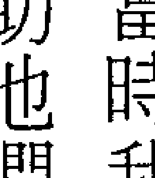
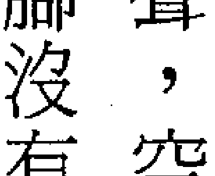

# Angels in My Hair

# 我與我的守護天使

愛爾蘭天使夫人 的生命視界

Lorna Byrne
羅娜·拜恩 著
達娃 譯

> 你知道嗎？每個人都有自己的守護天使
在你身後三步遠的地方，看似一束光
時時溫柔地呵護你，陪你走完人生的旅程
無論何時何地，只要你開口祈請，祂就會出手相助

# Angels in My Hair

# 我與我的守護天使

# 愛爾蘭天使夫人的生命視界

羅娜・拜恩 Lorna Byrne —— 著

達娃 —— 譯

# 給在台灣的你們：

非常高興這本書能譯成你們的語言，讓神與祂的天使們可以被閱讀。

願你永遠記著，你的守護天使一直與你同在，你並不孤單。

我會為你祈禱，願這書為你和你的家人帶來美好的改變。

祝福你

羅娜

Blessing to you all in Taiwan.

I am so pleased that this book is being translated into your language so as you can read about God and his angels.

Always remember you have a guardian angel with you and it never leaves you for one moment so you are never alone.

You are all in my prayers and I ask that this book will change you and your family's lives for the better.

Blessing
Lena

# 目次

致謝

01 異樣的眼光

02 守門員

03 通往天堂的階梯

04 為何躲著我？

05 先知以萊亞

06 吸收他人之苦

07 沒有靈魂的東西

08 媒介

09 死亡天使

08

11

20

31

43

58

68

77

85

91

## 10 炸彈客

## 11 母爱天使

## 12 乡间小屋

## 13 告白

## 14 从不知道我有守护天使

## 15 祈祷的力量

## 16 隧道

## 17 在窗上敲三下

## 18 「罗娜真好运……」

## 19 「我在这里，我在这里——在这里啊！」

## 20 金鍊子

## 21 給我奇蹟

## 22 撒旦在門口

## 23 靈魂伴侶

## 24 和平的愛爾蘭和聖誕節

## 25 米迦勒

## 26 邪靈現身

## 27 喬

## 28 天堂來的羽毛

## 送给我的孩子们

## 致謝

我誠心感謝珍·卡拉南 (Jean Callanan)，謝謝她的支持、奉獻與勇氣。第一次遇見她時，天使們告訴我，她將在協助我撰寫與出版這本書的工作上扮演重要角色。當時她一點也不知道這件工程要耗費她多少時間、精力和努力。我感謝她的幽默感、熱情、耐心、慷慨和友誼，也感謝天使們帶來一位能提供寶貴商業經驗的人來協助我。天使們說，我不需要經紀人，因為珍比任何一位經紀人更能幫助我。

馬克·布斯 (Mark Booth) 是位不可多得的編輯，他對這本書的信任、信心和信念，帶來了極大的改變，而且所擔負的責任，甚至超出了一般編輯。我要向這位美好而獨特，且成為好友的男士致上深深的謝意，還要感謝天使們把他送來給我。

感謝所有「世紀」(Century) 工作團隊，尤其是夏綠蒂·海寇克 (Charlotte Haycock)，謝謝她的好脾氣和效率，以及莉娜·吉爾 (Rina Gill) 所帶來的熱情、創造力以及歡樂時光。

還有許多對本書提供協助，而我很高興能稱之為朋友的人士，包括史蒂芬·馬拉罕（Stephen Mallaghan），感謝他的慷慨、熱誠和溫馨以及美好的友誼；謝謝丹尼爾·歐唐納爾（Daniel O'Donnell）的鼓勵，並為我開啟第一扇門；感謝吉姆·可兒（Jim Corr）的支持、慷慨和好奇心；感謝愛歐恩·麥克哈爾（Eoin MacHale）所建立的美麗網站；以及派翠夏·史坎蘭（Patricia Scanlan）的鼓勵。

也感謝以下的朋友，在盛衰起伏之時提供無限支持的凱特琳和約翰·卡根（Catherine and John Kerrigan）；讓我開心大笑的莎麗·懷特（Sally White）；約翰·卡西（John Carthy）的陪伴；布來恩·凱利（Brian Kelly）的支持與慷慨；以及在所有母親都會面對的特定議題上給予支持的吉格利家族（Quigley）。

最後，感謝我的孩子們，他們讓我隨時記得要腳踏實地！特別感謝他們的陪伴，尤其是我的老么，因為她的生活被這本書攪得天翻地覆。

## 01 異樣的眼光

兩歲時，醫生就告訴母親我是個智障。還在襒褓時期，媽媽就注意到我似乎總是在自己的世界裏。至今我仍然記得躺在大籃子做成的搖籃裏，望著媽媽彎下腰來看我的景象。她四周圍繞著許多閃耀各種虹彩、明亮又神奇的人形，他們的體型比我大很多，但是又比媽媽小，約莫是三歲小孩的體型。人形如羽毛般在空中漂浮，我還記得自己伸出手想要觸摸他們，卻始終摸不到。我對這些閃爍著美麗光彩的生物非常著迷。不過在當時，我並不知道自己看到的世界和別人不一樣。很久之後，我才從他人的口中得知他們被稱爲天使。

又過了幾個月，媽媽發現不論她如何努力吸引我的注意，我的眼睛總是盯著其他地方看。事實上，我確實去了其他地方，我跟著天使走了，看著他們做事，跟他們說話，和他們一起玩耍。我被迷走了。

我很晚才學會真正開口說話，不過很早就開始和天使交談，有時候用的是你我都懂的語言，有時候一個字也不需要說，我們就能明白彼此的心思。當時我以爲所有人都看得見我看到的一切，可是後來天使要我看見他們的事保持緘默，說那是我們之間的秘密。事實上，這麼多年來我一直聽從天使的指示，不曾說出秘密，直到寫書的此刻，才首度揭露自己看到的異象。

見的許多事情。

醫生在我兩歲時所下的論斷，為我的生命帶來深重的影響，也讓我了解到人有多殘酷！當時我們住在距離都柏林市中心不遠處的舊克爾麥罕（Old Kilmainham）地區。父親在那裏租了一間小小的自行車修理店，店鋪還附有一間小屋。只要穿越店鋪，繞到左邊，就能看到這間極小又荒廢的小屋。它是一排老式小屋和店鋪的一部分，不過大部份的小屋和店鋪不是空蕩蕩，就是已經廢棄，畢竟房屋實在太破爛。我們大部份時間待在小屋一樓唯一的小廳堂，但後院小徑上有個小棚舍，裏面有廁所。小屋的二樓有兩間小臥室，最初是我和姊姊愛美爾共用一間臥室和一張床。

其實，我不只看見天使（從我醒來到閉上眼睡著為止，無時無刻不看見他們），也看得見往生者的靈魂。在我之前出生的哥哥克里斯多夫才十週天折，雖然我從未見過他在世時的樣子，卻能清楚看見他的面貌：他有一頭深色頭髮，而我和姊姊都是淡髮。我還可以跟他的靈魂一起玩耍。

當時我不覺得那有什麼奇怪的，感覺上他只是另一個小孩，只不過外表上比較光亮而已。不過，最早讓我察覺到他和別人不同的是他的年紀會變化，有時候以嬰兒的形態出現，有時候又以和我同齡的模樣現身，陪我一起踉蹌走過地板。此外，他並非一直待在家裏，似

平總是來來去去。在某個寒冷的冬季午後，天色將暗，我獨自一人待在舊克爾麥罕的小廳堂裏，開放式的火爐燃著火，是室內唯一的光源。閃爍的火光照耀著地板，我坐在地板上玩父親做的小積木。克里斯多夫也來跟我玩。他坐在更靠近火堆的地方。他說那位置對我來說太熱，但是他沒關係，他感受不到熱氣。我們堆起一座高塔，我搭上一塊積木，他就在上面再放一塊。塔愈堆愈高，突然間，我們的手相觸，克里斯多夫竟迸出了火花，彷彿有許多小星星同時飛了出來。我訝然發現他摸起來的感覺跟其他人不同。在那一刻，我進入了他之中（或者是他進入了我之中），我們彷彿融為一體。我在驚嚇之餘打翻了積木塔樓。我爆出大笑，又摸了他一次。我想那是我第一次真正了解到他並非血肉之軀。

我從未把克里斯多夫誤認為天使，雖然我看見的天使偶爾會以人的模樣現身，但是那個時候他們大多有翅膀，腳也不曾觸及地面，體內還會發出光芒。有時候他們則完全不是人的樣子，而是閃亮的光芒。

克里斯多夫經常出現在媽媽身邊。媽媽偶爾在火堆旁的椅子裏睡著時，就會看見他蜷縮在她的懷裏。我不知道媽媽是否察覺到克里斯多夫的存在，所以問他：「我該告訴媽媽你在這裏嗎？」

> 「不行，不能告訴她，」他回道，「她不會明白的。不過，有時候她能感覺到我的存在。」

有個冬天的早晨，天使們在太陽升起時來到我的床邊。那時我整個人正縮在被窩裏，和我分享一張床的姊姊愛美爾已經起床活動去了，反倒是克里斯多夫窩在我身邊。他搔了搔我說：『快看，羅娜，看窗戶那邊。』

我說過，天使會以不同的形態和大小出現，而這天清晨，他們看起來就像雪花一般！窗戶上的玻璃彷彿化成了氣體，片片雪花一接觸到窗戶，就變成嬰兒般大小的天使。天使又乘著陽光穿透窗戶，身上似乎披滿了閃亮潔白的雪花。天使一觸碰到我，身上的雪花就飄落到我身上，被雪花觸碰的感覺癢癢的。讓我驚訝的是，雪花很溫暖，而非冰冷的。

『如果大家都知道可以在口袋裏像裝滿雪花一樣裝上幾千個天使，還能隨身帶著走，永遠不會感到寂寞，那該有多好！』克里斯多夫說。

我轉身問道：『萬一他們在口袋裏融化了怎麼辦？』

克里斯多夫咯咯笑說：『天使永遠不會融化！』

我有些感傷地回道：『克里斯多夫，希望你能像雪花一樣裝進媽媽的口袋裏，永遠跟她在一起。』

這時我們依偎在床上，他轉身看著我說：『妳知道我已經在她的口袋裏了。』

長大後媽媽才告訴我，在我出生前一年，她曾經有一個小兒子名叫克里斯多夫，不過他只活了十週就天折。我微笑以對，還問她克里斯多夫埋葬在哪裏，她說在都柏林一個嬰兒墓園的無名墓中（這是當時的習俗）。

我很難過不能去刻有他名字的墓地看他，但他並未就此遭人遺忘。即使是多年後的此刻，我仍然能感覺克里斯多夫的手在我的口袋裏裝作是雪花，藉此提醒我：我永遠不孤單。

四、五歲時某一天，我對克里斯多夫和媽媽的關係有了更深層的認識。那時我坐在餐桌邊，蹺著腳吃早餐，就在媽媽拿麵包進來時，我看見模樣大約十二歲的克里斯多夫穿越小廳堂，朝店鋪門口跑去。而媽媽臉上綻放燦爛的笑容說：「羅娜，爸爸工作室後方的工作檯下，有個驚喜等著妳喔！」我隨即跳起來，興奮地跟著克里斯多夫跑去。他直接穿越店鋪，進入昏暗的工作室，我則在門口停了一下，因為裡面實在太暗，得先讓眼睛適應昏暗的光線。不過，克里斯多夫就像一道光芒，溫柔地為我點亮前方通往凌亂工作室的通道。他大叫：「生下小貓了！感謝克里斯多夫的光芒，我看見了四隻一丁點大的小貓咪，其中三隻純黑色，一隻黑白相間。貓仔的身體柔軟又光滑，真的好漂亮。母貓小黑走出箱子伸展一番之後，隨即從小窗戶跳到庭院。我跟著牠跑了出去，一邊叫克里斯多夫一起來，可是他不肯走進庭院。我走回屋裏問克里斯多夫：「為什麼妳不肯到外面去？」他牽起我的手，像是在安慰我。我真的喜歡觸摸他的手的感覺，我們的手再度融合成一體。這種感覺很神奇，讓我感到安全又快樂。「羅娜，嬰兒死亡後，靈魂會跟在母親的身邊，除非不再被需要。所以我留下跟著媽媽。」我懂他的意思。媽媽在他身上灌注了許多的愛，從她有了身孕、懷胎十月、生產、抱他回家，都是充滿喜悅與快樂的記憶——儘管那時候不論醫師說什麼，她已經覺得他的情況有異。媽媽在克里斯多夫死去之前，只跟他相處了珍貴的幾個星期。克里斯多夫說媽媽灌注許多愛給他，現在他要把那份愛灌注給媽媽。

所以我的靈魂哥哥一直待在屋子裏，從來不出門，一直到我們準備好，要和舊克爾麥罕區小店鋪永遠道別的那一天為止。那個時候，媽媽似乎覺得自己夠堅強，能夠離開那裏，也準備好要放手讓我的小哥哥離去了。

看到天使，我總想要停下來凝視他們，而且覺得自己身處在一股強大的力量之中。小時候，天使通常以人形現身，讓我更容易接受他們，現在已經不需要了。我看見的天使不一定有翅膀。假如有翅膀，那模樣有時則讓我驚奇不已，有的翅膀像火焰，卻擁有具體的形狀；有些翅膀則有羽毛。有個天使的翅膀非常纖細修長，末端尖銳，教人難以置信，讓我很想請求他張開翅膀給我看看。

以人形現身的天使，不管有沒有翅膀，眼睛是他們最令人著迷的地方。天使的眼睛與人類的大不相同，充滿了生命力、愛和光芒，眼神透出的充滿活力彷彿洋溢著生命的菁華，眼底的光芒讓人喜悅。

我從未見過天使的腳觸碰地面。天使朝我走來時，腳和地面之間彷彿存在著一層能量的緩衝墊，這層墊子有時像一條細絲線，有時候又會膨脹起來，甚至陷到地底下。

我還很小的時候，有個天使就經常出現在我面前。第一次他是出現在房間的角落，那時只是喊了一聲：「羅娜。」某種程度上，他看起來和其他天使一樣，但又擁有不同的氛圍，

他的光芒更強烈，具有居高臨下、威風凜凜的氣勢，一股強勢力。打從第一次見到他，我就覺得他就像一層防護罩那樣隨時保護我。後來他經常出現，我漸漸和他成了朋友。他的名字叫米迦勒（Michael）。

上學讀書對我而言是件苦差事，因為老師們大都把我當作遲緩兒。我的第一次聖餐禮（First Holy Communion）是六歲那年在學校領受的，對多數愛爾蘭的小朋友來說，那是個非常特殊的日子，可是我那陣子卻過得糟透了。典禮前在教室練習領聖餐時，老師們會問孩子問題，確認大家都能順利回答教義，但他們對我卻不理不睬，因為他們認為問了也沒有用！當所有孩子排成一排，一起復誦關於聖餐的內容時，我原本也坐在其中，隨後卻被拉到一旁去坐著。這舉動傷害了我的小小心靈。所以當我坐在教室後面或角落的板凳上時，我問天使：「他們不知道我也能回答教義問題嗎？為什麼連一次機會也不給我？」到了聖餐禮那天，我終於也在教堂裏排隊。但眼看就要踏上聖餐台了，突然又被拉出隊伍，因為老師覺得那些較優秀的女孩應該排在我前面。當然，也有人對我很慈愛。四歲時，有位我印象中稱之為莫德理妮的修女，雖然也被告知我是遲緩兒，不過我能感覺到她明白事實並非如此。在課堂上，她會走到我身邊，問一些我能夠回答的小問題，然後笑一笑，摸摸我的頭。除了少數人偶一為之的親切舉動之外，我始終是個外人。別人看得出來我與眾不同，就是不明白我怎麼回事。我生命的這個層面一直很艱難，至今仍舊如此。大家說我對世界太信任、太坦率，但我無法不如此！奇怪的是，要對一切真誠，包括所思所言，並對周遭的人坦率，真的是件難事，而且經常會被孤立。時至今日，別人怎麼想我、看我，對我仍有極大影響。即使他們不認識我，不了解我在做什麼，還是知道在某種程度上，我就是不一樣。譬如和朋友出門去認識新朋友，就算那些人對我一無所知，事後也說不出個所以然，還是會對我的朋友說，他們覺得我異於常人。要面對這一切並不容易。不過，有位天使讓我在學校的日子變得好過許多，他的名字叫做荷賽司（Hosus）。一天清晨，我往學校跑去，想追上原本一起走著的大女孩們，突然間，有個漂亮的天使躲在燈柱後方，對我做了個鬼臉。那天起，荷賽司幾乎每天早上都會出現在我上學途中。至今我仍然經常看見他。當時荷賽司看起來像個舊時的老師，現在也沒變。他總是披纏著一件長袍，通常是藍色，偶爾會變換顏色；頭上戴一頂奇形怪狀的帽子，手裏拿著捲軸，眼睛像星星一樣閃閃發亮；外表則像個年輕教授，充滿能量、權威和智慧。荷賽司一直是那個樣兒，不像其他天使經常變換形狀。譬如米迦勒，他通常以人形出現，有時候是受我之請，因為那樣我比較容易適應。不過他也隨著我們所在的場所，以及要傳遞給我的訊息而改變形態。對我而言，荷賽司是知識的代表。他外表嚴肅，不過他總能在我低潮時為我打氣。我在學校受到嘲笑，或大人聚在一起聊天，然後轉身看我的時候，荷賽司會安慰我，要我別理那些人：『他們什麼也不知道。』

一開始我並不知道荷賽司這個天使的名字，他也沒有真的和我談話。他只是出現在教室裏，模仿老師或其他孩子，或玩遊戲、做各種事情來逗我笑。有時回家路上，他會在校門口或對街等我。還記得第一次和他說話那天，姊姊去跳舞，提早離開，所以我獨自回家。我慢慢離開學校，穿越遊樂場，朝大門走去，同時希望能看見荷賽司，和他說話。看見他在柱子旁偷看時，我開心極了。不過他敦促我要加快腳步：『妳得趕在下雨前回到家。』

我在校門口停下來四處張望，確定四下無人後，詢問他的名字。

「荷賽司。」他回道。我咯咯笑了，蹦蹦跳跳從學校回到家，他也跟著我邊跳邊走。我只記得自己一路上笑個不停。

## 02 守門員

爸爸靠著修理自行車沒賺到多少錢。事實上，住在那個地區的人都沒什麼錢，大家總是會拜託他幫忙，說「下一次」再付清。爸爸是個好心人，結果我們常常餓肚子，以麵包抹乳瑪林或塗果醬過一餐。我知道爸媽的壓力很大，所以從來沒抱怨過肚子痛，結果出現潰瘍，不得不就醫。醫生告訴爸媽我營養不良，需要每天攝取新鮮蔬果。但是我們實在沒錢，很少有那種機會，只當隔壁擁有大菜園的鄰居送我們蔬果時才有得吃。衣服是仰賴美國親戚寄來的，每有包裹寄達，我們總是覺得非常神奇。我們的生活很艱辛，跟當時許多人一樣。爸爸的店鋪是個黑壓壓的小地方，後面有個屋頂用鐵皮搭建的工作室，裏面有各式各樣的工作台和工具，充滿了油漬味。爸爸進屋喝茶前有時候會把我喚到工作室，要我幫他拿著裝有潤滑脂的鐵罐，他才好洗手。那東西又黑又黏，味道很難聞，但是效果很好。爸爸手沾油脂，先搓個幾分鐘，再用舊髒布使力把油脂擦掉，最後到廚房裏用冷水洗手（要有熱水，就得拿水壺在火爐上燒水），這樣折騰一番後，他的手就乾淨了。我很喜歡幫爸爸，就算只是幫忙拿著鐵罐也好。偶爾他跟媽媽在後面喝茶時，還會讓我看顧一下店鋪，以防有客人進來。

老師若是不在座位上，荷賽司偶爾就會跑去坐在他的桌子上。第一次在教室看到荷賽司時，我驚訝得眼睛快掉出來，還大聲問他：「你在做什麼？」老師一聽到，隨即回頭朝我的方向怒視，害我趕緊用手摀住嘴巴，才不會笑出聲來。

我之所以那麼驚訝，是因為教室裏雖然有守護天使，但荷賽司就是不一樣，他並非守護天使。孩子們的守護天使外表耀眼明亮，就像一道亮光。荷賽司則截然不同，不僅人模人樣，長袍還會掃過桌邊。荷賽司可以不同於其他天使的樣貌出現，是為了幫助我辨認守護天使和特別派遣到我身邊的天使之間的差異。我還是孩子時，就得學習辨別各種類型的天使。

不同的天使有不同的技能。如同孩子必須學會辨別老師和醫生的差別，我也得學會辨別不同類型的天使，才能知道他們將如何幫助我和其他人。

荷賽司經常逗我笑。有一回我問他：「你想別人會不會看見我經常笑，但是看不見我在桌上，打扮得跟老師一樣，又會怎麼想呢？」

荷賽司笑了笑：「他們會尖聲驚叫，衝出去大喊有鬼。」

「難道他們不知道你是天使？」

「不，他們無法像妳這樣看待事物。」

我說過，我一直以為其他孩子也看得見天使，一樣會跟天使說話，但我到六歲才發現並非如此。 他回答：「荷賽司，我知道有些孩子也看得見天使。」 事實上，嬰兒都能看見天使和靈體，但是大約在學說話的年紀，就會被告知什麼是真實、什麼是虛假，或者事物若非像手上的玩具那樣具體時，就是想像而來的。幼小的孩子年紀，大部分已經看不到天使。有些甚至三歲就看不到我們了。」 天使對話，這也是天使要我寫書的原因之一。其實，我很怕寫這本書，因為我不想被嘲笑，但也知道自己毫無選擇，因為到最後我總會完成天使要我做的事：…… 世間有千百萬個天使，像雪花一樣多到數不盡，但許多天使都失了業。雖然他們盡全力助人，卻不一定能把訊息傳達出去。想像一下，有幾百萬個待業的天使在天上飛來飛去喲！ 他們之所以無所事事，是因為大多數人都埋頭工作，只顧過生活，並沒有察覺身旁有天使隨時準備伸出援手。 上帝希望人類能快樂過生活，所以派天使來幫助我們。有許多靈性的支援等待我們去掌握，有些人能夠伸手求助，但更多人對此一無所知。天使走在我們身邊，訴說他們的存在。事實上，人類並非僅是血肉之軀，當你開始察覺到這一點，並且相信自己擁有靈魂後，你和天使之間的連結將會綻放開來。

閱讀這段文字的此刻，不管你信不信，你的身邊有位天使，那是你的守護天使，他從未離開過你。每個人都擁有一份禮物，一層由光的能量形成的防護罩。在我們周遭安裝防護罩是天使的工作。對上帝和天使來說，人人平等，不論我們在別人眼中是好是壞，每個人都值得受到保護、照顧和愛。所以當我看著他人，能具體看見環繞在他們周身那一層近乎活躍的防護罩。

守護天使是身體和靈魂的守門員，你尚未成形之前，他就被指派給你了。在母親子宮裏成長的每一刻，他始終伴著你、保護著你。你一出生，乃至整個成長過程，不論睡覺或洗澡，他無時無刻不在身邊。你沒有一刻是孤獨的。死亡時，守護天使也隨侍在旁，幫助你度過這個階段。守護天使也允許其他天使進入你的生命，協助你進行各種事務，這些我稱為老師的天使們將在你的生命中來來去去。

你或許覺得難以置信。若是不相信，要質疑的應該是你的懷疑態度；你若嘲笑此事，則應質疑你的諷刺心態。開啟靈性自我，學習認識自己的靈魂，敞開心胸去接受天使存在的可能性，會有什麼損失呢？現在就請天使協助你，他們是很棒的老師。

小時候，天使經常在身旁教導我，為我展現種種事物，讓我很樂意獨處就好幾個小時。我最喜歡的地方是和姊姊愛美爾共用的小房間，溫暖的小房間有低矮的斜屋頂，窗戶也很低，可以讓我跪坐在窗邊看街上來往的人。我有時能看見鄰居身旁的守護天使，就像有個美麗明亮的人走在他們身邊。有時守護天使似乎飄浮著，有時又像在走路，或者會成為守護者的一部分，要不然就是在他的身後展開雙翅，彷彿保護似的擁抱著他。

守護天使的外觀也是形形色色，有時是星星之火，然後漸漸變大，最後成為熊熊烈火；有時候又龐大無比，比他們守護的人還大上許多。守護天使散發出光芒，經常穿著純金、純銀或純藍色衣服，或者彩色的。

偶爾我也看見靈體，就像看見哥哥克里斯多夫一樣。以前有個住在坡頂上的鄰居，推著娃娃車走過我的窗前，車裏有個嬰兒和一個幼兒，身旁跟著兩個比娃娃大不了多少的小朋友，一旁還伴著一位老人家。有一天，鄰居和媽媽在店鋪裏談話，我聽見她說很想念往生的父親，才知道那位老人家是她的父親，也就是孩子們的外公。我笑了，雖然她很想念父親，父親其實仍在身旁，只是她看不見而已。父親那麼愛她，以致靈魂仍然與她同在，想幫助她、安慰她。除非她願意讓他離開，否則他會永遠陪在她身邊。

最初，我很容易將靈體和人類混淆，譬如曾經誤會過克里斯多夫。但是一段時間後，天使教我如何辨認靈體與人類之間的差異，這些差異並不容易解釋。靈體看起來就像你我一樣，不過比較光亮，彷彿體內會發光。他們能調整光的亮度，亮度越高，越澄澈透明。靈體調低亮度時（他們偶爾會這樣做，使自己不那麼顯眼），很容易被誤以為是血肉之軀。打個比方，你在路上和鄰居擦身而過，幾分鐘後，你想起來剛剛打招呼的人是強尼，可是強尼在六個月前往生了。這時候，你才察覺到強尼看起來比正常人更亮一些。

坐在窗邊時，我也非常喜歡觀看環繞在人們四周的能量流。有次我看見朋友的母親走過，體內散發出漩渦般的耀眼光芒，閃爍著淡紫、深紫、紅色、綠色或藍綠，像一陣旋風般從她的中心點散發出來。這股能量和那位女士本身的能量不同，令我十分著迷。多日後，媽提起那位女士就要生寶寶，我聽了露出笑容。同樣的，我也能看出人們是否生病，即使我不懂自己看見的是什麼。一道深色陰影環繞著人們的身體，就表示他們的血液出了問題。有時候某根骨頭會發出閃光，讓我看見骨頭有所損傷或變了形。儘管我無法用言語來解釋，卻本能知道他們的身體有狀況。

一天，我跪坐在窗前，一個男人騎著黑色大腳踏車經過，後面載著他的小女兒。天使要我在父女通過面前時，緊盯著他們不放，不可把眼神移開。我沒問為什麼。還是孩子的我，天使說什麼我就做什麼，不會質疑。但我知道他們要我幫助這對父女，所以他們行經窗前時，我已經在祈禱。我不知道會發生什麼事情，只是請求情況別太嚴重。父女通過屋前時，一切似乎慢了下來，就像影片的慢動作。他們騎在一輛要超車的雙層巴士旁，忽然間，小女孩發出驚叫，男人開始傾倒。但小女孩並未跌落腳踏車下，因為她的腳卡在輪輻之間。父親用顫抖的手，小心翼翼把女孩的腳從折彎的輪子裏抽出來，並把正在哭泣的女孩抱到我窗下的人行道上。女孩此時只是輕聲嗚咽，沒有驚叫。大人都跑去幫忙，媽媽也去了。我也飛奔下樓，到屋外去探視她的狀況。一如往常，誰也沒注意到我。女孩的鞋掉了，腳底的皮掀開來，挫傷流血，但並沒有骨折。儘管如此，我還是請求上帝和天使來幫助她。

即使才五、六歲，我就已經知道自己要扮演助人的角色，並且相信在父女通過時，因為自己不斷觀看和祈禱，才沒發生更悲慘的事情。她也可能摔到巴士底下，或在跌落時撞到頭部，幸好最後只是腳底受傷，其他一切安然，感謝上帝。在那之後，有許多時候我覺得自己被派去阻止事情發生，就算無法完全遏止，也要使情況不那麼悲慘。這是天使給我的訓練之一。我或許沒能好好學習學校的課程，跟天使學習卻毫無困難。

有一回，我就用這份天賦幫助朋友的父親。住在街頭不遠處的喬西是我最好的朋友，我很喜歡她。她也與眾不同，她說話會結巴。事實上，她結巴得很厲害，不過我們一起玩時，結巴會完全消失，然而只要有人加入，就會再度出現。喬西有一頭又長又直的紅髮，一雙綠色眼睛，個子比我高，但非常纖瘦。她爸爸在街尾開了一家汽車修理廠，那可不是一般附帶加油站或現代的修車廠，而是在一個大院子裏堆滿撞毀的車子和零件，他總是告訴我們不能在那裏玩。不過走入柵門的右邊有個小空地，後來他准許我們在那兒遊戲，但規定不可以進入院子其他地方。

在一個陽光普照的星期天，我們穿上乾淨的衣服，一邊儘量別把衣服弄得太髒，一邊有說有笑在小空地上玩娃娃。我感覺天使一直跟我說話，要我注意聽，我以為那是要我聽他們說話。但他們並非這個意思。最後，他們觸摸我，吸引我的注意。我靜下來聽，好像聽見了什麼，但又不確定，問喬西是否聽見，卻什麼也沒有，於是我们繼續玩。天使再度開口說：「注意聽！」我又聽了一次，接著有種奇怪的感覺，很難描繪，彷彿自己進入另一個時空，頓失方向。我聽見喬西的父親從遠處傳來的細微求救聲，可是喬西什麼也沒聽到。

大人嚴禁我們走近疊得高高的毀損車體堆，但我還是決定去看看，喬西跟在我身後。我跟著天使穿越車陣，還記得自己一路不斷說著：「請求上帝、請求天使，請讓她的爸爸平安無事！」我們找到了喬西的父親，一輛車子壓倒在他身上，到處血跡斑斑，不過他還活著。我不確定去了她家還是我家。大家都跑來幫忙，我記得救護車來了，聖詹姆斯醫院就在同一條路上。後來他沒事，也康復了。

我感謝上帝和天使讓他平安無事。天使又再度幫助我去救助了別人。

> 如我所說，天使正在身旁幫助你，一旦你認知到他們的存在，將能感覺他們對你生命的影響。事實上，天使一直接觸你，想讓你察覺到他們，希望你知道生命不僅只是眼前所見的一切。我們在生命中並非孤軍奮戰。我們或許活在肉體內，但每個人都擁有能和上帝連結的靈魂。天使也和上帝有所連結，當我們呼叫上帝的名，就等於賦予天使力量。

換句話說，我們透過賦予天使力量，給自己力量。上帝讓我們擁有自由意識，天使也不會逾矩。假使我們要他們走開，表明不需要幫忙，上帝和天使都會讓開，但他們不會撒手就走，而是在一旁等待。你是否有過這樣的經驗：打算去某個地方，然後直直往前走並沒有計畫左轉，可是內心深處卻覺得要左轉，結果沒做而事後懊悔不已？內心的聲音很可能是天使正在耳語，告訴你應該左轉。我們四周充滿未被看見且等著伸出援手的天使，但是他們需要我們開口請求，才能提供協助。透過請求，我們允許天使協助，也藉此更加強化我們和他們之間的連結。多年後的現在，我才察覺自己是天使和人類之間的通譯員，因此經常被召喚去說情。我雖扮演著特定的角色，不過每個人自己也擁有隨時請求天使協助的力量。

我經常請求天使協助家人。成長過程中，我們家境並不好，我六歲時，媽媽已經生了三個孩子，兩個妹妹海倫和愛歐菲，還有弟弟巴利，家裏有五個孩子。媽媽常常生病住院，那個時候，兄弟姊妹就被分送到親戚家。

四歲時，愛美麗和我第一次被送到瑪麗阿姨家。她和姨丈及三個孩子住在不遠處，雖然距離可能只有幾公里，對我而言卻像隔了一個世界。第一次見到他們的房子時，我以為那是皇宮，跟我家比起來顯得龐大無比。屋內的一切是如此豪華、美麗，而且很溫暖，不像家裏那般潮濕冰冷，我還可以打赤腳在地毯上跑來跑去。用餐時間更是不可思議，美麗的桌上擺滿整組杯盤盛的食物。有太多食物可以選擇了，每一餐都是一場饗宴。有一天，他們問我是否想要一頓熱的早餐，有香腸、煎蛋、燻肉片、黑布丁、番茄和烤麵包，全都是給我一個人，我簡直不敢相信！不用像在家裏那樣分一半或大家一起吃。最棒的是浴室，我泡了一次水滿到澡盆邊的熱水澡，覺得自己真像個公主。

這趟旅程讓我首度理解到家裏有多窮。

還住在瑪麗阿姨家時，外公外婆來訪，我穿上最好的衣服，一件前面有刺繡的灰藍色洋裝。我一直很喜歡穿洋裝，這是我最喜歡的一件，所以開心穿上。以前我只見過外公外婆幾次，面對他們時我總是很羞怯。他們兩人很高大，猶如巨人一般。外婆還很胖，走路時得拄著拐杖，因為她幾年前曾經中風。

媽媽精神不錯，天氣也晴朗時，我們會到鳳凰公園野餐，那是位於都柏林郊區很大一片的開放空間，裏面有鹿，還有各種奇妙的東西。公園離家大約三公里，走路就可以到達。七歲那年，某個星期天我們出發去野餐。爸爸推著腳踏車，後面載著野餐盒。媽媽推著娃娃車，裏面坐著弟弟巴利，愛美麗和我走路，妹妹海倫和愛歐菲時而走路，時而坐在娃娃車裏。

我們的野餐是番茄、果醬麵包和隔壁鄰居庭院種的蘋果，爸爸還燒了水，泡熱甜茶給大家喝，那是一頓很棒的野餐。吃完午餐，我和姊妹們踢了一會兒足球後，就一個人跑到大樹那邊。我很喜歡在大樹間玩耍，有些樹（不見得是全部）的能量會把我拉向它們。那種癢癢的、神奇的感覺，像磁鐵一樣把我拉過去，感覺很美妙。我常跟樹群玩一個遊戲：我在樹群間跑來跑去，以防某棵樹的能量抓到我，如果被抓到，就得設法逃離。我可以一個人玩上好幾個小時。這天下午，姊姊們跑來問我在做什麼，我只是簡單回答說在玩。我懶得解釋，反正她們不會懂。

大家到處跑，到傍晚也玩累了，迫不及待想回家吃晚餐。但是在轉進舊克爾麥罕路的轉角前，我就知道出事了。兩個非常大的天使朝我走來，從他們走路的姿態，可以看出發生了可怕的事情。他們走到我身邊，各伸出一隻手環抱著我，然後邊陪我們走回家，邊說我家的屋頂崩塌了。我震驚不已。到家時，看見一大片屋頂坍塌下來，簡直讓我嚇壞了，久久無法移開目光。爸爸企圖開門，可是打不開，他用肩膀去撞，落下許多塵土。屋內面目全非，只剩一片瓦礫殘骸。屋頂塌陷時，把天花板也給壓落。在我童稚的眼裏，屋子已經完全破碎，我不禁心想要睡在哪裏？我們爬過瓦礫堆，對小小的我來說，破碎的水泥和石塊實在是巨大無比。四處塵土飛揚，家具、玩具和媽媽的寶貝全成了碎片。我訝然看著爸媽從地上撿拾東西，企圖挽救物品。媽媽拾起一個有乳白色條紋的深色小牛奶罐說：「這是唯一還完整的東西。」牛奶罐是她結婚禮物中僅存的東西，她原本擁有的就不多，現在更是一無所有。至今我還記得她眼中的淚珠，我那時也跟著哭了，大家全部落淚，只有爸爸沒哭。他要我們別哭，一切都會沒事。爸爸設法清理一些東西。爸爸還把屋頂的一角撐起來，好讓我們能夠度過那一夜，可是屋裏還是很危險。我邊睡邊想我們的房子倒了，接下來該怎麼辦，要去哪裏呢？現在我們不僅無家可歸，爸爸也失去了維生的工具。

## 03 通往天堂的階梯

謝天謝地，表姊娜蒂解救了我們。一、兩年前，才十六歲的她因為父母雙亡，繼承了一棟屋子，她自己也只是個大小孩，卻獨自一人住在大房子裏。我不清楚那是怎樣的安排，或者是否有付房租，總之我們搬到她坐落於都柏林北端巴里曼（Ballymun）的房子，那裏離舊克爾麥罕有好幾公里遠。剛開始，搬家讓我很沮喪，因為我熱愛舊克爾麥罕區，可是抵達巴里曼，看見大庭院和大房間時，我就開心了起來。最重要的是房子很牢固，絕對不會倒塌。房子二樓有三個房間，還有室內廁所和澡盆，奢華極了。一樓後方有個面對庭院的美麗長形廚房，以及起居室和娜蒂的房間，那個房間原本可能是飯廳。

這棟房子還有個神奇的庭院，我之後見到的其他庭院沒有一個比得上它，我們在此度過許多探險時光。院裏有一堆乾草，舉辦生日派對時，大人會把糖果藏在裏面。爸爸有時間就栽種各式各樣想像得到的蔬菜，包括我們最喜歡玩爆開遊戲的豌豆，他甚至還鋪設了一大片的草莓床。

那時家中有五個小孩，弟弟巴利還是個嬰兒，在他和我之間還有兩個妹妹海倫和愛歐菲，當然還有姊姊愛美爾。我並不常和他們玩耍，大都只在生日派對或特殊活動時才一起遊戲，或許是興趣不同的關係，因為我用不同的眼光看世界。

最初的生活有點寂寞，但我很快又交到朋友，認識了小女孩羅薩琳，她住在連接各家庭院的後圍牆另一側。那道牆和馬路一樣長，又寬又大，走在上面也很安全。爸爸搭了一座梯子讓我們能爬上牆，才不會磨損鞋子，我們就這樣從一家走到另一家，或者走到盡頭的田野裏。我非常喜歡那道牆，以及站在上面看到的一切事物。

羅薩琳成了我的好朋友，她住在牆另一側隔了六家的一棟漂亮的大房子裏，我們利用那道牆來往拜訪彼此，很少繞道走大馬路。她也來自一個大家庭，不過兄弟姊妹有些已經長大離開家。我認識她的妹妹卡洛琳和大她八歲的哥哥麥克。羅薩琳又高又瘦，有一頭長直髮，是個非常有趣又很愛笑的女孩。我很喜歡跟她的家人在一起，事實上，我和他們相處的時間比和自己家人還長。

印象中，羅薩琳的父親是德國人，非常壯碩，有一頭逐漸變灰的黑髮。他經常出門做生意，但在家的時候，對羅薩琳、她哥哥和妹妹，還有我都非常好。星期天他會給小孩買一小袋糖果，我也被算在裏面，我既高興又驕傲，因為每件事都有我的份。儘管糖果袋裏也許只有七、八顆糖果，但每顆都好漂亮，所以我總盡量慢慢吃，越慢越好。

羅薩琳家每到星期天還有一個我很喜歡的活動，就是聽她媽媽念故事書。我們全部聚集到羅薩琳的房間，坐在床上，有時候只有羅薩琳、卡洛琳和我，有時候麥克或我的姊姊也會加入。羅薩琳的媽媽很會念故事書，全神貫注聽上一小時候，她便解散我們。有時候書太厚，故事太長，就得分成幾週來念。我最喜歡的故事之一是法蘭西斯·霍森·柏納（Frances Hodgson Burnett）所寫的《秘密花園》（A Secret Garden）。我們的庭院裏有個很大的木造鞦韆，爸爸修理過後能盪得很高，每次我都玩上好幾個小時。坐在鞦韆上時，天使教了我許多關於生活與生命的簡單課程。事實上，我人在鞦韆上，神魂卻早已去了另一個世界，在那裏，天使們為我展現各種美好而神奇的事物。當我獨自盪鞦韆時，天使有時會說：「羅娜，伸出妳的手，有東西給妳。」然後在我手上放一個微小的東西，小東西一觸碰到我的手掌，天使就把手收回去，掌心上於是出現一團光。光時而像個小星星，時而像朵小雛菊，沒多久即開始長大，發出亮黃色的光芒。接著，從掌心飄起，越升越高，越來越亮，把太陽也給半遮蔽了，讓我不眨眼睛直視太陽，也不覺得刺眼。最後我看見一幅極度美麗的景象反射回來，就像一面鏡子一樣，影像裏出現一張像人類的漂亮臉龐對著我微笑。第一次經歷這個景象時，天使告訴我那是天使皇后。他們用小朋友能懂的語言對我說話，讓我想起精靈的故事，知道皇后如同母親，就像媽媽是我家的皇后一樣。天使解釋說，這個人是天使皇后，是宇宙之母、萬物之母，是所有天使之母。突然間，環繞著這張臉的黃色光環爆炸成數不盡的小碎片，感覺像從太陽中散發出來的金黃色極光。多年來，天使經常為我帶來這份禮物，我成年後亦然，尤其是在我需要信心的時候。

當然，搬到巴里曼也表示得去就讀新學校。我和三個姊妹念同一所男女合校的小型國民小學，走路要花半個多小時。姊姊和妹妹都搭公車，而我大部分時間寧願走路。上學途中，我必須走得很快、很急，否則遲到麻煩就大了，但放學路上我總是慢慢走。

和學校同在一處的，還有位在中間的教堂，以及位於另一側的教會活動中心。學校只有三間教室，當然不夠用，所以教會活動中心也被用來當作兩間教室。第一年我就在活動中心上課，但兩間教室其實就在活動中心的兩端，中間並沒有隔牆。瓊斯先生是我的老師，他對我很不好，覺得我只是個笨蛋，班上有這樣的學生讓他很難受。

有天早上，天使說學校裏將發生一件很特別的事，會讓我非常高興。一如往常，天使又說對了，那天發生的事情不僅當時令我十分開心，現在想起來也一樣愉快。那時我們正在學愛爾蘭語，瓊斯先生宣布要臨時小考，答對的人可以得到半克朗。題目是愛爾蘭語的「克蘭」（Craan）轉換成英語是什麼意思。他從教室右邊開始逐一問學生，我被安排獨自坐在教室左邊。他一個接一個問遍全班同學，就是沒有人知道答案。和平常一樣，他並沒有問我。我一個人坐在位置上，興奮到沒法乖乖坐好，因為我知道答案，好想跳起來對著他大聲喊出。天使使費了很大力氣才讓我安坐在位置上，我興奮地懇求天使：「天使，要他看我這邊，拜託，請他問我。」 「別擔心，羅娜，」他們說，「他會問妳的。」

瓊斯先生對全班同學的表現感到震驚，不停呼喊：「快呀，你們是怎麼回事？這很簡單的！」每回想起他當時的表情，我都會笑出來，他的眼睛越睜越大，臉也越來越紅，整個人瞠目結舌。他問完最後一個孩子，仍然沒有問我就宣佈：「看來沒有人贏得這半克朗。」

荷賽司始終站在瓊斯先生的右邊，指著我的方向，不過瓊斯先生當然看不到他。我好想對荷賽司大喊，要他把瓊斯先生拉到我這邊來。這時全班同學鴉雀無聲。儘管有天使的保證，看來瓊斯先生最後還是不會來問我。他走向自己的桌子，全班仍然一片寂靜。突然間，荷賽司和瓊斯先生的守護天使一邊輕柔地挽起他的手臂，讓他轉身朝我的方向走來，一邊在他耳邊耳語。「我知道這根本是白費功夫，不過我還是問一下好了。」瓊斯先生說。

他果然問了我，我則充滿自信，開心答道：「那是『樹』的意思。」

瓊斯先生的臉當場垮下來，因為我說的是正確答案，全班同學全笑開了，並且大聲鼓掌，非常開心。現在他必須把那半克朗送給我，我永遠記得他把錢放到我手上，我對他說謝謝的那一刻。我之前從來不曾擁有過那麼多錢，整整半克朗！

多數孩子一放學就衝回家，但我喜歡慢慢走，一邊跟天使玩耍。我可以花上幾個小時，沿著路旁的大堤岸走回家，這樣才能看著樹籬另一側的田野，還有路上大房子所在的土地。有時候，則是沿著堤岸和天使邊走邊跳，開玩笑，暢懷大笑；有時候，他們會為我展現各種東西，譬如往後撥開蔓生的草叢，讓我看見堤岸上黃蜂築巢的洞。由於拉開屏障的是天使，不會干擾到黃蜂，所以我站在那裏看上好長一段時間，也不用擔心被螫到。記得我後來再回去看黃蜂巢，卻發現大人已找到黃蜂，把牠們給毒死了，我心裏很悲傷。

天使也經常為我展現堤岸外田野裏的牛群。他們教我以不同的方式觀看事物，所以我不會只是迅速瞥一眼牛，而是看見牠們的一切，包括身上的每根線條和每個起伏。天使讓細節發光或比平常更顯眼，這樣我才能真正注意到。他們還讓我看進牛的眼底，即使牠們在遙遠的另一端，我也能夠深入牠們的眼底。他們讓我看得見一般人永遠看不見的事物，那一切真的非常迷人。進出牛體內和環繞其身邊的光和能量，有時宛如光球在牛的四周跳動，有時又忽然忽現。我看得見母牛肚子裏的小牛，但有時很難辨認，這時天使便會說再看仔細一點，我就看出來了。老實說，小牛有時候就像一團黏呼呼的東西，還會動，有點像媽媽以前常做的果醬。

我非常著迷於天使在課外時間展現給我看的東西，難怪沒時間理睬課堂上的事。天使對仍是孩子的我解釋事物時，我總認為自己懂了他們的意思，但隨著年紀增長，我才進一步領會到他們要表達的含意。

在學校，我有個名叫瑪麗安的朋友，我從未和她在校外私下見面。每當我們離開活動中心，走路到校舍或教堂時，她都堅持走在我身邊，就算老師把她和別的女孩排在一起，她還總是設法溜回來，而且總有問題要問我。她很好奇我怎麼懂得那麼多，但我不能告訴她我有天使老師。有一天，我們穿越遊樂場走向教堂時，她要我告訴她關於上帝的事情，我驚訝得差點喘不過氣來。我看著她，不知該說些什麼，最後說：「老師和神父都教過我們上帝的事，妳為什麼還要問我？」我只想躲問題，但她堅持說：「我就是想要妳告訴我。」

於是我告訴她關於上帝的事。「妳看見那隻雀鳥了嗎？那隻全身金、黃、藍的漂亮雀鳥嗎？那隻鳥就像上帝一樣。仔細看那隻鳥，多麼漂亮而完美。妳就像那隻鳥，非常美麗，因為妳就像上帝一樣。假使那隻鳥掉下來摔傷了，也不會感受到所有的痛，因為上帝替他承受百分之九十九的痛。上帝感受到發生在每隻鳥身上的一切，對我們也是一樣。當我們受到傷害，感受到的痛只是極小部分，上帝為我們承受了其餘部分，並且把疼痛帶走。」我知道這些並非我的言語，我還太小，沒法說出這麼有智慧的話。話是上帝或天使讓我說的，幫助我為瑪麗安解釋關於上帝的事。

我非常熱愛教堂，偶爾上學遲到就是因為先溜到教堂去了。我喜歡溜進教堂，雖然裡面經常空蕩蕩沒有人影，卻充滿天使。有時或許只有幾個人，天使們卻總是鬧哄哄，一片忙碌景象。人們並不知道教堂裏究竟有多少天使。天使在那裏讚美上帝，等待神的人民前來加入他們，可惜往往空等。星期天望彌撒時，教堂裏更是擠滿天使，有每個人的守護天使，和神父一起站在聖壇上的天使，還有更多是上帝派遣來的。教堂是個非常有力量的地方，有時我看見教堂的人身邊圍滿天使和光芒，就會為他們祈禱：「願那人今天能夠聽見天使的話，能夠與他的天使接觸，並透過天使和上帝接觸。」

世界上並非只有基督教才有天使，猶太教堂、回教清真寺和所有神聖的地方都有天使的存在。不論你信仰什麼，對天使來說都一樣。他們告訴我所有的神聖殿堂應該處在同一屋簷下，回教、猶太教、新教、印度教、天主教和其他各種宗教信仰都是萬教同源。或許我們看起來不一樣，或許我們擁有不同的信念，但是我們都有靈魂，回教徒的靈魂和基督教徒的靈魂並無不同。假使能看見彼此的靈魂，就不會因為對上帝的詮釋不同而相互殘害。

有一天，我和阿姨經過她家附近一間教堂，教堂門口站著兩位非常美麗的天使，阿姨轉身對我說：「眼睛不要掃視那間教堂。」我驚訝地望著她，阿姨繼續說：「那是新教的教堂，妳禁止走進任何新教教堂的門。」我回頭看了看進入教堂的人，覺得他們和我們沒有兩樣。下次我又經過那間教堂時，對門口的天使笑了笑。雖然我不可以進入那間教堂，但我知道那裡面充滿了天使。

鄰居莫塔太太是個容貌姣好、身材曼妙的女士，卻經常對走在圍牆上的我們破口大罵。偶爾，她會請我當她孩子的臨時保母。八歲那年，有個午後，她想到我家和媽媽喝杯茶，所以請我去看著她的孩子。就在我要走進她家時，有位天使出現在我面前說：「妳到那裏後，要非常小心。」

我立刻害怕起來，但還是走進她家廚房，只是腳步躊躇。莫塔太太正準備離開，爐子上有個鍋子煮得沸騰。我問她：「要讓它繼續煮嗎？」

「是的，這會非常美味。」

「妳不打算熄火嗎？」

她根本聽不進去，她是那種若不照著她的話做，就會大發雷霆的女人。廚房裏有兩個孩子，一個才剛學會走路，一個是還躺在大娃娃車內的嬰兒。她一離開，我就開始觀察廚房，後門鎖起來了，上面也沒掛著鑰匙。

突然間，一陣嘶聲，鍋子爆開，我不知道發生什麼事，到處是濃煙和火焰。我記得自己拉著學步兒，又推著娃娃車，想要把車子推到門外的大廳裏。可是鍋子和桌子擋在娃娃車和門之間，我得越過滾燙的鍋子才能出去。娃娃車很重，我推不動，只得拉著學步兒跑到前院，一邊對路過的鄰居大喊房子失火。

我又跑回屋裏，整個屋子黑煙瀰漫，我非常擔心小嬰兒會在我們回去前遭濃煙嗆到窒息。鄰居跟著我跑進去，感謝上天，他設法把娃娃車推了出來。

孩子們平安無事，我邊哭邊抖地跑回家去。媽媽和莫塔太太正坐在廚房裏喝茶，什麼也沒聽到。我哭著說，房子著火了，她們立刻往隔壁庭院跑去。我記得莫塔太太雙手環抱著她的小孩，一邊顫抖一邊哭泣。她看著我，跟我道謝。房子一樓整個燻黑，但那位鄰居已經設法把火熄滅了。

五零年代的愛爾蘭生活相當困頓，工作機會很少，很多人必須移民。家裏的狀況也很差，因為媽媽經常生病住院。媽媽住院時，庭院無人照顧，雜草叢生，因為爸爸忙著工作與照顧我們，根本沒時間整理庭院。即使有我們幫忙，他還是有許多事要做，這讓我非常擔心。在上學途中，我會跟天使說家裏發生的一切，他們要我別擔心，媽媽將會康復。

爸爸通常一早叫我們起床，幫我們打理準備上學，我們會幫忙做早餐與午餐的三明治。姊姊和我看護弟妹，打掃房子，擺設晚餐要用的餐桌。家裏沒什麼錢，加上還有爸爸往來醫院的額外交通費，所以媽媽住院時，我們晚餐經常只以餅乾和乳酪果腹。住在巴里曼那五年，媽媽又生了兩個弟弟，柯爾馬克和迪倫。那時我們七個孩子全都不到十二歲，日子真的很艱困。有段時間爸爸還去英格蘭工作，似乎去了好幾個月，所以庭院再度失去蔬菜的蹤影，一片荒煙蔓草。我會跟天使訴說對爸爸的思念，很難過他必須出遠門。

我永遠記得爸爸出其不意回家的那一天。天使要我看看窗外，只見爸爸穿著大衣，戴著帽子，提著行李，朝屋子走來。我發現他長得真是帥氣。我以為他會變老，比離家前更老，但他看起來仍然是那麼年輕，事實上他也才三十出頭而已。我非常開心，飛奔到樓下告訴媽媽，然後躲在她的身後，看著她開門歡迎爸爸回家。那一天全家非常高興。雖然爸爸必須立即出門找工作，他還是先在庭院忙了起來，我們全都一起幫忙。我一直很喜歡幫爸爸做事，也喜歡種植蔬菜，拔除雜草，請求天使幫助蔬菜長大。我真的很想幫忙，可是那麼小的年紀能做的又有多少？我經常因為沒辦法幫更多忙而沮喪到哭，不過我會躲到工具室後面，才不會被人瞧見。

我和對街死巷裏一戶人家的交情也不錯，他們和我家一樣是個大家庭，有個年紀和我一樣大的女孩愛麗絲，我們很要好。她爸爸經常到英格蘭工作，媽媽則忙裏忙外，很辛苦。她爸爸每隔幾個月回家一次。有一天，天使告訴我下次他回家時，將是最後一次歸程，他要到天堂去了。

我覺得很悲傷，不再想到愛麗絲家去和她一起在庭院裏玩耍。我刻意疏離，盡力不引起注意，特別是不讓愛麗絲察覺。後來有一天我在家時，天使告訴我：「再過幾天，我們會請妳去一趟愛麗絲家，妳一定要去。」

三天後我被告知到愛麗絲家去。我深深地吸一口氣，跨出自家大門，橫越大馬路，穿過愛麗絲家的側門，繞到屋後敲廚房的門。愛麗絲的媽媽開了門，我朝廚房瞧去，覺得屋內比平日還昏暗些。愛麗絲和一個兄弟在廚房裏，她轉身看見是我，露出一個大大的微笑。我朝屋裏走了幾步，卻不想再更往裏面去。愛麗絲興奮地告訴我她爸爸要回家，不會再出遠門了，他終於在愛爾蘭找到工作安定下來。她是那麼興奮，而我則是很困惑，我為她感到開心，內心深處卻在哭泣。我知道她媽媽也很期望他能在愛爾蘭找到工作，住在在家裏。現在他有了工作，卻無法活著享受。我請愛麗絲到我家來跟我玩，因為我不想待在她家。

那天稍晚，我去了教堂，坐在祭壇前和上帝說話，請求他設法讓愛麗絲的爸爸能夠回家，並且留在家裏。

愛麗絲爸爸回家那一天，他們一家興奮無比。幾天後，我在她家後院鞦韆，其他孩子在前院玩耍，天色突然轉變，一位天使對我說：「轉身張開妳的眼睛。」

我轉身看著屋子，一道無比明亮的光從天而降，那是一道充滿了天使的亮光。我把那道美麗的亮光稱為「通往天堂的階梯」。這個景象，還有伴隨而來的歌聲與音樂，美得讓我喘不過氣。雖然我想要往前走去，最後還是留在鞦韆上，輕緩地前後擺盪著。那道光穿透屋頂，彷彿也把整棟屋子給裹覆起來。接著，房子的外牆似乎消失了，我看見愛麗絲的爸爸躺在床上，妻子正試圖搖醒他。他的身體躺在那裏，事實上已魂不附體，他的神魂站在床尾，有兩個靈魂陪伴著，他似乎認得他們。我並不認得那些靈魂，但他與愛麗絲爸爸的樣貌相似，所以我猜那是要來幫助他步上旅途的家人，此外還有許多天使在場。愛麗絲的爸爸在靈魂和天使輕柔攙扶下，進入光中，他們在光內的天使圍繞下逐漸上升，天堂般的音樂和歌聲始終不曾間斷。她爸爸和兩個靈魂停頓下來，他回頭朝下望了望。時間似乎為我停止。突然間，房子又重新回到我視野中，階梯也消失。愛麗絲的母親站在門口呼喊孩子。她的子女都在前院玩耍，我獨自一人坐在後院的鞦韆上。她朝著我的方向看來，但彷彿沒有看見我似的，轉身走出側門到前院去。我坐在那裏，知道愛麗絲和她的兄弟姊妹即將聽到一件噩耗。我感到孤獨悲傷，詢問了陪在我身旁的天使：「他會回來安慰他嗎？就算只是一下下也好？尤其是愛麗絲，因為她那麼愛他，在他離家時那麼想念他。」天使回答：「會的，他很快就會回來，陪他們一段時間。」這讓我安心些。我深吸一口氣，跳下鞦韆，跟天使說：「我現在要回家了。」離開時，我聽見窗裏傳來哭泣的聲音。我從側門離開，回家去。家裏沒有人，媽媽已經到對街去安慰愛麗絲的母親。那是年紀小小的我最傷心的一天，因為我一直以為所有的爸爸媽媽會永遠活在世界上。

## 04 爲何躲着我？

有一天，爸爸開了一輛美麗且閃閃發亮的紅色汽車回家，它看起來龐大無比，不過那可能因爲我還很小的關係。爸爸向朋友借了這輛車，因爲我們要去度假，我生平的第一次假期！堆好行李後，爸爸和我們七個孩子全爬進車裏，要去拜訪位在一百九十公里外的克來爾郡蒙夏南（Mountshannon, County Clare）鄉下的祖母家。那段旅程似乎花了一整天時間，可是我每分每秒樂在其中，因爲我好喜歡看著窗外的風景。爸爸偶爾停車讓大家下來透透氣，運氣好的話，我們還能吃到冰淇淋。

這是我第一次見到祖父母，他們住在一家青年旅社裏，奶奶是管理員。至今我還記得抵達時的情景：爸爸駛進一座雄偉的大柵門，來到庭院後再穿越一個古老拱門，最後又經過另一個小拱門來到另一個庭院後，眼前隨即出現一棟龐大的老房子，四周還有許多由大石頭蓋成，模樣和房子一樣的車庫。奶奶後來告訴我那些是馬車房，很久以前用來安置馬匹和馬車。

車停好後，我們跌跌撞撞下了車。我驚訝地看著老房子。爺爺的腿裝了一隻木製義肢，聽說那條腿是年輕時爲愛爾蘭的自由而戰時失去的。爺爺奶奶並沒有錢，但是爺爺有一輛很棒的老爺車，經過改裝後他也能支著義肢趴趴走。抵達的第一晚，爺爺讓我看一隻從鳥巢摔落的小燕子，他把小燕子放在鞋盒裏，用滴管餵食。另外他還找到一些鳥蛋，幫忙保溫，希望可以孵出小鳥。爺爺看起來很虛弱，彎腰駝背。那晚我注意到環繞他周身的光芒比其他人微弱許多，似乎非常昏暗，難以辨認。但在當時我並沒有想太多。

奶奶蓄著灰色短髮，身材嬌小，面容姣好，且體態優雅。她辛勤工作，保持旅社的潔淨，也是位很棒的廚子，每天花很多時間在廚房裏烤黑麵包、蘋果塔，以及各式各樣美味的菜餡。事實上，爺爺奶奶大部分時間在廚房度過，所以那裏始終彌漫新鮮的烘焙味道。我最喜歡坐在廚房的桌邊和他們一起喝杯茶，吃塊熱騰騰的黑麵包。

那棟大房子實在很棒，走出廚房後有一道長廊，放滿了盆花。在夏天，也就是我們造訪的時間，長廊裏隨時擺滿五顏六色的花。長廊底是間玻璃溫室，除了有更多奶奶栽種的花之外，並沒有其他東西。不過我很喜歡溫室，經常花很多時間在裏面和天使說話。

庭院也非常迷人。馬車房四周的小庭院裏有許多燕子築巢，還有個小柵門，我從來不開柵門，反而喜歡直接爬過去。門另一側是個種有大樹和美麗花朵的花園，花香芬芳，園裏還有兔子和小鳥。坐在某棵大樹傾斜的枝幹上，偶爾還能看到黑鶉鳥巢裏的小雛鳥。花園外面就是田野和開闊的鄉間。我非常喜歡花園，覺得在裏面很安全。

從第一天抵達蒙夏南開始，我就經常溜出門，走很遠的路散步去，似乎沒人注意到或者在乎我去了哪裏，我也很擅長不引人注意。多數時候，對大人來說，我就像是不存在。有時候我甚至認爲要是自己真的不存在，他們還更快樂些。不過我不太確定那是因爲我感覺得到他們的想法，或是多年來聽到太多關於我的說法。我還很小的時候，有一回聽見鄰居跟媽媽說我很幸運，沒被關起來，順便把鑰匙丟掉。她那樣說時，媽媽既沒回應也沒為我辯護。

我會走上幾公里路，穿越泥沼、樹林，走過牧草地，沿著夏南河畔一路前去，從來不會感到孤獨，因為我會和跟在身邊的天使說話，觀看與傾聽鳥兒和動物的聲音。一旦天使偶爾說：「腳步輕柔，安靜地走。」前面就會出現某種東西讓我觀看。記得他們領我去看一窩小兔子玩耍，我完全入了迷。小兔子沒有跑開，我也就近坐著，好幾個小時一直看著牠們。我知道有些日子我肯定走了好幾里路，但未曾迷路或發生意外。現在想想當初我做過的事，跨越馬路、河流、泥沼和四處是牛隻的田野，不禁訝異自己竟沒受過傷害。其實答案很明顯：上帝和天使一直把我捧在手掌心。天使讓我笑、讓我哭，是我擁有的最好朋友，是我的一切。有一天我又溜了出去，一個天使突然現身，拉住我的手臂。「來吧，羅娜，我們有東西要給妳看，妳一定會喜歡。」

然後走過田野時，我轉身面對天使，大笑說：「打賭我肯定跑贏你們。」

我們使出全力往前衝，結果我摔倒，割傷膝蓋，哭了起來。

「並不嚴重，只是小擦傷而已。」我的天使說。

「嗯，對你來說是小擦傷，對我卻是個大擦傷。我覺得很痛，你知道那很刺痛耶！」

他們只是笑了笑，然後說：「走吧，快起來，我們要讓妳看個東西。」

我站起身，當然，馬上就忘記了膝蓋的疼痛。我們走過草地，來到另一端的森林，天使要我傾聽。我注意聽，遠方傳來許多動物的聲音。

「要聽什麼呢？」我問道。

> 「聽某種動物的聲響。把所有聲音一一辨認出來，最後妳就會聽到一個聲音。」

> 「這樣等妳長大一點，我們就能教你更清楚聽見我們。」

於是我一邊穿越樹林，一邊辨認不同的聲音，每踏出一步，地面便傳來枝葉斷裂嘩啪聲。沒多久，我已經能夠辨認鳥類的聲音，麻雀、鷦鶯、鶇、鷽雀、黑鷽，以及其他許多鳥類，還能找出牠們的確切位置，就跟辨別四周其他動物一樣毫無困難。我在天使的教導下，似乎很快學會一切。

接著，我停下來對天使說：

> 「有個哭聲，那是你們要我聽的聲音，對不對？聽起來像是有人在哭泣。」

我繼續穿越樹林，但樹木似乎越來越大，森林也變得昏暗。

> 「喔，天使，這裏好暗，你們能把這裏變亮嗎？」

> 「別害怕，跟著哭聲走，跟著妳聽見的聲音走。」

我照著做了。哭聲把我引到一處空地，我站在那裏傾聽，似乎已經很靠近了，就在我的右邊。我朝右邊荊棘密布的樹林走去，手腳被刮得全是傷，但聲音消失了，更難找到目標。天光在我的身後，刺灌木叢裏一片昏暗。

「天使，我什麼也看不見。」話一說出，一棵樹的底部出現了亮光。

有個天使說：「看看樹下那片光亮處，就在刺金雀花叢下。」
我果然找到牠。那是一隻鳥，但不是普通的鳥，而是一隻猛禽。後來我得知那是松雀鷹。牠可能，是我見過最乾瘦孱弱、模樣最醜陋的小東西，但對我來說，卻是美麗極了。我把他拾起來，抬頭看著牠掉下來的大樹梢，我根本爬不上去，更別說把牠放回鳥巢。牠在我手上移動時，我發覺牠受了傷，兩隻腳扭曲變形，脖子也割破，或許是摔落時受的傷。天使告訴我，牠的父母不要牠，所以把牠丟出巢外。

「這是上帝送給妳的禮物，讓妳在這個暑假和明年夏天照顧牠。」但在那之後，牠無法跟你一起回家。

有時候天使會說些我聽不懂的話，不過我通常就當成既定事實，接受一切。於是我帶著小鷹穿越樹林和草原回到家，找了個舊帽子和盒子給牠當窩。

小雛鷹日漸茁壯，不過仍無法正常走路，所以我得帶著牠到處去。牠也無法正常飛行，因為沒辦法雙腳著地。爸爸和我把牠往空中拋向彼此，藉此教牠伸展翅膀，短暫飛翔。

餵食也是一大難題，牠需要的是血淋淋的生肉，而我無法捕殺獵物來餵牠。我知道肉必須是新鮮的，但牠每次只吃一丁點兒，讓事情更難為。爸媽沒法給我一分半角去買生肉給牠吃，所以我對天使說：「你們讓我為難。」記得和家人到幾哩外的齊拉雷歐（Kilaleo）時，我帶著小鷹到一間肉鋪，跟肉販說我需要生肉來養牠，可是我沒錢。我憎恨自己必須乞討。但肉販人很好，告訴我放假的時候隨時去找他，他會給我生肉。這聽起來很簡單，事實上並非如此，因為爸媽沒有多餘油錢往來齊拉雷歐和蒙夏南。

我一直不明白爲什麼父母不願協助餵養小鷹，至今仍困惑不已。連不認識的陌生人都肯幫我忙，我的父母卻不願意。媽媽煮飯時，我會去看看是否能要到一點生肉，只要一小湯匙就好，卻惹來媽媽怒斥。我即使願意讓出自己的食物來餵牠，媽媽也不准，弄得我到最後只得去求別人。我總是認爲，假使是其他兄弟姊妹養牠，牠就不會被排斥。我的處境真的很困難。即使如此，牠還是得到食物，逐漸長大茁壯。

> 「我很害怕，很想哭。」

> 「你必須哭泣，因爲靈魂要得到自由，正需要妳的眼淚。」

當時我一點也不懂他的意思。

> 「我知道有時候妳覺得心情沉重，因爲妳還小。」

有一天我很悲傷，荷賽司安慰我說：

> 「我們知道有時候妳覺得心情沉重，因爲妳還小。」

> 「妳要記得，上帝讓妳與衆不同，一輩子皆如此，因爲妳有特殊的使命。」

我回道：「可是我並不想啊，爲什麼上帝不挑別人來做呢？」

> 荷賽司只是對我笑了笑。「有一天妳自己會明白。」

奶奶和許多人一樣，也認爲我在某些方面是智障，所以她很少跟我說話。但有一天她卻說了一些，讓我得知她和家人的許多故事。那天，她邀我幫忙打掃她的臥房，這是她前所未有的舉動，在這之前我只到過她的臥房一、兩次，而且僅是看看而已，什麼也沒碰。但這次她是邀我去幫忙打掃呢！

奶奶給我一塊布，要我擦桌子，她則整理櫃子，小心地拿起上面的寶貴物品，一件件拂去塵土。我看著她拿起裝在橢圓大相框裏的照片，感覺到她內心有很深的悲傷。她一定感受到我的目光，所以轉過身，帶著照片走過來，坐在古老的大高床上，並拍拍一旁的空位，我隨即爬上床上坐下，兩隻腳懸空擺盪。她拿出一張老照片給我看，上面有個女孩大約與我同年齡，衣衫襤褸、打著赤腳、披頭散髮，還有個小男孩蹲在一旁，拿樹枝玩著泥巴和水塘。

「這是我兩個被上帝帶走的孩子，他們正與上帝同在天堂。」說這話的同時，奶奶眼裏泛著淚光。我對她說：「妳會再見到他們，妳知道的，對不對，奶奶？」

「是啊，羅娜，」她回道：「希望能很快再見到他們。」

奶奶告訴我他們當時非常貧窮，小兒子湯米可能是因為營養不良，所以生了病。我能在奶奶的言語間感受到一股深沉的悲傷和沉重感。小女兒美莉喉嚨裏長了東西，爺爺背著她騎車騎了好幾十公里路，從威克羅（Wicklow）一路騎到都柏林的醫院。但他這麼努力付出卻依然不夠，醫生還沒能動刀，美莉就死了。奶奶告訴我，當她看著我爸爸黝黑的帥氣臉龐時，就會幻想如果湯米長大的話，會是什麼樣子；當她看著我和姊妹們時，就知道美莉又會是什麼模樣。「我知道有一天我可以再度擁抱他們，但是我等不及那天的來臨。」奶奶說。我能感覺到她心中的傷痛，那些發生在她和子女身上的事情所帶來的痛苦。

接著她沒來由地對我說：「要知道，羅娜，妳不需要害怕。靈體無論如何都無法傷害妳。若是害怕，只要做個小小的祈禱就可以：『耶穌和瑪麗亞，我愛你們，請拯救這些靈...』「亡。」她對我笑了笑，沒對這件事再多說一個字，始終沒有。我多麼想要告訴她我看見的一切，和她分享我感受到的痛苦和喜悅，問問她又看見了什麼、感受到什麼，但是天使告誡我，不可以這麼做。我始終覺得奶奶明白我看見的世界比別人更多，但她從未對我多說什麼。奶奶起身繼續打掃，做完後就走出臥房，我也跟著出去，把門帶上。

奶奶回到廚房，我則跑到浴室去祈禱。

「感謝上帝和天使們，請求你們幫助奶奶，她正處於悲傷與痛苦之中。」

那個夏天，我又得知更多關於美莉的遭遇。一個風和日麗的下午，爺爺在馬車房為車子打蠟，我朝裏面偷窺了一下，爺爺要我去幫他端杯茶來。回來時，他要我和他在院子裏坐下。我們看著燕子飛來飛去，忙著為巢裏的雛鳥找食物。很難得能這樣和爺爺坐在一起，在這之前，我只在抵達的第一天，幫他餵小燕子時和他說過話。這次感覺很不同，我問天使：

「怎麼回事？」

「注意聽就好，」天使說，「他需要告訴妳美莉的事，和帶她到醫院的經過。」

爺爺對我描述了那天的景象。

「那天很冷，但陽光高照，奶奶把美莉穿戴好準備出門。美莉生病了，我們知道必須趕快送她到醫院。我牽出腳踏車時，整個人也在顫抖，因為我明白那車騎不了三十多公里路，可是我們別無他法，沒有人有馬或貨車能借，也沒人陪我一起上路。」

他低頭對我笑。「羅娜，妳是第一個聽我說這些話的人。」

「我在腳踏車後座綁了一個袋子，裏面裝有三明治、蘋果和一罐水。」他繼續說道：「我很怕美莉會死在路上。我緊緊抱住妳奶奶，她淚流滿面，因為她必須照顧妳爸和叔叔，不能跟來，他們倆也還只是小寶寶而已。我從她手中抱過美莉，設法將她放在腳踏車的橫桿上，緊靠在我胸前，隨即踩著車上路。我甚至無法回頭跟妳奶奶道別，因為抱著美莉，還要用我的木頭腿踩動車子，實在很困難，說是推著車而非騎車也不為過。我騎了很遠一段路，中間停下很多次，用手指餵水給美莉喝，她根本無法吃東西，甚至無法正常喝水。她若試著吃東西，可能會導致喉嚨裡的腫塊移動而死去。幾個小時後，我覺得好餓，停下來吃三明治，喝了點水。然後又騎了一段路，腳踏車卻爆胎，報銷了。我拋下車，抱著美莉步行。我緊緊抱著她，感覺到她的心跳與呼吸是那麼短淺。走到醫院時，天色已黑，他們似乎知道我們來了。我筋疲力竭走上醫院的階梯，就在幾乎無法再往前踏出一步時，一位護士走來，把美莉抱了去。我並不想和她分開，可是只能坐在椅子上等待。一位醫生來告訴我，他們隔天清晨就會為她開刀。」

他看著我，眼裡充滿淚水，說：「但還是太遲了！」

美莉被帶往開刀房時，我非常怨天尤人，再也無法相信上帝，也讓妳奶奶過得很辛苦。

我眼前所見：「爺爺，美莉和湯米正在你身邊，別哭了。」

他給了我一個大大的擁抱，然後哽咽地說：「妳可別告訴別人爺爺哭了。」

「別擔心。」我笑著對他說。

這時天使對我耳語：「這是個秘密。」我告訴爺爺：「我不會告訴任何人。」我從來沒說過，直到此刻。爺爺對我說話時，他身邊的光芒變得越來越亮，就像其他人的亮光一樣。我於明白，因兩個孩子死亡而產生的痛苦與憤怒，使他內心充滿辛酸，吞噬掉他對生命的喜悅。爺爺起身走回馬車房，繼續打理車，仿佛從未對我說過話似的，又恢復成平常的他，周身的光芒也黯淡下來。而我再也不曾看見他的光再度明亮。

當時我年紀太小，並不適合被告知這個故事，但我知道自己只是在為天使工作，而這次是協助他們幫助我的爺爺。



我在蒙夏南度過了愉快的夏天，所以很希望來年也能再去度假。隔年那一年過得很快，當白晝開始變長，我也期待起假期的來臨，迫不及待想回到蒙夏南。不過，這一回我們沒有待在奶奶家，而是經過她家，繼續往蒙夏南的村子前進，最後停在村子外緣一棟有個荒廢庭院的大房子。房子幾乎空蕩蕩的，我想裏面只有一張桌子，幾張椅子和一個爐子，其他房間既沒有床也沒有任何東西。但我們完全不在乎，還覺得那是很棒的探險活動，全家都睡在地板上的睡袋裏。待在空蕩老房子的那個夏天，一位好心的老太太莎麗送給爸爸一小塊鄰近蒙夏南的土地。那塊地位在山上，要辛苦爬一段山路才能到達，但我非常喜愛那個地方，它緊鄰莎麗住的小木屋。小木屋有傳統式大門，上半部總是開著，所以莎麗遠遠就能聽到我們來了，然後站在門口微笑等待，有時候手裏還抱著一隻貓。她會準備茶、小麵包或蘋果塔，讓我們覺得備受歡迎。我好愛和她坐在桌邊，聽她講述在克萊爾郡長大的故事。她喜歡有人作伴，所以當我聽她說了幾小時的話，該回家時，她會請我隔天再來，或者鼓勵我帶著爸媽拜訪她。

莎麗獨自一人住在山上，很寂寞，所以送給爸爸緊鄰大門的那塊地，希望他能在那裏蓋一棟小屋子，這樣她就有伴了。她總是說或許將來我也可以帶著孩子住在那裏。對八歲的我來說，孩子還不在我的思考範圍內，所以她這麼說時，我只會咯咯笑。

莎麗養了很多貓，而且到處有小貓咪，她說貓是她的伴。儘管小屋裏隨時有貓來去，卻保持得一塵不染；塞滿家具，卻不見灰塵，也沒有堆積如山的紙張，聞起來是那麼乾淨，充滿家的味道。

我非常喜愛莎麗，喜愛那一段去拜訪她，在她的小屋度過的童年時光。我也熱愛那座山，還有那些睡在營火旁的帳棚裏，聽著附近貓頭鷹呼呼叫的夜晚。當然，我的小鷹也很喜歡那些在山上的時光，牠已經長得更大更健壯。奇怪的是，儘管牠有個大大的黑色鳥喙，卻一次也沒啄過我的手指，或抓傷過我。一天下午，我一如往常抱牠去散步，我們走了一里半的路到奶奶家，讓牠在庭院裏四處看看。

天使米迦勒出現在我身旁，跟著我和小鷹一起走遍庭院。我們像隱形似的穿越奶奶的廚房和餐廳（有時候天使會做些事情，讓別人不會注意到我），最後進入那道有漂亮花朵和大窗戶的美麗長廊。

「你的小鷹長得又大又強壯，你卻還沒為牠取名字？」米迦勒問道。

「他不需要名字，」我說，「我的鷹就只是『愛』，就是這樣。」

米迦勒看著我說：「有一天妳會明白妳為何叫牠『愛』。」

我盯著米迦勒。他的眼睛非常明亮，彷彿可以從裡頭看到好幾里遠，像是進入一條綿延長路，甚至正在穿越時間本身。小鷹總是和我在一起，我去到哪兒都帶著牠，一刻也不曾忘記。假期的最後一天，我和爸爸到山上去。我們搭起帳棚，還生了一把火，雖然那是個晴空萬里的日子。我哀傷地看著小鷹，因為天使在我找到牠時曾經說過，他在這個假期結束後並不會跟我回家。我抱著小鷹站在帳棚的後方，溫柔地對牠說話。

「沒有你的日子我該怎麼過？我會非常想念你。」

爸爸對著我喊說：「快呀，羅娜，小鷹需要再多練習揮動翅膀。」

我悲傷地抱起牠，但他愉快地揮動雙翅，發出響亮的叫聲。爸爸又把小鷹推送過來，但大約在四分之三的距離，牠的身體摔落地面。我的小鷹離開了我。那一刻我悲喜交加，既為小鷹感到高興，因為牠現在是完美的，能像老鷹那樣在空中翱翔，但也知道我將非常想念牠。

爸爸衝了過來，他非常難過。「羅娜，很對不起，我知道妳並不想讓小鷹飛得更遠，妳還不認為他可以飛。」

「沒關係的，不要緊。」我說。爸爸感到非常悲傷，既難過又愧疚，但我無法安慰他，因為我不能告訴他事情的真相，這並非他的錯。

米迦勒曾說得很清楚：「妳永遠不能告訴他。羅娜，妳是與眾不同的，他只能看見小鷹落到地上的屍體，他無法理解的。妳難道不知道要讓人明白上帝原本的模樣有多麼困難嗎？」

我乞求著：「可是我爸那麼痛苦，米迦勒。」

「妳不能告訴他，」他說，「總有一天，妳可以告訴他妳知道的一些事物，但不是現在。別擔心，小寶貝。」每回米迦勒安慰我，就會叫我「小寶貝」。

爸爸和我不再討論失去小鷹的事情，但我覺得他有很長一段時間始終耿耿於懷。

有個星期天，我從老房子出來，沿著馬路朝奶奶家走去，邊走邊微笑，感到自己充滿力量與信心，因為我知道有個特別的人就在附近。天使告訴我不要一直走在大路上，要穿越草原，我於是爬過柵門，穿越青草高長的草原，朝林子走去，祂撥弄了我的頭髮。

祂具有一種非凡的存在感，力量強大到無法以物質型態來體現，因此祂出現時，彷彿有股強大的力量環繞著我。祂習慣撥弄我的頭髮，帶來刺刺癢癢的感覺。祂在身邊時，我會覺得自己非常特別，感覺很美好。還是個孩子的我，不清楚祂是誰，只知道祂屬於完全不同層次的存在。

「你在這裏！」我開心地說。

「我從沒離開過你，」他說，「我一直和你在一起，你難道不知道嗎？你感覺不到我嗎？我經常撥弄你的頭髮呀。你為何躲著我？」

他說得沒錯，有時候我會躲著祂。即使至今，我偶爾也這樣做，因為祂是那麼龐大而有力量。我轉身，感覺祂那存在於我左邊，和我一起移動的強大原力。我回道：「因為你那麼龐大，而我那麼渺小。」

祂笑著說：「羅娜，別再躲了。走吧，我們散步去，我會為你去除恐懼，協助你為我完成妳今生必須做的事情。」

我們朝著樹林走去，來到一處俯瞰湖泊的空地上，那裏有個木造農舍，我們坐在那邊的陽光下談話。

「你知道我很害怕。」我對他說。

「沒什麼好害怕的，羅娜，我不會讓你受到任何傷害。」祂說，「人們需要你，他們的靈魂亦然，就跟著我需要他們一樣需要你。」

「為什麼是我呢？」我熱淚盈眶問道。

「為什麼不是你呢？」他回道，「你或許只是個孩子，但你知道的比世界上多數人更多。你是我的人類天使，在這裏幫助眾人和他們的靈魂。盡情哭吧，我的小寶貝，我的愛之鳥。」

我看著他。「為什麼叫我『愛之鳥』？」

「因為你和你的小鳥一樣帶著愛，你的靈魂純淨無瑕。你是我的愛之鳥，而我需要你，別人也是。」

「可是我不喜歡和別人不一樣啊。」我淚流滿面。

祂為我擦拭眼淚。「羅娜，妳知道我永遠在妳身旁。」

祂伸手環繞我的肩膀，把我緊緊抱住。

我們倆走出森林，穿越草原，前往奶奶的房子。突然間，祂消失無蹤。我繼續朝奶奶的房子走去，媽媽正在那裡幫奶奶烤蘋果塔，煮晚餐。我看著他們，聽他們說話，我經常做這樣的事——觀看別人。我總是讓別人說話，但仔細傾聽，所以能聽見沒有說出口的話，那些他們想說卻藏在心底的話，包括喜悅、快樂和痛苦。

我們在蒙夏南度過四、五個愉快的夏日時光，約莫十一、二歲時，奶奶心臟病發，無法繼續工作，必須離開那棟房子。我們從此再也不會回到蒙夏南度假。

我也沒再見到莎麗。多年後我聽說她孤獨地死在山上的小屋裡，但我知道她並不孤單，天使陪伴著她。父親往生後，誰也找不到父親擁有那塊土地的證明，所以我們無法實現他的夢想，在上面蓋一棟房子。

## 05 先知以莱亚

我这一生经历过许多预言的灵视影像。十岁的某一天，我在草原上沿着河岸走，天使对我说：「我们要在前面会见到以莱亚。」

「谁是以莱亚？」我问道，一边发笑，之前我从未听过这个名字，觉得它的发音真好听。

天使却没有笑。

「以莱亚要为你呈现一些事物，罗娜。你一定要努力记住，因为这是你未来的一部分。」

一位天使从河对岸越过河面朝我走过来。他的模样很难形容，一身镐红，宛如带着微红的琥珀色，散发着光芒，真是美丽极了。他穿着垂挂的长袍，袖子盖过了手，当他举起手臂，长长的袖子又会优雅地回卷起来，仿佛袖子也是他身体的一部分。此外，他的脸庞似乎也呈现相同的琥珀红。

以莱亚走过河面的景象非常迷人，他朝着我走来，双脚不曾触碰到水面。

「我也可以走在水面上吗？」

他只是对着我笑。

河岸崎岖不平，到处是隆起的草堆。以莱亚请我坐下，自己也在我身旁坐下，脸上带着微笑。「很高兴看到妳在见到我时并不紧张。」

「不会啊，他们说过你要来。」我回道。

我四处张望，这才察觉到平常跟在身边的天使都不见了，只剩下我自己的守护天使。

「他们去哪里了？」我问。

「只是离开一下。」他说，「现在我要握着你的手，罗娜。」他伸出手，我把手放在他的手上，感觉我的手好像要消失在他的手中，变成他手的一部分。「我不想让你感到害怕，」他说，「因为没什么好怕的，这是妳长大后可以期待的事情，将会发生在妳身上。」

「为什么我现在就需要知道呢？」我问。

他并未回答我的问题，只是说：「妳将看见一个人，我们会告诉妳这个人的一切。」

接着，前方河面中央仿佛有面布幕被拉开般，出现巨大的萤幕，我在上面的灵视影像中，看见一条两侧都是树木的街道，而我似乎坐在路底。有个人影从远方穿越树木，沿着街道走来。我望向一旁的以莱亚说：「我看不清楚。」

「继续看！」他说。

人影更靠近后，我看见有着一头红发、身材高挑、面貌英俊的年轻人。以莱亚又开口说：「妳现在可以清楚看见他了。」

我转头看着身旁这个天使，对他点点头。

「继续看，记住他的模样，因为我们不会让妳再看一次。我要说的是，妳以后将和这个年轻人缔结连理。当妳第一次看见他，就能因为目前这个影像而认出他，不过那是多年后的事了，妳得先长大才行！」

想到恋爱或结婚的事情，我不禁咯咯笑了。我问以莱亚：「他现在就这么大了吗？」

「不，」以莱亚回答，「他现在也是个小孩，比妳大几岁而已。」他继续说：「妳和他在一起会过得很开心，他爱妳，妳也爱他。你们将一起度过盛衰沉浮的日子，有美好和不太美好的时光，还会拥有健康的孩子，每个孩子都非常独特。但到最后，妳必须看护他，上帝不会让他留在妳身边一辈子，你们无法一起终老。」

我转身看着以莱亚，问道：「以莱亚，妳说看护他，是什么意思？」

「他的健康状况不是很好，」以莱亚回答，「有一天上帝会把他带走，而那时候他还相当年轻。」

「我并不想知道这件事。」我说。

可是以莱亚继续说：「罗娜，别生气，我们只是想让妳记住，让妳变得坚强，以准备好面对未来。只要想想你们将会拥有爱和幸福的时光就好了。看看他有多帅气，妳自己也这么说。」

我再看了一次，而且看得很清楚。「是的，他长得很好看。」

影像消失后，以莱亚问道：「妳能记住这一切吗？」

「可以。」我回答，「我会记住。我了解他无法永远和我在一起，而我必须看护他。」

虽然我的年纪还小，但我转身对以莱亚说：「我会坚强的。」

以莱亚牵着我的手，站起身。我们走了一段路，然后他停下来说道：「现在不用想太多，把这件事放在心底就好，发生的那一天，妳会认出他来。」

接着，天使以莱亚消失无踪。当然，那个灵视影像确实在多年后出现了。在写这本书的过程中，我问了天使关于以莱亚的事迹，天使说以莱亚是圣经旧约里的先知，是一个拥有天使灵魂的人。

我们家名列都柏林议会住宅计划名单上，等待房屋配给。虽然那是个艰难的力争过程，但经过非常漫长的等待后，我们终于得到一栋位于伊登摩尔（Edenmore）由议会出租的房子。这是一栋很可爱的房子，坐落在一处拥有数百户全新住宅的开发案中，这里的房屋大同小异：半独立式，有三个房间，以及小型的前庭和后院。旁边还有另一个土地开发案，不过房子尚未盖满，所以周围有许多田野、草原和开放空间。此处的居民全是新来的，大多数人过去可能和父母同住，或者居住在都柏林市中心的廉价老公寓里，因此是第一次拥有自己的房子。这是个很友善的地方，我一到就喜欢上它。虽然我们并不拥有房子，但终于有落脚的地方。不过，即使生活逐渐改善，但对爸爸来说，日子仍然很艰苦。爸爸在一家石油公司担任送货员，工作时间长，付出很多努力；妈妈则在附近的巧克力工厂上夜班。每天傍晚放学后，妈妈张罗我们吃过晚餐，就会让年纪大的孩子照顾年幼的，一直到爸爸回家，不过那通常都很晚了。伊登摩尔距离巴里曼很远，搬家也就意味我们全部要转学，交新的朋友。由于附近并没有学校，早上我们必须走很远的路去上学，一路上穿越住宅区，进入老村落，再经过教堂来到主要干道上。学校就在这条繁忙道路的对面。我们在组合屋里上课，所以非常拥挤，桌子排得很紧密，必须用力挤进去，甚且要从同学身上爬过，才能坐到自己的座位上。

我在伊登摩尔过得很快乐，虽然没有什么特别的朋友，但我花了很多时间和邻居欧布莱恩一家在一起。但我真正喜欢的是欧布莱恩家的狼犬夏恩。我一周带夏恩散步三次，就在某次溜狗途中，我遇见了另一位特别的天使。

我称这位天使为「树天使」，因为她总是出现在树里面。在那之后，我又见过她几次，至今仍会看到她。她全身呈现出各种不同的翠绿、黄绿和绿橘色调，颜色非常美丽动人。她似乎是活生生存在于树的每个部位，而我又能清楚看见她的形影。她有一头波浪般的卷发，移动时全身每个部位仿佛也随之而动，双眼如金沙般闪闪发亮。她朝我伸出双手时，树也跟着她移动。我经常和她说话，她的声音就像哨音一般，而且仿佛和树叶一起沙沙作响。

记得那一天和夏恩散步，我们穿越田野，正打算走回住宅区，夏恩突然停下来，对着左边一棵大树狂吠不停。我看着那棵树，什么也没有，于是对夏恩笑问：「你在吠什么啊？」我不禁要笑，因为动物总是那么轻易就能看见天使，真令人惊奇。

放学回家的路上，我偶尔会和其他孩子到采石场玩耍。有一天，我没和他们一起，而是跑去打开采石场旁的僧院栅门。我们并不被允许进入僧院，但我拉起门闩探头窥视时，看见了一庭院的蔬菜水果，感觉非常平和，因此一点也不害怕。我四处走动，看着穿棕色长袍的修士，忙着整理庭院。他们对我毫不理睬，仿佛没看见我。我在一棵老树干上坐下，静静看着一切。

僧院确实是个神圣的地方，一个拥有许多祈祷的地方。修士散发出明亮的光芒，非常洁净，而且不只是身体洁净，灵魂也是如此。修士一边工作，一边祈祷，我注意到天使也跟着他们一起祈祷。我感到非常平静，很想一直待着，可是最后天使把我拉了回去。他们不停告诉我该回家了，说妈妈会担心，我只好遵照他们的意思。天色逐渐昏暗，天使为我点亮街道。到家时，妈妈已经出门上班，所以我没有惹上麻烦。

那一年，我约莫去了僧院十几次。只有一次，也就是最后一次，有个修士对我说了话。那时他正在采收醋栗，我朝他走去，站在他的身边。他散发出非常明亮的光芒，站在他身边的天使，穿着跟他一模一样。他抬头看着我，那是一张非常年轻的脸，他说：『哈啰。』

我问了他的名字，他说是保罗。他声音很轻柔，回问了我的名字，我也回答了。

他请我吃醋栗，问我为什么经常去那里。我回道：『只是来看你们祈祷，我需要你们的祈祷。』

『我会永远为妳祈祷，罗娜。』他说。

我向他道别，心底明白我将不会再去拜访那座僧院。

The request was rejected because it was considered high risk「好，太好了。」乔为我开门时回道。

「我们晚点再决定星期五晚上要做什么。」说着，我走出了门。

我整个人开心得飘飘然。那个星期似乎过得特别快，不知不觉到了星期五。那天早上我走进茶水间，乔已经等在那里，他露出灿烂的微笑问道：「罗娜，今晚妳想要去哪里？」

「我想去看电影，」我回答，「我们约六点半在欧康诺桥（O'Connell Bridge）上见。」

乔要我挑一部片子，这时另一个员工走了进来，之后一整天我们没再多说一句话。我问爸爸是否可以提早下班，我不要等到六点，想在四点先离开。爸爸什么也没问，就答应了。

四点钟一到，我就搭公车回家，走到家门之前，我一直对天使说话。「我好兴奋，不过我完全不清楚都柏林上映哪些电影，上次看电影已经是很久以前的事，大约有两年了。我根本不在乎我们看什么电影，我只想和乔在一起。」天使笑了。对天使说话的同时，我想起来天使早已警告我这事要保密。

到家时，我告诉妈妈要和朋友到都柏林看电影，她只说：「不要错过最后一班公车。」

再也没有多问，我猜想天使正在使劲儿帮忙。

餐厅桌上有份报纸，我立刻翻到影视版，有许多电影正在上映，我随便挑了一部，虽然对那电影一无所知，但我一点也不在乎，而且天使也没说什么，我便觉得一切应该没问题。

现在想起来，觉得很好笑。

那是个美丽的夏夜，欧康诺桥在街灯和大型盆花的妆点下显得非常美丽。乔迟到了几分钟，等他的时候，我站在桥上看着周遭一切。有个妈妈带着孩子坐在地上向下班急着回家的路人乞讨；有个女人叫卖着玫瑰，但没人有时间停下来买花。我从人身上所散发的能量光芒，就能知道他们正处于什么心情。乔从背后走来，在我的肩膀上拍了一下，我吓了一跳，转过身，他开心笑着。看到他，我好开心。他牵起我的手，朝戏院走去。

我挑的电影片名叫做〈处女和吉普赛人〉。戏院挤满了人，大多数是特地去看这部影片，所以我们不得不坐在前排座位。开演十分钟后，我开始坐立难安，因为我并不想看这种电影，尤其是和乔的第一次约会，片中的性爱画面钜细靡遗，让我震惊不已。这类型电影在七〇年代的爱尔兰很罕见，或许是因为这样，才会涌入大批观众！

又过了几分钟，我告诉乔想离开，乔一点也不在意，我想他和我一样觉得尴尬。我们走出戏院，在欧康诺街上朝尼尔森柱（Nelson's Pillar）走去。我很高兴能离开戏院，因为那是个非常美丽的夜晚。和乔牵手散步，这样的一次约会我喜欢多了。我们边走边聊天，而乔说的第一件事是，他很庆幸挑那部电影的人不是他！我们都笑了。

我们走过邮政总局，我一直很喜欢那栋灰色石材建筑。我们对站岗的警察点头示意，也注意到一对相拥亲吻的情侣，他们高大的天使就紧紧站在身边，仿佛要协助两人结合在一起。我笑着走过他们身边。乔搂着我的肩膀，感觉很舒服，有他的陪伴我感到很安全。

我们过了红绿灯，走进一家餐厅。我从未在晚上到餐厅吃饭。餐厅格局狭长，地板是大理石砖，桌子固定在地面上，桌面涂了瓷釉，两侧有木制高脚长椅，椅背有一点二公尺高，坐下的时候，完全看不见其他桌的客人。我们面对面坐在长椅上。乔从我脸上的表情看出我从未到过这样的餐厅，便告诉我这种桌位叫做包厢。这时候，服务生带着纸笔来点菜，我们点了茶和三明治。

我们谈了彼此的父母——他的父亲已经往生；谈了兄弟姊妹——乔是家中的老么，我是家中的老三。乔问道：「如果妳父亲知道我们在约会，妳想他会怎么说？」

我回道：「不确定爸爸会怎么反应，不过我知道妈妈可能会反对。」

于是我们同意这件事情要保密。

离开餐厅后，我们在街上走了一会儿，观赏商店橱窗，最后沿着码头走到公车站。乔住的方向和我不同，得要搭另一班公车，我的公车刚进站，还有几分钟才要出发，所以我们开心坐在车上等了一会儿。我跟乔说：「你最好赶快去搭你的班车。」

他起身后，却说他马上回来。他跟车掌说了几句话，就回来坐在我身边说：「我跟你一起搭公车回家，陪妳走到家。」

车掌告诉他有一班没有列在行车表上的非正式营运公车，俗称「幽灵公车」。那班公车从市中心开往我家的路线上，但回市中心车场的路上，理应不搭载乘客，但实际上还是会。从此我们约完会后，乔总是先送我，再搭幽灵公车回到市区，然后走路回家。

乔和我没告诉别人我们在交往。和我同龄的其他女孩或许会跟好朋友分享这种事，但我并没有能倾诉心事的朋友。反正，天使告诉我，对此事保密很重要。即使是现在，当他们这么说，我仍会照着做。我不知道乔是否对别人说过，我从未问他，但我认为没有。

我们小心翼翼保守秘密，不过乔总是忍不住要趁机戏弄我，相当淘气。他喜欢叫我「蓝波」，当我设法把修好的轮胎扛进顾客的后车箱时（我才一五二公分高），他也会调侃我，说我的制服迷你裙实在太短了。（他说的或许没错！）

有机会，我喜欢跟爸爸去钓鱼，从我小时候我们就经常这么做，而且一直延续到我在加油站工作，以及和乔交往的那段时光。虽然我不是每次都带上钓竿，但我热爱在河边静静度过时光，也喜欢花时间和爸相处。有次我们前往威克罗山区钓鱼。那天一早，我们照常带着野餐，早早开车出发。我们还带了小锅子，让爸爸可以生火泡茶。

那天很寒凉，一、两个小时后，爸爸钓到一尾鳟鱼，天空下起雨。河岸附近有个树林，里面有栋荒废的屋子。爸爸建议到那里去避雨，顺便生火泡茶。爸爸走在我前面，接近树林时，我注意到树木没有散发出能量光芒，整个地区看起来毫无生气。

天使米迦勒拍拍我的肩膀。「这个地方也许会吓到妳。我们将让妳看见不好的东西，但它不会伤害妳。妳一走进小屋，它就会对妳发怒，不过它不会碰妳。」

在这之前，我一直受到保护，免于见到邪恶的事物。

「是鬼魂吗？」

「不，罗娜，这个东西不一样。」米迦勒回道。

爸爸要我加快脚步，我向前望去，他已经走到远方，朝房子所在的斜坡往上爬。我回头想再和米迦勒说话，他已经消失无踪。

我追上爸爸，穿越环绕着小屋的树林。在我眼底，屋子四周的一切像死去一般，树木光秃秃，附近完全没有绿草鲜花。小屋的门半掩，门板少了几片，门只是挂在门轴上，部分的屋顶和窗户也消失无踪。爸爸进到屋内，里面有一张老旧的破木桌和几张椅子。我觉得屋内非常冰冷，但爸爸似乎没有注意到，直接走向火炉。
我站在门口，动也不能动，只能不断对自己说：「喔，上帝啊，天使啊！」我看见火炉的右侧附近有个东西。我在这之前、从此之后，从未见过这样东西，看起来像是融化的蜡，约九〇公分长，有胸膛那么厚，模样非常恐怖可怕，甚至看不出它是否有嘴巴和眼睛。
我知道爸爸什么也看不见、感觉不到。他收集地板上残破的木材，堆到火炉里，擦亮一根火柴。火堆立即爆发出来，力道非常强烈，声音很大，火焰甚至冲进室内。那个东西具有强大的能量，而且正在使坏！它非常生气，因为它一直独占此处，不想让我们进来。对它而言，我们入侵它的地盘。
火堆爆发后，一张椅子飞过室内，摔碎在对面墙壁上。
爸爸跳了起来，冲过来抓住我，同时拿起袋子往外跑。他拉着我冲出门，我们尽力跑出林子，沿着河岸奔驰，两人都吓傻了，这辈子没跑这么快过。爸爸跑得比我快，所以一路拖着后面的我。最后，两人终于喘不过气，才逐渐慢下脚步。雨已经停了，太阳重新露脸，我的脸上感受到阳光的温暖。
在沉默中，爸爸试图生起营火，他双手颤抖，几乎无法生火。我看着爸爸，等着他说些什么。我在脑海里对天使说话，请求他们协助爸爸镇定下来。过了几分钟，他终于把火生起来。锅子里的水滚后，他冲了茶，我们安安静静吃完三明治。最后，爸爸声音颤抖地说：「很抱歉，让妳吓到了，罗娜。我也吓坏了。不知道那是什么东西，我只听过喧闹灵（Poltergeist）会移动椅子，但从没听过什么东西能够让火焰这样爆发开来。」

爸爸很懂火，处理火时总是很小心，所以我觉得火的爆发比移动的椅子更让他惊怕。
我什么也没说，继续喝着茶，不想让爸爸知道我到底有多恐惧。虽然我内心深处明白有天使在一旁守护，我们很安全，但我是真的吓坏了。
我坐在营火旁，米迦勒拍了我的肩膀，但并没有现身。米迦勒告诉我，爸爸说的没错，我看见的东西是个喧闹灵。他说喧闹灵是撒旦创造出来的一种没有灵魂的东西，有时候人们透过黑魔法或碟仙等实验性活动，把它给请来。米迦勒说，喧闹灵非常狡猾，只要有机会就会偷溜进来，还会大幅进行破坏。

爸爸和我默默吃完午餐，用完餐整理好后，他建议我们到河的另一段继续钓鱼。我同意了，两个人都想离这个地方越远越好。我们在几公里外继续钓鱼，心情也因此平静下来，钓到的鱼足够一家人的晚餐。
那晚，我们在家开心享用钓到的鱼，绝口不提白天发生的事。爸爸和我也不会再谈起。

## 08 媒介

一天下午，我在加油站厕所水槽洗手，抬头看着镜子时，里面突然出现一位天使的脸庞。最初只有她的脸出现，所以我被吓得跳起来，往后退一步，这时安装镜子的墙面仿佛消失了般，天使现出全身，脸庞散发明亮的光芒。

天使在我之前先开口，直呼我的名字。

「罗娜，叫我天使以莉莎（Elisha）。」

她边说边握住我的手。她的手具有羽毛的质感，我低头看时，发现那双手的外观也像羽毛，但仍具有人类手掌的形状。

我说以莉莎是个「她」，因为她在我看起来像个女性，不过事实上天使没有性别之分，他们是无性的存在，以人类型态出现是为了让我们不会害怕，容易接受他们；转变成男性或女性外观，也是为了让我们觉得自在，帮助我们更清楚了解他们所要传达的讯息。

之前我曾说过在写这本书时，天使曾经告诉我以莉莎的故事。那时候，他们也告诉我，先知以莱亚在乘双轮战车上天堂前不久，把衣钵传给了先知以利沙，但以利沙在旧约圣经里是男人。

以莉莎天使，妳为什么在这里？我的生命又要有重大变化了吗？」我问道。
「是的，罗娜，妳将得到一份新的工作。我要帮助妳妈和一位老朋友重逢，让妳可以在都柏林一家百货公司获得新工作。」她说。
正当我要询问她这将在何时发生时，有人敲了厕所门。我大喊：「一会儿就好。」
以莉莎天使把羽毛指头举在嘴唇上，随即消失无踪。
能有新的工作让我很兴奋，虽然这意味我将无法每天和乔见面。但我觉得新工作将让我从父母身边独立，帮助他们看见我也能自己过生活。我在父亲羽翼下工作时，他们看不见这一点。
几星期后，我在后院喂兔子，妈妈要我跟爸爸请一天假。
「我们好久没有一起逛街了，」她说，「我们可以四处逛逛，之后或许在阿纳兹百货公司吃午餐。」
「我喜欢这个主意。」我说。
隔天我跟爸爸说想在星期四请假，他说妈妈已经问过他，所以没问题。
天使经常让我很开心。我知道这一切跟以莉莎天使有关，是她操控局面，让妈妈有这个想法。我看着计划逐步成形，对于结果也毫不存疑。我也很高兴知道妈妈能听见天使对她说话。
期待让我焦急难耐，因为我知道和妈妈到都柏林的逛街之旅将会带来什么结果。星期四我们搭公车到达市区，市区非常繁忙，到处是熙来攘往的景象。妈妈和我沿着欧康诺街、亨利街和玛丽街逛了许多百货公司，浏览美丽的物品。妈妈最喜欢流连在陶瓷区，这时候我就会假装去看其他东西，好从她身边溜开一会儿。接着，我听见以莉莎说：「看着妳妈，罗娜。」我顺着走道往前看，妈妈站在观赏瓷器的位置，身边有两个闪亮的灵体，一位是她的守护天使，而令人惊讶的是，另一个是哥哥克里斯多夫的灵魂！我已经许多年没有看见他，非常高兴再度见到他。我想要朝他跑去，像小时候在旧克尔麦罕时一样牵起他的手，但是守护天使把我的脚牢牢钉在地上。（当他知道我的情绪激动难以压抑，又不希望我乱跑时，就会那样做。）

克里斯多夫转身对我露出微笑，又转头回去看着妈妈，在她的耳边耳语。这时我才知道妈妈是如何听见天使的声音，原来是克里斯多夫扮演了媒介的角色。

「以莉莎天使，我好想让妈妈知道克里斯多夫正站在她身旁。」
「不可以的，罗娜。」她回答。
「可是他是那么华贵、美丽。」我恳求着。突然间，克里斯多夫被光芒完全包围，那是妈妈的守护天使所散发的光芒。那景象让我深受感动，是至今我见过最庄严的景象。

妈妈转过身来呼唤我，我朝她走去。她四周的光芒越来越明亮。突然间，天使全消失无踪，但我知道他们依然在身旁。
「我们到阿纳兹百货公司去吃午餐吧。」妈妈说。我们抵达的时候，餐厅如往常一样大排长龙。我们点了午餐，找到一张桌子坐下。妈妈谈着今天看到的各种美丽的东西，她买了一些汤匙和一块有点小瑕疵的盘子。她说：「我们搭两点的公车回家，所以还有时间到玛丽街上多逛一家百货公司。」吃完午餐，我们随即走到玛丽街。我打开百货公司大门的时候，看见以莉莎天使就站在门里。这家百货公司感觉非常活跃，我感受到能量的流动，知道在这里将发生好事，妈妈将会遇见一份惊喜。

妈妈转身走向针织部的柜台时，有个男人走向她。他的个子瘦小，穿着西装。妈妈似乎不认得他，但他喊出了她的名字。他自我介绍后，妈妈脸上露出惊讶的表情。「妳一定记得我，我就住在同一条街上，离妳家没几户，我们还一起出去玩过几次呢。」

「妳一定记得我，我就住在同一条街上，离妳家没几户，我们还一起出去玩过几次呢。」

他对我妈说。

妈妈的脸庞突然亮了起来，因为她认出他。两人谈笑一会儿，妈妈似乎完全忘记我站在她的身旁。这时男人问妈妈：「罗丝，妳身边这位小女士是谁？妳的女儿吗？」

「罗丝，妳身边这位小女士是谁？妳的女儿吗？」

「是的，这是罗娜。」妈妈回答。

「是的，这是罗娜。」

这时克里斯多夫对着妈妈耳语了一阵，妈妈口中毫不犹疑吐出这番话：「罗娜正在找工作，她已经有工作经验了。」

「罗娜正在找工作，她已经有工作经验了。」

男人转身对我说：「罗娜，看见那座楼梯了吗？上楼到服务台要一份申请书，填好后拿到办公室找菲利丝。」

「罗娜，看见那座楼梯了吗？上楼到服务台要一份申请书，填好后拿到办公室找菲利丝。」

我觉得好紧张，所以请天使跟着我。办公室里的女士要求看我的申请书，然后告诉我经理不在，叫我楼下去找。她要我左转，经过一道小长廊后，会看到左边有一扇门。谢过她之后，我走下楼梯，左转经过长廊，敲了那扇微开的门。我喊着：「哈啰？」
「进来，门没关。」一个女人的声音传来。
我打开门，走进稍微昏暗的办公室，里面有位身材娇小的中年妇女坐在办公桌旁，我注意到办公室前端有一面玻璃，可以看透整个卖场。以莉莎天使就站在那位女士身边，这让我安心多了。她自我介绍，说她是百货公司的经理。
「有什么我能为妳效劳的吗？」她问道。
我告诉她卖场里的经理叫我下楼去找她。她看过我的申请书后，问我除了爸爸之外，是否为别人工作过。
「没有，这将是我在加油站外的第一份工作。」我回答。
她说我很幸运，因为百货公司有几个职缺，我星期一就可以开始上班。她要我在星期一早上九点钟直接到她的办公室报到，如果她不在办公室，就在卖场里。她会带我去熟悉要工作的部门，并且让其中一位店员教我认识服装。握手后，我和她道别。
我高兴得手舞足蹈下楼。一份在流行服饰部门的新工作！我兴奋不已，于是唱歌赞美与感谢我所有的天使。我回到妈妈那儿，她仍和朋友在谈话。男人的模样比妈妈苍老许多，他转身问我和菲利丝会面的结果。
「太好了。」他说。
「我星期一开始上班。」我答道。
和妈妈又谈了几分钟后，他就告辞离开。

隔天晚上我和乔会面，告诉他新工作的事。他说虽然他每天工作时会想念我，但是仍为我感到高兴，还说我「人不在会让他的心更加深情」，同时也觉得不为爸爸工作，能使我们更独立。此时，乔和我已经非常亲近，所以是否在同一个地方工作已没什么差别。我们花了很多时间相处，但依然保守交往的秘密。星期一早上我走进百货公司，尽管卖场里有许多东西，仍然觉得里面空空荡荡。经理就在卖场里，我随即朝她走去。她要我跟她到衣帽间，虽然我非常紧张害怕，仍然跟着去。她为我介绍法蓝西丝，她负责女性流行服饰部中的裙装部门，我将是法蓝西丝的新助理。上班第一天我过得战战兢兢，尤其担心午餐休息时间，但其实根本不需要担心。一位在同部门工作，约莫和我同年，名叫宝琳的女孩对我说我们俩的午餐休息时间一样，邀我和她一起吃午餐。她教我认识服装，我们也变成了好朋友。从一开始，我就非常喜欢在那里工作，喜欢面对人们，喜欢店内的气氛。管理部门很优秀，也很有人性。在流行部门工作让我感到如鱼得水，很快地，我已经学会关于裙装的一切。偶尔裙装部不忙时，我也会到其他女性部门帮忙。

## 09 死亡天使

新工作开始后没几周，天使就让我注意到一位在手提袋部门工作的年轻人马克。他的身材高瘦，有一头棕色卷发，棕色双眼，而且似乎总是穿着棕色西装。我若仔细看着他，便能看见他四周有一层温和隐约的光芒。一天下午，卖场很安静，我站在一旁看着马克穿越卖场。接着，一位天使出现在他的身后，不过并非守护天使，因为他所散发出来的能量与光芒，和守护天使截然不同。那是一位优雅、纤细而且非常高挑的天使。我知道眼前的景象有些不寻常。那位天使转身看我，脸上充满慈悲。他站在马克身后，倾身向年轻人的肩膀，手伸入他的身体，触碰他的灵魂。他温柔地抬起马克的灵魂，像对待新生儿一般，在马克的身体里前后摇动他的灵魂，动作温柔慈爱。年轻人就站在那里，完全静止不动，仿佛处于出神状态，完全没察觉正在发生的事情。不知道为什么，我竟哭了起来，内心非常激动，却不知这些情绪为何而来。有人在我肩上拍了一下，是天使荷赛司。我转身向他，他伸手擦去我满眶的泪水，要我找个借口到储藏室去，他在那里等我。

我四处张望，寻找经理，他就站在卖场后门边和警卫谈话，我松了一口气，随即告诉他要到储藏室去。

我穿过两扇沉重的大门，那一推就往两旁开启，通过后又会随之关上的门，来到储藏室。每个储藏室里全堆满纸箱，我穿越纸箱堆，来到一座螺旋石梯。流行服饰部的储藏室位在三楼顶层，我飞也似的跑上楼梯，推开一扇小门，室内相当昏暗，到处是放衣服的吊杆和箱子。

吊杆高到天花板上，我沿着吊杆四处寻找，却不见荷赛司，知道这里没有别人，我便喊着他的名字。来到最后一排吊杆时，才看见他坐在角落的箱子上等着我。看见他时，我的心开朗了起来。

「荷赛司天使，」我坐下来对他说，「我需要知道刚刚看见的天使是谁，那年轻人会发生什么事？」

荷赛司握住我的手。

「我不能告诉妳太多。妳看见的那位天使与众不同，他是死亡天使，有人要在特殊情况下死去时，他才会出现。死亡天使会竭尽所能阻止事情发生，而有许多天使与他一起工作。譬如，某个单位计划发动会伤及无辜的残暴活动时，妳可以确定死亡天使将会设法说服参与其中的人，企图让他们明白上帝不希望暴力发生。世界上不该有战争，而是只有和平。死亡天使的工作无所不在——甚至也说服政府的最高层——他试图预防生命无辜死去，尤其是战争期间。死亡天使竭尽心力，设法说服人们，但是他们愿意倾听天使的声音吗？或许偶尔，但不常发生！

在这之前，假使我知道有所谓的死亡天使，我会把他想像成四处散播灾难、痛苦和悲惨，然而这位天使却充满了爱与慈悲。
我谢过荷赛司，回到工作岗位。我早已学会有时候不必问太多。
我们在养成过程中，学会恐惧死亡天使。可是，死亡天使却是热爱生命的好天使，为了活着的人以及良善的事物而战。
从那时候起，我更加注意马克，每次看到他，就会看见死亡天使。我知道他也有个守护天使，但这位天使从未在我面前现身。我每天密切关注马克，感觉像是在看护他，像是在为他求情，希望事情能有所变化，让他听见天使的声音。
通常手提袋部门还有两位女孩和马克一起工作，不过有一天，我讶然发现他察觉到我在看他，因为他稍后到我们部门，询问卖场经理是否能借用我去帮手提袋的柜台工作。我明白这不是马克的意思，而是天使在运作，他们在马克耳边说话，马可也听见了。这么做是为了让马克有时间和我相处。
几个月过去，我的心越发沉重。我从其他女孩口中得知马克在北爱尔兰有个女朋友，他每周末搭公车和火车去看她。我不断期盼一切平安无事，但天使还是要我帮助他，所以我知道他心中和灵魂深处并不平安。

賣場總是非常忙碌，尤其是週末和每年幾次的特賣會。每次特賣會總擠滿人，大多是女性，有些婦女會帶著幼兒或推娃娃車來。拍賣會期間，工作人員整天撿起掉到地上的衣服，那是客人瘋狂尋找、搶奪便宜貨時丟落的。要維持地板乾淨沒衣服，不是容易的事情，整家店一片混亂，收銀台也總是大排長龍。不過我挺喜歡拍賣會，因為忙個不停，時間也就過得特別快，而且我也喜歡幫助別人。

某個星期六，我擠在光臨拍賣會的客人之間，設法把裙子掛回吊桿上，這時感覺制服被人拉了一下，低頭一看，驚詫發現是兩個小天使。他們的外表像個孩子，約六十公分高，還有翅膀，渾身散發美麗明亮的光芒及一股喜悅的氣息，充滿生氣，甚至閃閃發光。以前我也見過這樣的天使，每回見到他們，就覺得自己又像個孩子一般。這些小天使觸動了我心中的小孩，讓我充滿喜樂、幸福和歡笑。

他們引導我穿越人群，來到流行服飾部的另一端。小天使消失在人群中，但我仍然能夠聽見他們呼喚我。一位小天使說：「快來，羅娜！妳得跟我們來。」他們說：「在那個襯衫吊桿下方，羅娜，快看那個襯衫吊桿下方。」

我抵達襯衫吊桿那兒，一群女人正翻著襯衫，發狂似的找著她們要的東西，簡直是在打架中搶奪商品。我沒想到她們會如此暴力。小天使告訴我「在吊桿下」，所以我知道要往哪裏找，也清楚那下面一定有個年幼的孩子。我推開那些女人，一邊道歉，一邊假裝要整理衣服，突然感覺到有隻小手摸我的腳踝。

我彎下身推開一些女人，抱起孩子，一走出人群，馬上有個母親出現，說我抱的是她的孩子。

兩位小天使看起來很傷心，我對他們說：「那位媽媽聽不進去。」

小天使要求我跟著母女，注意她們，他們也跟在身邊，我還看見那位母親的守護天使在她的耳邊細語。

儘管我試圖守護她們，但顧客不斷請我幫忙，四處一團混亂，情況很困難。一有機會，我就尋找那位母親和孩子的蹤影，小天使也向上投射出一道亮光來幫助我。每當我看見那道亮光，就會鬆一口氣。突然間，小天使又來拉我的衣服。

「快點來！要出事了，那母親再不聽我們說，事情就無法阻止了。」

我盡快跟著小天使去。讓我驚訝的是，他們即使消失在人群中，仍在身後留下一道發光的軌跡，而且還讓人群的腰際以下變得透明，使我能看穿過去。在人群中我看見孩子站在那裏，我一邊向她前進，一邊喊著：「小心那孩子！」

無法阻止。我想要伸手幫忙，想要阻止。許多隻手從衣架上拉扯衣服，東拉西扯之下，有個女人意外把衣架扯過孩子的臉龐，竟把她的眼睛勾了出來。

我看見一位小天使用手護住孩子的眼睛，所以眼睛雖然被扯出眼窩，但天使的手使它沒有整體被扯掉。孩子驚聲尖叫，母親看見此景也叫了出來，把孩子抱在懷裏。我來到母女的身邊，伸手觸碰女孩，請求上帝介入，拯救她的眼睛。

有人大叫：「快叫救護車來！」 孩子的模樣慘不忍睹，眼睛掛在眼窩外，小天使握著眼睛，以防僅存的連結斷了。 看見那樣的關懷和溫柔，我知道我們被愛包圍著。 即使在最困難的時期，當你以為自己沒人在乎、沒人愛的時候，天使一直在身邊。 要永遠記得：天使的愛沒有條件。 孩子不斷尖叫，經理也衝過來把母女帶到辦公室。 後來我聽說孩子的眼睛挽救了回來。

喬和我陷入熱戀，感情越來越濃烈。 我開始在下班後到他母親家，她總是熱情歡迎我，把我當做家中的一分子。 她個子高，體格健壯，滿頭捲髮，臉上掛著笑容，我們能談上很多話。 她在廚房忙著時，我便坐在餐桌邊，她從不讓我動手幫忙。 我很喜歡和她說話，有一回的對話尤其讓我開心。 她告訴我，她很高興能遇上我這樣美好的女孩，她一直為喬如此祈禱，也很希望看見我們結婚生子。 她說，只要看見小兒子和妻子安定下來，便無須再憂心。 不過，她並不想讓喬知道這些事情，這是我們之間的秘密切。

喬大約在我到他母親家後一小時回到家，我們一起吃晚餐。 喬的母親很會做菜，我最愛她做的培根、高麗菜和蘋果塔。 吃過晚餐後，喬和我走到公車站等十點鐘往市區的公車，然後再搭車到我住的來錫利普。 現在想一想，我們實在花了不少時間搭公車。

雖然我和喬交往已經一年多了，我仍然沒有告訴父母關於喬的事情。 奇怪的是，媽媽也從來沒問我晚上都去了哪裡，或許她以為我總是在加班。我有點擔心爸爸會怎麼想，他是否會同意？不過我知道爸爸很喜歡喬。我最大的擔憂是媽媽。

一星期加班一、兩次，補貨上架是正常的程序，我們每兩星期輪流加班，我通常排在週四和週五，因為有些女孩不想在星期五加班，但我不介意，因為我晚上常和喬見面，而他週五往往也要加班。偶爾，我也會視賣場是否忙碌，而在週三晚上留下來幫忙。我發現馬克加班的時間也常和我重疊。

我總是看見死亡天使一直握著馬克的靈魂。馬克是那麼開心，精神奕奕。然而在和天使的對話中，我得知他們輸了這場戰役。

有一天，我和朋友薇樂莉在收銀台把衣服摺好、放入袋子時，馬克做了一件以前沒做過的事，他走過來和我們說話，告訴我們關於他那個北愛爾蘭女友的事，說他週末要去見她；而且他為她瘋狂，她是她這輩子得到最珍貴的禮物，希望將來能結婚。

我看見那美麗的天使抱著他，彷彿他是世間最珍貴的人，這讓我顫抖不已。死亡天使並不想帶走馬克，卻毫無選擇，因為人們不肯傾聽天使說話。我能清楚聽見天使對我說話，也能和馬克一樣，伸手觸碰死亡天使，不過我被告誡不要那麼做。後來，馬克說他得走了。

我轉身告訴薇樂莉要去上廁所。我從後門跑到外面的廁所，坐在裏面哭了起來。最後，我還是鼓起勇氣回去工作，但不斷對天使說我有多麼悲傷，有多麼無助。

在賣場工作約一年後，主管請我加班，我同意了。其實我已經知道我必須留下來，因為馬克也要加班。工作時，我看著馬克和他的天使，心裏一邊祈禱著。我能感覺到馬克的喜悅和快樂，以及他對女友的深情愛意。我很肯定他已經和女友訂婚，正在想像兩人的未來，而那是他生活的目標。

其他工作人員都下班了，只剩下賣場經理、馬克和我。經理問我是否完成工作，我說還要五分鐘。補完貨後我走向衣帽間，一邊回頭看在手提袋櫃台工作的馬克。我急忙下樓到衣帽間拿了外套，便趕緊跑回去，希望還能再看馬克一眼。我趕上了，馬克正在和經理談話。我知道這是最後一面。

身後的店門關閉後，我穿越停車場和百貨公司後方的小巷子，一邊對天使抒發情緒，因為我感到好無助。突然間，出現一道亮光，裏頭有許多天使，他們包圍著我，把我的靈魂帶離身體。那一刻起，我什麼也不記得，不記得怎麼回家，也不記得那晚所發生的事。隔天早上醒來，我知道天使帶走我的靈魂，它與馬克同在。我的身體和靈魂靠著一絲細線連結著。

早上起床時，我覺得身體好輕，幾乎感覺不到腳下的地板，但內在是那麼靜止、寧靜。我慢慢更衣、下樓，整個人很虛弱，彷彿生病了。在廚房裏，媽媽問我是否要緊，說我看起來很蒼白。我倒了一杯茶，拿了一片土司，便到後院去看我的兔子。這當然只是藉口，因為我不想讓媽媽擔心。和她道別後，我出門搭公車，發現兩邊各有一位天使扶著我走路。

我露出微笑說：「謝謝你們，天使，請幫助讓我的身體好一些，否則我撐不了今天。」我聽見天使的耳語：「別擔心，羅娜，我們會照顧妳。」

穿越馬路前往公車站時，已經有十多人在等公車，我對天使說：「請讓我有座位可坐，我沒法站著。」公車幾分鐘就來了，雖然很擠，但我在最後面找到座位，沒多久就睡著。一陣沙沙聲吵醒我，正前方有個男人正在讀早報，頭條新聞寫著：「年輕人在都柏林遭槍殺。」我閉上眼睛，內心絕望無比。

公車到站後，我跟著人群下車，走過通往瑪麗街的橋，途經一家名叫海特葛雷（Hector Greys）的店鋪，店內傳來廣播的聲音，新聞播報員說：「有位年輕人遭到槍殺。」我拔腿飛奔，跑到百貨公司旁的小巷時，已經滿臉淚水。四下無人。讓我震驚的是，地面上有粉筆的痕跡，以及扯開的黃色警示帶，這裏就是馬克遭到謀殺、被槍決的地方。這裏沒有人影，沒有警察，誰也沒有！好像沒有任何人在乎似的。我覺得好冷，完全不知所措。

賣場的工作人員議論紛紛，我盡量避開所有人，以免聽見談話內容。不過實在是避不開。大家認為這是一場派別謀殺，或許是因為他的女友在北愛爾蘭。當時是一九七〇年代初期，北愛爾蘭地區充滿暴力，天主教徒和新教徒為了宗教而彼此殺害。馬克是天主教徒，他在北愛爾蘭的女友是新教徒。偶爾這樣的暴力也會波及愛爾蘭共和國。

他擁有一個美麗如水晶般澄澈無瑕的藍色靈魂。他死去時，天使都圍繞他身邊，尤其是死亡天使，他之前前往生的親人也在場，他們一起溫柔地將馬克帶往天堂。那天我在午餐休息時間打電話給喬，請他下班後到公司後門來接我。我告訴他隔天我休假，當晚可以出去走走。我覺得很哀痛，需要他的臂膀來安慰我；也覺得自己好虛弱，甚至無法走到公車站。我始終不曾忘記馬克。

## 10 炸彈客

喬和我非常喜歡週末時光。我每四個星期休一次長週末，喬也盡可能跟爸爸協調，好在同一週末休假。我常戲說他能為爸爸工作真是幸運。我們總是提前安排週末活動，最喜歡去的地方包括都柏林山、威克羅山和位於都柏林南邊海岸美麗的布里塔灣（Brittas Bay）。

一晚搭公車回家時，喬問說：「這個週末到威克羅山區的莎麗峽谷（Sally Gap）如何？」那個週日早上，喬九點整來接我，我們在對街轉角處碰面，以防被家人撞見。我準備了野餐的火腿和起司三明治，還有蘋果和巧克力。他給我一個大大的吻，然後說：「出發吧。」

我們馬上前往公車站，剛好趕上正要進站的公車。公車抵達威克羅山區，乘客全部下車，大家前進的方向都一樣。我很訝異竟有許多情侶和帶著孩子出遊的家庭，於是對喬說沒想到這裏這麼受歡迎。走了約一點六公里路後，我們來到一處滿布巨石的高地，群山圍繞，景色優美，空氣清涼又新鮮。接著，我們爬過大石頭。我很喜歡爬石頭，不過我身材嬌小，石頭又非常巨大，但對喬來說不是問題，所以偶爾得靠他幫忙。一路上我們玩得很開心。

我們坐在一塊巨石上野餐，聊了好幾個小時，坐在那裏享受陽光，景仰山勢的美麗。最後，打包完吃剩的食物，喬接過袋子，手臂摟著我的肩膀。就在要爬下石頭時，發生一件令我驚訝的事——喬的天使出現在他右邊身後約一步的距離。我對天使笑了，天使對我說：

「羅娜，看到陽光照耀在那座小湖上嗎？到那裏去。」

喬問道：「為什麼笑得這樣燦爛？」

我不能告訴他是因为對他的天使笑。我仍然沒有勇氣讓喬知道我能看見天使和其他事物，我不知道他會做何反應。

「看那邊，」我說，「那片小樹林和石頭堆反射陽光的地方，是不是有個小湖泊？」

「我們剛才爲何沒看見呢？」喬問道。

我們朝小湖的方向前進，抵達時遇見一對正在野餐的情侶，並且受邀跟他們一起喝茶，坐在湖畔談天說笑。

那天，天使讓我看見許多美麗的景物。若是能與喬分享秘密，或者天使也能讓他看見靜謐幽雅的畫面，該有多好？可惜不行。

湖宛如一面玻璃，映照出樹林與一隻飛越湖面的翠鳥倒影。我還看見一隻翠鳥在水底移動，也看見牠從水底升起、飛入天空時的倒影閃耀著彩虹光輝。牠輕點水面，劃破寧靜的湖面，激起一波漣漪，餘波幾乎觸碰另一隻鳥的尾羽。水波盪漾，湖面上飛翔的鳥影看起來不只一隻，彷彿還跟了許許多多的翠鳥。

後來，天使說：「羅娜，該回家了。」

我對喬說天色即將轉暗，該動身回家。那對情侶說他們有指北針，知道另一條回去的路，建議我們一起走。我們接受建議。我不知道究竟花了多少時間才回到公車站，但是抵達時我已筋疲力竭。喬仍然貼心地一路陪我回到家門口，在我臉頰上親吻道別，然後跑去趕搭幽靈公車回市區。我請求天使保護喬平安到家，也請求天使讓他身體保持健康，因為雖然喬看起來精神飽滿，充滿活力，但我能看見他體內的器官開始生病，不僅體積縮小，而且呈現灰色光澤。儘管那是極微小的變化，在我眼底卻是一清二楚。我擔心這是以萊亞所預言的病徵的開始。

我永遠忘不了媽媽發現我和喬交往的那一天。那天我休假，在家幫媽媽做些家事，也和我的兔子依莎貝爾玩了一會兒，下午姊姊愛美麗也在家，所以和平常一樣，媽媽並沒有注意到我。從小到大，我總察覺到姊妹或弟弟在家跟媽媽說話時，只要我一進門，他們就會停止對話。我若待在同一間房裏，或坐下來加入他們，對話就會完全停止。我偶爾會難過家人不願與我分享事物。

喬和我六點半有約會，我從庭院回到屋內，準備晚上出門。媽媽在廚房問我要去哪裏，我說要去趕五點的公車，就繼續通過走上樓。

在臥室時，我聽見媽媽和姊姊上樓的聲音。我和姊姊共用一個房間，以為她要進來，卻沒有，而是去了媽媽房間。雖然聽得到她們在談話，但我因為晚上要和喬約會而興奮不已，所以沒注意聽。現在我知道當時媽媽正在審問愛美爾。我走出房門時，她們倆就站在樓梯口，愛美麗愧疚地看著我。

「怎麼了？」我問道。

媽媽對我大叫：「妳以為妳要去哪裏？」

我愣住了！我從未見過她這副模樣。我回答要去都柏林。媽媽卻對我大吼，要知道我是否真的和爸爸的加油站員工交往？媽媽失去理智大喊：「妳要去跟喬約會！這事已經多久了？我現在就要知道，我要你們現在就結束！」

媽媽非常生氣。我看著她，口齒清晰對她說：「我和喬已經交往好幾個月，而且會繼續交往下去。我現在就要去見他。」我轉身就要下樓，媽媽立刻緊緊抓住我的手臂，一邊拉住我，一邊繼續大吼：「妳膽敢跟低階層的人交往，讓我們蒙羞！」

我非常震驚於她的憤怒，她展現出我從未見過的一面，對她而言，喬的階級竟比我們低。我看了看她，繼續走下樓。她仍緊緊抓住我的手臂，拉著我說：「不准妳搭公車去會見那個年輕人喬。」

我看見媽媽的守護天使站在她的身後，熱淚盈眶，幾滴淚水滑落在媽媽的頭上。如今爸爸的經濟狀況好轉，有一棟自己的房子了，媽媽就忘記我們也曾經無家可歸，忘記當時能配給到議會房子時，我們覺得自己有多幸運。我們也貧窮過，就和當時許多愛爾蘭家庭一樣。也許是因為媽媽來自一個富裕家庭，她的家人覺得她下嫁到低階級人家，所以我們的交往對她來說特別難以面對。

她把我握得好緊，我別無選擇，只能更堅定立場說：「放開我的手臂，妳抓痛我了。」

我美麗的天使屈身整個抱住媽媽。這時，她鬆開了手。我抽出手臂，對她說：「媽，我愛妳。」

我走下樓，出了家門，朝公車跑去。搭上公車後，我一直想著媽媽和她的天使。喬在都柏林的公車站等著我。看到他，我開心得給他一個大擁抱，但沒讓他知道我心裡有多難過，也始終不曾告訴他我媽說的話，因為我知道他會傷心。我們去附近一家名叫麥奎爾的酒吧，那晚是音樂之夜，我非常喜歡聽音樂。喬點了一杯健力士黑啤酒，我很少喝酒，所以點了七喜汽水。我在音樂聲中和喬的懷抱裏逐漸平靜下來，幾乎忘了媽媽的事。

幾天後，爸爸對我說：「妳妈告訴我妳和乔在交往。」他說以前注意過我們之間似乎有什麼，但並不知道我們真的在交往。「天啊，你們真會保密。」爸爸認為我很快樂對他說是最重要的事。後來，爸爸為喬做了許多事情，教他如何經營事業，鼓勵他要向前进，這對我們很有幫助。媽媽則不會再對我提起那天的事情，仿佛一切不曾發生。

天使為了讓我有心理準備面對某些事情，偶爾會事先為我展現預言景象，那當下，我周遭的一切消失無蹤，感覺像是被傳送到另一個時空之中，彷彿看著閃爍不定的電視螢幕，或者又像看快轉的影片。有時候我因為看不懂發生什麼事而困擾，「影片」便停格一、兩秒鐘，我就能看見某個人，或某個場景。預言景象有各式各樣的呈現方式。

某個天氣應該越來越晴朗的春天早晨，我起床更衣準備上班，拉開窗簾向窗外看去，竟發現外面的景物全呈現灰色光澤，彷彿空氣被噴上灰色顏料，把景物和人影抹上一層灰彩。我看見鄰居在門口跟妻子道別，走出家門，朝他的車走去。他的人、車和周遭的一切都染著灰色。另一輛車經過，也罩在同樣的灰中。一個年輕人從屋前跑過，雖然他周遭的空氣跳動著，卻也呈現出一片灰暗。

我下樓為自己泡了茶，餵貓咪老虎喝牛奶，然後對樓上的家人喊再見，便出門上班。朝公車站牌走去時，我呼喚了天使，他們沒有現身，但我知道他們仍在身邊。我問天使：「為什麼一切看起來這麼奇怪？」

「別擔心，我們保護著妳。」

走向大馬路時，公車來了，我趕緊追上去。車上很擁擠，不過我找到位置坐下。一股靜止與沉寂的感覺正悄悄籠罩我的身體，感覺非常奇怪。我看著公車上的乘客，所有人也是一層灰彩，連公車本身都不太對勁，一切看起來好不真實。公車抵達利菲河站，我再度呼喚天使，

我從後門進入賣場上班，覺得身體好輕，一切都以慢動作進行。有些工作人員和經理已經上班，我這才注意到大家身邊都沒有天使，也才想起連公車上的人也沒有！我震驚無比，甚至顫抖了起來。百貨公司看起來也一樣灰撲撲。我下樓到衣帽間，滿心期待能看見一起工作的女孩們有天使陪伴，可是女孩們的天使也同樣無影無蹤，儘管我知道他們一定在。我不斷呼叫我的天使，他們卻毫無回應。我離開衣帽間，上樓到賣場，站在流行服飾部的吊桿旁往大門看，公司經理和警衛正打開大門，顧客魚貫走進賣場。慢慢地，人們身邊終於跟著守護天使，但他們也和往常不同，周身的「光芒」消失不見，變得黯淡，彷彿也染上空氣中的灰彩。

我感覺肩膀被拍一下，米迦勒天使微笑出現在我身旁。他看起來依然明亮耀眼，我問他出了什麼事。「嚇死我了，從未看過天使變成這樣。為什麼到處都灰濛濛的？這片灰簡直無所不在。」

「羅娜，這個情況會持續一段時間。」米迦勒天使說，「我們要把妳維持在出神狀態，好保護妳。妳照常工作、回家，進行平日活動，不過，妳會覺得一切都不太真實。」

「米迦勒，現在的一切看起來已經不真實了，我身體出現變化，覺得好輕，內在好靜止、好沉寂，而且感覺越來越強烈。一切都變成一片灰，街上看起來也很可怕。」我轉身看著他。「米迦勒，難道你和其他天使沒法像保護我這樣，保護每個人嗎？」

「不，羅娜，」米迦勒回道，「有時候妳受到不同層次的保護。這麼做的原因，得等到我們帶妳的靈魂回去時才會揭曉，在此之前，它將是個謎。不要再多問了，羅娜。妳聽清楚，從現在起，上班時絕對不能離開百貨公司，下班時間到了才能出去，而且要直接去搭公車，聽懂了嗎？」

薇樂莉在叫我，米迦勒隨即消失無蹤。我走向收銀台，薇樂莉和寶琳及另外兩個女孩也在，我們討論有哪些事情要做。這時，賣場經理對我們走來。

『早安，各位，』他說，『我不想嚇妳們，不過管理部通知我們注意可疑包裹，譬如紙袋或是香菸盒等。昨晚另一家店的清潔工人發現一個看似香菸盒的包裹，結果是個炸彈。今晚打烊後，我要大家把衣服吊桿和更衣室搜查一遍，檢查有無可疑物件。有任何發現，立刻通知我。別忘了檢查衣服的口袋，我們不希望整家店被燒得精光，讓大家失去工作。』

經理一走開，我自言自語：『原來是這麼回事。』我走進顧客更衣室裏呼喚米迦勒，他再度現身。

『為什麼妳沒告訴我炸彈的事？』我問道。

米迦勒沒有回答我的問題，只是伸出手放在我的頭上，我的關切和憂慮就這樣被帶走。

接下來幾星期發生的事，我真的不太記得，感覺恍若作夢，像是身處另一個時間與空間。喬非常擔心。他說：『妳變了，什麼話都不說，心思好像飄到別處去。』或者問：『我做錯了什麼？妳不愛我了嗎？』

『我只是累了，過一陣子就會沒事，別擔心。』

不能跟喬分享事實真相，對我們倆而言都很痛苦。可是接著，炸彈爆炸了。我那個星期過得毫無感知，時間沒有先後順序可言。一天傍晚，我站在店內的一組吊桿旁，被附近一陣模糊聲響嚇了一大跳。就在寫書的此刻，我重新經歷了那天發生的一切。我在一輛公車旁，懷裏抱着一個男人，看着他斷氣。天使聚集正要離開人體的靈魂，我和小靈魂們談着話，假裝什麼也沒發生。天使跪在人們身邊，抱着他們，在他們耳邊輕語，告訴他們一切都會沒事。人從店鋪裏跑出來，天使大聲求助，設法吸引過往人群的注意。景況很淒慘。我感覺不到自己的身體，彷彿我同時存在於兩個地方，在這一切發生的同時，我在都柏林的街上，也在百貨公司裏，站在一桿子衣服旁。我在街上走動，腳卻不曾觸碰到地面。殘骸四處飛散，玻璃破碎了，人尖叫哭泣，靈魂正在離開人體。我邊走邊對人們伸出手，撫摸他們，觸碰他們。那一天，我的靈魂離開了身體，存在於一個不同的世界，在街上和受苦的人在一起。漸漸地，我回到在店裏的自己，察覺到自己的手正緊緊握住衣服吊桿，雙手已經變紅。賣場一片寂靜。接着，一個處在恐懼狀態的女孩尖叫着衝入店內，在店裏四處奔跑，大喊炸彈爆炸了，到處都是屍體。她在尋找和我一起在賣場工作的姊姊，兩人相會後，女孩才開始平靜下來。

一位主管到辦公室廣播，宣佈所有工作人員五分鐘內到後門集合，我們將被送回家。

我知道事情結束了，那一天都不會再有炸彈爆炸。我要下樓到衣帽間時，天使對我耳語，要我用員工出入口旁的電話打電話給媽媽。於是我轉身走回去，撥了電話向她報平安。掛上電話後，我又跑下樓抓了外套，跑向賣場後門。

送貨卡車排了一排，每位司機喊著車子要前往的方向。

我坐上前往喬母親家的車，被送到她門口。屋子裏的人正在看新聞。喬的母親看見我來，緊緊擁抱我，說她好擔心。喝過茶後，我感到舒服多了。他們又端出晚餐，我覺得好餓，彷彿好幾星期沒吃過東西。

喬回到家後，也把我緊緊抱住，每個人都在流淚，感受所有罹難者和受害者家屬的痛苦。那一場發生於一九七四年五月十七日的炸彈攻擊事件，共有二十六人罹難，還有一個胎兒死於腹中，數百人受傷。

生活在愛爾蘭共和國的我們在那一天之前，對戰爭的恐怖毫無經驗，但在距離僅三二○公里遠的北愛爾蘭，從一九六九年到二○○○年間，共有三千人罹難。在這之前，我們完全不知道那些生活在北愛爾蘭或世界任何角落，不知炸彈何時要爆炸的人來說，日子是多麼難過。

以萊亞天使曾對我說過：「製造戰爭很容易，維持和平才是難事。你以爲戰爭能讓你掌控一切，卻忘記最初是誰給你力量，而他隨時都能收回那控制權。」

炸彈攻擊事件發生後，我的身體和靈魂受到震撼波的衝擊，在精神上、身體上和情緒上都一樣。我能感受到傷者和亡者的恐懼，感受到親人朋友的震驚，還能聽見他們的聲音和哭泣。一連好幾個月，許多臉龐在我腦海不斷出現，不僅有亡者的面容，還有那些受到重傷正努力活下來的人，以及其家人心碎的臉龐。

那一天的恐怖活動使我飽受折磨。

天使盡可能在我遭受震撼波衝擊時保護我。他們用一層毯子般的能量把我包裹起來，毯子就像雪白的羽毛一樣柔軟，還有不停閃爍發亮的電流。毯子非常巨大，讓我嘆為觀止。

以萊亞天使雙手捧著我的頭說：「羅娜，我們知道這一切讓妳受到傷害。我們為妳包裹一層毯子，讓痛苦好受些，毯子能連結妳的身體和靈魂。」

接著以萊亞在我的臉上吹了一口氣，然後消失無蹤，我也覺得強壯了許多。

日子一天天過去，又一週週流逝，我卻仍然需要找地方躲起來哭。有時候在午餐時間跑到停車場哭；廁所沒人時，我就躲到廁所去；偶爾我會走到後巷找個角落，或者找一面可以坐下的老牆。我還經常請求天使別理我，讓我獨處。

有一回以萊亞天使出現，他不肯留我一個人，再度伸手捧起我的臉。那一刻，以萊亞天使仿佛和我融為一體，我似乎透過他的眼睛，看見世界上各種恐怖景象，包括戰爭、饑荒，以及人類彼此互虐。我的靈魂因而痛苦得大叫。

接著以萊亞天使又讓我看見另一面，美好的愛、歡笑和喜悅，人性良善的一面。我笑了，喜悅的淚珠滾落臉頰。當以萊亞天使消失時，我仍不斷流著喜悅的淚水。

那天走回工作崗位時，我心底已明白，每個男人、女人和孩子的內心都擁有那份良善、愛和喜樂。我相信有一天良善的一面將征服所有的惡，人類將能成功演化，使身體與靈魂合而為一。

## 11 母愛天使

以前我隔週就會替叔叔派帝和嬸嬸莎拉當一次保母。他們住在都柏林郊區的瓦金斯頓 (Wilkinstown)，有三個小女兒。我下班後搭公車前往他們家過一夜，隔天早上直接去上班。
孩子們非常美麗可愛，我一點也不介意照顧她們，這樣叔叔和嬸嬸才有機會獨處，就算只是看一場電影也好。
這一晚，在搭公車前往叔叔家的路上，我陷入沉思，一位老太太拍了拍我的膝蓋，打斷我的思緒。
「小姐，」她說，「妳的笑容讓我快樂。」
這時候乘客都起身了，公車在瓦金斯頓進站，我也向老太太告別。
當晚我正在看顧孩子時，門鈴響了，可是我並沒有在等人，因此心底一邊祈禱鈴聲沒有吵醒孩子們，一邊開門，沒想到喬就站在門前。
「閉上眼睛，不可以偷看！」說完，他領著我走過庭院來到柵門邊，「好，張開眼睛，妳看！」
眼前停放了一輛漂亮的深綠色福特雅士。喬非常開心，因為這是他的第一輛車！

「喬，你在哪裏買到這輛車？」我問道。
「一位常到妳爸加油站的汽車經銷商。」喬說，「兩星期前我告訴他想買一輛車，今天早上他就把車開來。妳爸和技師跟我一起檢查車況，他說這是一筆好交易。」
我好興奮，給了喬一個大擁抱。他打開車門讓我坐進車內，感覺真是棒極了。接著我對喬說：「你該走了，明天上下班開你的新車來接我。」
我向他揮手道別，然後把門關上。
有車使我們更自由。我喜歡夏天天光漫長的夜間時分，在這種長夜裏，喬和我最喜歡流連的地方之一是賽爾布里齊（Celbridge House）。我們沿著河岸散步，看著男人釣魚、孩子們游泳，還有父母牽著小娃兒在淺水區玩水。
我也看見天使從水中升起，飛入天空又降落到在水中玩耍的孩子身邊，身上水珠滑落。
有些天使有翅膀，有些沒有，而那些繞著孩子們玩耍的天使，不管有無翅膀，玩得一樣開心。
我看見孩子朝天使潑水，水飛濺到天使身上又潑灑回來。天使的笑聲混雜在孩子的笑聲之中，孩子潛入水中的同時，天使也做著同樣的動作，這些美好的景象，讓我看得好開心。
有一回，天使在一群孩子四圍了個圈，金色、銀色、白色等各種色彩的光芒從天使身上反射出來，化成各種大小的球，在水面、水底和天空中跳躍飛舞。有位天使還乘坐在其中一顆球上，他的翅膀美得驚人，水珠從羽毛上滑落，金黃色的頭髮也被水浸得濕透。又一回，天使左右甩著頭，同時揮動著翅膀，灑落了無數閃耀著金銀光芒的水珠。

有一天，坐在河边时，我目睹天使完美示範了對我們的愛。有位母親帶著約一歲半的幼兒來到河邊，她雙手抱著孩子的腰，想讓孩子學會在水中站穩，孩子興奮地感受河水流過雙腳的感覺。偶爾母親會放開雙手，看孩子能否自己站穩不跌倒。我看見孩子的守護天使在水中坐在孩子下面。孩子的腿開始抖動，隨即摔入水裏，媽媽來不及抱住孩子，但天使抱住了他！孩子跌入水裏時，直接跌坐在天使的腿上，他不但沒有哭，還潑起水，開心笑了起來。我也跟著笑了。喬問我：「什麼事讓妳笑得這樣開心？」我笑而不答，再一次放棄讓喬知道一些我看見的事物。他是我生命中唯一可以分享一切的人，但我卻不敢告訴他關於天使的事，就怕他以為我精神異常。

> 「我們順著河岸走遠點吧。」

他起身走在我前面。一位天使在我耳邊細語，告訴我天使如何幫助我們在生活中運作一切。每一步路、每口氣、每句話、每聲嘻笑，他們幫助我們運作人體生理上的一舉一動，也幫助我們釐清腦海中的困擾和疑疑惑。他們不停對我們說話，在腦海和思緒裏給我們答案，但多數人忙到無法停下思緒來傾聽。這時我聽見喬喊著「快來」，就跑去追上他。

> 「快來」

走在賽爾布里齊的河邊時，我們認識了一對老夫妻約翰和瑪麗，他們經常帶著可愛的雜種狗托比散步。他們一輩子住在賽爾布里齊，才剛歡度結婚三十週年慶，孩子們已長大離家，現在很珍惜和彼此相處的時間。

有一晚我們遇見他們，便停下腳步聊天。在道別前，約翰淘氣地問喬：「你什麼時候要跟小姐求婚啊？」

> 「你什麼時候要跟小姐求婚啊？」

我臉紅了，害羞得不知眼睛該看向何處，也不敢看著喬，所以不知道他如何反應。瑪麗說：「別讓年輕人害羞難為！」她牽起約翰的手，繼續往前走。喬和我沿著河岸走到更遠處，坐在石頭上。我脫掉運動鞋和襪子，把腳泡在水裏。喬突然從石頭上站起來，衣容整齊地走進水中，單腳跪在強勁的水流中，弄得一身濕，我則咯咯笑了起來。「我是很認真的，」他說，「我想跟妳求婚！」他一隻手搭在我的膝蓋上，設法保持平衡。「羅娜，妳願意嫁給我嗎？」我什麼也說不出來，只是使勁兒笑，笑到整個人從石頭上摔到水裏。喬伸手抱住我，兩個人全都濕透，但也開懷大笑著。喬拉起我時，我說：「願意。」我實在笑得太厲害，所以也說不出別的話來。我們爬回河岸上，仍一邊笑著，一邊擰著衣服的水，幸虧那一晚並不冷。沿著河岸往回走的路上，喬停下腳步說：「我得去請求妳爸把妳嫁給我。萬一他說「不」，該怎麼辦？」我想了一下，記得天使總是說喬和我會結婚，於是說：「別擔心，爸不會反對。我知道他會為我們高興。」走在河岸，路人用奇怪的眼神看著我們，有個孩子對他的母親說：「媽咪，他們一定是掉到水裏去，因為他們的衣服都濕了。」一群釣魚的人大喊著：「穿著衣服游泳去了嗎？」我們看起來八成像是摔落水中的老鼠。我們只是笑著揮揮手，就在那時候，我突然想到一件事。「希望車鑰匙還在你的口袋，沒掉進河裏！」喬把手伸到口袋裏，然後搖搖頭。鑰匙一定掉在他跟我求婚的那個地方。

「好，跟你賽跑，看誰先到，先找到鑰匙。」我邊說邊開跑。

喬叫住了我，我停下腳步回頭看。他站在那裏拎著鑰匙笑我。我跑回去抓住鑰匙說：

「跟你賽跑到車子那裏。」喬比我先到。不過他的腿是我的兩倍長，先到是應該的。

開車回家的路上，我們討論了婚禮的事，決定在喬向爸提親前，不對任何人透露口風。

到家時，喬說不好意思讓家人看見他一身濕，所以不進門。我們親吻道晚安後，他便開車回家。

隔天上班時，嬤嬤莎拉在午休前來找我，問我當晚能否幫她照顧孩子。她不常這樣到賣場來找我，顯然他們夫妻很想出門。雖然當晚喬要向爸提親，我還是答應了嬤嬤。

嬤嬤開心告訴我，她和叔叔期待晚上外出用餐，然後再去看一場表演。我答應她盡早往她家。道別後，我看著嬤嬤離開百貨公司，她正散發出明亮的光芒，我知道她很快樂。

午休時間，我利用公司後門的付費電話打電話到加油站，是爸爸接的。我說：「嗨，爸，可以跟喬說話嗎？」

「喬在外面，我去叫他。」我在爸的聲音中聽到些許興奮的語氣，於是對他說：「你今天聽起來很快樂。」

爸發出笑聲，對我說：「喬來了。」

我告訴喬，嬤嬤需要我今晚去當保姆，也問他是否已經跟爸爸提過結婚的事。

「沒有，」他說，「我會等到明天再說。下班後我去接妳，我們先談過，然後約九點到妳家，我再跟妳爸談，請他答應把妳嫁給我。」
「喬，我跟爸說話時，他聽起來很興奮，你確定他不知道嗎？」
「確定，我還沒跟他或任何人提起此事。不過你爸今天心情很好，或許他也有好消息。」
「希望爸現在聽不到你在說什麼。」我說。
「不會的，他去外面找技師了。」
這時有人進入辦公室，我們道別後掛上電話。
我決定利用這一個小時午休時間到外面享受美麗的陽光。我正要轉身走開，卻一頭撞上一位天使，還踩進她的身體，因為她把我整個包住。這位天使非常龐大、美麗，令人不禁想要擁抱她，她就是母愛天使。小時候，她曾經多次擁抱我，而這一次的感受比以前更為強烈。
母愛天使像太陽一樣圓，體積非常大，她的翅膀披過身體，向前張開，模樣有些像母雞，而雙手隨時準備給你一個大擁抱。她身上的顏色原本只有乳白與純白交錯，但這一天還帶了點粉紅光影。雖然明亮的光芒從她半透明的體內散發出來，卻無法看透她。
母愛天使的臉散發著愛，雙眼大又圓，閃耀著母愛的光芒，還有一頭柔軟的乳白色捲髮。她不斷散發出愛的擁抱感，令人非常喜愛，想要倒在她的懷裏擁抱她，同時也被她擁抱。不論自己從母親身上得到多少愛，她總能強化那份愛。
那一天，我正擔心媽媽對喬和我要結婚的反應，母愛天使知道我當時需要感受到母親的愛，感受到比媽媽或許能給我的更多的愛。

我因為訂婚而興奮無比，臉上一直掛著笑容。薇樂莉問我：「發生什麼事？妳看起來好快樂。」她整天不停糾纏我，想要我把秘密供出來。快下班前，我們正在整理吊桿上的女用襯衫，她忽然脫口喊出：

「我知道了！妳和喬訂婚了！就是這樣！」

我漲紅了臉。「噓，這是個秘密，」我對她說，「別告訴別人。」在我戴上戒指之前，我不想讓任何人知道，不過我還是很高興有機會把這消息告訴某人。

「妳的戒指呢？」她問道。

「還沒買，我就是想告訴妳這事。喬和我尚未去找戒指，可能再過幾星期吧，我也不知道。我們還有很多事情要討論，喬得先跟我爸談過。答應我，先不告訴其他女孩，我會先讓妳看到戒指，許個願望。」

薇樂莉答應了。我們邊聊邊整理衣服，一會兒後她去結帳，仍不時臉帶笑意看著我，不過她並沒有對任何人說什麼。

下班後我搭公車到嬸嬸家去當保姆。在路上，我請求天使別讓我流露出興奮的神情，因為我不希望莎拉嬸嬸和派帝叔叔問東問西。天使幫我保持鎮定，所以他們沒有察覺到任何異樣。隔天早上我又搭公車去上班。那天上午過得好漫長，午休時間，我走到百貨公司後面的巷弄。

我一直把這些後巷當作沙漠中的綠洲，因為那是個能讓我清理思緒，做回自己，暫時躲開天使交付任務的地方。我通常坐在矮牆、箱子甚至是門檻上。不過我總會避開其中一條巷子，也就是馬克遭槍殺的地方。

一下班，我衝到衣帽間拿了外套，就上樓跑到停車場。喬已經坐在車裏等我。看到他，我非常開心。我們開車到鳳凰公園，停好車後，喬說，如果我願意，可以週末去看戒指。我說那樣不錯，不過只是去看看，不要買。天使已經告訴過我，喬會幫我找到戒指，但並非透過一般管道。

喬問我是否要告訴他母親訂婚的消息。我說不要，我寧願等到有訂婚戒指後再說。我們倆都同意這麼做。喬說：「當她看見妳戴著戒指走進屋裏，一定會為我們感到高興。」

雖然我們計畫一年後才結婚，不過已決定要開始尋找住的地方。

車子才開到家門前，大門便打開，爸爸走出來對我們揮揮手，又走回屋裏，而且把門開著。這讓喬感到舒服些，覺得自己多少受到歡迎。我們直接走進廚房，媽媽就在那裏。喬向她問候，我則開始泡茶。

> 「有什麼事嗎？」媽媽問道。

> 「喬想跟爸爸談談。」我回答。

> 「我早就等著這一天。」

媽媽臉上的表情明顯不贊同這門親事。「妳爸在餐廳看報紙，我去告訴他。」

> 「為什麼事情不能單純點？」他問道。

她帶著不屑一顧的口吻說，然後走進餐廳，把門也順便帶上，這讓喬更加緊張。

媽媽很快回來，告訴喬可以去跟爸爸談。我沖了茶，在麵包上塗奶油和果醬。媽媽留在廚房裏，不發一語，隨後又離開廚房，走進餐廳。

五分鐘後，我準備好餐盤，把食物端到餐廳。我覺得喬需要我的支持，所以沒有等到他出來，反正我也迫不及待想知道爸爸的反應。
我開門走進餐廳，爸爸和喬坐在沙發上，媽媽站在一旁，還是沒有坐下。我看見喬和爸爸在一起時，不禁笑了，因為他們看起來很開心。爸爸站起身，笑容滿面恭喜我，還給我一個擁抱。我終於不再擔心，非常快樂，連媽媽的反應也不足以減損那一刻的分毫喜悦。
爸爸很高興我將結婚，而且是嫁給一個值得信賴的好青年。某種程度上，他或許因為不需要再為我負責而感到寬慰，我覺得媽媽也放心了，雖然她很難將此表達出來。那晚，爸爸說了這麼一句話：「沒想到我能活著見到這一天。」
儘管我已經訂婚，而且即將結婚，但從他們看我的眼神中，我明白他們仍然有些憂慮。
爸爸問起喬和我許多關於未來的問題。在此之前一言不語的媽媽，則問我們是否選定了結婚的日子，我們不約而同回答：「還沒。」
「也許明年八月。」喬提議。
「我們就在家裏接待客人。」媽媽說。
我沒答話，但是這樣的提議讓我驚恐不已。爸爸說：「這事稍後再說。」
不過我們沒再提起請客的事。喝完茶，喬跟爸媽道別後，我們走到車邊。喬說：「別擔心，如果妳不想在家裏接待客人，我們就去找飯店。」
那個週末，喬和我開始尋找訂婚戒指，但我在珠寶店內都沒看到喜歡的款式。我告訴喬：「我想要找個與眾不同的戒指。可是不論哪家珠寶店，訂婚戒指的款式全大同小異。我心，那個週末，喬和我開始尋找訂婚戒指，但我在珠寶店內都沒看到喜歡的款式。我告訴喬：「我想要找個與眾不同的戒指。可是不論哪家珠寶店，訂婚戒指的款式全大同小異。我

「願意等，直到找到我想要的戒指為止。」「妳確定嗎？」他問道。六個星期後，我某天晚上加班，當晚喬也要在加油站盤點，所以我沒有打算和喬見面，但是下班後趕搭八點鐘的公車時，卻看見喬就站在停車場的車子旁。「走吧，我們去吃冰淇淋。」他說。「真愛開玩笑，」我對他說，「我還穿著制服，怎麼能去吃冰淇淋？」「沒關係的，妳看起來很漂亮。走吧，去吃冰淇淋。」我們手牽手走到冰淇淋店，對面坐在最愛的座位上，我點了香蕉船，喬點聖代。吃到一半時，喬手伸入夾克口袋，一邊說：「我有個大驚喜要送妳。」他拿出一個小盒子，打開之後，我簡直不敢相信！那是一個非常漂亮的訂婚戒指，有金黃色的玫瑰花瓣，中間還鑲了一顆鑽石，跟我見過的戒指完全不同。喬握著我的手，把戒指戴上，說：「我愛妳，我想娶妳，和妳一起到老。」聽到喬說這些話，我淚水盈眶，非常開心，但又想起多年前天使以萊亞說過的話：「我們會結婚，喬會生病，我必須照顧他，我們無法一起到老。「別哭。」喬親吻我的手。我看著他的眼睛，看見了他的快樂，也忘記了未來。我傾身越過桌面，親吻了喬，問他是在哪裡找到戒指。「妳一定不會相信，」他說，「在加油站找到的。今天我們很忙，我在外面幫忙加油，一輛車開進來要修理爆胎。我換了輪胎，把車胎拿到後面去修。我站在他的車旁告訴他輪胎二十分鐘就會修好時，注意到他後座堆滿小抽屜式的盒子。

喬問他那些奇怪的盒子是什麼，那人說他是個珠寶商。喬繼續說：「我告訴他，我正在找一只訂婚戒指，要不同於普通款式。那人說他有一小盒新設計款珠寶，其中有些是戒指。

他打開盒子，我看見這只戒指，就知道妳一定會喜歡。我問他能否賣給我，他無法作主。

我們到辦公室裡打電話給他老闆時，我讓妳爸爸看了戒指。他說我做得很好，這只戒指很漂亮，會讓妳很開心。那人講完電話，告訴我沒問題。」

訂婚戒指。

我開心地笑了。「不要告訴我你花了多少錢，我不想知道。謝謝你為我找到這麼美麗的

我非常興奮，走回停車場的路上，整個人輕飄飄的。「我等不及要讓媽和家人看到我的戒指。」我不記得回家的路程，只記得喬跟在我後面，從後門走進廚房。廚房裡沒有人，我打開往餐廳的門。爸爸說：「怎麼這麼久才到家？」

「我不用讓你看我的訂婚戒指了，因為你已經看過。」爸爸笑了，走過來給我一個大擁抱。

我把戒指給媽媽看，請她許個願望。媽媽也擁抱我說：「真是精美。」

喬喝了杯茶才啟程回家，我告訴他：「明天下班前，先別告訴你媽我們訂婚的消息，就跟平常一起到你家吃飯，再給她一個驚喜。看看她是否注意到我手上的戒指。」

隔天一切照計畫進行。我們在餐桌前坐下，喬的母親為我端來晚餐時，發出一聲尖叫：「羅娜，妳戴上了訂婚戒指！站起來讓我抱抱未來的媳婦兒。」喬的母親總是讓我感到受歡迎。

没想到几分钟内，住在附近的亲友开始打电话来道贺；一小时内，住在远一点的亲戚也陆续抵达。很少事情是因为我而引发骚动，我喜欢这种兴奋的骚动感。

十一点左右，我告诉乔该载我回家了，明天早上还要上班。跟乔的母亲道别时，她紧紧拥抱我。我感受到她内心的喜悦和快乐，现在小儿子订婚了，她的梦想实现，因此内心平静许多。她把我抱得好紧，我不仅看到也感受到她的天使同时拥抱著我。车子发动后，乔的母亲仍在门口挥手，她的守护天使也在一旁挥手，闪烁著光芒。

车开上路后，我在座位上转身往后看，不愿失去乔的母亲和她守护天使的身影，但其实我只看得见天使的光芒。乔笑我说：“你想做什么？把整张椅子翻转过来吗？”

“我想看著你母亲对我们挥手，直到她身影消失。”

车子行进间，乔说：“你有点安静。”

“我只是在想，明天戴著订婚戒指上班时，如果像在你家那样引发骚动，我会觉得很困窘。我既害羞又紧张，却又迫不及待想让那些女孩看见戒指。”

我很快就到家，正要下车，乔说：“回来，给我一个吻。明天好好享受工作，让大家看你的戒指。下班后见。”道别后，我走进一片漆黑的屋内，蹑手蹑脚走上楼，安静无声地进房，上了床。但那晚我太兴奋，所以没睡好，觉得天亮遥遥无期。

我比平日更早起床，好搭早一班公车，希望同部门其他女孩还没抵达前，薇乐莉已经先到，这样就能让她看戒指，跟她分享我的喜悦。但我还是非常害羞，走到百货公司后门，先深呼吸了一口才进去。

我下楼到衣帽间更衣，打卡上班。衣帽间是个正方形空间，四周和中间有很多排置物柜把空间隔开。我绕著置物柜走，找到了薇乐莉。她一看见我就从椅子上跳起来说：“你脸上的表情已经告诉我了，快让我看看你的订婚戒指。”

“我可以许下第一个愿望。”

“我答应过先让你看戒指，我做到我的承诺，你也信守承诺没告诉别人。”我对她说，薇乐莉从我手上轻柔地摘下戒指，戴在自己手上，然后闭起眼睛，把戒指朝自己转三圈，嘴唇无声喃喃。我清楚看见她的天使，还有我的天使的一部分，因为他站在我的身后。我抬头向上看，两位天使头部相触；往下看去，他们的脚也互相碰触，彼此开始缠绕。我守护天使的翅膀朝薇乐莉守护天使的翅膀张开，交缠成椭圆形，我们脚下的地板消失了。薇乐莉张开双眼，我感受到一股美好的宁静气息，不知道她是否也感受到了。她深吸一口气，露出美丽的笑容对我说：

“谢谢你，罗娜。”

更多女孩进来上班。我被恭喜的人群包围，她们纷纷伸出手来看戒指，并且许下愿望。宝琳特别兴奋，她是个浪漫的女孩，喜欢听美好的爱情故事。她曾短暂见过乔，认为乔很英俊，也为我感到高兴。

得到这么多注意，让我很激动。我请求天使尽可能让愿望成真，尤其是朋友们的愿望，因为我知道她们有许多愿望，她们不只为已许愿，也为家人朋友许愿。

主管走进衣帽间说：“这骚动是怎么回事？也让我看看。”

“是谁订婚了？”

“罗娜。”大家异口同声。“下一个换我许愿，小姐们。”说完，她从另一位女孩手中拿到戒指，不管前面还有很多人在排队，把戒指戴上后许了一个愿望。

“恭喜你，罗娜。”各位小姐们，上楼工作去了。

她们也取笑她一番，她笑了起来。“罗娜，这只戒指真漂亮，”她对我说，“他叫什么名字。”

“乔。”我说。“祝你和乔拥有全世界的幸福快乐。婚期订在何时呢？”“我们计划或许在明年八月，还没决定好。”我答道。我的忠告是不要草率决定，要给自己足够时间思考。现在，该去上班了。

那天稍后，我在贩卖部排队等茶时，柜台后的女孩们也对我说：“罗娜，听说你订婚了，恭喜。”贩卖部主管建议大家休息时间，都到我那一桌去看戒指和许愿。接下来整个星期情况大致如此。大家为我和乔感到高兴，这让我很开心。那天下班时，连停车场的保全人员都在乔来接我时恭喜他。这一辈子我第一次感觉自己是焦点中心。但爸妈一直都没有跟我们好好讨论婚礼的计划。事实上，他们似乎一点也不感兴趣。

和乔讨论之后，我决定邀请宝琳当伴娘。我知道她会非常开心，也能在那一天给我支持。宝琳和我有点像，一样安静。流行服饰部门的女孩下班后，通常会一起上酒吧，宝琳和...

我对此不感兴趣。
隔天我告诉妈妈，想邀请宝琳担任伴娘，虽然我还没问过宝琳。妈妈似乎很惊讶，还建议让我弟弟巴利当伴郎。当晚乔和我谈论婚礼的事情。乔知道家人的反应让我不太开心，他想跟爸妈谈一谈，但是我说：“不用了，可能的话，我不希望他们为婚礼花太多钱。”我们自己也在努力省钱想买房子，所以也不想花太多钱在婚礼上。
乔给我一个大拥抱，并说：“我们约教区神父见面，把婚礼日期订下来。

对于我们的婚礼，乔的家人反应完全不同。他母亲问我要邀请哪些朋友，我告诉她我想邀请宝琳、薇乐莉和玛丽，但不知道她们若发现我们是在家里请客，会作何感想。我告诉她：“我在百货公司工作之后，也有几个女孩结婚，不过婚宴全在饭店举行。我母亲打算在家里举办，我不想告诉她我觉得很失望，因为不希望她伤心。乔和我决定，可以的话，不要让我父母在婚礼上花太多钱。

乔的母亲回说：“别担心，我们会帮忙分担。
接著，事情似乎逐步成形。几星期后某天，我在公司贩卖部和薇乐莉及玛丽一起用餐，她们问我婚期是否决定了。“是的，八月十八日，我想邀请你们。

她们开心询问婚宴地点，我回说尚未决定，因为我不想让她们知道婚宴将在家里举行。

那天稍后，我询问宝琳是否愿意当伴娘，她说很荣幸。我告诉她乔的姐姐芭芭拉会帮她制作礼服。

## 12 乡间小屋

我开始鼓励乔到外面找工作，这样才能独立。我们需要自力更生。“去跟爸谈谈，他会给你不错的建议。”
乔毫无困难就找到新工作，在爱尔兰大众运输公司。新工作使乔下班后无法常来接我，所以我大都搭公车回家。有一晚，我穿过后门要进屋时，感觉到有事要发生。
我注意到爸爸的《爱尔兰时报》（Irish Press）放在餐桌上。天使要我翻开报纸，我很迟疑，最后还是拉出椅子坐下来。我的手在抖，自己的行动宛如慢动作放映。我很害怕天使要我看报纸上某则灾难消息。
“罗娜，不用害怕，”天使说，“你只要翻阅报纸，我们会告诉你什么时候停。”
我一页一页慢慢翻过报纸，感觉到天使荷赛司的手就放在我肩上。
“这里，”他在我耳边细语，“看看那些要卖的房子。”
我看着几百笔房屋销售讯息，不懂这一页对我有什么意义，一切都乱七八糟、毫无章法。我抬起头，桌边竟围了一圈天使。真是奇特的景象！我不禁笑了。
“哈啰。”天使以莱亚就坐在我对面。他手伸到报纸上，指尖触碰页面，一切马上变得清

“罗娜，一栋有大庭院的小屋子，”以莱亚说，“对你和乔来说太完美了！往下看。”“现在你看看，罗娜。”他说。我看见了这行字：“梅努斯（Maynooth）小屋出售”。

小广告只有三行字，我继续读著：“出售、拍卖，还有电话号码。”“罗娜，把广告圈起来，撕下这一页。”我把剪下来的广告放在口袋里。“等你准备好，就把广告给你爸爸看，他会帮忙的。”

好高兴，泪水在眼眶里打转。天使以莱亚站起身，伸出手，指尖轻触我的泪水。“喜悦的眼泪。”他说。接著，天使一一消失不见。

隔天在运河边散步时，我把梅努斯小屋出售的广告拿给乔看。

“等爸爸今天钓鱼回来，我来跟他说。”我说。

我把报纸折好，放回袋子里。那天晚上乔回去后，爸爸钓完鱼回来。他把钓具放在地上，骄傲地抓出两尾新鲜的粉红色鳟鱼，一尾一尾摆在厨房桌上。妈妈非常开心。爸爸整理好所有钓具后，在他的老位置坐下。

“爸，”我说，“我在报纸上看见梅努斯有间小屋出售的广告，它要拍卖。这种事该怎么进行？”

他惊讶地看着我，可能以为我从没想过要找房子。我不知该对爸爸的表情作何想，不过他毫不犹豫说：“报纸让我看看。”

我从袋子里拿出报纸，张开放在他面前的小桌子上。爸爸问我广告在哪里。

“我用黑笔圈起来了，在那里，爸，在页面的右下角。”
爸再度带著惊讶的表情抬头看著我，这时我站著，他坐著。在开口说话前，他仔细读了广告，然后面带微笑说：“做得好。乔知道这则小屋的广告吗？”
“知道，”我说，“今天和乔见面时给他看过，我们很兴奋，可是不知道该如何进行。”
“首先，你们得去申请贷款。”
“乔和我在银行有存款，我们该去银行吗？”我问道。
“是的，”他回答，“你们也可以去别的地方申请房屋贷款，譬如议会，那里可能比银行便宜。拍卖的事交给我，我来打电话询问。”
“谢谢爸。”我很高兴爸爸要帮我们，也对可能买下小屋一事感到很兴奋。
隔天我休假，便到电话亭打电话给地区议会，询问关于新婚夫妻申请贷款的事宜。我说明我们还没结婚，但即将结婚。接听的小姐会把表格寄给我，我谢过她之后，挂上电话，接著又打给爸。他询问过拍卖的事，日子在两天后，所以建议我们若有兴趣，应该尽快先去小屋看看。他提议当晚就过去。
我又留言请乔下班后直接到利弗斯莱普。我兴奋地跑回家告诉妈妈这一切。“不要期望太高，申请贷款并不容易，况且你和乔没有多少钱。”
傍晚，乔和爸爸在五分钟内先后到家。爸爸说我们没时间吃晚餐，因为小屋目前没电力，得趁天还亮著赶过去。
我们搭爸爸的车，妈妈也一起去，开车约十五分钟就抵达小屋。

车开到小屋旁时，几乎看不见屋子，因为树篱长得非常高。栅门锁著，爸爸依拍卖者的指示，找到隔壁邻居拿钥匙，然后打开栅门，把钥匙交给乔。我们沿著小径走到小屋前。乔把钥匙插入门孔，打开门时，屋内传来一阵可怕的霉味，屋里不仅霉味沉重，而且潮湿，显然很久没人住。小屋很小，但我和乔并不在意，只希望能够买下它。

在小屋里四处走动时，乔和我告诉爸爸我们很担心拍卖的事，万一标到小屋，拍卖者是否会要订金？因为我们没支票，所以是否该先领出现金预备著？爸爸说如果一切顺利，会先帮忙付订金，我们日后再还他即可。我不时独自走进某个小房间，以便在脑海中和天使对话，说一说我想到的一切。

和爸妈及乔在房子里走动时，天使不停拉著我的头发。妈妈问我为什么一直把手放在头上，是不是在检查头发有没有沾到蜘蛛网？这个问题不禁让我发笑。

我们只在小屋里停留了几分钟，离开时，乔关好门，把钥匙放在邻居的信箱中。开车回家的路上，妈妈说：“那房子屋况非常差。”

爸爸看了妈一眼，然后问我们是否仍然对小屋感兴趣，我们异口同声回答：“是的。”

星期二早上九点左右，我和爸妈一起出门去接乔。爸爸把车停在乔家门前，然后对我说：“你去敲门。”乔开了门，来到车前询问爸妈是否愿意进屋见见他的母亲。他们拒绝了。尽管如此，我还是去看了她。她祝我们好运，并且说：“下回我会见到你母亲，找个星

星期天我们邀请他们过来用餐。”乔的妈妈很想见我的父母。车子开动时，她站在门口挥手道别。在车上，我紧握著乔的手，一句话也没说，我们非常紧张，我还不停祈祷。

不一会儿，爸爸已经在停车了。拍卖会在一家老旅馆举行。我们早到，先坐在旅馆交谊厅喝茶休息。我认出坐在交谊厅里的一群人是加油站的顾客，他们的公司叫莫菲（Murphy），是建筑商。爸爸起身走去，跟他们握手谈话。他们请他喝了一杯，席间似乎相谈甚欢，笑声不断。爸爸转过头对我笑了笑，从他的表情看来，我知道一切很顺利。

我问乔时间，已经十点四十五分，拍卖会十一点开始。这时候，爸爸回到我们这一桌，我们迫不及待想知道他谈得如何。爸爸问我们要先听好消息还是坏消息。“好消息，拜托！”我说。

“几年前发生过一次石油罢工，当时我曾设法让莫菲公司不会因此短少柴油或汽油，”爸爸说，“现在是他们还我人情的时候了。我跟他们谈得很愉快，并透露你们一心想要买下小屋。

我们不知道除了小屋外，还有一片土地要卖。莫菲公司来拍卖会的主要目的是那片土地，但也想买那栋小屋，因为就在同一条路上，可以用來当办公室和卡车停车场。不过跟爸爸谈过后，他们同意不竞标小屋，甚至会尽力帮助我们得标。大家陆续离开交谊厅，走入对面要进行拍卖的房间。房间光线不亮，摆了很多排椅

子，最前方有一张桌子和椅子。约有二十人参加拍卖竞标。我们坐在右边中间的位置，莫菲的人坐在左边。拍卖小屋之前，先进行了其他多笔拍卖，那片土地也在其中，莫菲公司最后如愿标得。

在漫长的等待后，终于轮到小屋，它是最后一笔拍卖物件。竞标开始，一位女士举手喊价，爸爸也举手喊出更高价，莫菲公司跟著出价，爸又出价，这样来来回回一段时间后，那位女士放弃。爸爸出价后，莫菲公司又出了一次，便停止竞标。然后爸爸喊出：“二千五百镑。”

没有其他人跟进，主持人于是宣布：“卖出！”我终于松了一口气。爸爸示意爸爸到前面去，爸爸却回头对乔和我说：“你们最好一起来，让他们知道购屋的是你们。”

拍卖员询问爸爸的名字，爸爸骄傲地说他只负责出价，要买房的是乔和我。他取得我们的名字，要求付订金，爸爸毫不犹豫说由他来处理。订金是标价的百分之十，也就是一百五十镑，对我来说是一笔大数目，因此我看著爸爸拿出支票本，签下支票的那一刻，心中涌出说不尽的爱和情意，很高兴他愿意为我们这么做，让我想要上前拥抱他。

爸妈开车送我们回乔的母亲家。抵达时，乔的母亲正站在庭院栏杆旁和邻居说话。乔再挥手道别后便开车离去。我们立刻告诉乔的母亲好消息。

再度邀请爸妈进屋喝杯茶，他们仍然谢绝邀请。我们下车时，乔的母亲也来到栅栏门前。我父母进屋里去，”她说，“边喝茶边告诉我整个过程，我想知道全部的细节，而且我刚烤...

### 好苹果塔

我们进入厨房，乔的母亲开始烧水，桌上已经摆好杯盘、牛奶、糖和苹果塔。茶准备好后，我们三人坐在厨房桌边，乔的母亲迫不及待想知道每个细节。屋子里很热闹，乔的家人进进出出，都想知道小屋的消息。有人说：“梅努斯还挺远的，一想到你们要搬到乡下，我们永远没法习惯。”我笑著说：“你们大概以为我们是搬到千里之外，而非只有四十公里远。”乔的母亲问道：“什么时候可以去帮你们打扫屋子？”乔说他也休假，所以我们决定周六上午在小屋会面。稍晚，乔送我回家，这天发生的一切让我们很兴奋。几天后，乔和我决定从利弗斯莱普走路到梅努斯，展开打扫工作。我们心情相当激奋。抵达时，栅门开著，我们四处寻找钥匙，花了一些时间，最后乔在小屋远端的石头下找到。隔壁邻居可能听到我们的声音，一位女士来到栅门前喊道：“哈啰，我是罗娜。我们将在六个月内结婚，然后搬进来。”那真是太棒了。”她开怀笑著说，“能有邻居真是太好了，我是伊丽莎白。”我邀请伊丽莎白进来，我们走过杂草丛生的车道，转向右边沿著小屋外墙来到大门口。乔站在那里，我介绍他是我的未婚夫。她很开心能认识他。你们真是可爱的一对。”她说。我邀请伊丽莎白到屋里，乔用钥匙开了门，我们边谈边走进屋内。

“我很担心让你们看见屋内状况有多差。这里已经闲置很久，原本的屋主柯斯特洛老太太很久以前过世了。”她说。

“没关系的，伊丽莎白。”我说。我们一起察看各个房间。

“我们很快就会把屋子整理好，努力洗刷、撕下壁纸、换掉地毯、清除旧家具，”乔四处张望著，“也许还能留下某些旧家具，餐桌看起来还堪用，那些二手扶椅和斗柜也还好。”

事实上我们没有家具，而且没什么钱可花，所以打算能留就留，也接收别人给我们的旧家具。

“那些洗干净后就跟新的一样了。”伊丽莎白说：“对了，我先生还能帮你们做些粗重的工作。”

我们来不及回应，她就冲出门去找她丈夫。我们笑了，因为伊丽莎白是位令人愉快的女士，我觉得她圆圆胖胖的模样很可爱，而且有个美丽的笑容。她周围的能量充满许多爱与关心，是个高尚的人。

她很快就跟一位高高瘦瘦的男人回来，他肤色苍白，脸上有很深的皱纹，是一张充满个性的脸。“哈啰，你好吗？”他说。

“这是我先生，约翰。”伊丽莎白将我们介绍给他认识，解释我们不久将会结婚，并且搬进来。

“乔，这里要做的事可多了。有一大堆呢！”约翰说。

“你说的没错。”乔回答，“我们到后面去看看工具间的状况。”

两位男士出去后，客厅只剩下伊丽莎白和我，里面空间很小，但有个壁炉。我们走进卧室，仔细四处察看。整个房间发出恶臭。“老天啊，这些窗帘真是脏啊，状况很糟，可是我们没钱买新的。”我说。“罗娜，别担心。”伊丽莎白回道，“这个星期我把窗帘拆下来洗，反正我现在没什么事做。”“我简直不敢相信。伊丽莎白，要洗的窗帘可不少啊！”“我洗好、烫好后，再挂回窗户上。我洗窗帘时，会让约翰来洗窗子。”“我们有一间卧室、一间小前厅、一间小厨房，还有另一间也可以当卧室的小房间，不过室内没有厕所或浴室。”“对新成立的小家庭来说，厨房的大小差不多。”伊丽莎白说，“不过你们最好把那个小房间改成浴室，以后若有小孩，可能用得上。”“我们当然会有小孩。”我语气肯定，因为天使以莱亚已经告诉过我。“不过，现在只能先使用户外厕所。不知道那个厕所状况如何？”“我们绕到屋子后面，那边也是一片荒烟蔓草，树篱遮住一切，什么也看不到。到处都是长及腰际的野草、杂草、荨麻、刺藤等，我们经过一番挣扎才走到她说的厕所位置。”“我们没看见乔或约翰，不过找到了厕所，那是一间有门的长形棚子，里面有马桶，虽然没有马桶坐垫，但还堪用，情况还不算糟。我询问伊丽莎白旁边的建筑是什么。”“那是另外一个小棚子，我们那边也有一样的棚子。”

心。“我们听见乔和约翰的声音。“别往那棚子里面瞧。”乔说。这当然无法阻止我的好奇心。“喔，既然你那样说，我偷看一眼就好。”我看了一眼，里面堆满各式各样的杂物。“另一间棚子又是怎样呢？”我问道。“最好也别看。那边有个更大一点的棚子，下面有个猪舍，那是个有外墙的小棚子。还有一道门，通往一个小院子，是个养鸡的理想场所。里面当然也堆满垃圾，下回乔来的时候，我会帮忙一起清理出来烧掉。”约翰说。“天啊，约翰，你真是太好的帮手了。”我说。约翰转身说：“伊丽莎白，我们该离开了，让他们有自己的空间。”伊丽莎白离开时，又转身对我们说：“回家前，要不要来喝杯茶？欢迎你们来。”“你想去吗？”我问乔，他点了点头。“好的，五到十分钟后过去，我们还要再四处看看，整理出一些头绪。”我真的很开心，乔也一样。“这房子属于我们了，太棒了，不是吗？”虽然有很多事情要做，但我知道我们办得到。”我们回到屋内，乔动手拉下墙上的壁纸，想了解清理起来有多困难。情况不太差。地板上的地毯已经严重磨损，我们合力拉起来，结果发现每拉起一层，下面还有一层，而最底层竟然还有一层厚厚的报纸，数百张报纸黏在一起。我们四目相对，不知所措。“去找个工具来试试能否移开这些东西。”乔提出建议。我们找到一根木棒，撬开一层又一层的地毯和报纸，出现了稻草和黏土。最后，在那之下，虽然难以置信，但是木材地板终于现身，而且状况还不错。随后我们从伊丽莎白那边

得知一切都是为了隔绝温度，使房子能够保暖。

我们和伊丽莎白及约翰愉快地喝茶，她为我描述了原本住在那里的柯斯太太的模样，说她有些像碧翠丝·波特（Beatrice Potter）故事书里的温太太（Mrs. Tiggywinkle），戴著一顶大帽子，穿著大外套，而且总是带个大袋子。她独居，从来没有访客。约翰邀请他们房子和庭院。从窗户看著他们的身影，我能看见他们周围的天使，不禁露出笑容。

“看你这样笑著，似乎很快乐。”伊丽莎白说。

“我非常快乐。”我回答。能到他们家坐坐，看见伊丽莎白和约翰散发出来的光芒，我觉得很美好。他们夫妻还有一个小男孩，我不确定他年纪多大，大约十岁吧。

“若需要帮忙，随时让我们知道。”伊丽莎白说。谢过他们，告辞之后，乔和我手牵手走路回家。

隔周六，乔带他的母亲到小屋，我已经在那里等著他们。乔的母亲下了车，给我们一个大拥抱。她四处看过后说：“天啊，从外观看起来，你们要做的事不少啊。”她要乔打开后车厢，里面有各式各样的清洁工具。我们把东西搬进屋里，她也走进屋内。

“这栋小屋可以营造出一个美好家庭。”她说。

接下来两天我们做了不少清理工作。这样花时间一起相处，让我有机会深入认识乔的母亲，我们相处愉快，那两天过得很开心，也完成许多工作。乔的母亲非常聪慧。等我们要举行婚礼时，小屋也几乎可以住人了。

## 13 告白

一天早上，寶琳和我在樓下的衣帽間討論婚紗，她問主管能否把我們的午休時間排在一起，才能去布店選材料。主管欣然同意。午休時間一到，寶琳和我到販賣部花五分鐘吃完午餐，隨即前往布店。我們前後看了幾百種花樣和布料，過程非常精彩有趣。多次利用午休挑選布料之後，我終於找到一塊真心喜歡，而且覺得適合用於婚紗的布料，那是一塊有酒紅色小野花點綴的乳白色布料。寶琳也找到一塊能搭配我的婚紗花色的美麗布料。但我並未買下任何布料，因為我知道媽媽會希望跟我一起採購婚紗。儘管我們花了很多時間挑選布料，我始終無法告訴寶琳婚宴將在家中舉行。我不敢告訴她和其他女孩。有一天，我問天使什麼時候是對朋友表白的最佳時機，他們說：「現在。」「你是說現在，在午茶時間？」我問道。「是的。」天使們回答。我走到販賣部，薇樂莉和瑪麗坐在我們的老位置。我端了茶和點心，加入她們。我一坐下，薇樂莉問道：「羅娜，我們等不及想知道婚宴在哪裏舉行？」我的朋友臉上充滿期待與微笑。

「在我父母位於利普的家中。」從臉上的表情，看得出她們很震驚。
「妳在開玩笑吧，羅娜？」瑪麗說。
「沒有，」我說，「我不會拿婚禮這樣大的事情來開玩笑。」
她們又問了我許多問題，包括為何爸媽要在家裏接待客人。我回答這是我母親的家族傳統，她已經決定這麼做。她們又問道有誰會來參加婚禮。
「大都是家族朋友，我父母、兄弟姊妹、叔叔、阿姨、喬的家人，當然還有妳們兩位和我的伴娘寶琳。大約三十位一起用餐，還有些鄰居會去教堂觀禮。」
幾天後，我在販賣部和女孩們一起用餐時，薇樂莉說她對婚宴有個建議。
「這樣好不好，羅娜，用餐後，我們到都柏林的酒吧聽音樂跳舞，慶祝一下。」
「這個主意很棒，喬應該會同意，因為我們無法在家裏跳舞。那天早上妳們要如何前往來利普的教堂呢？」
「我們打算在都柏林會合，」薇樂莉說，「一起搭公車到教堂。希望那天不要下雨，因為我們不想帶外套，也希望從教堂到妳家不用走太遠，因為我們要穿高跟鞋去！」
「兩分鐘而已。」我向她們保證，「妳們最好早點到。」大家開心笑說她們真的很期待那天。
當天稍晚流行服飾部打烊前，寶琳幫我一起整理吊桿，我對她說：「我該告訴妳婚宴要在哪裏舉行了。」
「我已經從其他女孩那邊得知，要在妳父母家裏舉辦。」寶琳說，「我覺得那很棒。」

我謝謝她這麼說。那天上班回到家，媽媽建議隔天我休假時，一起去挑選布料。雖然我已經選好婚紗布料，還是滿心期待能跟媽媽一起進城挑選。當然，我並未告訴她我已經選好，我知道媽喜歡逛店鋪，所以隻字未提。隔天早上我和媽媽一起逛布料百貨和店鋪，一路上雖然好玩，但媽媽開始對我不耐煩，因為她看到許多完美的布料，我卻什麼也不喜歡。「我不想要穿傳統的款式，」我對媽說，「而且我絕對不要穿純白的。媽，前面還有一家布料店，妳以前帶我去過一次，就在克利絲旁的巷子裏。」喝過茶後，媽媽帶頭到了那家布店，我們翻看許多大捲的布料，有立著的、平擺在櫃台上的，當我們來到我選定的那一塊布時，我對媽說：「我覺得這塊布料很漂亮，我喜歡乳白色，還有上面點綴的酒紅小花，而且旁邊這一塊也很適合伴娘的禮服。」「沒錯，是很美麗，兩塊布很相襯。」媽媽這樣說時，天使全都圍著我們。她問道：「這塊布要多少錢？」我差點大笑，因為天使們吟誦著：「沒有標籤、沒有標籤。」我知道天使們讓標籤消失了。媽媽決定找個店員來問價錢，天使隨即停止原來在做的事，一起搖著手，示意「不可以」。我隨即明白我得阻止媽媽，因為她會認為價錢太貴，要我買便宜一點的布料。我不願意那麼做，但也不想讓她傷心。「媽，別擔心，我會支付布料和款式樣版等所有禮服需要的花費，我們去看款式冊吧。」

天使牽著媽媽的手，一起走向款式冊所在的牆面。為了節省時間，我向媽媽建議各看一本。至少看了五本以後，我才找到之前看過的款式。我請媽媽過來。『妳看，這個款式搭配我選的布料一定很漂亮。』

媽媽很會做衣服，只要閱讀說明就知道兩件禮服需要多少布料。她算好所需的布料後，我們便到櫃台去請人幫助。店員把兩捲布擺在櫃台上，一尺一尺量好，布越堆越高。店員把布料摺得漂漂亮亮，然後放進袋子裹，同時也把樣版和收邊的材料包好。

『一共是二十五鎊。』她說。我要付錢的時候，媽媽說她想為我支付婚紗材料的費用，我很高興她想這麼做，但仍說：『不用了，媽，這太貴了。』可是媽媽很堅持，我也就順了她的意。她付錢給店員時，看起來既快樂又驕傲。我們謝過店員，要離開店舖時，有位天使站在門口，我輕聲向天使道謝，然後上路回家。我們走向公車站，我拿著袋子，跟媽媽道謝。

我就象個孩子一樣興奮無比，想要把布料帶到喬的家，讓喬看看。那一晚，喬的母親說：『我得跟妳的父母見個面，可以請妳邀他們星期天來用餐嗎？』

那晚喬送我回家，我跟平常一樣從後門進屋，很驚訝爸媽還在餐廳裏，便抓住機會『哈囉』，沒想到你們還沒睡。對了，喬的媽媽想邀請你們星期天過去用餐。』

媽沒什麼反應，但爸爸說：『我們一定到。告訴喬的媽媽我們星期天五點到。』我聽了很開心，問他們要不要喝杯茶，爸爸婉拒了，並說：『上床睡覺去。』我便道了晚安。

隔天下班後，我搭公車到喬他家，告訴他母親我的父母星期日會過來。她很高興，也有點緊張。我知道她費了很大的功夫為星期日準備一頓完美的晚餐。

我和父母抵達喬的家赴約的時候，爸爸敲了門，我很高興看見喬來開門。喬歡迎爸媽進屋，並給我一個擁抱。我們進入餐廳，餐桌擺設得有如皇家宴會般，令人難以置信。喬為我們介紹他的母親、姊姊芭芭拉、姊夫和他們的孩子。不過，剛開始時發生一件有趣的事，芭拉一直要幫媽媽把外套脫下掛起來，媽媽一直說：「不用，沒關係。」我把喬拉到一邊，偷偷告訴他：「那不是外套，那是外套式洋裝，你去告訴芭芭拉不要再問了，不然我會笑出來。」

喬說他從未聽過外套式洋裝，當他回到餐廳時，芭芭拉再度詢問媽媽是否要脫下外套，喬打斷了她，趕緊為媽媽拉出椅子，請她坐下。

那是一頓美好的晚餐，有烤牛肉、烤馬鈴薯、高麗菜和紅蘿蔔，點心是美味的奶油蘋果派。我從未吃過更好吃的蘋果派。喬的媽媽讓我們感到光榮，一切也進行得非常順利。

那個夏天，在我們結婚之前，天使不斷要我讓喬知道一點我的秘密。我也多次告訴他們我的憂慮。我很想跟某人分享我的秘密，特別是喬，但也害怕面對他的反應，萬一他不相信我呢？

「妳只能分享一點點，」天使說，「一次一點點，不能再多。羅娜，要記住，妳永遠不能說出全部的秘密，有些秘密絕對不能公開。下次有適當的機會時，我們會協助妳。」

幾天後的某一晚，喬送我回家，他提議開車到山上兜風。

「這是個美麗的夜晚，」他說，「今晚滿月，希望天上能佈滿星星。我知道有個地方能停車觀賞都柏林美麗的夜景和遠處的海洋。」

我們抵達時，那裏已經停了許多車。「我們下車走走，到那邊牆上坐一會兒。」我說。

那道牆只是一堆四散的石頭，但我們還是坐下來。喬把我抱在懷裏，讓我很有安全感，我們親吻彼此。我不知道究竟坐了多久，但我突然發現天空充滿星星。有些星星開始旋轉、落下，逐漸接近地面時，我才看出那是天使。我看見天使。我聽見天使說：「現在是跟喬分享一點秘密的好時機。」

我在喬的懷裏轉身，說我有事情要告訴他。他看著我，問我是否跟婚禮有關。

「不是，」我說，「其實是跟我有關。我想告訴你，我能看見一般人看不見的東西。有時候我能看見天使。」

他臉上浮現出完全不相信的表情，看著我笑說：「羅娜，就我所知，只有修女和神父能看見天使。這太可笑了！妳我這樣的普通人是看不見天使的。」

我在心底向圍繞在四周的千百位天使大喊：「快幫忙！」

喬給我一個擁抱，便不再多說。

「走吧，明天還要工作。」

回家的路上我們緘默無聲，只說了幾個字。喬開著車，不時看著我，彷彿在說：「我給自己找了什麼麻煩？
我對天使說：「喬的反應一點也不好。」
抵達我家門口時，喬說：「羅娜，妳要我相信的是一件我想也沒想過的事情。」
不過當他抱住我、吻我的時候，我又感到安心多了。

走向後門時，我還是不停對天使哭訴。天使說：「別擔心，羅娜，這只是喬開始認識妳的起步而已。」
我不知道該如何讓他相信我，但是過不久我就有了機會。

喬雖然已經不再為爸爸工作，偶爾還是會到加油站幫忙。某個星期四晚上下班時，我看見一個靈視影像，有許多玻璃和大窗戶，光線從玻璃上反射出來，使我無法看清一切，但周圍似乎是黑暗的。「這是怎麼回事？」我問天使。

天使說：「跟喬說。」
「我不想說。」我回答。
「記住妳的靈視影像，羅娜，」天使說，「妳看見事件的地點嗎？」
「在加油站。」

當晚，我跟喬說了。「那沒什麼意義。」他回答。

我們沒再多說什麼，但我很擔心，又對天使哭訴。星期五我再度看見影像，這次我看見喬在車內，好像要開車去加油，有人對著車子走來，喬則把窗戶搖下。接著影像消失了。

我告訴喬我又看見靈視影像，還解釋了細節。「那是個警告，我不希望你受傷。」

「我不相信這種事。」喬說。「妳爸來電留言，加油站的晚班人員離職，他需要我週末去幫忙，因為星期六日的午夜到早上七點沒有人值班。」

我再度看見同一個影像，而且更加詳細。我看見喬把窗戶搖下，有兩個人，其中一人在他的臉上揍了一拳；我看見喬在警察局裏，警察相信另一人所言，不相信喬。我不知道究竟發生什麼事，非常沮喪，因此又對天使訴苦。

「喬會被揍到流鼻血。」天使說，「除此之外，他不會有事。記住這個靈視影像，雖然警察不相信他，不過最後會水落石出。」一下班後，我到喬的家。喬和我到附近住宅區散步，我一路上，他的守護天使始終在他耳邊輕語。我很想對他大喊：「你的守護天使也正在對你說話，但你就是不肯聽。」喬看我似乎生氣了，因此承諾那個週末他會很小心。

週末來臨，預言成真，一切如我所看見的那樣發生了。
那晚，喬修理客人的車，並把車開去加油。車主的朋友經過時，認定喬在偷車。他對喬大喊，喬把窗戶搖下時，他就朝喬的臉上揍了一拳，然後報警。警察不相信喬的解釋，於是逮捕他。爸爸把喬保釋出來，事情才真相大白。那晚的事件讓喬對我有了進一步的認識。

婚禮前兩週，寶琳、薇樂莉和瑪麗帶我去慶祝婚前的單身之夜。以前我從未在下班後跟她們出去。她們先帶我到薇樂莉星期五晚上最常光顧的史密斯酒吧，許多客人是百貨公司的員工。薇樂莉和瑪麗幾乎認識酒吧裏的每個人，大家笑聲不斷。她們習慣喝酒，但我一點也不行，她們鼓勵我喝了一杯紅酒，結果酒直衝我的腦門，朋友對我的反應捧腹大笑。我喝一杯就完全感受到酒精威力，根本受不了，後來只喝七喜汽水。

我們逛過一家又一家酒吧，最後來到瑪麗最喜歡的墨菲酒吧。這裏的氣氛很好，地板是坑坑洞洞的水泥地，雖然店內沒有桌子，只有吧台旁的高腳椅，卻擠滿唱著愛爾蘭反叛歌曲的人。我喜歡這裏的音樂和歌唱，大家全跟著放聲高歌。之後我們回到瑪麗位於市區的套房喝茶、吃點心，閒聊當晚的種種。她們戲弄我，討論如何在婚禮當天鬧洞房，我們玩得很開心，也度過美好的一晚，但最後我還是很高興能回到家倒在床上睡覺。

婚禮越來越近，一切即將就緒，結婚蛋糕也送到家，這是一位阿姨親手製作，送給我的結婚禮物。那是個三層高的美麗蛋糕，非常美好的作品。我至今仍留著蛋糕的飾品，收藏在盒子裏。

婚禮前兩天，家裏已整理得一塵不染，雙方家人準備妥當。婚禮前夕鄰居還來拜訪，看看有什麼臨時需要幫忙的事情。隔壁鄰居安妮承諾當天一早到家裏來幫我做頭髮。

能看見一場婚禮為家人、朋友和鄰居帶來喜悅，每個人內心的激動溢於言表，感覺很美好。每當有婚禮，我就會請求全宇宙的天使讓所有參與者帶來幸福與快樂。

終於到了婚禮當天！前一晚我輾轉難眠，很早就起床，其他人也起了個大早。我興奮得吃不下早餐，只喝了一杯茶。爸爸先帶大家到教堂，我和一位鄰居站在大廳裏等待他回來接我，爸爸到家後護送我上車，和我一起坐在後座，他默默不語握著我的手，那是當天最珍貴的時光。車抵達教堂正門口時，爸爸說：「別動。」他下了車，司機繞過來準備為我開車門，但爸爸堅持要自己來。我下車時，他臉上的笑容讓我非常快樂。爸爸牽起我的手，站在教堂門口，要走向紅地毯的那一刻，他溫柔地告訴我，他很驕傲能在女兒婚禮這一天，牽著美麗女兒的手走在地毯上。我倚著爸爸的手臂走向聖壇，感覺到守護天使撫弄鄰居那天早上花了許多時間幫我設計的頭髮。喬站在走道頂端，朝我的方向看著，模樣好俊美。他的守護天使滿臉笑容站在一旁。祭壇上陸續出現天使，有米迦勒、荷賽司、以萊亞、以莉莎，和所有多年來一直跟在我身旁的天使們。祭壇上站滿天使。神父在祭壇上等著，喬和我走過去，站在神父面前，儀式開始。喬把結婚戒指套在我的手指上，荷賽司拉了我的禮服，跟著我一起說：「我願意。」我們在教堂外拍了許多照片，回到家後，一起與親友圍著大桌子，共進美好的一餐。那天晚上我們和朋友們到當地酒吧喝一杯，可是酒吧裡擠滿了人，我們又前往都柏林市區的酒吧。沒多久，喬和我就先行離開，前往梅努斯。在凌晨時分，喬抱起我，跨過我們小屋的門檻。

## 14 從不知道我有守護天使

有時候事情發生前，天使一點警告也沒給。喬和我結婚後二個月的某一夜，發生一件奇怪的事。當時大約十一點，喬已經躺在床上讀書，我還在清理，準備上床。當時小屋裏還有浴室，所以我在火爐前洗澡。上床不到五分鐘，我就想去上廁所，又從床尾爬下來。

一打開臥室門，我嚇了一大跳，因為我差點踩進某人的身體裏。

「天啊，妳在這裏做什麼？」我大呼一聲。

原本住在這裏的柯斯特洛太太正站在我面前！她看起來就像伊麗莎白所描述的，穿著大衣，戴著一頂有面紗的漂亮帽子，上面還裝飾著水果，手臂下夾著一個大袋子。

「再見，」她說，「我要走了。」

她對我露出微笑，模樣很美麗，就像溫太太一樣完美。我不知道她為何跟我道別，既然她需要這麼做，我自然沒問題。只是她實在讓我嚇了一大跳。

我轉身回到床邊，喬問道：「有什麼問題嗎？」

「我差點踩進她的靈體。」我答道，忘記我還沒告訴他我也能看到靈體。「剛剛遇見以前住在這裏的老太太，她來道別。」

喬從床上坐起來，驚訝地瞪著我看，然後要我上床躲進毯子下。我安靜照著做，一邊希望喬不要想太多。所幸，他並沒有，只是轉身躺回去睡覺。我的天使顯然費了不少力氣，因為喬不曾再提起此事。我躺在床上問天使，為何柯斯特洛太太差點讓我踩到她。我不喜歡踩進還沒進入天堂的死人靈體裏，那種感覺就像是被電流擊中，很不舒服。未進入天堂的靈體還未經過淨化，感覺和去過天堂又回來的靈體不同，譬如我的靈魂哥哥克里斯多夫就是後者。從天堂回來的靈魂，而且在他們的過渡期中扮演某種角色。這次的接觸才能前往天堂。我無法解釋為何如此，不過我經常遇到尚未離開人間前往天堂的天使並未解釋什麼，只告訴我柯斯特洛太太在未與我接觸前，無法離開小屋，她需要幾個月後，我懷孕了，喬決定把車賣掉，才能負擔即將出世的孩子所需的額外花費。所以我們又回復搭公車的日子，也對此甘之如飴。妊娠對我來說很辛苦，我經常向天使和上帝抱怨。天使們只是一笑置之，要我多休息。孩子決定比預產期早幾星期來到這個世界，是個將近三千公克重的漂亮男嬰。很久以前，我就告訴過喬關於靈魂哥哥克里斯多夫天折的事情，希望能以他的名字為長子命名。因此我們早已決定要把孩子取名為克里斯多夫。

不過，我從未告訴過喬我和靈魂哥哥的相遇。在還沒寫這本書之前，我一直未獲准與人分享這些際遇。我請喬不要對我父母提起我們為兒子取名為克里希那穆提的原因。生產後，爸爸來到醫院探望我，媽媽提起我們應該以她的父親，也就是外公的名字為兒子取名為克里希那穆提。喬聽了，捏了捏我的手。

不過有一回照顧他時，天使出現在我身旁，告訴我他有點小問題。

「沒錯，」天使說，「把克里希那穆提包好，放到娃娃車裏，帶著他到電話亭去吧。」

「我注意到他無法好好消化牛奶，對不對？」我問道。

我依照指示到了電話亭，很高興沒人使用電話。我打電話給醫生，請他出診來看克里希那穆提。

「有人在家嗎？」我正把克里希那穆提抱在膝上餵奶。我對醫生笑了笑，因為天使都跟著他一起進來。他在椅子上坐下，說這裏很舒適，還在火邊把手烤暖。和孩子玩了一會兒後，他詢問孩子有什麼問題。我告訴他克里希那穆提無法好好消化牛奶。醫生以怪異的眼光看著我，他身後的天使告訴我要小心選擇用字。

「他經常吐奶。」我補充。

「羅娜，」他笑著說，「每個嬰兒都會吐奶。」

正當醫生把椅子拉靠近點，準備檢查克里希那穆提時，一位天使觸碰克里希那穆提的肚子，他立刻吐了奶，牛奶如噴泉般射到房間的另一端。醫生看著我說：「這就不正常了。」

醫生用聽筒檢查寶寶的肚子，告訴我嬰兒若出現克里斯多夫剛才的反應時，通常是得了腸胃病。他給我一份轉介函，要我到都柏林坦波街（Temple Street）上的兒童醫院去找專科醫生。克里斯多夫確實得了腸胃病，從那時候起，他必須吃特殊食品，也意味我們需要經常往來醫院，有時候他還得住院幾天，這對他和我們都很不容易。喬一有空就在庭院裏忙活，院子越來越多模有樣。有一天，喬在庭院工作，他的守護天使短暫現了身，接著許多天使出現在喬的身邊支持著他。我看見他周圍的光芒越來越微弱。我掉下眼淚，一邊對自己說：「不要！這不公平。」我知道天使要讓我知道喬即將生病。他果真生病了，有嚴重的胃潰瘍，比其他患有同樣疾病的人還要嚴重。喬的模式就是如此，我不懂原因何在，他只要生病，狀況總是比別人更嚴重。雖然服用特殊飲食和大量的藥物，喬仍然病得很嚴重，甚至六個月無法工作，因此失去在大眾運輸公司的職位，我們只得靠著社會救濟金度日。這段時間對我們來說非常艱辛，當時我並不知道日後喬將這樣度過餘生。克里斯多夫一歲半的某一天，我帶他到前院去玩耍，然後鎖上前院的小柵門，讓大門開著，便走回屋內去整理床鋪。天使以莉莎現身了一下。「哈囉，羅娜，我是來告訴妳，妳將有個訪客。」我還沒能答話，以莉莎就消失無蹤。我笑著說：「還真是個短暫的拜訪啊。」

以莉莎沒再出現，我也不再多想，繼續鋪床，偶爾抬頭看看窗外的克里斯多夫。當我走進小房間時，注意到門口閃過一道亮光，並且聽到一聲笑聲。一個小女孩的靈魂走了進來。她有一頭黑色波浪長髮和一雙深藍色眼睛，穿著黑領大衣、黑色鞋子和及膝的襪子，並且戴著帽子。

她對著我微笑，蹦蹦跳跳走進廚房，我跟著她進去。

小靈魂身邊還跟著她的守護天使，這種情況非常少見。守護天使在人死後，通常只停留很短暫的時間，因為靈魂進入我們所謂的天堂之後，就不再需要守護天使的協助。

小女孩以血肉之軀出現，就跟妳我沒兩樣。她曾以小女孩的模樣活在過去某段時間，這個時候我還不知道她是如何死亡。她的守護天使是透明的，像個充滿生命的雨滴，反射出各種色彩，並且包覆著小女孩。守護天使雖然各有其獨特的性格，但外觀也有相似之處，就像兄弟姊妹雖然彼此相似，卻各有自己的性格一樣，所以我能毫無困難分辨守護天使和其他類型天使之間的差別。

小女孩的守護天使圍著她四處移動，彷彿保護她不受人間事物的侵擾，甚至不讓她的雙腳觸碰地面。偶爾，她的守護天使會轉身對我微笑，並且把手指擺在嘴唇上，示意我一個字也不要說。

小女孩轉身又蹦蹦跳跳離開廚房，進入門廳，穿過大門，然後化成一道亮光，消失無蹤。

接下來幾個月，小女孩和守護天使又出現許多次。她只在前門打開的時候來，不過前門百分之九十九的時間都開著。她第一次對我說話時，告訴我她一個人孤獨死去，然後抬頭看著她的守護天使說：「我真的不知道我有個守護天使。我從不知道你的存在。」

小女孩熱淚盈眶，守護天使伸手拭去她的淚水。我感受到強烈的愛與情感，不禁也眼眶泛紅。小女孩不再多說，又蹦蹦跳跳從大門離開。又一回，她說她的名字叫做安妮。我從來沒有機會問她問題，因為守護天使總把手指擺在嘴唇上，指示我不要說話。一天早上，天使以莉莎再度出現。「這次妳可不准像上次那樣突然消失。」我馬上對她說。「我們在門口坐一下吧。」天使以莉莎說。「以莉莎，為什麼小女孩的靈魂和她的守護天使要來找我？」「羅娜，安妮需要知道她活著時有人愛她。她孤獨死去，以為沒有人愛她，連她的爸爸媽媽也一樣，因為她要死時找不到他們。她的守護天使帶安妮來找妳，讓妳擔任她的父母，這對妳是很大的請求。」「妳知道嗎？以莉莎天使，」我說，「這已經起了作用，我開始期待見到安妮，雖然她是個靈魂，而非血肉之軀。我察覺自己對她有感情，我也知道她的守護天使努力使那感情強化成我們之間的愛。謝謝妳，以莉莎天使。」「再見了，羅娜。」以莉莎說完便消失。安妮越來越常出現，幾乎天天報到。有一天她叫了我的名字。「羅娜，」她說，「妳知道我死於火災。那時我找不到別人，放聲大喊，可是沒有人聽到。我爸爸媽媽到哪裏去了？他們不在乎我、不愛我。我記得我哭著躺下，醒來時已經在天堂。

「安妮，妳回到天堂後，將會見到爸爸媽媽，也會知道他們很愛妳。」

我說話的同時，安妮伸手觸碰了我。在她的擁抱中，我感覺到她真實的身體。

「這就夠了，我只是需要知道在人間有人愛過我。」

她說完便轉身和守護天使一起跑出了門。

感謝上帝，現在安妮能和爸媽快樂地留在天堂，我很高興。

有時候，上帝和天使也無法說服靈魂，讓他們相信自己活著時曾被愛過。所以上帝把安妮與她的守護天使，送到我們這個世間來，如此她才能親耳聽見自己活著時曾經被愛過。這令人難以理解，不過她就是需要知道有人愛她。

# 15

# 祈禱的力量

我又懷孕了。那年我二十五歲，克里斯多夫已經兩歲半。前三個月一切非常順利，早上也沒有害喜。有一天早上，喬出門上班後，我又在床上跟克里斯多夫多睡了一會兒，一個小時後我醒來，克里斯多夫仍熟睡著，我吻了他一下，安靜溜下床。我走到小前廳，看見天使荷賽司坐在一張椅子上，他要我也坐下。

「荷賽司天使，別告訴我出了什麼差錯了。」我說。

「沒有，羅娜，沒什麼嚴重的事，妳肚子裏寶寶的左邊有個標記，讓醫生有點擔心，特別要其他醫院派專科醫生來。妳要記住，一切沒問題，寶寶很健康，只是急著想報到而已。寶寶沒耐心留在妳的肚子裏，我們這些天使和寶寶的守護天使會盡全力讓寶寶待在該留的地方，直到時間成熟。就在那裏面，羅娜。」

天使荷賽司伸手碰了碰我的肚子，我感覺到寶寶動了。

「我的寶寶知道你觸碰了我的肚子。」我告訴荷賽司。「懷孕六週時，我感覺到寶寶動了，但是醫生說不可能。我知道事情不是這樣。有時候，我站在鏡子前，請求上帝讓我偷看一眼，就看見能量像漩渦般旋轉著。有時候，能量會短暫開啟，上帝藉此讓我看看見完美無瑕的寶寶。」我問天使荷賽司：「為什麼我的寶寶想提前報到呢？」他沒有回答我的問題，反而告訴我：「從現在起，一切會很辛苦，懷孕期妳太多會住在醫院裏。」

幾天後我到醫院產檢，看見了寶寶的模樣。「妳的寶寶似乎很活躍。一切看起來沒問題，他雖然還沒有我的拇指指甲大，不過手腳已經在動了，眼睛張開，拇指還放在嘴巴裏。」醫生說。

醫生決定留我在醫院休息幾天，我被送到病房裏。喬回家後又立刻帶來一些住院需要的東西。結果我在醫院待了一星期。醫生告訴我回家時，我非常開心，身體感覺也很好。

我在家裏只住了兩星期，然後又回到醫院。媽媽幫我們照顧克里斯多夫，喬才能繼續上班，那時候他在郡議會工作。克里斯多夫非常煩躁，媽媽要安撫他不容易。喬下班後會先到媽媽那邊去，才來醫院看我，週末時則把克里斯多夫帶在身邊。

我在醫院裏打點滴，不准下床。醫生無法理解我為何不斷有早產跡象，懷孕後面幾個月我都住在醫院。聖誕節的前一週，肚裏小孩已經七個月大，病房逐漸變空，因為能回家的患者都獲准回家過節了。看起來，醫生似乎不打算讓我回家，但我不斷向上帝祈禱，希望能回家和克里斯多夫和喬一起度過聖誕節。聖誕節前夕，在午餐之前，一位醫生來到我床邊，說我能回家兩、三天，不過一感覺不舒服，必須馬上回醫院。

當晚，爸爸開車載喬和克里斯多夫到醫院接我，我覺得身體很好。回到小屋，屋內好溫馨，因為我們的好鄰居伊麗莎白在火爐裏生了火。爸爸離開前邀請我們在聖史蒂芬日（譯註：十二月二十六日）回家吃晚餐，約好中午十二點來接我們。克里斯多夫和喬一起目送外公開車離去，然後關上柵門。他們進屋時，我正舒服地坐在火爐邊。克里斯多夫坐在我的膝上，我抱著他，喬為我們泡茶。我實在不太記得那個聖誕節，也不知道喬是如何應付一切，只記得聖誕夜我抱著克里斯多夫坐在火邊，然後在聖史蒂芬日到爸媽家，我感到很不舒服，請爸爸帶我回醫院。

是，雖然他早產了四星期，卻將近三千六百克重。爸爸送我回到醫院，兩週後，我懷孕第八個月，一兒子歐文出世了。令人難以相信的

我不清楚爸媽是怎麼加入祈禱會，但他們不僅加入，爸爸甚至因此產生很大的變化。他開始幫助別人，雖然他以前便不吝助人，但現在似乎付出更多，一聽到有人需要幫助，他完全是赴湯蹈火。有一晚，爸爸來到小屋問我們要不要參加梅努斯學院的祈禱會。我看著喬，兩人點了點頭。我很興奮能有機會出去走走，也對一群人一起祈禱很感興趣。而且我向來喜歡教堂，有機會就去望彌撒。

「祈禱會是怎樣的團體？」我問道。「梅努斯學院有間教室給我們用，」爸回答，「大家一起祈禱、誦讀聖經，然後請求祈禱「也可以交新朋友。」我說。
伊麗莎白願意幫忙照顧小孩，因此那天起，我們去參加祈禱會時，小孩就託付給她。

我非常喜歡第一次的祈禱會，雖然當時我非常緊張。事實上，我緊張到不太記得整個過程，不過我們後來成為祈禱會的常態成員，只要有時間就會出席。

祈禱的力量非常強大，並非只有我們人類，守護天使和任何在身邊的天使，乃至我們所關愛的已往生親友，都會跟我們一起祈禱。沒有卑微到不足以祈禱的事情，也沒有所謂太簡短的祈禱，不論是一個字或很多話都沒關係。祈禱也沒有地點限制，開車、走路、會談，在人群中或獨自一人都可以。有時候，我們甚至沒有察覺到自己在祈禱，特別是當我們心裏想著生病的親人，或是陷入困境的朋友。發自內心由衷祈禱，產生的力量尤其驚人，不論個人的宗教信仰或教義為何，上帝都會用心傾聽。

一群人在同一個地方同時祈禱，譬如在祈禱會的場合，或者世界各地的人在同一時間為特定事情祈禱時，祈禱的力量特別強大。這樣的祈禱能大幅強化靈性的力量。

我和喬很享受前往祈禱會的那段路程，喬總是邊走邊說在郡議會發生的林林總總，我們也會討論祈禱會的事務。某個星期三，在前往祈禱會的路上，我對喬說，希望當晚參與的人數能多一點。祈禱會一般大約有十人，有時候更少，夏天尤其如此。暑假結束後，祈禱會的人會陸續增加，人數一多，聚會地點就移到校園的另一端。

爸爸參加許多祈禱會，卻只到過梅努斯祈禱會幾次，我們第一次是他帶去的，但之後他就沒再來過，所以那一晚我看到他時非常開心，趕緊去問候。我們一起走上階梯，穿越大門，進入左手邊一間教室。室內已經聚集了一些人，還有約二十張椅子排成一個圓。打過招呼後，我們隨即坐下，椅子差不多快坐滿人。我對喬說：「真是太棒了。」越來越多的人出現，一位神父進來，自我介紹是大衛神父，並詢問大家是否介意神職學生和修女加入今晚的祈禱會。我們異口同聲歡迎他們。由於當時室內已約有二十名一般民眾，他建議我們換到大一點的教室。幾分鐘後，他回來告訴我們我們可以換到一間大教室，要我們把椅子帶著，連堆疊在牆邊的椅子也帶去。另一間教室比之前大上許多。很快的，一群年輕神職學生（學習如何成為神父的年輕人）和大約七位神父陸續抵達，一群修女帶著一位住在校園修女之家的女孩也出現。此外還來了許多民眾。整個教室變得非常活躍，且充滿光亮。儘管影像並不清晰，但我看見許多天使，內心不由湧出一股興奮感，我的靈魂因為歡喜而雀躍不已。天使對我悄悄耳語有個很特別的人要來。「我知道，我知道誰要來。」我高興得幾乎跳起來，想向大家宣告，但天使把我的腳固定在地上，讓我動彈不得。「不行，」天使說，「他們不會相信你。」當時我站在門內的右邊看人排放椅子，雙腳動彈不得。椅子被排成同心圓，整個祈禱團變得越來越大，椅子也不斷被移動重排。最後，同心圓的排法已不足以應付，所以椅子又被排成橢圓形，一共排了五、六圈，而且數量不斷增加。現場有更多人陸續帶著椅子出現。喬叫到他身邊坐下，這時候教室的椅子已排滿六圈完整的橢圓形。天使鬆開我的腳，准許我移動，我看見喬身邊的空位，但要走過去並不容易。有些人得起身拉開自己的椅子讓我通過，最後我終於到達，在喬的身邊坐下。一位民眾約翰起身歡迎大家加入祈禱會，接著每個人用自己的方式大聲讚美上帝。一個人們用各自希望且對他們來說最有意義的方法祈禱。室內的氣氛非常活躍有力，而且隨著天使揮動翅膀，光線變得明亮無比。我投注整個靈魂全心全意讚美上帝，沉浸在喜悅中，我想閉上眼睛，但天使不允許。他們爲我遮住光線，手扶著我的下巴，把我的頭抬高。我開始進入狂喜。周圍的人低頭祈禱讚美著，每個人前後左右都有天使在一旁閃閃發亮。整間教室從天花板到地面被天使緊緊包圍，沒有一絲空隙。一位天使在我耳邊說：「羅娜，傾聽每個人的祈禱。」我開始傾聽，竟不可思議聽見每個人的祈禱，有人用口語祈禱，有人不斷複誦禱詞，也有人唱著聖歌，自靈魂深處由衷讚美上帝。天使慢慢讓我稍微低下頭，我不再感受到椅子的存在。我請求天使在我讚美與感謝上帝時，不要讓我眼睛閉起來。但天使輕聲說必須讓我的眼睛暫閉一下。接著，室內安靜無聲，天使也保持沉默。一團充滿生命的耀眼白光逐漸吞噬教室，環繞住每一個人，包覆室內的一切。光芒所到之處，一切被洗滌淨化。在光芒之中，上帝以青年的模樣逐漸現身，清晰而具體。我認得這是一個非常強而有力的存在感，就和當年還是孩子的我，在蒙夏南朝奶奶家走時所遇見一樣。上帝以年輕人的模樣，穿著白袍站在那裏。我看見祂呈現金黃色光芒的腳趾；手臂垂在身體兩旁，手掌張開，指尖朝下，手指散發一道道金光；臉龐耀眼透亮，明亮的雙眼充滿色彩，從中投射出生命的永恆；古銅色的捲髮長及肩膀。但我該如何描述一道充滿愛、慈祥和希望，同時充滿生命的明亮耀眼光芒？

上帝緩緩轉身面對大家，以我們無法理解的動態在橢圓形座位內側移動。所有人在沉靜之中、在靜思之中、在祈禱之中讚美與感恩上帝，卻對祂的存在毫無知覺。上帝在我身後的民眾間移動時，我感受到祂強而有力的存在感，祂內在的寧靜也填滿了我。我於是祈禱上帝能永遠如此停留與行走於我們之中。

該如何描述我的靈魂所目睹的景象？那是在永恆無盡之中的純淨，全然的清晰。

祈禱完時，我感覺到祂用手觸碰我的肩膀。上帝在這明亮的光耀之中切實觸碰了我的靈魂。

麗煥發的生命，上帝於我們之間行走時所散發的光輝已不復存在。我的眼睛完全張開，那一團美

又過一會兒，大家停止禱告，抬起了頭。有人開口說在大團體中祈禱與冥想，讓他們感受到一股難以置信的喜悅與平靜。這時候，一位年輕神父（我不知道他是否已經是位神父，也可能是個神職學生）說話了。他坐在最內圈裏，有一頭棕髮，個子不高，留了點鬍子，又或者只是有鬍渣？我並不確定。

> 「有人感覺到了嗎？」他問道。

我知道他要說什麼，我詢問天使：「我可不可以告訴大家我也感受到了，這樣才能幫助他？」但天使回答不可以。

「我感覺到上帝在我們之間行走。」他說，「而且我感覺到祂觸碰了我。祂是否也觸碰了其他人？」
我多麼想說：「是的，祂觸碰了你，也觸碰了我。」但我被告誡必須保持安靜。令人難過的是沒有人有勇氣說：「是的，上帝觸碰了我。」沒有人有勇氣承認上帝。而上帝確實觸碰了他們！我們是那麼害怕說出上帝就在我們的生命之中，害怕公開坦承上帝的存在。
我不知道上帝還觸碰了哪些人，但我至今仍然記得那個年輕人，並且希望不論他在做什麼，都能持續承認那美麗的經驗。
祈禱會結束後，我們照常喝茶、吃點心。大家喝茶時，我端著杯子溜到外面停車場，我走在小樹之間，整個人依然興奮地顫抖著，天使也陪著我穿梭在樹林間。
「我知道那個年輕人非常渴望得到認可。」我對身邊的天使說著，但並沒特定訴說的對象。我請求天使和年輕人的守護天使協助他保有信念，不論將來是否成為神父，都要幫助他相信上帝。我也詢問天使：「我可以只跟喬分享上帝在我們之間行走，而且還碰了我們嗎？」
「不，羅娜，這超乎喬的理解能力。」天使答道，「有一天妳將能和喬分享更多秘密。但妳必須記得不能分享所有秘密，而這是其中一件。」
我感到些許悲傷。走回入口處時，天使以莉莎出現了，她為我開門，笑著對我說：「不要傷心。」她這麼一說，我的悲傷就消失了。
我在迴廊上遇見爸爸，他正準備要離開。我告訴他我去找喬，然後在停車場跟他會合。我們不一會兒就回到家，爸爸和喬對那一晚的祈禱會沒多說什麼，我想他們什麼也沒看見。

## 16 隧道

住在小屋第四年時，庭院已經有模有樣，我們種了許多蔬菜，還養了母雞，只不過總是找不到母雞下蛋的地方！後來我們把部分庭園圍起來，並搭蓋棚子給母雞當窩後，才把問題解決。喬還拉了很長的晾衣繩來解決晾衣服的問題，我仍記得那天的情景，他站在梯子上，手裏拿著大榔頭，我則握著繩子。那天我們過得好開心。

一天下午，克里斯多夫和歐文用竿子、毯子和繩子搭了一座帳棚，在裏面玩得很開心，我在院子裏曬衣服。一道光芒突然出現，像摑了一巴掌般向我突襲而來，我差點摔倒。是荷賽司天使在搗蛋，還會有誰！我笑了，知道荷賽司只是好玩而已。

> > 「羅娜，有件事要告訴妳，是一件苦樂參半的事情。上帝將送來一個寶寶的靈魂。新年時，妳會再度懷孕，不過寶寶無法留下來陪妳，而是返回上帝身邊。」

> > 「我現在就很悲傷了。天使荷賽司，為何要告訴我此事？為何不讓事情直接發生，什麼也不說呢？如果我不知道的話，日子會好過得多。」

> > 「喬會很高興妳又懷孕了，羅娜，」荷賽司說，「寶寶回到上帝身邊後，喬將分享部分秘密，這也有助他了解妳的天赋。」

「你想他會了解嗎？」我問道。
「他會的。雖然在某種程度上，他會覺得一切難以置信，但隨著時間過去，將因為妳生命中發生的事件，而開始相信一切都是真的。現在，再和喬談一談的時間到了。」
「好的，」我說，「也許晚一點跟他去散步。」
喬傍晚下班回家，克里多夫和歐文仍在帳棚裏玩耍，在庭院跑來跑去，喬一打開柵門，兩人馬上朝他跑去。他抱起他們，走進屋裏。稍晚，喬和我去散步前，我請伊麗莎白幫忙照顧孩子。
物。
走在運河邊，我們聊了各種事情，接著我說：「我想跟你分享一些天使展現給我看的事
我對喬解釋生長在運河兩岸的野花等植物四周所環繞的能量。
「握住我的手，也許這樣天使能幫助你看見花朵周圍的能量。」我邊說邊緊握他的手。
「看看那朵花，看見能量球從花上面浮現而出嗎？這朵花正在拋出它的能量。你看見不同顏色，有黃色、白色和藍色？」
我轉過身，仍然握著喬的手，而且不停請求天使幫助喬看見一切。
「那朵紅色罌粟花，有沒有看見螺旋狀的能量從植物底部往空中噴射三十公分高？就像煙火一樣，接一連二噴了幾秒鐘？」
喬看了，可是臉上表情清楚說明什麼也沒看見，甚至懷疑真的有東西可看。我的心一沉。

「走吧，回家吧。」喬說。天使仿佛從運河上空走出來般突然出現，輕輕朝花朵的方向吹氣。喬正要走開，我拉住他的手說：「看見風吹動野花了嗎？現在你看見了嗎？」喬的雙腳仿佛黏在地面般，驚訝地定在原地。「我從來沒見過這樣的景象。」他為我描述眼前所見，我開心地笑了，因為這是我有史以來，第一次確定別人和我看見一樣的事物。喬詫異地站在那裏對我笑。「有些事情真的令人難以相信。不過我知道不該懷疑妳。」他轉身再看一次，發現花朵四周的能量卻消失不見，感到些許失望。「我也從來弄不懂。」我對喬說，「能量就像有開關似的，會開啟又關閉，肉眼只有在特定時間才看得見。」我們滿足地手牽手散步回家，哄孩子上床睡覺後，又談了許多。他問我一大堆問題，有些問題我無法給他答案。隨著時間流逝，爸爸在都柏林和住家附近參與諸多不同的祈禱會，其中也包括「重生基督徒」團體。偶爾，我帶著孩子們去看爸媽時，會遇到正要離開的祈禱會成員。一天，我們剛抵達爸媽家的柵門，前門恰好打開，有個男人走了出來。他看看我們，回頭問媽：「這是誰呢？」媽媽回答是女兒與孫子。他提議她帶我們一起參加星期天的祈禱會。我打了聲招呼，腳下沒停，帶著孩子們從後門進屋。我問媽媽那男人是誰，她說是都柏林重生基督徒祈禱會的傳教士。我沒再多問，媽媽也沒多說。

稍後，我帶著孩子們坐公車回到梅努斯。我在廚房裏一邊洗碗，一邊注意在飯廳地板上玩玩具的克里斯多夫，歐文則在毯子上睡著了。我腦海裏想著一家受邀到都柏林參加祈禱會的事情，這時廚房的門發出一聲輕微的嘎吱聲，門開了，我立刻知道那是天使米迦勒。

天使通常不會介入世間的物質事物，但不知為何，他們卻經常幫助我，通常是一些小事，譬如米迦勒會幫我抬起重物，或荷賽司幫忙吹乾晾曬的衣物。我也聽過一些故事，知道天使可以在特殊狀況下有實質的介入。有位女士說她曾經無法轉動門的鑰匙，但屋內的老母親需要她的協助。她試了好一段時間始終無法開啟，緊張絕望之際，向上帝祈禱，請求天使的幫助。突然間，她碰也沒碰，門就開啟了。我們稱之為奇蹟，那是無法解釋、但也明白自己無法辦到卻實際發生的事情。這種現象很罕見，不過，一個人在靈性上越投入，越常請求天使的協助，奇蹟發生的機率越高。

「是你嗎，米迦勒？」我沒有將視線轉離水槽。他走進廚房，觸碰我的肩膀。

「羅娜，妳召喚了我！」米迦勒天使說。

「我不知道我召喚了你，米迦勒。」

「羅娜，妳還沒察覺。不過，很久以來，妳想要我們來時，並不會需要呼喚我們的名字。

上帝所有的天使隨時在妳身旁。」

「米迦勒天使，那你又是如何知道我呼喚的是你？」我問道。

「羅娜，妳的心緒和靈魂相互連結。」米迦勒解釋，「靈魂早在意識之前，已知道妳人性的層次需要和我對話。」想到我的靈魂比我還早知道，我不禁笑了出來，這時克里斯多夫喊著：「媽咪，妳在笑什麼？」他起身走到廚房，把手遮在眼前說：「媽咪，那團亮光是打哪裏來的？」我搖了他一下，並沒有回答問題，只是要他回去玩。「米迦勒，你知道我最喜歡做的事情之一，就是參加梅努斯的祈禱會。我在那裏遇見了美好的人。」天使米迦勒微笑對我說：「告訴我，妳在想什麼？」我深吸了一口氣，告訴米迦勒回到錫利普的家時，一位正要離開的男士邀請我們參加都柏林重生基督徒的祈禱會。」「你知道的，每到一個新地方，我總是很緊張。」我說。米迦勒笑我，並伸手握著我的手。「羅娜，妳並不用去做什麼高難度動作，別擔心。」我們倆都笑了，米迦勒繼續說：「只要記得，參加梅努斯的祈禱會時，妳應該要祈禱與讚美上帝。自在說出妳的祈禱和讚美就可以了。那裏有很多家庭，這跟梅努斯有所不同。時機成熟，你們一家人將會和妳父母一起去參加，不過那是很久以後的事情。」米迦勒理所當然又說對了。我們一家人在許多年後才一起參加那個祈禱會，參加時，正值我生命中重要的轉捩點，而這也使得我和父親更加親近。克里斯多夫在廚房門口偷窺著。「我又看見那團光芒了，媽咪。」米迦勒消失了。我抱起克里斯多夫，一起玩了一會兒手推車的遊戲。


一如天使所說，我在新年時懷孕了，喬和我都很開心，儘管我知道寶寶將不會留在我們身邊而心情有些沉重。

女人懷孕時，寶寶的靈魂早已知道他的母親是否會流產，不管因為墮胎，還是成為死胎或畸形。不論發生什麼事，孩子的靈魂仍然愛著父母，而且會永遠待在他們身旁，協助他們度過一生。假使你曾經失去過孩子，不要忘記，那小胎兒的靈魂選擇你作為他的母親或父親，在受精之前就已經選擇了你。那小靈魂不僅愛你，對於你能夠受孕更是充滿喜悅。

在聖經裏偶爾可以讀到：上帝在你受精之前，就已認識你。這是因為我們早已是天堂裏的靈性存在，排著隊，等著從天堂誕生到人世。

這世間有太多墮胎事件，但我們必須記得，即使一位母親選擇墮胎，寶寶的小靈魂也早已知道母親可能會這麼做，而且在知道後，仍然選擇她作為母親，就算這意味他只能受精成形，不會被生下來。小靈魂選擇了她，而且無論如何永遠愛著她，那是一種無條件的愛。我希望每位母親都能記得此事，尤其是曾經墮胎的女性。一位年輕女孩會墮胎，或許是因為她害怕生命，害怕外面的世界，或者害怕自己的父母，又或者她沒有人可以信賴。要記得，寶寶的靈魂愛著妳，而且沒有一刻曾經責備妳未把他生下來，他早已知道會發生什麼事，仍把他的愛灌注在妳的身上。

多年之後，人們開始上門找我時，一位女性前來尋求我的指引。在某個階段，她對我說：「我曾經流產過幾次。」
「是的，」我說，「天使正在告訴我此事。」記得當時我轉過頭，朝廚房門口看去，地板上坐了五個幼兒，五個由光圍著的小靈魂，他們非常美麗，是美麗的靈魂，美麗的孩子。
他們轉身對母親笑著，她看不見他們，但我告訴她我眼中所見，她充滿了喜悅。我告訴她有男孩也有女孩，也告訴她孩子的模樣，這使她快樂無比。小靈魂要我告訴母親，他們一直在身旁陪伴她。
「過去我一直覺得他們就在我身邊，」這位母親對我說，「有時候甚至能感覺到他們的小手摸著我的腿，甚至連現在也感覺到他們正在觸摸我。」
我不禁笑了，因為那一刻他們全圍繞在她身邊，而且正在觸摸她。
「沒錯，他們正在觸摸妳。」我帶著微笑說，「妳是受到祝福的，因為妳能感受到上帝派來造訪妳的孩子們的觸摸。要記得，妳離開人世的時間來臨時，這五個小靈魂也會伸出手來，領妳到天堂。」
「謝謝妳。我從未告訴別人關於寶寶們環繞在我身邊的存在感，也不會讓人知道我感受到他們的觸摸。我不敢說，怕被認為是瘋子。」
有一件事我們必須牢記在心，那就是世界上有千萬人確實經歷過靈性經驗，卻不敢說出口。許多人相信天使正在幫助他們，甚至能感受到天使的存在，卻又經常對自己說：或許我看見天使，或許那只是我的想像。能夠承認他們的存在，能夠說出：「是的，我相信天使。」是一件很美好的事情。但我們通常不敢這樣做，甚至只在喪親、重病或絕望的時候，才會承認他們的存在。只有在這樣的時刻，才轉而向上帝祈禱、求助，平常反而不敢承認上帝和天使們的存在。不過一旦靈性開始成長，你將不再害怕承認上帝、他所派遣的天使，以及來自天堂的靈體。我懷孕的前幾個月，喬也開始感到不舒服，經常抱怨腹部疼痛。醫生將他轉到醫院做檢查，說是慢性盲腸炎，但沒嚴重到需要開刀，開了藥就讓他回家。喬不斷感到疼痛，而且無法消化食物，消瘦的他體重持續減輕。我看見喬體內器官的退化。結婚前他呈現灰色的器官部位，現在顏色更深了，盲腸周圍也出現紅腫現象。我對天使哭訴喬這樣日復一日、月復一月受折磨，真是不公平，同時也乞求他們協助。然而醫生無能為力，他向喬道歉說除非他病入膏肓，否則醫院無法為他切除盲腸。懷孕三個月時，我流產了。在寶寶離開的前一週，天使不斷觸碰我的肚子，許多光芒立即從中散發出來。好幾次我問道：「寶寶不能留下來嗎？」但得到的答案總是不行。偶爾，喬會問我為什麼看起來那麼悲傷，我從未告訴他天使所說的話，只說是荷爾蒙作祟，不用擔心。不論喬的病況多嚴重，他總會設法幫忙家務。天使預言的那一天到來時，我正在協助喬把泥炭塊堆到棚子裏，我告訴他我覺得很累，想躺在沙發上休息。我睡了一會兒，喬進屋告訴我泥炭已全堆進棚子。孩子們在庭院玩耍，我打算起身泡茶，喬說他去就好。喬走進廚房沒多久，一陣可怕的疼痛襲來，我感覺到生命正從身體抽離。我疾呼喬，他立刻跑來坐在我身邊，說我看起來很蒼白，又到臥室拿枕頭墊高我的頭。
接著，我感覺到自己的靈魂抱著寶寶的靈魂從身體升起，朝一道美麗的光芒前進。我知道寶寶已經死了，而我也正在死去。

我抱著寶寶朝光的方向升起，疼痛消失了。我穿越一道金銀色的隧道，一道由閃亮白色路，心中沒有害怕，只是充滿無盡的喜悅。使我組成的巨大隧道，隧道曲折，隱匿了出口。雖然沒人告知，但我知道那是前往天堂的路。

我看見其他靈魂也正前往天堂，他們具有人類的外形，穿著耀眼的白色長袍。我之所以稱為白色，是因為沒有文字足以形容那種顏色，但它遠比我們認識的白色要明亮耀眼。而且我仍然可透過袍子看見他們靈魂的光芒，那光芒也從臉部發散出來，使他們遠比在世間時更純淨明亮。

當我抵達某一處時，一位美麗的天使出現，阻止我繼續往前。她還未開口，我已經知道她為何要阻擋我前進，但她還是最甜美、溫柔與慈悲的聲音對我說：「羅娜，妳不該跟寶寶一起來到這裡，妳必須回去。」

「我不想回去。」我如此回答美麗的天使，儘管我心底明白自己前往天堂的時機未到。
「回頭吧，羅娜，回頭朝下方隧道看看。」天使說。
轉身時，我看見喬抱著我躺在沙發上僵硬的身體搖動著，企圖尋回我的脈搏和呼吸。
「快回來，回來啊，妳不准這樣死去。」他一邊祈禱，一邊喊著。
我轉身對天使說：「不論我有多麼愛喬和孩子們，我仍然不想回到人間。為什麼得去呢？在這裡，我可以沉浸在上帝的存在中，感覺自己不僅十全十美，充滿難以置信的活力，而且沒有任何悲傷與痛苦。我為何要回去？」

> 「妳別無選擇，」美麗的天使對我說，「妳必須回去，羅娜。」

我看著懷裡寶寶的靈魂，他正對著我微笑，藍色的眼睛閃閃發亮，散發出生命的光芒。

天使將手伸到我面前，準備接過寶寶。

一股強大的力量介入了我的靈魂，讓我明白不僅時機未到，我也別無選擇。

我親吻了寶寶，將他緊抱在懷裡，最後才不情願地將他交到美麗天使的懷裡。儘管我知道有一天會再相見，也知道在此之前，這位美麗的雪白天使會好好照顧他，我仍然不願意與他分離。

一放開寶寶，我的靈魂彷彿被上帝握住般，被溫柔地領過隧道，回到梅努斯家中，回到躺在沙發上的軀體內。

靈魂開始緩慢回到身體時，一陣劇痛襲來，我身上每個毛細孔、每個器官、每根骨頭、每塊肌肉都疼痛無比，因為生命正重新傾注到曾經死亡片刻的軀體中。儘管那種疼痛可怕得難以言喻，不知為何，我竟完全發不出聲音，也哭不出來。

最後，我終於聽見喬的聲音。

> 「羅娜，感謝上帝，妳還活著。我以為妳死了。」

我勉強擠出一絲虛弱的笑容。

我在原地躺了幾個小時，天使抱著我，我也緊握著喬，甚至不肯讓他離開去打電話叫醫生或救護車，因為我心底明白自己會活下去，死亡的時間還未到。我沒有告訴喬自己曾經死亡的事情，他不需要知道，實情只會加深他已有的恐懼。最後，喬還是到公共電話亭打電話給我父母，他們立刻來到家裏看我。我請喬對事情經過保持緘默，也只告訴爸媽我整天覺得不舒服，然後便開始流血。喬和爸爸立刻送我到醫院，媽媽則留下來照顧克里斯多夫和歐文。到醫院時，我虛弱的模樣使醫護人員非常擔憂，我當然也沒告訴他們稍早的經過。掃描後，他們什麼也沒看見，沒有寶寶活著的跡象。醫生來看我，握著我的手達遺憾。「妳失去孩子了，一定是在還沒到醫院前就發生的事。」醫生離開，爸爸獨自走進來，熱淚盈眶對我說：「我很難過妳失去孩子，我知道這個寶寶對妳很重要。」醫生要我住院觀察幾天，我轉移到病房後，喬和爸爸便回家去。幾天之後，醫生為我進行子宮頸管擴張與內膜刮除手術。喬每晚都來看我，一邊擔心我，一邊為失去孩子感到悲傷。兩星期後，醫生讓我回家，但我仍然非常虛弱，不時躺在床上。我很開心能夠回家，把孩子抱在懷中，親吻他們。多年以後，我才告訴喬那天發生的事情，告訴他我在那天曾經死去，走上前往天堂的路，又回來了。許多人對死亡感到恐懼，其實不必要。死亡那一刻並沒有痛苦，沒有不安。有些人會一直痛苦到死亡那刻，但在那之後痛苦隨即消失無蹤。你將毫無恐懼與焦慮，全然自在走上那條路。死亡就是誕生。這聽起來或許很奇怪，但你正要誕生到一個新生命中，你其實不會「死亡」，只是離開了身體這個軀殼，就像留下空蛋殼那樣。

我知道還有個叫做地獄的地方，它確實存在，但上帝不會向我展現過誰被送進地獄。我只能傳達自己看過的事情，而從我的經驗得知，不論人們曾經做過什麼事，上帝原諒了每個人。這實在難以理解，因為我們總是不斷追求正義，而且意圖復仇。但是當人死後靈魂站在上帝面前時，將感受到上帝無比的愛和與他同在的渴望，那渴望如此深切，讓靈魂不禁以極真誠與深刻的方式請求原諒，原諒他因為人天生的缺陷，而在人世間犯下的作為。

你的靈魂是完美的，一旦它不受身體羈絆，將得以在宇宙中遊走到超乎想像的世界。我該如何幫助你明白那是多麼美妙的感覺？那實在是難以筆墨形容，除非你親身體驗，否則根本無可言喻。而大部分的人都得等到死後，才有機會。

死亡的時候，你並不孤單，身邊隨時有天使和前人的靈魂陪伴。你將不想重返人世，因為當你可以不再痛苦、不再流淚、也不再悲傷時，怎會想要重回人類的身體？這就是為何當人死後，就不想再回來的原因。靈魂回到身體的唯一理由，是被上帝送回來的，因為你死亡的時間未到。

人類社會非常物質化，因此面對死亡時我們經常說：「就這樣嗎？我就這樣腐爛消逝，之後什麼也沒有了嗎？」我跟你保證，死後還有更多，還有太多太多。我希望能透過書本，把訊息傳達出去，幫助人們了解、相信我所言所語，相信一切並不僅止於此，往生後還有更多更豐富的世界。我現在或許無法證明，但每個人死後都將得到證明。有人會說等到死後才能得到證明已經太遲了。事實上，你在人世時早已得到證明，可是有時候得非常努力傾聽，才認得出來。

### 在窗上敲三下

出院沒幾天，天氣開始變得非常寒冷。喬回到郡議會工作，雖然那只是個短期約聘工作。我正在棚子裏取泥炭要回屋子生火，有人叫了我的名字，轉身看，卻毫無人影。我把裝滿泥炭的桶子提回屋內，壁爐旁的椅子上坐著一位天使。
他著實嚇了我一跳，因為他的外形非常特別，和我看過的天使完全不同，全身彷彿是以大小一致且完美切割的鋸齒狀玻璃片組合而成，每片玻璃都反射著光芒。他的臉部輪廓非常鮮明，站起來時，約有三公尺半高，頭幾乎要頂到天花板。非常特殊的是，他身體的每一部分似乎傳送出音樂，一種輕柔迷人的音樂，是我以前不曾聽過的聲音，那不像人間的音樂，倒像是我想象中天堂會有的樂聲。
「哈囉，羅娜，」他以非常柔和的聲音對我說話，「我的名字叫做卡法斯（Kaphas）。一件特殊的事情將發生在妳和喬身上，但主角主要是喬。」
「卡法斯天使，你能告訴我何時嗎？」我問道。
「不久之後，羅娜，當天使開始從屋頂降臨，妳就知道時間到了。」天使卡法斯站起身後便消失無蹤。

又過了幾個星期，我不確定是多久，天氣越來越冷。喬對於失去孩子一事仍然非常傷心，雖然我也一樣，但是因為事先知道，所以有更多時間來面對。天氣變得很差，戶外一片冰天雪地，大雪紛飛，真的非常冷。喬下班後，決定多買些食品雜貨回家，我永遠記得他到家時，雙手抱滿購物袋的模樣。喬一進屋就喊著：「天（上帝）啊，真是冷透了……」他一開口說「天（上帝）」，天使們立即降臨到我們小小的家裏。感覺上，天使好像是從房子每個角落，包括屋頂、牆壁，乃至地板浮現。構成小屋的所有原子似乎都充滿了天使。我以前曾目睹過這個現象，現在也仍會發生，通常是在特殊事件即將展開之前。我知道這就是天使卡法斯所說的，為喬而生的特殊事件。喬繼續說：「雪再這樣繼續下，天曉得明天早上是否開得了大門。」積雪已經堆得老高，廣播報導許多道路已經阻斷。因為路上積滿冰雪，前往來錫利普的交通也中斷了。那一晚，我們讓壁爐的火持續燃燒，由於電力中斷，所以火成為室內唯一的光源，能讓這樣窩在小屋裏，我覺得很舒服。孩子們已經上床睡覺，屋裏有足夠的燃料和食物，一切都令人感到舒適、安全。十點左右，喬和我坐在壁爐旁享用茶點和三明治，談著失去的寶寶，最後我們為他取了名字。屋內充滿了閃閃發亮的天使，我注意到有些天使走進臥房，他們回到小前廳時，我聽見他們提到克里斯多夫和歐文：「他們就像小天使般，睡得非常祥和。」突然，一切變得寂靜無比，毫無聲響。我起身離開椅子，走到窗邊往外瞧，外面除了白雪，一片漆黑，黑暗中泛著雪光。我有種按捺不住的興奮感，雖然不知道天使要讓什麼事情發生，但我知道將是非常特殊的事情。
接著，窗上突然傳來三聲敲窗聲，喬和我差點嚇得魂飛魄散。他說：「喔，天啊，外面一定有人。」
他正從椅子站起來時，門上又傳來三聲敲門聲。我說：「他們一定凍壞了，也許是爸媽，也許他們有什麼事情得來一趟。」
「他們八成瘋了才會在這種夜晚出門，」喬說。
喬身邊圍滿了天使，他對此當然是一無所知。突然間，我明白是怎麼回事，便笑了起來。喬說：「妳在笑什麼？」
「門外沒有人，」我說，「我知道是誰在敲門窗。」
「是誰？」
「是我們的寶寶，他來說再見。他只是透過敲門給你一個實質的訊息，幫助你相信一切。」
「少來，別胡說八道了。」喬說。
「那就開門瞧一瞧啊，雪地上不會有任何腳印的。」
喬臉上的表情使我不住又笑了。客廳裏充滿天使，我知道天使帶著寶寶的靈魂來敲窗，現在他們已經回到天堂。我並不需要看見我們的小兒子，他這麼做是為了幫助他的父親相信一切。
喬打開大門，門前堆滿近三十公分深的雪，雪滑落到屋內的腳踏墊，冷冽的寒風也吹進屋裏。喬朝屋外看，無法置信，因為雪地上並沒有足跡。他看了又看，想在雪地上尋找蛛絲馬跡，不論是動物或小鳥，什麼都好，最後甚至踏進雪地。他不可置信地看著我，搖著頭，臉色蒼白說：「上帝啊，這實在太過分了。」

最後，他終於走回來，關上大門。我說：「別擔心，來坐在火堆旁暖暖身子。那是你的兒子，我們的寶寶來道別，他正和天使離開，前往應該要去的天堂。現在，你可以放手讓他走了。」

喬在火邊落淚，我們彼此相擁，兩人都哭了，但內心非常平靜。

「小寶寶為我們做了一件很美好的事情，不是嗎？」我對他說，「天使顯現這類事情，我們才會知道寶寶很好，一切安然無恙。孩子來謝謝我們當了他的父母親。」

爸爸常突然來造訪我們，而且經常在晚上出現。我很喜歡他這樣給我們驚喜。有一天，我在庭園裏除草，在兩排馬鈴薯之間鬆土。此時我們已經有能力種植所需的蔬菜水果，克里斯多夫也會幫我，他雖然只有五歲，卻總是熱切想幫忙。

聽到爸爸的車聲來到柵門外，我轉身看去，兩個孩子大喊著：「阿公！」克里斯多夫跑去幫爸爸開柵門，歐文則搖搖晃晃跟在後面。柵門被繩子綁住，我抱起歐文，走去幫克里斯多夫開柵門。

外公打招呼。他一身釣魚裝扮，戴著最心愛的帽子，那是一頂花呢帽，上面別滿各種色彩的毛鉤假餌。他擁有那頂帽子許多年了，不但一有機會就戴，還一直小心呵護。
爸爸拍了拍孩子的頭，他總是這樣和他們打招呼，我有時候會跟他說：「爸！他們又不是小狗。」他則對我一笑置之。

「庭院看起來很棒。」爸爸說，克里多夫一邊拉著他往馬鈴薯田走去。
「孩子們帶你參觀完我們種的蔬菜後，進屋來，我會把茶準備好，」我說。
歐文當時已經三歲，他步履蹣跚最先回到廚房。歐文是個早產兒，還沒發育完全就誕生，這使得他臀部的旋轉幅度比正常人大。他走路的速度快到讓我看著他時會不知不覺屏住氣。有時他雖跌在地上滾個三、四圈，最後雙腳仍然站得穩穩的，彷彿腰部以下有雙關節似的。歐文跌滾在地上時，常有許多天使的光影環繞在他身邊保護。看他滾動的樣子，想必會折斷不少骨頭，神奇的是他從未摔斷骨頭。醫生說歐文的臀部要到七歲後才發育正常，我經常對喬說我等不及歐文趕快長到七歲，這樣才能輕鬆呼吸。

「羅娜，」爸爸問道，「夏天時，你們要不要跟你媽和我一起去度假，到墨林加（Mulligar）的小屋去？
我很開心，因為喬和我還不曾度過假，也沒有去蜜月旅行。想到能休息一下，我非常興奮。
「太棒了，」我說，「我們當然很樂意，只希望喬能請假。」
喬的盲腸炎已經復原，但在他盲腸四周我仍然看見一團紅色能量，明白病況還會再發。他最近在附近地毯工廠找到一份工作，必須在不舒適的環境中勞動，清洗並烘乾羊毛，而且大多上夜班。這份工作對他的健康沒好處，但我們需要這筆收入。
除了穩定的小收入之外，這份工作的好處之一是喬能拿到未染色的便宜羊毛。小時候我曾經編織過一些東西，現在能取得羊毛，我更是開始積極編織。不過，我織的毛衣只有一種顏色，就是羊的顏色。我為孩子們、喬和爸爸織了粗羊毛毛衣，爸爸非常喜歡，經常在不上班的日子穿。

這天爸爸和我坐著喝茶，聊了一會兒。孩子們也很開心，問了外公許多問題，小屋在哪裏、是什麼模樣、庭院裏有沒有樹等等。

「庭院非常茂密，不但樹很多，連草都長得跟你們一樣高，裏面還有一條小徑，兩旁像叢林一樣，植物蔓生。你們會玩得很開心。」

「我們什麼時候能去？」他們不斷提出問題，我告訴孩子們：「要等到外公和爸爸能放假時才去。」

爸爸喝完茶，跟孩子們在外面玩了一會兒。「我要走了，再見，羅娜。」他在外面喊道。
出發度假前一天，天氣非常暖和，是個無風的大晴天，我正在晾曬洗好的衣物，突然吹起一陣強風。我知道這不是一般的風，便笑了起來。
「我打賭一定是你，荷賽司。為什麼要把我晾好的衣服吹走，你在搞什麼鬼？」
接著他突然現身。和往常一樣，他只是在搗蛋，想逗我笑，然後又像光一般在空氣中蒸發。他是個很棒的天使。那一天，我發現克里斯多夫站在那裏，睜大眼睛跟我看著同一個方向，從他的眼神裏，我知道他看見我所看見的影像。但他在當時，乃至今日，都不曾提起此事，也許他忘了，也許讀到這本書時會想起來，我不知道，只是靜觀其變。
出發度假那一天，我很擔心車子載不下全部的人，因為爸爸的車不大，我們又有許多行李和孩子們的換洗衣物。孩子們在庭院裏急切等待著外公、外婆，車子一到門前，立刻發出興奮的叫喊聲。
克里斯多夫和歐文馬上帶著玩具爬進車裏，爸爸和喬把行李全部塞進後車廂，就出發前往距離梅努斯八十公里，位於威斯米斯郡（Westmeath）的墨林加。一路上，喬說了不少話，我則保持安靜，一邊和孩子們玩著。
抵達小屋時天色幾乎要黑了，不過天空掛著一輪明月，清澈的夜空滿是星星。那棟小石屋非常可愛，溫暖舒適，讓我滿心歡喜。爸媽睡在一樓，我們一家全睡在二樓，第一晚我睡得非常香甜。
岸邊沒多遠又折返，孩子們一到水上還是非常興奮，惹得船身上搖晃。
度假期間，爸爸和喬到附近許多湖泊釣魚。他也帶著孩子和我去划船，儘管我們只駛離很健壯，但那次假期，他在加油站發生意外，之後無法做粗重的工作。雖然喬自己也不是有牆面鋪上一層石膏板，保護牆壁不受潮，這工作不輕鬆，因為有一面牆非常高，石膏板又很沉重。有幾天我們甚至從早到晚不停工作，不過，我們終於在假期接近尾聲時完成。
有些晚上喬和爸爸會去飛蠅釣。有一晚我請喬照顧孩子，因為我想獨處一下，跟天使好## 18 「罗娜真好运……」

好好说话，而不是在脑海里安静和他们对话。我八点左右出门，那个时间湖边很少有人，我越过大马路，打算左转朝一条往湖边的小径走去。当我应该左转走向湖边时，却决定要往前直走。我一边走着，一边对天使说：「现在你们可以走在我身边了。我知道你们以灵的方式围绕在我四周，可是我需要你们现身，才能好好谈话。」

米迦勒天使出现在我身边并肩而行，手搭在我的肩膀上，我觉得很舒服。走在路边时，米迦勒天使说：「前面不远处右边有座森林，罗娜，我们到那边散步吧。」

抵达那片森林时，林子看起来浓密黑暗。「我没法在那样的林子里散步。」我说。米迦勒于是牵起我的手前进，黑莓丛自动往两侧分开，让出一条小径。我们沿着小径来到森林里一处能鸟瞰田野和湖泊的空地。有时候，知道天使就在身边，散步时不用担心害怕，是件美好的事情。但那一晚，我和米迦勒穿越森林，隐约有种被注视的感觉。但我并没有多问米迦勒些什么。

隔天早上吃过早餐后，爸爸又邀乔去钓鱼，他们带着钓具出门，我在后面喊要他们带鱼回来当茶点。爸爸说他尽量，但无法保证，两人就往湖边走去。妈妈在庭院里忙来忙去，照料盆栽，我把屋子打理干净后，便跟孩子们到树木丛生的小径散步，他们非常喜欢那片荒野之地。

稍后，妈妈和我又带着孩子到湖边享受假期最后一天，也和路上遇到的人聊天。有些人跟我们一样来度假，有些则是妈妈在这里认识的当地人。我们抵达湖边，看到许多家庭出游。孩子和我在湖里玩水，他们很喜欢捡石头朝水里丢去，观看溅起的水花，感受脚边回荡的水波。

没多久，乔和爸爸带着鳟鱼回来。爸爸把鳟鱼拿到外面，教孩子们如何砍掉鱼头和鱼尾，清洗鱼身。两个孩子齐说：「嗯。」

「这并不难，」我告诉他们，「我小时候就学会怎么清理鱼。学会以后，就能在营火边烤鱼来吃了，很棒喔。」

我才说完，克里斯多夫就嚷着要搭营火烤鱼，可惜我们得拒绝，因为当晚就要回梅努斯了。不过我们还是在厨房里把鱼煮熟，吃掉美味的鳟鱼。吃完茶点后，我们开始清理，把行李装上车。我们回到梅努斯，妈和爸也回家去。假期结束了。

家里一直很清贫。以前我常问上帝：「我们该怎么活下去？」但我们确实活了下来，虽然是勉强维持。我们靠着口袋里的零钱和自己种的蔬菜节俭度日，更别说是买新衣了。妈妈偶尔给我们一袋衣服，我不知道她从哪儿拿到这些衣服，不过它们从来不合我的身，不是太大，就是穿起来像个老太婆。偶尔袋子里有乔能穿的裤子或毛衣，我们总是笑说：「乞丐没得挑。」

有好几次，我的订婚戒指成了天赐之物。就跟当时爱尔兰的许多家庭一样，经常大排长龙的当铺成了我们的救命恩人。我们好几次走进当铺，出来时手中握着钱，觉得自己像个百万富翁。只要连买面包、奶油来喂孩子的钱都没了，乔就到路上举起拇指搭便车到都柏林，口袋里带着我的订婚戒指直奔当铺，一次可以典当十英镑左右。隔一段时间，等我们存够钱，再把它赎回来。戒指就这样变成了救命之物。

隔壁一位老人家拜托乔帮忙清理房子和庭院，最后把自己的旧脚踏车送给乔当作谢礼。

那辆车只需要稍加清理，修几个小地方就能使用，我感谢上帝和天使让我们得到这份礼物，也感谢老人能倾听他的天使说话。也因此，乔能骑脚踏车到地毯工厂上班。

虽然我们很缺钱，那几年时光却很快乐。在那些美好的日子里，我看着孩子开心大笑，看着乔享受人生一段时间，不禁觉得活着真好。

我流产那年的夏天，乔想到一个好主意。他跑到赛尔布里齐一家脚踏车店，谈定每晚去帮忙清理店铺，整理院子里的脚踏车和零件，两星期后，就能得到两辆脚踏车作为报酬，成人、儿童用车各一辆。这样一来，我们只要把欧文放在乔的自行车后面，就能全家一起出游了。

乔下班后接着到脚踏车店工作，回到家已经午夜时分。但一切是值得的。在第一周结束，他带回一辆儿童脚踏车，虽然车看起来简直像堆废铁，需要大幅整修。第二周过了一半，店家又给了他一辆成人用车，这一辆状况就好多了。

克里斯多夫非常兴奋，希望尽快骑上脚踏车。在他的帮忙下，我们很快就把脚踏车整理好。当时的克里斯多夫还是个身形瘦弱的小孩，他在外面帮着父亲，一边学习为车链上油，修理轮辋等等各种工作，也一边学骑脚踏车。

我永远记得第一次决定骑车到九公里外的多纳迪亚（Donadea）野餐的那一天。乔说九公里对五岁的孩子来说不算短，所以得看克里斯多夫之前能骑多远。乔在他的车后为欧文放了椅子，我的车后则载着装有野餐的袋子。

我很担心克里斯多夫，不过那实在多余，因为他有足够的能力骑车。我们一路上停了几回，稍作休息，偶尔也边走边推车。

之后，我们有时间就到多纳迪亚野餐，度过许多美好时光。那里有一股宁静、祥和的气氛，尤其是所有人都回家后的夜晚。还有一个大家称之为湖，我却称为池塘的水塘，里面有鸭子，以及一座连接到中小岛的小桥，小岛上有四棵树和几张野餐桌，但地面光秃秃的没有草。

到达小岛后，我们生起小营火，然后泡茶。孩子们最喜欢坐在小岛上的营火旁，四周都是水，还有鸭子在身边走来走去讨面包吃。我们一边喝茶吃三明治，一边看着天上的星星。

我知道不该在那里生营火，因为附近有森林，不过我们非常小心火烛。小时候，爸爸教了我许多关于营火和在大自然中活动该注意的事情，他教我如何生火，如何安全走在河岸边，如何游泳，还有一切关于水流的知识。他告诉我万物皆有规矩。

有一晚，我们又到多纳迪亚野餐，夜空星光闪亮，高挂一轮明月，所以四周还算明亮。当时四下无人，除了我们只有鸭子。我们生起小营火，孩子一边吃三明治，一边玩着小男孩玩的各种游戏。我告诉乔想独处一下，请他看着孩子。过去这段时间，我感觉到有什么东西在遥远他方注视着我，我想要和天使谈谈此事。

乔说天色太暗了，不同意我去。我回道：「我会带着手电筒。」

我走过小木桥，踏上前往老城堡的小径，然后右转到一片有许多树木环绕的草地。我故意走入大橡树林，这样乔就看不见我了。我真的很想独处，也知道他会看着我。

天使以莱亚现身，他像一道来自树丛间的光亮，走到草地上，呼唤我的名字。以莱亚向我伸出手，我的双手也向他的方向举起，他用双手包覆了我的手。

「罗娜，你不用害怕，没有上帝的允许，他无法更靠近。你知道我说的是谁吗？」

「知道，天使以莱亚，」我说，「是撒旦。他就是在黑暗中一直注视着我的人吗？我察觉到有人，或有某种东西存在于我的生活圈外围，存在于环绕着我的光环之外，藏身在几百里外的另一个黑暗之圆内。过去六个月来，我一直很害怕，虽然我知道上帝和天使们会保护我。」

「罗娜，你之所以面对这些状况，是因为有一天上帝将会让你在撒旦面前接受试验。」天使以莱亚说。

「这件事发生时，上帝会在哪里呢？」我问道。

「上帝将在你的右边，撒旦在你的左边。」以莱亚说。

「上帝会在身边给我力量，这样就够了。」但我内心充满无尽的担忧与害怕。天使以莱亚放开我的手，当我的手臂又落回身体两侧时，心底已充满平静与爱。以莱亚笑着指示我回头看，然后消失无踪。

乔带着孩子从我身后走来。克里斯多夫牵着他的脚踏车，乔牵着两辆车，还带着欧文。

「罗娜，我们该走了，真的很晚了。」他以一种极安静的语调说着，仿佛不想吵醒森林里的生物。

「我没注意到时间已经晚了。」我说。接过脚踏车后，我们沿着小径走到马路上。我觉得自己非常沉静，距离人类世界和家人相当遥远。从那一刻起，我感觉到撒旦正朝我走来，他也许要花几个月，甚至几年的时间才能来到我面前，但我很肯定，我们即将正面遭遇。

某个冬夜，乔和我来到梅努斯的祈祷会，当时约有二十五人到场，许多年轻人。一位虔诚的年轻人强尼欢迎大家之后，便一起祈祷、歌颂，我一直很喜欢这样的活动。之后，包括我在内，每个人开始默祷，现场安静到连一根针掉落的声音都能听见。一位天使在我耳边细语：「罗娜，张开眼睛，抬起头。看见右边那位年轻人了吗？」

「罗娜，你将看见那年轻人的灵视影像。现在低下头，闭上眼睛。」我立即进入他的灵视影像，我在年轻人身边和他一起走在一条尘土飞扬、充满坑洞且蜿蜒曲折的道路上，我无法看得很远，因为道路曲曲折折。他走了一段时间，一路上避开石头和坑洞，看起来像是迷失，事实不然，因为在下个转弯处，出现了一栋建筑，左边有一道阶梯。年轻人开始费力往上爬，仿佛每踏出一步，阶梯就变得更陡峭难爬，最后他终于来到门前。在他灵视影像中，那建筑似乎不断扩大，此时已经变得巨大无比，原本在路边看去时，只是一栋普通建筑，此时却变成了庞然大物。年轻人惊讶地往后退了一步。眼前的门是如此巨大而沉重，相较之下，他却是渺小而微不足道。他想要走进门内，但那必须付出很大的气力。在用尽全身力量后，他终于成功推开大门，挤过门板，进入一间明亮且空旷的巨大厅堂。他在地板上坐下，开始祈祷，进入冥想，成为浩瀚空间中的一个小点。

「分享的时候到了。」强尼说。

天使在我头上摸了一下，我和年轻人之间的连结随即中断。

大家一个接一个开始分享，最后轮到那位看见灵视预言的年轻人。他如实描述自己所经历的灵视影像，就和我所看见的一模一样。我是第一次以这种方式分享他人的灵视影像，因此兴奋无比。年轻人描述完之后，最后又说他不懂这灵视影像的意义。

天使要我开口说话，说我必须让年轻人了解灵视影像的重要性，鼓励他继续走在这条道路上。

我非常紧张，甚至是到了害怕的程度！

「我办不到，」我对天使说，「他们听不进去的，我只是个平凡人。」

年轻人停止说话，天使则不停告诉我该怎么做，我又不断藉口推托。这时，另一位年轻人开口说话了，天使要我注意听他所说的话。

「祈祷会现场有个人听见了上帝的话，这个人非常紧张、害怕。」他只说了这些。

上帝要我停止躲藏。

正当我深呼吸准备说话时，强尼先开口说：「如果大家的分享到此为止，我们就一起进行祷告。」

「不，我有话要说。」我说。我转向第一个年轻人，解释他的灵视影像和他对成为神职人员的恐惧有关。我说这一路上他将遭遇许多上帝为他设置的障碍，但他会一一克服，并且发挥极大的影响力，影响层面不仅止于爱尔兰，还会扩及世界其他地区。他必须对上帝和自己怀有信心和信念，而且他应该整理行囊，启程展开这项旅程了。我解释说，这是天使要我传递给他的讯息。

接着，强尼开始祷告，我们一起唱起圣歌，赞美上帝。我非常喜爱这个时刻。天使说将来我在祈祷会还有很多工作，我则回说我对他们要求的事感到很焦虑。

祈祷会结束了，吃过茶点后，乔跟我走路回家。乔对于我在祈祷会说话一事，并未多说什么。

几个月后，在梅努斯的另一次祈祷会中，强尼说：「现在让我们来祈祷，为有所需要的家人、朋友，和在世界各地需要帮助的人请求疗愈的力量。」

大家开始轮流分享，有人是家人或朋友遭遇困难，大家为那些家人、朋友祈祷，希望他们一切安好；也為女儿能通过考试而祈祷；为一个亟需的假期而祈祷；为买车的决定而祈祷。我们也祈祷奇迹降临，使世界和平，也为政府、为需要帮助的神父、修女和各个慈善团体请求奇迹。需要请求神迹的事情相当多。在这段时间里，天使不断拍着我的肩膀说：「罗娜，你知道该说什么。」

我深呼吸了一口气，开始说：「这里有个人需要为她的家人祈祷。她有个兄弟结婚了，却有酗酒的问题，也对妻女施虐。这个人深爱自己的兄弟，此外，她还有一些司法问题要面对，因此处在极大的压力之中。上帝正在对你说，你不需要感到羞愧，站出来跟他说话；要有信心，并且祈祷一切安然度过。」

我说完后，没有人再发言。

祈祷会中某些人有时会把手放在他人身上，和他们一起祈福，有时则是大声祷告。强尼会询问是否有人想接受他人的祈福，然后召唤愿意为他人祷告者的名字。我并不是其中一员，始终不曾加入过，但那天情况有了变化，上帝另有打算。

大家在室内四处走动谈天喝茶时，有个修女朝我走来，我笑着对她打招呼。当时我并没有想到她想找我一起祷告，但她开口了。

「罗娜，你愿意和我一起祷告吗？你刚才所提的人是我，我需要透过你和上帝说话。」

我差点说不出话来。「好的，那当然，」我说，「不过不要在这里，人太多，可以找其他地方独处吗？」

「当然。」她说。我们来到走廊上，在隔三道门处找到一间空房。我们在里面一起坐下，就只有我们两人。她根本不知道我紧张得直发抖。「喔，天啊，你在做什么？」我不断祈祷着。

天使出现在我们四周，在我耳边轻声说：「上帝守护着你，罗娜。」

我为修女祈福，为所有能改变她生命的美好事物而感谢上帝。接着我对她说：「是你和上帝谈话的时候了。」

她开始说话，而且持续一个小时，最后我们一起祷告。这期间，天使不时要我张开眼睛看着她。站在她身边的守护天使非常美丽，我称为「和平宁静天使」。我并未告诉修女我能看见她的天使，也没说天使用手臂和翅膀将她环抱着，和她融合在一起。我笑了，再度闭上眼睛，继续赞美上帝。接着，天使告诉我该回到另一间教室，和大家会合了。

我们回到另一间教室时，多数人已经离去。我和乔走路回家，在路上乔说很惊讶我今天开口发言。我回答说，那其实非常困难，因为我很紧张，但我必须完成上帝交代的任务，何况有天使帮忙。在此之前，我当然也为许多人祈福过，但我总是在人们不知情的情况下默默地做。

乔因为在地毯工厂工作，大多数夜晚不在家。我经常在孩子们上床睡觉后，独自坐在火炉前，闭着眼睛深呼吸一口气，再睁开眼睛，四周便围绕许多天使一起坐在火炉旁。我跟他们倾吐一切，告诉他们，对我来说最美好的事情之一，就是不论置身何处，都能和他们谈话，而且知道他们专心倾听。天使陪伴着我，是我最好的朋友。

时间若太晚，我会请天使离开，因为乔很快就要回家，而我还有事情要做。天使虽然随即消失，但我仍然能感觉到他们的存在，有时候甚至感受到天使和我擦身而过。有一晚，一位天使就真的这么做了，他和我擦身而过，然后现身在我面前。在那短暂的瞬间，他触碰了我的肚皮，带着微笑对我说：「上帝回应了你想要再有一个孩子的渴望。」然后消失无踪。

没多久，我发现自己怀孕了，乔兴奋不已，还说如果能生个小女儿就太好了。这次妊娠期间，我没有遇到什么困难，也为此感谢上帝。

圣诞节后我们决定为即将问世的宝宝取名。乔说这回不需要挑个男孩的名字，他非常肯定是个女孩。我们决定为宝宝取名为露丝。预产期前十天，我开始阵痛，马上被送往医院。可是阵痛后来停了一阵子，那时候，爸妈带着水果来医院探望我，爸爸说他期待有另一个孙子，乔则告诉他：「这次不会是男孩，你等着看，绝对是个女孩。」

爸妈要离开医院时，我也决定和乔到医院大门口走走。爸妈走在我们前面，外公外婆刚好走入医院大门。爸妈停下来和他们说话，乔和我也打了声招呼。我们站在离爸妈不远处，听见外婆对父母说：「罗娜真好运，儿子们没有跟她一样是智障，或者更惨！不过我们觉得这个宝宝会是个智障。」

她的守护天使出现在她的眼前，眼中充满泪水，他伸出手来抚摸我，给我力量。可是我无视于我们的存在。乔搂着我离开。
「别在意，」乔说，「他们是无知的人。」
他陪我回到病房，知道他们的想法，使我不禁落下泪来。天使围绕在病床四周，为我和乔注入平静与爱的力量。我请求乔不要对我父母提起无意间听到那段话的事。

但那一天最令我伤心的，是爸爸未挺身捍卫我。对于他没能指责外祖父母的看法，我感到非常难过，尽管我心底明白为什么。爸爸知道外祖父母未全然认可他，尽管爸爸已越来越有成就，他们仍然觉得妈妈委屈下嫁了。爸爸深爱着妈妈，但又觉得自己让她和父母产生嫌隙，而他非常不想再加深那道嫌隙。

我了解爸爸为何没有挺身护卫我，但心里仍然非常难过，那晚我躺在床上伤心欲绝。
多年后我意外发现口吐恶言的外婆，曾经生下一个唐氏症宝宝，那个宝宝的心脏不好，只活了六、七岁。而她在短短的人生岁月里，一直被关在楼上房间里，和所有邻居隔绝。据说生了一个「智障儿」，让外祖父母感到很羞耻。

隔天早上我开始阵痛，小女儿露丝在三月二十五日，也就是母亲节和我的生日那天问世，这真是一份美好的生日礼物。

出院那一天，乔带着克里斯多夫和欧文前来。儿子们跑到我床边，乔却慢慢走来，身边满是天使支撑着他。他的守护天使上前来告诉我乔身体不适，我很想哭，但我知道自己必须要笑。克里斯多夫和欧文正忙着和新妹妹玩，争相抱她，乔把小女儿从摇篮里抱起来，让小哥哥们把手环抱在她身上。我问乔身体是否安好，他说没有问题，但我知道那不是真话，他也很清楚。我告诉天使我很担心，请求他们尽力协助乔。

两个月后的某一晚，乔上夜班时，腹部突然一阵剧痛。他跟老板说身体不舒服，请他找人送他回家。

「不行，你看起来很好。」老板要他回到岗位继续工作。问题就在乔长得又高又壮，外表上看起来往往不像生病。不过最后他仍然跟老板告假，坚持回家，因为他实在痛得受不了。大约清晨两点，天使把我叫醒：「罗娜，快起床，乔身体不适，已经在回家的路上。我们正在找人帮助他。」我立即起床，打开所有灯光，开始烧水，也换好衣服。我站在窗边等着，一边向上帝祈祷，希望乔平安到家。后来，乔告诉我他来到赛尔布里齐和梅努斯之间，终于不支倒地。他记得自己醒来后，跪在地上爬着前进，突然间有车灯照在他身上，停车的是一位住在梅努斯的邻居。他赶紧把车子掉头，下车帮助他。最初邻居以为他是个醉汉，当他认出是乔时，简直不敢相信自己的眼睛。乔解释说他的胃剧烈疼痛，邻居开车送他回家。天使在我肩上点了一下说：「罗娜，去开栅门，乔就要到家了。」我打开栅门，邻居的车开了进来。我帮忙把乔扶进屋里，安置在床上。邻居说他去打电话叫医生。「我该如何回报你的好心的帮忙？」我说。他说他刚好睡不着，决定开车兜风，现在很高兴自己有开车出门。道别后，他开车离开。我泡了一杯茶给乔，医生约十分钟后抵达，乔正坐在床上，觉得舒服了一点。医生对乔笑着说：「希望你把我从床上挖起来，不是没事找事做。我听说你有剧痛，被人发现倒在路边爬着。」「剧痛已经减缓了，」乔说，「我现在觉得很好。」他们谈笑了一会儿之后，医生说：「平躺在床上让我看看，也许你的盲肠炎又发作了。」

他把手放在乔的胃部，乔突然笔直弹了起来，痛苦叫喊着。

「你的麻烦大了，乔，」医生说，「我要请救护车来，并给医院写张单子。」

天使不断给我惊喜，猜猜看那晚他们还跟谁说了话？是我父亲！他们要爸爸起床来小屋。

他把车开进来，停在医生的车后时，医生恰好在问最近的电话在什么地方。

爸爸走进小屋问道：「发生了什么事？」

医生告诉爸爸，乔需要送医院，他正要打电话叫救护车。爸爸说他可以送乔到医院，但医生拒绝，说乔需要救护车。爸爸出门移车，医生到路边的公共电话亭，他两分钟后回来，告诉我们救护车已经上路，然后回到车上写单子给医院说明乔的情况。我则到厨房去，让爸爸与乔独处。

我再度去烧水，感觉到天使的手抚摸我，带走我身上的焦虑，他们耳语说：「乔将会没事，虽然不容易，但他熬得过去。」

医生回来说救护车已经抵达，爸爸开车跟在救护车后面，到医院陪乔。我自然得留下来照顾孩子们，而且还得给露丝喂奶。

他们离开后，我回到卧室，孩子们仍然熟睡，守护天使在一旁看护着。我对天使微笑，心里早就清楚他们会让孩子在骚动中持续熟睡。我谢过天使，转身打算离开，天使荷赛司出现在我面前。

「罗娜，上床去吧，」他说，「我们要你睡一觉。」

我上床一觉睡到隔天早上十点钟，孩子们也睡着。我起床准备早餐，克里斯多夫来到厨房。

房间爸爸在哪里。我解释他去了医院，等大家吃过早餐，就去打电话给医生，询问他的状况。

喂露丝吃奶时，爸爸来了。孩子们很高兴见到他。我感谢他昨晚在医院陪乔，也问他状况如何，陪到几点？爸爸一整晚都待在医院里，乔被紧急送进开刀房，他们一度害怕会失去他，不过现在已经没事了。

「我会每晚带妳去看乔。」爸说。

尽管我反对，认为这样太麻烦他，但他坚持如此，还说妈妈会帮忙照顾孩子。

晚上去探望乔时，他的模样很悲惨。他在医院住了两星期，出院几星期后，又因为感染，回到医院再住了十天。之后，他有将近半年无法工作。

有一天，我在超级市场走向结帐柜台，一位女孩坐在推车上，她的守护天使召唤我。我认得那位母亲，但不知道她的名字。

我向小女孩问好，守护天使告诉我小女孩病了，请求我触摸她。我向小女孩的母亲打招呼的同时，摸了摸女孩的小手，告诉那位母亲她有个美丽的女儿。母亲道别后，带着女儿离开。

天使告诉我，小女孩和我之间必须建立起一个连结，才有机会好转。这类事情经常发生，但我无法全然了解个中的因果。大约一年后，我又遇见同一对母女，女孩的守护天使再一度召唤我。那母亲告诉我，小女孩一直生病住院，但现在好多了。

女孩的母亲带着她离去，天使对我说：『小女孩将病得更严重，不过罗娜，因为妳的触摸，妳們之間強而有力的精神連結，將會為她帶來力量，幫助她度過疾病。從現在起直到她痊癒為止，妳會不斷看見小女孩的臉龐出現在面前。

接下來幾個月，我經常看見小女孩的笑臉出現在我眼前，感受到她的病痛和恐懼。每次我都為她祈禱，請求上帝和她的守護天使幫助她好轉。我知道小女孩病危，而我是她的生命線。不知怎麼的，在精神上，我讓她能夠活下去。只要有需要，我的精神就與她同在，而且不讓她的靈魂離開身體。我感覺到她生理上的疼痛，一如我能感受到其他人的病痛一樣。

突然間，我不再看見小女孩的臉龐，於是知道她已經痊癒。我感謝上帝和天使之後，便不再多想。多年以後，我看見那位母親和女孩走在梅努斯的大街上，她們的守護天使也手牽手走在一起。小女孩已經是個健壯的青少女。我笑了，心底感謝上帝與天使們。

夏天來臨，露絲已經幾個月大。某天我推著娃娃車帶她散步曬太陽，突然間四周氛圍改變，極端安靜無聲，空氣停止流動，同時越來越明亮。我知道有個天使要來了，雖然我步伐未停，卻覺得兩腳沒有觸及地面，周圍也沒有東西在動。我感覺到身後有個存在，停下腳步轉身，卻誰也沒看到。我繼續向前走，但才踏出一步，就再度感覺到那個存在。

「不管誰走在我後面，請你現身。」我說。

沒有回應。

「不要這樣，我討厭這樣。」



我以極緩慢的速度繼續往前走，接著似乎有人在我肩膀上拍了一下，轉過身去，一位天使就在那裏，但他像一道光，有星星的光芒，不停閃爍，只是比星星還亮許多。我道了聲：「哈囉。」沒有回應。有時候，我會羞於對天使說話，我覺得他們有時也羞於跟我說話。對靈性的世界而言，溝通也跟在物質世界一樣重要，有時候也一樣困難，所以我告訴這位天使，他若能以近似人類的模樣現身，有助於我輕鬆跟他對話。

當他以人形現身，我才察覺到是天使米迦勒。他把自己變成非常英俊的男人，年約四十歲，一百八十公分高，又或更高些，深藍的眼睛，深色及肩的頭髮。

「這回你真的把自己變得非常俊美。」我們倆都笑了。

我推著娃娃車，寶寶在車裏熟睡著，我們沿著馬路往前走。米迦勒說他來是為了告訴我關於一本天使要我撰寫的書，希望我寫下特定事物。我回答說，我內心深處早已知道自己必須寫一本書，但也承認我對此相當害怕，害怕遭到嘲笑。

「羅娜，妳必須為我們做這件事的日子終將來臨。」米迦勒天使答道。這一天在許多年後才發生，但終於到來，而這是我的第一本書。

自從我嬰兒時在臥房裏第一次見到美麗的米迦勒天使，他便經常來找我，在我的生命中來來去去，有時和我散步，或陪我坐在廚房裏，有時在火爐邊陪伴我，說他需要讓自己暖起來，我總笑著告訴他天使感受不到寒冷，但他說自己能想像寒冷的感覺，因為他陪伴過太多人類了。

我們就像人類朋友般彼此對談，有時談的是家常瑣事，有時是重要的大事。米迦勒說越來越少人請求天使的協助，所以我們也會談到數百萬天使失業這樣的大事。
而這就是撰寫本書的原因，如此大家才能了解天使就在我們身邊，始終不會離去，我們要做的只是請求協助，允許他們伸出援手。就這麼簡單。我聽著米迦勒的敘述，他告訴我該寫些什麼，告訴我要發自內心的言語。
上帝派遣這些美麗的天使來到世間幫助我們，但多數人忽視他們的存在。我們要做的只是發出請求，請求他們協助。就是這麼簡單。

## 19 「我在這裏，我在這裏——在這裏啊！」

露絲只有幾個月大的某天早上，我帶她到衛生所做檢查。回到家喂她奶時，我感覺到有個靈體逐漸接近小屋，那是個鬼魂。我低頭祈禱，不作多想。

日子一天天過去，靈體造訪的次數越來越密集，我的身體彷彿被拖著，有種被往下拉的感覺，好像要把我拉到地上，有時候力量非常強大。我祈禱了許多次，請求上帝將靈體送往天堂。有一天，我站在廚房的水槽邊，小屋大門開著，我就這樣看著靈體走入大門。他的存在非常模糊，我看不清楚他的模樣，只能感覺到那是個男性，身材比我高，但完全無法得知他的長相。我停下手邊的工作，在確確實實感覺到他的存在前，我已開口問道：「有什麼問題嗎？我能幫你什麼？」

靈體糾纏著我，不斷反覆說：「我在這裏，我在這裏——在這裏啊！」他一而再、再而三說著這些話，但我不懂為什麼。雖然明白他無意傷害我，可是他那極端的絕望，對我的身體造成實質的拉力，強烈把我往下拉，使我頓時失去知覺。等我清醒過來，發現自己緊抓著水槽邊緣，設法撐高。靈體則和出現時一樣突然消失。我召喚天使，同時進行禱告。雖然門仍開著，但我聽到敲門聲，轉身一看，門口站著我的三位天使，米迦勒、荷賽司和以萊亞。

荷賽司模仿著小丑的模樣朝我走來，逗得我笑出聲來。我謝了他，因為我需要笑一下。
「那靈體有什麼問題？」我問道。
米迦勒天使走到我面前，握住我的雙手，荷賽司走到我的左邊，以萊亞走到右邊。
「米迦勒，那個靈體差點把我拉到地板上！」我說。
「羅娜，」米迦勒回道，「我們會為妳及靈體注入身體和心理所需的能量，但我們無法多說什麼，至少現在不行。要記得，我們一直在妳身旁，妳永遠不會是孤單一人。」
「米迦勒，我不喜歡你們這種方式，難道不能讓事情簡單點嗎？」
「抱歉，羅娜，我們不能給妳更多訊息，否則妳無法幫助靈體。」米迦勒天使說完後，將他的手收回。
靈體每天來報導，但我永遠不知道他會在早上或晚上出現，每一次他把我往下拉時，總是發出同樣絕望的聲音：「我在這裏，我在這裏——在這裏啊！」
幾個月過去，我逐漸筋疲力竭，但喬從羊毛工廠下班回來，甚至不曾注意到我看起來有多疲倦。這段時間他的身體狀況還不錯，但我仍然看見灰色的腐敗能量。
到最後，我從各種靈視影像中慢慢得知靈體是個年輕人，大約十七到二十歲，名字叫彼得，被困在水中，努力想掙脫出來。他似乎無法使用雙手，抓不住任何東西。有時候水看起來很混濁，他似乎被一層土石壓著。年輕人的靈體不斷拉扯、掙扎。他試了又試，不停地喊著：「我在這裏，我在這裏——在這裏啊！」不知怎麼的，我的身體和他的靈體開始交纏在一起，感受到他為求生而做的種種掙扎，同時也感受到他的情緒，他想要被找到，想要回家，想讓父母家人知道他在哪裏。我對上帝祈禱，希望他能被發現。

我問天使能否告訴喬這件事，他們允許了。有一晚，喬從庭院進屋，看著我說：「怎麼回事？妳看起來糟透了，生病了嗎？」

「沒有，喬，我需要跟你分享一件事情。」當時我還未讓喬知道太多我靈性層面的事物，但這一回天使說我真的需要他的協助。

「沒有，喬，我需要跟你分享一件事情。」當時我還未讓喬知道太多我靈性層面的事物，但這一回天使說我真的需要他的協助。

我們坐下來後，我繼續說：「有個年輕人的靈體來找我，他需要協助，但這已經對我的身體和精神造成耗損，我需要你的支持和幫助。請你在必要時候照顧我，有時候，我需要你把我摟在懷裏。」

「我會盡力而為。」他說。

喬把我抱在臂彎裏，看著我。他不了解究竟發生什麼事，他當然無法理解。

有一回靈體造訪時，我看見了一個靈視影像，感覺像是透過他的雙眼，透過水而呈現的影像。我似乎從水底看見了他的遭遇。當時他正走在河岸上，一旁有一條小徑，他的身邊有兩、三個人拉扯著他。年輕人很害怕，因為他們指責他做了一件他沒做的事情，而他根本不知道他們在說什麼。他設法說服他們，告訴對方弄錯了。其中一人卻大聲回道：「我們沒弄錯。」

他們揍他，把他踢倒在地，狠狠大出手。他為了別人的事而受到懲罰。突然間，影像消失，什麼也看不見。

一切仍持續發生。大約在露絲八個月大的某個星期天下午，我聽到敲門聲，來訪的是弟弟柯爾馬克的新婚妻子莎麗。我還沒正式見過她，因為不久前他們結婚時，我正在住院，喬單獨帶著孩子們去參加婚禮。問候過後，我請她在火爐邊坐下來取暖。「柯爾馬克沒跟妳來嗎？」我問她。「沒有。」她回答，並且為自己無法久留而道歉。「我只是想來拜訪一下，把婚禮的照片帶給妳。」我們在火爐邊談話，喬為她泡了一杯茶，她很高興見到我們和新生寶寶。莎麗走到門口打算離開，卻又停下腳步告訴我們她的弟弟失蹤了。她很驚訝我們還不知道這個消息，竟然沒有人提起。他已經失蹤一段時間。有一晚他出門見女朋友，卻始終沒有抵達女友家。莎麗說她的父母非常擔憂，以為他跑到英格蘭去，所以正在接觸救世軍，聯絡英格蘭各地的青年旅社。他目前名列失蹤人口名單上，可是沒有人知道他為何不告而別。「我相信他很快就會回家。」道別時我對她說，「莎麗，不要客氣，歡迎妳隨時過來坐坐。」有時候我實在很遲鈍。好一陣子之後，我才察覺自己和那年輕人幾年前曾經因為一連串奇怪的巧合，而有過一面之緣。有個下午，我們到妹妹愛歐菲和她丈夫的新家去拜訪，房子在市中心，有個小前院，院子周圍有銀色柵欄。喬打開柵門，還把克里斯多夫抱高，讓他能夠夠到敲門的門環。愛歐菲開門後，開心歡迎我們。我們進入餐廳，認識了愛歐菲的婆婆，親切的老人家張開雙臂歡迎我們。那棟房子感覺很小，也許是因為屋內有許多美麗的家具，所以幾乎沒有活動的空間。餐廳一角的壁爐前有兩張椅子，一張在右邊，另一張在壁爐前方。室內因爐火而舒服溫暖。一條走道從大門穿過家具，延伸到壁爐，再接到後面的小廚房。
我坐在火爐前，把歐文放在膝蓋上餵奶。唯一坐著的人只有我，其他人全都站著。狹小的餐廳和廚房一共擠了七個人，之後又有人敲門，擠進來更多人。我沒看見是誰進來，只是坐著繼續餵歐文。進來的是弟弟柯爾馬克和莎麗，不過那時大家忙著說話，所以我沒看見他們。突然，一道光閃現，我試著尋找光的來源。天使並未現身，我也沒有看見任何異常現象。光閃現得非常快。室內談笑聲不斷，我無法公開和天使談話，只能默默與他們溝通，但他們沒有回應。
我再度抬頭看，在站著的人群縫隙中，又看見了那道光，似乎是室內某個在我視線之外的人散發出來的光芒。人群身影似乎變得透明，大家也彷彿把頭稍微朝左或朝右移動，讓出一道空間让我能看到屋子的另一端。我看見一位陌生年輕人的臉部側寫，他轉頭朝我望來，臉上散發出柔和的光芒，對我微笑了一下。我也對他微笑，他的眼睛發出亮光。我只在那瞬間看見他，大家又開始移動，把他擋在我的視線之外。
接著一切迅速恢復正常，稍後我問了妹妹愛歐菲那個年輕人是誰。她說是莎麗的弟弟彼得。之後我也沒把這件事放在心上。
喬也沒有聯想到此事，沒有想到那靈體就是莎麗失蹤的弟弟。或許我們本來就不該聯想到他。事實上喬的好奇心很重，在正常狀況下，莎麗一離開，他就會告訴我那鬼魂是她的弟弟。但這並非上帝的計畫。他被找到的時機未到。

年輕人的靈體持續在水底驚恐掙扎著，不知道自己身處何處。他掙扎著想要吸一口氣，卻吸入更多水，而且摸不清頭頂那一片黑暗、詭異的昏暗光芒究竟是什麼。他急切渴望被找到，想要讓家人知道他愛他們。他不斷拜訪我，一次又一次說：「我在這裡，我在這裡——在這裡啊！」許多次我呼喚天使和上帝，請求他們給我力量。我不斷努力祈禱，希望年輕人能被尋獲，讓靈魂得到自由與平靜。我祈禱他的家人能將屍體帶回家，為其哀悼，並且明白他沒有逃家，而且深愛著他們。有一晚，我坐在火爐邊，整個人筋疲力竭，喬看著我說：「天啊，妳好蒼白！那年輕人的鬼魂又來了。這實在耗損妳太多精力，看起來簡直快掛了，不可以再這樣，停下來！」喬大發脾氣，非常氣憤上帝。「喬，不要發怒，」我說，「這樣發怒，讓我無法和你相處，請你支持我、安慰我就好。」喬把我抱在懷裏。我一定睡著了，醒來時我仍然坐在火爐旁的椅子，身上蓋著毯子。孩子們已經上床睡覺，喬對我微笑，然後起身去泡茶。我坐在火爐旁，手裏握著一杯茶，對喬說：「你不可以再那樣發怒，喬。我需要你的支持與安慰，尤其當上帝和天使允許我跟你分享發生在我生命裡的種種超自然現象時，更是需要你的支持。喬，在我筋疲力竭的時候，最需要的是你的幫助。」喬抱住我，親吻了我，我們一起為年輕人的靈魂祈禱，希望他很快就能被尋獲，以還他自由，也還我自由。喬跪在我的椅子前，雙手捧著我的臉說：「如果上帝要求我來做他要求妳做的事，我可能得拒絕，因為我沒有妳的勇氣，也沒有妳的力量或強烈的信心。

生活如常進行，但突然間，我自由了。別問我那是哪一天或什麼時間，我不知道，只是突然間覺得一切恢復正常，覺得自己又是個人了。我非常開心，甚至高興得跳起來。我知道他們已經找到年輕人的屍體，一定被找到，於是我趕緊告訴喬這個消息。他被找到了！我知道他們已經找到年輕人的屍體，因為他離開我了。」我在小屋裏手舞足蹈，一邊讚美感謝上帝。喬給我一個擁抱。當天稍晚，我們到教堂裏點了一根蠟燭，感謝上帝讓彼得的靈魂得到自由，回歸上帝。

上帝允許彼得的靈魂停留在世間，直到屍體被找到為止，而我則是超自然世界與物質世界間的連結。少了這個連結，我相信他永遠不會被找到。許多年前，在我妹妹位於都柏林市區的小屋裏，一切尚未發生之前，連結就已建立。

奇蹟隨時發生。當奇蹟發生時，平常所謂的因果關係就不再重要。有時候奇蹟在許多年前便已注定要發生。這次就是上帝和天使事先安排的奇蹟。我知道彼得的守護天使，以及與他死亡有關的人的守護天使，一定非常努力阻止無辜的年輕生命枉死於一場錯誤的復仇中，但殺害彼得的人沒有傾聽他們天使的聲音，我感到悲傷。

彼得是個非常美麗的靈魂。屍體被尋獲時，他的靈魂也上了天堂。不過，他為我做了一件意料之外的事情，他派姊姊來知會我。

在我感覺彼得已經離開的幾天後，莎麗來到小屋。她看起來像一路跑來似的，一臉興奮難安。她覺得需要讓我們知道已經在運河找到她弟弟的屍體，他被壓在河岸下，雙手被繩子綁住。直到此時我才發現，原來那美麗的靈體竟是莎麗的弟弟，也就是多年前曾有過一面之緣的男孩。莎麗很悲傷，但又很高興搜尋的過程已經結束。當莎麗站在我面前述說一切時，我看著她的臉龐，也看見了彼得的靈魂。他請毫不知情的姊姊急忙來拜訪我們，告訴我們他已經被找到。彼得藉此來感謝我，而莎麗是彼得與我之間的靈性使者。至今，莎麗不曾再來拜訪過我。

## 20 金鍊子

有個寒冷的冬天早上，喬結束夜班工作回到家，上床休息前，他先跟你們說讓媽媽休息一下，打算帶他們到運河去看鴨子。我從來沒見過兩個男孩和他們的小妹妹準備的動作如此迅速，他們穿上外套、戴好帽子就出門去了。

他們一出門，我眼前忽然閃現一段關於我父母的靈視影像。我看見他們站著談話，四周似乎吹著強風，兩人很像是一起，但爸爸又不像真的存在，看起來像個靈體。靈視影像來得突然，去得也快。我被告知爸爸的生命即將終了，當下彷彿遭到雷擊。

我哭了，哀求著上帝和天使，因爲我深愛父親。感覺上，喬和孩子們才離開沒幾分鐘，就又回到家了。孩子們非常興奮，告訴我他們在運河看見的事物。我去泡茶時，喬對我說：

> 「出了什麼事嗎？妳看起來非常蒼白，而且哭過。」

> 「我看見一個靈視影像，」我對喬說，“我爸就要往生了！”

> 「也許妳誤解了。天使怎麼說？」

> 「他們什麼也沒說，我只是看見了影像。我哀求上帝和天使，難過到無法理解他們要說什麼。然後你和孩子們回來了。感覺上，你們好像才離開幾分鐘。」

喬給我一個擁抱，我覺得好過一點，試著讓自己忘記影像。雖然當下很想立刻去看看父親，卻無法成行，因為還要照顧三個孩子，而且我們也沒車。幸運的是，隔天爸爸就來探望我們。看見他，我非常開心，卻不能告訴他為什麼。

我通常能夠看見人體內的病痛，有時候看見骨頭發出亮光，有時候心臟會跳到某人的胸前，有時候器官的周圍環繞著黑影。我仔細觀察爸爸，卻看不出哪裡有異樣，讓我感到很困惑。

幾星期後，天氣好轉，喬在家帶孩子，我前往梅努斯學院的校園散步。我走在蘋果園和樹林間，讚美並感恩上帝，享受散步時光，感受清新的冷風吹在臉上。我看著鳥兒和松鼠，看著一切生物，不禁笑了，因為我不僅看見牠們平常的模樣，也看見環繞著牠們的能量光芒。

我和路上遇見的人問好，包括一位神父和一位推著娃娃車的母親。突然間，天使米迦勒出現在身邊和我並肩而行。他把手搭在我的肩上，隨後又觸碰了我的手，我的內心立即充滿平靜。「謝謝你，米迦勒，」我說，「這讓我很舒服。」

米迦勒以人形模樣走在我身邊，和平常一樣，他身材高大，一頭深色頭髮，不過這回是短髮。他穿著黑色套裝、黑色外套，很容易被誤以為神父。我看著他笑說：「我很欣賞你這神父般的模樣！」他假裝打了個顫，翻起外套的領子說：「這樣看起來如何？」我們都笑了。幾位神父手上拿著祈禱書，經過時打了聲招呼，米迦勒點頭予以回應。還有個鄰居走過，我和她並不熟，她說又看見我和朋友一起散步。想到此，我不禁笑了。除了家人之外，我從未和其他人一起散步，所以她看見的是米迦勒。（我想大概有三次別人說看見我和某人在一起，但實際上我是獨自一人。後來才明白他們看見的是化為人形的天使。不過，這種情形或許比我所知的更為頻繁，只是我沒察覺而已。）

> > 米迦勒天使說：「趁四下無人，我們到那棵大橡樹下，我來解釋妳父親的靈視影像。」

> > 「在你開始解釋前，我要先讓妳知道，我很生氣。」

> > 米迦勒笑著：「羅娜，妳真有個性。」

> > 我說：「有時候上帝和你們這些天使似乎忘記了我只是個人。我怎麼會想要知道關於父親的死訊？米迦勒，我寧願什麼都不知道！」

> > 米迦勒以悲傷的神情看著我，握著我的手說：「妳父親需要妳的幫助來穿越死亡。」

> > 我深呼吸了一口氣。「我愛我爸。」

> > 米迦勒天使說：「我們走一走吧。」他握著我的手散步，一邊繼續說。

> > 「還記得看見妳爸爸影像的那天，喬帶孩子到運河去嗎？上帝就是在當時把妳父親和妳的靈魂連結在一起。你們的靈魂現在已經相互交纏。幾天內，妳將會看見他從受精那一刻起的每一個生命片段，影像就像電視螢幕般在妳眼前和腦海中不斷播放。當影片停止，妳會突然感受到一股震撼，因為他的靈魂正與妳的靈魂分離，也同時從他的身體抽離，由天使們領著到上帝身邊。」

我走在米迦勒身邊，哭得傷心欲絕。

「羅娜，讓我拭去那些淚水。」天使米迦勒雙手舉到我的眼前，我才察覺我們不再走動，而是站在光圈之中。我抽抽噎噎說：「這真的很難面對。」

「羅娜，記得，上帝和我們這些天使將會幫助妳一起度過。」天使米迦勒手伸入我的口袋，觸碰了我的手。「我會陪妳走到小徑盡頭，然後必須離開。」

我們沉默走著。雖然只是一小段路，我已能感受到米迦勒給我的力量，他捏緊我的手，放鬆時，他也消失了。我繼續走回家，並未告訴喬我和米迦勒天使的會面。

一如米迦勒所預言，在幾天內，爸爸的生命史開始在我眼前和腦海裏持續不斷上演，影像時而快速時而緩慢，但始終不曾停止。我一遍又一遍看著影像，看見爸爸小時候和另一個孩子在泥巴裏玩耍；他骨瘦如柴的身形坐在書桌前的模樣；他長成青年，擁有一頭黑髮，和一位美麗的年輕女孩坐在河邊，我知道那女孩就是媽媽；也看見爸爸在舊克爾麥罕昏暗的店鋪裏修理腳踏車，還有他看見我們居住的小屋倒塌時，臉上絕望的表情，以及他搭船前往英格蘭工作時的寂寞……

爸爸來探望我們的次數越來越頻繁，有時候甚至一大早就來了，說他只是想來看一下，喝杯茶、聊個天，停留幾分鐘就好。我好想告訴他一切，但怎麼說得出囗？你無法對認識的人說他即將離開這個世界，而且你們的靈魂相連在一起，這樣你才能幫助他走過死亡。這些話太嚇人了，我們的靈性還未發展到這個程度。

爸爸才逐漸開始認識上帝，最近這些年，他的靈性成長許多。記得幾年前他曾對我說：「我怎麼會花這麼久的時間才發現上帝呢？」能看到爸爸的靈魂成長，是一件很美好事情。他展開走向上帝的旅程，也就是從人類世界進入靈性世界的過渡期。不論宗教信仰為何，不論是否相信上帝，每個人終將走上這個旅程。對某些人來說，這是個短暫的旅程，對其他人來說，則是個長途旅行，要花上好幾年，甚至一輩子來完成。
有一回爸爸邀請我們全家星期天一起去都柏林參加重生基督徒家庭祈禱會。喬和我異口同聲說好。
當天稍晚，我到運河邊散步，孩子們跑在我前面玩耍，因此我有點獨處的時間可以和天使談談。我說：「哈囉，天使們。」卻邊說邊笑了起來，因為他們搔我癢，輕扯我的頭髮，我全身一陣酥麻。我請天使告訴我，為何要花這麼久的時間才能參加這個祈禱會。自從那位來自都柏林重生基督徒祈禱會的傳教士，在媽媽家建議她帶我們參加星期天的聚會至今，已經過了好幾年。
天使們齊聲回答：「要記得，羅娜，妳正和父親分享非常靈性的層次，也就是靈魂的夥伴關係。妳父親內心感受到想要和妳分享這個祈禱會的需求。時機成熟了。」
歐文喊道：「媽咪！」天使像一道閃光般消失無蹤。
我朝他們走去，兩個男孩站在一起，面帶微笑，露絲在娃娃車裏熟睡著。從他們的表情看來，我知道他們看見了某些東西。
「什麼都不要說。」我說。
「我不會的。」克里斯多夫回道。
那天我們玩得很開心，餵過鴨子後就回家。

星期天上午，爸媽在十一點四十五分來到小屋，我們全部上車。前往都柏林的路上，我坐在後座看著爸爸的身影，實在心碎。不過，一路上我也看見環繞在他四周的金色光芒。
我記得那座禮拜堂大得像一座主教座堂，但除此之外，實在沒什麼印象。那天有許多家庭一起出席，孩子們四處跑，禮拜堂裏還擺放了食物。我整個人輕飄飄，宛如進入恍惚的神入狀態，天使扶著我走。爸爸過來說：「來吧，祈禱會就要開始了。」
爸爸走在我前面，在前方第一排坐下，旁邊有個空位。我知道他要我跟過去，但天使另有安排。在他身後三排處，有個人移動了位置，邀我坐在他身邊，我接受了。這張椅子並未和其他排的椅子對齊，突出約二十公分，讓我清楚看著爸爸。
祈禱會一開始，大家先一起祈禱，然後唱頌聖歌。爸爸跟大家一樣站在椅子前面，當他站起來的那一刻，我隨即知道這就是他要和我分享的事情——看著祈禱中的他。我能感覺到周圍天使的力量。
我不知道該如何描述眼前具體成形的影像，非常美麗純淨。我再也聽不見人們的歌聲。
爸爸變得越來越明亮，最後散發出金色光芒，光芒四射。爸爸站在教堂前方，守護天使就漂浮在他上方約一公尺處。
爸爸的靈魂從體內升起，此景讓我驚訝不已，雖然我以前也看過靈魂離開，但眼前站的不是別人，而是我的父親。爸爸的靈魂具有人形的模樣，卻是由光所組成，彷彿被包裹在一層層金色光芒之中。靈魂往上升起，不斷變大，最後形成人體四倍大的巨大光芒，不時發出閃光且輕柔擺動，他的守護天使也伴隨在旁。

接著，爸爸的靈魂轉過身，微笑著看著我，我感受到他的愛。就在此時，我發現一條在我看來如金鍊子的東西掛在爸爸的靈魂上。金鍊子從上方進入爸爸的頭頂，然後纏繞他整個軀體。出乎意料的是，金鍊子的一部分從父親的軀體延伸而出，又慢慢從空中朝我的方向移動，天使使我我把頭低壓時，我看見金鍊子進入我的胸膛，將爸爸的靈魂和我的靈魂連結在一起。

天使又抬起我的頭，我看著爸爸的靈魂小心下降，進入他的身體。人的靈魂通常完全存在於身體內，但爸爸的靈魂並沒有完全進入身體，一部分仍分離在外，略微高於他的頭部，因為他在世的日子所剩無幾。我看見爸爸的靈魂對於他身為人的生命，具有極大的熱情與悲憫之心。

有人在我肩膀拍了一下，請我坐下，我才發覺大家已就坐，爸爸也是，只有我還站著。我恢復神智，深吸了一口氣。突然間，我感受到天使的觸摸，默默感謝了他們。我覺得悲傷，同時又充滿喜悅。

每當上帝或天使告訴我有人即將進入生死轉換期，我總是對生命經由死亡進入人類所謂超自然世界的過程感到驚奇。那些人或許是我多年前經常见面的人，或只是透過別人聽過的人，又或是世界上某個名人。

看著另一個人改變生活和信仰，總會讓我不禁微笑。人們似乎無法了解自己開始改變生活命時，同時也走上了重生之路。我將永遠記得爸爸的問題：為什麼會花那麼久的時間來認識上帝？

三月的某天早上，送兒子們上學後，我推著露絲走在回家的路上，我轉入小屋柵門，看見天使米迦勒就坐在前門階梯上。打開柵門，我開心喊著：「天使米迦勒，你閃亮像太陽。」話才說完，米迦勒已經站在我身邊。

「哈囉，羅娜。」他說。

露絲醒過來，米迦勒把手指放在唇上，露出燦爛的笑容。他右手尖觸碰露絲的臉頰，散發出光芒，露絲的眼睛又緩緩閉上，再度睡著。米迦勒把手指移開，我看見露絲的能量和他的能量交纏在一起，然後又輕緩地分離開來。米迦勒天使說：「羅娜，妳知道妳父親離開人世的時間就要到了。」

「是的，米迦勒，我知道。」我說，「看見你出現在門口，我既開心又難過，因為我明白你這回的目的。」

我看著熟睡的露絲。米迦勒笑了：「她在我離開前不會醒來。」米迦勒握起我的手，我則落下淚來。他緊握我的手，我抬頭看著他。米迦勒光芒四射，那美麗的光芒包圍著、保護著我，一陣祥和之氣籠罩我。

米迦勒說：「羅娜，現在妳必須用妳對父親的愛來幫助自己。接下來的兩個星期，你們的靈魂會輕輕地、慢慢地分離，連結你們靈魂的金鍊子將越來越脆弱，最後終將斷裂。」

我仍不停哭著，但同時也仔細聽米迦勒天使所說的話。

「米迦勒，金鍊子已經開始變得脆弱了，我感覺得。」

「羅娜，妳必須了解，分離的時刻來臨時，妳不可以緊握著不放。」米迦勒說。

「我知道，米迦勒，我不會的。」
「要記得，羅娜，妳所有的天使都在身邊，一刻不分離，即使當妳看不見或聽不見我們時也一樣。」
米迦勒手舉到我的眼前又說：「讓我擦掉那些眼淚，不要再哭了！要為妳的父親感到快樂。」

「米迦勒，」我說，「你離開之前我想問個問題。」

「什麼問題，羅娜？」

「我看著爸爸從受精到目前為止的一生，感受他所有的情感和痛苦，看見他所看見的一切，這樣做，是不是在淨化他的靈魂？那是不是我的工作？」

「是的。」米迦勒回答。「不要再問了，我必須離開了，羅娜。」

米迦勒消失的同時，露絲也醒來了。

「兩星期，」我對自己說，「時間不多了。」

然後深呼吸了一口氣。

爸爸的生命影像一刻也沒停過。對我來說，那些影像沒完沒了，持續不斷，令人心碎。爸爸每天都來訪，喝杯茶，聊聊天，我則靜靜聽著，臉上帶著笑容。他談的大都是過去的回憶，有時候說說年輕時的生活，有時談著他的父母，或幾年前往生的好友亞瑟梅森。偶爾，他也會說說他和媽媽還沒結婚前的日子。

日子一天天過去，我越來越痛苦，知道爸爸只剩下幾天就要離開這個世間，讓我非常悲痛。一天下午，接孩子們放學前，我召喚出天使，我在深層的絕望中向他們哭求，天使米迦勒、荷賽司、以萊亞和以莉莎立即出現在我面前，他們身後還跟著一群其他天使。我被包圍在他們的愛之中，給我力量與勇氣放手讓爸爸的靈魂離去，不再緊握。

他們溫柔地說：「妳並不孤單，羅娜，現在到學校去接孩子。」喬那一天不用上班，正在庭院工作。他恰巧走進屋內：「羅娜，妳看起來非常蒼白。」我告訴他沒事，但喬說他要到學校接孩子們，好讓我休息。

「不，」我說，「我真的很好，我們一起去接孩子。」我既疲倦又傷心，但我記得天使要我去學校接孩子。回家途中，走過梅努斯的大街時，我遇到一個大驚喜，我們遇見了爸爸！這是我第一次在梅努斯的街上遇見他，我知道這是天使所為。爸爸穿著我織的那件他最喜歡的粗羊毛衣，戴著那頂掛滿毛鉤的心愛釣魚帽，看起來有些迷失方向的感覺，似乎不知道自己要去哪裏，那模樣比他實際年齡五十六歲還要老。但他看見我們時很開心，我則給了他一個大擁抱。

爸爸建議我們到附近的茶店坐坐。我坐下來看著他，發現他周圍的光芒幾乎褪盡，只剩下一點點閃光，像是一條由光組成，但又斷了無數處的線。我看見比他高許多的守護天使就站在他身後，支持著他，為他撐起軀體，讓他的身體和靈魂能守在一起。現在喝過茶後，爸爸說他不太舒服，呼吸困難。這是他的第一次向我透露出生理上的不適。現在我們陪他走回他的車，給他一個大擁抱。我以為這將是我最後一次看見他在世的模樣。

隔天，我在廚房水槽清洗蔬菜，天使對我耳語說：「妳爸要來見妳最後一面。」我還沒來得及召喚天使，就聽到柵門旁傳來的汽車喇叭聲。一切都以慢動作緩慢進行，我很驚訝看見爸爸已經下車，站在柵門前，看起來不想要打開柵門，不想走進來。

我心跳非常快。他喚我到外面，說他很累，可是有強烈的慾望要把吸塵器給我。我要去打開柵門請他進來，但爸爸說：「不了，羅娜，我的肺很沉重，我得回家了。」他站在柵門外邊，我站在裏邊。我沒有開門。守護天使把他抱在懷裏，他周身的光芒已經非常微弱。

「我覺得好空洞。」我悄悄告訴米迦勒，「爸爸已經離開了！我無法感覺到和他之間的連結，他走了。」

「妳父親將來會以靈的模樣回來看妳。」米迦勒輕聲說：「不過那是很久以後的事了。記得你們之間所分享的連結，你們靈魂間的夥伴關係。」

「我知道，米迦勒，只是我的人性部分覺得好悲痛。」

天使米迦勒安靜地走在我身旁，兩個男孩在前面跑著，露絲的小腳走累了，所以坐在娃娃車裏。走到小屋柵門前不久，米迦勒把手伸入我的手中說：「羅娜，妳知道妳和上帝及天使之間的連結永遠不會斷。」

我停下腳步看著我的天使。「米迦勒，謝謝你，我很需要聽到這些話。」

路上有輛車開了過來，米迦勒隨即消失。我們到家後約半小時，弟弟柯爾馬克就開車抵達。

我看著窗外，看見他站在柵門外，我笑了，因為他也沒有打開柵門，而是站在那裏等到我開門為止。弟弟並不知道自己在父親的靈性祝福中也扮演了一個角色，當他走過柵門的那一刻，替代了我們父親的位置。一道光芒一閃即逝，我知道那是爸爸在說謝謝。

「我知道，柯爾馬克，」我說，「我們的父親走了。」

「進來喝杯茶吧。」我說。「一小時後，我們去探望媽媽。」

## 21 給我奇蹟

就算是工作，錢仍然不夠用。好幾次，我們因為無法付帳單，電力被切斷。而且克里斯多夫需要吃無麩質飲食，這表示我不能買便宜品牌的食物。我經常感謝天使讓我們擁有庭院，因為能自己種菜對我們幫助極大。在我腦海深處，那種遭人注視的模糊感覺一直存在著，有時候一想到以萊亞在多納迪亞湖畔野餐那晚提到撒旦即將測試我一事，就感到害怕。
我盡量不去想，希望事情不會發生，但內心深處知道那是遲早的事。
喬終於遭到地毯工廠解雇，廠方說他們也解雇其他人，但我相信喬是因為健康狀況和長期缺席而遭到解雇。他在愛爾蘭大眾運輸公司找到臨時工作。通常他得走到主要幹道搭便車去上班，有時候運氣好，有時候則要花好幾小時才能抵達公司，所以他總是提早出門。
有天早上他搭便車，結果出了車禍，司機沒事，但喬嚴重腦震盪。他在醫院住了幾天，被診斷出患有糖尿病。以萊亞曾經展現給我看的靈視影像正逐一實現。喬再也不會回到運輸公司上班。
十一月底，聖誕節越來越近，我們幾乎沒有錢可以在餐桌擺上食物，或讓柴火繼續燃燒。有一天我在大雨中到庭院採甘藍菜芽，一個個放到袋子裏。我全身濕答答，覺得自己很悲慘，也很氣天使。「我們沒法只靠著蔬菜生活！」我淚流滿面對他們大叫。突然間，我看見一隻發光的手伸入袋子，一抬頭，是天使荷賽司，他看起來跟我一樣濕淋淋，我不禁笑了，覺得好多了。

「荷賽司，你知道情況有多糟嗎？我們沒有東西可以讓孩子們過聖誕節。我需要奇蹟，除了蔬菜，我們沒有其他食物，而且電力又被切斷。我甚至沒法拿訂婚戒指去當鋪，因為已經當掉，我和喬大概再也無法籌到足夠的錢把戒指贖回來。」

荷賽司伸手捧著我的臉。我看著他的眼睛，感覺就像看著天堂。

「羅娜，我們一直在人們耳邊細語，可是有時候要他們聽進去很困難。」

「為什麼別人沒法像我這樣聽見天使的聲音，荷賽司？」我問道。

「羅娜，他們事實上有聽見天使說話，但往往覺得那是個傻想法，所以對這些請求置若罔聞。如果發現有人對我們請求協助，他人的耳邊細語有點反應，我們就會加以鼓勵，使他們內心產生信心。人們總是怕自己鬧笑話，可是幫助別人不會讓他們鬧出任何笑話。」

「荷賽司，我要祈禱人們能夠聽見天使的聲音。」

荷賽司消失後，我回到小屋。過了幾天，距聖誕節只剩兩星期，我下坡去學校接孩子們，一輛車經過我身邊又停了下來。車裏有一男一女，男人搖下窗戶打招呼。最初我以為他們要問方向，但是當我往車裏看時，隱約看見他們的守護天使。

「我們知道妳有兩個男孩。」男人說。

這時候，他的妻子下車，打開行李箱，拿出一個白色的大袋子說：「這些是聖誕老公公送的，我們的孩子長大了。」我目瞪口呆站著，不敢相信這一切。我還沒能開口說話，她已回到車上，車子也啟動了。我在車後喊著：「謝謝你們！」我看著車子繼續往上坡開去，車體發出瞬間閃光。我雀躍無比，又笑又跳說著：「謝謝天使，那些人願意傾聽了！」我好開心，打開袋子，裏面有各種適合小男孩的玩具。我趕緊上路，先去找肉販吉姆，把袋子寄放在他那裏，才不會讓孩子們看見。在學校等孩子們時，我實在興奮難耐，也等不及找人分享這件事情。等待跟喬分享的這段時間，我幾乎快爆炸。回到家，一等孩子們聽不見我們的說話聲，我馬上把事情鉅細靡遺告訴喬。他設法拼湊出那對夫婦是誰，因為他在這一區認識的人比我多，我幾乎誰也不認識。事實上，在最近之前，天使們一直不允許我有親近的朋友，他們似乎需要我維持在隔離的狀態。當然，我有家人為伴，但有時候我真希望能有些朋友。喬認為我們的大善人可能是一對住在來錫利普的夫妻。就算是，我們也無法去向他們道謝，因為我們實在無法真正確定。「你難道不知道這是天使的功勞？」我說。他笑了：「謝謝天使。」我也笑了，並且鬆了一口氣。不過，聖誕晚餐又是另一回事了。距聖誕節還有兩天，喬和我連買一份小麵包的錢都籌不出來，更別說是火雞。可是天使不斷出現，也一直要我別擔心，因為事情將有轉機，有人會傾聽。

聖誕節前夕孩子非常興奮，他們等不及聖誕老公公的拜訪。我也一直很喜歡聖誕節，因為這是個美好的日子。在基督教世界中，耶穌基督誕生的日子，也是伸手救濟他人、分享與建立同情心、放下界線、消除怨恨，讓我們與生俱來那份對愛與和平的強烈渴望浮現的時刻。

我上床時，心底想著沒有聖誕晚餐的事情，但也感謝所有天使付出的努力，並告訴他們我期待看見孩子早上收到禮物時的興奮神情。

隔天早上，也就是聖誕節當天，孩子們六點就醒來。火爐裏仍有些紅炭，喬要到小棚屋拿柴火，但還沒開門就聽見他叫我，只見他手裏拿著一個信封走回前廳。信封上一片空白。

喬打開信封的那一刻，室內充滿天使，他們四周的光芒閃爍不停。喬從中拿出兩張二十鎊的紙鈔。我簡直不敢置信，高興得不得了，衝上去抱著喬。孩子們跑來詢問怎麼回事，喬跟我異口同聲說：

「聖誕老公公也送我們一份禮物！」

結果孩子們也抱著我們的腿。

想想看，有個人把兩張二十鎊紙鈔放進信封，走路或開車來到小屋，輕聲打開柵門，躡手躡足來到門口，把信封滑進門內！信封送達時一定非常晚了，因為喬和我午夜後才上床睡覺。

這是一份完全匿名的贈與，上面既沒有說明，也沒有卡片，他們完全不期待任何回報。

這真是上天恩賜的禮物，讓我們能有個快樂的聖誕節。我感謝那位送禮的人，感謝他聽見了守護天使的聲音。

我告訴孩子們，聖誕老公公的名字源自於聖尼古拉斯（Saint Nicholas），這位聖人激發人們的善心，讓人們願意分享禮物。顯然聖尼古拉斯來過這裏，天使們也是。
在當時，四十鎊是很大一筆錢，足夠買八個星期的食物。我們覺得自己富足得像百萬富翁！喬寫了一張購物清單，包括檸檬汁、小麵包、甜點、一些零碎的東西，最重要的是一隻雞，這樣孩子就能假裝那是火雞了。出門購物前，我們開心和孩子們玩了一會兒。
準備好出門參加彌撒後，我走在前往教堂的路上，覺得一切非常美好。走進教堂大門時，我對喬說：「希望店鋪裏有煮熟的雞。」喬的回應讓我笑了出來，他說：「怎麼會在望彌撒時，還想著這樣的事情。」但在彌撒當中，我還是祈禱能有一隻煮熟的雞！我感謝上帝和天使賜與的一切，尤其感謝那位在門底下塞進信封的人。
彌撒結束後，我們立即前往梅努斯鎮位於緬恩街（Main Street）上唯一一家在聖誕節早上開門的巴利商鋪。從教堂走出來，在轉入緬恩街的轉角時，我看見天使荷賽司站在巴利商鋪的門口，散發著愛的光芒。喬和孩子們走在前面，我在店門口遲疑了一下，荷賽司碰了我的肩膀。我對他說：「謝謝你充滿光芒的愛的禮物。」
「你聞到烤雞的香味了嗎？」荷賽司說完就消失無蹤。
店內非常擁擠，大家忙著採買雜貨，互道「聖誕快樂，新年豐足」。喬在一角和老闆娘巴利太太講話。她說她收到一些烤雞的訂單，大多是老人家的要求，我們很幸運，因為她多放了幾隻雞下去烤。
巴利太太臉上掛著大大的笑容，看得出來她很開心自己多烤了幾隻雞。她的守護天使在她身後短暫現身，我對他點了點頭，靜靜感謝他，也感謝巴利太太的傾聽。

「還需要半小時，雞才能烤熟。」巴利太太說。喬說沒關係，也把剩下的購物清單拿給她。

我們在鎮上四處走走，逛著櫥窗，逗弄兩個男孩，露絲則在娃娃車中熟睡。回到店鋪時，烤雞的香味美極了。巴利太太說我們時間拿捏得很準，因為她才剛把雞從烤箱取出來。

她包好一隻雞，放進袋子，也把清單上的其他雜貨放進盒子裏。喬付了錢，謝過她，祝她聖誕節快樂。

喬拿著盒子，我提著暖烘烘的袋子回到小屋。喬到廚房把雜貨和雞放在桌上，幫忙拿出甜點、小麵包和檸檬汁，感覺像是一場饗宴。

我查看一下烤雞，轉身對喬說：「我真不敢相信，這裏面還有餡料！巴利太太真是好心，不僅在聖誕節早上烤雞，還在裏面塞了餡料。」

晚餐準備好，我們點上蠟燭，烤雞也擺上桌。這是一頓美麗的大餐，烤雞比我以前和之後吃過的任何火雞還更美味。我們度過一個美好的聖誕節。

接下來幾個月天氣很冷，甚至下起雪。我們到院子裏丟雪球，孩子們堆起雪人，我看著小兒子歐文滾著雪球，一位天使對著我耳語，但並未現身。

「是你嗎，天使荷賽司？」我問道。

「不，我是歐文的守護天使。」天使回應道，仍然沒有現身。「看著妳的兒子，我要為妳展現影像。」

這個時候，歐文喊道：「媽咪，看我的雪球。」他哥哥克里斯多夫跑過去幫忙，很快的，雪球滾到幾乎和歐文一樣大。「你的雪球已經夠大，可以做雪人的身體了。」我邊說邊轉身要走回小屋。「現在，只要再做一個足球大小的雪球當頭，用石頭做眼睛和嘴巴，再拿胡蘿蔔做鼻子就可以了。」

這時候歐文的守護天使喊著：「妳要去哪裏，羅娜？」我以為守護天使只是要我看著兩個男孩滾動巨大的雪球。我轉回頭，看見了他。歐文的守護天使現身在我面前。他非常高大，眼睛散著祖母綠的光芒，滿臉笑容，彷彿在說：「看看妳不聽我的話，差點就錯失了什麼，羅娜。」他身穿鎧甲，鎧甲看起來非常細緻，散發銀色光芒，可是沒多久顏色就變了，變成熱焰一般的光芒，和四周的白雪形成強烈對比。他的雙腳似乎深植在積雪中，而且在雪中發光，但我知道他的腳並沒有真的觸碰到地面或積雪。光這樣看著歐文的守護天使，已經讓我感到非常快樂。

「羅娜，看著妳的兒子。」天使才說完話，歐文就站起來推著巨大的雪球，同時轉身給我一個笑容，滿臉驕傲的模樣。接著，我看見一團相當壯觀美麗的能量從歐文的胸膛浮現出來，能量不斷漲大，彷彿逐漸形成一面盾的模樣，但最後卻變成美麗的心形。這顆心充滿生命，呈現出河水匯流時的翠綠和湛藍色彩，而且就浮現在我小兒子的胸前，和他的胸膛連接著。我非常震驚地望著，因為那美得教人難以呼吸。

「那是什麼意思？」我問道。

## 22 撒旦在門口

我察覺到歐文的守護天使站在左邊，手搭在我的肩上，我想轉身面對他，但他要我別轉頭，我聽話照辦。他繼續說：「這顆心象徵生命的盾牌，是生命與愛的給予者，是大地和是非的保護者。」

我笑著對天使說：「對大人來說，那都是很大的責任了，更何況是個孩子。」

我請求歐文的守護天使在他的人生旅程上引導他、保護他。

> 「羅娜，歐文長大後，可以告訴他妳今天見到的影像，可以告訴他我是天使塔非克斯 (Traffix)。」

我看著歐文和哥哥推著另一顆雪球，看著他胸前的心逐漸縮小，感覺到天使塔非克斯的手不停留在我肩上。有那麼一瞬間，我看見塔非克斯站在歐文身邊，後來歐文跌坐在地上，笑著喊我過去幫忙。

多年前，在湖畔野餐時，天使以萊亞曾經說過，上帝要在撒旦面前測試我。有一天，以萊亞再度來訪，告訴我撒旦就快來到我身邊。

「我感覺得到他越來越接近。」我非常驚恐，也為自己和孩子擔憂。

「不要害怕，」以萊亞對我說，「證明妳對上帝的信心。」

自從和以萊亞在湖畔對話後，我一直覺得撒旦向我行來，具體情況不容易說明。想想看，他距離我幾百萬公里時，我就能感覺到他的存在，然後越來越接近，只剩下幾千公里、幾百公里。自從以萊亞說撒旦將走近我身邊，至今已經過了許多年，但我能感受到他持續不斷靠近。如今以萊亞已證實撒旦就快抵達。

隨著撒旦越來越接近，有天大約正午左右，天使米迦勒、荷賽司和我所有的天使全都出現，在我面前圍成半圓，要幫助我阻擋來自撒旦的巨大邪惡感。接著，天使消失，再也看不見他們。我走回小屋，把前門關上時，心裏知道撒旦已經站在柵門前。我感到非常寒冷，幾乎要凍僵，生命的元氣彷彿正從體內流失。那感覺就像是站在鐵軌上，面對一輛迎面飛快駛來的火車，卻被告知只要有足夠的信心，火車就會在面前及時煞車。我不斷想起以萊亞的話：證明妳對上帝的信心。

撒旦肯定在柵門前站了好幾個星期，我則持續進入恍惚狀態，迷失在時間之流中。有一晚上床睡覺時，我知道他已經來到前門。撒旦的力量強大到難以置信。我召喚天使，可是他們沒有回應。喬和孩子們在臥室裏熟睡著，一定是上帝和天使讓他們進入深層睡眠。

我坐在床上抱著膝蓋，毯子拉高到頸部，害怕得直發抖，就這樣坐了好一段時間。然後，所有的天使們，包括荷賽司、米迦勒和以萊亞現身在我面前，圍繞著我，要我別害怕，接著又突然消失。

我能感覺到撒旦的存在進入屋內，朝臥房走來，他一抵達，臥房裏的一切，包括喬和孩子都消失了，仿佛融入黑暗之中，連我所坐的床也不見。我被隻身留下來面對撒旦。

撒旦的力量讓我非常恐懼，那是一種全然的邪惡與恐怖，令人毛骨悚然。我不知道他是否為男性，也不知其長相如何，感覺上是一團惡的、黑暗的、強大的力量。他有極大的信心，而且絲毫沒有恐懼。

接著，上帝走進黑暗之中。就如同在祈禱會中那樣，他以年輕人的模樣現身，穿著耀眼的白袍，臉上散發著光芒，深色頭髮長及肩膀。他站在我的右邊，伸出手臂握住我的手。

有上帝的存在站在右邊，我得到了力量。我知道上帝讓撒旦不敢逾矩，阻止他進一步靠近，但是我仍然驚恐不已。這一生中，我不曾如此驚恐害怕，全身顫抖不停。

我坐在床上，撒旦在我的左邊，那是一片巨大的黑暗，巨大的邪惡，而上帝就在我的右邊。我無法清楚看見撒旦，因為他是一團黑暗，但我能清楚看見上帝。當我看著上帝，恐懼便消失；可是看著撒旦時，恐懼再度升起，甚至更為強烈。我察覺到這是上帝對我的測試，要我展現出自己無畏於撒旦，展現出我比撒旦更堅強，而且能夠將他推離。上帝的存在碰了我的手，給予我推開撒旦所需的力量。於是我連續三次大聲說：「撒旦，走開，我選擇上帝而非你，我比你更堅強！」我每說一次，他就往後退一些，第三次時，他已經退到臥房外。接著，上帝把他推離到屋外、推到整個地區之外，彷彿推入一個漫長而黑暗的隧道，進入虛空。那一天，我向上帝證明我具有將撒旦推開的信心。

撒旦確實存在，我對此毫無疑問。一旦允許撒旦進入我們的生活，他一定會出現。他會像「神」一樣，讓生命中出現許多極棒的事情，也許是財富，也許是外在的成功，但代價卻深刻無比。撒旦不希望我們的靈性持續成長，因此會妨礙所有願意幫助他人打開心胸、以不同角度看待世界的人。

人類的靈性正在演化之中。這是人類演化的一部分，使身體和靈魂能夠結合，到最後達到身靈合一的境界。我看見人越來越不受制約，充滿疑問，而且更有探索靈性本質議題的意願。我們在生命中將面對上帝給予的測試，這是靈性成長的一部分。我們全都擁有將撒旦推開的能力，這是絕對不可忘記的事情。只要把撒旦推開，他就會往後退一步，別無選擇。不幸的是，他仍將存在，不過力量將會衰退。我們隨時能召喚上帝和天使來強健我們的手，強。

喬的糖尿病變成慢性病。他經常昏倒或感到疲倦衰弱，有時候克里斯多夫會從庭院衝進屋裏，喊著「爸摔倒了」。這對喬、對我們都是一段困難的時光。多數的糖尿病患者對藥物治療都有反應，可惜喬的案例沒那麼簡單，儘管醫生已經盡力，還是無法控制病情，而且他的病情已影響到心臟。自從被診斷出糖尿病後，喬就不再出門工作，他曾經應徵梅努斯學院的守衛，如果能被錄取，對我們就相當方便，因為離家很近。可是他們在最後一刻卻基於體檢的結果，沒有錄用他。這使喬極度失望。

喬經常進出醫院，有一回護士建議我們也或許應該在小屋安裝電話。六個月後，電話安裝好，這要感謝地區醫療當局的協助。不過我只用來打緊急電話和接聽，因為怕費用太貴。

（我們花很多時間在庭院裏，養了幾隻雞，鄰舍還送我們一隻小狗。）這一天，我正在後院整理一個棚子。我聽見有個男人喊著：「哈囉！」我走出來打招呼，他正要下車，車裏還坐著一位女士和小孩。他問他是否走對了地方。我笑著說：「我不知道，你要找誰呢？」

「找療癒者，」他回答，「我太太不舒服。」

我面帶微笑，但是心中並無把握，雖然知道他找的人是我，可是在此之前，我不會被這樣稱呼過。事實上，被稱為療癒者，讓我侷促不安，我覺得自己不夠好。但我深呼吸一口氣後說：「是的，你走對了，請進。」

我們走進廚房，他們介紹自己是芬頓、佩格和兒子艾蒙。小男孩在庭院裏和我的孩子們、雞和小狗一起玩耍。這是第一次有人到小屋尋求我的協助，我始終不知道是誰把他們送來找我，或者告訴他們我是個靈療者。但他們是諸多求助者中的第一人。

許多年後，我再度遇見芬頓，他說當初看見那棟有孩子、小狗和雞的小屋時，就知道自己來對地方。他同時也告訴我，會面之後，妻子的健康有了大幅改善。

有一天我接到一通名為喬西的女性來電，有人把我的號碼給了她。她的兒子被診斷出癌症，因此想尋求我的支持。她還請我看看另一個家庭，他們的兒子也得了癌症。我安排那個家庭在隔週星期一來見我。

星期一上午，大約十點四十五分，一輛車開到柵門前。我打開大門，歡迎他們一家人進屋。握手後，我們走到廚房，父親介紹自己是德蒙，太太是蘇珊以及兒子尼克。我們在狹小廚房的桌邊坐下，尼克玩著母親帶來的玩具，我開始和父母談話。幾分鐘後，尼克給我一個大大的笑容說：「別說了，媽，讓羅娜請上帝保佑我，告訴我我可以把病變好的天使名字，然後我就可以到院子去玩了。」

父親訓誡他不可以沒耐心，要給我一個機會，但我告訴他們沒問題。「告訴你我們要怎麼做。」我說，「我先為尼克請求上帝保佑，替他祈禱，詢問天使的名字。尼克，去坐在媽媽或爸爸的膝上。」尼克坐在爸爸膝上。「我不能保證守護天使會給我他的名字，尼克。所以你要跟我一起祈禱，請求守護天使打開你的心靈。做完之後，就可以到庭院玩，我再跟你的爸媽說話。」

我看了他一眼，請求上帝為我展現癌症部位。我看見了，但沒有說出癌症在哪裡，因為惡化很嚴重。我不禁心想：「喔，神啊，他真的需要奇蹟才能活下去。」突然我心底生出個想法，也許尼克的生命不該延續，也許他此生的目的就是要更靠近上帝，要認識他的天使。

我知道這也是他們一家人的生命旅程之一。
我為尼克祈禱，請求上帝賜予奇蹟使他好轉。尼克的守護天使現身片刻，對我說奇蹟不會發生，請尼克的父母盡量花時間和他相處，時間很寶貴。我不能明白告知尼克的父母真相，他們還無法接受這樣的訊息。此外，我應該告訴尼克天使的名字。

我為尼克祈禱時，他靜靜坐在父親的膝上。祈禱完後，我給他祝福，他隨即跳下父親的膝蓋說：「告訴我天使的名字！」

「坐回你父親的膝蓋，我才能告訴你天使的名字，還有他的模樣。尼克，你的天使非常華貴，身上穿著閃爍各種顏色的衣服，頭戴一頂不斷移動的帽子；還有一雙閃閃發亮的美麗綠靴子，那是我見過最美麗的綠色，靴筒有膝蓋那麼高，上面有大大的銀色方形扣環；腰間繫著一條金色腰帶，中央也有一個銀色扣環。」
尼克一動也不動坐在父親膝上，目不轉睛看著我。我描述天使模樣時，他的眼中充滿興奮。

「他的頭髮如火焰般火紅。」我繼續說，「眼睛像星星。左手拿著劍一般的東西，不過那把劍其實是光之劍，會閃閃發亮。你的守護天使要我告訴你，覺得不舒服時，只要發出請求，他就會用光之劍碰你，你便會覺得舒服點。」

尼克再度跳下父親的膝蓋，並且問道：「現在我可以出去玩了嗎？」

他的父親帶他到庭院去，單獨和我在一起的母親哭了起來，問道：「天使怎麼說？」當父母親問：「天使怎麼說？」而我能給的不是好消息時，我真的很難過。我能說什麼呢？有時候父母會問：「我做錯了什麼？我犯了什麼大罪嗎？這是上帝對我的懲罰嗎？」我們必須了解這是生命的旅程，是自己尚未來到世間之前，就已經選好的旅程。

「看著妳的兒子，」我回答，「看著他所擁有的信念與信心。他並不害怕，既不怕病情是否變好，也不怕到上帝身邊。傾聽妳兒子的話，他會帶來許多訊息。」

尼克的父親進屋，我和兩人又談了幾分鐘，轉達天使要他們盡量花時間和兒子相處。

他們離開後，我仍定期收到他們的消息。只要尼克在醫院，或是感到不舒服，他就會請母親或父親打電話給我，要我請求守護天使用光之劍碰他，讓他好轉。他父母一來電，他的痛苦就會消失。尼克當然也會自己請求守護天使幫助他，不過我發現生病的孩子通常會請父母打電話給我，或許這能加強他們的信心。

尼克的病情稍微舒緩，他請父母帶他回來見我，並且堅持單獨會面。我們獨處時，尼克告訴我，他一直和守護天使對話。天使告訴他，不久的將來他就會來帶尼克到天堂去。尼克認為上天堂對他來說不是問題，因為他已經九歲了。他告訴父母自己再過不久就要到天堂去，可是父母說不想聽見這種話。

我問道：「尼克，你希望我跟你爸媽談一談嗎？」

「是的，妳願意嗎，羅娜？」

我給尼克一個擁抱，跟他說：「讓我為你祈禱，請上帝保佑你。我會請上帝和天使告訴我該如何跟你的父母說明，並請求他們的守護天使在時機成熟時，幫助他們放手讓你到天堂去。」
我們一起祈禱，我為尼克請求上帝保佑，然後到外面車旁，請他的父母德蒙和蘇珊進屋。小狗海蒂生了寶寶，尼克開心地和露絲在庭院裏的樹下和小狗玩耍。看著他們，我不禁笑了。尼克要父母別管他，他們大驚小怪了一番。尼克說他想玩耍，要父母到屋裏聽聽他的守護天使有什麼話說。
走進廚房，蘇珊露出憂慮的表情。我們坐在餐桌旁，我盡可能以最溫和的方式，說出他們兒子所說的話，提到尼克的守護天使再過不久就要帶他到天堂。我請他們為了兒子堅強起來，傾聽他的話，而且從現在開始，盡可能和他在一起。他們兩人相擁，嗚咽啜泣。那是一幅令人心碎的畫面。
最後，這對父母親說話了。他們過去幾個月來，一直聽著尼克提及守護天使要帶他到天堂的事情，可是他們實在很難承受這個消息。他們覺得很慚愧，得讓尼克請求我來讓他們傾聽。我擁抱他們，為他們祝福後，他們便離開了。
幾天之後，露絲走進廚房問道：「媽，妳記得那天跟我在庭院玩的男孩嗎？我喜歡他，他是個很好的男生。他叫什麼名字？」
「尼克。」我回答。
「我知道他生病了，媽。他會好轉嗎？」

「不會，他要到天堂去了。」我告訴她。
女兒熱淚盈眶說：「不公平！他是個很棒的男生！」
我緊緊抱住女兒好一段時間後，她說：「我沒事了，媽。」就回去做功課。
幾個月後，尼克病情加重，不斷進出醫院。我三不五時接到他父母的電話，說尼克請我幫忙消除痛苦。痛苦總會消失，我感謝上帝賜予的奇蹟。可是有一天，蘇珊來電，告訴我尼克前一晚平靜離去了。我告訴他的母親，要永遠記得尼克在天堂是個美麗的靈魂，只要她需要，兒子就會來到她身旁。

要描述尼克對父母和兄弟姊妹的影響，並不容易。他們失去了一個兒子和兄弟，然而，這一家人又似乎被他的疾病和死亡所喚醒。尼克為他們展現無盡的愛和悲憫之心，彷彿是上帝透過這孩子，將愛照耀在他們身上。他相當與眾不同，就像個天使，為所有與他接觸的人散發光芒。在兒童醫院裡常能遇見重病的孩子，他們雖然病重，卻依然快樂，而且充滿愛，很少呈現悲痛或怨恨的情緒，彷彿來世間的目的就是要為我們展現光芒。孩子們的智慧總是讓我驚嘆。那些重病的兒童，就算只有四歲，也往往具有靈性，非常成熟，而且不帶情緒就事論事，實在非常美麗，令人著迷。

關於孩子們，還有一事值得一提。他們年紀還很小時，在靈性上就非常開放。畢竟他們才剛從天堂來到人間。許多孩子能看見天使，雖然不久之後大都會忘記此事。許多孩子也常看見靈體，尤其是前來保護他們的祖父母或親戚的靈體。我經常遇見年紀很小的幼童會說出類似「爺爺來跟我玩」的話。我也聽過父母親描述和孩子瀏覽家族照片時，孩子會說他認識某位在他出世前已經死去的往生者。那孩子或許有些訊息要傳遞給父母。
孩子們是智慧的泉源，具有來自其他世界的智慧，我們應該經常傾聽他們的話語。

來找我的人越來越多。這時候，喬的健康狀況每況愈下，幾乎足不出戶，有人來訪，就會躲起來。他是個自尊心很強的人，不想讓人知道他病了。來拜訪我的人不知道他生病，也不知道我的生命狀況，或者我要面對一位重病的丈夫，更不知道天使說他無法長久陪在我身邊時，我所要面對的困難。

> 「我聽說妳能和天使對話。我相信上帝，我有信心，我也相信天使，但我現在真的非常需要幫忙，因為我面對的壓力極大，我怕自己會崩潰。」

有位女士來拜訪我，希望天使能介入她的生活。那是一位醫學院的學生瑪麗安，她說自己壓力很大，無法應付考試。

瑪麗安正在習醫，即將完成學業，但覺得養成過程非常難熬。我告訴她，她的信心與信念已經幫助她度過困難時期，上帝已經派遣天使來給她力量，幫助她突破困境。我們向上帝和天使祈禱，請他們派遣天使來教導她通過考試，引導她成為一位具有靈性、愛與關懷的醫生。

我們都有守護天使隨侍在旁。身為你靈魂的守門員，守護天使可以允許其他天使來到你的生命中，幫助你面對各種困難。我稱這些天使為老師，他們來去頻繁，也跟守護天使不同。我們請求一群天使來擔任她的老師。在祈禱當下，我已經看見三位天使朝她大步走來，只是尚未抵達。

「他們都是男性，」我說，「其中沒有女性，希望妳不介意。」

瑪麗安寬慰得又笑又哭，「請我拜託上帝讓天使在她離開我之前趕快抵達，因為她真的很需要他們。我為她祈求，請求上帝給她所需的信心、勇氣和能力。我也請求上帝給她希望，因為她需要在自己的生命中看見希望。我為她祈禱完之後，也詢問了被派遣來協助她的天使們的名字，被告知她可以稱他們為「三顆星」。天使們已經抵達，正在門外等著她走進全新的世界。

最近，也就是她來找我的多年後，我接到瑪麗安的來電，她現在已是一名醫生，在海外工作，幫助許多人。她打電話給我，因為她想要感謝天使們。「我必須打電話給妳，請妳幫我謝謝他們，因為我覺得這樣做，訊息較能早點到達。」

我忍不住笑了，告訴她透過這通電話，感謝之意已經傳達。我提醒她不要忘記在需要的時候，呼喚她的三位天使。「他們仍然在妳身邊，沒有離開。妳還有很長的路要走，很多工作要做。」

瑪麗安有足夠的信念來尋求天使的幫助，她賦予天使們力量，相對的，天使們也賦予她力量。

情況，會有人來接我，開車送我去。有一天，我被帶到一棟老舊的大房子，探望一個重病的三歲小孩，他非常虛弱，幾乎無法呼吸，根本下不了床。屋子裡有個老人，我以為他是家庭的一員，直到他對我竊笑，才察覺到他是個鬼魂，一個靈體。他把自己的光調得很暗，所以看起來像個活生生的人。他知道自己讓我吃了一驚，沾沾自喜。看過孩子後，我跟孩子的祖母喝茶，她提到孫子跟她自己的祖父很相似，這位祖父在幾代前也住過這棟房子。她一連說了幾次相同的話。基於某些我無法理解的原因，祖母不斷提及孫子和她的祖父相似的言語，正是造成靈體滯留不前的原因。這個靈體是病童的曾祖父。我知道靈體對這個家庭並不健康，他帶有某種惡意的力量，他的存在就算不是唯一的原因，也是孩子生病的原因之一。停留在那棟屋子的期間，我不斷看著靈體，祈禱他能被愛和天使圍繞，幫助他起程前往天堂，讓小男孩擁有平靜的生活。幾星期後，我再度受邀去探望小男孩。孩子已經痊癒，充滿能量，於是我知道靈體已經離去。我很驚訝的是，房子看起來完全不同。幾星期前來拜訪時，房子又潮又暗，並不乾淨，有一座老舊的大樓梯，客廳裡還有一個華麗但骯髒的壁爐。如今我看見的卻是一棟修繕良好，而且沒有壁爐的老房子。我問老奶奶：「壁爐到哪裡去了？」

她不解地看著我說，我上次來訪到現在，房子完全沒有改變過。不過對我來說，這裏改變過了。因為我不僅看到她祖父的靈體，也看見房子本身的鬼魂，也就是靈體很久以前還住在這裏時房子的模樣。

## 23 靈魂伴侶

喬仍然無法工作，不過至少能在家照顧孩子，所以我偶爾可以找一份短期工作。我曾刷過學校的地板，也到鞋店工作過，只是在當時，我可以做的工作實在不多。

克里斯多夫的消化道問題，使得家裏財務狀況更加吃緊，喬也需要特殊食品。我必須非常努力才能用極有限的錢餵飽全家，而且也只能算是糊口而已。現在女兒露絲常提到以前她唯一能吃到肉的時候，就是啃爸爸盤子裏的骨頭，每回想到就想笑。

有些時候，喬的糖尿病獲得控制，身體狀況好一點，便能找些零工來做。有一回他去擔任駕駛教練，不過這個工作讓我很焦慮，擔心他的病情惡化。他狀況佳而能工作時，總是很開心，只是這種時候多半持續不久。

我們在庭院裏養雞，喬經常到鎮上咖啡店去討剩下的麵包來餵雞。他沒有跟店家說明這些麵包也能幫他養活老婆和小孩，但也確實如此。我們會在他帶回來的袋子裏翻找還可以吃的麵包，把發霉的部分切掉。有時候，袋子裏會有一塊完美的奶油蛋糕或一條新鮮麵包。我始終相信是餐廳老闆猜到事情的真相，特地放進去的。

有一度，我們積欠小屋貸款，快要失去房子。我只好前往社會福利部門，看看是否提供現有殘疾補助以外的協助。喬跟我一起去。然而儘管喬病得相當嚴重，對方卻不肯相信我們的困難，甚至質疑喬是否真的生病，儘管有醫生證明，他們依然認為喬如果真心想工作，還是沒有問題。喬往生後，在社會福利部工作的女士曾為此向我道歉。

絕望中，只好把一部分庭院劃分出來變賣求現。回想起來，我當時太急切想使喬過得舒適些，因此售價遠比實際價值便宜太多。不過，這個舉動讓我能夠還掉一些債務。

當人不得不向他人乞求時，往往會失去自尊，但是如果全家生計維繫在你身上，卻又別無選擇。喬的病症之一是他始終很冷，即使在夏天也一樣顫抖不停。我再度到社會福利部申請補助，想幫他買保暖內衣。他們還是認為喬沒什麼病，拒絕協助。最令我沮喪難過的是，有許多家庭都獲得了財務補助。我認為我們住的屋子小歸小，卻是自購而非議會住宅的事實，影響到他們的觀感。此外，由於喬的自尊心強，因此前往求助時，仍然努力讓自己看起來很健康且值得尊敬，這也是原因之一。

天使不斷要我求助地區慈善機構，我強烈抗拒，因為我已厭倦沒有尊嚴的日子。他們怎麼可能相信社福機構無法接受的事情呢？但最後情況已經相當絕望，我只好打電話約他們見面。

我到慈善機構解釋我們的情況，他們派人來訪視小屋，檢視一切。那人在小屋四周慢慢巡視，打開每個樹櫃，檢查所有東西。最後他轉身對我說：「你家若還有一袋馬鈴薯和一罐豆子，就不會挨餓。你們不需要我們的協助。」

我設法解釋腹腔疾病的特殊飲食需求，克里斯多夫需要特殊飲食才能成長，否則有可能造成永久性的發展遲緩（事實上，七歲的他只有十五公斤重，但正常小孩至少有二十五公斤）。我也解釋喬的疾病讓他無法消化許多食物。但那人根本不願意聽，執意相信自己是對的。

最後，慈善單位只給我們極微小的協助，但多半是無益的支援。他們送我們特定食物的免費兌換券，但往往是克里斯多夫和喬不能吃的東西。有個聖誕節，我們拿到一張火雞兌換券，非常開心，但是去兌換時的羞辱經驗，卻讓所有美好的感覺消失無蹤。委員叫著名字，等人們上前領取火雞。他們叫到我的名字時，卻說：「喔，是你啊……」我覺得他們一直在談論我，認為我投機取巧，從真正需要的人口中搶奪食物。他們根本一無所知！

有一天，我巧遇多年前在梅努斯祈禱會認識的夏恩。由於喬的身體禁不起奔波，所以我們很久沒有出席。但是我很想念祈禱會，想念共同祈禱的經驗，也想念在那裏認識的夥伴。

事實上，在這段時間，我極少出門，除了購物、接小孩放學、打幾小時零工之外，哪裏也沒去。喬的身體狀況很難預測，所以我不敢留他單獨一人太久。

這時的夏恩是地區慈善機構委員會的一員，巧遇後不久，他說想來家裏喝杯茶。在廚房喝茶時，我告訴他實情。我只對他一人清楚說明我們的財務實際上到底有多困窘。夏恩非常震驚，並且承諾會為我們向慈善機構爭取更多協助。

但這並不容易。夏恩向委員會提出我們的案例時，他們強烈反對提供協助，最後還是拒絕他的請求。我知道這是惡魔所為。撒旦有時候在我們步上該走的道路時，讓我們遭遇重重困難；有時候，邪惡力量讓我們在生命路程中受挫，使生命比應有的際遇更為艱困；又或者以相當隱微的方式來影響我們，譬如讓我們從應該進行的任務上分心。我知道這是為何在喬生病時，我們只能得到極少援助的原因之一，人們被邪惡的力量蒙蔽，無法看清眼前的真實情況。

以特殊的飲食需求，兌換券對我們毫無幫助時，非常懊惱。夏恩記錄了喬的詳細飲食清單，以及克里斯多夫可以吃的東西，之後就經常送來小袋食物。我相信這些費用完全出自他的荷包。

夏恩無法相信他未能幫助我們獲得協助。雖然他獲准送來食物兌換券，可是當他發現因特殊的飲食需求，兌換券對我們毫無幫助時，非常懊惱。夏恩記錄了喬的詳細飲食清單，以及克里斯多夫可以吃的東西，之後就經常送來小袋食物。我相信這些費用完全出自他的荷包。

不斷與邪惡對抗。當一個人信心堅強時，邪惡會讓一切變得更加困難，取得一時的成功。但我知道不論撒旦的邪惡力量多麼努力阻撓，上帝和天使終將獲得勝利。

夏恩無法相信他未能幫助我們獲得協助。雖然他獲准送來食物兌換券，可是當他發現因特殊的飲食需求，兌換券對我們毫無幫助時，非常懊惱。夏恩記錄了喬的詳細飲食清單，以及克里斯多夫可以吃的東西，之後就經常送來小袋食物。我相信這些費用完全出自他的荷包。

隨著時間流逝，越來越多⼈聽說我，並前來尋求協助。

有位⼥⼠在這時候來找我，當時她已經是位祖⺟，但年紀其實不⼤。她的名字叫做瑪麗。⼤約⼗年前，她的⼀位鄰居⽣下⼀對雙胞胎，但其中⼀個寶寶不久夭折。瑪麗告訴我，那位⺟親懷孕時，雖然她和對⽅不太熟悉，也⾮親戚，卻被她的寶寶深深吸引。她第⼀次⾒到躺在搖籃裡的喬西時，還沒伸⼿觸摸寶寶的⼩臉蛋，已經感受到兩⼈之間的連結。她完全不知道為什麼。

許多⼈都聽過「靈魂伴侶」的說法，經常以為那和愛情有關係，彷彿對⽅是完美的伴侶，或許也是結婚的對象。但我們必須記得，靈魂伴侶可能是個成人，也可能是个孩子。人四處尋找自己的靈魂伴侶，而對方或許存在於世界的另一端，需要你送幾塊錢幫助他。他也可能坐在輪椅上，或者是在街上擦身而過的那個患有唐氏症的孩子。任何人都可能是你的靈魂伴侶。

喬西成長期間，瑪麗一直和她保持很親近的關係。那孩子生病或遇上麻煩，瑪麗總是本能就知道。喬西也是如此，有時候，她會告訴母親要去見瑪麗，媽媽若問為什麼，喬西總是同樣回答：「我知道瑪麗需要我。」媽媽並不一定要允許她去看瑪麗，因為有時候天色太晚，或者正在下大雨。但喬西總是不斷請求，直到母親答應為止。喬西來到瑪麗家大門前，敲門喊著：「瑪麗，妳怎麼了？」而瑪麗總是看著小女孩，心底想著：「天啊，她竟然知道我今天很悲傷！」

她們是靈魂伴侶，儘管年紀不同，性別相同，仍然是一對靈魂伴侶。靈魂伴侶彼此之間有非常特殊的連結，能夠知道對方此時此刻的感覺。

如今瑪麗已經過世，往生前她曾經對我說：「喬西是我的靈魂伴侶，而我早知道我先生不是。」這是在她生命尾聲體會到的結論。

日後我也認識了喬西。瑪麗的死對喬西造成很大的影響，她覺得心被挖走一大塊。

因為無法認出對方而錯過了，那是因為我們太忙碌。不過這不表示對方認不出我們。我們也必須了解，我們能對某些人付出愛與生命，並且珍惜對方，卻不表示對方一定是我們的靈魂伴侶。現在許多年輕人，或者不太年輕的人會說：『等我遇見靈魂伴侶後，就會安頓下來。』這話讓我悲傷，因為一旦這樣說，就會阻礙他們找到一位能帶來無限快樂，卻不一定是靈魂伴侶的人。你不需要搜尋那個特定的人，假使靈魂伴侶註定要在這生和你相遇，不論那相遇是瞬間的或長久的，他們都會出現。

記得有一晚和喬看新聞時，看到一則發生在英國的火車對撞慘案。那天稍早我已經注意到報紙上的照片，但避開了它。然而，我知道那裡面有我必須知道的消息。我早該了解如果上帝和天使要我看見，我是避不開的。

影片上有個男人躺在擔架上，周圍全是救難人員。我不認識那男人，只知道他是火車對撞災難的生還者，但我也知道，不論他是誰，他才剛在火車上與他的靈魂伴侶相遇，而對方已經往生。我之所以知道，是因為我看見兩人間的接觸。他躺在擔架上被抬起時，我看見他向上伸出手，知道他能看見靈魂伴侶的靈魂正在安慰他，確保他能活下來。我看不見那靈魂伴侶的性別，不知道他是男是女、是老是少，但我知道那是他的靈魂伴侶，而且他們的相遇非常短暫。

我記得自己非常難過，心想：『天啊，我討厭看到這種場景。』不過，討厭是錯誤的字眼。我在觀看的同時，感受到強烈的痛苦，也非常同情躺在擔架上的男人所感受到的痛苦和失落。他伸出手時，曾短暫看見靈魂伴侶。不知道他是否會記得自己曾經與靈魂伴侶相遇。

有時候，靈性事件發生在我們處於痛苦和震驚狀態時，在那之後，我們不禁猜疑，事件真的發生過嗎？我們真的看見了什麼，或者那不過是一道閃光？


大約在同一時期，我逐漸察覺到自己和一位謀殺妻子的男人之間的連結。不管到哪裏去，或做什麼事，連結總以某種方式出現在我面前。或許打開收音機，就會聽到謀殺案的消息；走在路上，就會看到報紙，而且是一張路過時掉落在地上的報紙。那則報導特別顯眼，彷彿要從報紙上跳出來似的，而我在報紙上，就只能看見恐怖的謀殺案。夜間新聞開始時，我想關掉電視，卻沒辦法！

> >天使對我說：『羅娜，坐下来看這則報導。』

我遲疑著，最後照做。新聞報導男人被判有罪，因為他以冷酷的預謀方式謀殺妻子。天使還讓我看见他對自己靈魂所做的事。他將自己的靈魂分離，讓靈魂無法介入他的計畫之中，他的心因此變得寒冷如冰。這並不容易解釋，但男人把自己的靈魂推開，遠離了自己，並且用一條剪不斷的鍊子把靈魂拴住，像是拴在一面牆上那般。有時候，我們會因為想讓貪婪主宰自己的生命，而對靈魂做出這類事情，自己也因此變得迷戀物質世界。男人靈魂的遭遇並非邪惡力量或他人所為，而是他自己所作所為。可以說，他變成了冷酷的人。這是當時所處的狀態。他被送到監牢的途中，我看見了他的靈魂。這並不表示他將來不會感到悔恨，也不表示他的靈魂能夠脫離部分的枷鎖。他永遠無法使女孩復活，那個遭他謀殺的年輕妻子，他將在人道上為其所作所為付出代價。不過，最悲慘的是他對自己靈魂做出的事情。當他的靈魂掙脫枷鎖（如果他允許的話），他將經歷無比痛苦的折磨。他會設法逃避這些感受，但終將崩潰，而且感受到更深層可怕的痛苦。男人為了貪婪，蓄意出手謀殺他人，計畫奪取別人身體內的靈魂。他在時機未到之前，奪取他人的靈魂（我知道有人會說，你若遭到謀殺，那是因為你的時間已到，或者是前世作為帶來的復仇，但這並非定律），自己的靈魂同時也感到巨大的疼痛與傷害，因為他的靈魂無法阻止他進行如此駭人聽聞的舉動。遭到謀殺的年輕妻子的靈魂，因為知道男人的靈魂陷於囹圄，而感到悲傷，原諒了他。靈魂永遠會寬恕他人，永不放棄，就像天使一般。我們的靈魂永遠不會放棄彼此。

## 24 和平的愛爾蘭與聖誕節

一天早上，喬看電視新聞時，喊我快點過去。電視上出現都柏林的那家當鋪。我簡直不敢相信耳朵所聞：那家當週末遭人入侵，所有東西被一掃而空，竊案星期一早上才被發現。警察還未查到嫌犯，但肯定是件預謀的竊盜案。

我回頭望著喬說：「那表示我的戒指也沒了。我美麗的戒指！」我哭得非常傷心，喬把我抱在懷裏。「再也不能用它來度過難關，太不公平了。」我說。

沒了戒指，我感到很失落。老實說，它在當鋪的時間遠比戴在我手指上的時間多，儘管如此，那只戒指對我仍然意義深遠。我很期待警察能找回戒指，但是日子一天天過去，希望似乎越來越渺茫。

幾星期後，我們收到當鋪寄來的一封信，喬至少念了四遍給我聽。信上知會我們：基於我們留下戒指時在當鋪所簽的收據，他們得以免負賠償責任。也就是戒指在他們手上遭竊一事，他們無須負責。這簡直把我們的心給掏空了，戒指沒了，也沒有遺失的賠償金。

指對我的意義。喬給了我一個擁抱，把那封信擺一邊。

喬承諾有一天再為我買只戒指，但我告訴他那不重要，因為沒有其他戒指比得上那只戒

幾天後，我坐在小屋門檻上，天使米迦勒出現，看起來像是從小屋後方走來的。「我現在不想說話。「我對他說。米迦勒天使把手放在我的肩上說：「羅娜，戒指的事我感到很遺憾。我們無能為力。「我轉身面向米迦勒，他光芒四射的模樣讓我露出了些許微笑。「米迦勒，我只是希望你們能做些什麼。喬也很傷心，覺得自己讓我失望。幾天前他說，如果他能夠好好養家，戒指就不會流落到當鋪去。」「羅娜，要記得那不過是只戒指，是物質的東西。「米迦勒說，「只要記得喬的愛就夠了。」米迦勒的話讓我沉思了一會兒，當然，他說的一點也沒錯。我覺得好多了。我轉身對米迦勒笑了笑，接著他消失不見。在那之後，我不再將戒指的事放在心上。

我對政治不感興趣，但很在乎和平。這時是一九九〇年代中期，許多與北愛爾蘭建立和平關係的言論正在蔓延。有一回，米迦勒天使和我坐在一起，我問了他關於北愛爾蘭的事情。他說有人會設法阻礙和談過程。儘管破壞者成功的機率很低，但和平仍然要很久以後才會到來。我們還需要約二十年時間，才能釐清一切。從那時候起，我就不斷觀察著。最近我注意到有些人變得更加開放與寬容，也被迫收回過去的立場，朝和平方向前進。米迦勒告訴我北愛爾蘭的和平不僅對愛爾蘭和大英帝國非常重要，也能為其他國家的恐怖組織帶來示範，顯示除了暴力之外，還有其他途徑能取得和平。我被告知愛爾蘭可以成為世界和平的關鍵，雖然邪惡力量不斷想移除這個關鍵，但情勢

### 一再反轉。

愛爾蘭是個地區對抗地區，信仰對抗信仰的案例，假使愛爾蘭能達成和平，其他國家也可以。這甚於能對伊拉克、巴勒斯坦和以色列造成影響。我也曾看過未來世界的各種可能靈視影像，有時候看得我驚恐不已。那些我所見過的「可能未來」實在非常殘暴，假使其中一個世界真的來到，我並不希望活在世上。但我也看過許多美好世界的影像，在其中，每個人和諧平靜地生活。我相信未來的世界可以是個美好的地方，但我們每個人必須克盡己責。 一般百姓都希望生活和平。有位住在北愛爾蘭的婦女來拜訪我，她的丈夫死於暴力，長子因爲參與恐怖活動而遭到監禁。看到長子如此摧毀自己的生命，以及他爲別人帶來的痛苦，讓她心碎。如今小兒子也步上長子的後塵，她很擔憂他最後也會喪命或被抓入監。她看不見這惡性循環終止的一天，所以每天到教堂爲和平及正常的生活而祈禱，祈禱長子能回家，給他自己年幼的兒子作個好爸爸，也祈禱自己的小兒子能夠結婚生子。 她說她受夠了參加不完的喪禮，也決心不把怨恨傳遞下去，可是她卻看見其他身爲祖母的人積極傳遞怨恨。「那些身爲祖母的人如果能停止把怨恨灌注到孩子和孫子的身上，就能產生很大影響。」她說。她正朝這個方向努力，但不容易辦到。我全心祝福她。 如我之前所說，天使們曾經告訴我，製造戰爭很容易，但創造並維持和平是件困難的事情。

最近幾個月來，我越來越焦慮喬的健康狀況，因為我看得見他的病情正在惡化。他越來越消瘦，胃部問題不斷，而且身體持續顫抖。我經常請醫生來，可是醫生似乎也無能為力。有一天喬在家躺在床上，病情嚴重，而且神智不清，不知道自己是誰，也不認得我。他非常痛苦，而我很害怕會失去他。他清醒時，竟發現自己左半邊身體動彈不得，語言模糊。喬中風了！

喬在醫院裡待了好幾個月，進行密集的物理治療，學習如何再度走路和說話。在這之後，喬有一段時間得拖著腳走路，而我也必須幫他切碎食物，因為他無法好好握住叉子。所幸經過一段時間後，他的說話能力恢復正常，從聲音裡已經聽不出中風的跡象。

喬回家休養，我們總在天黑後出門散步，因為喬不想被人看見，怕人以為他喝醉。我不斷告訴他，別人的想法不重要，而且散步時我會用手環抱著他（雖然他是個高大的男人，而我是個嬌小的女人）。由於我無法單獨撐住喬，所以天使們幫了我。喬會習慣性把我推到人行道外，幸好有天使的幫忙，否則我們一定跌倒。

我經常為了喬向上帝和天使請求：「為什麼他要生病？為什麼你們不能讓他變好？為什麼不能讓生活如意些？」有一天，我到庭院裡哭泣，但假裝在做事，以免被人看見。米迦勒天使出現在我面前。我剛好伸手去摘李子葉，差點踩進他的身體裡。我對他哭訴：「米迦勒，我不願相信喬的生命即將結束，這太早了，請告訴上帝我承受不了，我不要喬死去。」

「羅娜，上帝聽得見妳的聲音。」米迦勒回答，「他知道妳的心意，羅娜。看著我，看著我的眼睛，妳看見了什麼？」

當我看進米迦勒天使的眼睛，一切都消失了，連米迦勒天使也不見。他的眼睛變成一道充滿光與生命的道路，兩旁站著雪白的天使，喬就走在路上，年輕又健壯。他和天使走在一起，朝著已往生的家人走去。喬正走在前往天堂的路上。看見喬健康快樂的模樣，我內心也充滿喜悅。

在這同時，我卻又哭求：「米迦勒天使，不要，不要！我不要喬死去。他太年輕了，才四十出頭而已，這不公平！」

我站在李樹下哭得傷心欲絕，米迦勒安慰著我，用他的羽翅將我包起來，雙臂緊緊擁抱我。過了一會兒，米迦勒打開他的翅膀，並為我拭去淚水。

「羅娜，妳要堅強，現在回去照顧家人和喬吧。」

天使米迦勒摸了摸我的額頭後，就如一道閃光般消失無蹤。

幾星期後，一位朋友請求我在隔天晚上會見一家人。基於喬的狀況，我有些遲疑，因為那個時候孩子已經放學回家，小小的屋子裏，又是晚餐、遊戲、回家作業等等，但我最後還是答應了。

隔天晚上，喬意外地起床吃晚餐，並且決定和克里斯多夫去拜訪朋友。我不斷看著喬，他的靈魂似乎一直走在他前方一步的距離，我真的很害怕，請他不要出門，我可以在廚房會見那一家人。但喬覺得那家人來的時候，他不該在家，而且有克里斯多夫陪著，毋需擔心。

敲門聲響起，那家人提早抵達。喬和克里斯多夫在走道上與客人擦肩而過。 那家人離開時，喬也正好回來，彼此再度在走道上擦肩而過。我在前門和客人道別，回到廚房，喬看起來非常蒼白，而且抖個不停。我馬上燒水泡茶，並在茶水中放了四匙糖，要 喬坐下來，立刻喝下甜茶。我做了三明治，再為他倒一杯茶，站在桌子的另一端看著他。我 問他：「你確定你覺得還好嗎？」 「我很好，」他答道，「不用大驚小怪。」 他只吃得下兩口三明治，然後室內的氣氛突然改變了。那時候，露絲穿著睡衣打著赤 腳，打開廚房的門問道：「媽，我可以打電話問朋友功課的事嗎？」 我看著露絲，又看看喬，然後對露絲說：「好，不過要快。」接下來一切都在慢動作中 發生，屋裏唯一的聲響是露絲撥的電話，接著傳來她的聲音：「哈囉。」 然後事情發生了。喬的狀況嚴重惡化。我總是盡力不讓孩子們看到這一幕。但露絲在她 爸爸抽搐時，開始歇斯底里驚叫。我得設法同時幫助丈夫和女兒。喬就要死去，我需要協 助，只好在心底默默哭求：「天使們，快幫我！」並對露絲說：「去把克里斯多夫找來。」 克里斯多夫剛好外出買東西，無法幫忙。我要露絲打九九九叫救護車，報上地址。露絲 歇斯底里和電話線另一端的人說話。打完電話後，我要她快到鄰居家求助。露絲驚叫著跑出 去，依然打著赤腳。 我站在喬的身邊，抱著他，不斷祈禱，盡可能在生理上協助他，並在他倒坐餐桌邊時， 緊緊抱著他。露絲才一出門，屋內就閃現一道光。此時喬和我坐在廚房中央的桌邊，周圍似 在，依然打著赤腳。

乎被巨大的冰塊或水晶塊包圍住。這個立方塊的中央是中空的，非常冰冷，我看見自己呼出的氣息，但同時又覺得很暖和。喬沒有氣息，呼吸停止，而且嘴唇變紫。我哭求著：「天使，我還沒準備好啊！」

雪白的天使走入立方塊中，我尖聲哭求：「不要，上帝！你還不能帶走喬。請讓他在這個世界再待久一點。」

我非常痛心地看著喬的靈魂完全離開了身體，米迦勒天使展現給我看過的道路出現在眼前。如先前的影像那樣，我看見喬的靈魂散發出光芒，美麗的天使和他在一起，已經往生的家庭成員站在路的彼端歡迎他。他朝著他們走去，我仍然不斷祈求上帝讓喬在這個世界待久一點，還不要讓他死去，我仍需要他，孩子們也需要他。

上帝的聲音傳來，我頓時感到一陣溫暖：「羅娜，我把他還給妳，但僅此一次，妳絕對不可以再度請求。」上帝的聲音非常堅定，我知道因為自己要求了那不可求的，所以他嚴厲待我，讓我覺得自己像個惹大人生氣的孩子。上帝以絕對的權威開口說話時，我便知道不該提出那樣的請求。從那時候起，上帝的話一直留在我的腦海裏警惕我。

突然間，喬坐了起來，嘴巴張開，彷彿要把生命吸回到他的人類軀體內。靈魂重回到他體內，那股生命力令人難以置信。這時候我才注意到是喬的守護天使讓他坐起身來。喬轉向我，聲音虛弱地說：「我想我剛剛朝天堂走去了。」然後就昏倒了。

此時我才注意到露絲和鄰居急忙走入大門，同時聽見克里斯多夫和歐文邊跑上車道，邊喊著：「怎麼回事？」

救護車抵達，我們費了點力氣說服喬到醫院。最後他答應了，我則搭鄰居的車跟著去。幾小時後，醫生出來告訴我，喬很幸運，因為他到達醫院時已經呈現昏迷狀態。「一定有人守護著他。」醫生轉身離開時這麼說著。我笑了，因為我當然知道有人在守護他，那就是他的守護天使。而且上帝展現了奇蹟，把生命還給他。喬在醫院住了兩星期。我不斷感謝上帝展現奇蹟，讓喬能回來再停留一段時間。我不知道我們還有多少時間可以在一起，是幾星期、幾個月還是一、兩年？我心中多麼期盼能有好幾年的時間，但我知道當時時間來臨，不能再度請求上帝讓喬活下去。儘管喬重回到我身邊，卻不曾恢復健康。他大多躺在床上，再也無法工作。生活對我們來說非常艱困，孩子也盡力幫忙，他們十二歲就開始打工，並且把部分收入給我。但喬和我決定不論經濟狀況多困難，都要讓孩子繼續讀書，接受良好的教育，因為我始終覺得自己十四歲就不再求學，讓我失去許多機會。我注意到柵門鏽得很厲害，需要重新油漆。一天早上我有點空，天氣清爽寒涼，我在棚子裏找到一支需要清洗的刷子和半罐黑色油漆，便開始動手粉刷柵門。這時候，一個孩子騎著腳踏車過來，停下來問候。那孩子是保羅，克里斯多夫學校裏的朋友，兩個人年紀相仿，約莫十四歲。「你怎麼沒上學？」我問道。他說他生病請假，但覺得身體還好，能夠幫我一下。我給了他一把舊刀子，他一邊動手刮掉栅门上剥落的油漆，一边聊着学校和钓鱼，有说有笑。过了一会儿，我觉得做得差不多时，就谢谢保罗，跟他道别。他牵起脚踏车，继续上路。他离去时，我看到他身边跟着四位天使。

四位天使似乎在保罗前面和两侧跑着，感觉像是要保护他，预防他从车上摔下来。我问道：「天使，你们在做什么？」因为我看不出来他会摔倒，在我看来，他车子骑得很好。我看见他的守护天使。但当时我确实对保罗那时候来访感到有些奇怪，因为他以前从未如此。

但我对此事没再多想。三天后，我又在外面油漆栅门，听见有人走来，我停下手边的工作走到路上，看见保罗牵着脚踏车朝我过来。他的守护天使跟在身后。我知道事有蹊跷。保罗看起来身强体健，围绕在他周围的光应该是闪亮耀眼的，事实却并非如此。那光环相当微弱，使得他的生命之光看起来非常昏暗。我也无法理解他为何垂头丧气。

我喊了他的名字，他抬头看，给我一个大笑容，然后牵着脚踏车跑过来，把车子往地上一丢，问他是否能帮忙。「可以，你迟到了呢。」我笑着回答，然后转身到小棚子里去找另一支刷子，让保罗在栅门边等着。我走到小屋后方，问天使发生了什么事。没有天使现身，但多位天使异口同声说：「罗娜，妳只要花时间和保罗相处，听他说话即可。」

「那不成问题，」我说，「希望能找到刷子给他用。」我找到了，我从小屋一侧走回前门，保罗着急地在栅门边等待。此时，他整个人发亮，闪耀明亮的光芒，我无法理解是什么让他散发出如此耀眼的光芒，而几分钟前光芒还是那么微弱。看得出来他很快乐，让我也很高兴。我们一起刷着栅门，保罗说说笑笑聊着天，并提到两周后就是他的生日。保罗该回去的时间到了，他骑着脚踏车离开，我再度看见四位天使在他身旁跑着，模样非常滑稽，不禁笑了起来。四位天使衣着修长宽松，以优雅的姿势跑着，像充满热气的泡泡般轻轻弹跳，那泡泡闪耀着轻柔的水漾琥珀色泽，就像闪耀着光芒的水面一般。看着他们的模样，眼睛相当舒服。保罗和天使们的身影消失后，我走过栅门，绕回小屋后方的棚子，然后呼唤自己的天使，询问他们关于保罗的事情，但他们没有回答。

保罗的身影一直在我脑海里挥之不去。隔天，我走到小屋附近的一条巷子，在一道通往田野的栅门前停下脚步，呼唤我的天使们。我以为他们没有在听，打算转身继续朝小巷走去，天使以莱亚却出现。

> 「罗娜，妳要去哪里？快回来。」

> 「也该是时候了，」我说，「你们都去了哪里？」

> 「天使以莱亚，我一直在妳身边。」以莱亚回道。

> 「罗娜，我需要做的就是和保罗相处。」

> 「以莱亚，我为他担忧。为什么我会为他感到恐惧呢？他是那么美丽的孩子。」

> 「罗娜，有些时候，如果可以，天使的任务是设法改变特定的人或团体的未来。我们正在为这孩子努力。我们对许多人耳语，请他们参与，但只有少数人愿意倾听，而这样或许不够。此时，妳是保罗的生命线，是他还活着的原因之一。妳总是愿意倾听，罗娜。现在，请」

「难道不能再多透露一些吗，以莱亚？」我乞求。
「不行，罗娜，妳一人无法改变他的未来，其他人也必须参与。」
如我见过的许多事件一样，这一回，一连串小事件也将累积成一件大事。这就是为什么当天使鼓励你去做些小事，例如对某人微笑，或告诉别人他表现很好，不论那件事在当时看起来多么无关紧要，你都应该去做！因为很显然的，再怎么无关紧要的事情，最后也可能成为重大事件的关键。
每回我在屋外整理栅门，不论什么时候，保罗都会出现，有时在早上，有时是傍晚，甚至晚上，他总会来帮忙。他问我能否邀请克里斯多夫在他生日那天一起去钓鱼。我告诉他克里斯多夫在他生日那天一起去钓鱼。我告诉他克里斯多夫一定很愿意，不过只能星期天去，也就是保罗生日的隔天，因为克里斯多夫星期六要在煤炭马场工作。保罗说他们计划全家一起去。他非常兴奋，谢谢我让克里斯多夫跟他一起，并且要钓到很多鱼，让我在星期一能煮来当点心。保罗笑着说他会尽力而为。
那天克里斯多夫放学回家后，我告诉他关于保罗生日的邀请。克里斯多夫很高兴，满心期待把钓具准备好，放在门厅里。我再度到外面油漆栅门，保罗仍旧来了。距离他的生日只剩几天，他非常兴奋。我们一起刷油漆，之后保罗开心回家。我看着他骑车上路，天使们依然紧紧跟在旁，保护着他，随时准备接住他。
从此我再也没有见过保罗。一、两天后，克里斯多夫用钥匙打开大门，走进厨房，看起来非常悲伤。在他开口说话前，我已经知道事情跟保罗有关。「妈，保罗今天早上过世了，发生了悲惨的意外。我真不敢相信，我们原本要在他生日那天去钓鱼。妈，我们现在去保罗家探望一下。」

我非常震惊，这实在很不公平。我安慰克里斯多夫，给他一个拥抱，告诉他给保罗的父母一点时间再过去探望他们。

隔天晚上克里斯多夫和我去了保罗家，他家里许多人来来去去。喝过茶后，保罗的父亲和克里斯多夫说了几分钟话，我们就道别，走路回家。在路上，克里斯多夫说：「妈，保罗不在的感觉好奇怪，那屋子显得空空荡荡，我会很想念保罗。」

保罗过世后约六个月，乔难得觉得身体好一点，想下床走动。当时十五岁的克里斯多夫陪着乔，一起到都柏林的酒吧去见一位老朋友。酒吧里又暗又挤，非常吵杂，而且不断涌进更多人，克里斯多夫紧紧跟在乔身边。乔找到朋友后，三人朝门口走去。

这时有人开始互相推挤，还打起架来。克里斯多夫说他吓到了。有些男人跟在他们身后走到大街上，开始找碴想打架，其中一人手中还拿着打破的瓶子。乔告诉那些人他们不想打架惹麻烦，只是来找朋友，同时继续往前走，但那些男人开始推他们。克里斯多夫说他真的非常害怕。突然间，他强烈感觉到保罗的存在。

那里。他本人彷彿就在现场，就像你我一样真实存在着。克里斯多夫告诉我：「妈，我很确定他就在那里。他本人彷彿就在现场，就像你我一样真实存在着。他把那些男人往后推，把我们往前推，我感觉得到保罗在保护我和爸。我这辈子不曾如此恐惧，但是当我感觉到保罗的存在，就知道我们会平安无事。」

就

我告诉克里斯多夫要记得，当他需要保护时，他永远会在身旁。多年来，我多次想起保罗，感谢他为我保护克里斯多夫，感谢他记得我请求他保护克里斯多夫的安全。

我每天买完东西回家后，都会端一杯茶给乔，在他身边坐下聊天。有一天，乔有件事要告诉我。乔的守护天使就坐在他身边，床上还有许多天使，全都看向乔，等他说话。

> 「罗娜，妳一定不会相信，」他说，「今天妳出门后，有个小孩子灵体蹦蹦跳跳来到房里，模様大约三岁，一头蓬蓬的棕色长发，身上看起来很脏，像是在泥巴里玩耍过，两手还沾着泥块。她就站在妳坐的位置说：「爸，跟我玩。」然后又转身蹦蹦跳跳离开房间。」

我听了既高兴又惊讶！我知道这意味将要有另一个孩子了。我们一直很想再有孩子，但露丝已经十二岁，加上乔的健康状况，我根本不敢奢望。这是个奇迹。我感谢了上帝和天使。

乔过去不曾见过灵体，这次彷彿是上帝和天使们特意允许乔能看见，帮助他了解自己不仅只是个躯体。

我并未立即告诉乔那表示我们即将生个小女儿，只是让他沉浸在看见美丽小灵体的喜悦之中。「她为什么叫我爸爸呢？」他好奇地问。

我还没怀孕前就看见了这个小灵体。她和乔描述的一模一样。有一回，我为乔泡茶，端着茶盘要走出厨房时，小女孩从餐厅门口跳着出来，模様非常美丽，很快又消失不见。我打

开通往卧室的房门，乔随即开口说小女孩又来了，喊他爸爸，要他陪她玩。
这回我告诉乔上帝要为我们送来另一个女儿。乔难以置信。「上帝必须在我身上灌注许多生命力，才能让我再生个孩子。这真的需要奇迹！」
但是不久之后，我发现自己怀孕了。
一天我站在镜子前，天使以一道金黄色光芒出现在我四周。接着，我看见自己腹中的生命能量旋转着，散发出各种光芒，有翡翠蓝、翡翠绿、翡翠红和翡翠紫，光的漩涡张开时，我看见小宝宝像个发光的尘粒。这个景象使我对未出世的宝宝充满爱与感动。
自从生下露丝已经过了十二年，所以我得花些时间重新适应妊娠状态。我早已把小宝宝需要的东西送人，天使得花很大功夫来帮忙，去对许多人耳语。小宝宝梅根出世时，我已经有了新生宝宝所需要的一切物品。我非常感谢天使的协助，也感谢所有倾听天使说话的人。
有时候，我能清楚感受到天使究竟有多努力。那年圣诞节，我们又非常拮据。圣诞节前的某一晚，我们坐在厨房吃晚餐，门口传来敲门声。克里斯多夫去开门，然后帮一位奇怪的人搬进一个大箱子。
克里斯多夫介绍客人是学校的神父汤姆。神父说：「希望我没有打扰到你们。」学校家政课同意我把他们今年所有的圣诞节烘焙成品，送给梅努斯的某个家庭，我听说你们应该用得上这些东西。圣诞节前夕，我还会送来一只烤火鸡和火腿。别担心，课堂的学生没人知道东西送到哪里。这就是我只身前来的原因。我早就希望克里斯多夫会在家，能帮我把箱子搬进来。

我向他道谢，并邀请他喝杯茶。泡茶时，汤姆神父、乔和孩子们把食物搬出箱子。箱子里应有尽有，不仅有许多食物，而且都是手工料理的，我简直不敢相信。我泡了茶，也感谢了上帝和天使。我把茶端给神父，并切开其中一块苹果塔，我看了孩子们一眼，他们眼中闪著光芒。我转身询问汤姆神父：「你怎么会知道？」
汤姆神父说他只是听说我们有些困难，除此之外一无所知。我看着桌子另一端的乔，他摇着头。我知道他不想告诉汤姆神父他病情严重的程度。「感谢你倾听天使的声音。也替我们谢谢家政课的学生，谢谢他们为我们家带来如此丰盛的食物。」
圣诞节前夕，汤姆神父带着我所见过最大的火鸡和一块美味的火腿来到家里。那个圣诞节，乔坐在火堆前转身对我说他很羞愧，因为他无法妥善照顾我和孩子们。「这一年来你会生病，并不是你的错。」我设法安慰他，「你并未故意让自己生病，所以没有必要这样说。」
同样的话乔也曾说过多次，这也是多年来，我经常听到生病的人挂在口边的话。虽然这不是他们的错，却仍感到愧疚，觉得自己是家里的麻烦和负担。有时候我会问乔：「你今天为何如此生气？」他则会说：「我不是生妳或孩子们的气，而是恼怒自己生病，因为我无法好好照顾妳和孩子们。我一无是处。」
那个圣诞节，我们坐在火炉边，我坚定地告诉乔：「你只要觉得身体状况好一点，就到庭院努力做事；有能力，就会打扫厨房，我买完菜回来，看到干净的厨房，心情总是很好。你已经尽力而为。孩子们和我都很爱你。」

## 25 米迦勒

一天晚上，我感到心情沉重、充满压力。我不断祈祷，请求上帝为来寻求协助的人展现奇迹。那时候已经很晚，孩子们都睡了，我也准备上床去，只剩下乔坐在火炉边喝茶。我点亮乔那侧的床边小灯，然后坐在床上，背后垫着枕头，膝盖屈起，脸埋双手中祈祷着。

我不知道祈祷了多久，忽然听见有人喊我的名字。就在床另一侧的小灯旁，站着天使米迦勒。他和往常一样光芒四射，可是模様大不相同。

米迦勒天使的穿著，适切地辅助他所要表达的事物，也让我更深入了解他的讯息。这一晚，他看起来像个王子，头戴金冠，一身白色与金色长袍，腰间系着金色与黑色相间的腰带，腰带宽松往下垂挂到膝盖上方。他手中拿着一卷卷轴，头发长及肩膀，轻柔得如微风一般。湛蓝的眼睛一如往常光芒四射，脸上带着天堂般的笑容。双脚穿着荆棘凉鞋，鞋带交错往上延伸到腿部，双脚上方各有一个金色十字架。米迦勒天使散发着惊人的明亮光芒。

「罗娜，上帝听见妳所有的祈祷。」米迦勒说，「从抽屉里拿出笔和纸，我有讯息要传递给妳，这是来自上帝的祈祷文。」

我遵照米迦勒的吩咐，拿着纸笔坐在床上，米迦勒打开卷轴，读着：

+   汝疗癒天使的祈祷，
由天使长米迦勒为上帝所带来。
倾注，汝疗癒天使，
汝天堂之主降临于我，
于我所爱的人们，
使我感受汝。
疗癒天使之光于我身上，
你疗癒之手的光芒。
我将令汝的疗癒开始，
以上帝所赐之道，
阿们。

米迦勒读完卷轴，我请求他再读一遍，而且要慢一点，因为我无法顺利写下内容，那用词很奇怪，不是我惯用的言语，但这就是我所接收到的文字。米迦勒天使对我笑着，然后用一根指头触碰我的额头。「现在写吧，罗娜。」

米迦勒天使再度读出卷轴上的祈祷文时，我毫无困难写下了每一个字。上面所写的正是我被给予的文字，虽然这些字在我听来颇为奇怪。米迦勒说：「把这祈祷文给予每位来寻求

协助的人。这是上帝送给妳的祈祷文。」
我为自己，也为所有将从祈祷文中获益的人感谢米迦勒和上帝。
米迦勒鞠躬后便消失了。
打从多年前在旧克尔麦罕的卧室里第一次见到米迦勒，我就知道他不同于其他天使，因为他具有强大的力量，比其他天使更有威力。十四岁左右，他曾经告诉我他是天使长，但我不得向任何人揭露这个讯息。这一晚，他带来这份来自上帝的祈祷文，要我与他人分享，也才叫我写下「由天使长米迦勒为上帝所带来」的字眼，于是我知道现在起可以透过祈祷文来提及他。
有时候天使长米迦勒出现时，会散发出如阳光一般的光芒，彷彿他就站在太阳之中。但这样的光芒几乎让我失明，我只得请求他把光芒调暗。明亮的光芒显示米迦勒也和太阳一样，是个超乎我们理解之外的强大力量，而且他也和太阳一样，为地球带来生命。
米迦勒告诉我天使长就像是天使的将军，统领许多天使和灵魂，所有天使都遵从他们。
天使长派遣天使到宇宙各地执行上帝的旨意，传递他的讯息。
天使长为数不少，比传统上曾提及的数量还多，而米迦勒是其中力量最强大的天使长之一。他是太阳天使长，加百利（Gabriel）则是月亮天使长。所有天使长彼此谐和，围绕坐在宝座上的上帝身边。他们是非常强大的力量，守护着天堂，并维护持续不断的造物过程。
隔天我告诉乔天使长米迦勒给我一份来自上帝的祈祷文后，他便把祈祷文写在纸张上，让我送给前来寻求协助的人。后来有位朋友说要帮我印刷复制。直到今日，我仍然将祈祷文

送给每位来寻求协助的人，许多人告诉我『疗癒天使』回应了祈祷文，协助他们。

所有的天使都能进行疗癒工作，但有一群天使称为『疗癒天使』，需要疗癒时，可由守护天使召唤而来。疗癒天使为数好几百万，形形色色，而且上帝随时为世界注入更多的疗癒天使。我们所要做的，只是请求他们的协助。

我们必须时时记得，上帝会给予我们最适宜的疗癒。有时候我们察觉不到疗癒已经发生，因为那或许不是我们寻求的方式。我们得注意并且认得疗癒的发生，因为征兆往往非常微小，例如某个长期忧鬱的人微笑或大笑，或者是某人在承受许多生理疼痛后觉得舒服多了，又或者是一位压力过大、无法应对的母亲突然间觉得幸福喜乐。

有时候疗癒天使会透过儿童进行沟通。孩子可能说出对母亲或大人来说很重要的事情，因而帮助他们了解事情发生的原由，并协助如何改善。

隔年夏天的某日上午，一位母亲带着女儿来找我。女儿苏菲约二十岁出头，发生一场车祸后，手臂持续疼痛，痛还延伸到体内。医生已经尽力，无法再有进展。苏菲受痛苦折磨多年，母亲非常担忧。苏菲坚持我先与母亲单独会谈，她则坐在小前厅里看杂志等待。

我和母亲谈了约半小时，最后我为她祈祷，向上帝祈求，请求疗癒天使在她生活的各个层面施展疗癒。我陪母亲走到前厅去会见女儿，一进去，我随即知道天使们已经来过，因为我明白发生什么事情，所以不禁笑了。

苏菲在椅子上睡着。母亲温柔将她唤醒，她茫然看着我们。突然间，苏菲笑了，并且……

说：「我不痛了，所有的疼痛都消失了！」苏菲边说边站起来，自在地移动身体，屈曲手脚，发现疼痛全部消失。她像个孩子跳来跳去，因为可以再度拥有一个没有疼痛的身体而开心笑着。「我觉得好极了，罗娜。我做了一个梦，梦中妳让我睡着，然后出现许多天使，环绕在我身边，触摸我。他们让我痊癒了。」我把她带到小房间里为她祈福，感谢上帝和天使疗癒了她。我连祈祷文都还没给她，疗癒天使已经前去做工。有时候人们对我说，他们相信我和上帝及天使有特殊的连结，假使能透过我请求，愿望就能达成。大家对我有太多信心，有时让我感到害怕。我怕上帝不一定准许他们所祈求的疗癒，因为事情本不该如此。我知道上帝永远会给予某种疗癒，但有时候人看不见，因为那与他们想像的不同。我会接到某位曾带孩子来找我的母亲或父亲的电话，请求我在手术进行的当天祈祷。他们每天在医院里以疗癒祈祷文为孩子祈福，又或者孩子会自己念诵祈祷文。我知道有个孩子随时把祈祷文放在医院的枕头下。我也会接到电话感谢我和天使们，因为疗癒发生了。某个星期天上午，我刚和孩子们望弥撒回到家，就传来敲门声。开门时，我很惊讶看见一位老太太站在门前。她满脸泪水，很抱歉在星期天来找我。我看了很不忍心，便请她进

门。她年纪相当大，身体也不好，正逐渐迈向死亡。她很害怕在痛苦中死去，所以想向上帝祈求奇迹。我为她祈祷、祝福，并给她疗癒祈祷文。离开时，她开心许多。约六星期后，她突然再度来访，道歉说只耽搁我一分钟。

「上帝施展了奇迹。」她说，「我坐在厨房沙发上，觉得非常不舒服，但突然间感觉到室内充满宁静的气息。一抬头，看见房间中央站着一位天使。天使全身雪白，像是盘旋在空中，同时散发出明亮的光芒，并且对我笑着。下一分钟，天使就消失无踪。」

这对她来说已然足够，她经历自己所需的奇迹。透过看见天使，上帝送她的礼物就是平静的心灵，使她免于死亡的恐惧。她知道自己即将死于现有疾病，但在死亡来临前，她要全然活在生命之中，享受生命，并且让家人知道她多么爱他们。「现在我知道有个地方叫做天堂，罗娜，因为我看见了天使。我再也不害怕死亡，我知道那里有天使等待着我，当时时间来临，天使会带走我的灵魂，留下这个皱巴巴，对谁也没好处的无用老躯壳。所以我不再害怕死亡了，这是个奇迹！」看着她出这些话的模样，我微笑了。

她也笑了，心底不再恐惧。而最棒的是，就某个层面而言，她甚至期待身体死亡的那一天，期待天使来带走她的灵魂。

「假使有一天时机成熟，」她说，「我自己也变成天使，回来带领我深爱的家人的灵魂前往天堂，这不是很美好吗？」

老太太宛如一团光芒，闪亮耀眼，脸上带着美丽的笑容。我们一同念了一段祈祷文后，她就离开了。我不曾再见过她。

我们还必须记得，上帝自天堂派来的天使只有在我们愿意打开心房，允许天使进入生命时，才能真正帮助我们。我们无须害怕，也没有理由害怕。我们之所以感到恐惧，是因为我们不了解天使。要记得，天使永远不会伤害你。从来没有天使伤害过我，而我可以向你担保也没有天使会伤害你。

梅根大约两岁大时，我们前往莎丽峡谷附近的都柏林山区。我们离开马路，来到无人居住之地，那里一片平坦，长满绿草，四处散布着零零落落的小石头。我们朝一片和缓的坡地往下走，石头越来越多，越往下走石头越大，坡度也越陡，近乎像悬崖一般，但有些树木生长其间。从斜坡边缘看去，有座漂亮的湖泊坐落在群山之间，湖畔有一栋大房子，山的另一边还有鹿在吃草。

在山坡上走了一会儿后，我坐在一块石头上，乔和露丝带着梅根下坡，我看着他们手牵着手，梅根走在中间。我躺在石头上，闭上眼睛几分钟，享受着阳光。虽然天气有点凉，仍能感受到阳光的温暖，石块也很暖和。一会儿后，我听见乔、露丝和梅根回来的声音，便睁开眼睛，坐起身来。我望向小径，但她们人还在视线范围外。他们逐渐靠近，梅根走在中间，乔在右边，露丝在左边，他们把她高高抬起，在空中荡着。梅根开怀大笑，玩得非常开心，

在爸爸和姐姐的帮忙下蹦蹦跳跳走着。

接下来发生的事情让我非常欣喜，因为梅根的守护天使现身，跟在梅根后面蹦蹦跳跳走

来。她看起来像是直接穿透了梅根，然后在她前方一公尺处舞蹈着。梅根的守护天使以年轻少女的模様出现，有一双棕色的大眼睛，非常明亮美丽，双脚打着赤脚，当然也没有触碰到地面。她看起来大约八岁，黑长的发辫中，也编入一条呈橘色、红色和绿色的荆棘。头发上还插了一根红羽毛，额头中央闪着星形的光芒。有那么一瞬间，我觉得自己看见了她的翅膀。她穿着一件淡金色的无袖束腰外衣，那衣服并无特殊设计。梅根的守护天使光芒四射，动作如羽毛般轻柔优雅。

接着，这位美丽的守护天使又跳回梅根的体内，消失无踪，没有人注意到她的存在。他们继续往上朝我走来。

梅根的守护天使和其他孩子的守护天使非常不同，其他守护天使没有孩子的模様。我相信梅根的守护天使将跟她一起长大。回想起来，我记得梅根开口说出的第一个字，既非妈妈也非爸爸，而是一个不曾听过的字。我告诉乔，天使正在告诉我梅根守护天使的名字。我

请天使拼出她的名字，我好写下来，等梅根长大一点，再告诉她。

在屋子里打扫，或在庭院工作，或前往店铺的路上，我总是安静祈祷着。一天晚上，我

像所有母亲一样，在家里努力干活。整个屋子几乎属于我一人，乔和梅根正熟睡着，露丝去

朋友家当保姆，欧文在外面运动，克里斯多夫到镇上另一端的朋友家去。天色已暗，透过窗

户，我能看到街角的路灯，享受着单独又不孤独的平静时光。这时我注意到空气似乎平静，時間也靜止了，四下安靜無聲。我低頭看著自己的雙手，注意到周圍的能量閃爍著光芒。能量永遠存在，可是有時天使現身前，能量會變得更強烈而明亮。我知道有位天使隨時就要現身。但天使不總是如此行事，有時候不知不覺中他們就出現了。

我拿著毛巾朝廚房走去，在走道上撞見一位天使，她要我到前廳去，接著就消失。我打開通往前廳的門，窗邊站著另一位力量更強大，而且異常美麗的天使正對著我微笑。她和我曾見過以及日後見到的天使截然不同。她身穿火焰般的紅、金色服裝，令我驚艷，我從未見過這樣的服裝。她的頭上帶著一頂精美的頭冠，數百萬根如絲般編織成辮的細線，從頭冠中央像水流般浮現，布滿她全身。每根辮子上又編入鑽石和各種色澤的藍寶石。這位美麗的天使擁有一對令人目眩的翅膀，羽毛間閃亮的珠寶，猶如搖曳不止的熊熊火焰。她非常獨特，絕對完美，而且處處顯得生動活躍，如此耀眼燦爛。我不得不把目光移開片刻，因為我無法承受她全部的美麗。

完美的她，臉上散發出生命的光輝，藍色的雙眼如太陽般明亮，但光芒又超越太陽十億倍。有什麼字眼能夠形容呢？我只能說，看進她的眼睛時，我看見溫柔、慈悲、平靜與愛從中發散而出。我知道面前這位華麗堂皇的天使能夠看盡一切，彷彿認得宇宙中每一顆微粒，那是一種超乎人類想像的能力。

我顫抖著，因為我存在於這般力量之中，獲准去感受並認識這樣的力量。另一位天使站在我的右後方，但我一直沒察覺到他的存在，直到他開口說：「羅娜，再往房間走進來一些。」

我又走了幾步，眼睛無法離開面前這位美麗天使。我感覺到身後的門關了起來。莊嚴華貴的天使朝我走來，帶著微笑說：「羅娜，不要害怕。」

就在那一瞬間，我內心充滿寧靜和喜悅。天使繼續說：「妳知道我是誰嗎，羅娜？」

「不知道。」我回答。

「我是天使之后。」

「您是說您是上帝之母？」我很震驚，但就另一個層次來說，我早知道她是誰。我的靈魂知道，但是我的人性依然震驚。

「是的，羅娜，」她回答，「我是天堂之后，眾天使之后，眾靈魂之后。羅娜，不要害怕，把你心中的請求說出來吧。」

「天使之后，我見過您許多許多次了，您是我在天空裏看見的帶著孩子的母親。」現在我想起童年在巴里曼的鞦韆上，天使曾經讓我看見她的臉龐。

「是的，羅娜，妳說對了。」她說。

「我真正的願望是您，上帝之母能顯現給全世界。」我開始哭泣。「讓所有的怨恨和戰爭停止，讓所有的痛苦、飢餓停止，讓為了爭奪物質、土地和權力所引發的戰爭而造成的破壞能夠終止。」我以乞求的眼神看著她，淚流滿面。「這個世界需要奇蹟。」

「羅娜，我將觸及人們的心。有一天，我將現身，讓全世界的人都能像妳一樣看見我。」天使之後給我一個微笑，雙眼散發著愛，環繞在她四周的明亮光芒，像熊熊烈焰般向外延展，觸碰了我，也帶走所有悲傷。

我問能否再見到她，答案是肯定的。然後她就消失了。

我相信有一天這將會發生。天使之後曾經也顯現於人們面前，並且持續出現在世界各地，直到今日。不過目前仍只出現在一小群人前。我相信天使之後終有一天將出現在所有人面前，並且不是短暫逗留，而是停留好一段時間，讓全世界看見她、接受她。她將為魯鈍的人類帶來所需的證據，而這將是人類產生重大改變的開始。

## 26 邪靈現身

人有時候會透過刻意的、惡意的意圖，或因為嫉妒、憤怒等情感，或以為生命對自己不公平觀感，而讓撒旦進入生命。舉個例子，撒旦往往在發生土地或遺囑糾紛時，入侵到個人心中。撒旦使靈魂變得晦暗的程度不一，能提供個人炫麗奢華的表面生活，卻摧毀周遭人的生活，最後，若是不做任何挽救，也將摧毀主事者的靈魂。

在靈性上持續成長，重新與上帝和天使們連結，讓上帝的愛和慈悲重回心中，是唯一驅逐撒旦的方法。只要提出請求，天使就會伸手協助。尋求協助的人甚至不需要是本人，家人或朋友都能祈求協助。我看過許多成功的案例。特別記住的是，一個人在生命中遭遇到邪惡之事時，來自任何人、任何信仰或背景的祈禱，都能產生重大的影響與變化。

人能在不自知的情況下獲得靈性成長，或許是因為某人為他們祈禱，又或許他們還是孩子時候，曾經請求過，然後在多年後，他們在靈性上覺醒了。

多年來，許多在某種程度上受到撒旦影響的人曾經來拜訪過我。我能看見撒旦的影響，因為他總是忍不住想炫耀自己的存在。

有一回，一位事業成功的愛爾蘭商人來找我。他不確定自己為何會來，但他的朋友說服了他，不過他也承認朋友花了兩年時間。他說自己做過一些可惡的事情，從未考慮過自己的舉動會影響到他人。對他而言，世界上只有一個人重要，那就是他自己；世界上只有一樣東西重要，那就是錢。

不過，他的生命產生了變化。他告訴我朋友不再喜歡他，家人也不願意和他有任何關係。但我知道有人正在為他祈禱，否則他不會來找我。他問我為何自己不會羞愧自責，他知道自己曾經在某處做過錯事，應該要覺得愧疚，可是他不清楚如何才會產生那樣的感覺。他希望有自責感，也想要贏回朋友和家人。

男人坐在我廚房餐桌旁，雙手交叉在胸前，說他想要改變，不想再這樣下去。他低著頭，但我看見淚水在他的眼眶打轉。接著，撒旦的邪靈出現在我面前。

男人交叉雙手，身體前傾靠在餐桌上，頭低垂著，但我看見一張扭曲的臉從他的胸部升起，從他存在的最深處浮現，並且把頭轉向側邊。男人靜止不動坐著，彷彿不知道發生的一切。那張扭曲的、邪惡的臉看著我竊笑。這一回，一如我看過的其他人的內在邪靈一樣，邪靈似乎說著：「這回我差點就騙過妳，妳差點就錯過我了！」邪靈原本一直躲著，卻決定在我面前現身。

基於我無法理解的奇特理由，邪靈總是忍不住要在我面前展現自己。不過，只要他們這麼做，我就知道撒旦再度失敗，而上帝和天使再度獲勝。

我為男人祈福，為他向上帝祈求，然後給他療癒祈禱文，他把祈禱文放進皮夾。接下來的幾個月，我持續為他祈禱。

大約一年後，我接到他的來電，他的生命已經有所改變，事實上，從他離開我家那一刻起就開始變化，只是他不敢承認。他設法補償過去自己曾經傷害過的人，他的生意很順利，而且是以誠實的方式經營。他希望現在感謝我和上帝及天使還不會太遲。我提醒他要經常請求天使協助，而且不論是多麼微不足道的小事，也不要忘記感謝他們。至今我仍然為他祈禱著。

有一天，我橫越馬路要去梅努斯購物，耳邊傳來一個聲音：「慢一點，羅娜。」我身邊除了一點光芒，什麼也沒有，但我知道那是米迦勒的聲音。我們轉進這條小巷子，安靜談一下。我右轉進入一條小巷子，確定馬路上的人看不見後，便停下來。接著，米迦勒以人類模樣現身（我早已猜到）。確實是人模人樣，只是看起來有點太完美。不過，我看著他的眼睛時，仍然看見那個天使的他。

「前往梅努斯的路上，妳要慢慢地走過運河橋（Canal Bridge），然後朝運河看去，越遠越好。」

「有什麼問題嗎？」我問道，「在我過橋前告訴我。」

「羅娜，」米迦勒說，「有個小寶寶的靈魂，目前妳還沒察覺到，小寶寶已經受精，尚未誕生。過橋時，你們兩人的靈魂將會連結在一起。妳也能感覺到母親的存在，但她對妳來說比較像個鬼魂，非常模糊。」

「米迦勒，我是個生過孩子的成熟女人。」我回答，「我不知道究竟是怎麼回事，不過我願意接受小靈魂和我連結。你會陪我走到橋邊嗎？」

「不，羅娜，妳必須自己過去。慢慢走，橋上有另一位天使等著。寶寶在母親的子宮成長之際，那位天使會幫助妳了解並熟悉他的靈魂。照著天使的要求做。每回妳過橋，他將在那裏等妳，陪妳走一段路。妳和寶寶靈魂間的連結未來幾個月會越來越堅韌。」

我們轉身走出小巷，接近大馬路時，天使米迦勒消失了。我朝運河橋的方向看去，果然有位天使在等我。他非常纖細高挑，模樣優雅，全身雪白，光芒四射。我遵守米迦勒的囑咐，慢慢地走，當腳一踩到橋上，隨即感覺到自己與小靈魂間的連結。

天使站在橋中央，我走到他身邊站著。他看看我，以充滿愛與溫柔的聲音說：「我是天使阿拉比亞（Arabia）。」天使阿拉比亞碰碰我的手，我轉身朝運河下看去。水面平靜如玻璃，沒有一絲動靜，彷彿一幅畫。我被允許去感覺那位母親，以及她對胎兒的愛。我感受到她的淚水，許多的淚水。站在橋上時，有人經過，對我打了聲招呼，我下意識回覆對方。

「再見，天使阿拉比亞。」我走過橋，下坡朝鎮上走去。一路上天使始終陪在一旁。人車雜沓，然後我低聲說：

時光流逝，寶寶在母親的子宮裏不斷成長，我也開始認識這小靈魂，感覺到他正把愛傳送給母親，而母親也深深愛著未出世的孩子。雖然我始終看不清母親的面貌，因為她總像是個幽魂般，但我知道她在那裏，而且內心正在掙扎。

我每天至少過橋一次，有時候更頻繁。我經常詢問身邊如慢動作般和我並行的天使阿拉比亞：「為什麼我往下坡走時，連結不如在橋上強烈？」

天使阿拉比亞從不回答我。有一天我對他說：「有時候我覺得那母親和孩子就在牆那邊的田野裏，很想爬過去找他們。不過我知道他們不在那裏，也不在運河邊。你不能多透露一些嗎？」

但是天使阿拉比亞只回道：「必要的時候。」

多年來，在面對天使時，我已經了解一個問題不論問幾次，他們從不偏離第一次給你的答案，有時候甚至根本不回答。我跟天使阿拉比亞一起過橋不下數百次，經常向他詢問資訊，但答案始終不離：「必要時，或時間成熟時。」

一天早上，孩子上學後，我告訴喬要到鎮上買些雜貨，並去藥房幫他拿藥，會盡快回來。我走出小屋，注意到有些異常。天使阿拉比亞不在平常的地方等候，而是站在我家巷口的大馬路上，離橋有一段距離。我往橋看去，橋右側有一層薄霧，但橋上並沒有。

我走到阿拉比亞身邊，兩人繼續往前走，我感覺到一陣安靜、未說出口的言語。我想要說話，但知道不該開口。我到達橋面，看見覆蓋在運河水面及河岸上的薄霧並非真是霧氣，而是天使！從運河兩岸延伸到橋下的乳白色薄霧裏，充滿了天使，雪白美麗的天使們，明亮如光。

我站在那裏，被眼前美麗與詭異的景象給震撼住，天使阿拉比亞摸了我的手。天使齊聲吟誦，不斷在運河兩岸間的薄霧裏緩慢來回移動。有些天使轉身朝我望來，認可我在場。天使阿拉比亞告訴我，天使正在進行準備。我流下淚，阿拉比亞在此同時把手收回。

「時間快到了。」他說。

我繼續朝鎮上走去，以最快速度採買完畢。我看不見身邊的天使，但很清楚他們始終存在。我對他們說：「我有問題想要請教。」沒有得到回應。我心想，或許應該走另一條路回家，不要行經運河。

可是，一走到鎮中心卻被往左邊推去，於是我明白必須循著原路回家。

天使阿拉比亞在前往運河橋的山坡前等候，散發著明亮耀眼的光芒。我們一起上坡朝橋邊走去。我順著運河往下看，知道如果摔落到薄霧中，不會碰觸到地面，而將如摔在坐墊上般受到保護。

坐墊般的保護也是為了寶寶的到來而準備，不過當時我完全不明白其中道理。

幾天後，喬說我變得很安靜，彷彿神魂出竅。我看著喬說：「就算告訴你，我想你也不會懂。」

「試試看。」乔回答。

我試了，告訴他橋上天使的事情，還有寶寶靈魂及母親。他仔細聆聽，最後告訴我他無法理解，不過他也不會再有質疑。我謝謝他，給他一個大擁抱。

我不知道寶寶在哪裏出生，不知道那母親是獨自生產或有人陪伴，也不知道孩子是足月出生或是早產，在三月的某一天，我就是知道孩子出生了。

從那一天起，我完全失去時間感，不論在哪裏，總不斷感覺天使阿拉比亞的手撫摸著我。那感覺非常強烈，甚至讓我沒看見眼前走來的人，而一頭撞上對方。天使阿拉比亞依然在運河橋中央，如一股強大的力量在空中盤旋。當我靠近橋，他會降下身來與我會合，但同時又仍然在空中盤旋。這時我才明白，那道由天使鋪設而成的薄霧小徑，是為小寶寶的靈體而準備，阿拉比亞正在等待他。

每次接近運河橋就能看見薄霧，不知怎麼的，我開始意識到天使正在迎接寶寶的靈體。

有一天我要到學校接露絲回家，走入回到小屋的巷子時，天使阿拉比亞站在巷尾。他什麼也沒說，只是指示我過馬路。我所看見的影像令人屏息！美麗的嬰兒靈體爬在天使製造的柔軟平滑的小徑上。她看起來像自己手腳並行爬著，但事實上是由天使抬著，因為我看見天使使用翅膀支撐著她，幫助她，和她玩耍。小寶寶的靈魂看起來非常快樂，我能聽見她的笑聲，心裏因而充滿喜悅，但同時熱淚盈眶。突然間，我察覺到小寶寶的靈體正朝著我家而來！

至今我仍然不明白為何上帝和天使選擇讓我看見這小奇蹟，以及小寶寶的靈體為何朝我家而來。但事情就是這樣。她不斷接近。我不知道天使花了多少時間帶著寶寶的靈體前進這段距離，但有一天，天使告訴我他們已經快到了。那一晚我上床睡覺，如往常一樣在早上六點醒來，起床到廚房。一道閃亮的光芒從窗外照射進來。我倒了杯水，一轉身，天使阿拉比亞就站在廚房門口。照理我應該習慣了，卻還是嚇了一跳，因為天使總是美得讓我吃驚。

「回到床上去，」天使阿拉比亞說，「靠近一點，挪出空間給另一人。」我照著吩咐做了，而且感覺到小寶寶的靈體正在進入屋內。我躺在床上，聽見走道上有動靜。我不斷祈禱，請求讓小寶寶的靈體一切順利。臥房裏充滿了薄霧，天使湧入房裏。他們已經抵達。我看不見寶寶的靈體，但知道她在地板上，被天使環繞著。「天使，我可以在床上坐著嗎？」我問道。「不行，妳還不能看。轉身再靠近喬一點，多讓出一些空間。」我吵到喬，他昏沉沉問我是否會冷。我要他放心。我很緊張，怕喬在關鍵時刻醒來，儘管我也知道天使是不會讓他甦醒。天使移動了床單，床上有動靜，接著，我感覺到寶寶的靈體在身旁躺下。我面對著喬，仍然看不見寶寶的靈體，不過她就躺在我的背後。我動也不敢動，就怕壓到她或傷到她。最後，我感覺寶寶的手觸摸了我的背。「現在可以轉身了嗎？」我問道。「可以，」天使回答，「慢慢轉身，要小心，小寶寶的靈體就躺在妳身邊。」「喔，天啊。」我驚呼一聲，忘記喬就在身邊。我趕緊用手搗著嘴巴，所幸喬並沒有動靜。就在我身邊，躺著一個非常漂亮且全身赤裸的新生女兒。她揮舞著小手小腳，模樣非常健康、強壯、美麗又完美，有血有肉，看起來完全是一個人，而且是我見過最漂亮的嬰兒。她光芒四射，內在的靈體讓眼前的小身體從內部亮了起來。兩位華貴的白色天使就站在床邊，低頭看著她。他們身穿完美飄垂著的白色長袍，面容美妙有如瓷器一般，五官清晰，身體則像太陽般發光，雪白的雙眼也閃耀著光亮。羽毛翅膀彷彿向上旋轉，並且觸碰到上方的一道光。

「可以摸摸她嗎？」我問道。「不，妳不可以摸她，但可以把手放在她的上方。」天使對我說。我把手伸到她的上方。當我伸出手，她轉頭看著我，眼中充滿生命力，並且散發比天上星星更燦爛的光芒。她微笑，在那一刻我聽見她說：「告訴媽咪我愛她，也愛爸爸。」兩位天使彎腰把她抱了起來，他們的翅膀交纏環繞著她。他們向上升起，天空輕柔開啟，他們如光般一閃即逝，房裏的一切恢復正常。

我知道一切都結束了。我讚美並感謝著上帝。

那天上午稍後我到吉姆肉鋪，聽到大家議論紛紛。有人問我是否聽見了消息？有個新生兒的屍體在運河橋畔被人發現。沒有人知道誰是母親，或者發生了什麼事情。有個男人在清晨溜狗時發現了她。這時我才明白，小寶寶被發現的那一刻，就是天使們從臥室消失的時刻。

我非常開心，但無法描述感受到的快樂，因為那是一股了解寶寶的靈魂已經去了天堂，而我的任務已經完成後，所感受到的喜悅和寬慰。

當地社區對此事非常難過，過去不曾發生過這樣的事情。某個年輕的母親，或許是學院的學生，認為懷孕一事必須保密。想到此，就讓人震驚。警察進行了調查，但就我所知，他們未能找到母親。或許有一天她會讀到這個訊息，了解不論寶寶在何種情況下死去，都一樣愛她，也從來不會感到孤獨，因為天使一直陪著她。

所有寶寶都一樣，不論是生是死，不論在何種情況下，天使總是陪在一旁。

社區被寶寶的死觸動了心弦，大家捐款為她購買一個墳墓，讓她妥善埋葬。在埋葬之前，小寶寶有了名字。如今，布麗姬（Bridget，譯註：與英文「橋」字近音）就埋葬在梅努斯的墓園中。

喬的病情越來越惡化，陸陸續續小中風，喬非常害怕。有時候他會失明幾分鐘或身體完全癱瘓，走路對他來說越來越困難，還經常跌倒。雖然我盡全力看護他、扶住他，他還是全身瘀青。醫生也無能為力。

天使努力鼓勵著我。有一天我到附近散步，享受溫暖的陽光，觀賞周圍景物，最後來到一處綠地。孩子們在那兒踢足球，許多人也輕鬆躺在草地，享受美好的天氣。我注意到有個孩子坐在輪椅上，蜷曲著身子睡著。她的身體似乎扭曲得厲害，而且非常消瘦，很難看出年紀大小，很可能就是七歲左右。她的母親坐在不遠處的一面矮牆上，和鄰居談著話。

我慢慢靠近，那孩子變得越來越明亮，輪椅也一樣。一切事物似乎靜止下來，我簡直不敢相信眼前所見。她的靈魂離開了身體，留下輪椅上熟睡的身形。靈魂散發著光芒，模樣就像小女孩若上了天堂時會有的樣子，全然完美無缺，美麗無比。

兩位年紀和她相仿，也是女孩的天使出現，牽起她的手。接著又來了三位天使，也都是小女孩，一身白色，明亮到近乎帶著藍色光彩。我站在原地，動彈不得，完全被眼前景象震撼。小，我始終不曾遠離輪椅。我能聽見他們的笑聲，小孩子的靈魂是那麼自在、快樂。我試圖向前移動，想要把一隻腳移到另一隻腳前面，但是不論多麼努力，天使就是不讓我走動。

小天使們和小女孩的靈魂圍成一圈，坐在輪椅旁的草地上。我入迷地看著她們，對即將發生的事情一無所知。突然間，一位天使的手觸摸了一片草葉，隨即出現一朵雛菊。其他天使也移動她們的手，用指尖觸摸草葉，草葉一一變成美麗的雛菊。就在草地中央，出現了一圈白色小雛菊，圓圈裏坐著開心大笑的天使和一個光芒四射的小靈魂。那母親持續在一旁聊著天，完全不知道發生什麼事。

「雛菊鍊」小靈魂大喊，於是她們開始製作雛菊鍊。天使用雛菊項鍊妝點小女孩的頸部，也套在手臂和腳踝上，還在她頭頂放上公主的頭冠。她們教她在花莖上劃出一道小裂縫來製作鍊子，她也坐在那裏開始動手。如此豐富的愛與溫柔，使我不禁充滿喜悅與幸福感，也因此淚流滿面。我看著小女孩，欣賞著她的雛菊鍊。她的臉龐如太陽一般煥發著光芒。

最後天使把手臂環繞在她身旁，把她抱起來，帶回輪椅上。她似乎並不介意。小靈魂輕輕躺下，蜷縮回自己沉睡的軀體中。

天使也如來時那般突然消失無蹤，光芒也不復存在。小女孩在輪椅裏動了動。我被鬆開而能自由移動時，差點絆倒自己。周圍的一切又恢復正常模樣。我聽見鳥叫，感覺微風吹拂，看見了人群。我離開坐在輪椅上的小女孩時，朝她母親看去，心想她是多麼有福氣，能在家中擁有如此純淨的靈魂。

## 27 喬

子似乎從未注意過此事。我經常坐在他身邊，跟他說話，訴說往事，幫助他記憶。我非常急切想幫助他盡可能神智清醒和我們同在一起。

每天早上我幾乎都得到鎮上一趟，因為家裏總是少了什麼東西。我回到家，一定先去看一下躺在床上的喬，確認他安然無恙後，再為兩人泡茶，然後坐在床邊的小板凳上和他聊天。

一天上午，我們這樣坐著聊天，喬說：「妳知道嗎，羅娜，早上妳出門後，我就一直躺在這裏回想過去的事情，回想我們的生活和孩子們的一切。讓我害怕的是，有時候我連自己在哪裡都不知道。」

和往常一樣，我們身邊坐著許多天使。突然間，坐在床上的天使消失，只剩下喬的守護天使。守護天使似乎支撐著喬的身體，雖然喬就躺在床上，但感覺上床彷彿根本不存在。喬一臉困惑。「握著我的手，」我說，「我會幫助你記得。」

天使。守護天使從背後支撐，並將一隻手高舉在喬頭頂上，為他傾注記憶之光。一道如鮮

喬的守護天使從背後支撐，並將一隻手高舉在喬頭頂上，為他傾注記憶之光。一道如鮮奶油般閃著銀光的白色物質，從守護天使的手心流出，進入喬的頭頂。光持續流洩，直到我們結束對話。

我們回顧了往事，我對喬當時所能記得的事情感到興奮無比。他談到兒子歐文在領聖餐禮的那一天，如何用領到的錢買了一雙全新的足球鞋。在那之前，熱愛足球的歐文一直都是接收二手鞋，這是他的第一次擁有新鞋。想到歐文一雙又一雙試穿，不停比價之後，終究做出決定的模樣，喬便笑了起來，因為歐文非常驕傲擁有那雙鞋。

回憶使喬的雙眼充滿幸福的淚水。喬對於我和天使的關係一直很不安，儘管我和他分享了許多事情，依然害怕天使把我帶走。他會如此沒有安全感是因為生病的關係。他若知道有人要來找我，尤其又覺得身體特別不舒服或虛弱的話，就會變得很焦慮。有時候可以聽見他說：

> > 他們把妳帶離我身邊，可是我比他們更需要妳。

我非常同情他，但也知道我必須完成該做的事情。

記得有個男人帶著即將死去的妻子來找我，他們感到絕望無助。男人非常需要妻子活下去，可是那妻子已經接受自己即將死亡的事實，希望在心靈上獲得成長。他們經常來訪，有時候甚至突然出現。喬對此難以接受，對我說：

> > 我也一步步邁向死亡啊。

儘管他嘴裏這麼說，我卻不完全相信他的話，因為喬並未真正接受生命再不久便結束的想法。這並不罕見。

傳統醫藥對那位女士逐漸失效，只能控制疼痛，因此她也和許多人一樣，轉而尋求心靈上的協助。在醫生的協助下，她前往巴西旅行。我知道那是她最後的旅程，而且將對身體造成極大耗損，但對心靈來說卻是非常重要。有時候，明白自己即將死去的人，會想學習更多關於靈魂之旅的事情，因為這能幫助他們更了解死亡。

她在巴西的時間非常短暫，卻極為重要。她回來後，儘管體力非常虛弱，卻第一時間來找我，告訴我旅程上發生的種種，並為心靈之旅尋求更進一步的學習。她丈夫也坐在廚房裏，在她說話時幫腔。有一度，她要求丈夫閉嘴，不要插話，她非常渴望親自告訴我一切，如此才能得到療癒，最後在平靜中死去。她要離開時，我給她一個擁抱，明白這是最後一次見面。她走下階梯，我看見一道光芒，她的靈魂回頭看我，一個完美的靈魂。她回到家，上了床，從此不曾下床。

天使一直告訴我喬的時間不多了，我經常因為他們說我不想聽的話而哭泣。有一天我去商店購物出來，一位天使站在我面前，四周圍繞著小鳥。「走開！」我說。

天使隨之消失，可是小鳥依然存在，各式各樣的小鳥，包括麻雀、椋鳥、黑鸝、寒鴉及烏鴉等較大型的鳥。他們繞著我飛，翅膀幾乎要碰到我。我伸手驅開小鳥，最後牠們終於飛離。現在我稱那位天使為「鳥天使」。

鳥天使非常美麗，身材高挑優雅，身穿白色長袖袍子，袖子有特殊剪裁，腰間繫著金色腰帶，還戴著一條V形項鍊，項鍊尖端掛有一顆約五公分厚的綠寶石。他有金色的臉龐，白色的眼睛。以前他只出現過幾次，每次見到他之前，我身邊會出現各種大小的鳥類，並且靠近我很近。

喬若是比較舒服，很喜歡到爐火邊坐一會兒，有時候甚至在我的協助下，努力走到前門。有一晚，我們一走出屋外，小鳥從四面八方飛來，飛到他的腳邊，啄著石頭，有些則飛到柵門上，開始整理羽毛。

> 這些鳥是從哪裡來的？

我從未一次見到這麼多種鳥。

我指著鳥說：

> 他們會在，是因為鳥天使就站在我們不遠處。

喬自然看不見鳥天使，但他的眼睛頓時亮了起來，露出一個大笑容說：

> 我喜歡鳥天使。

然後我們就轉身走回屋內。

我跟喬談論過他是否應該住院。他說如果住院，最後在醫院死去，我和孩子可以輕鬆一些，他不想成為我們的負擔。

> 不，喬，你並不是負擔。我愛你，孩子們也愛你。我們不希望你死在醫院裏，而是希望你留在家裏，和我們在一起。

喬過世前几天，醫生在午餐時間來問診並告訴喬也許他應該住院。我問醫生：

> 喬如果現在住院，再回家的機會有多大？

> 他很可能無法再回家了。

醫生回道。

> 不要。

喬告訴醫生我們談論過讓他在家臨終的事情，我也補充說：

> 我們已經決定了。

站在床尾的醫生眼中透出慈悲與理解。「不論日夜，隨時打電話給我，任何時間都不要緊。」他說。

歉，現在沒有豬排。接著他走到後面，回來後說明天會有豬排。
那晚喬說他想要走點路，我幫助他走到柵門邊。那是個明亮的夜晚，星羅棋布，但是也很冷。我們站在柵門邊，鳥天使再度出現，站在房子對面草地旁路燈的左邊。喬停下來，靠在柵門邊休息。

「真是個美麗的夜晚。」他說。
我轉身再往路燈處看一眼，鳥天使已離去。我注意到右邊夜空中出現一道亮光。「喬，快看！」我說。
喬轉身朝屋子的方向看去，一隻美麗的白鳥從黑暗中朝我們飛來，越靠近，身影越明亮，體型也越大。低飛而來的鳥呈現出雪亮的白，而且非常龐大，羽毛紋路清晰，非常華麗。

「是一隻白鴉！」喬驚呼。
我們以為會被牠撞上，於是低頭躲避。白鴉從頭頂上掠過，直接朝環繞街燈的光芒飛去。街燈非常明亮，現在想起來，才察覺亮得很不尋常。白鴉飛過燈光時，我們清楚看見牠的樣貌，接著牠就消失無蹤。
「真是個壯觀的景象！」喬讚嘆說，「那隻夜鴉竟如此龐大、雪白。牠到哪裏去了？飛進燈光後就不見，彷彿發生一陣光爆，隨即消失無蹤。
我對喬微笑，告訴他稍早走出來時，烏天使就站在路燈旁，他把自己變成一隻白鴉讓喬能夠看見。
我們在外面停留的時間比平常更久，喬的腿開始顫抖，我扶他回屋內上床，倒了一杯茶給他。他要我在床邊坐下，有事情要告訴我。
他打開床邊的抽屜，拿出一個信封交給我：「這是妳的生日禮物，明天是妳和露絲的特殊日子，這是妳們的生日禮物。」

我困惑地看著信封袋。
「打開來！」他說。
我不敢相信眼前所見，裏頭竟裝了一百鎊！
「喬，這是從哪裏來的？」
喬告訴我他已經存了一段時間。
「我一直沒跟你說，有時候來找妳的訪客會堅持給我一點買菸錢。我一直把錢存著。我希望妳們兩人到都柏林享用一頓美食，並且去買一只我答應要給妳的戒指。」
喬指的自然是彌補那只在當舖被偷的訂婚戒指。他曾經承諾要再為我買一只，如今他實現承諾，卻是在這樣的情況下！過去六星期來，喬一直說要努力活到我們生日這一天，現在我知道其中的原因了。

我給喬一個擁抱和親吻，然後到露絲房裏告訴她明天一早要到都柏林去慶祝她十六歲的生日，我還要去買戒指。露絲跑到她爸的房裏，也給了他一個大擁抱和一個吻。

隔天上午，露絲和我搭公車到都柏林，走到兩條腿快斷了，才在歐康諾街上的珠寶店找到我想買的類似戒指，然後去吃了午餐。吃飯時，露絲說她那晚打算出門，和朋友的父母及家人一起度週末。

「媽，妳覺得我週末出去有關係嗎？我真的很期待可以去，但也擔心爸的狀況。」

「去吧，度過一個愉快的週末。」我說，「不用跟妳爸說要出門，那隻會讓他擔心、困惑。」

那天我們過得很開心。不過我很擔心喬，不斷停下來打電話回家，確定一切沒問題。幸好電話就在他的床邊。

我們外出時，發生了一件美好的事情。當時四歲的梅根，那天又跟平常一樣跑去找她爸說話。她習慣坐到床上窩在喬身邊，聽他讀書，或者坐在一旁的地上畫圖。那一天她告訴喬「來跟我玩」，用的是還沒出生前在他面前現身時所說的話。她非常堅持喬來推鞦韆。喬不知從哪兒來的能量——只有上帝和天使才辦得到——起床，換衣服（他已經好幾星期不會這麼做），到外面去幫梅根推鞦韆。克里斯多夫看著他們兩人，不敢相信自己的眼睛。梅根和喬開心笑著，整整盪了十分鐘的鞦韆，之後喬又回到床上。

回到梅努斯後，我到吉姆肉舖去取豬排，正要付錢時，吉姆卻說：「這是招待的！告訴喬我問候他。」我謝過他後，便和露絲趕回家。

那晚小屋裏擠滿了天使。前廳裏火爐燃著火，我一邊烹調豬排、馬鈴薯、蔬菜和肉汁，一邊把菜從廚房端到前廳，我們在火爐邊的咖啡桌享用晚餐，慶祝生日。喬幾乎什麼也沒吃。他說雖然一直期待能嚐到豬排的美味，現在卻只吃得下一點點。他注意到露絲正準備出門，不斷問她要去哪裏。露絲回答要去拜訪朋友，但喬似乎非常困惑。「媽，妳想爸會沒問題吧？」露絲在廚房裏準備離開時，又問。「妳爸會希望妳生日這一天玩得開心。快去吧，如果有事情，我會馬上打電話給妳。」我回道。露絲跑回她爸身邊，給他一個吻，跟他說再見。她哥哥克里斯多夫回到家，給自己弄了點晚餐，也和我們一起坐在前廳烤火。他邊吃晚餐邊和他爸聊天，吃完後給喬一個擁抱，說他稍後就回來。我獨自和喬待在前廳，喬說：「妳知道我好不容易才活到妳生日這天。」「我知道，謝謝你，這是最好的生日禮物，我也很愛那隻戒指。我已經別無所求了。」我給他一個擁抱，天使們圍繞在他身邊，他的守護天使緊抱著他。我微笑了，因為我注意到天使讓孩子以極溫柔的方式，跟他們的父親道別。克里斯多夫在走道上和歐文擦身而過，歐文進來坐在火爐邊和他爸說話。他也打算要出門。喬和我將留在家裏獨自過夜。我們坐在火邊聊了一會兒，喬隨後睡著。我坐在他身邊看著電視。大約午夜左右，喬睜開眼睛，一臉困惑，不知道自己在哪裏。我安慰著他，告訴他不要擔心，他在家裏。他帶著微笑看著我。「妳該去睡覺了，羅娜。」「我等你。」我回答。

「不，妳先去吧，我想獨自在火邊多坐一會兒。」

我親吻了喬，道過晚安後便上床。不久後他也進到房裏。我不知道他如何走來，相信是守護天使扶他進來的。他在我身邊上了床，對我說：「羅娜，妳想我會沒事嗎？我是否過得了今晚？」

「喬，別擔心，我會照顧你，你會沒事的。」他的守護天使卻對著我搖頭。

我不知不覺依偎在喬身邊睡著，然後突然醒來，喬的情況惡化，房裏因為擠滿天使和靈體而充滿光亮，爸爸的靈魂就站在床邊。我看着喬的眼睛，那生命之光近乎熄滅，他已經不認得我，他周圍的光也不再發亮。

爸爸說：「羅娜，讓他走吧，妳知道妳不可以再請求了。」

我讓喬躺回床上，克里斯多夫外出找朋友，我叫了歐文，他一路跑來。

「媽，」他看着我說，「我知道爸要我們讓他走，但是我一定得試試，因為他是我爸，我愛他。」

歐文立刻跳到床上。

我讓他試了。他坐在床上叫喬的名字，撫他的臉，設法讓他恢復意識。我不忍心告訴他一切只是徒然。上帝已經說過不可以，所有的天使和靈魂等在這裏要帶喬上天堂。

我跑到廚房打電話叫救護車，做了一切喬平日病情惡化時會做的事情，也打電話叫了熟識的計程車司機，並請他在來的路上去接克里斯多夫。接著，歐文大喊：「媽！爸停止呼吸」

我衝進臥室，在門口遇見喬的靈魂，守護天使陪伴著他。喬看起來非常美麗，光芒四射。他對我微笑，然後回頭看看歐文後便消失無蹤。救護車來了，把喬載走。克里斯多夫和我搭計程車在後面跟到醫院。我對喬的喪禮記得不多，雖然我早就知道他活在借來的時間裏，他的死依然是個很大的震撼。上帝已經賜予喬生命的奇蹟，不會再讓奇蹟發生第二次。祂告訴我絕對不可以再度要求，因為他必然說不。要我不去祈求上帝，不苦苦哀求，實在是極度困難的事情。我並不想讓他離去，但我必須放手。我知道他每天看護著我和孩子們，也感謝他的愛、仁慈與溫柔。喬過世後，我生日戒指只戴了兩星期，之後便取下，不曾再戴過。

## 28 天堂來的羽毛

喬下葬後沒多久，我又開始接見人，幫助他們解決問題。我總是把私人生活與上帝和天使要求我做的工作分離。大部分來看我的人，對於我喪夫一無所知。就算有人察覺，他們也非常慈悲，所以我收到許多尋求協助者寄來的慰問卡片，雖然他們自己也有許多問題。那對我來說是一段艱難的時期，不過能在梅努斯學院裏漫步，對我幫助很大。我四處走動，上教堂，走在校園的漫長迴廊裏，看著已經成為神父的年輕人的照片。我經常和喬說話，問他過得如何，告訴他孩子們的近況，然後又一起笑著說：「你當然知道他們的狀況啊！」我感覺得到他就走在我身邊。喬過世後幾個月的某天，我覺得非常難過。那一天我見了很多人，其中有些人的問題真的很難處理，有重病的孩子和非常棘手的情況。他們離開後，我筋疲力竭，心情也很沉重，所以外出朝校園走去。我總是等到走出柵門，才開始和上帝談論人們來求助的問題，談論他們的創傷和痛苦，也談論他們的喜悅。我四處走動，一邊請求上帝：「祢不能施展奇蹟嗎？」這一天我感到非常難過，把心情和守護天使及上帝分享，告訴他們我自己也覺得低潮。直到今日，我仍然記得那一天穿梭在校園裏，感覺冷風吹拂，雨水打在臉上。我沒戴手套，雙手很冷，所以把手放在口袋裏，摸到裏頭的一本小祈禱書。走在學院後方曲折蜿蜒的步道上，不時得閃避路上的坑洞，因為裏面溢滿雨水和從樹上飄下的落葉。我看著人們走過，其中包括一位經常在此走動，口中念著祈禱文的神父。我對他笑了笑，繼續往前走。在另一條小徑上，我看見一位母親推著娃娃車跑著。她跑一下、停一下，然後快步走，最後又跑起來。
我轉過一條步道，右邊有許多大樹，左邊是一片綠地，還有一個有巨大十字架的墓園。經過墓園時，我對上帝訴說我的感覺。我告訴祂：「我撐不下去了，我真的需要來自祢，我不知道該如何繼續下去。」
我朝右轉彎後，一棟大而老舊的學院建築清晰矗立在前方。接著發生了非常奇怪的事情：美麗老建築正上方遙遠的天空裏，充滿天使。由於距離非常遙遠，最初我不確定他們是天使。我目不轉睛看著，並對自己說：「不是天使還能是什麼？」當他們越來越近，就飛在學院上方時，我的疑慮消失一空。天使變得越來越大，到最後體型相當巨大。他們從天上降下，靠得更近，全身金色與白色，非常美麗，翅膀也很大，華貴有力，漂亮得令人禁不住屏息讚嘆。我又哭又笑，身體顫抖不停。
「祢真的賜給我一份特別的禮物！」我說：「祢提升我的心和靈魂。讓我了解到不論事情有多糟，今生仍有一個活下去的理由，一個喜悅與快樂的理由，就連眼淚都有意義！」
這段時間，我仍繼續走著，又或者，我以為自己仍然走著。我的腿在動，雙腳往前進，但後來我才發覺腳下的土地並未移動。有些天使轉身飛離了學院，越飛越遠，越來越小，最後消失無蹤。我感到有些悲傷。

接著有聲音要我抬頭往上看，就在天空裏，遙遠到難以相信的天空裏，我看見更多天使。這些美麗的天使越變越大，當他們靠近我，其上方又出現更多天使。突然間，就在天使之間，在高高的天空上，我看見了一位天使，我相信那是天使。但他在那麼高遠的天空裏，看起來微小無比，我能看見如此細小的東西，真是個奇蹟。我好奇自己怎麼看得見這位在如此遙遠處的小天使，看著他不斷往下飄落、飄落又飄落。

他穿越所有天使繼續飄落，卻似乎絲毫沒有變大。我不停笑著，而且興奮不已，直到現在，我仍能感受到那股興奮之情！我的身體因為喜悅而顫抖。當他更靠近時，我終於看清那不是天使，而是一根小羽毛！

我驚奇地看著小羽毛在巨大的天使之間，被往下導引。羽毛如雪花般從天而降的情景實在非常壯麗。那天早晨風吹得厲害，但羽毛仍持續飄落，在天使的引導下穿越空氣，朝我的方向而來。我擔心風將它吹走，但其實一點也不需擔憂，我早該明白一切。那根羽毛在兩旁天使的護衛下，持續飄落。

就在羽毛快飄到伸手可及之處，但還沒近到拿得到的距離時，猜猜我做了什麼？我跳起來握住了它！我等不及羽毛飄得更近，盡全力跳得好高，彷彿有一公尺半似的，然後伸手抓住那根羽毛，緊緊握在手中，興奮地抱在胸前。

突然間，周遭的情境變了，我再度感覺到雨滴打落在臉頰上，感覺到冷風的吹襲。這時候我才注意到有對老夫妻朝我走來，也才察覺時間為我停止了。雖然我以為自己在走路，但從看到天使的第一眼起，我就停留在原地，腳下不再感覺到破碎的石頭或崎嶇不平的步道。這是因為我的腳並未真正觸碰地面，也未曾感覺到雨水、風吹和寒冷的存在。而就在握住羽毛那片刻，時間又開始流動。我記得老夫妻對我微笑，他們一定看見我跳起來抓住東西。我也微笑以對。如今，在寫下此事的此時，我很好奇他們怎麼看待那一天？他們看見了什麼？是否看見我為何躍起？我不知道他們是誰，或許當他們讀到這本書時，會記起那一天。我感到非常快樂與振奮。那是我生命中最美好的早晨之一，因為我得到一份來自上帝和天使的禮物。我讚美上帝，感謝祂賜予羽毛。我也感謝喬，因為我覺得他也參與了此事。我很珍惜那根來自天堂之門，由天使引導而來的羽毛。那是一份禮物，它讓我心情舒暢，感到安全，提醒我活著的理由，讓我記得任何情況下都有希望存在。它也提醒我，每個人都擁有靈魂，而且不論做過什麼，靈魂都是完美的。身體或許會死去，但靈魂不會。我們也有翅膀，只是形式不同，就算認不得自己的或他人的翅膀，也不影響實情，因為事實上，每個人都是天使。

國家圖書館出版品預行編目資料
我與我的守護天使：愛爾蘭天使夫人的生命視界 / 羅娜.拜恩(Lorna Byrne)著；達娃譯. -- 初版. -- 臺北市 : 橡實文化出版 : 大雁文化發行, 2015.05
面 ; 公分
譯自 : Angels in my hair : a memoir
ISBN 978-986-5623-15-9(平裝)
1.靈修
192.1
104006398

Angels in My Hair © 2008 by Lorna Byrne. This translation is published by arrangement with The Random House Group Limited through Andrew Nurnberg Associates International Limited. Complex Chinese translation © 2015 by ACORN Publishing, a division of AND Publishing Ltd. All rights reserved.

```
BC1014R
```

## 我與我的守護天使：愛爾蘭天使夫人的生命視界

Angels in my hair : a memoir

- 作 者: 羅娜·拜恩 (Lorna Byrne)
- 譯 者: 達娃
- 責任編輯: 田哲榮
- 封面設計: 莊謹銘
- 內頁構成: 陳健美
- 校 對: 魏秋綢

- 發 行 人: 蘇拾平
- 總 編 輯: 蘇拾平
- 副總編輯: 于芝峰
- 主 編: 田哲榮
- 行 銷: 郭其彬、王綬晨、夏瑩芳、邱紹溢、陳詩婷、張瓊瑜、李明瑾
- 出 版: 橡實文化 ACORN Publishing
  地址: 臺北市10544松山區復興北路333號11樓之4
  電話: 02-2718-2001 傳真: 02-2718-1258
  網址: www.acornbooks.com.tw
  E-mail信箱: acorn@andbooks.com.tw

- 發 行: 大雁出版基地
  地址: 臺北市10544松山區復興北路333號11樓之4
  電話: 02-2718-2001 傳真: 02-2718-1258
  讀者傳真服務: 02-2718-1258
  讀者服務信箱: andbooks@andbooks.com.tw
  劃撥帳號: 19983379 戶名: 大雁文化事業股份有限公司

- 香港發行: 大雁(香港)出版基地·里人文化
  地址: 香港荃灣橫龍街78號正好工業大廈22樓A室
  電話: 852-2419-2288 傳真: 852-2419-1887
  E-mail信箱: anyone@biznetvigator.com

- 印 刷: 中原造像股份有限公司
- 初版一刷: 2015年5月
- 定 價: 280元
- ISBN: 978-986-5623-15-9
- 版權所有·翻印必究 (Printed in Taiwan)
- 如有缺頁、破損或裝訂錯誤，請寄回本公司更換。