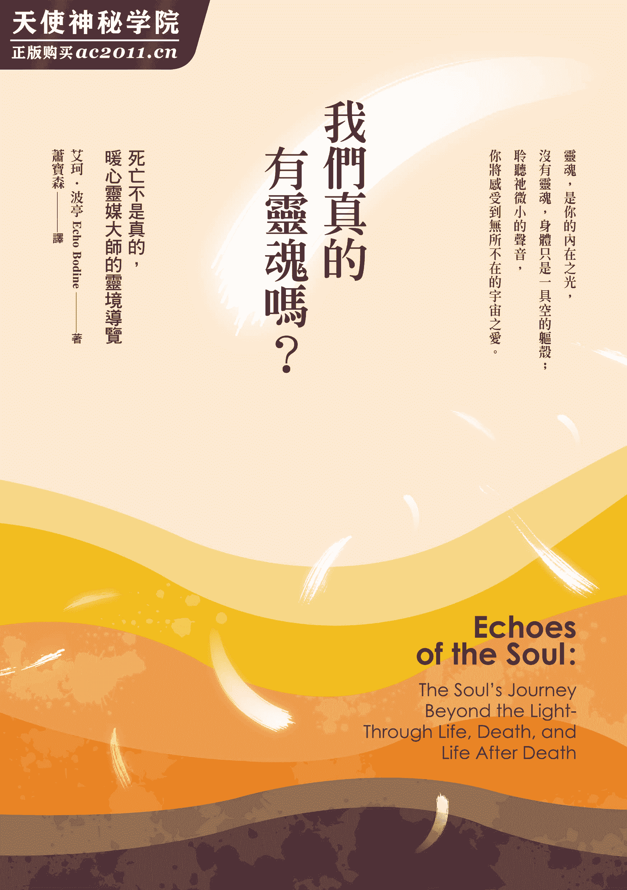

# 我们真的有灵魂吗？

谨将此书献给我的母亲 Mary Opal Mae McKee Bodine。

没有您一贯的支持，我不可能写出这本书。许久之前，您就已经预见这本书的诞生。感谢您不断鼓励我把我所知道的真理写下来。有您这样一位母亲，真是我的福气。谢谢您为我所做的一切。

我爱您。

# 推荐序进入一场灵性世界的对话

## 推荐序进入一场灵性世界的对话

——尼克．卜尼克（Nick Bunick），《在神的真理中》（*In God’s Truth*）作者

在生命的旅程中，我们经常会有许多疑问，并且希望能得到解答。这些疑问都和我们存在的本质有关：世上真的有一个灵性世界吗？抑或这只是诗人和神秘主义者所虚构的产物。如果真有一个灵性世界，我们和那个维度有什麽关系？我们是受限于地球经验的凡俗之躯？还是已经蒙造物主赐予永生的不朽灵魂？

一千六百多年来，各种宗教的导师一直试图说服我们：我们只有这一世的生命，只有透过他们的组织才能得到救赎，而且如果你不遵守他们所宣扬的教条和教义，神就会让你的灵魂永世受苦。然而，今日有一股灵性觉醒的潮流正逐渐蔓延，有越来越多人体认到他们的头脑是通往心和灵魂的通道，而他们正打开这个通道，让那些五年前尚不可得的资讯进入他们的心灵。

相较于从前，如今人们更期盼了解自己与神的关系。我们是刚好有着灵魂的人类？还是正在体验人世的灵魂？有些人天生就具有特别的天赋，得以成为杰出的歌手、舞者或世界知名的艺术家。有些人则具有灵性上的天赋，也就是说：神赐予他们特殊的能力，使他们不仅可以了解，也可以看见另一个维度——那个神、耶稣和所有伟大的天神，以及我们的指导灵天使所居住的地方，也是我们所爱的人往生后灵魂转化的地方。艾珂．波亭就是这样一个人。

我是在一次旅程中遇见艾珂的。当时我的着作《信使》（*The Messengers*）刚出版，而我正巡回二十七座城市举办灵性研讨会。在明尼阿波利市时，研讨会的赞助者和主办人告诉我他想介绍我认识一个很特别的人，一个被神赐予特殊天赋的人。当时我就感觉到她的能量和灵性力量。

当她给我这本《我们真的有灵魂吗？》初稿时，我分两次就看完了。它符合了我为我自己的书和其他我所读过的书籍所订定的每一个标准，因为它的内容充满爱心、用语清晰，且旨在帮助人们了解他们的生命目标，并享受这段生命的旅程。当你阅读《我们真的有灵魂吗？》一书时，你会感觉自己好像坐在一个美好、宁静的空间，和艾珂面对面谈话。你会感觉彷佛有一个好友坐在你对面，用温和、慈爱的口气和你聊天，和你分享她的经验和洞见，让你希望这一场谈话可以一直持续下去，不要结束。她和你分享的资讯不仅很有道理，更重要的是：当你越来越了解自己所走的这趟旅程和你真正的生命目标时，你的心和灵魂会知道那是真理。你会和艾珂一起进入灵性的世界，而当你真正体悟世上并没有死亡这回事，因为死亡只是一种「转化」时，你的心将充满希望与喜悦。你会了解生命的目标，得到生命的智慧，明白我们其实都在同一个旅程上。

《我们真的有灵魂吗？》会减轻你内心因失去所爱之人而感受到的痛苦。你将会体认到你和你所爱的人只是暂时在物质世界分离，但在灵性世界里并非如此，而你这一世的生命只不过是一部宏伟壮丽的书册当中的一个章节。艾珂．波亭在书中和你分享了她的天赋。这是一份礼物。一旦你翻开书页，看到其中蕴含的美妙真理与希望时，你一定也会和别人分享。

你的灵魂将因着她在书中和你分享的智慧，充满喜悦与平安。愿上天的祝福，陪伴你继续走完这趟人生的旅程。

**〈复苏〉**

——山姆．狄保拉（Sam Dipaola）

醒来时我知道黑暗已经过去

麻木的感觉终于消逝

没有任何事物可以阻止我想起从前。

我是谁、到过哪里、活过几世

一切一一浮现

宛如朝阳缓缓驱散冷冽的晨雾

乍然悟见真理，我微微有些不安

但那清明之感使这不安差堪忍受

一种新的赤裸包裹我的身躯

我充分意识到每一个构成我的存在的微小细胞

我从没感到如此完整。

所有的问题都变得不重要了

如今对我而言

所有的前世都是上天刻意安排的经验

让我从中学习

让我的灵魂到达此时此刻

这个过程漫漫无尽

但感觉只发生在一夕之间

如今我已明了神如何在七天内创造了世界。

是的，万物与意识确实陡然爆发显现

你若怀疑，将继续活在黑暗之中

你若觉醒，乐趣便于焉展开，永无止境。

# 序运用通灵天赋，看见不一样的生死观点

## 序运用通灵天赋，看见不一样的生死观点

我在十七岁那年发现自己有灵通力和疗愈的天分，而这完全出乎我的意料。我住在美国中西部，和大多数人没有什麽不同；或许除了我在童年时期所听到的那些声音之外，在我的成长过程中，没有任何迹象显示我和我的家人具有超自然能力。

### 一家四口都有灵通力

事情是从一九六五年秋天的一个晚上开始的。当时我的一个弟弟刚开始学鼓，他到地下室练习。我和父母、妹妹和另外一个弟弟刚吃完晚饭，正围坐在桌子旁边。

我弟弟竭尽全力的打了大约五分钟的鼓，听起来并不怎麽熟练。但突然间，那当啷当啷的嘈杂声就停止了，一阵美妙的乐音从地下室传了上来。我们都看着父亲，心想他应该知道其中原因。但父亲说那一定是他买给弟弟的那张桑迪．尼尔森（Sandy Nelson）的唱片，不过我们看得出来父亲其实也不太相信自己的说法。

然后，乐声就停止了。这时只见弟弟慌慌张张跑上楼来，歇斯底里的说明刚才发生的事。他说，当他正闭着眼睛坐在鼓前练习一首曲子时，突然有一个白色的人影从门口飘了进来，飘到他身边，把双手放在他的手上，开始奏出我们之前听到的那段美妙音乐。弟弟结结巴巴的告诉我们：他的眼睛虽然一直闭着，但还是可以很清楚的看见那个人影。事后，那个像是幽灵一样的东西就放开了他的双手，越过房间，从门口飘出去了！

我们听得目瞪口呆。我们从小在长老教会长大，对所谓的「神秘学」（这是那个年代的说法）毫无所悉。除了在很小的时候，听大人说我们每一个人都有一位天使在天上看顾着我们之外，很少想到什麽鬼魂、指导灵或守护天使之类的事，因此完全不知道应该如何面对刚才发生的事情，只是呆坐在那里，不知道该说什麽，心里却充满了疑问。我们知道弟弟绝不会捏造出这样一个故事，而且刚才我们确实也都听见了那些音乐。这代表了什麽呢？这种事情为什麽会发生在弟弟身上？那白色的人影也会向家里的其他人现身吗？

当时，我母亲参加一个同祷会，那里有一名妇女曾经去找过一个通灵人。于是，母亲便打电话给这名妇女，希望她能够告诉我们究竟发生了什麽事，但她却给了母亲那个通灵人的电话号码。于是，母亲立刻打电话过去。那个通灵人毫不迟疑的告诉母亲，她一直在等她打电话来。她说，那白色人影是我弟弟的指导灵，想让他知道祂的存在；又说，那指导灵在世时是个鼓手（那是祂的许多身分之一），而且将教我的弟弟打鼓。通灵人还说道，母亲和我们四个小孩都有灵异体质，她希望不久后我们能去找她通灵。

这些讯息并没有让我们感到比较安心。一位会打鼓的指导灵？我们天生就有灵异体质？这是什麽意思？我请母亲和通灵人约了时间，以便了解她话中的含意。一个星期之后，我便坐在伊芙．欧森（Eve Olson）的通灵室里，准备迎接另一个即将改变我生命的经验．

伊芙．欧森年约五十多岁，待人非常亲切。她原先住在英国，后来迁居到明尼苏达州的圣保罗市。墙壁上挂着一张她在印第安那州某间大学通灵学系的毕业证书。我从来没想过人们的灵通力是从哪里来的，我很讶异居然会有一所学院在教授这类事情。一开始她告诉我，我生来就有灵视力（可以看到景象、人物或图像）和超感听力（可以听到灵体说话的声音），同时我还有与生俱来的灵性疗愈能力，而且以后我会写书、上广播和电视、四处旅行，并且闻名全世界。当我年纪渐长，并且学会运用这些能力时，我就会开始教导他人如何开发他们的灵通力和疗愈天赋。

我告诉她，我并不认为我有那些能力，而且我只想结婚生子，过正常人的生活。她说，我从小就能够察觉他人的感受，但因为这对我而言是一件很自然的事情，因此我已经习惯了，并不觉得那有什麽特别或不寻常的地方。她说，我的身体会有这麽多毛病，是因为我非常敏感，但却不知道如何处理那些一再出现的感受。日后我的人生道路将会和我从前想像的大不相同，但这是我的灵魂今生想要的。我觉得这种说法非常奇怪，因为我之前从没想过自己的灵魂想要做什麽。

伊芙告诉母亲，她也有特殊的天赋，有一天会成为一个知名的通灵人，以帮助人们通灵为业。她还说，我的妹妹妮姬要到四十几岁才会开发出通灵和疗愈能力，弟弟麦可则将成为职业通灵人，至于那个打鼓的弟弟将会选择不使用他的特殊能力。自从那天见到伊芙算起，至今已经过了三十三年，事实证明她那晚预测的每一件事情都实现了。

和伊芙的会谈结束前，她要我回家后把白色手帕放在我父亲的头上。这个通灵人知道他正因为偏头痛而卧床休息。但在那之前，我和母亲都不曾提起这件事。她叫我请求神透过我来工作，把疗愈的能量灌进我父亲的体内。这样我就会明白她究竟在说什麽。

在开车回家的路上，我问母亲：「为什麽是我呢？为什麽我会有这些怪异的天赋？为什麽我不能过正常人的生活？我们到底发生了什麽事？这一切究竟是什麽意思？」

回到家后，我告诉父亲通灵人说的话，并问他是否可以让我试一试所谓的「灵性疗愈」。他说他很愿意，只要我不弄伤他的头就好。我把两条手帕整整齐齐的放在他的头上，并将我的双手放在手帕上，接着请求神透过我来工作，只不过我的语气里并没有什麽信心。结果不到几秒钟，我的双手就开始像电毯一样发热，可以感觉到有一股能量正从中通过，使双手微微颤抖。过了大约五分钟之后，我的手才逐渐冷却下来。我缓缓的把手从父亲的头上移开。没想到父亲竟然表示他的头已经不痛了！

### 有灵通力该怎麽办？

那天晚上我躺在床上，一直辗转反侧，难以成眠，一个又一个问题在我脑海中浮现。我应该从高中辍学，走遍全世界去治疗那些生病的人吗？我是不是有义务要治疗世上所有病患？这表示我很特别吗？为什麽神选择了我？我应不应该加入国内的和平部队？我的朋友们会怎麽说呢？我开始怀疑父母帮我取「艾珂」（Echo）这个罕见的名字，真的是因为要纪念他们的一个朋友吗？还是因为他们知道我与众不同？我怎麽可能变成一个全球知名的人物呢？我该如何克服自己的害羞？要怎样写书呢？这一切会如何发生？我是不是应该更常上教堂？还是多读一点《圣经》？大学怎麽办？我想起童年时一直听到的那个男性声音，每当我感到害怕或忧虑时，祂总是会安慰我。我心想是不是因为这样，祂才一直要我上主日学，去了解有关耶稣的一切，因为耶稣是我的兄长，而祂来到世上就是为了要教我们如何活出生命。就这样，那晚我一直躺着左思右想，试着理解那个通灵人说的话。当时我并不知道，我要花许多年的时间才能完全理解她的意思。

和伊芙谈话后不久，我和母亲就开始向柏蒂学习如何开发灵通力。柏蒂是明尼阿波利市的一个通灵使者。她是很有天分的通灵人，也是很严格的老师，而这正是我所需要的。尽管这段期间我一直抱持着怀疑的态度，不停提出各种问题，她都没有放弃我。我并非故意要找碴，只是她当时教我们的东西（包括灵魂出体、轮回、指导灵、天使、能量场、占卜、死后的生命，以及开发灵通力等）正迅速挑战并改变我的实相。但我从头到尾一直拚命的抗拒，我不希望我的实相和我的朋友们不同。我想融入他们的世界。

柏蒂也经历过这个阶段，因此她很了解我和母亲的心理。她持续教导了我们几年，不断向我们介绍新的观念和看法，并协助我们开发灵通力。我和母亲会拿朋友来练习。有时感觉很好玩，有时则很吓人——当预见会有好事发生时，觉得挺好玩的；但看到未来会有困难或挑战时，就会被吓到。

### 指导灵的指引

开发灵通力课程的内容之一是认识我们的指导灵。这件事让我既害怕又向往。我心想：我会不会像当时流行的电视影集《托普》（*Topper*）里的主角一样，有一些幽灵整天跟着我走来走去。托普有两个已经死去的朋友乔治和玛莉安，而他是唯一能够看得到他们并且和他们沟通的人。想到我可能会有属于自己的乔治和玛莉安，我就觉得很有意思。柏蒂总是鼓励我们设法去认识自己的指导灵。她说：「就算你看不到祂们，还是要跟祂们说话。告诉祂们，你想和祂们建立关系。祂们会在你的旅程中给你许多协助。」

尽管如此，我还是很害怕，认识指导灵的过程进展得非常缓慢。那段期间，我睡觉时总会把灯打开，因为这样一来万一祂们像我弟弟的指导灵从房间中飘过去，我至少不会被吓个半死（应该说我希望自己不会被吓个半死）。此外，我也一天到晚把收音机开着，因为我害怕安静，担心祂们可能会突然开始对我说话。不过，我也很好奇祂们的声音听起来会是什麽样子。

我第一次听到我的指导灵说话时，正在洗盘子。有一个非常轻柔的声音（就像是脑海中一个意念）对我说：「我叫做西尔多——但你可以叫我泰迪。」然后又有一个女性声音出现：「我叫做安娜。」这些「声音」听起来和我内心自言自语的声音并没有太大的不同。我请祂们再多说一些，但祂们后来就没有再出声了。之前柏蒂曾经告诉我们：指导灵并不一定爱讲话，祂们只会说一些我们必须知道的事情。从此以后，我无论是在家里或在车子上，都不再把收音机打开。指导灵想要跟我说话的时候，我就可以听得见。慢慢的，当我不再这麽畏惧祂们的时候，我们就开始沟通了。

我的指导灵不但帮助我担任通灵人的工作，也让我明白我的疗愈天分。在一九七○年代时，人们对灵性疗愈师的接受度不像对通灵人那麽高，因此我只有在家人生病时才会着手疗愈，偶尔也会帮忙疗愈几个信得过的朋友。在这样的时刻，我凭着指导灵的指引和自己的本能，总是知道该把我的手放在哪里、要放多久，以及应该对病人说些什麽。指导灵会教我一些技巧，并告诉我应该遵守哪些规范和界限。祂们让我明白，死亡是一种疗愈、一个开始，而不是结束。而且祂们总是一再告诉我要保持单纯。

这些年来，我的指导灵已经换了几位。原先那几位跑去帮助别人，由新的指导灵取代祂们的位置。这些指导灵中有几位是美国原住民。祂们教我如何驱邪（帮助驱赶附在人们身上的鬼魂）、如何向大地之母致敬，以及如何运用大自然的产物作为疗愈工具。有几次，我碰到比较棘手的个案时，曾经请祂们来我的工作室帮忙举行疗愈仪式。祂们会围着治疗床又唱又跳，把药草放在个案的身体上，并一步一步指示我要把手放在哪里、要放多久等等。

有许多次，耶稣也透过我的双手工作。有一次，耶稣在我的个案睡着时，把他的灵魂从身体内提起来，带着灵魂离开了房间。透过我的灵视力，我看见耶稣把那个灵魂带到一条河边，将他的消极思想清洗干净，再将他带回来，轻轻放回那人的身体里面。那个个案醒来后告诉我：他梦见耶稣带他到一条河边，洗净了他的罪孽。当我的美国原住民指导灵、耶稣、杨大夫（一位古代中医）或天使前来和我一同工作时，我的个案通常都可以感觉到祂们的存在。

一九八三年，我的指导灵认为我有必要写一本简单的书，教导别人如何传送疗愈能量。我说我不知道该怎麽写书，祂们向我保证整个过程中都会助我一臂之力。后来祂们果然也信守承诺。于是，我的第一本书《疗愈之手》（*Hands That Heal*）就在一九八五年由 ACS 出版社出版了，并且在一九九六年出了修订版，加入一些我在初版发行后学到的讯息。一九八九年，我的指导灵认为我有必要再写一本书，谈论那些导致身体出现状况的各种情绪问题。一九九三年，Nataraj 出版社出版了《疗愈的热情》（*Passion to Heal*）一书。

到了一九七○年代，我发现我也能看见鬼魂，而且我的弟弟麦可也有这种能力，于是我们姐弟俩在一九八○年代组成了一个「驱鬼」队，帮人驱除不受欢迎的幽灵，一直到今天。我也因为这样的能力而上了好几个地方性和全国性的电视节目，包括《莎莉谈话秀》（*Sally Jessy Raphael*）、《另一边世界》（*The Other Side*）、《未解之谜》（*The Un-Explained*）、《相见与相逢》（*Sightings and Encounters*）、《不可思议的宇宙》（*Strange Universe*）和《超视界》（*Looking Beyond*）等。《超自然边界》（*Paranormal Borderline*）也曾经报导我们一家人的故事，说我们是美国最具有灵通力的家族。

这段旅程虽然偶有艰难困顿的时候，但整体而言，我还是觉得自己非常幸运，能够具有这样的能力。一直以来，不仅有几位很棒的指导灵教我种种不可思议的事情，这二十五年来我在明尼阿波利市所从事的通灵人和疗愈工作也很成功。目前我正教授开发灵通力的初阶和进阶课程，并带领相关的工作坊，同时也指导别人如何进行灵性疗愈。

### 这本书的缘起

这本书原本是打算谈论我驱鬼的故事，其中穿插一些资料，说明灵魂的种种以及灵魂对生命、死亡和死后生命的态度。出版社对这本书颇有兴趣，但我的写作过程很不顺利，文思枯竭，写不出什麽东西来，过了好几个月都没有进展。我不知道该怎麽写下去。但我的指导灵教我要有耐心，因为时机很重要。

一九九七年春天，我的经纪人一直打电话来询问稿子的进度，但我却一筹莫展。我请教一个懂得通灵的朋友华伦．安格（Warren Anger），请他帮我问问这本书还少些什麽。华伦告诉我，这本书的重点不对，又说我的生命中将会有一个女人帮我把这本书做个统整。

接下来一个星期，我告诉我那一班开发灵通力进阶课程的学生，我打算休息几个月，停止所有的课程，也不再接任何个案，以便完成手上这本有关鬼魂的书。我向他们透露我在这方面遭遇到的挫折，并问他们当中是否有任何人可以接收到来自灵界的讯息，告诉我该怎麽做，如果有的话，请让我知道。

那天晚上下课后，我开车回家的路上，我的助教雪瑞．葛拉西（Sheryl Grassie）大胆的向我提出一个很棒的建议。她说，我们可以一起合作完成这本书，写出经纪人想要的内容。雪瑞是在作家群之中长大的，对编辑作业非常熟悉。这时我立刻想到华伦所说的话：我的生命中会有一个女人帮助我看出这本书欠缺的地方。我把初稿给了雪瑞。一个星期后，她打电话来说：「我知道这本书哪里不对劲了。它的重点不对。」一时之间，我浑身冒出鸡皮疙瘩。我知道我所需要的就是她这种洞察力。

后来，我们约好了一起喝咖啡。雪瑞想问我一个问题：对我来说，哪一件事情比较重要？是告诉人们有关鬼魂的故事，还是让人们认识灵魂是怎麽回事？我告诉她，对我而言，灵魂是最重要的；但我之前所上的电视节目全都把重点放在鬼魂身上，我以为人们想看的就是这类内容。雪瑞觉得我必须把重点放在灵魂的旅程，而非鬼故事上面，还帮我把原先的章节重新编排、做了一些更动，并补足了许多遗漏之处，把整本书的大纲都拟好了。在她的协助之下，我把书中的重点做了一番调整，把那些鬼故事拿掉，留待日后使用，但保留了原先的大部分内容。

我的学生们总是说他们很喜欢我的故事，因此我决定留下合适的部分，大致以故事的形式和读者分享我要传达的讯息。书中的故事都尽可能忠于真实的事件，但为了保护有关人士，其中若干细节已经做了更动，人名也大多不是真的。

有好几个月的时间，我们一直想不出合适的英文书名。但我们知道要有耐性，等待书名自动浮现，不要随便取一个不合适的书名。有一天，雪瑞告诉我，她在静坐时有一个声音告诉她，必须把我的名字放在书名里，而且还给了她几个选项。她把这些书名都记在日志后，才打电话告诉我。我说：「是喔！把我的名字放在英文书名里？我可不这麽想。难不成要取名为《Echoes of the Soul》吗？雪瑞，我看你是发神经了。你还是待会儿打电话给我，告诉我那几个出现的书名吧。」大约两个小时之后，她打电话给我，说她写在日志里的英文书名就是《Echoes of the Soul》。但把我的名字放在英文书名里的做法实在是太夸张了，后来两天，我一直试着忘掉它，但它却在我脑海中萦绕不去。我的一个指导灵要我在字典里检索「echo」这个字。结果我发现上面写着：「重复、反覆。」而这正是灵魂所做的事。灵魂一再重复转世，反覆体验人生，直到达到完美为止。

这本书讲的是灵魂的种种，以及从任务形成到完成整段旅程的故事。书中回答了许多人心中的疑问：灵魂在什麽时候进入我们的身体？灵魂如何看待出生的经验？灵魂如何面对在地球的这一生？灵魂对肉体的死亡有何感受？灵魂又会往哪里去？灵魂害怕死亡吗？肉体死亡后，灵魂会做些什麽事？死后灵魂会不会和所爱的人相逢？世上真的有地狱吗？轮回又是怎麽回事？真的有轮回存在吗？灵魂如何看待轮回？还有，神是谁？祂是什麽？祂扮演什麽样的角色？

人绝不只有肉体而已。我希望你在读完这本书之后，会对你自己、对他人、对神有更多的爱、敬重与了解。

# CHAPTER 1 关于灵魂的二三事

人的身体是灵魂的最佳画像。

——路德维格．维根斯坦（Ludwig Wittgenstein）

在深入探讨灵魂如何看待诞生、人间的生命、肉体死亡和死后的生命之前，我们必须为灵魂下个定义，并回答一些常见的问题：每个人都有灵魂吗？看起来是什麽模样？灵魂会死吗？

《韦氏大辞典》为灵魂（soul）一词所下的定义是：「一个不具物质形式的实体，被认为是人的灵性部分。」我同意《韦氏大辞典》的定义，不过我想补充一点：这个属于我们灵性的部分是永远不会死的。

## 遇见灵魂

我第一次知道我看见了一个灵魂，是在我疗愈一个十四岁的男孩时。这个男孩从十八尺高的地方摔下来，头部撞到地面，被送进了医院，陷入昏迷状态，医师都说情况不乐观。当时我正站在他的床前，把双手放在他的胸膛上，将疗愈的能量灌进他的体内。突然间，我听到我背后响起一个男性的声音：「请你疗愈我的大脑语言中枢，我很希望能够再度说话。」这让我感到有些不安，因为我知道当时房间里没有其他人。我缓缓转过身去，看到角落里站着一个透明的人形，他的模样和我正在治疗的那个男孩完全相同。

我问他是谁，他告诉我他是住在那个男孩身体里的灵魂。这让我感到非常惊讶。我问他为什麽会离开身体，他说这种情况并不稀奇。灵魂偶尔会离开身体，休息一下。他还告诉我，当灵魂出体时，身体不会感受到任何疼痛。说完，他再度请我帮忙疗愈大脑的语言中枢，之后他就飘出了房间。

这时，那男孩仍躺在那儿，一动也不动，呼吸非常浅。当我把疗愈的能量灌进他的体内时，心底还试着为刚才发生的事情寻求一个合理的解释。有那麽一秒钟，我甚至还怀疑那是我的想像。但不久，那灵魂又回到了房间，迅速进入男孩的体内。就在这时，那具片刻之前还了无生气的躯体突然有了生命力，不仅开始会动，呼吸也逐渐变得正常，甚至还发出痛苦的呻吟。我告诉他，我不知道大脑的语言中枢在哪里，他举起一只手放在前额（后来护士证实那里的确是大脑的语言中枢位置！）。

在后来的整个疗愈过程中，那灵魂仍不断进出男孩的身体，并且在必要时和我沟通。

从那晚起，我已经遇见过成千上百个灵魂，他们以各种方式和我一起工作。我在这里和你分享的一切，都是他们教给我的。

## 神创造灵魂

每一个人都有灵魂。大家都以为灵魂是和我们分离的，但事实并非如此。我们的灵魂是由能量形成的，是光的存有（beings of light），可以随心所欲变成任何一种形状。我沟通过的灵魂中，绝大多数都以人形出现，但我也曾看过以光束或能量团的形式出现的灵魂。无论灵魂以什麽形状显现，都是会思考、有感觉的存有，具有记忆和本身尚未解决的问题，也有幽默感，是非常活泼的能量。

神创造我们时，是创造我们的灵魂，然后再把祂自己（或称为「圣灵」）的一部分放进我们的灵魂里面，使我们具有生命的气息。这就是「较高自我」（Higher Self）这个名称的由来。较高自我就是我们灵魂中充满圣灵的那个部分。在那个部分（或称为「光」），有一个声音会在人生当中给予我们各种指引，经常被称为「内在低微柔和的声音」。

我们的灵魂被创造出来后，与神一起住在「那边」，接受我们所需要的教养，以便为我们奠定良好的基础。但在我们发展的过程中（就像婴儿的发育一样），到了某个时刻，我们想要开始学习与成长。这时，生命的循环就开始了。

由于「那边」已经很完美了，因此神创造了这个世界，就像我们离家求学的学校一样，地球就是让我们前来学习的地方。我们的目标是要让我们自己和这个世界都能发挥最大的潜能。我们拥有无限多的时间可以做这件事。必要时，我们可以一而再、再而三的来到人世，尽可能学习，让我们能够充分发挥自己的潜能。

如果我们真正了解这当中的含意，我们的生活将会变得大不相同。神是根据祂自己的形象来创造我们，因此我们具有无限的潜能！神在创造我们的灵魂时，给了我们充分的授权；这意味着我们有充分的权力可以成为最好的自己。

每当我在演讲中谈到这个主题时，人们往往会以为我指的是他们的肉体。他们会说：「我可不行，我的腿太短，永远没办法成为篮球选手。」或「我不行，我读高中的时候就因为成绩不好而被退学，到现在还找不到一份像样的工作。」或「神可没赋予我无限的潜能，因为我有肢体障碍……我太笨了……」等等。

我讲的并不是肉体（尽管我们的肉体也有不可思议的潜能），而是我们每一个人都拥有的灵魂，也就是我们内在那个真正的自己。我们每一个人都有肉体，肉体里面则有灵魂，而灵魂里面包含着圣灵（或神）。我们的生命就是我们灵魂内的圣灵所赋予的。如果没有那「神圣火花」，我们的灵魂就只是能量而已。就像我们的身体如果没有灵魂，顶多只是一具空空的躯壳而已。

至于神是在同一时间（百亿年前之远）创造出那麽多灵魂，还是祂后来继续不断创造新的灵魂？关于这点，各方的看法不同。我的内在直觉告诉我：神一直不断创造新的灵魂，因此地球人口才会不断增加。你会听到人们提到「老灵魂」和「新灵魂」。老灵魂经历过许多世的生活，已经获得了不少智慧；但新灵魂还没有这麽多世的经验，还在汲取智慧。我只要注视一个新生儿的眼睛，就可以看出他是老灵魂或新灵魂。老灵魂有一种世故的神情，彷佛在说：「我回来了。」而新灵魂则没有那麽世故。无论如何，婴儿的体内都有一个灵魂，而那个灵魂来到世上是有目的的。

## 灵魂旅行

当灵魂住在身躯里面时，是透过一条银索（类似脐带的东西）与肉身连结。这条银索使灵魂终生与身体相连，只有在肉体死亡时才会切断；但它对灵魂并不构成限制，只要灵魂愿意，随时都可以自由来去。同时，这条银索还可以无限延伸，因此除了「意识的心智」（conscious mind）之外，灵魂不受任何事物的束缚。

我知道有些人会对灵魂旅行（或称「灵魂出体」）这类的事情感到不安。想到我们无法控制自己的灵魂，难免会觉得不舒服，但无论我们喜不喜欢，我们的灵魂确实经常出体。这种现象大多数发生在夜晚肉身睡着的时候，但白天灵魂也可能短暂进出身体。在后面的章节中，我们将会谈到大多数人都没有意识到自己的灵魂所发生的事情，而通常我们的身体和灵魂都宁可毫无察觉。

### 灵魂出体的迹象

以下这些迹象显示你的灵魂已经离开了身体，但并不代表你的灵魂必定正在旅行。

*   夜晚睡觉时，你的身体抽搐得很厉害。你醒了一秒钟，立刻又睡着了。
*   你梦见自己正在飞行，而且感觉非常真实。
*   半夜时你醒过来，但眼睛却睁不开，身体也动不了。你想大声喊叫或告诉别人你的身体似乎瘫痪了，但却无法张嘴。
*   白天时你感觉自己的头脑好像有一小段时间处于空白状态（白日梦）。
*   你梦见去拜访一个已故的至亲好友，而且感觉非常真实。
*   你梦见自己和远方的某个至亲好友在一起，而且醒来时因为自己非离开不可而感到很伤心。

为了避免扰乱我们的意识，大多数灵魂出体的经验都发生在夜间。在下面各章中，你将会发现：灵魂宁可隐匿起来，不为人知，因为他们通常都有自己的计画。有许多次我和个案的灵魂沟通时，他们都请我不要把他们所做的事情告诉身体，因为身体（意识的心智）无法理解。原因是灵魂把他所遭遇的每一个经验都视为学习的工具，通常不会带有情绪，但我们的身体在经历这些事情时通常都会有一些情绪反应。

### 当灵魂旅行时

或许你会好奇灵魂为什麽要旅行、灵魂会去哪里、灵魂离开身体的时候又在做什麽。想想看，我们是不是经常希望自己能够同时置身于两个地方？事实上，我们的确可以这麽做，只是我们自己不知道而已。以下有一些这样的例子：

*   如果你所爱的人生病了，但他住在另外一个城镇或国家，你没办法前往探视，这时你的灵魂就会去拜访那个人。
*   如果你的小孩好像生病了，但你又不得不把他送到学校去，这时你的灵魂可能就会不时前去探望那个孩子。
*   如果你爱上了一个人，你的灵魂可能会离开你的身体去亲吻或拥抱那个人。（那个人并不会意识到你所做的事情，但他会有一种被爱的感觉。）
*   当你所爱之人即将在公司做报告或参加考试时，你的灵魂可能会去帮他加油打气。
*   当有两个人同时都需要你时，你的灵魂可能会去探视其中一人。
*   如果你得去上班，但你宁可待在家里或去购物或钓鱼时，你的灵魂可能会在忙碌的一天中利用短暂的空档前往你喜爱的钓鱼场所或大卖场，让你可以偷闲休息一下。
*   如果你把车子送修，想知道车厂到底做了些什麽时，你的灵魂可能会去拜访你的修车师傅。
*   如果你是一个疗愈师，你的灵魂可能会去某个人那儿，把疗愈的能量传送给他。
*   如果你无法参加某个场合（例如一场音乐会或戏剧表演），你的灵魂可能还是会过去。
*   你在课堂上感到无聊的时候，你的灵魂可能会前往想去的地方。
*   如果有两个人相爱但彼此相距甚远，其中之一的灵魂可能会去到另一人的灵魂那儿过夜，而且两个灵魂可能会每晚轮流探视对方。
*   如果你的孩子在其他国家，你的灵魂可能会在夜里去探视他们，看他们过得如何。
*   如果你很向往某个地方，但因为生活形态的缘故，你不可能搬到那里去住，这时你的灵魂就可能会经常前往那个地方。
*   当你的身体因为喧嚣忙乱的生活而倍感压力，但你却无法去度假时，你的灵魂可能会到你喜爱的某个地方（例如山上、海边或乡下）去过夜。到了早上，你的身体醒来时会觉得轻松一些，但却不明白个中原因。有时你会「梦见」自己到了你喜爱的度假地点，醒来后感觉自己又恢复了活力。
*   在你濒临死亡之际，你的灵魂可能会频繁进出身体。灵魂可能会去找一些还在世的人，和他们的灵魂沟通。如果灵魂觉得在走之前，还有一些很重要的事情要处理（例如与某人和解、与某个人谈一谈或指导某人做事等），这样的事情就会发生。此外，灵魂也可能会到「那边」去打点住所。
*   如果你上床前对某个问题（无论它多麽简单或复杂）苦思不得其解，则你睡着后，你的灵魂可能会出去找其他灵魂谈一谈，向他们请教可能的解决方案。第二天早上你醒来时，可能会发现你已经想出了答案。
*   在夜里，你的灵魂可能会离开身体，去拜访你的指导灵（我将在第四章中详细谈论这一点）。有一件事可能会让你很意外：事实上，我们每天都会和我们的指导灵沟通。
*   如果一个人受到加害（例如身体上、心理上、情绪上的虐待或性暴力），他的灵魂可能会感觉需要离开一会儿。当施虐事件即将开始时，灵魂会先离开房间，等到事件结束后再回来。在专业术语中，这叫做「解离」（disassociation）。几年后，这个人可能会因为他受虐的情形去看治疗师，但却无法想起特定的事件。这种情况可能会使得他比较难康复（但并非不可能）。

有一天我和我的编辑雪瑞在一家餐厅里讨论有关书的事情。突然间，她的眼神变得很茫然，显示她的灵魂已经离开了。不到十五秒钟之后，她才「回过神来」，并为她刚才精神恍惚的模样而道歉。我问她是不是担心孩子，她说她的女儿在托儿所里待得并不开心。我说她的灵魂可能跑去察看她的女儿了，因为当父母担心孩子可能会有状况时，他们的灵魂可能就会经常去探望。结果雪瑞回到家之后，接到托儿所打来的电话，说她的女儿那天早上出了一点状况。

如果我们担心某个人或某个状况，但又无法亲自处里，我们的灵魂就会前往察看。但这时我们的灵魂可能会面临一个问题：如何才能让我们注意到这件事？在这种情况下，我们的内心可能会对某件事情感到不安，或者感觉自己有必要打电话给某个人。不幸的是，许多人并未因此而采取行动，因为他们认为那些感受没有什麽道理可言。我希望我能让大家更了解这一点，并开始更注意自己内在的直觉。

### 别人的灵魂正在旅行的迹象

我们刚才讨论了你自己的灵魂出体的迹象，但当别人的灵魂出体时要怎样才看得出来呢？这时我们又应该怎麽做？

*   如果他们正在睡觉，这时他们的身体会处于完全静止的状态，一动也不动，呼吸也很浅。
*   如果他们是在清醒的状态，则有几秒钟的时间，他们的眼神会变得很茫然。他们的眼睛是张开的，但里面没有神采。就像「屋里的灯亮着，但没人在家」。

如果你碰到这种事，无须惊慌。不要管他就行了。我们的灵魂是很睿智的，除非必要，否则他们不会随便出去。当一个人的灵魂出体时，你千万不要摇晃他的身体或把他叫醒。这可能会使身体很不好受。如果身体因而醒过来，通常会显得很迷惘，脾气也会变得很暴躁。

灵魂出体的经验是很有趣的事。在这方面，罗勃．孟洛（Robert Monroe）所写的几本书是我最喜欢的，不过我知道其他一些书也很不错。（请见第二四五页我推荐的〈延伸阅读〉。）

## 灵魂失落和灵魂复元术

如果一个灵魂不得不经常与他的身体分离，可能会因而出现缺损。也就是说：当一个人受到许多暴力伤害或遭遇重大失落时，为了使身体能承受，他的一部分灵魂可能会离开。在伤害事件结束后，这一部分离开的灵魂可能会回来，但也可能不会。如果这样的伤害持续好几年、当事人又有滥用药物的问题，或发生了其他令他难以承受的重创，那麽灵魂可能有好几个部分都会解离。这时，当事人就会变得「支离破碎」了。

为了让大家更了解这个概念，我想分享我自身的一个经验。打从有记忆以来，我一直觉得我的生命里缺少了什麽，但却不清楚那究竟是什麽，也不知道该如何形容。大多数时间我都为忧郁症所苦。为了克服忧郁症，我不知道看了多少心理治疗师，但还是一再复发。

后来有一个会通灵的朋友认为我可能有灵魂缺损的现象，建议我去找一位萨满（shaman）。当时我虽然认为这种说法有点荒诞，但我实在已经疲于和忧郁症对抗了，因此愿意尝试任何一种方法。

明尼阿波利市有几位很棒的萨满。其中有一位名叫提摩西．柯普（Timothy Cope）。他的天赋过人，而且很难得的是他并不因此矜夸，是我很敬重的一位萨满。

那天我去做萨满称为「灵魂复元术」（soul retrieval）的疗愈时，并不知道会发生什麽事。提摩西叫我先不要透露我的来意。他说他会先用灵魂出体的方式找找看，我有没有哪个部分的灵魂离开了。如果有，他会问灵魂要如何才能和我的身体结合，然后再把灵魂带回来。那时我就可以说明来意，但他不希望我一开始就告诉他，以免他受到我的影响。

接下来那四十五分钟之内发生的事让我很难描述。那是一个非常神秘的经验。提摩西播放了一首鼓乐，开始祈祷，并且焚烧鼠尾草的叶子，同时召唤几个灵性存有（spirit）前来帮忙，接着和我一起躺在地上。刚开始那几分钟，他一直都很安静；后来他告诉我，他已经找到了我从四岁起失落的一部分灵魂（当时我已经四十四岁）。他说在我四岁的时候，我生命中一个很重要的人死了，我因为无法失去他，所以一部分的灵魂就跟着他到了「那边」。他说他看到我握着那个男人的手，而猜想他可能是我的祖父。

提摩西的话让我非常震惊，因为他说的一点也没错。我祖父是在我四岁时过世的。我小时候，他每天都照顾我，和我很亲。提摩西建议我去找一个能像祖父那样爱我、滋养我的内在小孩的男性。他为我祈祷，希望我能找到这样一个人，满足我的渴望。结果不到两、三个星期，我就在奥萨克研究中心（Ozark Research Institute）的一场会议中遇见了那个人：杰佛瑞．麦斯威尔（Jeffrey Maxwell）。虽然我们只相处了两天，但后来那些年一直互相通信。至今，他仍是我生命中能够滋养我的内在小孩的人之一。

那次「灵魂复元术」还带来了另外一个好处：我的忧郁现象逐渐减轻，最后终于消失了。我不再感觉若有所失。生平第一次，我觉得自己是个完整的人。

请放心，就算你的灵魂变得支离破碎，他也有高度的智慧能够找到资源帮助自己疗愈。如果你读了这一段文字后，想要找一位萨满做「灵魂复元术」，我建议你不妨听从自己的直觉。

你可以阅读桑德拉．英格曼（Sandra Ingerman）所着的《灵魂复元术》，也可以打电话给附近的新时代灵性书店，问问看你们那一带是否有任何推荐的萨满。如果你认为自己可能有这方面的需要，坊间有许多很好的资源可以帮助你找到适合你的书籍和萨满。

小结

*   每一个人都有灵魂，而且灵魂是由能量形成的。这股能量来自神。
*   灵魂的模样和目前所寄居的肉身很像。至于那些已经离开肉身（死去）的灵魂，他们看起来的模样就像他们最后一次居住的肉身。
*   每一个灵魂内在都有一个声音引导他度过今生。这个声音通常被称为「直觉」。
*   灵魂和他所居住的肉身之间有一条银索相连。这条银索只有在肉身死亡时才会切断。
*   灵魂能够随意进出肉身。这种现象被称为「灵魂出体」或「出体经验」。
*   灵魂可能会有缺损：遇到重大的创伤时，灵魂可能会变得支离破碎，需要被复元后才会觉得完整。

# CHAPTER 2 天堂那边的模样

世上没有死亡，只有转世。

——西雅图酋长

那是一九九二年春初的事。漫长的冬天已经过去，明尼苏达州的阳光高照、鸟语啁啾，大地已经复苏。那一天是基督苦难主日（Palm Sunday）。我正犹豫自己该去教堂还是做自己想做的事：打理我的花园，准备栽种花木。我觉得我应该到教堂去，但另一方面又觉得自己需要静下心来，和神谈一谈。后来我决定不去教会，因为我要在户外度过这个非常特别的一天。

我和弟弟麦可前一晚才去帮人家驱鬼，我上床时心里一直想着有关「那边」的事。那个星期天的早上，我醒过来时，这件事仍然萦绕在心头。我在花园里工作时，心里一直想着这些年来我所获得的有关天堂的知识。我在当灵媒时，已经学到了不少这方面的知识，在和亡者的灵魂沟通时也获得片片断断的讯息，但我却不曾有过切身的体验。我从事驱鬼工作已经有二十年了。这段期间我一直相信我把那些鬼魂送到了天堂，而那是一个很美好的地方。但那一天不知道为什麽，我突然很想要更具体的了解这个地方。

我一边在花园里工作，一边问神是否可以让我获得更多有关「那边」的知识。我对祂说：既然我从事的是有关死亡和「死后的生命」的工作，我想提供人们更多有关天堂的资讯，让他们知道死后会去到一个什麽样的地方。我告诉神：这样的要求仅此一次，下不为例，而且无论我获得的是什麽样的知识，我都会敞开心胸接受。我很好奇神会用什麽方式来提供这些讯息，不过我决定顺其自然，静观其变。

三天后，我完全忘了自己在基督苦难主日所做的祷告了，但就在这个时候，发生了一件事，成了我在灵媒生涯中最难忘的一次经验。那天是星期三，我为好友尼尔做完一个疗程后，目送他离开我的工作室，从地下室走上楼梯。这时，我的工作室里突然开始弥漫着朦朦胧胧的白色能量，我也感觉自己怪怪的，好像即将昏倒一样。我当时是清醒的，但感觉上身体却睡着了。之后我就有了一次灵魂出体的经验，只是当时我自己并没有意识到这点。

## 灵魂出体，前往天堂

我看到一个女人站在我前面。她是个灵魂，我看不见她的脸，只看见她的后脑勺以及一头金色长发。她对我说：「走吧！走吧！」我感到很害怕，于是便问尼尔（他当时还在楼梯上）是否可以帮我。我告诉他眼前发生了一件很奇怪的事，有一个临在（presence）一直叫我跟她走。

这时，我的感官完全无法运作。我一方面知道自己正在工作室里，但另一方面又觉得自己好像置身于另外一个空间。尼尔抓住我的身体，一直摇晃，希望能让我脱离那样的情况。之后，那个景象确实消失了，但十五秒钟之后，又再度重现。那金发的灵性存有又在那儿催着我跟她一起走。这种感觉我很熟悉。我告诉尼尔我好像快要死了。当时，房里仍旧弥漫着白色的雾气，我的身体也变得虚弱无比，我只想躺下来，不再抗拒。

后来，我看到正前方有一条隧道。它一如我在历次为人驱鬼时所看到的，也就是我把那些幽魂送进去，让他们能够进入白光之中的那条隧道，那条连接我们这边和「那边」的隧道。

我的一个指导灵叫我请尼尔打电话给我弟弟麦可，请他尽快赶过来，然后再把我弄到楼上的客厅去。尼尔打电话给麦可之后，就把我拖上楼。这时我已经几乎说不出话来，两只脚也软绵绵的，没有一点力气。尼尔不停叫我回到我的身体里面，但那位金发的灵性存有却一直要我跟她走。等到尼尔把我拖上台阶，到了沙发之后，我就砰一声倒在上面，觉得自己已经身不由己了。

在等待麦可抵达的那段期间，一分钟感觉就像一小时那麽漫长。后来麦可终于到了。他很清楚发生了什麽事，因为他在开车过来的路上已经和他的指导灵谈过。祂们告诉他三天前我曾经请神让我到「那边」去，现在我已经获准前往，而且事后将会记得这次经验。

他说：「艾珂，祂们要我在你的灵魂去到『那边』搜集资讯的时候握住你的手，让你的身体和大地接触。」这时我才意识到自己正在经历灵魂出体的过程，而那位金发的灵性存有就是我的灵魂。她一直试着让我抛开自己的身体，前往「那边」。由于之前我并未向任何人（包括我弟弟）透露我在那个星期天做的祈祷，他说的那些话和当时发生的事都让我感到非常惊讶。

麦可握住我的手，告诉我一切都没问题，说我应该过去，他会在这里保护我的身体。有了他的保证之后，我便完全离开了我的身体，接着我的心智和那位金发灵性存有（我的灵魂）融合在一起，开始沿着隧道飘浮。到了隧道深处时，我感觉有一股慈爱、温暖的氛围环绕着我，而且一直有一个微弱的声音在说：「放开吧！放开吧！」

隧道里有许多灵魂正在等着迎接他们即将死去的亲人。我的四周都是至亲好友重逢的景象。接着，我看到前面隧道的尽头有明亮的光，我开始往上飘，越飘越高。当我飘到白光所在之处时，我心想那光实在太亮了，应该闭上眼睛才对，否则可能会瞎掉。但我却张开眼睛，直接飘了进去。

到了「那边」之后，感觉平静而清醒。我看到一座古雅的小村庄，街道上铺着鹅卵石。我的祖母正和一个朋友站在那儿。她把我介绍给朋友，只见后者说道：「喔，你没告诉我她今天会死呀！」我的祖母答道：「喔，她没死，只是来参观罢了。」我仔细端详祖母的脸。她看起来是如此美丽，脸上没有一丝皱纹，一副无忧无虑、纯然喜乐的模样，浑身散发着年轻的光彩与安详的气息。我环顾四周，看到好几个已经过世的老朋友。他们没有过来找我，只是对我笑了笑，彷佛知道我不能浪费任何时间似的。他们的神情全都显得朝气蓬勃、平静安详。

### 天使向导

突然间，一位天使出现了。祂的模样秀美，有一头轻盈蓬松、长度及肩的淡红色卷发，身上穿着一袭飘飘然的长袍，还有一对翅膀。祂告诉我祂将是我在此地的向导，希望能让我在有限的时间内尽可能多看一点。

祂带我去的第一个地方叫做「粉红之地」。这整个社区外围都有一圈粉红色的光晕，看起来很美丽。社区里有一所医院，坐落在我们前方，虽然和我们有一段距离，但我还是可以看到里面的景象。那里不像人间的医院有许多医疗仪器和医护人员，比较像是一个让人休憩的场所。里面虽然也有看护，但不见得是医师或护士，而是一些很有爱心、想要让别人得着安慰的灵魂。

医院里的灵魂当中，有一些正处于调整期。他们要开始学习过着没有肉体的生活。许多人在死亡的过程中被投予大量的药物，以至于灵魂受到了药物的影响。这些灵魂此刻正在这里休养生息、接受治疗并进行若干调整。有些灵魂难以接受自己的死亡，因此看护们正在设法帮助，让他们能够接受自己的转变。有些灵魂生前有肢体障碍，他们也需要帮助才能适应身体没有残缺的生活。至于自杀的灵魂则全都住在医院的二楼。其中有些正在沉睡，有些则正设法克服因自杀而导致的挫折感，也有许多灵魂因为自杀时服用了太多药物和酒精，仍然尚未清醒。

这所医院还有很多楼层，但我没有时间逐一细看，必须继续向前。我看到许多灵魂闭着眼睛躺在医院外面的草地上。天使说这「粉红之地」是一个提供疗愈的场所，而那些灵魂则是靠着环绕在社区四周的粉红色能量来恢复健康。

后来，我们沿着一条道路往下飘，沿路山陵起伏、花草竞艳、绿意盎然，还有溪流、湖泊和河流。那里的花朵不仅颜色鲜艳而且气味芬芳。不久，我们飘过了一座山丘，进入了一座山谷，看到一座白色与金色相间的巨大竞技场，那里有着巨大的柱子和门窗，还有天使出入。我的向导告诉我，这就是那些下凡人间、帮助世人的天使所居住的地方。

大约在这个时候，我隐隐约约听见我弟弟的声音。他要我「去寻找音乐」。这时我才意识到我的四面八方都有乐声传来。我看了看我的天使向导。祂示意我跟着祂走。我们飘到了一片草地上。那里聚集着许多歌手和音乐家。我看到了纳京高（Nat King Cole），接着又看到许多在人世间出名的乐手。其中有些在谱曲，有些在唱歌，有好几种音乐同在演奏（这实在不太容易描述），就像是一座巨大的广播电台，你只要调到你想听的那个频率就行了。

接下来，我们造访的那座城市，对我的意义特别重大。天使把我带到那儿或许是因为从我小时候开始，耶稣就一直是我生命中的核心，当然也可能是因为当时人间正在庆祝复活节。无论如何，我们来到了一个很美丽的地方。那里风景如画，放眼望去尽是蓝天绿地。成千上万个灵魂在那里走来走去，因着某件事情而非常兴奋。感觉上，那里彷佛正在举行一场庆祝活动，灵魂的情绪显得非常激动，有些在欢呼，有些在哭泣，还有些则站在那儿，完全被群众中央那位正在演说或授课的男子迷住了。我看着天使，用眼神问祂这男人是谁。天使说祂就是耶稣。我心想不知道我来这儿合不合适。天使看透了我的心思，告诉我没有关系，又说祂知道耶稣对我的意义，因此希望我来体验一下这座耶稣城。

我看着耶稣传福音的模样，心中充满喜悦与敬畏。对我而言，祂是如此的尊贵。祂的周围有一圈金色的光晕，散发出智慧与知识。祂一头及肩的黑发，蓄着胡须，面容黝黑、五官分明，还有一双我见过最热切的眼睛。但最令我着迷的是祂那双手。它们强壮有力，历尽几千年的风霜，充满了智慧，深知人间疾苦，也疗愈过无数人的苦痛。

此刻，祂正劝勉聚集在那里的众多灵魂要彼此相爱。祂传扬的是爱的讯息，而爱正是祂的本质。祂看起来是如此的温柔，既充满力量，却又无比谦卑，让我想要尽可能的亲近祂。当下我感觉自己好像真的回到家了，一点儿都不想离开这座庄严美丽的城市。我环顾四周，觉得到处充满了希望，彷佛可以从中找到人生的答案。

就在这时，我听到有人一遍又一遍的喊着我的名字：「艾珂！艾珂！」是我弟弟麦可的声音。他正在催我回到我的身体里面，因为这样的经验对肉体而言是非常辛苦的。然而，我并不想离去。后来，麦可要我寻找神，这时我才意识到神就在我的四周。祂无所不在。你只要想到「神」，祂就会出现。祂是一种临在，或是一种认知。这样的概念很难描述，就像是你原本就站在一个更衣间里，等到有人叫你去寻找这个更衣间时，你才发现你已经置身于这个更衣间的中央，但却不知道如何描述。你整个人被它环绕着，它存在于你的四周、你的呼吸以及你的思想和感觉之中。你是那更衣间的一部分，但你也随时可以走出那个更衣间，再次与它分离。这样的感觉，很难用语言文字来形容。

### 天堂社区

我问我的天使向导︰在我回到我的身体之前，祂对我还有什麽指教？祂告诉我，天堂里有各种社区，每一个社区都反映出一个不同的实相（reality）。我们会去到天堂里的哪一个地方，完全取决于我们在世时对现实的信念以及我们的意识。举例来说，如果你在世时是一个勤劳的德国人，也是虔诚的天主教徒，那麽你到了天堂之后，就会住在一个和你具有同样信念的社区。祂带我去看一个住着乞丐和小偷的社区。祂说，这就是他们的实相。他们成天彼此偷窃或行乞，最后必然会厌倦这种生活方式，然后他们就会开始询问其他社区是否有更好的生活方式。所有灵魂都会不停往不同的实相移动，持续寻找更好的生活方式。灵魂在天堂时也必须像在人间一般，让自己的信念不断的进化。每一个灵魂都必须持续的学习与成长，直到他们明白自己和神是合一的。

我的天使向导还告诉我︰天堂里的每一个社区都有一间教室，还有一个讲师负责教授那个社区群体的实相。当灵魂进化时，有些社区便没有存在的必要了，这时就会消失。

我说天堂里有这麽多不同实相的社区，听起来似乎很复杂。祂说这其实没有人间的情况那麽复杂，因为在天堂里，每个灵魂都很清楚彼此的实相。如果你住的社区和别的灵魂不一样，那麽你的信念体系就和他们不同。事情就是这麽简单。相形之下，人间的情况反而比较复杂，因为我们以为大家都相信同样的实相，但事实并非如此。世上会有这麽多问题产生，就是因为我们都不太能尊重彼此的信念。我们不愿意承认每个人都有一个不同的实相，只希望大家的想法和做事方式都跟我们一样。

我因为是个影迷，于是问我的天使向导有关电影明星的事情。祂说这些明星也有属于自己的社区。如果灵魂选择要继续当明星，就可以住在那儿，但如果想要转型，不想再当明星了，便会住进一个比较能够反映他们的特性和实相的社区。之前我在为某人通灵时，曾经看到约翰．甘乃迪（John. F. Kennedy）的灵魂。我问他还要当约翰．甘乃迪当多久。甘乃迪说，只要还有人想见他，他就会继续待在「那边」，不会转世；甘乃迪说，他是人们到了天堂，见到了亲友之后，最先要求会面的人之一，还让我看到了他怡然自得的和许多群众握手、打招呼的画面。此外，有许多人也问我是否曾经在那里看到猫王（Elvis）。是的，我看到猫王了。猫王的灵魂也在「那边」，而且看起来气色很好！

由于前两个星期，喜剧演员山姆．金尼森（Sam Kinnison）才过世，而我是他的影迷，很想知道山姆现在过得如何，于是向那位天使询问山姆的近况。天使听了之后，示意我往另外一个区域看。我看到山姆站在一条路上，并且听见了他的笑声。能够再度听到他朗声大笑，我觉得很开心。他身边围绕着许多灵魂，向他握手，恭贺他在世上的表现，让我颇为迷惑，因为在我心目中，山姆的表演有些粗俗，这些灵魂怎麽会说他表现得很好呢？看到我讶异的望着，天使脸上露出了微笑。祂告诉我山姆确实完成了来到世上的任务。祂说山姆的任务就是让人们思索自己的信念、价值观和道德观。尽管他的表演方式颇为粗俗，但他确实做到了他该做的事。人们在看了他的表演之后会思考他所说的话，并开始质疑自己原本的信念。

当我看着身穿宽松的长大衣、网球鞋、戴着扁帽的山姆和众人握手言笑时，再度听到我弟弟以严厉的语气唤我回去，因为我的身体状况已经很差了，不仅呼吸很困难，能量也很弱。看来我是非走不可了，我立刻掉头飘回白光所在之处。这时我看到右边有一座宽阔的阶梯。我问天使这座阶梯通往何处。祂说天堂有好几层，住在最高层的是那些彼此具有共同的实相、知道自己与神合一、而且能和谐相处。从那天到现在，我在帮人通灵时，曾经好几次看到那一层的景象。那里有许多灵魂。他们都知道彼此是合一的，与神也是合一的。那是一幅美妙的景象。尽管我看到的时间非常短暂，但就像我看见耶稣城时一样，我真不希望在我眼前消失。

最后，我又问了天使一个问题︰我刚来的时候看到的那座有鹅卵石街道的村庄是否就是天堂的入口？祂说，那只是其中之一。天堂里还有许多这样的地方。有些灵魂会直接进入医院，有些灵魂则会到入口处。至于灵魂会到达哪一个入口，要看他们的意识而定。天使说祂很希望能够教我更多东西，让我参观更多地方，但我的身体已经很难受了，非回去不可。祂一说完，我的灵魂就立刻回到了身体里面。

这一趟出体的意识旅程消耗了我灵魂所有能量。在灵魂离开期间，我的身体陷入极难受的状态，变得像个布娃娃一般，软绵绵的、了无生气。灵魂回来后，我有至少二十分钟说不出话来，感觉舌头很迟钝，眼睛不太能睁开，对光线非常敏感，行动也很吃力，至少一个小时之后才恢复正常。等到我有力气上床时，我扑通一声倒在床上，连续睡了十二个小时。

## 更高层的天堂

之后那几天我一直觉得颇为难受，不想待在人世，只希望能到「那边」去，那里有家的感觉，让我非常怀念。我终于可以了解那些正准备转世投胎的灵魂的矛盾了：他们也想留下来，但他们知道唯有来到人世，才能迅速进步。

至今，距离我那次神游天堂的经验已经有五年的时间了。这段期间，我看到「那边」的能力越来越强。我一直很想爬上那座阶梯，前往天堂较高的楼层，但有许多次我的指导灵都告诉我：唯有当我能理解自己看到的情景时，我才会获准前往。

一九九七年五月，我的好友兼灵性导师菲尔．拉波特（Phil Laporte）牧师死于癌症。在他的丧礼中，我清楚的感受到他的存在，但却一直等到大约三个月之后才再次看到他的灵魂。当我见到菲尔时，终于明白我的指导灵为什麽会说我必须等到自己能接受那些景象时才能看到那些景象。当菲尔向我现身时，并没有形体，而是一股「精气」（essence）。最贴切的形容是：他看起来几乎像是透明的果冻。我看得到他，他也可以移动。他看起来是固体，但似乎又很薄，几乎不像是真的。

菲尔最初是透过意念向我显现。他的模样清清楚楚浮现在我的脑海中，让我不由得暂时停下手边的事。然后我便看到一团能量，样子很难描述。我大声问：「菲尔，是你吗？」之后清清楚楚的听见他的声音说道：「没错，是我。」我问他为什麽不像「那边」的其他灵魂以人形显现。他说他的振动（或能量）非常轻盈，是一股精气，又说必要时他可以变为人形，好让我相信那真的是他，但我知道那的确就是他，因此便告诉他没有必要这麽做。

菲尔告诉我，他将要住在天堂的另外一层，又说我之前已经拜访了第四层，但他将会住在第五层，只是目前尚未完全转移到那儿。他在这两层之间来回，是因为他的家人和许多他所爱的人都住在第四层。

我告诉菲尔，我想在这本书中尽可能多提供一些有关天堂的资料，并问他可不可以告诉我有关第五层的事。他说，我必须在身心方面都做一些准备。等我准备好之后，自然就会看到第五层的景象。

几个月之后，我终于不必用灵魂出体的方式，只要靠灵视力，就可以看到第五层的景象。我只需要把我的心思往那里投射，很像是「遥视」一般，就看到第四层，接着看到一扇敞开的门，那是通往上一层的。有位天使前来带领我参观。祂像菲尔一样，也是一股精气。

天使指着那扇敞开的门，要我跟着祂走。祂说，那扇门始终是敞开的，任何人只要愿意都可以前往上一层，但只有那些在灵性上已经有所成长的人才能看得见那扇门。第五层有许多天使，振动频率和第四层的天使不同，而且显得比较庄严。除此之外，这一层也弥漫着一种比较巨大的情感，但能量却显得轻盈许多，使我想到「液态」一词。这里的一切似乎都在流动。天使告诉我，第五层的灵魂可以随时从精气变成人形，只不过他们觉得没有必要如此。他们移动的方式像液体。他们振动的频率虽然更高、更强，但整体的感觉却轻盈许多。相形之下，第四层就比较沉重，至于人世更是出奇的沉重。难怪有些灵魂初次来到人间时会很难适应。

我问天使，为什麽这里的能量比较轻盈。祂说，第五层的能量远比第四层更像神、更充满灵性，而且再往上几层会越来越接近神，到了第七层就完全是神的纯净能量了。祂说，第五层就是「涅盘」的开始。当一个灵魂完全进入这一层时，他就不需要再转世了。虽然他还是可以选择转世，但他并不想，因为人世的振动是如此沉重。第五层的整体感觉是成长、教导与学习。那里的许多灵魂都是我们的老师或指导者。

天使还说，第四层的灵魂仍有业力或尚待体验的人生功课，所以他们还是会转世。第五层的灵魂已经了却所有业力，个人的痛苦也得到了疗愈。但也有一些灵魂虽然可以进到第五层，却选择再次回到人间，去做世人的典范，教导众生如何生活。这些人就是我们所谓的人间天使。他们的业力已了，来到世间只是为了帮助我们成长。

第五层的灵魂没有怨恨，不会怨天尤人，也没有竞争或叛逆等不成熟的行为。他们不会感到匮乏，也不受任何限制。他们明白宇宙何其丰饶，也明白这样的丰饶是如何创造出来的。他们真正了解自己，也了解他人，并且致力让万物和谐共存。他们充分了解自己对全人类的责任，也尽一己之力去帮助每一个人与宇宙合一。这些灵魂深深了解自己与神是合一的，并根据这样的认知行事。他们知道自己和本源之间是合作的关系。他们遵守这样的关系，并且依此行事。

天使又说，第五层的灵魂是透过心电感应彼此沟通，他们无须张口说话，也不用呼吸。天使说了一些有关液态和水的事情，但这部分我并不是很明白。祂说那些灵魂比较像是水的一部分，但这水和世上的水不同，又说我们尚未真正了解水的概念。我们以为自己了解水，但我们的认知其实非常粗浅。

第五层的灵魂没有悲伤，也没有苦恼（所有的悲伤苦恼到了第四层就终止了）。此外，这里也有一种宽恕的氛围。那是我们所不熟悉的。较高的几层所尊崇的是不同的法则，因为我们希望一切都有条有理，而非混乱脱序。

第五层的环境和第四层很像，但更加美丽。到处都是苍翠繁茂的草木，一片绿意。那里的色彩显得更加微妙、柔和，并且弥漫着浓浓的爱。我心想这是不是因为这里的灵魂知道不再有业力，因此能够把焦点放在那些重要的事情上。无论原因为何，第五层有一种很明显的平静、安详的氛围。这是第四层所没有的。

天使并告诉我，我的朋友菲尔决定要教导第四层的灵魂，使他们可以无须再度转世就进入第五层。他知道人世的经历非常耗损灵魂，而他再也不希望回到如此沉重的能量。他希望能帮助其他灵魂免于这样的程序。天使说，第五层的灵魂就是这样：总是想要疗愈他人。

我问祂是否可以告诉我第六层的情况。祂说那是我很难理解的。祂只透露一点：第六层的灵魂更深入神的心，对神有更充分的认识，而最高层的灵魂则重新与造物主合而为一。

至此，我对天堂的各层更加好奇，于是问天使是否可以更详细解释每一层的状况。但祂只说明了灵魂的各个层级，并说这些层级反映了天堂每一层的状况。

## 灵魂的七个层级

第一层级的灵魂只关心自己，完全没有意识到所有生物之间的连结，只在乎自己的生存。这些灵魂生活在恐惧之中，认为世间的资源有匮乏之虞，因此总是尽可能的夺取并占有。

天使指出，我们生来都具有一种内在的智慧，可以判别是非对错，但第一层级的灵魂却刻意忽视这样的本能。这些灵魂生活的就好像他们只有这一辈子可活，并且认为业力的法则并不适用于他们。这些灵魂不相信〈路加福音〉所说：「你们希望别人怎样对待你们，你们也应当怎样对待别人。」他们认为自己是完全与他人分离的，并相信无论世俗的法律或灵性的法则都不适用于他们。第一层级的灵魂不相信除了他们之外还有什麽力量，也不懂得广义的爱，以一种很原始的方式对待他人、动物与大自然，为了满足自己的欲望，想拿的就拿，完全没有考虑到其他。第一层的灵魂是灵魂的业力开始。

第二层级的灵魂开始会向他人敞开心胸。这些灵魂比较没有那麽自我中心，也比较不会恐惧，但大多数时间还是和第一层级灵魂的情况很像。第二层级的灵魂已经逐渐认知到世上除了自己之外，还有其他存在。他们不再认为别人并不重要，也不再将别人视为威胁。这些灵魂开始小心翼翼的接近周遭的人们、动物或大自然。在第二个层级的灵魂学到了很多，但还是经常忘记，又回到旧有的习性。

第三个层级的灵魂仍继续成长。他们越来越了解自己与全人类是合一的，也越来越常想起自己与神之间的连结。这个层级的灵魂是透过宗教与神连结。这些灵魂认为神会因为他们做了不该做的事而惩罚他们。他们也开始了解「业力法则」，知道伤害他人，一定要付出代价。他们时而担心自己无法生存，时而害怕他人，时而又畏惧神，但在这个过程中开始学习信任。灵魂已经尝试朝着更正面的方向迈出了第一步，从原本自我中心、担心害怕的状态，进入了更宽广、更涵容一切的信仰体系。这些灵魂开始尝试向更多的人或动物敞开心灵，进入了一个新的场域，发现自己与其他人之间的相似性，而不再聚焦于自己与别人的不同。

第四层级的灵魂努力想要了解自己与所有生灵（包括动物与人类）及神的合一，并试着根据这样的概念来生活。这些灵魂在第一、二、三层级时已经度过许多世艰困的生活，现在他们已经开始求助，渴望能更了解生命的全貌。他们会提出更多的问题，阅读更多的书籍，并开始灵性上的追寻。

这四个层级的灵魂都会沉迷于物质世界的许多事物，但通常到了第四个层级时就会开始清醒。就灵魂而言，这些沉迷于物质的现象可以说是物质世界和灵性世界之间一场不曾间断的战争，其结果决定了哪一个世界最终会占上风。

第四层级的灵魂通常进步得很快。他们很容易放下陈旧的信念，接纳更有道理的新观念。他们也开始意识到物质世界的无常，并学习停止这方面的追求。此外，这些灵魂也更能享受自己所拥有的事物，因为他们知道世上所有的财物都是过眼云烟。这些灵魂明白生命中的功课都是为了要让人得着智慧，他们欣然接纳这些考验，因而成长。他们意识到自己有了很大的进步，并且总是敞开双臂，接纳他人、动物、大自然与神。他们超越了宗教，进入灵性的范畴。他们没有那麽多的物质欲望，而是更追求灵性，渴望寻得有关生、死与神的真理。

等到第四层级的灵魂已经准备好进入第五层级时，之前在第一、二、三、四层级的问题都已经解决了。业力已经消弭，所有的过错都已改正，灵魂对自身的灵性旅程也远比从前有了更多的了解。到了第五层级时，灵魂不再有任何欠缺。他们愿意改变，不排斥新的观念，并且为自己的生命负责。他们对人世的生命有了更多的觉察，同时自觉有责任厘清世人的观念并教导他人。他们渴望不断的进化。而且越是成长，想要了解的也越多。

第五层级的灵魂明白自己与万物及神是合一的。这些灵魂不再回到人间，原因之一是：他们的意识中已经没有任何斗争与冲突。他们就像天使一样，已经完全脱离了恐惧、战争、仇恨与贫穷。他们的重心已经大幅移转，只想透过爱、丰足与神来疗愈他人。

第六层的灵魂生活在一种极乐的状态，那是人间所无法体验到的，我们只能想像，因为我们习惯从肉体或人间的角度来看待一切。但第六层级已经远远超越了人世。这个层级的灵魂已经完全舍弃肉体或物质的意识，全面准备进入第七层级（也就是最高的层级）。

天使说完以上这些后，脸上露出了笑容，并说，到了第七层级，灵魂便真正的「退休」了。祂对灵魂的描述到此就结束了。祂还说我们在每一个层级都经历过许许多多世的生活。举个例子，我们可能在第一层级意识中活了二十世，因此为自己造了许多恶业。在第二个层级时，我们又活了三十世，然后才了解我们可以选择另外一种生活方式和信仰。进入第三层级后，我们或许又活了二十世，之后又在第四个层级再活二十世。

由于第四个层级是我们在世上的最后一个层级，因此我们可能会在这个层级活最多世，一直到我们完全进入较高的意识，并清除了从前几世所造的一切恶业为止。天使说，第四层级的生活通常很剧烈，因为在这个阶段，我们已经有了更多的知识，也更能觉察自己所做的事。祂又说，灵魂会不断进出较低的几个层级，一直到他们对第四层级的信念坚定不移为止。然后灵魂就会开始逐渐放下，进入较高的层级。

这或许是为什麽天使会说我们在第四层级仍有悲伤，但到了第五层级就不再悲伤的意思。第五层级的灵魂已经不再留恋人世以及人世间的生活。他们只期望「退休」。在我看来，第一、二、三层级就好像托儿所、幼儿园和幼稚园大班一样。当我们进入较高的层级后，就很少会回顾过去了，因为这时我们会把重心放在意识的成长上。

在第一章中，我曾经提到老灵魂与新灵魂。新灵魂就是第一层级的灵魂，老灵魂则位于第四层级。你可能会好奇自己位于哪一个层级。据我猜想，第一和第二层级的人对这本书不会有兴趣。第三层级的灵魂可能会阅读这本书，但由于他们的宗教信仰与本书内容之间的差异，可能会感到迷惑。第四层级的灵魂会受到这本书的吸引，因为他们一直在追寻，想要更了解自己以及自己的生活。

我参观过的那一部分的天堂里，灵魂从第一层级到第四层级都有，就像在人世一般。无论在人世或天堂，所有的灵魂都共同存在，但却分别住在自己的社区。我们可以看出我们在生命中遇见的人大致上是属于哪一个层级。天使说祂曾经犹豫要不要告诉我这些事情，因为世人往往喜欢评断自己，也喜欢评断他人。但这可能会使得我们忘记我们应该把重心放在自己身上。要记住：从第一到第四层级的灵魂都要彼此帮忙，不断向上提升。我们要互相提醒我们来自哪个层级，目前处于哪个层级、又有可能进展到哪个层级——我们有什麽样的潜能。我们都可以在别人的身上看到自己最恶劣的特质，也可以看到自己最好的潜质。

乞丐和小偷最终会明白除了偷窃或行乞之外，他们还有别的方式可以获取食物和财富，因此会寻求其他的可能性，继续前进，然后他们的意识会开始成长。这是我们每一个人成长和疗愈的过程。无论他人所示范的是负面或正面的特质，我们都要以他们为监。我们周遭的每一个人都可以让我们看到自己的某一个部分。我们会同在这个人世，就是为了要帮助彼此疗愈并成长。

# CHAPTER 3 婴儿诞生：灵魂重回人间学校

我们不是有着灵性体验的人类，而是正在体验人世的灵魂。

——德日进神父（Pierre Teilhard de Chardin）

人的诞生是如此美好的事件。新的生命，新的开始。我喜欢观看婴儿诞生到这个世界时，人们敞开心迎接的模样。遗憾的是，大多数人都忘了一个婴儿出生时实际发生的事情，把婴儿当成一个空空如也的器皿，没有知识、梦想或抱负。但事实上，灵魂在降生到每一具身躯里的几个月乃至几年前，就已经开始计画这一世的生活了。在婴儿的身躯之内，居住的其实是成人的灵魂。灵魂带着智慧、知识、渴望和目标，投胎转世，前来这个世界，对这段旅程充满期待。大多数灵魂在今生都会和他们前几世的家人重逢，同时大多数（但并非全部）也都期待再次见到旧识。出生，远不只是一个婴儿被生出来而已。

回到人世就像其他所有事情一样，也有一个过程。灵魂进入一具肉身，或称「投胎」，过程是渐进式的。灵魂需要时间调适，因此在孩童时期灵魂会经常进出身体，这是为什麽小小孩睡眠时间如此长的缘故。确实，我们需要照顾孩子，他们也需要在我们的引导下学习如何在人世运作，但孩子绝不只是一具空洞的躯壳而已。

我很荣幸能够在产房中陪伴并目睹至少十个女人的生产过程。这些年来，我也曾为许多怀孕的妇女通灵（她们想从灵界得知腹中胎儿的讯息）。我从这些经验当中学到了许多有关灵魂、肉身和出生过程的知识。第四章将会以一个灵魂的眼光来看待生命。但在这一章中，我们将特别着重生产过程，因为这是我们认为的旅程起点。

在怀孕期间，灵魂从头到尾都和他的新肉身有所连结，不过大部分时间灵魂都是在「那边」忙着为这一世的生活做准备。在怀孕期间，灵魂会频频拜访未来的父母、手足，察看今后的环境。灵魂通常会等到生产时或生产后才进入肉身，但如果胎儿出现难产的现象，有时灵魂也会在出生前就进入肉身，帮助身体离开产道。大多数灵魂宁可等到出生后再进入肉身，有两个原因：第一，出生的过程太痛苦了；第二，一个成人的灵魂要进入婴儿小小的身躯，里面的空间实在是太狭窄了。

我最近曾经针对生、死和死后的生命等议题发表了一场演讲。我在其中谈到了「出生」这个主题，并和听众分享我从前在产房里看到的那些灵魂故事。我告诉他们：看到那些灵魂期待降生，等着进入新肉身，真是很奇妙的经验。演讲结束后，有一个女人前来找我。她说她是产科医师，要向我道谢，因为我的演讲让她对自己的工作有了很不一样的看法。她之前从没想过灵魂在出生的过程中可能在做什麽，而我所提供的资讯让她有了一个全新的观点。

## 诞生的时机

我们总是迫不及待的想看到孩子生下来，尤其是在孕期第九个月的时候。这时，孕妇已经很不舒服了。她无论坐着、走路、睡觉、呼吸或做任何事情，都感觉疲累。亲友经常打电话来关心，问她「有没有什麽迹象？」。老板想知道她什麽时候可以回去上班。准母亲派对、育儿室、婴儿床、奶瓶和尿布，一切都准备妥当了。每个星期做一次产检。就这样一天又过了一天。大家心里都有一个疑问：小宝贝什麽时候报到呀？大家都把重心放在生产的一个很小的面向上。

关于如何催生，民间有许多说法，也有许多无稽之谈，例如：吸地毯、做爱、在楼梯间跑上跑下、吃中国菜、洗热水澡、骑脚踏车，以及喝一些奇怪的混合饮料等等，不可胜数，但根据我的经验，这些方法一点都不管用！灵魂准备好之后，自然就会降生，绝不会提前。尽管我们自以为可以用种种方法决定婴儿出生的时间，但事实上，婴儿（肉身）必须等到灵魂做好准备才会出生。胎儿过了预产期还没出生，是因为灵魂并不急着前来人世报到。早产的宝宝，是因为灵魂迫不及待想要早点降临。准时出生，则是因为灵魂已经准备好了。如果实施引产或剖腹产，灵魂在必要时自然会进入肉身。

我的儿子就是一个很好的例子。我怀他时，预产期是在十月六日。到了十月十三日时，开始阵痛，但子宫颈口开到四公分之后阵痛就停止了。医师叫我回家，估计我当天晚上应该就会回到医院。但一直到十一月二十日（也就是五个星期之后），我的儿子才出生，而且还经过引产。是的，当时我的肚子非常大，但无论医师和我如何努力，他就是不肯出生，直到他不得不来为止。直到今天，他的个性还是很强，不喜欢人家逼他做任何事情。对于他的人生和做事的时机，他自有一套想法。他喜欢依照自己的方式做事，并且要等到他做好准备后才肯动手。因此在出生时，他的灵魂自然也必须依照自己的时程降临，不会受到别人的左右。

曾经有一个个案来找我，要我和她那尚未出生的儿子的灵魂沟通。她想知道分娩过程会如何，也想了解婴儿的个性。我运用我的灵视力，看到婴儿的灵魂正在「那边」阅读。他的前面堆了好几本书，一点也不急着到人世来。他说他已经有好几世不在人间了，目前正在阅读各种相关的书籍，以做准备。他告诉我：他生性沉默，出生后也是如此。他知道因为他即将出生，他未来的哥哥在心情上颇为矛盾。他希望让大家知道他不会制造什麽麻烦，请大家放心。他并请我告诉他的母亲，不用担心她没有和他的父亲结婚，又说她将来会遇到一个人，而他宁可让这个人来当他的父亲。

当我问到分娩的过程时，他用一种很奇怪的眼神看着我，告诉我到时将会有一些困难。他的体型会很大，而且非到必要的时候他不会降生。他对「那边」的生活很满意，并没有很期待这次转世。不过他也知道出生后，对于「那边」的记忆就会慢慢消退，逐渐适应人世的生活。

后来，他过了预产期四周才出生。在前面三个星期中，医师开了好几种药物给孕妇，希望能够引产，但都不管用。现在他已经好几岁了，而他的母亲告诉我：他的个性就和我在通灵时所描述的一模一样。

我之前曾提到：我曾经有幸参与好几个婴儿出生的过程。在大多数例子当中，灵魂都站在产房里，等着肉身来到这个世界。有两次我看到灵魂和一、两名守护天使站在一起，和祂们讨论着一些事情。我听不到对话，但有一次我听到一个灵魂在进入肉身之前对着天使说道：「请时常和我联络。」

在其中几次分娩过程中，灵魂并不是在产房等候，而是直接飞进来，在婴儿生出后立刻进入身体。有两、三次，当分娩的过程遇到困难时，我看到灵魂进入母亲的身体，去帮忙把婴儿带出来。我的侄子出生前不久，护士曾检查了我弟媳的状况，预言她还有好一阵子才会生产，因为她的子宫颈口只有稍微扩张而已。后来，我把双手放在她的肚子上，把疗愈的能量传送给她，希望能减少她生产过程的痛苦。这时，我突然听到一个声音说道：「小心！」，然后就看到一个男性灵魂从我身边冲过去，跳进她的肚子里。她的身体猛然动了一下，她请我立刻去把护士找来，因为她感觉有些状况。护士说小孩不可能那麽快就生出来，但我请她无论如何还是再来看一下，因为我弟媳的身体出现了一些状况。那位护士过来后，结果出乎大家意料的，我弟媳几乎已经可以生了。不到半小时后，布雷基就出生了。

不久后，发生了一件很有趣的事情。布雷基哭了好一阵子，谁也安抚不了他。护士将他带到育婴室去，好让我的弟媳可以睡一下。我心想或许我可以和他的灵魂沟通，看看他需要什麽。我走到育婴室外，站在窗户旁边。这时我的指导灵约翰出现了。祂说：「你要叫他『丹尼尔』，因为这是他的灵魂习惯的名字。」于是我用心电感应的方式把意念传送给婴儿。我叫他「丹尼尔」，问他有什麽地方需要我帮忙。他也传送讯息给我，说他来到人世感觉很惊慌，想回到「那边」去。这时，我的指导灵告诉我，他只是需要哭出来，过段时间就好了。结果那小家伙哭了整整一个小时才睡着。在他出生后的那几个星期，我每次抱他的时候都会看着他的眼睛，叫他「丹尼尔」，欢迎他来到这一世。这时他那热切的小眼睛就会深深凝视着我，彷佛在谢谢我和他打招呼。

## 夭折、堕胎和流产的意义

当我们试着理解灵魂对出生的看法时，自然有必要检视流产、堕胎和婴儿夭折代表的意义。灵魂有时会参与这些事件。但我们必须明白灵魂的观点往往和我们不同。下面这个例子或许有助于说明这一点。

我的一个朋友的外甥，生下来有缺陷，而且出生不久后就夭折了。朋友问我在这种情况下，灵魂究竟发生什麽事，是不是也死了。我告诉她，灵魂是不会死的。我用灵视力看看究竟是怎麽一回事。我看到了那个原本要进入婴儿身体的灵魂，请他说明情况。他说，他虽然希望能够出生在这个家庭，但也期望能够拥有一具健壮的身体，况且他并不急着来到人世，因此愿意等到有一具健康的身躯时再来投胎。他说，他替那一家人感到难过，也了解他们的痛苦与失落感，但对他来说，他唯一失去的只是一具有缺陷的身体罢了。我问他是否会参加那孩子的葬礼，他说不会，他觉得自己和那个身体并没有连结。他也说，等到那位母亲再度怀孕的时候，他还是会出生在这个家庭。但不久后，我的朋友就搬走了，我们也失去了联络。不过，我相信那个灵魂最后还是降生在那个家庭了。

我曾经接收到来自灵界的讯息：当一个灵魂选择了一个家庭并且进入一具肉身之后，会有一年的时间可以决定这个肉身是否「合适」。这和灵魂是否已经准备好转世有关。如果灵魂觉得还没有准备好，就会离开那具身体，回到「那边」去，等待一个比较好的时机。这时就会发生所谓的「婴儿猝死症候群」。这类肉身的死亡并不是谁的错，纯粹只是因为灵魂还没有做好准备。灵魂会等到那位母亲再度怀孕时再来投胎。如果她后来没有再怀孕，灵魂就会进入另外一个最能够符合需求的家庭。

堕胎是大多数人都避免讨论的话题，但我每次演讲时，人们几乎都会提到这个话题。他们想知道灵魂在这方面的看法。我们必须明白，堕胎并不会摧毁一个灵魂。如果一个女人选择堕胎，那个想要成为她的孩子或进入她的家庭的灵魂可能会感到挫折，因为这样一来将无法出生在这个家庭，要不就得等到这个女人再度怀孕的时候。

女人怀孕并非注定可以足月生产。她体内的胎儿也并不一定有灵魂进驻。在许多堕胎的例子中，胎儿是没有被分配到灵魂的。但对相关的男女、家庭、医疗人员、社区和其他人来说，这样的经验都是重要的一课。堕胎可能是因为业力所致。意思就是：她是因为前世有某个与怀孕或堕胎相关的经验，而必须在今生经历堕胎的经验。举个例子，她可能是在前世批评别人堕胎，因此必须在今生亲自体验堕胎的感觉，好让她的灵魂学习到同理心或同情心。曾经有许多妇女前来找我通灵，询问她们应不应该堕胎。这时我的指导灵通常不会替她们做决定，而是告诉她们：如果对肚子里的孩子有感情，则胎儿的体内可能已经有灵魂进驻，而灵魂可能正努力说服她不要堕胎。如果对肚里的孩子没有感情，则那胎儿可能就没有灵魂（这种情况有时候会发生），但无论如何，这个经验对所有相关的人来说都很重要。

在我所做的通灵个案中，有些个案的状况很特殊，但值得一提。他们来找我，是想疗愈内心深处的痛苦，而这痛苦来自于他们担心自己会被摧毁或遗弃，所以他们永远没有安全感。无论他们做过多少心理治疗，总是想不起来他们的生命中有任何事件可能导致这样的感觉。我为这些个案通灵时，总是看到他们的母亲在怀他们的时候曾经尝试堕胎，只是没有成功。这样的记忆已经深植于他们体内。由于他们当时还是胎儿，因此无法用言语说明这种恐惧。此外，他们的身体也吸收了许多来自于母亲的感受，例如恐惧、困惑、伤痛和焦虑等。在他们成长的过程，内心深处一直怀着这些感受。即使事件发生时，灵魂尚未进入胎儿的身体，但这样的记忆还是留存在他们的体内，使他们终其一生都受到影响。

我也曾经碰到这样的个案：有些女人在堕胎之后，就被婴儿的灵魂附身。这是因为那些灵魂太想成为她的孩子，因此在堕胎后，还是一直跟着她。当事人虽然没有意识到这种现象，但她的灵魂可以察觉，并且知道她正在照顾另外一个灵魂。如果我不是亲眼看到这种情况，是绝不会相信的。然而，我确实看过几个这样的例子。有趣的是：当我告诉那些女人她们被另外一个灵魂附身时，她们没有一个人感到惊讶，同时都说她们一直感觉自己在另外一个层面上照顾某个「东西」，只是不知道那究竟是什麽。

关于堕胎，我还有一点要提醒大家：如果你曾经堕胎，而且现在很难怀孕，我强烈建议你就那次堕胎做一些悼亡和请求宽恕的功课。曾经有许多妇女来找我，请我帮她们解决不孕的问题。当我用灵视力观看时，都看到她们的子宫内有一个婴儿的「影子」，彷佛那胎儿仍然还没从失落的伤痛中走出来，因此影子仍然盘踞在子宫内，让其他的胎儿没有生长的空间。我们一定要疗愈昔日所有的伤痛，才能在生命中继续向前。

　　我曾经为好几名有过流产经验的妇女通灵，结果发现她们会流产可能是基于以下原因：

*   胎儿有些问题。
*   胎儿的灵魂想要不同性别的肉身。
*   灵魂进驻的时机还没到。
*   那个怀孕的妇女还不适合生小孩。
*   胎儿并未分配到一个灵魂，因此母体便将胎儿肉身释放了。
*   基于业力的因素，当事人的灵魂选择了这样的体验。

就像堕胎的情况一样，当一个女人流产了，可是有一个灵魂等着要降生在她家时，灵魂会等到那个女人再度怀孕的时候再来投胎。如果她一直未再怀孕，灵魂就会另找一个家庭投胎。

然而，我必须声明：因为婴儿猝死、堕胎或流产等因素而失去孩子的妇女很多，我做的通灵个案只是其中一小部分而已。因此，以上我提到的这些因素或许并不能解释所有个案，只是其中最常见的一些原因罢了。

## 生日饯别会

在这章末尾，我想和大家分享一个很棒的故事。我从其中学习到生日的特殊意涵。

我的朋友薇乐瑞在晚上七点钟左右开始出现规律的阵痛。到了凌晨三点半，她的子宫大约每三分钟就收缩一次，因此我们前往医院报到了。这是她第一次生小孩，我们猜想有很充裕的时间。到了医院后，护士说她的子宫颈口几乎都尚未扩张。我们知道接下来还有得等。后来，我开始对她传送疗愈的能量，帮助她的子宫颈口扩张，让孩子能够生得出来。接近中午时，薇乐瑞想要小睡一下，护士建议我利用这段时间去吃点东西。到了医院的自助餐厅后，我睡眼惺忪坐在那儿看着外面寒冷飘雪的天气发呆。这时，我想到或许我可以问问我的指导灵为什麽整个过程会拖这麽久。突然间，薇乐瑞已故的祖母现身了。她告诉我薇乐瑞因为受伤太重，不敢对那个婴儿敞开心房。她要我叫薇乐瑞放心，说她一定会是一个好母亲，叫她不必担心养不起孩子。她要我转告薇乐瑞，要她请求神帮助她对孩子敞开心房。

当我问薇乐瑞的祖母，婴儿的灵魂在哪里时，她说他正在「那边」参加一场「生日饯别会」，我看到一个成年男子的灵魂正在一场宴会中和大家一起庆祝并互相道别。我问她这种宴会是否很常见，她说是的，准备回到人世的灵魂因为即将离开「那边」的许多亲友，经常会在临行前举办某种庆祝会。我问她，他什麽时候会到来，她说那天晚上八点半。我心想：「天哪，还有八小时呢！难道你不能请他早一点来吗？」但接着我突然想到这一切都配合得刚刚好。那个灵魂需要时间和亲友道别，薇乐瑞则需要时间试着打开心房接纳那个孩子。

我回到病房后，把薇乐瑞祖母说的话一五一十告诉她，但没有提到那个灵魂晚上八点半才会到来的事，因为我不希望她感到气馁。

她的分娩过程很长，并且有难产的现象，但她表现得很好。大约七点时，她的子宫颈口已经全开，她也准备要开始用力了。但过了一个半小时之后，助产士告诉薇乐瑞胎儿卡住了，她得请医师过来。

就在这时，我感受到一股气流，彷佛有某个东西进入房间。我朝薇乐瑞的方向看过去，发现我先前看到的那个灵魂正站在她的床头。他个子很高、一头黑发、一双黑眼睛，和他的父亲很像。

我用心电感应的方式和他沟通，让他知道他的身体卡住了。他说他知道。这时护士走进房间，跟我说了些有关医师的事情。我才转头一秒钟，就在我回过头时，发现那个灵魂已经不见了。我起先心里嘀咕：「走得还真是时候！」但不到几秒钟之后，薇乐瑞就有了一些状况。我突然想到那个灵魂或许已经进入胎儿的身体帮忙生产了。这时，助产士走进了房间。不到几分钟后，我们手上就抱着一个名叫「米卡」的漂亮小婴儿了。整个过程既无须剖腹，也没有用到产钳，而且薇乐瑞的状况也很好。这个婴儿看起来非常机灵。他睁大眼睛，逐一看着我们，彷佛在说：「嗨，各位，我回来了。」

最后我想说的是：我曾经为许多临盆的产妇服务，也曾陪伴过许多临终的人。通常在这两种状况下，大家都希望能设法加快过程，也就是说，大家都希望孩子能快一点生下来，也希望临终者能早一点离开这个世界。但无论出生或死亡，灵魂都有自己的时间表。无论我们做什麽，都无法让这个过程加速。当灵魂准备好脱离「那边」或「这边」时，事情自然就会发生了。

我们必须尊重灵魂的智慧，以及灵魂决定的时间和过程。

# CHAPTER 4 前世今生：不断学习的功课

生命并非讨厌的事件接二连三发生，而是讨厌的事件一再重复。

——埃德娜．圣文森特．米莱（Edna St. Vincent Millay）

当灵魂想到重返人世、回到肉身里的生命时，他们是这麽想的：该回到学校去上课了。我们天生都有无限的潜能，而身为神的造物，我们的责任便是尽力成为一个最好的人。我们要经历许许多多世的生命，努力学习，最终的目的便是要明白我们与神是合一的，要无条件的爱自己，并且在「那边」过着自由自在、随心所欲的生活。为了要到达「那边」，我们必须具有和神一样的理解力、知识、智慧与慈悲心。为了要达到那样的境界，我们必须拥有各式各样的经验。

你或许曾经听过「开悟」这个说法。它的意思是某个已经活了许多世的人终于「悟道」了。他知道自己来到人世是为了追求智慧。生命不只是一个一次性的经验，我们不可能只活一世就能实现最高潜能。为了要达到我们追求的完美境界，我们必须一次又一次重回人间，尽可能透过各种经验学习。

## 选修课程

当灵魂感觉内在有一股力量催他回到学校去时，他会请「长老」（the Elders）帮忙。后者有许多不同的名字，例如「大灵」或「超灵」，但我的指导灵称祂们为「长老」。祂们是一群睿智且高度进化的灵魂，专门负责协助我们的灵魂规划每一世的生活。

「那边」有一个地方叫做「阿卡西秘录厅」（the Akashic Hall of Records）。到了要规划来世的时候，灵魂会和长老一起前往这个厅堂，查阅相关纪录。我总是把那些纪录想成是一本本大大的日志，上面记载着所有前世的资料。灵魂会检视自己的「日志」，看看还有什麽未竟之事。还需要或欠缺那些功课？和哪些人还有未了之事？想获得哪些新的技能？这些问题都有助规划灵魂的「学校教育」。这样的规划工作要花许多时间和力气，以便让灵魂能够从「学校教育」中得到最大的收获。如果这个灵魂是比较进化的灵魂或老灵魂，也可以参与规划过程。如果是新灵魂，长老们便会替之规划。

如果我们把灵魂选择要学习的功课视为「人间学校」的课程，可能的「选修」课程包括：

*   生活在一个健全或失能的家庭中。
*   学习如何给予爱／接受爱。
*   补偿我们在前世所伤害的人。
*   学习沟通。
*   透过财富或贫穷，学习有关金钱的事务。
*   接受教育。
*   从事一个职业或工作。
*   成为某个宗教的信徒、某个种族或肤色。
*   体验各种才华、天分、创造力和音乐能力。
*   克服自己的缺点。
*   面对恐惧。
*   处理成瘾、疾病、体重、名声、婚姻、离婚、异性恋和同性恋等问题。
*   当一个精神、情绪或身体方面有障碍的人。
*   为人父母。
*   为某一个目标奋斗。
*   协助提升地球的意识。
*   疗愈自己的低价值感。
*   处理相互依存（codependency）和掌控的问题。
*   脱离暴力的循环。
*   学习体验快乐。

## 轮回

当灵魂选择了想要有的经验之后，就会选择一个最能帮助学习这些功课的家庭。灵魂往往会回到同样的家族系统。这就是为什麽你这世虽然是女儿，却可能觉得自己像父母，或总是把你的哥哥当成父亲。灵魂会一再回到同一个家族，并在必要时扮演不同的角色，体会他人的感受，直到所有的亏欠都得到补偿，所有的不满、怒气和怨恨都被疗愈为止，然后灵魂会前往另外一个家族系统。

灵魂如果在前世和某人有未了之事，就必须在今生加以了结。如果灵魂对某个人怀有不满或怨恨，就会一再和那个人一起转世，直到事情完全解决或直到原谅了那人、也原谅了自己为止。

每一个灵魂都要经历许多世的生活。为了要达到神的完美平衡状态，灵魂有一半的时间会转世为男人，另一半的时间则成为女人。佛陀说，他在成佛前曾历经五百五十世。这是因为灵魂不可能在一世的时间就获得所有的智慧。灵魂必须体验许多不同的情况，尽可能获得各种知识与智慧。

因此，所谓「轮回」就是在死后藉着另外一具躯壳回到这物质世界。在每一世，我们除了学习与成长之外，也要弥补前世的罪业。「业」的意思就是「补偿」。耶稣说：「要怎麽收获，先那麽栽。」这个意思就是我们对他人所做的事，无论是正面的还是负面的，都会回到自己身上。如果我们对别人做了不好的事或伤害了他们，就要为自己的行为负起责任。之前我很好奇各大宗教是如何看待轮回的概念，因此读了加拿大历史学家兼神秘主义者曼利．P．霍尔（Manly P. Hall）《轮回：必要的循环》（*Reincarnation: The Cycle of Necessity*）这本书。根据他的研究，印度教、佛教、古代犹太教和早期的基督教都相信轮回，但现今的基督教和伊斯兰教则否。

轮回可以合理解释许多原本看似神秘的生命现象：

*   为什麽有些人生下来很健康，有些人却畸形、残障或生病？
*   为什麽有些人天生富有，有些人却过着贫穷的生活？
*   为什麽有些父母有早幺的孩子，有些则否？
*   为什麽有些人天生就很有才华，例如六岁会作曲、三岁懂数学？
*   为什麽有些人是单亲，有些人却有好几个父母？
*   为什麽离婚率这麽高？
*   为什麽会有种族主义？这是怎麽回事？
*   为什麽有些人会让我们一见就害怕，有些人则让我们立刻受到吸引？
*   为什麽这世上有些地方我们（今生）从没去过，却感觉很熟悉？
*   为什麽我们会害怕一些事物？又为什麽会具有特定的能力？
*   为什麽我们不属于某个种族或某种宗教，却能够了解这个种族或这种宗教？
*   为什麽有些小孩子会说其他的语言，或提到他们前世的父母、家庭、姓名或发生在前世的事件？

好几年前，我三岁的继子派特告诉我一个故事，清楚说明了最后这一点。当时我们正要前往医院探视我的妹妹。派特问我她会不会死掉，让我有些讶异，但我只告诉他：不会，她不会死。然后他看着我，说道：「你还记得我死时的情景吗？」我问他是什麽意思，他说：「你不记得了吗？我的脸埋在土里，整个人被太阳晒得快焦枯了。你和我的父母都在场。你不记得了吗？」我告诉他我想不起来了，问他还记得什麽，他说就是这些了。他的话让我非常震惊，理由有二：第一，「焦枯」一词不是一个三岁小孩会说的；第二，我自从遇见派特的父亲之后，总担心派特会在我照顾他的期间死去。我不知道我担心的事情已经在某个前世发生了。虽然我对这件事并没有清晰的记忆，但当时的感受却留存了下来。

我很庆幸派特告诉我这件事，因为这改善了我和他的母亲之间不太愉快的关系。当我告诉她派特所说的话时，她说她也一直担心派特会在和我相处时死去，所以才一直设法阻挠我们探视派特。至此，我们终于明白这些恐惧其来有自。

后来，我发现确实有一些不到五岁的孩子（有些甚至到了七岁大）能够记得前世的情景。我很推荐卡洛．鲍曼（Carol Bowman）撰写的《我家小孩的前世：儿童身心疾病的新疗法》（*Children’s Past Lives*）。这是一本很棒的书。她在书中提到了一些孩童记得前世的精彩个案。

## 指导灵

我们来到人世时，也会有指导灵从旁协助与鼓励。每一个人都有指导灵。有些人的指导灵累世不变，有些人则在生命中发生重大事件时会有新的指导灵。能当指导灵的通常是比较进化的灵魂。指导灵不会评断你或否定你。祂们来到我们的生命，是为了要在我们人生的道路上给予正面的协助。这些指导灵可能是我们的灵魂在「那边」的朋友。祂们同意在今生担任我们的向导，协助我们完成此生的目标。指导灵每天都会透过我们的思想、感觉和梦境向我们的灵魂说话。

我们的指导灵也可能是天使。祂们是我遇见过最可爱的一群天使，充满了喜悦、热忱与慈爱，总是尽量帮助我们。祂们会保护我们，让我们不致脱离正轨，在我们遇到困难的时候支持我们，并且总是真诚协助。我也曾见过具有肉身、活在人间的天使。他们之所以化身为人，纯粹是为了带给世人更多的光明与启示。你碰到这类人间天使时，通常都可以看得出来，因为他们非常慈爱，通常也很和善，总是正面看待所有的事情。如果不是亲眼看到我遇见的一些「人间天使」身上的翅膀，我也不会相信这是真的。

你或许无法察觉你的指导灵或天使的存在，但祂们一直都在那儿，也会在必要的时候和你的灵魂沟通。

如果你想更熟悉你的指导灵，只需要每天告诉祂们，你希望更能察觉并认识祂们就可以了。你要对祂们说话，好像祂们就在你身边一样（事实上也是如此）。就像任何关系一样，你也需要每天花一点工夫建立你和指导灵之间的关系。请指导灵帮助你察觉祂们的存在。和指导灵建立关系需要花时间，因为祂们无法像人类一样沟通，但祂们会尽最大的努力和你连结。

## 前世的问题，今生的学习

我想举一些例子说明，灵魂可能选择用什麽方式来解决前世的问题。我们总想了解为什麽我们会遇到一些状况，但这些状况会发生往往不是我们所想像的那些原因。有许多人认为我们在生命中会遇到挑战，乃是出于神的意旨，但事实上这往往只是我们的灵魂在解决前世的问题。从我们有限的观点来看，有些问题似乎并没有充分获得解决。但就像我们的指导灵所说的：我们最好不要评断自己。无论面对任何状况，最好的态度就是相信事情会发生必然有其原因（从我们的灵魂的观点来看），并尽可能从中学习。这些经验是为了让我们的灵魂（而非我们）得益。

### 拒服兵役的人

约翰是我的一个个案。他之前对越战有很负面的感觉，深信他不应该参战。为了避免被征召入伍，他刻意迁居加拿大。他对此深感困扰，但又深信他不能去打仗。他来找我通灵，是想免除拒绝为国家打仗的罪恶感。我在通灵时看到他前世曾经两度战死沙场，他的灵魂不想再英年早逝。那不是他此生计画的一部分。

在听到这个讯息后，约翰顿时如释重负，因为他终于知道他目前的价值观其来有自。

### 放下从医的信念

贝琪在三岁时就告诉母亲，她长大后要当个医师。那是她成长期间唯一的目标，而她后来也确实进了医学院，但过了一阵子之后她就感到很失望，想去找一件完全不同的事来做。因此，她来找我通灵。她最想要得到解答的两个问题是：为什麽她会对自己一生的梦想完全失去兴趣？她现在该做什麽？

我在通灵时看到她前世是个医师，因为太过于认同医师这个行业，她的灵魂至今还不肯放下。指导灵要她去找别的工作来做，因为她此生原本不该再当医师了。指导灵叫她不要再给自己压力，因为她改变了从医的强烈信念是一件好事。祂们希望她向前迈进，去做她自己真正想做的事，而非她觉得自己应该做的事。她听到这些话之后似乎松了一口气。虽然我后来没有再听到她的消息，但我相信她一定能够在人生的道路上大步前进。

### 同性恋

克里夫为了他是同性恋来找我通灵。他很纳闷神为何会让他成为男同志，也想知道他前世究竟做了什麽事才落得这样的下场，因为对他来说，当一个男同志非常辛苦。

在通灵时，指导灵说克里夫的灵魂前几世都当女人，但长老们告诉他应该开始寻求平衡，开发他的男性特质。因此祂们在今生选了一具男性的身躯让他投胎。祂们说他并没有做错任何事，生为同性恋并不是一种惩罚。祂们告诉他，他之所以会有这样的性倾向，是因为他的灵魂还是觉得跟男人在一起比较自在。祂们说，他的灵魂还需要再花一世的时间，才能真正拥抱他的男性能量，但他会逐渐成为一个比较平衡的灵魂。

我也看过一些想要了解自己为什麽会变成同性恋的女人。她们的情况和克里夫类似：她们前几世都是男人，今生必须开始平衡。我的一个个案曾经问我的指导灵，是否会因为她是女同志而觉得她很恶心。这个问题让我的指导灵颇为惊讶，因为祂们并不会评断任何人的性倾向。对祂们而言，每一件事情都是灵魂自己选择的体验。

我曾经帮另一个男同志贺尔通灵。当时我的指导灵告诉他：他今生会成为男同志乃是他的业报，因为他前世曾经非常歧视同性恋者，一有机会就会让他们难堪，所以他的灵魂必须体验当一个男同志的滋味，以了解他们的处境，从而不再对同性恋者抱持批判的态度。这是他的灵魂消弭业力的一种方式。

贺尔听到这些话并不惊讶，因为他自己虽然是男同志，但内心有一部分其实很看不起同性恋。他说他很难把自己想成「他们当中的一员」，总是跟他们保持距离。指导灵建议他敞开心胸，接纳自己，也接纳其他男同志，同时试着去认识他们，藉此让自己开始获得疗愈。贺尔告诉我他会努力，但我从此就再也没有见到他了。

### 乱伦关系

一名叫做嘉丽的年轻女性是乱伦事件的受害者。她想知道：第一，为什麽会发生这种事？其次，她为什麽会乐在其中？她对这件事感到非常羞耻，几乎从没告诉过任何一个人。尽管这段乱伦关系已经结束了，但她很想念这段关系。她很想知道这是否和她的前世有关。

我很好奇我的指导灵会怎麽说。祂们后来给我的答案简直太容易猜到了：嘉丽和她的父亲前世是一对恋人。事情就是这麽简单。他们一起来到今生，希望能让他们的关系进展到另外一个层次。他们在当父女时已经有了更多的体验，但还是不免牵涉到性关系。嘉丽说他们发生性关系已经是好几年前的事了。她的父亲为了避开她，已经搬到外地去了，他们之间的性关系已经结束了，但即便已经过了十年，她还是很想念。指导灵说，或许他们来世还是会再选择成为恋人，但今生他们应该只维持父女关系，不要再涉及性的部分。

嘉丽后来又来了两次，希望能疗愈她失去这段关系所感受的伤痛。我最后一次看到她时，她说她一直努力忘记她和父亲之间的关系，并且尝试和她的丈夫变得更亲密，现在他们夫妇之间的关系已经越来越令人满意了。她说在知道她和父亲前世曾是恋人之后，心中的羞耻感已经大大的降低了。

### 种族偏好

伊思泰儿前来找我通灵，是为了要了解她为什麽只喜欢黑人男性。她说她自己并不觉得这有什麽问题，但她的父母和朋友都对这件事感到困扰，因为他们都来自一个小镇。她虽然不是黑人，却喜欢美国黑人的食物、音乐、舞蹈和文化，甚至觉得自己在某方面是个黑人。你或许可以猜到来自灵界的讯息是什麽：伊思泰儿的灵魂在前几世是黑人，也希望今生能当黑人，但长老们说她需要体验白人的文化，因为之前她一直批评白人。

当我告诉她这件事时，她笑了起来，说她现在的态度仍然如此。她说，在她的记忆中，她一直不信任白人，只有和黑人在一起才有安全感。指导灵强烈建议她，要试着了解她出生的文化环境，因为她需要致力消弭她对白种人的不满情绪。

为了能做到这一点，伊思泰儿之后又来了好几次。她有许多因不信任而产生的问题，必须加以处理并疗愈，才能使她成为一个更完整的人。在这段期间，伊思泰儿的生命中发生了好几个事件，使她更能够敞开心胸，信任白人。整个过程非常动人。如今伊思泰儿的亲友中，两种肤色都有。

### 对密闭空间和黑暗的恐惧

莎拉有幽闭空间恐惧症，也怕黑。她觉得自己已经是个大人了，应该可以克服这些恐惧才对，不应该在睡觉时还得开着灯。

在通灵时，我看到莎拉前世曾经是个埃及男人，为了自保而说谎，以致另外一个人被处死。事发之后，他不仅被割掉舌头，更惨遭活埋。指导灵告诉我们：莎拉的灵魂仍然怀着恐惧，需要疗愈。她必须原谅她自己，并体认到自从那一世之后她已经有了很大的进步。祂们要莎拉请求神帮助她疗愈这些记忆。当我告诉她这些讯息时，她的呼吸变得非常困难，有两、三次我甚至考虑要叫救护车，但她还是撑过去了。我第二次见到她的时候，她已经开始去看心理治疗师，处理她的恐惧。如今她已经可以关灯睡觉了。

### 对火的恐惧

黎伊在得知了她在前世所受到的创伤之后，终于明白自己为什麽会这麽怕火了。她从小就很怕火，长大后逐渐不那麽害怕；但最近她又开始对火非常恐惧，一天到晚觉得闻到烟味，而且尽管她家装了烟雾侦测器，也会定期检查，但她一个晚上还是会醒来好几次，察看家中是否失火。

指导灵说，目前和黎伊约会的那个男人在前世是她的儿子。在那一世，黎伊是个农妇。她五岁大的儿子在玩火时一不小心导致农庄失火，不仅把整栋房子都烧掉了，自己也命丧火窟。那个农妇因为同时失去了房子和儿子，大受打击，身心交瘁，一直没有完全康复。当黎伊开始和她现在的男友约会时，往日埋藏在她灵魂深处的那些感觉再度浮现，因此她才会很「黏」那个男人，每次他一离开，她就感到恐慌，彷佛他再也不会回来一样。黎伊证实她确实有指导灵所说的这些现象。

指导灵建议她接下来三天要观赏一些哀伤的电影，尤其是以「失落」为主题的片子，并要她深入自己的内心，试着放下那些感受。在经过这样的洗涤之后，她将会获得解脱，并且和这个男人建立一种新的关系。

第二天，黎伊打电话给我，说她把这些来自灵界的讯息告诉了她男友。结果他说他小时候也喜欢玩火，有一次还让沙发着了火，险些把他家的房子烧掉！他并且说，自从五岁之后，他就再也不想玩火了。

不久后，黎伊和她的男友都觉得他们得到了疗愈。但他们继续约会了几个月之后却分手了。她告诉我，他们到现在都还是很好的朋友，只是双方都觉得有必要把对方放下。

### 对怀孕的恐惧

茉莉来找我，要我为她恐惧怀孕的问题通灵，并做灵性疗愈。她说这种恐惧已经强烈到快要毁掉她的婚姻，因为她的丈夫很想要有个孩子。

我用灵视力看到茉莉在前世因难产而死。我的指导灵说她必须坐下来，观想自己在生产时死亡，写下她内心的感受，让所有的想法和感觉都从她的身体流到纸上，直到她觉得已经把那些东西清理完毕为止。指导灵说要触碰卡在她灵魂中的那些感受并不难，因为已经从灵魂深处快浮上表面了，所以她才会有如此强烈的恐惧。茉莉决定要疗愈这样的恐惧，这样她今生才可以有小孩。大约一年后，茉莉和我联络，告诉我她已经依照指导灵的建议去做，她的恐惧感已经消失了，而且她刚刚生下一名女婴。

我已经看过不知多少个遭遇这类创伤的妇女了。这种对怀孕或生产的恐惧其实颇为常见，有时甚至会强烈到让当事人无法怀孕，或引发各种女性生殖系统的问题，包括不孕症在内。

一些为人做前世回溯的催眠师发现：我们前世若有某些感情上的结没有解开，就会在今生持续对我们造成影响。我在通灵期间看过各式各样恐惧的例子，例如惧高症、怕火、怕水、怕狗、怕马或其他动物、怕刀子、怕利剑或其他尖锐的物品、怕黑、害怕某个种族或某一群人，或害怕某些特定的地方或年代等等。如果我们在前世的某个经验造成我们在情感上的痛苦，而我们一直没有加以处理，那些感受便会留在我们的灵魂中。一直要到我们能够分辨这些感受的来由时，我们才能够真正的接纳它们，逐步清理，获得疗愈。

### 逛医院、逛医师的原因

席薇亚前来找我通灵是为了要改善她的健康状况。她从小就病痛不断，看了一个又一个医师。但他们的诊断都不太一样。她吃了许多药，以致对抗生素已经产生了抗药性，对其他许多种药物也有过敏反应。她想知道她接下来应该去哪里、去看哪一科医师。

席薇亚可能不相信人有前世，因此当我的指导灵说出她前世的事情时，她并没有注意倾听。她比较关心她能不能找到一个可以治好她的医师。指导灵说她前世是一个男医师，但医德不是很好。他不太听病人说话，总是马上开药给他们吃。只要病人的健康状况有了改善，他就理直气壮的向他们收取大笔的医药费。除此之外，他特别不喜欢女病人，认为她们都是一些歇斯底里的妇女，希望能得到别人的注意。因此，席薇亚今生就必须受到这样的对待。

指导灵还说，她不能再赋予医师这麽大的权力，应该要有一个体认：她可以倾听自己身体的状况，并且照顾自己。她必须明白医师并非无所不知。指导灵还说，她的身体能不能变得健康，要看她是否能用一种截然不同的方式看待自己的健康状况，以及保健的方法。她必须收回自己这方面的权力，不要再把健康大权全部交给医师。她必须开始为她自己负起责任，并透过静坐学习如何与她的身体连结。她要相信她的身体具有智慧，知道自己需要什麽。指导灵说这个意思并不是要她不去看医师，而是不要再去找那些态度就像她前世那样的医师。

然而，我说的话，席薇亚似乎一句也没有听进去。她离开时提到另外一位专科医师，说她或许应该试着去找他。我很高兴我已经把整个通灵的过程都录下来，因为我认为有一天她可能会想再听一遍，到时或许就能听得进去，并从此走上正确的道路，否则来世她还是会有类似的遭遇，而且情况可能会变得更严重，足以让她正视这个问题，并学习为自己的健康负起责任。

### 从病痛学习

贾姬的情况和席薇亚类似，但业力完全不同。她也有很多病痛，而且也看了好几位医师。同样的，他们给她的诊断也都不太一样，而且她也对好几种药物过敏。

但贾姬来通灵时的态度和席薇亚截然不同。她想知道她究竟在前世做了什麽，今生才会如此？这种情况何时才会结束？她能够做些什麽来帮助自己？我的指导灵说，贾姬前世是个护士，没有什麽权威，总是听命于人，做的也都是别人不想做的事情，让她感到很挫折。因此她的灵魂希望能当一位医师，并决定在这一世先当病人，体会人们生病时的处境，培养慈悲心。指导灵说她来世将会成为一位很优秀的医师，并劝她开始探索灵性层面，学习以此来面对她的病痛。

每次贾姬请我帮她通灵时，我都可以看出她的灵魂很高兴能够学到这麽多东西。尽管从人的观点来看，她的境遇似乎颇为艰困。每位医师给她的诊断都不太一样；她必须同时服用好几种药物，而且这些药物都有副作用。她的丈夫受不了她老是生病，她的孩子们也对她迟迟无法好转感到不耐。贾姬虽然经常气馁，但她的灵魂却很高兴能学到这麽多知识，并且告诉我她很期待能够「毕业」。后来，她也真的「毕业」了！她过世后，她的灵魂曾经和我沟通，说她很满意自己这麽勇敢，以及学到了这麽多东西。

以上这些故事提醒我们，不要因为自己或他人的遭遇而妄下评断。在我们眼中，生命可能是某个样子，但我们的灵魂是从一个更高的视角看待生命，希望能从中学习与成长。

### 背痛的前世伤痕

凯伦是我的另一个个案，她因为背部的问题来找我通灵。她已经看了好几个医师，但他们都找不出背痛的原因。她问我是否可以帮她看看究竟是怎麽回事、该如何解决。在指导灵的协助下，我看到凯伦前世是个男人，穿着盔甲骑在马背上，似乎正准备要上战场，但突然间他背后出现了另一个男人，拿着一把剑刺进他的背部，把他杀死了。指导灵解释说，这两个男人是为了一名年轻女子争风吃醋，而杀死凯伦的那名男子现在是她的未婚夫。当他进入凯伦的生命时，她的背就开始痛了。他们前世抢夺的那名年轻女子，在这一世是她的未婚夫和前妻所生的女儿。

凯伦听后觉得很不可思议，因为：第一，她和未婚夫经常为了他女儿的事情吵架；第二，她在他身边的时候老是觉得要小心提防，但却不明白是为了什麽缘故。

几个月之后，我再度和凯伦碰面。她告诉我她已经取消婚约了。她说由于他们彼此诚实说出了感受，两人都发现自己其实并不想结婚，但分手后仍然是好朋友。当他们弥补了两人在这段关系中对彼此造成的伤害后，凯伦的背就不再疼痛了。前世的伤痕已经愈合。

### 罪恶感

另一个个案芮妮想要了解她和父亲之间的关系。芮妮一直觉得她有责任要照顾父亲，但她也想搬到外面去住。然而，一想到今后父亲需要她的时候，她不能陪在身边，就有罪恶感。为了他们父女之间这种颠倒的关系，她已经看了好一阵子的心理谘商，但情况还是没有什麽改变。

我帮她通灵时，看到一个怀孕的美国原住民妇女走进一座树林，蹲在一棵树下，产下男婴后就离开了，一路哭着回到村庄。我问我的指导灵，芮妮为何会把男婴留在树下。祂们说当时她未婚，认为自己无法照顾孩子。她心里很难受，很想把孩子留在身边，但这样一来她势必会使她自己、家人以及孩子的父亲蒙羞，因此她无法这麽做。指导灵说，那个男婴就是她今生的父亲，她曾经答应不再遗弃他。芮妮的罪恶感是来自前世。她必须原谅自己才行。

指导灵建议，她可以把自己要负责照顾父亲的感受通通写下来，然后就不再过度照顾父亲，重新出发。在通灵后，芮妮告诉我她父亲小时候是被别人收养的，而且他经常强调他被生母「抛弃」的事实。显然他的灵魂还必须针对被抛弃这件事做一些功课。

大约一年后，我再度见到了芮妮。当时她已经好多了。她说那次通灵之后，她花了好一阵的时间才把她的父亲放下。她参加了一个教人家如何切断关系和放下的「十二步骤团体」，并且在心理治疗师的协助下设法消除心中的罪恶感。过了一段时间后，她才逐渐感觉自己得到了疗愈。现在她已经觉得好多了，只不过她的父亲还是改不了黏人、害怕被抛弃的毛病。

### 成瘾、相互依存关系

曾经有许多人问我为什麽有些灵魂会选择以染上酒瘾或药瘾作为一生的功课。有些灵魂是因为前世看不起那些酗酒的人，因此必须重返人世，亲自体验当个酒鬼的感觉。我也看过好几个灵魂在前世因为物质滥用而毁掉自己的身体，必须一再投胎转世，直到停止这个自我摧毁的恶性循环，戒掉瘾头为止。有些灵魂则纯粹是想要体验染上药瘾或酒瘾的感觉。

至于相互依存关系（codependency）则是另外一个有趣的人生功课。有些人非常依赖他人，一直困在失去自我的循环中走不出来。他们没有什麽自我价值感，必须藉着照顾别人才觉得自己有用，因此他们会和他们所照顾的人形成一种相互依存的关系。这些人必须跳脱这种模式，学习如何照顾自己。他们必须体认：照顾自己并不是自私的行为，而是尊重自己的表现。我们每一个人最终都必须把重心放在自己身上，帮助自己、疗愈自己，使我们自己变得完整，而不是把重心放在别人以及他们的需求上，没有考虑到自己。我们都需要为自己的福祉负起责任。和他人形成相互依存关系是不健康的，会让我们忽视自己。为了达到最完美的境界，我们需要能够爱自己。和他人形成相互依存关系和这个目标是背道而驰的。

## 业力观不是消极的无作为

耶稣对我们的教诲之一是要我们爱人如己。现在仍有许多人相信忘掉自己、去爱别人是比较高尚的，但事实并非如此。我们必须像神一样的爱我们自己、尊重我们自己！否则我们就会一直重返人世，直到能够做到为止。有些人可能会认为这一章提到的业力故事听起来很惊人，有些人则可能认为这和他们今生的体验比起来简直不算什麽。你这一世要做的功课可能只有一个，也可能有二、三十个，甚至四十个，这要看你这一世所要达到的目标是什麽。我们有可能在这一世会经历许许多多的事情。这表示你的灵魂可能急着要解决所有的「问题」。记住，灵魂的目标是要了结人世的生活，并在「那边」扬升到更高的层级。

有一件事情非常重要：我们并非注定要被外境所困，无所作为的度过一生。我们可以做许多事情来改变我们的人生，改变我们自己。我们可以尽量好好过日子，甚至享受我们的生活；也可以抗拒人生，只看到糟糕的一面。我们要以什麽样的角度来看待人生、要用什麽样的态度过活，这是我们每一天都要面对的选择。我们来到人世并非出于偶然，世上也没有什麽巧合。我们必须留心。最重要的是，我们已经来到人世；我们前来的目的是为了成长，为了成为最好、有爱的人。

当我们完成此生的功课时，我们的灵魂就会想要上路。灵魂想要「毕业」，我们称之为肉体的死亡。我们的灵魂一直都很努力。尽管有时我们或许会认为我们的生活没有什麽意义，但在潜意识里，我们的灵魂还是很满意得到的智慧。

# CHAPTER 5 肉身死亡：这一世的毕业日

像死亡这样自然、必要且普遍的事，不可能是上天降予人类的祸害。

——乔纳森·斯威夫特（Jonathan Swift）

死亡、灵车、棺木、守灵、服丧、葬礼、鲜花、墓地、火葬场、黑衣、哀悼、骨灰坛、告别式、讣文、寡妇、坟墓、二十一响礼炮、悲伤、失落、寂寞、吊唁卡……以及痛苦。关于死亡，我们感受到如此多的痛苦。这真是很可惜的一件事。当所爱的人死去，我们这些还活着的人会感到无比的失落，但对那些前往彼岸的人而言，这却是他们毕业的日子。

## 欣然迎接过渡期

好几年前，我好友的儿子在一次意外事故中丧生。当时我的眼睛看到他的家人所经历的一切，但我的灵视力则看到那男孩的灵魂所经历的种种。那是一个很奇妙的经验。我很庆幸自己能够参与其中。

有一天，我的朋友莫琳接到了当地医院的护士打来的电话，请她立刻前往医院，因为她的儿子杰森出了意外。她不知道他的情况如何，问我是否可以在医院和她碰面。

我抵达医院时，在电梯口遇到一名护士。她告诉我初步检验显示杰森的大脑已经没有什麽功能，情况不乐观。她问我是否可以试着让莫琳了解她儿子的情况有多麽严重。

我进入杰森的病房时，从在场人士的表情就可以看出他的情况有多麽严重。他一动也不动的躺在那儿，身上连接着好几台机器。可想而知，莫琳忧心如焚，她请我为杰森做灵性疗愈。

等到医护人员走出房间，剩下我一个人和杰森独处时，我把双手放在他的胸膛上。我想把疗愈的能量灌进他的体内，但我的手却发不出任何能量。我用灵视力和他的灵魂沟通。我原本以为他的灵魂会在他的体内，或至少在房间里面，但我却清清楚楚的看到他的灵魂已经到了「那边」，正和两位守护天使同行。他已故的祖父母也站在附近。我在心中呼唤着他的名字，问他是否可以说明一下他的肉身发生了什麽事，而他的灵魂又在「那边」做什麽。他看了看那两位天使之后，告诉我祂们刚才正在向他解释，他以后将会和祂们在一起。杰森的祖父也告诉我，他和杰森的祖母将会照顾杰森。

这话让我非常震惊。我问他这是否意味着杰森真的会死。祖父很平静的说道：「是的，他今天就会过世。」我吓了一大跳。三天前，杰森还在庆祝他十二岁的生日！但现在却准备舍弃他年轻的生命，而且看起来非常平静。我问他的灵魂是否需要我帮他做什麽事，他请我去找他的父亲，在他死前来医院一趟。

之后，杰森在「那边」的影像就消失了。我的指导灵叫我不要一直问他问题，因为他虽然看起来很平静，心里还是有些困惑。祂们请我设法帮助杰森的父母接受发生在他们儿子身上的事情。

我走出房间，沿着走道前行。我需要一些新鲜空气，也需要一点时间来消化这一切。我那人性的部分很难接受杰森即将死去的事实，也不知道该怎麽跟他的父母说。我请神一路指引我，帮助我做出对所有相关人都好的事情。

我问杰森的姊姊，她的父亲在哪里。她说他去墨西哥度假去了，没有人知道要怎样才能联络上他，也没有人知道他什麽时候会回来。她说完后，我的一个指导灵立刻要我打电话到机场，请他们广播。我打到航站大厦，请他们广播杰森的父亲。不到三十秒后，他立刻拿起电话，告诉我他一入境就听到了广播！我告诉他发生了什麽事，他立刻赶到医院来。

从莫琳接到电话一直到他们把杰森身上的生命维持器拔掉，那三十个小时的时间真是非常难熬。我看着他的家人与朋友在面对他的死亡时痛苦难耐，同时也看到他的灵魂平静安详的告别人世，以及在「那边」迎接他的祖父母脸上慈爱与抚慰的神情。

身为一位灵性疗愈师，过去这三十年来我看过许多个案和他们所爱的人有着类似的情况。生而为人，死亡或许是我们最难以面对的事情；但从灵魂的观点来看，死亡是极其自然的，甚至是他们欣然迎接的一个过渡期。

## 灵魂回家的时程

### 死亡有时是最好的疗愈

我最近接到加州一位医师打来的电话，请我传送疗愈能量给她七十七岁的父亲。他当时在医院，已经病危了。她说他罹患好几种严重的疾病，但尽管如此，她还是希望他能活下去。她说，如果他死了，全家人都会很难过，她的母亲甚至可能活不下去。

我告诉她，这些年来我为重病的人祷告，或为他们做灵性疗愈时，发现灵性疗愈可能会帮助灵魂脱离身体，有时反而会加速病人死亡的过程。她请我把祷告的重心放在让他活着，而非死去。我告诉她，我会祈求神以对他最好的方式来疗愈他，我也会替其他的家人祷告，希望他们能够接受最后的结果。我可以听得出她的声音里矛盾纠结的心情（每个人听到我说这些话时，都会有这种反应）。她一点都不愿意去想她所爱的人有一天可能会死去。对我们这些活着的人来说，死亡是我们的大敌。我们痛恨「死亡」一词，不喜欢失落的感觉。对我们来说，「死亡」一点好处也没有，除非它能让我们所爱的人不再受苦。

我刚开始得知生死的决定权操之在灵魂，而非我们的身体与头脑时，并不是很能接受。但事实上，我们来人世走一遭是为了让我们的灵魂得以进化，而肉身只是灵魂的躯壳，是我们用来过完每一世生活的工具。我们的身体与头脑并不能决定我们生命中的关键事项，例如何时出生、何时死亡。灵魂完成任务后，自会决定离去的时间。这个个案中的父亲，在我开始祈求他能得到最好的疗愈后，不久就过世了。

### 灵魂的决定权

大约十二年前，我的妹妹妮姬罹患急性间质性肺炎。这是一种很罕见的肺病。医师告诉我们这种病有致命的危险，她有百分之五十的机率会在两周内死亡。我们全家都十分震惊。医师劝我们不要告诉她，她得了一种致命的疾病。她一直以为她得的是双侧肺炎。

我立刻开始为她做灵性疗愈。她的情况也逐渐有了起色。但灵性疗愈进行了大约两个星期后，她突然变得很没有精神，有三天几乎不跟任何人说话，显得冷淡而疏离，脸上也没有笑容，一副魂不附体的样子。医师说，他很担心她的情况已经开始恶化。这段期间，无论我如何祷告、如何向神祈求，我的双手都送不出任何疗愈的能量。到了第三天，我开始很担心妮姬可能会死掉。我无法接受这样的情况。她才二十九岁，在我看来，她的人生还有大好前程。

我打电话给牧师。他的妻子告诉我，听起来妮姬的灵魂似乎正在决定要不要活下去。她说，我必须放下她，并接受她的灵魂所做的决定。我最初的反应是我办不到。我得设法让妮姬有活下去的意愿。那天晚上，我在屋子里不停踱步，一边哭泣一边和神说话。到了凌晨四点时，我终于决定：无论我如何难受，还是要接受她的灵魂所做的决定。

后来，我睡着了一会儿。隔天一大早，我就去了医院。当我打开医院的大门时，双手突然开始发热，涌出了一股疗愈的能量。当我走进妮姬的病房时，看到她正面带微笑的坐在病床上，对着我说道：「来吧，我们开始疗愈吧！」那一刻，我知道她的灵魂已经决定要留下来了。几个星期之后，她出院时，我告诉她牧师妻子说的那些话。她说，她不记得自己做过这样的决定，而且事实上她根本不记得那三天发生的事情。她说，她当然会选择活下来，我怎麽会那麽傻，以为她会做别的决定呢？

### 灵魂要在死前完成任务

我们的身体天生就有很强烈的生存意愿。肉体并不想死，而且具有不可思议的能力，能够忍受各种损伤与破坏。我有一些酗酒的朋友为了要让自己茫，什麽都可以喝，包括便宜的酒、酒精膏、漱口药水等等。他们不会把钱拿来买营养的食物，也不担心自己运动量不足、每晚睡不到八个小时。不管春夏秋冬，日复一日，喝了又喝，但尽管他们摄取了这麽多毒素，他们的身体还是有很强的求生意志。我相信我们的寿命有多长是取决于我们的灵魂需要使用身体多久，而不是取决于我们如何照顾身体。我们对身体的保养可以决定生活品质，但无法决定生命的长短。

以通灵的观点来看，我经常看到灵魂有一个时程表，但身体却有另外一个。身体很少知道灵魂有什麽计画，因为灵魂并不希望头脑加以干扰。灵魂知道自己需要完成哪些任务，但头脑可能无法理解。

兰蒂是我的个案。她是一个三十岁的妇女，罹患了肺癌。她来找我做了三个月的灵性疗愈。这段期间，她的情况似乎一次比一次好。但有一天她走进我的工作室时，却是一副非常沮丧的样子。她说她去看了医师，医师说她的病情已经开始恶化，可能活不久了。她希望我能问问她的灵魂这到底是怎麽一回事。

在进行灵性疗愈时，我问她的灵魂是否愿意告诉我发生了什麽事。这时，她的灵魂离开了她的身体，很高兴的告诉我她打算在两个星期后「毕业」。但她不希望她的身体知道，因为她在离开之前还有一些事情尚待完成。她想买一件新衣服，为她的丈夫在花园里种满常绿植物，明年春天花开时，她的丈夫会想起她。她也想和几个朋友一起吃午饭。做完这些事情之后，她的灵魂就会准备离去。但她再度请我不要把这些事情告诉她的身体，因为如果她的头脑知道她很快就要离开，就会陷入忧郁的状态，什麽事情都做不了。

我很讶异她的身体和灵魂是如此的不同。我告诉她，她的灵魂今天不想说话，她似乎松了一口气。她告诉我她不会相信医师所说的话。她要继续做灵性疗愈，让自己的身体越来越好。

两个星期后，兰蒂的丈夫打电话告诉我，她已经往生了。我参加了葬礼，问他兰蒂过世前的状况。他说当时她一直忙着花园的工作，也花了一点时间购买她入殓时穿的那件新衣裳，并且和几个朋友一起吃午饭。然后她的病况就突然恶化，很快就过世了。情况正如她的灵魂所期望的那样。

### 享受最后一个耶诞节

我的另外一个个案马汀也得了癌症。耶诞节前几天，他来找我做灵性疗愈。他特别强调他想知道自己会不会死，如果会，什麽时候会死。他说，他的家人正在家里等着答案。然而，他的灵魂有着不同的时间表。他的灵魂同样强调：无论在什麽状况下，我绝对不可以告诉他的身体他明年春天就会死去。他的灵魂说，他在离去前还有很多事情需要完成，而且希望让今年的耶诞节变得很特别，因为这将是他和家人一起度过的最后一个耶诞节。马汀的灵魂表示，如果他的身体回家后告诉家人他再过几个月就会死去，他们就不可能一起好好享受这个耶诞节。马汀的灵魂要我告诉他的身体，我无法取得任何资讯。而马汀就像兰蒂一样，在听到我不知道他什麽时候会死时，似乎松了一口气。

每一个人的死亡过程都不一样，原因也各不相同。有些人是为了要经由死亡过程来做他们的人生功课。有些人为了要在其中学习放下和臣服。有些人已经没有功课要做，他们的死亡过程就非常迅速。

这些年来，有许多人问我，神为什麽要让人们在死时受苦。我们会经历死亡过程有很多原因，但绝不是有些人认为这是因为神要惩罚我们。下面几个故事包含了各种不同的情况。透过这些故事，我对死亡过程有更多的了解。

### 学会放下掌控的最后一世

我的好友乔安死于肺癌。她向来不习惯接受别人的恩惠，并且以完全独立、不需要依靠任何人而自豪。结果她的死亡过程拖了两年。我相信过程会拖这麽久，是因为她的灵魂需要学习如何接受别人的帮助。她需要让自己变得脆弱并依赖别人，而这样长期的病痛正好让她能够体验这些。有许多次，她的灵魂都告诉我这将是她的最后一世，她希望能够把功课做好，这样她就无须再回来了。我相信这正是那两年发生的事情。

在那段期间，乔安有了许许多多她在身体健康时无法获得的体验。她必须仰赖别人开车接送、替她购物、帮她穿脱衣服等等，最后甚至必须靠别人喂她吃饭。到了生命的尽头时，她已经无法言语，必须靠别人帮她沟通。这些经验都让她能够学习如何依赖他人、如何当一个脆弱的人，以及如何放弃掌控。

### 「那边」也会有新朋友

我的个案艾美只有十八岁，但却罹患了癌症，不久于人世。她很努力想活下来，但病情依然没有起色。她的父母问我是否可以为她做灵性疗愈，减轻她的痛楚。在灵性疗愈期间，我请她的灵魂告诉我真实的状况。我知道医师对她的病情所做的诊断，但我想知道她的灵魂怎麽想。

结果我发现她的灵魂带着怒气，因为她这麽年轻就要死了。她不想离开家人和朋友。她更在意的是，她所认识的人都还活着。我并未试着说服艾美的灵魂，她到了「那边」后会有多麽开心，只是一直听她说话，让她发泄感受，因为那是她此刻最需要的。她的灵魂谢谢我为她疗愈，并请我大约两个星期后再来。我知道她的意思是要我帮助她放下身体，但我们都没有说出来。

两个星期后，我再次为她做灵性疗愈。当我用灵视力和艾美的灵魂沟通时，发现她这次看起来很不一样，变得非常快乐，甚至颇为活泼。她还介绍我认识她的一个新朋友玛拉。玛拉是一个年轻女性的灵魂，她罹患了和艾美一样的癌症而死。艾美的灵魂告诉我，她的指导灵让她们碰面，而且玛拉还带她去天堂参观。她认为天堂是一个「很酷的地方」。她说现在她既然已经有了一个朋友，要离开就比较容易了。她说她在「那边」看到了一些电影明星，而且那里还有一个像她一样的年轻人所组成的社区，她以后也会住在那里。艾美告诉我，她会想念她的家人，尤其是她的母亲。她并让我带一个讯息给她母亲，又谢谢我为她做灵性疗愈，并告诉我当我到「那边」的时候，我们将会再度碰面。三天后，她就毕业了。

### 维生仪器让他卡住了

几年前我和一个朋友到医院去探视他已经昏迷的叔叔。当我走进病房时，看到他的灵魂已经在「那边」和已故的亲友相聚了，但他的身体却在维生仪器的帮助下仍旧活着。我的指导灵告诉我，他的灵魂已经几乎完全脱离他的身体了，而且预定当天晚上就离开，但他必须把银索切断才能获得自由，而那些维生仪器让他一直被困在那里。

有趣的是，他的灵魂想了一个很聪明的办法。他的灵魂先回到身体，假装他的病况已经有了起色，因此医师就把其中一些仪器拿掉了。这时他的灵魂便得以脱离身体，当晚就过世了。

### 不希望让孙子伤心

汤玛斯是一个三十出头的年轻人。他有一天打电话到我的工作室，问我是否能到医院去为他的祖父做灵性疗愈。他说他的父亲和祖父都因为车祸住进加护病房，祖母也在这场意外中丧生。我开车前往医院途中，以灵视力察看情况。

我看到那位祖父的灵魂和他的身体几乎没有相连，因此我知道他很快就会离开，但目前他却感觉自己被困住了。至于汤玛斯的父亲，情况则大不相同；他的灵魂仍然与身体相连，因此我知道他不会死，只是需要很长的一段时间才能康复。

我抵达医院时，汤玛斯已经站在电梯口迎接我了。他看起来很担心。我们前往他祖父的病房途中，他好几次请我务必要把他的祖父治好，一再说道：「请不要让我的祖父死掉。他是一个大好人，我很爱他。他一定要活下去。请不要让他死掉。」

汤玛斯的祖父已经八十好几了。我告诉汤玛斯，我希望和他祖父的灵魂沟通，看看他有何打算。但尽管那条银索还在，他的灵魂并不在他的身体里。

我看到他的灵魂正在隧道里和一个男人交谈。我呼喊他的名字，问他是否希望我为他的身体做治疗，他说不要。他告诉我他正和他的哥哥（也就是同在隧道里的那个男性灵魂），谈论有关死亡的事情。他说他觉得自己已经老了，肉体既疲惫又疼痛，而他的哥哥也鼓励他放下肉身，到「那边」去。他说，他想和妻子在一起，但又不想让孙子伤心，因此非常为难，不知道该按照自己的意思来做，还是成全孙子的心愿。他问我是否可以去附近的一间病房帮他的儿子（也就是汤玛斯的父亲）做灵性疗愈。说完，他就转身继续和他的哥哥交谈了。

我走到另外一间病房去看那位父亲。他的情况很糟，断了许多根骨头，下巴被固定住，身上连接着好几台仪器。尽管他处于昏迷状态，看起来几乎没有生命迹象，但他的灵魂却站在他的身体旁边，留神四周动静。看到我，他的灵魂表示：等到他的身体清醒之后，他很乐意和他那垂死的父亲交换。他知道他要为父母的死负责。尽管就灵魂的层次而言，这些事情原本就会发生，但他不认为经过这次事件之后，他还能够活下去。他知道家人会很生他的气。他说这一切都是业力。虽然他不想遭遇这一切，但大约两年后，情况就会改善很多。在他的口中，「两年」听起来好像是「两个月」。我问他如果我帮他做治疗，是否会有帮助。他笑了起来，说道：「你要从哪里开始呢？」告诉我不用麻烦了。

我回到那位祖父的病房，问他的灵魂，我是否可以帮他做什麽事情。当时他仍然和他的哥哥一起待在隧道里。不过他转身告诉我，他已经做了决定，将会在十七个小时后离开。他请我和他的孙子谈一谈，试着让汤玛斯理解他的时间已到，必须要走了。

我告诉汤玛斯，他的祖父将会在十七个小时之后离开，请他尽可能陪在他身边，和他说话。我告诉他，虽然他祖父的身体似乎处于昏迷状态，但他的灵魂完全能够意识到周遭所发生的一切。到了第二天时，我打电话过去询问状况，结果汤玛斯告诉我，他的祖父果然在我离开十七个小时后就过世了。

当将死之人与生者的情感连结非常强烈，或者与某人有互相依存的关系时，经常会面临这样的挣扎。由于和他人有依存关系的人一心只想到他人的需求，不在意自己的需要，因此对他们来说，「死去」似乎是一种很自私的行为，他们会感到很为难，不知道该怎麽做。这是为什麽有些人死亡的过程会拖很久——他们不想让亲爱的人难过。

### 不希望让家人痛苦

有一个年轻人也有类似的挣扎，以下是他的故事。马修已经昏迷了好几个月。他的家人问我是否可以去安养院和他的灵魂沟通，看他们要怎麽做才能让他清醒。

我走进他的房间时，看到他的灵魂正站在床边，似乎很难决定要回到那具已经逐渐败坏的身躯继续活着，还是放下一切、离开人世。他的灵魂说他不希望让家人伤心，因为他们很希望他能够继续活下去。他的家人都很爱他，每天都来安养院探视他。尽管他的灵魂很感谢他们的关心与照顾，但这也让他很难走得开。

马修这一生一直为病痛所苦，他的灵魂已经感到非常疲惫。他告诉我，他想要放下，到「那边」去。他希望「上面有人」可以帮他做决定，但就像上一个故事中的那位祖父一样，马修的灵魂必须自己做决定，为他的死亡负起责任。

有些灵魂会觉得自己决定要死是很自私的行为，因此非常挣扎，尤其是在他们所爱的人祈求他们能够活下去的时候。就马修的例子而言，我无法提供他任何帮助，也无法像他的家人所期望的那样，让他苏醒过来。他后来又活了三个星期才过世。

### 按照自己的方式进行

这个故事对我来说非常特别。马克才三十岁，却有脑瘤，濒临死亡。由于他已经无法来我的工作室，他的妻子问我是否可以去他们家为他做疗愈。她说他似乎被卡住了，一直在原地徘徊。她问我是否可以和他的灵魂沟通，看他需要什麽才能前进。

马克死前，我去看了他两次。每次我帮他做灵性疗愈时，他的灵魂都会和我沟通。我把沟通的过程写下来，给他的妻子看。她愿意和你们分享这些笔记。为了让你们了解他放下的过程，这里附上他的灵魂所说的话。以下是他的灵魂在他死前五个星期对我说的话：

一九九五年三月十六日

「我哪儿都不想去。万一我的时间还没到呢？万一我离开了之后，发现自己搞错了呢？万一我的身体好转了？万一我的肿瘤缩小了呢？万一我不喜欢那边呢？离开了我的妻子和家人，我的生活会变成什麽样？为什麽是我先走？为什麽这种事情要发生在我身上？事情不应该是这个样子的。我还年轻。我的身体很强壮。」

他问我灵性疗愈是否会使他死掉，我说不会。我问他在等什麽。他说：「我不想做最后的决定。我会等到我的身体没有生命之后再走。」

我问他我可以帮上什麽忙，他说他并不需要任何帮助。他已经尽可能的快了。他说：「这种病都会拖很久。我不想要太匆忙。」他说，他只是希望能有安全感，并依照他自己的时间表慢慢来。他要我告诉他的妻子，尽管去做她必须要做的事，不需要一天到晚守在他的床边或被他绑住。他已经对他所爱的人说了所有他想说的话，现在他要面对的是自己内心的挣扎和恐惧。他希望他的妻子知道他要一个人做这个决定（决定离开，并且付诸实行）并不容易。所以他才要等到他的身体垮掉、已经没有任何希望时再离开。这是他自己内心的挣扎。他因为很专注于目前正在做的事，所以显得茫然。他说：「我很害怕，但我会撑过去的。可是我不喜欢这种感觉。」接着他谢谢我把这些话告诉他的妻子。

这时，我看到一个黑发的年轻男子。他的名字好像是查尔斯或查理，正在隧道里等着马克，要陪他到「那边」去。马克的妻子事后告诉我，她已故的父亲名字就叫做查理，而且年轻时的确曾经有一头黑发。

三个星期后，马克的妻子打电话来，请我再次和马克的灵魂沟通，看看他的状况如何，是否需要她做什麽事。以下是我第二次和他的灵魂沟通的经过。

一九九五年四月六日

马克到了即将放下的时刻，还是很害怕。他已经遇见了许多来自「那边」的灵魂。他们前来的目的是要消除他对新生活的疑虑。我看到一个祖父的灵魂经常来找他。马克知道他随时会离开，而且说走就走。他知道他终究要走，但还是希望能留在他的身体里面，尽可能和我们沟通，因为他觉得有必要让我们了解他的状况。不过，他还是很害怕死亡。他觉得他只要不停说话，就可以继续活着。

我问他的灵魂是否需要他的妻子或其他人帮他做什麽？他说他和别人之间的事都已经了结。他只是需要说话，需要感觉他和人世的生命仍有连结。他已经几乎下定决心要放下了。他说：「就让我用自己的方式来进行吧。我已经快要克服我的恐惧了。」他对我说：「谢谢你帮我疗愈，让我感觉自己的头脑比较清醒。这样我才能走得了。」

我第一次见到马克时，他的银索仍和身体相连。第二次去时，我发现它已经几乎完全断掉了。这显示他很快就会过世了，而且会发生得很突然。银索上仍然连着的部分是他的心。他对他的妻子和家人的爱，让他还活着。

第二次探访时，他给人的感觉和第一次很不一样，不仅没那麽害怕，也平静许多。他已经不再激烈抗拒死亡，只是徘徊在两个世界之间。幸好有好几个已故亲友和天使从旁协助。他告诉他们他还需要一点时间，他们也没有催他，只是尽可能帮助他。他们很喜欢他，告诉我他们替他感到高兴，因为他的挣扎已经快要结束了。其中一位天使表示：他的死亡过程非常彻底。马克的一个男性亲戚的灵魂则说马克就像他一样顽固。

当我做完最后一次疗程时，看到马克的灵魂正站在床的另外一端，看着周遭的一切，心思非常清明。他微笑着向我保证，一切都将如期发生。他感觉非常平静。我听到他脑海里闪过「星期六」，但他并未说出口。结果两个星期后马克就去世了，而那天正是星期六。

### 流连不去的灵魂

人死的时候，灵魂可能会流连人间，也可能很快离开，有时甚至可能在人还没死的时候就离开肉体。我母亲的前男友杰瑞的情况就是这样。他在一场车祸中丧生。第二天，他的灵魂前来拜访我，告诉我他在开车时脑中突然变得一片空白。在车子发生碰撞之前，他就感觉自己被带到空中了。他说，当他听见车辆互相碰撞的声音时，他已经在光中了。

我的另一个朋友心脏病突然发作，其后他的灵魂一直想回到他的肉身，但有两个天使站在他的身体旁边，告诉灵魂已经回不去了，因为他的心脏已经坏了。他需要天使的协助，因为他无法接受自己的死亡，在该走的时候仍然想留下来。

我的指导灵告诉我，当一个人发生车祸或坠机这些意外死亡时，灵魂会在事故发生之前就先离开身体，因为我们没有必要体验这类死亡中所带来的肉体创伤。我原本以为这适用于每个人，但最近一次经验却让我明白事实并非如此。以下这个故事讲的是一个人因为不想死而让自己饱受折磨的经过。（我得事先警告你：这个故事可能会让人不太舒服。）

有一天我在课堂上谈论死亡时，提到我希望有机会目睹验尸的过程，因为我很想知道那时灵魂是否会留在尸体旁边。一个名叫丽莎的学生告诉我她是验尸官，邀请我在她执行验尸工作时前往参观。

我们有好几次试图碰面，但彼此的时间就是无法配合。直到有一天我刚好到她执行业务的一间医院，于是两人自然而然就碰面了。她说当时太平间里并没有任何尸体，但问我是否愿意去看看那里的环境和氛围。她也很想知道那里究竟有没有鬼魂。

这次经验让我们两人都颇为惊讶。在开车前往太平间途中，丽莎告诉我她最近检验了一具男性的尸体。那人在跳伞时降落伞没打开，落地时由于冲击力道过大，他的身体被撞得四分五裂，让她费了好一番手脚（她一共花了七个小时）才把他的尸体拼凑完成验尸。保险公司想知道这名男子究竟是坠地而亡，还是心脏病发而死，因为这会影响到他的家人可以获得的理赔金额。

听她这麽一说，我的心里满是疑问。他为什麽非得以这种方式死去？他那天早上有没有预感自己可能会出事？他落地时有知觉吗？还是他的灵魂当时已经离开身体了？他的灵魂现在还在这里吗？还是已经到「那边」去了？我猜想当他落地时，他的灵魂应该已经不在身体里面了。（但我后来发现事实并非如此。）

抵达太平间后，我迅速用灵视力扫描了一下，看看那里是否有任何鬼魂，但我并未看到或感觉到有任何鬼魂。走进验尸室后，我开始意识到里面一张桌子上的几个棕色小袋子里，散发出一种很诡异的氛围。我问丽莎袋子里装的是什麽，她说里面都是那名跳伞者的衣物。过了大约一分钟后，我开始产生一种前所未有的强烈恐惧感，以致我不得不赶紧离开那个房间。

我告诉丽莎我的感觉后，她说他的跳伞装和降落伞就放在冷冻库里，问我想不想感觉一下它们的气场。当她用推车把那些装备推进门时，我立刻感受到一股令人难以承受的恐惧感，简直让我喘不过气来。突然间，我觉得自己变成了那个男人，透过他的眼睛看到整件事情发生的始末，并且意识到他在落地时必然还有知觉。我把我接收到的讯息一五一十告诉了丽莎。那天他在空中不断下降，心里想着该如何打开他的降落伞。他记得教练所教的方法，但他一直认为有一个办法更好，坚持按照自己的方式来做，结果后来就死了。事情还不仅止于此。这个跳伞的男子因为坚信自己的方法没错，所以始终不肯接受自己已经死亡的事实。在警察搜寻他的尸块的那四个小时期间，他的灵魂一直逗留在事故现场。他相信只要警察找到所有的尸块，验尸官把这些尸块拼凑起来后，他就可以回到自己的身体继续活下去。除此之外，我也很清楚看到一个画面：他的尸体有一个很重要的部分不见了。他的灵魂很茫然，还留在事故现场继续寻找。他相信只要他能找到遗失的部分，他的身体一定可以恢复原状。出于好奇，我问丽莎他的尸体是否有一个很重要的部分不见了。她说是的，但并未说明是哪一个部分，我也没问。

丽莎曾经猜想她验尸时，尸体的灵魂可能就在旁边。这个男人的灵魂就是这样。她在把他的尸块拼凑起来时，他一直都在现场，并且一再试着影响她，让她知道尸体的哪一个部分应该放在哪里。他一心想让自己的身体恢复原状，一点都不愿意接受自己已经死去的事实。

我非常讶异这个灵魂对于死亡的看法如此狭隘。他似乎认为只要他不接受死亡的事实，他就不会真的死去。（我遇见的少数鬼魂会有这种问题。）

我的灵学老师告诉我：我们生前是什麽样子，死后就是什麽样子。丽莎告诉我，这个跳伞男子的妻子曾经形容他是一个非常顽固的人，总是坚持要按照他自己的方法做事。我发现他的固执不仅让他丢了性命，也让他死得很惨。

我问我的指导灵，为什麽这个男人非死得这麽痛苦不可。祂们说他的灵魂原本可以随时放下他的身体，这样灵魂就不会经验坠地摔死的过程。祂们说他的灵魂仍将继续否认自己已死的事实，因此祂们要我每天和他说话，直到我感觉他已经放下人世的生活为止。后来，我每一天都呼唤那个男人的名字，告诉那灵魂他已经离开他的身体了，必须接受他已经死去的事实，前往「那边」，去寻找白光，进入光中。过了至少一个月之后，我才感觉他的灵魂到了「那边」。我很高兴那灵魂已经接受了自己的死亡，尽管我可以感觉出来他还是为此闷闷不乐。

## 自杀者的灵魂

当一个灵魂选择自杀，通常都是因为急着想要结束自己的痛苦。但我们必须明白，这种做法只会更痛苦。在我通灵的自杀个案中，百分之九十八的灵魂事后都懊悔了。其中有些选择不去「那边」，而是待在「幽域」（limbo）里，看看人间有没有一具肉身可以让他居住——这就是我们所谓的「附身」。到了「那边」的灵魂中，有一部分意识到自己的自杀行为，感到沮丧；那些用大量的药物摧毁自己的身体的灵魂则会住进「医院」，慢慢复原。他们几乎全都后悔自己在人世时没有寻求协助，让自己和家人陷入这样的处境。他们终于发现自杀是一件多麽没有意义的事情，因为他们的痛苦并没有因而解除，却为家人带来许多的痛苦。

我们情感上的痛苦并不只是存在于身体里，灵魂也会感觉痛苦。现今有许多专家认为忧郁症只是体内的化学物质不平衡导致。这种说法让人们以为忧郁只是单纯的身体问题。摧毁我们的身体，并不能消除我们感受到的痛苦。忧郁或许和体内化学物质不平衡有关，但我们也必须处理更深层的问题。

好几年前，一个酗酒成瘾而且罹患忧郁症的好友请我为他通灵。结果指导灵说，他今生绝不可以自杀。他前几世都以自杀了结生命，从没处理他的灵魂中的伤痛，而今生是他最后一次机会可以在人世解决这些痛苦。指导灵说，我们必须珍惜我们的身体和生命，而自杀与这样的原则背道而驰。自杀是一种破坏性的行为，只有在极罕见的情况下才是灵魂本身所选择的人生功课。

那些在自杀之后到了「那边」的灵魂，最后还是会继续转世，但他们可能会一直有一种感觉，彷佛有些事情没有了结。无论他们当初不想面对（或不知道该如何处理）的事情是什麽，他们最终还是必须加以解决，而且他们来到人世，很可能就是为了要疗愈灵魂中那些尚未消弭的痛苦。如果累世一再自杀，痛苦的程度就会越来越强烈。我不知道我们要毁掉自己的身体几次才会被禁止转世，但次数一定是有限的。我看过一些个案一心一意想要自杀，在通灵时我发现他们都曾经在前世自杀，他们今生的功课之一就是要脱离这样的恶性循环。

我的一个熟人几年前自杀了。他死后大约一年，我问我的指导灵，我是否可以和他的灵魂说话。结果我便看到了他的灵魂在「那边」的模样。他告诉我，他很后悔自己做了这个决定。虽然他现在已经逐渐恢复，但他经常为自己在人世的未竟之事感到苦恼，一直无法释怀。他生前是一个大好人，很多人都喜欢他。遗憾的是，许多人都有一种错误的想法，以为自杀可以解决问题，但事实并非如此。

我曾经和许多自杀的灵魂沟通，只有两人不曾因此懊悔。这两人都是二十出头的年轻人。他们的一生都很顺利，家人也看不出他们有什麽理由要自杀。

第一个年轻人名叫布莱恩。他告诉我，他就是知道自己该走了。他向来都明白，过了二十岁之后就不会待在人世，而且他从小就一直这样告诉他的母亲。他也告诉母亲，他的灵魂在人世的任务。到二十岁时，他已经有了一个很棒的工作以及一份美好的爱情。他认识的每个人都很喜欢他，而且他大部分时间看起来都很快乐。但有一天，他不知何故就突然饮弹自尽，结束了他的性命。

当他的母亲因为太过悲伤，找我为她做灵性疗愈时，布莱恩的灵魂走了进来，递给我一枝白色的菊花（灵性上的），要我转交给她，并请我告诉她，他很想念大家，但他在「那边」一切顺利，而且「回家」的感觉很好。他的母亲告诉我，布莱恩生前曾经很多次送她一枝白菊花。她表示，尽管她很悲伤，但对于他的死，她一直都感到很平静。我们一致认为那种平静的感觉必然是来自布莱恩。

另外一个年轻人陶德的情况也很类似：他的一生都非常顺遂，但有一天却突然结束自己的性命。我为他的父亲通灵时，他的灵魂前来探视父亲，并告诉我们自杀是他今生来到人世要体验的功课之一。他想知道自杀的人有什麽感受，因为他将在「那边」辅导那些自杀者的灵魂。

以上这两个例子都不是自杀者的典型情况，因此我才会说百分之九十八的自杀者都想靠自杀终结痛苦，但这种做法是不管用的。

## 灵魂的记忆

如果死亡是灵魂自己的选择，而天堂是如此美丽的一个地方，为什麽我们到了要死的时候却不能干脆的放下，欣然前往天堂呢？为什麽有些人如此抗拒死亡？理由很简单：我们的灵魂在「那边」规划自己的生与死时，并没有情感上的牵扯。在当时，生命对我们而言并不真实，只是一连串的计画和体验罢了。但当我们开始这一世的生活，开始体验我们计画中的种种时，一切都会开始慢慢改变。我们出生后不久，就会逐渐忘记「家」。这时我们在肉身中生活、成长，逐渐把人世当成了我们的家。我们逐渐和人世的一切有了情感上的牵扯。当我们已经过完人世的生活，应该回「家」时，我们通常很难放下这里的一切，前往一个我们已经不记得的地方。我们不想离开熟悉与喜爱的一切。

这一世我们不记得「那边」的生活，是因为如果我们记得的话，会一直想家，将很难适应人世的生活。同样的，如果我们记得前世，也会有一样的结果。我们的灵魂已经活了许多世，结交了许多朋友，有了许多心爱的人。虽然他们当中有些人可能这一世也和我们在一起，但有更多的人在「那边」。我们不记得「那边」或前世其实是一件好事。如果我们来到这一世时，还完全记得「那边」以及之前每一世的情景，也记得我们遇到的所有灵魂，我们就很难专心过这一世的生活。为了完成我们前来人世的任务，我们需要把全副心思放在今生。事情就是这麽简单。

还记得你高中毕业时的情景吗？几乎所有人在高中阶段都期待毕业的那一天。当那一天终于来临时，有些人会欣然迎接，在拿到毕业证书之后，就不再回顾高中的生活。有些人虽然希望毕业，却不想离开朋友和熟悉的环境。有些人则觉得很难过，舍不得高中时期的生活。

我们的另外一个毕业典礼（死亡），对我们的灵魂来说可能也是这样，这要看我们进化到什麽程度。有些灵魂可能会迅速离开，从此不再回头；有些灵魂可能会略微迟疑；有些灵魂则可能会尽量拖延。情况因人而异，究竟该怎麽做并没有一定的规则。

如果我们是老灵魂，我们已经经历死亡和「回家」的过程许许多多次了。在这种情况下，灵魂无须花太多时间就能想起「毕业」的真正意涵。但较年轻的灵魂由于死亡的经验较少，可能会花比较长的时间才能放下及接受肉体的死亡。

随着灵魂的历练越来越多，知识越来越丰富，就会比较容易面对生、死与死后生命的循环，因为灵魂明白这一切都有神圣的目的。

## 死亡的时间点

当我们认识的某个人即将死亡时，我们可能会没有什麽耐性等待。我经常听到人们说：「我们都在这儿，从前的恩怨都化解了，也告诉他们可以走了，但他们就是不走。到底为什麽会拖这麽久呢？」亲人的死亡过程会拖这麽久，可能和活着的人有关，但也可能是因为他们的灵魂利用这段尚未和肉体切断连结的时间，试着了结他们在人世的一些问题，或到「那边」去打点未来的居所。人们在濒临死亡期间，有时会穿梭于阴阳两界，直到他们可以放心离去为止。

我有一个好朋友是从事殡葬业。他曾经告诉我许多与死亡有关的故事。他说他经常听到一个说法，人们通常是在独处时咽下最后一口气。他说有很多人告诉他，他们二十四小时都守在亲人身边，但就在离开房间的几分钟，那位亲人就过世了。根据我对灵魂的了解，我认为他等到大家离开之后才走，是因为这样一来他不会有罪恶感，二来可以减轻他的死亡对亲人情感上的冲击。

### 爱的三角形

约翰躺在手术台上动心脏手术时突然中风，情况很严重。他的家人问我是否可以为他做灵性疗愈，减轻他的痛楚。

有一回，疗程做到一半时，约翰突然开始扭动身体发出呻吟，然后又停了下来，一动也不动。我用灵视力看到他的灵魂正站在床边。他告诉我，当他离开约翰的身体时，他便感受不到疼痛。当他进去时，他就可以感受到疼痛。他说他宁可离开他的身体，但还没准备要死去。他还有些事情要做。他说他和他的儿子之间还有未竟之事，他正利用儿子夜晚睡觉的时间在处理。他说他们两人的灵魂正在沟通，已经逐渐把事情解决了。约翰的儿子并没有意识到他们之间的会面，只以为自己在做有关他和父亲的梦。

有一天，约翰的女儿打电话请我到医院去，因为他已经出现呼吸困难的现象。我抵达病房时，看到他的灵魂正站在角落里，他的已故父母分别站在两侧。约翰的灵魂把我介绍给他们，并要我察看一下约翰身体内部的情况。我看到约翰的肺部充满液体。他的灵魂说，再过不久他就要到「那边」去了。

我问他的灵魂，是否需要等到什麽特殊的状况才会离开。他说：「只要有三角形就可以了。」我说我不明白这是什麽意思。他说这不重要，只要有了三角形，他就可以走了。那一整天，他的灵魂一直进出他的身体，而他的肉体则非常痛苦。我一直猜想三角形是什麽意思，但就是想不出来。

那一整天，人们一直进出他的病房，彷佛大家都意识到他的灵魂将会选择在当天离开。到了晚上八点左右，除了他的女儿、女友和他最喜欢的孙女之外，我们每一个人都离开房间，分头去办事情。我去餐厅帮大家买一些饮料，他的另一个孙女去外面抽菸，他的女婿则去医院外面察看车子里的某个物品。除了约翰最亲近的三个人之外，每一个人都离开了房间。约翰的女儿站在床的一边，他的女友站在另外一边，他的孙女则站在床脚。这三个他最爱的人正好形成了一个三角形。几天以来眼睛一直闭着的约翰，此时终于睁开了双眼，逐一看着她们三人，微笑着和她们道别，然后就过世了。他的儿子虽然不是三角形的一部分，但对他过世这件事感到很平静。

我走回房间的路上，一个护士告诉我约翰刚刚过世了。我走进房间后，看到他的灵魂正和走在他两侧的父母手拉着手一起通过隧道，看起来快乐而自由。他转过身来，向我眨了眨眼睛，对我说再见。

大约三十秒之后，有八个天使进入了房间。我告诉其中一位天使，约翰的灵魂已经离开了。祂说祂知道，又说祂们不是为了约翰的灵魂而来，而是为了他的家人而来。祂说祂们一向都会前来安慰死者的家人，减轻他们的悲伤与失落感。就在这时，约翰的女儿突然问我刚才是不是有人进房间，因为她感觉房间里似乎变亮了一些。这八个天使分别站在房里每一个人的正后方，为他们带来安慰。

当全家人都已经来到约翰身边向他道别，也打了电话给葬仪社和几个好朋友，大家的情绪似乎都已经平静下来之后，天使们就离开了。自从那天晚上开始，我经常想到：很可惜在死亡发生时，那些痛失亲友的人并没有意识到天使的存在。那天晚上，祂们为在场的人带来很大的慰藉，虽然其中大部分人并不知道祂们就在那儿。

我们无须将死亡视为敌人，应该将死亡看成灵魂经历的一个特殊时刻。这时，灵魂已经完成了他在人间所受的教育，可以回家了。对那些仍然在世的人而言，这只是暂时的分别。那些离开人世的灵魂，只不过是到了「那边」罢了。他们可以看到我们，听到我们，也仍然爱着我们。他们虽然已经不住在尘世的肉体中，但仍然活着。

对在世的人而言，亲人的去世是最大的伤痛。身为人类，我们终其一生都会害怕死亡、痛恨死亡、抗拒死亡、试着掌控死亡，并为死亡而哀伤。这是因为我们天生就会抗拒所有会毁掉我们肉身的事情，但死亡并不会真的让我们毁坏。我们的真我（也就是我们的灵魂），永远不会死亡。我们是永恒的存有。这是神创造我们时赋予我们的权利。

尘世生命的本质，就是我们灵魂的一段旅程，这是为了发挥最大的潜能、尽可能进化，有朝一日能够前往天堂的第七层。当我们到达完美的境地时，我们就不需要再回到人世不断的轮回。届时，我们已经完成了人世的教育，此后将永远留在「那边」，和所有我们爱的人相聚。

# CHAPTER 6 死后的生命：返家时刻

多数人视为「那边」的地方，是我心目中的家园。我们都只是在回家的路上。

——山姆．狄保拉

不知道为什麽，我已经不太记得小时候所受的宗教教育中有关天堂或地狱的细节，只记得大人告诉我们：如果我们很「乖」，就会上天堂；如果「不乖」，就会下地狱。对我来说，这两个地方似乎都很可怕，因为如果我很「乖」，有一天就必须一个人上天堂，否则就得去地底下那个烈火熊熊的炼狱，并从此待在那儿。

小时候，我无论做什麽事，总是会想：「我这样算乖，还是不乖呢？」我有没有可能上天堂？遇到神是什麽情景？祂会不会称赞我？祂真的留着长长的白胡子，坐在远方一个宝座上，记录我的每一个念头和行为吗？不知道天堂里的人整天都在做什麽？他们会玩耍，或只是坐在那儿，当个乖宝宝？无论如何，对我来说，天堂和地狱似乎都不怎麽样，让我不太愿意去想。

幸好，当我的灵通力开发之后，开始看到「那边」的景象，我从前对天堂和地狱的许多想法就改变了。当我的灵性越成长，就越能用一种完全不同的眼光认识神。前几章，我已经描述到目前为止看到的天堂景象。在这一章中，我将把重点放在我们死后会过着怎样的生活、我们会住在哪里、整天都在做些什麽、天堂是如何运作的、我们死后是否还能和人世间的亲友沟通，以及死后生命的意义等问题。

## 灵魂回家

我们的世界和「那边」之间有一层薄薄的帷幕隔开，就像一道墙一样。那是我们这个三度空间实相的尽头，也是更高层实相开始的地方，但大多数人除非有灵通力，否则都看不到这层帷幕。那些生活在更高次元的灵魂可以看到帷幕，但帷幕并不会妨碍他们看到或听到我们。

我们死去时，灵魂会前往「那边」生活。这时我们将面临很大的转变。我们要放下自己多年来所熟悉的生活方式，告别许多心爱的事物，包括我们的肉体、家人、配偶或重要他人、朋友、宠物、房子、汽车、玩具、嗜好、宗教团体、职业或工作、教育、社区里的地位、梦想、目标和地球。

在这个过程当中，我们的灵魂会经历好几个阶段。我们的日常生活会变得大不相同。我们会逐渐习惯不靠肉体运作的生活，不再需要吃饭或睡觉，也不受尘世律法的规范。我们将以一种不同的能量生活。我们会逐渐脱离人世的意识，并想起自己是一个灵魂。我们会重新熟悉我们的「家」。这是我们结束最近的一次转世，回到「家」里休息、放松的时候。然后，我们会视自己的需要慢慢疗愈、重组。

在这个过程中，每个人的经历都不太一样。对老灵魂（那些很久以前就被创造出来、已经活了许多世的灵魂）而言，回家是一件很轻松的事。他们对那里的环境很熟悉，也很习惯新的日常。较新的灵魂会比较难以放下他们在人世的生活。他们还在学习天堂是怎麽一回事，对「家」也还没有很清晰的记忆。介于两者中间的灵魂则摇摆不定。他们虽然知道前几世的生活只是让他们的灵魂进化的方式，但还是不太放得下，希望自己能在人世待久一些。

## 生命回顾

如果你看过由亚伯特．布鲁克（Albert Brooks）和梅莉．史翠普（Meryl Streep）主演的《阴阳界生死恋》（*Defending Your Life*）这部电影，你应该对「生命回顾」的概念不陌生。这是指每一个人在死后都会回顾自己的一生。我不得不说，这虽然是一部好莱坞电影，但内容不算太夸张。在每一世结束后，我们在「那边」会花许多时间做生命回顾。

据我了解，在做生命回顾时，我们先观看自己这一生的种种（就像看电影一样），在指导灵和长老们的引导与协助下，客观评论自己的一生。把所有重要的事项纳入我们的阿卡西秘录里，例如：我们学到了什麽、做完了哪些功课，以及我们到人世要完成的任务等。然后我们就要问自己：我还有哪些过错没有弥补？对人是否还心怀怨恨？我有没有为自己的行为负责？我有没有认真经营我的关系、做好我的工作，并让自己的情感、头脑和身体都保持在健康状态？我们有没有什麽未竟之事需要到来世处理？我们在每一个重要经验上的得失都会被记录下来。

这个过程要花很长的时间，不可能在一天之内完成，而且只有在我们已经疗愈到可以很客观的程度，才会开始进行。正如前面提到的那部电影情节，在这个过程中，我们会得到帮助。我们的指导灵或长老将和我们一起把所有的事情都记录下来，让我们明白自己成长了多少。我在第四章中曾经提到，我们的灵魂会去检视我们的阿卡西秘录，拟定未来一世的计画，而我们在规划时根据的就是这些资讯。

「那边」的灵魂过着非常积极的生活。有些人以为我们一到了那边，就会像天使一样有了翅膀，但事实并非如此。我们的模样仍与在世时相同，只不过那边的生活比较自由自在，也不受到人间各种规范的束缚。我们在那边有家，也有属于自己的生活和人际关系。如果愿意，我们也可以工作。我曾看过灵魂从事各式各样的活动，包括打高尔夫球、钓鱼、参加团体运动、绘画、写书、创作音乐、做实验、谈论政治和做医学研究等等。也就是说，我们在「那边」依然不断的学习和成长。我们的灵魂会不停进化，但如果有任何一个灵魂想要休息一阵子，什麽也不做，也是可以的。

大约十年前我为一个女人通灵。她想知道为什麽她这一生在感情上会如此不顺，谈了许多恋爱都没有结果。她想知道这辈子有没有可能会结婚。指导灵告诉她，她这一世是来研究爱情的。她的灵魂想要了解爱情的各个面向，因为她想在「那边」当老师，教导其他灵魂有关爱情的种种。到目前为止，她已经体验到爱情带来的许多痛苦；但她也必须体会爱情带来的喜悦，因此祂们叫她放心，说她以后一定会结婚，而且会有一桩很美满的婚姻。她的灵魂会很高兴自己学到这麽多，并且很期待能够回「家」去教导别人。

## 关于地府

### 幽域

幽域（Limbo）位于人世和「那边」中间，是一个令人毛骨悚然的地方，也是我不会想待的地方。那里充满了基于种种理由不想前往天堂的各样鬼魂。其中最主要的原因是，他们深怕自己会被贬到地狱。这些灵魂成天想寻找可供寄居（附身）的肉身，而且没事就喜欢出来吓人。他们会透过碟仙或笔仙的方式和人沟通，而且只要和人们一起待个几天并聆听他们的谈话，就可以轻易的让那些人相信他们是来自灵界的亲友。

我要慎重劝告你：如果你有酒瘾或毒瘾，感到沮丧、孤单，或刚刚失去所爱的人的时候，千万不要玩碟仙和笔仙。幽域里的灵魂很不成熟，喜欢藉着惊吓别人来取乐。但无论在任何时候，只要你祈求宇宙的保护，就可以免于那些邪灵的侵扰。不过，为了小心起见，除非你有把握，否则还是应该尽量避免玩碟仙和笔仙。

### 地狱

既然我们已经谈论了死后的生命与天堂，最好也来看看地狱是怎麽回事。但很遗憾的，我并不太了解这个地方。我的指导灵告诉我，「那边」的确有一个类似地狱的社区，但那并不是神创造出来的，而是我们灵魂的发明，因为他们觉得自己需要受到惩罚。指导灵表示，有些人死的时候就决意要前往地狱，所以他们的灵魂就会住在那个社区。我不清楚那里的状况，在帮别人通灵时也没有看过这个地方，更没有遇过任何一个被送到地狱的灵魂。

根据我的指导灵的说法，神绝对不会创造像地狱这样狰狞可怖的地方，也不会把任何一个灵魂送到那儿，因为神是慈爱的，祂会原谅我们的过错。我们确实需要为自己的负面行为负责，因此当我们伤害了某人时，我们终将必须弥补自己的过错，但待在地狱里受苦并不能弥补我们对他人造成的伤害。

很抱歉，对于那些想更进一步认识这个类似地狱的社区的人，我好像帮不上什麽忙。没错，那些自觉需要下地狱的人确实有一个地方可以去，但那不是神所创造的，而是我们的灵魂出于自己的需要而创造出来的。那麽，是谁把我们的灵魂送到地狱去呢？是我们自己。我们出于自己的罪恶感和羞耻心，让自己到了地狱。我们能够离开吗？当然可以。既然是我们自己要去的，我们当然可以决定要不要离开、或什麽时候离开。一旦离开后，我们就可以像其他灵魂那样，开始生命回顾的过程。

### 罪恶

谈到地狱，不免也要谈到罪恶。罪恶是什麽？根据《韦式大字典》的定义，罪恶（evil）就是不道德的、不对的、邪恶的、会伤害别人的事。在这方面，我们都有自己的看法。一想到邪恶，我们脑海中经常会浮现一个身穿红衣、头上长角，拿个耙子的魔鬼。他会像蛇一样不知不觉进入我们的生命，控制我们，使我们变成坏人，并对别人做出一些可怕的事情。

但根据我的指导灵的说法，罪恶是每个人都有过的经验。也就是说，每个灵魂在至少一世的生活中，或多或少都曾经当过坏人。许多人可能会对此感到惊讶，但如果你能摒除个人的好恶，纯粹把「当坏人」这件事当成我们在人世的一种体验，你就能理解这个概念。

此外，我的指导灵也说，每一件事情都有正反两面。为了要达到我们所渴望的完美境界，我们需要体验每一种经历的所有面向。我们今生会成为好人或道德高尚的人，并不是因为我们前世一直都是好人，而是因为有了前世的一些经验之后，我们知道自己不应该做坏事。

目前，有许多灵魂正在这一世体验着罪恶的滋味。对于那些曾有过罪恶经验的人而言，这些灵魂是他们的借镜，提醒他们不要重蹈覆辙，因为他们都是「过来人」，在之前的某一世（或某几世）曾经伤害自己或他人，如今他们已经明白自己不能再这麽做了。当我们伤害另一个灵魂（无论是人类或动物的灵魂）时，我们就必须承担后果，并且从中学习。耶稣给我们的金科玉律是：「你们愿意人怎样待你们，你们也要怎样待人。」许多年轻的灵魂还不知道这样的法则也适用于他们身上，因此做出了一些伤害别人的行为。但到头来，他们还是得面对自己的行为所造成的后果，所以最终一切都会平衡。

世上的种种罪恶可以提醒我们：我们也有可能对他人做出同样的事，因此我们要时时刻刻走在正道上，亲善远恶。最终，我们的意识就会逐渐成长，罪恶将会真正成为过往的经验，不再以任何形式存在于我们的生命中。

## 关于「那边」一些常见的疑问

最近，派蒂来找我为她通灵，她想和已经过世的丈夫沟通。丈夫死后，她一直觉得自己和他没有连结了，让她很难过。她有很多问题想问他。我问指导灵是否可以把他带到我的工作室里，好让我们可以和他说话。我担心他去世只有三个月，现在要请他过来这边或许还太早了。后来，我看到他的灵魂站在一座很美丽的花园里。他告诉我他可以和我沟通，但他必须留在「那边」。他目前还是有些悲伤，他很想念妻子和从前的生活。我们聊了一会儿。他向我们描述他的新生活，并谈到了那些已经过去「那边」的老朋友。

以下是派蒂针对「那边」的生活提出的几个问题。我把这些问答中较私人的部分做了更动，让它们更具有普遍性。

问：当她死的时候，他会在场吗？

答：在大多数情况下，我们死亡时，我们那些已经过世的亲人不但会在场，而且还会助我们一臂之力，护送我们经由隧道前往「那边」。

问：没有了身体，他看起来是什麽模样？

答：灵魂通常看起来就像他们最后一世的模样，只不过他们是透明的，而且没有肉身需要的那些辅助装备，例如眼镜或拐杖。他们看起来会比在世时的模样年轻许多，也健康许多。

问：他会向她显灵吗？

答：大多数的时候，我们所爱的人的灵魂很想向我们显灵。他们想让我们知道他们过得很好。但他们现在是由非常微细的能量所组成，没有密度，因此我们很难看得到。就算他们穿越帷幕向我们显灵，我们也不太能看得见他们，但也并非完全不可能。

问：他去世后多久会来看她？

答：每个灵魂的情况都不太一样。主要是要看灵魂在死亡时是否做好了准备。如果他离开时有许多情绪，长老们可能会劝他等到不那麽痛苦的时候再说。这就是为什麽有些人立刻就能感受到已故亲友的灵魂，有些人则得等上一段时间。除此之外，就算已故亲友的灵魂就站在我们身边，但由于他们的能量很轻，而且因为我们仍然期待看到他们有肉身时的模样，所以可能会视而不见。耐心是关键所在。

问：在处理家族事务和他个人的财产时，他能不能帮忙做决定？

答：这是人们在通灵时经常提出的问题：遗产怎麽分、钱怎麽投资、保险单放在哪里等等。但这类事情对灵魂来说通常已经不重要了。他们现在过的是一种新的生活，不想插手这类的决定了。

问：他整天都在做什麽？

答：灵魂不受时间所限，因此他们过日子的方式和我们不同。他们会放松休息，慢慢从最近这一世的生活中恢复过来。他们也会拜访老友，帮助新灵魂回家、从事各种工作及学习新的事物等等。他们做的事情和我们差不多——只是想做什麽就做什麽。

问：他对他的葬礼有什麽看法？

答：大多数灵魂都会参加自己的葬礼，也会对当时的场面有一些感受，但这点因人而异。有些灵魂并不在乎他们的肉身发生了什麽事。他们认为葬礼是为生者所举办的仪式，因此他们并不一定会参加。

我看过一些灵魂在自己的葬礼期间始终处于昏睡状态。当他们醒来时，会看到葬礼的情景像电影一样播放出来。灵魂在生前用药过量致死，也是在葬礼期间昏睡的常见原因。

我母亲的男友杰瑞过世时，我看到他的灵魂参加了自己的葬礼，而且就站在牧师身旁。当牧师致辞吊唁时，他很仔细的聆听他所说的每一个字。之后，当牧师开始随着〈当圣徒勇往直前〉（When the Saints Go Marching In）这首歌的旋律，沿着走道边唱边跳时，他的灵魂也跟在旁边唱着跳着，显然很高兴他们选了这首歌。葬礼结束，大家开始享用午餐时，他的灵魂走到我身边来对我说道：「真不公平，这些食物都是为我的葬礼准备的，但我却一口都吃不到。」（他生前最爱美食。）我很想告诉大家他说了什麽话，因为他向来很有幽默感，但最后我还是决定不要说比较好。

好，回到有关「那边」的问答。

问：他对「那边」有什麽看法？

答：我从来没有听过任何一个灵魂抱怨他们在「那边」的生活。每一个灵魂都说那里的生活非常美妙。

问：他对他生前接受的医疗处置有什麽看法？

答：大多数灵魂被问到这个问题时，对这点已经没有什麽感觉了。有些灵魂会后悔他们生前一直抗拒死亡，使得他们和家人在最后那段期间非常痛苦。我也曾遇到过一、两个灵魂对他们生前受到的医疗处置非常气愤，但这种感觉通常很快就过去了。

问：他可以看得到我吗？

答：是的，灵魂可以很清楚看见我们。将人世和「那边」隔开的那层帷幕非常薄。

问：如果我对他说话，他听得到吗？

答：是的，灵魂可以听到我们说话。你只要大声喊出他的名字，他就可以听到你要对他说的话了。

问：我请他过来的时候他都会来吗？

答：不一定。灵魂有他们自己的生活。我们必须尊重这一点。

关于最后一个问题，我想到一个相关的故事。大约二十年前，我去看一位心理治疗师。他不相信我有灵通力，有好几次还告诉我，我以为我听见的那些声音其实并不存在。他说那些都不是真的，我必须接受这个事实。有一天，我问他是否愿意让我在灵界的一个朋友进入他的诊间，好让他可以感受到灵魂的存在。他说：「当然。你就叫他过来吧。」于是，我悄悄请我的祖母过来，请她设法让这个家伙知道她确实存在。大约二十秒钟后，她就出现了。她站在那位心理治疗师后面，把她的双手放在他的肩膀上。

这时，他开始坐立不安。他问我是不是有什麽东西站在他后面。我告诉他那是我的祖母。他立刻站了起来，走到房间的另外一边，要我请她离开。

祖母告诉我，她不喜欢这个家伙。她说，他不是个好人，对我不会有什麽帮助，又叫我以后不要再像这样请她过来，因为她的事情正好做到一半，不太走得开。说完她对我笑了一笑，离开了房间。后来，那位心理治疗师问我她是否离开了，之后再也没有提起这件事。这让我学到我们要尊重灵魂自己的生活，就像我们尊重其他人的生活一样。

## 与已故的亲友沟通

有许多人问我他们是否能和已故的亲友沟通；如果可能的话，又该怎麽做。我们所爱的人通常会试着向我们传达讯息，让我们知道他们的状况。他们会透过灵媒沟通，也会试着向我们显灵。有时他们会来到我们身旁，散发出一种会让我们想到他们的气味。有时候，我们也可能在静静坐着或散步的时候，直觉他们就在身边。除此之外，他们也可能会透过电力和我们沟通，例如打开或关上电视机、收音机，或者操控灯光、门铃和电话等。灵魂似乎有本事可以操纵能量。我想这很可能是因为他们本身就是能量！

几年前我曾经为一个罹患癌症、濒临死亡的好友做灵性疗愈。他过世的那个下午，我正坐在我的厨房里。突然间有一阵微风吹动了厨房的窗帘。我感觉有人握了一下我的双手，并听见一个声音对我低语：「谢谢你。」由于事情发生得太快，我心想不知道这是不是我的想像。大约一个小时后，一个我们共同认识的朋友就打电话告诉我他已经走了，而且他死亡的时间就在我那次经验之前不久。

我们所爱的人死后，他们的灵魂不一定会跟我们说话，有些是透过意念和我们沟通。他们所要传达的讯息是以意念的方式进入我们的脑子。对通灵人来说，这会造成一个问题：那些灵魂的意念和通灵人本身的意念感觉起来一模一样，因此通灵人必须学习如何区分两者。此外，我们所爱的人的灵魂也会透过我们脑海中浮现的影像或画面和我们沟通。我们会逐一接收到那些画面。但关键还是在于如何诠释这些画面。

在尝试和已故的亲友沟通时，一定要有耐性。他们往往也急着要和我们沟通，但得等到双方都合适的时机才行。如果你想和某人的灵魂沟通，以下几点可能会对你有所帮助：

1.  最大的障碍可能是你的脑袋。它会告诉你和逝去的亲友沟通是不可能的。但事实并非如此。
2.  如果你满脑子都想着要和某位逝去的亲友沟通，这会变成你的一个障碍。不要把这当成你生命中最重要的事情。你需要照常过自己的生活，就像你所爱的那个人一样。
3.  请他们透过某个征兆或梦境和你沟通。你可以在床边放一本便条纸，以便把梦境写下来。你在上床前也要提醒自己要设法记住你的梦。这需要花一点时间练习，但如果你那位已故的亲友正试着用这种方式和你沟通，你就会逐渐接收到一些讯息。
4.  不要把你的生活中发生的一些小事当成巧合。把那些奇特的小事记下来，但不要满脑子都想着这些。有时，你可能会闻到一种熟悉的气味，脑海中也可能会闪过一些念头，彷佛你所想念的那个人正和你对话一般。小事情也是有意义的。世上没有巧合。
5.  不要把事情搞得太复杂。灵魂通常都是以很简单的形式传达讯息。当我那位已经过世的祖父来看我时，我总是闻到绿茶或香草冰淇淋的气息，因为这两者都是他喜爱的东西。我的祖母每次探视我的妹妹时，总会带一束花给她。我的妹妹虽然看不见这束花，但可以闻到花的香气，这时她就知道祖母来了。一位已故的男性友人前来探访我时，我的脑海中总会不断浮现「公主」一词，那是他从前对我的称呼。灵魂通常都不太说话，他们只想让我们知道他们就在我们身边，而且很爱我们。
6.  找一位名声良好，可以和「那边」的灵魂接触的通灵人来帮你。并非所有通灵人都可以通灵，因此你要确定他们真的有这个本事。你可以请熟人介绍。如果一个通灵人净说些负面的东西、试图吓唬你，或说你受到了诅咒，但只要花一点钱就可以消灾，这时你就要立刻走人，因为这个人并没有走在灵性的道途上，所以你也不需要他给你任何建议。你在悼念亲人期间心灵已经够脆弱了，不要让这种人利用你的脆弱来牟利。如果你很想和已故的亲友沟通，请你先等候一阵子，你在接收讯息时，才能客观看待这些讯息。

但请小心不要太执着。当我们因为失去亲爱的人而悲痛难抑时，往往会希望能够感觉他们就在我们身边。我们无法忍受那种空虚的感觉。有些人会想尽办法和死去的亲友沟通。我的弟弟麦可曾经帮一名叫做卡萝的个案赶过好几次鬼。卡萝在女儿死后很想和她沟通，连续好几天一直反覆请她女儿到家里和她说话。

后来，她听到敲击墙壁以及上下楼梯的声音，感受到一阵阵寒冷的能量袭来。后来她受不了，打电话找麦可去她家帮她赶鬼。我和麦可一起去过两次，每一次都发现前来的并不是她的女儿，而是其他几个年轻的灵魂。麦可每回都帮卡萝把房子清干净，劝她不要再请任何灵魂来。但她执意要和她的女儿接触，因此有一段时间麦可经常往她家跑。

我最后一次和麦可一起去时，曾请我的指导灵从旁协助。祂们让我看到一扇通往灵魂世界的门。（我曾听其他通灵人把这种门叫做从人世通往「那边」的入口。）指导灵要我请天使把那些灵魂带回「那边」。我们所看到的那些灵魂，有许多看起来颇为困惑。他们是由一个来自幽域的成年灵魂带头，彷佛他是老大哥一样。

许多通灵人都有良好的名声而且很有爱心。他们的立意都很良善，想为那些寻求指引的人指出一条明路。在此我想提到两位优秀的通灵人：乔治．安德森（George Anderson）和詹姆斯．范普拉（James Van Praagh）。他们都以善于与亡者的灵魂沟通而闻名。我从没见过安德森本人，但听说他的表现非常杰出。乔尔．马丁（Joel. Martin）写了两本书：《我们不死》（*We don’t Die*）和《我们没有被遗忘》（*We Are Not Forgotten*），讲的就是他通灵的经验。我在电视上看过范普拉好几次，对他极为敬重。他的着作《与天堂对话》（*Talking to Heaven*）曾经连续好几周都名列畅销书排行榜。他是个很有天分的人，由于个案众多，要请他通灵可能得等上三年。他也在全国各地举办巡回讲座。

人们常常问我为什麽有人会想和已故亲友谈话。其中的原因很多。有些人觉得他们必须和所爱的人的灵魂进行某种形式的沟通，才能了结这段关系。有些人则可能需要一些资讯来帮助他们了解他们所爱的人是如何死的，尤其是在对方惨死或自杀的情况下。在发生了凶杀案件而且警方又没有什麽破案线索时，通灵人往往可以帮得上忙。此外，每个人都需要和自己所爱的人保持联络，无论对方是生是死。有些人的这种需要特别强烈。他们需要知道他们所爱的人死后过得很好，这样他们才能继续过自己的生活。

下面是几个个案的例子。他们都是为了要和他们所爱的人沟通，才来找我帮忙。

### 疗伤止痛永不嫌晚

乔治来找我，是为了要和他十年前过世的母亲谈一谈。乔治得了癌症，已经活不久了。他母亲在世时，他们母子之间的关系很紧张。她是很虔诚的教徒，对他非常严格，让他怀有很多罪恶感，至今仍无法消除。他说想在死前和她和解。

我问我的指导灵是否可以把这位母亲的灵魂带来，但她起初并不肯进房间，一直哭泣。过了五到十分钟之后，她才走进来。她说，她曾经有好几次试图透过梦境和儿子沟通，想向他道歉，告诉他：她错了。她极度悲伤和歉疚。她说，她只是照着小时候大人对她的教导来教导儿子，以为那是对的方式，但到了天堂、经过一段时间的疗愈之后，她发现从前她相信而教给儿子的道理大多数都是谎言。她好几次请求儿子原谅她。后来，母子哭成一团。那天下午，他们得到了许多疗愈。

### 不是不报，时候未到

有一个母亲和她其中一个女儿一起来找我。她们想和之前无故死于一场火灾中的另一个女儿沟通。她们怀疑是那女孩的未婚夫纵的火，但没有人可以证明这一点。

我看到那个女儿的灵魂经过隧道，走进我的工作室。然后她的灵魂开始详细描述她的未婚夫如何在旅馆房间中把她击昏，用车子把她的尸体载到她被人发现的地点，放火烧掉那栋建筑。他是她的保险受益人。但保险公司至今尚未理赔，因为当时的情况显得颇为可疑，但没有人能找到任何实际的线索。她的母亲一直请她提供一些具体的证据，让她交给警方。但她女儿的灵魂回答说，她没有任何证据，不过她并不担心，因为在她遇害一周年时，他就会遭到报应。

当时她的母亲和姊姊都很挫折，我也一样。但如今我已经学到：我们无法强迫灵魂做任何事，就像我们无法强迫大多数人一样。当这对母女离去时，我请那位母亲和我保持联络，让我知道事情后来的发展。结果在她女儿一周年忌日后一个星期，她来告诉我，她女儿的未婚夫在她忌日的那天自杀了。

这时她女儿的灵魂也走了进来，说现在一切都过去了。她的未婚夫已经到了天堂，今后必须面对她，也面对他自己所做的事。她说：「请告诉我母亲，现在一切都好了。」

### 气馁的一次沟通

一般人都会希望通灵人能够提供一些证据，证明他们请到的灵魂确实是当事人想要沟通的对象。我想这是很重要的。你确实应该请灵魂提供你某种证明，但我也想提醒你们一点：我曾经为许多想和已故亲友的灵魂沟通的人通灵，我发现有些灵魂会提供许多足以证明身分的资讯，使我的个案确信他就是他们的亲友无误。但有的灵魂只会提供对他自己具有意义，但对我的个案而言却无关紧要的讯息。

我最近曾经帮一个年轻的女性通灵。她的母亲在她还是婴儿时就自杀了。透过我的通灵，那位母亲的灵魂倾吐了她的心声，说明她对自己自杀、没有把女儿扶养长大的感受，以及她对女孩的父亲的感觉。她情绪激动，极力想让女儿明白，她的自杀与女儿无关。她透露了许多有关她自己的事情，也很高兴自己能够如此诚实。我看得出来，她已经痛苦了很久。

她的女儿要求她提供一些具体的资讯，以证明她的身分。她用一种绝望的眼神看着我，对她女儿已经不记得她所提到的那些事件感到气馁。我不知道为什麽有些灵魂可以清楚记得一些事情，但有些灵魂则否。在这个个案中，由于时隔二十五年，那位母亲已经处于一个截然不同的实相中，对人世种种事件的感受并不像我们那般强烈。对她而言，这些事件只是她和女儿的功课，使她们得以从中学习罢了。

她的女儿问她是否知道她已经当了祖母。她答道：「我当然知道我已经当了祖母。」女儿接着问她为什麽之前没有提到这一点，她说不知道自己该做什麽或该说什麽。她知道女儿不太高兴，但不知道女儿对她有什麽期望。她并不是没有把这件事放在心上，但她对这件事的态度远比她的女儿客观、超然，感受也不像她女儿这般强烈。

当我们到达「那边」时，我们便进入了一种非常不同的文化。那里弥漫着安详平和的气氛，不再有人世的起起伏伏。「那边」的灵魂不需要像我们一样每天为了生存而奋斗。他们明白自己仍然活着，而他们在人世的生活只是他们得以从中学习的一连串经验罢了。他们不一定会像我们这样沉湎于往事。对他们而言，一切都是现在式。那里没有时钟，没有日历，也没有我们所谓的「时间」。是的，「那边」的灵魂确实有记忆，会记得前世的一些事情，但不见得是我们所记得的那些。

许多人会在所爱的人死前和他们约定一个暗号，以便日后找人通灵时可以确保前来的灵魂就是他们所爱的人。但这种做法不见得有用。有时灵魂并不记得暗号了。我想这是因为暗号是肉身的头脑想出来的，但对灵魂而言，那或许并不重要。

我曾见过许多灵魂虽然提供了各式各样正确的资讯，但因为他们不记得暗号，他们在人世的亲友就不相信那真的是他们的灵魂。在这种时候，我建议你在听取那些资讯时要凭着自己的直觉，辨认那个灵魂究竟是不是你所爱的人。不要太过死板，也不要预设立场，要求你们的会面一定要依照某种方式来进行，因为你所爱的人已经住在一个不一样的地方，一个不同的实相里。他们已经有了很大的转变，可能不会记得你所记得（或希望他们记得）的那些细节。

最后，请记住：我们所爱的人过世后，可能也像我们一样难以接受他们死亡的事实。我们一定要容许他们经历这个过程。如果一直烦扰他们，会让他们更难向前迈进。如果你正因为心爱的人死去而悲伤，请不要要求他的灵魂来安慰你，应该向其他可以帮助你的人寻求协助。如果你所爱的人也正因为自己的死亡而难过，或许他在「那边」也会寻求协助。

肉体死亡后的生活才是我们真实的生活，是我们真正的存在状态。就像我们的衣服覆盖我们的身体一般，我们的身体也覆盖了我们的灵魂。当我们的灵魂离开肉体，进入另一个次元时，他就自由了。这时他将可以看清自我与生命的真相，真正认识天堂与神。大多数的灵魂都很高兴能回到「家」，以至于他们根本不愿意去想其他的事情。

灵魂会规划自己的生命，出生在能够帮助他们活出那种生命的家庭中。遇见他们选择的能对他们最有助益的人与事，从中得到许多知识，期望能够因而快速成长。当他们做完该做的事情时，就会放弃他们的肉身，回归天家，以便能够得到长久的休息。

# CHAPTER 7 神与我们内在低微柔和的声音

神要我们管理自己的生活，并指挥自己的灵魂。

——艾梅特．福克斯（Emmet Fox）

在这本书中，我们讨论了灵魂是什麽、天堂是什麽样子、天堂各层的情况以及灵魂进化过程中的各个层级。我们也看到灵魂在即将来到人世时所做的准备、灵魂何时进入肉体，以及流产、难产和幺折究竟是怎麽回事。此外，我们也讨论了我们来到人世的原因以及我们的灵魂要学习的功课，包括要选择出生在什麽样的家庭、如何在今生面对我们前世的朋友和爱人等。我们理解了死亡的过程、死亡对我们的灵魂具有的意义。最后，我们探讨了「那边」的生活是什麽样子、我们的灵魂在等待转世时在做些什麽，以及我们真正的「家」在哪里。在这本书中，我屡次提到所有灵魂的终极目标是：进化、实现他们最大的潜能，以及前往天堂的第七层。在那里，他们拥有一样的实相，并且充分了解他们与神是合一的，他们彼此也是合一的。

## 神是什麽？

许多人听到神一词或想到神时，心里都会有许多复杂的感受，其中有些是负面的。也有许多人一看到神一字就想把这本书放下，一点都不想靠近这位神。有些人从小就被教导要相信神，有些人则是从小就被灌输一种观念：神爱忌妒、爱生气、喜欢处罚人，一天到晚坐在天堂里记录我们所做的每一件事情和我们所说的每一句话，也有能力使我们的生活变得很悲惨。因此许多人宁可和祂保持距离。毕竟，龙卷风、飓风、火山爆发和冰风暴以及其他许多灾害都被认为是神的杰作。在这种情况下，有哪个脑袋清楚的人会指望从这位神得到安慰呢？

我在从事灵性疗愈工作期间，发现有许多个案都相信他们会生病是因为他们这一生做了不好的事情，因而受到神的惩罚。我的学生也曾经问我：为什麽神容许这世上有这麽多的苦痛？为什麽祂不设法制止战争、饥荒和贫穷？他们不明白为什麽祂不设法改变世上那些可怕的事情，是不是祂不够关心我们？

要克服我们个人和全人类所经历的痛苦和灾难，关键在于我们要明白真正的神是什麽，并维持和祂之间的关系。我们必须不断的挖掘，超越人们所说的那些有关神的负面形容，认识这位造物主的真貌，以及祂和我们之间的关系。

好几年前，我曾经问我的指导灵，我们的灵魂是如何被创造出来的。祂们让我看到一个画面：有一个奇大无比、闪闪发光的白色能量球，其中蕴含了满满的生命力，几乎好像带着电一般。我感觉到里面有一股深沉的意识。随着那画面逐渐变化，我看到许多微小的碎片从整个光球中分离出来。我的指导灵说那白色的能量象征着神，而每一个微小的碎片就是一个灵魂。神用祂自己的一小部分创造了我们每一个人的灵魂。

### 与神分离

灵魂刚被创造出来时，和本源（source）很近，但过了一段时间后，我们的头脑开始发展，我们想要离开本源，前往人世学习。我们降生于人世后，身体和头脑逐渐发展，于是我们开始认为我们的聪明才智胜过我们内心那个一直在引导我们的声音。在这种情况下，我们越来越仰赖我们的头脑和外在的资源，而非那位造物主。过了一段时间后，许多人就完全忘记我们的本源是什麽，也忘了我们和本源之间的关系。因此，现今大多数人不断追逐着各种东西，希望能够藉此填满内心的空虚，我们也逐渐相信：这个空虚是可以由我们自身之外的事物来填满的。

史蒂芬．拉维（Stephen Levine）在他的着作《献给神之爱》（*For the Love of God*）中说道：「在我们所做的一切努力中，都有着对神的乡愁。」我非常同意这句话。我们的内心感到空虚是因为我们离开了神。我想和你们分享我个人的一则故事，因为我相信它有助于你了解：我们因为和本源失去连结而感受到的痛苦。

当我肚子里怀着儿子时，我每天都会和他说好几次话。我会摸着腹部，告诉他他有多麽特别、我多麽爱他。我会抱着肚子，尽可能把爱传送到里面去。当时我十九岁，未婚，我心里明白我能够为他做的最好的事情就是把他交给别人收养。我很珍惜我能拥有他的那段时光，也觉得我必须尽可能给他最好的「开始」。从他受胎一直到他在我的子宫里发育完成，他一直都听到我的声音，也知道我是他的本源。我想尽可能把他留在我身边（他过了预产期六个星期后才出生），但我知道我必须放下，让他可以开始他在人世的旅程。

出生后，他在育婴室里待了三天才到他的新家去。这段期间，护士们抱他、喂他，但对这个只认识一个本源的小婴儿来说，他必然有着深深的失落感。他待在子宫里时的那种安全感，以及那个孕育他而且无条件爱他的声音不见了。他的养父母接到他之后，非常高兴，以尽可能的慈爱抚慰他，但他们的声音和我不同，给他的感觉也不同，因为他们不是他一直以来所熟悉并依赖的那个人。我可以想像他心中必然感受到自己已经离开了本源，有一股深沉的失落感。

这也是我们的灵魂对我们的本源的感觉。这种感觉会持续到我们再度找到那股创造我们的能量，并与祂重新连结时为止。自从我找到我的儿子之后，我一直刻意的努力去填满他心中因为和我在形体上的分离而产生的空洞。而我们的灵魂则是努力想要重新和我们的本源建立灵性上的连结。

这个世界充满了体重过重、酗酒、吸毒、嗜赌、性成瘾以及有购物狂的灵魂。他们都很努力的在自身之外，追寻某种能够消解他们的「乡愁」的事物。为了麻痹我们与本源分离的感受，我们往往无所不用其极，但这些方法都不管用。我的指导灵告诉我，我们都渴望圣灵的感动。当我们得不到时，就会想尽办法在别的事物上寻求安慰，所以我们的社会才会有这麽严重的成瘾现象。

如果想找到我们所渴望的快乐、平安、喜悦、自由与圣灵的感动，就必须改变我们对神的负面想法。我们必须舍弃那些已经老旧过时的神的形象，以及有问题的信念！神是真实存在的，而且祂无条件的爱着我们每一个人。祂并不是天堂里那个善妒又爱报复，正在策划下一回要让我们遭遇什麽生命危机的神。许多人在遇到苦难时都会仰首问天：「为什麽是我？祢为什麽要让我发生这种事？」我们都相信，如果龙卷风吹倒了我们的房子，而不是邻居的房子，或者其他某种不幸的事件降临在我们身上，那都是神的旨意。

但我们都搞错了。事实上，那些艰苦或「负面」的经验都是我们的灵魂自己的选择，目的是要从中学习，而神可以帮助我们通过这些考验。这个爱我们、创造我们的本源一天二十四小时都在那儿准备指引我们、鼓励我们。这世界会一团混乱，并不是神的错！神给我们这个世界，让我们有一个地方可以发展自我，实现我们最大的潜能。但我们却把这里搞得一团糟。不幸的是，我们也得负责清理善后。幸好，当我们为了个人的困境或地球的复原而向神求助时，总是能够得到我们所需要的答案。

有许多人不知道该如何开始与神建立真正的关系。在这方面，每一个人的道路都不相同，因此我没有办法告诉你该怎麽做，但我可以告诉你那些年我是如何逐步与神建立关系的。

## 我寻找神的经过

小时候，我经常请求神让我父亲出点事，让他不要再回家了，因为我不想一天到晚担惊受怕。我请求祂把全世界所有的威士忌酒瓶都砸破，并且把人们用来制造威士忌的机器都弄坏。我请求祂帮助我的弟弟，让他不要再这麽紧张兮兮。我也请求祂把我变得和我妹妹一样漂亮。但这些祷告都没有应验。

长大一些之后，我请求祂让我不要再那麽害怕男生，让我的青春痘消失，消除我的自卑感，让我的大腿变细、身材变瘦。我求祂让我不要再那麽害羞，让我像别人那样有自信。但这些祷告也没有应验。

上了大学后，我祈求神不要让爱喝酒的我染上酒瘾，请祂让我每一科都拿Ａ，让我不再有灵通力，不要怀孕，让我遇到真命天子，让我的身体好起来。我也一直请求祂让我变得有自信。但这些祷告同样没有应验。

当我因为染上酒瘾，跌到人生的谷底时，我祈求神帮助我。当我怀孕时，我祈求神指引我。当我的灵通力越来越强时，我祈求神让我明智的运用。每一次我因为健康问题而动手术时，我都请神与我同在，并握着我的手。当祂指引我，要我把儿子送给别人收养时，我祈求祂让我有勇气这麽做。而这些祷告都应验了。

有很长一段时间，我很想知道神在我遭遇的那些苦难中扮演什麽角色。为什麽祂没有应允我儿时的请求？如果祂真的爱我，如果祂无所不能，祂为什麽不利用祂的影响力，让事情变得容易一些？

我想知道祂是否如宗教人士宣称的那样，掌管人类所有的苦难。祂真的是为了测试我们，看看我们对祂是否忠诚吗？人们之所以会死，真的是因为神要他们回去吗？除此之外，我也对神的性别感到很困惑。神究竟是男的还是女的？有人说祂是一道光，有人说祂是一种能量，有人则说祂像我们一样——我们不是按照祂的形象造出来的吗？

当我到「那边」去时，我的弟弟要我去寻找神。我环顾四周，感觉神无所不在。我在呼吸和走路时都可以感受到神。我所看到的一切事物似乎都映现着神，但却没有任何一个人看着我说：「我就是神。」树木、鸟儿、山丘、花朵、山坡、河流和小溪，这一切的一切都是神，而我想要对祂有全盘的了解。

有一段时间，我因为染上酒瘾和相互依存的问题，参加了一项十二步骤康复计画。我很认真的想要戒酒，因为我再也不想重回之前那种自我毁灭式的生活。在这十二个步骤中，第三个步骤要求我们在认识神之后，把我们的生活和意志交托给祂。从小时候开始，我就一直在向神说话，但我却不曾感觉自己真正认识神。我内心明白：如果我希望这项计画对我有效，我就必须认真追求灵性，不能再不上不下，和神保持着一点点关系。我感觉我如果不把握这个时机，以后就不会再有这样的机会了。

小时候，我心目中的神是一个蓄着长长的白胡须男人，坐在天堂里的宝座上。但这样的形象显然已经不合时宜了。在参加十二步骤康复计画期间，我仍然相信神是在遥远的天堂里，也无法理解祂如何能够在每天数以百万计的祷告者之中辨识出我的声音。我想知道我对祂来说是否重要。我想了解一切事情运作的方式。因此，我定期上教堂、上课、看书，也尽量参加十二步骤计画的聚会。我渴望认识神，而且这样的饥渴似乎永远无法餍足。每次我得到了一些新知识，就会想要更多。

我整天不断和神说话。晚上时，我在日记里写信给祂，请祂向我显现。「请教导我，神啊！让我认识祢的一切。」是我挂在嘴边的一句祷词。当时我并不会静坐。每次我试着静坐时，心思就会开始飘移。我为此特别去上课，但并没有太大帮助，因此我也请神在这方面助我一臂之力。

有一天，我在跑步机上跑步。为了避免一直看着时钟，我把眼睛闭了起来。这时我看到我肚脐下方的身体里，有一个像是指示灯的光点。由于我之前曾听人说过神就在我们里面，因此我便问那光是否就是神。结果那光点越变越大，也越来越亮，甚至大到整个罩住我的身体，随之而来的是一种平静而安详的美妙感受。我再次问那光是否就是神。这时我听见我的内心有一个非常平静的声音说「是」。

从此以后，我在跑步机上跑步时，不再开着电视或收音机，而是把注意力放在我里面的那道光上面。此后，我每次运动完都会觉得非常平静安详。我会和那光说话，也会听到回答。那回答并非出自我的头脑，而是来自光的中心。后来，我意识到我所听到的那个来自光的声音便是我的直觉。很快的，我便发现那声音便是《圣经》中所提到的「低微柔和的声音」。

过了一段时间后，我对神的观念就完全改变了。我在静坐时悟出：那光便是最初的我，是我存在的核心，也就是神。于是我终于了解所谓「我就是神」的意思。当我说「我就是神」时，我只是在确认神是我的核心。祂透过我来表达。我与神是合一的。祂是我的开始，也是我的结束。祂是我的基础、我内在的力量，也是我的意识。

当我越来越认识神时，我发现这位造物主既不是男人，也不是女人，而是两者的完美平衡。同时，我内在的圣灵永远不变，不停在改变的是我的灵魂，而我的肉身只是帮助我的灵魂成长的工具。

我认识和理解神的过程当然不是在一夕之间发生。我是经过了许多年才逐渐有了越来越深刻的体会。我一次顶多只能吸收一点点，每次有一个新发现之后，就会反覆咀嚼一阵子，然后再回到灵性的道路上，以便有更多的发现。在某个时刻，我发现我生命中的痛苦并不是神造成的。我生长在一个酗酒的家庭、染上酒瘾、未婚生子、把孩子出养、身体不好、自我价值感很低、不停陷入不正常的关系、从事一种不寻常的行业，都是出自于我的灵魂的选择，想从每一种经验中获取智慧。神从不介入其中，也从没阻挡我学习各种功课，但当我对祂提出请求时，祂便会出手，帮助我通过各种考验。

当我真正明白我生命中的痛苦不是神造成的，而是我的灵魂所选择的生命功课，我的祷告内容便改变了，我和神的关系也不断改变，并疗愈了我。

## 低微柔和的声音

神从来无意要让我们独自经历生命中的一切。祂希望能在我们需要时给予我们指引。但我们需要做两件事：第一，我们需要开口请求（祂不会主动介入）。第二，我们需要让自己安静下来，才能听到我们内在那个低微柔和的声音。

一九八○年代初期，我的身体健康和财务状况都陷入困境。我在两年内动了四次手术，必须支付庞大的医药费。此外，因为术后需要休息疗养，我也有很长一段时间无法工作。我的信用卡全都刷爆了，讨债电话不断。我的律师劝我申请破产，但我因为面子问题不肯接受。我的朋友和家人已经尽可能接济我，但我需要的是彻底解决问题的方法，而不是一时的救急之道。我每天都祈求神告诉我该怎麽做，但一直都没有得到回应，让我非常灰心。我感到既失望又孤独，心想或许神并不管金钱方面的事情。

有一天，我到牧师那儿去，把我对神的怒气都发泄出来，怨祂不回应我的祈祷，没有出手帮我。克拉克牧师提醒我：神不会大声说话，而是轻声低语。他说当我们请求神的指引时，必须让自己安静下来，才能听见我们内在那低微柔和的声音。但他的劝告却让我更加生气，因为我希望神大声回应我，清楚明白的告诉我该怎麽做。我一点都不想听到「我需要让自己安静下来」之类的话。当我心中充满恐惧或愤怒时，我很难安静下来。但我必须承认那是一个很有用的劝告，直到现在我都铭记于心。

当时，我努力让自己的心平静下来，这样才能进入寂静的状态，听到神的指引。后来，我听到神要我申请宣告破产。基于我的面子和自尊心，这样的回应并不是我期待的，但我觉得这是正确的做法，而我应该听从神的指引。

我的母亲是一个依照直觉生活的人，她也教导她的孩子们这麽做，因此我对那低微柔和的声音并不陌生。有一次，有一个指导灵告诉我，可以把那个低微柔和的声音想成是我内在的无线对讲机，另一头便是神。我每次想到这个画面都会为之莞尔。

当我阅读夏克蒂．高文（Shakti Gawain）的着作《活在光中》（*Living in the Light*）时，更加了解这个内在的声音是如何在我们的生活中运作的。我在阅读那本书时，脑海中浮现了一个画面：宇宙中有一座巨大时钟，会安排每一件事情发生的时刻。当我们走在正确的道路上，依照我们内在的指引生活时，我们就会在适当的时间到达适当的地方，我们的生活也会以一种神奇的方式运作。我们会遇见自己想见的人，而非我们不想看到的人。我们会在适当的时机求职，在朋友刚好在家、可以讲话的时候打电话给他们。我们会找到适合我们的医师、老师、教会、学校和社区。在神的指引下，有一股宇宙之流无时无刻不在流动。当我们走上灵性的道途时，我们便会顺着流，得到我们所需要的指引。

当我们「顺着流」时，就会感受到我们与神是合一的，也会听见或清楚的意识到我们所需要的指引。我们会毫不犹疑的接受这些指引，因为我们知道那个创造我们的本源对我们满怀慈爱，希望我们的生活过得容易一些。神想要指引我们，让我们知道如何轻松渡过重重难关。

如今，我每天都会请求神指引我如何生活，请祂向我显现祂的旨意，然后我便依照自己感觉最自然或最正确的方式去做。我们从小都被教导要相信我们的头脑，因此我们认为我们的头脑比较优越，并认为我们应当依照智性和理性的引导生活，但事实正好相反。那些神秘主义者教导我们应该寻求我们内在声音的灵感和指引，然后再运用我们的头脑，看看我们该如何执行我们所接收到的指引。

我们该如何越过我们头脑里的各种声音，听到我们内在低微柔和的声音呢？首先，我要厘清那个内在声音听起来像是什麽样子。它听起来并不像我们实际说话的声音，而比较像是一种心领神会的感觉，或是脑海中突然浮现的几个字眼，而你知道它们就是真理。那种感觉就像是你的肚子里有一种想法，而你感觉这种想法很有道理。我知道这听起来有点怪，但这种感觉很难以笔墨形容。要听到那个低微柔和的声音，你不能再把注意力放在你的头脑上。我有一个学生曾经问我要如何辨别那个声音是来自他的头脑、他的腹部，还是他的心。我要他注意那个声音的位置。那是他头脑里的一个念头，还是他内心的领会？我们必须注意那声音是从哪里来的、是什麽性质。有时我们内心所发出的声音是出自恐惧、罪恶感和羞耻心。这些声音可能会盖过那个低微柔和的声音。试着感受一下你所听到的回答是否带着恐惧、罪恶与羞耻感，还是简单明白、不带着任何情绪而且有道理的？神对我们说话的时候是不会带着恐惧或愧疚的。

刚开始时，你可以请求神在生活中的一些小事上给你指引。比方说，我每天都会把我当天要做的事情都写下来，请神告诉我应该依照什麽顺序来做。如果当天我必须去邮局、杂货店和银行、打几通电话，以及写一个专栏，我会请神指点我最好的时机。这听起来或许很琐碎，但如果我听从神的指引，那麽我到邮局时通常没有人在排队，到了杂货店也会遇见朋友，在等候绿灯时也会看到路口发生某件事情，让我有灵感可以写专栏。当我打电话的时候，我想交谈的那些人都会刚好在家，而我想留话的那些人则都刚好不在。那来自圣灵的内在声音会引导我们找到做事情的完美时机，而且这种情况屡试不爽。有些日子，我并无法得到明确的指引，但我后来发现那是因为在这样的日子里，时间点并不重要。当时间点很重要的时候，生活中的一切就好像是有魔法一般。

当你自信可以听到你内在的声音，而且每天都练习在小事上寻求神的指引时，你就可以开始请神在一些比较重大的事情上给你指引，例如换工作、感情、亲子、健康和财务等问题。要找到你内在的神，并聆听到祂的声音，你不需要像我一样闭着眼睛使用跑步机，也不需要跑到一座隐蔽的山顶上。我们每一个人都可以用自己的方式找到神。如果你的方式和我或别人不同，也没有关系。重要的是，你要努力和这位真正的神建立关系。祂和我们过去所认识的神不同。祂就存在于你的内心，而且祂很爱我们。这样的爱，我们要用我们的余生来体会。

我们在发展自己、发挥我们最大的潜能期间，并不一定要一直受苦。是的，人生有时候会非常艰苦，而且我们可能会一连几天、几个星期，甚至几个月，都觉得自己好像永远无法解脱。但请记住：这些人生经验都是出自你灵魂的选择，而个中理由你很可能永远无法用你的意识来理解。但你的家人和朋友会帮助你渡过这些难关，而且有一个高能会助你一臂之力。

如果你和神关系不是很好，我建议你刚开始的时候先告诉祂，你希望能够消弭旧日和祂之间的不愉快，同时你也想认识祂真正的面貌。你可以每天请神对你显现，然后看着祂经由其他人来做工。看看你的生命中发生的那些无以名之的小小奇迹。

和那个创造你的本源建立关系，这绝对会是你这一生当中投资报酬率最高的一件事。你会从中得到真正的满足与平安。神要传达给我们的乃是爱的讯息。祂希望我们能爱自己，也能向他人敞开我们的心。只要我们注意聆听我们内在那来自神的低微柔和声音，祂就会带领我们实现我们的梦想，发挥我们最高的潜能。

# 跋

**〈写给神的情诗〉**

——玛西．钮（Marcie New）

我是祢不肖的女儿

在荒野已经待得太久

在心与心之间流浪

太过茫然困惑

无法安住于自己的心

但最后我已经无处可去。

只有进入内在的圣殿

原来祢一直在那儿等我

我该如何弥补我长久以来的缺席

如何在祢的怀抱中寻求安慰

并相信我至少可以对祢说：

「神啊！我爱祢。」

并等待祢的回应……

# 延伸阅读

推荐序

*   Bunick, Nick. *In God’s Truth.* Hampton Roads Pub. Co., 1998.
*   Ingram, Julia and G. W. Hardin. *The Messengers*. Pocket Books, 1998.

序

*   Bodine, Echo. *Hands That Heal.* ACS Publications, 1997.
*   Bodine, Echo. *Passion to Heal.* Nataraj Publishing, 1993.

第一章

*   Harner, Michael. *The Way of the Shaman.* HarperSanFrancisco, 1990.
*   Ingerman, Sandra. *Soul Retrieval.* HarperSanFrancisco, 1991.
*   Monroe, Robert. *Journeys Out of the Body.* Doubleday, 1987.
*   Monroe, Robert. *Far Journeys.* Doubleday, 1973.
*   Newton, Michael. *Journey of the Souls: Case Studies.* Llewellyn Pub. 1994.

第二章

*   Montgomery, Ruth. *The World Beyond.* Fawcett Books 1985.
*   Van Praagh, James. *Talking to Heaven.* Wheeler Pub. 1998.

第三章

*   Wambach, Helen. *Life before Life*. Bantam 1984.

第四章

*   Bodine, Echo. *Passion to Heal.* Nataraj 1993.
*   Bowman, Carol. *Children’s Past Lives.* Bantam 1998.
*   Hall, Manly P. *Reincarnation: The Cycle of Necessity.* Philosophica 1978.
*   Sutphen, Dick. *You Were Born Again to Be Together.* Pocket Books 1987.
*   Sutphen, Dick. *Past Lives, Future Loves.* Pocket Books 1998.
*   Wambach, Helen. *Reliving Past Lives.* Harper Collins 1984.
*   Weiss, Brian L. *Many Masters, Many Lives.* Simon Schuster 1998.

第六章

*   Martin, Joel. *We Don’t Die — George Anderson.* Berkeley 1989.
*   Martin, Joel. *We Are Not Forgotten (George Anderson).* Putnam 1991.
*   Van Praagh, James. *Talking to Heaven.* Dutton 1998.

第七章

*   Bunick, Nick. *In God’s Truth.* Hampton Roads Publishing 1998.
*   Cady, Emilie H. *Lessons in Truth.* Unity Books 1995.
*   Carlson, Richard and Benjamin Shield, editors. *For the Love of God.* New World Library 1997.
*   Fox, Emmet. *Sermon on the Mount.* Random House 1994.
*   Gawain, Shakti. *Living in the Light.* New World Library 1998.
*   Ingram, Julia and G. W. Hardin. *The Messengers: A True Story of Angelic Presence and the Return to the Age of Miracles.* Pocket Books 1998.
*   Karst, Patrice. *God Made Easy.* Warner Books 1997.
*   Rodegast, Pat. *Emmanuel’s Book I.* Bantam Books 1987.
*   Rodegast, Pat. *Emmanuel’s Book II.* Bantam Books 1997.
