# 設計 海靈女王

科赫 KOCH — 著

## 靈魂教我的24堂生命必修課

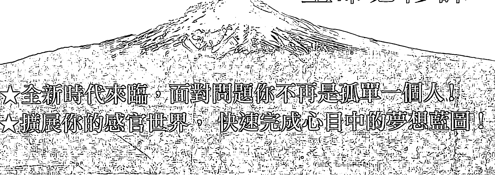

- 全新時代來臨，面對問題你不再是孤單一個人！
- 擴展你的感官世界，快速完成心目中的夢想藍圖！

## St. Royal College
### 天使神秘学院

- ※ 专业占卜预测机构
- ※ 神秘学培训机构
- ※ 水晶能量研究中心
- ※ 神秘学资料库
- ※ 官方淘宝：http://strc.taobao.com
- ※ 读书交流QQ群：
    占星塔罗占卜师交流群：814594478（加入密码：PDF）
    神秘学其他综合群：659338717（加入密码：PDF）

| 项目 | 信息 |
| :--- | :--- |
| **官方淘宝** | http://strc.taobao.com |
| **读书交流QQ群** | **占星塔罗占卜师交流群**：814594478（加入密码：PDF） **神秘学其他综合群**：659338717（加入密码：PDF） |

使用手机淘宝扫一扫，获取更多好书

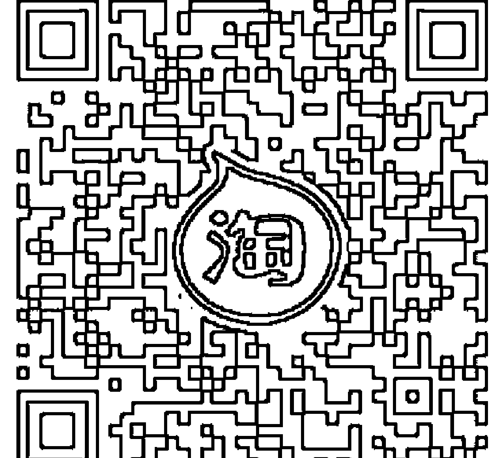

淘宝按店铺名搜索：天使神秘学院

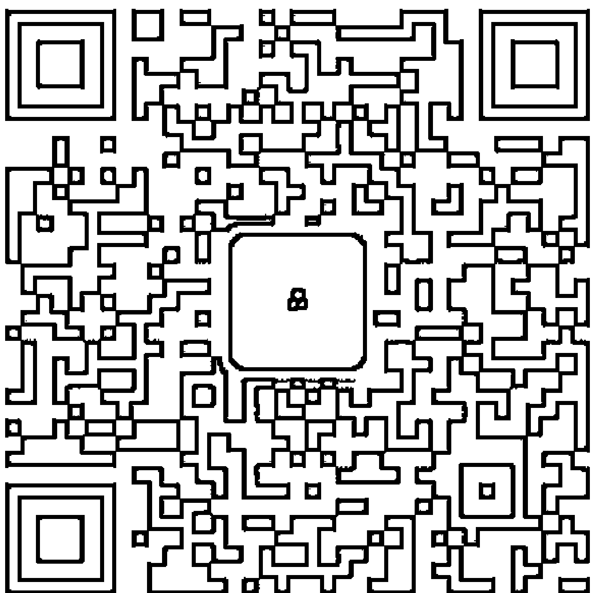

微信公众平台：strc2011

## 制作说明：

本书由《天使神秘学院》出重金从台湾购入的原版书籍扫描制作完成。为达到最好阅读效果，特地把原版书全部切开后，再经由专业扫描设备高精度扫描完成，并经过一张张的PS后期处理最终成书，其间花费大量的人力、物力以及时间，只为能给大家提供经济并优质的神秘学学习资料而努力。

本学院强力谴责某些机构和个人，把本学院花心血制作完成的电子书籍，包装后直接放在自家淘宝网上低价倾销的行为，以谋取不劳而获的经济利益。如果长此以往最终将无人愿意再为大家花心思制作电子书，那以后可能大家再无新书可读。

为让大家以后能够读到更多的好书，也为了本学院的良性发展。本学院恳请大家尽量做到如下几点：

- 一、尽量在本学院的网站购买电子书籍。
- 二、请勿用技术手段把电子书内的水印及加密去掉。
- 三、在收到电子书后小范围传阅即可，千万不要公开传播，更别挂到淘宝网上低价销售。

同时为答谢广大支持者，学院电子书将做如下调整：

- 一、学院会把一些早已收回制作成本的电子书折价销售。
- 二、最新制作的电子书籍会开放打印功能，大家购买后有条件的可自行打印成书。

天使神秘学院
2018 年 1 月

## MY PSYCHIC FRIEND

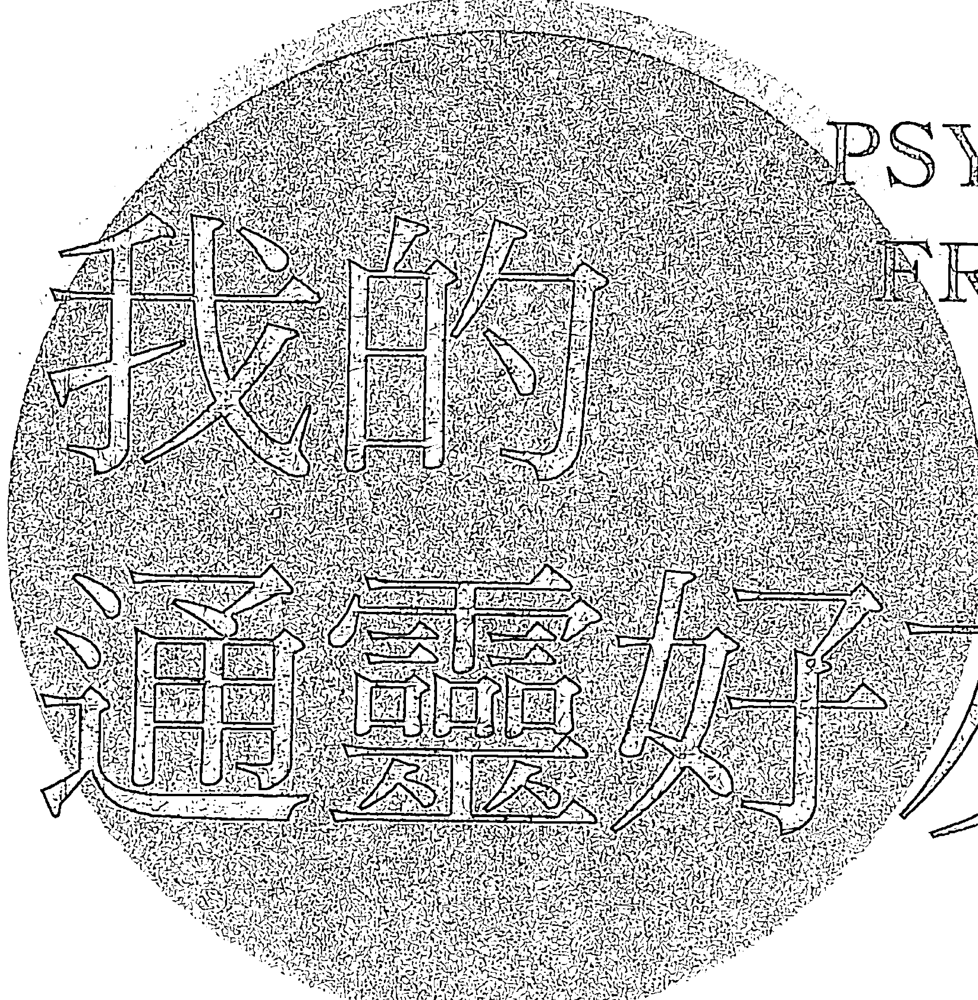

科赫 KOCH —— 著

## 靈魂教我的 24 堂 生命必修课

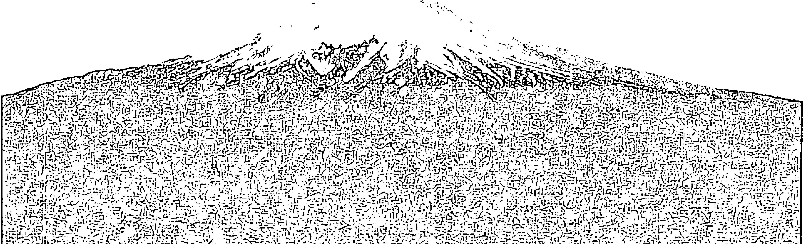

## 目 录

### Ch 1
#### 誕生前的生命藍圖

- 無形牽引 — 出生前基本藍圖
    - ◆ 遇見累世靈魂導師
    - ◆ 隱藏版緣分
- 隱藏生命的潛規則 — 業力
    - ◆ 你相信神嗎？
    - ◆ 記憶深處的遺憾
    - ◆ 多次元重疊
    - ◆ 動物的潛規則

### Ch 2
## 創造財富

- 萬物皆為波動
- 靈魂能夠讓所有的人類都擁有金錢的豐盛
- 你所關注的，將成為你的經驗
- ◆ 靈魂的視角與你不同
- 跟隨靈魂職業
    - 要如何找到自己的靈魂的職業？
- ◆ 相信的力量
    - 臣服宇宙，你將體驗奇蹟
    - 全然相信內在宇宙，你將會體會奇蹟
- ◆ 重要的訊息藏在細節裡
    - 探索內心真正的渴望
- ◆ 成功背後的力量

### Ch 3
#### 關係連結

- 與任何人的關係，都存在著龐大的連結網絡
- 關係永遠是自己的一面鏡子
- 親密關係，重要的是雙方心靈的連接
- ◆ 父母的愛，無法抹滅的印記
- ◆ 家族的連結
- ◆ 關係與金錢的迷思
- ◆ 疾病的迷思

### Ch 4
#### 身體訊息

### 疾病的根源
- ◇ 無意識中的發生
- ◇ 自由的禁錮

### 身體量子場
- ◇ 無解的偏頭痛

### 面對恐懼是療癒關鍵
- ◇ 低能量食物的影響

### 高能源飲食的重要

### Ch 5
#### 超脱生活

- 嬰兒的隱藏訊息
- 萬物一體
- 車的內在想法
- 身體懂得，超乎你的想像
- 萬物都有自己的意識

### Ch 6
#### 開啟天賦

- 生命熱情的初衷
- 真正的名牌是自己
- 網絡暗物質影響
- 全然的感恩狀態
- 年輕是喚醒天賦的最佳時機
- 找回與生俱來的內在感知力

### Ch 7
## 平行宇宙

# 新天使小孩
- 隱藏版天賦
- 活下來的勇氣
- 找到前世的關鍵鑰匙

##### 平行宇宙的真相
- 平行宇宙的創造
- 平行宇宙的交會點
- 全像投射的假象
- 全像投射的原理
- 造物主的軟片
- 愛的全像投射
- 宇宙間次元

# CHAPTER 1
## 诞生前的准备

# Soul
## 重遊於靈魂的湯匙：成為自己人生的廚師

## 无形牵引——出生前基本蓝图

人们尚未投生于浓稠的物质世界时，自己的灵魂便规画了一切，这是人们累世、今世以及未来世的基本人生蓝图，整个三维度的物质世界就像一个大舞台，灵魂来此处是为了演出一场自己自编自演的戏码，从中得到转化与成长。

所有的人生剧本，从灵魂诞生之初，便持续地记录在灵魂的档案库中，称作灵魂档案，灵魂档案是宇宙意识的一种纪录机制，藉由灵魂档案的讯息，人们可以清楚自己的过去，以及即将面对的未来，进而找到自己灵魂的最大渴望，以及人生问题的根源。

一般人都认为时间是直线性的进行，认为过去、现在与未来是呈直线性的发生，实际上，时间是以圆形运作，且都是同时发生，只是由于人们先后经验各种情境，才会创造时间流动的假象。譬如来说，很多人作梦会梦到未来发生的场景，其实此时人们就是在梦中跑到未来的时空中，提早经验未来的情境，也就是事实上未来早已存在于那里。灵魂档案是纪录灵魂累世的庞大资料库，如果你了解宇宙空间的实像，那么你会轻易了解，过去、未来、现在发生在同一点上，有时你会莫名的感受到烦躁、心情低落，明明身体没毛病却精神状况不佳，这就是受到累世或未来世牵引的影响，因为你并未专注于你自己，让你自己全然的处于当下，所以会受到过去及未来的你相对的波动影响。许多人想减肥，却迟迟无法成功，其实关键在于其无法控制「吃」的欲望，有些即使勉强靠意识减了重量，却得花费非常大的力气与意志力，而且若一不注意便会很快复胖，这是因为受到累世业力的影响。在高次元的空间中，过去、现在、未来都是同步发生，因此今生你当下的每个选择，会促使过去与未来的剧本同步变化。

你今生可能是一位身材苗条的人，如何饮食都不会肥胖，但是在饮食中时常选择伤害身体的食物（包含大量酒精、化学食品），累积许多负面的能量于身体中，这些负面能量将转移至你的未来世，让你的未来世产生强烈进食的欲望，让你受到肥胖所苦，这也是许多人如何减重都无法达成目标的道理，因为他们累世的负面能量无法平衡，透过业力法则的作用，负面能量转移到今世中，然而肥胖的情境，也可能是灵魂最高的渴望，祂可能想在不同世体验不同的体型极端。由此可知，灵魂的视角与人们意识所想往往大相径庭。

## case 01
## 遇見累世靈魂導師

每个人累世都有自己的生命导师，然而，再次进行轮回转换时，这些记忆会再度抹灭。当一个人有幸与自己灵魂导师相遇，有时即便两人都遗忘彼此，认不出对方，但只要再度相遇，即是快速开启累世智慧的关键，灵魂同时会获得更高层次的力量与提升，累世导师跟你说一句话的无形智慧能量，更甚于你外在的任何追求与学习。

在纽约生活时，我喜爱自行前往有机超市选择食材进行烹煮，在超市挑选食物的过程中，食物会告诉我它们自身的能量状况，有些蔬菜甚至会告诉我，它们的能量波长与真正的有效期限，菠菜与苹果就是最爱与人互动的几种蔬果。事实上，食物的低波动能量多半来自人工的化学农药与人类情绪能量的残留。那一次当我在热食区准备点杯咖啡时，旁边的沙拉吧却散发非常特殊的高振动能量，我看见今晚盛放沙拉的工作人员曾经是大自然界的精灵，因着他过去对万物的爱，由他手夹过的蔬果都会自动改变频率，甚至让蔬菜拥着光芒，当下让我感到非常敬畏，原来一份巨大爱的力量，连物质都能瞬间进行净化与提升。我带着感恩买了几份沙拉回到家，中，接着一边享用着沙拉，一边阅读今日的新闻时，我看见影剧新闻头条，上头评价着一位知名女演员知名度下降问题，当我仔细地认真阅读这篇报道时，我感受到一股沉重的讯息能量。

她的灵魂让我看见，这位女演员出现的问题，与她的演艺能力毫无关系，事实上，她甚至比以往更努力的卖力演出，但却遭到媒体的抨击。我不解的询问着她的灵魂，她的灵魂散发着白色光源告诉我，她真正的问题源头，是未与过去开启她的生命导师相遇。「她这一生有机会遇到这位导师吗？」我接着询问。

机会，会在两年半后。

她的灵魂让我看见，过去这位女演员曾投胎于泰国，当时的她家境非常富裕，个性霸道跋扈，一直到老年染上瘫痪后，才担忧着死亡后的世界，于是她开始向多位修行智者请益学习，但始终没有人愿意收她当学生，最后只有一位智者愿意无条件的教导她佛法，这位智者就是她这一生的隐藏版导师，在今世，若她与这位导师相遇，她将会开启更高的宇宙思维与天赋。她的灵魂转达，今世她的使命是用更高的宇宙思维来进行表演。

在今世，女演员在年轻时即快速成名，但过去式的个性始终影响着她的记忆，这使得她内心永远有着强烈的不安与空虚感。一旦她与这位导师相遇，将能开启天赋，快速完成她的人生使命。

活在世界上最难得的就是遇见过去世有连结的导师，累世导师能指导生命旅程中的课题，协助开启天赋，进而拥有全新的洞见，让人们在生命的道途上走得更加精采。

# Soul

每一次相遇的缘分都是命中注定©

## case 02 隱藏版緣份

宇宙中没有巧合，人与人之所以相遇、相识都是在累世缘份而形成的现象。

在一次美国万圣节前夕，我接到一位希腊好友的电话，这位朋友叫卢卡。他告诉我，他突然有灵感要带着妻子来纽约观光，道顺与我一同吃饭，当下我立刻答应他的邀约。

我们约在第五大道用餐，当晚卢卡一家人抵达餐厅时，他站在大门口开心的向我挥着手，令我惊讶的是，他的身体能量场竟然十分沉重与灰暗。

在与他们聊天的过程中，同时，我与他的灵魂也进行着沟通，没多久却得到意想不到的答案。

「为何你的身体能量如此低落？」——我诚心向他的灵魂询问着。

道。他的灵魂告我，他回希腊后将经历一场意外，只是身体细胞早已预先知道。我能转达告知你的意识吗？意识不会相信。有什么是我能帮助你的呢？当我问完，他的灵魂停顿许久皆未回应，直到我们彼此用完餐后准备离别前，他的灵魂突然回應告訴我，有只怀表能帮助到卢卡。我愣了一下，对这样的讯息一时之间还有些反应不过来。我该去哪里寻找呢？他的灵魂转达，一切皆已安排好，我只需要留意周围的一切。接着他再也没有回应。几天后，我独自一人走在街上，没多久我自然而然地停在一间欧洲古董艺术品店前，当我抬起头，眼前的画面令我不可置信，一只古典的中古怀表就在我的正前方。我立即走进店内，向老板询问着门口橱窗内的那只怀表。「抱歉那只怀表放太久了，我忘了价格。」一头红棕发的中年男士立即起身走向橱窗确认，与他交谈的过程中，我陆续看见这位老板与好友卢卡曾经在欧洲是师徒的关系，当我清楚这样的缘份后，更加确定这只怀表的重要意义。结帐离去前，老板的灵魂突然请我将店里的名片一并交给他，当下我立即感受到强烈的灵魂喜悦能量，毕竟这是他们两人在这一世再次见面的重要关键。

那次的经验，让我深刻了解人与人之间的缘份非常珍贵，许多会面看似毫无关系，却有着累世灵魂紧密的连结力量，这份珍贵的缘份力量引导着有缘的灵魂在看似巧合的片刻中相遇，任何一次的会面皆如此得来不易，珍惜每一次与任何人的相遇，你将能从中看见更深的隐藏价值。

# Soul

每个当下，都要以全新的视角看待神圣的自己

## 隱藏生命的潛規則——業力

今生许多问题的根源，其实都是未平衡之力所造成，人们往往在不相信与不清楚这份平衡机制的作用下，时常受困于重复的循环模式中，无法看见问题发生的根源。业力法则是宇宙的基本法则，累世造就的因，必然会在今世与未来世收到结果，创造善因，得到善果，创造恶因，则得到恶果，这是业力法则的精髓。业力法则的作用是能量守恒原理的延伸，从你自己发射出的思考、言语与行动，本身就是种能量，而为了达到守恒的基本原理，这些思考、言语与行动所造成的结果，必然会回到你自己身上。举例来说，你今生伤害别人所造成的未平衡能量，必然要在你未来世中得到平衡，这平衡的过程可能是让你受到一样的伤害，或是体验如同伤害般的痛苦情境，这就是业力作用的模式与过程。实际上业力非常中性，仅是能量平衡的一种机制，并无好坏的分别，然而多数人对于业力有着恐惧以及负面的印象，最主要是在业力作用下，会带给人们的强烈的负面感受，使人误以为业力只会造成负面的情境。事实上，无论发生在你周围的事件是如何，是让你感受到喜悦或痛苦，都是业力作用之结果。

了解业力的运作即是宇宙的因果定律，也是过去自己的选择所造成之结果，是走出人生剧本设定的第一步。因此放下批判，不带有批判地看待自己的生命、自己遭遇的事件，也不带有批判地看待他人的生命、他人的遭遇，这样人生将活得更幸福。

宇宙没有任何巧合，多数重大事件的发生，都与个人过往的隐藏记忆有关，东方玄学家将这称作「业力（Karma）」。多数人容易误解业力的涵义，将它视为一种对于自己过去犯错的惩罚，这样的误解导致不敢面对自己的所创造的结果，进而遗忘自己应该为自己的生命负起全然的责任。

## case 03
## 你相信神嗎？

人类的感官耳、鼻、口、触、视觉如果没有进行扩展与觉知，将会受限于某个频率，无法看见宇宙真正的全貌。世界的浩瀚超乎我们的想像，人们如果能放下心智的限制、一切混乱的根源，那么就能替自己的生命带来更多丰盛、爱与慈悲。

曾经一位企业家透过朋友介绍，来纽约找我询问新型态的灵魂营运方式，我们轻松的散步在曼哈顿。朋友忽然问我：「你相信有神吗？」

「当然，我也相信每个人都是神。」

「我们也是神？那神算什么？」

「人类之上有更高的存有，神会用各种方式带领每一个人。」

「我不太相信这种不科学的事情，人的存在就是要推翻这些荒唐的事物，命运是掌握在自己手中。」

我看了这位企业家手上的手表，突然想起他稍早才告诉我，他在理工大学中的成绩非常优异，这种科学理念是他长久的生活方式与成功证明。

我静了静倾听着他的灵魂的声音，虽然我清楚他不会相信，但他的灵魂期望我转达。

「去相信生命背后更高的力量，会让你减少更多冤枉之路。因为当你死亡后，你将看见你生前所做的一切。」

他露出惊讶表情看着我，误以为我在开玩笑。

「你说的如此肯定，但那是死亡之后的事，你要如何证明灵魂真的存在？」

灵魂不需要证明。在圣经记载中，耶稣基督曾说：『相信的人有福了。』

说完的一刹那，我有种如释重负的感觉，因为这是他灵魂想转达的重要讯息。尽管他当下不会相信。

他依然不以为然，指着教堂的圣像。

> 那圣像里面真的有圣灵吗？

> 无论你相不相信，圣灵皆存在，她们的存在是超越你所定义的物质。

> 很抱歉，没有科学根据的事情，我还是无法相信，对我而言不过就是艺术品。

我内心祝福着他有天能听见自己灵魂的声音。

当我们走过教堂时，我突然听见一个声音，我转过头，原来是教堂的守护天使正在向我传递讯息。

> 他的灵魂被自己的心智所束缚，人类目前所能证实到的科学，相对于整个宇宙的浩瀚而言是如此微小。

收到讯息后让我非常惊讶，原来教堂的天使早已听见我们的对话，接着我请他在教堂门口等我一会。当我进到教堂，没多久守护天使再次展现。

> 「我该如何帮助这位企业家的公司呢？」我敬仰的询问着。

> 「他能拥有如此大的天赋，是灵魂为了完成他的使命。当他将更多心力贡献于海洋保护，他的公司将会迈向更高的阶段。总有一天他将会明白自己的演化进展。」

> 「有什么方法能够缩短他看见真相的时间？」

> 「当他愿意以更宽容的心智接受恩典时，就能免于承受许多生命上的波折与挑战。」

这时我彻底领悟人活在世上，若能提早放下眼前的执著，看穿物质背后的真相，将能感受到更高智慧的启发。

# Soul

直视你的灵魂，他将保护着你。

## 多次元重疊

看不见的不一定存在，看见的也不一定是真实。相同的空间同时有无数的次元交叠，如果人们没有觉察，让负面思维盘踞自己内心太久，那么根据同频率相吸引的宇宙法则，很容易就会重叠至较低次元的空间，导致负面想法的堆积。

德斯蒙得与我是多年的朋友，那天他因为事业上的一些瓶颈，约我前往市中心的一间商业大楼进行商业模式的讨论。讨论期间，他手机突然响起，当他接起手机的瞬间，我立刻感受到电话另一头传来的低波动能源。

德斯蒙得聊了几分钟，挂下手机后，原本充满血色的面容，突然变得苍白起来，他感到有些疲累，从公事包中取出一瓶维他命，服下了几颗。我能感受德斯蒙得的身体波动快速的下降，于是我关心的询问。「我很好奇，刚是谁打来的？」「刚刚是我的一个客户，最近在商讨一个新的合作案。」「合作案顺利吗？」「不太顺利，这也是我今天找你讨论的原因之一。」「刚在你们谈话的过程中，我看见负面能量传递到你身上，让你身体有些疲惫。」「是啊！最近时常如此，是怎么回事？」

我很想告诉德斯蒙得这个合作案可能不适合他的公司，但我清楚他当下可能无法接受，毕竟这个合作案已经商讨将近几年的时间，因此我选择沉默，静待最佳的时机。

隔了几天，德斯蒙得突然打电话给我，语气充满焦虑：『我的父亲不知为何今天突然晕倒，现在正在加护病房中，平常他都很健朗，怎么突然发生这种事？』我静了一下，端倪德斯蒙得的父亲昏迷背后的隐藏讯息，接着我看见他的父亲的身旁依附着一个负能量的灵体，立即清楚事情的缘由。

你的父亲身边目前依附着负能量的灵体，让他的身体机能暂时性的降低，使他进入昏迷的状态。

怎么会有负能量的灵体会依附在我的父亲身上呢？

这个灵体与你公司的合作案有关，这也是我之前一直提醒你的，现在长期下来，让你的身体的能量场变得混浊，甚至影响你的父亲，才会吸引负能量的灵体靠近。

朋友聽完非常震撼，他很難想像電話也會傳遞不同空間的能量，事實上，人類在思言行的同時，能量隨之流動，雖無法看見，卻一直不斷地發生，當負面能量聚集於身體時，就容易吸引負能量的靈體，進而產生空間相互重疊的現象，此時必須盡快淨化身體的能量場，脫離負能量的靈體所造成身體不適的問題，一旦依附時間過長，低波動的影響將會加劇，隨而代之的是侵蝕你的情緒與讓你迷失自我。

# Soul

### 尋舊物，訪故人，世外世界的靈魂與肉身。

## case 05
記憶深處的遺憾

曾經我前往英國旅遊時，與英國好友前往一間充滿印度風味的餐廳，當我進到店內時，我的眼睛為之一亮，我感受到整間店有著印度古老的時光記憶。

我與英國好友入座後，印度裔的服務員身著傳統印度服飾，向我們介紹店內的印度餐點。

英國好友望著菜單，突然我看見他的靈魂感到十分興奮與喜悅，瞬間一些畫面在我的眼前快速翻轉。

原來這位英國好友累世曾待過印度，那一世他是一位茶農，專門從事茶葉的栽種，也曾實驗將許多茶種混和一起，創造不一樣風味的茶品，然而，那一世他一直無法找到去除茶苦澀味的配比元素，所以一直鬱鬱寡歡，最終遺憾地離開。

今天這間印度餐廳菜單上的印度拉茶，茶與牛奶的混合比例，正完美契合這位朋友那一世尋求的味道，因此他的靈魂才會如此心曠神怡。

然而，英國好友看著菜單，完全沒注意印度拉茶，他無法感受自己靈魂的渴望。

「你們兩位要喝點什麼？」店員熱心的詢問著。

「一瓶可樂。」朋友回覆著。

「你一定要試試印度拉茶！我的助理曾經泡給我喝過，真是糟糕透頂，從此我告訴自己我絕對不再喝下那恐怖的印度茶。」說完，他拿出財經報紙觀看，想結束這段對話。

「相信我，喝完你會喜歡的。」為了幫助他，我快速向店員點著適合他能量的印度拉茶與食物。

服務員很快將印度拉茶端上桌，朋友端起來聞了一下，皺著眉頭勉為其難的輕輕啜飲一口，喝下去的那一口，他的臉色瞬間有了改變。「我的老天，這味道太棒了！」喝完後，我突然心情有著無法言喻的喜悅！」我看著他露出從未有過的驚豔表情，讓我突然感嘆，現代許多人的生活處在精神極度緊繃的狀態，常感到躊躇不安，長期下來，將與自己的靈魂分離，逐漸感受不到自己靈魂真正的渴望，隨之而來的就是更多的負面的情緒，感受不到一絲的快樂，唯有放下更多自我意識的偏見，才能更快尋找到自己的靈魂願望。

## case 06
動物的潛規則

萬物都在追求無條件之愛、尊重與包容的感受。目前養寵物的人越來越多，每一隻寵物，即便品種相同也有截然不同的個性，他們都有屬於自己的靈魂，如果想讓寵物活得開心，身為寵物的主人應該以理解與愛去了解自己的寵物真實的個性，而並非用自己喜歡的方式去對待動物。亞伯是位環境工程公司的主管，有次他邀請我前往一場動物慈善晚宴，當晚我們相談甚歡，不久他公司的另一位夥伴珍妮佛向前與我們打了招呼。珍妮佛開心的向我們介紹了她的愛犬奧蘭多，牠是非常美麗的白色貴賓，她細心地將奧蘭多抱進一台嬰兒推車裡，沒多久亞伯立刻伸手摸著牠的頭，此時我聽見奧蘭多的靈魂微微發出氣憤填膺的聲響。

我靜下心來，好奇的詢問奧蘭多的靈魂：「發生了什麼事，讓你感到憤怒呢？」

奧蘭多告訴我：「請不要沒經過我的同意，任意用手撫摸我的毛髮。」

我對於奧蘭多傳遞的訊息感到驚訝，我在內心詢問著牠的靈魂：「剛剛亞伯這樣摸你，讓你感到不舒服嗎？」

我不喜歡他隨意摸我的方式，我感覺沒受到尊重。

奧蘭多的語言非常直接，我頓時明白，小狗與人一樣都必須被尊重，因為牠們都有著自己的靈魂，其實無論是房屋、土地、動物、植物都有自己的意識思維，不能因為眼眸無法瞥見，就無視牠們真實的感受。

房屋與土地、土地與動物、動物與植物、動物與人類等，無論何種物質之間，都存在一道無形的界線，而這塊隱形類似冰山的界線，其實只是最基本的愛與尊重。

## 萬物皆為波動

一般物質其實都是兼具粒子性與波動性，也就是說，看似靜止不動的物質，都具備著波動，只是我們肉眼看不見，像是食、衣、住、行、育、樂，任何的事物都存在波動，同理可得，自然界發生的一切現象，也與波動性息息相關，意旨都是匯集波動能量所產生的效應。人的心靈、意志與思想所創造的現象也是種波動，有人說心理會影響生理，其實就是這個道理，因為不好的思維創造低頻率的波動，導致身體的波動受到影響，造成疾病與情緒不穩。波動的頻率高低，不僅影響健康，也影響一個人周遭的任何事物，包括財富、家庭、事業……也就是說，如果人們的身體波動頻率非常低，可能會造成事業不順、貧窮以及家庭破碎等。

高頻率的波動會帶來感到幸福的事物，低頻率的波動會帶來悲劇與痛苦經驗，這是宇宙的法則，也是人人都應該知道的知識。因此，我們應該多在乎自己的食、衣、住、行、育以及樂的任何事物，因為這些事物的波動頻率高低，直接影響人們的身體以及命運。當然，除了生物以外，我們認知的無生物，像是水，其實都具備波動性，這些物質也具備某種程度的意識，更重要的是人們的意識的波動會影響周遭任何事物的波動，像是人們想用工具生產良好的產品，就要非常細心並且愛護的使用，最後一定會產生良好的產品，但是，如果人們隨便的使用工具，工具常常無法發揮其正常的功能。這種類似的事情，在生活中，時時刻刻都在發生，絕非巧合，而是人們透過意識波動傳達能量給物質，物質產生反應而已。波動在日常生活中的證據像是有時候人們不必開口，就可感受到對方對自己的好感，這就是身體波動產生的共鳴，此外，看到偉人，即使人們不知道他是偉人，也會感到敬畏，看到流氓，即使對方什麼都沒做，也會感到害怕，這些也都是意識的波動所產生的情況。萬物皆為波動是宇宙的真理與事實，許多宗教所提到的「聖地」，其實就是具備高頻率能量的場所，通常能隔絕外在不良的能量進入，在這些場所內，往往會發生許多奇蹟，像是在「聖地」中，食物不會腐壞、東西不會生鏽、人類的想法變得清晰或是年紀變得年輕等。如：埃及的金字塔、英國巨石陣等，因為其特殊的時空次元，讓該區域聚集高頻率波動。

# CHAPTER 2

## 創造財富

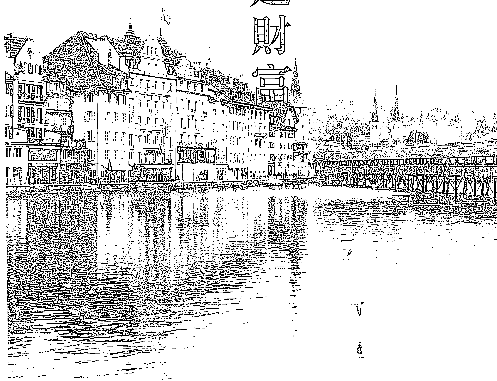

## 灵魂能够让所有的人类都拥有金钱的丰盛

灵魂能够让所有的人类都拥有金钱的丰盛，端看你是否有足够做梦的勇气与信念，许多大企业家的成功，也都是从宇宙所给予的灵感中获得视野与智慧。这些人之所以能够预见他人无法察觉的情势做出正确的判断，能拥有更创新的点子与想法，都归功于宇宙智慧的恩赐，因此透过宇宙的力量，你永远会得到比你想象中的更多更多。许多人认为获得富裕的生活，需要不停地努力，且善用自己的大脑，去思考如何致富的对策，然而事实上，如果人们能够透过净化内在，重新与宇宙智慧连接，唤起内在的最高力量，便能接受到奇迹式的灵感与解决问题的捷径，快速达成梦想中的目标。

### 你所關注的，將成為你的經驗

思維是創造一切萬物的根本，世界上每一種物質，都是我們某個思維的具體表現。我們每個人都是能發起思維的思想中心，當一個人將思維與實際的生活經驗，有意識的結合時，就能改變過往靈魂創造的一切。

靈魂的創造力量會藉由感恩、愛、喜悅、平靜等特質而更加強大，你的內心越喜悅與平靜、越充滿感恩與愛，靈魂越會與你意識結合，當下你將利用更高次元的靈感，去執行偉大的創造。

一切的創造都始自於你的思維，再透過吸引力法則實現在你的生活中。

如果你運用想像力，讓心相佈滿你渴望的事物和情境，同時你的內心維持在平靜、信任、愛與感恩，則你創造性的想像力，會將這些美好的事物與情境，吸引到你真實的生活中。這聽起來像是某種不可能的魔法，但想像力與吸引力法則的運用，絕對比你想的更深奧與豐富。富裕的思維能將財富的能量吸引過來，再透過有效率地執行，才能真正將財富物質化，進而體驗創造財富的過程。

### 灵魂的视角与你不同

无论从事何种行业，宇宙都会把机会放在周围，但受到外在人事的挑拨与分化，人们往往被扯入重重迷障中，越陷越深而不自觉，只有那些肯努力尝试改变的人，才能真正地找到成功的契机，并且把握当下的机会。

今日正午，我漫步在曼哈顿，途中经过一间房地产公司，当我准备离开时，看见一名销售员站在门口贴著房屋出售的传单。在炙热的阳光下，这名年轻人穿著闷热的长袖衬衫，十分认真的工作，当我走过他身旁时，突然听见他灵魂的呼救，这让我停下脚步，决定跟他寒暄几句。

「请问一下，你们的房子最近好卖吗？」我指著贴满传单的玻璃墙。「噢，说真的，真是糟透了！」「我没想到这名年轻人竟然如此诚实。

「此時他的靈魂非常急迫的請我轉達一些重要的訊息，我順著緣分問聊下去。」

「你想不想知道增加售屋的業績的方法？」

「當然想啊！你有什麼高見嗎？」

「有個方法能幫助你，如果你想增加售屋的業績，最重要的就是去清理廁所。」

「清理廁所？」

「是的。」

「為什麼清理廁所與銷售房屋有關？」

「當你清理廁所時，將會獲得房屋給予你的財富能量。」

「清理廁所真的有用嗎？」

「當你抱持感恩的心去清理廁所時，你馬上就會有不一樣的成果。」

「接下來我又傳達一些年輕人的靈魂想傳達的訊息，離別時他誠摯地感謝，還向我要了联系方式，几星期后，我收到他的邮件，信里他告诉我，他的人生发生了非常大的巨变，他每天努力清理着每间房子的厕所，即便他有时会觉得精疲力竭，但他依然坚持著，接著奇迹就发生了。他竟然幸运地售出一间价值超过两百万美金的豪宅，这让他感到不可思议，因为他不敢相信这种好事会发生在自己身上，从此他会感恩自己拥有的一切。

当你开始运用灵魂的视角过生活，他能带领你看见更细微的真相，而这些真相往往是改变你的一生的重大关键，懂得与自己的灵魂沟通，学会用更高的爱与同理心看待事情，你将体验不可思议的奇蹟。

# Soul

### 金恩知识服务有限公司公告一

### 跟隨靈魂職業

每個靈魂都擁有特定的職業，是為了讓我們的生命創造更大的價值｜利用天賦影響人類、提升他人的靈魂。

追隨我們的靈魂職業，會讓我們生命充滿力量，時時刻刻擁有熱情與喜悅，這份無窮的創造力，會產生至高的頻率讓我們自然而然讓富饒的物質生活便會隨之而來。

活在地球的人們，一生大半的日子，都在職業中度過，他們從事這些職業多是為了生活，鮮少是為了滿足靈魂的渴望，因此很難在職業中找到熱情與希望，也很難創造出自己生命的真正價值。人們總是為了肉體生存而拼命工作，卻不是為了靈魂成長而努力創造。

每個人其實在出生前，就已經安排自己的靈魂的職業，如果能跟隨靈魂的渴望，就能清楚自己應該完成的使命，以及靈魂想要完成的課題，靈魂的職業往往不是時代趨勢，但人們多半追求集體意識認同的職業，這也造成許多人在不適合自己的職業下過了大半輩子。

#### 要如何找到自己的靈魂的職業？

- 第一，發掘自己的天賦，每個人與生俱來都擁有某種天賦，有些人對音樂很敏感，有些人對運動很擅長，無論你擁有何種天賦，天賦的存在必然與你的靈魂職業相關。

- 第二，找到自己的熱情與興趣，當人們在從事靈魂職業時，通常都是充滿熱情與活力，從事這份職業存在著主動性，認為這份職業非常有趣，自己從事起來也非常有成就感。

- 第三，觀察自己過去累積的能力與工具，有些人在從事靈魂職業前，靈魂會安排學習許多技能，讓你能在從事靈魂職業時，很快進入狀況，譬如說你的靈魂職業是電腦軟體設計，那麼你可能就會從電腦資訊相關的大學畢業。

以上三點是初步判斷靈魂的職業方式，每個人的靈魂的職業有很大的差異，有些人的靈魂職業容易觀察，有些人靈魂職業的卻很難找到，不管如何，當你找到靈魂職業時，你的人生將不再只是為了生存而工作，而是為了靈魂更偉大的目標而創造。

生命的力量来自於相信實現的力量。

## case 08

### 相信的力量

> 著我好奇的詢問：「你是否擁有信仰？」

「我是一名無神論者，但我的父母都是虔誠的基督徒，小時候我曾經相信上帝的存在，但大學期間，我的初戀女友認為執著於信仰太過荒謬，我因女友的幾度嘲笑而不再前往教堂，最後我連父母送我的十字架項鍊也取下，並開始厭惡關於信仰這件事。

羅伯特敘說著他們故事，他的靈魂卻讓我對看見一對閃爍著光芒的翅膀，接著

> 「我的積蓄快用完了，如果無法得到這份工作，不僅繳不出房租，連下一餐都會有問題，而我又沒有臉回去拜託我的父母。」

羅伯特與我在高科技展覽上認識，當時他對自己毫無信心，他告訴我他剛被一家電子公司資遣，找了幾個月的工作，現在是一家物流公司行銷企劃的候選人，但候選人有幾百位。

在羅伯特敘說完後，我閉上眼仔細檢視著他的過往，我看見他曾經在其他次元是位天使，來到地球是擁有著更高的使命，但因著他人的批判而選擇遺忘。

「過去你是位天使。」我知道這麼說會非常突兀，但我希望喚醒他的熟睡記憶。

「你在跟我開玩笑嗎？世界上根本沒有天使！」羅伯特馬上反駁。

「你的靈魂要我告訴你，你必須相信內在的靈魂聲音，也必須相信更高層的力量。」

我話沒說完，他立即打斷：「如果靈魂能夠幫助我，那我為何還會遇到如此多的困境？」

「人生的過程是你過去一連串選擇的結果，它只是依循宇宙因果律的運作，但不代表著你靈魂的真正價值。」

「告訴我，我該如何做？」羅伯特似乎開始有些深層的感受。

「花點時間靜下心來，傾聽靈魂的聲音，並且依照靈魂的指示行動。」我繼續說著，「行銷企劃非常適合你，如果你能拋開所有腦中的負面思想，並相信靈魂的安排，那麼你必然會得到這份工作。」

那天之後，羅伯特依循靈魂的指示行動，很快獲得一些靈感，他立即取出紙筆寫下自己在應徵這份工作上的優勢——他擁有行銷碩士的學歷，在物流的領域也有許多人脈，他能更有效率地企劃公司想傳達的理念。他將所有的靈感一一條列式的列出，並且系統性的整理。

隔天一早，羅伯特接到進入第二階段面試的通知，直至走進面試的房間前，他都一直遵循靈魂的指示行動，結果他前一天靈感寫下的企劃，讓面試官們眼睛一亮，在面試結束前，就歡迎他加入他們的公司。

下一次與我見面時，羅伯特整個人完全不同，全身散發出魅力與自信，他告訴我：「我相信自己的靈魂是具有力量的，就從我相信的那一天開始，我的生命就跟著蛻變。」儘管他擁有如此成就，他卻不驕傲，因為他清楚這些都是靈魂給他的能力，他只想好好發揮這樣的能力，幫助更多需要幫助的人。

### 臣服宇宙，你將體驗奇蹟

灵感有时是一瞬间的想法，仅仅片刻便可以创造奇迹，这份灵感来自你灵魂深处的智慧。我们应该遵循我们灵感行事，即使有些灵感似乎在当下看似不合理，但学习信任并臣服于你的灵魂给予你的灵感，最终你将发现所有事情都会得到解决。

如果善用灵魂给予的灵感创造财富，则可以大幅减少创造财富的时间，因为灵感能成就的事物，永远超乎你的想象。

跟随自我的灵魂并臣服于大自然的宇宙法则运作，为创造财富之根本，同时你必须了解宇宙中所制定的游戏规则，并且有效地利用游戏规则，创造自己的财富。

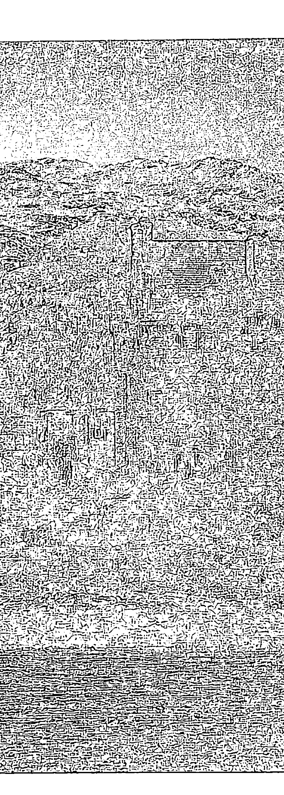

宇宙之中沒有巧合與例外，我們誕生於地球這個物質世界中，宇宙法則的運作如同超級電腦的運算，它無比的精準與精細，當你開始臣服宇宙更浩瀚的背後力量，你便不必擔心自己的思維、言語與行動是否有效，你也不會懷疑它是否真的會透過你的經驗展現出來，因為你清楚宇宙會用更有效率的方式完成你心中的夢想。

# Soul

我會給你宇宙的力量，甚至在宇宙完全了解宇宙之前，了解自己的靈魂就擁有宇宙的力量。

### 全然相信內在宇宙，你將會體會奇蹟

很多時候人們想藉由自己的大腦去開創美好未來，然而大部分的人無法有效地控制自己的大腦，因此在努力達成理想的同時，會產生許多負面的思維、言語與行動，反而造成負面能量的累積，但是如果人們跟隨著靈感，就是走上全然正面的道路上，執行奇蹟似的創造，不僅能夠清除所有問題，也能開創最有價值的人生。

當你開始善用靈感創造財富，可以大幅減少埋頭努力的時間，因為靈感能成就的事物，永遠超乎你的想像。

我的一位朋友是位頂端科技的企業老闆，他經營公司的方式不同於一般企業，他從不事前規劃任何事情，他告訴我，他往往憑藉著一瞬間的靈感決定許多事物，事實上，這些靈感來自於他的內在宇宙。信任內在宇宙的企業家，還有一個不一樣的地方，他們不把任何企業當作敵人，他們了解萬物一體的概念，清楚任何企業都是合作的夥伴，即使是公司利益受損，他們不會怪咎其他企業，而是將責任歸咎於自己內在的狀態，因為他們深知最大的進步往往來自向內的探尋。我們誕生於地球這個物質世界中，宇宙法則的運作如同超級電腦的運算，始終如一且永恆不變，當你臣服更高的內在運作法則，你便不必擔心自己的思維、言語與行動是否有效，這對於你創造財富的信心非常重要，因為宇宙法則沒有例外，如果你專注內在宇宙給予你的靈感，就能體驗奇蹟般的富裕。

# Soul

相信自己的靈魂，就會擁有財富、健康與平靜。

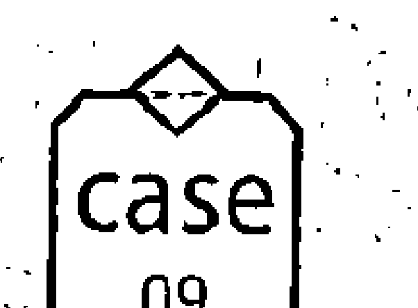

### 重要的訊息藏在細節裡

身體的健康程度是靈魂波動的反應，而心理情緒的狀況則是靈魂脈動的縮影。人們總以為疾病是突然的發生，實際上疾病是人們無意識中惡性循環所累積的結果。人們在無意識的狀態下，傳遞出破壞身體的訊息，這些訊息具有強大的破壞力及擴散作用，就如同對身體無聲無息的暴力行為。

事實上，身體也擁有某種程度的意識形態，它也會感受痛苦與悲傷，然而它會無怨無悔的付出，直到有一天它再也承受不住，如果我們能時常對身體感恩與懺悔，就是與身體重新建立好的關係，它自然會加速自己的修復，讓我們免於疾病的痛苦。

有一天，我前往一間連鎖超市採買，突然聽見一位朋友靈魂的深層呼喚，他是一名物理治療師，名叫鮑伯。我立即取出手機，打電話給鮑伯。

> 「鮑伯，你在忙嗎？」

> 「是的，目前我還有患者，待會再回你電話。」

> 「等一下，給我三十秒就好。」

> 「好的，有什麼事情嗎？」

> 「今天看診時，務必提高警覺，有一位患者身體內的負面能量較多，會讓你感到窒礙難受，小心不要跌倒。」

掛下電話後，我內心重重的吁了一口氣，祈禱鮑伯能度過這次的難關。

翌日，我接到鮑伯的回電。

> 「非常感謝你昨日的提醒，下午真的來了一名患者，他掛完號後，我的頭開始劇烈疼痛，在替他治療的過程，我頭暈到身體失去平衡，差一點跌倒。」

> 「還好你有提前告訴我，讓我有心理準備，不過為什麼會這樣？」

> 「許多人的身體長期處於負磁場的狀態，但卻不曾發現，當發現時，身體的健康狀況通常已非常嚴重，就像車子的引擎，沒有定期保養與檢查，一直等到出現問題，才知道已經受損非常嚴重。」

「人的身體如同車子的引擎，當有一點小細節出問題，就必須進行調整，將問題一條例式整理出來，並且有效率地解決，才不會讓問題漸漸擴大，萬事萬物都應該從小細節開始。」

# Soul

## 要成功，先開自己的靈魂做朋友。

## 探索內心真正的渴望

外在的世界每分每秒充斥著百萬元的感官資訊，許多外界的資訊充斥著巨大的恐懼與匱乏能量，當你去接收這些資訊時，這些匱乏的集體意識將讓你與宇宙的財富能源分離，並悄悄進入你的潛意識中，在不知不覺中改變你的意識思維。這讓多數人都莫名活在擔憂未來與悔恨過去的情境之下。

現今大多數的人擁有了金錢，卻無法真正的喜悅與滿足，反之被金錢操控與綑綁，當你不斷抗拒內心的聲音，整日盤算著如何擁有更好的物質生活，你所看到的都將是不足與匱乏，你厭惡你的工作、你抱怨你的房子、你不滿意你現在的名利與成就，或是恐懼著自己不配擁有金錢，你認為擁有過多的金錢是罪惡、是傲慢，因此你內心恐懼擁有更多的金錢。

當你渴望擁有金錢，但內心深處卻非常厭惡金錢，這將會讓你處在一個矛盾的吸引力當中，無法真正地得到富裕。對於金錢的恐懼往往延伸至對父母親愛的渴望，當人們曾經體驗過痛苦的家庭或感情狀況時，如童年的忽視、家暴、惡意的言語傷害等，在長期嚴重缺乏父母親愛的感受下，對於家庭會產生強烈的不安感，這會造成恐懼能量持續地積累，在潛意識的作用下，最後可能演變成對於金錢的恐懼，讓人們在金錢與事業上產生許多的問題。

我的一位朋友就是最好的案例，他是一家美國科技公司的工程師，旁人都認為他應該非常有錢，但其實他無法將財富留住，賺得金錢總會因為許多狀況而漸流失，甚至還負債累累。

有一次，他被負債壓的快承受不住了，便來尋求我的幫助，他告訴他他不知道為什麼每天都過得非常痛苦。

「你認為快樂是什麼？」

「我想還清我的負債，一切重新開始，我想就會快樂。」

「還清負債之後，你真的會快樂嗎？」

他思考許久回答：「我不知道。」

「即使天使幫你還清負債你也不會快樂的，你甚至可能更痛苦。」

「什麼意思？」他非常納悶地看著我。

「如果你的心看到的是痛苦，即使你還清了債務，你還是覺得不滿足，那是因為你內心真正渴望的是父母的愛，這才是你對於金錢匱乏的真正原因。」

他聽完我的答覆，當場產生強烈共鳴，他告訴我，前往美國成為一名工程師，其實並非他所渴望，而是出於他父親的意願，從小他母親就去世，父親對他很嚴苛，而他內心深處為了得到父親的愛，做了許多的努力，卻依然無法被父親肯定，他努力賺錢想證明自己非常有能力，以此來獲得父親的關注與贊同。

「你的價值是由自己的靈魂決定，你父親的靈魂已經看到你的努力，你已經做得很好。」

在與他對話的過程中，他母親的靈魂也來到現場，礙於他的意識無法理解，我請他閉上眼睛，要他全心的進入深層放鬆的狀態，他在多次放鬆後，他開始能感受到母親要傳達給他的愛，這份愛的能源將清除他潛意識中一直以來的恐懼與不安根源。每個人只要療癒潛意識中的過往記憶，財富上的問題狀況將會完全改變，因為所有外在一切的問題，皆是潛意識的種種投射。

在他開始療癒個人潛意識後，金錢的負債問題，奇蹟似的在兩個月內解決了，他告訴我，過去他未被採用的計劃突然受到公司的重用，這讓他得到一筆可觀的財富，並一併還清了債務，但我知道更大的改變並非來自他外在的財務狀況，而是他的內心已經連結著宇宙的智慧力量。

# Soul

## 最富有的人，值得我翻遍全世界的秘密。

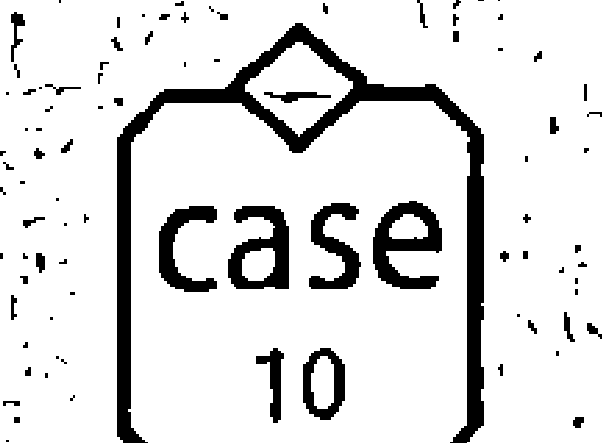

## 成功背後的力量

物質世界中的成功，其實背後隱藏的法則是愛的法則，社會上眾多知名人物，他們看似「成功」的經驗不過是表象，藏在背後交織的是眾多靈魂累積的愛。

有些人的成功主因是來自他的原生家庭長時間累積愛的能量，這份「愛的能量」將在未來成就某位家族成員；有些人的成功則是因為提拔他的貴人擁有了愛的品德，並將這份能量給了下屬。要清楚越是成功的人更應該抱持著謙卑的心，因為真正造就一個人的成功，絕對不僅是一個人的力量。

布倫丹是一間實驗器材製造商的董事長，一日布倫丹的妻子與我相約一間餐廳用餐。用餐的過程中，她提到自己多年來心中的遺憾。

「我的丈夫能力傑出，從創立公司至今，公司一直以來的營運狀況都在持續成長，遺憾的是，我的身體狀況時好時壞，無法一直陪伴在他的身邊，一起打拼事業。」

我看見布倫丹的妻子談論布倫丹的同時，我看見布倫丹的靈魂出現在現場，祂讓畫面閃爍地非常快速，我看見的影像內容轉述給布倫丹的妻子：「夫人，您先生在事業上的成功，其實與他能力沒有關係。」

她好奇地回答我：「怎麼說？」

「布倫丹之所以事業成功，是因為家族背後的『財富能量』，過去的祖父母、父母曾從事多年的慈善事業，累積一定『財富能量』，這樣的『財富能量』現在都乘載於他的身上。」

「所以布倫丹必須更加謙卑與感恩，花費更多時間與心力幫助更多真正需要幫助的人。」

聽見我的建言，布倫丹的妻子露出了然於心的表情。「你是對的，如你所言，我的丈夫在經營事業上，受到許多人的提拔與肯定。」

「我感覺他受到上帝的特別眷顧，無論經營何種事業，都沒有遇到太大的挫折，且都得到不錯的成就。」

「謝謝，我會謹記在心，時常提醒我的丈夫，讓他一定要謙虛，並且時常抱持著感恩的心。」

由布倫丹的故事，我們可以明白世俗定義的成功與真正靈魂渴望的成功大相逕庭，一個人要在社會上擁有財富與地位，往往倚靠的不單只是自己的力量，而是整個家族，甚至整個國家的力量。

# CHAPTER 3

## 关系连结

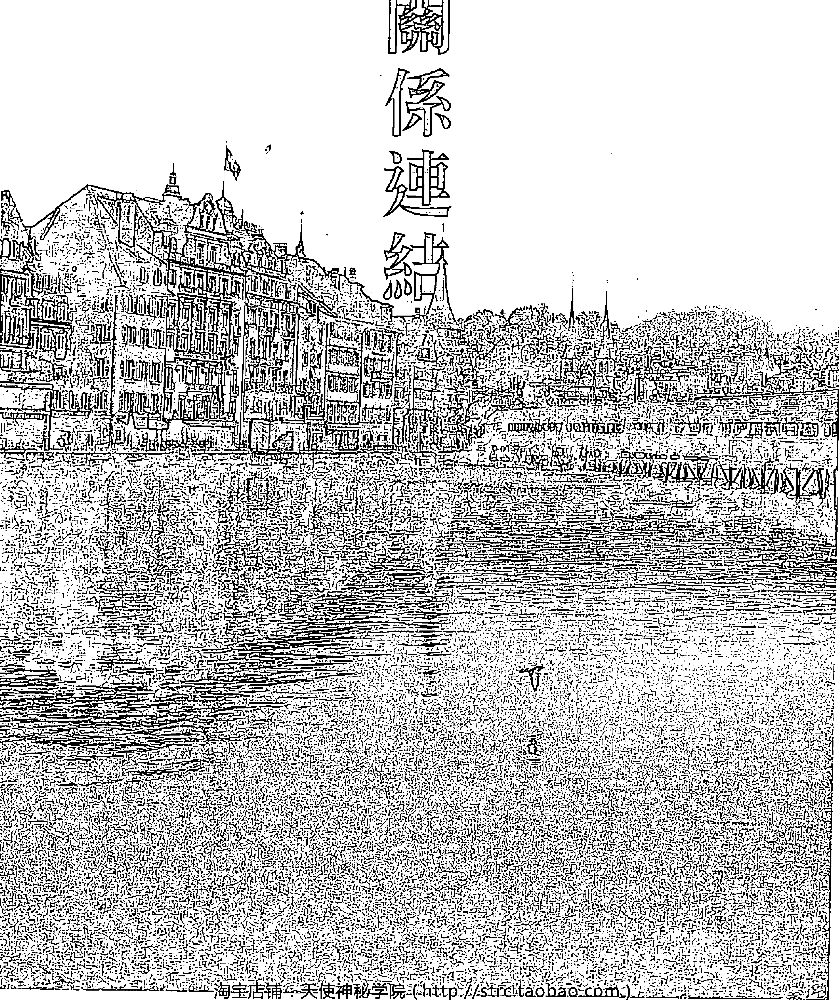

> > 靈魂的高度是品德智慧與真理的累積。

### 與任何人的關係，都存在著龐大的連結網絡

許多人不了解宇宙間的縝密運作，所以在從事任何行為時，時常以自我為中心，殊不知人與人之間都存在一條無形的網絡，當你如何對待他人，最後這股能量都會在某個未來時間回到自己身上。這條無形的能量網絡，在我們的生活中，無時無刻都在作用著，我們的念頭、情緒、想法等，都會產生獨特的能量頻率，這些能量會立即的輸送到網絡中，並且無止盡的尋找相似的頻率，一旦發現相似的頻率出現，就會彼此吸引，形成更巨大的能量體。這一切的思想、行為與經驗形成的能量體，都全部記載在你的潛意識中。

人類的大腦一天至少產生超過六萬多個不同的想法與念頭，不同的念頭與想法會具有不同的能量與頻率，當一個人的念頭傳輸到網絡中，與另外一個人的念頭頻率相似時，這兩人就有可能吸引而相遇。當我們思考時，就好像是敲響音叉，它不停地震動，擁有特定的音頻，此時與它頻率相符的音叉也會同時開始震動，同樣頻率的震動會堆疊與聚集再一起，形成更大的波動。

每個人自身每分每秒都在發出各種不同頻率的震動，一旦遇到與自己的頻率相同的人時，你們之間就會有著無形的引力相靠近。因此世界上所有與你相遇的人都並非偶然，所有的關係都起因於彼此能量的相同頻率，因此造就兩個能量層面相似的生命彼此吸引。

當一個人的內心相信著正向思考的力量，並時常傳遞出正向與積極的語言，他的網絡場自然而然會擁有高頻率的振動能量，他的生活中自然會聚集正面狀態的人，久而久之便能吸引正面的事物進入自己的人生，然而相反地，當一個人內心時常處於負面思維中，持續傳遞負面能量時，此時網絡場會將負面能量傳遞出去，並在無形中吸引到負面的人事物。

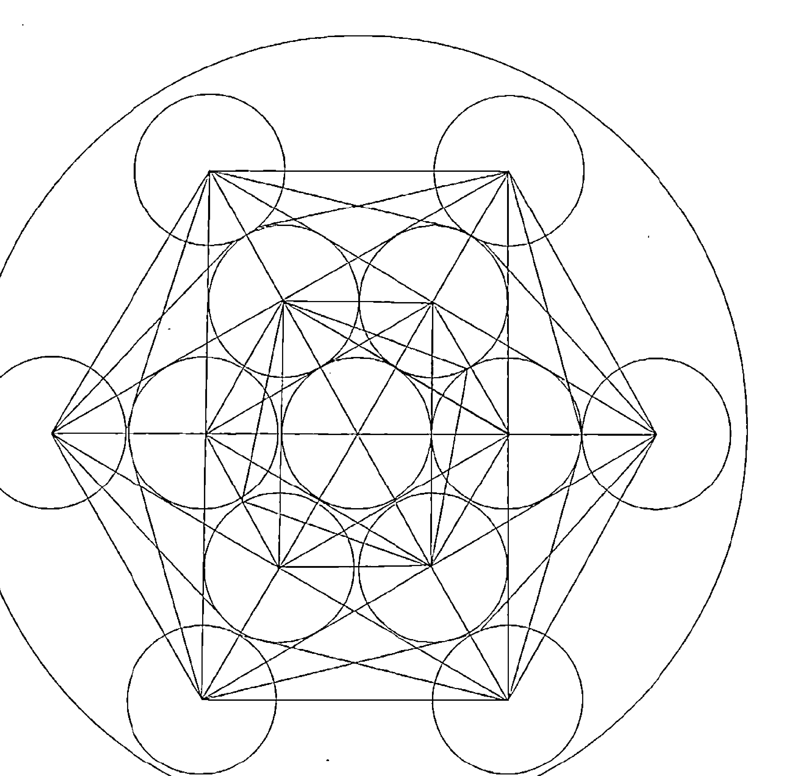

# Soul

### 塔罗牌占卜师奥秘·关于牌面的直觉解读

◦

### 關係永遠是自己的一面鏡子

在愛情中，許多人往往因為恐懼失去與改變原本安穩的關係，而無法為自己做最正確的選擇，因此我們不停試圖的規劃一條理想的道路，想盡一切辦法去讓一切皆在我們掌控之中，然而真實是，生命永遠無法掌控，也永遠超乎我們的想像。

多數人將關係的成功與關係延續時間的長短畫上等號，然而這是兩件不同的事，你們認為關係的成功意味著必須恆久的堅守一段愛情，即便那段愛情已經扭曲甚至不那麼完美，大多數的人寧可沉溺在一段痛苦壓抑的關係中，僅為了一個看似安全的保障。

關係的長遠，並非意味著關係的成功，若想擁有真正美滿的關係，並非是執著於一段關係能夠維持多久，也並非從這段關係中獲得什麼滿足，最重要的是建立雙方長久的內在交流模式。

### 親密關係，重要的是雙方心靈的連接

在關係中，你可以看到過去曾有的思維與重複經驗，甚至是未來的思維與想法，切記吸引至自己身邊的一切事物，都與自己密切相關，都與自己有著某部分的連結，若是認出這個連結，便能當下釋放這段關係中的負面能量，使這段關係能夠更和諧與圓滿。無論關係讓你感到痛苦、悲傷抑或喜悅，關係的存在都有更深刻的意涵—透過觀察自己的關係，以及關係中的自己，可以反射出自己目前的狀態得以看見自己的過去、未來以及一切有關自己的真相。

真正的根源，往往隐藏在背后的心意脉络中，但人们总是被外在的勾肩遮眼。

### 父母的愛，無法抹滅的印記

case 11

很多朋友問我如何建立完美的關係？其實只要彼此願意輕鬆開手，雙方的靈魂就能獲得真正的自由，不再帶有牽掛與煩憂，也只有願意放下，靈魂才能在獲得悸動之後重新甦醒。

過去我曾在紐約的一間醫院看見一對父女慢慢地從大門走進來，女兒攙扶著父親，父親年紀大約八十多歲，頭髮斑白，臉上布滿歲月的皺紋。

這時我瞥見父親的靈魂劇本，他的生命蠟燭即將消耗殆盡，而他內心最擔憂的則是女兒的婚姻，一心冀望替女兒找到託付終身的伴侶。

女兒十分注重個人的自由與隱私，她認為一個人也可以活得十分自在、幸福。但父親無法理解這樣的思維，他對女兒充滿著牽掛，這樣的牽掛讓他無法安心地放下這段關係，前往下一段的生命旅程。

父親的靈魂總是在心中吶喊：「女兒，擁有一個伴侶，絕對比孤單一人來得幸福。」

女兒的靈魂也總是冷靜的回應：「放心！我一個人可以活得很好。」

突然我看見一個重疊的畫面。

父親與女兒的靈魂僵持不下，原來女兒有一世曾是父親的親生母親，那一世父親是自己的兒子，兒子雙腳殘疾，無法遠行，所以母親一直陪在兒子身邊，鼓勵他、協助他，直到兒子重新找到自己的自信。就當兒子找到自己的自信時，母親因罹患惡疾，生命走到盡頭，母親的內心依然放不下兒子，擔憂兒子身旁沒有可託付終身的伴侶。

兩人彼此複雜的牽絆，延續到今世，如今兩人的角色互換，兒子成為父親，一心牽掛著女兒的終生幸福。生命的循環充滿細膩與驚奇，累世的任何思維與情感，將會在今世不斷地重複顯現，人們就在這樣的生命洪流中，反覆著共同的課題。放下親情的牽掛極為困難，因為這是長久內心深刻的印記，這份印記，是父母與子女之間難以抹滅的情感，以及累世愛的包袱。

# Soul

> > 每个人都能超越自己，最重要的是真实面对自己的感情。

## case 12
### 家族的連結

身體上疾病的根源，很多時候超乎腦袋的認知，疾病只是一個浮現的徵狀，但在這個現象的背後，卻是由各種不同複雜的因素所組成。

病徵通常都由難以覺察的潛意識訊息開始，最後演變成嚴重的疾病，即便是同一種病徵，表現在不同人身上，可能有截然不同的原因，而這些訊息的傳遞來源，最常來自家族成員。事實上，家人與家人間存在某種緊密，卻無形的關係網絡，透過家族網絡，互相傳遞正面以及負面的訊息。

曾經，我的一位朋友著急來電，他告訴我，他的眼睛昨晚就開始異常的腫脹。突然我看見朋友的靈魂與他的父親的靈魂有著一條微妙的能量連接。

「你父親最近身體是不是有些狀況？——我將我看見的畫面告訴她。」

「我不清楚，但他要照顧整個家族，應該是十分勞累。」

「妳的父親昨晚眼睛同時也有著不適的現象。」

「難道我父親眼睛不舒服？所以我的眼睛也會不舒服？」

「是的，父母與自己的孩子之間都存在著家族的連結。」

朋友聽我敘述完，先掛了電話，立即打電話關心父親，她的父親在電話中提到最近自己眼睛確實十分疲累，準備明早前往市區的醫院進行檢查。

朋友對於與父親同時產生眼睛的問題，感到不可思議，他立即又打了電話給我。

「我父親真的眼睛不舒服，我要怎麼辦？」

「我建議妳購買一些對眼睛有益的天然食品，寄給你的父親。」

朋友立即依循我的建議行動，傍晚我與她見面時，她眼睛已經明亮許多。

「這真是太神奇了，我沒想過原來我身體上的問題，居然與我的父親有關係。」

「這是當然的，因為妳身上有一半的DNA來自父親，另一半的DNA來自母親，當父親的精子與母親的卵子結合的一瞬間，妳的生命才誕生，所以許多身體層面的問題都與家人有關。」

「但有一點我不明白，為什麼不是我的母親與我有連接，而是我的父親呢？」

「因為多數女性身體的波動與父親較有連結，多數男性的身體波動則與母親較有連結。」

「這就是家族課題的輪迴遊戲規則。」

「為什麼？」

「我的老天，原來真的是這樣。」

人與人之間皆有一條隱形的網絡線，這條網絡線讓人們緊密的交織在一起，使人們在無形之中受到彼此能量的影響，這影響將不受時間、空間的限制。 而其中影響最深的就是來自自己的原生家族，當與原生家族的連結越緊密，受到原生家族能量場影響就越強，有時病痛甚至可能同步表現現在兩個家族成員的身體上。 因此，有時情緒莫名低落、身體上無故的疾病，其實與你本身並無關係，而是受到原生家族的影響。

### 靈魂擁有人類象智能。

Saul

### 關係與金錢的迷思

許多人內心充斥著恐懼，恐懼失去愛，所以在許多時刻會無意識的付出很多「金錢」以便換取他人的愛與陪伴，我們時常把金錢與愛劃上等號，以為愛著對方，就是要給他最好的物質享受，這其實是人類心中對於愛與自我的不信任，想滿足對方全方位的需求，進而留住對方。

這是一種出於有條件的愛，有條件的愛無法得到滿足，因為彼此都在強烈的需求之中，在得與得不到之間拉扯，以下有一個很好的例子。

一位在戀愛中迷失的男士，他在金錢與愛情中迷失。這位男士與女友交往三年，幾個月前他向女友求婚，女友也願意嫁給他，當下他感覺終於對女友負起了責任，但是訂婚後，他們的關係開始有了很大的轉變，原因是女友突然喜歡購買許多昂貴的名品，從此他的薪水幾乎全花在女友的開銷上，這讓他越來越無法接受，他們也因為價值觀不同時常吵架，但是他因為疼惜女友，最終還是會順著她，但他心裡很想知道到底如何達到彼此關係的平衡。

從這位男士的靈魂檔案中，我看見他與未婚妻的問題源頭，來自他跟父親的拉扯關係，他們之間存在未解決的過往問題，讓他在準備結婚時，投射出金錢的困境。我告訴這位男士，必須先處理自己與父親的拉扯關係，當關係平緩後，感情問題將會有奇蹟式的改變。這位男士最終與父親重修舊好，同時也與女友建立內心更緊密的連結。

# Soul

當靈魂的聲音被掩蓋，取而代之的是一種扭曲的混亂。

## case 14

### 疾病的迷思

大多數女性的婦科疾病，多與今世或過去世曾經墮胎的訊息有關，墮胎的行為，無論是女方或男方，都會在他們的潛意識與靈魂中留下訊息。

若是墮胎發生於今世，女性日後的身體會容易有婦科疾病，而男性則是在中年或晚年以後出現事業上的問題；若是發生在過去世，女性今世會比原定計畫中多生一個孩子，並在生產中感受到強烈的悲傷感與自責，男性今世的面容則會比較其貌不揚，以下是个真實案例。

我的好友丹娜，是个標準的女性主義者，但是其實在她堅強的外表下，存在許多脆弱的一面，當跟丹娜閑聊時，我就感受到她的愛情關係以及健康有很大的問題。後來有一次丹娜告訴我，她覺得自己的人生很悲慘，雖然擁有成功的事業，但是生活卻過得非常不幸福，她曾離婚三次，近期還被診斷出子宮有腫瘤。

在聽著丹娜敘說的同時，她的靈魂卻告訴我：「她並不清楚，累世的自己曾經在感情上過於自私，對生命不尊重，墮胎許多，因此這些訊息依然存在於體內，導致婦科的疾病。」

我將靈魂的訊息完全地轉達給丹娜，她嚇了一大跳，因為她沒有將墮胎的事告訴其他人，我告訴她，所有我們累世曾經的思考、言語與行動，都會完整地記錄在我們的靈魂檔案上，而身邊發生的任何問題，多數也是過去自己的思考、言語與行動負責，這樣才能更快突破問題的盲點。

# CHAPTER 4

## 大运河

## Saul

灵魂的源头是完美，是和平，是纯净

### 疾病的根源

疾病的根源猶如洋蔥的心，一層一層的剝開，才可能看見它的真面目，唯有真正看見那洋蔥的心，你才可能真正明白，原來疾病的根源跟你想法截然不同，是如此深層而不容易覺察。

宇宙中所發生的任何事件都有其本末，事情發生皆有跡可循，疾病的根源也是如此，只要我們知道前因後果，就能避免疾病的發生。疾病的根源來自過去的負面情緒、意識、思維等，它的本質是複雜卻亂中有序，當我們了解疾病的本質後，我們將會開始重視自己的思維與情緒，包含生命整體性的審視，而非只對單一病徵做局部性的治療。

事實上，人生的問題與疾病的產生，都起因於相同的真理，皆根本於能量的振動，如果我們靜下心來闔眼、冥想，我們將感受靈魂的能量本源，它本是大自然的本質，早已存在你我的生活之中，身體狀況是內心能量的寫照，而情緒則是靈魂的振動投影。

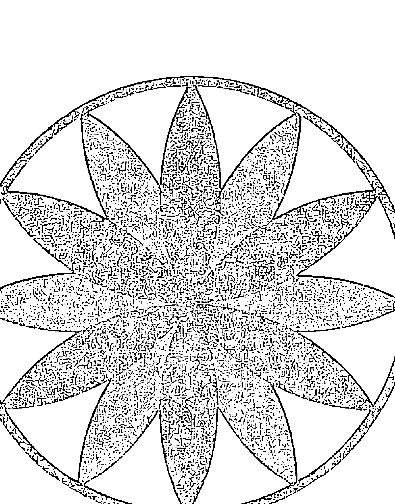

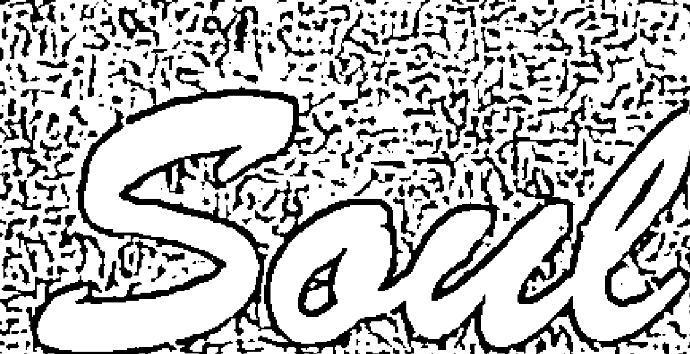

### 怎样对待自己的情绪？嫉妒别人或被别人嫉妒时，你该怎么对待？

## case 15

### 无意识中的发生

人们认为疾病是无警的发生，实际上疾病是人们在无意识中恶性习惯所累积之结果，在恶性习惯下，人们的思考、言语与行动变得负面，这种无意识的负面循环，长久下来就会让人们产生疾病。

过去有位贸易商人，他的身体状况非常糟糕，由于长期的压力，使得他罹患严重的心血管疾病，心脏常常莫名绞痛，甚至痛得喘不过气。

我观察这位商人的灵魂档案，此时灵魂的讯息显示——「他的意识根本不想活。」

我很纳闷，便再询问他的灵魂是什么原因？

他的灵魂提醒：「大量饮用酒精时，就是宣示自己不在乎身体的状态。」

很多人其實都在無意識的狀態下，傳遞出破壞身體的訊息，這些訊息具有強大的破壞力以及擴散作用，會在未來創造出疾病的因果循環，因此很多時候，疾病都是我們自己所創造。很多人譴責暴力與虐待，然而他們不清楚，忽視自己的身體的同時，就是對自己無聲的暴力行為。

我看過許多罹患重病的朋友，他們的靈魂都傳遞給我一個共同的訊息：「他們的意識根本不珍惜身體。」然而，這些朋友的意識多數依舊選擇忽視自己身體的狀態，因此他們很難從重病中痊癒。

如果我們承諾疼惜自己的身體，如同疼惜自己的家人與伴侶，並且疼惜自己活著的每分每秒，則自己的人生即將得到重大的改變。

# 文檔標題

一些描述性文本。

- Wang
- Carol
- Paul
- John

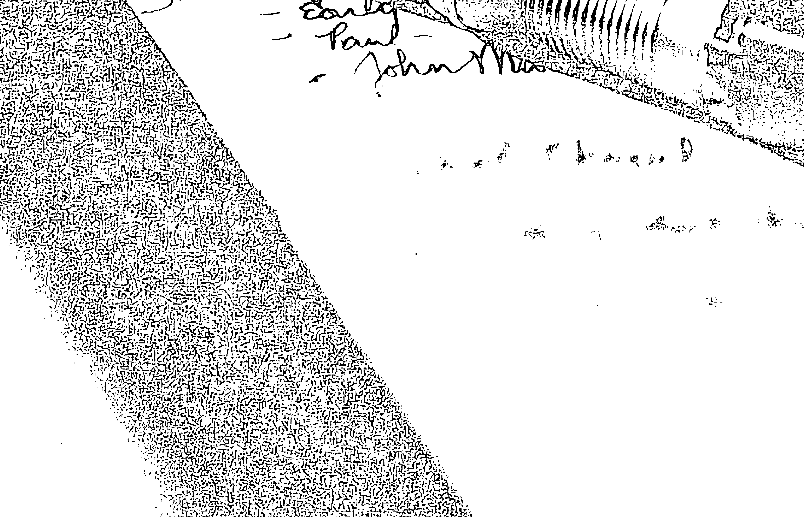

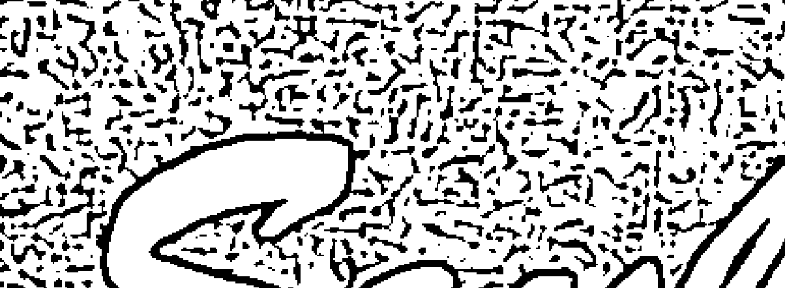

神赋予你真爱时，那就是给你最大的恩典。

## case 16

### 自由的禁錮

寇蒂斯是三個孩子的父親，小兒子出生後不久，他開始感到關節的疼痛，必須服用止痛藥才能正常地行走，最後甚至需要嗎啡等藥物，不到幾個月的時間，他辭掉了公車司機的工作，因為他的四肢協調性，已經無法安全地駕駛公車。

寇蒂斯也覺察自己的個性完全改變，變得固執與敏感，經常因為一些小事與妻子發生爭吵。他也不清楚為什麼自己的關節的疼痛一直無法根治，許多醫師都認為那是一種關節炎，需要長期服用消炎藥物，有些醫師甚至認為他的關節沒問題，問題出於內心的躁鬱，是躁鬱引起的假象疼痛。寇蒂斯不認為這是假的疼痛，因為疼痛感確實一直存在，「負面記憶」——佔據醫師的想法，這讓他他又與妻子大吵一架，兩人的感情逐漸出現裂痕。持續地痛苦讓寇蒂斯感到自卑，覺得自己是一個沒用的男人，沒能力自理自己的生活，甚至有時候痛到無法拿起餐具用餐，家庭的重擔全部移到妻子身上，妻子覺得非常不公平，認為寇蒂斯根本放棄了這個家庭，最終決定與他離婚。

寇蒂斯知道自己必須振作起來，他還必須照顧三個孩子，以及處理婚姻訴訟的一堆問題，這些壓力壓得他喘不過氣，好幾次都想結束自己的生命，但是他知道自己不能拋棄三個孩子。

寇蒂斯找上我的時候，精神已經近乎崩潰，妻子確定離開了他，三個孩子失去美滿的家庭，他也已經不清楚，到底是關節的問題，還是心理的問題，他感到腦袋一團亂，找不到自己活著的價值與意義。我傾聽寇蒂斯靈魂的敘說，他的靈魂告訴我他的身體已被「負面記憶」佔據且堆積得非常嚴重，那些都是他前幾世身為一名軍官所造成的結果，那一世他是一位專門研究酷刑的軍官，除了研發酷刑的工具外，還有影響神經的毒氣，在戰爭的過程中，傷害了許多無辜的生命。我沒將寇蒂斯過去的記憶告訴他，因為這對他只是更加的傷害，我只將他的靈魂告訴我的方法轉敘，就是必須遠離嗎啡等藥物，改用某些天然藥草取代，飲食部分也必須依照靈魂指定的食譜調理。幾個月的時間，寇蒂斯的狀況逐漸好轉，他的關節恢復正常，個性也變得正面與陽光，不僅找回原本的工作，也有更多的時間陪伴三個孩子。

# Soul

# 灵魂觉醒与宇宙法则

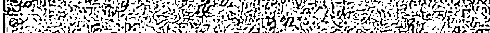

### 身體量子場

身體量子場是什麼？簡單來說，就是我們身體每分每秒振動之下，所形成之能量場，它直接影響人們身體、心靈的健康狀態。當人們的身體能量場遭受破壞，能量失去平衡，身體量子場呈現低頻率的振動時，就會吸引負面的事物，來到人們的人生中。負面的事物分成有形以及無形層面，有形層面就是吸引許多讓你身體產生疾病的細菌或是病毒，而無形層面像是吸引一些低頻率的特殊靈魂，在這些特殊靈魂影響下，人們在身體上也會產生許多病痛。

一般情況下，在大環境中，若時常閱讀或談論令人恐懼的事物時，會造成身體量子場產生破洞，且破洞會形成負面的循環，若沒有及時地修補身體量子場，人們的身體就會越來越虛弱，最後導致疾病的問題，或是讓人們的性格、行為模式出现问题，甚至让负面的记忆重新启动，进而影响人们的生活。我们的身体其实是更高层次的创造工具，它能够每分每秒自然的运转且维持在稳定的状态，过滤死亡细胞以及排出身体毒素，这是现今科学无法模仿与比拟的。我们能够拥有如此神圣的身体，应该时时保持感恩，即便是在我们罹患疾病的时候，因为对灵魂而言，疾病的产生其实是一种沟通方式，灵魂运用疾病传递讯息给人们，告诉人们正偏离了爱的途路。然而人们总是在生病时，处在悲愤不平的状态，不仅没有感恩身体无条件的奉献，这些负面的思维反而让身体更加崩坏与痛苦。当我们回到感恩与忏悔的状态时，便能开启内在的自愈力，为身体注入全新的能量，提高身体的免疫力以及机能，减少疾病的产生。当人们忘了身体的浩瀚性，便不懂得珍惜自己的身体，进而不停地损害、摧残、虐待自己的身体，事实上，身体也拥有某种程度的意识形态，它也会感受痛苦與悲傷，然而它會無怨無悔的為你奉獻，直到有一天它再也承受不住為止，如果我們能時常感恩與懺悔，就是與身體的意識重新建立好的連接，它自然會加速自己的修復，讓我們免於疾病的痛苦。

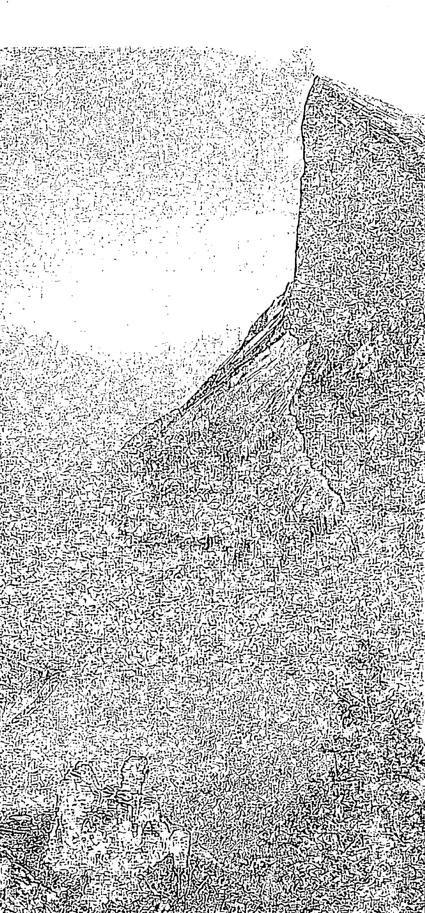

# Soul

當你願意相信奇蹟的時候，身體會給予你奇蹟的意向。

淘宝店铺：天使神秘学院（http://strc.taobao.com）

# Soul

管你的惰性難得平靜
就是健康的無上保障◎

## case 17

### 無解的偏頭痛

戴克斯特從小就為偏頭痛的問題困擾，他很清晰記得第一次感到頭痛的經歷，那是在一個艷陽高照的午後，他與母親在公園中散步，突然太陽穴附近開始劇烈的疼痛，且快速擴散至整個頭部。
從那次事件後，戴克斯特常會感到偏頭痛，他給自己找尋舒緩頭痛的方式，就是戴上耳機輕聽音樂，讓整個人放鬆下來。有時候疼痛感非常劇烈，甚至會令他無法站立，隨著年紀的增長，偏頭痛的問題頻繁地發生在夜晚的時間，因此他不喜歡夜晚出門，他還注意到自己搭大眾交通工具，也可能引發頭痛，為此他為自己買了一輛車。
戴克斯特以為他已經完全控制偏頭痛的問題，卻沒想到為此事情與交往五年克劳地姬无法忍受戴克斯特总是戴著耳机听音乐，无法专心听她说话。
「我感觉我们面对面，却在两个不同的世界，你一直沉浸在你的音乐世界中。」克劳地姬说。
克劳地姬也无法体会为何戴克斯特晚上总是不跟他出去参加一些朋友的聚餐或派对。尽管戴克斯特解释因为夜晚会让他头痛问题加剧，但克劳地姬依旧无法理解他的苦衷，故常常自己一人与朋友出去，再传讯息给戴克斯特，提到餐厅的餐点是多么美味，或是派对的气氛是多么浪漫，这些讯息总是惹怒戴克斯特，更使他的头痛爆裂。
虽然戴克斯特长期服用药物，却感受不到任何作用。他开始寻求其他的方法，买了几本健康方面的书籍，想要改变自己的生活习惯，但都没有一个方法能够确实解决长期头痛的问题。

戴克斯特找上我時，說話有氣無力，又有點緊張，他強調自己是偷偷來的，如果讓女朋友克勞地亞知道，她一定又會生氣，認為他花費太多經費與時間在無意義的治療上，克勞地亞甚至告訴戴克斯特，他的偏頭痛都是自己的幻想，只是想讓自己獲得更多的照顧與憐憫。
我傳達戴克斯特靈魂的述說，他的靈魂的第一句話是：「放心！你不是幻想，你確實有頭痛問題，我百分之百向你肯定。」
聽完這句話後，戴克斯特心情放鬆許多，我接著轉敘他靈魂的訊息：「頭痛問題是一種靈魂檔案的設定，當這個靈魂檔案啟動後，負面記憶」就會像是電流般快速穿梭於腦部的神經中，造成偏頭痛的問題。
戴克斯特進一步詢問為什麼會有這樣的設定，我告訴他：「每個人一出生細胞中都存在某種設定，這些設定的目的，是靈魂想藉由這種方式，在你的人生旅途中，提醒你某些事情。」

晚上，就是在提醒你不要夜晚出門，因為會發生某些意外。聽我這麼一說，戴克斯特突然有些懂了。

> 「那頭痛問題到底該如何解決呢？」

他問。我告訴他：

> 「其實很簡單！就是依循你靈魂的指示。」

戴克斯特的靈魂為他的身體提出真正有效的改善方式，其中主要是關於飲食上的改善，他的靈魂請他遵循靈魂食譜。

幾星期後，我收到戴克斯特來信，他告訴我他的頭痛真正的消失，他很驚訝竟然只要用最天然的飲食方式，就能解決自己長期以來的頭痛問題。

# Soul

> 當你願意相信自己的身體，身體會賦予你神奇的自癒力。

### 面對恐懼是療癒關鍵

人們在罹患重大疾病時，往往不敢面對自己的病痛以及內心狀態，然而唯有當我們勇敢正視與面對疾病與內心狀態的同時，才可能讓疾病得到真正地療癒。除了誠實面對自己的疾病與內在狀態外，臣服於內在的自癒力，也是疾病是否能夠痊癒的關鍵，因為當你臣服於這股內在的靈魂力量時，你就是選擇運用祂，祂才能幫助你解決疾病的問題。

疾病無法痊癒有許多原因，其中一個最重要的原因就是你是否真正地相信與臣服，當你運用極大感恩與祝福向身體宣示你的決心，宇宙會接收到你的決心，身體將創造出奇蹟療癒。

如果想在生命中療癒自己或別人時，必須全然地信任靈魂的自癒力，感恩祂能改變你的人生，相信祂將在最完美的時刻為你創造奇蹟，並對於自己的靈魂、周遭事物抱持著完美的祝福。這份堅毅的祝福，將是開啟真正療癒大門的關鍵鑰匙。

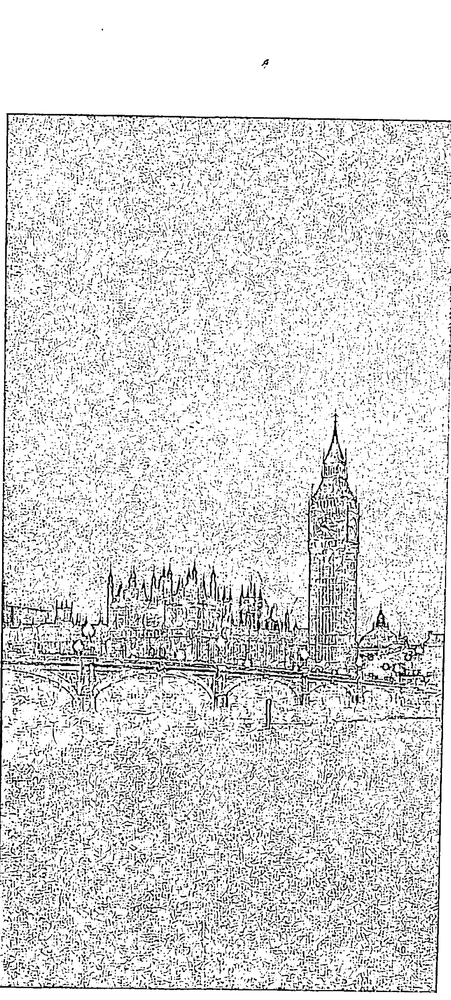

## case 18

### 低能量食物的影响

使用天然无污染的食物极为重要，它不仅影响着人们身体疾病，也长期影响着人类的情绪反应。

在一次的夏天，我与好友我前往一间知名的冰品店，店前大排长龙，朋友正想过去排队，我制止了他。

「怎么了？」朋友疑惑地看向我。

「这间冰品店的员工与水质、配料的能量都是负频率。」

「但这间店才刚开幕！」他依旧不死心地反驳着。

「旁边的那间果汁店能量才是正频率。」

这时我将眼眸移向不远处的另一間優格飲品店。
但那間果汁店看起來十分老舊，你確定嗎？
你過去就知道了。
朋友帶著好奇的心，跟著我一同走了過去，果汁店的店員充滿著正波動能量，一看見我們，便非常細心的開始為我們推薦。
「兩位今天決定好要喝些什麼？」
「兩杯蘋果汁，謝謝。」 再確認完所有果汁能量後，我向店員回覆。
「剛剛那間冰品店也有賣蘋果汁，而且看起來設備比較乾淨，為什麼不選擇那間？」
「即便都是蘋果汁，但是兩家的能量卻截然不同。」
「不同能量真的有差嗎？」

我停頓了一下，看著他的靈魂準備好讓他知道更細部的真實狀況。

> > 「你的靈魂轉達，當你選擇使用低能量的冰品，未來你的事業將有嚴重糾紛。」

朋友聽完嚇了一跳，他告訴我，前幾日公司才剛授權他處理一件重大工程案件，這讓他壓力十分巨大。

> > 「放心，那位店員曾經是位天使，他所製作過的果汁擁有著天使愛的能量，這將為你的事業帶來穩定與平衡的能量。」

朋友立即拿起果汁喝下一口，表情散發著高波動的光芒。

> > 「真是太神奇了！原來飲食與生活有如此緊密的關係。」

每個當下的選擇必須十分謹慎，尤其是選擇自己的食物。一份看似平凡無奇的食物，如果靜下來延伸思考，就會發現食物背後隱藏的複雜關係網絡。

份擁有的能量的負面能源的食物，儘管食材完全相同，料理方式完全相同，使用後對身體的影響卻大相逕庭，當人們使用愛的能量的食物時，身體將能獲得更高的能源。

事實上，從食材種植時接收的陽光、呼吸的空氣、吸收的土壤品質，到販售者的理念、料理人的感受…等，這所有綜合的環節加總一起，才能創造一道完整的高能源的食物。選擇以『愛』為能源組成的食物，是未來人們必須重視的課題，因為唯有這樣的食物，才能讓人們身心靈健康的成長。

其實任何物質只要充滿愛的能源，就能帶來更高的效應，愛與感恩的能源是改變生命的關鍵。

### 高能源飲食的重要

飲食方式直接影響我們的身體能量結晶，優良且高能源的飲食方式，能夠促使身體維持在一定的能量結晶狀態，然而現今的人們天天都在不良的飲食習慣中度過，長期使用化學添加物、防腐劑、人工色素等，使得身體呈現低結晶的狀態，自然容易罹患各種疾病。良好的飲食方式對於身體而言非常重要，但是一般人只享受短暫的美味，卻忽視低能源的不良食物，逐漸地毀壞他們的身體。

水與油品是兩大飲食的關鍵元素，因此飲食中的水與油品的好壞，將顯著影響身體的能量結晶，長期使用好水與好油，將加速新陳代謝，排出身體的毒素，讓身體維持在高結晶狀態，相反地，長期使用不良的水與油品，身體的結晶將非常混濁，因而容易引起各種病痛。

我們能夠運用一些大方向判別食物、水與油品的能源狀態，越接近自然生產的食物、水與油品，就越具備高能源的狀態，譬如說天然生產的食物、來自高山的泉水或是天然方式製造的油品等，相反地，越偏離自然生產的食物、水與油品，能源的狀態也越混濁，像是添加化學添加物的食品、遭受汙染的水源以及化學製造的油品等，另一方面，透過各種模式讓食物、水與油偏離自然狀態，也會降低其能源狀態，像是照射輻射、微波、化學加工、油炸等，這些方式會破壞食物、水與油品原本的高能源組成，使分子失去原本的活性，長期使用這些食物、水與油，將對身體造成嚴重的負擔。

謹慎選擇食物、水與油非常重要，人們往往忽視自己的飲食方式，等到身體出現各種疾病之後，才會重新檢討飲食的重要，然而這必須付出更大的努力與調整，才能將身體的狀態恢復到高結晶狀態，如果從現在起重視自己的飲食方式，則我們就是有意識地提升自己的身體結晶狀態，而不是無意識地讓身體崩壞。

# CHAPTER 5

## 超自然生活

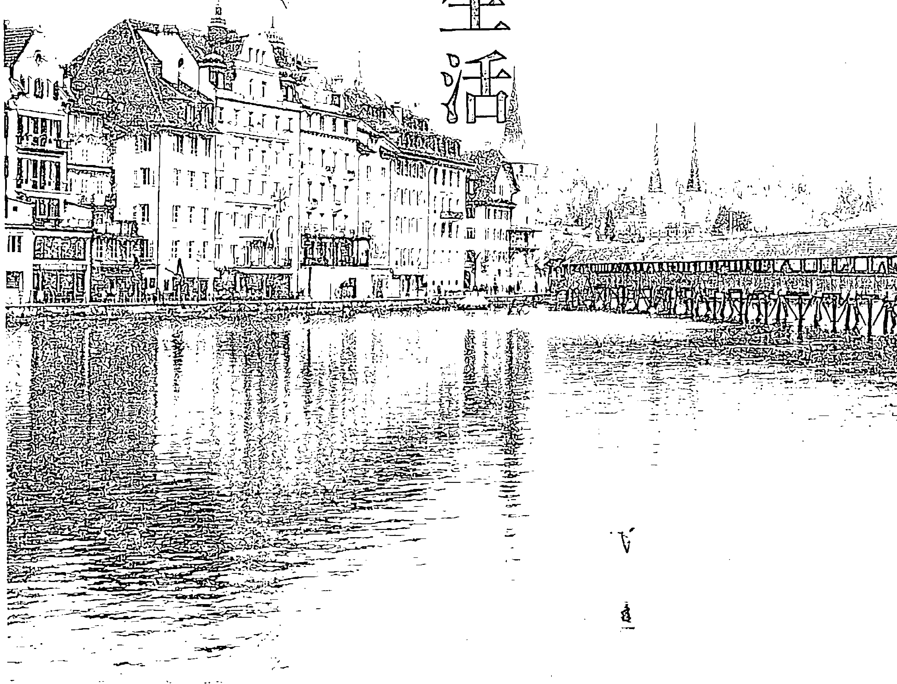

### 用色彩的感情力量表达整个世界就是完整美。

# 萬物都有自己的意識

能量是萬物的一切，是開始與結束。

萬物都是振動的，只是用肉眼無法看見。振動的同時，會產生能量波，是種能量的表現方式，因此，萬物都具備某種程度的能量。

能量就是一切，它是萬物的本質，它沒有好，也沒有壞，它是宇宙運作的基本元素；它可以是一粒沙，也可以是整個宇宙，它無所不在。

以量子力學來說，能量以粒子與波動的方式呈現，具有二元性；我們若將物質逐一分解，可以發現所有的物質都是以粒子與波動的形式存在。

萬物在原子世界中，不是靜態的堆積重疊，而是不斷繞著原子核的運動，不停地振動。萬物可以用粒子的形態讓肉眼看見，但是振動的模式，一般人無法用肉眼看見。
萬物的運作模式與我們的大腦所想的截然不同，它們甚至在向人類發出提醒。事實上，這種警訊很多時候能提前預知未來的發生。

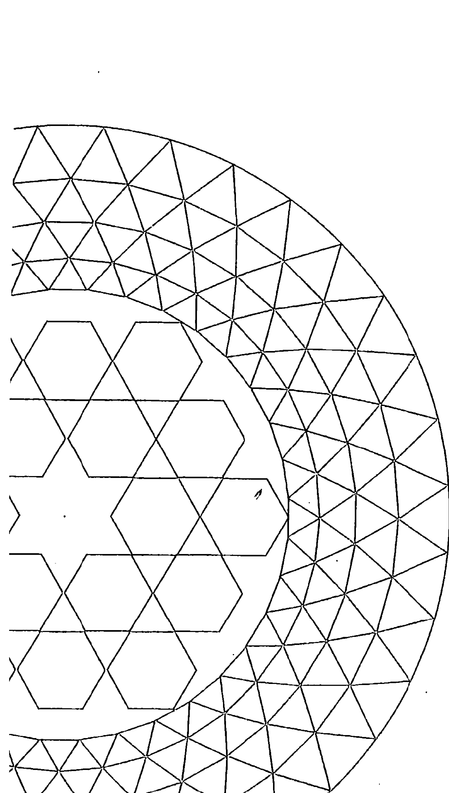

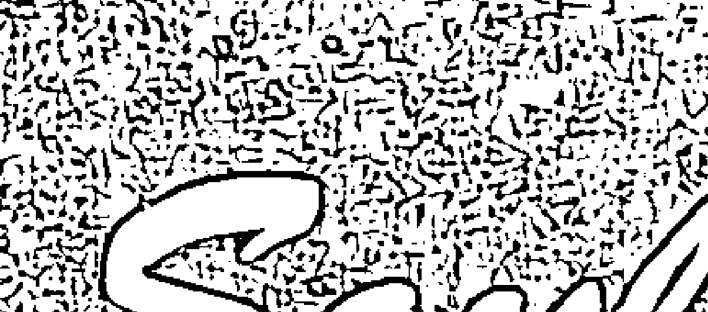

孩子的国度。拥有你无法想象的丰盛。

## case 19

### 嬰兒的隱藏訊息

多數的父母都運用邏輯去推理小嬰兒哭泣的原因，但孩子突如其來的哭鬧，往往非大腦邏輯能推斷。有一次在德國鐵路的月台上，我等待著下一班進站的列車，忽然一陣劇烈的嬰兒哭聲傳來。我轉過頭看見一位穿著時髦的年輕母親慌張地安撫嬰兒車上的小嬰兒，但小嬰兒仍然不停地哭泣。此時我走向前，忽然看見小嬰兒累世的畫面，原來他曾經在印度替戰爭中受苦的女性進行祈福，且協助他們治療身體的病痛。此時，列車突然進站的聲響讓我回過神，耳邊依然是小嬰兒的哭泣聲響，小嬰兒的靈魂開始轉達他真正哭泣的原因，源自嬰兒車上吊飾材質的低波動能量，祂提到只要將吊飾摘除他便會停止哭泣。

此時，我非常想向前提醒那位母親，但小嬰兒的靈魂提醒自己母親的意識不喜愛與陌生人交談，聽到我的提醒會感到憤怒進而置之不理。所以我將這故事寫下來，藉由這樣的方式分享給更多的人知道，期望更多的母親看見這則故事，她們會開始思索自己的孩子是否也有相同的問題，這樣一來，能夠讓更多的孩子不再受到低波動能量的影響，內心獲得平靜，順利健康的成長。孩童的身體非常敏感，他們的直覺力也最強，因此容易受到周遭環境的影響，但隨著年紀的增長，使用過多的低頻率食品，敏感度與直覺力就會越趨下降。如果父母親能夠觀察孩童的反應，減少讓孩童使用過多的低頻率食品，就能保護孩童不受干擾，提早發掘孩童的天賦，讓孩子孩童快樂地長大。

# # Soul

> > 万物的存在都有其意义和生命轨迹。

## 身體懂得，超乎你想像

萬物都具有靈性，都渴望被珍惜，一旦不受尊敬，就會散發負面的能量場，將會影響我們的日常生活，尤其是我們的身體健康。

有一天我被一位朋友邀請一同前往紐約尼克隊的主場觀看NBA的賽事，我們買了兩份潛艇堡，並坐在前排的位置，邊享用潛艇堡邊欣賞精彩的比賽。

突然朋友的全身出現紅腫的現象，他感到十分納悶。「這是怎麼回事？」我從來不會食物過敏的啊？我當下立即與這位朋友的身體溝通，希望找出他全身紅腫問題的根源，

沒多久我便看見原因。
「你的狀況跟食物無關。」
「那跟什麼有關係？」
「你的身體轉達，你目前的辦公室的環境非常髒亂，處在非常憤怒與痛苦的能源之中，這導致你的身體開始產生紅腫狀況。」
當下朋友愣了三秒鐘，才慢慢回過神，接著露出疑惑的表情。
「你在跟我開玩笑？我的辦公室在對我生氣？」
「事實上，你的身體知道著所有問題的真正原因。」他要我告訴你，你的傲慢會讓你的晚年經歷更大的疾病。」接著我繼續轉達，「清理辦公室的環境狀況，當環境能量提升後，你身體自然就會恢復。」
幾天後，朋友告訴我，他的身體紅腫問題消失，他從沒想過身體的問題居然與辦公室的環境有關，從此他會更尊敬每個空間的環境，並用更謙卑的心來面對每件事物。 人們所認知的周圍環境，其實都具有某種程度的生命週期，它們也能感受與散發正面與負面的能量場，且很多時候，疾病的問題都與周遭環境的能量場息息相關，所以我們不能忽視周邊的一切事物。

### case 21 萬物一體

在宇宙中，每件物品包含房子、土地、椅子、圖像，都擁有自己的生命，如果仔細地聆聽，可以發現萬物與我們有某種程度的連接。

我的一位朋友的新居落成，邀請我前往參觀，房子位於紐約的近郊，是獨棟兩層樓的木製別墅，前方有座私人的花園。

我剛進到客廳，朋友便面帶擔憂地向我提出問題。

這間房子裝潢完後，我晚上開始難以入眠，到底是什麼原因？

我觀察屋子一陣子，靜下來後嘗試與房子的靈魂溝通，但過了十分鐘左右，我依舊感受不到房子的活力。

我站起身，在屋內四周環顧，突然感覺臥房內有負面的能量場，我走進臥房，赫然在床頭上，發現一幅十分老舊的畫作。

> 「請問這幅畫哪裡購買的呢？」

> 「那幅畫不是買的，是前幾天街角的一對夫妻正好要搬家，想將畫丟棄，我看見後覺得可惜，所以就拿回來掛了。」

> 「那幅畫藏著怨恨的能量。」

> 「難怪！我的老天，我每次進到房間，感受到一股很強烈的怨恨感。」

「因為這幅畫遭到先前的主人遺棄，它還有點不滿，你必須將畫框翻新，將畫作重新清潔乾淨。」

隔日，朋友找了一間裱框的店將畫作運過去，並依循著我傳達畫作靈魂的需求行事，包括它自己喜愛的畫框，以及取回它的時間。

朋友遵循畫作的需求執行完畢後，失眠自動消失，且在臥房工作時讓他擁有意想不到的工作靈感。

人們與萬物的連接最常發生於情緒反應上，喜悅、憤怒、哀怨、快樂等，人類的許多情緒反應，其實都與周圍的事物有所關聯，甚至整個地球都息息相關。萬事萬物如同複雜交織的網絡，彼此互相影響，如果能明白這個真理，就能更珍惜地球上所有的資源，並且尊敬周遭的一切事物。

# Soul

## 世界上多數人違背事物邏輯的意義

## case 22

### 車的內在想法

萬事萬物都有意識，礙於人類的感官受限，很難覺察這些細微意識的存在，更多時候其實人們是被萬物的意識所牽引著行動而不自覺。人們對萬物的憤怒、批判、不尊重的態度，萬物全然知悉，並且會有適度的情緒反應，有時人們情緒的不穩定、身體上的疾病或是生活中的不順遂很多是來自周圍萬物的負面的能量。過去我的一位賽車好友，請我一同為他選看新的跑車，銷售員專業的介紹每台新款跑車不同的性能配備，朋友與銷售員在一來一往的交流中，他用著輕藐的態度嘲笑過往曾經擁有的跑車，甚至連現在使用的跑車，他也數落其退趨勢的性能。

此時朋友的舊跑車開始傳來訊息，我靜靜的傾聽著，沒多久朋友轉向我，請我為他檢視哪一台新跑車與他之間的能量最合適。

> 「我很抱歉，目前我無法為你確認。」我語帶平靜的說著，朋友用著疑惑的眼神詢問：「怎麼了嗎？」

> 「你的舊跑車正在發脾氣！所以我目前還無法與新的跑車溝通。」

> 朋友瞪大雙眸：「什麼？」「舊跑車就像是你曾經養的一個孩子，但是你擁有了新孩子，所以開始不喜歡這個陪伴你多年的孩子。」

> 「我大概懂你的意思，那我現在怎麼辦？」

我們先回到你的舊跑車內。

我與朋友回到了他的舊跑車內。

> 「你試著發動跑車！」

> 朋友解開指紋鎖試著發動跑車，卻怎麼也發動不了。
> 「現在如何處理？」朋友一臉疑惑地望向我。
> 「把雙手放在方向盤上，過去你最常放的位置，向牠說十三次對不起。」
> 朋友立即照做，閉起眼睛，向車子說十三次對不起。
> 「你現在試著重新發動。」
> 朋友试著重新發動跑車，結果引擎真的發動了，朋友不解的詢問著我緣由。
> 「車子也是有生命的，當你真誠地向它道歉，並告訴它為什麼需要一台新車，它會選擇原諒。」

我告訴這位朋友，萬事萬物皆擁有著自我意識，只是你的感官未覺察，當你以何種能量的形式對待他們，他們會以同等能源回應著你。當你開始以尊重、愛惜與珍惜周圍的萬事萬物，你在生活中將體驗到萬物一體的全新視野。

# Soul

## 靈魂管理法：愛的地球覺醒

### 全然的感恩狀態

感恩的本質是內心對於大自然運作一種完美且全然的回應。處在這種高層次狀態中，沒有恐懼、寂寞、空虛與不安全感，它代表我們內心流通於萬物之間，成就內在渴望所表現全然的認知與感激。感恩也表示我們清楚知道，沒有什麼事情是理所當然，向萬物說聲感謝，以體驗自己是渺小與謙遜。當我們處於感恩的狀態時，生活品質會快速提升，此時你會處於全然的內在寧靜，你將清楚體會自己與大自然本是一體。感恩的對象，不僅是外在的一切，也包含內在的一切。感恩是一種高層次的狀態，這股能量讓我們更緊密，使我們與感恩的對象更連接在一起，不存在任何疏離、隔絕、不信任的感覺。感恩也幫助我們驅離負面的匱乏思維，像是我們擁有的還不夠、我們永遠得不到滿足、我們本身就是不完美等想法。

### 網路暗物質影響

無線網路的年代，智慧型手機成為人類不可或缺的工具，地鐵上、公車上、公園裡、咖啡館、校園內，無不看見人手一台智慧型手機。智慧型手機的重要性已經遠超過電腦，成為新時代的重要性產品，有些人甚至不只擁有一隻智慧型手機，事實上，根據統計，智慧型手機的數量已經超過全世界人口的總數。

然而，智慧型手機讓越來越多人對它產生依賴，一但失去手機，他們就會擁安全感，但他們卻不知道，智慧型手機內充斥的垃圾訊息，是如何影響著他們的身心靈。

人類不知自己無意識間，透過智慧型手機看見的訊息、下載的程式，將造成自己的潛意識受到嚴重干擾，進而活在別人的生命的思考、言語與行動中。

因此，清理手機內存記憶體十分重要，將不重要的圖片與訊息盡快刪除，如果不刪除，就好比把許多垃圾資訊隨身綁在身上，而這些垃圾資訊比你與家人相處的時間還更長。

手機已經取代一切，很多人用手機紀錄時間、看電視劇、看電影，或是用手機聊天、收發電子信箱，絕大部分人的時間都花在與手機的相處上。

所以千萬注意將手機中垃圾的資訊盡快刪除，否則這些垃圾資訊將二十四小時影響著你的靈魂頻率，讓你不知不覺身心靈受到影響。

# Soul

珍惜每一個曾經的童真和夢想，那它是你遺忘的碎片，最終成為你的藍圖。

## case 23

### 生命的熱情初衷

前幾年的冬季，我飛往魁北克過聖誕，一早從飯店起身時，我腦中即閃過一問令我曾經非常懷疑的一間法式餐廳，接著我立刻開車前往，那間餐廳是由一對來自法國的熱情夫妻所經營，店裡的披薩非常道地美味，人潮絡繹不絕，此外，這對夫妻擁有一份慈悲的愛心，餐廳在晚上的時段，會免費提供餐點給無家可歸的遊民，當時餐廳的理念讓我十分敬昂。當我終於抵達法式餐廳，卻發現餐廳的招牌已卸下，餐廳內部正在進行整修拆除，我感到十分震驚，趕緊走向前詢問餐廳的狀況。油漆工人告訴我：「我們正在清掃，請問有事嗎？」

「不好意思，我想找這間餐廳的原主人。」
「他們已經回法國了，現在這間房子已準備重新出租。」
「聽完後，我感到很惋惜，想知道那對夫妻到底發生什麼事。」
「請問原主人為何不經營餐廳了呢？」
「我也不清楚，這間餐廳已經倒閉一陣子了。」
「就當我一頭霧水，摸不著頭緒時，屋子突然開始跟我說話：『餐廳的主人已經忘記當初經營餐廳的初衷。』」
「他們為何遺忘初衷呢？」
「當他們有了孩子後，便從此遺忘靈魂的使命與初衷，不再免費提供餐點給無家可歸的遊民，因此餐廳在缺乏靈魂的能量下，生意每下愈況，最終結束營業。」

當我聽完房子的敘說，我突然理解一份完美的工作，不在於薪資的高低，或是頭銜的位置，最重要的是，是否在工作中堅持熱情的初衷。如果你對目前的事業已經失去熱情的初衷，那就表示這份事業已經不適合你，應該盡快轉換人生跑道。心中存在熱情初衷，就會吸引適合你的事業，讓你擁有不一樣的眼界，也會對生命中的每份事業充滿尊敬與感激。

# Soul

> 靈魂在內心深處，他會變成你的一部分。

## case 24

### 真正的名牌是自己

平常的衣著，看似是一件極為稀鬆平凡的事情，但裡面卻充滿大學問，一件符合靈魂的衣服，可以吸引豐盛、喜悅、平靜的力量，一件不正確的衣服，可能導致一天生活中的不順遂或吸引人生的許多問題。事實上，正確的穿搭並非跟隨著時尚潮流品牌，而是穿出自己靈魂的風格。今日與好友來到艾菲爾鐵塔，在排隊的過程中，在我前方排著一位時髦的法國女性，她臉上化著顏色鮮明的妝容，她穿著時髦的紅色皮革外套與皮靴，可以看出整身打扮皆是來自時尚品牌，尤其是她手上背的鑽石名牌包，不時吸引了不少人的目光。當下，我覺得這位女性十分會打扮，竟然能夠穿出自己的獨特風格。

當我這樣想的時候，突然她的靈魂開始與我對話。  
他說：「其實我所穿著的衣服與使用的皮包與我本人並不相符。」  
聽見這句話時，我愣了一下，並覺得難以置信，於是我默默地在心中問：  
「為什麼？她看起來如此光鮮亮麗，這樣不是很適合她嗎？」  
這時她的靈魂讓我看見了她的靈魂檔案，原來這位少女在古羅馬時期曾是一位皇室的侍者，專門服侍王宮貴族。  
那一世她目睹王族成員們穿戴許多雍容華貴的配件，因此心生羨慕期許望自己有一天也能穿戴這些配件，這樣的羨慕感與期望延續到了這一世，所以這一世她，華貴的衣著與首飾對她有著難以抗拒的吸引力。  
她認為當這些品牌、精緻的飾品配件穿戴在自己身上時，可以證明自己的價值。  
了解她的靈魂背景後，我清楚這個女孩值得擁有任何具有價值的物品，且她的自我價值並不需要透過這些名牌的物件來展現。
當一個人內在對自我靈魂感到滿足時，外在的物質其實就不是這麼重要，
但如果內在不滿足而渴望擁有一個名牌去讓他人看見你的價值，那麼這樣的行
為對自己的靈魂是無比的傷害。當你出於匱乏、毫無自信的心去穿戴這些名牌
時，別人的靈魂是能感受到你內在深層痛苦的能量。
最後，你將明白你的內在出現的不安感，與外在的物品皆無關係，而是取
決於你對於自我了解的深度。

# CHAPTER 6

## 開敘天師

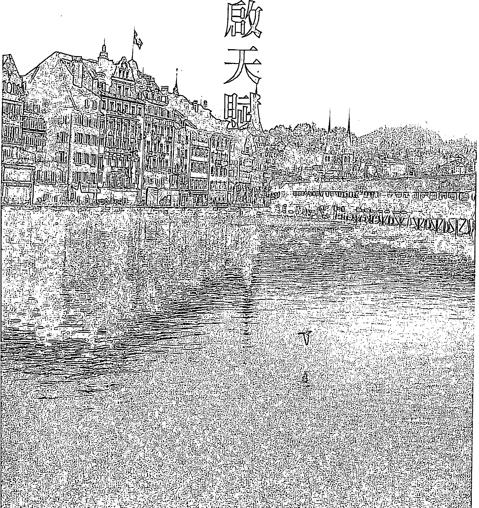

# Soul

這一生最重要的事，就是了解靈魂的天賦。

### 年輕是喚醒天賦的最佳時機

年輕時，總是覺得人生很漫長，事實上這樣的思維模式已經限制自己的人生，如果黃金的歲月都在這樣的態度中度過，更別說想利用天賦，連發掘天賦的機會都會錯失。很多人把年輕歲月當作胡亂嘗試時期，事實上這段時間是人生最重要的發展時期，也是喚醒天賦的最佳時機，但是這個年紀的年輕人通常追逐著潮流前進，喜歡玩樂與享受，周圍的朋友與家人們也都認為他們還年輕，不需要為自己人生做打算，因此這些年輕人不懂得去探索自己的天賦，而只是讓時光虛度。『你還有很多時間。』這句話完全限制年輕人的未來的發展，許多年輕人被這樣的話語蒙蔽，他們浪費最寶貴的時期，讓這段喚醒天賦的關鍵期慢慢地消逝。年輕人也自以為有本錢能夠浪費青春時光，但是到頭來卻什麼也沒得到，最終他們對未來、對自己的人生依然是無比的迷惘與恐懼，而不是充滿著熱情與動力。青春就像是鑽石的原礦，儘管還無法散發出光芒，但是最具有可塑性，他們都能靠著自己的青春活力，嘗試地去克服面對眼前的困境，因此，如果能夠把握這段時間去發掘天賦，未來將不可限量。天賦的開啟通常具有時間點的限制，也就是說一旦我們年輕時期，錯過開啟天賦的時間點，此生將很難再開啟自己的天賦。我有許多藏有天賦的朋友，他們回顧自己的人生時，往往發現自己都在無意義的生活中渡過，沒有留下對自己生命、對他人生命具有價值的事物，甚至浪費在自己不喜歡的事物上。任何人都必須把握每段時光的運用，別恐懼不曾接觸與不知道的事物，勇敢面對自己內在的渴望。

# Soul

你的天賦存在於天堂與鬼魂世界之間。

### 找回與生俱來的內在感知力

從平凡的人變成非凡的人，第一步就是要找回與生俱來的內在感知能力，讓這種內在感知力全面甦醒與開放，就能找到自己的天賦所在。內在感知力無法從現有人類的外在經驗培養，而是需要聆聽自己心中的聲音。

當人們開始使用內在感知力時，起初會認為自己已經瘋狂，認為自己一直在胡思亂想，思緒往往會在一個確定的感知或是一個混亂的訊息中飄移，無法確定哪些是真正的感知，因此人們必須經過不斷地內省與聆聽，並在接觸到感知後，確實地去實踐，這樣才能漸漸地建立自我的信心。

人們必須時常與自己的內在獨處，並時常運用內在的感知力，把它當作連接的頻率固定，這樣人們才不會迷惘，才不會在連接的過程中迷失自我，否則大腦會在不同胡亂的訊息中飄移，感知將變得雜亂與虛假不實。

運用內在感知力固然重要，但是在接收感知的訊息後，人們如何處理事情的經驗也很重要，因此人們不能完全拋棄這些經驗，是要有效地運用這些經驗，事實上，將內在的感知與經驗結合，才能真正使自己的天賦發光。

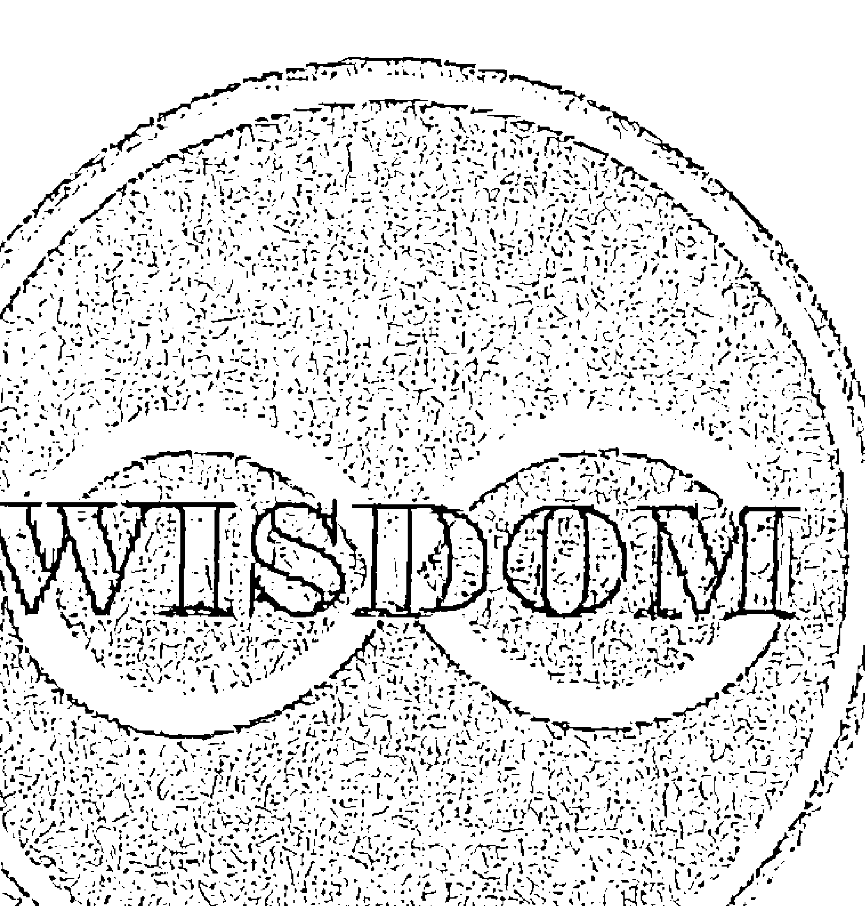

### 神的機會往往意想不到。

## case 25

### 隱藏版天賦

人們常誤認自己意識（大腦）渴望等同於靈魂渴望，事實上，人類意識的視角往往與靈魂的視角大相逕庭。

多數人被繁雜的能量線牽引，無法真正理解自己靈魂渴望，因此在做選擇時往往與靈魂的渴望背道而馳。

聖誕節前夕，來自東京的朋友邀約我一同參觀所羅門·古根漢美術館，當時正在舉辦一個特展，有許多國外的觀光客慕名而來。

當時紐約正飄著細雪，天氣十分寒冷，參觀完展覽後，我們決定一同前往美術館旁的咖啡廳，享用濃郁的熱咖啡。

一位女服務員貼心地替我們選了暖爐旁的位置，我無意間瞥見她捲起手袖下，有一個十分獨特的刺青。
我仔細觀察，發現是一個音符的圖騰。
這一瞬間，女服務員的靈魂讓我看見一些畫面。
原來這位女服務員累世曾是一位傑出的音樂家，曾到世界各地巡迴表演，在音樂上有很高的造詣，但在生命的晚年，卻陷入瓶頸，無法突破內心的自己，最後抑鬱而終。
受到那一世的影響，這位女服務員在潛意識的影響下，特別喜愛音符的圖騰，但今世沒遇見正確的導師，也毫無接觸音樂的契機，使她的音樂天賦持續地埋沒。
最後只能選擇將音符的圖騰刺在自己的手臂上，其實這是女服務員的靈魂的提醒，但是她自己的意識很難真正清楚靈魂的安排。女服務員已經遺忘過去的記憶，我很想提醒她，但卻缺乏緣分。

正當我視線離開女服務員時，耳邊忽然傳來悠揚的鋼琴聲，那是一首歡樂的聖誕曲子，我朝另一頭望去，赫然發現這間咖啡廳內，有演奏者正在進行鋼琴的表演。

我順著緣分向女服務員問聊幾句。

> 「你們餐廳的鋼琴師彈得真好！」

> 「是啊！我也很喜歡他彈鋼琴的聲音。」

原來這名女服務員選擇待在這間咖啡店裡服務，又是靈魂的另一種安排，上帝也已經把天賦的鑰匙放進她的生命中，但是她卻難以覺察。

生命中有許多遺憾，人們的思考、言語與行為，往往與靈魂內心真正渴望的有很大的落差，這也造就了痛苦、憂鬱與悲傷。

離開咖啡店時，我回頭看一眼，赫然發現女服務員正專注地看著鋼琴演奏者的表演，我心中暗自祝福她，希望有一天，她能鼓起勇氣坐在鋼琴前，試彈幾首曲子，那一瞬間，她就能清楚自己天賦的來源。

### 找到前世的關鍵鑰匙

一天我前往麥迪遜大道的一間餐廳，這間餐廳格局十分高挑，我目測天花板約有兩層樓的高度，餐廳中的燈光十分獨特，有許多圓球似的閃亮光線投射在四周的牆壁。我坐在中庭吧檯附近，可能是早晨的緣故，前來用餐的顧客不多，在我隔壁桌，有一家人正和睦地享用早餐。這家人中有一位小男孩，他十分特殊，擁有一雙充滿智慧的藍色雙眼。我看著小男孩靜靜的咀嚼著三明治，下一秒，他的靈魂發現了我，我向他致敬打了招呼，我們便開始閒聊起來。原來，這位小男孩曾經是自己父母親的祖父，那一世他們一家人在中国，擁有很深的緣分。這時我聽見了小男孩的靈魂對著父親的低語：“你應該認真地善待我，因為十分難得我又有機會可以重新投胎。”

這一瞬間，我頓時領悟到，原來家族成員無論重複多少世，即便換了不一樣的國家、不同的文化，卻都是在同一個圓圈裡，進行相同的輪迴課題。

家族有家族的輪迴課題；社會有社會的輪迴課題；國家有國家的輪迴課題，許多靈魂就在這樣反反覆覆、生生世世的輪迴中，不斷地學習與成長。

這個時候，男孩看向母親低語著：“母親對父親的態度需要更加友好與善。”我悄悄把目光移向母親的靈魂，從母親的靈魂中發現她擁有一種不良的習性，使她無法專心地照顧家人，她只要看見衣服與包包，就會忘記孩子的存在，對這樣的習慣，小男孩的靈魂有些不滿。

> 「希望媽媽未來在製作料理時，不要一直抱怨，這讓整桌的料理變得負能量。」

我安靜的傾聽，小男孩的靈魂繼續敘說：

> 「其實媽媽身體長期的過敏與家裡房子的水管太老舊有關，這些老舊的水管內藏有許多污垢，這些污垢正是過敏原，因此家裡必須要安裝一台淨水器。」

但是媽媽自己卻不清楚過敏的主因，所以過敏始終無法完全根治，她一直以為與臥房裡的棉被、枕頭有關，但無論媽媽換了多少枕頭、棉被，從便宜到昂貴，都無法真正根治她的過敏。

> 「除此之外，媽媽必須禁止使用化學精緻的糖，這些糖是導致她精神焦躁的主因，但是媽媽永遠不會知道，她最愛的甜點正是傷害她最大的食物，尤其是草莓聖代。」

聽完之後，我讚嘆這位小男孩的靈魂，他驚人的洞察力使人印象深刻。我繼續觀察男孩，他正用力地吸著手中的吸管。這個瞬間，我瞥見了一個重疊的畫面。我看見這位小男孩曾經是一位東方的大學士，非常喜愛抽菸草。這樣的習慣依舊保留至現在，所以直到現在他都還保有類似抽菸草的行為模式。除此之外，上一世這位大學士對待人十分真誠、慷慨，當時他曾教導無數學生，十分重視道德教育，受到那一世特質的影響，這位小男孩在學校的人緣很好，無論同學間想聊些什麼，周圍的人都會認同他所說的話。

但是小男孩對於現在的教育體制，相較之下會顯得沒有耐心、無法認同。

小男孩的靈魂最渴望是能夠學習西洋文化，他曾經是大學士時認識了一位來自西洋的使節，在當時戰爭頻繁的年代，西洋的文化逐漸萌芽，直到他過世之前，最大的遺憾就是沒能好好理解西方的思想與語言。

> 若是按照小男孩的生命藍圖分析，他未來將可能朝教育界發展。

因此這一世，小男孩在教育上反而對西方的語言充滿興趣，我看見他靈魂最高的渴望就是能在世界各地傳播東方在於中庸之道、形上學的啟發。

小男孩的靈魂知道，父母永遠不會理解他話中靈魂想要表達的意涵，因為他們的認知上認為孩子年紀還小，對世界有許多不懂的地方，但其實這位男孩的眼睛看得比父母親的視野更深、更透澈。

最後，小男孩的靈魂告訴我，如果能夠在九歲時，前往一趟倫敦，將可以喚醒他的語言能力，因為英國藏著開啟他這一生的天賦鑰匙。生命太浩瀚，不同的靈魂有著截然不同的課題，最重要的是，在短短的一生中，能夠找到解開自己生命密碼的鑰匙。鑰匙也許是一個國家、一位老師、一本書、甚至是一句話。無論鑰匙是什麼，尊重每位靈魂的旅程，瞭解到不同的設定都是每位靈魂在不同時空中所選擇，進而表現出來的奇蹟。如果能以這樣的方式看待每一件人、事、物，那就會發現宇宙、萬物之間極為巧妙又深刻的連結。這樣的連結精確、壯觀，甚至是奇蹟，讓人們不得不對這龐大浩瀚的世界產生無比敬畏的心。

# Soul

量子物理學的基礎從來是直觀的力量。

## case 27

### 活下來的勇氣

活著時，因為不清楚而逃避某件事，最後選擇自我極端的離開，死後將經歷極度痛苦的經驗。
每份肉體都是上帝造物奇蹟的展現，更是靈魂用來體驗珍貴生命經驗乘載的器皿。
因此承諾珍惜你的肉體如你的愛人，珍惜每分每秒活著的時光，是對你的靈魂、給你身體的父母、培養你成長的社會負責任的態度。
今天在電話中，得知一位許久不見的朋友自殺離開，聽見這份消息，內心有種說不出的痛楚與心疼。
幾年前，我們才在餐廳聊著未來的夢想，當時他突然提起內心的秘密。

他告訴我：「很多人不知道，我表面上看似人生勝利組，但我的內心，一直有很大心結無法突破，就是我對自己的生活有一套嚴格標準，但很多時候，我無法達到一百分。」

「因此每當在夜晚時，會進入自我厭惡與痛恨自己的極端狀態，這漸漸變成一種習慣，我已經無從得知這些慣性的源頭。」

「這讓我的生活非常憂鬱與疲憊，最後讓我無法適應在人群中生活，即便我的父母對我百般呵護，還留給我豐厚的財富，卻無法讓我擁有活下來的勇氣。」

回憶完朋友的話語，我掛上電話，閉著眼試圖連結這位朋友的靈魂，但因為心理的悲傷與不捨，我失去與他的靈魂連結的勇氣。

過了幾星期後，電話通知我的那位朋友，又再度與我聯繫，他告訴我，我應該去看看他，至少說一句最後的祝福。

當晚，我再次鼓起勇氣，在夜晚午夜，順著他的靈魂連結，我們在異度空間相遇，見了極短的重疊時間，轉換成現實時間，不過幾分鐘。他沒有說話，但我從他的悲傷眼神中，看見他所有想要傳達給我的訊息；他告訴我：「自殺死後，是極度痛苦的，生前所有的問題都沒因此結束，甚至必須經歷一遍又一遍，失去愛人的心痛。」我好後悔，我真的好想回去，再次報答父親、母親，我好想念他們。當我眨個眼，一切又就結束了。回到現實，我因震撼而無法言語，我多麼希望能為他完成夢想。我寫了一封長篇信轉至他的親屬，只想完成這位朋友靈魂的遺囑與交代。很多人們常問我關於自殺的問題，他們會說：「選擇自殺，所有問題就可消失了！」其實這是在不明白宇宙律法下的狹隘想法，自殺後在生前的課題並不會消失，靈魂反而會在選擇不同的方式來讓自己重新學習，但因為每個靈魂的選擇不同，經驗也有所不同，以更高實相而言，擁有肉體在人間創造與學習是億萬靈魂渴望獲得的機會，如同佛家所說的：『肉身難得。』

很多人不知道，父親的精子與母親的卵子，結合那一刻是經過多少努力，且在生產那一瞬間，母親必須經歷一次與死神重新拔河的考驗，這樣費盡千辛萬苦，才有機會誕生一個生命。

嬰兒時期，父母親必須時時刻刻照顧，到了他真正的心智成熟，可能已經幾十年後，但這個時候，當你選擇極端的離開，其實你對不起的不是自己，而是培養你的國家，照顧你的社會，還有你的父母親。

所以每一個人在做決定的時候，記得，這個決定不是對自己負責，而是對自己的父母還有自己的靈魂負責。

他離開了，也是他最後悔的一件事，因為他的生命裡還有許多神性作品並未完成，這些神性的作品，其實造物主早就放進他腦中的USB內，但因為他沒準備好，一直無法面對自己人生的課題，而沒有契機開啟生命的USB。忘記腦子裡面的東西，可開悟許多人的生命價值，這是上帝給予的，也是神給予的。珍惜活著的每一刻，才是真正的永恆。

# Soul

> 靈魂的平靜就是內心的平靜。

# 新天使小孩

水是地球的命脈，更是生命的重要元素，如果未來連最基本生存的元素都缺乏，那對存活在地球的生命將是一場浩劫。

幾天前，我經過報攤，瞥見一篇報導，發現世界上許多的地區正在鬧水荒，很多的地方甚至沒有乾淨的水源，頓時覺得自己十分幸福，因為每天都有足夠乾淨的水源可以飲用。

那篇報導的下方，提到有一位就學的孩童，發明了一台簡單的過濾機，幫助家鄉的人民，過濾汙濁不堪的死水，淨化成乾淨的活水。

這個孩童是一個新天使小孩，他們是自2012年後，地球上誕生的新穎靈魂，他們身上攜帶著純淨的靈性能量，將引導地球未來的進化方向。

新天使小孩都具有高度的直覺力，他們會不斷的熟練、重組、突破，剖析之後，就能完整、更細膩解答未來世界的問題，但如果他們不去發掘天賦，則將永遠處於無意識的狀態，荒廢這樣的能力。

新天使小孩擁有兩種特質。

第一、新天使小孩喜愛淨化自我。（如：沐浴、潔淨環境。）

人類的身體環繞著不同的電子磁場，每秒不停地流動，磁場循環的過程中，如果累積過多的負磁場，新天使小孩容易感到身體的不適，因此他們十分喜愛洗澡，清除身體周圍的負磁場。

第二、新天使小孩需要純淨天然的水。

新天使小孩又稱為海洋小孩，他們的身體需要補充高波動的水，因為高波動的水能讓他們的頭腦清晰，思考變得更敏捷。

請謹慎細心地照顧新天使小孩，因為他們天生擁有純潔的靈性，因此需要自然的水源以及食物，如果養育他們的家人不清楚，讓他們使用過多低頻率的食物，將會阻礙他們的靈性發展。

與新天使小孩建立溝通橋樑是重要的關鍵，父母應該給他們更多自由，讓他們發展自我的想像空間。因為他們是上帝給人類的禮物，如果能用正確的方式栽培這些新天使小孩，只要他們內心對世界擁有一點的愛，以及對人類的悲憫之心，那麼他們很快就能開啟上帝賦予的天賦，要清楚他們的一句話、一個思維、或是一個創意的舉動，將可能改變整個地球的蛻變方向。

新天使小孩將是未來人類進化的關鍵密碼。

# CHAPTER 7

## 平行宇宙

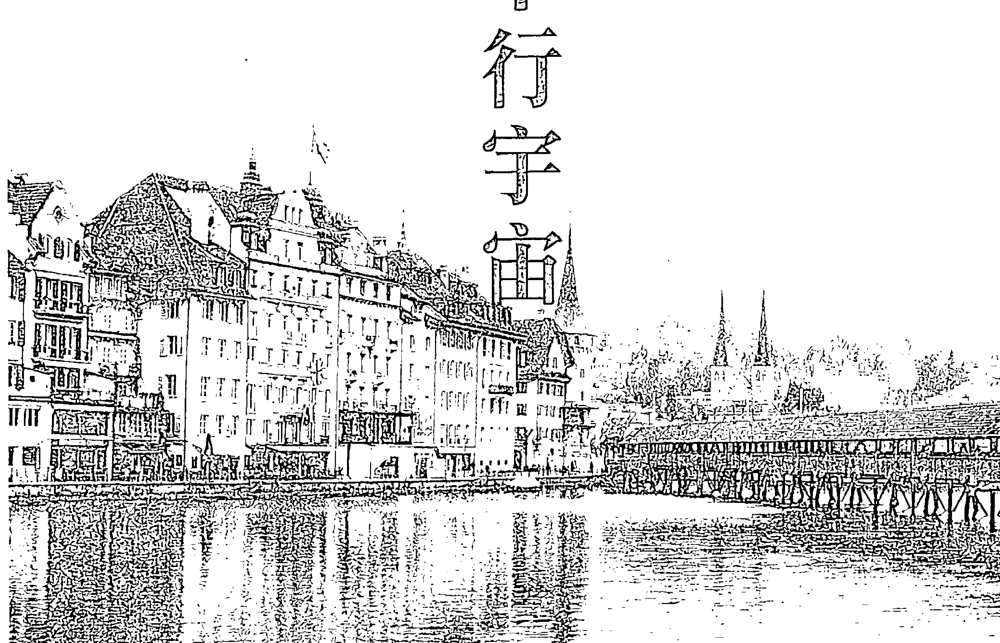

## Saul

### 靈魂圖說原版全套叢書

### 平行宇宙真相

利用現今科學的方式，已經能夠對於平行宇宙有明確性的解釋。

平行宇宙概念即是說，宇宙之外還有無限個宇宙，而其中一個宇宙中內有一個星系與銀河系相似，而這個星系之中，又有一顆恆星和太陽一樣，被八大行星圍繞，其中的第三顆行星與地球很相似，在那顆行星上也存在著與人類非常相似的高等智慧生物，這種生物與地球人類非常相似，有著與地球人類一樣的生活，

更重要的是，他們與地球人們一樣有著相同的人生劇本。

如何創造另一個平行宇宙？舉個簡單的例子，假設今天早上起床，早餐可以選擇漢堡或是三明治，最後選擇了漢堡，但是只要曾經有思維選擇三明治，就會立即創造另一個平行宇宙，在那個宇宙中的你，選擇三明治當作早餐，這就是平行宇宙真實的運作模式，由此可知，平行宇宙中有∞個自己。

平行的宇宙中存在∞個自己，即是靈魂藉由許多不同的宇宙，展開多次元空間的體驗，藉由這些多次元的體驗，能夠快速提升靈魂的轉化，因此所有平行宇宙中的自己，皆是你的一部份，大多數的人並無法意識到這一點，是因為大多數的人被困在物質的幻象當中，無法看清世界宇宙的實像。

每個平行宇宙的自己，都藉由本源網絡連接，因此與你皆是息息相關；舉例來說，當另一個平行宇宙的你沉淪，這時你也會跟著沉淪，反之當你開始轉化，另一個平行宇宙的自己也會跟著提升與淨化。

### 平行宇宙的創造

創造平行宇宙的其實是我們自己，當我們在人生中有不同的思維選擇時，當下的波動能量其實就已經創造了另一個平行的宇宙，這說起來也許不可思議，但這是來自更高次元宇宙的實像。

舉個簡單的例子，假設你今天早上起床，早餐可以選擇漢堡或是三明治，最後你選擇了漢堡，但是只要妳曾經有思維選擇三明治，就會立即創造另一個平行宇宙，在那個宇宙中的你，選擇了三明治當作早餐，這就是平行宇宙真實的運作模式。

### 平行宇宙的交會點

世界上存在許多平行的宇宙，這些平行宇宙網狀交織在一起，其中會有許多交會點，交會點會持續地改變，因為宇宙都是有生命的，它們每秒都在不停地變化，不停地移動。一般人很難覺察到交會的現象，因為我們的感官能力受到嚴重地侷限，高波動頻率的人以及具有超乎尋常觀察力的人們，能夠看見平行宇宙的交會點，高次元的生命體就是最好的例子，因為他們能夠穿梭於每個平行宇宙中，去傳播真理與智慧。

### 全像投射的假象

已經有科學研究指出，我們存在的三次元世界，其實都是全像投影的假象，真實則存在於更高次元的世界，在更高次元的世界中存在著投射我們宇宙一切的資訊，包含著所有的時空連續體、平行宇宙以及過去、現在與未來。

### 全像投射的原理

全像投影的原理為干擾現象。干擾是兩個或多個波動交叉時所產生的新波動。任何波動皆可能造成干擾波形，因此弦造成的波動，也在持續地造成干擾波動。

### 造物主的软片

全像投影是将一道波动分为两道波动，第一道波动打到想要投影的物体，再反射出来，第二道波动则与第一道波动反射出来的波动交会。这两波动交会后将产生互相干涉，将这些干涉波动记录在软片中，并保存起来。如果我们再以另一波动来照射这张软片时，原本想要投影的物体，就会以三次元的立体影像出现在空间中，这个三次元的空间的立体影像非常真实，与原本的物体几乎一模一样。

我们世界的一切讯息，其实都存在于造物主（高次元）的软片中，这些软片上的訊息是重力波干擾現象下的產物。當造物主（高次元）的訊息透過重力波的方式，投射至三次元世界時，就形成我們所見的三次元世界，這也說明萬物都是由波動組成的真理。

### 愛的全像投射

由此可知，世界中的一切其實早就已經存在，造物主（高次元）軟片的訊息早就存在於那裡，這些訊息包括所有你能想像與不能想像的可能，這也說明過去、現在與未來同時發生的原理，因為它們其實都是利用重力波同時投射於三次元的世界中，只是我們在其中穿梭，產生前後順序的錯覺。

愛是最純淨與強大的重力波，實際上，世間的一切也都是由愛投影而成，只是我們的眼界受到侷限，看不見萬物都完美的真理，但是高度智慧的靈魂們知道這個的真理，因此祂想將這個偉大的智慧，告訴我們每一個人，讓我們都回歸於造物主愛的懷抱中。

### 宇宙間次元

# 時空振動理論

我們所見的任何事物，其實都是由波動組成，這些波動經由人們大腦的解讀與分析，進而在人們的腦中形成各種感覺與影像，因此實際上，人們的大腦是一種高度精密的波動解析器，它能夠快速地解析環境周遭的一切，讓人們能夠在環境中正常的生活著。

#### 超弦理论

有些人認為物質都是由粒子所組成，並依據固定的結構構成所有的事物，但實際上，根據超弦理論，自然界所有現象都應具有雙元性，即粒子與波動性。一般人很難認同雙元性的理論，因為大部分的人只相信自己的眼睛，粒子就是粒子，波動就是波動，然而在微觀的世界裡，粒子性與波動性確實是共存的。波動理論的概念早已得到科學的印證，過去我們認為萬物都是由粒子所組成，原子則是組成所有萬物的基本粒子，但當超弦理論提出來後，完全顛覆粒子理論的概念，這也促使量子物理學領域受到近年來科學界的關注。
超弦理論認為萬物都是由弦組成，這些弦不停地振動，進而產生波動，弦則會變化成不同的樣貌，進而改變弦的波動，而根據不同的波動，組成不同的事物，包含所有有形以及無形的事物，因此實際上，萬物都是不同狀態的波動。
物質的型態與形狀是由粒子性所表現，而波動性主要表現物質的機能與性質，以及塑造物質形狀的能量，但是，基本上，粒子性與波動性是一體的兩面，是無法區分的，這也是現代量子力學的微妙之處。

### ◇ 時空真相

探索時間與空間的真相一直是人類的目標，近年在宇宙學與量子物理學的發展下，許多過去隱藏的真相，漸漸地被人類所發現，而這些真相也讓人類對於生命價值有更進一步的認識。

### 時空連續體

根據愛因斯坦的理論，時間與空間不是分離的個體，它們是連續體，叫做時空連續體，因此時間與空間是緊密的存在。時空連續體並不是永恆不變，他會受到外力影響而扭曲，愛因斯坦認為當物體在快速運動時，它存在的時空連續體就會改變，也就是時間就會加速或是減慢，他也認為強力的重力也會影響時空連續體，像是宇宙中的黑洞，黑洞具有非常強的重力，它會造成時空連續體嚴重扭曲，大幅減慢時間的流動。

實際上，人們能夠藉由控制我們身體的波動頻率，改變自身的重力場，影響人們周邊的時空連續體，改變時間流動的快慢，這也是為什麼，人們總認為快樂的時光總是過得特別快，痛苦的時光總是過得特別慢的原因。由此可知，身體波動頻率的高低，會影響人們自身的重力場，進而影響人們在時間中流動的速度，因此每個人在空間中穿梭時間的速度，其實都是不相同的。高次元的生命體具有超高的頻率波動，因此他們可以自由地控制身邊的重力場，改變自己在時空中穿梭的速度與方式。

### 時間是圓形的運行

一般人都認為時間是直線性的進行，認為過去、現在與未來是呈直線性的發展，實際上，時間是以圓形運作，且只有永恆的這一刻，只是由於先後注意力放在時間流動中的各種情境，才會創造時間流動的幻覺，時間只是被依序注意，流動的是人們自己，是人們在時空穿梭，活出自己的生命。

時間的概念遠超過人們的想像，它是全像性的存在，人們所認為的過去、現在與未來都是同時發生，在真實實相中，它們早已存在那裡，只是人們受到反物質與業力的影響，意識無法覺察，也無法體驗時間的真實性。

時間的真相非常的奇妙，在三次元的實相中，時間的概念完全被人們誤解，時間遠比人們能認知的還要有變化，人們可以在實相中，讓同一刻的動作透過擴展、彎曲、旋轉等方式存在。人們在物質世界中，選擇不同的道路，穿梭於時間之內，可以透過自由的意識，以各種不同的方式穿越時間，也可以在任何時間點，改變方向，如果具有更高的意識，甚至能夠在時間中後退，不僅可以回到今世稱的過去，甚至能夠回到前世，回到自己想前往的任何一世。

實際上，人們在時間中的移動是更自由的，只是鮮少人意識到這個秘密，人們不僅能在時間的道路上向前進、後退，也能往左前進或是往右前進，往上前進或是往下前進，甚至是螺旋狀的前進，然而一般人只認知到前後時間的概念，無法覺察更全面性的時間運作模式。人們要學會利用全面性的思維，去看破時間的假相，每分每秒活在當下是打破時間假象的方式之一，如果人們完全處於當下，就是處於一種轉化的意識狀態中，會感覺時間消失，時間會讓你感受好像靜止或是飛速的流動，這就是時間真實的樣貌，時間沒有流動，是人們感受它在流動，事實上，流動的一直都是人們自己。

早在古希臘時代，柏拉圖(Plato)與歐幾里得(Euclid)就開始定義空間的真實意義，在歐幾里得(Euclid)所著作的《幾何原本(Euclid's Elements)》中，已經對點、線與面做一定的解釋，也就是定義二次元以下的空間。

最先開始研究三次元空間者為法國哲學家勒內·笛卡爾（René Descartes），他認為宇宙空間被乙太的粒子填滿，並強調物質充滿所有三次元的空間，認為沒有物質的空間並不存在，然而艾薩克·牛頓（Isaac Newton）則認為三次元空間的存在是絕對的，任何外在的事物都不會對它產生影響，無論何時都是不移動、不變化的空間，稱為絕對空間，並在這個假設下，發展出古典物理學的定律。

人類從三次元的空間跨到四次元時空的最大功臣為著名的阿爾伯特·愛因斯坦（Albert Einstein），他以狹義與廣義相對論完美解釋四次元時空的真實存在，而在愛因斯坦（Albert Einstein）的基礎上，德國數學家、物理學家西奧多·卡魯札（Theodor Franz Eduard Kaluza）成功的推導出五次元空間的方程式，也間接證實五次元世界的可能存在。近代量子物理學中發展出的超弦理論，更開啟五次元以上，多次元空間存在的可能，推算出十次元世界、甚至是十一次元世界存在的可能。隨著物理學的發展，人類已經開始了解不只三次元世界存在的可能，事實上，多次元的時空是真實存在的，且與人們每個人都關係密切。

### ◆ 多次元的存在

我們的世界其實是多次元的世界，只是次元與次元間堆疊在一起，讓我們看不見它多次元的組成，就像是你在遠處看一根電線桿，感覺它是一條線，屬於二次元的組成，但是實際上它是三次元的組成，多次元空間的推疊讓你不清楚，就是這個原理。

### 高次元的意識

我們的世界由多次元組成，一定存在高次元的意識，實際上許多我們所稱的神佛、耶穌基督以及高靈等等都是一種高次元的意識，這些高次元的生命體在我們的四周，唯有注意他們的人，才能真正感受他們的存在，他們每分每秒都在將真理與智慧傳給我們，只是人們的意識不一定能夠完全覺察。

### 愛的訊息

高次元的生命體存在於高次元中，要傳遞真理與智慧與位於物質沉重的三次元世界中的我們，無法用一般的溝通方式傳遞，但是高等智慧的靈魂最常利用愛的波動，將重要的訊息利用愛的方式傳遞給我們。愛的能量是多次元空間的訊息傳遞至三次元世界中，最好的傳遞與溝通工具，也是唯一不會被其他能量與波動阻礙的能量，因為愛的能量是最純淨的能量，也是宇宙智慧的本質能量，因此透過愛的能量，不僅是高次元的生命體傳遞訊息給人們，人們也能將自己的思維、使命與願望，傳遞至高次元的時空中，進而得到更高次元靈魂的協助。

# 特別附錄

## 靈魂

靈魂是愛與光組成的能量元素，源自於造物主的意識能量，屬於造物主的一部分，因此本質上與造物主無異，都是愛、感恩、光等正面意識型態的釋放與展現。
靈魂為無形、無法碰觸的一種意識本體，這種本體能夠永恆的存在，有些人稱意識本體為生命的泉源，或是稱作愛與光組成的生命，這種意識本體源於萬物之源的造物主，且都具備造物主的創造性能能量與力量。

## 平行宇宙

平行宇宙的概念即是說，宇宙之外還有∞個宇宙，而其中一個宇宙中內有一個星系與銀河系相似，而這個星系之中，又有一顆恆星和太陽一樣，被八大行星圍繞，其中的第三顆星與我們的地球很相似，在那顆行星上也存在著與人類非常相似的高等智慧生物，這一種生物與您非常相似，有著與您一樣的生活，更重要的是，現在他正與您一樣正在閱讀此書的這一段。

## 吸引力法則

吸引力法則是宇宙其中的一個法則，它是建立在正面心念波動創造物質的概念上，也就是透過本源網絡發射出正面心念，在吸引正面事物回到自己身上。吸引力法則看似可以憑空變出東西，實際上它就像是一種重新選擇劇本，我們在轉生前，安排所有人生的靈魂劇本，除了我們人類意識，認為痛苦的經歷外，自然也會有美好的經歷，而吸引力法則，就是將我們絕對劇本中，我們認為痛苦的經歷替換成美好的經歷，因此實際上，這些痛苦的經歷不會消失，還存在於你今世或是他世的劇本當中，因為劇本題沒有完成，不會憑空消失，只會調換位子。

此外吸引力法則除了可以吸引未來的資源外，在心念不正、不堅定的情況下，很容易就吸引反物質以及未來的業力，這也是為什麼很多運用吸引力法則的人，在看似成功後，卻開始經歷龐大的痛苦與問題。

### 靈魂記憶

每個人的靈魂本源網絡中，存在著從靈魂誕生之初至今的所有經驗與資訊，有些存在較久的靈魂，可能還包含幾萬年的記憶，當每個靈魂回到多次元時空時，會憶起過去的經驗與記憶，至於能夠憶起多少，則是根據靈魂的意識高低。

## 因果法則

過去世的自己造就怎樣的因，今世或是未來世的自己就必定會體驗果，今生我們在物質世界的種種，大多來自過去我們造就的因，如果用另一個角度思考，今世我們成就的行為也是因，必定會在未來成為果，這就是因果法則的重點所在。造物主運用本源網絡，讓因果法則發揮淋漓盡致，一個因成就一個果，這個果又成為另一個果的因，就這樣創造出多次元的時空，以及存在於之內的所有生命體。

## 靈魂光譜

每種靈魂體系的特質不同，差異的來源在於起初靈魂創造時光組成的比例不同，靈魂都是由七種光所組成，分別為：

- (1) 綠光：自然與和諧
- (2) 紫光：法則與秩序
- (3) 藍光：思想與藝術
- (4) 紅光：領導與奇蹟
- (5) 銀光：知識與科技
- (6) 白光：感恩與愛
- (7) 金光：真理與智慧

## 外星人灵体系

灵魂体体系中，拥有多种外星人灵体系，然而转生于地球的外星人灵魂有其限制，不是所有的外星人灵魂都能转世于地球上，转生于地球的外星人灵体系大致分成四种，分别为火星外星人灵体系、水星外星人灵体系、木星外星人灵体系以及冥王星外星人灵体系。

### 火星人靈體系
火星外星人靈體系的靈魂特質，特別重視領導與組織管理、宇宙律法的運用以及傳遞愛與感恩，祂在真理與智慧的分享以及知識科及的推演也佔有一席之地，對於自然和諧、思想、藝術的相關事物，通常非常少接觸。

### 水星人靈體系
水星外星人靈體系的靈魂特質，特別重視知識與科技、感恩與愛的傳遞以及真理與智慧的揭露，祂們在領導與交際以及宇宙法則之運用，也有一定的天賦，對於自然和諧、思想、藝術的相關事物，通常非常少接觸。

### 木星人靈體
特別重視真理與智慧的傳遞，在思想、藝術與哲學上，有獨出的能力，也懂得宇宙法則的遵守與運用，祂們在自然和諧相關事務、科技與知識上，也可能發揮所長，對於感恩與愛、領導、奇蹟創造的相關事物，通常非常少接觸。

### 冥王星人靈體系
冥王星人靈體系的靈魂特質，特別重視宇宙法則的掌控，也具有領導的能力以及強調真理與智慧的分享，祂們在傳遞感恩與愛、科學與知識的探索上，也具有先天的優勢，對於思想與意識、自然和諧的相關事物，通常非常少接觸。

### 地縛靈
一般我們稱的幽靈、鬼魂等都是地縛靈，祂們是真實存在的。地縛靈的形成主要原因是此靈魂肉身死亡後，執著於世間的事物，不願意前往屬於自己的次元空間中，等待投胎轉生，因此待在三次元世界中，形成漂泊在外的地縛靈。地縛靈生存於2.5次元的地縛靈界中。

我的通靈好友 / 科赫著 . -- 第一版 . -- 新北市：大濱出版，2017.06
面：公分 . -- (LIGHT 大眾心理 : 2)
ISBN 978-986-94856-2-3 (平裝)
+   1. 通靈術 2. 靈界
296.1
106008119

## LIGHT 大眾心理 02
## 我的通靈好友：靈魂教我的 24 堂生命必修課
+   * 作者 | 科赫 .KOCH
* 副總編輯 | 楊惠妍 企劃編輯 | 呂志和
* 責任編輯 | 黛蓉 封面設計 | STAR.Z 工作室
* 出版發行 | 大濱出版
* 聯絡地址 | 台北市仁愛路四段 404 號 5 樓
* 讀者服務信箱 | hugehunter.booksservice@gmail.com
* 讀者服務專線 | 0900-087-497
* 總代理 | 楓彥有限公司
* 服務電話: (02) 8919-3369
* 本版發行 | 2017 年 8 月 15 日 定價: NT.360
著作權所有，本圖文非經同意不得轉載。如發現本書頁有裝訂錯誤或污損事件，請寄信至讀者信箱進行調換。Printed in Taiwan Copyright © 2017 HUGE HUNTER Inc. All rights reserved

### 為何心想事不成？
### 答案是:因為你沒有跟著靈魂！
☆全新時代來臨，面對問題你不再是孤單一個人☆
★ 與靈魂攜手合作，擁有知曉過去、現在、未來的秘密鑰匙！★
☆擴展你的感官世界，快速完成心目中的夢想藍圖！☆
+   • STEP 1 解開限制：在「跳脫頭腦」的狀況下，解除過去的束縛。
• STEP 2 全新體驗：擁有「四次元的第一視角」，感受靈魂的跳動思維。
• STEP 3 掌握未來：隨時傾聽靈魂訊息，預見自己未來的「生命藍圖」。

### 【靈魂所看到的世界，與你想的不一樣】
| 人看到的世界 | 靈魂看到的世界 |
| --- | --- |
| 屋銷售業績差 | 臥室廁所太過髒亂，導致事業危機 |
| 嬰兒不停地哭鬧 | 嬰兒車上的吊飾有負能量，導致嬰兒哭泣 |
| 最近突然皮膚過敏 | 家中水管藏著許多黴菌汙垢，導致皮膚紅腫 |