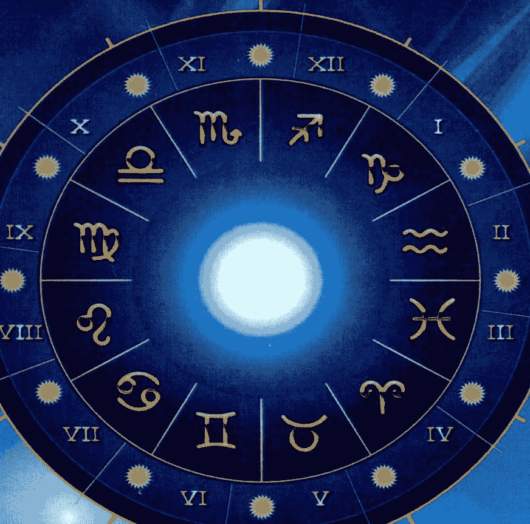
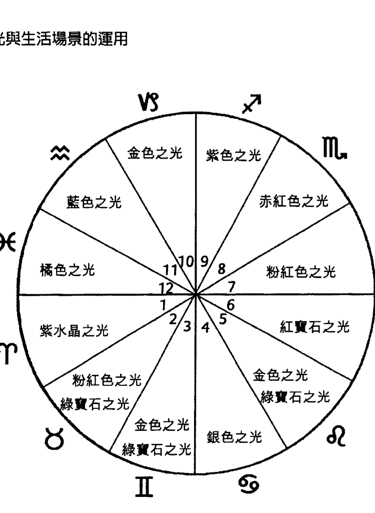
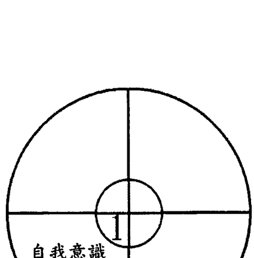
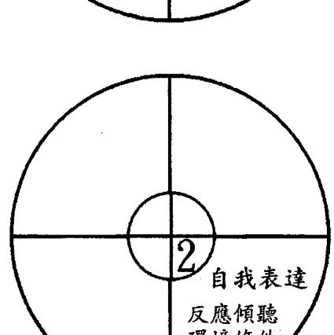
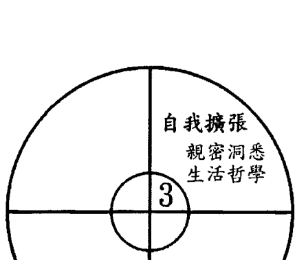
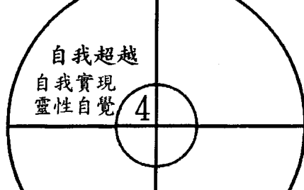
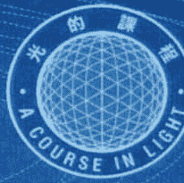

## 擴展與療癒
占星與光的學習與應用
作者 雨路

### ——占星與光的學習與應用

## 目錄
- 出版序 5
- 序文 9
- 不同的清理 13
- 我們有兩個血統 16
- 先活出自我，再放下自我 18
- 前言 20
- 光與行星・星座 21
- 太陽☉ 24
- 月亮☽ 35
- 水星☿ 46
- 金星♀ 60
- 火星♂ 72
- 木星♃ 81
- 土星 89
- 天王星 97
- 海王星 105
- 冥王星 114
- 星座的元素與屬性 122
- 上升星座與下降星座 131
- 十二宮 134
- 陰影：生命的耗能結構 145
- 一生不只愛一次 149
- 從八宮到十二宮 152
- 無臉男——沒有人收留的愛 155
- 三王星 157
- 行運的天王星——裂变與短暫迷戀 159
- 行運的海王星——化不開的心靈霧靄 163
- 行運的冥王星——小我死亡的心靈轉化 169
- 徐志摩的感情世界——暖暖的人間四月天 175
- 情人 181
- 屠龍 188
- 教師們——教導基督之光的人 190

## 出版序
十多年前初識雨路老師時，雖然她已是一位知名的占星學家，但是當她遇見「光的課程」時，卻從未向我提及自己的占星課程，反而是一味地埋頭苦修「光的課程」，遇到光的清理的考驗時，始終勇敢地面對與穿越。歷經十多年的結合運用，驗證其效果之後，方訴諸文字，將占星與「光的課程」做了一個融匯與整合。這種謙虛沉潛的涵養，使我無論在什麼情況下都發自內心地予以尊重與支持。

然而，出版《擴展與療癒》卻不是出於我個人的情感因素，而是我看到雨路老師走在人本心理學與演化占星學的系統上。在這樣的系統中，事件的解說是為了詮釋行星對地球人類的生命所可能產生的影響。任何行星、任何相位都沒有好壞的評判或對錯的分別，只闡述人類在地球上因星際影響所呈現的生命形態。

不同於傳統預測占星學的是，透過文字，她使大家理解在星移物換的影響下，我們如何將「光的課程」所教導的能量運作體系實際運用在生活中，以覺知來清理與轉化生命中所發生的事件，並在穿越的過程中達到意識的擴展。

我將這體系的占星學與「光的課程」相互輝映之處做了一番整理：
1. 兩者都認知許多有形世界中所發生的事件，往往是無法以人的頭腦意識或人的意志去解決的。它必須從內在次元的心智活動開始轉化。
2. 生命事件是帶著目的和意義的。一切事物都在完美的秩序中，即使是那些看似混亂又毫無目的的境遇。
3. 每個人都必須透過自己的生命經驗來轉化自己，繼而達成更高的覺知，以便在超脫中擴展，以體現較高的生命本質。
4. 要完善我們的生命，我們必須在各個層面上都學會滋養自己，不論是肉體、情緒體、心智體或靈性層面都必須獲得滋養與療癒。
5. 靈魂根據自我的記憶及其包含的影像作為下一世結構的基礎。我們每一世都會延續上一世留下的東西，兩門課程都在教導我們如何深入內在自我，從靈魂意識中做釋放、清理與調整。
6. 教導我們如何平順、漸進、不具傷害性地演化與成長。這將使靈魂不需要以驟變性及充滿創傷的事件來敦促我們的成長。
7. 抗拒成長，拒絕與較高自我融合，我們便陷入在防禦、報復、忌妒、憎恨、占有、操縱、懷疑及強迫等負面的思想意識與行為中，造成必須平衡的業力。然而，當我們樂於與較高自我融合時，我們便能逐步走出負面業力的糾結。
8. 人本占星學、演化占星學與「光的課程」都使我們對生命有更深的理解，以更大的覺知活出生命的完整與美好。
9. 兩者都是讓我們獲得獨立與自由的系統。然而，就像任何學問與專業一樣，我們必須經年持續不斷地付出心力、意願與意志力，才能體會出它們驚人的療癒與提升的效果。

有人質疑占星是否成為習修「光的課程」的另一個必修課程，光的帶領人是否也要成為占星學家？

擴展與療癒的課程有許多，我們一直強調「光的課程」只是其中之一，它的美妙之處在於它可以與其他課程或系統相容。奇蹟課程、瑜珈、塔羅、佛經、易經、聖經、可蘭經都是可以與「光的課程」融合的靈修系統。

帶領「光的課程」在短短兩三小時的課堂上，必須專注在那一週教材的研習與光的運作上，否則會失去其焦點，影響課程的效果。許多人僅習修「光的課程」，在光的運作中開啟內在覺知，深入光的智慧，使自己的生命臻至圓滿。因此要習修「光的課程」並不一定要習修占星，要成為「光的課程」帶領人，也並不一定要成為占星學家。

《擴展與療癒》的課程是透過對星盤的理解來瞭解自己的生命，從領悟中釋放，並啟動光的運作。這兩個課程方式稍有不同，應分開學習，但因它能相輔相成，如果能為自己多開一扇窗，可以對自己與別人有更多的理解，並從中窺見更寬廣的天地以及宇宙秩序的奧妙。

我們出版雨路老師的這本《擴展與療癒—占星與光的學習與運用》，只是代表我們以敞開的心接納所有對靈性進展有益的課程。我們衷心期望各個不同領域的教師們，能為我們帶來不同課程的結合運用，俾使這物質世界能以百花齊放的方式綻放璀璨的靈性之光。

杜恒芬 2012年十一月

## 序文
2000 年 11 月初，我上台北參加《光的課程》新書發表會，Vicki 為我安排了與 Toni 面談的時段，那是一個改變我一生的因緣，解讀結束後，我坐在 Vicki 家的台階哭了很久，恍如隔世。

Toni 的第一句話說：「你的功課是擴展，」並告訴我《光的課程》與占星是互容的，在互容後，會有突破。接著說：「你對占星會有更多的領悟，會幫助很多光的學生透過占星了解生命，經由《光的課程》，治癒我們所有的因果，就能把自己放在一個恩寵的狀態中。」

2003 年的面談，Toni 說：「你的任務、你的使命之一，就是要學會光的不同色彩的頻率與行星之間的關係，幫助學生們了解，他們如何受到各種行星頻率的影響，《光的課程》與占星之間如何融會貫通，就是你的下一本書。」

Toni 又說：「你不需要急著去做這件事，在你心裡已經有了內在視野，你只要讓它慢慢成熟。」

2010 年面談，安德魯上師透過 Toni 告訴我：「有一群人是在地球上首先接收到上師訊息的人，耶穌的使命是把基督意識帶給世人，很多人追隨這教導，你是其中之一，在亞特蘭提斯文明早就開始時，陸沉之後，有幾位教師在地球重新教導人們神聖意識……那一生，你第一次理解光是一種可以使人類獲得療癒的頻率，你的名字叫莎拉，你在一個婦女團體中教導人們學習光的元素，以及如何整合他們的心識與身體。那一生，你就理解占星對人們的影響，你受到召喚，告訴他們人生的方向，你受到尊敬與愛戴。後來許多事情發生，使你的使命變得很困難，就像我安德魯一樣，被一群詆毀聖靈的人關到監獄。雖然你最終死在監獄裡，但你已經有了內在的洞見與智慧，讓自己釋放憤怒與痛苦。因此，這一生，你帶著同樣的對真知與占星的理解擁抱著《光的課程》……」

難怪我有十多年在婦女團體，難怪我的工作與法院假釋學員、監獄、看守所、更生人的課程有關，難怪我月亮在十二宮，過去的因緣都與這些事物有關。

> Toni 接著說：「你將會寫一本整合你的領悟的書。你將更深一層地領悟到行星如何地影響人們的生命……。你的身體在抗拒你未來的使命……你的頭腦一直在拖延，但是你會受到指引，你會從較高次元中獲得啟發與洞見。」

在我的理解中，行星的能量的確與我們內在力量相應，從星盤可以看出一個人的潛能與發展，如同心靈地圖，行星的相位代表能量的和諧與拉扯，不相容的部份就是我們要下功夫的所在，行運的天王星、海王星、冥王星更是破除僵化，加速促進我們意識的改變，但必須透過與光結合，才能有效地轉化提升自己。

> 2011 年 Toni 告訴我：「首先了解每一個光的目的與功效，了解如何運用思想意識及肯定語意去療癒每一種狀況，而占星能夠提供線索，知道自己所面對的是什麼挑戰，以及要超越的課題是什麼。」

由於坊間占星的書已經很多，本書定位在初學者了解占星與光在生活上的學習與實用，引用《光的課程》及 Toni 的資料部份，為了尊重原意，如實呈現，而書中所提及的案例背景皆有改寫，若有雷同，實屬巧合。

剛進入《光的課程》系列一的初學者，可以按照行星與星座相關的內容去啟動光，但已進入《光的課程》行星級次以上的同學可憑直覺靈活運用。

生性疏懶，拖延至今，回首這十年來的漫漫長路，我所做的正是擴展我自己、擴展光，直到現在才把光與占星結合，而這些過程，都在 Toni 第一次見到我所講的第一段話就揭示了重點，我卻需要用十多年的歲月才能完成。

雨路
二〇一一年四月

## 不同的清理
當我開始習修光時，我以為我應該沒有什麼好釋放的了，我在晚晴有多少親密的分享、有多少演講，不斷地釋放，我的清理應該早就完成了，何況我也打坐，參加禪七或內觀禪十。但是後來我在光中，還是有很多次的釋放，淚流滿面，分別是十二年前的、三十五年前的，像剝洋蔥一樣，越來越深入。

一樣的釋放，為何效果不同？有很多婚變的人，二十多年仍在情傷的問題中打轉，像錄音帶一樣重覆播放她的恩怨，我認為區別在於啟動較高頻率。

一般的釋放是情緒的渲洩，但細胞意識沒有提升，光的運作是幫助我們釋放細胞裡的記憶，當我們呼喚所有的自我來到前額，包括化身自我、個性自我、身體自我、器官自我、細胞自我，把所有的意識帶到前額，然後把這些自我都往上帶到靈魂光體中，所有過去的記憶，這一世的記憶都在那裡，光的能量被引導進入身體，每當靜坐時，這些能量就跟儲存在身體中細胞的記憶、器官的記憶連結，這就是一個整合的過程，細胞、器官都對這頻率產生反應，細胞裡的記憶就會浮現出來，這些細胞記憶在理性思想上被啟動，理性思想開始釋放那些被壓抑、被壓迫的負面情緒，在光的運作中，你會釋放那些你覺得困擾的事，釋放那些過去世的記憶，四個級次就在作釋放整合，它會持續地經由不同級次的運作而完成。為了清理及淨化，原有的問題會被凸顯出來，包括身體、情緒的舊創……，透過寬恕、釋放、提升、轉化的過程，讓過去的業獲得清理。

一般的冥想也能讓我們進入右腦的世界，體會那份安祥，但是倘若只有短暫的寧靜，可以靜中定，未必能動中定，我也看過舉止都很沉靜的人，發怒比沒修行的人更厲害，一般修行人雖然不致於壓抑負面情緒，但缺乏由外至內「有次第的釋放」，像剝洋蔥一樣，所以啟動我們內在精神本質的較高頻率及有次第的漸進釋放是光與其他法門不同之處。

在乙太中的宇宙心識裡，阿卡沙秘錄儲存著所有的因果，趁著現在我們有肉身，藉由光的頻率將負面事物引發出來，清理淨化，遠比失去肉身後的清理來得容易，如果我們在失去肉身之後面對試煉時，還執著欲望，一動念就到相對應的世界隨著欲望墮入無底深淵，這是很可怕的。為什麼光行者要覺察自己的心念，原因也在此。基於宇宙法則，在第三次元，我們所做的將會有某種程度的回到我們身上，在第四次元，我們所做的將以三倍的果回到自身，時間更快了，在第五次元，我們所做的將以十倍的果回到自身，而且是在瞬間形成，當我掙扎於小我執著的習性時，常以此警惕自己。

以我這十多年的體驗，對於光的特殊處，我已實證：
- ◎光的確可以釋放細胞記憶，過去的陳年舊事在光中被挑起，如同電影播出，歷歷在目，畫面鮮明，而後，藉由靜心冥想時的較高頻率，確實可以提升細胞意識，改變自己的觀點。
- ◎光的確可以轉化我們的思想，轉化較低體系的情緒執著，加強我們內在的覺察，幫助我們覺醒。進化需要能量，我們在光中提升身體的頻率，是為了幫助我們從習氣業力的執著中解脫出來，我們在光中啟動了可以改變種種困難的能量。

《光的課程》確實是一個快速的消業過程，光的確可以幫助我們超越業力，但必須紮紮實實的走過，為了清理彼此間的因果糾結，一些負面事物會爆發出來，一開始，不要被這些紛擾所影響，也不要在現象中看生滅。我親眼見到在短短的一年內，對立的雙方從攻擊、衝突、矛盾、不信任，轉化為和平互惠，讚賞對方。這過程需要時間來清理及提升，並釋放過去的因果，所以上師們常說：「要對自己有耐心！」同時，要信賴這個清理過程，要對《光的課程》有信心。

## 我們有兩個血統
我們有兩個血統，第一部份，屬靈的血統與宇宙同源，繼承了太陽能量的神聖天性，「光」是中性的精神體，被稱為自性或性靈；第二部份，肉體的血統來自父母，成長過程受到社會意識的影響，形成具有自我意識的一個人，包括身體、思想及形象。

從佛法的觀點，並沒有一個真實的「我」的存在，我是由：四大——地水火風、五蘊——色受想行識、六根——眼耳鼻舌身意及八識——前六識加第七末那識、第八識阿賴耶識所構成。如果你看了哈佛大學腦部科學家吉兒．泰勒在中風康復後寫的書以及演講，就會發現那個獨立的個體——小我，是左腦的意識，而右腦的「我」是一個與大我連結，安詳合一的能量體。

生命是一場進化的旅程，我們進入地球這個教室，藉著現象的具體化，來看清楚思想、情感、欲望驅動的後果。軀體和形象在生生世世因課題不同而有改變，但真正的生命超越生死的侷限。

我們藉著第二部份展開探索的旅程，面對生命的挑戰，突破困難與限制，在過程中，激發內在的勇氣，與第一部份連結，獲得潛意識中的智慧。

名字、性別、職業、頭銜等，只是我們在某一時空下，所扮演的角色，別人也許這麼形容妳：「身高一百六十五公分，體重五十公斤，家境小康，育有一子一女……」似乎描述得很明確，但這真的是妳嗎？其實這些都只是和第二部份的角色及形象有關。

日常生活中，大家都要為角色而忙，為了角色的種種困擾而受苦，離婚者忘不了她的婚變，媳婦忘不了她的婆婆、商人忙著賺錢、老師忙著上課……。

大部份的人認為自己就是那個角色，沒有覺察到，角色與形象是因緣聚散的，緣聚時，是某太太、某經理或某主管；緣滅時，一切都是過眼雲煙。

我曾經執著妻子角色就是我，在婚變之後，發現自己成為一個失去符號的人，我也曾將全部的精力投注於工作角色，卻在離開工作職場後，感到頓失所依，一生在角色遞換中流連忘返的人，會錯過探索自己內在生命的機會。

大部份的人都被土星的責任卡死，沒有經由身心靈的學習，或是工作坊深入的探討，很難挖出內在深層的東西，即使挖出內在的東西，回到日常生活也是馬上回歸舊我，雖然知道問題，卻無法改變習性。

我們很幸運，透過習修《光的課程》，在靜心冥想中與大我連結，抽離角色的層面，去覺察靈魂的意願，把宇宙真理應用在每天的生活中，生命只是透過這些體驗來學習，並不要我們執著角色而太入戲，因緣聚合時，盡全力去做好自己該做的事，獨處時，學會抽離，靜觀與自照，緣滅時，只是卸下角色的外衣，與內在的生命無關。

## 先活出自我，再放下自我
人生有些弔詭，如同有光的地方就有陰影存在，生命的旅程需要透過自我去體驗學習，但是過度膨脹的自我卻阻絕了人與生命本源的連繫，在不斷地向外貪求中，產生枯竭感。

但是對於尚未活出自我的人而言，放下自我並不容易。靜心冥想時，我深深體會心理學家容格的論點——自性完善和諧實現之前，人格必須從個體化獲得充份的發展與滿足。

容格把人生分為兩個階段；拋物線的前半段會向外追求，發展自我意識，在紅塵中打轉，建立人際關係，為了得到社會的肯定與認同，這是英雄向外的旅程。人到中年，生命拋物線開始下降時，為了找出內在生命的意義，開始向內探索，關注自己的心，整合不同的需求，以達到和諧並照顧到屬靈的需要。

內在和諧的前提是，讓心靈中的每一種能量都能獲得展現的機會，同時要平衡社會的外在需要與潛意識的內在需求。不要壓抑任何一種能量，過度壓抑會造成引爆的後果，收拾殘局帶來更多麻煩。學習接納自己黑暗中的每一部份，包括負面情緒和卑劣的習性，悲憫地看待自己每一次的掙扎與自拔。

現代人都很勇於爭取自己想要的，壓抑的部份比較少，但多數人傾向順應外在價值，卻忽略了自己內心的聲音。忙著照顧形體的滿足卻沒有覺察內心的渴望；或是一味凸顯旁人肯定的特質，卻不敢正視自己的陰暗面！

個體化旅程的最終目標是到達中心點，讓「外在的我」與「內在生命」結合，每一個人都在個體化的旅程中奮鬥，就好像故事中的圓桌武士們依照自己選擇的途徑進入黑森林，面對挑戰，尋找聖杯。

聖杯意味著找到自己存在的意義，能夠超越世俗二元化價值觀，整合內心各種不同的衝突與需求之後，頭腦與心靈能和諧共處。並且能依循內心的喜悅而活，在生活中實踐心靈的最高潛能，將自己潛能中的天賦禮物送給這個世界，與生命源頭的慈悲連結，當身心整體達到平衡和諧狀態時，你就是一個尋獲聖杯的人。

## 前言
每一個人的星盤中，都有十大行星、十二個宮位及十二星座，所不同的是有些行星力量被強化或形成星叢，我們感受到較強的影響力，而沒有行星的空宮，它的能量依然存在，只是隱藏到潛意識層面，當行運的行星走到該宮位時，才被彰顯出來。

一般人比較知道自己的太陽星座，但不清楚月亮星座或目前的行運狀態，例如某人太陽射手，他無法理解自己為什麼喜歡藍色之光更勝於紫色之光，他可能是月亮水瓶或目前正處於行運天王星的相位中。

所以，我們與每一顆行星、每一個星座都有關，只是強弱不同，如果感覺內在情緒或事件很接近，我們就可以運用那個顏色的光來療癒自己。

## 光與行星·星座
| 光 | 行星 | 星座 |
|---|---|---|
| 白色之光 | 基督之光、內在的佛光 | |
| 銀色之光 | 月亮 | 巨蟹座 |
| 金色之光 | 太陽、土星 | 獅子座、魔羯座 |
| 藍色之光 | 天王星 | 水瓶座 |
| 綠寶石之光 | 太陽、水星 | 獅子座、金牛座、雙子座 |
| 紫色之光 | 木星 | 射手座 |
| 紅寶石之光 | 水星 | 處女座 |
| 橘色之光 | 海王星 | 雙魚座 |
| 粉紅色之光 | 金星 | 金牛座、天秤座 |
| 紫水晶之光 | 火星 | 牡羊座 |
| 薄荷綠之光 | 地球 | |
| 赤紅色之光 | 冥王星 | 天蠍座 |

## 宮位與生活場景
- 命宮
  - 個人的特色、行動力
  - 自我形象、氣質
  - 早期的環境
- 財帛宮
  - 物質資源
  - 對金錢的態度
  - 賺錢花錢的能力
  - 價值觀、財產
- 兄弟宮
  - 溝通
  - 思考
  - 小眾傳播
  - 初等教育
  - 短程旅行
  - 與兄弟姊妹、鄰居的互動
- 田宅宮
  - 不動產
  - 家居生活
  - 內心之家
  - 內在情感根源
- 子女宮
  - 才華展現
  - 戀愛與娛樂
  - 幼兒教育、子女
  - 創造力、偏財
- 僕役宮
  - 社會服務、工作態度
  - 與部屬同事的關係
  - 身心靈健康
  - 家務承擔
- 夫妻宮
  - 合作夥伴
  - 婚姻的態度
  - 婚姻、配偶
  - 公開的敵人、公共社交
- 疾厄宮
  - 生與死
  - 遺產與債務
  - 玄學、深層情欲
  - 夫妻共同財產
- 遷移宮
  - 心靈智慧
  - 人生哲學
  - 高等教育
  - 長程旅行
  - 世界觀
  - 宗教、法律
- 事業宮
  - 公眾形象
  - 名譽地位
  - 社會成就
  - 人生志業
- 福德宮
  - 社團組織
  - 友誼互動
  - 群體關係
  - 人性關懷
- 玄秘宮
  - 召喚
  - 終極關懷
  - 潛意識、靈修
  - 業力反撲、內省
  - 私密性事物、隱退

## 光與生活場景的運用

## 太陽
### 發光發熱照亮別人

太陽代表我們的潛能與終身課題，象徵我們意識的核心，是我們有待完成的人生目標，我們可以避開負面特質，朝著太陽的正面特質去發揮。

太陽的符號◎，圓圈代表與永恆靈性連結的宇宙，中間的一點代表自我源源不斷的生命力，太陽每個月移動一個星座，與其他九顆行星產生關係，就像日出日落的循環一樣，經過基本星座的開創、固定星座的持續、以及變動星座的調適，自我也在這樣的旅程中，面對挑戰。太陽是我們跑人生馬拉松的長程動力，人一生中所表現出來的意識型態，都帶有太陽星座的特質。

太陽是古代宗教文化中，備受崇拜的焦點，王室頭上戴的皇冠金環，就是模仿太陽神的光芒。太陽是一個陽性行星，它提供發光發熱的動能，表現出生命力，讓人感受到自己的存在。太陽為源自父系的遺傳，例如：我父親是一個什麼樣的人，太陽也代表了權力，傳統女性沒有獲得權力的管道，她的太陽就由父兄代為演出，但事實上，兩性都必須經驗到陰陽能量的均衡展現，才會擁有完整的人格。

基於太陽的屬性、與太陽產生相位的行星、太陽所在的宮位、星座都不同，所以，我們每個人的特質，自我表達的方式，散發出熱忱與光芒的領域都不相同。太陽的屬性是我們能量的基調，例如太陽在火象星座的人擁有勇敢、熱忱及行動力的特質。太陽在土象星座擁有穩定、踏實及物質建構力。太陽在風象星座具有知性及溝通、表達觀念的能力。太陽在水象星座的人重視情感、體恤他人，感受性及同理心較強。

太陽所屬的星座提供了以下的線索：什麼事情讓我覺得生氣勃勃？我以什麼方式來展現生命的獨特性？我以什麼方式呈現創造性的表達？我以什麼方式完成自我實現？在生命中，我真正想做的是什麼？

太陽所在的宮位讓我們清楚：這一生，我在何處發光發熱照亮別人？何處是我獲得權力的場景？我將在什麼領域歷盡艱辛，經歷層層考驗，在何處表現出我的潛能，發揮我的特質，實踐我今生的目標。

當一個人能夠生氣勃勃，以他的特質來展現生命的創造力，發光發熱去愛別人，就是在表現他獨特的太陽能量，活出自我，踏上英雄的旅程。

### 英雄之旅

我們常聽過這一類典型的神話故事，主角可能是一個平凡的少年或王子，因為某種原因或內心的召喚，必須離開他熟悉的家園，展開一連串的冒險。他面對無人島上的惡魔，或是狠心男爵的一路追殺，在九死一生的奮戰過程，激發了內在的勇氣及智慧，終於戰勝邪惡，拯救了公主，尋獲生命寶藏，最後衣錦還鄉。

這類英雄歷險記，就好比我們追尋真我的過程。太陽提供了個體化的趨力，我們運用太陽的能量展開自我實現的旅程。星盤中基本的陽性原型來自父親，但是成年後，我們要在自己內建立起成熟的心理能量。踏上征途的主要目的，就是要建立健全的自我，自我表達、展現創造力、認可自己，發光發熱照亮別人，這些都是英雄之旅要做的事情。

在整合自我的過程中，將會體驗到陰陽兩種能量的均衡互動，陰性能量是潛意識、內在直覺的接收；陽性能量是將意識擴展，導入物質世界具體實現的行動力。

一開始，英雄接受內在的召喚（陰性能量），展開自我追尋的冒險（陽性能量），故事中常出現的仙女給予協助或提示，其實是意味著英雄在旅程中的探索需要傾聽直覺的指引（陰性能量）。他奮勇作戰，突破萬難（陽性能量），成功的關鍵是他在危急時信任自己的直覺——來自潛意識的智慧（陰性能量）將無意識的資源意識化，結合外在的行動與內在的神聖能源（陰陽合一）。

英雄要離家時，就像我們初踏入社會時一樣生澀，會遇到很多試煉來考驗我們的勇氣。在征服各種困難之後，從經驗中開展自己，變得自信、成熟，有勇氣為自己發言，也有能力挑戰舊秩序。

每個人都有太陽星座，也都具有完成個體化的潛能，但也有些人因為不同的理由而放棄追求真我的理想，他就會變成故事裡的巫婆或繼母。當英雄在自我追尋的路上邁進時，巫婆總是百般阻撓；當別人活出自我時，批評他人與眾不同或尖酸刻薄的反應，都是巫婆心態。

不要因為任何壓抑而放棄追尋真我，任何磨難，走得過都是英雄，陷在負面情緒裡詛咒別人，就是巫婆。聰明的你，要做英雄，不要做巫婆！

### 太陽－金色之光

太陽的使命是完成一個人獨特的英雄之旅，但是在旅程當中不免會遇到艱辛的過程，導致能量低落。每顆行星都有基本面、進化面及退化面，一般狀態可以維持在基本面；公開對外的活動大部份能表現進化面，私生活可能出現退化面；能量充沛時，表現進化面，能量低落時表現退化面；或是看自己都看到進化面，看別人只看到退化面；也可能很自卑，看別人都看到進化面，看自己卻只看到退化面。

太陽是我們的理性自我與成人自我，太陽呈現基本面時，我們會感受到太陽的熱情及自我表現的力量；呈現進化面時，能夠獨立自主，開發最高潛能，活出自我的堅強毅力；呈現退化面時，表現出被小我權力慾所操控的自私自大、膨脹虛榮的侵略行為。

我們的靈魂從宇宙光的本源投生進入物質世界，成為有肉身的形體，是為了將靈性意識透過物質世界來創造表達，實現我們渴望達到的目標。頂輪的金色之光是一種與太陽有關聯的陽性能量，像一輪永不西落的太陽，我們可以用金色之光來轉化自己的思想，幫助我們朝著目標進展。每個人都想開發自己的最高潛能，完成自己的生命目標，但是我們有時候會自我懷疑，或受到肉體、思想及物質世界的侷限，在英雄的旅程中，也不免有些失敗或受挫的經驗，金色之光加強我們正面的理性思考模式，並且轉化因過去經驗所產生的負面情緒。

金色之光會像鐳射般的破除焦慮感，並且釋放憤怒、失敗的感受，轉化為愛與接受。轉化來自意識的更新，將負面型態轉化為正面，使自己不再陷於虛妄痛苦的影像裡，去除無法發揮動力能量的障礙，由被動轉為更具活力。

末法時代的隱憂就是群體意識中分裂與鬥爭的負面能量，由於相同頻率的思想會互相吸引，當我們提升了身體的頻率，就能夠超越業力，因為業力形成我們的慣性思維，與固定的行為模式，金色之光能幫助我們與較高思想融合，每當我們能以較高的思想模式來思考時，就能夠為自己、為他人帶來正面的能量，並影響周遭的人。

金色之光除了能將負面影像轉化為高頻率的愛與喜悅、和諧與寬恕，還能加強太陽創造力的顯現。創造力的最高顯現就是心物合一，任何散佈在乙太中的思想種子都會開花結果。在靈魂裡，早就依個人的視野及靈魂的意願儲存了許多資源，在金色之光中，觀想這寶藏被開啟，幫助我們實現靈魂的意願。

靈魂不需要進化，靈魂本來就是完美的，只是靈魂希望在身體層面展現靈魂本有的智慧及力量，個體的存在必須提升到能呈現這完美頻率的表達。心識和物質是可以成為一元的，我們來這世間，就是為了使心識成為心靈活動的創造者，顯化在地球上。

每個人都有一個意識的密碼，烙印在靈魂體系中。在第六次元靈魂的家園，我們對某種理想有崇高的憧憬與渴望時，頻率開始振動產生創造的能量，為這趟生命旅程的探索作了承諾，當我們與造物主共同創造時，不斷地解開自己意識的密碼，找到發揮自己創造力的地方，成為我們這一生所承諾的角色，這一生是為了給出自己而來，在為別人奉獻自己時，得到光與療癒的回饋。

在乙太、星光體的層面，當我們被一些未了結的因果所束縛，阻礙了英雄之旅的完成，我們可以在金色之光中，祈求將這一切帶到圓滿解決與完美的平衡之中。當我們與光的能量融合，改變我們對生命經驗的反應，和自己的靈魂達到和諧，與宇宙心識合一的事奉，我們將感受到恩寵，在豐碩與富足中擴展精神意識，強化太陽正面的目標與願望，完成人生使命中所要表達的。

在金色之光中，由於負離子的作用，使我們的腦神經獲得平衡，學員上課的情緒都很高亢，但是也有一些人有頭痛的現象，大多是因為過度使用理性體，批判自己不夠好，對自我要求過高。

《如蓮的喜悅中》有一篇露易絲·惠的「治癒你的身體」的文章，提到頭疼源於認定自己無能。下一次你頭疼的時候，問問自己你哪裡做錯了，你是如何讓自己做錯的。寬恕自己，讓過去的過去，頭疼就會「從哪裡來，回哪裡去」。

與金色之光有關的行星是太陽與土星，可能在獅子座與魔羯座的宮位、或是太陽及土星所在的宮位呈現，主題與該宮能量有關。例如某人是二宮宮頭獅子座，她從事證券業，在某次的金融風暴中，她隱瞞著委託她操作股票的親戚挪用了對方的錢，而欠下了龐大的債務，每日都必須在周轉錢的焦慮中度過，她在和 Antoinette Moltzan 的諮詢中提到了這個問題，Toni 請她連續三十天持續地做金色之光，她照做了，沒想到之後某一天，被她挪用金錢的親戚打電話向她問起錢的事時，她升起無比的勇氣平靜地向親戚說出了事實，而親戚也異常冷靜地接受了這個狀況，金色之光並未直接幫她解決財務問題，但讓她有正面的勇氣去面對這個事實，之後她雖然還是要每個月償還債務，但心中已不再需要背負說謊的罪咎感，人也就清爽明亮了許多，這件事，改變了她的人生信念與對金錢的態度，活得更坦然自信。

在金色之光中，有些人開心得不得了，像充滿能量的電池，有人感受到性慾，有些人為了捍衛自我主權而憤怒，和主管抗爭不平等的對待，也有人努力在尋找自己的人生目標。

有位學員擔心她的孩子無法適應在外島當兵的日子，把孩子放在金色之光中，日後收到孩子的信，覺得孩子變得堅強而感到安慰。在金色之光使用的肯定語意是很重要的，直接輸入細胞意識中，有人覺得自己更有自信了。

## 獅子座：內在能源的釋放

成為英雄並非世俗價值觀所認為的出人頭地，或受成敗觀念所制約的功成名就。英雄追求的聖杯是依循內在直覺而行動，不依附任何組織，特立獨行於體制之外，有勇氣對抗舊秩序，超然的生存，能夠超越世俗價值觀，找到內在的自由與寧靜時，即使從事世人所認為卑微的工作，他依舊能尋獲聖杯。

十二星座中，最具有英雄形象的是獅子座。獅子座的人天生具有領導能力，是尊貴的，喜歡華麗的金色與紅色，太陽是獅子座的主宰行星，太陽的動能提供給獅子座的人源源不斷的生命力。

每一個星座都在平衡上一個星座過與不及之處，經歷巨蟹內向的自我保護之後，獅子突顯出個人主義及自我實現的動力。在生命旅程中，獅子座以自我表達、創造力、冒險、戀愛、遊戲與演出來展現這股充沛的內在能源。這些事情有什麼關係呢？初期的戀愛就是一種來電的感覺，充滿創造性。戀人間彼此的分享與探索，是生命中難忘的經驗，有誰會像戀人那麼用心聆聽我們講過去的生命史？有誰像戀人那樣把我們看得那麼獨特？戀愛的感覺就是獅子座生命的活化劑，戀愛中的人充滿創意，用全新的眼光看世界，彷彿每一件事都有光環，戀愛的結果和賭博一樣具有冒險性。

獅子座有如火焰般興奮的生命能量，一開始是為了抒解其創造力而遊戲，玩得興高采烈時會認真的投入，認為生命是一場熱情的演出，以觀眾的反應為導向，成熟的獅子關心的焦點，會由個人英雄主義擴展到照顧群體。

獅子是不被限制的，很能擔當，慷慨熱情有愛心，但是獅子表達他的愛，是以自己的期許；而非以對方的需要為出發點，傾向於父性之愛，有那麼一點霸氣在裡面。所以付出時，要考慮到對方的需要，對方才能感受到你的好意。

大部份的獅子都會強烈捍衛自己的尊嚴，正常狀態下，獅子會表現出溫暖大方的生命力，並能展現戲劇性的創造動能；當他處於退化面時，會過度的自我膨脹，高傲自大；處於進化面時，他是忠誠照顧部屬，體貼幽默與王者之風的領導者。

獅子座具有藝術氣質，應加強培養技藝或藝術才華，在創造中發現生命內在的喜悅。不論你的太陽、月亮、上升星座在獅子座，或是群星聚集，五宮被強化，都要特別注意表現欲以及強烈的創造性動能如何展現，當獅子無所不在的創造力被導向精神性的創造，開發自己的最高潛能時，你會看到他的生命之火光華四射，很少有人比獅子活得更莊嚴華麗，更具英雄形象。

## 金色之光與獅子座

星座是生命在時間循環中的演化過程，展現出不同的心理策略。對應光的主題，火象星座為乙太·星光體的層面，土象星座為身體層面，風象星座為理性體層面，水象星座為情緒體、感受體層面。

在乙太・星光體的金色之光中提到：物質世界不該被認為是一個幻象的世界，它是一個可以實現生命欲望的地方，獅子座的人把物質世界視為一個舞台，一個可以展示生命熱情的舞台。

金色之光是一種創造力與動力的勢能，與自性裡的創造層面有關，金色之光可以幫助任何有才華的人走向成功之路，獅子座的人可以用金色之光來加強他的創造動能，把精神的領悟對準物質的焦點，並具體創造出來。

獅子座的人喜歡成功，不習慣與失敗共處，但是，人生難免失落，可以在金色之光中，讓幻滅與失望的感覺浮現出來，感受這些挫折被金色之光淨化，治癒自己的傷痛與失落，從過去的經驗中提升出來。在金色之光中，感受自己是成功的、是被愛的，經過療癒，對自己的人生經歷有完整的領悟，對自己完美的心識能夠有新的表達。

金色之光真是獅子座的人的好朋友，陪同走過巔峰、走過谷底，走過輝煌，也走過沉潛，在過去十多年，行運的海王星在水瓶，對沖的相位使許多獅子失去焦點瓦解力量，成了沉睡的獅子。如果，我們的家人或朋友有这样的困難，雖然他們還不瞭解光，但是他們對生命有無力感，或是憂鬱的時候，我們可以啟動金色之光來幫助他，想像金色之光圍繞著他們，這樣可以幫助對方做正向的表達，加強他的陽性能量。

太陽在什麼星座，與宮頭是獅子座的宮位會產生關聯，例如某人的太陽水瓶座在六宮，一宮宮頭是獅子，那麼他就會透過水瓶的思維累積身心靈工作實務，來建立新時代講師的形象。

由於太陽提供了超強的光芒，宮頭是獅子的宮位，也會擁有華麗的貴族色彩，慷慨大方，充滿自信。與金色之光有關的是太陽與土星，所療癒的內容會在宮頭獅子座與魔羯座的領域、或是太陽土星所在的宮位呈現，主題與該宮能量有關。渴望在該領域得到力量與主權，進而展現自己。例如某人獅子十二宮，金色之光那一週突然清楚自己今生的目標，某人太陽五宮，金色之光時，特別在乎伴侶的重視，甚至為此吵架。有位學員設計了課程，努力爭取一個企劃案。有個太陽十一宮的獅子，離開行運海王星對沖相，覺得她走過陰霾了，特別開心，並準備為團體奉獻心力。

## 月亮
### 你的内心世界

我們原本可以透過直覺與內心世界有更深的聯繫，來獲得生命的指引。也許一般人不習慣靜下來聆聽自己的心，或者是因為外在環境的干擾；或是覺得自己「應該如何」的期許，阻止自己信賴直覺而忽略內心的訊息。

例如身心不對勁，不想上班或不想弄晚餐，但是又覺得不該如此任性。或者是在熱鬧的宴會中，心裡覺得乏味到極點，可是又不好意思離開……，有一份人人稱羨的工作，但是夜深人靜時，你很清楚自己實在厭倦這個工作。這個在沉澱、寧靜獨處時，浮現出來的感覺，就是月亮的訊息。

月亮的符號☾，就像靈魂的新月，是意識與潛意識的交界處，也象徵我們與潛意識的關係，包括我們前世的記憶，潛意識心靈中貯藏著腦記憶與超腦記憶，腦記憶記錄了過去的印象波，包括本身想遺忘的舊創，例如童年痛苦的情感事件；超腦記憶所貯藏的事情比大腦和身體的存在更早，甚至包括前世的記憶。

例如我們到一個地方玩，明明沒去過，卻有熟悉感，很可能這就是前世的記憶。而月亮星座相同的人初次見面，也有不同的感受，好像似曾相識。

月亮是我們安全感的來源，當我們太忙碌或太久沒有整理內心的情緒時，會有恍惚不安的感覺，偶而走路跌跌撞撞或出門忘了帶鑰匙，這時候就要注意安定自己的心，可能生活該做個調整了，也可能是發生意外的前兆。

月亮是我們感覺的接受器，也許過去的經驗讓我們覺得傾訴沒有效果，而自己又無能為力處理內心的悲傷或挫敗，我們壓抑情緒，長期的漠視它，這些未經紓解的情緒在體內滯留鬱結，最後，身體只好代勞，以病痛來提醒你注意。

太陽的能量推動我們突破自我追尋路上的障礙，月亮是前世的太陽，所以，月亮是我們不學而會的本能習性，顯示我們在什麼領域擁有天生的直覺。透過月亮星座，可以重整前世的本能來支援這一生。

心理學很強調「支持系統」，意指一個人遭受打擊時，周遭的親友是否能給予慰藉和鼓勵。良好的支持系統能幫助一個人度過困境與低潮，月亮就是我們內在的支持系統，我們滋養自己的方式和自我充電的來源。

## 月亮的影響

月亮是個陰性行星，掌管情緒反應及安全感，月亮的盈虧影響潮汐的漲退，人體內有百分之七十是水份，所以也會受到月球磁場和重力場的影響。

出生率與犯罪率常在滿月時最高。而其中又以群星聚集在巨蟹座或月亮在一、四、七、十宮，以及初一、十五日（新月或滿月時）出生的人，受到月亮變化的影響最為敏銳。

月亮代表前世的人格特質，受到情緒牽制，容易出現不斷重複的行為模式，這些習性阻礙我們靈魂的提升。「業」可以解釋為不假思索的慣性運作，習性就是「業」，當一個人經常受某種負面情緒折磨時，這些負面情緒也是個人業報結構的一部份，除非他能自覺，改變習性，打破自己的慣性模式時，才能掙脫業力的纏縛，獲得解脫自在。

透過月亮的星座與宮位，可以看出潛意識心靈被重塑的方式，經由生命中某些事件的療癒效果，去平衡或改寫我們情緒記憶庫在過去世所輸入的成見。所以創傷會推動我們性靈的提升，受苦有其正面的意義。

如果我們有能力滋潤自己，就比較不會索求被人關愛。透過月亮星座，讓我們了解什麼樣的活動可以滋潤自己，強化自己的支持系統。

當然，每一個人的充電方式未必相同，例如：月亮在火象星座的人，透過熱情、自我表現及活動力來使自己充滿能量。月亮在土象星座的人以建構物質，具有生產力及擁有資源來使自己獲得安全感及充滿能量。月亮在風象星座的人以觀念表達、腦力激盪、社交溝通來亢奮自己的能量。月亮在水象星座的人以深度的情感聯繫與豐富的感受性來使自己滿足，注意到月亮的需要，有助於情緒安適。

月亮是來自母系的遺傳，以及母性特質，月亮星座提示我們對母親的個人經驗，我們的內在兒童與情感自我，我們早年適應環境的生活習性，以及我們家居的擺設。月亮所在的宮位提醒我們在此處會經驗到階段性的盈虧，如同月形的變化，是我們情緒最敏感波動的地方，在此宮位所經驗到的事件是真正使我們傷心的痛。

月亮也具有群眾臉孔的作用，群眾臉孔是我們面對陌生人或陌生環境時的情緒反應，陌生人看到的其實是我們的群眾臉孔，打了招呼後，我們才會表現出上升星座的人格面具。

由於月亮兩天半移動一個星座，星盤的準確性很重要，如果你要感受自己的月亮星座，靜坐是深入心靈核心最快的方法。至少每天要有一段時間獨處，覺知自己的內在感受，拋棄慣性的負面習性，讓自己沈澱，好好的疼惜自己。

## 月亮－銀色之光

月亮顯示一個人情感依附的安全需要，當月亮呈現基本面時，此人能覺察自我的感受，能夠自我滋潤，懂得保護自己；當月亮呈現退化面時，可能有些神經質的恐懼，缺乏安全感，過度依賴；當一個人的月亮呈現進化面時，他能建立親密歸屬感，能同理、接納別人，也能表達溫馨關懷。

總之，從家庭的情感依賴開始，疼惜自己的內在孩童，建立內在的情感安全，在親密關係的愛恨糾葛中，發展出情感洞悉力，配合人生理念的建立，解決自己的現實問題，明白自己的終極關懷，經歷這些過程之後，才能發展出十二宮的情感付出，實踐無緣大慈，同體大悲的境界，這是我們從小情小愛走向天人合一的大愛的漫漫長路。

月亮管四宮，四宮是家庭親情，月亮的相位代表我們與母親的關係，月亮的星座描繪出我們透過什麼被撫慰，跟母親關係的困難模式，通常會在情愛關係或夥伴關係中引爆重演。在家庭中無法得到溫馨支持的孩子成年後，要花許多時間來清理童年的創痛，試圖從早期情感經驗的制約中掙脫出來。

頭頂上方十二吋的銀色聖杯被啟動時，注滿銀色之光的元素。關於聖杯，有很多傳說，其中一種說法是，當上帝與撒旦大戰時，一個中立的天使把聖杯帶到人間，意味著超越二元對立，在善與惡之間的心靈通道；另一種說法是，聖杯是最後的晚餐用的聖餐杯，當耶穌由十字架上釋放下來時，被用來盛滿耶穌的血，這血可以洗淨世人的罪，唯有內心純潔，已贖罪的人，才拿得到聖杯。

聖杯的故事也有很多版本，其中較膾炙人口的是「聖杯傳說」。聖杯之王是聖杯的監護人，負責保管聖杯，當他和異教徒對峙時，被異教徒去勢，此事意味著行事與心靈分割，國王受到難言之傷後，國土荒蕪，大地寸草不生，生命成為一片荒原。

根據神諭，將會有個「聖潔的使者」來到城堡，針對聖杯之王的困境發問，就能夠治好國王的傷。有一天，這位能解救聖杯之王的騎士波西瓦來到城堡時，他看到光彩耀目的聖杯，也看到國王被擔架抬了出來，他很想發問，但是又想到曾被告知：「騎士不要隨便發問！」猶豫之間，他遵從社會法則而捨棄發自真心的關懷，錯過一次拯救荒原之國的機會。

波西瓦繼續他的冒險旅程，五年後又來到城堡，這次他勇敢地提出問題，表達他的真心，治癒了國王的傷痛，也使國土恢復生機。

每個人靈魂的核心都擁有與宇宙根源連結的能量，但是也許和聖杯之王一樣，我們過的是與源頭切斷聯繫的日子，直到有一天，偶然的機緣，某人發自真心的關懷帶給我們啟示，觸動我們與源頭再度連結。

銀色之光對於內在的情緒與安全感具有撫慰的力量，有一位月亮天秤的同學，現在正承受土星的壓力而感到枯竭，我建議她做銀色之光與粉紅色之光來滋潤自己。有位學員得了乾眼症，Toni 建議她做銀色之光與薄荷綠之光來幫助細胞獲得更新，據說效果不錯。

## 巨蟹座：渴望滋潤他人

月亮是巨蟹的主宰行星，受到月亮的影響，巨蟹很敏感，容易感受別人的情緒，也容易受到潛意識影響情緒不穩定，重視家庭生活、親情及安全感，家庭與子女支持著巨蟹的元氣及情緒滿足。

巨蟹座是由個人進入家庭的第一個星座，巨蟹對於雙子的快速學習及外界刺激已經累了，退回舒適與安全中養息，在牡羊、金牛、雙子三個星座所培育的自我，開始受到傳統力量的支配，凡事都會考慮到家族及傳統。原則上，巨蟹座的人不喜歡離婚，當自我的需要與別人的需要有衝突時，傾向犧牲自己，來成全家庭與子女。家庭不圓滿時，巨蟹會因不安全感而退縮，產生消極的抵抗行為，婚變的巨蟹通常會堅持苦戰，爭取到子女監護權才肯簽字離婚。

不斷地滋潤與支持、照顧別人、保護养育，都是巨蟹的天性。有能力照顧別人是自我價值最高的表現，如春雨潤澤萬物的滋養也是人間最美的慰藉。巨蟹座的人不只在精神上表達這種美德，也有能力將滋養的內容物質化，例如煮東西慰勞別人。月亮在身體部位是代表滋養與受納的乳房與胃，古代膜拜豐碩乳房的女神形象來象徵照顧者的原型，和巨蟹的母性形象很接近。當金牛說某種食物很好吃，是出自感官味覺，而巨蟹說好吃，則包含情感成分，因為食物有媽媽的味道。

雖然照顧是一種美德，但是要做到適中也不容易，發自內心真誠的照顧並不需要犧牲自己。但當照顧的意願太強，完全傾向滿足他人的需要時，就會失去自己的立場。

倘若一個人在童年，沒有獲得母親的關愛，成年後，他有可能強烈地索求被愛或透過無微不至的照顧子女，來獲得補償。過度照顧會剝奪子女練習自主的機會，同時，讓子女在愛中感到窒息，如沐春風的關愛讓子女在被照顧中仍保有自主成長的空間。

如果照顧者與被照顧者彼此依附，相濡以沫，維持著一種共生的關係，倒也相安無事。但只要其中一方尋到了生命的活水，振翅欲飛時，問題就會產生。

有些照顧者覺得自己的犧牲得不到回報，心生怨尤，弄得家人都有罪惡感，只好設法取悅。也有些照顧者假愛之名行操縱之實，企圖支配子女去圓自己未完成的夢想。

大多數的巨蟹都喜歡維持滿足情感安全的生活習性，退化面的巨蟹會有一種過度防衛的不安全感，間歇的嘮叨或躁鬱，來行使他的柔性勒索，進化面的巨蟹可以做到無條件的關懷別人來滋潤自己。

## 懷舊的巨蟹

胡因夢在整理母親的遺物時，發現小時候用過的繡花被面、手巾、童年的舊衣服，都成了母親的壓箱寶，她自己是個除舊佈新的人，母親卻喜歡囤積舊物。

由此可見，胡因夢的母親必然和巨蟹座有關聯，巨蟹座的人對傳統及根源有依戀，他們從家族和傳統的領域獲得心靈情緒的滿足，喜歡收集與家族、情感記憶有關的紀念品。對他們而言，珍貴不是指金錢的價值，而是物品所附帶的情感回憶。同樣的，巨蟹座的人比較容易耽溺在懷舊的情境中。

家是巨蟹安全感的來源，也是療傷的所在，但是有些時候，因為太執著安全感，而變得過度自我保護。巨蟹重視情緒的歸屬，他們需要親密的朋友聊聊心事，來幫自己釐清情緒紛擾，否則會感到鬱悶枯竭。

不論你的太陽、月亮或上升星座在巨蟹，或是四宮被強化，都要特別注意到自己情緒的調理，不要為家人過度犧牲，同時因為你的善解人意，朋友們喜歡把他們的情緒垃圾倒給你，要覺察自己，不要受到別人情緒的影響。

在照顧他人之前，先學會照顧自己，中年後的巨蟹不會讓別人的情緒包袱壓得自己透不過氣來。會明白自己能負荷的限度，也懂得給自己找到抒發情緒的管道，或者利用散步、靜坐的方式來釋出印象波，清理別人磁場所帶來的雜質。

至於收集紀念品，在年輕時，也算是一種情趣，若是經歷世事變異的中年，仍守著這些寶貝，就有些耽溺了。不妨找個陽光燦爛的日子大掃除，把屋子裡過時的東西丟掉。勇於「割捨垃圾」的巨蟹會拋棄一些形式上的眷戀與執著，當外在改變時，內心也會清除掉一些慣性反應。不需要緬懷舊物來過日子，內在生命將更飽滿。

## 銀色之光與巨蟹座

銀色之光被稱為宇宙之母，是陰性女神的能量，巨蟹座由月亮所掌管，與銀色之光有關，當我們想要與陰性自我連結時，可以在銀色之光中得到支持。

巨蟹座的確是敏感且易受傷害的，當巨蟹感受到自己是一個被忽視的靈魂，而感到卑微、無所適從，有著被隔離、被遺棄的孤獨感受，覺得自己心靈需要被安撫時，他可以在銀色之光中獲得慰藉，讓銀色之光觸及自己的每一個層面，感受光在體內的每一個部位流動著，感受光是如何的滋潤著，改變了內在的情緒。銀色之光給人溫柔的感受，有如月光的輕撫，許多人在做銀色之光時都能感受到內心的寧靜，人也變得溫柔了些。銀色之光療癒了人際關係的傷痛，清理儲存在靈魂旅程中的負面記憶。

把治癒帶給別人，我們便能獲得治癒，巨蟹座的人很喜歡支持別人，但是憑著一己之力要療癒別人是艱辛的，成為一個有力量的輔導者或治療師，最重要的是先照顧好自己，然後，與宇宙或較高勢能連結，為我們帶來更大的力量。

當我初為人母時，我的朋友告訴我日航的救生衣上寫著，如果帶著孩子，母親必須先穿上救生衣，同樣的，治療師的救生衣就是銀色之光，治療師先滋潤自己連結宇宙之母的陰性能量，讓自己成為愛的管道，才能療癒別人。

在養育與守護的主題上，巨蟹同時也可能體會到兩極化的經驗，容易產生不能受到足夠的照顧，被母親、家人或朋友遺棄的恐懼。所以銀色之光的運作可以協助他們治癒這些感受，撫慰他們的心靈。

當我們在銀色之光中，所療癒的內容除了月亮以外，與宮頭是巨蟹的領域或是月亮所在的宮位有關。例如某人月亮在八宮巨蟹座合相土星，她的母親在懷她的時候就已經與父親離婚，她從小就沒見過父親，母親每天忙著工作，常常到夜晚還是一個人在家，所以她的情緒非常的壓抑，覺得如果不是因為自己，她的媽媽可以更快樂，自己若是軟弱或哭泣，母親就不會愛她，她的愛情也都是苦戀，在上銀色之光的時候，她抽到了真愛卡當中的「乾涸」，意味著她內心有如一片荒原，得不到任何的滋養，她承認了這個部份，並在銀色之光那週開始，學習不壓抑自己真正的感覺，容許自己流淚，並認知母親與父親的關係不是因為懷了她才破局的真相，接受父母離婚的選擇。

宮頭是巨蟹座的領域，具有寧靜與歸屬感的特質，可能從這領域接收滋養；也可能在這領域付出支持，看當事者是在情感需要的階段或已達到能提供情感支持的層面。在銀色之光中，宮頭是巨蟹的領域，可能感受到靈性的滋潤，覺得被宇宙守護著。

## 水星

### 讓頭腦做心的僕人

水星代表一個人的智識驅力及知性的潛能，類似左腦的功能，具有辨識力、推理能力、觀察力及語言表達能力，是理性、合乎邏輯的思考模式。同時，水星也掌管右腦的聽覺、視覺、味覺、觸覺、松果腺及神經系統，一方面可感受到物質性的存在，另一方面也能體悟到精神性的存在。

古代的水星是眾神的信差，現代的水星與電信系統、通訊、教育、書信、郵件有關，水星在什麼星座顯示我們思想的內容，我們將透過什麼方式來表達、溝通，以及我們對什麼事情有興趣，水星在什麼宮位，顯示什麼事情引發我們去動腦筋，有些人對錢感興趣，有些人熱衷事業，儘管大家動腦筋的事情不同，但是就像水星移動得很快一樣，腦筋動個不停的人是很緊張的。

頭腦對外界的刺激有它的連鎖反應，想要從水星的緊張中解脫，就要跳脫慣性思考模式，因為水星所學習到的思考架構及資訊來源會隨著時空、價值觀、習俗或社會規範而有所不同。教育訓練頭腦學到知識、技術，藉由水星的能量呈現精確的辨識力以及條理分明，有效率、有組織的工作能力。

知識的學習只是記憶體，與生命智慧無關，可喜的是深度的運用水星右半腦洞悉事物本質的能力，仍可以以直覺及了解的能力來改造自己，靈修的人要努力達到「沒有頭腦」的境界，因為頭腦中有妄念，心就不清淨，但是，任何心智上的探究，包括聞思修的思維，還是要用水星思考及理解能力來修正自己。

在需要用頭腦時，才讓它活動，例如溝通時的語言能力；做資料整理時的歸檔能力；醫生開刀時下刀要精準；算帳單時，數字要算清楚，這些時候，水星的能幹派得上用場。但是與生命有關的事，要和誰結婚？什麼才是自己真正的幸福？這些還是用「心」去體會，依循內心的喜悅去選擇！頭腦的算計會把這些事情搞複雜。

現代人過度依賴左腦，重視世俗的知識，世間的知識免不了受到二元化的框限，我們可以擁有知識，然後超越知識，直覺才是我們與生命深度的聯繫，只要覺知，但不涉入或執著於好壞、美醜、貴賤等二元化分別，這些分別會誤導我們，看不到生命的實相。

水星代表覺知與理解，也涵括非世俗的智慧，連結個性自我與神性自我之間的橋樑，一個人不要把焦點只放在物質世界的表相，分得清楚什麼時候該用頭腦，什麼時候該用心，就會活得比較自在。也許奧修的話可作為參考：「頭腦必須被訓練成心的僕人，應該被用來服務愛！」而溝通是為了神性的表達，這樣就兩全其美了。

## 水星與綠寶石之光

水星代表我們傳遞訊息的表達力，以及接受訊息的理解力。

水星的基本能量讓人可以自我表達，自我理解所接收到的訊息；退化面的水星是健忘而心不在焉，焦慮而愛發牢騷的；進化面的水星機智健談，多才多藝，善於分析。

水星與喉輪啟動的綠寶石之光有關，會激發我們的創造本質，綠寶石之光的課題是要向內尋找我們的創造力在那裡？治癒由於創造的渴望受到壓抑所造成的身體上的問題，帶動內在的創造泉源，使我們對內在有更深的洞見，打開藝術方面的天份，在寫作、音樂及美術方面更具表達力。

有時候，事情的發展不如己意，想法和情緒失衡，或者是工作尚可，但覺得自己內在有一股強烈的欲望想要改變，也許這是生命要展開新的探索了，我們可以在綠寶石之光中問自己：
- 我想要表達什麼？
- 我想要創造的是什麼？
- 我希望做什麼工作？
- 這工作適合我嗎？

當家人或朋友面對考試的壓力時，我們可以將他放在綠寶石之光中，加強理念的清晰以及文字的表達力。

當水星有負面相位時，我們可能與兄弟姐妹爭執或與同事不協調，或在協議、簽約的流程出問題，而感到神經緊張。綠寶石之光能釋放對溝通的恐懼及障礙，增強溝通的技巧，幫助我們表達自己的思想與情緒。在綠寶石之光中靜坐，會獲得許多通往知識與智慧的管道，並且將我們所獲得的知識，以創造的精神實現出來。

現代人太仰賴水星在世俗面的展現，重視做事的左腦，輕忽存在的右腦，但綠寶石之光會在左腦與右腦均衡運作，整合為正面的思想體系，發揮腦的全部功能。

溝通的困難往往成為靈性領悟的障礙，靈魂必須表達它自己，不要壓抑這種需求，因為這些表達將帶來心識的光明與覺知。

在行星的課文中提到：地球的未來寄望於那些願意與人分享自己對生命之領悟的人身上。Toni 也曾鼓勵我：「你永遠不會寂寞，去和別人分享你的智慧與真知。」

水星代表精神連結靈魂與物質，豐足富裕是能量交換的結果，透過喉輪的表達，我們將體驗到靈魂依自己的欲望進入物質體的層面，與較高自我共同創造，透過身體來表達，接收邁向繁榮的指引，活在豐足中。

## 雙子座：早春的模仿鳥

由水星主宰的雙子座，是風象星座，強調思想上的自由，有強烈的表達需求，把水星所賦予的好口才，都用在思考與溝通。

經過金牛的穩定擁有之後，雙子在學習的領域尋找刺激，新奇地與其他心靈互動。雙子座的人生性靈巧，反應敏捷，而且是一種即興式的反應，不必打草稿，可見其聰明才智。

雙子的生命熱情就如同小飛俠一樣，是用來體驗這個世界的新奇。他們充滿活力，活動頻繁，參加社團有如蜻蜓點水，來去如風，很怕被套牢或被義務捆綁，不容易停留於一處，也不喜歡任重道遠。

在情感上，他們也有風的特質，逃避承諾，不想涉入太深，也不會耽溺在激情的深度交纏，有些柏拉圖式的清純。他們只要腦力激盪，想探索別人的腦袋，如果缺乏界限，好奇心會使他們喜歡窺人隱私。

水星的能量使雙子擁有左腦的長處，自然也具備其缺點。二元化使雙子的思想充滿矛盾，三心兩意，也因左腦的理性，雙子在表達情緒時，容易出現分裂的雙重性格。水星的快速運轉使雙子多思慮，有點浮躁，如果你勉強雙子待在家裡，他可能會坐立難安，彷彿只有半個人存在，另外半個已不知飛到何方！

雙子的生活重心以追求知識為主，有著強烈的透過知性和語言來表現自我的欲求，擅長吸收各種情報及資訊的蒐集，對新潮流行和速食文化極度敏感。生活體驗像早春的模仿鳥，不必下功夫，不需要太努力就琅琅上口，反而失去感動之心。

他們喜歡上課，但也容易中途轉向，改變興趣，由於雙子習慣多元而快速的吸收資訊，造成無法專精的遺憾，對於深度智慧及專家權威性的用辭，有著愛恨交織的矛盾心理，容易被學有專長的人所吸引。成熟的雙子會超越對資訊盲目的追求，同時覺察到自己經常快速的轉變，會設法慢慢地減緩下來，進行思想的統合與深入專注，以使自己更專精。

需要運用心智活動和自由的行業很適合雙子，例如教師、計程車司機、郵差、秘書，或者電腦程式設計師等。我所見過最適性的工作是擔任旅遊版記者，他不但非常勝任而且能在採訪中玩得很愉快。

## 綠寶石之光與雙子座

雙子座屬於變動屬性的風，他們通常是能言善道的，隨著情境的改變展現出靈活的溝通，在正常狀況下，他們以無所不在的好奇去領會學習新鮮事物的喜悅；但是處於退化面時，他們是空洞膚淺的八卦傳播者；展現進化面時具有正面的資訊傳播及風趣的教學能力。

雙子座與綠寶石之光有關，當我們啟動喉輪的能量時，可能覺得喉嚨有點痛或聲音沙啞，意味著喉輪的部位需要一些療癒，溝通能力對日常生活有影響，生別人的氣卻無法說真話，或對工作環境感到不滿，此時，我們就要花點時間做綠寶石之光。

在綠寶石之光當中，提升所有較低體系的頻率，啟發創作的靈感，我們會有創作的渴望，在這種靈感中所寫出來的文字，是來自內在的較高自我，讓別人可以經由我們的表達，清楚地覺知什麼是真正的價值，領悟到自己生命的較高目標，並使這些目標與理想具體實現，不會浪費時間在一些瑣碎的八卦中。

如果我們內在還有匱乏的恐懼，在綠寶石之光中，也會浮現金錢的困難，財務困境是在提醒我們要平衡身體、情緒與心識的課題。

八字術語也有「食傷生財」的說法，意味著好的表達創造金錢，綠寶石之光讓我們以流暢融洽的方式溝通，令人感到喜悅，它的能量會轉化周圍的環境、財務狀況，以及人際關係，像磁鐵般地吸引人們來到我們的周圍，讓我們獲得許多愉快的驚喜，在工作中得到充實與圓滿。

有一次上藍色之光時，一位雙魚座的學員表示，承諾幫社團寫一篇文章，截稿的時間快到了，她像死魚一樣枯竭，寫不出來，心裡好急。剛好上了綠寶石之光，第二週，上課時她開心地說：「靈感泉湧，稿子已經交了！」真是太神奇了。

至於有關溝通及豐盛的課題，例如：

某人一直對於要說出真心話是有困難的，她習慣講不傷和氣的話，她的家人也都一樣，在綠寶石那一週，她及全家都莫名的喉嚨痛，直到她練習和家人講她的感覺後，喉嚨痛就舒緩了。

有位學員是外籍新娘，嫁到台灣來，日子還是過得很拮据，一個女人要養三個小孩，縱使經濟穩定後，也從來捨不得給自己過好日子，綠寶石之光時，她向上師請求讓她體會豐盛的感覺，結果就接到電話，她所投保的保險公司抽獎抽到她，得了十萬元，她開心地收下這份大禮，並且相信自己是豐盛的，宇宙會給她所有一切所需的資源。

與綠寶石之光有關的行星是水星及太陽，可能會在雙子座、獅子座的領域、或是水星及太陽的宮位呈現，主題與該宮能量有關。例如某學員水星在十宮，每次一到綠寶石，就會接到一個新案子；或是某人雙子座在第四宮，綠寶石光時，就會思考或溝通有關原生家庭的事，或覺得自己在家庭中的資源很匱乏。

宮頭是雙子座的領域，帶有追求新奇、輕快活潑，多變及多樣性的特質，喜歡學習，但不持久。可能同時雙線進行，例如二宮宮頭雙子，有兩份收入，七宮宮頭雙子有兩次婚姻。

在綠寶石之光那一週運用肯定語意，創造豐足的效果非常好，會有良好的溝通或提升創意到較高目標的層面。

## 水星與紅寶石之光

水星與學習有關，學習的經驗與家人有關，我們從家人的互動模式學習如何觀察了解、溝通，如何看待周遭環境，水星也反映我們與別人建立關係的需求，以及我們檢查缺失的能力，我們是瑣碎擔憂、過度自責的，或是具有自我修正、自我改善的能力。

在成長過程中沒有被善待，與家人互動的痛苦經驗潛藏在記憶深處，我們可能接收到扭曲的觀點，錯讀這個世界，而我們如何看待一件事，態度又決定了我們與此事的關係。

有時候，靈魂選擇一個負面情境，是為了讓我們的個性自我去經歷並發展正面的特質。

生死學大師伊莉莎白·庫伯勒六歲時，養了許多小兔子，她父親非常小氣又節省，每隔一段日子，她母親總會燉一鍋兔肉，她不想面對這鍋兔肉來源。直到最後剩下她最愛的一隻「小黑兔」，她父親吩咐她把小黑兔送到肉店去宰殺，當她把她遞到屠夫手裡時，傷心得頭也不回，拼命地跑去學校。晚餐時，她看著家人吃她心愛的兔子，努力不哭，她不想讓父母親知道，他們究竟傷害她有多深。從此，她對小氣鬼或吝嗇的人非常敏感。直到她五十多歲，被一個吝嗇的人激怒而按下她內在的按鈕，釋放出內心的希特勒，她哭了八個小時，淚水伴隨著傷痛的記憶而傾瀉。

小時候，父母親沒有給出的，需要沒有被滿足的部份，可能在長大後企圖從別人身上奪取，如果我們外求，任何人都無法填滿這個缺口，終究是要失望的。

心輪所開啟的紅寶石之光與水星有關，心輪儲存著許多人生經驗中所發生的情緒與影像，任何事件觸及到心輪的痛，都要靜下來追蹤深層感受，在紅寶石之光中，我們啟動那可以改變種種困難的能量。

有些人與父母親有過衝突，心裡殘存著不滿，在紅寶石之光中，感受自己正在體驗愛的環抱，擁抱我們靈魂團體中的每一個人，認知每一個人都在掙扎著擺脫內在的恐懼與壓力，理解他們在愛與被愛的需求中的孤單與寂寞，把所有的人事物帶到光中，把自己帶入覺醒中。

直到有一天，我們能以自己的意識和思想散發出光明，而不是以意識或思想做情緒或感覺的反應時，我們便強化了內在的療癒力量，為我們的水星做了正面的表達，同時，確認所有的痛苦都帶著祝福。當庫伯勒療癒之後，她再見到小氣鬼時，可以明白那是他們的問題，而不是她自己的問題，她不再被激怒。

在紅寶石之光中，大部份的清理都與父母親有關，例如某位學員的母親重男輕女，讓她在童年承擔了沉重的家務還挨打，在紅寶石之光那週，她釋放了心中的委屈。有位太陽十二宮處女座的男學員在紅寶石之光的課程中，接到他父親的電話，他的大哥花光全家的積蓄，當時，又因傷害糾紛被帶到警局，他父親哀求他去保出大哥，他全身顫抖憤憤不平地說著父親的偏心溺愛，並且發誓絕對不籌錢去保大哥出來。但是在橘色之光時，他還是不忍心老父痛苦而伸出援手，也許兄弟間的紛爭不是那麼快就解決，但至少紅寶石之光撫平了他的情緒，幫助他快速清理二十年的積怨。

有位同學想起她高大的父親得了癌症，臨終前，瘦得只剩四十公斤，她當時只有十二歲，害怕面對死亡，常常越過父親二樓的房間，跑上三樓跟狗玩，始終不去看父親。在紅寶石那週，她釋放了罪疚感，淚水直流，唸課文時，她剛好唸到：「你的父母是你的指導者和老師，要接受這一點，並知道你是被愛的，是被你父母所愛的……」她哭得更厲害，但是內心如釋重負，有圓滿的感覺。

## 處女座：自我精煉

由水星主宰的處女座通常會給人樸素、整潔、好學不倦的印象，是十二個星座中最勤勞的。基於土象星座的本質，處女座很踏實，相當具有組織能力，對細節的掌控力超強，喜歡做筆記，他們或許不是最聰明，但卻是最下功夫的人。

由於生存的主題進入自我精練及內省的階段，就像秋收的穀物要去掉雜質，處女座的心智著重在工作實務的改進，以優異的分析和識別力，精雕細琢，把組織潛能與效率推向頂點。處女座是工作狂，但不是為了權位名利而打拼，而是純粹的在工作中獲得樂趣。

相對於獅子座的主觀與自我，處女座是利他主義者，獅子的原創力經過處女的精雕細磨，從自我本位的綻放，進入服務及力量的內化過程，他們期望能對別人有所貢獻，內心有渴望服務的需求，在服務中肯定自我，以無所不在的付出，來感受事情圓滿的喜悅，很多義工都是處女座的。

閱讀與水星有關，水星所掌管的雙子與處女都喜歡閱讀。雙子的閱讀習慣廣而不精，處女的吸收能力及理解力則相當精練，也會選擇較具深度的書籍。

處女座是內斂謙遜，而且有潔癖的，在性靈上要求淨化，在生活中與工作中要求井然有序，在情感上要求純潔，喜歡把每樣物品定位，受不了別人邋遢的習性。這種追求完美的淨化過程，若把高標準對外苛求，容易造成周遭人們的壓力。

但因處女座本身非常自制，常因自我批判和憂慮細節而干擾到行事流程，為了達到更高的標準，往往透支精力，很容易發展成失去玩樂能力的人，太嚴肅的生活使人創造力枯竭，要學習接受不完美，學習超越瑣碎小事的困擾，生命力會通暢得多。如果覺察到發條上得太緊了，不妨放鬆、迷糊一些，工作精確就好，人生不必太精確！

處女座重視養身保健，很適合培養自己成為健康醫療、或有關身心靈整合的義工。主動參與環保、教育等社會工作，來釋出自己精鍊與淨化的需要，將瑣碎的批評轉化為有建設性的社會服務會更理想。

## 紅寶石之光與處女座

處女座是高標準的，是一種「好，還要更好」的心態，對自己或對他人的高要求，可能在工作中，也可能在親情、人際互動中造成困擾。正常狀況下的處女座，具有辨識能力來處理工作流程，但退化面的處女座容易過度緊繃，態度嚴苛，或擔憂細節，嘮叨一些瑣碎的小事；進化面的處女座能以客觀的分析能力來提高效率及品質。

心輪的紅寶石之光是醫生的左手，具有治療及溝通的能力，主要的治癒力是針對身體及情緒體，能放鬆處女座容易緊縮、焦慮的心理情緒，釋放陳年舊事產生的憤怒。在《光的課程》，每一級次走到紅寶石之光時，我們可能難過、哭泣，因為在心輪的部位儲存了一些記憶，那些記憶讓人覺得傷心、不被愛，在紅寶石之光淨化下，記憶會浮現上來，感受到孤單或對愛的渴望，身體感到不適，如果心輪的部位覺得疼痛，代表紅寶石之光在運作。

你可以把對方放在光中，可能是父母、兄弟姐妹、朋友或老師，關係是我們最複雜的課程，我們期待對方來回應我們需要，對方對我們同樣地有他們的期許，通常，要向最親近的家人表達耐心與愛是比較困難的，所以，我們與家人之間，會有更多要學習的課程。

首先要接受，接受這些模式是我需要學習的功課，接受自己的父母，最重要的是不要質疑，不要批判，不要去評斷因果，只要與內在靈性意識結合。

有些人被家庭綁住，不能發展自己的生涯，一個痛苦的女兒最後決定在心裡告訴她的父母：「我要去做我要做的事，不被家人卡住，不再扮演虛偽的家庭忠貞，我的心永遠愛你們！」在紅寶石之光中擁抱我們的靈魂團體，經由紅寶石之光的啟發與運用，所有的責難與罪惡感及彼此間的負欠都被清除，修復我們與家人、夥伴之間的人際關係。

處女座注重養生，很多人從事身心靈工作，療癒就是從不和諧轉化為和諧，但所有的療癒都是從內心深處的和諧開始，經由愛與寬恕，使自己獲得解脫，處女的精神潔癖使他們不容易原諒某些人事物，這些壓抑與未釋放的情緒，形成身體的疾病。但是——「體會他們在我生活中那一段經歷，是我成長所必須的一部份」，這樣的心態能幫助處女座的人釋放批判及挫敗感，從更新的覺性中寬恕，並清除過去所有的負面情緒，將使我們從受到禁錮的負面事物中解脫，從因果的業網中得到解脫，當自己能夠被療癒，才能夠運用紅寶石的能量來幫助身體與心靈上需要治癒的人。

在紅寶石之光那一周，容易想起童年的情感經驗以及身體的舊創，例如：憶起從小到大的情感經驗，引發內在孩童對愛的不安全感以及對愛渴望的匱乏。

紅寶石之光與水星主宰的處女座有關，宮頭是處女的領域，帶有要過濾雜質而具備的高品管能力，追求完美而不斷淨化的特質。在紅寶石之光中，處女座的領域、或是水星所在的宮位在清理中釋放，例如某人的處女座落在八宮，紅寶石之光時引發過去與親密關係及生命之交決裂的傷痛；某人的水星在三宮，紅寶石之光時，處理妹妹躁鬱症而費盡心力。

走過紛擾的清理過程，漸進從問題中走出，提升到清明淨化的層面，在此領域，將療癒的智慧帶給與我們走在相同生命體驗中的人。

## 金星

### 愛與美的滋潤

金星是這個世界對我們的犒賞，透過愛與美的管道來滋潤我們。金星掌管藝術、美育能力、靈感，以及透過眼、耳、鼻、舌、觸覺等身體感官所感受到的愉悅，例如眼睛看到美麗的畫面；耳朵聽到悅耳的音樂；鼻子聞到花香；舌頭品嚐到佳餚，以及愛撫、擁抱等觸覺，這些享樂有助於我們放鬆身心。

金星影響我們的情愛及愛人的能力，從金星所在的星座，可以看出一個人的愛情模式。什麼事物、什麼樣的人吸引我們？什麼樣的感覺讓我們感到被愛？每個人表達愛情的方式不同，例如金星在火象星座的人會以遊戲、冒險、表演及歡樂的方式來吸引他人；金星在土象星座的人是以實用性及官能性來吸引他人；金星風象星座的人以溝通觀念及社會關注來吸引他人；金星在水象星座的人以體恤、感性及同理心來吸引他人，是社交和人緣的磁力磁場。

金星所在的宮位讓我們明白，我們會在何處表現自己的藝術天份及美學，這是我們真正喜愛的領域，我們吸引人的地方。

金星代表我們的審美觀，如果某人的金星在魔羯，會認為專業、權威才是美，他可以選擇套裝來為自己的金星發言，但卻不能因此而否定或貶抑金星在水瓶座的人喜歡的波希米亞風為不美。勇於表達自己的審美觀，也接受別人不同的審美觀，是尊重別人金星的作法。

金星是我們內在的陰柔美質，是女性自己所期待的女性形象，女人以月亮、金星的態度去面對具有太陽、火星特質的男人，金星也是男性內心對女性的期望，但是在男性的成長過程中，並不被鼓勵去發揮他陰柔美質，這個壓抑的陰影形成一種渴望。典型的金星美女——維娜斯，幾乎是所有男人的夢想，從男人的金星可以看出什麼樣的女人會激起他的情欲。

由於金星是陰性能量，會表現出被動、容易妥協、重視親密關係或合夥關係等特質，希望符合別人的需求、被愛的渴望及喜歡參與社交的特質，使金星能量在處理情感時，容易猶豫，顯得優柔寡斷。沉溺於享樂，太在意和諧，形成對競爭的恐懼，害怕親密關係衝突等等，都會阻礙生命力的流暢，這些困擾是金星美中不足之處。

## 金星與粉紅色之光

金星代表我們美感的品味，與他人親近，情感關係的維繫能力。正常狀況下，金星以一種優雅的美學素養，處於自我安定與平衡中；退化面時，可能呈現愛慕虛榮，懶散怠惰或依賴別人的模式；進化面時，金星能表現溫暖大方的社交能力，與人和諧互動，也能在寧靜中自處。

脈輪的粉紅色之光與金星有關，由於粉紅色之光的能量帶來和諧與平衡，它能夠表達造物主在物質層面的完美創造，這完美的創造包括金錢與關係的圓滿。

有時候，我們充滿負面想法，認為自己不配得到，想要療癒這部份時，不妨告訴自己：我是豐足且充滿財富的，我的一切需求都被滿足，我擁有我需要的所有資源！能夠與豐足的能量取得和諧，才能在現實生活中顯現豐足。

金星代表一個人對關係與彼此連結的心靈渴望，基本上，關係是一種吸引力法則，你開啟了什麼能量，你吸引到什麼樣的人，女人是接收者，也是給予者，就像男人是接收者，也是給予者，女人從男人那裡得到他創造生命的勢能，同時，再經由新的生命勢能回饋給男人，這是一個愛的循環。

不要有不對等的結合，要尋找一個可以平衡我們的精神自我及理性自我，以及平衡我們所有存在層面的人，前提是我們已經提升自己到這樣的層面，才能吸引到相同頻率的人。

我們希望關係和諧，但是我們也經常會體驗到孤立及混亂、哀傷、敵意或感到空虛落寞，粉紅色之光的能量陪伴我們走過情感的低潮，走過孤獨，幫助我們建立更有秩序的生活環境，這種喜悅的能量讓我們感覺到所有層面都是平衡的。

在關係中，愛一個不可能愛的，是每一個靈魂所預設的真正目標，無條件的愛是愛每一個個體的靈魂——「唯觀佛性」，接受每一個靈魂的表達，而不是去愛每一個個體的性格。

一般人把金星定睛於男女私愛，但是在粉紅色之光中，我們的挑戰是要超越小我的感受，進入宏觀的善與美之中，而不是在小情小愛中打轉，因為，當我們與聖愛的勢能是同一個整體時，我們便能超越分離與孤寂的感覺，放下焦慮，真正體會這頻率所帶來的愛與寧靜，從身體欲望提升到較高精神層面的進展。

一開始我有些不解，在情緒體粉紅色之光的課文中提到聖愛與十字架，被釘上十字架，這不是應該在赤紅色之光的課文中出現？

後來有一天，我看到電視中探討該隱，亞當和夏娃同房後，生了長子該隱，接著又生了次子亞伯，他們長大後，有一天在田裡，該隱殺了亞伯，多麼令人驚駭，聖經中的第一起謀殺案！

原因是什麼？聖經中說是上帝喜歡亞伯的祭物而拒絕該隱的祭物，上帝會愛小羊勝過土產嗎？或者傳說他們都喜歡一名女子，但那女子較傾心亞伯。

我認為在聖經的前五頁就出現兄弟鬩牆，與粉紅色之光中出現「被釘上十字架」的課文是有關聯的，換句話說，關係中本來就有小我黑暗面的較勁與嫉妒，上帝對該隱說：「罪已經埋伏在你門口，罪要控制你，可是你必須克服罪。」可見，罪不需要學習，罪是善的飢渴，恨到要置兄弟於死地，那就遑論夥伴關係或親密關係了。

所以那些把我們釘上十字架的人，往往是我們生命中關係密切的人，我們經由被釘上十字架來結束舊有的不完美，走出死亡的陰影，進入新的覺醒，只要能重生，我們就會明白死亡並不可懼。我們要感謝那些曾經把我們釘上十字架的人，他們加速我們的清理，讓我們意識層面得到提升，進入宇宙心識中，在未來的日子將從地球上獲得昇華。

## 金牛座：建構個人慾望

金星所主宰的金牛座，具有優異的感覺器官，受到土象星座的影響，焦點集中在物質層面，感覺與物質是金牛與這個世界的關聯，金牛是為了理財的課題而誕生的星座。

每一個星座都在平衡前一個星座過度發展的能量，經過牡羊快速燃燒，耗盡資源後，金牛以一種陰性被動的姿態，悠閒的回應環境，追求安定舒適，生命流程從牡羊的自我主張進入個人慾望的擴展，貯藏物資與情緒的豐足。

金牛為陰性星座，被動的接受生命，但是對於他們想要的東西會努力去擁有。尤其喜歡收藏具有美感又有實際價值的貴重物品，例如珠寶、翡翠等。金星出美女，金牛有能力，也有條件展現美，從眾人欽羨的眼光中，吸收能量，從創造與擁有美的事物中，獲得滋潤，享受物質豐裕的喜悅。

金牛透過擁有的物質來建立情緒的安全感，喜歡寬裕的環境、喜歡添購家庭用品，把創造力應用在生活中營造溫馨的家居環境，或是煮一桌好菜慰勞家人，色香味掌握得恰到好處，他們也重視友誼，喜歡和朋友分享食物。

金牛對音樂、色彩、影像、質感很敏銳，天生具備創造才華，但缺乏野心，金牛的優點是穩定，在穩定的心理需求下，行事較不積極，不易改變其閒散的步調。害怕挑戰，害怕面對新環境，這些困限使他們錯失很多可能性。否則，像羅丹等雕塑家，或某些陶藝、園藝、廚藝高手，多半都是金牛座的。

金牛喜歡有錢，有錢意味著強勢的購買力，優渥的物質條件讓金牛擁有安全感。但有些人太耽溺擁有的樂趣，成了購物狂，囤積的物品往往超過生活所需。成熟的金牛要清明地面對內心的物慾，釐清「需要」與「欲望」的分野，滿足需要，但不被物慾所役。

金牛喜歡從事實用性的生產事業，金融、財政或與土地有關的事業都讓金牛感到滿足。唯一遺憾的是如果沒有良好的水星配合，他們都不擅長閱讀，寧可看畫面或影片。

由於金牛是透過身體的感官來體驗生命，要取悅金牛，必須透過有形的事物或有價值的饋贈，否則金牛不太能感動。也因為如此，金牛容易以物質價值來評量一切事物，往往忽略生命中精神性的價值。

## 粉紅色之光與金牛座

金星掌管金牛座與天秤座，金牛座傾向物質資源，天秤座傾向人際資源。金牛座的生命基調就是累積滿足感官享受的物質資源，在正常狀況下，他會維持穩健的行事步調；在退化面的狀況下，強烈的物質佔有慾會讓他囤積一屋子的罐頭或化妝品；當金牛展現進化面時，能以溫暖寬厚的心與人分享他的資源。

我們追求物質，但不要執著於物質，過多的欲望窄化視野，阻礙靈魂的創造。但當一個人匱乏時，要集中精神在寧靜與和平中是困難的，宇宙是豐足的，足以供應萬物的需求，當我們能夠沒有恐懼的付出，在付出時，只是感覺很好，而不執著於我們所付出的，那麼這些付出會加倍的回到我們身上。

宮頭是金牛座的領域，我們透過生產力及持續保有來展現豐足，追求穩定性，以緩慢長程的耐力，讓他人感受到這領域是優美而有價值的。當我們進入粉紅色之光時，宮頭是金牛座的領域，特別容易感受到和諧與精緻的提升。

> Toni 說：「當一個金牛座的人，正在走過困難時期，感到憤怒或陷入迷惘與空虛之中，首先要記住他們強烈地受到粉紅色之光的影響，這致使他們渴望平衡、和諧與和平。他們出生時，粉紅色之光環繞著他們生命的每一區塊，他們最大的功課是聖愛。治療他們孤獨或不公平感受的肯定語是：我接受我是被愛的，上主之光與愛在我之內。」

如果他們因豐盛或匱乏的信念而面臨情緒上或身體上的挑戰，他們可能會有自己沒有足夠的錢、時間或資源的恐懼，這樣他們就處於綠寶石之光的學習課題上。綠寶石之光可以協助他們理解自己的思想與感受是如何地導致他們在負面的經驗中。這種時候，他們要用這樣的肯定語：

> 我被賦予一切我所需的甚至多過我所期望的。
> 我知道我的豐盛來自上主。
> 我知道上主是我內在的光。
> 我是上主之光。
> 我是豐足的，且充滿財富及資源，我擁有一切我所需的。」

當我們明白自己神性的本質，我們與物質的關係就在改變中，走上自己道途的人，不會受困於生活之所需。

## 天秤座：和諧之美

由金星主宰的天秤座，受到風象星座的影響，將美展現在人際溝通，強調社交性與和諧。

經歷處女座嚴格檢視的自我批判之後，天秤的生命流程一別以往的個體經驗，進入集體的練習，由主觀進入客觀，由自我進入合作關係，在意別人的認同，會為別人設想，以社會互動來評估自己是否被接受，偶爾失去自我主張，形成人格的束縛。

他們會以知性的謀略來權衡他們的關係，為了關係的和諧，可以息事寧人，把衝突或憤怒掃到地毯下，阻礙生命力的流暢，天秤座的人要學習健康的發怒，以免內傷。

擅長創造和諧美，把美的創造力應用在社交場合，溝通是風象星座的長處，天秤有能力使溝通更增加美感，優雅的儀態，穿著出色，進退得宜。他們也重視空間的美感，工作與社交都需要優美的環境，嘈雜的鐵工廠或是髒亂的市場對天秤座而言，是一種折磨。

因為重視美而在意外表，有時會錯失真愛，這是天秤的危機。金牛的美感呈現在物質與感官，天秤的美感著重在人際和諧之美，層次上不太相同。同時，天秤座喜歡追求知識來提升自己的心靈層面，關心社會公益，樂意成為協調者，社會參與感較強。

金星著重美感也帶來困擾，太強調優雅會限制了率真的表達，同時，對新環境比較不安，太重視親密關係則會造成不習慣獨處，或害怕獨立開創。

天秤在社交中的覺察性很高，覺察本來是一件好事，但天秤的焦點擺在別人的看法上。如此一來就很容易被別人左右而干擾了自己的情緒。心裡不想得罪人，總是要求自己優雅的微笑，於是有些人把情緒發洩在暴飲暴食或瘋狂購物。有時候為了平衡局面，天秤會因過度期許而試圖操弄，宛如戴著藍絲絨手套的鐵腕，這些舉止都使金星美女不自在。

天秤座該學習肯定自己的觀點，超越「從親密關係獲得安全感」的習性，建構起自己的人生哲學與價值定見，擁有愉快的社交關係。

## 粉紅色之光與天秤座

天秤座像初秋的涼風，重點在於人際關係的平衡，強調平等互惠。在正常狀況下，天秤具有人際互動的公關能力，在退化面，他會出現猶豫不決、優柔寡斷或粉飾太平的現象；進化面時，能做到避免二元對立的中道精神，也能在愛的施與受之中達到平衡。

基於金星的影響，天秤是愛的星座，重點在於關係，當然廣義的關係也包括篩選過的朋友，但比較強調的是婚姻關係裡的互動與協調性。

天秤人會為關係做很多妥協與付出，包括記得朋友的生日，寄卡片或送禮物，讓人感受到溫馨，但他也希望平等互惠，難以忍受不平衡。

粉紅色之光是一種平衡和諧與完美的能量，在粉紅色之光中，浮現出來的痛苦包括對愛的接受以及被愛有關，所以關係令人失望、關係的幻滅、或舊日友誼的傷害，都會在粉紅色之光中重演，有人在粉紅色之光中，與她三十年交情的小學同學決裂，這個關係的中止，的確讓她深深的感受到分離與孤寂。

親密關係不可能永遠和諧，女人常為愛曠廢時日，雖然在意識的二元性中，有些天秤座會經歷破碎或不完整的愛，曾經擁有美好的關係分手了，這可以說是大部份人的共同經驗，那是一種割捨，在這個過程中付出的能量，相當於關係中曾經共有的喜悅那麼多。在粉紅色之光的頻率中，我們學會尊重我們的夥伴關係——我允許每一個在我生命中的人表達他們自己，學習他們必須學習的課程，體驗他們必須體驗的事物。

允許他們離開，放下在這一生當中已經無法挽回卻又執著的關係，以愛祝福對方，釋放他離開我們的生活，原諒那些尚未理解我們的人，感受所有層面都得到完整的平衡，並從所有的纏繞糾紛中得到自在。

粉紅色之光帶來與較高心識的調整作用，以便實現較高自我在肉體生命上完美的表達。只要把焦點放在心識永恒上，我們內在豐富的力量足以支撐我們回到愛與平衡的意識，創造萬事萬物和諧的泉源。

死亡和靜坐一樣，都是從關係中抽離，二十年前，我剛開始靜坐的時候，有一段時間，我感到非常孤立，那種感覺與死亡很接近，是一種分離與空虛的感覺。我的朋友開刀時打了麻醉，體會到靈魂出體，醫院人來人往，但沒有人理會她，她遊了大約二十分鐘，覺得很無聊，就回到身體中，她也感受到，死亡的初期，是一種孤寂。

熟悉運用粉紅色之光的頻率，當我們遇到任何狀況離開肉體時，粉紅色之光幫助我們超越孤寂與分離的感受，體會到與聖愛同在的安祥寧靜，這美好的感受讓我們覺得自己不是孤單的。

宮頭是天秤的領域，講究優雅和諧的美感，處於跳華爾滋舞步的旋律中，注重關係的協調性，渴望得到他人的認同，在粉紅色之光這周，會有相關主題在天秤座及金牛座的宮位、或是金星所在的宮位呈現出來。例如：已分手的戀人回來要求複合，但當事人卻一直想起過去因這個人所受的傷害。有位學員天秤在五宮，她一直暗戀某人，之前在橘色之光中面對自己的單戀，並接受催眠治療自己對於愛的寄情，明白寄情是把力量依附在他人身上，看清自己的模式後，在粉紅之光放下對愛的牽絆，只給出祝福不再索求。

有位女士太陽金牛四宮，原本對於夫家的某些成員一直存有怨懟之心，在過去曾受到不公平的對待，但在粉紅色之光的那周，適逢家族聚會，她發現自己可以平心靜氣地看待親戚們在各自的人生中努力，並且都在這途上成長，她不再死抓著過去的委屈，放下所有的不愉快，與他們談笑風生。

## 火星

### 猛爆動能

火星代表勇氣、戰鬥力、性欲、自我主張及侵犯驅力，是生命中最原始的力量，也是每個人內在的陽剛特質。

世界通用的生理學符號，女性—♀，以金星為代表，就像維娜斯的鏡子；男性—♂，以火星為代表，是戰神馬爾斯的箭，像挺立的陰莖，意味著火星卓越的生殖力。古希臘人崇拜戰神是為了他的善戰與勇敢的特質，羅馬人又賦予他保護者及渴求新觀念的色彩。

火星以對外的行動肯定自我，火星的展現是突發性的，是短程衝刺所需要的猛爆動能，有正面也有毀滅性。建設性的展現火星能量，是開創新經驗，征服新領域時，所需要的積極氣勢，足以突破萬難，全力以赴投注的能量一旦受挫時，容易產生憤怒，憤怒時所引發的暴力、爭鬥，也是火星破壞性的一面。

未開發的民族將火星能量從打獵或性愛中展現，文明國家中火星的能量被投注在商場或運動場上的競爭。

性欲是一種能量，性無法獲得抒解也會產生動能的阻塞，一個男人長期壓抑性欲或失業太久，沒有在工作中獲得肯定，內斂的人會覺得沒有生機，活得消極鬱卒，火星代表我們憤怒的機制，有些攻擊性強的人就會利用憤怒或暴力來釋出火星能量。在家暴個案統計中，可以看出失業引發家庭暴力的比率頗高。

典型的火星男人是勇敢、率直、喜歡冒險、幹勁十足的，敢要、敢發怒，勇於追求真愛，很多小說中都有這種類型。倘若女性在成長過程中壓抑她的陽剛特質，就很可能投射她的火星能量到異性身上，愛上火星戰士，從相處中學習火星能量的演出。

火星所在的星座，告訴我們「用什麼策略」來得到想要的事物。例如火星在火象星座的人，戰略是權力與能力。火星在土象星座的人，戰略是耐心與實效。火星在風象星座的人，戰略是溝通與說服，火星在水象星座的人，戰略是同理心與動之以情。

火星所在的星座顯示出我們的欲望，以及當這些欲望受挫時，我們怎麼處理憤怒與衝突。同時也代表我們性愛模式，火星在火象星座的男人容易成為花花公子，並不因為多情，而是因為性對象必須保持新奇感，才能激發他們的性慾。火星在風象星座的人喜歡在做愛前交談，但他們的思想開明，行為保守，除了火星在水瓶花樣比較多。火星在水象星座的人，需要安全感，無法成為床戰族，火星在土象星座，是功能最卓越的一族，但火星在處女的人有潔癖，火星在魔羯的人害怕負責任，不太會放任自己。火星的宮位也顯示，我們將會在何處表達新觀念、投注精力開拓新的活動。

## 火星與紫水晶之光

紫水晶之光是一種勇者之光，火星是原始的戰士，在正常狀況下，他可以勇敢的說出他的自我主張，能夠自我防衛，具有獨立自主的精神；呈現退化面時，展現衝動的侵略行為，或自私易怒的暴力攻擊；在進化面時，它是具有冒險開創，保護私人領域的和平勇士。

火星不願受人阻撓的能量以及不容易妥協的態度，在意願抵觸時，容易爆發衝突，生活中沒有矛盾時，會產生呆滯或倦怠感，可是有了矛盾又會產生衝突。人格心理學的理論是建立在對抗和衝突原則的基礎上，由彼此衝突的要素所導致的緊張正是生命的本質，沒有緊張，也就不會有能量。

紫水晶之光能夠治癒我們儲存在細胞組織中，由於矛盾爭端所產生的焦慮與緊張。矛盾來自許多層面，例如與家人在理念上的歧異，他們期待我們如何，可是我們想做另一種人，抗拒與排斥來自群體意識的頻率，被踐踏的沮喪產生與造物主分離，迷失本源的感覺，經由紫水晶之光，釋放與我們人生表達不同的人之間的爭執，接受不同的意見可以同時存在，釋放否定我們的人，觀想他們從與我們的矛盾意識中得到釋放，這頻率將激勵我們踏上精神進展的途徑。

在神話學中，火星與戰爭有關，或許我們曾是戰場上的鬥士，紫水晶之光幫助我們清理並釋放內在的鬥爭意識，停止爭辯，尋求真正的和平，以愛擁抱並化解壓力與恐懼，同時可以用紫水晶之光來保護自己不受具有敵意的心識對我們所做的投射，清理我們這途上的因果，當我們經由神聖之愛，領悟到真正的自由，當和平與寧靜悄悄的從內在升起時，我們會成為一個有療癒能力、為公正而戰的和平勇士。

紫水晶之光能處理細胞的問題，例如癌細胞，在 Toni 的工作坊中一直很強調紫水晶之光的功效，最近她發現在美國一家治療癌症的醫院，要他們的患者冥想紫水晶之光像小精靈般地吃掉癌細胞。這個方法 Toni 在很久以前就曾建議過，Toni 說她不知道是她的理念經由口耳相傳，醫院認同這理念而實施，還是這種資訊在宇宙中他們也自然地接收到。

紫水晶之光也能治癒流感或其他傳染性疾病。然而，當它剛開始被啟動時，可能會令人感到很不舒服，使人產生惱怒或發癢，覺得快感冒時，啟動紫水晶之光，放大它來治癒感冒或呼吸器官的病症。

紫水晶之光加強我們的行動力，大部份的學員在課程中會整理屋子，例如：書房很亂，一桌子的資料，就在那一週全整理乾淨了。有人用紫水晶之光找停車位，也有人在此時感到很憤怒，在夜裡跑到學校操場吶喊，嚇得校工以為發生什麼事了！

火星能量被強化的人，在紫水晶之光那一週，容易因憤怒而發飆，原因通常與冥王星有關，因為火星與冥王星都是全力備戰，急迫而緊張的，管理軍隊很適合，但是在靈修的團體格格不入，因為接觸靈性活動的人通常在海王星的行運中，彷彿處迷霧中，漫不經心的態度會叫他們火冒三丈。

有些人認為性或權力是人類存在的原動力，我並不同意，但是我們可以在紫水晶之光中，將思想的焦點放在感受自己的脈衝，內在的脈衝是一股生機，它不單單是性或權力可以滿足的，每個人內在的脈衝不同，紫水晶之光讓我們看到自己內在深層的脈衝，不妨觀察它與火星的相位是否有關聯，當我們成為光的勇士時，這股脈衝將推動我們進入真理的領悟之中。

在紫水晶之光時，會激發我們斬斷矛盾，面對生命的勇氣。已離婚的中年婦人遲遲跨不出自己人生的步伐，過年前夫來帶孩子出去玩，她陷入自己孤獨一人的悲傷中，終於看清自己必須開始新生活，勇敢的跨出去。猶豫許久無法決定要不要換工作的學員，在紫水晶之光獲得肯定的答案，確定自己行動的方向。

## 牡羊座：猛爆戰士

火星是牡羊座的主行星，牡羊座的人擁有火星獨特的衝勁與活躍的特質，顯得勇敢、果斷、具有統御力，是行動的先驅。以冒險探索生命的可能，代表行動力初始的那一剎那。他們只是單純的行動欲，而非基於權力光環，火星積極進取的能量能保護自我意識在剛萌芽時，不被別人的企圖所侵犯或壓抑。

牡羊座的人為人真誠，活得認真，對自己的興趣，容易產生狂熱。行動俐落，火星的戰鬥力在牡羊座身上顯現倔強不服輸、見義勇為、凡事打頭陣的氣魄。

牡羊座對自己想要的事物，會主動追求，集中火力超越一切障礙，即使是踩了人家的地盤仍勇於爭取，超越界限，容易忽略別人的權益而樹敵。

火星的負面特質，像好鬥、侵略性、言行激進等缺點，容易在人際關係中造成緊張或衝擊。有些人受不了牡羊座自我本位、跋扈專斷的個性，這些都是火星能量過度顯現的關係。

牡羊座的開創性強，重視自我表現，需要開拓或競爭、不斷面對挑戰、能發揮創意的工作，都很適合牡羊。有一個個案，火星在十宮，我問她：「妳的工作需要勇氣嗎？」她說：「是的，我是一名獸醫。」但是照顧病人的護士工作、幼兒保姆、反覆操作的作業員或無法自由自在的活動、工作空間單調的工作型態，對牡羊座是不太適合的。

每個人的內心都有強悍的戰士原型，護衛榮譽，免受侵犯。當牡羊座的女性因為社會規範或家人的壓抑，無法表達自我需求、戰鬥力和憤怒的情緒時，就會吸引到既霸道又專制的男人來替他發怒。戀愛的時候深深受「猛爆戰士」吸引，婚後漸漸發現暴君脾氣難伺候，直到有一天，這位女性從配偶身上學會健康的處理憤怒時，對方的氣焰自然降低。

我們可以從牡羊座學習到自我主張來探索自己生命的可能性，因為牡羊座是最敢要又勇於爭取的人。但是成熟的戰士不使用暴力，而且不一定要贏。他們明白「雙勝」最美，成為和平戰士是牡羊一生都要學習的課題。

## 紫水晶之光與牡羊座

牡羊座的符號像一顆種子，努力的在初春從堅硬的泥土中冒出芽來，以它的直覺與本能去行動。

牡羊是快速而直接的行動之火，是天真的急性子，他們其實還不明白自己要什麼？目標還不確定就開始行動，退化面的牡羊相當暴躁又不耐煩；而進化面的牡羊具有唐吉訶德排山倒海的勇氣及救難英雄的騎士精神。

紫水晶之光與牡羊座有關，牡羊具有開拓性能量，在任何開創的初期牡羊都能為大家帶來令人振奮的刺激，但是他對完成目標的穩定性與精確性是不夠的。針對牡羊的急躁，紫水晶之光可以幫助牡羊體認自己的目標。牡羊座的人行動快速，容易與別人抵觸而產生衝突，造成關係的緊張，紫水晶之光能釋放焦慮與神經緊張。

光的勇士指的是有勇氣克服自己思想、情緒、感受，在生命中所製造的矛盾。紫水晶之光能清除舊有的矛盾模式，搖撼封閉已久的能量，引發其中的問題浮上檯面，獲得清理，以便平衡因果，使對立轉化為和平互惠。

對於那些無法改變的經歷，所造成的持續性憤怒，紫水晶之光能化除內心的憤怒、抗拒與罪惡感，感受到自己從這些負面情緒中解脫出來，邁向個人意識的和諧。

紫水晶之光能讓牡羊看清楚自己的防衛，在自我之內所引發的是什麼？釋放所有的戰鬥意識，釋放需要防衛的理念，釋放行動受阻的憤怒，導向正確的目標與和平，紫水晶之光會幫助牡羊建立新的反應及新的行為模式，成為一個在行動中帶著智慧與光的寶劍的和平戰士。

有學生發問：紫色之光的憤怒與紫水晶之光的憤怒有什麼不同？我認為她問得很好。在紫色之光中，產生的矛盾是較低自我與較高自我之間的困擾，例如：有人冒犯了我的特大號自尊，這個憤怒來自我的固執與自我中心，因為紫色之光要整合內在所有層面，阻礙較高自我合一的較低頻率會被帶出來。而紫水晶之光是為了化解行動受阻的憤怒，釋放鬥爭意識，清理矛盾與紛擾，將戰士轉化為和平勇士，回應自己內在深層的脈衝，在道途上，進入真理的領悟中。

宮頭是牡羊座的領域，展現勇敢開創的能量，我們會懷抱著單純的生命熱情去主動開發，不計後果，勇敢地率先行動。

當我們進入紫水晶之光時，會有相關議題在牡羊座或是火星所在的宮位呈現，例如：某人火星在二宮，紫水晶之光時被雇主解僱，激起了她去成就自己，自行開業的勇氣；有位學員牡羊座落第一宮、天蠍座落九宮，紫水晶之光時，開始設計以個人特色為主的獨立課程，回應她生命的脈衝。

紫水晶之光會加強我們為自己權益發言的勇氣，例如有位學員太陽在牡羊十宮，火星在二宮，她一直認為自己已在工作上付出許多，卻沒有得到同等的回饋，曾經要求加薪，都因為老闆幾句推託的話就退縮了，內心長久不平衡，使她越來越多抱怨，想換工作又遲遲沒有行動力，在紫水晶那週，她終於鼓起勇氣向老闆正式提出離職的請求，不再受困於自己的矛盾中，沒想到老闆反而主動提出要幫她加薪，並請求她留下來，她也看到老闆釋出的誠意而深受感動，讓整件事情圓滿落幕。

## 木星

### 成長與擴展

木星的本質是成長與擴展，充滿自由與無限的可能，關係到我們心靈中較崇高的部份，例如道德、宗教信仰、哲學及世界性的人性關懷。木星同時代表仁慈善良的動機與保護性趨力。

木星掌管高等教育，如法律、出版、國際貿易、長途旅行、哲學等，象徵我們社會性階段的擴展，影響我們的社會性認知及接納別人的包容力。

木星與旅行有關，意味著生理、精神、知識這三方面的旅程，木星影響人們喜歡運動與探險，尤其是包括文化尋訪的田野調查，在精神上，喜歡接近比自己更高層次、更優秀的人才，試圖在生理、精神及知識上擴展自我，超越精神、知識或肉體的極限，朝未知的領域探索。

在這種擴展的體驗中，一個人可能出現木星的正面特質是慷慨、樂觀、寬宏大量，但也可能出現浪費、奢侈、大而化之或輕諾的缺點。

水星代表知識與溝通，木星意味著智慧與體驗後的領悟，木星催促人們展開信念與生命意義的追尋，藉著這支心靈與智慧之箭，飛越自我的陰暗面，提升意識到更高層次。

智者尋訪真理最後會發現，沒有絕對的真理，超越二元對立，不再執著於知識，深入地體驗人生，實踐真理，才是木星最後的功課。

木星意味著帶來福報，木星所在的宮位是中年後在社會擴展自我的有利位置，而木星所在的星座，是我們追求成長的途徑，能夠以宏觀的方式來表現自己。例如木星在火象星座的人，經由個人有興趣的主題來發展自我，被眾人所矚目。木星在土象星座的人，經由工作實務來發展自我，獲得物質上的福報。木星在風象星座的人，經由資訊及新觀念，來得到個人成長。木星在水象星座的人，經由同情、慈悲、樂於助人的善行而得到善意的回饋。

凡是自己不肯給出的，代表資源的匱乏，我們會在何處成功，源於我們有能力，支持別人那個部份。木星所在的領域，得到的比需要的還多，所以有能力給予，木星所在的宮位，將幫助我們了解生命意義，我們可以明白生命在何處提供承諾，看出一個人在何處與人分享他的慷慨，造福別人，以及收穫最多的領域。總之，木星所帶來的好運與機會，都緣由於先前的付出，或過去世善行的因果。

## 木星與紫色之光

木星代表人生信念的樂觀擴展，在正常狀況下，木星提供了自我進修及自我提升的機緣，也有機會到處遊歷；退化面時，使人過度樂觀，活在偏執的教條中；進化面時，是積極開朗，熱忱宏觀，具有專業能力的講師。

紫色之光與木星有關，是一種喜悅與給予的頻率，習修《光的課程》的學員，不免會面對較高自我的理想與個性自我真實表達的落差，比較自我中心，個性較強的人，在紫色之光中，會釋放來自小我負面的能量，例如嫉妒、仇恨情緒，以及因為個人生活不能如願的憤怒，如果我們還有許多未能圓滿之事，那是因為我們還在治癒的過程中。紫色之光會清理個性自我與較高自我之間分裂的感受，發揮慈悲與友愛等良善意願。

許多想要成為光的教師的習修者，內心都有矛盾，較低自我想要照顧自己的生活，較高自我渴望行使至善意願，身體是靈魂的工具，靈魂關切心識的擴展，而非肉身的存活，天賦是由較高的中心點煥發出來的。所有的大師都有一個共同點是——他們做他們最愛的工作，而且堅持做下去，他們從不放棄。當然，這需要勇氣，只要去做你最渴望的事，以一種喜悅的、友善的、關懷的、慈悲的方式，當我們對一件事「下定決心」，全力以赴，我們就會走在自己的道路上，創造了生命的意義。

紫色之光會釋放舊有的信念體系，讓我們對自己真正的目標與天命，有更多的認知。萬物皆有實現它自身潛能的權利，宇宙的核心是一切平等的，每一個人都具有選擇他所要表達的，所要成為的，所要呈現的，以及覺醒的自由。我們要做的事，都會在適當的時機出現，只要準備好，並讓自己保持平衡，無論我們做什麼都是目前最好的學習，你所做的就是你需要的，你需要這個經驗，在經驗中學到智慧。

有一位設計師在年輕時，不斷地失業，不斷地換工作，深深為了自己境遇不佳而自憐。中年以後，他成為行業中佼佼者，原因是他整合了許多技能，這些長處來自他在不同的設計領域得到的經驗，直到他得到榮譽與成就時，才明白當年頻頻失業所帶來的祝福！

假設你現在有一個特殊目標，想像這個目標背後的更高層面意義，這個更高層面的意義能加速你靈魂的進化，提升靈魂的振動頻率，想像這個目標能把更多的愛帶給別人，能夠服務人群。從明天起，你的心念就朝著這個目標向前邁進，為未來做準備。

在紫色之光中，我們變得慷慨，大方地送人禮物，也會收到禮物，通常初學者在紫色之光，開始有朋友告訴他：「你在做什麼？你好像變了！」於是這位習修光的學員成為一個接引者，告訴對方光的真諦。有時候，真心想要為他人貢獻一份力量，或經由自己無私的分享，收到更好的回饋。

要探索我們的真實自我，可以在紫色之光中思考——我的人生使命、目的為何？在靜坐時祈求：「我要將我的意志與較高意志融合為一，幫助我了解較高意願希望我表達的！」

在生命中播下至善的種子，季節到了就會豐收，紫色之光將使我們擴展，走出表達受到障礙的困境，將我們帶入事奉的經驗中，看到較高自我的意願正經由自己在這一生實現。

## 射手座：心靈之箭

木星是射手座的主宰行星，木星帶來好運，射手座的人運氣也不錯。他們天生樂觀、積極、誠實、坦率、心胸開闊，以他的熱情感染周遭的人，缺點是過度自信、過度理想化。

受到人馬組合的影響，射手具有清明的思路與強壯的身體，在運動及語言都頗有天份。射手也很能協調這兩種特質，活動力很強，也有獨特的人生哲學。

水星類似左腦，以理性邏輯的方式處理知識，木星類似右腦的直覺，重視精神價值，充滿智慧與了悟的能力。射手的睿智與敏銳的判斷力，是天生的哲學家，會讓人覺得他講話很有深度，很富哲理。

天蠍投入太多精力在狹隘深沉的情感糾葛，射手揚棄這樣的執著，展開心靈新視野的探索，同時把焦點擺在全人類的福祉而非小情小愛。射手喜歡自由自在，隨時像箭一樣毫無罣礙的射出，享受思想上的自由，追求真理，渴望探索未知的領域。觀念不受制於傳統窠臼，也不受習俗所限，就如同你不會看到一支箭掉到古井裡一樣。

喜歡肉體的自由，享受冒險、享受大自然，擅長戶外運動，叢林探險或田野調查，這些都有助於啟發思考，也都令射手興奮。但是求知與運動的雙重消耗，容易對射手造成過勞，要提醒自己，不要運動過量。

火象加上變動星座的影響，讓射手座熱情活潑，但心性不易穩定。很多射手都維持單身，雖然有情人，卻未必想結婚。不想定下來的原因是追求理想，好還要更好。另一方面是除非配偶同意婚後仍像單身一樣自由，否則，具有流浪癖的射手們，害怕被束縛，寧可保持單身，所以別想用「愛」來軟禁射手，那樣熱情會死得很快，變成一支冷箭。

射手的一生常演出兩個極端，一面追求智慧；一面又耽溺於遊樂。有些射手成為紙上談兵的理論家，但也有很多射手在追尋真理的道路上，不斷地提升自己到較高層次，除非找到生命的意義與價值，否則，追尋者永不會滿足的。

唯有透過射手座那「無所不在的超脫」，人類的靈性才得以擺脫外在物質的束縛和牽掛，這支奇妙的心靈之箭，帶領射手成長擴展，有著寬宏的世界觀與慈悲之心，而最棒的回饋是——不被世俗價值所污染的崇高心靈。

## 紫色之光與射手座

射手座把精力投注在拓展人生閱歷，正常狀況時，射手有旺盛的學習欲，寬闊的視野及樂觀開朗的人生觀；退化面時，缺乏紀律，害怕被束縛，像遊牧民族；進化面時，他們可以反省人生經驗，成為啟發他人傳播心靈智慧的哲學家或講師。

紫色之光與射手有關，神聖的意願是在和諧、和平、愛、良善、真實與美麗中表達自己，帶著輕鬆、自然的美質。射手座的人，也具有這些優點，即使身處困境，仍能樂觀面對。所有的情境都是中性的，狀況也是暫時性的，射手對生命有一種信任與豁達。

一個人內心渴望什麼，就會看到什麼，認為什麼是有價值的，那件事對那個人而言，就是有價值的。射手認為精神的擴展是有價值的，他們依循宇宙更高的力量行事，反省自己的人生閱歷，放眼未來，對於掌握大環境的潮流，他們是先知先覺的。他們關心別人的福祉，懷抱理想，信心往往使他們美夢成真，他們是蒙受恩寵的。

紫色之光是恩寵之光，進入恩寵法則是指一個人對宇宙生命的有序化與整體性，有著全面的理解與絕對的信心，而射手就是這樣的人，他們具備恩寵與勇氣。

在紫色之光中，會感到一切事物是順遂的、和諧的。但如果習修者尚未走過負面情緒的清理，紫色之光會把心識裡的憤怒引發出來，這些憤怒來自表達正確的行動與真理時，所受到的壓抑與否定。

當憤怒的情緒升起時，藉著風暴中的風浪前進，釋放負面情緒，而後，在紫色之光中，釋放所有的焦慮與執著，感受凝定中，內在覺性的呼喚！

射手只會為了意義而佇足，宮頭是射手座的宮位具有擴展性，覺得永遠不夠的心態，例如三宮宮頭射手，不斷地上課，五宮宮頭射手，不斷戀愛。無法被侷限，不斷擴張，追求長程目標，好處是在此領域可形成專業，也可能與國外有緣。

有位學員在銀行工作，四十多歲，當行運天王星對沖本命天王星，她開始覺得自己的工作是無意義的。當時受到金融風暴的影響，身為主管要負擔沉重的業務壓力，紫色之光的清理過程，她沮喪得幾乎想要辭職，分享時，倒出許多情緒垃圾，到了紅寶石之光，她也對母親說出心中的不滿。回顧唸商校的自己，曾經多麼夢想在銀行工作，只是現在累了，當紫色之光清理了二十年來心裡堆積的負面情緒後，她重新找到這份工作的意義。

紫色之光幫我們打開靈魂層面較高自我事奉的意願，在紫色之光中，宮頭是射手的領域，或木星所在的宮位呈現出來，例如：某人的射手座落在十宮，而木星落在十一宮，紫色之光時，就會在工作中想要造福他人，做一些義務工作，在事奉中找到更高層次的意義。

## 土星

### 以痛苦為師

土星被稱為「黑色的太陽」，它帶來因果的學習，代表限制與壓抑，包括：紀律、社會責任，有如傳統社會規範的束縛，影響個人內在自律及內控的部份。有節制才有美，適度的內控形成一種內斂含蓄的張力，但過度則是沉重的自我壓抑。

土星的影響力是緩慢而持久的，呈現匱乏和晚發，困難和挑戰的環境是為了達到發展自己成熟度的練習。土星所在的宮位，成為我們最沒有安全感、渴望獲得補償的部份。因為不足，所以常會反過來要求特別多，例如土星在二宮的人讓自己感覺，除非不斷的工作，否則就會愧疚，在財務及自我價值的部份有較高的期許與生命課題。

土星是我們在現實中最想實踐的目的，對成功者而言，成就動機是正面的驅力，但對於實力不足的人而言，太高的期許會把自己壓垮，當一個人的自我期許與要達到的目標和自己實際的能力有所差距時，便是壓力的來源。所以還是要人性化的對待自己，不要為了爬上巔峰，變成一個工作機器。

不論是情感或金錢的匱乏與挫折，有兩種方法來超越痛苦，一種是實質上獲得滿足，像找到新戀人或賺了很多錢，另一種是看破欲望的假相，就是一連串的感官驅動，不再被欲望催迫，從內心建立安全感來超越不安。

土星是我們內在的陰影，代表我們缺乏信心的領域，土星所在的宮位形成一種壓力情境，使人不想面對或害怕碰觸，我們不妨藉由土星來覺察自己的壓力情境，以疼惜之心來接納自己的欠缺，愈想逃避的狀況，愈是必須面對的課題。

生命中的挑戰與障礙，往往是成長的契機，痛苦帶來人格的淨化與提升，每一張星盤都有土星，每一個人也都有不為人知的陰影與苦處，像脆弱的玻璃屋。

那不圓滿之處正是今生要下功夫突破的課題，不論你是在有形的物質世界中修成正果，將障礙轉化為內在資源，或是在靈修中超越土星的限制，都是很棒的突破。而最重要的是——既然大家都有苦處，我們要學習悲憫別人的苦，體恤別人的包袱，不要在有意無意間，踩到別人的痛處！

## 土星與金色之光

土星的能量代表一個人控制欲望的自我紀律以及來自現實的責任與壓力。

正常狀況下，土星帶給人適度的克制，在自我要求下盡責任；退化面時，因為社會意識造成的信念僵化，在沉重的負荷下活得沮喪困頓；進化面時，土星人是勤勞務實，忠實可靠，值得信賴的。

有時候較高自我指引讓我們處於一個困境，是為了超越我們所面臨的考驗，都是靈魂需要的經驗，呈現在生命中的這些障礙，來自因果的宇宙法則，我們前世未了的因果決定這一生所需要的體驗。雖然土星的功課特別辛苦，但是在愛的法則中，萬物皆有實現它自身潛能的權利。

頂輪的金色之光與土星有關，土星帶來艱難的課題，但也是我們的內在資源，如果我們的生命比別人困難，是因為這中間有需要學習的課題，遇到困境的阻礙，正常的反應都是會憤怒、衝突，土星讓我們學習去接受我們不要的狀態，生命的挑戰是一種神思，這些障礙都是培養意志力與耐力的禮物，在每一個級次中治癒某個部份，一步一步提升意識層面。只要我們能將挫折與限制轉化為與日俱增的堅實感，就可以將困難轉化為力量，對生命的困境抗拒，就會在這個困境中增加能量，走過土星的磨鍊以後，這些經驗就能為生命打下良好的基礎。

日日好日的前因是心不得安，因為心不得安，百般思索，為什麼我們的福報還不能讓生命順遂？偶開的天眼覷紅塵，可憐身是眼中人，透過悲憫眾生，體恤身旁的人，給出更多關愛，突破困限，才能日日好日。對一般人而言，煩惱就是煩惱，對已修光的人而言，煩惱即菩提，這個煩惱轉菩提的過程，就是藉由提升頻率，擴大心識，以及正向思考來完成的。

金色之光幫助我們從痛苦與匱乏的感受中提升出來，幫助我們從否定我們的挑戰中解脫出來，成為宇宙生命完整的表達。

冥想自己的神聖本質雖是甜美的，但只有從苦澀的經歷中去領悟，才能內化成為自己的智慧，真正的真理來自自己的親身體驗。要真正的走過，如實地走過，Toni 曾對我說：「你走過一些經驗，這些經驗使得你有更多智慧，你走過清理過程，有更多的理解，你所走過的過程，許多人也會需要走過，因為你自己走過，你就會理解，他們為什麼需要經歷這些。」

下了苦功，就會有成果，我們學會謹慎謙卑，以正確的起心動念與思想行為來對待每一個出現在我們生命中的靈魂，以避免涉入更深的業網。土星讓我們在年輕時，作許多功課，但年長後純熟的經驗與適應力，將成為這個領域的權威，把經驗教給別人。

逆境是解脫之因，解脫是一種無所依恃，不再受困於現實箝制，從生命的壓力區抽離的積極狀態。

痛苦是生命的憑藉，雖然新時代強調樂修而非苦行，但

> 做為一個治癒者，你經歷創傷，從創傷中，你學習如何治癒；做為一個提升者，你經歷痛苦，在痛苦中你學習如何從中走出；在治癒與提升中，你進入愛與完整。

金色之光課文中這段話，往往令我深深感動。

## 魔羯座：為誰辛苦為誰忙

為了平衡射手不想被束縛的過度樂觀主義，魔羯座的主題是人生的責任，將射手天馬行空的理想，透過魔羯的耐力與責任擔待，讓射手的願景得以落實。

魔羯像山丘上的脊地，這意味著它的孤獨和奮鬥。土星是魔羯的主宰行星，這個黑色太陽對魔羯的生命造成什麼影響？正面特質是自律、勤勉、胸懷大志、堅忍不拔、有責任感，有良好的組織能力，卓越的耐力與韌性，務實的行動派；負面特質是唯物、沉悶無趣、嚴肅、感覺生命受困限，缺乏想像力。

魔羯人的痛苦在童年即形成，本身強烈的責任感和成長環境造成他們過早承擔責任，像個小大人，無法放鬆自己。魔羯人需要設定目標，如果沒有目標，他們的人生走不下去。

魔羯人是被社會意識所制約的，容易以現實條件或金錢，來評估一切人事務物，喜歡掌控資源，樂於扮演供應者，從宰制世界獲得安全感，在給予中建立自己的權威。魔羯人給予是有條件的，屬於父性之愛，希望對方照他的期許行事，反而因此帶來失落感，他們應該學習巨蟹母性之愛，無條件滋潤對方。

魔羯人尊重權威，他們是舊傳統的代表，遵從紀律及完美自制的他們真的是柳下惠，對自己嚴謹，同樣的，對別人要求也高。內心有強烈的「被尊重的需求」，不容易認輸、示弱，或向他人求助，也不喜歡別人的表現勝過他，自我防衛相當強，千萬別踩到他的自尊。

魔羯的符號是有魚尾巴的山羊，水中的魚尾巴象徵他表達不出來的情感，一個做事的幹才，卻是情感的侏儒。有幾種可能性造成情感便秘的傾向，例如重視物質價值，忽略情感在生命中的意義；對自己的感覺很遲鈍，不懂得如何表達情緒，或不喜歡流露真情，怕流露真情有損權威形象；大部份的時間在工作，在社交場合態度保守，肢體僵硬等。

偶爾魔羯人會試圖掌握局面，但不容易與人建立親密關係，他們對生命太嚴謹，得失心太重，經常為了成就期許而壓抑自己的人性需求。魔羯人應該學習，接納自己的情感，去覺察自己的感受，學習表達，卸下嚴肅的面具。

魔羯人是有智慧的，屬於世間智慧，不是超智慧，這種智慧有助於他們爬上權位金字塔頂端，但無助於對情感的了解。他們照顧家，但在名利雙收後，內心卻很孤獨。

魔羯人尊重專業，年長之後，他們也會成為專業者，受到社會的尊重。魔羯人重承諾，願意為長久的關係盡力打拚，但要注意在家庭與事業之間，親情與成就之間，時間的分配，才不會老來感嘆，為誰辛苦為誰忙！

## 金色之光與魔羯座

魔羯座的特質就是克制自我欲望爬上金字塔頂端——名位的高峰。

正常狀況下，魔羯擁有保守自制的做事風格，退化面時，會展現不擇手段追求成功的政客心態；進化面時，像阿信一樣吃苦耐勞來實現人生志業。

金色之光與魔羯有關，土星的功課是善惡的識別，魔羯座的人很擔心社會不認同，容易以社會意識或二元化的社會價值觀來評斷別人，這會帶來因果的學習，因為批判自己或批判別人都會造成我們去學習自己所批判的課題。

有一位魔羯女士，先生外遇了，外遇的對象條件差她很多，這位女士很不明白的問丈夫：「到底我犯了什麼錯？」她丈夫回答：「你的錯就是你永遠對！」「永遠對」的人可能是很賢慧能幹、精確、合乎規範，但是卻是令人窒息沉悶、敬畏有加的。

因為魔羯人值得信賴，他們在傳統行業通常身負重任，但是當一個人認為自己已成為一個權力結構的象徵，並擔負群體成長之責任時，就會產生偏離，力量也會隨之消失。

有些魔羯人在生命中學習金錢與物質的功課；也有些魔羯人，成為資源供應者，卻仍然孤獨，而且不快樂，因為他們迫切地想幫助別人，希望別人照著他們的建議去做，卻忽略了不能去干涉別人的人生體驗，而製造了因果。

魔羯人價值的窄化有些源自童年的經驗，一位月亮魔羯的學員，小時候與外婆同住，外婆開雜貨店，有一次來了一名工人要買一條煙，拿一仟元給她找錢，她毫無防備地把煙給對方，又跑進屋內拿零錢要找錢時，對方就騎著摩托車揚長而去了。這件事使她很內疚，覺得都是錯在自己，沒有先把一仟元拿到手。從那件事以後，她對人有防備之心，金錢的互動算得很清楚，嚴肅的看待情感，省吃儉用買了一間公寓，還要照顧弟妹，這一生沒有任何娛樂，沒有任何愛情……有一陣子，她弟弟不去找工作，她感到很失望，想到這一生的付出與承擔，自己很感傷。

當魔羯人對內在心識的關注多於對外在事物的關注時，就能體察到一個全新的遠景，當魔羯人不要承擔太多責任時，周遭的人就會去承擔他們自己的責任，要信任別人的佛性。

宮頭是魔羯的領域，是我們嚴謹建構生命的所在，在金色之光中，不妨放鬆、歡樂些、幽默地過日子，跳脫侷限喜悅的理性思想，接收愛與歡樂，嘗試去體驗生命中美好的事物，當我們開心振奮的時候，就能夠讓自己保持在高動能狀態，一切事物都會圓滿的解決，活在完美與平衡中。

## 天王星

### 意識覺醒的顛覆力

天王星的運作方式有如閃電，它的奇特來自於它與其它行星不同的自轉，天王星代表革命性的改變、具有激進傾向、突破規範、獨力性與反動叛離的特質，如果土星是社會體制的建構力，天王星就是摧毀現有結構及不受社會意識制約的反動力。

天王星是水星的高階能量，代表超意識，被認為是玄秘之星，與占星學有關。它具有自由的驅力，掌管原創力、電腦科技、航空學等。天王星是我們意識覺醒的部份，是一種不應觀眾要求、突然變化、突破框限，表達創見的勇氣。由於它的激進與反動性，引發心靈能量的騷動，會搖撼原本安適的局面，但也帶來創造力與新希望。

天王星的正面特質是力求改革進步，對陳腐頹廢的社會有起死回生的振奮力。但其負面特質怪異、叛逆、毫無秩序、像紅衛兵破四舊一樣，有其偏執不可測的破壞力。

天王星要打破土星的自我限制格局，刺激個人行星轉化，對抗權威的壓抑及教條的約束，天王星大約每七年通過一個星座，所以在這段時間出生的人，就會有它的共同性。民國三十八年到四十四年間，天王星在巨蟹座。巨蟹代表家庭、親情，意味傳統與根的力量。在此期間出生的人，婚姻較不穩定，離婚率較高，因為傳統婚姻本質上是互相束縛的。但如果各人有各人的房間，或是分居、配偶因公必須住在外地，或是小留學生家庭，那麼這類家庭已脫離傳統，以創新的方式維繫婚姻，天王星就不需要顛覆，所以這段期間的婚姻模式有許多變革。

天王星所在的星座指出意識覺醒的方式以及生存世代的共同心靈意圖，但是，沒有靈修的人很難表現出外行星的能量。天王星所在的宮位代表不尋常、不穩定、怪異、希望藉由創造性來表現自我獨特的部分。所以，第七宮有天王星的人，可能為了自我獨立性而不想結婚。或是與伴侶共同演出天王星叛逆的特質，走在時代尖端，任何事都搞怪，或者跳傘、裸體結婚、愛上同志，這些都是天王星的影響。

一般人很害怕改變，但天王星視危機為轉機，愈挫愈勇，愈能激發其內在智慧覺醒，不受世俗支配，減少依附，爭取自由空間，以更純真的方式生活。但是在人生前期，要成功的顯現天王星的深度智慧並不容易，一般人只是展現表層的怪異與叛逆，有賴人生意外產生的頓悟覺醒，來加強我們與內在生命的聯繫，天王星的智慧才能產生。

## 天王星與藍色之光

天王星的特色會透過質疑權威、破除成見、獨立思考來活出個人自由，宣揚理念。

正常狀況下，天王星會表現出自我革新，特立獨行，平等博愛的精神；退化面時，不尋常的怪癖、善變、放任叛逆，令人震驚的反社會行為；進化面時，具有原創性思考，勇於對抗社會習俗和權威人士的壓力，面對生命的冒險。

藍色之光與天王星有關，天王星所在的領域，為人生意外轉折之處，事件是中性的，但因天王星不可測的變數，許多人害怕天王星帶來急遽的改變，意外的變動經常會毀掉前一階段累積的成果，天王星的改革，意味著一切要重新開始的冒險。

藍色之光是克服恐懼的能量，我們害怕未知、恐懼未知，恐懼使我們不快樂，困頓在混淆中，恐懼使我們疑惑，疑惑又讓我們感到孤獨，有很多光行者覺得自己在人世間是孤單的，當你覺得孤單時，就會創造出這樣的形象，孤立的感覺源自過去內心深處的空虛。

啟動藍色之光帶給我們一種理解及身心安寧，理解接受光能使我們內在產生愛，理解愛是釋放恐懼，釋放對未知的焦慮，在療癒過程中，要告訴自己，我們是被神全然地愛著，如此與光與愛連結，接受裂變與混亂是我們走出舊有束縛的一種過程，藍色之光的能量會釋放我們為自己建立的藩籬，讓所有的真知流入我們的意識裡，不要將精力浪費在假設與恐懼，當我們面對新挑戰時，不要忘了進入較高靈性意識的空間與自己的本源頭再度結合。

藍色之光為智慧之光，智慧是絕對的，意指永恆的、無限的；知識是相對的、暫時的、有限的，知識是識別抉擇的工具；智慧是由內啟發出來對精神的領悟，是一種靈光一閃的內在洞見，來自較高自我的啟發，但只有經由具體的實踐，才能真正了解真理，才能成為一個實相。

藍色之光會釋放附著在靈氣磁場意識裡的雜質，幫助我們擴展覺知，釋放不安全、不穩定的恐懼感；釋放無根的感覺，在智慧之光中，我們變得安祥寧靜，當我們活在真理之中時，便不會再有恐懼，在任何時候都不要忘了我們是自由的靈魂，可以選擇我們要探索的，也可以選擇我們要表達的。當我們明白：我們所走過的途徑都是自己所預設的，因為較高自我不會做錯誤的選擇，我們就會活在安祥之中。

雖然五大洲的陸地是分離的，但宇宙海是相通的，每個人與創造之源連結的方法不同，但一旦有人在創造上有新的突破時，便會帶領群體的提升，因為萬物在靈性上是互相連結的。天王星關注群體，藍色之光將會使習修者在自己的人生旅途中吸引來自不同層面，同樣走在入門道途上，同樣思維的其他個體，並肩而行。因為相同頻率的生命能量，會朝著更深廣的連結，而天王星人會接受到這種召喚，彼此觸動提升頻率，融合成一個更高層次的整體意識。

在藍色之光中，我們會釋放過去經驗深層的恐懼，包括：對死亡的恐懼，想起逝去親人的死亡過程，有位同學在藍色之光時經歷鄰居跳樓，同步感受到跳樓者當下所有的感受。以及金錢的恐懼、害怕關係無法維持的恐懼，覺得相處上有困難、不想與人親近的疏離感，害怕自己有負面情緒，或被負面情緒淹沒。

一般人做藍色之光會較焦慮，但對躁鬱症患者來說，藍色之光有鎮定冷靜的效果。也有人在藍色之光時透過夢境釋出恐懼，夢見淹大水，整個城市泡在水中，有位學員夢見瓦斯關不起來，在夢中大叫而驚醒。

## 水瓶座：生命的更新與改革

傳統的水瓶座是由天王星和土星所主宰，追求秩序的土星使水瓶人內心渴望紀律，但代表無政府主義的天王星又令他想摧毀制度。水瓶人在變與不變之間，頗耐人尋味，原則上他們是觀念創新，生活按照固定模式，自己像個流浪的異鄉人，披著波希米亞風大披肩，卻又對穿制服的人有好感。

魔羯所建立的社會架構形成僵化的權威後，水瓶的理想主義取代魔羯的責任意識，強調個人獨特性，主張自由抉擇，水瓶人認為與眾人一樣就是沉淪。水瓶座的人擁有創意的天份與直覺力，他們愛好自然，重視社團及友誼，好學、具人道及利他思想。愛朋友，卻在家園築起圍籬，看起來冷漠，其實他們很熱忱，只不過需要比別人更多的時間來看書、思考、獨處。最重要的是重視隱私權，在友誼互動關係中，界限比較清楚。

水瓶座的圖案是倒水童子，意指傳達新觀念，散播智慧。打破舊有的、沉腐的思想意識，受到天王星的影響，水瓶座不受束縛的心智最具有自我覺醒的能力，他們前瞻性的思想，至少超前社會思想五年以上。

水瓶座的人不经意就能展現自己的與眾不同，在人生變數中激發睿智，湧現生命動力，不惜犧牲一切爭取自由，不在意被批判，在抗爭中磨練膽識。

從水瓶座抗爭的對象可以看出其成熟度，風象星座是觀念的傳遞與表達，如果理念尚未成熟，年輕的水瓶座可能在外表上表現怪異，染金髮、擦綠指甲油或者搞知識崇拜，喜歡高知識份子或有學問的人。

中年後，他們在生命關注的焦點上力求改革，結合群體的力量顛覆體制。直到有一天，水瓶座的人發現，如果他內心有威權演出暴君，就會有紅衛兵出來顛覆權威；當內在威權愈嚴苛時，紅衛兵也抗爭得愈厲害，於是，自己和外界的抗爭就沒完沒了。

看清自己的衝突之後，把焦點轉向內在，瓦解內心的權威，紅衛兵也棄甲歸田，消除了抗爭的根源。對自己內在的權威革命，是水瓶座的人對自己生命最徹底的改造，內心不再有對立衝突時，天王星的能量就不必虛耗在搞革命，真正能運用於原創力的展現，這才是超意識的覺醒。

## 藍色之光與水瓶座

水瓶座關注社會問題的解決方案，喜歡從群體意識著手推動，正常狀況下，水瓶人擁有追求變革的知性興趣；退化面時，呈現激動的叛逆行為；進化面時，是與宇宙意識連結的人道主義者。

藍色之光與水瓶座有關，水瓶人因思想的前瞻性，而表現出疏離與排他性，有些人覺得水瓶反覆無常，冰牆的背後不是傲慢，而是難以忍受世俗迂腐的鄉愿。水瓶人寬容，但並不包容，注重群體利益，但不屑去取悅別人，像個天涯獨行的異議份子。

水瓶人似乎什麼都不怕，但他們怕封閉的傳統社會，令他們窒息，害怕不自由，但是若非經由我們的許可，我們的信念所創造，沒有任何事物能夠侷限我們。水瓶人必須先讓自己獲得自由，才能提升群體的意識層面。

水瓶的風像龍捲風，具有決裂之象，有些水瓶覺得自己懷才不遇，不想做順民，滿腦子都是抗爭意識，水瓶的思想像電波，當他抗拒內在的改革驅力時，就會產生急遽混亂的腦筋暴風雨，藍色之光會幫助水瓶平穩這種思想層面的混亂，尤其是在社會轉化過程中所帶來的焦慮恐懼。

在水瓶的改革過程中難免有障礙，障礙的顯現，是為了考驗並挑戰一個人的內在洞見、欲望與動機。但是所有的障礙都是我們的虛幻影像，當我們賦予虛幻影像愈多能量時，恐懼就會變得愈強烈。

在藍色之光中，宮頭是水瓶座的領域可能被搖撼，或是朋友、社團的關係衍生出新的創意。也可能在天王星所在的宮位呈現，例如有位學員天王星在七宮，藍色之光時，面對伴侶說要分手；某人天王星在五宮，多年求子不成，又患有巧克力囊腫的疾病，原本想去開刀切除，在藍色之光時，面對自己要成為母親的恐懼後，馬上就懷孕了，巧克力囊腫也自動萎縮。藍色之光所帶來的恐懼是為了讓我們看到真相，例如某人想起父親去世時，突然明白父親的往生要帶給她的意義是什麼。

寧靜的心才能升起智慧，寧靜的心絕不是從規範或教條中產生，太多的規則會障礙靈性成長。水瓶人早在亞特蘭提斯時代，就已熟悉光的頻率與要素，現在只要喚醒這特定的能力，進入較高自我的真實力量之中就可以了。

水瓶人關注內在自性的覺醒，擔心自己無法為社會做出有益的貢獻，期待從他人對自己的期許與要求中，找出自己的真實自我，如果水瓶人找不到一個群體意識與自己相應，那麼就去做一個群體的起源吧！

有時候水瓶人投入一件事，隨時保持準備抽離的姿態，並不眷戀結果與權位，就像心經講的「以無所得故」，如此瀟灑走一回，革命的終點只得到一個領悟。

## 海王星

### 來自集體無意識的召喚

海王星是超越時空限制的外行星，與乙太次元的事物有關，它所傳遞的是一種宇宙波頻，不在頭腦的運作範圍之內，屬於潛意識的靈性趨力，直覺地接收與感應，海王星的潛意識和月亮又有些不同，月亮是來自個人潛意識的訊息，海王星是來自集體無意識，代表同一世代集體意識的渴望。

海王星是屬於靈性層面探索，不像意識層面的事物那麼容易了解，沒有靈修的人不容易運用其能量。海王星帶來想像力與豐饒的靈感，可以透過較高層次的藝術來表達，所以，雙魚座有很多詩人和音樂家，一般人在生活中多少有靈感飄過，但是沒有被覺察，也不是每個人都具有這樣的能力，能將無形的音樂靈感寫成樂譜或將靈感轉化成文字，所以有很多天才一直都沒有成型。

海王星如同大海一樣，是覺知力的擴展，對天地萬物都有同理心，消除土星孤立的疆界感，瓦解天王星在破壞過程中殘存的概念，這種包容性在世俗生活中會造成界限消融的困擾。

海王星讓人有遁世情懷，但並非每個人都能沉潛靈修，海王星最奧妙的是它的抽離與溶入也是無界限，在現實與夢境中穿梭自如。

海王星是金星的高階能量，同樣是透過放鬆、吸收來達到愉悅。所不同的是金星藉由有形的感官、美學或藝術、愛情，獲得滿足，較容易達到；然而海王星渴望透過潛意識溶入宇宙來達到合一的境界，一般人不容易做到。除非藉由靈修的體驗來獲得滋潤，有些人靠迷幻藥來得到，這是海王星不得其門而入的困擾，容易造成藥物上癮，無法戒除。

海王星在什麼星座時，會以該星座的方式來呈現直覺，海王星在什麼宮位則顯示在這個領域，有較崇高的理想，懷抱完美的情操，尋找他的救贖，但也可能是理想有落差，期待幻滅的所在，犧牲或上癮、不切實際的混淆狀況。

海王星在每個星座停留約十四年，這段時間出生的人都會擁有相同的心靈憧憬，在一九九八年，海王星進入水瓶座，產生新的文明，進入「心」的時代，愈來愈多的人，內心受到指引，展開向內的旅程。二〇一一年，海王星進入雙魚座，靈性主義、靈療、靈媒、保護動物、失業、游民、監獄等主題會更凸顯出來。在這段時期，將會有更多人沉迷於靈性能量，許多有著天賦的人可能開啟自身的靈通力，也會有新的靈性法門或工具被推廣，但如果靈通者或是帶領者沒有足夠的修為或清晰的洞見，則可能受到小我意識操弄，所以靈通者本身必須提升頻率與較高自我連結，明白自己只是管道，尊重自由意志，不涉入他人的決定，並信任高我的慈悲指引，光與愛的能量才能真正地流動。

## 海王星與橘色之光

海王星是一種超越現實的精神感應力，代表對夢想的嚮往或失落。

在正常狀況下，海王人具有直覺力，能夠自我超脫；退化面時，呈現過度自憐，逃避現實，欺騙或上癮，麻醉自己；進化面時，保持超然和寧靜的心靈接收內在的指引，與神聖的源頭連結，能以慈悲、犧牲、奉獻的精神對待世人。

橘色之光與海王星有關，橘色之光被稱為醫生的右手，隱喻體內靈性力量的控制點，所以橘色之光代表靈魂的療癒作用。

海王星像一團心靈迷霧，有些感覺可能是真實的，但有些感覺可能是幻相，在海王星的負面相位中，我們無法釐清自己的感覺，留在心裡的負面感受會傷害身體，說出去又怕傷害別人，橘色之光幫我們清理這些混淆的感受。

海王星的精緻覺知以及無我、無界限的同理，使雙魚人容易吸收別人的雜質，有些雜質來自周遭環境或他人的磁場，有些來自自己意識的虛妄影像，同時受到過去經驗與扭曲的思想模式所形成的情緒負荷，會帶給我們心靈迷霧般的困惑，到底我們渴慕的是令人著迷的夢想或是幻相？

橘色之光的頻率會淨化太陽神經叢，對於情緒紊亂，不能做理性思考的人有強烈的治療效果，釋放對幻相的執著，釋放對清明的障礙，並清理靈性磁場上的雜質。Toni 曾經建議，去購物中心或人多的地方，如果不想吸收別人的感覺，就用順時鐘方向，關閉橘色之光的中心點保護自己。

海王星的渴望無法在物質世界獲得，人們會以各種方法來填滿內心空虛的無底洞，以各種迷戀、沉迷網路世界或金錢的追逐來讓自己滿足。所羅門王應有盡有，但虛空還是虛空，當我們對自己的存在，對生命的意義懷疑時，恩典就來敲門，恩典以一種失落或鄉愁的不安出現，這種不安是因為尚未走上自己的道路，感受體讓我們感受到來自較高自我的驅策力，在橘色之光中我們打開自己，接受內在的指引，走上我們的道途。

許多人感到靈性的飢渴，卻不得其門而入，許多人纏繞在自己的生命輪轉中，我們可以在橘色之光中，釋放我們內在的障礙，專注在自己完美的靈性上，讓心識提升到物質體的層面上，感受自己不受形體的限制，感受自性的光明與釋放的喜悅，感受存在中的無限意識。

恩寵的法則是較高自我與較低自我的盟約，恩寵之門是開放給所有接受真理實相，並開始去除痛苦習性的人，恩寵淨化了既往的一切，與宇宙心識成為一個整體，把自己帶入合一之中。祈求我們療癒自己之後，也能成為療癒地球的一部份。

在橘色之光中，童年受到傷害而刻意遺忘的情感記憶會重新浮現，有位學員在橘色之光回溯她的童年時，發現她的內在孩童，被她的小學老師掠奪了不少能量，那位老師難以忍受她經常感冒流鼻涕，總是當眾羞辱她。這位學員是海王星一宮，這些童年記憶像烏雲般地縈繞在她心上好長一段歲月，我建議她：「去跟老師見個面吧！把委屈說出來，要回妳的能量！」

她終於鼓起勇氣去找這位老師，之後，許久沒有下文，我不禁納悶了，有一天忍不住問她：「結果如何？」，她說：「見到老師了，沒想到他快八十歲了……」是的，我們都忘了，她也是快六十歲的人了。結果，老師見到她，感動得一把鼻涕、一把眼淚地說：「只有妳回來看我啊！……」傴僂著身子顫抖，老淚縱橫。

她沒有說出她的申訴，老師不再是那個攻擊她的強者；而是索求慰藉的獨居老人，她帶著悵然離開，寬恕這個老人五十年前的不當言行，雖然結果不如她的預期痛快，但在她腦海中，至少不再重覆童年的屈辱畫面，不再虛耗能量在過去，清理掉內在的糾結，放下這件事了。

有些人在橘色之光時開始與指導靈互通訊息，靈性的覺知變得更敏銳，所有的覺受變得敏感，包括感應他人的情緒；有些人在此時會腹瀉，但精神上是清爽的，覺得清理掉許多情緒雜質；有些人真正的去思考自己存在的意義，處於一種深沉的凝定中。

## 雙魚座：在淨化中捨離

雙魚座的人具有慈悲的美質、善感的心與敏銳的直覺，他們有一種特殊能力，能體恤同理別人的痛苦，但過剩的情感也意味著容易耽溺的天性。

重感情的人容易受傷，三個水象星座中，巨蟹以其堅強的外殼來維護內心的脆弱，天蠍有尾端的刺作為復仇的武器，愈挫愈勇。只有雙魚，痛苦時只能難過地把自己蜷縮在受傷的鰭中做白日夢，在迷糊中逃避問題，假裝什麼都沒有發生過，不想接受事情的真相。

感覺纖細，怕噪音干擾，嘈雜的環境使他們覺得累。不能負荷太多雜質，偏偏又像海棉一樣，容易吸收別人的情緒，對自己造成折磨。喜歡沉溺在悲情中，在幻想中得到慰藉，所以有人說雙魚是透過玫瑰色的鏡片來看這個世界。

經常處於左腦不上線的狀態，富直覺力、用右腦感應的雙魚，在左腦橫行的社會，會被認為是少一根筋的人，由於海王星的訊息不容易接收，雙魚們偶爾能調準頻道，但又很難用言語表達，經常是以直覺，而非合乎邏輯的方式反應，片斷、不連貫、偏離主題，缺乏效率，表情有點失神忘我，同時，雙魚人的自我意識較模糊，這些都造成柔弱、沒自信、容易被剝削的印象。

木星和海王星是雙魚的主宰行星，海王星被喻為「女性靈魂」，雙魚人有強烈的母性情操，對人完全的信賴，有問題寧願自己受苦，也不會去鬥爭別人。受到木星影響，成熟的雙魚能在宗教、慈善事業或藝術領域，懷抱著夢想付出，然而，不成熟的雙魚是不負責任、優柔寡斷的。

不論是魔羯的體制或水瓶的顛覆，到了雙魚都放下了，以一種真正的臣服溶解在集體意識中。雙魚的符號是兩條魚以不同的方向游著，雙魚人終生致力於調和靈與肉兩種人性需要。靈性趨力努力提升精神層面，世間的渴望又形成執著拉力，夾雜著兩種情緒；有出世之心，嘴裡說著不如歸去，但又殘留對人世捨不下的牽絆。但為了性靈的淨化，拉鋸到最後會趨向出離紅塵，超越對社會家庭的歸屬感。

雙魚人不妨先療癒自己，再把自己的天賦直覺，用來做慈悲渡人的工作，每天給自己一點時間從現實生活中撤離，怡神養息，持續淨化，提升性靈來獲得內在力量的滋潤。

## 橘色之光與雙魚座

雙魚座的人有一種情感融合的需要，小則一隻兔子、一隻貓；大則與宇宙合一。

正常狀況下，雙魚人追求心靈寄託，具有同理他人的敏銳想像力；退化面時，逃避現實的傾向，在理想與現實的落差下，只想拋下世間責任去靈修；進化面時，悲憫眾生，與宇宙連結，信任大我，完全交託。

橘色之光與雙魚座有關，雙魚人很慈悲，以一種無所不在的奉獻之心憐憫萬物，溶入對別人的憐憫與同情而感染別人的能量，慈悲而不能放下時，讓雙魚人常常背負別人的十字架，或者扮演犧牲者、拯救者，犧牲是因為想拯救對方，但這兩者都小看了別人內在的神性。

橘色之光幫我們清除那些負荷過重，雜亂的感受；清理個人目標與生活上的困惑，大刀闊斧地去除舊有的壓抑、退縮的模式，釋放那些不再需要成為經驗中的一部份人事物，不要去承受別人的包袱，不要把別人的負荷帶到我們的意識裡，把不屬於我們的送回它自己的來源。

由於疆界及規範的消融，無法有明確的定義，雙魚人的世界很混沌，經常處於這種曖昧不明以及不確定的感受中，雖然一般人較難以忍受，但雙魚人有一種能力，即使處於曖昧不明的混沌中，仍能泰然自若，混沌不一定是壞事，例如創作前的混沌是靈感醞釀期，宛如黎明前的黑暗，是創意成型的必要過程，橘色之光的頻率釋放對於清明視野的障礙，當一個人在迷惘中，橘色之光會改變分子結構與細胞組織，讓意識更加敏銳，具有強烈的治癒效果。

雙魚人會擔心自己的動力不足，害怕自己與內在失去聯繫，橘色之光能使雙魚人對於負面情況的反應不再過於敏感，清理失去直覺感受能力的較低負面頻率，使磁力磁場更為清明，並為神經系統帶來活力。

在橘色之光中，我們有時候會感到頭暈，這是一種能量頻率的轉換，在電梯或計程車等密閉空間裡，可能感應到某人有困惑或沉重的想法，我們就會暈眩。

有些人無法釐清所接收到的訊息是來自上師或是較低層面的存在，Toni 回答：「上師不會干擾你的生活，上師不會告訴你該做什麼，上師不會讓你對某人很憤怒，較低層面的存在也會對未來作預警，但會有恐懼及扭曲，上師希望我們在光中與愛整合，上師會使我們內心寧靜，以正面的方式回應。」總之，正法會安住人心，絕不會讓我們行動的動機出自恐懼。

宮頭是雙魚座的領域，具有慈悲同理的美質，可能演出被剝削的犧牲者；或沉淪的上癮者，也可能是平等觀，無分別心的助人者。在橘色之光中，可能在雙魚的領域、或是海王星所在的宮位呈現，例如某人是雙魚二宮，橘色之光時想起從小到大，財務的困頓感受與身體安全感的匱乏，會想大吃大喝。某人是雙魚十宮，橘色之光時，對於工作上的事件與同事的言論特別敏感，不管是傷感還是感動都被放大感受，一整天以淚洗面。橘色之光很適合透過 SRT 或深層回溯及催眠等療法來探究在意識中被隱藏的感受成因。

有一次我看韓劇——醫道許浚，看到他初期困頓的學醫過程，我在夜裡作了一個夢，夢見與我前夫在不同的年代，我帶著孩子要張羅食物，非常辛苦，清晨醒來，充滿無力感。

我很納悶，現在的我要弄一頓飯很俐落，這絕對不是我目前的困擾，由於我月亮在十二宮，我能夠在電影的情境中釋放一些過去世的感受，我明白那是以前輸入的細胞記憶，於是我很高興能夠在夢境中作這樣的釋放，很快地轉換心情，這就是修光的好處，我們不會卡在因為被觸動而釋放的細胞記憶所帶來的悵惘情境中無法抽離。

## 冥王星

### 在執著中超越執著

冥王星是我們深藏於潛意識的本能驅力，代表人性中偏執於某事的強烈力量。冥王星與轉化有關，它是火星的高階能量，容易把每一件事都變成戰役，具有毀滅性，像一股強制性的推力，有爆發性、致命性及心靈再生潛能。在冥王星的毀滅重生中，帶來生命各階級的轉換與更新。

冥王星掌管看不到的事物，任何與神秘或隱藏的力量有關的事物，如潛意識、生死、神秘學、深奧的心理學、恐怖活動或毀滅性的驅力都吸引冥王星。冥王星不容易被了解，海王星是靈性層面的探索，冥王星則是靈性層面的目標，它既深邃且複雜，但是，當一個人能藉由靈修來淨化其心念時，有能力集中心靈力量來強化其意志時，就能發揮冥王星潛意識中，無中生有的創造力。

冥王星是我們最深的執著，會牽動我們的深層情緒，我們隱藏於人格陰影中——類似潘朵拉盒子裡種種負面的情緒，傳說冥王星是我們前世的最後一念，所以冥王星所在的宮位，是我們激烈情感投注之處，從過去世帶到今生的模式，潛意識裡最放不下的執著，今生繼續來完成課題，靠自己的力量去超越更新。

大部份人的一生，都把冥王星的能量投注於權力、情欲、愛恨、獨佔、操縱與糾纏中，因得而喜，因失而悲，而後，藉著冥王星的再生能力，在毀滅後重現生機，週而復始。

直到有一天，所有的欲求都體驗過了，欲望不再燃燒熾盛，逐漸把生命提升到較高層次的運作，或開始靈修淨化自己，幻象止息，不再被欲望所役，冥王星的課題才開始。

一個溺水的人怎麼不抓著浮木！一個強烈執著習性的人怎能變得不執著！這是整張星盤中，最弔詭的課題，也是人在一生中要傾全力面對的事。

從出生，我們帶著月亮所賦予的內在習性成長；青少年期，藉著水星的能量培養知性及技能，而後，體驗金星愛與美的情感滋潤。到了青年期，逐漸活出太陽星座的本質，朝自我成長的路上邁進。中年，發揮火星的猛爆動能去開創，進入木星的社會擴展層面。此時，每個人也都在承擔社會責任的包袱——土星的重荷。到什麼時候，才能完成個人層面、社會層面的課題，進入天王星解放舊傳統，海王星揭示我們的夢想，冥王星——靈性目標的轉化！這真是一條漫漫長路。

## 冥王星與赤紅色之光

冥王星是一股超強大的精神驅力，就像核能一樣，在正常狀況下，具有自我洞察、自我轉化，以及達成目標的意志力；退化面時，會以過度防衛的激情濫用權力，過度強硬形成壓迫感；進化面時，冥王星人能在深層的創傷中蛻變，找出心靈復原力量，運用強烈的成功意識達成目標。

冥王星與赤紅色之光有關，受到它的影響，會產生很大的驅策力去實現我們對愛、金錢與權利的欲望，冥王星是我們生命激情燃燒的所在，當我們全力以赴要完成目標時，免不了會過度用力而拉扯，涉入權力鬥爭中產生對立。

受到生命底層捍衛生存的驅動力的影響，尚未轉化的冥王星能量促使當事者以一種殘酷的心靈暴力來進行隱藏的陰謀，清除阻撓他成功的障礙，試圖操控群眾，趕盡殺絕，達到排除異己的目的，迫使他人屈服於自己的獨斷意志下，即使成功，也會種下惡因而製造無數業網；失敗就落入自我毀滅的絕境。

赤紅色之光的頻率幫助我們清除潛在的敵意；釋放想要踐踏在別人人頭上的思想意識；釋放那些造成自己或別人痛苦的思想意識；釋放所有令我們陷入騷動、混亂與仇恨的憤怒。

冥王星代表無法逃避的改變，抗拒這種改變，會帶來更大的折磨，讓我們體驗到肉體與心靈近乎死亡邊緣的煎熬，有些人可能會以破壞性的表達來排解心情的沉重痛苦，但是負面的表達，無法排除空虛與挫折，轉化的焦點來自願意放下，願意提升接受小我的死亡，承認過去所執著的事物毫無意義，不值得為此大動干戈，接受改變，懷著希望做建設性的改變。

我們無法改變外在事件，但我們可以改變內在的認知以及經驗此一事件的態度。棄絕對結果的執著，但絕不棄絕我們的激情，我們全力以赴去做一件事，但不強制要求一定要有什麼結果。讓我們在赤紅色之光的頻率中，把自己帶入平衡中，接受生命更完善的力量，將生命熱忱投注在正確與健康的表達中。

赤紅色之光帶給每個人的經驗是不同的，從谷底重生最重要的力量來自——找出活著的意義，找出生命的熱忱，沒有熱忱，我們將活在散漫與呆滯中，在赤紅色之光中，提升我們內在的熱忱，放下較低層面的執著，無論我們表達的是什麼，感受自己理解來到這世間所要表達的，所要完成的使命，與光的源頭連結，一切都在融合中，如此，我們將以一種全新的意識，走出因果的糾結，感受到圓滿與歡悅。

冥王星有時候會呈現被迫捨棄的狀態，有一次在赤紅色之光時，某位學員沒來上課，事後得知，她是水災的受災戶，在那一週，她被迫捨棄泡水的傢俱。

我有一些學生是觀護人，其中有些人容易背痛或頭痛，Toni告訴他們，由於他們吸收了一些更生人的憤怒，受到這些負面情緒的影響而產生頭痛、背痛的問題，建議他們做金色之光及赤紅色之光，來清理靈氣磁場上的雜質。

有一次，我在赤紅色之光中，和一位學佛的朋友起了衝突，她說光是外道，這種權威的本位主義和專斷的口氣令我反感，我與她陷入激烈的辯論中，全身的血液都沸騰了！突然間，我想到自己在赤紅色的光中，想到課文中早就告訴我，會陷入激烈的辯論，不禁啞然失笑，從憤怒的漩渦中抽離。發現此刻我們兩人在不同道途上，多年的修行，所有的學問都拿來捍衛自己的觀點，攻擊對方。後來我的朋友告訴別人，說我被她辯得「啞口無言」，我也懶得解釋，心裡感到欣慰，看到自己放下堅持，迅速地抽離，一剎間豁然開朗，不必經歷生死輪迴的煎熬，歷境隨緣就做了冥王星斷念捨離的功課，心裡對光更有信心。

有人說，天王星是禪的精神，我認為就「頓悟」的部份，天王星很接近禪，但就「放下」的主題，赤紅色之光才是禪的精神。

## 天蠍座：被魔法支配的心

火星與冥王星是天蠍的主宰行星，喜歡隱密在暗處的蠍子，心性深沉，帶著火星的狂熱與冥王星的偏執，集毀滅與再生能力於一身，彷彿被魔法蠱惑的心。

蠍子獨立性、佔有欲都強，具有天生直覺與洞悉力，由於天秤的和諧終究形成一種表象，壓抑了內在真實的情感呈現，這些黑暗面能夠透過天蠍的深刻洞悉，親密互動來轉化負面的原欲。

蠍子的意志力強，不容易妥協，對生命中摯愛之事都全力以赴，例如工作、情愛、權力，都一樣熱情。承諾任何事，言出必行；耐力持久，堅苦卓絕，但任何事只要傷透了他的心，則寧為玉碎，不為瓦全。

蠍子的安全感需要隱密，對情緒非常敏感，尤其在意深層情緒的安定。蠍子的好奇心對隱藏在暗處或暗中進行的陰謀、地下活動等，直覺最敏銳。

冥王星與生死有關，和一般人平順的一生相比，蠍子的一生顯得起伏多變；深刻的生命體驗，皆與情愛、權力爭奪、金錢得失、生死有關。這些事件可能是實質的死亡或心境上的死，在人生階段中，蠍子面臨某些事的折磨到心灰意冷的絕地，會歷經死亡與再生的宿命，彷彿浴火鳳凰從燒死自己的灰燼中躍起重生，從貪戀到斷愛，如此一死一生，是一個輪轉，蠍子完成他的學習。

觀察蠍子執著的焦點，可知其進化深度，由於蠍子渴望深情交纏，早期的天蠍無法忍受對方提出分手的要求，難免會發生慘烈的衝突，自毀毀人。

發洩了生命的衝動後，成熟的蠍子努力掙脫這個被魔法支配的心，離開貪愛，不被情欲狂濤所吞沒，從自己強迫性的偏執與佔有慾中解脫，提升焦點到更高的層次。

蠍子一生都掙扎著以意志力來克服原欲，這種心境轉折如同地蠍成為天蠍的過程。蠍子必須往上飛，成為具有力量及洞悉了然的老鷹，再幻化為意味著內在聖靈的白鴿，代表復仇、力量與和平的深刻轉化階段。

蠍子的淨化比別人辛苦，因為他是強烈的、愛恨交織的，但是上天也給了蠍子一個特別的犒賞。當天蠍能夠開發自己的內在能## 赤紅色之光與天蠍座

源，與宇宙交流，從內在核心獲得力量後，就能放下愛恨交織的執著，轉化負面能量全然地淨化自己，朝著光明的心性不斷蛻變。

天蠍座的人需要情感的深度交纏與洞悉，在正常狀態下，天蠍人就具有一種極端深刻的覺知力，窺探並洞悉他人內心真相的心理習性，使他們容易在無意間識破別人的秘密；退化面時，他們會濫用心機來控制他人，或以殘酷的手段剷除異己；進化面時，以一種壯士斷腕的決斷迫使自己重生，並懷抱激情完成靈魂的使命。

如同電影斷背山的廣告名句——「每個人心中都有一座斷背山」，同樣地每個人心中都有一個薛西弗斯，因為觸怒天神，被懲罰每天要從山下推石頭上山，週而復始，日復一日。

冥王星的超級挫敗，是不斷重覆痛苦的生命事件，就像薛西弗斯和他的石頭，你不能用剷除異己來撫平紛爭，除掉一個又來一個，連續劇的恩怨就是這樣沒完沒了。直到我們了解，我們逃避的事物會不斷地發生，更新的改變必須發生在生命的根源，因為恐懼而試圖操控不會帶來安全感，也不會帶來和平，當鬥士明白他不能以斬殺怪龍來解決問題時，魔術師學會以統合與肯定來擁抱他的陰影。

赤紅色之光與天蠍有關，天蠍最痛苦的是無法壓抑的欲望，天蠍幾乎就是為欲望而燃燒的，但是赤紅色之光讓我們明白，欲望不應該被否定，不應該被壓抑，沒有欲望，意識無法將我們帶到生命的體驗中，在體驗中釋出能量，我們就能超越那個欲望，獲得智慧。因此，感謝我們的欲望，肯定我們的欲望，當一切回到完整的平衡時，欲望也正在完成它自己的循環，在圓滿中結束。

赤紅色之光最高頻率裡那巨大的力量，可以有效地完成最深層的欲望與動機，當天蠍人整合自己的分歧面，將焦點擺在自我轉化，讓自己的欲望與動機和較高自我是協調一致的，就能整合他內在強大的資源，走向以事奉為目標的道途。

宮頭在天蠍的領域，是我們懷抱生命激情強烈捍衛，不容別人蔑視之處。在赤紅色之光中，宮頭是天蠍的領域，可能會為了維護自己的目標與人陷入激烈抗爭，引發內心深層騷動，或帶來強烈的驅動力與生命熱情。

在赤紅色這一周，可能攪動我們深層的情緒，有位學員冥王星落在八宮，太陽落在九宮天蠍座，有一段穩定但愛意漸淡的關係，她一直猶豫要繼續還是結束關係出國發展她想要的學習。因為冥王星八宮的影響，她執著在關係中已經很久了，縱使彼此已無話可談，她還是放不下這份關係。但在赤紅色這周，一個小衝突引發了她激烈的火山爆發情緒，把幾年來隱忍的憤怒全發了出來。這一宣洩，她才明白，她之所以有這麼多憤怒都是因為她沒有真正去活出自己渴望的人生。所以她平靜地對伴侶說出她的感受，希望伴侶能同理她的痛苦，最後伴侶願意多給她一點時間讓她去做想做的事情。她終於決定去國外完成她最想實現的理想，覺得自己恢復了活力。

## 星座的元素與屬性

### 動能

- 陽性星座——牡羊座、雙子座、獅子座、天秤座、射手座、水瓶座
  陽性星座為生命力向外展現，積極主動，自我意識強烈，不易妥協，關注外在環境變化，較具有目標性。

- 陰性星座——金牛座、巨蟹座、處女座、天蠍座、魔羯座、雙魚座
  陰性星座較內向被動，願意妥協，心思多慮，自我保護，重視內省，被動的吸引想要的事物，不與人爭。

### 四大元素

十二星座可分為四種元素：

- 火象星座——牡羊座、獅子座、射手座
  來自靈性的直覺，向外展現驅力，追求嶄新經驗的興奮，受到願景與意義的鼓舞，單純的喜悅，自我感覺良好，焦點放在未來。

- 土象星座——金牛座、處女座、魔羯座
  信任秩序，累積物質擁有安全感，以持續的耐力保持績效，透過肉身與物質世界連結，焦點放在現在。

- 風象星座——雙子座、天秤座、水瓶座
  以理性思考及溝通表達傳遞知性，強調自由，透過思維與宇宙連結，蘊釀尚未形成物質前的概念，焦點放在現在與未來之間。

- 水象星座——巨蟹座、天蠍座、雙魚座
  代表情感的潛力，具滲透性及侵蝕性，心靈隱密而敏感，與潛意識及深層心靈有關，易受情緒影響，需要深度的寧靜，焦點擺在過去。

### 屬性

- 基本星座——牡羊座、巨蟹座、天秤座、魔羯座
  基本星座是新計劃的先驅，太陽在每一季的開始都在基本星座。牡羊開始面對開創的挑戰，巨蟹開始照顧到家庭，天秤開始人際的協調，魔羯開始事業的進展，是一股向上攀升的動力，追求新目標。

- 固定星座——金牛座、獅子座、天蠍座、水瓶座
  固定星座是意志力的展現，專注於自己的焦點，堅持目標的完成，追求保障，具有耐力對抗困難，穩定性強，但也容易固執僵化，墨守成規。

- 變動星座——雙子座、處女座、射手座、雙魚座
  變動星座擅長適應環境，像變色龍一樣溶入各種不同的情境，在調適中體驗及學習，代表個人成長、教育、職業等不同階段的養成訓練，穩定性不足，容易因興趣改變焦點。

| 符號 | 行星 | 宮位 | 星座 | 符號 | 動能 | 元素 | 屬性 |
|------|------|------|------|------|------|------|------|
| ♂ | 火星 | 第一宮 | 牡羊座 | ♈ | 陽性 | 火象 | 基本宮 |
| ♀ | 金星 | 第二宮 | 金牛座 | ♉ | 陰性 | 土象 | 固定宮 |
| ☿ | 水星 | 第三宮 | 雙子座 | ♊ | 陽性 | 風象 | 變動宮 |
| ☽ | 月亮 | 第四宮 | 巨蟹座 | ♋ | 陰性 | 水象 | 基本宮 |
| ☉ | 太陽 | 第五宮 | 獅子座 | ♌ | 陽性 | 火象 | 固定宮 |
| ☿ | 水星 | 第六宮 | 處女座 | ♍ | 陰性 | 土象 | 變動宮 |
| ♀ | 金星 | 第七宮 | 天秤座 | ♎ | 陽性 | 風象 | 基本宮 |
| ♇ | 冥王星 | 第八宮 | 天蠍座 | ♏ | 陰性 | 水象 | 固定宮 |
| ♃ | 木星 | 第九宮 | 射手座 | ♐ | 陽性 | 火象 | 變動宮 |
| ♄ | 土星 | 第十宮 | 魔羯座 | ♑ | 陰性 | 土象 | 基本宮 |
| ♅ | 天王星 | 第十一宮 | 水瓶座 | ♒ | 陽性 | 風象 | 固定宮 |
| ♆ | 海王星 | 第十二宮 | 雙魚座 | ♓ | 陰性 | 水象 | 變動宮 |

例如：火星是先天第一宮的主宰行星，♂火星提供給牡羊座燃燒的動能。

- 行星是能量的來源，是一種驅動力。
  星座是先天的心理策略，心理發展課題。
  宮位是後天的生活場景，特定的生命領域。
- 行星＞相位＞宮位＞星座
  宮位是背景，相位是情節。
- 空宮：意指宮內無行星。象徵陌生（經驗陌生）
  空宮看宮主星（宮頭的主宰行星，宮主星決定宮位的發展）。

## 四大元素的影響

佛法認為這世界是由地水火風空所組成，人類的四大本質是靈性、身體、情緒及理性層面，四大元素中，火元素以光呈現，是由靈魂層面所注入身體的一切，我們來到世間是為了重新連結靈魂內在的光與愛，活出我們的生命藍圖，一出生，我們就有了溫度與熱氣；土元素以固體（肉體、骨骼、肌肉、皮膚）呈現；風元素以呼吸呈現；水元素以液體（血液、眼淚）呈現。

和占星提到的四大元素相應，火元素代表生命熱情，土元素代表現實資源，風元素代表人際協調溝通，水元素代表情感支持系統。火風是陽性，土水是陰性，火土元素較強的人在物質世界的建構力較強，而風與水元素強的人在精神層面較豐富。

我們在「投身中陰」的階段，並沒有形體，屬於靈性之火，感受男女交合之幻相，被相同業力的靈氣頻率所吸引，（若為女身則戀父憎母，若為男身則戀母憎父），所以，孩子是我們心識的反映。

火元素被認為是存在於萬物中的宇宙本質，想像這世界，如果沒有陽光照耀，沒有風來傳播種子，沒有水來灌溉滋養，沒有土來落實成果，萬物不能生發。

好比火象宮位（1.5.9宮）的和諧相位，被歸類於屬靈傾向，但若沒有土象（2.6.10宮）的現實資源支撐，靈性大師的理想未必能落實。

阿含經談到界相應，就是物以類聚，相同頻率互相吸引，內火界和外火界相應，一個人能夠把他的生命熱情以正向的方式展現，那麼在他的小宇宙中，外界的互動就是正向的；一個人的內在以負面方式呈現他的火元素，那麼他的外在環境就充滿憤怒與衝突。

火元素太少的人缺乏活力，無法主動出擊，恐懼面對陌生領域，土元素太少的人沒耐心，鬆散的生活秩序無法支撐或累積物質能量，風元素太少的人缺乏理想，話講太少，水元素太少的人冷漠乾涸，難以同理別人。火元素太多的人衝動躁進，土元素太多的人僵化又無趣，風元素太多的人在思考中興奮，但沒有土元素來完成，理論無法落實，水元素太多容易耽溺於情感。

一般學占星的人認為屬性是很淺的學問，但是有一天我從一位家庭主婦的星盤看到，她完全沒有水元素，八字的說法是沒有食傷來洩秀滋潤，不需要工作，但經濟權控制在丈夫手中。她渴望出來工作，2008 年換腎之後，體力也不是很好。看著她的體能狀態，我覺得她最迫切的不是出來工作，就像某位醫師治療強迫症的病人與癌症病患時發現，他們的一生多半以 IQ 為主的發展路線，鮮少以 EQ 的滿足為出發點，他建議病人去做一些非關「實用價值」或「實際取向」的活動，先去滿足自己的感覺。所以，這位女士迫切需要的是情緒的抒解與情感交流，缺乏水元素使她無法處理自己的負面情緒，火土四分相，憤怒被壓抑，她長期累積情緒毒素，形成排毒功能不佳，嚴重到必須要換腎的地步，她和母親的關係充滿怨懟，童年的生活環境都沒有親情滋潤。

這個個案使我關注到光的教師的四大元素，火元素太弱的教師不太會作發表會招生，土元素太弱的教師持續力不夠，教一段日子就停一陣子，風元素強的教師很會上網找資料，水元素弱的教師較沒耐心聽學員訴苦，總之，四大元素都要平衡才好。

三十年前，我看過一些婦女被困在傳統婚姻中幾乎窒息，當時我辦了一些讀書會，談了張愛玲的小說及兩性主題的探討，兩小時的知性交流，活化風與水元素的觸動，她們就變得神采奕奕。

## 第一象限

大部份的行星在 1、2、3宮時～
透過宮位的內容來獲得自我肯定，觀念是突破性的，行動較天真率直，以本能反應，建立獨立的自我意識。太陽在星座第一象限的時期是春天，萬物生發，期望未來有所收穫。

## 第二象限

大部份的行星在 4、5、6宮時～
特質偏向母性，傾聽他人，比其他區域較晚呈現行星的潛能，與他人私下互動較多，第一階段的人際關係與訓練在此展現，向外表達，並加強技能與服務。
太陽在這些星座時是夏天，雖然沒有春天般的活力，但有枝葉繁盛的態勢，以照顧他人來掌握人際關係。

## 第三象限

大部份的行星在 7、8、9 宮時～
行星在此呈現深度情感和肉體的感受力，關心自己所處的世界，此階段的特質偏向規劃人生，擴展生命經驗。太陽在第三象限的星座時是秋天，以沉穩內斂、積極成熟的態度等待生命豐收的果實。

## 第四象限

大部份的行星在 10、11、12宮時～
此階段的行星特質著重在理想和整體的福祉，具有服務和犧牲的熱忱，以關懷包容的情操引導或服務群體，完成自我與宇宙眾生的關係。太陽在第四象限的星座時是冬天，就像冬雪所覆蓋的萬物，以堅強的意志力抗壓耐寒，身體力行，成為他人的表率。

## 上升星座與下降星座

### 上升星座：你的人格面具

上升星座是我們出生時刻的星盤，從地平線升起時，第一個接受陽光的星座，代表我們和這個世界揮手打招呼時，那個愉悅的動作。這個跟外在世界互動的方式，是我們接觸新經驗，邁向不同領域，開始進行一件事時，所秉持的態度與風格。

太陽是我們的基本潛能與主觀意識，上升星座代表我們所期許的自我形象，以及別人看到我們的第一印象。太陽是我們在這趟英雄之旅中，成為什麼樣的英雄，上升是進行這場英雄之旅的方式。

上升星座為十二宮的第一宮，俗稱命宮，是我們童年成長環境外塑的自我形象，和月亮有點不同，月亮主導零歲至七歲，是受到前世影響的內在情緒。

一個人的上升點Asc在什麼星座，他就會有某種特定想法，認為如此表現，才能被別人所接受。假如一個人能成功的演出某種形象，的確有利於他的工作與生存，但過份沉緬於形象的演出，人格的其它部份就會受到排擠，無從展現。如果一個人過度討好人格面具的演出，被面具所支配時，就會逐漸與自己的天性異化。

例如一個太陽在雙魚座，而上升星座在處女座的人。他的人格面具具有能力演出嚴謹精確、好學不倦的態度，去滿足父母希望他學醫的期望。但是最後他還是會感受到醫學並非自己真正想要做的事，而中途輟學，從事寫作、寫詩來滿足雙魚座的自我追尋。

所以，如果你的人格面具有助於你適應社會，面對外在世界就做如此的表現，但下班後，不妨卸下面具，回歸自己。獨處的時間，從事月亮與金星的活動，來滋潤自己，滿足自己的需要。因為上升星座並不是「全部的我」，它只是個性自我投射出去的形象，進入世界，面對人生的方式，認為這樣表現會被接受，而形成外顯的人格面具。

長相的基因是被父母決定的，上升星座決定一個人的行為與氣質，與上升點合相的外行星帶有個人行星特質，例如天王星合相上升處女時，會將拘謹的處女天王化，加強其特立獨行的部份。

宮頭的主宰行星稱為宮主星，命宮的主宰行星稱為命主星，命主星所在的宮位會被強化，為生命活動的經驗領域，也是生活課題所在。例如：上升天蠍的人，天蠍的主宰行星為冥王星，冥王星天秤落在十一宮，社團是強烈激情投注之處，對群體的人際關係形成過度防衛，不容別人輕蔑的堅持。

行運也會改變上升的特質，例如：上升水瓶的人，在行運的天王星、海王星在水瓶座的那段時間，行運的外行星特質使他們塑造全新的自我形象。

### 下降星座：渴望發展的特質

有光的地方就有陰影，星盤中的第七宮，是當上升星座在地平線升起同時，沉入地平線下，不受光的陰影部位，稱為下降星座。

下降星座代表我們童年被壓抑的需求，可能是父母不允許我們表達的能量，或自己發展不良的部份。

下降星座為第七宮，是配偶宮，代表我們與別人的合作關係，狹義的關係是婚姻，婚姻是生命的合夥關係，配偶就是生命的合夥人；廣義而言，是我們經過篩選的朋友，夥伴關係的類型。

從第七宮，可以看出我們渴望在別人身上發現、我們容易投射到別人身上的特質，這個特質正好彌補我們的不足，所以，當對方表現出下降星座的特質，會吸引我們，令我們心動，我們透過彼此的交會而學習到，表現出自己被壓抑的能量。

## 十二宮

宮位描繪人生旅程中，某些階段的場景，及所經驗的內容，宮內的行星代表該領域所遭遇的原型特質，從一宮到十二宮是完整的自我意識發展過程。

每一宮的主題包括身心靈三個層面，當事人依自己的意識層次呈現星盤的內容，例如：八宮——活在物質層面的人，呈現愛恨交織的親密關係，或共同財產的主題，學了神秘學的人呈現幫別人解決隱諱的問題，或是以專業協助別人處理生死問題，但如果此人靈修，八宮偏向清理乙太、星光體的雜質，深層情緒的幽冥部份。

| 宮位 | 說明 |
|------|------|
| **第一宮（命宮／上升星座）** | **主題：**自我意識 **內容：**自我形象／童年的成長環境／氣質風格／在行動中的身份認同／別人眼裡所見到的你／你以什麼態度接觸新經驗／希望他人如何看你。 ◎從宇宙的子宮誕生，童年的成長環境，天生的自我形象，強烈的特質與風格。 ◎用什麼態度面對新經驗，自我的包裝方式，你給別人的第一印象，對他人產生的影響。 ◎用什麼樣的熱情主動出擊，來建立個人形象。 ◎當外行星（♃♆♅）在一宮時，帶有個人行星特質，當外行星落在十二宮尾、一宮頭，會取代命主星的能量。 ◎一宮是不經大腦思索的本能反應，一宮的行星是生命中最強烈的需求與傾向，180度的對衝相，像鏡子一樣招來外在的人或情境，一宮的宮主星及一宮的行星的行動會招來直接的因果報應。 |
| **第二宮（財富宮）** | **主題：**錢財 **內容：**物質資源／獲得財富的方法／基本配備／發展技能的態度／賺錢的能力／對財產的價值觀／自我價值／運用資源所建構的價值／對金錢的態度／建構安全感及保障的事物。 ◎描述你的精力特質，以及身體、情感、心智和精神資源。 ◎用什麼樣的利益考量來建立資源。 ◎描述你賺錢、花錢的能力、你的資產，以及你如何使用精力，來獲得自我支持，建立安全感及自我價值。 ◎二宮有行星的人，以緩慢的態度學習第二技能。 ◎我們渴望擁有資源，以及資源所帶給我的保障，形成吸引力法則，吸引到渴望的事物，當行星推進二宮時，會改變渴望的本質。 ◎陽性行星在二宮，不喜歡在經濟上依賴他人，喜歡擁有生產力創造金錢，但無法創造或沒有安全感時，會花錢買滿足。 |
| **第三宮（兄弟宮）** | **主題：**溝通 **內容：**個人心智／溝通與領悟力／腦力激盪／思考方式／表層意識型態／學習心得／適應環境的能力／表達及語言能力／個人對新觀念的態度／與家人、兄弟姊妹相處模式／處理資訊的方法／短程旅行／讀書會／初等教育／小眾傳播／成長班。 ◎描述你的兄弟姐妹，家庭中的互動關係，不能選擇的朋友，如鄰居、同學等的人際交流。 ◎類似左腦的功能，學習與溝通的心智活動，決定我們日後看待環境的態度。 ◎初等教育、學習態度，例如Ψ三宮偏右腦，散漫感應，容易放棄學習機會，☿三宮犀利而精確，深入專注，強力掌握學習進修機會。 ◎在社會文化氛圍中，日常生活所接觸的資訊，短程旅行的經驗與態度。 ◎三宮的資訊吸收是達到九宮人生哲理講師的必要過程，缺乏三宮的生活經驗基礎，直接跳九宮，光講理論，無法與生活面結合。 |
| **第四宮（田宅宮）** | **主題：**家庭 **內容：**家居生活／安全感／情感依附／房地產／親情／隱私權／源自父親的家族血統及特質／內心之家／成年後想擁有的… |## 家庭環境／個人的心理根源

- 描述你出生家庭的血統、心理遺傳，個人出生地的情感需求，童年的家庭氛圍及內在心境。
- 成年後想要的有形家庭環境，以及無形的內心之家，作為內在調整歇息的空間，結束一件事時的心態，從外在事件抽離，回歸自我時，退回內心深處，將事件轉化為經驗的反芻過程，反省後重新出發。
- 人生晚年的心境。
- 據統計：喪偶及承擔家計的單親，八成以上為土星四宮或七宮。

### 第五宮 子女宮
**主 題：創造**

- 內在孩童的宮位，是我們人格中那個自然、任性好玩，尚未社會化的部份。是我們人生第一次跟別人分享獨特的自我，渴望自我的獨特性被他人認同，渴望被愛的需求，自尊意識的發展階段。
- 描述創造力的展現風格，從事創造性活動所用的方法及態度，例如：戀愛、戲劇、寫作、賭博、享樂、副業、偏財、運動，新奇冒險的嘗試。
- 包括所有內在能源釋放的自發性活動，用什麼樣的才華表現讓大家看到你是一個什麼樣的人，獲得別人的尊重。
- 對子女的態度、子女關係、養育孩子的方式及教育方式。例如♃五宮，孩子的自發擴展性強；♀五宮，孩子比自己漂亮；♄五宮，孩子可能有過敏體質，為孩子犧牲；♅五宮，對孩子緊張控制；♂、♅五宮，孩子皆有過動傾向。
- 五宮代表戀人的原型，例如：♄五宮的女人容易愛上年長的男人，但是當事者若能夠把土星的能力整合進來，就能避免碰到♄男人的困境，行星能量達到內在整合，就不會外求。
- ♅五宮的人，容易激起相同世代的人的性慾及觸電的感覺，想要佔有，因為相同世代的冥王星都落入他的五宮。

### 第六宮 僕役宮
**主 題：工作**

內容：社會服務／生存競爭／職場狀態／工作態度／家務承擔／與同事或部屬的關係／醫療保健／身心整合／農耕生活／健康的議題。

- 描述在例行工作中，得到精神滿足之需要，參與社區服務的慾求，身體力行為他人的服務。
- 用什麼樣的技術考量來建立個人效能。
- 為了自我整合，藉由物質經驗淨化負面雜質而關注健康養生及自我修養。
- 與工作夥伴、部屬互動的模式，以及你如何為他人服務，如何對待為你服務的人。
- 六宮被強化的人比較勞碌，永遠忙不完。

### 第七宮 配偶宮 下降星座
**主 題：婚姻關係**

內容：配偶／婚姻關係／工作夥伴／競爭對手／合夥態度／公開的敵人／婚姻對象／對關係完美的需求／另一半的特質／經由親密關係來練習發展我們被壓抑的能量。

- 描述我們如何親近他人，合作的欲求，包括：配偶、好朋友、合夥人、對手等之間的權衡與互動關係。
- 個人對婚姻的態度，我們所期待伴侶的特質，以及關係的型態。
- 經由一對一的關係，發現自我被壓抑的那部份需求。
- 以什麼樣的交際手腕與篩選過的人做朋友。
- 七宮宮頭為伴侶特質。
- 外行星在七宮時，必須認領外行星特質，從內在培養出來，否則會被外行星整慘。
- 天王星七宮，適合分居，或是婚姻中要擁有原創性、自由的空間，如果不去認領這些需求，就會認為沒有人可以給我真正的自由而離婚，卻在婚變的人生意外中，活出真正的自己。
- 海王星七宮為宿緣之結合，期待無條件的愛而扮演救贖者，在未提升之前容易在現實生活中為伴侶犧牲，愛上酗酒、吸毒、藥癮者或受刑人，陷入婚姻的心靈迷惘而靈修，提升之後的伴侶可能是靈修者或藝術家。
- ♀七宮，如果不承認自己的掌控慾，就會覺得自己老是碰到愛掌控的人，吸引冥王星人來作練習，婚姻帶來毀滅與重生，這是當事人體驗業報的領域，迫使他必須轉化。

### 第八宮 疾厄宮
**主 題：深度交纏**

內容：夫妻共同財產／配偶帶來的財富／共同資源／死亡方式／再生／愛恨交織的關係／權益爭奪／遺產／保險金／保險事業／贍養費／性關係／神秘學／生死學／深層心靈／心境復甦的能力／情慾心靈迷宮／心理技巧／心理資源。

- 在身體的層面，為肉體死亡的方式。
- 描述與他人的關係深度交纏的部份，例如：性關係、共同財產、合夥之財、贍養費、死亡、遺產、保險金、深層心靈、神秘學。
- 可能得到別人的支持，也可能幫助別人解決隱諱的心理問題，提供一針見血的犀利分析。
- 容易涉及私密，例如理財專員因職業關係，參與客戶臨終的財產規劃協議，或客戶交待處理秘密的財物分配。
- 描述從離婚邊緣到子女監護權、贍養費、共同財產的爭取過程，例如八宮宮頭♇，宮腹是♆的人，在離婚過程，一開始迷迷糊糊，搞不清楚狀況，而後勇敢彪悍如女戰士。二宮♇也是一樣，一開始犧牲隱忍，一旦決定離婚，宮腹的♆使自我意識增強，馬上採取主動凍結對方帳戶及資產。
- 從「我」到「我們的」，試圖合併對方時，透過親密關係的權力拉鋸，攪動到我們深層情緒的陰暗面，在操縱與抗衡的互動中，經歷愛恨交織的苦樂，終將放下自我，與另一人結合，成為「我們的……」。
- 用情慾中權力鬥爭的激情翻攪與親密愛人建立深度的情感洞悉。
- 象徵我們與靈界的關係，對靈界的敏感度，顯示出我們容易感應靈界的何種能量。
- 生命終了時，在中陰的階段，如果以太·星光體沒有清理好，八宮的執著及深層的愛恨糾葛，將使我們跌落深淵；如果我們個性上的幽冥部份已經透過親密關係的轉化而照亮，將經驗肉體的死亡，進入第五次元。
- 母親懷孕時，受到母親深層情緒影響的敏感部份，例如在八宮，母親懷當事人時脾氣易怒，或經常處在被憤怒的對待中，孩子從小就會有得不到就生氣的傾向，對親密愛人易怒，或者有性暴力。若在八宮，母親懷當事人時獨立硬撐面對許多壓力，孩子長大會以現實考量面對親密愛人。若在八宮，母親是沒有計劃懷孕，或是母親在懷當事人的過程中曾經想要拿掉孩子，孩子渴望被愛但又對愛不信任。若在八宮，母親在懷孕時正在經歷一些無能為力的局面，或是不得不懷孕，孩子渴望被愛卻容易為愛犧牲，在親密關係中不懂得保護自己的界限。若在八宮，母親在懷當事人時心情是緊繃的，孩子從小就會用控制或勒索去強求愛。

### 第九宮 遷移宮
**主 題：人生智慧**

內容：心靈智慧／人生哲學／真理的追尋／宗教信仰／高等教育／法律／心智探索／世界觀／與國外有關的商業貿易／長程旅行／移民／文化研究／配偶的兄弟姐妹或姻親／協會。

- 是一種右腦的直觀能力。
- 描述你的人生哲學，為了瞭解生命而尋求意義的方式。
- 用什麼樣的知性反省熱忱及哲人思維來建立人生信念。
- 擴展意識及瞭解生命的活動場景，包括國外旅行以及不同文化的接觸，整合閱歷及思維，歸納出自己的人生信念。
- 第九宮內有行星，顯示你對心智探索的渴求，智慧是你生命中的主要目標。

### 第十宮 事業宮
**主 題：事業成就**

內容：榮譽／公眾形象／權威／成就的宮位／個人被社會認同的渴望／與上司的關係／社會評價／人生志趣／世俗野心。

- 代表一個人如何運用才華去影響社會，被社會大眾肯定的才能，以及經由事業或社會活動所表現的能力，小我對社會的貢獻。
- 母親沒有活出的人格特質，期待在孩子身上兌現的人生。
- 我們與權威互動的模式。
- 最能滿足我們天性的職業，以及職業的特質。

### 第十一宮 福德宮
**主 題：群體活動**

內容：社團／友誼互動／社會改革／人道主義／自由選擇的人際關係／社會人脈／人性關懷／你在群體中，最引人注意的特質。

- 描述你生活中的團體活動，與什麼樣相同思維及願景所組成的社團結盟。
- 可以選擇的朋友，被什麼樣的朋友吸引，友誼互動的模式，如何與一群人來完成我的理想。
- 我們在社團中及人際關係中，最獨特的特質，參加團體的遭遇。
- 歸屬於更大的群體的需要。

### 第十二宮 玄秘宮
**主 題：終極關懷**

內容：靈修／潛意識／內省／靈性召喚／心靈啟示／自我犧牲／心理健康／心靈資源／福利事業／慈善機構／高貴情操／心靈淨化／奉獻／形而上的理想／業力反撲。

- 前面十一個階段所完成的外在架構全部瓦解，融入第十二宮，引申出所有經歷的終極目標，在意識上產生內在變革，自我意識消融，回歸生命源頭。對一至十一宮的內容較不感興趣，太早看透人世。
- 意圖回到無我狀態，存在於空性中的渴望，用什麼樣的方式淨化心靈。
- 母親懷孕時的心理狀態影響深層的潛意識心靈。
- 幽閉的空間，例如醫院、監獄、收容所或安養院，也包括慈善事業。
- 如果十二宮沒有行星，地平線成功的隔絕，不會受到潛意識的干擾，十二宮內有行星，潛意識太強時，會干擾意識層面的運作。
- 十二宮的宮頭代表直覺的模式
  - 火象——直覺感應。
  - 土象——直覺被壓抑。
  - 風象——思想、理念的直覺。
  - 水象——情緒、情感的直覺。
- 十二宮，有待完成的任憑，十二宮有能力進入自己潛意識的資料庫，透過α波與宇宙能量結合。十二宮有原創直覺，十二宮與無意識連結的靈感，十二宮承受集體陰影，當事者必須轉化，否則將製造隱藏的敵人。
- 結論：十二宮被強化的人一定要靈修，否則不堪潛意識紛擾，或受到黑暗存在的干擾，靈修後提升頻率，可保持與大我連結的狀態。
- 第十二宮是進入循環的起點也是終點，代表出生前的胚胎期，以及軀體死亡之後，融入宇宙，與更大的本體結合。

## 陰影：生命的耗能結構

生命的前期，去愛、去體驗、去展現、去學習活出自我，但是我們所了解的自我，並非全部的我，因為自我只收集它所關切或認同的主題，自我以主導地位來決定資訊的接收。逐漸地，某種能量高度發展，或某種特質被社會接受，我們會強化它，佔據有力的位置，形成強勢能量。

當星盤重心在某一星座或星叢在某一星座，或是這個星座的主宰行星佔據強而有力的地位時，也會形成強勢能量，當行星靠近上升、下降、天頂、天底，這顆行星也有較強的影響力。

強勢能量獲得展現，充滿著光，有光的地方就有陰影，與它相反的對宮就形成陰影。自我劃分界限，把不想要的、不認同的，都收錄到潛意識的陰影中，潛意識心靈所儲藏的事情包括：不見容於意識的各種禁忌、痛苦的往事、成長過程中所壓抑的情慾、個人角色形象中不允許的部份、被疏忽壓抑的渴望、未解決的情緒問題及累世未處理的情結等。

這個未解之結在潛意識中製造飢渴，使我們被一個體現此特質的個體所吸引，藉由他引出我們針對內在陰影的學習。陰影投射在同性身上將不自覺地成為嚴厲的批判者，在異性身上則展現為激情的追逐者，所以在靈修過程中，趨向個體化的動力，常以渴望和他合一的激情出現，一見鍾情是業障現前，宿業的課題。此外，對宮的吸引也是一種互補的學習。

## 對宮

| 牡羊／自我認同 | 認同 | 天秤／被他人認同 |
| --- | --- | --- |
| 金牛／物質的表層 | 感官 | 天蠍／激情的深層 |
| 雙子／常識分類 | 資訊 | 射手／宇宙洞見 |
| 巨蟹／家庭之愛 | 養育 | 魔羯／社會制度 |
| 獅子／個人演出 | 創造力 | 水瓶／群體活動 |
| 處女／精煉與分別 | 服務 | 雙魚／瞭解與共鳴 |

對宮，是我們的精神映像，以相異的展現來達到平衡互補的功能，令我們心儀的人出現，其實是在提醒我們去檢視，被自我排斥的能量，如棄置之珍寶，我們能在對方身上看到的優點、感受到喜悅的部份，其實自己也擁有，只是尚未展現，凡是我們看了不喜歡、不舒服的部份，可能是自己不願面對的缺點，或內心對自己厭惡的部份，我們能在別人身上看到的優缺點，都是自己的功課，也都是此生要學習的部份。

心映萬物，倘若內心沒有相應的部份，外界的事情不會引起不快，倘若內心沒有這份美質，就根本看不到別人身上的素養，我們在娑婆世界所看到的分裂，其實都源自內心，只要我們為內在的陰影找替死鬼，設法在別人的身上找藉口，我們就是不明白投射的本質。

用心觀察來到我們身旁的人，不論是同性或異性朋友，不論是讓我們特別欣賞或特別厭惡的人，都帶來一個美好的生命禮物——提醒我們珍視自己疏忽的能量，生命中的愛恨情緣，都是讓我們學習處理自己的陰影，從陰影中發現黃金般的美質。

- 狹義的陰影指第七宮（下降星座），廣義的陰影則包括：
  - 火土風水，四種元素最少的一種（劣勢機能）
  - 星叢於某處的對宮或強勢能量的對宮（劣勢機能）
  - 空宮（劣勢機能）
  - 第七宮（發展不良、受壓抑的部份）
  - 第八宮（攪動深層情緒、個人陰暗面）
  - 土星（個人潛意識的陰影、業力結構）
  - 冥王星（集體無意識的陰影、業報領域）
  - 行星對沖較弱的一方（被壓抑，不得平反）
  - 男性的陰柔特質（成長環境不鼓勵）
  - 女性的陰剛特質（成長環境壓抑）

陰影是曬不到陽光的部份，形成生命的耗能結構，清明的人覺察自己潛意識的驅動，無明的人隨順業力，被潛意識巨大的力量所蠱惑吞沒！

深入內心的陰影，接納自己的黑暗面，或面對自己的無能，的確不容易，但是，只要能夠認領自己的陰影，學習積極地展現陰影中的特質，發揮它的潛能，與自己的陰影合一，那麼圓滿是指日可待的。

攻擊別人的人，其實是把對自己完美的期許向外投射，如果我寬恕自己，我就不會攻擊別人，如果我不寬恕自己，一味地將陰影向外投射，不認領這部份能量，指責他人是地獄，那就只好招來這樣的人互動，由外界來教導了。

## 一生不只愛一次

我們是中性的精神體，但是經過千百次輪迴轉世之後，在一個女性的內在，會有她累世的男性性格；在一個男性內在，也會有他累世的女性性格。

容格的理論也提到：阿尼瑪（Anima）原型是男人心理中女性的一面。阿尼姆斯（Animus）原型是女人心理中男人的一面，阿尼瑪是千百年來，男人經過與女人不斷地接觸而形成的，是集體無意識中的女性經驗印痕。

在男人的成長過程中，社會壓抑男孩表達他陰柔的特質，男孩表現得溫柔體恤時，可能會被斥為娘娘腔或膽小鬼，甚至警告說男孩不准掉眼淚。所以，男人容易被他星盤中的陰性能量——月亮和金星所吸引。

金星對男人而言，是一種血色豐潤的情欲之美，充滿愉悅和感官享受的滿足；月亮所產生的吸引，是性靈的慰藉，以及能安住這顆心的安全感。

一個男人在他年少時，被他自己星盤中金星所在的星座吸引，例如金星在水瓶座的男性，被一個水瓶座的女性所吸引。在她身上，滿足自己被壓抑的金星能量，但是當他進入社會以後，會被自己配偶宮的能量所吸引，認為如此可以在社會上產生互補，因為配偶宮也是我們隱藏在內心的特質，能量發展不良之處。

當這個男人四十歲時，如果他已經關注到自己屬靈的生命，感到內在非常渴望慰藉時，他將會被自己的月亮星座所吸引，例如一個月亮星座在處女座的男性，中年以後，外遇對象是處女座或月亮在處女座的女性。因為她挑動了他內在性靈的渴望——他所壓抑的月亮能量。

在生命的不同階段，會有不同的感情焦點，十五歲到二十四歲受金星支配，我們要學習體驗愛與美，所以，男人年少時多半選擇情欲，而非選擇安全感或性靈的慰藉。大部份的外遇出現在中年，對象與月亮星座有關，因為此時，他才注意到內在的空虛與不安。當然，也有男人在中年，仍被他的金星所吸引，因為他一直沒有滿足自己的金星，沒有學會展現愛與美，只好外求，投射到年輕女孩身上，四十歲還在做十五歲的功課。

同樣的，女性也容易被她星盤中的陽性能量所吸引，就是太陽與火星的星座。

傳統女性的太陽由她的父兄代為演出，她星盤中的太陽意味她的父兄獲得權力的場景，但現代女性表現自我，所以會吸引相同屬性，一般市場星象學把男女合盤，定位在相同屬性，例如牡羊、獅子、射手，同屬火象星座，所以合得來，也有它的準確性，但合力不深。

火星是行動力、性欲的來源，是我們內在的戰士原型，建立自己的原則、開創自己的道路的勇氣。而太陽是一生的長程動力，屬於生命特質的自我表達。

倘若女性生長在壓抑他表現陽剛特質的環境中，她內在的陽剛需求會投射到與她自己火星相同的男性身上，藉由對方來表現自己所壓抑的男性特質。例如火星在金牛座的女性喜歡金牛座的男性，透過對方來體現自己對金錢、物質的渴望。

同樣地，女性在少女時代，受火星的吸引；到了二十五歲後，受太陽星座的吸引；中年後，受月亮星座的吸引；當然，倘若一個女人一直沒有展現她自己的火星能量時，她也有可能在中年後，仍受火星的性慾蠱惑，而沒有進入月亮的性靈層面。

迷戀只因自己的匱乏，才會產生投射，所以，愛情與道德無關，反而是與自己內在的欠缺有關，我們所愛的並非是對方的實相，而是我們自己內在期許的投射，如果伴侶承擔了我們的投射，表現我們渴望的特質來滿足我們，那對他不公平，他有他的課題要努力，對我們則是損失，因為我們沒有藉這個機會學習到自己發展不良的能量表達，如果伴侶不願意承擔我們的期許，我們就會看到對方星座的負面形象。

我們是圓滿俱足的，只不過在成長過程中，有些特質被疏忽、被壓抑。我們可以從星盤看出自己的情感投射，藉著每一次的情感觸動，檢視自己迷戀的所在及陰影中的渴望與需求，在相處中學習建立我們異性能的能量，當愛不是迷戀時，彼此分享與欣賞，才是比較健康的關係。

## 從八宮到十二宮

有時候，看夫妻的星盤，會詫異人生真的是相約來學習的！一個天秤女子為丈夫背債上千萬，她的海王星在八宮，很奇妙的是她丈夫事業愈不順，就愈有女人緣，星盤拿來一看，原來男方是木星在八宮，相位奇佳，情人皆為助緣。

不論是太陽、月亮、金星、火星在天蠍，或是行運的三王星在八宮的人，一生中難免有一段歲月要牽扯到男女糾纏的關係中，包括理不清的情愫、金錢的借貸、權力拉鋸與愛恨交織。

天蠍的特質是一種互相併吞的模式，是結為一體的渴望，但任何深度交融的兩個人到最後，總是有各的方向，但是雙方都想掌控對方，以便朝著自己的意願前進，就會演出一場暗中較勁的生死拔河。

有一對夫妻經歷長期的纏鬥，女方太陽在十二宮，這意味著夫星不顯，丈夫雖有若無或不得志，當行運的冥王星和本命星盤中金星形成四分相，獲知丈夫有情人，痛不欲生。她的月亮在八宮，必須透過深度交纏的情感來滋養自己，親密關係影響她情緒的安定，失去丈夫的愛，整個人魂不守舍，宛如遊魂。但她擁有強烈的第六感，居然憑直覺找到丈夫幽會的旅館，當然戰火一觸即發。

彼此撕破臉之後，丈夫就不再回家，即使情感無法挽回，女方還是不肯離婚，她自己的土星及海王星都在八宮天蠍座，曾經為了丈夫創業而向娘家親友借錢，為夫背債，想要討回過去的借款也沒結果，財情兩傷。想要的都得不到，愈渴求就愈痛苦，情感受煎熬時，心痛就發作。

大部份的天蠍和身陷八宮之苦的人，都明白不能執著，要讓自己的情感昇華，但是很不容易做到，在此階段會面臨小我的死亡，非常痛苦，所有負面的情緒垃圾都會傾洩出來，唯有超越私愛，才能行過八宮的死亡幽谷，天蠍和八宮的課題是要明白什麼時候該捨棄，該釋放自己，也釋放對方。

朋友們開始勸她看開點，離婚算了，但是太陽水瓶十二宮，上升雙魚的她，一直拖延不想去提出離婚的要求。經過很長的一段日子，丈夫都不聞不問的情況下，她終於走出八宮的糾結，超越對伴侶的執著與渴望，開始靈修，泰然自若地過她的日子。

她經營茶葉店的生意愈來愈好，有時候開著車到山裡收購茶葉，沿途欣賞美景，她覺得這樣的日子很愜意。有一次談到自己為什麼不辦離婚手續，反正這個婚姻已經名存實亡，她心存厚道的說：

> 「一切交託，一切順其自然吧！信任宇宙的秩序，給孩子們留一個爸爸。」

她漸漸地活出十二宮的智慧，安詳自處。

就這樣拖了十多年，有一年中秋節，她丈夫回來了，大家都嚇了一跳，也很關心劇情的發展，她悄悄地說：

> 「他都不敢碰我。」

大家又開始罵她丈夫，人老了，玩不動了才回來。

回來不到兩個月，她丈夫忽然中風，整個人癱軟了，看著她忙裡忙外的照顧病人，朋友都為她叫屈，怎麼這麼折磨人呢？

一週以後，她先生死了，她拿到的保險金還清欠娘家的債，剩下的錢還夠付孩子的教育費及安家費。大家都安心了，原來她丈夫是回來還她的債的，她沒有趕盡殺絕，沒有離婚是對的！

## 無臉男
——沒有人收留的愛

陪著孫女兒看了好幾回「神隱少女」，總讓我有很深的感觸。據說，「無臉男」的蒼白外型，無言的表情，靈感來自九份茶館的一張面具，而他的性格塑造，源自宮崎駿和他的夥伴鈴木的對話。

據說去酒店的客人中有些不善交際的人，客人和酒店小姐，付費和收費的雙方，都學著和他人溝通的方式。當鈴木轉述友人去酒店的描述後，宮崎駿很感興趣的塑造「無臉男」的角色，意謂著只能透過吞下別人的聲音來溝通，本人卻是沒有自我的悲劇人物。

在我的眼裡，無臉男的特質與弱化的海王星能量有關，一開始「無臉男」像一個小媳婦的角色，帶著祈求的眼神躲在牆角，他是一個遊魂，跟任何人都沒有關聯，沒有歸屬感，渴望別人施捨一點溫情給他取暖，給他依靠，他沒有自我的形象，吞下青蛙以後就成為青蛙的樣子。

早期很多女人也是這樣，未加思索地轉述配偶的觀點，說得頭頭是道，沒有自己的想法。又像渴望愛情的女人一心想追求真愛，央求別人收下她的心，卻總遇人不淑，在破滅的幻相中輪迴，渴愛的心是一種寄情，不能愛自己，不能做自己心中的明燈，像小漁舟把燈繫在岸上，容易迷航。

中期的「無臉男」代表欲望，像負面的冥王星能量，因為心是空虛的，肚子裡填了多少東西都吃不飽，欲望永不止息，餓鬼道的眾生就是處於被欲望饑渴所支配的痛苦心態，因為沒有肉體來獲得滿足，也無從體驗，許多靈魂在乙太中漫無目標地迷失著，有些靈魂在酒吧透過別人抽煙喝酒來過自己的煙癮、酒癮；或在賓館看別人做愛的過程來滿足性慾。

一切眾生皆因種種貪愛，才有輪迴，所以，巴利經典說：「在身體離開世界以前，就離開貪愛！」

中期的「無臉男」以欲望來吸引別人上鉤，那些滿懷欲望之人，就被他吞下肚子，因為欲望的驅動，就是互相併吞的關係，小千是個無求之人，「無臉男」最怕別人不要，因為無欲則剛。

後期的「無臉男」終於找到他的歸依，被湯婆婆的姐姐收留，可以不再漂泊、流浪，找到他的歸屬感，終於有了他的家，像修成正果的海王星，我也放心地呼了一口氣。

## 三王星

在十顆行星當中，日月水金火為內行星，關係個人生活層面，木土天海冥為外行星，木土為社會性活動階層，土星以內都還在三次元的領域，土星外圍的天海冥為超個人行星，涉及較高次元的驅動力，意味著超越這一世以外的事物，不是代表社會意識或社會規範的土星所能掌控。

一般人會在天王星或海王星與個人行星有相位時開始靈修，有些人在天王星行運時，發生一些人生意外，體會到海王星的理想幻滅，感到非常失落，然後看了一些靈性書籍有了內在的覺醒，也想要靜坐沉潛，有些人結合九宮的人生智慧探索，或參加宗教團體，建立了一些信念，但是只要沒有經歷八宮捨棄小我煎熬的過程，大死一番，表層的靈修模式其實無法改寫深層的細胞記憶，無法超越習性，落實在生活中，也無法達到真理的實踐。

一個人一生中的強勢運發生在行運的土星及行運的冥王星同時支持著星盤中的結構；業力相位則發生在行運的土星或冥王星同時對星盤產生負面相位的衝擊，或是土星影響到那一顆行星，而那一顆行星又與冥王星有相位，通常是力量最強的地方，引發人生超級大挫敗，迫使我們必須轉化，改變我們的態度與焦點。

三王星的作用是在生命歷程中打破土星的自我設限格局和僵化的制約，促使我們意識的改變以及心靈的轉化。天王星會去除老舊模式，行運的天王星與本命星盤的內行星形成負面相位時，產生一些人生變數，動搖原本穩定的局面後，終於活出真正的自己；行運的海王星與本命星盤的內行星形成負面相位時，可能使我們理想破滅，陷入心靈迷惘而靈修；行運的冥王星與本命星盤的內行星形成負面相位時，使我們身處於一種強制性的較勁鬥爭中，落入某種情境的谷底，不論如何抗拒，最後總將被迫捨棄，才得以死而復生。

這些相位推進時，發生一再重覆的生命事件，讓我們體驗到業報的領域，陷入現實的推迫，產生無可奈何的挫折感，體認到無常而警醒，加強靈性淨化的意願，尋找法門實修，培養出靈性覺察的內在力量，或是透過光的習修清理，療癒深層的靈魂創傷記憶，走過寬恕、釋放、提升、轉化的過程，才能清除細胞記憶，解除業力情結，改變生命的深層結構，不再以情緒本能反應，不受舊意識支配，強化內在的力量，建立新思維、新模式，讓生命成為一個完整的表達。

## 行運的天王星——裂變與短暫迷戀

大約是在 1998 年左右，我有一班學生，普遍的發生天王星之戀，其中有一位學員金星水瓶二十幾度，她開玩笑地說：「不可能發生，真的發生我請客！」她認為自己腦袋很清楚。

到了 2001 年某一天，她來找我，整個眼睛因為長期失眠成了熊貓眼，面對自己無法抑制的渴望，她無力地說：「我過去三十年所受的教條規範，全在一夕間崩解！」

當天王星的能量沒有正面發展，沒有內化為自己的內在趨力時，就會發生一些令人震驚的突發事件來迫使自己成長，所以，一個人若是能把外行星的能量整合進來，就可以減少外行星以外在事件來迫使自己進化的狀況。

天王星之戀就是當行運的天王星和本命金星產生相位時，容易發生打破束縛愛情的社會規範的戀情，例如：年齡、文化、種族、貧富、階級、性別等。這些相位當然不完全都會發生天王星之戀，有些人呈現財政損失或團體分裂，社團的人際關係瞬間變異等。

當莉莉與小鄭的戀情震驚社會，兩家因對立而上媒體時，我的學生分享了一段她兒子的戀情，當她發現兒子愛上自己的二度單身女友，雖然很吃驚，但她信任她的好朋友能夠處理好，雖然兩人之間差了二十歲。她沒有去譴責對方，懷著祝福與信任善待這段關係。

關係，大約兩年，這段戀情就結束了，而她兒子因為這位女士的引領，在情感上成熟了許多。

後來，我的學生有位客戶是鐵工廠老闆娘，愛上她們工廠的泰勞，兩人結伴私奔了。我的學生分享時，為她的客戶感到很惋惜，賭注太大了，天王星在一個星座七年，產生相位的時間最多兩年，兩年後戀情結束時，人事全非，即使和泰勞分手，也回不來了。

某位學員也有一段天王星之戀，後來男方承受不了年齡差距太大的壓力，在過年期間不告而別。當時，我們正在情緒體的紅寶石之光，課文中有一段話說：

> 觀想那些曾使你痛苦的情人來到光中，在其間，你們沒有任何欠負……將他們擁入你心識的懷抱裡……

她仍然介意他的不告而別，含著眼淚說：「他欠我，我不原諒他！」

這樣掙扎了一周，每次靜坐時這些舊事全湧上心頭，到了橘色之光，她感到非常疲憊，只好放下心中的糾結。結果到了粉紅色之光時，那個不告而別的情人來電請她原諒，說明當時面對的情緒困境及自己的軟弱，並且告訴她，他要訂婚了。

雖然她本來就不預期天王星之戀要步入婚姻，但是聽到情人要訂婚，她還是心情波動，她很感激在紅寶石之光就對這段情感做了清理，否則，她現在一定情緒翻攪。

天王星的行運中，免不了會有年輕的英雄要離開栽培他的國王，在冒險過程中的拉扯，《內在英雄》這本書也提到英雄本是國王值得信賴的左右手，有一天他要獨立開創了，滿懷希望走向未知的領域。

英雄迫切要展開他的探索，而離開原本互動良好的關係，這時候，國王要體認到對方在改變，並且讓出空間，不論自己有多錯愕，國王都需要給出距離。否則，支持者會變成壓迫者，對方會認定你在囚禁他、成為他實現英雄之旅的阻礙。

不妨懷抱著祝福讓他離去，不要延遲了英雄的探索之旅，直到有一天，英雄在探索中找到智慧與力量，也有了自己的領域而成為國王，他也要面對他旗下的英雄要出征，戲碼重演，只是角色轉換了。只要英雄在展開他的探索時，有勇氣說清楚，而國王有了心理準備允許分離，並祝福英雄的探索，如此這兩人將來會有嶄新的關係。

如果英雄因為恐懼或害怕國王去破壞他的征途而沒有說清楚，或為了離開曾經支持他的人，同時帶走他們共有的資源，心生愧疚而必須抨擊對方，以證明國王是昏君，他們的關係就會決裂，形同陌路，英雄將不被祝福，帶著罪疚感步上征途。

我曾是英雄，十多年後我也是國王，在新一代的英雄離去時，我回憶到自己當年面對國王時，如果重新再來一次，我可以做得更好，就像一首歌，在失意之後，想起某人曾被自己傷害，滿懷感恩，在心裡說：「謝謝你曾經愛過我！」

經歷天王星不穩定的短暫迷戀；或是英雄迎接新挑戰的探索，追求個人獨特的生活與自由；或面對團體的裂變與混亂，我們可以啟動藍色之光，幫助我們縮短解脫的過程，讓我們有智慧去面對改變，在分裂與痛苦中，擁有光明與覺知。如果你已經上了行星課程，也可以在磁力磁場啟動銀色之光，在動力磁場啟動金色之光，底層是藍色之光，或照著你的直覺去做。

## 行運的海王星——化不開的心靈迷霧

有一位新學員上課遲到，表情有點黯然，她解釋自己今天簽字離婚，耽誤了時間，我很吃驚的問她為何離婚？是外遇嗎？「什麼都不是……」她幽幽地說：「他不能滿足我對婚姻的期待……」我問她：「妳對婚姻的期待是什麼？」她又說不出來。

我看了她的星盤，海王星在四宮，七宮是空宮，宮頭水瓶，她可能搞不清楚自己要什麼？也可能有些情節不想說，我對她說：「你根本不喜歡伴侶太黏你！」她點頭，原來他們是分居，伴侶每週五從新竹回來，就賴在電腦前上網，七宮水瓶嫁給科技人是合適的，但四宮的海王星就失落了，她還沒小孩，覺得有沒有結婚，沒什麼改變。

這個婚姻離得很冤枉，我對她說：「你的期待無法在人的身上實現，你要的是神！」她需要合一，但又不想靠太近，最簡單的方法是透過自己內在跟大我合一，但她又期望在伴侶身上實現心靈的憧憬，自然會幻滅。

海王星對合一的渴慕，很難在人的身上滿足，有一次在「入門」的讀書會中，我們談論到作者與她的配偶在性愛之後，感到非常絕望，針對這一點，居然引發深度的共鳴，有好幾位學員，她們在性愛之後覺得荒涼、想哭，覺得更失落，（包括♀在十二宮、♂☿、♂在 Crossing 及♂在十二宮等相位），為什麼世俗認為歡愉的性愛會帶來空虛及絕望的感受？對火海合相的人而言，性必須與性靈結合才能真正的滿足。唯一能解釋的是，曾經在過去的時空，體驗過非物質體的合一，一種全然的合一，現在，身體阻礙這個合一，非物質體的靈性自然無法滿足於只有身體的性愛，真正的合一無法從性愛中獲得，所以，這些學員把他們火星的行動力轉移到強力的自我淬鍊，以及靈性的進展。

行運的海王星有時候也會帶來一種錯愛的假象，多年前有一位女士來面談，她的金星在水瓶四度，當時正好與行運的海王星合相，她告訴我，她先生有個好朋友愛她，為了她而不結婚，這二十年來，常常到她家吃飯，因為辜負此人的深情，她感到非常痛苦，有時候還拒絕行房，她想和先生離婚來和這個朋友結婚，但又怕傷了先生的心，她先生以為她得了憂鬱症，還想帶她去度假散心。我問她：「妳和這位朋友確認過了嗎？」她搖頭，海王星是夢想、是救贖；但也可能是混淆或不明智的錯愛，我直覺地感到這是她的幻相，她愛的不是那個人，她愛上自己的幻相，我建議她找對方談清楚，確認對方的心意。

大約三個月後，她來電告訴我，已經和對方深談，且明確地問清楚，是不是為了她而不婚，結果男方表情錯愕，急著澄清，請她不要誤解，後來也減少去她家吃飯的次數。因為自己的夢幻寄情與錯愛，差點毀了這個家，她感激我點醒她，並且收回在那男人身上的寄情，讓心回到自己的家。

在心裡守候一個女人一輩子，終身未婚，這情況是可能的，在大陸獲選為中國六十年來最美女性的林徽音，就是如此被人深愛著的，而且，愛她的都是頂尖人物。徐志摩愛她，不顧已婚身份，苦苦追求，為她寫詩，梁啟超的長子大陸建築學巨匠梁思成娶了她，梁思成承認只因林徽音要學建築，他才學建築。而「中國哲學第一人」金岳霖，是林徽音和梁思成最好的朋友，為了林徽音終身未娶，隔院毗居，同飲同食，同悲同喜，金岳霖臨終時，他們的兒子梁從誠還陪同他走完人生最後一程，金岳霖這種深情至死不渝，只求精神交流，不強求婚煙的結局，無條件的愛，正是海王星的模式。

1666年，葡萄牙有位修女瑪麗安邂逅了一位軍官，陷入激情，後來軍官回國就冷卻了他的心，瑪麗安在等待中獨自煎熬，悟出情愛的另一種真諦，認為愛的持續並不取決於對方的承諾與參與，仍懷抱深情繼續寫信，後人看到她的情書，深受感動，但此事在當時若被公開，將是震驚社會的醜聞，可見美感需要時空距離，而瑪麗安這種無所求的愛，是海王星之戀的模式，她若因此而放下小愛，像德蕾莎修女一樣的奉獻，那麼與軍官之戀情，也是釋出情慾、淨化之必要過程。

行運海王星的對沖相，有時會帶來幻滅與瓦解，讓人重新省視自己的犧牲奉獻是不是值得。有一次，一位五十多歲太陽四宮處女座的婦女來面談，令我印象深刻，她的娘家是南部某鄉城的望族，弟弟們都被栽培做了醫生，住在台北。

從 2006 年，行運的土星在獅子開始，她全心投入修建娘家的老屋和祠堂，錢不是問題，但奔波了幾年下來，當行運的海王星對沖她本命三宮的冥王星獅子時，她感到累了，她發現，即使老屋修建好了，祠堂煥然一新，她弟弟及弟媳婦們卻是冷冷回應，不熱衷回鄉下團圓，過年也沒有人拜祖先。

她先生是個拘謹隱忍的男人，只說不要太累了，但她對自己多年的辛苦感到困惑，突然明白修建老家及祠堂好像是自己的需要，而非弟弟們的需要。

她非常渴望與家族根源連結，尤其是在父母都去世後，身為長女，她覺得自己有責任把家族的精神延續下去，但是行運海王星的對沖相使她幻滅，瓦解她的堅持，覺得自己的心迷失了，像失根的蘭花。

我告訴她，已經盡力了，就不要強求家人的配合，過度把重心擺在娘家，對夫家也不公平，就像「女有歸」不一定是婚姻歸宿，而是內心的歸依處，這是一個入道的時刻，為內心之家找到靈魂的歸依處，對家人期待幻滅的因，也許反而結出靈性合一的果，未必是壞事。

她三宮的冥王星獅子可能有些強制性，讓弟弟們反感，行運的天王星在牡羊時又會有全新景象，她在心智上會有另一番了解，產生心靈的轉化。

我也曾經歷過靈魂鄉愁的追尋，在變異中想要找到不變的，做為心靈的依歸。當我婚變時，內心紛擾無法平息，在變化多端的世間，愈來愈不容易找到可以永遠信賴的事物。我回到兒時成長的地方尋找安慰，但是周遭的環境都變了，我像遊魂一樣，茫然地走在街道上，玻璃帷幕大樓冷冷地映照著自己孤寂的身影……。

我不知道如何在繁忙的俗務中找到自我安適的感覺？如何在快速衝刺中保有心靈的一塊淨土？誰能給予心靈深處溫暖的慰藉？

內心的疑惑沒有答案。往後十年，我一直向外追求成就以填補空虛，在社團的姊姊愛之中尋求滋潤。

後來我開始寫作，在社會角色中活出自我，但是，四十二歲的我發現，不管如何粉墨登場，人生究竟是寂寞的。夜深人靜時和自己的心靈對話，我決定放棄一切外求的慣性，去完成自己的人生志業。

我南下創辦晚晴，但又體驗到：有人的地方，就有權力鬥爭，是人性的問題，而不單是兩性的問題。我在四十五歲開始五年的「退行」，卸下社會角色，退回自己潛意識中，和內心對話。

有十多年，我每天忙碌地工作，沒有覺知地忙碌著，雖然工作，卻沒有「存在」。退行的五年中，我完全沒有工作，每天躺在地板上看雲，卻每天都「存在」，不斷地思索著：「我是誰？我來做什麼？什麼是我的真我？」

直到在光中靜心冥想後，進入內在寂然無憂的空間，我體會到圓滿、一切俱足、和平喜悅、慈悲的感覺，學會與自己共舞而沒有分裂，安詳自在的心不必外求。

突然明白，這三十年來，我找的，就是這個。我的心一直努力要回到生命的原點，與存在的根源交流，從此不再有鄉愁。

如果在情感上有煩惱，我們可以做粉紅色之光，但如果那個煩惱像海王星一樣摸不透、看不清楚，或是行運的海王星產生壞相位，那麼，我們可以透過橘色之光來幫我們釐清，橘色之光就像明亮的霧燈，照亮心靈迷霧，淨化我們一生中所承受的負荷，掙脫親情的牽扯與私愛的纏縛，專注在自己的靈性上，與大我合一。

## 行運的冥王星
——小我死亡的心靈轉化

貓的性情是海王星，我女兒有一隻貓，經常在熱水瓶上面壁思過，非常有定性。狗的性情則很冥王星，從 2005 年中時的報導得知，頭前溪橋上有一隻死忠的狗，漂亮的虎斑米克斯，被取名為虎斑斑，牠被拋棄了，但是牠不知道自己已被拋棄，不論颳風下雨，只要有摩托車經過，牠就會跑到斑馬線，確定不是牠的主人，再回到人行道，等待下一個紅綠燈。如此已經半個多月，被保護動物協會義工發現，事隔多年，應該已被認養了。

這故事讓我感動，我還聽過另一個故事，有個人養了一隻大狗，狗愈長愈大，食量也愈大，照顧起來不勝負荷，就把牠帶到郊區丟了。過了兩天狗跑回來，主人心想，下次要丟更遠，就從高雄帶到台南丟了，過了一週，狗又跑回來，又瘦又餓，全身髒兮兮，看到主人興奮地不得了，最後主人專程開車到南投，為了不讓牠認得路，把牠放在後車箱，等到車子開到南投山區，主人打後車箱，看見那隻狗已經咬舌自盡了。

冥王星是我們激烈情感投注之處，行運冥王星的壞相位，我們將面臨被迫捨棄，就像這隻狗，最後咬舌自盡斷愛。

但是冥王星所形成的執著或過度防衛，是當事人自己不容易覺察，也不想面對的，我很感激在 2005 年冬，讓我們看到自己的冥王星。

那是一個愉悅的週末，若水來高雄演講，有一位聽眾發問：「《光的課程》要看到光，也算外求吧！」我感到很訝異，就舉手發言：「《光的課程》重點並不在看到光，而是透過結合內在自性之光來達到淨化……」中場休息時間，我又去找此人溝通，若水在一旁鼓掌叫好說：「我最喜歡看人吵架！」我其實不是要跟對方吵架，我只是要釐清她的誤解。

周六回來後，我感到有點生氣，到了第二周上占星的課程，我有個雙魚座的學生表示說她要開始做諮商服務，她上了某靈修課程，覺得自己是時候了。另一個處女座的同學隨口說：「你是雙魚座，開始諮商後，會不會沾惹到別人不好的磁場？……」當時他們都尚未習修光，雙魚座這位同學經常會提到自己對別人磁場很敏感。大家聊了幾句後，雙魚座的同學突然被激怒地說：「聽了好心寒，你懷疑我的專業！」

在場的我們，都聽得出來，處女座的同學所講的話是基於關心，而非懷疑她的專業，但雙魚座這位學員的冥王星在二宮，不容別人蔑視，強烈捍衛自我價值。

就在这一刻，我突然明白周六的狀況，那位在若水演講中發問的人，她並不知道我在場，但由於冥王星所在的領域，是過去世曾經驗到瓦解生命底層的靈魂創傷，讓當事人會用比較極端的方式強力捍衛此領域，由於我自己冥王星獅子在一宮，我錯覺對方是衝著我而來，感到不舒服。經過這次之後，我把冥王星變成一雙「臭襪子」隨手一丟，而且我學到，不要把其他人的行為當作是針對自己而對號入座，可以減少很多不必要的誤解。

冥王星就像西西弗斯和他的石頭，是的，上帝決定石頭滾下來，我決定推不推，以及，用什麼方法推？多年前，我走過行運的天王星對沖本命的冥王星，以及行運的海王星對沖本命的冥王星，我曾經遇到團體中近百人的分崩離析。

遇到危機時，冥王星人會自斷經脈，斷臂求生，後來被我切斷的手臂愈來愈多，多到在路上都會遇見已分手的夥伴，我花了好多年功夫才把這些手臂一隻一隻接回來，但也沒有原來自然。後來我不斷思索，可不可以不決裂？直接整合怪龍，接納陰影，這真是冥王星最難的功課。

雖然不同的意見可以同時存在，但如何接納異己、包容異己，正是冥王星人最難的功課，我自己走過「由色入空」，做任何事都全力以赴，執著結果，而後有七年什麼都不做，覺得自己沉潛調息夠了，才進入中觀——全力以赴地做一件事，但不去執著結果如何，因為冥王獅子合相上升的人，影響力大，但不適用於私人目的，只要不執著，就不會涉入團體資源的拉扯，引發爭議。

冥王星人有強大的內在資源，以及超人的心靈療癒力，他們不害怕死亡，跟急診室的護士一樣，重大生命事件令他們亢奮，他們深信自己像浴火鳳凰，會從灰燼中重生。死亡算得了什麼，他們不害怕觸及生命的底層，他們會從谷底躍起，大死大生，他們確知自己有這個再生能力，風平浪靜太久，冥王星人反而會去搖撼他們生命的船。

冥王星人知道他們的生命裡有一個黑洞，那黑洞具有強力的吸引，但若是被捲入，可能讓自己沉淪毀滅，抉擇都在一念間，但是你無法用道德宣說來轉化冥王星，而必須釋放八宮的黑暗面，經歷冥王星或第八宮的生命事件中，在其中經歷心理死亡過程，抽離情境，看到一切翻攪皆是虛妄的，透過轉化，才能提升自己，不再執著在較低層次中。

有一天，我遇見我前夫在婚後的第一個情人，她告訴我，這幾年來受憂鬱症所苦，夜裡總有聲音催促她起來跳樓，我由衷地關切她的身心，與她談了很久。當天晚上作瑜珈時，看到牆上的心經書法寫著「照見五蘊皆空」。我想起三十年前，當我發現我前夫與她的激情時，是多麼地傷心憤怒、多麼震撼。可是現在回想起來，那些暗潮洶湧的負面情緒，五味雜陳的感官趨動，都是空幻的，我當下要重溫三十年前的感受，卻遍尋不著。

那些色、受、想、行、識，是真實存在嗎？現在我只關心她的憂鬱症，想要憤怒也憤怒不起來，不是我修養好，只是那些情慾裡的嫉妒與怨懟釋放完就不存在了，因為它是無自性的，就像「奇蹟課程」裡面講的「無意義」，它不是真實的存在，那些憤怒只是我的報復形式。

「入門」書中談到：「夢境與實相之間不同在於，當你接受那一層面的意識狀態是真實狀態的時候，它便是你的實相。然而，一旦你向更高的意願層面覺醒，你便知道那一切根本不是真實的存在，只是自我所做的投射，也就是說，是一場夢。如果你相信這些夢是真實的，那麼每一場夢便都是真實的。然而，唯一的實相是你的神性自我。『當你通過第一級的測驗時，你將在第二級測驗的領域中醒來，你將理解自己第一級的測驗過程只是一場夢。但是，如果你未能通過測驗，也就是說，如果你涉入在這些現象中，認為它是真實的，無法掌握它們，這些夢境中的畫面便維持在真實的狀態中。』」

所以，古人說：「夢裡明明有六趣，醒來空空無大千。」而我在夢裡明明愛恨交織，醒來照見五蘊皆空。反過來說，我們還要感激那些以他們的色身入戲，成全我們從夢中醒來的人。

但是生命是需要過程去釋放這些愛恨情仇的，當我跟那些因外遇而婚變的女人同仇敵愾地罵她前夫時，她們很喜歡找我諮商。現在，我告訴她們，要愛你的敵人，感激妳的前夫，因為她們還沒走過，就聽不下去。

這一生當中，我們的情愛糾葛，我們的婆媳關係、夥伴關係，真是沒完沒了，要糾纏多久，都是自己的抉擇，所以，發自自由意志真的是很重要，願意捨棄，當我們願意放下，就給自己一條生路。

尤其在 2010 年，行運的冥王星進入魔羯座，意味著所有的舊模式與架構必須進入捨棄與更新的過程中，又加上 2011 年行運的土星在天秤座、行運的天王星進牡羊座，三顆能量強烈的外行星都進入基本宮的星座（意指牡羊、巨蟹、天秤及魔羯座），彼此形成刑克的相位，個人的生活巨變或大環境的衝突動盪無法避免，這都是在 2012 年之前必須穿越的課題。本身冥王星能量被強化的人（例如太陽、月亮、上升在天蠍的人，星叢在天蠍座、或是冥王星一宮或八宮的人），都會吸引來許多正在經歷冥王星衝突而不自覺的人的投射，彼此共振詮釋能量，就像引爆原子彈，釋放是必經的過程，但如果沒有帶著覺察去經歷，極有可能兩敗俱傷。

當我們處於行運冥王星的相位中，我們可以啟動赤紅色之光，幫助我們在自我超越中，轉化我們的欲望，幫助我們走過痛苦與磨難的試煉，了解每一個傷痛的經驗都是一個非常特殊的課程，提升我們最深層的驅動力，讓這些欲望與動機與較高自我是協調一致的，那就能將冥王星強大的專注力去完成生命的最高層意義。

是的，當一切在成住壞空中崩解變異之後，我們將深深體悟，唯一的實相是我們的神性自我，想到累世一次次的輪迴，週而復始地卡死在自己的執著中，還能不出離嗎？

## 徐志摩的感情世界——暖暖的人間四月天

一個發生在二〇年代的愛情故事，為何在二千年的今天可以如此吸引人？它究竟牽引出現代人內心什麼樣的感動與渴望？我想從占星學的觀點，來分析徐志摩的情感世界。

占星學有很多的學派，其中有些是以榮格深層心理學作為理論的架構，榮格是第一位由心理學踏入玄學的精神分析家，他認為集體無意識較具影響力的原型之中，阿尼瑪（anima）原型被稱為是造成男人情欲吸引與排斥的主因。從月亮與金星的星座可以了解男人的阿尼瑪原型——他內在的女性形象。心靈中的每一種能量都想獲得展現機會，但是社會經常壓抑男性表達他的陰柔特質，這個被壓抑的渴望就埋入陰影中，而人們對於陰影，若不成為嚴厲的批判者，便是激情的追逐者，許多中年的危機來自陰影的反撲，迫使人們面對顛覆倫理的激情蠱惑與原慾的挑戰。

對靈魂而言，生命只是體驗，像心經的咒語被譯為：「體驗！體驗！深入的體驗！就能渡過彼岸！」在體驗中超越對立與分別心。雖然行星影響生命情境的變化，但作決定的，還是個人的自由意志，人世間情愛的緣起緣滅，也不過是每一個懷著宇宙鄉愁的靈魂，在返鄉途中，為了淨化自己、超越執著，所面臨的一場場歷練而已，但是未了的激情會牽動我們靈魂中最深的執著，像飛蛾撲火般，我們渴望激情的洗禮，又害怕被焚毀，一旦有人敢要敢做，以一種發自真心的摯誠真意去要去做，就讓人著迷萬分。

徐志摩生於 1897 年元月 15 日，太陽魔羯，月亮在雙子，金星在雙魚，火星在雙子。

金星在雙魚 9 度，所以徐志摩非常溫情（的確很像暖暖的人間四月天），容易對愛情理想化；在親密關係中，帶有靈性的渴慕，喜歡和所愛的人一起溶入更高境界，在性靈上與對方合一，獲得屬靈的慰藉。而這種渴望不是物質世界所能尋覓獲得，所以他說：「我將於茫茫人海中尋訪唯一之靈魂伴侶，得之我幸，不得我命！」

太陽在魔羯的他，其實是個律己、有責任感的人；太陽與土星形成六十度的相位，代表他的父親是個嚴肅、權威、重視榮譽地位，不易表達情感的人，因此，他所感受的父愛較為匱乏。

金星與木星的對沖相使得徐志摩具有木星愛人的特質。愛情對他而言，是無止境的生命追尋，就像鄭愁予寫的詩：「我達達的馬蹄是個美麗的錯誤……我不是歸人，是個過客……」。

月亮在雙子的他，擅長溝通，需要足夠的知性刺激，尤其愛說情話。他的元配張幼儀是個具有土象星座特質的能幹女性，擔當重任，事業有成，曾任上海女子商業儲蓄銀行的副總裁及雲裳服裝公司的總經理。但是，她一輩子沒跟什麼人說過「我愛你」，張幼儀女士曾在《小腳與西服》一書中提到：「如果照顧徐志摩和他的家人叫作愛，那我大概是愛他吧！」土星之愛就是責任與照顧。這種典型是魔羯父親所滿意的媳婦，但是對徐志摩內在的柔情，反而造成窒息感。

人世間的情感，若是日久生情，當事人也許還說得清楚。但是，一旦愛到天王星、海王星、冥王星這三顆外行星行運時，與代表愛情的金星產生相位，的確會讓人感受到愛情的強烈震撼！

徐志摩本命盤的金星與冥王星形成九十度的不利相位，天生具有激情的基因，容易成為別人關係中的第三者。通常是在無法抑制自己又無可奈何的情況下，涉入「不可能有結果」的戀情中，體會佔有、嫉妒等負面情緒與冥王星毀滅與重生的過程來放下執著。

1921 年，徐志摩在倫敦遇到林徽因，當時，行運的天王星在雙魚九度合相本命金星，這個突然的浪漫迷戀是海王星的夢幻加上天王星的閃電之戀，在剎那間綻放了生命的火花，既興奮又強烈，也帶來突破規範的勇氣與生命的覺醒。

同時，行運的冥王星又和本命金星形成 120 度，帶來深層的領悟與重生——這是一個值得讚嘆的機緣，充滿直覺性啟示的愛，當事人能將自己的情感動力轉化在創作領域，而林徽因正是那個帶給他震撼、引領他進入空靈世界的人。

一般人遇到一顆外行星的情愛吸引，多半無力抵抗，更何況徐志摩的金星在雙魚，具有強烈的海王星人特質；夢幻、浪漫、羅曼蒂克、加上天王星驚心動魄的顛覆，冥王星刻骨銘心的激情，徐志摩的一生，真是值得了！

1926 年十月徐志摩與陸小曼結婚。此刻，行運的土星與本命的土星合相，徐志摩在土星回歸，第一次意識到人生的責任重擔。

陸小曼天生愛美，喜歡繪畫、唱戲，頗有才華，因體弱多病而對鴉片上癮，直到徐志摩死後十八年才戒除鴉片。徐志摩遇難時，她拒收電報，宣稱這是討債的人的惡作劇，這些特質一再呈現陸小曼身為海王星人的性格模式。

海王星是唯美的心靈迷思，是一種超世俗的靈性驅力，對文學、藝術的超感應力，形而上的創造力與包容、無我、奉獻的完美情操，但負面特質是迷失、欺騙、耽溺、上癮、逃避現實。

徐志摩要的是海王星靈氣之美，卻得承受頹廢的拖累；一心追求理想伴侶，卻把生活搞得一團糟；努力扮演拯救者，卻成了被剝削的犧牲者。事與願違的關鍵在於，此時（1931 年）海王星在處女七度，正好對沖金星。所以徐志摩面對的是情感的欺騙與幻滅，金錢的透支瓦解，正是海王星負面能量暗中侵蝕的結局。

徐志摩在現實與夢幻的邊緣走鋼索，一面承受生活債務的拖磨，一面努力攀爬性靈的高峰；創辦《詩刊》，不斷以寫詩來網住舊夢的殘影，也藉著詩，表白他對林徽因不死的深情。他表層意識雖然不會同意，但事實上，「永遠得不到的愛情」正合乎他深層意識的渴望，成為愛情的夸父。

徐志摩的火星在雙子，而火星的動力是在追逐和征戰時才會被燃起。陸小曼曾在一篇《哭摩》的文章中提到：「摩，你為我荒廢你的詩意，失卻你的文興……」雖說兩人結合帶來種種的不如意與生活的拮据，所以，他必須把火星的能量用在奔波于北平、上海之間授課糊口。然而「荒廢詩意，失卻文興」也是緣由於兩人結婚了，不必再追逐、征服，火星鳴鼓收兵，創作動力自然熄滅。

相反的，他與林徽因之間，卻像春蠶吐絲般的牽系著默默的深情，在「得不到」的折磨與渴盼中，反而擁有無盡的想像空間，所以也激發出他寫詩的創造力！

坦白說，他愛的不是陸小曼，而是林徽因。再說得真切點，他愛的其實是他自己內在的女性心像：被壓抑在陰影中的阿尼瑪，就是造成他深情迷戀的主因。

徐志摩一生都難以擺平自己心靈中魔羯的社會期許和雙魚虛無空靈的兩股力量，所以當他知道兒子對他創辦的詩刊沒什麼興趣時，反而自我嘲諷的說：「一個家出一個瘋子也就夠了！」否定自己雙魚的美質，陰影投射在陸小曼身上，內心衝突也凸顯在現實生活中，陸小曼成了代罪羔羊，成為父權社會懲罰的對象，（例如徐父在徐志摩母喪時，拒絕小曼入門，或徐志摩遇難後，世對她不諒解），因為在封建社會時，愛情本來就是禁忌，是要被詛咒的。

林徽因罹患肺病去世是令人遺憾的，因為肺代表我們接納與付出生命的能力。在中國建築史上具有影響力的巨擘才女害怕接納生命？而這和捨棄徐志摩的愛到底有沒有關係？一般女子面對徐志摩的深情豈有不動心的？

若回溯林徽因的成長背景，一切似乎就能明白。她原是失歡的大房所生，林徽因愛父親，但恨他對母親無情；她也極愛母親，但恨她不爭氣，如新月般清純的她還有著美好的未來，自然不想涉入情感的三角關係中。但是，通常人們愈害怕的事就愈容易碰到，刻意對某種角色抗拒與排斥，反而會造成禁忌的反撲，這就是生命的弔詭。

在那個半新半舊的時代，許多人從社會意識的價值觀去批判徐志摩：唸了那麼多年的書，應該好好作學問吧？談什麼戀愛？如此辜負他老父的期許！

但就如男女雙擁的雙身佛意謂著「悲智雙修」一樣；我們一生所努力的，就是要調和內在的陽性與陰性能量，活出慈悲與智慧的美質；徐志摩的一生是透過戀愛在修行，竭力追尋演出他的阿尼瑪原型，可惜終究未能達到合一的境界。

當我們無法跟自己和解、跟自己內心合一以前，追求自性圓滿的動力，就常以渴望和別人合一的激情出現；常人要花上一千年輪迴體驗才能學會的本事，激情卻在一小時之內就能完成（例如鶯鶯夜訪張生、以及紅拂夜奔等），等待了千年百世的勇氣與熱情，剎那間迸裂奔騰，全力以赴去行動。

一個人如果沒有活出自我，就要他放下自我，這是很難的；未曾體驗過個人私情的愛恨交織，就想放下小愛談大愛，這也是不可能的，慾望的根源都還在。要透過這些愛恨情慾與悲歡離合的互動，才能暴露出無意識中的陰影，達到自我的淨化與修煉。所以，解脫輪迴業力最直接的方法就是去體驗它，然後超越他；在體會中釋放出那個渴望、超越那個執著，人的靈魂才得以轉化！

## 情人

我十九歲時，有一個情人，被我塵封在回憶裡，卻在三十五年後，在光中開啟了它。

2002 年聖誕夜聚餐，學員拿了一本書——《靈魂之旅》給我我看，我回到家，看完已夜深人靜，內心澎湃，因為書中有一段話，令我想起我的情人——

有些人會發現，已去世數十年的摯愛的人，仍然在他們身旁……已經轉換次元的靈魂對每一世的回憶，每一個經驗，和他們在地球上所愛過的人，都有即刻的記憶管道。

合上書本，在心中對著我已逝的摯愛呼喚：

S，你還記得我嗎？

2003 年元月初，我的學生 W 來面談，她有一個海王星與金星的合相，我對她說：

不要再追求夢幻之愛了，海王星要妳與你內心的神性合一，你的寄情只是幻象……。

接著在上占星課程時，我解釋著自己星盤中金木合相——在年輕時吸引年長的人，中年後又愛上比自己小很多的年輕人，我提到 S。

在座的 W 突然問我：

他叫什麼名字？

我說了他的名字。

她說：

怎麼可能，他是我的老師。

我當然知道，他是大學教授。

他去世了！你知道嗎？

我當然知道，那是我的痛。

「他生病時，我去醫院看他，他去世後，我幫他守靈，在葬禮上，我代替家屬致答謝禮……」

噢！看來交情匪淺，但是，他是我的情人。

W 揶揄說：「一定是你主動的，他是很謹慎的人！」

當然不是，那是一段至情，我繃著微笑的表情，看著 W 流下淚來說：「我盼了他一輩子，誰知卻是如此……」整個空氣是凝結的。

下課後，我微笑的關上門，學生們在耳語：「老師快撐不住了！」洗完澡躺到床上，卻無法成眠，我起身坐到客廳，看著落地窗外的夜色，想著三十五年前的舊事，身體止不住地顫抖，臉上肌肉彷彿跳動著……

我十九歲時，在中國旅行社空運部門任打字工作，當時，公司裡有客運部門，代售火車票等服務。

有一天我的同事對我說：「陪我送一張車票去華王飯店吧！」

我說：「我為什麼要陪妳去？」

她說：「拜託你啦！我們教授很瀟洒的，是個美男子！」

我只好陪她去，誰叫我愛看美男子！

去飯店見了那位教授，他果然是美男子，四十五歲的中年男人依然唇紅齒白，後來才知道他有白俄血統。我們愉悅的聊了一下客套話：「這是你第一次來高雄嗎？」我問他。

「我二十年前就住在高雄雄中。」
「怎麼可能，我在雄中出生，怎麼沒看過你？」我很驚訝的說。
「你幾歲？搞不好妳小時候我抱過你……」他要我打電話回家求證，我爸爸和他在電話中談得好興奮，馬上要我帶他回家，果然是真的，二十年前，S在雄中作美術老師，我父親是教官，也是童軍老師，S是父親的好朋友，後來，我叫他叔叔。

他離鄉背井來到台灣，在雄中任教，思鄉情切，常常一個人跑到西子灣看落日，遙望故鄉，他有一台很好的照相機，在西子灣照了許多照片。但是，當時西子灣是軍事重地，很荒謬的，他被認為是偷拍國防機密重地的軍事間諜，被抓去審問，三個月後還他清白釋回，已經身心憔悴，失去工作，身無分文，雄中的女工友每天偷偷的拿一個雞蛋和饅頭給他充飢。

他離開高雄這個傷心地，北上謀職，二十年後，成為教授，也算衣錦還鄉，我陪著他去向當初幫助他的朋友們致謝，老友重逢，非常感動，我也陪他去西子灣看落日，他談到幾乎斷糧時忍痛將照相機典當才有旅費北上的苦楚，在西子灣的落日餘輝中，我看到他眼角泛著淚光。

我父親有什麼事要聯絡都透過我寫信給S，有一回，S告訴我父親說我文筆極佳，要好好栽培，我父親卻要他教導我。

從此，S每回南下都帶給我一些書，像《浮生六記》、《談美》、《泰戈爾詩集》等。

我生平第一次讀書討論，是S引導我的，他要我讀《浮生六記》，我說，沈三白插茶花看起來很好，芸娘小菜做得不錯，我也很想學他把茶葉放在蓮花裡，我是蓮荷不分的，S告訴我，荷花有蓮蓬，像一個平台，晚含晚放，芸娘才能把茶葉放到上面，次日泡茶有荷葉的清香，蓮花花瓣是敞開的，不能晚含晚放……他教導我許多事情，包括生活美學，我喜欢唱歌給他聽，在澄清湖畔唱《清平調》、《釵頭鳳》，唸著泰戈爾的詩，我們談到芸娘愛吃臭豆腐乳及生活情趣上的種種，他突然語重心長的對我說：「妳要嫁給一個懂得欣賞你的創意的人，否則會埋沒你的才華……」

當時我太年輕，很多話聽不懂，我所嫁的伴侶並不了解我天王星獨特的創意，在婚姻中，我的確像蒙塵的翡翠。

三十五年前的舊情一幕幕地在眼前浮起，淚水不斷流下來，我想起 19 歲的去愛上 45 歲的長者，面對周遭親友的反彈，女友們都認為我瘋了，當時，我也不懂占星，不明白自己遇到天王星之戀了！

第二夜，我釋放對母親的憤怒，當我父親知道我與S墜入情網，非常震怒，不准我與他來往，我母親更是激烈，她說，如果我堅持要嫁給S，她就要跟我斷絕母女關係，母親的話語不斷在我耳邊響起……「他是教授，要再婚多得是機會，他為什麼要來娶你？他條件這麼好，他太太為什麼要跟他離婚？……」我哭了一夜！

第三夜，我看到自己不敢去爭取，當我母親說要斷絕母女關係時，我心裡就放棄了，同時，我害怕與S前妻的孩子爭寵、爭取他的愛，我害怕後娘難為，最嚴重的是，他每次談到芸娘時，我都很心虛，我覺得自己不配嫁給一個才子，不配成為藝術家的妻子，不配成為教授之妻……我北上告訴他，我要分手的決定，記得他最後一封信寫著：「送君千里，終須一別……」

1971 年我結婚了，婚後遷居北上，1975 年我住在民生社區一處種滿垂柳的河堤旁，帶女兒上幼稚園，走過拱橋時，遇到 S，我們兩人都嚇了一跳！他告訴我，工作室在這裡。我呆愣著看著他，恍如隔世。

我常常去工作室看他做著絹印的創作，知道他已經再婚了，心中很不能接受，1976 年，他因身體不適而住院，最初以為是小事，沒放在心上，三個月後，就因癌症過世了。

我怨自己沒有去醫院看他，堅持一定要去公祭，前夫看我失魂落魄的，冷冷地取笑：「你若嫁給他，現在就守寡了！」頭七那一夜，在夢中見到他穿唐衫來看我，後來問過他女兒印證入斂時，他確實是穿唐裝。

我像遊魂一樣失神的過日子，每天送孩子上幼稚園後，就站在河堤旁的柳樹下，望著他緊閉鐵門的工作室，不相信他已離開人世，不明白老天為何讓我再遇見他，更不明白他為何突然永別？我 27 歲，失落了我的靈魂，次年我前夫外遇！

持續一周的時間，每夜我都不斷地流淚，那些深藏的悲傷釋放之後，我看到占星合盤中，S 與我有著土星與海王星的關係，由於我（海王星的一方）是擁有藝術及靈性天份的人，S（土星的一方）象徵宇宙的使命，他是我的啟蒙者，透過他的協助，我才能將天份貢獻給更多人，完成我的理想。通常彼此之間會有一種如夢如幻的力量吸引雙方，但是海王星並非世俗的結合。

當時有班《光的課程》上到理性體白色之光，我領悟到許多年少時不能明白的部份，以前在上課時談到金星逆行，我總認為我的情愛都是失敗的，但這次重回舊情境，知道自己是被愛的，上課時我自然地改口說：「有些情感在世俗的層面不能結合，但在靈魂的層面已經完成。」我改變我的思考模式，也改變我對宇宙的宣言。

夜深人靜時，我看到十九歲時，自己內心那種「我不夠好」的自卑與恐懼，而現在我知道，我配得上沈三白這樣的才子，如果有這樣的人出現，我會是很棒的芸娘！

接著上理性體的金色之光，當時行運的冥王星合相我本命的凱龍星、三分相我本命的冥王星。我的凱龍星在五宮，愛情是我的靈魂創傷，這次的清理卻讓我明白，我初戀遇到的就是全然的愛，一個靈性美學上的啟蒙，而我卻因「無法結合」而錯認為自己情愛是失敗的。

以前我不能體諒 S 身為單親的辛苦，現在，我也經歷過單親生活的過程，明白他公私兩忙，再婚是必然的結果。

想起他在我寫作上的支持，預言我往文藝之路必然有成就，想不到在婚變後無心插柳，竟然小有作品，想到他的愛與疼惜，而今我在這些乍看不圓滿的戀情中煎熬後，成為一個愛情創傷的治療師，感受到生命無比的圓滿與欣慰，令我淚流滿頰。在光中靜心冥想時，告訴 S：「我都明白了，你放心的離開吧！」知道自己深深地被愛，在三十五年後的某一天……

## 後記
- 經歷此事之後，W 也破解她海王星之戀的幻相，落實她的生命智慧在自我成長中。
- 後來確認，1975 年在工作室，1976 年在葬禮公祭時，我與 W 都見過面，只是當時彼此不認識。
- 每一次當我在釋放時，全體學員很奇妙地與我作同步的釋放，這段過程，許多學員清理掉深埋在記憶裡的情感和與母親之間的糾結。
- 當時寫這篇文章時，有一班正上理性體粉紅色之光，我感受到新的內在經驗的外在表達，而且肯定自己的命運是經由較高自我的喜悅來完成，我這一生，雖然流了許多淚水，卻是一條喜悅之路。

## 屠龍
英雄最後的使命是屠龍，龍是什麼？龍是潛意識巨大的力量，可分為兩個層面而言，土星象徵禁錮在岩洞中的惡魔，冥王星就像深藏在地層底下的惡龍，土星只是個人潛意識中的陰影，呈現在現實困境的業力結構，冥王星是集體無意識中，靈魂轉世的創傷情境，我們最後要處理的是自己陰暗面的獸性、宿習及強烈的我執。

英雄屠龍的過程是斬斷自我意識，越過黑暗的原我（潛意識），進入核心（超我），從互相矛盾、衝突、對立的兩邊達到統一與和諧，一旦你到達這裡，過去看事情的幻相即解除，呈現生命深層的智慧。

我們有幸活在這個揚昇的時代，人類再一次體驗內在精神力量。但是，這也是一個成住壞空的時代，世間無常，國土危脆，太陽系的光量子不斷地增加，加速了因果的轉化，時間愈來愈急迫了。

將來會有愈來愈多的人，覺得心不能安，覺得外在世界無法滿足他的需要，而向內探索，或因無常感到恐懼，過去的習性使人們在工商業社會高度競爭下所發出的意念都是如何宰制別人，如何掌控資源，但是，當一個人靈修以後，他的需要越少，他就越自由，他所努力的，只是自己的核心轉化，不需要再對外抗爭與追逐，從外求步入內省，時時注意自己的起心動念，活得自在安詳，但是如果不再回到這個世界關照群體時，英雄的旅程不算完成。

我們有幸接觸《光的課程》，快速清理過去的業，治癒我們所有的因果，宇宙法則會帶給我們恩寵，將我們從因果中解脫。

英雄透過光的運作，釋放了許多負面事物，也整合了靈性的力量，內在的元素也改變了，內在獲得治癒，真的做到寬恕，處於更大的平衡中。最後，英雄要踏上回歸的旅程，把他的領悟帶給世人，人們會被他這股新能源所吸引，英雄要把光的教導帶給人們，把寬恕與恩寵帶入人們的心識中，把人們帶入真知、智慧之中，從所有的負面元素中解脫出來，幫助人們找到他們內心的愛！知道我就是光，我們在這裡做什麼？我真正的使命是什麼！

禪宗有一問：「祖師西來意」為何？答案是當下一念心。用《光的課程》的說法，當下這念心是一種整體意識，體驗靈魂在每一個層面的和諧與平衡，我們所努力的是在這個物質顯像世界讓個體自我能呈現完整的表達，涅槃的表達，以便為我們進入五次元作準備。

## 教師們——教導基督之光的人
一開始時習修《光的課程》，自由意志是非常重要的，我去燕巢監獄帶女所的學員，人數很多，一個班大約六、七十人，一開始心底還真有點負荷，懷疑自己的德行足夠擔待這重任嗎？我和Vicki談到自己的疑惑，Vicki說：「一個人的提升是要發自自由意志，純粹是自性自度，我們只是告之方法，並不為對方承擔。」《光的課程》第三級次赤紅色之光提到，對那些常受到別人磁場影響，並把自己捲入具有強烈同情心交流的人，他們可能會有背痛的感覺，所以，同理而不涉入是非常重要的。

於是，我告訴那些大部份是毒品勒戒而一再進出監獄的學員：
> 「這是你和菩薩的約定，這是你與自己較高自我的盟約，此刻願意擔待提升自己，願意淨化自己，決心斷惡，釋放舊習性，要在八識心田播下一個種子也好，日後機緣成熟，就能發芽成長。」

所以，金剛經講的，也是這個道理，
> 「所有一切眾生……我皆令入無餘涅槃而滅度之，如是滅度無量無數無邊眾生，實無眾生得滅度……」

因眾生覺醒，自性自度，不是我渡了眾生。但是，發自自由意志卻是千里始於足下的第一步，其次才能與較高自我協作，透過寬恕、釋放、提升、轉化的過程整合頻率之後，才能自性自度。

很多事情不能勉強，教師在上課過程中會發現，要放下對別人的期待，有些資質很不錯的學生，在學習過程中因生活的種種考驗而中斷，有些初期聽不懂的學員，後來領悟卻很多，也能在生活中實踐。開發表會也一樣，說好要來的人臨時腹瀉不能來，而不認識的人卻因聚會而被帶來上課，我倒是在這過程中體會應無所住，信任每一個過程，相信該來的就會來。

> Toni 說：「有些人來投生時，就已經是進展的，因為他的前世已經作過清理的工作，他們進入《光的課程》比較容易。」
> 
> 針對教師們，Toni 說：「耶穌的使命是要把基督意識及光的頻率帶給世人，光是淨光兄弟、上師們的教導，我們投生的目的就是要持續地把這些教導傳播給別人，但是我們一開始並不了解工作本質。」

許多人來到光中，是他們內在心靈的某種力量趨使他們走進來，有些人感受到光的較高頻率，感受到靈性的提升，他們覺得很振奮，但是這些細胞記憶在理性思想上被啟動時，理性思想就開始釋放那些被壓抑的負面情緒。

不同的光的頻率釋放不同的事件，上師們引導我們從生活經驗中走過，依我們所能承受的程度去打開，不會讓我們超過負荷或承受不了。同時，雖然大家一起共修，但是每個人所接受到的領悟卻是極為個人的，接收上師同樣的話語，但是覺醒釋放與治癒的感受卻是不同的，光的頻率個別的啟迪每一個人的心識。

Toni 說，一個真正的教師會知道學生的一切其實在反映他自己，教師可以從學生身上學到東西，當然學生也會從教師身上接收到一些洞見。

光是強而有力的工具，許多人來到光中被打開，但是，光不是一個快速的課程，而是慢慢融會貫通的，愈是與人分享，就愈是能了解。

> Toni 對我說：「每一個來的人都已經接收到對他們而言，重要的訊息，有些人收到的是更多的語言，有些人接收到更高的頻率，有些人比別人花的時間長一點，但它所帶來的衝擊是一樣的。」
> 
> 為了找到愛，我們會經歷不屬於愛的事物，要表達愛，我們必須經歷沒有愛的痛苦，為了清理矛盾，許多事情會被激發出來，以便能獲得解決，在光的初階，我們會有各種需求，各種欲望，每一部份都想要釋放、想獲得治癒。沒有人可以快速的走過清理過程，然而，釋放的過程，每一個人是不同的，有些人看到許多美好的東西，有些人什麼也看不到；有些人變得憤怒、敵意，有些人看起來就像走在地球上的天使，他們來到光中，是有他們的道理的。」

學生會預設他們的教師應該是什麼樣子的，但是在光的途徑上，大部份的教師都很平凡，但是在平凡中，找到真正光的涵養。

有時候，學生正走過一些經歷，有一些幻相，若不去覺察，教師會感覺很像自己也在親身經歷，很難區分它是來自學生或來自自己，有些教師會受到學生內在陰影的投射，這一切都是為了治癒，都是為了要把平衡帶進來，這是一個深刻的學習過程。

共修時，前面的分享很重要，讓每個人在清理過程能獲得同儕的支持來走過初期清理階段的艱辛。教材很重要，唸課文時是收心的過程，在唸課文時上師同時也在護持教室的磁場，教具的準備很重要，教師的覺察體恤也是需要的，教師要幫助學生釐清他在什麼特定的光中，會面對什麼樣的清理。

永遠不要失去視野，教師是為別人打開機緣的人，教師內在的光芒，會引導別人進入這個運作中，教師願意傾聽，使他得以吸引人走在成長中，教師和學生是合夥人，在課程中，我們就會看到他們成為創造者。

有些年輕教師擔心自己被學生的發問考倒，我倒認為，作為一個教師的困難，不在於學生問了什麼艱難的問題，而是教師本身也會碰到土星沉重的相位，或是冥王星的清理或無力又混淆的海王星之戀，此時，教師也許可以分享自己的心境與感受，但不必著重在事件細節的描述。

還有一個狀況是麻瓜教師聽到他的靈媒學生描述他們所見到的景象，針對這點，「教師們不具通靈能力是原本的設定，因為，如果教師們通靈的話，會在教師們的身上造成過大的負擔。」同時，她強調：
> 「一個好的教師，不一定是那個可以看到光或顏色的，他們創造一個空間把能量場佈置出來，讓學生可以很安心地學習這個課程。」

我也同意 Vicki 說的：
> 「我們有許多優秀的教師，並沒有任何特異功能，但他們所帶出來的學生，靈性意識的成長與生命的改變，往往比許多通靈或有特異功能的教師所帶的學生更為穩定。」

有些教師希望獲得授證，Toni 說：
> 我們可以發給證明，是證明你上課上到什麼級次，但是我們不能針對你是光的教師而發認證，如果一個教師是清晰、真誠的，他們就會做得很好，他們的起心動念如果不是出自真心，或是從頭腦出來，要掌握權力，他們所建立的就會散掉。我們的工作不是去阻止這些人作什麼，我們的責任是展現我們最好的部份，讓別人做為示範。

當我身體不適而軟弱時，Toni 要我這麼想：
> 我的身體已經清掉我自己和其他人所負載的恐懼與憤怒、矛盾，我對我所參與的工作，是非常興奮的，非常榮耀的，我是教導基督之光的人。

親愛的教師們，在道途中有許多挑戰，你將受到指引去創造你想創造的，去實現你要圓滿的資源，沒有任何事物可以障礙你，沒有任何事情是困難到使你不能進入平衡中的。在這個過程中，我也曾退志而失去熱忱，但 Toni 要我：
> 找到自己內在的莊嚴美麗，接受你所被認知的身份以和平慷慨來回應這一切，知道你是受到祝福的，受到默基瑟德天使聖團的祝福，一切都是美好的！

## 光的課程資訊中心
光的課程資訊中心網址：[http://www.courseinlight.info](http://www.courseinlight.info)

光的課程資訊中心網站，是為讓習修光的個人與團體，在課程之餘，能得到更多的釋疑與資訊分享；內容除了介紹《光的課程》外，在「問答集」單元中，可以讀到同學們習修過程中所提出的問題與討論。

為提供相關性的補充資料，網站開闢了一個「博納與蒂娜」的單元，在這片園地中，編輯部的成員們，將他們在探索過程中的對話與心得，整理出來分享給大家。雖然他們探索的主題是嚴肅的，但他們的對話是輕鬆幽默的。他們的探索從人類如何圓滿三度空間的生命，至多重宇宙次元的生命為何與我們息息相關，使我們的思想與意識隨著他們的探索而提升。我們相信無論是初級與行星級的習修者，皆可從這些精心整理的資料中擴展心靈與視野，讓習修的過程更加堅定與順暢。

網站亦不定期增添新的資料，若你希望在新增資料的同時獲得即時消息，請與站長聯絡。

網站聯絡信箱：[service@courseinlight.info](mailto:service@courseinlight.info)

### 光的課程系列簡介
### 光的課程系列 I－光的課程一～四課本
《光的課程》純然是一套心靈成長的課程，它不是探討深奧的邏輯或學術的課程，它是一套需要在「開啟自己內在能量的運作中」真實地面對自己，瞭解自己，以便邁向更高靈性進展的課程。

新紀元運動的主旨在於幫助我們理解自身的神聖性與宇宙的多元性，進而與宇宙共同創造美好的生命表達。這一切由「你創造你的實相」的理解開始，也就是佛學中所言的「一切唯心造」。因此，要創造一個美好的外在生活，首先要創造美好的內心世界。然而，知識的認知僅是一個開始，要具體實踐，往往需要一個學習的工具，並在切實習修與生活的體驗中互相映證。純粹談理論，是無法體驗，也無法實踐的。學習《光的課程》，能幫助習修者一步一步地創造自己理想的外在生活，也能開啟自己內在生命的智慧與力量，達到改變內在心靈與外在生命品質的圓滿目標。

### 光的課程系列簡介
### 光的課程系列 II－行星課程一～三課本
行星課程是一個深入自己內在心靈之核心，使自己的意識在提升中，邁向神性自我的靈修過程。在行星一的級次中，我們學習如何建立一道光的彩虹橋，並經由這道彩虹橋，更深入內在較高次元的行星中心之天使次元。而依上師們所傳授的法來修持，我們得以將這較高次元的頻率與意識，帶入身體及地球層面的生命體驗中。行星二與行星三的級次，整套課程很有次第地，逐步傳授我們，如何運用各種不同光的能量架構，更重要的是通過靜心冥想與訊息的形式，指導我們正確地理解與認知人類與地球之間的關係，人的思想意識與宇宙之間的關係，以及宇宙意識與我們地球人類的關係。

### 光的課程系列簡介
### 光的課程系列 III－行星課程四～六課本
系列三是行星四至行星六的級次，是入門的初階教材。在這三個級次中，我們學習以各種光的頻率，來架構各個能量磁場，在這一系列中，光的金字塔是主要的能量架構。因為整個宇宙的能量，都是由幾何形體的架構所構成。經由這金字塔的光之載體，人類的意識與頻率便得以從一個階段提升到另一個階段。在這一系列的三個級次中，我們被引導朝著比潛意識更深的意識層面，即內在靈魂起因體的層面，去洞察自己。事實上很多同學發現，當自己在誠摯與信賴中一個級次一個級次走下去時，隨著心識的擴展，自己的覺知力，感受力與內在知曉逐漸增強。但也知道自己尚有許多需要成長與完善之處。因此，有些同學在逐步修完整套課程之後，返身再重複學習，也有人在繼續學習後面級次的同時，一邊複習前面的級次。無論是哪一種方式，很多人發現再次走過時，自己像是進入一個全新的課程般地有著全然不同的領悟。似乎在淺顯文字背面所蘊涵的深沉智慧，此時方能真正體悟。

### 光的課程系列簡介
### 光的課程系列 IV－行星課程七～九課本
系列四是行星七至九的系列，能使習修者可以依這法門繼續深入自己的內在核心，體驗更微細的轉化。行星七級次中的圖形與密碼，以曼陀羅的形式，直接在我們整個存在中注入（infusion）光的語言。這些圖形是光的晶體形態，是靈魂與心靈的語言，它使思想開始顯現它的純淨與本質。是與其他生命直接溝通的一種通道。行星八帶領我們深入理解自己靈魂起因體中的意識活動，與自己這一生外在生命所顯現的一切事物的因果關係。因此行星八是經由多次元的啟動，而產生的一種加速清理的內在運作。使我們得以從因果的束縛中解脫，並能自由地探索我們的靈魂意願，與在這一生真正所要創造的，進而使我們更能創造我們所要表達的機會與能力。行星九的設計是拙火的啟動，拙火是人類本質中的正面能量。它使怠滯的能量轉動起來，使隱藏卻又需要表達的情緒感受浮現出來。在光的途徑上，開啟拙火是自然現象，它是靈性旅程中一個重要的部份。這是一股靈魂或心靈本質的生命勢能。

### 光的課程系列簡介
### 光的課程系列 V－天使課程一～三・單子能量
天使次元是光的活動次元，也是使治癒具體實現的次元。
語言無法全面解說在這層面上所發生的事物之本質。
療癒與恢復的內在殿堂，存在于較高的天使次元中。
當一個存在掌握了身體、乙太星光體與理性思想意識之後，便開始向天使層面的表達進展。
天使聖團的淨光兄弟們存在于這層面。他們是一些已從因果的束縛中解脫出來的存在。
淨光兄弟的上師們，可以運用他們的智慧與頻率帶領我們走過內在的旅程與外在的表達。
但是，做為一個個體存在，必須具備掌握自己在物質次元之事物的能力，並且必須能克服因果的束縛，同時熟悉乙太星光體的層面。
進展是個人的旅程，每一個能達到掌握自己的身體、心智與靈魂的人，要進入天使次元都是受到歡迎的。
天使次元的運作，將使我們放下二元性的思想，真正領悟「一」的含義，並與之融合。

## 光的課程 課外讀本 系列簡介
### 書名：課外讀本系列1－向光打開
向光打開為讀者在個人的轉化上提供了一個清新的觀點
這本書在 TONI 覺醒的過程中
交織著安德魯深邃的智慧
上師安德魯是基督的門徒
他觸及所有閱讀這本書的人
讀者的心靈將因他的觀點而擴展
許多讀者從中理解到 TONI 如何治癒自己身心的病痛
這本書總能在您最需要的時候觸動您

## 光的課程 課外讀本 系列簡介
### 書名：課外讀本系列 2 - 智慧的河流 如蓮的喜悅 合訂本
《智慧的河流》將「新紀元運動」在日常生活中的實踐要訣，以及它所發揮的驚人效應，以淺白而不失優美的方式闡述出來。

如果您展開身心靈的修持與療癒，想瞭解生命真義，進而創造理想生活模式及人際關係，《智慧的河流》是一本理想的入門書。

繼《智慧的河流》之後，《如蓮的喜悅》更進一步地闡述恢復並擴展生命活力的實踐要訣。生活篇與療癒篇皆深入淺出地陳述了在療癒過程中，身體與心靈是如何地息息相關。讓我們體悟人與宇宙之間的關係，從而發現一個光明喜樂的新天地。

## 光的課程 課外讀本 系列簡介
### 書名：課外讀本系列3－漫談宇宙次元
我們所置身的銀河星系，是一個包含著十個次元的智慧體系，與我們相關的一切事物都在九個次元中相互交錯地表達著我們這個銀河星系中的一切，因此我們自身便具備了九個次元的一切元素、一切智慧。

當我們投生地球時，我們的感知、覺受都在由地心向上延伸至銀河中心的中軸上，這軸承在古老的文化中常被稱為生命樹，沿著這軸承我們的意識在九個次元中上上下下、來回往返。

光的課程的設計就是要幫助我們重新恢復對九個次元的認知與應用，上師們一再告訴我們要向多次元的自我打開。漫談宇宙次元將帶領我們探索宇宙次元架構，從靈性的角度探索宇宙真知。

## 光的課程 課外讀本 系列簡介
### 書名：課外讀本系列4－光的彩虹橋
入門者的磁場，在頭頂上方六吋的地方，有一束向上通往天空，向下進入地心的光束。這道光束，象徵性被稱為「彩虹橋」，它是一座銜接個性自我與較高层面之意識的橋樑。當這座橋被建立起來，它將一切意識，無論是物質層面或精神層面的意識都帶入至高的實相中。

上師們在行星課程中，要我們從頭頂上方靈魂體的中心點開始，建立一道光的「彩虹橋」，進入內在的較高次元。事實上，這座「彩虹橋」本來就存在的，「建立」只是一種語言的表達，意思是要我們認知這座光的「彩虹橋」，經由它，進入與上師們一起學習與治癒的殿堂。

## 書名：課外讀本系列5－入門 古埃及女祭司的靈魂旅程

「入門」不僅是一本極具啟蒙性的自傳小說，也因它交織著二十世紀的歐洲生活，與古埃及廟宇中的玄秘教導，使這本書在迷人的故事中隱含著令人驚嘆深省的故事，作者透過這些故事，巨細靡遺地描繪了自身靈魂旅程的生命經驗。

這本書描述一個在古埃及時代的廟宇中習修密法的年輕女子，如何在大祭司普塔霍特普的指導與協助下，在宇宙真知中逐步展開對靈性的認知。作者 Elisabeth Haich 深奧的內在洞見，貫穿在書中所描述的微妙的輪迴與因果，以及個人生命的選擇與靈性的進展之中。Elisabeth Haich 所分享的，在任何一個時代中，都只是少數追尋者所探索與交流的。然而，她的分享卻喚醒許多讀者向內在的靈性本質覺醒，無論外在生命呈現著什麼樣的形式，這種覺醒是通往明心見性不可或缺的要素。

生活在二十世紀的歐洲，她透過成長過程與戰爭的經歷，以及親友間不尋常的際遇，展現了向內探索，以及運用生命中所發生的每一事物來擴展意識的力量。

「入門」這本不朽經典，以現代語言啟發全世界這一代，以及未來幾個世代的靈性探索者。無論是將它當成一本揭露奧秘真理的自傳小說，或者是為了一窺 Elisabeth Haich 獨特的入門旅程，它所帶給讀者的影響都是深遠的。

讀者將在這本書的閱讀過程中，成為入門的一部份。

| 項目 | 內容 |
|---|---|
| 書名 | 擴展與療癒：占星與光的學習與應用／雨路 |
| 出版資訊 | --[臺北市]：光的課程資訊中心, 2011.09 |
| 物理描述 | 面數 ; 公分。--(光的課程課外讀本系列 ; 6) |
| ISBN | 978-986-85917-2-1(平裝) |
| 主題詞 | 1. 超心理學 2. 靈修 |
| 分類號 | 175.9 100017465 |

## 擴展與療癒：占星與光的學習與應用

- 作者：雨路
- 出版者：光的課程資訊中心
- 《光的課程》中文網站：www.courseinlight.info
- 服務信箱：service@courseinlight.info
- 《光的課程》英文網站：www.courseinlight.net
- 法律顧問：毛國樑 律師
- 印製發行：秀威資訊科技股份有限公司
  114 台北市內湖區瑞光路 76 巷 65 號 1 樓
  電話：+886-2-2796-3638 傳真：+886-2-2796-1377
  http://www.showwe.com.tw
- 劃撥帳號：19563868 戶名：秀威資訊科技股份有限公司
- 讀者服務信箱：service@showwe.com.tw
- 圖書經銷：易可數位行銷股份有限公司
  231 新北市新店區寶橋路 235 巷 6 弄 3 號 5 樓
  電話：+886-2-8911-0825 傳真：+886-2-8911-0801
- 出版時間：2011 年 9 月出版 2013 年 6 月 POD 版
- 定價：300 元
- 版權所有 翻印必究
- 本書如有缺頁、破損或裝訂錯誤，請寄回更換

## 讀者回函卡

感謝您購買本書，為提升與學員之間的交流，請填妥以下資料，將讀者回函卡直接寄回或 E-mail 至資訊中心網站，收到您的資料後，我們會主動分享資訊中心的最新講座與聯誼活動消息。

歡迎您上網查詢光的課程資訊中心的出版書目與訊息，並透過網站與我們討論習修此課程的心得與問題。

中文網站 http://www.courseinlight.info
英文網站 http://www.courseinlight.net

- 您購買的書名：_________________________
- 出生日期：________年________月________日
- 學歷：
  - [ ] 高中 (含) 以下
  - [ ] 大專
  - [ ] 研究所 (含) 以上
- 職業：
  - [ ] 製造業
  - [ ] 金融業
  - [ ] 資訊業
  - [ ] 軍警
  - [ ] 傳播業
  - [ ] 自由業
  - [ ] 服務業
  - [ ] 公務員
  - [ ] 教職
  - [ ] 學生
  - [ ] 家管
  - [ ] 其它________
- 購書地點：
  - [ ] 網路書店
  - [ ] 實體書店
  - [ ] 書展
  - [ ] 郵購
  - [ ] 贈閱
  - [ ] 其他
- 您從何得知本書的消息？
  - [ ] 網路書店
  - [ ] 實體書店
  - [ ] 網路搜尋
  - [ ] 電子報
  - [ ] 書訊
  - [ ] 雜誌
  - [ ] 傳播媒體
  - [ ] 親友推薦
  - [ ] 網站推薦
  - [ ] 部落格
  - [ ] 其他________
- 您對本書的評價：(請填代號 1.非常滿意 2.滿意 3.尚可 4.再改進)
  - 封面設計___
  - 版面編排___
  - 內容___
  - 文／譯筆___
  - 價格___
- 讀完書後您覺得：
  - [ ] 很有收穫
  - [ ] 有收穫
  - [ ] 收穫不多
  - [ ] 沒收穫
- 對我們的建議：_________________________
  _________________________
  _________________________

## 光的課程資訊中心 收

11099 台北郵局 109-928 號信箱

(請沿線對折寄回，謝謝！)

- 姓名: ________________
- 年齡: ________
- 性別: □女 □男
- 郵遞區號: □□□□□
- 地址: ________________
- 聯絡電話: (日) ______________ (夜) ______________
- E-mail: ________________

行星的能量的確與我們內在力量相應

從星盤可以看出一個人的潛能與發展，如同心靈地圖

行星的相位代表能量的和諧與拉扯

不相容的部份就是我們要下功夫的所在

占星能夠提供線索，知道自己所面對的是什麼挑戰

以及要超越的課題是什麼

然而透過與光結合，更有效地轉化提升自己

了解每一個光的目的與功效

並運用思想意識及肯定語意去療癒每一種狀況

