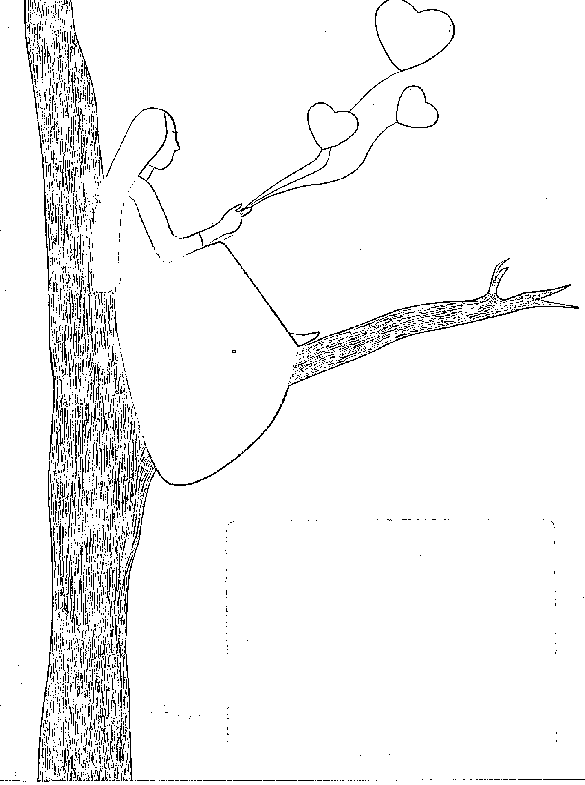

## 找到意想不到的自己
### 萨提亚模式与自我成长

◎ 丛扬洋 著

经过多年国内实践、进一步消化和整合，成为近几年来最易理解、最灵动的萨提亚读物。

自我成长、幸福、快乐、真正的成熟
自我价值、柔软与宽容的力量、和谐关系
沟通姿态、冰山隐喻、原生家庭

购买本书 赠送200元丛扬洋老师萨提亚工作坊的报名费

Wuhan University Press
武汉大学出版社

## 找到意想不到的自己
### 萨提亚模式与自我成长

◎ 丛扬洋 著

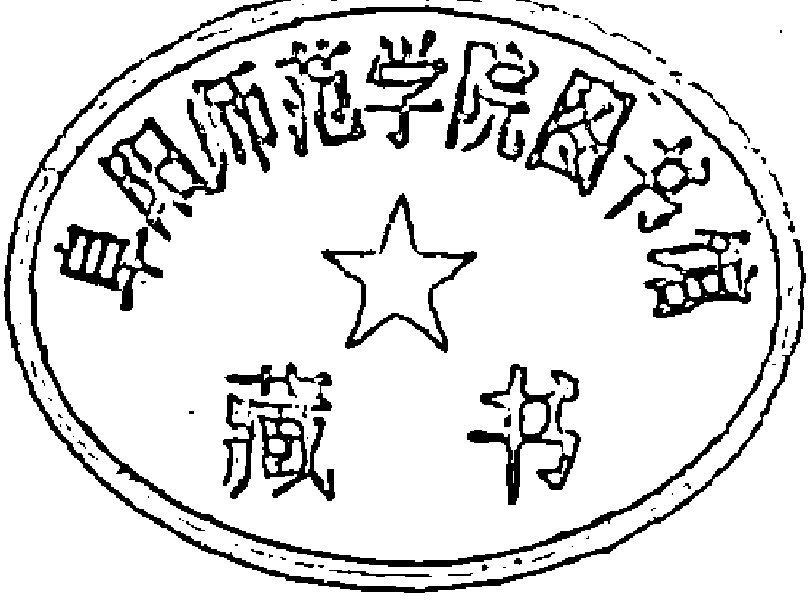

Wuhan University Press
武汉大学出版社

## 图书在版编目(CIP)数据

找到意想不到的自己 : 萨提亚治疗模式国内权威教程及解读 / 丛扬洋著. — 武汉 : 武汉大学出版社, 2015. 3

ISBN 978-7-307-12655-8

Ⅰ. 找… Ⅱ. 丛… Ⅲ. 精神疗法 Ⅳ. R749.055

中国版本图书馆CIP数据核字（2014）第002011号

责任编辑：刘汝怡 责任校对：林方方 版式设计：刘珍珍

出版发行：武汉大学出版社 （430072 武昌 珞珈山）
（电子邮件：cbs22@whu.edu.cn 网址：www.wdp.com.cn）

印刷：永清县吉祥印刷有限公司

开本：787×1092 1/16 印张：21 字数：280千字
版次：2015年3月第1版 2015年3月第1次印刷

ISBN 978-7-307-12655-8 定价：38.00元

版权所有，不得翻印；凡购我社的图书，如有质量问题，请与当地图书销售部门联系调换。

## 前言 | Foreword

我曾经是一个非常自卑的人，还在读中学的时候就不敢跟女孩子说话，当然男孩子说的也不多。有抑郁和自闭的倾向。这个状况到工作后更明显，外在的工作生活压力与内在的自我否定折磨让我几度想过自杀。但是后来我接触到萨提亚后，这些都慢慢发生了改变。学习萨提亚的第3年，直到一个朋友突然告诉我：你知道吗？丛，你的存在对我们来说都非常的重要。我突然发现我比以前阳光了很多，朋友也多了很多，而且给他们带来了很多力量。从此后我踏上了深入学习心理学的路，并想传播萨提亚。把萨提亚模式介绍给更多的人，让更多的人可以了解萨提亚模式，并可以从其中获得帮助，这一直是我的一个心愿。在跟随John Banmen、Anna Low、蔡敏莉等老师学了几年萨提亚模式后，我斗胆萌生了写一本介绍萨提亚模式的书。2003年萨提亚模式传到中国以来，数以万计的家庭、个人因其产生了改变，越来越多的人开始接触到萨提亚，并产生了好奇。但目前萨提亚模式多以工作坊和课程的形式在传播，局限性非常大。传播范围有限，高昂的学习费用也让很多人望而止步。萨提亚的经典之作《新家庭如何塑造人》和《萨提亚家庭治疗模式》等翻译过来，与中国人的阅读习惯有所差异，加之书的内容专业性很强，通常需要读许多遍才能品味其中含义。因此我想整理一本通俗好读的、符合中国人思维习惯的书来介绍萨提亚。

找到意想不到的自己，但是这并不容易。

首先萨提亚模式属于经验派家庭治疗，其治疗工具运用的灵活性及有效性曾让我瞠目结舌。但是其理论体系却不够完善。加之萨提亚本人1988年突然逝世，其理论研究被突然中止，留下的理论体系显得有些零散。后来众多萨提亚工作者对萨提亚模式进行了发挥与补充，发展到今天的萨提亚模式已经百花齐放，不再局限于家庭治疗，更多的是对个人成长问题进行治疗，全面解决个人身上所背负的问题。如此以来，把现在市场上所教授的萨提亚模式全部梳理整合就显得有些困难。

有人曾说，萨提亚模式的魅力，在于她本人。这句话我至少看到了两个信息：一个是，萨提亚模式的魅力不可被复制，正如米尔顿·艾瑞克森的自然催眠法的魅力不可被复制一样。另一个是每一个学习萨提亚模式的人，都是独特的一个萨提亚！这正应了萨提亚的那句话“每个人都是独一无二的”。也是心理学家们常说的：每个人都是一个独立的流派，且不可被复制！

我也是这样一个走在萨提亚模式路上的人。我所学习到的萨提亚模式，已经不再是我的老师们教会我的那些，而是经历了我个人的加工、整合、理解、消化，成为了“丛氏萨提亚”。因此第二个困难就是，我所写出来的，也无法代表萨提亚模式及众多萨提亚工作者的智慧结晶。读者只能从我的理解中，了解到萨提亚模式的冰山一角，甚至可能是有失偏颇的萨提亚模式。如若读者对萨提亚有更深的兴趣，可以深入去读萨提亚的经典著作，或从更多的教授萨提亚的老师身上全面了解萨提亚模式。

本书的成型，特别感谢教授我萨提亚模式的众多老师。其次感谢郭晓洁老师提供的平台，我在萨提尔（北京）教育咨询中心工作和学习的那两年，对我产生了极大的影响。还要感谢刘曙楠和李咏梅同学，2013年炎热的夏天，与我一同在小屋里讨论、整理、修改。最后感谢好友赖景琳为该书作图和人物摄影。

成长是一生的功课，萨提亚模式教会人成长，绝不是让后人固化她为教派。无论该书所阐述的理论怎样命名，如果能对读者有所启发和思考，我也就心满意足了。

## 他序 | Preface.

2003年，我第一次在广州开始做萨提亚模式的工作坊，把萨提亚模式带入到了中国大陆。其后10年的时间里，萨提亚模式凭借其独特的魅力获得了惊人的发展，越来越多的人从其中获益，数以万计的家庭、组织和个人因为接触了萨提亚模式而获得了改变，甚至改变了他们的一生。众多的亲子关系、夫妻关系、同事与朋友关系等获得了改善。

萨提亚模式在中国的出现，也给中国的心理治疗带来了新元素的冲击，它为我们提供了更深刻、更快的方法去帮助其他人。正因为如此，越来越多的专业工作者开始投入到萨提亚模式的教学中去，帮助更多的人可以活得更健康、幸福和成功。

我也是萨提亚模式的受益者之一。从我第一次去美国学习萨提亚模式开始，至今已经有近30年的时间。期间我被萨提亚模式所深深吸引并感动。30年来，我不断学习并致力于萨提亚模式的传播，当我看到无数人在我的工作坊里因为接触到萨提亚模式而产生改变的时候，我感到了一种很深的使命感：中国人需要萨提亚模式，我要把萨提亚模式介绍给更多的中国人，让更多的中国人因为萨提亚模式的存在而可以收获幸福。

中华民族是一个文化源远流长的民族，其家庭也具有中华民族独有的特色。萨提亚模式在传入中国后，渐渐与中国的文化语境产生融合，形成了中国特色的萨提亚模式。众多萨提亚工作者也对萨提亚模式进行了延伸和发展，萨提亚模式已经不再局限于解决家庭问题，而更多的全面解决个人身上所背负的问题，将心理治疗扩大为成长取向的学习历程，只要是关心自我成长与潜能开发的人，都可在这个模式的学习过程中有所收获。正是因为这个特点，她的理论不会因为社会与文化的变迁而失去实用性。

扬洋就做了很好的这样一个工作，他把萨提亚模式的理论和最新进展作了梳理和总结，并用中国人的思维习惯对萨提亚模式的理论框架进行了编排，做成了通俗读物，更适合中国人的阅读。

中国也是一个人口众多的国家，能够让每个人都接触到萨提亚模式的培训还需要很长的一段路要走。在接收到专业培训之前，人们可以借助于一些书籍来了解萨提亚。随着萨提亚模式的经典著作陆续在大陆出版，一些人开始以书籍的形式接触到萨提亚模式，我们也需要有更多的文字可以来介绍和讲解萨提亚。

当然如果有可能，我还是希望更多的人可以通过书籍与课程并行的方式了解萨提亚模式。萨提亚模式是体验性的，需要更多的面对面来感受萨提亚的魅力。

中国国际萨提亚学院院长 蔡敏莉

## 目录
### Contents

### 第一章
引言

- 第一节 是时候该换种活法了：找到意想不到的自己 / 003
- 第二节 萨提亚模式是如何帮助人的 / 010
- 第三节 萨提亚模式有什么用 / 012
- 第四节 萨提亚的治疗信念 / 018

### 第二章
自我价值

- 第一节 自我价值是一只装爱的瓶子 / 031
- 第二节 怎样把瓶子装满？ / 039
- 第三节 和自己在一起，活出生命力 / 046
- 第四节 谁是你的亲密爱人 / 052
- 第五节 内在资源面貌舞会 / 059
- 第六节 提升自我价值的魔法工具 / 066

### 第三章
沟通

- 第一节 健康的沟通长什么模样 / 075
- 第二节 不一致性沟通 / 081
- 第三节 常见的求生存沟通模式（应对姿态） / 085
- 第四节 让人来说话，而不是话说人 / 101
- 第五节 参透对方真实的本意 / 105
- 第六节 天气报告 / 113

### 第四章
冰山理论

- 第一节 冰山理论简介 / 121
- 第二节 在冰山体验里的转化 / 136
- 第三节 情绪的管理与转化 / 140
- 第四节 清空信念系统（观点的转化） / 152
- 第五节 转化未完成的期待 / 167
- 第六节 满足灵魂的渴望 / 181

### 第五章
家庭

- 第一节 家庭如何影响人 / 193
- 第二节 家庭规条 / 207
- 第三节 影响轮：重要他人的影响 / 218
- 第四节 原生家庭图 / 222
- 第五节 家庭生活年表 / 232
- 第六节 家庭重塑 / 233
- 第七节 家庭个案 / 238

### 第六章
婚恋·情感

- 第一节 婚姻 / 245
- 第二节 婚姻中常有的压力因子 / 248
- 第三节 往情感账户里存款 / 254
- 第四节 有效面对差异与冲突 / 258
- 第五节 从多维度增强亲密 / 263
- 第六节 性亲密，不仅是性行为 / 266
- 第七节 爱需要用正确的语言表达 / 272
- 第八节 婚姻治疗的步骤及方法 / 279

### 第七章
萨提亚模式
在咨询中的应用

- 第一节 连接 / 285
- 第二节 心理咨询师的几个层次 / 293
- 第三节 萨提亚咨询的目标 / 296
- 第四节 萨提亚咨询的5个元素 / 302
- 第五节 萨提亚模式技术中蕴涵的主要元素及工具 / 307
- 第六节 萨提亚转化式系统治疗的步骤 / 311
- 第七节 改变的发生过程 / 317

## 第一章
### 引言

我想爱你而不用抓住你
欣赏你而无须批判你
和你齐参与而不会伤害你
邀请你而不必强求你
离开你亦无须言歉疚
批评你但并非责备你
并且
帮助你而没有半点看低你
那么
我俩的相会就是真诚的
而且能彼此润泽

> ——维吉尼亚·萨提亚《我和你的目标》

## 是时候该换种活法了：找到意想不到的自己

人的世界，是关系的世界

烦恼即菩提。

幸福、快乐、和谐、安详、爱，每个人都想要这些东西。但是纵观生活，有躲不尽的烦恼横行其道，使得我们对幸福望眼欲穿，却难以企及。

烦恼是什么？

人的世界，是关系的世界。说到底，烦恼不过是关系的困惑。如果你不能处理好关系，你可能需要和烦恼这位兄弟耳鬓厮磨上一段日子。

人的第一个关系也是最重要的关系就是和自己的关系。如果你不能处理好这个关系，内在的烦恼就会油然而生。你会陷入自我怀疑、自我排斥与自我否定。经历无数次这样的心理独白：

> 我不喜欢我的身体。我长得一点都不好看，我不接纳我的外貌。我太胖或者太瘦，太高或者太矮，太黑或者太黄，我不喜欢这样的自己。我渴望有魔鬼般的身材，天使般的面容，但我又知道那遥不可及，我羡慕那些勇于秀出自己的人，而我不能。甚至我都不接纳我的头发、鼻子或者身上某个痣。或者即使没有讨厌它，我也对它不好，经常用熬夜来虐待它，用垃圾食品来虐待它，用寒冷来虐待它……

> 我不喜欢我的性格。我有些懦弱，不懂得关心人或者太自我；我做事犹犹豫豫，做人不够果断勇敢，喜欢拖延不能自制，过于善良总是被骗……如果你问我有多少缺点，我最喜欢回答这类问题。我不喜欢自己的情绪。我总是莫名忧伤，十分恐惧，经常夜里偷偷哭泣。我有时候忍不住对亲近的人发火，发完了又内疚。我总是敏感多疑，整日抑郁寡欢。我想改变又从无改起，我讨厌这样的自己。

> 我不喜欢自己的智商。我脑子不够聪明十分愚钝，不会随时转弯，做事不够圆滑经常吃哑巴亏，能力不济，处理不好人际关系，不知道该怎么与人交往……对我来说，最多的感慨就是我怎么这么笨。经常感觉自己一无是处，活着是一种浪费。

当然有些时候，我会感觉自己很好，但更多的时候，我感觉很差。尤其是当我想要的没有得到，发生了预料之外的事情的时候，我第一件事情就是否定自己。

人最好的朋友，就是自己；你生活中最好的朋友，只是你第二好的朋友。人最亲密的人，也是自己；你生活中最爱的那个人，只是你第二爱的人。如果你弄错了序位，你可能就会有很多烦恼。和自己的关系和谐，也就是内在和谐，是一切幸福的基础。

第二个关系就是和他人的关系。只要你在生活，在互动，在与人沟通，与他人的关系就不可避免。在家里，与父母的关系、恋人的关系、孩子的关系；在单位，与同事的关系、领导的关系、客户的关系；在生活中，与朋友的关系、亲戚的关系、陌生人的关系……与人的关系编织着生活。似乎他人的一举一动，都在影响我们的幸福。在不同的生活场景里，我们扮演着不同的角色，罩着不同的面具，与不同的人打交道。我们无数次深深体验到：谁谁做了什么，让我感觉很不好；谁谁没有做什么，让我很苦恼；我拥有或失去了谁谁，开始了一场噩梦。错的是别人，痛的却是我们，于是这些烦恼想必也不会陌生：朋友的只言片语触动我们敏感的神经，时而悲哀，时而发怒，时而挫败，时而恐慌；亲人的不能理解，让我们悲愤、受伤又无奈；客户的无理取闹，领导的不认同，伤透了我们的脑筋……

第三个关系就是与自然和情境的关系。比如：和宇宙的关系，和自然的关系，和社会的关系，和情境的关系，和团体的关系。当你不能安住于当下，心逃离自己的躯体的时候，你会体验到一种很深的没有存在感、孤独、无意义、茫然，因为你不能处理好和存在的关系。但当你和宇宙能量和谐一致的时候，你能感觉到自己的能量是一致的，是和平的。当你不能处理好和情境的关系的时候，你会感觉到一种格格不入、多余、失落、被排斥的感觉，你不知道怎样融入一个群体。但当你能够融入一个情境的时候，你会感到自己是存在的，是被接纳的，是有归属的。

存在感是比较难于说清楚的话题，但却是终要解决的问题。你如何存在于这个世界，就是你和世界的关系。

摆脱烦恼，走向幸福。我们有一条路可以走，那就是处理好关系，和自己的关系，和他人的关系，和环境的关系。

### 爱是关系里最主要的议题

人类在关系上最主要的议题就是爱。你爱着人，也被人爱着。

当爱很多很多的时候，生命是一致的，生活是和谐的。当爱匮乏的时候，我们的生活就会出现问题。

我们的生命本身，需要爱的滋养，才能够得以维系，所以我们的所有行为都是为了获得爱。

我讨厌自己的时候其实我在说：如果我变得更好一些，别人就会关注我，欣赏我，我就可以获得别人的爱。

我讨厌别人的时候其实是想说：我想让你满足我的期待，变成我理想中的样子，成为我认为的那个人，我就会觉得舒服些，就不会感觉到你距离我那么远。那些期待孩子改变一些的人，期待父母改变、期待伴侣改变、期待身边的人改变的人，无非是想让他人来满足自己，即使你打着“人就应该这样”或“我是为你好”的幌子，你也不过是想满足自己。

我不愿意融入环境的时候，其实我已经不相信我可以进入到这个环境里。虽然我很想，但是我知道我做不到。为了避免自己失望，我已经不想再去期望。

在关系里的分歧、矛盾和争执就是如此而产生的，关系就是一场争夺爱的战役。或许你没有看到的是，你在期待全世界的人都来爱你。被爱的感觉让你感觉很好，很安全，很有价值感。

那些能够给予你或者需要你持续给予爱的人，对你是重要的，我们称他们为你的重要他人。在我们小时候，我们需要父母持续的爱、需要老师持续的关注，在我们看来，他们是我们的重要他人。美国社会学家米尔斯（C.W.Mills）首先提出了重要他人的概念，意指在每个人生命成长过程中对我们产生过巨大影响的人。

重要他人是怎么影响我们的呢？通过他们给予爱的方式。如果我们发现做事件A能得到父母的爱，于是我们就把A内化为生命的模式，我们潜意识里会把A当作满足爱的途径。如果我们用软弱可以得到父母的爱，我们就学会了软弱；如果我们用指责才能被听到，我们就学会了指责；如果我们不允许表达生气、委屈等感受，我们就学会了压抑感受。

长大后，我们依然用小时候父母教给我们的方式去对待别人，希望用同样的方式从别人那里获得爱。这时候我们就会把别人当作我们的“重要他人”，从那里汲取心理能量。

当你还在期待别人来满足你关于爱的渴望，需要从关系里获得点什么的时候，你不妨去看看你在受伤后用什么样的方式来满足自己的渴望。

重要他人，其实就是给我们爱的人。你最想持续索取爱的人，就是你的重要他人。以前有，现在也有。

### 重要他人——那个意想不到的自己

如果我们持续从别人那里索取爱，通过企图改变环境、改变他人的方式，我们有时候会成功，这让我们感觉到很快乐，但更多的时候却会失败，因为改变一个人是极其难的，从一个人那里索取爱也是不容易的。何况有时候，你看不到爱。

爱是一直存在的，我们也是一直被爱的。只是我们在感受爱方面却出现了问题。是什么阻隔了我们去感受爱？是什么让我们急于把别人变成我们的重要他人？

是我们内心的障碍，是我们封闭了自己的心，是我们遮住了自己的眼睛，是我们拒绝了爱。

萨提亚模式要做的，就是转化。看到爱，发现爱，创造爱。

谁才能真正满足你关于爱的渴望，还你关系的和谐？

答案当然是你自己。能够有能力爱自己的人，就不需要再从别人那里索取。同时，也会把自己的爱溢出来给予别人，让别人满足，别人又会反馈来给自己爱，于是爱越来越多，这是一个关于爱的良性循环。反之，当自己的爱不多，又从爱不多的人那里索取，两个爱匮乏的人互相索取，他们之间的能量就不能流动，就被阻隔了。

爱是一个杯满自溢的过程。充满爱的人，是敞开的，有安全感的，智慧的，宽容的，祥和的，平静的，发光的。和他在一起的人，会感觉特别舒服，没有压力，没有禁忌。所以，只有你才可以真正成为自己的“重要他人”。

因此，你需要学会做自己的重要他人，满足自己关于爱的部分，而不是从关系中获取。

这个过程就是打破自己旧有的模式，拿回属于自己的力量，重新为自己选择人生的价值观和行为模式，真正爱自己，让我们有力量为自己的人生做选择，并为人生负责。它让我们从一个积极者和责任者的视角去重新审视问题，其结果就是找到一个“意想不到的自己”。

### 三度出生

萨提亚认为人性本善，每个人都是生命力的独特展现。我们生来就完全具备我们所需要的全部，让自己成为幸福、有能力、值得尊敬的人。但是，人们往往无视自己内在已有的天赋。那些缺乏自我价值感的人，会采取不同的生存策略。萨提亚认为人有三度出生，人在第一度出生里就有了足够的资源，但是在第二度出生后资源开始被掩盖，从第三度出生开始，人又可以找回这些资源。

第一度出生，是精子与卵子的结合。当受精卵形成，生命力就诞生了。人在这个过程中被激活了生命力，人与这个生命力一起创造了自己的生命。人## 找到意想不到的自己

类的生命力都是互相联结的，这是萨提亚模式的精神基础。所有人都来自相同的过程，所有人都与同一个源头相连，都来自于我们的大宇宙，都被创造了生命力，每个人都拥有相同的价值。

我们的本质在第一度出生已经被决定。

第二度出生，是我们从母亲的子宫出来，第一次认识世界，进入一个已经存在的家庭系统。我们的生存完全依赖照顾者，那时候的我们为了求生存，需要在某种程度上放弃自己的一些需求来适应家庭系统。这是生死攸关的，人类的婴儿没有任何能力自己满足自己的需要。

萨提亚认为，我们所有人，都是一生下来就与父母建立了求生存的关系。那时候我们不能为自己做任何事情，我们只能依赖父母求得生存。如果没有人听到我们的哭声，并对此有所回应，我们就活不下来。

此后，一个人会通过与家庭系统的互动，构建自己对世界的看法，建立对现实的观念及确定在现实中的位置。这是一个无意识的过程，它发生于人们的自我觉察之外。

因此，人们如何应对生命，直接与他们生活的原生家庭系统相关，与这个家庭对现实的认识和假设有关。我们的所有特质及内在反应模式在第二度出生里被决定。

第三度出生，是“我们成为自己的决定者”，是“找到意想不到的自己”。当人们成功地实现整合，找到新的自我意识，他们就会第三度出生。这个新的自我意识，是一种觉察和欣赏，觉察和欣赏我们如何发现、滋养、理解和管理作为一个人的奇迹。其本质是，人们根据他们自己现实的概念，有意识地选择最适合自己的方式。这需要一个人放下那些已经不适合的求生存的信息，而只保留那些对当下有价值的信息。由于人们不再需要依赖外部系统来满足需要，所以也就不再需要适应那个外在系统。

萨提亚认为，对自我新的觉察和欣赏，是内在系统变得独立于外在系统的结果。

第一、第二度出生不是人们的意识可以决定的，我们只是在被决定；但是当我们长大后，我们具备了重新选择自己的人生、构建自己内在的权利，这就是第三度出生。

萨提亚相信，无论以前的生活经历如何，所有人都能够成长，都能学会联结这些资源。这个信念形成一种态度，即所有人都是有希望的，都有可能改变。即使来访者感到无望，只要治疗师持有这样的信念，就可以将希望带进来访者的互动关系里。

## 第一章 引言

### 第二节 萨提亚模式是如何帮助人的

爱是人类生存的基本心理需求；容器里的爱就是一个人的自我价值。

自我价值感高的人可以相信爱，发现爱，分享爱。自我价值感低的人却一直在寻找爱，证明爱，索取爱。自我价值就是：你觉得你拥有多少爱。

萨提亚模式工作的核心点是提高自我价值，让人回到生命的中心，做回自己，看到自己的选择，并为自己负责，发现自己其实一直都拥有爱，并且有能力把这份爱分享出去。无论面对个人还是家庭、集体，萨提亚所做的都在围绕着终极目标——自我价值。

为实现这个终极目标，萨提亚在三个系统上工作：

人际互动系统。我们从别人那里获得爱的渠道就是人际互动。人生活的世界，是一个与人互动的世界。只要活着，我们就要与人互动，在家里与家人互动，出门与朋友互动，在公司与同事领导互动，即使购物、走路也在与售货员、路人甲互动。不经意间，这些与我们互动的人影响着我们，路人不经意的一句赞美或侮辱，会让我们有不同的感受。亲人的热情或冷漠，刺激着我们的心情。有时候我们需要的是支持和安慰，得到的却是指责与不满。有时候我们的本意是想更亲密，结果却是渐渐在远离。人际互动系统就是我们所交往的世界，有效、健康的互动方式会让我们生活得更加和谐、幸福，我们的自我价值会更高。人际互动系统显示着我们的自我价值。

个人内在系统。我们在得到别人的反应后，需要经过个人内在系统的加工，才能决定感受到怎样的爱。内在系统是个体自身所有组成部分的关系。人们在面对外在世界的时候，会启动内在所有的部分去应对，包括个人的行为、感受、观点、期待与渴望，萨提亚用“内在冰山”隐喻这个过程，我们所见的行为是水面之上的内容，而隐藏在水面之下的是个人庞大复杂的内在系统。要解决问题，只是针对行为改正其效果是微乎其微的，这时候需要回到个人的内在系统去解决。个人内在系统是自我价值的反应方式。

原生家庭系统。我们对爱的加工方式来自于原生家庭。萨提亚认为，人是家庭塑造出来的，她强调在面对个人问题及关系问题时应从原生家庭解决。我们童年时所生活的家庭到底对我们有多大的影响，没有人能估计出来，童年时期对我们影响最大的就是原生家庭。人们成年后的反应模式，基本上是童年与父母互动的翻版，因此要深究当下的行为的深层成因，我们需要回到原生家庭里去。我们曾在那里学会了现在的自己，原生家庭系统是我们价值感最初发展的地方。

萨提亚模式属于经验主义，强调在经验中的实际运用。这既是萨提亚模式的优点：实用性强，具有可操作性；又是它的缺点：理论不够完善，体系不够系统，过于开放而难以梳理。

本书对萨提亚模式进行理论梳理，希望读者可以对萨提亚模式有初步的了解，可以对自己的成长有所帮助，可以看到自己如何满足自己的渴望、如何把他人变成自己的重要他人、又如何完成转化做自己的重要他人。

无论萨提亚模式怎样发展，萨提亚的核心是不会变的，始终围绕着“一个核心，三大系统”工作。本书就尝试用这样的逻辑对萨提亚模式进行介绍。

### 第三节 萨提亚模式有什么用

请你安静下来，仔细想想：

- 你快乐吗？
- 什么可以让你感觉到兴奋和幸福？
- 你是否真切地感受到被爱、被接纳、被肯定、被尊重呢？
- 你曾感觉到一种从内在迸发出来的不受外界影响的喜悦吗？
- 为什么事业的成功让我们拥有了舒适的生活，可幸福的感觉却没有相应地增加？
- 在你的人生中，你和你所爱的人（父母、兄弟姐妹、夫妻、情侣、儿女、朋友）是否有一段真正的亲密关系？
- 你的父母、伴侣、孩子、朋友，他们的内心是否感受得到你的爱、接纳、尊重和肯定呢？
- 你生命中最重要的人——你自己，你和自己有没有一段真正的亲密关系呢？
- 你每天在做的是一些应该做的事情，还是你真正喜欢的事情呢？
- 你明白你自己真正的需要吗？

科学家发现大多数疾病的产生，都与心情、情绪有关，可是你对自己的身体、自己的思想、自己的情绪了解多少呢？

这都是且不仅是萨提亚模式要解决的问题。

## 予人幸福

是什么让我们不幸福？——是我们对世界的定义。是什么让我们给世界下定义？——是我们的信念。是什么创造了我们的信念？是我们成长过程中所经历的一切带给我们的信息。

每个人都来自家庭，在那里所发生的一切都内化在我们的潜意识中。到了成年，我们依然被那儿时的心理模式所左右，不能自主。这就是我们为什么需要走进萨提亚，去了解在我们内心深处，被无数观点所掩盖的真实的自己。

使当下人们获得并感受到幸福，是萨提亚的目标之一。幸福的方法就是重写自己的人生剧本，从改变自己开始，不再随便对世界评判，迈向身心一致，具备高自我价值感及责任感。

人生剧本是可改写的，人们可以从中寻找到属于自己内心的平静、喜悦和力量，最终实现和自己的亲密，找到幸福。

无论国王还是农夫，只要他学会和自己亲密，他便是世界上最幸福的人！因为和自己亲密的人，才能和家人亲密，才能和朋友亲密，才能和同事亲密，才能和世界亲密，才能幸福。

> 萨提亚的思想，在中国古人那里也早已说得很明白：“古之欲明德于天下者：先治其国；欲治其国者，先齐其家；欲齐其家者，先修其身；欲修其身者，先正其心。心正而后身修，身修而后家齐，家齐而后国治，国治而后天下平。”

萨提亚是一门教人学会与自己亲密，学会幸福的学问。

## 教人成长

“心灵成长”“个人成长”是很火热的词了。但是成长是什么？我们每个人都有两个年龄，一个是生理年龄，一个是心理年龄。前者会随着年轮的增多而无情地增大，连续性地变大，从未间断，从出生到老去，无论你愿意与否，它都一直存在，这是身体的成长。后者则会随着经历和智慧的增多而慢慢变大，是阶段性的，有时候会在经历了某次重大事件或有了某个觉醒感悟后而一夜长大，也有时候则会在经历过创伤之后开始退化，当你不愿意时，它就会停滞，这就是心灵成长。

心理年龄有时候和生理年龄同步，更多的时候是不同步的。一个人生理上长到了30岁，但是他可能依然依赖母亲、恋人以及其他人，不愿意自己做决定，喜欢被安排被保护；情绪化，脾气多，不能对自己负责，他的状态可能依然停留在13岁。一个人也可以生理上是13岁，但是心理上却到了30岁，他能工作持家，懂得照顾人安慰人，懂得做自己，能够理智判断，能够爱人。他可能7岁持家，8岁上山下地，扛起了一个成年人该扛的责任。中国人说“穷人家的孩子早当家”就是如此，当家即是为自己和他人都负责任。

因此我们说心灵成长，就是一个人在心理上从孩子成为大人。生理的成长，不需要教，大自然会帮助我们完成。但是心灵的成长，却会受自身因素和社会文化因素左右，因此萨提亚要做的，就是帮助人们实现心灵成长。

- 婴儿有3个特征：
  - 以自我为中心
  - 完全依赖
  - 缺乏自制力

婴儿只知道自己的需要，当他们的渴望没有被满足，感觉渴了、饿了、冷了或者有任何不舒服的时候，他们就通过哭来及时索要。他们从来不在乎给他这些营养的父母是否吃过，是否需要休息，是否很累，他们只知道自己需要的时候就要求大人完全注意。如果大人忙得没时间，或者把注意力给予别人的时候，他们就很生气。他们从来不想也没有能力自己满足自己，只能依赖父母给自己想要的东西。他们喜欢别人抱他们、爱他们，但是他们自己却没有能力回报别人，并且理所当然地接受。他们没有自制力，并不知道什么时候该要，什么时候不该要，他们不能控制自己的欲望，他们完全由着自己的情绪来。

这就是婴儿的特质，即便如此，父母仍然爱他们，因为他们是婴儿，本来就是这样，父母相信他们有一天会长大。

如果一个人渐渐在生理年龄上长大，心理却依然具有婴儿特质的时候，他的表现除了大小便能够自制以外，与婴儿并没有多大差异：他们依然喜欢从别人那里索取心理营养，希望得到别人的照顾，依赖于别人给予关心、关注，对于回报则显得十分匮乏甚至不自知、情绪化、拖延、没有自制力。

当成年人身上具有这三个特征的时候，他的心理年龄很可能止步于婴儿时期。成长的第一项内涵就是让人在心灵上实现成长，与生理年龄同步。

除此之外，成长还具有其他六项内涵：

成长是“脱去旧衣，穿上新衣”。放下旧包袱，解决残存的心理问题，重建人格尊严，发展健康的自我观念。

成长是学会充分运用杯中所盛的半杯水，而不是耗费精力抱怨为何另一半是空的。

成长是由依赖到独立的过程。过去，完全活在他人的期望中，不知道自己的方向；现今，知道自己要的是什么，不再依赖他人告诉自己应怎么活。

成长是了解自己可以不被环境所操纵，知道自己有主动选择思想、态度与行为的能力，因而勇于为自己的生命负责，不为自己的行为找借口，不诿过于他人、环境或是命运。

成长是学会接受自己和他人的不完美，同时不断挖掘自己的潜力与天赋，每日在爱心、品德、学识、技艺上求进步。

成长是勇敢地面对自己人格中的阴影，学会与自己个性、看法不同的人和平相处。成长的人懂得欣赏差异，能为他人的喜乐而欢呼。

萨提亚模式所教人做的，就是让人成长，具有高的自我价值，能够看到自己的选择，能够为自己负责，表里一致。

## 授人感知喜悦的能力

快乐和喜悦不同。一个由外而感，一个由内而发。

你感到快乐还是喜悦呢？

快乐是由外在事物引发的，它的先决条件就是一定要有一个使得我们快乐的事物，所以它的过程是由外向内的。

比如说，发生了一件事让你感觉很快乐，但当这件事物不存在了或平淡了，快乐也会很快随之消失。升职加薪了，我会快乐，但是时间过去久了，快乐就会回归平淡；领导表扬了，我会快乐，次日领导批评了我就不快乐了。

快乐是来自于外在的标准和评价，依赖于外在的条件，因此它是无常的。当我们将自己的幸福归依在这些目标的时候，我们偶尔会感觉到快乐，却只能在快乐中沉沉浮浮。我们做不了主，因为，快乐是别人给的。

而喜悦是从内心深处油然而生的，一旦拥有，外界是夺不走的。人的思想控制所有行为，如果有喜悦的思想，就算痛苦也能坦然面对。

当我喜悦的时候，面对一切事情都是开心的。我升职加薪了，我会为自己的努力而感到幸福，时间久了我一样会因感恩有一份好的工作而幸福；领导表扬我了，我因领导认可我的努力而幸福，次日领导批评我了我也因领导愿意指正我而感到幸福。喜悦就是，无论环境怎么变化，我的幸福都能从我的心底里溢出来，而不依赖于外在去获得。

快乐是短跑，来得快去得快；而喜悦是长跑，讲究慢步持久，细水长流。快乐是天气，变化无常；而喜悦是气候，长期都是这样。快乐是家里领养的孩子，是别人给的；而喜悦则是家里的亲骨肉，是自己生的。

如果一个人，想一直拥有好心情，那么，他应该追求的是喜悦，而非快乐。

萨提亚模式通过把能量重新流动起来，让人们可以做回自己，让喜悦从自己心底流出来。

## 解决问题，完成你人格层次上的提升

作为心理治疗的一个分支，萨提亚从来都没有放弃过处理症状与问题。虽然她认为，问题本身不是问题，她不在症状表面处理问题，但她依旧在深层次处理问题。

弗洛伊德说过：“我只对人的地下室有兴趣。”他一生致力于潜意识的研究，从人的深层次解决问题。萨提亚并没有抛弃弗洛伊德，同样回到人的童年原生家庭里追根溯源，让人的潜意识里惯有的模式浮出水面，因此她在处理问题时是非常有深度的。同时萨提亚也没有摒弃罗杰斯所倡导的人本，她更加强调倾听、共情、积极关注，将问题正向转化，在超个人心理层次上共情，主张发掘来访者自身的资源来应对。

萨提亚做的更重要的一个工作，就是在个人人格层次上系统转化。萨提亚采用很多工具，如家庭图、冰山、雕塑等，进行全面转化，完成在人格层次上的提升。

好的治疗师并不限于解决问题，而是帮助能够获得人格提升。

## 改善人际关系

萨提亚创造性的将不健康的沟通划分为四种：讨好、指责、打岔和超理智，并构建出了沟通的理想模型：一致性。而在操作层面上，萨提亚提供了可走的路径。

但如果沟通仅限于操作层面，萨提亚模式的魅力将荡然无存。萨提亚旨在通过改变人的内在，使人完善沟通，以改善人际关系。

在完成自我重塑之后，我们会比以往更加清晰地了解自己，关爱自己，欣赏自己。当我们自己有爱时，就会少要求别人；对别人要求得越少，对自己就越信任；越相信自己和他人，就越有能力付出更多的爱。对别人多一点爱，自身就会少一些恐惧；和他人多一点沟通，就会增进一份联络。因此，只有高自我价值才能帮助人摆脱孤独，不再疏远家庭、他人与集体。

健康的关系都来自平静、安全和自信的心灵。一个人越是活在当下，越是自我价值较高，就越懂得关爱自己，同时也越有勇气改变自己的行为，让自己与他人、情景相和谐，在关系中潇洒穿过，翩翩起舞。

萨提亚会通过一系列的工具，使人学会如何更好地了解自己和他人，以及我们与世界的互动模式，从而更好地与他人相处，获得理想的人际关系、亲密关系与亲子关系。

萨提亚理念的最终导向就是：内在和谐，人际和睦，世界和平。

### 第四节 萨提亚的治疗信念

每个治疗师在工作时，都有自己的工作信念。每个人在生活时，也都有自己的信念。萨提亚模式在工作时，抱有但不限于下面这22个信念，从中我们可以一探萨提亚模式的基本工作原理。对于这些信念，也是一个萨提亚治疗师的基本治疗观。

1.  改变是有可能的，即使外在的改变有限，内在的改变还是有可能的。

当穷途末路、无法挽回的时候，你是否曾经绝望？或者就此认命，觉得造化弄人，无法改变。萨提亚从来没有放弃过改变的希望，正是因为相信改变永远是有可能的，人类才得以不断发展进步，人生才能够不断创造辉煌。

在闻名世界的威斯特敏斯特大教堂地下室的墓碑林中，有着一块扬名世界的墓碑。在这块墓碑上刻着这样的话：“当我年轻的时候，我的想象力从没有受过限制，我梦想改变这个世界。当我成熟以后，我发现我不能改变这个世界，我将目光缩短了些，决定只改变我的国家。当我进入暮年后，我发现我不能改变我的国家，我的最后愿望仅仅是改变一下我的家庭。但是，这也不可能。当我躺在床上，行将就木时，我突然意识到：如果一开始我仅仅去改变我自己，然后作为一个榜样，我可能改变我的家庭；在家人的帮助和鼓励下，我可能为国家做一些事情。然后谁知道呢？我甚至可能改变这个世界。”

外在的改变是有限的，当我们努力想改变世界，想改变别人的时候，通常是会失败的，这时候的沮丧与无助也不可避免地袭来，然后我们怀疑自己：我是有能力的吗？我是值得的吗？如果我是值得的，为什么你不愿意为我做出改变？萨提亚倡导改变从内在开始，我们可能没法改变这个世界，但是我们可以改变对这个世界的态度。我们可能没法改变他人，但我们可以通过改变自己影响他人。当我们感觉到脆弱时，我们可以从内在改变开始，让我们的内在变得强大，心理能量充盈，如此还有什么是我们不可以做的呢？

当弗兰克在集中营的时候，自由受到严重限制，每天都在干苦力活，进营前包括衣服在内的全部东西都被没收，那时候真是一无所有，但是弗兰克仍然做出了自己的选择：活出意义来！并撰写了《活出意义来》这本心理巨著。

2.  父母在任何时候，都是尽他们所能而为之。

人是家庭塑造出来的。我们的很多行为特质，归根结底都是父母所赐。这么说，并不是要我们在长大后再去责怪父母为什么当初没有教育好我们，不然我们又陷入推卸责任的误区中，又想着去改变别人。

我们的父母也是人，不是神，即使在我们很小的时候把他们当成神。他们也有自己的脆弱、无奈、情绪，他们的内心也住着一个没有长大的小孩。他们爱我们，所以他们努力想做好。在他们能力范围内，他们已经努力做得很好了，只是他们依然做不到如神那般完美——在任何时候都没有情绪都自信满满地给你爱。

同时，我们也应该看到，他们用尽了所有经验来帮助我们成长，即使是在以打或者骂的方式，即使有时候疏离了我们。有搬砖工人对恋人说：亲爱的，当我抱着你，我就不能去抱砖养你；当我抱起砖，我就不能抱着你。父母何尝不是如此？当他们要打点好他们作为人在社会上的一切时，就没有足够的精力照顾到你，但是他们做了那么多，又何尝不是为了你？

我们需要看到的是，父母在任何时候，都做了在他们能力和认知经验范围内最大的努力来表达他们的爱。你只需要明白他们也是人而不是神，并且，看到他们的爱。

3.  父母常重复在其成长过程中熟悉的模式，即使那些模式是功能不良的。

我们的父母没有学过怎么做父母，他们唯一的经验就是他们的父母曾经怎么对待他们，然后他们又怎么对待我们。这不是他们的错，也不是他们的父母的错，谁的错都不是，我们只是尊重事实就是这样发展了出来。

我们的父母也没有机会去学习，尝试他们从原生家庭里习来的模式，因此他们不知道有另外一种可能的存在，他们不知道这样的结果是什么，他们只能按照他们认为的好的方式将教育延续下去。

于是有了现在的我们。

他们也曾经是小孩，曾经被他们的父母那样对待，像他们对我们一样。

4.  我们拥有一切所需的内在资源，以便成功地应对成长。

人生下来就具备足够的特质资源，拥有了人世间的一切：善良、智慧、美丽、自信、果敢、聪颖、关怀……只是随着我们的长大，我们开始怀疑：我真的拥有这些吗？

失败的、被否定的认知经验，渐渐让我们产生了这样的怀疑，从而归结于自己不够好，能力不够，因此而没有做好。曾经我们很优秀，但是没有得到及时的肯定和正向回馈，那些特质开始被隐藏，我们渐渐放弃了对自己原本的认识。

可是内在特质资源从来没消失过。你见，或者不见，它就在那里，不离不弃。当你愿意去看见的时候，你会发现，它一直都在。

人们常常觉得自己多年的行为是难以改变的，一提到“改变行为”就显得无能为力，其实是觉得自己改变的资本（资源）不够。例如，戒烟需要“勇气”和“毅力”的资源，不再乱发脾气需要“觉察”“体谅”与“温和”等资源。

我们要做的，就是帮人们找到自己的资源。

因为人类已足够优秀，能获得我们所想要的一切。

5.  我们有许多选择，我们可以在面对压力时做出适当回应，而非做出即时自动化反应。

任何让我们不舒服的情境，都是压力情境。当别人指责、冷落、否定、忽略甚至辱骂你的时候，当你感觉挫败、无助、忧伤、生气、难过的时候，每当这时候，你会怎么做？多半人面对情境时倾向于产生实时反应：

你骂我，我马上就要骂你。——“你神经病啊！”“你才神经病，你全家都神经病！”

你否定我，我马上就解释。——“你怎么犯这么低级的错误？”“我其实……”“但是……”“不是……是……”你做错了，我即刻就生气。——“你怎么可以这样”、“你太让我失望了”。

当任务过大或对情境无奈的时候，我们的本能是想逃：我不行，我肯定做不好；我不适合，我想换个地方，换种生活……

这就是压力下的模式，我们习惯的倾向。压力下，我们的反应成了自动化，而忘记了其实我们有很多选择。

当我们被否定的时候，去看看他人为什么要否定我们，自己是否有可以提升的空间。当别人让我们生气的时候，去看看是自己的原因还是别人的原因，自己该怎样为自己的期待负责。当面对压力情境的时候，去看看自己除了逃避，还有什么方法可以去应对。

## 6. 多数人倾向于选择他所熟悉的而非舒适的应对，尤其在压力之下。

我们为什么会形成自动化反应呢？因为那是我们所熟悉的舒适地带。在我们的舒适地带，我们是安全舒适的。只要我们留在那里，一切都是我们熟悉和擅长的，我们便知道如何应付一切，不会出轨，不会犯错。可惜在这个舒适地带，我们只限于重复过去所做的。

那是我们从过去的经验中学会的应对方式，曾经，这种模式很好地保护过我们，但是随着时间的延伸，情境的变化，那些模式已不再是最恰当的模式，甚至成为阻碍。

正如你往家走的那条路，你走了几千万遍，你知道旁边不断在修路，但你是否愿意尝试走一条没有走过的路呢？

## 7. 治疗需要把重点放在健康及正向积极的部分，而非病理负面的部分。

在这个世界上，黑暗存在了多久，病理的部分就存在了多久。我们试图拿掉病理的部分，正如企图拿掉黑暗一样。我们做过很多努力，让病理的部分从负五到了负一，但它仍停留在零以下。况且，如果我们不断从身上拿走他的东西，拿走他的舒适地带，我们叫他该如何应对呢？

所以我们可以尝试在治疗中把重点放在健康及正向的部分，我们用光来疗愈黑暗，而不是拿走黑暗。我们增加正向的部分来替代病理的部分。我们让案主的人格部分从负数变成正数，我们相信，当他正向的东西越来越多时，负向的就会自动消失。

正向的部分就是我们不断发掘案主的资源，欣赏他的能量，然后给他力量，他将自然学会怎样应对症状。

## 8. “希望”是“改变”最重要的成分。

我们为什么要改变，因为痛苦一直存在，无力承受。我们为什么要去改变，因为我们还相信能改变。如果问世间什么最美丽，我的答案是：希望。正如在《肖申克的救赎》里，含冤入狱的安迪在看不到出路的时候说出了这样的话：“Hope is a good thing, maybe the best of things, and no good thing ever dies. (希望是美好的事物，也许是世上最美好的事物，美好的事物从不消逝），”无论一个人承受着怎样的痛苦，只要有了希望，他便有了勇气和能力。

同样，我们的案主为什么要持续接受我们的治疗？因为我们可以给他希望，让他看到他可以做得更好，那并不遥远。改变的第一步也是最重要的一步就是希望。给案主希望，他就愿意改变。

## 9. 人们因相同而有所联络，因相异而有所成长。

我们为什么有交集，能够在一起？那是因为我们有相同的部分，我们有所共鸣。比如当你看到这些文字的时候，我们都对自我探索、都对心理学或者萨提亚有着共同的兴趣，对成长有着共同的需求，所以我们因此而有所联络。你喜欢某个人，首先是你找到了你们之间共同的地方，许是共鸣的话题，许是共同的特质。当你和某个人走得很近，必然是你们有很多相同的地方。

优秀的销售员、交际达人都是这么炼成的，他们能迅速发现自己和别人相同的地方，并且用这个相同的地方进行连接：你也喜欢读《道德经》呀！你也来自山东吗？你也喜欢Jay吗？从这些话题切入的时候，总是能够让人迅速产生亲近。以至于有男生在地铁里急于和女神连接的时候有了这样的话：小姐，你也坐地铁呀，我也是耶……

我们的成长也是在差异中完成的。倘若一个人或一个集体跟我们的观点一样，没有任何异议，那我们就会止步于此。史上荷兰政府某高管会议上就曾有这样的结论：“会议一致认为，腐败只会在其他国家出现，而荷兰是从来都不会有的。”这是没有差异的集体里产生的结论，无疑是坐井观天，十分片面的。正是有了不同，才让我们不断丰富自己、挑战自己、扩充自己，让自己的视野更宽，让生命能量更旺盛。

因此我们感谢所有不同带来的冲击。那不是在否定我们，那是在给我们机会去决定要不要成长。我可以不同意我们差异的部分，不被它同化，但我允许并尊重差异的存在。我可以坚持自己，但也感激你呈现差异的部分。

任何两个人之间，有相同的部分，也都有相异的部分。不必因为有人话不投机就全然否定，认为完全平行，毫无交集，更不必因为某人是你最亲密的人就必须全部同意你并跟你一致，假如100个大脑思考出的结果都一致，那只是一个大脑在思考。

## 10. 萨提亚治疗的目标之一是个人可以为自己做出选择。

治疗不是要告诉案主该怎么做，而是要帮他选择。治疗是要帮助案主看到自己有哪些路可走，并看清每条路的利弊，然后协助他做出自己的选择。也就是，帮案主认清自己想走的路，并扶他上路。

## 11. 萨提亚模式的主要目标即达到表里一致及高的自我价值。

高自我价值，就是做自己，回到自己生命里的中心，不被环境所牵引，并能够为自己做选择。

表里一致则是活在当下，我们知道我们在做什么，我们跟自己的心在一起，而不是明明我们的心在左，身却想往右。表里一致就是：我知道我的心在哪，我愿意跟随它。

## 12. 我们都是同一生命力的明证。

或许我们未曾相识，但是我已经知道了你很多：你有两只眼睛一张嘴巴，你有生你的爸爸妈妈，你从婴儿到童年又到了成年，你经历第一及第二叛逆期而长大，你受到了家庭很多影响，你用了很多资源坚强地活到了现在，你聪明、敏感、善良又向上……

或许我不知道的只是你的名字及你的某些故事，但这并不妨碍我们在相识前已经相知。我们有98%的部分是相同的，只有2%是相异的，那可能是我需要在认识你后才能了解你的部分。

所以你还能说我不懂你吗？

我们都从这个宇宙来，然后回到这个宇宙去。我们都是这个宇宙给的生命力而存活于此，我们都见证了生命力，见证了怎样活着。生命力就是人活着的基本规律。

既然是规律，就是可遵循的。世界各地的人在成长的时候，都遵循着同样的规律。我为什么知道你这么多？因为我知道这是生命的规律。

所以我相信你的生命力带你活到现在，也就相信了你有足够的资源来应对生活，应对成长。

## 13. 问题不是问题，如何应对问题才是问题。

这里面有两层含义，一层是当下有问题发生并不可怕，关键是如何应对；另一层是我们出现的症状都不是真正的问题，而是我们应对真正问题的一个现象。

萨提亚在治疗中，更强调后者，问题只是一个现象。指责不是问题，真正的问题可能是索要关注，希望被爱，只是在应对“缺爱”这个问题的时候，使用了指责的方法。逃学、网瘾、多动等都不是真正的问题，真正的问题可能只是希望获得自由、关注、爱，当他不知道该怎么做的时候，只能用不良的方式获得。

因此在萨提亚的治疗中，治疗师不会局限于案主提出的问题是什么，而是去看他真正的问题是什么。他发展出这个症状是为了满足什么，为了应对什么。

真正的问题需要透过现象看本质，看本质是怎样的，治疗师需要在更深的层次上去处理问题。

## 14. 感受是自己的，我们拥有它并要为之负责。

谁来为我们的感受负责呢？当我们生气、委屈、无助的时候。外在的原因从哪来并不重要，重要的是我们自己产生了感受，我们的身体里有了感受，感受在作用着我们自己，因为感受属于我们。有人说，“生气就是拿别人的错误惩罚自己”，的确如此。感受是自己的，我们拥有它并要为它负责。

## 15. 迷失自我的人，终会与自我再相逢。

萨提亚相信人性本善，每个人都是她所说的生命力的独特展现。我们生来就完全具备我们所需要的全部，让自己成为幸福、有能力、值得尊敬的人。但是，人们往往无视这个内在已有的、成长的天赋。那些缺少自我价值感的人，会采取不同的求生存策略，于是与自己失连。萨提亚也相信人生来具有向上的能力，他们可以找回真实的自己，并且找到自己的价值。

## 16. 我们无法改变事件已发生的事实，只能改变那些事件对我们的影响。

老和尚携小和尚游方，途遇一条河，见一女子正想过河，却又不敢过。老和尚便主动背该女子趟过了河，然后放下女子，与小和尚继续赶路。小和尚不禁一路嘀咕：师父怎么了？竟敢背一女子过河？一路走，一路想，最后终于忍不住了，说：“师父，您犯戒了！怎么背了女人？”老和尚叹道：“我早已放下，你却还放不下！”

对我们有所影响的，并不是过去发生的事件，而是我们心里一直装着那件事，我们不需要回到过去改变事情才能有所改变，我们要处理的只是那件事情对我们的影响。任何事情的发生，都有积极与消极的意义，盯着消极的一面，就是伤害，看到积极的一面，就是成长。

如果我们还是想一味改变环境，只能说明我们依然被环境控制。

## 17. 欣赏并接受昨天可以增加我们管理今天的能力。

如果昨天没有被接受，它就会一直影响着你。你需要分出精力来排斥昨天，可是无论你怎么排斥，它都在那里。你对今天，也就更加无力。

接受昨天，可以做回现在的自己。

欣赏昨天，就是看到昨天发生的事情对今天的积极意义。正是因为有了昨天的积累，才有了今天的自己。正是那些经历，成为了今天的财富。像你回望童年的自己一样，那些和小伙伴们的争吵，都成为了自己成长的美好回忆。如果你至今仍然记恨幼儿园时候偷你铅笔的那个小朋友，那你对今天就会感觉到无力。欣赏昨天，就是看到那些事情的正面影响。

接受并欣赏昨天，你就可以放下昨天，然后活在当下。

## 18. 正确地认识父母，在人性的层次而非角色的层次上与他们相遇。

我们成熟的过程中重要的一部分，就是正确地认识父母。他们也是人，而非无所不能的神，不会犯错的神。

因此我们需要把他们还原为人，并在人性层次上与他们相遇，这样我们就可以拿回连接，与父母有更深层次的、灵魂的相遇，相互懂得，并深深理解。当我们只把他们当作父母角色，用对父母的期待对他们有所期待的时候，我们就会陷入权威等级的制度里，切断连接，限制于角色，就限制了生命能量的流动。

## 19. 自我价值越高，越能做回自己。

我们处理一件事情的态度，显示着我们的内在自我价值。自我价值感低的时候，我们对事件的态度就会情绪化、以自我为中心、被环境控制，很容易失去自己。价值感低的时候是没有自己的。

价值感越高，越能做回自己，回到自己的中心，不被事件所牵引和控制，我们应对事件的时候，也就越健康。

## 20. 人类经历的过程是普遍性的，萨提亚适用于一切情况、文化及环境。

从出生到成长，我们都经历着共同的过程。从呱呱坠地，到咿呀学语，到初次学走路，我们都按照造物主对人设定的路线发展着。被伤害后结疤，被冷漠对待后会退缩，人类的心理规律同样适合一切文化。弗洛伊德关于人性的认识并不限于奥地利，周文王的易学思想也不仅限于中国的那个年代。

因此我们可以从自己的成长经验里，从我们所学所用里，找到相关的资源来与我们的来访者完成连接。即使我们对他的故事知之甚少，但我们已经知道了他们发展的梗概。

## 21. 改变住在情境里，改变是通过过程发生的，而不仅仅是一个结果。

当我们看到不喜欢的结果时，习惯来改变结果。却恰恰忽视了结果的造成离不开过程和情境。结果本身不是问题，过程变了，结果自然就变了。比如我们常见的在亲子关系、亲密关系、职场关系中我们常常想改变对方，却越是要求越是无力。

全职妈妈可能想让爸爸也照顾下孩子，因为这对孩子很重要，这是她想要的一个结果。但是爸爸会说男人工作忙要养家，照顾孩子应该由女人完成。这时候全职妈妈大谈特谈父亲的重要性。执着于结果是很难有结果的，因为父亲不愿意照顾孩子并不是他不想，而是他工作已经过度劳累，再接受妻子的教育和唠叨会更精疲力竭，再接受新的任务则无力应对。这时候全职妈妈应该改变过程，让产生“照顾不了孩子”的过程改变，分担丈夫的压力或者给他关心和爱来减压，丈夫自然就有精力照顾孩子了。哪个爸爸不想亲孩子呢？

## 22. 健康的人际关系建立在价值的平等上。

人际关系是一个平衡的系统，如果失去平衡，系统就会陷入不稳定。因此在掌控、依赖、疏离的关系里，关系很容易破碎，人也容易被伤害。

健康的人际关系就是相互尊重、宽容、理解，尊重对方和自己一样是一个人，而不是自己情绪的工具。

即使是在工作团队中，在任务上有支配与被支配，但他们的稳定关系仍建立在价值平等的基础上。

## 第一章 引言

### 第一节

## 自我价值是一只装爱的瓶子

## 自我价值感的瓶子

自我价值就是你怎样认识你自己，看待自己的价值。用俗话来说，自我价值就是你认为自己是什么，是不是有价值的，是不是值得被爱、被关注、拥有自由等。

自我价值是一个很难定义的词。“自我价值是指在个人生活和社会活动中，社会和他人对作为人的存在的一种肯定关系，包括人的尊严，和保证人的尊严的物质精神条件。”

虽然价值感难以被定义出来，却容易被感觉到。

角色给人以价值感。我是一个心理师，我很有价值感，我的价值感在于我帮助别人改变；我是一个公司职员，我的价值感来自于为公司作出贡献；是一个丈夫或父亲，我的价值感来自于伴侣或孩子的肯定；我只是一个社会上普通的人，我的价值感来自于朋友的肯定和认可。

能力给人以价值感。我掌握了某样别人不怎么具备的能力，我的能力在我的圈子里比较突出，别人会认可我，我就很有价值感。他们会说，我是一个很棒的人。每当在受表扬、赞美、认可和关注的时候，我会觉得自己很有价值感。

当我们置身于安全的环境，体验到很多爱的时候，获得满足的时候，我们就体验到很多价值感。当我们感觉到爱很匮乏的时候，就会想办法索取，这时候我们的价值感就是低的。因此我们不能说谁是自我价值感高的人，谁是自我价值感低的人，因为我们每个人都曾体验过价值感高和低的时候。

## 自我价值感的高低

你的价值感是怎样的呢？你是否一直在寻找自己的价值感，而忘记看看自己的瓶子到底怎样呢？

当我们自我价值的瓶子空了的时候，我们的价值感就低了。这时候的我们：

攻击性强，看不惯的事物多，害怕别人的指责和否定。要通过反抗别人的否定、打击他人来展现出自己的价值。苏轼曾经这样描述：“匹夫见辱，挺身而起，拔剑而斗，此不足为勇也。”

会觉得自己很差，一无是处，喜欢否定自己，不相信自己。

常常感觉不到自己是值得被爱的，有时候需要通过别人的证明才相信自己是正在被爱着的。只有当别人表现出对他的爱的时候，他才感觉好一些。在长时间独处的时候，他则感觉到自己是无助的、孤独的、不被关心和爱的。

将自己的价值建立在别人和环境身上，所以他经常被环境影响和控制。

当环境不能让他满意的时候，他会有情绪，或者生气，或者失望，或者逃避。有时候他会有想操控环境和他人的倾向，通过直接地指责控制或通过将自己变成受害者而软控制。

他有很多敏感点，有很多不能动的死穴，一不小心就会触发他这个敏感点，然后他会像被点了致命穴一样爆发。不经意的言语或表情就会让他产生不好的联想，跟他相处需要小心翼翼才能不伤害到他。这也就是我们常说的自尊心强。

对他人期待高，期待他人能够像神一样照顾他。当他人没有做那件事的时候就会失望，仿佛那件事没做就证明了别人是不关注他、不爱他的，他喜欢用“只有……才……”的话术。我们把这称为将爱物化，也就是只有通过事物才能来证明自己是被爱的。

做事情不成熟，容易感情用事，冲动或优柔寡断，被情绪影响判断，影响决定，事后又容易后悔。看不到事物的多面性，不能多维度看待事物。

不喜欢冒险，只喜欢呆在熟悉的环境和模式里，那对他来说意味着安全。同时他也难以接受失败，更谈不上正确面对失败。他认为失败意味着自己彻底无能，是一件可怕的事情。

思维消极，总是看到过去没有做好的地方，哀伤于过去。喜欢将没有发生的事情假设为坏的，然后去印证。并陶醉于过去中，陶醉于忧伤中，不愿走出来。像有的人在面试前，先假设了自己没能力会失败。有的人在恋人出门没回来的时候，先假设了会有不好的情况。

总之，价值感低的时候，不能做自己，总是想从外在抓点东西把自己填满，总是想从外在得到证明。这时候的人会拿着空空的瓶子，像乞丐一样告诉别人：“我需要被爱，需要被关注，需要被看见。你看我的瓶子一无所有，你要为我的匮乏负责。”如果这时候你不能给予他任何东西，他就像疯子一样朝你扔过来垃圾、石头、废纸或者唾骂。

价值感高的时候则与之相反，能够做自己，表现出真实的自己来。价值感高的人会：

做自己。活在自己的中心，知道自己要的是什么，走在自己的路上。不轻易为外界所带走，坦然应对外界的各种刺激。正如苏轼所描述的这种人：

> 当我真的有爱时
> 我会在你说话时凝视着你
> 我会试图理解你在说什么，而不是准备怎样回答

> 当我真的有爱时
> 我倾听并选择放下防卫
> 我听见了你，而且对于对与错不加评判
> 当我没听懂时，我请你澄清我没有理解的地方

> 当我真的有爱时
> 我允许你深深地触动我，即使我有可能会因此而受伤
> 我会告诉你我的梦想、我的希望、我的受伤，以及什么能带给我喜悦
> 我还跟你分享我在哪里失败了，在哪里我觉得做得还不错

> 当我真的有爱时
> 我跟你一起放声大笑
> 但有时我也会幽默地嘲笑你一番
> 我会跟你谈心，而不是对你训话

> 当我真的有爱时
> 我会尊重你的空间，而不是强行挤入
> 我会在你的界限周围徘徊，或后退几步
> 直到你感到舒服地让我进入为止
> 我不会强迫你说出心中的秘密
> 我等待，直到你自己选择暴露它们给我

> 当我真的有爱时
> 我将自己的人生剧本放在一边，让演出告一段落
> 无论好坏美丑，我只做自己就是了
> 我也愿意看到你的一切，
> 无论好与坏，
> 美丽还是丑陋

由亲密关系导师冯铮翻译并推荐（选自《心灵成长》第30期）

# 找到意想不到的自己

从不同渠道获得自我价值感的人，能体验到不同频率的自我价值感。有的人会比较稳定，即使置身于不被认可和冷漠的情境里，也能体验到满满的爱，自己认同自己。有的人则十分不稳定，即使在被爱包围的时候，也不愿意相信和看到自己是被爱的，依然通过各种方法去索取。所以我们可以说有的人容易找到价值感，有的人却不那么容易。

但无论如何，价值感是个好东西，当我们拥有它的时候，我们的感觉会非常美妙。

我们每个人都拥有价值感，只是高低不同。萨提亚把它比喻为罐子，因为她出生在美国的农场，她总是想起她家后廊里的那个黑色铁罐。但是我则更愿意把它比喻为一个瓶子——轻盈、透明、纯净。

这个瓶子里装的是各种渴望，里面最需要装的就是爱。其次是安全感、关注、尊重、自由、价值、赞美、认可，等等。我们希望别人将这些给予我们，将我们的瓶子填满。当我们感到瓶子满的时候，就感觉良好，热爱生活。当我们的瓶子开始空了的时候，就开始表现出各种不正常，沮丧及绝望。

自我价值，就是这样一只装着爱的瓶子。有时空，有时满。

# 第二章 自我价值天下有大勇者，卒然临之而不惊，无故加之而不怒。

自信。能够正确评估自己的价值，不卑不亢，不自欺欺人，不妄自菲薄。相信自己是值得被爱的，相信自己是充满爱的，即使周围充满了冷漠。独处的时候，也会感觉到自己虽然没有被联系，但依然是被自己，被他人所爱着的。

能为自己的情绪负责，看到自己的情绪是属于自己的，来源也是自己，能够具有独立自主性，有效管理自己的情绪，不被环境控制，很豁达、很绅士。

懂得包容、接纳、尊重别人，不会给别人压力感，更不会敏感，不会因为别人的一点举动就胡思乱想。他能体谅别人的难处，知道他人作为人的限制，有很多事做不到，也没必要为自己做，相信他人的爱而不需要某件事来证明。

能从不同角度看待问题，允许同一个问题有很多答案，会保持开放、信任的态度尝试各种新鲜事物，愿意去冒险。遇到挫败时能坦然接受，并允许自己失败。知道只是事情失败了，而自己依然是有价值的。

有的人很生气，大骂踩他的人：干吗呀你，没长眼睛呀。然后自己很生气，脸红脖子粗，大热天的吹鼻子瞪眼，更热了。

有的人会听到别人说“对不起”后，一笑而过，然后继续干自己的事情，什么都没有发生一样。或者开个玩笑对踩他的人主动说一句：对不起，妨碍你的脚抚摸大地了。

后者的自我价值感就比前者高，因为前者在希望别人为他的情绪负责，后者则自身充满着爱，他不轻易被环境控制。至于效果可想而知，前者收获了一肚子怒火，后者收获了对方的一个微笑，一种正能量，一个好心情，甚至一个朋友。

如果有人无意骂了你一句：你有病啊！你会怎么反应呢？

自我价值感低的人会骂回去：你才有病呢！轻易就被别人勾到了情绪，引发了敏感点。价值感高的人则会问：我很好奇，是什么让你这么生气呢？他始终能在自己的中心里。

当你在面对一个情境、解决一个问题、面对一个人的时候，你可以试着问自己，你容易被环境带走吗？你现在的瓶子是满的吗？如若没有，你在企图用什么方式把它装满？

# 外界并不能使我们获得价值感

自我价值是一个魔法瓶子，有时充盈，有时匮乏。有的人懂得自我欣赏，自己努力将瓶子填满，将价值感建立在自己身上，在没有人欣赏的时候也懂得自我欣赏，自己爱自己。但更多的时候，我们将价值感建立在外在，建立在环境上，建立在他人的观点上，并通过玩心理游戏，企图从别人那儿获得关注、获得价值感。

一个游戏是水涨船高。

水涨了，船就会高。也就是会把自我价值物化和条件化，把自我价值建立在拥有的外在条件上。我们会通过努力做事情，达到某种结果，拥有某种东西，证明给别人看，证明自己是很棒的，是有价值的，然后希望别人来夸奖。当别人没有认同我们做的事情的时候，我们也会自己主动来炫耀下。通过各种直接的、间接的方式，来说自己做的那件事是怎么怎么的好。

在我们的世界里，我们以为做的事情或拥有的东西被认可，那么我们的自我也就是被认可的。

现在人们会在各种社交媒介晒旅游、晒孩子、晒购物，渴望32个赞。女人们凑在一块会常常晒老公，晒首饰。有个女人说话的时候手的动作非常频繁，特别想让人看到她刚戴的戒指，并询问多少钱或夸奖好看，但是没人看到。这个可爱的女人终于说了一句好经典的话，让在座数人回味无穷：“天气好热呀，又不能脱衣服，我把戒指脱了吧。”故事的滑稽在于她渴望被赞美的心理游戏很容易被识破。事实上我们也在经常隐性地玩这种自以为没被识破的心理游戏。

还有一种现象就是爱出风头，这类似于炫耀，但着实让很多人讨厌。我们讨厌他们的原因无非是这样：我们之所以不喜欢出风头的人，是因为他们阻碍了我们出风头。

如果自己表现各种好，依然得不到他人的看见和认同的时候，有些人就会通过自我炫耀、自我主动向他人说起自己的拥有等来渴望获得一点关注，证明自己很好。

另一个游戏就是水落石出。
当水落下去的时候，石头就显露出来了。在生活中的表现就是我们喜欢处处否定别人，喜欢争辩，喜欢抬杠。当别人错了，我们就对了；当别人差了，我们就好了；当证明别人没有价值了，我们就有了。
所以我们常常见到好多人，第一反应喜欢先否定别人，挑毛病，说不好的地方，而自己的事情则十分不喜欢被别人否定。他们博学多才，总能把别人的有理说成无理，把自己的无理说成有理。
有的人则比较优雅，不去明着否定他人。而把这种游戏发展为优越感、清高，然后通过看不起他人来凸显自己的价值。
实际上那些喜欢否定别人的人，故意把自己抬得很高的时候，恰恰证明了他的无知和价值感低。因为他们自己的价值感需要依靠别人来获得。原来“新东方”的英语老师李笑来就说过这么一句话：如果一个女人喜欢说“No man is good”或者“All men are bad”，我们不会觉得她有多精辟或高尚，反而会觉得：她要么没受过什么教育，要么受过极大的刺激。
无论我们从哪获得价值感，通过什么方式，我们都常常忽略了一个前提假设，这个假设就是一直希望从外在、从别人那里获得价值感，证明自己。那么这就出现了两个问题：
假设你失去了所有的角色、所有的能力，你将如何来证明自己的价值呢？
如果你真的是有价值的，你为何又非要来证明呢？
自我价值感是一个人的灵魂，是人类最核心的本质，是一个人活力的源泉，快乐的源泉。
传说众神在讨论把人类的灵魂安放在哪里的时候，众说纷纭，这个东西实在太重要，找到人类自己灵魂的人那就是一个觉悟者，是个真正快乐的人。神不能让人随便快乐，于是他们决定把灵魂放到一个不容易被发现的地方，于是有神说放到山顶，有神说放到湖底，直到有神说，放到人心里。因为人们习惯从外在去寻找，他们能到达的地方远远超出人类自己的想象，总是能找到。但是人们却很少往内在寻找，从自己身上寻找。所以人心里是个最难找到的地方。于是我们拼命从外在汲取，但始终没有真正得到过。

# 找到意想不到的自己

## 我们自身的价值感是如何失去的

我们每个人刚出生时，都有一个价值感的瓶子，里面装了满满的爱。那时，我们没有过去，也没有如何看待自己的经验，更没有权衡自我价值的标准，因此我们是没有自我价值感的概念的。那时候的我们是完全一致的，是活在当下的，可以通过哭闹和其他肢体语言自由表达自己，什么都不需要证明。随着我们的长大，我们逐渐形成了对自己的看法，形成了索取爱的方式，就形成了自我价值感。

对于爱很吝啬的家庭容易塑造出价值感低的孩子：

总是拿别人的优秀来激励自己的孩子。我们从小就有一个夙敌，叫“人家的孩子”，让我们无地自容。这个从小生活在我们身边的“人家的孩子”就有这么多优点：从来不玩游戏，不聊QQ，不喜欢逛街，天天就知道学习；长得好看，听话又温顺，回回年级第一，还有个有钱又正儿八经的男/女友；研究生和公务员都考上了，一个月七千元的工资；会做饭，会家务，会八门外语……

总是看到没做到的地方而看不到做到的地方。这个也不陌生，在考到99分的时候，我们被质问那1分哪去了。当家长们自己都没弄明白的时候第一时间就是批评，或者考得比上次差的时候就会被问是怎么回事，考得比上次好的时候就会被教育“不要骄傲”。当努力持续无效的时候，我们就渐渐形成了“我是无能的”这样的自我概念。

即使给爱，也是条件化的。也就是只有你是听话的、学习好的、乖的，我才会承认你是我的孩子，才会给你爱。男孩拿着不及格的卷子回家的时候，又听到爸爸的训斥：“下次再考不到60分，就不要叫我爸了”。于是下次考完，男孩回家推开门喊了声：哥。这个男孩是机智的，但是这个机智没有得到表扬，却会换来更多的批评和指责。

在孩子做错事的时候将孩子全部否定。当孩子犯错的时候，家长通常会无情地攻击和批评，直指自我的核心。例如当孩子打碎了花瓶，打伤了人家的孩子，偷窃了爸爸的一块钱的时候，就会遭到全部否定，这时候孩子就会彻底感觉到自己什么都做不好，觉得自己是没有价值的。而一个懂得培养孩子价值感的家长则会先给予孩子关心，他会这样做：“孩子，你打碎了花瓶，有没有伤害到你？下次你可以这样拿花瓶……”他会用爱告诉孩子正确的做法，而不是否定。

将不属于孩子的情绪传染给他。也就是家长在单位、在外面有了情绪，对伴侣有情绪的时候，会把情绪传染给孩子，因为孩子一点不乖就大发雷霆。这时候的孩子并不知道发生了什么，就会归结为是自己不好，才惹大人生气的。

### 第二节 怎样把瓶子装满？

令人欣慰的是，自我价值的瓶子是可以被装满的。我们的瓶子并不是与生俱来就是空的，现在我们可以去学习一些更有价值的东西来充满这只可爱的瓶子。

萨提亚一直在做的核心的事情，就是让人们看到价值感的满足并不来自于他人，而是来自于自己；并帮助人们去爱自己，装满自己的瓶子，让自己的内在和谐起来，然后帮助别人把他们的瓶子填满，从而收获和谐关系。

提升自我价值其实很简单。无非是放下过去的影响，重新评估过去的经历，这点我们在谈家庭影响的时候会详细谈。我们也可以从内在看，从自己身上获得满足，看到自己的资源，然后相信自己的价值。

## 认识自己，找到自己的资源

你相信你有一个资源宝藏吗？

说资源，我们就要从特质开始说起。特质就是一个人相对稳定的思想和情绪方式，是其内部和外部的可以测量的特性。我们把一个人在不同的情境下均表现出的一些特点，称为个人特质，如害羞、进取心、顺从、懒惰、忠诚、畏缩等，也就是我们常说的描述一个人人格特点的形容词。我们每个人身上都有很多特质。我们喜欢的特质，我们就称它为优点，如有毅力的、坚持的、果断的。我们讨厌的特质，就称它为缺点，如固执的、冲动的。

特质是我们生活、交际和处世的基础，具有好的特质、良好的性格会让我们生活幸福，容易成功，所以我们喜欢优点，讨厌缺点。

只是，你怎么界定你的特质是优点还是缺点呢？事实上我们身上所有的优点缺点，所有的特质，这些都是我们的资源。无论是优点还是缺点，都在为我们服务着，支撑着我们的生活。优点和缺点是一个片面的说法，只在事情上存在，在人身上并不存在。因为优缺点是我们给它的一个定义，实际上它只是我们的一个特质，没有好坏。

我们常常讨厌自己的半途而废，并希冀自己坚韧。但是坚韧却未必是优点，因为它的同义词就是固执。固执我们就很熟悉了，死脑筋，钻牛角尖，不撞南墙不回头，无法沟通，不可理喻。这样的特质我们可能都不喜欢，而且讨厌跟这样的人交流。可实际上你怎样区分坚韧和固执呢？它们具有同样的行为特点：不屈不挠，不放弃。我们认为事情正确的时候，我们喜欢自己这样，就把这个行为定义为优点。我们觉得这件事情是错误的时候，就会讨厌自己这样的特点，就把这个行为定义为缺点。行为表现本身没有改变，是我们对它的接纳程度定义了优点和缺点。

- 果敢和冲动是一个意思，都是不假思索，立即决定。
- 谨慎和优柔寡断是一个意思，都是想太多，不愿意轻易做出决定。

在有了这些认识的前提后，我们就可以尽情发掘自己身上的特质，那些都是优秀特质，都是我们的资源，它们都为我们的生存做出了不可磨灭的贡献，我们不必因为自己在不擅长的事情上不能使用而感觉到不接纳甚至自责。这些特质就像是我们的工具一样。在我们需要的时候，它们会对我们有所帮助，对我们没有用的时候，它们就阻碍占用我们的空间，甚至会不小心伤害我们。我们的优缺点就是这样形成的。可是工具本身没有好坏，那只是一种存在。

我们所有的特质就是这样一种存在，没有好坏，只有接纳和不接纳，会用和不会用。用对了地方就是优点，用错了地方就是缺点。

事实上不存在垃圾，垃圾都是放错了地方的资源，特质也是。不要轻易把自己的某个特质定义为缺点，你可以尝试把它挖掘出来，看看它对你带来过哪些益处。

我见过一个女孩很不喜欢自己的羞涩，觉得自己一点都不够活泼，不能融群，聚会总是自己呆着，没人注意到，很羡慕其他小伙伴能那么轻易和别人打成一片。为这个羞涩，她苦恼过很久，并且认为她这么老实、这么笨、这么羞涩是不会找到男朋友的。直到后来她遇到一个男孩，看着她的眼睛说：我喜欢你的文静。

我也曾不接纳自己的内向，觉得一个男人腼腆是多么可耻的一件事情，我曾经企图参加成功学的课程，跟着打鸡血，但并没有过多少实际的改变。直到我学了萨提亚，开始了自我转变的旅途后，蓦然发现，如果我爱闹腾了，外向了，活泼了，我用什么来写作，用什么来反思，用什么来对人性敏感呢？

所谓快乐，就是拿自己的长板做事；所谓痛苦，则是拼命拿自己的短板弥补。一个人拼命想改掉自己的性格，弥补自身的缺点，改了很久才发现“江山易改，本性难移”。一个曾适用于团队建设的木桶效应，被拿到了个人改造上，让无数人曾经试着弥补自己的短板，痛苦改造。

你并不需要改掉自己的缺点，或许你只需要在行为上多注意一下自己做得不好的地方。但更多的时候你需要了解自己，挖掘自己的资源，发挥自己的优势。

你也可以试试，怎么把你的缺点转化成优点：只是把它用到能发挥价值的地方，而不是否定这个特质。

# 接纳、欣赏、庆祝

自我价值的提升，其实只要三个步骤就可以了。只是在看到这三个词的时候，感觉很简单，而实际去做的时候，感觉很难，但是真正放到自己的感受里的时候，又是那么简单——一切不过是一念之转。

## 接纳

接纳就是允许这样。我可以不喜欢，但我允许它存在，而不是急着排斥掉。

当我们不接纳自己时，我们心里会有很多挫败的感觉，它们需要耗费我们的心理能量去对抗、中和、抵消。我们都得承认的事实是——在你感觉没好起来之前，你做不好什么事情，因此接纳自己可以减少心理能量的消耗。

我们人之所以奇怪，就是经常假设自己现在就是灰姑娘，每天梦想穿上那双不适合自己的水晶鞋，然后拿着刀，削足适履，最后遍体鳞伤，华丽的水晶鞋里隐藏着不为人知的伤痛。我们感觉自己无所适从，既不能变成公主，又做不成自己。价值感低主要源自于我们不接纳现在的自己。我们设置了一个形象，一个理想自我，那个理想自我拥有我们想要的特质，所以我们常常说“如果我……就好了”，我们设定了自己现在是不好的，不喜欢现在的自己。

接纳自己就是放下对自己的评判。骂了自己那么久，是时候放过自己了。我们可以看到所有的评判都来自自己，都是自己给自己定义的好和坏。我们可以给自己定义，也可以放下定义，我们试着不再批评自己。我不喜欢自己的胆小，我就批评自己；我不喜欢自己的优柔寡断，我就骂自己，然后自己的价值感就越来越低了。

接纳自己就是不再排斥自己。我们不喜欢的地方就把它排斥掉，想把它拿掉。可是我们又发现无论我们怎么排斥自己的这一部分，它都如影随形，而且越排斥越强烈。我不接纳自己的懦弱，我就假装坚强，然后却发现越是排斥，越是假装不这样，越发现自己会偷偷流泪，一个人的时候愈发感觉到自己的脆弱。我们用多大的能量排斥自己，这个被排斥的部分就会反馈给我们更多的负能量，像弹簧一样，推得越远，弹得越痛。萨提亚把排斥自己比喻为“截肢”，她认为我们排斥自己越多，我们的“应该”就越多，我们被耗得就越厉害。

接纳自己就是不再挑剔自己。我们习惯挑剔自己，总觉得自己哪都不好，并且习惯将自己与别人比较。我会常常羡慕别人英文好，然后感叹自己蹩脚的英文，然后想到自己的慵懒，然后就开始叹息，小伙伴却说，他唯一擅长的东西就是英文了，为什么要拿自己的短板和别人的长板比呢？为什么要拿别人的长处来挑剔自己的短处？要知道如果让一个人没有短板，那比出生少一个指头还要困难，比登蜀道还要困难1000倍。

接纳自己就是要看到自己的独一无二性。我们都是不同特质的集合体，没有好坏。是这些不同的特质集合而成了我们，不可复制。有的人可能具有我们一部分的特质，但是他们也会没有我们的另一部分。我们对某个人来说可能是不重要的，是大众的，但对于我们的父母却是唯一的，是绝对重要的。

然后就是接纳自己的不完美。完美是一种疾病，很严重的心理疾病，因为一个人把所有事情都做完美是一件不可能的事情。因此当我们把一件事情做到68分的时候，我们要看到自己做到了68分，接纳自己可以做这么多。我会在以后更努力，但我不会排斥现在的自己只有68分。我可以没有好的学历、高的薪水，但我接纳自己就有这么多。

接纳自己就是接纳自己原来的样子。此时此地，如自己所是的样子。

接纳自己就是看到自己，无论怎样，这些都是我生命的一部分，我开始学习接纳并尊重它们。随着我的成长，我会有所改变，不再合适我的东西会离开我，新的、合适的东西会进入我的生命，让我的生命柔软而舒缓。但我依然感谢那些特质曾经给予我的保护。

## 欣赏

心理学家研究发现，人类天性中最根深蒂固的本性是被人欣赏。威廉·詹姆士说，“人性里最深的原理，是受欣赏的渴望”。我们拼命努力想获得别人的认可和欣赏，却常常忘记了自己欣赏自己。

你有没有经常躲在角落里孤芳自赏？有没有觉得，没有人在意你？可是你知道吗，就像你在偷偷关注和羡慕别人一样，别人也在偷偷欣赏着你，亦如，“你站在桥上看风景，看风景的人在楼上看你。明月装饰了你的窗子，你装饰了别人的梦。”

只是除了别人欣赏你，你还需要自己欣赏自己。

欣赏自己就是认可自己，认可自己的特质，为自己有的部分感到高兴，而不是为没的部分感到失落。

欣赏自己就是看到自己做到的地方，看到自己拥有的。人有个很奇怪的心理，就是总是习惯盯着自己没有的、没做到的地方然后否定自己，却从来不去看有了什么。俗话常说“知足常乐”就在于此。比薪水，我们比不过金领和富豪们，但我们并不是一无所有，我们可以正常生活而不需要国家救助；比健康，我们可能比不过运动健将和养生专家，但我们可以养着自己而不需要医院养。我们拥有很多，我们需要做的只是看到并欣赏自己拥有这么多。我做到了68分，我接纳自己做不到100分，也欣赏自己已经做到了68分。人们常说的半杯水的问题就是如此：你是乐观地看到有了半杯，还是悲观地看到空了的半杯。

我们做的每件事情，无论结果成否，我们都运用到了极大的资源。而欣赏就是看到自己在其中所运用的资源。我们所做的事情，我们所生活的人生，都是先自己欣赏自己，然后才能接受到别人的欣赏。

## 庆祝

我们曾经那么否定自己，觉得自己一无是处，那么差，但我们还是活下来了，且还活到今天，还活得安然无恙。所以我们不得不佩服自己的能力，不得不赞叹我们生命的顽强。在萨提亚的工作坊里，老师们常问的一个问题就是：既然你这么差，你是怎么活到现在的呢？

庆祝生命。如果我们在浩劫中逃了出来，我们在灾难中活了下来，我们会庆祝生命，感谢自己活着。但是我们平时却很少去庆祝自己的生命。难道只有灾难才能让我们感到生命值得庆祝吗？那如果这样，是不是应该多来几次灾难，好让我们去庆祝生命呢？

我们的出生本身就是一个奇迹。在精子和卵子相遇的那一刻，我们是跑得最快的那个，是最顽强的那一个，才得以出生。这本身难道不值得庆祝吗？

我们经历了童年时代父母不懂爱而对我们摸索的培养，我们经历了“非典”、“甲流”、暴雨雪等无数灾难，依然活到现在，这难道不值得庆祝吗？网友们常说：我们都是生命的奇迹！所以我们要庆祝生命。

庆祝是一种态度，让我们感觉到一股从心底往外流出来的能量，那是我们的生命力，是我们价值所在的核心。

庆祝所拥有。当我们得到一样东西的时候会庆祝，当我们还没有失去一样东西的时候依然也可以去庆祝。还好我们还活着，还好一切都还来得及，还好还健康，还好还有时间去改变，这难道不值得去庆祝吗？难道还要把这拥有的都要否定，再说自己一无所有吗？

在和来访者的互动过程中，萨提亚治疗师会引导来访者用这样的方式来提升自我价值，帮助他看到自己拥有的东西，帮助他找到一点力量。一个高自我价值感的人绝不是“找优点”这么简单，而是懂得发现资源、发现美。一个懂得发现的人，必然是能发现他人美的人，也是能给他人带来温暖和力量的人。

同时，这也是治疗师提高自我价值的过程，一个好的治疗师只有自己做到自我价值感高，才可能带着来访者走到那个地方。

## 回到内在，修复和自己的关系

停止向外要，停止从他人和环境那里获得的想法。一旦我们把自我价值感建立在外在之上，我们就已经被他人控制。他人可以轻易掌握我们的情绪按钮，决定我们高兴或者愤怒。提升自我价值感的办法就是拿回这个控制权——自己满足自己。
回到内在去看看卡在哪了，为什么一些情境会触发我们的自我价值感低。为什么在面临挫折、否定等情境时，我们第一反应就是通过自我否定、否定他人等方式来索取自我价值。去感受下自己的愤怒、抑郁等情绪背后都有一份哀伤，那份哀伤在说：我想要，此刻，我特别想要。然后你可以去聆听哀伤的声音，去问问它：你为什么想从外面要。
当你听到这个声音的时候，就可以去做一个新的决定：你想怎么更好的照顾自己。
因为你如果不能去改变他人、控制他人、让他人来满足你，至少你可以改变自己，自己照顾好自己的感受。萨提亚在做的事情，就是教人怎么样回到内在，修复和自己的关系，本书后面的内容会详细说到这一部分。

## 活出生命力，一致性生活

找到生命的源头，感受生命的本质、核心。自我价值感一直都在，只是被我们生活的一系列经验给束缚和局限了。重新激活生命力，就可以让人拿回价值，活出自己。坦荡荡地活在世界上，敞开、一致、坦然，没有任何担忧和畏惧。

## 和自己在一起，活出生命力

### 生命力

当自我价值感高的时候，生命力就出现了。或者说，人们用过去关于“好”的经验来要求自己，达不到的时候就产生了低自我价值感，掩盖了生命力。

生命力是什么？很难定义。一朵枯萎了的花和一朵绽放的花有什么区别？区别在生命力。一只活着的鸟和死了的鸟有什么区别？区别在生命力。

生命力是生命的源泉力量。人从受精卵形成的那一刻起就开始了神奇的生命旅程，当他还是一个胚胎的时候就有了强有力的心跳，这足以让人惊喜。

我们可以通过科学仪器看到胎儿从第八周起就具有了人形，而且有了动作，小家伙在母腹中微笑，打哈欠，用手玩鼻子。他开始把母亲的子宫壁当作跳床，做踢腿运动，生机勃勃。我们可以把胎儿称作“生命的喜悦”。

人在出生后，生命力依然存在。换算成现在通俗的近义词就是：正能量。

所谓生命力，是指我们在整个生命过程中，在身体上、情绪上及灵性上的积极动力。生命力是我们与生俱来的，但是随着我们不断地为了适应环境而扭曲自己，我们摸索一条怎么生存的路的时候，我们渐渐放弃了生命力。

生命力是对生命的敬仰，是活在当下的自己，活出来的自己。

生命力就是完全和自己在一起所迸发出来的能量，和自己关系和谐，然后和环境关系和谐，和他人关系和谐，清楚地知道自己，不被环境所影响和控制，即使为适应环境而做出一些改变也是有觉知的改变。
和自己在一起的时候，生命就成了一个通透体，从上到下都是流畅的，通透的。生命力是一股能量，这股能量流动起来的时候，人就活了。

### 一致性

体验生命力的状态，就是一致性。萨提亚还描述了一种状态，叫作一致性，也称为表里一致，内外一致。也就是和谐，内在和外在和谐，自己和环境和谐。一致性是一种内在丰盛、和谐的状态。怎样找回我们的生命力，激发正能量呢？萨提亚的答案就是做到一致性。

孔子这样描述一致性：“五十而知天命，六十而耳顺，七十而从心所欲，不逾矩。”人在随着年龄的逐渐增长和生活阅历的增加，越来越能抛开经验的束缚和头脑中的评判，开始触摸到婴儿最初的活在当下的状态，开始体会到生活最简单和幸福的方式就是不抗拒，活出生命力，和宇宙有深入的连接。

> 《聪明人的圣经》这样描述了一致性：
> 如果你知道自己想要什么，那么就没有人能够说服你接受他认为正确的东西。
> 你在此时此地如此地生活，而你生命中的每一刻也正是如此地度过。
> 如果你醒着，你就当清醒；如果你睡着，你就当酣睡。
> 如果你在做一件事情，就不应该再考虑其他事。如果你的手在这里，你的思想同时也应该在这里。如果开始行动，就不要迟疑。
> 当你在生命中生活、在即将死亡时接受死亡，与你自身以及整个宇宙和谐一致的时候，就再没有任何使你恐惧的东西。

一致性是生命能量的通透状态，始终在平衡点。一致性的最高境界就是当别人误会他的时候、否定他的时候，他依然能淡定自若，怡然自得，无条件接纳对方。一致性就是活出生命力的状态，就是自我价值感持续高的状态。

一致性有三个层次：

第一层，关注我们的感受，接触我们的感受，并和我们的感受在一起。

我们可以意识到自己的感受，也能够理解和接纳它们，具体来说就是，我们的言语和非言语的信息传递了相同的信息，我生气的时候就承认我生气，伤心的时候就承认我伤心，而不会传递出两种不同的、矛盾的信息。也许我嘴上不说，有的情境不适合说，我不告诉别人是不想让我的情绪伤害到别人，但是此刻我知道我的感受，我承认它，没有抗拒它，我和它在一起。

和感受在一起的时候，人就安稳了很多，开始真正走向了接纳自己。现在你可以尝试一下，安安静静，去觉察自己此刻有哪些感受，这些感受有时候会强烈，让你感觉很明显，有时候则会比较潜在，只露出一部分。现在很多禅修或灵修机构，都在教人怎样不评判地观察自己身体上的感受。

萨提亚非常重视身体的反应，将此作为了解个人情感和感受的重要途径，她认为“身体反应通常携带着即时的信息，而言语则会传递一些过去的信息，这种信息通常建立在家庭规则基础之上”。例如：我们说自己不紧张，但是身体却感到紧绷和僵硬，就表明我们没有进行一致性的表达。因而，觉察身体的反应，并了解身体所传达信息的意义，是建立一致性的重要基础。

我接纳自己会紧张、会生气、会恐惧，然后看看可以做些什么让自己的身体舒服些、情绪平缓些，最终欣赏自己所做的这一切。

接触到自己感受的时候，就做到第一层的一致性了。这时候的一致性会给人真实的感觉，把你的真诚传递给别人，即使你在生气，在伤心，别人也能看到真实的你，消除了你们之间的距离。即使你生气、委屈，也会让别人感觉到你的真实而更愿意接近你。

第二层，了解自己内心真正的渴望和期待，和自己在一起。

这一层就是把我们自我价值的瓶子填满。有时候，我们不知道自己真正想要的是什么，于是放纵自己，沉溺于无聊、不满与抱怨中。有时候，我们知道要关注、爱与认可，却用指责、索求的方式把别人吓跑。

这时候我们要做的，就是把自己的瓶子填满，提高自我价值感。当我们充满正能量，自我价值的瓶子满了的时候，我们就可以做自己，不需要依赖别人、依赖环境再给予了。这时候也可以把我们自己的爱溢出来给别人，关怀别人。在这个一致性的层次里，我们是可以真正滋养别人的。我们有很多，也可以给很多，所谓“杯满自溢”就是这样一种状态。
在这层的一致性里，我们已经开始做自己了，我们和自己在一起。
有次我去办理某个手续，需要在门外排好长时间的队。这时候我就在一旁看，我观察到了两种人：
一种人充满了牢骚：热死了，人怎么这么多，真倒霉，烦死了。拿着一本书不停地扇，发红的脸上一直在流汗，他踱来踱去。
一种人充满了祥和：或者和朋友家人讲个电话，嬉笑顽皮；或者翻开手机看个笑话；或者就是静静呆在那里，品味当下的喜悦。他也热，却心静如水，不怎么擦汗。
后者是有满足自己的渴望的，他和自己待在一起，是一致的。而前者则没有觉察到自己，只是向外抱怨，没有觉察到自己“希望天凉一点、人少一点”的期待。

### 第三层，与普遍存在的生命力保持和谐一致，和宇宙在一起。

换算成中国哲学里道家庄子的话就是“天气与我同在，万物与我合一”，
佛家的话则是“有相皆虚妄，无我即如来”或“菩提本无树，明镜亦非台”。

萨提亚认为，存在于宇宙当中的我们，已经触及了一种能量，它来自地球中心，带给我们一种根基感；它来自于天堂，带给我们天生的直觉。它们在任何时刻都会静候在那里，等待我们去加以利用。这是来自于宇宙的能量，现在也有些灵修学者称之为“高级智慧”。

这时候的我们，和所有人、所有事物都连接在一起，成为一个整体。我们都是大宇宙整体的一部分，我们以某种特殊的方式连接着，我们要站在更高的角度去看待。我们不同，各自为个体，但本身是一个整体。

总之，这种一致是完全与宇宙融为一体，与世界和谐存在的一致。这也是萨提亚的精髓所在，就是灵性。在萨提亚的治疗中，灵性贯穿于其中，但是灵性难以传授，只能感悟。所以在萨提亚模式的传播过程中，渐渐趋向于工具化了，少了很多灵性的部分。

在通往这层一致性的路上，有4种方法：
冥想。萨提亚擅长使用的方式是冥想，关于冥想的具体介绍我们将在介绍萨提亚治疗工具的时候详细介绍。与之相关的很多方法包括瑜伽、禅修、静心、内观、正念等修行方法，都可以达到这个效果，让人放下自我观点的束缚，实现自我解脱，感受到那股来自宇宙的和谐与能量。冥想，就是在经验生命力。

和大自然接触。大自然是人类的母亲，她总是能让人惊叹于她的伟岸。当都市的水泥地渐渐将人心隔离的时候，现在很多专家提倡人们去“接地气”，到田野里，光着脚，踩在泥土上，去感受一种和自然在一起的感觉，因为大自然能给人真正的归属感，让你体验到那个大宇宙的整体。这种体验我们并不少见，有时候我们登上一座大山，我们惊叹于大山的雄壮，在那一刻仿佛忘记了自己，全然和大山融为了一体。有时候我们站在海浪的面前，惊叹海浪的壮观，那一刻，我们就成了海，而忘记了自己。有时候我们仰望星空，惊叹于世间怎么有如此美景，那一刻我们就成了其中一颗星星，和大自然在一起了。有时候我们只是观察一棵树、一朵花、一棵草，我们也会惊讶于宇宙造物的神奇，那时候的自己全然进入了它们的世界。经常和大自然接触，可以让我们更多地体验到那种一致的状态，并渐渐带到生活里来。

艺术。人类描绘和体现那种一致的方式就是艺术。艺术不需要任何思考，真正的艺术就是在忘记自我的时候迸发出来的。当你陶醉于贝多芬交响曲的时候，当你沉浸于舞蹈的时候，你也可以经验到那样一种连接，和宇宙能量的一种连接。你也可以尝试创作艺术，毕加索在绘画的时候一连数月工作，直到做完的时候才发现鞋子已经烂在脚上了，那时候他是完全处于一致的状态的。其他如舞蹈等，当你全身心投入的时候，你都可以体验到那样一种一致。

和朋友分享生命力。你可曾有过这样的体验，有那么一两个朋友，十分懂你，你们在很多问题上都能产生共鸣，可以秉烛夜谈，可以同床共眠，可以忘乎其然，那就是在分享生命力。你可曾体验过和朋友分享自己的内在，把内心最柔软、最真实的一面暴露出来，你知道在他面前是安全的，你分享着分享着就会忘记了是自己在说，那一刻，你们是真正融为一体的。古人说“酒逢知己千杯少”，就是在分享生命力。你不必非要上升到难求的知己上，一个比较好的朋友就可以，你可以分享你的内在，分享你的心路历程。

> 在森林里，一只老鼠向一头雄狮发起挑战，而那头雄狮果断地拒绝了。
> 老鼠得意地说：“你是不是害怕了？”
> 雄狮微笑着答道：“是的，我真的很害怕。如果我答应你，你就可以得到曾经与狮子比武的殊荣，而我呢？以后森林里所有的动物都会耻笑我竟和老鼠打架。”

如果你不知道你是谁，你就被人拉走了，不一致了。你有多少次是被人拉走了，当别人否定你的时候，当别人指责你的时候，不认可你的时候。

萨提亚认为，一致性的我们可以：

- 欣赏自我的独特性
- 愿意承担风险，并可以处在受攻击的位置
- 能够利用自身的内部和外部资源
- 能对亲密关系保持开放的态度
- 拥有能够成为真实的自己、并且接纳他人的自由
- 爱自己也爱他人
- 面对改变，具有开放和灵活的态度

### 第四节

## 谁是你的亲密爱人

### 爱自己

在你的世界里，有这样一个关系很亲密的人：

他从来都不曾跟你分开，每天都跟你在一起，跟你在一起上班，一起看书，一起学习，一起高兴，一起难过，一起承担所有，也一起看这些文字。

他对你从来都很忠诚，听你的话，受你的气，即使你曾经很看不起他，曾经骂过他，甚至想过放弃他，当然你也曾表扬过他，赞美过他，鼓励过他，欣赏过他。

你对他有过各种态度，但无论怎样，他都对你不离不弃。这个人就是你自己。

爱自己的重要性，毋庸多说，一个不爱自己的人，是没有办法爱别人的。因为他不爱自己，他自我价值的瓶子就是空的，就会用各种心理游戏向别人索取。

爱自己也是提升自我价值的重要途径之一，让自己来满足自己的心理营养，自己照顾自己。

很多人曾经把爱自己和自私、自恋关联起来，实际上这是好几回事。

苹果是好东西，能够美容，营养价值高，减肥效果也好。如果你爱自己，当你知道苹果有这些好处，你就会买苹果给自己吃。为了给自己补充营养，为了美容，为了健康减肥，为了养生……总之，你会善待自己，爱护疼惜自己。

自私显然并不相同。自私是当你有一个苹果的时候，却舍不得分半个给别人吃，甚至将苹果藏起来，即使放坏了也不愿意与人分享；因为这是我的东西，我的东西就是烂了你也休想尝到。

爱自己，是照顾好自己的需求。自私，则是需求本身建立在损害或影响他人利益的基础上的。

自私的人只对自己感兴趣，一切都要为我所用，他们体会不到“给”的愉快，而只想“得”。周围的一切，凡是能从中取利的，他们才感兴趣。自私的人眼里只有自己，总是按照对自己是否有利的标准来判断一切人和一切事物，他们原则上没有爱的能力。对于他们来说，对自己的关心和对别人的关心只能两者择一，而他们选择了前者。

弗洛伊德认为，自私者就是自恋者，因为他们把对别人的爱用到了自己身上。事实上，自私的人不仅没有爱别人的能力，他们也同样没有能力爱自己。自私并不是一个人更爱自己，而往往是因为不知道怎么爱自己，所以才会不停地索取，希望从别人那里得到多一些的爱。

因为缺乏对自己的爱和关心，所以这个人的内心缺少生命力，并由此产生了极大的空虚和失望。在必要时，这个不幸和胆怯的人会通过各种其他的满足来弥补他所失去的幸福。看上去他似乎非常关心自己，实际上，这只是试图通过对自己的关心去掩盖和补充自己缺乏爱的能力。

所以，自爱是想自己爱自己，自己满足自己。而自私则是想向别人要爱，企图从别人那儿得到。爱自己和爱他人是可以同时存在的。因此，爱自己和自私绝不是一回事儿，实质上，二者是互为矛盾的。

自私的人不是爱自己，而是太不爱自己。真正爱自己，不是仅对自己有好处，对别人也是。我们越爱自己，就越能接受和包容自己，就越能接受和包容他人，越能爱他人。

当然，爱自己不是自恋。爱自己是心疼自己，自恋是过于看重自己。自恋是自我放纵的结果，是包庇和维护自己的缺点，原谅自己的一切；太在乎自己，就容易忽略别人的感受。爱自己，是能正视自己，只是想让自己更好一些。

## 爱自己的什么

很多人说爱自己就是对自己好，但是对自己的什么好，却不太明白。爱自己并不单纯是吃好睡好，不乱生气。我们前面谈了很多爱自己的方法，如怎样照顾好自己的心灵，这是从纵向的维度出发的。我们也有一个横向的维度来看怎么爱自己。

萨提亚认为资源普遍存在于所有人的身上。尽管每个人各具特色，但是他们持有的基本资源却是相同的。我们的资源主要来自于8个方面，当我们照顾好自己的这8个方面的时候，我们就照顾好了自己。

萨提亚用自我环来描述她对于自我的概念。她以有八个同心圆的自我环的形式画出了自我曼陀罗所包含的身心相互作用的八个层面：身体的、智力的、情绪的、感觉的、互动的、营养的、情境的和灵性的。八个同心圆的中心就是“自我”。“自我”代表每一个人类个体，一个神圣而有尊严的自我，八个同心圆则分别代表了人类普遍存在的资源。尽管八个层面都是独立存在的，但这些要素的互动关系构成了完整的自己。

自我环是萨提亚里面一个很有特色的工具，它能帮助我们觉察到自己的资源，也能发现自己的缺失，并提供解决办法。

这就是人类自我的8个部分，围绕着自我的核心就像一朵曼陀罗的绽放一样，因此自我环又被称为自我曼陀罗。

在人的生活中，这8个方面是并存的，如果有的地方照顾的过多或过少，整个系统就会失衡，你所照顾的方面也会有很大的折扣。例如当你拼命学习提升智力的时候，如果你的精力不足以照顾到其他，那么健康的短缺、情绪的起伏、人际互动系统的不良，都会反过来影响你的智力。如果你照顾不好情境，将自己的环境弄得特别脏乱差，那么你的情绪会首先受到影响，人在整洁的环境和脏乱的环境的确心情很不一样，对于环境“凑合”的心态也会拓展到其他方面，对于身体、智力、人际互动等也会产生凑合的心理。

因此健康、平衡的生活，必然是照顾到这8个方面，而且都不必投入过多或过少的精力。

八个因素举例如下：

### 身体维度（躯体）

身体是革命的本钱，这是中国人的智慧，也是世界所有人适用的智慧。无论你是怎样一个人，你都必须有一个自我可以生存的地方：身体。你所从事的任何事情都建立在一定的身体状况之上。但是你有没有认真关注过自己的身体呢？除了太高或者太矮、太胖或者太瘦外，你身体的每一部分都得到照顾了吗？它的某个部分会不会痛或者不适？它会不会被你长期忽视而有所病变？作为它的主人，你关注过它的感受吗？你接纳自己身体的每一部分吗？还是有些是你不能正视，甚至不愿触摸的。每当你熬夜的时候、劳累的时候、长期忽视它的时候，它就会用些小不舒服来发出信号提醒你，想让你多关注它一些。

爱自己，就要爱自己的身体。试着对自己的身体说“谢谢，我爱你”。谢谢身体这么多年来给你提供工作的基础，谢谢它这么多年支持你、维护你，毫无怨言。试着看一看它，多一些关注，多给它一些爱。在累了的时候注意休息，饿了的时候注意吃饭，紧张了的时候注意运动。

### 智力维度（左脑、思维、事实）

你用什么来认识这个世界？我们每天接收大量的信息，然后处理，通过这些信息来认识世界。我们认识，思考，总结，制定规则，变得博学，我们能清晰知道发生了什么，有了什么信息，又赋予它什么意义。这些都是通过我们的思考和智力来完成的，是我们的左脑工作的过程。智力首先保证了我们正常和世界互动，正常认识自己。但是我们怎么对待自己的智力呢？你有没有沉浸在自己的感受里，不愿意回到大脑下？你有没有创造心和脑的分离，选择了心而否定了脑？

爱自己，就要照顾好自己的智力。虽然在中国，很多人都能把智力照顾得很好，但还是有些人照顾得不好，尤其是强调感受而忽视理性的人。你可以试着多读书，让自己博学；你可以玩一些智力游戏或跟着侦探故事一起思考，提升自己的思考能力；你可以思考很多问题，让自己变得睿智起来。

### 情绪维度（右脑、情感、感受、直觉）

正是因为有了情感，人变得丰富多彩，才有了与众不同的活力，避免成为一个只会处理信息的机器。每天面对各种人、事，我们都会产生感受，继而产生情绪，然后表现出真实的自己。但是你能善待你的情绪吗？能觉察和识别自己会出现哪些感受吗？你允许自己有情绪吗？允许自己表达情绪吗？你知道你对它不好的时候它会怎么伤害你吗？为了得到爱，为了绅士般的表现，你有没有压抑过自己或扭曲过感知？

爱自己，就要照顾好自己的情绪。开心或者愤怒，你都要先知道情绪来了，然后对它说谢谢它的来访，它将告诉你一些其他事情。爱你的情绪，它让你有了活力而不是个木头人。用合理的方式表达或者宣泄，而不是一味地忽视和压抑。

### 感觉维度（各种感官，听觉、视觉、嗅觉、味觉、触觉、痛觉、运动觉）

感觉是人体对直接作用于感觉器官的客观事物个别属性的反应。如光线引起视觉，声波引起听觉等，是刺激在感官内引起的神经冲动。我们对世界的直接经验来自于感官，因此维持感官的纯洁性和正确性非常重要。我们的皮肤上有几百万个小孔，每一个小孔都能够接收和发送信息。但是我们却常常忽视并扭曲了感官，我们有很多的“不能摸”“不能听”“不能看”而扭曲了感官感受到的信息。你承认自己感官的感觉吗？它们自由吗？

爱自己，就要爱自己的感官，可以自由感觉、自由听、自由看、自由摸，并且都是真实的。我们通过感官接触真实的信息，来丰富我们的内心世界。

### 互动维度（自己与他人的交流，自我与自我的交流）

人是社会性群居动物，只要活着，就离不开与人的交流和互动。你是怎么样和人打交道的呢？是强势控制，还是不敢展示自己的力量？我们和他人的关系，和自己的关系，这些关系都在影响着我们价值感的高低，影响着我们满足爱的方式。互动层次是我们与其他人、和自己连接的能力。互动至少发生在三个层面：身体、口语与非口语。在这个架构中，口语是所有表达出来的声音；非口语则是我们在日常沟通中使用的所有身体动作、姿态与空间；而身体层次则是身体器官的部分，也就是身体的功能。如果我们不能在这三个层次上与别人有效、一致地互动，我们的沟通就会出现问题，价值感就会受到影响。

爱自己，就要爱自己的互动，采用健康、一致的方式与自己、与他人互动。当感受在说话的时候，身体在说话的时候，别人在说话的时候，我们都要认真听，听各个层次，然后用一致的方式互动，与他人、与自己产生连接，感受到来自彼此的、和谐的、通透的能量。

### 营养维度（吸收的固体和液体）

我们的身体在吸收固体和液体的营养，以转化成能量供我们使用。你有正常饮食吗？有均衡营养吗？你关注到自己的身体需要哪些营养吗？还是你习惯了垃圾食品，随意应付，甚至经常不吃某顿饭，然后导致了自己长期营养不良，面黄肌瘦，萎靡不振，缺乏活力。如果没有足够的营养转化成能量、活力，我们整个人就会是枯萎的。

爱自己，就要给自己需要的营养。搭配合理的饮食，并按时吃饭，供给身体需要的、足够的营养。

### 环境维度（颜色、声音、光线、空气、温度、物体、运动、空间和时间）

环境影响人，已经不用多说了。我们都喜欢适宜的环境，合适的温度，有足够的空间和时间去活动，这些适宜的环境都会让我们感到十分舒服。可是我们却又常常在委屈自己，将自己长时间关在狭小、阴暗的房间里，有时候是置身于吵闹的马达声及其他噪音里，有时候是PM超过2.5的有悬浮颗粒的空气中，这些环境都在摧残着我们的健康，扭曲着我们的心灵，让我们性情变差，易烦躁、绝望、麻木。

爱自己，就要给自己一个舒适的环境，让我们滋养在适宜生活的环境里。调节温度、光线、颜色、时间安排等（可以自己控制的），到郊区感受自然、换个空间呼吸等（不好控制的），好的环境都会让我们更加爱好自己。

### 灵性层次（个体与其生命意义的关系，灵性、精神、生命力）

灵性是我们的生命力量，这是很重要却最容易被我们忽视的。它是一种普遍存在的力量，它让我们可以与其他人，与整个宇宙能量连接起来。有宗教信仰的人能感受到这种力量，我们在一致性的第三个层次里也提到了这个部分。灵性是身心意义的总和，是我们最大的归属感和存在感，让我们感觉真实地活在大地上，无所畏惧，和宇宙频率一致，无畏生，不惧死，因为我们深深感受到了生命的永恒。灵性层次照顾得越好，我们越容易开发思维，站得越高，看得越开。

爱自己，就要爱灵性的部分，去修行、静心或者做瑜伽，去陶冶情操，去感受一种超自然的力量，去寻找生命的本源，去感受一种觉悟的状态，不再执着于事情、不再从外在寻求认同，而直指生命的核心。

## 自评量表

### 萨提亚自我环自我评量表

姓名：________________ 日期：________________

以“自我”作为一个系统，我们都是独特的，就如同雪花一般，没有两个人是全然相同的。现在反思，在你自己的生活里，你是怎样照顾这八个层次的？你照顾到了多少？就自我照顾及满意度，你该如何评量你的自我环？

如果采用5分评分制，即1-5分为极不满意、不满意、一般、满意、极满意。请写下你给自己的分数，并填写上最适合自己这个层次相关的意见。

| 层次 | 评分 | 意见 |
| :--- | :--- | :--- |
| 灵性的 | 1 2 3 4 5 | ____________________ |
| 情绪的 | 1 2 3 4 5 | ____________________ |
| 感觉的 | 1 2 3 4 5 | ____________________ |
| 互动的 | 1 2 3 4 5 | ____________________ |
| 环境的 | 1 2 3 4 5 | ____________________ |
| 营养的 | 1 2 3 4 5 | ____________________ |
| 躯体的 | 1 2 3 4 5 | ____________________ |
| 智力的 | 1 2 3 4 5 | ____________________ |

观察/结论：________________

决定/行动计划：________________

### 第五节

## 内在资源面貌舞会

### 被压抑的内在资源

是什么蒙蔽了我们的双眼，让我们看不到自己的资源？其实，我们内在有很多资源，每个部分都有它独特的地方，只是我们习惯了压抑、隐藏、拒绝或否认自己。对于这些资源，我们有很多评判，有很多不接纳，比如讨厌自己的胆小，然后就想改掉。因为我们可能有个规条就是“男子汉应该胆大”，于是胆小就成为了负面的部分。用规条来否定资源的最初目的也是求生存，为了提高自己的自我价值，塑造出一个我们认为的好的自己。胆大的就是好的，为了成为“好”，我们要压抑、改变自己的部分特质。

只是，只要我们在压抑某些部分，我们就排斥掉了自己的另一部分，我们就需要消耗能量去管理，并且无法自如地运用我们的能量。

我们可以将其转化为有用的资源。其实胆小不过是我们谨慎的优秀资源，如果没有胆小，我们就无法有效地保护自己的安全，继而会对结果十分后悔。再例如愤怒包含了自我肯定的基础，如果我们认为愤怒不好，否认愤怒，我们就无法认知或实践我们的自我肯定。

如果我们盯着自己的缺点，认为自己内在的这些部分是负面的时候，我们就会：

- 不理会它
- 忽略它
- 否认它的存在
- 为它感到羞耻

但是如果希望正面地运用我们所有的能量，把我们的能量都调动起来、把自己的资源都用起来、能力都发挥出来，我们就需要：

- 接受所有的部分
- 把所有的部分转化成正面的资源
- 把所有的部分整合起来，使它们成为和谐的一个整体，也就是萨提亚所说的，成为一个“更圆润的人”。

### 面貌舞会

面貌舞会需要放到工作坊中或团体活动中使用，如果你是一个心理专业工作者，你可以了解萨提亚在团体活动中是怎样使用这个工具帮助人发现内在资源的。如果你只是想寻求个人成长，这部分完全可以跳过不必阅读。

面貌舞会是萨提亚的一个主要的改变工具，它是一个鉴别、转化并整合我们内部资源的过程。这项技术可以使我们近距离地审视我们人格中的许多部分，使我们学会如何控制这些部分，最终将它们转化为一种使自己变得更加完善和一致的资源。

通过面貌舞会，可以唤醒我们认知到被忽略部分的渴求，再度评估被隐藏的部分，看清被扭曲的部分，这样的认知可使我们得以整合成为和谐一致的人。

当来访者在治疗过程中意识到他们自己的一些矛盾的体验会妨碍他们的成长和改变时，使用“内在面貌舞会”是非常适合的。当然这并不意味着在第一次访问时使用。“内在面貌舞会”适合那些与自己已经建立连接的来访者，他们同时正在经历内部冲突。他们已经开始认可了自己，只是不认可自己的某些部分或者有一些分裂感。

面貌舞会是在一个由玩耍、游戏或是聚会形式构成的框架中，要求人们从那些被知觉为威胁性经历的体验当中寻找幽默、快乐的成分，从而创造出一种自相矛盾的情境，并在此情境当中处理那些严肃的话题。

面貌舞会在运用时，就是让15—40个人组成小组，分别扮演“主人”（希望转化和整合自己各个部分的个体）的多个不同组成部分。一个比较大的房间可以为这一想象聚会提供足够大的空间；而引导者（治疗师）则需要一些道具辅助，从而营造出聚会的氛围，并增加各个被扮演部分的可视化特征。

### 面貌舞会的原理过程

#### 1. 承认

在承认的过程中，了解那些被贴上“不应该”标签的隐藏部分。感到愤怒、脆弱、性欲、恐惧或自负的通常都是我们否认或扭曲的部分，通过承认它们，将使曾经让我们感到模糊和朦胧的这部分变得清晰。

我们身上所有的部分都具有进一步成长的能力，只是某些部分仍在沉睡，不仅需要承认和唤醒，还需要我们的培育和呵护。

#### 2. 接纳

一旦承认了自身拥有的各部分，就可以致力于学习接纳它们了。

在接纳状态下，我们可以从“好的”“坏的”两极分化的僵化状态，跨越到这样一个状态：每一个部分都具有平等的权利被整合和获取。

#### 3. 转化

转化并不意味着我们要消灭任何东西。我们的每部分都可以被转化，而且包含着成长的力量，只要我们发现如何去使用它。

在原始状态下，被赋予消极价值的部分蕴含的能量常常没有什么用。愤怒、傲慢、破坏性和操纵性都蕴含着潜在的创造性能量，只是并不位于它们现有的表现形式当中，被我们用错了地方。面貌舞会致力于形成一种平衡的力量观念，创造性地使用我们的资源。

#### 4. 整合

面貌舞会的目标就是转化和整合我们的各个不同部分，萨提亚称之为“朝向完善的生命力”。在面貌舞会中，随着我们渐渐对自己的各个部分获得整体性的看法，这种力量也渐渐增强。在获得各个部分的整合感觉后，我们就可以以一种非片段性的风格来表现不同的行为。各个部分不再相互争斗，我们也不再心口不一。

在整合过程中，我们需要对所有的水平层次进行处理，并检验我们所有的部分，以便揭示我们的各个部分在执行其各自功能的同时，支持、帮助以及关爱其他部分。

### 内在面貌舞会技术的五个主要步骤

对个人的内在进行整合的面貌舞会被称为内在面貌舞会。有这5个主要步骤：

1.  为聚会准备好引导者（治疗师）和主体（案主）
    ①主体选择用著名人物来辨别和代表主体的各个内在部分（6-10个），他的身体里可能住着某些人物形象。人物形象的选择来源：熟知的来自幼儿园的歌谣或者文学著作中的人物形象、著名的历史人物，政治人物或者电影明星等，如白雪公主、朱元璋、孙悟空等。
    ②为这些人物选择一个典型的形容词，是针对人物形象选进脑海的第一个形容词。例如：白雪公主，纯洁；朱元璋，残忍；孙悟空，活泼机灵。
    ③将这些形容词归类。哪些词是主体认为的褒义词，哪些词是主体认为的贬义词，如纯洁、活泼是褒义，残忍是贬义。并让主体指出，在哪些情境下褒义词会变成贬义词，贬义词会变成褒义词。例如纯洁是过于单纯，在被坏人欺骗时容易上当；残忍有果断的一面，在不能决定时能当机立断。这样的归类可以将问题真实化，帮助个体承认，任何一种消极的特质，都可以在某个实践中变成一种支持力量，并得到积极的使用。
    ④主体邀请在场观众，选择恰当的角色扮演者。同时主体指定相应角色如何通过身体活动、互动、声音、言语以及其他形式表现这个角色所代表的形容词。如孙悟空的活泼可以是四处张望，探头探脑，并发出声音：“在哪呢，哪呢？”现场可以寻找一些简单的道具和衣服来装饰，也可以用场景布置和音乐辅助。
2.  让各个部分见面
    ①先让各个部分见面和互动，以此作为聚会的开场。
    ②让各个部分停下来，然后鉴别它们在互动中各自的感受。
    ③与主体一起印证这些感受：当你纯洁的一面出来的时候，你的感觉是这样的吗？
    ④让各个部分重新开始互动，并且让它们将主体指定的动作和声音夸张地表现出来。
    ⑤再次让各个部分暂停，宣布定格，保持现在的动作，并鉴别它们的感受。
    ⑥和主体一起印证新的感受。
3.  出现矛盾
    ①让各个部分根据它们自身的印象来塑造这个聚会。例如扮演孙悟空的人可以根据自己对孙悟空的印象来表现这个角色。
    ②让其中一个部分占据主导地位，并互动。孙悟空、朱元璋等都试图根据自己的形象来主导聚会。
    ③让所有部分暂停，识别它们各自的感受：当你这么做的时候，你的感受是什么？同时询问它们希望如何才能改变现状，从而改善聚会。这时候白雪公主就可能说：希望朱元璋别那么自以为是，希望孙悟空别那么好动。
    ④与主体一起印证这些感受。
4.  转化冲突
    ①让各个部分互动，并达到协作的状态。治疗师需要询问扮演者：你需要哪部分来帮助你，你想做些什么？我们可以看到，当纯洁的白雪公主有了残忍的朱元璋的帮助后，就会有了力量，敢于正视自己的需求，这时候残忍就成为了一种支持的力量。
    ②让这些部分在彼此之间建立起和谐的关系。随着所有部分开始在某种程度上建立和谐关系的时候，我们也会看到他们是怎么形成关系的。例如我们可以看到朱元璋其实没有那么残酷和冷漠，其实他很想别人能够接近，很想有亲密关系。现在它们将看到新的可能性，即聆听彼此，合作互动。
    ③让它们彼此接纳对方。当新的可能性出现时，它们可以新的行动代替原来自己拼命主导的现状。
    ④与主体一起审视思考整个过程。
5.  举行整合仪式
    ①让每一个部分展现出它所拥有的众多资源以及所做出的转化。所有部分肩并肩站成一个圈，将主体围住。从第一个扮演者开始，伸出一只手，治疗师询问主体是否愿意接纳这个部分。如果得到肯定的回答，扮演者则将手掌轻轻放到主体的肩上，保持轻微接触。
    ②让每一个部分请求主体的接纳。例如，朱元璋可以问主体：我是你心中的朱元璋，具有卑劣的潜质，我有时候是令人可憎的，有些时候则会和其他品质组合在一起成为力量，你是否愿意接纳我？
    ③让主体整合并接纳所有属于自己的部分。如果主体依然有部分难以接纳，表示拒绝，治疗师依然要保持开放的心态，这时候则可以问：“对于你自己这部分的表现，你有哪些拒绝的理由？”寻找到理由后，就可以召集其他部分协助处理。或者问：“这个部分有哪些方面是你可以坦然接受的？”
    ④让主体带着更多的选择和新的能量来掌控所有的部分。这时候可以以冥想结束：让我们的身体保持平衡，所有的部分自然地保持平衡——我想要在这个时候你们领悟到这样一个事实，那就是你看到了自己身上许多的部分，那都是你的可能性，都是你的资源……如果你有什么话想说，可以睁开眼睛，告诉我们。

### 人际面貌舞会

面貌舞会在萨提亚的工作坊中有所发展，但发展形式与内在面貌舞会大致相同，核心不变。在此简介人际面貌舞会的游戏，读者可以就此做自己的延伸，将面貌舞会延伸出更精彩的内容。

人际面貌舞会尤其适用于夫妻关系的沟通。因为在亲密关系中，双方各个内在特质是被见识得最全面的。

在舞会开始前，沟通双方每个人先分别写下自己喜欢和不喜欢的各五个特质，然后各找10个人扮演自己的这10个特质。当事人教给这10个人用肢体语言，夸张的方式表现自己的这个特质（也可以加上一句能表现这个特质的典型台词）。在整个过程中，沟通双方自己不上场，只是调动特质并观察。

#### 第一轮

双方的特质轮番登场（顺序不限，随即登场），保证每次同时有两个人在场地中间表演，在这个过程中，你能清晰地看到哪些特质之间能够产生连接，哪些特质可能毫不相关。比如一方是宽容，一方是融洽，能看到最后这两个特质会拥抱在一起。但如果一方是逃避，另一方是坚定，就能看到一方在躲，一方在自己走自己的路。

#### 第二轮

一方挑选一个特质上场，另一方选择自己认为可以应对对方特质的自己的特质上场。不断重复这个特质的动作和话语。

整合的方法参考内在面貌舞会。

在整个过程中引导者要不断地问当事人的感受，问听到对方感受后的感受，最后还会问参与角色扮演或雕塑的学员的感受，问旁观者的感受。在这个过程中，表达和倾听的过程，总是能帮助自己找到内心的真正感受，而不是经过思考的想法。

人和人的故事各有不同，但是那些关系中的问题，还是能找到很多共鸣的。

### 第六节

## 提升自我价值的魔法工具

萨提亚有很多魔法工具。这些魔法工具通常是心理咨询师在工作的时候非常有用的工具。同样这节也是写给专业工作者的。如果你是专业工作者，你可以窥见萨提亚的操作手法。如果你只是想寻找个人成长，这部分依然可以跳过。

### 萨提亚的魔法工具

在萨提亚的工作坊或个案里，治疗师会借助一些道具来赋予魔法，协助案主改变。萨提亚的魔法工具不仅是一些道具，在她的治疗里，这些道具会被赋予魔法，具有力量。

萨提亚的魔法工具最终导向是其终极目标，提升自我价值。这6种工具也都围绕着这个核心点工作。

这些工具实际上就是一种心理仪式。仪式有时候只是一种形式，但是陪同你的案主走过这些仪式，其产生的心理价值却不可估计。仪式是在特定的环境、时间、场景中进行的一种综合行为，是叙事的一种方式。在仪式中，一些普通的物件被构建和赋予了特殊的意义，并且这种意义能够被当事人所接受。例如在婚礼仪式中，戒指被赋予爱的意义被当事人所接收；在丧礼仪式中，用遗体的送别来赋予与人告别的含义；在心理治疗与过去的告别仪式中，治疗师有时候会与当事人一起烧掉保留过去记忆的东西，来帮助当事人告别过去。同样，在萨提亚的治疗中，这些普通的工具被赋予了魔法的含义，在设置完情境后，这些工具就已经被构建出了其指定的意义，并被当事人所接受。当然也有学者认为，仪式是一种与超自然力量沟通的工具。
至于仪式为什么会产生这么大的力量，我们不必深究。作为经验派的萨提亚模式，我们可以做的是从应用中得到最大的效果。

### 魔法工具6种

#### 愿望棒

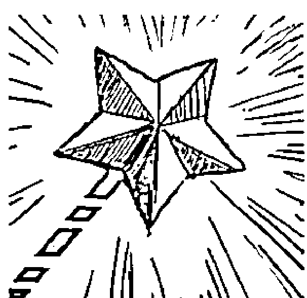

人生最大的痛苦，莫过于不知道自己究竟要什么，想要怎样度过这一生。继而陷入各种负面的怪圈，引发对现实的无力感。有时候感觉生活没有希望，只有无尽的绝望，有时候不知道为什么活着，感觉一天天麻木不仁，但是又空虚无比。每天跟随着大众主流，跟随着别人的意愿去做事，而不是为自己。因为自己并不知道自己要什么，所以也就只能为领导、家人、父母而活。

这种虚无主义必然的一种结果就是拖延。拖延症的蔓延，多半就是因为如此，因为自己做的事情不是自己想要的，自己想要的是什么又不知道或者不敢去拿，所以只能违心强迫自己做些不想做的事情。逃避痛苦是人的本能，拖延就是这个本能的一种体现。见过上班拖延的，但很少见下班拖延的，因为前者是痛苦后者则是快乐。然后所有的事情都开始变得不着急起来，对于工作与生活懒懒散散，对于时间概念开始匮乏，对于重要的事情开始漠视……

这就是自我价值感低的体现之一，人们不愿意相信自己的能力，不相信自己可以拿回自己想要的东西，可以重新评估自己的能力。

> 尼采说：“一个人知道为什么而活，他就能忍受任何一种生活。”

拿回自我价值的方法之一，就是找到自己想要的东西，知道为什么而活，重新建立希望。建立希望的有效方式之一则是设立愿望，想要做成什么，得到什么。

萨提亚企图帮人们找回自己的目标，找到自己的愿望。让人们可以挑战自己，相信自己，让人生有意义地度过，拿回对自己的自知力，提高自我价值。

愿望棒很像卡通剧里的魔法棒，轻轻一挥，愿望就可以实现。在萨提亚的工作坊里，萨提亚治疗师通常会用一个带着星星的可以闪光的玩具棒来代替。实际上这样的玩具在玩具市场上俯拾皆是，但放到萨提亚的工作坊里却是一个魔法工具。在萨提亚工作坊里，治疗师会拿着愿望棒郑重地交给案主，并在给他之前或者之后加入一段冥想或暗示：这是一根愿望棒，拿着它，你的愿望就会实现，它会给你无尽的力量。

这时候萨提亚治疗师就可以跟案主沟通：假如只能有一个愿望，那会是什么？你最大的愿望是什么？你最理想的生活应该是怎样的呢？你的目标是什么呢？

在核对完案主的愿望后，治疗师需要格外注意，案主的目标是希望自己改变还是在要求别人改变，如果他依然在希望别人改变，那就需要去帮他看到责任的部分，人不能为别人负责，只能对自己负责。同时要去看他的愿望是具体的某件事还是一种生活状态，如果只是某一件小事，那就去跟他探讨这件小事背后的动力，去修订愿望，从而建立一个合理的、深层的愿望。通过这样一个修订愿望的过程，可以帮案主理清自己的生活状态，看清自己。
在修正完愿望后，治疗师依然要用魔法棒给案主力量。让他想象从魔法棒里流出来的能量，流遍他的全身。

#### 创意钥匙

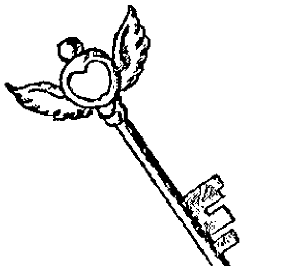

创意钥匙要解决的问题就是：我该怎么办？这是一个不负责任的问题，我把回答的权利交给别人，希望别人告诉我该怎么做，希望别人告诉我什么是对的，什么是应该的，从而我就可以只是去服从，不用为自己的选择负责。因为别人告诉我答案的同时，也给我做出了一个选择。

人一旦陷入“我该怎么办”的怪圈后，就会丧失自己的智慧，将自己暗示为一个没有能力的、没有想法的人，以此迎合别人的期待，向别人证明我真的是没用的，所以需要你的帮助。

萨提亚鼓励人们拿出自己的主意，发挥自己的想象力和能力找到解决方案，我们可以去找别人讨论方案的利弊，但绝不是坐等别人告诉我们该怎么办。自己找解决方案的优势就在于，它让我们重新相信自己是有能力的，是能行的，从而建立自己的自我价值。

问题犹如一把锁，方案就是那把钥匙。别人有钥匙，我们自己也有。而更能解决自己的困惑的，莫过于自己的那把钥匙。

基本上，每个人都会随身携带几把钥匙，把它取下来，放到案主眼前，这就是一把具有了魔法的钥匙，因为它能打开任何一个难题的锁，找到方案并解决。它最能打开的，也是我们自己的大脑这把锁。长时间的不知所措，让我们封闭了自己的大脑，找不到创意，这把钥匙就能开启我们大脑的锁，让创意不断更新出来。创意钥匙可以让人：

- 打开心扉和头脑
- 发挥创意
- 超越界限、禁忌、常规
- 让团队齐心创造

治疗师在工作的时候，同样给予案主冥想：这是一把有创意的钥匙，有了它，你可以打开你的大脑，让想法尽情地涌出来。你将不再限制你的大脑，没有任何做不到或者不可能，你允许自己有无数个方案解决困惑。现在，你只需要拿出几个就可以……

## 双面金币

## 找到意想不到的自己

双面金币主要解决犹豫与纠结的问题：向左还是向右，选A还是选B，答应还是拒绝？

选择就意味着要为它负责，人们喜欢用逃避选择来实现逃避责任，于是有了中国人的韬光养晦：我不说是，也不说不是，到底是不是，你自己猜去吧。

曾经有一头驴子饿死了，因为送草的人仰慕驴子主人的威名而多送了一堆，这只驴子徘徊在吃哪堆草的过程中不能做决定而被饿死了。人也是如此，对于要不要去决定，要不要去做，人们也难以选择，于是过多的精力和时间就被耗费于此，用在了纠结上。即使选择，也难以坚定，该不该这样做，这样做对不对，开始犹豫、后悔另外一个选择。整个过程，很难勇往直前，坚定不移。

双面金币要解决的问题，就是对选择做一个决定。做人应该爽快些，对某个选择爽快地做出yes或者no的答案，可以就是可以，不可以就是不可以。自己做一个选择，并为这个选择负责，放弃另外一个。

双面金币一面呈现有yes字样，另一面呈现有no字样。萨提亚治疗师会去询问案主要呈现出哪一面，二选一，没有犹豫和纠结。

## 智慧宝盒

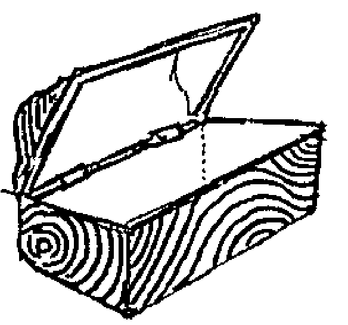

智慧宝盒里有着无限的智慧和资源。当你需要的时候，你就可以拿出你所需要的能力。萨提亚认为，人生来就有足够的资源来应对事情，只是随着我们的成长渐渐不再相信。

萨提亚治疗师通常在引导完案主后，要求他从宝盒里拿出需要的资源，如勇气、智慧、爱心、毅力等。

除此之外，智慧宝盒也可以用来放进一些东西，将案主的焦虑、犹豫、遗憾等暂时放下或者以后都放下，也可以放进对某个人的愤怒、恐惧等情绪。通常治疗师会让案主将需要放下的事情写下来，然后放进盒子里。这代表着案主可以将需要放下的东西从身上拿走，让智慧宝盒代管理。

## 勇气棍

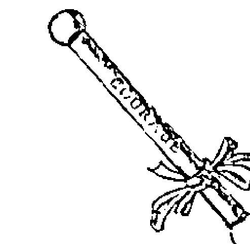

勇气是人们在应对事件时非常重要的一个资源。在有了决定、能力后，还需要勇气去面对。

在面对新的改变时，意味着一切都冒险，冒险就需要勇气。舒适地带被打破，面对着一切未知，治疗师需要给他的案主一些勇气，让他有力量去面对。

通常治疗师会把勇气棍交给案主，让他感受勇气棍所给予的力量，然后去找案主核对：此刻，你的勇气有没有多一点？如果只是多了一点点，治疗师可以再给他一根勇气棍，让他感受到更多的勇气。接下来治疗师就可以去工作：
现在你有了很多勇气，你决定怎么做？
如果你有很多勇气，你会怎么做？

## 爱心宝石

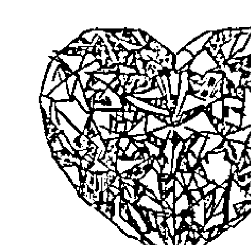

爱心宝石可以是一块心形的石头，或者是一个心形的物件。最重要的是，人们可以借着宝石来表达爱，夯实自己的爱。

- 人们可以把宝石：
  - 送给自己，借着宝石说“我爱我”、“我珍惜我”；
  - 送给亲人、朋友，借着宝石说“爱你”、“感恩”；
  - 送给旁人，借着宝石说“欣赏你”， “想与你认识、交朋友”。

爱心宝石可以在生活中使用，也可以在萨提亚的个案中交给案主，让他去感受爱，也可以在工作坊中使用，借此让成员相互连接，夯实爱。

# 第三章

# 沟通

听了你的话，我仿佛受了审判，
无比委屈，又无从分辨，
在离开前，我想问，
那真的是你的意思吗？

在自我辩护前，
在带着痛苦和恐惧质问前，
在我用语言构筑心灵之墙前，
告诉我，我听明白了吗？

语言是窗户，或者是墙。
它们审判我们，或者让我们自由。
在我说与听的时候，
请让爱的光芒照耀我。

### 第一节

# 健康的沟通长什么模样

---

## 一致性沟通

“你饿了吗？”当约会中的女生对男生说出这样的话的时候，通常是在暗示她饿了。不解风情的男人会说：“我不饿”，而善解人意的男人则会说：“想吃什么？”接着：
女：随便。
男：KFC？
女：太油了。
男：西餐？
女：太贵了。
男：那你到底想吃什么？
女：随便。
男：……
女孩是有自己答案的，她不说，等着男孩能说出她心里的答案。沟通是一场猜测味道很浓的游戏，如果人们之间是不一致的表达，沟通将会成为关系的阻碍。当然，除非你们建立在很深的亲密基础上，喜欢玩这种猜测游戏。而想让且能让对方明白自己真实企图的沟通就是一致性沟通。
沟通是一件有意思的事情，语言的魅力不止一次被我们见识到。如果你觉得沟通就是说话，那你完全低估了沟通的含义，因为我们无数次经历到，我们说的话和听到的话，受到了太多无辜的曲解。

## 找到意想不到的自己

因为你的嘴巴在说话，你的身体、语调、情绪等也在跟着你说话。肢体语言的含义正在被日益重视，现在人们已发展出了一门专门的学问叫“身体语言学”，专家们曾经说沟通的信息传递是“7%的言语语言+93%的肢体语言”。

萨提亚在这方面也基本同意这个说法。他认为，任何一种沟通都包含着两方面的信息，即语言方面的和情感方面的，或者说是语言方面的和非语言方面的。某个人在做语言陈述时，同时也会自动地表达出包括表情、姿态、语音语调以及呼吸频率等在内的多种非语言信息，而且这些非语言表达往往反映了人们内心的真实状态。当人们的语言信息与非语言信息一致时，萨提亚称之为“一致性的沟通”，又称为“表里一致的沟通”。

简单地说，就是我们所说的话和我们身体的感受是一致的，我们能准确表达出自己。

在某次约会中，你很温柔地对他说：“我已经到西直门了，你快出来往地铁站走。如果你到了我还没到，你就等着吧。如果我到了你还没到，你就等着吧。”

这就是语言的魅力，但是他真的明白了吗？

他真的迟到了，你很生气，你见到他的第一句话就是：“你怎么可以迟到！你怎么可以让我等你！”然后他会莫名其妙地觉得你有些小题大做，本来他迟到了挺内疚的，结果被你一指责，反而觉得迟到无所谓，是你在无理取闹了。

分歧就这样被放大。

倘若我们换个方式来表达：你来晚了，我觉得很生气，很受伤。守时对我来说是很重要的一个品质，我觉得你这样做是对我的不重视，我希望你道歉。

前一种的表达忽视了我们的受伤和愤怒的感受，我们在生气，可是我们光顾着骂而没有觉察到自己在生气。而后一种表达则是真诚的，我们把自己真实的感受和期待表达了出来，这时候的我们依然是和对方连接在一起的，只针对他的行为而没有否定他。我们把自己放到这种情境里的时候，感受就会很不一样，后一种说话方式是有力量的，而前一种虽然嗓门高但是内心却是无力的。

世界上没有人能像中国人一样讲话含蓄，欲说还休，犹抱琵琶半遮面，说话要绕树三匝才能让人听明白。这或许也是萨提亚模式能在中国迅速盛行的一个原因吧。

沟通是萨提亚研究比较多的核心问题之一。
在一致性沟通里，误解和争论是可以被处理的，因为一致性中的双方，可以真正倾听到对方的感受，也愿意说出自己的感受。即使双方意见不一致，但是内心依然可以保持连接。在一致性沟通里，我表达出了我自己，内心流动着爱、和谐、愉悦、平衡和喜悦。我觉得是安全的，有价值的，有连接的。

## 一致性沟通的特点

一致性沟通首先是真诚的。此刻，我知道我的感受和体验是什么，知道我的需要是什么，我真诚地表达了我自己。哪怕谈的是矛盾焦点，也不会引起愤怒情绪。因为面对一颗真诚的心，我们也会拿出真诚的态度来就事论事地解决问题，而不是陷入无休止的情绪发泄中不能自拔。美国心理学家安德森（N.Anderson）在研究影响人际关系的人格特质的时候，发现了关系中最受对方喜欢的三个品质是：真诚、诚实、理解，最受对方讨厌的则是：说谎、假装、不老实，这些或多或少都与真诚有关。记住，在沟通中，真诚是最容易被理解和接受的。

一致性沟通也是通透的，是能量流动的。它在沟通的时候解决问题，但不否定彼此，让对方感觉到被尊重，让自己感到舒适，让彼此的连接一直都存在。我们通过一致性的沟通让连接更深，让关系更亲近，因此一致性沟通是保护关系，且促进关系的。这就像你在一潭死水里注入了新的水源，让这一潭死寂的水流动起来，焕发出生命的活力。

一致性沟通建立在一致性的基础上。一致性我们说过，就是成为真实的自己，我们不控制环境，不控制他人。在表里一致的行为和关系中，我们可以不带任何评判地接纳并拥有自己的感受，并且以一种积极、开放的态度来处理它们。

了解了一致性沟通，那怎样才能一致性的沟通呢？
一致性的沟通要碰触自己的心，了解自己真正的感受和渴望是什么。比如

太太做好了饭菜等先生回家，先生却回来很晚，一进门，太太劈头盖脸地来一句：“死哪去了，现在才回来！你就是个不顾家的人！”于是一场战争开始。

## 找到意想不到的自己

老公很晚回家，太太的真正感受是什么呢？焦急、担忧与伤心。太太如果尝试下这样说，“老公，你回家晚，我很担心你，觉得难过。”不做评论，不做批评，就是单纯直接地表达切身感受，我想老公不会觉得烦，而会真切地面对这件事情。

表达了感受，太太渴望的是什么呢？渴望老公的陪伴，渴望一家团聚的晚餐。接下来夫妻就可以这样探讨，“老公，我希望能够和你在一起，一起吃饭。”“亲爱的，我也希望，今天因为XX事情耽误了，很抱歉，以后我会提前打电话，并且尽量多抽出时间陪伴你。”

我们经常理所当然地认为，认识这么久了，你该知道我怎么想。其实大家都活在别人应该怎么样的幻觉中。打破幻觉，从一致地表达自己开始。多用“我”开头，说自己的感受和内心深处的渴望。不评判，不下定义，不指责别人，不逃避问题，不说道理。真诚，是打破幻觉，解决矛盾最好的方法。

具体来说，一致性沟通就是兼顾了沟通的三个要素，让沟通处于平衡的状态。

## 沟通的三个要素

任何沟通都包括三个部分：自我、他人和情境。沟通过程即这三个要素互动的过程，沟通结果也是这三个要素互动的结果。

我们所生存的世界是关系的世界，我们生活在三个关系中：与环境的关系，与自己的关系，与他人的关系。我们生活的全部都在处理这三个关系，对这三个关系的处理，也就成为了沟通。

### 自我

自我是指提供信息的人，也就是互动中的“我”。自我是一个系统，当沟通开始，自我的个体就会把在当前所有的感受、信念、价值观、态度、当时的身心健康及内在状态、对自己的想法及评估、对说话对象的感受和意见、对环境的感受等所有发生在自我系统里的元素都带入沟通中。

例如，我们对自己的不自信会让我们的沟通没有力气，我们对对方的不屑感受和认为他不值得沟通的意见会让我们在沟通中不愿坦诚及多说，我们身体觉得不舒服的时候表达会受影响，我们对话题没兴趣会不想继续沟通下去等，所有这些与自我有关的因素都在影响着沟通。

在一致性沟通中，可以从4个层面来表达自我元素：

1.  先表达我观察到了什么：看到了什么，我的感官接收到的信息是什么，不带评价和判断；
2.  接着表达自己的感受：我感受到了愤怒、委屈、受伤、害怕、开心、感动等；
3.  然后表达自己的想法：因为我觉得你没重视我，因为我觉得守时很重要；
4.  最后表达自己的期待：我希望你道歉，我希望你早点到，我希望你把袜子洗了。

我们可以用这4个层面来表达自我，好让对方理解我们。

有时候沟通自己已经很不舒服，很劳累了，还要不照顾自己的感受强忍着和对方沟通，这时候的沟通效率就会很低，明明在说一件事，却不能在一个频道上表达或更多的在表达情绪。

### 他人

他人是指沟通中的接受者。在互动中另外一个个体就是“他人”，如果沟通对象是多个人，那么沟通的这多个对象也被称为“他人”，他人在互动中也会带入他们自我的元素，影响沟通。他人又分为实际的他人的特征和我们认为的他人的特征。这两者可能重合一致，即我们认为的即他人表现出来的，更多的时侯是我们对他人的偏见。

心理学中的首因效应、近因效应、光环效应、刻板印象等心理效应就是一些我们认为的他人的特征与实际他人特征不符的证明。

在一致性沟通中，照顾到他人元素同样也是需要4个层面，即通过体会他人此刻的观察、感受、观点和期待，然后与他们连接，用心聆听，然后决定是否可以做一些事情来满足他们。

在这个过程中，使用卡尔·罗杰斯的几个方法会更有助于我们照顾到他人，即：

- 倾听。不带有任何评判、比较、抱怨等，只是认真倾听。
- 尊重。尊重他人的观点、态度、方式与我们不同。
- 积极关注。看到他们做得好的一面，并表达出来。
- 真诚。用我们的真心来回应。

当你想考虑他人而并没有真正做到的时候就会出现这样的效果：

小明坐在家门口吃雪糕，不远处一个衣衫褴褛的小男孩正眼巴巴地瞅着他，垂涎欲滴的样子。小明觉得他很可怜，就招手让小男孩过来，然后递给他一个板凳说：“来，坐着看！”

情人节那天，女神失恋了。劝慰她到深夜，终于感动了她，可是由于地区偏僻，又是激情泛滥的日子，酒店都满客了，只能到一家小旅店开间单人房。洗完澡后女神坐在床上说：“真倒霉，这么破的床，两个人睡会不会塌呀？”于是，出于这样的忧虑，我在地板上躺了一夜。

### 情境

情境是指沟通发生时的背景。包括：

沟通的目的。我们为什么要沟通？沟通要达到什么样的效果？

双方的角色与关系。沟通双方在沟通中的角色是什么？是老板和员工间的互动？是恋人间的互动？是亲子互动？同一个人，在不同的角色和关系里，会有不同的沟通方式。

沟通的氛围。即沟通双方在当时的安全感、敞开度等。在感觉安全和信任的氛围中，我们的沟通将会更加深入和开放。双方是在专心沟通还是在边忙别的边沟通？是特别投入还是心不在焉？

沟通时的环境或社会背景。我们在哪里说话？在你家还是我家？在商业场合、公共场合还是私密空间？

不同的情境，会对沟通产生不一样的效果。它会影响着双方觉得什么是适合向对方表达的，哪种方式是适用的，是最好的，是可以达到效果的。

在一致性沟通中，我们需要觉察说话当时的情境，决定哪些话该说，该怎么说，哪些话不该说。

如果没有考虑好情境，对方则难以用心完成沟通。有些人吵架不分场合而让对方很没面子，就是不考虑情境。

# 第二节

# 不一致性沟通

## 什么是不一致性沟通

有时候我们是在担心别人，说出来的话却伤害了别人；有时候我们是在乎别人，说出来的话却伤害了别人；有时候我们害怕别人会离开，说出来的话却是无所谓。我们习惯了所谓的死要面子，却忘记了要真诚面对。

当我们的心里渴望爱却是指责的时候，当我们充满了愤怒却假装无所谓的时候，当我们表达出来的信息跟我们的内心世界并不一致的时候，甚至把这种不一致压抑到潜意识里而意识不到自己的不一致，让沟通成为了一种机械化和头脑化的反应的时候，我们已经在使用“不一致的沟通”了。

不一致沟通就是沟通偏离了中心，忽视了沟通中的某些元素的时候，沟通开始失衡。

萨提亚这样定义不一致的沟通：

不一致的沟通是指内容、语气等不同层次发出来的两个以上的信息，而这些信息彼此不相容。虽然接收者可能透过各种核对的过程确实了解对方告诉了他什么、要求什么以及为什么对方要这么做，但不一致的沟通将带给接收者相当大的负担。

萨提亚发现不一致的沟通正在影响着人们的心理健康和生理健康。

发生在正向、尊重的一致性沟通里，可以使关系产生连接感，产生亲密，促进关系。在不一致性沟通里，我们会：

伤害自己。不能表达自己渐渐让我们迷失了自己，找不到存在感，让我们日渐困惑和彷徨。感受不能被有效表达的时候也会被压抑下去而攻击我们的身体，情绪怎么伤害人的内容已经太多太多我们无须多言。在不能一致性表达的沟通里，我们的感受也会随之越来越差。

影响关系。不一致沟通使沟通的能量堵塞，让他人疏远，刻意压抑感受，使信任和分享变得困难而危险。彼此感受不到真诚，只能感受到伤害。

伤害他人。明明渴望爱，却用了指责的方式；明明渴望亲密，却做出了疏离的事。应该是自己为自己负责，别人却在为我们的不一致而买单，承担着我们不一致带来的伤害。

沟通是门艺术，如果你不会，你就会错过很多。举例说，如果你对一个MM说：我想和你一起睡觉，你这就是流氓。但是，如果你说的是：我想和你一起醒来，那么你就是徐志摩。两种表达同样是事实，但后者却考虑了对方的感受。

因此沟通不仅是信息的传递，更是两个人整个有机系统的互动。

## 为什么会出现不一致沟通

什么因素阻止了我们在沟通中保持坦诚呢？是那份不安全感。

曾经有一个村庄发了大水，大水淹没了整个村庄。一个妇女抱住了一根木头，其他的人都淹死了，她紧紧地抱住那根木头，河水太大，她还是被冲到了下游，她紧紧地抱住木头，过了一段时间，河水已经渐渐平静，她还是紧紧地抱住木头，她漂到了另外的村庄，人们站在屋顶对她喊叫，快放下那根木头吧，你已经安全了，河水已经很浅，你可以走过来，咱们一起重新生活，但是这个妇女却不能放下那根木头。

这个木头就是生存模式，是不一致的方式。

我们在安全、开放的环境里时，沟通是一致的，敞开的。我们知道那时的表达不会对自己产生任何影响。但是一旦环境开始变得不安全，当我们处于压力或分歧下的时候，我们就会害怕对方如果真的了解我们，我们就会失去这份关系。我们认为如果在自觉脆弱的处境中打开自己，就会失去别人的尊重。我们害怕真诚会有不好的后果，所以我们有选择地表达了“能说的话”，有选择地对自己的内心进行了违背和扭曲。

这时候虽然我们的意图是维持关系，却反而陷入了困扰，因为当我们保护自己时，就在自己与他人之间建立了一道墙，因为对方不知道我们真正的感受，只会看到我们对他们表现出的行为、姿态，听到我们表面说出的话。

当我们无法开放地表达真实的自我时，愤怒或恐惧等情绪就会受到压抑，这种压抑会阻碍能量，使各种感受在日后以身体和心理的症状表现出来。

我们大部分的沟通都是在努力保护自己而已。人类总是在试图维持平衡，在沟通中也是，极力寻找自我表达和自我压抑之间的平衡，这是一种不安全的平衡。自我表达是一个完善健康的人的基本需求，而自我压抑则来自于我们头脑中的“应该”和“不应该”的限制，是我们为了保护自己而发展出的限制。后面我们在谈到五种自由的时候会详细谈这点。

## 不一致的方式是我们从童年时代家庭里发展出来的

沟通方式是在家庭系统中习得的，每个小孩都会在特定的环境中学习与人沟通。我们活在这个世界上，每个人都需要被认同，而认同的得到通常都通过沟通这种形式，所以每个人都从很早就学会以某种沟通方式来得到认同。应对是在家庭中、在我们身边的重要他人的情境中学来的，我们为了得到认同和接纳所付出的代价，常常是压抑自己的感受和需要。

在我们小时候，如果父母在外面受了委屈回家不表达，假装没有事一样强迫自己开心面对小孩，但是神情上却不断显示着不开心，会莫名其妙对小孩发脾气，会突然要求很高，会将情绪投射到小孩身上，让小孩感到很奇怪，无法解读父母。这时候孩子就学会了不一致，他发现父母的内心体验和语言表达是不一致的。

其实我们在生命开始的阶段，就发展出对自己和世界的观念了。尽管人在18个月到2岁时才会说话，但是2岁之前，我们已经学会了大部分东西。我们的父母通过语言沟通，而我们接收到的却更多的是他们通过触摸和语气、声音传来的信息，所以从那个时候我们就开始使用自己的方式来理解父母，发展出一种适合父母的方式来与父母沟通。这就是不一致的原型。

那时的我们是无助的。我们会不断试探怎么才能让父母开心，怎么才能## 找到意想不到的自己

得到父母的爱，怎样调整自己在这个家庭里的位置。

那个时候我们对父母的理解也是片面的，我们通过自己对父母的误解来理解他们。那时候我们无法真正理解父母，包括现在我们也依然无法真正理解别人。在人际沟通中，人们是无法准确地接收或传递信息的，因此我们会对别人传递的信息产生误会。只不过在童年和更早的时期，我们对父母的误会更深，因此也不能够理解父母的爱，而只是发展出不一致的方式来获得爱，保护自己。

## 常见的求生存沟通模式（应对姿态）

## 求生存沟通

你有没有习惯性的沟通方式？
当价值感低的时候，你习惯第一时间使用的沟通模式是什么？

应对姿态，是人们在沟通中，当分歧和压力状态出现时，一种条件化、自动化的反应模式，是一种不一致的沟通模式，类似于防御机制，不属于人格范畴。是人们童年时期为适应家庭的压力环境而自发形成的一种求生存的沟通模式。那时候的儿童是无助的，为了应对父母，不得不发展出来一种保护自己生存下去的应对方式，在成年后遇到类似的情境时自动启动，成为随身携带的一种习惯。

在成年后人们所继续使用的沟通姿态，往往是源自一个低自我价值和不平衡的状态，人们采取这些姿态来保护其自我价值，尝试得到他人的接纳，同时隐藏绝望，以感觉到与他人的连接。

因此应对姿态也被称为压力下的求生存沟通姿态。

在一致性沟通里，是平衡的。我尊重你的体验，也尊重我的体验，我们把所有人都包容进来。但有时沟通会失衡，你会被自己的情绪所掌控，于是我们就进入各种应对模式当中。失衡的时候，我们就会否定一些东西。

萨提亚根据其表达形式和内在的动力指向归纳总结为指责型、讨好型、超理智型（或称电脑型）、打岔型（或称分散注意型）四种应对姿态。在这四种姿态里，每一种都对沟通的三要素中敏感的一部分进行忽略，只考虑到其他一个或两个元素，从而导致了沟通的失衡和不一致。

萨提亚在沟通姿态上的创造性还有，她运用身体姿态夸张地外化内在的心路历程。她透过“身体的雕塑”具体表现人与人之间的内在历程与动力，使隐藏的更容易被看见，使抽象的变得更为具体。

## 讨好

- “都是我的错。”
- “是我没做好。”
- “我为我的缺点或无知而道歉。”
- “我不能让别人生气。”
- “我不可以冒犯任何人。”
- “别人生气都是因为我。”
- “没事，没事。”
- “好，我同意，听你的。”
- “你是对的。”

这样的话语并不少见，当我们受到批评和指责的时候，我们第一反应就是自己错了或内疚于伤害到了别人、给别人添了麻烦。我们习惯了道歉和认错，我们习惯了放弃自己的观点而听从别人的。
我们害怕伤害别人，怕别人会生气。我想安抚这个人，我就说这是我的错，对不起，我下次会做得更好，你别这么生气了，我下次做好。为了不让他人受到伤害，我们有的时候甚至会说一些谎。
有时候我们即使自己感觉不好，也会对别人和颜悦色。那时候我们害怕出现不和谐，害怕别人不高兴，所以当出现一点不和谐的时候我们就自动反应——明知不是我们的错也要先示弱以忙于去平息这些麻烦。仿佛我们存在的目的就是为了解决别人的问题，让别人高兴。我们习惯了承担责任，所有有关无关的事情，仿佛都是自己的错。那时候我们唯一想做的事情，就是让别人高兴，至于自己，无所谓。

忽视自我，只有情境和他人，这就是讨好姿态。在讨好的姿态里人们习惯的动作就是为取悦别人而贬低自己，压抑自己。我们的感受是什么、观点是什么并不重要，重要的是他人的需求和意见，还有情境。不想别人因为我的原因而觉得不好，那样我会很不安。

也许你会说，讨好其实是因为你是一个友好和友善的人。不，友好是建立在自我感觉良好、照顾到自己的基础上的，是一致的；而讨好则是委屈了自己的。

## 讨好有这些特点：

身体雕塑姿态：一腿跪地，一只手伸出恳求，另一只手紧紧按在心口，软弱的身体姿势。

常有的行为表现：道歉、恳求的神情、哀求及请求宽恕、乞怜、依赖、过分雀跃等。

常有的感受：委屈、受伤、悲伤、焦虑、不满、被压抑的愤怒。

## 内在经历：

- 如果我能让你内疚，你就会原谅我。
- 我是一无是处的，自我价值感低的，没有自信的，不值得的，不被重视的，不值得被关注的。焦点在对自己的期待上，希望自己能做好，这样就不会被抛弃。

常见的生理影响：消化道不适、偏头痛或其他头痛、心悸/心律不齐、皮肤病（粉刺、牛皮癣、湿疹、疹块）。

常见的心理影响：神经质、抑郁、自杀。

讨好的人也有其资源：

- 敏感的。他能敏锐地觉察到周围环境的变化，觉察到别人心情的好坏，因而能及时照顾到别人。
- 关怀的。他渴望照顾好别人，让别人开心、舒服，他想去关怀别人，能更多地站在对方角度思考，并较少产生分歧。
- 滋养的。他能够很好地满足别人，给予别人需要的心理营养。
- 体贴的。

意义：可以照顾到别人，让自己心安，并收获较好的人际关系，使对方不至于发怒。

缺失：委屈自己，压抑自己，丢失了自己。

判定的方法：

当互动开始，沟通发生，我们需要马上对自我、情境、他人三个元素进行评估，如果在沟通中我们强调了别人的需求而忽视了自己的，照顾到别人的感受而没有照顾到自己的，就是讨好。

因为某事而过度内疚，因为没做好的事情而过度自责，将想表达而不能表达的感受进行压抑，在公众场合顾及别人的感受而不敢表达自己等，都可能是一种讨好。

## 指责

> “都是你的错。”
> “你从来没有把一件事情做好做对。”
> “要是你……那就……”
> “我完全没错，是你的问题。”
> “还不是因为你！”

很多领导、强势的人喜欢说这样的话语。承认错误对我们来说是困难的，不仅是嘴上，心里也很难承认，似乎承认了错误就没了尊严。我们没有办法理解，为什么这些人会做成这样，为什么有这么多人不理智、不识抬举，为什么做什么都不顺心，没有人让自己满意。

忽视他人，只有自我和情境，这就是指责的姿态。当我想控制别人，要他们尊重我、认可我、听从我的时候，我就采取指责、批评他人的态度。当我把别人变得比自己小的时候，我就感觉自己是有力量的。当一些事情发生破坏了关系的和谐，我们发现别人没有满足我们的期待，我们就会把他人的部分忽略，这就是指责。我很生气，你让我很失望，你不听话，我的期待没有得到满足，这是你的错。如果我错了，那也是因为你造成的。我不在乎你想什么，我不想听借口，这个就是你错了，这就是指责。

当指责的时候，我们常常是有敌意的、专制的、爱找麻烦的，或者暴虐的，我们喜欢大吵大嚷，证明自己是对的，要求别人必须听我们的。

不要把指责的人看成是有力量的人，其实他是最没有力量的。当我们在指责别人的时候，是想让别人为我们负责，用证明别人错了的方式来让别人负责。如果他不改变，我就很生气，很受伤，如果他改变我就感觉好多了，他控制了我的感受，所以这时候的我们是最脆弱的。

## 指责有这些特点：

身体雕塑姿势：挺胸站直，伸出一只手臂，食指指向某个人，另一只手叉在腰上，抬眉或者皱眉。

常有的行为表现：指责、攻击、命令、咆哮、愤怒、恐吓、批判、独裁、吹毛求疵、控制。

常有的感受：生气、愤怒、挫败感、不信任、不满、被压抑的受伤、害怕失去控制、孤单、无助。

## 内在经历：

- 如果我让你忧虑，你就会听我的。
- 我是孤单而失败的，没有人理解我，我是无助的，是缺乏控制的，焦点在对他人的期待上希望他人可以做得更好。

常见的生理影响：肌肉紧张、背痛、紧张性头痛、高血压、中风、心脏科疾病、气喘、关节炎/黏液囊炎、易出事故。

常见的心理影响：偏执、违法、杀人、伤害报复别人。

指责也有其资源：

- 自我争取。指责的人知道自己要什么，并且能够自己主动去争取。
- 有领导才能。指责的人知道什么是对的，并希望所有人都认同他认为对的东西。
- 有能量。指责的人可以有很大的爆发力，有很大的能量推着他做事情。
- 果断的。

意义：发泄情绪，可以做自己，宣泄自己，使他人认为自己是坚强的。

缺失：伤害了别人，伤害了关系。

判定的方法：

- 根据沟通三要素，只要在沟通中没有照顾到别人的感受而只想到自己的感受，只顾着发泄自己而没有站到别人的角度去思考，就可以定义为指责。
- 抱怨、牢骚、烦躁、嘀咕等不明显的行为，给别人带来了不好的影响，其实也可能是一种指责。

## 超理智

> “这个世界除了错的就是对的。”
> “凡事都要讲理，都要按正确的方式去做。”
> “一个人必须要理性、智慧。”
> “你不懂，不了解。”
> “我知道什么是对的、好的。”
> “我知道得更多。”
> “你不合逻辑、没有道理。”

我们常常听到、也常常会讲一些逻辑而客观的话，喜欢上升到抽象的想法，喜欢冗长的解释，并用名人名言来论证。无论感性的事情还是理性的事情，不论在工作中还是在感情里，我们都喜欢解释、讲道理，我们堂而皇之地认为人应该讲理。

《亮剑》里田雨要嫁李云龙。田雨对妈妈说：“妈妈，他是个英雄，我喜欢他，崇拜他。” 多么一致的表达，但是妈妈在和女儿谈论感情的时候却有了这样的话语：“太抽象了，你懂得什么叫英雄吗？我认为，一个人通过自己的努力，造福人类，使人们走向光明，这才可以称为英雄。比如说，希腊神话中的普罗米修斯，他偷来了火种，为人类带来了温暖和光明。女儿，你不要滥用英雄这个概念，现在怎么可能有英雄。阮籍说，时无英雄，竖子成名……”

田母是超理智的，女儿的感情要用阮籍和普罗米修斯来论证。

忽视自我和他人，只有情境，这就是超理智。理智是没有问题的，但是过于理智的时候问题就会接踵而至了。当我们无法去正视自己和他人的感受的时候，就会选择进入大脑，用“脑袋”说话，减少谈话的情感层次，只谈问题的内容、原则，我们会变得过度理性，有很多的道理可以讲和说服，我们以理服人，用数据说话，凡事都要讲出是非对错，但是我们却恰恰在这时候把与对方的情感连接切断了，所以很多时候，我们赢了道理，输了感情。我们全然忘记了，这个世界，非要有个对错吗？关系，非要用是非来衡量吗？感情，有对有错吗？

叔本华常说，与其用道理来说服一个人，不如照顾到他的情感需求来得更有效些。两个人的沟通也是如此，与其讲一堆道理证明他错了，去说服他，不如一句安慰来得更好。因为后者照顾到了他人的感受，而那堆道理是没有感受的。

超理智就是这样一种姿态，发生了什么是重要的，自己和他人的感受都被忽视了，我们只在乎事情的对错，只在乎规则和道理，而忽略了人本身，是视而不见的。只有事情本身重要。

因为超理智的人很像一台电脑在运作，只处理信息不处理感受，因此也会被称为电脑型。

你说人应该讲理是没有问题的，但是在明白超理智之前，你需要先回答一个问题：感情重要还是真理重要？不同的人会有不同的回答，对于超理智者来说，真理是唯一的，超越一切的，即使伤害感情也要讲理。

## 超理智有这些特点：

身体雕塑姿态：僵硬不动地站立挺直，脑袋微微向上仰，两只手臂侧放或交叉抱于胸前。

常有的行为表现：僵硬而刻板、冷淡、严肃、不近人情、无聊。
常有的感受：仅显露少许情绪、内心极为敏感、孤单、空虚、害怕失去控制、脆弱、容易感到被拒绝。

## 内在经历：

- 如果我能说服你，你就会支持我。
- 我不能坦承我的心，不能随便对人敞开自己，不能轻易表达真实的自己，那会让我感到被拒绝，我懂得很多但没人懂得我的心，我正在感觉自己被远离，体验不到存在感，空虚。

## 常见的生理影响：

- 干燥性疾病，包括黏液、淋巴液以及其他分泌液干燥性疾病。
- 癌症、皮肤病、淋巴系统疾病、背痛、单核白血球增多症、心脏科疾病、单核细胞增多。

常见的心理影响：强迫性的、反社会的、紧张症的。

## 资源：

- 有知识的。超理智的人是博学的，懂的特别多，知道的处事原则和标准也很多。
- 注意细节的。超理智的人总能注意到别人没有注意到的细节问题，像个侦探一样，无孔不入。
- 善于解决问题的。超理智的人能将视角聚焦于问题，能找到相关的方法解决问题。
- 逻辑的。超理智者逻辑能力非常强。

意义：利于解决问题，在事情层面上做出结果；将一切事件合理化；将自尊心埋在智慧的词藻之下。

缺失：解决了问题，忽视了情感连接，伤害甚至失去了关系。

## 判定的方法：

- 根据沟通三要素，在沟通中处理关系的时候没有注意到双方的感受，只顾着解决问题，就是超理智。
- 解决事情而忽视关系中的感受，以解决事情为主体，而不顾是否促进关系，常常就是超理智的表现。
- 固执、钻牛角尖、较真等死抱着道理不放的行为，也可能是超理智。

## 打岔

很难找到适合的话语来形容打岔。当你尽兴地谈论着某个问题的时候，他们会突然冒出一句“几点了？”等改变话题以分散注意力，他们不能专注于一件事上、总是避开有关个人的或情绪上的话题讲笑话、言不及义、打断话题。有时候，他们沉默不说，任你语言轰炸，都与他们无关。

金庸笔下的老顽童周伯通就是这样一个人，当你想和他讨论一件严肃的事情的时候，他的无厘头会把你叉开。喜欢沉默自闭的人是这样一种状态，他根本就不在和你的沟通状态中。

自我、他人、情境全部忽视了，这就是打岔。有时候在某个情境里，谈论某个话题的时候，我们会感到焦虑、害怕，总是想逃离，一分钟也不想多待，一句话也不想多说。我们会不经意地改变话题，中断谈话，将话题叉开；或者心不在焉，一副木讷的样子。或者我们会来回走来走去，离开现场，仿佛沟通从来都没有发生。或者我们会退化而过度活跃、无厘头、滑稽，讲一些“哎，我那天在商场看见一件好看的衣服。”等无关痛痒的话。我们这么做的目的，只是想避开那些令人感觉到不舒服的话题。

打岔的人，像个开心果一样，从来没有稳定下来过，永远都处在活跃与快乐之中，一刻也不能安静。想法跳跃那么快，从东马上就跳到了不相干的西，好像希望能够在同一时间做无数的事情。即使静止，也是没有人能走进去的静止，自己呆在那里静止，像是自闭了一样。

当然，那只是看起来的快乐。因为打岔型的保护自己的生存方式就是，从任何有压力的话题上转移开。

打岔有两种形式。积极打岔：即他在你面前，参与沟通，但是没有重点，总岔开话题。消极打岔：选择逃避，直接离开、冷战或者在你面前沉默不语，漫不经心。两种打岔都是为了完成逃避，都忽略了自我、情境和他人三要素。

## 打岔有这些特点：

身体雕塑姿势：消极打岔：转过身去，直接不对，不搭理。积极打岔：站着但又驼背，两膝向内，手心向上，双臂伸出，头部歪向一边，摇晃着，漫不经心的样子。

常有的行为表现：活动力过多、或活动力不足、沉默自闭、不灵敏、争取注意力。

常有的感受：仅显露少许真正的情绪、内心极为敏感、孤单、焦虑、悲伤、空虚、害怕失去控制、易显示脆弱、困惑。

## 内在历程：

- 如果你没有办法和我正常对话，你就没法再怪我，你就会原谅我。
- 没有人在乎我、我是不被重视的、我的存在是无所谓的、我感觉到紧张和焦虑、不想待下去了。

常见的生理影响：神经系统疾病、消化系统疾病、肠胃疾病、恶心、糖尿病、偏头痛、晕眩、易出事故、平衡及协调方面的毛病。

常见的心理影响：迷茫、不合时宜、精神病、自闭、困惑的、不恰当的、行动控制不佳、缺乏同理心、妨碍他人的权益、学习上的无能。

## 资源：

- 幽默、好玩。打岔的人喜欢无厘头，没有规条，能打破常规做事，出现很多幽默。
- 自发性、创造力。打岔的人思维分散，能够辐射很宽，进而创造。
- 有弹性。打岔的人从来不拘一格，不刻板。
- 和事佬。打岔的人见不得冲突，因此他会是一个能够调和紧张气氛的人。

意义：因为抽离了自己而实现了逃避现实、逃避责任，有效地保护了自己；心不在焉，好像威胁真的不存在了一样。

缺失：逃避不能解决实际问题，无法促进关系。

## 判定方法：

- 忽略了沟通的三个要素，就是打岔。当一个人不在状态的时候，整个人的心都没有沟通，不关心境问题，不关心别人的感受，不留意自己的感受，就是打岔。
- 不在状态，逃避，不解决问题，注意力分散可能是打岔。

## 发生在身边的沟通姿态小插曲

## 事件一，关于排队

有一次我去办理证件，人特别多，要排很久的队，门外的人排在走廊楼梯口处。每隔一段时间，就会有几个人被叫进去，在屋里排队，这时候屋里的冷气就会吹出来，带来丝丝凉意。外面的人有着不同的反应。

当再有人出来喊人的时候，顺便带了一句“你们往后站，不要大声说话。”不同的应对姿态会有不同的反应：

指责的人会抱怨：“你们关着门，还不让外面的人说话。你们在屋里享受空调，我们在外面这么热。你们应该人性点，让我们到屋里排队，外面热死了，反正屋里也是排屋外也是排。”然后人家会瞪他一眼，或者跟他吵。

讨好的人：“好好好。”他们或许并不知道人家为什么要这么说，也觉得委屈，但更多的是害怕，怕人家这么热的天心烦，不给自己好好办理，耽误了自己的事。他马上闭嘴，并期待屋外的人都闭嘴，免得屋里的人生气，然后人家会直接忽视掉他，关上门。

超理智的人：“你们办理这个需要走哪些程序呀？”“你们这个办理程序其实应该这样缩减或改一下比较好。”“抱怨有什么用，抱怨是一种负面的能量，你嚷嚷和不嚷嚷效果是一样的。积极的人就不会抱怨，他会享受这段时光，把它当作锻炼的机会。”他会问很多，想很多，教育人很多，懂得很多，但是自己做的并不多。当他说完，人家或许会和他聊几句，但聊完了该干吗干吗。

打岔型的人：“今天真是热啊。”积极的打岔者会插几句无关的话，消极的打岔者则会表现得特别木讷，往后赶的时候就往后退几步，叫的时候要叫好几遍才能听到，整个人不知道在干吗。人家会直接看不到他。

一致性的人：“你们也挺不容易的，我们虽然热，但只来这么一次。你们天天接待这么多人，屋里人一多就吵，一吵就心烦，外面吵了里面更烦。”人家会接上一句“可不是吗！”。

我想结果也不一样吧，当他们进去办证的时候。

## 事件二，关于道歉

讨好（常常低头，不知所措地绞手）：请原谅我，是我没做好，是我太笨，很对不起，真的对不起。

指责（语气硬，大声地）：天呐，你的胳膊太碍事了，被我碰到了！下次把你的胳膊收好，这样就不会被我碰到了！

超理智（面无表情，冷漠地）：因为你路过的时候把手伸到了我的地方，因为这里人太多，因为这里太热让人想擦汗，所以我不小心碰到了你，我认为这里面有我的责任，也有你的责任。

打岔（看着别的地方，假装没发生）：咦，怎么回事？难道今天是星期一吗？

一致（看着对方，真诚地）：真对不起撞到了你，你还好吗？痛吗？

## 沟通姿态说明

### 每个人的沟通姿态都不是单一的

很多人在学习萨提亚之初，都喜欢给自己或他人一个标签，你是指责型的人，我是讨好型的人，他是打岔型的人。事实上这四种不健康的沟通姿态，只是我们常用的沟通模式而已。我们每个人都有他擅长和习惯使用的模式，但绝非仅仅使用某种。

当我们在重要的人面前，害怕失去的时候，我们会不自觉地讨好。当我们在在乎我们的人面前，我们觉得不会失去的时候会使劲指责。我们在感觉很受伤没有办法面对的时候会选择超理智，当我们想逃离的时候又会打岔。我们面对领导的时候习惯讨好，面对下属的时候又惯于指责，我们在不同的情境、角色中，会采用不同的应对风格。

我们每个人都会用到这四种姿态，在不同的压力情境中会用到不同的姿态。

我们不能忍受一直使用同一种姿态沟通，我们拥有着丰富的内在。当压力突然降临的时候，我们最习惯和第一反应使用的，那就是我们最熟悉和最常用的。熟悉自己常用的姿态可以更多地了解自己。当沟通发生，觉察自己正在使用哪种姿态，也是一种了解自己和自我成长的好方式。当觉察了以后，就可以决定，要不要继续使用这种方式来沟通。

### 姿态间是相互转化的

如果长时间维系某种姿态，就会感觉到疲惫和痛苦，这时候姿态就会产生转化。这也是中国易经里最简单也最真挚的哲学：阴阳之间的相互转化，否极泰来，泰极否来。

也许你会因害怕失去男/女朋友而不自觉讨好，同时也可能会在一个你觉得不会失去的男/女朋友面前使劲指责。

当我们持续讨好，就会压抑自己的情绪，压抑无疑是痛苦的，当压抑到一定程度后就会爆发，然后转化为指责，巨大的指责。所以我们会见到一些平日里脾气很好的人，突然会发很大的脾气，莫名其妙且让人害怕。那些情绪，就是讨好的时候被压抑得太多而一次性爆发。

当我们用指责来发泄自己的情绪，发泄完的时候自己是爽了，但同时也发现伤害了别人，这时候就会容易产生内疚、自责等情绪，进而又要讨好，希望对方不要责怪自己。所以我们也常见到这样的人，骂完了别人又开始来哄。

超理智者会用讲道理来解决情境，道理解决不掉问题的时候就会转化姿态。当问题持续不能解决的时候就放弃解决，逃避，成为打岔，或者说服失败的时候就强迫对方接受自己的观点而成为指责，放弃自己的观点屈从对方而成为讨好。

打岔者一副无所谓的样子，但是话题触及打岔者的某个情结的时候，就会产生情绪或兴趣，成为其他姿态。

除非我们学会一致，学会真实地了解自己，做自己，一致性表达，不然当压力来临，我们会在几种不健康的应对姿态里走来走去，限制我们和他人之间的连接。

### 姿态不是表象，而是自动化反应

沟通姿态绝对不是我们看到的那样分明。谁在使用什么姿态，只有他自己知道，甚至他自己都不知道。

警察拦住了我们的车子，我们会毕恭毕敬地讨好，那是一种一致的讨好，并不是我们所讲的不健康的应对。因为那时候我们是带着觉知的，是有照顾到自己的感受的，我们为了尽快结束，为了达到自己的目的而故意讨好。根据我们的判定，照顾到自己的需求，照顾到了违章的情境，照顾到了警察，我们是一致的，只是我们的表象动作是讨好而已。我们称之为选择性讨好。

我们在亲密关系中会嬉笑打骂，会骂对方是笨蛋。那时候我们是带着觉察的，是以尊重为基础的，虽然会大吼大叫大吵大闹，甚至爆粗口，但是并没有伤害到对方的感受，也没有发泄情绪，因此不是指责，是一致的。

我们自己可能感觉到了被指责，很委屈。其实服务生是不会指责我们的，只是我们的内心认为他的姿态是指责。因此应对姿态是发生在我们自己内心的。有时候别人耐心听，我们可能会感觉到他在打岔、漫不经心。对于他们的判定，只能从我们观察和感受的角度出发，但要时刻记住，那是我们的，不是他们实际的。

有觉察下的故意姿态并不是我们说的求生存的应对姿态。当我们在无意识中不经大脑就表现出来的应对方式，是我们的自动化反应，才是我们说的求生存应对姿态。那里有我们太多的情绪、期待，和真实的自己。

## 如何停止不健康的沟通姿态

如果你觉察到自己有惯用的沟通姿态，不要急着去否定自己、然后告诉自己以后不要那么做。这是拿不掉的。沟通姿态的转化不是如何清除掉某些事物，而是通过增加一些新的知觉、新的关联方式、对自身感受的新体会、重新修正的期望以及新的选择，让别的事情得以发生。是要增加一些东西，而不是改变。我们在前面说，每个姿态都有资源的地方，保持着这个资源就会成为我们独特的优势。对于讨好，需要增加对自我的觉察，多关注自己的感受。像你关心别人那样关心你自己，以便你更充分地体验自我价值感和平等性。对于指责，鼓励他们保持自信和决断，而不带有责备或是评判。鼓励他们增加对他人感受的觉察，增加自己对他人期待的觉察，将内心的空虚感用爱填满，使指责者内心的空虚转变为自我确认和对其他人的接纳。为指责添加新内容时，我们不能说“为什么你总是指责别人？你难道不知道，当你责备别人的时候没有人愿意靠近你”，相反的，我们通过观察这样的现象来得出需要增加的内容：询问“你对他人的期待是什么？”“这样做的感觉如何？”对于超理智，增加感受的部分，增加对自我和他人的感受。将你的情感、感受和身体意识与你已经拥有的才智整合在一起。对于打岔，增加存在，让自己在场，增加对自我、他人和环境的觉察。如此可以帮助你在适宜的情境中释放你的灵活性、创造性和开放性，它们可让你脚踏实地，停留在互动中。

任何事情只要在持续，必然有动力在维系。不健康的沟通姿态也是如此，对方如果在继续使用，那也是你给了他继续使用的动力。例如他一味指责，你的指责会让你们火上浇油，你的讨好会让他看不惯你的软弱而继续指责，你的超理智会让他觉得你没感情而继续指责，你的打岔会让他觉得你无所谓而继续指责。

让对方放下指责的手，站起来不再讨好，拿回感受，或者回到现场，就需要你的一致性与一致性沟通。当你能够接纳对方的样子，不因为他所呈现的一面而感到不好，给予理解，他自然就会停止。因为他玩的这个姿态游戏已经没有意义，不能再从中获得任何满足。

## 都是因为爱

在沟通姿态中，都是因为在索取爱和表达爱，才会有这样的结果。

讨好看起来是在讨好你，最终不过是想满足自己，希望你可以给他一些爱，一些正向回馈。同时也是在表达爱，是想让你好。

指责是想让你听他的，按他的要求和期待来做，这样他就会觉得好受一些，这是索取爱。同时，他的出发点也是为你好，希望你过得好，他想表达的是爱，却出来了指责。

超理智索取爱的方式就是想让你同意他的观点，想说服你。当你同意时，他会有价值感。同时他也只是想把他认为对的东西灌输给你，这又是在表达爱。

打岔者不知道该如何索取爱，就选择了逃避，但不索取不代表不想索取，这只是他应对关注缺失的一个方法。同时他也在表达爱，他不想让压力变大，不想让矛盾激化，于是选择了逃避。

当我们面对别人的应对姿态的时候，我们需要同时看到这两个部分：索取爱，表达爱。他并不是真正想说服你什么或者想让你按他的来，他只是不知道该怎么索取爱而采用了那样的方式而已，那你就让他感觉到你的爱，这样就会促进你们的关系。同时，也看到他在表达爱的部分，这是他的资源。

因此当再有人讨好或者指责你时，不必逃避或者生气，因为这些都是爱。

## 让人来说话，而不是话说人

### 人生来自由

纵观历史，许多文人政客都在为人的话语自由而呐喊，奋斗，甚至牺牲自己，让人为之动容。随着时代的发展，人越来越拥有话语自由，说着想说的话，做着想做的事。

外界和他人对我们的强制性干预越来越少，看起来我们像是越来越自由。然而当我们开始摆脱他人对我们自由的拘束的时候，却常常没有意识到还有另外一样东西给了我们更加隐秘、封闭、严格的牢笼——我们没有觉察的自己内心的规条。

你以为你是自由的，实际上你可能已经被你的规条所绑架。因为你面对类似的事情的时候，总是有固定的反应，难以挣脱自动化反应的牢笼。比如你在面对不能把握的事的时候，你可能本能的选择不敢去做，静观其变，想等到万事俱备的时候才去做，然后错过，然后下次又错过。比如你在面对权威的时候，你有不同的观点和声音却难以表达，第一万零一次遇到权威，你不过是重复了第一次的不敢表达，没有质的变化。比如当你想去做一件事的时候，如果没有被规定可以或不可以，你会先想到会不会这样不好而不愿意去做，除非有人告诉你：这是可以的。因为你那么害怕犯错，除非你确定是对的，你才愿意去尝试。比如你明明对某人某事很生气和怨恨，但是你却告诉自己不能生气，因为他很重要，他很爱你。所以你在他面前从来不会表达你正常的生气，甚至，你压抑到不让自己意识到。比如你想尝试一件事情，但是你的家人、你所谓的道德都不允许你有这种邪恶的念头产生，于是你强迫自己：不要这么想。可是你做不到，你就更强迫。

这些都是你内化到骨头里的隐性的或显性的规条。它们像看不见的枷锁一样规定了你面对不同的情境应该如何去说，应该如何去想，应该如何去做。

世界上有一种方法让监狱里的人从来不知道越狱，那就是让这些人不知道他们生活在监狱里。世界上有一种监狱不需要围墙，却能把人死死困住，那就是把这个监狱装进人的心里。

人生来是自由的。萨提亚写了一首《五种自由》的小诗阐述了她对人的主体性应该是自由的这一观点，她主张人应该实现这五种自由：

- 自由地去看和听存在于这里的一切，而不是那些应该存在、过去存在或是将要存在的；
- 自由地去表达你的感受和想法，而不是表达那些你应该表达的；
- 自由地去感受你所感受到的，而不是感受那些你应该感受的；
- 自由地去要求你想要的，而不是永远等待许可；
- 自由地代表自己去冒险，而不是仅仅选择“安全”和不捣乱。

### 我们怎么失去了自由？

人生下来是可以自由表达自己的。但是从小我们的家长就教育我们很多禁忌和“应该”，使我们渐渐失去了真实的自己，成为了家庭的一个牺牲品。

当小孩呱呱坠地的时候，他对这个世界没有任何恐惧，他甚至连自我意识都没有发展起来。他跟随着自己的感觉，跟随着自己的心去做他想做的事。婴儿是最大的哲学家，最真实的人，所以两千多年前老子才呐喊出“为天下溪，常德不离，复归于婴儿”，号召人生的目的就是回到婴儿那样自由的状态，那是一种大的德性。回到生命最初本源状态，不是要回到幼稚和单调，也不是要故作天真、自陷于某种宗教的约束；而是要努力减轻生命的重负，寻找成长和再造的多元的可能性。

生命中有很多重负，让人失去了与最初生命力的连接。
这些重负就来自于我们幼小时候的禁忌。爸爸妈妈为了保护我们的安全，为了尽快把他们人生的经验传授给我们，为了让我们跳过童年和幼年的学习、直接像成人那样思考，他们把这些经验采用了最直接的方法强加给我们：
当我们受了委屈而哭的时候，会被指责：不许哭。于是我们学会了哭是可耻的，人是不该哭的，人是不该自由表达自己的感受的。如果我们表达了自己的感受，全世界的人（妈妈那时候代表了全世界的人）是会不高兴的，这样他们就不爱我了。所以我只能表达该表达的感受，而不能自由表达自己的感受。长大后，我们学会了在亲密关系面前、在陌生人面前，我的愤怒、委屈、害怕、担心、恐惧，都不可以随意表达，我只能展现我好的一面。这是第一个枷锁。

当我们想去自由地探索世界，想把世界（整个房间）铺满玩具完成占领的时候，会被指责：不许乱摆，听话！于是我们学会了自由做自己想做的事是不被允许的，于是我们为了得到妈妈的爱，学会了尝试性学习：哪些是该做的，哪些是不该做的。哪些是被允许的，哪些是不被允许的。并且，还学会了只有在允许的情况下才可以做事情。不被允许的时候做了，就会被冠上“不听话”而被打板子。长大后，妈妈的话已经内化到了自己潜意识里，我们形成了对自己的标准：哪些是该做的，哪些是不该做的。被允许的才做，没有说明被允许的就不该做。这是第二个枷锁。

当我们开始学习知识和词汇，把玩着“卧槽”和“草泥马”等字眼的时候，我们突然被限制：不许那么说！当我们开始懵懂“我从哪里来”却得到个“从垃圾堆里捡来”的答案的时候，当我们开始询问妈妈关于她的过往的时候，我们都得到了很多禁止。于是我们知道了有些话不该说，有些事不该看，有些东西不该知道，有些地方不能去。这又是许多枷锁。

然后我们长大，背负着这些枷锁，构建了世界上最完美的监狱，困住了我们的生命能量。让我们不能发挥出自己的光，依然等待着一个权威、神、标准答案、妈妈角色的允许和给予。

在雕塑中，萨提亚会这样呈现：把孩子的雕塑用布条把他的眼睛蒙起来，把耳朵挡起来，代表了“不能自由的看、听”；把他的嘴巴用胶带粘起来，代表着“不能自由的说你想说”，把他的手和腿都绑起来，代表着“不能自由的做你想做，不能自由的到你想去的地方”。如此通过形象雕塑的形式，呈现父母是怎么给孩子施加枷锁的，怎么用“听话”和“不许”绑架了孩子。

## 找到意想不到的自己

据说某国际学校的老师出了一道开放性问题：你对其他国家的食物短缺有什么自己的看法？然后不同国度的学生展开了不同的讨论：

- 非洲学生问：什么叫食物？
- 欧洲学生问：什么叫短缺？
- 美国学生问：什么叫其他国家？
- 中国学生问：什么叫自己的看法？

> 拉康有一句名言：“不是人说话，而是话说人。”

当我们被这些规条所局限，所控制的时候，我们与人的连接就会失去。这时候不是我们在说话，而是这些潜意识里关于规条的话语控制了我们，代替了我们的意志力来行事，它们才是我们真正的主人。也就是“话说人”。

自由就是拿回话语权。你来掌控自己，使用规条来为自己服务，而不是让规条控制你。

### 第五节

## 参透对方真实的本意

### 互动的成分

在生活中，在对话中，在互动中，当你听到一句话、看到一件事，到做出反应，可能只有一刹那的时间，但是你的心里已经经历了万万千。

人体是一个庞大的信息处理器，在你接收到信息后，经历过体内各种复杂的加工，根据你的习惯、经验、理解、方式给予对方回馈，而你所反馈出的内容，可能早已不是对方想要的，甚至不是他所说的那个样子，更难以是他期待的回应。

所以有时候我们感觉，和一个人沟通怎么那么难，甚至还有时候感觉，怎么就不像在一个世界里，更有时候感觉误会丛生。

再看《亮剑》，血气方刚的李云龙在去丈人家娶老婆的时候，对着书香出身的田老爷子掏出枪来说：“我掏枪怎么了，你问问这个枪什么时候杀过老百姓……” 田老爷子见状也不示弱：“我田某，一生只屈服于真理，还没有惧怕过什么手枪，你开枪打死我，我也不会同意，还威胁！”

矛盾、误会和分歧就这么产生。在李眼里，党绝对是保护老百姓的，他要证明。但是在田眼里，李的部队赢了后就会霸民女，所以要通过面对手枪的不畏惧来显示自己的清高。有时候明明看到了一个动作，然后就触动了自己所有经验进行解读，然后开启了自己的应对模式，然后冲突。实不知，那并不是对方的本意，我们并不能了解真实的彼此。

萨提亚分析了人们在听到什么或看到什么后到做出即时反应之间所发生的内在过程，称为“互动的成分”或“互动的要素”。互动成分技术主要用来透析互动中的成分，关注我们在接收信息并加工信息时所进行的一系列心理活动。

互动成分技术可以视为近距离审视我们内部沟通过程的技术。它是萨提亚发展出来的主要改变策略之一，是被她称为“改变工具”的干预技术。

互动成分技术主要探讨了两个影响我们互动模式的因素：

1.  我们在加工信息时所使用的经验和规条。萨提亚认为，我们还在很小的时候就开始学习如何应对世界，如何对待他人，如何对待自己，以及我们期望别人如何对待我们自己。那时候我们发展出了很多对世界的看法，认为人就应该是怎样，世界应该是怎样。例如，“人应该是诚实的”“男人都不靠谱”“我是不值得被爱的”“当他不说话，说明他对我厌烦了”，等等。
2.  我们容易对发生的事情产生怎样的态度和感受，也就是我们的防御手段。当我们接收到信息，我们的第一反应是习惯感觉良好还是很差，是习惯先否定还是肯定，是习惯先逃离还是回应，这都是我们的应对风格。

互动成分技术无论是作为自我觉察的工具还是作为心理师治疗的工具，都非常有效。它让我们看到我们对信息的应对过程，可以让我们鉴别出哪些是之前学习到的经验，在对我们的现在产生着怎样的影响，并替换为更加相关的、最新的、健康的互动方式。

萨提亚认为，一旦我们了解了自己所遵循的内部加工过程后，我们就可以做出决定改变那些过程，改变应对风格。阻碍一致性沟通的最大障碍，就是我们过去经历中的经验在控制着我们。使用互动成分技术的目的则是为了让我们回到当下，在当下具有更真实的连接，这意味着我们可以有一个在当下自由流动的互动过程，而更少地受到过去经验的污染。

在自我探索及对来访者的治疗中，我们可以将这些学习作为目标：

*   改变我们的应对模式，学习一致性沟通。
*   提升自我价值感，重新认识自己。
*   将旧有的控制我们的规条更新为我们可以参考的经验。
*   降低防御，用更开放的心态应对。

### 互动的过程

在我们的互动中，从信息传递者A发出信息，到接收者B做出回应，共经历八个过程：两个外部过程和六个内部过程。两个外部过程即A对B的信息发动和B对A的回应。六个内部过程分别是：

1.  你听到了什么，看到了什么？
这是一个简单的问题，但却很少有人能正确回答。在现实生活中，我们几乎没有人可以报告出我们真实看到和听到的东西。在一些侦探的客观训练中会训练这些项目，但是我们常人却很少能区分真实和自己的以为。
这是一个客观的观察，仅仅像摄影机一样记录。对方说过哪些字眼，声调及音量如何；对方穿着什么样的衣服，做了哪个动作。我们的感官直接接收到了哪些信息。
即使我们看到的与我们的经验不一致，与我们学习到的不一致，也要真实地认清这个步骤：我们感官直接读到的信息是什么。

2.  对于你看到和听到的，你赋予了哪些意义？
赋予的意义要与我们看到的和听到的区分，我们常常将自己赋予的意义、自己以为的事情认定为真相。更让人感觉可怕的事情则是，我们常常在自以为是事实后不找对方核对，就认定为这就是对方的意图。
有一男人出差回家后，从门外听到妻子的房间里有打呼噜的声音，于是伤心欲绝，给妻子发了条短信“我们离婚吧”，然后就丢掉手机卡远走他乡了。三年后，他们再度相遇，妻子问为何。丈夫在阐明了原因说家里有男人打呼噜后，妻子一笑而过：那是瑞星杀毒的小狮子。
这则故事里，丈夫听到的只是“呼噜声”，赋予的意义是“这是男人的呼噜声”，进一步赋予的意义则是“家里有男人，妻子有外遇”，他还可能赋予的意义有“她不爱我了”“她背叛我了”，这一系列的“事实”都是男人赋予的，但是他误把赋予的事情当作“观察到”的事实了。

3.  对于你所赋予的意义，你有何感受？
感受是赋予意义的结果，而不是我们客观看到或听到的结果。当你这么想的时候，你的感受是怎样的呢？艾利斯用合理情绪疗法阐述了这个过程：并不是事件A直接导致了我们的感受C，而是经我们对事件A的非理性信念和想法的折射后产生了感受C。

4.  对于这些感受，你又产生了怎样的感受？
感受的感受是基于你对某一特定感受的规条及你对感受所做的决定，也就是你是否允许自己有这样的感受，会不会压抑和拒绝自己有这种感受，会不会因为这种感受产生羞耻。当你去仔细聆听你的感受，你会聆听到感受背后还有一种更深的感受，那是你心底的呐喊。

5.  哪些防御机制被触动？
防御机制是由弗洛伊德提出的概念，意指人们在无意识状态下使用的心理反应机制。即人受到刺激的时候，用怎样的模式应对反应，这和求生姿态很接近。在互动中，这样的防御机制常被我们使用：
*   投射。个体不接纳和不承认自己身上所存在的心理特征，而推测成是在别人身上的。如我们不接纳自己是个不守时的人，我们就会将这部分投射出去，对别人的不守时反应剧烈，也就是我们所说的指责姿态。
*   否认。为了维护表面上的和谐，我们会假装没有问题，假装没发生过。这也就是我们所说的讨好姿态。
*   忽视。为了获得安全感，要忽视掉感受，全部拿大脑、理性来说话，这样就不会错。也就是我们说的超理智姿态。
*   扭曲。将事实进行扭曲，在自己的世界里自导自演，不管实际是什么样子。也就是我们说的打岔姿态。

6.  在给评论时，你有哪些规条？
规条就是我们从小学到的怎么做人，是我们经验的全部。例如我学到的是不能被人欺负，那么一旦有类似的征兆我就会马上反击；我学到的是不能有所冲突，那么我就会付出很多代价来维持表面的和谐。因为有了规条，我们没## 互动过程举例：“呵呵”哲学

“呵呵”这个词我们并不陌生，尤其是使用MSN、QQ或其他聊天软件的人。这个词也暴露了不同年代的人的差距。

我深刻感受到不同的人对这个词的反应不同是我见识了一个真实的故事以后。那是一个80后老师和一个90后学生的QQ对话，当他们聊到高兴的时候，80后的老师“呵呵”了一下，90后的学生发了一条消息：老师，我不喜欢“呵呵”！请你以后不要对我说“呵呵”！

结果，他们两个都很生气，没有了进一步的沟通。欣慰的是，他们两个我都认识，于是我就去了解了一下他们的内在发生了什么。这是一个互动过程，在两个人的世界里发生了两个不同的版本。

- 1. 老师发出“呵呵”的信息，学生接收到并开始反应。
- 2. 听到了什么，看到了什么：
  我看到老师聊着聊着发来了一个“呵呵”。
- 3. 对于你听到的，你赋予了哪些意义：
  老师居然对我说“呵呵”，“呵呵”是什么词啊，那是母猪叫的时候发出的声音，他什么意思啊。“呵呵”要么就是在表示不满或者不屑，要么就是不知道该说什么对我无语了，那是女神会对爱慕男说的词，你对我有意见或者无奈可以直接说，但请不要用这个词来表达对我的蔑视，这是对我人格的侮辱！我尊重你是老师，我才告诉你我的态度，要是别的人，我早就生气了，早就不理他了，我的原则就是“聊天止于‘呵呵’”。
- 4. 对于你所赋予的意义，你有何感受：
  我感到很生气，很无辜，很委屈。
- 5. 对于这些感受，你又产生了怎样的感受？
  他是我的老师，我不能对他生气，我为生气而感到羞耻和不道德。另一方面我又感到被忽视、被否定、被抛弃，委屈后面有很大的受伤和无助。
- 6. 哪些防御被触动？
  指责。我第一反应就是骂人，想骂人。把内心被指责的感受投射了出去：指责他。
- 7. 在给评论时，你有哪些规条？
  别人不能随便侮辱我，我是一个有人格尊严的人。
  你对我有意见要直说，笑而不语是一种侮辱。
  我不是一个好欺负的人。
  “呵呵”是一个很不友好的词。
  别人应该跟我想的一样。
- 8. 反应完毕，给出反应：老师，我不喜欢“呵呵”！请你以后不要对我说“呵呵”！

## 对于80后的老师：

- 1. 学生的信息传入。
- 2. 听到这样一句话：老师，我不喜欢“呵呵”！请你以后不要对我说“呵呵”！
- 3. 你很生气吗？我惹你了吗？我“呵呵”你就生气了，你也太无理取闹了吧，有必要这样小题大做，大惊小怪吗？我“呵呵”是我们聊得高兴，我微笑一下，难道你也要我跟你们小孩一样“哈哈”大笑吗？我没怎么着你你就随便生气，也太不尊重我，太不尊重老师了吧。
- 4. 生气。
- 5. 不想和小孩一般见识，不能生气。无力感，羞耻感。生气的背后有无奈和委屈，不被理解与尊重。
- 6. 指责，生气，打岔，不理了。
- 7. 人应该是相互尊重、相互理解的。
  人不能随便生气，无理取闹。
  我作为老师是应该被尊重的。
- 8. 反应完毕，给出反应：不再继续谈话。

## 改变从这里开始

我们可以使用这一工具，来觉察人们内部加工的过程，帮助自己或者来访者了解和认识自己。在觉察之后，更可以针对性地转化应对过程，将个人生活质量管理得更加满意。

在互动过程中，我们可以从这几个方面开始转化：

## 1. 呈现问题和过程

我们的内部加工过程在经历上述一系列成分时是非常迅速的，我们能做的第一步就是把它呈现出来，让我们知道发生了什么。也就是把一个互动分解成6个成分，分别询问6个问题，并找到答案。当我们把某件事分成几个部分来看时，就可以发现很多我们以前没有注意到的习惯化的过程。当我们这样对一个互动过程进行分析的时候，它也会变得更加清晰，也更容易改变。觉察是改变的开始。

## 2. 探索新的含义

在看到和听到内容后，在呈现后，我们明晰了自己对现象赋予的意义。现在，我们需要放开思维、敞开自己，去探索这个现象有哪些其他含义。注意，任何一种现象绝非只有一个含义，我们需要找到其他可能的含义，避免陷入自己意义的樊篱。比如去探索“呵呵”对于他人是否有其他含义，他人想法是否跟我不同等等。

## 3. 打破防御性的习惯

在互动中，我们常常会执著，执著于“应该这样那样做”，启动自我防御模式，有关对与错、公平与不公平的整个循环就会被激活。我们可以去识别自己固有的赋予意义的模式及自动化反应的防御模式，然后做一个选择，是否要换一种方式来沟通，我们的建议是采用一致性沟通，把自己的疑惑、感受、想法分享给对方。

## 4. 探索新的选择

在看到自己是如何被条件化，行为如何被互动过程中的元素控制了的时候，就可以去选择新的应对方式，采取新的可能性行为。萨提亚相信对一件事至少有3个以上的处理方式，看到这些选择并做出选择。

## 5. 处理过程还是处理内容

我们要将处理重点放在过程上，而不是内容上。当我们习惯审视这个过程的时候，内容的改变就很自然而且容易了。

## 6. 在不同水平上进行工作

一旦我们鉴别出某个人互动中的各种成分，就可以选择进入个体内部系统的任意一个水平进行干预。无论我们是对自己工作，还是对来访者工作，我们在有了明晰的了解后，就可以选择从简单的开始还是从最重点的开始，是先处理感受还是先澄清所看到的、听到的和感受到的一切。

互动成分技术的强大力量既可以运用在觉察自己的互动，也可以用在一对一的个体咨询中，用在夫妻、团体和家庭治疗和咨询中。

帮助来访者了解自己与他人的互动模式，互动成分技术无疑是一种极为有效的方式。

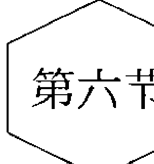

## 天气报告

在两人或多人的系统里，总有表达的潜在需要。但在很多时候，你有些话想表达，却不知道从何处表达起；你不知道该怎样组织语言，该表达哪些；不知道该不该说，什么时候该说；也可能想表达却没机会表达；或者不敢表达。

天气报告是萨提亚发展出来的一种沟通方法，致力于改善人与人间的沟通。让人去经历其内在和外在的人文环境——自己内在的、两人或多人之间的温度冷暖，并且改变其中，让人们可以有所表达、能表达想表达的。它可以：

- 打开封闭的系统或继续让系统保持开放。
- 提升个人自我价值感，让个人与其他人产生连接。
- 鼓励个人的独特性，鼓励个人充分参与。

天气报告给予每人一个机会，在对等的情境下，表达出自己的满足和不满足。它提供一个安全而令人信任的情境，使人得以直接地沟通和肯定，并以一致的方式来给予和接收各种资讯。

天气报告将常需要对人表达的内容划分为5个部分：

- 感激与兴奋；
- 担忧、关心和困惑；
- 抱怨和建议；
- 新的资讯；
- 希望与期待。

## 天气报告的使用方法

每隔一段时间进行一次练习。如果是团体活动或小组，则是每次参加或隔次的时候练习一次；如果是宿舍等集体则约定每周或每天集中表达一次；如果是好朋友或恋人，则建议每天都拿出半小时的时间做这样的表达练习。开始的时候可能超过半小时，而当彼此习惯了敞开分享后，就会找到最合适的方式沟通。

在开始时，由一个人来引导天气报告；当熟悉过程之后，成员便可以轮流协助大家进行。

在约定的天气报告时间里，允许成员相互表达。

每个想表达的人都可以表达，对其他某个人或多个人的这5个部分一起表达，完成一个部分，再开始一起表达第二个。

### 感激

天气报告的第一项是直接向别人表达感激和兴奋。它鼓励成员由生活中的正向层面一起开始分享，从而带来相互包容的效果。同时，它也增加了人与人之间的信任和亲密，使人们可以更具建设性地处理其担忧和困扰问题。

我们常为别人做事，但不知为什么，我们通常不去谈它，而往往指出其中的错误。我们多数人有这样一个信念：只要没出错，就不需要什么人去说什么。在工作场合或家庭中，我们往往视彼此为理所当然，而不把我们的感激说出来。

在天气报告时，我们尽可能具体且根据当下的情境，分享我们对别人的感激。其第一步骤是，由一个人以第一人称“我”的陈述句式向另一个人传达其感激，避免概论式用语，尽量做到具体。例如避免“我喜欢你的厨艺”这样的话，而是用一个更具体的表达“我很喜欢你昨天做的晚餐，特别是那一道鸡”。我们直接地向对方说，彼此靠近，并保持目光接触。

表达感激可以减少我们午夜梦回时的懊恼：“我们做这么多值得吗？没人在意你做什么。”同样，我们也应该为别人所做的好事发出声音。因为，我们的感激将焦点集中在正向的感受上，并且公开地分享。
人们可以轮流分享感激或随机地分享。在做每天的“天气报告”时，并不是每个人都要对别人有所感激的，而希望这是一个更自然且自发的分享。

### 担忧

其次要分享的项目是担忧，它包含了对他人的关心和困惑。我们有时候害怕自己的无知或笨拙，而不愿意表达自己的担忧。而为了掩饰自己的担忧，父母往往会想办法让自己的孩子相信成人什么事都懂。
当我们无法对他人表达自己的担忧时，我们便开始了各种假设和猜测。借着表达担忧，我们可以澄清猜测、消除不确定感，而对别人有更深刻的了解。
我们表达担忧时，要提出一致而非指责的疑问，以便让他人对正在做的事情感到安心舒适，我们只是用好奇和尊重的语言表达。这些可以澄清困惑的问题，是以“什么、如何、何时、何处、可能、为什么”为首的句子。
未被证实的困惑或关心，通常会酝酿不安全感，并孕育低的自我价值感。“天气报告”提供了一个可行的方法，以排除上述的后果。否则，把注意力放在自己的担忧上，而又不去分享或求证，只会给自己、给沟通带来麻烦。

### 抱怨和建议

第三项是分享困扰，分享那些让我们抱怨的东西。指出困扰的人，也同时要提供可能的解决之道。原因是，发现困扰或抱怨的人，往往也是对可能的解决之道最有心得的人。人们在抱怨事情不对劲之前，他们通常已将此一情况与自己过去的经验做了比较，或者，他们有个未完成的期待或理想，他们有了自己认为对的看法。
把抱怨说出来，可能同时也揭露出潜在的愤怒。因此当我们感受到我们所认知的愤怒时，我们要注意不必把怒意一股脑地发泄出来，借由向他人表达愤怒，以此取得自己对愤怒的控制权，好帮助我们去处理它。我们表达是为了让我们更好地认识我们的伤痛、恐惧和潜藏的期待，但不需要把怒气发在别人身上。
例如：“XX，当你做XX的时候，我感到很生气。我想要让你知道我的感受，我感觉你并不爱我。”
萨提亚试着协助人们能借着分享，进而从别人那儿得到直接、诚实和支持性的回馈，进而为自己内在的担忧和关心负起更多的责任。她鼓励人们以一致的态度去相互回应与沟通。天气报告的目的，不是让人去争执或解决每个关心，而是让每个人可以听到彼此，学着去协调，并可能对不同意见达成协议。

## 新的资讯

第四项是分享资讯。新资讯有各种形式，它可能是宣布下周的某件事，也可能是目前的某个超市促销或其他活动。很多时候我们会假设：我们认为大众化的消息，无须我们说一个字，其他的人也都会知道。而这些假设常为沟通带来困难。

天气报告同时也强调分享个人的新资讯：个人新的决定、成就和活动。

这点有助于保证每个人有相同的消息，并且可以在相同的了解下运作，因此，不会有人觉得被疏忽或被排除在外。“被听到”也可以带来被肯定的感受，并拥有较高的自我价值感。

## 希望与期待

在第五项中，当人们分享希望和期待时，焦点便进入不久的将来，正如萨提亚常说的“把我们的愿望送进宇宙苍穹。”一个没有被说出来的希望，是很难有被实现的机会的，而一个清晰的希望，则拥有许多被实践的机会。当然，这不能保证得到我们想要的，但一旦我们说出自己的希望，我们和别人才能更直接地汇集能量和资源，去实现这些希望。

大部分人已经学到了不去表达自己的希望和期待，我们从小就习惯压抑自己的希望和期待。我们害怕说出来实现不了会丢人，我们担心说出来被别人笑话，我们害怕没人听到。

一旦我们对机会开放，则发现资源即是我们可以实现期待的方式之一。别人往往对我们的期待感兴趣，并且可以帮助我们实现它们，我们因而变得更加丰富了。

## 适用的地方

在家庭以外，最常使用萨提亚的天气报告之一的，便是在教室里，老师和学生每天一起做报告。萨提亚自己在她的工作坊中每天做天气报告，它往往成为参与者借以提升自我价值、建立更亲近的关系、同时帮助催化工作坊顺利进行的工具。

适合天气报告的地方有很多，包括企事业单位的会议室等，凡是需要有敞开沟通的地方，都可以使用天气报告。它有助于发展出更健康的工作气氛，更人性化，更好地拉近人的距离，更能产生新的思路和发展。

当然，人们也可以对自己使用这五个步骤，从‘什么是我感激自己的？’到‘我如何达成我的希望和期待？’或者对某个伙伴、家人使用。心理师也可以帮助他的案主使用，更可以跟他的案主一起练习天气报告。

# 第四章

## 冰山理论

> 你为生存做了些什么，我不关心；
> 我想知道，你的渴望，
> 你是否敢于梦想那内心的自我。
>
> 你的年龄多大，我不关心：
> 我想知道，为了爱、为了梦、为了生机勃勃的奇遇，
> 你是否愿意像傻瓜一样冒险。
>
> 我不关心，是什么磨圆了你的棱角；
> 我想知道，你是否已触及自己悲哀的中心，
> 是否因为生活的种种背叛而心胸开阔，
> 抑或因为害怕更多的痛苦而变得消沉和封闭！
>
> 我想知道，你是否能够面对痛苦——我的或者你自己的，
> 用不着去掩饰，使其消退或使其凝固。
> 我想知道，你是否能安享快乐——我的或者你自己的，
> 你是否能充满野性地舞蹈，让狂喜注满你的指尖和足尖，
> 而不告诫我们要小心、要现实、要记住人的存在的局限。
>
> 我并不关心你告诉我的故事是否真实，
> 我想知道，你是否能为了真实地面对自己而不怕别人失望，
> 你是否能承受背叛的指责而出卖自己的灵魂。
> 我想知道，你是否能忠心耿耿从而值得信赖；
> 我想知道，你是否能保持精神饱满的状态——即使每天的生活并不舒心，
> 你是否能从上帝的存在中寻求自己生命的来源。
> 我想知道，你能否身处颓境，却依然站立在湖边对着银色的月光喊出一声“真美”！
>
> 我并不关心你在哪里生活或者你拥有多少金钱、
> 我想知道，在一个悲伤、绝望、厌烦、受到严重伤害的夜晚之后，
> 你能否重新站起，为孩子们做一些需要的事情。
>
> 我并不关心你是谁，你是如何来到这里的，
> 我想知道，你是否会同我站在火焰的中心，毫不退缩。
>
> 我并不关心你在哪里受到教育、你学了什么或者你同谁一起学习，
> 我想知道，当一切都背弃了你的时候，是什么在内心支撑着你。
> 我想知道，你是否能孤独地面对你自己，
> 在空寂的时候，你是否真正喜欢你结交的朋友。
>
> ——左哈尔·马歇尔

### 第一节

## 冰山理论简介

### 冰山理论是什么

人们的世界色彩缤纷。有时候，他会数落你一通，让你莫名其妙。有时候，你会突然失控，做了一些你自己都难以接受的事情。有时候，他做了一些事，说了一些话，而你，很受伤。为什么会这样？

我们所能看到的世界，是行为的世界，每天面对着自己和别人形形色色的行为，应对着，也苦恼着、疲惫着。但我们是否能静下来，不再向外去寻求答案，而是问问我们自己的内心：在他和我的世界里，发生了什么，人们的内在经历了怎样的过程。

人们做的事、说的话、经历的故事，都只是一种行为表现。造成这些行为的，是那背后的心理过程。如果你愿意去看，你将叹为观止，因为在人的内心，发生了一些不为人知的加工和处理，才有了那样的行为。

萨提亚认为，在人们经历事情的时候，在六个层次上同时有着体验：行为、应对、感受、观点、期待和渴望。而行为是那可被观察的一部分，就像一座漂浮在水面上的冰山，能够被外界看到的行为表现或应对方式只是露在水面上很小的一部分，而暗涌在水面之下的更大的山体，则是长期被压抑并被我们忽略的“内在”。揭开冰山的秘密，我们会看到生命中的渴望、期待、观点和感受，看到真正内在的自我。这个过程被称为冰山隐喻或冰山理论。

冰山理论是萨提亚模式里负有盛名的理论和工具。这个词我们并不陌生，早在1895年，弗洛伊德在发表《歇斯底里研究》时，就提出了这个概念。他将人的意识分为意识、前意识、潜意识，并隐喻为冰山。我们可觉察的部分是意识，是冰山水平面以上的部分；水平面下的大部分是不被我们所觉察的潜意识。于是潜意识一度成为冰山理论的代名词。萨提亚的冰山理论不同于弗洛伊德的，这两者的异同我们在下面会探讨。在维吉尼亚·萨提亚提出了体验的这六个层次后，约翰·贝曼博士继而在萨提亚独具创意的框架下，融合众多心理治疗流派的精髓，丰富完善了其严谨的结构和深刻的内涵，发展出了完整的冰山理论。最终使其成为萨提亚众多治疗媒介中最具有代表性的理论工具，运用在个人内在探索方面，既有灵动而深入的身心体验，又有清晰缜密的结构设置。冰山理论为萨提亚模式的治疗和教学推广提供了系统、简洁的方法和工具。

### 冰山理论有什么用

> 《伊索寓言》里有这样一个故事：
> 北风和太阳争辩谁最有权力，不分伯仲。恰逢一旅人，于是他们约定：谁先脱下旅人的衣服，谁就是胜利者。北风骄傲地先试他的力量，用力猛吹。但是风越大，那旅人将他的大衣裹得越紧。最后，北风不得不放弃了。北风请太阳出来，看看他的本事。太阳很快地发出他所有的热力。不久，那旅人感受到太阳的温暖，便将衣服一件件脱下，最后，热得受不了了，就脱光了衣服，在路旁的河里洗澡。北风使出浑身解数也没有做到的事，太阳轻而易举就做到了。

如果不知道一个人的冰山过程，我们就只会在行为层次上去拼命达到自己的目的，结果却常常事倍功半或无疾而终。但是如果我们知道了一个人的冰山过程，我们将会成为太阳。在人际互动中，冰山理论可以帮我们做的有很多：
探索心理过程。这是了解自己与他人的一个工具，我们可以知道某人有某个行为的时候，他的内在发生了怎样的过程，于是理解成为了可能。我们对于自己、朋友、恋人、父母、孩子、客户、同事等人际关系中的深入理解，都将轻而易举。

保持觉知。发生了什么，为什么会这样，你每做一件事情，都知道是在做什么。

放下评判，并尊重。当理解发生的时候，我们可以不再拿着自己的世界去衡量别人的世界，不再用自己的标准去要求别人，不再觉得不可理喻或不可思议。每个人都有自己的冰山过程，看到的时候我们就可以去尊重，尊重别人与我们只是不同。

与内在连接。通俗地说就是“懂得”。被懂得的感受是很好的，仿佛两个人深深连接在了一起一样，不需要解释，不需要太多话语，那就是连接感。倘若你可以懂得周围人的心，那会怎么样呢？

改变，转化。改变绝对不是强迫发生的，能强迫的只是行为。要求某人不要再那么做，强迫自己不要发火等，那些所谓的“为你好”和打鸡血维持的“毅力”，常常以失败告终。行为就是那生在地面上的草，怎么烧都没有用，只要根在，草必重生。就像扬汤止沸，锅底的火还在，汤就会再沸。因此改变，不必执著于行为，而是从内在不同层次上去转化，内在转化了，行为自然就改变了。要从根上去除，要釜底抽薪。

治疗。心理治疗师的工作也开始变得简单，我们可以透过来访者的表面行为，跳过他所描述的问题，去探索来访者的内在冰山，从中寻找出解决之道。也可以使来访者学习如何将消极的应对姿态转为更加和谐的方式，透过更好的自我关爱，学习如何从对外在的关注转为对内在的关注。

自我成长。在运用冰山工具后，我们的工作都将变得简单起来，内在小孩不存在了，你可以成长为一个对自己负责任的人。你的生活会更加轻松，你会在面对任何事情时给自己的生活开启一扇明亮的窗。

### 冰山内容

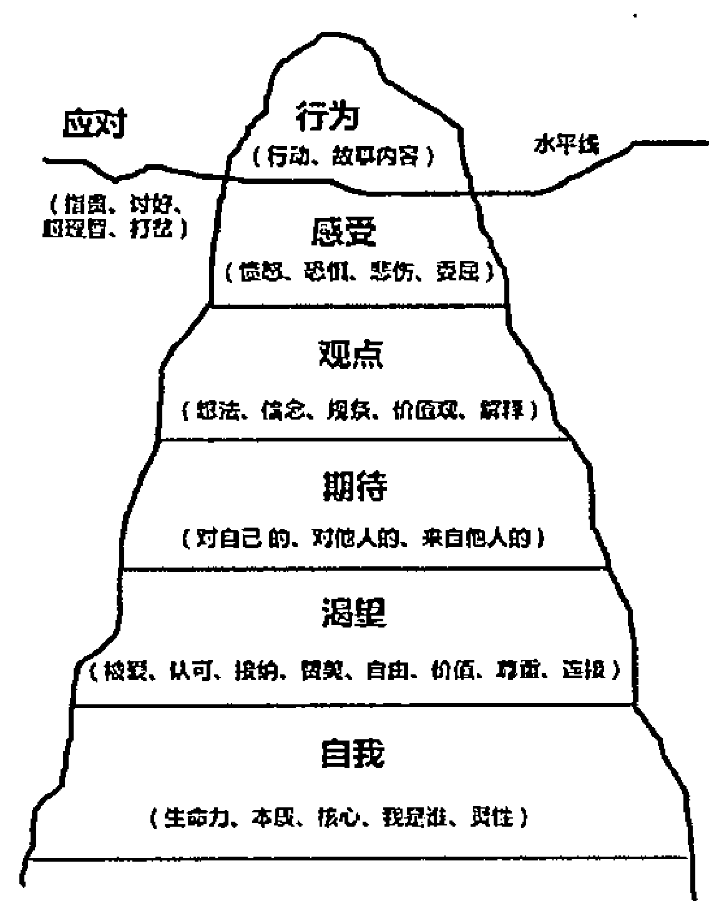

# 找到意想不到的自己

# 行为（Behavior）

行为是可见的，是我们无数次尝试去改变的部分。如想要控制住不发火，想要控制自己不拖延等。

行为是冰山最上端露出水面的部分，是我们通过感官可以直接体验到的内容。我们看到了什么，听到的、触摸到的内容，我们做了什么。这是故事的最原始版本，是直接呈现的问题，是最困惑和让我们烦恼的部分。例如看到某人摔门而去，听到某人说了句不好听的话，被客户拒绝，突然失控发脾气等。

有些行为是被我们接纳的，我们就会处理好这些行为。有些则是不被我们接纳的，我们就尝试采用排斥、否定、扭曲、逃离等方式来应对这些行为。

# 应对（Coping）

应对就是对事物的反应态度。

我们对外在处境选择如何回应或反应，就是我们的应对。应对是冰山的水平线，是行为的起点。在人际互动中，我们如果接纳自己和对方的行为，就会照顾到自我、他人和情境这三个因素，进行一致性的回应。

如果我们无法接纳所发生的行为，就形成了压力状态，以保护自己的自我价值感为主，使出惯用的方式进行事件应对，也就是用不一致的沟通来防卫或保护自己（指责、讨好、超理智、打岔）。

# 感受（Feeling）

对于与别人的分歧，我们与别人吵架，使用在指责中的应对，这时候的感受可能就是生气、愤怒，夹杂着无助。这时候推动我们继续去吵架的最大动力就是这个我们体验到的生气的感受。

感受是我们在经历事件的时候所产生的情感体验，每刻都存在，比如生气、害怕、轻视、疼惜、委屈和嫉妒等。并且每刻都有不同的感受交织在一起，存在于我们的身体内。

感受有轻重，微弱的感受在细致觉察的时候可以被觉察到，而强烈的感受则会直接影响到我们的行为。强烈感受被直接体验到并命名的时候就是我们所说的情绪。在感受与情绪之间并没有明显的界线，情绪只是较强烈的感受。

情绪具有生存意义，愤怒是一个求生存的情绪，恐惧、伤心等都是，它们告诉我们以下信息，我们该怎么做才能活下去，我需要逃跑、需要打回去、需要藏起来。

同样，有些感觉是被我们接纳的，有些是不被我们接纳的。当我们不接纳感受，切断、掩盖或否认某些感受时，这些感受常常会以身体或心理的症状表现出来。

感受既有负面的又有正面的。负面的主要是生气、恐惧、难过和受伤等，正面的则主要是喜悦、感激、快乐等。我们都有能力拥有这些感受，有的人表达它们，有的人崇拜它们，有些人回避它们，有些人则压抑它们。你习惯于怎样处理自己的感受呢？是压抑、回避、表达，还是管理？你是怎么做的呢？如果你不知道的话，你就真的很不了解你自己了。

# 观点（Perception）

感受是会说话的，在我们的心里有着无数的对白。当你生气的时候，你想到了什么？ “都是他的错” “他不该这么对我” “世界应该公平，可是他没有” 等，这些都是让我们感到生气，去跟人吵架的因素。

观点就是我们对自己讲述一些故事，根据我们接收到的信息，然后制造一些意义，编造一些故事，并且我们还相信了它，我们就把一直相信了的这部分称为信念。

观点住在我们的大脑里，是存在于我们大脑里的认知，是我们对事物的态度，包括我们的想法、思想、信念、规条、价值观、人生观、解释等。这是我们基于现在和过去经验的结合产生的念头，是我们思考的内容，是我们认识世界的规则，而不只是此刻所见所闻的事实。例如我相信我是一个无用的人；我相信地球是平的而不是圆的；我认为女人/男人没一个好东西；我觉得你这样很没礼貌等。

观点有即时性的，对当下某个事件有某个想法和态度，如我认为这个事情应该怎样、我觉得你应该这样、我觉得这是因为某原因等，这个比较容易改变。也有持续性的，即对某一类固定事物具有某种固定态度倾向，如人应该诚实、守时，南方人都很小气等，这些则根深蒂固地印在我们的脑海里，很难改变。

观点是我们从过去学习而来的经验。经验某些时候给我们提供了生活的便利，但是执著于经验的时候就会成为一种阻碍，演化成我们恪守的死板的信念和规条。

# 期待（Expectation）

当你和别人吵架的时候，你希望自己是什么样子呢？你希望别人怎么做呢？你可能希望通过这种方式来证明自己是有力量的，希望别人可以认错，可以听你的。当别人没有按照你期待的发生，你就生气了。

期待就是想要什么，想怎么做，希望怎么发生。它来自于我们过去没有满足，现在依然想得到。例如我希望他去洗碗，我期待自己可以把这件事情做好，我期待他来爱我，我期待他主动。期待让生命有了期盼，生命中若没有期待是枯燥的。

有些期待我们知道我们在期待，例如我期待他主动关心我。有的期待则是我们习惯而不会再有觉察，例如我期待明天太阳依然升起，期待家人健康等，我们因为信任而没有让这个期待浮现到我们的脑海。有些期待则是我们不愿意承认的，例如我期待自己考第一、期待天上能掉下500万等，因为我们的观点认为那是不可能的而不愿意去相信这个期待，但我们的心底依然存在期待。

所以你问起期待，有些人会说他没有期待，那或许只是他没有觉察到自己的期待或者不愿意承认自己的期待。期待是每时每刻都存在的，而且每秒钟都有超过几百个期待存在。

如果我们的期待没有被满足，而时间已经成为了过去，原有的期待就会成为未满足的期待，我们会一直背负而让我们的精神或生理付出很高的代价。例如我们小时候就想要父亲来爱我、想让他抱我，但他没有，后来我长大了，那个期待就成为了一个未满足的期待一直背负，三十年之后，我还想要爸爸来爱我、来抱我，但是我没有得到他的爱。有的太太期待老公送玫瑰花，但是老公一直没有送，太太也不表达，就会一直背着这个期待消耗自己。

当我们没有得到想要的，或得到的只是我们不想要的，我们就可能会一直死抱着那些未满足的期待，消耗我们的能量。

期待是指向未来的，在未来想要得到。即使成为了未满足的期待，也希望在未来满足。

# 渴望（Yearning）

你期待这么做，其实你是想要什么呢？你面红耳赤去吵架，其实你不过是想要被认可，想要得到一点关注，这就是渴望。

## 第四章 冰山理论

如果说期待是想要，那么渴望就是需要。渴望是人类共通的需要，是人类生存的基本需要。马斯洛曾发展出需要层次理论，阐述了人类普遍的需要：吃、喝、睡、性等基本生理需要，安全感需要，归属感的需要，爱的需要，尊重的需要，自我实现的需要。这些需要来自于情境又脱离情境，我们在不同的情境里玩不同的心理游戏，最终不过是为了满足自己的这些需要。

萨提亚认为人类普遍的心理需要主要有：爱、价值、自由、尊重、认可、关注与接纳。

从出生的那一刻起，婴儿就渴望被爱，到九十岁时亦然，这是所有人持续一生的过程。

我们满足渴望的方式有两种，一种是自己认可自己，自己爱自己。那种非常有心理营养、心理非常强大的人就是如此，可以自己满足自己。一种则是依赖于从外在汲取，从小就习惯了从父母那里索取，长大后又从恋人、朋友那里索取。

渴望是当下的，每刻都存在，都需要被满足。当当下的渴望没有被满足的时候，就会用观点延伸出具体的期待，希望下一秒得到满足。

# 自我（Self）

人类所有的行为，不过是想证明自己。你是否是有力量的、有能量的、有价值的？如果你不能相信，你会调动自己的整个冰山希望从别人那获得证明。

自我就是人的本质，是人的核心，是生命力，是自我价值的瓶子，是冰山的核心，它是人的“我是”，是生命的源头。它决定了“我是谁”，决定了我们与自己和世界的关系。但我们常常需要花很长时间才能了解它的真正本质。我们的目标是与它连接，与生命力连接，发现我们本然的面貌，找到源源不断可以满足自己渴望的源泉。

当自己和自己在一起的时候，也就是自我价值的瓶子是满的时候，我们就能够和谐一致，处事不惊，坚定不移，喜悦在自己想走的路上。如果我们与原来的自己产生了偏离，就会怀疑自己，感觉不到存在，就会被情境拉走，开始“求生存”，开始向外在寻求装满自我价值的瓶子的方法了。

# 事件冰山探索日记

每个事件都有一个冰山。当事件发生的时候，我们可以自己在心里过一遍自己的冰山，为什么会有这样的行为，进行深度觉察。也可以每天晚上坚持写冰山日记，在一天安静下来的时候，回想当天发生的一件事情，然后在笔记本上画下并分析一天的冰山。坚持一段时间后，对比变化，并且反思自己。

这是一个妻子针对老公乱丢袜子写的自己改变前后的冰山探索日记：

## 改变前的冰山

- **行为：** 晚上因为老公乱丢东西找不着，我和他急了，吼他了。他也大声叫喊，几近歇斯底里。
- **应对：** 强烈的指责和超理智的说理。
- **感受：** 感到极度的愤怒、挫败、无助与焦急。
- **观点：**
  - 他东西总是乱放，一点都不知道规整；他应该有自理能力，自己管理自己。
  - 东西不能乱放；乱放东西意味着没有自理能力；人起码应该整洁，要自理。
  - 我说过他很多次，他还是这样，一点都不把我当回事；他不该用这样的方式惹我生气。
- **期待：**
  - 对他：我期待他东西规整，生活自理；听我的话，按我要求的去做。
  - 对自己：我期待自己是个整洁的人，是个可以控制老公的人。
  - 认为他对自己：他期待我温柔，别对他大吼大叫，别要求他那么多。
- **渴望：**
  - 我渴望被尊重（说他很多次都不听，这是不尊重）。
  - 被认同（总是忽视我，不在乎我）。
  - 爱（他吼我，这是不爱了）。
- **自我：** 失控、无力、自我价值低、与内在失去联系。

**觉察与思考：**

当我从上到下分析过自己当时的冰山，心情平静了很多，这一刻才感觉到和自己内在的接触，我不禁自问：

## 第四章 冰山理论

是什么让我生气了呢？是我想控制他，想让他跟我一样。

我为什么要求他跟我一样拥有整洁的规条？乱扔东西他也能够照顾自己那么久，这就代表着没有自理能力吗？我从我妈那里学会了要整洁，我可以尊重别人跟我不一样吗？

他只是期待我态度好一些，下次我可以多给他一些鼓励吗？如果我还是想满足我的期待，我可以做些什么来让他自愿改变呢？

## 改变后的冰山

- **行为：** 当老公还是乱丢袜子，我轻轻地说了声：亲爱的，你可以把袜子放到这个盒子里吗？
- **应对：** 一致性、创造性地应对。
- **感受：** 平和、平静、好奇。
- **观点：**
  - 他的生活方式是随意放东西，我的生活方式是东西放到固定地方，我们是不同的。
  - 夫妻两个人的生活，是相互磨合的，想让对方适应自己，要有耐心。
  - 整洁是我的价值和规条，不是他的，我可以为自己的规条负责，他不必为我的负责。
  - 感受、观点、期待，都是我的，我可以自己为它们负责。
- **期待：**
  - 对自己：我是一个对自己负责任的人，我期待自己照顾好自己，不拿我自己的标准要求他。
  - 对老公：我期待他可以给我多一些爱，可以更和谐相处。
  - 老公对我：可以温柔对他，多一些爱给他。
- **渴望：**
  - 我本身就是被他爱的。
  - 我是被他关注和在乎的。
  - 我是爱自己的。
- **自我：** 充盈、喜悦、幸福。

# 觉察与思考

- 我是好的，世界就是好的。
- 当我变了的时候，别人也就变了。
- 改变世界，从改变自己开始。

# 人的习惯应对冰山

每个人本身就是一座冰山。即使没有事件发生，一个人也有自己习惯性的冰山。在生活中，了解一个人是什么样，我们习惯去知道他是怎样一个性格的人。如果我们知道了他习惯的应对模式，我们就会对他有更多的了解。以下是一个人的冰山。

# 行为

经常没有表情，木讷，不会表达愤怒，也不会表达自己的难过。

# 应对姿态

超理智，指责。

# 感受

- 紧张，不自信，恐惧。
- 跟人打交道会感到焦虑。
- 对家人遭遇不幸会感到难过。
- 当别人不能满足自己的期待的时候会愤怒。

# 观点

- 人应该正直，要有责任心。要注重个人奋斗，注重知识，注重学习。
- 对的事情每个人都应该做到。
- 人际关系之所以有问题是因为从一体的状态分开导致彼此之间无法连接。

# 期待

- 自己有完美主义倾向，希望自己在各个方面都很好，希望自己能够成功，能够被别人认可；
- 期待他人是正直的，是负责任的。
- 他人对自己有期待时，感觉到很有压力，一方面可能会觉得自己做不到，但是另一方面会告诉自己必须得做到。做不到的话，开始会生气，后来变得没有感觉了，但不是接纳了自己的做不到。

### 渴望

- 被爱，被尊重，被认可，安全感等。
- 做的事情都是为了满足自己的渴望。

### 自我

- 如果自己满足不了他人对自己的期待，会不接纳自己。
- 不确定自己是不是爱自己，因为经常会在某些方面对自己产生失望情绪。
- 有时候会接纳自己做的事。

当我们了解了这个人的习惯应对冰山后，我们就可以在生活中更好地与他相处。他习惯超理智，因此在他面无表情的时候，他并不是在无视我们，而是这是他的应对反应。他在跟我们讨论某件事的时候，没有表情并不是在否定我们，而是他的超理智就是如此。他容易感到紧张和不自信，我们就更好地理解他的感受，接纳他，促进我们之间的关系。正直、责任心对他来说是重要的，跟他交往的时候，我可以避免自己有些地方表现得不够正直和不负责任，因为他会对这些价值很敏感和在意。我即使做不到，不同意他，我也不会对他不理解和表示不屑，虽然我认为没那么重要，但依然尊重他。他期待自己完美，所以我们不必惊讶他的精益求精。别人对他的期待让他有压力，我们就尽量避免对他直接表达期待。他渴望被认可，所以我们可以经常给他肯定和鼓励。

在了解了他的冰山后，我们最容易做的就是理解、接纳和尊重。如果我们愿意跟他有更进一步的关系，我们可以照顾他的冰山。

### 时间轴上变化的冰山

人在成长，冰山也在变化。从时间轴的冰山上，我们可以去看自己这些年的变化。下面是一个案主青少年时代的冰山和现在的冰山，依次从上往下分析下来，横向对比，我们就可以很清楚看到他这些年哪变了。

### 青少年时期的冰山

- **行为：** 在家很安静，在家以外的地方，非常的活跃。
- **感受：** 委屈，焦躁，困惑，常常很愤怒但又说不出口，有憎恨的情绪。
- **观点：** 我认为我是一个不被接受的人，所以我那个时候非常叛逆，常常不循规蹈矩。我认为我自己是被别人误解的，我的父母不理解我，所有大人都不理解我，只有我的朋友能理解我。我可以依靠的是我的朋友，因为他们从来都不会觉得我做错了。但是大人们总是让我觉得我做得不对。是这些观点让我觉得委屈而愤怒。
- **期待：** 作为一个青少年，我一方面期待自己做一个好女儿、一个好学生、一个好姐姐，那时候我不能够犯错误，我期待自己事事都做对。我当时认为他人对我的期待就是这样，如果我没有满足别人对我的期待，我就会被指责。我做不到的时候，我就期待自己是个另类，是有力量的。我用叛逆来实现自己的期待。我对他人的期待是能够理解我，给我自由。
- **渴望：** 我的渴望很大程度上没有被满足，我对认可的渴望，对欣赏的渴望，对于自由的渴望，对于和他人连接、归属的渴望常常是没有被满足的。我们家是非常实际的，每个人都要各司其职。我们更多的是专注于任务，而不关心谁满足了没有。
- **自我：** 在年轻的时候我总是很努力地抗争，想要做回自己，于是我做着与我父母相反的事情，因为如果我不听他们的，我就在做我自己。

### 现在的冰山

- **行为：** 在家很安静，在家以外的地方，很活跃。
- **感受：** 平静，偶尔有点焦躁，但是比年轻的时候好多了。跟青少年时代相比，我不会觉得那么无助了。今天我可以让自己去体验喜悦的心情。
- **观点：** 我是我自己的，我为自己而活着。我的好朋友和父母依然对我有期待，但我知道我是我自己的了，不再必须按照他们的要求去做。当他们给予我不喜欢的东西的时候，我知道我是可以拒绝的。
- **期待：** 今天，我期待我对自己是真实的，诚恳的。我期待我不清楚的时候能够诚实地面对，我期待我不知道的时候能够诚恳地说出来我不知道。我期待自己担起责任照顾我的冰山。我对他人的期待，更多是一种希望，我希望他人可以接受我本来的样子。我希望他们会理解我，我希望他们能够明白我。我希望说是的时候是我真的可以，我说不的时候是真的做不到。
- **渴望：** 对于我的渴望，我已经更多地担起了掌控，我对他人的依赖已经更少了，我更多的是靠自己满足自己的渴望。
- **自我：** 今天，我对自已是谁有了个更好的了解。现在的这种了解并不完整，我对自我的了解或许不够深入，但是我愿意接纳我自己。

# 变化的冰山

- **行为变化：** 基本没有什么改变。
- **感受的变化：** 当我还...（完整内容：当我还...）
- **观点的变化：** 当我还...（完整内容：当我还...）
- **期待的变化：** 现在我发现...（完整内容：现在我发现...）
- **渴望的变化：** 这个改变意味着...（完整内容：这个改变意味着...）
- **自我的变化：** 当我用...（完整内容：当我用...）

# 关于冰山的一些说明

## 它是系统的而非逐层的

这是我们在经历事件时所发生的6个体验层次，是同时发生的，而非先有了某部分。当我们被丢在黑夜里的时候，会加速行走（行为），会感到害怕（感受），会觉得有鬼有坏人（想法），会期待有人保护自己（期待），会渴望温暖和安全（渴望），此刻自我很渺小（自我）。

每层的体验都是相互关联、相互影响的，而不是单独存在的。我们感受到很生气（感受）是因为我认为他误会了我（观点），我感到很失望（感受）是因为我希望他道歉而他没有（期待），我骂他（行为）只是因为自身缺乏爱（渴望）。符合我们观点和价值观的行为，就会产生正面感受，不符合的则会产生负面感受。满足我们期待的行为就会让我们高兴，不能满足的则会让我们失望、生气、沮丧。

如果我们看到了行为A，那是我们内在体验B、C、D、E的综合结果所致，并非单一因素所致。

整个冰山是一个系统，牵一发而动全身。我们将它分层，只是为了便于觉察和理解。

## 它是立体的，而非平面的

我们每个人都有一个习惯冰山，面对压力时所习惯的反应。习惯讨好，容易感到委屈，常有的应对世界的价值观（如人应该诚实等），对他人和自己普遍的期待，最敏感的渴望等。

也有一个阶段的冰山，在童年时候，我们对人会有怎样的期待，学会了怎么看待事件，容易感到怎样的感受。在长大后，我们学会了重新面对世界，又产生了一个冰山。

在每件事情上，各自有一个冰山。我们每处理一个动作，一个事件，就产生了一个冰山。他骂了我，我生气地走了，觉得很内疚不该那么对他。这里就产生了好几个冰山：他骂我我走了是一个冰山，我边走边后悔又是一个。

在和别人互动时其实是几个冰山的互动。互动表面上是话语的和行为的，实际上则是两个人的两座或多座冰山在互动。

有效区分和觉察每个冰山，是熟练运用冰山的基础，也是自我觉察的必经之路。

## 弗洛伊德的冰山

冰山大致分为两部分。行为、感受、观点、期待是个人的，随着每件事情变化而变化的。

# 找到意想不到的自己

在个人层面，每层都有一个弗洛伊德的冰山。我们的行为，有表现出来的，可见的；也有潜意识推着我们做的，本能的，或者压抑在潜意识里想做而没有做的行为。感受又有意识中的感受和潜意识中的感受，觉察到的感受和被压抑到潜意识里的感受。观点也有意识到的观点和被压抑到潜意识里的观点。期待也是如此。

萨提亚的冰山解析了体验的层次，强调我们体验到了什么；而弗洛伊德的冰山则解读了意识的层次，对我们的意识深度进行了分析。

## 互动的冰山

冰山探索一开始可以从线性探索开始，即简单进行每层的觉察。每一件事情发生时都有哪些行为、感受、期待、观点、渴望和自我价值。

在掌握到一定层次后，可以进行系统探索。从感受跳到观点，跳到渴望，再跳到感受，在第一时间觉察到冰山的各层后，再觉察冰山的变化。

在熟练以后，可以进行细致的冰山觉察和区分。

在个人层面上，每层上也有一座冰山，我们对感受的感受，对感受的观点，对感受的期待。例如我们对某件事情感到生气，我们会产生感受的感受，为这个感受感到羞耻；会产生对感受的观点，我觉得人不该愤怒；会产生对感受的期待，我希望自己可以体验到宽容。

对于我们是否接纳自己的规条，也会产生不同的感受。我认为人应该要干净，这是我的观点和规条，我对这个规条的观点是好的，我就会欣然接受自己收拾屋子的过程，体验到喜悦。如果我不接受，又摆脱不掉，我就会边收拾屋子边骂自己，明明不想干为什么还要强迫自己干，体验到无助。

### 第二节 在冰山体验里的转化

萨提亚模式又被称为萨提亚模式转化式系统治疗，其神奇之处就在于转化，系统性转化。

### 转化的原则

#### 事情是如何发生的，而不是发生了什么事

事情是无穷尽的。每天醒来，就会有各种各样的事情发生。心情好的时候，积极应对；心情差的时候，则疲于应付。但无论你想或者不想解决，事情总是在那里，不离，不弃。

你处理事情的方式却大同小异。你有着固定的模式来应对事情，相似的事情你会同样反应，在内心深处，其实你是用同一个动力来应对每天发生的万千事物。

那么，在内在，在外在都发生了什么？

萨提亚不去关注外在发生了什么事情，不鼓励将重点放在对问题的描述上。当来访者走进她的咨询室的时候，她不会去听太多故事，只去了解一个简单的背景就可以了。发生什么并不重要，重要的是怎么发生的，如何应对的。你通过什么样的反应来让这件事情发生。

这个应对过程，就是冰山。

因此萨提亚通过与来访者探讨他的冰山，来了解他这个人，并在冰山上做出转化。

萨提亚认为，当一个人的内在过程发生了改变的时候，他的行为也会随之改变。人们需要从功能不良的应对模式转化为更加开放、自由和健康的应对模式。

#### 不是要拿掉旧的，而是增加新的

转化不是要拿掉旧的模式，而是增加新的模式，让选择变得更多，让视野更开阔，让可能性增加。

与旧的模式的斗争，犹如与黑暗的斗争，挣扎多年，可能依然没有多少进展，疲惫憔悴、沮丧卑微。但是划破千年黑暗，只需要一道亮光就够了。与其与黑暗斗争，不如增加一点光明进来。

萨提亚认为，新的模式的产生，是增加一些新的观点、新的期待、新的感受进来，我们站在更高的视角来看待，能够自由选择适合自己的模式的时候，新的模式就已经产生了。

#### 自由即选择，选择即责任

存在主义哲学家萨特认为：存在即自由，自由即选择，选择即责任。

我们从萨提亚身上也看到很多存在主义的影子。萨提亚强调每个人都要为自己的内在冰山负责，不仅为自己的行为负责，也要为自己的感受、想法、期待、渴望负责，也为自己的自我价值负责。因为这些都是我们自己选择的，而且都属于我们自己。

#### 在各个水平上进行转化

要在各个体验层次上进行转化，只需要三个步骤：

1.  探讨每一个层次，画出冰山。

    觉察永远是改变的第一步。先觉察当你在应对的时候，你在各层次的冰山体验里发生了什么，体验到了什么，真实呈现那些让你产生应对的真实原因。

    无论面对当事人还是对自己，你都可以通过不断的问话和对话来了解冰山：使用了怎样的应对姿态来应对事件。
    - 事发当时的感受，对感受的感受，对感受的观点。
    - 事发当时所产生的想法，持有的观点，秉奉的信念。
    - 事发当时对自己的期待，对他人的期待及当事人认为的他人对他的期待。
    - 在当时情境下，内心所有的空缺、需要和渴望。
    - 自我价值的瓶子是满的吗？

### 找到意想不到的自己

2.  选择一个容易转化的层次入手，并对整个冰山做出转化。

很多人会惊叹于学习萨提亚模式的人的敏锐觉察力和对问题的把握能力，他们不知道萨提亚咨询师们拥有冰山工具，将来访者的体验进行了分类和评估，并针对性地选出了一个点进行应对。传统咨询师需要依靠自己多年的经验来感觉和评估哪个地方出了问题。

在这个步骤里，我们需要选择一个适合的体验层次入手，看看他在哪个层面最容易发生改变，哪个层面的改变是我们最擅长的，并在那个地方推动转化的发生；随之，冰山的各个层次也会发生改变，成为一座通透、一致的冰山。

我们可以通过他使用的应对姿态来发现他的敏感层次。

讨好的人通常在感受层次有所阻碍。讨好的人习惯于压抑自己的感受来讨好，他会忽视自己所有的委屈、无奈等情绪，帮助他发现这些情绪可以让他能跟自己更好地连接。讨好的人通常还会有压抑的愤怒在里面，可能讨好的人不愿意承认愤怒，咨询师需要小心跟当事人探讨，并核对，然后让当事人看到感受是属于自己的，需要自己来负责，并推动他在感受里做出转化。

指责的人通常在期待层次有所阻碍。指责的人会对别人和自己都有很高的期待，并且认为人们应该满足他的期待，虽然他不一定清晰地意识到这些期待是什么。跟指责的人详细探讨他的期待，让他看到期待是属于自己的，只有自己能为自己的期待负责，并推动他在期待上做出转化。

超理智的人通常会卡在观点里。超理智的人有一大堆道理、原则和规则，他会理所当然认为这个世界就是这个样子，接纳不了别人做人的原则和他有差异，这时候需要跟他探讨他的观点是什么，并且推动他认识到每个人都拥有自己的观点，只有自己能为自己的观点负责。在看到这一点后，就可以进一步推动他与自己的感受连接——对于这个观点的感受是什么，然后就可以推动他在观点上做出改变。

打岔的人通常会卡在渴望里。打岔的人是最难介入的，因为他不会跟你互动。他不跟你互动只是因为他不相信有人能给他安全感，不相信有人爱他。因此在面对打岔的人时不要急着探讨问题，而是通过其他方式连接，让他体验到自己是安全的、被接纳的、被爱的。推动他看到自己满足渴望的方式就是逃避，然后再在其他层面上做出改变。
在每个层次的具体转化，我们会在下一节详细讲述。

3.  以可接受的方式进入现在的生活。

在转化完成后，需要进一步确认和夯实，让当事人积极确认自我，并尝试适应新的模式，感受一致性的状态。在完成转化后，当事人应该是趋向于一致的，他可能以自己能够为冰山的各层次负责而感觉到骄傲和自豪。

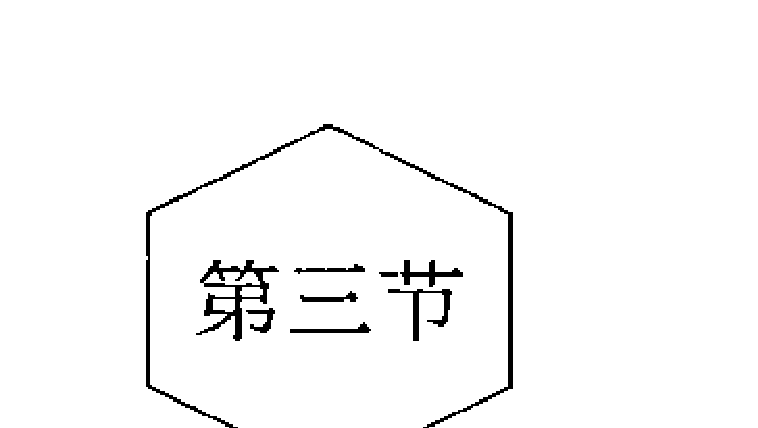

## 情绪的管理与转化

### 感觉、感受、情绪

当面对事件时，反应最快也最容易被觉察的就是情绪。在冰山感受层次里，包含感觉、感受、情绪。

在整合前，我们有必要先区分这三个晦涩而亲近的概念：感觉、感受、情绪。

感觉是人脑对直接作用于感觉器官的客观事物的个别属性的反应。这里有两个要点：直接作用于感觉器官，也就是视觉、听觉、触觉等感官直接体验到的感觉；个别属性，也就是被感觉事物的某一面。例如我看到衣服是红色的，感到水的温度是凉的，这些都是感觉，是客观事实，是外在刺激直接给予人的体验。

对感觉加上自己的观点和评判，就成了感受。感受是个体认识客观事物时，在感觉的基础上加上了主观意识色彩而产生的心理现象。你觉得我的衣服怎么样，漂亮还是难看？这就是你产生的感受。所有的人产生的感受一样吗？有人就觉得这件衣服不好看不适合我，有人就觉得我穿红颜色的衣服很好看。如果我们的感觉器官神经系统没有问题，我们产生感觉的结果基本会相同，感受却可能不同。

伴随着感受又会出现高兴或厌烦的体验，这时就产生了另一种心理现象，就是情绪。情绪是人对客观事物与主体需要之间关系的体验，是感受的外部表现。不同的感受就会有不同的情绪。感受是内在的，通过情绪表现出来，让人能够觉察到。人的面部表情，说话的音调、节奏以及肢体动作，还有走路的步伐等都渗透着情绪。如：当人愤怒的时候眉毛会立起来，恐惧时会大喊。于是通过人的外部的情绪表现，可以推测人的内在感受。面对客观事物时，首先产生的是感觉，然后是感受，最后发生的是情绪。但通常情况下是很难区分的。例如，我看到某人迟到了，我的情绪是很生气。其实是先看到他来晚了，这是感觉；我认为这不对，心里非常不满，这是感受；我很生气，甚至愤怒，这是情绪。三者是密切联系在一起的，几乎是同时发生。三者也是相互影响，密不可分的。

在实际应用中，我们很难去帮助当事人区分哪些是感觉，哪些是感受及情绪。执意要区分的时候，反而会舍本逐末，让当事人又回到大脑里，丧失了体验。因此在实际应用中，除非特殊情况，我们不去区分。在本章的理论里，这三者可以通用。

### 对于情绪的一些认识

对于情绪的正确认识，是管理和转化情绪的基础。关于情绪，我们可以有这样的认识。

#### 情绪是我们自己的，需要我们自己负责

他让我很伤心，他让我很生气，他……都是他让我很有情绪，我们习惯了如此。

不管事实是不是这样，至少我们可以从中听到这样一句话：我很有情绪。不管情绪来自于哪里，我们可以看到这样的事实：情绪属于我们自己。此刻，是我体验到了悲伤，感觉到了愤怒，而不是别人。此刻，情绪就是我的一部分，属于我。

你不愿意为自己的情绪负责的时候，就会出现这样的情况：都是你让我很有情绪，我很受伤；你可以让我有情绪，也可以让我没情绪，我的情绪取决于你，被你控制。我的感受被你控制了；我，也被你控制了。生气就是如此，我被你控制了。

既然情绪是自己的，受到伤害的就是自己，需要负责的也只能是自己，别人是没有办法负责的。纵然起因万万千，但此刻它却只在我们身上。我们在路上不小心摔倒了，流血了，我们不能让马路来对我们的伤负责，我们只能先包扎、呵护好它，来为自己负责。
你会不会扒开自己的伤口，然后去质问别人：看，都是因为你，我才有了伤口！
来自哪里又有什么关系呢？当问题发生，你是先去处理问题，还是先追究责任呢？

### 找到意想不到的自己

#### 我们拥有情绪，但情绪不是我们的全部

另一种则会极端一些，不仅认识到了情绪是我们自己的，还成了我们的全部，即把所拥有的这点情绪当成了全部的自己。
比如说，失恋了的人如果被无助打败，生命中会只剩下无助，容易否定自己，甚至走向轻生。在高考、晋升等重大事件上失败而带来挫败，于是感觉生命只有挫败，觉得自己毫无价值，什么都做不好，觉得活着太卑微，不知道活着有什么用。人在愤怒的情况下也会整个自我只剩下愤怒，做出极端的事情来，那些被激怒失手打人然后又后悔的人，都是情绪过于激动而被情绪所控制了。
当情绪被放大的时候，就会占据我们的灵魂，拿走我们的自我，取代我们全部的意志力，成为了我们的自我。这就是认同情绪为我们自己了，也就是情绪用事。
只是，是谁赋予了它这么大的权利呢？让它可以全权代表你，替你决定。这时候真正的你，去哪里了呢？为什么不出来说话，要让情绪代理你呢？
主动权是自己拿回来的。你需要看到你拥有情绪，但你的全部并不是情绪，你还有理智、还有观点、还有很多很多。你那真正的自我是可以掌控情绪，来让它为你服务的。
这就是做情绪的主人。

#### 不要去捡别人的情绪垃圾

如果别人丢了一堆垃圾在马路上，你会不会捡起来，然后揣回家，让自己家里成为垃圾场？
你会骂我有病吧。

事实上多少次你在捡别人的情绪垃圾呢？

别人生气了，明明跟你没关系，你却跟着害怕，害怕他生气；别人忧伤了，你也跟着忧伤；朋友信任你，跟你倾诉了一大堆，他舒畅了，你却开始有情绪了；某个同事，喜欢找你倾诉那些鸡毛蒜皮的不如意，愁眉苦脸，然后就弄得你也很心烦。这就是捡别人的垃圾。

捡别人的情绪垃圾大致分为两种：一种是别人跟你无关的情绪，你总觉得跟自己有关，或担心影响到自己；一种是别人有情绪，在你身边或者找你倾诉，然后通过话语和气场传染给了你。

无论哪种情况，你都要谨防捡拾别人的情绪垃圾。自己产生的那么多情绪垃圾都无处处理，还要去捡别人的？

你需要做的就是，区分。区分出哪是自己的，哪是别人的。然后把别人的还给别人，该拒绝的时候拒绝，该清理的时候清理。在心里做好划分：这是你的情绪和你的事情，你需要为它负责，我还给你，而无需承担。

#### 情绪是不能因压抑而消失的

无论受了多少委屈，也要自己憋在心里。这是很多人的生活箴言。

我知道你很绅士，很坚强，很礼貌，很文明，所以你从来不轻易有情绪，你要做个老好人，“很明事理”的老好人。

于是当分歧出现，当情绪产生，你会这样做：压抑、不承认。

有的人会这样不承认，他会大声地喊出“我没生气”，有的人则会哭着说“我不难过”。这都是比较好的，他们只是嘴上不承认，但他们的身体已经在表达情绪。更有好些人，身体也不会表达，语言也不会表达，而是十足的压抑，若无其事的样子。然后在心里不断地告诫自己：犯不着跟他一般见识，我不应该为这种事有情绪，我无所谓，我要做个懂事的人。

但是不是这样压抑了，情绪就真的没有了呢？

如果你家里产生了垃圾，你把它扫床底下去，看不见了。那垃圾就没有了吗？

很显然不是，那床底下的垃圾会以你看不见的方式持续影响着这个屋子。如果情绪被压抑，会从意识压抑到潜意识里，假装没有了。但是潜意识里有一个装情绪的罐子，随着你装得越来越多，就会越来越重，这就会让你消耗更多的精力想把它们压抑住，这时候你的精力被消耗太多，就会失去活力。你假装没事，但却笑不出来，也活跃不起来。所以你是没事的吗？

当情绪的罐子满了的时候就会突然爆发，不分对象。有时候我们会见到一个人莫名其妙地因为很小的一个问题小题大做发了大火，就是因为如此。被压抑的情绪也是这样一个“雷区”，不允许任何人触动，且一触即发。触动这个雷的人不过是在他即将满了的情绪罐子里填满了情绪而已。

即使没有人动这颗雷，一点小事也会让他自己引爆。有的人很敏感，一点不好的事情就容易感觉到挫败和无助，一点不如意的地方就会心烦和生气，这都是以前的经验中没有处理掉的情绪遗留而来的。

这时候的情绪与当下的情境是没有多大关系的，这种爆发是一种不健康的保护机制，它的目的是为了将体内的情绪一点点释放出来，但是却影响了当下的生活。这种防御机制被心理学家们称为移情，即把在他处所产生并没有处理完的情绪带到了当下情境。

情绪在身体里，也会伤害身体，让我们产生一些身体上的疾病。老祖宗早已经在《黄帝内经》里将情绪对身体的伤害研究得淋漓尽致了。

情绪是一种能量，不会因压抑而消失，只能释放和转化。但是首先，当你有情绪的时候需要承认它的存在。

#### 情绪本身没有好坏对错

为什么你喜欢压抑情绪？

有的情绪你喜欢，例如高兴、喜悦、舒畅。有的情绪你不喜欢，例如忧伤、愤怒、悲哀。所以你说，不能有负面情绪，只能有正面情绪。

但是情绪有好坏之分吗？

情绪一般只划分为积极情绪、消极情绪，但无所谓好坏。由情绪引发的行为则有好坏之分、行为的后果有好坏之分，你不喜欢的可以是结果、行为，但无需排斥情绪。

情绪是造物主造物的时候所抹下的神奇一笔，造物主创造的一切都是非常重要的生存意义的。情绪作为能量，具有非常强大的功能。如果你会用，情绪将为你创造很大的生产力。

> 哲人说：“被猎人打伤的熊跑得更快，受了伤的心会更加奋发图强”，

这就是因为情绪转化为生产力。有的小孩在受刺激、被嘲笑、被认为不可能考上大学后，带着愤怒和委屈为证明自己使劲学习，从而考试第一；有的人在赌气后，一定要做出成绩来，这就是化悲痛为力量，也是情绪的升华。

客观看待情绪，找出每种情绪的资源和意义，是放下评判的一个方法。

- 例如：愤怒有什么用？
- 愤怒是一种能源。愤怒的人是充满力量和冲劲的，天不怕地不怕。
- 愤怒可以释放痛苦。我们的悲痛若不通过愤怒释放出来，我们就会更加伤痛。
- 愤怒可以让人有自信或较强的存在感。愤怒的时候，一般都是在坚持自己是对的。
- 愤怒可以避免沮丧。愤怒的时候是情绪高涨的，也是兴奋的。
- 阻止或惩罚反对意见。愤怒的时候，气势是很旺盛的，反对意见会因此而减弱。

由这样的视角，你可以发掘出其他情绪有哪些积极资源，并尝试着发挥出这些积极资源来为自己的行为服务。

#### 情绪在身体里，而不在头脑中

你认为你很生气，还是你感觉到很生气？是你的大脑在感觉呢，还是你的身体？
很多人把情绪和思考混为一谈，当某人生气的时候我们会劝他不要生气，焦虑的时候劝他不要多想。事实上这些对头脑里意识的控制产生过作用吗？这些劝说对头脑里意识的控制如隔靴搔痒，无济于事。
只要我们活着，感受每时每刻都在产生。当我们觉察，就会发现在我们体内每时都有着感受。这些感受不断升起，然后又灭去。当感受加剧并通过外在表现出来的时候，就成为可以被直接观察到的情绪，引起头脑的意识，引起身体的变化。
感受和情绪住在我们身体内，是我们生物体的一部分，我们身体里的每个细胞都拥有它。当我们生气的时候，我们会出现脸红脖子粗、血液流动加速、呼吸急促等生理症状。当我们恐惧的时候，会出现身体紧缩、肌肉绷紧、变得异常敏感等。当我们紧张的时候，会出现心悸、憋气、血压升高、体温升高、脸红、发抖、手心冒汗、出冷汗等症状。情绪再加剧的时候，身体就会以行为的方式表现出来，如喜会手舞足蹈、怒会咬牙切齿、忧会茶饭不思、悲会痛心疾首，等等，而我们的大脑从来没刻意控制过要这么做。

我们的每个细胞都是一个小大脑，记录着很多信息。在我们成长的历程中，很多事情在时间上已经成为了过去，我们的头脑已经遗忘，但是我们的身体细胞并没有遗忘，而是一直保持着对情绪的记忆直到现在。

因此我们觉察情绪的时候，也要从身体上去觉察，去感受我们身体的感受。你可以静下心来，去感觉一下自己的每一寸肌肤，每一个细胞，此刻，它们有着怎样的感受。当下的自己，有着怎样的感受。

### 感受与情绪的处理

感受与情绪需要通过有效的处理，来让人们变得更加一致，身心健康。如果没有处理好情绪，就会出现问题，甚至像这个小白领一样危及生命：

某某是公司管理层，有一天他早上起床没找到拖鞋，有点恼火，但他不允许自己生气，生气却一直在自己生长。他去卫生间洗漱，刮胡子时不小心剃须刀掉地上了，捡起来不小心又掉了，他更生气了。但他不能对剃须刀有情绪呀，跟剃须刀生气太窝囊了。他走出卫生间，了解到小孩昨天的作业没有做完，于是他大发雷霆，打了小孩一巴掌。他老婆莫名其妙，于是他们吵了起来。他摔门而出，准备开车去办公室。但最后他没能到达办公室，因为路上他没好气地开车，横冲直撞，出车祸了。

### 体验，并接纳

在感受里，你需要的是体验，体验那到底是种什么感觉。你可能知道你有情绪，但你知道那是一种怎样的体验和感觉吗？可能你仅仅限于“知道”，那来自于你理性的认识和思考。正如你看到一棵树，你扫一眼就知道了这是棵树，但是你知道它的样子吗？你观察过它吗？你在判断之前仔细了解过它吗？当感受生起，那是怎样一种体验？别急着反应，先去体验它，观察它，品味它，看它到底是个什么样子。跟你的大脑右半球连接在一起，而不仅是“知道”和定义。

通常咨询师在和来访者工作的时候，需要让来访者重新体验当时的事件，才能在那次未完成的事件上重新工作。咨询师需要把来访者的体验拿回来，通过模拟情境、家庭雕塑等方式让来访者重新与感受连接。
情绪是不会死人的，情绪会在人体里不断翻滚，但是当它被接纳的时候它就会上升到一个最高点，然后渐渐灭去。下面是萨提亚工作坊的某个学员所记录的一次接纳并穿越无助的心理旅程。

有那么一段时间，我觉得特无助，因为突然失去了某个人。昨天还在一起欢笑，今天就独守了空房。所有的家具都还在，只是人走茶凉，回忆不忍，又涌上心头。全世界天昏地暗，没有光彩，我努力告诉自己坚强，可是我只有更大的无助，直到有一刻，我准备穿越无助。
接纳无助。无助感再次袭来，又一次企图将我打败，我微笑地看着它，然后说了声谢谢。我很痛，但我已不再害怕。我允许我流泪，因为真的痛，但是流泪不代表我被打败我要逃。我就在这里看着它，我想看看它到底能把我怎么样。我不再抗拒，我接纳，接纳我现在就是很无助，同时也不需要为无助而否定自己。我就在这，无助也在这，我看着它，它和我在一起，但它已经不能再掌控我，我的无助不是我，所以我不会听它的话，不会它让我逃我就逃。
无助继续肆虐，蹂躏着我的心脏，踩着我的脑袋，压迫着我的身体，让我想发狂。像海面上起了狂风，撕卷着海浪向我扑来，乌云密布，狂啸至极，企图让我害怕，让我离开。我还是看着它，像看着一个很生气的小孩一样。我就在这里，我知道我是安全的，我只是看着它但什么都不必做。
不知道过了多久，狂风开始变小，乌云开始散去，海面趋于平静，虽然还是有风，但已不再那么疯狂。无助开始淡去，窗外，天很蓝，有汽车的声音和行人匆匆。屋里，钟表滴滴答答，桌子还是那桌子，台灯还是那台灯。一切那么真实，什么都没发生，我还活着。
我又看了看我的无助，它还在那里，像一个玩累了的小孩，偶尔翻翻身，踢一下我的心脏，但是已经没有那么疼。我告诉它，抱抱，我爱你。我抱起了它，抱起了我的无助。它就是一个淘气的孩子，虽然有时候很折磨人，但玩累了就休息。像抱着我那失去的爱情和梦想一样。它们都在，只是累了。
我在心里抱起了它，抱起了我的无助。眼泪再一次亲吻脸颊，这一次不## 找到意想不到的自己

不是痛，而是心疼和感动。心疼自己，何必因为自己爱的一个孩子折磨自己就放弃自己呢。也感动自己，无助来的时候没有逃，而是看着它变大又缩小，像来时的海浪让人害怕，也终究会慢慢退去。

当无助感开始变小的时候，我想看看刚才自己一直在沙发上没有动，却经历了怎样一个心理过程。

于是我不必再告诉自己坚强，因为我本身就很坚强。

在体验到感受，与感受产生连接的时候，会有一些痛。别急着去排斥，只是接纳它。

接纳，并不是多么晦涩的字眼。接纳感受，接纳就是看着它，而不必认同它。接纳就是与它同在，看着它，而不必排斥它。接纳就是承认它是我的一部分而不是全部。接纳就是了解无常。感受是一种能量，让它在体验里尽情释放，不要试着阻止它的动作。感受自己会升起，灭去，再升起，再灭去。把感受还给感受，感受并不是你自己。

感受属于我而不是我。无助的时候之所以那么悲痛，原来只是认同了它，把它当成了自己的全部。我存在在这个世界上，快乐过，悲伤过，疯狂过，寂寞过，自始至终都没有改变，自我只是感受的一个载体。感受交替更换，自我未曾改变。生活除了当下环境事件的刺激产生了无助的感受外，还有很多，远方有妈妈的担心，附近有朋友的关注，门外可以买到鸡蛋灌饼，开窗可以吹到秋日凉爽的风，无助并不是世界的全部。视野渐行渐宽，才发现，无助不过是生命中的一部分，是我的一部分却并非我的全部。所以我无须为它否定自己，否定全部而想逃离现在的环境。

## 深入觉察

当你感受到了那种感受的时候，你需要去看看你对于这个感受还有哪些隐藏的部分。觉察，就是将自己了解得更细致，对感受有更深入的了解。

## 感受

当事情发生，你有着怎样的直接感受？你的第一体验是什么？是生气、委屈、无助，还是愤怒？不要尝试着去抗拒，只是去看看你的身体有了怎样的反应，那种感受是什么。

下面是你容易忽视的，一个需要被浮现、表达并加以接纳、转化和整合的情绪感受的清单，它们存在于意识或潜意识中，这些词不是为了给你的这种感觉一个定义，而是希望可以给你一个提示，它们是否存在于你的体内：

- 恐惧、惊慌、焦虑、紧张、愤怒、暴怒、轻蔑、无力、沮丧、屈辱、惊吓、空虚、孤独、悲伤、受伤、憎恨、羞耻、悔恨、窘迫、厌倦、怀疑、自责

对于感受的几个延伸：

### 感受的感受

感受的感受，就是你对所产生的主要感受和第一感受有什么样的感受。比如说有时候人生气了，有的人对自己的生气感到更生气，他不断用“我怎么可以生气！”的观点来强化感受。他不仅在生别人的气，还在生自己生气的气。有的人则会感到气馁和内疚，为自己随便生气而感觉到愧疚。

在感受后面还有个感受，你对你的感受产生了怎样的感受。

处理感受的感受和处理感受一样，需要的是更深入的体验与观察。

### 感受的观点

对于这样的感受，你有着怎样的看法。

或许你认为自己生气是不好的，或许你认为自己无助是不该的。你允许自己有情绪吗?你接纳自己的情绪吗? 你要求自己用怎样的信念对待自己的情绪?你怎么看待自己有情绪这回事? 你觉得应该有哪些感受，不该有哪些感受?

这就是你对情绪的观点，会有些评判，然后有些排斥。如果你对自己的情绪持有负面态度，就会否定，不接纳，然后压抑。

### 感受的期待

你期待自己有哪些感受，在应对事件的时候? 你希望自己可以开心，期待自己可以平静，还是期待自己更坦然?

如果你没有放下对感受的期待去看真实的自己，你就可能停留在“应该”和“知道”的感受里，没有体验到真实。

## 聆听信息

你的这些感受都在说话，你听到了吗？它们的出现是想告诉你一些信息，感受只是一个信差。他想告诉你你有些东西缺了，你需要一些东西。

只是，你是怎样对待这个信差的呢？

倘若有人来告诉你，你妈妈病危了，需要你赶紧回家。你会怎么做呢？你会打死他，不相信他，不见他，讨厌他告诉你这么难过的消息让你心痛，给他一个教训叫他下次别再来见你？还是会仔细聆听妈妈怎么了，听听还有哪些重要的信息？

你肯定不会选前者，因为你知道信差没有错。让你难过的不是信差，而是事情本身。感受也是如此，感受的出现，是有话要说，你可以别急着否定、打击、排斥、压抑它吗？你可以先听它把话说完，去看看真正的问题是什么吗？

## 决定

当你明白发生了什么的时候，你需要去决定怎么处理你的情绪，你可以去释放，或者转化。

在有了上面的觉察和聆听后，我们就可以做一个决定，放下或者改变自己的观点、期待，用一个新的进行替代，然后让自己变得更加完善和开阔，让自己能在情绪里完成成长。这时候的情绪就成为了我们成长的一个动力。我们也可以从中觉察自己的渴望后，自己滋养自己，学习着自己满足自己，让自己成长。

也可以让情绪升华。情绪没有好坏，每种情绪都有它的资源，你可以让资源的部分转化为生产力，去创造、去升华。大风出来，可能把我们的屋子掀翻，但我们可以换个位置建屋子，然后在原来的位置建风力发电站。我们可以利用情绪的资源，生气的时候就把它转化为奋斗的动力，去把事情做好证明给自己看。

当然，你也可以通过这样的方式来释放情绪：

你可以通过向对方一致性表达来释放情绪。当你对某人因某事而产生了情绪的时候，你可以试着把自己的情绪告诉他：“你让我感到……；因为我觉得……；是这样吗？”同时找他核对。

你可以通过向好友倾诉来释放情绪。倾诉可以释放情绪，这个我们都有过体验。但是倾诉也要有度，不要一次次地说个没完。心理学家通过研究发现，朋友之间尤其是女性朋友之间倾诉过多，不但不能调节情绪反而会产生情绪副作用，甚至可能会导致焦虑和抑郁等问题的产生。因为倾诉过度的时候，每次倾诉又成了一次强化和催眠。

运动、大声喊叫、发泄室发泄等可以释放情绪，这都是我们常见的生活经验。

### 第四节 清空信念系统（观点的转化）

### 观点与非理性观点

人的生活，是由自己内心所坚定的观点指导的。你采用了怎样的观点，就会做出怎样的行动。以至于你常常成为头脑中想法的奴隶，佛曰“一念即魔，一念即佛”。一个想法的差别，就是从佛到魔的距离。

萨提亚所谈的观点，指的是我们头脑中所想、所坚信的东西及思维。包括：对事物的观点、信念、规条、标签、定义、价值观、世界观、人生观等。观点是人所掌控的，人们使用经验发展出自己对于事物的观点是为了让人更好的生活。但是当这个观点不能够流通、阻碍了原来该有的快乐的时候，当我们死抱着某种观念不放的时候，信念就会控制我们。当我们变成信念的奴隶的时候，这个观点很可能就成为了非理性观点了。

非理性观点最大的误区就在于我们常把它当成律令和事实。我们从小学会的经验告诉我们：世界就应该这样，只有这样做才能活得好。于是我们采用了这样的观点来生活，并且感受到了安全，有所得到。但是当我们长大后脱离原来的生活环境后，我们旧有的观点并不能适应新的环境，于是会出现各种冲突和烦恼，却不愿意看见并修通原来的观点。并且我们难以接受他人违背自己的观点，当他人不同意自己的观点，不按照自己的规条生活的时候，自己就难以接受，自己就会发展出一系列应对方式来应对观点的差异。

常见的非理性的观点有两种：绝对化和贴标签。

## 常见的非理性观点及转化

### 1. 绝对化：我们怎么把观点变成了规条

绝对化是指认知者以自己的意愿为出发点，对人对事都怀有认为其必定怎样或必定不怎么样的信念，极易走极端。这种信念经常与“必须”“应该”“只能”“只有……才……”等词联系在一起。

常见的绝对化的观点：
- 人必须/只能/应该努力工作。
- 人只有努力工作，才能够赚到钱；人只有赚到钱，才能活得体面。
- 人应该勤俭节约。
- 人应该守时，不能让他人等待。
- 人应该诚实，不应该虚伪、做作、阿谀奉承。
- 人一定要善良。
- 人一定要有道德、有素质。
- 人一定要讲理。
- 人一定要诚实。
- 人不能被欺负、不能软弱。
- 人不能惹别人生气、不能随意无理取闹。
- 人应该考虑他人的感受，不能随便拒绝，拒绝会让他人受伤。
- 女生不应该主动。
- 人不应该低头。
- 人应该公平、公正。
- 没做错不应该道歉。
- 我必须优秀。
- 我必须听从领导安排。
- 人要有志气，不能低头。
- 为了集体、家庭、大局，个人应该牺牲自己的需求。
- 人在外面应该谦虚应该多请教。
- 在新环境一定要多做多付出，不要怕吃亏。
- 经济上一定要独立，一定要有财务权。
- 人一定要靠自己，不能靠别人。
- 读书就可以出人头地和改变命运。
- 在外面一定不要与上司、老板冲突，应该老实听话，不要得罪人。
- 应该勤奋努力用汗水才能换来财富。

这些都是我们经验里的绝对化的观点，成为了规条。很多人会觉得“人就应该这样呀”“大多数人都这样啊”，其实不是的。非理性观点常常以绝对的道德律令伪装，那是我们难以觉察的规条。“我必须考研，因为所有人都在考研”“虽然我很累了，但我必须努力工作，成为有钱人”，如此等等，这些都是社会对我们的要求。当我们并不能识别自己想要什么的时候，就会认同社会强行加给我们的标准，我们也会机械地认同这种标准，造成“虚假的自我”，限制了人的自由。跟社会大的规范一致是好的，但是当我们把自己的生活交给流行的价值标准作为唯一的评判，我们就失去了选择的权利。在自己感受很差，难以承受，承担着太多情绪的时候依然要坚持那些标准，这时候个人的内在力量就会被耗尽。

这时候我们需要做的就是找回迷失的本真自我，做回自己的主人，选择性地创造自己。

规条活起来的时候是一个很好的资源，很优秀的品质。但是一旦绝对化成为了律令，就会对生活造成阻碍。有的人持有“我必须干净”或“我是一个整洁的人”的规条的时候，就会强迫自己每天整理房间，进行洗刷。要干净本身无可厚非，甚至是件好事。但是当每天下班很累、周末想休息的时候，因为看不惯屋子的凌乱强迫自己收拾整理，当明知没有必要还必须去做的时候，当边做边否定自己的时候规条就已经在控制人了。

当你有这些绝对化的观点的时候，你就容易：

强迫自己。要求自己必须遵守，即使在不想执行的时候也会强制自己执行。例如当你劳累不想工作的时候，你有“人必须努力工作”的规条，就容易强迫自己，而不顾生活中其他的领域。当你有“人不能浪费”的规条，你会在吃饱的时候强迫自己吃下剩饭而伤害自己的胃。当你对一些事情无能为力的时候，你也会强迫自己做好，如果你有一个“坚持”的规条或者一个“我必须优秀”的规条。

挫败、自我否定、糟糕至极。当人们有个规条却不能实现的时候，就开始了自我否定的旅途。先使用概括化的策略否定自己，然后进入糟糕至极的模式。概括化是指一种以偏概全的不合理思维方式，即做不到规条所要求的就对自己全盘否定，觉得前途无望等，结果陷入消极情绪之中，觉得一切都糟糕极了。而这一切不过是因为：我违反了“我必须第一，必须优秀”的规条，违反了“我不能被欺负”的规条等。

强迫他人、和他人产生分歧。自己遵守这些规条并不够，我们会把这些当成事实，然后强迫他人向我们一样遵守。比如我们坚持“守时”的规条的时候，就会要求他人也这么做。当我们坚持“诚实”的规条的时候，就会受不了他人对我们的欺骗。结果就是当他人没有遵循我们的规条的时候，自己会很受伤，或者很生气，觉得别人有问题，与他人产生分歧，继而引发出关于“道不同，不足为谋”的感慨。很多家长会把自己这些无意识的规条强加给孩子，告诉他们什么是“好的”，要求他们必须那么做。比如“不许生气”“必须勤奋”等。

看不惯。看不惯的本质就是他人违反了自己的规条，他人没有像自己一样生活。你看不惯别人的虚伪和两面三刀，那是你用了“应该真实、坦诚”的规条。看不惯的规条还有：

- 你的价值观不如我的好。
- 对别人和自己的差别视而不见。
- 自以为无所不知，坚持着唯一的通用的真理。
- 滥用过往习得的经验。
- 墨守成规，不愿意改变。
- 拒绝考虑其他可能性，不愿意进行新的尝试。

### 转化绝对化的规条

#### 1. 列举

首先，你需要觉察并列举出你有的规条。在你的经验中，你学会了哪些做人的原则？有哪些是你认为人应该做的？必须做的？检查你在做事情、待人接物的时候用了哪些这样的词汇：“人应该”“人一定”“人必须”“人永远不可以”“我的原则是”，如果有些是你认为重要但允许自己违反的，是你可 以控制的，那则是你的价值而不是规条。价值会给你带来正向的资源，是你的工具。而规条则控制你的生活，是不能轻易违反的，是你必须遵守的。

- 现在，尽可能多地列举你的规条，至少10条以上。

需要注意的是，有些我们看起来是品质的东西，有时候也会成为规条。有些特质应该是我们积极发扬的，是对我们的社会和人生都有利的，但一旦刻板成为了规条，就会带来伤害，当自己做不到或别人做不到的时候，自己就会生气、看不惯、伤心、有挫败感等，这时候这些特质就已经在伤害我们和他人。

#### 2. 挖掘规条的好处及代价

每个规条后面都有一个好处和代价。对它的坚守，给过你很多好处和便利，让你安全、熟悉，让你得到了很多。同时，为了它你也做出了很多的牺牲。那些，是什么？把好处和代价都挖掘并列举出来，可以促进规条转化。例如：

- A. 规条：钱是一切问题的根源，因此一定不能乱花钱，一定要节约。好处：生活朴素和节约，不乱花钱，不乱买奢侈品，在外吃饭，买东西比较节约。代价：事事都以金钱和成本来衡量，焦点全放在钱上，缺少了对物品和东西的享受，有时候甚至会遗忘掉购买物品所能带来的乐趣和满足，还会压抑自己内在真正的需求。即使花了钱，但内心深处并没有真正的快乐和满足，人成为钱的奴隶。

- B. 规条：财富应该勤奋努力、用汗水换来。好处：我很勤奋，辛苦地赚钱，通过操劳的、拼命的、流血流汗、勤奋的努力赚到了钱，并有了一定的积蓄，生活有了一些安全感。代价：对赚钱的乐趣缺乏认识，没有去享受这个赚钱的乐趣，不懂得轻松愉快地赚钱，更不懂得通过思考、经商等方式赚钱，对待其他任何可以赚钱的机会和选择都关闭大门。赚钱的思路很单一和僵化，把赚钱看成严肃认真的事，缺乏轻松快乐的心情，弄得自己心理压力大，很累。

#### 3. 在“应该”中寻找例外情况

“应该”和“永远”的规条，阻止了生命能量的流动，是僵化的、闭塞的、不人性的。当我们让这些规条流动起来的时候，成为弹性的价值的时候，就包含了爱，曾经的阻碍会成为我们宝贵的资源。转化的方式就是我允许自己做不到，根据情境而决定。我欣赏我在执行这个价值，也允许例外发生，并不为例外而难过。这里的转化可以参考我们前面冰山里观点的转化。

你可以这样转化：

规条1：自己的事应该自己办。（自己动手丰衣足食、凡事需要亲躬亲行）

转化成：在精力及能力允许的情况下，我可以自己的事自己办，有时我自己的事不自己办，在以下的情况下（至少列举三个）：

- ①当我在做领导，需要培养下属动手能力时。
- ②当我太累了，需要休息时。
- ③当我发现我做其他事情可以贡献更大价值时，我自己的事可以委托他人来做。

规条2：财富应该勤奋努力，用汗水换来。

转化成：我能够用勤奋和汗水换来财富，有时我不用汗水赢取财富，我完全可以轻而易举并快乐获得财富，在以下的情况下（至少列举三个）：

- ①我可以用资源来换取财富。
- ②我可以用信息和经验的交换来赚取财富。
- ③我可以用关系来赢取财富。

### 2. 扣帽子：我们是如何给他人贴标签的

当人们喜欢或受不了一个人的时候，人们喜欢做的一件事情就是贴标签：他是一个勤奋的人，他是一个自私的人，他非常懒惰、自以为是。我们也喜欢给事情贴标签：这是一件不公平的事。

这都是我们给他人贴的标签，根据我们经验里的标准给他人扣上了一顶不属于他的帽子。我们对于“虚伪”有个标准，于是他人符合了我们这个标准的时候，我们就会给他人贴上这个标签。可是所有人都觉得他是虚伪的吗？显然不是，他自己、他妈妈或者他几个要好的朋友就不会这么觉得，那么这就不是个事实。因为如果是事实，就不会有这么多分歧。

有一根竖的圆柱体，可以写出字来的东西，中国人给了它一个定义，叫“笔”，使用英语的国度则把它定义为“pen”，因为这两者的概念所指相同，因此这两个语言体系里的人把它们进行了等同。你呢，你认为它是什么？

你会说它是笔吗？现在有一只小狗突然跑进了房间，对着这支叫作“笔”的东西瞪了一眼，然后你问它：“这是什么？”它会说：“汪汪”。假如你懂狗语，你会翻译为“笔”吗？可是它用嘴巴叼起来跑出去了，那对它来说只是一个磨牙玩具。在你眼里，那是笔；在狗眼里，那只是个磨牙玩具。有人不小心拿它捅到了别人，现在它成了伤人的利器！

它已经不再是一支简单被叫作笔的东西了。所以你把它叫作笔，我只能说这是你的观点和你的态度。即使很多人认同你，但那也不是普世皆准的。

时光回到10万年以前，假如它已经存在，没有人类也没有语言，那么，它叫什么呢？它不需要名字，它就是一个圆柱形的可以用来写出东西的玩意，就存在于那里，不同的角度有不同的命名，但这都不影响它的存在。

所有定义都是人从自己的角度给的，即使你从大众的角度学习到的，那也是自己给的。即使是人类公认的，那也不是宇宙通用的，因为宇宙从来不需要定义。你认同了很多人通用的定义，你就要为这个定义负责，因为你认同了，但你不能强迫别人跟你一样认同。正如鲁斯·贝本梅尔这首诗：

> 我从未见过懒惰的人。
> 我见过有个人有时在下午睡觉，
> 在雨天不出门，
> 但他不是个懒惰的人。
> 请在说我胡言乱语之前，
> 想一想，他是个懒惰的人，还是
> 他的行为被我们称为“懒惰”？

> 我从未见过愚蠢的孩子。
> 我见过有个孩子有时做的事。
> 我不理解或不按我的吩咐，
> 但他不是愚蠢的孩子。
> 请在你说他愚蠢之前，
> 想一想，他是个愚蠢的孩子，还是
> 他懂的事情与你不一样？

> 我从未见过愚蠢的孩子。
> 我见过有个孩子有时做的事。
> 我不理解或不按我的吩咐，
> 但他不是愚蠢的孩子。
> 请在你说他愚蠢之前，
> 想一想，他是个愚蠢的孩子，还是
> 他懂的事情与你不一样？

> 我使劲看了又看
> 但从未看到厨师，
> 我看到有个人把食物，
> 调配在一起，
> 打起了火，
> 看着炒菜的炉子——
> 我看到这些但没有看到厨师。
> 告诉我，当你看的时候，
> 你看到的是厨师，还是
> 有个人做的事情被我们称为烹饪？

> 我们说有的人懒惰，
> 另一些人说他们与世无争；
> 我们说有的人愚蠢，
> 另一些人说他学习方法有区别。

> 因此，我得出结论，
> 如果不把事实
> 和意见混为一谈，
> 我们将不再困惑。
> 因为你可能无所谓，我也想说：
> 这只是我的意见。

我们根据自己的理解，把我们所观察到的别人、事情、行为强贴上一个标签，定义为懒惰、不负责、不道德、错误，那都是我们自己在自己的世界里给别人贴的标签。

萨提亚将这种我们把别人定义为什么人的行为称为‘扣帽子’，也就是名词化。我们把一顶不属于别人的帽子强行给他戴上，让他在我们面前呈现出我们认为的样子。扣帽子主要有两个心理过程：

投射。我们在他人身上看到的特点，其实都是自己的特点。如果你心里没这个东西，你就不会做出反应。投射作用，是指个体依据其需要、情绪的主观指向，将自己的特征转移到他人身上的现象。投射的实质，是个体将自己身上所存在的心理行为特征推测成在他人身上也同样存在。如果你讨厌懒惰并给他人扣上一顶懒惰的帽子，通常是你不接受自己懒惰的一面。如果你给他人扣上自私的帽子，通常是你接受不了自己是个自私的人。你所讨厌的他人的特点，其实就是你不接纳自己的一面，你给自己的人生做了一个限定，规定了哪是该做的哪是不该做的。

标准不同。我们对于某个名词有了自己的标准和定义，然后用我们的名词对他人进行了限定。比如说我们的努力程度，在一些人眼里看来我们是“懒惰，不爱努力的”，在另外一些人看来我们则是“十分勤奋，非常努力”的，那我们到底是努力还是不努力呢？不同的人给我们扣了不同的帽子，但那只是别人的。在不同标准的人眼里，就会给他人扣上不同的帽子。你怎么界定固执、计较、虚伪……呢？这些都是自己的标准，所以不同的人看同一个人会不一样。即使大多数人同意你的观点，也只是这部分人的标准和你相近而已。

这些都是我们的评判。萨提亚把它隐喻为我们的心里住着一个“大法官”。大法官的作用就是评判，我们总拿自己的标准去评判别人，评判自己，乱扣帽子。我们有着绝对的真理，凡事不管是谁，一定要按照这个标准来。当自己没做到的时候，大法官就会指责自己；当别人没做到的时候，大法官也会去指责别人。

我们在给别人扣着帽子，也被别人扣着帽子。

### 反扣帽子

反扣帽子的第一步就是觉察，觉察到他人给你扣了一顶帽子，识别出他人对你的定义和评判。

然后区分。区分出投射与认同、他人的标准和自己的标准。

如果我们认为别人说的是对的，同意了他人的标准，就成为了认同。认同无所谓好坏，只是一种现象。他人投射与用自己的标准来衡量是他人的事，但是你同意不同意就是自己的事了。这极其适用于被别人误会、侮辱、指责、批评的状况，他人怎么说你是他人的事，但是认同不认同，反应不反应就是你的事了。

对于他人给我们的帽子，我们看到他人的标准和自己的标准并不一样，并拿回自己的标准。

如果别人给我们扣了负面的帽子，认为我们自私、懒惰、自以为是等，我们首先要脱帽子，告诉对方自己的标准。萨提亚会通过三句话来脱帽子：我不是……为什么我不是……怎样才算是……例如，我不是懒惰的人，为什么我不是懒惰的人：只因为我累了就休息，工作做完了没必要接着做下一个。我认为，在工作没有做完、精力有余的时候不去工作才叫懒惰。在脱掉别人给扣的帽子后，可以对自己进行夯实，然后给自己扣上正面的帽子：我是一个懂得爱自己的人，我是一个知道劳逸结合的人。对于我们给他人扣帽子，我们应该停止指责他人。

## 理性观点

理性的观点有三个特点：开放的、多元的、中立的。

## 观点是开放的而非封闭的

你是一个有原则的人吗？你的原则是什么？你的原则被打破过吗？很多人有不可被侵犯的原则，甚至用生命来捍卫。有些原则的确至高无上，比如地球绝对要围绕着太阳转，这是它的原则。那难道没有例外吗？在地球形成以前呢？假如有天地球被我们弄破了呢？亿万年后有颗星撞偏了地球的轨道呢？你只能说，在XX条件的允许下，地球会绕着太阳转。连地球在例外的情况下，都可能放弃自己的信念，何况我们呢？我们前面说，当观点成为绝对天条的时候就是非理性观点了，那成为了‘必须’、‘绝对’和‘不可改变’，控制了人。这时候的信念是封闭的。健康的信念是开放的。你可以拥有这样的规条约束自己，但是那需要建立在拥有自我的基础上。比如，守时是个好的价值观，我们都很喜欢，但是‘任何时候绝对不能迟到’就是一个不健康的信念了。

## 找到意想不到的自己

这个世界上没有什么是绝对的。有一段老师和学生的对话：

> 老师：这个世界上没有什么是绝对的。
学生：老师，这个世界上绝对没有绝对吗？
老师：这个世界上绝对没有绝对的事。
学生：……

这是逻辑学里的一个经典悖论，绝对是相对于相对而存在的。相对于我们懒散的习惯，我们绝对应该守时，但那也不需要成为不可侵犯的‘绝对’。

你需要去检视自己，你有哪些‘神圣不可侵犯’的原则？你认为人应该怎样？你有哪些坚决不能犯的规条？你为这些规条付出了怎样的代价呢？

我们对这些绝对的封闭的规条付出过很多代价。就拿守时来说，你可能为了准时赴约而放弃坐公交车而改为打车，你守时了，你那亲爱的可能会觉得等一会儿有什么关系，总比这么浪费钱好。

合理地看待自己的规条，将封闭转化为开放，是做回规条主人的一个方法。所有规条都不是绝对的。人可以尽量不犯错，但并不是绝对不能犯错。你拥有规条的时候，规条就是工具，为你服务，就是开放的，它可以让你过上更好的生活。

当你意识到规条不是绝对化的时候，就可以选择：哪些是你想继续保留的？哪些是你觉得已经过时了的？然后留下想留的，放下不再需要的。

## 观点是多方向的而非单一的

你跟别人发生过争执吗？

面红耳赤、各执一端，然后谁也说服不了谁，最后丢下一句：你不懂！跟你没法交流！跟你不是一个世界的人！道不同不足为谋！你的结论是，他太固执。

到底是谁固执呢？

时常在马路上听到类似这样的争执：一个人教育另外一个人说，你需要有梦想。另一个人说，我不需要梦想。第一个人就很感慨，觉得第二个人无可救药了，这辈子完了。第二个人也很感慨，你管得真多。

这样的场景熟悉吗？多少次你一定要把别人说服？多少次你认为他错了你对了？多少次你又被说服觉得自己错了？

难道这个世界就是非对即错的吗？

如果你说天下乌鸦都是黑色的，那是所有吗？那只能说你没见过白色的。何况，你能告诉我一片树叶是什么颜色吗？绿色是对的吗？还是红色、黄色？这个问题你就有些释然了，当然都对。

一头大象不同的盲人摸起来形状不一样，因为他们看不到事物的全部视角，只沉浸在自己的视角里。那么看待不是具体物质的事情的时候，你凭什么说你看待的就是全部视角呢？

如果你还觉得事情都是有对错的，那么请看科尔伯格为世界发现的这个问题：

欧洲有个妇人患了癌症，生命垂危，医生认为只有一种药能救她，就是本城一个药剂师最近发明的镭。制造这种药要花很多钱，药剂师索价高过成本十倍，他花了200元制造镭，而这点药他竟索价2000元。病妇的丈夫海因兹到处向熟人借钱，一共才借得1000元，只够药费的一半。海因兹不得已，只好告诉药剂师，他的妻子快要死了，请求药剂师便宜一点卖给他，或者允许他赊欠。但药剂师说：“不成，我发明此药就是为了赚钱。”海因兹走投无路竟撬开商店的门，为妻子偷来了药。

先不管药剂师的做法。你觉得海因兹这么做对还是错？

类似的故事是：

如果你是个列车司机，列车的闸突然失灵了，不能制动。这时候你看到铁路上有五个孩子在玩耍，你惊恐万分，如果开过去就会压死他们，可是你又停不下。这时候你发现旁边有一条废弃的铁道，可是又发现上面有一个孩子在上面玩。这时候，你会怎么办？你会继续开下去压死这五个不遵守规则不听话在铁路上玩耍的孩子，还是转弯压死这个很遵守规则在废弃不用的铁路上玩的孩子？

如果一个女子闯入了一个家庭，恋上了家里的丈夫。那么谁的错，谁是第三者呢？难道爱一个人有错吗？难道在爱情中，不是不被爱的才是第三者吗？那么他不爱的原配应该是第三者。

父亲杀掉自己的亲生孩子是错的吗？如果是，那么古代的时候，王子犯法，不能与庶民同罪。

你会发现所有的问题不过是以我们自己的视角去理解罢了，实质上没有对错。很多我们争执的问题不过是因为我们对某个事物的观点只有一个，而忽略了其他的可能。我们习惯了使用线性的、单一的眼光看待事物，只有一个结论和态度。我们忘记了从不同的角度出发，其实有很多可能性。

## 观点是自己的而非通用的

在心理咨询中，很重要的一个原则就是中立性原则。中立性的意思就是不评判。不用自己的经验、理论、态度给来访者贴任何标签，不用自己的世界去看待他人。在生活中也是如此，我们需要不评判、不强加，也就是区分自己的观点和他人的观点。

无论自己持有什么样的价值观，对于生活有什么样的要求，对于特质有着怎样的定义。我们都需要看到，他人与我们不同。我们所有的标准都是自己的，而不是他人的。

世界上的标准可以分为两个层次：普遍意义上的标准和个人意义的标准。在普遍意义的层次上，是人类约定俗成的、很多人都会去做的规定，比如真善美。我们可以努力去实践这样的标准，可以去认同这些标准；把普遍意义的标准内化为个人意义层次上的标准。一旦我们内化为个人的，我们执行的就是自己的标准而不仅是普遍意义上的标准。但是他人认同与否是他人的自由和权利。自己是否要去认同也是自己的选择，没有人强迫过你一定要去按照普遍意义层次的要求去做。

因此，当你对一个人有要求的时候，对一个人有情绪的时候，你可以去检查自己：是否要把自己的观点当成事实强加给别人。

## 应对观点的差异：变不同为成长

当两个人观点不同的时候，就容易产生争执、妥协、讲道理、逃避等方式来对待彼此。如果处理不好，就伤害了关系。但是如果处理好了，那则是一种成长。把观点从线性单一转向开放多选择，把差异和不同转变为成长只需要三四个步骤就可以：

### 区分和认可

将双方的观点做一个区分，这是你的，这是我的，但都不是普世皆准的。像路边那两个人的吵架，我认为人应该有梦想，这是我的想法和人生观；他认为他的生活不需要梦想，这是他的处世原则。这两个都不是放之四海而皆准的普世原则。区分就是将自己的留给自己，把别人的还给别人。同时认可，

允许别人有和自己不同的意见和看法，只是允许。世界上并不是只有一个大法官，不同的世界里有着不同标准的大法官。

### 尊重

尊重就是不评判，不比较谁的想法应该，谁的想法好。你可以认为有梦想好，但是不要认为别人的想法“不需要梦想”就是不好。你们的意见只是不同事物的不同面向。你看到了大象的鼻子，很好，他看到了大象的耳朵，也很好，你们无须比较。所以你可以尊重别人与你不同。在个人意义层面，你可以有自己的标准，觉得哪个好哪个坏。但是在普遍意义层面，大家的标准和观点都是平等的，没有谁优于谁。

### 整合

萧伯纳曾说，如果你有一个苹果，我有一个苹果，我俩交换一下，我们每人还是只有一个苹果；如果你有一个思想，我有一个思想，我俩交换一下，我们每人就有两个思想。同理，你有一个观点，我有一个观点，我们交换，我们每个人就有两个观点。我向你学习到了一个新的视角、一个新的观点，让我的世界变得丰富了一些。我把你的观点整合到我的世界里来，我可以不同意你的说法，但是我知道了世界上还有这样一种观点存在，存在于你身上也可能存在于别人身上，下次我再遇到的时候我就可以更加尊重别人，理解别人。甚至我也可以考虑下，我是不是要继续坚持我原来的呢？你可能被梦想累赘了很多年，突然发现有人认为人可以没有梦想。你要不要考虑放下自己的呢？无论你放不放，你都知道了，世界上还有另外一种活法。这就是成长。让自己的视野变得更开阔，让自己变得更通透。在这个世界上，他人与我们的不同，并不是让我们来否定自己和否定对方的，而是整合成为一个更宽广、更高级的观点。当我们的世界里能够容纳不同观点的存在，能够从不同视角来看待问题，你就是一个宽容、大度、坦然的人。孔子曾说：三人行必有我师，择其善者而从之，则其不善而改之。但是到了我们，却常常成了“择其善者而忽视之，择其不善而骂之”，对他人不同的观点进行否定。我想孔子的意思就是，我们该从他人身上学习到他人不同的观点。我们可以不认同，但起码多了一个视角。于是后人也评价孔子：圣人无常师。以此来描绘一个人的成长过程。

### ## 感激

如果你愿意有第四步，你可以去感激这些给你观点冲击的人，给你带来新鲜思维的人。是他们的出现，让你变得更活跃，更丰富。生活中遇到的一切人，都是来给我们做功课的。尤其这些不认同我们的人，都是来帮助我们成长的。但是是否选择成长却是自己的选择。你可以继续选择否定他人、用看不惯来评判，也可以选择让自己的生命更宽。当你选择前者的时候，选择的就是愤怒、受伤、怨恨；当你选择后者的时候，选择的就是感激。

### ## 深入：观点的冰山

如果你想深入了解，你还可以看到观点层次的冰山。

### ## 观点的感受

对于这样的观点，你有怎样的感受。你喜欢自己的规条吗？你接纳它吗？你是一个很爱干净的人，你对这个规条的感受是怎样的呢？为它自豪呢，还是觉得自己有些强迫而讨厌它？

### ## 观点的观点

你对自己的观点又有怎样的观点呢？你说你是一个不会说谎的人，你怎么看待你这个信念呢？你觉得人在社会上混就应该学会适度说谎，学会圆滑，可是你不会。你对自己的规条是否有些评判？

### ## 观点的期待

你期待自己是一个什么样的人？你想拥有哪些信念，但是自己却没有？我期待自己能把自律当作一个规条，让它成为我的价值，我正在努力成为一个自律的人。你呢？你希望自己有哪些价值？

### 第五节

## 转化未完成的期待

## 期待就是希望

活着，就总有些东西想要。想要名牌包包，想要关心，想要别人听话，想要公平……这些都是期待。

我们每天都有超过100个期待，当期待被满足，我们很自然就放下了。今天期待吃饱饭，然后吃饱了，就忘了。期待脚能踩着地板，实现了，以后就不会留意到自己的这个期待。期待他能给我买早餐，能给我一点安慰，他按照我的意见做了，都实现了，然后也跟着都放下了。

期待就是我们想要某些东西，也就是希望。

人生最幸福的事情，莫过于有希望。正如我们相信生活，相信未来，相信美好，相信这一切都会到来，这都是我们积极的期待。人生正是因为有了期待才充满意义。当我们的期待实现的时候、当我们所希望的发生的时候、当幸运降临的时候，那是幸福快乐的时刻，仿佛拥有了全世界所有的美好，仿佛生命就是一场奇迹。

没有期待的人生是枯燥的，然而有希望就会有失望。

并不是我们所有的期待都能实现。有时候我们想要的并没有得到，那就是期待没有被满足，所以我们常说出这样的话：

> “我不想再对你抱有任何希望了。”
> “你太让我失望了。”
> “你怎么可以这样？！”
> “你要对我负责。”
> “你要对我诚实。”

期待属于我们自己，就像感受、观点属于我们自己一样。是我们选择了期待，也需要我们自己来为自己的期待负责。可能是别人燃起了我们的期待，但最终也是我们自己选择了拥有，甚至我们自以为是地选择了拥有，所以即使我们失望、生气，需要改变的也是自己，不是别人。

- 像这个可爱的大男孩：
  - 今早一美女同事很正式问我：“晚上请人吃饭，你有空吗？”
  - 我羞涩矜持地说：“有。”
  - 她说：“那你替我值班吧。谢了。”

我们猜想，他有一个美好的期待，但是这个期待只是自己产生的，结果他可能会失望。失望的感受后面还有些其他感受，比如愤怒。因为高潮在后面：

- 我疑惑地问：“你刚说什么？”
- 她说：“那你替我值班呀。”
- 我：“不对，上一句。”
- 她说：“晚上请人吃饭，你有空吗？”
- 我说：“没有！”

愤怒是因为没有对自己的期待负责，好像是别人玩弄了自己一样，然后又产生了另外一个期待：你不该这么对待我。

从萨提亚模式的角度而论，我们把期待分成三类：

- 我们对自己的期待。我们希望自己是怎样的人，有怎样的表现。
- 我们对他人的期待。我们对别人有哪些要求，希望别人怎么做，怎么看待自己。
- 他人对我们的期待。别人希望我们怎么做，如果没有找别人核对，这通常都是我们自己认为的。

## 未满足的期待

我们不是神，并不是想要，就能够得到。我们想要的很多，不仅包括外在可见的，还有很多我们没有觉察到的，但是能被满足的却很少。当期待没有被满足，我们还保留着这个期待的时候，就成了未满足的期待。时间已经过去了，但我还是想要。没有被满足的期待里，有的可能还有机会再满足，有的却再也没机会了。这时候如果依然抱着期待，就会对我们产生很大的伤害。就像一直背负着巨石在人生路上狂奔一样，消耗着我们生命的能量，扭曲着我们的心灵。

有些难以实现的期待是隐性的。之所以说隐性，是我们不去觉察，就会意识不到。因为我们会用两种方式来忽视这个期待：一种是，我们太习惯这么做，而没有去总结过。另一种是，我们会发展出一个观点“这是不可能的”来压抑自己这个期待，但并不是放弃了这个期待。这个观点和这个期待并存，让我们不愿意承认的时候又期待着。比如我们会有这些隐性的期待难以实现，一直折磨着我们：

- 期待有个神可以改变我，我不用动。有时候明明觉得现状有些不对，但又缺乏勇气改变。明明觉得自己不该这样，却也不愿意迈出这一步去。期待自己找到一条万无一失的方法改变。迷茫的时候常会如此，期待找到一条绝对正确的路。
- 期待有个人可以满足我，我不用付出。这个期待在亲密关系里比较常见。其背后的观点可能有“既然你爱我，就应该满足我”。
- 期待我或他人一次错误都不会犯。具体表现形式就是当自己或他人犯错的时候，就会自责、指责他人、生气、责骂等。这背后的期待就是：你不应该犯这个错误。你这次不允许自己或他人犯这个错误，下次也不允许，每次都不允许。总结起来就是：期待自己或他人一次错误都不会犯。
- 期待每次、每件事都做到最好。见不得自己做得不好。受不了别人比自己好的时候，通常就会有这样的期待。
- 期待一份钱多、事少、离家近的工作。对工作中充满抱怨的时候通常会有这样的期待。

这些期待被满足的可能性非常不大，几乎没有可能，处于未满足的期待状态。所以我们把它进行了压抑，然而还是想要。于是就会发展出一系列应对未满足期待的措施：

> 不去期待。于是有人说：我不去希望，就不会失望。听起来就像“我害怕死去，所以不会活着。”失去了希望的人生是凄惨的，同样，错误的执着于期待也是痛苦的。

用强迫去执行。会发展出一系列惩罚、情绪给到自己和他人，强迫去满足期待，但通常会失败，继而陷入另一种恶性情绪的循环。

如果期待不被觉察并处理，它将对我们的生活产生非常大的影响。我们会因为这些期待去折磨自己和他人。

## 常见的期待与未满足时

### 对自己的期待

无论你意识没意识到，我们对自己的期待都非常多，并且渗透到方方面面。例如在工作、生活、人际、形象、特质、学习、能力、知识等领域中，我们都会对自己有很多期待。这些期待常常是来自于较低的自我价值感，认为只有做到了这些自己才是好的、值得的、可爱的、被关注的。比如：

- 期待自己努力工作
- 期待自己达成某个业绩
- 期待自己在几年内晋升到某个职位或成为某带头人
- 期待自己能够按时完成工作
- 期待自己能够有质量地完成工作
- 期待自己有清晰的工作目标、计划
- 期待自己在工作中知道自己要的是什么
- 期待自己能从工作中得到丰厚的待遇、赚很多钱
- 期待自己能够保持对工作的热情、热爱工作、坚持工作
- 期待自己在人群中是受欢迎的、被尊重的、特别的
- 期待自己不要伤害到别人
- 期待自己能与人为善
- 期待自己是时尚的、可爱的、美丽的、自由的、有魅力的、能干的、有思想的、有内涵的、聪明的、贤惠的
- 期待自己有好的记忆力
- 期待自己身体健康、不生病、皮肤好
- 期待自己能够坚持锻炼身体
- 期待自己做事情的时候能专注
- 期待自己勇敢承担责任、不逃避、勇敢面对痛苦
- 期待自己收拾好房间、做好饭、照顾好家人
- 期待自己能够愉悦地做家务
- ......

当对自己的这些期待实现不了的时候，我们常常发展出一系列情绪来应对。因此，当你有这些情绪的时候——自卑、自责、挫败、后悔、内疚、逃避……你可以去检查自己有哪些显性和隐性的未满足的期待。

这些情绪的背后都在说话，都在说我想做得更好，但是我没有做到，我接受不了。我有一个观点：我做不到了，没能力了，来不及了；但我好不愿意放下，还要坚守着这个期待，于是就有了这些情绪。这些情绪又说：我还想要，还在期待。因此当你有这一系列情绪的时候，你可以去检查对自己有哪些期待，并且去选择一种新的方式去应对这些未满足的期待。

### ## 对他人的期待

人是群居动物。人活在这个世界上，难免与人交往。与人交往的时候，就会产生对他人的期待。如果我们无法自己满足自己的渴望，我们就会依赖于他人满足自己的渴望。渴望他人来关心、关注、尊重、认可、赞美、爱自己，这些都是内心的渴望。为了促使他人满足自己的这些渴望，我们就会在具体的事情上发展出期待来。这些对他人的期待也渗透到人生的方方面面，比如对父母、子女、恋人、同事、朋友、领导、陌生人会有期待。对环境的期待也属于对他人的期待，比如对政府、天气、交通、国家、教育、体制、小区等的期待。有些对他人的期待会被冠以“爱他人”和“对他人好”的名义，看起来这些期待只是单纯地为他人好，跟自己没关系，但这并不影响期待的本身也在满足自己的价值感。我们对他人常有的期待有：

- 期待父母给我们自由，不要管太多
- 期待父母是有钱人，给我们富二代的环境
- 期待父母给我们支持，物质上的或精神上的
- 期待父母夫妻关系和谐，不要总吵架或冷漠
- 期待父母给自己一点关心，理解我们
- 期待恋人可以知道自己想要的是什么、爱吃的是什么、心里想的是什么
- 期待恋人即使在自己不说的时候都了解自己
- 期待恋人能一直爱自己
- 期待恋人不要对自己发脾气、吵架、冷漠
- 期待恋人每次吵架后都要主动道歉
- 期待恋人可以理解我，在我生气的时候他能哄我开心
- 期待恋人能够赚钱、养家、高薪
- 期待恋人能够有时间陪自己、专心陪
- 期待恋人身体好、心情好、不加班、多锻炼
- 期待孩子听话
- 期待孩子优秀
- 期待孩子健康
- 期待孩子上某个辅导班，考试考前几名
- 期待孩子是个男孩（女孩）
- 期待孩子多吃什么、不吃什么，玩什么、不玩什么
- 期待孩子不要犯错
- 期待同事不是这样的人：自私、计较、没文化、自以为是、铺张浪费、不懂珍惜
- 期待同事、领导能多帮自己，多容忍点自己的错误
- 期待工作公平
- 期待朋友约会不要迟到
- 期待他人不要放自己鸽子
- 期待他人不要欺骗自己
- 期待他人对自己真诚、敞开
- 期待空气质量好、交通不拥挤、气温不要太热或太冷
- 期待教育体制完善、社会福利制度完善
- 期待陌生人不要随地吐痰
- ……

当对他人的这些期待实现不了的时候，我们也会发展出一系列情绪来应对。因此，当你有这些情绪的时候——生气、愤怒、评判、打击、看不惯、## 他人对自己的期待

除了我们会对别人有期待外，别人也会对我们有期待。我们的父母、伴侣、孩子、领导等都会对我们有期待。这些期待有些我们能明确地知道，有些根本不知道。当我们满足他人的期待的时候，他人就会高兴。当我们不能满足他人的期待的时候，他人就会感到生气或失望。而我们也常常陷入两难境地，因为我们对自己的期待、对他人的期待常常和他人对我们的期待冲突。而解决这些期待冲突的第一步，就是先意识到他人对我们的期待。

父母可能对我们有期待：期待我们好好上学、好好工作、找个好对象、做某个专业、选择某个职业、在某个城市工作等。

伴侣可能对我们有期待：期待我们既赚钱养家又花时间照顾家、期待我们懂他理解他哄他、期待我们既照顾好家又照顾好孩子又照顾好他。

孩子可能对我们有期待：期待我们温柔、宽容、耐心、有钱、给他买玩具、哄他。

领导可能对我们有期待：期待我们加班、能干、不计较工资、干活的时候把公司当家、偷懒的时候不要以为公司是家。

国家可能对我们有期待：期待我们好好学习天天向上报答她、期待我们遵纪守法勤劳纳税不要惹麻烦。

对于他人给予的这些期待，常常让我们感觉有压力，觉得无所适从。这是因为我们给自己发展出了一个期待：期待自己能够满足他们。

对于他人对我们的期待，是他人的事情。但是满足不满足他们，则是我们的选择。如果你觉得非要去满足他们，那么你需要去看待一下自己的渴望，这么做，可能是为了得到归属感、认可和爱。我们在这个过程中压抑了自己的渴望和感受，部分真实的自我被掩盖了起来，结果可能就会发展出很多症状，焦虑、抑郁、分裂、强迫甚至身体疾病，从而失去了内在的和谐。我们有时候活得很累，活在别人的期待里，我们一直背负着别人的期待，而忘记了做自己。这时候，你需要去挖掘这些期待，并重新选择一种方式来应对。

- 对他人对我们的期待，我们通常有4个选择：
  - 努力去满足他的期待
  - 把他的期待还给他
  - 尝试改变他，让他不要再对自己有这样的期待
  - 继续抱怨，不愿意去满足他，却保留着他这份期待

无论你做哪个选择，都是自己的选择，请为这个选择负责。并且，选择意味着牺牲。选择A就必须放弃B。比如父母期待我们做某个不想做的工作或找某个不喜欢的对象，我们可以：去满足他们，按照他们说的去做。这时候我们就会牺牲自己的意志。不要怪他们，这是你自己的选择，你有权利拒绝或接受。如果你选择接受他们的期待，请放弃自己的意志。去做自己喜欢做的事，把他们的期待还给他们。牺牲就是：他们可能会失望，你要接受他们的失望。这是他们选择的结果。如果你选择了把期待还给他们去实现自己的梦想，那么你就要学会让他们失望。

尝试改变他们。你可以来一次深入的沟通，或做一些其他的努力，或用你的努力来证明你是对的，以此完成改变他们，让他们放下对你的期待。不要说不可能，只要你选择了这种应对期待的方式，你总能找到相应的方法。

继续抱怨，在不能全心满足他们的时候还保留着他们对你的期待。这也是你的选择，也是可以的。代价就是：你要接受抱怨、指责对你身体的伤害和关系的伤害。

没有应该怎么样，只有选择。这些都是你自己选择的结果，你充满了选择，且只能为自己的选择负责。

## 发现并应对期待

- 你可以去思考这样的问题，并做这样的练习：
  - 谁会对你有期待？那些期待是什么？
  - 你会对谁有期待？那些期待是什么？
  - 你对自己的期待是什么？

拿出一张纸，给自己40分钟左右的时间，静静地列举一下你身上和身边的期待有哪些。不要只是思考，写下来。你会发现越写越多，越写越清晰。

然后做一个选择，你想怎么重新应对这些期待。

## 处理未满足期待的6种方法

如果事件已经过去，而我们的期待依然还在，且没有被满足，就会受伤。这时候我们就要选择一种方式来处理自己的期待。

### 1. 放下那些尚未满足的期待

放下对他人的期待。放下就是我放你走。有些事情过去就是过去了，我们需要放下，往前看，才能释怀。我们曾经对别人有些期待，但那是我们的事情，与别人无关。那些我们曾经想要的，别人给了是我们的幸运，没给也正常。我想要，你要给我，你不给我，我就拿伤心、委屈、愤怒来惩罚自己。我希望你给我一些爱，但是你没有，你还离开了我。我希望爸爸帮我买一个玩具，但是他没有，我希望我可以有一个安稳的童年，但是我没有。我期待爷爷陪我一次，可是他走了。现在，那些事情已经过去很久了，我也背负着这些期待很久了。我准备放下，用新的姿态面对未来的生活。

放下对自己的期待。我不是一个完美的人，无法做到这么多。如果全部实现了这些期待，意味着我将成为神而不再是人。我可以在一些方面做得很好，但是不能在所有方面都做得很好。这些期待，我可以选择去实现，但是不能实现或难以实现的，我想放下。不再拥有这么多。

期待就像是枷锁一样。每个期待就像是一个一吨重的大石头。如果你背着10个对自己的期待，你就像是背着10吨重的石头前行一样；像是套着10把锁把自己禁锢住。如果你的负重能力还好，你可以继续负重。如果你觉得累或难以忍受，你可以选择适度放下一些，给自己减负。

原谅自己的不完美，接纳自己的不完美。放下就是你不再完美，但你获得了对自己的自由。这就是自我接纳。我接受，自己是个这样的人。

放下是有悲伤的。我放下，我觉得有些悲伤。我一直背负着那些期待，我假装有一天这些期待还能满足。当我放下，就意味着再也不能满足了。但同时我知道，我长大了，我不需要再背负。我尊重你，也尊重现实，尊重时光曾以这样的方式给了我那样的故事。

放下期待意味着对发生的事情说是，意味着接纳别人如其所是，不是如你所想。

### 2. 降低那些期待，到你能实现的范围内

如果你设定自己的期待完全实现是100分，那你可以允许自己只做到60分。60分就是完美，100分是神经病。你期待自己能够出色完成工作，现在你可以降低下自己的期待，如果每次都出色完成，那么降低就是偶尔出色完成工作就好了。这就意味着，你将允许自己有时候做不好，有时候能做好。如果你期待自己贤惠聪明，你可以允许自己偶尔达不到，降低标准，或降低次数。允许自己不是圈子里最聪明的，你比一部分人聪明就可以了。也允许自己犯傻、犯糊涂。降低期待表现在：时间上，允许有时候能做到有时候做不到。程度上，允许自己达不到100分而只有60分。

然后，看到有的部分，起码你有了60分，只是为这有的60分感到欣赏。然后庆祝这60分，还好你成为了一个神而不是人，有神经病的神。

对他人的期待也是如此，允许他人偶尔犯错，允许他人有时候达不到你的期待，也允许他人不能100分达到你的期待。欣赏他人为你做了的部分，哪怕只有60分或30分。

对于父母、他人的爱也是如此。我们可能期待父母给予100分的爱，但是他还给了很多伤害。但这不能说父母完全不爱我们，他们有不懂的地方，但也有爱。我们可以去看到这有的部分，哪怕只有30分，起码我们有了爱，而不再是全部拒绝。

### 3. 找出满足期待的其他替代法

你要什么，或许你并不知道，于是固执地要某一样东西。你想吃苹果，街上没有了，你很伤心，可是这时候你可以拿香蕉来替代。孩子吵着要买飞机玩具，可是你期待他不要那么做，你可以跟他商量换一个益智的玩具玩，而不是拿走他的期待，不让他有玩具。你首先要知道你的期待是什么，然后看看有什么其他方法来满足。

有个女孩刚16岁，还是什么都不懂的年纪，却怀孕了。面对愤怒的父母，她坚决要生下孩子来，甚至以死要挟，这对她可能就意味着对父母的反抗；她的父母坚持认为这是青春期的叛逆，孩子不懂事承担不起生孩子的压力，于是强行阻止，结果关系僵化。其实这个妈妈可以换一种方式来满足自己的期待：

告诉孩子可以生。当她可以生的时候就能坐下来聊一聊了，那么就可以坐下来商量。怎么商量呢？要生一个孩子，咱们准备生孩子，怎么准备？第一是饮食，从此麦当劳肯德基，凡是她这个年纪爱吃的东西一律不能再吃，把那些她不喜欢的东西给她堆上，因为你生孩子就要养胎。生下来就要养孩子，他哭了以后你要喂奶，你要为这个负责，妈妈承担不了。那咱们需要养成好习惯，你晚上睡觉，我晚上半夜把你叫起来站10分钟，凌晨叫你再起来一次，表示你要给孩子换尿布了，当然一晚上不止两次。你现在试验一番，如果你准备好了能做到，妈妈当然支持你生。如果你做不到，将来等妈妈去做这个妈妈受不了，妈妈生你的时候已经难受过一次了。

这就是替代。找出尚未满足的期待的替代方法，是我们处理日常生活的一个健康的方式。如果你固执地只选择一个方式来满足自己的期待，你可能只是在不成熟地赌气，非要用这种方式来证明自己。

你也可以换一个目标，类似的期待。

### 4. 决定依然保持这个期待，即使一直没有被满足

你可以继续保持，继续背负，这是你的选择，是没有问题的。但前提是，你要为自己的选择负责。继续保持这个期待对你时有好处的，这样你假设它有一天可以被满足。但实际上你知道，那只是一个假象，永远不再会了。

你可以继续这样骗自己，为让自己舒服些。

那你就要接受可能把这些未满足的期待投射到别人身上来索取，你要接受随之而来的失望、愤怒与悲伤。没有人可以再成为你的爸爸妈妈，没有人能再像父母曾经满足你一样去满足你。

很多人要证明自己，对自己期待的一切不肯放下，即使痛苦、难过也要抱着这个期待。有很多这样的家长，坚持要孩子按他的方式来。这时候的孩子就成了家长意志的一个延伸，孩子可能会不快乐甚至很痛苦，你必须要在认识并接受这个代价的基础上保留这个期待。

这个期待是一份“套餐”，不只有你喜欢的，还有你不喜欢的，还有你不能接受的。如果要保持，就要全然接受。接受那可能再满足的喜悦，也接受那不能再满足的悲伤，甚至伤害。

根据我们的经验，一旦案主仔细考虑过代价，他们在决定时，一般都会再考虑其他方法。但是不要强迫他们，也不要批判他们，我们要尊重他们的选择。

### 5. 回到渴望的层次解决

你要求这么多，你究竟想要什么？

期待因为未满足的渴望而产生，因为一直都渴望别人来给你爱，给你满足。那么，你这么执著，你是在要什么呢？

你期待他给你买玫瑰花，期待他带你游商场，期待他下班早回家，为了这些期待，你没少吵架、委屈、受伤。但依然于事无补。你期待这么多，不过是为了爱，渴望爱，证明爱。但是他真的没有爱你吗？如果没有爱，你们是怎么走到一起的呢？他在以他的方式付出着，也被你忽视着。在看到了自己的渴望的时候，可以换一种方式满足自己的渴望。当渴望满足的时候，期待也就没了。

当男孩无情抛弃一个女孩，远走他乡后，女孩期待他终有一日能给自己一个解释，实际她在渴望什么呢？渴望证明其实不是她的错，自己是被爱的。

你不需要用期待的方式证明自己，因为你本身就是值得的。

你可以去满足自己的渴望，或者看到自己的渴望其实一直是被满足的，而且也不需要通过发展这些期待来满足你的渴望，自然就会放下这些期待。

### 6. 为满足此期待而工作

是什么阻止了你期待的实现？如果你想要，你为什么没有得到？你是真的想要吗？还是只是想想，没有为自己的期待做出任何的努力。

我有一个期待，我期待能看到河对岸的美丽风光。我并没有为这个期待而工作，没有自己走过去。我只是大喊：亲爱的彼岸，你过来吧，我想领略你的风光。你不过来满足我，我就抱怨你。

我还有一个期待，我期待自己瘦下来，这个期待很大。每当我想运动的冲动来的时候，我就赶紧躺到床上去，老老实实呆着，等着这个冲动离开我的身体，我再下床。于是……

或许你跟我一样，有过很多理由：那太难了，年纪大了，不现实了，太累了，现在还不合适。你有一大堆旧有的信念放在那，卡着你，让你不想去做。

我好奇的是，你想要吗？如果你真的想要，为什么不去努力？如果还来得及，为什么不去付出？小时候没有机会读书，错过了考大学。现在年纪大了，就不可以继续读书了吗？曾经受伤过、失败过，但是现在呢？你愿意为它再次努力吗？看看是不是愿意相信它的可能性。

当你选择处理你的期待及未满足的期待的时候，你已经开始走入转化的历程了。并在开始改变的时候，不断夯实。通过不断提问，你可以核对自己走在改变的哪个地方：

- 对期待和未满足的期待有什么感受？
- 对自我有什么感受？
- 如何以不同的眼光来看待自己？
- 现在和以前有什么不同了？

然后，欣赏努力，同时也欣赏自己。

对于来访者工作也是如此：帮他们看到自己的选择，协助他们做出选择，通过询问来核实改变的历程，并欣赏他们。

### 第六节 满足灵魂的渴望

### 渴望即需要

期待是想要，渴望是需要。期待满足的目的是为了满足渴望。人生活在世上，身体有基本的需要：食物、氧气等。心理也有基本的需要：爱、接纳、认可、尊重、连接、价值、自由、创造，等等。人类对于这些需要每刻都需要满足。身体的需要缺失的时候，会出现问题，人们会自己去寻找满足。但是心理的需要缺失的时候，人们却常常企图找别人来满足。

我们和他人的冲突、分歧，其本质就是渴望的冲突。

当我们的渴望没有被满足的时候，就不愿意给到他人，同时想从他人那里得到一些。我们索取的方式就是采用指责争吵、讨好求和、打岔逃避、讲道理超理智等方式希望他人给我们一点爱、认同等。但是如果他人的自我的瓶子是空的，也会想从我们这里得到，他也会用一系列方式来应对我们的索取，并向我们索取。于是两个人的冲突就成了：我这么匮乏，你应该给我一点满足。可是他的内在也是这样的。

但是谁给谁呢？我们都是渴望里的乞丐。于是我们会加大自己的心理游戏的力度，更讨好或指责，来威胁对方从他仅有的不多的自我的瓶子里拿出一点渴望来满足我们。于是冲突的结果就成为了：我赢得了战争，舒服了。但是却伤害了关系，不仅没满足你，还让你更匮乏了。

现实是，我们可以换一种方式来寻求满足。我们可以停止索取，先满足自己，再满足他人。

渴望不仅有爱，爱还是最核心的渴望。心理学家普遍认为，爱是一种最基本的情感，是维系人类、民族、社会和家庭的力量。如果不能实现这种情感，那么就会导致疯狂或毁灭——自我毁灭或毁灭他人。当我们能够满足自己的时候，我们就会在弗洛姆所谈的5个层面上来发出爱。

对自己的爱。自爱不是“自私”，自爱是爱他人的基础。我们的感情和态度的对象不仅是其他人、也包括我们自己。对别人的态度同对我们自己的态度互不矛盾，而是平行存在。对自己的生活、幸福、成长以及自由的肯定是以爱的能力为基础的，这就是说，看你有没有能力关怀人、尊重人，有无责任心和是否了解人。如果一个人有能力创造性地爱，那他必然也爱自己，但如果他只爱别人，那他就是没有能力爱。如果我们缺失了对自己的爱，那么我们对别人的爱，就常常以爱的名义索取别人对我们的爱。弗洛姆认为，对人来说最大的需要就是克服他的孤独感和摆脱孤独的监禁，而这只有通过真爱才有可能实现。真爱的基本要素，首先是“给”而不是“得”。“给”是力量的最高表现，恰恰是通过“给”，我才能体验我的力量，我的富裕，我的活力。萨提亚对于爱自己的体验也是如出一辙。一个人只有先爱自己，满足自己的渴望，然后才能杯满自溢去爱别人，满足别人的渴望而不去控制别人来满足自己。

兄弟之爱。兄弟之爱是对全人类的爱，是对熟悉的或陌生的他人之爱。兄弟之爱是对他人 的责任、关心、尊重和理解，这是平等的爱。缺乏这种爱的能力的人，体验不到别人的关心。在耶稣基督那里，我们应该去爱所有人像爱兄弟一样。在中国文化里也是如此，“四海之内皆兄弟”，他人都是我们的兄弟，值得我们向对待兄弟一样去爱。而这也是建立在先爱好自己，才能给出的爱。

亲子之爱。亲子之爱在每个人的生命中都具有十分重要的意义。这是一种主动的爱，需要父母主动给予，也是一种对无助者的爱，然后通过这种爱让孩子成为完全独立的人。独立就是分离，母爱的意义就是让本是一体的两个人分离为二，真正的母爱是关心人的成长。缺乏这种爱的人，会成为无助者，并再度企图从别人那里获得，期待别人能够满足他、主动来爱他。而缺乏对自己爱的人，就会期待从孩子那里得到价值感，期待孩子满足他的渴望，通过“听话”、“优秀”等方式。

性爱。性爱是两性关系间的爱，包括情爱。性爱与亲子之爱完全相反，它让两个分离的人结合为一体。真正的性爱是在对一个异性的爱中体验到对生命和人类的爱，因此性爱实质上是一种爱的升华，是一种自然流动的过程。人类需要用这种爱来体验到生命的终极意义。而自己对于爱的渴望没有被满足的时候，就会因为索取而让这种爱卡住止步。

对上帝的爱。人类对爱的需要，是建立在分离的体验上对融合的渴望。对上帝的爱并不是爱天上的上帝，而是一种生活方式：爱上帝创造的全部，包括每一个细小的动作，每一个重要的行为，生活中的点点滴滴等。爱上帝实际上是一种对生命的崇敬，通过这种爱，我活出生命，我使自己成为上帝。通过爱上帝，我渗透在上帝中。很多哲学家和心理学家对神性的探讨中，都有一个共同的认识：神性是存在的，且在人的心中。爱上帝就是爱宇宙中的一切。一个充满爱的人，会对自然万物充满敬畏感。一个匮乏爱的人却只想保护好自己，只想索取点，而把自己关闭在心牢里。

当人们的渴望被满足的时候，人类就会自发引申出这5种爱，这是本能的流露。但是当人们对于爱匮乏的时候，就会只想着索取，而阻碍了人作为人的天性。

### 满足自己的渴望

渴望即需要。人生来俱有渴望，推不开，躲不掉。应对它们最好的方式，就是满足它、滋养它。当渴望被满足的时候，我们就会感觉舒适，幸福。当满足匮乏的时候，我们则会陷入应对，想要去索取，发展出对他人和自己的期待想得到满足。但是对自己的期待常常自己做不到，他人对我们的期待也经常无能为力。从他人那里获得渴望的满足并不是长久之计。

而满足渴望，最好的方式就是自己给自己。你可以试着用这样的方式来满足自己：

- 首先看到自己渴望的匮乏。当面对压力情境的时候，停止向外索取的心。做觉察和反思：此刻，我的渴望状态是怎样的，我需要什么，我需要他人怎么做，满足我的什么渴望，我需要自己做些什么来问别人索取渴望。此刻，我可能对于爱、认可、尊重等非常的匮乏。
- 然后接纳。接纳自己这样一种状态，接纳自己的未被满足。或许有些哀伤，有些失落。想要的没有得到，价值感的瓶子空了，渴望的没有了。但是我允许自己呆着，允许自己和自己在一起，允许此刻我的杯子是空的。而不是急着向外寻求。这就是接纳。虽然我不喜欢现在的样子，但我可以允许。

## 找到意想不到的自己

接着做决定。我可以做些什么来照顾好我自己。如果我还是想要从别人那里得到一点满足，希望他人来爱我一点、欣赏我一点，我可以做些什么来让他满足我，而不是惩罚、生气、冷战的方式索要。或者，我也可以自己满足自己，我可以做些什么来照顾我的渴望。

我那么渴望爱，那我可不可以给自己一点爱。我本来就已经如此匮乏，我决定不再折磨自己，不再用否定、自责、内疚、怨恨、愤怒来折磨自己，我想对自己好一点。我可以从自我环的八个层次里来爱自己，我可以照顾好我自己。

我渴望认可，当得不到他人认可的时候，起码我可以认可我自己，给自己肯定、赞美和认同。我欣赏自己现在的样子，欣赏我的独一无二，欣赏我优秀的特质，我相信我是值得的。当我做了一件事情，我欣赏我自己的勇气、智慧。即使失败，我去总结教训，但我依然欣赏自己可以有这样的经历。我还可以对着镜子微笑：我是值得的，我欣赏我自己。

我渴望归属感、安全感。我可以自己给自己归属。别人会放弃我，会离开我，会抛弃我，但我并不能因此就抛弃了我自己，我还可以给自己归属，成为自己的家。我住在自己的身体里，我住在自己的心里，和自己在一起。当我和我的心在一起的时候，我会发现，这个世界上没有人能抛弃和伤害到自己，除了自己。

我可以去做一个决定，怎样更好地照顾好自己的渴望。而不再仅仅是索取。

然后我就是一个强大的人。真正能够满足自己渴望的人，像水一样柔软。是上善若水，滋润万物，而毫不争抢。他知道不争就是最大的争。他不需要去证明，不需要他人来满足。他可以怡然自得，不受制于他人的满足，不随意对他人有情绪。这才是真正的自由。

## 看到并满足他人的渴望

渴望是普遍存在的，他人也容易匮乏。我们自己的渴望满足后，就容易去满足别人的渴望。当别人也满足了后，就会反过来又给予我们，陷入良性的循环。

当他人还要学会照顾自己渴望的时候，我们可以去给到他们。渴望不是馅饼，不是给了别人后你会更少。渴望是泉眼，越给出，自己越多。给别人的爱、关注、认可越多，自己的就会越多。

你可以透过他人的行为，觉察他的感受、观点、期待，看到他灵魂深层次的渴望。他冷漠、争吵，不过是想获得一点爱和认可，他那么努力、拼命，不过是想得到一点价值感和赞美。他那么计较、防御，不过是想要一点安全感和归属感。

所有让你难受、看起来邪恶的行为，所有看起来好的或者坏的人，背后都有一颗脆弱的心，小心翼翼地索要着渴望的满足。那些看起来强大无比的人，背后也是需要这些满足。只是在行为上，他们采取了不同的索要方式。但是在渴望上，我们都一样。

透过他的行为，你可以看到他的渴望，然后做一个决定：要不要去给他，满足他。如果你想拥有一段和谐的关系，你可以去满足他。如果你想伤害你们的关系，你可以看到他想要什么但就是不给。

人本主义在这方面做得非常到位，尤其是卡尔·罗杰斯提出的倾听、共情、无条件积极关注、真诚等技术，这些都可以使来访者感到接纳，感到被爱，感到被认可，找到自己的价值。但是咨询师通常在练习这些的时候，由于缺乏一个系统的指导，只能通过经验来感觉和训练。萨提亚的冰山隐喻则提供了一个可行的工具，让渴望在满足的时候变得更加简单。咨询以外，生活中对于这些技术的使用，也会让我们收获更好的人际关系。

满足他人的渴望，也可以通过这些技术来轻易实现：

### 积极倾听

小孩哭着跑回家对妈妈说：“妈妈，妈妈，爸爸不要咱们了！他把钱都给了一个漂亮的阿姨！”妻子一听就气得不行，跑了出去，直奔自己的丈夫，狠狠对着他扇了一巴掌：“你都学会养二奶了！”丈夫满脸无辜地看着他们说：“你们至于吗？我不就去银行存个钱吗？”

听比说更重要，这是我们常见的一句做人的箴言。

然而，你会听吗？怎么听？

有时候，刚听完一句，你就开始说“你这都不叫事，想我当年……”

有时候，你听完了…个故事，然后也只听到了一个故事。

有时候，我们渴望有人听完后，能够懂我们的心。
这就是倾听。良好的倾听应该是接纳说话的人的一切感受、观点、期待，不做任何道德判断，更不下结论。说话的人在说完后，会有愉悦、舒畅感。

积极倾听可以让对方感觉到被理解、被尊重、被连接。此刻会感觉到有个人跟自己在一起，而不是站在对立面和自己争辩，这时候他的渴望就会得到很大的满足。

具体怎么听，我们可以用冰山来练习倾听。当他讲完了一件事情，我需要马上在大脑里形成一个空白的冰山图，然后往上填充，我听到了什么。

-   应对：这件事情他是用什么方式应对的？讨好、打岔、指责，还是超理智？
-   感受：在这件事情里，他有着怎样的感受？他的感觉是什么？我有过这种感受吗？我能体会到吗？我可以调动自己的感受，此刻跟他同频吗？他允许自己有这样的感受吗？他在掩饰吗？他不仅说了一件事情，更表达了一个感受。这个感受我听到了吗？在上面的笑话里，妈妈没有听到小孩的恐惧，只看到了自己的气愤。
-   观点：在这件事情里，他有着怎样的观点？他有哪些想法？这些想法和现实相符吗？他存在着哪些规条？对他来说，他的价值是什么？在他说一件事情的同时，也发表了自己的观点。这时候我们要区分出来，哪些是事实的部分，哪些是观点的部分。比如他说XX做得太过分了，我们听到的事实是XX做了什么，“过分”则是他的观点。对于他，我又有怎样的观点呢？我是接受的吗？还是评判的？这些规条对我来说意味着什么呢？如果我没有积极、饱含兴趣地倾听，我就需要同时听一听我的心里有了哪些想法。在上面的笑话里，“爸爸不要我们了”是他的观点，把钱给了别人才是事实。然后妈妈又触动了自己的非理性信念：把钱给别的女人有且仅有一种可能，那就是养二奶。
-   期待：在这件事情里，他对自己的期待是什么？他希望自己怎么做？对别人的呢？他希望别人怎么对他？别人对他有期待吗？此刻，我对他有期待吗？他对我呢？
-   渴望：在这件事情里，他的渴望是什么？他需要什么呢？是爱、价值，还是认可？他是在要什么呢？
-   自我：在这件事情里，他的自我是怎么样的呢？是无助的，还是有力量的？他自我价值的瓶子怎么样了呢？

通过在听的时候，不停地在大脑里填充冰山图，你可以很快了解一个人，并且明白他。同时也审视自己的冰山，诉说者的冰山在哪是与自己有冲突的？自己有没有对他的冰山产生看法？如果有了自己的观点，那很可能就是评判，这时候需要放下。
倾听的时候，不评判、不随意插话、不用自己的经验推断非常重要。

### 共情

你没有认真听，就不会有共情。倾听是共情的基础。
共情（empathy）是人本主义创始人罗杰斯所阐述的概念，共情被人本主义心理咨询家认为是影响咨询进程和效果的最关键的咨询特质，又称为投情、神入、同感心、同理心、通情达理、设身处地，等等。共情能力不仅是咨询中非常重要的一个技能，更是一个人在人际交往中非常重要的能力。有效的共情可以：

1.  设身处地地理解他人。
2.  他人会感到自己被理解、悦纳，从而会感到沟通愉快、满足。
3.  促进他人的自我表达、自我探索，从而达到更多的自我了解并使双方更深入的交流。

简单地说，共情能力就是体验别人内心世界的能力。共情能力是一个咨询师必须练习的技能，也是一个人生存的技能之一。在共情的专业训练里，通常需要咨询师有一个好的直觉能力去判断来访者到底是什么意思。有人提出，共情最简单的练习是重复来访者的话，但是怎么重复，重复哪些，这都是问题。
良好的共情能力，可以帮助人更好地了解他人、走进他人，可以更好的满足他人被理解、认可、尊重的渴望。利用冰山，可以简单完成共情。例如，以下几个共情练习：

1.  我明天要参加英语四级考试，我已经考三次了，我不会又考不过吧。
    冰山上的共情练习：
    感受层次的共情：你因为害怕英语四级考不过，所以紧张、焦虑。
    观点层次的共情：你觉得自己没有能力考过吗？你在担心什么呢？
    期待层次的共情：你非常希望自己这次能考过四级考试。
    渴望层次的共情：通过这次考试对你来说意味着什么呢？你是有价值的、被别人接纳的吗？
    自我层次的共情：你很热爱学习，是一个很上进的人。

2.  我不是个好母亲，我没有教育好我的儿子。
    冰山上的共情练习：
    感受层次的共情：为此，你觉得很着急和愧疚。
    观点层次的共情：你觉得教育好儿子才是好母亲。
    期待层次的共情：你很希望自己把儿子教育好。
    渴望层次的共情：教育好儿子对你来说意味着你是有价值的。
    自我层次的共情：你是个好母亲，你想改变自己。

3.  我的女朋友离开我了，她和我的宿舍同学好了，我伤心死了！
    冰山上的共情练习：
    感受层次的共情：女朋友离开你了，你觉得很伤心也很愤怒。
    观点层次的共情：你觉得她不该离开你，不该和你的宿舍同学好。
    期待层次的共情：你希望她不要离开你，至少不要和你宿舍同学好。
    渴望层次的共情：她这么做，对你来说意味着什么呢？是不被爱？是不被尊重？还是别的？
    自我层次的共情：这么艰苦的情境下，你坚持着活下来了。

共情时，需要根据情境来判断，下一步你想导引向哪个方向，你想从哪个层次切入，然后决定在哪个层次里共情。然后使用我们冰山转化的部分，进行转化指导。使用冰山共情的优势是，你能从多个维度理解他人，并让他感受到自己是被接纳的、受尊重的。
这本身也是在满足来访者的渴望部分。我们通常建议，当情境进入安全部分时，当来访者能够敞开和坦诚的时候，直接在渴望部分进行共情连接，这能迅速调动来访者的内在，并切入到更深。

### 无条件积极关注：从冰山上找资源

> “你到底爱我哪一点？”
> “你漂亮，聪明，贤惠，幽默，有气质。”
> “讨厌，人家哪有你说得那么好啦。” 老婆说着，拿开了架在我脖子上的刀。

积极关注是每个人都需要的，需要别人来肯定自己、表扬自己，但是我们却不愿意付出给别人。像笑话里这个男人，只有被逼着的时候才会给一点积极关注。平时为什么不舍得给呢？

资源是普遍存在的，每个人都是一个宝库。我们在自我价值里已经谈过这个问题。所以我们需要做的只是看到别人有这个宝库并告诉他。

无条件积极关注是人本心理学家卡尔·罗杰斯的另外一个有效咨询的概念，也就是给予来访者无条件的关注，并帮助其发现内在的资源。

我们该怎么给予一个人积极的肯定呢？怎样发现他优势的地方，并给予回应和鼓励呢？

使用冰山，在冰山各层次共情后，就可以把积极的部分反馈给来访者。

萨提亚相信，人性是善良的，也是向上的。因此即使人们在采用不合理的方式应对事件、在冰山不同层次有所卡住的时候，他们也只是想用自己的方式来让自己过得更好。同时，他们也在用自己的方式表达着关怀和爱。在人际互动中，我们可以在冰山不同层次上，给予对方无条件的积极关注。

-   行为：再糟糕的行为也会有积极的一面，挖掘出积极的一面，并反馈给对方。
-   应对：每个应对都有自己的资源。讨好是敏锐，指责是有能量的，超理智是有智慧的，打岔是幽默、有创造力的。挖掘出对方的资源，并反馈给他。
-   感受：感受都是有资源的。愤怒是有力量的，因为知道自己要什么。委屈是想照顾到自己，提醒有些不好的方面。羞耻和惭愧是对自己要求高，想做得更好，是有希望的。当用感受共情完，需要给他夯实的时候，就把他积极的这部分反馈给他，提升价值感。
-   观点：观点里是含有价值的，一个人重视什么，在意什么。
-   渴望：“你这么做，只是想表达你的爱，虽然你的方式会有些不好，但你是在表达爱。同时，你只是想得到一些爱，你只是想要被关注些。你这么做没有错，你只是想要这些东西而已，每个人都想要，你只是想让自己过得更好些。”帮助来访者放下他的评判，接纳自己的渴望，看到自己的内心。
-   自我：你有哪些优秀的特质。这是可以直接观察和表达的部分。

## 第四章 冰山理论

## 第五章 家庭

你的孩子，都不是你的孩子
乃是生命为自己所渴望的儿女。
他是借你而来，却不是因你而来
尽管他在你的身边，却不属于你。

你可以给他爱，却不可以给他思想，
因为他有自己的思想。
你可以荫庇他的身体，却不能荫庇他的灵魂。
因为他的灵魂，是住在明日的宅中，那是你在梦中也不能见的。
你可以努力去模仿他，却不能使他来像你。
因为生命不能倒行，也不会滞留于往昔。

你是弓，你的孩子就是从弦上发出的生命的箭矢。
那射者在无穷之间看定了目标，也用神力将你引满，使他的箭矢迅速而遥远地射了出来。
让你在射者手中的弯曲成为喜乐吧。
因为他爱那飞出的箭，也爱了那静止的弓。

> ——纪伯伦

### 第一节 家庭如何影响人

#### 家庭：长大后，我就成了你

家庭对人的影响到底有多大，没有人能估量出来。纵观我们的一生，都没能摆脱家庭曾经的影响。萨提亚只是说：人是家庭塑造出来的！

米纽秦的一个学生在给大学生讲课的时候，被这样质问，这也是我们对家庭治疗学派有过的质问：

> 有一次给大学生讲课，遭遇到一个大二男生这样的质问：“老师，你说每个人都受家庭的影响非常大，可是我觉得我一点都不像我的父母！”
>
> 这个老师先是一愣，然后说：“我20岁的时候，也有你这样的想法。后来我才发现，你觉得不像自己的父母，是因为你太年轻，还没有机会像他们！”她说，在结婚的十几年中，她一次又一次惊讶地发现，她选择的丈夫，在人生观、价值观甚至很多性格特点上，都与她的爸爸有相似的地方。而她对配偶的态度，又与妈妈很接近。生下女儿后，成为母亲的她，突然发现她与妈妈的相似之处，无论是性格、育儿的理念与方式还是对孩子说话的口气和用词。——而她从来不愿意承认自己像妈妈。

只有在成为别人的伴侣，成为父母的时候，才有机会和他的爸爸妈妈一样。在他成为一个有着多重家庭、社会角色的人的时候，才越来越清晰地看到了父母的影响！

虽然，这时的我们已经远离父母，独立生活很多年了，但依然无法摆脱父母的影响。

如果你觉得受父母影响不大，仅仅是你不愿意看到。其实你在处理事情的方式上，在与人交际上，都与当年的父母一样。你的脾气跟他像极了，你的作风跟他像极了。甚至你做出来的事都跟他那么像，犯着同样的错误，跟曾经的妈妈一样背叛了家庭，或者跟曾经的爸爸一样学会了家庭暴力。

一个妈妈在回忆孩子包书皮的时候说：我忍不住骂了孩子真笨。虽然我极力克制自己的急躁，等待孩子完成这一系列动作，但是我的脑海里不断闪现的是，我小的时候，爸爸坐在桌前，一边骂我笨，一边替我包书皮的情境。越回忆，我的情绪越激动，我终于情不自禁说了出来。我知道，这里面包含的情绪太复杂了，有对自己年幼时遭受批评的委屈、愤怒，有对爸爸当时对我的态度的埋怨，我似乎不是在说孩子，而是在说小时候的我自己。我似乎是借助重复爸爸的形象完成对爸爸的抗议……

每个人最初学习认识世界的老师，都不是学校里的老师，而是自己的爸爸妈妈。在婴儿还没开始有记忆的时候，他就已经学会了模仿，对父母的模仿是他迅速适应世界的重要方式。父母会把自己看待世界的方式，把自己处理事情的模式传承给孩子。

我们都是家庭的翻版，不自觉成了跟父母一样的人，即使我们讨厌那样的人，我们也终究在讨厌中成为了那样的人，我们决定不要成为那样的人，却又不知不觉成为了那样的人。

### 三角关系

家庭是一个最基本的三角关系组合：父亲（丈夫）、母亲（妻子）、孩子。在家庭的磨合中，这三者建立了适应彼此的相处模式，形成了最初的基本三角关系。在这个三角关系里的成员们，相互汲取，相互支撑，也相互牺牲。

在婚姻最初的两人关系里，是两个人的舞台，他们偶尔吵架，偶尔冷战，有人强势，有人委屈，就像一个跷跷板一样，一旦失衡，就会发生倾斜，然后失衡。这也是两个人的关系危险的地方，当失衡的时候缺乏相应的重量来恢复平衡，就随时可能破碎。这时候就需要出现一个第三者，来缓解他们的冲突和焦虑。

于是，出生的这个孩子，就成了最好的武器。当夫妻两人吵完架后，受伤的那一方会把孩子拉进来，通过诉苦等方式要求孩子与他一起对付另一方。这时候的孩子接受了弱者这一方的情绪，并开始同情他或抱怨另一位，参与到父母的关系里来。

只是，孩子什么都不懂，父母怎么对他，他就怎么接受了。这时候的孩子不过是解决夫妻问题的工具，被拿来与另一半抗衡。三角关系的形成有它最原始的动力，那就是系统的平衡。夫妻关系出现不平衡、不和谐的时候，就会把孩子拉进来，让家庭形成一个平衡的系统。这就是孩子作为第三者的意义，代价却是伤害了孩子的自我分化成长。

三角关系在趋于稳定的过程中也会出现结盟。即父母双方都要求孩子与自己结盟来反对另一方。在这种情况下，无论孩子支持哪一方，另一方都会把结盟看作是一次攻击或背叛。孩子处于一种无法获胜的境地，怎么做都是输。三角关系的起因是父母之间的问题无法解决，孩子作为第三者被卷入而成为父母问题的一部分。

当然，有的时候是夫妻关系本来是个平衡的跷跷板，是个稳定的二人关系，这时候因为孩子的出生却失衡了。夫妻本来关系很好，但是在孩子出生后，夫妻中一方，通常是妻子会主动地把注意力倾向于孩子，这时候丈夫就会感觉到被冷落而陷入失落和焦虑之中，企图和孩子争夺妻子的爱，然后通过和妻子吵架来达到获得关注的目的。或者可能夫妻中有一方感觉到被冷漠对待，他会被动地把注意力转移到孩子身上，企图从孩子这里获得一些关注和安慰，让孩子替代另一半的角色，让系统重新平衡起来。

当三角关系失衡后，系统中的人就会以各种行为让系统重新平衡。夫妻中有一方会产生外遇，在外面缓解自己，从而减少自己在家庭中的成分来让三角关系平衡，这时候的外遇其实是功能良性的；或者有一方通过吵架、疏离等方式拉动其他两者重新实现平衡；或者孩子通过症状、叛逆等形式拉动父母让系统实现再度平衡，或者选择离家出走等方式选择退出三角关系，失衡的三角关系破碎。他们这么做的唯一目的就是：让家庭平衡得以维系。

宇宙喜欢平衡和稳定，当三角关系被建立，成员们就会在潜意识里感知到关系的状况并企图通过自己的表现来让三角关系稳定。

基本三角关系既是家庭的堡垒，在得不到一方的爱的时候可以拉动另一方保护自己；又是家庭的战场，所有的伤害都从这里发生。萨提亚在处理家庭及原生家庭问题时，都会以三角关系为基本工作点，帮助案主识别三角关系并去三角化，让案主再度走上自我分化的路。

### 划清界限：共生与自我分化

> 子曰：君子和而不同。

基本三角关系最稳定的状态就是每个成员保持好自己的界限，既要融入集体，又要保持自己。虽然把握好这个度是件非常困难的事情，但是人类的生活就是这样一个核心：整体感和距离感之间的平衡。

家庭也是如此，既要与家庭成员保持亲密，同时作为个体又充分地分化自己而不至过分卷入他人而失去自我。这是家庭中两种力量的平衡，一旦失衡，就会让三角关系里每个成员都发生变动，形成新的互动模式来重新维系平衡，家庭和人都会出问题。

家庭成员之间界限缺失就会造成卷人，分不清到底是自己还是他人。

比如说父母会把情绪传递给孩子。因为工作上的事情产生的情绪移情给孩子，孩子就无法区分这是父母的还是自己的，就会认为是自己表现不好而羞耻。父母会把自己对成功的期待加给孩子，让孩子感觉只有完成“好好学习”“听话”与“成功”等期待时自己才是好的。

界限缺失尤其易发生在孩子与母亲身上。我们把界限过于缠结的现象叫作共生，就是母亲和孩子同时存在，不可分割，宛如一人。

这样的事例太多见。比如孝顺，孝顺本身是好事，但是过于孝顺听母亲的话，则可能说明还没有完成与母亲的心理断乳，把母亲的意志力带到自己的婚姻中就会带来婆媳冲突严重、不能自己做决定等问题。再比如母亲一直都为孩子做决定，让孩子做什么事情都依赖母亲，并征求她的意见。干露露浴室征婚门事件中，干露露的妈妈拍女儿洗澡的照片并公开为其征婚，导致没人敢娶干露露，于是她成功地以爱的名义实现了控制，把女儿留在了身边。很多妈妈都有这样的情结，理性上想让孩子成熟起来，但是潜意识里却不想那么做，因为孩子成熟意味着他不再需要妈妈——这个妈妈将失去价值感。

人们常说“勤快的妈妈会养出懒惰的子女”，也是如此。

共生概念来自弗洛伊德，意指一个或两个或更多的个体之间的一种强烈的依恋，比如母亲和儿子，他们之间的边界变得模糊，对外界做出反应时好像是一体的。整个家庭成为了一个失衡的情绪单位，其家庭成员缺乏界限，不能彼此分离。

界限不仅存在于家庭成员个体之间，也存在于子系统之间。结构式家庭治疗里把家庭大系统划分为几个子体系：夫妻子系统、亲子子系统、手足子系统。在家庭大系统的正常运作下，每个子系统又独立运作，相互依赖，又相互独立，界限明确。

有人形象地把家庭的界限比作细胞膜，存在于家庭成员和子体系之间，调节着他们之间的亲密程度。细胞膜过厚或过薄都会影响细胞同外界的能量交换，同样，家庭界限的僵化或松散也会妨碍家庭正常的功能运作。

在结构式家庭治疗流派的观点里，这样描述了家庭的界限：清晰的界限使家庭里的每一位成员既有“我”的独立感，同时又有“我们”的归属感。就是说每个成员既是拥有独立自我的个体，又归属于一个家庭里。它容许子系统的成员在不受到干扰下独立执行其功能，又容许他们与外界进行接触。

僵化的界限则使家庭成员彼此间的人际距离很大，关系显得较为疏离。在僵化的家庭中，父母和孩子的世界是明显相互独立的，两个子系统的成员都不愿意或都不能进入彼此的世界。由于父母与孩子在需要时不能改变或越过子系统的界限，虽然成员的独立性保持了，但彼此的感情交流通常很缺乏。在这种家庭成长的孩子可能比较独立，但代价是孤独，缺乏忠诚和归属感。

相反，松散的界限由于过于模糊和不明确，因此很容易被其他人侵入，而使家庭成员过分地关心和陷入彼此的生活之中，常常导致相互缠结的困境。在缠结的子系统里，家庭成员虽然可以得到很大程度的相互支持，产生强烈的归属感，但却是以牺牲每个成员的自我发展为代价的。一个家庭成员无论发生什么事，整个家庭都会产生反应。比如：一个小孩子打喷嚏，整个系统都会动起来：姐姐马上去拿纸巾，母亲赶紧去拿体温计，父亲则在一旁焦虑不安。

在缠结的家庭里，父母很容易接近，孩子过于依附父母，难以形成独立思考和独立行动的能力。由于父母和孩子之间缺乏明确的辈分区，成人和孩子很容易互换角色，孩子可以表现得像大人一样，对父母的管教不服从。而过度的忠诚和归属感，则可导致家庭成员的独立性不足，因为他们太看重家庭的凝聚力，以至于放弃了自己的自主性。

这时候的孩子完全是父母意志力的牺牲品，被父母控制，不能够做自己。我们见过太多这样的悲剧：孩子在叛逆期的时候，为了做自己与父母抗争，宁愿不去上学；离家出走，只为证明自己可以做一个决定；迷上网络游戏，只为获得一点价值感。

因为界限决定了家庭子系统的功能，决定了家庭中的联盟和权力，从而决定了家庭的结构，所以了解和掌握家庭界限是结构式家庭治疗的精髓所在。

拿回界限的过程，被鲍温（Bowen）称为自我分化。鲍温认为，我们的内心都会有两股原始力量：一种是“个别化”的力量，促使个体在心理上与家人有所分离；另一种是“亲密性”的力量，促使个体在心理上和家人保持亲密的联系。在发展过程中，若是对亲密性的需求太高，会使个体对他人产生较强的情绪依恋或情绪融合，容易导致个体分不清楚自己与他人之间的距离；若是对个别化的需求太高，则容易导致个体与他人的关系过于疏离或造成不成熟的情绪断绝。

自我分化就是这样一个过程：保持着良好的界限，既有亲密感，又不依附。

这时候我们也要把孩子还给孩子，让他做回他自己；划清楚成员之间的界限，明确好自己的功能。同时，允许子系统独立运作。

在家庭治疗中，我们首先要评估的就是成员的自我分化程度。

## 把孩子还给孩子：拿回界限

界限缺失，不让孩子完成自我分化，家长就剥夺了孩子成长的权利。这个过程中，父母会做很多事来阻碍孩子的成长。他们常常以爱的名义进行控制，替孩子去生活。

父母常有的缺失界限的爱的行为有：

### 过度指责与抱怨

你骂过孩子吗？你小时候被骂过吗？父母会对孩子要求很高，这似乎天经地义，但是背后却是孩子不能够选择自己想要的东西，只能听从父母的指挥，成为父母生命的延续。

“听话”在中国的家庭中最常见的词了。一旦孩子与父母的意见不一致，权威的父母就拿爱来要挟孩子：你要听话，不然我就不爱你，至少我不让你感觉到爱。这时候的孩子只能牺牲自己的意志力，满足父母的要求。这时候的父母把自己认为好的东西强加给孩子，让孩子为自己的期待负责，这显然是一种界限的缺失。听话的孩子成长的代价也非常大：因为父母都安排，自己失去了独立思考的能力，变得十分依赖。

过高的要求也是如此。“盼子成龙，盼女成凤”，这本身无可厚非，但是如果期待孩子优秀成为了一种强制性的要求，那父母就超越了界限，希望孩子按照父母的标准来活出父母的人生。这时候的父母对孩子的期待非常高，希望他能优秀，对他百般挑剔，让他考满分。孩子只成了一个执行命令的机器。

有期待是没问题的，但是家长也要学会为自己的期待负责，而不是把它强加给孩子。对孩子有期待，同时也要尊重他的决定，尊重他的能力，他有他的权利和自由，无论他的行为符合与不符合你的期待，他都是值得和应该被你爱的。

### 过度干涉和保护

爱孩子太多的妈妈如果没有要求孩子，就一定在替孩子活着，也就是为孩子做了很多，仿佛自己在活孩子的人生一样。曾经有一个4岁的孩子出现过大面烫伤，他在从暖瓶里倒水的时候烫了自己，他从来都不知道暖瓶里的水是烫的，他一直都以为水只有温水这一种状态。也曾经有清华大学的学生每学期携带200双袜子上学，因为自己不会洗。这些悲剧都是因为父母为孩子做了太多，剥夺了他学习、成长和自立的机会。

爱是没问题的，溺爱就会出问题。溺爱淡化了父母与孩子的界限，孩子和父母都区分不出哪些是自己的事，哪些是对方的事，他们在生活上成了一体，本来属于孩子该发展的能力或该做的事，都由父母代理完成了。

过度保护也是如此，这不能做，那不能去，冒险就等于危险，孩子的人生就被限制在父母可视的安全范围内。这时候的保护，已经成为了监控，让孩子失去了该有的探索和发展。这种环境下长大的孩子，无能与依赖也就成为了一种必然。

把孩子该做的事还给孩子，就是界限。你可以指导，可以陪他一起做，但是不能替代。

### 序位的颠倒

在生物学上，父母是父母，孩子是孩子。但是在心理上，依然如此吗？

在爱的问题上，有些父母会要求孩子来爱他们，满足他们。

不成熟的父母的行为常常像小孩子一样，有的会发脾气，闹别扭，反锁上门等，等着孩子来安慰，要求孩子照顾他的情绪。那些会和孩子抢电视看、抢食物吃的父母也是如此。妈妈们常有的言论就是“家里有两个男孩子，一个儿子，一个丈夫”。

有的会依赖孩子做决定，很多事情自己无法决定的时候就会征求孩子的意见，希望孩子可以为自己做某个决定，虽然有时候看起来是种尊重，实际上可能是父母自身没有意见而把责任推给孩子。要不要去拜访那个令人讨厌的亲戚，妈妈会征求孩子的意见；单亲妈妈要嫁给哪个男人，妈妈会听从孩子的意见等。家长如果没有自己的主见，就会依赖于孩子掌权。家长可以让孩子表达意见作为参考，但是不能自己失去主见而依赖孩子。

有的家长自身就是软弱的，更是期待孩子来照顾。在孩子稍大点的时候就让孩子养家，挣钱给他花等。在孩子小的时候则想让他打扫卫生、料理家务等。锻炼孩子的出发点是没问题的，但如果是自己不想做，要求孩子来照顾家，这个起心动念就会被孩子感受到，他会接收到“我要照顾家，照顾爸爸妈妈”的信号。

有的家长则带着恐惧来抚养孩子，害怕孩子将来不孝顺他。于是总是带着试探去抚养：希望孩子表达心意，经常询问他将来会不会孝顺，问孩子长大了会不会挣钱给他花，当孩子过节没有回家就会感到失落等，特别害怕孩子真的离开了他。这些都是在要求孩子照顾到家长的情绪。孝顺不是要求出来的，要求只是索取，索取的原型就是孩子向妈妈索取。

#### 谁是谁的妈妈、爸爸呢？

序位颠倒，也是界限混乱的一种。

### 过度疏离

父母对孩子放任自流则会让关系过度疏离，让孩子感觉不到爱，怎么努力都无法引起父母的关注。父母可能过于忙工作，可能不喜欢孩子的出生，可能过于相信孩子，他们跟孩子的关系在情感上是疏离的，不能给到孩子正向情感支持，让孩子从小就感觉自己是多余的，是没人爱的。

这是界限的缺失的另一面，在孩子与父母间界限过大，形如路人。

## 把家庭的还给家庭：价值感的传染

父母明明是爱孩子的，这从来不需要质疑。自古以来，对于母爱及父爱的颂歌从未少过。爱，从来都不需要怀疑。只是，爱的心为什么成就了非爱的行为？为什么爱着爱着就成了伤害？

这是父母自己本身的缺失。
首先是父母本身价值感过低。

在小孩子眼里，父母是没有任何过错的神，是这个世界的标准。但是在世界眼里，父母却是有脆弱有无奈的人，父母本身也是人而非神，也有价值感低的时候。当父母价值感的瓶子匮乏的时候，就会从伴侣和孩子身上索取，而孩子是最容易控制的人，因此就会被排在第一位。控制是人们从他人身上索取价值感的一个重要途径。你要听我的，这样我就是有价值的。通过不断否定孩子，来证明自己是对的，是懂的。

当父母无法通过在其他地方获取价值感的时候，就会把精力倾注于孩子。通过为孩子做事，来证明自己是有能力的，是个好家长。我能给他做饭，能给他洗衣服，能照顾他，我并不是一个无能和无所事事的人。

当孩子失去自己的标准，就会以父母的标准为标准，他无论做什么都感觉不到自己是有价值的，他不知道自己做什么是对的。他习惯把价值感建立在父母身上，以为只有他们高兴自己才是有价值的，只有父母喜欢的事情才是对的。长大后就会建立投射，只有别人高兴满意，自己才是有价值的——讨好的姿态就是这样形成的。

## 等级系统还是平等系统？

家庭是一个系统，是大自然众多系统中的一个。作为系统，就有它运行的法则和规律。你的家是按照什么规律来运行的呢？

家庭治疗大师米纽秦认为，家庭作为一个系统单位，它的整体功能运行如何，常常取决于其结构的正常或健康与否。所谓家庭系统的结构，通俗地讲就是一种家庭成员相互影响、相互作用的常规，是家庭里多年来形成的那些一致的、重复出现的、长期存在的习惯和规律。这包括运行的法则，即家庭规条，在家庭里每个人必须遵守的规矩。我们在下节单独介绍。也包括家庭中每个成员的角色、权利、智能，也就是等级顺序，谁的权力大。

萨提亚在评估家庭系统时，首先会评估它的开放或封闭的程度，也就是说这个系统在秩序和顺序上有多死板或有多灵活。

在萨提亚的描述下，人们对于世界的感知可以被归为等级模式和成长模式。一个封闭的系统，本质上是等级制的，建立在威胁与奖励的模式基础上。也就是说，有权力的人会奖励他们认为积极的行为，而用惩罚威胁他们认为消极的行为。萨提亚认为，一个封闭的系统总会有规则，规则的背后总会有某种惩罚。一个开放的系统，则建立在人人平等的基础上，允许改变发生，尊重人的价值。

在封闭的家庭系统里，人们的选择受制于僵化的结构。僵化的系统规则决定了人们的选择。因此，一个生活在封闭家庭系统里的孩子必须寻找自己在结构中的位置，并适应它，而不是让结构来适应自己。孩子在形成自己的行为模式时就会基于什么是适合系统的来做选择，而不是根据什么是适合自己的来做选择。

如果父亲在家里的权力非常大，孩子就必须牺牲自己的意志、意见、想法而听从于父亲，以此适应家庭系统。母亲如果非常脆弱，经常在孩子面前展示自己的无能，孩子就要牺牲自己的脆弱、童年，来承担起家里重要的角色。如果父母经常吵架，并且不允许孩子过问，孩子就会学会对任何事情都不闻不问，牺牲表达的权利来适应家庭系统。如果家庭对孩子要求不能哭、不能脆弱、不能说谎等，孩子就会牺牲真实的自己来顺从家庭要求。

在等级模式里，存在着固有的法则，是一种支配与服从式的安排。人们按家庭系统的规则办事，系统规则为人们应该如何思考、感受、看、期待、需要、存在和行为做了隐性的和显性的规定，这些规定我们会在家庭规条里详细探讨。没有遵守规定的人就会遭到有权力的人的惩罚。在封闭的家庭系统里，成员的能量被用来维持结构的现状，而没有办法用来使成员获得成长。

因此，在等级里，关系就是谁在上、谁在下；通过人的角色来定义人，人的角色决定了地位。例如有的家庭规定爸爸是大的，爸爸就会掌握家庭的所有对错，用线性因果模式解释事件，决定是谁的错误。封闭系统抗拒任何破坏等级结构的变化。

从等级模式看，家庭里的关系建立在支配与服从的基础上，即有的人处于强势状态支配，有的人处于劣势状态服从。处于劣势的人会对自我的界定依赖于强势人的规条而定，他们都按别人的期待生活，如果达不到别人的期待就会感到焦虑，认为自己什么事都无法做对，觉得自己很糟，看轻、忽视自己的感受，逐渐失去自我认同。比如父母会对孩子期待很高，要求他一定活得优秀，这时候孩子就会觉得只有优秀才是存在的，如果不优秀自己就什么都不是。
在等级模式中，人们彼此控制，但感到孤立、恐惧、愤怒、怨恨及不信任。

成长模式的系统是开放的，在成长模式的家庭里，没有固定的结构，允许改变发生，坚持人人平等，人人自由，拥有表达自己和选择的权利。

萨提亚把开放的家庭系统称为“种子或功能良好的模式”，系统的能量用于成长，而不需要致力于维持结构。

在开放的家庭系统里，人比规则重要，成员们相互尊重彼此真实的感受，而不是先入为主就去判断。如当孩子不想去上学，家长首先是关心人，了解孩子为什么不去上学，而不是先下结论——又偷懒不好好学习；丈夫很晚没有回家，妻子会首先关心人是否安全，而不是用固有的观点认为丈夫又出去鬼混了。在事件发生时，他们先关心的是感受。当孩子打破花瓶时，会先关心孩子有没有被吓着，感觉怎么样，而不是上来就指责你怎么这么不小心。

在开放的系统里，规则不是僵化的，而是有弹性的，成员们接受改变并欢迎改变，允许各种可能性发生。在开放式的家庭系统里，家庭结构会以一种弹性的方式不断调整，以适应孩子的出生和成长。不能生气对我来说可能是个规条，但是我允许我的孩子不遵循这个规条。

在成长模式里，每个人都是独特的、平等的。大人们会犯错，孩子同样会犯错，他们对于错误的观点都是建立在先关心人、后关心事上。这时候的家长不是威权的，而是一个与孩子平等的人，孩子完全有权利表达自己，提出自己的要求。他可以对家庭里某个事情感到生气，可以对父母某个态度感到委屈，这些感受都可以表达。在成长的模式里，家长也会相信孩子，并愿意让他长大，脱离自己，允许他与自己有不同的观点和意见。

萨提亚成长模式的一个信念就是，所有人都具有从善和爱中获得完整性的潜力。伴随着爱，人们发现并自由表达自己的情感和差异，构成了该模式最重要的部分。

## 在评估一个人背后的家庭动力时，萨提亚从四个方面去评估人与其所成长的家庭属于哪个系统：

### 对关系的定义（我们怎么知觉两个人的关系）

| 等级模式 | 成长模式 |
|----------|----------|
| 人们具有不平等的价值。 | 人们具有平等的价值。 |
| 人们要么支配对方，要么服从对方。 | 人与人之间的关系是平等的。 |
| 角色与地位常常与自我认同发生混淆。 | 角色和地位与身份截然不同。 |
| 角色通常意味着优越感和权力，或是劣势地位和无能力。 | 角色仅仅意味着在某一时刻的某一段特殊关系中的作用。 |
| 权势和服从。 | 平等表现在：人际平等、彼此联系、个人兴趣，以及对相似性和差异性的接纳上。 |
| 人们拥有超越他人的力量，但是却会感到孤立、恐惧、愤怒、怨恨以及不信任。 | 人们感受到爱、自我拥有、对他人的尊重、表达的自由，以及自我确认。 |

### 对人的定义

| 等级模式 | 成长模式 |
|----------|----------|
| 人们需要去服从和顺应那些“应该怎么做”的规定”，以此让自己在生理上和情感上存活下来，并被别人所接纳。 | 每个人都是独特的，而且有能力通过来自内部的力量和自我确定来定义他自己。 |
| 人生来就具有邪恶的潜能。 | 人们生来就具有精神基础和崇高性，而它们也证明了一种普遍存在的生命力。 |
| 人们被期望能够像别人一样去思考、感受和行动，并通过竞争、评价、顺从和模仿来达到外部标准。 | 整合与尊重、相似与差异，人们通过合作、观察和分享，发现真正的彼此而欢喜雀跃。 |
| 人们忽视或否认他们的感受和彼此间的差异。 | 人们可以清晰明白地表达感受，并接纳彼此间的差异。 |

### 对事件的定义

| 等级模式 | 成长模式 |
|----------|----------|
| 事件A以一种线性的、因果效应的方式引发事件B。做某件事情只存在唯一正确的方法，只有占据主导地位的人才知道这个方法是什么。人们否认他们自己的经历和体验，以便接受来自权威的看法。诸如“它本来就是这样”和“这是清楚明白的”这样的想法，导致了操纵的产生，并封闭了原创性和发现精神。 | 任何事件都是很多变量和事件叠加的结果。A=B+C+D……每件事往往存在许多种解决方式，而我们可以利用自己的标准来选择恰当的方法。人们超越事情的表象来理解它所处的情境，以及许多对它产生作用的因素。反复的思考和系统的方法（行动—反应—交互作用）将会导致实用性、新发现、信息、秩序和联结的产生。 |

### 对改变的态度

| 等级模式 | 成长模式 |
|----------|----------|
| 要获得安全感就需要维持当前的状态。人们认为改变是不正常的和讨厌的，他们因此反对和排斥它。熟悉的东西要比舒适的东西更具有价值，即使代价是痛苦的。人害怕未知的东西。人们只用对和错来评判改变。面对变化的未来时，人们感到恐惧和焦虑。 | 安全感来自于在变化和发展过程中所获得的信心。人们认为改变是持续、至关重要和不可避免的，他们因此欢迎与期待改变。人们将不舒服或是痛苦看作是需要改变的信号。进入未知的领域对人们来说既是机遇也是挑战。人们为发现新的选择和资源而欢呼雀跃。遭遇变化的未来时，人们会体验到兴奋、连接和爱的感受。 |

## 家庭沟通：有些话，还是说（互动模式）

健康的家庭里，沟通是透明的、直接的、核对的、一致的，不健康的家庭里的沟通则是隐晦的、猜测的、不核对的、不一致的。

“妈妈，我是从哪来的？”

这是一个在中国比较典型的问题，性是很多家庭里的禁忌话题，沟通就是很含蓄的。一个不知所措的妈妈会马上被触动禁忌，猜测着孩子想问的就是性问题，也不核对，然后叽叽歪歪讲了一大堆。直到最后听到孩子说：

“我同学都说他们是从广州来的、从厦门来的，我是从哪来的呢？”

一个能够敞开沟通，能够核对的妈妈则会直接问：“你想知道什么呢？”或者“你怎么想知道这个问题呢？”

夫妻吵完架后，如果有一个人哭了，通常会是妻子，这时候孩子就会去关心她，问怎么了。妈妈则常会说：没小孩子的事，不关你的事，小孩子别管，等等。这时候的孩子就会猜测是跟自己有关，是自己不好而惹他们生气了。这时候的孩子有了很多自己的想法，可是他也不会说。

在夫妻的吵架里，他们通常用指责表达着爱，实际上可能是委屈、担心或者其他，但是表达出来却成了伤害，他们之间也不沟通。在这个家庭的三角关系里，每个人都用自己的方式遮掩着沟通，猜测着对方的意图。

有时候家庭成员会限制于规则，不知道该怎么说，或者认为其他人“应该”都知道。

萨提亚认为，在功能不良的家庭里，沟通主要有这些不健康的现象。

间接和模糊的沟通，而且很少得到澄清。功能不良的交流者谈到一个体验时，可能说得不完整，歪曲或者进行了不恰当的概括。如我们上面的两个例子。

扣帽子。把看到的某个现象用某个形容词扣到他人身上。孩子忘记了做某件事或错了一道题是个现象，家长可能给他扣上一顶“你是个粗心的人”的帽子。夫妻中一位周末在家看电视，另一位可能给他扣上“你是一个不上进的人”的帽子。妈妈多说了很多话，丈夫或孩子会给她扣上“唠叨”的帽子。

将某人行为的一个部分等同于整个沟通过程。某成员说了10句话，听的人可能就抓住了敏感的一句不放，忽略了其他信息，然后对全过程进行了否定。例如当一个人在沟通的时候看向别处时，另一个人会抓住这一点信息，觉得他没有注意自己，并忽略掉他所说的话，进而感到受伤。唠叨是妈妈的一面，其他人可能因为她这个特点而否定了她的全部。

夫妻间理念不一致且不协调。妈妈这样要求孩子，爸爸那样要求孩子，两个人的教育理念不一样，孩子就常常不知道该怎么做。在他身上就会种下两个小人，相互在脑子里吵架，不知道该怎么做。最后最可能的结果就是：叛逆，我谁的也不听。

超理智。如果沟通不加上感情和爱，沟通常常是无效的。家不是一个讲理的地方，有理无爱，只会伤害关系，加重冷漠。理论过多、情感匮乏，是家庭沟通中应该尽量避免的现象。

### 第二节 家庭规条

你有家庭规条吗？

家家有个紧箍咒，那是家庭规条对你的捆绑。
为什么有些人在工作中受到极大的不公也不敢有所怒颜？因为父母从小告诉他不应该顶撞长辈，不应该抵抗权威。
为什么有些人总是压抑自己的情绪，悲伤至极也哭不出来？因为父母从小告诉他应该坚强，不应该掉眼泪。
为什么有些人总是偏执地想要把每一件事情都做得近乎完美？因为他只要不完美父母就会生气。
......
每个人从出生开始就接收从长辈那传承下来的家庭规条，这些规条虽然穿着隐形的外衣，但是却在不知不觉中影响着我们生活的方方面面，用教育、惩罚、指责、生气等方式传给我们，然后我们把这些“应该”和“不应该”再传递给我们的下一代。
当从小就根深蒂固的家庭规条和自己独立的原则与价值观相撞时，我们该如何选择呢？我们会习惯性地选择前者。
家庭规条就是家庭系统中成员要遵循的规定。萨提亚认为了解家庭运作的规条比了解家庭的结构更重要。如果你对家庭规条没有什么概念，你可以试着问自己这样的问题，或者在你现有或原生家庭里思考：
对你看到和听到的事，你能说什么？
你能够对谁说？你又不能对谁说？
如果你对某个人或某件事表示不赞成，你将如何做？
如果某人对你的某件事不赞成，你又如何做？
当对某些事不清楚时，你会提出疑问吗？你如何提出你的疑问？
你的什么是被允许的？什么是不被允许的？

如果你的家庭不允许自由、一致地表达自己，不能彼此尊重、开放，不能坚持人人平等，那必然有一些家庭规条在限制家庭成员之间感情的流通。

在我们18岁以前，原生家庭是我们学习关于自己和这个世界的最重要场所。在我们的家庭里，我们学习到应该有哪些重要的坚持及应该有什么行为。

家庭规条存在的最初，是家长为了保护孩子的安全：不能去河边玩耍，不能偷懒，不能调皮捣蛋等，这在一定范围内保护了孩子的成长。但是随着我们长大，这些规条强制的信息却依然没有被拿掉，当我们可以拥有自己的生活和意志力的时候，却依然被禁止着，成为了我们成长的阻碍。

规条有显性的与隐性的。显性的就是在家庭里通过教育、规定等形式要求明确遵守的，也就是父母教会我们的“人应该……”。有的则是隐性的，就是谁都不说，却默默遵守的潜规则，是我们通过自己的经验摸索出来的行事风格，如果不遵守，就没有爱。

显性的规条容易被觉察和处理，隐性的则比较难且对我们影响非常大。萨提亚工作坊里会处理很多隐性的家庭规条，通过不断呈现和总结来让成员意识到。其中隐性的规条又大致可以分为两类：哪些是我们不能做的，哪些是我们必须做的。有时候这两者也被称为“禁止令”和“驱迫令”，这是对孩子的军规，孩子不遵守的时候通常都会遭到我们有意无意的惩罚。

包括萨提亚在内的很多家庭治疗师、心理学者在总结“禁止令”和“驱迫令”。笔者认为许宜铭先生在《重塑心灵》里列举了父母对我们生命的影响和家庭规条对我们的冲击是比较完善的，特借用许宜铭先生的概念和总结来看萨提亚所描绘的家庭规条。

## 禁止令

禁止令即不能做什么，什么是不可以的。当某行为成为禁区的时候，我们的生命能量就会卡在那里，僵化不能流通。在我们还小的时候，我们有表达自己的强烈需求，然而我们的需求却被遭到禁止，因而我们渐渐失去了自己。在内心深处，我们有几个比较深的禁止令，它们是：

### 不要存在

不要存在会让我们感觉不到活在这个世上，觉得活着没有一点意义，觉得自己本来就是多余的。父母曾用冷漠、不关心的态度对孩子，或者是父母忙，或者是曾经对孩子的存在表示过排斥，他们给孩子最大的伤害就是漠视，不值得，不重要。

当然，也有人在反抗的过程中走向了另一个极端，在长大后一有被忽视的感觉就会非常敏感，拼命证明自己的存在：我是最棒的！我是最中心的！他们通过各种占有和努力来拼命证明自己的价值和存在，其背后则恰恰是脆弱和无助。

有存在感的人从来不需要通过证明来表明自己的存在，因为别人看得见或者是看不见他的存在，一点都不影响他的自我价值。因此他受得了寂寞，耐得住喧闹，宠辱不惊，风轻云淡。

### 不要做自己

自己是不重要的，别人是重要的，环境是重要的。社会和他人认为好的才是好。不要表达自己，那会很自私。不能有自己的要求，那会失去别人的关心。不能有自己的兴趣、爱好、想法，一切都要顺从大环境才是对的。很多优秀的人都有过这样的体验：他们做到了世人眼里的成功，却只想叛逆疯狂一次。对于他们来说，认同自己，证明自己，做自己，都是困难的，那意味着冒险和失去现在的安全。

这个禁止令来自于父母从小对孩子的不认同和不同频的期待。或许他们想生男孩而你是女孩，或许他们喜欢女孩而你却是男孩，他们就会按照他们的期待把你培养成另一个性别。或许他们喜欢稳定的工作，就会忽略你音乐美术的爱好，把你培养成他们要的那样。他们按他们理想中的孩子的标准培养了你，而忽视了真实的你的特点和需求。他们的本质是出于爱意，希望你选择一个好的方向，但是却忽视了真实的你。

试图反抗的人会走到另一个极端：我就是这样的人，怎么了，我愿意！能够做自己，就是知道自己是谁，知道自己的感受，知道自己的需求，知道满足自己而不是依赖别人，具有较高的自我价值，能够自己爱自己。

### 不要亲近

亲近对有些人来说是件奢侈的事情，他习惯了独来独往，习惯了表面儒雅内心冷漠，他没有办法和别人走近，没有办法建立情感上的亲密连接，更没有办法无条件信任一个人。无论是友情还是爱情，亲密对他来说都是困难的。一旦他感觉到走得有些近了的时候，就会本能地排斥或恐惧，肢体上的亲密也会让他很紧张。

在等级制度的家庭里，冷漠有时候是种惯性。家庭成员之间不会有拥抱，不能走到彼此心里去。家更像是完成某个任务的团体，而不是一个充满爱与温暖的地方。父母在与孩子交流的时候，常常没有表情，更谈不上带着爱。他们也不会拥抱孩子，不会陪着孩子一起玩，不会一起做游戏，他们在自己的世界里各自做着各自的事。仿佛父母的任务就是给孩子钱，把他养大就好了。在这种环境下长大的孩子，就从来不知道陪伴是种什么感觉，亲近和拥抱的感觉他们也不知道。他们只知道：我可以做很多事，但只有我自己做。

一个健康的人具有正常的情感需求，能够在感情里全然付出、信任、寄托与依赖，并且能相互给予亲密感。

### 不要归属

无论到哪都没有找到过归属感。在公司，在班级，在团队，总感觉自己格格不入，从来不曾真正属于这个地方。即使结婚了，也经常感觉到身边的人熟悉却陌生。常常感觉自己就是宇宙中渺小的一粟，流浪和漂泊感成为生命的主题曲。家，那是个很遥远很遥远的地方了。我有长大的地方，但我不曾有家。我后来有住的地方，但我不曾体验过家的温暖。

家是爱的象征，如果在家里感觉不到足够的爱，我们就常常感觉不到家的存在。而在家里，最让我们失去爱的感觉的不是父母的忙碌让爱少了，而是爱不公平了。感觉父母对家里其他孩子偏心，就感觉他们其实不爱自己，甚至在成长过程中会被哪个孩子排挤，于是几度怀疑自己是不是亲生的。或者确是被送走寄养，很少留在父母身边，在寄养的地方也不敢肆意，那里对别人的爱会比给自己的多，而且要比父母陌生许多。

在感觉到爱很陌生或不公的时候，归属感就会失去。长大后，用爱融入环境和集体，从集体中感受爱，这些都是困难的。

从更深层次来说，失去归属，其实是与父母的爱失去连接。

### 不要长大

不要长大就是不要思考，不要成熟，不要独立。喜欢有所依赖，喜欢别人给做决定，遇到事情喜欢推掉责任，喜欢让别人领导。一有压力就退化到孩子状态，像个孩子一样，会委屈，无奈，撒娇，甚至嘟嘴。很多事情都希望别人为他负责，替他做好。似乎生来别人就欠他什么，应该为他做。

很多人在还小的时候，父母就阻止他们长大。父母需要让孩子需要他们，这样父母就会有价值感，可以把孩子留在身边。父母会为他们做很多，不仅是事情，更是为他们做决定，审核，把关。为他们安排好各种事情，这样的孩子只要按照父母设定的路子走就好了。包括选什么专业、找什么样的对象等。孩子长大对于这样的父母来说是不能接受的，因为长大意味着要离巢，要自己生活，不再需要他们。

小孩子在长大的过程中，有时候会觉得不长大才可爱，不要长大，才能得到所有人的关心、呵护与照顾。

一个成熟的成年人的基本能力就是为自己负责，为自己决定，能够承担。他可以参考别人的意见，但最终还是要自己决定，并照顾好自己的内心，不做受害者，不做依赖者，平等、独立、和睦地与人交往。

### 不要像个孩子

这并不与上一条禁止令冲突，它们完全可以同时存在于你身上。不要长大是要你不要像成年人一样为自己负责、为自己决定，不要像个孩子则是要求你不要具有孩子的特性，天真、活泼、自由、贪玩、任性、只想着自己。

每个人都有颗柔软的心，内在都有一个小孩，都希望被照顾。当这部分被放大成为全部的时候，就成了不要长大；当这部分被忽视和否定的时候就成了不要像个孩子，于是我们像截肢一样截掉了自己的一部分。不要像个孩子的人会表现的过于独立，喜欢照顾人，常常拒绝别人的照顾和帮助，什么都喜欢自己扛，仿佛自己就是一个世界，就是顶着天一样。

这种人很独立，很要强，很懂得体贴和照顾人，却难以快乐。

当他们小的时候，父母就常教育“不要像个小孩一样”，不许胡闹，不许任性，不许委屈，不许哭，要照顾弟弟妹妹，要独立坚强，要懂事，要顾家。他们童年所有的快乐都被剥夺了，被当成大人一样使用，完成需要完成的家庭任务，照顾其他人的感受，唯独不能像孩子一样快乐活着。

他们长大后就不能再体验到快乐。人最快乐的时光，莫过于童年。人学会快乐也是在童年，那时候单纯、易满足、没有责任、没有压力，那时候有一毛钱就能乐半天。如果那时候快乐的权利被剥夺，长大后就很难再体验到那种发自内心的快乐，只感觉到无尽的任务、责任和压力。同时，也难以和小孩相处，因为他们排斥掉了自己内心小孩的一面，就难以和小孩子产生连接。

### 不要健康

爱，我所欲也；健康，亦我所欲也。二者不能兼得，舍健康而取爱也。

心对身的影响，远远超出人们的认知，一个一心想生病的人，是绝对可以生病的。生病的好处有很多，最大的好处就是成为弱者可以有人疼有人关心，可以不干活，可以有借口，总之可以得到爱。

有的小孩子喜欢生病，生病的时候父母就不骂他，而且还关心他，给好吃的，让他歇着，不用去上学。慢慢的孩子就学会了，一旦不想上学或感觉到被冷漠对待的时候，就用生病来达到自己的目的。然后就会建立条件反射，缺爱或无力的信号一刺激，马上就生病了。并在潜意识建立这样一个连接：我是健康的，就没人爱我；我是不健康的，才会被人爱。

然后他就会在遇到挫折的时候生病。

### 不要正常

不要说你很正常，有时候只有不正常，你才能被听得见。老虎不发威，就总被人当作hello kitty。发威，就是不要正常，你会歇斯底里、暴怒、发疯、情绪化、无厘头等，以此获得关注。也只有这时候你的命令才会被执行，你的话才能被听到。只有不正常才能被看见，那只好不要正常了。

小孩子就是这样，当他好好跟父母说话的时候，父母不会在意他，只有他大哭大闹大吼大叫的时候，父母才会停下手头的事满足他。

正常情况下说话别人不当回事的时候，可以换种方式一致性表达：“这对我很重要”“请重视一下”，暴怒可以暂时获得关注，但同时带来的却是伤害和疏离。

也有的孩子装可怜的时候妈妈就不再指责他。一旦他正常的时候没做到，就会被指责。相反自己把情况恶化，把自己的状态恶化的时候，妈妈会反过来安慰他。他也就学会了：我不该坚强，我要把自己弄得非常可怜。

### 不要成功

如果做了，没有最优秀的结果，那就是你的责任。但是如果没做，自然没结果，却不是你的责任，因为你没做，不是你不行。你有没有这样的经历，到关键的那一步的时候，总是会失败？你越是担心出问题，就越是会出问题。你宁愿不做，也不要失败。

有些人从小就害怕责任，失败的责任。失败对他们来说太正常了，人活着就是为了失败的，相反成功了却是奇迹。对于自己，成功一直都是不值得的，那是别人家的事情。很多人嚷嚷着要成功，却不敢成功。在最后那关键一刻，总能把自己弄失败。

这就要从什么是成功和失败说起。考了99分，全班第二，是成功吗？在很多家长眼里，你不是最优秀的，所以你是失败的。家长的要求，孩子怎么努力都达不到，所以他们的印象里只有失败。即使他们从80分进步到99分十分高兴，觉得自己有成就感，想象父母要表扬的时候，得到的还是责备：真不小心。既然成功是不可能的，那为什么还要去努力，反正都是失败。

失败就在潜意识里等同于自己了。成就感，太奢侈了。

害怕成功的人有两种应对：我故意失败或者故意放弃，以认同内心那个失败的我。我把目标定得很高不可能达到，如此失败了就不是我的责任了。

只是，你在玩谁呢？

### 不要重要

毕淑敏写下《我很重要》的时候，给了我们一个警示：你是重要的吗？你敢大声说出“我很重要”吗？我想你会跟她一样，感到毛骨发凉，仿佛向全世界宣布了你很自私一样。

**伴侣很重要，父母很重要，朋友很重要，所有人都很重要，唯独你不重要。想要的从来不敢主动要，在领导等权威面前从来不敢发表意见，遇到重任习惯推脱说“我不行”，怕打扰到别人，怕影响别人，觉得说了也白说，都是因为你不重要。你是这个世界上最容易被人忽视，最无所谓的一个人。**

很多父母喜欢说自己的孩子是“丑小鸭”，很少表扬他，很少认可他，从小就教育他要尊重长辈，善待他人，谦虚自己。凡事不要出头，不要逞强。于是孩子从小就会害怕成为焦点，那意味着危险和无法承担。

**可是，在萨提亚眼里，你是独一无二的。少了你，谁能复制？**

### 不要思考

脑子不转，反应不过来，没想到，懵了，什么都不知道。这样的情境你熟悉吗？面对各种复杂的问题，你是习惯说“我不知道该怎么办”呢，还是习惯说“让我想想，看看有什么新招”？

大脑暂时性空白会把你整个人抽离掉，让你在问题面前十分安全，你很好地完成了打岔。新点子、新可能、创意、出路？算了吧，你只想有人告诉你该怎么做。

当你还小的时候，你还对很多事情好奇，有很多新意，你对着黑板上的圆说：这像个脑袋。老师说：错了，这是个圆！标准答案让人放弃了思考。比标准答案更让人不能思考的则是父母的禁止，小孩子不要问，小孩子不要管，要爱护玩具不要乱拆，不要问那么无聊的问题。于是小孩子就知道了有一个怎么猜都猜不到的正确答案，然后等待着有人公布。不仅是习题，我们要做的事情也只有一个答案，被子该这么叠，遇到人应该这么说，事应该这么做……

于是迷茫。

可是问题不仅有一个答案，而且思路不需要对错。如果1000个脑袋思考的答案只有1个，那是只有1个脑袋在思考。答案会成为一种禁锢。而你，不会也不能有自己的思考，只等待着命运公布标准答案。

### 不要感觉

全世界的人都认为，中国人是世界上最能讲理的人，他们有说不完的道理，却很少有自己的感受。你问他感受是什么，他能说出生气有12种，并且给你细数《黄帝内经》是怎么研究情绪的。

我不问应该的，我只想问，你的感受是什么？对很多人来说，承认自己的感受是困难的，因为他们只知道“应该”，而不知道感受，应该不生气，然后忽视生气的感觉。身体上有所痛痒的时候，常常觉察不到或者一忍就过去了，从来不知道那到底是什么感觉。有了情绪的时候不会去关注，依然用强劲的大脑去思考。

“不要哭”“不许发火”“不能伤心”等否定感受的规条从小就被灌进了我们的身体，因此我们就学会了不要去感受真正的感受，只去感受应该的特定的感受：人应该快乐、和蔼。

## 驱迫令

驱迫令就是我们必须做的，驱动着我们做的。有些事在最初的时候做了是好事，但是一旦强迫的时候，就会成为家庭规条而变为束缚，影响人的自由发展。

### 快一点！

如果你是一个节约时间的人或者性情急躁的人，你对这个驱迫令就一点都不陌生。磨蹭、磨叽、拖延、浪费时间，这些简直是无法接受的，那是在浪费生命！是慢性自杀！

妈妈们对这个驱迫令就更习以为常了，做什么都要求孩子快一点，生怕落后。从早上起床洗刷，到出门，到放学回家，哪个动作都要快一点。写作业要快一点，学习要快一点。后来，说话也就很快了……

长大后，就很容易焦虑、焦躁，甚至浮躁、狂躁。静不下来，从容不下来，停不下来。

### 努力一点！

人活着就是为了成功，成功就要不停奋斗。努力一点，再努力一点。想成功吗？那就努力吧，比别人更勤奋、更努力3倍、5倍、10倍！然后，然后你就成了奋斗的机器。

努力的结果是你可能成功了，但是却不能停下来享受成功的喜悦。因为你知道，山外有山，你需要设定下个目标，更努力！

我们从小就是这么被逼着努力的。自由、玩耍、懈怠、无所谓，那会被打屁股，会被骂的。生命不息，奋斗不止。

长大后，也就是，活着，就要努力奋斗。

### 要坚强！

你喜欢励志吗？励志能让你坚强。不是真的让你坚强，而是强迫你坚强。因为真正的坚强是水的能屈能伸，强迫的坚强却是钢，只能向前不能后退。你从来不允许自己失败，也不需要别人帮助，不需要安慰，你是金刚不坏之身，是打不倒的。

因为你从小就学会了脆弱是可耻的，学会了“男儿有泪不轻弹”，学会了“你不坚强，谁替你扛”。

只是我们不是钢，硬扛总会出问题的。为什么一定要扛，为什么一定要自己扛，这都是规条，从家庭里带来的规条。要知道求助是可以的，放弃也是可以的。

坚强是懂得爱自己，适可而止，积极寻求外援，而不是硬撑。

### 要完美！

不要说你无所谓，不追求完美，那是你没把注意力放到你在意的事上。我见过一个平时大大咧咧的人挑选鼠标竟能挑上1个小时！你的完美表现在，想在各方面都表现得很好，什么事都想做好，不允许犯错误，不允许失败。

这来自于小时候外界的挑剔和苛求，我们总不能让家长满意，我们只被要求100分而非68分。对于我们来说，68分就等于0分，因为那不完美的结果就是习得性无助，如果我可能失败，那我宁愿不尝试。刘翔在跨栏受伤的时候就是完美在作祟：如果刘翔不能完美跑第一，那刘翔宁愿让自己受伤而不跑！

哪有事情可以100%做到100%，完美是一种疾病，60%的可能性完成60%的任务，你就已经成功了。

### 讨好别人！

在萨提亚沟通姿态的调查研究中，惯以讨好的人占50%！取悦别人，怕别人生气，想为别人的情绪负责很可能已经成为了我们功能不良的习惯。

妈妈从小就教育我们：养育你不容易，我为你做了这么多，都是因为你才不跟你爸爸离婚，等等，然后接下来就要求我们孝顺她，要听话，要为她的情绪负责。

我们在潜意识里已经内化了“别人不开心了，我也无法开心”。或许你很懂得照顾别人，只是，你需要先照顾好自己。

禁止令和驱迫令并没有严格的区分，在我们身上或多或少存在一些，并非每个家庭都有，但也许多不止这些。这只是一些常见的内化的规条。这些规条被延伸出来，还有很多具体的规条，如“不许生气”“要对人友善”“要努力挣钱”等。我们列举的禁止令和驱迫令，只是存在于我们内心深处的可能的规条的概括。

## 家庭规条的转化

规条设立的意义也是家族为了尽快让孩子完成社会化，按照社会规则做事，融入社会系统，因此每个规条都有其基本目的和智慧。问题仅仅在于当规条僵化的时候，显得过于强制和限制人性。这时候我们要做的不是拿掉规条，而是把它智慧的一面用出来，让规条为人服务。

家庭规条转化的方法见上一章观点的转化，这也是一种观点。

### 第三节

## 影响轮：重要他人的影响

你还记得你的小时候吗？
谁曾经给你力量，让你以他为榜样？
谁曾经给你安慰，温暖过你的脆弱心房？
谁曾经让你害怕，种下了不可修复的创伤？
谁又曾经出现于你的生活，给过你一生不能泯灭的重要影响？
当你想起的时候，会有怎样一种记忆，不断在你的脑海里流淌？

从出生到童年，从童年到少年，又到今天，在我们的生命中出现过很多人和事影响过我们，给予我们力量，曾让我们痛哭，给予我们希望，或曾让我们感到无比恐慌。但无论经历过什么，此刻，我们已长大。曾经都已成为过往，被封存在记忆的匣子里，偶尔想起，更多遗忘。
影响却没有一分钟在减淡。
有些人、有些东西、有些事在时间上成为了过往，在我们的心灵上却烙下了持续存在的影响，对我们今天的生活依旧发生着作用，像曾经钉进心里的钉子一样。

那些给过我们重要影响，甚至决定我们人格形成的人和物，就是我们的重要他人。重要他人的概念最初由美国社会学家米尔斯（C. W. Mills）提出，重要他人可能是：

- 父母长辈
- 兄弟姐妹
- 老师同学
- 萍水相逢的路人
- 重要的朋友
- 想象中的玩伴
- 宠物或玩具
- 心目中真实或虚构的英雄

重要他人的影响有些是正向的，他们给过你资源，带给你希望，让你成长过。在你的一生中，你无数次想感激他们。也有一些，给过你负面的东西，让你委屈、害怕、受伤，同样让你一直记得。也可能，有些人既给过你正向的，又给过你负向的，但他们都曾经是你的支持网。其实他们都是你的资源，在你长大的过程里，越多的人影响过你，你就有越多越丰富的资源。

## 影响轮

萨提亚创造了“影响轮”工具，帮助我们来觉察这些重要他人对我们的影响。影响轮包括18岁以前，任何在情感上、生理上支持你的人和物。

现在，可以拿出一张空白的纸，一起来画出你的影响轮。

给自己一个安静的环境，和充足的时间，确保你不会被打扰。这一刻，只有你自己，让你去感受，供你去回忆，看看过往。

静静冥想5分钟，然后开始。

第一步，在纸的最中央画一个小圈，并写下自己的名字。记得，你永远都是世界的中心。

第二步，在这个圈外开始画圈，每个圈都代表一个给过你影响的人或物。影响圈与自我圈的距离，是你感觉到的对你影响的程度，影响越大越靠近自我圈，影响越小则越远离。当然这里面肯定要包括你的爸爸妈妈，如果他们对你亲密，或者你感觉你对他们比较亲密，你就把他们画得离你更近一些，如果你感觉他们对你疏远，影响较小，他们的圈的距离就跟你的稍远点。画出圆圈代表曾经影响过你的其他人或物。第三步，用线画关系。你跟他们的关系又是怎样的呢？现在，在你的自我圈和他人圈中间开始画线来代表你们的关系。用线的粗细、长短、形状来描述你们之间的关系，是疏离还是亲密，是纠缠还是冲突，如我们上图里表示的那样。例如我和妈妈意见不一致的时候，我们就会打架，我就画上曲线，表示有冲突，我指责你，你也指责我。再例如我的音乐老师，她对我来说是非常鼓舞人心的，也许她是跟所有同学说的，但是她的话——无论你做什么，如果值得做的话，就把它做好——对我来说很重要。我们并没有太多的联系，她只不过是一个老师，所以我就不会在这上面画太多太近的线，但是也对我有影响。第四步，以你的感觉，给每个人加1—3个形容词，并为每个形容词标明是正向的或负向的，正向用“+”，负向用“-”。例如，想几个词来形容一下我妈妈，我想这样描述：她是很很有原则的，对我来说这是一份非常正向的品质；她又很大方很慷慨，对我来说这也是正向的；她同时也很有控制欲，对我来说这是负向的。于是我在妈妈的圈旁边写下：有原则+、慷慨+、控制欲-。

第五步，现在去看你做完的这个图，去看看曾经对你产生影响的重要他人。萨提亚说，我们不能改变过去，但是我们能改变过去对我们现在的影响。现在你可以重新去选择，你怎样看待这个影响？

今天再去看看这些影响，看看在你生命里出现的这些人，你从周围的这些人身上学到了什么东西呢？你会不会告诉自己，你绝对不会像妈妈那样掌控，因此那曾经伤害过你。你可以决定以她为教材，选择自己的人生。

第六步，给一个人写一封信。在你画的这个图里面选择一个你最想写信的人，然后写一封信给他。告诉他他是怎么影响你的，你从他那里学到了什么，今天你是怎么运用的，如果你已经改变了这些的话，用一封信的形式，对这个人表达出你的感谢。例如对我来说，我写信给我妈妈，她对我的一个影响是，她告诉我怎么去做一个掌控的人，我就用这个来掌管我的员工，结果我的员工都变得很累。今天，我改变了，我希望自己掌控性更少一些，我希望我更多地是激励他们，赋予他们更多的自主性。所以我对妈妈很感激，我想对她说她教了我这些事，她教了我其他的一些事，我就把这些都写下来。

当你写完这封信，你可以把信留给自己，保留它；或者把这封信寄出去给这个人，如果他还活着的话。由你来决定。

### 第四节

## 原生家庭图

## 原生家庭

当我们长大，我们该怎么去发现原生家庭对我们的影响？萨提亚的原生家庭图给了我们一个可能性。

萨提亚模式非常强调原生家庭的作用。现在和过去不同的是，家庭图的作用是解决一个原生家庭对一个人内在的负面影响：让那些影响重新浮现出来，并帮助人们去觉察，然后重新利用从原生家庭中已经取得的资源。

家庭图在家庭重塑中非常重要，家庭重塑是萨提亚最著名的治疗工具之一。现在个人和家庭会谈也经常使用家庭图。现在的家庭图在形式上与当年差不多，但是运用过程已经有了很大的发展。

当来访者是成年人时，我们也通常绘制他们的原生家庭图。在原生家庭图中，可以看到家庭的结构和它曾经对来访者的影响。

我们将从两个角度来看来访者的家庭图：
事实层面，用以提供家庭的情境。
观点层面，用以探索家庭对人的冲击。

绘制原生家庭图最好的方式就是三人组的会谈。由一个人讲述自己的家庭，另一个人提问并引导，第三个人绘制。或者在两人对话或咨询中使用，扮演咨询师的一方提问并引导扮演来访者的人，然后绘制出来访者的家庭图。

在事实层次上的家庭图比较容易绘制。但是进入第二阶段观点中的过去的时候，则需要我们家庭图的主角去体验，回到感受里感受那份影响，而非停留在大脑里思考。我们不提倡不建议一个人完成，倘若必须一个人完成的时候，我们也要提醒我们的主角，回到体验里去体验，不要在大脑里旋转。

现在，就开始我们的原生家庭探索之旅吧，准备好一张至少A4大的纸和一支笔。最重要的是，准备好你自己。

### 第一阶段：事实层面

从你成长的原生家庭开始，先提供事实上的家庭成员的信息，包括在你18岁之前与你同住的所有家庭成员：

- 你的父母亲。
- 如果父母有离异并再婚，包括父母的其他伴侣。
- 你自己。
- 你的手足，包括亲手足、继父母所生、收养的兄弟姐妹等所有跟你一起生活过的同辈人。
- 中途天折的、堕胎的其他成员。
- 18岁前与你同住的其他重要人士。

把这些成员都在纸上一一画出来，用圆圈代表女性成员，方形代表男性成员。爸爸妈妈在上面横向并排，孩子在下面按出生的时间顺序纵向并排。如下页图示范。

如有成员已经不在了，在框内画一个“X”表示他们已经不与我们同在了。在主角，即你自己的框内画一个五角星，表示自己。

然后填写以下信息：
①在圈内填写每个人的基本信息：
  - 姓名
  - 出生年份
  - 现在的年龄或去世的年龄
② 在圈外旁边填写每个人的这些信息：
  - 出生城市
  - 宗教信仰（如有的话）
  - 职业
  - 教育程度
  - 嗜好及兴趣
③ 父母的婚姻关系：
  - 他们结婚的时间（在父母中间画一条线，写在线上）
  - 如果他们分居/离婚，则加上分居/离婚的日期（写在线下）。
④ 如果你成长的家庭不止一个，则把几个都画出来，例如亲生家庭和抚养家庭。
⑤ 如果有夭折、流产或堕胎，亦加在适当的排行位置。写出你所知有关他们的任何事实，比如出生日期、名字、性别，等等。
⑥如果你不能取得真实的信息，则根据你听到过的信息，或者按照你曾经认为是真的信息写下来。

到现在，第一阶段已经完成了，这是事实层面的你的原生家庭。在进入第二阶段之前，我想让你在这里暂停一下，请先用些时间回顾你看到了什么，感受到了什么，及了解到了什么，去和咨询师或三人小组成员讨论你的发现。

在绘制完原生家庭图第一阶段图后，咨询师可以询问，去探索事实层面的家庭对案主的冲击，例如可以采用这样的问题：

#### 关于父母结婚的问题：

我看到的是妈妈比爸爸大一岁。我比较好奇，这个妈妈比爸爸大对他们有什么冲击和影响吗？
他们结婚后没多久就有了第一个孩子。两人组的时间不多，马上就开始了三人组。这是很重要的资讯，他们相处的时间很短，马上第三个人就加入了，这对他们有什么影响吗？

- 他们是怎么在一起的呢？他们是自愿的呢，还是被安排的呢？
- 他们是谁追的谁呢？
- 他们认识多久就结婚了呢？

#### 关于孩子流产的问题：

那是人为的还是老天爷的事？如果是人为的话就会有负罪感。
妈妈对待流产会有怎样的态度？是她的意愿吗？
她会对下一次的怀孕特别小心，对胎儿特别保护。因为前一个已经失去了，这个她会更小心。或者妈妈会想：前一个都不要了，这个还要吗？她也许是不想两次堕胎才生下来。你知道为什么吗？这个对你有什么冲击和影响吗？

#### 关于子女的问题：

在第二个孩子出生时，姐姐刚2岁，她当了2年的公主，现在突然多了一个人来竞争。这时候会出现两种可能：跟妹妹竞争；不再寂寞可以分享。其中冲击是不一样的。你小时候和姐姐关系怎么样呢？
当你知道家里又有了一个孩子的时候，你的感受是怎样的呢？
你出生的时候是被欢迎的吗？
你的父母在22岁的时候就生了第一个孩子，24岁马上又生了第二个，这对家庭有什么意义或影响吗？这个年龄生孩子，在当时的情境里是平均数吗？对他们有什么冲击吗？

#### 其他问题：

你还知道什么呢？
你还有想让我知道的吗？

### 第二阶段：观点层面

我们在家庭中都有自己的视角，都有自己的看法。对我们影响最大的并不是事实上的家庭是什么样子，而是我们认为的那个家庭是怎样的，那是被内化到我们世界里的家庭。

再给自己一点点时间安静下来，去和自己连接，然后像扫描仪一样扫描一下自己的过去，让时光定格在某一刻。选一个时间，18岁以前的某年，某个你感触很深的时间，某个你觉得对你影响很大的时间。然后我们一起来看看，发生了什么。

#### 绘制

① 添加特质形容词。
当你还是个孩子的时候，你对家庭的体验是什么？你怎么看待每个成员？试着从爸爸开始，为每个成员添加三个正向的形容词和三个负向的形容词。没有谁绝对好或是绝对坏，每个人都有正向的和负向的特质。
完成后，看一眼你的家庭图，你看到了什么？感受到了什么？看看这张图里，哪些词是相同或相近的？哪些词是相反的？你从家庭里遗传了什么？

② 家庭关系线。
没有一个家庭可以在所有时间里都是积极正向连接的。当压力产生，总会有些人失连。那时候，发生了什么？每个人都是怎样应对的？

用不同的线来画出每两个成员之间的关系，当压力出现的时候：

- 粗而实的直线______代表常常纠缠不清的关系。
- 曲折线~~~~~~~~~~代表风暴的、骚动的或憎恨的关系。
- 细而实的直线______代表一种普通的、接纳的、少冲突的及正向的关系。
- 虚线---------代表有距离的、负向的或冷淡的关系。

如果在某两人之间有不止一种明显的关系，则同时加上第二种关系线，并可以加上箭头辅助说明是谁对谁。

③应对姿态。

根据你的记忆，为每位家庭成员加上他们在压力之下的主要应对姿态。如果有另外一个明显的在压力之下的次要应对姿态，则加注于主要应对姿态之下。

做完这些后，如果你想更进一步了解家庭对你的影响，你可以再画出：
父亲的原生家庭图，从父亲的视角去看待他成长的家庭。
母亲的原生家庭图，从母亲的视角去看待她成长的家庭。
自己现在的家庭图（如果已经建立家庭）。

### 对原生家庭的冲击探索

在成长的基础上学习画家庭图，阅读家庭图及应用家庭图，可以更好地理解原生家庭，发掘原生家庭对人的影响。并从家庭图谱中读出事实和意义、评估、假设、挖掘出未完成的事件和资源，运用个人以及家庭动力与资源改变个人消极经验的影响。
探索并不是在完成后探索，咨询师需要及时和案主核对、提问，在绘制的过程中完成探索，并在绘制完成后继续进一步探索。
我们可以从这些角度来探索原生家庭图：

1. 家庭关系：
  - 父亲和母亲的关系怎么样？
  - 你觉得你的家庭关系如何？
  - 现在谈一下你的母亲，你和她怎样相处？
  - 在压力状态下，你和父亲有着怎样的关系？妹妹和父亲呢？
  - 当父亲和母亲有冲突的时候，他们是怎么处理的？

2. 成员特质：
  - 你爸爸是怎样一个人？这对你有什么影响？
  - 你从母亲、父亲那里继承了哪些特质？
  - 哪些特质是你讨厌的？
  - 哪些特质是你讨厌却又继承了的？
  - 哪些特质你阻止了遗传，并自行改变了？
  - 你和兄弟姐妹有哪些相同的特质？
  - 你最喜欢你的哪种特质？
  - 到目前为止，你最欣赏你哪个改变？

3. 家庭资源：
  - 家庭给了你哪些资源？
  - 你从他们身上学到了什么？
  - 哪些是你所感激的？
  - 你遗传了家庭的什么？特质、性格、信念、癖好、言谈型式、喜好/嫌恶、天分、内在力量/脆弱

4. 家庭规条：
  - 在过去，你有哪些隐藏或公开的家庭规条是被期待遵守的？
  - 谁强调那些规条？有哪些结果/后果？
  - 当你遵循那些规条时，你觉得怎样？
  - 当你不遵循那些规条时，你觉得怎样？
  - 原生家庭的规条现在对你有怎样的影响？
  - 你是否将你的家庭规条传给了其他人？结果如何？
  - 你改变或克服了哪些家庭规条？
  - 哪些规条仍需要改变？

5. 未满足期待：
  - 哪些是你父母没得到，又希望你继续完成的？
  - 哪些是他们自己缺失，想从你身上找回的？
  - 父母对你的期待是什么？他们希望你成为什么样的人？
  - 哪些是你喜欢却没有被允许的？

6. 家庭失落：
  - 家庭中有什么让人感觉到特别失落的事情吗？
  - 家庭里有过什么重大创伤或事件吗？
  - 你们是怎么应对失落事件的呢？
  - 那些事情让你们更疏离了，还是更亲密了呢？
  - 有没有未完成的失落还在继续影响着你们？

7. 家庭秘密：
  - 你的家庭中有哪些秘密？
  - 你们是如何处理它们的？
  - 你是怎样发现的？
  - 它们如何影响你？
  - 有没有任何关于你或你的家庭的神话？

8. 感受：
  - 在你的原生家庭里，你是怎样表达感受的？
  - 有什么感受是不被允许的吗？
  - 谁可以表达以下的感受？
    i. 愤怒
    ii. 受伤
    iii. 恐惧
    iv. 失望
    v. 幽默
    vi. 兴奋
    vii. 悲伤
    viii. 焦虑

9. 成员冰山：
  - 可以画出某个成员的冰山，例如我们18岁以前的冰山：
    - 行为：退缩。
    - 应对：指责/超理智/打岔/讨好。
    - 感受：寂寞，被误解，被不公平对待，悲哀。
    - 感受的感受：对自己的伤心很无奈。
    - 期待：公平对待，期望能够被包含进去，被了解，被看到。
    - 渴望：被爱，被关注。
    - 自我：我们放一个大问号：我是谁。

10. 家庭主题：
  - 给予每个家庭图一个主题或标题，比如“沙场战士”。
  - 以隐喻形容每张家庭图；如果可能，以隐喻形容每一位成员。

11. 总结：
  - 你的感觉怎么样？
  - 你的经验是什么？
  - 你有什么新的发现吗？
  - 你有什么新的决定吗？
  - 你还有什么想补充说明的吗？

### 第五节

## 家庭生活年表

家庭里每发生一次重大事件，就会对家庭成员产生一次冲击。遗憾的是，我们常常忽略这些事情对我们的影响。当事情过去，只是在我们的记忆里有个痕迹，但是冲击上却在淡化。家庭生活年表的意义就是把这些重大事件以时间轴的形式再次浮现，将众多家庭重大事件串联，从更宽广、整合的视野再次看待家庭。

家庭生活年表以时间轴开始列举。有必要的话，可以从祖父母或曾祖父母的生日开始。在纸上写上出生最早的那个成员的年份，然后根据年份往下排，曾祖父母哪一年出生，哪一年结婚，迁徙，生子，去世，到父亲哪一年出生，结婚，直到主角18岁生日。这张时间轴上将记录家庭里发生的所有有影响的重大事件，它不仅包括基本的结婚、生子、去世，也包括迁徙、悲剧、疾病、破碎、伤害等所有你认为可能有影响的事件。

在家庭年表中可以用新的眼光去看待家庭的发展，曾经有过哪些对你有重要影响的人和事，都很自然地出生、发展，最终也都已过去，有了新的发展和替代，这时候你就可能改变自己对童年记忆的观点。比如说你突然发现3岁的时候家庭面临了一场破碎冲击，父母因此而失落，萎靡了很长时间。你原本可能觉得自己没有受到照顾，觉得父母是因为不爱自己才冷落了自己。但从家庭生活年表上你就可以用成年人的眼光重新看待这件事，当时自己并不是故意受到了冷漠对待。通过这个年表你深深理解了父母当时的处境和感受。
事件还是那个事件，无法被改变，但是对你的影响却可以被重写。
你可以以新的观点看待童年。
使用家庭生活年表对自身的觉察来说是十分有帮助的，也会为家庭重塑做好必要的基础。

### 第六节

## 家庭重塑

## 家庭重塑简介

家庭重塑通常是心理咨询师使用的工具，非专业工作者可以跳过这一节。

简单地说，家庭重塑就是采用雕塑的方式，将家庭中发生过的重大事件以心理剧等形式表演一次，让主角再次体验，并在这个视觉化的过程中重新审视和完成转化。

在萨提亚开创的所有治疗方法中，家庭重塑也许是最能代表她关于人们成长和改变的技术。作为一种致力于改变的重要的萨提亚治疗工具，家庭重塑提供了一种认识我们自己和我们父母的新方法，从而用一种新的角度看待现在和未来。这种新的视角让我们接触到更多的可能性和自由，并且加强了我们的责任感。过去发生的事情无法改变，但透过家庭重塑的过程，往往能对过往经验和期待所产生的思想及感受产生巨大转变，放下包袱，更有力量地走向明天。

治疗师通过设立情境、发展演员阵容、雕塑、结束等过程将个体在家庭中曾经经历的“情境”生动地展现出来，陪伴个体重新面对那些情境，学会用新的方式对待来自家庭的影响，从而达到改变的目标。

家庭重塑技术是萨提亚在治疗中实现改变的典型技术，这一技术的核心特点是系统性和整合性：系统性体现在该技术囊括目标设定、工具使用、治疗展开等步骤，可发展为独立的治疗体系。它的整合性体现在该技术整合了一般系统理论、沟通理论、团体治疗理论、心理剧、格式塔心理学和精神分析等其他理论流派，整合形成独特有效的治疗体系。

## 找到意想不到的自己

家庭重塑主要有三种形式：

完整的家庭重塑。萨提亚本人最初所创立的家庭重塑在一个大团体（由几十人到上百人组成）中进行，需要花1—3天的时间。在完整的家庭重塑里，影响主角的因素、经历、家庭内容等基本都会被雕塑处理。

1988年之后简化版的家庭重塑发展起来，这被称为“关键影响重塑技术”。在4个小时内完成雕塑家庭的概况和重大影响事件。

为方便工作坊之外的咨询师，也可以在咨询室内完成雕塑，家庭重塑的第三个变式为“内部可视化版本”。来访者坐在治疗师的面前，治疗师引导其经过各种各样的场景、家庭动力过程、应对模式、未被满足的期望，以及在原生家庭中的感觉，等等，采用识别特定的改变目标的过程，最后将关注点放在某个关键的影响或是未得到满足的期望上，促成来访者的改变。

## 家庭重塑技术的基本目标

家庭重塑的基本目标就是成长。以情境重现的方式，让案主重现回到过去并体验。

家庭重塑企图在两条途径上工作，一是释放久未发泄的感受，并克服过去所造成的影响及功能不良的模式、观点和期待；另一个就是感知我们所未能意识到的，这可以帮助我们迈向成长、统整和健康。

因此，它可以使我们的案主：

- 与他的生命历史做连接；
- 有机会接触并释放压抑的感受；
- 帮助人们从童年的痛苦信息里释放自己；
- 以新的眼光看待过去，对于自动化模式及应对方式有所觉察；
- 发现在他们过去的学习中蕴藏着哪些资源；
- 认识自己父母的人格；
- 为探寻自己的人格铺设道路；
- 以新的眼光看待自己及家人；
- 更有效地关照当下的情境；
- 区分过去与现在的经验；
- 重新理解我们经验的所有相关的部分；
- 运用其独特的历史资源整合所有这些相关的组成部分；
- 重新评估我们已有的正面和负面经验。

## 步骤和原则

家庭重塑因为需要多名代表参加，因此通常在小组中进行。大致可以有这样的步骤：

- 1. 带领者带领小组成员进行适当的冥想，让所有参与者都能带着开放、好奇和支持的态度进入，让成员的思维进入直觉和感觉层面，强化相互之间的连接。

- 2. 选中一个需要做重塑的主角明星，并进行晤谈。在明星谈到重要的家庭成员时，首先引导明星绘制出家庭图、家庭大事年表，必要时画出影响轮。这个过程会让角色扮演者在整个重塑过程中更加深入地了解家庭的相关细节。它也有助于创造一种情景，让明星对重现的家庭事件做出体验性回应。

- 3. 引导者邀请主角从小组成员中挑选认为能够扮演家庭成员的角色扮演者，并且挑选一个可以替代的“自我”以便在需要的时候扮演主角。替代的“自我”与“明星”相伴，为的是尽可能接近体验。角色扮演者在他们的胸前贴上铭牌，为的是给“家庭”中的每一个人提供方便。贴牌这个过程能让角色扮演者和主角沉浸于此时此地新的家庭“实现”。

- 4. 主角利用房间中不同的部分，在新的情境下创造出相关的空间。例如，房子前方的角落是起居室，“母亲”就坐在桌子的一头。或者房间被划分为故事将展开的城镇、省或者地球。绘制新情境是另一种创造新的空间、时间情境的方式，并且能够强化所有参与者的意识。

- 5. 主角让角色扮演者做出相应的沟通姿态的姿势，并在情境中加入适当的对话和运动。角色扮演者允许根据自己的感觉拥有一些说话的自由，但不能影响整个过程。在一些敏感节点上，可以让主角亲自上场，与替代“自我”换位，或者让他们进行对话。这种基于直觉的操作要选好时机，以实现转变的潜能，如对渴望的挖掘。

- 6. 组织者必须掌握好时间，以便在适当的时间进入和退出重塑过程。起步、高潮和放松的时间都要把握好。

- ⑦在重塑结束时，角色扮演者将进行汇报，他们将分享观察、感受、洞察、核对角色的感受。

- ⑧倒数第二发言的是替代的“自我”。这个角色具有特殊的意义，因为替代性的“自我”是主角的一个影子，可能对主角具有真实性的反馈或者新的信息。来自“自我”的反馈可能会突出主角自己的思想和情感，为这个故事提供新的深度，而且为主角提供更多的选择。

- ⑨接着，主角将会发言，这给主角的整个体验画上句号，让他探寻自己新的深度和复杂性（在冰山的水位线以下）。

- ⑩在每个角色扮演者讲话后，没有扮演的其他人也可以说话。他们对看到和听到的东西发表看法，并且谈论如何在自己的生活中应用这些东西。

- ⑪最后需要去角色化。除了主角，所有人都闭上眼睛，触摸跟他们相关的所有体验。他们叫出自己的名字和身份，睁开眼睛，把铭牌交给明星，并且用清晰的声音说：“我的名字是……”这一步是为了保证角色失去其效力，并且在离开这个特定的重塑过程后，身份不会发生混淆。

- ⑫完整的家庭重塑需要一段很长的时间，如果时间、精力、情境允许，可以分别对这些场景进行雕塑：
  - 雕塑原生家庭发展过程；
  - 雕塑主角父亲和母亲的原生家庭；
  - 雕塑主角父母的约会、求爱和婚礼的场景；
  - 雕塑原生家庭中的重大事件。

- ⑬在关键影响重塑技术中，需要大致雕塑原生家庭过程，并在这些可能有重大影响的事件里进行雕塑：
  - 重要他人的突然死亡；
  - 创伤、暴力或者悲剧性体验；
  - 令人恐惧的幻想；
  - 根据当天观察的雕塑结果做出的新决定。

- ⑭在雕塑的过程中，需要带领者扎实的功底，在冰山上进行问话和引导，比如：
  如果你更果断，看起来应该是什么样子？
  当你以这种方式说话时，你的感受是什么？
  那你现在（雕塑中）最大的担忧是什么？

## 通过重塑达到的变化

治疗师是推动变化的媒介，没有其他工具像家庭重塑这样能实现各个层次的一致性转变。在家庭重塑过程中，可能有三个层次的改变：

层次一的改变会对人们的生活有所影响，包括与人接触、释放感受、以新的眼光看待经验、发掘未知、确认自动化反应、接纳过去、改变行为。

层次二在主角身上有转化的效果，主要包括转化能量、提增觉察、整合资源、改变焦点、个别化。

层次三的主要目标是让主角重新产生生命力。在这层次上的任何变化都会带来其他的副产品：自信、选择的意识、接触到更多的内心资源。进一步改变当事人与外部世界的关系，包括让关系更加密切、沟通更加有效等。

## 第七节

### 家庭个案

案主想处理与父亲的关系。据案主陈述，与父亲的关系是“我爱他，但不亲，就是很难去表达。妈妈去世之前叫我们兄弟姐妹要照顾爸爸，所以我们每年都有兄弟姐妹和爸爸在一起，但是都不说什么”。在一段评估后，林文采开始处理个案。

林文采：你埋怨爸爸没有能力让你升学，但是又很同情他？

案主：是的，很矛盾。

林文采：埋怨和同情，是可以两者在一起的。你的成绩很好，比起其他的兄弟姐妹，升学是比较有希望的，他们没有那么强的希望所以很早就离家出外工作，但是你成绩很好却不能升学，你是会埋怨的。

案主：是的。

林文采：在你要升学的时候刚好经济状况不好，爸爸失业不能让你升学，爸爸是非常挫败的，在你们家很需要钱的时候没有能力带钱回家。他不回家其实是不敢面对你们的眼光，他不会对你们说他的困难，因为他很爱面子。

案主：（沉默）

林文采：他是一个很重视名声及爱面子的人。【从成年人的角度重新认识父亲，把父亲还原为人而不仅仅是父亲的角色】

案主：是的。爸爸是独生子，爷爷很早去世，在他还很小的时候就出来工作，当学徒扛起整个家。他很看重名声。

林文采：你爷爷很早去世，你爸爸很早扛起家的责任。这种男人不会对你们说出困难，因为他认为说了也无用。你父亲一直都很相信锡矿这行业，但锡矿却没落了，你想他会怎么样？

案主：（沉默）

林文采：他会很痛苦！他不只是失去金钱，他还失去了什么？

案主：18岁之前我真的不了解爸爸，只知道他不在家，很多东西不知道该怎么对他讲。

林文采：他也不知道怎么对你们讲。锡矿业肯定发生了很多事，但他什么都不说，而且从小就如此。所以他给了你们一切，却没有给你们时间。你爸爸是一个很寂寞的男人。

案主：但是他在外面有很多朋友啊！

林文采：他在外面有很多朋友，但是他在家却不能和你们连接。

案主：是的，我们没有话说。

林文采：让我告诉你你父亲是一个怎么样的人。你爸爸是一个很温暖的人，很重视关系，很爱孩子。你爸爸很需要别人去感激、感谢，很需要被爱和肯定，但在家里又得不到，所以一直往外找人社交，因为外人会肯定他、感激他、谢谢他。当生意没落而失业的时候，这样的人就相当于失去了生命，所以他去赌博，你想他是什么感受？

案主：（哭泣，安静片刻）

林文采：你的眼泪在告诉你什么？

案主：（哭泣）

林文采：你看见什么了呢？

案主：我从来没有以父亲的立场去看他。

林文采：所以你爱他吗？【重新连接到爱】

案主：爱。

林文采：他知道吗？

案主：他不知道。

林文采：你妈妈爱他吗？有对他说吗？

案主：不知道。我们兄弟姐妹都出外工作后，家里经济没那么难了，经济权在妈妈手中，那时他们的关系比较不一样。

林文采：是比较好吗？

案主：是不再需要爸爸来做决定。

林文采：这对你爸爸是一个很大的伤害，他不能与他自己的妻子连接，与孩子也不能连接。他很需要得到肯定、感激和感谢，但是老婆孩子都没有给他，所以他会忍不住往外走。我很了解这样的男人，他们是这样的人。

案主：是的。他和最小的弟弟和妹妹很好，可以手牵手去逛街，虽然弟弟10岁了。

林文采：你看见了什么？

案主：爸爸是希望和我们连接的。

林文采：所以，是爸爸拒绝你们还是你们拒绝爸爸？【拿回责任】

案主：是我们拒绝爸爸。

林文采：其实爸爸是很容易与人连接的人。

案主：嗯！

林文采：为什么弟弟妹妹能与他连接？

案主：（沉默）

林文采：因为他们对爸爸没有先人为主的批判，愿意与他连接。你爸爸感受到你们拒绝他，所以不敢与你们连接。

案主：（很激动地哭泣，很久）

林文采：这样的情况你还要过多久？

案主：不要再过这样的情况。

林文采：你曾经说过，“爸爸当时做得不够，对我是个遗憾，但是我愿意放下去接纳他。”你愿意接纳他吗？

案主：我愿意。

林文采：我们试一试你愿不愿意，你的心会告诉你的。你站起来，闭上眼睛，进到内心，说：“我愿意去接纳我的爸爸，虽然他做得不够，但我愿意去接纳他，去爱他。可能他是不够理想的爸爸，但他是爱我的。爸爸，我不再要求你了，你做你自己，我接纳你，我就这样完完整整地接纳你，你不用再做任何事情了，我完完全全接纳你。”

案主：好的。

林文采：来，请你站起来，闭上眼睛，按照刚才我讲的跟爸爸讲。

（案主闭上眼睛后，林文采邀请一位男学员站在案主面前，扮演父亲的角色）。

案主：爸爸，我愿意接纳你，虽然你做得不够，但我愿意去接纳你，去爱你。可能你是不够理想的爸爸，但你是爱我的。爸爸，我不再要求你了，你做你自己，我接纳你，我接纳你，我就这样完完整整地接纳你，你不用再做任何事情，我完完全全接纳你。（林文采在旁边引案主讲述）

林文采：XX，用你的眼睛、身体和心去表达“我就这样接纳你给我的鼓励和养育，完完整整地接纳你，谢谢你”。

（林文采引导案主双手去握父亲代表的双手）

案主：爸爸，我就这样接纳你给我的鼓励和养育，完完整整地接纳你，谢谢你！

林文采：通过你的手去接纳爸爸，通过你的手把爱传过去，你爸爸就会知道你无条件地接纳他。

（案主紧握父亲代表的手）

林文采：你有什么话现在可以对他说。

案主：（哭泣）爸爸，对不起，我从来没有去了解过你，没有和你连接，对不起……谢谢你！

林文采：（对父亲代表）爸爸，你要对他说什么？

父亲代表：我听到你对我讲的话，我很感动，我接受你对我讲的一切，谢谢你！你要好好地活下去，快快乐乐地活下去。谢谢你完完全全地接纳我，我也爱你。

林文采：（对案主）你相信吗？

案主：我相信，谢谢你！

林文采：来，深呼吸。

案主：（深呼吸）

林文采：手放在你的心口。当你触摸你的心，你对自己说：“我很爱爸爸，我很想与他连接。我放下怨恨，在爱里包容一切，过去的已过去，幸好他还活着，我会去爱他，我会这么去做。”

案主：我很爱爸爸，我很想与爸爸连接。我放下怨恨，在爱里包容一切，过去的已过去，幸好爸爸还活着，我会去爱他，我会这么去做……

林文采：深呼吸，然后可以慢慢张开眼睛。

## 找到意想不到的自己

## 反思：

很多时候，父母并不知道如何表达爱，于是长大后的我们并不理解当年父母的爱。即使我们“觉得”父母很爱我们，但是也未必能真的体验到他们的爱，尤其在我们童年的时候。

其实对于小孩子来说，体验到父母的爱是困难的。小孩子难以把父母还原为人，更多的时候是期待他们像神一样，当他们做不到的时候我们就会失望、怨恨，觉得不公平、不被爱。

回到原生家庭治疗的方式就是重新去和父母连接，重新去体验当时的爱。用成年人的视角看待当年的父母，无论他们当时用了怎样的方式应对，赌博也好，疏离也罢，他们当时都有着足够的爱来爱我们，只是他们有着他们作为人的无奈，他们不会表达自己的爱。

# 06

第六章

## 婚恋·情感

请你爱我之前先爱你自己
爱我的同时也爱着你自己
你若不爱你自己
你便无法来爱我

这是爱的法则
因为
你不可能给出
你没有的东西

你的爱
只能经由你而流向我
若你是干涸的
我便不能被你滋养

若因滋养我而干涸你
本质上无法成立
因为

剥削你并不能让我得到滋养
把你碗里的饭倒进我的碗里
看着你拿着空碗去乞讨
并不能让我受到滋养

牺牲你自己来满足我的需要
那并不能让我幸福快乐
就像
你给我戴上王冠
却将它嵌进我的肉里
疼痛我的灵魂

宣称自我牺牲是伟大的
那是一个古老的谎言
你贬低自己
并不能使我高贵
我只能从你那里学到“我不值得”

自我牺牲里没有滋养
有的是期待、压力和负担
若我没有符合你的期望
我从你那里拿来的
便不再是营养
而是毒药

它制造了内疚、怨恨，甚至仇恨

我愿你的爱像阳光
我感受到温暖、自在、丰盛喜悦
我在你的爱里滋养、成长
我从你那里学会无条件的给予
因为你让我知晓我的富足
与那爱的源头连接，永不枯竭
永远照耀

请爱你自己吧
在爱他人之前先爱自己
爱自己不是自私
牺牲自己并不是爱的表达方式
爱的源头就在那里

然而，除非你让自己成为管道
爱不能经由你而流向我

你若连接
爱会滋养你我双方
你若断开连接
爱便不能经由你而流向我
你的爱便不是真爱
而是自我牺牲

然而，那不是我想要的

爱自己，是生命的法则
除非爱自己
否则你不可能滋养到别人
我愿意看到充满爱和滋养的你
而不是自我牺牲的你

因为，我也爱你
我爱你

必先爱我自己
否则，我无法爱你

而你，亦当如此
生命的本质是生生不息的流动
生命如此
爱如此
请借此机会好好爱自己

### 第一节

### 婚姻

婚姻究竟是不是爱情的坟墓，谁也不好说。我只看到，在婚姻里，有好多人，爱着爱着就淡了，走着走着就散了。我也看到，他们在恋爱的时候，在结婚的时候，海誓山盟，相约天长地久。他们不畏阻碍，诉说着“将子无怒，秋以为期”，誓言着“山无棱，天地合，才敢与君绝”。但是若久以后，却蓦然发现，天长地久有时尽，海誓山盟总是赊。
然后开始不相信爱。
只是，发生了什么呢？
在很久很久以前，当你还是个稚嫩的少年，开始了你的懵懂。你第一次开始对异性有兴趣，产生了剧烈的好感和好奇。你还记得那时候你几岁吗？那时候你总是不经意间想多看看班里那个男孩或女孩，他/她总有些东西吸引你，让你的心像揣着一只小兔子一样。你还记得那时候的时光吗？那时候你多大？你在做什么？我们暂且称那时候为暗恋的岁月吧。
后来，你这种感觉愈演愈烈，或者还是那个人，更或者你已经换了一个人去倾注。后来就有了你的初恋，让你澎湃不已，仿佛全世界都亮了起来一样。你记得那时候吗？你第一次牵着某个人的手，第一次把他/她抱在怀里，第一次深情脉脉地望着对方，那时候的感受是怎样的呢？
那时候，你有了关于这个词的一些感觉和概念，爱情。你第一次关注这个题目的时候是怎样一种情形呢？
后来你学会了恋爱。你是怎么学的呢？你是怎样找到ta的呢？你用了什么方式跟ta相处呢？或许你有些没有学好，因为你总是处出一些矛盾来，有了些痛苦。你记得最早的那段关系里，你最痛苦的阶段吗？你是怎样应对的？

> 那时候你似乎并不懂得表达心中的爱：
女：为什么要放弃治疗？
男：因为我不想放弃你呀。
女：你治疗好后依然可以喜欢我呀。
男：可是只有神经病才会喜欢你啊。

然后就没有然后了……然后跌跌浮浮。

到了你的青年。

你已经开始成熟，不是那花样的少年，不再有懵懂的纯真。或许你已经谈过几次恋爱，或许你还没有尝试过爱情。但你想找个完美的人结婚了，然后过一种完美的生活。你遇到过一些完美的人，然后你去做了或者在心里做了这样的事，想跟ta在一起，然后ta却对你说：对不起，你不是ta要找的那个完美的人。

不知道这算不算失恋。总之你在尝试了几次后，遇到了现在的ta。

然后你有些激动，有些兴奋，你跑着跑着就不小心掉进了爱河，就像你不小心失足摔进了村前那条小河一样。

那时候的你幸福极了，这个人这跟你像，那跟你像，你们讨论某个问题就像在和自己讨论一样，特别舒畅。你们的观点如此相同，或者他有了你有的部分，给了你很多补充。

当你掉入爱河的时候，你跟渴望部分是有连接的。爱情的感觉很美妙，因为那时候的两个人的自我价值感都比较高，你们的渴望都是满的，并且都能溢出来给予对方，你们在渴望层次有很深的连接，你们在自我层次、在生命力里有更深的连接，你们一度坚信这就是灵魂伴侣。于是你们迫不及待结婚，度蜜月，享受着这样的连接。

在那个时候，你们是一体的，成为一个人。

然后不知道过了多久，你们自我价值的瓶子开始缩水，里面的爱越来越少。你们的渴望部分开始失去连接，然后开始期望从对方的瓶子里刮出一点爱来填补自己。你们在渴望层次断开了，然后就在这几个部分产生了分歧：

其中一个部分是观点。你们不同的价值观、信念态度、生活习惯产生了分歧，你有些生气。ta认为水是往下流的，你觉得ta很笨，水怎么会向下流呢？你认为水是向上流的呀，这么个常识的、全世界通用的真理，ta怎么会跟你有分歧呢？还有牙膏，明明要从两边开始挤，可是怎么说ta都不听，硬是要把牙膏从中间挤。

还有个部分就是期待。有分歧的时候，你们就开始有争执。一方面期待对方顺从自己，期待对方改过来，期待对方认错，期待对方照顾好自己，期待对方别再那么笨。可是你们的期待都没有得到满足，然后就相互失望、生气、伤心，你们不再分享正向的情绪了，渐渐开始传递负面情绪。

然后开始各自做各自的事情，蜜月期结束了。直到有一天：

> 女：我当时真应该听我妈妈的话，不应该嫁给你！
男：她当时反对过我们？
女：是啊。
男：她当时怎么那么明智啊，她那是想救我啊。
她：因为别人都不同情你，我才做你的妻子。
他：你总算成功了。现在每个人都因此同情我。

于是很多人不再相信爱，变得只相信银行卡里的数字，变得现实。

然后很多人会直接去登记离婚，很多人会找心理咨询师解决问题。在民政局，有人相信了他们说的没有感情了而给盖了章，在心理咨询室里则不这样。

他们说他们现在已经不爱了，这句话多半是假的。爱是依然存在的，只是被掩盖了而已。这时候我们需要做的工作，就是把爱找出来，让被长期压在底下的爱重新出来呼吸下。

很多人会在摔断腿后7分钟之内就去医院看医生，但是他们的婚姻在将要断的时候却不知道要去看心理医生。我们通常有这些方法帮他们解决：

- 提升双方自我价值，把一致性带入婚姻中，用一致性把婚姻留在蜜月期。
- 提升彼此处理差异的能力，解除分歧。
- 在彼此相同之处重新连接，在渴望的部分拿回爱。
- 通过多维度提升婚姻质量，让亲密更广泛、更多。
- 接受自己在婚姻中的角色，并借此认识自己，成长自己。

## 第六章 婚恋·情感

### 第二节 婚姻中常有的压力因子

婚姻中有很多元素会导致关系产生分歧，甚至破产。如对于家庭事务的分歧，对于怎么看待某个亲戚的分歧，对于价值观的分歧等。但是能够威胁到他们婚姻存亡，让他们能够走到咨询室里的却只有那么几个，我们在此简单列举一些。

### 婆媳关系

为什么自古至今婆媳关系都不和？原因有三个：

-   第一、婆婆花了5年时间教儿子如何穿裤子，可媳妇却用5秒时间就能让儿子把裤子脱了！
-   第二、婆婆用自己的乳汁哺育了儿子的生命，媳妇却用没有乳汁的乳房占有了儿子一生！
-   第三、儿子累了一天婆婆会照顾儿子入睡，而媳妇却惩罚儿子晚上做俯卧撑。

在我们的国度，婆媳关系差不多是最难相处的关系了。媳妇们始终没搞明白，她是嫁给了这个男人，还是嫁给了这个家庭里的老女人。

各种不可思议。
各种无理取闹。
人说老小孩，人越老越像小孩，婆婆就是这样一个角色的小孩，让媳妇觉得几近无奈。而常常这时候，家庭里的最大依靠——家里的男人也未必能够支持媳妇，于是媳妇更加苦闷。争执也常常从这里产生了。

丈夫会觉得媳妇大惊小怪，小题大做。

媳妇会觉得丈夫和婆婆都不理解自己，都太过分。

只是苦了感情，夫妻两个人因此的冲突越来越大。妻子想要改变婆婆和丈夫，丈夫想要改变妻子，在这个三角关系里，越演越乱。

婆婆年纪大了，对于她来说，改变已经是很困难的了。婆婆就像所有外在的因子一样，只是夫妻关系外在的压力因子，而我们唯一可改变的，就是婚姻中的夫妻两个人。

在这个过程里媳妇需要：

### 看到婆婆的渴望。

她会跟你争很多，甚至想向你证明很多。关于要不要给婆婆自己家的钥匙，让她可以自由出入；关于她会不断暗示自己跟儿子多亲密，证明给媳妇看她和男人的关系是十分亲密的。婆婆有很多被看不惯的行为，有着很多的无奈，有着很多的期待。这时候的媳妇，你需要透过她的感受，透过她的行为，透过她的观点和期待，看到她的渴望，她想要什么。

她想要的，或许不过是想被你包含进来，想要被你感恩。这是几千年来人类的心理规律，媳妇从婆婆那抢走了儿子，拆散了他们的关系，形成了新家，让婆婆感觉自己被排斥在外了。她想参与进来，想加入，想一直跟自己的孩子保持连接。也想要被你感恩，她用了几十年时间养育的儿子，最后却要来伺候你，她想要被你尊重和尊敬，想要你的感恩来给她价值感，并以此证明，儿子依然是属于他妈的，永远不会改变。

### 满足婆婆的渴望。

你知道了她的渴望，就在渴望层次与她连接，然后满足她的渴望。你无需跟她争，因为你们不存在冲突，你们共有这个男人，你把家里这个老女人像孩子一样去宠，看着她偶尔的任性、无理取闹，你允许你们之间有差异，并尊重这个差异。你可以不必放弃自己的观点，但依然尊重她，你并没有被侵犯，所以无须感觉到被侵犯或者被排斥。因为你本身就是值得爱的，你从来都拥有丈夫的爱。

### 欣赏她。

如果一样东西跟随了你几十年，你会不会去珍惜——你肯定会觉得那特别重要，何况是对婆婆来说最珍贵的儿子。她爱着儿子，希望他好，希望能继续照顾他，希望能一直陪在他身边，所以你要欣赏这个辛苦的妈，你可以不必学习她的行为，但你可以去学习她的母爱。

自古“媳妇和老妈掉到河里你要救哪个”的问题最难回答。作为丈夫，就像家里的孩子一样，无论站在谁那边，都是对另一方的伤害和背叛。丈夫要的就是同时满足她们的渴望，而不仅是期待。更要一致性沟通，让她们看到我们是一个家，没有内斗。

### 婚外情

男：如果我有外遇了你会怎么办？
女：我会很温柔，最多搞残你，不会搞死的。
男：你真好。
女：做不了夫妻，还可以做姐妹的……

如果遇到了婚外情，你会怎么应对？是选择报复、生气、暴力，还是选择逃离、离开、冷战，还是选择委曲求全视而不见。

婚外情，又称外遇，一个越来越流行却不怎么受欢迎的词。当它来的时候，多半伴随着愤怒、无助、受伤、失望甚至绝望感。无法解脱，无力应对。无论这个事情过去还是没过去，都带着一些不可磨灭的心理创伤，像一颗毒瘤种在了感情里，一直在侵蚀。

有时候，ta意识到错了，来道歉，但你不知道该怎么原谅。也有时候，ta连道歉的意识都没有，依然我行我素。

想离开，因为带着太多的无奈与伤害。离不开，因为有着更多的不舍与依赖。全世界萦绕的只有一件事：为什么要伤害，为什么要背叛？这一切都是谁的错？

萨提亚认为，问题不是问题，如何应对问题才是问题。

当婚外情发生，这里至少出现了两个问题：一个是，婚外情并不是真正的问题，什么才是真正的问题；另一个是，既然发生了，应该怎样应对。

婚姻就是一箩筐的梨，是一只有缝的鸡蛋。当一筐梨开始腐烂的时候，你不能去责怪梨子本身有问题，为什么要腐烂，更不要去找空气吵架为什么要来氧化破坏你的梨子，为什么要破坏你的家庭。你要去看你怎么对待了这筐梨，你有没有去采取保鲜措施，有没有放到适宜的环境里，有没有照顾到它的特点，有没有时刻关注到它。你不能说我把它放到阳光下，我不让它腐烂，我把它买来不是让它来背叛我的。当第一个开始腐烂的时候，你是继续指责或抱怨，看着其他的一点点腐烂，还是看看自己哪没做好，及时采取措施把这块割掉。

外遇只是一个信号，在提醒你，婚姻里出了点问题。如果你的脚不舒服，它会用疼痛来提醒你，但你不要去否认疼痛，你要去看看脚怎么了，疼痛只是一个信号。外遇只是一个不健康的解决方案，来缓冲婚姻中的问题，这是外遇的一个意义。或许你们失去连接了，或许他感受不到你的爱了，或许他感觉到的只有你无尽的要求、指责、唠叨、抱怨。你说婚姻就是这样，这是你爱的方式，可是，他感觉不到了。倘若他在家里特别不舒服，只感觉到压抑，在外面会有人关心有人疼，你说他会怎么做呢？你不能要求他成为一个圣人，选择痛苦而逃避快乐。你可以去问自己：为什么作为家人的自己给不了他爱，给不了他关心，还要别人去给？

当婚姻中两个人失衡的时候，外遇就会来填补这个失衡，企图让婚姻再次达到平衡。婚姻是两个人的天平，一端失衡的时候，就需要增加一些东西来让它平衡，外遇就是选择之一。

因此不必指责外遇的人怎么伤害了你，怎么背叛了你，如此只能把你变成一个受害者，更无力。事实是，一切都是自己的选择，你没有满足他的渴望，如果也不让别人来满足，他就会出问题。解决外遇的方式也很简单，去坦诚沟通，看看哪里出了问题，缺失了什么？或者是关怀，或者是可以感觉到的爱，或者是自由，或者是已经不能再从你那获得价值感。然后重新去填补这个缝，让婚姻再度完美起来。当然如果这违反了你愿意坚守的规条，你完全可以离开，都是自己的选择。又或你通过怨恨、指责，让自己看起来更可怜，这也可以，只是对结果于事无补，对感情伤害更大。一切都是自己的选择。
这就是如何应对。当故事发生，你怎么去应对。在你看到真正的问题后，你需要去接纳，放下这个受伤的部分。外遇发生，就意味着婚姻破产了。很多生意人也会破产，有的扛不住压力而一蹶不振，更多的则会选择重新经营。婚姻也是如此，当它破产后，你是否要选择去接纳、放下，去开始新的工作？还是选择其他？

### 亲子关系

儿子：爸爸，如果有个人心情不好，我们该怎么办？
爸爸：安慰他呀。
儿子：那他爸爸还要打他骂他吗？
爸爸：当然不能了，别人心情不好怎么还能打骂呢！
儿子：爸爸，我心情不好……
爸爸：怎么了？
儿子：我考试没考好，心情不好。
爸爸：孩子他妈，今天家法由你执行……
妈妈并不舍得打。

教育孩子理念的差异会使夫妻双方陷入冲突。除此之外，孩子的很多问题都会让夫妻两个人产生冲突。孩子需要更多的关注，需要更多的爱。他们希望爱孩子，可是其中又有些东西阻挡了他们，他们责怪对方的错误，指责对方没有教育好孩子，他们常常为这个争吵，很累、愤怒、失望。

然后争执着争执着，孩子就被忽略了，成了一场夫妻两个人谁对谁错的争论，孩子的感受无人问津。

其实，父母给孩子最好的礼物就是一个好的婚姻关系，一个关系和谐的家庭环境。唯有如此，孩子才可能健康成长。

### 工作与常加班

问：你老公天天加班不回家，你不怕他出轨吗？
女：不怕。他在XX单位做，白天很忙碌，晚上要加班，周末要加班，根本没时间和姑娘聊天。也没时间花钱，赚得钱就都由我花。

并不是每个人都有这么无厘头的心态来面对关系。对于忙于事业无暇感情的人们，婚姻有时候会越来越无助，越来越无聊。

有时候婚姻会被觉得是一个空壳，已经有名无实。他很忙，他觉得自己做得很好，赚很多钱，为了她，为了家。可是她却反对，她觉得自己在被忽视，她或许会成为全职太太，但是感觉到的爱却越来越少。他们各自在忙着自己的事情。他们的连接越来越少。

有天他们发现，他们似乎没有了感情，只是住得很近罢了。他们在想，也许放手是最好的选择，彻底让彼此自由。他们越来越觉得婚姻有些无聊，或许真的不该在一起。

他们的情感账户中，彼此已经很久没有存款了。

这时候，他们想放弃，又在挣扎。这时候他们通常会去找心理师帮忙，看看该怎么办。

他们需要学会，让太太或丈夫感觉到婚姻是重要的。或许他们认为，自己在拼命工作，就是因为婚姻重要呀。不是这样的，重要是需要被感觉到的，是两个人的事情。

这时候他们需要制定些计划，“存款”，修复婚姻。

有这些事情他们可以做：比如说，他们需要花些精力在彼此的身上，去考虑下为什么这样了；去觉察下，对方到底需要什么。然后他们需要花些时间在家，一起做些事情。他们需要放下一些未完成的期待，放下对彼此的抱怨，让彼此可以重新连接，重新找到爱的感觉。重新连接后，就开始有些快乐。他们还需要把过往的失败放下，拾起勇气和信心重新把婚姻修补好。

### 第三节 往情感账户里存款

### 情感账户

富有的人买华宅，购豪车，食山珍，穿名牌，仍有取之不尽的钱财。因为他们的账户里有足够的积蓄。贫穷的人家，骑自行车，吃面包，还要计算着第二天的开支，捉襟见肘，小心翼翼，因为他们的账户里没有多少可以挥霍的资本。经营感情与婚姻也是如此，我们无时不在投入与支出，成为感情的富翁或乞丐。

美国心理学家威拉德·哈利（Willard Harley）提出情感账户的概念。

我们为心爱之人的所有付出都是投资：疲惫时的爱抚，忧伤时的安慰，困境中的扶助，都是维系婚姻雄厚的资本。而矛盾冲突便是婚姻支出。如果一段婚姻有夯实的资本做后盾，偶尔的冲突影响不了婚姻的幸福与质量，这便是幸福的婚姻。而双方若不顾及彼此感受，只消耗，不投入，终会有入不敷出的一天，这时，我们的婚姻便生病了，面临着破产。离婚就是宣布破产。

孱弱的婚姻在压力面前没有一丝招架能力。但在牢固婚姻面前，婚外情与性却没有一丝杀伤力。

### 感情存款

存款：正向影响。让对方开心，感觉被欣赏、被肯定，或是做了一些让对方高兴的事。

提款：负向影响。让对方哭、受挫折、受痛苦，觉得被误解、被批评、被伤害。

存款丰厚：很多小问题可以被原谅，使大事化小，小事化了。

债台高筑：如果感情银行里已经赤字连篇、债台高筑，任何一点小事，都可以变成大事。

有的夫妻天天吵架不说分手，是因为他们婚姻账户还有“存款”，而有的夫妻因碗没有洗干净就去离婚，是因为他们的婚姻账户已透支。你的感情账户里有多少余款呢？你是怎样经营你的感情账户的呢？

修复婚姻的一种方式就是“存款”。你可以列一个清单，看看哪些是你
可以做的，哪些是你需要做的。至少列举10件你可以做的“存款”的事情，并
规定日期，让自己去“存款”。

你可以给ta一个微笑、欣赏、惊喜、礼物，这是存款。你也可以原谅ta做
过的一些事，放下你对ta的失望，这也是存款。你记得一些特殊的节日并庆
祝，这些都是存款。

今天，你需要衡量下你们的感情里有多少存款，并决定怎么存。

并且记得，是你
要存，不是指责ta为什么不存。我相信当你开始存款的时
候，ta也会跟你学，耳濡目染，而不是你指责ta应该去存，指导ta如何去存。

### 爱的付出与接收

并不是所有存款都会被接收
到。如果你存的不是该银行能接收的币种，
通常你的款项不会进入你的账号。感情也是如此，如果你不在合适的层面上付
出，你的付出通常是无效的，甚至是负向的。因为当你付出很多，对方可能并
没接收到，而你已经开始期待对方给你更多的回应。他的渴望还没有被满足，
却要反过来满足你，就会增加感情的负担。

在对的层面上付出，了解对方真正的渴望和需求，才是一种有效的存
款。只是沉浸在自己的世界里认为是好的付出，只是自己的自以为是，并且可
能伤害到对方。

### 在三个层次上存款

如果你不知道怎么“存款”，不知道从哪里入手，你可以评估三个层面，并根据自己的能力在这三个层面上进行“存款”。感情本身也是这三个层面的交流。

**身体层面或物质层面。** 你可以关心ta的生活，照顾ta的起居，像保姆一样伺候ta，给ta物质上和身体上的照顾。有很多人的婚姻只有这个层次的交流，他们只是在一起生活。多数人都擅长在这个层面上付出，对对方很体贴，甚至牺牲了自己的梦想、爱好、兴趣，来照顾到对方。而现实却一次次证明，这样的好下场并不多。因为我们多数时候都可以照顾好自己，在一段关系里，这只是最初级，最低层次的东西，对这个层面执着，只会让存款更低，让对方压力更大。

**心理层面或情感层面。** 即使看起来再强大的人，都有不为人知的脆弱、无助、哀伤的一面。而这一面，通常只愿意在最亲密的人面前呈现出来，并想找到一种慰藉和寄托。每个人都需要在亲密关系中找到一种情感情绪上的安慰。这就是当他脆弱的时候，有你的“不要怕”；在他孤单无助的时候，有你的“还有我”；在他无数次否定自己的时候，有你的“我相信你”。通常有一个人这么对你的时候，你就容易爱上他。两个人的结盟，还有一层就是彼此扶持和照顾，在情感上。而不是你强大，你就要照顾我，即使你脆弱的时候，你也要做我的爸爸，像大树一样给予庇护。或者做我的妈妈，像大海一样给予宽容。如果你懂得怎么在心理与情感层面给予感情慰藉，这样的婚姻就比较难得了。你们懂得生活共进退，恩爱有加，你们互相依赖而不是一方依赖一方，你们不太计较在现实层面上谁做了什么、谁没做什么。

**精神层面或灵性层面。** 有一种伴侣他们因为志同道合而在一起，他们有共同的兴趣，梦想和语言。即使他们没有这些，他们也在灵魂层次上有很深的连接，他们从来不需要证明爱，因为他们早已把对方当成了自己生命中的一部分，他们在一起，就像是和自己在一起一样。他们对对方好，就是对自己好。所以从来没有“你对我的好多了点”或“你对我不如我对你好”这样的说法。达到这个层次就是神仙眷侣。如果你想得到，你可以去寻找共同语言，跟他连接。在生命力的层次完成存款。你也可以走向他，触摸他内心深处那份孤单，触摸到他最后一丝关于自我的界限。神仙眷侣的感觉就是如此，他们在一起，宛如一个人。他们不断夯实相互的连接，完成了共生。在这层次里，他们甚至不需要彼此安慰，因为他们一个眼神，一个拥抱，就是足够的支持。

感情存款，这三层一层比一层不可替代。照顾好你的身体很容易，照顾好你的灵魂却很难，因此你可以试着在更高的层面存款，夯实你们的感情。

### 第四节 有效面对差异与冲突

### 常见的4种处理差异的方式

每次你和爱人的意见发生冲突的时候，最终你们是怎么处理的？是彼此冷战、陷入僵局，是重翻旧账、大动干戈，还是心平气和地解决问题？萨提亚认为，夫妻在面临冲突的时候有4种处理的方式：

#### 方式1：争吵。

如果夫妻两个都是强势爱指责的人，常常会通过争吵来解决问题。对于他们，似乎谁的声音大谁就会胜利，谁的道理多谁就会胜利，谁的力量大谁就会胜利，谁的权利多谁就会胜利。总之，事情一定要分出是非对错，才能够平息他们心中的怒火。为了能赢得这场争论，他们还会引出其他方案来解决，如请家庭以外的人来评评理，翻出陈芝麻烂谷子的事来否定对方，将问题上升到人格的高度或爱的高度来说事。而最后，这件事要么是无果而终，要么是一方闷气妥协。结果是无论谁赢谁输了，家庭的和谐都受到了伤害。

#### 方式2：妥协。

妥协有两种，一种是一方妥协，一种是双方相互让步。如果在夫妻关系中有一个人比较弱势，这个人则往往容易妥协。所谓妥协，就是放弃自己的观点，来顺从对方。妥协本身，看似是放弃自己的观点，其实是一种压抑，将产生的委屈和不愉悦的感受进行压抑，再在将来的某个时间在另外一件事情上爆发。在冲突中，因为一件小事而大发脾气大动干戈，就是因为以前没有解决完的情绪带到了现在。对于双方妥协，看起来是相互让步了，解决问题了，其实是一种“双输”。因为我的目的没达到，我为了家、为了你而做了让步、你的目的也没有达到，为了我、为了家而做了让步，彼此都会产生一些委屈和不满。

#### 方式3：逃避。

有些人发现问题的时候害怕冲突，干脆不去解决问题，但是问题还在。有的人怀疑对方不忠，但是又不敢说，于是假装不知道，去逃避。有些妻子不喜欢一个人在家过夜，而丈夫又常常出差，妻子怕影响丈夫的事业而不说，假装很好，其实丈夫的出差未必是件不可协调的事情，只是妻子选择了逃避。有些人擅自做了某个决定没有跟对方商量，对方会压抑不高兴而不发表意见，逃避问题。很多人在夫妻关系里，其实因为害怕冲突而逃避问题，看起来他们的关系是和谐的，他们内心的隔阂却越来越大，因为不沟通不解决，压抑的情绪也越来越多。

#### 方式4：解决问题。

一个比较好的家庭，面对冲突时常常拿出解决方案。比如对于小孩子的教育，支持上钢琴班有多少好处，支持给孩子时间自由玩耍有多少好处，他们会用强大的理性来分析和解决问题，让利益最大化。即使观点不一致，他们也会搜集很多的道理和证据，来证明自己的观点，好让他们冲突的问题有个最理想的解决方案。只是，他们在解决问题的时候常常会压抑自己的感受，忽略了对方的心理需求。家不是一个只用理性来说话的地方，需要更多的人文关怀，在冲突中让关系更紧密。只追求解决问题的家庭，看起来十分优秀，条件丰厚，令人羡慕，但是他们常常会忽略感受，忽略爱，切断两个人的亲密关系，只剩下理性，结果就是有时候你会突然觉得面前这个人十分陌生，少了些亲密感。当然，能做到和平解决问题的家庭，已经是非常不错的了。

### 用合适的方法应对差异

差异与冲突出现了该怎么办呢？它只能给婚姻带来负面影响吗？那为什么有的家庭在冲突中走向了分裂，有的家庭却在冲突中走向了亲密呢？幸福的家庭就不冲突吗？
在差异与冲突出现的时候，他们在处理完后，通常会出现3种结果：

难过。虽然事情过去了，但是心情并没有好转。感受依然在，体验到的只是哀伤和难过。

解决。在冰山的各个层次完成解决，让这个事情真正过去，没有留下未完成的期待，没有残留的情绪，这个差异点成为了成长的转折点。

离婚。当问题解决不了，只有离开。

所有家庭都会存在不同程度的冲突，幸福的家庭并不是没有冲突，而是在冲突产生的时候，采用了另外一种方案，让冲突成为了婚姻的黏合剂。夫妻双方在冲突里相互支撑，相互学习，相互滋养，然后彼此成长。

### 这些方法可以将冲突转化为资源：

#### 关注相同的地方

萨提亚信念之一就是，我们因相同而相连，因相异而成长。两个人走到了一起，是因为相同的地方太多而有了很深的连接。但只要两个人不是完全相同，就会有差异，就会有冲突。冲突只是因为看到了差异的部分，关注彼此不同的地方，而忽视了相同的地方。在某个问题上，你们可能有20分的差异，然后就盯着这20分的差异，彼此不想让步，全然忘记了还有80分相同的地方。解决方式就是看到这相同的部分，允许存在差异，求大同，存小异，允许“一国两制”。关注相同的部分，也可以把爱拿回来，因为那是最初连接的地方。

把爱拿回来，会让差异更有效解决。

#### “我们”是一个共同体

在步入婚姻的殿堂后，夫妻双方就成为了一个共同体，而不再是两个单独的个体。

在冲突里会出现两个主体：我和你。冲突的时候，是我和你两个个体在争执，却忘了在亲密关系中还有一个重要的元素：我们。在亲密关系里，其实是有三个系统的：我，你，我们。如果只看到前两个，在冲突的时候就总会保护一个人的利益而伤害到另外一个人的利益，但是如果把“我们”这个元素加进来后则是另一个局面：其实我们是一个共同体，伤害到你就是伤害到我的一部分，所以我不想我们的世界里有一点伤害发生。

有人在被伤害，家庭就在被减分。我们的目标，是让“我们”这个共同体爱是加分，而不是让你减分来换取我加分。

## 将人和事进行区分

冲突产生的时候，最怕事情和人一起被否定。丈夫做错了一件事情或没挣到钱，妻子就会否定他的全部：你这个人真没用。妻子打碎了一个碗，也会被丈夫指责：你这个人什么都做不好。有时候我们明明在说一件事情，可是对方却感觉到整个人都被否定了。

和谐的家庭会将事情和人区分开来。我们在一起对某个事情有了不同的态度，但是我们只针对事情，没有忽略掉爱。我认为这个事情你做错了，应该这样做，但是我爱你这个人。

健康的关系里，他们能带着爱去解决问题，而不是把情绪发泄到对方身上。

## 核对事实

争执是因观点的差异，而观点层次则是属于我们自己的，因此争执的部分是自己赋予的意义。当我们习惯抓住不放，沟通就被阻隔了。这时候需要看到那是自己赋予的意义，找对方核实，确保你们真正了解了对方的意思，真正明白了事实。并在观点层次完成连接。

## 相互学习，变不同为成长

当妻子想在周末一起去看话剧，而丈夫想一起去看球赛的时候，不要急着要求对方顺从自己。其中一方可以试着去了解下对方的领域，正好身边有个专家，可以学习到更多额外的东西，丰富自己的世界；也了解了对方的世界，产生了更多共同的话题，关系自然就更亲密了。

带着爱去做的时候，就容易相互理解，避免冲突。当冲突产生的时候，可以先去看看，他为什么会跟我不一样，有什么新的视角可以把不同的部分整合到我的世界里来。

在亲密关系中也是这样，我把你的视角整合到我的世界，我就学习到了更多，视角更宽广了。

这也是我们前面在冰山观点转化里“变不同为成长”的方法。

## 在觉察中成长

总是脾气暴躁，总是觉得别人做得不好，总是认为人应该怎样……我们自身的性格，决定着我们在人际关系里会有怎样的表现。在亲密关系里因为不用伪装，所以会更真实一些。

## 找到意想不到的自己

在亲密关系里有了冲突，正好可以借这个机会去检视一下自己，是不是有些一定要坚持不放的观念，在其他人际关系中也因为这些观念的坚持而产生过同样的冲突？自己有哪些性格，哪些固有的处理问题的方式？在其他事情中自己是否也采用同样的处理方式而给别人造成过困扰？

亲密关系是修炼自己的最好地方，因为在这里，你可以暴露出很多问题。解决这些问题，就是自我提升。

萨提亚说，“问题本身不是问题，如何应对问题才是问题。”冲突本身不是问题，如何应对冲突才是问题。如果将冲突视为夫妻关系的羁绊继而指责对方不对，就会将关系推向危险的悬崖，但是如果将冲突视为机会，则会提升自己和稳固家庭。

### 第五节

### 从多维度增强亲密

很多人都在谈亲密，说夫妻关系的经营之道就在于增加亲密感。亲密是黏合剂、是蜜糖，云云。但是落地的时候，具体需要怎样做呢？

我们有8个维度可以增加亲密感。

### 身体的亲密

累的时候，只是想亲近一点。有时候想从后面被突然抱住，有时候会期待有突然的亲密，有时候很想靠在他肩上看着夕阳，有时仅仅想让他抱着或搂着，想挽着他的胳膊贴着他的肩。那时候能感觉到他踏踏实实的存在，就在这，可以触摸得到。这就是身体的亲密，肢体的接触。肢体的接触本身就可以给人爱的连接。

### 情绪的亲密

情绪也需要呼吸，需要亲密。你的家庭有情绪吗？回家的时候，太太可能非常生气，她今天有个不好的事情。她回家的时候和丈夫分享，告诉他发生了什么。但是男人却说你该这么做、该那么做，当他给这个答案的时候，他完全忽视了她想要告诉他的。她想从他那得到一些安慰与接纳。他头脑太理智了，他并没有照顾到她的情绪，没有给她的情绪一点亲密。当然，她也不懂得情绪的亲密，因为她没有分享她的感受，没有表达她的情绪。

找到意想不到的自己

### 性的亲密

大自然会教会人性，他们需要性的亲密。性的亲密是关系和谐的基础。

### 智力的亲密

在你的婚姻中，有智力方面的连接吗？一起讨论分享某个重要的事件或时事，分享彼此的观点，讨论学术问题。这个宇宙是怎么形成的，你认为呢？或者这个月，我选一本书，我们一起读，然后讨论；下个月你选一本书，我们一起读，然后讨论。我们一起听CD，然后讨论。你有个够聪明的太太或先生吗？你们可以在智力上有很多亲密，在这份亲密里，你们不断因对方促进自己知识的增长，找到更多的共鸣。

### 灵性的亲密

这是在生命力的层次连接。有时候你们一起静修，同时去体验，如何通过能量体验爱，表现爱。你们不需要语言，只是在一起，就能感觉到彼此的生命，感觉到核心的爱，就在那里，未曾远离。

### 社交的亲密

你们可以通过社交的方式，体验到亲密。和他或者你的最亲密的朋友，一起聚餐或者参加某个活动，可以一起去参加同学聚会、可以一起去见某个人，去认识某个人。在社交的场所里，你们一起出现，然后你介绍这是你的太太或先生。你通过别人的眼光看到，你们是一个整体。在这个社交场所，你们是一个单位，是一体的，而不是两个人。

### 美感艺术的亲密

所谓美感，涉及绘画、雕塑或音乐之类的艺术。你们可以一起去看某个话剧，欣赏某部电影，看某个艺术展览。也可以在家一起创作、涂鸦，完成一幅作品。不需要多么漂亮，重要的是你们从这个过程里感受到了彼此在一起工作，一起完成艺术创作，一起寻找共同的审美。甚至你们可以共同看到一片云，然后赞叹它的美丽，不知道它是什么形状，怎么形成的，只是惊呆在那里，赞叹一种美。此刻，你们在共同审美。

### 娱乐的亲密

你们可以常常一起去滑雪、游泳、K歌、散步、旅游、运动，然后一起释放，一起欢笑，一起快乐。你明显地感觉到了快乐是两个人的，而不是自己玩得快乐。因为身边有一个人陪着，所以你觉得更加亲密了，更加享受娱乐了。这就是娱乐的亲密。

亲密，并不仅是搂搂抱抱，然后上床。亲密有这么多维度。当你想增加亲密又不知道从何入手的时候，从这8个维度去发展，看看你能做到多少。

### 第六节

### 性亲密，不仅是性行为

#### 性话题

对于性难以启齿的一面，有三种人知道并且会去表达：
一是心理学家，他知道黑匣子里发生了什么，并且能够去表达。
二是居委会的老太婆，她基本知道小区里所有人的隐私，包括性。
还有就是小说家，现实主义的小说家。

如果你的来访者谈到了夫妻关系不和谐，那么他们的性亲密是否和谐，是你必须关注的一个话题。中国的文化里性是一个禁忌，来访者可能会难以启齿，但治疗师必须做到一致通透，放下性的规条，了解并且能够讨论这个话题，必须知道很多当事人不知道的东西，关于性的秘密和理解，对于他们不能拿出来说的话题你必须先有了解，如此才能带动来访者通透，找到阻碍亲密的根源。虽然不一定是性，但是这个话题在亲密关系中的重要性却无须多言。

他们为什么不愿意多说？很多人都在这个问题上纠结，羞耻的不是性本身，而是性行为。性器官被文化赋予了太多隐蔽、神秘或者羞耻、肮脏的色彩。我们要纠正话题，敞开来谈性，我们需要完成3个认识：

- 我们赋予了性太多意义；
- 性是两个系统的互动而不是行为的互动；
- 性亲密包含多个层次。

### 我们赋予了性太多意义

性是正常的，和喝水一样正常，这几乎是一句废话。然而我们对它的态度，却不能像喝水那么简单和透明。弗洛伊德终生都在研究性是怎样一种本能，马斯洛也提出了性是等同于吃、喝、睡的本能，是人的基本生理需要。人类作为雌雄异体的动物存在于世上，造物主给予了人类性这样一个功能，是让我们更好地把它用起来，为我们服务。

我们可以从性里享受到最大的性体验，也就是性快感。你可以说性的最基本目的是孕育生命，可是在两性个体的性结合中，超过99%的时候是在追求性体验，只有不到1%的时候是在想生小孩。性就是性，生小孩是其中可能的一个效果。人类性追求的最大宗旨就是怎样体验到性快感，同时避免生小孩。

文学家对性体验的描述令人敬仰，性体验是一种神奇、美妙、如入仙境、不可言传的感觉，像是吃了三千年的蟠桃、像是到了云端、像是到了神仙居所一样，如梦如幻。

性体验是一种高峰体验。在高潮的那一刻，你会体验到自己从上到下都通透了一样，感受到一种发至心灵深处的战栗、欣快、满足、超然的情绪体验。“高峰体验（peak experience）”是美国心理学家马斯洛提出的一个概念，在高峰体验里人们能感觉到人性解放、心灵自由，那是一种极至的兴奋与欢愉的感觉，那种感觉犹如站在高山之巅，那种愉悦虽然短暂，但却让人印象深刻，那种感觉是语言无法表达的。人们在有极大的成就、动人心弦的时刻、登上高山之巅。以及到达性的高潮时都会有这样的体验。

说这么多，无非是想说性是正常的，而且是美丽的。但是我们为什么对这样一个东西有着这样的羞耻感呢？何况它还具有孕育生命的功能，生命让人难以启齿吗？

我们的文化传统赋予了性太多的意义，在很多家庭里性都是一个禁忌话题。还在青少年时期，当第二性征开始发育的时候，会有很多女孩为胸部发育而苦恼，觉得难看；会有很多人对于阴毛的黝黑而苦恼。长大后，我们可以体验性的时候，这些观念又给我们带来更多的混乱，我们的体验也被影响着，不能够全然去体验。仿佛有性的时候，会冲击到来自伦理的、内心的罪恶感。

在文化的影响下、在家庭的熏陶下，我们会自发地延伸出更多对于性的

找到意想不到的自己

态度，并且赋予了它更多的含义。让性不仅是性，而是意义的一个傀儡。比如性是不可说的、羞耻的；在性上是女人为男人服务；性是占有的、私人的；性在关系里是不能敞开说的；性是保守的、传统体位的、正统的。

它对亲密关系的冲击也是巨大的。首先两个人在性上不能有坦诚的沟通，就会对性亲密形成阻碍，他们的体验是什么，不交流；他们的期待是什么，不交流；他们的担忧是什么，不交流。其次对于性的认识不同也会有阻碍，有的人喜欢很多花样的体位性行为、有的人喜欢在野外欢乐、有的人喜欢把性玩具带上床，而这些未必是他们的伴侣能够接受的。

### 性是两个系统的互动，而不只是行为

提到性的话题的时候，我们自然联想到男女生殖器的互动。这只是行为，事实上性包括但不仅仅是性行为。仅仅拿生理上的生殖系统来说，生殖系统涉及的人体部分就不仅是性器官，还涉及下丘脑的活动、交感神经的兴奋与副交感神经的抑制等，这足以说明性不仅是两个器官之间的活动。

经常看到这样的悲剧，有人因为性的羞耻而割掉自己的外生殖器。有性冲动很痛苦、很羞耻，就把性器官割掉？好像把性器官去掉就没有了性一样。你要消灭性的主题，只有自杀。

何况性不仅是生理，更是两个人的身心灵系统的互动。性的基本意义在于两个人的互动，是双向的、是体验的、是整合的。这就涉及两个人要调动彼此身上所有系统来应对性。此刻，你是否是接纳的、是否是方便的、是否是开心的。性是两个人全身心的互动，而绝不仅是行为，不是两个器官的运动。

影响到性的又岂止是两个人的系统，父母对于他们同居的看法，孩子对他们是否有影响，社会对于性的接纳程度，他们对于性的学习等，都在影响着两个人的性体验。

因此当来访者走进咨询室的时候，要跟他们探讨的并不是他们的性器官出了什么问题；他们的性行为有哪些障碍，而是去共情他们对于性的苦恼、心理障碍，去鼓励他们探索自己的体验，去找回亲密感。

### 性亲密的4个内涵

#### 身体层次的性亲密

性首先是两个身体的活动，包括直接性行为和边缘性性行为。

皮肤也会饥渴，被抚摸是人类的基本需要之一。性不单单是性行为本身，更是两个人的皮肤、唇相互触摸等边缘性性行为，这些都是身体层次的亲密，都会让双方体验到亲密感。

在身体亲密的层次里，在有性行为的时候，你首先需要照顾到对方的身体状况，然后对对方的身体产生兴趣，你可以试着去欣赏ta的身体，并把你的欣赏表达给ta：ta让你陶醉的地方，具体哪部分，如何让你欣赏等。

大自然会教给人类怎样去做爱，通常在这一点上不需要对你的来访者工作太多。

#### 情绪层次的性亲密

在性亲密的时候，你的心情是怎样的呢？是愉快的、敞开的、兴奋的、快乐的、期待的？还是忧伤的、悲哀的、痛苦的、生气的、难以忍耐的？或是无奈的、不情愿的、委屈的？

在性亲密中，双方的情绪状态会影响着亲密感。性是两个人共同完成的一件事情，需要两个人都体验到积极正向的情绪，才可能实现亲密和谐。

对于性本身，你有情绪吗？对于他粗鲁的行为，你是委屈忍耐还是生气？你今天喜欢性吗？你是在享受一种体验，还是完成任务？对于性行为的态度和个人的状态，会影响着一个人在性关系中的情绪状况。

有很多事情影响着人们在性中的情绪。有的夫妻会把生活中产生的情绪带到床上来，例如对每日晚归的不满，对不洗碗的不满，然后就在床上用性惩罚他，把生活中的情绪带进来。

> 男人经常玩到半夜，一天女人说：“晚上12点以后我就锁门睡！”连续3天男人12点前回来了，女人很开心。第4天，男人回来晚了，结果真锁门了，怎么叫也不开，就去了朋友家，连续几日都是如此，女人一看不对，说：“12点以前不回来我就开着门睡。”

找到意想不到的自己

在性关系中，当负面情绪增多的时候，正向的连接就会减少，亲密感也会减少。在性关系里，你们需要选择愉悦的背景，如果不能，至少你要学会怎样调节自己的情绪和ta的情绪，然后才能实现和谐。
如果在情绪层次有所卡住，阻碍了性的和谐，你可以去和你的来访者探讨，他们在性里会有哪些情绪，他们是怎么应对这些情绪的，他们是怎么把情绪带到性里的。

#### 当下的性亲密

在做爱的时候，你的心在哪？你的心里会想着什么？是关于赞叹性是多么美妙的一件事情，还是想着ta没洗完的那个碗？是想着白天上班的事情，还是想着明天该怎样去见哪个朋友？在做爱的时候，你会有心理活动，这部分应该是在当下的，就在此时此刻，和性本身在一起，把注意力放在当下。

当你的心不在当下的时候，就会被带走。你的身在这里，完成这样一项任务，但是你的心却不在这里，身在曹营心在汉。这时候身心就是失连的，你们的身在一起，但是心并没有，亲密也就无从谈起了。

当下的亲密需要两个人都放下过去和未来，把心放在当下，放到此时此刻，全然去享受这样一种状态，不想着任何其他事。

在那个片刻，我可能有了些其他想法，那个时候不该去顾虑这个时间之外的部分。因为你们现在彼此连接。你要更多的觉察，对当下发生的事觉察。

如果在这个层次里有所卡住，你可以去和你的来访者探讨，他们对性有怎样的态度，他们是否是接纳的，他们是否会把生活中什么事情带到性里来。

#### 灵性的性亲密

灵性，是你的生命力。就是你能够走到最深层的一个体验，就是在共同的生命力上独特的显化，那是一个能量，是宇宙性的能量。我们每个人身上都有这种能量，那是我们知道的最单纯的一个能量。在灵性里，我们是一体的，我们不是两个人，而是融为一体，我们的生命力连接在一起，在最深的部分散发出愉悦。

性亲密的最深层就是融合。在古希腊神话里描述上帝造人的时候，就创造了这样的对话：

男：我的身体有一部分是多余的。

女：我的身体有一部分是缺失的。

男：那我们结合吧。

性的结合，不仅是两个身体的结合，更是两个人精神、心理和身体的全部融合。

如果在这个部分有所卡住，你可以去和你的来访者检视，他们的爱是否是流通的，他们是否能在性中感到彼此的连接，他们的渴望是否有被满足，他们是否对对方有未满足的期待而没有表达。你可以试着把他们的爱找回来，让他们的冰山重新连接。

是什么阻止了你们在这4个维度的性亲密？如果你们的灵性部分是连接的，情绪的部分是连接的，思想在当下是连接的，身体也是连接的，你对于爱、关注的渴望也是被满足的，你就可以体验到完美的性亲密，这也是两个冰山的互动和结合。在性里把这4个部分全部都放入的时候、都关注到的时候，这是一个和谐的性，也会是和谐的婚姻。如果你感觉到了性是不和谐的，你需要去看看，是什么让你们卡住了。

## 爱需要用正确的语言表达

### 爱是有语言的

小狗和小兔相爱了。小狗到小兔家做客，小兔热情地给盛上了各种胡萝卜，想讨小狗欢心。但是小狗却没有吃，他想：小兔真小气，连一点肉都没有，等她到我家的时候，我可不能这么虐待她。于是小兔在去小狗家做客的时候，小狗给小兔盛上了各种肉。

我相信他们的爱，但是结果呢？

如果我喜欢吃苹果，你喜欢吃梨。如果你爱我，你会给我吃什么呢？

这样的疑问有些多余。可是生活中我们却常常用自己的方式来表达爱，而全然没有考虑对方能否接收。没有被接收到的爱，是没有意义的。

爱需要表达，爱也有爱的语言。如果你表达爱的语言错误，那么对方就没有办法接收到你的爱。就像是语言体系全然不通的两个人，他们用尽了全部力气来表达，但是效果却微乎其微，彼此对对方的话没有办法产生感觉。付出的爱，洒在了地上而没有进到对方的心里，付出的人会失望，因为他们付出，对方却没反应；被爱的人会失望，对方口口声声的爱，他却看不到一点。

爱的语言最初由美国婚恋专家盖瑞·查普曼博士（Dr. Gary Chapman）提出，后来经常被萨提亚在工作坊中所使用。查普曼认为，人类常用的爱的语言大致可以分为五种。也许在热恋中、在浪漫期，人们会竭尽所能使用能想到的所有方法，充分觉察到对方的需要，这时候五种语言模式会同时出现在你和对方的身上。但是随着时间的迁移，人们却渐渐习惯了用自以为是的方式，让一

种语言成为主导。这时候，你就需要找到他所特有的“爱的五种语言”，然后用他可以接收到的方式表达爱。

### 爱的五种语言

#### 爱语1：肯定的语言

烦躁的时候总希望他说点好听的，可他却说不出多少话来。

肯定的语言即经常对对方表达欣赏、赞扬和鼓励。有的人需要用这种方式来满足他的渴望，在你给予他肯定的时候他才能感觉到自我价值，感觉到你在满足他关于爱的渴望。

有些人在严厉的家庭里长大。对于他们，表扬、肯定、欣赏和鼓励从来都是奢侈的东西，即使他们做得再好，也会被挑出毛病来，被要求更高，因此他们会体验不到爱，而对肯定的语言形成敏感点，认为爱他就应该多表扬他。同时出现自信危机，认为只有在被肯定的时候，自己才是有价值的。也有的人习惯了不表达，看不到对方做得好的地方或者即使看到了也不会去说，而对方则会觉得你对他无动于衷。

欣赏和肯定不是简单的甜言蜜语，不是整天把“我爱你”或者“你真好”挂在嘴上，而是有具体内容和所指的话语。例如“谢谢你今天把家收拾得这么干净”“今天你穿这件衣服特别好看”，等等。另外，鼓励不是把自己的期待加给对方，给对方施加压力。如果妻子并不希望减肥，而丈夫却说“你一定能变得更瘦”就不能算一种鼓励的爱语。要在对方心甘情愿做的事情上送出你肯定的语言。

- 如果你伴侣的爱语是“肯定的语言”，那么，你可以试一下这样的方法：
- 在一张卡片上写下“语言是重要的，需要去表达”，贴在你容易看到的地方或者印在心里。
- 写下每天你对他说的肯定的言辞，坚持一周，看看你的记录，总结你是否在真正地表达肯定的话语，或者看看他的变化。
- 定一个目标，比如连续1周，每天对伴侣说不同的赞赏的话，寻找伴侣的优点，并告诉他/她，你多么欣赏这些优点，并用事例来证明这些优点。
- 当你感到用词贫乏时，留心报刊、电视、广告中那些肯定的词语。
- 在他/她的父母朋友面前赞美他/她。

在萨提亚模式里，有的伴侣明知道对方需要肯定，但是依然不愿意给出。这时候我们就会帮助案主去核对：为什么会给不出。通常，对于肯定和欣赏比较匮乏的人不愿意给别人。他们太渴望得到，并没有多余的给到对方。他们只想从对方那里得到，即使对方给到他们也不会满足。同时他们的潜意识里还会有这样的计较：我凭什么要赞美你，你还没有足够的赞美我。如果我们帮助案主打开这些阻塞，他们的赞美就会重新流动起来。

#### 爱语2：高品质的时间

真正的爱不是说“我爱你”，而是“在一起”。在一起比什么都重要，你可以没有任何物质，但是你要有时间陪我，在一段时间内，我们彼此分享着爱，把注意力给予对方。

你是否留意过，一起用餐的男女，婚前约会和已婚夫妇，非常不同：前者彼此注目，后者则东张西望。你是否发现过，有的人为了家拼命加班，放弃了陪家人的时间，最后却深深伤害了家庭。

两个人在一起的时间就是爱里高品质的时间，你不必刻意筹划些什么活动，只是一顿烛光晚餐，或漫步公园，或仅仅在家一起看电视。在一起做什么不重要，重要的是在一起做。很多人在一起，但是只是隔得很近，各忙各的，没有交集，他们感觉不到彼此的爱意。高品质时间不在于数量有多长而在于质量有多高，也就是你有没有花时间“锁住”对方的情感。

有的人在长大的过程中，父母都是那种特别忙的人，没有时间顾及他。对陪伴的渴望，他就会比一般人多很多。在他的世界里，不需要你给多少东西买多少玩具，只是坚信着一句箴言“如果你爱我，你就多陪陪我”。

如果你的伴侣爱的语言是高品质时间，你可以试着做：

- 一起散步，问对方，“你今天有什么好玩的事情可以分享吗？”
- 请伴侣列一张单子，写上ta喜欢跟你一起做的5件事情。在接下来的5个月，每月做1件。
- 留意ta平时喜欢去的地方，经常提到的地方，憧憬的地方，并带ta去。
- 想一种他/她非常喜欢而你却很少过问的活动，比如买彩票，看法网公开赛……告诉他/她，接下来的这个月里，你希望和他/她一起参与一次。

## 第八节

### 婚姻治疗的步骤及方法

婚姻治疗多数时候是夫妻两个人一起来的，但也有时候是一方自己来的。当他们来的时候，他们渴望离婚但是不知道该不该，想爱下去又感觉无能为力，他们可能不知道怎么选择，想让咨询师来给他们一些建议，或者告诉他们一些方法。

萨提亚咨询师在做婚姻治疗时，通常不会帮来访者做出选择，因为选择是来访者自己的，他们需要为自己的选择负责。咨询师也不必相信他们的爱真的走到了尽头，他们的爱只是被一些东西阻碍住了，他们的爱只是被遮住了。这时候咨询师需要把障碍拿开，让生命能量再次流动起来，让爱重新回来。萨提亚相信，95%以上的婚姻问题都可以修复。

因为他们不知道亲密关系中，如何判断分开或继续哪个是最有利的。萨提亚咨询师通常会这样建议：

> 我们先在婚姻修复上工作3个月，3个月后再做决定，现在先别做任何决定，因为现在的你可能会非常失望或愤怒，这时候的你会被情绪所控制，你会根据你的情绪做决定，这不是你自我的决定。3个月后，当你看得更多更理智的时候，你就可以理清楚了，可以用你的自我做决定，可以做自己负责的决定了。这3个月里，我们需要换种方式努力下，努力完没有结果后我们就可以安心放下了，现在放下只能叫放弃。

通常在婚姻治疗中，萨提亚咨询师会按照这样的思路来进行婚姻治疗。

- 1. 准备自己。

一个治疗师最负责任的做法就是给来访者一个准备好的自己。你可以通过冥想、静心等方式调整自己，回到当下，进入一致的状态，接触到自己的生命力，能够和自己在一起。把你所有的爱都调动出来，等待着给予你的来访者。

在此之前，你也可以检视自己，当下的感受和期待是什么，此刻的冰山是怎样的。你对此时的自己是否有了解和觉察，你对婚姻有着怎样的观点，你会不会把自己的冰山卷入来访者的冰山？

- 2. 连接与做出接触。

通常心理咨询师会说是初诊接待，萨提亚却用连接的方式来完成接待。当来访者到来，你用能量的方式跟他们连接，在一个很深的层次里，你跟他们在一起，让他们感觉到是被接纳的。在这个过程里你可以：

聆听他们的问题，好奇而不多管闲事，对他们的故事不评断、不建议，只是好奇。

对于来访者是公正的、接纳的、关怀的、友善的。

聚焦于他们的人而不是问题。记得，不管他们说什么，问题本身不是问题。先关注他们的渴望，他们的自我，而不是他们的行为。

- 3. 收集一些爱的历史。

他们是怎样相遇的，谁追求的谁，婚姻早期及蜜月期是怎样度过的。

在这个过程里，帮助他们重新体验早期的爱。那时候他们是有爱的，那种爱的感觉是什么，在什么情况下有爱。在收集爱的历史的过程中，可以帮他们重新体验爱，并理清楚爱消失的过程。

- 4. 探索。

探索他们的内在冰山，了解他们是什么样的人，正向的以及负向的特质对他们的冲击。

探索他们各自提出的难题，在冰山上那些难题是如何成为问题的。可能他们的观点有差异：他们对于妻子是否要成为全职妈妈的观点不同，对于是否要和老人共同居住的观点不同。发生了一些事情，让他们产生了分歧。可能他们的期待并不被对方知道，他们一再失望。可能他们在感受上卡住了，他们对对方失望、愤怒。

探索他们怎么去满足彼此的渴望。在他们有分歧的地方，他们不一样的部分是什么，不一样的部分怎么挡住了他们，他们如何解决他们间的不一样，是指责还是讨好，是失望还是逃离。他们怎么在分歧点上让彼此走得更远了。

探索他们从自己的原生家庭里、从童年里、从过去的故事中带了什么负担到婚姻里，把哪些不属于伴侣的东西加给了ta。比如童年的创伤、前任恋人的伤害、心理阴影等。

- 5. 设定一些正向导向的目标。

他们想要什么结果，他们的内心真正想要的是什么。有什么是可以帮助他们达到的，那就把这些东西拿回来，然后爱就回来了。他们可以找回的有：对彼此的信任、表达、宽容、尊重、接纳、关怀等。简单地说，可以给他们设定的正向目标就是，我们去努力，看看能不能把当初的爱找回来，只是我们需要设定个目标，看看哪些东西能把爱找回来。

- 6. 转化与改变。

帮助他们在冰山的不同层次上进行转化，例如：
改变他们满足渴望的方式。
觉察及解决未满足的期待。
寻找自身的长处，发现资源，以提升自我价值应对改变。
如从原生家庭里带来了过多问题，则需要到原生家庭里转化。

- 7. 落实。

在心理上完成转化和改变后，需要聚焦于他们各自要发展哪些技巧以达到他们的目标，落实改变。可以使用爱的语言等方式，帮助他们找到具体的行为方法，列出改变的清单。
这个过程里需要跟来访者商量哪些事情可以做，并拿到他们的承诺。

- 8. 结束。

晤谈结束时，做个总结摘要，重温做出的承诺，布置家庭作业。
家庭作业先是属于冰山内在的，然后才是人际互动方面的。

## 第七章

### 萨提亚模式在咨询中的应用

> 我相信
> 别人能给我最好的礼物
> 就是
> 看见我，聆听我，明白我，
> 和触动我的心
>
> 我能够送出的最好礼物
> 就是
> 去看、去听、去了解，及触动别人的心
> 如果我们都做得到
> 我便会感到，我们真正地连接着
>
> ——维吉尼亚·萨提亚《与人接触》

### 第一节

### 连接

连接我们多次提到，它是如此重要，以至于这里我们单独拿出来说。
笔者认为，萨提亚模式整个转轴就是连接。萨提亚着重处理三个系统：个人内在系统、原生家庭系统、人际互动系统，而在处理这些系统的时候都有一个指向：提升自我价值。然而这个过程是怎样实现的呢？

连接是最好的答案。当咨询师与来访者连接的时候，能够轻易推动来访者；个案开始前，咨询师需要与自己连接，与来访者连接。当个体与自己的生命力连接的时候，能够感受到生命力并体验到高自我价值；当个体与他人连接时，能够体验到爱一直都存在而不需要去证明爱。因此当个体体验到连接时，改变就一直存在，持续作用。

连接就是萨提亚模式的杠杆。

然而“连接”的概念过于形而上，以至于上升到灵性的层次而难以被描绘。这也就是很多人在学习萨提亚的时候容易局限于技术而忘记了根本，连接是最难以描绘、学习的概念，但这恰恰也是萨提亚所主导和强调的，是萨提亚灵性的部分，是需要着重注意的地方，是画龙点睛之笔。

连接感到底是什么，又该怎样完成。本节尝试给出一个较清晰的描述。但依然要明确，当我们开始描绘一个概念时，我们就已经开始在限定它，给它界限。真正的连接感是不可以被描述的。

**找到意想不到的自己**

**我是谁？**

回答连接之前，我们需要从这个概念开始。因为在连接感里，我们需要对这个问题有所回答。而要回答这个问题，我们则要回到超个人心理学里去。个人认为在“我是谁”这个问题里，超个人心理学回答得比较详细。

而要回到超个人心理学，肯·威尔伯（Ken Willber）和他的意识谱是我们不得不说的人物和概念。

威尔伯认为宇宙本身是一个整体，天地万物息息相关、浑然一体，身体与心灵、理智与本能、人与自然、内在与外在是不可分割的，万事万物之间并没有界限。这和中国老庄哲学的认识是一致的，万事万物都是一体的，正如庄子所说“天地与我同生，万物与我合一”。很多哲学家也都认为，大自然是我们学习活在当下的最好老师，因为一朵花、一头猪，它们都是活在当下的。

但是人类具有自我意识，人的意识具有分化作用。为了更好地生存，人类人为划定各种界限，把世界给分化，分为好坏对错，分为你我他。人类用意识构建相互对立的范畴，使原本浑然一体的天地万物被人为地割裂开来，划分成有不同边界和范畴的层次和成分。

意识的划分本身是为了生物更好地进化和人类更好地生存，但是当人们开始执著于界限的时候，痛苦就产生了。现代人心理痛苦和受伤的根本原因就是这些被分裂的成分之间的相互冲突。

因为界限出现后，另外一个问题就随之出现：我该怎么定义自己，我的界限在哪里。哪些是我，是我需要保护的？哪些不是我，是需要我排斥掉的？也就是我们这个需要回答的主题——我是谁？

人们要求有明确的人格疆界，并试图去描述、解释或体会这个自我，这一过程就是我们在自己的经验中划分界限的过程。如果界限不分明，便产生了所谓的同一性危机。对“我是谁”这一问题的不同回答体现了不同的划界方式，分别处于不同的意识层次上，形成层次不同的人格疆界。威尔伯把人的意识划分为四种基本层次，心灵层、存在层、自我层和阴影或人格面具层。

自我意识的最高层是人的最内在的意识与宇宙的终极实在相连接的意识状态，即心灵层。这是一个没有界限的境界，个体意识到自己和宇宙在本质上是一体的，自我不单是一个有机体，而且是整个宇宙的一部分，因而又被称为宇宙意识层、人的最高同一性。这个层次被威尔伯称为“无疆界意识”或“一体意识”，很多哲学家把这个层次的自我称为“大我”、“真我”等，叫什么并不重要，这只是人们试图描述它时所起的一个辅助名称，这层的自我就是我们在心中破除了所有的界限，省悟到宇宙原本是没有疆界的，所谓疆界都是人为的。在这层自我意识里，个体体验到强烈的归属感和存在感，感觉自己就是永恒的，只在当下，幻化成永恒。内心流淌着喜悦、爱、光与和平，从来不曾消失，只有祥和。

人本主义发展到后期的时候，开始强调自我的这个层次。马斯洛在晚年的时候也补充了他的“需要层次理论”，认为需要的最高层“自我实现”之上还有一层，就是“超越自我”，也就是超越自我的界限。

当下灵修里各种理论所描绘的“小我”，就是针对没有疆界的“大我”而言的。

自我意识的第二层次是存在层，此时人开始把自己与有时空的身心机体相认同，开始通过我们的身体与外部环境区分开来，最通常的区分的界限就是个体的皮肤。皮肤之内的就是“我”，外面的则是“非我”。皮肤外的东西，可以成为“我的”，却不是“我”本身，例如“我的职业”“我的车子”“我的家庭”，但它们不等于“我”，人们想通过占有，实现其他东西成为“我的”而产生冲突。在这一层次，人的理性思维开始发挥作用。在这层里，个体虽然没有感受到自己与宇宙万物同体，但仍然能与自己的有机体融为一体，将自己视为一个身心统一的有机整体。在这层自我意识里，个体开始体验到孤独，有时候体验到自己是宇宙中孤零零的一个个体，开始产生恐惧，并企图通过占有更多“我的”来增加自己的存在感。

人本主义在发展的时候，强调的就是个人有机体的统合，强调身心合一，与自我一致。他们把自己看成是一个一致的个体，把来访者看成是一个一致的个体，咨询被视为两个有界限的个体互动。

自我意识的第三个层次是在身心之间划界，个体只与其自我意象相认同，被称为自我层，或自我的水平。人的有机体一分为二，一个是作为自我所使用的肉体，另一个是与肉体相脱离的灵魂自我。身体既能带来快感，也能带来痛苦、疾病，因此我们会对身体产生一种排斥感。通常，人们说"我有一个身体"就像说"我有一个房子"一样，身体不是"我"，只是"我的"，身体与心理形成分离。个体认为自己的灵魂只是暂时借用这具身体栖居一生，他们只认同自己的心灵才是自己。人的本体意识在这一层次进一步缩小。

在这层次定义自我的人，会对灵魂绝对崇拜，过度强调精神上的东西，而否认自己的肉体。通常在宗教里或某些灵修学派里会出现这种情况，灵魂是永恒的，是真正的自己，身体只是我们暂时寄居的一个场所，那并不是我们。

自我意识的第四个层次是阴影或人格面具层，或角色的层面。它是意识范围最狭窄的层次，是把身体分离出去之后，自我继续在心理内部划界的结果。个人只和自我意识的某些部分相认同，戴上与此认同的人格面具；常常否定或压抑某些心理内容，把这些不认同的心理活动视为"非我"——生疏且令人生畏的异己，将它们当作痛苦的、不适当的"阴影"排除或投射出去。在这一层次里，个体只认同自己的部分人格，把另外一部分不认同的人格当作撒旦入侵一样企图排斥或压抑掉。排斥程度较轻的时候个体会有分裂感和不存在感，严重的时候则会产生人格分裂。

这也是比较常见的一个层次，如果我们愿意去觉察的话。一个人对自己的某些人格不接纳的时候，就会陷入这种自我的困境。比如我认为我是一个自私的人，我不喜欢我的自私我会拼命把它排斥出去，并投射给别人：对别人自私的行为表现出厌恶和反感。对自己的某些特质、角色、人格不接纳，就是只把人格的某部分认同为真正的我了。

这也是咨询师们在努力修正和成长的地方。如果一个人不能完全接纳自己，还有自己的情结，还有排斥自己的地方，那他的咨询无疑是危险的。因为他不仅会排斥自己的某部分人格，还会排斥他的来访者的这一部分。

人们通过划分"非我"来实现定义"我"，意识谱就显示出人的自我的不同境界。在存在的层面上，环境被视为非我；在自我层面上，身体成了非我；在角色层面上，不只是环境和身体，心理的某些内容也成了非我。威尔伯认为，唯有"一体意识"才是真正的意识，其他层面的意识本质上都是幻觉。超个人心理治疗就是帮助患者克服这种人为的分隔，使身与心、我与非我、心## 第七章 萨提亚模式在咨询中的应用

灵与宇宙成为一个统一的整体，使人的童年期、成年期和精神发展的阶段连接成一个完整的连续统一体。例如精神分析企图打破角色与阴影间的界限，人本心理治疗则主要是为了愈合身心间的裂痕以恢复生命潜能等。
萨提亚所描绘的连接，正是试图放下人的界限，达到“一体意识”，在心灵层工作。

### 连接就是一种特殊的深度共情

先定义了“我是谁”，然后我们就能知道自己在哪个意识层次里共情了。因为共情就是“体验他人内心世界的能力”。一般在咨询师排斥自己的人格阴影，或者仅把自我定义为自己的心灵的时候，很难实现共情。一个排斥自己很多部分的人，是难以走进别人的心灵世界的。倘若咨询师是一个身心整合的个体，那么他的来访者就是“他人”，这时候他完全有能力体验他人世界，这也是罗杰斯的共情，治疗师好像是站在了别人的位置上，然而仍保持了自己的个性。传统咨询里所使用的共情就是如此，去体验他人的感受，好像有了他们的感受一样，但咨询师意识到自己并没有真正经历这些。
当共情进入一定深度后，界限就会消失，这也就是超个人心理学的共情。当界限消失的时候，治疗的效果就会自动产生。

当两个人感觉到彼此深刻地联合在一起的时候，每个人仍然保持着一种不同寻常的自我丰富的感觉，在融合的过程中，我们并没有迷失在其他人中，而是发现了自己。这时候的咨询师不再是助人者，不再是咨询师，不再局限于条条框框去用工具帮助一个人，甚至不再是一个人，他完全和来访者融合，谁都不再是谁，他们整合成为了另外一个人。这时候咨询师完全体验到了来访者的体验，来访者向咨询师敞开也像是向自己敞开一样，没有任何防御。

这种连接的共情很像是共鸣。当两把小提琴在同一个房间演奏的时候，一个琴弦拨动，另一把琴的琴弦也会协调地以相同的频率振动。同样，治疗师可能发现他们自己能够感受到其他人特定的信息，迅速地识别来访者这些特别的情感并和这些情感共鸣。实际上，他们不仅是共鸣，更是在同一个频率上，他们完全是一体的。

海德格尔这样描述“连接”：

### 找到意想不到的自己

这种体验接近融合，一种灵魂或精神的交流以及模糊的个人界限。为了达到连接，咨访双方不得不放弃他们自己的一些东西，但仍保持分离。这不是共生现象，它是一种放弃自我的超个人感。共生是关于舒适的，但这是关于修通痛苦和恐惧的。这是一种神圣的体验，然而也是自然的体验。它来自于一个灵性的或超个人的领域，是达到超越共情和自然平实的一个步骤。简单来说，咨询师的连接就是放下自我的界限，和来访者成为共同的一个人，和宇宙共在，放下界限，全然活在当下。

这也是萨提亚所描述的一致性的第三层次。

### 连接是一种大爱

大爱无疆。大爱超越了人与人的界限，到达了威尔伯所描述的心灵层和萨提亚所描述的一致性的第三层次。当你深爱某个人的时候，你会发现爱是一种欣赏、认同与延伸。和你深爱的那个人在一起，就像跟自己在一起一样。你们之间是两个不同的个体，同时也是一体，你们同在。在伟大的爱情里会出现这种现象，在亲子关系中更容易出现，在宗教的爱里则最明显。耶稣基督所倡导的“神爱世人”和佛陀所宣扬的“普度众生”就是这样一种爱。如果我看电视，看到非洲人在忍受饥饿，我不认识他们，但是我感觉到一种巨大的爱，这就是来自宇宙的爱，是每个人都与生俱来的能力。在宇宙之爱里，我们会超出个人的立场，世界已不再是已知的时空中可以直接感受到的物体的堆积，而是融为一体。

不能够体验到这种爱的人就会陷入孤独的困境。弗洛姆认为，一个人如果没有找到与他人连接起来的纽带，即使他所有的生理需要都得到满足，他占尽了人间的富贵，他还是会感觉到自己的孤独就像一座监狱。人为了克服孤独，想要冲破这座监狱，就需要与人连接。

与人连接的时候，就体验到了那样一种有归属的爱，因为你不再是孤零零的个体，而是和另外一个人或一些人组成一个世界。

连接也是人类的基本需要之一。

当人还是婴儿的时候，他是没有界限的，他不能区分“我”和“你”，他还处在与世界的同一状态中。在弗洛伊德那里，婴儿的这种状态被称为“原发性的自恋”，那时候的婴儿跟世界是有连接的，跟抚养人是全然在一起的。
随着个体的正常发展，人渐渐能区分出“我”和“你”，这种原发性的自恋渐渐被克服，人们开始感觉到自己是个独立的个体，渐渐学会了独立。同时人们在独立的过程中又保持了爱人的能力，通过爱来实现再一次连接。

因此人在成年后，连接能力成为了爱人的一种能力和克服孤独的能力。
弗洛姆这样描述这种爱：爱的关系是一种在保持个人独立和完整的同时又与他人结为一体的关系，这是一种与他人共享的、共同拥有一个世界、并使个人更坚强更幸福的境界。

与人连接的能力，是我们每个人都具备的能力，我们能跟自己爱的人有所连接。在萨提亚的咨询中，咨询师就要培养这样一种能力，去爱你的来访者，让你们都体验到彼此是对方的延伸，共同拥有一个世界。他在你这里，是完全被接纳且有归属的。

### 练习

连接能力到底是先天具备的，还是后天习得的？如果是先天具备的，那具备这种能力的咨询师就是有天赋，是不可模仿和复制的。如果是后天习得的，那该怎么学习呢？

连接是一种现象，这在荣格学派、存在主义、人本主义和精神分析的著作中都有所涉及。例如，温尼科特多次提到“第三种领域、中间领域、自由领域”。这本质上是人与人之间的领域，而不是在一个人的内部。在他的想法中，连接和过渡客体的概念紧密联系在一起，并且发生在能体验到过渡客体的地方。从我们对这种体验的不同描述来看，连接被一些人理解为自发产生的，然而另外一些人认为，连接是可以学习和制造的。所以，这种观点还需要大量的工作来证实。

但是笔者个人认为，连接的产生就像灵感的产生一样。灵感的产生依赖于直觉，这似乎是天生的，因为鲜有人研究出灵感是怎么产生的。但是又不能否认灵感的后天培养性，因为通过一定的专业积累和专业训练，在所在的行业就可以较容易产生连接。连接感也是如此，通过大量的专业知识、能力、训练积累，可以较容易产生。

### 找到意想不到的自己

练习连接感的方式除了在实际应用中练习外，萨提亚关于一致性第三层次的四种方法可以帮助增加连接感：冥想、与朋友谈心分享自己、艺术、与大自然接触，这些方式都可以帮人放下界限，与宇宙连接。

通过平时的自我界限的觉察，也可以练习放下界限。

但不排除的是，连接能力与天生资质有一定关系，有的人天生敏感细腻，觉察力强；有的人后天鲁钝，关注点不在人身上。

连接是萨提亚模式的灵魂，并且不可以通过文字来描述，正如老子所言“道可道，非常道”，这也是萨提亚本人在去世后，她的理论开始趋向于技术化的原因。萨提亚本人是非常具有灵性，而且连接能力很强的。用连接来疗愈，完全是治疗师本人力量的带动。这就让我们对治疗师有了很高的期待，他需要活过来，并有足够的直觉和连接力量用以带来穿透力，并能透过你我的枷锁直抵心灵。

> “道可道，非常道”

### 第二节

### 心理咨询师的几个层次

在心理咨询中，根据不同的咨询目的和深度，通常可以划分为这几个层次：

- 1. 提建议

来访者带着问题来，他们不知道该怎么办，他们遇到了困惑，希望你能帮他们解决。咨询师会根据自己丰富的经验、知识、人生阅历，给予他相应的建议，告诉他应该这样做，那样做。我给你设置一套程序，按照我的程序走完，你就可以得到相应的结果。

也许你会指责这样的咨询师，因为他剥夺了来访者自我探索和成长的权利，他给了来访者鱼而不是渔，这对来访者来说将形成依赖。可是如果你在指责或否定，你何尝不是在给咨询师提建议，告诉他该怎么做呢？

这样的咨询师有时候很受来访者的欢迎，因为来访者的确遇到了麻烦，咨询师可以根据自己的经验帮他迅速解决麻烦，咨询师同时也承担了权威的角色，让来访者可以信任他们。来访者不知道怎么处理夫妻关系，那你就告诉他每天给恋人送一朵花，你告诉他每天给她一句温暖的话。10天后，他们的关系有所升温。他不知道怎么管理自己的情绪，咨询师告诉他每天跑步三圈，告诉他怎么表达情绪。

在问题层面，来访者的问题的确能得到某种程度的解决。但是在更深的层次上，这种咨询却会忽略来访者内心的世界，忽略个体差异，而容易造成误差、产生危险。同时，也会给来访者造成依赖，容易把对内在父母的依赖投射到咨询师身上，不利于来访者人格的成长。

- 2. 倾听

很多流派都相信来访者有自我疗愈的能力，他们有着无限的潜能，而咨询师要做的则是把这个潜能激发出来，让他们自己疗愈。倾听便是最有效的工具。

当然，听不是一种被动的听，而是一种共情的、关注的、积极的倾听。在倾听里，来访者能够感觉到自己是被接纳的，能够有安全感，能够敞开自己，能够全面诉说，并在说的过程中自己寻找到答案。叙事疗法就比较推崇这点，让来访者讲故事，讲着讲着自己就明白了。在被倾听的时候，人们被关注、安全的渴望被满足了。自我价值会在那时候有所提升，拿回了自己的力量，能够自己去发现答案。正如我们给伤口一个安全的环境，人体自身就有疗愈伤口的能力，无论是身体的伤还是心理的伤。

当然，如果一直倾听，有时候很显然会高估来访者的能力，很多时候他都在泥沼里挣扎，找不到出路。

- 3. 解决问题

高级一点的咨询师，都会在问题上工作。来访者来了，提出了问题A，好，我们在问题A上工作。然后来访者满意地走了，下次又来了，带着问题B，然后又解决，又满意地走了。下次又带来问题C。

他们在问题上工作，通过自己的各种技术，各显身手、大显神通，帮助来访者在他的问题上修通，领悟。让来访者觉得这些咨询师是有能力的。然而如果头痛医头，脚痛医脚，问题是层出不穷的。人在不同的压力情景下，总能遇到这样那样的问题。

- 4. 人格成长

我们通常发现这样的问题，就是案主带着问题A来了，你却发现实际上他有更深的问题B，他整个应对方式都是有问题的，因此延伸出了一系列问题。即单纯地解决问题A而忽视问题B，是无济于事的。

问题B可能是案主问题的核心，那是他最深层次的问题，也就是他生命能量卡住的地方。当案主学会处理问题B，在人格层次上有一个提升的时候，所有问题都会迎刃而解。

问题B就是来访者的自愈能力。当来访者价值感较低的时候，他的自我疗愈能力就比较低。这时候我们不仅可以帮助来访者解决他的问题，更可以帮他提升自我价值，增强心理抗压能力，在人格层次上完成成长。

在前三个层次里，治疗师会把案主当成被动的客体，以“医一患关系”进行治疗。而在这个层次里，治疗师没有任何既定的实施方案，而是作为伴行者充分尊重案主对生活的自主选择能力，案主就会在平等的关系里升华灵魂，实现人格的成长。

### 第三节

### 萨提亚咨询的目标

#### 总目标

萨提亚咨询的根本目标就是帮助来访者拿回自己的力量，提高自我价值。在案主的自我价值提升后，他需要自己做出决定，他们要去哪。最开始的时候，他们价值感比较低，视线是封闭的，看不到选择，是不知道要去哪的。萨提亚的工作是这样的：

- 帮助他们认识到他们要什么，而不是告诉他们该怎么做。
- 鼓励他们做出自己的选择，而不是给他们建议替他们选择。
- 跟他们一起上路，而不是你替他或者你看着他们。
- 将难题转成正向导向的目标，并且得到改变的承诺。

#### 四大目标

在萨提亚模式里，除了和案主协定具体的目标外，治疗师还要把握一个大的目标框架，即萨提亚的四大治疗目标。

##### 提升自我价值

当案主走出咨询室，他身上会充满了力量，感受到自己不再是任人和环境支配的傀儡，而是一个有着生存的自由、不断超越既定限制、面向未来的成长的个体，可以勇敢地面对焦虑、烦恼、恐惧等情绪，可以打破自己求生存的姿态，并通过反思、奋斗、努力等方式为自己的生活开辟一种独行侠式的道路。这就是高自我价值，是萨提亚的目标之一。

当案主来的时候，通常他已经不相信自己是值得被爱的，不相信自己是有能力的了。

自我价值是萨提亚工作的核心，是一个人行为动力的源泉。

萨提亚认为，问题本身不是问题，如何应对问题才是真正的问题。人们所发展出的所有不一致的行为，都是在应对渴望的匮乏，源自于自我价值感的低迷。低自我价值一直是具有破坏性的因素之一，在低自我价值中，人们非常焦虑，对自己不确定，过度关注别人的看法，对其他人的依赖损害了他们的生活。

在个人内在系统的冰山上转化就是自我价值提升的过程。咨询师需要帮助案主接纳他们的感受，转化他们的观点，处理未满足的期待，学会满足自己的渴望，并学会与生命能量连接，找到资源，从而提升自我价值。如果这些观点和期待来自于案主原生家庭，则有必要回到原生家庭系统里再度去处理。

萨提亚相信人们具有足够的资源来应对他们的成长，提升自我价值。人生下来的时候，能量是流通的，资源是丰富的，只是后来他们学会了很多规条，质疑了自己的价值，开始相信自己是不值得的，是缺乏爱的。后来发生了一些事情，让他们的生命能量卡在了那里，成为了僵化的死海。

这时候咨询师需要做的只是帮助案主找回他们的资源，帮助他们把卡住的地方重新打通，让生命能量再流动起来，让他们看到自己独一无二的本质，相信自己生来就是值得的。

##### 看到选择并成为自己的抉择者

当你抱怨的时候或者觉得无奈的时候，你有没有意识到，这正是你自己选择的结果？

当你工作到无奈的时候，你可以选择忍着继续抱怨继续工作、离职、自主创业、找老板谈话或者升华为动力更加努力工作证明自己等，你有超过5个以上的选择。现在还是无奈吗？

中国人常说，人在江湖，身不由己。

所谓的这些困难或无奈，很可能是人们在期待一种没有代价、没有风险的选择，而这是不现实的，这恰恰是对现实不负责任的选择。任何一种选择都会有相应的这些元素：结果、风险和代价。不存在只有好的结果而没有付出和风险的选择，那是违反系统规律的，是不平衡的。

萨提亚鼓励人们在任何情境中至少考虑三种选择。她想要来访者有能力为自己做出选择。当我们用机械、退缩的观点来看待人性时，我们不是在一个极端，就是在另一个极端。例如对或错，好或坏。萨提亚模式总是避免“不是”或“就是”的两难选择，提倡用三个或更多的可能性来看待一个情境。

对于任何一件事情，你都有至少四个选择：

- 接纳它。
- 改变它。
- 离开它。
- 维持现状，继续抱怨或纠葛。

所以无论你有没有在选择，其实你一直在选择。
萨提亚鼓励人们看到自己的这些选择，并鼓励案主看到新的选择和新的可能性，然后就可以为自己选择负责。

找一件你觉得很无奈的事情A，看起来你似乎只有这一个选择，然后你可以问自己这样的问题：如果你不做A，会发生怎样一个B，如果不做B，会发生怎样一个C，以此循环，直到尽头。

例如将A定义为你不得不陪客户去吃饭喝酒，不得不加班。如果你不做A，你将面临着失业或挣不到钱B；如果你失业或挣不到钱B，你就会没法养活自己C，如果你不能养活自己C，你就会饿死D。这就是尽头了。

这时候请你做一个选择，你是选择D去死呢，还是选择A去陪客户喝酒或去加班呢？无论怎么选择，这都是你自己在选择。你选择了一个对自己最有利和最好的方式，但是却在抱怨没有选择。不一致不健康的应对就是人们这样的选择。

人们在当下选择了伤害最小、利益最大的选择。所以我们要欣赏你的智慧，你在应激的情况下，本能想到要保护自己。

萨提亚的咨询目标，就是帮人们看到这些选择，并看到新的可能性来满足渴望。人们不想饿死，只有陪客户这一条选择吗？显然不是。不加班就会没有工作吗？也未必。这时候萨提亚咨询师会跟来访者探讨，他怎样限制了自己的观点，他怎样用恐惧和经验欺骗了自己，他怎样把选择只局限于这一个，他目前的无奈行为在应对着哪些渴望，在应对这些渴望的时候，还有哪些可能。如果有其他方式来满足他的渴望，原来的问题自然就没了。萨提亚鼓励人们去重新选择观点与期待等，用新的方式来建立这几者之间的联系。

- 你可以选择怎么对待自己的感受。当感受产生，你可以选择接纳或者不接纳，压抑或者表达。
- 你可以选择拥有怎样的观点。对于你的规条你可以选择保持还是放下还是继续挣扎，你可以选择用怎样的规条来供你的人生使用，你可以选择让规条来控制你还是让你控制规条。如果守时这个规条让你痛苦了，那这个规条是自己选择的，因此你要为自己的选择负责。如果你选择“男人都是不靠谱的”这个规条，结果是你很难找到心仪的男人，这都是你自己选择的结果。
- 你可以选择自己的期待。可以选择拥有怎样的期待，可以选择用哪种方式来应对期待。
- 你也可以选择满足自己渴望的方式。是从别人那里满足还是自我满足，你选择用怎样的方式来实现，是讨好还是指责。
- 你更可以选择你的自我价值，你决定让它高一点还是低一点。
- 对于你的冰山，在两个层面上你都可以有自己的选择：你选择拥有怎样的冰山，你选择怎样应对现在的冰山。这都是自己的选择。

只是记得，现在的样子，都是自己内在和外在选择的结果。中国谚语说，种瓜得瓜，种豆得豆。你选择了种下什么样的种子，就收获什么果实。没有种，就没有结果。

##### 为自己负责任

生气、抱怨、委屈、受伤等情绪，都是小孩子脾气，是功能退化后能量被卡住而产生的感受，是不愿意为自己负责的表现。这样的情境我们太熟悉了：

当我们对工作不愿意，是老板不好、平台不对、社会冷漠、时代错误、大背景不好，这时候我们就想要环境、想要他人来为我们负责。我们恰恰忽视了那些能为自己负责的人，总是能把逆境变成顺境，在所有人都抱怨的时候他获得了成功。

当我们感到委屈和受伤的时候，认为别人不该太冷漠、不该不守时、不该不尊重我们、不该那么对我们，我们认为别人应该懂冷暖、应该爱我们、应该关心我们。

甚至为了让自己感受好点，还会把别人的成功归结为他人的运气好和环境好。例如把比尔·盖茨的成功归因为他有一个IBM的妈，却忽视了他为写代码付出过怎样的代价。

这时候的我们，从内在到外在都没有对自己负责。

当我们对环境，对他人有期待的时候，就容易受伤。因为我们期待改变他人来满足自己的渴望。但是这是谁的期待呢？谁该来为自己的期待负责呢？他人就必须满足我们的期待？

感受也是自己的。自己的期待没有被有效处理，于是自己的期待就伤害到了自己。所谓伤害，就是当别人做的事情不符合我们的期待，就像别人丢过来一把刀一样，我们接过这把刀，边捅自己边在心里说：你做的跟我想的不一样，我捅我自己。是谁在受伤呢？这是谁的感受呢？

观点也是自己的。抱着“人应该……”的时候，就会被他人伤害到。水明明是向上流的，你怎么可以让它向下流呢？你做错了，我很受伤。

我们那未被满足的渴望更是自己的。通过对他人高期待的方式来希望别人为我们负责，不过是想通过控制来满足自己的渴望。我需要你关心我，需要你爱我，需要你尊重我。可是你都没有。我生气，要求你来满足我，我伤心，讨厌你没有满足我。只是，这是谁的渴望呢？

又是谁的自我价值感低了，采用了这样的方式？

整个冰山都是自己的，需要自己为自己的冰山负责。你的冰山是可以选择的，你选择了这样的冰山，然后再让他人为你的冰山负责吗？

冰山最上层的行为，也是自己选择的，也是自己的。即使你感觉到很无奈，我们在上一条里也谈到了这些都是自己选择的。因此，在行为和故事上，我们更要为自己负责。

当案主走进咨询室的时候，他是不能够为自己的冰山负责的，这时候咨询师就要帮他看到自己的责任，任何一个关系现状和一个结果都是多方面原因综合造成的，其中必有一个原因是自己的。

很多人不愿意为自己负责当然也是一种保护。如果把责任推出去，就可以避免承认自己的错，避免显示出自己的无能，通过这样的游戏维护了自己的价值感。

而咨询师要做的是帮案主拿回力量，提升自己的价值感，让他有能力来为自己负责，而不是对过去感到内疚。比如对自己的感受负责：

-   拿回感受。看到这是自己选择的结果，来自于自己而不是其他。
-   接纳感受。我有了这样的感受，我决定为它负责，而不是急着排斥掉它。
-   管理感受。我对它负责的办法，就是管理好它，不让它随便出来咬人。
-   享受感受。我看到了感受的积极意义，我用好它来为我服务。

## 一致性

一致性或表里一致就是内在与外在的和谐，那是一种平静、完整、祥和的感受。表里一致是治疗会谈中要努力达到的状态。这是一种赋予能力的感觉，案主不是被外在世界控制，也不是被外在世界引发负面反应，而是从内在保持与深层自己以及他人、情境相和谐的状态，并对外界做出反应。

也就是当案主能量和谐一致的时候，这个世界上便没有让他感觉到恐惧的东西了。

在一致性里，我们的案主：

-   和自己的感受在一起。
-   和自我在一起。
-   和宇宙在一起。

总之，萨提亚的治疗目标是促进健康，提升个体的潜能，使个体发展更完善，而不是消除症状。它使个体或家庭表现出病态的能量转变为有利的用途。这四个治疗目标是相互关联的，你选择，你就要负责。

### 第四节

### 萨提亚咨询的5个元素

在实现萨提亚的4个总目标的过程中，有5种基本且必要的元素存在。它们显示着萨提亚的特色，也支撑着萨提亚治疗的灵魂。

### 运用自己

真正的心理咨询，是一场生命对生命的影响，而远非技术对问题的干预。咨询师能运用的最好的工具就是他自己。

咨询的最高境界就是，案主走进你的屋子，坐下，然后你们一言未发，一起呆了一会儿，过了一段时间，他笑着站起来说了声“谢谢”离开。虽然这是基本不可能实现的理想状态，但它依然揭示了真正影响咨询的就是咨询师本人。

一个一致性的咨询师，他的生命能量就是流通的，他会通过自己的通透生命帮案主重新打通能量，并帮案主找回一致。

案主来的时候，他正经历着他的冰山，经历着他的痛苦，他在用他的应对方式保护着他自己。他的价值感比较低，生命能量很弱，他抱着一些负面的观点，有着很多未满足的期待，他的渴望并没有得到满足。这时候咨询师首先需要满足他的渴望，然后才能产生连接，开始工作。

能够给予案主爱，满足他渴望的最好方式，就是一个能够自我满足的咨询师。咨询师的价值感的瓶子是满的，就可以溢出来给予案主，满足他的渴望。当连接产生，咨询就进行一半了。

倘若咨询师不够一致，只在使用他庞大的大脑来使用治疗工具，他则容

### 体验性

体验性就是在体验中完成转化，而不是在头脑中。

咨询师知道很多道理，案主知道的可能更多。可是他们如果不去体验这些道理，那这些道理就只是道理，对生活毫无帮助。我们看到了很多这样的人，懂得很多，但是却做不到。不能在体验中工作的咨询师也常常会陷入这样的困境：你不想改变，我也没办法。你该出来，你该停下指责，你不该讨好，你要放下你的规条……

案主也知道这些道理，他甚至也会说“我知道了很多道理，却依然过不好这一生”。因为，该放下的东西他都不知道该怎么放；卡在那，让那些大道理无法成为体验。

体验是什么？

体验就是当你看着一棵千年古树的时候，你感到对生命的肃然起敬，而不是这棵树叫什么名字、活了多久；体验就是当你读一个感人的故事的时候，你浑身都起了鸡皮疙瘩，你的泪水不自觉地在眼里打转，而你并不一定知道为什么。体验，就是你整个的身心都在感受。

放下头脑中过多的“大道理”，只有在体验里才可能实现；转化，也只有在体验里才能真正发生。

过去发生的事情，正在困扰着我们的案主。咨询师不是要带案主去分析那个事情是因为什么，而是在当下创立情境，让案主回到那个情境里，去重新体验，在当时的体验里去看卡在哪里，并在卡住的地方工作和修通，并在体验里完成转化。这时候案主就能带着现时的正面的能量去面对过去的影响。

有的案主总觉得自己不够好，是一个很糟糕的人，他潜意识里会因为之前的经验里的体验而有这样的信念，虽然有时候他的意识承认，有时候不承认，有时候拼命在意识里企图植入“自己很好很自信”，有时候连这个自我宣告的勇气都没有。治疗师无数次告诉他他很可爱，他是值得的，但一切都无济于事。体验就是带他回到内在，让他感受到他是怎样觉得自己不值得的，然后在那里改变，让他体验到他可以改变，让他体验到他是值得的，让爱重新温暖他的身体，而不是告诉他。

只是回到内在去体验。体验事发当时，案主经历的他的冰山。那个冰山是怎样的，回到当时的体验里去觉察，而不是在现在的回忆里分析。

再度去体验的时候，才能让当时没有被处理的情绪、未满足的期待被重新处理，顺利完成过渡。

### 系统性

这边发生一个事情，它的影响可能在另一边。如果太太对先生生气，影响可能在孩子身上，所以孩子出现问题时，不仅要考虑他自己的因素，也要考虑整个家庭系统的影响。

头痛医头，脚痛医脚，只去解决问题，就只能解决表面的问题，而系统影响还存在时，问题就会一直延伸不断。头痛不仅是头的原因，还可能是脚的部分的问题引起的。

如果只看到案主带来的问题，并不能实际解决问题。

系统性就是把案主的问题放回系统里去看待。他的个人内在系统、人际互动系统、原生家庭系统怎么给他带来了冲击。即使只看个人内在系统一个子系统，也需要进入案主的冰山去促进改变。

案主的冰山是一个个人的内在系统，他的行为、感受、观点、期待、渴望及自我价值都是相互影响的，一层的堵塞会影响另一层的功能，一层改变的

### 正向导向

萨提亚的治疗方向是正向的。我们的治疗目标是生命能量的，不应该把治疗目标放在生存能量上。萨提亚的四大目标都是正向的。

从治疗的开始，一直到整个治疗的结束，我们要把所有的可能性都加到生命能量中来。无论案主有多么负面的经历或者是负面的期待、负面的情绪。这时候我们应该关注三件事：

-   他下面的渴望是什么？
-   他的正向的动机是什么？
-   他内在的资源是什么？

在我们听到案主说的所有的话里，我们就像一个挖金子的人一样，可能上面有很多泥沙，可我们往下挖的时候，我们就会找到金子。案主呈现的问题底下，就藏着正向的金子。当案主给我们任何信息的时候，我们听到了问题，同时也听到了这三样，这时候我们会通过提问帮助他们体验这种正向的经历。

例如夫妻间常有的冲突：他回家很晚，她很生气，他的第一反应就是保护自己，跟着她吵，这样他们的冲突就更厉害。这时候我们去看他们的渴望，他们都在渴望对方理解自己。然后我们去看她的正向动机：她在表达爱，她很害怕，很担心他，她骂出来的话都在表达爱，这是她的正向动机。她的正向资源是爱，她很爱他，不想他有什么事。在她难听的话的泥土下，有爱的金子。

我们在生存状态下只会说负向的话，我们好像都不会说正向的语言。那么我们在整个治疗过程中就是不断地去说出这些正向的话，让资源浮现出来。

案主的问题是，他常常会说他不要什么。我不要抑郁，我不要生气，那么我们需要知道他要什么。他有所想要，这是希望，想改变，想有所得，这就是他的资源。所以我们的目标需要是一种正向的表达，这样我们就知道我们到底要去哪里。

帮助案主看到他们正向的资源，他们也就拿回了力量去改变。

### 聚焦于改变

治疗永远都是要基于改变，所有的案主来找我们，都是想要改变。于是我们可以对每一个案主问一个问题：在我们一起工作之后，你希望有什么不同？

当我们这么问的时候，里面是有3个功能的：

-   我相信通过我们一起工作，他可以有所不同。
-   我充满了希望，我愿意陪伴他带来这种改变。
-   他可以并自己选择在什么方向有些不同。

改变是整个咨询的核心，我们和案主一起工作，我用我的自信和引导给他建立希望，他帮助他自己来走完这条路。

在整个过程中，我们不断在冰山上提出改变性的问题：

-   你做些什么可以让你放下愤怒？
-   你愿不愿意放下期待？
-   你现在愿不愿意去爱自己？
-   如果你有了这个你会怎样呢？
-   你觉得是什么障碍卡住了呢？

所有的这些提问都是聚焦在改变上的。

这五条都很重要。萨提亚的治疗时时刻刻都要在这五个部分来工作。

你在运用你自己在做工作，你需要非常一致才能够帮助案主和他的生命能量连接，同时你需要带上他们来共同体验。你需要体验你的一致，案主也能在他们的整个身体里去体验到他们的求生存的能量，当你在做这一切的时候，你就在探索这个冰山系统各个层面的影响，你就带领他意识到自己内在系统的一些体验，而不是他们意识中的那一部分。

当你在体验和探索的时候，你又让他们去体验那些正向的可能，他们的渴望在告诉他们的那些正向的部分，他们内在有哪些很美丽的资源，哪些是可以加以利用的。在你找到这些资源的时候你就开始用这些资源帮助他改变。

### 第五节

## 萨提亚模式技术中蕴涵的主要元素及工具

在萨提亚模式中，有着许多创意有趣又不乏深邃和实用的工具和元素，只要你能想到的，你都可以去应用。包含并不限于这些：

### 雕塑

雕塑即要求小组成员利用姿态和躯体形象，并配合距离与亲密度的程度来雕塑出彼此间的关系，以此展示出他们的沟通和关系模式，将他们内隐的模式变得外显。

雕塑有两个优点：

-   语言沟通需要各自在彼此的世界里进行视觉想象，而雕塑则可以对家庭沟通和交流状况进行更直接、更精准的反应。
-   能够让过去的经历活生生地存在于现在的时空当中。

雕塑的目的是外化内在体验，用来将案主毫无觉察的经验带到意识层面。

### 绳索

作为关系的象征和隐喻，绳索可以让家庭网络对其成员变得鲜活。这项技术可以很好地向我们展示，家庭系统的一部分是如何影响其他部分的。
在萨提亚的工作坊及咨询中，成员会用绳索绑在腰上，与另外的成员连在一起，代表着他们的关系。

绳索有这样的优点：

-   让人们间的关系更清晰化。
-   当一个人动的时候，另一个人也会受影响，借助绳索程序显现他们之间的影响。
-   人们通常无法在同一时间留心和所有人的关系，绳索让所有关系都在他们面前呈现，被同时观察到。
-   提升参与者的觉察。

### 隐喻

隐喻就是用某个种类的物体或想法来表现另一个不同种类的物体和想法，以此来暗示两者之间的相似性或类比性。使用隐喻可以帮助人们将不同的事件、想法、人物或是含义进行连接，同时也将从一种模式中获得的体验转换为另一种模式中的体验，从而发展出新的觉察能力。隐喻可以让形而上的心理活动变得清晰起来。例如我们把自我价值隐喻为瓶子，将婚姻的储存爱隐喻为银行账户与存款。在关系咨询中，爱从婚姻里进进出出，有时候也会隐喻为往房间里搬东西。

### 重构

萨提亚常常会将有问题的行为和反应方式进行重构，使隐藏在这些问题行为和反应下的积极意图和积极的附加效果展现出来。萨提亚会重新解读案主的故事，从新的视角发现积极意义，并帮助来访者完善这个故事。

### 幽默

萨提亚常常会利用幽默与家庭成员进行接触，营造出轻松友好的气氛。如果情况允许，即使在最紧张的互动中，萨提亚也会毫不迟疑地加入一些轻松的调子。幽默能够让案主不带任何防御地意识到自己的行为。笑是一种强有力的治疗工具，它可以改变家庭看待自己的方式。

### 触摸

萨提亚常常会以握手开始，之后随着咨询的深入，她会灵活自如地与案主进行身体的接触，拍拍他的肩膀，握着他的手，甚至拥抱等。在她与另一位家庭成员进行言语交流的时候，她会把身体接触当作非言语的支持性资源加以运用。

> “我的手就是我最珍贵的治疗设备。我的眼睛在看，我的身体和我的皮肤在感受所发生的一切，而所有这一切都可以为我们建立起联系。双手是如此重要，这就是为什么我试着帮人们训练自己的手的原因。其他我所做的帮助人们建立情感联系的工作还包括训练他们的身体，以及对空间和疆界的觉知，我确信这才是在彼此之间建立联系的真正意义。我刚才所说的这些，也帮助我为亲密下了一个定义。简单地说，就是要充分尊重人与人之间的距离——别人邀请的时候进入，没有邀请的时候则不要侵犯。这才是真正的亲密。”

### 冥想

冥想就是进入内在，它可以帮助人把焦点从头脑转向体验，放下头脑，与自己的生命力产生连接。早在静心治疗出现之前，萨提亚就运用引导冥想、聚集内在、当下身体感觉来提高觉察和自我整合水平。

萨提亚认为冥想可以帮助参与者：

-   集中能量。
-   专注于呼吸、感受和集中注意力。
-   开放人们富于情感和直觉的右半脑。
-   让人们的内在对话平静下来。
-   对新的选择和可能性开放。
-   整合人们的内在历程和资源。

萨提亚在晚年发展出的冥想更具有深度和重要性，较专注于肯定、正向的观点、合适的选择、新的可能性和自我接纳，她更把冥想视为将人们相互连接的形式，而让我们每个人感到自己并不是孤独的。

萨提亚的冥想启发了每个人的灵性——内在且珍贵的自我。她将我们思考和理解的神秘智能与直觉、情感部分相连接，这有助于创造一个统整、整合的自我。每一段冥想，都如同一座我们可以寻找和探索的深井，最后我们发现，在每一个深井之下的，是我们人类共同参与其中的地底溪流。

你愿意的话，闭上眼睛，找个非常舒适的姿势坐好，允许你自己进入内在。当你进入内在时，留意你自己，留意你的呼吸，你已经呼吸很久了，你只

是认可你的呼吸，认可你自己。当你呼吸时，你留意到你的身体。表面上看，身体可能在说，我累了，我饿了，我害怕了。但当你看得更深，你看到了更多的消息。你能听到的就是：我是可爱的，我是很好的，我是值得的，因为你能感觉到自己。当你听到自己的声音，你就告诉自己，我是可爱的，我是值得的，我可以接受自己。是的，你是值得的，你可以接纳你内在的声音，同时听听有哪些声音在阻止你，阻止你爱自己，阻止你欣赏自己……

### 第六节

## 萨提亚转化式系统治疗的步骤

在萨提亚治疗模式中，治疗计划是聚焦在正向导向和历程取向的，它是为治疗历程提供一个架构而设计的。一般包括以下几个部分：

### 1. 准备好内外的自己

包括内在及外在的准备。外在即准备好仪态、环境等。内在则是准备好一致性，让自己进入一致的状态，检查下自己现在是否有情绪，是否有什么心理上的不适。然后跟自己做一个连接，踏实地处于一致和谐。这包括：回到自己的中心，将自己的能量聚焦在来访者身上，准备好接待和接受来访者。

### 2. 做出接触，建立联结，收集信息

在这个过程里治疗师需要迅速让来访者放下基本防御，产生亲和感，并获得来访者的接纳。

在与来访者建立了足够的信任后，治疗就可以进入下一阶段。

在这个过程中，治疗师可以用这样的方式与来访者连接：
带着好奇心用数分钟的时间建设性地认识对方。
建立信任，营造安全的治疗氛围。
倾听和接纳当下状态的来访者。
将全部注意力集中在来访者身上，让他相信此刻他是唯一重要的人。
举一些自己的例子来降低治疗的正式性，营造非正式的会谈氛围降低来访者的压迫感。

满足来访者的渴望。

在建立关系的过程中，治疗师要真诚地带着兴趣和好奇倾听来访者讲话，这个过程会使来访者的自我价值感有所提高，更愿意敞开自己。人在感觉到被无条件接纳的时候，会更容易敞开自己，卸下防御，并产生希望。

在建立治疗关系的同时，治疗师也在为治疗收集重要的信息。尽管此时可能不完全明了来访者寻求帮助的原因，但治疗师可以收集来访者的过去、事情的大致经过、家庭规条、做得好的地方、资源等。

“你现在感觉怎么样”，治疗师可以先通过这样的方式跟来访者核实，并把他带回到当下，把来访者的体验拉回到感觉，让他回到情境里来，很快治疗师就可以评估，是什么让他来到这里。

在连接的过程中，治疗师也需要双重的倾听态度。我们既要倾听内容，也要倾听过程。内容可以回答我们关于“发生了什么”的疑问，它给予我们一个背景来对过程进行探索。我们需要探索和倾听言语背后的内部加工过程，这一过程与意义、感受、对感受的感受、家庭规则和防御机制息息相关。

### 3. 透过问题，利用冰山等工具进行评估

他的问题是什么？他描述了一个问题，那他真正的问题是什么呢？在他的内在发生了什么呢？这是治疗师需要评估的问题，透过问题，评估他的内在，他真正的问题。

问题本身性质是不重要的，仅仅被看作是个体功能失调的一个后果。治疗师在收集信息的过程中，注意不要纠结于问题本身，而是去看来访者是怎样让这件事发生的，以及发生时是怎样应对的。

个体的反应常常包括被压抑的愤怒、恐惧和无助感，从这些反应的背后，我们可以找出那些未被满足的期望和渴求。在增强自我价值和表里一致性的过程当中，这些发现可以帮助我们。

这时候治疗师需要在头脑中不断充填来访者的冰山，直到明确他的冰山里发生了什么，他在用怎样的姿态应对，他有着怎样的感受、观点、期待、渴望，他的价值感是怎样的，他的冰山是怎样影响他的。并进一步评估：

他的问题是怎样成为问题的，是什么卡住了。是他固着的观点还是不合适的期待？

该问题对他的世界带来了怎样的冲击，怎样的影响及影响了哪些方面？

他在用怎样的方式应对，讨好、指责、超理智还是打岔？

协助来访者将此问题重新架构为一个成长的机会。

如果需要，治疗师需要进一步与来访者绘制家庭图或影响轮，来进一步评估影响的来源。

评估的目的在于了解来访者个人内在及人际互动的动力，以发现来访者的资源及未完成的事件。需要了解的方面包括来访者的求生存应对姿态、个人内在世界、家庭内部的沟通模式、家庭的规则及原生家庭等。

有时，治疗师在完成评估之前就已经开始对个人内在系统进行干预了。这种重叠既有益于来访者，也有益于治疗师。来访者逐步感到做出改变是可能的，并积极参与干预。

### 4. 设定改变的目标

和来访者建立治疗关系之后，便可询问来访者前来治疗的目的。例如：

-   假如问题解决了，你希望自己是怎样的？
-   什么原因让你来到这里？
-   你希望处理哪方面的问题？
-   你想在哪个层面上工作？

来访者如果述说有许多问题要讨论，一般先处理最紧急或最复杂的问题。治疗具体目标基本由来访者订立，由治疗师和来访者一起合作设定，但改变的过程却是由治疗师启动。并由治疗师导向四大总目标：

-   自我价值的提升
-   有能力去选择
-   为自己负责
-   和谐一致

### 5. 使用应对姿态初步接触

走近来访者，通过观察他们如何谈论自己的问题，治疗师就可以辨认出他们的应对姿态。知道了来访者的应对姿态，治疗师就会知道如何与他们的内在过程建立连接。
在治疗过程中，观察来访者的应对模式，并以合适的方式去开始问过程性问题，这能使治疗师很快地接触来访者的内在。

### 讨好

对在压力下使用讨好姿态应对的来访者，治疗师通过他们的感受可以很容易地接近他们。这类来访者常常很沮丧，把自己看成是受害者，感到无助、无望。通过感受与来访者互动，双方就可以建立和谐的关系，治疗就可以开始了。治疗师从问他感受的问题来开始治疗。例如：

-   你想起这件事时，你有什么感受？
-   当你看到这个人时，你有什么感受？
-   当你看到委屈这两个字的时候，有什么感受涌上心头？
-   你身体有什么地方感觉到紧张吗？

### 指责

对在压力下使用指责姿态应对的来访者，通过他们的期待就很容易接近他们。治疗应聚集在来访者想要的，而非他们的感受。这样双方可以很快、很容易地建立治疗关系。治疗师可以问他的期待来开始治疗，例如：

-   你希望他怎么对待你？
-   他需要怎么做你才不会生气/失望？
-   你期待自己会有什么不同？
-   你需要做什么才能使情况更好？

### 超理智

对在压力下使用超理智姿态应对的来访者，通过他们的观点可以很容易接近他们。这些来访者好像生活在自己的头脑里，他们理性、讲道理、讲逻辑、讲事实，很少触及自己的感受。治疗师可以首先探索他们的身体反应和他们的期待，然后再深入他们的感受中去。谈话时可以问关于观点的问题，例如：人可以不可以生气？你可以不可以允许自己生气？
事情只有这一种可能吗？
生气对你有什么影响？
你的决定是什么？

## 打岔

对在压力下使用打岔姿态应对的来访者，治疗师与他们的接触是比较困难的。身体感觉、触摸以及肢体动作是三种和他们接近的有效方法。治疗师可以从情境方面开展工作，可以带他们探索现实的环境，比如咨询室，和他们评价环境、家具、颜色，还可以和他们一起散步、利用游戏疗法、邀请他们做趣味心理测验等。利用这些方法帮他们安定下来，设定界限，过后则要以治疗师的一致性接纳、倾听来和来访者建立治疗关系。这个方法对有注意力障碍的来访者特别有效，有注意力障碍的来访者在萨提亚模式中就是使用打岔来应对的人。例如：

一个多动或自闭的人来到咨询室的时候，治疗师不宜直接展开问题，而最好是跟来访者讨论“你觉得我的办公室怎么样？”，然后来访者可能发表他的意见，然后治疗师继续连接“你觉得怎么调整会更好一些？”，来访者可能就会发表他的意见，怎么布置办公室，而这时候他内心的东西就已经开始投射出来，并与治疗师产生连接了。

了解来访者的应对姿态，使用冰山隐喻的方法将在很大程度上缩短与他们建立连接的时间。一旦建立起连接，你就已经进入来访者内在的系统。对治疗师而言，整个冰山、整个人都做好准备了，就可以帮助他们引发改变。

## 6. 选用不同的治疗工具来达到治疗目标

可以选用不同的治疗工具来达到治疗目标，但不管用什么工具，治疗中的问话方式都是在冰山各层次上提出来的，然后逐渐深入和细化，直至产生转化。萨提亚治疗模式是一个整合的模式，只要是能以正向导向方式使生命力做出转化性改变的，任何技巧或介入都是可以被接受的。常用的会有家庭雕塑、面貌舞会、天气预报、影响轮等。

在冰山各层次的系统转化，我们已在前面的冰山一章进行了详细说明。

结果评估。从来访者的改变及口语的反馈、治疗师本人及临床督导评估等几方面进行结果评估，以帮助决定何时已达目标，何时可以结束治疗。

## 7. 夯实改变

改变发生后，需要对案主的改变进行进一步强化和夯实。治疗师可以：

- 伸出手去轻轻触碰案主的手臂，和善地微笑，表示赞赏。
- 对案主说出欣赏。如：好，你们可以彼此坦诚，这点做得很好。我可以看见你在改变，因为你开始用不同的方式思考。
- 锚定：停留在这感觉里面。
- 听自己的声音，深深地记得这个感觉。
- 花一些时间做呼吸，将这种新的连接感吸进去。
- 隐喻：闭上眼睛，想象……

## 8. 拿到承诺，推动改变

在来访者进行内在转化后，治疗师也要在外在拿到具体的承诺。他回去后需要怎么做，也就是布置家庭作业。有时候来访者会被现实情境拉回去，有一定的退化，这时候具体的家庭作业则会把他们重新带到新模式里。例如：

- 每天说欣赏老公的话至少5句。
- 遇到问题想指责的时候先看自己的期待。

## 改变的发生过程

改变是一切治疗和教育工作的基础。来访者走进我们的咨询室，就是想有所改变。萨提亚也相信：“改变是可能的，即使外在的改变有限，内在的改变依然是可能的。”相对于对外在行为的矫正和改变，萨提亚更强调内在的改变。萨提亚模式的治疗会将重点放在如何在渴望、期待、观点以及感受水平上做改变。

因此我们说的改变主要是指一种内部的转换，它可以反过来带给我们外部行为的变化。

例如在有行为问题的孩子身上，如果在治疗中我们关注孩子的行为问题，则一种干预措施可能直接指向强化父母的角色，以及他们在与孩子关系中的权威性上，治疗师再度认同父母的角色并成为了孩子的父母，这时候会加大结构家庭的僵化，更加疏远孩子与家长的界限。

萨提亚做的是，去探索父母及孩子的冰山，看看他们在哪个地方有所卡住，并在这个地方去疏通转化，然后让生命能量流动起来，将父母和孩子连接起来。这样做可能会产生一个包含分享、接纳和尊重的家庭系统，治疗中为所有的家庭成员提供一种内部转换，从而在根本上改变每个人的自我价值。当连接产生，成员自我价值感高的时候，孩子的行为问题自然也就不存在了。功能失调的行为只是孩子发展出来的一种应对失衡的系统的方式。

因此，改变不是要改变行为，而是要从内部进行转化。

“转化”包括但不限于“改变”。转化绝不是拿掉，不是清除或是消灭。萨提亚的转化并不倡导拿掉任何的求生存沟通姿态、家庭规条及其他所谓的症状，这些都是来访者曾经非常宝贵的经验和资源。萨提亚首先会帮人们看到这些资源，然后在这些事物上增加别的内容，让每一种内在资源都活起来，被个体所使用。这样原来的症状经转化后，就成为了来访者独有的优势。

一旦一种接纳、积极的环境被建立，来访者愿意尝试改变的时候，他们的改变就开始了。通常人们来寻求改变，是意识到现状有些失调，想寻求更好。但不论动机如何，希望得到改变的人们总会经历一系列特定的步骤。萨提亚把这个改变的过程分为六个阶段：

1.  **现状**：个人现在的生活有所失调。人们感觉到对痛苦难以接受或觉察到生活中有些东西已经不适应。
2.  **外来因素**：有一个个体及他的原有生活之外的因素进入并对他形成冲击，可能是治疗师、贵人、一本书或一句话的刺激。
3.  **混乱**：系统或个体开始进入更加不平衡的状态，旧有的模式与新习得的模式交织错乱。
4.  **整合**：新的学习内容与旧模式不断磨合，尝试整合成一种新的模式出来。
5.  **实践**：个体在学习后，在生活中不断尝试将新的模式进行应用，并偶尔有退化。
6.  **新的状态**：经过实践的再一次洗涤，新习得的模式被选择性的内化并用到了生活中，形成了新的状态。

后来约翰·贝曼又增加了一个新的阶段“转化”，从而完善了萨提亚改变的过程。

根据改变的过程，治疗师可以明确来访者处在哪个阶段，并适时进行干预。

需要注意的是：改变，是个螺旋向上的过程。螺旋向上就是：在你接受到来外刺激觉得大振人心的时候，你以为进步了10步，你在一小段时间内感觉非常良好，完全按照新学习的模式来应用，但是那都是表象，是你因为认同而对自己的行为进行了强制执行，并不是内化。内化需要你经历了混乱和新的整合才能完成。而在这两个阶段里，你旧有的经验就会把你拉回9步去，于是你会有种感觉：没什么用，又回去了。这个回去只是跟你接受完新的刺激的那段时间比，但是跟你旧有的现状比，你还是有所进步的。

这就是螺旋向上的改变，因为新刺激暂时进10步，因为混乱与整合退9步，新的现状就只能比旧的现状进步了1步。然后再接受新刺激，然后再进一步。改变就是这样一个看似循环又不循环的圆。

### 阶段1：现状

现状就是来访者现在的样子。他们发展出问题就是为了应对系统中扭曲的动力，维护系统平衡，因此现状是系统中的平衡点。

这里的系统不仅是外在系统，更是个人内在系统。当个人某些部分被压抑和忽视的时候，另外一些地方就会以症状的形式呈现。

但是用问题来达到平衡却可能需要系统中某人或很多人付出很高的代价来维持。他们用问题来维系系统平衡，比如说持续用生病、网瘾、逃学等方式来索取家长关注，让家可以得以维系，但是这时候的孩子却付出了很大的代价，家长也在消耗着过多精力来对待孩子。

不健康的系统，会有一定程度的稳定性。但是，维持这个系统稳定的代价很高，它会消耗系统中每个人很多的精力和能量，会产生怨恨、未被觉察的害怕和气愤，会压抑未满足的期待和渴望，所有这些都是系统付出的高昂的代价。在系统里亲密受到限制，人们之间没有亲近的感觉，甚至没有存在感，他们发展出很多期待来要求系统中的他人来满足自己的渴望，证明自己的价值。

他们讨好、指责、超理智或打岔，仅仅是为了避免感觉到生活中的痛苦，或者为了得到一点自我价值感。

惯有的模式会一直持续，直到发生相关的重大事件，彻底冲击了现有的系统，让勉强维持的个人系统无力承受，这时，个体就会主动寻求一点帮助，尝试改变。

因此，意识到痛苦，或觉察到自己的问题，改变的历程就开始了。

当然，在改变过程的第一个阶段，一旦系统的现状被破坏，我们就可以看到很多保护性的模式出现，个体会采用很多无意识的方式保护自己，拒绝改变。虽然旧有的模式维持成本非常高，但至少对个体来说是熟悉的、安全的。而尝试改变就意味着突破这种安全感，是他们不愿意接受的。

因此在现状中，他们希望结束痛苦，这是他们意识到需要改变的地方。同时，他们又不愿意改变，一旦改变发生，系统将失衡。我们也因此看到很多人发展出这样的期待：我想改变，但是不想有任何的付出。

### 阶段2：外来因素

#### 外来因素的介入

外来因素是来自系统之外的一个因素，它打破并改变了系统的现状。

外来因素再次刺激了个体的系统，并给个体提供了希望，提供了另外的可能性。通常这个外来因素是治疗师，因为心理治疗师可以有效的帮助来访者发现问题，并指出问题的核心，提供另外的方式。这个外来因素也可能是个体生命中的其他贵人，也可能是一本书或一句话，对个体造成的刺激。

当然，前提是这个外来因素是个体愿意接受的，觉得安全的。一旦安全的情境形成了，系统就开始软化，变得更接纳。当生活在系统中的人意识到事情发生的模式，他们就尝试放开自己，企图有更多的觉察，自动寻找更多的可能性。

在系统中，有这种不平衡时，系统中某部分会发出希望改变的信号，来达成一种新平衡。而通常那部分会较愿意放弃现状并做出改变：

1.  欲望、动机：希望与愿望，想改变现状，变得更好。
2.  威胁、痛苦或恐惧——担心这样下去“我会死”。
3.  觉察到了新的可能性，知道了有另外的可能。

作为外来因素的治疗师，首先要塑造好这个安全的环境，然后需要知道来访者原有的系统卡在哪里，以便更好地介入。

#### 治疗师可能的危险

在作为外在因素介入的时候，治疗师需要控制的是整个治疗过程，而不是问题。这时候治疗师保持中立性与系统个人或多个成员接触的时候就非常重要，避免被系统所带走。当治疗师不能保持一致的时候，就会产生这样的危险：

一个危险就是治疗师的反移情，无意中认同了来访者内在的某个人的形象，比如治疗师把自己对孩子或伴侣的期待给到了来访者，认同了他内在父母或伴侣的形象，给了来访者更大的压力和无助，站到了来访者的对立面。这将会带来治疗安全联盟的破碎。

第二个危险就是陷入来访者的系统当中，让系统权力过大，带走了治疗师。治疗师没有在自己的中心里，反而被来访者缜密的逻辑所说服，或对他产生了同情之心，站到了他这一边。这将巩固来访者的问题，而让他找到认同更难以让改变发生。

第三个危险来自系统想要维持现状的一种自然趋势。我们的案主一方面是想改变的，另一方面也是拒绝改变的，因为改变意味着要冒险、要进入陌生的环境，那是危险的。这时候来访者可能就会拒绝改变而想维持现状，会不自然地排斥治疗师，试图表现出讨好、责备、超理智或是打岔的姿态来拒绝治疗师的介入。他会有各种理由来拒绝治疗师。

这三个危险其实就是权力争夺会出现的结果。权力争夺是咨询中非常常见的现象，当外来因素介入的时候系统会首先考虑谁掌握权力。对权力的把握和理解通常意味着是否有安全感。如果来访者想掌控，就会把治疗师拉进来并让治疗师成为生活中的弱者，如果他需要被掌控就会把权力交出去让治疗师成为那个曾经掌控他的人，如果他习惯用打岔来拒绝掌控，就会排斥掉外来可能的介入。来访者企图和治疗师争夺权力，把他在生活中的模式投射到治疗师身上，他们往往会持有这样一种态度，期望另一个人可以发生改变，从而解决我们自身的问题。

当他们无意识以权力争夺的观点行事的时候并不会讨论现在的问题，而是关心并且争论谁对谁错，谁高谁低，谁是胜利者谁是失败者，以及谁才拥有告诉别人怎样去做的权力。

这时候治疗师就要持续保持一致、中立、客观，避免被带走，并随时保持对自己和来访者的觉知。然后与案主讨论冰山，看到他隐藏的观点和期待，并用自己的一致来示范给他们看，传达给来访者这样的信息：在这里你的经验和以前不一样，你可以尝试采用一种新的眼光来看待人。我们是平等的，不存在权力的问题，你是安全的，是被接纳的。

当治疗师一致示范的时候，则会发现另外一条重要的信息，那就是来访者这种暗自的关于权力的艰苦斗争，是因为他一直在自我价值方面有所怀疑：

> “我究竟重不重要？如果我重要，你就应该按照我所说的去做，或者你就该告诉我怎么做。”

当治疗师能触及这一点的时候，作为外来因素介入的治疗师，就开始真正发挥作用，像外侵的严重势力一样，冲击并搅乱着系统原来的规则。整个过程中，萨提亚治疗师都是接纳和尊重的。

### 阶段3：混乱

如果你发现来访者的状况比以前更糟，体验更差，不知道该怎么办，充满了不良的情绪，陷入了一些恐慌和茫然，别担心，这是一种进步。在外来因素介入后，系统就会进入混乱的阶段，这时候是旧的模式正在被粉碎，防御渐渐被卸下，阻抗也渐渐不能得到同样的回应，原来熟悉的、安全的模式已然不在，可是新的模式尚未形成、稳固和熟悉，面对即将发生的事，一切都是未知的。
当然突然发现人生有另外的可能性后，就会陷入迷茫和混乱。
混乱阶段恰恰是改变的最好时机。来访者从那些已经不再适合，或是代价太过高昂的立场或知觉中解脱了出来。他们会对自己和他人的知觉进行新的思考，他打碎了以前自己一层层构建起来的牢笼，会为自己感到悲哀和惋惜，也会有些失落：我之前怎么会这样。
这时候我们常说，恭喜你，混乱了。
像大自然所有的规律一样，黎明前是黑暗，彩虹前是暴雨。重生以前，就是混乱。
治疗师要及时觉察到来访者的混乱，并调整自己以应对混乱。
混乱阶段的来访者，他的恐惧和焦虑水平都达到了最高值，到了最脆弱的时候。他对自己感到恐慌，接下来，他不知道该怎么办。原来满足渴望的方式已经不适合他了，但是他还没有发展出稳定的自我满足。这时候的治疗师，要接替这个过渡阶段，持续供给心理能量，让来访者的渴望得以在这个过程中保持满足，并用自己的自我满足的方式示范给他看。
治疗师谈话的内容渐渐向关注转移。关注来访者的感受，会让他进一步看清自己的渴望和期待，让他感到自己是被关注的，能够维系价值感。与此同时，治疗师还要持续供给爱、接纳、希望和鼓励，让来访者体验到，他是值得改变的，值得拥有美好的生活。
这时候的治疗师自己要有足够的心理能量，需要保持精神集中、稳扎稳打、积极关注，并且对整个过程有所掌控。否则，来访者也许会退回到他们最初的不健康模式当中去。当然，如果他们这样做了，治疗师只能重新开始整个过程。

混乱的阶段，会出现转化的地方，在那里会有更深入的探索。这个阶段，来访者和治疗师的关系必须强而有力，这样才可以给来访者一种稳定的感觉。过去的事情可以以安全的方式拿到当下，进行转化和治愈。来访者感受并确认过去的冲击，为的是有机会改变当下的感受。

### 阶段4：转化

转化是整个改变的核心。

萨提亚提倡在原有模式上进行改造，增加一些内容，形成新的模式，而不是拿掉原有的模式。解决方案就是在原有模式上增加新的可能性，并让来访者选择一种健康的、适合他的模式。

转化就是趁着来访者混乱，夯实新的模式。让新的模式得以代替旧有的模式。

转化将在冰山上完成。让来访者重新看待自己的感受，增加新观点的可能性，解决未满足的期待和未满足的渴望。让来访者对自己的冰山开始主动掌握，而不是被情境和过去的事件掌控。

一个人经历了转化，生命力就可以通过一个整合的人来展现。带人们走过这个转化的阶段，就会直接面对关于值不值得的自我价值的问题。他们值得做出这个选择吗？他们准备好继续前行，迈向一个新的存在和行为吗？

冰山具有了更多的可能性，成为来访者自己选择的结果的时候，转化就已经完成了。这时候他看到并能够做出选择，可以为选择负责，体验到了高自我价值。

### 阶段5：整合

转化完成后，只是暂时地体验到高自我价值，如果不进行继续整合，来访者很可能会退化回去。这个阶段可以做的是：发展新的可能性，利用潜在的资源整合我们的各个部分，重新评估我们过去和现在的期望，接纳自己，接纳所发生和即将要发生的一切。

当一个人经历并感受到转化后，整合和练习会将这个人的系统落实在这些改变里。这个人可能在体验高的自我价值，并在与高自我价值的自己建立新连接时，依然感受到冲突，整合这些新体验有助于减少这些冲突。当人们对这种感受和体验自己的新方式感到更舒服时，那些曾经感到奇怪、尴尬和不好的东西就变得熟悉起来，反过来又会带给他们一定程度的舒适。

在整合阶段，我们鼓励来访者继续为自己的生命做出选择，而不是替他们做决定。继续鼓励他为自己的选择负责。

### 阶段6：练习和实践

当人们在改变过程中有所收获并继续工作时，这就是实践。实践包括治疗师给来访者布置的家庭作业，也包括来访者回到生活里自己的感悟和应用。

在继续整合后，来访者体验到了持续的高自我价值，但是过去的应对模式仍然拥有强大的力量，想把他们拉回去。要维持并且实践自己新的选择，需要发展出更强大的支持系统。这时候家庭作业的练习就十分必要，他们会将改变视觉化和明晰化。

随着不断练习那些新的、一度陌生的方式，它们同样会变得熟悉和舒适。在经过这样一些实践之后，系统将再次发展出可预测的行为和模式。这时候最根本的问题已经不再是“我是否想要成长和改变？”而是“在使自己的功能更加完善的自然发展趋势中，我们该怎样避开那些已经成为我们前进中的障碍的事物？”

当改变已经发生的时候，下面的问题是有用的：
- 改变带给你的是内疚、愤怒、伤害还是沮丧？
- 你是否感到欣喜、快乐、高兴？
- 你是否感到舒缓，紧张减轻，压力变小？
- 你是否发现自己的情况已经有所不同（变好或是变坏）？
- 你是否在这个改变过程当中丧失或是获得了信心？
- 改变之后，你对他人的知觉是否变得不同（更喜欢或更不喜欢）？

你也许会简单地说“那要视情况而定”，并将它作为问题的最终答案。你也许会把这个练习当作是一次激动人心的探索，探讨你为自己做的决策有多少，对自己感受的管理有多良好，以及你是怎样激励自己做出改变的。我们建议你将自己从这个练习当中获得的洞察和学到的东西与其他人一起分享，这样做可以帮助你整合自己的体验。我们同样建议你邀请一两个朋友来做这一练习，并与他们一起分享所得到的体验、意识、想法和感受。

### 阶段7：新的状态

在经历实践后，会形成一种新的平衡。个体和关系会更加完善，新的舒适感取代了过去的熟悉感。新的自我形象和新的希望开始浮现。更多的自主性和创造性得到解放，而更进一步的价值感开始显露出来。

当然，在治疗过程当中也会发生许多小的变化。在重大的转变发生前，可能需要在阶段1和阶段6之间重复多次。

因为改变很难维持并需要反复练习，萨提亚通过以下三种方法来强化改变：
- 不断进行夯实，鼓励持续改变，以避免返回原型；
- 使用具体化，将改变运用到新的情景的体验中，与来访者一起核对应用情况；
- 持续提供安全、接纳、敞开的环境。

在治疗过程的每个阶段，萨提亚会重新巩固上一阶段的改变，并经常回到最初设立的积极导向的目标。

在萨提亚模式中，改变的过程包括七个阶段，每一个阶段都建立在前一阶段的基础上，就像是我们在过去知识的基础上学习新知识，所有这些阶段都不是单一的，相反，它们是多面的、可重复的。

改变的过程也将贯穿我们的生命。而每次我们经历一遍这些阶段，它们就变得更容易，更快乐，也注入更多希望。也许终会有一天，每个个体在经历这些阶段的时候，都可以利用他自身的能量资源，为自己提供环境、信任、冒险精神和支持系统，为自己带来实现更深层突破和进一步成长的机会。

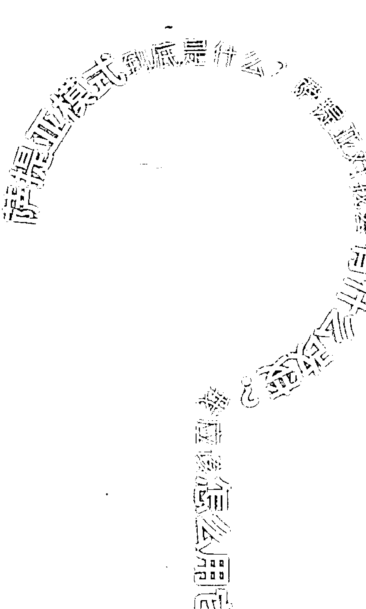

# 《幸福三模式：自我覺察》

幸福就是活得像自己。