# 掌握靈氣療癒的技巧

# The Complete Guide to Reiki

傑佛瑞·馬丁 著
Dr. Jeffery A. Martin, TRM, ARM

Grace Wang & Harvey Guu 合譯

#### 掌握靈氣磁場的技巧

# The Complete Guide to Reiki

# 作者自序

# 靈氣運用專業指導手冊

這本書是心想願成系列《靈氣創造心想願成的磁場》的續集。起初，靈氣教材的繕寫，主要是為了當作靈氣協會內，靈氣初級及中級班學員的教學指南。原本我希望能市面上，找到適合靈氣協會學員的靈氣教材用書，但是在我看過一系列有關靈氣的書籍後，決心要親自完成這一系列的教材。期間經由許多人的指點及建議，才能造就這本教材的成功及內容上的完整性。

編寫這本書時，靈氣的概念僅止於「Usui Shiki Ryoho」或是「能量／自然治療」的白井系統，但是現在靈氣可代表多重的意義，甚至擴展到包含許多附加上去的祈禱方式及通靈的治療系統。希望讀者把這一系列書就當作你們自己出的書，持續地將你們的意見及改善的方法寄給我。經由你們的建議、經驗及忠告，可以持續地更新目前的靈氣資料，以協助在世界各地從事能量治療的工作者，使他們得以持續地成長。

這本書收錄大部分學員問過我的問題，以及其他協會的老師或工作人員的問題與詳細回答的內容。作為這樣一本靈氣使用手冊，我們會提供最實用的有關靈氣的新、舊資訊，以期大幅提升你們能量治療工作的效率。

本書有此內容的範圍，很容易會陷入使用個人意念治療的領域，或是以指示的方式治療，因為在這裡的任一種方法，都可以運用這種意念的治療方式，尤其是這些方法在靈氣團體內是經常使用的方法。儘管大部分的問題是靈氣團體所會考量的，但在教學的內容上，很少會提供更進一步的靈氣運用指導或洞察能量的過程，以及使用這些技巧所具有的潛在難度。

如果你們尚未讀過《靈氣創造心想願成的磁場》，我建議你們先看過後再來閱讀本書的內容，因為其內容是《掌握靈氣磁場的技巧》的基礎。最後，我祝福你們在自我療癒的路上，擁有一切的愛及成功。

# 譯者序文

## 巧用靈氣能量，讓心想願成！

在此，我們要先感恩傑佛瑞・馬丁老師無私的愛與光的分享靈氣資訊，才能使我們對靈氣能量的內涵更清楚了解。我們也要感恩大光明天神們、七次元意識能量體『百靈度』及聖羅耶靈氣天使對我們的指導，讓我們能更進階的學習靈氣能量的技巧。還有感恩老天爺很美好的安排，我們很開心能繼續出版心想願成系列二《掌握靈氣磁場的技巧》。感恩大康出版社李翠瑩總監、鄧以慧主編及相關工作人員，因為有您愛心的協助，讓我們能繼續出版更多的靈氣資訊分享給大家，也使大家越能使用靈氣愛與光的能量。我們還要感恩我們的家人及朋友，因為有您的陪伴，豐盛了我們的生活。也要特別感恩我們特有靈性的Cherry寶貝，每次都協助我們拍攝。最後我們也要感恩所有的讀者，因為有您，才能讓靈氣的能量擴展出去，祝福您因使用靈氣能量而心想願成。

靈氣能量的使用非常簡單，只要我們有當『純淨的靈氣能量通道』的想法就可以了。不需要想著要療癒誰，因為來自宇宙的生命能量，自動能完成該完成的能量工作，而我們只要感覺靈氣能量在我們的身上流動，直到能量感消失。

靈氣是愛與光的能量，越常使用靈氣，越能感覺身體能量流動及震動的感覺，也就越能開發自我的覺知及事件顯化時的能量感，更進階能感覺未來事件的能量感，例如：談業務時的能量狀態、小朋友考試時的能量狀態、股市未來資訊的能量狀態……

在本書中，傑佛瑞．馬丁老師介紹了很多使用靈氣的進階技巧及知識，可以讓我們在靈氣運用上，更節省時間及簡易處理好一些生活的事件。請記得，越常使用靈氣，身心靈的能量狀態就會好，身體能量好，氣場及磁場自然就更好，事情也就越容易心想事成，而後到達心想願成，這個意思就是只要多想著靈氣，靈氣自動會出現，我們的能量狀態自然就越好。

靈氣的能量不分宗教、不分文化、不分種族、不分貴賤、不分你我，祂就是這麼自然可以擁有，因為我們原本就屬於祂的一部分，所以任何人都可以擁有這樣的自癒能力，只要我們相信祂，祂就能給我們宇宙的愛、智慧與活力能量。

還有，在本書的附錄，我們提供靈氣老師的諮詢資訊，以服務所有的讀者，很感恩這些老師無私的愛與光的協助，我們愛您：王宇謙老師、莫雪子老師、張盈瑩Cathy老師、廖云钒老師、羅淑薰老師、AKASH老師、Aurora老師、Nori Wang老師。願宇宙及我們所有的愛與光祝福所有的讀者，身心健康、財富富足、幸運開心、幸福快樂、心想願成。

Grace É Harvey
2012.3.15

# 目錄

- 作者自序 002
- 譯者序文 004

# 第一篇 靈氣基礎技巧篇

- 第一章 意念療癒法與祈請療癒法的差異 010
- 第二章 存在的實體、驅邪與靈氣 022
- 第三章 解除靈氣能力及解決能量流失 034

# 第二篇 靈氣工具進階篇

- 第四章 靈氣與超自然手術 045
- 第五章 能量轉化程序 053
- 第六章 進階的靈氣樁 063
- 第七章 進階水晶知識及水晶陣使用 073
- 第八章 聖米迦勒之劍的技巧 085
- 第九章 神聖幾何圖形與靈氣能量 110
- 第十章 靈氣、高靈與大自然力量共同創造療癒發生 120

163

# 第三篇 靈氣手位活用篇

164

第十一章 靈氣療癒手位大解析

209

# 第四篇 靈氣教學筆記

210

第十二章 乙希爾・隆巴狄女士的靈氣教學講義

230

第三十三章 高田・哈瓦優女士之初級靈氣班完整講義

252

# 附錄

◎傑佛瑞・馬丁的靈氣傳承

253

### 參考資訊

- ◎國際靈氣中心資訊網
- ◎全國靈氣課程諮詢中心

# 協同作者

- ○第三章去除靈氣符號及能量的技巧——湯瑪士・布朗 (THOMAS J. BROWN, TRM)
- ○第五章能量轉化程序——布魯斯・大衛斯 (Bruce Davis, TRM)
- ○第十章靈氣、高靈與大自然力量共同創造療癒發生——安東尼・葛倫・阿吉 (Anthony Glenn Agee)

# 第一篇 靈氣基礎技巧篇

## 【第一章】意念療癒法與祈請療癒法

祈請療癒法是自我治療的一種，靈氣傳導師的效能取決於他們能夠調用一個廣泛頻帶的能量頻寬，而能夠調用能量頻帶的寬窄與強弱，又取決於靈氣傳導師本身自我治療身體的純淨程度以及開放程度。

能量治療基本上有二種不同的治療方式，就是意念療癒法(也稱指示療癒法)及祈請療癒法(也稱為通道能量療癒法)。因為靈氣是屬於傳統性的做法，所以是屬於後者的範圍，其他大部分的能量治療是屬於前者。因此，為了能真正地瞭解甚麼是能量治療，我們就必須去了解這兩種不同的治療方式。

### 祈請療癒法

療癒方式不是一個狹隘的研究主題，因為它包含在星球上每一種能量治療的機制。基本上，祈請療癒法是有關於靈氣傳導師牽引能量流經他們自己的身體，然後再進入靈氣接收者的身體。在治療當中，靈氣傳導師沒有特別的超視覺能力，除了他們必須要說明的意圖及維持他們的意念專注在治療上外，他們看不到能量的流動，也看不到特定的能量顏色及過程。一般說來，靈氣傳導師是有辦法牽引靈氣接收者所需要的任何能量流經他們自己的身體，然後再傳到靈氣接收者的身上。然而，要完成這項操作，卻不像是聽起來那麼簡單的一件事。

這個關鍵是靈氣能量會先流經靈氣傳導師的身體，表示能量必須不被靈氣傳導師的身體及其能量系統所阻礙，如果能量被阻塞了，就不能流到靈氣接收者身上。

祈請療癒法是自我治療的一種，靈氣傳導師的效能取決於他們能夠調用一個廣泛頻帶的能量頻寬，而調用能量頻帶的寬窄與強弱，又取決於靈氣傳導師本身自我治療身體的純淨程度以及開放程度，大部分「純淨」的靈氣傳導師相信，是靈氣接收者自行牽引能量來流經他們的身體。然而在某些情況下，有些乙太體的超自然手術，已經在這個過程中自然而然地在進行著，因為他們相信，靈氣接收者是要要求「超自然手術」的人。

### 意念療癒法

許多的靈氣傳導師，會從意念療癒的團體開始，當作他們為人療癒的起點，而我也是從那裡開始的。當時，我是第一次開始研究人體的能量系統，但我也是一名電子工程師，而且也需要我去理解治療身體時的等效電路圖。我的信念在這樣的學習過程中慢慢地開始發展，開始改用更多直覺性的治療方法。

### **案例故事——靈氣初體驗**

第一次接觸到靈氣，是在許多年前我過生日的周末，當時珍妮・葛林老師（Jeanne Greening）來到我的家鄉，在她引領下，我大量地參與許多有關能量的研究事項，讓我深受感動的是，無論選擇什麼主題與她談論或討論，她總能正確、適時地提供很好的意見。因為她加深我對靈氣的印象，所以我決定給靈氣一個機會，否則我現在可能還不懂靈氣。當我投入靈氣研究沒多久，在上完課的幾天後，就被要求治療我的一位靈氣接收者。她是一位朋友的朋友，一隻手腕有粉碎性的骨折，於是我決定放下所有意念療癒的技巧，然後遵照珍妮・葛林老師的方式。照手位治療的順序，一個一個治療。這真是一件困難的事，因為我想要在手腕上先開始做治療，而不想要依個位置上的能量感。最後，在所有的手位都治療過後，移到手腕上時，令我驚訝的是，在手腕處所牽引的能量是很輕微的，而且療程很快地就結束了。當她的意識回復清醒後，我熱切地想知道她有甚麼樣的感覺。她描述說，當我治療她的頭時，她看到一條藍色的能量光擊中她的手臂，並感覺到手腕狀況得到改善，而且也感覺到在療癒身體的其他部位時，也有相似的能量經驗，但在療癒手腕處時，卻沒有那樣的能量感覺。

在她返回醫生的診所前，我們還有足夠的時間完成三次標準的療程。我每一次療程都遵從相同的療癒模式，就是讓手腕本身決定治療的時間及能量，然而每一次治療都沒有多花費時間在手腕上。

後來從醫生那裡得知，只有幾天的時間，她的手腕已經從需要動手術，變成完好如初，一點事都沒有。為了確保癒合良好，醫生在數星期內都不願除去她手腕上的固定模子。然而，當她一返回工作崗位上時，已經能充分使用手腕，好像完全康復了。從這個療癒的經驗，我學到了很多治療的課程。

### 療癒大不同 — 祈請 v.s. 意念

我研究及實行過許多意念療癒的方式，從所有眾人熟知的技巧到鮮少人了解的秘密技法。我發現大部分的技法都是有效的，而且許多技巧都宣稱可以療癒人體能量場中許多的層面，但是從這一次療程我已清楚知道，我已經找到一種新的、令人驚訝、有效而又非常簡單的方法。在我能量治療的工作上，許多事情瞬間變得很清楚明白。

很多能量治療的方式，都高度重視從人體能量場除去「阻塞物」。阻塞物一詞，可以代表許多事，從乙太體內糾結的健康纖維，一直到糾結的思想模式都是。一般來說，阻塞物指的是造成人體能量場阻滯的能量，或是表現在身體、情緒或靈性上的失衡，意念治療的主要原則之一，就是去除這些能量阻塞物。

### ◎能量來源選擇

在意念療癒上，通常是靈氣傳導師負責選擇靈氣接收者所需要的治療能量，這是運用「視覺化能量」中最常見的方法，通常這涉及將特定能量的流動，運用在靈氣接收者的能量場(在這裡，常指的是能量的光色)，不管能量是流進來、流出去，或是圍繞在靈氣接收者能量場的周圍都是選項。

祈請療癒法，不用花很久的時間就能學會的原因是：第一、在靈氣接收者身體部位的問題，往往不是最嚴重的致病因素；第二、靈氣傳導師沒有權利去除人體能量場的阻塞物，而且這樣的治療常常會造成更大的傷害；第三、如果允許靈氣接收者經由通道的能量牽引他們所選擇的靈氣能量，那麼更強大的療癒效果，可能就會發生在靈氣接收者的所有能量層面。

接下來，讓我們一個接一個地了解這些原因。

現在，你可能會驚訝你學到了「在靈氣接收者身體部位的問題，往往不是造成靈氣接收者身體失調最嚴重的致病因素。」讓我們回到我第一次做靈氣療程的經驗上，靈氣接收者手腕的康復是來自於身體其他部位能量的治療，而不是受傷部位的治療。這是一個祈請式靈氣傳導師的療癒模式，他們了解到只要重複相同的治療方式，病情就能獲得改善，這個原因是多樣化的，而且通常取決於能量治療在身體的哪一個層面上。例如，嚴重的心理問題，可能與『其他存在體』附身有關。經常性的身體意外事件，可能與隱藏的心理或能量構造有關，進而從幕後製造意外事件的發生。疾病的顯現，通常與身體以外的能量體有關，像情緒體及心智體的能量模式被儲存起來，甚至會因為人的情緒體及心智體的被影響，而造成工作上的問題。如果只是尋求身體的治療，忽略大部分在身體表相背後所隨的能量模式，沒有被處理掉，這很可能導致這些能量模式，在未來會有顯化或形成其他的狀況。因此真正有效的治療，必須清除所有隱藏在身體背後的問題。

### ◎去除能量阻塞

接著，這可能也會讓你感到很震驚，因為許多廣為人知有關能量治療的書，似乎讓人以為靈氣導師主要的工作是去除靈氣接收者身上所有的能量阻塞，以使身體的『乙太模板』再次康復。但是以邏輯上來說，身體會依循乙太模板的樣子，如果我們可以真正測量到所有人體的微細能量體，這可能就是正確的描述了。但是大部分靈氣傳導師，都無法有效評量超過乙太體及情緒體以上的能量層面，至於這樣的原因，我們會在另一本書解釋。在這邊，必須要了解的是，我不曾看過有人能有效估測人體能量場的所有層面，並確定真正能量阻塞的地方，以及釐清所有層面真正的關係。更明確的說，靈氣傳導師對人體能量場的觀察，是一個非常沉重的工作。不要誤會我的意思，有些靈氣傳導師，有足夠的能力使用這樣的方式，也可以很有效的處理好百分之八十五的靈氣接收者，畢竟這些靈氣傳導師是寥寥可數的。然而，許多人早已發覺祈請療癒法有太多的步驟要做，所以為了效率，現在都使用組合式的方法，以得到最大的療癒效果。在祈請療癒法上，阻塞的能量只有在人們真正準備好要去處理時，才能被去除溶解掉。這是一個非常重要的觀念，因為不只代表他們將不會有負荷過重及有心理上面的威脅，也表示每一個阻塞及與其相關的情況、伴隨在其他能量體上的阻塞，將同時被去除，而且永久地被去除。在人體所有的能量層，都被非常徹底的療癒。這是一個關鍵，因為能量阻塞不只單純阻塞在人體能量層的單一層面上，極有可能在多個能量層上產生阻塞的能量。阻塞的能量大都會穿越並阻塞許多個能量層，甚至是所有的能量層，當然也包括我們尚未理解是否存在的能量層，所以更別說能有效地去作評估。能量阻塞物之間的關係是非常複雜的，而且遠遠超過任何人曾做過的評估。因為只有靈氣接收者經歷了自我的意識，自覺到他們有足夠的能力時，才能理解和整合這些阻塞物，以及彼此間的相似處和關聯的程度。如果我們可以完全地了解這些情況，那麼預先警覺到有能量阻塞的可能是我們，而不是他們。

### 大師法則 成功去除能量阻塞

我們會將靈氣傳導師本身假設為靈氣接收者，然後再將療癒對象換回到真正的靈氣接收者。再透過靈氣傳導師意念技巧的執行之後，可將大部分能量層阻塞物清除掉，但是這種療癒的模式，可能需要花很多年的時間，才會讓靈氣接收者的能量回落到需要做再次評估的程度，不過意念靈氣傳導師還是會經常這樣做。

祈請療癒法，不是取決於靈氣傳導師對他們正在進行的治療過程的理解程度，因此，在大多數的情況下，靈氣傳導師的意識與這個層面無關，只要他們對靈氣接收者所需要的能量保持開放的心就可以了。當然，仍要關切阻塞在靈氣接收者意識中的其他層面及他們的能量場。然而，這種治療方式，能夠治療我們無法想像的層面，特別是當能量由靈氣接收者意識所引導的能量治療。當阻塞的能量被療癒，靈氣接收者就完全地康復了，完全斷絕其他殘餘的能量種子，留在他們身上再次發芽的機會。

這個結果，帶給我們最後的觀點：在意念治療方面，靈氣傳導師通常會選擇靈氣接收者所需要治療自己的能量。而這種能量的選擇，是由靈氣傳導師的知識及智慧所決定，並且與他們所學的治療技術有直接的關係。

舉例來說，如果靈氣傳導師選擇紅光的能量，提供靈氣接收者受傷的骨頭進行療癒，那麼紅光能量的振動頻率，就是靈氣接收者所能使用在身體上唯一的能量了。

因此，祈請療癒法往往更有效，因為它是靈氣接收者自己選擇能量的種類，並牽引能量流經靈氣傳導師身體後，再去治療靈氣接收者自己的身體。它不只是擁有一、二種能量而已，往往是有多重相關及多重組合的複合能量。因此，即使具有最優秀的想像力，也很難去形容、顯現它的狀態。這些能量持續的流動狀態，總是被靈氣接收者吸收，形成更有效的能量構造，這樣他們的身體及能量場就日益改變。因為，祈請或通道能量療癒法，就是經由祈求的能量來治療他們自己。

在寫心想願成系列的第一本書《靈氣創造心想願成的磁場》時，我試著非常細心地把所有知道的祈請療癒方法都涵蓋進來，這本書，主要是清楚說明許多在能量治療團體內，很少會談到的灰色區域，也特別解釋許多常用但很少被理解的技巧。這些技巧中，可能有許多的部分與意念能量治療有關，但是我強烈地感覺到，在我們的靈氣團體內應該揭露更多、更詳細的意念治療資訊，不該只是寫一篇看似無害治療技巧的文章，這是不夠的，應該要討論更多具備無害性的宗教神奇治療儀式。

## 【第二章】存在的實體、驅邪與靈氣

讓靈氣自動運作！不要假設意識存在體是應該被去除，只是因為它存在於現在。當療程結束後，如果這個人的根本問題沒有被清除，那他常常會很容易再次拉回已清除的意識存在體，或相似的意識存在體。

任何已進行能量療癒工作一段時間的人，都會熟知有多少的問題會發生，而且大多是有关身體健康，或是源於「意識存在體」附身及心理的困擾。意識存在體被人體吸引的原因有很多種，而且許多的意識存在體是利用人類當作一種汲取能量的來源。

### 心理的印痕

我們所有人會從其他人身上汲取能量，都是為了我們自身的好處。像芭芭拉・布雷儂(Barbara Brenon)在她的第一本書《光之手》(Hands of Light)，做了一件很特別的事，就是確認許多病理能量的特定型態。依據她的研究發現，似乎指明我們人體如何拉引能量，以及哪種能量(通常是情緒能量)，是我們經常會從其他人身上拉引過來，並利用這些能量增強及維持我們自身的能量。這些行為的發生，主要是由於我們心理的印痕(或稱印記)顯化使然。經由多項的研究指出，我們在出生前就取得這些心理印痕，而且通常是以隨機的方式運作而顯化。催眠及心智／情緒及靈氣的成功療癒，可以歸因# 意識存在體

訓練有素及經驗豐富的法師或驅魔師都同意，幾乎所有或全部的驅邪儀式，都是在去除已無人身的靈魂，而這些靈魂仍然在尋求可以連結物質世界的實相。他們經常會在身體死亡時，帶著他們的能量型態轉移到另一個世界。基於這個因素，可得知意識存在體從人的身上所牽引的能量來源，與活人之間互相牽引的能量來源是不同的。而且在一個令人難以置信的廣泛能量帶上，每一個存在體都有自己的小空間。

另一個很常見的現象是，活生生的人，會感染到與他們接近的意識存在體在世時相同的疾病狀態。其次，當初這些意識存在體死亡時，都帶著大部分的能量型態，而這些能量都包括一些習慣和行為模式及疾病狀態。

在治療靈氣接收者時，若使用驅邪法，通常會產生戲劇性的效果，這是一個非常有效的療癒方法。

### 案例故事 —— 生活中的聲音不見了

具有宗教或神秘學背景的一些驅魔師，傾向認為附身只是許多形式的一種。他們把墮落的天使、惡魔、帶電的或人造自然力等，都視為危險附身的有效形式。每一個團體是否覺察到實相的爭論，都建立在他們自己的信念系統。至於什麼是有效的「附身」徵狀？從這邊的世界觀察的話，我倒是有一些個人的故事，是與意識存在體有關的經驗。

在一個教授初、中級靈氣班的週末，課堂中要大家配對做第一次的相互練習，由於有時到班學員的人數是奇數，所以我必須加入和其中一個學員當夥伴。我的夥伴先在我身上做練習，然後換我簡單地在她身上運用能量。接著我發現，她有情緒需要釋放的問題，所以我們決定最好私下在課程結束後，來解決這個問題比較好。

當其他人離開後，她平躺下來，然後我開始用靈氣能量充電。當完成我的祈請文後，開始畫符號在她的身上，符號引起了相當的反應，所以我們進行了一次非常強大的療程。當我們完成時，我的靈氣學員說，這是她人生（她是中年人）第一次感覺到她生活中的聲音都不見了。她簡直不敢相信這個事實，因為她一直以為這些聲音是生活的一部分，接著，她描述了她巨大的不幸及自殺的發生。而在聲音（意識存在體）離開的時候，我將符號畫在她的身上。

至於在療程之前，我完全不知道她有聲音的困擾或試圖自殺的事。但因為有靈氣及靈氣天使、指導靈，照顧了我的一切，驅邪的動作在一開始自動發生了。而在其他療程的時間，就用靈氣的愛與光的能量填補她的能量場。最後她的生活發生戲劇性的改變，而且也是第一次感受到生活的美好。

### 案例故事 —— 恐懼的意識存在體

另一次強力的驅邪，是發生在中級靈氣能量點化的時刻。那時，我到西部去，並和二個非常有靈性的年輕人一起合作，他們其中一位的女朋友也在場，而且也是一位超覺視力者。在那時我正參與研究靈氣的能量過程，所以我請她來觀察並做記錄。

於是，我再次將自己用靈氣能量充電，並開始進行靈氣學員的靈氣點化程序。當我的手放在第一個人的頭上時，我感到一股痺性恐懼的強烈波動掃過並抓著我，而且有一個聲音在我腦內尖叫「我不能這樣做，因為這是不對的。」該聲音一遍又一遍強調自己的觀點，如同該聲音本身恐懼的加劇。

我暫停並仔細考慮一下，我應該停止嗎？真是進退兩難的困境，我已經使用靈氣能量工作很多年了，從不知道祂會用恐懼的振動來表達祂自己。我也認為天使的溝通是合理的，畢竟，天使們做所有的療癒工作，但我不相信天使的溝通會是因為恐懼。我盤算著，縱使我感受這些恐懼的振動能量，但如果靈氣學員們不想點化的發生，靈氣點化就不會發生了。所以，我決定繼續進行靈氣點化的程序。

當我準備將符號植入這個學員放在心輪前面並展開的雙手時，感受到一陣強烈的波動打擊到我，我無法明確說明這次點化的感覺。當這個學員點化結束時，我又使用相同的點化方法在另一個學員身上（幸運的是，點化的過程非常平順），接著，我提醒他們，我已經完成點化了。

在給予他們一段時間慢慢地恢復意識後，我問那個靈氣學員，是否想私底下討論這次的情況，但他說不要，因此我讓他我知道我的感覺。我跟他描述說，我相信他身上有一個意識存在體附在他的心輪。我告訴他，為什麼我決定要繼續進行點化的因素，它很可能在初級靈氣課程時沒有被驅除，而且中級靈氣的課程會處理更多心輪的問題及心輪相關的能量。經過點化，我感覺到天使已去除它了，尤其當我在我手上植入符號及清除，而且天使已經將意識存在體的能量場封起來了。當我說完我的觀察，超覺視力者在現場證實我的觀察，並告訴我說，這是一次很棒的觀察歷程。

### 案例故事 ——「五」體附身

最後的經驗，我想是與一個靈氣中級課程班有關。這是一個人數剛剛好的班級，跟往常一樣，我決定在同一個時間點化全班的所有人。而坐在半圓中間位置等著點化的一個男學員顯得很特別，關於點化他的經驗，至仍然不時困擾著我。

那天，我開始進行點化的動作，而當我走近他的時候，開始有個奇怪的念頭進入我的腦中。我開始思考點化已經有多久及如何使每個人或不舒服。這些想法的高峰，是在我靠近這個學員時才會出現。當時，我認為應該進行快一點，縱使這樣，點化的效果仍然會很強大（因為在靈氣大師的圓圈內，所有人都具有相同的意識）。對我來說，在那個正確的時間點，加速點化似乎是最順理成章的事。我加速了他的點化，並在第二次點化完成之後，那些令人不安的想法才開始消散，我開始回想起來慢慢來的重要性。再來，當我點化完這個人，再點化其他人之際，我卻感覺應該回去點化他一次。內心湧上快速點化的這種感覺，這與我的信念及正常做法，正好是相反的。我不斷進行靈氣能量研究，以確保我所提供的靈氣點化是最強大及最有效的，而且多花一點時間在他們身上是必要的。不過，現在我開始想到再回去點化他一次時，「做得很好」的想法就大量出現了。當我完成其他人的點化後，我回去幫有問題的人再做一次點化。當我在進行點化程序時，我打開眼睛並往下看著他的臉，凝視著我的是，我曾想像過一張最邪惡醜陋的臉。這張臉，疊加在我正在點化的男人臉上，這至少是最令人震驚的說法。我閉上眼睛，然後再看一次，這張重疊的臉就不見了，我還是繼續上我的課程。在課程結束後，這個有問題的男人來問我，為什麼點化他兩次，為了不影響他，我只跟他說，在第一次點化時速度太快了，所以感覺需要做第二次的點化。然後我問他在點化時觀察到什麼，他給了我很模糊的說法，並跟我說感謝，然後回家。過了一會兒，當人群逐漸散去後，他回來教室並要求要跟我說話。至於他的描述狀況，完全是附身的典型案例，在那時我對他提出建議，並詢問他是否願意留下來，等到其他人都走後，我才可以療癒他。他同意了。我教課中心的社長，是一個優秀的靈氣傳導師，他同樣也加入這次的療癒工作。除了團體治療外，這種一起工作的情況，對我來講很少見，因為我都是獨立作業，所以往往我都會做非常長時間的療程，約三至五個小時。接下來的療癒經驗，是我曾經歷過，最強烈的療程之一。在療程中，我們至少從他身上去除五個強大的意識存在體，其中三個就像溜溜球（上下移動的狀態）一樣。天使們抓起一個意識存在體時，會讓這個人平躺，並使用微細能量索連結他們與意識存在體，然後將它們拉出去。這是一個非常長的療程，而且也是少數幾次，在靈氣療程中我曾使用意念能量治療的技巧。

當我開始疲累於溜溜球的效應，我就協助天使們處理一些意識存在體能量索的問題，我把力量符號畫在仍然連結靈氣學員的意識存在體能量索的頂端。事實證明，這樣做對協助治療本身產生很強的效果，以及能有效解決溜溜球效應的問題。

最後，當我們結束療程時，我與社長討論這次的療癒經驗，我們都驚訝於療程的強大力量，而且再一次證明，有一個人的人生，將產生顯著的改變，因為他變成一個靈氣老師及具備催眠合格證照的老師。而現在，如果我要再一次做這樣的療程，會改變的只有一個地方，就是不將靈氣學員的能量索直接切斷，而是引導他們去切除綑綁在他們自己身上的能量索。

以上這些，只是我與意識存在體和附身有關的小部分故事。在每一個案例中，靈氣與靈氣天使都必須要小心注意療癒的過程。靈氣是具有強大力量的治療模式，如果情況是被允許的，那靈氣就能夠照顧到任何一種情況。

### 靈體分離技巧

當我旅行各地時，我發現到許多靈氣導師都會執行其他種類的驅魔儀式，而有些驅魔方法是非常危險的。所以，要特別小心使用那些驅魔的技巧，除非驅魔是你的專業技能，而且你非常熟練這些技巧。有時，因為靈氣是非常簡單而又具有強大的力量，所以在靈氣團體中，會傾向認為這種方法很適合大部分能量治療的模式，而且靈氣最美妙的一部分，在於祂的簡單性及防護力。所以再一次提醒大家，請小心使用那些驅魔的技巧，除非是你非常熟練這些技巧，並有充足的後援。

如果你正操作任何一種必須直接與靈體意識溝通的驅魔方法，我懇請您，去研讀一下尤金莫里（Eugene Maury）所寫的一本書《驅魔》（Exorcism）。在書中，有很多、很棒而且有關本文所提到的資訊。

還有一個非常重要的好消息，就是你不必直接處理附身的靈體，而你只需要請中介的天使，或指導靈來處理就可以了。除非你是一個技術很高的專家，否則那樣做是非常危險的。

我想請你們，讓靈氣為你照料那些意識存在體，但是如果你選擇繼續操作驅魔的分離技巧，請經由天使或指導靈的協助，並採取遠距離的技巧。而所有你可以做的事，就是祈請你的天使及指導靈協助你，然後讓天使及指導靈，去做你平常需要處理人們身上的所有事情。透過這種方式，你可以保持匿名的狀態及不被反效果的回應所發現或找到。

意識存在體通常被清除後是不會再回來，但有時還是會發生返回的效果，因為其他意識存在體的大兄弟們會尋找那些被清除者。如果有跡象顯示直接指向你，就要注意了。

再一次提醒，讓靈氣自動運作！不要假設意識存在體是應該被去除，只是因為它存在於現在。當療程結束後，如果這個人的根本問題沒有被清除，那他常常會很容易再次拉回已清除的意識存在體，或相似的意識存在體。

靈氣，是去除及療癒那些準備好要被清除能量阻塞及想要療癒的人。請不要使用額外的意念治療技巧，而造成靈氣接收者產生其他的問題，或是幫他們做療癒上該有的自我決定。

## 【第三章】解除靈氣能力及解決能量流失

只要你經常使用靈氣，靈氣能量可以很容易地被擴展開來，隨著靈氣使用次數的增加，以及對靈氣能量的開放度擴展之後，就會帶來連通你所需要的其他額外能量的能力。

### 喪失靈氣能力的原因

因為我們很多人聽說，一日你獲得靈氣的力量，你是不可能會失去的，但是當你遇到有人有失去靈氣能力的現象時，這可能會動搖你對靈氣的信念。這樣的現象遠超過你可以想像的情況，尤其當我親眼看到這種情形，是發生在主要及次要傳承靈氣傳導師的學校。正如我們所見的，失去靈氣能力的原因是非常不同的。

我已遇過許多人要求被重新做靈氣點化，不是因為他們感覺最初的靈氣點化沒有做得很好，就是因為他們感覺到已喪失靈氣能力。這種情況發生在所有等級的靈氣傳導師，而且有一點是讓我觉得很好奇，所以我開始設計一系列的實驗去查明這個問題的原因。

> 案例故事 —— 失去擁有能量的信念

我實驗的其中一個案例，是一位使用很多意念治療技巧，且很熟練的靈氣老師，她所熟練的技巧中，有一種是脈輪清理的訓練，在她做完這個訓練後，她喪失她的靈氣能力。她是我教授靈氣班的旁聽生，在課程後，她跟我說明發生了什麼事，接著讓我重新點化她一次，但因為不是直接對脈輪作用，所以點化的成果沒有再次發生。

為了要讓她的靈氣能力再次產生，我進行了第二次的點化動作，然而，第二次我不是真正給予她點化的程序，而是使用某些能量讓她充電，讓她以為靈氣能力的再次產生是我給予她完全點化的作用，接著我就送她出門了，她再一次相信她已恢復靈氣能力。但幾個月後，透過其他人得知，她又再次喪失了靈氣能力。

從以上的例子我們發現，在我們治療的領域內，甚至都有極重要的信念，只有一個真正造成變化的原因，就是這個人有這股能量或沒有這股能量的信念。在我研究這方面的領域中，這是一個經常性的主題。所以有很長的一段時間，我對於這主題的結論都一直保持這樣。

### 案例故事 —— 與靈氣相衝突的能量

有一天，我參加一個復活節的活動，在某個展覽攤位遇到一個製作護身符的人。在與他交談一陣子後，發現他是一位非常自我實現的魔術師，他依據高級魔術藝術的所有正確的步驟，慢慢地製作護身符，然後將他所賣的護身符充電。在看完他所有的護身符後，我選擇一個與療癒相關，具有很強大力量的靈性代表（或能量來源）的護身符，並開始戴上。

在戴上護身符之後，很短的時間內，我平常可以使用的許多能量來源（包括靈氣），都不再流通我的身體。這似乎表示我已喪失溝通這些能量的能力，這真是一件非常令人不安的事，尤其使用靈氣療癒及靈氣教學工作是我人生的工作。許多事情都開始變化了，而且在那時候，我還參與許多新的研究計畫。這件事，花了我一段時間後才瞭解到，護身符的能量與我工作時使用的許多傳統能量是不協調的。

如果我沒有親身經歷過那些事，是很難會相信竟有這種事發生。然而，這個經驗給我帶來一個很重要的認知，就是有些能量與靈氣能力是相衝突的，而且會阻礙靈氣能力。那些特別的能量是很棒的治療能量，但是非常是在靈氣團體中，很少會討論到的問題。

### 無法指揮的靈氣能量

這個問題的重要性，在於必須要辨別是哪種能量點化你。許多被靈氣能量點化的意念能量傳導師，失去他們接通原來能量的能力，因為靈氣佔據了原來能量的位置，並且增加很大的部分。

由於在能量調整的初期是很困難的，因為通常大部分靈氣傳導師的自我，會自動連結到他們可以「指揮的能量」。但對靈氣能量來講，是靈氣接收者牽引他們本身所需要的能量，然後流經我們靈氣傳導師的身體，所以，靈氣能量是一種很難用自我意識去指揮的能量。這樣對有些人來說，可能是一個很困難去適應的改變。

在靈氣傳導師身上可能會遇到相同的問題，就是他們企圖獲得（或收集）許多不同能量的點化。在許多的案例中，你所接受的靈氣起始點化，是你想成為一個非常自我實現的靈氣傳導師。只要你經常使用靈氣，靈氣能量可以很容易地被擴展開來，隨著靈氣使用次數的增加，以及對靈氣能量的開放度擴展之後，就會帶來連通你所需要的其他額外能量的能力。

當你的靈氣能力非常有益於接受其他能量系統的點化時，有個重點你必須要了解，什麼樣的心靈特質，讓你會開始接受靈氣的點化。靈氣研究協會，有個令人難以置信的嚴格標準，就是在我們想牽引能量到我們的靈氣班上之前，必須先讓靈氣能量黏附在我們的身上。這些標準是由我發起的，這樣做的目的，除了是做自我防護外，也可以防護他人。

### 去除靈氣符號及能量的技巧

在新時代的團體中，點化啟動能量已變成很大的事業。許多人出去後，都成立屬於他們自己的系統及一系列起始能量的課程。因為這樣，靈氣協會及所屬的指導老師們，收到很大數量的求助要求，許多人希望從有靈氣能量的狀態，變成沒有被靈氣點化，或想去除靈氣點化的能量。這樣的情況是經常發生的，因為祂的能量逐漸地讓他們生病。

一九九四年末期，美國科羅拉多州有一位靈氣協會受訓的老師，名叫湯瑪士·布朗（Thomas J. Brown, TRM），設計了逐步去除靈氣點化能量的程序。在我們的靈氣協會，是依每個人的能量基礎，做為去除靈氣點化能量的程序參考。然而湯瑪士·布朗的程序非常好用，可以很容易適用在解決絕大多數人的問題，由於這樣，我決定將這個程序在這裡公布出來。

### 去除靈氣點化能量的程序

程序 1. 狀況：學員不接受或不想要任何給予他們的靈氣能量。

程序 2. 試圖解決的方案：確認問題的性質。學員可以經由大聲念以下的祈請文，並透過他們自己的意圖，傳達給他們的指導靈、靈氣指導靈、升天的大師、天使們、大天使們、生命最高振動神聖的愛及光，請在我靈氣啟發的途徑上引導我。以母親、父親及神的名，祢將會完成這個或其他更好的事。感恩祢、感恩祢、感恩祢。

程序 3. 學員與老師一起照下列的方式冥想，而冥想的時間需要持續二十到三十分鐘。營造環境的氣氛，需要準備音樂、燭光、薰香等等，兩個人面對面坐下，學員使用力量符號的名字當冥想的咒語，而靈氣老師則使用白井大師符號的名字當冥想的咒語。閉上你的雙眼，做一次深呼吸，呼氣時對自己說三次重複的冥想咒語。再做一次深呼吸，呼氣時靜靜地再對自己說三次重複的冥想咒語。再來，並往上移動到你的頂輪，然後呼氣並靜靜地再說三次你的冥想咒語。再來，你的咒語從第三眼移動出去，上升超過白霧的頂端，然後穿越門落下，穿越白霧，及穿越所有的脈輪（看到符號落下後，門就關起來了），當有這畫面時，你的咒語從第三眼移動出去，上升超過白霧的頂端，然後呼氣並靜靜地再說三次你的冥想咒語。

程序 4. 在冥想過後，先坐一段時間，並伸展一下身體，接著與學生交流一下感受。

程序 5. 請你的學生大聲宣讀以下的宣言：

> 我〇〇（說自己的全名三次），請求我所有的指導靈、靈氣指導靈、升天的大師、天使們、大天使們、生命最高振動的神聖的愛及光，協助我進行從生命中，除去神聖的符號、祂神聖的名字及祂的能量的過程。

（停下來，讓這個過程開始進行，並感覺它的發生，然後說以下的話三次。）

我〇〇〇（說自己的全名三次），從我的生命放棄、放棄、放棄符號名稱三次、祂所產生的能量及所代表的意義，然後給一點時間讓這個過程發生。

當你感覺到以上所說的符號被去除後，接下來的說以下的話。

我以母親、父親及神的名字來做這件事。

現在或其他的時刻都會更好。

感恩祢、感恩祢、感恩祢。

這個程序在實用上是一個很好的架構，很明顯地就像所有的架構一樣，可能會因你的特定信念系統及需要而去做適用上的改變。我實驗過這個程序，也發現它可以運作得非常好。

幾乎所有慈善的靈性義工，只希望協助我們，如果我們真正地想要祂們的幫忙。這個過程特別宣言是說，祂們的協助不是被要求的，就像點化們的能量，任何放在祂們身上的承諾，都要變成無用及無效的。這個宣言給祂們可以離開的許可，並離開去協助需要他們幫忙的其他人。

可能也會有能量或指導靈的去除，是要經過一個具備這個技能的專家。如果你遇到需要去除能量的情況，請隨時與我聯繫，我很樂意介紹一個能幫助你的專家給你。

### 靈氣參考書

#### 《去除靈氣符號及能量的技巧》

作者：湯瑪士·布朗（Thomas J. Brown, TRM）

協助：潔西卡·桑德斯（Jessica C. Saunders, TRM）、麥可·麥多內爾（Michael McDonell, TRM）

### 三脈七輪位置圖

**經脈：**
- A. 左脈
- B. 右脈
- C. 中脈

**輪：**
- 7. 頂輪
- 6. 眉心輪
- 5. 喉輪
- 4. 心輪
- 3. 太陽神經叢
- 2. 臍輪
- 1. 海底輪

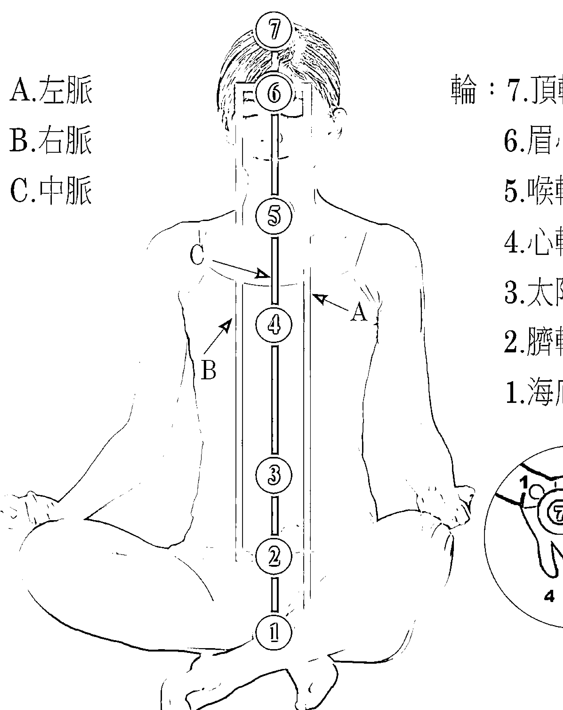

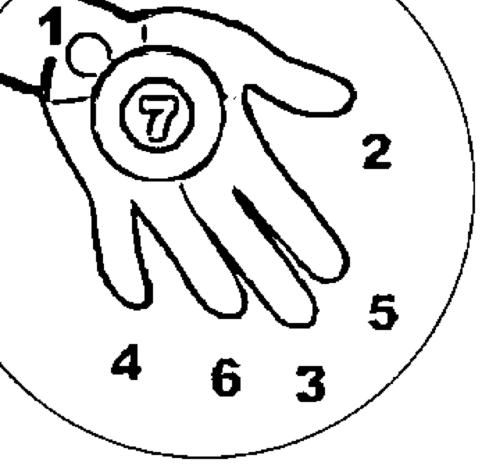

# 第二篇 靈氣工具進階篇

## 【第四章】灵气与超自然手术

从身体释放出的负面能量不只是要擦掉或抹掉它，最好经由动作及视觉化的方式，把它拉出能量场并去除它。超自然手术技巧是用来自灵气接收者的能量体，清除负面能量或能量团(像负面的思想模式)。

超自然手术，这个用词代表很多的意思，而对某些意义来说，是代表从能量场及身体拉出负能量，而对其他的意义，则代表思想形式的去除，以及代表像去除记忆的印痕或灵魂能量的复原。像菲律宾地区的超自然手术，只使用双手，且没有使用切除仪器去清除身体内的囊肿或肿瘤，而且没有留下疤痕或需要疗愈的时间。

但在本文所指的超自然手术技巧，是用来自灵气接收者的能量体，清除负面能量或能量团（像负面的思想模式）。在这样做的时候，我们会像往常一样，采取数世纪来在东方及萨满传统已经实行很久的方式。许多像这样的方法都是很有效的，而且所有的技巧，基本上都使用相同的机制。

### 去负面能量技巧——甩手去除法

清除负面能量的第一个技巧，是来我原来的初级及中级灵气老师珍妮·格林。当灵气传导师在疗愈某些人时，灵气传导师可能会从灵气接收者的皮肤表面感觉到一层光滑触感，就像蜂蜜一样的物质。对泛心理学家而言，这是属于灵魂外质的一种形式，但对灵气传导师而言，它只是从身体释放出负面能量的一种形式。这种负面能量不只是要擦掉或抹掉它，最好经由动作及视觉化的方式，把它拉出能量场并去除它。当然在这样做的时候，只要想像在这地方的外质呈现暗黑色的能量，然后提起你的双手，抓起这边的能量，并将它拉出这个人的身体。要真正看到你从这个人身上拉出能量，直到阻塞的能量都清除了。每一次你抓起一些能量把它拉出去，要记得甩甩你的双手，然后将能量甩出去，就像洗完手要甩掉水的感觉，这样可以甩掉你手上的负能量。许多灵气导师相信，应该将你手上的负能量直接甩到装有海盐（或海盐饱和水）的桶子内，或是甩到泥土中让它接地。理论上，如果你只是将这些负能量到处甩，它可能会在空间的某处又形成了。但是我们的研究及观察，并未发现有产生这种现象，因为这些负能量只会消散并进入乙太里，而不会在空间聚集。事实上，只要照上面的方式，将你的双手及水晶甩一甩，就是最有效清除负能量的技巧，而超视觉使用者通常都会使用甩手的方式。一旦你已清除人体能量场中的负能量，并在最后甩掉你手上的负能量，请记得要继续用能量治疗你抽出能量的点，因为这个地方可能需要填补特定数量的治疗能量。以下介绍的技巧是我发现所有从身体内拉出负能量的技巧中，最简单及最有效的技巧。

### 去负面能量技巧——梳刷能量法

另一常用且能有效去除负能量的方法，是使用与手扫描能量场的方式类似，请看《灵气创造心想愿成的磁场》的第十四章〈无须碰触身体的疗愈法〉。不只可以清理人体一边的能量场，也能在同时把人体两边的能量场都清理好。这里介绍两种不同的技巧，我们会先介绍最常用的方法，因为使用这种技巧是需要紧密的防护措施，所以建议只有中级程度以上的灵气传导师才能使用梳刷能量的动作。

在开始这个动作之前，记得要先画力量符号在你双手的整个手掌上（包括手掌两面及手指）。因为由这个程序拉出负能量时，灵气传导师如果没有做防护措施的话，他们自己本身可能会容易致病，因此作为一个灵气传导师，在执行这个技巧时，应该要所有你会的防护措施。

经由超自然手术的技巧，可以清除微细体中深层的负面能量。最有效的方式是将两只手各放在灵气接收者的身体两边，将两只手的手指同时指向灵气接收者。利用视觉观想的方式延伸你的乙太体手指，想像你的手指像一道光亮的线，而神圣能量从你手指尖端延伸出去，完全地穿过灵气接收者的能量场。而从这个地方开始，技巧就与《灵气创造心想愿成的磁场》第十四章〈无须触碰身体的疗愈法〉不同了。

你可能会选择滑动你的乙太体手指，从灵气接收者双脚滑到他们的头部，或是从他们的头部滑动到他们的双脚，或是从他们身体的一边滑动到另一边。最重要的不是滑动的方向，而是在身体的每一个面，都用一致性的手法，有系统性地涵盖人体所有的部位。

基本上，使用你的手指就像梳子一样，清除所有深层的纠结能量，这些能量就像是所有阻塞的能量及不属于自己能量场的外来物质。这个动作开始时，你必须使用视觉化的方式，尤其当你要深层地梳刷他们的能量场及微细能量体时，这样你才能清楚知道阻塞的能量是否被清除了。

在清除一个地方的能量后，你必须净化一下你手上的能量，才能往一个地方移动。再来，你净化的动作可能只是将它们甩开，但是用这种方式清除的能量，会与之前所提到的能量有些不同，因为经由超自然手术所清除的能量，如果没被净化，很容易会在空间上又形成了负能量。因此，我建议甩开或丢出这些能量时，可以用以下的方式来净化这些能量，例如：丢到一个装有海盐的碗(或装海盐水的容器)、观想一团紫色火焰净化它、丢到一扇有神圣白光的光门内(或是观想从宇宙下来一道白光净化这些能量，净化后，你的手上会没有频率振动的感觉)，以上任何一种净化方式都是非常有效的，一旦你完成这个动作，就能继续进行下一个程序。有些灵气传导师，也包括我自己，在这个程序中都喜欢运用萨满呼吸的技巧。利用这种类似的吸气方式，对你在拉出人体能量时，是非常有帮助的，而类似的呼气方式，则运用在你将抽出的深层能量丢入或甩入海盐中、转变的紫火焰中、或白色的光门中。虽然整个过程都是有程序的，但梳刷能量的过程也是非常依赖直觉的，所以每个区域只进行一次梳刷能量的情况是非常少的，常常每个区域都需要做很多次的梳刷动作。再来，必须要学习听从你自己的直觉反应，你的直觉会告诉你要做多少次的梳刷动作。

### 萨满呼吸法

电影「翡翠森林」(Emerald Forest)是述说一个老萨满教育他的学生及儿子如何运用能量的故事：他蹲着并靠近一盆小火，捡起一颗石头，开始快速地、有力地、及猛烈地吸气(从火来的能量)在他呼吸时，火的高度明显下降了)和呼气，用这种方式把火的能量放入石头中，然后，他将石头放到他儿子的手中，他儿子马上就将石头丢出去，因为石头又红又烫。

### 去负面能量技巧——局部梳刷能量法

运用梳刷能量技巧的第二种方法是与局部的问题有关，而不是全身的问题，因此，你只需要利用以上的程序，清除灵气接收者特定的部分就可以了。在这样做时，你必须将灵气接收者需要梳刷能量的部分隔离开来，而这个技巧可以使用在肉体、心智/情绪体、及灵性体的问题。

类似的方法可能会出现在道教或许多萨满的书籍中，你可以随时在安全的准则内，使用这些方法中的任何一种，而这些方法会让你使用起来觉得更舒适。

为了理解局部梳刷的动作，开始时要让灵气接收者尽可能专注在他有问题的地方。首先，问他们身体哪些地方觉得不舒服，再来请他们观想这些疼痛或有问题的地方看起来像什么样子、有什么声音或产生什么声音；是什么颜色、形状、是否会移动或是固定在一个地方、是否有味道、是否有讯息要传达等等，这些资讯都是重要的讯息或是引发点，因为可以协助灵气接收者去了解他们的问题。当你有办法定义这些疼痛或有问题的地方时，基本上你将它们结晶起来，使它们更容易从能量场被清除。

现在开始做局部梳刷的动作，这个动作是遵照全身梳刷相同的程序，你只要在他们描述的地方轻轻扫过这些地方很多次，而在你做完动作后，请他们感觉一下这些区域，及问他们对这些部位原来的观感是否还存在，还是已经消除了。在他们还没有感觉到他们的描述被消除前，请不要停止梳刷的动作，除非他们感觉到症状已经消除了，才能停止你的动作。接着，就开始使用灵气能量填补这区域的能量。

我觉得，如果在疗程前先做全身梳刷的动作，对疗愈会产生很大的助益。因为很多较小表面能量的困扰可以被镇压住。而且许多特别强大的疗愈结果，都是因为有先使用这个技巧。

局部梳刷的动作，正好在第一章已概述它是属于意念治疗的范围，因此，我建议只在你有很强的信息下，才去做这个动作。记住，让灵气能量自动完成疗愈的工作，在疗程中你的天使们可能会希望你使用其他的技巧去帮助他们，当然也会包括这个技巧。如果你能确定这个请求的来源很强且很清楚，那么就透过各种方法去寻求可以帮助他们的每一个方式。

## 【第五章】能量转化程序

时间在某种意义上，只不过是唤醒我们认为会在我们生活中开展的事件；时间本身看似我们所认为独立的「持续时间」。所有时间事实上都是同时发生的，真正存在的只有现在。

### 选择运用自由流动的生命能量

### 本章作者简介

布鲁斯·大卫斯 (Bruce Davis)，有二十年的时间一直是疗愈和高度觉知的研究者，在一九九三年初，他变成灵气老师，而且决定离开他原来的工作，奉献他的人生给他真正的天职，那就是意识和疗愈。布鲁斯创办灵气一对一的训练或较小团体的教学。他也提供灵性咨询，使用无判定「镜像」方法从事所有的教学与咨询。

目的：加速情绪或身体创伤的疗愈过程；中止人们不希望再出现的习惯性模式。它也能释放以前黏附在创伤或习惯模式的个人能量，使这股能量可以再让这个人使用，就像他们可选择能被引导的自由生命力量的能量。

理论：我们以任何方式显化的所有事，都以任一种形式来创造时间。时间在某种意义上，只不过是唤醒我们认为会在我们生活中开展的事件；时间本身看似我们所认为独立的「持续时间」。所有时间事实上都是同时发生的，真正存在的只有现在。

当一个人在自己的生命流中，从这个「现在」移动到下一个「现在」的当下，时间线内的能量，也平顺地从这一个时间点混合到下一个时间点。

然而，当他们遇到一个事件，而看似与他们已创造的事件不一致时，他们才发现是他们自己做了相反方向的处理，不管是车祸、吵架的丈夫或妻子、或是精神信仰的危机都是，这些对立事件创造大量的摩擦，以至于形成一个能量阻塞。所以，平顺时间流的解析就被停止了，而这个事件就定义为「永恒的」。当时问流继续流动时，它就从这一个「当下」带到下一个「当下」。因此，伤害就停留在人的身上，就连许多习惯及不想要的行为模式，也都是一样的保留下来。

一旦我们想创造一个实相，我们总是以那些模式分散我们的能量，而这些被分散的能量是必须给予生命来实现我们的创造。当我们的分散的能量，似乎违背我们的愿望时，我们的生命力量就被永恒的「口袋」抓住了。我们带着它一起，并不断地在努力解决这个问题中创造它的实现。

这个程序与灵气能量一起作用，这些阻塞能量可以被分解及破碎，自由流动的生命能量可以再回到人的身上，尤其是如果他们可以拥有它们的经验（即是：接受这些情况，并当作是他们自己的创造物）。疗愈的程度可能取决于这个标准被满足了，不过以上的事项不需要对灵气接收者解释。意外事件可能会连结到他们现在发生的问题。

程序：转化程序需要使用远距离治疗「栈」，治疗经由时间回溯到意外发生时的事件，再加上用手碰触治疗身体损伤的地方。在开始这个程序之前，我建议先做全身性用手碰触的治疗，已经具备中级及高级灵气学员可以先做自我疗愈，至于初级及非灵气学员者，则必须由中级或高级灵气传导师做能量的调和。但是，如果你是中级或高级灵气传导师的能量调和者，那请他们用远距治疗的方式来运作是一件很重要的事。因为你可能会想要在开始疗程前，与灵气学员回顾一下远距离治疗的程序。而且当一个能量调和者也要同时与他们一起使用远距离的方式，例如，如果你正在使用远距离治疗身体的损伤，记得是运作在他们身体受伤的区域，而不要使用你自己的腿。在完整回溯/远距治疗的程序中，有一段具有强大能量的灵气祈请文，可以释放被捆绑在意外事件上，属于人的生命活力能量。

### 步骤：

1.  先说一段有关你意图的祈祷文或声明，这可以当作在灵气疗程前例行使用的步骤。
2.  为了简洁，创造一个名字代表需要被治疗的问题，像是：膝盖损伤、关系破裂、心灵危机等等，这个问题的名字将被使用在回溯的过程。
3.  使用所有的灵气符号，将自己及疗愈空间充电。
4.  灵气接收者必须在整个过程中都是平躺的，然后先做一套全身性用手触碰的疗程，使他们可以更放松及获得能量的流动。
    注意：如果是治疗身体损伤的部位，在过程中要把手放在受伤的部位上。但是做这个动作时，要放在全身的疗程之后。
5.  要求他们将时间回溯到事件（要说出问题名称）第一次发生的时候，及当他们已经完成这个动作时，请他们要告诉你。
6A. 只适用中级灵气及高级灵气学员，而且适用任何的问题：在他们自己的前面，强烈地观想那一段时期的影像后，请他们用远距离疗愈的方式，先用一只手抓住前方的空间，而另一只手画符号，安静地将能量传送到那个时间点；请他们说「我传送治疗能量给我人生中的这段时间，并静静地传送远距离能量给那段时间，等那个时期的能量满足（能量满足时，会感觉到手没有能量的传送）。

最后，顺着以下符号的顺序：先画力量符号，再来心智／情绪符号，远距离治疗符号，最后再一个力量符号。而高级灵气传导师可能想要将大师符号涵盖进来，因为大师符号是他们建立灵气符号栈的第一个项目，所以大师符号都会放在所有的符号之前。

6B. 在整个过程中，你当能量调和者的角色是没有改变的，不管这个人是否具备中级或高级灵气程度，又或者从没有学过灵气。唯一的差别在于，如果这个人是中级或高级的灵气学员，他或她可以同时与你一起做远距离传送疗愈能量。在这个步骤，你可以运用以下两种方式的其中一种，来传送远距离的能量。

    a.  就身体的损伤而言：用一只手抓起在受伤区域周围的空间，另一只手画符号并传送远距离能量到这个人产生问题的时间，在所有受伤的区域都进行以上的动作。在做远距离疗程时，如果这个部位，因为太痛而无法保持将手放在上面，那只要维持你的手在距离这区域一到三吋的位置，避免碰到伤口，这是建立你灵气桩的第一个项目。
    b.  就心智、情绪或灵性的问题而言：当你坐在灵气接收者的头部位置，可以经由灵气接收者顶轮的空间，传送远距离治疗能量到意外事件发生的时间点。一旦你已完成全身性用手触碰疗法，那你在治疗心智、情绪或灵性问题时，你就不需再碰到灵气接收者的身体，而这是建立你灵气桩的第一个项目。
7.  你必须告诉灵气接收者：「回溯较早以前的时间，尤其是当有些类似（问题名称）情形发生的时间，或是回溯那些可以提醒你，它发生时的事」。你和灵气接收者(可适用时)可以增加这句话到远距离治疗灵气桩上，除非你只需要在这个时刻使用力量符号。如果你的灵气接收者想不起任何事，就往下继续到步骤 9。
8.  重复步骤 7，直到灵气接收者想起所发生的意外事件，然后往下进行步骤 9。
9.  最后的步骤：让灵气接收者重复念以下的祈祷文三次，并可用力量符号增强祈祷文的能量。

> 「我释放任何与所有的过去、现在及未来有关意外事件的创伤与不协调，在此刻，让被它们所控制的生命能量自由，并在此刻成为我的一部分，让它自由并在此刻成为我的一部分。」

在这个时刻，灵气接收者可能经历一次能量突然大量增强的感觉，这个感觉不是取决於他们是否决定仍然需要进行以后的疗程。如果他们感觉很好，你就完成了这个程序。如果他们需要释放情绪，就让他们释放它！如果他们感觉精力流失、疲倦或任何形式的紧张，就清理一下他们的气场，並让他们重复念以下的肯定语三次：

> 「在此刻我已经完全地及完美地放松自己，並重新振作精神、活在当下。」

如果他们在过程中的任何时刻释放情绪，就让它发生，並引导他们多做几次深呼吸，直到完全被释放。然后，请清理一下他们的气场，让他们重复上述的肯定语三次以上。最后，结束这次的疗程，请他们喝一些冷开水、花草茶或药草茶。

## 【第六章】进阶的灵气工具

清除那些你已经创造，并存在于过去的障碍，如果你不想做这个残忍的步骤，你将会需要使用更多的能量去征服原始印記／能量模式／记忆，将他们全部都清除，所有的疗愈工作就会变得更快、更简单及更有效率。

在《灵气创造心想愿成的磁场》第十一章《超时空远距离治疗符号》已包含所有需要使用到灵气栈，作为远距离传送灵气能量的基本资讯，然而因为它是最有效的灵气工具之一，以及我已了解到有关使用这个程序所会产生的许多问题，所以决定要在这里提供较详细的资讯。请记住，灵气栈可以经由远距离治疗的技巧及水晶阵的技术被赋予能量。

### 最完整的灵气栈操作

灵气栈的用处唯一的限制只有在个人的想像力，它们几乎可以使用在任何的东西上。以下所列出的方法，我相信是最有效及具有最强大威力的个人治疗计画，它几乎可以适用在任何的目的或目标，而灵气栈的层栈与层栈之间的分隔，应该要使用力量符号来作分隔。

在你开始操作灵气栈之前，我建议你先进行能量转化程序（请参看第五章内容）。

第一层灵气栈：传送灵气进入你的过去，清除过去任何阻止你实现你既定目标的能量阻塞。

第二层灵气栈：传送具有一个或数个肯定语的灵气能量进入你的过去，请参照《灵气创造心想愿成的磁场》第十章〈心智／情绪符号〉，而这些肯定语的建构及设计是要以能增强你的目标为主。

第三层灵气栈：传送灵气能量进入你的过去，赋予能量给任何可以加强你的既定的目标而使你受益的情形。

第四层灵气栈：传送灵气能量给此刻当下所有层面的自己，清除任何一种你此刻正显现的模式，而这些模式是会阻碍你达到既定的目标。

第五层灵气栈：使用一句或许多句的肯定语传送灵气能量给此刻当下的自己，这些肯定语的建构及设计要以能增强你目标的显现或显化为主。

第六层灵气栈：传送能量给此刻当下的自己，去增强及支持任何一种你此刻正在显现的模式，而这些模式可以增强你既定的目标。

第七层灵气栈：传送灵气能量给未来的自己，去消除任何一种你已成形或结晶化，而又违背你既定目标的模式或能量。

第八层灵气栈：使用一句或多句的肯定语来传送灵气能量给未来的自己，而这些肯定语的建构及设计是要以能增强你目标的显现或显化为主。

第九层灵气栈：传送灵气能量给此刻的自己，去增强及支持任何一种你已创造的模式或能量，而这些模式或能量是可以增强你既定的目标。

第十层灵气栈：传送灵气能量给所有的天使、大天使、天使团及力量群、大师及升天的大师、天神及大光明神、指导灵、祖先们及后代们、灵气指导灵、神佛、菩萨等等，使用这些能量去协助你所有的层面，及用各种方法使你的目标进入显化结果。

第十一层灵气栈：传送灵气能量去创造一个能量池，而这个能量池能在每次你或其他的影响因素被找到时，传送增强能量的灵气给你，因为那些因素会以任何一种方式，或存在任何的层面上去阻碍你目标的显化。

你可能会发现增加以下的步骤传送能量给过去、现在、未来是很有效的。

*   传送灵气能量给你的环境及那些互相作用或施加影响在你身上的事物，协助你去支持及提供能量给你的目标。
*   传送灵气去转变及回收任何一种能量，这些能量你可能遗留在过去、或正在离开／正在显现、或是正投射显化在未来。而这些能量不只能簡單地回收也能被轉化，以支持及賦予能量給你的目標。

案例故事 —— 過去是不存在的

上述程序的機制，是我看過涵蓋最完整治療／顯現的計畫，我開發它是基於「過去與未來的存在，只是因為我們已投入能量（遺留在後面）或正在投入能量。」經由以下故事來說明它是如何讓我體會到這個觀點。
許多年以前，我有一個薩滿師的朋友，我們很親密又經常交換意見，他告訴我，我使用的這個觀點不正確，他說，因為過去是不存在的。
為了證明這一點，他與我和其他幾個人詳述我們最近的冒險回憶並做成錄音帶。我們所有人都參與了這次活動，也有照片證據清楚顯示我們所有人。在兩天之後，他再次召集我們所有人，並要求我們帶來當時冒險的照片。在這次會議中，他打開一份紀錄函件，上面有著我們原始錄音會議那天的郵戳，它包含錄音帶及一封信，描述有三個人會忘記這個薩滿師也參與這次的旅程，而我們其他的兩個人則是會記得這件事。
我們之中不記得他的三個人，發誓說他真的不在那裡，我們的心中充滿被他植入到事件的空白片段，再來，在他們手中的團體照沒有他的存在，而在其他兩人的就有他的存在，照片本身全都來自相同來源的拷貝。所以錄音帶是最後的證據，因為它包含所有會議的對話，隨著最初的資訊及有關他要向我們證明，過去只是存在在我們已投入的能量的事實。
這個人的靈性途徑與回收他遺留在過去的能量有關，明顯地，他變得非常的自我實現，甚至連照片都屈服於他的能力。
另一個特別的故事寫在《靈氣創造心想願成的磁場》的〈遠距離治療〉那個章節，基本上兩者都有相同的觀點。過去是可變的，就像在時間內其他的點，因此未來也是一樣可變的，這真正地是一個非常有力的觀點。

### 大師法則

清除存在於過去的障礙

許多教學系統都教你如何去重新編輯你的過去，但很少會描述到一個重要觀點，就是最先就是必須要清除那些你已經創造，並存在於過去的障礙。
如果你不想做這個殘忍的步驟，你將會需要使用更多的能量去征服原始印記／能量模式／記憶，而且它們仍然有辦法不時餵養著它們的頭腦，因此這些能量又會進入到你往前的道路。將他們全部都清除，所有的療癒工作就會變得更快、更簡單及更有效率。
這個能量轉化的程序(如第五章所描述)是一個超級棒的方法，可以用在清除許多舊的能量模式。一旦在它們被去除後，在這個空間重新注入新的能量，就會變得非常簡單及有效的過程。在新目標被放入後，現存在的印記(或能量模式／記憶)將自然地支持它或賦予它能量，使它能量活化，以讓這個新目標被有力的體現。這三個關鍵的步驟，讓這個動作變成是一個非常有效的過程。
這個技巧可以運用在所有顯現的時間：過去、現在及未來，經由重複相同的基本程序，做進一步的加強能量。這些階段也是讓這個技巧有效的關鍵，最後一個階段是請求非物質生命體的協助，及提供他們能量的幫助；而創造一個能量池可以成為好上加好的保證，毫無疑問地，讓目標可以完全地顯化在所有的層面及每一個方向。

### 案例故事

### 小心設定你所請求的事

> 註：胡納療法：古老的夏威夷薩滿療法及靈性啟發的神奇系統。

我要警示大家一件事，就是要小心設定你所請求的事。因為我的朋友曾練習一個叫做「胡納」(Huna)的靈性途徑，而在練習許多年後，他決定參加他們最強力的顯化目標練習「胡納儀式」(The HA Rite)。他的顯化目標是一台新賓士車，他非常小心地思考所有可能顯化之後的結果。最後，他確立了一個他可以接受的顯化狀態，接著進行並完成儀式。基本上，這個儀式是涉及要小心建構你所想要的視覺想像，並使用到累積很大量的能量，傳送它給高我去顯現。各方面都必須考量及小心想像你所要的畫面。他想像的畫面是非常錯綜複雜的，涉及他想要的車子選項、配件及顏色，及他想坐在車道上，甚至在後車窗有臨時的標籤。儀式那天的氣的類型也想像得非常複雜，在儀式完成後，他有耐心的等著它顯化。在儀式過後不久的一天，他被眼前車道景象所吸引，注意到他曾想像過的車已經出現在他的車道上！這一天及氣氛與他的想像完全吻合，有個臨時標籤就貼在車子的後車窗上，它甚至具有他所要求的鋁合金輪圈。真神奇，他看著車小心地開進房子，並注意到以前與他合住的一個老朋友坐在車內，而這個人剛買這輛車並開來這裡探望他們。他很震驚但不是非常的失望，他回想起那時候的狀況，並了解到唯一沒有在他的觀想內所做的事，就是直接地要求這輛車是屬於他自己的。他以為已經擁有這輛車的想像，以及車子在他的車道上的事實就足夠了，他的觀想精確地按照他的請求實現，他得到他所要求的。
當然，這個教訓是要你注意你所要求的是什麼，因為你很可能得到它！

### 大師法則

### 命名靈氣棧詳細做記錄

一旦你創造了一個特定目標的靈氣棧，就給這個靈氣棧一個名字，就像：豐盛棧、幸福計畫 A 等等，當你用命名並做好靈氣棧的標籤後，就投入你的意念，只要呼叫它的名字，就可以在任何時間把靈氣棧的標籤召回來。使用這個方式，你就不必每次要使用它時，還需經過漫長的程序，由層層堆疊去創造靈氣棧。
增加靈氣棧命名的好處是你可以創造一系列不同目標的靈氣棧，就像防護作用、豐盛或成功、整合、增強能量等等，然後使用遠距離治療技巧去創造包含這些目標的靈氣棧，或任何其他你已創造的靈氣棧。這既是一個令人驚訝的強大能量技巧，也是一個絕佳節省時間的方式。同樣，即使是「超級」能量棧也要命名，這是為了能簡單召回它的能量及在以後方便使用它。這是一個可以依照你想要的方式，來製作很簡單或是很複雜的靈氣棧。我建議，你要保留你所放置在每一個靈氣棧的詳細紀錄，因為在經過一些時間後，你的問題、需要及想要可能改變了，因此，重要的你要調整你傳送的能量。一旦你創造三或四個靈氣棧，它開始會變得很困難去記住你到底放了什麼目標在它們上面。經由保留的紀錄，已過時的要求或層次，可以很容易被分辨出來及重新創造，同時更能順應你此刻的目標以及可以更有效的達到目標。

# 【第七章】
進階的水晶知識
及水晶陣運用

白水晶被能量初學者及專家看中的原因是白水晶比起其他水晶而言，有較大的能力去儲存更廣泛的能量譜，是最理想的「能量海綿」。

# 最理想的「能量海綿」

多年來，我都在教授整個靈氣工作室的課程，所以當然也包括這個主題。在這個章節，我將提供這個課程資訊的總覽。首先要說明的是，我們只使用清澈的白水晶以及為什麼要使用白水晶？
世界上存在著許多不同類型的水晶，除了白水晶外，最常見的水晶是紫水晶及粉晶。白水晶與其他水晶(像紫水晶)之間的物理差異，是在於其他物質的添加，導致水晶呈現不同的性質，並使它們內部呈現不同的顏色。這是非常重要的概念，因為一般的看法是石頭發出能量的顏色，類似石頭本身物理反射的光。紫水晶是紫色的石頭，表示所有可見光譜的顏色除了紫色外，都被它吸收，所以反射出紫色而被人的眼睛看見。
能量大的紫水晶幾乎都呈現紫色，雖然偶爾發現有些紫水晶反射出其他的顏色，例如綠色。但重點是它具有色彩及能量的特性，但那些特性通常不存在於白水晶上，這代表白水晶比起其他水晶而言，有較大的能力去儲存更廣泛的能量譜，換句話說，白水晶是最理想的「能量海綿」。
這也是白水晶被能量初學者及專家看中的原因，一個人可以得心應手使用它的原因，是瞭解如何將白水晶充電及如何使用它的知識，因為它比其他水晶更具有廣泛的運用能力。在很多的書中，都詳細介紹了許多白水晶的使用方法，我們也會詳細描述它的應用方法，但只限定在祈請治療及靈氣的使用方面。

### 水晶的基本知識

運用水晶的基本知識及淨化方法，在《靈氣創造心想願成的磁場》一書中都已涵蓋了，然而因為本書篇幅的考量，其他基礎的水晶知識就被排除了。
水晶是六角形的，代表它們總是有六個面的結構，水晶的尖銳尖端被稱作末端（我們稱為尖端），水晶的刻面是包含尖端的平面，與水晶尖端連結的刻面，如果越清澈及越完美無瑕，就有越強大的能量流由它發射出來。
這裡有一些水晶尖端刻面的基本類型，但我們的目的只是要討論與我們使用相關的類型，而它們有：平等尺寸型、大面及小面尺寸交互型、及只有一個大刻面尺寸型。

#### 平等尺寸刻面水晶柱

平等尺寸刻面的尖端是精確地、近乎完美平等的尺寸。它們發射出一道非常緊密而且聚焦的能量光束，通常比其他類型的水晶更能將能量聚集起來。這種水晶所發射的能量是所有尖端刻面類型中，能量最強大的第二名。這些水晶柱非常適合於「手術」型態的應用方法，也能在特定的水晶陣內作用得非常好（如：在大水晶陣內，它有個重要的作用，就是大水晶陣內需要光束持續保持，並聚焦在一個大的空間）。

#### 大面及小面尺寸交互型水晶柱

大面及小面尺寸交互型是水晶柱中最強大能量的型態，這是依據從水晶柱尖端所發射出的能量而言。這種水晶柱的型態非常適合形成水晶陣，它的光束雖然不像平等尺寸型水晶柱那麼聚焦，但它遠遠超過水晶陣所需要的能量的情況，除非這個水晶陣大於單人套房的平均尺寸。

#### 大刻面的尖端水晶柱

一個大刻面的尖端水晶柱，發射出的水晶能量，幾乎都經由大刻面那面所發出，使得這類型水晶可以直接對人體做發射能量的理想工具。還有，在脈輪能量療癒的應用上，也是很重要的。還有，水晶體本身的狀態也是很重要的，長度、寬度及清澈度，所有這些的因素，都能對水晶的能量結構及潛能產生很大的影響效果。一般來說，長度越長、寬度越寬及越清澈的水晶，能量越強。既長又薄的水晶柱應該要避免使用，因為以水晶陣的能量範圍來說，它們沒有足夠的力量去投射出足夠的能量。能量是被累積在水晶體內，然後在水晶體內混合，接著由水晶柱尖端發射。水晶體(或尖端)內任何的片狀物或額外長出的物體，都會產生額外的能量流。除非你能清楚看到水晶內的能量，不然這些額外的能量流會讓你很難去建立一個水晶陣的能量，因為它們的額外能量，經常會越過並切斷水晶陣內運作的主要能量線。

白水晶有很多種類，同樣地，以我們的使用目的為主，我們只運用及討論以下的種類：單尖白水晶柱、雙尖白水晶柱及白水晶球。
單尖水晶柱只有一個尖端，水晶柱的能量流只有一個方向，就是能量從水晶體底端上到尖端。
雙尖水晶柱有兩個尖端，都在每個水晶柱的尖端。在美國，大部分的雙尖水晶柱是來自紐約的賀基墨郡(Herkimer County)，也是可運用的最堅硬水晶來源之一，所以小的雙尖水晶柱都稱為賀基墨鑽石。雙尖水晶柱，具有兩個方向的能量流，這表示這兩個方向都有能量的流進及流出，而這個水晶體的中心在累積水晶的能量上，也是扮演一個很重要的角色。
水晶球都是人工製造的，任何有水晶經驗的人都會告訴你，最好要使用自然、沒有拋光過的水晶。但是，在水晶陣的運用上，是需要一個放在中心點位置的水晶，而人造的水晶球是到目前為止，在水晶陣的能量使用上，是水晶中最優的型態。水晶球只是經過拋光而成為圓形的球，它們通常會在它們周圍投射出一個比球體本身大許多倍的能量場。因為這樣，對看不到水晶陣正確的能量路線，及無法引導外部周圍水晶柱的能量流進中心水晶球的範圍的人，它是很容易運用的。
傳統上來說，會使用雙尖水晶柱，但是，為了使它們功能正常，外圍的水晶柱必須分成兩部分，而每一個部分內的水晶柱都必須對準中心雙尖水晶柱的其中一個水晶柱。如果外圍的能量束，都直接對準雙尖水晶體的中心，那它只會造成能量從每個水晶尖端發射出更強的能量流，因而切斷雙尖水晶陣主要的能量路線，並使水晶陣失去它的效用。

### 將水晶運用在靈氣接收者上

在《靈氣創造心想願成的磁場》中，有包含一些對靈氣接收者使用水晶所產生令人驚奇的資訊。如果你還未曾讀過它，我建議您一定要看一下內容，因為，現在所提到的資訊，都與水晶運作模式及水晶陣有關。
首先，最重要的是，先做一個一般型態的水晶陣（六角星形或雙六角星形），因為它可以傳送能量給你的靈氣接收者，並提供二十四小時全天候的能量，去支援靈氣接收者的能量治療。
每一個靈氣接收者的照片後面，都必須寫上對他們的正面肯定語，然後將照片放在水晶陣中就可以了。此外，具體來說，維持將水晶陣充電是協助我們幫靈氣接收者做療癒前的淨化，並在靈氣接收者來做療程之前，先為他們做療癒能量的準備。
水晶陣充電的簡單方式，是運用靈氣導師的意圖讓水晶陣以這個目的被使用，並在水晶陣內放置靈氣接收者的頻率振動代表物，就像照片，但至少要在靈氣接收者到達前的十五分鐘，就要開始做這個程序。一般來說，它會在靈氣接收者抵達前，就能清除他們能量場的表面阻塞物，這樣療程就能從更深入及更強力的程度開始，否則就只能從較低或淺的狀態開始做療程。
這個程序也可以加速療程的時間，當然，不用說，不是必須要由水晶陣產生這些效果，因為你也能創造相同的效果。你可以經由在療程前，先傳送遠距離治療的能量給他們。然而運用水晶陣，只是讓你更容易這樣做，並減少你所要花費的療癒時間。
水晶陣的基本類型及它們的相似處，會在這章節的後面列出，不少靈氣導師會在他們的治療床周圍擺放水晶陣。但這類型水晶陣所需要的尺寸是非常大的，是真正地將靈氣接收者擺放在水晶陣中，當然增強治療的效果是非常顯著的。最常用在這個方面的水晶陣是五角星形（五角星的頂端水晶柱尖端要指著靈氣接收者的頭部)及六角星形。
水晶陣和幾何形狀的图形也能放在治療床下，或將靈氣接收者平躺的海綿橡膠墊放在它們的上面。我最喜歡使用六角星形的方式，將小版本的六角星形水晶陣放在靈氣接收者每一個脈輪的下面，也就是七個脈輪就有七個小水晶陣。漩渦狀的水晶陣，在治療的應用方法上，也非常好用。
隨著慢慢地微調，你的水晶就能擺放在正確的位置，並發揮它們絕佳的功能。
> 海綿橡膠墊，是像有一個槽或類似「蛋箱」形狀在底層的那種橡膠墊。這種海綿橡膠墊，具有許多不同的型態及材質可以用，所以要花點時間小心地選擇你所需要的。像「K-Mart」的賣場，或運動用品及野外露營專門店，通常會有這些物品。
另一個好方法是，只要在靈氣接收者平躺的墊子底下，填滿水晶，這種方式叫「創造水晶能量場」。在平常治療的運用方面，這些水晶會儲存很大的靈氣能量，及經由對靈氣接收者所平躺的那面身體，發射出強大能量來協助治療，這種方式也是可以產生很驚人的效果。
最後，我喜歡準備一個充滿水晶的「禮物碗」或容器，這只是一個裝滿小顆水晶及水晶碎片的碗，我會每天將它們充電。就在靈氣接收者要離開前，請他們隨意拿起在其中一個水晶，並帶它走，而大一點的水晶就可以使用「讓水晶歸還」的原則，但需要在他們歸還後，利用額外的時間將這些水晶淨化。
至於贈送的水晶，除了對靈氣接收者做很好的表示外，它可以發散靈氣能量進入靈氣接收者的能量場二十四到四十八小時，當然發射的範圍也包括靈氣接收者個人的使用空間。
依據這些原則，千萬不要忘記使用遠距離治療的方法，傳送到靈氣接收者的使用空間，當然也包括使用水晶陣的方法。
所有在這章節所討論的水晶、模式及水晶陣，都能持續保持充電的能量狀態，只要你把它們加進你的遠距離靈氣治療棧中，這樣就可以每天傳送到靈氣接收者的能量場。最大的好處是，將許多具有不同目標的水晶陣，在同一時間一起被充電，這種遠距離靈氣治療棧的方式提供給你自動化治療工作（及人生）的巨大好處，而且能節省你很多的時間。

### 主要的水晶陣種類

水晶陣主要有五種形式，可以作為一般治療應用方法的範本，這些就是五角星形水晶陣、六角星形或大衛星水晶陣、雙六角星形或雙大衛星水晶陣、八角形水晶陣及十角形水晶陣。
五角星形是人類的原始符號，同時它也是用來環繞你治療床一個很好的圖案。它最神奇、最常運用的是，它的超自然力及祈禱與防護的一般特性，而且它也是身體與乙太體很好的平衡劑。
六角星形或稱大衛星水晶陣，是至今所有水晶陣中，功能最多、最全面及最有用的方式，這種水晶陣是靈氣導師在水晶能量治療工作室中，會真正地建構和充電的幾何形式。在市面上，已經有大量書寫關於這個符號及它的意義，同樣(作為一個符號)它在能量平衡上是很好的使用工具。以這種型式建構水晶陣，可以支持並增強放在水晶陣內任何的肯定語。
雙六角星形或雙大衛星水晶陣，只是兩個大衛星形互相交疊，而這個雙大衛星水晶陣比只有一個大衛星的模式更具有強大的力量，但實在很難找到足夠的高品質水晶去建構它。由於這樣，它的使用比基本六角星形水晶陣，稍微受到限制，但這樣是不會影響它在能量治療、整合或顯化方面的使用效果，這是所有靈氣導師會去使用它的原因。
八角形水晶陣對心智體及情緒體來說，是很有效的平衡者及治療者。
十角形水晶陣的能量振動是對應到靈性層面，它是一個運用在靈性體治療上很有效的圖形。
運用單尖或雙尖水晶柱將上述任何一種的水晶陣，額外圍成一個圓圈，可以產生令人驚訝地力量，因為它們會擴大水晶陣發射出的能量。

## 【第八章】聖米迦勒之劍技巧

有些記憶是很困難能被觸摸到的，通常被深埋在非相關記憶的許多層面以下，聖米迦勒之劍的技巧能輕易的發掘這些深藏的記憶。

### 輕易發掘深藏的記憶

在任何治療工作的第一個步驟：不管是在身體、乙太體、情緒體、心智體或靈性體，是需要靈氣接收者口頭上的確認有附加物的存在，雖然靈氣接收者不一定必須要認知附加物是甚麼，但口頭上的確認是一種對自己負責任的行為，一種要求的力量。
當有人使用他們自由的意志說：「我認知我自己有這種模式／附加物一段時間了，但我需要被釋放。」這樣做，對實現他們個人的心靈成長及治療會有很大的協助。附加物具有許多種型態，就像健康的問題、或堅持某些特定問題的渴望。
換句話說，就是這個靈氣接收者為了某些因素，不但在意識或無意識上渴望維持及保留他們的問題，這就是靈氣接收者開始在第一個部位產生健康問題的部分原因。
人體擁有持續超越重建自己身體的能力，只有當一個人習慣性的堅持特定的感覺、記憶、或模式，才會讓身體無法去做內在療癒的工作。如果人類的心靈持續傳送訊息去堅持某些特定的不平衡，接著在身體內的病理就會開始發生。真正的療癒開始於認知、接受問題的所在，以及靈氣接收者對他們自己治療的自我負責。

正常來說，當靈氣接收者被中級或高級靈氣能量治療時，提供給這個靈氣接收者的靈氣能量是沒有任何範圍或限制的，這樣對靈氣接收者而言，是一個很特別的效果。因為他們可以允許更高層意識的靈氣能量，直接運作在他們最高善的益處。但是，有時候靈氣接收者是想要引導這些能量去處理特定的問題或不平衡。我相信，就是這個技巧會被發展的因素，因為它能讓靈氣接收者引導靈氣能量去治療特定的問題及相關的心理、情緒或靈性主題。

聖米迦勒之劍的技巧 (The Saint Michael Sword Technique) 在執行後，會校準靈氣能量去協助相關被觀察主題的釋放、轉化及發掘隱藏的記憶。如果靈氣接收者是在這一生或其他時代經歷這些問題，都是沒有關係的，因為這樣的經歷甚至都不是重要的，因為靈氣接收者在問題發生時，都沒有意識到有關它的記憶。

很多時候，當靈氣接收者面對一個心理問題時，會出現一系列非相關的記憶，直到靈氣接收者去連結或聯想到這些記憶的所有層面，不然靈氣接收者是無法使他們的生活產生真正的變化。而且任何心理學家都會告訴你，為了改變任何的習慣，你必須使它完全被意識到，這是一個很好的例子，尤其當你是有意識地連結兩個或更多的事件。

第二種類型的記憶是非相關意識的記憶，這些記憶的類型是一般人所發掘這些深藏的記憶。

在主流的治療工作中，這些記憶是很困難能被觸摸到的，因為它們通常被深埋在非相關記憶的許多層面以下，只有心理治療界才有符合治療這些記憶的技巧。但不幸的是，這些技巧需要花數年或甚至一生的時間，才能真正看到治療的結果。不過，幸運的是，聖米迦勒之劍的技巧能輕易的感、舊有的程式計畫及無意識／潛意識的記憶，會對健康及療癒創造出一個很大的能量阻塞。

非相關的記憶，通常會採取以下三種方式呈現：潛意識、意識、或神經肌肉／組織。在無意識或潛意識內的非相關記憶，通常是抑鬱情緒的結果。雖然在某些案例中，記憶或事件只是被遺忘。但像是受傷事件或孩童時期沒有被處理的問題，特別是佔非相關記憶類型的大部分。而像是罪惡學家都會告訴你，為了改變任何的習慣，你必須使它完全被意識到，這是一個很好的例子，尤其當你是有意識地連結兩個或更多的事件。

第三種類型的記憶是組織的記憶或神經肌肉控制系統，隨著身體療癒工作的出現，人體被發現有儲存事件的記憶，它們被鎖在身體的組織裡，特別是肌肉組織。從學習有關複雜動作的新技能觀點來看，這個特性是非常有用的，就像武術、運動及大部分形式的身體活動，如果身體不能記住連結活動的身體動作，那幾乎是不可能產生學習的功能。

人的身體可以儲存及處理的資料，比大腦在任何時間給它的資料多出幾百倍，大部分教育的系統已經發現，如果你能讓學習更實用化及生理化，那所學習的新技能被記憶保留的程度，就能大大地提高。

不幸的是，人體及它的組織儲存創傷記憶就像新資訊一樣。當身體儲存創傷記憶，這區域的自我療癒能力就被大大地減低。任何區域被儲存的創傷記憶越大，它的彈性就越低，復原所需要的時間就越長。如果所有組織的記憶沒有被釋放，特定區域的功能就不能完全被療癒到跟新長的一樣好。

一旦這些不同的非相關記憶被揭露、連結及釋放，在身體方面，一件最簡單的事就發生了，因為身體會開始產生變化及創造健康的產生。

### 聖米迦勒之劍的步驟

這個聖米迦勒之劍的技巧，是使用包含靈氣流在內，具有豐富的情緒及心智的治療能量，並結合情緒索的切斷技巧，一起來協助這個程序的進行。這個特別的版本，已擴展到超越公用領域以外的版本。它具有十一個步驟，以下將詳細說明每一個步驟的目的。

- 1. 問題的題目

在療程開始前，可以與你的靈氣接收者談論一下這個技巧，因為這個技巧可以使用他們引導治療的能量作用在特定的主題或問題。當然對於靈氣傳導師來說，知道靈氣接收者哪些特定的問題不是重要的，也不是必須的，但是这个技巧会给予灵气接收者很多的空间去做他们的疗愈。

对于我曾使用过这个技巧而疗愈的大多数灵气接收者来说，灵气接收者通常会以开放的心态来讨论他们的问题，因为他们认为这些问题适合被观察的。

记住，凡事要尊重灵气接收者的需要，因为他们拥有所有问题的答案，你的工作只是在他们与他们所需要产生治疗的能量之间，建立一条能量连线。

题目的用词是非常重要的，它需要以问题的形式被提出（所以他们就会得到答案）。典型的措辞是“为什么我会有问题？”、“什么是防止疗愈的发生？”、“什么是从我的生活中阻碍我去感觉欢乐／和平／亲密／平静等等？”任何型态的问题或意外事件，都可以经由适当措辞的题目而被观察。

你要告诉灵气接收者要让题目十分简短且特定，而在这里所要警示的是，灵气接收者一定会得到他们所问问题的答案，所以请确认他们已全然准备好去接受这些答案。换句话说，有些问题像“什么是阻碍我在物理平面成为神？”或“为什么我还不能完全控制我的人生？”将会创造非常有趣和潛在創傷的課程，而這些課程需要幾個月的時間，才能夠得到真正的答案。

被觀察的題目不需要是一些長期或慢性根深柢固的問題，例如：靈氣接收者有持續跌倒及左膝擦傷的模式。你能使用這個技巧協助他們，瞭解圍繞在此模式的問題，無論任何多瑣碎的問題都能被觀察，它在自我治療的運用是無止境的。

這個技巧所提供最偉大的禮物，是它可以協助靈氣接收者在一個沒有疼痛及恐懼的環境，達到讓他們客觀地看他們自己問題的空間。這個技巧不會強迫靈氣接收者去對抗他們的恐懼，而原始記憶被發掘出來，靈氣接收者才有機會在他們日常生活中去療癒他們的問題，而不會重蹈原始的傷痛，並使靈氣接收者遠離以受害者為基礎的實相。

古老的諺語曾說「一分耕耘，一分收穫。」但這對真正的療癒來說是不適用的，因為讓靈氣接收者重蹈舊傷的記憶，只會創造他們外加程度的傷痛，而這個技巧可以讓靈氣接收者從不同的觀點去看他們的問題。

就像靈氣能量功能的全面性，這個技巧同樣也會作用在你身上，只要你調整一下所需要的程序就可以了。把你已經歷這些步驟的過程，用錄音機錄下來，對你是非常有幫助的，所以接下來你需要做的事，就是聽你所錄的錄音帶。

#### 2. 準備的程序

在你開始進行聖米迦勒之劍的技巧前，準備的動作就像是進行其他的靈氣療程一樣。先說一段你的祈禱文或意圖，然後將自己充電、將空間充電，以及將靈氣接收者充電。我建議將自己充電到最高程度，請看《靈氣創造心想願成的磁場》，它能教你如何做到這個程度。

開始是先對靈氣接收者進行靈氣療癒手位一，即是將雙手放在前額及眼睛的地方，然後治療頂輪，接下來是頭部後面，這個目的是要完全地平衡雙腦，並促進它們放鬆，以及平衡在頭腦內的內分泌腺體。

除了平衡及放鬆靈氣接收者外，你會想要用這個技巧仔細檢查他們，讓他們安心，並回答他們的任何問題，我個人建議，跟他們簡單描述這些步驟，以及這個技巧可以完成什麼。記住，當靈氣接收者在決定要不要使用這個技巧時，你必須要解釋大部分有關這個技巧的運作。

當你已完 成頭部的治療後，將你的右手放在他們前額／頂輪的中心，只要用你治療的右手放在頂輪，手指朝向他們的腳。而你的左手放在他們頭部的後面的底部，這樣兩隻手就形成蚌殼的樣子，或是將左手放在他們頭部的左側。接著，利用觀想的方式、感知或感覺，將心智／情緒符號。這樣，你與你的靈氣接收者之間的能量連結，就在此刻形成了，就是因為這個特殊動作去增強能量。

重點：你的右手必須要放在這個位置直到你的療癒完成，結合這兩個符號及你意圖的能量去進行這個技巧，將會拓展及打開靈氣接收者的能量場，使他們處於一個脆弱的狀態。如果你必須中斷療程，只要移開你的手，並將它們放在頭部的另一側（以下會提到它們的方向），就能關閉靈氣接收者的能量狀態。

#### 3. 離開肉身體

當你與靈氣接收者間的能量連結已經建立，你就準備繼續下一個行動。這個動作會使用你的直覺，大約三十秒或幾分鐘。你可能想要引導靈氣接收者的心智轉移到某些地方，而這些地方可能是冥想的花園、古老的神殿、他們最喜愛的地方、或只是讓他們漂浮在一個空間裡，請記住，大部分的人都無法使用視覺觀想，所以盡量多使用具有感受性的描述語。

> 『現在你感覺到輕鬆及舒適，我想要你想一下，哪些對你是非常特別的地方你想要去，或者哪些是你去過，讓你覺得非常舒服的地方，還有哪個周圍，注意看看是否有什麼聲音、氣味、感覺，你要知道這個地方是特別的，而且會讓你感到完全地舒服、安全及可靠。』

這個步驟會讓靈氣接收者的心智移動到身體之外，以及使他們在相關的地方，讓他們感覺很舒服、很安全及很可靠。最重要的是，確保他們心智去的問題上得到不同的看法，它能進一步讓靈氣接收者感到很放鬆，以使靈氣能量可以更有效率地作用在他們身上。上，你的靈氣接收者通常是處在一個進入深度催眠的狀態，所以要小心注意此刻你對他們說的話及做的事。

#### 4. 問題題目的運用

使用題目運作時，必須讓靈氣接收者了解到宇宙的概念。這個步驟只是一個方法，可以讓靈氣接收者專注於他們的意圖在「什麼事情是他們想要解決的主題？」

還有多種方式，可以讓靈氣接收者達到這個目的，最簡單而且最有效的方法之一，就是讓他們觀想有個像放電影一樣的銀幕，或是請他們寫出來在他們面前有甚麼物體，並指導他們走到這個銀幕或物體前，用又大又粗的字體寫下他們想到的問題，然後在他們寫完問題後，請他們再走回來，並在他們的心靈中，大聲的念出來。

「現在，在你前面的是電影的布幕，請走到這個布幕前，用亮紅色的奇異筆，將你決定要處理的問題，用又粗又大的字體寫下來，然後在你寫下問題後，就走回來，並對你的心靈，大聲地念它。當你準備好繼續下一個步驟時，請讓我知道。」

只要靈氣接收者一在銀幕上寫完問題的題目，題目就會開始引導靈氣能量。要確保讓靈氣接收者有多一點的時間，或等他們告訴你已經完成該做的動作。如果他們花了太多的時間，你也需要注意一下他們的情況。而這個技巧所使用的靈氣能量，會改變靈氣接收者的整個能量場與他們的意識狀態，以及眾所周知的，靈氣具有讓人想睡覺的能力。

#### 5. 掃描雙腳及雙腿

這個步驟是讓靈氣接收者開始掃描他們自己的雙腳，我通常會用很慢的速度指導他們進行這個步驟，最先開始的是左腳、腳踝、小腿、膝蓋、大腿及大腿根等。當我完成指導靈氣接收者掃描一隻腳後，再換另一隻腳。記憶可能會存在全身各個地方，也包含雙腿及雙腳的部位。當然記憶也會儲存在某些沒有被掃描到的地方，因為靈氣接收者通常會辨認記憶，它會使他們在掃描自己時，去分散他們的注意力。記憶同樣也會採取感知、感覺、顏色、特徵、結構，甚至氣味等形式，任何感知性的想法或念頭比起實際被掃描的點，更會被儲存而變成記憶。當有記憶被辨認出來，它需要像氣球一樣被吹得鼓起來，只要靈氣接收者將被發現的記憶放進氣球中，並把氣球附在身體上記憶被發現的地方。如果懷疑有某種感知影響自己時，就把它當作氣球膨脹出來，因為多一些膨脹的氣球總比缺少一個關鍵記憶要好。

> > 「現在開始感覺你的左腳，先從腳趾頭開始，用你所有的感覺去小心觀察你的腳趾，如果有任何記憶或不尋常的感知出現，在這個記憶或感知的周圍畫一個氣球，讓它漂浮起來，並用一根線附在你觀察到的身體部分上。接著，繼續掃描你左腳的其他部位。現在，覺知你的小腿，當你發現有其他感覺升起，就把它膨脹成氣球，繼續掃描你的膝蓋、左大腿，當你完成時，請讓我知道。」

另一隻腳也用同樣的方式掃描一遍，當然你也可以多做一些必要的引導式想像。有些靈氣接收者需要你帶領他們掃描身體的每一個部位，而也有部分的人只需要一些簡單的指引就能自行進行掃描，但重要且須記住的是，當你指引他們時，要採取讓靈氣接收者較舒適的引導速度。

#### 6. 身體中央通道的净化及充電

這個步驟借用了我曾教授及研究過眾多的脈輪冥想方式，這些冥想方式與淨化中央通道或脊柱的垃圾及阻塞物有關。你只要引導金白色的光，從頂輪開始一路往下到尾骨，整個脊椎一次貫穿，就能完成這個步驟。

> 一旦你已完成掃描你的腿部，就觀想從宇宙中下來一道金白色的光，開始進入你的頂輪。當金白色的光進入你的頂輪，你會感覺它變得非常溫暖、而且更明亮，然後金白色光開始擴展開來。金白色的光慢慢地往下穿過你的頂輪進入你的頭部，並慢慢地下一次到達你的脊椎，金白色的光會往下穿過你一節節的脊椎骨，直到尾骨。當金白色的光，流到你的尾骨時，請讓我知道。金白色的光一到達尾骨時，它就從海底輪流出去了，再從你身體的前面往上流動去合併從頂輪上面進來的能量，創造一個不斷循環的正面積極能量。讓能量自由流動循環，並感覺它淨化你所有的脊椎的效果。」

在你繼續下一個步驟之前，請給予靈氣接收者多一點時間去享受這個步驟。

#### 7. 查看身体的其他部位

接下来，让灵气接收者扫描身体其他的部位。在这里，你必须使用你的判断力去决定你想要提供多少引导，因为这个步骤很重要，灵气接收者需要尽可能地仔细扫描身体的其他部位，包括背部、头部及所有器官。除了有多一些部位外，这里要做的扫描动作就像扫描脚及腿部时一样。

尾骨及荐骨通常是身体显著记忆被储存的两个部位，而且这两个区域控制昆达里尼能量(Kundalini)，以及润滑我们头脑及中央神经系统的脊椎液。大部分脊椎的问题根源不外都来自荐骨或颈部的脊椎骨，请记住这些区域是脊柱唯一真正相对固定的地方，其他的脊椎骨则像漂浮状一般，会随着身体移动。同样也在任何记忆浮现时，将它像气球一样膨胀起来，并附在记忆被发现的地方。

「现在，开始扫描你身体其他部位的记忆，首先查看一下你的尾骨，现在看一下你的荐骨，然后看一下你身体的其他部位，先从生殖器官开始，然后慢慢往上移动检查你的其他器官。不要忘记检查你的背部，请记住，将任何升起的记忆变成气球。当你完成时，请让我知道。再来，扫描住，

#### 8. 切斷所有氣球

一旦靈氣接收者經由掃描身體，辨認出所有適合的記憶，並把它膨脹變成氣球，接下來要做的是必須要把附著的氣球切斷。

> >「氣球中的記憶」觀想背後的整個理由，是給予靈氣接收者看到他們記憶重現的一種象徵性的方式，在掃描期間浮現的記憶，代表不同的情感附著或精神羈絆，由於所有的情緒羈絆的索必須被切斷或釋放，才能有療癒的效果，所以這個步驟很重要。

在這裡，我們想要做的是，讓靈氣接收者以客觀的方式去看這些情感的羈絆，所以，我們會引導他們離開被情感羈絆的身體，並走出他們身體的左側。請記住，靈氣接收者已離開他們的肉身，需要多一些步驟去除這個問題。從這個有利的位置，他們從外面正在尋找他們自己的身體，及能夠得到擁有很大力量的自己，在這邊的真正力量是來自於願望的引導及意圖的使用。

也有其他切斷這些情緒索的方式，而我最喜歡及最常用的方式是使用米迦勒大天使的鈷藍色劍。祂的鈷藍色劍，是切斷這些情緒索最好的方式。請求靈氣接收者伸出左手去接受聖米迦勒之劍，然後用兩隻手開始逐步將連結的情緒索切斷，讓他們想像這些情緒索爆炸成紫色火焰，燃燒著氣球及身體內所有記憶的痕跡。在這個時候，氣球通常很容易被切斷，但有時候靈氣接收者是需要協助去消除他們很麻煩的記憶。但只要試著讓他們再專注去切斷氣球就可以了，當然在這個步驟完成後，他們需要感謝米迦勒大天使及歸還祂的劍。

「一旦你已完成檢查你的身體，及發現所有必要的記憶後，就到了該切斷情緒索的時候了。看著自己離開有著情緒索的身體，你會發現自己站在身體的左側。花一點時間看看漂浮在你面前的身體，看到所有的氣球附在它上面。現在看到一個名叫米迦勒的大天使站在你的旁邊，祂會來協助你處理你的問題，你轉頭面向祂，並注意到祂美麗的氣質及祂對你的愛。祂崇敬你的氣質，並伸出祂的手遞給你，祂的鈷藍色劍。你用你的左手接受祂的劍，然後用你的雙手抓住它。」

> 「你藉由轉變的強大工具來增強能量，並轉頭面對你的另一個身體，準備切斷所有的情緒連結。首先，切斷雙腳的氣球連結，然後往上切斷所有連結的氣球直到頭部，也不要忘記你背部的氣球。每當你切斷一個情緒連結，它就爆炸變成紫色火焰，並同時把氣球及在身體內所有記憶的痕跡及連結都燒光了。如果你有任何切除連結的困難，可以請求米迦勒大天使來協助你，讓你專注於將你的意圖在切斷連結的事件上。當你完成切斷連結索的工作後，請你把劍歸還給米迦勒大天使，並感謝祂的協助。祂可能會給你個人的信息，在這個時候，我會給你一些時間與祂談談話。當你準備好要繼續以下的步驟時，請讓我知道。」

#### 9. 用金白光填滿身體

這個步驟也是借用我曾使用過的冥想方式，基本上，你讓靈氣接收者用金白色的光、或銀色火光的白光、或液態金屬的光或其他不同的光，填滿他們全身。讓他們先從腳部開始，慢慢地填滿他們的全身。光會填滿靈氣接收者的能量場，以及清除從切除連結索時，遺留在表面的垃圾。跟你們做這個步驟時，他們是持續保持在身體外面。

> 「現在你看到你的身體，從腳開始充滿金白色的光，它慢慢地填滿你的腳趾，然後到你的腳掌，到你的整個腳踝，並開始流到你的小腿、膝蓋、大腿……」

盡量詳細描述你的流程，花一點時間引導他們用光填滿他們的全身、所有器官、組織及腺體等等。

#### 10. 關閉能量狀態及治療身體的其他部位

你只要輕輕地引導靈氣接收者返回他們的身體，就能終止這個技巧。

靈氣接收者總是會離開他們的身體幾百萬里遠，甚至沒有理解到這個脫離的情況，直到你告訴他們要輕輕地回到在按摩床上的身體。

在這邊，最重要的步驟是終止開放的能量狀態，在做這個步驟時，只要張開你的手指，將你的雙手各放在靈氣接收者耳朵上的頭部就可以了。

> 「當你看到身體完全充滿光時，輕輕地回到按摩床上的身體。花點時間感覺一下有什麼不一樣，是不是感覺到眼前光亮一點，及感覺到更多的自由。我現在要完成你身體其他部位的治療，現在只要保持放鬆的狀態及享受剩餘的療程。

#### 11. 結束的動作

經由治療身體的其他部位來完成這個療程，我通常不會花太長的時間，因為你已經引導靈氣接收者經由觀想去專注靈氣能量進入他們身體的每一個部位。終止這個療程的方式，就跟平常的療程一樣，只要同時將兩隻手的手指及手掌互相碰觸，及用冷水洗你的雙手，就可以切斷與靈氣接收者連結的能量索。

雖然這個技巧是從非對抗的觀點作用在情緒的問題上，但有時在治療完後，靈氣接收者仍然會有情緒上的反應。所以，在進行任何步驟的期間，發生哭泣的情形是經常可以看見的，我們只要給靈氣接收者一點額外的時間，並將面紙準備好就可以了。

### 身體淨化的循環

使用聖米迦勒之劍的技巧，會開始啟動一個身體淨化的週期，它很類似會發生在靈氣點化過後的淨化過程。唯一不一樣的是專注的點不同，當你接受初級、中級或高級靈氣的點化後，你會經歷一個能量淨化期，在這期間中，有任何的問題、想法形式或與靈氣不協調的能量阻塞，都會被帶出到表面來，然後釋放掉。

能量淨化的時期約歷時二十一天，對某些能量等級的人來說，只要在你人生的任何時間上，你有意識上的改變，你就會開始一個淨化期。那就是為什麼任何新行為變成習慣時，都需要花一點時間去改變。

由這個技巧啟動的能量淨化期，也會經歷二十一天，但唯一會被浮現的問題是，那些與靈氣接收者被觀察的題目有關聯的問題，因此淨化的過程就不會太激烈。看一下一〇七頁圖表，二十一天淨化期的每一週都有不同的趣味或焦點，像第一週處理「我」層級或個人程度的問題，第二週處理「你的」層級或淨化如何影響他人及你與他人的關係，第三週基本上處理你與「神的」層級的能量。

### 身體淨化的週期

| 日期 | 脈輪 | 顏色 | 問題 |
|------|------|------|------|
| 1 8 15 | 海底輪 | 紅色 | 支持及肉體 |
| 2 9 16 | 性或臍輪 | 橙色 | 性、創造力、親密關係 |
| 3 10 17 | 太陽神經叢輪 | 黃色 | 自我價值感、力量、較低的情緒、自我的意識 |
| 4 11 18 | 心輪（心臟及胸腺） | 綠色及粉紅色 | 感覺其他人與自我的情感、通常是愛的感覺 |
| 5 12 19 | 喉輪(喉嚨) | 藍色 | 溝通及責任感 |
| 6 13 20 | 眉心輪（額頭及第三眼） | 靛藍色 | 點子、想像力、願望及心靈 |
| 7 14 21 | 頂輪 | 紫色及白色 | 目的、整合及更高的方向 |

通常被觀察的問題，都非常複雜及深層，他們就像洋蔥一樣，需要一層一層地剝開。一次療程，只能去除第一層皮。如果真正的療癒是目標，通常就需要多一些療程。療程通常會訂定每週一次，而在這裡，有一些需要被注意的地方，就是要在討論複雜問題的真相時，是需要多一些療程才能完成。

我了解在真實的世界中，靈氣接收者是不可能答應再進行多一點的療程，除非直到他們知道這些療程是很有效的，他們才會去注意。通常我會採用讓靈氣接收者嘗試一次療程，而不需他們承諾以後的療程。但一次的療程可能打開一些小問題，而靈氣接收者也足夠去處理。如果他們決定要從療程中獲益，我會讓他們承諾做至少一次以上、每周一次的療程，或是最好做一系列五至七次以上的每週一次的療程。

這裡還有一種方法，因為每一次療程就會啟動二十一日的治療循環期，所以三次的療程就包括在一周內所有三個層級（人類的、靈魂的、神聖的）的問題，都會同時被觀察。而在五次的療程方面，你就會有三週的時間同時在作能量淨化的作業，七次的療程則包括五週的時間在處理所有三個層級的問題。

我所能看到最有效的結果，就是當你將能量淨化的作業一起做成靈氣治療棧。當然，如果你使用這個技巧，是在深入相對上比較無危險性的問題，就像你最近得到感冒的問題，通常是不必要多做療程的。但有的題目像「為什麼我會有乳癌？」就需要多幾次療程，因為有可能存在許多層次的情緒問題，彼此互相的堆疊。

關於額外療程的題目，可以選擇靈氣接收者在療程間、在日常生活中所出現的問題來進行。請記住，你為他們所連通的情緒／心智能量，是他們療癒自我過程的關鍵。這就是持續性的療程及重疊的淨化期，使這個技巧運用起來非常有效的因素。如果問題沒有在療程中完全被處理掉，那他們可能需要花幾個月到幾年的時間去處理這個問題。同時，我建議在具有非常基礎問題的靈氣接收者身上，至少使用這個技巧一次，如果他們喜歡這個處理的技巧，就請他們承諾至少要進行五次的療程，甚至最好是七次療程，因為，我曾看過這個技巧完成很多的奇蹟。大部分問題的真正原因都不是靈氣接收者所想的那樣，所以在每次療程前後，都需要給予靈氣接收者多一點時間去討論他們對療程的感受。聖米迦勒之劍的技巧，已經跨越情緒／心智療法，所以要確認一下你沒有違反當地的法律。如果你是一個有執照的諮詢師，你就能將這個技巧融入你正常的工作中。當然，如果靈氣接收者正由其他專業治療師看診中，要確認靈氣接收者已告訴其他治療師有關這個技巧的事，這樣他們才會獲得最好的照護。從我個人的經驗去了解這兩種方法的結合，是可以讓療癒產生非常好的效果。

### 聖米迦勒之劍技巧的步驟【傑佛瑞·馬丁版】

- 1. 問題的題目。
- 2. 準備的程序。
- 3. 離開肉身體。
- 4. 問題題目的運用。
- 5. 掃描雙腳及雙腿。
- 6. 身體中央通道的淨化及充電。
- 7. 查看身體的其他部位。
- 8. 將記憶裝滿氣球。
- 9. 切斷所有氣球。
- 10. 用金白光填滿身體。
- 11. 關閉能量狀態及治療身體的其他部位。
- 12. 結束的動作。

## 【第九章】
## 神聖幾何圖形與靈氣的運用

十二面幾何體可以作用在人體的能量場上，如果有人身上有不符合人體的能量時，十二面幾何體可以用來去除這個能量，它能簡單地帶出能量並驅散它。

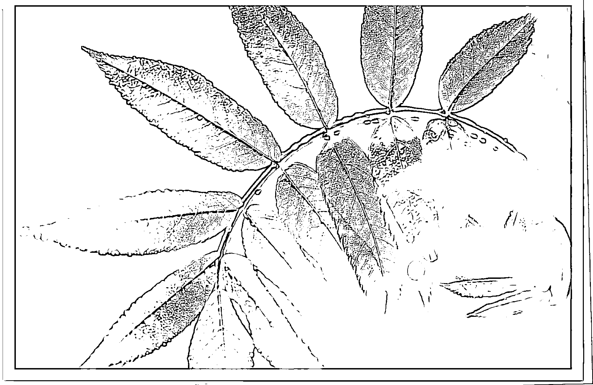

### 金字塔(The Pyramid)與靈氣能量

靈氣研究協會及它的研究夥伴，將幾何圖形運用在能量治療方面，並對它們做廣泛的能量研究。在這些實驗中，這些幾何圖形以貴金屬及半貴金屬在三度空間中建構出來。有一位隸屬我們中心的研究者，名叫史考特·瓜力吉拉(Scot P. Guarigila)，從事金字塔能量的研究已經超過二十年以上。

在一九九二年末期，我們的注意力轉到另一個理想的幾何體，當我們遇到一個名叫賓·霍華(Ben Howard)的人，他是最早研究神聖幾何體的研究者之一，他擔任「Randall Baer's研究及教育機構」的負責人。我們與賓·霍華的友誼帶領我們進入一個結合光學、雷射、理想幾何體及符號的研究。為了簡要說明的因素，這個章節只會介紹研究的主要發現，因為它們與讀者及靈氣能量的運用有關。

我們原始的興趣是將靈氣使用在金字塔內去累積能量，因此只要將金字塔簡單的放置，它就能在某些情況下，大大增強靈氣的能量及效力。而連結到力量的真正關鍵，是在於金字塔的頂端。從我們的研究顯示，由金字塔所累積的大部分能量是從頂端進入的。這是一個簡單的實驗，讓我開始理解到它的能量，你也可以試試運用在自己身上。

### 能量實驗 ——神奇的金字塔頂端能量

當我第一次認識理想幾何體時，賓・霍華讓我做一系列金字塔的簡單運用。在一次的運用中，我雙眼閉上，並坐在小型銅製的金字塔內，當我坐進金字塔後，小型版的理想幾何體就接著放在金字塔的頂端，接著他們就問我有什麼感覺？這種方式真是有效，因為我很明顯感覺到每一種幾何體能量的不同，而最後一個圖形，似乎完全消除金字塔的能量。這樣的實驗讓我感覺印象深刻，以至於我睜開眼睛看著它，原來這個物體的形狀是兩個金字塔底部相黏，並以它的側邊靜止在金字塔的頂端。早期，賓・霍華曾提到過每一個金字塔都有雙重乙太體覆蓋著它，但從我工程師的背景來看，我推論如果是這樣，那所有的金字塔事實上都是雙重金字塔，再來，假如能量進入這結構的原始點是頂端，然後放一個相似振動的形狀在頂端，並與原來方向保持一八〇度的角度，這可能會產生不協調的效果而關閉能量。但因為賓·霍華那時專注在其他方面的研究，所以我請一個住在附近的朋友協助我去測試我的理論，經由轉動這個形狀，使頂端對準主要金字塔的頂端。當他做完這個動作時，金字塔能量突然令人難以置信的增強，並且充滿這個結構體，而且維持著它本身的能量，直到這雙金字塔的尖端被移走，能量才改變。當金字塔與雙金字塔的形狀成一直線(同軸)時，雙金字塔會增加原始金字塔雙倍的能量，而當雙金字塔改變一八〇度時，它能有效地阻斷金字塔繼續累積能量，所以，金字塔的尖端是這個關鍵，每個幾何的形狀或帶電物體，它們的頂端能量是可以放大原來的能量去填滿金字塔。

金字塔的形狀同樣非常重要，所以你可以購買不同形狀或大小的金字塔來使用。最近一個在德國受尊崇的科學家發現，金字塔邊的最佳角度在每個地區是不同的，而他這個金字塔角度的研究，在美國及世界的其他地方都還未完成，因此，至今我建議大家使用的金字塔邊的角度要等於已存在的偉大金字塔。

> 註：目前在埃及吉薩最高的古夫金字塔的角度是五十二度。

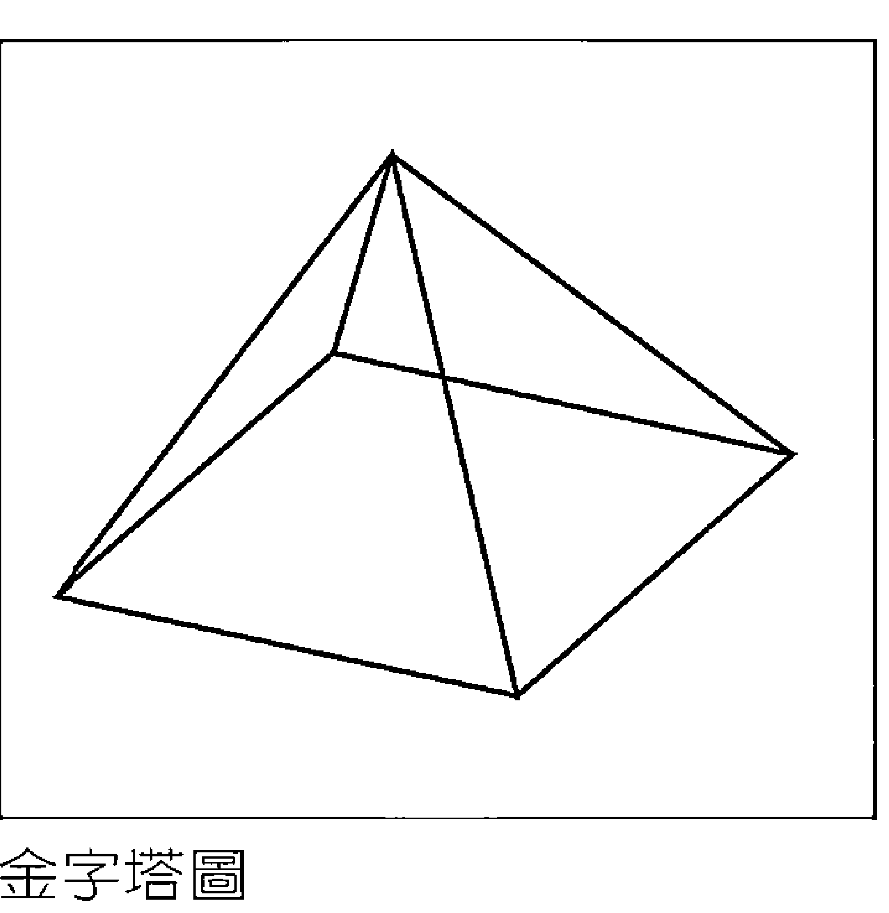

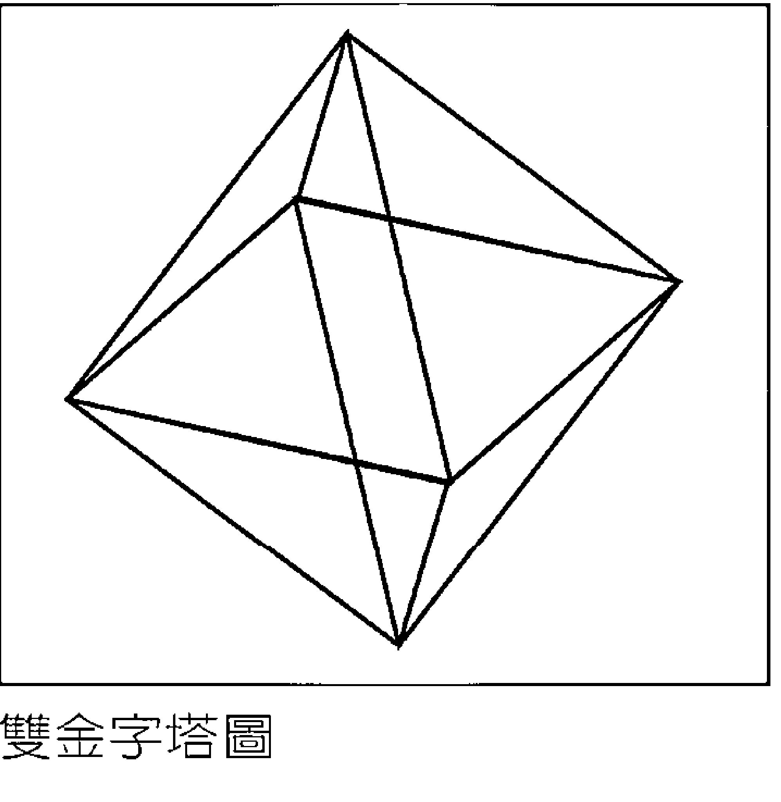

### 十二面幾何體(The Dodecahedron)與靈氣能量

在我們機構內，會將十二面體(dodecahedron)縮寫為「dodec」，十二面體是有十二個邊的幾何圖形，而且相似於一個球的形狀，它的十二個面中，每面都有五個邊，十二面體即是有十二個五角形所構成。每一個面都有特定的能量啟動它，我們的研究顯示，它是一個真正了不起的幾何形狀。

#### 能量實驗——去除不符合人體的能量

基於研究的目的，史考特·瓜力吉拉製作一個七隻腳的銅製十二面體，每一邊都由銅管製成。直到研究計畫結束，它都單獨振動著，並裝載著特殊的光和聲音的技術。雖然這結果證明一些有趣的效果，但是這兩種原始效果都來自十二面體本身的構造。

我們計畫中的超感視覺者，注意到一個令人驚訝的效果，就是十二面體可以作用在人體的能量場上。如果有人身上有不符合人體的能量時，十二面體可以用來去除這個能量，它能簡單地帶出能量並驅散它。這樣的效果可以使用在所有的案例上，除非有人根本不想讓這股能量走。但是十二面體也不能去除附身體質或一群附身體質所產生在人體上的特定影響（類似附身的狀態）。十二面體有效的原因就在於它的核心。

### 製作的材質

十二面體，基本上是一個能量的累積器。任何能量運用在它的內部，能量都能被大大地增強。在製作任何神聖形體時，結構體最好要用貴金屬的材質來做，而銅是較便宜又具有高振動頻率的材質。鐵及鋼的材質也可以使用來製造，但卻不太有效。千萬不要使用鋁材質來做，因為這個金屬的能量特性對能量工作來說，具有很大的毒性。

幾何能量的研究也顯示說，十二面體的每一面都具有特定能量的振動。舉例來說，以顏色作比喻，朝向北方的最上面，顏色永遠都呈現綠色的。為了要從這個十二面體得到最佳的效果，它必須在各方面都要校準好。如果沒有校準好角度，十二面體的面就不能發揮它全部的潛能。

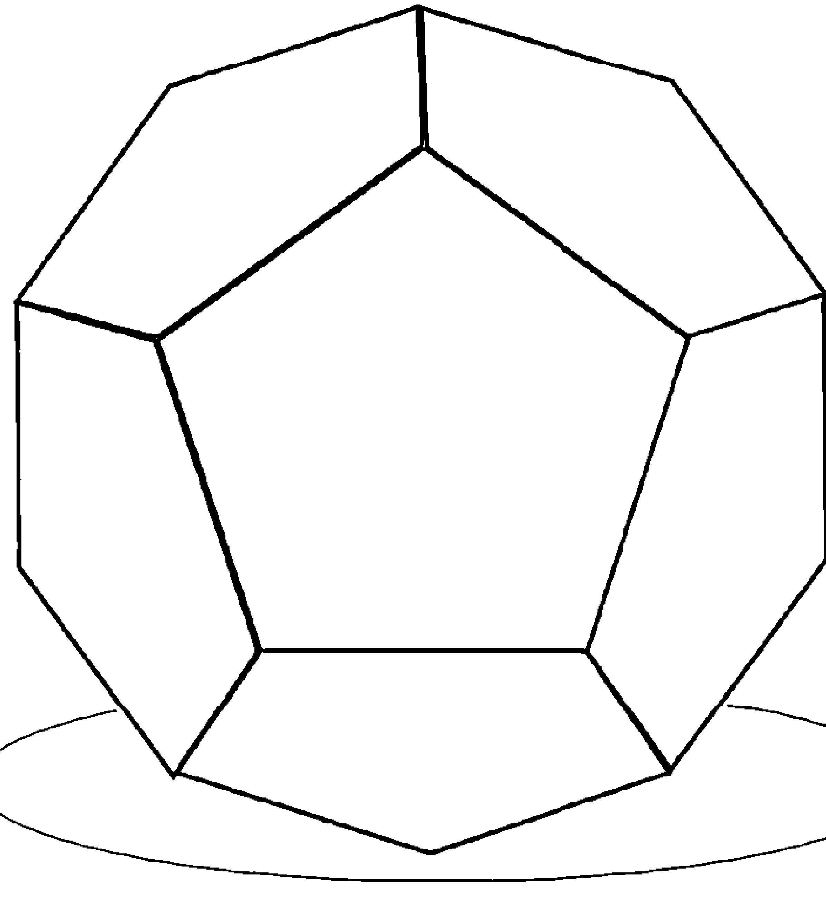

### 充電的方法

還有，十二面體的每一面都可以用脈輪旋轉的方法單獨被充電，這個方法就是，只要將你的手放在十二面體的任何一個表面上，然後將你的手以順時針的方式旋轉，這個面的能量就能被增強了。最後，每個面所連接的點就能發射出一束特定混合的光能量，並充滿這個結構體的內部及外部。很多事物可以經由它們能量的投射，就能增強事物本身的能量。所以，我們也做了一個實驗，將一杯乾淨的水放在其中一道光束前，然後測量水的味道、表面張力等等。

### 能量的充滿

由於銅製構造的十二面體非常昂貴，所以我花了一點時間解釋金字塔的能量，讓你們可以使用較便宜的金字塔。當然你也可以購買一個銅製的金字塔及一個小的銅製的十二面體，這樣你就有一個簡單的十二面體能量場累積器。小的十二面體及冥想用的金字塔在價格上是比較合理，而且只要很簡單地將小十二面體放在金字塔的頂端，這樣金字塔就能被十二面體的能量充滿，而使你有更佳的治療或冥想效果。因此，我很強烈建議使用這樣的方式，因為我相信，一旦你開始使用它，你就會因可利用的能量或治療效果的倍增，而感到難以置信。

## 第十章 靈氣、高靈與大自然力量共同創造療癒的發生

天神、大自然精神體、淨光兄弟團及你自己的高我都來自不同層次的實相，需要不同型態的連結，才能與我們或其他人合作。靈性能量圓錐體只有一種可以利用的能量連結型態，就是自我意識的連結型態。

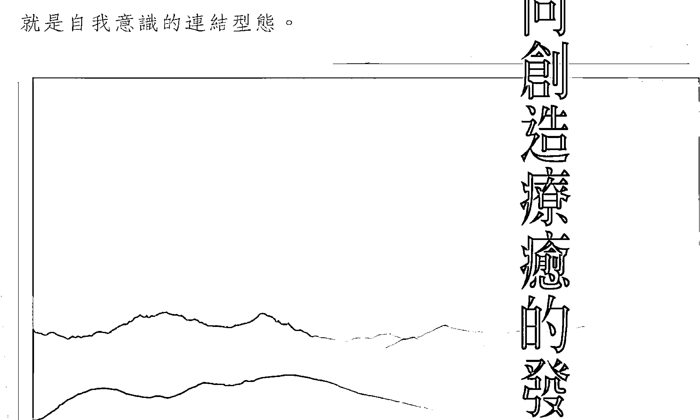

### 本章作者簡介
安東尼·葛倫·阿吉（Anthony Glenn Agee）是一個全球知名的能量專家和傳統靈氣老師的教導者，又是靈氣研究協會的成員，安東尼是少數被協會授權在全世界開課的老師。他是全方位研究協會的創始者，出版過很多有關靈氣實際應用的作者，也是使用靈氣與天神和自然能量合作的先驅者。

### 與大自然智慧共同合作

### 感知「另一個世界」

我的一生都在感知「另一個世界」，所以我總有看不見的朋友圍繞在我的身邊，他們從不會讓我遭受到任何真正的傷害，但是這肯定也有他們自己的樂趣，還有他們總是不斷地幫助我，而且非常保護我，似乎在任何事件發生之前，都能為我保留最少一天的時間，以期讓我能夠預測到它的發生。 在我九或十歲的時候，我把祂們在我身邊的事，視為理所當然，所以與祂們直接溝通的頻率就越來越少。因此，當我長得越來越大及成熟，而且成熟到沒有任何用想像的朋友時，祂們就被我困住了，因為我已缺乏對這方面的興趣。所以，直到幾年前，我才又被重新介紹給祂們認識，這真是一個漫長又有趣的故事。

#### 與「新時代」接觸

當我二十一歲進入加州大學就讀時，經由一個朋友的介紹，我認識了一位心理學家，而他正好在一個「形上學」的討論團體講課，講課的主題是如何在一九九〇年代，當一個心理學家，他還詢問我是否想加入這個團體及提供精神上的支持。

這是我第一次與「新時代」接觸的經驗，在這次的講座中，我拿起一張宣傳單，上面是由一個具有靈氣中級和「Mari-EL」中級等級的治療師所辦的治療活動。當然，我完全不知道靈氣或Mari-EL是什麼，但宣傳單的工作坊看起來很有趣，所以我就簽名參加了，果不其然，我是唯一參加這個工作坊的人。

> > 註：Mari-EL療法：也是用手做能量療法的一種，於一九八三年由高田女士的學生乙希爾·隆巴狄(Ehyl Lombardi)女士所發展的能量系統。

彼特是一個Mari-El的治療師，他在我的身上做了很多治療的工作，他描述說那些治療是作用在我的核心能量。而在這之前，我沒有做過任何能量治療課程或感覺到能量的經驗，因為彼特是一個非常天賦及有力量的治療師，所以我能夠馬上感受到他運作能量後的效果，而且我也很容易感受到能量的感覺。

希希是一位靈氣傳導師，她是利用水晶與靈氣一起做能量治療的工作。她也給我一張需要照做的明細表以及我應該要讀的書單，說真的，我還真讀了那些書，而且按照她給我的那些指引，每一個都去實踐它們。

接下來，有一天所發生的兩件事影響我以後的人生，一件事是發生在工作室，而另一件事則發生在家中。

第一件事發生在我要離開工作室時，彼特對我說的話，他說：「你與大自然非常緊密地連結，有很多守護神環繞著你。他們已經跟你運作一段時間了。」到現在，我從未忘記他所說過的話，但是在那個時候，我甚至連守護神是什麼都不知道。第二件最有趣的事是發生在我家裡，當我步出我的汽車，開始走向庭院，並穿越庭院時，突然間我發現大約有一百個小小棕色皮膚的人，穿著綠色衣服開始跑向我，他們的身高約在三呎至三呎半左右。當他們跑到我的身邊時，有二個跳到我的肩膀，並開始扯動我的頭髮，其他的就開始圍成一個圓圈跳舞來歡迎我回家。在這個時候，我意識到我已經完全地瘋了，我猜想與他們談話應該不可能會受傷，所以我花了約二十分鐘的時間跟他們聊天，事實證明，他們都不是尋常的人，而且已經變成我無形的幫手。牠們已經從我很小的時候就跟在我身邊，牠們稱呼自己是「大自然人」，尤其當我看到牠們的時候，牠們總是非常的快樂。我想，我能有擴展的視覺能力是能量治療的另一個效果。在大自然人離開後，我並沒有一直待在原來的地方，因為我還是能持續聽到及感知牠們的存在。在此不久後，我的內在視覺就完全被開發了。

### MAP合作 大自然人

我的內在視覺經驗再加上大自然人對我的指導，讓我開始從事與能量治療有關的工作，因為他們是我與大自然力量一起合作的介紹人。而在前幾年，我進入了靈氣能量的領域，並且持續地從事靈氣能量的療癒工作。

我在大學念的是電子工程，靈性與氣場的東西是不存在於電子工程學中。然而，在我繼續堅持我的治療工作及作自我開發時，有些事就開始變了。那就是大自然人和其他協助者只會在我從事治療工作時，偶爾才出現，而不會一起出現與我做治療的工作，我想這是他們想要的方式。因為我知道他們想平等地當我治療工作上的夥伴，而我也真正想要與他們平等地一起作業。

我也諮詢了一些知道這個問題的人，最後，在我找尋答案的過程中，讓我找到一本MAP的著作，書名是《與淨光兄弟團共同創造醫療協助計劃》（The Co-creative White brotherhood Medical Assistance Program），作者是瑪凱爾·小賴特(Machaelle Small Wright)。

瑪凱爾在她的書中概述了一個可以簡單運用的方法，這個方法可以與她所稱的大自然智慧共同合作。事實證明，我所認知的大自然人是真正大自然的靈性體，偶爾我也會碰到其他的協助者，像是天神們(Devas)。在我大約瀏覽過這本書後，我了解到我一直與他們一起合作。

不用說，與他們一起合作的效果可以提升百倍以上，突然間，我與這些美好的存在體合作的直接關係，變成一個有組織的架構，而且可以直接地將能量輸入到我的治療課程。他們感到很高興，因為可以與我有一個很好的合作模式出現，而我也感到欣喜若狂。

我與天神們及這個「靈性能能量漩渦圓錐體」(有意識且平衡的錐形能量漩渦)上其他成員的關係持續地成長，我也開始尋找將他們的能量輸入到家中所有事物的最佳方法，像作用在我的花園中的蔬菜，使它們長得更好，他們也始終能給我有見地的意見，以及持續讓我產生驚喜。

我持續與專業及個別的MAP合作，在我得到靈氣導師的資格後，我開始使用高級靈氣能量及許多其他新的能量。同樣我也沒有停止使用最基本的大師能量，而且還持續尋找其他更高及更純的靈性能能量。我的專長似乎是結合地球能量與靈性能量的運用，因為，我的靈氣接收者需要一種方式去連結他們的地球能量。天神們和大自然靈性體依然持續的教導我，而經由在靈氣研究協會中做相關能量的研究，我持續擴展我的學習經驗。

當我們的工作及研究持續的擴展，我開始感到有深陷在與靈性能量漩渦圓錐體一起工作的情況，因為這個靈性能量漩渦圓錐體，似乎在某些方面限制我的治療工作，但已經合作超過兩年多的時間，她們都運作得非常好，但我卻感覺到靈性能量漩渦圓錐體內部不知道發生了甚麼事，所以，我決定詢問天神們，為什麼這個靈性能量漩渦圓錐體突然開始讓我感到有限制感了？

她們說，「我們能量結合的工作，變得與原來存在於基本靈性能量漩渦圓錐體內的動力構造越來越不一樣，你所連結的靈性能量已超出靈性能量漩渦圓錐體內原始設計的能量範圍，所以靈性能量漩渦圓錐體劇烈的變化是必須的，如果擴展的動力沒有伴隨著提供額外增加的能量時，就會消耗來自於你自身的能量。漩渦圓錐體使用到我部分的意識能量，當然，我也不想增加自己的負擔。怎樣的變化是祂們所談到的呢？我並沒有真正看到靈性能量漩渦圓錐體被改變的方式。最困擾的事是，瑪凱爾·小賴特在她的書中所提到任何造成MAP靈性能量漩渦圓錐體的改變，都會造成靈性能量漩渦圓錐體沒有辦法作用。我已經與擴展能量狀態的MAP合作治療工作，至少有兩年的時間，竟然在最後，我最想要做的一件事，就是搞亂這一個超完美合作的組合，因為我對於現在的情況感到很困惑。

### MAP合作 太陽天使王國

我們的協會「碰巧」都從事其他方面的研究，而且都要結案了，剛好我的研究主題提供了一個全新的研究方向。這個特別的研究，正好也可以幫助我專注於開發安全又有效的遠距點化技巧。在他們研究的期間，研究團隊遇到一個被稱作太陽天使王國或太陽天使的智慧體。最後太陽天使成為實行安全又有效的遠距點化時一個不可分割的組成。

初期研究顯示，這些太陽天使非常善於使用能量，而且我知道能量是問題的來源之一，所以在與他們一起合作治療的研究時，他們建議在提供任何靈性訊息前，需要將他們放在一個靈性能量漩渦圓錐體內。一般來說，靈性能量漩渦圓錐體提供了一個很大的防護作用，以及排除任何不屬於靈性能量漩渦圓錐體部分的其他能量。

我決定在沒有傷害原始動力結構下，將他們放入MAP的靈性能量漩渦圓錐體中，我注意到他們對於治療是非常有幫助的，因為很多症狀都立即改善了。

- 在他們專業又特別的作用下，提供更有效的治療成果。
- 療癒效果的發生，似乎反應得很快速，一般個人的療程正常需要四十分鐘的時間才能完成，而他們只需二十分鐘或更少的時間就能完成治療工作，我實在很驚訝於他們所產生的成效。

至於研究的另一個部分是，我有一些研究夥伴嘗試要增加太陽天使進入他們的靈性能量漩渦圓錐體中，去實驗看看太陽天使們在他們的圓錐體中會發生甚麼事。我也將這個小改變告訴一些不屬於我們研究團隊的MAP程序使用者，如此，他們的研究結果可以與我們的成果做一個比較。兩個研究團隊都有研究上的巨大效果，而且他們所回報的兩個發現都相同。他們全都感到非常快樂可以與太陽天使們一起工作，並很高興我與他們分享這個研究的點子。從這兩個研究團隊及我自己所得到最顯著的發現是，個人能量被消耗的情況，在新的圓錐體中有顯著的減少，這樣表示人們在從事治療工作較長一段時間後，才能感受到自己的能量被消耗的感覺。

在正常MAP的情況中，整個療程需要進行四十分鐘的時間，而且個人沒有明顯感覺自己的能量被消耗的經驗。就能量治療的專業領域上，與我一起合作的靈氣傳導師，處理療程的時間至少都需要二小時至八小時左右。因MAP計畫不是設計成持續性的開放能量，所以不需要太多額外練習的時間。

我持續與新靈性能量漩渦圓錐體合作約一個月左右的時間，在那段時間裡，我注意到太陽天使們，開始花很多時間與天神們一起合作去改善及提升圓錐體的技術。太陽天使們在能量的使用上非常專業及富有經驗，他們引導我持續運作包含太陽天使們的這個治療程序，他們監督著這個程序，並在他們收集好資料後，提出建議改善的方法。我觀察到一件事，就是太陽天使們喜歡觀察事物一段時間後，再提出相關的建議或意見。在這個時候，傑佛瑞建議我開始寫下這個與靈性能量合作治療的程序，他發現這個程序非常的有趣，並且覺得人們應該對這個治療的方式感到興趣。既然，我已經改變圓錐體的能量結構，他提出一個叫做『模板』（Template）的術語，來形容我們現在正在進行的新圓錐體構造。我覺得『模板』這個名字很適合，並開始把相關步驟寫下來。但很奇怪的是，每一次我想開始提筆寫的時候，我個人的天使就阻止我，而且建議我再等一些時候。唉呀，我是什麼角色可以跟天使爭辯呢？唯一的問題是期限快到了，而我必須開始寫一些東西出來交差。我決定先避開一些事，然後讓一切順其自然。我從未想到過事情會有所變化，而它就發生在一個早晨，那個時候，我正要開始一般個人的研究行程，而且與平常相同的方式開始我的研究行程。在那個時候，我與我的圓錐體團隊打招呼，並詢問他們是否需要從我這裡得到任何特別的資訊，通常，當我在工作的時候，我會選擇一個症狀明顯的問題去治療它，並且會做許多次的療程。與MAP作業讓我學到的是，溝通是雙向的，他們會回答我們所有的問題，同樣也會告訴我，祂們是否需要更多的資訊。通常，祂們會像醫生一樣問我非常特定的問題，尤其是當我的敘述對祂們來說，是不夠明白清楚時。

### MAP合作 大光明天神

這一次，祂們給我一個驚喜，這個圓錐體團隊的發言人回答我的問題說，『如你所知，我們與太陽天使的王國已經有廣泛的合作，我們能否獲得你的許可，跟你介紹一個新的智慧體。』

那個時候，我很快就做決定了，用我的心跳表示許可，接下來我發覺最宏大的生命體就站在我的前面。以前我看過其他幫助我的生命體，但從未看過像現在存在於我面前的生命體。祂的能量場幾乎充滿整個房間，而且從祂身上發出的光，光芒四射，讓我無法直視祂。

總之，祂既不是男性，也不是女性，接著祂開始對我說：『我是大光明天神，與太陽天使王國諮詢過後，得到一個非常適合你治療工作的新技術，它涵蓋著更延伸擴展的動態能量結構，而且可以有更彈性的方式去改變能量結構。這個能量技術需要在你的能量提升後所產生的身體變化，以使你的身體能夠連結並適應天神天國的能量。我問：「什麼樣的改變？改變我身體某些東西的做法，我寧可選擇不要有改變。」祂說：「經由你的感知系統，必須使第四及第五的乙太體進行校準，以符合我們天國的振動頻率。而你大腦的能量中心，也需要被啟動並開發到更擴展的程度，使它能夠適應更高頻的狀態，以便與我們溝通。」現在，我終於了解，他們需要執行一次點化啟動能量的行動，因為我早已經知道能量點化是什麼，所以我給他們我的應許，並等待能量點化的開始。這次的能量點化非常有力量，祂瞬間就讓我處在頻率已改變的狀態，我的周圍被不同顏色的能量圍繞著大約有二十分鐘之久，這真是非常非常喜悅的狀態。在能量點化過後，大光明天神與我談到有關新技術的內容。我們決定稱它為「天神模板點化」(Devic Template Attunement)，並稱這個程序為「天神模板」(Devic Templates)。祂教我「大師模板點化法」(Master Template Attunement)，以讓我能傳授新技術給其他人，同時也傳授大師模板點化法的程序。我們談了差不多一個小時的時間，我的內心覺得非常的感恩，因為我有足夠的幸運去接受這個新的治療技術，我真的很感激瑪凱爾、T.N.、我的太陽天使們及大光明天神。

使用天神模板的能力，基本上來自於天神模板的點化。MAP及瑪凱爾所有其他的程序都不需要任何的點化方法，你只需要讀完她所寫的書及運用那些技巧就可以了。不論你是否已經與MAP合作，我都鼓勵你去讀她所有的書，因為她談到很多與這些生命體合作的經驗，尤其是她所給予的建議，可以讓治療工作更好，至於與MAP團隊溝通的方法，則適用於模板的運用。

MAP程序對每一個想要與大自然智慧體合作的人都非常有用，我鼓勵你多去使用她所教的技巧，直到你想來上「與天神及模板合作的能量治療」的課程。在這個課程中，你會接受到天神模板的能量點化，以及運用新的技術來做療癒工作。

本章節的目的不是要教你MAP的程序，因此如果你想了解MAP程序，你就必須讀一下瑪凱爾的書，我只是對MAP程序做一些簡單的概述，以及我如何具體使用MAP程序在我的靈氣療癒的工作上。

### 靈性能量漩渦圓錐體的運用

靈性能量漩渦圓錐體是靈性意識能量的均衡漩渦，在那裡，靈氣傳導師可以與特定層面的實相形成連結，圓錐體維持著衰化與進化的平衡，並協助執行多層次的能量工作。

靈氣傳導師如果想要與MAP合作治療工作，就應該遵照MAP書上所寫有關與專業MAP團隊合作的指示步驟進行。如果你不想要與那個專業團隊合作，你也可以與一般的圓錐體合作，有關圓錐體的詳細資料，都寫在瑪凱爾·小賴特的書上。

這裡還有一些簡單的步驟，可以讓你開始運用靈性能量圓錐體，至於在靈性能量圓錐體中的成員們，會在天神模板團隊成員那一章節談到。天神模板及靈性能量圓錐體都與某些相同特性的人合作，而使用天神模板的確讓我去除使用其他程序的工作，除此之外，他們的運作是非常的不一樣。

### 開啟四個點的靈性能量漩渦錐體

- 自己要先聲明「我想要開啟一個靈性能量漩渦錐體」
- 聯繫及連結四個適當的點。
  a) 天神的連結。
  b) 大自然精神—潘的連結。（潘是希臘羅馬時期的自然神，代表著自然生生不息的象徵。）
  c) 淨光兄弟團。
  d) 你自己的高我。

這些連結需要用以下的聲明來形成，「我現在想要與○○○連結」，每個連結至少須等十秒鐘。連結四個智慧體需要一次完成，所以你必須重複以下的聲明，「我現在想要與○○○連結」

想要與天神的連結通常會使用「大光明天神」的稱呼來與祂們作連結，例如，如果你正在從事治療的工作，那麼你與天神的連結就必須是「療癒的大光明天神」，「大光明天神」幾乎可以使用在所有的事件上。

當你連結淨光兄弟團時，也要確認你目前正在進行哪種作業，舉例來說，「我想要連結淨光兄弟中適當的成員來做療癒、或協助我的事業、或協助我的花園等等」。

請記住四個點必須一次被建立，你也能增加其他天神的連結或其他人的高我到圓錐體中，只要確認你在增加他們的高我時，能得到他們每個人有意識的許可。

如果你使用花精做能量療癒的工作，你就可以使用它們測試一下自己，去看圓錐體的能量結構是否已經建立了。

### 通用的靈氣能量圓錐體

- 療癒的大光明天神或靈氣的大光明天神。
- 大自然精神體─潘。
- 運用靈氣能量的淨光兄弟團。
- 你自己的高我或增加其他必須參加的高我。

這種靈氣能量圓錐體適用所有的能量治療狀態，對環境的穩定方面非常有用，也能讓大自然的力量可以直接輸入能量到這個治療的工作中。

### 點化用的靈性能量圓錐體

- 點化能量的光明天神。
- 大自然精神體──潘。
- 點化能量的淨光兄弟團。
- 你自己的高我或增加其他必須參加的高我。

一旦靈性能量圓錐體穩定，就告訴圓錐體團隊你想做的是哪種能量化的資訊，請求祂們以任何可能的方式協助你，以及詢問祂們是否有任何點化的資訊，我一般都會詢問以下相關的資訊：

椅子擺放的方式？哪種點化的順序是最好的？每個人都坐在對他們最好的位置嗎？在什麼時間點化最好？點化很成功很完整嗎？……等等問題。

### 點化能量圓錐體啟動水晶陣

你可以使用通用的點化能量圓錐體，並加入水晶的大光明天神就可以，因為水晶的大光明天神能直接作用在水晶上，然後改變水晶陣整體的能量構造。

### 關閉靈性能量漩渦圓錐體

靈性能量漩渦圓錐體會使用到個人的能量，所以你需要確認在你療癒工作完成後，要記得關閉他們。假使你不習慣運用靈性能量漩渦圓錐體的話，你就要在一開始時，限制你的時間在一個小時內。天神模板方式的靈性能量漩渦圓錐體不是使用個人的能量，同時不必擔憂個人能量被消耗的情況出現。

- 要聲明「我想要關閉這個靈性能量漩渦圓錐體。」
- 接著聲明「我現在感謝○○○，以及請求與□□□切斷連結。」
  a) 天神的連結。
  b) 大自然精神體——潘。
  c) 淨光兄弟團。
  d) 你自己的高我。

切斷每一個連結須要等約十秒鐘的時間，如果你有使用花精的話，可以用它來測試是否已關閉靈性能量圓錐體了。

三種靈性能量圓錐體加上MAP，這些是我在接受天神模板點化前所使用的方法。假使，你沒有接受過天神模板的能量點化，那麼這些方法就可以是與大自然合作最好的方式，它可以擴展你的能量連結到大自然，並以一種平衡運作的方式，讓靈性漩渦朝向外旋與內轉。

### 天神能量模板點化的技術

天神模板能量的技術是需要依靠點化的能量，如果你沒有被點化過，你就不能使用這個天神模板程序，對於熟悉靈氣能量的你們來說，能量點化是一件稀鬆平常的事。假設你們不是很熟悉靈氣能量的話，我會仔細闡述什麼是能量點化，以及描述為何這個技巧需要能量點化。

以靈氣能量來說，學習及執行靈氣能力的先決條件，是必須經過靈氣能量的點化。靈氣能量點化可以調整學員的能量場，讓他們的能量場能正確地校準靈氣流的頻率。連結靈氣能量池的關鍵是將靈氣能量封印入他們的氣場中，一旦成功，從此學員就能自己連結進入靈氣能量池。

在正常的情況下，靈氣能量點化可使學員的一生或更長的時間，都能自我啟動進入靈氣能量系統。靈氣能量持續產生的靈氣流是屬於非常特定的能量，通常需要一個已全面啟動能量的大師／老師，才能執行靈氣能量點化的動作。你們如果想了解更多的點化資訊，我請你們看看由傑佛瑞·馬丁所寫的《靈氣創造心想願成的磁場》。

能量系統的模板是由微細體的能量所建構而成，這些微細體能量被安排及校準是為了形成模板結構上的特殊目的。傳統上來說，這個點化技巧只能提供給最優秀的學員，而點化技巧的熟練則需要多年的時間及足夠的經驗才能掌握。此外，能量系統的模板至少有一千種不同的動態和變數，而且每次運作都必須考量到你所覆蓋在這些模板的能量狀況。

能量的動態活動，是我們必須要觀察的面向，因此當人們想要創造一個能量模板時，必須先了解與技巧上相關的微細能量體運作，這時當然也必須有個人能量與不同智慧體的連結，這樣才能構成能量模板團體。所以，只有一個人能單獨與天神的天國廣泛合作時，才能連結到適合的天神。

感謝太陽天使王國、大光明天神，讓靈氣能量點化技巧有所突破，使這些難題全都被清除了，天神能量模板點化的技術及效用，對我們而言，真可以說是一個奇蹟。感謝在這個技術背後的天神、T.K.、及其他智慧體，一起創造了這個點化，而且模板技術基本上是必須共同創造並進行療癒的工作，這樣才能與動態能量的治療方法相容。在兩年前，祂們已建立了一個程序，只有具備最優秀技能的靈氣導師才可以使用這個技術，而且這個能量點化是適用於每一個人的。在此感恩和保證，並期許這個程序真正帶來好處。

### 天神能量模板點化的程序

天神能量模板點化的程序有兩大部份：

第一部分，只能由一個全面被啟動為天神夥伴(Devic Associates)的人來執行，目前，只有少數的天神夥伴能夠執行這個天神能量模板的點化。學員一旦接受這個能量點化，就代表這位學員將正式介紹給天神天國 (Devic Kingdom)，接著大光明天神會指派個人的天神天使給學員。對於學員來說，這次的點化通常是非常具有能量感的體驗，就像是第一次與自己的守護天使碰面的感覺。

第二部分，才是能量點化真正的啟動關鍵，天神天使及大光明天神會進入學員的能量場，開始激活位於大腦基底的一個能量中心，而它通常都是處於休眠狀態，這個能量中心能讓一個人與更高層次的意識溝通，以及能讓我們直接與天神智慧體於模板的實相面(Template reality)共同創造。

一旦這個能量中心被激活，學員的某部分氣場，會被提升振動頻率及校準到天神天國的振動頻率，所有的點化程序都由天神天使及大光明天神完成。當學員的氣場被啟動至天神天國的振動頻率時，不同的能量模板和模板參數就會被封印入學員的氣場當中，學員的身體同樣地被調整到能讓學員直接在能量模板的實相中運作。

這真是經驗中最強大的部分，點化通常會產生某些十分深刻的身體反應，不同的反應都包含著強大的能量波動，感覺到能量場擴展，很多光、顏色，甚至感到有點喪失方向感等等。有個學員描述這個過程，他說：

> 「我感覺我好像在同時時間一次接受靈氣初級、中級及高級的點化，他們很快地就讓我有能量的感覺。這次的點化一次就能影響能量場許多的層面，我知道我在點化後，需要花幾分鐘才能回過神來。當我完全回神後，我馬上就能感受到我的天神天使，祂告訴我祂的名字及有關祂的一切，我們都經常的溝通……。」

依照學員的狀態，點化所需的時間約五到十五分鐘左右。當點化完成後，就具備完整使用天神能量模板的資格，至於天神模板的資訊，會在以下的章節概略描述。所有你與天神模板團隊的溝通，都由你的天神天使所處理，你的天神天使是你個人與天神天國之間的聯繫管道，以及所有與天神能量模板相關資訊的溝通管道。

### 什麼是模板

最容易描述模板的方式，必須借用到數學的術語。在三維的時空中，需要六個點來定義二度空間中一個獨特的位置。是由微細能量所構成的能量結構，可銜接六個不同層次的實相。模板在二度空間中創造了一個「虛擬的實相」(Virtual Reality)，所以從這六個層面來的參與者，就能同時在一個時間框架中一起共同合作。

正常來說，涉及天神模板的六個不同層面的實相，直接在一起作業是非常受限制的，更別說直接和我們一起合作，因為祂們全都生活及運作在個別的實相中，擁有非常特定的工作，有可能在宏大藍圖的事件上有重疊作業的地方，尤其當我們從雙魚座時代(Piscean Age)進入水瓶座時代(Aquarian Age)，「各世界」間的分離狀況就必須被消除。能量模板提供一種方法去做這件事，祂們允許多層面及層面間的共同運作，這是水瓶座時代的標誌。

| 力量類型 | 具體內容 |
| :--- | :--- |
| **大自然或內轉（退化、衰化）的力量** | 1. 天神的王國(The Devic Kingdom) 2. 大自然精神體的王國(The Nature Spirit Kingdom) |
| **外旋（進化）的力量** | 3. 淨光兄弟團(The White Brotherhood) 4. 高層次的自我(Higher Self) |
| **作為橋樑的銜接力量** | 5. 太陽天使的王國(The Solar Angelic Kingdom) 6. 模板引導者(The Facilitator) |

就整體而言，大自然力量提供創造或衰化的形式、行動指令及能量，天神及大自然精神體代表那些衰化的力量。我們將他們涵蓋進天神模板中，是確保正在進行的工作不會違背自然的法則，並與大自然調和成一個整體。在天神與大自然精神體之間，整個大自然的創造力是他們的代表，我們人類畢竟是由大自然能量所設計和建造出來的。

進化演變的力量提供目的及方向，這些力量由淨光兄弟團及你自己的高我提供，天神模板將他們涵蓋進來，同時提供進化的因子，確保正在進行的工作方向及宗旨，會與水瓶座時代及我們自己的目標與方向調和。高層次的自我負責聯繫，確保這些運作不會違背我們自己成長的過程。

至於其他兩個成員，太陽天使王國及模板引導者，則扮演兩股力量間的橋樑角色。在物質平面的我們，扮演物質層面與天神模板之間的橋樑，使之成為一個整體。太陽天使們負責扮演模板不同成員間的橋樑，因為在天神模板上所有擴展的動力，都是藉由太陽天使們的能量輸入及專業技術在支撐。

### 天神模板及靈性能量漩渦圓錐體間的相異處

天神模板與靈性能量漩渦圓錐體兩者最顯著的不同，在於銜接力量的增加。當然，太陽天使與你在天神模板上，都扮演著一個重要的角色。天神模板點化法可以調整你的能量到可以在更高的意識層面上運作，以使各層次間的溝通與合作關係大大地被增強。你在天神模板的角色比在靈性能量圓錐體上更加有意義，而且太陽天使王國，也沒有被涵蓋進任何靈性能量圓錐體的結構中。

天神模板的能量連結，是由天神天使及你個人的太陽天使所構成，而這些連結是由微細能量所形成的。天神模板點化使這兩個智慧體，直接地與你合作去形成天神模板，而天神模板內各成員的聯繫，不像靈性能量圓錐體是經由個人意識的能量。因此，模板引導者沒有能量被消耗的問題。所以，當有人以天神模板工作，並使用擴大的能量而感覺到能量來源被消耗時，以某些觀點來看，這個人是需要返回他們個人的意識振動頻率狀態，但在這邊不同的是，被消耗的能量不是來自個人的生命能量，而是消耗那些由增長及擴張而來的能量。由於這些連結是由天神及太陽天使的微細能量所構成，因此更能緊密配合每個成員所處的實相及個人的需要。而當靈氣導師建立一個傳統的靈性能量圓錐體時，他們是需要使用到自我的意識能量。因此儘管有其他圓錐體成員的影響，但這個連結還是受限在引導者自我的能量技巧，所以沒有經驗的人會比有經驗者具有更大的能量限制。與我一起工作的人，很樂意擴展他們與大自然能量及淨光兄弟團的合作，我相信淨光兄弟團或天神天國，是想要我們能持續成長及擴展我們自己，當然這也包括開發新的程序。天神、大自然精神體、淨光兄弟團及你自己的高我都來自不同層次的實相，需要不同型態的連結，才能與我們或其他人合作。靈性能量圓錐體只有一種可以利用的能量連結型態，就是自我意識的連結型態。

我在這裡使用一個簡單的比喻，想像你在電話公司上班，而你正在寫一個新辦公大樓的電話系統，人、電腦、電話會議、網路及傳真機，都使用不同種類的線路。一般有聲電話不必使用非常精密的科技，而線路的型態在很多年以前就已存在。而電腦及傳真機，現在都使用非常高速傳輸資料的線路，它們的線路非常專業，如果你沒有使用標準線路，你就不能與其他人有效的溝通，同時還讓其他人所擁有的標準設備，陷於英雄無用武之地。

至於網路及電話會議，又是另外一種通訊方式，電話會議也使用視訊，而網路則需要一條直接專用的資料線路，以上這兩種線路都需要光纖電纜，光纖電纜的傳輸效率是領先標準電話電纜的。假設在辦公大樓中，如果只能使用標準線路，你想什麼事會發生。那就只有使用自我意識能量的靈性能量圓錐體，當你只想使用電話時，它就可以運作得很完美。

天神模板技術是使用微細體能量，微細體能量是最多功能的能量，而且可以讓我們使用，祂非常的具有彈性及可變化性。我們通常不需要具備與微細體能量直接工作的技能，只要即時機動地調整，以適應每個天神模板成員間持續變化的需要。太陽天使們，更是擁有在任何方面需要調整能量時，就能去調整微細體能量的能力。至於其他在兩者之間最顯著的不同，則是集中的焦點不同。天神模板，能讓天神天國的能量輸入更多；而靈性能量圓錐體，只能連結和你合作的天神能量，任何其他的天神都不能進入靈性能量圓錐體中。

在天神模板中，大光明天神的模板，是可以允許其他團隊的成員，擁有完全自由決定的權力，去請求所有需要的天神。這樣可以確保你時時刻刻都與最好的天神合作。天神是非常受限於他們的專業技能，像治療的天神，就不了解點化、園藝、獸醫或汽車修護。在下一段文中，會詳細描述天神團隊模板的每一個成員。

### *天神及天神國

天神是天使狀的生命體，他們與我們生活在天使的王國中的天使朋友有關。你也可以說是天神是他們的表兄弟姊妹，天神一詞來自梵語（Sanskrit），地球上最古老的語言之一。天神從梵語翻譯成英語是「閃亮的神」，這個詞通常使用在描述天使生命體，這兩個詞幾乎是可以互換的。

傳統印象的天使與天神之間，唯一真正的區別是他們所負責的工作不同。天神是有劃分等級次序的智慧體，幾乎監管所有面向的創造，他們無所不在，並且存在於一個實相，與不屬於我們自己的一部分相連結。

天神天國相當的龐大，並包含無數的智慧體，我們所合作的天神只有天國的一小部分。傳統上來說，他們負責創造及維護所有大自然的力量、形式、法則及包含太陽、行星及行星間過程的藍圖。他們創建的建築模式，創造了次序、組織及生命。任何事物能夠存在於這個世界上，都受天神及祂背後的神性計畫所直接監督。

天神們的投入，被列為每個模板的一部分，因為祂們能夠直接調整與神的計畫有關工作，並使這些工作完成。祂們也能確保所有的工作，都是均衡的以及符合自然的法則，畢竟這一切所有的藍圖，都是他們設計的。

天神是格外美麗及壯觀的生命體，通常祂們都超出性別的觀念，但祂們還是會根據祂們的任務及我們的預期來形成男性或女性的形體。有一本通靈團體常使用的書《超感視覺者的觀察》（Clairvoyant Investigations），是由吉佛瑞·哈德森（Geoffrey Hodson）所寫的，在他的書上有許許多多彩色的天神圖片及不同種類的天使。

天神所生活及工作的天神天國是相當龐大的，祂是具有許多層級組織的系統，就像他們在天使王國的遠親。天神天國就像一間大公司的組織，裡面的人都有祂們自己的專業技能。通常一個天神監管一個所給予的「團隊」，而這個天神就叫大光明天神。舉例來說，療癒是十分廣泛的領域，所以在天神天國中有關療癒的部分，就有數以萬計的天神們執行不同形式的療癒工作，因此相關的天神就被統稱作療癒的天神。

天神們監管所有療癒的形式、方法及模式，被稱作療癒的大光明天神。隸屬於大光明天神的成員，可能就有許多具有更專業技能的大光明天神。以我們的療癒例子而言，有些大光明天神是從事情緒療癒的、有些是身體療癒的、能量療癒的等等。此外，還有其他層級的天神，那就更專業了，可能是某種特定形式的情緒療癒、身體療癒或能量療癒，就像專司心理療法、按摩或靈氣的大光明天神。

祂們的層級結構相對上比較隨意，之所以這樣的分類，只是因應我們的習慣，因為每一個天神都知道祂們的任務，以及如何完美地執行祂們個別的任務。在這裡的層級概念，只是要引導及協助你，了解天神如何組織祂們的天國。如果你想要接收到更多有關你已知的主題，只要諮詢接觸面最廣泛的大光明天神，即可了解有關你正在進行的工作。

舉例來說，如果你詢問的是專司靈氣療癒的大光明天神，有關力量符號的資訊，那你可能會得到非常少的資訊，因為療癒的大光明天神的專業技能在於靈氣能量治療的形式，以及廣泛的療癒效果，或是靈氣是否使用適地，但是祂不能給你有關力量符號的資訊，或是如何轉變為中級靈氣的資訊。

### *大自然精神體

大自然精神體也是天使王國的遠親，在所有天國的協助者當中，大自然精神體是與我們最緊密合作的。傳統上，大自然精神體與天神，在工作上有緊密的夥伴關係，也是屬於天神天國的一部分。大自然精神體在工作上是最靠近物質平面的生命體，天神們創造生命體的藍圖或計畫，而大自然精神體則採取計劃，並將其付諸行動。

大自然精神體往往是具有地域性的，在辛辛那提市生活及工作的大自然精神體，就與生活及工作在芝加哥的不相同。為了減少混濁的情況，我們與大自然精神體的首領「潘」合作，潘的名字是從希臘文來的，意思是代表「所有、每一件事物或無所不包」。

在歷史上，有許多的文化都已經察覺到這些偉大的生命體，其他已知名字的大自然精神體包括：精靈、仙女、女水神、火精、地精、氣精、農牧之神、巨人、及自然元素。

天神提供指令及生命力，大自然精神體提供形式及能量。在實質存在的物質平面上，大自然精神體是所有形體的運作者及創造者，祂們在模板中的責任是：包括策動由其他模板成員所勾畫的程序；確保目前有適當數量的形式及能量；平衡大自然與物質面的所有過程。

### *浮光兄弟團

浮光兄弟團是一群非常龐大而且已提升生命體的團體，他們是由超越性別且高度進化的男子、女子及生命體所組成的。根據歷史的傳說，祂們的目的是協助我們及星球通過轉變演化的過程。祂們是高貴的生命體，循序漸進灌輸人類宇宙的主宰及法則。祂們也協助我們發展社會、道德及社會架構，以符合現代的發展，同時協助我們從一個世紀轉移到下一個世紀。

淨光兄弟團目前的計畫，是協助我們從雙魚座時代轉變到水瓶座時代之際，確保所有演變過程的發生都是平順的。與我們在模板上合作的淨光兄弟團，是確保我們的工作符合宇宙的法則，與水瓶座時代的演變動態是適宜的，而且也是一致的，這是參與水瓶座時代最容易的方法。

### *高層次的自我

你的高我，代表你自己個人的進化聯繫，你的高我，擁有一個個人進化的模式及計畫。你的高我，是這些模板的一部分，也是確保你能獲得最佳利益的代表，同時在運作模板的過程中與能量的動態下，不會違反自我的安排或平衡。

### *太陽天使們

太陽天使是非常高貴的生命體，他們的專業是能量，他們能夠在實相的許多層面上，與任何形式的微細體能量合作，也幾乎能運用任何型態的微細體能量。因此，如果有需要完成任務的時候，他們不會被時間或空間束縛住，在任何時間、空間都能夠有活力的工作。據說，太陽天使們天生具有豐富的知識，存在於我們自覺意識的背後，他們普遍被認為是我們自我意識結構的創造者。

很多較高層次的溝通，都經由我們個人的太陽天使，因為有他們的溝通，我們才能在團體中運作，而不會在團體能量中迷失。起初，與太陽天使合作是我執行遠距點化的時候，我發覺他們能夠做所有與能量相關的事情，包括：接管療癒工作、擴展能量、點化額外的能量等等。我們與太陽天使共同合作，是因為他們具備很多方面的專業，以及可以加速很多太陽天使們投入能量的過程，可以使原本需四十分鐘的療程時間縮短為二十分鐘。太陽天使們也會在短時間內完成一個能量程序，但是會花比較長的時間去擴展祂的能量效果，以減輕在能量過程中產生的衝擊及負擔。

總歸來說，太陽天使們可以加強天神模板的每一個方面，並且讓其他的層面可以共同合作得比以前更有效率，我們很感謝太陽天使們的天神模板能量技術。

### *模板引導者

是的，你是天神模板團隊的成員，你所代表的是物質平面，你建立物質世界與其他世界的橋樑。因為你，這些天神模板才能存在，你是錨，是將天神模板固定在這個物質平面的接地點，請記住，你是團隊中最有價值及最重要的成員。

我建議你可以參考以下的書籍，將可擁有更多有關天神、天使、太陽天使、及大自然精神體資訊：

> 1. 《天神與我》（Devas and Men, A Compilation of Theosophical Studies on the Angelic Kingdom, by the Southern Centre of Theosophy Robe,）
> 2. 《詢問你的天使》（Ask Your Angels, by Alma Daniel, Timothy Wyllie, and Andrew Ramer.）
> 3. 《淨光兄弟天使與人》（The Brotherhood of Angels and Men, Geoffrey Hodson.）
> 4. 《超感視覺者的觀察》（Clairvoyant Investigations, Geoffrey Hodson.）
> 5. 《神的王國》（The Kingdom of the Gods, Geoffrey Hodson.）
> 6. 《天使的到來》（The Coming of the Angels, Geoffrey Hodson.）
> 7. 《聖經》（The Holy Bible, Standard Revised Edition.）
> 8. 《在所有生活事件上的行為表現得就像神》（Behaving as if the God in all Life Mattered, by Machaelle Small Wright.）
> 9. 《MAP與淨光兄弟共同創造醫療協助計畫》（MAP, The Co-Creative White Brotherhood Medical Assistance Program, Machaelle Small Wright.）
> 10. 《Perelandra花園工作手冊 II》（Perelandra Garden Workbook II, by Machaelle Small Wright.）
> 11. 《Perelandra花園工作手冊》（Perelandra Garden Workbook, by Machaelle Small Wright.）

### 天神能量模板的種類

天神模板點化，提供你使用許多預先定義好的能量模板，天神模板點化是由十六種基本模板的組成。這十六種組合的天神模板是最固定及最常用的能量模板，是集結靈氣老師們的記憶所彙編的。除了點化模板外的所有能量模板，都能立即被啟用，而且不管你是否有沒有學過靈氣。點化模板是為靈氣老師們所特別設計的，所以沒有被啟動為靈氣老師的人，就無法直接使用點化模板。療癒的模板可以使用在任何治療的工作，從芳香療法到外科手術，所有基本的模板都具有使用上的彈性。能量模板被區分成四種，個人類、專業類、團體類及其他類。以下為各分類的模板明細：

#### 模板明細

*   個人類模板：

#### 專業類模板

-   1. 療癒用模板
-   2. 點化用模板
-   3. 冥想用模板
-   4. 教學用模板
-   5. 緊急用模板

#### 團體類模板

-   6. 療癒用模板
-   7. 點化用模板
-   8. 冥想用模板
-   9. 教學用模板
-   10. 緊急用模板
-   11. 團體療癒用模板
-   12. 團體點化用模板
-   13. 團體冥想用模板
-   14. 團體教學用模板

#### * 其他類模板

-   15. 點化用模板
-   16. 能量淨化用模板

至於其他類模板是保留給不適用於個人類、專業類、或團體類的動態參數，這裡所列的兩個模板，主要是被設計來影響非生物體。當天神模板運作在個人、專業、或團體時的能量動態是非常不同的，天神們已為每個模板寫下相符的動態狀況及變數。然而，一旦我們已經被覆蓋一個天神模板，他們是無法適當地調整他們自己在個人、專業及團體之間複雜的能量動態。你的責任是具體說明哪一個模板及動態結構是你想要共同合作的。每當你與其他人合作時，天神會認為模板的動態結構應該是專業類的。專業類與團體類模板唯一的差別是參與模板的人數，從天神角度來看，團體的定義為人數超過三個人以上，當然也包括你自己在內的人數。所以，有超過三個人以上的參與者，就使用團體類的模板，否則就使用專業模板。

### 【傑佛瑞・馬丁的想法】

在這一章節中涵蓋很多資訊，目的是想給大家一些新的想法，因為已經有很多探討靈氣與天神的相關資訊出現，包含如何與祂們合作來完成我們的療癒工作。這些天神模板，只能給點化過的人使用，因此在你接受點化後，會給你更詳細的模板資訊，在這裡只是做一個與神合作的介紹。

## 第三篇

# 靈氣手位活用篇

## 【第十一章】靈氣療癒手位大解析

最原始的療癒手位是由高田女士所教授的，並且遵從一個稱為「1-2-3-4」的療癒程序，本章將靈氣療癒手位做系統的整理，包括每一個療癒手位主要涵蓋的內分泌腺體系統、器官、能量系統（如脈輪系統）等，完整的資訊讓人一目了然，受用無窮。

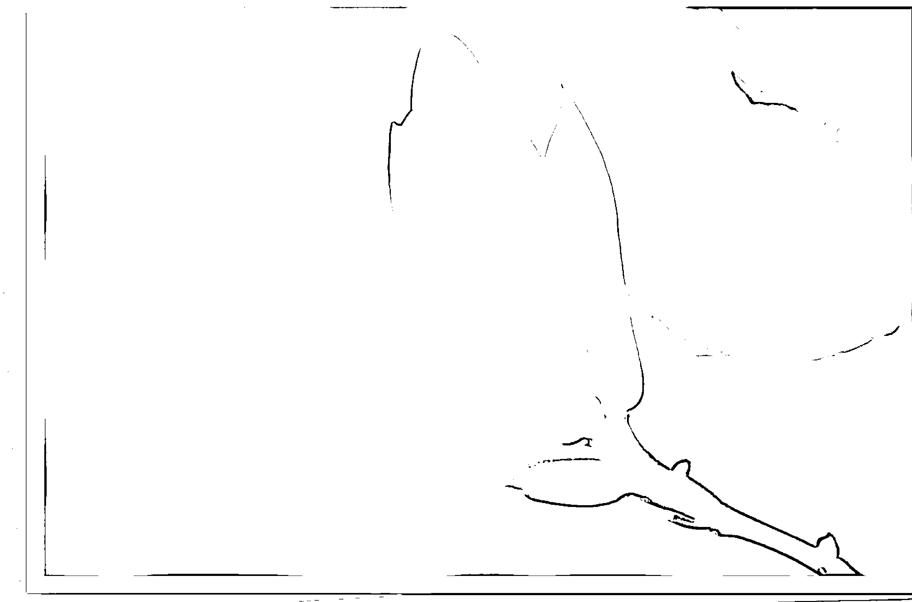

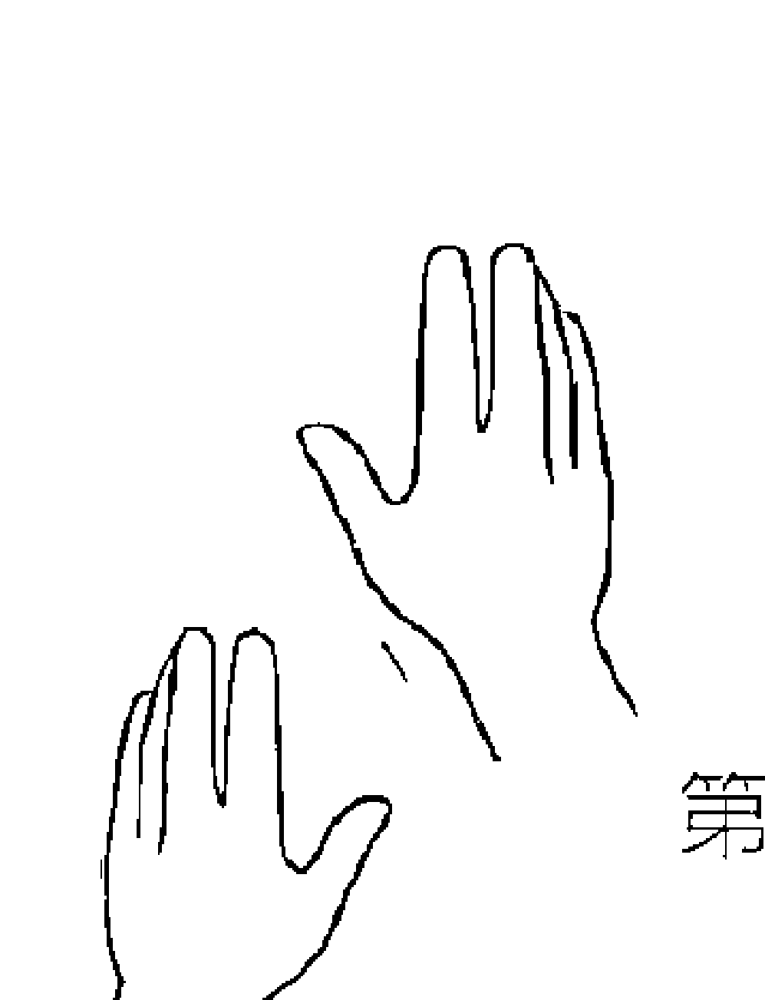

這一章所介紹的療癒手位，是靈氣老師最常用的教導方式，而且根據我們的靈氣教學經驗，靈氣協會已經做了一些療癒手位的修改，但是大部分的靈氣老師，還是都維持原來的教導方式。

最常使用的靈氣手位版本，真正地起源不明，而最原始的療癒手位是由高田女士所教授的，並且遵循一個稱為「1 - 2 - 3 - 4」的療癒程序，那些相關的療癒手位將在第十三章中，經由高田·哈瓦優女士所教授的靈氣初級班完整講義那一章節時再說明。

以下所列的靈氣療癒手位的資訊，遠比由高田女士所教授的原始手位資訊更為完整，包括：每一個療癒手位主要涵蓋的內分泌腺體系統、器官、能量系統（如脈輪系統）等，這些資訊都讓人感到非常的受用，而且在我們使用這些療癒手位時，我擁有很多成功的療癒經驗，這也就是為什麼我們的靈氣協會要選擇這個手位版本的理由了。

於每個療癒手位的資訊下，我們都會列出與手位連結的身體、乙太體、心智體、情緒體及靈性的相關療癒資訊。所涵蓋的資料內容，也包括靈氣協會真正靈氣課程的教學資訊，而且這裡所包含的靈氣訊息，有很大的部分是我們所發現的，並經過一次又一次複製成功的療癒經驗。

### 靈氣療癒的手位一

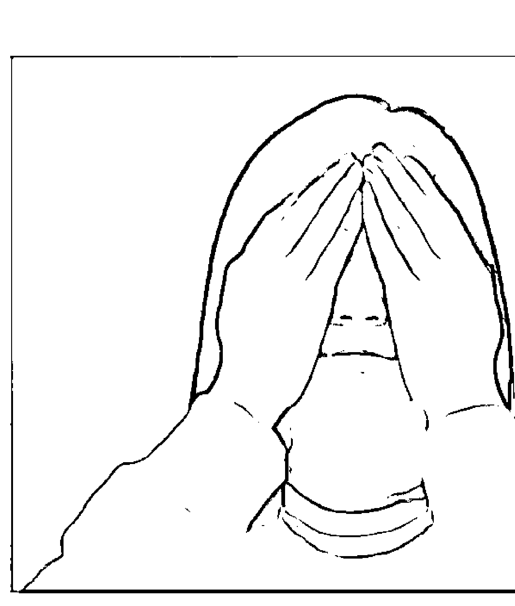

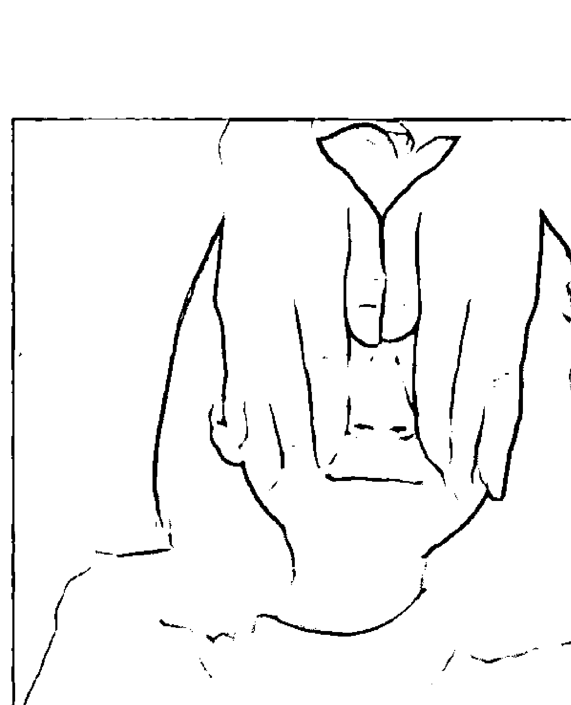

◎手位所覆蓋／平衡／療癒的部分：眼睛（包含眼睛疲勞、視神經、視力模糊、白內障、瞳孔、視網膜、視桿及視錐細胞等等）、鼻子（包含鼻竇黏液膜、異常的敏感性及對性的感受／反應、鼻竇、鼻腔及一般的嗅覺等等）、臉部骨骼與肌肉構造（緩解臉部的緊張及眼睛周圍和眼球的肌肉、臉部的膚色以及可以恢復並活化皮膚的光彩等等）、下視丘、腦下腺、協助緩解過敏症狀，如打噴嚏或眼睛發炎（包含對寵物過敏、類似花粉熱的情況及花粉過敏症，導致中風的因素。

-   對於情緒層的療癒功能：經由閉閉眼睛對外在視覺的刺激來減輕壓力及促進放鬆，並協助自己更清楚的表達情緒。
-   對於心智層的療癒功能：消除意識的混濁或困惑，協助自己表達更有智慧的觀念以及幫助精神更專注、更集中與問題的解決。
-   相對應的靈性層：促進直覺的能力及超視覺的感應力，並協助自我達到更真實的自我覺察。
-   相對應的脈輪能量系統：第六個脈輪能量—第三眼—眉心輪。
-   脈輪能量系統的名稱：眉心輪（梵文：Ajna Chakra，意義是瞭解分辨、感知、或命令）。
-   相關的對應資訊：自主神經系統、下視丘（控制體溫、性欲、腦垂體分泌、飢餓、口渴等等）、腦垂體（調節其他內分泌腺的活動及控制骨骼的成長）及下部腦、禿頭原因、左眼、鼻子、脊椎、耳朵、超視覺力及心靈感應、直覺力、願望中心、靈感、更高形式的星際旅遊、具備了解心靈觀念的能力、洞察力及根據你自己的信念或意識所創造的宇宙或投射給宇宙的結果、靈性體、靈性層面的存在、調頻進入與自覺的內在、做自我更深層次溝通、支配與釋放，據說與高度的靈性感知及情感有關的天人體（Celestial body）存在中心，就像天人合一的感覺（與宇宙合成一個整體的感覺）與幸福喜悅感。

○ 這個位置通常是靈氣接收者，進行靈氣療程最先開始的療癒手位。

在進行這個療程期間，最重要的事就是要放輕鬆。由於雙手放在眼睛上，光源及其他外在的刺激就明顯降低了，這樣做的結果有助於放鬆的訴求。

許多靈氣傳導師會放一張面紙在這個區域，這樣可以避免將他們的雙手直接放在靈氣接收者的臉上，因為有些靈氣傳導師發現，直接碰觸靈氣接收者的臉部會讓他們感到不安。

許多靈氣傳導師發現，將他們的雙手同時放在脈輪及身體上時，將這個部位分成兩個位置對靈氣接收者比較有幫助。所以，他們會將一隻手放在眉心脈輪上，另一隻手則平行放在眉毛以下的位置。而第二隻手放的位置有間接的優點，因為可以比平常的手位多覆蓋一些臉部的面積。

選擇這個療癒手位的靈氣傳導師，大多具有非常豐富的療癒經驗，以及有能力去區別流經他們身體各種不同形式的能量。通常他們覺得這個手位方式，會比從能量系統（脈輪及氣脈）分別牽引出來的方式，更適合讓身體、乙太體、心智體及情緒體的能量（我們將其稱為身體以上的能量）得到治療的效果。如果這個位置沒有分成兩個部分，那麼能量通常都是混合下來的，這並不表示治療的效果會比較沒有效，而是這個位置所需要的治療時間將會大大地增加。

還有，格外有趣的一點是，這個位置與眼睛有關。至於眼睛的虹膜科學，已經研究了相當長的一段時間，並且持續不斷地累積虹膜科學的追隨者。虹膜學聲稱一個人的身體狀況，能由他們的眼睛診斷出來，因為眼睛是身體的「全息像圖」，身體產生的任何變化都會反應到眼睛。我已經研究這門科學很多年，也很認同其中的論點。這是很重要的，因為有個能量系統叫「Seiki Jutsu」（Seiki是Reiki靈氣在日本的另一個稱呼）。

「Seiki Jutsu」是目前仍然在日本盛行的許多治療法之一，這個療法的靈氣傳導師，有一個關鍵的自我治療的練習，就是使用他們的指尖端，直接將能量射進眼睛裡，而且這個療癒的效果是非常顯著的。

為了將這兩個觀點結合起來，我請求大家去思考一下，如果眼睛可以顯示出身體的改變，那它們必定連結於屬於它們個別的系統，連結的功能很少只是單一方向，而且通常都是雙向的。事實上，在我的研究中發現並強烈建議使用這個方法，因為治療眼睛是療癒身體所有部位的一個非常有效的方式。

### 靈氣療癒的手位二

自我療癒的手位二

療癒他人的手位二

- 手位所覆蓋／平衡／療癒的部分：頭腦的上中部(包含頭腦的左半球及右半球的平衡及協調、與學習障礙有關、運動功能及協調)、過動症、口吃、癲癇、聽覺神經、頭痛(包含偏頭痛)、由中風引起的問題、鬆弛果腺、以及由身體外傷所引致的頭部問題。
- **對於情緒層的療癒功能**：協助緩解焦慮、抑鬱、歇斯底里、促進祥和平靜感、協助控制恐懼感。
- **對於心智層的療癒功能**：緩解憂鬱症、促進思考的清晰、訊息的記憶、心智的組織、記憶的回想、協助手眼協調、完全深入思考事物的能力。
- **相對應的靈性層**：啟發、啟示、與宇宙／神連結、接觸最高層次的靈性經驗及知識。
- **相對應的脈輪能量系統**：第七脈輪─頂輪。
- **脈輪能量系統的名稱**：頂輪(梵文：Sahasrara Chakra)。
- **相關的對應資訊**：腦皮質部分及上部腦、松果腺(與身體全天候呼吸及調節的節奏有關)、右眼、中樞神經系統、連結到神／高我、與所認為是有關訊息、先知、個人靈性、超越、和平、啟發、信念、知識與理解、靈性視覺、整體感、增加接收更高能量的能力、擴展覺知及意識。當限制這個中心的能量時，會變成固執己見的人、或很容易產生意識混淆、專注力很低、不能夠有效處理和回想腦部的資訊。

○這個手位是一個會產生很大流量的能量，進入到靈氣接收者能量場的基本位置，這也就是所有高程度的靈氣傳導師，幾乎都會採用的位置。而且有更進階的靈氣傳導師，能提供更寬頻譜的能量給團體中的其他人使用，特別是在療癒及靈氣點化上。

當靈氣傳導師將他們的雙手放在靈氣接收者的頭部時，靈氣接收者的能量場會瞬間擴展得很大，甚至還會輻射出光柱。這是在身體的其他部位很少會發生這樣的狀態，所以這就是為何有某些靈氣傳導師會認為選擇這個位置，當作療程的第一個手位是最好的。

同時，這個位置的手位方式，通常是分為兩種形式，第一種是將兩隻手互相碰觸並放在靈氣接收者頭頂上，第二種則是兩隻手平放不碰觸。

這兩種形式有顯著的能量差異：第一種方式往往對頂輪有很大的影響，並帶來更多靈性和能量系統的能量；第二種方式是有關於更多身體層面以上的治療，它能促進左右腦半球的協調、協助加強記憶力的增強及清晰的思考，以及記憶回想的能力。我個人親身體驗過許多罹患學習障礙的人之所以能被療癒，都得感恩於這個手位的幫助。

### 靈氣療癒的手位三

◎手位所覆蓋／平衡／治療的部分：後腦中間及較低的部位、視丘、枕骨脊、腦幹、連結進入腦部系統的上部脊髓、平衡、協調、鼻出血、眼睛問題（特別與視神經有關）、頭痛（包含偏頭痛）、中風的問題、體重控制、協助起床及睡覺、頭部或腦部的損傷。

◎對於情緒層的療癒功能：緩和不明原因的恐懼感、衝擊感、刺激及怒氣。

◎對於心智層的療癒功能：促進幸福的感覺及注入精神活力。

◎相對應的靈性層：與療癒手位一具有雷同的效果，請參看療癒手位一，促進靈性與身體之間有更強的連結感。

◎相對應的脈輪能量系統：第六脈輪—眉心輪（由這個地方的能量索進入中央能量通道）。

同時，這個位置是脈輪能量索與連結進入脊柱的中央能量通道的匯合點，更巧妙地處理有關所有脈輪能量的治療。許多能量治療系統，特別是來自基督教團體的，會特意從人們背部的脈輪開始療癒，因為他們感覺身體前面的脈輪漩渦能量太強，以至於無法直接療癒它們。這個療癒手位也覆蓋到第八脈輪（Alta Major Chakra），據說這個脈輪負責執行創造及實際將想法接地或銜接物質層面，很少人會知道這個很重要的脈輪，因為它控制從物質層面到乙太體，以及乙太體到物質層面的能量交換，很明顯它的功能在治療工作上非常重要，而在療程中治療這個區域，可以改善和減輕在它們兩者之間的能量交換的感覺。

### ◎脈輪能量系統的名稱：眉心輪(梵文：Ajna Chakra)、第八脈輪(梵文：Alta Major Chakra)。

○連結第八脈輪及左肩脈輪的能量通道，這兩個地方在大部分現代人的身上通常是關閉的。而肩膀脈輪雖然很少被提到，但是它至關重要，因為那是質體最喜歡附著的地方(附身的位置)，吸毒的人通常在這個部位有質體的根源存在，所以治療肩膀脈輪可以有效清除它們附著的根源。當連結第八脈輪及肩膀脈輪的能量通道開啟時，通常在通道內會感到至少一分鐘以上的灼燒感，所以有這個現象時，請不用驚慌。

### 靈氣療癒的手位四

自我療癒的手位四

療癒他人的手位四

- 手位所覆蓋／平衡／治療的部分：耳朵(包含歐式管、所有針灸穴位一耳穴，耳朵具有代表全身的穴點、內耳、身體平衡、所有的聽覺障礙)、嘴巴(包含牙齒、牙齒痛、牙齦、舌頭、下巴、顳顎關節及扁桃腺)、喉嚨上半部(包含喉嚨痛)、回復青春的氣色及肌膚的彈性、協助男性長鬍子。
- 對於情緒層的療癒功能：緩和口語使用上有關的情緒。

> > （這個手位通常不是現代傳統能量系統所考量的部分，但我們在這裡把它涵蓋進來，是因為它的重要性及具有生理學上的功能。）

- ◎ 對於心智層的療癒功能：對新思想的開放心態。
- ◎ 相對應的靈性層：請參考小周天說明。
- ◎ 相對應的脈輪能量系統：沒有直接對應的脈輪，但這個位置可以加強中央能量通道中所有主要脈輪間的能量暢通。請參考以下小周天說明。
- ○ 我們的身體中有一個能量系統，道家稱為小周天，它由兩條能量通道所組成，裡面的能量是以迴路的方式循環全身。能量先從身體前面往下（功能性通道），經過兩腿之間，上升到身體的背部（控制性通道），然後到達頂輪。在這個能量循環系統內，身體有一些部位的能量是中斷的，像兩腿之間的會陰點、頂輪，還有一個重要位置是在嘴巴內。
當舌頭頂住嘴巴內的上顎時，這個能量循環就連結了，所以當舌頭沒有頂住上顎時，能量的循環就被切斷並打開了。療癒手位四只會牽引身體以上的治療能量，而不會牽引脈輪的能量，但是，偶爾你可能會在這個手位四牽引到脈輪形式的能量，那是因為身體的能量系統是開啟的，這是完全可以接受的情況，除非你正在引導靈氣接收者進入冥想當中。
可是，我還是不建議你要求靈氣接收者將他們的舌頭頂住上顎，因為實際上，在這個時候，我建議你不要說任何話。這樣，靈氣接收者就能很自然的去感覺他們的身體，而所牽引來的能量對他們的身體是最有效的。在這裡，我只提到這一點，讓你知道在一個位置牽引到很強的能量型態，有時是跟脈輪的能量沒有相關聯的。這個位置也能協助緩和口語上的情緒能力，幫助對新思想的開放。

### 靈氣療癒的手位五

自我療癒的手位五

療癒他人的手位五

- ◎手位所覆蓋／平衡／治療的部分：所有頸部的區域（包含氣管、甲狀腺、副甲狀腺、喉頭、增強血液流進腦內、頸部扭傷、語言及聲音的障礙(包含說話及唱歌的協助)、血壓問題。
- ◎對於情緒層的療癒功能：緩解憤怒、敵意、怨恨、挫折及內在安全感的問題，這通常是讓一個人可以有「談談他們的真理」的能力。
- ◎對於心智層的療癒功能：帶來內在的沉靜安詳、心理幸福感、創造力、自信。
- ◎對應的靈性層：有能力經由口語進行清楚的表達，傳送和接收心靈圖像。
- ◎對應的脈輪能量系統：第五脈輪—喉輪。
- ◎脈輪能量系統的名稱：喉輪(梵文：Vashuddha Chakra)。
- ◎相關的對應資訊：頸部神經節髓質，甲狀腺(控制身體熱量的使用率及引導身體的發展)、副甲狀腺(控制血液中的鈣濃度)、脖子、喉嚨、呼吸系統、手臂、消化作用。

喉輪是溝通、自我實現、將創意變成可呈現的方式、字型或符號的轉換功能、超聽覺感知力、乙太模模板體(Etheric Template Body)的中心(據說是身體較高靈性的方面)、有關聽覺及聽覺障礙、失敗的恐懼、對宇宙或宗教的信任、你自我的投射／創造出的實相、被拒絕及失去他人支持的恐懼。

這個位置會協助一個人去抵制用說話的方式將負面能量丟給他人。而喉嚨能量中心有問題的人，通常會呈現頸部僵硬、喉嚨痛、以及有為他們的行為和生活負責任的問題。

○傳統上，這個位置是將一隻手放在喉輪，另一隻手放在心輪的地方。這是就實用上能完全接受的位置，而且可以很好的平衡兩個脈輪的能量，但是我覺得與其他的手位比較的話，它有點不合時宜。

如果在所有的手位治療後，你想要平衡人的脈輪系統，《靈氣創造心願成的磁場》可以教你如何進行所有的療程。

因為喉輪及心輪的能量頻率是非常不同的，而且心智體、情緒體、乙太體和身體的能量都需要單獨的一個療癒手位。我們的研究發現一個非常有效的結果，就是將這個手位個別分成喉輪及心輪來治療。手位五，僅處理喉嚨的部位，至於手位七，則設計來專門處理心輪的區域。

除此之外，應該要注意的是許多人對於他們的脖子區域很敏感，特別是碰觸到它們的時候。一般來說，最好是將你的手拱成杯狀，並溫柔的放在他們的喉嚨上，而且只碰觸脖子的兩邊。另一種方式是張開你的雙手伸到下巴、頷骨及鎖骨之間的位置。這個手位能夠很傑出的治療到使人們去「談論他們的真理」，它也能大大地協助口語上的清楚表達，以及在許多方面的溝通都能被有效地增強。

### 靈氣療癒的手位六

◎手位所覆蓋/平衡/治療的部分：胸腺(控制白血球的生產，以用來對抗身體的感染）、協助消除囊腫和腫瘤、支氣管、胸部的上末端、協助淋巴和免疫系統的活化、緩解咳嗽、幫助調節月經週期。

◎對於情緒層的療癒功能：能量感的促進，這是睡眠與放鬆兩者有關的關鍵位置，並能夠警示我們失眠的情況。

◎對於心智層的療癒功能：促進心智沉著和安詳。

◎相對應的靈性層：沒有顯著的部分。

◎相對應的脈輪能量系統：沒有。

多年來頂尖的煉金術教條，都會練習一項稱作「胸腺捶擊」的運動。這項運動是在每個清晨起床後，輕拍胸腺十到二十次（用按摩的方式可能會有反效果），他們相信這個方式不但能刺激身體的能量系統，還能協助人們清醒，以及活化免疫系統去抵抗疾病。

這個位置對於能量感的促進和療癒失眠、提升放鬆及睡眠的狀態具有很好的效果。如果你想要促進能量的提升，只要將一隻手放在胸腺位置，另一隻手則放在太陽神經叢就可以將能量往上提升。但如果將一隻手放在胸腺，另一隻手放在心輪時，則可以促進放鬆及睡眠。 如果你是一個靈氣老師，將以上這兩個資訊結合放入你的課程中時， 你可能要有接求救電話的心理準備，因為學員可能會意外擺到相反的手 位，導致整夜都有令他們感受到難以置信的強大能量，造成無法入睡。

### 靈氣療癒的手位七

- ◎手位所覆蓋／平衡／治療的部分：心臟及循環系統、肺臟及呼吸系統、以及支持胸腔的骨骼肌肉結構。
- ◎對於情緒層的療癒功能：增加在所有層面上輸出愛的能力、平衡及降低情緒的反應，就像生氣、怨恨、忌妒及敵視等，並協助促進自我的信任和自我接受。
- ◎對於心智層的療癒功能：釋放挫折感及所知成見帶來的恐懼感，並給予及增加一個人自由選擇決定的感覺。
- ◎相對應的靈性層：無條件的愛、基督意識、體內其他靈性能量的平衡點。
- ◎相對應的脈輪能量系統：第四脈輪—心輪。
- ◎脈輪能量系統的名稱：心輪(梵文：Anahata Chakra)。
- ◎相關的對應資訊：心臟和循環系統、肺臟、肝臟、胸腺、氣喘、呼吸、血壓、手臂和手部。

心輪據說是星光體(Astral body)的存在中心、上部能量(神聖的或天國的)及下部能量(地球)之間的橋樑與混合器、平衡、四海皆兄弟的感覺、同情心、靈性成長、奉獻、親和力、愛、療癒、關係、無條件的愛及情感、基督意識。

○ 這個手位協助去除阻塞在心輪的負面能量，並增強愛在所有層面的感覺（包含愛自己）。它能產生一種與所有一切連結的感覺，這種感覺可以降低情緒狀態上的恐懼及促進自由的感覺。

如前所述，這個手位也覆蓋到肺臟，如果你是屬於會將雙手放在療癒手位上，直到治療能量消失的靈氣導師的話，那抽菸的人無疑地會讓你產生作業標準上的問題，因為一般來說，只要你的手一放到這個位置，某些抽菸的人會一直不停的牽引能量，所以你沒有理由花太多的時間在抽菸者的肺部，不然可能很容易變成整天都在牽引能量的狀況，直到最後你必須上床睡覺為止。

我保留這個手位治療在抽菸者上，直到這區域所有的問題都被清除，以及我感覺它適合繼續進行下個手位。任何治療工作的完成都能延後生命的關鍵時刻，而使這個人能點亮回家的道路。如果有某些人已經戒菸，那我願意盡可能奉獻我更多的時間，去協助他們療癒這部分的身體。

但是基於倫理、法律、道德的理由，請注意，不要在任何時間上去碰觸靈氣接收者的這個部位，因為碰觸這個部位可能會使他（她）們感到你冒犯他（她）們，而這個部位明顯地也包括女性的乳房。如果乳房需要被直接治療，就使用不碰觸療法，讓你的雙手保持在這個位置上方，一到六吋的距離。因為不道德和不舒服的碰觸會困擾靈氣接收者，並使靈氣接收者快速終止對療癒的開放心態。

### 靈氣療癒的手位八

自我療癒的手位八

療癒他人的手位八

- ◎手位所覆蓋／平衡／治療的部分：脾臟、肺臟的下半部、膽囊及結石、胰臟(控制血糖)、腎上腺(控制身體的鹽分及水分)、血友病、與中風有關的狀態。
- 對於情緒層的療癒功能：唯一可能儲存在這個區域的問題是他們本身的問題。
- 對於心智層的療癒功能：沒有。
- 對應的靈性層：沒有。
- 對應的脈輪能量系統：沒有。
- 脈輪能量系統的名稱：沒有。
- 這個手位是第一個開始進入人體主要器官的區域，因為它也覆蓋肺臟的下半部，所以先前提到有關療癒抽菸者的重點部位，這個位置同樣也要記起來。

在發生意外事件或中風時，這個位置也是要緊急治療的區域之一，因為這個區域有腎上腺的存在。平常緊急的手位是在身體的太陽神經叢或高一點的位置，還有記住不要隨便移動遭受意外事故的人，只需要等待醫護人員的到來就可以了。

### 靈氣療癒的手位九

- 手位所覆蓋／平衡／治療的部分：肝臟、胃、膽囊與結石、橫膈膜、橫向結腸、血液失調與均衡、感染、消化不良、便秘、潰瘍及結腸炎。
- 對於情緒層的療癒功能：減少壓力、挫折、焦慮、歇斯底里、想要控制他人的控制欲、促進本身的意志力與自信心。
- 對於心智層的療癒功能：協助憂鬱症及精神混亂的療癒、增加自信。
- 相對應的靈性層：心智體(Mental Body)的存在中心及個人力量的能量、「低層的自我」與其他生物體溝通的通道，也包括人類。
- 相對應的脈輪能量系統：第三脈輪—太陽神經叢。
- 脈輪能量系統的名稱：太陽神經叢輪(梵文：Manipura Chakra)。
- 相關的對應資訊：太陽神經叢、消化系統、腎上腺、胰臟、胃、肝臟、膽囊、糖尿病。

太陽神經叢是個人的能量中心，智慧、粗糙的情緒、據說是許多意念治療師使用的能量中心、笑聲、情感的理解、魔法、憤怒、朋友們、喜悅、願望、連結實相、據說是心智體(Mental Body)及心靈功能(通常與智力有關)的存在中心，以及能獲得內在的力量與動力。

○ 這個區域通常稱為身體的「主要動力中心」(Master Motor)，據說甚至連高田女士也使用這個術語。有一個非常重要的事要告訴大家，就是要花費所需要的時間來療癒太陽神經叢，因為這個區域也是治療所有女性荷爾蒙失調的重要地方。

這個脈輪本身就可以處理很多的情緒問題，事實上人們通常都視它為心智方面的問題，然而許多關鍵性想法的理解，是需要伴隨著這個脈輪而來，屬於較粗糙的情緒狀態。在能量治療上，許多靈氣傳導師發覺，總是被引導將一隻手放在太陽神經叢輪上，而他們的另一隻手則放在不同的脈輪能量中心。因為有一股很大的力量及理解力被儲存在太陽神經叢中，所以連結這些脈輪，能夠大大地協助療癒的效能，並了解有關其他能量中心及身體部位的情況。

在我們身體上，許多能量層次的溝通是經由這個能量中心。一個人如果要求治療大部分的太陽神經叢，那是因為這些能量層次的溝通形式已經失調了。喜歡從別人身上吸取能量來強化他們自己的人，有絕大部分的人通常都使用這個能量中心來做這件事（當然大部分的人在做這件事時，是無意識的）。相反地，也很容易因其他人的能量而造成自身的能量超載，像是無法忍受站在群眾中的人，他們的太陽神經叢輪也有相同的問題。

關於這個問題，我的靈氣老師珍妮・葛林，給我一個很好的提示，不知道何種原因，就是有個保鮮膜的品牌叫「Saran Wrap」，其所生產的保鮮膜具有「能量盾牌」的功用。雖然我的化學家朋友說他們已經發現是甚麼因素，但這件事對我而言仍是個謎。將保鮮膜裁一半，覆蓋在太陽神經叢## 灵气疗愈的手位十

上，可以有效地阻隔大部分从这个能量中心产生的能量交换。虽然其他阻隔能量交换的方式，可能是经由心灵的方法，但就我所知，这个使用保鲜膜的方法，是最重要的运用，可以解除某些人对其他人能量场太过敏感的问题，使他们可以回归正常的生活。截至目前为止，已有很多人因为使用这个方法而解决了能量敏感的状态。我知道这件事听起来可能很愚蠢，但如果你怀疑我所说的，就去实验一下。不用说，这是抵抗你周遭那些心灵能量吸血鬼时，最有用的方法。

自我疗愈的手位十

疗愈他人的手位十

- ◎手位所覆盖／平衡／治疗的部分：上升结肠、小肠、下降结肠、结肠炎、消化作用、营养吸收、便秘。
- ◎对于情绪层的疗愈功能：深层的情感、性功能健康与平衡、释放焦虑、降低情感上的恐惧、自我的信任、内在的力量。这个位置被认为是身体内属于我们所属情绪的家或中心。
- ◎对于心智层的疗愈功能：去除文化、种族及宗教方面在观念架构上的偏见，开始返回以情感为基础的思想—感觉的结构。
- ◎相对应的灵性层：与情感有关的灵性能，具有能够感应在他人身体内的能量状态的能力。
- ◎相对应的脉轮能量系统：第二脉轮—脾脏轮（Spleenic Chakra）。
- ◎脉轮能量系统的名称：荐骨轮（Sacral Chakra），梵文：Svadhisthana Chakra。
- ◎相关的对应资讯：荐骨神经丛、性腺、生殖系统、肾脏、膀胱、下背部问题（储存在下背部的负面情绪能量）、腿、欲望或渴求、性能量中心、自我意识中心（Ego）、感觉／情绪、性欲、超感应力（Clairsentience）、预知力、快乐、社会性、内在的毅力或意志力。

### 灵气疗愈的手位十一

在传统上，这个区域的问题，大部分都与情绪和性的疗愈有关，而且通常很直觉地要连结这个能量中心与太阳神经丛脉轮，所以你只要将两只手各放在两个脉轮上就可以了。伴随着这个位置的能量治疗，能够引起灵气接收者的情绪被广泛的释放出来，所以在你开始要进行这个区域的治疗时，要确认你已经读过及理解在《灵气创造心想愿成的磁场》内有关心智体与情绪体的疗愈资讯。

自我疗愈的手位十一

疗愈他人的手位十一

- ◎手位所覆盖／平衡／治疗的部分：乙状结肠、盲肠、直肠、外阴部、膀胱（包含感染）、便秘、腹泻、前列腺、生殖器官与月经问题、关节炎、贺尔蒙失调、经前症候群及身体的排毒功能。
- ◎对于情绪层的疗愈功能：对于态度、举止及行为的灵活性与环境的适应性、对生活的恐惧。
- ◎对于心智层的疗愈功能：整合与疗愈原始的冲动及想法。
- ◎相对应的灵性层：身体的灵性生命能量来源，接地感或脚踏实地的实在感（Grounding）。
- ◎相对应的脉轮能量系统：第一脉轮—海底轮或根本轮。
- ◎脉轮能量系统的名称：根本轮（Base Chakra），尾骨轮（Coccygeal Chakra），海底轮（梵文：Muladhara Chakra）。
- ◎相关的对应资讯：尾骨神经丛、生殖系统、腿部、性腺、肾上腺、肾脏、膀胱、脊柱、脚部、骨骼、肠部、便秘、痔疮、过胖、关节炎、生活或存活的意愿、观念、思想、生理活动、平静、稳定、原始想法、地球能量、生存的问题、坚定感、身体的实在感、创造物质的显现、与双亲及类似亲属的关系、身体生存所需的调节功能、被认为是乙太体（Etheric Body）的存在中心（被认为是身体的模身）。

合及疗愈。许多超视觉者说，他们都告诉具有以下问题的人们：像有财务上的困难、自杀的倾向或只是连结到他们周围世界的一些问题，都是由于这个脉轮能量中心缺乏能量的状态。
用个实例来说明，虽然疗愈手位十，被认为是有关性能力的位置，但疗愈手位十一也很容易提升性欲的位置。以这种手位作疗愈的话，肌肉型的情绪释放在身体全身的区域是非常稀松平常的事，而这个观念在《灵气创造心想愿成的磁场》中已经有解释了，而且这种释放在与这部位的身体，具有一种特殊的连结关系。
常见的道家密传学校的训练中，有一系列有关按摩外阴部生殖器与肛门的练习。因为从这些区域产生的情绪与记忆的释放，通常与未处理的性经验、性／身体能量的滥用有关。在身体的疗愈手位十一使用灵气能量，可以很容易将这些记忆印痕带出来处理，并达到疗愈。要觉知他们哪些地方储存这些记忆印痕是很重要的事，因为这样，你才能适时地帮助灵气接收者处理他们一一升起的情绪。

基于伦理、法律及道德的理由，任何时刻都不要碰触灵气接收者这些部位，因为他们可能会感到被冒犯，当然也包括外阴部的位置。如果外阴部需要被直接治疗，就使用不碰触疗法，只要将你的双手放在需要被治疗的区域上方约一到六吋的距离。不道德及不舒服的碰触，会大大地阻碍灵气接收者的治疗，以及会让他们很快的终止对疗程开放的心态。

### □背部疗愈手位的特别重点

当我们看到背部的疗愈手位时，很容易想问为什么会选择这些手位，就算有些手位直接与身体的系统或器官有关，但是大部分都没有关系。身体肌肉的放松是很重要的，这几乎被认定是选择这些手位的原始因素，所以我花了一些时间去研究它，最后才偶然发现这些手位真正优越的地方。

我们的时代是反对接受“新时代”的教条，就像脉轮不是固定的能量中心，它从我们身体前面运转一直线下来，它是漂浮在“能量索”上的漩涡，而这些漩涡在靠近脊柱的地方与中央能量通道融合。除了我之外，最近己写过这个主题的作者们都遗漏了这一个重点。

很幸运地，近年来我已获准进入一个藏书量很大的图书馆，里面的书籍很多都超过数百年。显然，这样对于我的研究结果是有点慢，不过，我不需要买哪些已经被遗弃多年的资料，而且通常书上都会遗漏一些资讯。

但是，我们仍然可以使用那些书中的观点，像查理斯（Charles W. Leadbeater）的书。就我所知，只要完全地遵照他所写的方式去做，就不会有失败的情况。他有许多很好的著作，我建议从事能量治疗的工作者必须拥有这三本书：《人可以看的见与看不见的部分》（Man Visible and Invisible Charles W. Leadbeater 1902），《思想形式》（Thought forms Annie Besant & Charles W. Leadbeater 1901），《脉轮》（The Chakras Charles W. Leadbeater 1927）。

《脉轮》这本书可以额外提供你有关脉轮其他观念的理解，就像我在这里所描述的资料。即使这本书在有关太阳神经丛的部分，某些具有价值的资讯已经遗失了，但其他的资讯对我们仍然是很有用的。

像我先前提过的，包括基督教团体在内的很多学校，其所教授的能量治疗形式，都不相信能量是从身体前面流通到身体后面，反而是相信能量是从身体后面往前面流通。最典型的治疗方式是，能量治疗师将他们的右手（他们经由这隻手将能量传递出去）放在灵气接收者背部的一个点，而他们的左手（这隻手会重新收集能量并形成一个能量迴圈）就放在灵气接收者的身前面。通常，背部所放的手位是固定不动的，而且是位于脉轮连结脊柱的地方，然后就使用他们的左手去扫描灵气接收者身体的前面，直到发现实际脉轮漩涡的所在处。尽管大部分人在使用此疗法时，都从未听说过脉轮，但他们还是会很正确地找到能量索连结在脊柱的位置及能量漩涡本身。使用意念治疗者，就是有意识地从他们的手移动脉轮型态的能量，这样可以使他们连结特定种类的疗愈能量。举例来说，继续我们的基督教话题，因为这类传统的治疗者会执行一个叫做抹油的仪式（由神、基督、耶稣及神灵启动能量的仪式）去“连结破碎的心”，所有的疗愈基本上是以心轮为主。因为他们的心轮，通常距离胸部中央很远，经常是在靠近左肩的地方，这样可以使他们容易连结从基督而来的粉红色能量流。他们的心轮位于此处并不是不健康，而是他们通常非常热爱其他人，并引导让他们生活幸福快乐。如果作为灵气导师的你，想要移动他们的心轮到“它应该放置”的胸腔中央，这样他们不但会失去移动粉红能量的能力，还会因为你的傲慢行为而让他们非常生气。这只是一个有关于“漂浮”脉轮的例子，还会有很多这方面重要的课程，但我相信，你会学到它们的。

一般脉轮的位置不是在身体中心的下方，而是每一个人都不一样，因为脉轮所处的位置，通常是使他们容易连结与他们生活有直接相关的特定能量，这是灵气传导师非常需要了解的重要部分，还有文化、种族及社会地位都会造成这个部分的差异，但这样的状态是正常的。

现在的你，可能会问为什么背部位置的讨论很重要，因为背部的每一个位置，都有相对应的脉轮能量进入脊柱的中央能量通道。经由背部脉轮去传递能量，会比从身体前面治疗产生更多柔和的能量。一般来说，这样是可以净化或冲洗脉轮能量系统的能量，而且它能够从能量索移出不需要的能量（像拔出一条有阻塞的管子），以及将阻塞的能量推出脉轮之外。这个动作对能量系统的功能很重要，由此看来，背部的治疗位置比传统所想的用途更为重要许多。

### 灵气疗愈的手位十二

自我疗愈的手位十二

疗愈他人的手位十二

- ◎手位所覆盖／平衡／治疗的部分：斜方肌、上部颈椎、三角肌、颈部紧张或紧绷、颈部到手臂及脖子的神经。
- ◎对于情绪层的疗愈功能：精神衰弱、减轻压力及放松、情绪释放、对责任感的恐惧。
- ◎对于心智层的疗愈功能：带来宁静、安详及平衡感。
- ◎相对应的灵性层：据说这个位置也会大大地影响一个人对他们自己的感受及他们在社会上的地位。
- ◎相对应的脉轮能量系统：背部的上心轮，约背部第二及第四节胸椎

### 灵气疗愈的手位十三

> ○记得古老的谚语曾说过：「你的肩膀扛着全世界。」

自我疗愈的手位十三

疗愈他人的手位十三

- ◎手位所覆盖／平衡／治疗的部分：紧张、交感神经反馈点、肩胛骨、锁骨、肺脏、脊椎、肩膀的叶状骨、神经衰弱、脊椎的问题。
- ◎对于情绪层的疗愈功能：释放愤怒的能量。
- ◎对于心智层的疗愈功能：责任感的问题。
- ◎相对应的灵性层：这个位置也是控制我们如何与外在世界接轨，以及我们如何看待外在世界与我们的互动。控制我们周围的世界是这个区域最主要的焦点。
- ◎相对应的脉轮能量系统：背部的下心轮，约背部第三及第四节胸椎的位置。
- ◎大多数的男人在肩膀的叶状骨间，都有能量阻塞的问题，因为他们在这里储存大量的愤怒及相关的情绪。因此，处理此区域时要特别小心谨慎。

### 灵气疗愈的手位十四

- ◎手位所覆盖/平衡/治疗的部分：关节炎、高血压、肾上腺、与中风有关的情况、肾脏、感染、脊椎神经、血糖与肌肉群、生殖问题、与脊椎问题有关的身体失衡。
- ◎对于情绪层的疗愈功能：释放忧虑、畏惧、恐惧、心情不好、喜怒无常、能量的转换问题、能量摇摆、紧张以及在潜意识的心智下所储存的情绪。
- ◎对于心智层的疗愈功能：在潜意识心智下，有关想法的储存。
- ◎相对应的灵性层：据说还有控制灵性体的意念围绕在本身的意图治疗。
- ◎相对应的脉轮能量系统：背部太阳神经丛，约背部第八及第九节胸椎的位置。
- ○ 这个位置能很有效地释放忧虑、畏惧、恐惧、心情不好、喜怒无常、能量的转换问题、能量摇摆及紧张的问题。它也与在潜意识心智下，情绪与想法的储存有关。

### 灵气疗愈的手位十五

- ◎手位所覆盖／平衡／治疗的部分：生殖器官与问题、尾骨、脊椎神经、下背部问题、坐骨神经痛、臀中肌与臀大肌、肠部组织、膀胱与脊椎问题。
- ◎对于情绪层的疗愈功能：协助接地的实在感，大部分储存的能量与情绪有关。
- ◎对于心智层的疗愈功能：内在与外在支持的问题。
- ◎相对应的灵性层：有些人相信这个地区与性能量的数量有关。
- ◎相对应的脉轮能量系统：背部脾脏轮，约腰椎第二及第三节位置。
- ◎这个位置对于接地的效果很大，最主要主要是情绪及内在在支持问题所储存的地方。

我曾经学过一个很重要的课程，就是如何倾听直觉及处理背部这个区域的问题。因为前一段时间，我刚好治疗了一个我非常亲密的朋友。他是一位专业的鼓手，在某天他表演完后，我正好抵达他家。他请求我治疗他的下背部，当时我就照做了。当我正在治疗的时候，我接收到一个很强的直觉，就是希望我能治疗肩膀两片叶状骨的中间，但我没有照做，因为那时候他的太太（也是一个好朋友，而且那时是初级灵气传导师）正巧在治疗那个位置，我想她也接收了相同的讯息，所以才治疗那个位置。不久之后，治疗就结束了，我们一起离开去参加一个聚会。因为我们是住在相反的方向，而且这次的聚会可能会到凌晨，所以我们就分别开车去，而他们比我还早到一些时候。就在我的鼓手朋友穿过大门后，他突然痛得跌倒在地了。因为这个疼痛感直接从他肩膀两片叶状骨的中间产生，正好是他背部的心轮位置，因为疼痛感实在太强烈了，以至于他几乎无法移动他的身体。过了一会儿后，当我走进屋内时，发现已经有人开始在帮他治疗。他们已经完成大半的治疗，而在我将手放在他的身上不久后，他的疼痛不见了，他背部的阻塞能量似乎只要再一下下时间就能消除。因此，这件事让我铭记到今，而且我在上课时都会详细说明，因为它是很重要的。
肌肉的疼痛及问题只是身体的状况，因为它们也有相对应的能量部分。有时它们与特定的情绪有关，或只是外加能量的储存点。
在这个案例中，我的朋友，他的下背部有很大的能量阻塞的情况已经很多年了，而且他也习惯于储存外加的能量，特别是有关社会情感的特性储存在里面。
尤其当他走进一间满满都是人的房间时，这股能量就会被启动，所以他企图将这股能量储存在原来那个熟悉又相似的地方，但这个地方已经被去除了，他已经清除庞大数量的能量。接着他又造成背部的能量阻塞，而且也是发生在肩膀叶状骨的中间。请记住，这是在身体上一个非常普遍储存情绪（像生气）的位置（特别是会发生在男性的身上）。
如果我有倾听我的直觉，就不会造成这次的问题。在这个事件发生之后，我花很长的时间去研究使用灵气治疗背部的影响。许多灵气导师都不处理背部位置，或许这样做是最好的，因为从我的研究我已经学到一个经验，那就是治疗背部时需要慢慢来的关键。

仔细倾听你的直觉，也会提供给你很大的益处。背部的治疗时间必须跟治疗身体前面所花的时间一样，因为我已经证明，仓促的处理背部问题不是一个很好的想法。如果你没有足够的时间去给予背部它所渴望的关注，那你最好不要进行这个程序。

但是，关于这种情况是有一个例外，就是如果你与你的直觉有很强的沟通能力，你可能只需要在背部花一点点时间而已，而且你会有正确详细的使用手位，因为天使／高频能量通常会在你的界限内，以最有利及最有效的方式运作。

## 第四篇

## 灵气教学笔记本

## 【第十一章】乙希尔·隆巴狄女士的灵气教学讲义

本章的讲义内容及图表，完全是按照最初的教学版本，基于作者不详的因素，我们会称这份讲义的作者为乙希尔·隆巴狄女士，因为她是高田女士灵气班的学生。这些资料是在一九七〇年代上课时所使用的讲义，会有助于灵气的发扬光大。

执笔者：乙希尔·隆巴狄（Ethyl Lombardi）老师
教学程度：灵气初级、中级班课程
记录时间：一九七六年

### 讲义 初中级灵气班教学摘要

#### 灵气课程初级班第一天

- 1. 灵气传导师站在灵气接收者的头部位置，接着放一张面纸在灵气接收者的眼睛上，然后食指放在泪管上，中指及无名指轻放在眼睑上，小指放在脸颊上。
- 2. 双手手指并拢，放在脸颊的两侧。
- 3. 将双手放在头部后面，耳朵后的位置。
- 4. 将双手放在两边的肩膀上。

总是要从头部开始疗愈

- * 在眼睛内的碎片或银片就直接治疗眼球的表面。
- * 任何与眼睛有关的疾病：一定要使用1、2、3的位置
- * 麦粒肿：使用 1、2、3 的位置，也要加上太阳神经丛与肾脏。
- * 烧伤或割伤：立刻用灵气能量处理，就不会有疤痕产生。
- * 交叉眼球的运动：要先每天练习时五至二十分钟，然后再开始治疗眼睛。
- * 在治疗眼睛后（不管是什么眼睛问题），如果病人是女性，一定要治疗她们的卵巢位置。

将灵气接收者的双脚产生极化是很好的方法（只要握住双脚的脚踝部位就可以）。

- * 灵气传导师只是能量的通道，治疗其他人时，也要活化通道的能量||灵气传导师。
- * 白内障需要每天治疗。
- * 糖尿病：一定要治疗眼睛的部位。
- * 鼻子与鼻窦：使用#4的部位，也要处理支气管的部位。
- * 耳朵痛：将食指深入耳内，而手的其他部分要盖着耳朵周围。
- * 耳鸣：治疗所有的位置，然后将双手各放在两耳上，双倍于双手同放在单耳上的时间。

#### 靈氣課程初級班第二天

* **頭昏眼花**：雙手放在頭部的兩側。

* **身體不平衡的問題**：將右手放在身體的前面及將左手放在身體的後面。從海底輪開始，慢慢地往上移動治療身體的七個脈輪系統，然後將右手放在頭頂，左手慢慢地從頂輪順著脊椎往下面的脈輪移動，直到海底輪的位置。每個脈輪停留的時間，至少需要十至十五分鐘。記得要做深度及緩慢的吸氣與吐氣，就能夠衝破阻塞脈輪的能量。

* **頭痛問題**：要使用 1、2、3 的位置。如果是女性病患，要持續治療卵巢七天的時間。

* **黏液問題**：記得不要喝牛奶或柳橙汁。

* **嘴部問題**：將雙手放在臉頰兩邊的下巴處。如果有牙齦發膿的問題，就輕輕地按摩，也要治療腳底的部位。

* **感染**：會吸引很多熱的能量。

* **黏液囊炎**：會吸取大部分的振動能量。

* **脖子的皺紋**：握住脖子的位置。

* **頭昏眼花**：使用 #2 位置，這個位置也適用於耳朵的疾病與暈船（內耳的治療）。

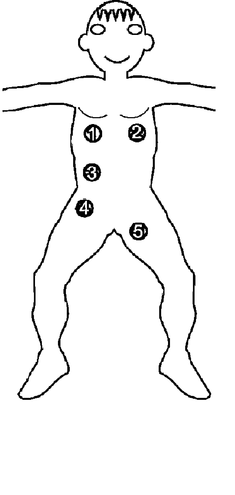

-   * 甲狀腺腫：兩隻手重疊放在脖子上，然後治療太陽神經叢、腎臟與心臟。

-   * 口水失調的嬰兒：喝一些大豆牛奶及治療腳底。

-   * 腮腺炎：女性——治療卵巢；男性——治療前列腺。

總是要感恩及祝福你們的食物！

總是先治療全身，然後再治療有問題的部位。

-   * 太陽神經叢的部位是在肚臍延伸約一吋的範圍。

-   * 中風：治療太陽神經叢。

-   * 關節炎：不要使用鋁製的鍋子或盤子、不要吃起司、也不要喝牛奶、多吃蔬菜和水果、多吃白肉（雞肉、火雞及魚）。

治療整個身體：頭部、太陽神經叢及脊椎。

-   * 癌症：要多花一點治療時間在膽囊的部位。

* 建議事項：使用白葡萄柚（要留少許白膜在果肉上面）、生的紅甜菜根（要剛好尺寸的）、十個無烘烤過的杏仁、少量的向日葵種子、一品脫的水（美制容量，約四七三毫升），使用攪拌機混合，這是適用於每個人的活力飲料。

* 建議事項：使用一顆綠色捲心菜、一顆白色花椰菜、一或二個大甜菜根及一個洋蔥。然後運用你的雙手輸入能量給食物（生的及新鮮的食物可以吸收能量），因為這份沙拉食譜對肝臟硬化、潰瘍及結腸炎的人非常好。

* 便秘：治療所有的脈輪系統十或十五分鐘，也可以做所有的四個基本療癒手位。

* 疤痕組織：經由靈氣治療可以消除它。

* 乳房腫瘤：治療卵巢四十分鐘。如果有子宮切除的人，無論如何都要治療，因為在這個神聖的地方，靈性的部分仍然存在著。

-   * 尿床：在身體的前面，使用#4的位置，在身體的背部，使用#3的位置，在解尿時，做解尿開始與中斷的訓練，目的是在增強膀胱肌肉的彈性。

-   * 羊癲瘋：有這種症狀的人，一般都有胃酸過多的問題，所以不要喝牛奶、可樂或吃糖。要治療整個身體，並多花一點時間治療頭部的區域。

-   * 過動兒：不要喝牛奶、可樂或吃糖，然後治療整個身體。

-   * 巴金森氏症：除了治療整個身體外，要花多一點時間在腎臟的位置（背部#3的位置），通常都有寒涼的胸腺。

-   * 多發性硬化症：治療整個身體，如果病患已經殘廢很長的一段時間，他會吸取很多的能量進去身體，所以對靈氣接收者最好的方法是，在靈氣治療前的二到三個小時，記得不要吃東西。

-   * 心臟病發作、中風：不要對剛發生心臟病或中風的人使用靈氣；要立刻尋求醫療體系的協助。然後在疾病發生三週之後，才開始使用靈氣治療。先花四十分鐘的時間在太陽神經叢輪的部位上，接著療癒身體的前面「1、2、3、4」的位置，然後治療所有心臟的位置及背部#2的位置。記得在給予中風病患一樣的靈氣治療前，要先治療頭部與脖子的區域，最後再治療四肢。

-   * 靜脈曲張：多花一點時間治療#4和#5的位置，然後直接治療靜脈有問題的地方。

-   * 潰瘍：吃切碎一點的沙拉，使用#1和#2的位置。

-   * 白血病：多治療脾臟的區域。喝果汁及吃沙拉。

-   * 肝臟：使用身體前面#1到#4的位置。

-   * 往下將能量拉到小腿部位：將右手放在臀部上，用左手往下將能量拉到小腿部位。

-   * 備註：靈氣是非常高的振動頻率（愛的振動頻率），所以靈氣傳導師不必防護自己。

#### 靈氣課程初級班第三個晚上

-   #1 肩膀的手部位。
-   #2 肩膀葉狀骨之間的部位。
-   #3 約手腕根部的部位要放在上面的位置，可以覆蓋腎臟與腎上腺，這個位置在腎臟的頂端。
-   #4 將雙手放在尾椎骨上及兩旁，要覆蓋到男性的前列腺。

-   - 懷孕：要療癒 #3、#4、#5 的位置。
-   - 心臟：要療癒 #2 的位置。
-   - 左邊肩膀：是睡眠的關鍵與平靜神經系統有關。
-   - 右邊肩膀：是療癒膽囊問題的相關部位。
-   - 頸部扭傷、中風：要療癒 #1 到 #3 的位置及交感神經系統、脊椎兩側，並集中治療在 #2 的位置。
-   - 肋膜炎：身體前面與背後所有胸廓的部位。
-   - 腎臟與背痛：花多一點時間療癒 #3 的位置。
-   - 前列腺：要療癒 #4 的位置。
-   - 痔瘡：距離直腸一吋的地方。
-   - 坐骨神經痛：#5 的位置（對中風的人及老年人也很好）。
-   - 肺氣腫：胸腔全部的區域，包含前胸與後背（肋骨的位置），每天治療一小時，約治療一至兩個月。

-   * 巴金森氏症：治療腎臟區域（後背#3的位置）。

-   * 骨髓癌：治療脾臟的位置。

-   * 任何脊椎的問題：療癒#1至#5的位置，恢復身體的活力後，讓兩個靈氣傳導師同時治療身體的左右兩側，先從腦的基部開始，然後順著脊椎往下治療（療癒的手部位是距離脊椎兩側約一吋的部位）。

-   * 糖尿病：先從身體的底部開始。

-   * 臥床的老人：使用靈氣療癒他們的腳部，只要將雙手放在腳踝處，然後擺動。

-   * 基本的靈氣療癒原則：頭部治療二十分鐘、太陽神經叢三十至四十分鐘及背部三十分鐘。

-   * 支氣管炎：治療#4的位置，也包含胸腺的位置。

-   * 讓雙手的位置與靈氣接收者雙手的位置相反，可以集中較多的能量。我們的右手位置對靈氣接收者左手的部位，左手的位置對靈氣接收者右手的位置。

-   * 肯定語：天父，我進入祢的雙手中，我相信我自己；天父，我進入你的雙手中，我獻出我自己。

始終要專心傾聽你的雙手。

-   * 觀念：
    - a) 就在今天，我不生氣。
    - b) 就在今天，我不擔憂憂慮及恐懼。
    - c) 我很知足及感恩。
    - d) 我誠實地賺取我的生活所需。
    - e) 我和善對待所有的生命體及所有的創造物，因為生命體與創造物就是神的化身。

#### 靈氣課程中級班第一天

記得使用一條摺疊好並捲起的毛巾，因為它比枕頭更為實用，它可以使靈氣傳導師感到更多的自由及雙手放置的空間，而且又不會讓靈氣接收者覺得太熱。

記住中級靈氣的三個符號很重要，使用的代號如二二一頁圖。這三個符號的能量應該都準備瞬間被靈氣傳導師召喚，所以我們可以用想像及用手畫符號的方式來召喚祂們，因此在任何時候都可以召喚靈氣符號。

-   1. 在療癒開始之前，先使用CHO-KU-REI力量符號的技巧。靈氣傳導師要先畫CHO-KU-REI力量符號在雙手上，至少要各畫五次以上的CHO-KU-REI力量符號，最好是畫十次CHO-KU-REI力量符號在兩隻手的手掌。此外，使用靈氣療法「1-2-3-4」方法療癒身體的正面及背面，而每次治療只需要先做身體的一面。
-   2. 為了修正不好的習慣及錯誤的心智觀念，當然這也包含菸癮、酒癮及藥癮等。這些人適用於SEI-HE-KI的療癒程式，先將SEI-HE-KI的符號寫在靈氣接收者的頭部，然後使用CHO-KU-REI集中靈氣的力量，同時也告訴靈氣接收者，他們不再喜歡這個習慣，他們不再喜歡這個味道，這個習慣對他們不好等等。

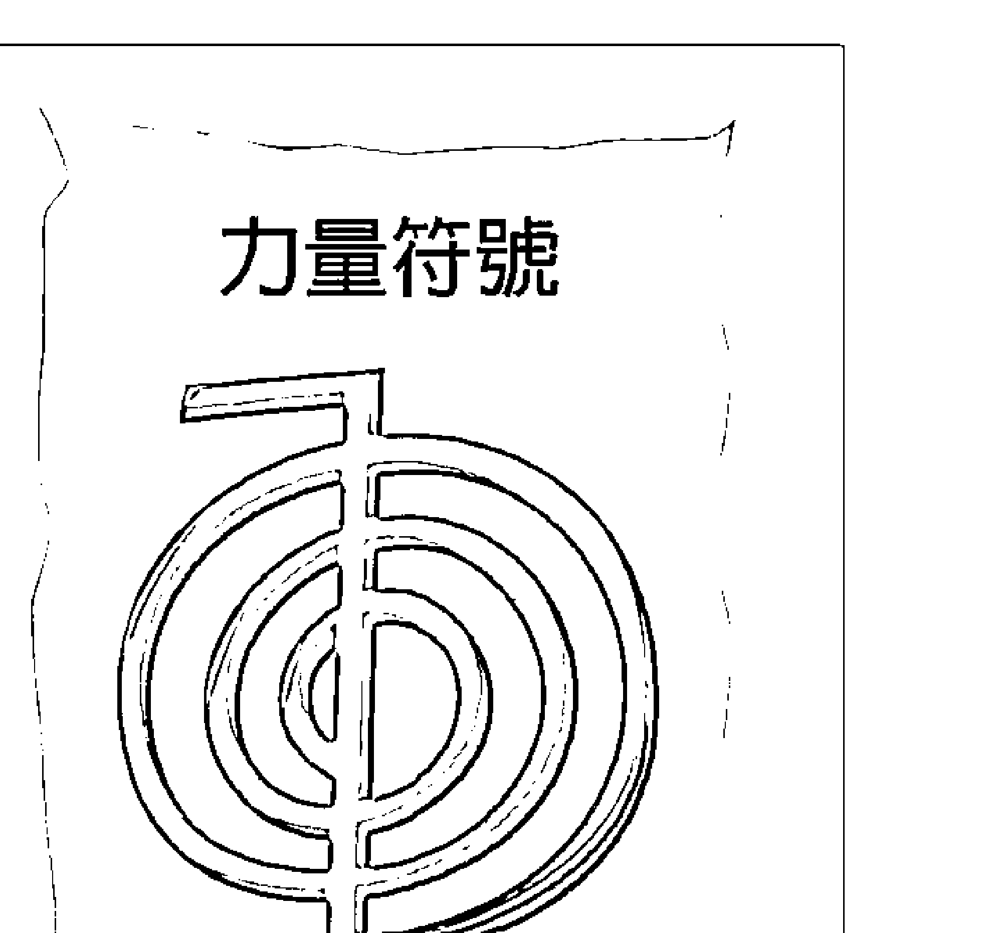

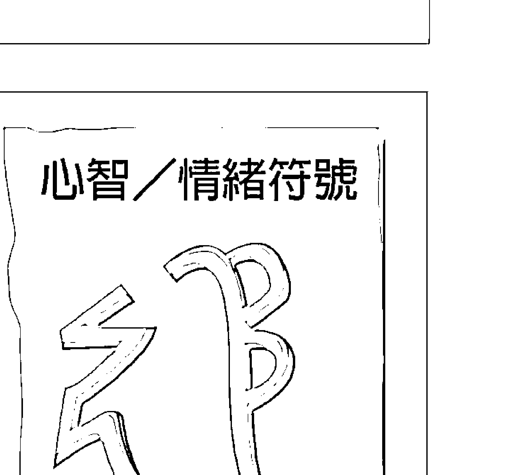

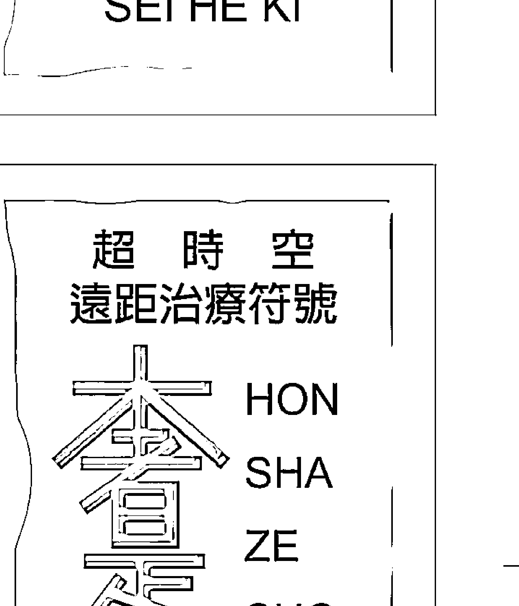

-   3. 至於靈氣接收者不在療癒現場的治療，應該要先由超視覺了解這個人，不然就是要有他的相片，然後使用HON-SHA-ZE-SHO-NEN的技巧，畫超時空符號在他的臉上，接著說我現在要給予你治療。畫完HON-SHA-ZE-SHO-NEN的符號之後，要畫SEI-HE-KI的符號（如果這個符號的癒癒能量是需要的話），如果只是一般的治療，那就在使用HON-SHA-ZE-SHO-NEN的符號之後，接著使用CHO-KU-REI這個符號。

-   4. 當然也可以用遠距離療癒的方式，給予靈氣接收者以下特別的治療：靈氣傳導師先筆直的坐在椅子上，膝蓋代表靈氣接收者的頭部，膝蓋以上到大腿根的位置代表靈氣接收者身體的軀幹，靈氣傳導師的右側代表靈氣接收者的前面，靈氣傳導師的左側代表靈氣接收者的背後。

### 要點：靈氣初級班的教學提醒

靈氣傳導師永遠都無法確定的是，究竟是甚麼原因會造成特定或其他任何對身體健康的挑戰，所以在進行初次的療癒課程時，首先開始治療整個身體、軀幹、頭及雙腳、以及進行「1-2-3-4」的療癒系統：

-   (1) 雙手平放在身體的右側。
-   (2) 雙手平放在身體的左側（心臟的位置）。
-   (3) 然後雙手以肚臍為中心點平放，一隻手接著另一隻手擺放。
-   (4) 最後保持一樣的手部姿勢，一隻手接著另一隻手後面，平放在脾臟（副脾臟的位置）和生殖腺的位置。

要注意手部振動的狀況，當它們產生振動時，就放久一點，直到振動消失。

然後治療頭部：眼睛部位（先用小毛巾覆蓋）也要覆蓋到眼睛和耳朵之間的位置。

治療耳朵時，只要將雙手覆蓋在它們上面，並要圍繞到耳朵後面的地方。

治療鼻子和鼻竇時，就覆蓋鼻子的兩側。真正有鼻竇的問題：要覆蓋上胸部以及前額到髮線的位置、下巴與喉嚨前面、嘴巴及牙齒、聲腔的位置、放鬆肩膀與上胸部。

接著治療脖子、頭部後面與頭頂。深度乾咳，則治療肋骨的側邊。浮腫的舌頭，要喝大量的檸檬果汁（檸檬水）及按摩腳踝球部位位置。手部、腕部及膝蓋的關節炎：雙手要覆蓋在關節處。在進行足夠時間的治療後，這些部位會開始「滲出」濕氣與結晶品（鬆軟的白乾酪樣）的小顆粒。自我有覺知的節食是極度重要的：果汁、蔬菜、茶、少量肉或不食肉、不抽菸、不喝酒。不要使用鋁製的鍋碗瓢盆，要使用不鏽鋼製的容器。不要喝牛奶和咖啡。建議每天都做治療，直到顯著的改善出現。青光眼，甚至眼盲，都能成功治療好。至於耳朵化膿，只要放一隻手指進去耳朵就可以了。每一個靈氣傳導師都應該每天有至少一個小時的靈氣自我治療。她說耳朵的鼓膜破洞無法被療癒的結果，其實也不盡然。有一種靈氣傳導師，靈氣對於祂（指耶穌基督）來說，所有事都是可能發生的。乙希爾·隆巴狄女士的觀察是很嚴謹的，而且對靈氣沒有任何貶抑的想法：靈氣（宇宙或創造的能量、神的力量）是一種堅定的信念與實踐應用系統。基於靈氣的特性及療癒的展望，靈氣可說是對宇宙全體的奉獻及實踐愛的力量。

靈氣在各方面的特性正好符合「耶穌」的教學，因為靈氣的行為是實用的祈請、祈禱及愛的行動，就像耶穌自己很清楚的聲明：依循你的信念，讓他成為你的一部分。

-   * 心臟病發作：先使用標準程序「1-2-3-4」的療癒法，然後治療頭部及肩膀，這個方法也可以應用在中風的療癒。

-   * 神經衰弱：同樣使用「1-2-3-4」的程序，然後特別治療背部的左半邊。

治療的程序不用太過分強調：總是先從標準「1-2-3-4」的程序治療身體前面與背面，然後再到頭部，不要忽略腳部的區域！當靈氣傳導師繼續進行全身治療時，一定會發現有「問題」的點，而這些地方就需要多花一點時間來治療。

正常來講，治療一個區域需要花大約十分鐘的時間，所以要使療程的平均治療時間控制在大約一個小時左右，除非靈氣傳導師沒有其他預約的行程，或有其他緊急的狀況發生。

依我的意見而言，靈氣對雙腳的治療，非常類似腳部反射區治療，但也不是完全相像，按摩神經的尾端、腳趾、腳踝的球部位，在短時間治療後，彎折及移動一下整隻腳。

如果靈氣接收者沒有糖尿病，則可以用手指壓的部位：

-   1. 脊椎的兩側（不要壓在脊椎上），從頸部往下到脊柱的尾端。如果靈氣接收者是糖尿病患者，就要由脊柱尾端開始按壓脊柱兩側往上到頸部。
-   2. 先從肩膀一側開始，用旋轉的方式移動雙手，然後再換另一邊的肩膀，也同樣使用旋轉的方法。

始終要包含身體下部能量中心的背部治療（針對男性而言：是生殖器官與前列腺；針對女性而言：是她們身體下半部的個別器官）。

-   (3) 腎臟也需要治療。膀胱控制功能的失調：要給予『1-2-3-4』治療法，然後治療膀胱與腎臟。在解尿的時候，建議不要一次持續的讓它流出來，要間斷式的解出尿液，因為這是為了要訓練膀胱肌肉的關閉與開啟，所以才要開始訓練膀胱肌肉的控制。

在開始嘗試協助治療他人時，記得總是要先讓自己恢復活力。靈氣是一種靈性—心智—身體的治療法，照料一個人的整體，正好符合現代預防醫學的考量。

#### 奉行正確生活的五項主要原則：

-   1. 就在今天，不要生氣或憤怒。（Do not become angry!）
-   2. 就在今天，不要憂慮恐懼。（Do not worry!）
-   3. 就在今天，感恩與知足。（Be grateful and count your blessings!）
-   4. 就在今天，誠實地工作賺取每日所需的報酬。（Do an honest day's honest work!）
-   5. 就在今天，和善地對待所有的一切。（Be kind to all and everything!）

#### 起源 白井靈氣起源標準版本

在與宇宙合一的狀態，我們稱為「生活在無限的存在空間」，無論你在哪裡、無論你是誰、無論你遇到或遭遇到什麼事，祂始終就是神，祂無所不在，除了祂，就沒有其他的事物。

靈氣的創始者是一間學院主要的管理者，也稱作「學院的精神領導」，名字叫臼井博士。有一天，他遭遇到畢業的學生挑戰他的信仰（因為臼井是基督徒），並詢問他「你能治癒人嗎？你能使盲人恢復視力嗎？你能在水上行走嗎？」在遇到這些挑戰後，他放棄繼續學習「耶穌」的教導，然後到芝加哥大學研讀七年的時間。

在那段期間，他也研讀其他宗教的資料，發現佛陀也能治癒人們，所以他返回日本，開始研究「禪宗」（ZEN），然後再研究中國字的寫法，希望可以發現有關療癒的秘密文字與知識。

在那時，臼井試圖從最古老的文字系統（梵語），找到他所想要的答案。後來，僧院中有一個年老的和尚，建議臼井可以去山上、進行齋戒二十一天及冥想他所要尋找的答案。臼井欣然接受並立刻動身，然後他經歷了一次靈性的啟發，因為他被光擊到額頭與看到白光中的符號……。在白井下山的時候（因為在冥想第二十一天後他必須回來），他遇到一件意外，不小心踢到自己的腳趾，然後發現他能夠治療這個傷口。當他回到僧院時，這位年老的和尚病了，白井告訴老和尚他所擁有的能力，並再一次證明他有治療的功能。這個故事是由高田女士親口說出來的，而她是由林忠次郎先生（白井後期的學生）的學生。這個故事是靈氣起源的標準版本，即便如此，宇宙的能量始終都是存在的，沒有開始，也不會終止。

## 【第十二章】高田·哈瓦優女士之初級靈氣班完整教學講義

本章的講義是高田·哈瓦優女士所教授的靈氣初級課程的原始教學版本。所有的圖表內容都是從原始的教學版本而來，基於作者不詳的因素，我們會稱這份講義的作者為乙希爾·隆巴狄女士。

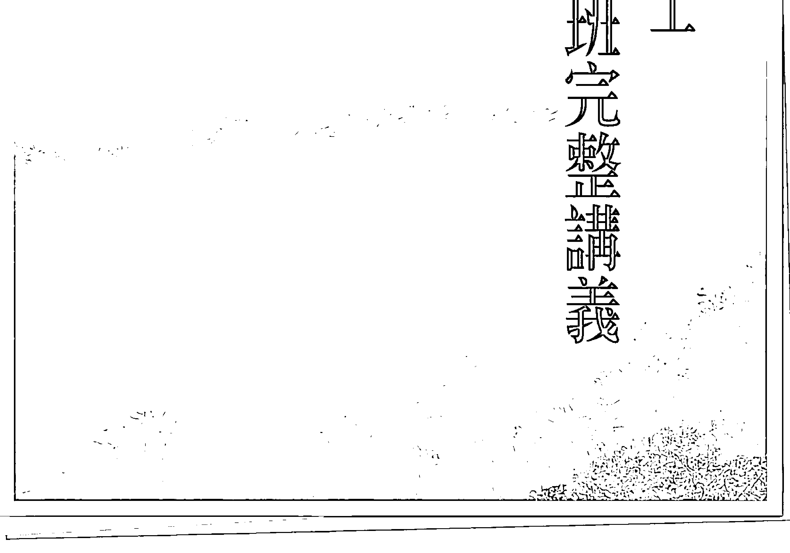

-   * 教授者：高田·哈瓦優女士
-   * 執筆者：乙希爾·隆巴狄女士（R.L. Ms. Lombardi）
-   * 教學程度：靈氣初級班課程
-   * 記錄時間：一九七五年八月二十九日
-   * 內容概要：靈氣會議期間，所記載之各種有用的意見及提示的雜記。

### 靈氣
宇宙的力量與智慧

從某種角度來看，這份講義是很重要的，因為它能啟發人們及幫助人們自己本身，而不需完全依賴靈氣傳導師或其他治療師。因為我們可以經由脖子的運動來達到保健的目的，另外，我還想增加腳部及手部的反射區治療、祈禱法及超過所有一切，一種強烈的想讓一切變得更好的渴望，這些方法也可以達到預防保健的目的。

人們必須學習控制他們的情感，如此才可以消除憎恨、憂慮、恐懼、生氣憤怒及貪婪，因為，以上所說的情感會釋放致命的毒素進入人體內，而且，這是一個醫學上可以驗證的事實。

靈氣能量的療癒方法是一個非常好，而且適當及實用的方式，因為我們可以經由脖子的運動來達到保健的目的，另外，我還想增加腳部及手部的反射區治療、祈禱法及超過所有一切，一種強烈的想讓一切變得更好的渴望，這讓兩個或更多的靈氣導師一起合作、彼此療癒、並加強彼此的信念、療癒經驗的交流及增加療癒的自信心。再者，耶穌也曾說過：「有兩個或三個以上的人們，一起聚集在我的名字中，而我就在他們當中。」由於「靈氣」一詞所代表的就是宇宙的力量與智慧，所以以上的引用是非常實用的。而且耶穌從沒有談到祂自己，只有談到宇宙的愛與智慧，以及祂所宣稱「祂自己與宇宙是一體的。」

◎ 如果你只有感覺到一隻手有能量，你可以自己握住雙手，兩手手相互摩擦充電或啟動另一隻手的能量。

◎ 當你碰到身體感覺較冰涼的區域或部位時，這是一個非常明確的指示，表示這些區域或部位需要被治療（除非這個人是用冰做成的）。在我們雙手放在這些區域或部位一段時間後，有些人可能會感覺到能量振動的感覺，當我們感覺到這種情形時，接著就會進行一般例行性的療癒方式，直到振動感停止或者是療程約定的時間到了，而且還要對這些部位或區域持續更多次的療程。

◎ 當雙手放在治療的區域時，靈氣接收者是不必要感覺到被療癒區域的振動，而且他們也可能會在完全不同的部位感受到這種能量的振動感。

#### 筆記
初級靈氣班完整講義

#### 靈氣治療班—第一夜

◎ 靈氣傳導師要遵從並傾聽他們自己內在的指示與感覺來做事。
◎ 靈氣傳導師要允許自己有更多的時間來做療癒的工作！如果療癒的效果不是立即的，也不要氣餒，讓靈氣接收者放輕鬆或睡著，也能讓緊張的感覺消除或減小。
◎ 最好與所有的靈氣接收者，都要有一致性療癒開始和結束的時間，特別是要療癒很多靈氣接收者的時候。

當我們四個人被引領進入一個房間，並被要求坐在直背式的椅子上排成一直線。我被告知要把我的手錶取下，因為高田・哈瓦優女士的能量可能會使手錶損壞。稍後，她為我們解說靈氣，我們如何稱呼這個能量不重要，以及我們不知道如何運作，也沒關係，因為她會展現給我們看，教我們如何正確地使用靈氣。

接著，她要求我們的雙手合掌成祈禱式：手掌對手掌平直的擺放，手臂放鬆，將雙手舉起至第三眼處，讓兩隻手的大拇指碰第三眼。然後，我們被告知用這個姿勢閉起眼睛來，而她就站在我們前面左側約幾英尺的距離。

在一段時間後，我們感覺到一股巨大的力量產生，有很多靜電圍繞在皮膚上的感覺，特別是在臉部及手部可以感覺到這股能量。因為我們不能張開眼睛看，但我知道她已經移動到我們的前面。她雙手碰著我們的雙手兩或三次，這可能是她在祝福或淨化我們的手指與雙手。有一次，她很大力地用嘴巴吹我們的臉，然後她告訴我們：「可以睜開眼睛了，過去已經結束而且完成了，你的雙手現在是療癒的手。」

接著，我們離開這個隱密的房間，進入一個起居室。在偌大的起居室中，有排成一列四張直背式的座椅，一張接一張的後背擺放著。我們也被告知坐在椅子上，開始治療前面的人。

她告訴我們，要如何將雙手放在前一個人的肩膀上，在指尖放少許的力量，然後將手掌靜止在肩膀上，這時我們應該可以在我們手指的尖端感覺到振動，以及感覺到另一個人從我們肩膀上傳來溫暖的感覺。至於坐在最前面的那個人，則將他的雙手放在雙膝上，大約五分鐘的時間，我們就更換座位，所有的參與者都經歷了這次的能量體驗。

> 「從現在開始，我們更應該要療癒我們自己，那些超重的人應該減掉肥胖；而那些不夠重的人應該增加適當的體重。」

而我相信，當我在排排作治療時，我已經歷了一次右耳被治療的能量體驗，接著，她概述了兩種系列的療癒方法：

- 1. 將兩隻手放在眼睛上面，用輕微的力量放在眼球上十分鐘，然後移動雙手到耳朵上面一點的位置，同樣十分鐘，接著移動雙手到腦後，放在脖子以上的位置(枕骨區)，一樣是十分鐘的時間。
- 2. 這個系列的療癒法，非常類似「脈輪的療癒方法」，將你的雙手覆蓋在太陽神經叢上，然後覆蓋在脾臟、生殖區域、心臟、喉嚨及前額(每個位置一樣放置十分鐘的時間)。

當你療癒自己或他人時，想甚麼並不重要，還有，不管你如何站或坐，只要讓自己覺得舒適就好。無論在自己或其他人身體哪個部分有「不調和」，你都能感覺到在你手上會出現能量的振动感。

#### 掌握靈氣磁場的技巧
The Complete Guide to Reiki®

她提到一個黑人女生的療癒經驗，這個黑人女生患有糖尿病，而且幾乎要喪失她的視力。她無法看報紙，體重也超重得很厲害。然而，在九個月的減重及靈氣療癒後，這個黑人女生立刻重新獲得她的視力。她說，這個女生不需要戴眼鏡了，雖然她以前的大半生都戴著眼鏡，自從被療癒過後，不再需要戴眼鏡了。

過了一會兒，換我坐在椅子最前面的位置。我可以感覺到力量從他們身上發散出來，也能看到他們身上強大的氣場，甚至在他們離開治療的位置後，他們的氣場仍然保持強大。另外，我在一個同伴的身上，看到他整個身體的氣場，而不僅僅只是他頭部的氣場。

還有，我有一種感覺，就是坐在椅子上的靈氣接收者之間，形成了一個靈性連結的「弧形」能量，但我無法好好地詢問有關這個能量的問題。

有時她對於高田女士的回答會有點尷尬，因為我感覺到她不想要給予超過她已設計好的課程內容。

接著發布明天(第一晚)的行程：所有的治療是涵蓋脖子以上的相關部位，也包括精神障礙的問題。

我們的團體大約有十二人，主辦人保羅·詹姆斯(名字改變是為了保護當事者)也在這個團體裡面。

#### 靈氣治療班——第二夜

這註定會是一趟有趣的四天體驗！祝福這個小女人。

她強烈要求我們今晚還要繼續練習靈氣的治療。有什麼更好的方法可以記住她告訴我們的事呢？因為，她不想要我們記筆記，只是要我們緊密地注意她的動作。而『遠距治療』是取得畢業資格的科目，但這是針對那些已經熟練她所教授靈氣基本課程的人。

##### 療癒的部位及方法：

今晚的主題是有關從肩膀以上到頭部所有一切的部位。我們同樣有十至十五分鐘屬於個人充電的時間。這次我們立刻被告知，把我們的雙手放在昨夜所提過的祈禱位置：雙手一起合掌擺放，肩膀放輕鬆，特別是身體也要放輕鬆，然後將雙手放在約第三眼的位置。這時，我感覺我的雙手，從手腕以上開始變得暖和，它們幾乎被熱呼呼的感覺所充滿。當熱的感覺抵達我的指尖時，我感到一陣刺痛。

- ◎治療眼睛：因為做任何事都需要用到眼睛。眼睛的疾病包括青光眼、白內障、麥粒腫、瞼腺炎等。放一條小毛巾或面紙在眼睛上，將手指放在眼睛上，然後移動頭部側邊，接著到頭部後面。高田女士已經成功療癒所有眼睛會罹患的疾病，有些人需要幾個月的時間，也有人可能只需要一些時間的治療就可以了。最好每天進行靈氣治療十五至二十分鐘。
- ◎治療鼻子：將一條小毛巾放在鼻子上，但不要蓋到鼻孔，然後將手放在鼻子上，接著顴骨、前額，最後到頭頂。
- ◎治療氣喘：將手放在喉嚨的根部與肩膀連結的地方，然後放在下巴的下方、臉頰及鼻子（像治療鼻子所註記的位置）。也要治療女性的卵巢，或男性的前列腺，以及太陽神經叢的部位。
- ◎治療耳朵：將雙手放在耳朵上，放一隻手指伸進耳朵內，然後讓靈氣接收者側邊躺，將雙手放在耳朵後面，接著換躺另一邊，在另一隻耳朵也做同樣的靈氣治療。太陽神經叢及喉嚨的部位也需要做治療。耳朵的毛病可能是從錯誤的營養攝取開始，在靈氣治療過後，要記得清潔耳朵內部。而且，也要清洗眼睛，但不要用手揉眼睛。
- ◎治療聲腔及加強聲音：將手（含手指）放在喉嚨與肩膀交接的凹陷部，然後治療喉嚨周圍所有的部分。
- 治療偏頭痛及頭痛：它們會發生，通常是由錯誤的營養攝取所引起的，因此胃部及腎臟需要被治療（第三天的講課），然後將它們當作氣喘及花粉熱的症狀來治療，也要治療頭頂、頭側及喉嚨。
- 高田女士也指出腳部應該被治療，當然也要把鞋子脫下來。
- 掉髮、禿頭也能治療，但是適當飲食的遵守是很重要的，像多喝檬汁及食用種子等等。但是她沒有說太多有關飲食方面的資訊，但有指出正確飲食的重要性。
- 治療牙齒：將雙手放在下巴的上半部及下半部，移動雙手去覆蓋所有的牙齒。
- 治療牙齦的問題：與上面同樣的療癒部位，不要擔心牙齒是否會鬆動，因為這部分也是淨化和治療的過程，當牙齦被療癒，就能重新收緊牙齦了。
- 治療舌頭及嘴巴裡面：與治療牙齦是相同的方法。
- 治療甲狀腺腫：甲狀腺腫（可見到明顯的甲狀腺腫及不明顯的內在甲狀腺腫）的發生是因為不正確的消化作用，所以太陽神經叢與腎臟應該先被治療，然後將手放在脖子的根部位置、甲狀腺腫的位置、然後治療眼睛（方法同前所述）。甲狀腺腫會造成腫脹的雙眼，還有也要治療心臟，因為甲狀腺腫也是一種血液循環系統的問題。
- ◎治療疣和息肉：相同的方法，將手放在有疣及鼻子（如果有息肉）的部位，經過治療一段適當的時間後，它們就會自行掉落，包含它們的根部都會脫落。一般來講，息肉通常會被切掉或燒掉，但這樣息肉的根部仍然會存留，而造成再次的生長。

今天我們的課程指導員很認真的提醒我們，療癒的發生是經由神的力量，以及藉由我們「靈氣的雙手」簡單的能量通道，讓這股能量自然地流過人身體。

另外，高田女士擠出我們示範者背部所有的「黑頭」粉刺，以及指出會長出黑頭粉刺的原因，是吃太多的象徵，特別是吃太多糖和脂肪。

今天同樣地在我們的靈氣課程之後，也以四張直背椅子連續排列的方式坐著，就像昨天所述的一樣。在靈氣課程與椅子的排列治療，我們都間隔著男生和女生。而且她還說，我們永遠都不會喪失我們的療癒力量，但如果我們想嘗試教授其他人靈氣的話……：（這可能就另當別論）。

她說如果我們經常練習我們所學到的能力，那每個人的能量敏感度都會獲得改善。當我們經歷到有刺痛的感覺時，那就是我們遇到一個需要被治療的部位。但是，當這種感覺停止時，就表示要再次移動我們雙手的時間到了。

> 「療癒你自己！療癒你自己！」

她說這句話最多次了，還有一句就是「你就領先其他人。」

她也指出，靈氣傳導師向人索取服務費用並沒有什麼不妥，何況靈氣傳導師投資了他們的時間與金錢去學習，才能讓治療工作變得很有效果。她還說，靈氣傳導師可能還必須支付療癒室的相關費用，因為如果療癒室的時間沒有被預約滿的話，更不用說桌子的成本，以及房間的設置成本，還有可能會有因療癒工作所帶來的「副作用」，就像腹瀉、能量虛弱及感覺沮喪、生氣等反應的產生。

在開始治療前，冥想和祈禱是一個能夠幫助「專注」的好方法。最好要注意及紓解靈氣接收者可能會有憂慮不安的心情，還有靈氣傳導師可能會發現靈氣接收者的能量呈現上上下下，不穩定的狀態，但只要持續的治療，這個狀態最後會獲得調整並達到平衡。

有時靈氣傳導師自己的親人，會拒絕相信他們家庭的成員是具有天賦能力的。

大量的排汗，是療癒產生的徵兆。在治療時，有很多人都有同樣的感覺，就是身體沒有一處是可以讓靈氣導師的雙手休息。

有一個很好稱呼我們工作的名詞，就是靈性治療。因為不只涵蓋雙手的治療，也包含靈性的諮詢服務、祈請，以及「沒有任何宗教束縛」的原則。

- ◎當雙手以這樣的形式放在一起時，就能獲得一股增強又集中的力量。

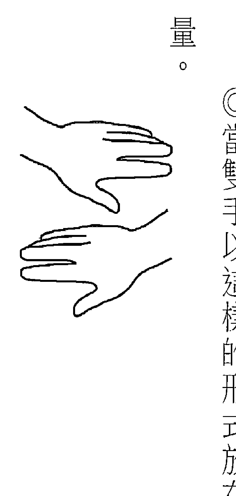

- ◎治療背部的時候，將雙手擺放如圖示的方式，並保持移動，往下、往下、往下，在脊椎兩邊的位置，接著最後治療脊椎，從頂端到底部。

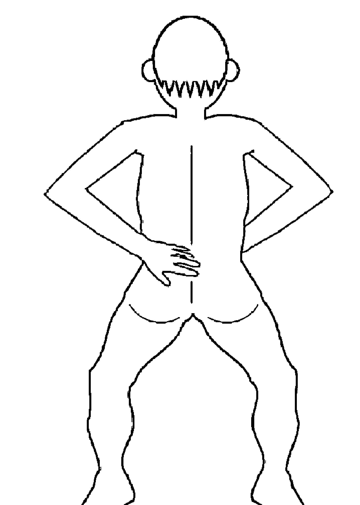

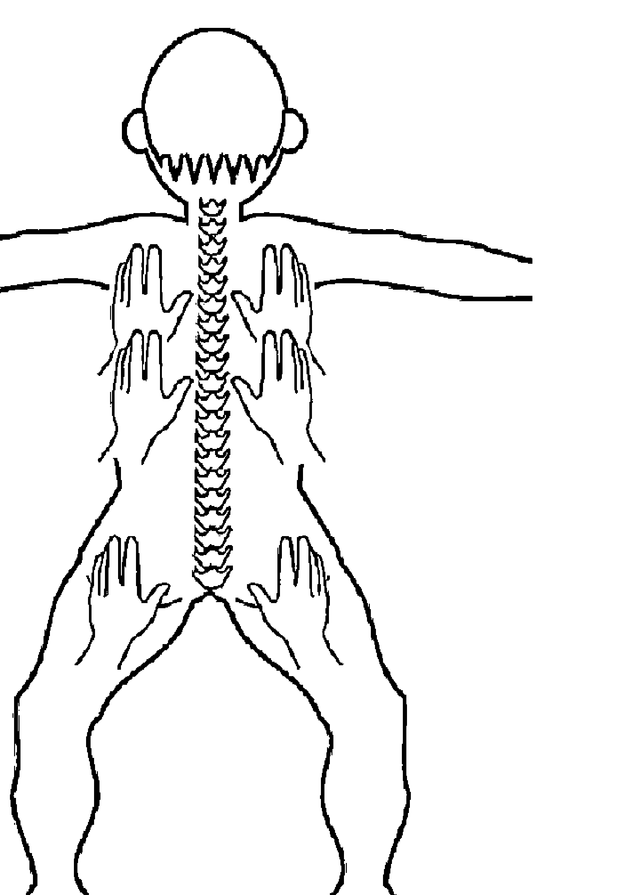

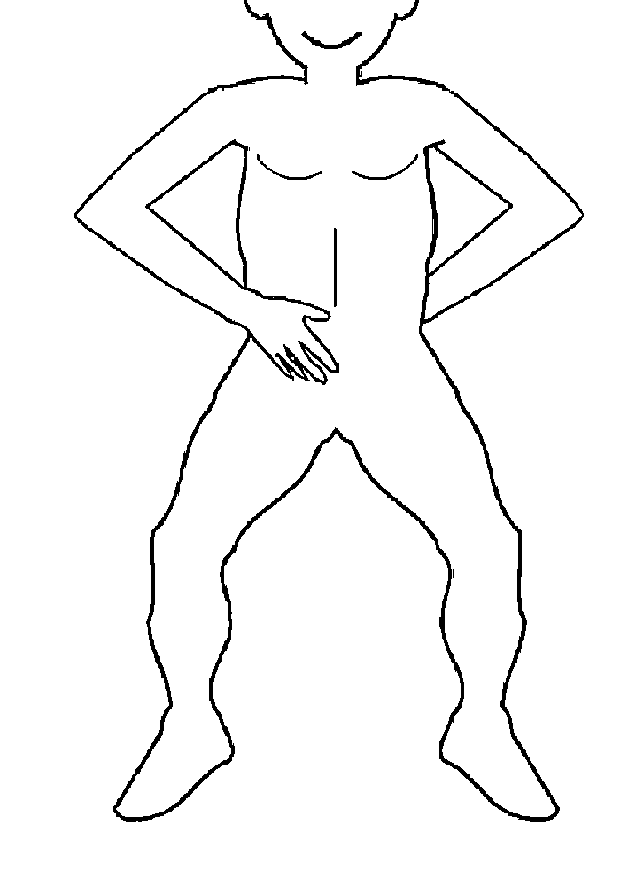

- ◎有一種X光線般的治療能夠使用，只要將你的右手放在身體前面的不調和處，左手放在背後。（如果你能使用這種功能）一般說來，這是兩個靈氣傳導師才能進行的事，而單獨一個靈氣傳導師是無法進行的。

#### 新增的第二夜註記(於第三夜時才給予)

- 偏頭痛：也要治療雙腳。
- 嬰兒流口水：治療頭部、牙齒與腳底。
- 眼睛疾病：如講義敘述的，也要治療卵巢或前列腺。
- 流鼻血：如果動脈出血，放冰塊在脖子後面，捏住鼻子。可能需要一到二小時才會停止。
- 舌頭功能障礙、腫脹的舌頭：治療頭部及喉嚨，也要治療雙腳。

#### 靈氣治療班—第三夜

##### ◎ 1-2-3-4治療法：

這幾乎是全能的治療方法，因為雙手覆蓋相當大的面積，所以不需要擔心是否放在正確的位置。課程指導員說，太陽神經叢是身體主要的動力中心，它會影響所有其他脈輪的運作，因此將它作為A1的操作順序。

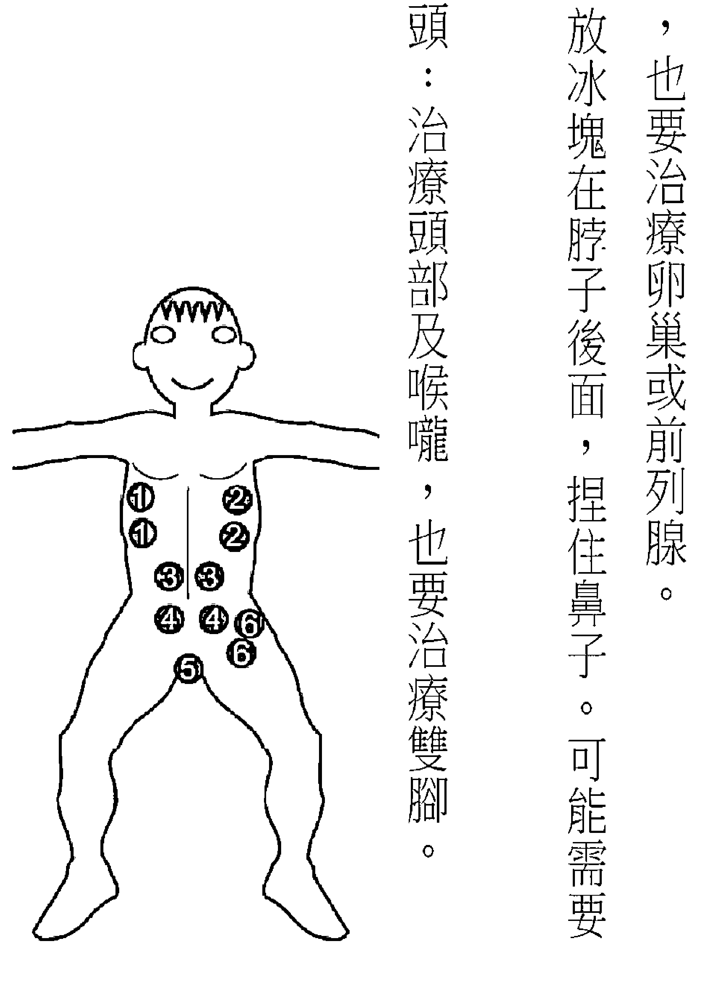

- ※不好的呼吸習慣，是消化不良的象徵(或是不好的牙齒也是)。
- ※如果有便秘的情形，就治療(6)的位置。
- ※可以使用靈氣治療人們、植物、動物及魚。
- ※活化你的食物(祝福它、看待它就像神的本質，因此每一餐都是分享神的本質，神聖與有益身心健康合一的晚餐)。
- ※肺炎、結核病、癌症(身體的任何部位)及膽囊－都要使用1到4的治療法。

先從症狀輕的開始，這是為了要增加自信心及增進療癒的過程－用靈氣傳導我們自己的信念。千萬不要氣餒及放棄！

- ※靈氣=宇宙生命能量、神的力量、造物者的智慧。
- ※食物：葡萄柚汁、生的甜菜根、磨碎的粗芹菜、大豆奶。
- ※(5)所指出的位置是治療結腸與膽囊。
- ※深紅色甜菜根對癌症與血液淨化很有幫助。
- ※先避開第二級的出血治療，但可以治療第一級的出血，然而首先要有心理準備，它可能會有變得更糟的情形，因為新的出血狀況，顯示身體的淨化已經開始了。

##### ※肺炎：

將靈氣接收者的手臂放在腦後，然後仰躺，將兩隻手放在靈氣接收者其中一邊的肺部下面，然後再換到另一邊的肺部治療。

注意：不要移動靈氣接收者，只要有足夠的空間將手放進靈氣接收者的背部就可以了。如果靈氣接收者出汗了，要輕輕地擦掉，而且要往心臟的方向擦汗，臉部與喉嚨則往下擦汗。還要給予靈氣接收者流質的食物，而且治療至少要持續 2 個小時以上。

##### ※打嗝：

將手臂放到腦後，治療橫膈膜（3 及 4 的位置）直到打嗝停止。

##### ※打噴嚏：

與治療流鼻血一樣的方式。

##### ※心臟問題不是只有一個原因，也可能是其他地方所引起的反應！治療 1 至 4 的位置，然後治療心臟。

##### ※高血壓：

治療 1 至 4 的位置，然後頭部、喉嚨及心臟。

##### ※肺氣腫：

治療 1 至 4 的位置。

##### ※動脈硬化症：

治療 1 至 4 的位置及頭部。

##### ※尿床：

治療 1 至 4 的位置及膀胱 (5)，然後翻身治療腎臟。請靈氣接收者嘗試不要持續的解尿，可以採取停止——繼續——停止——繼續——停止——繼續的方法。

- ※腎臟 : 自我治療||站立，雙手放在腎臟的位置。治療其他人 : 翻身臉朝下及將雙手放在腎臟上面。
- ※中風 : 讓靈氣接收者平躺在地板，鬆弛所有會感覺束縛的衣服，使用1至4治療法，然後頭部。如果靈氣接收者有一側的身體僵痛：就往下方治療，讓血塊往下流。注意，左側的頭部是管理右側的身體，而右側的頭部是管理左側的身體。
- ※小兒麻痺症 : 使用1至4治療，然後翻身將臉朝上，就像一般感冒的治療法。
- ※水痘 : 使用1至4治療加上所有的頭部治療。
- ※燒燙傷 : 只要將手放在燒燙傷的位置上面(隔空治療)。
- ※皺紋 : 在年輕與健康的人身上出現皺紋，表示身體需要更多的水分！年齡的皺紋 : 將雙手放在皺紋的地方，將皺紋往上推或是往內推。它們就能被固定在內部。
- ※關節炎、風濕病、坐骨神經痛、滑液囊炎 : 使用1至4治療，往下按摩腿部。

課程指導員：始終要有相信神的信念！結論：靈氣治療方法是屬於一種由人們提供自己當作神的力量通道的治療方式。靈氣能量的啟動儀式：無疑是有關強大的力量，它可能是一種神聖或治療的靈性能量所啟動的，「聖靈」？「高靈」？還是課程指導員？

#### 靈氣治療班——最後一夜

我加入第一組並進行我們平常個別的「能量充電」，而後我們被告知合起我們的雙手形成祈禱式，然後提起它們到第三眼處（就像其他晚上所做的動作一樣），將大拇指貼在約第三眼的地方。我第一次感覺到手腕暖暖的，暖暖的感覺慢慢上升到我的手指頂端，就好像我的雙手是一個裝滿熱氣或能量的杯子。

當課程指導員站在我前面時，我感覺到好似整個胸腔敞開，有一股既柔和又溫暖的能量流，從她那邊流進我的胸腔。接著，她也走到我們的背後，感覺像在拉引我們的頭部，將它往背後拉。最後她告訴我們，我們療癒的能力是永遠存在的，我們永遠不會失去這個療癒能力，除非我們想嘗試教授或將靈氣給予其他人。（我想她的重點是說，我們只是靈氣的通道，不能將自己的靈氣給予其他人，因為這樣會讓自己的能量流失。）

當我們進入會議室後，我們再次用四張椅子排成一直列的方式，治療前面的人。

這個晚上是從脖子以下的背部治療。雖然我們學習的是身體前面部位的#1至#4治療，但今天所教授的是背部的相對位置。

依據我們課程指導員的說法，治療是包含身體前面和背後的位置，而且應該持續治療約一個半小時，還要有足夠長的時間去治療#3和#4的位置（包含身體前面與後面）。

- 鼻竇炎、耳朵和鼻子的問題，也要治療肺部（在#1位置以上的背部位置）。
- 頸部扭傷：治療喉嚨、脖子和背部。

##### ◎ 神经衰弱：特别治疗位置#1和#2的左侧，每天治疗约持续三至六周的时间。

课程指导员建议，当疗愈正在显现时，应该每天都要治疗。

##### ◎ 治疗脾脏是很重要的，因为她称这个部位是心脏的计时器，所以要治疗#2、#3、#4位置的左侧部位。

##### ◎ 痔疮和前列腺的问题等等，治疗#5的位置。

##### ◎ 痔疮出血是很危险，会导致大量出血，所以一定要治疗身体的前面和背部#1至#4的位置及位置#5的治疗。

##### ◎ 心脏的问题可能是胃胀气或肠胀气的问题，导致把胃肠的杂气反推回去心脏的部位。要给予身体前面和背部#1至#4位置的治疗，然后按摩身体背部到心脏的位置。

##### ◎ 静脉曲张——治疗身体下半部的前面和背面，然后将手放在有静脉曲张的静脉上。

##### ◎ 西洋菜对心脏病很好。

##### ◎ 皮肤的杂质是有消化功能的原始问题，先治疗胃部，然后脸部。

- ◎雞蛋可能會造成皮膚發癢或皮膚疥癬。
- ◎新鮮的番茄汁很好，不要喝罐裝的。
- ◎斷裂的指甲｜要喝水凝膠狀的溶液（我想是類似膠質的溶液）。

課程指導員一再強調身體前面和背後#1至#4位置的治療很重要。 在治療頭部時，有一個很重要的思考點：不要只是治療產生結果的地方，要辨別問題的起因和結果，以及哪些地方可能是問題的起因，我想這 就是為什麼她特別強調位置#1至#4的治療，因為這些位置是大部分問題的 起因。

晚上的剩餘時間是花在聽取靈氣治療方法的歷史，而有趣的是，它並 沒有給予我們任何其他基本技法的知識。至於進階的靈氣課程會在適當的 時間進行，包含遠距離的治療課程，以及更多艱難的主題，然而即使是進 階班的畢業生也不允許教授靈氣課程。因為在課程二之後，還有最後的課 程三。而課程三的畢業生，才有資格教授靈氣。

高田女士強調，正確的靈性態度會隨著療癒一起進展（這是在她談論 靈氣的歷史時說的話）。

### 傑佛瑞·馬丁的靈氣傳承

| 傳承者 | 導師 |
| :--- | :--- |
| Dr. Mikao Usui (臼井甕男) | |
| ↓ | |
| Dr. Chujlto Hayashi (林忠次郎) | |
| ↓ | |
| Hawayo Takata (高田·哈瓦優) | |
| ↓ | |
| Phyllis Furumoto(菲莉絲·古本) | (創立靈氣聯盟 The Reiki Alliance) |
| ↓ | |
| Pat Jack/Catol Farmer | |
| ↓ | |
| Cheri Prasuhn/Leah Smith | |
| ↓ | |
| William L. Rand | (創立世界靈氣協會及卡魯那靈氣) |
| ↓ | |
| Jeffery A.Martin(傑佛瑞·馬丁) | |

### 參考資訊

#### ◎國際靈氣中心資訊網

- 1. 世界靈氣訓練中心 The International Center for Reiki Training
網址：http://www.reiki.org/
- 2. 高田女士孫女Phyllis Lei Furumoto的靈氣中心
網址：http://www.usuireiki-ogm.com/
- 3. 美國靈氣協會
網址：http://www.reikialliance.com/
- 4. 靈氣新聞網站
網址：http://www.reikipress.com/index.html

#### ◎全國靈氣課程諮詢中心

- 1. 台北／桃園—靈氣人生—羅淑薰老師
電話：0928-100-923
龍潭總教室：桃園縣龍潭鄉百年二街17-1號（百年大鎮內）
台北教室：八德路四段106巷10弄6號1樓
網址：http://www.reikilife.com.tw/index2.aspx
E-Mail：info@reikilife.com.tw

2. 台北 — 棄緣得止靈氣研習中心 — 王宇謙老師(Anne)
電話：0958-928-639
網址：http://www.reiki-masters.com/
E-Mail：anne@reiki-masters.com

3. 台北 — 中華身心靈關懷協會 — 廖云釩老師
電話：(02)8773-0223
住址：台北市忠孝東路四段183號11樓之2
網址：http://www.sealove.org/p-crystal-reiki.htm
E-Mail：ibmsa001@gmail.com

4. 台北 — 梅翠亞能量中心 — 張盈螢老師(Cathy)
電話：(02)2926-1696；0911-060-882
住址：新北市永和區福和路190號4樓之1（近永和區公所）
網址：http://tw.myblog.yahoo.com/austcathy
E-Mail：ying28@gmail.com

5. 台北 — AKASHI阿喀許多元靜心中心 — AKASHI老師
課程連絡人：曾桂鈺(Rita Tseng)
網址：http://www.akashi.com.tw/reiki.htm
E-Mail：akashi@akashi.com.tw

6. 台北 — 喜马拉雅生活空間 — 莫雪子老師
電話：(02)2503-6563
住址：台北市民生東路三段19號4樓(近合江街口)
課程連絡人：秀美
網址：http://www.hlspace.com/
E-Mail：shell@hlspace.com

7. 苗栗 — 香巴拉全向自然學院 — Aurora老師
電話：037-823899
住址：苗栗縣南庄鄉南富村22鄰四灣77~25號
網址：http://www.dreamvillage.com.tw/main/
E-Mail：dreamvillage@livemail.tw

8. 台中 — 心田 — 心靈的小花園 — Nori Wang老師
電話：0912-601-341
住址：台中市漢口路一段12號2樓
網址：http://www.nori-love.idv.tw/wordpress/
E-Mail：fiveflower@gmail.com

# 掌握靈氣磁場的技巧 The Complete Guide to Reiki II

掌握靈氣磁場的技巧 The Complete Guide to Reiki II 傑佛瑞·馬丁 (Dr. Jeffery A. Martin, TRM, ARM)著； Grace Wang & Harvey Guu合譯 初版 臺北市：大康，2012【民101】 256面；15X21公分-(生活誌;022) ISBN：978-986-6353-22-2（平裝） 1.另類療法 2.健康法 3.能量 418.995 101005531

### 生活誌022

-   作者：傑佛瑞·馬丁 (Dr. Jeffery A. Martin, TRM, ARM)
-   譯者：Grace Wang & Harvey Guu
-   總監：李翠瑩
-   主編：鄧以慧
-   美術主編：洪雅雲
-   校對：白從寬、宋秀愛
-   封面設計：洪雅雲
-   繪圖：白從寬
-   攝影：Harvey Guu
-   模特兒：Cherry

出版者：大康出版社
地址：106台北市大安區浦城街9之8號1樓
電話：(02)23628872
傳真：(02)23626189
劃撥帳號：22448701，戶名：大康出版社
網址：http://www.dacombook.com.tw

總經銷：吳氏圖書股份有限公司
地址：235新北市中和區中正路788-1號5樓
電話：(02)32340036 傳真：(02)32340037
製版印刷：大頂印刷事業股份有限公司
初版一刷：2012年4月

平裝定價：新台幣280元

版權所有，翻印必究（破損與折頁，請寄回本社，免費為您更換）
Copyright (c) 2012 by Dacombook Publishing Inc. Taipei
Printed in Taiwan. All rights reserved. Photos and articles may not be reprinted without permission.Damaged or misbound copies returned to us will be gladly replaced.
ISBN：978-986-6353-22-2

出版合作洽詢：02-23628872

傑佛瑞·馬丁 著
Dr. Jeffery A. Martin, TRM, ARM

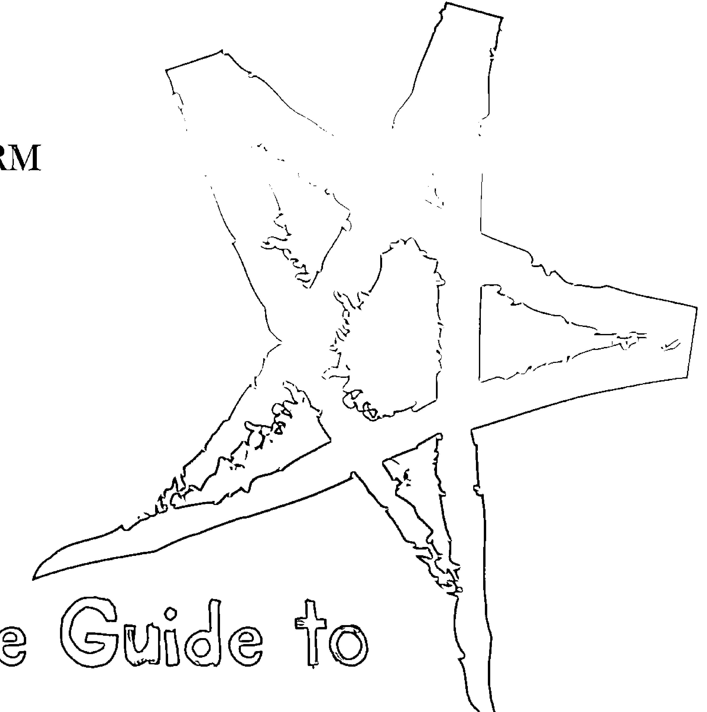

# The Complete Guide to

# 掌握靈氣在啟發場的技巧

# Reiki II

傑佛瑞·馬丁，他是世界各地眾所周知在靈氣領域內一個最重要的大師。在一九九〇年代初期，創辦靈氣協會進行許多靈氣能量的研究，並廣泛地舉辦各種講習班，開創更簡易的課程，並創造出第一定價結構及創造出第一個遠距的學習課程，擴大了靈氣學習的無障礙環境，並研究各種不同靈氣派別的歷史，及調和周遭所有的世界進入靈氣的潛能中。