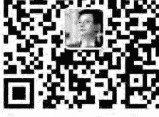
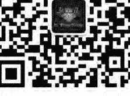
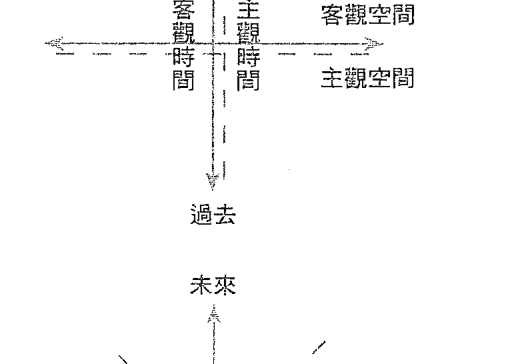
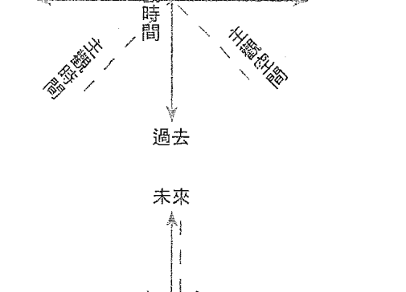
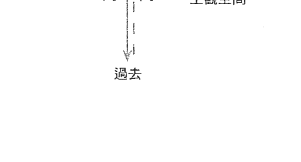

# 新世代小孩

# 與人類意識大蛻變

# Children of the Fifth World

A Guide to the Coming Changes in Human Consciousness

新世代小孩的到來
是人類意識演化的量子大躍進
蛻變正在發生，舊世界消逝
一個嶄新的地球天堂就要來臨

作者／P.M.H. 阿特沃特（P. M. H. Atwater, L.H.D.）

譯者／楊仕音、盧心權、黃春華 合譯

歐林開啟光體授證教師／靛藍小孩社群講師

劉瓊玉 專文推薦

為何「占領運動」席捲全球？本書將告訴你答案……

# St. Royal College

天使神秘学院

- 专业占卜预测机构
- 神秘学培训机构
- 水晶能量研究中心
- 官方淘宝：http://strc.taobao.com
- 官方微博：http://weibo.com/715104687
- 新书发布QQ群：659338717
- 购买更多好书请联系院长大天使

大天使

天使神秘学院 院长

QQ：715104687

手机/微信：13641926204

微信公众平台：strc2011

# 制作说明：

本书由《天使神秘学院》出重金从台湾购入的原版书籍扫描制作完成。为达到最好阅读效果，特地把原版书全部切开后，再经由专业扫描设备高精度扫描完成，并经过一张张的PS后期处理最终成书，其间花费大量的人力、物力以及时间，只为能给大家提供经济并优质的神秘学学习资料而努力。

本学院强力谴责某些机构和个人，把本学院花心血制作完成的电子书籍，包装后直接放在自家淘宝网上低价倾销的行为，以谋取不劳而获的经济利益。如果长此以往最终将无人愿意再为大家花心思制作电子书，那以后可能大家再无新书可读。

为让大家以后能够读到更多的好书，也为了本学院的良性发展。本学院恳请大家尽量做到如下几点：

- 1. 尽量在本学院的网站购买电子书籍。
- 2. 请勿用技术手段把电子书内的水印及加密去掉。
- 3. 在收到电子书后小范围传阅即可，千万不要公开传播，更别挂到淘宝网上低价销售。

同时为答谢广大支持者，学院电子书将做如下调整：

- 1. 学院会把一些早已收回制作成本的电子书折价销售。
- 2. 最新制作的电子书籍会开放打印功能，大家购买后有条件的可自行打印成书。

天使神秘学院

# 獻詞

獻給世界各地的每一位孩童：謝謝你的造訪。無論你待在地球的時間多長，我們對你的造訪感到慶幸；對你帶來的能量、想法與氣息由衷感激。

獻給我的孩子與孫子們：你們之中的每一個人，都是獨一無二的恩典，並擁有充滿親吻、擁抱與愛的溫暖心靈。我非常感激能參與你們的生命，也感激在我的生命中有你們相伴。

另外我還要感謝泰瑞·阿特沃特、斯蒂芬妮·威爾茨、阿爾特·彥森、威廉·里莫、羅傑·派爾、約瑟夫·奇爾頓·皮爾斯、琳達·西爾弗曼、貝蒂·麥克斯韋爾、羅伯特·西爾弗斯坦，少了你們的幫助，這本書不可能誕生。

最能捕捉孩童生命真相的文字，首推紀伯倫（Kahlil Gibran）大作《先知》（Prophet）裡其中的一段：

你的孩子不是你的。
他們是生命對自身渴求所生的子女。
他們藉你而來，不是因你而來。

# 推薦序

# 作者序

# 前言

- 1. 撕下標籤 015
- 2. 新世代小孩 018
- 3. 第五人種 024
- 4. 出生衝擊 031
- 5. 急速成長 041
- 6. 中心樞紐 051
- 7. 地雷區 064
- 8. 流沙 074
- 9. 想像世界 084
- 10. 獨特的腦 098
- 11. 獨特的觀點 116
- 12. 世代因素 129
- 13. 困惑的雙親 143
- 14. 教育絆腳石 158
- 15. 食物、健康、環境 176
- 16. 社群 193
- 17. 政商結構帶來的新企業 211
- 18. 第五世界 230
- 19. 時間軸及其改變 246
- 20. 大蛻變 267
- 21. 宏偉的計畫 285
- 結語 303
- 後記 306

# 推薦序—— 與新小孩共創地球新天堂

我非常敬佩作者以愛和耐心，帶著讀者全面而多元地去探究關於孩童、人類物種進化和世界蛻變的課題，廣博而豐富的整合，也提出問題的解決方向。

新小孩與生俱來更多靈性能量，是人類意識提升的最佳動力與助力。我個人多次舉辦「養育新小孩的分享講座」，協助家長照護新小孩的生活與引領其發揮天賦、實踐天命。

更令我振奮的是，作者在書中「出生衝擊」和「急速成長」章節中提及的內容，竟與我在講座中探討的內容，不謀而合。這兩章是所有家中成員迎接新生命到來的必讀須知。

在「困惑的雙親」章節中，作者特別提到「審慎監控疫苗和藥物處方」。案例是八歲的男孩，由於接受化學藥物治療，以期改善他的注意力不足過動症和躁鬱症，最後卻造成妥瑞氏症。而就在停藥之後，他所有的「障礙症狀」也隨之消失。美國肯塔基大學化學系主任哈利教授指出，疫苗中常有的硫汞防腐劑與疫苗中的鋁之間的增強作用，對於無法排汞的族群，應被考量可能會造成嚴重的腦神經及全身的傷害。而美國疾管中心的湯敏斯·次斯瑞頓的研究團隊分析證明，疫苗汞毒與幼兒自閉症和腦神經發展病變有關。現今日益增多的所謂注意力不足過動症、自閉症、情緒疾患等孩童，更應謹慎對待，不應隨意投以藥物治療，強迫他「正常化」，實宜利用靈性力量，或另類療法來另闢出路。

分享我的課程學生實例。一位六歲亞斯伯格症孩子的母親，她說是孩子引領她走向靈修的途徑。因孩子有著性格上特別的固著處，情緒不易被轉化，亦不善於與同儕互動。媽媽愛他、接納他，也希望能幫助他發展社會性與釋放他的固著。她依著醫生的建議，參加針對這類孩子所開設的人際互動遊戲課程。老師是用電腦播放幻燈片和動畫，輔以誇張的動作與語調，吸引孩子的注意，並以集點贈貼紙的獎賞方式，鼓勵孩子發言、回答問題。但她覺得用這些作法，反而禁錮了孩子的自由，使得他的行為，變成制式反應，而不是經由個人內在自然呈現出來。再加上孩子感官極度敏感，因課程的刺激，他當晚的睡眠與隔天幼兒園的午睡品質極度不佳，老師也說他常恍神、兩眼呆滯。所以後來就停止這課程。

而她直覺要幫助這孩子，應要回到他的生命本質，與孩子的靈魂連結。 當她接觸本人的歐林光體（身心靈進化）課程，透過持續能量運作與冥想，她觀察到自己和孩子的情緒變得平穩且流動。孩子現在也能釋放固著性、更加放鬆和愉悅；改善睡眠品質，平靜的一覺到天明；也能進入同儕的遊戲流中，還會主動邀請別人一起玩；並能更有意識地自理生活細節、理解包容他人。而以上這些進展就在短短一個月內發生，這帶給媽媽和其他師長們許多的讚歎和喜悅。我想這個案例也正呼應作者所提的「第五根種族人類」——具備發光的、宇宙意識的心靈，先進的生命體；而我們正因新世代小孩的到來，更高階靈性的演化中。當人們穿越物質形式的限制，將自身擴展至更高的意識狀態，終會彼此同頻共振，朝向合一、整體的提升。「當潮水湧入，每一艘船都將上升。」

劉瓊玉 Deeksha Liu

- 美國歐林中心開啟光體（身心靈進化）系列課程資深授證教師。
- 歐林靈魂之愛／吸引靈魂伴侶工作坊、連結指導靈工作坊帶領人。
- 靛藍小孩社群講師、新小孩的媽咪。

網站：https://sites.google.com/site/orinanddaben/

# 作者序

不知不覺，世代更新和世界變化的主題悄悄在我面前呈現。過去三十三年以來，我一直忙於探索瀕死現象背後更深層、更清晰的涵義；它是什麼？又會以什麼形式影響著經歷此現象的人（包括成人與孩童）？根據這些研究結果，我完成了十本相關著作，而其中最令我滿意的是近期出版的《瀕死經驗：其他故事》（Near-Death Experiences: The Rest of the Story）。

不久我便發現，某些天生獨特的孩童，竟與因瀕死經驗而改變原有模式的孩童擁有類似的行為和性格特質。尤其是從一九八二年起誕生的「新世代孩童」，相較於具瀕死經驗的孩童，兩者相似度高得驚人。這不禁令我好奇其中的奧妙為何。

我的著作《新世代孩童與瀕死經驗》（The New Children and Near-Death Experiences，原書名為《千禧年的孩童》）不僅是坊間第一本從孩童的視野為出發點來審視心理案例的書籍，更展現出我尋找「持續的行為差異」以及「演化可能性」兩者之間關聯的最初企圖；人類物種正在改變，就展現在我們的眼前。如此的改變遍及全球，並且我認為它意義重大。

另外，在《超越靛藍小孩》(Beyond the Indigo Children)一書中，我以各式各樣的形式揭露如靛藍、水晶、星之子、宇宙、彩虹、超自然等無意義的標籤。無論從通靈（或感應，channeling）、靈視力（或異象，visions）及夢境建構（dreamwork）的角度，這些標籤背後的解釋全都無法支撐起任一嚴謹的研究架構。因此我在《超越靛藍小孩》中提出拋棄各類標籤的建議，並且為了強調我的論點，自創了「揚昇之藍」（ascended blues）一詞。在此，我要為我當初的愚蠢致歉。

這是我針對此一系列主題所完成的第三本著作。在本書中我將直接切入正題，詳細探討關於孩童、整體人類物種與世界之完整事實，以及相關問題的解決方向。的確，我認為我們正在見證一段演化歷程，其中既令人感到緊張恐懼，又令人感到興奮無比。而我們絕不能只見樹卻不見林，選擇性地投入我們感興趣或是有關感應天使等部分。儘管我尊重眼前各式各樣的資訊，但最終畢竟會以經過時間和多重來源考驗過的證據為主。

如果你曾讀過我所撰寫有關瀕死經驗的書籍，應該知道我在探索某一主題時，慣用警方辦案的偵查技巧。我的父親是位警察，從小我在警局長大，深知現場調查與第一手資料的重要性，也從父親那裡吸收到不少資訊運用的方法。同時我在愛達荷州沙漠峽谷的「靈守護者」（Spirit Keepers）之中長大成人，隱身在岩壁裡——彷彿穿越岩塊般——對我而言就像烤土司一樣簡單。現今科學家認定的左右腦極性，不存在於我的世界。不妨這麼說吧！我有個相當不尋常的童年，並曾有過不尋常的生命經驗，使我決心成為一個邏輯而客觀的成年人。一九七七年，我在三個月內「死亡」三次，這讓我失去左右腦極性，且每一次的瀕死狀態帶給我的經驗皆不盡相同。因此本書蘊含的資訊來源，將會如同我個人一直以來豐富的生命經驗般多元。如前言提及的，我會鉅細靡遺地訴說一個正發生在孩童、人類身上與整個世界的故事，並試著尋找我們的出路。相信我，我向來說話算話。

P. M. H.

Children of the Fifth World 新世代小孩 與人類意識大蛻變 012

# 前言

## 布景

> 在我的終點，是我的起點。
> —— T. S. 艾略特 (T. S. Eliot)

身兼牧師與科學家的德日進（Teilhard de Chardin）曾預測過，當未來「大周期」（The Great Cycles）的轉換點到來時，地球上將會出現新的物種（或新的人類物種），一種靈性更高並且更能覺察內在神性的生命。史上包括聖人室利阿羅頻多（Sage Sri Aurobindo）、通靈者艾德加・凱西（Edgar Cayce）等許多著名先知均提出過類似見解並留有記載。瑪雅人、霍皮人、祖魯人、印度人、印加人、阿茲特克人、多貢人、普韋布洛人、切諾基人、阿岡昆人、藏人、埃及人、巴比倫人、東印度人、澳洲原住民等族群，也都流傳有創世神話及日曆密碼，暗示了人類物種、氣候、環境及社會、生活結構之演化的交互關係。或許現階段的影響力仍不顯著，但它的確正以未知卻十分微妙的方式進行著。

在沒有意識到的情況下，我們其實已經參與了上述過程，而瑪雅曆法中的長紀曆正是用於追蹤現世人類意識，如何隨著時間漸進發展的工具。根據瑪雅人日晷神器的預測，人類現正處於第五太陽紀或第五世界（並非如某些人宣稱的第六世界）：至於接下來將發生何事，如同多數古老的日曆般，瑪雅曆法除了指出宇宙的終點為另一個起點——一個上行的能量漩——之外，沒有多餘的暗示。有趣的是，世上絕大部分創世神話或曆法，同樣提到這個時代為宇宙輪（Cosmic Wheel）之第五轉向（the fifth turning）。

翻開你手邊的讀物，無論是〈紐約時報〉（New York Times）、〈新聞週刊〉（Newsweek）或著名通靈人士的最新預言，都會提到下列議題：當今的孩童不同於我們，他們常讓父母親抓狂；我們的教育體制失敗；全球氣候變遷和聖經預言近乎一致；各個國家、政府機構、宗教、文化、民族正為了關於生存的經濟萎縮和社會行為之變遷速度，超出了各項產業的負荷而感到恐慌。國家及人民資訊透明化的趨勢，導致隱私權備受威脅；人際溝通即時化；而許多「昨是」的觀點，轉眼間就成了「今非」。既然如此，為什麼我還要費心撰寫此書？

> 歐萊禮媒體公司（O'Reilly Media）的創辦人提姆・奧萊理（Tim O'Reilly）曾直接表明許多出版業者即將面臨倒閉的命運，因為「人們不再在乎書本（或其包裝），人們只在乎想法。」

奧萊理說得對極了。我撰寫此書正是為了「想法」。接下來每一章節、每一頁的內容充滿著以簡化而不帶矯飾的文字，呈現各種想法和挑戰。讀者能用輕快的節奏，接觸多元主題，其中包含新世代的孩童、根種族（root race）、演化、出生與成長、大腦、性格模式、教育、身體健康、性、娛樂、數位世界、創意／直覺、人道主義、環境、社區、工作、政治／政府、宗教／靈性、社會革命、恐怖主義、世代前進、生物必然性（biological imperative）、大蛻變（the Great Shifting）、日界線（datelines）以及從宏偉計畫（Great Plan）出發的生命運動。

為了與讀者分享「想法」，我竭盡所能地搜集廣泛而全面的資訊——這點絕非自我吹捧。這些可作為研究基礎的想法，其實也等於群眾心理的最核心（據說心理能量會匯集成一體，並環繞地球與地球上所有的生靈）。而多數資訊可追溯到每天清晨起床後所看的電視新聞、通勤時所聽的廣播節目或是電子郵件所訂閱的今日頭條。被這些資訊炸彈砲轟的我們，即使忘了資訊源頭，仍難免受到影響。因此，本書末了附註的部分，就某些領域而言或許看似零散，但卻絲毫不減其本身的正確性。

顯然，「演化」的預先布局，驅使人類尋找出一條有別於摧毀對立的生存之道。我們的孩子與我們即將到來的局勢為伍，攜帶著他們的DNA密碼，來到世上。對於任何一種成年人可以想見的感受或連結的惱人之處——包含商業、文化、政治、宗教、娛樂、創新等等，孩子全都像鏡子般忠實地反映出來，也因此透過他們，每一個層面我們都無法錯過。

而現正親眼目擊種種事件的終點以及善惡終極之戰，能喚醒成年人從孩子這面鏡子中所見到的影像。我們行到此處，眼前是一個機會——一個重啟、修復與改寫人類歷史的機會。

### 第1章 撕下標籤

## 1 撕下標籤

> 神不召喚有資格的人，祂賦予被召喚的人資格。—— 作者不詳

儘管孩童在家庭之中各種變化的徵兆，從近兩百年前就已開始在社會大眾的心裡發酵擴散，但人們直到六O及七O年代，才真正地正視這項警訊。隨著二十世紀的到來，媒體上處處可見各大名通靈師和暢銷書作者齊聲宣告：「靛藍小孩已經到來。」加州，出現了一批擁有靛藍（或深藍）能量彩光（能量場）的孩童。根據神秘的傳統文化，靛藍光象徵了個體的智慧及靈性較一般人高，並且代表著高度的直覺及創造力；受靛藍光環圍繞的人通常具備理解及揭開面紗、看透靈性本質的能力。突然間，這些孩子無所不在，並且被貼上各式各樣的標籤，除了色彩之外，還有水晶小孩、星星小孩、彩虹小孩、靈性小孩、宇宙小孩等。為人雙親者憂心忡忡、教育家興奮得眼睛為之一亮，而科學家則不以為然——因為多數號稱為「醫學論點」的描述，皆缺乏研究之「可重複性」或甚至根本「前提錯誤」，其中以這些孩童具備愛滋病（HIV / AIDS）自癒能力的說法最為荒謬。目前，上述相關論點已被證明全屬不實。

我認真地以為，這群傢伙瘋了。已婚婦女為了追隨靛藍青少年，拋棄自己的丈夫；一些群眾對靛藍孩子所說的每一個字著迷不已，幾近以崇拜之情看待這些全能上帝創造出的新典範。家庭手工業隨之興起，從靛藍音樂、靛藍服裝、靛藍書本到靛藍珠寶等琳瑯滿目的商品。與靛藍相關的一切，都成了搖錢樹。某位電影女星曾提及，儘管她多年來一直主張自己並非靛藍孩子，但她的母親依舊微笑回應：「她太過謙虛了。」這類宣稱還會附上所謂「靛藍孩子演化的相關證據」，例如野生動物會主動親近他們、大自然會臣服於他們、疾病可由他們治癒等。從靛藍孩子的一言一行、一揮手一投足之中，奇蹟泉湧；他們預知未來並且一眼就能看穿他人。極少人相信我說的：「這些孩子與遭遇過瀕死經驗的孩子別無二致。」

然而藉由本書，我還是想對每個發起靛藍運動的人表達謝意——包括靈媒、牧師、家長與媒體，特別是砸錢投資此運動的各家媒體。這些人引起我們的關注，告訴我們眼前正發生一件深刻的事件：孩子們開始改換、變化、演進。這代的孩子們彷彿是一嶄新的族群——稱不上新物種，但至少是人類現在式與未來式的「新版本」，正如擁有瀕死經驗的孩子一樣；而唯一的差別是他們「生來便是如此」……這已是全球普遍的現象。

『貼標籤』是早期預言家搞砸的其中一事。一旦標籤化孩童，我們就將某些個體硬生生地塞進「專用盒子」之內，而此盒子可能名為特殊或殘缺。他們因自身的本質與獨特性遭到成年人的傷害，而非協助。無論是靛藍、水晶、星星、彩虹、宇宙或靈性，貼上標籤吧——然後一一撕下。當然還得撕下成年人或老年人身上的標籤，包括我自以為是發明的「揚昇之藍」也不例外。現在不妨試著將每一個標籤下所代表的各類特質整合，拼湊發生在全人類族群中的真實面貌，那就是——我們正在演化，我們正在更新。

## 2 新世代小孩

> 每一個人來到世間都有一份特定任務，而完成任務的渴望早已放入心中。——魯米（Rumi）

### 正確地看待

現在，你已經開始關注此事了。讓我們繼續下去。

先暫且簡單扼要地介紹一下能量彩光。一個個體一生中的能量彩光（能量場）會隨時改變，因此將某人以能量場作歸類其實並不正確。雖然主要的背景場大致固定——與個體因性格、態度及目標而產生的基本能量相應，但即使是上述因子也會由於個人選擇和生命經驗對生命方向的改變而有所不同：甚至是瞬間情緒（感受為何）的變化，也可能會轉變。

### 第2章 新世代小孩

- 聰明（即使在校成績不佳或有拼寫障礙）

### 加分式的描述

能量場。此外，一個個體的能量彩光類似於各樣色調、混色及圖像的透光程度，具有多種層面，而這些層面的形成來自於四類能量場的放射——生理層面的溫度、氣味、氣場密度及電磁能量（可受科學方法測量）；情緒層面的感受、感知、情感依附及情感表達（來自於自然的感官覺知）；心理層面的思考、想法、覺察及記憶（來自於理性的分析處理）；靈性層面的領悟力、理解力、創造力及智慧（難以明確定義）。

藉由理解自己電磁能量形成的生物場，有助我們進一步認識內在的自己與外在的世界。同時，對於人類歷史的更迭和祖先留給我們的指引，我們將會更為敏銳。本書中我以「下移」（devolution）形容靈性從「權威」（Central Authority）降至「人類」的過程，並以「回歸」（involution）形容靈性旅途從「人類」再度回到「權威」的過程，至於我們的主題「演化」（evolution）則是用來描述地球上靈性隨著時間進展而逐漸成型的過程。

根據歷史記載，人類在每個演化階段的改變幅度其實相當可觀；而現在，我們正處於新的演化期。而對於絕大多數孩童特質的描述，存在有兩種型態——加分式的描述和減分式的描述：

- 三分之一左右都是天才（即使有學習障礙）
- 音樂導向且節奏感強
- 機靈的革新者和發明家
- 創意非凡、思維靈性
- 直觀、超自然；多數擁有前世記憶
- 數學能力優異（不要被他們的表現給騙了）
- 自然的療癒者（天生擁有治療他人的能力）
- 行動力一流的創業家
- 想法玩世不恭而古怪，信仰特殊
- 對解決問題具備遠見且領會力強
- 擁有主動服務精神的人道主義者
- 集體追隨式追隨某些人事物
- 常去「夜間學校」（night school）上學（夜間學校對孩童而言是存在於另一個次元的學習場所，未必是透過夢境抵達）
- 年幼時期即發展出抽象概念；空間的學習家
- 超越性向與性別差異，並能相互融合
- 在多元宇宙中，擅用多重感官的感應者

### 減分式的描述

- 衝動、急躁——不假思索行事的孩子
- 常覺得自己符合資格、容易不自量力
- 最終端消費者
- 深層的憤怒，難以容忍他人的欺瞞或操控
- 喜歡星體與合成的世界（意義近似於虛擬世界）
- 對藥物、零食、加工食品或合成金屬高度敏感
- 對電磁場、有害或不連貫的能量（包含電腦或手機等電子設備）高度敏感
- 消化吸收食物營養的能力不佳
- 缺乏服從權威的概念；需要導師啟蒙、難以接受命令
- 外顯智慧超乎實際的內在智慧；對問題有自欺欺人的傾向
- 對招搖撞騙的能量、占有欲或能量牽扯（無論是好是壞）皆相當敏感
- 不理解處理或改良事情需要付出必要的努力
- 期待事情會自然而然地降臨到身邊
- 無法識別別人與人之間的界限（甚至是每個軀體的外皮）

### 歷史位置

對他們而言，語言技能還不如衣著 最大的恐懼為：沉默

回顧人類歷史，所謂的「新孩子」其實並不新。早在耶穌基督來到地球時，有關這些族群的描述便已有跡可循，甚至能夠追溯到更久遠的年代。每一次的文明復興階段，就可見到他們的身影（而這些復興背後神秘的能量、靈視影像與動力最初的源頭究竟來自何處呢？）

到了十九世紀，特別是一八四○年到一九二一年左右，更多新孩子受到注目。此段時期，「新思想運動」（New Thought Movement）崛起，為了回應當時充滿限制的宗教，他們由強烈的個人權利為出發點，提出「直接獲得啟示」和「自我修復」的概念、神智學（Theosophy，高階或隱晦真理之靈性參與的直觀；譯注：一種結合宗教、科學與哲學來解釋自然界、宇宙和生命問題的學說）、形而上學或第一因主張（First Cause，強調神、種族及家族永恆不變的單一存在；其單一實體代表所有事物——無論存在於數學或靈性之中——皆蘊含一單一而一致的本質）。而當這些獨有的特質注入於新世代之中，使得上一代相形見絀時，你必定會有所察覺。

新孩子不僅勇於挑戰常規，甚至會用一種前所未見的手段，改造整個社會、政經的既有架構，並一而再、再而三地推動某種包容度、開放度與自由度更高的生活型態。他們不顧一切的挑釁行為，既堅決又果斷。如果此時，你不禁聯想起六〇及七〇年代誕生的人們所掀起的風潮，你沒有弄錯：他們正是反戰之花的孩子（the flower children）；他們吟唱寶瓶世代（the Age of Aquarius）和鑽石（毒品）之雨的歌聲，響徹雲霄。直到一九八二年，「潮水」才正式湧入這個星球；新孩子一個接著一個地出生，現在完全沒有出現任何「退潮跡象」，未來也不會。他們駐足此地；他們也如許諾般，是人類演化的量子大躍進。隨著新孩子數量的增長，我們所熟知的世界將注定消失。

### 第五人種

> 根據許多原住民的古老預言，人類正處於歷史上巨大的轉變期。經此巨大的轉變，新的人種將會湧現。我將此新的人種稱作「發光人種」（Homo Luminous）。
>
> ——阿貝托・維洛多博士（Alberto Villoldo, Ph.D.）

### 根種族

我們無從逃避一項事實：這份未來命運的意義，正瀰漫於現世的壯年、青少年與孩童間。而關於第五根種族人類的神聖傳說，在每個文化及社會中都不乏相關預言。

「根種族」一詞指的是人類種族的基因庫。在古老而奧秘的文學與傳說中，涵義相近的用語包括生命之源、生命之浪、新人類，甚至是「先進的生命體」，來形容一群與雙親或祖雙親輩截然不同的新族群。隨著新族群的擴張，他們築成的演化標記愈來愈明確——涵蓋生理或心理層面由基因突變所造成之新性狀（traits）。持續改變的DNA，反映出人類應對周遭環境的需求及壓力方式有所不同；同時，此改變又會因各種轉變事件（如瀕死經驗）而加速，並進一步啟動一段新的演化歷程。當DNA的改變開始遍及全球，「遺傳改造」——全種族的變化——便可能發生。我們現正經歷這樣的變化——整體人類家族的更新。

十九世紀末，神智學發展初期，海倫娜·布拉瓦茨基（Helena Petrovna Blavatsky）、C.W.李德彼特（C.W. Leadbeater）和中校亞瑟·鮑威爾（Lieutenant Colonel Arthur E. Powell）於世人面前展現諸多現象，如靈視影像、靈通、屬靈位階之啟示、靈魂進化、徵兆的複雜度以及神對我們偉大的安排如何作用等。而作為一門專門教導「深入高階靈性」（ensoulment）的系統，迄今，神智學依舊興盛繁榮。

### 七次根种族演化进程

在所有早期文化與原住民族群流傳下來的故事或預言中，都包含了「地球巨變時期」以及「智力與能力進化的新人類誕生」之兩種元素。「毀滅」及「提升」——如此週而復始的循環週期，其前進的腳步從未停下，並且世界各地皆遵循共通的模式——彷彿這些『教導』是某項宏偉計畫其中的一環。神智學中所描述的七次演化進程，與一座古老圖書館中收藏的資料相仿。以下將以此為起點，逐一探討。

- * 第一根種族 — 屬乙太能量 (Etheric)，起始於一千八百萬年前。此時，精神甫進入物質。
* 第二根種族 — 位於北方淨土 (Hyperborean)，起始於八百萬年前。具備初期之生理型態與性別差異，多居住於現今的北極圈或附近的地區。
* 第三根種族 — 列木里亞人及姆人 (Lemurian and Mu)，起始於一百萬年前。此時為性別、種族發展的榮景：膚色較深的人類興起，並遷徙至南方地區、印度洋與太平洋。
* 第四根種族 — 亞特蘭提斯人 (Atlantean)，起始於公元前八萬五千年前之亞述群島和大西洋一帶的島嶼（現已沈入海中）。此人種之後發展為現代人類的體型，因此推測為相當的「第一人」。
* 第五根種族 — 亞利安人 (Aryan)，右腦巨石文化起始於公元前一萬至三千年前，而左腦現代文化公元前三千年至公元兩三千年（左腦現代文化為東西方兩個半球的意識再度融合，造就全球種族精煉的躍進）。
* 第六根種族 — 起初沒有名字，而現稱為破曉時期 (Aurorean)，起始於公元兩千四百至三千年，以北美和歐洲為中心，並將全球各處的生活模式融合為一「地球集體意識」。
* 第七根種族 —— 未命名，起始於公元七千至八千年，以南美洲為中心，需從學習地球現世所必備的各類課程中畢業，其本質可能是採取不同繁衍及成長手段之乙太。

### 來自艾德格・凱西的通靈解讀

除了在神智學中有所描述之外，「根種族」的概念還包括其他版本與不同起始時間的預測。已故通靈師艾德格・凱西，留給後人最豐富、詳盡通靈記錄與研究。儘管他未曾深入探討過根種族的議題，但他對此提出過一個概略而通用的演化模型：

- * 第一根種族（最初創造的人類） —— 起始於四十五億年前，在神的創造下形成擁有靈性和自由意志的同族。根據推測，人類在此之後因對萬事萬物的運作法則產生好奇心與求知欲，而造就一個密度更高的世界。
* 第二根種族（流體、空靈眾生） —— 起始於一百二十萬年前。創造且體現了較低振動（lower vibration）的人形生命體。雌雄同體、能隨心所欲地來去自如。開始聚集於環太平洋區域。
* 第三根種族（仍保有些許靈力） —— 起始於二十萬年前。雖然依舊維持雌雄同體，但已無法隨心所欲地來去自如；壽命較長。創造出半人半獸或植物／人類混種之生命體，並且成為亞特蘭提斯人。約在公元前十萬八千年時，性別分裂，發展出新的身體形式，混種生命體消失，群落生活日益普及。
* 第四根種族（五人種／五感官的由來） —— 大約起始於公元前九萬至十萬兩千年。同時發展成紅色人種的亞特蘭提斯人（主感受／觸摸）；生活於阿勒山脈（Ararat，土耳其東部）、喀爾巴阡山脈及伊朗的白色人種（主視覺／視力）；生活於中國戈壁地區的黃色人種（主聽覺）；生活於非洲蘇丹和埃及一帶的黑色人種（主味覺）；生活於南美洲安第斯山脈的棕色人種（主嗅覺）。構成已知現代人類歷史文明的雛形，也是我們的祖先。
* 第五根種族（具備發光的身體與宇宙意識的心靈） —— 始於瑪雅曆法週期之末（一九九八至二〇一五年間）。根據《聖經》啟示錄，在這段時期中，「撒旦被捆綁千年」。此時的標記為，人類興盛繁榮，並會充分抵達知識、創造與精神成長的頂峰。

在凱西大量的通靈解讀中，從未提及任何關於第六或第七根種族的預言。沒有人知道理由何在。而他對第五根種族（即我們存在的現階段）的陳述，尤其針對智能與直覺能力的演變。

### 結語：靈魂演化的奧秘

這些生命的融合，可從久以前流傳下來的口述歷史、古文物、象徵符號、傳說故事，以及各種常被定義為異象或奧義的記憶片段搜羅而得。在人類演化過程中引入『根種族』的概念已經相當古老，其出處不可考。傳統文化多以顏色代表不同階段之能量轉換，顯示振動頻率的變化。將不同階段的能量轉換視為特定的生命流（life stream）或根種族；如此一來，每一個生命流或根種族的產生便是建立在前一個生命流或根種族的基礎之上，並進一步加強能量藉由具體形式呈現的基本結構。宇宙對種族的存在顯然有所計畫，這個計畫的結果是將意識表現成為永恆且無窮擴張的真實。

| 根種族／色彩 | 覺知 | 焦點 |
| :--- | :--- | :--- |
| 紅 | 物理世界 | 地球與生存議題；個人權力 |
| 橙 | 星際世界 | 無形的「靈性藍圖」；提升的感知；內心的指引 |
| 黃 | 心智／理性 | 智能與決策；個人意志 |
| 綠 | 靈性覺醒、初步啟蒙／革新；延伸的世界觀 |  |
| 藍 | 創造力、認知與智慧；獨立個體的自我 |  |
| 靛藍 | 集體而不可分割的整體；完全的自我及個體化 |  |
| 紫 | 靈性與靈魂力量連結，臣服於神聖或上帝的旨意 |  |

我個人尤其察覺到神智學指出第五根種族的意識，將分裂於兩半（東方及西方）的部分重新融合，造就全球種族精煉的躍進。此論點與我的發現不謀而合。第五根種族不僅是踏入另一個宇宙階梯，更是人類自覺轉變的關鍵點。深入高階靈性的結果，無論是成是敗，都會在這次演化成長的歷程中發生。

新世代孩子體內特殊的本質，已孕育出不少卓越的天才、天賦異稟的藝術家、瘋狂殺手、惡霸或精神殘疾者……上述每一個個體所具備的整體特徵別無二致。人們總是忘了：

> 「當潮水湧入，每一艘船都將上升。」

## 第4章 出生衝擊

> 新的光芒降臨世界。我們正站在全新體驗的疆界。 ——厄內斯特·霍姆斯 (Ernest Holmes)

在這個時代，人類演化的主題才剛萌芽；目前，我們依舊缺乏能夠闡釋該主題的理論模型。畢竟證據歸證據；意義歸意義。本書接下來的段落，我將以「跳房子」式的寫作風格（hopscotch style），逐一討論相關議題，藉此奠定根基，重新審視身為人類的我們究竟是什麼、如何轉變以及在大蛻變時期迎接我們的為何？

本章主題會圍繞著「生命的起點」，包括當今女性子宮的問題和一系列出生碰撞（不和諧的驚奇）。這些議題需要一記警鐘，可惜你永遠無法從小兒科醫師或牧師身上獲得。

以下各種細節來自我針對瀕死現象或類似經驗的研究發現，加上以嬰兒與幼童為對象之探究結果。

### 沒錯，你有靈魂

驅動我們、賦予我們生命力的即是靈魂。在多數人眼中，靈魂不可見，本質是光與力量，由創造之火或造物力（來自上帝／阿拉／神聖的存在，無論名稱為何，來源相同）注入神性的火光。二十世紀初期，醫師在量測一些瀕死病患時發現一件不可思議的事：人體在死後的重量較死前輕了二十八公克。反觀今日的電腦晶片，極小的體積中便能容納近乎無限的資訊，我們禁不住自問：『二十八公克』中所攜帶的究竟有多少？靈魂的領域以及它作用的方式，必將成為未來數年內學者們研究的重心。

### 子宮內

按照某些傳統文化的說法，嬰兒在出生的那一刻，靈魂會進入身體。事實上未必如此。靈魂可能在父母親身邊連續徘徊數個月，甚至參與基因選擇的過程，以滿足此生所盼望實現的目標，或是如心理學家所指稱的：出現在母親的夢境中，告知自己的到來。當子宮內的胎兒成長到六至七個月時，不但能體驗快速動眼期間（REM-state dream）的夢境情節或其帶來的痛楚，還能感知子宮外發生的事情以及雙親的想法和情緒。胎兒可於外在威脅與母親的壓力情緒中，看見未來生活可能面臨的景象。

察覺般。同時，語言中樞在這個階段會被啟動，藉由「母語」（mother tongue）發聲振動的影響，於母體孕期中形成相關之大腦結構、功能、神經系統與肢體節奏。在出生以前，大腦顳葉（頭部兩側近太陽穴的位置）就已活化。這些對形狀、樣式、情緒、嗅覺或聽覺之基本模式認知的「資料庫」，為新生兒預備好面對周遭環境的能力；而此能力遠大於現今人們的想像。出生以後到六歲之前，幼兒不斷將原先資料庫中建立的基本模式與現實世界相互連結。連結後他／她會發現，某些部分比對結果一致（此時將促成早期信心和勇氣的表現），某些部分則不然（此時可能會導致一些混淆或恐懼感）。我認為「資料庫」的論點，足以解釋為何許多天生眼盲的人，在遭遇瀕死經驗後，彷彿他們自身曾有過視力一般，能夠詳盡地描述出其中的情節、辨識而得的形體色彩或細節。個體由上一代學習而得的特質，會再傳遞給下一個世代。現今科學家發現，如糖尿病、肥胖症、心血管疾病、乳癌等疾病的起源，除了受到生活習慣的影響之外，其標記還可回溯到個體出生前。這暗示了靈魂記憶的關聯性嗎？個體的生命經驗與生命目的是相互衝突或彼此契合呢？這些發現會改變我們看待身心障礙者的目光嗎？由於目前新生兒身上出現嚴重先天性疾病或發展異常的比例出奇地高，因此上述議題絕不容小覷。同時我們不應忘了，在顯而易見的表象底下，總藏著隱晦的另一面。實情是：今日，平均每一個新生兒身上共攜帶有四十三種以上的化學物質，其中部分有毒。

### 出生干擾

隨著沙塵暴和鈾耗竭等問題的全球化，現代人類的每一個細胞和骨骼內皆含有過量的鍶90（strontium 90）；而某些環境中的化學物質——類雌激素（estrogenlike）——則會干擾男性生殖系統的發育。此外，目前已知會直接影響胚胎發育的化學物質還包括不沾鍋具材質、加工食品、個人清潔護理用品（肥皂、保養品、化妝品、噴霧劑、空氣芳香消毒劑等）、罐裝飲食中攜帶的環氧樹脂（epoxy resin）、殺蟲劑以及部分塑料。食物、空氣、水、土壤，無一不令人感到人心惶惶；我們不得不更加謹慎——儘量選用有機食物、當地農產品或當地生產的肉類，自己栽植蔬果也是項不錯的選擇。多多運用常識，而非優惠券。在未來數年中，「滿足基本需求」必然成為至關重要之事，因為沒有一個國家逃得過氣候異常、火山爆發、油價起伏與政局動盪。

平均每一天、每一分鐘，都有一名婦女死於生產過程。貧窮、瘧疾、愛滋病、肺結核，甚至是你生活的地區或你的宗教信仰，都可能使得實際嬰兒出生率遠低於婦女懷孕率。以上這些可預防的死亡案例，對於生育指標的影響重大。如果你有幸居住在較為富裕的國家，不要沾沾自喜。分娩始終是（也將永遠是）婦女們主要的死因，它象徵了「舊生命的退位」與「新生命的繼承」，以及一種更為成熟、更多付出的生命形式。百分之七十五的女性，其瀕死經驗來自於生產或子宮切除手術。子宮在「女性成年儀式」中向來位居要角，對經由領養或代理孕母制獲得孩子的女性亦然。

以占星術為新生兒選擇最佳誕生時辰，或是為了配合婦產科醫師的手術時間、滿足家人期望，人為控制生命的出生時機，是一種非常不自然且不健康的生產趨勢。剖腹生產可能導致胎兒窘迫（fetal distress，譯註：胎兒在子宮內有缺氧徵象並危及胎兒健康）和先天缺陷，還干擾了自然因果律（karma）與靈魂的自由意志。一般來說，人為控制的出生時間落在清晨八點到傍晚五點間，這使得地球上本應隨機分佈的出生時點變得集中、失衡。法國統計學家米歇爾（Michel）與弗朗索瓦·高奎林（Francoise Gauquelin）在研究六萬多次分娩後發現，某些獨特的行星配置（planetary placements）具備傳承性，而剖腹生產卻破壞了這些行星配置的效應。

不妨暫停片刻、仔細思考一下這整件事。當新生兒的出生時機受到干擾時，我們可能同時干擾了他／她原本的靈魂計畫、靈性成長或生命目標，並且消去他／她繼承自家庭的因果連結。而無論我們相信與否，家庭成員的組成絕非偶然。偏倚的生命軌跡或許終將適得其反，對人類社會的影響為何更是深不可測。某些為了挽救生命的剖腹生產手術的確是必要的，然而出於一時方便或家庭期望的生產計畫，卻未必是明智之舉。

### 虐待胎兒

雖然「虐待兒童」一詞已經相當普遍，但鮮少有人提及「虐待胎兒」(fetal abuse) 的概念。由於我們往往選擇忽略胎兒本身所承受的風險，因而導致先天缺陷或早產問題日益嚴重。目前，胎兒遭受不當對待的主因有：

- 應用於高齡產婦（指三十五歲以上的婦女）的不孕症療法
- 雙親其中一方染有毒癮（吸食古柯鹼的男性在性交時射出的精液中含有古柯鹼藥毒）
- 孕婦吸菸或飲酒
- 傳染病（主要發生在非洲及亞洲）；這會直接影響新生兒的智力
- 某些宗教治國的區域缺乏對人民基本需求、教育或就職情況的管理規範（舉例而言，在伊斯蘭教主導的國家中，二十五歲以下的人口約占半數之多，且受嬰兒潮（過度生育）的問題所苦）

另一個令人矚目的焦點為：新世代族群身上背負著重大的社會責任。對他們來說，找到共同生活的另一半並非難事，但鮮少伴侶急著想要繁衍下一代，或是雙方早已計畫不生育自己的小孩。與上一代相較，即使是出生在一般典型家庭，他們對家族傳承的觀念依舊與雙親南轅北轍。在他們心中，血脈相承不具重大意義（反感或不適用），他們傾向於以「社群互動」（supportive community）的型態擴大家庭成員的組成。

### 遺傳？非遺傳？

過去「粉紅色大腦」（女孩大腦）與「藍色大腦」（男孩大腦）的區隔理論早已被推翻：多數個體天生沒有強烈的男性特質或女性特質。幼兒在一歲左右會確定「性別活動傾向」（sex-based play preference）——認知自身的性別以及與自身性別相同的人們。科學家證實，我們對待孩子的方式和我們施加於孩子的期望，其影響力比DNA更為強大。

之前曾有學者提出「女性左右腦間的神經連結與男性相較更為廣泛，因此女性的全面性思考能力較佳」等觀點，也證實有誤。

「男性化」或「女性化」的「心理」概念實際上是充滿空間與彈性的，無法以生理結構斷然定義。新世代的孩子們都非常明白這一點；但他們的雙親則不然。

此外，DNA與利他主義（altruism）的關聯性的確存在，向同伴伸出援手或彼此互助合作是人類與生俱來的欲望——打從離開子宮、初次自行呼吸開始（少數雙親為毒品或藥物成癮者（包括百憂解或海洛因）的新生兒無法自行呼吸；而遺憾的是，在今日這已成為一個普遍的問題），我們便擁有這個欲望。請繼續關注利他主義在未來將會以何種驚人的方式蓬勃發展，繼續關注新的世代如何以「集體」為單位運作整個世界。當第五世界的考量事情時，主詞不是「我」，而是「我們」。

### 起步階段的顛簸

以下列舉一些驚人的事實：

- 幼童早在一歲左右即會開始模仿電視上看到的言行舉止（因此切勿在孩子的寢室架設電視機或電腦）。
- 家中習以電視節目聲當作「背景噪音」，將有礙幼童的智力發育，導致他們難以運用需要集中精神的心智力量，並且難以學會解決問題。
- 年僅三歲的幼童就有可能罹患慢性憂鬱症；而憂鬱症與睡眠不足兩大問題，是現今小學學習障礙的主要原因。
- 年僅三歲的幼童就有可能罹患肥胖症；此問題在拉丁裔及非洲裔的族群中格外嚴重，並正快速蔓延至其他族群。
- 不應讓幼童自行拿著果汁等飲料，因為這會導致他們飲用過量。攝取過量的果汁會改變他們的味蕾，養成日後偏好過量糖分的飲食習慣。

### 039 第4章 出生衛學

- 讓孩子接受藥物（如抗憂鬱劑或精神刺激劑等精神科藥物）治療之前，請先嘗試改變家庭氣氛，或者嘗試以自然療法（natural remedies）改善症狀。
- 你可以避免孩子接受一切你或醫師認為不必要的疫苗接種（欲了解詳請，請上網：www.mercola.com/article/vaccines/legally_avoid_shots.htm）。
- 許多幼童玩具列屬限制等級（X-rated），包含過度暴力、過早性教導的成分；其中的圖片影像或言行會增加孩子成為戀童癖受害者的風險。孩子們無法區分哪些訊息是在鼓勵他們表現自己，而哪些訊息其實是將自身暴露於危險之中。
- 以學前教育而言，課程內容為次要項目，重要的是提供二至三歲幼童充分的照顧與安全感。學前教育環境應重視的是，教導孩子與其他孩子和老師相處的方式。
- 千萬不要讓你的孩子植入任何一種身分辨識皮下晶片，這將使他們遭受有害微波頻率的干擾，後果難以預期。
- 坊間充斥許多為八至十六個月大的嬰幼兒所設計的DVD，號稱能提升他們的認知能力。事實並非如此，這些DVD由於內容多、進度快，反而容易適得其反，降低了幼童的智力與單詞理解力。
- 語言能力的建立從三歲開始，因此多唸些童書給你的孩子聽吧！

## Children of the Fifth World 新世代小孩 與人類意識大蛻變 040

新世代的兒童與其雙親眼前所面臨的挑戰不但艱巨，更是前所未見。這一片嶄新的疆域，需要我們進一步剖析各類困難點的共通模式，試圖發掘底層的問題，並創造出與之因應的方案。

### 040 第5章 急速成長

> > 只要我們愛一個孩子，且令這個孩子感受到我們與他人的連結建立在愛之上，他／她將能瞭解到愛無法被往後世間顯露的所有仇恨輕易摧毀。
> 
> ——霍華德·瑟曼（Howard Thurman）

看看現今家庭的樣貌：男同性戀者組成的家庭與其領養的子女、女同性戀者組成的家庭與其精子捐贈者生下的子女（或由男同性戀之精子捐贈者生下的子女，共同組織而成的多元家庭）、單親家庭（雙親離異、分居、未婚或單方領養）、祖雙親與其扶養的孫子女、父親年齡遠低於母親、有時不在子女身旁數月之久的軍職雙親、雙親分屬不同種族或宗教、一個家庭領養多個子女（各自有其種族／國籍或健康需求）、經人工受孕或代理孕母出生的子女（由一個或多個長輩扶養），以及領養多個子女的同居伴侶等等。在今日，父親必為已婚男性、母親必為已婚女性，並且擁有親生孩子的觀念已不適用於多數家庭；傳統的家庭結構即將成為非主流。

鞏固家庭的唯一理由是愛，而非遺傳或血統繼承。然而，這個理由足夠充分嗎？畢竟愛無法充飢。根據發表在二〇〇九年十一月份《兒科和青少年醫學研究彙整》（Archives of Pediatrics & Adolescent Medicine）的報告，美國約有一半的人口在童年某段時期曾有領食物券度日的經驗（以非洲裔族群而言，比例高達百分之九十）。愛難以滿足生存的基本需求：被遺棄的兒童人數持續打破紀錄，因為他們的家許多成了貸款抵押，而社會基本福利或服務又不斷削減。貧窮蔓延至中產階級，在美國——這個世上最富有的國家。

我們敢於面對事實嗎？成千上萬的新世代孩童出生在極端艱困、充滿家暴的年代，他們周遭的生活一團混亂、不堪一擊。究竟是好是壞則見仁見智。

世界各國的每一個孩子隨著這個世代的潮流前行、演進。其中約三分之一的人反應在非凡的才智和能力上，並對抗著我們的分類或教育方式；而除此以外的孩子同樣與眾不同——無論他們的生長環境或親子關係。只需要在三歲以前提供新世代的孩童適當的食物（避免過多脂肪、糖分與加工食品），加上安全無虞的家、友誼、充足的嬉戲時間、思考式謎題，以及他們能夠理解和回應的愛，接下來你將會看到他們奇蹟的成長。因為在這些孩子的骨子裡、DNA編碼中蘊藏了能自我重建、改造世界或起身反抗多數政體尚未準備因應之道的能量。沒錯，第五新世界的孩子全都願意以死換取內心深處的渴望：自由。

沒有任何一個世代如他們一般：一出生便透過螢幕觀看世界。手機、智慧型手機、iPad、電腦、電視……無一不是螢幕；也因此，新世代的孩子們自然而然就擁有國際觀，以及多重式或網格式（又譯為對準式）的思維能力。圖像、虛擬和數位的世界是他們的舒適帶（comfort zone）；大自然反而變成不熟悉的「外物」。因為他們天賦的能力與效率，我們不知不覺就拼命地填塞年輕的生命，而忘了他們需要的不過是健康和欣賞。

> 塔夫茨大學教授與《蕭瑟的童顏：揠苗助長的危機》的作者大衛·艾肯（David Elkind）博士指出：「現代的孩子已失去一週應有的十二小時自由時間，這十二小時應包括八小時非結構性遊戲（unstructured play）與戶外活動。此現象對健康的負面影響十分顯著：百分之十三的孩子有肥胖問題。另外，令人同等擔憂的是，缺乏遊戲及玩樂，將阻礙兒童情緒、行為，甚至智力的發展。」

看看現在的孩子手邊有什麼玩具？許許多多被分類為兒童限制級的「老舊玩意兒」，其實更能激發孩子們自由想像、自由嬉戲、創造和編故事的樂趣——這些十分關鍵。回顧人類歷史，最偉大的真理都是經由孩童故事或遊戲裡隱喻的象徵流傳後世。

舉例來說，「跳格子」（Hopscotch，又稱「跳房子」）遊戲呈現的是古代《卡巴拉生命啟示錄》（Kabbalah，專門討論猶太神秘教義）的內涵，其「格子」線條、圓圈的圖案與卡巴拉生命樹（Kabbalistic Tree of Life）非常相似。因此，當孩子用單腳、雙腳踏著格子時，他們正與祖先遠古的智慧相連。遊戲中的真理是靈性之樹的主幹，也是童年的「基本養分」。

將孩子帶離玩樂的天性，無異於將孩子帶離自身的靈性。

不妨翻閱羅賓·摩爾 (Robin Moore) 的著作《喚醒說故事的潛能：建立說故事的家庭傳統》(Awakening the Hidden Storyteller: How to Build a Storytelling Tradition in Your Family)。如果你理解如何施展「說故事的魔法」，不但能善用它養育下一代，還能將家人之間的關係緊密相連。

故事承載歷史真相，因此說故事等於表現愛和信念。正如摩爾透過他敏銳的觀察，進而提供給讀者的線索，說故事的藝術超乎想像：「這是一項五萬年前發展出來的技藝，使人類在清醒的時候進入夢境。」清醒的夢境使人類能夠認清真實，並從中獲取內在真實的力量；我們因而有機會滋養自己意識層面的能力，以便以「透徹與勇氣」兼具的智識，面對現實。

能理解我提出「遊戲」和「說故事」兩者的重要性了嗎？請引導孩童從事這兩類活動，並且主動讓他們確知：絲毫不必擔心將自己的現實世界與人分享。此時，你正在打造一個充滿情感、創造力、想像力與自發性的家庭環境（全是從遊戲和說故事中自然而然的產物），同時你能激發出的智識，讓他們將來不但能應用在數理學科，更能應用在自我療癒。新世代孩童的心中沒有界限（boundaries），也沒有極限（limits）；因此教育他們需要創意思維（creative reasoning）——由成年人帶頭示範。

一起聽聽傑西卡的故事吧。她今年七歲，以下是她母親錄製她說的話，而傑西卡本人以及她的母親同意我將以下內容分享給各位讀者：

「我請我的朋友安德莉亞坐下，把腳平放在地、閉上雙眼；她照辦了。我對她說：感覺所有來自朋友和家人的愛……然後深呼吸。我又對她說，讓她一切不好的東西從腳趾、手指和身體其他部位流出去；她照辦了。接著她睜開雙眼，不好的東西連同緊繃感覺已經離去，她感覺好些了；安德莉亞對我說，她感覺得效果，她會在緊張時試試這個方法。

我從頭頂看得見顏色……朋友的或爸爸媽媽的。我媽媽現在頭頂的顏色光環由藍、綠、紫色構成，這代表她雖然疲累但心情愉悅。我知道顏色的意義，因為不同顏色帶給我不同的感覺。我還記得安德莉亞的顏色，她被紫色、綠色、藍色、粉紅色包圍，代表她十分快樂。情緒的謎題可透過顏色顯露答案。我從父親身上起初看到的顏色都是紅色、紅色、紅色，最近一次是什麼顏色我不記得了；紅色的意義是些微的快樂加上壓力與疲態。同時，我也會聽你的專輯……媽媽播放的CD裡，聽得見你的靈魂。當我難過或生氣時，它讓我的心情變好，也讓所有不好的東西從我的頭頂或腳趾流出去。」

孩童天生就與創作真實一拍即合。他們能夠同時運用圖像、語言文字，甚至整個身體的全部感官／運動機能思考，並以非語言的方式連結並探索外在世界。他們需要自在起舞、用味覺、觸覺、嗅覺、聽覺、專注力，才能好好理解周圍環境的各個面向。這其中還包括電磁頻譜——絕大多數成年人已無法察覺到的能量場。傑西卡能看到光環，了解自己體內最深處的自我，以及每種顏色所代表的含義，並能使用這類知識來幫助別人。在她母親的鼓勵之下，她已學會信任自身之所知，同時尊重旁人口中「天馬行空、一派胡言」的評論。

### 下一段話出自一位少女之口：

> 「我的名字是西西莉亞·史德賓斯。今年十四歲，在家自學。我相當與眾不同。當我母親開始閱讀您的著作（第二本討論新世代孩子的書）後，她發現其中許多描述與我相符得驚人。以我的生理年齡而言，我的心智十分成熟（您或許已經察覺到了）。我想了解之後我該如何進一步發掘自己：應該尋求靈性諮商師的協助或是您有其他建議呢？另外，我想向您分享我的親身經驗。在我三歲時，我的曾祖母病重。某天我進到自己的臥室，開始禱告（我不知道自己為什麼會做出如此舉動；當時只覺得有迫切的需要）。母親走到我身旁問我：「親愛的，你在做什麼？」「我在為曾祖母禱告，她即將過世了。」我回答。大約三十分鐘過後，我們便接到通知曾祖母過世的電話。順帶一提：那時從未有人跟我談過有關禱告或上帝的事。我甚至記得我出生後三天，因消化道敏感性逆流接受過上腸胃道攝影檢查，我發誓我真的記得。母親曾經問過我是否記得出生活前的事，我的確記得她的子宮黑暗而溫暖，以及整個分娩過程；我還記得自己出生後並沒有哭，只感到好奇……想親自見見大家。請您相信以上所述絕無虛言。」

西西莉亞是典型的新世代孩子。如果你在他們就學以前，與他們交談，絕大多數的孩子都會敞開心胸告訴你待在子宮或出生過程的感受。其中少部分人告訴我他們挺享受母親生產的過程，但大部分的孩子會抱怨子宮過於狹窄，而努力擠出長長的隧道是件苦差事。一旦離開母體，他們的成長迅速得令人咋舌。對新世代的孩童來說，「擁有軀體」很有意思，他們喜愛東戳戳、西摸摸周遭的一切。我曾出版過一系列短篇故事集，描寫動物寶寶們一起討論子宮內的生活、出生過程，以及流產或發育缺陷等話題。新世代的孩童由於真切體驗過，他們很喜歡聽這些故事，並會邊聽邊開始喋喋不休地分享自身「在媽媽肚子裡」的記憶。但這情形多半使得雙親感到焦慮不安，最終我不得不中止這項活動。我之所以以提起這一點，是因為有太多雙親不希望孩子保存他們原有的記憶。

為了使讀者更加理解今日的小孩有多麼獨特，在此一併分享西西莉亞的母親蘇珊·史德賓斯（Susan Stebbins）的敘述：

> 「我懷著她的時候，就知道我肚子裡的嬰兒（當時還不確定「她」的性別）與眾不同。我感受到愛。我不時與未出世的她聊天、輕摸自己的肚子，並且渴望能趕緊見到她。整個分娩過程從頭到尾都很平靜、順利，我始終保持著愉悅的心情。誕生後她沒有哭泣，只是張開雙眼、四處張望。負責接生的醫師輕輕彈了一下她的腳，才讓她發出一聲叫喊；她似乎在表達：『好吧，既然你們要聽，我就喊一聲吧！』接著她再度安靜下來。在她出生的二十四小時後，我睡醒起身、餵母乳，當時是凌晨三點。替她換尿布時，我將她平放在床上，對她說：『嘿！小美女！』她回應我一個大大的微笑——這微笑彷彿應該出自一位九個月大的幼兒。因此我又重複了同樣的話，她仍給與我相同的回應。那時我明白了，她是件特別的禮物。數天後，她被診斷出罹患消化道敏感性逆流，必須接受上腸胃道攝影檢查。可想而知，我們嚇壞了。接下來整整三個月，她得以立姿睡眠，還好我們都熬過來了。西西莉亞三歲大時間起我，嬰兒時期她眼前的大機器是什麼，我驚訝地說：『你記得？』她點頭。然後我就問起她是否記得出生前的事。

好吧，其實我心中有數她會怎麼回答這個蠢問題。但我仍然請她向我一一描述；西西莉亞說子宮黑暗而溫暖，待在裡頭滿舒服的。

當我的婆婆第一次在醫院看到她時，便立刻認出西西莉亞，並且十分篤定。西西莉亞與我是最好的朋友。我從來沒有聽說其他更強烈的母女連結。我們常在對話時異口同聲、默契十足，並為此開懷大笑。

我必須選擇在家教育西西莉亞，因為她從三歲起就會閱讀了。在幼稚園，她被選為同儕間的『糾紛調解人』，上了小學之後，便開始獨立自學，而同學們無法理解她超齡的所知所想。我試著在她五年級時，將她轉入公立學校，但她總是形單影隻，並因而向學校告假一個月。復學後，西西莉亞花了三天的時間就趕上其他同學的學習進度，到了第四天，她便已超越其他同學。顯然地，學校的課業對她而言輕而易舉；我們甚至發現學校教育事實上阻礙她的進步。因此，我們決定讓她在家自學。這或許是目前為止最好的決定。

西西莉亞今年十四歲，計畫在完成一般教育學程後成為一名補給機飛行員。而安排她自學的負面影響是：她渴望交到朋友。然而校園內其他孩童對她早熟心智的不解或輕視，實在令我感到難過；於此同時，我和他父親又慶幸我們擁有一個無論內或外，都美麗到令人難以置信的女兒。我知道，終有一天時機將會成熟，西西莉亞能遇到真正的好友，甚或是『可怕的』男友——這點我倒不太擔心，因為她對自我與旁人的尊重遠超出我的想像。她告訴我：

> >要找到一個比我更愛我的人，真的很困難！

挺酷的，不是嗎？

儘管在家中受教育，西西莉亞的表現模式其實與全球成千上萬的孩子們一致。新世代的孩童自覺性極高；記得母親的子宮與自己誕生的過程；在年紀很小的時候便會閱讀，理解許多抽象概念並將其穩定吸收、累積；直覺強烈、靈性非凡。一般來說，他們缺乏耐心、擅長提出各式各樣的見解、下決定時顯得有些狂妄；此外，新世代多半具備高度的自信與智力，可以看穿旁人的偽裝或藉口並將其視為空氣，而對於自己的生活方式他們早有主張。

無論是雙親、師長、企業雇主或政治家，過去的世代畢竟無法定義及規範現今的世代。因此，中東地區的獨裁者對於該如何掌控一波波足以動搖國家權力的「新世代大地震」（youth quake），始終毫無頭緒。最簡單的老法子就是：殺光他們；而新策略則是：與他們對話。但問題出在這些老頑固在天資更為聰穎的新世代面前，謊言早已無所遁形；平心而論，雙方達成有效對話或協商的機率渺茫。

### 051 第6章 中心枢纽

> 變動打破界限，將我們與周圍所有一切連結；賦予彼此相互交織、相互依存的憑藉。
——湯瑪斯·巴克利（Thomas Buckley）

根據目前我們對新世代的理解：他們在自我及自我生活模式的決策、態度、乃至信仰架構，大約百分之九十五於六歲之前就已定型。如果十歲之前他們沒有接受到任何心中所需的關注、指引或鼓舞，這些孩子將會自每一處曾經停泊的港口駛離。

近期的研究發現：針對身處時代轉變的新世代，既無法貼上充滿刻板印象的標籤，而兒童教育專家所定義的「殊榮」（the scholarship）也不適用於他們身上；因為他們本身即是演化模式中一個關鍵的中心樞紐（pivot）。

十四歲的凱蒂·史納葛雷斯（Katie Snodgras）這樣形容自己：

「我知道自己是個怪咖。在我年幼的時候就能察覺到自己的不同；我似乎有些高人一等。我的心智運作方式不同於他人，而且也不是那麼有道德感。我無法具體思考事物，而當我思考時，腦海中浮現的不是語言文字，是圖案、情感或意向。因此當旁人談話時，我必須吃力地將其中的內容翻譯成『我的語言』。我彷彿『攜帶著知識』來到這個世界；有些東西，我不需學習就已經理解了；如果有人問我問題，我常在未經思考的情況之下，答案自然脫口而出。我清晰察覺到自己周圍有一股強大的能量，並自行學會以能量的特性感知情緒；我甚至會操作或調整旁人的能量，使對方來配合自己。我一度憎惡自己這樣的行為，並藉由吃或汲取植物的生命能量避免它再度發生。與其說我『看得見』他人的能量色彩，不如說我『感知得到』他人的能量色彩。此外，我還擁有其他如瞬間進入出神狀態、再瞬間重返現實等能力。當我進入出神狀態時，我的心智可以離開我的身體，如果有人跟我進入出神狀態的時機剛好同步，無論他們來自哪一個世界，我都能與他們溝通——類似於『夢境共享』。我將此體驗取名為『心智游移』。睡眠對我來說並非必需品；每逢滿月，我便徹夜不眠。某些物件上若存在有強烈的情感，或是它本身和周遭的能量突然改變，皆會留下印記。透過接觸這些印記，我可以藉著靈視影像得知事件的面貌以及事件發生的時間。
我覺得自己已經活了很久。我相信只要跟隨自己的規則，世上沒有任何人可以控制我。雖然所有發生過的事情對我而言都永生難忘，但我不會主動回想。我並不脆弱，因為## 第6章 中心樞紐

此很難被擊垮。至今遭遇過的意外不計其數，其中許多本應會使人扭斷脖子或喪命的意外，在我身上卻只留下小小的皮肉傷。目前我居住在森林公園的國有地區，經常獨自長距離散步。不知何故，我發現與我擦肩而過的人總帶著詫異的神情注視我，這些目光驚嚇到我了。直到最近我才注意到我走路的速度異常地快，因為我能從身旁的樹木汲取能量。

雖然我痛恨學校教育，但我的表現依然優秀。我從不做功課，也從未認真唸書，但成績還是可以維持在 A 至 A+ 間。雙親和師長根本沒有察覺到我事半功倍（或混水摸魚）的事實。我總能找到脫身方法，避免被留校察看。我甚至會反過來教育師長，而按照大家的形容：我的思考深入透徹。我喜愛哲學以及探索生命的奧秘。儘管我沒有特定的信仰，但對各類宗教均不排斥，只要它有助我更加理解自己，或是從中得知世上還有其他個體與我相仿。當我看見與我相仿的個體時，僅憑直覺便能立刻辨識判斷出來。就我所知，約每一千年，就會有一群類似我的新世代的孩子誕生。這些孩子全是怪異的生命體，並非『純種人類』。這些孩子是超自然的禮物，他們背負的使命是教育與保護。

隨著人類向前轉動，演進為『更新版本』的同時，年輕世代正迫不及待地脫離數千年前起建立的模式，開創與之抗衡的新樣貌。他們未來勢必要修補日益明顯的極端與對立，並使人類眼界從分歧推向整合。新的人為改變驅使上一代的人不得不直視最恐怖的夢魘，以及最美好的理想，人類必須決定何者為真實、何者有價值。對立的雙方有機會和平共處嗎？敵人們能夠同桌吃飯嗎？我們允許自己厭惡的人事物存在於內心某處嗎？混亂與災難可以使遠見及創意誕生，並且重塑家庭、社區、文化，乃至整個世界嗎？

答案是肯定的。

現在的問題是該怎麼做？

為了得知該怎麼著手，我們必須重新調整視線，接受我們不願看到的事實：各種極端有時可能同時存在於同一個小孩身上！

### 特質一：靈視能力

靈視能力者兼作家索雷拉·葛琳（Soleira Green）談到：「超蛻變」（supershift）的新世代的孩童。葛琳將此輝煌光芒的特質形容為：

- 善用能量——節奏快速且活力充沛
- 心靈溝通——理解對方實際要表達的內容深度
- 感受導向的時代精神——擁有足以轉變個人與整個地球的能量

人們目前正在打造自己的生活。而根據她的觀察，她認為全球光芒之所以點燃，需歸功於：

- 從冒險到奇蹟——舞出無限可能的生命
- 對全球付出貢獻——成為日常生活的一部分
- 與各個角落精采、美好的個體相互連結——而且是世界性的
- 急劇增加的全球性社群——人們為了創造「嶄新」（the NEW）蜂擁而至
- 體認到自己是輝煌的存在——齊心協力地創造一整體新世界
- 具備體現高振幅頻率的能力——且此能力的運用將隨著年齡增長，變得愈來愈得心應手
- 能夠心懷仁慈地幫助他人——自我轉變或自我提升
- 肯定生命循環不止——死亡不過是一扇通往他處的門
- 激勵人心的意識連結——成為一集體式的神奇力量，並在其中繼續創造、孕育和演化
- 擁有深層的理解和敬畏——對人類在宇宙的位置

葛琳現居英國，她可能已經拜訪過澳洲、香港、南韓、土耳其、中國、埃及或美國德州的達拉斯。靈視能力的覺醒不再是成年人——探索並駕馭靈性、收割成熟之果——的專利；新世代的孩子多數天生如此！

而新世代孩子所看到的異象，促使他們追尋富有新意且策略充沛的方法服務、治療或幫助他人——以史無前例的解決方案。他們渴望自己的想法受到眾人矚目，並且在問題解決以前絕不輕易放棄。新世代的韌性與自主的科技精通以及對「意義」的渴望相輔相成；在他們心中追求萬事萬物的意義高於一切價值。

若欲進一步理解靈視層面的本能操作為何，不妨參考以下引用自報章雜誌、電視節目和廣播節目等之資訊：

- 妮可·穆勒 (Nicole Muller) : 一位青少女，收集四萬七千五百磅的食物，供應給成千上萬的人；接著又發起了「鄰人互助」(Neighbors-4-Neighbors) 計畫，目前實施範圍已遍及全美五十個州。
- 亞歷山卓拉·勒科：八歲起便堅持將自己領到的聖誕禮物全數捐贈至無家可歸者的收容所。
- 傑西·伊方秋 (Jackie Evancho) : 十歲時初次登上電視節目《美國達人》(America's Got Talent)，就以其強大、撼人的歌劇嗓音備受矚目。
- 麥格努斯·克努森 (Magnuss Knudsen) : 五歲時主動要求長輩將生日紅包全數捐給「麥當勞叔叔慈善之家」(Ronald McDonald House) 中的罹癌兒童。
- 瑪蒂·斯泰潘內克 (Mattie J. T. Stepanek) : 得年十四歲。一生之中寫下許多關於和平的詩篇，證明疾病與貧窮無法停止愛的傳遞，震驚世人。
- 馬修·伯傑 (Matthew Berger) : 九歲跟隨古生物學家父親考古時，在現場隨意走動並發現兩百萬年以前的人類部分骨骸（可能是原始人科[ hominid ]中的新人種）。
- 奇隆·威廉姆森（Kieron Williamson）：八歲即被英國媒體稱之為「小莫內」（mini Monet），其作品令人讚歎、啟發心靈，已售出三十三幅，共計二十三萬五千美元。
- 喬納森（Jonathan）：三歲便能指揮樂團演奏貝多芬第五號交響曲之第四樂章。從YouTube影片中，可見到就喬納森的年紀而言，無論是模仿他人編排或自行創造的每一個指導動作，均顯示出其不尋常的高度熱忱。
- 某企業總經理的兒子：發起「奇蹟星期一」（Miracle Mondays）的活動，每到週一每個人捐出一美元給住院病童。
- 塞文·克莉斯鈴木（Severn Cullis-Suzuki）：十二歲，籌措足夠的旅費後前往巴西，在聯合國環境會議中演講，在這短短的五分鐘內，她彷彿讓「世界停止運轉」。

這些孩子無所不在、難以計量，因為上述現象早已遍佈全球。

### 特質二：受誤導的一群

新世代的孩子同時也是備受寵愛、自大、魯莽、急躁、傲慢、易怒又愛大發牢騷的一群。扭曲的育兒習慣、缺失的學校教育以及錯誤的社會政策，不斷阻礙本應達到高成就的他們。顯然地，這一世代前所未見，因此他們受盡呵護、滋養、培育與期待。回顧過去，這反而使新世代的孩子迷失方向。也許問題出在「揠苗助長」；我們過度心急、過度付出。或是也許成年人強大的誘導力量，使孩子不知不覺成了被瞄準的「獵物」。你沒有看錯，正是「獵物」兩字。

- 美國實境節目《孩童與后冠》（Toddlers & Tiaras）專門拍攝打扮得花枝招展的小女孩，以及在旁慫恿她們取得后冠的強迫症母親。這些養尊處優的孩子被剝奪自己的遊戲時間。
- 現代的小女孩在小學一年級以前就成為美容沙龍的顧客。根據市調公司益百利（Experian）的報告，百分之四十三的孩童在六至九歲間開始使用唇膏或唇彩；百分之三十八使用過造型美髮展品、百分之十二使用過其他化妝品。許多人是人工日曬店家的顧客。
- 依據美國美容整形外科協會的報告，十八歲以下接受整形手術的人數在過去十年間成長了一倍。
- 追求年輕美貌不再是成年人的專利，許多青少年也接受肉毒桿菌施打，導致臉部癱瘓或無法做出正常的情緒。這不僅會使皮膚僵硬，更會使情緒僵硬。
- 新世代的孩子若從家長與教育工作者方獲得過度讚賞時，將為了面子發展說謊、欺騙的習慣，並低估付出時間和努力的重要性，容易逃避挑戰、一旦遭遇學業瓶頸便自我退縮，以及期待不勞而獲的榮譽。
- 二○一○年，少女首要的健康問題是：飲食失調。許多少女渴望擁有超級名模或明星般「吸食古柯鹼」的纖瘦身材。
- 經常以禮物或派對慶祝年輕人的特殊表現，養成一個「自戀的世代」。他們覺得只要在課堂中發現就應該得到B以上的成績，或是老是期待YouTube上的高分評價。這類行為通常將導致反社會和霸凌行為。
- 廣告公司將目光瞄準學齡前兒童，教育他們時尚和性感或何者為「必敗」衣著、首飾、電子產品等。小男孩是分類在娛樂/音樂類之暴力電玩遊戲的行銷對象（導致虐待行為）；青少年則被鼓勵向雙親要求過度加工、高糖高脂的飲食，或攝取內含賀爾蒙的乳品（干擾自然健康的成長發育）。

以上僅列出孩子們被當作獵物且遭受誤導的一小部分實例。他們不只相信他們所見，還期盼從這些廣告訴求的願景中獲得保證。結果換來某一類型的受騙，再加上家庭在成長過程的施壓——導致兒童發出無聲的吶喊——憂鬱症。情感創傷成為巨大的心理問題，而這股風險使得無數孩童無法面對恐懼、表達同理或感受傷痛。

新世代的孩子開始發明自己的遊戲：掐脖子（從窒息感中體會即時的興奮）、互相撕咬及吸血（表達愛意）、自殘（釋放感受），或是跑去當演員或喜劇演員（假裝自己是角色裡的人）。此外，他們也會用社群媒體來發洩憤怒（不尊重隱私及真相），刻意當個惡毒的人（以建立自我價值）。曾有位教育工作者對我說，人際解離是學校以及整個國家最嚴重的問題，孩童們在自己不知情的狀況下彼此疏離。

二〇一〇年十月三日，CBS在廣播新聞節目中報導，十至二十四歲年輕人的第三大死因是：自殺。

最燦爛輝煌的一代正以破紀錄的速度親手終結自己的性命，巧妙地逃避生命的困擾。

沒有人敢保證第五根種族的數量充足到能夠帶領地球邁入下一個階段的演進。因此在下一章節我將試圖檢測他們可能遇到的地雷區；畢竟先釐清我們尋找的是什麼，才能降低誤觸地雷的機率。

## 第7章 地雷區

我懷著善意或惡意觸碰的生命，將會觸碰下一個生命，一個接著一個，延續下去。在未知的某時某地顫動停息，抑或我的觸碰再度被人感受。
——弗雷德里克·比希納 (Frederick Buechner)

無論針對個體還是群體。這是療癒過程中典型必要面對的危機：先倒退、反轉，再從中醞釀重新調整和衡量的時間。目前的改變為一股可能影響「存在本質」的演化。此刻的人為創造，正以加速速度極化能量，並盡可能地將其推向最極端。生命能量如螺旋旋轉不止；能量螺旋在上行和外轉前會先行至低點。如攀登高峰之前必須重訪舊地；除非對地勢擁有更充分的掌握，我們才能定義何謂「前進」。這是在標示一份地雷區的分布圖，某些乍看穩定而安全的地方，可能是偽裝良好的陷阱。今日的地雷區分布極其特殊：性、金錢、毒品——一旦它們成為社會問題，惡夢就會更為具體。做好心理準備，因為本章讀來勢必有些沈重。

### 性

奴隸制，尤其是性奴隸產業，每年估計可產生三百二十億美元利潤。根據聯合國毒品控制和犯罪預防署的統計資料，性奴隸是全球排名第三的犯罪行為；在泰國位居第一。前往他國旅行、度假的青少年常是犯罪集團的首要目標，他們被抓走之後被強迫餵食毒品，再被迫賣淫。人口販賣甚至可能發生在自己居住的社區；或許住在你隔壁的女孩和街上行走的男孩就是受害者。如超級盃（Super Bowl）等大型體育賽事，往往是皮條客推銷旗下未成年「財產」的時機。這些孩子被皮條客視為產品，遭到毆打或毒品控制是司空見慣的事。美聯社在二〇一一年報導，兒童情色市場愈來愈大，即使在民風保守的維吉尼亞州，二〇〇三年到二〇〇九年間，犯罪率成長的幅度高達百分之兩百八十一。二〇一〇年十一月，歐普拉・溫弗瑞（Oprah Winfrey）策畫了以性侵害為主題的系列節目；在節目中她引用了性侵害資源中心的數據，指出在美國平均六個男孩就有一位曾被家人或心中信任的成年人性侵；而女孩遭性侵的比例更是高達三分之一。雙親亂倫及戀童癖的問題持續惡化。幼兒，甚至嬰兒都成為強姦與奴役的受害者，而錄下的犯罪過程在網路上被當成兒童色情影片販售。畫質模糊之未滿青春期少男少女的黑白相片廣受歡迎，但最暢銷的還是他們遭到虐待、侵害、雞姦的全彩圖像。讀到這裡，你該大聲尖叫才是。而這場噩夢還有另一面向，它顯示出現今的孩童日常生活無時無刻在面對的「雙重標準」。以衣著為例：盡情展露肉體成了趨勢。對女孩來說，意謂著乳頭或陰毛；對男孩還說，則可能是陰莖；儘管他們試圖以視覺上看來很「酷炫」的方式呈現。約會早已過時，年輕人的休閒聚會多半直接「相互勾搭」；口交或新型的「午夜握手」（midnight handshake）——且缺乏任何保護措施。因此造成由於人類乳頭狀瘤病毒（HPV）引發的口腔／咽喉癌經這類性交快速傳播。加上實境電視秀的催化，青少年的愛情演變為一種欺凌和缺乏尊重的型態。一旦禁忌不再，同情也隨之消失。若試著進一步擴大此一議題之討論範疇並勇於承認現實：新世代的孩童相當早熟，他們的青春期來得比以往的世代都要早。如前所述，低齡的兒童對許多事早有定見，一歲左右便已建立與性相關的偏好，並能藉由與他人的相處，掌握自己的性別與性向認同。第五新世界的孩子對身體十分著迷，包括某處的形狀、大小，或是其他能夠改變身體的選擇——外科植人物、裝上精靈般的耳朵、化妝改造、打洞或紋身等。一般而言，他們對觸覺與性興奮勇於「實驗」。有些家長會鼓勵相關的好奇心，並對孩子表明感官歡愉的欲望是健康的，無須因此感到羞恥。

在性歡愉與感官享受之中，創造一個充滿愛和支持，同時兼顧尊重個體差異的平衡環境，是重大挑戰，而這些必須從新世代的青少年時期就投入關注。我在此鄭重提出此一論點，是因為第五根種族自身極化的能量產生出影響力極大，而他們這一代其中之一的使命即為：帶領超越性別之政治與宗教性的社會——這正是目前正在全力運轉的方向。

如同一個線索般，全球已然有更多雌雄同體（有雄性和雌性生殖器的人）的孩子誕生；變性手術使人們相信他們先天生理性之性別錯置；同性戀和女同性戀配偶逐漸為社會大眾接受，且估計近半數的年輕人具雙性戀傾向。除此之外，切除幼童的生殖器官或毆打妻子、強姦，謀殺親生女兒以「保護」家族名譽等犯罪行為層出不窮。

事實上，半數雙性戀者不是重點。在美國，平均每年有五萬個新的愛滋病例；在南非，平均每日有八百五十個新病例。儘管科學家不斷研發出控制病情的神奇藥物，這些沒有自我保護的年輕世代依舊是愛滋病毒及愛滋病持續攀升和迅速蔓延的元兇。同時，在亞洲地區許多國家，重男輕女的現象仍相當普遍，女嬰謀殺事件屢見不鮮。然而世上大多數原本政局穩定的地區，因男女比例不均造成破壞和平的風險，因為缺乏女人的男人往往更加好戰而反社會。因此墮胎的施行值得我們再三深思。女性在懷孕初期的選擇有其道理，但在過了這個階段以後，不應以家族「投票」來決定孩子出生與否。因為新世代的孩子不僅多數記得分娩過程，也記得在母體子宮內的生活，甚或是受孕前的生活。這說明了靈魂、身體與心靈的融合，於受孕的那一刻就發生了。沒有一個新生兒真的是「一張白紙」。

性自由（sexual freedom）是個不當的用詞。實情是：一旦性別混合（gender mixing）與性歡愉之中的道德和精神價值被抽離，並且鄙視社會正在發生的惡夢，人類的未來將會毀滅。而其中最脆弱的受害者便是新世代的孩童，因為他們接受／比較資訊的基準多數不是來自雙親，而是來自全面「利益導向」的娛樂／媒體生態圈。這把利刃不僅使得「因愛結合」（loving union）及「親密寶物」（gift of intimacy）兩者美好的平衡岌岌可危，更傷及尚未有能力捍衛和保護自己的年輕族群。

### 金錢

新世代的孩子天生就知道該怎麼賺錢、怎麼花錢——無論手段合法或非法（其實他們多半根本不在意合法與否的問題）；然而他們卻對未來財務的預算、儲蓄或規劃比較缺乏概念。由於新世代孩子們與生俱來的創新和發明能力，我們大可樂觀期待，日後一個接一個的新點子、新企畫或新產品會層出不窮，而青年創業也註定成為趨勢；很多人甚至早在小學一年級便不需要雙親提供太多協助，即能獨立打造自己的企業體。關於年輕一輩從十三、四歲開始以自己的所得準備好足夠的大學學費，或是擁有龐大消費能力的傳聞，已變得稀鬆平常。儘管如此，這些孩子在邁入成年以後，自立生活的比例極低。目前普遍的趨勢是：他們到了二、三十餘歲，依舊與雙親同住（可能以付房租的方式，享用家中不必洗衣、洗碗、打掃的福利）。新世代族群在收入、支出與生活花費間存在著巨大的斷層，這些斷層的起因離不開「自尊」和「自戀」彼此的拉鋸。今日的年輕人從頭到尾所接受的教導，都圍繞著：確保成功與幸福之道來自於自信、自我肯定與自我意識（self-aware）。自尊固然重要，但一凡事自我優先的態度使他們對現實環境的衝擊缺乏心理準備。當過度自我聚焦在一應得權力」，迎面撞上市場競爭力時，其後果往往是意外的震驚——沒有人能保證一個更為美好的生活。工作難求，半數擁有大學學位的社會新鮮人面臨失業的窘境，而即使受到僱用，起薪也只有「基本工資」。種種因素使得原本就排斥繳交帳單的他們，過起重度仰賴信用卡的日子，或是乾脆一頭栽進虛擬世界中創造的無現金、不需保障的社會。二〇一〇年，經濟學家預測，新世代的孩子將會是美國有史以來，賺錢能力及健康、教育品質不如雙親的一代。大規模裁員、氣候極端變遷、房屋所有權問題、大學學貸、饑餓貧窮等等，美國正逐漸從世界超級強國轉變為第三世界國家。財富早已不如以往。而其他地區也同樣上演著所有發生在美國的問題。終有一日，各國政府均被迫面對各式審核制度與施政問責。物質生活的大逆轉，與預期相較可能更廣、更深。總體而言，下個世代必須正視的風險包括無跡可循的職業生涯（無論對企業家或研究者而言），而唯一的生機殘存於「道德」的力量。

最近隨處可見新世代孩子的「雙親」因與人意見不和而威脅或是毆打對方，然後在臉書等網頁上發布「抱怨文」。一位失去房屋抵押贖回權的母親帶著孩子瘋狂購買臥室家具，為了彌補過去的省吃儉用。她的孩子從中學到什麼呢？他們是否會思考以退讓妥協代替威嚇行為，對成人來說究竟有何益處？現今社會，青少年的不良行為受到稱羨，甚至因為而換得實際利益。既然只需要及時狂歡，他們又何必在意「數字問題」呢？

綜觀美國，似乎正在一步步往後退，而非向前進。年輕一代格外如此：由於強烈質疑自身的未來，他們選擇晚婚與延遲成家。儲蓄退休金？別開玩笑了！他們的財產不多，儲蓄自然減少；他們身上唯一增加的是重重債務。

還記得之前提到的螺旋下降（spiral's dip）？現在，我們正處於巨大的淵谷之中。但千萬別忘了一件真理：第五世界的孩童有能耐創造與既有體系相互抗衡的經濟體。相信嗎？二○一一年的大學畢業生將「創業」列入重大職業選擇——這是番新景象。而他們不僅是天生的創業家，還是前所未見的天才「夢想家」；因此只要身旁有位好教練或好顧問，他們很快就能學會所需的技能。而若在學校教綱中加入必修財經知識課程，協助新世代理解金錢的意義與管理方式，便能避免他們刷爆信用卡成為卡奴，或一不小心背上盜用身份的刑責。

新世代的孩子可望能夠「建造」屬於自己的「補充貨幣制度」（complimentary currency，類似以物易物，但應用範圍與規模更大）、屬於自己的銀行組織（包括由學生管理、給中學生的小額貸款）、配合華爾街但屬於自己的投資機會（不受龐大收益的誘惑並有利於股權激勵與長期規劃）。此外，他們重新定義稅收、利息／抵押融資、政府借貸和社會服務的方式，也令人期待。

如前文所提，這一年代的年輕人經由互助合作、而非競爭的方式前進，因此全球經濟體系將會漸漸淘汰「壟斷型贏家模式」。一旦現代的族群察覺到媒體試著以負面廣告操弄一般大眾，或是商家企圖偽造「公平價值」，他們便不會輕易上當。最容易受到媒體左右的人，往往內在充滿深刻的擔憂、懷疑和恐懼，這也是媒體慣用的伎倆；當一則廣告成功誘發以上這些負面情緒時，消費者就會彷彿被集體催眠一般，跟隨行銷宣傳內容暗示的指引購物。而孩子們一開始會通盤接受，直到某天，他們的觀念將徹底瓦解，並且被迫清醒面對。

### 藥物與毒品

現在的孩子在十二至十四歲間（青春期初期）開始嘗試毒品，已是司空見慣的事了。進入龐大毒癮險境的第一道門通常是酒精和大麻，而青少年會為了釋放壓力或貪圖一時歡愉而上鉤。

The request was rejected because it was considered high risk## 083 第8章 流沙

尽管在二〇一一年五月雇用了一批公关人士，专门对记者散播有关谷歌的不实谣言。尽管脸书一再辩称此举并非毁谤，但仍无法动摇这一众目昭彰的事实。

驱动数字时代的原始动力并非“竞争”，而是“链接”；其衍生出的问题存在着解决方案：“简化”孩子身边的科技产物。他们在婴幼儿期完全不需要使用这些先进的工具，三到六岁以后，可允许他们“适度地”接触科技产物（每天不超过两小时），随着孩子的成长以及青春期的到来，再逐步增加使用量。此外，均衡耗费在科技与耗费在运动的时间；新鲜空气、漫步于大自然中、友谊、沟通、做家务、照顾宠物、学习园艺和厨艺等活动皆同等重要。其他相关的论述，不妨参阅著作《世代简讯》（Generation Text）。伴随流沙效应而来的负面影响，长辈只需透过足够的事前研究与准备即可避免。

## 9 想像世界

> 宇宙它到处充满了神奇的事物，耐心等待着我们的才智日臻敏锐。
——伊登·菲尔波茨

电子世界里过度的感官刺激及其易使人成瘾的本性，能以灵性的想像作为解毒剂。新世代的孩子往往与数字世界中“极短暂的时间刻度”同步，但对他们来说，不小心进入世界中隐藏的另一处幽暗角落也同等容易。沉默或许令他们感到威胁，然而他们真正恐惧的却是：每个个体都必须通过一扇通往身心健康、平静、赋予生命价值和使命感的大门。

### 灵性的入口

打开前门、深深地吸一口气。亲眼看见门外有什么——尤其在凌晨与黄昏的时刻。

## 085 第9章 想像世界

大自然中没有背叛、没有伪装；它忠于原貌……生命共同演奏的嘈杂声如此壮丽而伟大，以最原始的感官飨宴，撞击我们身心：泥土、花香、花园里动人的一隅、灌木纠结、杂草丛生、土壤冲积、满月幽幽、树皮粗糙、花瓣柔软、摩擦的膝头、骇人的风暴、虫子齐鸣、落叶、树枝堆、溪流、石榴籽、吸血的爪子犹如种子的色彩、死亡的气味，以及新生的哭喊。

唯有自然能同时以欢愉及苦楚供养生命。成长过程中，若是缺乏身处自然的全面体验，我们可能会变成情感麻木的人；而缺乏自然加诸于我们身上的挑战，我们可能将失去关怀与热忱的心。你听说过蝙蝠会故意惊吓自己的孩子，还会唱歌给他们听吗？你知道大象会认得镜中的自己，并且拥有惊人的推理能力与记忆力，甚至懂得纪念亲属、哀悼死亡吗？科学家们现已理解动物的“内在生命”（灵性），其实与人类相似。动物是我们童年时期的第一位老师；同样地，森林、沙漠、山巅、大海、河流、峡谷、苔原、岛屿、火山、草地、冰层的灵性亦然。

你没看错，我用的字眼正是“灵性”。灵性无所不在——万事万物的灵与其能量体都拥有自己的生命以及存在的使命，如同创世纪中所描述的故事一般；如同孩子看待自己的方式一般。他们与我们相仿吗？你希望他们是，他们就是。无所谓你取的名称是精灵、地精、仙女、妖精、小妖怪、天神、恶灵、风行者、撒旦或神仙。在大自然里，每一个存在，均富有意义和目的，以其神秘的秩序（Hidden Order）一一浮现。

### 神秘的秩序

地球上人类的演化历程，或许可能从传说里略知一二。托尔金（J.R.R. Tolkien）在其著作《魔戒》（The Lord of the Rings）中载明他所相信的世界，其中包括“精灵种族”与“人类种族”的界限，以及两者各自的道路；而第四世界的降临更是完美对应本书所指的第五世界。对我而言，托尔金的洞见则在其著作《精灵宝钻》（The Silmarillion）中淋漓尽致地呈现（译注：叙述“哈比人历险记”及“魔戒”之前的纪元所发生的事）。这本书在《魔戒》之后出版，内容包含作者感知到有关世界创造的起因之原始启示，以及天堂、地狱、中土世界在“宏伟计划”中循环的时程。

放眼我们熟知的各地民俗文化或宗教，都可见到“宏伟计划”、“秩序”与“创造第三秩序”的元素。无关天使、恶魔或人类，而是一群神祕的隐居民族，随心所欲地出现又消失；穿透物理物质并违反物理定律。他们不像外星人，反而接近古老的种族，致力于与人类和平共生，而人类似乎是他们“第一亲近的堂表亲”。由此推测，我们与神祕的他们应拥有共同祖先。

教育学博士兼《网之人》（People of the Web）的作者格里高利·里特（Gregory L. Little）专攻脑部运作，他曾提醒我们人类视觉在电磁光谱中能够侦测到的区段仅占总体的百分之五，这是因为人眼的感光细胞（视杆细胞和视锥细胞）的感应范围所致。因此一般而言，我们的肉眼看不见多数超乎感官能力的存在体、世界或境界等。里特博士认为，这些“存在”的能量位于紫外线或红外线光谱的末端。然而“眼见不能为凭”，世上太多“眼不见”的事物，真切存在。请另外参阅大卫·斯潘格勒（David Spangler）的著作《细微之境》（Subtle Worlds），以及布莱得·史提格（Brad Steiger）的著作《超越影子的世界》（Beyond Shadow World）。

神秘的秩序的存在毋庸置疑。目前最受欢迎的题材——嗜血吸血鬼与狼人的故事——值得我们深究此一民间传说，因为这些故事的核心往往隐喻着真相。想像世界与想像两者的区别有时引导我们厘清许多误解。

### 想像世界／想像

想像源自两个面向：一、刻意编造，藉由人类的思想或感受创造而来；二、所见所闻；从我们看到、听到、触摸到、感觉到以及理智上得知之某个近乎真实而完整的世界而来。

想像世界一词为法国神秘学学者亨利·科宾（Henry Corbin）所发明，用以形容超越三维世界的世界。在想像世界里，万物不仅出于想像，而且化为真实。想像世界具备实体完整性，且无法受人类改造，亦无法受人类控制。

让我重新界定其中的差异。想像的（虚构，imaginary）事物是由人类自行创造的，出自我们的心智；意象的（imaginal）事物则来自超越我们的境界，出现在我们眼前。当意象影像浮现，我们或许会感到敬畏、恐惧、惊讶、不解、困惑或感动；它能骚动个体内心的最深处，唤醒我们的感受或情绪。意象境界蕴藏的“心灵思维”，使万物共通的原型（universal archetype）和深层的创造力觉醒。依据著名心理学家荣格的定义，原型等于“有意义的象征符号”，具备自己的生命，并存在于个体意识之外，从而弥补客观现实与意象现实的差距。

### ### 年幼的通灵者

无论我们是否充分理解，人类的智能天生就可以捕捉想像与意象。孩子们更是有能力快速认知。他们清楚知道哪些属于“自行编造”的部分，哪些属于外界以自由意志与意愿“主动前来”的部分。

> 《孩童的第六感》（The Sixth Sense of Children）一书的作者立顿尼·伯恩斯（Litany Burns）提出，创造力、通灵能力、视野扩大、生命更高的使命感、智慧、无条件的爱、同理，以及我们的想像和革新，全是“灵性的礼物”，证明积极的参与在世界范围内的形象性／意象世界能力的巨有价值。

在孩童身上，我们常见他们与玩具对谈、听到成年人听不到的声音、看到成年人看不到的存在（有时带来喜悦，有时带来惊吓），以及与“想像的朋友”玩耍。偶尔，孩童还会追逐“身上长着翅膀”的家伙和发光球体（离子／灵性效应），或是当“红色的人”出现时被吓哭（发高烧或生病的预兆）。大多数的孩子在这些状况发生时，被教育成关闭能力并且服用药物。然而，新世代的孩子其实具有高度的心电感应或通灵能力，而第六感和预知能力也非常强。不少孩子甚至可以经由练习，学会不经接触而移动物件（包括电脑萤幕上的游标）。这些“机能”在他们出生（或其母体怀孕）之际就已建立。

通灵能力说穿了不过是生存技能之一。人类的祖先因追随本能而得以存活、繁衍、兴盛。这些本能究竟是什么？正是现今社会中牧师、双亲、学校老师、心理辅导师、医师和心理学家告诉我们那些邪恶的魔鬼。而事实上，每一个人或多或少都具有通灵及感应之敏锐触角，我们利用它建立价值或障碍。举例而言，许多孩童都有灵魂出窍的经验，对他们来说，这只是嬉戏或好奇心的自然延伸罢了。当孩童生病时，灵魂出窍有助于立刻缓解生理的不适感，或是确认双亲所在的位置。此外，当他们受到不当骚扰或伤害时，离开身体可以限缩理智崩溃的程度，并且在拥有逃离机会以前，增强忍受痛苦的能耐。而绝大多数孩童的濒死经验起因于上述情况。

面对现实吧：只要你正在呼吸，你就是个通灵者！在此列出一些关于如何教育孩子以

### 鬼魂和那些吓人的东西

孩童可以看见鬼魂，并与它们互动——其中，有些是刚过世的人，有些是过世多年的人。尤其对遭遇过濒死经验的孩童来说，此能力非常自然。已故的宠物、动物的灵魂有时可为孩童带来心理安慰。若孩童周围的灵魂形式为“保护性的”，它们将会为孩童带来益处。某些动物或鸟类的灵体能成为孩童的智慧导师，并在他们长大成人后储存在其大脑记忆体中。

这绝非玩笑一场。根据调查现有的目击案件，鬼魂的种类繁多，从活体的嘈杂灵魂到吓人或干扰人的灵魂，或是一些建议及协助的“迷失者”等，比比皆是。电影《魔鬼克星》（Ghost Busters）里有趣的点子，已成为超自然现象调查人员的实务勘察手段。许多研究者利用电子仪器，证实鬼魂特有的电磁场域（有些人能感测得到），并可透过侦测仪绘制而成的图表或影像具体显现。

> 如果谈到这里，让你感到有些不平静，请翻阅任职于美国全国教会理事会之教育学博士卡伦・顾德（Caron B. Goode）的著作《看见鬼魂的孩子：如何引导他们克服恐惧》。

## 091 第9章 想像世界

疗医师，她主动踏进一般学者较少碰触的领域，探究孩子目击到鬼魂的原因及可能的方式。对许多受此问题困扰的家长而言，顾德博士犹如上天派来的使者，而她同时也是这些能够与灵性世界沟通之孩子的好朋友。顾德博士尤其擅长处理过去曾被误诊、误治的个案（我们必须承认这些个案为数甚多）。

> (Kids Who See Ghosts: How to Guide Them Through Fear)

家长心理恐惧的成分包含：孩子可能会与这些“不明漂浮物”过度接触，导致自己或他人的安全遭到威胁。我自己的么女和她的朋友一度热衷此事，直到我告诉她们我也具有同样的能力，而且比她们的更加强大后，她们才适可而止。别忘了，身为家长必须以身作则，而且承担责任。万一遇上你不确定如何处理的状况时，从学习开始；许多地方均有提供相关的教育课程。

真正可怕的事物其实更加险恶。随着新世代孩子的通灵能力与第六感日益普遍（难以预测他们将来的心智能力会发展到何等程度），他们对“黑暗力量”

> (dark forces)

的抵抗力愈弱。这类的力量能够透过灵性世界与孩子们相链接，甚至挟持和控制他们的性格。其中不乏渴望拥有温热躯体的死灵们。除此之外还有爱作弄人的灵以及灵魂的残留物（情感及思想驻留于无人居住的房子；能“感染”或影响新住户）。在此情况下，可以祷告或用

-   鼠草、雪松、茶树、天竺葵、迷迭香、玫瑰、桉树或樟脑等草本喷雾剂净化住宅

）。另有一种黑色魔法师——属于宗教或仪式的产物，有时出于好奇，有时出于伤害与奴役人类的欲望。负面能量常会招来这些鬼魂，因此包括长期沉浸于暴力电玩／电影／电视、毒品、酒精、霸凌行为、双亲虐待、欺骗或网络极端言论之中，都可能诱发黑暗力量。有些人将此归咎于《圣经》所述之堕落天使的存在。

无论你是怎么看待以无辜生灵为猎物的黑暗力量，我坚信陷入这种局面，必与孩子受养育时所接受的爱、鼓励和支持匮乏有关。一个快乐、适应力佳的孩子对于灵性／宗教价值的认知较为正确，因此不易成为黑暗力量的牺牲者。

### ### 简易指南

以下提供简易指南，帮助家长区分本质良善、乐于助人的灵魂（如指导灵或守护天使），以及试图混淆和占有人类的灵魂（如混合灵或充满愤恨的无形魂）。三思而后行是较好的处理方式，尤其如果其中涉及“通灵”（代表你“以外”的声音或想法正在寻求注意，试图透过你表达灵魂本身的意思）。“灵性的礼物”未必总是像外表所见；它们不一定全都是正面的能量。

### ### 辨识真正的来源

主观的声音，主观的访客：

| 薄弱的心智 | 强大的心智 |
|------------|------------|
| 自我的声音 | 灵性的声音 |
| 性格层面 | 灵性层面 |
| 奉承 | 讯息通知 |
| 命令 | 建议 |
| 要求 | 引导 |
| 测试 | 鼓励 |
| 替你做选择 | 将选择权交付给你 |
| 限制你 | 授权 |
| 增强依赖关系 | 增强独立 |
| 侵入 | 尊重 |
| 强迫 | 支持 |
| 排他 | 包容 |
| 位阶导向 | 自由、开放 |

“魔法”一字来自巴比伦语和波斯语，原意为接受“magno”（此字即是磁力、魔法师的衍生）。这些古老的民族认为，当一个人接受度高或表现得接受度高（自愿接受）时，他／她就能轻易吸引到各类独特的事物，或是期盼的事情，其力量近乎魔法。在现代，魔法常指强大的影响力，由“色彩”分类、运用。类型如下：

| 类型   | 基础   | 目的                                                         |
|--------|--------|--------------------------------------------------------------|
| 白魔法 | 基于灵性 | 治愈自我和他人；着重成长和守护；强化、吸引及保护             |
| 黑魔法 | 基于自我 | 加强自我；着重名利的追求；自溺放纵、剥削及奴役               |

| 坚持服从       | 宣称是终极权力                     | 提供捷径 | 寻求个人私欲的满足                     |
|----------------|------------------------------------|----------|----------------------------------------|
| 鼓励成长与发展 | 认可超越人类的力量（上帝／阿拉／神圣的存在） | 在       | 提供整合                               |
|                |                                    |          | 申明神圣秩序以及整体的良善             |

上述例子显示出规范“灵魂彰显”背后的力量究竟是什么（或许看似神奇），而它们的本质在我们与之实际接触后，可感受到其脆弱性。第六感、通灵能力以及灵性的美好，在我们不放弃“质疑”与“挑战答案”的权力时，才会显得可贵。向超越人类的力量（上帝／阿拉／神圣的存在）屈服，其实根本无须盲从。

### 其他类型的恐惧

虽然新世代的孩子看似“早已拥有”超越祖先的力量，并且“早已抵达”某个境界，但是这可能仅是他们愚弄成年人的手段之一。识别灵魂的能力需要耗费好几年的光阴才能成熟，对他们来说同样没有特例。在紧闭的门后，忧郁症可能正逐渐啃食着一个人。而以与众不同之姿勇敢站出来的孩子，多半仍被视为异类或疯子。然而站在阴暗处的孩子或许更需要我们的关注……他们很可能会惹出麻烦。
目前，为数众多的年轻人罹患有严重的精神疾病，而年龄最低的病患甚至只有三岁。当察觉到孩子表现出盛怒的情绪、激进的行为或渴望自我隔离时，请务必寻求专家的协助。如果孩子是在年纪渐长后才突然行径怪异且原因不明（通常发生在青春期、青少年或是二十岁出头的年轻人身上），被鬼魂附身的机率相当高。部分精神疾病学家和身心健康专家，会使用催眠取代药物治疗，以“驱逐”病患身上的“入侵者”。灵魂附身新兴疗法的路易斯·艾尔兰弗雷医师（Louise Ireland-Frey, M.D.）曾出过一本名为《释放束缚》（Freeing the Captives）的书：书中内容描述大量使用催眠技巧治愈病患的亲身经验。而“干扰前世记忆”的手段，对催眠治疗而言，具有相辅相成之效。

### 转世

前世……儿童对前世记忆的叙述内容毫无矫饰，仿佛转世就是灵魂在时空中的移动与穿梭一般。当他们嬉戏时，听他们彼此喋喋不休地聊起前世，你一定会感到诧异，甚至震惊。五岁以下的幼童对前世的记忆多半相当清晰，叙述口气也十分肯定，其故事人物的行为与特质甚至会与某段历史背景相符。他们描绘的知识显然超出他们应有的资讯范畴。至今，多数研究已不再论定这类叙述仅是你们的“凭空幻想”；而进一步研究显示，前世生活经验对个体性格的影响力，大过遗传或占星命盘。

此研究领域的翘楚为依安・史蒂文生（Ian Stevenson）医师，另外也有其他专家学者取得重大发现。前世今生的议题随着科学的进展变得愈来愈重要，灵魂现在已是彰显人类“状态”及万物灵性的基本真相。

在有关灵性／灵魂的传统文化中，“一辈子”只是灵魂持续演化的旅程之一。过往无法决定这旅程前进的方向，它只是灵魂永生的一小段呈现罢了。

### ### 独特的脑

> 我天生如此。

——女神卡卡（Lady Gaga）

加拿大维多利亚大学的环境心理学家罗伯特·纪福德（Robert Gifford）曾说：“三万多年以前，我们不过是一个个以小群体为单位、四处迁徙的物种；当时，人类对于未来，没有太多想法。”『生活中发生的全部『大事』都仅在数公里之内，而现代人类『仍然『保有这样 的大脑。』在此我想更正一下：是『过去』保有；二十一世纪起，大脑机能即出现巨大的跃进，往后将会愈来愈显著。由于来自生存环境的压力和要求急剧增加，大脑从结构到机能皆被迫改变。大脑如同一处“施工中”的工地，面对充斥着数字与化学物质的世界（尽管对绝大部分人而言这两者是“非必要的”），只能以不断重塑的方式因应。下场呢？一堆特立独行的孩子和筋疲力竭的家长。艺人女神卡卡的性感，不仅因为她狂妄与大胆的形象，更因为她“已成为一位向“被社会边缘化群众”宣扬“自我接纳”信仰的布道者”—— 这是记者雷明·赛图得（Ramin Setoodeh）对她的形容。

新世代的孩子想法与我们截然不同；他们使用新的语言，对事件的反应也相当另类。有些人认为他们是最愚蠢的一代——因为他们的逻辑令人摸不透，而平时看来像是群只关心即时推特或简讯，却对过往毫不在意的家伙。但实情真是如此吗？

### 三分之二法则

状态（Flow state），“大脑多工处理模式”的确比上述这种“大脑无能组织及处理资讯的状态”，来得功能强大。但我们却可能忽略了一个关键，这些孩子通常只是因为感到无聊、与周遭格格不入或仅是皮肤过敏等小事而状似迟钝。而科学家现已发现所谓的“三分之二法则”现象——人类大脑智力变化的惊人事实。

幼儿在五岁以前，百分之九十的大脑已经成型。这也是为什么韦恩州立大学的幼儿神经生物学家哈利·丘加尼（Harry Chugani）强调：“早期童年经验非常重要，因为它将完# Children of the Fifth World 新世代小孩 與人類意識大蛻變 100

全影響一個個體的性格。六歲之後基本上就定型了。因此年幼的個體不應參與幫派、藥物、性交易或戰爭；並且過度接觸數位影像、媒體行銷以及劣質飲食和加工食品也有害身心——許多新世代孩子的潛能因而白白浪費或遭受摧殘。大腦隨著人類物種的演化而演化。即使身處於不盡完美的世界（許多兒童的天賦經常不受重視），但依舊阻擋不了正在發生的事實：

按照一般的演化速度，大腦的升級通常需要花上數千年的時間，但目前兩種與「建構優良大腦」直接相關的基因突變正在「快速進展」。科學界預估世上百分之七十的人口擁有上述兩種基因突變之一，而另外三分之一左右的人則同時擁有兩者。除此之外，還有大約上千個基因與大腦升級相關，然而基因突變後究竟會導致什麼結果，至今仍難以預測。

二〇〇二年，英國《衛報》（The Guardian）以頭條刊登一項重大發現。多數使用標準智力測驗的國家，測出國人的平均智商突然上升二十七分；三分之一的孩童智力測驗的成績高達150到160（天才等級），其可能原因包括教育水準的提升、親子教養寬容化（以孩子為主體）、食品營養的改善以及基因庫組成之變化。美國心理學家比爾·狄更斯（Bill Dickens）和詹姆斯·弗林（James Flynn）提出另一項可能原因：新世代孩子們彼此之間的互動創造出一個有利於刺激大腦發展的環境，因此總體智力得以提升；這個理論稱為「弗林效應」（Flynn effect）。然而弗林效應無法解釋，許多成長於相對獨立環境的兒童，在缺乏外在刺激的條件下，智力表現仍極度優異。

二〇〇七年另一項智力測驗問世。有別於評量「成形智力」（或稱晶體智力，Crystallized Intelligence，一個人已經學會的技能）之韋氏智力測驗（Wechsler），瑞文智力測驗（Raven）是用來評量個體的「非成形智力」（或稱流動智力，Fluid Intelligence），即一個人的學習潛能。所有自閉症的孩童在韋氏智力測驗中都無法取得高分，但在瑞文智力測驗中，三分之一的孩童得到150到160的佳績（天才等級）。那麼，為什麼多數家長尚未發現這件事實呢？理由之一為：在傳統韋氏智力測驗中取得低分的孩童，往往直接被送進特殊公立教育／輔導體系；另一個理由則可能是，要從自閉症孩童身上挖掘出隱藏在內的天分，本來就相當不易——然而瑞文智力測驗的結果明確證實了我們應投入更多精力去探索他們深藏在內的天分。

為何各種證據再再顯示出天才約占總人口數的三分之一呢？這就必須提到「三分一定律」（或稱三分定律，Rule of Thirds）了——一項調節平衡、禁欲主義與持久力的自然指標。以睡眠為例，健康個體的睡眠時數大約占整體的三分之一。根據邁特·瑞得利（Matt Ridley）從一九五五到二〇〇五年為期五十年之久的研究，他發現收入高出一般人三倍（此數據已為考量通貨膨脹後之修正值）的個體，其攝取熱量及平均壽命也較平均值高出三分之一。換句話說，演進多半發生在族群中的「三分之一」。

藝術作品常於構圖時應用「三分之一法則」，以創造更多視覺吸引力：影像或電影亦然，「三分之一法則」能有效凝聚觀眾目光的焦點。而三分或三角的建築、修復及設計材料可強化結構的長期穩定度。基督教也以三位一體 (the Holy Trinity) 的概念闡釋上帝的三種面向，並且提供了人生價值的標準；在靈性／神秘傳統中也以三分定律代表業力 (因果關係) 與黃金法則 (Golden Rule) — 己所不欲勿施於人；己所欲而施於人。這一切皆可追溯至黃金分割均衡率，即所謂的黃金比率 (Golden Ratio) — 自然界所偏愛的「美、和諧和典範」，萬事萬物神聖而均衡的共通秩序。

我認為人類智力的進程與自然共鳴的事實，證明了我們當今目睹的演化躍進是人類史上難能可貴的一幕。

# 天才兒童

根據一九七七年的《金氏世界紀錄大全》，全世界最聰明的孩童為韓國人金雄鎔 (Kim Ung-Yong)，他的智力測驗成績高達210。金雄鎔在五歲以前便學會母語以外的三國語言，並且能夠解出複雜的微積分題目。我在過去的研究中發現，從出生到五個月大這段期間有過瀕死經驗的孩童 (與一般瀕死經驗者見過之帶有熟悉感的白色亮光不同，這些孩童在瀕死經驗中感受到周圍一片豐富、溫暖而黑暗，平均智商也是210左右。此外，專門探索兒童天賦的學者琳達·西爾弗曼（Linda Silverman）發現，某些早產兒或經歷过分娩創傷的孩童，智力測驗之平均得分超過238。西爾弗曼的研究方法採用獨創的智力測驗評量，且分析之案例為分娩階段遭遇過瀕死經驗的個體，因此取得的智力平均值高出我當初的研究結果。

造就這群資優兒童的真正原因又是什麼呢？他們的家長堅持讓他們在低調且不受外界打擾的環境成長，同時選擇讓他們在家自學、利用網際網路接受教育。因為這些家長擔心政府和軍方發現「自家的天才」之後，孩子享有健全童年生活與家庭溫暖的權利會被剝奪。然而，無論這些家長多麼小心翼翼，YouTube 上仍充斥著一堆影片，將天才兒童推往鎂光燈下。

科學家認為，與絕大多數人的大腦利用率（百分之三到百分之五）相較，愛因斯坦的大腦利用率約為百分之十到百分之十二。而依目前全球平均智商提升的趨勢，我推測在二一三三年以前，某些人的大腦利用率將會超過百分之三十。這個數字不僅是基於「三分之一法則」，更是基於一項關於人類基因的事實——我們體內百分之九十七的DNA，由於無法在基因圖譜中找到對應位置，而被遺傳學家歸類為「垃圾基因」。但是垃圾基因其實極可能與心智（心靈）功能相關，只是心智（心靈）功能本身難以從基因圖譜定位罷了。

此外，因為DNA神奇的雙股螺旋構造、振動旋轉（vibrational spin）以及內建電路（現今的電子設備即是按照DNA的機能所設計的）之特性，它的運作方式與電信網絡架構的天線相仿，在生物體、環境、宇宙和集體意識之記憶領域間相互交錯、相互影響。

心靈與大腦的含義不同。大腦只是頭部的生理器官，但心靈沒有界限。心靈的存在以所有密碼。當我們將這些「備用DNA」與心靈潛能連結之後，這些密碼便會啟動，我們也能成為「真實的自己」、發掘「真實的能力」；我們延伸、成長並且變得更加聰明。而開發潛能最佳手段的要件為：創造一個蘊含想像力、直覺力、創造力、革新力與靈感的「右腦環境」（right-brain environments）。如此一來，我們可被引導至一個更高的靈性、神秘與超自然能力；我們跳過大腦，直接流入心靈。因此「垃圾基因」實為人類遨遊心靈境界的基本裝備。

# 整體智能=意識覺知的擴充

當我們探討智商時，理應納入各個面向。富有遠見的索雷拉·葛琳根據她對人類意識範圍與智力演化的經驗調查，提出整體智能的五個面向。

| 智力（智商 IQ） | 情緒（情商 EQ） |
| :--- | :--- |
| 評估思考和理性分析的心智能力 | 評估直覺力與情緒的同理能力 |
| 靈性（靈商 SQ） | 全人（全人商數 WQ） | 量子智能（量子智能商數 QQ） |
| 評估來自與「昇華後自我」連結的智慧 | 評估與潛力／感知／其他面向深度連結的能力 | 評估快速的創造力以及完整性的連結能力 |

瀕死經驗對孩童的影響包括：顯著改變大腦的結構／功能；而經驗年齡愈低、影響愈大。我發現這些孩童音樂才華的提升（約百分之八十五）與數學能力（百分之九十三）不相上下。而這項發現的重要性在於，大腦中有關數學才能的區域，與有關音樂才能的區域彼此相鄰；當其中一區的運轉速度加快時，另一區也隨之加快，幾乎是以「單一區域」的方式作用（許多優秀的數學家通常是音樂愛好者或身兼音樂家）。音樂、數學、大腦、心靈以及語言能力，彼此間唇齒相依、密不可分。

神經學家安德魯·紐伯格（Andrew Newberg）指出，當你吟唱出神聖的歌詞時，你不僅僅是禱告而已，這些歌詞將轉換成一曲詩篇，加強了你的記憶並且開發出大腦結構的新連結……進一步，它還能擴充語言技能。一九八八年，任職於加州貝克曼研究機構的進大野（Susumu Ohno）博士，將人體各部位之健康活細胞中的化學公式轉換成音符。他發現身體不同位置的 DNA 分子擁有各自的音樂旋律；某些甚至與偉大作曲家的作品具有驚人的相似度。十年後，法國人類學家傑瑞米·納比（Jeremy Narby）發現 DNA 分子會同時發出與接收聲子（phonons）和光子（photons）（聲子和光子為聲與光的電磁波）——證實了薩滿教學的原理：進入靈性世界之後，一切將不可能保持靜默，因為到處都存在著視覺音樂和無休無止的聲音。

究竟那百分之九十的垃圾基因為何呢？DNA 除了是生物網際網路絡，更是嚴謹遵循文法或語言結構規則的文本、鍵盤以及樂章（這同時解釋了「肯定」和「頌揚」的力量為何如此強大）。畢達哥拉斯（Pythagoras）曾主張「萬事萬物皆是數字」而「所有結構的形式都是凍結的樂章」；歌德也說建築是「結晶的音符」——與上述觀點不謀而合。

這些基因如果應用在語言層面，可以發現雙母語（在生活環境中必須固定使用超過一種的語言）能力大約在四歲以前便能開啟；藉由語言學習，不但可以提早灌輸孩童的「國際意識」，加強他們的專注力及有效對比能力，也有助於他們未來淘汰「無用的」事物。

而上述能力均來自於人類的「執行功能」。這也說明了為何現今不少幼童（甚至嬰兒）的音樂天賦出人意表，因為早在子宮裡，他們的音樂、數學或語言學習迴路便已預設成功了。

然而真正的開闢是——運動。如果不讓孩子跑跑跳跳、東爬西闖，他們的大腦／心智組件便無法正常運轉；所以不必擔心他們像動物園裡的小猴子般，用身體探索世界。掛在欄杆上盪一盪，即使摔下來，重新爬起來就沒事了。幼兒發展的進程及其優勢，必須透過「肢體活動」的協力運作。缺少健身、運動、音樂、藝術、樂隊或行軍體驗，等於錯失數學教育的良機。而藝術類的課程應該盡可能地涵蓋手指繪畫與陶器創作，因為要紓壓效果，大概鮮少活動能比得上反覆拍打顏料或一團粘土。

# 偉大的演進

新世代孩子最大的天賦在於概念層次的「抽象」思考能力。多數的新世代孩童並非「具象」思想家，他們較擅長概念化的思考技巧，以及處理領域廣泛的想法和觀念。對他們來說，跳脫框架不是問題，因為他們打從出生的那天起就沒有有所謂的「思維框架」。新世代的孩子能將事實、圖像與點子彼此串連，同時繞過傳統常規，快速提出因應之解決方案。他們擁有跳躍式的思考模式，因此難以按部就班。這是為什麼這些孩子在教育體制需要他們吐出標準答案時，會成為「測驗與正確解答方法」的受害者。

抽象思考的孩子可以如變魔術一般順利達成目標，但這並非出於其智慧過人，而是因為他們的心中沒有為自己設限。尋求更輕鬆又便捷的途徑永遠是他們的遊戲，而他們的遊戲正是他們的天賦所在。

我認識一位兩歲的孩童。有一天我看見她與她母親對話；中途，她停頓了一會兒並且不耐煩地跺著腳；接著她用食指指著母親的鼻子喊道：「我根本還沒學過這個詞！」一個兩歲的幼童究竟是如何能夠精準地使用一個她還沒學過的詞，而且她清楚自己根本還沒學過。我們常會因此誤解為幼童的軀殼內裝著充滿智慧的老靈魂。然而事實上這與智慧無關，而是出自難以置信的「抽象知識理解力」；他們不知不覺中已經理解尚未學過的知識。因為新世代的孩子多半是「概念化的思想家」（conceptualizers）；一群為了「抽象概念年代」（the Conceptual Age）量身打造的存在。

於此階段，人類大腦最偉大的演進為左右半腦的前額葉（prefrontal lobes）。左、右半腦的前額葉被稱為大腦的雙翼，不僅因其形狀像翅膀，而是因其為人類構造中「至高至美」的象徵。前額葉專司道德感、判斷力、同情／同理心以及考量共同福祉等功能，並且負責調節個體的社會行為、決策行為和性格表現。前額葉的發展處於人類整體演化史之後期，因此可將之視為大腦高階發展的顯著特徵（或分水嶺）。有些孩子從外觀即可辨識出這項特徵——額頭突出或形狀較圓，且額頭曲線內收於鼻樑上方；但多數孩童無法從額頭形狀看出差異。目前有許多科學家和教育工作者投入前額葉的研究，其中我認為的佼佼者是《超越生物學》（The Biology of Transcendence）的作者——約瑟夫·奇爾頓·皮爾斯（Joseph Chilton Pearce）。

像皮爾斯這類的科學家告訴我們：孩子的大腦取決於母親懷孕時期的狀態，尤其是母親對「安全」的感受。如果母體懷孕時感受到威脅、環境壓力、恐懼或是易怒，生出來的孩子較易擁有較低層次（類爬蟲類）的大腦（因為在發育期間，大腦感知到戰鬥與生存的重要）。反之，如果母体怀孕时的感受偏向舒适与安全，胎儿的大脑将会获得“危机解除”、“往前进化”的讯号，前额叶自然发育得较好。此外，出生以后到三岁之前是前额叶关键的“含苞待放期”，而第二个发育关键期为青春期。约莫到了二十五岁，人类的大脑才堪称“完全成熟”。

此处提出一些惊人的对照：一九七九年，伊朗革命推翻国王之后，国民要求政府提供财务资助，以利妇女生更多孩子；这群孩子在充满爱、盼望、家人支持以及良好之物质与受教环境之中出生成长。一九九〇年这项政策终止。一九七九年至一九九〇年之间，伊朗人的前额叶平均发展大幅提升，年轻族群发起了绿色和平组织运动，以对抗二〇〇九至二〇一〇年间腐败的政治选举。于此同时，苏联军队入侵阿富汗，而伊朗和伊拉克之间的情势日益紧张，两场波湾战争爆发。持续的战斗、阴谋策划、自杀攻击，加上假真主之名进行的大规模屠杀，摧毁所有家庭及原本平静的生活。前额叶的发展平均值一落千丈，相较于上一世代的伊朗人，新一代的年轻人激进许多。而他们失去的大脑潜力，现已成为全世界的噩梦。

前额叶发展不全的情况可以完全改善。由于心脏和前额叶不断地交流和对话，因此治愈前额叶的环境之钥正是“慈爱”。冥想及训练专注力（静坐并以不带批判的态度观照思想；学习活在当下），都对修复受损的前额叶有莫大的帮助。

相关科学研究已证实，前额叶皮质无法一次处理超过七项（正负两项）的任务。这解释了为什么人类的记忆，如代代码或数字串，很难超越七个。这也解释了为何所有宗教和灵性传统，多将“七”视为神圣的数字，或是解开神圣真理的关键（例如七重天、七脉轮等）。而新世代孩童前额叶的发育，势必在未来数十年中成为众所瞩目的研究焦点。

# 巨大的挑戰

腦部發展障礙或學習障礙似乎成了新世代孩童的詛咒。根據統計，在美國，每五個孩童當中即有兩個為學習障礙所困擾，而每十個就有一個被診斷為精神病患。自一九九〇年代早期，注意力不足過動症（ADHD）的案例更是劇增六倍；自閉症人口數已經普遍到有人將其認定為一種流行疾病，而在腦部紊亂的案例中大部分是男孩。在生物界中，包括青蛙、魚類等動物以及植物，都開始出現性別逆轉（成雌性）的現象；科學家甚至進一步發現，某些種類的鯊魚，現在可以在缺乏雄性個體的條件下受精繁殖。那麼人類大腦失調的現況（特別是男孩），是否或多或少與自然界雌性化趨勢日益顯著有關聯呢？即使類似的謎團多如牛毛，但答案仍然尚未出現。

腦部發展障礙最新的症狀包括易怒感或高頻率的發怒、大量的發言、思緒快轉、活動激增、睡眠需要量減少、容易興奮或粗心大意、自尊心過強、異常的直覺力或創造力。醫師多將其診斷為躁鬱症（與注意力不足過動症患者的表現有些相似，缺乏注意力或過動；不同之處在於患者時常在情緒的高點與低點之間起伏擺盪，一般的治療方式為：投予強效之精神科用藥。

即使截至目前為止，有關孩童服用抗精神失調藥物的長期研究仍未出爐，但今日孩童的服藥率與成年人相同。約瑟夫·奇爾頓·皮爾斯曾提及：某些學校甚至會因願意參與學生服用藥物的研究計畫，而獲得額外經費。無論這段言論是否具有可信度，教育者向學生推薦「非藥物式治療法」的誘因，相形之下的確薄弱許多。眾所皆知，醫療保險業常鼓勵藥物銷售，同時儘量排除非藥物的治療方式。誰是真正的贏家呢？藥商已從「精神用藥製造業」晉升為精神症狀最新診斷法的積極倡導者。目前，「害羞性格」被藥商列為精神疾病的一種，而除此之外，他們也不斷以挑戰法律體制和社會道德平衡的手段，創造並濫用許多精神疾病名。

這是有史以來，將精神科藥物開給年齡層如此低的孩子。某位被診斷為注意力不足過動症並且長期服用藥物的幼童，成年後寫了一本書，談及藥物一路陪伴她成長的個人經驗。作者凱特林·貝爾·巴內特（Kaitlin Bell Barnett）在書中提到她因為服藥而從未品嚐過愛的滋味、難以享受性愛歡愉、也無法做出一般人視為理所當然的生活選擇。對她而言，生活的絕大部分就是盯著成堆的藥罐以及遵從醫師的指示；她稱之為「失落的青春」（lost youth）以及在一個孩童身上會產生的副作用。我認為每一位家長與醫師都應該讀一讀這本《當用藥世代成長以後》（Dosed: The Medication Generation Grows Up）。

# 以下列出目前精神科医师可开处方的案例，其特征为：

- 根据目前的医学定义，不擅长集中注意力的孩子患有「注意力不足过动症」（注意力不足过动症）或「注意力缺失症」（ADD），然而一旦他们找出集中注意力的方法后，即被称作天才儿童。
- 那些能与「无限性」（limitlessness）自在共处，却尚未以自身躯体成功体会此事，或是学会集中、应用这份觉知的孩子，被称作「弥赛亚」（messiahs）和「救世者」（Christed Ones）。
- 自闭症状与高功能的左半脑相关；当大脑左半部之细节主导的程度「极度特化」时，便会出现自闭症。对于自闭症的孩子而言，人际关系与人际沟通十分困难，但他们深究单一主题、梳理其中细节的能力却很优异。在自闭症的案例当中，男孩的比例较女孩高。
- 阅读障碍（Dyslexia）与高功能的右半脑相关。患有阅读障碍的孩子通常十分聪明、擅长长空间分析、思考方式非线性并仰赖直觉、多为左撇子；平均来说，才华展露的时间较同龄孩子迟一些。他们有酗酒倾向，有些个体会表现出口吃或反转书写的行为。据医学统计，阅读障碍者的比例同样是男性多于女性。然而女孩的大脑因「补偿机制」强而发展得比较均衡，因此未必真的存在如此大的性别差异，只是患有阅读障碍的女孩难以诊断，导致患者数被低估。

在此順便補充一項數據：在自閉症孩童之中，總計百分之七十為男性、百分之三十為女性（這又恰與三分之一法則相符）——我推測閱讀障礙者的男女比例應該也相去不遠（然或許其男女比與自閉症患者之男女比恰好相反），當然這項推測尚未經過科學驗證。造成大腦發展障礙或學習失調的各項已知因子（影響比重不一）如下：

- 金屬毒素、有機毒性、含鉛塗料（尤其當兒童玩具摻有這些成分時）
- 暴露於充滿殺蟲劑的環境中（有些孩童可能在出生前即受污染）
- 人工食用色素、化學食品添加劑、水果噴劑、食用動物體內所含的生長激素或抗生素
- 智能電表、手機基地台、Wi-Fi和電信網絡

我們可以採取一些行動避免上述因子過度干擾孩童的大腦發育。例如在挑選食物時閱讀包裝上所標示的化學物質、改為飲用有機鮮奶；將殺蟲劑的用量調整至最低；減少暴露於如數位裝備、智慧電表、手機基地台、電力傳輸線和 Wi-Fi 等非相干能源（incoherent energy sources）之中的機率，以及改用檢測合格的金屬製品與油漆塗料。不妨試著從風險管理做起：降低或進一步排除接觸危害健康之各項因子的可能性。仔細檢驗生活環境中的有害物質，絕對值得一試。

幸而大腦具備可塑性，因此它能夠自我修復、自我治療——有時部分修復，有時則完全治癒。學者專家的研究結果顯示，自閉症的孩童至少有百分之十到百分之二十以上的患者能在成人時期完全康復。而受 ADD 或注意力不足過動症所苦的孩童也有可能痊癒。而改變睡眠習慣和多休息將有助病情改善，此外可以試試「大腦健身操」（Brain Gym techniques），它治癒閱讀障礙症的成效相當卓越。在今日各類免服藥的治療手段當中，最受歡迎的是「神經回饋」。有興趣的讀者務必參考由羅伯特・W・希爾博士（Robert W. Hill, Ph.D）與愛德華多・卡斯楚醫學博士（Eduardo Castro, M.D）共同撰寫的重要著作《治癒年輕的大腦：神經回饋》。

於此領域中，最振奮人心的消息莫過於雅納特・班尼爾（Anat Baniel）所研發出的治療方式。她在著作《超越極限：治癒自閉症、亞斯伯格症、腦部受損、注意力不足過動症或原因不明的大腦發育遲緩等孩童之重大突破》（Kids Beyond Limits: Breakthrough Results for Children with Autism, Asperger's, Brain Damage, ADHD, and Undiagnosed Developmental Delays）對此有詳盡的討論與介紹。書中強調生理活動即是「大腦的語言」。藉由緩慢而溫和的親身體驗以及口說訓練，孩童（甚至嬰幼兒）的大腦功能可被喚醒。她的治療成效無可否認，幾乎可以「奇蹟」兩字形容。

另一則驚喜為：非語言障礙型的自閉症患者都能夠透過電腦鍵盤的輸入回應他人，這點令許多科學家感到震驚。如同他們因接受班尼爾的教學而被喚醒正常功能般，電腦溝通也是一种解決之道。一位罹患自閉症的電影編劇蘇．魯賓（Sue Rubin）正是藉由電腦收聽廣播新聞、朗誦數位報導而使病情快速進步。現在她已經能夠到離家不遠的惠提爾學院（Whittier College）進修歷史課程，並在助手的協助下過著半獨立的生活。她用電腦打了這段話：「告訴每一個人，非語言障礙型的自閉症朋友們其實都很聰明！」

本章末了還要分享一個真正的大驚喜：回顧人類歷史，大腦紊亂／失調的人過往多半是「世界的拯救者」，在未來，他們的角色也不會改變。如果你對這段文字有所懷疑，請翻到下一章節。

### 第11章 獨特的觀點

> > 這世上沒有任何一個孩子是出錯的；也沒有任何一個孩子是殘破不全的。——莎莉·派頓（Sally Patton）

派頓上述的聲明提醒我們每一個人：『認識孩子靈性裡的真實，而非著重於他們的殘缺之處。』已有充分的歷史證據支持派頓的觀點——瘋狂的男人或女人，與常人相較，多是傑出的領導者。

前美國總統林肯為重度憂鬱症所苦，並曾出現幻聽幻覺的症狀；前英國首相邱吉爾患有躁鬱症（又名狂躁抑鬱症或雙極性障礙，bipolar disorder）——這些掙扎最終使他們磨練成優秀的領導者，對於問題的辨識能力與反應能力更為強大。而前美國總統羅斯福與甘迺迪則具有狂躁特質——這反而使他們擁有韌性，能夠從失敗中學習和調整、重新振作。思想家亦然。因此獵人基因也稱作『愛迪生基因』（the Edison Gene）。注意力不足過動症的突變數量急劇攀升，以美國人口估算，自一九九〇年以來約成長了六倍，世界其他國家也發生同樣的現象。愛因斯坦、牛頓及尼古拉·特斯拉（Nikola Tesla）三位科學家皆表現出典型的自閉症症狀（明確地說，屬自閉症中的『亞斯伯格症候群』）。納西爾・蓋米（Nassir Ghaemi）所率領的團隊，投入一項研究情緒障礙的實驗計畫，最後他們證實了大腦系統不同的『小故障』與個體『成型』的相互關聯性。

而注意力不足過動症的另一面向更為驚人，其患者天生擁有顯著的優勢：精力、創造力、直覺力、非線性之抽象思考力豐盛，而性格大膽、勇氣與好奇心十足、精明、富創新而冒險精神，面對新的變動也能快速因應、成長。注意力不足過動症實際上是一種基因突變，首次出現在人類歷史之中約四萬年前的時點，當時，人類面臨滅絕危機（因為氣候／地球變化與饑荒問題）。科學家稱此突變為『獵人基因』（the Hunter’s Gene），幫助我們的祖先成為採集狩獵者，為自己尋找一條生存出路。接著獵人基因暫且休眠，唯有當人類族群再度受到威脅時（如戰爭、疾病或饑荒）才會適時啟動。換句話說，每當人類面臨『滅絕』威脅，獵人基因便會活化、表現，當危機解除後再度休眠，如此週而復始。今日，愛迪生就是注意力不足過動症的患者，而許多發明家也是。注意力不足過動症案例激增的趨勢是大自然的預示嗎？對於那些天生擁有無比精力與膽識，可能能夠拯救全體人類的人，我們竟然給與藥物治療，使其『歸隊於』常人的行列？

幾乎每一個社會，都會將自由思想家貼上「偏差」的標籤。然而這些偏差的個體，卻常在他人陷入掙扎的情境時發光發熱。一位「偏差」的思想家若同時擁有積極正面的特質，他／她不僅可以驅動社群發展，甚至能凝聚眾人的智慧，以分工合作的方式將各種可能性加以系統化並減少暴力事件。這些人能以獨特之道處理一般人難以解決的困境。而他們因對改變的需要而四處遷徙；他們無所不在。二〇一〇年九月，《ODE雜誌》刊登了一篇有關「偏差者」成功克服挫敗的文章；其參考著作為《正向偏差的力量：如何完成不可能的任務、解決世上最棘手的問題》（The Power of Positive Deviance: How Unlikely Innovators Solve the World's Toughest Problems）。如果你希望理解新世代的孩子，請將此書列入「必讀書單」。新世代的孩子將自身的身體和生命當作「工具箱」使用，實驗什麼可行、什麼不可行、什麼作為能夠改變「結果」。他們的觀點（即思考模式）環繞著一獨特而偏離社會常態或規範的支點……離經叛道的支點。

據言莫扎特一度在沈思之後說了這樣一句話：「假設邊界和限制根本不存在，我們將完全失去創造力。」他把自己能找到的每一條邊界推向極限，捕捉音樂帶給他之真實感受的靈魂。具備第五根種族典型特質的莫扎特，當時身處的歐洲與現代社會同樣充滿著嘈雜的靈魂 —— 彼時為文藝復興年代，此時為人類意識的轉換。

> 托馬斯・阿姆斯壯 (Thomas Armstrong) 則解釋：「患有注意力不足過動症、閱讀障礙、情緒疾患的人向來被貼上「殘疾」的標籤，然而人類大腦的「多樣性」愈來愈高，而大腦的多樣性如同生物物種之多樣性一般——不可或缺；因此，讓我們一起迎接神經系統多樣性的新境界吧。」阿姆斯壯認為，大腦是一座與時俱進、隨著周遭變化發展出巨大轉型能力的「豐富雨林」。將大腦的差異醫療化和病理化（medicalize and pathologize），意義不大，甚至可能將社會導向缺乏神經系統多樣性的危機之中。舉例而言，閱讀障礙患者腦中能以三度空間清晰地將想法視覺化；被診斷出注意力不足過動症的人能夠廣泛地關注不同事件；而患有自閉症的人與一般人相比，建立不同物件間之關聯性的能力較強。人類需要這些人，全部「偏差」的人。大腦並非機械，神經系統多樣性的權威阿姆斯壯進一步補充：「大腦是生物有機體，既非硬體也非軟體，它是「濕體」（wetware），難免汙穢、凌亂。」

- 注意力不足過動症
- 自閉症
- 閱讀障礙
- 情緒疾患
- 焦慮症
- 智力發展障礙 (intellectual disability)
- 精神分裂症

上述這些已經全都建立起獨特的生態圈，他們給了這些新世代的孩子「包容性的真言」，使每一個新孩子都能保有直接、坦率而真實。他們主張：「秩序將會重新排列而不會混亂。」他們堅持：「弱點只是每一個個體的獨特性。」擁有各式才華的孩童在芝加哥市巡迴演出——為什麼偏偏是芝加哥而非其他地方呢？如果你真有研究，電視廣告事實上的確會使人頭腦紊亂、受到過度刺激和置身風險。關掉電視機，你將認知到更多非比尋常的事物。孩童本就具有多重感官、多重接收頻道；本就生活在多元世界之中。他們自然而然地凝聚成一個「以我們作為共同體的世代」（Generation WE）。

今日，絕大多數的孩童不是追星族。他們認為：如果「我們全體步調一致，我們將會在幾乎難以察覺到的同一意識層級，合力作出選擇。社群網路是一例；新世代的年輕人幾乎堪稱一個擁有蜂群思維（hive mind）的集體，無論在思想、舉止或適時行動上；無論在 iPhone 或推特上。

還記得來自西北大學的女大學曲棍球冠軍隊，二〇〇五年到白宮會見總統的新聞報導嗎？在不約而同的情況下，幾乎全體隊員都選擇穿著拖鞋進白宮；她們現身時，引起輿論一片譁然，直到今日，仍有人討論這樣的服裝禮儀充滿爭議。

電影院和音樂會的社交禮儀大約在同一時期被年輕人顛覆，新世代的族群拒絕遵守共同的「遊戲規則」。現在愈來愈多誇張的咆哮、文字或 YouTube 影片，其中即使是最輕微的冒犯或反擊——彷彿他們充分關注過去發生的事件、老是坐在椅子上浪費人生、帶著些虛偽瑣碎的靜默。

所有的一切（無論電影、體育賽事、音樂會、教會服務、講座／演講、導覽）均是互動式的；然而分心的瑣事始終如影隨行。

青春震荡（Youthquake）震遍全球。不少精英管弦乐团的指挥方式多数充满活力与激情、突破传统、甚至带有狂躁气息；这些管弦乐团就算跑到市场、杂货店，为购物者演奏一曲小夜曲也不足为奇；毕竟，早有乐团加入「庞克编曲」撼动古典音乐厅的前例了。

年轻一代相信档案共享，而此概念正是「以我们作为共同体」之具体实践（我们共同拥有、思考、行动、分享），这是为什么「音乐产业」近乎被这群新世代解体——因为他们分享自己档案里的音乐，无视版权、合约以及创作者获取版税的权利。书籍出版业的状况大同小异，藉由科技服务日新月异，任何人皆可以「盗版」他人著作。盗版同样是世界趋势，起初的档案分享看似无关要紧，现却已成为公然剽窃。但在他们心中有一把尺，依此，他们衡量着另一面向的正确、公平、良善。

此外，请铭记在心年轻世代与我们的对立：他们仿佛「一体」一般齐前进——这是他们表达团结的方式，但立场与我们对立。在此我以二〇一一年八月发生的伦敦暴动以及挪威奥斯陆大屠杀说明彼此间的对立为何。

伦敦暴动：因强烈反对政府的财政紧缩计划，一场大规模的示威活动展开。随着局势日趋混乱，空前的暴力行为出现，抢劫、对汽车／商家／一般住宅投掷燃烧弹；不计其数的民众因此受伤，少数人甚至被杀身亡。之后政府发现一项惊人的事实，大部分的骚动是由孩童或青少年引发，而儘管起初此暴动的火苗从贫民区点燃，但暴徒心态迅速接管，暴乱随即蔓延开来。伦敦警方忙得焦头烂额，因此当地居民不得不自我保护。一开始，抗议的诉求为税收与贫富差距，这场近乎堪称「无政府状态」的暴动，背后真正的原因显而易见：孩子们对现状的厌倦。

挪威大屠杀：一位年轻的挪威人乔装成警务人员，在奥斯陆引发爆炸案来转移警方焦点，以利他顺利搭上一艘前往法罗群岛（Faroe Islands）的船。接着，他在一场颇受欢迎的夏令营活动中大规模枪杀营中青少年。死亡人数总计九十一人。他抗议挪威移民法条，声称它让祖国涌入过多的回教徒。大屠杀事件震惊全国，向来被视为「和平之地」的挪威已经悄悄地发生质变。丽芙・埃文森（Liv Evensen）在案发后的现场，她回忆到：

我们将玫瑰花留在镇上每个角落——施工工地的围栏、街头杆柱、雕像、奥斯陆喷泉……多么美丽。我随着其他人行走至国家剧院，那儿停着三辆救护车——也被象征民众谢意的玫瑰花所覆盖。稍远的交通干道上，人们将玫瑰花插在路面和国会山丘的裂缝之中；放眼望去，一片花海与烛光。大家彼此拥抱、交谈，以更宽容的态度、更自由的言论以及爱和关怀相互支持。挪威王储公开发言：「今天，街道的每一处都被爱覆盖着。

我们不会保持沉默、不会隐藏悲伤和哀悼。某些人需要较长的时间平复心情，但我们的街道随处充满着爱。」立场不同的政治人物也变得对对方较为亲切；而我今天拥抱了其中两位。

政府还给我们缴交的税金。富人必须支付他们该支付的。」在挪威奥斯陆，丽芙问了一位年轻人：「请问您是否因此失去了某个亲密的人？」那人泪流满面地答：「『我们』所有人都失去了『所有』年轻人。」另一人进一步询问他当时是否跟谁在一起，他回答：「我们全都在一起。」

伦敦暴动后，一位当地的年轻女孩被问到她为什么会参与暴动，她回答：「我们希望政府还给我们缴交的税金。富人必须支付他们该支付的。」在挪威奥斯陆，丽芙问了一位年轻人：「请问您是否因此失去了某个亲密的人？」那人泪流满面地答：「『我们』所有人都失去了『所有』年轻人。」另一人进一步询问他当时是否跟谁在一起，他回答：「我们全都在一起。」

民众，给彼此一个拥抱并且传递爱的力量。

在伦敦，社群网络引发暴动，散播毫无意义的破坏和毁灭。在奥斯陆，社群网络聚集民众，给彼此一个拥抱并且传递爱的力量。

都在一起。」

民众，给彼此一个拥抱并且传递爱的力量。

在伦敦，社群网络引发暴动，散播毫无意义的破坏和毁灭。在奥斯陆，社群网络聚集民众，给彼此一个拥抱并且传递爱的力量。

的确，新世代的孩子自觉接受礼遇。他们主张有权以任何自行选择的方式表达自己，

但由于多数的年轻世代缺乏长期注意力集中的能力，他们一不小心就把自己的生活塞进缺乏连贯性的数位被毯里头，而这片被毯正覆盖整个地球。新世代的孩子容易感到沮丧……沮丧的孩子易怒、易受操控。因此他们不顾一切地互相骚扰、跟踪、感染负面情绪并且威胁他人，已成为现今社会普遍的恶梦。根据约瑟夫・奇尔顿・皮尔斯的统计研究：「一九九〇至二〇〇〇年间，约有五万五千名孩童互残——人数之多，前所未见。」「我无法思考！」的怒吼随着资讯暴增分贝愈来愈高，此状态对全球每一个人或多或少都产生影响。

> 「请问您是否因此失去了某个亲密的人？」那人泪流满面地答：「『我们』所有人都失去了『所有』年轻人。」

但对孩子而言，影响最为严重，因为现状直接冲击的是他们的大脑发展。前额叶运转的记忆容量有限，一次至多处理九项任务、至少五项。现代社会近乎每个人都在挑战大脑的极限。当同样的状况发生在孩子身上，他们将失去识别面孔、肢体语言或语气涵意的能力。

> 「一九九〇至二〇〇〇年间，约有五万五千名孩童互残——人数之多，前所未见。」

> 「我无法思考！」

因此，他们失去同情心。三分一法则适用于许多方面。此一大自然的测量尺，对透彻解析负面或正面的影响皆有助益。以下我将列举个人一些惊人的发现。据调查统计（往往透过社群网络），曾经骚扰或威胁过他人的孩子约占总数的三分之一，而在学校或家中，加害的孩子同样占三分之一左右，并且会展現实际的霸凌行为。三分之一的新世代孩子被归类为「迷失者」——其暴力程度严重到难以藉由身心健康机构（mental healthcare community）的帮助而恢复。据说暴力行为最早可从十五个月大的婴孩身上观察且预测得到，他们通常不能忍受旁人的肢体触碰、容易因周遭（一般人认为正常的）声音或手势感到烦躁。以上估计值突显出一个不寻常的现象：新世代孩子面临的困境（无论来自先天或是后天），其程度与杰出的智能表现成正比。衰退与兴起的节奏相应。但还是不得不提出怪异之处。在我成年以后，最常问年轻人的问题是：「你长大后想做什么？你想结婚吗？你认为自己会成为父母亲吗？」过去，我得到最多的答案是：「我想成为一名消防员（或护士），并且生四个孩子。」从八十年代起，答案突然改变。我得到对「未来」果断的「知情」（knowingness）：

+   *三分之一的新世代族群缺乏充实的生活感（非病态，单纯就事实论）；没有一位为此事忧虑，至于背后的理由为何，他们也不感兴趣。

+   *三分之二的新世代族群不打算结婚、上大学或生小孩。他们偏好少财产、低债务的简单生活（这些孩子同时可能往反方向前进，而即使他们有时被「消费主义」消费，也能轻易地抽离所谓「成功人生」的信条）。

早在经济不景气以前，我便花了相当长的时间研究此一主题，其中包括探究濒死状态。然而在过去数年之中，新千禧世代（出生于一九八二至二〇〇一年）的个体，展现出的特质和我先前提出的「发现」日渐吻合。某些专门研究「世代学」的学者将「三分之二现象」归咎于当时的高离婚率以及金融海啸。而各类贴在新世代孩子身上的标签，也约从二〇〇六年开始出现。换言之，这些学者认为，年轻世代不愿为人生做出长远的规划，主要是因为其成长过程的冲击和阴影。作为一项基础评估，他们的解释的确行得通；但是此理论无法解释我曾在研究过程中取得的世代比较结果：如六〇年代出生与七〇年代出生个体之世代差异，以及八〇年代、九〇年代和两千年初出生的世代高度之「同质性」（另外，遭遇过濒死经验的孩子亦然）。而每个世代观点的异与同均显得怪异而神秘。新世代的孩子不仅拥有独特的观点，甚至拥有「偏旁」（非常态）的观点；彷彿生来就有第二组双眼以及另一套密切连接广阔时空的记忆体般。他们常在无意间展露出预示未

来或类似先知的能力。而随着一波接着一波新生儿的诞生，这类现象日趨普遍。新世代孩子自身看待此事的态度相当开放，他们未必全然知道自己有生之年之中将会发生什么事；但不知何故，新世代孩子的确知道某部分的未来和他们在这未来中的位置。这些情形震动的不是孩子本身，而是他们的父母亲。这些孩子提出的怪异观点有助于人类进一步理解传统奥秘中的「自然秩序」。在此支撑下、他们盼望能够改变「主流」，或是至少建立一套以「另类选项」及「永续发展」为基础，且可绕过主流而与之平等存在的架构。有时，为了提升效率，他们乾脆用心电感应的方式相互沟通，同时相当重视直观或通灵提示。新世代的孩子听从的指引并非来自他们自己。

他们提出有关自然秩序的观点简单明了：

+   * 你知道何者是正确的，因它早已铭刻在心。
* 回归因果的觉察。试问自己：你意识到后果了吗？如果是，你在乎吗？
* 与不同于你的人生是意料中事，没问题的。
* 每一个人都会犯错……承认、道歉、修正、前进。
* 自责无用。归咎或耿耿于怀只是浪费时间。
* 初衷即是本质，无须特别捍卫。

> > * 生命关乎专注在你的内在本质与初衷。

> > * 生命没有免费的通行证，每个人必须面对的都一致。

此时此刻，我们没有一位在世的领导者，打算处理全体公民的成果——不管是政治家、国家元首、宗教领袖或企业高阶主管。在过去，许多迥避领导角色的人物，纷纷以自身的能力创建出庞大的「次级团体」（holons）。这些团体可将对立的双方整合，并且共同完成意义重大的任务和计划，同时创造互惠互利的局面。年轻人理解拉扯的力量难以改变，尝试使双方「和平共处」反而会适得其反。他们心中的外交概念不同，他们认为追求一致并非关键，关键是找到改善事情的解决方案。因此他们的手段是：将立场不同的人聚集在一起，思考应该做的项目以及各自贡献的方式；赋予团体中的人们分配任务、设计细节的权力，分工合作，完成计划。透过大家齐心协力的付出，进展成为生命混合体的新发现——相反的力量其实根本之核心心理念相同。最终，获胜的是「更伟大的利益」。乍看之下没有一个参与者改变了什么，然而事实上，每一个参与者都改变了。一个次级团体的诞生，来自整体力量的整合，而这整体却又包含充分的多样性，一起投入、彼此合作。所有三分之一法则的背后是个秘密：新世代的孩子忍住内心深处的痛楚；如同携带着过前世以及过去生活、身份、历史的苦难一般。他们追寻释放痛楚之道，治癒所有伤口。

因此請傾聽新世代孩子們想說些什麼，深刻地傾聽。當他們的傷口癒合之際，世界也將癒合。允許他們成為真正的自己，他們能幫助我們修復轉型中全球發生的種種問題。

萬物皆非靜止不動，並且都是一種存在——有其生命——無論稱之為靈性、崇高的實相或是秩序。新世代的孩子以一種不同於祖先的方法與它們連結。年齡較長的孩子將靈性定義為無須支柱的鍊金術。只有極少數的人與教會和宗教經驗相連，並且追隨行為和信念的預設宣言。多數人純粹是感覺、呼吸或察覺得上帝存在，以「永恆存在的本體」與上帝對話。他們以上帝之愛的名義療癒和幫助他人；這是他們日常工作的一部分。就算不同的秩序或安排也可能帶來類似的真理感；如同威廉·史蒂門（William Stillman）在他的篇幅雖短但內容強大的著作《自閉靈魂》（The Soul of Autism）中提及他與自閉症患者對話的經驗。

在《連結》（The Bond）一書中，琳恩·麥克塔加特（Lynne McTaggart）從科學角度解釋新世代孩子天生攜帶知識的原因：「因為『個體』的概念本身即是謬論」。

### 12 世代因素

> 肉眼可見的世界是更廣闊之靈性世界的一部分，前者的主要意義是從後者獲得的。
> ——威廉．詹姆士 (William James)

神祕主義者告訴我們，靈魂往往「體現」於群體中。約翰．馮．奧肯 (John Van Auken) 在解釋艾德格．凱西對世界的預言時指出：「今日地球上幾乎全部的靈魂，在人類過往的歷史片段曾經共處。因此，全世界人與人之間的關係反映著過去。它不僅關乎個人，它關乎宇宙和宇宙內的某一區域。例如，降臨到此特定太陽系的靈魂包含了所有被創造的靈魂之子集 (subset)。此太陽系的靈魂群體可進一步劃分為一般稱作「世代」(generation) 的子群體 (subgroups)。某種意義上，這類群體形成鮮明的集體意識和靈性，與帶來「'76 精神」(the spirit of '76) 的靈魂非常相似。」

它令我著迷，世代研究者尼爾·豪 (Neil Howe) 和威廉·施特勞斯 (William Strauss) 在他們影響深遠的著作《世代：美國未來的歷史，一五八四至二〇六九年》中，提出每一世代在人類歷史之「共通心理」(shared mentality) 並從中獲得一個基本的主題 —— 根據每一世代成長過程中所面臨的力量和挑戰 —— 幾乎完全吻合冥王星的占星週期 (冥王星現已降級為「矮星」)；此外還包含靈魂群體裡的靈性理解（類似於奧肯的描述）。

這並非一種延伸。我們稱世代是群體靈魂帶著意圖和目的的往返來去，由那些來過的人和那些即將到來的人，分別標誌著不同浪潮成員的印記或能量模式。傳統上多以三十三年為一單位作為標記，然而通常世代轉換大約發生在十四至二十六年之間，主要取決於歷史事件的衝擊。

占星學是探索世代轉換的最佳方式，因為它能藉由隱喻象徵符號、人類行為及歷史事件，提供一個具體時間週期的明確觀點。

### 世代前進

信不信由你，不規則的冥王星投射出一股影響力，左右世代發展的趨勢以及大規模群眾運動等各式各樣「形塑社會」的變化。在《超越靛藍小孩》一書中，我首度提出這項觀點。在本書中，我將進一步融入占星學家特瑞莎·麦克德维特（Theresa H. McDevitt，其著作包含《為何歷史重演？群眾運動與世代：過去、現在、未來》（Why History Repeats: Mass Movements and the Generations））的評論和想法。她的研究包括追蹤冥王星的軌跡及其歷史影響力（從公元一世紀前至二十三世紀），希望找到更為合理的演化模式。

生命意義或角色為「獨立個體」。它具體地呈現這一代對下一代的影響，以及當新時代的起點展開並在世界留下標記時，將會發生什麼事……因此，人們在冥王星活躍的時期，常受到驅使而不得不對「與特殊跡象相關」的議題有所表達。同樣地，甫出生的新世代會吸收與這些跡象相應的特質，對他們產生終身影響，並標示出他們自身的獨特性。

按照特瑞莎的解釋：「冥王星的週期顯示，人類的業力——特別是我們這一代——的應用。施特勞斯和尼爾·豪延伸的理論模式，冥王星在每一世代前進的階段皆有相應的「關鍵字」能加以描述。請注意，每一世代包含冥王星行經黃道十二宮之一的「雙通道」，其中的例外為三個千禧世代和唯一的一個水瓶世代。

### 1901-1924年：特種部隊（建設者）

被稱為最偉大的一代。這個世代經歷過艱困的經濟大蕭條、兩次世界大戰以及「權力」。到了一九一三年，冥王星才進入雙子座（象徵實驗、發明、點子、溝通、騷動和變動性），逐漸從過去突破種種限制，包括咆哮的一九二〇年代、科學天才崛起、新思想運動、工業革命與女性參政權。接著，冥王星進入巨蟹座（象徵家庭、保護、努力工作、忠誠、愛國主義、情感、奉獻和占有），因而移民人數增加、婦女權利持續擴大、婦女投身戰爭、建設熱潮興起、勞工工會、全面的愛國主義精神與創造力、社會發展成為基本條件，加上酗酒問題之浮現。

### 1925–1942年：沉默的一群（照顧者）

夢想破碎的時期，例如忠心耿耿的員工遭到忽略或遺忘。這一世代的人屬於「照顧者」，因冥王星在一九三九年進入巨蟹座（代表極端的愛國主義、軍事主義、照顧者、為國犧牲的精神抬頭以及家庭角色的轉變）。這個時代誕生的女性，成年後許多成為首相或總理；而發生在此時的事件還包括爭取婦女權益、華爾街股災、經濟大蕭條以及精神病學／精神分析學的興起。冥王星進入獅子座後（獅子座象徵自尊、履行的驅動、自我認同、獨立、媒體利用、能量、強大的創造和創新力）；這導致自我中心之領導者和獨裁者、大屠殺、珍珠港事件、戰爭公債、迪士尼、好萊塢明星魅力及表演的興衰起伏。

### 1943–1960年：嬰兒潮（反叛者）

自我優先和自戀趨勢導致年輕人的動盪。在人口龐大和過去未知的「精神興奮體驗」（spiritual euphoria）下，他們將每一個社會機構或組織的隙縫衝撞開來。停留在獅子座的冥王星持續至一九五八年（強調自我表現、娛樂、有遠見的使命感、獨裁、大手筆的消費行為）。絕大部分的家庭都擁有一台電視機，而自助、自由戀愛、藥物、胡士托音樂節、太空計畫、民權運動、和平工作團隊全都發生在此時。緊接著，冥王星進入處女座（代表服務、醫療保健、敬業、分析、效率、務實）；兩者交會的結果使得獅子座時期極端發展的方向，轉往打擊愛滋病、藥物成癮、酒精濫用、破產、逃避兵役與兒童問題。

### 1961-1981年：X世代（生存者）

美國的第十三個世代，又稱為「失落的一代」（the lost generation）。時運不濟的一群飽受貧窮、毒品的困擾以及雙親的疏忽。一九七二年，冥王星進入處女座（象徵技術、勤奮、明智的組織性、完美主義、激進主義、政治傾向）。「鑰匙兒童」其實沒有實質意義的家庭溫暖，加上越戰、離婚率飆升、企業併購、失敗的學校教育、偽善、即時行樂、身份盜用、非法墮胎、電腦病毒、雙性（雌雄）同體（androgyny），發展成強烈的求生意能。爾後，冥王星進入天秤座（代表夥伴關係、親密關係、平衡、法律、外交），帶來隨和平運動一起增加的複雜軍事系統、面具笑臉以及智慧型變態。

### 1982-2001年：千禧世代（修復者）

新傳統主義世代認為自己是「修復者」，其使命為修復過度利用和犬儒主義的遺毒。對這些革新的思想家而言，抽象思考相當容易，平均智商高，擁有超齡的智慧。冥王星在天秤座停留到一九八四年（象徵虛榮、藝術、分享、社交、倫理、法律）；綽號為「迷你我」（minime’s），此時凡事消費主義至上，帶來財富導向、創業投入、新技術之開發、從屏幕觀看世界的生活與即時通訊。一九九五年，冥王星移位至天蠍座（象徵轉型、性、政治操縱、稅收、極端生活和神祕）；中產階級緊縮、威權崩潰、小團體／智慧型暴民／聯盟、「邪惡帝國」、政治戰爭、伊朗門事件、洗錢、毒梟、暴動、種族滅絕主義、新世紀風潮的興衰、饑荒、兒童情色均發生在此階段。而隨著冥王星進入射手座（代表宗教、信仰、判斷、冒險、運氣、特權、理想主義），帶來普遍的異國興趣、躁進、尖銳的語言、科學／運動優勢、人道主義、志工服務、賭博、幽浮（UFO）崇拜、宗教狂熱分子／殉道烈士／人肉炸彈以及種族問題。

### 2002-2024：九一一世代（改編者）

文化衝突充分凸顯了全球的動盪不安。伴隨樂觀主義和科技進步帶來的興奮氛圍裡，隱藏著深刻對政府、金融機構、企業、宗教機構的不信任感；因此人們更需要理解和治癒恐懼。冥王星停留在射手座持續至二〇〇八年（代表四海一家、國際視野、擴張、信仰、道德、宣揚、「派對熱愛者」、自然環境、職業）；引領許多大型慈善音樂會、藝人擔任全球大使的潮流，同時飢餓／教育等全球問題、種族暴力、恐怖主義、同性戀權益、渴望擁抱「異己」、治安議題成為焦點。接下來，冥王星進入摩羯座（象徵慢活、野心、保守主義、紀律、局限、視為應得的貪婪）；此時發生的事件包括年長公民權利與青年人的怨恨相互對立、經濟衰退／蕭條被視為國家恥辱、返璞歸真、獨特的住房型態、永續發展、教育方式轉向、全球經濟結構調整、憲政威脅以及啟發性／常識性的問題解決方案。

### 2025-2043：水瓶世代（連接者）

水瓶時代的開啟為人類引導到「持續性的宗教改革」和「全球化的人權運動」。儘管水瓶座的能量在二二三三至二二五〇年以前還無法滲入地球，然而各個領域迎接啟蒙時代（Age of Enlightenment）的意識已開始散播。水瓶座的特質包括多元、革命、改制、進展、個人主義、科學、技術、發明，改變推動、非傳統、古怪的天才以及富有遠見的思維模式。生命複製、替代身體部位的產品（如義肢）、通用之集會準則（universal rallies the norm）、極端分子、政府控管式微／更大的個人責任和個人成就、外星連結、機器人、瘟疫／血液疾病、遠離遺傳學將成趨勢。我們熟悉的世界正迅速消失。隨著世代前進，一波波靈魂的湧入使地球移位，並發揮促使個人成熟和集體演化之必要特質。當我們過度聚焦在橫越眼前視線的事物時，往往容易見樹不見林；我們該做的是多花些時間去探索歷史，從中汲取足以分辨「何者具有價值」的見解。

接下來我想用些篇幅，回顧各式各樣套用在新世代孩子之「時下流行的標籤」，並且在著手分析世代象徵符號的能量學（energetics）前，先提出一些值得參考的星座詮釋。

### 三股浪潮

身兼牧師和占星家的愛麗絲·米勒（Alice Miller）在一篇文章中提及，三波獨特的孩子正進入地球。「人類正在成長，並開始為自己的抉擇扛起責任。漸漸地，真正的靈性將取代組織化的宗教——後者已到了該功成身退的時刻。現在，我們每一個人都要為自己的道德選擇負責。」她還說：「為達成上述目的，更為進化的新世代孩子出世；一開始極少，之後匯成涓涓細流。」

根據米勒的論點，第一波新世代孩子的誕生始於七〇年代後期，並且橫跨整個八〇年代（所謂「靛藍小孩來臨」）。她將這群孩子稱作「體制的破壞者、先驅、改革的播種人」；新世代的孩子為固守舊時代慣例的長輩帶來一場震撼教育。他們既受到譴責，也受到讚美，在當時被歸類為「學習障礙」的一群。「將他們想像成一群大學畢業生，卻被迫送到幼稚園就讀；他們當然難以在適應遠低於自身能力的學習環境，並放慢心智運轉的速度。」

第二波新世代孩子則在九〇年代至兩千年左右來到世間。她將這些「水晶小孩」形容為「消極抵抗者」，因為水晶小孩往往漠視一般會惹惱靛藍小孩的事件。米勒警告，他們其中絕大多數有自閉傾向，或是因過度敏感而習於築起一道道高牆，用以抵禦周遭帶來的心理／情緒紊亂。米勒並宣稱，第三波的「彩虹孩子」即將造訪地球；她相信這些孩子將能有效平衡靛藍小孩引入的主動和水晶小孩引入的被動，建構「水瓶時代人類族群」的整體性。

米勒是第一位認為各世代之間沒有明確界線，以決定何者、何時或如何來到地球的專家。我想她會同意，即使「貼標籤」依舊廣受歡迎，但撕下標籤對理解新世代孩子更有助益。而冥王星的位置的確可使人類認識到群眾運動的能量以及模式。

有一點值得我們注意：基礎能量在千禧年間轉變了三次，而這顯然是種壓力；也難怪，在這段時期出生的人往往性格善變、不安，有時甚至失去了自己的方向。至今，許多父母親、學校教師和企業雇主依舊對他們的言行舉止百思不得其解。千禧年夾雜了輝煌與失望。在九一一報復性之歷史事件的陰影下，群眾的心理狀態大幅轉變；彷彿開啟了一個入口，使得數千年以來的未竟之事浮上台面、獲得承認或是療癒。

由於這一世代人們的努力，一切逐漸回歸正軌，並且奠定了專一理念的地基，等著接棒的是截然不同的水瓶世代——一群真正特立獨行的傢伙。

### 世代象徵符號

象徵符號是支撐世代週期底層的能量模式，其特殊本質或特徵的凝聚物。每一世代的特徵定義了他們的核心元素以及世代週期的推動力（包含正面和負面推動力），揭示各族群的潛能——例如能量模式表現的幅度。以下這張圖表列出了每一世代的象徵符號。

| 世代 | 正面象徵符號 | 負面象徵符號 |
| :--- | :--- | :--- |
| 1901-1924年：特種部隊 | 毅力 | 固執 |
| 1925-1942年：沈默的一群 | 同理 | 理念幻滅 |
| 1943-1960年：嬰兒潮 | 熱忱 | 自私 |
| 1961-1981年：X世代 | 足智多謀 | 自殺／憂鬱症（自我譴責） |
| 1982-2001年：千禧世代 | 包容 | 憤怒（缺乏耐心） |
| 2002-2024：九一一世代 | 適應 | 恐懼（不安全感） |
| 2025-2043：水瓶世代 | 人道主義 | 不穩定（危機） |

面對千禧世代的憤怒，該注意的是：聆聽他們。他們是優秀的觀察家，有許多想法需要表達。而謊言、欺瞞、操縱是激怒他們最好的方法。與以往出生的孩子不同，千禧世代無論身在何處，只要看見任何不公不義會立即起身反抗。

而九一一代的孩子則需要一位心靈導師，協助他們化解恐懼。九一一代，極為少數擁有「享受童年」的自由。以前的孩子可以接受的玩意，反而會使九一一代感到害怕，他們需要再三的保證及安全感，才能放心地去探索世界或掌握機會。關於水瓶世代的不穩定特質，只要幫助他們感受周遭就足夠了。瘋子和天才間僅有一線之隔。讓水瓶世代的孩子參與志願服務是必要的，因為這有助於他們親身體驗其他人日常面對的生活。體力勞動與藝術則是他們釋放壓力的閥門。

### 千禧世代的聲音

有篇關於連環漫畫《荒野》（The Boondocks）之創作者艾隆•麥高達（Aaron McGruder）的新聞報導文章標題為《年輕人，你的名字》（A young man by the name of）。麥高達向來被稱作「天才以及美國最憤怒的黑人」；他的批判從布希政府到黑人娛樂電視節目（Black Entertainment Television）。二〇〇五年，麥高達的漫畫首度在卡通在線頻道之成人節目（Cartoon Network's Adult Swim；譯註：Adult Swim是一個以成人觀眾為主要對象的美國電視頻道，該頻道主要播放動畫節目，包括美式成人喜劇動畫以及聯播節目等。在美國，Adult Swim和Cartoon Network共用兩個頻道）登場；在此頻道只會播放以未成年人為對象的動畫。與此相反的是在白天卡通頻道只會播放以未成年人為對象的動畫。

麥高達繼續說到：「對你而言，一群十歲的孩子談論鋤頭（砍人）或許不算什麼大不了的事。但有些長輩會覺得事關重大。我們無從得知。而我只是試著提供觀眾一個有趣的故事罷了，至於觀眾的詫異或震驚就留在他們自己的腦袋裡吧。」

布魯克·曼哈尼斯

生命中對我有益的部分在於：我腦中一直充斥著恐怖的景象、夢境，如同戰爭和酷刑帶來的創傷後障礙症候群，以及無法形容之（對人類和動物的）殘酷暴行。在此期間，我「必須目睹」各種女性所遭到的苦楚。上個月，當目睹事件發生時，我看見圖像開始圍繞著我，他們通過我的核心和穿出我的皇冠，如邁克爾和優雅，純潔的軍團，和狂喜神把這些能量隨著紫羅蘭火焰轉化到另一個境界以癒合。我不確定是否有這些能量穿過我的身體是好的，但是我想如果有這些美好的天使和神在其中，那麼它可能是好的。我明白這是我所有應該做的事情。我讀到關於一些人如何來到這裡幫助清理人類遺傳的意識，而我猜那正是我所經歷的清理。我希望幫助教人這樣做是因為它真的很簡單，一個來自造物主的禮物給我們的時代（是必要的）。正好所有的「垃圾」都藉由九一一而釋放，而現在我們要把它清理乾淨！

莫妮卡·瑪葉斯基

我本身有很強的通靈體質，並經歷預警有可怕的事情將發生在四月十六日的前一個週末。十六日早上我像平常一樣，但在我要上課時我注意到在我的牛仔褲的膝蓋有一個小小的血斑。我試圖擦掉血斑；奇怪的事情是，從那小小的斑點，整個浴室充滿血的氣味。我開車去維吉尼亞理工大學的校園，停在鴨池旁。每天早上我都會在那裡與我的好朋友碰面。我們大概在早上八點四十五分來到課堂，當我坐在那裡時，我仍能從我的牛仔褲上聞到血味。上課到一半，我注意到坐在第一排一個從不脫掉外套和帽子的傢伙起身並悄悄離開。我看著他走上我們教室外的樓梯。就在下課時，一個女孩說她收到一封電子郵件，聲稱學校裡有槍擊。直到我們全走到外面時才一片混亂。我在有人員傷亡的報導前就打電話給我的雙親告訴他們我還好。我前面提到在我課堂上那位可疑的早退男性，我後來發現他穿的衣服跟槍手一樣。最近警方開始調查鴨池；一位目擊者說他們看到小周扔東西到水裡。這讓我感到反胃，因為當天早上我很可能跟小周擦身而過。我忽略了所有上帝試圖給我的警告，從那個週末揮之不去感覺到死亡的焦慮，到那個在我牛仔褲上散發著血味的神秘斑點。

埃德溫·錫爾弗希爾斯爺爺（千禧年模式適用於任何年齡）

我精神上的母親艾米麗在她死之前給我一卷自製的錄影帶。在裡頭她解釋我們這些從六個國家來的人如何被稱為光行者。她用我作了一個簡短的例子，並問我是否曾想知道為什麼她和酋長和宗族母親花了那麼多時間在我身上。她還提到，他們只能「持鏡向我的臉」，並取決於我是否有一天能超越那些我不想看的事物。她的錄影帶的確幫助我理解為什麼我似乎可以被訓練後做很多事情。我會很高興如果有更多人察覺到在人生中有責任。有時當我握著人們的手時我會感覺到他們的痛苦和恐懼或是幸福。我不得不停下來，因為它會榨乾我。

## 13 困惑的雙親

> 孩子總是往充滿興奮之處去，並且停留在有愛的地方。
> ——齊格·齊格勒（Zig Ziglar）

如何養育一個比你還要聰明孩子？好吧，事實上你辦不到；是他們在養育你。這在絕大多數家庭中是現在進行式。今年十二歲的安朵拉·斯維塔克（Adora Svitak）已經完成了幾本探討這項議題的著作，並製作一段名為「成年人能從孩子身上學到什麼？」的影音檔。她是頭腦清晰的新世代孩子的一員，她認為易受騙的成年人通常沒有真正「回應」周遭發生的事件，而只是「反應」。新世代孩子的雙親多半屬於X世代，少數屬於嬰兒潮世代晚期。無論何者，他們的雙成年人長年以來急躁而疲倦，默默等待著普遍的認可（但僅有少數人願望成真）。這股搖搖欲墜的不安全感和自我價值感瀰漫在這群成年人四周，因此我們得先從新世代孩子的雙親討論起。

### 幫雙親急救

現已知道，一旦男人成為父親之後，其睪固酮分泌量將會下降（為了緩合雄性個體的侵略傾向，使他對「附著或停留」較感舒適）。愈來愈多男人分擔撫養子女的重責大任——這證明了雄性個體亦可養育孩子；而我想在此聲明，當我用「雙親」一詞時，它意指包含同性戀、異性戀等在內的「家長組合」。梅格·布萊克本·洛西（Meg Blackburn Losey）博士，曾寫過一本關於養育孩子的書籍，名為《養育新世代的孩子：關於健康、靈性、以及意識超越世代的實踐》（Parenting the Children of Now: Practicing Health, Spirit, and Awareness to Transcend Generations）。在書中，她告誡家長「務實一點、接納自己」，當你以完美主義檢視每一處缺陷和失誤時，你也將此轉嫁到孩子身上。另一本我想推薦的重要讀物為戈登·戴維森（Gordon Davidson）所寫的《快樂的演進：引導您與您的意識、潛意識和超意識自我共同創造愛》（A Guide for Loving Co-creation with Your Conscious, Subconscious, and Superconscious Selves）。戴維森畢生致力於支持個體尋找自我實現生命最高願景的方式，並且幫助他們探索和接受自己真實的面貌。這兩本書都圍繞著一個共同主旨：認識自己。嬰兒不是寵物，電視實境秀是一種『表現』，派對場景在生活不常見。別這麼忙著看顧你的孩子，因為此時的你可能錯過了跟孩子一起觀看世界的機會。純粹是最為美妙的。唐·梅桂爾·魯伊茲（Don Miguel Ruiz）在《四項協議與第五項協議》（The Four Agreements and The Fifth Agreement）書中列舉了邁向終極純粹的核心真理：

- 出言謹慎
- 對事不對人
- 不要預先作假設
- 凡事盡全力
- 學習質疑、學習傾聽

承認吧，從童年到成年，我們都不斷在處理親密關係的問題，尤其是『親子問題』。認清自己對每一個人來說非但不是小事一樁，還是人生最要緊的『旅程』。雙親必須負起雙重職責：挖掘自己的真實面，並且幫助孩子探索當下所擁有的生活。對雙親最好的『急救』是：真正願意花心思去「問問題」，因為沒有什麼「出處或來源」，可以提供你需要的所有解答。

### 認明界限

孩子往往會說謊以及和兄弟姊妹爭執。睡眠不足將使你的生活一團混亂。白人家長鮮少談論種族議題，但黑人和西班牙／拉丁裔美國人卻恰好相反。天賦或資質測試的準確度還不如實際觀察；身教遠大於言教，而愛不是解決問題的萬靈丹。這類家庭互動的壓力源，其基本真相與古人所面對的大同小異。上述問題並沒有隨著人類演化而有所改變。以下我提供一些積極可行（且古今中外皆適用）的解決方案：

- 保持冷靜；提高音量只會驚嚇或激怒他人。
- 停止爭執；成人的邏輯無法向孩子直譯。
- 給家中每一個成員被聆聽的機會；鼓勵彼此聆聽。
- 製造樂趣；使家中充滿更多歡笑、擁抱以及適時地對家人伸出援手。
- 努力比最終結果更重要。

邁向成功生活的關鍵——平衡（無論你是否有孩子）。新世代的孩子或許尚未發覺這個道理。讓我們來幫助他們吧。

### 建議清單

接下來我將把一切能給的建議一股腦塞進以下段落。在椅子上坐穩了嗎？預備，開始。

- 適用於所有年齡：在你的生日六週之前，你的能量是一年中的最低點；反之，在你生日的六週後能量可達巔峰。因此你的生日（以日曆為準）是一個可能需要奮鬥和投入更多努力的時機，但同時你將擁有更多的可能性與機會。瞄準「心中的期望」，以呼應人類能力之基本能量節奏。

- 一個個體的行進方式（以及他／她的姿勢）可說明其自尊和健康的分量。對新世代的孩子來說這相當重要，因為他們常將時間耗在他們的網絡玩具上，這個姿勢有損脊柱和肺部，當然也會影響別人對他們的印象。而穿著高跟鞋，更是加重身體負荷。

- 孩子的工作就是玩。孩子們需要時間、書籍、大自然和愛。不要浪費錢在賣噱頭的產品，或是創造下一個天才。某些兒童圖書出版商現在製作圖像，以降低出書成本。請投入資源支持那些提供優質內容的出版商。

- 鼓勵你的孩子在暑假每個星期閱讀一本書。定期在家中創造讓他們能提出書面或口頭報告的舞台。

- 今日的孩子到了兩歲至兩歲半左右就會開始「評估」雙親。他們不僅知道你是誰，更知道必須使出什麼手段，才能「引導你」為自己獲取他們心中想要的東西。你可以透過孩子能理解的方式跟他們進行適當的賄賂、交易、談判和解釋。切勿對孩子隱瞞任何實情；真誠以待，讓他們明白你的期望。言行一致。

- 不要給三歲以下的幼童吃垃圾食物，讓他們攝取天然糖類。新世代孩子的消化吸收養分之生理機能與其父母或祖父母不同。現在的加工食品也比過去更不健康。小孩子的腸道常常無法吸收所需的營養。食物過敏益發普遍；部分心理學家認為這是學習障礙的主因。如果飲食有疑慮，請讓孩子進行過敏測試。減少果汁和汽水的飲用，停止攝取果糖和阿斯巴甜代糖以及絕大部分之食用色素。儘可能節制食用加工食品；購買食物前仔細閱讀成分標示。充實自己的營養知識。

- 糖癮 (Sugar addiction) 是「肥胖大流行」的主因；此外，把孩子關在室內也是。家長必須讓孩子盡情嬉戲打鬧、戶外運動、建築沙堡、攀岩、在大自然活動、照顧寵物、探索世界、創造東西、仰望天空，並且參與社區工作、家務和健行。每個人都可藉由沈浸於大自然之中來改善認知功能和集中注意力。還有一項附帶的好處：大自然能帶來內心之平靜與神聖感。而雙親的任務在於：如何讓這一代的孩子懂得欣賞現實生活中的各項挑戰，同時在面對問題時主動積極、發揮新意。

消費主義已經成功教導新世代的孩子對心中想要的物品心懷期望。許多孩子現在被引導成某種類型的「受虐童工」；這是每一位家長「必須改變」的警鐘：

- 每一位家庭成員的臥室內不能裝有電腦；家中電視同樣必須集中擺放。
- 臥室內不能裝有電視；家中電視最好集中擺放。
- 收音機仍是最可靠的通訊工具（同時屬於不會相互干擾的能量領域）；因此可以設置於任一房間。

- 教導／學習基本的家政技能 —— 烹飪、營養學、規劃支出。
- 教導／學習修繕和急救技能；學習如何照料生病的人。
- 清理和良好的家政技能是必要的。

當孩子成長到可以自行收拾玩具的年紀時，讓他們開始參與家務。

睡覺前禁看新聞或快節奏的電視節目，包括海綿寶寶在內等卡通影片。關燈就是要關閉所有的光源：發簡訊、打電玩或使用任何電子設備，不僅剝奪了孩子（與成人）的睡眠質／量，也會對神經系統和大腦功能產生不良影響。睡眠不足是主要問題，因此在這方面的態度必須強硬一點。

- 智慧型手機的鈴聲與音樂愈花俏，孩子們就愈離不開它。這不僅導致睡眠減少，還會使孩子離開手機時產生「分離焦慮症」；而其他因素另外包括過度接觸。新世代孩子習慣將所有事物拍照、記錄。我們必須就以下幾點與他們真心對話：

依賴美國聯邦法律規定，孩童必須年滿十三歲才能經營社群媒體的粉絲頁或網站。如果孩子違抗，而雙親無視這樣的行為，等同於告訴他們「欺騙是可接受的」。

檔案共享是另一種形式的盜竊。在您按下「發送」前請務必檢查。

網路騷擾（肉搜，Cyberstalking）是極端的霸凌行為，不要做。

學齡前孩童使用個人電腦，雖能提高動作靈巧度，但會降低整體智能和創造性天分。別讓孩子使用吧。

- 企業雇主在應徵前會透過社群媒體了解你是怎樣的一個人，以及你如何自處；甚至一路追溯至你童年第一次使用社群媒體的情況——而這對任何一位應徵者來說都沒有免死金牌。

- 過量簡訊收發所帶來的問題遠大於價值；而這也是導致孩童無法集中精神的主因。

- 網際網路之社群媒體網站的各種資訊經常被出售給「感興趣的人」。

- 一旦發佈在網路上的東西將永遠不會消失；「事後刪除」無法做到真正的刪除。

- 回到人格塑造的主題。鼓勵新世代的孩子參與志工服務和社會責任，並且盡量只讓他們觀賞那些教導正直、自我價值和尊重的電影與電視節目。告訴他們拒絕他人的方式與各種風險的後果；告訴他們如何與別人討論議題，而彼此表達的觀點可再協商。在家庭中實際進行這一切最好的方式為每週（月）舉行一次家庭會議。將家庭成員聚集在餐廳，每一位成員可輪流提出任何問題、爭議或是完成的工作；接著由他人發問、討論、辯論以及協商。如果某項議題涉及整個家族且需要做出決定時就採投票制。每一位家庭成員的地位都必須獲得尊重。

> *教育孩子金錢概念和節儉的必要性。以下提供一些要訣：

關於孩子的支出可參考以下分配：百分之十捐給教堂（上帝）／寺廟（真主）等信仰團體或是捐給慈善機構，以幫助需要的人們；百分之十做為長期儲蓄；百分之四十編列做未來的教育經費；最後的百分之四十交由孩子（於現在或稍後）管理。明確地讓他們知道規劃支出的重要。

將儲蓄存摺放在孩子的房間內、由孩子保管。雙親可以適度監控，但實際使用權應交給孩子本身。

家務參與與金錢無關。孩子的收入可來自饋贈、額外工作、零用錢或在外打工的薪資。試著與他們討論這個問題，尤其是增加收入的方式。許多孩子在網路上發展他們的事業。而當實際支出超出原先預算時，讓他們充分體會何為「手頭拮据」。

購物時把錢交給孩子；讓孩子學習到櫃檯結帳、檢查找零，再返回到雙親身邊。如果孩子們沒有實際接觸或計算過他們花費的錢；沒有實際感受過鈔票和硬幣，他們長大後會對金錢的價值和意義產生脫鉤或扭曲感，因而缺乏購物衝動的控制能力和事先分析。

- 十八歲以下的年輕人永遠不該使用信用卡。除非是遭遇緊急情況，信用卡帳單永遠不該由雙親支付。
- 以明智而非懲罰的手段維持控管和紀律。明智的手段包括議價、談判或雙方妥協。建立地盤規則：家長和孩子各自擁有獨立的安靜空間。爭取自己的隱私。表揚孩子的努力而非天賦。尤其與情緒相關的問題更要如此處理：表揚孩子學習控制自己的憤怒並且能為此採取適切的反應。
- 鼓勵孩子們約定討論時間的長度以及「暫停期」；如果你們搞砸了，交給他們自己處理。
- 以身教向孩子示範如何使用禮貌的言語（即使在與人爭論時亦然）。
- 約在孩子升上小學一年級（或之前）教導他們管理和調解憤怒情緒的技能。
- 制訂「真誠條款」；仔細聆聽孩子這方的說詞，以及他們的衡量或他們的同意的修正方式。協助他們看清雙方的立場；向其示範如何將憤怒轉換為勇氣。
- 憂鬱症是憤怒轉往內在，壓抑後的結果；藉由藝術、照顧寵物、書寫日記可釋放憂鬱。
- 盡可能與孩子一起用餐。用鮮花、蠟燭或裝飾品等溫馨可愛的物品布置餐桌或餐台。表達感恩——感謝崇高的力量、感謝食物與家人。

- 電磁輻射是個嚴重的問題。不要將家居智能電表安置在室內，它的輻射有害人體（不要相信電子公司的聲明）。檢查一下你家暴露於Wi-Fi路由器和手機信號塔的輻射值。此外，新型之低價燈泡可能造成更具破壞性的電磁場，還不如使用傳統白熾燈泡。這種干擾性能量的累積，將影響神經系統和大腦功能。如有疑慮，請使用電勢探測器／輻射探測器檢測一下家中的輻射值。對有過瀕死經驗的個體而言，電敏感是個困擾，而它也漸漸成為公眾關注的焦點之一。

- 中學生藥物／酒精濫用問題持續蔓延，其中又以酒精最易取得也最致命。一次的狂歡酗酒就可能造成青少年「永久性」的腦部損傷，然而這類狂歡派對卻常被視為一般成年禮。年輕女孩可接受疫苗注射，產生人類乳突病毒之抗體以預防子宮頸癌；此外，當今許多好發於頭頸部的癌症是由口交引發。可惜社會大眾經常忽視青少年的酗酒作樂或是任一不安全的性行為，這兩者皆可能帶來致命的危險。我們應該搜尋事實、認真討論。

- 為新世代孩子審慎監控疫苗處方和藥物處方。醫生經常開立高劑量（單一種類）疫苗的處方箋。請務必仔細檢查——它是導致學習障礙的元凶。一位我認識的「八歲」男孩亞當，由於性格莽撞而接受化學藥物治療，以期改善他的注意力不足過動症和躁鬱症；最近這位男孩因低齡服用過高劑量的處方藥物造成妥瑞氏症（Tourette's syndrome）發作。最後，他的家庭醫生承認錯誤。就在亞當停藥之後，他所有的「障礙症狀」也隨之消失。這類故事不會上報，因為孩童過量服藥從未被認定為是醫療疏失的一種。

- 新世代孩子無法在缺乏引導的狀況下完成任務。如果成長環境出了差錯，他們傾向自責。家長、教育工作者和成人需要撥亂反正、引導孩子。向他們展示身教；不要只是口頭教導。他們遇到問題時陪伴並傾聽，鼓勵他們尋找自己的解決方式。撫養孩子不僅需要一個村莊，而是需要整個世界。

- 世上沒有人能夠一邊否認陰影的存在，一邊還讚賞著陽光。人類本性的陰影隱身在我們的心所創造的「怪物」之中，不時嚇唬著我們。因此怪物（流行文化）總是廣受歡迎。真正嚇唬我們的是害怕「正眼面對「內心百般不願面對的那些可能性」。許多人的童年生活充滿著被不理性包圍的理性——成長環境為飽受戰爭摧殘的國家、軍事家庭、幫派、貧民區或弱勢社居尤其如此。幫助孩子面對怪物（恐懼），使他們有足夠能力克服任何限制或壓抑他們內心的事物。

- 進修心靈和直覺能力開發的課程，這將有助於你跟上孩子的成長腳步。他們偶爾能預知未來——不要為此感到驚訝或不安；維持超然、客觀、冷靜的態度。這些特點相當正常與自然，你可能也會有類似經驗。因為許多新世代孩子可以看到全方位（多角度／維度）的存在；寬屏螢幕、3D特效和日光燈可能傷害他們的視力。拋棄那些無意義的超感知覺理論（ESP）；真正的超感知覺不過就是我們一般知覺的延伸罷了。不要買單什麼獨一無二、天賦、詛咒、想像力過剩或謊言。新世代孩子只是證明一件單純的事實：隨著能量變化，人類的感知也會變化；而當感知變化時，原本看似不可思議的事也可能是家常便飯。

> *我們正在失去家族歷史。有時，雙親或其他家屬還來不及將自己的故事告訴下一代便過世了——這是何等傷悲。我們無從得知他們的熱忱、愛、熱情、失望、恐懼、傷害或背後的理由等等。我們無從得知他們的靈性生活或是他們希望給下一代的建議。因此，請藉由網頁、數位影像、視頻、書籍、回憶錄、日記、剪貼簿等，記錄下你的生命故事或是生命帶給你的教導。肯·雅布倫斯基（Ken Jablonski）曾在著作《愛的家書：給摯愛的禮物》中提及這個想法，他解釋：「我是九一一悲劇的倖存者。當時我想到，如果我就這樣死去了，我希望我的女兒以怎樣的方式記得我呢？我該如何與她分享一些生命經驗呢？」由於離婚率、分居率、精子捐獻、領養等事日益攀升，家族歷史或家族血脈的重要性較以往更為重要。

到了五、六歲左右，人類大腦顳葉才發育完全，常有報導指出此階段的孩童擁有一想像的朋友——，或能看見魔鬼、天使、精靈和外星人。此時遭遇瀕死經驗和接受特別啟發的個體，將對他們的生命產生重大衝擊。如果我們知道更多關於家族的故事，我們便能進一步追蹤和瞭解自己，以及靈性現象的影響力。

> *說到靈性，對雙親而言最好的參考書籍是托賓·哈特博士（Tobin Hart）所寫的《孩子的靈性世界秘密：徹底改變成人看待孩童神秘經驗的傳統觀點之突破性發現》（The Secret Spiritual World of Children: The Breaking-through Discovery That Profoundly Alters Our Conventional View of Children’s Mystical Experiences）。哈特博士被迫正視孩童靈性啟發的機緣，是因為某天他的女兒告訴他，自己經常與天使交談；結果哈特博士發現，女兒的話語有助於家長理解許多現象，甚至提供他從日常生活探索內在靈性的具體方法。

### 一些寶藏

- 教你的孩子善用「冥想、肯定、禱告」作為自我靈性引導。
- 讓青少年參與社區內的靈性禮拜或活動可大幅降低自殺、藥物濫用或犯罪機率。
- 辛辛那提兒童醫院醫學中心是近年來愈來愈多實際應用「冥想療癒」作為醫療措施的醫院之一。
- 在美國麻薩諸塞州西羅克斯伯里的精神／心理中心，教導人們「正念專注」技巧（mindfulness），並且致力於復興心理學領域中的靈性部分。
- 和平之家（One House of Peace）在促進家庭和兒童的和平與靈性上提供相當不錯的建議：www.onehouseofpeace.org
- 為人雙親者應嘗試心靈寫作，練習自動書寫（automatic writing）：後者指的是另一個實體接管心靈時進行的書寫行為。心靈寫作是一種冥想／祈禱的實踐，與內在的神聖智慧相連——每個個體內在的某部分都存在著引導和幫助自己尋找答案的力量。
- 目前有一種新的音樂類型正流行；它原先用於古老葛利果聖歌和其他聖樂作品中，以索瑪能量頻率（Solfeggio frequencies）編寫，其中包含九種頻率，與「三分之一重複模式」一致（三分之一法則），能帶來療癒和提神效果。這種音樂不是以歌曲型態呈現，而是連續的音波，被稱作DNA音樂；非常適合作為居家環境、辦公室或車內的背景音樂。

意識的改變能重組大腦、喚醒心靈。認識自己是成為雙親的第一步。

### 第14章 教育絆腳石

> > 教育系統是一個國家成功的基石，然歷經百年，其改變的腳步卻近乎停滯。
> 
> ——比爾·蓋茲（Bill Gates）

學校教育困在漫長的時間隧道裡；它存在的目的仍舊是為了創造出一個接著一個的好員工，而根植於簡化的必要基礎知識。大型企業家正威脅著教育體制，因為他們相信會議室的工具（提升獎勵、建立新技術、引入創新者）就能永遠轉變教育。然而事實證明，在多數情況下，結果並不如預期。根據史丹佛大學教育成果研究中心的報告，大約百分之三十七的特許學校（Charter school）教育成果不如公立學校；而表現明顯較公立學校優良的特許學校只佔了百分之十七。李·米歇爾（Michelle Rhee）一度嘗試改造學校教育的運作方式，以及在首都華盛頓特區的教學科目，但卻因此被解僱，事後她說：「實情是，儘管有些改革相當成功，但美國教育的品質每況愈下。編列在学校教育的款項在過去三十年超過兩倍，但增加的資源並沒有造就出更好的成果。

讓我們繼續討論這個灰暗的事實：

- 一項為期五年的研究計劃從一九九九年起在科羅拉多州的丹佛啟動，結果發現輟學率高達百分之六十五，而三萬非法移民使用四十種不同的語言在擁擠的教室中上課。最嚴重的是校園暴力問題，以及百分之三十的教師辭職並誓言絕對不會考慮重任教職。
- 美國有三分之一的高中畢業生缺乏謀生技能，或無法維持一個健康而有生產力的生活。
- 威斯康辛州八年級生，有三分之二無法達到同級的閱讀標準（這群三分之二的學生自始至終被認定為閱讀障礙者）；諷刺的是，威斯康辛州與中西部其他州較，花費在教育的經費最高。
- 犯罪年齡層逐年下降；已有六歲的孩子在學校因違法行為遭到逮捕，也有不少孩子在小學畢業前留下警方案底。
- 根據二〇一〇年八月十五日的廣播新聞，美國是全球輟學率（三分之一）最高的國家。美國學校的閱讀教育與數學教育在已開發國家中的排名分別為23/30以及25/30。
- 美國四分之一的學齡兒童認為「作弊行為」何錯之有。他們在考試時常用手機相片和簡訊作弊。對這群孩子來說，作弊是分享與幫助，而非欺騙。他們心中的誠信與長輩不同。

## Children of the Fifth World 新世代小孩 與人類意識大蛻變

美國史上首度出現的現象：孩子（包含千禧世代和九一一世代）可能比其雙親所受的教育少（嬰兒潮世代擁有最好的教育資源），並且工作所得也較低，甚至平均壽命比其雙親短。他們因為缺乏解決問題的能力和過於倚賴「數位玩具」，而被視為「蠢蛋」。

除此以外，還有一個副產物：沒有孩子的學校——美國近代史中最為悲慘的事件。教育與考試系統完全忽略一項事實：我們教育體制的設計對今天的學生來說已經無法適用。

新世代孩子的演化「曲線」凸顯了學校教育的阻礙：百分之八十的學校課程是專為「語言學習者」設計，但是百分之八十的新世代孩子卻是「視覺／空間學習者」。孩子們紛紛輟學的原因無他：因為他們感到無聊。

我們從卡崔娜颶風的悲劇中因禍得福；它因為破壞所有原在紐奧良的教育系統，而創造出一個新機會。政府官員重建一套運用獨創普羅米休斯互動電子白板之特定類型的特殊學校體制（以互動式白板、生動的圖像、影音播放等使學生充分參與課程）。紐奧良曾是全美考試成績平均最低的州，因引入新的教育方式，使得它的總成績排名飆升至最高；這證明了即使成長在貧窮、無家可歸、為飢餓所苦的環境，甚至加上雙親文盲等因素，都不能阻止一個良好教育環境下的孩子，已被喚起的強烈求知欲。

在新體制中，學生們的用功努力獲得讚賞，並且被教導成一個擁有自我組織、自我提問和解決問題能力的個體。

### 架構和孩子的心智

霍華德·嘉納（Howard Gardner）在其影響力甚巨的著作《心智解構》（Frames of Mind）中提出七種智能型態：語言智能、數學邏輯智能、空間／視覺智能、身體動覺智能、音樂智能、人際智能（interpersonal）以及內省智能（intrapersonal）。

從以往不同面向的相關研究中，納入直觀能力的專家如索雷拉·葛琳，以五項基本智能為指標，其中包括智商（IQ）、情商（EQ）、靈商（SQ）、全人商數（WQ）和量子智能商數（QQ）。這些突破性的研究擴展了我們對智力測驗的視野和理解，以及其中暗示的人類多元功能的提升。

此外，二〇〇七年十一月九日，托賓博士在一場田納西兒童學習會談中（當時我也在場）中論及孩童心智的全面觀時說：「孩子是人類演化的前鋒。」他接著舉出，孩子經常使用心智功能安排和重組的方式，已近乎達到「多重心智」的效能。他發現孩子的多重心智效能呈現如下：

- **理性心智** (rational mind) : 雖有益於處理日常任務、數字、規則和學校生活，但對於確認現實未來的「意義」或「加以履行」，單憑這項功能則不夠充分。
- **想像心智** (Imaginative mind) : 另一面向的真實，能構建已知和未知之間的橋樑；能調節並適應意識層次更廣泛的領域以及靈魂世界。
- **美的心智** (Beautiful mind) : 具有相當程度的存在感、開放性，並能意識到何者為美的凝結，以及何者能幫助或滋養旁人。
- **自然心智** (Natural mind) : 可辨別好與不好、奇蹟時刻、觸發靈性經驗的能力；對過度緊湊的安排有所反應，內心希望時間去結構化並與地球更加接近。
- **體現心智** (Embodied mind) : 可去除頭腦和身體之間的界限，並統整意識。
- **同理心智** (Empathic mind) : 具判別／阻絕／放手周遭狀況及難處的理解力；擁有高度敏銳性和關愛能力；從「我」到「我們」的角度試圖同理他人；人道主義。
- **冥想心智** (Contemplative mind) : 作為降低壓力和緊張感的「閥門」，冥想心智是通往靈性的恩典；冥想能以沈默的力量開闢嶄新的心靈道路。

舉例而言，一旦理解「理性心智傾向」的孩子如何運用其理性心智串聯其他種類的心智能力，以處理現實生活之後，我們才能真正理解「全人教育」對建立孩童的「整體性」而言是唯一的引導途徑。

### 全人教育

孩子們前進的步伐常被催得太急、太快又太遠，導致身體—心靈—靈性的自然連結受到忽略。大腦邊緣系統（limbic system，位於腦幹上方）的運作方式需要充分利用大腦各類功能加上肢體動作，才能構成一「完整的學習歷程」；以孩子學習理解和記憶事物的過程為例，上述每一步驟都是不可或缺的。今日，大多數的孩童在小學三年級前就耗盡能量了——為了應付把原先課間休息、音樂美術、社會科學、地理、體育課程等縮減，取而代之的是「寫作訓練、拼寫測驗以及大大小小的考試」（大約每十天一次；頻率與教育預算有關）。孩子們在他們學會繫鞋帶以前就已嘗到生平第一次的人格養成挫敗。以孩童天賦的好奇心為基礎的全人教育，能將其進一步拓展為裝滿神秘感、節奏感、聲音、歷史和謎題的鮮活世界。現在世界各地的學校都正逐步建立這套教育體制，同時禁止年齡低於五至七歲的孩子接受任何型態的標準考試。全人教育的重心為在大腦感知成型的初期階段，協助孩子社交與情感之發展。等到將來必須面對風險較高的壓力時，社交／情感技能發展健全的孩子才能學會主動表達、主動質疑。如果你希望成為優秀的數學家或科學家，音樂課是必修；如果你希望成為頂尖的設計師或建築師，美術課是必修；如果你希望成為優秀的領導人，你必須定時運動，並且參與辯論會和軍樂隊；如果你希望成為優秀的工程師和商人，你必須擁有經營傳統商店的概概念，以及箱型賽車、實地考察、運用建築技術等實際經驗；如果你想促進大腦健康，你則得跑步、跳舞、跳遠、練習單槓活動、上健身房（無法以電動玩具替代）；如果你想提升選民的興趣和主動性，你必須教育他們歷史和公民課；如果你想促進大腦健康發展，你必須加入學生銀行的經營以及使用代幣研究股票市場（在威斯康辛州的尼納鎮，圖勒小學的學生，在二〇一〇年四月，打敗了眾多經驗豐富的投資者和經紀公司，贏得全州舉辦之股市投資挑戰賽；於十週內以十萬美元為資本，淨賺了60,218美元）。

### 全浸式語言／雙語學習

在生命中任何一個時點學習另一語言都可為大腦帶來優勢。然而令人驚異的是：你還有其他選項；全浸式語言學習／雙語學習的實際效果非常驚人。忘了你以前在學校裡學習語言的經驗；全浸式語言學習截然不同，它從幼兒園或育兒班就必須開始。舉例而言，將半天的課程以西班牙語進行，而剩下半天則以英文進行。因此，以『半天』為單位，只用一種語言做口頭交談或閱讀書寫——包括所有主題討論、解釋與應答。即使起初有些兒童可能會因無法跟上而感到沮喪，依舊沒有例外。

學習雙語。為什麼得學習第二語言？理由可能會讓你大吃一驚。不必擔憂，孩子們很快就能跟上課程進度，學會新的語言。在這段時間他們將會自行開發出兩種母語的運用與切換能力——這意謂著以兩種語言的起源、兩個獨特的方式，看待世界並理解異己文化。全浸式語言學習可有效擴充和提高大腦的效能；這類的能力始終存在；只是我們過去不清楚。現在我們已確認，此自然的大腦優勢有助於孩子們發展類似的執行技能。他們將因此變得更有韌性和同理心，也會更多元、更靈活、更自主，並且擁有更敏銳的觀察力，甚至在遇到挫折時也容易適時放手、繼續前進。全浸式語言教學唯一的缺點大概是師資難覓且預算較高。不妨先尋找一下相關主題的DVD或文獻：《從舌頭開始》（Speaking in Tongues）。全浸式語言學習對孩童而言，是增加腦容量相當關鍵的一步。

無用置疑的是，雙親所做的努力能讓孩子將來在全球就業市場中獲得競爭優勢。某些人成年就職時可選擇到其他國家工作，繼續讓他們的下一代在當地獲得學習雙語的機會。目前最熱門的選擇是——中國。到了二〇二五年，水瓶世代誕生後，雙語可能變成必要的一技之長……而這得從幼稚園開始。

> 「知道」是每個人第一個學會的動詞，即使孩子們在學習外語時，也必然經常用到：「我知道」或「我想知道」。雖然新世代孩子攜著「知識」降臨地球，但「想知道」勢必仍將耗費他們較多的精力與時間。教育的目的是「喚醒內心的老師」。排除學校教育（Unschooling，完全由孩子主導學習）和在家受教（homeschooling，以孩子主導學習為主軸）皆是強調以更為自然的方法引發學習的動機。孩子不必受限於學校制定的硬性規則，學習節奏更加自由而彈性；其實這應該同時是課堂學習的真正意涵。
> 因為新世代孩子有許多人將可能會接觸到線上教育／在家受教，請參考 www.guidetoonlineschools.com 網站內容的提示，然後探索自然學習研究組織提出的「指導經驗」方法：www.naturallearninginstitute.org。以上兩處的資訊將能幫助年輕世代與其雙親作出較佳受教／學習選擇。
> 與其說給孩子聽，不如讓孩子有更多機會去說；在一般課堂也能「獎勵」他們表達新點子與原創想法。以下列舉一些實例：
> - 約翰·亨特（John Hunter）是一位在維吉尼亞州夏洛茨維爾教育小學四年級生的老師。他在課堂中獨創了一種遊戲——「世界和平」（the World Peace Game）；此遊戲的「地基」為一座龐大、獨立，四層的有機樹脂玻璃塔，其中的元素包含國家、戲劇節目、天氣發展、僱傭軍隊、寺廟等。它被放在教室正中央的位置，完全吸引住孩子們的目光和好奇心，因為在他們實際加入遊戲之前，完全不知道裡頭是什麼。亨特老師將學生分成小組，讓他們共同解決各種「全球性問題」，並且在決定採取任何具體行動以前，盡可能地考量此行動將帶來之每一個面向的衝擊。首先，孩子們必須學會團隊合作；其次，於此過程中，孩子們必須為了跳脫常規思維先行研究。整個遊戲往往需要八至十週的時間才能完成。
> - 瑪麗埃塔·麥可卡緹 (Marietta McCarty) 直言不諱地指出，她堅持哲學課程應列入國小教綱，而鎖定的主題為清晰思考的技能。她相信哲學教育可以為孩子預備好一個「工具箱」，其中裝滿能自我審視為何為「健康生活必要條件」的各式點子。麥可卡緹在自己的著作《微小大心智》(Little Big Minds) 中寫到：「孩子的基礎本質，早已為質疑生命議題和討論生命境遇做好準備了。」嚴肅而深刻的哲學思索能力，一般而言約從幼稚園至小學三年級開始建立。而麥可卡緹進一步建議，對年齡稍長的孩子而言，可利用課後或午餐時間舉行常態的「哲學俱樂部」。
> - 《街頭日記》(Freedom Writers) 是二〇〇七年由李察·拉葛凡尼斯 (Richard LaGravenese) 執導，希拉蕊·史旺 (Hilary Swank) 主演的電影。片中由史旺主演的教師，為了接近一種族各異、環境複雜的學生，而開始做了一項實驗：讓學生們寫下自己生活的困擾，並在課堂上朗讀分享。結果顯而易見，這位老師不僅卸下學生的心防，也讓同儕之間彼此發掘並理解了其他同學之前言行背後的原因。藉著過去從未接觸過的文字力量，青少年願意打開封閉的自我、願意表達；也願意同理他人、分享真相、學習寬恕，進而點燃學習的慾望。書寫人生故事或是詩歌以表達自我，是他們傳遞想法的方式：「請聽聽我說；請看看我。我有事想告訴你。」藝術和音樂可提供相似的媒介和機會——憑藉某種形式／方法的學科，加入創意之自我表達。
> - 課堂法庭（Class courts）從小學三年級起便應納入必要之常態活動。孩子們需要自己決定自己的誠信法規。如有人違反，即可召開課堂法庭會議。雖然老師仍是監督人，但主持會議的是學生；此外，調查、聆聽、判別各方說詞也由學生分工負責，並且以公平公正的方式舉行最終投票、取得共識。孩子在這方面的表現向來遠優於老師。另一個應交給學生主導的事為制定「反霸凌規定」（Bully Nots），可利用獨特程序，使全班同學有志一同地認為有效掃除霸凌行為是件「很酷的行為」。而學生更可進一步將反霸凌年度成果，向學校和家長報告。此外，學生主導的議程可融入年輕世代的幽默諧、饒舌歌曲、流行音樂、舞蹈雜技、簡語，或是演示反霸凌的短劇。一起而行的典範」是那些主動站出來阻止霸凌者，並協助受害者的學生；有時，尋求成年人的介入是必要的。而學生能夠主導且達成的另一目標為：讓毆打自己女友的同儕認清暴力絕對不是愛的表現（註：在運動比賽中，解決衝突和解決問題的能力特別重要。競爭有時會引發人性最惡劣的一面，有時卻會引發人性最良善的一面。給年輕人表達自己感受的機會。畢竟，憤怒和恐懼是千禧世代和九一一世代的重大議題）。
> - 亞達威教義學習課程（The Adawee Teachings learning program，亞達威在切諾基語中意指「智慧的守護者」）是由琳達·雷德福（Linda Redford）和她的女兒安·弗伯格（Anne Vorburger）共同研發的。此課程在一般教室進行，引導孩童提出他們關注的議題，同時訓練心智能力以及恢復榮譽感與價值觀；「教材」則包括一本討論自我發現的書與一件印著「我對世界十分重要；反之亦然」的T恤。榮譽準則如下：謙遜、責任、尊重、誠實、慷慨、寬恕和智慧。許多不適應典型學校教育的孩童，在接受亞達威教育後，學習情況大有改善，在小學三年級生們身上的成效尤其卓越。

### 神话、专注、创造力

我想现在你已体会到，创造力并非一项由于预算不足就能轻易舍弃的「额外」学科。我们可以透过「公民教师」(citizen teachers) 的制度弥补「师资需求」与「可用资金」间的落差；而公民教师包括所有愿意以个人志趣和技能协助当地学校教育的居民们（有些甚至是以志工形式参与）。公民教师利用孩子们放学以后的时间陪伴他们，并分享自己的智慧。在每一所采纳施行的学校中，「公民教师」已证实是相当成功的制度。

许多市民拥有丰富的才能，可协助下一代训练专注力（提高聚焦与专注的技能），也可在例如音乐赏析、舞蹈、歌唱、表演、摄影、绘画、木雕、写作、编织鱼网、登山、园艺或其他有趣的活动等各种专业领域指导孩子。当人们互助时，奇迹自然而然就会发生。利用神话故事彰显人类的行为，是神来一笔的智慧，因为透过神话故事直观的言语，能真切触动我们内心的热情。就像没有舵的船，人类在没有引导时，神话可能就是我们汲取智慧的源头。来自无形的世界「老师」，为我们引发灵感、启示和惊恐，一切都是为了展现「生命价值」。举例来说，世界之树的神话 (the mythology of the world tree) 有助于我们理解对宗教／灵性的渴求以及生命相互连结的重要性；英雄的旅程 (the hero’s journey) 使我们认识并学会人生旅程中必须承担的种种；召唤预示 (calling for a vision) 表达出每一个人寻找人生使命之原始渴望。当你打开心灵之门、面向神话，你便立即与宇宙原型、想像世界以及存在本身的灵魂核心相连。孩子比成人更能迅速懂得这个道理。姑且忘了《神龙传奇》(Dungeons & Dragons) 吧……与孩子共进一场真正的神话飨宴：《神话：内在的旅程，英雄的冒险，爱情的故事》(The Power of Myth，作者．Joseph Campbell)、《社会艺术》(social artistry，作者．Jean Houston)、《玛利多马·斐纳斯·梭梅的仪式：力量、疗愈与社区》(Malidoma Some’s Ritual: Power, Healing and Community)以及大卫·欧得菲尔 (David Oldfield) 等人于创造想像力之中途中心 (the Midway Center for Creative Imagination) 开发的深度课程。野生和美妙的创造力沃土就在免费的CAD (一种电脑辅助设计软件)《我的世界》程式 (Minecraft) 里；其中草图大师 (Sketchup) 的特性，可容纳使用者近乎无限的想像：脚本、外挂、图形和快捷键。即使是太阳的位置也可以根据不同方位自行调整，以呈现阴影。另一个广受欢迎的在家学习工具书为艾丹・萧普拉 (Aidan Chopra) 所著之《Google SketchUp 8 快速上手天才班》(Google SketchUp 8 For Dummies)，书中除了显示Minecraft程式激发本能渴望以外，还充分解释了Minecraft的使用方法。

孩子渴望学习的欲望一旦经创造力点燃之后，再辅以亲身体验、专注练习、诗词创作等，他们便会自主性的严谨质疑和主动寻求解决方案，再反覆测试，并且不断延伸自身与广大愿景相连的本能渴望。其他求快的旁门左道，只会扭曲学习的本意。

### 扭轉教育體制

如果你还没看过2010年的电影《等待超人》(Waiting for Superman)，请先浏览一下这个网站 www.waitingforsuperman.com。这部强而有力的电影在探讨扭转学校教育体制的必要性。「给予孩子良好的教育」，绝对不能因为预算删减或是宗教狂热者的阻挠而让步；毕竟它攸关著一个国家繁荣与否或生存苦楚的议题。而由于许多实际采用、现正实行的「独特理念」已经获取难以置信的成效，这当然会是我讽刺反对方的利器。

- 从幼稚园到高中，应用「孩子教育孩子」计划（Kids Teaching Kids, KTK）以及提供他们可用资源，可促进学生们共享的潜力。请参考... www.intuition.org/kid.pdf
- 通过「知识即力量」的计划（Knowledge Is Power Program, KIPP）延伸学校日，建立一自由、开放式的入学网络，大学预备公立学校正努力帮助贫穷地区的孩子，请参考：www.kipp.org
- 「无装饰教学」（Teaching Naked）的概念，起源于南卫理公会大学（Southern Methodist University）。它是以无电脑设备、无幻灯片、无技术、无讲座的方式教育学生。反之，「无装饰教学」利用革新的互动、讨论、辩论、企划合作以及创造力，请参考... http://chronicle.com/article/Tech-Naked-Effort-Strips/47398/
- 于丹麦哥本哈根的厄德鲁普学校（Ordrup School）设计的创新学校与教室内，设置有软垫阅读座（upholstered reading tubes）、供集中式协力作业用之火锅状圆形座位区、多彩「专注亭」以及其他创意满满的空间设计，以满足多元之学习型态。更多信息请参考... www.imagineschooldesign.org
- 未来学研究（futurist）兼生活顾问公司亚尼麦克曾提出一份报告，其中指出一所位于澳洲伯斯的小学，做了一些非常特别的调整：一、学生在上课时间轻声交谈（避免心灵沟通）；二、学校的教室隔间（墙壁）可移动，使学习环境能自由变化；三、学生将教室称作「社区」、老师称作「引导员」。如此简单的改变，即达到有效提升课业成绩、下# 第14章 教育绊脚石

降辍率的成效。

*   籍由神话和讲故事，培养孩子内在的生命力和创造力。瑞秋·凯斯勒（Rachel Kessler）发现，如此一来，孩子们将有能力以健康的方式拥抱阴影和忧郁。她的著作《教育的灵魂》（The Soul of Education）提供了一些有深度之课堂听、说、互动方式。
*   历史上最伟大的科学家之一牛顿，同时也是一位炼金术士和直觉神秘学家。关闭直觉的灵感和反应，或贬低学生将创意转换成肢体活动、纯粹的热情、感受或真理，没有益处；我们应以更具建设性的方式来应对及处理。
*   随着学习潜力在大学生中不断下滑，目前已有了为期三年的学士学位课程作为替代品。班布里奇研究所以奖学金鼓励任职于永续经营企业的MBA学生。社区大学与中学合作，使充满野心的毕业生在同一时间取得两种学位。因应社会变革的学校全球可见。例如在南非约翰尼斯堡的社区／个人发展协会（CIDA）为一个供弱势学生就读的商业学校，教师们将每一个学生都当作改变世界的媒介，并提供丰富的创业课程。其网站为：www.cida.co.za

天才比尔·斯特里克兰（Bill Strickland），在每一个人都看到独特的「天才之处」。他发现建立成功学校的方式，于是便从一个破旧、危险的社区开始，启发居民如何学习、如何脱颖而出。他以「环境驱动行为」为主题使学校空间充满艺术感；另外，学校提供如在一间好餐厅能享用到的午餐、门窗没有上锁，经常赞扬学生，并以尊重的态度对待他们。斯特里克兰无视所有教育失败的统计数字，实际证明建立在日常基础上的改变是可行的。详细内容请参阅他的著作《化不可能为可能：一个人的改革运动；激发他人的梦想与实现非凡》（Make the Impossible Possible: One Man's Crusade to Inspire Others to Dream Bigger and Achieve the Extraordinary）。

> * 费城永续发展研讨会是由西门·郝格（Simon Hauger）所发起。他的目标设定是：教导学生如何改变世界；其做法为提供高中生实际的工具，来解决现实的问题。学校由私人资金赞助，他的课程围绕三项简单的原则：一、把工作放在首位（这能驱使学生学习课程的相关知识和技能）；二、信任学生的决定（学生必须作出决定、解释决定以及为自己的决定辩护）；三、放手让学生从失败中学习（失败不是选项，而是必要）。费城永续发展研讨会一方面让学生学会解决实际生活问题的技能，一方面同步协助他们改变自己的生活。

### 改革教育体制

怎么做才能有效又能实质改革现行的教育体制？答案是拋开教学行为，改为提供「游戏」，使学生在其轮流负起责任和任务——一项名为「归属」（BeLonging）的计划。依据梅利安组织（Mereon）的原理，存在之综合模组可提供了生活和生命系统之间的联系。「归属」计划不仅是个愿景，它已成为一始于投入终身学习的教育者，目前正在实际操作的项目。为期三天的课程是教师和任何一位在学校工作的人。在此一课程中，参与者直接对问题提出解决之道。随后，团队将会邀请教师和家长加入『学习者学习带领之课堂计划』。遗憾的是，此计划尚未对正式学校教育发挥影响力。学会合作和分享他们的学习环境之社会责的方针是：持续教育学生自行领导课程。当学习者获取新的经验，并且从新的视角观看自己、同侪与老师时，转变的速度将会加快。在意大利威尼斯省米兰诺的一项前卫课程中已试验成功，并且北美和瑞士也开始计划采纳施行。欲了解更多归属课程和梅利安原理请上 www.mereon.org 网站参考。而一本介绍这个新学习体系的书籍正在筹备出版中。今日在美国，有色人种的学业表现最糟糕，原因为屈于劣势的语言与数学技能。二〇四〇年以前，棕色或黑色人种预估会占美国总人口数的一半以上。我们再也无法等下去了；所有孩子都应得到更好的教育环境。学习者的教育体制必须从根本改革……而且就从现在开始！

### 第15章 食物、健康、环境

> 永远不要怀疑一小群深思熟虑又坚定的公民可以改变世界；事实上，这是所有改变发生的原因。
>
> ——玛格丽特·米德（Margaret Mead）

为提供新鲜蔬菜、水果、全麦面包和沙拉吧台，以取代附冷却器之自动贩卖机、汉堡、炸薯条的学校打个评分A。那么十年前由伊冯博士（Dr. Yvonne Sanders-Butler）在乔治亚州利松尼亚成立的布朗斯米尔小学禁止糖类的做法绝对应该获得A＋。这项政策的成果是：学生的阅读能力提升百分之十五，而行为问题下降了百分之二十三。如此巨大的改变已引起全球关注。学龄儿童每周平均消耗四杯糖，其中来自高果糖、玉米糖浆、反式脂肪、植物油、精制谷物、能量补给饮料、调味乳等——这些成分已渗透到所有的饮食之中；连汉堡也沦陷了，大多数汉堡内馅含有二分之一茶匙的糖分。难怪人们越来越胖，且愈来愈易怒。代糖呢？切勿相信你在相关研究中读到的「科学保证」（永远记得检视谁是这些研究计划的赞助者）。最常用于食品业中的阿斯巴甜代糖，是一种神经毒素且会带来大量的不良副作用（例如短期记忆丧失、健忘、类幻觉的感受、癫痫、麻木、肌肉痉挛或头痛）。
> 根据最新的统计数据，每十三个美国儿童就有一位患有食物过敏症。最常见的食物过敏原为麸质、花生酱和牛奶。其他常见的过敏原包括存在于厨房里的酵母／真菌酵母（不常清洁的任何表面几乎都有足够引发过敏的酵母含量）、食用色素、汞和铝中毒（来自炊具、牙齿填充物、某些鱼类、毒疫苗和止汗剂）、耳洞（镍）、塑化剂，农业用杀虫剂以及所有含类激素的食物。
> 请记住：现代在媒体中最常见的疾病报导为气喘，罹病者多为学生和学校维修工人。
> 然后呢？有人关心过学校使用的杀虫化学药剂吗？许多学习障碍可追溯到一个成因：杀虫剂，它也会造成蜂群大量死亡。已知的神经系统的毒素谷氨酸钠（MSG，俗称味精）现在广泛当做蔬果、坚果、粮食作物的喷雾剂使用，婴儿食品中多有此成分。
> 我们竟然确信一切都没有问题，没有超出人体耐受剂量。接着，我们惊觉婴儿奶瓶、水瓶以及大多数食品罐头的内侧（树脂）含有双酚A（BPA）和塑胶硬化剂，而这些类激素化合物与自体免疫疾病、神经系统疾病以及癌症全都息息相关。

### 维生素的争议

激素更是定期用来喂食人类食用的家禽家畜。这些激素通过我们的身体，经消化后进入马桶。一旦你将这些因素纳入考虑，自然界的雌性化现象（The Feminization of Nature）其实不难理解。在匹兹堡大学担任环境肿瘤学中心主任的戴芙拉·戴维斯（Devra Lee Davis）承认：「人类已经改变了自然的本质。」
新的现实因健康、饮食与环境变化而萌芽。我们必须面对女孩的青春期提早到七岁就开始、核粒子随着风暴散播、产品的香料和香水让人生病、由飞机释出的灰尘扩张了化学污染物。此外，铅依旧是威胁儿童生长环境的头号凶手（无论居住在公共住宅、郊区甚或农场附近）。
无可让步的是：不论政府法规有所流失或业者违法，我们必须永远将个人选择排在第一位。究竟为什么政府、立法机构和联合国反而驱使人民倚靠「药物」作为保健的必需品呢？当然，保健食品业界需要更多检修以及更完善的标准，然而还是不应作为牺牲个人选择自由的借口。
由联合国、世界卫生组织成立的食品法典委员会（The Codex Alimentarius）曾提出建议：我们应重新定义维生素、矿物质和草药种类的低剂量、极低剂量以及禁用项目。任何接受法规管制的国家，应有效否决其公民对自己的健康做出选择的权利，并将服用大自然产物的这种行为加以定罪。食品法典委员会这样的说法，受到了跨国银行和跨国制药厂商的支持。截至目前为止，如我与你的一般居民均已经成功地排除食品法典委员会的干涉。请继续监督州议会，维系个人的选择权利。

> 戴芙拉·戴维斯（Devra Lee Davis）承认：「人类已经改变了自然的本质。」

### 玉米与牛

> 罗伯·唐恩（Rob Dunn）在《我们的身体，想念野蛮的自然》（The Wild Life of Our Bodies）中写道：
>
> 根据统计，现今百分之七十五的食物来源，共出自六种植物和一种动物。

你知道那一种动物正是：牛。你也知道主要摄取动物肉品的饮食习惯会搞砸你的健康。减少肉类、家禽和鱼类的摄取量，身体健康自然而然将大幅改善。然而，真正的罪魁祸首还是工业化农作，以及食品加工制程。这些制程降低食物的营养价值，且添加过多化学物质——一方面虐待了食用动物，一方面伤害自然环境。

然而只吃蔬果也未必是最好的饮食选择。许多蔬果中含有抗营养因子、化学物质和毒素，例如谷物、坚果、种子、豆类、茄科（马铃薯、番茄、茄子）等。处理这些「抑制剂」的方法是烹煮、发酵或加工。但谨记，不当的食物制备过程容易造成孩童拉肚子以及日常见的各种免疫系统反应。食肉植物存在的任务之一是拯救植物物种灭绝的危机；因此，如果你决定成为一个素食主义者，至少应具备这方面的知识。维持一种平衡、天然且有机的饮食习惯，比我们选择成为素食主义者与否更为重要。

除此以外，目前我们所面对的消费问题隐藏着另一重威胁：政客游说。政客一直试图说服国会禁止有机农场和蔬果园的设立，以及寻求替代／生质燃料来源的需求。用玉米和其他粮食生产乙醇将导致全球粮食短缺——但这未必会发生。瑞典斯德哥尔摩皇家理工学院（KTH）的科学家，曾提及化石（动植物遗骸）对石油生产是非必要的，同时这也不是一项较优的替代燃料；全世界仍存在许多尚未开采的石油产地。斯德哥尔摩皇家理工学院的弗拉迪米尔斯·库奇罗夫（Vladimir Kutcherov）教授强调：
> 石油供应枯竭的日子离我们还有好一段时日。

表土持续减少，愈来愈多农地转成「非农业用地」（此现象在美国、埃及、中国和印度尤其如此）。大型农场的设置伤害土壤与城镇，华尔街专家购买大片大片满目疮痍的土地，所有这些都释出一个清楚的讯息：金钱胜过饥饿。

### 从大自然中学习

全球总计有七十亿人口，而供应自然资源的负荷主要都由印度和中国两国承担。幸而我们已经找到了解决方案。将新世代孩子和他们的双亲，列入对新健康／环保计划（或是现行计划扩张）「准备就绪」的族群里，我们可预见未来将会有所改变，例如农贸市场复苏、社区支持之农业计划（当地居民在当地农场购买股票）、利用大部分多年生作物，把食用动物养殖厂放回农牧场饲养。如果你认为以上所述皆属次要措施，不妨看看以下列举的「绿色小革命与大革命」：
*   近来社会大众对烹饪的兴趣升温，鼓舞新世代的孩子从零（播种、栽植）开始享受整个备食过程。伊维特·所勒（Ivette Soler）的书《前院里的可食之物》（The Edible Front Yard）中就提供了许多不错的点子。此外可参考 www.plantsonwalls.com 网站的「垂直花园（植物墙）」，以及 www.windowfarms.org 网站的「窗边农场」（window farms）。
    上 www.southernexposure.com 则可购买种子。当作物成熟时，协助农民（采收）的方式可从 www.cropmob.org 查询得到。教导我们如何与自然合伙的好书包括麦可·莱瓦蒂诺和奥黛丽·莱瓦蒂诺（Michael and Audrey LeVatino）合著的《植栽之乐》（The Joy of Hobby Farming），以及丽莎·泰勒（Lisa Taylor）《在自己的农场里观光》（Your Farm in The City）。
*   整个城市皆准备就绪，将空地和废弃房屋转换为供市民种植蔬菜的田园与有机饮食餐厅。目前为止最富野心与执行力的城市为俄亥俄州的克利夫兰，市民在六十亩以上的空地栽植蔬果。另外在澳洲、智利、西班牙的一些城市也正积极建置绿色屋顶、屋顶花园和垂直花园。
*   关于如何耕种土壤、培养蔬菜、与自然和自然精神合作、有机之外的土地修复、粮食、经济和文化等的最佳资讯来源列举如下：乔·萨拉丁（Joe Salatin）的企业网站 www.polyfacefarms.com ，漫游金星花园 www.perelandra-ltd.com ，苏格兰北部的芬德霍恩花园 www.findhorn.org ，福冈正信（Fukuoka）与其学生赖里·科恩（Larry Korn）研究出版的《一根稻草的革命》（One Straw Revolution），永续农业专家网站 www.permaculture.org ，www.attra.ncat.org ，www.woof.org ，www.ifoam.org ，声学园艺专家网站 www.care2.com ，一座介绍教育孩童动手学习的巴厘岛绿色学校 www.greenschool.org ，农业哲学（一套深深根植于土壤中的价值观）..诺尔曼·沃滋巴（Norman Wirzba）所著之《实用农业读者》（The Essential Agrarian Reader）..珊蒂·穆尔和迪安娜·穆尔（Sandy Moore and Deanna Moore）合著的《绿色计划》（The Green Intention）。
*   别忘了最好的园艺书籍卡罗·戴普（Carol Deppe）《坚韧的园丁...食品生产和不确定时代之自力更生》（The Resilient Gardener: Food Production and Self-Reliance in Uncertain Times）。令人讶异的是还有许多「逆效」的环境政策，是我们付出更多成本与能源，在海瑟·罗杰斯（Heather Rogers）的著作《绿色差错：我们的经济体制如何破坏环境革命》（Green Gone Wrong: How Our Economy Is Undermining the Environmental Revolution）中概述了这部分的问题。

我们愈是向大自然学习，愈将意识到许多学不尽的知识。新的相关研究领域已崛起，在未来数年内势必会加快创新的脚步，并直接影响地球生命，其中包括：
*   仿生学（Biomimicry）：研究自然对人类设计与工程之解决方案。
*   生物工程学（Bioengineering）：发现工程问题的解决方案及其应用。
*   植物神经生物学（Plant neurobiology）：研究对应动物／人类大脑之植物神经生化反应。
*   地理生物学（Geobiology）：研究生活形式对地球的影响。
*   农业生态学（Agroecology）：永续农业生态系统设计之应用；寻求恢复小型农场和有机栽种法。
*   生态神秘主义（Ecomysticism）：以深刻体验大自然作为一种灵性指引。

地球具备生产大量食物的能力，因此问题不在于食物短缺，而是无能的领导方针（例如津巴布韦总统罗伯特·穆加贝的管理不善导致一场土地改革的灾难）；商品市场的投机行为（例如以营利为优先而无视食品或经销的无良商人），以及急于产生生质燃料的业者（生质燃料已被证实无法在后石油时代提供稳定而可靠的能源）。

库奇罗夫教授是对的，目前地球各处确实仍有庞大的石油和天然气储量。一些国家利用这点优势「粉饰」独裁的事实。缅甸的流氓政权便是利用当地丰足的天然气储量，让能源交易仲介商由于燃料需求，而对其侵犯人权的作为保持沉默。在美国，是以水力压裂法（fracking）摄取深海油井的天然气与石油。水力压裂法会于地面下方释出有毒化学物质和水，进而导致地下水污染和轻度地震。许多地区和城市现已禁止水力压裂法的使用，但却因而惹恼天然气钻井业者。这些业者提出反诉并主张：「我们已经学会不同的开采方式；我们再也不会探钻较浅的油井，仅会探钻离地表数哩之深的地方了。」开采业者在北达科他州威利斯顿开采出庞大的石油量——如今其他地区无法相比的石油量——也连带创造出无与伦比的就业机会。北达科他州的威利斯顿现正掀起一股新的「淘金热潮」——全球性的并且将会延续数十年。理论上，「钻井深度」的规范可保护含水层和地下水，然而什么是断层线（fault lines）呢？打从二○○四年十一月以来，地球发生地震的频率变得更加频繁，且发生次数稳定上升中。在可预见的未来内，地下压力没有任何明显减弱的迹象。地理生物学——地球上所有居民之间的相互关系——在这种压力循环之中证明是一项弥足珍贵的研究领域。生质燃料的生产高峰如今已退位，由更多电力和太阳能发电所取代。即使发现愈来愈多新的石油和天然气贮存地，我们替代能源的需求仍不断增加——我不认为煤炭是其中之一。美国专利局（The U.S. Patent Office）长久以来忽略「永动能源」（overunity）的各类发明（如利用「不可接受的」能源——冷核聚变——之机器运行）。玻璃天花板（glass ceiling）在未来三十年内将会被打破，为我们开启一道通往国外能源的宽广之门。

### 健康改善的保证

美国前二十五名之顶尖企业巨头，全都转到绿色能源产业，从太阳能电池板、可再生能源到免费电动车充电服务等。节省下的时间、金钱以及创造出的健康环境令人印象深刻。目前的「志愿购买或采用模式」不久便会转变为「强制规定」。将来，所有的建筑物都应该是一座座能自我维护的生态圈；脱离现行的网格形式（off-the-grid），又可同时将全面互连式的电路网当作备份电力）。

而整体健康品质也在持续改善中。今日，人类的身高普遍提升、有运动和良好的饮食习惯且活得更长久。到了本世纪中期，平均寿命可能会落在一百二十至一百五十岁间。然而，美中不足的是：目前医学体系已成功拉拢制药公司与相关控管单位。根据化学家谢恩·埃里森（Shane Ellison）的说法：「我们的药物管理机构是由一应受其规范的业者」赞助，而不是仅由纳税人支付。这是「处方药使用者付费法案」（Prescription Drug User Fee Act）的合法互惠。目前联邦药品监督管理局之药品评估及研究中心的营运成本将近一半是仰赖药商。

> 谢恩·埃里森（Shane Ellison）的说法：「我们的药物管理机构是由一应受其规范的业者」赞助，而不是仅由纳税人支付。这是「处方药使用者付费法案」（Prescription Drug User Fee Act）的合法互惠。

事实一：滥用抗生素已经浪费大量的制剂资源（抗生素广泛使用在动物饲料以及试图治疗部分不应用抗生素处理的疾病，如流行性感冒）。因此，现在绝大多数人体内都存在有强大抗生素具备抗药性的各种细菌；其他便宜但同等有效，甚或是必要的药物由于利润过低而完全不受制药公司重视。医生对付某药物服用副作用的方式为：开立另一种处方药物——既缺乏研究佐证，也缺乏对非相关药物/营养补充剂同时并用后的整体影响之评估。

## 第15章 食物、健康、環境

- 事实二：生化学家史坦尼斯拉夫·博金斯基（Stanislaw Burzynski）在七〇年代研发出一种无毒基因标靶的癌症治疗药物，且被证明能有效辅助改善一些癌症末期无药可医的症状。但是他的发现迅速被美国食品药物管理局所禁止。二〇一一年，被告博金斯基博士在历经漫长的上诉过程之后，终于赢得这场官司。然而对原本可能拯救的数百万条的生命而言已经太迟了。即使赢了官司，博金斯基博士仍然失去了其药物所有权。这段不公不义的故事在收视率较高的“奥兹医师秀”（The Dr. Oz Show）播出后才广为人知，并拍摄成一部纪录片。

- 事实三：BBC 英国电视新闻在二〇〇四年四月三十日报导一位名叫布莱恩·班尼特（Brian Bennett）的卡车司机，在沃里克郡的车库修车时，想到一种乳霜可能会有助于改善他妻子的皮肤状况（他的妻子患有耐甲氧西林金黄色葡萄球菌感染，会侵蚀皮肤）。即使未受过专业科学教育，他的乳霜仍成功证明了对原先医界判定为不可治愈的皮肤病有良好疗效。

今日深深困扰我们的“富贵病”，在古代多是闻所未闻的。找出化解这类困境的人却没有获得该有的名誉，而人们在此发挥的身心智能也未获应有的重视（看看博金斯基和班尼特的例子）。自然界向来提供更有效也更便宜的治疗方式，同时已被证实，在大多数的情况下，不仅是较佳的选择，还是未来发展的方向。充实自己如灵气疗法（Reiki）、同类疗法（homeopathy）、针灸、芳疗按摩、头颅骨治疗（craniosacral therapy）等知识，以及花时间研究食品／健康和环境生物反馈（Environment biofeedback）、深层身体按摩（deep-tissue bodywork）、气功、整骨疗法（osteopathy）、自然疗法（naturopathy）、瑜伽、触式能量疗法（therapeutic touch）和皮拉提斯（Pilates）——这些均属另类养生学与互补医疗的领域。以下推荐三本入门参考书籍：《自由基医学》（Radical Medicine）、《自然疗法处方签》（Radical Medicine）和《当今世界之同类疗法》（Homeopathy for Today's World）。

回顾十九世纪，医学本就是基于能量／电磁模型，并且认可电是生命过程的一部分。骨科医师罗伯特·贝克尔（Robert O. Becker），在发现这段生物医学史“遗失的章节”后，着手进行相关实验。他寻找到理解人类演化、针灸、心理现象、癌症秘密以及截肢再生技术等新途径。他的巨作《身体的电：电磁理论与生命基础》（The Body Electric: Electromagnetism and the Foundation of Life）中揭示他卓越的实验成果。尽管当年他为此著作受到诅咒和谩骂，甚至被视为一个骗子；但到了今天，我们却发现贝克尔医师在各方面的论点都是正确的。

贝克尔医师当年提出的实务应用——能量医学（Energy medicine）与其类似的医疗方法，逐渐获得大众的接受和注目。医疗直觉和训练认可他发表的能量场力量、身体电流疗法，但这只是冰山一角。电流堵塞，并且相关专业人士现已成为健康护理和外科手术过程中医师的伙伴。能量医学和能量心理学以及替代对抗疗法（allopathic，意指标准疗法）用之另类疗法（标准），持续在医疗领域发展，创造出所谓的“整合医疗”（integrated medicine）。预估在不到十年的时间内，整合医学将成为医疗主流；紧接在后的是与仿生学、复制生物学或机器人学的应用相结合。另外随着愈来愈多证据显示，音乐可加速病患康复以及有助疼痛控制，不久的将来，外科和重症加护病房将会播放适合病患的音乐。

当你探索心理学的能量场域时，你会意识到言语的力量，以及如何将这份力量善用于病患身上，加快他们在医疗后的康复进度。“谈话治疗”（talking cure）包括鼓励病患养成写日记的习惯，或是跟愿意聆听的医护人员讨论自身的健康问题。你可以到移转现实（Reality Shifters）网站 www.RealityShifters.com 注册帐号并且订阅电子月刊；你将会定期收到启发式新知和改善身心健康的鼓励文句。

由安慰剂药物（placebos）和抗忧郁药物的临床测试中，我们终于可以确认：药物治疗与医院未必是改善病情的最佳选择。在二〇一一年十一月份《预防杂志》（Prevention）的报导中列出应避免的“十四项医院最糟的错误”，撰文者乔安妮·陈（Joanne Chen）揭露，平均每七位住院病患就有一位遭遇“意外”伤害，从外科手术失误到严重危及生命的院内感染。可行的办法之一为移动式健康诊所，以类似于家庭休旅车的模组，将医师带到需要追踪的病患身边（在伊朗，如果病患需要家庭急诊，医护人员会亲自造访。此措施实行的成效好得惊人）。

### 打破优质环境的承诺

你知道未来即将到来，所以我不会让你继续等待。全球暖化是显而易见的事实，正在发生的部分有：自然循环因以下原因加剧且加速了——例如温室气体的排放、现代人的生活形式、具体之“碳足迹”（footprint）、森林砍伐、农牧业工厂化以及滥砍山顶林地（毒素飘散在空中而把整个流域置于风险之中）。全球气候变迁是必然的。减少碳足迹也无法阻止现在发生的极端风暴、干旱和地球变化，有些方法或可减缓事态更为严重，但除此之外就束手无策了。《圣经》中预言气候异常的时序将会继续发生，这将危及到全球粮食的安全量以及水的供应量。

现在人们唯一的环境安全是：适应它。我们愈早修改建筑法规、网格线配置、交通、金融、商业和生活方式，就有可能适应得较好。未来人类将不仅只是生存下去，甚至可能持续蓬勃，前提是：如果我们放开对控制结果的需求，如果我们谦卑，如果我们妥协，如果我们协商，如果我们调整和适应。

以下举出一相关实例：在水量过剩地区的人与那些遭受干旱的人做了交易。因此，位于阿拉斯加锡特卡的蓝湖的水，被抽到油轮运到印度孟买附近的散装装瓶设备。从那里分发到渴求水资源的中东城市。每年有三十亿加仑的水以这样的方式传递，从而产生一个九千万美元的产权。此例子中的企业家精神是“双赢”，当企业家在挑战下发展时。相对的则是垄断，即使他们宣称的目标是利用他们所做的改善来充实和提高公益（一个伟大的目标），最终的结果往往是扭曲了底线，使一些人制造良好的产品、良好的福利以及良好的利润——但却像抢匪一般。食品、健康和环境的生意都是充斥着这种“逻辑”。举例而言，孟山都（Monsanto）、杜邦（DuPont）和先正达公司（Syngenta AG），曾试图垄断市场于抗虫、耐除草剂的植物和种子技术。根据塔夫斯大学全球发展和环境研究所政策研究主任提莫西·卫斯（Timothy A. Wise）：“美国的反垄断法一直承认买方力量作为反竞争行为，但当局在检视农业企业的合并时却很少严肃对待这个问题，在过去的二十年里，世界上大多数的食物已经被一小部分公司掌握”（来自MinutemanMedia的报导）。尤其是孟山都公司，“用严厉的调查和无情的起诉，已经从根本上改变了许多美国农民的耕作方式。其结果不亚于对这个国家几世纪来，以及这个世界几千年来的耕作经验与传统基础的攻击，包括这其中最古老的一个——保存和栽种作物种子的权力”。这种情况的真正症结是取得生物（始于一八七三年）和种子（自一九三〇年起允许）专利的能力。孟山都公司的科学家在一九八二年改造植物细胞基因；到一九九六年他们在市场上推出第一批生化种子：大豆和棉花。美国最高法院在二〇〇一年确认植物确实可以成为专利。这一决定造成我们今天面临的：难以置信的收益来自以不断变化的条件塑造食品，而在同一时间却把人、动植物和整个生态系统的健康全都暴露于风险之中。

这就是我说的。超级杂草现在正威胁着超级植物的存亡。在牲畜不孕时喂食这些植物同时提高了免疫和胰岛素调节问题，加速老化，以及主要器官及胃肠道系统的变化。食品安全专家博士阿尔帕德·普斯陶伊（Árpád Pusztai）在一次采访中说，“连孟山都公司自己的研究表明，用Bt玉米喂食的老鼠的免疫系统有显著的变化。”

现今有基因改造树木的人造林，大量的砍伐森林工程来生产生物质燃料和基因改造牧场的结果是，让奶牛暴露在含有农药的植物中。法国和德国已经禁止基因改造食品和植物。但在美国，估计吃下去的加工食品有百分之七十五至八十含有基因改造成分。根据记者罗尼·康明斯（Ronnie Cummins）和班·利里斯腾（Ben Lilliston），当你吃下食物，你已让自身暴露于被综合改造入植物种子的有毒除草剂。世界银行大力促成此事。与公司有利益关系的美国外交官在世界各地兜售这些种子。二〇一〇年一月十八日，《富比士杂志》（Forbes）推出一项调查推翻孟山都的所有指控，称他们为集体欺骗里的受害者并提名他们为“年度企业”。我质疑调查文章中使用的研究。它不符合我看到的报告。

何者对环境来说是较大的挑战？气候变化或修改大自然以适应气候变化的公司？不仅是我们的孩子，而且是人类以及所有生物的基因都挂在平衡这一难题。要小心你如何回答这个问题，因为故事比我写在这里的还多。我会说完剩下的故事，并在最后一章写下总结。

### 第16章 社群

> > 凡没有异象（愿景），人民就灭亡。——《箴言29:18》

二〇一一年某天的新闻头条为：“中国上海学生的测试成绩高居全世界第一”。为什么？

根据报导，因为上海的学生热爱学习、具有高度的纪律、擅长应付考试。每天九小时的上课时间，除了运动以外几乎没有休息。

另外新闻中强调，上海注重师资培训与薪资给付。为什么原因是这些呢？整个社区——不只是双亲而已——全都支持教育。

日本也有类似的社区参与以及许多成绩优异到令人难以置信的毕业生。

然而事实上，这两个国家却存在一些显而易见的问题。日本是世上自杀率排名第一的国家；

而纵观中国历史，中国“神童”往往缺乏创见。缺乏艺术界令人耳目一新的辉煌才华、缺乏情感、也看不出来有成就贾伯斯（Steve Jobs）这类人才的文化趋势。当中国人重拾古代书法，以陶冶性情（他们说这同时是人民爱国的表现）时，美国家家户户恰好正在抛弃折腾人的英文文章书体，宣称我们再也不需要它了；却忘了手写笔迹是个体的延伸，反映出我们是谁、我们的性格。这是我们造成的文化流失；数字泛滥的结果将局限人类的反应力与触觉敏锐度。

图书馆现能以高效能的方式“栖息于”一片光碟里。然而，正如我们生活的数字时代，使用语言和触摸的机会渐渐消失，而人类发现自己陷入“孤独的回路”之中。我们是社会性动物；我们需要彼此，也渴望接触他人并与连结群体。我们不像外表看似一个个“独立个体”。最真实的生命冲动是和其他个体联系需求，而非支配欲或竞争力。想象力（愿景，Vision）是为了满足这种冲动的副产物：情感艺术（emotional artistry）的诞生与社区／社群所提供之一“联系个体的机会”恰好相辅相成。

### 新社群

他们建立各种新社群，并称之为工作俱乐部、力量凝聚、循环小组、快闪暴民、聪明暴民、播种者；他们占领华尔街，企图夺回民主，创立自由组织、约会团体、急皮士（zippies）、派对时间、部落群聚——无论你是书呆子、怪咖、怪胎、哥特族、庞克、大学预备生、自由主义者或夹层世代（tweens，指十至十四岁左右的青少年）。这些团体组成地球上过去罕见的大型社会运动，而这些社运没有名字、没有领袖、由散居各处的人士组成。他们共同合作，相互提携并彼此帮助，企图重建大环境、恢复社会正义、民主体制，以及“公平的资本主义”（其中包含一些畸形的无政府主义团体，幸好数量不多）。藉由 iPhone、手机封包往返程式或是电子邮件／社群网络，任何人都可邀请一位、两位、百千位甚或更多人参与某项活动，在特定时间聚集一处。是的，目前有许多召集民眾示威的人是社会改革的前锋和核心成员，但他们的共通点为：有能力将问候陌生人或聚集陌生人变得稀松平常。新世代孩子是“追随者”（groupies），新团体便成为他们的新社区，如脸书和推特的合作连结一般。他们彼此了解，即使使用不同的语言，他们依旧共享一样的本能需求——相互连结。

新世代孩子需要连结与聚集，因此书店化身为社群的聚会中心或合作社，而社区庭园／节庆则化身为集会场合。另一个大惊喜是：他们收回如街道、公园、广场、咖啡店、广场、喷泉、桥墩、人行道和草坪等公共空间；这些地方在过往常是商业、社区和民主的凝聚之处。而新世代孩子回到早期社会运动启蒙之地，在社区力量凝聚之下，重新建立个人发声的重要性。

> 我必须提出一项警告：当你参与的聚会或社群活动，大家开始一致地移动自己的四肢，并一直重复的圣歌之类的音乐（特别是节奏性强的旋律），请立刻起身离开那里——不要用走的，用跑的；直到你看到最近的出口为止。如果你不听从我的建议，你将会发现自己做出违反个人意志或根本是自己所厌恶的行为。群体力量大于个人力量；你很可能一不留神就会卷入未来让你感到后悔莫及的事情里。社群团体、聚会和力量“正在也将持续”扭转我们的世界。但切记：团结凝聚是一回事，盲目服从又是另一回事。

### 理念社群

理念社群（类似思想的人为了完成共同任务、需要、使命或目标聚集一处）一直在我们四周。自六〇年代起，理念社群便大量兴起，大多以公社型态募得资金并传递决策。当年的理念社群仅有少数幸存下来。然而，理念社群选择结伴、相互援助的构想，以及在自由团体间享受与人共处的快乐——在本质上，类似由当地居民自行建立并共同享有一个村庄的风潮现在再次卷土重来。花了不少时间。

> “如果你向后退几步试问，村落究竟是什么？”《共享的一切：公有生活指南》（All That We Share: A Field Guide to the Commons）一书的作者杰·伊沃贾斯伯（Jay Walljasper）说：“你会意识到它是个供我们面对面接触的地方。”

到村庄互联网站 www.vtvnetwork.org 查询，你可以获取“如何着手打造一座村庄”的各类资讯。世界各地相仿社区的名单在 www.ic.org 网站可找到一串。此外，还有如雨后春笋般冒出的“太阳能社区”；在内华达人山谷（Sage Valley）便有一座，www.earthloving.com 网站中有介绍。以下为两处灵性社区的网址：两处皆为自给自足的村庄：爱荷华州的马哈里什吠陀超觉冥想中心（Transcendental Meditation Center in Maharishi Vedic City）... www.sthapatyaveda.com，以及位于意大利阿尔卑斯山附近名为达曼胡尔（Damanhur）——非传统且极度迷人的村落 www.damanhur.org。

### 老社区

家庭、亲族关系、血脉继承——有谁知道起点为何？（也许来自另一个星球？）我们只能确定：如果往前回溯至第二十九代，我们每一个人都有共同的血统渊源（基于数学平均计算——每个人有四位祖父母，而他们每一位也有四位祖父母，依此类推）。全球人口爆炸，带来难以置信的贫穷。在我国城市的郊区，贫困社区正快速扩张。千禧世代是第一个必须审慎选择是否要生孩子的世代，如果答案为肯定，也必须思考能生多少（在中国，国家替你做选择）。历史已经证明，出生率与妇女的教育程度无关——都在持续下降；伴随经济发展的紧缩，即使是目前普遍存在的“家庭单位”也必须转变；它其实已在转变。

一代又一代的家庭成立，如同我们祖先的模式般，一群“家人”开始共同生活，从出生到死亡，家庭成员共享相同的房子或原地改建或重建的住屋。而家庭共同分担的支出和家务，使得老年人能够待在家里、孩童可确保获得应有的照顾；家务则尽量公平分配，平时便能拥有较长的闲暇时间和假期。在一个家庭中，食物共享，孩子随着年龄增长会更加快乐，也能拥有良好的适应能力。餐桌谈话向来是使家人连结更紧密的方式（同时还可教导孩子自我价值／尊重的重要性）。

对于那些无法忍受与双亲“再同住一晚”的年轻人，不妨考虑搬到共住房屋（cohousing）。共住房屋是由几个人到一大群人（人数不等），他们在虚线上（on a dotted line）签署自己的姓名，登记希望租用或共购的土地，建好后每一个人都有自己独立的房间（或隔间区域），以及供其中居民协调使用的公共空间。彼此依据有法律效用之协议分担家务和开支，并且拟定有共识的“迁出条款”（out clause），避免日后纠纷。共住房屋愈来愈普遍，有时兄弟姊妹同居、单亲孩子和双亲之一同居、一群亲戚或是朋友共住。带着孩子的离婚妇女发现共住房屋可解决无数单亲妈妈的问题，同时维持家庭感和安全感。另外一个附加好处是：孩子们在这样的“类家庭”环境里，更容易学会“集体思考”的能力，因为孩童被鼓励以完整语句表达并交流心中的意见。

双亲有能力负担自己溺爱过度之“妈宝”的日子，已渐渐远去。普遍的现状恰好相反：下一代必须负起抚养和照顾他们双亲的责任。婴儿潮世代和X世代的人在经济衰退期失去他们大部分的财产，或是原本就从未储存足以因应金融海啸的金钱。在角色转换的过程中，请记得开诚布公地与家人沟通，而必要时可讨论纾解个人经济负担的合理方法。

对于千禧世代而言，婚姻是一场赌局。大多数的人在寻找一个忠诚的伴侣与平等的结合，而非过去那种忍气吞声或单方主导的另一半，因此“我愿意”的承诺形式不同以往。重新翻开圣经的教诲并坦诚以待，我们必须承认，其中没有任何一段关于婚姻或性的描述是“健康的”。同样地，可兰经或多数宗教文本亦然。此处并不打算怪罪古代经典，但这些教义毕竟只能符合当年的时代需求，部分也还能适用在尊重人与上帝／真主／圣灵的全面关系。然而事实难以动摇。现今孩子盼望与另一半的关系，未必是既有的婚姻制度（或民事结合），重要的是另一半来自充满力量（非弱点）的位置。这个新偏好完全改变了婚姻制度，以及未来几年的家庭样貌。忠诚伴侣与延伸家庭（那些选择成为家人的群体）的“观点”正在持续改变，如同需求和偏好一般。移民可维持族群的多样性和生命力。社区容纳各种不同的肤色及体型——即使没有朝向“多元文化主义”的方向摆动，但至少认可了“力量来自于文化多元”（如果不够明智）。我们共享不同的技能和独特的故事本身就已弥足珍贵，不应稀释、吸收、遗忘、融合或订立排他法案。

## # 家庭和神圣的设计

我个人相当欣赏现在年轻人的思维模式。面对节俭、零债务或是物欲横流的消费选择，他们孕育出“少而益善”价值观之全面觉醒。尽管消费主义的发展愈来愈猖狂，不少人依旧能够保持消费理性，对购物价格与生活支出的关联始终相当清醒。以谭米·斯托贝尔（Tammy Strobel）为例，她的态度为：“重新思考何谓正常”。斯托贝尔和丈夫依此信念，精简并重组他俩的生活，重新考量生命的轻重缓急；从中他们发现无穷的潜力与自由的创意。斯托贝尔和丈夫的住屋坪数非常小，他们认为，纯朴简约的概念使生活更美好。他们没有购买汽车，而是以脚踏车代步（有需要时，他们则采租车的方式）；他们拆掉整台电视机（因为斯托贝尔发现固定收看电视节目的民众每天其实接收了上百则广告诉讯息——这些广告将女性的美好定义为柔弱、纤瘦，并且与廉价性爱的价值相比仅高出一点点）。他们对“浪费的恶习和堆积不必要的物品”说不，他们宁可将时间花在“和朋友聚会”或是“做自己真正想做的事情”上头。斯托贝尔和丈夫各自拥有一份平凡的工作，但却过着不平凡却充满喜乐的生活。我们或许可以向他俩学习“重新思考正常”。

> > 卡洛琳·诺斯掌控谚语里魔鬼的金戒指（译注：英文俗谚中有一句 “Give a thing and take a thing, to wear the devil's gold ring.” 意指与魔鬼做交易），并且下定决心，这个世界需要的其实是高剂量的欢乐在高劑量的歡樂（Serious Fun）中，她巧妙而隨性地與人分享金錢、食物、水、回收物和自己的家。諾斯和斯托貝爾教導他人什麼方式對自己最有效，同時試圖將我們根深柢固的文化（借貸和消費）扭轉為修繕／修理壞掉的東西，以及發明創造自己生活之所需物。此外，將抵押物件整修後，提供給殘疾退伍軍人和無家可歸的人居住；事實上，目前有些銀行已經執行這類計畫。大多數人未來的家大概都是租賃來的，也許是單層公寓、也許是簡易效能屋（空間縮減至可滿足基礎生活需求的住宅）。同時，還是有部分複合式公寓建商，企圖全力吸引注重綠色環保理念的居民入住，因而強調整體健康、永續願景（例如設計與生理時鐘同步的照明系統，或是規劃零電磁波區）。二○一二年五月二十一日，芮貝卡・黛納（Rebecca Dana）在《新聞周刊》雜誌發表的文章〈公寓治療〉（Apartment Therapy）中，針對對此議題做了頗為詳盡的討論。

### 其實取得「房屋擁有權」未必需要成為什麼人生夢想。

> 如果房屋所有權沒有嚇到你，那就用未來的方式…www.earthship.com，或脫離電網的家庭。建築正朝此方向邁進：光亮、創新、安靜的和自給自足的生態圈或莊園（房間環繞著私人花園）。生物建築運動使這一切成為可能。儘管這個來自德國的想法，生物建築運動，其實類似古代的「風水」。傳統文化認為，為了要維持健康、無毒的結構，你必須使用健康，無毒的建材。同時，你也不妨考慮「口袋區」（http://pocketneighborhoods.net）一種較小、社區導向的房屋建築，四塊地上共建有八房，且周圍環繞著綠色空間。而不論是採什麼設計和施工方式，要使用神聖幾何比例。在歷史上這些特殊的數字和比率，已經影響從藝術、建築、宗教到神秘社團發展等一切事物。古老的寺廟和巨石建築也利用現今所謂的聲學技術，它會將大腦前額葉的運作轉移到右腦／情感處理的運作（一百一十赫茲）。更多詳情可以造訪網站 www.landscape-perception.com/archaeoacoustics/。整個宇宙都是有節奏、有序的，凡所有美好、激勵向上且能提高和增強自然力量和自然聲音，所有的榮譽運動和流動，和一切事物與生命泉源的來源、揭示其比例和生命力都來自神聖幾何學。當新世代孩子在國際社會嶄露頭角，神聖幾何學將成為建築和房屋建設的優選度量。在該領域的專家有約翰·米歇爾（John Michell），史葛奧爾森（Scott Olsen），史蒂芬·斯金納（Stephen Skinner），和李察希思（Richard Heath）。

### 宗教社群

所有的宗教都是為了幫助人類往「完善」的方向演進。每個宗教都有其包括靈性層次之哲學思想、神秘和超自然現象。如果一個社會中沒有某種靈性／宗教基礎，社會論述 (social discourse) 和關係、倫理、道德將籠罩在混亂之中。二十一世紀人類所面臨的問題是：不同的宗教信仰可以共存嗎？對於宗教社群而言，寬容仍然是個需要奮鬥的課題。至於個體信徒，史上從未像今日一般對自己的信仰大膽提出質疑。例如，印度教徒不再堅持他們的神應該怎樣被描繪才對。黑天可以出現在滑鼠墊或咖啡杯上。基督徒已經發現666（野獸的記號），其實代表一個男人的名字——尼祿凱撒（Nero Caesar）——在當時所使用的字母（每個字母有一個數值）。基督徒還發現，路西法（Lucifer）是早晨的第一顆星，巴比倫王的比喻。順帶一提，地獄在伯西托譯本／亞拉姆語（Peshitta／Aramaic）中意謂著「垃圾堆」。而二〇一〇年當科普特基督徒被襲擊時，埃及穆斯林（回教徒）組成人肉盾牌保護基督徒。二〇一一年十一月，在一位非洲索馬利亞族青少年試圖炸毀美國俄勒岡州的波特蘭先鋒廣場之後，當地穆斯林衝往事發地點，遞出一張寫著「這個男人跟我們不一樣」的卡片。多元信仰可以生活在同一個社區嗎？這個問題的答案在一個依舊有人遵循的教義中僵持不下：神聖暴力。

對於穆斯林來說，由導演札維耶·波瓦（Xavier Beauvois）執導的電影《人神之間》（Of Gods and Men），訴說了一切。電影取材自九〇年代的一個真實事件，在非洲北部為窮人服務的修士在穆斯林暴動中被殺害。這部電影強而有力地彰顯，宗教以神聖之名行謀殺、殘害的權力之實，是錯誤的教導，使本應被遵從的神聖教義蒙羞。此外，羅科·艾瑞克（Rocco Errico）博士在他的文章《耶穌為你贖罪？》（Did Jesus Die for Your Sins?）中提及：「耶穌死在十字架上是為了結束宗教暴力。他的教誨頗為危險，因為那些教誨顛覆和破壞了許多人賴以為生的暴力文化和宗教觀念。神的憐憫和同情並非透過復仇或暴力運作。神是愛，而愛不能透過暴力、死亡或任何形式洗淨。愛是療癒，寬恕與和諧。團結的愛與上帝就是大愛。」

### 靈性社群

為了適應新一代的想法和需求，將教會當作一個共同崇拜場所的這種想法，已經被徹底改變了。許多團體正搖旗吶喊著「靈性導向」，倡導由個人家庭或聚會所組成且運行的「家庭教會」（house churches）愈來愈多；「電音彌撒」（Techno Mass）將聖殿與技術、音光充分結合；冥想群體、朝聖旅行團、形而上學研究組、能量光球（ORB）和麥田圈的調查員、直覺探索營隊、地球能量探尋者、神圣服務之網路全球參與者、全球式的新禱和聖歌正愉快地高聲讚揚，甚至無神論學生團體和無神論教會全都逐漸興起——上述這些全都是「崇拜」的新容器。任何不接納或歡迎這些轉變的宗教，不是死亡便是慢慢枯萎。而伊斯蘭信徒終於承認他們需要改革，允許他們的組織「現代化」；反觀許多基督教教派卻在倒行逆施，發展成為神的軍隊和新使徒的改革運動（較基本教義派更加謹慎）。
新的格言已經產生：靈性——是永遠無法得到答案的問題；宗教——是永遠不能被提出問題的答案。
這句格言定義了這兩者的區別。權力正在膨脹。而當「選擇的自由」廣受尊崇時，信仰、自覺意識的階梯正通往「啟發是可能的」之方向。社會功能障礙率較低的國家，同時對弱勢團體的擠壓也較少。「選擇的自由」透過自我責任、創造力、發明、同理以及一種更博大、更深刻的「神性之愛」，反倒能夠真正避免社會崩毀。「強制性的信仰等於絲毫沒有信仰；它只是暴政。」
權力的增長是數以百萬計年輕世代的總和，包括有另一群人，他們正在尋回女神——女性權力——以及維護自己在宗教組織裡擁有去留的選擇權，而不是必須待在一個封閉、日日不間斷、無所不在其生命核心的信仰中。以往，某些具有超凡魅力、殷殷教導我們「自身何其美好，自己永恆常在」等論點的導師們，現已逐漸式微。這些導師被微笑的新族群所取代，他們已經知道自己是沒問題的，已經知道我們可以做到什麼、可以做得更好並且可以相互幫助。

攜帶知識出生的孩子，數量驚人。彷彿他們記得來自另一個世界的真相一般。而神話和傳說與教義和聖經相較，更直接道出真相。然而，在新世代令人難以置信的知識量、心理自覺、親密的信仰自我主張中，這些孩子出乎意料地躊躇懷疑卻又團結。有遠見的嬰兒潮世代常對超越的世代據為己有，並錯估年輕世代的勇者們。是的，新世代的孩子，其中許多擁有較實際年齡更高的智慧，但卻渴望有人引導他／她們。他／她們渴望的並非教師，而是能夠幫助他們「記起原有知識並將其運用到日常生活」的「導師」。對這些孩子而言，比崇拜更有意義的形式為遊戲模型平台（相對於「工作坊」），在此，他們可以盡情地實驗、辯論、表現、組織、生產、創造、夢想、舞蹈、歌唱和服務。

沒錯，就是服務。他們崇拜的主要目的是「為他人服務」，因此可將他們的信念視為「活教會」（living church）。舉例來說：

- 反饋餵牛牧場的志願服務（www.heiferfoundation.org）
- 改變世界的解決方案（www.worldchanging.com/seattle/）
- 看電影後的「每次一和平，每次一行動」（http://nobelity.org）
- 參與美國農護（www.americorps.gov）、城市年（http://cityyear.org）、人道棲地（www.habitat.org）、和平農耕隊（www.peacecorps.gov）或為美國而教育（www.teachforamerica.org）等志工活動
- 傳遞慷慨分享的手勢 ( www.servicespace.org )

全國性的志願服務是他們崇拜的號召。他們教會的所在地，是任何一個能夠幫助改變發生之處。將他們放置在讓他們的聲音被聽到且被重視、身體自由活動的環境中，他們自然能感受到輕鬆、自在和愉悅。

### 和平共處

靈性社群主旨在我們獲得啟發、鼓勵和培育。這些社群孕育個體意識覺醒所需的責任感和心靈寄託。在其中，你成為「發酵中麵團」之「酵母」或是啟發的催化劑 ( 對於新世代的孩子來說：接著你會發現正向肯定語的喜悅是一種奇蹟 )。

早在一九二○年代，「禁忌」的歷史便告訴我們：你無法透過「強迫」的方式使人們改變。強化道德造就守法公民的意外副產物必然是更多犯罪行為。有組織的犯罪活動始於「禁止」施行的期間；女性的高酗酒率亦然。其中什麼因素與社會的和平共處有關？所有一切。

強制性的規定終將使得問題的陰影——人類本性的黑暗面，以及基本禮貌 ( 我們對待彼此的方式 ) 凸顯。

著名的精神分析學家榮格，明確描述過每個個體內心的各種黑暗面，包括壓抑的弱點和缺點。千萬不要認定新世代孩子就一定是純潔無瑕的。他們可能帶著個人仇恨、別有意圖而來。如果你不相信，可以去拜訪一下這些占領華爾街的團體。

> 著名的群體動力學家史塔霍克（Starhawk）說：「事情一直在重複——一群人聚集在一起，點燃激情並且創造改變。他們以龐大的靈感和熱情起步——一年之後，所有成果會在衝突的泥沼中深陷。我們可以改變世界超過十倍的程度——如果我們不需要與他人共事，如果我們可以避開那些惱怒、自以為是、控制、瑣碎、無能、或是劃分是敵是友之無謂界限的種種事情。」

那麽，該如何處理我們本性當中的黑暗面並與之和平共處？

- 紐西蘭毛利人「社區圈」的討論小組，會邀請「案件」相關的所有參與者——受害者、受害者雙親、旁觀者——開誠布公地談論事情發生經過、以及其罪行造成的影響為何。這個過程除了以所有到場人的書面協議終止以外，有些類似藥物干預疾病一樣。而書面協議另外還附帶道歉與賠償形式。
- 夏威夷群島的「傳統心靈療法」（Ho’oponopono）與上述過程十分相似。它也是一種提供參與者解決問題的方式；不究責，而是將誤入歧途的人際關係加以導正。每一個當事人在一主持人的協助下，面對面商量。每個人都能發聲、每個人都能經由投票影響決定結果。
- 真正的瑜伽精髓遠遠超過一種身心鬆弛方法。它更加強調：自我理解、自我認知，將過去認知的「自我」轉變為「覺醒」，並進一步與所有人類和自然世界融合。進階的瑜伽，必須透過更為深層的冥想歷程——完全投入靈魂智慧之中的寧靜。

與他人和平共處意謂著理解衝突、對比、差異等——所有陰暗面——都存在著一個目的。

> 如同戴比·福特（Debbie Ford）所說：「如果對恐懼無知，我們無從辨別勇氣。如果對卑鄙無知，我們不會尋求慈愛。如果從未經歷自私，我們不會感謝無私。這是人類學習的方式。」

擁有一份覺察，有助於我們理解雙方的立場、雙方的觀點以及相互對立的態度。

接著我們才能整合對立，從「我」轉變成「我們」。我們是在旅途中的上帝之光——我們的孩子同樣也是。生命經驗定義了我們的神性。我們經由選擇從此處抵達彼處——力量、機會與權利——我們每個人都能擁有並加以選擇我們的所思所想、所言所行以及我們的信念。

- 三分之一法則的選擇過程是最佳途徑：
    1. 先對自己誠實，以尋找出最好的回應、思考或行動方式。你想要的是什麼？
    2. 考慮其他選項，接著做出決定。
    3. 三思而後行（決定行動前先給自己三分鐘、三小時、三天或三個禮拜的時間）。暫且接受自己的決定；吞個口水、清清喉嚨、再審核，然後採取行動。 唯有採取三分之一法則的選擇步驟，你才能清楚知道自己的選擇是有價值的。

### 政商結構帶來的新企業

> 人们被教育成去寻找工作，而非寻找机会。
——杰西·盖比·休森（Jesse Gaby-Hughson）

我在纽约州北部跟杰西碰过面。他是个下定决心自己当老板的年轻人，为了实践梦想，他创建了一家公司。杰西热爱自己选择的工作并且经营得十分成功；近来开始雇佣员工来帮助其事业发展。现在，他已成为一位不折不扣的新兴企业家。

职缺一直都存在；事实上，机会也将持续蜂拥而至，但过去并非如此。根据美国二〇一〇至二〇一一年劳动统计局发行的职业展望手册，上头列出未来数年内需求萎缩的职业有：法官、时装设计师、保险业者、旅行社、报社记者、广播员、工厂经理、化学家、经济学家和执行总裁。这些全都是高收入的工作，只是美国政府已经将其定为“没有愿景、“没有未来”的职业了。相关议题还包括：无纸化社会。（树木们齐声鼓掌）文明不会衰退；只会崩溃。以下这些强大的优势，使得大多数身處西方國家的人民能夠領先其他地區國家的人民：競爭、科學突破、法治、現代醫學、消費社會和職業道德。從中我們累積財富，並且孕育出一個龐大的中產階級。然而，可能超乎你的想像，我們將很快失去眼前一切。不僅是因為共和黨和民主黨相互敵視對方。世界各地都有極端的勢力正在運作，美國有史以來尚未遭遇過的新興勢力，例如青年失業率高達百分之四十的悲劇（其中包括背負三萬美元左右學貸的大學畢業生），以及占領運動的怒喊（同一批年輕人迎接我們的是什麼？是一個甚至連通靈者都會驚訝的世界。說：「夠了！銀行是怪物，而資本主義是邪惡的。」

### 四個基本的經濟循環

| 擴張 | 顛峰 | 緩縮 | 復甦 |
| :--- | :--- | :--- | :--- |
| 從低點開始；變化發生時依舊穩健成長 | 進入全面繁榮、就業率和消費率高的時期 | 經濟成長速度漸緩、下滑、裁員、經濟衰退 | 達到最低點；在下一個擴張期開始之前可能會停滯一陣子 |

### 我們的國家和憲法

> 你猜對了…我們目前正在經濟循環的緊縮階段。我們可以跳過復甦的最低點而直達擴張嗎？可惜不行，但我們也許可以稍稍紓解即將到來的艱難。政治專欄作家羅伯特 J. 薩繆爾森（Robert J. Samuelson）曾提出一個觀點：「問題不在於偶發性的經濟崩潰，而是崩潰的次數還不夠多。」一代價是，當政府盡可能延長提供人民一個景氣良好的環境，我們依舊逃不過不穩定性——這有些不幸，但卻是血淋淋的事實。高低起伏的經濟狀態，反而有助體制與公民的自我修正與調整。

抱歉，在此我必須推翻幾個神話故事，但畢竟美國是一個憲政共和體，而非民主國家。我們的共和體（美國），絕大多數的開國元勳們是自然神論者（Deists，自然神論者是基於經過推理或來自大自然發現的宗教真理而相信上帝），而非基督徒。因此其中許多人是共濟會人士（Masons）和神秘主義者。據說，班傑明富蘭克林本人推崇的易洛魁聯盟憲法模式（the constitution of the Iroquois Confederacy），之後演變成美國憲法。雖然許多宣稱支持美國神秘的歷史、建築設計、貨幣、文化習俗、象徵符號等——這些同時支持我們政府合法性——的直接證據已經消失，然而它們全都包含並圍繞著神話和神聖設計，這點卻是不爭的事實。

其中致力於糾正開國元老們所犯下之錯誤的主要派別包括：『神的軍隊』和『新使徒改革運動』。這些組織的目標是將憲法替換成符合聖經的版本，並廢除自由女神／哥倫比亞女神等『異教女神』。這些信徒相信，藉由控制社會和政府以打敗邪惡，可以確保美國轉變為他們自己的基督教『真品』。這真的很可笑，除了與這些群體有關的二〇一二年兩位總統大選候選人外，還有在二〇一一年十一月十一日（11·11·11）試圖暗殺歐巴馬總統的不穩定福音派教徒。

然而，最大的問題是：美國憲法已成一個笑話了嗎？盧瑟福協會（Rutherford Institute，一公民自由組織）的創始人兼主席約翰·懷特海（John Whitehead）曾說過：

> 從所有的意圖和目的來看，憲法都是對生命的支持，而且長久以來皆是如此。那些應該對憲法的功能消失負責的是：沒有教育學生憲法原則的學校；未能堅持體現憲法權利的法院；很久以前便將自己出賣給企業財團和特殊利益的政客；以及我們所有人；我們的無知與貪婪，讓唯物主義超越了自由。

懷特海在談到美國憲法和國會正以怎樣的手段汲汲營營於削弱其權利範圍時，見解一針見血。請務必記住，憲法不僅建立了聯邦政府；它同時透過權力列屬、三權分立、兩院制國會、超多數決、司法審查以及總統否決權的動用束縛之。

所以，我們投票選出來代表我們的究竟是些什麼人？在二〇〇〇年，五百三十五位國會議員中，三百七十三位有犯罪，酗酒或者詐騙紀錄。當我們關注其他方向時，國會議員正在審查重大法案，同時考量著自己股票交易所得到和土地買賣權利——簡言之，就是一場國會外的「內線交易」。光是為了競選，候選人必須挪出百分之九十的時間「募款」，而不是「為國家工作」。電視媒體藉由將「大事化小、小事變大」影響選舉結果。然後呢？我們選出的不再是最適合勝任工作的政治人物；反之，我們選出一堆最佳演員，或是能推出最驚豔廣告的候選人，甚至當我們的主權陷入危機時，行政、立法兩院最終仍基於政治利益，而非人民最大福祉通過決議。立法者（國會議員）花遠超過工作的時間在度假上，已成為常態。

「把尸位素餐的人趕出去！」你說什麼？嘿，這是「我們的」政府，不是嗎？憲法賦予人民權力去改變現狀。怎麼做？投票！組織！花精力研究誰正在競選，或是自己出來參選。讓模擬競選活動成為學校的一個教學項目。鼓勵每個孩子去追蹤監督眾議院委員會和參議院的法案，並辯證其優缺點。重建愛國主義和對國家的關愛。

並且認清現實。美國憲法《平等權利修正案》（Equal Rights Amendment to the Constitution）因為最後三州沒有提出必要的批准而無法成案；但如果聯邦法律因保護女性和少數民族而被質疑，該修正案依舊可以賦予保障。不要相信任何一個說我們不需要《平等權利修正案》的傢伙。我們確實需要。在美國全國各地，平等權利仍然受阻於憲法範圍之外，是件相當愚蠢的事。女性正在成為全球經濟最重要的引擎。在女性於「全球所有人種中」都被認為可成為「真正的夥伴」以前，女性還稱不上擁有安全的生活。

### 企業政治

二〇一〇年一月二十一日，美國最高法院推翻了一個在選舉期間限制政治獻金和電視廣告的二十年前裁決。確實，在美國大部分的歷史中，競選廣告一直是不受限制的。然而在本案例中值得注意的是：最高法院裁定企業等同於個人，擁有相同的權利提供政治捐獻，並且可以不必暴露身分。沒有限額的政治獻金應該只有在「所有款項都公開透明的情況之下」才能獲允進行；如此一來，詭異、神秘的利益貢獻才能變成公開知識或競爭議題。這樣的作法能夠確保「透明度」。因為一旦企業可以無上限提供政治獻金，企業就等於掌控了我們的國家。美國已成為全球笑柄，理由就在於：我們允許花大量資金在政治遊說，而同樣的錢大可用來花在基礎設施項目，以及幫助一些中產階級紓困。

此一法案將政治與商業結合起來，創造出了企業政治，也就是新資本主義——一個企業型國家的開端。在六〇、七〇年代一直到進入八〇年代，勞工、財團與政府之間的不成文社會契約，創造並維持了權力與責任的平衡。當時，高階主管和最低收入的工資差為40%。今天則拉大成256%。那些真正受到公眾擁護、可以避免富人逃漏稅、避免雇主規避勞動法規的受歡迎改革法案，卻一直遭遇挫敗。看來，目前似乎沒有任何強烈動機再次挑戰現有的「企業政治」了。但事實真是如此嗎？

### 第17章 政商结构带来的新企業

> 报纸头条这样写着…「自治政府接管企业」（Municipalities Take on Corporations）。

根据艾伦·坎纳（Allen Kanner）的观察：「尽管仍有逆行倒施的州与联邦法律存在，但自一九八八年以来，超过一百二十五个自治直辖市已通过条例，明确地把自身的公民权利置于企业利益之上。」涵蓋議題包括企業的做法，例如排放有毒污泥以及水力壓裂法。社會環境法律辯護基金（The Community Environmental Legal Defense Fund）——一個非營利的公益法律公司——跳進自治管理的戰場，宣誓公民權利高於企業利益。這類的公司將會日益蓬勃，如同人民覺醒並起身站出來一般。

由於長期受到不受約束的企業政治影響，加上工會工人在公共部門的比重提升了百分之三十五（順便說一下，其退休撫卹金，意義遠超過任何財政紀律），美國社會已分為二大階級：極度富裕的階級，以及中下階級。兩種家庭按照收入，相互區隔。我認為，這次的經濟體制崩毀，肇始於六○年代的越戰時期。其中一個陣營的人去上大學，沒有服役（反之，投入抗議、嗑藥以及自我優越的心態中），而另一陣營的人正在打一場醜陋、破壞性的戰爭，返家之後還要面臨卑劣的威脅和反對聲浪。此事至今仍然沒有答案：我們流血犧牲，究竟是為了什麼？在今天的伊拉克與阿富汗戰場裡，迴盪著一模一樣的問題。

大企業、公司、銀行、投資公司必須擁有更多反思，捫心自問：「我們在社會中的角色是什麼？」如果答案是「向投資者顯示獲利值」，這顯然是錯誤的；因為它將使得例如針對窮人下手的資金掠奪性貸款、衍生產品／收購賭博、破產利益或謊言貸款等問題更形嚴重。較佳的答案應該是：「藉由對個別終端或企業客戶以及病患等目標提升產品、服務和系統價值，朝著個性化的方向前進（管理智慧資本）並試圖在目前的環境成長茁壯；『增加值』即是成效」。

邁可・桑德爾（Michael J. Sandel）在他的著作《錢買不到的東西：金錢與正義的攻防》（What Money Can't Buy）中，提出警告：「當社會不均愈來愈惡化時，要維持公民之間的相互尊重勢必變得格外困難。」

資本主義本身是好的——前提是，維繫「基本倫理」勝過「根深柢固之腐敗」的約束依舊存在。舉一個負面的例子：二〇一一年，一間美國公司賣給埃及的深度封包檢測技術（Deep Packet Inspection；DPI）設備公司，使得軍隊掌握了在際網路和移動通訊系統追蹤、目標鎖定和鎮壓政治異己的能力……然而卻沒有制定任何相關規定加以預防，後果可想而知。

與其他經濟體制相較，自由競爭的企業體制使許多人脫離貧困。隨著愈來愈多民眾拋棄過度鬆綁／缺乏財政紀律的政府，以及嚴格控管的政府或宗教掌權的政府（上述兩者極端都是對符合什麼可以／應該取得之合理生活的否定），自由競爭的企業體制將會在全球倍增。權力正從紐約漸漸移往首都華盛頓，這等影響力在新加坡、香港、上海也相繼發生。

目前，除非進行人為調整，整體地球資源無力供應印度或中國新興的中產階級。中國目前已經採取行動：不但獲得非洲及南美洲之各項建設、農場和自然資源的投標，並且不採招聘或培訓當地人力，而改以將中國本土人力送往非洲或南美洲定居的方式營運事業。

除了有利可圖的交易之外，這些建設項目看起來更像是某種殖民意圖。

自然資源的問題伴隨日益上升的燃料危機而加劇（即使現在發現新油田，人類仍然需要徹底剪斷石油的臍帶）。能源種類必須改變，實質改變才可能發生。現有技術也必須轉型。給它們一個好的「澡缸」汰舊換新（「骯髒技術」、「dirty tech」）僅限用於升級舊技術為新技術；詳細做法請參考股權公司維爾京綠色基金網站：www.virgingreenfund.com。

另外，不妨進一步研究紐約市帝國大廈的環保翻修案例，目前帝國大廈每年降低的能源費用為四十四億美元、並創造出二百五十二個新職缺）。這樣的改變也適用於某些以恐怖主義作為外交政策和提供國民生產總額來源的穆斯林國家（顯然這些地區尚的掌權者尚未理解或是關心自身行為所破壞的不僅是居民，同時也是它們本國的自然環境和自然資源，並且正在盲目威脅地球的每一個角落：它造成了全球氣候的極端化）。

接下來，世界公民能否一齊舉杯慶祝呢？

讓我們看看經濟學家傑瑞米里夫金（Jeremy Rifkin）令人驚訝的觀察結果：一次嶄新的工業革命即將到來，而且將會改變一切。「交接的網際網路通訊技術和可再生能源產業，」里夫金說，「將引發第三次工業革命。在二十一世紀，數以百萬計的人們會在他們的家中、辦公室、工廠生成綠色能源，並透過一座又一座的跨區智能分配式電力網絡——相互分享，就像他們現在創造資訊，並在網際網路上分享一樣。」

他認為這可憑藉以下這些實際做法來達成：
1. 轉向再生能源（綠色能源）。
2. 將建築和房屋改造為微型發電廠（新建築必須設計為節能平衡，或稱能源中性）。
3. 便於收集和儲存的綠色能源（例如儲存太陽能的能量電池）。
4. 跨國的能源互聯網（「智能網」（smart net）將收集到的能源以公尺合併藉由網路傳輸，使得能源網絡和通信網絡從此「共享雲端」）。
5. 將電動汽車和家電插入智能網之中（歐盟預計以化石燃料為能源的汽車動力將於二〇五〇年全面消失）。如果你還沒有讀過里夫金的書，請務必將《第三次工業革命：世界經濟即將被顛覆，新能源與商務、政治、教育的全面革命》（The Third Industrial Revolution: How Lateral Power is Transforming Energy, the Economy, and the World）列入必讀書單中。

先暫停一下，你聽到里夫金說什麼了嗎？

### 新世代孩子的商業模式

此事千真萬確——新世代孩子正在進入一個沒有職場道德的殘酷市場。「我們會用自己的方式來做」，這種權利感，將會讓他們狠狠地碰壁：一堆應徵履歷其實是由電腦、而非真人閱讀；為獲取「年輕人的想法」而捨棄資歷深厚的人才（一種便於削減保險金和養老撫卹金的手段）；即使受過大學教育，工作能力卻不符合要求的人比比皆是（只會抱怨的人）；工資低於他們身上背負的債務（陷入上一代犯下之經濟錯誤的困境）。

+   * 第三次工業革命。三分之二法則告訴我們，目前已知的產業即將伴隨全球革命的開始而宣告落幕。它同時告訴我們，另一個存在是通過週期性的變化，其時間符合自然法則與神聖比例（最近在印度和中國的經濟成長率，將「三分之一」的人類引入石油時代——恰好符合引燃「智能網」興起的「完美比例」）。
+   * 橫向電力（LATERAL POWER）。」橫向電力傳輸」將重建人與人之間的關係——徹底延伸到各個層面；因此它勢必為社會和政府的未來帶來深遠影響。這種類型的分配式電源，將建立在一協作的鏈接經濟體（linked economics）世代。接下來，因為這項轉變而萌芽得更巨大、且更全面的靈性存在，以及每個個體轉換成「變革的媒介」的能力會是什麼，值得我們關注。這種意義感，正是新世代孩子所渴望以及所知道的。

### 新世代小孩 與人類意識大蛻變

以一種非常寫實的方式，新世代孩子失去了就業市場——舊型態的就業市場擠滿固守傳統經營管理之道的企業主，正以過時的方法試圖改變世界。年輕世代的技能圍繞著合作以及團隊創造富有自我方向感和意義的新文藝復興年代。他們不會將自己視為員工或資源；他們是「引導者的工作夥伴」，藉由一個創意匯集的樞紐（hub）或對接站（docking station）（而非辦公室），他們可以隨時連結、討論想法，並且盡情發揮實力。

樞紐空間可定義為一個「中心」，不存在卻也無所不在。這些空間以混沌理論發揮功用：解決混亂後帶來新秩序；從隨機數據分歧可以分離出的狂野新模式和獨特途徑，造就出更好的解決方案。樞紐空間充滿豐富的活動，以及在怪異環境之中無休止的好奇心；此處，創造性思維不僅被允許，還被鼓勵。目標在於：建立、發明、創造有用的東西。站在一個合作夥伴的立場，新世代孩子便能夠自我管理／選擇／付諸行動，然而對他們來說，快樂工作的要件是相互倚賴。

樞紐空間或許聽起來像是一個專為新世代孩子打造的環境，而它們的確是。現在與未來的年輕人都是樂觀的，重視多元性與公民意識，他們擅長同時處理多項任務；他們的表現也需要被認可。雖然透過數位媒介，新世代的孩子們溝通無礙，但在個人技能上卻需要許多磨練，而他們十分需要支持與鼓勵。此外，他們需要一定程度的監督和架構，並具備注意力無法持久和缺乏耐心處理雜事的特質，除此之外，他們絕對是聰明、靈活和創造力十足的一群。

### 新型態的領導者

放眼全球，幾乎看不到任何國家有哪一位總統、總理、獨裁者、統治者或扮演主要領導者的人，已經準備好去因應當今世界正在發生之事。在國際經濟情勢不斷變化的狀況下，對企業或各類型機構都具有相當的挑戰性，它們正忙著自我組織、創造財富，並且在世界舞台上展示自己。今天，每一位企業主管皆必須能夠結合東方與西方文化，而且擁有雙語能力。這給了亞洲、非洲、南美洲、中東各國沈重的打擊，尤其是中東，快速但危機四伏的經濟成長和可用資源的變化，已經將當地文化和政府推向極限。各地的招聘單位都巴望著世界頂尖人才的青睞。目光如豆的部落酋長還在不顧一切阻擋如海嘯般湧來的科技洪流，企圖無視甚或宰殺這些科技所帶來的可能效用。延續仇恨的代價實在太過高昂！

### 以下是解決失控的變化局勢和領導能力缺乏的幾項建議：

+   *重新設計你的思維方式：透過觀察、審視與經驗建立信心。記住，世上沒有任何人是自身基因或遺傳性狀的受害者。
+   *善用直覺，使其成為企業競爭的優勢以及核心創造力的工具。
+   *分享產品和服務，並強調經驗勝過數量，社區優於企業。
+   *藉由發展出「學習型組織」（learning organization）來克服障礙；組織架構圍繞個人優勢、心智模式、共享願景和團隊成長。
+   *建立跨越制度和部門的橋樑，並帶着富有願景與系統性的視野。
+   *將對於工作的憤怒作為契機，讓事情變得更好。
+   *把你的同理心與聰明才智一併帶到職場。
+   *當你想到「給予」時讓自己發光發熱；成為一個激動富翁（thrillionaire）。
+   *訂閱《樂觀主義者》（The Optimist）雜誌（舊稱為ODE）——它是一本給追求革新和創造力思想家的國際性雜誌。

最佳的领导教练是曾有过濒死经验或遭遇某种灵性转变的人。因为这些人就某种意义上而言，经历过心智的“重新设计”，并以“一群思想家”的姿态重返世间（恰与顺序型／选择性的思想家——多半被视为天才——相反），拥有抽象思考能力并能与不确定性自在共处。对这些人来说，“跳脱思维框架”不再适用，因为框架根本不存在（他们的眼界能够看到“限制”以外之物）。这些人绝对多数仰赖冥想／沉思中神圣的宁静，指引自身的决定与生活。以道格·库克（Doug Krug）顾问为例，他在家中为不同团体工作，主要专精于处理政府、医疗及执法单位所面临的各项问题。他说：“追求精益求精的比赛方式已经改变了；我们不需要去解决每一个问题才能创造未来。答案就在你所处的位置上。要改变结果，首先必须改变问题。”他对心智与灵魂的关系拥有相当独特的见解，因此能够提供完全不同於其他顾问的观点。试着去询问或观察周围，你会发现有许多类似道格库克的人，在当今的世界里相当活跃。

### 新資金

在本书前面的段落，我已经谈到年轻世代对交易行为的想法、看待金钱的态度，以及我们如何改变有关金钱的处理方式。以下列出在新世代孩子心中真正举足轻重的想法，其中包括一些之前尚未提及的：

+   * 出租手边的一切。利用脸书、推特、电子邮件或博客作为广告平台，很容易就能展示物品、标价并说明交易条款。赚取额外的金钱很棒。
+   * 箱型事业（Business in a box）：这些就是在农村／未开发地区居民的全部生活所需，依此方式宣传产品、与客户沟通、销售。
+   * 藉由共享、社群参与和互信文化，从产品和服务的供应开始，建立一套完整的商业生态系统。
+   * 与一群经营绿色环保事业用以致富的商学院新毕业生合作，引发第三次工业革命。
+   * 勇于关心：向他人展现如何使用金钱才能建立个人价值，以及建立以爱为基础之利他福祉。

减少信用卡的使用，或干脆丢掉它，重新使用现金，并且就长期观点，思考如何投资自己的价值。美国联邦政府以印刷更多钞票为手段，贬低美元币值，这对人民来说是隐性的支付净值税收。这个有缺陷的系统正在随着个人创造自身的经济体，并且帮助他人投入同样的事业中而逐渐转变。

### 新憤怒

从另一个角度来看，身为「民众」，我们正在被带向何处？容我在此强调可能影响商业和政治／政府的另一些议题，并郑重提出警告。

在数字年代，财富更加集中在少数人的手里，此外还有滥用个资，以及使未申报网络战的黑客有机可乘，这群人使用恶意代码造成实体损失（举例而言，在二〇一〇年下半年，伊朗的核子核设施遭到数字袭击）。盖达组织（Al-Qaeda）从事这类的黑客教育已经超过十年；中国蓝军队（the Blue Army）和世界其他信息学校（包括美国在内）也同样施行黑客教育。社会激进主义以类似手法运作，并且命名为黑客激进主义（hacktivism）。创新者现正试验在隐形眼镜内植入人体，以便人类直接利用双眼自由上网。

「蚂蚁」——找不到体面职位或是居住地的白领劳动阶级——是中国最新的低下阶级。

在中国，没有女伴的男人通常变得愈来愈尖锐和自大——这是十五到二十年内发生重大社会问题的前兆。

凌虐女性的情况在阿拉伯和其他穆斯林国家一发不可收拾。「阿拉伯之春」（The Arab Spring）很快便发展成「选民的悔恨」（组织更完善和资金更丰足的「穆斯林兄弟会」，其信徒日益攀升）。如果想要取得证据，显示穆斯林神职人员中有变态的教徒，就趁现在。大屠杀和折磨早已远远超过可兰经中所允许的各种解释。一名巴基斯坦记者在日常生活中必须随时考虑是否能够发布新闻真相，而不致丧命。

出自帕翠西亚·麦卡德尔（Patricia McArdle）笔下令人震惊的文章〈阿富汗最后的 locavores〉（Afghanistan’s Last Locavores），刊登在二〇一一年六月十九日的《纽约时报》。文中揭露最有前景的永续生活模式，不是在美国某处的有机农场被发现，而是在阿富汗。阿富汗住房的结构可确保冬暖夏凉，但就在我们将其改造成以水泥和空心砖为建材的现代建筑之后，温度调节的效能下降。在这里，可再生能源廉价又丰富；然而，我们依旧打算建立一座『二十世纪的电网』，即使这将会迫使阿富汗人民在往后数十年内，必须开始向（前）苏联共和国购买电力。我们试图从谁的手中解放阿富汗人民——塔利班政权？还是我们正为他们带来灾难？就算是阿富汗人民，也会重新评估自己国家的未来。

从六〇年代开始的每一年，尼日利亚三角洲都会出现大量原油外泄。当地人频频抱怨眼睛疼痛、呼吸困难以及皮肤病变。全是同样的发病因子导致。许多尼日利亚人就这么亲眼目睹美国不停指责英国石油公司于墨西哥湾出的纰漏，却没有一个人想要帮助尼日利亚人。清理石油污染的作业向来半吊子；粘稠的『黑潮』（black tide）持续使石油公司与腐败的官员获利，而尼日利亚人也持续过着贫困的日子。

二〇一一年十月十二日《赫芬顿邮报》（Huffington Post）的头条是：『相较于一八五〇年，今天有更多的黑人被奴役』。『仓库监狱』无法弥补任何事情。希维娅·克卢特（Sylvia Clute）的著作《超越复仇，超越二元对立》（Beyond Vengeance, Beyond Duality）即是在探讨「我们该如何脱离这场噩梦」，书中所述之内容或许有机会化为实质的转变。没有一种藉口，能够将恐怖主义正当化。没有一个丑闻，无法由拒绝沉默的选民打破。

## 第五世界

> 让我们下定决心成为主人的关键，不是那些历史之中的受害者，而是再也无须向盲目的猜疑与情感让步，对自身命运真实的掌握。——约翰·肯尼迪

以下是针对全球年轻人的快速扫描：

非洲：三十万以上的男孩，同时拥抱着毒品且挥舞着AK-47型步枪，并在士兵的逼迫下坦诚犯下屠杀的暴行。无人怜悯又面目全非的他们，曾经也是温柔孩子，如今却受困于战场。在乌干达，因战争而牺牲的人数不断攀升——其中绝大多数是孩子（据闻是因为以小孩器官制成的药物，可以让人赚大钱）。超过百分之四十非洲居民年龄在十五岁以下，## 231 第18章 第五世界

他们正准备改造非洲。这些孩子接受教育并起身反抗，向政府要求民主、公开透明以结束腐败的政权毒药。他们将自己命名为「猎豹」。伊朗：大约百分之七十五人年龄在三十岁以下。新世代的年轻人正积极走上街头，抗议他们认为的腐败政权。八○年代，许多孩子出世，他们在期望下诞生，依法受到良好的保护与照顾。这使得他们的前额叶（大脑的翅膀）成长良好。因此，他们再也无法保持沉默。北韩：目前这个张牙舞爪的专政是由「亲爱的领袖」之幺子所领导。他今年二十六岁，生性害羞，体重过重，又是个酒鬼。他有能力（如非洲的男孩士兵般）做任何他必须做的事——目前是如此。在印度：印度一半以上的人口年龄在三十岁以下；这群人奋力向上、野心勃勃、教育程度高，于此同时，他们积极地参与志工服务与环保，并带来强大的正面影响力。中国：虽然世界是他们的牡蛎，但典型的中国千禧世代都被送到「再教育营」（re-education camps），以使他们拥有更为强烈的爱国心与较为浅薄的思想意识，再教育营还特别加强他们对消费市场的敏锐度。从毛泽东年代算起，他们是中国的第六个世代。乌克兰：车诺比（Chernobyl）的孩子们展现出敏锐的思维和优异的健康状况（优于未受辐射波及地区的孩子），此现象引起了「核辐射创造优良品种」的传言。俄罗斯：年轻的激进分子行为类似前纳粹的「褐衫党」。

## 德国：好战和易受黑帮控制。

现正流行饶舌乐。

美国：白人至上组织的兴起，对目前在位的黑人总统非常不满。光头党（skinheads）或无政府主义之子（Sons of Anarchy），他们正在模仿欧洲的年轻激进分子。几乎四分之一的美国儿童生活贫困；但许多人自愿帮助贫困者。

阿拉伯国家：大多数的年轻穆斯林教徒，比他们的双亲更加保守，宁愿死在圣战也不愿长大；百分之六十的塔利班成员是没有受过教育的年轻孩子。愈年幼的孩子表现得愈尖锐。他们当中有一半年龄在二十五岁以下。穆斯林孩子受折磨的起点都是在战场。

对这些资讯提供正面或负面的评价不是我的原意，我只是诚实呈现资料罢了。根据某些学术研究结果，年轻大象的行为表现与我在本书希望呈现的重点相互吻合。年轻的雄性大象无论身处在群体之中或是独自行动时，总是会变得脾气凶暴；此时，若有几只年长的雄性大象接近，年轻的大象就能冷静下来。年轻大象在缺乏平静而稳定的年长者或双亲的陪伴与引导之下，情绪容易不稳定的模式，在全球各个族群的大象中是普遍存在的现象。

那么人类呢？我们是否与大象一般有类似的模式？

撰写本书时，我着眼在演进中的孩子——我们新世代的孩子们身上散发的光芒，以显示他们与之前的世代有多么不同，当他们成熟以后面对的将是什么，以及他们如何适应大蜕变的循环周期。早在数千年前，人们就已预言第五根种族的降临。神智学运动的领导者提供我们一个参考基线：『被分裂成两半（东方及西方）的人类意识正在重新融合，造就全球种族精炼的跃进。』（请见本书第三章内容）才华洋溢的艺术家、心理变态的杀手、非凡卓越的天才、被激怒的霸凌者、灵性导向的残疾人士——全都是这世上的新孩子，他们具有相同的整体特征模式。抛弃分类和标签吧。『当潮水涌入，每一艘船都将上升。』在看过我刚才提供给你世界各地新世代孩子们的快速扫描后，我们应铭记，造就他们各自不同之处的关键在于双亲、长辈与导师。

## 请记住大象的故事！

## 我们接到警告——但不是透过通灵者

的确，许多人预言过第五世界的到来。但其中鲜少有人能像世代研究者尼尔·豪（Neil Howe）和威廉·施特劳斯（William Strauss）一样描写得这般巨细靡遗，在其影响深远的著作《世代：美国未来的历史，一五八四年至二〇六九年》中他们写道：『根据历史模式，美国在十年之内将遭逢百年一次民族危机，『犹如寒冬必然降临』，『危机』或『第四转向』难以避免。它将维持二十年左右，期间苦难和动乱不断，与过去的第四转向类似，当时爆发美国革命、南北战争、经济大萧条以及第二次世界大战。第四转向是一个危险时刻，因为它造成的结果可能是美国另一个『黄金年代』，或是结束的开始。』

## 第五世界降临

无论你是一位玛雅部落耆老或是考古学家，必定都会对玛雅人的太阳石有着深刻的印象。

尼尔·豪和威廉·施特劳斯绘出包含四个转向的世代周期图，第一转向从信心和新秩序的高峰开始，接着叛逆觉醒，进入第二转向；第三转向则解放先前的不安，达到第四转向，一个动荡时代的展开。这两位世代研究者的想法与经济周期的四个起伏非常相似。他们提出第四转向的起始点为二〇二三年——玛雅历法的结束日之后。吠陀的传统年代观（The Vedic tradition of world ages）或印度教三世观（yugas）同样遵循四级别发展轨迹：黄金时代、白银时代、青铜时代、铁器时代——对于四级别的进展的描述和诠释与尼尔·豪和威廉·施特劳斯类似，甚至已经提到不同时代的行为模式。然而，吠陀古老智慧所说的世界周期或三世循环，是透过盘陀（spiral，螺旋）渐进上升与下降的能量形成的，因而架构所谓的记忆大盘陀（Grand Spiral of Remembrance，我们是谁、为什么我们在此处、我们接下来要去何方）。世界各地大多数的古历法，都是以螺旋（盘陀）的方式表示时代向上或向下的变迁。但在四个转向之外，有些历法还描述了第五个层级（转向），其中最著名的便是玛雅历法。

## 235 第18章 第五世界

毁灭。

-   第三世界（第三纪）：火之雨太阳（火元素，女性能量）。据说是革新发明、大型结

### 第四世界（第四纪）：水太阳（水元素，太阳男性能量）。据说是书写语言、法律、城市、金属加工、发明、艺术、商业活跃的时代。因大洪水与暴风雨而毁灭。唯物主义和权力的黑暗面崛起。

### 第五世界（第五纪）：地震／移动太阳（乙太元素，男性与女性能量的融合）。据说是现代人降临和太空旅行的时代。因巨大的转变、移动、地震或是地轴偏移而结束。

作者注：有关第二世界和第四世界的解释仍有分歧。部分的人主张其中所显示的内容应做「反义」解，但多数学者和民俗学者同意以上引用的叙述。

一些「专家」信誓旦旦地保证，世界末日绝对会在五个周期的终止日（二〇一二年十二月二十一日）发生，第六世界将于隔天展开。这些专家支持「第六根种族」（或靛蓝世代）的出现。另外一批人主张第五世界在二〇一二年十二月二十一日开始。似乎没太多人注意到玛雅历法的螺旋移动轨迹；它是一种流体波的形式。这意谓了「结束日」和「开始日」的两种版本都有可能是真的，它取决于螺旋的斜度。如果我的推测正确，我相信在二〇一二年十二月二十一日，改变的是能量的流动——以加速上升的方式。我们在此讨论的是抛开图表的可能性。

## 237 第18章 第五世界

但太阳石真的有明确指出「12-21-12」这串数字吗？没有！这个日期是在其他地方找到的。二○一○年，在瓜地马拉科罗娜（La Corona, Guatemala）——玛雅文明遗址——的阶梯，发现刻有象形文字。杜兰大学中美洲研究机构的主任马塞洛卡努托（Marcello Canuto）在一份声明稿中提出，「新发现的象形文字，内容有关古代政治历史，并非预言。」这是现代研究学者首次以玛雅「13日数周期」（Mayan 13-bak’tun cycle）计算，并将太阳石与「12-21-12」相互链接——却忽略了这些远古天文祭司实际使用的系统，远比13日数来得先进。二○一二年五月十一日，终于获得突破性的证据：「在瓜地马拉雨林深处，我们发现目前已知距今年代最久远的古玛雅历法版本。」在废墟之中藏着一幅从未被人发现、装饰华丽的巨型壁画（约有一个房间的尺寸）震惊了所有的人。「玛雅历法后续还有以『数十亿、万亿、千的十六次方年』为单位，推算未来的时间，」任职于德州大学、成功解读过玛雅象形文字的考古学家戴维斯图亚特（David Stuart）补充说到，「这些数字已经不是我们大脑所能理解的了。」 这项发现说明了，至今我们甚至还称不上理解真正的「玛雅数学」。但我们还是可以从历法中辨识出一些奇特的讯息，恰与占星学里的「大蜕变」模式一致：那就是在一九八○至二○一八年間会出一段摆动时间或零时间（新千禧世代与九一一世代诞生之时）。 这段摆动时间相当特殊，加速能量不遵循任何特定轨迹……因而无法加以定义，也无法具备明确的方向。一九八○至二○一八年是一段疯狂的时期，一切似乎正一次性或接二连三地发生，没有谁能厘清这些事件究竟代表正面还是负面的意义，也难以得知它将带领我们往哪个方向前进。预言很少能永远适用，其设计也经常出错。曾经恒定、可靠的凭借，现在可能经不起考验了；过往荒谬的原理却可能咸鱼翻身。目前正处于全面混沌的摆动：……而混沌之后总会紧接着一个较好的新秩序。新世代的朋友擅长适应这种环境。他们可以透过直观找到方向，一边前进，一边改善身旁的事物——这得归功于新世代孩子凝聚的集体力量。

不管你如何命名它，第五世界不仅是暂留；第五世界已在我们眼前。因此，我们得瞧瞧第五世界五项不同能量的惊异之处。起初读来或许有些诡异，但只要你继续下去，便会发现其中代表的意义。

## 不可思议的「五」

第五世界：每一次地轴偏移发生时，连带发生的改变还包括性别议题、遗传学、大脑两半球、宗教派别、财富、人际关系、政府和商业政治。此外，合并与融合也会同时发生。

第五根种族：担任志工的孩子们，建立起一个「新地球」以及我们所拥有的属性、技能、弱点和这些任务所需要的强项。第五根种族一波接着一波涌入。他们如果在年轻时接受适当的引导，便能驾驭挑战和灾难。对他们来说，宇宙是活的、具有智能并且充满潜力。

## 239 第18章 第五世界

第五元素：乙太（也称为乙太）是空间物质、无形、用来连接、由线状或带状交织物所构成之时空矩阵，在能量扩张中折叠。它不属于地球元素；反之，它属于模式与因果关系的领域。万物由此体现。所有的思想、感受、行为也记录在乙太中。阿卡沙纪录（The akashic records）——所有写在「时间束」里有关事物、人及生命的纪录，在乙太中皆可找到。

> （The akashic records）——所有写在「时间束」里有关事物、人及生命的纪录，在乙太中皆可找到。

作者注：以下分享一些个人观察。这是一九七七年三次濒死经验中我所目睹到的乙太，及在此之后，我与它互动时所见到的乙太。

> 「我看到的是一个圆滑、紧密编织的、前原子网状交织，彼此相互作用、循环的逻辑网络（泡状组件的轻薄线条），以讯息（智能）交织而成，它允许思想通过，也能使思想流动或移动以便于扩张、收缩或稳定。这些循环的逻辑网络组成乙太，它们看来像是闪烁不定的颗粒或火花，有时不知何故呈现惰性和黑暗（取决于它们处于「开启」或「关闭」的状态、可见或不可见）。我看见不同轮廓的乙太：靠近物体时显得较薄，离物体愈远愈厚，其密度组成在太空中应该是（我相信的）零能量点（zero-point能量）”。此时的乙太是失重、透明、无摩擦的，并能渗透到所有的时间／空间／物质中；乙太也是光在真空中传播的媒介。这循环逻辑网络的微波背景甚至是暗示我秩序与目的。我亲眼目睹乙太矩阵中的潮汐和流动，仿佛它的交织线在某种电浆形式或初始的『汤』中『漂浮着』。零能量点的力量似乎是乙太的『主要成分』，此外它伴随黑暗（不可见）和发光物质（可见）。」

### 第五维度（次元）：

第一至第三个维度与时间和空间的定律有关。第四维度包括乙太层和星空层。第五维度则将我们完全从时间／空间动力学中释放，使我们能够把意图直接交织在我们想要体现的媒介上。在第五维度当中，没有任何东西可被隐藏；一切事物都是显而可见的。意图在此第五维度中流动和体现。意识在这里作为一个共振而和谐的存在。物理学家詹姆斯贝斯施勒（James E. Beichler）博士说：

> 「透过第五维度的存在，所有粒子连接到所有其他粒子。我们可以由情感、直觉与无形之物侦测到第五维度。这是单一场域——波在第五维度中占有体积。」

### 第五脉轮：

各种神秘学派传统告诉我们，每一个根种族的进展，其世代代表的特殊能量波的挑战将如影随行。这些能量波对应于一定的脉轮（或光纺轮）位于每个主要的内分泌中心。每一个根种族的工作是充分发挥其相应脉轮的民众力量，从而激发那些特质与活动，以及对当时社会结构的挑战。第五脉轮（意志力）与喉咙、甲状腺、颈、口以及神经

## 241 第18章 第五世界

系统相关联，并与观念世界有关。第五脉轮的能量环绕着意志与支配，以及控制权与行动权的议题。

第五大脑：神经心脏科学指出，百分之六十至六十五的心脏细胞与位于大脑的神经细胞类型相同。因此，我们的心现在被认为是第五个“大脑”（其他四个大脑分别是爬行动物或旧大脑、大脑边缘系统、大脑皮层、以及前额叶）。科学也证实，心脏存在着一个圆形且比大脑电力强五千倍的电磁场，而且它是人体主要的腺体中心。它能创造无限数量的谐波，反应时间为四至五秒，有时甚至在事情发生前的几分钟。我们的心脏是第一反应器，提醒大脑什么正在发生。当你心情好或恋爱时，心与高能量场域相应。

第五大脑波频率：第五大脑波频率已被证实存在，伽玛波（γ）。伽玛波在25～60赫兹运作。它调节感知和意识，涉及不同大脑区域信息的同步处理（包括记忆力、学习能力、整合思想和大量资料的处理）。其他四种大脑电波为β（12-25赫兹）、α（7-12赫兹）、θ（4-7赫兹）、δ（0-4赫兹）。当“瞌睡模式”启动时，γ和δ波同时启动（代表着“十分清醒与快速入眠并存”的状态）。新世代孩子常处于这种状态——因此难以测量真正的智力范围。

五种类别的智能：智力（智商IQ）评估思考和理性分析的心智能力。情绪智能（情商EQ）评估直觉力与情绪的同理能力。灵性智能（灵商SQ）评估来自与“升华后自我”连结的智慧。全人智能（全人商数WQ）整体评估与潜力／感知／其他面向深度连结的能力。

## Children of the Fifth World 新世代小孩 与人类意识大蜕变 242

力。量子智能（量子智能商数 QQ）评估快速的创造力以及与完整性的连结能力。科学不承认任何不能直接测量的智能，因此灵性智能、全人智能和量子智能只存在于科幻小说的世界。许多年轻世代的孩子是以量子智能运作的。

命运的第五道光：是为了在地球上履行其命运的人类家庭的发展，各种光线被称为信标或指示灯是容易的方式。不可能的颜色的光环或代表他或她的生活和工作的个人射线困惑，这些命运的光线铺满进化运动。第五命运线可以理解通过符号连接到金星和慈悲怜悯，品质和无条件的爱。其信号接受神圣的女性，女性的力量，合意性的喜悦，以及当我们尊敬和关心彼此的疗愈力。

-   第一道交流波为手语。
-   第二道交流波为碑文——用于标记、石头、柱子、平坦表面或墙面上。
-   第三道交流波是从草纸发明并作为一种书写纸卷轴和古代文献材料开始。
-   第四道交流波是从印刷术和活体印刷出版的第一本书（古腾堡圣经）开始。
-   第五道交流波始于一九八二年引入个人电脑——当新世代孩子大量降临地球之时（新千禧世纪小学时期）。

第五项修炼：第五项修炼预示着组织和企业，以及企业学习中心的发展——能够超越对立和无休止的争论，包括大脑 VS. 心脏，左 VS. 右，科学 VS. 宗教，商业 VS. 政府，利他主义 VS. 利己，想象力 VS. 实用性。第五项修炼标记了「奉献欲望」与「寻求更好的未来之路和操作方

### 『五』的延伸

式」之新结合—— 透过克服使用个人专长的结构化框架、心智模式、共享视觉，以及团队学习的种种障碍。

第五项协议：唐米格尔鲁伊斯（Don Miguel Ruiz）提供我们四项协议，包括：无懈可击的话语；不要感情用事；不做假设；永远做到最好。第五项协议是：保持质疑态度并学习倾听。鲁伊斯回归托尔特克人的智慧遗产，且带来本质真理的发现。引导他的是濒死经验。当全世界的人说着「谢谢你」时，还有另一种观看方式：第五项协议。它是这样的：『表现出来；说真话；不要不要执着于结果。』第五项协议的两个版本都直接道出了第五根种族和第五世界的核心。

还有另外五个神秘的提醒，与上述所言有意义上的切合，因此我将这段纳入文中。

五大种族／五种感觉：人类有五大种族是已知的事实（虽然一些科学家指出实际上只有四种）。著名的心理学家艾德格・凯西曾说：「我们的五种感觉和能力，与人类五大种族相对应，每一个种族有其感官的主导方式，并且可以独特辨识出来各自的强项。当然，所有种族都具备有每一种感官与感知能力（除非个别性的障碍），但凯西这里强调的是每

### 一个种族的杰出感官强项。列举如下：

| 白色人种 | 红色人种 | 黑色人种 | 黄色人种 | 棕色人种 |
|----------|----------|----------|----------|----------|
| 视觉和视力 | 感受和触摸 | 情绪和味觉 | 听觉和声音 | 大地性 (Earthiness) / 身体感受和嗅觉 |

五：这个数字代表人类的两条腿、两条手臂与一个头（以俯视角来看），形成五角星——《圣经》中引导着东方三博士的伯利恒之星。
五：在命理学中，每个数字都有象征意义，五代表进步、变化、性向、向前、好奇心、概念、旅游、交流、神经能量、移动、锻炼、实验的实际需要。
14世代（1+4=5）：新千禧世代，美国的第十四代——蜕变年代的蜕变世代。当『大蜕变』降临时，零空间（null space）出世，将使地球能量波急剧加速。从来没有一个更早之前的世代像千禧世代一样（至少我们目前依旧未知）。虽然他们拥有的优势和劣势

## 245 第18章 第五世界

我已经尽可能在本书中详列，但没有人能真正知道他们的真正情况，因为他们可能在一瞬间变化。他们来自零空间，其能量标识与九一一世代相同，因他们承担和九一一世代同样深刻的真理召唤：该是时候把三千年来存在于乙太的不信任和痛苦撕开来，让旧伤口能获得治疗。伟大的神秘主义诗人鲁米曾经说过，新世代孩子出生时便已知晓：『在不道德和道德的观念之外，存在着一个领域。我将在那里与你相见。』

对我而言一切都相当明白，我们仍然处于第五世界的能量中。而且我预测第五世界将持续至二一一三二或二一一三三年，伴随第三十三次哈雷彗星的来到。当哈雷彗星再次划过地球天际，水瓶座的能量会以可测量的方式扬升，揭示我们现在和未来数年内努力的成果。

我们还有一次机会来改变这个世界以及自我纠正。我们不能搞砸了。

## # 19 时间轴及其改变

> > 有一门科学，如同光之河流一般，在所有科学之上运行。它不会改变它所确定之事。
> 它是神秘学。
> —— 艾玛·柯蒂斯·霍普金斯 (Emma Curtis Hopkins)

来自世界各地历时悠久的神秘学和宗教传统相信，为了提升目前尚未完成的能量波形式以及逆向移动（将发生在遥远的未来），地球会有七次转向或演化周期。随着每一次转向或每一个新世界到来的是一个种族的形成，一个遗传的「改造」，以满足新的人类形式，去调整自我和适应新演化之能量和压力的需求。 「第五世界」或「移动太阳」正在发生，而且正在加速中。接着可能是「第六世界」（万物太阳的灵性）和「第七世界」（熔化回整体太阳）的降临（这最后两个世界没有在# 第19章 时间轴及其改变

玛雅太阳石中显示，但却广受传统文化者老／神秘主义者承认）。七个世界、七个根种族。透过进化和退化阶段，沿大盘陀移动的上升／下降能量将解放灵性。如果你仔细想想，太阳石刻文上所显示的，其实从来没有超出玛雅人做过的事，因此他们无法画出第五世界的元素——乙太。在乙太中，“意图”占据了“驾驶座”，而心智凝聚成一体。知道这一点，可使我们体识到，空间以及在我们周围的空间，实际上是一个连接／交换我们无时无刻运用和累积的智能逻辑网络与记忆储存场域。过去被认为是想像或反常的产物，现在已经被认是是极为可能的科学事实。古老的神秘主义者说对了：黑暗与无声的真空微光是可以相互连接的。要识别乙太的存在，我们需要重新考量我们认定为已知的许多事物，尤其是关于“时间”的部分。科学已经证实，实体物质大多是“空间”，而“时间”的经验是记忆序列中速度的函数，以及受重力而弯曲的光线。这表明了时间不是静态的；它确实能够减速、加速或是暂时停止。时间可以折叠、跳跃或跌坠成不连续性的存在（非时间：一种时间和空间都收敛的状态，这也许可以解释为什么植物突然之间开花，岩石突然之间结晶，爬行动物突然之间变成鸟类——全都发生于强烈的压力、渴求、欲望和偏离和转移时间的所需条件下）。除了时间以外，现实也是可变和对结果开放的流体（分子变化、我们的选择等）。时间膨胀是真实存在的——不同观者从不同角度和旅行速率，同时感知客观现实中的明显差异（此即“双胞胎悖论，the twin paradox”）。大量释放的核辐射已经确认是导致时间膨胀的因素之一。太空旅行亦然。

做个深呼吸。现在准备好接住另一颗球。

宇宙存在着弹性时间、扭曲时间，从A地到B地的时间变化、由影响地球摆动的地震或其他剧烈事件所造成的时间波动。当然，你已经知道关于客观和主观的时间：克罗诺斯（Chronos）（数字／时间性，线性／外部时间）与凯罗斯（Kairos）（正确时刻，自然，神圣，循环／内部时间）。因为在太阳系进入光子带之前的过渡期或零空间，我们正快速进入一种超发光（superluminous）亮度（光子），使我们能以意识的同步性方式，即时取得现有和过往资讯，并进行瞬间的心电感应（从各种来源叠加和重叠的思想）。

目前为止我所讨论的只是一小部分，所以，让我们先喘口气。

的基础知识。然而在我提供这些知识之前，我想让你知道为什么我要这样做：因为新世代孩子一出世就已经具备时间跳跃的知识了。

> 例如，一个七岁的男孩曾对他的音乐老师说：“时间当中有一个洞。

有许多孩子都像我一样，能够随时依照我们的意愿在时间当中前进与后退；但年纪较大的人则不能。九岁以上的孩子也很难办到，但对于像我这样的七岁小孩来说，非常简单。”

醒来吧，各位父母亲。你的孩子对时间的各个面向都很熟悉。如果他们“穿梭”在不同的时间波浪之间，请不要太过惊讶。

据我所知，没有谁比伊扎克·班托夫（Itzhak Bentov）更能提供我们关于“时间偏离”这个概念更好的理解指引。他从一位生物医学工程师变成了宇宙学家，并且一边泡在浴缸里，一边轻快地遨游在时间和空间的无限边界。他红极一时的著作《跟踪狂野钟摆：在意识的力学中》（*Stalking the Wild Pendulum: On the Mechanics of Consciousness*）概述了他的发现。下页图示将说明班托夫对于客观、主观以及超越时空关系（时间偏离）的观点。

班托夫感受到两种时空的存在：客观（意识层面的），存在于可验证的单位中，可被科学衡量；以及主观（潜意识层面的），更有弹性、可按照自己的心智状态延伸或压缩。

他说：

“我们知道，在意识状态改变之下，比如在梦境中，我们能在几分钟内经验大量事件。时间似乎扩张了，并在每一单位的客观秒中，填入数百个单位主观秒。试着想像这种情况：主观时间轴偏移到与客观空间平行且重叠。这意谓在无须花时间去任何地方的情况下，我们的主观时间中充满了客观空间。这是意识扩大之后会发生的事。我们可以利用不同的时间波浪之间，请不要太过惊讶。”

受速度限制的意识，瞬间抵达任何地方，充满整个宇宙——换句话说，成为无所不在。班托夫所说的这种“无所不在”的概念，是一种所有形式的存在，包括时间和空间，以及客观和主观、重叠与合流。当这种情况发生的时候，意识不仅获得释放，同时还能扩展到瞬间填满整个宇宙，化身为诗人盖瑞·斯奈德（Gary Snyder）所描述的：无时不在。

### 未来记忆

在我研究的濒死状态案例中，我发现濒死经验带来的其中一项影响是：能够活在未来即将发生的事件中。这并不是一种预知；并非是在事件发生之前就知道或感觉、感知。

我所称的“未来记忆”，是一种可以在客观现实“未活过”的某一事件或某些事件序列中，以主观现实“活过”相同的事件或该事件序列之能力。当事人通常（但不是必然）会在事情发生时已经遗忘，而只在事后被某些讯号触发之后才会想起。未来记忆拥有丰富的感官觉受，甚至详细到包括每一个动作、想法、气味、味道、决定、视线和声音都非常具体。一切都栩栩如生，并且在肉体上、情绪上、感官经验上，都相当真实，而不仅仅是旁观过（天眼通）、听闻过（天耳通）、预测过（预言或预测）或是已知（先知）。这个经验是如此鲜活深刻，以致几乎无法与日常生活的现实作出区别。

在我的研究个案当中有许多人不仅体验过濒死状态，也体验过意识转换（无论是什么原因造成的），他们在谈论未来记忆时，就像在谈一个他们已知或已活过的经验一般，仿佛他们现在所进行的，不过是一个事后想法或是彩排一样，表演着一个老早就已经写好的剧本。对他们来说，现在是过去式。无论时间长短，这种感知都非常强烈，可能以预知或预见的方式呈现，但又完全不同。对他们来说，它比较像是一种记忆的过程，而非通灵。他们能确实“记得未来”，如同记得过去。他们不是通灵预视者，也无法预测事件。他们只是一群生活在不同以往现实系统的人们，在此时彼时、客观或主观、可改变和变化、以及偏离的一些想像中抓到要点了。对经历过重大意识转变，例如亢达里尼能量突破（kundalini breakthroughs）、灵境追寻、濒死状态、圣灵洗礼、巅峰或合一经验、灵魂出体、深度祈祷、或某些灵性修炼的人而言，时间感开始改变了。当我们跨过生与死、理智与疯狂、现实与虚构之间的“门槛”之后，我们改变了。然而，新世代的孩子却是直接以“门槛”的身份诞生。这意味着他们往往知道许多他们的父母亲不知道的事情，而且可以同时活在多重宇宙时空当中。他们是新的“正常人”！

### 班托夫概念：客观、主观与超越

#### 正常状态

主客观时间相互平行；主客观空间相互平行。时间呈现次序和秩序，同时空间填满实体物质。我们的周遭环境与感知的一切皆正常而平常，并符合我们的习惯。没有任何改变。感知的整体性未受挑战。

#### 改变后之状态

主观时间开始与客观时间分离；主客观空间亦然。时间不再呈现次序和秩序。空间改变，实体性与可靠性降低。我们习惯的时空相对关联消失。我们的意识感知模式因得到释放而扩张、增长，感知回馈开始减速或加速。

#### 合流

主观空间与客观时间重叠；客观空间与主观时间重叠。万物合流，我们能在瞬间抵达各处。分离不再存在；万物不再分隔。正常坐标和定义全部消失，各种形式的限制亦不再存在。

### 在时间之前

全世界各地都有这种情形，人们会坚决否认任何一种违背他们群体共同接受的时间观点（当然，这个时间观点是由“专家们”建立的）。以纽西兰这个现代新岛屿为例。就算当地确实有一面两千年前就已建造的古墙，就算证据显示至少四千年以前当地就已经有人居住，但他们依然认为大约在四百年前才开始有人在那里生活。然而，证据能被忽视吗？他们必须重写纽西兰历史——但政客们说不行。于是那面古老的墙就只能被视为出自“大自然”，而非人类之手。

幸好，多亏有卫星照片和新的考古工具，以前认定的“历史事实”现在必须修改了。

我们知道，现代人类拥有共同祖先，他们各自生活在每一块大陆并与更早的人种交融（二〇〇一年一月十二日，美联社报导）。失落的文明无处不在……从美国佛罗里达海岸，到日本、纽西兰、墨西哥犹加敦半岛、撒哈拉沙漠、戈壁沙漠等地，不胜枚举。过去发生的灾难可能让这些文明被掩埋或是隐藏，但至今依然看得见的也不少。

根据芭芭拉·汉德克洛（Barbara Hand Clow）的说法，地球在一万一千五百年前发生过大灾难，人类伤痕累累：“我们是一个受伤的物种。”她在其著作《大灾难恐惧症》（Catastrophobia）当中深入探讨了地球变化以及人类所承受之影响的背后真相。她认为，除了被摧毁的文明之外，自然灾难所带来的影响也相当关键。这让人想起一八八三年八月二十七日发生的喀拉喀托火山大爆发。将近四万人丧生，飞扬的火山灰尘造成气温严重下降，天地一片昏暗。与克洛女士一样，新闻记者西蒙·温彻斯特（Simon Winchester）从另一个角度注意到的是“恐惧”所带来的影响——由于英国人未能帮助受害的穆斯林居民，因而爆发了一场反西方军事屠杀，此事件成了伊斯兰教徒在世界各地引爆的众多暴力事件之一。巨大的社会变化带来恐惧和愤怒，它会以类似于炮弹休克症（一种创伤后症候群）的方式印记于人类的集体意识当中。而我们的新世代小孩则是以翻转愤怒（千禧世代）和恐惧（九一一世代）作为能量标志而到来。这凸显出他们的任务之一即是重新调整自己的能量场，以疗愈人类的旧伤口。

此外，证据显示，在我们现有所知的文明之前，其实还存在着许多先进文明，但它们都被研究机构或大学丢进虚构小说的范畴，当作“垃圾”来贱卖。石头上的脚印和埋在古老地层中的物体；恐龙时代的类人物种，史前时代是谁建造起的土丘、瞭望台和城市；古老艺术和医学——种种遗迹依然存在。我们选择忽略的证据实在太多了！为什么要忽略呢？因为有人提出了一些异常的观点，他们说人类是从其他星球来的。就像纽西兰人一样，我们不希望任何人来搅乱我们原本熟悉的历史。

美国太空总署阿波罗计划通讯主任莫里斯·查特连（Maurice Chatelain），在研究公元前七百年的苏美人用来书写的泥板时，发现了一串十五位数的数字，这串数字后来成为太阳系的伟大常数。这串数字是195,955,200,000,000。『三千多年前，苏美人……以六十的倍数做为计算工具。尽管我们依旧不清楚苏美人是谁或来自何处，但我们发现，苏美人的確是伟大的天文学家，他们知道包括天王星和海王星在内太阳系所有行星的变迁周期。他们就是将一天86,400秒分为24小时、每小时分为60分钟、每分钟分为60秒的人。
大卫·威尔科克（David Wilcock）在其著作《源场：超自然关键报告》（The Source Field Investigations），谈到许多关于查特连的“尼尼微常数”（Nineveh Constant）和苏美人的六百二十万年周期，以及此周期的十倍六千两百万年（也就是突然出现物种演化之化石纪录的周期），还有如何将这串数字细分为分点岁差。此外，他还提到尼尼微常数为什么是所有其他周期的主数，包括各行星的运行轨道。查特连发现一项更为惊人的事实：苏美人彻底打破了我们原先的认知，他们说人类其实是来自地球之外的别的地方。
时间出现之前是什么？孩子们经常在谈论这类事情，谈论关于在其他星球、其他宇宙、其他身体时的前世轮回经验，甚至认为自己曾经以驻波（standing wave）、彗星、或是行星和恒星的星体碎片之形式存在过——仿佛宇宙万物都是鲜活且拥有记忆和意志的。
如果你认为这不过是疯狂的科幻小说情节，那么，且等待水瓶世代孩子降生吧！

### 时间轴——社会变革周期

占星术可以是我们了解“时间轴”这个概念的有效辅助工具。它本身所涵盖的数学和神话系统，为我们创造出了一张可用以完成人生这趟旅行的地图。尽管有些事情是命中注定，但我们的选择依然能影响并改变事件要以什么方式发生，甚至因此改变它的结果。透过追踪各个行星的运行轨迹来预测某些事件发生的周期，是可能的。以天王星为例，它绕行黄道带，每七年通过一个星座，这预示了社会发生变革的周期。因此天王星被称作『天际的手电筒』，象征一位觉醒者或改革者，照亮任何需要改变的地方以及需要采取的行动。以下就列出一些社会变革周期，让大家更为了解我想表达的含义：

-   一九七五年：天王星进入天蝎座：性革命、反主流文化、心理治疗、药物滥用比想像更为猖獗、方向错误的战争、秘密／罪行揭露的兴起。
-   一九八一年：天王星进入射手座：新时代运动、『主耶稣救罪人』、合并热潮、对外交流、对高等知识／全球旅行的无比渴望、投入到体育上的金钱与赌博达到历史高峰。
-   一九八八年：天王星进入摩羯座：政治革命、共产主义灭亡、发生在各领域的大地震（包括物质的、文化的或个人的）、「贪婪是美德」的心态出现、过度发展、企业收购、中产阶级感到痛苦。
-   一九九五年：天王星进入水瓶座：资讯爆炸、全球网际网路、高科技、快速维修、美国职缺移到海外、精神崩溃、媒体规则、新希望、大量发明出现。
-   二〇〇三年：天王星进入双鱼座：出现意义创造的需要、灵性科技、宗教冲突、想像力爆炸、娱乐/幻想和药物的革新用法、另类医学治疗兴起。
-   二〇一〇年：天王星进入牡羊座：数位当道、恃强凌弱、世界观的冲突、开拓性的发现、全球的自由哀嚎、推翻/革命、战士/斗士、勇气、极端气候/地震、男性权力与女性的对抗。
-   二〇一八年：天王星进入金牛座：安全保障问题、运势的改变、力量交接、生育问题、地球变化、农业／永续革命、重建基础建设、运用植物／动物的智力。
-   二〇二五年：天王星进入双子座：（冥王星进入水瓶座，象征由天王星统治）各领域全面性的翻转、国际与外星通讯／旅行／交流的全新型态、新型态的创新。

### 时间轴总览

现在你已经知道它如何运作了，接下来你可以把以下的总览当作一个内容丰富的游戏。请记得，冥王星强调大规模改变，例如人种的世代变化或群众运动。周期与周期也会相互重叠，压力增加的同时，机会也随之产生。

#### 一八四〇年代
新思想运动开始，灵性发展趋势在二〇二四年达到高峰（一百八十四年的灵性探索和全人发展周期）。

#### 一九八〇至二〇一八年
大蜕变到来（进入千禧世代和九一一世代），进入无零空间或未定义之空间，这是一个疯狂的时期、一切都同时或接二连三的发生，什么事情都不明朗，混乱正如火如荼。

#### 二〇〇六年
火星在美国的历史（进展）上第一次“大步离开”（后退）美国的星像图。美国的能源、电力和影响力衰退。重新思考美国以“矫正”别人为前提的侵略倾向。变革周期持续七十年（到二〇七六年）。

#### 二〇〇九至二〇二二年
冥王星在摩羯座，腐败的政客，企业帝国主义，大量的全球紧缩，财富的转移，反思的增长，三“再”（再减少、再利用、再循环），强调实用性／责任，回归基本面，财富过剩，可能的阶级战争，食物和水短缺。

#### 二〇一〇至二〇一八/一九年
天王星在牡羊座，决策时刻：我们正走向第三次工业革命或债务危机吗？阿拉伯之春可能变成阿拉伯之秋，生死存亡的挑战，权力冲突，枪击事件增加，踏入大蜕变之门（完成一九八七年开始的和谐汇聚）。

#### 二〇一〇至二〇一八／九年
天王星和冥王星交会七次：在二〇一二年六月、二〇一二年九月、二〇一三年十一月、二〇一四年四月、二〇一四年十二月，以及二〇一五年二月。巨大压力与张力的时代，瓦解，各大组织相继崩坏（想想欧盟的情况），能量相当于让美国革命发生的最早时期（一七五四至一七五八年间）以及哥伦布和其他欧洲人殖民西半球时期（一四九三至一五〇〇年），引发大萧条与（或）重生。可能出现重大创新。

#### 二〇一一至二〇二五年
海王星进入它自己的双鱼座，“揭开面纱”，隐藏的事实被揭露，界限消融，真实自我的觉醒，强调梦想，慈悲（只有百分之五的人准备提升到更高的意识状态），国家近乎破产，伊拉克、埃及、俄罗斯和整个欧洲发生剧变。

#### 二〇一二至二〇二二年
基础年代，为第六世界和第六根种族作准备，展开下一个世纪。

#### 二〇一三年
预测到巨大的太阳闪焰（保护电脑并做好资料数据的储存）。国家安全局的犹他数据中心上线（据说是世界上涵盖范围最大的通讯拦截和数据收集器——属于最高机密）。

#### 二〇一八至二〇二五年
天王星在金牛座，关注地球与地球变化的一个时期；拥有改变命运之手；全球经济转变；治安、安全、粮食问题；各种不同形式的居家、农场、手作事业兴起。水资源短缺。

#### 二〇一九至二〇二〇年
坐落于冥王星上方的土星（纪律执行者）进入摩羯座的时期，可能经历严重的气候和文化变迁／死亡，要小心。

#### 二〇二〇年
中国计划建造全世界第一个百亿亿次超级电脑。如果他们成功了，他们将成为全球头号超级强权大国。

#### 二〇二〇年代
亚洲的中产阶级人数在这十年中预计会倍增，而且将矮化其他市场并达到全球消费者支出的百分之四十。此将导致中国在二〇三〇年代达到最大成长。

#### 二〇二四至二〇四三年
冥王星在水瓶座，进入水瓶时代，遗传学变化，地球资源面临重大挑战，医药、化学、科技取得前所未有的进步；社会的构成改变，穆斯林开始对伊斯兰教进行改革，并对严格的伊斯兰法律进行反思。

> 说明：二〇二三至二〇六〇年动荡的压力浮现，可能导致第三次世界大战。

#### 二〇二五至二〇三三年
冥王星在水瓶座，天王星在双子座；反对意见可能得到整合；通讯、旅游、娱乐的型态翻新；外太空议题；为自由和社会正义而奋斗；坚定、独立、革命的角色愈发明显。

#### 二〇二九年
预测小行星会非常接近地球。

#### 二〇三四至二〇三六年
第三次世界大战最可能发生的时期；全球性的临界压力出现，特别是在食物、水和生态方面。

#### 二〇三五年
中国预计将用掉全球五分之四的纸量、全球百分之七十的粮食，并拥有比所有其他国家加起来还更多的汽车量。

#### 二〇三六年
俄罗斯科学家提出小行星会撞击地球的警告。美国太空总署却不认同这项观点。

#### 二〇四〇年
半数的美国人口是棕色人种或黑色人种；教育者必须决定如何培养不同肤色的孩子在学校获得更好的学习，并提高其语言能力。

#### 二〇四〇至二〇五〇年
与穆斯林极端分子的战斗达到高峰。

#### 二〇四三至二〇六七年
冥王星在双鱼座，过往的幻觉／妄想消失，宗教迫害消失，面对遗憾，接受基督作为一个可能达到的意识状态（真正的第二次降临），弥赛亚人物出现，妇女和儿童虐待以及否认妇女平等地位成为全球性重大议题，另类／辅助性治疗开始成为标准治疗法。

#### 二〇四八年
一九四八年由所有联合国国家采用的世界人权宣言发表满一百周年。人权阐述的五种基本自由包括：言论自由、环境自由、信仰自由、免于匮乏的自由、免于恐惧的自由 （柯克·博伊德Kirk Boyd在二〇一〇年出版的《二〇四八：人类共同生活协议》2048: Humanity's Agreement to Live Together，这本书就对于“和平与繁荣乃遥不可及”的这个神话加以驳斥）。

#### 二〇五〇年
世界人口预计将达到高峰；三百年的人口爆炸结束。建筑物空置，田地休耕，生育率## 第19章 时间轴及其改变

降到最低（有些国家已经低于人口汰换率）。欧盟国家预计全面改换成电动汽车，绿色能源电力的智能网络全面运转。能源供应充足的国家将会吸引移民前来。

2060年 牛顿预言在这一年世界会结束。（注解：局势动荡产生的压力导致2023年开始第三次世界大战，造成世界结束）

2076年 美国的能量充分发挥潜力。这个国家可以成为「创伤治疗者」，全世界真正的人道主义者。

2133至2233年 水瓶座能量开始可被测量，哈雷彗星第三十三次通过，星球上的能量在改变，意识觉醒加速进展。

2375至4535年 根据星图这是水瓶座时代。双鱼座能量在初期持续作用，基督精神提升，第七世界/第七根种族崛起。

2940年

预言传说中的千年和平的开始。太阳的能量波此后开始下降。

如果你期待二〇一二年十二月二十一日之后会奇迹地出现一个黄金时代，请再好好想一想。

的确，令人眼花缭乱和戏剧性的改变已经摊开在我们面前；然而，令人痛苦的退步现象也依然持续在发生。它提醒着我们，当我们往前迈步时，别忘了要同时清理自己的混乱。事实上，未来是变幻无常的。什么事都可能瞬间改变。

### 第20章 大蜕变

> 演进是指灵魂觉醒，开始认知到个体与整体乃是合一。物质的演进是果，不是因。
> ——室利·阿罗频多 (Sri Aurobindo)

双鱼座时代向来被称为「苦难的时代」。接下来就是觉醒和复原的时代——水瓶座时代的到来。每一个时代（age）大约横跨两千一百六十年，也就是为期两万五千九百二十年的大宇宙轮（the great Cosmic Wheel）当中的一个宇宙月。一个时代的结束和另一个时代即将展开的重叠阶段，会持续两百年左右之久。重叠会使能量加速运转（毕竟这是「买一送一」时期），并且与先前进入的星座象征相反。现在我们正要进入狮子座（也就是水瓶座的对宫）。提到狮子座，就不得不联想到野心，而且愈来愈扩大，还有控制、戏剧性发展、金钱、以及心。所以，接下来我们将面临到的问题会是什么？将会是巨大又戏剧性的东西：大冒险、大失败、大利润、大风险、大权贵阶级、难以令人置信的大腐败、一夕之间发生的大损失、大风暴、大规模的种族灭绝，几乎已超出人心所能承受。我们可以原谅吗？我们能彼此相爱吗？新时代的孩子可以。但是大人们则没那么肯定。

大蜕变（The Great Shifting）不仅是时代的洗牌，还代表着宇宙时代的来临。我知道我们数十年来不停高唱「水瓶座时代」即将到来，然而，如同你在上一章读到的，事实上还需要一段时间，水瓶座时代才会真正到来。尽管我们已经初尝了那些个能量的滋味，但还是得等待冥王星在二〇二四年的进入宫位才算数。如我们先前所说，这是横跨二〇二二至二二二二年长达一百多年的基准时代，以便我们能够「做好准备」，适应即将到来的第六世界、第六根种族和水瓶座世代，以及因为这个大蜕变而持续发生的剧烈翻转。过去我们深深倚赖的旧东西：旧能量、旧医药、旧农耕、旧政府、旧领导人……一直都带着「拚经济、救工作」的幌子。现在这些都行不通了。新时代的孩子对此相当明白。这就是为什么「占领运动」席卷全球的原因。

谁将帮助我们展开实际行动？牡羊座。天王星掌管水瓶座，但是现在天王星坐落在牡羊座的位置。身为黄道星座的第一宫，牡羊座带着热情的开拓者与行动者的能量，催生着勇气、直觉、开创、动能、革命与胆识（例如敢于关心，敢于以新的角度看待金钱，详细内容请参阅本书第十七章）。

无所畏惧的牡羊座能量，可以为了「追求胜利」这个目标去解决所有难题。但是牡羊座……

### 令人惊异的宇宙

我们的宇宙是有生命的。它拥有以无数脐带组成的完整哺育系统，将养分输送到装满胚胎的子宫。宇宙至少有十个以上的维度（次元），无数如同地铁般的旋转黑洞让能量和类星体通过，以缩短从此处到彼处的距离。银河系如同飞盘快速穿越天际。当它们快速前进，有某种东西将它们吸住而形成图案，那个东西称为大引力子（the Great Attractor）。科学家说，我们活在一个宇宙泡泡（bubble universe）里，其中95%的能量是黑暗的（亦即处于零点）。得力于科学上的进展，我们在二〇〇八年时知道，太阳系所有的行星都在扩张并且升温中。但行星的活动不仅仅如此而已。

* 太阳：磁场和一九〇〇年相较，强度超过230%。疯狂活动中。
* 金星：现在在黑暗中闪耀着，很像木星的第一卫星伊奥（Io）。
* 火星：自一九九七年以来，大气密度提高了200%，冰帽融化改变了地表特征，美国官方发布的「火星上的脸孔」照片显示出「修图结果」（这是美国太空总署对于令人质疑的错误显像的标准回应）。
* 木星：能量相当活跃，被甜甜圈形的发光能量轨迹所包围，磁场自一九九二年以来增强了一倍。
* 土星：两极地区更加明亮，磁力不断增强。
* 天王星：最近似乎发生磁极移位 60 度的现象。
* 海王星：最近似乎发生磁极移位 50 度的现象，其明亮的红外光自一九九六年来强度增加了 40%。卫星特里顿（Triton）的温度和大气压力持续上升。
* 冥王星：过去十年来，大气压力增加了 300%。从哈伯太空望远镜中的观察到宛如有四季更迭般的颜色变化，其中红色部分增加了 20%。

人类在生理上与地球脉冲相互共鸣，地球脉冲又与太阳共振，而太阳则与整个太阳系、银河系中心和宇宙共振。我们如同在一个神圣轨道之中紧密相连。近来，我们周围的带电离子场已经比之前发展出更适当的厚度，也许是为了在这个能量加速时期可以让我们紧紧聚合住不致离散。而这正是大引力子的呼唤。

### 在我们亲爱的地球上

地球表面的覆盖冰层已大幅减少。自一九九七年以来，地球重力场的结构已经从两极较长的鸡蛋形转变成较为扁平的南瓜形两极。美国太空总署也无法解释这个现象。空腔共振（地球心跳）的基础频率，很长一段时间一直约维持在7.8赫兹，但目前正在上升中，预计二〇一二年之后将上升到12赫兹。这个大多数人均能感受到的触发器，将会更加速革命性变革的发生，并且可能导致全面的磁极转移。

噢不——它其实已经发生了。二〇一一年一月七日的一则新闻头条这样写着：「地球磁极偏移，佛罗里达州机场跑道发生混乱」。朝俄罗斯方向漂移的北方磁极速度明显正在加快。用不了多久时间，不仅是班机与跑道，所有的指南针都必须重新调校了。科学上已确认的事实是：地球在过去已出现过数千次的磁极偏移。天王星和海王星的移动轨迹显示出最近刚刚发生过一次。磁极转移会搞乱生长中的万物以及运输系统，但地理上的磁极偏移则是另一回事。这种地理上的改变将影响地球轴极的位置，因而改变地球与极星的相对位置（目前北极星的位置刚好在地球北极）。如果你也认为我们正面临环境上的挑战，不妨想象一下，我们的地球整个倒转过来，而北极星换成了另外一颗星，那会是什么样的景况。没错，这情形以前已经发生过。这次又来了？且看看日本发生的事。二〇一一年三月十一日，一个8.9级的地震将整个日本国土向东移动了八英尺！

那么气候变化呢？二〇一一年间，有九个国家创下历史高温的纪录：俄罗斯（摄氏47.8度）、尼泊尔（摄氏43.9度）、苏丹（摄氏49.4度）、沙乌地阿拉伯和伊拉克（摄氏52度）、巴基斯坦（逼近摄氏54度）。空气中的二氧化碳过量，已经危害到这个星球的健康。诡谲的飓风从泰国到巴基斯坦，到处肆虐。美国密苏里州乔普林镇几乎要被巨型龙卷风从地图上抹去。二〇一一年，冲击美国的十大气候型天灾，造成超过十亿美元的损失，生命和财产损失不计其数。这很稀有吗？这种情况不再罕见了！极端气候将成为新的“正常状态”——至少在未来六年内，甚至可能更久。地球一直在变化吗？是的，早就在变了，而我们却才刚开始发觉。除了日本发生的大地震之外，非洲和亚洲于东非大裂谷处渐渐分离，一个新海床正在升起。华盛顿州的西南部发现了一个巨型泥浆岩池，为三座火山：圣海伦斯火山（Mount Saint Helens）、雷尼尔火山（Mount Rainier）和亚当斯火山（Mount Adams）“提供能量补给”。超级火山将带来更大的威胁。还有我们熟知的喀拉喀托火山，它的“女儿”伴随之前“母亲的喷发”，现正忙著长大。第二大超级火山位于义大利那不勒斯；而第三大超级火山则位于美国黄石国家公园内（不过科学家们对此仍有争议）。重温一下喀拉喀托火山的历史，当超级火山停止喷发后会发生什么更恐怖的事？还有，在加那利群岛（Canary Islands）的巨大熔岩山脊，看起来极有可能会裂开。如果这真的发生，引发的巨型海啸很可能会将整个美国大西洋海岸吞噬。甚至更恐怖都有可能。

某些科学家宣称，我们正在历经全球暖化；另一些科学家则主张，一个新的冰河时代正在到来。统治理论学家认为，建置在阿拉斯加的高频活跃极光研究计划微波塔（High Frequency Active Auroral Research Program，HAARP），是造成全球地震日益频繁的因素之一。另外，美国维吉尼亚州（距离我家三十五英里远的地方）出现罕见的大地震，很可能是西维吉尼亚地区用水力压裂法开采天然气所造成，因为它的路线恰好就在米纳勒尔县的地震带上。真实内幕是：所谓「大蜕变」，就是当地球和其上多种生命形式（包括人类）出现深刻变化的一个时代。一些物种绝迹，新物种出现。随着我们的北极星位移，地球气候带亦将改变。但人类会活下来，并且继续存活下去。「现代化」的种种加速了地球的改变，但它并不是造成地球改变的原因。地质工程学（Geoengineering）藉由阻挡太阳光、喷洒化学凝结尾（chem trails）、以及控制水和风，试图来「治疗」全球气候，却带来了更大的反弹——加剧温室效应引发的干旱、威胁濒临绝迹的物种，并且造成比以往更为严重的气候问题。若非我们不知道自己在做什么，就是地质工程学永远不会是一个好办法。停止吧！无论你相信与否，灾难确实有它正向的一面。森林大火有助清除已死的柴火，让植物生长所需的重要养分能够深入到土壤里。火山爆发对生命发展和环境健康是必要的，同时也能带来地热能源。山崩提供了地景美学，并创造出鱼类的栖息地，而且可以阻断既有水流。飓风能使海洋沉积物（好的土质）上升，滋养沼泽植被，使地层升高，而且是供应内陆所需降雨量的主要来源。导致地震发生的同一种力量，可生产石油、天然气，并将这些能源传播得更远更广，也能使其他资源加以集中，使大块陆地分裂，形成巨大海洋与造山。

### 我们的基因也在改变

基于我们正在经历变化的程度，国家和地区的边界将随着种族、族群和宗教的区隔线变化而有所改变。贸易上的伙伴将会以部落与文化的联盟来作定义，而非由政治来定义。

真正的团结合作，将会是因为人类走出各种血统关联、往外扩展而来。比较以下两个例子：二〇一〇年，巴基斯坦大洪水的灾民广受世人忽略（甚至遭巴基斯坦自己的同胞忽略），原因在于他们不仅无意请求支援，还推开援助之手（因其文化优越感）；而同年，被困在矿坑山洞中的三十三名智利矿工，瞬间成为全球瞩目焦点，因为他们的家人与当地官员均乐于和外界分享他们的恐惧与希望，并且对任何一个人付出的祈祷和帮助表示欢迎。他们的救援行动成了我们共同的救援行动。一旦我们在人性层面相互连结、并发自内心将自己表达出来，边界就会溶解。

你可知道细胞的死亡过程与恒星的死亡过程几乎一模一样？科学家推测，人类DNA可能来自外太空的陨石。D N A 的分子结构型式是 $\phi$ ，或称黄金分割率（神圣几何学的核心基础）。而黄金分割率与斐波那契数列（Fibonacci sequence，也就是 $\phi$ 的谐波变化）向我们展示了时空的基本结构。人类迄今为止尚未发现有任何过渡化石（transitional fossils）可以来反驳生命是自然发生的（spontaneity），也就是跨物种跳跃发展的可能性，这有可能是受到某种类型的能量扭曲之影响（能量扭曲指的是：宇宙创世意识或来自银河系中心的更高维辐射的一种概念）。扭曲波的密度愈大，结果愈是壮观——如同我们所称的地球的这个生命体，以及一切万物。

使我们的「星球诞生史」或遗传史听来像是科幻小说情节的原因是：突变个体兴起，并取代「正常个体」——起初是一种样貌，接着是另一种。为了证明我的观点，我邀请你与我一起探索「各种怪异的事物」。

克劳蒂亚·卡尔布（Claudia Kalb）一篇令人吃惊的文章中写到，「从我们的血液」——针对D N A 测试的结果，相当令人难以置信，「科学家说，从 Y 染色体和线粒体 D N A ，他们可以追溯最早的女性出现于十五万至二十五万年以前，而最早的男性出现于六万至十万年以前。」此一发现引起的疑问是：我们如何在没有男性的状况下繁衍？我们需要男性吗？她还说，我们的祖先并不一定就是我们目前认定的那些人。例如，一段来自中国的基因序列，在美国中部和南部、玛雅文化地区以及美洲其他族群中普遍存在。而欧洲人的基因则出现在阿拉斯加土著和加拿大与美国土著间。许多非洲裔美国人与非洲黑人……

## 新世代小孩 与人类意识大蜕变

根据艾德格·凯西的通灵解读显示，人类开始在地球上最初是以一种「思想体」（thought body）出现，然后才逐步发展出形态和密度。一段时间之后，又与更早即存在的物种混种，形成神话物种，例如半人半马（马人）、蛇发女妖（有翅膀的蛇发雌性生物）、复仇女神（满头蛇发的鸟女）、羊男、鹰身女妖（令人讨厌的鸟女）、独眼巨人（身材高大的独眼男）、美人鱼／人鱼（鱼人）、拿非利巨人（圣经创世记第六章里的巨人）等等。据他通灵解读的结果，地球历经好几个世纪的基因混合与疗愈，才产生出类似于我们现有的身体构造。如果你认为凯西的解读十分荒谬，不妨看看以下这些不寻常的新发现：

* 一个类似于托尔金在其名著《魔戒三部曲》所描述的哈比人之人种，确实曾经在现今印尼这个地方存在过。
* 早期人类在自然界的身份应是「猎物」，而比较不是「狩猎者」。他们用自己的智慧和社会技能生存下来。是集体合作决定了生存与否，而不是历史书本中所说的侵略或战争。
* 巨人一度是地球的居民，身长约为七百公分。他们的骨骼遗骸已在埃及、希腊、印度、美国南部、墨西哥等地被发现。史密森学会（Smithsonian Institute）等组织在长年调查……

### 第20章 大蜕变

* 埃及文明真正的建立者是所谓的黑色「星人」（star people）。此一黑色起源说，大大挑战了现有历史观。
* 从单倍体（Haplotype，即血型）的研究结果，发现了一个无法追溯来源的X单倍体（可能是一个混种，但到目前为止似乎是地球上独一无二的）。其主要「载体」包括：法国与西班牙交界的巴斯克人（Basques）、非洲柏柏尔人（Berbers）、北美大湖筑丘人（Mound Builder）、北美的易洛魁人（Iroquois）、北美的阿尔根金人（Algonquin）和皮克特人（Picts，西徐亚人/伊朗人）。大约出现在一万一千五百年前，恰恰与凯西提过的亚特兰提斯沉没的时间点一致，而幸存者逃到这些地区延续血脉（巴巴兹汉德克洛也提出了相同的论点，这个人类物种灭亡的大灾难发生的时间点，恰恰与目前可见的化石记录中出现的物种突变的时间点相符）。这个单倍体是否就是亚特兰提斯人和一个独特人种曾经存在过的明证呢？
* Y染色体是整个人类的基因遗传密码中发展最快的一种。这是好事，因为环境污染正在弱化男性基因，使得男孩远比女孩容易出现学习障碍，某些雄性鱼一出生就带有雌性特征（性腺中有卵），还有，有些鲨鱼不需要雄性鲨鱼的精子也能怀孕。科学证据告诉我们，雄性物种是在雌性物种出现很久之后才诞生的。是否就是因为突然攀升的风险因子而导致了Y染色体的突然启动呢？
* 任何一个突变基因都会进入基因库，但如果没有持续强化，将会在七代以后因为被稀释而消失。这是否就是以下这段《圣经》话语的科学注解呢：「祖先的罪，自父及子，直到第七代。」

大量相关的论点充斥新闻媒体和部落格，愈来愈多人在谈论着「新人类」（所谓的「发光人种」，Homo Luminous）的兴起。这些说法多半聚焦在DNA周围小型电场——包括弧线移动、环型跳跃、以及发散出一个比平常状态更大的场域。从诺贝尔奖得主芭芭拉·麦克林托克（Barbara McClintock）的研究成果我们知道，可变异的基因可以从一个细胞跳跃传至另一个细胞，但一些通灵家的预测却远远超过这项事实。他们相信，基因的运作模式或密码子正在「苏醒」，而且变得更为活跃，使那些带有突变基因的孩子具备疾病的抵抗力。

目前，这个特定密码子的预测已被证实是错误的。 然而，被证明为真的部分是：人类有7%的基因正在加速活化。科学家们坦承，对于这种基因上的突变究竟意味着什么，以及携带着这种突变基因的下一代将会成为什么样，他们毫无头绪。他们仅仅知道，人类物种正在「改变」，而且这件事现在正在发生。

在此请容我回顾一些过去通灵学家的发现以及不寻常的历史事件，以兑现我在本书第十五章承诺过要补充的内容。是关于「同种新世」（homogenocene）这个主题。第一次的同种新世是在五百年前由哥伦布所带来的。而第二次的同种新世，现在已经开始。

### 哥伦布之后的第五世纪

超过两亿年以前，地质压力使得大陆分裂。两个大陆分别发展出完全不同的植物和动物。查尔斯·曼恩（Charles C. Mann）的著作《一四九三：物种大交换丈量的世界史》（1493: Uncovering the New World Columbus Created），为当年哥伦布踏上美洲以后所发生的事描绘出了一个清楚的图像。当地球的大陆块分裂完成之后，随着一个脚印的降临，地球经历了自恐龙绝种以来最重要的生态物种事件。为什么呢？曼恩这样解释：「如学者给它的名称——『哥伦布大交换』（The Columbian Exchange），它正是后来出现义大利番茄、佛罗里达橘子、瑞士巧克力、以及泰国辣椒的原因。更重要的是，包括殖民者一无所知的那些物种，如蚯蚓、蚊子、蟑螂、蜜蜂、蒲公英、非洲草、细菌、真菌、病毒、以及各个品种的老鼠，也都像渴望到世界各地一游的旅客般，搭上了这趟交流便车，改变了整个地球的生命物种与地理景观。」最后造就了一个「同种新世」，一个由不相同物质创造出均匀混合物的混种时代的发生。在那个事件之后，一个新兴时代诞生。就算只是想要找到一条通往中国的最短路径，都会成为对于利益的疯狂争夺。结果是，一个全球性的生态和经济大交流，扶植了欧洲的崛起，摧毁了中国的封建制度，非洲遭到侵略，并且在往后的两百年中，墨西哥城成了亚洲和欧洲这两大洲与美洲交易的中心。

### 哥伦布带来的冲击，对全球生产活动和经济事件的影响如下：

* 中国的白银贸易，及其大量的森林损失。
* 水稻、小麦、玉米、甘蔗和马铃薯被大量种植，成为世上最主要的粮食作物。
* 农商混合，成为现代农业模型。
* 来自中国的烟草，在英国成为鼻烟、在美洲成为防止致疟疾蚊的薰烟。
* 亚洲的橡胶树把整个地表水都吸光，并且使水文系统发生改变（橡胶是工业的第三个主要原料；另外两个分别为钢铁与石化燃料）。
* 人种和传统文化发生前所未有的大洗牌。
* 第一波奴隶浪潮，主要是欧洲人、罪犯、流浪汉（其中很多人死于哥伦布大交换带来的疟疾）。
* 第二波奴隶浪潮，非洲人（对疟疾有抵抗力，且精通于铁工艺和马术）。

事实上，原本早有大量印第安人定居的美洲，尔后却成了非洲、而非欧洲的延伸。

### 第20章 大蜕变

实在是非洲人自己掌控了非洲奴隶的供应，因为根据当时的非洲法律，蓄奴是分税制下拥有私人财产的唯一合法形式。在一百年当中，全世界每五个人当中就有一个人因为哥伦布的「同质新世」而死亡（因为疾病、各种类型的奴役、惨无人道的工作条件、工业化、饥荒、环境破坏等）。如我们今日所知，这个现代化的世界，其实是因为一条贸易路线的误判而开始的。其结果是，经过极端的回旋和变化之后，创造出了巨大的利益。

我之前提过，有一个类似于五百年前哥伦布所带来的「新的同质新世」，此刻正在发生——因为全球几个大型生物技术公司，像是孟山都（Monsanto）、杜邦（DuPont）、巴斯夫（BASF）、和先正达（Syngenta），都前仆后继利用「另一个误判」——一部允许「改良」种子的法令，来获取巨大利益。此举恰好缓解了全球饥荒问题，并种植出品种更优良的作物，因而这些生物科技巨头纷纷将大笔资金投入基因改造生物（genetically modified organisms, GMOs）的研发。遗传操纵的结果已导致了无数噩梦——例如超级野草、除虫功能以基因工程的方式嵌入作物的穗粒头、基因改造食品出现在「有机」婴儿食品通路、不公平的贸易和经济政策（造成当地农民负担过量）等等。目前，法国和德国已全面禁止基因改造作物，但是在美国和其他国家，生物技术公司仍然获得好评与青睐，而且这类食物的包装上不必另附标示（请参考本书第十五章）。

基因改造，加上畜牧业使用过量的生长激素，各式各样备受质疑的做法——尤以改变植物和树木的木质素（lignin）含量（一种保护植物免受昆虫、疾病、动物放牧、风力和其他环境压力的物质）为最。除此之外还有一部错误的法令——掀顶采矿法（mountaintop removal），不仅破坏了森林生态系统，同时使得癌症扩散，特别是在阿巴拉契亚山区的儿童之间。

针对这些基改工程，曼恩可能会反驳说，自然界中存在的更多遗传与荷尔蒙变化，事实上，已经在帮哥伦布大交换的后果收尾，哥伦布大交换所带来的物种混同后果正在被消除，对于生物多样性的保护，却因为「受操控的混同物种」而正在快速消失。结果很可能真是如此。然而这次的同质新世，比任何「全球性动植物互容」议题更加严重的赌注是——国际商务、法令、以及利润。

基因改造工程的目标非常明确，就是去影响每一个生物体内的化学代码。没有任何一家生物科技公司、任何一项商业计划、任何一所医疗机构、或是任何一个国家的政府能够预测它的结局。

潘多拉的盒子已完全打开了。哥伦布并非故意要引发同质新世；孟山都或其他试图藉遗传基因发财的生技公司亦然。但他们似乎忘了，他们所做的事情会如何地影响地球上每一个人、他们的孩子与我们的孩子，以及细胞和基因之化学组成。

我认为，基改生物，以及因为过度使用数位产品造成的大脑病变、行星地质工程、药物滥用与酒精成瘾、暴露在过量电离辐射环境等，将会引发自恐龙灭绝以来的第二次重大生物灾难。接着，就是大蜕变来临的时代了。

### 第20章 大蜕变

### 学习网络

一个遗传学的革命将是可预期的——而且规模会非常巨大。在这个大回转之后，难以想象的利益即将随之到来。

一九七九年，詹姆斯·伯克（James Burke）提出一个名为「学习网络」的理论。透过数个电视频道，他作了一个为期十周的节目〈大连接〉。节目中他这样告诉我们：「想像一下，知识和历史以三度空间的立体球体呈现，并由数百万计的互动资讯网线组成。这个球体的中心是知识与历史的起点，然后球体的边缘是现代世界。现在我旅行在这些网线之间，有时以过去作为起点，抵达网络的边缘，也就是现代；有时以边缘为起点，进入过去之后又回来，仔细去观察，知识是如何产生出来的，然后你才能说：『这就是现代世界呈今日面貌的原因。』」

伯克的理论把一些看似无关的人物、事件、以及想法连接了起来，就像查尔斯·曼恩的书所做的事情一样。「那些意想不到的时代连结，让我们看到了一个更为宽广的模组，可以来解释我们的世界是如何变成现在这个样子。」伯克说，他的工作就是教导人们开始去寻找那些模组，去探询科学和科技是如何对社会带来影响。一旦了解了那些模组、那些学习网络，便可去影响或改变接下来会发生的事。

「大蜕变」在过去是灾难的预示；其中某些灾难最近已经发生。然而我认为更重要的是，这些学习网络中存在的改变潜能，我们的第二次的同质新世带来的可能影响是什么。人类拥有的记忆非常短暂。回顾过去五百年，历史告诉我们：今天的行动、选择与决定，远比担心任何灾难更为重要。我们一定有能力改变。

### 第21章 宏伟的计划

> > 而上帝对灵魂说：在世界开始之前，我便渴盼着你。
> ——马格德堡的麦赫蒂尔德

留心我的话：这第二次的同质新世（homogenocene）将会很危险，正如它也很令人惊奇。如果我们可以让那种想「拥有」世界上的植物、细胞与基因的企业热潮悬崖勒马，并尽可能保有多样性，那么我们所面临的初期纠结，就不会如哥伦布（Columbus）登陆后的头一百年那样极端了。人体的大小、形状、密度系数、行为和大脑发展，都预定将在这个同质新世中被改造。新的表观遗传科学（epigenetics）提供出证据说，我们真的可以有那么多改变，并且大大地获益。细胞生物学家布鲁斯·立普顿博士（Bruce H. Lipton, Ph.D.）如此解释这种情况：「近来，人类基因组计划（the Human Genome Project）的结果，已经粉碎了科学的一个基础核心信念：遗传决定论的观念。过去，我们曾被引导去相信，是我们的基因决定了我们的生命特性；然而新研究令人惊讶地揭露，其实是我们的生命特性在控制着我们的基因。」表观遗传学证实，细胞核是一个「可以读／写的硬盘」；实实在在就是一个根据细胞膜对环境识觉（environmental perceptions）的反应所编程出来的基因软件。细胞膜「并不是像一个芯片而已，它本身正是芯片。」」

### 外星人的存在

某些中国科学家对于「垃圾DNA」有着极有趣的想法；「垃圾DNA」就是那些在人类DNA中无故出现的、神秘的非编码序列。听好：他们相信，那一声名狼藉的百分之九十七功能不明的DNA，是由外星生命形式的遗传密码所组成。我们过去的科幻作品的确曾经断言，人类族类「跳跃式地散布」在早期历史中，而在我们的各种灵性、神秘、宗教、科学的创世故事中，则存在着严重的漏洞。

开始进入干预理论，一个声明人类是外星人基因操控之成品的有名理论。这类主张者中最重要的一位，是历史及语言学家撒迦利亚·西琴（Zecharia Sitchin）以及他的巨作《第十二个天体》（The 12th Planet）。西琴相信，最早的人类是被阿努那奇人（the Anunnaki）——在他的苏美泥板文献译文中，这些阿努那奇人拿他们自己的基因植入到已在这儿的原始人种中，创造出智人（Homo sapiens）。保罗·方·沃德（Paul Von Ward）在《我们从不孤独：关于外星人干预的历史》（We've Never Been Alone: A History of Extraterrestrial Intervention）一书中显示出，人类历史是如何与地球上、地球之外和其他次元的先进存在体们的活动纠缠在一起的。他与众多人一样，对现代文明的起源及其宗教、政府及文化提出了质疑。

但是，嘿，愈来愈多证据指出，火星上曾有生命。是微生物吗？如果那就是我们的科学家所相信的全部，那么他们为何仍继续对「火星上的人脸」的照片修图？而他们又为何对许多包括军官和严肃认真的教授们、以及成千上万说「有外星人在我们之中」的人的证言充耳不闻？

在我的著作《新世代孩童与濒死经验》中，有一章就是在讲外星人的存在。如果你打算像我一样，从事与孩童相关的工作，那么你必须有心理准备会听到他们在经历濒死情境之后所说的故事——关于外星探访、来自其他星球，以及参加「夜间学校」，体验人类形式之外形形色色的奇风异俗。是想像吗？其中一些显然是；然而，他们的证词中大部分——我相信他们所说的确实足以作为证词——是根据回忆而来。

## 第21章 宏伟的计划 288

我发现，在成人的濒死状态经历者中（以三千个案例为依据），有百分之二十认同于外星生命，而有百分之九则声称曾被幽浮（UFO）所绑架。孩童经历者则稍有不同。在两百七十七个案例中，只有百分之九认同于外星生命，而有百分之十四说他们曾被幽浮绑架，百分之三十九说他们是来自其他次元的。我并未在成人身上发现这样的跨次元感。

然而，涉及跨次元性的共分为两个阵营。最大的那个阵营侧重于「生命的连续性」这一个主题。侧重于这个方向的孩童会关注于生命的实体化，以及灵魂的进展状态与分组。他们的回忆把出生前及死亡后的界域，含括为通往一个单一生命流或生命连续体的出口与入口点——一个曾经是、而且也将再度成为他们灵体栖息的地方——他们真正的家（大部分的孩子——百分之三十九中的四分之三——都曾回想起这个）。

人数较少的那个阵营，则侧重于「宇宙」。有这样取向的孩童会关注于宇宙的内在运作情况，以及创世（Creation）的进展。他们会认同于那些无形的，诸如：气体、吸引子（attractors）、粒子火花、波动、能量脉冲、等离子体等，就好像他们生命的实体和他们所居住的地方是同样一回事似的——都是那个把造物（Creation）本身维系在一起并加以维持的机制与结构的一部分（个案中较少数——大概是总数的百分之三十九中的四分之一——主张这样的取向）。

虽然人数较少，但那些侧重于宇宙的人，挑战着我们对于灵魂以及生命是如何被识别出来的想法。他们拥有的几乎是一种纯粹理智（pure intellect），他们以一般孩童会报出数字的想法，别把这些孩子与那些记得前世（生命连续性）的孩子给搞混了。这些孩子所表现出来的举止，犹如他们以前从未到过这个或其它任何行星，并且，坦白说来，他们认为人类身体或任何一种身体都是无用、笨拙的附加物。他们看起来对家庭问题或人际关系毫不关心。「创造」对他们来说，是鲜活且有意识的，是我们所呼吸的气体，以及生活的智能。通常，他们会把自己看作是能细胞和分子存在的源头之管家、守护者或看护者，而非真正在进化的灵魂。真的，他们的记忆可以被解释为对生命发源地（等离子体、波动）的觉知；不过，他们依然很坚决地认为自己是为了「带来改变」才来到这里。大部分人会说，他们是被来自地球的求助信号所召唤而来的。

大多数濒死故事中所陈述的日期都是无效的，所以我要求每位孩子描述一下，当改变发生时，他或她看起来是什么样子。将他们现在的年龄与他们所投射出来的形象相比，我从每位孩子那儿得出了相同的时间范围：在二〇一三到二〇二九年之间。无一例外。

我曾会晤过的大多数成人及孩童的濒死体验者都提到过，太阳系是灵魂的大学。他们说，我们每个人来这儿都是为了一原因；上帝／阿拉／神（至高智能）有一个宏伟的计划，而我们是那计划的一部分。你可以从他们那儿得到一种感觉：轮回转世及那些引人入胜的观念，诸如波形、能源、以及电力网等。而且他们对自己生命的来源相当清楚：「不是这里；也不是那里。是其他地方。」

> 「不是这里；也不是那里。是其他地方。」

胜的「死后生命」故事，只是某些更大的事物之门面。

### 再回顾从前

回到布莱得·史提格（Brad Steiger）的《在我们之前的世界》（Worlds before Our Own）一书。他指出，科学知识早已被每一个文化所熟知。他举了一些例子：在可能已有六百万年历史的岩雕上，已描绘了整个心脏移植手术及剖腹手术的步骤；古埃及人已在使用类似避孕胶冻（contraceptive jelly）和尿妊娠试验的东西；玛雅人补牙时所用的填料，一千五百年之后仍在用；而古巴比伦人似乎也有在使用我们所谓的硫磺火柴（sulfur matches），并且已经有合成的接线式电化学电池。

直到这些年，新闻才报道了全世界最大的「哥贝克力石阵」（Göbekli Tepe，遗址坐落在土耳其东南部亚拉拉特山附近）。这里曾经是一个繁荣的城市，神殿矗立于其中，到处可见农业、畜牧业、艺术、陶器、雕刻、建筑及专业劳动力的遗迹……一万一千五百年前……比埃及金字塔早了七千年，比英国巨石阵（Stonehenge）还更早，甚至是在新石器时代出现之前。

只有百分之五被揭露出来、被沙所轻轻掩埋住、且似乎是故意这么做的哥贝克力石阵，证明了曾有一个先进的社会生活在这星球上，它们知道如何建造出十九英尺高的完美雕刻石柱，却没有证据说他们曾使用了工具，而石柱上还显示了一些就我们所知未曾存在的动物。依然被埋住，却能经由电子仪器「看见」的，则是沿着各建筑的各个圆墙等距竖立的十九英尺高石柱所围出来圈圈相叠的圆环。是庙宇吗？没有人知道。各个建筑都很巨大……向我们呈现出一个同样巨大的谜：那些建造者是谁？他们来自哪里？他们又为何离去？
把这个也加入那谜团中吧：全世界最早的那些宗教，都崇敬位于银河系大裂口的天鹅座。《天鹅座之谜》（The Cygnus Mystery）的作者安德鲁·柯林斯（Andrew Collins）发现，在古代的崇拜中，天空中的这一个点，恰好被认为是生命、死亡与再生的门道。天鹅座被视为是灵魂来去天空世界的入口。天鹅座的三颗主星恰恰好与吉萨（Giza）的三大金字塔对准，并且是那些正在轰击地球的独特的次原子粒子（宇宙射线）的源头。我们来自那儿吗？我们之间的关系，是否比我们所知道的更加暧昧？
还有：我们的地球是一个单一的行星能量系统，一些史前文明会接入其能量通道来获得力量。在一个名为「地球的水晶格网」（The Earth's Crystal Grid）的报告中，约瑟夫·罗伯·约契曼斯（Joseph Robert Jochmans）——我所知道的最出色的研究员与历史学家提出一个有力的证据说，地球本身是一个双重的水晶结构，由二十面体（二十面的三维多面体）及十二面体（有十二个面）的结合所组成。

他在他的报告中阐明，地球之水晶格网上的格线和结点，是如何描绘出每一个重要的活动、断裂带、矿藏、迁徙路线，以及古代遗址——外加世界上每一个宗教、哲学、科学、艺术及建筑形成的诞生地。而这个格网是可以锻造的。当我们转变时，这格网也会发生改变。这显示出，地球会回应我们的关心或忽略、我们的仇恨或和平，并且拥有它自己的意识。

我们已经知道，玛雅历并不是我们挂在墙上的那种日历。它实际上是一种用来追踪意识在行星地球上之发展的装置，而它已行之多年，远非我们所能测度。

我们都知道，或至少它应是显而易见的：地球会这样存在，绝非偶然。如果我们宇宙的诞生过程少了一点点猛烈，这宇宙的扩张速度就会变得太慢而无法去支撑它自己。如果它再猛烈一点点，这宇宙就会散成一碗稀汤。如果在那一声巨响发生时，物质和能量与太空之间的比例有千万亿分之一不若理想，那么世界就不会成形了。而我们便不会在这儿。

仿佛宇宙曾经有意识地渴盼着生命的诞生，而先使自己成为了一个摇篮。著名的法国科学家皮尔·卢孔德·杜诺伊（Pierre Lecomte du Noüy）观察到，

> >从一开始时，生命便持续演化，就好像有一个目标要去达到似的，并且仿佛这个目标就是人类意识的到来。

无论问题怎么问，都会得到相同的答案：这整个宇宙都是为了一个目的而设计的——创造出一个能够观察及了解自身的意识，并且扩展它。

### 意识

意识不只是主动的觉知。我曾注意到，它运转的方式就好似有一个有序的原则，在处理、连结及组织这整个可见与不可见的实相光谱，而时空潜在性（time-space potentials）则存在于振动频率之内及其它。它是那种知晓的源泉，明智而永远清醒（即便我们可能睡着或脑死）。它是「超心思的」（supramental），它的范围超越了心智与感觉，而经由直觉，能起到最大的作用；它也是「超光速的」，并有一种能力，能把过去的时空潜在性推移到它现在作为造物所居住之容器的角色中。

我们倾向以我们看到意识是如何运作来辨识意识的存在，然而，科学家哈罗德·萨克斯顿·波尔（Harold Saxon Burr）及鲁伯特·谢尔德雷克（Rupert Sheldrake）经由他们对农事及生殖的研究发现，存在着一种原初意识场，能包围及直接形成胎儿、胚胎及幼苗。这些意识场可以与其它场「交互引用」与「彼此沟通」，使得任何起源的生命形式都可以互相接触、互相切磋。他们发现，经由这些相互连结的场，所有存在的一切，都能觉知到其它一切的存在。这些发现，已经被其他科学家复制了。

> > 哈罗德·萨克斯顿·波尔（Harold Saxon Burr）及鲁伯特·谢尔德雷克（Rupert Sheldrake）经由他们对农事及生殖的研究发现，存在着一种原初意识场，能包围及直接形成胎儿、胚胎及幼苗。这些意识场可以与其它场「交互引用」与「彼此沟通」，使得任何起源的生命形式都可以互相接触、互相切磋。

我们的意识经验会经由祈祷、冥想、沉思，及经由你出神时的专注深度，而随之扩展。但这儿有些事你也许不知道：所有在某个意识转变当中所得的发现或突破，都会永久地改变那位体验者，无论他是大人或小孩，差不多类似于那种濒死体验所造成的生理及心理后效模式。

这些发现，或被神秘主义者及萨满巫士称为门槛体验（threshold experiences）的，都是濒死体验及与濒死相似的体验所特有的经验。但是，更重要的，那模式也可以适用于拙火（亢达里尼）突破、圣灵施洗、萨满灵视探寻、合一体验、灵性转变、信仰转换，以及深层的祈祷状态等。门槛体验跨坐在这个世界及其它世界之间，在大脑以及超越大脑所能存取的事物之间，在现实与奇迹之间，心智与精神之间，生与死之间，天堂与地狱之间，以及精神正常与错乱之间。如果你穿越了那个界限（那个门槛），你便扩展至更高的意识状态中，而那总会朝向一个相同的地方：合一（Oneness）。回到历史上来，追溯这类重大的灵性突破。如果有够多人变成「门槛者」，那么意识的整体跳跃就会发生，就好似这类经历（灵性体验）对人类种类的演化来说，是一种生理的必然性。在全球范围内，一般人中曾有过濒死体验的人的数量，保守估计是在百分之四到五之间。而那些曾有过其它类型的门槛事件的人之数量，则是三倍或四倍。流体动力学告诉我们，任何团体、环境或情况中，只要有百分之四或五发生改变，就可以让整个单位起而效尤。一旦流动型态超越那个临界点，能量就会被激发出来或变得高度带电。当那样的情况发生，超流动性（superfluidity）便被达到，而最出乎意料的事发生了——原先的意识波形已经无法再被包含在内。

### 第21章 宏伟的计划

### 上帝／救世主／基督

新世代小孩的基本构成模式，几乎就是有过濒死体验之孩童的翻版。我们的青少年是为「改变」而生的。现在我们就可以知道，为什么一旦发生任何事，就会迅速地传遍各地。阿拉伯之春（Arab Spring）、占领行动（Occupy movement）、茶党运动（Tea Party）、合一意识（unity consciousness）、群众智慧、快闪音乐会／快闪族——整个群体都在要求被听到，要求自由与尊严。「容器」已经破裂。界限正在消失。社会媒体及政治活动退居一旁，一个新的意识已经被释放。

有一本书叫做《上帝的真正名字》，作者是魏道思博士（Rabbi Wayne Dosick, Ph.D.）。意识到在神圣文学中，上帝／阿拉／神有许多名字，甚至超越原来的亚威这（YHWH）这个名字（许多人把这个字发音为耶和华 Yahweh），魏道思偶然发现，他相信，上帝的真实名字，正清清楚楚地藏在圣经里，叫做「阿诺奇（Anochi）」。这个词听起来不就是「阿努那奇」这个词，亦即西琴对那个据说创造了人类种族的人的称呼吗？拉比并未做出这样的连结。但我有，因为大部分经历了门槛体验的人（无论是哪一类的），这种对上帝的爱，是出自内心深处并且私人化的。

门槛者对于如何称呼那个临在（the任何門徒體驗的目的，皆是將靈魂重與源頭、與一（Oneness）連結起來：一個上帝，一個人，一個家庭，一個存在，一個法則（愛），一個誠令（服務），一個解決方案（寬恕）等等。因此，以一種非常實際的方式，任何一個靈性傳統／宗教的目的，便是去把靈魂從離鄉背井的情況中釋放出來。就如一位門徒者傑佛瑞·布靈頓（Geoffrey Bullington）所分享的：

> 「你的信仰便是你每日所專注於其上的事物。它不是你所創造的每一個念頭。我們與上帝的連繫是很直接的。」

任何關於起源、關於實體與意識的核心秩序、以及關於創世造物的想法，都將我們帶入一個事實，就是，那更偉大的上帝／阿拉／神是真實的源頭，是創造者，而我們的地位則是共同創造者。遍及我們所能知悉的歷史長河中，曾有一些偉大的老師或救世主前來喚醒民眾，啟迪那些願意聆聽的人。他們的基本訊息是：生命不僅僅只是那些我們所能看到的東西——我們的生命有一個目的，一個從底層支撐創造的計畫，一個核心真理（a Central Truth）——而去認識這個真理，便是去獲得自由。

歷史上記載的諸多有著救世主身份的人物包括了：

-   克里希那（Krishna）——死而復生的世界救主。
-   佛陀 (Buddha) —— 肉體也升天了。
-   老君 (老子) —— 救主，童貞女所生，肉體升天。
-   所羅亞斯德 (Zoroaster) —— 世界救主，古代的波斯神—— 揚昇到天上。
-   密特拉 (Mithra) —— 也是一個波斯神祇，耶穌基督重演了他的生死過程。
-   埃斯柯拉庇俄斯 (Aesculapius) —— 上帝之子，救主；被處死後，死而復活。
-   救主阿朵尼斯 (Savior Adonis) —— 救世主，死而復生。
-   歐西里斯 (Osiris) —— 埃及救主，與耶穌相似，被處死之後，死而復生。
-   弗雷 (Frey) —— 古代斯堪的那維亞的救主；被處死，然後死而復生。
-   羽蛇神 (Quetzalcoatl) —— 墨西哥救主；被處死，然後死而復生。
-   耶穌 (Jesus)，後來成為基督—— 是基督教所認定的救世主，童貞女所生，被處死後復活，肉體升天。

這十一位救星或救世彌賽亞的共通之處是：不尋常的出生，令人驚嘆的兒時發展，教導並幫助世人醒悟到他們自身潛能之真相，被守舊派所謀殺，肉身死而復活，然後升天等。而他們共同都談到，有一個大計畫，一種對所有造物 (Creation) 的神聖秩序。我們目前的彌賽亞人物——耶穌的故事，與在他之前的那些彌賽亞沒有什麼不同——除了一個巨大的差異：他教導人們愛與寬恕，顯現出「基督的本質」(Christhood)，而在他之前，從未有人這樣做。「基督」是一種先進或更高的意識狀態，耶穌說，任何人皆可達到這種狀態。他明確地說明：「我所做過的一切事情，你都能做到，並且能做得更多。」在聖經中有幾處曾斷言：「我們是正在形成中的神。」耶穌的教誨總結了所有的宗教思想。在那些有描繪出類似於第五世界的傳說中，種族的發展，身體型態的改變，在全球範圍內對應的脈輪品質會被發展出來並且更加精煉等，皆是已被預示出來的一些轉變。同樣，這三個人物是人類意識世代以來用以表達是誰救了我們（諾亞），是誰建立了新生活秩序及活動（亞當），以及是誰復活來確保再生及生命的延續（彌賽亞）的基本典範。我相信，我們下一位諾亞樣版，會是納爾遜·曼德拉（Nelson Mandela）。他展示了寬恕與和解的最高形式。想想我們的世界正在經歷些什麼，以及隨之而來的那些壓力；沒有人能夠挺過這個大蛻變（the Great Shifting），除非我們已學習到寬恕所教給我們的功課，並且能夠消弭一切差異。曼德拉誠然是一位諾亞。而我相信，我們下一位亞當的樣版則是甘地——不但為印度帶來民主與獨立，並且也創造出非暴力、和平抗議的典範。這種抗議方式過去曾被用來將波蘭、捷克、斯洛伐克、以及烏克蘭從蘇聯統治下解放出來，也推翻了美國的種族歧視，並且在阿拉伯國家及俄羅斯遍地開花。甘地藉由他的生命方式，教導我們如何能更好地活出自己。但我們的下一個彌賽亞樣版似乎還沒來到，無論我們怎麼呼求。特殊的靈魂總是會來到地球，去把一般人的心智模式撬開，並為其帶來活力。這同樣發生在今天。然而，這次不同的是，群眾正在改變。我們不會只看到先進的人類亮相。我們將會看到整個人類大家庭以同一物種的身分提升，發展出更高的潛能與可能性。

## 第21章 宏偉的計畫

### 第二條路

你知道第五位佛陀被預言會在這個第五世界出現嗎？他被稱為彌勒菩薩（Maitreya，或譯「梅翠亞」），一位慈愛的佛。在教皇制度消失前，天主教教宗行列中，有一位會離開——這是根據一則於一九一七年被透露給三位在葡萄牙法蒂瑪看到聖母瑪麗亞（Mother Mary）的小孩的預言：那時，有七千人目睹了太陽在天空中舞動。另外兩個大約時間也已被預言出來了：西元後三千七百九十七年，以及西元四千七百七十二年十月二十一日，刻在墨西哥帕倫克碑文上的最後一瞥；以及西元四千七百七十二年十月二十一日，刻在墨西哥帕倫克碑文上的最後日期。預言還猜測，接下來將有新的光湧現進來——地球將變得更加明亮有光（更有靈性）。值得注意的是，歐洲核子研究組織（CERN），這個位居世界領導地位的瑞士日內瓦物理實驗室已經記錄到，宇宙射線現在正在強化地球白晝的光，並在晚上提供更多的光。

不過，這只能偷偷說，因為實驗室主任並不希望任何一位科學家對此發表評論；他覺得這一個發現可能會讓他們捲入氣候變遷的論戰中。

是否有人曾想過，這種新的光很可能是一個信號，象徵我們正從一種「黑暗之心」的心態及末日恐怖的思維模式，轉變到一種對行星意識 (planetary mind) 的覺醒？實驗室主任呢？主任害怕會與氣候改變扯上關係，那麼對於「意識改變」這真正的「星門」，又有什麼想法？

現在正被發現的關於全球化進展的證據，則是「三分之二法則」，尤其適用於兒童：

有三分之一極有天分，三分之一相當聰明且富直覺力，另外三分之一則暴烈到無法控管（有些人極度聰明，但卻額葉發展不全——全然以「自我」為中心，一點都不在乎他們行為的結果）。這一再出現的「三分之一法則」告訴我們，我們正逢其時，世界正照著時間表走，沒啥被遺漏；一隻更大的手正在起著作用。而它告訴我們，「第三條路」是更好的方式。

這一「第三條路」闡明了當面臨到生活課題時，人們是如何傾向以下列三種方式之一來回應：一、我們扮演鴕鳥的角色，假裝沒看見它；二、我們把它貼上敵人或惡魔的標籤，並且發動攻擊；或者，三、我們直接及誠實地面對這個情況，尋找事物表面下的真理，並且作出決定性的步驟，來發起一個建設性的解決方案。

第一種方式會創造出受害者，第二種會創造出勝利者，而第三種則是生活中積極而負責的參與者，承諾要去成長及學習。這應對生活課題的『第三條路』，乃是站在二元對立之間：勝利者與受害者之間、善與惡之間，以及黑暗與光亮之間。『第三條路』需要冥想與外交技巧，需要保持正念，以及一種願意把『什麼才是適當的』看得比自我中心的利益還要優先的意願。它需要學習的時間以及耐心，它使合作與妥協成為必要，但它也是唯一能顯示出一種對於每個人都值得的未來之承諾的一種生活方式。『第三條路』維持了尊嚴與價值及整體性……而整體性即是被展現出來的靈性。

### 蝴蝶人

過去曾經被稱為超自然現象的，現在經常且處處發生；很顯然地，那分隔了實相維度的帷幕已經被揭開了。看看這個實例：二〇一一年十二月十九日，美國《聖路易士快報》（St. Louis Post-Dispatch）的特約撰稿人塔德·弗蘭克 (Todd C. Frankel) 寫了一篇文章：「喬普林的蝴蝶人」。在這篇文章中，他曾引用一些曾被捲入密蘇里州喬普林悲慘的五月二十二日災變的孩子們說的話；那場龍捲風幾乎徹底摧毀了一個繁榮的城市。孩子們說，有蝴蝶人在龍捲風周圍來回穿梭。孩子們說，蝴蝶人是守護天使。另外一些人則對這整件事嗤之以鼻，認為只是個小孩兒的荒誕想像。但那些看到這現象的人，則不曾改變他們的說法；他們相信，真的有蝴蝶人在喬普林可怕的龍捲風周圍裡外穿梭，試圖去幫助人們。

這是一種生活方式在大自然中則以黃金比例（the Golden Mean）表現出來。一些記錄及測量戀愛中的人所產生出來的能量波長的實驗，全都證實出同樣的配置結構——黃金比例。

道格·哈馬紹（Dag Hammarskjöld），聯合國的第二任秘書長曾經說，「對於已經發生的事，感謝它；對於將要發生的事，說『是』（Yes）！」讓我們同聲附和那個『是』，來迎接一個有著能轉變生命及國家及銀行帳戶的大膽想法的世界；說『是』，為那能看穿災難、認知到有新的光正在湧入的勇氣。

### 結語

### 準備上路

> 我是少數能瞭解到，生產技術是多麼需要直覺與創意，以及要生產出某些藝術化的東西是多麼需要真正的紀律的人。

> ——史蒂夫·賈伯斯

我曾經認為，寫這本書是我的一項責任，讓我把我一個框架傳給那些比我年輕的人，他們可以運用這個框架，來衡量及了解生活在現今世界中可能會面臨到的挑戰。過去從未有過一個世界像現在這樣。啟示、通靈訊息、來自天上的預言等，雖然能大大振靈魂，但它們太過含糊了，以至於在你穿好襪子走出那扇門後，你不知道它還剩下多少價值。我選擇讓這本書成為一個初級讀本，是介於一般讀物和指南手冊間的讀物。而介於兩者之間的，總會比較有趣，是那種會給人當頭棒喝的吸睛讀物。那些在九一一中失去父親或母親的孩子們（The 9/11s），從未看過一個安全的家園是什麼模樣。他們是在一種蕭條時期的心態中長大的，這使得他們比他們的長輩們更加務實及善於應變。他們將會是我們的新發明家及莊家——就像史蒂夫·賈伯斯那樣的人；他們不會畏懼工作，也不怕犧牲。千禧世代——這個轉變年代中的轉變世代，並非是以一種會為他們自己做好準備來因應經濟變局的方式被養大的。他們是被寵壞的，並且會徹底期待能找到他們覺得理應去接受救助的機會。他們的怒氣是明顯的，因為他們持續在大吵大鬧及抱怨不停。而正是他們的憤怒，在驅動、推進、堅持及要求一個更好的世界。千禧世代的憤怒可以成為奇蹟的原料，以及「參與改變」的背後燃料，無論在政治上、對社會結構或國際上所關心的問題來說，皆是如此。如同你一定會認同，我們天性中的負面面向，常常會比正面對我們更有用。我想，這是身而為人的弔詭之處。 當今所有的孩子都面臨著一道獨特的「牆」：失業。年輕的一代忘失了長輩們的工作倫理。這是個機會，同時也是個夢魘。就我們的年輕人將會徹底改造這個世界來適應新生活型態及新需求這層意義來看，這是個機會。而就他們將更可能會屈服在毒品、性及數位上癮（digital addictions）的壓力下這層意義來看，這個妥協的潛在可能性，是個噩夢。而可以讓我們的新世紀孩子走上完全不同道路的，則是那些明師——那些願意去引導、教導、考驗及無我奉獻的大人們；以身教，而非說教。 所有事情都湊在一起了——第五世界、大蛻變、第二次同種新世，以及所有那些關於五和三的法則——並且正在帶來巨大而深刻的改變。不到三十年，這個世界就會變得難以辨認了。請記住幾件事。某種形式的的家庭教會是需要的，它們是人們禱告與分享的地方。這些將會給孩子及他們的雙親一個無可比擬的支持系統。還有這個：美國所有重大進步的社會運動，都是由勢力非常弱小的教友會信徒（Quakers）所發動的——這證明了，一小撮獻身投入的人們，便能完成任何事。別指望靠大量的金錢及特殊利益團體來決定任何人的未來。你自己就有那樣的力量。善用它！

### 後記——特別簡報

二〇一二年七月的第一週，歐洲原子能研究中心（CERN）宣布，強子對撞機已揭露證據，之前由印度的薩特延德拉·納特·玻色（Satyendra Nath Bose）及英國的彼得·威爾·希格斯（Peter Ware Higgs）共同預測的一種新的基本粒子的確存在。這個被稱為「上帝粒子」的小雪花般的東西，顯然是一種相位移粒子或「場」；在那裡，光變得稠密到足以呈現出質量與重量——也就是組成物質的初始單位。

是的，這是一場非常精采的表演，但這個發現與這本書有什麼關係呢？

嗯，它向我們顯示出，這個宇宙並非立足於二元關係（兩極性），而是立足於四元關係（四元組形式）——每一個面相都有些許不同的特徵。這意味著，多重世界的觀念是真實的：過去曾有過的一個想法，在平行世界中、在其他宇宙、在不同的次元、在時間、空間等隱藏秩序的獨特安排下，都可能是一個真實存在的現實。這意味著，想像界、外星世界、夜間學校、靈視景象、薩滿旅程，以及那受福祐的天堂界，甚或蝴蝶人、精靈、惡魔及天使等，的確比任何人所敢夢想的還要真實。我們所賴以判斷什麼是真實、什麼不是真實的標記，已經消失了。

歡迎來到第五世界。我們的孩子早已與它諧頻。現在該輪到我們了。關於生命、生活與豐盛的準則等，這本書中所提供的一切，現在仍然適用。上帝粒子之存在並未把我們生活的實相給否定掉。這個發現實際上是在邀請我們，把我們的腦與心都再敞開一點點。

### 生命潜能出版图书目录

| 编号 | 书名 | 作者 | 译者 | 定价 |
|------|------|------|------|------|
| ST0111 | 如何激發自我潛能 | 山口 彰 | 鄭清清 | 170 |
| ST0144 | 珍愛 | 碧提 | 黃春華 | 190 |
| ST0149 | 揮別傷痛 | 布萊克 | 喬安 | 150 |
| ST0159 | 扭轉心靈危機 | 克里斯·克藍克 | 許梅芳 | 320 |
| ST0161 | 與慈悲的宇宙連結 | 拉姆·達斯&保羅·高曼 | 許桂綿 | 250 |
| ST0165 | 重塑心靈 | 許宜銘 |  | 250 |
| ST0166 | 聆聽心靈樂音 | 馬修 | 李芸玫 | 220 |
| ST0167 | 敞開心靈暗房 | 提恩·戴唐 | 陳世玲／吳夢峰 | 280 |
| ST0168 | 無為，很好 | 史提芬·哈里森 | 于而彥 | 150 |
| ST0172 | 量身訂做潛能體操 | 蓋兒·克絲&席拉·丹娜 | 黃志光 | 220 |
| ST0173 | 你當然可以生氣 | 蓋莉·羅塞里尼&馬克·瓦登 | 謝青峰 | 200 |
| ST0176 | 心靈舞台 | 薇薇安·金 | 陳逸群 | 280 |
| ST0177 | 把神秘喝個夠 | 王靜蓉 |  | 250 |
| ST0179 | 最高意志的修煉 | 陶利·柏肯 | 江孟蓉 | 220 |
| ST0180 | 靈魂調色盤 | 凱西·馬奇歐迪 | 陳麗芳 | 320 |
| ST0184 | 治療師的懺悔——頂尖治療師的失誤個案經驗分享 | 傑弗瑞·柯特勒&瓊恩·卡森 | 胡萊玲 | 280 |
| ST0186 | 瑜伽上師最後的十堂課 | 艾莉絲·克麗斯坦森 | 林惠瑟 | 250 |
| ST0195 | 擾舞生命潛能（新版） | 許宜銘 |  | 220 |
| ST0199 | 和內在的自己玩遊戲 | 潔娜·黛安 | 黃春華 | 200 |
| ST01100 | 和內在的自己作朋友 | 潔娜·黛安 | 黃春華 | 200 |
| ST01101 | 個人覺醒的力量——增強心靈感知與能量運作的能力 | 珊娜雅·羅曼 | 羅孝英 | 270 |
| ST01102 | 召喚天使——邀請天使能量共創幸福奇蹟 | 朵琳·芙秋博士 | 王愉淑 | 280 |
| ST01103 | 克里昂靈性寓言故事——以高層心靈的視界，突破此生的課題與業力 | 李·卡羅 | 邱俊銘 | 250 |
| ST01104 | 新世紀揚昇之光——開啟高次元宇宙奧秘與揚昇之鑰 | 黛安娜·庫柏 | 鄭婷玫 | 300 |
| ST01105 | 預知生命大蛻變——由恐懼走向愛的聖靈進化旅程 | 弗瑞德·思特靈 | 邱俊銘 | 320 |
| ST01106 | 古代神秘學院入門書——超感應能力與脈輪開發訓練 | 道格拉斯·德龍 | 陶世惠 | 270 |
| ST01107 | 曼陀羅小宇宙——彩繪曼陀羅豐富你的生命 | 蘇珊·芬徹 | 游婉娟 | 300 |
| ST01108 | 家族系統排列治療精華——愛的根源回溯找回個人生命力量 | 史瓦吉多 | 林群華、黃翎展 | 380 |
| ST01109 | 啟動神秘療癒能量——古代神秘學院進階療癒技巧 | 道格拉斯·德龍 | 奕蘭 | 280 |
| ST01110 | 玩多元藝術解放壓力 | 露西雅·卡帕席恩 | 沈文玉 | 350 |
| ST01111 | 在覺知中創造十大法則 | 弗瑞德·思特靈 | 黃愛淑 | 360 |
| ST01112 | 業力療法——清除累世障礙，重繪生命藍圖 | 狄吉娜·沃頓 | 江孟蓉 | 320 |
| ST01113 | 回到當下的旅程——靈性覺醒道路上的清晰引導 | 李耳納·傑克伯森 | 鄭羽庭 | 360 |
| ST01114 | 靈性成長——與大我合一的學習之路 | 珊娜雅·羅曼 | 羅孝英 | 320 |
| ST01115 | 如何聆聽天使訊息 | 朵琳·芙秋博士 | 王愉淑 | 220 |
| ST01117 | 影響你生命的12原型 | 卡蘿·皮爾森 | 張蘭馨 | 400 |
| ST01118 | 啟動天使之光 | 黛安娜·庫柏 | 奕蘭 | 300 |
| ST01119 | 天使數字書 | 朵琳·芙秋博士 | 王愉淑 | 250 |
| ST01120 | 天使筆記書 | 生命潛能編輯部 |  | 200 |
| ST01121 | 靈魂之愛 | 珊娜雅·羅曼 | 羅孝英 | 350 |
| ST01122 | 再連結療癒法——來自宇宙能量的治療的奇蹟 | 艾力克·波爾 | 黃愛淑 | 380 |
| ST01123 | Alpha Chi 風水九大封印——風水知識的源頭與九大學派的演變 | 阿格尼·艾克曼 & 杜嘉·郝思荷舍 | 林素綾 | 360 |
| ST01124 | 預見未知的高我 | 弗瑞德·思特靈 | 林瑞堂 | 380 |
| ST01125 | 邀請你的指導靈 | 桑妮雅·喬凱特 | 邱俊銘 | 380 |
| ST01126 | 來自寂靜的信息 | 李耳納·傑伯克森 | 鄭羽庭 | 320 |
| ST01127 | 呼吸的神奇力量 | 德瓦帕斯 | 黃翎展 | 270 |
| ST01128 | 當靜心與諮商相遇 | 史瓦吉多 | 李舒潔 | 380 |
| ST01129 | 靈性法則之光 | 黛安娜·庫柏 | 沈文玉 | 320 |
| ST01130 | 塔羅其實很簡單 | M. J. 阿芭迪 | 盧娜 | 280 |
| ST01131 | 22 個今生靈魂課題 | 桑妮雅·喬凱特 | 林群華 | 360 |
| ST01132 | 跨越 2012——邀請您共同邁向黃金新紀元 | 黛安娜·庫柏 | 吳瑩榛 | 360 |
| ST01133 | 地心文明桃樂市(第一冊)——第五次元拉姆妮亞的揚昇之道 | 奧瑞莉亞·盧意詩·瓊斯 | 陳菲 | 280 |
| ST01134 | 齊瑞爾訊息：創世基質 | 弗瑞德·思特靈 | 邱俊銘 | 340 |
| ST01135 | 開放通靈——如何連結你的指導靈 | 珊娜雅·羅曼&杜安·派克 | 羅孝英 | 350 |
| ST01136 | 綻放直覺力——打造你的私房通靈工作坊 | 金·雀絲妮 | 許桂綿 | 280 |
| ST01137 | 點燃療癒之火——靈性治療，最深的靈魂探索 | 凱若琳·密思博士 | 林瑞堂 | 380 |

### 光之冥想系列

| 编号 | 书名 | 作者 | 译者 | 价格 |
|------|------|------|------|------|
| ST13001 | 創傷療癒——十二階段解除創傷制約（書+十二段身體創傷工作引導式練習雙CD） | 彼得·列汶 | 黃翎展 | 480 |
| ST13002 | 淨化脈輪引導式冥想——晨昏兩段脈輪冥想，全面提升你的靈性力量（書+引導式冥想雙CD） | 朵琳·芙秋博士 | 陶世惠 | 480 |
| ST13003 | 朵琳夫人教你天使療法（引導式冥想CD）：幸福顯化卷 | 朵琳·芙秋博士 | 陶世惠 | 580 |
| ST13004 | 朵琳夫人教你天使療法（引導式冥想CD）：前世今生卷 | 朵琳·芙秋博士 | 陶世惠&周莉萍 | 580 |
| ST13005 | 天使之藥引導式冥想（書+中英文4CD） | 朵琳·芙秋博士 | 陶世惠&王培欣 | 480 |
| ST13006 | 內在的微笑引導式冥想（書+引導式冥想4CD） | 賓拉·賀倫博士 | 林瑞堂 | 580 |

### 健康種子系列

| 编号 | 书名 | 作者 | 译者 | 价格 |
|------|------|------|------|------|
| ST9002 | 同類療法I——健康新抉擇 | 維登·麥凱博 | 陳逸群 | 250 |
| ST9003 | 同類療法II——改善你的體質 | 維登·麥凱博 | 陳逸群 | 300 |
| ST9005 | 自我健康催眠 | 史丹利·寶雪 | 季欣 | 220 |
| ST9010 | 腦力營養策略 | 藍格&席爾 | 陳麗芳 | 250 |
| ST9011 | 飲食防癌 | 羅伯特·哈瑟瑞 | 邱溫 | 280 |
| ST9019 | 巴哈花療法，心靈的解藥 | 大衛·威奈爾 | 黃寶敏 | 250 |
| ST9021 | 逆轉癌症——恢復生命力的九大自癒療程（附引導式自癒冥想CD） | 席瓦妮·古曼 | 周晴燕 | 250 |
| ST9022 | 印加靈魂復元療法——跨越時間之河修復生命、改造未來 | 阿貝托·維洛多博士 | 許桂綿 | 280 |
| ST9023 | 靈氣108問——以雙手傳遞宇宙生命能量的新時代療法 | 萊絲蜜·賓拉·賀倫 | 欣芬 | 240 |
| ST9024 | 印加巫士的智慧洞見——成為地球守護者的操練與挑戰 | 阿貝托·維洛多博士 | 奕蘭 | 280 |
| ST9025 | 靈氣為你帶來豐盛——遠離匱乏、體驗豐盛的42天靈氣方案 | 萊絲蜜·賓拉 | 胡澤芬 | 220 |
| ST9026 | 不疼不痛安心過生活——解除你的疼痛 | 克利斯·威爾斯 & 葛瑞姆·諾恩 |  | 280 |
| ST9027 | 印加能量療法（新版）——一位心理家的薩滿學習之旅 | 阿貝托·維洛多博士 |  | 300 |
| ST9028 | 靈氣心世界——以撫觸與覺知開展生命療癒 | 賓拉·賀倫博士 |  | 280 |
| ST9029 | 印加大夢——薩滿顯化夢想之道 | 阿貝托·維洛多博士 |  | 320 |
| ST9030 | 聲音療法的7大秘密 | 強納森·高曼 |  | 270 |
| ST9031 | 靈性按摩——品嚐靜心與能量共鳴的芬芳 | 莎加培雅 |  | 450 |
| ST9032 | 肢體療法百科——身心和諧之旅的智慧導航 | 瑪加·奈思特 |  | 360 |
| ST9033 | 身心合一（新版）——探索肢體心靈的微妙互動 | 肯恩·戴特活德 |  | 320 |
| ST9034 | 療癒之聲——探索諧音共鳴的力量 | 強納森·高曼 |  | 270 |
| ST9035 | 家族排列釋放疾病業力 | 伊絲·庫什拉博士 & 克里斯蒂·布魯格 |  | 320 |
| ST9036 | 與癌細胞和平共處 | 麥克·費斯坦博士 & 派翠西亞·芬黎 |  | 320 |
| ST9037 | 創造生命的奇蹟：身體調癒A-Z | 露易絲·賀 |  | 280 |
| ST9038 | 身心調癒地圖 | 黛比·夏比洛 |  | 360 |
| ST9039 | 靈性治療的藝術——連結療癒的能量成為治療者 | 凱恩·雪伍 |  | 300 |
| ST9040 | 當薩滿巫士遇上腦神經醫學 | 阿貝托·維洛多博士 & 蒲大衛醫師 |  | 380 |
| ST9041 | 零癌症——呂應鐘教授的身心靈完全健康之道 | 呂應鐘 |  | 320 |
| ST9042 | 沒有治不好的病：學會身鏡系統，活出一切都能療癒的實相 | 馬汀·布洛夫曼 |  | 320 |
| ST9043 | 22篇名人大腦故事，帶你遨遊神秘的腦神經世界 | 羅伯·卡普蘭 |  | 380 |
| ST9044 | 零疾病：劃時代的八識健康法，讓你輕鬆實現無藥的奇蹟 | 呂應鐘 |  | 280 |
| ST9045 | 花之療法：88種花朵的療效與訊息 | 朵琳·芙秋博士 & 羅伯·李維 |  | 360 |
| ST9046 | 班傑的奇幻漂浮——從明星到成為漂浮大使 | 班傑Benji |  | 280 |
| ST9047 | 身心靈完全療法——醫學、肯定語與直覺的東西方會診 | 露易絲·賀 & 夢娜麗莎·舒茲 |  | 360 |
| ST9048 | 神奇的植物靈療療法：運用植物意識療癒你的身心靈 | 潘·蒙哥馬利 |  | 350 |

### 奧修靈性成長系列

| 编号 | 产品名称 | 作者/备注 | 译者 | 定价 |
| :--- | :--- | :--- | :--- | :--- |
| ST6002 | 勇氣——在生活中冒險是一種喜悅 | 奧修 | 黃瓊瑩 | 300 |
| ST6003 | 創造力——釋放內在的力量 | 奧修 | 李舒潔 | 280 |
| ST6012 | 蘇菲靈性之舞——讓自我死去的藝術 | 奧修 | 沈文玉 | 320 |
| ST6013 | 道——順隨生命的核心 | 奧修 | 沙微塔 | 300 |
| ST6016 | 歡慶生死 | 奧修 | 黃瓊瑩 | 300 |
| ST6022 | 自由——成為自己的勇氣 | 奧修 | 林妙香 | 280 |
| ST6023 | 奧修談禪師馬祖道一——空無之鏡 | 奧修 | 陳明堯 | 280 |
| ST6024 | 奧修談禪師南泉普願——靈性的轉折 | 奧修 | 陳明堯 | 280 |
| ST6026 | 女性意識——女性特質的慶祝與提醒 | 奧修 | 沈文玉 | 220 |
| ST6027 | 印度，我的愛——靈性之旅 | 奧修(附「寧靜乍現」VCD) | 陳明堯 | 320 |
| ST6028 | 奧修談禪師趙州從諗——以獅吼喚醒你的自性 | 奧修 | 陳明堯 | 250 |
| ST6029 | 奧修談禪師臨濟義玄——超脫理性的師父 | 奧修 | 陳明堯 | 250 |
| ST6030 | 熱情——真理、神性、美的探尋 | 奧修 | 陳明堯 | 280 |
| ST6032 | 靜心春與夏——奧修與你同在 | 奧修 | 陳明堯 | 220 |
| ST6033 | 靜心秋與冬——奧修與你同在 | 奧修 | 陳明堯 | 220 |
| ST6034 | 蓮花中的鑽石——寂靜之聲與覺醒之鑰 | 奧修 | 陳明堯 | 320 |
| ST6035 | 男人，真實解放自己 | 奧修 | 陳明堯 | 300 |
| ST6036 | 女人，自在平衡自己 | 奧修 | 陳明堯 | 300 |
| ST6037 | 孩童，作自己的自由 | 奧修 | 林群華 | 320 |
| ST6038 | 愛、自由與單獨 | 奧修（附演講 DVD） | 黃瓊瑩 | 350 |
| ST6039 | 奧修談禪 | 奧修（附演講 DVD） | 陳明堯 | 280 |
| ST6040 | 奧修談情緒 | 奧修（附靜心音樂 CD） | 沈文玉 | 280 |
| ST6041 | 奧修自傳：叛逆的靈魂 | 奧修（附演講 DVD 及典藏卡） | 黃瓊瑩 | 450 |
| ST6042 | 奧修談身心平衡 | 奧修（附靜心音樂 CD 及典藏卡） | 陳明堯 | 300 |
| ST6043 | 靈魂之藥——奧修教你最簡單有效的103種身心放鬆法 | 奧修（附演講 DVD 及典藏卡） | 陳明堯 | 280 |
| ST6044 | 與先哲奇人相遇 | 奧修（附演講 DVD 及典藏卡） | 陳明堯 | 320 |
| ST6045 | 奧修談瑜伽——提升靈魂的科學 | 奧修（附演講 DVD 及典藏卡） | 林妙香 | 280 |
| ST6046 | 奧修談勇氣——在生活中冒險是一種喜悅 | 奧修（附演講 DVD 及典藏卡） | 黃瓊瑩 | 300 |
| ST6047 | 奧修談自我——從幻象邁向自由 | 奧修（附演講 DVD 及典藏卡） | 莎微塔 | 380 |
| ST6048 | 奧修談成熟——重新看見自己的純真與完整 | 奧修（附演講 DVD 及典藏卡） | 黃瓊瑩 | 280 |
| ST6049 | 奧修談覺察——品嚐自在合一的佛性滋味 | 奧修（附演講 DVD 及典藏卡） | 黃瓊瑩 | 280 |
| ST6050 | 奧修談直覺——超越邏輯的全新領悟 | 奧修（附演講DVD） | 沈文玉 | 280 |
| ST6051 | 奧修談恐懼——了解並接受生命中的不確定 | 奧修（附演講DVD） | 陳伊娜 | 300 |
| ST6052 | 奧修脈輪能量全書——靈妙體的探索旅程 | 奧修（附演講DVD） | 莎薇塔 | 450 |

| 编号 | 产品名称 | 作者 | 译者 | 定价 |
|------|----------|------|------|------|
| ST11009 | 聖者天使神諭卡（44張聖者天使神諭卡+書+絲絨袋） | 朵琳·芙秋博士 | 林素綾 | 850 |
| ST11010 | 白鷹醫藥秘輪卡（46張白鷹醫藥卡+書+絲絨袋） | 瓦納尼奇&伊莉阿娜·哈維 | 邱俊銘 | 850 |
| ST11011 | 生命療癒卡（50張療癒卡+書+絲絨袋） | 凱若琳·密思博士&彼得·奧奇葛羅素 | 林瑞堂 | 850 |
| ST11012 | 天使療癒卡（44張天使療癒卡+書+絲絨袋） | 朵琳·芙秋博士 | 陶世惠 | 850 |
| ST11014 | 神奇美人魚與海豚指引卡（44張指引卡+書+絲絨袋） | 朵琳·芙秋博士 | 陶世惠 | 850 |
| ST11015 | 亞特蘭提斯神諭占卜卡（44張亞特蘭提斯卡+書） | 黛安娜·庫柏 | 羅孝英 | 780 |
| ST11016 | 聖地國度神諭占卜卡（44張聖地國度神諭占卜卡+書+絲絨袋） | 柯蕾·鮑隆瑞 | 王培欣 | 850 |
| ST11017 | 守護天使指引卡（2012年新版）（44張守護天使卡+書+絲絨袋） | 朵琳·芙秋博士 | 陶世惠 | 850 |
| ST11018 | 女神神諭占卜卡（2013年新版）（44張優美女神卡+書+絲絨袋） | 朵琳·芙秋博士 | 陶世惠 | 850 |
| ST11019 | 浪漫天使指引卡（44張浪漫天使卡+書+塔羅絲絨袋） | 朵琳·芙秋博士 | 周莉萍 | 850 |
| ST11020 | 揚昇大師神諭卡（2013年新版）（44張揚昇大師卡+書+絲絨袋） | 朵琳·芙秋博士 | 鄭婷玫 | 850 |
| ST11021 | 天使塔羅牌（78張天使塔羅牌+書+塔羅絲絨袋） | 朵琳·芙秋博士&羅賴·瓦倫坦 | 王培欣&王芳屏 | 980 |
| ST11022 | 神奇精靈指引卡（2014年新版）（44張神奇精靈卡+書+塔羅絲絨袋） | 朵琳·芙秋博士 | 陶世惠 | 850 |
| ST11023 | 大天使神諭占卜卡（2014年新版）（45張大天使卡+書+塔羅絲絨袋） | 朵琳·芙秋博士 | 王愉淑 | 850 |
| ST11024 | 靛藍天使指引卡（44張靛藍天使卡+書+塔羅絲絨袋） | 朵琳·芙秋博士 & 查爾斯·芙秋 | 王培欣 | 850 |
| ST11025 | 指導靈訊息卡（2014年新版）（52張指導靈訊息卡+書+絲絨袋） | 桑妮雅·喬凱特 | 邱俊銘 | 850 |
| ST11026 | 神奇花朵疗愈占卜卡（44张花朵疗愈占卜卡＋书＋丝绒袋） | 朵琳·芙秋博士&罗伯·李维 | 陶世憲 | 850 |

### 生命學堂系列

| 编号 | 书名 | 作者 | 译者 | 定价 |
|------|------|------|------|------|
| ST14001 | 胖女孩的食戰童年：一個非關減重的真實故事 | 茱蒂絲·摩爾 | 林冠儀 | 250 |
| ST14002 | 死亡晚餐派對：15樁真實醫學探案 | 強納森·艾德羅醫師 | 江孟蓉 | 280 |
| ST14003 | 遇見紐約色彩的心理治療督導 | 陳澄妃 |  | 450 |
| ST14004 | 記憶的照護者——阿茲海默症的侵略軌跡與照護歷程 | 安卓亞·吉利斯 | 許桂綿 | 420 |
| ST14005 | 瞥見永恆：共歷死亡經驗的真實故事分享 | 雷蒙·穆迪博士&保羅·裴瑞 | 江孟蓉 | 250 |
| ST14006 | 記憶牆：七篇捕捉記憶風景的故事 | 安東尼·杜爾 | 丘淑芳 | 320 |
| ST14007 | 若不是荒野，我不會活下去 | 崔西·羅斯 | 張明玲 | 320 |
| ST14008 | 奇貓奇遇：盲貓荷馬的冒險旅程 | 葛雯·盧柏 | 呂敏禎 | 320 |
| ST14009 | 潘朵拉的12個禮物：愛與寬恕的自我療癒之路 | 陳卓君 |  | 280 |
| ST14010 | 貓咪禪師的12堂課：和貓咪學坐禪 | 凱特·譚斯 | 黃睿華 | 250 |
| ST14011 | 我不是大女人：但我將告訴你，如何成為一個真正的女人 | 凱特琳·莫倫 | 舒靈 | 360 |
| ST14012 | 說進動物心坎裡：跟著當代動物溝通導師走進動物心世界 | 瑪格瑞·寇慈 | 許桂綿 | 300 |

### 兩性互動系列

| 编号 | 书名 | 作者 | 译者 | 定价 |
|------|------|------|------|------|
| ST0208 | 你這話是什麼意思？——終結伴侶間的語言傷害 | 派翠西亞·依凡絲 | 穆怡梅 | 220 |
| ST0216 | 女性智慧宣言 | 露易絲·賀 | 蕭順涵 | 200 |
| ST0217 | 情投意合溝通法 | 強納生·羅賓森 | 游琬娟 | 240 |
| ST0218 | 靈慾情色愛 | 許宜銘 |  | 200 |
| ST0220 | 彩翼雙飛 | 雪倫·魏士德·克魯斯 | 周晴燕 | 250 |
| ST0226 | 婚姻診療室——以現實療法破解婚姻難題 | 蓋瑞·查普曼 | 陳逸群 | 250 |
| ST0227 | 愛的溝通不打烊——讓你的婚姻成為幸福的代名詞 | 瓊恩·卡森&唐恩·狄克梅爾 | 周晴燕 | 280 |
| ST0229 | Office 男女大不同：火星男人與金星女人職場輕鬆溝通 | 約翰·葛瑞博士 | 邱溫&許桂綿 | 320 |
| ST0230 | 男女大不同：火星男人與金星女人的戀愛講義 | 約翰·葛瑞博士 | 蘇晴 | 320 |
| ST0231 | 愛沒有錯！錯的是感情迷思 | 提姆·雷 | 謝佳真 | 280 |

### 美丽身心系列
| 美丽身心系列 | | 作者 | 译者 | 定价 |
| :--- | :--- | :--- | :--- | :--- |
| ST80001 | 双人亲密瑜伽——用身体来沟通、分享爱和喜悦 | 米夏巴耶 | 林惠瑟 | 300 |
| ST80003 | 图解同类疗法——37种常见病痛的处方及药物宝典 | 罗宾·海菲德 | 陈明尧 | 250 |
| ST80004 | 图解按摩手法——体验双手探索身体的乐趣 | 柏妮·罗文 | 林妙香 | 250 |
| ST80006 | 五大元素疗愈瑜伽——整合脉轮的瑜伽体位法 | 安碧卡南达大师 | 林瑞堂 | 380 |
| ST80007 | 树的疗愈能量 | 派屈斯·布夏顿 | 许桂绵 | 320 |
| ST80008 | 灵气情绪平衡疗法 | 坦玛雅·侯内沃 | 胡泽芬 | 320 |
| ST80009 | 西藏医药 | 拉斐·福得 | 林瑞堂 | 420 |
| ST80010 | 花草能量芳香疗法——融合阴阳五行发挥精油情绪调理的功效 | 盖布利尔·莫杰 | 陈丽芳 | 360 |
| ST80011 | 水晶轻松疗——与天然晶石合作，身心灵疗愈不求人 | 海瑟·芮芳 | 郑婷玟 | 360 |

### 心灵小说系列
| 心灵小说系列 | | 作者 | 译者 | 定价 |
| :--- | :--- | :--- | :--- | :--- |
| ST15001 | 萨斯通：雨林中的药草师 | 萝西塔·阿维戈& 纳汀·爱波斯坦 | 白玲 | 300 |
| ST15002 | 四风之舞：印加药轮的奥秘 | 阿贝托·维洛多博士& 艾瑞克·简卓森 | 周莉萍 | 360 |