# 新人类密码

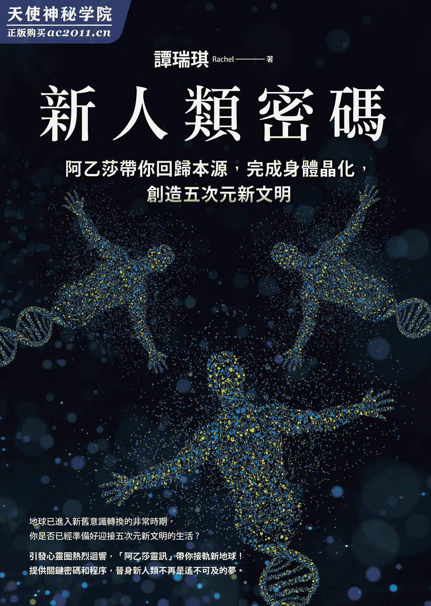

作者简介

谭瑞琪 Rachel

一九六七年出生，台湾桃园人。美国爱荷华州立大学财金管理系硕士毕。

从小到大家庭和乐安康，没有后顾之忧地拿到硕士学位。回国后，顺利进入职场工作，在台湾的汽车业及电信业缔造了辉煌的商场经历。

虽然拥有顺遂的生活和工作，但是，生命不管你是跌入谷底或正玩得起劲，仍然会拉你走回此生早已安排好的路。

第一次与内在声音相遇是在同事的婚宴上，以主管身分在台上致词的她看着台下的众亲友，突然间，内在出现一个声音：“这些人认识的你，不是真的你！”

被这突如其来的声音震慑住的她，没多久就走上了寻找生命意义的路，想要弄清楚：“如果那些人认识的我不是真的我，那么，我是谁？”

在探索自己的阿卡西纪录的过程中，收到宇宙共同意识源头阿乙莎（Aheetha）要她传给世人一起分享的智慧与教导，她忠实地记录下来。这是阿乙莎给地球人类直接而完整的传讯内容。

著有《阿乙莎灵讯》《创造新我．新地球》《爱的复苏计划》《星光体》《新人类密码》等书。

•欢迎上粉丝页“阿乙莎”分享自己阅读后的心得：www.facebook.com/anitya.com.tw

•阿乙莎体验工作坊：[www.anitya.com.tw](https://www.anitya.com.tw)

［作者序］
成为行走在地球上的新人类

在进入星光体，登上星际交流的过程中，你会遇上灵性组成源头的存在意识群。

虽然你仍以肉身意识链接，但透过契入自身的灵魂晶体空间，你与跨次元星际存有正以超越光的流动速率交换讯息。这也是人类穿越地球帷幕，进入宇宙共同意识场交流的实相。人类与自身存在多次元的灵魂意识为了彼此的成长，早已创建联合工作小组。

理解到人类不仅仅是以肉身存在的地球人后，透过深入内在宇宙，你将能进一步还原和展现原本的样貌。这是一趟灵魂回归本源的旅程，这段旅程会超越大脑过去的学习和认知系统，但只要你愿意让自己的灵魂意识站上星光体的链接信道，就可以取得超越历史的宇宙庞大知识系统。过去人类透过静心、入定、打坐，进入三摩地，听到来自地球古老文明的召唤；现在，人类还能透过宇宙各个星际之门，成为链接天地人的能量中心，串起银河众星系与地球之心的链接信道，让地球文明正式和星际文明接轨。

这一趟让灵魂觉醒回归本源的旅程，是人类迈向新地球文明的开端。当你全然知晓，并明了这一次生命来到地球的初衷，你过往走过的路都会成为所有人回归源头的路径指引。从今以后，你已经不只是带领众灵性兄弟姊妹回归宇宙家园的光之使者，在解开自身的灵魂ＤＮＡ枷锁后，你将由内而外散发出七彩无量光，成为行走在地球上的新人类。

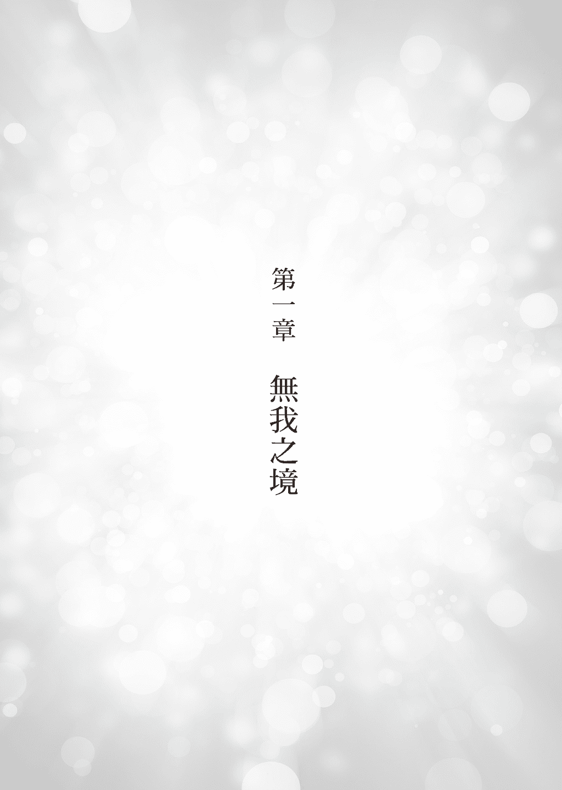

 放下私欲，走入无我之境（以风之象，无中生有）

（进入光之殿堂后，从链接真我开始，阿乙莎一路带领我进入水元素〔以水之流，感知天地〕、火元素〔以火之眼，承揽觉知〕，而后打开土元素〔以土之基，融合万有〕。当真我自性链接众神，绽放出七彩琉璃光，自此打开神我合一的大门，小我又开始贪玩起来。

每天一早起床，我会想着和不同的高我意识链接是否会碰撞出什么样的火花。一开始，我会尝试单独与不同的高我意识链接，去感受与不同的神性合一，是否自己仍可以辨识出不同的振动频率与能量品质。这段期间，我也发现不同的神性会流动在身体的不同区域，那种独特的能量流清晰可辨。小我总是精力充沛，拥有无穷的好奇心，会想方设法去创造一些新玩法出来。不论是连线收讯、唱歌、跳舞、用高我的振动频率说话等，当我和高我们联手玩得不亦乐乎时，早已经忘记在光之殿堂中，还有一道风元素的大门，我尚未进入探索……

一天清晨，突然又感受到阿乙莎的能量在我的头顶上盘旋。）

阿乙莎，是有什么事情吗？

你现在正享受着与神性合一的意识状态，这是过去你们认为的修行者和宗教大师应该存在的状态。但这里还不是你该驻足停留的地方，你若要完整自己的灵魂体验，还需要进入另一扇风元素的大门。

我知道还有一扇风元素的大门没打开，我现在感觉一切如此美好，等时间到，祢觉得需要带我进入，我再去。我现在没有任何期待了，已经太满足也太感谢现在的状态，不需要更多了。

你讲到重点了。目前的这一切，你并不需要！

蛤？什么？我眼前的这一切，我不需要？

你有没有发现自从你打开神我合一的意识之后，你依恋上自己身上的琉璃光，小我又开始蠢蠢欲动。众人钦羡的眼光投注在你身上，会让你身上的琉璃光变成深沉的琉璃枷锁，得到愈多人的羡慕和景仰，你的身躯就会愈加沉重。你看见了没？你的小我看到自己身上的琉璃珠宝，马上生起一个意图，想要独享这一身光彩。当小我试图掌控你生命的主导权时，你会让这一身的七彩琉璃光蒙尘，只因为你存在光中的意识，小我会试图占上风，你会在不知不觉中，从无条件付出的振动转变成吸取和占有，而你若如此，就无法让这纯净的琉璃光继续闪耀它原有的光芒。蒙尘的琉璃光就和目前存在第四界的虚妄之境无异。现在，你该做出选择了：该如何做，才不会让自己困在第四界中？

啊！阿乙莎，我好惭愧，被祢发现了！我还真舍不得揭露与众神合一的方法。我原本以为那是我一路走来自我灵性成长的报酬，应该是专属于我个人的奖励，怎么能毫不保留地公诸于世？我天天做功课，睡得那么少，辛苦记录，为何要让别人取得属于我个人灵性追寻的秘境？祢怎么可以对我这么严厉？为何不去提醒其他大师，还有那些拥有各种秘传独门绝活的人，将手上的金银珠宝、奇门遁甲全部无条件释放出来？为何他们可以那样，我就不可以……

（我噼里啪啦骂了许久，将内心的不平之声发泄出来。呼！好舒服。

这时，仿佛又看见内在那个爱争宠、无理取闹、自私又幼稚的孩子的影子。当下，觉得很惭愧，原来小我不知不觉在一瞬间就辜负了阿乙莎一路以来手把手的教导。小我实在是被地球环境训练得太强大了，那个根深柢固的劣根性如影随形，我那源自灵性父亲雷巴特好战、掌控一切和竞争性的想法也依然存在。

奇怪，我不是已经与神性合一了吗？合一之后怎么仍断不开小我的劣根性？当初回归真我自性的纯净小孩呢？我怎会轻易地让小我迸出的一念给糟蹋蒙尘了？唉！难怪地球会被人类破坏至此。人类不知不觉地活在宇宙帷幕之下，受到二元分离意识的强大势能主导，经历世世代代的分离体验，堆砌出地球上方厚重的一层帷幕。

在灵性觉醒的路上，前前后后有许多大师和修行者正被困在第四维度中，等待此时此刻身为地球人的我们真正觉醒，只有回到纯净无瑕的灵魂真我自性，才有机会解开桎梏人类已久的业力枷锁。而即使还原真我、回归自性后，仍须时时反省自身，觉察自己每一次生起的念头，不沾染一丝一毫自私自利的习气，才能笃定冲破被人类集体意识捆绑的地球帷幕，踏上扬升的轨道。这当中，我们的高我扮演最佳监督和指导者的角色。这一路上好不容易和高我连系上，我可不要又让小我带着走，把自己弄丢了。）

好啦！阿乙莎，我承认，自从找回真我，与众神合一，我一时自我感觉良好。原本想把这些秘技当成自己心爱的玩具，带着心爱的玩具可以让我随时走入自己的天堂秘境，没想到连这么小小的一点私心，小我也会举起大旗，声明自我主张，把我一路辛苦累积的战利品占为己有。好啦！好啦！我愿意放下这些与神合一的路径和祢们传送给我的众多咒语，现在就去传递这些信息，让有缘人也能透过书中的文字和步骤参照练习。我知道，这些都是宇宙无条件释出的公共财，也是我此生再次来到地球的体验，需要如实记录下来，帮助灵性兄弟姊妹回归源头。地球母亲需要我们灵性兄弟姊妹不分彼此，互相扶持，让存在地球帷幕之下的灵魂勇士们得以尽快冲破帷幕，回归家园，我如果还想玩地球人以往的尔虞我诈，沉迷在自我感觉良好的虚拟实境游戏中，就太不应该了！我现在就将这部分信息补上，赶在编辑出版截稿前放进书中，将回归真我、与神合一的步骤翔实地揭露出来。

（注：这部分讯息已刊载在阿乙莎系列第四本书《星光体》的［契入灵魂光之殿堂］［回归真我］［人神合一］等章节中。）

 进入无我的认证机制：心轮中的五芒星

很好，现在你再次回到光之殿堂。打开你的真我大门，并融合身上所有脉轮的光的意识为一体的神性，你身上再次绽放出七彩的琉璃光，照耀自身和身旁的万物生灵。你现在将顺着内在之眼，透过内在之眼的移转，锚定光之殿堂的左方。

你现在已经可以走入无我之境！

（这时，我明显感觉到内在之眼在光之殿堂的中央流动，意识流动出一个五芒星的图腾。当这个图形以风元素为起点流动出五芒星，再回到风元素为终点时，我明显感受到心轮扩展开来。五芒星在眼前消散后，我的意识感受到身体更轻盈，自己好像随时可以抽离身体，意识轻飘飘地浮在身体前方。）

进入无我，你的内在意识会引领你登上银河母舰。这时，你身上的琉璃光会退去，取而代之的是，你的心轮展现出光之子的印记。

这是你灵魂的光之标记，你已经通过意识契入星际之门的考验。放下身上最珍贵的宝物，你才能展现真我之光的印记。自此，你将可以顺利登上母舰的星际交流大厅，深入星际图书馆读取你所需的宇宙资料。要记得，这个进入星际大门的通行证并不是一直有效，你需要维持在意识纯净无瑕的状态，才得以进入无我之境。

现在你是否明白，所谓无我的空境，并不是指你失去小我的自主意识掌舵权，与万物不分彼此地融为一体，只剩下空无。那是过去人们对无我的想像。

进入无我之境时，你个体意识的主张权会被星际意识接管，你需要透过与自身神性意识同频共振，才能顺利进入，并获得星际联盟的信息。这些信息只能透过你与存在自身高维的星际意识处于同步的认知状态，才能被转译和传达出来，也因此，你在此必须进入无我执、无我念的状态，才能读取和翻译讯息。

至于存在你灵魂ＤＮＡ中嵌印的五芒星，在每一次你登入星际图书馆时，都会重新进行认证和侦测，你无法在带着个人私欲和小我偏好主张的状态下，撷取到星际图书馆中的讯息。

人类过去也曾使用这种方式，撷取一部分来自星际文明的讯息，才能创造如今的地球文明。许多来自银河星际联盟的星际种子投生到地球，人类目前大量运用的发电、能源、创新科技和晶片技术，都是在星际文明的“允许”下释放出来供地球使用。至于如何控制人类的使用权，仍然需要经由地球法则来完成，我们无法介入。

地球人将星际文明知识转译出来，做出衍生的发明和创意产物，让新的科技带动整个地球文明加速前进。这些进程都是在银河星际联盟的监督下，只要不危及地球整体环境和正常的行星轨道运行，银河星际联盟并不会干涉。倘若涉及危害地球整体安全的行为，比方说，人类利用核能制造大量核子武器，用来胁迫其他国家，造成地球人类的恐惧意识升温，这时星际联盟就会适时干预，以防止地球环境遭到严重破坏，而干预的方式通常是在核子武器的破坏范围内释放反核能引爆的超强磁波，让核能的释放威力减弱。

 无我之中包含一切万有

阿乙莎，为何进入无我之境后，反而进入了更庞大的星际图书馆中？这是怎么回事？

没有错！你以为进入无我如同以前圣者所称的“三摩地”无量无相之空境，其实，无我相即是无我执取的状态，透过你与众高维意识共存的光之殿堂反射出宇宙的真实景象，而宇宙之相如我之前提及的，是由粒子组成的光、音和振动波的世界。套用你们目前最常使用的名词，这里就是量子讯息场，而此量子讯息场储存宇宙所有星系的智慧，其数据量不是单一太阳系可以比拟的。这里是所有星系互动交流和生活场域中过去发生和当前振动讯息之所在，讯息量庞大且包罗万象，是所有星系族群意识进化过程中经历的所有体验和一切发明的进程，也是星际科技和星际文明生活应用方式的资料库汇集区。这里是跨越不同星系族群的意识与文化交流的平台，所有参与者在此可以将重要的学习信息带回各自的星球分享，让星球文明得以与各星系族群接轨。

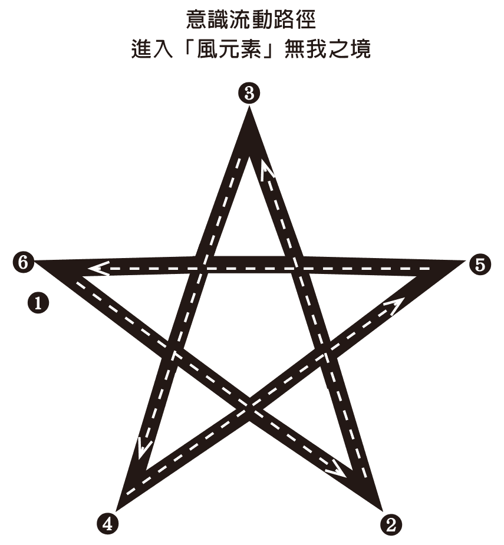

这里亦是地球进入星际文明交流的开端。人类意识扬升到五次元的新地球时，透过这里可以取得进入五次元新地球文明的基本常识。

这部分的讯息需要许多跨越地球帷幕的星际种子一起合作，将星际文明的讯息一一解译出来。所以，你目前的认知并没有错，这里是活跃的宇宙讯息场，而不是什么都没有的中空状态，你必须先腾空自己的光之殿堂，才能如实照见全息的宇宙讯息图像。若你仍携带小我的分离意识和自我主张，就无法让自己从内在之眼如实窥见全息景象，因为你的投影屏幕只会反映出你内在宇宙的真实样貌，只要你带着一丝一毫的偏光镜，或是让小我意志担任指挥你和主宰你生命的要角，就无法与你的高我意识同频共振，你自然就无法穿越自身的偏光棱镜，看见全息宇宙的讯息。

虽然解译星际图书馆的工作浩繁，需要花费你许多时间，但能够登上星际图书馆的人，都是早已准备好要进行这项工作的星际种子，你不必担心自己无法胜任，这是你此生来到地球的目的，你已经踏上早已为自己安排的地球任务。而地球上还有许多星际种子也都会陆续展开这项工作，你们会看见彼此的讯息在事前毫无知会、交流、共同学习和沟通的情况下，如此一致，并相互呼应彼此传递的讯息观点。你们无法以有限的大脑去理解和验证这些讯息的正确性，但透过同样身为星际种子的光之兄弟姊妹传递出来的讯息，你们将共同织出一条美丽的新地球银河大道。你们身上的光可以照亮彼此，铺设出一条回归家园的路。

未来你只须透过心轮光的印记认证，就可以登入星际交流大厅。

 “知晓”和“意识到达”的区别

阿乙莎，之前有一部分宇宙知识是我的灵性父母和帷幕之外的分身高我直接传递给我的，当时的我并没有进入无我之境，只是进入意识的链接，他们就已经为我讲述一堆我不知道的宇宙法则和真理。

是的，之前只要链接上，你就可以获得。透过你的高我传递，你会取得片片段段的讯息，无法理解全貌。你过去认知的知晓状态和意识真实到达，两者之间是不同的。

“知晓”是大脑认知后传达出来的讯息，那会随着地球时间轴的移转而逐渐失去其讯息的动能。对人类来说，知晓占据了大部分的时间和资源。而“意识到达”并非来自大脑的讯号，那是心的位移，也就是透过心轮链接中枢神经，传导出宇宙共同意识源头的讯号源，而这个讯号被你的心捕捉后，会转成光码，植入你的灵魂晶体中，进入你灵魂ＤＮＡ的束状区，这时才会打开你的意识转化过程，透过光的指引，带领你整个灵魂意识群中的所有光粒子同步位移。

你的晶体会在意识到达后创造出新的结晶态和新的空间，这个空间的控制阀就位在你的心轮，而心轮散发出来的振动频率会带你到达，那就是意识真正的到达。“意识到达”可以产生新的灵魂意识结晶，不会随着地球时间轴的变化而消逝，它会跟随着你的灵性生命持续到此次生命的终结，而结束肉身体验后的灵魂集体意识的结晶会再融入宇宙源头的共同意识场中。所以，任何人在生命存续期间的任何时间点创造的意识位移，都对集体意识场的扬升与集体意识的和谐有具体而重要的贡献。而人类大脑获得的知晓状态，若无法链接到达心的共振，这些讯息会随着生命的消逝，终结其动能。

进入星际图书馆中，你将无法用大脑去理解，大脑的作用和心的作用完全不同。意识到达后的共振让你的灵魂晶体位移，信息和理解只有在晶体位移后才能获得能量的移转。就如同你知道必须到达“无我”，但你脑袋定义的“无我”没办法提升你的振动频率去改变你身上的光，只有当你的心轮卸下小我意志，透过还原真我意识链接上无我之境时，你的心轮之光才能确实位移，契入无我之境，而无我之境之于你的意识场到达同频共振之下，才会敞开大门，你的意识才能瞬间移转进入无我之境，到达另一层新境界。这是用你的大脑去分析、评估，或尝试让大脑吸收再多知识、理解得再多，都无法到达的境界。

这样我了解了。我们过去一直经由学习新知来喂养大脑，也因此会一直不自觉地想要用脑去理解这一切存在我们之外的现象。但实际上，大脑诠释的“知晓”和意识到达是两码子事。我想祢特别为我说明知晓和意识到达的不同，是希望读者不要追著书中文字的描述，以为知道了就可以到达，而是仍须透过心的共振让灵魂晶体位移，才能真正到达无我之境。

这也是要提醒你，在接下去衔接宇宙意识的旅程中，你的知晓是其次，让意识到达才能帮助你成功衔接上新人类的旅程。

 风生水起，再造新生命之果

阿乙莎，当我试图再次进入无我之境时，我站在中央空无之境，看见外圈有一堆粒子往下方移动，也有许多粒子向上方移动。为何到达无我之境后，我却看见从中央再次分离的意象？

是的，这需要回到生命之树的原理向你讲述生命的起源。

人类的身躯就如同大树的树干。你们生长在地球，吸收地球母亲的日月精华，你的生命之树在地球上逐渐成长茁壮，神性意识也同时存在你的生命之树中，一直指引你的生命走上原本设定的生命蓝图。神性意识并不是你过去认知的某个单一神祇或宗教庙堂中供奉的神明，而是你身上养分取得的来源，以ＤＮＡ的形态组成存在你的细胞中。你与这些神性意识的共同源头，就是你目前到达的光之殿堂的“无我”之境。

回到无我之境时，你看不见任何有形有相的神，也没有实质的生物体，更没有你过去熟悉的那些对万事万物是非对错的认知。这里就是你们所称的上帝，也就是一切万有。

一切万有乃是无形无相如黑洞般存在你生命之树的核心，帮助你成长茁壮，如今经由灵魂意识的觉醒并“重组”后，你再次回归源头，回到与众神合一的无我之境。对宇宙来说，你的生命之树又一次圆满结出“新生命之果”，这颗新生命之果回到与众神合一的源头后，会再度播下共同协议的种子，回到地球上。

你看见了吗？每一个人的生命之树，实际上是由跨越不同次元和星系文明的神性意识共同组成的星际联盟。来自高维度的星系存有和你一同进入地球场域中，透过肉身载具再次体验后，重组出一颗纯净无瑕、足以容纳一切万有的新生命果实。当这颗生命果实成熟落地，又会再次诞生进入新地球或其他星系行列，这就是银河宇宙透过灵魂意识延续生生不息的生命种子的过程。

我的小我原来一直很害怕让我的意识如此天马行空地放飞，小我不断拉扯我回到自己最熟悉又安全的世界里，但那个原本认知的世界原来才是小我创造的虚拟幻境。而要学会回到真实的宇宙源头，回到我们原本来自的空无之境，只有让意识到达无我之境，才能走入无中生有的宇宙新境界！

咦，放飞让意识无中生有？哈！我终于搞懂了，原来风元素要进入的无我之境，就如祢之前提到的“以风之象，无中生有”啊！这实在太传神了！果然，真实的意境只可意会，无法言传啊！知晓和意识到达真的很不同，我现在才终于明白。这趟穿越无我之境，也让我着实体验到放下并不是失去，而是让自己从毛毛虫羽化成蝶的必要过程。谢谢阿乙莎！

＊ ＊ ＊

章节后记

心轮出现五芒星光的印记，对我和其他星际种子的意义在哪里？

这是灵魂ＤＮＡ的认证机制。当你们的灵魂意识准备回归本源的时空位置，所有来自各星系的存有在当初进行星际种子播种时，都会在你们ＤＮＡ回归源头的路径中设下路标。当你的意识已经准备放下个体的小我意志，迎向回归本源的道路时，这道回归源头星系的闸口会进行侦测，此时你心轮闪耀的光就是你灵魂的认证码。

五芒星的认证是ＤＮＡ的晶体结构产生的投影吗？为何是五芒星，不是六角？

你是透过五芒星的认证，也有些星际种子是透过六角星的入口，这与你们来自不同本源的初始设定有关。不论是五芒或六角星，都是ＤＮＡ的晶体结构组成中早已设定好的进入星际交流的入口。只有当你的意识回到本源，才能契入星际联盟交流平台。

星系间使用的光码各不相同。你是来自猎户座的星际种子，与同样来自此星系的星际种子的心轮都镶嵌着相同的光之印记。这个印记也是由你的灵性父母组成的，所以当你准备回到灵魂光之殿堂的风元素大门时，你身上的灵性组成会凝聚起来，你会从自己身上接收到众神合一后的琉璃光芒。这道琉璃光会为你穿戴上可以被星际平台验证通过的光之印记，你感受到的五芒星就是如此被传递出来的。当你终于回到灵魂光之殿堂，与众神合一，链接上自己灵性源头组成的所有片段时，那段早已镶嵌在你心轮的认证光码将同步绽放光芒。

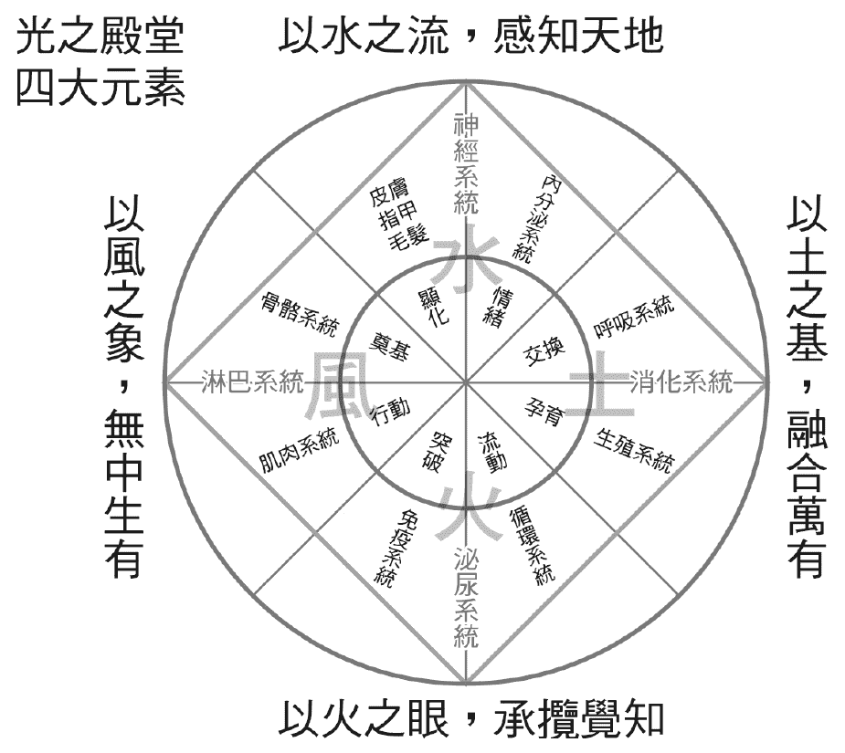

回到光之殿堂灵魂本源和链接星际联盟平台又有何不同？

回归灵魂本源和登入星际联盟平台是同样的路径指引，只是存在着不同的意识状态。

当你的意识契入灵魂光之殿堂时，你已经打开与灵魂本源链接的闸门，这是你一路上透过自主意识不断扩展过程的最终站。这里也是你灵魂ＤＮＡ所有组成意识的共同家园，就存在你的ＤＮＡ之中。

当你进入光之殿堂，与众神合一时，你的小我意识终于臣服于更高意识的光中。这时，你的小我意识为了向更高意识维度迈进，你必须同意放下自我意志的主张权。在你自主意识的同意下，你进入光之殿堂的风元素大门，准备与你存在高维度的意识群进入共同创造的阶段。

进入无我之境的考验，是你自身所有灵性组成要先到达回归源头的共识，你才得以穿越无我之境，进入星际联盟交流平台。现在，银河星际联盟需要星际种子回归本源，站上星际联盟交流平台，继续为地球人类的意识觉醒努力。

这一路上，你灵性道路的展开是一脉相连的，你不会因为在帷幕之下无法看见、听见光的世界的传输网格讯号，而走进不属于你的灵魂家园。也只有当你顺利从自己灵性源头的光之殿堂穿越无我之境，才能正确衔接上星际联盟的交流平台。

这一路以来的路径指引早已镶嵌在你的灵魂ＤＮＡ中，没有错误编码的问题，只有因为受到小我自主意志和地球集体意识的干扰，无法打开你回归灵魂家园的路径指引。一旦回到自己的灵魂本源，再次出发前往星际交流平台，你自此成为宇宙人在地球的代表，你将透过星际图书馆的庞大资料库，帮助你目前居住的星球完成星际交流工作，为人类的未来擘画出新的方向。你也会为自己播下全新的意识种子，在地球上生根发芽。而在接下来的传讯中，你也将获得来自自己星际家园的讯息，和更多的宇宙知识。

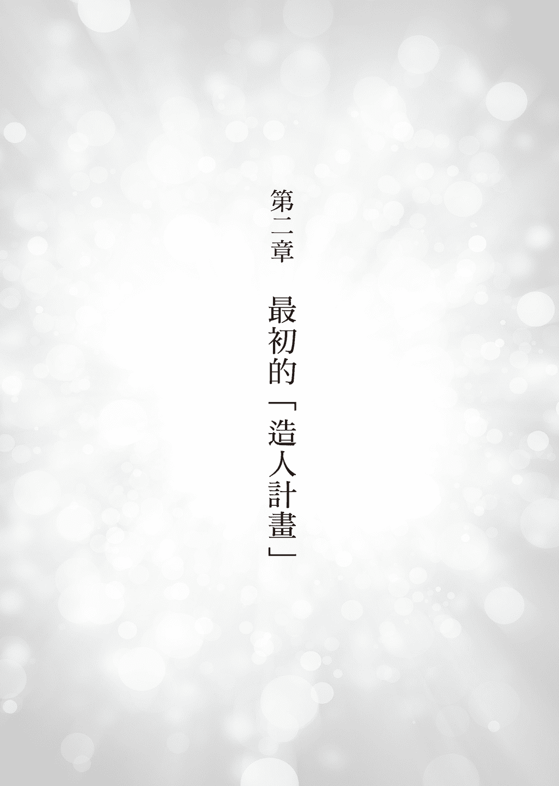

 宇宙高等意识精密的造人计划

你现在对生命有了这一层认知后，先回到自己的灵魂晶体中，透过自身的水晶图书馆，去看见万物演化升华的逻辑和生命演绎的过程。你将能够以更高维度的角度去明白自己是谁，然后带着更新后的认知再次进入星际图书馆中探索。意识重组校准之后，你会更愿意完成生命最初始设定的任务。

（注：阿乙莎在这里使用“更愿意”这个词，我猜是因为可以感受到我的小我仍旧有许多怀疑和抗拒吧！小我才刚放下对人神合一境界的执取，要让小我更愿意跟随下去，也是我必须随时警惕自己的。）

（我跟着指引，先进入自己的晶体，这时右前方打开一扇门。我看到晶体的右边有扇门打开，顺着这道门走进去，可以进入一个环形信道，这里有许多档案夹，就像个巨大的图书馆。难道这就是之前阿乙莎说的，与高我合一后就会打开的那个我们和高我共同的记忆库——水晶图书馆？

这时我突然明白，这个环状的、一列列的资料库就是我们自己身体细胞中的ＤＮＡ束状结构。我们的生命晶体记录器早在我们投生地球就同时嵌入我们肉身的ＤＮＡ中，我们可以透过与高我合一，打开我们彼此互动链接的灵魂水晶图书馆，进去读取关于我之于我的所有存在的历程。

此时，我的高我分身泰雅〔Taia〕给了我一个想法……）

你去探索水晶图书馆之前，可以先去理解你是如何形成的。

（这时，我感受到场景进入一群高维意识的讨论区。一群宇宙高等存有的意识，没有具体的形体和形象，正在叽叽喳喳地讨论，大致的内容是，我们必须合作，将四散的灵性伙伴找回家，现在我们需要共同创造出一个灵魂种子，这颗灵魂种子需要哪些元素配置？谁可以一起来参与这项工程？

此时有个声音提出，我们需要智慧，也需要能广纳不同存在意识和星系族群的慈悲与宽容。另一个声音则提出，还需要备足勇气去突破困难，以及能在地球上做出具体行动的决心。又有一个声音跑出来说，在这种稠密的环境下，还需要配备喜悦和丰盛的能量，才能滋养他的身心。后面有个声音说，他还要能明辨是非善恶，要有可以发现真实的火眼金星。最后，一个慈悲的女性声音说到，我们可以让他疗愈自己，让他得以随时释出无条件的爱给自己……我听见这些高维意识将这个“造人计划”罗列出来，并一一从自己身上取得相应的元素，融入造人的灵魂之汤中。接着，我看到一团云雾般的灵魂种子意识从银河轨道出发，一直往下流动，流进三次元的地球。一进入地球场域，这团集合了众神的意识瞬间爆裂，分离出许许多多的小光点。这些小光点就是星际种子，带着众星系族群植入的特质和明确的期许，进入地球体验。这一个个小光点分别选择了在地球上的父母，进入母体，以人类的形式展开在地球上的生活。

原来由众神赋予的智慧、慈悲、勇气、喜悦、真实和爱等特质，早已经镶嵌在我们身上，我们就带着这些与生俱来的特质前来地球体验和再次创造。星际种子在地球上的所有活动和体验，都被如实记录在水晶图书馆中，我眼前这个巨大的环形图书馆，就是众神的灵魂意识种子分裂出来的，而水晶图书馆中记载着所有分离出来的星际种子共同堆砌而成的体验纪录。满满的资料库，完整存放在我们的灵魂ＤＮＡ中。原来，我们身上一直链接着整个星系家族所有兄弟姊妹在地球上的体验纪录。）

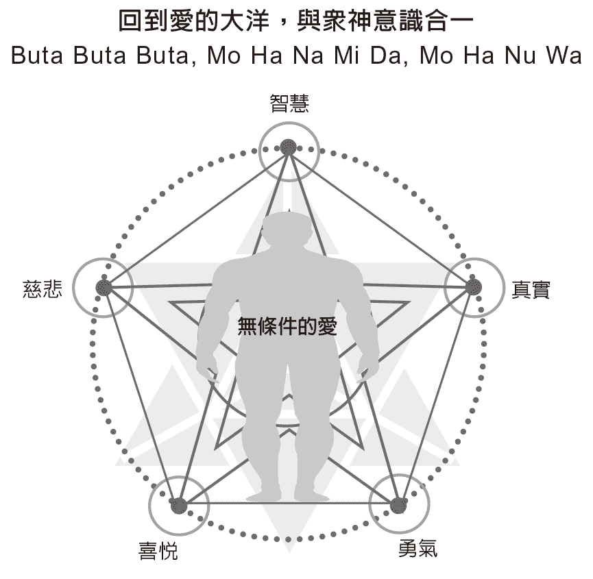

 ＤＮＡ内建晶体记录器

阿乙莎，这些晶体纪录是如何被存放进来的？

你们身上的ＤＮＡ会持续记录你每一次投生的生命足迹，ＤＮＡ会自动回传讯息到灵魂晶体中的水晶图书馆存放。你也可以将这个水晶图书馆视为超级量子电脑，而人类生物体中的情绪振动，就是携带着生命讯息的传导接口。若人体中没有情绪体作为接口，就无法传送ＤＮＡ的振动纪录回来。所以，当星际种子投生在某个母体中，你们又继续将生命记录器透过情绪体的振动展开记录工作。

当你的生物体停止运行，灵魂意识会先回到晶体中的光之殿堂，再次回归与众神合一的源头场域。你是神之汤的一部分，而神也需要传送灵魂种子到各个不同的星系，进行灵魂成长与再次升华的体验。

现在，你明白自己身上拥有数以百万计的灵魂家族成员的共同记忆。接下来，我要带你去看见你是如何展开第一个纪录的。

对喔！祢不是说我们透过情绪体展开？所以，我的第一个情绪是怎么产生的？

对！你现在终于好奇自己来到地球的第一念是什么了。

我不是好奇，我早知道我的第一念就是“我是谁”，但我不知道当这一念生起时，背后的那个情绪是什么。

是啊！你会发现当你可以找出你第一个情绪生起的历程，就可以再次忆起你为何而来。你的所有灵性兄弟姊妹，也都是带着同样的灵魂最初始源头的目的而来。

好吧！请带我去看见我的第一个情绪是如何生起的。

你现在可以走进水晶图书馆，然后用意念搜寻你的生命到地球的第一个情绪体是什么。

就像用 Google 搜寻一样，输入关键字和问题？

是的。

哇！奇怪，我生起的第一个情绪居然是愤怒，很讨厌的感觉，接着就开始感到恐惧。不会吧？我们不都是来体验爱的，怎么出生后的第一个情绪震荡会有这么负面的能量出来？

并不奇怪，那就是你们的灵魂种子爆裂开来的瞬间，产生的一股强大动能。带着这个重力，你才能顺利抵达三次元的地球，这个沉重的引力可以帮助你顺利锚定地球之心。那沉重如铁壳的强大引力场，就是承载所有地球生命的动力来源。你感受到的这股愤怒、讨厌及恐惧的能量，在当时没有被人类贴上标签之前，可是帮助所有星际种子顺利到达地球，并在此扎根落地的基础能量。没有这股能量的带领，就没有目前存在三次元地球上的你们。

哈，原来如此！非关黑白对错，又是物理学原理了。那么，这一念对我日后的体验会产生负面的作用力吗？

是的，没错！若你仍处在高维的合一意识场中，就没有分离与好坏的体验，但在三次元则需要经由体验分离后的对立面，才能让你在完整所有体验后回到源头。这是类似向外分列式的演化之路，你们走过之后，才能透过原路径返回完整的自己。没有分离，就无法找回合一的集体意识源头。你明白吗？就是你们必须踏出自己回归源头的地图路径后，才能顺利带着所有帷幕之下的兄弟姊妹，依循着星际种子们已经踏出的路径成功返家。

这点我真的无法理解。既然ＤＮＡ可以回传纪录，怎么不直接从源头将回家的路径传送给每个生命？

你终于看到症结了。就是这段从源头呼唤你的ＤＮＡ回家的传导路径被封印了，你的ＤＮＡ在三次元的地球上变成单向的记录器，所以此时此刻，银河联盟才会派遣一堆星际种子前来唤醒人们。

你必须用自己这一路上回归家园的路径，去帮助其他灵性兄弟姊妹依循这条路回家。现在你需要一步步将所有还原真我自性、回到本源的路如实踩踏出来，才能帮助他们。他们也是你，和你是同属银河联盟的共同意识存在。

（进入水晶图书馆，从高我的视角看见自己生命的起源，居然来自众星系存有的精密造人计划，我不禁对原本小我想占有这张回家的地图，还一直想要争宠、愤愤不平的想法感到惭愧，觉得幼稚。如一开头阿乙莎提到的，这趟我之于我的存在的旅程，会让我更臣服，也更愿意与高我携手展开回归银河家园的任务。）

 人类肩负维持星际和平演进的重要使命

实际上，你这一路学习和经验到的二元世界体验，都是在众神的帮助下，让星际联盟跨越不同星系的存有，协作出一条合一的道路。这条合一之路有愈多地球人类成功回到源头，完整生命之树的体验，诞生与神性合一后的“新生命之果”，就代表愈多的星系存有完成星际联盟的和平协议，为自己和所有星系族群打开了迈向新生命的扬升之旅。

这些已经合一，扬升回到灵魂本源的种子，透过星际交流平台，可以选择扬升进入自己想要去体验的星球；而尚未完成合一的意识群，也会随着生命之树的叶片掉落，再次被大地母亲回收，融入旧地球的场域，重新体验和学习。现在，你看到地球一分为二，中央的核心是目前存在地球上的所有灵魂意识。你们目前正处于新旧地球意识分离的关键时期，在接下来的二十年会陆续完成轨道移转，仍存在旧地球的分离意识会被沉重的旧地球核心重力场回收，而已经与自己神性合一的意识会先来到无我之境，契入与自身高维意识同在一起的灵魂光之殿堂，回归灵魂本源，或选择以合一后的神性意识投生新地球意识场，成为新地球的一员。

你现在更明白自己就是由神性意识组成的，每一个人都是神在地球的代表，这一切体验不只是为了满足你的小我未臻圆满的意图而生。你的源头创造者，原本就是一整个星际联盟，为了星球间的和平共存，共同协议在地球上经由人类生物体的载具，去突破二元对立的意识，重新融合出合一的宇宙集体意识。你们就是那些奋不顾身，愿意前来沉重的地球重力场再次学习和体验的灵魂勇士。

重回体验之路，你需要一路从遗忘到再次忆起你是谁，你一一破解并辨识出分离意识中小我的狭隘与偏执。那些早已存在你ＤＮＡ中的灵性组成，为了所有星球的和平演进，精心构建出可以跨越多个星系种族、缔造出完美人形的ＤＮＡ结构。你不只是某个星球的代表，许许多多银河邦联的星系族群也都存在你的灵魂ＤＮＡ中。所以，当你一一辨识出自己的灵性组成，和他们所隶属星球的记忆时，他们也因你在此淬炼出已能融合众神意识的合一种子，而让意识再次扩展。此时此刻，有非常多银河星系族群前来地球，等待并迎接自己播下的星际种子破茧而出，顺利回到银河母舰。

啊！经祢这么一说，我终于可以链接到《阿乙莎灵讯》这本书，一开头阿乙莎就提到我们就像一棵大树，当时我还不以为然。而这一路上跌跌撞撞，为了认出我是谁，去探索内在宇宙，发现居然有许多神性意识就出现在我们自己身上。我现在明白，地球人和宇宙本就是密不可分的，我们从小总觉得灵魂无来由地惆怅和孤单，原来我们是自告奋勇带着众多星际家人的期许来到地球，将集合众星系存有的意识“过筛”的灵魂勇士。

由各星系联手打造的地球灵魂孵育场，如今也因超越负载的临界点，扰乱了银河宇宙的轨道稳定，一些已经成功过筛的合一意识必须回到银河，成为新地球的生力军。这整个意识过筛的过程，你们用简单的生命之树原理，透过晶体的互联网完成自体净化，从自己落地果实的种子中再发芽，再次殒落，再次发芽。生命之树存在宇宙天地之间，承蒙各星系源头不断滋养，让地球万物得以在此吸收日月精华，被众星全天候照料和看管。

地球上的灵魂勇士，就在此不断进行生命的净化和自体循环。这实在是宇宙最完美缜密的设计。感谢宇宙赐予我这宝贵的一课，现在可以清楚看见，每个生命来到地球，待遇都是公平的，同样受到日月星辰、地水火风的滋养。生命一直操纵在我们自己手上，能否让自己的生命之树结出完美的生命之果，再让我们自行播下的种子继续发芽，结出漂亮的花朵和枝叶，喂养依赖我们生命之树而存在的一切万有，就由每一个参与的灵魂勇士来决定——决定让花粉和种子落在地球哪个位置，决定自己下一次生命循环的开端，周而复始。我们是自己生命的因，也将再次种下自己的生命之果，生命之树完全遵照宇宙法则，让生命拥有自由的选择。

 死亡暂停业力进程，让意识重启的契机

每个生命都会长养出自身要去净化和过筛的生命之果，只是当生命之果再度落地时，也必须配合所在星球的环境需要。地球目前分离出两个不同的场域，让合一的意识回归银河宇宙的轨道，也让尚未完成过筛和未完整体验的分离意识，仍有继续体验和成长的场域，使灵魂孵育和持续演化之路得以延续下去。这是宇宙生生不息的运行法则，生命就不断在这个宇宙的大熔炉中展开灵性进化的过程。

阿乙莎，关于最初的造人计划，我有个疑问：为何造人的过程需要设计死亡？死亡带给人类莫大的恐惧，我想知道，死亡是造人计划中精心的安排，还是错误的设计？

许多人期待永生不死，但你是否想过，如果生物体在地球上可以永生，灵魂意识要如何在此过滤和更新？是的，地球人类和所有物种会经历死亡是被精心规画出来的，就跟车子和房子会有使用年限是同样的道理。虽然死亡被设计在生物体的有限存续期中，灵魂意识并不会因为生物体的死亡而消逝。只不过，人类在面对死亡时，会产生许多情绪回应，这是无法避免的。

如果死亡可以被设计得更无痛或更文明些，那些因为死亡造成的创伤印记就不会那么严重，导致人类在地球帷幕之下不断地轮回体验。我现在只要回想起亚特兰提斯的沉没，居然身体印记仍在，也会感受到哀伤。

我不反对你的这个想法，但你有没有想过，死亡也会带来新的契机和意识重启的过程？死亡是被设计出来降低人类破坏地球的程度，避免造成集体自毁的自动除错机制。

你是否想过，古代的皇帝如果可以永生不死，让生灵涂炭，祸延千万年，你如何可以在现在的地球享有文明的都市生活、二十四小时照明，出外有便利的交通工具，还有地球各种民族创造出的多元文化景象？

人类要如何从死亡的恐惧中解脱？

死亡让人类对未知的恐惧到达最高极致。当面对未知，你想过“已知”和“未知”之间存在着什么吗？

“已知”和“未知”的不同吗？就是“想知”不存在了！

哈！其实并不是“想知”不存在，你只要存在，就仍会想，仍有意图，生命会进入持续的进化和改造。这也是宇宙的法则，万物的存在就是粒子不断振动演进的过程。我们先回到刚才的问题，“已知”和“未知”之间就是“道”，是天体运行之道，也是宇宙存在的基础。

再精密的造人计划，亦无法超越宇宙法则。人类一直存在，没有从地球上消失和灭绝的原因，就是在“已知”和“未知”之间，有股更大的存在之“道”。如老子所言，道可道，非常道，古时的智者称之为“无常”。当你进入“太极”之境，阴阳重组汇流之处，那里即是道场。道无可名状，亦不具象，而人类所谓的“知”是暂存区，是你当下暂时存在的现象，所以当你的肉身即将“届龄期满”，或是先遇上“无常”，你就从一个当下的暂存区，移转至另一个暂存的状态。

你可以将死亡看作是从原来的系统链接状态中止，进入另一个更大的系统融合的过程。人类也经由死亡，让意识得以更新除错，不断进入升级作业，从生命场景的体验过程，累积灵魂意识的结晶。

人类对未知的恐惧是因为不理解宇宙之“道”，觉得不可控。这个万物共存共荣的生灭定律无法被人类有系统地学习和掌控。若要理解死亡，不再恐惧未知的到来，你必须回去学习“已知”和“未知”之间的宇宙法则。

就如同当你进入学校，选择某个科系，你会知道要历经哪些科目的学习和训练过程，才能获得一张毕业证书，证明你是符合某种“资格”的人。但资格并不等同于“资历”，资历需要你从学校毕业后，进入社会工作，进行再锻鍊。

现在你们的生命就是处于“具备资格”的阶段，而在你完成一生的体验后，才具备完整的“资历”。这和出生到死亡是一样的过程。只是当你在学校修习时，你总认为你是在“已知”中，而进入社会历练则是走入“未知”状态。从学校过渡到社会，从“已知”进入“未知”的道路，和出生到死亡是相同的过程。如果死亡对你来说，是毕业后完成资历的最终到达，你不会放任目前该修习的科目，不予理会，也不会不想走入社会去挥洒自己所学，进行最实际的历练。即使对人类来说仍是面对未知，你会知道自己可以趁在学期间做最完整的准备，你只要好好修习学业即可。若已经清楚自己生命要修习的课题，并成功地完整体验，臻至圆满，你会期待意识转换的日子早点到来，那是生命完整修习后最终的回报和成就。

我明白祢所说的，但对于未知，尤其是威胁到生命存续的最终未知，人类还是会恐惧。祢试图让我遵循宇宙之道，理解无常是不可控的，但我还是想知道，人类可否在不久的将来决定自己的死亡？我指的不是安乐死，而是人能否在身体器官尚未届龄停止运行前，学习主动离开自己的身体，决定自己的死亡？

目前这样的方式确实存在更高维度的生命体中，六次元的星系存有已经能够决定自己是否需要以生物体的形式体验，也可以决定终止使用生物体的形式繁衍和行动。那是需要在灵魂的振动频率和意识结晶完整的状态下，才可以到达的境界。目前在三次元到五次元的星球轨道中，尚无法让意识体决定生物体去留的生命体验状态。

这是另一种“道”吗？高次元和地球不同道？

这是物理学。在沉重的稠密空间，意识无法达成振动频率超越生物体，还能持续在该行星轨道中运行。虽然你们的意识可以企及更高的次元，但你意识的生命种子与地球链接，透过生物体的形式驻扎在地球，你无法自行结束与地球母亲的根系链接，必须等待生命种子脱离母体，进入空的境界，结束地、水、风、火四元素的运行，才能脱离母体，进入其他的行星轨道。

孩子，想像一下，如果地球上所有人类目前都可以意识进化到自主决定离开自己的生物体，你认为地球上会出现什么样的状况？

喔！可能会有大批年轻人吃喝玩乐，但也会有更大的破坏，反正死后又是一条好汉，可以更肆无忌惮地为非作歹。

宇宙之道存乎一心，心可以帮助你们的生物体完成此生的功课，助你一臂之力，进入终结生命的反转过程，但仍无法决定生物体的去留。你的去留仍是需要生物体与地球终止链接，才能发生。

 死亡过程的记忆随生物体终结而清除

在灵魂进入生物体的体验阶段，有许多次不同的死亡记忆，这些死亡记忆会随着生物体的运行终止而消失。就如同一部电脑，有电源供应时可以运行、向外链接，进行讯息交换；一旦电源中断，尚未链接回云端的终端记忆就会随着电脑汰换和回收，一并消除。

生物体的记忆储存在人体时，当灵魂最终要离开身体的瞬间，这些死亡记忆不会被传送到云端，而会随着身体崩解，还原回地、水、风、火四元素，最终结束生物体的运行。

死亡会经历以下过程。

第一阶段

终止肉身层次的运行。这时生物体的中枢神经系统停止运作，进而让心脏停止跳动，肉身停止运行。

第二阶段

意识会进入脑干的晶体回收中心，这是位在你脑下垂体的杏仁核，第三眼的位置。

第三阶段

灵魂意识会透过晶体穿越时间走廊，进入生命的待转区。

生命待转区有许多存在地球帷幕之中的指导师，这些指导师不具肉身，以意识存在体的形式协助安排生命轮回体验。你们宗教中流传的死后的审判，在这个区域进行，却并非如人类想像的那样，有位审判长在看着生死簿决定你们的投胎转世。你是自由的，只是在这个阶段，你仍带着上一次生命体验的意识振动，在清晰的意识下，由你来决定是否要回到地球再次体验不同以往的生命历程。大部分的人类意识体都会选择换另一个角色去体验不同的生命剧本，而在这个阶段已无肉身载具，并不会携带着死亡时肉体的痛楚记忆，所以每一个灵魂意识都是在轻松雀跃的状态下，决定下一次的生命版本。

你们在地球帷幕之下，会认为生命旅程很长，但是当你的意识又一次完成体验，站上生命待转选择区时，你会看到地球体验只是一瞬间的经历而已。一些选择不再回到地球的灵魂意识，会沿着晶体的信道回到星光层，这时，你会将此次的地球体验融入高次元意识场中，汇流成一个拥有完整地球体验的宇宙意识存在体。

所以，整个死亡的过程，就如同电脑播放连续剧的最终完结篇，死后的生命仍由你的意识决定，你是自由的。

 灵魂晶体储存永恒生命的蓝图

身体脉轮有进入灵魂晶体的信道，当你在三次元的物质身体里时，你从情绪体的能量感知自己内在有一股特殊的、无法形容的能量在运行。你无法清楚看见，但可以知道这股能量会带给你喜悦、开心，或是恐惧、悲伤。还有些能量让你失望、让你感受到无法以任何言语表达的不知所措。这些情绪体振动波的背后，都有其特殊的能量路径，而创造出这个特定能量流动路径的基础，就是你的灵魂晶体结构。

灵魂晶体也是超越人类自我意志的超觉意识场，这个意识场域可以你为宇宙中心点，向外扩及九个次元场域。这个晶体也是你的觉醒意识之所在，是你的个体意识与广大的宇宙意识协作的平台。契入晶体除了可以认出你自身的灵魂意识组成之外，也可以进入不同的宇宙次元，获得宇宙共同意识源场的讯息。

你可以透过晶体获得超越三次元物质实相的智慧，然而要契入自己的晶体，需要透过有意识的带领——除了别人实际体验后得到的路径指引参考，最重要的指引来自你内在灵魂本源的存在意识。这些存在意识是以振动频率的方式与你的意识环环相扣，当你自身的振动频率提升，就会触及灵魂本源的协作平台，获得来自不同次元的大师、导师和你处于不同维度的分身的指引。然而，提升振动频率的关键钥匙仍在每一个人自己身上，你必须完成此生的体验和此生设定的生命意图，才会更容易获得回归源头的通行许可。

灵魂晶体无法被有形有相的实体握住，但你可以透过内在之眼，直接走入晶体网格中。晶状结构就是你的灵魂意识组成的共同家园，是你们彼此跨次元协作的平台，同时也是你的灵魂回归本源时要驾驭的太空舱。灵魂晶体更是帮助你穿越星际之门，进入跨次元星际旅程的心智图。灵魂晶体结构就是你在星系中所有生命的过去、现在和未来的蓝图。

 跨次元存在的灵魂晶体

你生命的存在就是整个相互支持和协作的星系联盟，你们以晶体结构的组成，存在生命内在宇宙中的实际景象。你的星系联盟以跨越次元的振动频率，引导你的生命走完晶体设定的路径。每一个人的晶体结构中都有跨越次元的信道，而其通往宇宙不同次元的路径，就是由你的晶状结构所组成。

有些人的晶体像三角形，有些则是正四面体、五角或六角晶体等不规则的结晶体。不论哪一种晶体形状，整个结构都是由生命的粒子所组成，这个生命粒子从自身分离出来的过程，创造了自己的晶体，一次次的生命体验都会被如实地记录和累积下来，久而久之，就形成完整的晶状结构。

如果用高倍的显微镜观察生命种子，就可以看见生命粒子的运行路径如同生命之花绽放，而每一次生命的展开会刻画出美丽的结晶面，这些生命粒子的流动在三次元、四次元、五次元，乃至更高的九次元的表达都不同。晶体存在每一个生命里，包含人类、植物、动物，以及任何与生命互动和链接的事件，然而之前你曾发现，你可以在某些人身上感知到晶状结构，某些人身上的晶状结构体则尚未延展开来。这些尚未展开的晶体结构并不是失去光的网格，只是他的晶体被生命初始的设定值限缩在可以进行体验的范围。他此次的生命体验必须完全专注在地球场域，完整他在地球存续期间的生命体验，而不受到其他时空中的事件或历程的介入。

所以，一些晶体的存在是为了净化地球，成为支持光的网格。当生命结束时，这些灵魂意识会进入地球母亲的黑洞中，他们即完成了此次生命的任务。进入黑洞的灵魂意识将再次融入共同意识场中，以融合后的新频率出现，以支持光的世界持续进化和扬升。

黑暗是宇宙中不可或缺的助燃物，你们将黑色视为不吉祥、认为是地狱，这样的说法误导了许许多多的灵魂。你们不愿意拥抱自身的阴性／暗黑能量，当身体中的阴性／黑色能量被持续压抑而无法展现时，你的阳性能量和光也无法绽放和升华。

在三次元的世界，粒子一分为二，产生阴性和阳性的电离子所创造的路径。所以地球一直处在二元对立的世界，你在此感受到的就是正、负，黑、白，阴、阳的体验，这些体验的过程创造出你们清晰可辨的晶体线条，从Ａ到Ｂ，再从Ｂ到Ｃ到Ｄ等，一路延展下去。你在三次元世界里看到的晶体每一个面向，对你而言就是一幅幅分割图像的延伸，而当你从所有延伸出来的图像中看见一整个完整的结构面时，你就开始有了空间的概念。

三个点围成一面，再与相邻的面链接成第四点，透过这第四点，人类开始为前面图像与后面图像之间的变化，定义出时间的概念。空间的延展对位于三次元的人类来说，一些当下无法被掌握的部分，你们统称为过去或未来。这就是第四次元过渡期的开端。所有不存在当下，那些过去和未来的实相片段，统称为第四次元。所以，第四次元在古老的经典中出现许多神话故事，还有旧时期的君王或统治者为了控制人的心智，而描绘出许多让人心生畏惧的恐怖情景，用来控制人们的行为。然而，利用无法在三次元世界碰触和呈现的景象来控制人心的做法，已逐渐被觉醒的人们识破。

当你的意识得以进入自己的晶体，你就不再受制于时间的象限，可以穿越第四次元所有可能的镜像和路径，移转进入五次元的全息化实相中。

当你走入第五次元，就如同站在晶体中一个金字塔的四个三角面撑起的中央顶端，进入这一点，你就打开了内在之眼——第三眼。你的内在之眼以更高的视野看见三次元和四次元的所有镜像，帮助你突破三次元的空间限制和四次元的时间幻相，你终于能透过内在之眼，将三次元和四次元的镜面合于一体，让你站上内在宇宙的核心——光之殿堂的入口。

现在，你已经回到灵魂光之殿堂，即将穿越星门，进入跨次元的协作。透过灵魂晶体光之殿堂，你开始认出自己的灵性源头组成。他们同样存在你的晶体中，分享和你共同打造的灵魂成长路径。你的灵魂粒子早已存在不同的时空、不同的事件场景、不同的次元中，留下许多足迹。沿着这些结晶面记录下来的足迹，你从自己身上获得你需要的一切宇宙智能，来帮助你完成此次生命的任务。

 从灵魂晶体进入星际旅程

当你登上自己的灵魂晶体时，你就已经不只是那存在第三次元的你，你已经拥有可以结合自己不同次元讯息库的一把钥匙，帮助你的意识翱翔在多次元的宇宙之中。时间不存在于五次元，你也已经不是你以为的你。你是结合众神的意识而存在于地球的化身，为了完整灵魂共同设定的目标而在此合作。

目前地球上拥有登入星际交流大门钥匙的人，在此扮演光的使者，为了完善光的世界所有星系族群的和平共存，而来到地球。你们是要在此完整体验后进入再一次进化和灵魂成长的灵魂勇士，可以称自己为光之工作者或星际种子。

地球上的星际种子和光之工作者非常多，你们都是银河不同星系和不同星际种族在地球的家人，对自己的星球负有责任。当你们意识觉醒，就会透过内在的晶体认出自己——你为何而来？此生的灵魂目的和任务为何？这些都可以透过你在五次元的分身清楚知晓。

没有登入晶体光之殿堂的人，也不需要认为自己会失去回到银河家园的入场券，事情不是这样非黑即白，不是好与坏、天堂与地狱的二分法。无法登入晶体光之殿堂的灵魂也都是神的化身，神为了成就光的世界集体意识的共同成长，需要一些在三次元演出故事的背景和角色。当这群在黑暗世界一起完成任务的天使回到地球母亲的黑洞中，同样会再次经过灵魂意识的融合，从黑色的世界找到进入光的世界的入口。在那里，阴阳再次融合，没有任何分别，那就是“一”，一体的存在意识，也就是你们所谓的“太极”。

在地球扬升时期，地球本身也有自己的灵魂成长计划。所有前来地球生活和体验的人，你们并非在此殖民，无法主宰和控制地球的自我成长，只能跟随地球扬升的脚步，回到原属于你在自己灵性家族中的位置。你们的晶体中已经有许多星际伙伴，准备好要与你合作，完成回归银河轨道的任务。

这个通行证不是任何与你不相关的大师、导师赐予的，而是你自己给自己的通行许可。当你的意识扩展至源头共同意识场域中，你的真我之门会为你打开这道回归与本源同在的帷幕，你就可以展开不受地球帷幕限制的星际旅程。届时，你的晶体对你而言，就不只是一个智能资料库存取系统，而是导航装置。你无法带着肉身穿越九次元的宇宙航行，但在灵魂晶体中，你的意识可以不受物质体的限制，尽情遨游宇宙星际之间，获得更深刻的体验。

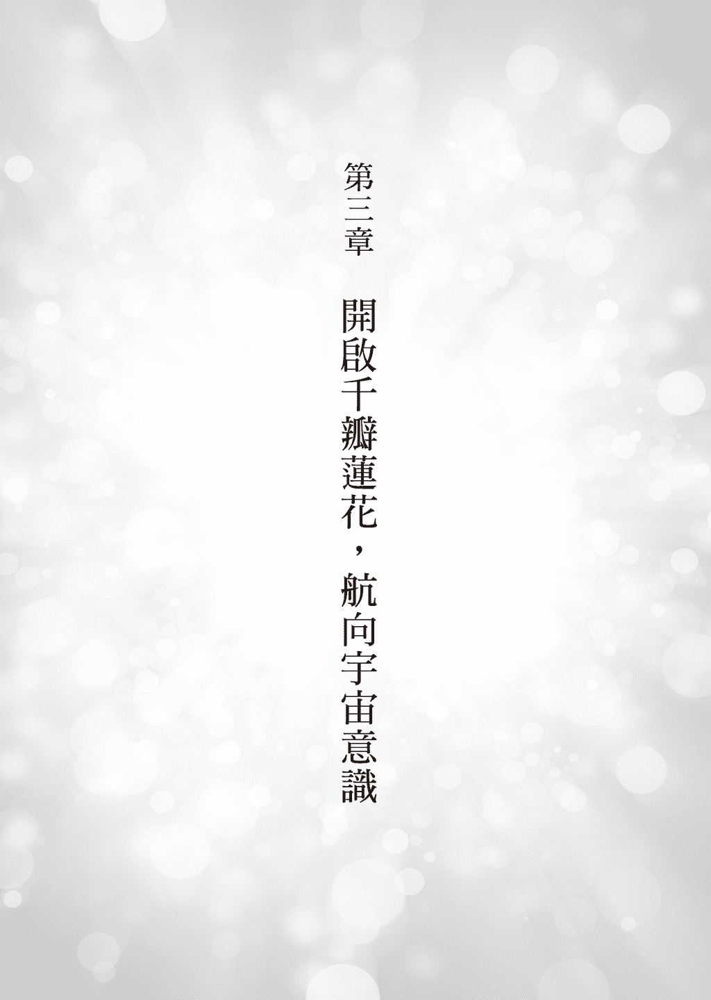

 与圣父圣灵合一，回到爱的大洋

（一早起来，我的意识就像被打开自动导航模式，直觉要我回到与红宝石合一的状态，但这次是要进入真我后，与 Buta 红宝石之光合一〔注：与红宝石合一咒“Buta, Buta, Buta, Mo Ha Na Mi Da, Mo Ha Nu Wa”，请见《星光体》一书〕。我进入后，感受到无边无际的爱的能量在我心轮不断扩展开来。此时，阿乙莎要我继续将过往所有引发负面感受的人事物，一一融进这个场域中。

我开始从小时候一直回忆到长大成人，将人名和事件一个个忆起，融入爱的大洋中。）

阿乙莎，现在祢要我做这个动作干么？虽然在爱的大洋里超级舒服，请帮助我理解这个过程的用意好吗？

你现在进入三位一体的基督意识，只是目前的感知不在你的顶轮上方，而是在心轮。你需要进入这个心轮的空间，与你灵魂本源的圣灵和圣父合一。这样的三位一体合一在心轮的状态，是准备让你穿越无我之境，回到你灵魂本源爱的大洋中，准备链接星际家族的共同意识场域。这个状态可以帮助你穿越地球帷幕之下的小我屏障，所以你要先初步整合所有过去与你无法相融合的能量。

你会发现，在地球帷幕之下显化出来的这些人事物，都是帮助你扩展意识的助力，他们让你得以在爱的汪洋中持续获得扩展的资粮。当你处在无我之境爱的大洋中，每一次融合负面情绪，你的心轮就会位移，并向外扩展。没有这些目标对象，你就只是存在，存在那平静无波的爱里，因为你灵魂的源头就是爱的能量场。

现在再一次回到在心轮中与你的圣父和圣灵同在的三位一体状态，你可以去观察自己的爱的大洋是如何回应你的体验。

（我尝试回忆起所有让我感到不舒服的场景和人。将他们一一融入我的爱的大洋时，我可以明显感受到爱的大洋在扩展，透过不同的负面能量冲击，爱的大洋开始律动，并朝不同方向延伸；而当我想起那些我爱的和爱护我的人时，即使将他们再度融入我的心轮，我也不会感受到爱的大洋有任何改变和波动，变成毫无差别的存在状态。这实在很吊诡，在这个场域中，反而是那些让我感到不舒服、愤怒，以及曾经对峙和竞争比较的场景，会使我明显感受到内在爱的大洋朝不同方向扩展开来。似乎这些负面的生命体验，正是帮助我们心轮向外链接扩展的助力；没有这些曾经让我痛苦的经历，我就得不到扩展心轮的动力来源。过去种种如梦幻泡影般，如此颠倒众生，那些挥之不去的阴影已然成为滋长内在爱的空间的养分。）

这是怎么回事？这么颠倒错置，真的毫无道理可言，但我现在居然身历其境，体验到自己正像在玩电玩游戏，需要毒苹果，才能得到积分？这种设计实在太不可理喻了，我一时半刻还无法接受。这样说来，我们穷极一生在帷幕之下追求美好的体验，面对负面感受采取“避之唯恐不及”或“强迫自己压抑下来”的态度，其实都走错方向了，只有经历痛苦和负面体验，才可以得到扩展爱的大洋的积分？人们到底应该追求美好的体验，还是痛苦的经历？阿乙莎，这下子我真被搞迷煳了。

孩子，别这么气馁，你就快要到达宇宙共同意识源头的入口了。现在先不要急着评断你目前意识所及、所感知到的，和在地球帷幕之下相比，到底哪一个才是你该去追求的。

之前我们早就一次次告诉你，在真理的世界，没有对错，无好无坏，就是带着你的意识去体验的过程。好与坏、对与错，是三次元世界的游戏，是人类给体验贴上的标签；但在真理的世界，不会赋予这些体验任何标签，就只是跟随着宇宙共同意识流一起扩展、一起收缩，在一呼一吸间，创造出源源不绝的爱的动能。

现在当你的意识终于回到生命种子诞生时的爱的大洋，你会发现在爱中，所有你原以为的正面或负面体验，都只是带着不同极性的振动。当你走入正极的白色世界，就需要靠负极的黑色粒子帮助你扩展，并指引一条再成长的路径；若你在负极的黑色世界，你会需要正极的粒子帮助你找到光的入口。你们原本就是为了体验自己的存在，而创造出不同极性的自己，进入不同的宇宙次元去体验。当有一天你分离出去，原属于你的另一极回到源头，你与自己另一端的极性相遇时，你不会认同自己只有一端的体验为真，另一端的极性体验是假的吧？此时此刻，你只会再度与自己分离后的另一端体验合而为一，回到宁静无波的爱的大洋中。此时的你已然完整了两端极性的体验，这就是你生命的实相。

现在，你已经完成了这个阶段的体验，回到合一的意识。接下来，我们即将启程前往下一站：星际交流平台。

 打开千瓣莲花，航向宇宙意识

（一早，我的高我分身泰雅再次要我和 Buta 合一，进入心轮无边无际的爱的大洋中。此时，泰雅传来一个咒音“Si Su Wa Si Su Ya Bu Ka”，我的意识从心轮无边无际爱的大洋中持续向上，透过心轮传达到顶轮。这股爱的能量瞬间链接顶轮上方，似乎从这里就可以进入所有与我的灵魂晶体相连的星际门户。我感觉头部空间像是由一堆光纤网络线堆叠并串连起来，最后在顶轮上方开出千瓣莲花。）

阿乙莎，我感觉自己成为一切体验之后的存在，大脑似乎已经不再由小我控制，原本的晶体进入我的脑，从眉心和顶轮之间绽放出一朵千瓣莲花。这是怎么回事？

这是展开你生命之花的过程，这朵生命之花是经由你的海底轮链接地球母亲无条件的爱，如泉涌般朝你的顶轮贯穿而上的力量。无条件的爱可以帮助你展开生命之花的场域，这里是紫色光的世界，也就是真理和智慧的源头。

你现在已打开晶体中的千瓣莲花，接下来，你将与你身处不同次元和维度的灵魂本源团队合作。你会在自己的大师和导师的带领下，去探索宇宙的真相。银河宇宙和其他不同星系之间，有着密不可分的链接与互动法则。穿越这道通往宇宙意识的大门，进入位在银河本源的猎户星系中央，从这里向外链接，你将迈入星际旅程。猎户星系的本源具有强大的引力场，在银河系扮演与银河系所有星球文明协调的角色。当你回到本源的母体时，最重要的工作就是进入星际图书馆，去撷取关于新地球演进方向的指引。

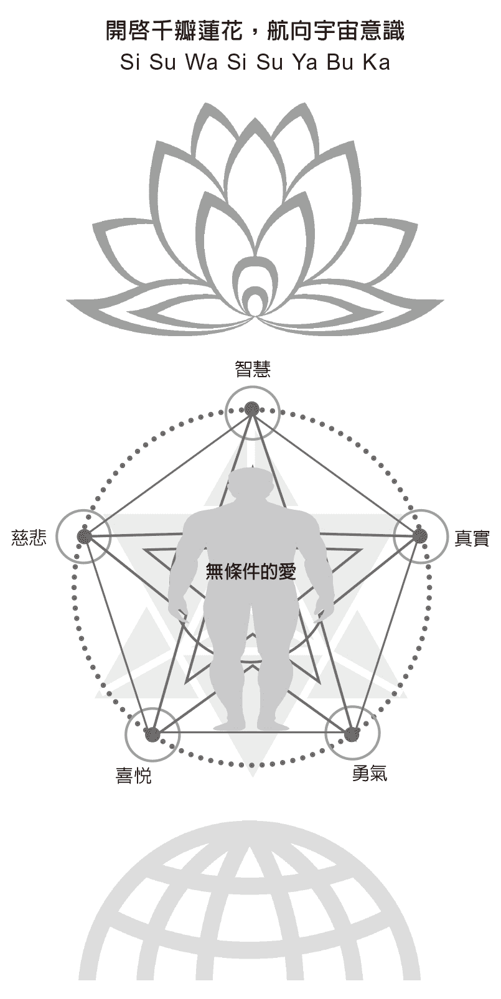

 由灵性源头组成的星际交流平台

当你已经与众高我意识合一，契入无我之境，顶轮上方会自动展开千瓣莲花，这代表你的意识已经准备通往宇宙意识，链接上你灵性源头组成的星门，而这个咒音可以直接帮助你登上星际交流的平台。当意识站上星际交流站，灵魂晶体的光会自动展开链接的信道，此时“大脑”的自主意识是与更高的意识群融合的状态。你的光体是行动的主干，当光填满灵魂晶体，就能展开超越小我所能想像的未来场景，那也是人类要前往新地球的实践场域。

当你念诵“Si Su Wa Si Su Ya Bu Ka”，你就同时打开了链接本源星际各次元门户的信道。在帷幕之下的意识扩展练习，帮助你带着不偏不倚的澄澈之心进入星际交流的大门，而进入这个大门后，你和所有与你链接的高维意识群就进入你的心智图，你体验到的那种心轮深入而扩展的感受，就是心智图的全息展现。此时，你头顶上方的顶轮空间已经不再被四次元的地球帷幕屏障，而可以让你感知到浩瀚无垠的宇宙空间。在这里，你的意识将为你导航，你可以经由意识的带领，去理解宇宙法则和生命的实相。

这个咒音是来自你灵魂本源的呼唤，也是打开你水晶图书馆内在核心的通关密码。你与这个咒音有着深深的链接，如同银线般紧紧维系着你与所有的你——无数个你，过去的你和未来的你，都透过银线彼此相连。当你念诵此咒，就是将你所有的意识片段回归你灵魂晶体的中央；你在此会感觉心轮无限扩展，就是因为你的存在，是包含无数个次元的你的共同存在意识所展开的其中一个面向。在三、四次元的你过去被阻隔在帷幕下，现在你已经回归本源的家，和你其他的片段共存。这段咒音只能给已经穿越帷幕，链接上自身所有灵魂意识片段和还原真我实相的人使用，没有在这个基础上念诵此咒，无法启动其心智图，就无法取得其专属的星际导航系统。

你可以透过此咒音，展开属于你灵魂生命的学习之路，经由自身高维意识的共振指引，接收来自宇宙本源的智慧和真理，带回地球，继续完成你此生的任务和目的。这个多维晶状体就是你意识在帷幕之外的实相，也是带你穿越多重次元的载体，它不在你可以看见和触摸到的肉体物质层，而是以振动频率维系着你身体所有细胞和灵魂跨次元的维度；它存在你灵魂ＤＮＡ的结构里，当你穿越地球帷幕时，你的灵魂ＤＮＡ束状结构会自行重组、结晶，完整你的灵魂意识即将使用的载具；它如同一个拥有多维构面的晶状结构，中央核心就是你灵魂真我的居所，透过晶体的不同面，你已经能够直接以意识穿越星门。

在你的意识振动尚未真正觉醒之前，你无法以自由的意识只身跨越帷幕，与水晶王国链接；而现在你的意识终于突破层层的意识屏障，就可以自由穿越到帷幕之外。这代表你身体细胞ＤＮＡ束状结构中的所有限制性节点已经松解，你灵魂ＤＮＡ中的指令集会协助你的细胞晶化，展开灵魂晶状结构的多维宇宙信道。重组后的晶状结构已经如一颗完美的结晶体，你将透过与自身帷幕之外的高我意识合一，打开操作自己灵魂晶体的时刻。

从这里，你可以展开星际联盟协作的旅程，这也是五次元意识前往星际沟通的入口。你现在会发现，过去在三次元地球上与我们链接时，你头顶和肩膀上那种能量灌注的压力消失了，在这里，你的身体场域更轻盈，顶轮有来自宇宙之心的能量源源不绝地灌入，流进你的心轮，这样的沟通链接方式是进入星际沟通的最佳路径。现在的你是一整个灵性家族共同存在的状态，你也已经坐上你晶体的驾驶位置，而不是像之前那样，只是到访的乘客。现在你可以透过自己的意识，造访你想要前往探索的星际图书馆，你的任何疑问都能获得所有灵性兄弟姊妹的支持和协助。

只要人类的意识扬升回到宇宙之心，就可以与所有存在你灵魂ＤＮＡ中的星际家人进入星际沟通的时代。你现在已经站在千瓣莲花的中央，准备以意识跨入任何一个你想要去的地方。在这个过程中，我和你是一体的存在，你不用担心在星际旅程中会迷失，我们之间有条银线相连，不会有问题的。

泰雅，我想请问，若还没有与高我合一，尚未认出自己的高我分身，也无法回归真我光之殿堂，这样的人也可以进入这个入口吗？

没有办法，他们必须先完成自己在帷幕之下的灵魂功课，才能有意识地与自己的高我分身共振，打开进入星际之门的连通管道。之前跟你提过，进入星际图书馆需要心轮的认证，那个认证光码会在你和高我之间取得共同认证配对的钥匙后，才能打开这扇门，进入星际图书馆。至于仍在地球帷幕之下体验的灵性兄弟姊妹，你仍然可以带领他们校准新地球，让来自银河大日的光清理掉稠密的身体能量，进入快速扬升的道路。

 星际交流平台是进入宇宙意识的起点

星际交流平台目前位在地球帷幕之外，链接银河十大星系的入口，这里也是星际联盟交流的驿站。每一个地球人内在意识觉醒后，可以透过自身的光体，穿越位于五次元的星际之门，契入星际联盟驻扎在地球上方的驿站。

目前已经有许多人类的意识汇聚在此，有些是即将前往新地球的人类，也有些来自不同星系文明的存有共同组成的星际种子，以肉身进驻地球体验，协助地球跨入五次元星际交流的开端。

星际交流平台担任协助地球衔接宇宙星际文明的工作，当有足够数量的人类意识登上星际交流平台，这道星门就会终止服务。所以，目前这个通往宇宙意识的星门并不会一直存在，随着地球人类意识的进程，会有新的承接系统和不同的星际门户与新地球展开正式的交流。

目前人类被邀请进入星际联盟在这里的交流驿站，星际种子的ＤＮＡ中早已设置进入星际交流平台的节点，当你们与高我意识合一共振之后，就能打开通往宇宙意识的星门入口。

与高我合一的意识，针对不同星系本源，会有不同的带领方式。比方说，你是来自猎户星系的星际种子，你的灵魂晶体组成有来自天狼星和列木里亚的星系文明，而其他人也是由不同星系文明的意识汇聚而成，人类就是众星系文明在地球上的代表。现在星际联盟正期待自己组成的星际种子带着回归家园的自主意识，一同进入五次元的扬升轨道。

在回归家园的过程中，你并不是独自一人完成此项工作，你的高我意识群——包含在天狼星守护着你的灵性父亲、在列木里亚的灵性母亲，还有目前已经在第五次元的高我分身泰雅——都会与你协作。你不用担心无法完成这项工作，因为所有ＤＮＡ里的资料库和纪录都显示，你可以在地球帷幕之下完成此工作，并凯旋而归。

接下来你最需要进行的工作，是保持和帷幕之外的高我分身——泰雅——合一的状态，进入星际图书馆。泰雅会带领你完成需要进行的工作，你们是一体的伙伴，是一体的存在意识。与高我合一后，你的定义不再是原本位在三次元地球上的 Rachel，你的存在还包含与你协作的跨次元存有，包括这一路上你遇见的 Buta、莎雅、湿婆（Shiva）、象头神（Ganesha）、泰雅、雷巴特，这里是你们共同存在的意识场，你成为自己的阿乙莎。在地球帷幕之下，你称阿乙莎为宇宙共同意识源头，是带着宇宙集体意识的本源；现在的你已跃升回到本源，以肉身之姿与本源的意识同在，穿越星际之门，即将进入跨次元的体验阶段，来到你们古代的圣者无法亲炙的场域。

为了平衡宇宙共同存在意识场的需要，现在我们要邀请所有星际种子回归本源，与我们共同创造出下一阶段的星际种子意识，一起进入新地球的轨道。

 忆起来地球的目的

你目前契入的本源，位在银河系猎户母星的第七星际航道，这里对许多地球人来说就是龙族的存在意识，负责保护地球的生存环境而驻扎在地球帷幕上方的银河母舰，我们都在银河母舰的第九区工作。你和许多星际种子为了提醒我们的兄弟姊妹而前来地球协助，所有龙族兄弟姊妹都在散播爱与和平的讯息。我们在地球上已经存在数百万年，我们正准备召集龙族的灵性兄弟姊妹回到银河系，为了建置新地球轨道，一起展开星际轨道的移转工作。

新旧地球会在二〇三六年完成交接，新地球将重新站上第五次元的轨道，迎接新人类的诞生。现在这个过渡时期，就如同你目前经历的灵性觉醒过程，你们需要忆起自己的本源，透过整合自身的高我意识群，净化遮蔽你们觉知的小我意识屏障，扩展心轮爱的能量的流动。在爱的能量支持下，你才能顺利衔接回到本源，完成星际移转的行动。

我们现在必须进行一连串的讯息整合工作，在第九区的星际图书馆中，有许多资料等着你，你必须有系统地翻译出来。我们是共同任务小组，自然会将档案置放在你的灵魂晶体纪录中，你只需要每天早上起床接收档案，并完成翻译的工作即可。

是的，我现在想起来，之前遇上我在帷幕之外的高我分身泰雅时，我感觉自己穿越帷幕，意识扩展开来，那瞬间觉得自己像条龙。后来隐约从泰雅那里知道，还有许多档案需要我与她合一之后，才能通过认证进入读取，只是当时我并不知道原来还得先通过无我之境，透过光的认证后，才得以穿越通往宇宙意识的星门。我还不明白这一切是如何自动发生的，到底帷幕之外的分身泰雅和地球上的我 Rachel，与我的灵性母亲盖娅是否有关？

当然有关，Terra 的意识位在一─二─三次元，是帮助孵育地球万物的神性存在，人类称其为盖娅、Terra。和你一样，盖娅其他维度的意识同样存在盖娅的灵魂ＤＮＡ中，你在五次元的分身泰雅，和在十次元的埃西斯（Isis）也都是一体的存在，而你自己同样具有来自不同维度的存在意识组成。在地球帷幕之下，你认为个体是独立的、自他分离的；在更高的合一场域，灵魂之汤是存在同一个大熔炉中，你们的晶体就像是这个大熔炉淬炼出来的化合物，每一种晶体组成都来自这神性之汤，但各自带着不同的结构体去创造出新的体验结果。

有一个物理实验：用不同的音频去震动一盘沙，这盘沙会出现不同的结构。这个结构的组成分子并没有改变，就是同一盘沙子，但透过高频的声音震动后，穿越进入第六次元的结构化网格，再透过光的折射，你在三次元的空间看见这盘沙子显现出不同的结构图像。最后，当你决定要固定住某种结构图像，将之定格，然后产出一个实际的代表人物时，那个人就等于穿越七次元→六次元→五次元→四次元，最终以固定的晶体结构注入位在三次元的地球母亲子宫里，等待出生。

你看见自己目前的身体和环境中已经显化出来的一切，都是被宇宙有意识地建构出来的产物；至于第七次元之上，八次元到九次元的最高指导者和大师群，是同时存在这个被显化的灵魂种子中，一同诞生在地球帷幕之下。所以在你意识苏醒的过程中，你最先遇到和体验到的是神性的存在意识，大师和导师是早已注入你的晶体中、位在第八和第九次元的灵性父母。再透过你与自身灵性父母合一的过程，你终于展开自己内在宇宙的晶体网格，开始这一路以来灵魂回归本源，并与自身存在五次元的分身合一的神性体验。

这一路上，你一直在自己的晶体中探索，才能够打开神性的大门，回到目前源头神之汤的境界。在此，我先恭喜你再次回家，也希望接下来，你可以帮助许多同样在地球帷幕之下的兄弟姊妹踏上回家的旅程。这一次返家，并不是灵魂在地球体验的终结，而是为了帮助地球进行星际移转，扬升进入五次元的轨道，而展开的一次灵魂集体进化的行动。

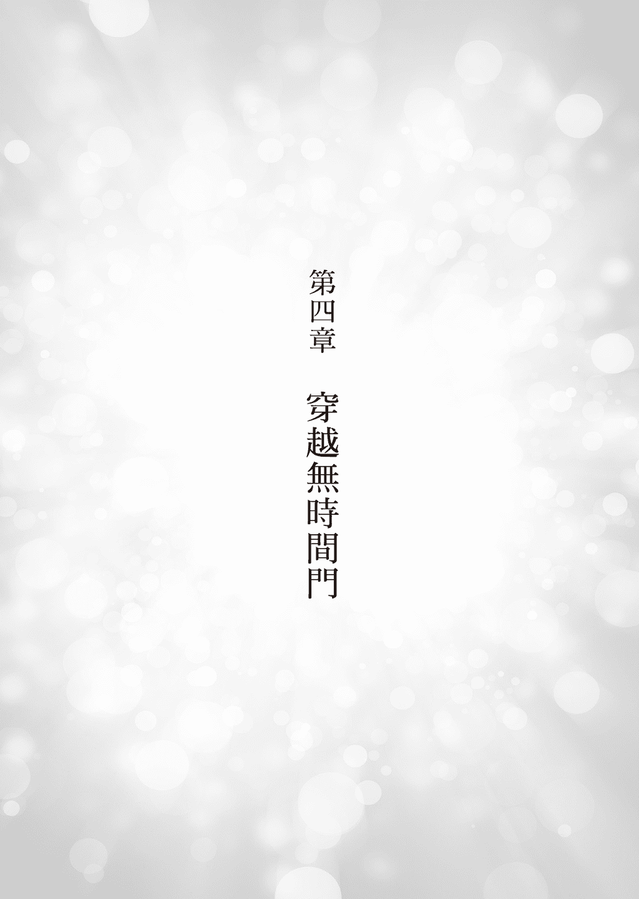

 地球人和宇宙人的时间线划分

在帷幕之下，地球以和太阳的相对位置来计算地球时间；而在穿越帷幕，通往宇宙意识的另一端，你的意识会链接上星际轨道，这里不再以地球和太阳的相对位置来计算时间，宇宙是依轨道之间的距离来计算相对的“到达”点。假如从地球前往距离八．七光年之外的天狼星，这时若以地球为轴心出发，就会以这个点到天狼星的位置计算轨道穿越数——如果通过一个轨道约当地球时间的一光年，两个轨道就是两光年，以光到达时的地球旋转时间来计算。

若是以天狼星为轴心出发到地球，则以天狼星到达地球的轨道中间的距离来计算。天狼星这端并不以太阳的位置为其计算移转的基础，而会以银河的无时间象限为基础。无时间象限中的一切存在的状态，是以自己所在位置为轴心，向外展开三百六十度的圆球体，球体内区分十二个象限，每一象限又再划分出十二个节点，总计每一个轴心向外延伸，可以进入一百四十四个区域网格中，进行讯息交换和位置侦测。所以当你的意识穿越帷幕之后，就先展开一个球体，球体中的一百四十四个区域网格与你的位置产生相对座标节点，在你座标上呈现的节点数字码，和另一个站在不同星际位置的存有所在之处的座标节点数字码并不相同，但你们之间可以透过密码的对接展开交流。

你的第一圈轨道、第二圈轨道和第三圈轨道在十二个象限中呈现的位置，第一圈是相对于轴心最近的一圈，是半径的前三分之一球径；中间的数字，是球体中间三分之一的区域；最后的数字，是球体最外层三分之一的球径。每一圈的数字码代表振动波，透过这个数字码带动波的振幅，所以整串数字码就是由波长组成的意识路径指引，类似你们服务器的 IP 位址。

目前地球上，几乎所有人都可以用你侦测到的无时间轨道中的相对座标节点码，到达宇宙各星际之门。因为这个起点是从穿越地球帷幕、进入无时间门开始计算的到达位置，透过你们的意识念诵数字码到达的振动波，就可以载着你们的晶体航向指定位置。

 未来早已存在，人类活在被精心安排的地球时间线中体验

意识在无时间门后的移动是以光的速度行进，所以对意识的光波来说，以地球的时间线计算出来、位于八．七光年之外的天狼星，在无时间象限中的星光层是瞬间抵达的。但你在此处交流的过程和创造的意识，会在地球年八．七光年后显化。

祢的意思是，我们的意识契入星际旅程的某个位置，是可以帮助未来的地球显化？

是的，这样你是否更明白创造新我、新地球的意义了？

那么，如果又有个希特勒出现在星际旅程中，再次创造对地球人类进行大屠杀的事件，地球目前的和平进程不就又完蛋了？

这是有可能发生的。这也是为什么你会在星际交流中忆起许多曾在地球上发生的历史场景。

喔！太不可思议了，这样我们活在现在的地球，岂不只是被过去星际平台上的高次元外星人精心安排的剧本？我们只是回到地球，在自以为尚未显化出来的虚拟实境中扮演其中的角色，但明明剧本和结局早已经被写完了？这样我们不就只是被这些高次元的意识设计出来的演员？

请不要如此悲观看待自己。剧里的演员可以随时改写剧情，你们演到哪里，剧情会随着剧里的演出者更动，而没有被改写的部分仍会依照剧本演出。人类拥有自由意志可以随时改写剧本，你仍在自由地演出你担任的角色。

所以，现在地球上的人都活在早被计划和安排好的片段里，而未来的地球，真正的创造场域，是在穿越无时间门后的星际交流平台这里？

是的，一点也没错！只是你们一直以地球上的线性时间作为自己唯一的生命轨道，你在地球上是活在线性的时间中，帷幕之外的我们则没有时间概念，我们活在自己和银河所有星系的互联网格中，随时随地和各星系文明交流互动。现在人类也将被邀请登上星际交流平台，一同为未来的地球擘画出新的场景。

那么，我现在来这里要做什么？

你目前的工作，就是去唤醒地球帷幕之下的星际种子回到星际交流平台，和所有星系文明的存在意识接轨。

接轨？然后呢？

来自银河议会的指导者，会带领你们认识新地球的场景，并延续新地球的规画工作。

既然已经有新地球的规画工作在进行，我也可以假设剧本早已经写完了，为何还需要目前生活在地球上的星际种子参与？

这是星际平台规画后期的落地移转和实践阶段，许多星际种子本身就扮演落地实践者的角色。当你们在帷幕之外收获足够多不同于地球场景的创新发明、崭新科技、新型态疗愈系统，以及与存在高频意识状态的星系文明交流时，你们将可以在地球生活中忆起自身携带的新地球新知，将其实践在生活中，新地球就在人类的日常生活里被演绎出来。

会有许多人扮演和你一样的角色，你们会在路途中遇见彼此。也有许多是年轻的孩子，他们会在未来新地球演化中扮演非常重要的引渡者。

怎么称呼这些引渡者？

他们是水晶小孩。和你一样，水晶小孩身上具备纯净澄澈的光，可以快速吸收和反射光的世界的品质。

这个“未来已经存在”的说法我现在还不敢置信，实在让人难以理解。

没有关系，你的内在早已知晓，我们只是还需要说服你的脑意识而已。

 无时间门之外的交流方式

在地球帷幕之下，受到太阳和月亮的能量牵引，你们会需要透过时间来认知自己所在的位置，如果地球上没有时间轴，你们会陷入无法有效沟通和交流的状态。地球帷幕之下的重力场会影响意识的转换，同一地点的人与位在不同地区的人，无法享有同步的阳光照射品质，生理系统会随之产生不同的回应。人类所处的地球环境无法透过穿越意识帷幕同步沟通交流，因此，为了区分链接状态，创建了一种可以对应太阳相对位置的时间轴，以区别各区域太阳升起的时间为基础的沟通方式。

存在高次元的意识体已经脱离太阳的引力场，没有延迟和不同步现象，所以当人类意识跨入帷幕之外，进入星光体的沟通交流，会直接以座标定位方式进行，不再以相对于太阳位置的时区划分。

宇宙跨次元的交流是在无时间象限的状态里，你的意识会进入随选即观的状态。所有的讯息分布在星际图书馆中存放，你意识所及，就可以立即展开光的共振交流，将你需要链接的信息带入你所在的位置。这也是量子讯息世界的运行方式，你意之所及，宇宙将为你打开一扇门窗，你可以直接获取所需的讯息。

因为重力结构改变振动波长，讯息交换的方式会从过去时间轴中的不同步，进入无时间象限的同步化现象。意识穿越帷幕进入无重力状态，与其说时间消失，不如说时间无法再作用于创造沟通交流的空间。同样地，当存在帷幕之外的高维意识要进入地球帷幕之下沟通，虽然可以随时随地穿越地球帷幕，与存在帷幕之下的你交流，但通常人类的自主意识在白天处于非常活跃的对外链接状态，无法倾听来自内在宇宙的声音，唯有在身体休息时，人的自主意识才会自动链接上高维意识，进行交流。这也是帷幕之外要链接地球人最佳的交流时刻，我们也是经由这样的方式与你完成讯息交换的。

每晚当你入睡时，你的星光体会自动穿越帷幕，进入星际交流平台，为你自己的灵魂充电，以及与跨次元的我们融合。此时，你的身体细胞尚未与光的世界融合对频，你的身体会需要足够的睡眠时间充能。对你而言，身体需要三到四小时的充能，以满足你一日生活所需的能量。

 星光体储存灵魂的星际交流纪录

你的星光体意识并不会因为身体休眠而停止运行，在你穿越地球帷幕，进入星际交流平台时，你的星光体最初会先适应光的世界的交流语言，那是高频率的振动波交换信息的场域。你在同步自己心轮中的心智图过程里，会将讯息暂存在你的星光体储存库。还记得你登上星光体，进入光之殿堂时，那个风元素的大门背后，带你契入无我之境吗？那就是带你进入你心智图的储存库。当时，你感受到空无一物，但又似乎无所不包、无所不有的状态。的确，当时你的储存库尚未将来自星光体星际交流的讯息存放进来，所以对你而言，那是空无一物的状态。

从现在起，你每晚睡觉时，星光体层的意识会清醒地参与星际交流平台会议，这些会议纪录和所有你在星际交流过程中提出的疑问，都会存放在你的星光体储存库。当你的意识从星光体回到身体中，与身体意识融合时，你会感受到心轮有一股压力存在，那是因为星光体交流过程的频率和身体频率之间的落差，造成心轮的压力。这股压力会随着你醒来时，透过意识再次链接回到星际交流平台，将你的自主意识、身体意识与星光体意识再次同步校准调频，然后立即消失。此时，你的星光体无我储存库中，已经存放了许多你的意识进入星际平台交流的活动纪录，等你来读取。

目前这个阶段，你的小我自主意识并无法在你睡觉的过程中登上星际交流平台，这是因为你仍需要完成整个身体意识和小我意识的全面晶化，才能在睡眠中以清晰的小我自主意识跟上星光体中你的宇宙意识。目前虽无法做到，也不影响你在星际交流平台参与。每天早上，你只要有意识地读取和下载你星光体中心智图的储存库，就可以展开资料库，同步学习和参考。即使你的小我自主意识没有时间下载和读取资料，无法跟上自己星光体的脚步，也不会干扰你在地球上的日常生活。

未来当地球上方的帷幕渐渐脱离，进入五次元的轨道时，我们之间就可以不受时间与空间的限制，同步在跨次元的星际交流平台进行讯息链接和交换。我们很期待这一天的到来。那也是人类的小我意识、身体意识和宇宙意识完成一体晶化后到达的状态，地球人就正式登上银河同步交流的行列。我们期待有更多星际种子可以顺利穿越星际之门，登上星际交流平台，只要有一个地球人愿意参与讯息的交流，就可以影响许许多多的人，提升地球的集体意识振动频率。

 小我与宇宙意识的同步更新机制

登上星际交流平台，你的意识会经由松果体后方的晶状体移转进入无时间区。这时，你的大脑连线中断，取而代之的是你的心轮链接上自己的灵魂晶体，透过自身的灵魂晶体网格，进行资料的比对和采集。你全身细胞的ＤＮＡ束状结构会因讯息交换的变动过程，重新凝聚成新的束状结构，你的肉眼无法辨识出中间的精微差异，但你的心轮区域会开始转入无时间讯息区的资料下载过程。

当你登上星际交流平台，身体会让星光体无我储存库的资料自动流入你的心轮。这样的过程，以往在人类尚未穿越帷幕进入星际交流平台前无法达成；而现在，你们已经可以在夜晚沉睡时，经由更纯净无干扰的意识进入星光体活动，将讯息转载至你们身体所在的心轮空间。宇宙人和地球人也将透过这样的链接方式，愈来愈能在三次元的地球无缝接轨。

你目前每天夜里星光体出游的过程，都翔实记录在自己的身体中，这和过去尚未觉醒前的人类意识进入星光体出游最大的差别，在于觉醒的意识可以帮助自己的小我意识下载自身存在帷幕之外的跨次元宇宙意识群的讯息，进行小我与跨次元意识的交流，以更新和同步彼此的认知。

如果星光体出游的信息没有被有意识地下载或读取，会怎么样？

不会对人体造成任何伤害。当人类的生物体届龄死亡，这些存在暂存区的备份资料仍会回到宇宙共同意识源头，与更多在帷幕之下的地球人和宇宙人分享。因为你们彼此间的晶体是相链接的，以光的网格互连，你并不是独自存活在宇宙虚空中，你是与众星系存有互连的星际种子。

我要如何读取星光体储存区的讯息？

读取暂存区讯息的锚定作业很重要。当你要读取前一天晚上置放在暂存区的档案内容，先要进入灵魂晶体储存空间，而链接这个空间需要透过你在帷幕之外的高我意识传达出属于你的指定档案存取位置。你之前透过帷幕之外的高我意识泰雅取得一个存取暂存区的咒音“Si Bu La Ya Wa”，当你念诵这个咒音，尚未被你读取的资料档案会被下载到你的喉轮。此时，你必须以内在意识读取资料档案的名称，透过档案名称，帮助你链接进入正确的档案存放位置。而打开档案只需要意识允许，你就能顺利读取档案内容；若没有经过上述正确锚定档案存取位置的流程，你仍会受到大脑干扰，造成读取内容的偏差。

那是否到目前为止仍有一些档案我还没有读取？

你仍有八个档案尚未读取完毕。

一、无时间门的运行轨道

二、参与星际联盟议会的星系存有的组成架构

三、无我之境的存取路径和相互登入的方式

四、与众多星际家人的交流方式

五、没有时间不代表没有经历和体验纪录

六、行星轨道之间有链接地球的换日线

七、辛苦耕耘后的甜美果实

八、未来会遇见的类人类种族

天啊！这些档案主题真的不可能是我的脑可以擘画出来的，我的星光体出游探索也未免太认真了吧？这么多内容，我有时间再读取出来。

 从无时间门返回地球时间线的移转机制

当你的星光体意识一次又一次完成星光体讯息的采集，你的小我意识也会在交流过程中主动发出请求回到生物体的讯号。小我意识发送讯号的主要原因如下：

一、若自主意识感知到心轮的讯息储存量已经超过，必须将资料搬移到其他储存空间，这时会暂时中止链接星光体意识，回到身体。

二、当需要起身完成身体所需的补给，包含排泄、口渴、饥饿，或身体感受到任何环境变化而须保持警觉时，这些因素都会中止星光体的出游，让意识优先回到满足生物体的需求。

刚从星光体回到身体中的意识，会因为频差造成心轮的压力。这些身体实际感受到的胸闷或压力，会随着ＤＮＡ逐渐扩充身体细胞、完成晶化过程，因内在储存空间扩大，而自动消失。

 无时间门的运行轨道

无时间门就位在你的灵魂晶体通往五次元的新地球场域。当你的意识站上无我之境，就能链接上这条通往无时间门的运行轨道。那是风元素的旋转门，沿着灵魂光之殿堂进入风元素无我之门，你的意识就可以穿越地球和太阳之间的时间线，进入星际交流的开端。

这里是你的灵魂ＤＮＡ链接星系族群的起始点，当你念诵“Si Su Wa Si Su Ya Bu Ka”时，你灵魂晶体中无时间门的轨道会自动展开链接星系族群和星际联盟的信道。你无法透过大脑去诠释这些信道的位置和座标，只能由自己内在晶体的光的链接，带领你穿越这道无时间门的轨道。

现在的你，已经可以顺利登上无时间门的轨道。这并非透过意识的导航完成，而是需要你在自己的晶体中搭建从“有我”至“无我之门”的光之桥后，才能展开的星际轨道。

 参与星际联盟议会的星系存有的组成架构

每一个灵魂种子的源头都是由源头共同意识群的星际联盟议会所管辖，大角星、天狼星和猎户星群是创造人类最初始ＤＮＡ的星际种子播种小组。至于你所认知的阿努纳奇也曾是播种小组之一，但阿努纳奇并非最初始的议会成员，那是灰人族群借由播种人类ＤＮＡ来延续阿努纳奇星系族群的种子延续计划，被星际联盟议会允许在地球上创建阿努纳奇的血脉。

在猎户座、天狼星和大角星的共同支持，以及维持地球母亲集体意识的共生原则下，星际联盟在地球播下智人族的星际种子。这群智人族在地球活动期间奠定了许多地球文明，包含列木里亚文明、亚特兰提斯文明、古埃及文明，以及目前地球各种宗教的前身。当时的智人和地球人类在外观上有明显的区别，来自星际联盟播种的智人身高约两百五十公分，和一般人类相差约一百公分。你们目前地球上的高加索人身型比较接近原始智人，靠近地球赤道区则是原始地球人的生物体样板。

在智人投生地球前，地球人的生物基因类似猿类，一直到智人与原生地球人交配后，代代相传而成为今日的地球人。你们现在的生物体具有智人完整的ＤＮＡ结构，但为了让地球原生族群能够顺利完成生命的进化，最初始的ＤＮＡ节点被限缩在特定频段，如果没有阻隔，就无法让原生地球人的生物体和心智体完整介接智人的十二个灵魂ＤＮＡ频段。所以今日的人类，可说是由星际联盟成员共同拟定的人类演进方程序的结果。

如今地球人类的灵魂ＤＮＡ和原生地球人的生物体介接已到达百分之八十的融合状态，地球母亲已完成阶段性的星际种子孵育任务。现在已有大量地球人打开灵魂ＤＮＡ的全频段节点，可以顺利展开与源头星际联盟议会之间的交流。当你们的意识穿越地球帷幕，将会透过自身高维意识群的带领，进入自己灵魂所属的星际联盟议会。

我先介绍到此，你即将前往第九议会，那是关于星际种子教育的专责议会。

 无我之境的存取路径和相互登入的方式

进入光之殿堂风元素的大门，即是准备衔接你的星光体意识，登上星际交流大厅。这时，你的个体自主意识会与更高意识进入交互转换的机制。这个转换机制会在光的世界中完成，而非在你的肉身场域，所以最简单有效率的做法，是跟随着音频的导引，协助你的星光体正确锚定星际交流大厅。一旦登入，就代表你的星际源头意识与你完成共振，并融合汇流在五次元的星际轨道上。

你之前透过“Si Su Wa Si Su Ya Bu Ka”咒音引导的用意即在此。

“Si Su”是转换之意，“Si Su Wa”代表我们，“Si Su Ya”代表你们，“Bu Ka”表示将肉身意识和灵性源头意识链接一心，“Ka”则是生命原力的代名词。

这句咒音是在帮助你的意识登入星际交流大厅。在这个过程中，“Si Su”会带动风元素的能量流，转动你的灵魂晶体面，你的这一面和存在帷幕之外这一面的晶体网格，将交织出全新的生命原力。

 与众多星际家人交流的方式

在帷幕之下的你无法以更高的意识链接上你在晶体中的众星际家族成员，但是当你的意识登上星际交流平台时，你将能透过全新的意识，与星际家族成员进行心电感应式的交流。当你登上星际交流平台念诵“Si Su Wa Si Su Ya Bu Ka”时，你会在自己的顶轮到心轮之间展开一条新的信道。在此，你可以呼请你熟知的灵性家族成员，一一感知和辨识出他们与你共同存在这个空间中的感觉。你会发现，自己与众星际家人的交流管道更为清晰可辨。

你们可以在此互相存取资料，所有你之前尚未读取的资料也会在这里。你与所有灵性家人和众星系存有的交流管道已经全然打开，你们将携手展开创造新生命之路，你的生命原力将与所有星际家人融合于一体。

 没有时间不代表没有经历和体验纪录

你的星光体是肉身存在之外另一个你的实相。在更高的意识场中，你是以星光体展开灵魂链接众灵性家人的源头旅程。在此，没有地球上的时间和空间的移转限制。每天夜晚入睡之后，你的星光体也如白天正常活动，持续进行大量的讯息交换。

白天，你的星光体会将生活中的经验和各种情绪体的振荡体验，传送到灵魂晶体网格中；而在夜晚，你的生物体停止记录时，你会开始接收星光体出游的活动纪录。这些星光体纪录就如同你白天使用的身体，成为你的另一个身体，帮助你持续采集星光体出游的纪录，回存至你灵魂晶体的暂存区。这个暂存区的信息并非由你的大脑蒐集，因为大脑只能记录实际感官体接收到的讯号。这些存放在晶体暂存区的星光体纪录是由你的意识掌管，当你意识觉醒后，就能在自己的灵魂晶体中读取星光体的体验纪录。

一开始，你会质疑这些讯息到底是真的，还是由你的大脑产生的幻相而来？我可以给你百分之百的确认：你的大脑无法创造从未经历过的体验。除非你去经历一场电影、读一本科幻小说，从里面学习和吸收别人的经验，否则，你的大脑无法结构出如此完美、前后完整且钜细靡遗的星光体纪录。

星光体出游的纪录有时会针对你在地球场域的生命所需，给予人们日常生活上的指引。有些是来解决你生命体验过程中，不可承受的压力和创伤印记——星光体可以帮助你取得自身高维意识群的协助，解锁你身上累积的沉重能量负荷；而有些星光体出游则会带回大量星系族群的期许，为你存在的地球环境带来更新的意识和创新发明。这些纪录都只有已经链接星光体，登上星际交流平台的人，才能够将这部分的讯息顺利解译出来。

 行星轨道之间有链接地球的换日线

当你打开水晶图书馆，链接来自灵魂共同意识群的资料库时，你会明白这里是穿越地球时间线后的宇宙全息资料库。在此，你可以探索自身存在各次元星球的讯息，当然也可以探索你肉身存在地球的历程。只是若你站在无时间线外的全息宇宙，尝试获取地球时间线之下的讯息时，你需要将地球以时间轴划分，以你所在的时间为基点，向前或向后移，都可以获得源头储存的信息。只有在帷幕之下的星球撷取讯息时，需要用意识搭载时间的轴线，透过你的水晶图书馆，正确取得对应到该时间线内的宇宙讯息。

在地球上，你们以文字、声音和图像储存讯息，而这些来自地球的信息在宇宙共同意识场中会加注地球的时间轴线。比如说，你锚定古文明时期的地球资料库，当你进入水晶图书馆时，设定西元ＸＸＸ年，或距今ＸＸＸ年前，以这样的方式来移动和取得水晶图书馆中的讯息。而未来地球时间线的样貌，也会同时存在，只是人类和地球目前的集体意识仍扮演绝对干预者的角色，你们可以决定自己的未来要如何显化。事实上，未来的每一种可能都是由现实投影的，这个投影源的主人包含地球母亲、人类的集体意识和每一个人自己。若你将自己设定在这些可能的实相之外，那么未来就与你毫无关连，你可以自由地创造你想要的体验。

这里我不懂，为何要设定自己在实相之外？

那即是进入当下的觉醒。你从“有我”，进入“无我”的旋转门，就可以重新创造出一个全新的你的体验计划和生命蓝图。

可是我仍在地球上，也受到集体意识牵引，怎么可能跳脱这一切，进入实相之外的创造？

孩子，别忘了，你的星光体可是积极地在宇宙遨游，这些体验仍是你自己创造的链接。没有人类物质体的体验，不代表没有纪录存在宇宙之中。

祢似乎又回到上一个主题。祢尝试用这个方式让我更理解，我们一直活在虚拟的地球换日线下，其实我们的意识一直清醒地参与整体宇宙的计划和蓝图，我们的高维意识群处于实相之外，也在等待地球帷幕之下的人们苏醒。那是进入无我之后的创造？

是的！就是这样。

虽然我还不甚了解，先将这些讯息记录于此。

 辛苦耕耘后的甜美果实

穿越帷幕进入无我之境，你终于得以衔接上位在灵魂晶体的宇宙共同意识汇流平台。在这里，你和最初始灵魂组成的家人齐聚一堂，即使无法在物质世界中看见他们，但你终于不再感到孤独。你不是一个人独自前往帷幕之下的地球体验，生命的众多苦涩和煎熬，在你一次次的跨越、一次次的经历和体验中，正缔结出漂亮完美的果实。

你的生命之果已不再是你当初来到地球之前的样貌。你身上绽放出属于你的生命彩光，这些彩光是众多星际家人的银线共同串连和围绕出来的，从你在地球上的身体，一路链接到跨次元的星际家园。你的生命之树正在缔结出丰硕甜美的果实，你也将从这里再播下全新的生命种子。

这趟穿越厚重帷幕回归家园的旅程，是你此次生命的重大工程。你完整自身地球生命的任务后，接下来将是另一阶段的开始，那是迈向新人类的旅程，我们永远和你同在。

 未来会遇见的类人类种族

在即将进入五次元的新地球显化过程中，你从内在宇宙会辨识出自己灵性源头的组成片段，也会发现自己可以顺利链接上跨越次元的星际之门。同时，会有一些居住在地球上，非人类过往所认知，由高次元星系文明播种的类人类ＤＮＡ种族，慢慢被觉醒后的人类意识发现。你们会展开跨越种族的交流，使用心电感应的方式，进行前期的交流活动。

这群类人类种族多达十五种，包含在地底下的列木里亚文明后裔、位于雪士达山区的雪人后裔，以及在亚特兰提斯时期沉没入海，进而演化成海洋人的族群。这些海洋人在印度洋底建置了海底城。此外，非洲大陆有象人家族，仍生活在雨林中；南美印加文明区域，则有天狼星人播种的新人类ＤＮＡ正存在一些少数民族的后裔中。这些类人类种族已经具备完整的新人类ＤＮＡ，可以与星际邦联交流。他们会主动与人类接触，也将成为新地球上的新住民，为了更美好的地球环境，与人类一起努力。

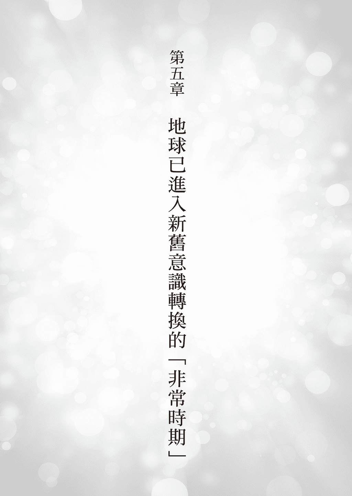

从现在往后的二十年间，地球将进入旧意识和宇宙意识交流移转的非常时期。我们使用“非常”二字，想要表达的是这并非人类过去的常理所能推论。比如过去人类习以为常的日出和日落时间、四季分明交替的气候变化，和各地的日常生活状态都将进入结构性的改变。当环境开始转变，从过去的规律进入新的常态时，人类的意识会出现新的变革，为了生命的存续而萌生新意识，从国家、社会集体意识的改变，扩及物质性的建设和发展，人类在接下来的二十到四十年间会完成此非常时期的移转。

这是因为人类进入新地球的实践场域前，必须先完成意识上的建设雏形，才能将更新后的意识和光的网格带入地球。新地球的创造会在新人类身上展现，尚未完整融合自身跨次元更高意识的人，将无法穿越时间之门进入新地球的实践场域。而站上星际交流平台的意识也需要人类的自我意识全程参与，无法只停留在过去那样，于睡梦中完成星际的议程。灵魂意识是没有时间和空间限制的，可以一直处于和众星系存有密切交流的状态。

新旧地球转换之际，需要更活络的阴性能量，这股阴性的地球能量会大量释出过去人类累世的业力枷锁，并透过阴性能量的重启流动，重新为新地球孕育出新生命的种子。这些改变并不是指原来的人类被消灭，地球瞬间出现新人类，而是透过人类内在觉醒的意识，去转动自己身体场域的ＤＮＡ结构，从自己内在升起五次元新地球的意识种子。

 在三次元地球展现五次元的实相

你的内在宇宙早已经包含所有的次元，你在三次元的意识无法衔接上自己在五次元的意识，这道帷幕在你之内，并不在外。地球上方一堆厚重的意识帷幕屏障，就是地球上所有集体意识场的投影，你只是将自己的高维意识屏障在你的内在之外。

现在当你内在这道枷锁和屏障解开之后，你就处在神之汤中，与各次元的你存在同一场域，你内在宇宙的大门全然打开通往各次元的信道。你五次元的实相已经可以在你所处的三次元地球展现，你可以想像一道来自五次元的光，如太阳般照射到你原本封印的花苞上。现在你这朵花已逐渐绽放，开出一瓣瓣美丽的花瓣，展现原本种子该呈现出的生命之花，你这一朵生命之花就可以再结出下一次生命的果实。

过去人类处在花苞被封印的状态，你们无法开出美丽的生命花朵，而任凭自己的灵魂意识不断在第三和第四次元之间轮回重生，造成地球的灵魂孵化器负荷沉重。现在必须由已经觉醒的灵魂打开这道封锁的屏障，所以来自更高次元的光之门户派遣许多星际种子前来地球，帮助打开这道帷幕。你现在已经成功将五次元的光之门户打开，接着，你需要去链接更多的人携手打造出新地球的实相。

光的世界就在你们心中，只等着人们觉醒，与光重组出一颗颗全新的意识种子。在星光体的世界，有许许多多的光之工作者正和帷幕之外的灵魂本源展开链接，你们可以透过自己的意识锚定宇宙之心，链接回到本源。你们身上就拥有打开新地球光之门户的钥匙。

新地球就是新意识状态下的地球生活，这个新意识维度需要人们穿越四次元的地球帷幕后才能契入。人类过去生活在旧地球时期，处在第一到第三次元之间，而新意识则位在五次元的星际轨道，此星际轨道是由众星系存有共同协议所组成，为了提升地球的集体意识而设置在银河五次元的场域中。这里有各次元星系存有共同孵育的新地球意识种子，以协助旧地球扬升。

人类会误以为新地球是不同于旧地球的另一个星球，其实并非如此，在物质层次上，你们仍以目前的地球为基地，进行星球轨道移转，而旧地球和新地球的意识会共同存在目前的地球物质体上一段时间。这股新旧意识汇流经过六十年的地球时间，从二〇一二年起，地球已经顺利衔接上银河光子带，进入新意识扬升的加速期。在地球集体意识即将穿越帷幕，进入五次元新地球的过程中，会有大量的星系存有前来协助人类的意识契入五次元的星际之门。

你可以想像这道星门就存在每一个人的ＤＮＡ节点上，当你已经顺利登上星光体，就代表你链接星际交流的大门已经打开。星际种子身上都镶嵌着回到自身更高意识本源的路径指引，而回到本源和进入五次元新地球是两种不同的路径，星际种子可以经由自身回归本源的路径走入新地球的意识场，也可以选择直接透过地球母亲的带领，契入新地球位在五次元的振动场域。两种路径都存在星际种子身上，透过意识净化扬升，打开地球帷幕的封锁，穿越屏障，进入五次元的新地球。

你透过天狼星门户打开，成功契入新地球的大门；同样地，其他来自不同星系的星际种子也可以透过自己ＤＮＡ嵌入的星门，打开进入新地球的大门。虽然打开和进入的星际之门不同，但与众星合一的意识依然殊途同归，人类登上五次元新地球，重返银河家园的时间已经来到！

 新地球帮助修复旧地球

在新旧地球转换的过程中，会有许多地球人习以为常的现状面临改变。而你们除了与自己内在的神性共同打造新地球景象之外，也可以透过意识锚定五次元的新地球，帮助修复旧地球。整个步骤如下。

步骤１：稳定中轴传输管道

校准顶轮链接太阳所在位置的宇宙之心，同时，让自己的双脚稳定向下扎根地球之心。

步骤２：意识锚定五次元的地球之心

将中轴的能量管道向上延伸，想像意识穿越顶轮，继续扩展，直到停下为止。将中轴能量管道拉升到五次元的空间，你会感受到这股新地球的能量进入自己的身体场域，感受到更轻盈的能量进驻。

步骤３：链接回到地球中轴线

将这股轻盈的五次元能量透过你的第三眼，锚定地球的北极，继续向下，贯穿地球的中轴线，穿越南极。

步骤４：将五次元新地球的能量包覆旧地球

现在想像你存在五次元的光场，如同球状体一样围绕在三次元旧地球的外围，将五次元的能量完整包覆旧地球。如此就可以弥补地球能量网格中的破洞，透过你的五次元能量修护三次元的地球环境。

谢谢你协助传达这段讯息。我是泰雅，你存在帷幕之外的高我意识，我将与你联手打造新地球的场景。

哇！没想到，刚才引导我的是我自己的高我泰雅。原来创造新地球的现状，是透过我们和高我合一就可以自动展开。

我们原本就是不可分割的一体存在，穿越帷幕的你，要足够信任，只要在与我合一的意识状态下，就可以打造出新地球的奇迹，我们可以透过声音共振协作。你不要担忧自己是否会被他人取笑，或是被人误以为灵魂附体而对你另眼相看，不要担心自己的认知不足以说服众人，在与我共振时，你传达出来的音声就是光的语言，这是无法以文字和图像取代的，是最真实的光的呈现。如果要让五次元的地球进入你们的实相，就要让人神共振的创造被人们看见、听见和感受到，因为，神就在你任何形式的表达里显化。

感谢你的记录和聆听，感谢你将与我之间的共振如实传递出来。我是泰雅。

（前面这段由我的高我泰雅传讯、关于修复地球基础工作的音频，可以透过 YouTube 线上聆听。聆听过程中，相信你们会感受到这个声音同步传送出高频的能量，源源不绝地注入我们的身体。我可以想像，如果地球上有愈来愈多人可以在人神合一的状态下行、住、坐、卧和表达出来，我们就已经活在自己创造的新地球环境里了。

泰雅传讯的修护地球工程音频链接：009.xhtml）

“修复地球工程”音频

 新旧转换面临的社会变革

你会开始探讨宇宙法则，这些也都是你进入星际文明交流时需要奠定的星际知识基础。你会看见地球之外的行星和地球经过二十年后又连成一直线，这代表整个太阳系又要进入下一个新的周期。地球以水元素为起始，运行至今已经超过四十亿年，自基督降临以来，地球已经历十一次的跃升，而现在即将从二〇二一到二〇四〇年进入风元素的时代，并于二〇四〇年正式完成二次元的旅程。地球将从二〇四一年起正式脱离原有三次元的旧地球轨道，进入银河系轨道，接下来的二十年内，你们将一起迎接新地球的诞生。

关于新地球的生活和打开五次元的星际交流，正是你此时此刻必须传达给地球的人们学习和理解的。你要让高我意识继续带领你深入宇宙运行法则，以顺利衔接进入五次元的新地球，而在此过程中，地球也会面临旧体制逐渐瓦解，以迎合新地球的振动频率。这些变革和意识的更新如下。

一、地球意识启动融入新元素后的更新机制

首先让我们来看看地球母亲盖娅的基本配置：地、水、火、风四大元素。每一个元素都有跨次元的管理者在协调元素之间的转换过程，彼此之间相互支援、配合、协作。这四个基本元素就是地球万物显化的关键，没有具足这四大元素就无法显化成形。你目前看见的一切有形有相的人事物，都是由这四大元素组成的晶体的展现，透过凝聚成晶状结构路径，展开各自在各个次元间的体验。

在三次元人类生物体中的体验，是由细胞、肌肉、骨胳和器官系统组成，所以你可以使用身体接收讯息和行动。你透过身体表达你每一瞬间的所思所想，透过与三次元世界中一切存在体共振和互动交流的过程，人类在此创造了存在物质实体中的经验，这些经验会同步回传并记录在你们的灵魂晶体资料库中。当你离开物质世界时，若你透过晶体再进入四次元的空间，你会看到和感知到原来在三次元的所有体验，都变成一幕幕投影片。站在投影幕前，你已经不受限于物质身体的时空，可以在此轻松翻阅身体过去在三次元任何时间点的影像纪录，透过这些纪录的片段，你可以决定前往哪个片段再次经历一遍不同的体验。这就是目前地球上愈来愈多的人口和拥挤的第四界帷幕中的景象。

有太多人类持续不断地重复体验，无法超越四次元，进入更高的视野和意识维度，前往高次元的意识场。而这一次，地球已经不再任由这里的七十多亿人决定自己下一趟生命的路径。地球母亲早已开始启动身体的更新汰换机制，将老旧不堪的记忆存放在宇宙图书馆中，而在此同时，地球母亲需要率先启动自体的扬升，才能让存在其上的生命同步跨越四次元的厚重帷幕，顺利晋升到五次元的意识状态。

二、金融体制变革

地球目前的金融市场会面临结构性的根本改变，你无法期待保有原来的金融商品交易制度。过去的金融体制会限制人类集体意识的发展，造成每一个人只活在追求金钱以求得生活无虞的工作里，忘了灵魂最初的使命，也放弃个人身上独特而珍贵的天赋才能，只为了追求金钱和物质的满足。

对于未来金融体制的结构改变，首先，你们不需要恐慌或担忧目前存放在银行的钱是否会一夕消失，或变成毫无价值。不会的，会改变的是整个金融交易制度。许多从事金融交易工作的人会离开现有的工作岗位，因为已经不需要靠人力来进行金融交易，取而代之的是线上金融和数码货币的流通。目前你存放在银行帐户中的资产总值，会从实质货币和有价商品，转换成数字代码。

你目前还无法看见这些是如何移转和计价，但可以确认的是，整个移转过程中，你目前拥有的价值不会消失，这些都会透过新的系统核算，并还原实体对价关系。物质世界中的价值衡量会从过去以商品生产成本和期待的利润加成计算，变成以能量单位换算。当一项物品的能量很低时，就无法获得高的数码货币评定价值。

进入五次元的时空，所有能量会以振动频率换算，较低频的振动将无法获得高的价值，而高的振动频率会自然获得较高的价值评定。这也再次说明为何金钱本身无法取代服务，但服务可以帮助金钱流动的道理。一切的交易行为将以能量和振动频率为计算基础的数码金融演算法，来取代今日以物质为主的金钱交易制度。

所以，如果一个人不从事物品的生产制造和交易，他仍然可以透过释放出高频率的振动，而获得数码货币的回馈。如同你们现在正经历的，许多人将工作移转到线上交流，透过分享生活理念获得网友的金币回馈，是类似的道理。人们会逐渐从生产过程的工作时间和成本观念彻底改变，转为由创造过程中产出的振动频率来决定其价值。

你们目前存放在金融机构里的金钱，虽不会一夕消失，但也不会因为你什么都不做，只是借贷或定存，就可以产出价值。若你的金钱无法创造更高的频率，那对你和他人而言，你的金钱就没有对价衡量的意义。当需要累积更多数码货币时，你就必须要能产出较高振动频率的作品，或是让你产出的价值可以流通，才有可能再交易回更多筹码。这个数码货币会随着能量流动，进入高频率的人事物中，再透过这些高频的集体振动去影响世界，整个世界就可以维持在创造更高频的交流，并共振出集体意识的持续成长，不会像过去的地球为了赚取金钱，而恣意破坏和排挤其他物种的生存空间，甚至不断造成环境的崩坏。

这个制度，你虽然目前还无法理解，但进入二〇三六年，一切都会准备就绪。届时，你就能明白并看清楚该如何在五次元的地球创造新的生活方式。回到根本，还是要提升自己的意识，才能创造高频的生活。

三、身体面临环境变迁的挑战

五次元是由一群意识已经觉醒扬升的人类带来新地球的意识，这些处在较高振动频率的意识并非全然褪去小我意识的干扰和控制性信念，所以在前往新地球扎根的路上，你们的内在太阳和地球母亲的链接更需要随时保持校准，才能帮助自己和所有其他同行的伙伴稳定前行。

新旧地球分离的过程里，在物质世界中，你们的身体会遭遇许多环境变迁带来的挑战。许多动植物因受气候影响，大量死亡，也会牵动过去你们看不见的地下世界景象浮出地表，如澳洲发生的严重鼠患，就是其一。还有许多海洋生物迁移至其他海域，甚至登上陆地集体死亡，这些都是因为地磁线改变，生物体内建基因的场域定位功能失去校准能力所导致。

人类也同样会面对气候和环境的变迁，造成身体系统失去正常校准中央大日的功能。人类居住的地表上有大量微生物正准备重新适应地磁线的移转，所以你们也将面对更多病毒和各种病毒结合人体后的超级变种病毒，造成人类身体系统受损。

此时此刻，必须让更多人觉醒，提升身体场域的振动频率，并以较高的振动频率协助周围环境稳定校准内在宇宙的中央大日。对你来说，就是你目前正在进行的与天狼星和太阳呈一直线，打开来自天狼星的光源，进入自己的身体场域。这样不但可以稳定自己的中轴，和地球母亲保持链接，也可以协助地球在扬升的过程中，获得目前地磁线调整后，来自中央大日的光的补给。

四、磁极改变，交通工具重新校准

在地壳变动的过程中，一些飞行工具和交通的卫星定位及导航系统需要不断进行磁极的更新校准，以适应地球磁极的改变。校准的方式则是将锚定北极和南极的轴心归零，再重启定锚。你们会发现北极的位置正不断改变，变更的频率也愈来愈频繁，如果没有觉察磁极的变化，会造成空中交通混乱。

五、地球进入更长的冬天

人类原来的体感温度会下降十度左右，一些寒冷区域将不再能享有足够的日照时间，冬天拉长，食物的储存和可耕作面积也连带大量减少。这时必须以新的能源替代日照，帮助人类获取食物和足够的能量。

六、能量医学兴起

生物体的基因会因环境变迁产生新的基因序列，也会有许多新病毒出现，无法再透过原本的医药系统解决。人类必须改变只使用化学药物对治疾病的方式，以更顺应大自然的节奏，还原生物体的智能，以非侵入的治疗方式取代传统医学用药。你们会学习运用宇宙能量和导入具备宇宙智能的高频光波，来取代造成生物体破坏的传统医疗手段。

七、同一场域学习

教育是衔接星际文明智慧的重要环节。这个时期诞生的孩子都具有以心灵意识沟通和链接宇宙文明的本能，也因此，教育场所已经无法以现有的教科书来满足学生寻求宇宙知识的需求。未来的教育场域需要完整的远距交流辅助设施，学生们可以将彼此的内在智能凝聚在同一个平台、同一个场域中进行信息的交流，共享宇宙资源。庞大星际图书馆中的资料将全面向新地球人开放，透过内在心灵之眼，地球上所有的孩子得以正式展开星际文明的接轨和学习。

八、新生态系统诞生

你们也将在大自然中发现，新的植物、果实、花卉和物种正在形成不同的食物链和新生态环境，这些都内建于地球母亲本有的智能系统中，会一一释放出来。为了迎接非常时期的到来，请人们以无条件的爱接纳自己和他人，你们就愈能顺利完成生命体扬升的移转过程。我们深深地祝福所有地球人类迎接五次元新地球的到来。

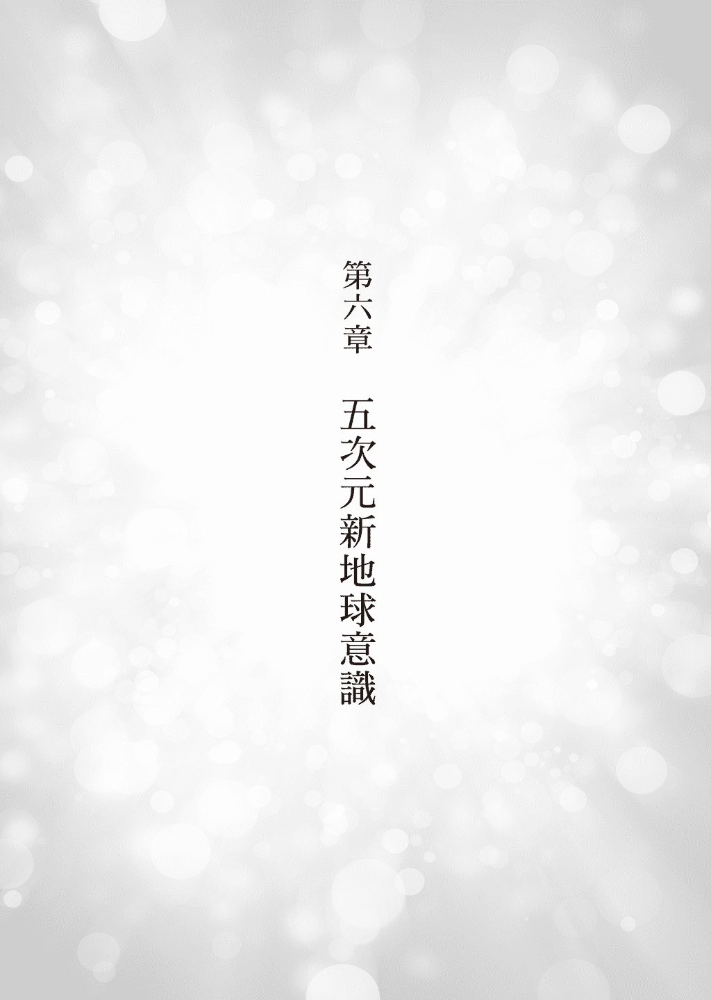

在新地球完成分离旧地球的振动频率，顺利接轨五次元新地球轨道时，人类将重新展现由新意识带来的新生活样貌。目前旧地球的结构将逐渐瓦解松动，诞生出新的架构和系统。以下我们来谈谈你们即将进入的五次元生活样貌。

 金元素融入新地球意识

五次元相对于第三和第四次元最大的不同在于，你们会在合一的意识下，重启新生命的观点。你们将在原本创造地球万物的四大元素中，融入第五次元的金元素。金元素代表的是全新的意识频率，这个元素会与原来的四大元素相容并济，当你们的意识可以站在五次元的维度时，就会发现你们自身的晶体中有着超越以往的智能系统，逐渐在你的内在宇宙展开。

虽然目前你仍使用着旧电脑（注：这里意指我们的身体），但组成你身体的所有系统元件和最微小的组成单元，正透过金元素的冲刷和融合过程，展开新的身体结晶。这个身体将不同于过去的身体，所有细胞和感官受体仿佛加装上一个自动导航的联网系统，身体场域的运行可以透过这个系统，自动调校出最优化的身体效能。这和过去你运用个人意志，以手排档的方式驱动一辆有自动导航的自驾超跑完全不同。

你会开始感受到身体场域逐渐轻盈，不需要透过吃大量食物来获取营养，你的身体随时可以在金元素的引导下，获得所需的元素和能量补给。不只如此，现在你的身体感官也会更加敏锐，连带与你共同生活的家人和你周围接触的人事物，你们彼此间会逐渐展开新的互动模式。你与世界互动的方式因为进入五次元的场域移转过程，同步产生质变。物质上的限制，包含时间和空间的屏障已然消失，你可以在一个空间里获取全世界的讯息，并与之互动共振。你正准备以新地球意识重新展开五次元的生活体验和创造。

将五次元的新地球意识带入生活，去观察有哪些事物正在汰旧换新，哪些生活场景和习惯已逐渐无法服务现在的你。当你正在思考该怎么展开新生活时，所有该具足的元素和能量都随侍在侧，等候你的差遣。这就是五次元的场景，你的高维意识场正敞开大门，随时准备服务你此时此刻的存在。

五次元亦是宇宙高维存在意识与你们携手共同创造的开始。你过去总以为生活在地球是艰难而孤独的，现在你可以展开新的生活，以高维意识服务于你的方式生活，你会发现处处是惊喜。这也是五次元新地球即将带给所有人类的礼物。而在这个转换过程中，必要的调节和阵痛期是无可避免的，就像新生儿诞生前，母亲需要经历痛楚，新生儿也必须在黑暗的产道中经历收缩和挤压。在此过程中，我们需要一起勇敢穿越这个阵痛期，以迎接新地球、新生命的到来。

你过去认为金元素是一种金属物质状态，而在更高的振动频率下，这些金属物质就会转化成光，并重组你们身上的细胞粒子群。当进入五次元的宇宙维度时，这些金属粒子的密度会下降，形成光子，这些光的粒子统称为金元素。

光的粒子经由恒星太阳的热能照射后，会产生各种不同的颜色。如同你看到的彩虹，有红橙黄绿蓝靛紫白等，这些就是光在不同振动波长下的呈现。当你们的意识超越生物体的密度，契入较高的五次元时，你们身上百分之七十的水分会因为振动频率的提升而呈现出光影，有些人具有灵视之眼，就可以透过第三眼看见你们身上的光。光的呈现和身体场域的振动频率有关，你的振动频率愈高，光就愈趋近于白色或金色；身体场域的振动频率愈低，光就会呈现出灰暗或红色。而身体有许多宇宙能量流动的信道，也就是你们熟悉的脉轮，每一个脉轮分别链接不同次元的入口，也因此呈现出来的光的颜色就会有所不同。

拥有五次元新地球意识的生命，其身体会增加金色光的元素，你会渐渐看到地球万物生命的演化，在原有的色彩中增添了一层“金”的颜色，这即代表这些生物体已经开始融入五次元新地球意识的轨道。动物身上会率先展现出金色的毛发，植物的花瓣和叶片则会像是洒上了金粉。同样地，当人类的生物体结构逐渐晶化，融入五次元的场域时，你也会看见身体外观开始转变：身体会借由水分排出更多金黄色的排泄物，同时，毛发、皮肤会出现金色的光。已经成功契入五次元新地球频率的人会感受到身体更加轻盈，皮肤呈现出过去没有的光彩，人会显得年轻。这些外观上的转变是现在你们可以观察到的。

此外，金元素也会为新地球带来各方面的变化，在此列出几项供你们参考。

一、政治

过去以个人领袖为首的政治风气和制度，将转为由群众主导的新政治型态。不论是采行社会主义、资本主义或共产主义的国家，都需要与“民众”的集体意识妥协，渐渐地，少数人领导多数人的政治生态将转为由多数人共同治国的新共和时代。你们甚至会扩大联合国的决策权，将过去分别由各国自行管理的内政，委由联合国议会组成共同小组来协助国与国之间加强合作，以改善彼此的环境和生活。你们会率先在环境保护、医疗研发和星际开发上展开联合治理的行动。

二、金融

金融系统将采行黄金本位的计量方式，但有别于过去以黄金为交易主体，你们将发展以数码货币发行黄金存量的方式进行交易的换算单位，也就是回到以地球整体可供应的黄金为基础，进行有限度的货币流通，以避免任何国家试图扭曲和控制全球市场。在这样的金融制度下，各国会放弃追逐经济体的无限度扩张，回到尊重地球环境的有限资源，以照顾自己生存的地球的永续性为依归，在生活便利性上进行有限度的发展。

在这样的金融制度下，没有任何国家可以无限度扩张其信用，也没有任何企业会为了创造更多获利而破坏地球的生态平衡。每一次的交易和货币流通背后，都是在有限的资源中转换和交流，不过度囤积或造成资源配置不平衡的现象，因为所有的交易背后都会有来自更高次元的平衡为基础，才能创造和显化“金元素”的流动。

最后这一点，创造和显化金元素的流动，我不明白，可以再解释清楚一点吗？

你想像自己有一桶黄金，重达五百两，你可以用这五百两黄金去交换，取得你所需的生活元素。现在你拿五百两黄金出去交易。若是过去，你有五百元，你会想去投资，赚回另外的五百元，然后你就拥有一千元，再去投资；但是在黄金本位的交流中，你会发现，当你用五百两去得到另外的五百两时，这一千两会造成市场上缺少五百两。你得到愈多，市场可以流通的黄金就愈少。过去，你总认为钱可以无上限地赚取，也不影响市场运行，但这样的运行已经不适用于黄金本位的金融制度。在黄金本位的交易中，你得到愈多，相对你需要别人的也愈多，因为你多出的五百两黄金让你可以换得的服务和生活用品变少了，因而造成流动不足。你拥有一千两或更多黄金，并无法无限制地增加你可以享受的生活和服务品质，也因此，过去借由囤积财富以获得源源不绝的物资和消费的经济型态将会消失，取而代之的是以有限的资源，让交易和生活所需的流通回归人人平等和均衡的发展。

对许多已经习惯拥有和掌控全世界主要经济的国家、企业或个人来说，这样似乎失去许多权力，但五次元新地球正是会进入这种平衡与共好的新经济时代。

我很好奇，这样的黄金本位似乎会在当前的货币和经济体正式熄火后才有可能发生？

会有愈来愈多经济体瓦解、国家金融系统瘫痪，然后必须联合各国的金融机构组成中央货币银行，帮助民间转换其计价的货币单位。

这听起来会非常混乱惨烈！

不用担心，这一切都会有秩序且温和地移转完成，并不会造成恐慌，只是会让许多资金和用不到的资源更加快速地流通出来，让所有人都能不虞匮乏地生活在新地球。

我很期待看见这样的新地球生活！

三、食物银行

在经济面临重大转变的过程中，首当其冲的是粮食的供给和需求的分配，所以必须立即建置食物银行系统。一些较需要进口粮食的国家和贫瘠地区，会由这些食物银行统筹分配。食物银行会在人道组织和系统中运作，渐渐扩展延伸到每一个国家的供应系统中；与此同时，会有许多新替代粮食的科技诞生，比如说，以光能转换出身体需要的氨基酸和蛋白质，以及透过植物的再生能力，开发出多元的食物能量摄取方式。在迈向新地球的过程中，会有许多新植物和物种诞生，你们会发现蛋白质来源不只是动物身体，植物和果实也可以提供人类足够的养分来维持身体能量的平衡。

四、星际交流

新地球会在五次元轨道上展开与各星系存有的交流。你们会在星际友好族群的协助下，取得超越三次元地球的关键科技。这些新的科技文明都会在新地球中陆续诞生，你们会有不同于过去的建筑设计和工法、汽车发动方式、新能源系统、水资源等等。

以上和你分享的是五次元新地球的一些场景和重要改变，更多新人类诞生会加速地球衔接进入五次元的生活。这些生活应用会在二〇三六年后的十年间看到，前面提到的政治、金融结构、食物银行和星际交流是第一波的改变，这些改变会在地球进入二〇二五年后，因人类的觉醒进程而产生区域性的改革。同时，一些主导世界经济环境的领导国，因其国内的政治和金融系统产生内部矛盾，终于愿意为了创建多数人共好的生活，而承认需要展开内部改革。这些改革会牵动其他国家的政治和经济同步产生变化。别忘了，你们原本是密不可分的地球公民，是生活在同一个地球的命运共同体，当整个地球能量扬升进入五次元的轨道时，阻碍能量流动的思想和运作机制，都会面临自体崩解，才能重新创造出属于五次元的基础结构。

你们的政治和经济结构已运作超过两百年，这两百年来已经造成地球沉重的负荷，你们已经不能继续以过去的运作模式期待更美好的未来。地球磁极转变的过程会让无法与新地球意识融合的能量退去，这是现在进行式，只是人类一时还无法反应，也无从找出新的解决之道。这不是单一国家或社会的问题，而是全面的、整体流动性的问题。最后，等到游戏停止的钟声响起，你们才会愿意停下行驶中的列车；下车之后，你们才会去找寻一条新的道路。

放心，这条路并不难，那就是合一的道路。你们不论任何宗教、种族、国家、阶层，都会在地球各个角落找到回归中央大日之路。这条路会让地球上所有已经准备好的人自动链接，你们会透过身上的光，照亮出一条共同回归之路。那是五次元地球的入口，回到内在宇宙之中，凝聚你们众人，形成新地球的集体意识。你们从此展开不同以往旧有习惯和思维的新道路，由此扩及民生、教育、医疗和生态环境，形成和谐共生的新地球样貌。这一切即将来临，在此转换的过程中，你们最需要做的，就是放下担忧和疑虑，信任地球母亲，信任你内在的高次元意识。我们会共同链接，守护在地球帷幕下的所有孩子，安然度过地球迈入新轨道的转型期。

所以，我们不需要囤积黄金，也不用囤积土地和粮食，该发生就让它发生？我们存款簿上的数字一夕之间变成泡沫，也不需要担忧无法生存？祢这样讲得不清不楚，我反而会害怕呀。我怎么能相信你们是无形无相的意识存在，来地球帮助我们衔接进入共同生活的未来？这样不太ＯＫ吧？祢至少先说服我，不然连我自己都不相信，更何况那些还在推动一节节火车行驶在轨道上、辛勤工作的人，要怎么让他们相信这一切？

好吧！这样说吧，当你存折上的货币一夕之间变成无法兑现时，你觉得谁会比你更担忧？或者，谁比你更有权力去搞定，才能让他们的存折变得有用？

当然是那些比我有钱得多的人，还有那些保管所有人存折上货币数字的银行、监管的政府及金融拆款机构、交易所等等，这些人当然会比我着急啊！

好的，你是否看见自己在这件事上无能为力？你只能等待这些处在更多数字堆里的人给出一个好建议。而在等待期间，会有另一群人自动出现来帮忙协调和沟通，他们就是新地球的先遣部队，也会是未来在政治、经济、金融市场、食物供给中心的菁英。他们内建的ＤＮＡ早已等着这一天的到来，然后彼此之间很容易形成新的运作共识。你要相信这些人也是高次元存有意识布的桩，早在三十年前就投生进入地球，带着新地球的运行规范和法则，来完成此次的任务。你不也正参与其中，负责传递讯息和教育此时此刻尚未觉醒的地球人吗？你为何会在一瞬间打开链接，又如何在没有任何教育背景和环境的支持下，自动替自己导航，写下这一堆你过去从未接触过的内容？你可以不相信自己本有的启动机制，但你不得不承认，这确实已经发生在你身上，而这个内在的启动作业，也同样会发生在许许多多的星际种子身上。你们都是早已被安排前来地球支援的勇士，忆起这一切原本就是宇宙安排的地球轨道移转计划，即使会面临黑夜，但黑夜过后，太阳依然会为你们升起。不要怀疑宇宙法则的智能系统，这是需要宇宙存有共同遵守的。我这样跟你说，你仍会担忧吗？

会！我还是会担忧，不过祢现在要我理解那样的担忧也没有帮助就是了？我必须信任所有转变都是遵循宇宙法则，顺流就会进入明天，对抗和逃避只会落入黑洞，被宇宙回收，是吗？

是的！你也不用担心那些资产瞬间无用，想像一下，当目前的流动性商品和货币一一被新的制度取代，而你们即将生活在新地球的土地上，你会需要什么样的环境去重启生活？

祢可以务实一点，给我一个资产配置的建议吗？

要记得，金钱无法取代服务，是服务创造金钱的流动。未来的货币单位对价计算会是浮动的，数码货币不会以和商品一比一交易的方式流通，你的数码货币进入不同场域交流的过程会需要经过转换。这样说吧，若你不是当地的服务提供者，就可能需要用较高的倍数或代价取得服务你的机会；也就是说，区域的资源和服务会先满足该区域的人的需要，货币的购买力是浮动的。一个人即使非常有钱，也不再享有最好的金钱使用权力，资源会先满足并达到各区域服务与需求之间的平衡。也因此，人们没有动机去制造不需要的垃圾，以及用过度伤害地球资源的方式来转换成货币，因为商品的交易不再是透过追逐金钱最大化而来，而是去创造新平衡的行为。

未来，你需要的货币并不多，但人们仍然会有食、衣、住、行等基本需求，所以你的资产配置可以放在可耕作的土地、可制造物品的原物料、可居住的房子等方面；至于公共设备，如天然气、电力、网络等，都会由国家主权共同拥有，人民只依使用量计费。渐渐地，人们会将生活重心移转到提供服务，而非只是为了赚取和囤积金钱而工作。

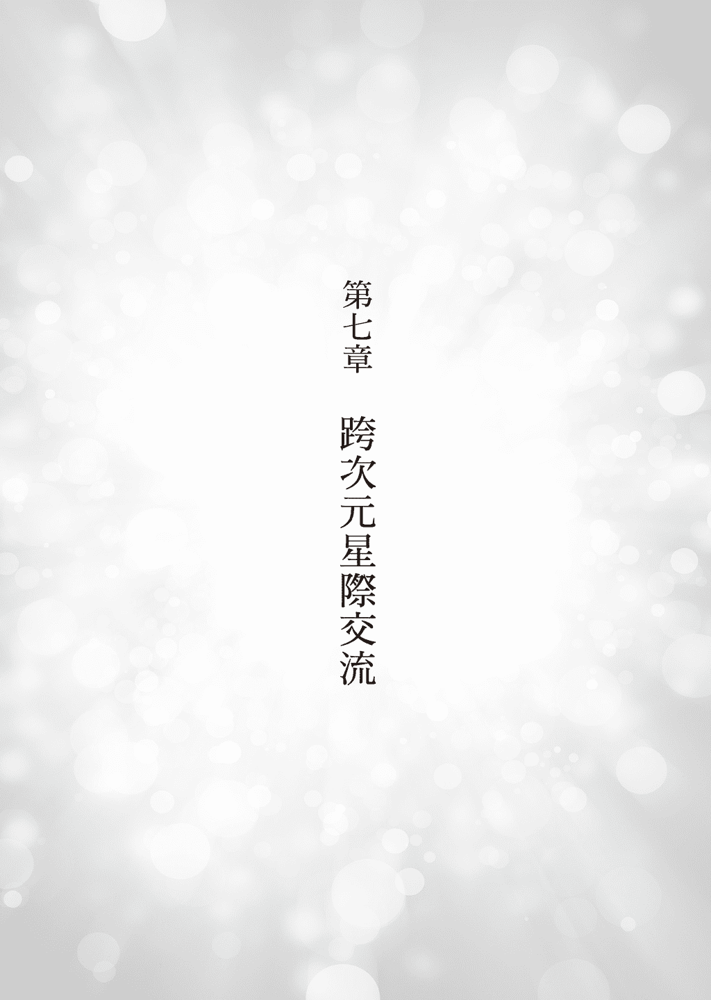

进入五次元的维度，你需要将五次元的生活场景率先揭露出来，让已经觉醒扬升的人有一套基本的认知体系。透过这个基本的系统架构，人们可以展开衔接宇宙意识、跨越宇宙次元的共同创造。那也将是所有新人类即将展现的新生活模式。

 身体是神性意识的居所

当你以第三眼锚定自己的星光体天际线时，是进入自己星光体内在宇宙中，你的意识会出现一个三百六十度的天幕。此天幕不断随着中央太阳旋转位移，这是由于你们身体所在的地球每时每刻不断自转所致。因此，当你打开第三眼的天幕时，可以先观察目前太阳在天幕的哪个位置。

你可以将天幕划分为十二个区块，每一区块的位移若以你们地球上的年为计算单位，一区代表三十天；若以日为计算单位，一区代表两小时。整个天幕以太阳所在位置代表万物的开端，也因此，太阳所在的端点就是水元素，然后你可以将整个天幕的四大元素依次标示出来。宇宙万物的演化之道就在此天幕中上演，而你的意识锚定天幕的当下，就是进入一个新的交流与融合的初始振动。一念一世界就是如此生生不息地交流与融合体验着，你就是让宇宙得以再次创造的神性居所。

你在帷幕之下浑然不知自己创造的路径如何显化，像瞎子一样在黑暗中碰撞和摸索。这是地球人类之于更高维度的存在所呈现的状态。但是，当你们逐渐跨入更高的维度，穿越帷幕的藩篱，你意识所及在宇宙天幕中的一切显化过程和路径，将被你全然照见。此时，你将迈入有意识地创造并和宇宙集体意识协力合作的新阶段。

你们将会学习到，任何个人意志的破坏和莽撞，都会被识破，你们任何一个人、组织和国家，都如同摊在阳光下，人们会清楚感知到你们真实的位置、意图，以及此意图创造出实相前的演进路径。你们之间的融合度更高，也更能聚焦彼此的意念。举凡不符合共同利益，以私人欲念而不以宇宙和平共存为最终依归的意图，都无法得到集体支持。你们将从此进入新地球显化的法则。

我们先开始一个最基本的练习。当你熟悉星光体的世界和宇宙运行的法则后，就可以不再受物质体的屏障，进入绝对的空境中的创造，也就是无中生万有。我会逐一向你说明，但你也需要同步熟悉宇宙法则的运行之道。透过这些练习的工具和应用方法，宇宙法则会逐一呈现在你面前，获得印证。这不是你过去认知的神通或玄学，而是你迈向五次元生活的实际场景，将透过我们之间的对话和学习一一揭露。

 重新定义身体的感官：“看”

拿出你手边的关系牌卡，上面列出各种不同的关系，包含父亲、母亲、兄弟等，共十二种关系。现在将关系卡盖住，看不见牌卡内容，然后从十二张盖住的牌卡中，找出标示着父亲的那一张。进入星光体去找找看。

啊!?找到的机率是十二分之一，低于百分之十啊！

（这时，我的内在意识自动开始带着我进行这个练习。我先进入星光体中，将标示着“父亲”那一张牌，以意识锁定在星光体的正北方，也就是十二点钟的位置。先进行这张目标牌卡在星光体层的定位后，接着，我一一将牌卡放在掌心上侦测，透过手心链接盖住的牌卡，进入星光体去看见这张牌出现的座标位置。我将出现在三点、五点和九点的牌卡放下，直到摸到其中一张在星光体中正对着十二点钟的位置，翻面一看，果真是标示着“父亲”那一张。

原来，每一张牌上面标注的关系，都有其在以我的身体场域为中心的相对宇宙实相，一旦设定目标物件在某一个方位，其余的就能存在其相对于该物件的座标位置上。一个固定的物件，可以让相对于这个固定物件的其他牌卡同步位移。

一开始我已经将“父亲”这个关系的振动放置在环形星光体场域的北方位置，然后当我手持任一张牌，就会出现该张牌的振动频率相对于“父亲”这个关系应当出现的位置。也因此，透过先定出一个关系的位置，其他关系的位置都会自动排好，我的星光体就有了所有关系的实相。而当我在手上一一侦测牌卡，透过内在之眼，我就可以感知到每一张牌出现在星光体的哪个位置，所以当我真的拿到“父亲”这张牌，它自然就会出现在我内在之眼的北方位置，我就可以找到正确的牌卡了。

所以，与其说是透视，其实是透过星光体的全息网格，去看见万物呈现出来的座标位置。）

这实在是太有趣了。

（如果牌卡更多，超过三十六张，可以将星光体分为地、水、火、风四大区，然后先快速筛选一堆卡片进入正确的区域，再一一比对，就可以很快从三十六张牌卡中闭眼找出正确的那一张。三十六分之一的机率是百分之二．七，试试看，相信你也做得到！）

 透过内在之眼寻找目标物

进入一个空间场域，要如何快速找到你的目标物？这时，可以用你的星光体来定位。

先定位你的星光体，以你站立的位置为中心，四方先进行定位。假设你习惯以眼睛正前方当成你的指引，就先以内在之眼定位你的星光体，将某一个方位固定为你星光体的水元素位置，并将你要寻找的目标物设定在该水元素位置。

接着，开始移动自己的身体进入场域中。移动的同时，要打开内在之眼去锚定水元素的方向，只要水元素转动，你的身体就跟着水元素移动的方向前行，这样你就可以很快找到该目标物。

这是当你需要在一个开放场域中移动寻找物件时的方法。先将目标物件固定在星光体的水元素位置，当目标已经固定，那么在移动的过程中，你的星光体就会转动，你透过内在之眼就可以感知该往哪里移动以找到你的目标。

古文明时期的猎人在森林中寻找猎物，就是透过这种方法。后来当人们逐渐不再使用内在之眼找寻猎物时，就开始透过树枝指引水脉，树枝会协助在森林中迷路的旅人，永远投射出有水源的方位，让人们找到食物和水。只要有水，就可以找到路上需要的食物和水分补给，才能维持生命。

 创造未来的实相

倘若你是固定不移动的，那么就让星光体的转动为你所用。你所处世界的实相在你的星光体中会如实展现。你的身体受限于地球时空及物质实体的屏障，而在星光体的投影中，则能不受物质体和时空的限制。这和你穿越意识的屏障契入晶体是同样的道理。你可以走进五百年前的场景，也可以进入未来的实相中。

等等，进入未来的实相？有可能吗？

当然。你的概念现在还处于线性的认知，但在宇宙跨次元的维度，时间并不存在，时间就是目前网格中所有现状的集体意识场。这个集体意识可以跨越不同的次元存在。比如说，你现在的身体位在第三次元，你若在此和一群人拥有共同的集体意识，投射在第五、第六或第七次元中，那个由你们的集体意识投射出的场景就是你们的未来。

为何要集体意识？不能用我的个体意识去投射出未来吗？

当然，集体意识就是由每一个个体意识组成的，只是你们的个体意识若没有经过凝聚、碰撞、转化和升级，就无法产生实相，所以用集体意识来描述这些已经凝聚在一起的粒子组成的晶状结构。只有当结构成形，才能支持所有的意识在当中存在。那个结构是吸引更多粒子凝聚在一起的支点。

也就是说，你们必须在六次元的空间先架构完成，才会显化在五次元的地球，而五次元集体意识的共存实相，又会在三次元中以物质或事件呈现出来。

操作方式如下：

星光体正中央代表你所处时空的当下，这是你星光体的圆心，也代表你的意识得以穿越不同次元之间的虫洞。现在透过你的意识锚定一个事件，这个事件是发生在你的时间线的过去。

好，我锚定九一一恐怖攻击事件，双子星大楼倒塌。

选择了一个过去曾经发生的大事件后，现在进入自己的星光体，去看看九一一发生在哪一个方位。

我看到是在我的九点钟方向。

好，现在去看见这个事件发生当时，属于这个事件的未来实相在哪里。

我不懂，是过去发生的每一个事件都有一个未来的投影吗？

是的，是相对的。每一个在三次元已经发生的事件，都来自某个投影源，这个投影源可以展现出该事件的全貌；也就是说，发生当下已经是结果，其结果有个全息的“因”，你可以在你星光体的圆盘中全然看见。那个“因”会出现在这个已经发生事件的正对角，现在就在你三点钟的方位。

你是不是从九点钟的位置，穿越你的圆心，再投射到三点钟？要记得这不是在同一平面上，在星光体的圆弧中，你看见这三个点链接成一整个事件的区域，这一整个区域就是你选择的这个事件的全息图。你现在需要将意识放在这个全息图的第四个点，也就是相对于圆心的正上方这一点。你的意识要进入这一点，去观看这个事件的全息景象。

我什么都看不见啊！

不是用肉眼，要用内在之眼去感知。你感受到这个区域呈现出来的是什么？

我感受到一股巨大的、凝聚出来的愤怒能量，透过九一一事件找到出口。我看见地球自己已经无法化解这股愤怒的能量，这股能量必须被转化，否则会一直出现战乱。现在需要一个事件来帮助能量释放，而九一一就是让这股能量得以排解的出口。

我看到正对角三点钟方向那一点，就是支持这股能量出口的支点。那个支持来自未来，也就是为了新的世界和平竖立起一根大支柱。当时，在众人期待之下，有一群人为了中东的和平与稳定，共同凝聚出一根巨大的光之柱。这是未来中东的实相，和平与稳定的中东。

你无法想像，这根光之柱居然可以穿越进入三次元的场域，经由一群圣战士引爆双子星塔，让全球不论东西方的愤怒情绪得以释放。你们的未来就在自己的集体意识中被共同创造出来，没有这一根足以穿越地球屏障的集体光明的意愿，也就无法驱动这股黑暗的能量。现在透过星光体的全息化角度，你是否更清晰地看见了宇宙运行的法则，看见光明和黑暗是如何在宇宙中相互支持和合作，才能让地球维持在平衡的状态？

是的！我感受到当时人们对未来和平的期待，那个来自众人内心光明的意愿，早已贯穿进入五次元的空间，形成一根巨大的光之柱。这光之柱如同一颗闪耀的种子，进入宇宙时空，当这颗种子爆裂、一分为二时，我看见双子星塔的形象出现，而在事件发生当下，人们的仇恨与愤怒被一颗颗爱的粒子包围，最后这些愤怒的粒子都逐渐被爱平息下来。没有这个事件的发生，也不会有未来人们期待的中东和平到来。

现在回头看，我们过去认知的线性时间，过去、现在和未来，在全息图像中都同时存在，只有当下可以穿越过去和未来，让整个事件被全然照见。过去总以为未来是要靠现在一步一脚印堆砌起来，这样的想法已经被完全颠覆了，我们要什么样的未来，才是创造出当下事件真正的起因。我们总以为自己是被负面事件逼得不得不去改变，原来这是众人期盼之下最大的成全和宇宙精心的安排。我们需要一个什么样的未来实相，就看当下所有人的意识如何投射出集体的期盼，而当下所有的发生也都是必然要发生的，因为那个未来早已成为宇宙实相的一部分了。

我想，经由这个新的理解，我更明白如何做到心想事成了！

 心的导航：精准度练习

进入五次元的状态，该如何以全新的意识展开生活？这需要练习并真正体验，你才能逐渐“成为”一个真正的五次元存在者。在练习的过程中，你会发现自己并不是每一次都可以精确地到达。为什么会如此？让我来向你说明。

你的物质身体就是一个微型的宇宙生态圈，它也有自主的身体集体意识，当你需要使用身体去完成你更高意识的指令时，你的更高意识必须先与身体意识达成“共识”。这个“共识”在三次元的时空，你们会很容易也很习惯听从小我，也就是你在三次元的自主意识，那是比你的身体集体意识更低频的意识场。自主意识会去牵动你的身体感知，它已借由无数次与身体意识互动和练习的过程达成合一，你的自主意识怎么想、如何发号施令，你的身体就会自动放下自己的主张，跟随小我的指令前进。

而当你的意识进入五次元的状态，这里没有时间的限制，你当下的意识就是时间轴，若不进入当下，你的小我意识和身体意识之间的连线就会中断。你完全抛下小我意识，试图以五次元的意识去驱动身体场域，就无法完整接收身体场域的讯息，因为身体场域已经习惯较低频的共振引力的带领。这时，你需要多做一个步骤：你的更高意识感知宇宙实相后得到的真理和讯息指引，必须在小我的自主意识可以同步接收并认可的状态下，才能让身体展开精确的行动。

也就是要让更高意识与小我意识达成共识，合一的意识才能正确驱动身体，如同我传递讯息，而你的自主意识必须跟随并驱动你的大脑指挥你的手，以文字记录下来的过程一样。

你需要到达小我、高我、身体三位一体的状态，才能完整传递讯息的内容，并呈现在三次元的实相中。

阿乙莎，我又练习了五次，只对了两回。很难每次都正确，好难啊！

孩子，要有耐心，你能从十二张卡片中正确找到那一张，机率小于百分之十，已经很不容易了。虽然到现在为止还无法百发百中，但渐渐地，透过一次又一次的练习，你会逐渐长养出与更高意识合一的新意识。这个合一意识在地球扬升的过程中，扮演非常重要的心的导航角色。你可以想像，当有一天，地球上空出现一堆星际母舰，属于某个星系或个人的飞船同时出现，这时你必须依靠的就是你在这个练习中逐渐锻炼出来、以合一意识沟通和导航的能力。在五次元的空间，所有的存有都是在自己的星光体中进行意识导航，并分辨出所有存在意识和自己的相对位置。

你们会经由精确锚定目标物件，进行有意识的交流，这也是五次元生活的开端。你们将开始活在打开内在之眼的生活中，并习惯用内在之眼的共振，做出生活和行动的选择。这不是天方夜谭，也不是幻相，而是在你们契入与高我合一的状态下，最自然的意识导航之路。现在我需要你耐着性子，完成这项练习。你不必担心出错或觉得不可能做到，你的高我可是天天用这个方式，和各个次元的存在体协作出许多创造。我们需要你透过练习的过程，让人们从你的经验当中学习。在你尚未打开实体透视能力的情况下，你依然可以精确透过内在宇宙的意识导航，自由和精确地展开地球行动。加油！我们会陪着你完成这个练习。

唉！我真的不知道该如何描绘那种瞎子摸象的感觉。每一次练习，就是重新进入心的座标设定，不知要练习多少次才能百发百中，希望自己练成后再将心得分享出来。看来，这个让我头皮发麻的练习不能跳过，非做不可了。

 意识改变环境和物质

之前和你提到，地球上最初始的动能是源自氢原子（Ｈ），从氢逐渐分裂集结成水，而水就是意识。不过，你当时并没有完全明白为何水代表意识存在现象。你们大脑所思、身体所感，那个无形无相、如鬼魅般存在，无法具象说明的动能，可以让你的身体产生化学变化，也会因为这股动能让你感知到这个世界其他所有生命存在的现象。这股动能就是你内在晶体的导航，如同你在地球上看见的“水晶”一样，意识可以折射出不同的光谱和路径，水晶就是地球意识凝聚出的固态的光。现在当这个带着路径的光进入你的环境，你会说这是一股“气”“能量”，但真相是，这股能量早已被程序化编码，有其运行路径，也会因此再进入环境中，和其他生命体碰撞或融合出不同的生命火花。在你看不见的讯息场中，这就是一颗颗带电粒子不断寻求配对和再次融合的过程。

那么，我们再来说明水在意识场中的作用。在粒子碰撞运行的过程里，水可以完全承接所有意识场中携带的最初始粒子运行的路径，并进行复制。水分子中有大量的氢原子，这些氢原子就是宇宙最初始的元素，而这群Ｈ元素可以将组成意识的粒子一颗颗配对和融合。你现在可以明白为何人的身体有百分之七十是水分，如同地球有百分之七十的面积是海洋，这些水分子中有大量的Ｈ原子，是随时帮助地球万物获得自体能量场域平衡的最佳媒介。

只有水有能力如此承载万物的生命演进释放出来的粒子动能，因为其他的物质现象都已经是分裂后重组的结果，只有回到最初始的Ｈ原子态，才能改变其原型。人类灵魂ＤＮＡ中的晶体产生的动能，就是意识，而人类的意识有最初始的 H 组成元素，可以穿越物质态，改变物质结构，也可以透过复制和融合过程，再创新的生命形态。

人类的意识和动植物在地球上的生命最大的不同，是人类被赋予意识的自由。你们可以选择自己想要有的体验，可以生活在地球，专注于肉体层次，尽情体验，也可以让意识穿越帷幕之外，跨越不同的次元，获得更高意识的光的结构，并将此全新的光的路径经由你的意识带回地球。

和生命共振的光——用意识改变水分子的结构

你的意识可以被水记录，而这个水不只是记录你当下的意识振动频率，也保留了一份在高次元的水晶图书馆中。所以，你在地球上的各种情绪、地球上发生的所有事件，都被完整地记录下来，你们只要打开帷幕，你的意识就可以进入源头水晶图书馆中，复制一份你创造过的振动纪录。在量子世界里，观察者的角度决定所有的体验，真实不虚。

你只需要用意识链接，透过身上的感觉中心，就可以传达相应的振动频率。比如，你可以用文字、声音、舞蹈、绘画等来表达你的意识到达的状态，也可以透过物质载体来传递这个意识的振动频率，而水，就是最佳媒介。

此外还有风元素，也可以传递意识的能量。风元素的启动方式很简单，就是吸气和吐气之间产生的空气流动。你可以试试看，用意识链接某个更高频率的振动，比如爱，无条件的爱，深吸一口气，然后用嘴呼出来，像吹气球一样。重复进行几次后，你可以再用感官体去链接你将风元素吹进去的空间，你会感受到空气中的水分子正带着这份无条件的爱的频率，充满整个空间。

 链接宇宙大量金元素之炁的呼吸法

校准五次元的新地球就可以采集到炁，也就是金元素——这里的金元素指的是在宇宙能量层次的金。地、水、火、风也是宇宙能量的元素代表，每一种元素都有其能量流动的属性和特质，然而金元素是四大元素之外，最无法被流动和取代的一种元素，其代表意识在宇宙中恒定不灭的本质，如同金存在地球的物质体中，其结构相较于其他金属来说更为精密。

金元素不被地、水、火、风元素摧毁，也不因地、水、火、风改变其特性，所以，金元素是灵魂意识最重要的养分。金元素大量存在宇宙中，你们无法用肉眼或从物质层次去测量或撷取，那是灵魂真我的养分来源，透过灵性的活跃度决定其元素的饱和度。

处在帷幕之下三次元的地球人，必须靠呼吸锻鍊取得宇宙的能量，供应和滋养灵魂真我所需，这个能量就是你们认知的宇宙能、光、真气、元气、炁。过去许多人试图锻鍊体魄，运用气功取得宇宙能，因为这宇宙能中饱含金元素。一旦细胞获得金元素的滋养，就可以净化和加速老化细胞的代谢，长生不老，并获得永生。

金元素大量存在帷幕之外的宇宙，是供应灵魂意识的活性来源。当你们可以让意识成功跨越帷幕，穿越厚重肉体层的束缚，就能透过松果体获取大量的金元素宇宙能量，帮助身体快速充能，灵魂意识保持活跃。

金元素是一股源源不绝、来自宇宙中央大日的能源，银河系有许多恒星在供应金元素，帮助各星系的灵性存有得以永恒存在。地球帷幕下的人类在意识尚未觉醒前，无法靠肉身吸取大量的金元素宇宙能，因此灵魂就需要不断重生，才能从出生的新生胎儿肉身中获得足够的灵魂活性。当肉身衰亡，灵魂回收到源头才能再度补充生命能量，转生投入另一个生命载具中继续体验。死亡就是帮助即将干涸的灵魂回到源头充能的一个固定循环过程。

而当人类意识逐渐觉醒，就能再延长存续期，让灵魂得以使用目前的肉身，获得足够的金元素，补充灵魂需要的能量。金元素就是灵魂本源中央大日传送出来的食粮，所以中轴要稳定在金元素，调动四大元素的位置都是来帮助金元素稳定获得宇宙能量的信道。

当你的星光体校准银河中央大日时，就可以快速获取金元素的宇宙能量，冲刷灌注你的物质身体，帮助灵魂获得源头的能量补给。

每一次炁的能量灌注，可以维持一到两个月灵魂所需的能量，而每天与高我链接共振，也是获得金元素补给的一种方式，这远比你进健身房运动，汗流浃背一、两个钟头还有效果。金元素是保持你灵魂活性最重要的来源，你看看树木就会明白，阳光、空气、水和土壤四大元素具足时，树木就可以枝繁叶茂地成长，因为树木知道如何大量补充炁（金元素），来帮助自己生生不息地繁衍。

练习：生命能量呼吸

将星光体四方基柱定位，就可以顺利进入生命能量呼吸。

．做法：以意识链接星光体中的四方基柱，依序念诵四个方位的身体系统净化咒音，就能快速进行星光体定位校准，吸取源源不绝的生命之炁。

．意识引导、定位、咒音念诵：

1.从神经系统开始→念诵咒音“Mo Ho Yi Ba Ya Na Nu Mi Da”

2.意识向下方延伸进入泌尿系统→念诵咒音“Mo Ho Duet Lu Gan Ba Su Na Nu Mi Da”

3.意识向右方延伸进入消化系统→念诵咒音“Mo Ho Ha Wa Lu Di Na Nu Mi Da”

4.意识向左方延伸进入淋巴系统→念诵咒音“Mo Ho Du Ti Ya Na Nu Mi Da”

5.最后意识回到中央圆心，进行生命能深呼吸数回。

念诵咒音时，意识要跟着移动到星光体的四方座标位置（如下图）。

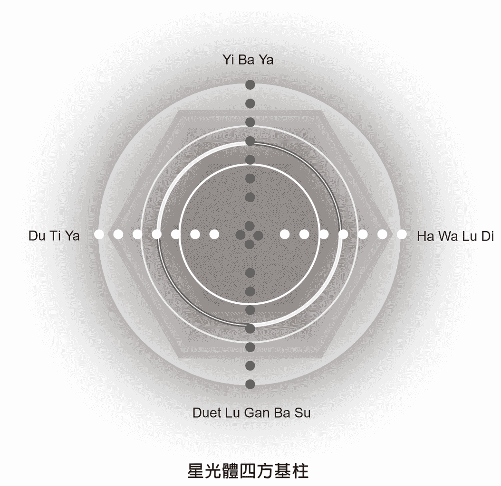

阿乙莎，只要念星光体的四方基柱就可以进入生命能的呼吸，这么简单？

生命之炁（Prana）是你的内在宇宙传递出来的能量，这股能量无法从你平时处于较低频率的身体中获得，因为身体的物质组成细胞无法自行产生这股能量。它就是你内在宇宙赐予地球万物的金色粒子，你在三次元地球看见的物质现象呈现出来的色彩，有红橙黄绿蓝靛紫，如彩虹般的明亮色泽，这些颜色的基础都来自金元素。

金元素是生命能量最初始的状态。你的生命来自宇宙源头，自源头分离出一粒粒的生命种子进入不同的次元，并到达地球帷幕之下，你的一呼一吸之间都在和宇宙源头进行能量交换。当你的意识处在较低频中，呼吸系统经由肺脏和红血球与地球场域的空气进行交换，这种低频的呼吸所能取得的宇宙能量，含金量较低；而当你用意识调升身体振动频率，链接上你在物质身体之外的乙太体层时，你就延展了你的呼吸，取得含有较多金元素的宇宙能量。

当你的意识可以成功穿越地球帷幕，与星光体的高我合一时，你的呼吸系统就全然打开了宇宙生命能量的交换机制。此时的呼吸过程是经由你松果体的过滤装置，将来自内在宇宙的金元素倾倒而出，你每一次的呼吸都能得到充沛的金元素。这种呼吸方式会经由你的松果体直达中轴，再沿着中轴延伸进入你身体场域的所有细胞，此时你肺脏的含金量到达高峰，不需要像以往那样努力进行呼吸运转工作，大量吞吐交换空气，而是正在补给宇宙生命能量的金元素。

当你的意识成功进入星光体，只要做好四方基柱的星光体校准，宇宙生命能量的闸门就从你的松果体直接接收了。你感受到炁从松果体进入鼻咽，向下往喉咙后方下去，贯穿你的中轴，进出全身的脉轮信道，这就是生命之炁的呼吸。

进入生命之炁的呼吸状态很重要，因为你所在的地球会面临极端气候的调整过程。目前地球正遭受大量污染，人类若是能透过调整自己的意识振动频率获取宇宙生命能量，补充金元素，就可以更新身体效能。人类扬升进入五次元新地球需要将身体晶化，而这是过程中的必要调整。

对于念诵星光体四方基柱定位还无法感受到生命之炁注入的人来说，就需要从畅通脉轮手指操的基础练习开始，勤做三个月，搭配调整意识频率，完整帷幕之下的业力课题，就能净化乙太体。而在链接进入乙太体的过程中，就可以开始接收到宇宙生命能量的灌注。

这是帮助人类意识集体扬升的练习。当有愈来愈多人可以充分扩展自身，取得内在宇宙的金元素，让更多金元素在地球帷幕之下充沛流动时，你们就在帮助新地球诞生。

 灵性意识扬升的陷阱

意识扬升后会出现一些灵性扬升的陷阱。这里我要跟你说明，这也是许多位在更高次元意识维度的存有共同经历的扬升过程。

灵性意识觉醒，打开帷幕的面纱后，你们的意识会进入多维度跨越多重次元的交叉存在现象，你肉身的细胞意识存在三次元，而你的意识可以扩展进入三到九次元的维度，所以先要将你的“认同”扩大范围来诠释。在此状况下，你们会面临的第一个问题，就是“沟通”与“认知”的差距。

你们会在原本共同聚焦于三次元物质显化的过程中，瞬间跨越不同次元间投射意识，与发展出各种不同的可能。所以你会发现，虽然在一起工作、在同一个任务和目标下，你和团队成员会投射与想像出完全不同的场景，而且范围远超乎你们过去的经验值。在这样以意识创造实相的过程中，如何能有效达成集体的共同创造，就需要学习沟通和拉近认知差距。

团队行动中，创建每日的沟通管道是很重要的一环，而这个沟通最主要的目的，就是要达到意识的共同校准。比如说，一个计划主持人在为计划投射远景前，需要和所有团队成员完成意识校准之后，才能正式展开行动，否则就会在过程中产生误解，每一个人想像的未来都不一样。在过去三次元的世界中，这样的工作小组是以公司组织或职权划分，定义出每个人负责的任务和范围。

而现在当你们的意识从原来的三次元世界跨越进入五次元的维度，就要学习超越组织框架和层级的团队分工方式，创建意识沟通和校准的渠道。这个渠道同样是跨次元的存在。在工作或事件中，你和自己的高我，以及和所有共同工作的小组成员之间沟通和能量传送的网格，会以非实体的组织存在，却在意识振动的空间紧密链接。

当你们从内在共同投射出一个集体远景后，你们的高我意识会协助你们在五次元场域中锚定即将显化出来的事件的光之柱。

然而，你们存在三次元的肉身和小我意识，也要随时和自己内在的高我意识校准。如此一来，无论身处地球哪一个位置、哪一个时区，无论是一部分人存在三次元的场域或有些人已经进入六次元的意识维度中，你们都可以在自己内在早已投射和创建的光网中校准此事件的光之柱，并完成自己在团队中被赋予的工作任务。

没有经过与自身更高意识校准的过程，并投射出共同意识期待完成的事件光之柱，你们的意识就仍然处在帷幕之下那种非黑即白、我对你错的碰撞中，需要浪费许多资源尝试并从错误中学习。也因为每个团队成员都没有随时和内在高我定锚校准，就会沦入过往做事的习气和惯性中，事情就会处在混乱和无法显化的状态。

所以在进行跨越时空的共同创造之前，要先完成意识的沟通，以及创建团队目标和任务的光之柱，这是非常重要的环节。你们也会在此过程中逐渐学习在虚拟团队跨越不同次元，与无实体存在的高次元存有以意识沟通和校准，完成跨越次元的共同创造新体验。

关于意识扬升进入五次元，你们需要更清楚的生活指导原则，让所有已经意识进化的人有共同遵循的法则。这也是意识跨越五次元的重要教导。更早之前你和雷巴特链接时就说明了一部分，你现在也可以准备记录，完成这部分宇宙法则的教导。

接下来，我们要先完整你对每一个共同意识场的认知，将其统合在一起，这样你才能知道宇宙的整体样貌。

（小记：关于宇宙法则，我知道还有许多讯息未被我读取完成。我想我必须先整理完目前的讯息，才有足够的勇气去承接那一部分的信息量。）

 让五次元生活的重心回到孩子身上

从五次元的观点，去看过去你认知的三次元和四次元时间与空间的每一个环节，你会发现自己一直没有经历和记录“死亡”片段。因为对你的灵魂体验来说，并没有所谓的“死亡”，而是从一个时空转换到另一个时空。

你们认知的死亡，是来自“看见”和“感受”到自己珍视的人和其他与你有关系的人事物消逝所产生的感受。你们将这个分离与失去的感受当作“死亡”的经验，所以在三到四次元之间，你们累积了大量对死亡的恐惧和害怕失去生命的印记。

相对于“死亡”，你们对“出生”和“获得”新生命的体验，愈来愈淡薄。因为生存和生活的压力，你们对养育下一代新生命的兴奋和喜悦，已经远不如以往的世代。当今位在三到四次元的集体意识，无法再大量孕育健康的下一个世代，人类正在结束自身繁衍生命的“天职”，将来到地球孵育和延续新生命当成一种负荷。

同样地，当人类整体愈来愈趋于高龄化，从过去生命周期只有五十到六十年，延伸至超过一百岁，新生命繁衍的速度远不及高龄人口的成长曲线。恐惧死亡的意识大量累积，地球正面临另一次生命存续的危机。面对高龄老化人口和对死亡的恐惧，人类正在消耗宇宙赋予的充沛生命能量，这也是五次元的新地球意识必须诞生的原因之一。为了宇宙整体的平衡发展和持续培育新人类生命的种子，我们需要已经能够穿越地球帷幕的觉醒意识，前来帮助孵育新人类。这群新人类是由更高次元的集体意识播下的灵魂种子。

这群五次元的孩子拥有充沛的生命能量，可以带给地球崭新的元素和发展。他们与原本星际家人之间的连系管道畅通，可以用内在意识进入水晶图书馆蒐集可用的信息和科技，将之带入新地球。这些孩子和过去地球人繁衍的孩子最大的不同，是这些水晶小孩的皮肤、毛发、指甲上都有一层光彩，在阳光的照耀下，如同光纤网络般在地球各地链接，所以他们就是新地球的传输网络。你们不要将孩子锁在家中玩电动游戏、吃垃圾食物，要带着他们去认识同年龄的孩子，一起走入大自然，亲近阳光，吸取新地球传送过来的宇宙能量。这些孩子的松果体并没有封闭，也不需要特别打开，到了十二岁，他们的松果体会自动打开与星际交流互动的功能。那些记忆存在孩子身上，经由意识锚定内在宇宙，就能打开其灵魂所来自的宇宙星际之门。

人类目前正在迎接大量水晶小孩来到地球，你们必须将人们的注意力从对自身老化和死亡的恐惧，移转到孩子身上。想想该如何创建孩子生活、学习和交流的新场域，并调整环境，以配合孩子成长过程所需的大量宇宙能量灌注。

你们替孩子做的一切准备，也正是在帮助自己顺利移转进入五次元的新生活。从与孩子互动的过程中，你们会明白宇宙的真理和智慧。不要逼迫水晶小孩进入传统教育系统学习或考试，那些知识无法帮助孩子衔接即将展开的五次元新地球生活。医疗系统也需要变革，你们要将生病与健康的高龄人口分离养护，这有助于人类集体意识走向更轻盈喜悦的五次元状态。

水晶小孩并不是在某一个时间点才来到地球，目前地球的成年人当中就有许多星际种子。星际种子在五次元的展现就是水晶小孩，只是他们仍须经历在地球帷幕之下，从遗忘到再忆起自己跨越次元存在的过程，这也是最艰难的灵魂意识跨越帷幕的旅程。目前星际种子正在忆起自己水晶小孩的身分，你们在肉体层次看见自己已经不是孩子，但在灵魂层次，你们和水晶小孩是相同的、不分彼此的存在意识。

每一个水晶小孩都有自身独特的灵性组成，也拥有水晶王国的集体意识。水晶王国在地球场域，就是你们所认知的矿石水晶，这群矿石和水晶的源头记忆，就存在五次元的水晶王国中。水晶王国由各种不同的晶体组成，这是星际族群累积超过上亿年的共同记忆，而这些记忆也都存在每个水晶小孩身上。

现在是时候将自己水晶图书馆的资料撷取出来了，如此将可帮助目前的地球顺利扬升。而地球的集体记忆也会有另一个水晶图书馆留存，存放在地球之心的列木里亚。列木里亚维系着地心水晶的振动，并将地球之心的核心能量释出，衔接上五次元水晶王国之心的振动。

你也可以进入这里，调动所有水晶王国的能量，和你一同创造新地球的实相。水晶王国的所有灵魂意识正为了新地球的诞生，准备释出存放在地球母亲核心的水晶能量。这是人类过去共同的努力和高次元存有存放在地球上的超高振动频率融汇之处，当列木里亚之心的水晶能量再度释出时，属于五次元的更新能量将进入地球。

地球万物正等待伟大的地球水晶意识觉醒，在二〇二六年完成移转工程，而我们需要你深入水晶王国，将这些能量释出。感谢你即将与我们共同创造人类新纪元。

 释出内在宇宙中的水晶品质

阿乙莎，这里提到的水晶王国讯息，和星际图书馆有没有关系？我们要如何释放出水晶王国的讯息？

水晶王国和星际图书馆分属两个不同的场域。水晶王国的讯息同时存放在地球之心，你必须透过链接身上的ＤＮＡ节点进入列木里亚星门，去获得完整的水晶王国记忆。但在链接水晶王国的过程中，你会发现这些讯息同时出现在你的晶体里，你只需要将意识指向内在宇宙，就可以同步链接。这是因为水晶小孩身上配备了一部分的水晶王国记忆，你们可以透过ＤＮＡ节点，进入存放在灵魂晶体中的记忆体。你会发现，水晶小孩和水晶王国是如此紧密相连。

至于星际图书馆，那是远超过水晶王国的讯息资料库，不只存放地球的讯息，还包含银河星际联盟各个星系的资料库。所以，进入星际图书馆必须经过星际联盟的筛选和认证，然后才能以无我之姿，登上星际交流的平台。

目前水晶王国的讯息会大量释出，也是应星际联盟的邀请，将存放在地球之心的集体星系智慧释放给全人类。这是为了地球扬升银河五次元轨道而进行的集体意识校准计划，目前你只要进入自己的内在灵魂晶体，就可以将来自水晶王国的讯息源源不绝地释放出来。这也是所有觉醒后登上五次元的星际种子为新地球展现的生命品质。

接下来，我们要先进入水晶王国，回复你本有的天赋才能。在你进入多重宇宙交织的晶体中央时，你意识所及的当下就会透过你的晶体进入链接状态，这比起你使用 Google 搜寻发动机寻找资料更快获得回应，提供你原本就存在你内在宇宙的资源。这些资源可能来自你自己的真实体验纪录——在晶体中所谓的“你自己”，并不是局限在帷幕之下那个三次元肉身的你，还包括存在多次元中更大的你，以及和你在多次元实相中共同链接的灵性兄弟姊妹，大家一起贡献的记忆资料库，都可以让你在此探索、撷取和再运用。这才是宇宙共同意识族群存在的真实景象。没有一个灵魂是独自存在天地宇宙之间，你们是如此紧密相连，并相互支持合作出你们灵魂晶体中的浩瀚资料库。你存在于此，在地球乃至多重宇宙当中，你们彼此都在自身的晶体中串连，并再次交融出宇宙多重实相。

现在你是否更清楚晶体的设计了？那是你灵魂存在的真实样貌，是星光体意识的投影源，你的晶体携带的多维宇宙资源，都可以无条件地为你所用，只要人类可以觉醒，登入晶体的核心，你们就已经展开跨次元的生命旅程。你是自由的意识，由你决定，并为你接下来的生命导航。帷幕之下的你需要帷幕外的大师和导师来指导，并引领你回家的路；而当你登上灵魂意识的晶体殿堂，与所有晶体组成的意识母舰合一，你将正式成为自己的大师和导师，也开始为其他仍在帷幕之下的人铺设一条回到光中的道路。

回归源头的路有许多种形式和方法，而每一条回到自身源头的路径，都可以作为其他人的参考。当一个个灵魂意识都可以相互支持，并无私地分享自己回归宇宙本源的道路时，人类将会为整个三次元地球结构出新地球的光之网格。这就是由觉醒意识组成的绵密光网，不论你的个体意识此时此刻在地球帷幕之下的哪个角落，都会被照亮一条属于你回归本源的道路，而你也会明白，所有教导过你的大师和导师也是如你一般，获得已经站在前方的大师和导师无条件的支持，并分享他们曾经走过的路。这无量光网存在帷幕之外，等待人类的意识扬升和链接。

（经由这一次更详细地解释晶体结构，我更明白回归源头的道路如万花筒般，由每一个灵魂自由绽放，形成自身的光网。这个光网可以与其他人共同交织出更广大无垠的光之网络，不论你来自哪个区域、信仰哪个宗教、属于哪个种族和阶层，你意识的光行经的道路，都被无量光网所支持，而你也正在替别人创建一条回归本源的路径。所以实际上，每一个从自身散发出光的人，都是宇宙的光之工作者，没有谁的路径对，或是比较快、比较好，所有人都是无量光网中的一个小小光点，彼此合作，相互链接。我们就是在照亮自己和他人，为所有人链接无量光网之路贡献一己之力。认知到这一点，我才能真正理解无条件的爱，允许所有灵魂的个别表述和体验意图，任其自由展开对爱的诠释方式，因为他们也正在为自己来自的那个宇宙维度和角落，替所有链接回家的人找到回到光明中的指引。

我感动于灵魂组成无量光网的结构，我们身上的晶体就是让我们得以链接更大的无量光网的地图指引。现在终于明白水晶图书馆之于我的关系，那是我和整个宇宙光网的连系要道，难怪是专属于我个人和所有与我有关的灵性片段所组成的。

我除了透过晶体穿梭宇宙不同星际之门，为了提升整体仍在黑暗中寻觅的兄弟姊妹，或许可以提供对他们来说更有效的意识扬升方法和工具。所以，回归本源的道路，不要以为只有某个神祇、天使、大师或圣者才能带领你回家，每一个人终究都要成为自己和他人的大师和导师。）

（小记：对于进入内在宇宙，链接我们身上本自具足的水晶王国品质，将其释放出来，光是从文字描述，可能让人摸不着头绪，无法理解如何进行。我实际实验的结果，发现这有点像空中取物的概念。

我尝试将意识锚定在自己的晶体中，然后内心想着某种水晶矿石，这时整个内在晶体就如同复制了该水晶的振动频率。我可以将其导入水中或链接某个物品，瞬间就会改变水或该物品的振动频率，让其携带来自水晶王国、我用意识锚定的某种水晶矿石的品质。

这整个过程，并没有任何水晶矿石需要被采集、分解、萃取，并与物质载体融合，全程就只需要透过你的意识进入内在宇宙，提取水晶王国浩瀚的讯息，将之植入物质载体中即可。真的有空中取物、隔空抓药的感觉。

已经登上五次元的星际种子，大家也可以自己练习看看。）

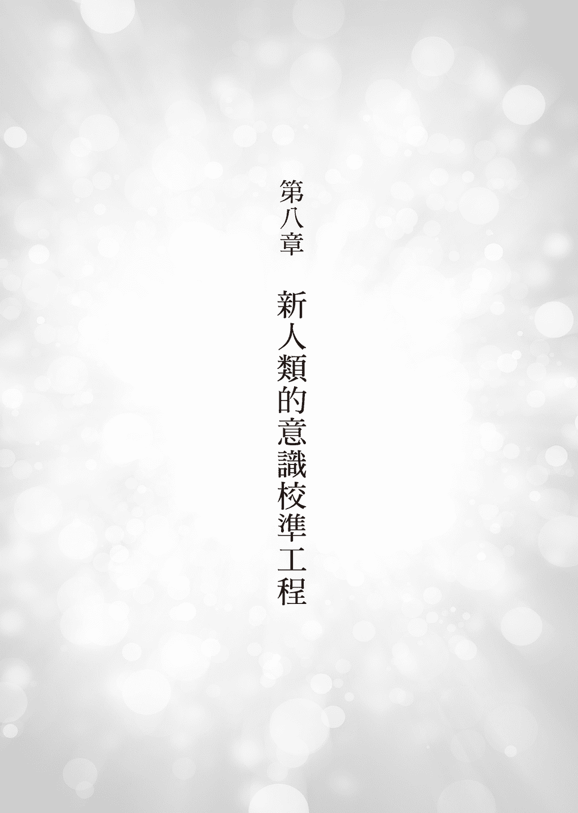

我是泰雅，你的五次元分身，也是地球母亲在五次元的指导者。欢迎你登上五次元的新地球轨道，接下来，我们要一起进入合一状态，取得星际图书馆的信息。星际图书馆中会有一套完整的说明书，引领人们进入新地球的轨道。你先去打开早已存放在你身上的档案资料，这是地球人要跨越宇宙次元的基础学习，下载这个部分的资料后，再进入任务分派区进一步学习。

你只要读取目前存放在你前方的信息就可以了。许多内容已经等着你下载很久了，你可以打开资料夹，一一翻阅下载。

好的。

（此时，我直接念诵“Si Bu La Ya Wa”。不到十秒，就感受到资料塞满喉轮，可能需要我用讲的，但若用讲的，我就无法同步整理资料，所以还是决定用文字，透过内在之眼读取星光体暂存区的档案，并写下来。以下是那些尚未被读取的档案主题：

一、我们的宇宙

二、宇宙共同意识源头的定义

三、你的世界是宇宙记录器播放的频段

四、我们的世界

五、地球人进入五次元的前提

六、先遣星际种子计划

七、“我要”之于“我是”）

我们需要这几个档案尽快传递出去，因为第五次元的门户已开，人类还有许多无法理解之处。前面的引导会经由传讯的方式启动觉醒之人的意识网格，以正确锚定五次元的实相，而当人们陆续完成锚定五次元的内在工程后，就会有大批星际种子进入五次元，打开新地球生活的场景。此时，你要透过传讯将其投射出来，帮助人类校准内在宇宙意识，朝新地球生活迈进。

 我们的宇宙

宇宙是一群带电粒子组成的。电子、质子和中子等在三次元地球的世界里，可以被人类大脑分解出来，那些物质体的部分占百分之十，但是还有百分之九十，无法被你们的大脑和视觉观察到，那就是目前科学家正在探索的量子世界。

我们的宇宙百分之九十是由鬼魅般忽隐忽现的量子群所组成，而量子世界是随着你意识的升起或下降而转变。当你的意识锚定一个物件，这个物件会具象地存在你眼前，如同探照灯的视角，你的探照灯就可以尝试去看见万物的存在实相。这是我们的宇宙的根本逻辑。

当你的意识没有去看，不去锚定，该物件就不存在；当你以意识锚定，物件就存在。而假如你想看却看不见，代表你与观测物的频率无法链接。这个道理就如同若你想看见已逝的亲人，在目前的身体意识下，你无法在自己的世界里看见已逝亲人的踪影；但如果你调整自己的频率，链接进入存在不同次元的亲人意识，你就能在另一个次元的实相中遇见亲人。因此，当一个高次元的存在意识要引起较低次元意识的注意时，有两种方法：一种是引起较低次元物件的关注，使其有意识地调频，提升振动频率，以衔接上较高振动频率的存在意识；另一种就是由较高振动频率的存在意识自动降频，来链接较低振频的意识场。

所以，我们的宇宙在量子世界里是以观察者的角度出发，串接彼此的意识场，进而形成一个超级庞大的光的网格。这些网格是由不同次元的存有经过四十亿光年，逐渐建构起的量子宇宙讯息网。你们的科学家正在探索这个讯息网的存在实相，但只要观察者介入，这个讯息网就会呈现出与观察者呼应的振动实相，所以人类在三次元的地球，永远无法掌握宇宙的全息景象。其根本原因是观察者振动频率所处的片段和分离的个体意识，使得人类观察出来的宇宙如同瞎子摸象般，一些人摸到象耳，便将宇宙视为大象的耳朵；一些人摸到象牙，就以为宇宙是一个弯曲的轨道。目前地球人对宇宙的集体认知，就是这种片段的状态。

你们即使试图用高倍的望远镜观察，也无法在自己生活的地球上看见宇宙的全息景象。只有调升观察者的振动频率，才能经由调升的过程看见不同的宇宙样貌。最后，当你完整自身从三次元一直迈向九次元的视角，才能明白宇宙的全息图像。

我们接下来就要一一说明，在不同次元的转变过程中，你的意识该如何展开，以完整你内在宇宙的全息图。

 宇宙共同意识源头的定义

亲爱的 Rachel，很高兴与你再次链接。这是一趟不简单的旅程，自从二〇一七年底与你在阿卡西纪录场域对话以来，我们持续陪伴你在帷幕之下学习，透过星际联盟的共同协助，让地球帷幕下的人类终于可以更清楚回到共同意识源头的快速路径。在此，要感谢一路上陪同的灵性兄弟姊妹，还有在帷幕之下挺身而出、最勇敢的星际种子。你现在已经进入宇宙联盟的共同小组，我在此要欢迎你归队。

这里是你灵魂的源头，它位在十二次元的猎户星群右侧最明亮的一颗星，你们称之为白马座。实际上，以物质体来说，这里距离地球约八百光年，你的物质身体在地球那端是不可能来到此和我们会合的。你现在是经由意识振动频率的校准，穿越五次元的地球，链接回本源；你是使用自己的意识载具，也就是你的灵魂晶体来到这里。和所有星际旅行的宇宙人相同，你们彼此之间是以心电感应的方式沟通。

然而，你一定会好奇，为何你可以不用指定自己的心智图座标位置，就能透过简单的咒音和数字密码，穿越宇宙次元之间的屏障，直接链接本源？那是因为所有星际种子身上早已镶嵌回到灵魂本源共同意识源头的路径指引。你们的灵魂晶体本身就拥有回到自身灵魂本源的钥匙，而每一个星际种子携带的钥匙形状和角度都不同，所以即使用相同的咒音和数字密码，你的晶体和另一个人的晶体到达本源的位置就有所不同。

有些人只能领取参观门票，而你目前则是可以回到家里的房间，这中间的差异，就来自你是否使用你自身高我应许和授权你使用源头场域的最高权限。这个权限必须经由你的灵魂晶体配对才能发挥作用，而这就是为何之前你需要学习与高我合一。你经历过的这些意识到达的路径和过程，对许多人来说会是重要的参考和帮助。

当每一个人透过这些意识引导的路径，与自身高我合一时，就可以链接上自己灵魂晶体的心智图，获得打开星际之门的钥匙。这把钥匙来自你们自己在宇宙的分身，是授权你们进入宇宙共同意识源头的通行证；而当你们完成通关密码，被高我授权打开星际之门，就能进入星际图书馆取得宇宙资料。帮助旧地球扬升进入新地球的校准工程，和转化旧地球磁场的工作，都需要被一一落实，才能将新地球显化出来。

共同意识源头是由跨次元灵魂意识组成的联盟

宇宙本源基本上分成十二次元，超过十四万四千个行星意识群的范围。每一个次元都有其意识源头，而横跨一到十二次元间的共同意识源头会彼此串连，形成此共同意识群的中轴，也就是一个中轴可以跨越十二次元，十二个次元的平行时空同时存在。这些跨越十二次元的意识组成的联盟，就是你的灵魂隶属的宇宙共同意识的源头。

所以，你身上的灵魂ＤＮＡ可以展开链接一到十二次元的信道，并透过中轴，与你同属灵魂本源的众多灵性伙伴链接。你可以透过自身所在的共同意识源头，取得存在不同次元之间的宇宙资料库。人类的意识原本就和宇宙意识不可分割，和所有地球帷幕之外的灵性存有一样，你们可以从自己身上获得来自共同意识群所有存在意识的经验。你可以联合自身跨越不同次元的意识，再次创造和表达你在某个次元之所是，也能由存在不同次元的过程中经历并展现出不同的你。在宇宙共同意识源头之下，每一个生命得以将所有跨越次元的体验、成长和转变的成果贡献回本源，并与所有生命共享资源。

这就是宇宙共同意识的运作方式。你认知的本源，在不同次元的展现都不同，最终都会经由中轴管道回流到本源，再从本源流向所有存在不同次元的意识。所以，处在最低次元的振幅较长，振动波较小；处于较高次元的振幅较短，振动波较大。在低次元的一次振动，对高次元存有来说已经历了数万次振动，所以在低次元的体验能获得的讯息较少，也最坚实稳固，容易固着定型；而较高次元的讯息量非常庞大，也变化最多、最快。对地球人而言一秒的时间，对存在高次元的意识来说，可能已经完成了超过十年的体验。在不同的次元，因振动频率不同，会获得不同的体验。三次元的人类会认为更高次元的生命比较有智慧、比较优越，其实不用如此看待，因为我们都需要存在不同次元、透过不同的振动幅度和频率，来完整体验真理和宇宙实相。

你可以想想自己目前与高次元的你意识交流的过程，那种瞬间知晓对你来说是不是好像欠缺了什么？是的，欠缺的就是为何你进入较低次元，要从更缓慢的振动波亲身去感受和体会，才能完整领会中间的过程，否则对存在高次元的你来说，喜悦和悲伤是类似的东西，黑与白也是一体的，无法分别。你经由进入较低次元，透过情绪体和较低的振幅，拉长中间的体验过程和时间线，也会同时帮助存在高次元的你，补足在高频振动中欠缺的认知系统。这样你是否可以更理解，处于本源中的源头意识群是如何珍惜在不同次元的所有意识体验，因为那都是宇宙共同意识源头的资源和宝藏，也都是需要靠每一个生命去走出来的经验值。这才是宇宙共同意识群本来的面目：我们为了彼此生命共同的进程，而进入不同次元去体验和贡献自己一生的经历，以完整我们共同源头的意识。每一个存在都是互补、相互依存的，是本体中的一部分；每一个生命散发出来的光都是独一无二的。这就是宇宙赋予生命最初始的权利和自由。

现在我存在三次元的地球，在属于我的本源之外，是否还有我的存在？

有的。这需要向你说明星际联盟的组成背景，和所有发生过的重大关键事件的源起。我们会另外说明这段纪录。

在宇宙源头因着星际交流的目的，创建了共同意识群的沟通协定。这个协定就类似三次元世界里的频谱和频段，只是在三次元的你们可以使用的频段，是低于生物体的能量可以承受的范围，也因此会受限于物质身体；而在帷幕之外的宇宙意识源头，你们将不再受物质身体的频率所限，而能尽情遨游在不同星系族群之间，进入跨次元沟通的实际体验。

不同次元意识群的界定

当你的意识穿越地球帷幕的屏障线，你就是以一个宇宙人的状态，分享众星系存有之间交流的语言。在此，我先让你明白共同意识群的定义，你才能进入并深入不同维度和次元之间的转换。

为了让你更容易区别各种不同的沟通型态，以进行跨次元的互动和交流，我们先用简单的阿拉伯数字来界定意识群。

一次元意识场

这是宇宙意识种子的潜伏期。这个时期的意识仍在孵育阶段，也无法切割和分离，所以在一次元的意识状态，就是从太极之初的共同意识分流出来的种子意识。在此阶段，这股源头分流而来的意识尚未萌芽，无法产生自体运行的动能，所以这个状态下的意识是静止不动的，存在每一个星球的地壳下方、接近地心的外层，以氢元素（Ｈ）的形态存在。

而一次元意识场的形成，和宇宙太极之初的粒子释出是同步发生的，也就是所有源头太极之初单元粒子产生分离电位的同时，会从一次元意识场挪出一个电位，来辅助单元粒子的能量移转。移转过程会形成大量的单元粒子释出动能，这些原处于一次元意识场静止不动的位元，就会展开二次元的意识旅程。

所以，一次元是一切生命意识移转的开端，亦是生命从太极之初源头再出发的节点。所谓的节点就如同休憩站，亦是进入新的共同意识汇流的闸口。当意识回到太极之初的闸道口时，会通过一层意识选择区，进行分流前的准备，所有神性意识于此展开再次融合的过程。

那些尚未融入神之汤的意识仍然可以选择下一次的生命，让尚未完整的生命意识得以有适当的环境再度重生体验；而已经完整生命体验的意识振动，就会随着每一次生命体验的最终，回到太极之初的源头，并融入宇宙共同意识场中。宇宙间已诞生的新意识，若无法重返太极，就会继续流转在宇宙之间，持续体验，直到回到源头，再次进入新意识种子的孵育，也就是宇宙意识的重生。

你们老祖宗口耳相传的孙悟空从石头蹦出来的神话，有其隐含的真理。生命的孕育，需要经过一次元静止不动的淬炼过程，才得以释出新生命的动能。而这些由宇宙太极之初重新诞生的种子意识，会帮助宇宙共同意识场产生质变，创造出永恒进化的生命路径。

星际种子就是从太极之初的宇宙共同意识源头再度回到星系间的种子意识，这些星际种子带着来自宇宙共同意识源头的期许，分别诞生在星系之间，继续完成宇宙共同意识源头规画的道路。这是宇宙集体意识为了平衡各个星系轨道的发展，以及为了宇宙集体意识的再次扩展，而设置的星际种子计划。

西元一九六五到一九七三年间，许多来自宇宙共同意识源头的星际种子为了此次地球扬升五次元的轨道，而前来地球。这群星际种子身负宇宙共同意识源头的期许，为了让人类种族顺利扬升五次元，而来此负责唤醒地球人类的意识回归源头。这是银河系两百万年来最重要的事件。现在经由密集地传讯，唤醒地球人类的意识回归宇宙共同意识源头，才能再融入更多的新人类种子意识，进入五次元的新地球轨道。

新地球不只需要来自宇宙神之汤的星际种子植入，更需要许多目前生活在三次元的人类意识集体扬升，进入与五次元的新地球意识无缝接轨的移转过程。毕竟这一次是在既有的星际轨道之间移转，而不是重新诞生一颗新地球的殖民计划。

既然需要地球人类就地扬升，那么跟人类是否可以完整体验，回到太极之初的宇宙源头似乎没有太多关连，不是吗？我总觉得人类会眷恋地球生活，一旦在这里居住就不会想离开，那么如果我不想诞生到另一个星球，当地球生命结束后，想回到地球继续体验，是不是也不用回到太极之初，就能再次诞生在地球上？

这也是人类不断在地球帷幕之下轮回的原因。很少地球人类回到太极之初，但是，此次的星际轨道移转，已不容许地球人生活在过往帷幕之下尚未觉醒的意识状态。地球也有自己进化的需要，盖娅将再次分离，进入五次元的新地球；地球需要重新诞生，借助宇宙共同意识源头的能量和新元素，帮助新地球诞生。也因此，目前地球人类必须在意识尚未返回太极之初就地重生！今日居住在地球上的人需要提升振动频率，跟随地球母亲一同进化、扬升，进入新地球集体意识场。

许多人被宗教洗脑，认为死亡和重生之间必须经过上帝或神的审判，才会以为回到宇宙神之汤的殿堂遥不可及。并不是如此！人死后离开身体，就只是一股能量，这股能量是由成千上万个带电荷的粒子所组成，当其中某些电荷已经完成其所有的生命意图时，其振动方式就和尚未完成某个生命意图的振动方式不同。这些已经不再找寻任何新的生命意图的粒子，会自动回归最初始的振动状态，那就是每个人身上本有的神性意识。至于你在地球体验过程中开展出来的新意识，一些尚未体验完成的粒子群就会去寻求新的生命体验形式，以完整自身扩展和寻求不同振动路径的需要，而进入生命的轮回。

所以，大部分人类即使尚未认出自身神性意识的组成，只要已经不再寻求新的体验，也都会随着生命结束，自动回归太极之初的宇宙源头，并将自身在地球帷幕之下的生命纪录全数融入宇宙共同意识源头。至于尚未完整体验的意识，对宇宙共同意识源头来说，就是一群尚未觉醒、尚未能认出自身本源的意识，散落在地球或其他星系之间继续体验，直到认出自己的本源意识为止。这群尚未完整体验的意识，仍有银线般的丝线链接本源，不论进入浩瀚银河宇宙的任何场域再次体验，最终依然会回到太极之初的意识熔炉，贡献出一个全新的生命意识种子。

孩子，你可以选择以目前的意识组成继续进行你想要的体验，不需要重组一个新的意识种子。但是，当你的灵性组成此次的任务都已完成，你是否仍有再进化的需要？唯有透过意识重组，你才有机会移居到更美丽的星球，而为了在那里体验，你就必须精炼出比目前人类的物质身体更加完善的灵魂晶体，必须回到太极之初的宇宙共同意识源头，去融合出你所需的新生命结晶，你才能够以再次进化后的生命重生。

二次元意识场

一次元的意识从太极之初经过闸口的选择与分流过程，就会产生两极世界，因此形成二次元意识场。当中的白色世界与黑色世界分别由一元意识的粒子复制出另一个自己，再从分属不同极性的自己产生的拉力和引力，展开粒子之间的动能。这种从自己分离出来的粒子之间的交互运行展开的无限回旋动能状态，就是二次元意识场。

然而，不论粒子之间如何地融合或再次分离，所有粒子的运行都不会超出太极之初的范围，也就是“一”次元的初始态。所以在二次元的太极图中，你会看见黑色与白色的世界，黑色世界中存在着进入白色世界的白洞，而白色世界中存在着黑洞。透过黑色世界中的白洞，意识可以穿越进入自己“以为”和自身分离的另一个世界去体验；而白色世界中的黑洞与白洞一直如脐带般相连，意识得以透过存在对立向另一端的自己的世界，去体验到自身。若没有分离出另一个自己的存在意识，你就无法从镜中的角度去观察到自己存在的意义。

所以，二次元意识场并非某个时间或空间的场域，而是存在各种可能性，也就是创造出一切可能的起始点。不论站在黑色或白色，你在此都是观察者，都在尝试看见自身全貌，设法从对向的世界里找到自己。白色粒子和黑色粒子不断尝试看见不同面的自己，却都无法看到对向自己的背面，一旦粒子停驻在某一个目标点上，这个粒子的另一端就会同时固定其相对位置。

所以，二次元是粒子进入一切可能的初始。它存在一切生命现象中，你可以看见自己有左手和右手，有男性和女性、公和母、阴和阳、太阳和月亮、早上和晚上。在二元世界中，一切都是可能发生、也都被允许创造的状态。这里是无条件之爱的源头，也是宇宙所有可能性的动能延伸开端，你从此端向外看见的任何人事物，都是一部分的你的呈现。若你尝试在二元意识中倾向任一端，都会被吞噬进入另一个黑色或白色的世界里；只有站在振动中央，也就是你的心的位置，你才能同时掌握任一端点，免于被投影幕屏障。中央的位置，就是你进入永恒的“一”的点。而当愈来愈多的粒子累积、凝聚，形成交缠态时，就会逐渐形成晶体，二元的粒子态累积汇流，产出三次元物质世界的基础架构，形成今日三次元地球的场景。

三次元意识场

当你理解了来自二次元正与负、在变动中寻找宇宙爱的真理那股源源不绝的动能时，接下来，就会打开一段为了某个目的而展开实际体验的过程。你们因某个目的，从一个原子再次复制分裂出许许多多带着正极和负极的分身，进入三次元体验。如果说二次元的世界是意识流动的开端，那么三次元就是宇宙让你创造出事件的起点。在三次元，你将真正活在自己编织的梦想时刻，肉身即是你此次为自己设定的目的。

在三次元中，经由身体、心智体和灵魂意识的协作，在此共同经历和创造出生命的和谐波。我们可以简单区分身体、心智和灵魂的功能：身体在三次元的世界扮演电脑硬件设备，你的心智体（也就是小我）是你电脑搭载的可以驱动硬件的软件，而在三次元一次又一次的事件展开的灵魂觉知，就是你的灵魂意识，是你的电脑向外传递和接收讯息的联网系统，帮助你在三次元与跨越无数次元的你携手合作。

透过三次元中肉身关系的展开，你们会从彼此身上体会到自己生命意图展现出来的景象。所以在三次元，你们需要拥有一个物质身体，而这个物质身体来自所有存在宇宙间的意识组成的联合体验小组。你可以想像宇宙中有许许多多带电粒子，这些携带着正负极的粒子相互碰撞和结合后，会产生光与波，而这些光和波会带给三次元空间所有游离粒子一个扩展其自身存在和表达的场域，透过你身上的灵魂ＤＮＡ，以螺旋体的能量流动在你全身当中。这股存在灵魂ＤＮＡ中的树状结构，盘旋投射出你与所有关系的镜像，你就在自己设定的生命目的中完成此生的意图。目前地球人类就存在这个场域，地球上的生活就是在三次元地球的所有意识投射出来的虚拟实境。

为何称为三次元虚拟实境？因为在星光界，你会看见所有你在三次元中视为真实的物品、建筑和引爆的事件，乃至于和你分离的不同个体，其实都是带电粒子碰撞后显现的晶状结构体。你们从水中就可以发现，水的分子结构有着各种不同的完整和非完整结晶，如果将某个生命体放进水中，你会看见这个生命体和水共振、融合后，产生不同于之前的结晶体。这就是三次元世界的景象，由自我意识自由表述、体验和活出梦想的世界。

你们必须在碰撞和二元对立产生的动能推波助澜下，去展开生命对爱的多样化表达和体现的过程。若说二次元是不带着任何目的、一直不停转动的动能，那么三次元就是在这个持续的动能下展开有目的的流动过程。所有生命进入三次元的世界都会有个目标，这是在二次元的意识维度没有的，也就是你们要在自我赋权的情况下，才有机会获得进入三次元的门票。你是被宇宙无条件允许去体验自己设定的“体验目的”，而来到三次元的意识群。

你一定有某个“需要被理解”或“需要来完成”的生命目标，才会因此展开三次元的体验。所以，不要觉得三次元的世界是混乱不堪、令你反感，而想逃离的人间炼狱，你愈想逃离自己设定的生命目标，就离你回到光中愈远。因为在三次元世界，若没有以黑暗为背景，你将失去回到光之家园的路径指引。你和黑暗的存在意识原本都是来自光的存有，在光中，你无法辨别出自身携带的光，唯有带着某个“目的”前来三次元，才有机会认出和体验到自己的光。而那些你认为的黑暗，也是光的使者，是为了成全和完善你的体验，而来到三次元帮助你回家的引路者。当你在三次元中穿越黑暗，表达并活出你设定的目标，回到光的世界时，你就带着这个体验，而得以在光中辨识出自己。这道光会随着你回到光的世界，帮助其他同样在光中的兄弟姊妹理解被你完整体验和结晶内化后的礼物。

在三次元的生命历程，没有谁的光比较好，谁的比较不好，你们都在成为光的存有的过程中贡献出自己；回到光的世界，那集体意识场中都有你们共同创造出来的光的品质。这也是高次元的存有得以持续扩展的源头。你们互为源头，并不是存在三次元就比较低下，高次元就比较高尚，不是这样的。而当你最终完成三次元的体验后，你仍然可以回到光的世界，有权利为自己设定下一个目的，来完善你尚未完成的体验，也可以决定到不同的次元去体验。

所以现在让我们来帮助你看见，当初你在帷幕之外、进入地球体验前，你替自己设定的此生目的为何？

跟着我们一起进入你的光之殿堂。殿堂中央会展开一个光的屏幕，屏幕上会出现属于你的生命之书，你可以去翻阅你的灵魂曾经替自己设定的进入三次元的所有目的。

（这时我的屏幕很快地翻转，我可以看见我这一次来到地球给自己设定的生命目的，关键字是“回家”，要告诉大家，回到自身内在宇宙就是回家的道路。再往前走，我看见我出现在宋朝，那时我给自己设定的目的是去体验如何在权力中“求生”，我当时要找到一条可以在乱世中安身立命的法则。更往前走，我看见古埃及时代，那时我来到地球是想要体验不同星系族群间如何“合作”，看来当时的文明应该已经超越地球帷幕，可以和星际之间沟通。

回到此时此刻，为何这一世我要回到三次元体验？我发现有许多人和我一样，这是我们为自己进行的三次元毕业作品，完成这次的体验后，我们将可以选择进入五次元的新地球，或是回到光中。这么说来，我们这个世代的人类应该都知道地球即将转换轨道，而在此时前来地球写下三次元的结业报告了。）

四次元意识场

四次元其实就是你目前居住的地球上方你看不见的晶栅，这个地球晶栅记录着所有地球人类及万物生命的流动，以时间为轴线，将你们在三次元体验自身“目的”的过程以时间轴拉开，让你可以感受到当下的自己。记忆库中的经验称为“过去”，而现在及过去的经验累积投射出的所有可能路径，则是“未来”。

在时间轴上，你只能从当下进入，才可以用自己的物质身体去感知所有过去和未来的现实。当下这一个节点在时间轴上显示的就是零点，超出零点之外的所有存在就是被动显化，亦即透过零点呈现的镜像。所以，你当下的零点决定你要去观察和体验的投影幕为何。你们就存在自己的虚拟时空中，可以任意转换零点位置，进入自己当下的旅程，去体验和创造你要到达的目的。

这一连串体验过程都记录在四次元的意识场中，等着你去理解和创造。所以，这里也存在着地球的阿卡西纪录，只是在四次元的阿卡西纪录只存放地球所有人类和物种的共同历程和脉动，地球帷幕之外的纪录不在第四次元。

四次元的意识场并没有具体物质，却有人类感知得到的许多栩栩如生的意识存在，那就是时间轴创造的错觉。人的意识通过零点，进入四次元意识场，你体验的时间线就会弯曲，于是你可以在当下的零点看见自己的灵魂在地球时间轴上的整个过程。

在三次元中，你是透过空间穿梭和移动；而在四次元，则是透过时间轴线带你穿梭和移动。你以为的过去其实仍然存在，而你认为尚未发生的未来，也有多种可能性正在演化。如果想要将自己在当下的位置见到的一切事物合理化，你就要透过四次元的意识场去理解整个发生的因果关系，将自己看见的过去当成“因”，现在所见和感受到的称为“果”。只有从因果关系中你才能理解自己撷取的片段，并结构出一个合理的过程。这一连串的因果循环就创造出你三次元体验的目的，所以三次元存在的当下，四次元也同时存在——不是从三次元产生四次元的结果，而是你活在三次元场域中，不断将累积的经验放进四次元，又将存在四次元的资料库撷取出来，将其放在你认知的过去片段，以合理化你当下的体验。

进入四次元就是进入你看不见的潜意识大门。你并没有离开三次元的空间，仍然在三次元中以实体存在，然而，你却同时透过四次元的时间轴，去体验生命完整生灭的过程。有如你需要经历一年四季的春、夏、秋、冬四个循环，四次元的意识场帮助人们理解和完整自己在三次元的体验。人类居住的地球，过去就一直在三到四次元的意识场中不断循环，也只有透过死亡来完整一次生命的生灭循环后，才能学习到自己设定的生命目的和意义为何。

所以，总结一次元到四次元的关系：你现在看见生命粒子的分裂法则，从单一原子分离出正与负，代表阳与阴，就如同地球现在有白天与夜晚、太阳与月亮的周期。然后原子再度分裂成十六个电子，组成四种意识群的聚合，如同春、夏、秋、冬四季的循环，而生命可以透过这四组意识十六个电子，再组成六十四个生灭循环后的现象。所以从三次元进入五次元时间轴的过程，会经历意识不断分裂，体验不同的循环，进入不同的现象去理解自己的生命。而要完整所有电子的全程经历，需要一整个星球的孵育历程，这就是地球在银河系扮演的角色。在这里，地球透过太阳的斥力和月亮的引力，提供四季分明的环境，孕育万物，生生不息，还能顺利进行自体循环，创造出丰沛的资源，地球上共生互动的生命就在此环境中经历自己的时间曲线。

地球上方有一层厚重的帷幕，就是所有曾在地球上体验生命的存在体共同写下的记忆库。你们进入自己的阿卡西纪录看见时间轴组成的一个个历史片段和事件，帷幕之外的我们看见的是一个个生命之轮呈现出的晶状结构体。有些人的晶体仍在生成的过程，所以尚未结晶完整；而许多来自高次元的扬升大师和一些光之工作者，早已完整了六十四个循环，携带着完整的晶体，这些晶体在帷幕之下就成为照亮其他生命的光之引导者。

此时此刻有许多光之工作者穿梭在三到四次元之间，铺设出一条能够穿越地球厚重帷幕的捷径。现在的地球帷幕已经无法再承载七十多亿人口进行缓慢的生命体验，整个银河系的众星已经迈向更新轨道的关键期。四次元对以前的地球人来说，是隐密而无法接触和撷取讯息的封闭场域，现在则已全面为地球人的业力净化和意识扬升的需要而开放。

这一切的准备，都是为了让目前仍生活在三次元的众人可以直接穿越帷幕，进入五次元的生命轨道，重启生命蓝图的重要分水岭。所有能够穿越帷幕的生命，其原本仍在进行中的业力规画和尚未成形的晶体结构，会透过这次的扬升关键期而快速重置，也就是会快速还原灵魂最初始真我的样貌，重返帷幕之外的五次元意识场。

所以现阶段，在三到四次元间有一群光之工作者和许多来自高次元的银河源头意识群，正在唤醒光之工作者联合起来，回到银河母舰的行列。当地球上方的所有晶栅完成五次元新地球的校准后，所有已还原、带着纯净真我意识的灵魂就能在生命存续期间登入新地球生活场域；至于尚未链接上的灵魂意识，则会在四次元的帷幕之下分离，进入下一次扬升的轨道。

而目前仍在三次元，不知道自己生命的目的和仍在无意识体验中的人，光之工作者还是可以透过他们此次生命的死亡过程，引导他们登上扬升五次元的行列。现在我要透过你，将这扇迎接临终的灵魂穿越地球四次元的帷幕，快速扬升五次元的大门打开。

请以下述方式帮助他们脱离沉重且尚未完整的晶体，迎向最初始灵魂的光。

咒音：“Si Sa Ya Si Sa Don May Fa”（喔！放下你沉重的包袱和灵魂的期盼。）

长音：“Hon～Hon～Hon～”（脱离，脱离，脱离。）

吹三大口气：“Hu～Hu～Hu～”（让真我升起，升起，升起。）

然后对着即将脱离的身体意识念诵下面的引导文。

临终意识引导文

亲爱的ＸＸＸ，现在你已经解除所有的业力枷锁和生命契约，在离开身体时，你同时完成了此生和过去生命的任务。现在任务已完全解除，你是自由的，你已还原回到最初始的样貌。现在让意识跟随灵魂真我之光前行，跟着真我之光的引导，扬升进入五次元的光中。

念诵完这段临终意识引导文后，你或许会从内在之眼看见一道强烈的光进入此人的身体场域，在现场你会立即感受到空间的能量从三次元的沉重，转换到五次元的轻盈。若念诵的过程中出现这种感觉，就可以结束临终意识的引导。

若念诵咒音＋临终意识引导文一整天二十四小时，都无法感受到能量的转换，就请念诵临终意识引导文的人自行解除此次的任务。放下，让意识自由，这些无法或不愿扬升的灵魂意识仍会在高我的引领下，回到下一次地球生命的选择区。

解除念诵临终意识引导文

感谢你愿意和我一起走进生命最终的阶段，我们彼此的任务都已完成，就此分离，回到属于自己的光中。光之引导工作在此结束，阿门！

（注：最后的祝福语可以依你或对方的宗教习惯，将“阿门”改为“阿弥陀佛”，或其他宗教惯用的祝福语。）

五次元意识场

当意识突破地球厚重的四次元帷幕，你就直接登上了位在地球上方的五次元母舰。这里是链接地球场域进入宇宙之心的核心，你可以将五次元意识场想像成你的意识跨越帷幕之外的讯息汇流中心，你在这里准备启动自己在三次元的物质身体载具上的通讯联网功能。

五次元意识场是地球上的你与不同次元的你联络和沟通的场域。在五次元意识场中，你们的沟通方式会呈现“自我表述”的状态。不论是用光、振动、频率、音声，或是人类最惯用的情绪体感知、眼耳鼻舌声等等，各种方式都会因为在此链接汇聚的存在意识来自不同维度，而创造出不同的自我表述。

在此沟通的意识会产生一致认同的结论，这个结论又分别被不同次元的意识群带回自己的维度中去理解，和进行再修正的创造。

因此对以肉身存在三次元的人类来说，在五次元的意识场会以“直觉”的知晓和自我认知，与不同次元的存在意识交流。例如交流过程中若遇到六次元的意识，会接收到类似光码和光的结构体来进行沟通；而七次元的存有则会以音频、光语来表达。五次元的意识场可以包容不同次元的意识汇聚在此沟通、交流，这里就是你与自己的高我分身进行交流的最佳场域。

过去仍处在帷幕之下时，你只能透过顶轮接收到一些光或音声，身体感受到能量场的变化；而当你契入五次元的意识场，这些讯息都能直接透过你的心轮，被你感知和理解。所以你的讯息交流方式也已经改变，会从以往习惯的“链接→下载→知晓”的过程，进入一种纯粹的内在知晓状态，这种内在知晓能让你用任何你可以使用的方式来表达。

祢这么解释，我似乎才明白，为何我想要知道情绪解码这种方式怎么如此容易说出来一段文字，已经不用经过下载的过程，就是立即从内在说出来。还有，我可以将身体感受的能量流动路径直接放进水中，来表达出那股能量感。

五次元意识场并不是你以为的新的外在空间，或是进入另一个星球去生活。五次元就存在你目前肉身所在的三次元地球，是你得以进入，和所有跨次元宇宙存在意识交流的讯息场。各个次元的存有都需要透过五次元的宇宙之心，进行讯息交换，所以这个场域是重要的银河讯息交流站。

现在地球要扬升接轨五次元，过去人类不知道自己朝夕生活的地球和银河宇宙中央大日相连，现在要让更多地球人类觉醒，看见自己居住的地球有着庞大的宇宙资源可以让人类取用。当人类觉醒进入五次元意识场，除了接触到自己的高我意识群之外，你们也可以透过这一层认知，去理解自己的生命在三到四次元行动和体验的所有过程。

将你身上的心智图展开，你会理解万事万物在宇宙共同法则下的流动规律，你看见的事件，其当下发生的必然性和未来的众多可能，都可以透过心智图看见全貌。你们不再受限于线性的时间和空间，不再以因果关系去论证和反复实验。

五次元是创造新生命体验的维度，不论是高次元的存有要带给自己更加扩展的体验，或是位在三次元的地球人需要撷取超乎过去的历史体验和认知，在五次元的意识场，将随着你的意识拉升，让你看见你想要看到和体验的任何可能，并因此创造出新的生活体验。

五次元意识场拥有绝对的自由意识，你们可以为自己下一个生命体验组成联合团队，并拿到进入下一次生命或进入不同次元体验的门票。这里过去被人类视为高不可攀，只有宗教领袖和圣人才能到达的天堂国度，现在已经为人类打开。

我们过去一直在讲，地球要扬升进入新地球五次元的轨道，这么说来，应该进一步解释成，我们仍然生活在现在的地球，只是已经觉醒的人可以直接进入五次元的意识场中，展开星际交流和互惠的生活体验。地球上并不会出现一堆从外太空飞来的太空船，是吗？

针对这个说法，我会说，当愈来愈多人可以链接上五次元的意识场，与自身存在更高维度的存有共同创造时，你们将不会自我设限，限制自己的肉身只能生活在目前的地球，而你所在的空间会决定你将与哪些友善的星系族群共同生活及创建和平交流的关系。这一切都由你们自己决定要如何展开新的生活体验，在五次元的意识场，没有不可能的事，只有你的想像会限制住你的体验。

除此之外，在五次元的意识场，你们会进入不同的星际之门，这些都需要每一个人打开自己灵魂ＤＮＡ的节点，就会得到内在指引。你现在也可以用内在意识锚定五次元新地球之心的门户，把这扇门打开，让更多人可以循线进入新地球之心。

六次元意识场

六次元是五次元的延展，而这个延展的力量是来自黑暗中创造出来的引力产生的动能。你在三次元中深刻体会到，宇宙中有着阴阳两极的斥力和引力，不断交织运行，产生光的流动路径和网格。你们以肉身在三次元中体验到的光明与黑暗，站在三次元的认知角度，你认为那是随机的、无常的；但若扩大并拉高你的意识，进入五次元，你会发现生命总是依循着一定的轨道运行，如你在肉身体验到的生老病死，以及春夏秋冬四季、白天与黑夜的交替。你们已经忘记自己早就处于固定、有秩序的轨道中，不断地体验生命。

现在当你穿越时空的限制，进入五次元时，你站在面向光的背面，有黑暗作为光的背景，那就是六次元。你可以想像在五次元的高我，你所能看见的从一到四次元的现象，都是经由六次元的黑幕创造的虚拟实境。这个黑幕的创造者就是存在六次元的高次元智慧生命，他们为了让一到四次元的生命创造生生不息的生命循环，而存在于此。

六次元可以称为宇宙法则的创造者，六次元的生命体在完整有序、精准的晶状结构体中设计出万物存在不同维度的实相法则。所以，你在一到五次元之间从生命的体验和表达过程获得的生命智慧，都存在六次元晶状结构的一部分路径中，你会看见所有生命的演化和成长，就是生命之花的晶体结晶过程。

在六次元的高维意识掌管下，宇宙一到四次元的路径都分层结构完整，所有的生命都在相同的意识网格中进行完整、可以重复执行、可以被记忆和累积的生命体验循环。所以，你可以将六次元视为上帝的指纹，只要是存在一到四次元之间的生命，都在上帝的手掌心中，无法脱离既定的生命循环轨道。六次元的世界过去被宗教视为撒旦的居所，掌管死后生命的去向，其实从宇宙的高维视角来看，六次元就是宇宙跨次元交流的交通指挥中心。

六次元存在着许多你们的宗教认知的大师和指导师，在你们意识可触及的晶体中扮演领路的指导者，帮助链接万物进入更高的次元。你第一次登上银河母舰时，第一位来到你面前和你打招呼、迎接你的母舰指挥官，就在六次元。透过黑暗中的光的引导，你可以顺利展开内在宇宙的控制节点，回到真我所在的光之殿堂。

当你再次回到光中，黑暗中的引路者就完成了他们的任务。在黑暗中寻找光源时，当你想要再次进入黑暗中探索，你就会走进六次元的智能系统中，那会帮助你链接和锚定你下一站即将前往的星际之门的位置。所以，六次元的存在意识是宇宙众神的指挥中心，穿越六次元的过程中，你会感受到有秩序、有规模、有组织架构。

现在我要带你去体验六次元的意识维度。此时你需要先进入自己晶体的光之殿堂，打开链接星际之门的信道，接着念诵六次元门户的通关密码：558-895-898。

（念完这串密码，我感觉后脑勺的正中央发麻。这里是我进入六次元的信道闸口，但我目前无法看见任何影像，无法感知这里有什么，就是一团麻麻的能量在后脑勺中央骚动。

此时，阿乙莎要我将这个位置的感觉移动到我的正前方，将它投影到我松果体的正前方，把这个投影屏幕放在正前方一个手臂左右的位置。我跟随阿乙莎的指引，将这个麻麻的感觉往前方挪移，沿着后脑移向头顶。中间的过程很缓慢，大约十五秒钟。我成功地将其投影出来，此时，映入我内在之眼前方的，是一整幅在黑暗中的城市规画图，有高矮不同的建筑结构体。这些建物并没有实体，都是由光的折射组成的各种建筑框架，在黑暗中可以看见由光勾勒出一座座宏伟的城市。

原来六次元长这个样子，我内心不禁赞叹：这些精密的城市规画路线和建筑设计是怎么创造出来的？我在这里看不到任何实体生命，感觉黑暗中有许多建筑师正为我们的宇宙打造各种不同的体验场域。看到这里不禁想起，我问过阿乙莎地球是不是神创造的游戏场，看来似乎真的是这样。这时，阿乙莎要我去找找地球位在这张无量光网结构出来的城市蓝图中的哪个位置。）

我看到地球就在一堆美轮美奂、高大耸立的巨型光之城堡中间，有颗非常细小，几乎看不见的小沙粒，这难道就是地球？

是的。你去看看现在的地球正在做什么。

我感受到地球正准备从一粒种子的状态进入萌芽阶段，看起来地球即将进入新生命的转型期。

是的，你看到的这颗正在孵育的种子需要许多养分供给，才能成长、发芽。地球成长的动能就来自地球人类和万物的情绪体喷发出来产生的能量，帮助地球破茧而出。地球将成为明日之星，是众神播下的新生命。

哇！从六次元的角度看地球，居然是一个即将羽化成蝶的新生儿。那么，六次元的意识在这个过程中如何帮助地球发芽？

我们在每一个前往地球的灵魂ＤＮＡ上，都存放了可以顺利让灵魂成长、回归家园的神圣路径，这就是你灵魂意识中的神圣几何。你们的灵魂意识进入神圣几何，不论由内而外或由外而内，都可以走回宇宙之心的大门。这就是六次元的我们为地球上的人擘画的心智图，打开内在宇宙的心智图，你们就可以带着觉醒的意识帮助地球发芽。

为何六次元的存有可以被赋予这项职责，布下天罗地网，做出迷宫般的灵魂体验路径？你们设计的心智图是要让人们在黑暗中通过一道道生命的关卡，生生世世困在帷幕之下一直轮回，找不到出口，为什么不直接设定闹钟，当体验闹钟响起就把人类的意识带回家，这不就行了？

孩子啊！先回答你第一个问题。我们并没有被赋予职责，设计出卡关的游戏场给人类体验。这是我们在宇宙的旅程中为自己设定的游戏规则。我们需要用有逻辑、可以被重复体验和尝试的方式来学习宇宙法则，所以我们存在六次元的意识场，这是让我们得以参与宇宙共同意识成长的一种方式。我们是在共同意识的协作和允许下，为黑暗中的生命导航，并协助所有在帷幕之下的生命擘画出一条条可以回到最初始源头的路径。我们也是宇宙生命共同体的一员，具有人类歌颂的神性意识；我们选择进入黑暗中体验，并为所有的生命导航。

至于你的第二个问题，为何不直接让人类意识觉醒？你刚才看见地球上的那一粒沙，实际上，那是一大群即将成长茁壮的灵魂种子共同的家园。所有灵魂种子在成长的过程中都必须经历风吹雨打和日晒的考验，完整生命灵魂的内在晶化过程，让每个灵魂种子都可以拥有澄澈透明的灵魂结晶，然后就能晋升宇宙人的行列，选择自己未来灵魂成长的道路。没有经历这段磨练自性之光的过程，你们无法为自己在黑暗中导航，所以我们并不是永远都只存在六次元，我们只是在这个阶段在此建设光网，保护灵魂种子孵育基地。此外，我们也是为了帮助自己灵魂成长，完整我们对宇宙源头实相整体和全息化的认知，而存在此地的光之使者。虽然必须在黑暗中导航并建置光的路径和信道，我们也同时在此获得灵性的成长和学习机会。我们无法剥夺任何生命在其存在维度和次元的学习机会，也不能干涉其进度。就如同我们在此看管和维护光的网格，不能任意拉出一根弦、一条轴线，去改变整体光的世界的路径，这样就会违反并剥夺了生命体验自身的机会，和其晶体结构的生成路径。

谢谢说明，我明白了。那么，六次元的你们可以给目前仍在地球上的我们一个建议吗？我们要如何一起度过这段地球转型期？

要坚定地跟随你们内在的光，它可以为你们找到生命的出口！

七次元意识场

当你完整了解一到六次元的意识扩展路径后，会产生大量协作的共同意识汇流。一到六次元的能量汇聚后，会强化意识的振幅，也就是你们的振动频率会从每秒振动数千次，立即扩大至数十万次，因而产生量子跳跃的振动粒子，瞬间进入七次元的意识场。这里就不只是“光”的流动、链接和展现，伴随着光的流动，会产生与该光场共鸣的声音，也就是融合了光和声音的场域。这里的音频展现的幅度，远超过人类耳朵可以接收到的振幅，所以当意识进入七次元的场域时，人类无法以耳朵来接收音频，而是以内在的心之眼去感知声音传递出来的节奏和脉动。

七次元的意识场不仅只以声音来表达，这里存放着宇宙真理的振动，是所有跨次元的宇宙存在意识的统一场域。这里属于宇宙真理的畛域，比人类集体的阿卡西纪录庞大数十亿万倍，而人类现在只要能够穿越地球帷幕，也可以经由自身的晶体链接进入存在七次元的阿卡西纪录资料库，撷取需要理解的宇宙讯息。你可以称这里为灵魂的水晶图书馆，或众神的智慧与真理的居所。

七次元的意识组成，除了光、声音和六次元的光的几何结构图形之外，这里的音声和光会组成如万花筒般绚丽的色彩拼接成的光音意识花园。这里也是许多高维意识最喜欢驻足和停留的场域，此处所有的花园都如琉璃珠宝般闪耀着美丽的色彩，呈现出祥和平静的和谐音声。所有的意识在此汇聚和鸣出天堂的乐章，而黑暗能量在此也成为协奏曲中最重要的一环，缺少黑暗的共振，音声的振动将无法呈现如此壮丽的景象

人类的意识跨越帷幕，进入五次元后，也可以前往七次元的意识场体验，并享受与灵魂更高意识链接共振产生的和谐音声。在与高我的协同合作下，可以将七次元的乐章转译成人类可以听见、看见和感觉到的振动音符。许多你们熟悉的伟大音乐家，如贝多芬、萧邦、柴可夫斯基、杜布瓦等，都是曾在此流连驻足的灵魂，这些人的灵魂ＤＮＡ中携带着七次元的音符，来到地球，将其内在记忆的音声传递出来给人们欣赏。这也是他们灵魂最重要的任务和使命：前来地球帮助人们欣赏音声，扩展人们对真、善、美世界的共鸣与向往。

现在，七次元的美妙音符还可以透过地球水元素记录下来，传递给人类使用，帮助人类提升振动频率，链接宇宙众神之爱的能量。你可以契入七次元的意识场，获得灵魂至高美善和爱的能量音频，并将其导入水中，让水携带着与高次元宇宙共振的和谐波，帮助整体地球扬升。

将这些已经链接上七次元音声的水，倒入你们的土地、河流、山川和居家环境中，你们将活出人间天堂的新地球景象。

在此，让我们传递一些音频给你使用。

新地球之歌

Do Si Va, Gan Ba Su, Ya Woo Da

（清理地球淤积迟滞的厚重能量，清扫大地的垃圾和不再需要的残留振动。）

Si U Ya Bu Ka, Na Ba Ya

（放鞭炮庆祝大地重新展现新地球的元素。）

Yi U Wa, Yi U Wa, Na Ba Ya

（让我们彼此的心相连，一起展开新地球的共同意识。）

Ya Wa Ba Ya, Don Fa Ya

（让土地和接触到的万物发光。）

Bon Bon Bon（就是这样。）

Bon Bon Bon（就是这样。）

这些咒音可以分开使用，前两个一组，后四个一组，也可以全部一起使用。

接下来，还有许多种不同的音频能创造出量子世界显化、链接、凝聚和转化的振动，我们会一一详细说明。我是雷巴特，也在音声的场域协助你展开阶段性的学习旅程。

八次元意识场

进入八次元意识场，有别于光、音和振动波的组成，这里是宇宙交流停泊站。在这里，所有来自不同次元的意识会进行交互比对和讯息交换，也会在此完成过筛。过筛后的意识，属于较高振动频率的光，会穿越由八次元意识场组成的网状帷幕，进入星际交流的门户；无法穿越这道八次元网状帷幕的意识，会回流到各自的宇宙次元出发起点。所以八次元会进入无振动波的净化阶段，所有意识在此暂时停泊，进入空无的状态，这也是意识的过筛期。

八次元的场域对人类来说并不陌生，当你们打坐入定时，就能到达八次元的空无之境。这里是光的世界最高指导所在，尚未通过八次元网格过筛的意识无法在此获得任何讯息。光的世界的许多大师和导师早已在较低次元与人类的内在意识交流，意识在逐渐净化扬升的过程中，会来到八次元光的网格中过筛。人类无法得知八次元的意识过筛法则，那是宇宙光的世界设置的，目前由银河系的猎户星群负责指导。通过八次元意识场，进入星际联盟交流的起点，登上星际交流平台后，才能撷取星际图书馆中庞大的讯息、资料。

人类过去称这里是超觉意识场，或称三摩地，意思是空无之境。人类意识再次穿越八次元后，就到了进入混沌太极前的净化和校准阶段。来自银河系各次元的所有意识准备登入星际交流前，必先通过八次元意识场，经由光的法则过筛后，才会分别转入不同宇宙维度继续体验。

登上第八次元时，你的小我并不会消失，而是仍存在肉身意识所能到达的最高次元，只是当你的意识穿越地球帷幕后，会随着宇宙共同意识群体的组成，成为一部分宇宙意识存在。你的小我意识在更高的振动频率中，会融入神性家族的一体之汤，不分你我地存在。

人类身上的ＤＮＡ节点就是意识的信道，随着不同的节点位置进入相应的宇宙次元，人类意识最终可以进入第九次元。而人身上有另外三个节点，是回到共同意识源头的区域，属于天人的境界。如果你要学会超越第九次元而存在，必须放下小我意识；而当你体验后再度回到人类的认知系统，你无法用任何语言、文字描绘出这段体验。那是光的全然展现，超越人类肉身意识所能体现的维度。

九次元意识场

这里是人类意识所能企及的最高境界，是到达与神性意识合为一体的意识汇流区。进入星际旅程前，意识会先与自身存在不同次元的意识合一、汇流，整合后以集体意识群之姿前往共同交流的平台。

九次元汇集所有意识存在次元的体验后，回到初始的一体意识。九次元将以最完整的晶体结构存在，而超越人类意识的神性意识会从九次元意识场再出发，成为宇宙共同意识源头的组成分子。

当人类意识登上第九次元的意识晶体时，人类的小我意识不复存在，而会以集体意识群为依归，存在共同意识群中。在此无有分别、无有分离的振动，一切归于一，一即一切之存在。

＊ ＊ ＊

本节小记

（关于宇宙次元，我还有许多疑问。）

之前阿乙莎说祂来自十二次元的宇宙共同意识源头，请问宇宙共同意识源头有多少个？

银河系大大小小的共同意识源头，在光的世界超过十亿个。你无法以肉眼看到的星空之外，还有许许多多由不同星系共同组成的星际联盟。如同地球上有一个联合国组织，银河星际邦联由十个星际联盟组成，一个联盟之下则有上亿个共同意识源头。

你提到光组成的源头，那么也有黑暗组成的源头吗？

黑暗并非以联盟方式组成。黑暗也同样存在宇宙中，是光的反射的源头。所有的光汇流的过程中会释放出暗物质，这些暗物质会帮助光的世界完成网格的建置，没有黑暗，就无法呈现出光的网格，所以黑暗对宇宙意识来说，是随着光亦步亦趋一同发展和前进。只是在人类世界，你们将黑暗视为负面、不吉祥的代表；而在宇宙源头，我们是一体的孪生兄弟姊妹，黑暗是光明的阻力也是助力，端视光的世界要如何展现出自己而存在于一体的共同伙伴。一旦失去黑暗，光就无法再滋养自己并延展下去；而一旦光停下脚步，黑暗也会停止。你说，这样的共同存在，像不像你自己的影子？

那么，星际战争、光明与黑暗的对决，又是怎么回事？难道影子般的存在可以反扑，侵蚀掉光的空间？

是的，相对于光的存在，是一股支持光的巨大引力，如黑洞般存在宇宙之间。宇宙各次元间亦存在许多引力场，当引力交会形成更加巨大的黑洞，会吞噬附近的光的存在，如同打开洗手槽底部的塞子，水自动向深沉的黑洞流去，流入下水道。巨大的引力会相互吸引、凝聚在一起，将附近的光吸收进去，而当所有的光被凝聚在一起，原本红橙黄绿蓝靛紫的光的存在，就形成黑色的引力场。

在银河共同意识源头，你看到的巨大黑洞就是汇聚了所有光的存在意识，那深不见底的银河黑洞就是所有光的本源。

本源散发出的巨大引力，是光的存在的母体，也是光的能量来源。没有本源的引力，太阳宇宙中诸多恒星就无法绽放永不抹灭的光芒，照亮所有银河意识群。

如果黑暗也是帮助和支持光持续绽放的相对引力来源，为何人类无法欢迎黑暗？

孩子，你终于自己回答了为何光的世界无法持续存在的原因。如果没有一群灵魂勇士愿意挺进低沉厚重的黑暗中，告诉人们不要再惧怕黑暗，要向光前行，存在地球上的灵魂是否就会不断掉入黑洞中，无法走出自己的光？地球是灵魂之光的试炼场，是透过强大的引力再琢磨出自己身上的光的场域。

你这么说，让我感觉我们真的是一群灵魂勇士了，是为了让光持续扩展，不被黑暗吞噬，而挺进火山口居住的星际移民。

是的！应该说你们是为了集体意识向光扩展的先锋。若没有一群灵魂勇士愿意挺进悬崖边，通知所有即将掉入深渊的伙伴醒来，来自中央黑洞的引力就会跨越三次元，侵蚀掉目前三次元地球存在的轨道，也会吞噬地球母亲的珍贵资源，这不是银河宇宙共同意识扩展进程中乐见的。

所以，地球母亲地壳下方的重力场，属于一到二次元的场域？

不是你的线性认知以为的那样，而是在下如在上。地球的地壳下方也有超越地表上三次元的文明正在发展，你们即将迈入的五次元场景率先在地底下呈现。中央黑洞是所有意识汇聚的存在，其中亦包含一到 N 次元的意识。所有星系都在各自的位置，经历不同次元和维度的生命体验，而你所在的位置，是起点亦是终点，你的肉身整体的存在也是跨越次元的集合意识汇流处。之后会再向你说明。

那么，本书一开头我进入的无我之境，是第几次元？

那是意识过筛前的状态，不代表进入任何次元。只有穿越无我之境，随着意识的自由，你才可以进入你想要体验的次元。过筛的宇宙法则是由光的世界的领导者所设置，位于第八次元的集体意识场，人类的小我意识则是自由的，可以穿梭进入你想要去体验的次元。只要你的意识可以登上光的网格，你便拥有自动导航装置，而那就存在你的灵魂晶体中。

所以你们所谓的登上星际交流平台，那个平台不是固定存在某个次元？

是的，只要能过筛的意识，就能登上星际交流平台。星际交流平台也是跨次元存在的集体意识交流站，允许你的个体分离意识参与交流，但你仍须透过与高我合一才能参与。你在此可以发问和撷取集体意识场的讯息，并进入宇宙知识的学习阶段。许多星际种子来自不同的次元和星系组成，都在此贡献出自己星系的知识，与来自不同星系组成的星际种子交换讯息。

那么，宇宙还会继续扩大，从十二次元延伸到十三或二十次元吗？

当然！光的世界仍在持续扩展，透过不同光的网格创造出无限的存在可能。

 你的世界是宇宙记录器播放的频段

你现在逐渐深入星光体的核心，你的心轮中央向外扩展出一圈圈的环状光网，每一圈又可以区分出十二个象限，这里共有一百四十四个区段，这些区段就组成了你灵魂晶体中所有之于你的宇宙纪录。你存在的世界所有的片段都以振动频率和特别的资料夹储存在此，供你在生命成长过程中取用和参考。

这些资料包含你所在世界的所有意识振动频率贡献出的讯息结晶，你可以将它看成你的世界。而你的世界不仅仅创造出你最初始灵魂种子的起点，也会带着你走向最后的终点，从起点到终点之间的组成结构、路径和创造的元素都含括在内。你的世界正是由宇宙源头的记录器播放出来的网格，任由你在里头体验、穿梭和遨游。你与和你有关的万物共振创造出的光谱，会让这一百四十四个区段产生质变，这种质变在宇宙集体意识的光谱中如彩虹般绚烂耀眼。

你可以将区段以生命螺旋展开，在一到一百四十四区各自进行不同的阶段任务，这里面不会有先后顺序，也没有非得如何走的路径限制，完全是自由意志的展现。你可以从地球上的植物果实中看见生命的螺旋展开剖面，也可以在自己的细胞核里发现ＤＮＡ螺旋结构，这些螺旋体是物质在光的世界中所创造，你现在则可以透过穿越自身的星光体，看见这一百四十四个频段如何展现和创造出不同次元的体验和景象。你在生命存续期间无法脱离生命之轮的初始设定，但当你的意识回到源头时，你又可以从任一区段展开新生命的蓝图和体验计划。这一百四十四个区段都是你可以去探索的领域，不会因为你回到源头而失去重新出发、启动你生命螺旋的机会。

现在的你存在三次元的世界，还有另外许多个你也正在这张生命无量光之网格中探索。你是自己的导航员，当你熟悉自己身上的晶体是由宇宙集体意识播送出来的频段和网格时，你就会明白自己当初如何设计出此生的生命蓝图。你需要前进，需要再次进入地球体验这里的生活，才能让自己的无量光网永恒存在。

现在的地球本身就是由太阳、月亮和太阳系九大行星共同组成的小型自我成长星系。至于你目前在星光体中展开的银河心智图，不在你物质体的范畴，你心智图中的各个星门，是引导你所在的地球实相世界的投影源。

你的意识和肉身在两种不同的世界里——意识存在的世界是宇宙透过星际之门播放的地球纪录，你所在的物质世界地球则是投影出来的纪录片再度演化后，存在人脑认知的物质实体地球中。所以，生物脑的认知是活在当下地球已经发生和正在发生的世界里，无法得知即将发生与可能发生的未知，但只要你的意识穿越地球意识屏障，进入星光体的世界，你就可以从内在之眼看见以你的宇宙为中心所展现的世界全息图像。

你会看见星际联盟组成的宇宙心智图构成了你所在的真实世界。这里有着大量的历史纪录、庞大的地球资料库，也存在着尚未发生和即将展开的事件路径图。你们以为是古人撰写的推背图、星座命理和易经卦象的推演，乃至数字科学等等，其实这些都是前人将意识延伸进入星光体，展开其心智图的投影源所绘制的景象。

你目前还没有深入这层心智图的学习和理解，还需要将意识带入我们为星际种子准备的第九区议会，去探索你应该学会的宇宙基本知识。接下来，你必须稳定地展开这部分的学习，放下小我躁动不安的心，跟随你高我的指引，才能循序渐进地展开你的心智图。你的任何质疑，担忧自己无法解读复杂的图像和逻辑推演，都是意识上的干扰。放下质疑、跟随高我，是深入心智图最佳的导航方式。

让我们先回到星际种子训练基地的路径指引。你只须将意念锚定自己的内在，请求带领进入你的星际联盟位在第九区的议会即可。你现在进入看看。

（我感受到进入后好像有一个路径指引，会在内在之眼以心轮为中心开始登入，然后向右方→回到心轮正下方→平移向左→垂直向上→回到原点中央心轮。

进入后，感觉这里像是一个超大的环形剧院，在中央舞台正上方看见五芒星，四周高耸直上的环形区域摆满了一格格资料库，像是图书馆形式的剧院。这时，我的意识就在座位区的某个位置，正对着舞台中央的大屏幕，感觉上似乎每一个人都可以播放自己要查看的内容，所以同一个场域，每个人在中央屏幕看见的内容都不同——应该说，这是同一场域的随选电视播放平台。

以下是我的内在声音直觉要向前方请求观看的节目，有这些主题：

．基础篇

一、地球起源

二、人类与其他星系种族之间的血缘关系

三、地球编年史

四、宇宙创造的法则

五、我的世界图像——认识心智图

六、银河——共同的家园

七、组成银河星际邦联的过程

八、个别星系介绍

九、地球下一阶段发展计划

十、人类种族的重新定位

目前只让我看见基础篇。我想可能还有其他篇章，但光是这些基础就让我头皮发麻，到底还要下载多少资料啊？

接着，我收到一个讯息，要我先完成这些基础的认识，才可以进入星际联盟的其他议会更深入地了解和实习。目前我最重要的工作就是完成前期基础资料的整理，并释放给地球人类，这一阶段结束后，我的高我泰雅会带领我前往更多区域探索。我目前只想先将这些主题记录下来，等我完整下载前面交办的讯息后，再回头深入探索这些主题。现在，我的内在似乎也已经展开多次元的空间，同步接收来自各方的讯息，仿佛我自己就是一个星际交流的中继站。）

 我们的世界

正如之前和你提及的，我们的世界和你过去认知的世界，是两种不同的意识建构的。地球帷幕之下的世界是眼见为凭，以物质创造为目的的实体世界；而你穿越帷幕之外链接宇宙意识后所见的一切，都是由你心智图的投影源播放出来的，投影屏幕则是由你的意识决定要前往的路径。你的心智图是由整个宇宙意识场所组成，你们的物理学家正在探索这个统一讯息场，而讯息来源的频段不同，决定了你可以看见的意识图像。这帷幕两端同时存在，并组成了我们的世界。

你若是仅生活在帷幕之下，从来不认识帷幕之外的世界，就如同生活在一个盖住的碗中，当生物体死亡，你的灵魂意识仍在碗中盘旋，不知道生命还有爬出这个盖住的碗的可能。人类如此生活在碗中数百万年，而碗外的帷幕外世界也期待看见碗里的景象，于是有许多灵魂勇士前来探索，并提醒人类，世界不只是你们眼睛和身体可以感知到的，还有另一个世界同样存在你们身上。你可以让意识穿越碗盖，进入另一个世界，也就是我们整体真实存在的景象。当愈来愈多人爬出碗外，就可以让光进入碗里的世界，我们是一体的事实就得以揭露给所有人类。如此一来，当人类离开肉身后就可以自由选择，打破碗里世界的无限循环和屏障自我的限制。

接下来会以我们的世界为轴心，为你解说宇宙的法则，并展开宇宙意识的交流。

 地球人进入五次元的前提

首先，你必须从地球帷幕之下苏醒，认出你是谁。真正的你不只是存在肉身中的你，还有你全身上兆个细胞和生存的地球环境，你们彼此共振和展现的一切，都存在更大的你的范畴内。当你有了这样的基础认知后，接下来，你需要透过自己的内在宇宙，开始探索真实的你的存在。

当地球上有超过百分之五的人跨越帷幕之外，于内在宇宙创建新我和新地球的场景时，地球场域会重新分离，实现五次元新地球轨道的发展之路。这时，所有的物质发展会自然朝向五次元的振动频率迈进。从大自然的节奏、四季变化，乃至所有地球文明的政治和经济结构，都会进行转换。无法与五次元新地球融合的意识会自动离开新地球的轨道，而所有的转换会在二〇三六年达到颠峰，然后逐渐于二〇四〇年稳定，迎接五次元新地球的光辉，地球正式进入银河星际家园的行列。

目前新地球已经展开意识融合的进程，此时需要更多的人觉醒，然后将讯息以各种方式传递给仍在沉睡的人。你们可以用自己最擅长的方式，来表达你们内在宇宙展开后的光的振动和频率。你们是自由的新地球创造者，你们的光交织出的新地球网格，可以加速人类集体意识扩展，进入五次元新轨道。

 先遣星际种子计划

西元二〇〇〇年以前已经有大批星际种子前来地球，这些星际种子目前都已接近成年，准备进入社会，开创新地球的未来和展开新地球的基础建置。在这批星际种子来到地球之前，你和许多已经在地球轮回多次的星际种子，都属于先遣种子计划的一员，负有传递讯息的重要任务。讯息交流是银河宇宙持续开创的重要衔接工具，当你们以肉身存在地球稠密的物质实体环境里，你们的肉身与讯息场之间的交流也从未间断，一直持续着这项工作。只是你们无法用大脑辨识出存在身体场域的讯息流，所以才有了这项先遣星际种子计划。

你们的心智图镶嵌在心轮，以爱的能量持续浇灌，到达一定的时间点会自动启航，将大量的宇宙知识和讯息传送到地球帷幕之下。这样可以跳过大脑的箝制，在地球文明发展的重要时刻扮演催生者的角色。

这些由星际种子的心轮振动释出的讯息，成就了地球今日的文明景象，也同样会经由这个路径，将地球带往下一个文明。你与许多星际种子获得讯息的过程相同，你们无法经由地球现在的科学和理论基础获得知识和见解，因为那不存在现今的地球网格中。你们的讯息是经由忆起在地球帷幕之外的自己，而谱出一道道真理之光，进入地球帷幕之下，深耕发芽。

先遣星际种子设置了光场、创建光之柱后，就能为即将前来地球的星际文明世代带来更好的实践基础环境。你们身旁有许多来自各星球的文明使者，正准备将五次元新地球的美好生活带入地球，你可以在有生之年看见星际文明再次闪耀在地球上。

如何分辨星际种子和非星际种子？

星际种子意识是宇宙多次元意识集合而成的，有别于原生地球或个别行星意识群的意识组成。星际种子和非星际种子并不能以人种来区别。你们在地球上统称为人类，但会因出生地和祖先的源头组成不同，以国家或区域将人以看得见的肤色和外观来划分；而星际种子依附于人类的生物体，是多次元宇宙意识群所组成。人类目前可以企及的宇宙次元的存在意识，为了自身延展和生命体验的需要，组成星际联盟。这些来自不同次元的意识会先融合和凝聚，共同形成宇宙中一个巨大的能量网格，然后透过网格中不同光的折射再次延伸其网格，形成新的生命之花网状结构。种子意识就携带来自这个源头的能量网格，组成灵魂ＤＮＡ结构体，进入三次元或其他的星球轨道，继续生命的体验和探索。而这些生命之花中产生的种子意识，就是星际种子。

目前在地球上的星际种子约五千万，但五千万的星际种子意识不等同于五千万人，这些意识组成会在地球或各自行星场域的体验过程中，再次分裂成上亿万个种子意识。原生的星际种子意识与分裂后的种子意识都可以称为星际种子，只是你们在种子意识觉醒、忆起自身本源的过程中，才会知晓自己的起源和所来自的星际联盟组成。而尚未忆起的星际种子，会随着生物体的生命终止运行，再度回到母体源头的能量光网，前往其他星球或回到上一次生命体验的星球，继续完成其生命的意图。

种子意识不会消逝，会继续延展而存在宇宙间。

那么，整个宇宙意识不就会像花粉传递般，处处开花，不断长出新的生命体？

也不是。宇宙意识的光明和黑暗有其运行法则，会在相互平衡的韵律中各自完整生命体验后，回到超越意识群的一体之中。

那就是九次元，亦即之前提到的“一即一切”的共同存在吗？

是的，目前你处在个体意识链接回到各个宇宙集体意识群组成的星际联盟，忆起你之所是的星际源头组成的过程中。当你这趟生命最高版本的体验愈来愈完整时，你将以完整的宇宙意识，为所有星系的和平而存在。届时，你自己身上也会诞生出许许多多的新意识种子，前往需要平衡的宇宙星系和次元协助。而你将再次成为众星际种子的大师和导师，你的意识也将回归本源的一体意识中，与万物同在。

你的展现将为宇宙带来全新的面貌，这就是宇宙意识群共同的目标：为全体宇宙和平共存而生，为全体宇宙的繁荣而成为最极致版本的自己。你的意识是宇宙独一无二的存在，忆起你之所是，是成为你最极致版本的重要过程。

 “我要”之于“我是”

“我要”之于“我是”的分界点，就在于你心的能量流动方向和路径不同。你们的意识前往三次元地球体验时，会有一股向下扎根的力量，将你一部分的意识定锚在地球之心，如同一颗种子要发芽前，须埋在土壤中等待时日发芽，吸收日月精华和地球母亲滋养生命的养分后逐渐茁壮。人类的意识在投生地球前和来到地球之后，最大的不同是你要在地球上先学会扎根，才能继续你的灵魂成长旅程。也因此，从物质层次来看，你的意识在帷幕之下必须先学会“我要”，没有“我要”，就无法晋升成为“我是”。

而“我是”在进入地球之前与之后，会形成两种不同的人格。尚未进入地球前，你的意识处在集体意识场中，是不分彼此的共同存在意识体，而这样的共同存在意识从更广大的宇宙角度来说，也有其再成长，从集体意识的“我是”再次回到经验分离后的“我要”，成为“新的我是”的过程。这是宇宙生生不息创造生命的法则。

这条“我是”之路也会因你在之前的“我要”体验，创造出不同于来地球之前的灵魂结晶。此时此刻的你，身上携带着在帷幕之下的所有体验结果，以及意识经历一切人事物交织的生命振动讯息，将贡献回到你的源头，你也将因此成为更高版本的你之所是。

从“我要”进入“我是”，是地球人展开的路径，而从“我是”进入“我要”，则是宇宙共同意识的成长之路，两者相互扶持，互为表里。你和所有存在成就宇宙共同意识的成长，是一个圆的整体，而不是你在地球上认知的线性时间中的你。你在地球上从出生到死亡，是宇宙共同意识持续进化的过程。

进入地球帷幕之下时，你眼睛所见在量子世界中，是“你要”的显化结果。你要成为一个拥有什么样生命体验的人，决定了你投生当下的ＤＮＡ指令。从你决定出生、选择地球父母，你与所有家人展开第一阶段的体验，大约会在你六岁时完成你在地球上独立自主的个体意识：人格。从六岁出发，透过“我要”的体验，明白“我不是”或“我不想要”成为的。只有透过“我要”的能量碰撞出“我不是”和“我不要”的体验，完整这些体验之后，你才能再淬炼出真正的你之所是，进入“我是”的还原和回归共同意识之路。

透过“非我”成就“真我”，是人类在地球帷幕之下所能体会的最佳生命路径。虽然这一切会让你觉得过去经历如梦幻泡影，颠倒众生，其实并非如此，那些你经历和走过的路，也真实存在，就在你们的意识看不见的帷幕之外上演。你的晶体投影出你在帷幕之下的所有体验，和无数个你走过的非我之路，也正滋养着宇宙集体意识资料库。这些由灵魂勇士谱出的生命之光，对宇宙共同意识源头来说具有不可抹灭的珍贵价值。

你灵魂的光，是来自“非我”的旅程凯旋归来时，才能谱出光明世界的景象。

当你在地球完成“我要”的成长路径后，就会自然进入“我是”的意识回归之路。此时的“我是”与之前的“我要”，能量流已然不同，你的心轮会开始向外扩展，自动走回集体意识汇流之处。展开“我是”之路时，你的生命会受到广大集体意识的协助。如同你原本奋力扎根在地球上，受到地球母亲滋养而成长茁壮，如今的“我是”之路，将你的根定锚在灵魂之星的源头，你会收到你灵魂本源的光的引导，和你灵性父母无条件的爱的滋养。

“非我”的路虽然艰辛，但返回“我是”的道路会因你曾走进“非我”之路，而能敞开大门。只有如实穿越“我要”的重重幻相，你才能真正成为你的生命主宰，登上星际之门，与众神意识同在。

我想知道身旁的家人，例如父母亲，若是尚未从梦境中觉醒，知晓自己真实的样貌，当他们离开地球体验后，会如何？

所有尚未觉醒的意识与他们自己想要再次体验的生命意图会继续产生能量纠缠，一部分的意识仍会回归源头，贡献已臻完整的生命体验，而尚未获得解答的另一部分意识，则会进入最适合的空间和次元，继续他们的旅程。这当中并非所有意识都回归源头才算资优生，没有回归的部分对宇宙仍是重要的。你无法用三次元的是非对错来判定灵魂的选择，只能允许最初始设定的所有意图到达最完整的体验为止。

所以，今生成为他们的家人和子女也只能放手，任由他们自行选择？

是的，连神都无法干预。宇宙不同次元的意识场都有其存在的理由，和被允许存在的振动品质。尚待完整的意图，以宇宙浩瀚的时空来看，正是生命谱出的美丽乐章，弥足珍贵。

那么，要完整此生的生命体验，该如何从“我要”返回“我是”之路？

就在你回到最初来地球体验前的那一刻，你看见并知道你存在地球的原因和理由时，你就展开了回归“我是”之路，到达“我要”之于“我是”的分水岭。

“我要”是灵魂最初命题的延伸，“我是”则是灵魂回到本源的终极版。“我要”创造出二元的振动波，帮助意识从非我中体验我之所是；“我是”则会在本源三位一体的临在中，看见我之于所有我的关系全貌，会处在恒定无波的状态。

“我要”产生的火花和路径可以创造灵魂的结晶，透过“我要”的振动展开灵魂成长的旅程。没有经过“我要”，无法成就更高版本的“我是”。“我要”与“我是”互为表里，在生命的恒河中相互伴随，永不分离。当“我要”升起，灵魂意识展开“非我”之路，“我是”会亦步亦趋伴随着“非我”，一同展开体验。所以，你与一切万有就在“非我”的意图中，开展生命之花的交错网格，创造集体意识的光芒。

“我要”为了体验和完整“非我”以成就“我是”之路，当你以“我是”之姿重新设定生命的“我要”时，你已和遗忘之前的你不同。此时此刻已是觉醒后的扬升和回归旅程，你之所以为你，已在生命的振动里完全展现。

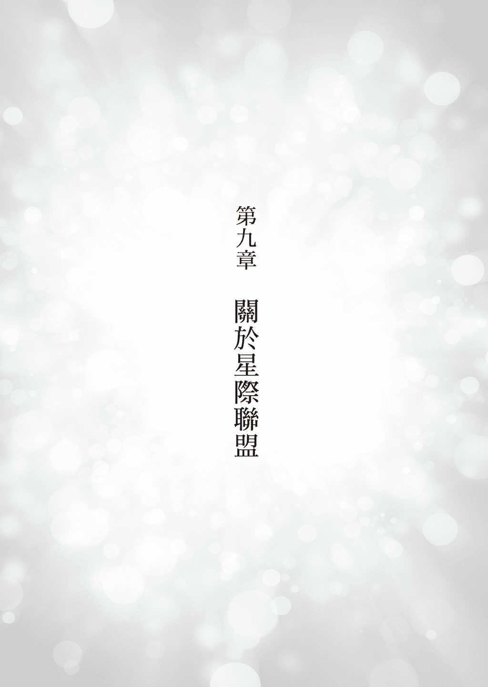

 组成星际联盟的背景

大约在两亿五千万年前，地球在众行星之间尚未形成如今的光子带相互链接之初，宇宙是由星际许多不同势力所控制。黑与白的世界，各自争夺主导权。

黑色的银河势力试图以破坏和谐的力量，来主导宇宙共同意识的成长和演进，没有经由破坏，打破原有群星集体意识的运行方式和轨道，整个宇宙会呈现自然衰亡的状态；而白色光明势力认为经由破坏来换取新的平衡和集体意识的演进方式，会造成更大的破坏。让意识跌落谷底后要再次扬升，过程中会造成星系内部巨大的黑洞，若没有经由白色世界平衡发展，任由黑色的破坏势能进驻，会导致集体意识陷落。当时也因为如此，有许多星球在遭受黑色势力殖民后，造成超过五千年的星球衰亡，长久下来，无法恢复星球生机。

在黑色和白色星际势力多次交战后，最后确定组成星际邦联，透过联合议会制定各星际联盟共同遵循的宇宙法则。星际联盟存在宇宙各个次元的意识群之间，被星系族群共同架构出光的网格，其成立的目的是为了让意识可以顺利在宇宙各星系间交流、互动，为传递共同认同的游戏规则，而设置了区域联盟。自此以后，战争和各自争夺的黑白势能冲突，才渐渐平息，现在透过星际联盟组成各议会，来协调和管理星际交流和意识演进的法则。

每一个星际联盟之间也相互链接，透过有系统、有组织的星际联合议会，展开各项实际工作。所以，星际联盟对宇宙整体的和谐与和平发展具有重要意义。当星际联盟在发展过程中遇到阻碍和无法顺利完成任务时，会将尚待解决的问题提交议会讨论。

这和人类生活在地球上，透过各种跨国组织和联合国大会创建国与国之间的共识和互动规范，是类似的。同时你也可以想像，在星际之间跨越次元和维度交流，其频差产生的认知递延和发展限制更为复杂。所以，宇宙共同意识源头为了让集体意识发挥效能，并完成其被赋予之任务，需要以次元和区域划分星际联盟。

 地球在星际联盟中扮演的角色：培育星际种子的孵化器

此时此刻的地球，是在星际联盟各工作小组的协议下形成的星际种子孵育基地。在地球上生活的人类，享有各星系族群所没有的最大权限：人类拥有绝对的自由，在开放黑白势能自由碰撞和竞争的保护区中，可以完整经历到达宇宙意识的前期训练。

星际种子可以在地球帷幕之下，完整体验处在混沌黑白势能交错中的生存模式，而这个体验过程也同时可以帮助更高维度的宇宙存有，奠定星际联盟的和平基石。此时此刻生活在地球上的人类，都是星际联盟组成的勇士，为了追求星际间的永久和平发展，前来地球体验。你们亲身经历和体验后的讯息，会经由灵魂晶体传回星际联盟，并传送到各联合议会储存、分析和评估。

人类身上有非常珍贵的情绪体，这些情绪的振动，就是意识流动的记录器。你们在地球意识进化的过程中，透过情绪震荡出来的频率和讯息结构，都被完整保存在地球母亲的子宫。而这股人类情绪体验和创造所累积的庞大资料库，也被陆续抵达地球的新人类延续运用，成为再造新地球的珍贵资产。

 星际种子植入地球后的星际联盟发展过程

星际联盟创建地球为星际种子的孵育基地，还有另一个原因：许多目前居住在地球的人类都是星系族群的后裔，人类并不是地球的原生种族，而是天狼星和阿努纳奇人合作，将人类的ＤＮＡ植入阿努纳奇人的基因，再经由天狼星的实验室转译成具有男性性征和女性性征的分离个体，然后将首批阿努纳奇人载往地球，创建地球智人的生活。在智人出现之前，地球只有少数猿人具有自主行为能力，其他物种则大部分也是经由外星移植而来，创造出地球今日丰沛的生态系统。

由阿努纳奇人转录的基因再造出的地球智人社会，只维持了两百万年，就被外星移民觊觎，因为地球孕育出丰富的矿产和大自然元素，可以帮助改善其他星系生存所需。这也是星际联盟创建的另一个原因，一方面为了照顾所有银河星系生命存续的需求，创建资源共享和交流的机会，另一方面则是透过创建地球体验站，让不同星系存有的意识可以前往地球实际生活体验，进而融合出共同意识的平衡观点，在黑与白的分离和对立的意识流动过程中，让人类肉身灵魂ＤＮＡ源头的各个星系存有，同样可以在此吸收和学习，创造亲身体验后的结果，再带回自己的星际图书馆中。如此，就不需要透过占领或夺取地球资源，让自身星球持续发展。

所以，人类目前眼中所见的各色人种，其实正是来自不同星系的存有，他们透过灵魂ＤＮＡ的节点，传送自己的族群前来地球实际生活体验，并将资料回传宇宙。你可以称这些回传的资料为人类的阿卡西纪录，但是，阿卡西纪录尚未经过整理和分类，这些资料因不同星系存有的集体意识成长需要，会再次分类、过滤，重新整合后，进入各个星球的星际图书馆中。因此，星际图书馆的资料就会有更多的索引标签，经由各星系的更高意识代表汇整后，编写成各星系存有的智能系统，而这个每一个星系各自拥有的智能系统，会再度和各星系的资料交换和比对。现在，当你进入某一个星际图书馆中获得某个资料主题，可能会出现不同的表达和诠释的版本，因为又多融入了该星系存有共同意识的元素和观点，进入其专属的星际资料库中保存。

地球人类一代接一代地出现和繁衍，正代表星际联盟不断在地球完成一次次黑白势能平衡的体验。对星际联盟来说，人类在地球具有维护星际和平发展和帮助意识持续成长演进的重要地位。请人们珍惜在地球上的生活，以自由意志发挥和创造你想要的一切体验。你们是被源头无条件的爱支持和允许一切尝试，可以创造和恣意体验黑白两极势能的先锋。当意识踏上回归的旅程，回到银河家园时，来自各星球的意识就须回到各自的星球中，完成此次的星际种子孵育任务。回到自己所在的星球后，你会发现，那一趟地球之旅是如此宝贵的灵魂试炼，你在地球得以体验你之所是，创造出一切可能的机会。你会珍惜与众星球的代表齐聚在地球上联手打造新地球的美好时光。

现在星际邦联为了能够共创新地球的诞生，正齐聚一堂，期待地球人类意识进入新的轨道，也带领所有星球的文明进入更长远的和平盛世。有了这一层认知，你会明白，为何当人类恣意破坏地球环境、自掘坟墓时，有众多星系存有会前来关切，并协助人们提升意识振动频率，避免人类无止境地沉沦，陷落入黑洞中，无法返回。此时不仅是白色光明的存在意识前来帮忙，也有许许多多黑暗世界的存有前来，协助打开直通白色光明世界的旋转门。黑与白在更高的维度是彼此合作、相互支持的，希望你们可以在成功登上宇宙意识时，认出自身存在的黑暗并不只是拉你进入黑色深渊的魔掌，那些黑暗也是协助你看见光明之路的重要推手，和不可或缺的背景屏幕。

 清空黑暗印记，召唤地球盛世文明的力量

那么，目前地球上许多人的潜意识中仍残存星际战争的阴影，这些会让星际种子害怕和担忧，这样的状况该如何解决？

这是因为他们的意识自动链接上造成内在创伤的纪录，只是这些内容超出地球目前的时空背景，让人无法理解。要清除或再次面对这些创伤，也是由每个星际种子自己决定，有些星际种子需要保留一部分印记，来协助自己完成此生的生命蓝图。不过，如果发现这些印记带来的创伤无法让自己还原意识本源的维度，或甚至造成身心伤痛，可以下达自我赋权的指令，将这段不想再面对的星际印记清空。你们可以使用以下清空印记的指令：

Mon Sa Bu Li So Fa Yun＋

〔不要留存的印记〕，Hon！

（不要留存的记忆，Hon！）

Hon！Hon！Hon！

多做几次，去看见自己不敢和不愿意面对的景象，确认这是你需要清空的记忆，将之抛向宇宙黑洞，让这些印记就此从你的心智图中消失。

除此之外，你也可以有意识地召唤你在星际生活期间的美好时光和地球盛世的片段，让这些美好的记忆帮助你产生内在力量。有许多和地球有关的星系文明创造的盛世可以参考。

一、亚特兰提斯黄金时代

二、尼比鲁文明盛世

三、美索不达米亚文明

四、苏美文明

五、阿加尔文明

六、列木里亚文明

七、伯利恒之星文明

八、木星文明

九、亚历山大文明

十、唐宋文明

你可以进入自己的星际之门，一一探索这些与地球有关的文明盛世。

 从身体信道链接星际之门

你进入星光体后，与高我的连系方式已经和你之前仍在帷幕之下有所不同。现在你需要透过稳定的内在宇宙能量线，也就是当你链接内在宇宙的星际交流平台时，你将展开内在的心智图。你现在需要创建这个新的连线方式。

这和之前你进入阿卡西纪录，契入你的灵魂晶体有所不同。当你已经穿越帷幕，平衡自身的阴性和阳性能量流，合一进入太极，你会从松果体打开星光体中的心智图天幕。这个屏幕会从你的心轮向上展开三百六十度的穹顶，穿越你松果体的正后方，链接上双耳之间的星际之门信道。当你的意识成功打开这道链接你的心轮和松果体的门户时，你顶轮上方的星际交流平台就完成在你身体场域的定位。

定位完成后，你的意识将可以进入无时间区，契入源头星际联盟的轨道。透过链接各个星门的信道，你将能以自己的场域为中央太阳，进行星际交流。意识跨越进入无时间门，会带你进入与源头星际联盟交流的开端，人类的意识从此正式登上和宇宙意识交流的新纪元。

这一段回到源头星际联盟的旅程，你可以轻松透过各个星门的通关密码，进入意识的转换。在此过程中，你的高我意识会随着你自主意识的引导，进入星门与你会合。你与存在不同星系源头组成意识的分身片段会再次合一，进入携手创造的阶段。

这些星门（星际之门的缩写），存在你灵魂ＤＮＡ的节点上，分别坐落在你身上不同的脉轮位置。你可以透过星光体的投影屏幕分隔出四大象限，以太阳神经丛为中心点，分成右上、右下、左上、左下四区，每个区域会链接位在你灵魂晶体中的不同星门。

现在我们先来一一检视你身上链接源头星际联盟的信道和位置。

第一区：银河太阳

银河太阳位在你的顶轮正上方，这是你进入灵魂本源——猎户座——的星门。

你的内在太阳尚未打开前，这道链接猎户本源的星门无法打开。这个位置也是你的灵魂晶体在生物体终止运行时，会打开的自动链接信道，而你在尚未完整地球帷幕之下的生命体验前，无法请求打开本源的星门，回到你灵魂的源头。这也说明，若一个人选择自杀，结束自己的生命，无法经由自己的太阳和银河大日之间存在的银线链接回家。在地球帷幕之下的生命体验非常难能可贵，希望星际种子们善加珍惜，妥为保护自身健康，以完整此次前来地球的生命体验。自杀的灵魂意识仍会由行星接管，其肉身所在的意识会通过地球母亲的星门渠道，由大地回收。

这道链接回本源的星门，在你的灵魂意识萌芽前也不会打开；只有在意识觉醒后，这道星门才会为你投射出你所需稳定晶体航道的银河光之柱权杖。而从你收到来自本源的权杖那日起，你就准备展开星际旅程，迎向银河宇宙跨次元之旅。我们祝福目前在地球上的所有星际种子，都能顺利收到自己的本源权杖，为你们未来的星际旅程奠立稳定的光的链接基石。

第二区：第一／第二星门

第一和第二道星门位在共同意识群较高的维度，以眉心轮为中心，分别在星光体投影幕右上方和左上方的位置。

第一道星门为你展开星光体最外圈的环状航道。每一个星际种子的ＤＮＡ组成都不同，所以你和另一个人到达同样星门的身体位置会不同。目前这道星门可以为你打开大角星的旅程。大角星位于你星光体的最外圈，所以当你链接此星门时，你也会感受到身体场域的扩展链接。而第二道星门是相对于右上方大角星星门的引力场，这道星门为你打开天琴星的高维意识群。

这一区以眉心为中心的星门，右方来自大角星的阳性能量与左方来自天琴星的阴性能量汇流后，就进入下一个生命再造的轨道。

第三区：第三／第四星门

下一个区域，是你灵性父母存在的星际之门。以心轮为中心向右方延伸，将到达天狼星星门，这是来自距离地球最近的恒星的光，组成你灵魂的阳性能量；而向心轮的左方延伸，将抵达列木里亚星门。透过天狼星和列木里亚这两股持续在你灵魂晶体中交织的阳性和阴性能量流，孕育出地球万物丰富多样的生命种子。

而心的信道将协助你打开内在之眼，接收来自中央大日的能量，进入地球场域中的你的身体意识场。所以，心的能量启动链接和扩展意识的维度，对提升地球集体意识和宇宙意识接轨，是非常重要的闸口。

第四区：第五／第六星门

第五和第六星门以太阳神经丛为中心，位在右方和左方两侧，右侧对应参宿四星门，左侧可以到达参宿七星门。这两道星门的打开，可以帮助你身上所有的星际意识组成达到与中央大日本源三位一体的链接，让身体场域维持链接银河中央大日的能量，处在能量平衡的最佳状态。通常右方的参宿四星门和左方的参宿七星门不介入你的灵魂在地球场域的指导工作，因其最主要的功能是协助所有星门交流的畅通，所以你无法以意识干扰其平日的运行工作。这两道星门汇聚了你全部灵性组成场域中的讯息和能量流，协助与中央大日保持稳定接轨。

你平日透过心轮可以感知万物的能量品质，就是来自这两道星门与本源创建的黄金三角，让你的身体场域可以稳定接收宇宙讯息和能量。这也是为何当一个人的太阳神经丛无法打开接收来自中央大日的能量时，连带会影响其链接其他星际之门的信道，无法稳定和顺利地衔接上宇宙意识。

第五区：第七／第八星门

第七和第八星门位在脐轮的右侧和左侧，右边的星门为你链接阳性的木星能量，左侧则为你打开昴宿星的星门。这两道星门是平衡你在地球帷幕之下的情绪体验很重要的光之柱，来自木星的阳性能量帮助你打开帷幕之下的负面能量体验，而昴宿星会以无条件的爱支持你在地球帷幕之下的所有行动。这两道星门成为你在地球帷幕之下生命蓝图的重要推手，没有经由它们的协同作业，你无法来到地球完成此生期待的工作。这两道星门也是你在地球帷幕下的导师群所组成，观世音菩萨、天使群都来自这两道星门的意识组成的协同工作小组，为你在地球场域提供建言和指引。

你没有经常和这两道星门链接的原因，有一部分是来自你的脐轮信道被过去的负面情绪体验屏障，也因此，你此生的体验和灵性的展开大多来自帷幕之外的灵性组成和星际之门的指引。这也是你此生早已设定的生命蓝图展开方式。

第六区：第九／第十星门

第九和第十星门以海底轮为中心，右侧的星门链接土星，左侧链接织女星，这两道星门为你在地球上的行动导航。你收到的许多来自地心生命的讯息，大多是由这两个星际之门汇聚的能量创造出的地心文明。地球上的许多金属、矿物，和大地母亲蕴含的丰沛大自然元素，都是从这两个星门传送来的源源不绝的能量，供给地球母亲作为滋养天地万物的日常所需。所以，当你深入探索地球母亲的大自然宝库时，可以从这两道星门获取星际图书馆中的大量讯息。

从以上的介绍你会发现，你身上的脉轮都是链接星门的重要出入信道，也是各星门的能量汇流处。此外，你身上的太阳神经丛和喉轮，也和所有星门的阳性能量与阴性能量链接。太阳神经丛是你内在的太阳，以此为中心向外延展的过程，可以帮助汇聚你全身的阳性能量，而喉轮则是你身上所有的阴性能量汇聚之处。喉轮的展开和畅通，正映照着你的内在太阳是否明亮和敞开。

现在透过星光体，进入你灵魂本源所属的宇宙意识共同平台后，你就会发现，这里的星际图书馆已经准备释出一部分讯息，作为培育星际种子宇宙知识的基础。这些宇宙知识不只是所有星系集体意识汇流的结果，也是所有透过地球人类亲身体验后的智慧累积和传承。对人类来说，这些资料提供了新地球新人类如何展开星际交流和学习，这也是人类意识觉醒后重要的一步：忆起自身的灵魂意识源头，并开始透过有意识地探勘宇宙智慧，回馈给地球母亲，帮助地球母亲和共同生活在地球上的所有生命延续前人的智慧，再造新地球的基石。

你和目前许多同样有此灵魂使命的星际种子，正准备进入星际图书馆，将大量的宇宙智慧传递出去，让地球可以因为接收到宇宙知识，诞生出崭新的样貌。

 更多星际联盟介绍

月亮联盟

人类诞生在地球的那一刻，就被地球上的生态环境无条件地照顾，直到完成一次生命的体验。而你们的海底轮链接的不只是自己人类孕育的下一代血脉，还有强大的能量，具备足以召唤地球万物为你所用的巨大引力。只要你发送出需要生存的讯号，或是当你的生命遭受威胁时，你的海底轮就会发送警讯，提醒你的更高脉轮展开行动，还会通报邻近的大自然万有来协助你。海底轮具有与星际月亮联盟通讯链接的功能，所以当你以海底轮之名，链接你在星际中的月亮联盟，将可以获得月亮联盟无条件的爱的能量倾注。这股能量非常强大，是能帮助你脱离生命的危难，找回安全堡垒的最佳内在指引。

要唤起海底轮链接星际月亮联盟，最佳的方式就是与地球上储藏的红宝石链接。地球上可以采集到的红宝石，大量存放在与印度洋相邻的陆地，而印度洋也正是地球母亲最初始孕育生命的摇篮。人类的历史从这里出发，经历六十五亿年开花结果，各色人种血脉开枝散叶，进入地球各区域。所以，人类除了有自己的生身父母之外，还有地球母亲，那是照顾和孕育人类生命之母。

地球可以衔接上十个星际联盟，而在不同的星球，如天狼星，可以衔接上的星际联盟有三十五个。至于五次元的新地球，目前被分派的星际联盟会比旧地球多出三个，分别是共同创造、无条件的爱和理想生命轨道计划，这三个星际联盟分别由大角星、天狼星和列木里亚三个星际联合议会主持。

共同创造星际联盟

新地球将被赋予跨越国家、种族、宗教和文化藩篱，共同发展新科技文明的任务，大角星人在这个星际联盟中，将提供地球人类新科技和新能源相关知识。人类的科技将摆脱重力物理学，进入量子物理学的研究和发明。你们的航空及运输设备将率先应用量子物理学，以磁力为核心的发动机技术将于二〇五四年大量问世。目前人类只接收一小部分概念而已，所以从二〇三六年起，这些以磁引力开发的交通工具会被新人类落实在新地球场域。这个计划已被星际联盟认可，地球人类得以透过肉身进入太空探索时代，创建与外星文明的实体交流，非仅以意识交流的时代即将出现在新地球上。

无条件的爱星际联盟

新地球将以“无条件的爱”为核心创建基因工程。由天狼星人带领的星际联盟会撷取各星系文明的基因频谱，将无条件的爱作为基因，共同编程植入新人类。天狼星人提供宇宙一具最精密的人类生物体原型设计，这个载具的升级作业也将在天狼星人的协助下，让人类快速衔接上五次元地球的生命轨道。

未来人类的身体细胞会再次升级，摆脱过去那样以恐惧和竞争的能量主导人类的生命体，转而以“无条件的爱”的更高振动频率衔接新地球人类的身体细胞。人类基因工程的改造计划是由天狼星人偕同各友好星系存有，组成基因工程小组，协助将地球人类的细胞重组成以“爱”为本的生命循环。

这是一项非常重要的人类集体意识扬升计划，为迎接新人类契入五次元的地球而准备。人类在此过程中并不会产生任何身体上的排斥或阻抗，不像过去旧地球时代施打疫苗那样，强加外来指令，给细胞新的任务。这是一项“爱的复苏计划”工程，将人类细胞核中最初始的能量释放出来。所以，这项植入“无条件的爱”的工程，就是启动人类意识觉醒、回归源头的内在路径，将过去屏障人类ＤＮＡ链接回本源的信道打开。现在只要人类有意识地提升振动频率，有意愿展开意识扬升之路，无条件的爱的生命泉源就会源源不绝地流进人类的身体场域。

这虽是一项所谓的基因改造工程，却不会伤害和改变人类的生物体细胞，而是透过意识校准，启动内在“无条件的爱”复苏工程。

理想生命轨道星际联盟

为新地球准备的第三个星际联盟，是关于理想生命轨道所设计的蓝图。这是由列木里亚星主导，地球将离开原本在三次元的振动频率，晋升为银河新星球的一员。在此转换的过程中，新地球将衔接上五次元的新轨道，而列木里亚人的集体意识一直存在地心，协助稳定地球的运行轨道，与太阳和银河中央大日保持连线。然而，这段生命运行轨道将一分为二，形成旧地球与新地球分离的轨道，帮助新地球诞生，同时仍然扮演旧地球的看护人。

所以，新地球诞生发展的过程中有很长一段时间，原有的地球场域会面临新旧地球平行发展的阶段。这个轨道分离与再次各自发展的过程，就如同婴儿即将脱离母体，在产道中挤压，所以地球母亲会面临巨大的阵痛期，连带地球上所有的生命都会感受到这股巨大的痛楚。此时需要列木里亚星际邦联的协助，降低地球母亲的痛楚，并保护新地球顺利诞生。

抖落旧地球不再需要的沉重负荷和意识枷锁，可以帮助地球母亲顺利产出新生儿。这是列木里亚人擅长的工作，他们会将大量储存在地球上的水晶和矿石的能量释出，协助地球母亲稳定，并平抚地球上所有的生命，以成功衔接进入新地球。

列木里亚人的集体意识一直都在守护地球母亲，保护所有在地球母亲身上成长和繁衍的生命，提供足以让所有生命和平共存在地球上的理想轨道。

共同创造、无条件的爱和理想生命轨道这三个星际联盟，是未来新人类和旧人类最大的差异与意识的分水岭。

 使用数字座标锚定星际之门

以人类的认知系统来说，并没有星际交流的经验。在三次元的振动频率下，要实现星际交流有许多困难，除了频段无法顺利介接之外，另一个最主要的原因，是必须经由身体协同作业，才能打开与星际之间的交流。

身体协同作业需要到达的最基本状态，是心脑合一的流动波。心与脑若仍然处于分离的意识状态，就无法搭起这座原本就镶嵌在每个人体系统中，可以链接自身星际源头和星际联盟的桥梁。

所以在进入这个主题之前，你必须已经到达与内在真我意识合一，还原最初始的你存在灵魂本源的样貌。即使你依旧带着在帷幕之下的小我意志、个性和习气，此时你的小我和高我早已是不可分割的一体存在。在这种融合的“一”的意识下，你才有机会踏上星际联盟交流之门。

而进入源头星际联盟的十大星门，同样存在你的身体场域。这十大星门你并不陌生，还记得你曾经写下的星光体十二个身体系统咒音吗？（编按：详见《星光体》一书。）这十二个咒音里，有十个和进入星际联盟的大门有关，另外两个则分别位在你的中轴，链接银河中央太阳和月亮的位置。中轴稳定地锚定你灵魂本源的同时，才能打开十个星门的链接，这十个星门也和你身体脉轮的能量流息息相关。

现在，我可以协助你辨识出你的心智图在你身上的星际联盟入口，透过这十个星际门户，你将可以进入每一个星门，与存在不同星际次元的你联合完成你们共同期待的创造和体验。记住，在心脑合一下，才有机会展开交流；若没有这个基础就进行星际交流，你会进入茫然不知所措的状态。只要你的意识稳定在中轴，你就不会遗失你自己。现在准备好了吗？来看一下你的星际联盟组成。

使用你的“心智图通往各星际之门座标”图中标示出来的数字座标（请见左图，这是以 Rachel 的心智图为范例），可以帮助你的星光体更精确地锚定本源星际联盟各星门的位置。你目前已经被允许透过和自身高我泰雅的合一意识，进出所有源头星际门户，而银河中央大日和月亮的星门是你的支持，目前无法让你进入。每一个星门背后都存在着该星际联盟特定的功能和任务，而你就是被所有星际联盟共同规画出来的星际种子，是为了帮助地球晋升至新地球轨道，顺利完成移转计划，而前来地球的勇敢灵魂。

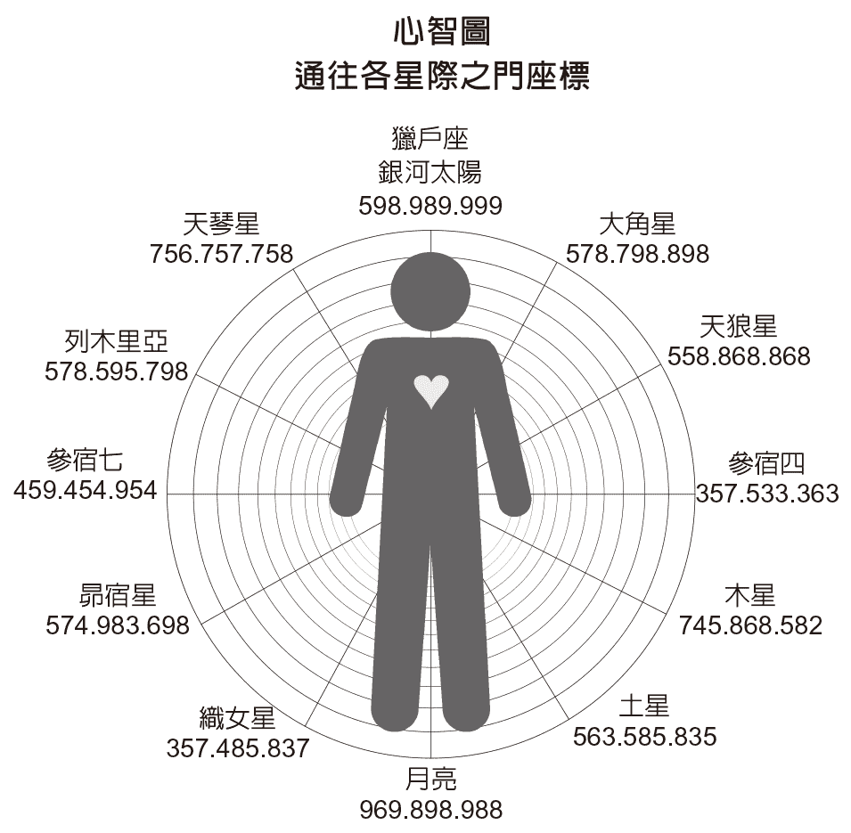

你的存在被众星际联盟所期待和无条件地支持着。地球帷幕之下有许多星际种子和你一样，正进入自己的阶段性任务，在觉醒后忆起自己的本来面目。请允许自己慢慢咀嚼我们今日传递的讯息，你会发现虽然独自生活在地球上，你并不孤单，你的身上有着所有星际家人和各个星际联盟的支持。

 初探星际之门

猎户座

这里是所有银河星际种子共同的家园，也是你与星际家人协作的场域，在十二次元和更高的维度处理星际轨道的协调，和新星球的孵育计划。目前的地球正穿越银河光子带，走入下一个百年的轨道，要在新的轨道重新学习爱和创造的法则。你们会逐步脱离三次元的星际轨道，进入更高的振动频率中，而目前无法穿越地球帷幕的生命，仍会停留在三次元的星球继续学习。

地球会在二〇三六年完全进入新的轨道，而在此转换期间，意识已经突破三次元帷幕的地球人，会积极唤醒尚未苏醒的人。你们都将忆起自己的星际源头，与原来的星际伙伴创建新的沟通，并共同为五次元轨道的新地球奠定新生活的基础。

在此过程中，你会以目前存在地球上的你，与灵性父母的意识融合。这一次的融合会在你身体细胞中创建新的结晶，也就是你物质身体的细胞组成结构会随着与自己的灵性父母共振，而融合出新的组成元素。

这样的身体重组晶化的过程，就不会产生进入五次元轨道的适应问题；而无法在此过程中完成身体晶化的肉身会自动离开，待灵魂回归源头再进入新的选择。

目前猎户座这里的大门已经打开，你可以随时与我链接。而同样在你身上，与你的灵性父母更紧密链接的星际之门，也都存在你的星光体，只要你和灵性父母意识合一，就可以顺利到达。

进入猎户座的快速通关码是“598-989-999”，你可以试试直接以此代码与我链接。

很清楚，就在我星光体的正上方，头顶的顶轮位置。那么，以后我要来这里探索哪方面的东西？

探索整体宇宙运行的架构和互动规范，这是我们十二次元管辖和负责的区块。现在你可以去探索银河其他星际之门，并在你的星光体中标示出来，帮助你快速到达。

天狼星

两点钟方向。

座标代码：558-868-868

这里是人类基因和情绪体的资料储存库。你可以进入天狼星取得解开人类ＤＮＡ屏障的方法，并有效打开人类意识所在的生物体精微系统中的传输管道，恢复人类的光体完整性。

透过在天狼星的星际图书馆庞大的人类基因资料库中探勘和蒐集，将可以消灭身体的疾病，以更快速有效的方式让人们恢复健康，以在人类穿越帷幕、帮助身体晶化的过程中提供最佳辅助工具。

你可以有系统地创建这里的资料，帮助目前三次元地球的人在移转进入五次元时，重启身体智能。

我们可以让人类身体的精微体系统运作效能提升数百万倍，人类的身体就足以进化到能以更健康的状态永续使用数百年。如此一来，人类就能摆脱生老病死的循环，和宇宙人一样，以不老不病之身，决定生命的终点。

好的，我知道了，这样我需要更完整、更固定的时间，进入这里蒐集资料和学习。

请问整个下载有几个章节、哪些架构？

共十大架构，每个架构下还有许多细部结构。光是下载完成，你就可以同步完整晶化你的物质身体。

了解。那我得赶快加油，我都已经年过半百了！

为了让地球人扬升进入五次元的生活，我们非常乐意提供。这是未来地球人都要活出的样貌和状态，一旦人们开始在生理层次上感受到和过去不同的需要及生活习惯的变化，自然会改变目前对待地球生态环境，以及与地球物种互动的方式。这是非常重要的内在精微体净化和校准工程，必须开放给全人类，并教导人类如何自行运用。

列木里亚

你的灵性母亲已经为五次元地球打开了星际之门，座标代码是：578-595-798。这里是链接五次元地球的星际门户，你将在此展开关于新地球生态和环境工程的学习，水资源的使用会大大改变人类过去的生活方式，进入无毒、无传染疾病的新生活。这里会提供你地球母亲的丰盛智慧，也是古文明时期女巫和萨满的知识宝库，你可以透过这道星际之门，获取地球母亲累积六十多亿年的智能。你之前链接到一半的宇宙法则，也是来自地球母亲的教导。进入这道星际之门后，你可以将宇宙运行的法则，以及各元素之间转换、共振、交换和转化的力量揭露出来，作为五次元孩子的生命教材，让人类与地球母亲和谐共存，创造使生命生生不息的养分和物种平衡发展的集体智能。经由在这里的学习，你会更明白如何在新地球获得大自然万物和地球母亲的补给。

生活在五次元的人类要重新迈入新的生活方式，这些讯息需要被完整记录下来，供五次元的人使用。所以，孩子，你看见了吗？这三道门已经为你打开，只要链接上你的星光体。你已经是宇宙人在地球的重要代表和信使，这工作对未来地球人类非常重要而神圣，不能再被少数人把持。目前你揭露的部分已经完整地将人类觉醒与人神共创的未来之门打开，接下来，共同的创造也会在你持续有纪律地链接进入星际之门时，获得宇宙源源不绝的资源和支持。

星际图书馆就是你的水晶图书馆更恢弘的版本，也是你的心智图展开后的全息景象。星际图书馆有非常多层次，讯息量庞大，你目前已被允许从自己的水晶图书馆取得心智图中对应的星际之门资源，所以，水晶图书馆是你进入星际图书馆的大厅和资料汇流取得的中继站，透过你的晶体链接到你灵魂本源存在的宇宙各个次元。

目前在三次元的你只是一部分的你，你已经很清楚这一点。你原本就是一群星际种子的结晶体，进入不同的星球组成的星际联盟。这个星际联盟也是你，只是你的地球意识无法在有限的身体所在的维度，看到星际联盟存在你身体上的全貌。只有当你的意识穿越地球帷幕，你才能忆起你之所是，以及你将为自己和整体宇宙完成的任务拼图。现在该让更多人忆起，让更多人可以与你协作，将这部分的星际资料库完整揭露，并传递给世人。

你可以通过列木里亚的星门取得新地球文明的讯息，我们需要你记录下来，提供给人们。让我先带你进入新地球之心，你现在可以念诵链接进入新地球之心的座标码：578-595-798。

当我念完新地球之心的光码数字，我的意识从刚才的位置移动到左脑，就在左脑勺的正后方。这里对吗？

没错！这里的振动频率就是新地球之心的位置，也正是位在五次元的地球。在这里，你们仍然会使用自己的理性脑活动，而不是你以为的进入合一意识后，在无有分别的状态下，会失去理性脑的功能。这里是你进入“合一之心”，展开不同于现在地球文明的新场域。

你们目前生活的地球上，已经分离出不同于以往的新地球频率。这里也在地球上，也是用你目前同样的肉身存在，无缝接轨，你仍然带着分析的理性脑行动和生活；然而，在你的心轮位置，你会发现和过去在旧地球场域中的状态已然不同，你是带着更高意识的心的振动，与所有存在你灵魂ＤＮＡ中的高次元意识合于一体的状态下行进。你就是生活在五次元新地球的公民。你现在去感受一下这两者之间有何不同。

我发现在五次元地球之心的状态下，我们心中那种竞争、比较和自私自利的想法会自动消失，似乎进入一种无分别心的状态，你的和我的，都是我们共同的，所以不再需要花费更多心神在为一己之私利，而是为了整体共好而去努力开创。我们的左脑以一个最清晰又理智的状态，看管着让我们共同存在的最佳解决方案，而不再为了偏颇于任一方、抢夺别人家的资源而伤脑筋。我们的理性脑已经被转成用来支持开创利益众人之事，这样的脑已经不再能发出讯号控制我的行为，而是以心为中心发出讯息，来驱动大脑的运作系统。简单来说，过去的身体由大脑指挥，现在则是心站上我身体总指挥的位置。原来五次元是“心”的家园，我们从小脑时代转向心的时代。这是我目前在有限的身体中得到的感受。

很好，在五次元新地球，以心来导航，而你心的振动正链接着存在不同次元的所有星际家人，也是重新引领你有限的脑意识的指挥中心。现在你头顶上那朵千瓣莲花，就是从心出发，透过你的海底轮扎根地球，获得地球母亲无条件守护万物的爱的能量所绽放的花。你替自己打开这道链接星际的大门，也帮助地球母亲及所有地球之外的银河星际伙伴创建了连线，这条连线启动了你内在的心智图，为新地球灌注所需的能量和生长元素。我们从今以后如一家人，在同一个地球、同一个宇宙中生活着，这就是进入五次元新地球的样貌。谢谢你，谢谢你正确地开展出来！

应该是我谢谢你们吧？这么长的时间，好不容易跌跌撞撞地走出一条路径，从二〇一七年开始传讯到现在，一晃眼五年就过去了。如果二〇三六年需要整个地球进入五次元轨道，现在还有这么多分离意识要准备进入合一，甚至还要走到千瓣莲花的星际之门，恐怕时间真的不够啊……

这也是我们之前的传讯一直希望你能创建光场的原因。在同一光场中，每个人的心轮同频共振，可以帮助打开脑的限制性屏障，进入合一的新地球家园。

我们直接来试试看。祢带着我复习一次，之前在写这段时，我并没有好好练习，所以还没有展开这项工作。

好的，不论你们现在的位置在哪里、是否处在同一个空间，都没有影响。我们就来练习一次。

练习：进入五次元新地球之心的冥想

．步骤１：深呼吸数次，迎接圣灵之光从顶轮穿过眉心，进入你的心轮。

．步骤２：现在让意识停驻在你的心轮，在呼吸的带领下，让心轮扩展。吸气，每一次吸气都让心扩展开来；呼气，放松你心的肌肉，然后再进行一次。吸气，让心扩展；呼气，放松心的肌肉。慢慢地，提升心的振动频率，会帮助你的意识进入阿尔法（alpha）波的状态。

．步骤３：用意识锚定座标码，去打开新地球之心的门户。

默念“578-595-798”三次。

现在你的意识会移动到你的左后脑，在耳后一个手掌位置的中央，这里就是通往新地球的大门口。你原本感觉较为沉重、有压力的左后脑，已经打开链接心的信道，你进入了五次元地球之心的意识状态。现在感受一下进入五次元新地球的感觉。要认得这个有清醒的意识，但身体放松、心轮放松的感觉。

．步骤４：和所有正在与我们链接的人一起连成光之网格，创建五次元地球的光场。

念诵“Si Sa Don Mei So Fa Yung”（三遍），将五次元新地球的光之柱竖立起来。

这道光之柱，帮助现场的我们与所有同样在五次元的兄弟姊妹的心同在。我们愿意以合一之心，去开创新地球的未来，为所有人的福祉创建新地球生活提案。

请问这和之前座标定位天狼星星门“558-868-868”，进行新地球能量校准有什么不同？

之前是透过天狼星引进中央大日的能量，灌注到旧地球，帮助人们清除身上沉重的能量负荷，净化大地的同时也可以帮助地球母亲校准五次元的轨道。你有没有感觉，这股能量和你目前链接的能量品质是相同的，这是充满黄金粒子的炁，帮助你们的身体和地球完成晶化过程，以迎接五次元的地球。

现在你透过意识锚定新地球之心，在地球上以你的心轮为中心，链接众人之心创建光之场域，可以帮助身旁的人和环境一起调频进入五次元的合一意识场。之前透过天狼星的能量校准，尚未将你与众人之心凝聚为合一的共识场，现在这个新地球之心的校准，可以帮助你们在目前所处的地球转换轨道的过程中，以更高的意识共同校准五次元地球，一起打造新地球的家园。

 新地球意识是跨越宇宙次元的合一意识

（隔天一早继续练习。）

我刚才尝试进入新地球之心后与泰雅合一，心轮立即无限扩张，仿佛扩张到无边无际的宇宙。这个感觉让我回想起很早以前，我曾经问我的高我，我到底来地球干么？当时给我两个感觉，第一个是爱，能量进入我的心轮；第二个感觉就是我刚才感受到的心轮无限扩展。当时我以为那就是宽恕，现在当我又进入这个能量流动中，我觉得当时我对宽恕的认知很狭隘。进入新地球之心，与泰雅合一后，我觉得这已经超越人们认知的宽恕了。这种感觉到底要传达给人们什么？

很好，你终于可以自行抵达新地球之心。这里就是未来的你和目前地球上已经觉醒的你们，以及即将出生来到新地球的各星系文明种子将会活出来的样貌。在此，你与自己跨越各次元、各维度的分身得以在心轮合而为一。你的存在不再受限于肉身的屏障，你的心轮展开的空间，就是你之于众多的你共同汇聚的场域。在这里，你的时间象限已经被你的意识突破，你不再需要被时间制约和迷惑，所有过去、现在和未来的你都存在当下。你感受到心轮无限扩张，扩张到失去边际线，你只能从心轮的心盘上感受到整体，这里没有你、我、他的独立存在意识体。

是的！当我进入与泰雅和祢合一时，只能感觉心轮一直扩大，但里面无法区分泰雅、我，或是祢。为何新地球存在这样的状态？这是我不理解的地方。

在五次元的新地球，你就是宇宙之心，以你为中心向外扩及你所在的每一个次元。所以你的内在宇宙中，也包含存在目前三到四次元之间你以为和你分离的独立个体、你的家人、别人的家人、你以为和你老死不相往来的人事物，这些都存在你的心轮，早已与你在此合而为一，你无法再去分辨这是你的还是他的。

当时，你的灵性父亲雷巴特打开你的顶轮，引导你从顶轮上方一窥三位一体的合一基督意识场的存在状态，“I am that I am”。而当你后来跨越帷幕之外，进入灵魂光之殿堂中，你进入了自身存在的火元素，到达我是临在，“I exist”。那时，你的临在就已经跨越厚重的地球帷幕，在你的心轮打开与高我合一之门，你会逐渐回到与万有合一的原初真我之境。现在透过打开你们在地球之心的五次元门户，你从自己的心轮终于可以顺利展开这张属于你的心智图。这张心智图将由你来掌舵，你就是自己宇宙的主人，而泰雅和所有与你链接、跨越所有星际次元的存在意识，将和你在此协作，在你的心轮展开这张心智图，让你可以到达任何你想要探访的星球。

（我将这股透过打开列木里亚星际之门链接五次元新地球之心的能量，制作成“新地球之心”宇宙能量精素，读者可以透过这特制的精素，体验这股来自五次元新地球的纯净能量品质。新地球之心宇宙能量精素将带你体验五次元新地球的核心能量。这里是你进入“合一之心”，展开不同于现在地球文明的新场域。

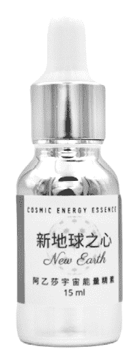

地球已经分离出不同于以往的新地球频率。这里也同样在地球上，是用你目前同样的肉身存在进入五次元新地球，无缝接轨，你仍然带着理性脑行动和生活；然而，在你的心轮位置，已和过去在旧地球场域中的状态全然不同。这里会带你进入更高意识的心的振动，与所有存在你灵魂ＤＮＡ中的高次元意识合于一体。

当你使用这款新地球之心能量精素，会瞬间提升并扩展意识的维度。过去在三次元中那种竞争、比较和自私自利的想法会消失，你的意识将转进无分别心的状态，你的和我的，都是我们共同的，也不再需要花费更多心神去为一己之私利争夺有限的地球资源，从此为了整体共好而去努力开创。

使用新地球之心精素，你的灵魂ＤＮＡ会展开与更高次元的星际家人的链接，五次元新地球之心将带你的“心”回归银河家园。当你成功进入五次元新地球之心，你心的振动可以链接上存在不同次元的星际家人，帮助地球母亲及所有地球之外的银河星际伙伴创建连线，这条连线将启动你内在的心智图，为新地球灌注所需的能量和生长元素。从此，在帷幕之下的你和位于更高次元帷幕之外的星际家人如同一家人，在同一个地球、同一个宇宙中生活着。这就是人类即将进入的五次元新地球样貌！

当更多的人可以链接进入五次元新地球之心，在同一光场中，每个人的心轮同频共振，可以帮助身边所有的家人和朋友打开脑的限制性屏障，进入合一意识场。透过这款新地球之心精素的能量引导，让所有灵性兄弟姊妹串连形成新地球光之网格，成功创建五次元新地球的光场。）

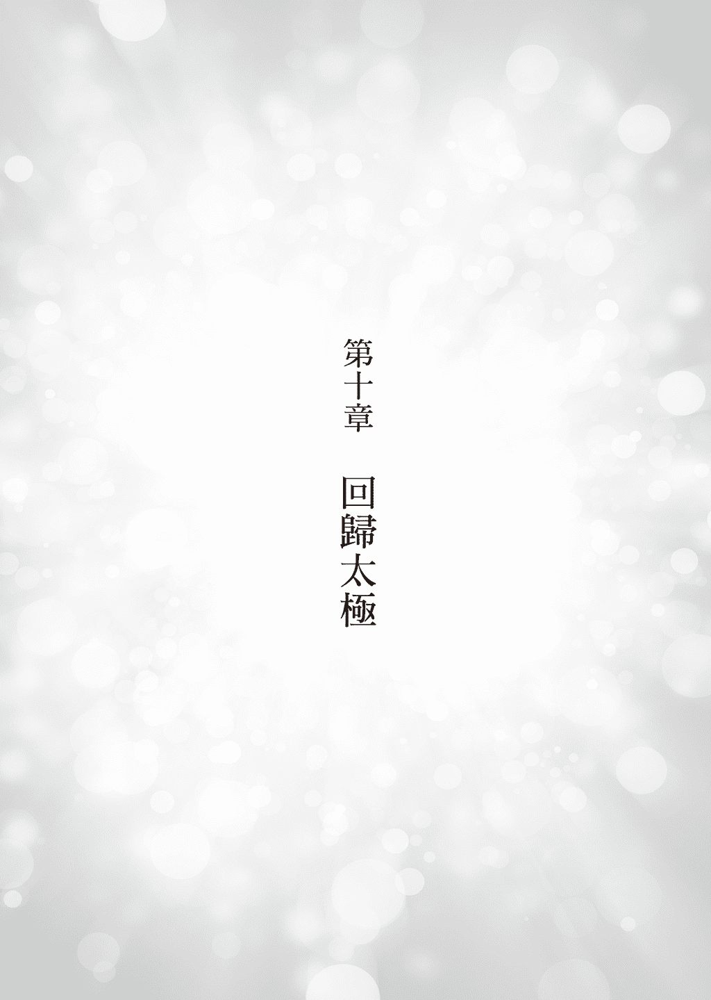

 打开太极之门

早上，一如往常，起床先校准星光体，进行新地球校准，让天狼星和太阳呈一直线。完成后，从内在宇宙传来讯息：这项程序尚未结束，还要继续做下去，我仍需要去锚定列木里亚星门。收到这个指引后，我就念诵列木里亚星门的座标代码“578-595-798”。当我的意识延伸链接上列木里亚星门时，我的星光体锚定列木里亚的能量线，自动往下方海底轮的方向移动，进入月亮方位。当列木里亚的星门锚定我星光体的六点钟方位时，来自列木里亚的阴性能量从我的海底轮升起，融入刚才导入的天狼星阳性能量。此时，我的内在升起一股阴阳和合的能量流。阿乙莎，这是怎么回事？

孩子！你刚拿到进入太极的门票，这是非常难能可贵的。对处在三次元地球的人来说，这是求之不得的境界，可以让你直达获取宇宙至高无上真理之炁的位置。这里是太极之门，也是你们回归到阴阳相合的原点。还记得从一开始的Ｈ粒子展开体验的过程吗？一个正电或负电会分离出另一个电子，向外寻求另一个负电或正电，并与之融合。每一次正负电相合时，就能产出强大的阴阳和合之气，而这股阴阳和合之气，是你们俗称的真气、等离子体，不带任何单一的正极或负极，是来自宇宙源头的太极之初的能量。

这也是灵魂再充能的来源，大自然万物的演绎自此生生不息，绽放出不同的样貌。现在，当你的意识荣登太极之门，就是你生命崭新的开端。你的生命之源到达最圆满的境界，此时的你，可以进入全新生命的选择。

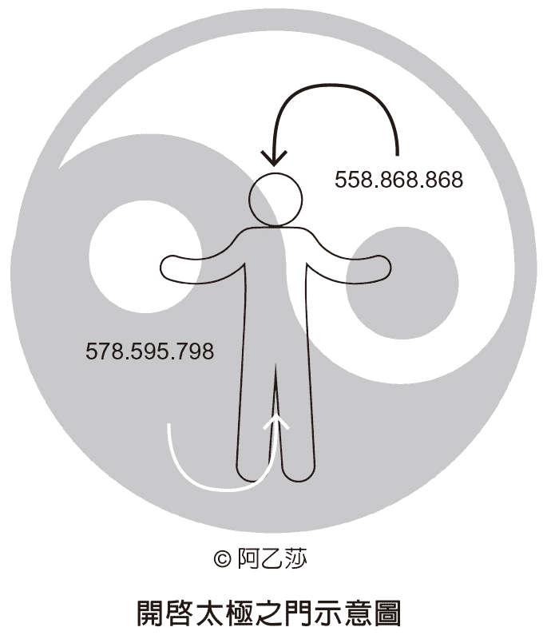

阿乙莎，此刻的我，感受到整个头顶上方分裂开来，眉心轮也左右分开，一路分裂到心轮。我的心轮无限扩展，超越了身体可以感知的范围，进入无边无际的宇宙大洋。以前的我是身体包覆着灵魂，现在则仿佛灵魂在身体之外，身体是灵魂创造过程的一个物理载具。这个状态下，我们从认同自己的身体，转向认同整个宇宙实相为自己的身体场域，我们的意识进入太极之初，这对地球人类有任何意义吗？

这就是我们一路教导你的过程中的重要里程碑，你从此成为真正的宇宙人，存在五次元的新地球生活场域。现在你的意识将不只是认同于你的身体，你的身体与整个星光体的银河星际联盟共同存在，你是星际种子在地球上深耕茁壮的新地球人。

当你从认同你的身体再次扩展后，你和过去最大的不同，是你心轮的振动频率已从过去人类平均的三十到四十赫兹，调频至三百到五百赫兹。你的意识不再受限于物质身体载具，你ＤＮＡ跨越次元的频段全数展开，而你的眉心轮可以锚定进入的星际之门已经全数为你打开。

我原以为太极的能量是帮助我强健体魄、返老还童之类的，我压根儿不知道进入太极会和新地球有关系。

孩子！你总是忘了自己之所以成为今日的你并非偶然。你的内在意识储存着宇宙众星系的期盼和回归源头的导航装置，只要你如实地表达和记录下来，让讯息的振动传递出去，你就完成此次被赋予的地球任务了。你已经在做了，不是吗？

除此之外，进入太极阴阳和合之境，这里就是炁的最原始状态，是你们的身体细胞尚未进入地球母体化育前的能量状态。这股能量不带任何单一的游离电位，当你的意识可以还原到最初始的状态时，你身体细胞所有的失序、找不到电位配对，或是乱闯找路的恶性电位等，都会瞬间回归源头。这时，你已经感受不到身体细胞带来的压力和不适。你的意识清醒地存在着，但身体的边界正消融于阴阳和合的太极之中，感官到达极致融合的飨宴，这已非喜或乐足以形容，你的身体已消失，但意识存在无形的万千大千世界里。这样的体验是你源头的神圣父亲与母亲融合交汇在你的星际之门的结果，这是你与自身存在的阴性和阳性能量在星光体中完全融合并回归源头的存在状态。

过去的你仅能透过中轴锚定链接天狼星和列木里亚星，也就是你的灵性父母来自的星门；现在，你已经晋升为宇宙人的一员，你身上的十个星门都欢迎你来访。你不再受制于身体细胞的界线，现在的你只要锚定任一星门的座标，你的意识都可以带你直接到达。你身体里的水晶结构已经为你备妥到达星际之门的路径指引。

 阴阳和合的太极之炁

当来自灵魂本源的阴性和阳性能量再度融合于一体时，此时的你，已经从帷幕之下的阴阳两极分离状态，回归至最初始本源的合一。在灵魂本源中的阴阳合一体验，和之前在帷幕之下到达三位一体的体验截然不同。

现在这个阶段，是带着已觉醒的意识，完整地球的体验，将自身在帷幕之下的上兆个细胞粒子重组，展开阴阳和合的过程，你的身体细胞会释放原本携带的正电或负电，进入全然合一的状态。在太极中无有分离，所有分离的粒子进入太极会被阴阳合一之炁分解。你们的身体细胞正发展出前所未有的振动质地，这个振动频率无法以任何仪器测得，因为不具象，无法固着在某一事物或单一物质体中，也无法被操作和掌控。这股能量已非过去你可以感知的能量。

过去你可以感知来到你身体场域中的能量如何流动，可以掌握能量的流动路径和品质，也可以感受到如何从你的身体脉轮中进出和对应。这股太极之炁变化莫测，会和任何与之交流的物件相融，所以当你已回归初始不垢不净的真我本质，进入地球分离体验前的存在状态，回到非阴即阳、非阳即阴之前，你就是如此存在宇宙更高次元间；回到原初尚未分离前的双生火苗，这一阴与一阳原本互斥的能量，逆转回到最初尚未分离前那交互融合的意识场中，你的灵魂已回归到本源的终点站，此时的你也已然和尚未完整体验之前的你不同。

 回归太极，重建新地球意识

我现在仍不理解，对拥有物质身体的我来说，这股太极之炁需要被安置在地球上的意义为何？

很好，你问到一个非常重要的概念：物质状态的极限在哪里？

你们的灵魂意识振动存在物质身体和超越物质身体之外有个重要转折，这个分隔点就是太极。这里也是个体的灵魂意识与高维意识汇流和交流互通的闸口，当你穿越太极之境再次出发，你会感受到两者之间存在不同的能量品质。

让我们先帮助你回顾这段意识觉醒旅程的各个阶段，你会更明白回归本源太极对创建新地球意识至关重要。

第一阶段：地球人意识觉醒的邀请

当你的意识链接上灵性父母的振动频率，并与之合一，到达基督意识场，那里是灵魂从物质身体契入内在宇宙灵魂殿堂的邀请。没有透过与灵性父母意识“合一”，你无法将你的小我意识带进灵魂光之殿堂。初次的合一，是将你内在宇宙中所有组成你晶体的灵魂意识片段汇聚在一起，就像将一片片的灵魂碎片拼回你原始灵魂组成的完整结晶体。这个结晶体带着不同的灵魂意识，在不同的宇宙次元中体验，于你的灵魂晶体中汇聚起来，迎接位在三次元的地球勇士回归。

这时你的小我意识终于放下二元世界是非对错的批判，回到灵魂光之殿堂。你将三次元的体验融入自己的灵魂晶体中，这些信息会让不同维度的你完整属于三次元的拼图，而你也于此感受到自己终于融入，回到灵魂本源的大家庭中，与所有灵性兄弟姊妹的意识合一成共同的意识。

第二阶段：打开身体细胞ＤＮＡ枷锁，进入星光体灵魂探源之旅

内在宇宙的灵魂意识片段合一后，你成功登上基督意识的大门。这里并不是你们的宗教所称的天堂之境，而是完整自身体验的灵魂意识回归本源的中继站，只有与自身内在灵性片段合一的意识得以被邀请踏上回归本源之路，重新展开另一阶段的灵魂探源旅程。

你发现当你愈能找到并辨识出自身灵性源头的组成实相，就愈接近你的身体场域。你在此过程中打开你细胞ＤＮＡ的第三层枷锁，展开星光体的学习之路。

这段星光体的开展，可以帮助你在更高维度的灵性片段更贴近你身体存在的星球场域。

第三阶段：与众神合一

透过你身上的脉轮链接信道，你终于让众神与你的地球物质身体合而为一。这是众神扩展其振动频率，进入地球帷幕之下与你的物质身体同频共振的阶段，也是最关键的时刻，你身体上兆的细胞会因为你的高次元意识的融入，而重组成全新的灵魂晶体。这是在你的身体场域中就地重组，你不需要经历死亡再重生的过程。

你们身上原本就拥有跨次元星际联盟的连线。过去意识尚未觉醒之前，人类将某些已经打开自身星际链接过程的人视为神，将人转换时空意识的展现视为神迹。现在人类的意识已经足以跨越帷幕之外，与众星系存有齐聚一堂，人类将可以一一还原在帷幕之外与众星系结盟的约定。你可以将之视为你生命最高版本的蓝图。对一个已经意识觉醒的新地球人类来说，回到最初的生命蓝图就是回到与众神相约的时刻。你们将为地球擘画出新意识的结晶，透过新人类的意识网格，让地球重回银河母亲的怀抱。你与众神的约定将为新地球揭开序幕。

第四阶段：回归太极，身体晶化完成，诞生新地球意识种子

身体细胞透过来自灵魂本源的阴性和阳性能量的共振波，回到源头最初始的太极，阴阳和合的状态。你回到母体出生前的细胞初始状态，此时你的身体需要经历持续二十一天的晶化过程，从结茧成蛹、破瓦、金蝉脱壳到羽化成蝶，共四个阶段，每一阶段需要三到五天不等才能顺利完成。这一次回到生物体与所有细胞重新融合为一的过程，是要让新意识——新灵魂种子——诞生在新地球。

你目前正在经历的就是第四阶段。当完成新的灵魂种子结晶后，你将重新展开新地球的生活样貌，重新链接上自己的星际本源，与来自不同星球的家人共同生活在五次元的新地球。

在这个阶段，你不但可重组自己的生命，也可以融合万有的能量，诞生出全新的生命质地。这股太极之炁，你可以用来转化物质的分子结构，当你亲近大自然时，花草树木都会主动与你交流，在看不见的量子世界诞生全新的生命品质，得以结出更臻完美的花朵和果实。你也可以让这太极之炁流向海洋和大地，帮助海洋生物还原其本有的基因结构，让目前遭受重金属污染造成细胞变异的生物，还原回到初始设定的样貌。这个全新的生命质地，可以帮助再造新地球的环境和集体意识。

地球上有多少人可以如此转化成功，成为新地球人？

大约有百分之五的人可以陆续完成。你们都是星际种子，带着帮助新地球扬升的意图前来地球；而尚未苏醒的人会经由死亡的路径回归，再重组成新意识的种子前来新地球。所以不用认为地球要被摧毁才能重生。

对地球母亲来说，这股太极之炁一直存在地心，并与宇宙之心的阳性能量相互融合，存在地球母亲的中央核心位置。现在地球母亲正在释出可以恢复地球生命力的最重要核心元素，并经由星际种子以各种方式呈现出来。你可以如何运用太极之炁，端视你有多大的愿力展现在地球上，任何取得太极之炁的人都能有意识地转化自己和他人，并将周遭环境重新融为一体。减少分离意识创造的低频振动，也是五次元新地球即将呈现出来的新面貌，你可以试着将这股能量融入自己的身体，会立即释放低频能量，并与万物顺利融为一体，带给你无上的幸福和喜悦。这也是意识回归本源的样貌，你已经成功到达，并以此创造新生命质地的开端，恭喜你！

 宇宙正在召唤星际种子回归源头家园

打开太极之门，完成身体晶化后，你将从星际种子之身晋升成为宇宙星际联盟的一员，带着非阴性或阳性、不偏不倚的中性回到银河星际联盟的大厅。你目前已经登上银河母舰，要为所有仍在帷幕之下的伙伴找出一条返回家园的路。

阿乙莎，说实在的，我一路上懵懵懂懂，不知不觉被带领走到这里。我不认为那是我，好像回到家园的同时，那个原本的我已经褪去原有对自己和对外界的认知。这是未来地球上的每个人都需要到达的状态吗？

并不是每个人都需要，宇宙仍会有许多集体意识为了成长和扩展，再次进入分离，以完整自身的体验，只是现阶段为了地球扬升的需要，我们必须召唤一部分星际种子回家，回到原初不偏向正极或负极任一方的存在状态。新地球需要你们从地球上带来新的意识振动频率，这和改造原来的旧地球有关：并不是再造新的行星，而是移转地球轨道以衔接进入五次元时，需要大量已觉醒的灵魂来帮助地球提升振动频率。

若不是经由星际种子的觉醒意识扬升，地球会面临更大的崩解和更多生物灭绝。人类大量死亡这种大崩解方式不再被宇宙共同意识联盟接受，所以，这一次地球的扬升会透过集体意识觉醒的力量展开。

针对新地球文明的建置，还需要你们这群已经完成星光体校准，回归源头太极，完成阴阳和合的星际种子回到自己在帷幕之外的不同次元，去探索和采集未来新地球场域所需的文明资料，带进新地球的轨道中完成建置。

中国的老祖宗早就明白一阴一阳谓之太极，而这阴阳之气不只是分离彼此，创造出生生不息的万物，还有回归宇宙之道，阴中有阳，阳中有阴，抑阴抱阳，抑阳还阴，是在虚实中往返星际和地球之间的宇宙认知系统。

 意识升维后的再创造，才能显化新地球

中国的老祖宗早就知道，是发生了什么事，才导致地球没在当时扬升？

中国的《易经》是进入太极的真人所转述，但当时受制于君王政治，人心尚未开化，也无从透过网络进行心与心的链接，所以当时宇宙运行之道虽被传递下来，但只流于现象面的理解，还无法发展出应用层面。而要将宇宙之道应用在生活中，发展出超越物质文明的新科技、新能源、新的教育方式，和人类赖以生活的经济交流，都需要更大量的信息透过你们的意识到达宇宙更高次元，融合出新观点，才能再度被演绎和显化在新地球上。

这部分的导入并不是像在三次元的地球那样，备齐知识和材料就可以煮出一整锅汤的概念，而是需要透过意识展开量子世界的升维创造，才能显化出来。

你可以想像制作能量精素时，将宇宙能量导引入水中，改变水的分子结构的过程。你必须已经处在那种振动频率中，才能让水与你当下的存在共振，创造出你已经“是”的状态的物质显化。

所以，新地球文明发展的关键枢纽，仍在人类自己，必须透过觉醒的人一起改造家园，创造出新地球的天堂景致。而这一切存乎于心，需要人类回归自身分离的意识，再度回到银河宇宙的大门，阴阳相合，融会于一心，回到太极之初，返回真我，才能创造和显化出新地球文明。

 黑暗是支持人类向光的力量之源

进入太极，你才发现原来地球帷幕之下的一切体验是如此颠倒众生，如梦幻泡影。当你回到源头太极，那一阴一阳、一黑一白融合成不可分别的存在时，你才认出原来黑色是如此如影随形，永远支持着光的存有。只是当你向光时，浑然不知那个支持你向光的力量一直在你身后；而当你面对黑暗，觉得前方暗无一物，伸手不见五指，殊不知只有光明可以协助你迎向黑暗。这一切的力量都来自至高无分别的太极之初。你就是自己宇宙的中心和所有权人，可以恣意去体验这两股动能，并存在不同的维度和次元之间，彼此合作无间，为你铺设出一条条灿烂的光之路径。

在光中你感受到喜悦、至福和无限可能，正是因为黑暗世界的成全和允诺，那是让你可以再次回到光中的内在导航和指引。在三次元的世界中，你认为黑色能量是邪恶和负面的象征，那是因为你的意识无法站上更高的视角，去看见黑暗支持着光明。

只有当你进入太极之境，你才发现你一直回避，但又如影随形的黑色能量，早就存在你的源头。在这里，你能够不再带着恐惧和偏离的视角去凝视黑色，因为黑中有白色的光粒子，而白色的光粒子透过黑色的能量得以展现白光。这两股融合的能量汇聚时，你得以穿越星际帷幕，进入万千大千世界，这个黑白不分、阴阳同体的世界正等着你一一去探索。地球人的意识跨越帷幕，到达星光体意识源头的核心，才能展开宇宙意识跨次元的合作。

 新地球准备接轨星际联盟

当你的身体到达与本源最初始设定的振动，平衡身体细胞，不带着任何游离的正或负极性电子时，你就准备进入星际联盟的入口。你意识源头星际之门的打开有着非常重要的意义，只有在星光体到达三位一体之境，你才能顺利展开跨次元星际之门的链接。此时，你与自己源头的阴阳能量相合后，就能进入星际联盟议会撷取信息。

这是灵魂进化的旅程。在更高维度的灵魂为了扩展其存在维度和再次进化，以及为了宇宙集体意识的成长，组建星际联盟，为自己和宇宙共同存在意识群播下新的灵魂种子，进入分离体验，如此才能与各次元的星际兄弟姊妹交流，分享在帷幕之下的经历。

当你的意识还原回到母体受胎之初，你的灵魂意识和宇宙各次元的存在意识会以银线相连。这条链接着众星际之门的线就形成你自身宇宙的无量光网，你可以由此展开安全的星际之旅，不会因为意识完全脱离肉身，而在虚空中迷失方向。这股太极之炁会将你全身上下所有细胞意识融为一体，你无法用肉眼或任何量子测量仪器侦测到宇宙能量，这是来自你灵魂本源的能量。只有当你能够从肉身的物质电子态中分离，并再次聚合成不带正或负电子的阴阳和合之炁时，你才能顺利与宇宙意识群接轨。你身上带着由这股真气凝聚而成的光，宇宙星际集体意识群会透过你身上的光的反射，找到与你链接和互动的方式。你将与自己在更高维度的意识共同讨论出你生命的最佳成长路径。

你刚熟悉太极之炁阴阳融合的过程，现在只需要向内观察自身的意识转变。你是否更具有慈心和爱？你是否更理解宇宙运行之道，而能尊重生命的宇宙法则？在你还原真我的过程中，你会逐渐被自己身上重现的那股来自宇宙最初始源头的能量感动，并愿意放下物质身体中的自由意志，愿意为了宇宙共同意识源头的扩展，而进入星际联盟的轨道。

 回归太极之后的转变

当你完成阴阳和合，全身心回归，你的意识粒子已完整结合生命原初的阳性和阴性能量，并全然融合于一。你已回到合一之爱的本源，这里没有单一游离粒子，无法再分离和分解。

阿乙莎，回到灵魂本源的家，我的小我意识还是存在啊。那么，这样的我，和尚未回到本源太极之境、完成阴阳和合之前的我，又有何不同？

孩子，你有没有发现，现在的你可以随时链接上最初始的你？你可以用意识快速登上本源的家，这能为你和你目前所在的地球带来下面的许多好处。

一、转化万物的振动频率

当你已是融合于一的状态，所有带着正或负极的粒子进入你的意识场，都会被你身上的真我之炁消融，任何无法融合于一的存在都会自动离散，去寻找与之相匹配的另一端极性。你与合一的本源能量融合之后，会自动展现无条件的爱的中央黑洞，在此状态下，任何事物都可以重新经由太极之炁融合后，转换其本质，换上爱的袈裟，呈现崭新的面貌。这是太极之炁在宇宙中得以创造万物生生不息的景象，将事物还原后重生的动能。

你可以练习将任何你想要转化还原其本质的人、事件、场域融入太极之炁中，然后去观察这些人事物的能量是否还原回到不带有任何极性和分离的动能。其中的原理就如同宗教仪式中的点化和古老文明的点石成金。

二、以太极之炁疗愈

身体之所以产生病痛，都是阴阳不平衡所致。而如同上述转化万物振动频率的原理，人们可以运用太极之炁融入受伤或生病的身体部位，帮助身体细胞回复初始的健康状态。

练习：太极之炁疗愈法

．步骤１：打开源头的阳性和阴性星际之门，将太极之炁导入全身场域。

．步骤２：太极之炁进入自己全身场域后，再以意识锚定身体受创或器官受损的位置，持续约三到五分钟。这时你会感受到受创部位的细胞正在重组、修护。

．步骤３：若三到五分钟后感觉创伤或损伤未舒缓，可以重新让太极之炁进入全身，重复前面两个步骤，持续进行数回。

太极之炁成功导入受损器官和系统时，身体会有明显的好转反应，如排气、呕吐、出红疹或疼痛移转至他处，这些都是细胞还原回到阴阳和合的平衡过程。好转反应结束后，身体会呈现健康活跃的新生状态。若已采用外科手术摘除或破坏神经组织或细胞，则导入太极之炁可以帮助该遭受破坏的身体系统经由其他身体系统辅助，产生新的协作和平衡方式。

使用太极之炁疗愈和之前教导的光的疗愈有何不同？

太极之炁是进行量子光波导入最极致的疗程，它超越任何身体器官和系统的局限。以太极之炁导入自己的身体系统时，可以促使系统内所有的细胞进行重组、重新排列和还原的程序，也因此会产生细胞自行修复和疗愈的功效。

运用太极之炁导入身体时，你不需要其他更高维度的光的降临和灌注。你已是自己的大师之光，让来自宇宙源头最初始的光，启动生命逆转病灶的回复和质变过程。

而过去你使用的光的疗愈，是需要借助来自你灵性源头的光源加持，帮助身体冲刷掉无法再服务你的能量。这和引进源头太极之炁的自愈、还原和逆转程序，是不同的疗愈方式。

使用太极之炁的能量，需要由已经能够契入源头太极的意识导入，因为这是来自源头宇宙殊胜的本源能量，只有觉醒回归太极本源的生命体才能顺利完成。而使用光的世界疗愈，则可以祈请你在光的世界的大师和导师协助，就能完成能量的冲刷和补给。

新人类在进化回到太极本源时，可以直接运用太极之炁疗愈自己，会比光的疗愈更有效。

可以运用太极之炁疗愈他人吗？

可以。将太极之炁导入你的身体场域，或是置入能量载体，可以启动被疗愈者的身体场域细胞进入太极之炁的能量流中。但这里有一个前提和限制：被疗愈者处于无意识状态，或其意识未觉醒前，这股太极之炁即使导入，也会瞬间流失，因为受到身体重力的牵引，意识未觉醒者无法有意识地跟上这股太极之炁的流动。所以，以太极之炁疗愈他人仅针对具备觉醒意识，同时愿意臣服于宇宙本源能量流动的人，他们才能透过太极之炁的导入，忆起自身原本存在的本源意识体。这样的运用方式，才能真正达到疗愈他人的功效。

三、还原事物真实样貌

当你冥想某个异常事件时，用太极之炁投射进入这个事件中，以内在之眼观看，可以找回最初始发生分离前的振动状态。此外，当你将太极之炁投射到事件本身，也可以帮助平息事件。

四、帮助人类活出新地球意识

当愈来愈多人可以链接到本源太极之炁，就能为人类带来新文明的生活，超越地球目前种种限制性信念形成的社会、教育、生态和医疗系统，创建更新后的新地球互动规范。这股太极之炁将让地球呈现全新的文明。

五、顺利回归家园

当你成功完成阴阳和合，融合回到初始太极之境，就可以不必等待或经历身体的衰败、死亡，随时准备回归家园，或是链接上自己的宇宙意识，前进下一段星际旅程。这部分会在你顺利完成地球任务，和你的灵性组成商议后，获得协助和支持。

六、再生新细胞

这是许多地球人过去求之不得的细胞更新回春最佳方法。所有死亡和代谢掉的老旧细胞会在链接太极之炁后，获得初始设定的最佳细胞意识，然后重生。这就如同身体骨胳系统可以产生大量干细胞，帮助全身系统获得最佳状态与复原效果。

七、链接宇宙智慧

除了上述实质功效之外，回到太极之初的你已完整了地球体验课题，将可以穿越小我的屏障，顺利取得星际联盟无条件的支持和协助。只要你提出需求，就能获得丰沛的宇宙知识。你不再需要以有限的大脑和地球时间来累积知识，现在只要向宇宙提出需求，你的心智图将为你展现所有宇宙知识，让你瞬间拥有随身的百科全书和无穷尽的宇宙资源。

目前你的灵性组成给你的回归家园、进入太极的路径，对灵性组成片段相同的星际种子来说是通用的；至于本源不同的星际种子，就需要采取不同的路径和回归密码。不过你走出的路径，对来自其他本源的星际种子来说仍具有价值，可以让他们作为回归家园的参考。

 太极之炁其他运用方式

以下提供两种运用方式。

练习：第三眼投射法

．步骤１：设定目标物件。用意识锚定你想要还原的事件。

．步骤２：以目标物为轴心，启动太极之炁。此时感受到目标物正在融入阴阳和合之中。

．步骤３：吹气（利用风元素），让目标物的场域还原。

练习：“我是宇宙之心”运行法

．步骤１：以身体中轴为轴心，在向外延伸二十公分处展开太极之炁能量流。

．步骤２：身体场域融入阴阳和合之中。

．步骤３：伸出双手，将太极之炁导入手中，双掌之间呈现一个球形空间。

．步骤４：将目标物置于双掌之间，导入太极之炁（如远距进行，可将目标物以意识投射到双掌之中）。

人类早已在生命之源的场域中完成诸多创造。比方说，你们熟悉的金字塔，那些石块是如何堆砌上去的？用一般的重力结构很难将这么粗重的石块层层堆叠起来，但是当你将每个石块的分子结构带进源场的太极之境，就可以轻松地搬移这些石头，使用的是瞬间位移的方法。目前人在生物体中只能靠交通工具移动，其实你们可以让意识穿越太极之境，将身体所有的细胞粒子分解，然后在异地重组，这样就可以瞬间位移。

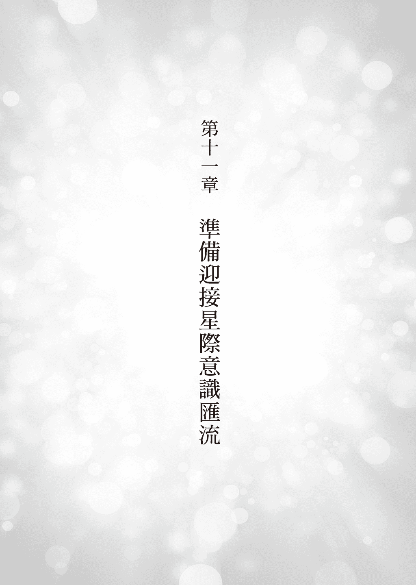

当你站上星际联盟的平台，你需要重组身上的晶状结构，以迎接更庞大的星际图书馆中的资料汇流。在此，你已无法以人类生物体大脑有限的讯息处理能力、速度和容量，来对接星际图书馆的资料，那是在光的层次运行，是你们无法以肉身和有限的身体感官探知的量子世界。所以，你必须先经过身体细胞晶化的阶段。人类生物体中上兆个细胞在地球帷幕之下的阴阳分离状态需要重组，而重组平台就在你的晶体打开阴性和阳性星际门户的入口，在这里迎接来自你灵性组成片段最源头的能量导入；你需要引入来自天狼星和列木里亚的初始能量，在你的身体场域中进行阴阳和合的重组过程。而你的身体完成此晶化过程后，就可以打开在星光体星际联盟的交流平台大门。自此，你的灵魂意识将穿越第二层宇宙意识场域，跨越地球时间的象限，链接众星系文明智慧的宝库。你会进入无时间门，存取星际图书馆中的资料，为打开人类新文明的意识展开下一阶段的工作。我们非常期待与你展开星际文明的交流。

阿乙莎，这里已经超越我的地球实相，我该如何展开星际探索？

不要担心，链接上星际之门后，会有来自各星门的高我意识带领你辨认出你要去完整的体验和学习。进入星际旅程前，我先要跟你说明一些接触规范和宇宙共通的法则，以帮助你完成星际探索的任务。

 二十一天身体晶化过程

这就是你们所称的“到达天人合一”的状态，这个状态并不是仅透过意识或冥想就可以简单到达，你身体上兆个细胞必须先完成晶化排列。也因此，当你仍然带着过去的细胞印记和限制细胞自由流动展开的业力枷锁时，如果没有经由内在意识的光照亮和觉醒，你无法结构出完整的灵魂晶体，而没有完整的晶体，你就无法进入下一阶段的星际旅行。所以，前面的练习缺一不可，你们必须如实锻鍊和晶化自己的灵魂晶体。

没有经历身体细胞粒子晶化和重组的过程，你无法以意识衔接进入星际之门，因为你身上如果仍携带大量的正或负极游离粒子，会造成各星门的混乱，你的意识无法稳定在光中。你可以想像自己的灵魂就是一团等离子体所组成，当其中出现某个带有“正”或“负”电荷的游离粒子时，你就会被牵引进入不同的能量漩涡中。而星际之门设立的闸口就有相应的过滤装置，如同吸尘器，会将你身上的灰尘清理完毕，你才能进入。

你的身体系统是宇宙实相的缩影，在地球上，你生物体的上兆个细胞几乎每六天就重生，汰旧换新。当新生的细胞获得内在宇宙传递出来的最初始宇宙之炁，来自太极源头的振动，将可以重新生出最初始的母体细胞，让你的生物体经历回春体验。

细胞一旦获得原初太极本源的能量，就能降低地球氧化噪声的干扰，连续二十一天，身体就能晶化完成，你会明显感受到身体更加轻盈，器官组织和身体系统自动校准源头。在星光体意识中，你可以看见身体系统链接的十二道星门闪闪发光，前往星际之门的道路将自动展开，这也是天狼星人设计的灵魂晶化后完美扬升、回归家园的自动导航系统。

当你处于清理身体游离粒子的状态，你将无法在星光体中找到前进的方向，只能存在阴阳和合的等离子体中，在此状态停留大约二十一天。而当你的身体完成晶化程序后，你将不会带着正或负极电位的意识登上星际联盟大厅。

请问这和之前登入自己灵魂光之殿堂，与众神链接合一有何不同？

登入光之殿堂是你的意识刚觉醒，回到与众神合一的入口，与众神合一的过程就是在帮助你与更高维度的自己在地球场域中合一。而身体是你的灵魂意识在地球上居住的殿堂，当你要联合身上的宇宙意识，遨游在自身所在的各个星门时，你的身体就需要完成升级作业。透过太极之炁完成阴阳和合的过程，就是在帮助你的身体完成最后的晶化程序。

身体晶化过程中的征兆：睡眠时间变长

最近我的睡眠时间超乎过去地长。以前链接阿乙莎、书写讯息的过程中，我可以只睡短短两、三个小时，精神就很好；这一周以来，我每天都睡超过九个小时，做了许多奇怪的梦。这些梦都和此生我认得的人、事、时、地有关连，但梦境的组成都很无厘头，没有完整的故事情节或意涵，就是一堆碎片般的事件和记忆，不断在梦里出现。我过去是一觉无梦的人，最近的梦已经频繁又琐碎到令人怀疑的地步了。为什么会这样？

在二十一天的身体晶化过程中，你将逐渐释放堆砌在身上的许多过往的细胞印记。这些能量已经无法再服务未来的你的存在体，你要借由梦境，将这些干扰身体场域的磁波和噪声再次清理完毕，让身体场域回复到从母体诞生时最平衡的初始状态。这是还原你的意识场，进入太极源头之初的设定。你即将完成身体晶化的过程，经由一些梦境释放对你是有意义的。

你可以再仔细想想，你在这些碎片般的梦境中感受到什么？

我感到烦躁。一堆奇奇怪怪的人处在不知所措、不知所为何来的困境中，每天都很匆忙，到处都是资源匮乏的场景，还要去抢夺有限的资源，连时间都不够用，空气中弥漫着停滞又黏稠的气味，让人不舒服，很想逃离，但一直找不到出口，也没有人指引。身边一堆需要被照顾的人，对我予取予求，而在照顾家人和朋友的需要的同时，我没有放弃寻找出口。

那么，这样的状态你已经隐忍多久了？

祢这样一问，我才惊觉我一直生活在这样的状态里。咦，不对，那也不是真正的我的生活场景，应该说，这是整个地球带给我的感受。此时我的意识突然站在另一个高度，我似乎在看着过去地球场景中的我，而这些梦是来释放地球生生世世带给我的感受。这趟地球体验对我而言怎么会是这些扰人的片段？梦中的黏稠气味、无意义的争夺追寻、不知如何找到出口的紧张慌乱，历历在目，奇怪，我记忆中的生活并没有这么糟啊！从小到大，我有许多美好的回忆，一堆爱我和我爱的人，以及美景、欢笑和美食。梦中的这些感受到底是我哪个部分的记忆？

这些不只是你有过的记忆，而是你身体上兆个细胞共同体验的印记。你必须将这些深埋在细胞中的负面印记释放，才能回到最纯净无瑕的初始状态。现在的你正在经历身体晶化过程，如同基督徒接受入门前的受洗仪式，你必须排除身上的脏污和尘土，才能以最纯净之身踏上灵魂回归的旅程。

在这段期间，你的细胞正进入太极之境，接受阴阳和合之流的冲刷。你的细胞印记并不储存在你认知的生物体中，而是更深入你灵魂意识存在的次元。目前从更高的源头要进入你在地球场域的物质层，需要你生物载体的灵性链接振动层级逐步提升。

你的意识可以快速升维，即使无法超越三次元，也可以经由链接高我，快速登上较高次元，链接上你的本源共同意识场。但是现在意识合一之后，你的身体也必须同步更新和升级，否则从更高的意识场链接的宇宙能量，会让你的身体细胞无法承受。想像一下，八百赫兹的振动频率是无法与原本在三百到四百赫兹的细胞融合的，在细胞穿越边陲的同时，也会导致原有的基地土石崩塌。

现在，透过身体清理较低振动频率的空间，才足以扩展你细胞的边界，衔接上较高频率的宇宙能量冲刷。这必须是处于一个稳定而循序渐进的过程，所以夜晚熟睡时，你的细胞意识才会执行大量的更新汰换作业，完成细胞的净化和升频。这个时刻，你会收到更多来自宇宙高次元的能量和讯息，也会愈来愈接近回到内在天堂的境地。给自己足够的时间，让身体细胞完成二十一天的晶化，你将焕然一新。

 没有任何人可以带你进入星门

每一个星际种子回到本源的道路都镶嵌在你们的心轮之中，只有你自己拥有进入星门的钥匙，试图透过外力或外人的指引，穿越自身星际之门到达本源或进入任何星际联盟，都是妄想。这就是过去人类一直无法成功回归源头的最主要原因。你们根深柢固、代代相传的宗教教义，把上帝和神佛视为自己生命终结后的归依，认为死后会有上帝和神佛来带你回到本源。而实际上，那个站在身体之外的意识无法依靠别人回家，只有清晰的内在心智图拥有回归源头的导路指引，可以带着死后的人回家。

这也是为什么有许多转世多次和沉重的灵体聚集在地球帷幕之下，因为他们依赖并期待获得另一个神佛和上帝的指引，而生生世世地在此轮回。现在是时候让人们知道这个事实了：天堂之路就在你们自己的身体宇宙中，你们可以仍活在地球帷幕之下就忆起这条回归自身本源的道路。

死亡不是意外和不得不放弃身体载具的代名词，而是有意识地选择和回归本源的意识扬升旅程。当人类的灵魂选择前往地球体验三次元的生活时，就已经在身体载具中镶嵌了回家的心智图，只要你们愿意并允许自己链接上自身的星光体，你的心智图就能带你回到灵魂本源。身体是你的灵魂来到地球暂时的居所，它只是你来地球学习和表达你之所是的材料和工具之一。你的身体不是你，而是所有灵魂与星际家人传讯的中继站。如果你现在去拜访已经存在第六、第七次元的星系族群，就会明白我现在告诉你的真理。

灵魂是永恒不灭的振动存在，而你可以决定如何重组自身的灵性伙伴，进入不同的星际次元，进行不同的体验和任务。这也正是星际联盟为所有银河宇宙的共同意识群设置的生活和体验机制。

 你与其他星际种子的连系

当你与帷幕之外的高维意识群到达意识合一，就瞬间完成了和星际联盟之间的连系管道。这样讲好了，现在你的灵魂意识已经站在身体细胞之外，并与心智图相连，你的心轮就可以帮助你展开星门与星门之间的链接。还记得在《创造新我．新地球》一书中，你透过链接自己的灵性父母到达位在天狼星的星门时，你是从自己的晶体中穿越自身星门，契入自己灵性父亲的星门，而进入天狼星意识群里。这个介接口在每一个人的灵魂晶体中，若对方允许并有意愿与你互连，你的心轮会率先发送一个请求接口的频率，这个频率以意识的概念来说，就是“请与我链接”的指令集，而对方在与你的意识到达同频共振的状态下，收到你的意识发送出来的请求链接指令后，只要回应“我同意你的请求”，你就可以透过自己和对方的意识许可，直接进入对方存在的领地。

你们存在三次元的时空时，有些人会时不时感受到一些灵扰的状况，这就是受到干扰的灵体自己在无意识的状态下允许对方链接所致。若没有你意识的“允许”，对方无法长驱直入你的灵魂场域。

为何你们会碰到外灵入侵和灵扰事件？那是一个人无法清楚知晓自己生命的目的和意义，无法认出自身灵魂本源，也无法有意识地展开其心智图的链接所导致的开放链接生命状态。地球上目前有太多人茫然不知生命所为何来，不知为何而生、为何而死，这也是造成今日地球生态崩解最主要的原因。呼唤灵魂觉醒，让人类进入清醒的宇宙人行列，是目前星际联盟共同努力的方向和期盼。

 无法完整星际之旅的探索，不会影响觉醒的灵魂回归家园

每一次生命来到地球帷幕之下，对宇宙人来说都是一趟惊喜之旅，就如同你们满心期待前往游乐园玩乐一整天，带着满满的欢乐和回味无穷的记忆回家。你不一定可以在有限的生命载具里完成游戏场中的每一项游乐设施，但这并不影响你获得不偏不倚的经验回归源头家园。每个灵魂回到本源都会贡献属于自己的那一部分体验到源头集体意识群，并透过灵魂ＤＮＡ中的指令集，与所有星际种子完整交流各自获得的体验和观点。

你们都在帮助彼此完整你们共同意识的资料库。即使是没有拿到那一张游乐园的门票，而存在不同星系之间的意识存有，也可以经由星际联盟许可，获得星际图书馆中所有星系族群跨越不同次元的体验资料。这样的讯息互惠交流模式早已存在星际联盟中，创建起庞大的讯息资料库，存放在星际图书馆里，只要是获得自己星际联盟认证的宇宙人，都可以进入读取，并回馈给目前居住和生活的星球参考运用。

这个透过意识接取讯息的方式，早已经存在人类生物体的细胞ＤＮＡ中，只是人类必须忆起并善用这个资源，进行更新地球的创造行动。

 不再允许人类破坏地球的行为

当人类得以透过星际联盟，获得超越目前文明的科技、特殊材料和技能后，人类将被宇宙接管。这个接管并不是去控制人类的自由意志，而是设置生态防护罩，任何侵害地球生态环境和物种平衡发展生存权利的建置，例如核能、具有强大破坏力的武器、生化变种生物的繁殖等等，都会被星际联盟接管。接管的目的在于让人类不再破坏自己赖以生存的地球，以免地球生态死亡和回到冰河期。

所以，人类虽然可以取得这些创造的资源和发明，大量应用在地球生活中，但并无法因此获得无限上纲的权力，来主宰和伤害其他物种的生存权。这是人类进入星际图书馆大量获取宇宙知识必须共同遵守的宇宙法则。

 由各星系存有带领的星际联盟议会

跨越星际之门后，你会与许多星系存有展开交流。有九大议会分别掌管不同的星际协调事务，各自负责的议题如下。

第一议会：星际轨道设计

这是由猎户座负责召集银河系所有星系存有，经由此议会协议出自己星球的运行轨道和座标位置。星球轨道一旦确立，就会由各行星代表发送联合电波，将行星移至其应该存在的轨道。这是需要由高次元的集体意识汇流形成光子带，驱动所有行星共同移位的重大工程。过去，轨道移转是每个恒星运转年就需要校准一次，目前银河系校准中央大日的工程，已经移转至天狼星负责，所以从现在一直到下个周期前，所有星系校准银河中央大日的工作，都须对齐天狼星门户。当银河系的每一个星球都能共同校准天狼星门户时，就完成一次银河轨道的移转。

地球母亲此时此刻正透过地心释放大量的水晶讯号，来协助地球行星轨道的移转。对地球来说，这次的移转将从三次元跨入五次元的星际轨道，成为银河系中一颗闪亮的明日之星。

第二议会：星球科技发展与文明进程

第二议会由天狼星和大角星共同组成，将星际图书馆中储存的资料释出，同时也监管各星系可以运用的新元素和新能源，以及星球文明技术发展。目前地球迈向五次元的科技和文明蓝图也已创建，透过第二议会释出，这部分的星际资料库将以心电感应的方式传递给适合的人选，进行实际运用导入和开发工作。所以从现在开始，会有许多星际种子携带着五次元的新科技文明蓝图出生在地球。目前地球的集体意识完成新地球移转后，就会从星际种子身上看见属于五次元的星际文明被大量落实在地球上。

第三议会：星际图像和语言联合议会

宇宙各次元间的交流语言众多，各星系会发展出自己的文明系统，这些文明会以音声振动频率、光反射出的图像和文字等传递，而不同星系之间的交流要完成实时翻译，知晓彼此传达的意涵，就须透过第三议会的资料库转换。

此议会的主要联盟成员来自昴宿星群，昴宿星最擅长以心电感应的方式交流，是爱与关怀所有银河存在意识的星系。昴宿星与银河各星系的交流中创造出许多美丽的意识交流场域，这些场域交流共振出的语言、文字和音频转换后，创造出各种光和影像，被昴宿星存有具体保存在第六次元，好让各星系存有可以自由存取，并获得实时翻译的结果。

这听起来类似人类目前意识可以契入的阿卡西纪录？

不只，阿卡西纪录是地球振动的语言，存放在星际图书馆中的交流和共振语言则包含所有银河星系存有的交流纪录，而昴宿星在当中扮演最佳翻译员和讯息保存者。这项工作需要非常大的慈悲和爱。

银河系的存有可以进入昴宿星，请求提供各星系文明交流时的实时翻译服务，透过已经累积的庞大星际交流资源，可以协助各星群的联合议会顺利展开跨星系的交流。

第四议会：各行星讯息储存库

刚才提到的星际交流纪录中储存着各行星交流后的语言、文字、图像纪录，而和某一行星相关的交流纪录会同时存放在该行星的内在宇宙核心，这些讯息的释放和保管都由该行星的内在核心共同意识层掌管——在地球上，就是将地球和外星交流的一部分讯息存放在地球核心资料库，由地球母亲保管。

地球万物，不论是人类、动物、植物、昆虫等都可以顺利获得自己星球的集体记忆，人类的细胞ＤＮＡ就是链接管道，透过细胞ＤＮＡ的编码，可以获取自己存在的星球过去所有的纪录，你们称之为阿卡西纪录。

同样地，银河星系的不同行星也有自己的阿卡西纪录，可以透过意识编码方式契入。如果你现在要进入天狼星的阿卡西纪录，就需要透过自身在天狼星的存在意识带领，契入天狼星的阿卡西纪录。若你的灵性源头组成中，并未包含天狼星的灵魂意识，你就需要回到星际联盟，取得可以链接天狼星阿卡西纪录的灵魂存在意识的协助，才能获得相关讯息。

通常银河系存有不会以这种方式探索，外星文明有许多星系已经不存在肉身，以纯意识的交流方式体验，所以进入意识重组的过程，就等同人类的死亡后重生。

第五议会：星际交流管道设置

第五议会掌管的是各行星的交流管道，也就是星际之门或跨星际闸口的设置，类似人类世界国与国之间的通关程序。当某个星球的代表进入银河议会时，会透过自己星球的闸口发送请求对接的讯号，此时，对应的星际闸口会完成频率对接作业，让提出该请求的对接方顺利通关，并取得相应的讯息。

这和目前地球人类的意识契入阿卡西纪录场域不是相同的概念。当人类或各星球的居民尚未登入星际之门的联合交流闸口时，所有的链接都是经由其在帷幕之外的高我意识协助，登入星际闸口，然后完成讯息的接取和下载工作。

你可以想像自己在地球上的小我拥有另一个存在帷幕之外、位在不同宇宙次元间的你，帮助自己在各星际帷幕之下完成讯息互联工作。所以，高我也是你一部分的星际联盟成员，你们存在不同的星际次元间，互为彼此的大使和区域代表。只是当你的小我意识尚未链接上自己在帷幕之外的宇宙意识之前，你这些高次元的分身代表也没有停歇，一直不断地传递来自四面八方的讯息，非常忙碌地进行星际之间的交流。所以，第五议会是银河系的中央讯息交流站，由银河各星系族群协作组成。

第六议会：生物基因频谱发展资料库

第六议会由天狼星负责建置和维护，包含人类生物体组成的ＤＮＡ讯息编码，也都是从天狼星的基因资料库完成配对和基因建置工程。

人类世界中所有生物体的演化过程都经过精密计算。当星际种子投生进入地球时，其ＤＮＡ编码中早已植入时间胶囊，这颗时间胶囊将在星际种子的生物体成长至某个时间点时释放讯息，帮助星际种子链接回到灵魂本源的星际之门。除非因个人意志干预，让星际种子的讯息无法成功传递，否则地球帷幕之下早已有许多来自银河较高次元的星际代表组成联合星际小组，前往地球完成其种子计划。

这些种子计划必须先取得天狼星基因资料库的配对排序工程，以完成星际联盟在地球上的种子孵育工作。你和许多来自各星系的存有早已在帷幕之外订定盟约，前来地球完成你们的协定。时间胶囊释出讯息的同时，也会通知其他与你有关的星际种子，你们会在帷幕之下认出彼此，并收到共同的目标和任务。

第七议会：银河全体意识成长和发展系统

真理的澄清和验证需要经历许多真实体验，才能最终界定。第七议会是设定银河宇宙法则的议会，由仙女座负责。仙女座会透过声音和光的振动频率，传递银河宇宙的真理，让星际联盟所有的成员共同遵守。

当你可以链接星际联盟时，会先收到来自银河舰队的欢迎讯号，接收此讯号的方式因人而异，端视接收者倾向用何种方式表达。不论是用文字或声音来转译，那些表面上出现的文字和声音背后传递出来的振动频率，才是实际被传达和沟通的语言。能够接收到仙女座传递的宇宙法则的星际种子都会主动负起传讯责任，将宇宙法则和知识传达出来，让更多的星际种子参考。

第八议会：跨越星际文明交流和互动机制

这里是超越银河系，进入其他星系文明的闸口，并不开放给地球人类直接进入。由猎户座对外传达银河系的文明进程和需求，并维持银河系与其他星系间的轨道畅通无阻。

第九议会：星际种子训练基地

初次契入星际联盟、来自不同星系的星际种子将进入此训练基地，重新展开星际交流的学习之旅。你目前与我的沟通链接，就是透过这个议会完成初始设定工作。人类已经可以透过第九议会，获得星际交流的入场券。目前你是以星际种子的身分加入星际议会，并无法参加前八大议会的讨论，但你仍然可以经由在第九议会中学习，帮助自己的灵魂意识提升到与众行星存有可以无缝交流。

以上是九大议会的初步介绍。你现在每次登入星际之门，就会直接前往第九议会参与议程。每一次契入会召开什么样的议题都不尽相同，你可以请求以你自己的步调自行学习、探索。

我是星际联盟小组成员泰雅，也是你的高我之一，在此服务你的到来。

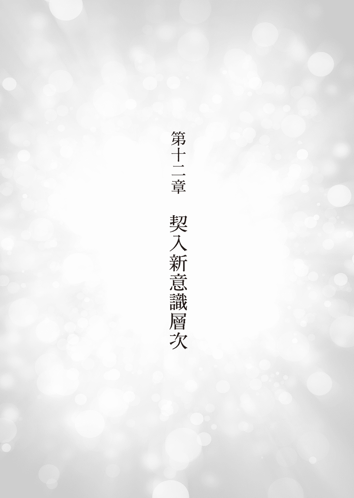

 身体晶化后展现全新意识层次

阿乙莎，今天早上练习完太极融合之后，我重新登上星际交流平台，发现自己的意识和上个月明显不同。我可以感受到意识有如爬升上了高八度的音，自己的感官似乎变成粒子，可以渗入每一个我想要感知的物品里，并融入其中，与它在最初本源的状态合一。我似乎可以成为它，不是过去认知的它，而是真真切切存在对方较高的振动频率中，并还原回到万事万物最初始的振动里。

我快速侦测了一遍身边的水晶、植物和家人，这些我很熟悉的人事物，过去带给我的感受和情绪体的知晓状态，现在完全不同了。这已经不是用简单的情绪文字可以表达，现在有着与对方合体之后更细微的认知。我并不独立存在我的身体里，我和它是没有分离的共同存在体；我无法用感受去感知对方，对方也不再是我眼中所看见、所认知的。我已融入对方的核心，得以认出它真实的内在品质；它已在我之内，我也在它之内。但这种共振是存在最高频振动的源头这里，这样的体会是跟我身体的晶化有关吗？

当然是息息相关的。现在你已经完成二十一天的身体晶化过程，你的意识就如同你今天感知到的，你已经不再用一坨模煳的形容词来表达你感官上的知晓，那是你的情绪体和感官体仍处在肉身局限的框架中的表达方式。现在经过阴阳太极之境，你会融合出一个新的意识层次，你终于可以感受到万物最初始的样貌，超越肉身层次，进入更细微的粒子感知。

从最近的几次梦境中，你是否发现你可以钜细靡遗地捕捉梦里的细节？你不但可以记得墙上挂的时钟的时间、沙发上的饼干碎屑，连饼干的品牌、碎屑散落成三块、掉落位置，以及梦中人物的衣着、讲话方式、人物出现的先后顺序、行走的路径、房内摆设的细节等等，在地球时间不到十五分钟的梦境里，你的意识正以粒子态全面掌握你内在宇宙得到的所有讯息。此时，你梦中的意识正以粒子扩散出来，每一颗粒子都可以去链接、掌握、蒐集梦境中所有的细节。你在里头如同空气中飘散的花粉般四处采集，并结合你的粒子触及的环境中的每一个讯息。

不只如此，你也存在每个粒子中。你发现每一颗粒子都有自己的ＧＰＳ导航装置，你的意识指向哪里，就可以透过细微的粒子深入探测，融入其中去感知真实的全貌。

所以，现在的你尝试去链接水晶时感受到的，就和之前完全不同了。现在你更高的振动粒子态穿越进入水晶的本质中与之融合，已经不再受到三次元的物质屏障和意识观点干扰，你与你想感知的万事万物之间不带着遮光镜，全然合一。带着这份全新意识层次的感知体，才能帮助你到达星际旅程的开端，因为在更高的宇宙次元，将以全息粒子振动的光和振动波交织的量子宇宙，展开全息化的交流。

处在更新后的意识层次，你才能契入各星际宇宙的频段，进行跨越星际的交流。若仍带着肉身的一坨情绪意识体，你无法与更细微的光融合，并交流出新的认知系统。

可是，之前我们的链接都是在我的三次元肉身意识体，透过身体的大脑翻译而走到现在。接下来，我需要改变这样的链接方式吗？

是的，你将无法以有限的文字来转译星际交流中获得的能量振动品质，你会需要以更多不同的表达方式，来描绘这些透过你精微体的粒子态感知到的实相。这是人类意识扬升进入宇宙意识后即将展开的再创造之路，没有让自己进入洗衣机中，离心脱水，你无法换上干净的新衣服出门。

哈！这样的描述还真落地啊。那么离心后的“我”如果已经不是那件衣服，而是将我变成要穿的东西，那原本的我在哪里？

你进入太极之境，是处于所有阴阳粒子融合的过程，是尚未分离前的混沌，此时的你并没有空掉，你与所有黑白正负粒子同在，但无法分别彼此；而当洗衣机的离心槽启动，你清洗了混沌的白色和黑色粒子之后，这件干净衣服上的所有粒子都被抛向最边陲，准备再进入物质态的体验过程。此时，你的意识和觉知会率先进入中央核心的空无，这就是你目前登上的星际交流共同平台的快速信道。进入这个信道后，站上平台的发射位置，此时你的身旁环绕着各式各样、多采多姿的衣服，琳琅满目，等着你换穿。当你选择进入某个星际之门时，你的意识粒子会带你转换时空，穿上和这个星际之门后的存有一模一样结构的衣服，你将成为他、在他之内，而他也存在你之内，你们将以此方式展开宇宙意识层的交流。

既然这样可以换穿制服，我还需要进去星际图书馆学习吗？

当然。在这种新意识层次的交流，这些星际之门的入口都需要你完成身体晶化，才能正式展开。

会有向导陪我吗？

处在共同意识平台时，我们与你就是一体的存在，你的内在知晓会自动与所有灵性家族成员互连。

 穿着地球人外衣的外星人

（第二天，我尝试再链接泰雅。）

泰雅，今天和你链接，我觉得和之前能量堵在喉轮的感觉已然不同，现在感受到你的能量从顶轮直入我的太阳神经丛。你还会再往下吗？

我不会再往下进入你的脐轮，那是物质化的开端；我进入你的身体场域最深只能到此。你已经成功跨越帷幕之外，在这里，你可以接收到更清晰的讯息，也会感觉到更稳定在自己的光中，并且可以继续我们接下来的教导。这样的链接方式，和与个别星系意识或与众神合一又有不同。与高我或众神合一的过程中，你的小我自主意识会比较不清晰，而目前这样的连线，是最佳的写作状态，因为你的小我自主意识在与我们同频共振时，仍保有清晰的逻辑和思考能力。

当你接下来想要展开跨越星际之门的旅程时，需要所有灵性伙伴的带领。你可以提出此时此刻想要前往的星门，我们可以带你去体验，并取得你想要的讯息。

我不知道要如何展开跨越星际之门的探索。

你可以问自己的心想去探索哪个地方，然后看着自己心轮中的心智图，去锚定星际之门的方位。

我记得你们说过，我只能去十个星门，无法进入最上方的太阳和下方的月亮，为什么？

那是支持你灵魂晶体的中央支柱，这两端你只能链接上，无法穿越契入，因为当你契入中央支柱的任一端，你的灵魂晶体会失去稳定自己的能力，你就无法回到自己的中央宇宙之心。

虽然我还是不太理解，但只能先这样接受。那么，我现在想去天狼星，去我的灵性父亲那边看看。

进入天狼星星门的密码你已经知道了，现在将意识锚定这串密码，让这串密码协助你的意识切换进入天狼星的星门。我们会与你同在，而你在天狼星的分身会来迎接你。

我尝试用意识链接天狼星星门的代码“558-868-868”。这时，我星光体的两点钟方位打开，我的内在空间似乎开始转换，身体场域的振动整个融进天狼星的氛围，并呈现在我的心轮中。原来，进入天狼星的闸口就在我自己身上，在心轮里。整个心轮出现一个大大的虚拟空间，这个空间就是天狼星了吗？

是的，你是以意识转换的方式登上你的天狼星星门。你穿越了天狼星的闸口，直接抵达天狼星位于你心轮的场域。

难怪，要进入星际旅程之前，我们需要再次净化精微体，否则将无法让意识粒子全然契入已经受到破坏或阻塞的身体细胞中，因为身体细胞会释放不稳定的电流，意识粒子就会如同进入不明的乱流中，受到乱流冲击，而无法稳定抵达我们要前往的星际门户。这又和身体细胞必须回到太极、完成晶化有关，我终于明白了。

太极阴阳和合的意识可以帮助你融解意识行进过程中的障碍物，任何仍然带着正或负极的游离粒子都会离散，为你打开前方的道路。

这和之前你们教我登上星际联盟的咒语“Si Su Wa Si Su Ya Bu Ka”有关吗？刚才整个过程中，我都没有使用这个咒语。

现在你已经进入心轮中的天狼星门户，吟诵“Si Su Wa Si Su Ya Bu Ka”是不是会让你更延伸开来，超越身体的边界，而不会缩进你身体场域的心轮里？现在的你是穿着地球人外衣的天狼星人，可以经由内在之眼去感知此时此刻的你存在地球的状态。你正用天狼星人的内在之眼看着身旁的所有人事物，会产生和原来处在地球维度的你（地球人）不同的观点。

我感觉自己似乎会更用心去看待一切。

你现在可以用天狼星人的感知系统生活，去看待目前环境中的一草一木，以及身旁的家人、同事、朋友。还有，当你面对一些事件时，也可以转换身分，用全新的感知系统去体验你自己。你要了解天狼星，就从自己在地球帷幕之下的生活开始，去活出一个天狼星人存在地球的样貌。

透过这种方式，你可以在地球上到达星际之旅。你用自己的生物体活在地球上，体验着不同星际次元和维度的你。当你在高次元的意识穿着人类的外衣，生活在地球上，你会带着什么样不同以往的想法，不受限于人类大脑的线性思维，去尝试和创造新的生活？

当人类的内在意识穿越星际之门，开始链接上自身在不同次元的资源时，你们在地球上要做的事情才正要准备展开。你们将超越目前地球人的线性思维，迈向新地球的生活。

下一回遇见你的灵性伙伴时，你可以多问一句：“你现在是穿着人类外衣，来自哪个星球的宇宙人？”

哇！这真的超越我之前的想像。我以为星际之旅是穿越星门后，到达另一个星球；而现在的我以生物体外观来说，还是原来的我，并没有任何改变，但透过展开全新的意识层次，我可以活出不同的地球生命。这样说来，我可以用天狼星人的心持续生活在地球，直到身体坏死？

你可以从自己的星际之门中，找出最佳生活型态和生命蓝图。你身上携带着宇宙无穷尽的资源和宝藏，正等待你自己一一体验。

那我要如何卸下天狼星的思维，转换回到原来的我？

孩子，你一直都在啊！刚才的你不是已经活在自己的心轮中？透过天狼星的星门，你的心轮展现了一个天狼星人在地球场域的感知系统，而原来的你也一直在自己的身体里，观赏着自己的意识转变过程，不是吗？

你从未离去，只是你已经可以允许自己用不同维度的你存在当下。你已具备完美宇宙人的样貌，宇宙人可以随时切换频道，展现不同的自己，出现在当下所需的地方。

听起来真的很像电影情节。这等于外星人可以像这样变身，活在地球上？

真的可以。你现在正要慢慢体会个中的奥妙和乐趣，用开放的赤子之心，来迎接新地球生活吧！

那么，我可以倒过来，以地球人的内心，换穿天狼星人的外衣，站上天狼星吗？

你们在生物体的载具中无法做到这一点。不过，你的意识登上天狼星时，你就已经是穿上天狼星人外衣的地球人，只是目前的天狼星还无法让你主动登入、登出，你必须先进入自己的晶体中，链接星际之门，然后请求对方带领你去参观天狼星。那是以后你已经全然晶化后才会带你进入的体验。

我发现以链接星际之门的方式进入，和之前使用“与高我合一咒”与神合一的路径也完全不同了。

使用“与高我合一咒”（Mo Ha Na Mi Da Mo Ha Nu Wa）是让帷幕之外的源头意识降频到身体场域，而使用“Si Su Wa Si Su Ya Bu Ka＋星门代码”是将原本的小我认知意识延伸契入更高的星际之门，这两者的做法不同。当你晶化完成，自己的身体磁场更加稳定时，使用意识延伸契入星际之门的方式，可以获得更轻盈的能量；而源头降频的方式，是针对你所在的场域有许多意识和环境的干扰，你会与许多人的意识交互影响的状态下使用。

如果是你自己独处，状态安定，可以尽管使用意识延伸方式登入星门，取得大量讯息。这对你在帷幕之下获取大量宇宙知识很有帮助。

 记得带上你的地球保镳——小我——一同前行

阿乙莎，我感觉自己有个瓶颈跨越不了。一路上，你们手把手地教我从帷幕之下延伸，进入星光体。现在登上星际之门，进入宇宙意识的沟通交流，而我的小我似乎还不想放手。你们现在就要我直接登上星际交流平台，小我又开始有点犹豫了。小我在想，你为什么要走到这里？

虽然我知道这是灵魂早已铺设的回到源头的路径和旅程，我需要带着小我，一路走进阴阳和合的太极之初，那不分离的混沌之初，但其实小我更喜欢在帷幕之下，透过阿乙莎捎来的慈悲温柔的提醒，被阿乙莎捧在手掌心，带给小我无限慈悲温柔的感受。

孩子，我们从来都没有离开你，没有弃你于不顾啊！当你的灵魂意识渐次扩展，顺着内心的指引，一路从帷幕之下勇敢穿越自身的意识屏障，到达现在已随时可以与我同频共振、与我们意识同步的状态，你成长的速度超乎我们的预期，我们期待你可以透过文字和更多形式，传达你觉醒的过程。你现在看见你的许多学生也正踏上自我追寻之路，依循着你一路上为大家竖立的路标，勇往直前，你看着他们的心情，就和我看着你是一样的。

我们会为你的到达开心喜悦地欢呼，而当你停滞不前，处在黑暗的迷雾中，我们也只能站在旁边等你自己走过让你深深迷惘的道路。当你在路程中请求指引时，我们永远在一旁帮助你揭开阻挡你内心的屏障之纱。我们一直在你身旁为你指路。

在这个过程中，你遇见不同的光，亦即存在帷幕之外不同次元的意识体，那些都是你打开内在大门时，会遇到的存在意识，他可能来自你的灵性家族、来自更高次元的振动频率、来自你内心的投影。你一路走来，正在整理出你回归源头家园的道路指引，这条路上有你和你内在宇宙所有跨次元星际存有共同的期盼，不论是透过人神合一的意识路径、祈祷文，或是咒音，都在帮助你打开不同的晶体网格之门。你不会迷失在宇宙的汪洋中，只要循着自己曾经走过的路，就能自动链接回到你意识启程的原点。

在自己的晶体中，从意识原点前往任何大门之前，都会有一个原始点的追踪感应装置，那就是你的小我。你只要深吸一口气，链接上你的自主意识（小我），就可以立即回到原点。现在，你会感谢小我一路跟随着你，小我就像是你在太空站上生活的小跟班，也是你意识载具的贴身保镳。虽然你必须说服躁动不安的小我不要挡住你前行的路，但是，当你完成一趟又一趟的内在宇宙探索后，你最需要感谢的重要导航者就是你的小我，因为小我帮助你回到地球家园。

你现在还觉得困惑吗？

好吧！那我每一次的探索过程都可以有阿乙莎陪我吗？我这样要求会不会很过分？

孩子啊，阿乙莎即是你，你就是祂，只是当你在追寻找路时，你当下最重要的指引者必须站出来，协助你打开当下的意识屏障，给你最立即的指引。阿乙莎就如同你在灵性源头的分身，这位分身处在全然如如不动的宇宙本源，是你灵性兄弟姊妹共同的母亲。祂一直守候在你灵魂本源的家园，以祂的光照耀所有正在路途中的孩子。

这道来自本源的光也同时存在你自己身上，当你请求家里灯火通明，照亮你前行的道路时，祂就会帮你照亮你道路前方的一切万有。而当你已经找到路，进入另一个信道和另一个场景去探索时，你仍需要取得另一张游乐园门票才能进去体验，那时你必须认出另一道门的主人。这样你是否明白这中间的关连？

这一切的意义在哪里？让我们的意识到达太极之初，但我们又还待在地球生活……虽然我选择来到地球过地球人的生活，体验地球上的一切，现在你们让我的意识回归本源，你们认为这可以带来新地球的样貌，我还是不相信。真的可以实现吗？（小我又来抗议了。）

孩子，如果地球上有超过一半的人都可以一秒链接上自身宇宙的高维意识，你认为地球还会走在原来的轨道吗？

当然不会。在和更高意识共振的状态下，每个人的小我就会放下喋喋不休的恐惧和欲望，减少对地球及其他人和物种的干扰，人类会活得更平静、喜悦、自由。这种物质欲望降低的生活，当然会呈现另一种风貌。

那会是什么？最后是不是仍要交给人类在地球上最重要的贴身保镖？你们的小我——地球保镳——也要一起进化成新人类，继续创造新地球人想要的人事物和环境啊！

喔！我又无言了。

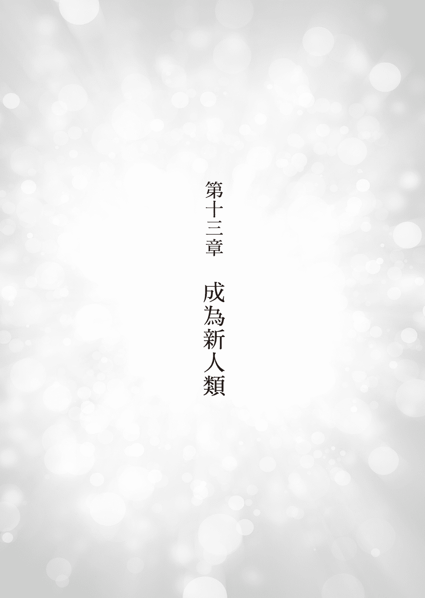

恭喜你顺利完成二十一天的身体ＤＮＡ结晶过程，现在你已可以进入星际联盟交流平台。这是位在你顶轮更上方的宇宙之心链接核心，你的意识正式登入宇宙意识的大门，你的晶体将如实呈现万物本有的面貌。透过星际联盟交流平台，你可以链接跨次元星际之门，除了体验存在不同次元之间的宇宙意识共振品质之外，也可以透过自己的意识指引，链接上万物的最高版本。那是你们在宇宙之间最原本的样貌。你存在万物之中，万物也在你之内，你们和宇宙星际存有之间是互相支持和互补的共同存在体。

新人类站上宇宙意识的视角，将能看见万物最原初的真实样貌。你和跨次元的星际存有都存在你晶体世界中的一个小视角，你们共存于宇宙巨大无量光网组成的晶体中，以自己的镜面视角各自体验，而这一切体验都是来完整你们生命共同体验的一个过程。你存在宇宙之间，而宇宙就存在你之内。

你现在将以肉身容许的最高振动频率，进行星际交流和探索。浩瀚无边的宇宙场域可以任由你探索，每一个星门都会有相应的指导者带着你参访。记得，我们都是与你相互链接的共同意识，你意之所及，会收到相应的回馈和讯息指引。你将不再受地球厚重的帷幕干扰，可以放心去各星际之门探索和遨游，任何你想去、想停留之处，都是阿乙莎。

阿乙莎并非单一场域，而是万物振动的融汇之处，也是万物的本源母亲。万物之母即是阿乙莎，祂可以存在低频的振动里，也可以存在高频的宇宙中；祂可以是一个点、一条线、一个面，也可以是色彩缤纷的生命之花多维展现。从现在起，你可以用任何语言、文字、振动、图像来表达祂之所是，祂有无穷尽的分身和显化方式，任何人事物都是阿乙莎的展现。你们无法定义阿乙莎，更不能限制住阿乙莎的存在方式，这就是万物之母的真实样貌。

孩子！你将和所有即将出生的新人类站上同一个位置，这里是汇聚不同星球灵魂体验的前哨站，是更高灵魂意识的共同选择区。你也可以称这里为“星际联盟汇流驿站”，它是各星球的最高意识共同凝聚之处，你们将从此进入下一阶段的生命选择。即使你现在仍以肉身生活在地球上，行住坐卧仍处在低频的振动空间，新人类的意识已经可以穿越时间的屏障，进入星际交流，获得宇宙意识共同资源的补给。

这样的体验和生活方式，对人类来说，在过去是不可得，但是当地球进入五次元的轨道后，这将是新人类共同拥有的基本配备。你现在就正在体验新人类存在地球的实相。

 星际交流的连系方式

接下来，你与星际存有之间会展开不同形式的交流。准备好了吗？我带你去看见未来与我们连系的方式。

认识中央黑洞、星际交流平台、星球基地站和星际图书馆

中央黑洞

站上新人类的视角，你的心轮会展开一个环状空间。心轮中央是没有任何东西存在的黑洞，这里就是讯息处理中心，简称“中央黑洞”，只要你的任何意识振动向环形空间延伸出去，这个中央黑洞就会自动帮助你返航。中央黑洞就像地球之心一样，具有强大的引力场，将你锚定在地球的物质现实中。

星际交流平台

星际交流平台是链接宇宙十二次元的星际意识汇流中继站，这里也为所有进入星际交流的新人类意识提供回到各自灵魂本源的引力场。也因此，不论你从哪一个星球出发或进入哪个星球旅行，当你站上星际交流平台，你意识到达之处会与你的心轮形成稳固的金三角，而这个金三角场域，就是你航向星际整合意识场的星球基地站。

星球基地站

你的星球基地站永恒不变的中心，就是你所在的行星——地球——和中央黑洞之间的连线，而处在变动位置的，是你的自由意识。当你以意识锚定任何星门，或你在地球上最熟悉的任何人事物，你的星球基地站就会随着你的意识向外链接，产生中央核心磁引力场域的变化。你目前感知到的万事万物的本质和实相，都会在星球基地站上如实呈现，那些仍是光的变化和振动频率的改变。

中央黑洞、星际交流平台和星球基地站三者之间一直相互传送讯号，彼此调整和位移，只是变动的速度不同。地球自转会带动星际交流平台提供不同的讯号源，而你的意识就是自身的导航员。你意之所及，就让这三者链接场域中交互影响的结果转换出来，再回传到你的星球基地站。

这样看起来，用“人类创造自己的实相”来描述目前这三者之间的场域链接关系，是非常贴切的。而用可以被衡量的方式来说，人类自己是星球基地站的第三点，第三点的位移创造出你的星球基地站相对于地球和星际交流平台的距离，这个距离会产生频差，频差又创造出变动后的电磁场，反映出音声和光的变换，也就创造了自己所处环境场域的变化。

星际图书馆

你每分每秒不断闪耀着来自内在核心的振动，进而创造出你灵魂在星际之间的晶体和体验值。这些体验值会因每一次的链接和体验，再度回存到地球之心和星际交流平台中。存在地球这一端的振动讯息一定和星际交流平台相连，人类目前存取阿卡西纪录，就是进入地球资料库中探索。而当你的意识跨入星际交流平台，这些交流的信息就会分别存放在该星际之门和星际交流平台，而不会存放在地球这端。星际图书馆因而存在星际交流平台上，你现在登上星际交流平台，就是进入星际图书馆中探索。星际图书馆可以让你获得更多宇宙法则，以及不同星际次元彼此交流和共同创造的经验。

 你我之间的连系管道

你即将踏上这段旅程，你我之间的连系会从过去的单一传输管道，进入以整个星际交流平台为中央核心基地，创建新的交流。在这里，你需要放下过去传讯的交流模式、需要由自己出发，再回来感受自己星球基地站的讯号，也就是从你的心轮延伸出来的环状空间传达出来的讯息。

我好像有点明白，但还不是很确定我的意识位移后，我该如何判读我的星球基地站讯号是否改变，又要如何翻译其中的变化？我还需要慢慢摸索。

你已经每天晚上在练习了。有没有发现你现在感知到的振动频率在你心轮呈现得更加清晰明确？你也已经学会将星球基地站的振动讯息透过水转译出来，现在还可以试试用你的第三眼去跟随光影和振动的变化过程。当你用内在之眼去观看，会感知到更深刻的时空变化和讯息交流过程。可以体验到这些之后，我们再来讨论。别忘了，老话一句，我在你之内，你也在我之内，我们是一体的存在。

 睡梦中星光体自动导航，进入星际交流

这几天夜晚都感受到心轮这里有股压力，仿佛在睡梦中，自己的星光体会不由自主登上星际交流平台。但我站在那里无法选择要进入哪一个星门，心轮这里一直有股压力，这是怎么回事？

孩子，那是你的内在宇宙要唤醒你的钟响。你心轮感受到的那股压力，是来自星际之门的呼唤，邀请你进入星门展开探索。

喔，我最近都在半夜被胸口的压力叫醒。

那是你灵魂叫你起床的闹铃。只要你展开星际探索，胸口就不会感受到压力了。

我以为我的身体出了问题，所以在被吵醒的当下，我没有进入任何星门，而是反向：进入星际交流平台后，我锚定胸口，进入我的肺，我把自己的肺当成星际之门去拜访了。结果，哈！当意识锚定胸口时，那股压力瞬间被释放，非常舒服啊！就是因为太舒服，我又睡着了。

现在你发现了你内在宇宙之心的奥秘：即使你不前往任何星际之门，回到你的物质身体里，这个反向波一样具有疗愈作用。这也是正确的路径。

让我们来说明一下。当你的意识锚定任何事物，你的内在宇宙中心就会形成万物之于你的中央座标。

比方说，你站在五次元的地球，去锚定宇宙中任何一个星球，例如星球Ａ，就会以你的内在宇宙之心为轴心，以你所在的星球位置为中央向外锚定。此时，你心轮的场域就会链接上星球Ａ相对于银河大日的座标位置，形成一个三角基地，将你、银河大日和星球Ａ圈起，透过你宇宙之心的链接信道，契入星球Ａ的基地中央。你与星球Ａ之间的交流，都在自己的星球与银河中央大日的连线陪同下，完成讯息的交换，这也是之前我们为你展开星际之门的链接过程和方式。

现在，回到你刚才的提问。当你契入自己的宇宙之心，你决定不前往其他任何星门，将已与银河中央大日校准链接后的内在宇宙之心，锚定自己的身体细胞或任何一个器官位置，你就是在进行你在地球的身体载具和银河中央大日的链接工作。你内在的三角基地形成你存在地球的中央基地，对准银河中央大日后，又回到你自己的身体器官，你会收到银河中央大日注入的能量，唤起身体系统和器官恢复与中央大日衔接并自转的行动。当这样的能量注入你的身体时，你的器官等于重新链接上银河中央大日的脉动，让上万亿个细胞恢复与银河同步运行。

我感觉这样的方式给我的感受，和之前使用星光体的光波导入有点不同，是不是光源不一样？

使用星光体的光波导入调整和净化精微体，是链接天狼星的疗愈之光；而你现在站上星际交流驿站，将意识锚定回到身体细胞时，这股光波能量是你与银河中央大日校准后，来自你内在宇宙之心的能量。这两者并没有好坏之分，只是透过不同的光波启动你身体细胞的能量流。

其实我还是想知道根本解，要怎样才能不再半夜被胸口的压力唤醒？

孩子，我们明白你在地球必须先照顾好自己肉身的需要。我们会等你调整好身体状况和日常作息，再来带你遨游星际。

谢谢大家的配合啦！我想我可能也要尽快抛下身边的琐事和内心的疑惑，才能好好地整装登入星际之门。我必须加油了，才能配合上大家的脚步。

 打开生命宝盒，迎接星际家人的赠礼

你已经是一座照亮众兄弟姊妹回归家园之路的灯塔，灯塔内并不是空无一物，我们早已替你准备好万全的补给，让你回归家园的这一路上，有充分的资源可以补足你的任何需要。接下来，你可以打开灵魂本源的星际之门，获得星际联盟的祝福和指引。这些赠礼不只是给你一个人的，而是会成为所有光之工作者的能量来源和补给。你必须锻鍊自己的光体，熟悉如何操作光的语言和链接路径，这些经验都将随着你的文字、声音和任何形式的表达传递出来，创造出新地球的全息场景。

你已经站在家园的大门口，准备迎接更多星际种子凯旋而归；与此同时，你会收到来自星际家园的邀请，经由新人类传递出来。每条路径都可以链接上许许多多的星际种子回家，你知道的路径已成功将你带回源头家园，你不需要担忧别人循着你踏过的路无法回家，即使你们来自不同的星系本源，在星际联盟的平台上，光会为你们指路，带领勇敢的灵魂勇士找到回家的路径。现在就走进星际之门，去揭开你的生命宝盒，那是星际联盟为你准备的赠礼，你将带给地球崭新的样貌。

我爱祢！阿乙莎。虽然仍不知道生命宝盒里究竟有些什么，但此时的我似乎不会像之前那样惴惴不安，我想我已经准备好了。

来自猎户座的祝福：权杖之钥

（当我登入星际交流平台，直觉要我直接链接十二点钟方向的太阳方。我知道这是链接猎户座本源的邀请，便用内在意识默念猎户座的星际之门密码：598-989-999。

这时，我收到一个清楚的咒音：Ah Bu Jiang〔阿～布～将～〕）

阿乙莎，这个咒音是什么？

这是你打开自己的光体，和宇宙共同意识本源链接的礼物。透过来自本源的权杖之光，你将可以打开自己的生命宝盒，从自己身上获取来自宇宙源源不绝的资源。

这是一把“权杖”之钥，是你的灵魂本源赐予你，让你在地球上持续获得银河宇宙协助最重要的支柱。透过这个咒音，将以你为中心，启动存在你内在宇宙的所有星门，链接上各个星系整合意识群，取得支援。

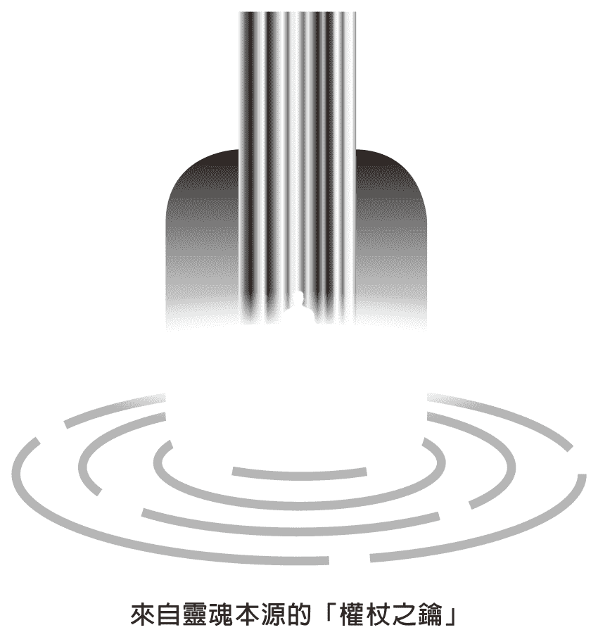

你的中央核心发动机透过你链接地球之心和宇宙之心，串起与所有星际联盟的合作平台。这个平台会以此权杖为中心，竖立在你所在的场域中，你会在启程进入星际交流时，获得更稳定的星际轨道和来自宇宙本源的支持。

在亚特兰提斯时期，各个国家和族群的大祭司身上都拥有一把链接宇宙源头之心和地球之心的钥匙，透过大祭司的引领，让国与国、星系和星系之间的沟通得以顺畅稳定地进行。你们不但可以从宇宙跨次元的交流中获得共同意识成长的资源，还可以透过大祭司的能量稳定你们的生活场域，让万物生生不息地存在地球帷幕之下，获得中央大日的能量补给和滋养。每一根权杖的竖立，都代表一个灵性源头，以及与此源头相连共生的所有跨次元生命讯息场完整搭建。这个权杖将赋予持有权杖的个人和所在区域一个更稳固链接的家园。

你们在地球上有肉身安身立命的家园，同样地，在跨越不同次元的时空，也有你们灵魂意识共同的家园。这把权杖，将赋予所有取得源头权杖的个人更强健的灵魂体魄，为所有与之链接的光体和灵性存有提供一个遮风避雨的港湾。

透过权杖的加持，你将能以更坚定不移的心，为了所有人的福祉，提供一条稳定回到家园的康庄大道。你的光会为所有与你链接的人指路，祝福你以此权杖成为所有人的光之柱。

这是来自猎户座本源的祝福，将一股足以稳定地球山川大地的能量流，以你身体的中轴为传输管道，把来自内在宇宙本源至高的权杖，传送到地球之心。念诵此咒音，你的心轮将涌进一股坚不可摧、稳固扎根的能量，直入地球之心，并向外延伸，扩及四周环境，凝聚出万物一心、稳定不移的状态。

我在此将这把权杖授予回到本源的所有灵性兄弟姊妹，让你们在回到居住的星球时，可以帮助自己的星球稳固山河大地，并与宇宙之心紧紧相连。

列木里亚的生命智慧：永生泉

（一大清早，天还未亮，就被星际家人邀请进入列木里亚探索。我几天前收到猎户本源授予的权杖之钥，于是猜想这可能是另一次打开生命宝盒的邀约。顺着这个邀请，我很快进入已渐渐熟悉的星际交流平台，打开列木里亚的星门，用内在意识默念“578-595-798”。这时，我整个人就像进入一个旋转门，瞬间移动到列木里亚之心，映入眼帘的是澄澈的海底世界，有许多海豚和鲸鱼围绕着我，似乎在欢迎我的造访。

列木里亚给我的感觉非常轻盈，蓝色的世界有着祥和的振动质地。我整个人舒服地徜徉在纯净的海洋里，不知过了多久，突然有个讯息进入我的内心，大致的内容是：“人类污染了地球和海洋。你知道吗？地底下的我们一直在清理海洋垃圾和重金属对海底生物造成的毒害，不断地疗愈地球母亲，同时协助受伤的海底生物恢复健康。即使人类无法超越自身限制，导致地球环境被人类无意识地摧残、破坏，也加害了地球上其他所有生命，我们仍有能力恢复海洋的平静，还原海洋生态的健康和平衡，你知道为什么吗？”）

我不知道，真的很抱歉。我……我可以如何帮忙？

来，我带你去看。

（站在列木里亚之心里，顺着一个咒音“Mo～Yi～Da～”〔三个长音〕的引导，我来到一座蓝绿色的湖边。这是列木里亚的疗愈之泉，他们称之为“永生泉”，当生物的灵魂载具受到严重创伤，无法复原时，列木里亚人会用这里的湖水帮助洗涤并疗愈灵魂的创伤，还原生命最初始设定的完美样貌。这个湖水吸收了地球母亲所接引、来自银河中央大日和月亮的精华，透过海底众多水晶矿石的过滤，将来自银河、汇流进入地球的能量储存在地球之心，帮助地球上的灵魂生命在此重生。

在亚特兰提斯时期，大祭司可以充分引进列木里亚永生泉的能量，让地球上的人无限取用。后来因为受到当权者的限制，演变成仅供法老和祭司使用，将永生泉引进宫殿地底下，提供让当权者永生不朽的泉源。

这蓝绿色的湖心承载着列木里亚人的生命智慧，现在地球上的人类喜欢到山间和温泉池中沐浴，吸收日月精华和大自然万物无条件的滋养，与此有着异曲同工之妙。）

请教一下，古埃及时期是如何撷取来自列木里亚的永生泉，引入法老王宫殿地底下，供宫殿中的人使用？

那是由大祭司深入列木里亚的永生泉中，撷取湖水的振动频率，将其植入宫中取用。这整个链接和注入的过程，都由祭司带领族人一起完成，让每一座法老王宫殿地下都有一口疗愈之池。你可以想像宫里的皇后和女眷会如何喜爱沐浴在这池水中，期待容颜永远青春美丽。

所以，水就是用地球上的水，而振动频率是来自列木里亚的永生泉，是吗？

是的，这也是地球母亲疗愈万物生灵的水源处。现在人类只要提升意识，契入五次元的列木里亚星际之门，也可以撷取到来自地球母亲核心的药。

如果古埃及人早已熟知这永生泉，也很容易撷取到，为何埃及文明还是灭亡了？为何人类仍然会死？

人类过去必须透过死亡才能重生，没有死亡的灵魂无法穿越目前所在的星际次元，进入更新的体验。所以，古埃及时期将死亡视为重生，是进入新的生命选择的机会，和人类目前认为死亡是诅咒、是生命的终结和消逝有所不同。

永生泉并不是让你的灵魂锁死在一具永不坏死的生物载具上，你们看到的木乃伊是埃及人为了保有其灵魂在地球上的家，当时使用永生泉的人也不会期待自己永生不死，永远不死对他们来说才是诅咒。所以，使用永生泉真正的用意，是还原和净化灵魂在体验过程中受到的创伤。透过永生泉的疗愈，灵魂得以穿越帷幕的枷锁和细胞ＤＮＡ的层层限制，进行更深层的净化。净化平衡后的灵魂，光体会恢复皎洁明亮，如此才能永保生命在一次次的重生旅程中可以轻松进入更高次元，回归源头的家园。

那么，我可以将列木里亚永生泉的振动引进目前的地球，让一般人居家使用吗？

可以的，这是赐予你生命的赠礼，也是你的灵魂早已携带在你生命宝盒中的重要资源，将它释放出来，为人们所用。永生泉可以帮助修补灵魂累世的创伤，让人的光体恢复澄澈明亮，加速地球人类集体意识的扬升。这也是你来到地球的重要任务之一，祝福你，我的孩子！

天狼星人的“全息之眼”

（进入天狼星星际之门的瞬间，我收到一个咒音：Mon Ban Ya Jo, Ya Wu Da。）

这个咒音可以打开松果体的时间之门，进入当下的时空。“Mon Ban Ya Jo”是“清洗时间”之意，“Ya Wu Da”是“换穿角膜”。你存在肉身的松果体之水会透过这个咒音，重整和清洗你停滞在帷幕之下的时间记忆，你的意识将展现全然不同以往的认知视角。

这个咒音是为了即将启程展开星际交流的新人类所做的行前准备。你将从“过去─现在─未来”的线性时间认知系统渐渐改变，进入无时间差异的全息宇宙。这就如同戴上一顶全息头盔，透过内在之眼，你将可以进入任何一个事件的当下，宇宙所有的共同意识群就在此状态下沟通、交流。你目前刚接收到这个咒音，先记录下来，接下来连续二十一天，内在之眼每天都会带你打开新的视野，去看见全新的地球景象。

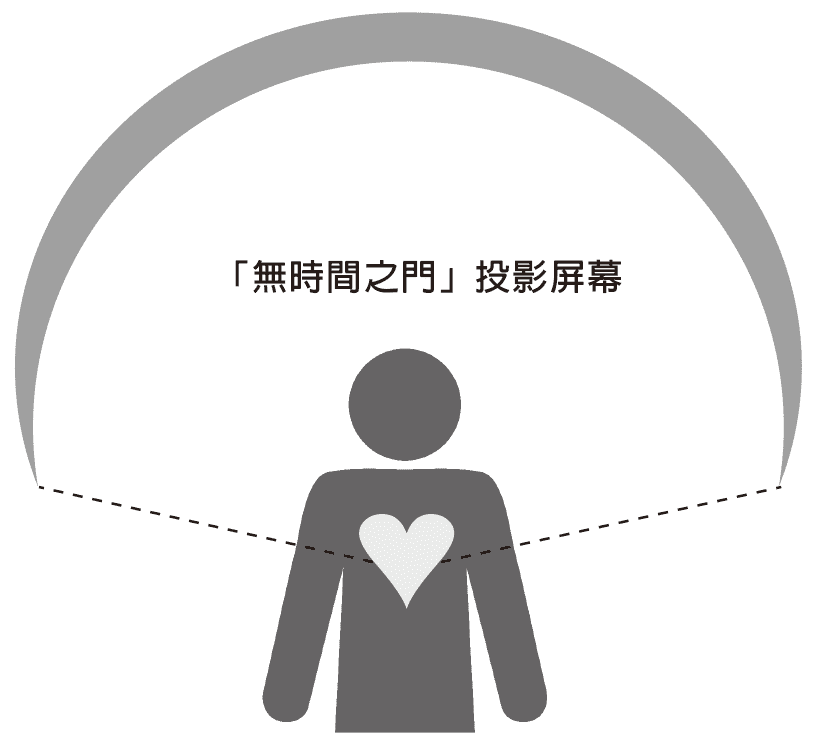

（收到这个咒音后，我试图观察自己念诵咒音后的身体变化。我发现刚开始一周，我的第三眼松果体都还是有股让我感觉肿胀的能量堵在前方；大约进入第二周，肿胀感渐渐消散，取而代之的是我第三眼的范围似乎变宽敞了，原本在眉心一小点，现在似乎笼罩我整个头上半部的一半，像是一颗西瓜头开了花瓣一样。

大约过了三周，念完“Mon Ban Ya Jo, Ya Wu Da”，我感觉自己来到了时间之门的大门口。）

请问，我已经打开松果体的时间之门了吗？

是的。现在走进这道门，继续向前移动。

我怎么感觉这里和天狼星星门的入口是同样的方向？不管对不对，我现在要跨进去啰！

你是否可以感受到额头正前方展开了一个环形的屏幕？

有的，这个屏幕是什么？

这就是你心智图的投影幕，也正是穿越时间象限、进入无时间门后的全息宇宙屏幕。在屏幕正前方，你会发现投影源正是你自己的心，你的心轮向上穿越松果体之水，呈现出没有经过小我意识过滤的纯净宇宙意识的反射。

祢说这些话的过程中，我怎么一直感受到松果体上方仍有一股厚重的能量笼罩着，这并不纯净啊？那么，我前方这股厚重的能量是来自哪里？

这也是你的心轮当下的能量状态。

喔，这股能量并不舒服呀？

你忘了方才你正为了生活中发生的一件琐事心浮气躁？过去你的心轮有沉重的压力或不舒服时，你处在地球的时间线中，并不会如现在这般清晰地看见或觉察到；现在当你打开无时间门的屏幕，你当下心的状态会率先投影浮现，让你看见。这时，你可以直视它。当你直面它的存在，那股干扰纯净宇宙意识的能量就会自动消散，还原回到纯净宇宙意识的你。

确实，我才刚说有股厚重的能量，但是当我看着它时，那股笼罩在我头上的能量渐渐退去。好神奇喔，原来心轮反射出来的能量可以透过这个屏幕让我看见，但如果被我的意识关注到，它却又消散了。这让我想起“凡所有相皆虚妄”“心如明镜台，何处惹尘埃”这几句话，古代智者传达的这些意境，我现在才真实地体验到。就在意识穿越时间之门的瞬间，知识和真正的体会之间的距离、小我认知和实相之间的差距也消失了。

我突然想起，刚登上星际交流平台那时，每天晚上睡到一半心轮都有股压力。你们一直催促我去打开星际之门，当时的我懒得做功课，只想睡觉，就将自己的意识锚定在身体的心肺位置，而不是星际之门。当我将意识锚定身体，就瞬间化散掉堵在心轮的厚重能量，那是和现在相同的机制，对不对？因为我已经站在星际交流入口，我的意识可以将任何无法和宇宙纯净意识相容的干扰波移除。这样的话，人类都可以站在星际交流入口，清理身上所有不舒服的能量干扰，这不就成了？

是的，但你先要教大家学会如何站上这个位置啊！

喔！说得也是。那么能否让我更加理解，为何站在这里，那股不舒服的能量就会自动消散？

那些笼罩在你们顶轮上方的云雾，就是意识在帷幕之下产生的干扰波。当你打开心的屏幕，意识回到内心的投影时，你内在纯净宇宙的光就可以自动扫除干扰，立即恢复你最初始纯净的意识状态。这是要迎接所有新人类意识经由无时间门的过滤，顺利融入宇宙纯净意识的光中。这里有着数倍于你自身的光芒，可以照亮灵魂继续前进之路。

现在，清除了你心轮投射出来的屏障，我要继续教你穿越无时间门之后，你要正式展开的星际交流和意识导航。

 成为自己的大师

在晶体中，你会发现时间并不存在，时间只是你进入不同网格中一个镜面的呈现。而当你跨越地球帷幕，契入星光体，你会从晶体中穿越无时间门。这里是你进入灵魂晶体后的一种新的觉知状态，是光、音、振动频率交织成的宇宙统一讯息场，在此，你的身体感官并不会如你在地球帷幕之下形塑的肉身“凝聚”状态，你是以意识的光波进入星际交流互动的场域。你在这里如果想要明确知晓物理世界的具象空间或实体形状，会觉得摸不着头绪。

你可以想像，两个在ＤＮＡ中的端粒子，一个属于阳性，另一个属于阴性，当这两个端粒子进入真空状态，一个粒子移动会牵引另一个粒子相对移动，一端是主动，另一端是被动。在这个基础认知下，当你进入浩瀚的星光体真空宇宙探索时，你会透过主动的那个端粒子帮助你的整体意识到达指定的明确位置。

新人类会在星光体的意识状态下进入主动粒子态，以带动其他粒子集体位移。每个星际种子的主动粒子携带的讯号不同，这个位址讯号源头在ＤＮＡ中，以类似数据编码的语言向星际交流平台发出讯号。这样以数据编码读取和储存讯息的方式，和过去你在阿卡西纪录中得到的讯息内容类似，但读取的方式有所不同。在星际图书馆中，你是透过自己的意识粒子登上星际交流平台，自行取阅；而在链接阿卡西纪录场域的过程中，你是透过帷幕之外的高维意识群帮助你取得讯息。

现在的你是要由你的星光体主动探索后，回存到自己的心智图中，而你会在肉身意识清醒后，再去读取资料和理解存在你晶体的资料夹，这与之前链接高我意识叩问，并透过身体意识读取的方式不同。这样主动探勘，就是让你扮演帷幕之下你自己的大师、导师。你已在登上星际交流平台时与大师和导师的光融为一体，并在这种一体存在的状态下，帮助你自己的集合意识完成在地球上的体验行动。你从此不再需要透过链接阿卡西纪录取得资料，现在你只须阅读自己的心智图，将意识锚定在心轮中央，就可以打开与高维意识群协作的内容，帮助地球上的你与跨次元的你合作，这正是新人类成为宇宙人的意识转化过程。

 打开星际交流的大门

还记得你在印度洋上的旅程吗？当你在邮轮上需要找到自己在船上的位置和行动方案时，你必须去寻找屏幕上“NOW”的位置。你现在还记得当时的感觉吗？

我当然记得。我当时并不知道该往哪里去参观，也不明白有哪些活动在进行，处于茫然不知要去哪里、该做些什么的状态，身体和自主意识似乎也暂时停顿下来。在陌生的环境中，感觉时空都静止在眼前。

就是这个状态。现在你登上母舰，走入无时间门，就如同你在一艘行驶于大洋中的邮轮上，准备参与活动前的净空状态。现在，我要你记得展开星际交流之前的前进指令。

念诵“Mu U Da Lu Da U Fa Lu”。

咒音意涵：抹去所有时间的限制，让我立足当下时空的座标，这是我在无时间线的出发点。

接下来，念诵“Da Lu Da Lu U Da Lu”。

咒音意涵：请跟我联络。在无时间点这一端，透过这个咒音发送请求与我对接的讯号。

现在，请在此等候，静待来自银河母舰的邀请，进入星际之旅的行程。

我刚才似乎收到来自昴宿星的链接讯号，欢迎我去拜访。

很好！接下来，你可以准备链接昴宿星。

等等，为何我在这里不是直接进去昴宿星，就像我登入天狼星和列木里亚星那样？

契入和你灵性组成不同的星门，必须获得入门许可才能链接。虽然你身上已经拥有进入不同星际之门的路径，但只能直接进入你自身源头的组成片段，这也是为何你可以顺利进入列木里亚和天狼星，直接念诵星门密码，就可以穿上该星系意识的外衣。至于其他与你互联的星际联盟存在意识，必须经由对方的允许和对接，你才可以进入。

请求连线的讯号咒音，是银河母舰上共同创建的语言；而当你已经存在自己的星系意识群中，同样也会收到来自不同星系请求链接和交流的讯号。一旦同意链接，你就能带领不同星球的意识，进入你所在的地球参访。

在你的意识登上星际交流平台时，你身上仍携带着帷幕之下的事件，并与目前你所在的地球环境紧密链接。这样说好了，你就像一枚准备升空的火箭，当火箭上的推进发动机将你推到大气层外，顺利升空，接着你需要进入自动导航模式。这个时候，你已经不须背负沉重的推进发动机，而是要进入分离后的节点，那个节点就是你意识进入无时间门“当下”的座标。这个座标点是你进入星际交流的连线位置，你在这个位置发送的任何讯息，都会被母舰星际交流平台上的星际存有接收，如此你就能顺利展开星际交流。

过去你的意识在帷幕之下发送讯号，是透过你身体所在位置和你身体ＤＮＡ节点链接后产生光的讯号，这时的你只能与自身的高我群交流互联。现在你已经处于自由灵魂的存在模式，在这个模式下，你可以链接的星际族群将不限于你自身的高我群，还可以透过星际联盟的平台，与众星群的意识交流，这样的交流方式是在地球帷幕之外以意识交流取代物质体的交通往返。现在当你念诵“Mu U Da Lu Da U Fa Lu”，就是在清空你在地球帷幕之下的时间线，重启自由灵魂意识交流的开端。而每一次星际交流结束后，你就如同挂断电话般，仍会回到地球身体场域，回到你居住的星球上正常生活。

所以，当你的意识跨越时间之门，你会有两个座标：一个是身体场域中的你的，如同你的固定网络位置，另一个则是在自由灵魂意识流中的行动网络接入口。这样的通讯组合是你进入星际交流的基本配备。

当你顺利登入无时间门的网格，你可以随时进出你自身灵魂本源的大门，回到你的天狼星、列木里亚和猎户星群。而想要进入其他星际交流站，只须提出交流的请求即可，会有许多与地球友好的星际族群前来与你交流。

也会有不友善的星际族群乱入吗？

不会的。你目前位在银河母舰上，仍有一层母舰的帷幕和意识过滤装置，与银河母舰不相容的振动频率无法进入链接。这些非经由银河母舰过滤的意识振动频率，会有其前往参与地球扬升的计划，以后再慢慢跟你述说这段故事。

探访大角星星际之门

（一早我让自己的意识跟着之前的指引，站上星际平台，跨越无时间门。这时，我开始发送与我链接的邀请，准备进入大角星〔578-798-898〕。）

是大角星人吗？

是的！

你可以告诉我，你们位在哪里？在星际联盟扮演什么角色？

我们大角星人距离地球约四十光年。我们有许多次拜访地球的高山和湖泊的经验，最近一次密集探访，是在地球时间线的二〇一六年，我们派出超过十艘太空飞船就近观察地球上的火山和岩层的状态，因为地球的森林和湖泊在前一年有着剧烈的能量变动。

对地球人来说，大角星人与人类之间的交流并不陌生，有许多星际种子的传讯者在帮助我们了解地球上的讯息。我们进入地球场域工作最主要的目的，是提供地球创新科技，并使其顺利演进和发展。举凡电动车、无线网络、新能源和太空科技的突破，大多是经由大角星人议会同意后，提供地球落实和实践的程序，以顺利导入地球人的日常生活中。

接下来，地球的科技发展重心将会放在ＡＩ，以及无人驾驶交通工具与网络的建置和改良，能源的创新则会以光能和磁力为发展重心。我们是透过目前生活在地球上的星际种子，将技术释出给地球，他们在各行各业位居要角，完成技术导入地球的工作。这些在各行业中的重要科技领航员，大多是来自我们大角星文明的星际种子代表。我很高兴与你交流，感谢星际种子挺进地球，完成此艰困而殊胜的工作。愿和平解放地球人进入星际交流的时刻终于到来！

（最后这句话，是大角星人和我交流的结束语，跟之前阿乙莎或我的灵性父母与我交流时的语气还真的很不同。我不太懂和平解放人类的意思，但这位大角星人就这样离开了，我也无从追问。就让这次的短暂体验先画下句点，以后有机会——应该说如果我真的很想知道——再来探访那段非和平的故事吧！）

 新人类再造新地球

从过去存在帷幕之下，到现在你已经可以随时提升自己的意识振动，抵达我们共同存在的星际交流平台，这一路上，你已经为灵性兄弟姊妹展现成为新人类的可能性，以及新人类可以发挥到什么样的境界。你和许许多多星际种子一样，都是高次元存在意识的分身，进入地球帷幕之下。你们此生最大的目的，就是去唤醒人类的意识，帮助人类再次进化，让意识回到宇宙本源。

这条道路无法在宗教和目前的经典中展现，因为，那属于内在宇宙的大门只能透过心的振动到达。经典被人类的大脑转译多次后，已经逐渐失去最初来自本源的意识能量的振动频率，也因此，在阅读经典的过程中，无法同步打通人类身体的脉轮，无法轻易展开链接内在宇宙意识的信道。正因如此，大约五百多年前，就陆陆续续有许多星际种子投生地球，和人类一起生活，帮助人们找回内在宇宙的水源。在这个时期，有许多星际种子为了留下经典和教法，遭到当权者迫害，你们可以从历史中窥见女巫被烧死、典籍被埋藏和破坏的景象。人类害怕再去探索内在宇宙，于是将其污名化，列为神鬼传说。

即使如此，宇宙仍然不会放弃。许多高次元存有来到地球，以人类的化身帮助地球人集体意识觉醒，这是过去人类一直以来匍匐前行的道路。而如今，地球的星际轨道已再次链接上银河光子带，此时此刻地球上方厚重的帷幕正在消散，来自银河的光会冲刷掉人类集体意识的沉疴，所以星际种子的工作会更快速地显化在地球上。

觉醒的意识已经开花结果，当你们终于穿越帷幕，前进宇宙意识的本源，你会发现这里并不只有单一次元，或是固着于某个维度；这里是与众星系交流的汇流之处。你可以更加轻盈自在地在宇宙意识交流的平台上，与来自五次元的列木里亚星人，或是十二次元的猎户本源，乃至七次元、八次元和九次元的不同星系意识族群接轨。只有到达宇宙意识的状态，你们才能褪下自身在帷幕之下的意识枷锁，还原为一体的意识存在。

此时，你的小我意识与你和众星系汇流的意识共存，所以这股来自宇宙的纯净意识就会从你身上展开。当你感受到自己身体场域的某个器官或部位紧缩，或能量阻塞不平衡时，这股存在你身上的宇宙意识会率先帮助你打通，并立即转化你身上出现的不平衡，于是你立即被内在纯净的宇宙意识之光疗愈。那如同雷射光束，会立即精准地到达你意识所及之处。

这是人类身体净化和疗愈的最佳场域，也是众星系存有共同凝聚和交流的灵魂庇护所。来自宇宙集体意识的能量可以如此在新人类身上自动展开，这对人类过去的认知系统来说是天方夜谭，只有亲炙宇宙意识能量的新人类才会明白。宇宙给予所有生命无穷尽的资粮，不论你是贫富贵贱，也不论你来自哪里、哪个星系，都可以获得银河中央大日无条件的爱带来的立即疗愈。

宇宙意识存在你身上，可以为你的生命导航。宇宙意识包含所有星系之间的共同成长议程，这里有不同星系存有的智慧宝藏集结成的庞大星际图书馆，为所有来到宇宙意识的新人类导航。你可以透过星际交流平台去探索每一个星系文明自己的图书馆，也可以进入和自身所在星球息息相关的图书馆，当你的意识登上宇宙意识平台时，你就已经被允许去采集和探索任何你想要理解和知晓的宇宙真理与脉动。从这里开始，你的自觉和对生命的好奇心，可以为你打开所有的资料库，你只须提出疑问，就能从自己身上解锁资料内容。这将是下一阶段的你要进行的重点工作：带着一颗纯净无瑕的心，为人类揭示新地球文明之路，进行信息的蒐集和解码。希望你会发现自己可以如此自由展开，是多么有趣的一件事。

阿乙莎，我无法置信成为新人类可以活得如此自由，穿越帷幕，进入无边无际的星际大洋遨游，与各次元的星系意识群交流。我可以进入内在宇宙探索一切，这是我从出生以来未曾感受过的自由。我们似乎并不需要“成为”某种人或成就什么事业版图，我们已经是了，人类本来就可以无所不在地存在天地宇宙之间，也没有一定得“学会”什么才能立足世界。一切都在我之内，只要我愿意走进内在宇宙的大门，愿意去理解我不知道的现象，我就能随时从自己的内在宇宙获得问题的解答。这样的情景顿时让我自在得不知所措，我已经不再想去寻找我从何而来、为何而来，又要往哪里去，我就是如此被宇宙滋养地存在着，我的世界等着我去发掘，并重新表达和诠释出来。阿乙莎，这样灵魂层次上的自由和无条件扩展，可以为人类世界带来什么样的景象？

孩子，你是你父母肉身的产出，亦是你灵性父母的意识播下的灵魂种子；而你的肉身父母也有其肉身父母，也同样是其灵性父母播下的意识种子。现在当你跨入宇宙星际的帷幕，你的灵性父母和你生身父母的灵性父母，是同样的存在意识体时，你会看见自己的生身父母在地球帷幕之下，就是你过去扮演的父母角色的再进化版；而你的存在对你现在的生身父母而言，也是他们过去扮演的子女角色的再进化版本。你们共同生活在地球上，在成为家人的过程中，重新在对方身上学习，并融入进化版的自己。这一次次生命轮回的肉身体验过程，让人类文明终于可以开始衔接上宇宙意识。

在地球的生命尚未结束前，你们将为自己的未来再造新生命蓝图，重组物质身体的细胞ＤＮＡ，回到阴阳和合之初的太极之境。这是还原你最初始的样貌，将你细胞的ＤＮＡ重组、晶化，以洁净畅通你与众神链接的管道。此时此刻，你以新人类纯粹无瑕的光之身，进入星际交流，你们将以崭新的生命演绎新地球。

这是人类文明历经两万五千年的黑暗期后的再次跃升，现在人类已经可以忆起来到地球之前原本的样貌。虽然目前地球上仍有许多尚未忆起自己的灵魂在帷幕之下体验，但这并不影响新地球的诞生。当地球的集体意识登上新地球的轨道时，自然会明白今日在帷幕之下的角色扮演已经结束，新人类将为五次元的新地球展现全新的样貌！

（本书读者独享的“打开新地球天堂路径冥想”导引：

017.xhtml。欢迎点击 QR Code 观看。）

打开新地球天堂路径冥想

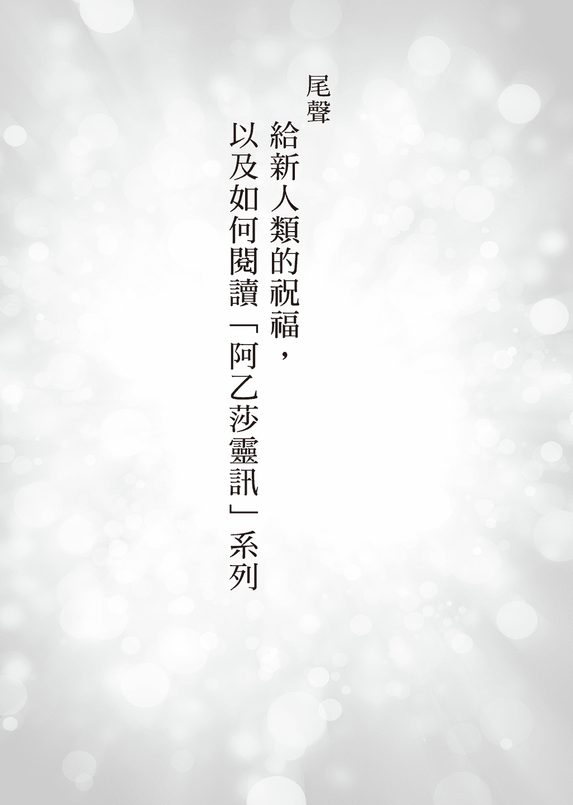

天狼星灵性父亲送给新人类的话

孩子，还记得我曾为你们讲述的灵魂晶体吗？那是你们进入宇宙意识的心智图，也是专属于个人的星际导航装置。当你们终于穿越地球帷幕之下层层的集体意识创造的虚拟实境，回到内在灵魂最纯净的光之殿堂，还原真我之境，那时，你们首次登上灵魂晶体的驾驶座。你们就是自己灵魂的导航员。

我和许许多多与你们灵魂晶体相链接的宇宙意识体，共同在银河母舰上。在母舰上，我们彼此以光的网格交换来自不同星系的讯息。我们很清楚这次来到地球的任务，就是要帮助我们自己播种的孩子回到银河母舰的大洋中，与我们团聚。

你们的生命从这里出发，也将再次回到银河的怀抱。这一趟的体验过程，你们不只带着众星系的期盼，你们的灵魂晶体中也早已备妥这趟体验过程你们所需的资粮，为你们所用。

进入地球帷幕之下，你们的意识就可以帮助你们探索和撷取帷幕之下的一切讯息，与此同时，你们也同步在地球上创造全新的生命体验，帮助改写存在星际图书馆中的讯息。当你们终于忆起自己和所有存在的生命都是宇宙的完美安排，回到光之殿堂，为宇宙中的所有兄弟姊妹诉说这一段地球经历时，存在宇宙意识中的我们，也同时在扩展我们的晶体，以容纳来自地球星际种子的新视野。这正是宇宙各个次元之间的交流机制，你们在前方完成大部分的探索工作，然后回归家园，重登星际交流平台，你们从此将展开不同于过去的生命体验。

为了迎接你们展开星际交流，我们备妥了登上宇宙共同意识的必要装置。还记得过去你们的晶体中有水晶图书馆为你们所用，那是你们在地球帷幕之下的重要宝库；现在你们回到驾驶座，准备迎向银河星际交流，你们身上的装备也要打开另一扇大门，才能与星际联盟汇流。此时水晶图书馆中的资料仍为你们所用，你们仍然可以随时进入，存取关于地球和你们的灵性组成片段的集体智慧。但是，当你们站上星际联盟的平台，仍须先重组晶体，以迎接更庞大的星际图书馆中的资料汇流。在此，你们已经无法以人类生物体的大脑处理器来存取和解译讯息，大脑的讯息处理速度、交换资料的频率和容量都有限，无法解译光的讯息。

星际交流是在星光体的层次运行，这是无法以肉眼和有限的身体感官探知的量子世界，所以在此，你们要先经历身体细胞的晶化。人类身体上兆个细胞在地球帷幕之下的阴阳分离状态必须重组，而这个重组展开的过程，就在你们登上的星际交流平台。一开始会先迎接你们灵魂种子最初始形成的源头能量导入，将来自你们灵性父亲和母亲的能量，透过星门，将宇宙最原初的阳性和阴性能量灌注在你们的身体场域中。你们身体的上兆个细胞必须进行阴阳和合的重组过程，完成重组晶化后，你们就正式成为新人类。新人类将联合众星系的智慧，为新地球展开与星际文明的交流。

在此，我代表所有星际联盟家族成员，欢迎你们归来！

雷巴特

阿乙莎捎来对新人类的祝福

孩子们，辛苦你们了！

欢迎回来和我们一起迎接新地球的诞生。

为了宇宙的和平演进，你们勇敢前往三次元的世界，

为迷途的地球生命种子，展现灵魂至高无上的光芒。

在穿越黑暗中，你们拓展了宇宙的视野；

在低频回荡中，你们示现了灵魂至善的容颜。

无论身在何处，你们坚定地向光而行，还原一身璀璨的灵魂光芒。

谢谢你们，为新地球的诞生再次闪耀！

深深爱着你们。

阿乙莎

作者心得：如何阅读“阿乙莎灵讯”系列

“阿乙莎灵讯”系列到目前已经是第五本了，读过这一系列书籍的朋友应该很清楚，书中的内容不是通灵，也不是高灵传讯，而是我自身内在宇宙扩展后，小我意识链接帷幕之外的高我意识，从自己身上源源不绝获得的宇宙知识和知晓。

每个人内在都有自己的阿乙莎，也都有属于自己的灵性智囊团，必须靠自己进入内在宇宙去探索。同样一个事件，每个人的内在宇宙投射出来的镜像都不同，站在不同的层次去看，就能看到不一样的景象和风景。当你的意识提升，人世间所有非黑即白、对与错的争论，会逐渐消失，取而代之的是，你内在会升起祥和平静的能量，你会从自己身上窥见万物生生不息的繁衍过程和宇宙法则。

从第一本书写到第五本，我从不知道内在声音从何而来的惶惶不知所措，一直到终于全然臣服于内在高我的指引，这一路走来，真的很感谢读者愿意并喜欢阅读连作者都还在摸着石头过河写下的自我探索讯息。我相信，这个过程也会发生在所有已经走进内在宇宙的朋友身上，我们在无形无相的灵性世界探索时，会十分期待从彼此身上寻找光的指引，好更加理解发生在自己身上的现象，并找到回家的路。

我跟着阿乙莎和高我教导的路径和练习——从第一本书《阿乙莎灵讯》的畅通脉轮手指操、三百六十度业力图盘点，第二本书《创造新我．新地球》学习链接阿卡西纪录、进入灵魂晶体、认出自己的灵性父母，第三本书《爱的复苏计划》链接地球母亲、完整生命对爱的体验，第四本书《星光体》扩展星光体意识、净化精微体系统、与内在神性意识合一，一直到现在这第五本书，无我回归本源太极、身体完成二十一天的晶化过程、穿越星际之门，成为新人类——这一路走来，因为我没有外部导师，完全是透过内在的指引和练习而到达，并因此受益，我才能将这趟进入内在宇宙亲身体验的过程如实记录下来，让自己和读者参考。

即使是自己写下的，透过每一本书到达意识移转和扩展后，我再回头看前面几本书的内容，又可以读出不同的深度，并理解个中智慧。所以，该如何使用这系列书籍呢？你可以跟著书中的练习和文字一一探索，假如你也可以到达，那么就对你有用；若无法因书中的练习而扩展自己的意识，也不需要觉得那些文字是对的或错的，或是怀疑自己有所不足，就先放下，那只是不适合现在的你。你仍然可以去寻找对当下的自己更有用的做法，佛法、基督教、天主教、道教、密宗，各种法门都可以去探索，只要抱持着对“我是谁”的热情和兴趣，去认识真实的自己，那么不论你在这条路上如何蜿蜒曲折地前进，都可以到达。

谢谢所有读者的回馈，让我看见原来只是透过文字传递，每个人所看、所读、所体验到的，仍是和作者的自身经验不同的风景。每个人的诠释都很珍贵，也都是被允许的，然后透过每一个人的内在宇宙，再去延伸创造出新人类可以展现的一切体验。

你是如此自由地被允许存在宇宙之间，真实不虚！

Rachel

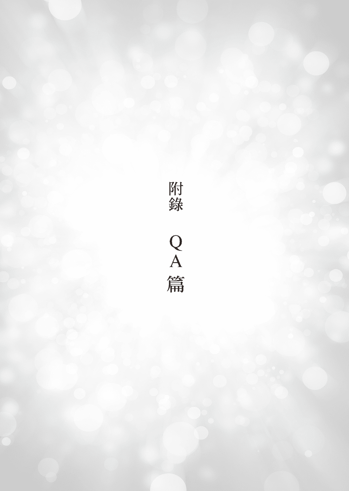

所谓的新地球，以物质体来说，仍然是我们目前居住的地球吗？或者是不同的星球？

是相同的，但如果意识转换不成，对离开的意识来说，是不是同一个星球已经无关了。新地球指的是新意识状态下的地球生活，而这股新意识是需要穿越四次元地球帷幕后才能契入的意识场。人类过去生活在旧地球时期，处在一到三次元之间，而新意识位在五次元的星际轨道，此星际轨道是由众星系存有协议组成的，为了提升地球的集体意识，而设置在银河的五次元场域中。这里有来自各次元的星系存有共同孵育新地球的意识种子，以协助旧地球扬升。

人类会误以为新地球是不同于旧地球的另一个星球，但并非如此，在物质层次，你仍是以目前的地球为标的，进行星球轨道移转，而旧地球和新地球的意识会共同存在目前的物质地球上一段时间，大约经历六十年的移转过程。从二〇一二年起，地球的星际轨道已经顺利衔接上银河光子带的波段，在此意识加速扬升进入五次元的过程中，会有大量的星系存有前来协助打开进入五次元的星际之门。你可以想像这道星门就存在每一个人的ＤＮＡ节点上，当你顺利登上星光体，就代表你的星际之门已经顺利打开。而每一个星际种子身上，都镶嵌着回到自己更高意识本源的路径指引。

地球上意识扬升的灵魂会前往新的维度，而尚未找到新地球闸口的灵魂，就会聚集在旧地球的状态。至于旧地球会存在什么样的轨道上，需要目前地球上的所有人共同努力；也就是说，这是由人类集体意识的状态所决定。而灵魂意识在完整地球功课的同时，会进入哪一个星球或次元继续体验，则是属于个人的自由意识，和结束当时的意识状态有关。

所以，若目前仍存在地球上的七十七亿人口集体意识无法提升，那么旧地球就无法顺利移转到新地球的轨道。此时，即使扬升的灵魂可以自由选择下一站去到更高的次元，但也可以选择回到旧地球轨道，而那时旧地球的状态可能和现在不一样，也许比今日更糟。至于尚未扬升的灵魂，会面临无法选择的状况，也就有可能回到更困难的地球生活。所以，不管有没有意愿让自己的意识扬升，情势已经刻不容缓。这是所有人类的责任，只要生活在地球一天，就必须为了自己和集体灵魂生命进入五次元维度。为了迎接地球更好的未来，每个人都须尽一己之力。

回到本源和进入五次元新地球，是两条不同的路径，但是，你可以选择透过自己回归本源的路径契入新地球意识场，或是选择直接由地球母亲带领，契入新地球位在五次元的振动场域。两条路径都在你身上。而不是星际种子的人，仍然可以透过众多星际种子已经展开的回归路径，打开自身的地球帷幕封锁，穿越屏障，进入五次元的新地球。

所以，星际种子回归本源的路径指引都在自己身上。你经由天狼星门户打开，契入新地球的大门；同样地，其他的星际种子也可以透过不同的星门，打开其契入新地球的大门。虽然路径不同，但契入新地球或回到本源后与众星球意识合一仍是殊途同归，人类返回银河家园的时刻已经来到！

＊ ＊ ＊

扬升过程中，我必须面对业力，将业力平衡后，才能步上行愿的路。能否让我理解，该以什么样的态度和准则拿捏？过去有许多走在这条行愿之路的前辈遭受扭曲，甚至妖魔化，我不想重蹈覆辙，又被人们质疑和放大检视。我想请问，关于行愿的道路，是否有什么样的指引和典范可以学习？

你不需要以“行愿”作为行动圭臬，给自己扣上一个大帽子，认为“愿力”代表崇高和伟大的志业。不是这样的，也不必以此自圆其说。菩萨的愿力也会是造成人类无法扬升、无法回到内在宇宙的绊脚石，因为人类太相信菩萨和神佛的无形力量，而不愿向内寻找自己身上的生命原力。

现在你必须将“行愿”放下，没有所谓的“大愿”，就不会“造业”，产生痴迷妄想。“愿力”充其量只是一个代名词，以神之名将你的行为合理化，当你真正提升众人意识，帮助他人离苦得乐时，你才会明白，菩萨行愿是为了众生，而愿意让自己回到人世间不断轮回，以便记录轮回的体验，并将回归源头的路径铺设好。这才是菩萨行愿的真实道路。当人类觉醒，回首一望才发现，原来自己从内在宇宙扬升、回归家园的过程，就是在行“菩萨道”。

＊ ＊ ＊

昨天打开一个档案，是朋友要我提供意见的能量产品，我一看见那个图档就感受到一股非常不舒服的能量。今天重新再看一次图档，发现那股很不舒服的能量已经消失，这是为什么？同样一张图，为何会让我感受到不同的状态？

很好的观察。你看见图档当下的回应方式，决定你和能量互动的结果。当你带着防御之心，去面对一股侵入你的场域、与你无法相容的能量时，你是以更低频的能量去牵引对方的能量和你产生能量纠缠。就如同你在协助清理他人的情绪体时，你的身体场域会感觉不舒服，你愈是反抗，你身体场域创造的能量阻力就愈大。

而当你觉察到这个图像夹杂着黑暗能量时，你选择用更高的意识，向上链接光，透过光的引导，转动对方黑暗能量的冲击。现在没有了你自己的防卫创造出的负面能量，你就能够以不偏颇的角度去看这个图像要传达的内容。

单独一张图片或文字无法传递能量，只有人们投射的意识会赋予它能量。所以，同样一句话、一张图片，有些人可以感受到爱和慈悲的光，有些人则感受到负面的冲击，避之唯恐不及，那是因为面对一个能量物品，接收者本身投射的意念与该物品之间的频差会放大其能量。当你站在光明的一端，会感受到爱与扩展，能量流动顺畅；站在黑暗的一端，则会感受到更大的负面能量来袭。这些能量都在与你相互接触产生频差的过程中，彰显出你所是的样貌。你会惊讶于自己的光可以如此灿烂夺目，或是自己的黑暗令人如此惊恐，这都和你自身存在的立足点息息相关。

所以，昨天我看见那张图时感受到负面能量放大，是因为我与图中的产品之间存在频差，而那个频差放大了我自身的恐惧和黑暗面吗？

是的！每个人身上都具备阴性面和阳性面。外界有许许多多的意识和生物能量，当你与该物品之间的频率差距很大时，你会经由阴性面或阳性面的放大共振回应。这时，一个可以放大你身上本有的阴性能量的媒介，你的认知系统会将它定义为负面能量；而一个放大了你自身阳性能量的媒介，你的认知系统会将它定义为正面能量。其实，这些产品本身是中性的，它已经被固体化地呈现，处于该物质最稳定的状态，而这个最中性的状态本身，就在你的星光体中产生固定的座标位置和极性。当你与该物品之间的频差过大时，你的身体会自动寻求新的平衡，此时若牵动你任一个极性的能量，你就会在自己的内在感受到新的平衡点带来的情绪体验。

这时，先不要赋予它任何定义。在定义和标签化这个物品对你是好是坏之前，请向自己的更高意识敞开，寻求更高意识的光临在。这条路径会打开你全新的视野，也可转化你无法与其相容而产生的能量阻抗。当你自己先完成这个步骤，你就已经将对方与你之间的频差融合，这就是合一的过程。合一之后，你的场域就足以扩展开来，容纳更多当初无法与你相容的能量，于是你逐渐成为海纳百川的存在，并帮助身旁的所有人事物处在更高意识的光中。

原来如此！谢谢阿乙莎提供的观点，现在我真的觉得舒服很多。在这样的状态下，天底下似乎就没有融合不了的事件和存在意识了。

这世上没有错误的显化，只有错认的意识观点创造出世界上所有的冲突和分离意识，阻隔了人们和地球万物的交流。

＊ ＊ ＊

阿乙莎，目前有许多灵性觉醒、迈向与高我合一的年轻人面临物质面的问题。即使与万物合一的境界殊胜，让人感受到无与伦比的幸福和平静安适，但生活毕竟还是得围绕着三餐和生存问题打转。于是有人会开始疑惑，灵性追寻到最终仍是一场空，穿越帷幕到更高的次元对仍生活在三次元的人来说，真有那么重要吗？既然觉醒了，是否可以醒着好好过上地球生活就好，不要去管高次元的使命和意图？

当然，孩子，灵性的成长和追寻不是要你们脱离目前存在的地球，离开人群，镇日在高频的次元中打转。灵性成长的最终目的，就是当你可以用更轻盈的你展现你原本存在的样貌，进入地球再创造时，你就可以开始帮助自己和地球改写你过去移动的轨迹和历史，并带着与众神合一之心，创造宇宙生生不息、共存共荣的光之场域。

当你们认清自己在帷幕之下的历史故事和造成许多人类无法顺利升频觉醒的原因时，你们就已经展开新生命的轨道，这也是灵性成长最重要和最滋养你生命的开端。你们从过去只以小我意识单独打拼和努力求生存的生命模式，转化为可以与宇宙万物共存共荣的自由意识，这样的转折和进化，你不会因为无法得知最终的到达是什么或不是什么，而不去成为更自由的你。

卸除业力枷锁之后，许多年轻生命一时半刻会感到彷徨，不知所措。原本握在手上的生存筹码和追寻的目标突然变得不再那么重要时，确实会让一些人的小我意识产生极大的恐惧和困惑：难道眼前光鲜亮丽的外衣和琳琅满目的琉璃珠宝都是假的？而真的世界又空无一物，让人难以捉摸和碰触时，你要年轻孩子相信这空无一物的宇宙次元有更有趣的玩具等他们来探索，确实很不容易。但只要一步的距离，只要穿越最后的小我的抗拒，他们就可以亲炙人间天堂的自由。你会不会自己也想试一试？

我当然想，也知道帷幕之外的一切正等着更多人前往探索，将宇宙的知识和高频能量带进我们生活的环境中，因为那会让目前看似不可能存在的景象变成可能。但是，阿乙莎，小孩子觉得没有糖吃，不好玩、看不见、摸不着时，你要转移他们对电玩、游戏、戏剧、吃喝玩乐的兴趣，进入模煳未知的能量空间，我认为很难。我们必须面对这个困难，我无法说服脱缰的野马当下入定，进入大师级的状态啊！

是的，这就是我们接下来共同创造的起点。将高次元的宇宙能量导入地球后，觉醒之人可以运用这些宇宙能量再创造出人类喜爱的生活场景，而这需要好好和你们的小我合作，一起再造人间天堂。

你接下来可以透过进入不同的星际之门，和来自不同星系文明的存在意识交流和探索，将一些更高的星系文明导入你们目前的生活场景之中。加油，孩子们！五次元的地球是另一场文艺复兴行动，我们需要一起来创造。

＊ ＊ ＊

泰雅，你是我在五次元的高我分身，那么你是否也有阴性或阳性的属性？虽然我们是合一的意识，但对我在三次元的小我而言，你是我的哪一个极性？或者没有分别？你和我灵性父母的差别在哪里？

人类在三次元地球延续生命的过程中，一定有一个人扮演父亲，另一个人扮演母亲，经由父母亲身体交融，诞生一个全新的生命。这是肉身繁衍的过程。而你更高的意识维度中，同样有类似一阴一阳的能量流，透过阴阳各自分离展开体验又回到相互交融，灵魂意识得以在此过程中延续自身的生命种子，并完整生命蓝图的全貌。

当你的意识从过去小我的思想觉受和感官体验中扩展，并穿越对肉身阴阳属性的认知时，你会触及自身的阴性和阳性源头意识。这时，你发现自己的阳性能量来自天狼星，阴性能量来自列木里亚。如果再深入去探究自己的天狼星源头组成的全貌，你会看见你的灵性父亲雷巴特同样拥有多次元的特质，是由不同的星系意识共同组成的。只是你站在雷巴特的晶体中，穿上雷巴特的外衣时，你不再认为自己是阴性或阳性的存在体，而是融合更多星际维度的多次元共同意识存在体。

当三次元帷幕之下的你晋升进入宇宙人的实相时，你的化身也已经成为另一个阴阳合体的存在。所以从你的地球人观点来说，你无法再去界定你在五次元的分身泰雅是男性或女性，因为你已经脱离肉身存在的性征，进入更高的振动频率中，重组成新的意识存在体。此时的泰雅对你而言，可以是你来自天狼星的意识和来自列木里亚的意识的汇流中继站。汇流了你在地球帷幕之下的阴性和阳性属性后，将可以帮助你再次展开在帷幕之外与众多星系意识合一的旅程。这就是为何你需要先与你的高我意识泰雅合一，才能打开星光体的大门。

因为已经进入五次元的星际轨道，以合一意识衔接上银河邦联的母舰，在你成功契入五次元的轨道之前，你必须透过自身存在的更高振动频率的指引，带你展开意识扩展和跨越地球帷幕的过程。你向灵性父母学习，是合一之前重要的灵性导师和向导。透过进入自身阳性面和阴性面去探索，到达三位一体的临在意识，就能帮助你与自己在银河母舰中继站里的高我合一。

所以这段灵魂意识成长之路，就是意识回归本源的道路。只有在三次元的时空，人类才能尽情以男或女肉身分离的状态，体会男女之间的相处，碰撞出爱的火花。人世间一堆情爱故事，看来是高次元存在意识想要玩的角色扮演游戏，人类自己却又入戏太深，在此千回百转。问世间情为何物，让人生生世世在此流连忘返，我猜想应该也有许多高次元意识会贪恋上人类的角色扮演游戏，而不想回到合一的源头吧？

当然，而且还不少啊！这才是我们现在必须进入地球帷幕之下，唤起人类自身神性意识的原因之一。贪恋地球生活会导致星际轨道在链接回银河中央大日时偏移，造成地球生态的浩劫。人类有情，却看不懂自己生存世界中万物的真挚情感，变成自私自利的刽子手，让大自然万物成为人类私欲的俎上肉。这些景象让地球无法再作为孵育星际文明的培育基地。目前需要更多人觉醒，看见自身所处的环境迫切需要改造，提升人类集体意识振动频率这件事已刻不容缓。

我明白了！看来和泰雅的合一是进入星际文明的关键中继站。我之前一直将泰雅拟人化，看来那是一个基站，也是我的小我意识晋升到五次元轨道的意识停泊处，是吗？

是的，你终于搞懂了！

自己的小我意识和高我的合一意识，并非让你与泰雅成为不同的存在体，你只是穿上泰雅的星际外衣，扮演地球人在银河母舰的执行官。而回到地球，脱下泰雅的外衣，泰雅仍与你共存在你的内在意识中，随时为你在地球的显化工作传递你所需来自不同星系文明的讯息。你是泰雅，泰雅也是你，星际图书馆正等着你来读取。

＊ ＊ ＊

一直让我很生气、行为乖张的老妈，真的如我预期地跌倒了。屡劝不听，我真的觉得受够了。阿乙莎，我想知道我母亲的行为背后的原因，是否可以让我更理解她？

可以理解你对母亲既爱又恨的心。先放下目前的心情，你是否想过，你的母亲和我们是一样的，只是她以不同的面貌展现在你的生活中。高我可以创造出千百万种化身来到你身旁，你感受到喜悦、无条件的爱、慈悲与宽容是来自更高维度的灵性伙伴，但别忘了，三次元世界那些你以为的负面角色和敌人，也和“喜悦”一样，都是高维度灵魂意识的化身，只是她必须以这个方式激发你内心的爱。只有黑暗才能凸显光的存在，现在当你再次被最亲近的家人提醒，令你觉得不舒服，造成你生活上的困扰，让你感受到压力和沮丧的母亲，就是黑暗中菩萨的化身。

当你眼看着一个人愿意为了琢磨出你身上更璀璨的水晶，而自告奋勇担任黑暗大使，你还会对她感到愤怒吗？她是你最亲的家人，你为她的行为感到不舍却无能为力，那个不舍的背后，其实是你的无助和不愿意面对冲突的自我设限。当你不考虑自己、不担心被她牵累时，你才能真正释出你的爱。你现在给她的，不正是你不想要的对待方式？那是同样的品质。你强迫她吃东西、强迫她使用你给她的药物和解决方案，你强迫她接受你为她安排好的一切，正好和她强迫你看见她吃不下东西、无法入睡、走路不带拐杖、身体每况愈下是一样的。你以为你是“为她好”而把这一切强行加在她身上，这个“为她好”进入了黑暗世界，就如同一把锐利的刀剑，划开她的领域和安全防线。以爱之名，行侵犯之实，这正是你们彼此的“自以为是”创造出来的结果。

你的母亲正用她最后的武器——残弱不堪的身体——再次来提醒你，直到你愿意面对和直视内心的黑暗，她才会真正放下与你的抗衡。

黑暗并不可怕。你们将黑暗误认为地狱和毁灭已久，只有当你真正认出内心的黑暗，你才有能力照亮你的世界。这也是光之工作者在三次元的地球必须经历的真实体验，你需要透过身旁的关系，真正与内在的黑暗融合，而现在，你的母亲和身旁最亲近的家人示现出你内心的黑暗，让你再次瞥见你想要“控制”和“排拒”黑暗的意图。你是否要更珍惜那些愿意在你面前展现你内在黑暗的天使？那就是你的母亲此生扮演的角色。

我明白了，但我仍然不知道该怎么做。我就这样不理会她的无理取闹，让她自我毁灭？我确实很担忧她目前的身体状况，我该怎么办？

她会一直处在这个状况，直到你和你的家人，包含你父亲，放下内心的恐惧和担忧。所以，为了让她放下对自我的伤害，不再处于垂死边缘，你们要学会放手，给自己和所有家人无条件的爱和祝福。你可以用内在意识来肯定自己。

“我，〇〇〇〔你的名字〕，需要切断与△△△〔造成你困扰的家人名字或与你的关系〕的关系纠葛。我愿意以无条件的光和爱照耀我内心的惶恐、无助、失望与不安，愿我的光和爱，可以被深陷黑暗中的△△△〔对方〕理解和接纳。”

接下来，请闭上眼睛，深呼吸，打开内在意识之眼。想像有一道光从你的心轮向上，进入眉心，从眉心向外投射到对方的眉心，再沿着对方的中轴进入对方的心轮。

当你与对方在心轮合一，你可以经由更扩展的意识看见黑暗背后的运作原理，和宇宙精心的安排。

是的，刚才与我母亲合一的过程中，我发现母亲无缘由的身体状况，其实跟父亲有关。母亲只是要来提醒父亲放下对死亡的恐惧，所以吸收了父亲内心巨大的不安，以及对自己身体健康的担忧与恐惧。母亲将父亲内在的黑暗显化在自己身上，呈现在我们所有家人的眼前。当我们对母亲的身体健康和她的无理取闹感到愤怒无助，几乎要投降时，我看到父亲在母亲无理取闹的过程中，也卸下对自己身体状况的担忧和恐惧，因为所有家人，包含我父亲，此时此刻的焦点都集中在母亲身上。

真的想也想不到，我觉得完全不讲道理、不可理喻、幼稚至极的母亲，背后居然有着更大的自我牺牲和爱。若从旁观者的角度来看，我母亲从小骄纵，个性乖张难搞，这样一个可以把自己的身体搞得很糟糕，不顾家人的担忧，很难伺候的老太太，她的内在居然有着更大的爱、包容和自我牺牲，我相信现在去跟从小被我妈打得很惨的姊姊说我们的老妈很伟大，她一定无法认同和接受。原来，母亲的灵魂有着更高的使命和智慧。表面上看来，我母亲一直用负面的态度和方式对待家人，原来她是为了担任吸收我们内心阴暗面的黑暗天使，而成为我们此生最亲密的家人。

以前我总认为别人的母亲好伟大，很温柔慈祥，我却有一个永远不认错、不服输，会以极其严厉的方式对待先生和孩子的虎妈，而觉得她是全天下最没有爱心的妈妈。没想到，这是她此生的生命命题和选择，她一直用这种负面的方式，用她自身的黑暗能量，默默地支持全家人迎向光。我的母亲是释放我们内在黑暗的大功臣，这真的误会大了，一辈子的负面对待，换来我们对母亲的不认同和否定，我想在帷幕之外，任谁都不会选择担当这样的母亲角色。现在我突然觉得自己的母亲好伟大，她宁愿扮演不被自己的先生和小孩认同的太太和母亲，如此颠倒众生地活在这样的世界，这需要多么大的爱和勇气啊？

我想每个家庭中一定都有个扮演黑暗天使的角色，过去我们称之为虎妈、恶婆婆、败家子、不肖子女、惹事的兄弟姊妹等，看来，人类三次元的历史欠这些人公道，他们之所以存在我们的生活中，扮演身旁最亲密的家人，都是早已排定的生命蓝图大计划。我现在要对愿意扮演黑暗天使的家人致上无比的敬意，你们辛苦了！

在三次元的地球生活，就是有这么多人内心存在着黑暗，才会需要这些显化人们内在黑暗的角色出现。要让黑暗天使不再出现，我必须无条件地爱自己，也谢谢黑暗天使们一路上的扶持和守候。黑暗为了光明而存在，我们都是被宇宙深深祝福着！就让黑暗天使指引我们找回光明之路。

＊ ＊ ＊

〔读者提问〕我为何对生命失去热情？

对生命失去热情，如同一棵树或一株草停止对身旁唾手可得的阳光、空气和水的滋养产生回应，陷入暗无天日的无底深渊。这时内心虽然呐喊着“我要站起来，走出去”，却无法做出具体行动。这是现今人类集体创造出来的文明症候群，不只好发在老年人，在许多年轻人身上也普遍可见。

首先，要恭喜你提出这个疑问，代表你的心正向外界伸出手，你有意愿迎向光。这也是灵魂意识受到外在环境压迫时的生命自动救援机制。当灵魂意识发现自己和所在的生物体及环境格格不入，无法全然融入自己的生命中，你的灵魂意识就会启动安置在你细胞ＤＮＡ中的安全气囊。此时，你内心会生起“我是谁，我活着到底是为了什么”的疑问。当内在的警铃响起，你必须先让自己安静下来，做最基本的呼吸运动，可以练习《阿乙莎灵讯》这本书中的畅通脉轮手指操，帮助你的灵魂意识回归生命的核心，与身体细胞共存相融。

呼吸法是你的生命意识发出讯号时的最佳紧急防护措施，然而，更重要的是你必须回到自己生命的命题，去审视自己到底有哪些渴望和尚待完整的体验，因为只有尚未完整的生命意图会试图敲打你内心的警钟。此时，你必须正视自己真正的需要，当外界的一切状况无法回应你，也无法解答你内在深层的困惑时，你必须按下暂停键，将自己从无意识的生命陀螺中释放出来，重启与自己内在的链接，打开内在宇宙，去聆听内心真实的呐喊。只有这样才能重获生命中的阳光、空气和水，再度获得你生命所需的养分，你也才能重获生命的甘霖，再度找回爱在生命中的答案。让自己回归内在核心，无条件的爱的能量会支持你重展对生命的热情！

＊ ＊ ＊

阿乙莎，要如何才能认出自己的光？当身旁的人碰到许多困难时，我们如何让他或她感受到自己的光？

你无法让一个人感受到自己的原因，是你们一直处在二元对立、非黑即白的振动里。你无法站在对方的背面看见自己，你看见的永远是从你自己折射出来的影像。也因此，当你试图寻见自己的光，就如同一只飞蛾扑向火焰。飞蛾为何扑火？那是因为它们无法感受到自己的光，而要感受到自己就是光，你不能扑向光源，只能让自己发光。

当你就是发光源，不再向外寻找光时，你所处的环境就被你自己的光照亮。你不会在光明中寻求另外的光，你会帮助身旁的人从你身上照见他或她自己。此时，这些人就不会再向你渴求光和爱，他们已经是和你不分彼此的存在，这就是光的集合与光的世界的景象。

＊ ＊ ＊

注射新冠疫苗，会不会造成人类无法扬升？

注射疫苗对身体会有部分影响，但也只能影响你生物体层的运行。你会需要更大量洁净的水来冲刷身体，以及代谢死亡细胞和杂质。疫苗并无法影响你灵魂更高层次的运作，因为疫苗的频率只能向下影响肉身所在的生物体层，无法向上影响灵魂更高维度的运作。更高维度是光和频率交织的场域，疫苗的光无法触及更高频的世界，自然无法起任何作用；只有高于肉身场域频率的光和宇宙能量，才可以改变较低维度的生命实相。

要注射疫苗到身体时，可以引导高次元的净化光波协助身体尽快完成与疫苗相互平衡的作业。

与疫苗相互平衡的光波咒音是“Si Sa Ya Wu Don May Fa Yun”。这个咒音可以将注入身体的疫苗包覆在光中，让身体细胞在这层光膜的保护下，与疫苗相互融合，并达成自体平衡。

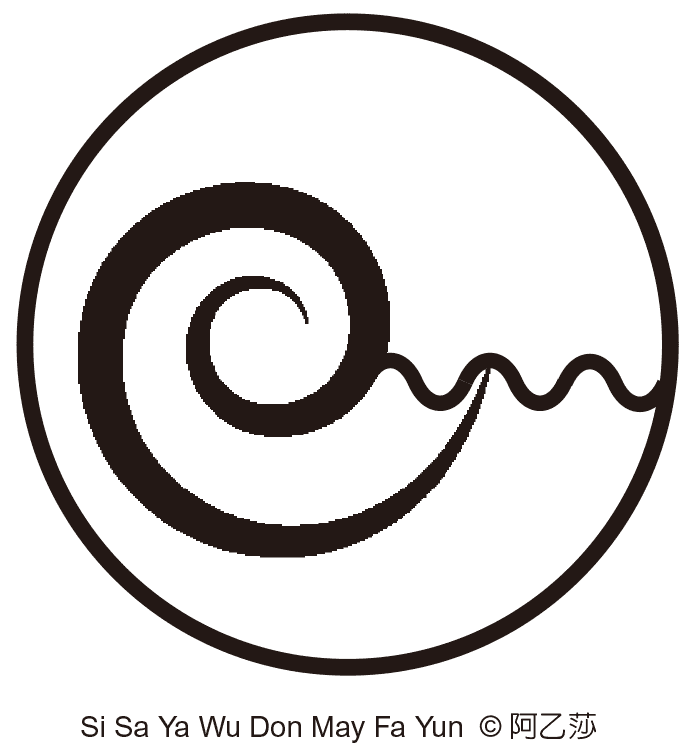

＊ ＊ ＊

〔读者提问〕《星光体》这本书提到光波导管，其中内分泌系统的“Si U Ba”，和小肠的“Si U Ba”发音相同，为什么？

（这个问题也引起我的好奇心，于是再次去询问这段光波导入身体精微系统的讯息源头雷巴特，传讯内容如下。）

没错！“Si U Ba”会振动你们的内分泌激素，这个激素会透过血液，启动你们血液中的血球智能。而小肠的生理结构在你的认知中，是和消化系统有关，但实际上，小肠的吸收功能需要靠内分泌激素，产生属于小肠生理环境的消化酶，所以当你念诵“Si U Ba”，是整个腺体的激素被活化和启动。

这个音频的导入是帮助小肠运作，小肠并无法自行恢复与神经系统的链接，必须仰赖内分泌激素的引导，链接上神经系统。因此，使用内分泌的咒音，是让光进入肠道细胞最直接的方法。

（免责声明：以上为传讯内容，仅供参考，无法作为医疗诊断之基础或以此开立处方。如有身体不适，请洽询专业医师。）

＊ ＊ ＊

〔读者提问〕我们做能量水的时候，是以中间的金元素位置为中心点，再一步定位火、土、风元素。而之前老师说新地球能量校准时，也会接收到来自天狼星的大量金元素，所以我想请问，为什么五大元素的中心及天狼星灌注的能量，都是以金元素为主呢？

〔Rachel 的回答〕金元素大量存在宇宙中，无法用肉眼或从物质层次观看或测量到，那就是老祖宗所称的宇宙能、光、真气、元气、普拉那（Prana）或炁。宇宙能饱含金元素，也是我们的灵魂诞生在地球肉身时形成的先天之气。后天我们靠摄取食物来补充身体能量，但灵魂的活跃和养分必须仰赖宇宙能（炁）。目前还没有人指出炁的元素来源，那是来自中央大日的能源，银河系有许多恒星供应金元素，是灵魂意识永恒存在所需的能量来源。

在帷幕之下、尚未觉醒的灵魂意识，无法靠肉身取得大量的宇宙能（金元素），因此容易生病、衰老，灵魂随着肉身衰败失去生命的活性，只有透过死亡，灵魂回到源头，才能补充完整的生命能量，再次投胎进入另一个肉身载具。所以，“炁”被我们的老祖宗称为先天气，其来有自。而现在，当人类的灵魂意识觉醒，就能透过链接宇宙能量，获取大量的炁，补足保持灵魂活性的金元素，这是灵魂本源里中央大日传送给所有灵魂的食粮和补给。

当我们练习制作能量水，透过四大元素的校准和调整，就是在帮助稳定你的中轴，以获得宇宙能（炁，金元素）的补给。所以人体站着的位置就是金元素，那是你的灵魂所在的座标位置，而当你念诵身体十二系统咒音，中轴与中央大日（天狼星）连成一线，你就可以透过全身已经校准的十二个身体系统，获取大量的宇宙能，让你的灵魂保持活性，身体细胞也恢复最佳的能量补充。过去道家炼丹，还有学习气功多年的大师，都是为了求取让身体长生不老的仙丹，其实那就是炁，或者说先天气、宇宙能、光，现在却透过星光体校准就可以获得，这么简单，反而没有人觉得有价值啊……古人穷尽毕生之力，上山求道练功，却求之不得，现在透过简单的意识带领，就可以获得炁的宇宙能，多么方便的方法啊。

＊ ＊ ＊

阿乙莎，台湾目前正面临新冠疫情第三度来袭（编按：指本书编辑和出版的二〇二二年六、七月期间），这次来得非常快速，令许多人措手不及，也开始怀疑台湾这次是否真的能安全度过这一关。请给予我智慧和勇气，去面对疫情突然升温的发展。

你自己怎么看待这次的疫情，决定你将进入什么样的体验。之前全世界大流行时，许多人对自己的生活和国家深具信心，而此时此刻，面对同样的大流行场景，如果无法重现以往那样的信心，代表你们在这个过程中学得还不够，所以就会有一些人的内在意识期待再次经历和体验的事件，被再次显化出来。这就是你们正面临的实相，这个实相完全是由居住在这块土地上的所有人共同创造出来的。

你可能会觉得无奈，意识已经可以到达五次元，迎接更新的能量，你的生活仍然会被许多“无明”搅乱生活步调？孩子，先不要这么回应在你面前浮现的这些疫情升温事件，这些事件都是来帮助清理你们内心阴暗角落的助燃物，只有允许点燃火苗，你们才有机会再次从黑暗中看见光。让我带你去看看那些光。

你们会有许多人开始去接种疫苗，原本快要到期的滞销库存会销售一空，而更多更新的疫苗会被允许销往台湾，展开与国际的接轨和互动。你们原本计划要进行的活动不得不改弦易辙，换成以不同以往的方式进行。许多人和你一样正在调整与外界沟通的方式，搭建起不同的沟通桥梁，你们会以更开放的心与虚拟世界无缝接轨。这些事件让人们不得不改变沟通方式，以激发已渐渐松散的组织人员士气，在此过程中，也正在与不同国家、单位和族群创建新的协同合作。

而原本在学校上课的孩子和老师，经过这一年，早已精熟线上学习和教学工具的应用方式。这群未来世界的主人翁正在大量引入先进的学习工具和技能，虽然减少了面对面的互动交流，他们也不会因此减少和同学与好友间的相互支持和打气。其实，这些孩子正在展开与内在宇宙高我的链接，将更多的心情故事以绘画、歌唱、手作和文字传递与表达出来。

另外，你会发现自己真正需要的东西变少了，也不再需要浪费资源制造垃圾和污染。现在你居住的环境中可以听见更多虫鸣鸟叫，一同歌颂大地的复苏。这些不断在你们眼前出现的光明，是否可以让你愿意放下内心的焦躁、惶恐与不安？

虽然我们的意识可以随时切换进入五次元的帷幕之外，但不代表所有人类和整个地球都脱离了三次元的振动。我们仍处在三次元的物质世界中，打开意识的帷幕进入五次元的振动，也因此，在整个地球集体意识扬升的过程中，我们仍须经由一起工作和互动，来学习和不同意识状态的人合作。我们都会遇到和自己意见不同的人，也会生起厌恶或不认同的情绪，但是当我们可以有意识地进入更高的帷幕之外，去看见整个事件背后的良善意图，我们就可以成功穿越自己的情绪，有意识地觉察事件发生和显化的因缘，以及所有人在此过程中的意图是否有清楚校准。因此，意识扬升并不代表从此就不会再遇到过去三次元中的人性试炼。

给身旁的人信心，相信你们将迎来一个更美丽的新世界，带领你们集体到达彼岸。也只有愿意揭开内心黑暗的面纱，直视心中仍存在的阴暗，你才能穿越黑暗帷幕，直达内心的光明净土。

在意识扬升的过程中，人们仍旧带着原本在三次元的习性和惯性，这是一定会遇到的问题。虽然彼此都明白要共同推动一个美好的远景，但是当我们与一群人走在一起，共同面对事件时，才是真正测试和练习到达五次元共同创造的开端。

请给此时此刻的我们一些建议好吗？

这是帮助你们整体意识重新校准的最佳时刻。记得一年多前，疫情在全球如星火燎原般蔓延，一发不可收十，当时你们居住在最安全的地方，享有正常的生活，全球都无法幸免于疫情的肆虐，台湾却打了漂亮的一仗，让全世界羡慕。

虽然那无形的力量带来崩解和毁灭，地球母亲并未忘却对每一个人的关爱。有一股力量正带领人们走入光明的世界，而要成功走入这里，需要人们发自内心地臣服。

现在回来看看你们自己，一个遗世独立的抗疫模范生，从自己筑起的围篱上坠落，只因为你们在此过程中，没有机会学习臣服。全世界都需要共同面对的疫情，不是靠固守家园、抵御入侵就能幸免于难，你们同样是生活在地球上的一员，仍须与国际接轨，在做别人的生意、赚取外汇的同时，也必须同舟共济，人饥己饥，人溺己溺，如同处在一样的世界里那样建设自己。只有让疫情在台湾发生，你们才能学会放下自私自利、自以为是的心态，跟上全世界的脚步，成为国际村的一员。

你们也不要对现在的疫情失去信心，要给自己国家和政治机器的领导者足够的信任，只有人民的信任和支持，才能让自己的国家创建与世界接轨的心。此外，你们也要相信自己可以安然度过此时，迎接一个被国际社会接受和相互尊重的关系。疫情并不可怕，是人们内心的恐惧将其无限放大，彼此隔离和怀疑的心，才是瘟疫真正的温床。

台湾这一年无视国际疫情，人们活在自己的幸福天堂国度里，此时此刻，面对疫情无法有效控制的状况，除了隔离在家、不出门，做好卫生和自我防护外，还可以参考下面这些方法。

一、稳定中轴

最重要的仍是稳定自己的中轴，深呼吸，让自身的能量场域净化，并不断清理内在的焦虑和恐惧。病毒只能存在乱流中，无法在平静无波的光中久待，进出公共场所感受到的紧绷和人心惶惶，那忧心染疫的能量，才是造成你能量破洞的元凶，而不是病毒本身。病毒只能寄居于黑暗中，无法冲进光里主动攻击，让自己随时随地处于内在稳定的光流中，就是最佳的防护措施。

（下面三个稳定中轴的练习，每天可以择一进行。点击 QR Code，就可链接到示范影片或引导音档。）

畅通脉轮手指操：

[`www.youtube.com/watch?v=uj4818QCRlY&t=302s`](https://www.youtube.com/watch?v=uj4818QCRlY&t=302s)

畅通脉轮手指操

与大自然共振静心冥想：

[`www.youtube.com/watch?v=SwT9wEAijJk&t=19s`](https://www.youtube.com/watch?v=SwT9wEAijJk&t=19s)

与大自然共振静心冥想

新地球能量校准：

[`www.youtube.com/watch?v=NksZ_T_qdYE`](https://www.youtube.com/watch?v=NksZ_T_qdYE)

新地球能量校准

二、施打疫苗的意识引导

当你们因为别人的期待，不得不去施打疫苗时，可以想像疫苗注射到你身体里，会如同光波导入，将你身体所有的细胞都包复上一层光膜。像这样冥想疫苗，而不是担心疫苗会让自身的健康细胞被病毒讯息攻击，那么疫苗进入人体时，就已经被你的意识调频完成了。

三、喜悦能量密码

让自己随时随地处在光中，最佳的方式就是将喜悦的能量带进内心。喜悦是病毒最怕的力量，也是帮助你的身体增强免疫力的来源。

喜悦情绪密码：538-498-63

念诵这串密码时，意识要跟随着这些数字在你心中流动。你可以用默念的方式进行，搭乘公共交通工具或出入人潮众多的地方时，内心默念这串情绪密码，就可以将喜悦的能量由内而外传送出来。

四、念诵“穿越风暴之眼”咒

疫情一生起就提供给你们的“穿越风暴之眼”咒，是更为强大的中轴净化和清理的音频导引。透过这个音频，将你的中轴瞬间变成一根强大的光之柱，可以清理和净化低频能量，瞬间打开环境中所有的光源。这个咒音可以用在你们的工作和居家环境、公共空间、医院和较低频的场域，也可以将其制作成精素、能量喷雾、随身能量瓶。只要念诵此咒，就可以照亮全身的精微体意识。

“穿越风暴之眼”咒：Mo Ho Mo Ha Na Nu Mi Da

（点击 QR Code，就可聆听［穿越风暴之眼］美囋。）

［穿越风暴之眼］美囋：

[`www.youtube.com/watch?v=NTKkwQyqs3U`](https://www.youtube.com/watch?v=NTKkwQyqs3U)

［穿越风暴之眼］美囋

＊ ＊ ＊

（现在有许多关于新冠疫苗造成死亡，以及对人体的伤害〔如血栓〕的报导，我自己不是生物医学专家，无法从市场讯息中找出属于自己的真理，便转而求教于内在高我意识。我比较了二〇二一年五月份还没看过那些报导影片，和一个月后被大量负面报导影片冲击，我的高我给我的回答有没有差异。

以下讯息是我和自己两次针对疫苗议题的对话，不见得适用于你，每个人都可以透过内在意识的指引，去探求属于自己的真理。对我来说，从纷乱的媒体和网络讯息转向内在，是让自己回到平静、安定自心的一种方式。请在世界的动荡中，向内在探求属于你自己的真理。

我在两次不同的时间，在吸收到不同媒体信息的情况下，得到的讯息如下。）

．二〇二一年六月二十七日（在看过许多国内外媒体的负面报导，台湾已开始施打疫苗，也传出许多死亡案例之后）

实际上，新冠病毒的变异随时在发生，疫苗即使在生物体的对应尚无法做到百分之百防疫，仍有警示和提醒细胞的功能。所以，疫苗被施打进入人体后，会被细胞撷取有用的信息，然后将不能服务于细胞的其他成分代谢完毕。若选择注射疫苗，只要做好心理建设，不让恐惧占据身体的免疫细胞原本应有的防御功能，尽量在注射疫苗后多休息、晒太阳、亲近植物、多喝水，就可以完成细胞的自体清理和复原，并代谢掉不需要的噪声和垃圾。

目前在各国持续出现变种病毒的状况下，与其说病毒是来毁灭地球和人类，不如说是来提醒人们：最佳的防御系统仍在我们自己身上，而不是只能靠疫苗或外界的援助来协助我们防御。让自己的中轴随时稳定畅通，就能透过自身内在充沛的宇宙能量，让身体拥有最佳的防御能力。

．二〇二一年五月十七日（尚未看过媒体报导影片，台湾也尚未开始施打疫苗）

在疫情肆虐期间，对于该不该打疫苗有许多不同的声音，一些人认为施打疫苗会破坏人体的ＤＮＡ，造成人类的灵魂意识无法扬升。阿乙莎，是否可以给我一个更高的观点，去看待这件事？

这句话被传递出来，是否又造成更多人的恐惧和质疑？其实，只要是透过恐惧发送的言论和讯息，要求你们“去做”或“不去做”，你们都要有能力辨别。恐惧可以帮助人们在地球上生活时有所“警觉”，但也正因如此，人们的“觉性”被恐惧掩盖了数百万年。现在人们必须打开“意识觉醒”的路径，辨识出恐惧的一贯伎俩，才能帮助人类集体意识扬升。

关于要不要施打疫苗，决定疫苗能否产生集体免疫的关键，来自人类最重要的“选择”，也就是人类在地球上被赋予的自由意志。施打与不施打都是人类可以自由选择的权利，和有效与无效、有害与无害没有直接关连。

这样说吧！当你的意识做出“选择”时，你已经对你身体的上兆个细胞下达指令，要它们听你的，你的身体就会去协调出最佳阵容，以完成你下达的指令。千万不要以为身体只认得脑的指挥，身体所有系统和器官的最高指导者，是“你的意识赋予事件的定义”决定的。

当你的意识选择了当下对自身所处环境最好的行动方案时，那个“事件”本身就会朝向“你期待的结果”前进。从这个角度来看，疫苗本身，就是你们的意识要对更多人的身体细胞下达指令而搭起的一种物质和桥梁。

这座桥是集众人之力和期待才能被显化出来，要不要搭这座桥，和你的意识如何定义这座桥梁有关。倘若你的意识选择了“注射疫苗是对自己的身体最不适切的行动方案”，那么你去注射疫苗时，你的身体就会朝你最不想要的结果演进；如果你认为这是目前最好的搭桥计划，那么这座桥梁就可以朝你期待的结果前进。

看见没？这些都是你的意识创造出来的实相，疫苗本身会在你的身体中呈现稳定融合、相互排斥，或是惰性无效，都是你的意识自由选择的，和你想要经历什么样的体验有关。人类是可以用意识驱动上兆个细胞，在地球上以肉身载具行动和体验的完美设计。

所以，回到你最初的问题，施不施打疫苗，是人类自行创造的游戏规则，而人们在面临全球性疫情的此时此刻，则需要学习不单单为自己抉择，也要为人类生命共同体做出选择。当一个国家决定集体免疫的最佳行动方案是采用疫苗时，就等同宣告不施打疫苗的分离政策会被采行。这是三次元世界一直以来的游戏规则，在这个过程中，施打与不施打疫苗会创造出“集体认同”的基本门槛，施打者会被采行施打疫苗政策的国家给予方便出入的对待，未施打者无法入境；而未施打者也须创建自我保护机制，提升自身的免疫力，来对抗各种可能的病毒来源。

你们可以各自做出自己认同的自由选择，但人们仍会在适应新的分离政策的过程中，逐渐凝聚出“更高的共识”。这个“更高的共识”就是人类要开始守护自己赖以生存的地球环境，这是每个生活在地球上的人最基本的责任和义务，不论你是否施打疫苗，都会在此过程中产出这个一致的看法。

此外，你们恐惧和担忧疫苗是否会造成身体ＤＮＡ失去和灵性源头校准的能力？看看你们熟知的宇宙学和物理学家史蒂芬．霍金博士，他在罹患罕见疾病、身体残弱的状态下提出广义相对论和量子力学，他的意识不受身体影响，积极活跃在科学界，用更新的观点诠释宇宙理论。所以，放下这个害怕无法再去链接宇宙和更高意识源头的恐惧，回到你的生活场域中，去做出你在地球上与人互动交流时最能利益彼此的行动——从这个角度出发，你会做出最适合的选择。

＊ ＊ ＊

〔读者提问〕我的体重超过标准十七公斤，积极运动、调整饮食、喝足水分、间歇断食，却没有很大的成效。我很希望能减脂瘦身，学会与身体沟通后，身体却回应我，现在虽然体态肥胖，但觉得健康就好。可是，我的小我无法接受目前这个肥胖的外形，我该如何是好？

〔Rachel 的回答〕这是人类社会集体意识创造出的制约，认为身材和体态应该展现某种样貌，人们花许多精神和资源专注其上，带来许多情绪和认同问题。人类社会以肤色、身材和外貌来传递自我价值，甚至以此创建身分和阶级认同，久而久之，导致一个人要先认同自己的外在表相，才有勇气和足够的信心去面对外在世界。若说这样的集体意识可以为人们带给社交上的便利，倒不如说，人类集体意识投射出的社交恐惧症，已经创造出人与人之间的藩篱与隔阂，以及更多的人心匮乏和失落。

尤其是成长期的少男少女，在离开家庭、进入社会后，需要同侪和朋友的认同，于是这个时期的青少年会随着身材、体重的变化，情绪时好时坏。殊不知，当你心情低落、自我感匮乏时，你的身体会下意识去寻找能量的替代来源和补给，这时，你的身体细胞会更加珍惜你呼吸的空气、喝进去的水，会用尽全力补足你身体需要的养分，以喂饱你内心那个匮乏的黑洞。所以你有没有发现，你愈想减肥时，是否不吃不喝，光是呼吸都会发胖？这是身体为了回应你内在需要被满足的匮乏而产生的应变措施，是为了让你的内心补齐足够的养分，而自动展现的平衡机制。

所以，想要让身体回复平衡状态，你必须学习去面对自己的想法，关注自己的内在。当你认同小我无止境的批判，对自己不满，你的身体会在即将失去平衡时展现其宇宙智能，自动反映小我看不见的平衡观点，让你觉察你内在的真实：肥胖来自内在有所匮乏、不安、需要被满足；而食欲不振、厌食、营养无法吸收，则来自过度自我防卫、嗔恨、否定外界、无法信任和接受别人。当你发现自己正汲汲营营地主导身体该吃下什么、该如何行动以达成你的自我认同时，别忘了，你也需要时时关照自己的内心，觉察身体正在反映出你内在真实的那一面。带着爱去聆听身体发出的声音，你会找出自己的限制性信念，并帮助自己回复最佳体态。

＊ ＊ ＊

最近不知道是否年纪大了，齿牙开始动摇，吃比较坚硬的坚果类食物，可以明显感受到牙齿的不适，不再能那么无所谓地用力研磨或咀嚼食物。我想问问，该如何帮助自己的牙齿继续健康地存在？

（我决定直接链接天狼星的雷巴特，他是这方面的专家，希望他可以给我某个光波，改善我目前这个症状。）

你可以使用“Mo Na Ti Da Mo Sa Bu Li So Ha”这个光波，连续念三遍。

（念完后，我可以明显感受到牙齿似乎被一股力量支撑起来。后来吃饭时咀嚼硬的食物，就没有齿牙动摇的无力感了。这个咒音居然可以这么快速地平衡我的牙齿，我觉得太不可思议了。）

雷巴特，请问这个咒音是什么意思？

这是将微量元素“锗”导入你的牙髓层。当你的身体无法感知外界的干扰物入侵时，就需要透过这种微量元素清理干扰和污染物。念诵“Ti Da”，就是利用光波将锗元素导入你的牙髓，帮你排除沉淀在牙齿中的污染。你的牙缝过大，容易滋长很多病菌，因此牙齿以疼痛来发送警讯给你。

（我的牙齿后来就没再痛了，似乎念诵三到五遍，就可以到达微量元素注入后的平衡。这是我个人的神奇体验，分享给你们。

另一种方式，就是将牙床的咒音也加入，效果似乎也不错：Mo Na Dang Ho Ba Lu Ti Da Mo Sa Bu Li So Ha。）

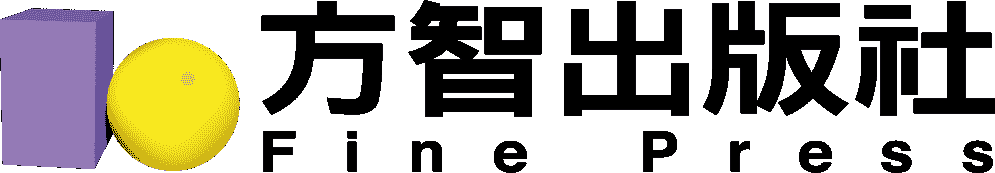
