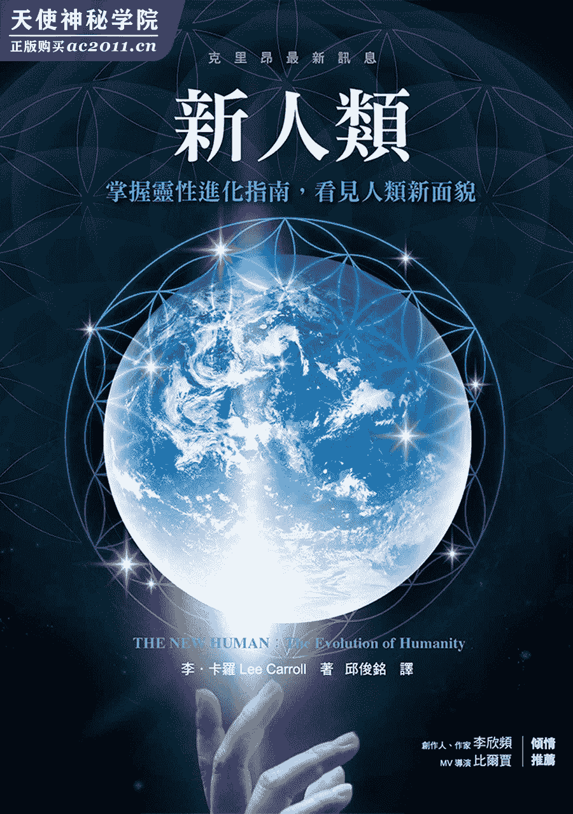

# 新人类：掌握灵性进化指南，看见人类新面貌

# 谨以本书纪念玛婷‧瓦莱

时间之风不断吹送，永不止息，有时捎来惊奇与美好，有时却变得相当严酷。而老灵魂的考验在于接受时间之风的这两种面向，依势弯曲而不致折断。

但有时说是容易，真正要做却困难重重。

对我和许多人来说，玛婷‧瓦莱（Martine Vallee）是一道明亮到不可思议的光芒。她跟她的兄弟马克（Marc）是我们连向世界的法裔加拿大窗口，他们以二十多年时光将每本充满克里昂睿智话语的克里昂书译成法语，并加以出版。

玛婷是加拿大亚立安出版社的创始人之一，我能走出自己的舒适圈，前往法国进行有生以来的第一趟欧洲之旅，真的要归功于她。

她在二○一五年九月辞世，让我们震惊不已。她是如此年轻、如此活力旺盛、如此关怀着万事万物，就像一股维系世上所有美事的清流，但她就这样走了。

在那之后，我们常问：「为什麽会这样？」也常一边摇头、一边试图了解神的奥妙计画。对我们来说，她的离去是不恰当且使人忧伤的。她做了好多事，而且还没做完呢！

克里昂说：「我们不会知道我们并不知道的事。」我把这句话放在心里，并期待会发现那隐藏在幕后的永恒应许，在此同时，我仍十分想念她，每天都是如此。

谢谢你，玛婷，感谢你如此丰富我的生命。

# 前言一

欢迎来到另一本克里昂书

大家好，我是李‧卡罗，欢迎来到克里昂书第十四册！

不过，事实上它可能不是第十四册，毕竟我已经忘了要怎麽计算克里昂书了！几年前，有许多国外出版社取用克里昂官网的传讯与问答的部分，并用另一种编号方式做出其他的克里昂书。此外，过去三年内又产出了三本克里昂书，是以超过二十六年累积的克里昂传讯资料进行汇编的文选。所以，我应该说：「欢迎大家来读另一本克里昂书！」

这部分通常是由我来为还不清楚的读者解释有关克里昂的事，并向读者示警：待会读到的讯息会很奇怪喔。但这次我不这麽做，因为我在这个事工已经有二十六年，如果你们都认真读了的话，早就认识那股名为「克里昂」的美好、友爱的能量。如果你是偶然拿起这本书来看的话──哇哈哈哈！世上没有所谓的偶然，所以请继续读下去吧。

克里昂书第十三册于二○一三年初出版，就在通过二○一二年的「里程碑」后问世的。克里昂将这个过渡期称为「里程碑」，是因为它是用来衡量人类是否要继续留在世上的分歧点。那本书名为《人类进化的重新校准：告别末日恐慌，迎向世界新秩序》（The Recalibration of Humanity，中译本由一中心出版）。

当时有一场巨大的改变即将发生，而古人早已预知此事，克里昂也是为此来到地球，那本书旨在描述这一切的发生过程，及揭露这个改变背后的古老深奥资讯。那不是克里昂的资讯，而是神圣的历史，这份源自人类自己的预言已流传了好几世纪。如果你们对地球上已开始发生的事，及在这场转变还没开始前的相关讯息尚无全面概念的话，我邀请你们读读《人类进化的重新校准》这本书。

在几年后的现在，我们开始看到不一样的地方，也感受到一些变化。对许多人来说，正在转变中的实相带来了恐惧、误解及不确定性。对大多数人来说，任何改变都是不舒服的，代表人们普遍有「提心吊胆等着预想之事发生」的心态，而人类也逐渐移向没有「正常」指标的时代。我们现在正处在重大的转变中，当我们开始在灵性层面进化的同时，也会被推拉往许多方向。

为了让你们确实了解本书的核心资讯，我要揭露某件发生在我身上的事，那是我隐藏多年的秘密。

##### 二○一二年十二月二十一日

有时阿卡莎层次的忆起会捉弄你，使你的身分与你所处的地方产生混淆，并改变实相本身。它通常只在梦中这麽做，但如果你给出允许及意愿，使前世经验能在你的「当下」浮现时，实相有可能会暂时转变。有时即便你并不认为自己给出了意愿，还是有可能发生这种状况，但不会造成前述的混淆情况，反而会让你对玄妙事物开始有兴趣，并着手研究从未接触过的能量。

你曾经有过「脑筋像一团浆糊」，或曾面对某个意外改变的经验吗？你没想到我会知道吧？呵呵呵。如果真有这样的经验，请别跟任何人讲，因为这就是精神病门诊人数暴增的原因。所以这自然是我们的秘密──会改变实相的阿卡莎连续剧！对老灵魂来说，这种状况其实比你以为的还要常见。

这种景况也许只会出现在你看过的电影里：背景音乐变得轻柔圣洁，音调的响亮程度似在指出主角会发生某种「变化」的桥段。有时整个画面会被白色充满，影像会转成模糊的亮点，物体周围会出现些微光环。这是电影在描述「准备好接受非真实事物」时的魔幻手法。然而当上述情况发生在我身上时，并没有电影在旁拍摄，也没有音乐，还是说当时其实有音乐？

那一天是在夏威夷，是我在世上最向往的地方。当时是早上，我漫步走向某个会场，那里将会有九百人聚在一起吟唱、庆祝，并欢迎地球的新时代。那是一场重大的超自然集会，陶德‧欧夫凯提斯（Todd Ovokaitys）博士与松果体音调「合唱团」（Pineal Toning“choir”）都将出席。我会在一整天的音调活动中进行多次传讯，我知道这是场美妙且充满能量与深度的重要活动。但当我经过某个可以观海的地方时，我彷佛瞬间移动到另一个时空了。

那是茂伊岛常见的好日子，海洋送来温柔的暖风，就像自然之母盖亚在轻柔地拨弄空气，使美善的微风能抚慰它吹过的每个人。我听见那永不间断的海涛声，它开始在我的阿卡莎层次里唱了起来。我一边听着海涛，一边思索很久以前住在这里的人会如何享受同样的海涛声，但不知怎的，一切在此时混在一起了。

当时我正缓缓溜进雾一般的自身过去中，同时处在「这里」与「那里」。海涛从亘古以来，就在我待的那个位置一直在向前撞击、碎裂、转而退去。那是惊人、强势的力量，容纳着一切历史的奥秘。这股力量已见识一切，也历经过战争、暴风及地球各个时期的安排，而它依然永不停歇。

「这里」与「那里」虽然间隔长久的岁月，广阔的海景及温暖的微风带来的情绪释放却没有改变多少，至少感受是相似的。那感受带有浪花溅到脸上与发上的潮湿感受，突然间你成为曾在那里发生的事物之一。有时你真的会不想呼吸，因为害怕这段灵视就此消失。但有时你会想将这一切都吸进来，而尽量做出最大的净化呼吸。你闭起眼睛，抬头转向海涛声的方向，那声音永不停歇，无论你身边有谁，你在那一刻都是单独存在的。

如果你允许的话，这种自然经验会以超越世上已知语言的方式向你倾诉。就像水手所知的海妖歌声那样吸引着你，直到永远。它能将你传送到只有你脚下的沙子具有的历史才会知道的地方。即便那是数千年前某个暖和的日子，海涛声与吹拂脸庞的微风依然能使你停下脚步，几乎就像听到属于自己的音乐那样，那些元素看似在跟你说话。它们今天试图要跟我说什麽？那只是风的吹送，还是有另一种语言正试图进行沟通？也许这些纯净的元素正在问我要不要暂时加入它们，它们说的会不会是「我认识你！我认识你！」呢？

脚上那双绅士鞋突然消失了，所以我是光着脚的，肤色也变得不一样，虽然我无法确认。我还有了一头浓密的长发。有时候你就是「知道」自己是谁，就像你在作梦时，梦见自己被传送到某个地方，而且完全变成另一个人。我知道自己曾经在这里，至少曾以某种方式待在这座岛上，只是我了解的一切无法为此提出合理的解释或予以量度。我是否在传讯？那感觉还满相似的，我甚至有点期待自己会被带去亲眼看见创造之光，聆听帷幕另一边的音乐。不过这次并未发生这种事。

我不晓得时间过了多久，只知道自己停下脚步正面对海洋。我开始有点头晕，虽然这是我那段时期常见的状况，但对古时候的我来说算是少见。我就近抱着一根柱子以支撑自己，那柱子表面居然没有磨光，还很粗糙。我不想被刺伤，因为如果我走进水里时有伤口，碰到海水就会很刺痛。什麽？我没有要走进海里啊！现在到底是什麽情况？我是在体验阿卡莎层次的某个片刻，还是不只如此？

我在夏威夷发生这种情况已不是第一次，但这次是它首度几乎「接管」我的意识并带着我走。我一直睁着眼睛，毕竟意识被接管并不是我当时想做的事。我当时希望能一直睁着眼睛，使自己保持在当下的实相中，这也有助于应付头晕的状况，但最后我还是闭上了眼睛。我不得不这麽做，因为海涛的音乐太过强劲，而那股平安的宁静感受实在太诱人了。

母亲在那里，但不是我的母亲。那是我母亲的声音，自从她辞世后，我已有四十年没听过她的声音。但那声音又变成不是她的声音，而是我「原初母亲」的声音。那声音虽是女性，给人的感受却是神圣的。或许它是自然之母，抑或是火山女神佩勒（Pele）？毕竟我是在夏威夷啊！当时传来了一份讯息，我一直将它保留到现在，甚至连我最亲近的亲友都没听过这段故事。

那实在太过私密，每当我想跟别人说这件事时都会哭泣。我知道自己当时有些压力，毕竟我再过几个小时就要做别的事，当时我是打算要在那短暂片刻接受某个专属自己的美好平安。那份讯息是什麽呢？那是我无法拼凑出来的谜样讯息。你是否曾在梦醒后试图去谈论梦境，结果说出来的东西根本毫无逻辑道理？我的情况就是这样，直到现在、直到这本书出现才有所改变。

我不是以线性的语音来获得讯息，从来都不是如此。而是藉由许多影像及资讯封包来「听见克里昂」的。这很难解释，但我这麽做已经很久了，久到对我来说已是家常便饭。它本身有着自己的语言，就像是一直播放的定格直觉，好让我能理解它，但它的多次元性质很强。对许多人来说，它看起来像是「杂乱无章」，但我就是看得懂，并能用直线逻辑的人类语言将这一切翻译出来。

这是我要学会才能做的事，参加早期传讯会的人都知道，我在传讯时很会流汗，经常得趁传讯时段间的休息片刻更换衬衫。但这已是很久以前的事了。

我传讯时收到的是一段影像，它完全不是我当时预想的样子。我当时非常期望会是我以前看过的片段，就是关于我曾担任茂伊岛的信使，负责为山顶上的回春圣殿传送讯息的启示。那是相当平凡的影像，而且对我来说非常真实。但传讯时收到的影像却不一样，完全不一样：我处在古老的过去，也处在现在，接着出现了神奇的事。那股母亲般的声音一直在背景嗡嗡作响，但它说的文字无法清楚辨识，我接收到的是图像，但它们却杂乱无章。

我的身体很古老，但不是老迈。它有着岁月的累积，却没有老化。我要怎麽解释呢？突然之间，我成为「未来的古人」，但这没道理。如果你用「先知摩西的年代」来测量年龄的话，就会跟我们对年龄的观感没什麽关系。当时的我处在年轻的身体里，而那副身体经历许多岁月，多到要用世纪来当测量单位了！

生活在地球上的我，感受到自己阿卡莎层次的所有经验都在我里面。我感觉如此有力，几乎能飞起来，我确定自己是知道的。那股母亲般的声音仍在背景持续嗡嗡作响，而我还是听不清楚它在说什麽。

那股声音是「能量基层」，只为了支持这份视讯，使之能够存在。我的智慧如此庞大，大到可以为任何主题写上一堆书！我能控制自己的健康与老化过程，物质实相也是我的囊中之物。我完全了解物质实相，觉得自己可以掌控它。

当时的我只想到一个解释：我曾是地球上的某位扬升大师！现在我已经了解那影像真正解读出来的意思，所以觉得缺少敏锐理解能力的自己好蠢，你现在知道我从未提过这件事的原因了。

这些年来，我总认为那是「小我」的影像，是我一直在试着压抑的那部分自我制造出来的。我绝不会跟任何人讲我看到自己是某位扬升大师的转世！那对任何人而言都是很糟糕的说词，也会把我直接划分到某些灵性导师之列，就是那种会想藉由宽恕你的罪行来收费，或要你坐在他们脚边，对自己（或他们）的肚脐进行每小时要价五千块美金的冥想之类的导师。但现在我已知道这个讯息真正要讲的主题，总算比较明白当天到底发生了什麽事。

你的阿卡莎纪录是多次元的，即使我们觉得它是线性的，就像某种历史书籍那样，它也不是我们想的那样。它处理及记忆的是所有转世在情绪、慈心与课题层面的「能量」。它还会投射这些能量。在多次元的状态中，真的没有我们以为的线性时间。而是「处在回圈里的时间」，且带着不断反覆的能量之可能性。

圆、回圈没有止尽，时间也没有止尽。圆没有起点或终点，这表示我们的未来也被装在那道封闭的回圈中吗？怎麽会这样？我们是一边生活一边创造自己的未来啊，还有那些没发生的事又该怎麽说？这个问题的答案真是难以传授。

不妨这样想：在某个回圈里，无数时间的无数可能性已等在那里，这一切都是可能性。我们在创造的过程中，会启动某些早已等着被启动的可能性，而在启动某些新事物的过程中，那些与其相关的未来可能性也会被活化。

我借用发育生物学家布鲁斯‧立普顿（Bruce Lipton）与曾任资深太空电脑设计师的桂格‧布莱登（Gregg Braden）所谈的共鸣比喻，如果吉他的弦旁边有足够大声的声音频率，且该频率跟弦的频率或音调一样时，就会产生共鸣。因此某条弦能在没人拨弄的情形下，靠着附近另一条弦发出的声响，而以共鸣的频率振动。

时间也类似如此，只要你创造出重要的事物，像是足以改变世界的发明，就会创造出与之共鸣的未来可能性，因为那发明现已存在。这些共鸣的可能性不是预测，也不是预言，只是未来的时间回圈中与之共鸣的事物而已。还是觉得困惑吗？那麽以下是给你参考的寓言：

想像你正身处棒球的冠军赛中，此时双方的分数一样，你所属的球队有人在三垒。在这个想像的场景中，三垒的跑垒也许是这场比赛的获胜跑垒，这个可能性就是对未来的设定。所有球迷都在共鸣着获胜的设定，既担忧又喜悦。

接下来会发生什麽事并不能保证，很多事都能造成改变。但「三垒有人」是个获胜的强烈可能性。因此，如果有人说「我想我们会赢！」那他是在预言未来吗？那是他的盼望，还是他感受到未来的可能性能量？「三垒有人」是在共鸣那即将到来的胜利可能性，也就是未来。

「通过二○一二年的里程碑」代表的意义，远不止于我们在当时通过人类历史上的关键点，也是对未来的设定，所有事物都在那个多次元的回圈中开始共鸣。根据量子物理学家的观点，这才是时间的真正运作范型。时间也会因速度、重力及对此刻知道更多的人而出现变化。我们每年都会发现关于自己的实相的新事物。

在前述的茂伊岛经验中，我没有收到关于自己过去的资讯，反而接收到正要来临的事件的讯息！当时我完全会错意，现在的我在思索这则讯息的真貌时，真的会起鸡皮疙瘩。这就是新人类！我们当时开始 DNA 的进化，最终将成为掌握年龄、健康、物理现象与自身实相的大师。地球将会进入扬升状态，这是克里昂在一九八九年来到地球时说的，原来那是预言啊！

我抱住的柱子变成表面光滑的大理石柱，那是某间旅馆的设置。绅士鞋也回来了，而我困惑地站在那里。不过让我有点恼火的是，头发又被风吹乱了，我可是花很多心思在确保自己那头细发不会乱翘呢。当时的我知道自己已回到现实，而我那古怪且好奇的心思还在想着大师们的头发会不会长得比较好。

为何我会收到那份令人惊奇的讯息？在我所有教导中，由小我推动的自我重要感等同宣判灵性的死刑。克里昂说这样的自我重要感会使人停止成长，并引领人走上歧路。它通常是自我毁灭的，而我曾在自己的专业领域看过这样的案例！所以为何我会收到这份看似把自己捧上天的讯息呢？因为我当时还没准备好了解它，而现在我已经准备好了。

现在身为克里昂传讯者的我，感觉当时的自己就像初学者那样，误解了这份完全合乎逻辑的讯息。我会收到那份讯息是有其合理原因的，也就是当时的我要做的事，即参与「通过里程碑」的庆祝活动，这个里程碑对人类相当重要，它的影响将随着时间扩散出去，就像棒球赛的获胜跑垒那样！我知道它的意义，毕竟它的可能性已被反覆提及。

所以克里昂在我前往会场的路上，试图传给我一份寓意深远的主要讯息，关乎全体人类终将达成的境界。当时我看到的是，未来人类具有的不同之处将会超出我们的想像。但我怎麽对待这份精妙讯息呢？我把它当成是小我的讯息予以扣住，从未泄露出去，但现在的我正写着一本关于这个主题的书呢。

人类正在重大意识转变的边缘，其过程会花上很长、很长的时间，但根据克里昂所言，我们终将完成这个阶段且收获颇丰。时间一直过去，我们也一直在学习与成长。但我们即将走上不一样的路，这也就是本书要讲的部分，克里昂藉着一篇又一篇的讯息告诉我们，在我们进化成为地球着想的新意识之过程中，有哪些可能性正往我们靠过来。现在你知道为何本书被称为《新人类：掌握灵性进化指南，看见人类新面貌》了吧？那是延迟已久的人类意识进化过程。

此外，我还问了克里昂：我下一世的头发会不会比较好。但答案听起来就像是从我脑袋里冒出来的那样──好吧，它就是从我脑袋里冒出来的，有时我真怀疑自己是否有某种不会看场合又使人发笑的妥瑞氏症，有些想法总会不经审查地直接从我脑袋里冒出来。

那个答案就是「今朝长，明朝掉」，所以我的下一世应该没有头发吧。

##### 小学操场的比喻

本书的传讯讯息大多会提及「离开小学操场」的资料。这是克里昂一直在使用的比喻，所以我想为此多加解释。其实如果你真的思考过的话，会发现那是完全合理的过程。

如果大师的意识成熟程度是百分之百，那我们的意识长久以来大约都以百分之三十的程度在运作，所谓的「人性」真的只是功能不彰的意识。我们的内建功能其实在许多方面都能表现得更好，包括老化过程及 DNA 本身的运作效率，但我们都卡在非常低下的百分之三十运作效能。

这个概念的实证就是人类的历史，也就是说我们一直以来都没有进化。我们的确得到了新玩具跟新发明，但一直没有进化，从一开始就处在基本的生存模式，直到现在才开始攀离那个模式。有史以来，人类会为了资源与权力，或少数皇家成员的奇怪念头而彼此杀戮，将战争的恐惧与伤痛、无数人民的死亡与苦难丢给彼此承担，然后一直做、反覆做，彷佛永远学不会「这种做法完全无用」的教训。战争会引发其他战争，而且通常是同样的战争、同样的对手一直延续下去。

伟大的哲学家已经给了我们许多格言，其要旨是：唯有愚蠢的人才会一直重复同样的做法，然后期望得到不一样的结果。但综观历史，我们就是愚蠢的人，一直重蹈覆辙，使战争滋生更多战争。

国家的存在意义几乎就只是生产打仗的部队与舰队，地球上的强权国家全都干过这种事！我们的文明总是在彼此争战，令人难过的是，我们还是期望这麽做。时间的「涟漪」告诉我们：人类的下一场大战已经「逾期」！战争是如此深刻在我们的内在，以致于成为人性的正常值。我们其实还在期望人性，也就是功能失常的意识，在下一次会有什麽更失常的表现。直到现在才逐渐有了改变。

至于当时发生了什麽事，才会造成如此巨大的改变，在此就不再复述，因为这部分都写在克里昂书第十三册《人类进化的重新校准》里了。古人确实预测到的是，如果我们越过那场预期二○○○年发生的末日决战，也通过二○一二年的分点岁差的话，就能开始拥有属于较高意识的可能性。这份预言写在古人的历法里、刻在建筑物的墙上，也画在他们居住的山上面的岩石。真的是到处都有！

较高意识的定义是：能开始以互让与协力的态度进行合作的意识，使社会发挥功能且不进入战争。「不再有战争」既不是结果，也不是主要目标，而是自然呈现的状态，它将是新世界、新想法的开始。

克里昂甚至给出预测，称未来的历史学家在检视历史时，会把二○一二年之前的一切称为「野蛮年代」，甚至可能指定那一年为时代的区分，就像「西元前」与「西元」那样，以象征某个影响深远且改变地球的能量事件。虽然前述这些要等到未来才知道有没有发生，但我们此刻正处在转换的过程，那是一场巨大的转变。

老灵魂啊，谁会想要战争？在「不再骑墙观望」的能量中，你可以看出想要战争的人是谁。地球最低频、最原始的生存意识还在做这件事，但我们现在可以看到想法上的差异，好人与坏人会变得更明显。其实光从日常的新闻，就几乎能看到这种倾向，例如现在仍有只想摧毁和平的无国界武力团体，他们甚至没有共通的语言。他们杀戮周遭的人、斩下亲人的头颅并在电视公开过程，并使用杀伤力强大的炸弹，在公众场合造成巨大混乱。这是新的恐怖主义，过去从未组织成这种模式。地球上的黑暗会如此愤怒，是因为新时代中，全球有无数的老灵魂正在觉醒，并发展出更灿烂的光明所致。黑暗的力量正在流失，而他们对此心知肚明。

读到这份资料的人大多都有孩子，事实上我们都曾是孩子。你还记得自己八岁时，在学校操场发生过什麽事吗？你的心灵在那时尚未发展完全，大多数这个年纪的孩子正在探索跟外人社交互动的方式。自我价值是个模糊且具深度的概念，八岁大的孩子大多还没发展这个部分。

那个年龄层可视为人性如何发挥功能的缩图。许多孩子在择友时会非常小心，还会集体抵抗不同性别、人种、宗教或地区的其他团体。此外还有小恶霸、丢石伤人的孩子，或以言语欺凌他人，藉由指名谩骂、苛薄挑剔对方的衣着或长相，而得到力量的孩子等等。

这就是孩子会反覆哭着回家诉苦，说谁对谁做了什麽事，让他们伤心难过的原因。之后还有到校长那儿接受训诫、调停某个已造成伤害的事件等。年幼的我们都只是在挑战成长的极限，而有些孩子会比较快学习到占同辈的便宜的方式并掌控对方。听起来挺熟悉的吧？

现在来到孩子十八岁时。虽然只是间隔十年，但孩子身边的人事物都改变了。他们的自我觉察已成熟许多，与他人相处也更加容易，会花很多时间在社交媒体上（算是过去可以宣泄怒气的社交集会场所的替代品）。他们拥有车子，对自己的能力更有信心。他们能自由来去，对彼此的嗜好、衣着与八卦话题产生兴趣。他们对未知事物仍感到焦虑害怕，但不会因此使自己处在孤立与求生存的心态。因为他们已经成熟，有些年轻人甚至发现：保持良好的人际关系有相当的好处。

即使到了这个年龄，仍然会有恶霸，但他们会把自己孤立起来，只待在恶霸的团体里。每个人在此时都已确立出与人和平相处的方式。中学、高中与大学不过是游戏的时间，人们通常也会记得这段年轻美好时光。前后只有十年，但很多事都已经改变了！

克里昂说，这是比喻现正发生在地球上的状况。过去我们从来都没有成长，一直卡在意识的小学操场上。我们长久以来总是这样，因此推测人性就是这副模样，也常用「人性」指称某个负面行为属性。我们从未经验过人性的其他模样，所以会把它当成唯一模样。但如果人性还有别种样貌呢？

对八岁的你来说，那是个复杂难解的未知世界，完全不会有「这一切终将明了」的概念。克里昂反覆讲述的格言之一：「你不会知道你并不知道的事。」意思是说：你的思考无法超越自己现有的知识，所以无法得到自己从未经验过的更高知识。对于即将来临的事物或想法会如何改变，人们大多一无所知，例如不会知道每件事可能出现的变化。

本书的前提、假设即是我们正在离开小学操场，书中的讯息开始告诉我们未来可能有的情况。而这项前提、假设都是根据我们开始看到的现象，也就是：靛蓝小孩（the Indigo Children）的来临。

##### 回顾靛蓝小孩

十五多年前，珍‧托勃（Jan Tober）与我合着了名为《靛蓝天使 I：新世代小孩的来临》（The Indigo Children，中译本由一中心出版）的简单小书。「靛蓝小孩」一词是根据南西‧戴普（Nancy Tappe）女士在当时的新生儿身上「看」到的现象而定的，她看见一道新的靛蓝色彩围绕着新生儿。

南西具有某种联觉，她那经过强化的脑功能会将能量看成颜色与形状。在得到她的同意后，我们开始推广以下概念：这些新色彩（靛蓝色是其中之一）的孩童代表的是具有新意识的孩子，他们正降生到地球上来。

我跟珍写的那本书成为贺氏书屋出版社（Hay House）当年的畅销书。谁都没料到这本书居然得到了大众的注意！因为当时有无数的父母马上就想到自己的确亲眼看过这样的情况，而靛蓝小孩引发的重大行为问题，促使那些与注意力缺失症、注意力不足及过动症等相关产业开始发展。孩童正在改变，而那本书是第一个公开给予名称，并确认当时正在发生的情况。这些孩童是某种不同以往的意识之先驱，而我们把这个情况点出来了。

有人会说：「这怎麽可能？我们那时还没有通过二○一二年里程碑。他们有很多是在六○、七○、八○年代冷战期间降生的呢！」现在这个疑惑已有合理的解释，请往前查看关于时间可能性的段落。这些具有不同意识的孩子就是「从三垒跑回本垒而获胜的可能性」，他们代表那股将要临到我们身上的可能性。这就是时间运作的方式，在历史上可以看到此类现象反覆出现。

为何我们的重大发明，包括电话、具动力装置的飞行器，看似全在同一时期出现？那时常看到的是某某发明家只比其他人快一周、甚至快几小时发表而已，就像无线电广播的发明，人们至今还在争论到底是谁最先做出来的！创新的想法看似总在同一时间散布到全世界，这就是可能性会有的效应，即「涟漪效应」。

当时的靛蓝小孩并不是难以应付的孩童，他们只是不一样而已。他们在很小的时候就有超龄很多的自我价值感，使他们看起来固执、任性，但他们只是比较知道事物的运作方式而已，那些用来处理旧能量的系统对他们无效。当他们被安置在功能失常的系统时，例如学校教育系统及旧有的线性教养方式，会使父母与社会陷入窘境。你可以找那本书来看，我跟珍已经写了三本靛蓝系列的书了。

我还满喜欢最后面的那本靛蓝系列书，因为当时的产业与教育已开始注意到这个现象并予以反应。我喜欢那些大型连锁速食餐厅的报告，他们的经理大惑不解地说：「现在的年轻人是有什麽问题吗？」因为专门给社会新鲜人做的工作出现了问题，像是在餐厅后台调制汉堡，而正在受训要从 A 做到 B、再做到 C、再做到 D 的工作流程的年轻人，虽然都未满二十岁，但全都抱持反抗的态度。

他们会说：「这样的做法好蠢！只要做这个跟那个，就能跳过步骤 B 跟 C 了。」而公司的回应通常是：「听话！这套做法早在你父母出生前就在使用了，那是经过反覆验证有效的做法。你只要照着指示工作就好了。」而年轻人的反应是：「我们不干了！」因为当较高意识知道还有更好的做法，却仍须进行没效率的程序时，会对此感到痛恶。许多企业当时就注意到这种现象，甚至会为如何对待新世代而制作许多内部备忘录。靛蓝小孩在当时已经长大，而他们看得到更好的做法。

这场意识进化早已开始，现在已经比较常见。它看起来像是一整套针对社会各方面旧有系统的反叛概念。那是固执、不成熟的反叛，还是先进、缜密的思考，只是对功能不彰的情况表现出不耐烦？如果你现在被塞回学校，每天上好几小时早已知道的课程，这痛苦的漫长过程完全无法与你的聪明才智相衬的话，你会有什麽感觉？你能了解这种过程可能会造成情绪崩溃吗？

请留意各地出现的重大改变，包括你认为高攀不起的系统，因为新的意识会对它们造成影响。政治是有瑕疵的，那些处于小学操场的政客还是一样玩着互扔石头的老旧游戏。政坛终究会出现不再指名谩骂、不玩丑陋游戏的人，请留意他们在通情达理中的简洁精确。他们会以身为优秀的协调者为竞选诉求，因为他们能在彼此对抗的各方中，找出确实可行之路。此刻的政治就是赢者全拿的战争，直到下一回合选举。你能想像某系统里的某人会以双赢的基调来竞选吗？

大型制药公司也有问题，为了获利而使人一直在生病或逐渐死去。请注意它的倾覆。美国的银行金融业因诚信正直上的理由受到重大打击。谁会想到诚信正直居然能影响到金融业？结果事情真的发生了，而整个系统得重新打造，以应付下一次的危机。银行其实知道某些人的还款能力不足，若做抵押贷款的话会在几年后失去房子与所有资产，但银行还是让他们贷款了，真是没良心的做法。

这个标榜「任何东西都能卖」的贪婪系统就是旧的人性，它已经持续很长一段时间，那麽为何是现在垮了下来？「获胜跑垒的可能性正在三垒上。」可能性在过去已经开始改变我们，甚至在我们赢得游戏前就已开始。

# 前言二　列木里亚与亚特兰提斯

本书并不是在讲列木里亚（Lemuria）与亚特兰提斯，但许多老灵魂开始唤醒自己对于这两个古老之地的感受。这些新唤醒的感受将成为觉醒的阿卡莎层次的新人类场景之一，所以此时该把克里昂在这个主题上揭露的资讯给予你们了。

如果你常听我放在官网上的免费克里昂音讯档案，就会知道我们已经给出许多关于这两个概念的额外资料，过去数年来，这些资讯都是片段呈现，而现在我要把它们组合起来。

坊间有许多书讲述亚特兰提斯这个传说中的城市，有些作者甚至还是我的朋友。每本书描述的情节都各不相同，对于当时发生的情境及可能的位置有许多「一镜到底」的版本，所以我很清楚自己无论怎麽写，都会跟他们的意见完全不一样。

不过有一本书例外，那就是莫妮卡‧穆岚霓（Monika Muranyi）的《盖亚效应：盖亚就是地球》（The Gaia Effect，中译本由一中心出版），她是根据克里昂的资料来撰写关于列木里亚的事。对于亚特兰提斯，克里昂指出非常不一样的思索方向，而这个方向能完全解释：为何对过去可能发生的事会有这麽多不同版本的原因。我想从列木里亚讲起，因为它也许是亚特兰提斯的前身。

##### 什麽是姆大陆？

坊间有许多曾存在于太平洋中间的古老小型大陆的想像地图，是由受到灵感启发的制图者所绘。自从形上学的习修与哲学理论开始出现，一直都有关于这块神秘陆地的故事。克里昂的讯息则是：它实际上是存在的，而「姆大陆」（Land of MU）即所谓的列「木」里亚。

我一直在寻找相关的发现与事实，以支持克里昂藉由我传递的讯息，这麽做整体来说也能支持形上学领域。我们活在三次元的真实世界，有生以来一直如此。而我其实是以怀疑论者的态度开始这份事工的，总是非常在意那些在实相中毫无实证或违反常理的故事及历史主张。对我来说，大多数的灵性历史是自相矛盾，也悖于现在生活的世界，真是没道理。那样的历史使我们彻底与神分离，跟克里昂说的列木里亚运作方式完全不一样。

如果我们探求的是根本事实，那麽看似怪异的事真的可以有其道理，还搭得上主流的科学与历史。从天使形象、森林中的元素精灵、爱尔兰的矮仙到亚当与夏娃的故事，克里昂给的洞见总能搭上合理的存在范型，因为这些洞见在三次元都有根本事实。请查看相关的比喻及其种源，也许就能找到令人恍然大悟的事实。

##### 不存在的大陆

维持数百年之久的传说故事，通常会有非常实际的历史基础。光是它们能延续得如此长久，就代表它们在历史中有其存在的事实，只是在几百年的过程中被人类改头换面，变成牵强附会、充满戏剧张力的神话故事。那些败坏形上学名声、令人不敢相信的理论，在发展前其实都是历史上的简单事实，这才是我要找的目标。

我从列木里亚的整体概念开始检视，太平洋中真的存在过一块大陆吗？根据克里昂描述的创世时间线，这则大陆故事中的某些要素得距今甚近才行。不仅如此，还要考虑这块迷你大陆现已消失！若要符合克里昂描述的情节，这块大陆得在数十万年间出现又消失才行。这对惯用逻辑思考的人来说实在有点离谱，地质学家也会认为这是可笑的说法，这也是很多人不太想接触我们这圈子的讯息之因。

如果这块大陆曾经存在过，那至少现代地质学应能看到它的踪迹。地质是有效的历史，它会描绘出曾经发生过的事，许多运用地质的人将它视为「盖亚之书」。这块大陆是否存在过？如果有，现在在哪里？如此庞然大物居然能在地质学观点的「一瞬之间」消失无踪，其对应的证据又在哪里？

最大的争议是由专家提出的：如果真有某块大陆曾经存在，那就无法吻合盘古大陆的拼图。地球上每个大型陆块都在人类知之甚详且明显的板块构造系统内，如果你学过板块构造的实证学问，就能明显看出：各自分开的大陆片段能拼凑出地球的全部陆块，它们是在几亿年间彼此分开漂离的。

所以根本没有遗失的片段！现存的大陆能彼此完全接合，并拼凑出一整片陆块，表示那个神秘的列木里亚大陆是无法吻合的！除非它是某块额外的陆地，出现一段时间后又消失不见。

我听过所有对此有关的圈内解释，让我最受不了的就是那些完全不顾现实的说法，这些说法使得具有聪明才智的人不愿多加探究真相。「外星生物把它带走了！」「它消失在未知的大型漩涡里。」「它处在另一个次元，所以是隐形的。」还有很多诸如此类的说法，身为形上学家的我们，若以其他未知的实相世界来解释这个真实且能造成重大影响的三次元物体，如此空洞的答案，人们怎麽会相信？这些「解释」反而使人更加认定列木里亚只是个虚构的故事而已。

##### 不一样的故事：克里昂说的场景

如果列木里亚不是一块大陆，而是从现有的海床升起，环绕着巨大火山的某个广大且易变的陆块呢？果真如此，那它是从哪里来的？它如何发生？现在的位置在哪里？如果你常注意克里昂的讯息，就知道这些问题都有合理的答案。

那克里昂的讯息跟那些列木里亚、亚特兰提斯的迷信与灵感有何不同？答案是：除非你突然灵光乍现地认为克里昂说的资讯有其合理之处，否则没有差别。每个人都有属于自己的「直觉资讯」来源，唯一能造成差别的地方，在于你接受这项资讯的方式，及这项资讯的真实性是否触动到你的心，而我能做的就只是把它呈现出来而已。

克里昂说过，现今关于太平洋的非凡历史有所缺漏，而缺漏的部分跟地质方面的「热点」有关。热点指的是地壳熔融部分被上推到很靠近地表的区域。这种地质异常现象目前只有二十五到三十处，却使相应的地表产生意想不到的现象。

美国境内有两处着名热点：夏威夷群岛及黄石国家公园。黄石国家公园的老忠实喷泉及其他间歇泉是地球发散出来的高热蒸气柱，是热点周边地区的独有现象。地底洞穴的空隙常被现有的地下水注满，而水会被靠近地表的岩浆过度加热到超过沸点，高热的水会间歇地往地表喷发，而成为间歇泉的高热蒸气。这个系统会反覆运作长达数百年，直到地球的板块运动对这个活动造成影响，才会有所改变。

夏威夷群岛也是易变的区域。自我有生以来，夏威夷大岛主要火山之一的基拉韦亚（Kilauea）火山，至今喷出且创造的新土地数量为全球之冠。其邻近区域已被火山的岩浆掩盖，岩浆至今仍不断涌入海中（译注：该火山的喷发已于二○一八年十二月结束）。

如果你看到夏威夷群岛的真相，就知道它们表面上是群岛，实际上是水底某座高山的几个山峰。事实上，如果从位于海底的山脚量到山顶，夏威夷将是世界上最大的山，假设有一天，它因某种原因被推出海面，你就会知道它的高度超过二九六○○英尺（九○二二公尺）！这已是商用飞机的飞航高度，比圣母峰还要高。

夏威夷坐落在隔开东西半球的主要区域构造之一的太平洋板块中间，那是地球上最大的地壳板块之一，这也是它成为热点的原因之一。热点是熔融的岩浆非常靠近地表的区域，也是最有可能出现活跃的地质活动之处。地壳板块边缘常有火山相关的剧烈地质变化过程，而引发火山爆发、地震或其他火山活动。在地质学上，太平洋板块的周边就被命名为「火环」（Ring of Fire）。

根据克里昂的说法，很久以前，太平洋板块的运动在夏威夷底下创造出高热熔融的能量「泡」。这团熔融岩浆泡虽被困在地壳之下，但并未爆发成为超级火山，而是将原本存在的火山缓慢推高，最后整座火山的大部分都被推高到海面以上。那是非常巨大、具有重要意义的陆块，中间就是夏威夷，但那里已不再是群岛，而是一座巨山，它从太平洋海底被推上来，成为一块微型大陆。

列木里亚有多大呢？没有这方面的资讯。但它的「用途」却是克里昂资讯的核心主题之一，亦即人类身上的创世种子得以活化的地方之一。关于昴宿星人在人类（智人）创造过程的影响，我曾多次提出克里昂说的相关资讯，及关于二十三对染色体的故事。

这部分在其他克里昂书也曾提到，在此不再重述，但主流科学还在找所谓的「失落的环节」，有些生物学家愈来愈觉得「人类应该不是源由于地球上的任何物种」。没有相关的进化证据，使得现代人类在物种创造的遗传演变过程中，出现巨大的缺漏。

在夏威夷名为「考艾」（Kauai）的小岛上有间印度教寺院，多年前由印度教高等导师西瓦娅‧苏布拉门尼亚史瓦米尊者（Satguru Sivaya Subramuniyaswami）所设立。这间寺院目前开放供游客参访，它是我见过保持得很美的场地之一，也是具有深度的灵性地点。我想讲的则是这间寺院选择建在考艾岛的原因。

这间寺院尚未建造之前，尊者运用传讯指出夏威夷就是列木里亚，及昴宿星人是今日人类得以出现的关键，这就是选在那里兴建寺院的唯一理由。

他的相关着作《列木里亚卷轴》（The Lemurian Scrolls）目前仍可在某些网路平台上买到，我们也曾数次组团到夏威夷享受那美好的场地，并聆听目前的大师菩提那它‧菲棱史瓦米尊者（Bodhinatha Veylanswami）叙述这个惊奇的故事，而克里昂早就讲过同样的故事，时间比我首次到那间寺院还要早许多。

##### 回到那座山

那座巨山、微型大陆被称为姆大陆，或列木里亚。它几乎是许多人的阿卡莎层次出发点。克里昂多次指出人类不会转生回列木里亚，他们会在那里度过一次转世，之后会转生到其他地方，以散播新的人类传承，即光明与黑暗的知识种子。这个版本类似亚当与夏娃的故事──神在故事中给予光明与黑暗的知识与自由意志，而接受传承的少数人逐渐增长为现在具有二十三对染色体的人族。

所以列木里亚是训练场，让昴宿星人与人类在那里共同生活千年以上。列木里亚祭司的双亲通常来自这两个世界，所以他们的寿命比其他人还要长许多。如果你从未听过这个故事版本，也许会感到不可置信，但那座岛上的印度教徒的故事版本就是如此，世上某些历史悠久且得到确认的原住民，也将这个故事刻画了下来。

如果你觉得这样的假设已经很怪了，那我的另一项亲自参与的研究就更怪了，克里昂书提到过：昴宿星人从未离开！有些存有还留在训练区域，只是稍微隐藏在我们的实相表面下而已。你认为不可能吗？请继续读下去。

##### 古人还在这里？

许多人相信给予我们神圣种源的昴宿星人，仍以某些形式存在于地球上的几个地方。这些地方当中有些相距遥远，有些则是原住民的圣地，不过我们的夏光会议一直都在其中某个地点举办，即美国加州的沙斯塔山。数十年来，人们聚集在此观看「山上的光」，并感受那儿的能量。对许多人来说，那是个令人感觉深刻的地方，也认为它或许是某种神秘的能量传送门户。

那里的异常现象规模并不算小，这座山的神秘能量让附近区域一直忙着接待来自世界各地、对神秘事物或形上学有兴趣的游客。这里也是奥瑞莉亚‧卢意诗‧琼斯（Aurelia Louise Jones）据以写出地心文明桃乐市（Telos）系列书籍之地。

澳洲也有一个类似的地方，就是位于「红土中央」的乌鲁鲁（艾尔斯岩）（Uluru〔Ayers Rock〕）。该区域对于当地原住民来说十分神圣，因此有些地方不准外人进入，甚至不得用直升机飞越那些地方！他们拥有那块土地，并与澳洲国家公园机构一同管理该地，而原住民长老主要负责哪些人能到这块神圣巨岩的周围。

至于为何有些地方不准外人进入呢？因为古人还在那里，而你还无法念出他们的名字。对那里的原住民来说，古人就是昴宿星人。这就是他们的创世故事，而我们在复活节岛也发现同样的创世故事，这部分在后面会讲到。

##### 回到列木里亚

所以，这座巨山从太平洋中间冒了出来，它并不是大陆，但它非常巨大。可能就是古老传说的根本事实，也能解释此类事物存在的可能性。但现在它已经不见了。根据克里昂所言，当那团岩浆泡逐渐排出岩浆时，会使那座山缓慢降下并逐渐沉没。夏威夷的主要火山系统是由盾状火山构成，这类火山并不是印尼的喀拉喀托火山那种会猛烈爆发的典型火山，除了主火山口之外，其侧面还有数个喷发孔，喷出来的岩浆会流入海中。

这样的结构使得此类火山不会蓄积出一次性的强烈爆发，例如美国华盛顿州圣海伦火山爆发，其位置就在太平洋火环边界东面。至于列木里亚底下的岩浆圆泡排出岩浆的方式仍属未知，但那座山开始往原先在海底躺平的位置缩回去，于是它开始「沉没」，使得其上的居民惊惶失措。

在讲述这个藉由传讯得到的故事剩余部分前，我想先谈谈我个人的一些启示与研究。我之前的着作提到过这部分，而它目前能吻合真有列木里亚的惊人可能性，所以我会再次讲述一遍。

我曾跟几位地质学家谈过夏威夷被热点推高的整体可能性，他们给我的答覆都很类似：「没有。不可能。完全没有相关的证据。」我反问：「如果真的发生过这种事，那现在应该会看到什麽证据？」他们的答案是：「如果真有发生，所有证据到现在应该都已沉在海里，而且早已被冲走或侵蚀到一点都不剩。」

所以在已知的地质学中，并无关于前述现象的证据，但根据他们的看法，这个可能性虽不确定，但也无法完全否定。所以我还是坚持讯息中传达的「前卫」真相，但也觉得自己得接受现况，毕竟目前没人能提出可确认其真实性的资讯。

##### 旅馆房间的经验

有一次，我离开美国某个城市的传讯现场后，满身疲惫地回到旅馆房间放松自己（我已经忘记是哪一天，这些记忆常会久到变模糊），我开始浏览旅馆的电视频道。在跳过笑闹或暴力性质的节目后，我最后停在探索频道播放的纪录片《地球是如何被做出来的》（How The Earth Was Made）。

我本来正漂浮在意识的睡眠状态中，但在清楚听见电视喇叭传出「热点」一词时，整个人都清醒过来！我兴致高昂、全神贯注地观看该节目，它正在解释黄石公园在地质学上的近期发现。

当地的许多石头上都有神秘的巨大线状刮痕，研究人员已辨识出此现象并予以解释。这些线条是很久以前由冰河造成的，当时的黄石公园被位在热点周边且处于地幔中的高热圆泡推到很高的地方，高到足以形成冰河而造成那些线条！节目还制作动画以解释黄石公园被推高的过程，并指出隐藏在黄石公园各处的喷发口，而那就是过去的巨大火山遗留下来的踪迹。

我应该没听错吧？黄石公园曾被推高到足以形成冰河的高度！然后又降回到几乎完全平坦的程度，如同今日呈现的模样，这个过程完全就是克里昂对围绕夏威夷的列木里亚相关情境的描述。这则新知让我大感惊讶，而让我觉得五味杂陈的是，我曾经请教过的那些教育者中，有些人也不知此事。

我知道它不是列木里亚的证据，但这种情形既然已发生在某个热点，表示另一个热点确实有可能因同样的地质因素而发生同样的情形。对我来说，这使得列木里亚在现今地质科学的观点中，具有真实存在的可能性。

最后，我收到来自神的有趣「暗示」，于是连上谷歌地图研究。早在多年以前，夏威夷周边海域深度与地质属性就已被测绘出来，所以我们知道那些平坦的区域、沉在水里的山脉，也知道哪里会在未来冒出海面成为新的夏威夷岛屿，而这一切都在热点的周围。我们可以从谷歌地图看到海洋的测绘结果，而夏威夷周边海域的测绘图相当清楚。

如果你想在萤幕上看到我当时看到的东西，得把比例缩小到能纳入围绕夏威夷的广大区域。我当时这样做时，是先凝视那张地图，然后再仔细查看，位在夏威夷岛周边的是……伸展的痕迹？哎呀！那的确是伸展的痕迹！在谷歌地图清楚显示深度与形状的条纹，会不会就是某座久远以前曾经升高，并在近十万年内沉回海里的巨山留下的伸展痕迹？谁晓得？它就在那里等人去看呢！

##### 亚特兰提斯：它的开始

关于亚特兰提斯的问题中，让人最先想到的是：逐渐沉没的列木里亚是否就是亚特兰提斯？一切看似与亚特兰提斯吻合，毕竟克里昂说的列木里亚历史明确指出列木里亚的沉没，也描述过当时的文明社会对此现象的恐慌。但那是缓慢的过程，不像某些阿卡莎记忆常呈现的爆炸、惊惧与死亡。虽说如此，它还是会因其戏剧性而被记录在我们的初期阿卡莎纪录中。

对于「列木里亚是否为亚特兰提斯」的疑问，若从数个不同地点的现场传讯纪录来看，克里昂的回应均为「完全不是」。我在某次问答讲座问过克里昂：「亚特兰提斯位在何处？」克里昂的回应是：「哪一个亚特兰提斯？」天啊！亚特兰提斯居然不止一个吗？克里昂说亚特兰提斯有很多个，但人类的阿卡莎层次对其中三个的记忆比较多。

克里昂做出进一步解释，并称有关亚特兰提斯的整个记忆为「沉岛症候群」。还详述了列木里亚人如何逃离逐渐沉没的家乡的故事，真是令人震撼。列木里亚开始下沉时，许多人离开了那里。对当时的居民而言，那块陆地终将沉进海里，而现代的我们知道它并没有完全沉没，因为夏威夷群岛就是沉入海中的众山山峰。

但当时的居民对此感到恐慌，所以大多数人在那段期间逐渐撤离。下沉的速度虽然缓慢，但看着土地每天一点一点地沉进海里，居民还是会感到恐惧。

##### 撤往其他岛屿

对我来说，检视克里昂说的撤离故事还满有趣的，因为故事里有许多可供人确认的部分。当时列木里亚人没有能就近搬过去的地方，周遭就是没有其他土地！所以他们搭乘自制的独木舟或船只，顺着洋流而行，暗自希望能抵达另一块陆地。

当时有许多人找到别的岛屿，我们从原住民长老那里听到当时的列木里亚人应该会在哪里登陆的故事，居然有着惊人的相似度，能印证克里昂说过的资讯。

根据克里昂的说法，风与洋流将大部分撤离的人带往南方，非常远的南方，他们大多抵达南太平洋的复活节岛，又名「拉帕努伊」（Rapa Nui），有些人则是到达纽西兰。我近几年的个人研究也包含这两个地方，我曾与这两个地方的几位原住民见面，请他们谈谈关于祖先起源的自身信仰。

拉帕努伊人有关于七位航海家的美妙故事：在遥远的地方有一座逐渐沉没的岛屿，岛上的国王派出七位航海家寻找另一座可以当成新家的岛屿，根据萨满的灵视，有座岛屿位于遥远的南方。于是这七个人依循萨满所言找到了拉帕努伊！他们回国向国王报告这个消息，于是人们开始撤离原本的岛屿。

以上就是拉帕努伊人关于祖先如何来到这里的故事，位在南半球的拉帕努伊几乎就在夏威夷的正南方，两者都在太平洋上。到了现在，拉帕努伊仍有七尊着名的复活节岛石像，名为「摩艾」，面朝夏威夷的方向眺望，其余的摩艾则面朝岛屿中心，数量超过八百尊，它们象征祖先仍在看顾自己。

更有趣的是，拉帕努伊人确信昴宿星人就是他们的星辰祖先，也是与我们会面时最先展示的部分，那是一座小型仪式雕像，象征着昴宿星人的连结！他们的故事与克里昂的列木里亚的沉没与撤离讯息相符程度很高，只是双方的撤离时间说法不一致。但这里仍有未解之谜，而克里昂在拉帕努伊的现场传讯中，说出了这道谜题的解释。

那道谜题是什麽呢？离开逐渐沉没的家园，这七位航海家使用古老又精确的导航系统，那就是星辰。当时的列木里亚人在航海方面已累积了数百年经验，对星座非常熟悉，他们在往南航行时，会看到天上逐渐出现全新的众多星辰，而已知的星座则逐渐退离，北极星完全消失不见，也看不到北斗七星。天上众星排列换成南十字星及周遭相关的星座。

确认自身位置是相当重要的环节，才不会绕圈打转，然而他们从未见过南半球的星辰。在茫茫大海中，藉由日月只能进行有限的导航，那他们是怎麽做到的？

这个故事让人印象更深刻的是，他们还得找路回夏威夷，向国王禀告这个消息！如果不熟悉南半球的天空，他们如何能办到此事？克里昂在拉帕努伊传讯时解释，因为他们的昴宿星人教师已授予他们南半球星空样貌的完整知识。虽然这份讯息无法证明拉帕努伊原住民传述的根源历史，但至少为其中的三次元问题提出了解释。

根据克里昂所言，列木里亚找到的第二个地方是纽西兰，这项说法更加难以确认，毕竟根据克里昂的传讯资料及毛利人长老的说法，目前纽西兰的原住民毛利人已是最初移居者发展出来的第二或第三期文明。间接证据还真不少。

第一，他们会在天空出现名为「七姊妹」的昴宿星团时举办庆祝活动（算是他们的新年），而夏威夷人也是这样庆祝的，真巧啊！毛利人的庆祝活动称为「玛塔利奇」（Matariki），跟夏威夷人的庆祝活动「玛卡希奇」（Makahiki）的原文只差几个字母而已！七姊妹星团是少数几个可被南、北半球观测到的星群之一。

第二，纽西兰非常靠近澳洲，但澳洲原住民完全没移居到纽西兰，纽西兰的原住民其实是玻里尼西亚人。这是满奇怪的现象，毕竟澳洲原住民在澳洲的历史至少有三万年（由澳洲政府确认）。在这麽长的时间里，他们应该早就找到纽西兰并移居过去了。

我的看法是，澳洲原住民很早以前就已经发现纽西兰，但他们知晓并尊敬那块土地的能量及文化界线象征的意义，将之立为原住民律法，并纳入自己的文化中。因此，虽然找到纽西兰及居住其上的列木里亚人，却就此离开，没移居到那里，将纽西兰留给列木里亚人。

最后要说的是，毛利人宣称自己是玻里尼西亚人，来自「太平洋」。然而，太平洋一词在毛利语的发音─做好心理准备了吗？就是：夏威夷！

##### 沉岛症候群

列木里亚人有好几年时间逐渐从持续沉没的主岛撤离，列木里亚文明落脚在地球上的许多岛屿。这是自然的，因为他们的阿卡莎层次里有着想在岛上舒适生活的欲望。此外，他们选择落脚的海岛大多数都有火山，这是他们在列木里亚的生活方式，所以他们会选择让自己觉得自在的岛屿。

随着时间过去，那些岛屿大多出现火山爆发、岛屿沉没或其他毁灭结局。所以在经过许多世代后，前世为列木里亚人的人多半会有多次岛屿沉没经验的记忆。在这样的记忆基础上，的确可能使许多光行者与老灵魂宣称自己来自亚特兰提斯。因此，很多对形而上事物有兴趣的人，尤其是正在阅读本书的读者，其阿卡莎记忆里可能刻有「沉岛症候群」。

克里昂说现实世界称为「亚特兰提斯」的文明大概只有三个。这是合理的说法，即使某个文明被摧毁，在别处仍有可能存在同名的其他文明。即使处在现代文明的我们，也是会用历史上旧有名称来为新事物命名。

幸存者可能在撤到另一个岛屿定居后，将之命名为「新亚特兰提斯」，以纪念失去的家园，但如果他们还是失去这已换了两次的家园呢？你现在能看出「与沉岛有关的创伤」逐渐累积在阿卡莎记忆里了吧？首先失去的是列木里亚，后来是一次又一次地失去移居的岛屿。

所以克里昂说，关于沉岛的阿卡莎记忆可溯至列木里亚发生的原初经验。而后续的人类历史中，也有其他能引发人们戏剧性情绪记忆的沉没岛屿，有些岛屿沉得很快，有些则否。克里昂也暗示过：那些真正名为「亚特兰提斯」的文明其实相当年轻，其中之一虽然没有火山，却因地震而迅速被地中海淹没。

我真心希望的是，如果你过去不知道这一切，那麽你现在可以开始思考其中的根本事实。若将科学观察的先例、原住民在历史层面的确认，及对整个事件的常理推论结合起来，姆大陆也许是存在的，亚特兰提斯也是如此，而且出现了好几次。

# 1　新人类──第一部分

> 克里昂最初提到「新人类」时，我以为自己知道那些讯息会是什麽。但本书所有资料完全出乎我的预料之外，看来是关于人类──更精确的说法是「人性」──的完全改写。而本书前两章是在为其他章节定出架构。
> 
> 克里昂给出新人类的七个属性，就我看来，这些属性中最深奥的，当属那些用于处理个人与神、自己、甚至地球之间的关系之属性。我开始了解自己得重新思考人类灵性进化的真正意义了。
> 
> ──李‧卡罗

###### 二○一五年九月十九日在西班牙瓦伦西亚的克里昂传讯现场

大家好，我是磁力部门的克里昂。有人会说这份讯息算是摘要，但我决定以这种形式来传递，好让这部分能以前所未有的方式集结起来。我今晚与明晚会讲述名为「新人类」的系列。这是一份美妙、美善的讯息，也是关于你们的讯息。

你必定关心这个主题、关注此事，否则今天不会坐在这里，想了解那些经常难以捉摸的资讯。我的伙伴说你们正处于转变之中，但事实不只如此。你们正面临自己从未经验过的能量。这不是循环。地球上的事物都有循环，就像气候、天文那样处在可预测的系统中。地球也会经历某些循环，但这能量并非如此。

所有事物都会逐渐改变。在关心外在环境时，你们会听到气候逐渐改变的讨论。在浏览新闻时，你们会发现有些跟过去不一样的事正在发生。而我一开始讲的讯息就是：请为这场改变做准备，而最大的改变将会发生在人类的内在。

##### 新人类

人性正要转变，这是有史以来首次发生的事。人性不只是转变，甚至会变成新的。心理学家说人性是固定的，它不会改变，只是「伴随人类的存在而来」。就心理学的部分研究本质而言，人性必须是固定的，才能加以研究，让众人能受惠于这些累积的知识。

而历史更是强化这个论点，并显示那些反覆出现的同类恐惧与生存本能都是由人性主导。历史一再重演人性的失能、戏剧与战争，所以人性的不变是无庸置疑的事实。通常在使用「人性」一词时，都有负向的语意暗示，光是这个事实就让人知道人类的天生本性是有瑕疵的，连学者都这麽认为。

因此专家认为人性应不可能真正地改变，它以前从未改变过，为何现在会变？所以「人性即将改变」的这个概念，对极具科学头脑的人来说很难接受，因为现在还没有所谓的「大转变」（The Big Shift）的证据，只有关于「看似巧合的」转变的证据，因为这些事的发生很慢。当转变实在太缓慢时，你甚至不会觉察到，但其实这场转变正在开始中。

##### 人类的新属性

我想逐项列出即将出现的新人类可能会有的属性。你们正进入某股从未有过的新能量，而这个状况具有的属性终究会改变人性，改变你们周遭的万事万物，也会改变地球的文明。有人喜欢它，有人不喜欢它，但这就是「改变」会带来的结果，而「改变」从来不是轻松容易的事。

我曾提到其中的一些概念，但从未将它们以这种形式呈现。我要你们知晓它有多深奥。亲爱的老灵魂，你准备好参与人类此次进化了吗？这次进化将带你们到前所未有的境界，那是世间从未见过的智慧，新的和谐平安也会缓慢地在地球上构建起来。

这种普世平安将伴随高等进化的思考模式，也是持续成长与进化的人性之始。人类的意识正要缓慢转变，会在某些小地方开始显现出来，而你们会坐在这里，是因为你们有些人已经感觉到了，不是吗？有些东西已经不一样了。

###### 第一项：人与神的关系

第一个属性是人与神的关系，这是很基本的东西。无论你怎麽称呼神，其概念都是「一切事物的创造源头」。有人称其为「神」，有人称其为「神灵」，还有人说是「源头」。

多数人相信自己的意识不会因死亡而终止。即便是没没无闻的信仰系统，也相信并教导灵魂在肉身死亡后还会继续存在。所以多数人都相信某种形式的死后生命。大约八到九成的人不相信意识会在死亡时终止，表示人们明显承认「内在有着凭直觉就能知晓的神」。

即使如此，许多知识分子仍相信这只是人类生存本能的延伸，不过是「一厢情愿」而已。然而这在漫长岁月中，已经变成信仰、疗愈、爱、平安、慈心及无数人的主要灵性思想基础。因此，无论哪种灵性信仰，关于「尘世生命结束后仍会继续存在」的概念，会因直觉与奇迹而得到有力的证明。这也是世上最初的灵性系统持有的直觉概念──生命不会因为死亡而结束！

那麽，神到底是谁或什麽东西？人如何处理「某股位在天上的更大力量」的概念？过去这个主题发生的一切，都是旧有人性的一部分。人创造出肖似人的神或众神，而人只有一种意识模式，就是自己的意识，因此神就变成某种具有人类属性的至高力量。数千年来，这个概念创造出现今看到的系统，其中的神变得像是功能失常的父母。

人们说神对人的爱无法衡量，可一旦你做出不恰当的事，神就会送你到某个黑暗之地承受永远的火刑，而且也没有关于「不恰当」之事的共识。所以你们的神的慈爱，比你们跟自己小孩相处时的慈爱还少！这种形象听起来比较符合我提到的那位美善、慈爱之神，还是人造出来的神？说真的，人类认为的神之本质大多数都是人性的本质！

这就是历史告诉你们的概念：人性也是神性。所以，即便是现代的信仰系统，仍有天堂的战争与堕落的天使。神会愤怒、惩罚、审判，就跟人性一模一样。无论聆听或阅读这些文字的你是什麽样的人，请想一想，这真的有任何灵性意义吗？彼此杀戮、因竞争及意见不合而开战等，都是人做的，不是神做的。

宇宙的创造源头具有的慈爱，并不会像人类那样「思考」！神的本性是纯净的，祂以爱填满地球大气层中每个化学分子。祂如同你能想到的任何事物那样纯净。给出慈爱与关怀的祂，完全超出你的任何想像。神视你们为暂时住到地球上、终究会回来的家人。

惩罚并不是源自神的概念，绝对不会！那是人的概念！神没有愤怒或失望之类的人类属性。神没有低频意识，也不会跟自己争吵。神没有失常，失常的是你们！那是旧的人性，而旧人性将会改变，变得更加像神。

人与神的关系即将改变。有些人会开始感受到这个改变，并向这个改变敞开自己。你终究会了解并领悟到，这位宇宙的神就在你的里面，祂的手已经伸到你面前，等着你来握。

以上是比喻有个专属个人的神，已经准备好要与你确认彼此的关系，而这段关系将会创造出日常的慈心与喜悦，还有内在人性的进化。你的行为举止会开始变得不一样，因为你在许多方面都会改变。当你以进化的 DNA 在较高的频率振动，将有更加宽阔的觉察。这是最基本的改变。

你会发现，神的慈爱与大智慧开始变得更明显，因此它们会在你的生命中与你同在。你的行为举止会变得不一样。你会去研究那些大师，并注意到他们的人性相当先进，你会了解他们拥有完全不一样的意识。你会开始效仿之，而你身边许多人将会看到那样的意识。新人类会知道神的本貌并与之连结，而不是将其隔开。

###### 第二项：对自我的觉察

第二项是对自己的觉察。你是谁？你的目标是什麽？目前你们的生命一直聚焦在「生存」。你也许会相信今天在此听到的形而上事物，但就你和其他人在世上的生活而言，你们只是在求生存而已。无论是在学校或职场，或仅是活在世上，你们都只是在生存而已。

老灵魂啊，关于要跟谁谈这方面的话题，你会慎选对象，这样能使你在没有戏剧情节、主观偏见或麻烦的状况下生存。你了解到自己的生存层级有多高了吗？即便在很复杂的社会中，你仍处在如几千年前的基本生存中。

你对自己的感觉如何？当你与神走得愈近，你的自我就愈会改变。你的恐惧会减少，看待事物时会更镇定平静。你不会到处宣讲自己相信的事物，而是「练习」自己相信的事物、成为更体贴的人。愤怒会开始消退，烦扰你的事会变少很多。你会变得比以往平衡，其他人也因此想待在你身边。你将逐渐成为新人类。

比起跟人争论自己坚信的事，你反而会知道如何静默、倾听，你会拥有慈心而不是批判。这样的变化几乎逆转了所有人性创造出来的一切。你将会变得平衡！

提到「自我」这个主题时，你会开始自我评估：「在这股新能量中，我有待在这里的权利。这是我生在此世的目的，所以我现在才会在这里！」你们有多少人了解其中的真正意义？

你是值得待在这里的，你的存在并不是意外或机率的产物。神爱你，也知道你头上的每根头发。你与神之间有一座由慈爱搭起的桥梁，你可以对生命中的一切事物放心。

在回顾自己的生命时，你要知道你并没有做错任何事，完全没有！你作出种种选择，而神荣耀你凭自由意志所作的决定。这就是系统的设计！这就是人进化与学习的方式。无论你如何看待自己做的事，都不会有相应的惩罚。对于你所做的事，你要能宽恕自己，因为神看待事物的观点跟你不一样。

以神来看，根本没有宽恕的需要，因为你在神的眼中是如此耀眼。这个观念跟世上某些灵性系统差别甚大，那些系统会给你「神的规定」，及功能失常的神只带来的审判与惩罚，祂的儿女若违反人为的规定，将得到永世的折磨。将这些线索连结起来，并运用灵性逻辑吧！神并不是人性的延伸。

你正在与地球的能量合作，你的作为会检验那股能量并改变之。你不是来地球接受灵魂的考验，也不是来受苦的！你的灵魂是永恒的，它是属于神的，且永远如此！爱就是源头，唯一的源头，一切皆以爱为存在的基础。你将改写生命中的神之面貌，且终将看到那只伸向你的手，这是邀请你看见你内在的神之比喻。祂就是你吗？你感觉到祂了吗？你感受到转变及逐渐远离愤怒、憎恨与挫折的变化了吗？

老灵魂啊，你代表的是某个终究会离开生存洞穴的人类，开始四处张望并了解到世上还有比每日只为生存而活还美好的事物。爱会在人与人之间创造出富有活力的桥梁，其结果就是慈心。慈心的行动（即人们以慈心与关怀为出发点的行动）将永远改变基本的人性。

你是谁？你是优美的创造系统之参与者。

###### 第三项：慈心本质的改变

人类的慈心本质也会改变：你对其他人的感觉是什麽？你是否只待在自己的「泡泡」里孤独求生？抑或你是全体人类的参与者？你的责任是什麽？你们的新闻在报导着什麽？这是人类有史以来首次要面对难民涌入自己生活领域的难题（传讯现场是在二○一五年的西班牙）。

在你们周边的国家都有这问题，只是程度轻重不一罢了。因为世上有某些地方出现恐怖与失衡的情况，所以人们携家带眷逃离自己的国家，并进入你们的区域。他们担忧自己与家人的性命，于是想方设法跑到你们那里，且数量庞大。

在谈到黑暗会在转变期间由后台走到幕前，从而引发重大改变之时，我就预示过这个现象。这是在地球上发展出更多光所造成的直接结果，黑暗意识开始不顾形象地做出负面行为，努力要把地球拉回到生存模式。

你能怎麽办？你们的社会将如何应付这种情况？如果让他们进来，如何安置他们？他们受不受欢迎？你会让他们死在国境吗？这是人性的问题，而解决之道也将与以往的方式不同。过去你只是无视这种事，认为让政府去处理就好。但突然间孩童死亡、承受苦难的家庭企图逃生的照片跃上你们的新闻。

目前还没有解决之道，毕竟你们从没为此状况发展慈心的计画。这个状况如此之新，以致没有可以支持的基础建设，也没有相应的资金挹注。其中有大量的挫折与恐惧，而仍在实践旧人性的人会说：「那是他们的问题，不是我们的问题，让他们自己解决吧。」

部分的新人类会构思出与过去不一样的因应做法：慈心行为将会在公众层级呈现，也会有人着手解决之道，因为他们将难民视为「人类家族」的一员。较具慈爱与包容的意识会说：「仔细看看那些孩子的眼神，就跟我们的孩子的眼神一样啊。」慈心将会开始创造出睿智、公平的解决之道，减轻人们受苦的情况。

在任何转变过程中，都会有对于新思潮的反对，而其结果就是恐惧。届时会有许多人说：「我了解，但如果我们让他们进来，恐怖分子就会夹杂在其中进来。」这个理由不能用来将他们拒于门外，而是要想办法筛出恐怖分子。你们完全有能力做到这件事，但此事需要你们挹注资金。你们会想出办法来的。

那些开始以不同方式思考的人，及愿意以慈心为立法与行动的目标和指导方针的人，将逐渐建构出合理的解决之道。这将是新的解决方案！当人们思索如何带入慈心的想法时，那些从未被需要或尝试的解决方案就会自动具现出来。这就是形上学的基本理论，即行动的意识焦点会创造出答案，几乎像是被释出而不是被组合起来的，彷佛答案一直都在，只是需要较高的意识作为钥匙，以开启智慧与觉知之锁。

届时会有知识分子及线性的思想家说：「慈心行动在过去从未生效过，也不会生出我们需要的资金挹注！」他们会称你们为不切实际的笨蛋，对抱有「用爱将每个人带入解决方案」想法的人大翻白眼。这就是旧人性。他们不知道自己一无所知的事物。「从没见过」不代表不存在，就像智慧与发明那样，它们早已存在，只是隐藏起来，等待勇敢转换思考的人发现它们。

对那些不在已知范围内的状况，会有资金挹注的可能吗？这跟你们在科技上的进步有何不同？说真的，你们都会为那些还没出现的发明安排你们的未来！你们会觉得社会问题不可能有答案，是因为社会问题是进化中的人性的挑战之一。

真的做得到吗？各国能开始进行某些从未见过的方案，以协助那些不同社会的人吗？能在各国设立「慈心部门」，并像军事武力那样得到同样形式的资金挹注吗？答案是可以的，你们做得到。关键在于大众意识，这就是第一世界的文明中正在改变的部分。如果你们的渴望够热切的话，就能做得到。

新人类能面对任何针对此事的反对意见并解决之，新人类会先注意到该难题的慈心行动属性，并跳出框架来思考解决之道。许多解决方案也许会使你感到意外，虽然各国都有自己的做法，但所有国家都是同路的参与者，这将是有史以来首次有多国以纯粹慈心携手解决同一难题。

我真希望你能看到这部分在未来五十年内的发展样貌。届时你会回顾这部分，把它当成值得纪念的伟大慈心实验或整合行动。这场具有历史意义的群策群力将会拯救很多人的性命，而且没有出现事前警告的负面情况。那些被拯救的人会以你们想不到的方式回报。

这个模式将是形塑未来的模具，参与解决这项人道难题的国家，都会以自己正面且独特的处理方式自豪。它超越了所谓的「外援」，也超越了联合国的事工，因为它将成为每个政府不可分割的一部分。

不久的将来会出现一些使你们惊讶的事，因为光明会胜过黑暗，人性将不再呈现一贯冷漠的负面态度。你们不再像现在那样恐惧他人，而会超越生存议题。我希望你们能从容呼吸，因为对神来说，有哪件事会太过复杂？那麽你的心会说什麽？它会说，你就是「新人类」啊。

###### 第四项：转变的整合

这是今天要讲的最后一个属性，即对于这场转变的整合。

在这股新能量里的新人类会有什麽感觉？几乎就是我今天讲的一切，甚至更多。这些重大转变的课题正在你们面前，很多人视其为地球上的问题，他们会说：「另一个问题又来了。」气候在转变，「另一个问题又来了。」大多数人都不了解这些状况的真正起因是这场转变。

新人类将开始进化。坐在这里或读此资料的人，无论身为老灵魂、神灵家族成员的你是在西班牙还是全球各国，都将率先得到答案。

你对这股新能量的看法是什麽？人类啊，这次的转世是你亲手安排的约定。你正在对的时间处在对的地方，而这场转变也依安排出现在此。就能量层面而言，这个过程让人感到挫败，因为你会看到自己从未见识过且令人担忧的情况。你会看到纯粹的邪恶笼罩着某些国家，而你对这个状况并不了解，完全没预料到这种事。

你知道这是人类史上首次与邪恶的战争吗？这不是针对某个国家或文化的战争，你应战的对象是某个具有非常低频意识的团体，其成员没有共同的国籍和语言。它象征着非常老旧的思想，须依靠恐惧才能存在。它想恐吓你，使你继续停留在过往的常态，而我在二○一二年给出了关于这个状况的预测。

当转变来临时，地球上的光明会增加。这是在比喻开悟与新的想法。老灵魂会开始感受到这一点并感觉挫败，因为一切变得不一样了。改变通常会引发恐惧与误解，旧有思想与陈旧的行事方式会见缝插针，聚集自己的一切来阻止光的转变。而这些在今日变成了你们新闻的报导主题之一。

你认为这一切都是意外、巧合？老灵魂啊，它是依时发生的！光明将会得胜，新人类会有提供光明的新智慧。这次不会是更多的战争，而可能是最后的战争。

面对改变时，你们会有受挫的感觉。有些人会感受到健康的问题，因为你们的肉身正在转变以换到新的频率。有些人会睡不好觉、有些人会担忧，甚至原因不明！这都是人性转变时会发生的情况，其中的巨大差距会让新人类感到不舒服。

所以，你到目前为止的感觉如何？你知道我今天讲的都是事实，很多人都边听边点头同意。那你该拿这种不舒服怎麽办？我希望你能放松一点，并在个人的静默中知道自己是神之片段。你在周遭看到的一切，都是黑暗与光明的平衡在进行广泛校正的部分过程。你会逐渐看到它、感受到它。甚至这两天中，有些人会出现疗愈，那是对愤怒、憎恨与挫折的疗愈。你可以把那些情绪全都丢掉，知晓神正关怀着身为新人类的你。你会以老灵魂的身分来到这里是有原因的！

以上所言，确实如此。

# 2　新人类──第二部分

> 如同我之前讲的，这份讯息到后面会更加艰深。后面所列的属性具有多次元与互动的性质，亦即当某个属性改变时，也会改变其他属性。
> 
> 它不像正常的清单那样有开始与结束。如克里昂所言：「要把圆放进条例清单里真是困难！」所以请准备做一趟短暂的时空旅行吧，克里昂会在描述我们应期望美善的改变之原因时，带我们做一些想法上的跳跃哦！
> 
> ──李‧卡罗

###### 二○一五年九月二十日在西班牙瓦伦西亚的克里昂传讯现场

大家好，我是磁力部门的克里昂。在开始进行教导前，我想跟你们一起静坐片刻。我想为那群来到这里的灵性随扈团队补充能量，因为它从昨天就一直待在这里。有些人在今天进来会场时就感受到了，你们知道它还在这里。这个神秘的团队是一种能量，需要洞察力与敏感性才能分辨出来，而后续要讲的讯息也是如此。

跟我一起过来的灵性随扈团队是美善的，它来这里不是想从你们身上得到什麽。这个团队总是依此处所有人具有的能量而定，其内在一切已融成一体，它认识你们，也知道它自己。这个灵性随扈团队是专为这次传讯而设置的，它会坐下来观察你们，并与你们一同参与活动。它是为了支持你们而来到这里。如果你们出现某个想法、灵感、领悟或疗愈，它就会全力协助你们。所以，此时此地最是适合用来决定你与自己、神及他人之间的关系了。

我从昨晚就开始传递一份讯息，今晚会将它讲完。这次传讯的主题是新人类的七个属性，新人类的属性很多样，会选择检视这七项属性，是因为要让坐在这里的人听到而已。这就是传讯的做法，即回应当下的能量。

我面前坐着数以百计的光行者（指西班牙的聚会），这就是我的伙伴（指李‧卡罗）昨天坐在这里时我们所要因应的能量，今天也是如此。这份讯息是专门对应所有坐在我面前的人，以及倾听、阅读这份讯息的人具有的能量。

我是在跟你说话！我期待你的出现，也知道你为这场讨论带来的东西，毕竟我认识你的能量。我看到你周围有着喜乐与庆祝，也看到某些挫折及相应的失衡。神看得见一切，我想握着你的手，帮助你面对那一切。我们知道你的名字！

我昨天讲了新人类的四个属性，你们很容易就听懂了，因为它们是线性的。昨天我能列出并分类那四个属性，但今天没法这样做。我已经讲了七个属性中的四个，所以你会认为还有三个要讲。但这麽想并不正确，因为剩下的三个其实是处在一个圆里。

那是一个互动的圆，而这三个属性代表了某个关于互动的关联性的谜题。其中任何一个都会影响其他两个，所以无法将它们以线性方式陈列。因为它们会一起改变，会破坏项目清单具有的线性概念，毕竟它们的名称会一直改变。

要把圆放进条例清单里真是困难！这对多次元的心智而言没有多大问题，但你们想用线性方式来看事物。所以我还是会为你们列出那三个属性，但我希望在讲述过程中，你们能想像出一个圆，而这三个属性都在圆心的位置。影响其中一个属性，就会影响到其他两个属性。事实上不会有这样的条例清单，而这三个属性的名称也一直在交换与改变。

这样看来也许会有三个主题可说，但事情并不是那样。即便我把三个属性的名称告诉你，你还是会根据我给的名称，以线性的方式做出预期。你会想把它们放在各自分开的位置，但你做不到，因为它们并不是你想的那样。以下是在那个圆圈中创造出谜题的三个属性：关系、地球能量、祖先能量。它们是一起的，跟其中之一对话，等同跟三者对话。新人类需要了解这个现象。就让我们开始吧。

##### 第五、六、七项

你跟自己的阿卡莎层次的关系是什麽？真的有这种关系吗？新人类会有这种关系，他们会记起过去的能量。这些记忆是你能依靠的助力，而不再是阻碍或困难的业力能量。它是专属你的个人关系。你是自己的祖先。如果你反覆转生到同一个地方，那你自然有很高的机率曾是自家族谱中的一员。如果我问你，你跟自己祖先之间的关系，其实是在问你对自己的灵魂参与自身前世的感受。

你们在这里（指西班牙）转世多久了？如果你曾是自己的几位祖先，那你跟含有三世祖先的阿卡莎层次的关系是什麽？如果你当自己的祖先不止三世呢？如果这些前世是不同性别呢？

说到这里，总有知识分子想把这部分划分出来，并在自己的线性思想中把生物遗传与阿卡莎层次搞混。我说的是阿卡莎层次的家族，不是有直接遗传关系的祖先。你的阿卡莎层次跟自己的直系祖先是不一样的，但偶有交叠，你可能曾是自己的曾祖父或外曾祖父。现在你感到困惑了吗？你与上述一切的关系是什麽？

举例来说，你也许带有你曾祖父、曾祖母、外曾祖父或外曾祖母的生物印记，承袭了他们的属性、天分与外表，但你最近一次转世或许是在另一个社会呢！我举此例是在说明这整个讨论的内容相当复杂，它无法线性化。你在灵魂层面拥有的世系，有时与你在化学层面（肉身）的世系不一样，但它们都在你体内。

你跟天上星辰的关系是什麽？真的有这种关系吗？你相信自己只是源自地球的个体吗？你相信自己是从地球的尘土进化而来的吗？你也许会感到惊讶，因为你带着多次元的 DNA，而它就是来自天上星辰的精华！你可能有不是住在地球上的家人吗？我说的是那个为你们播种的亲代，你对此有什麽感受？会觉得很奇怪吗？

新人类会对这种概念从容以对，并与许多祖先一样，相信地球的神性种子是由七姊妹星团的昴宿星能量播下的，其过程依着灵性的美善及宇宙的目的而进行。如果这个前提为真，那昴宿星人也是别的恒星系播种而来的吧？

若事实如此，你会觉得自己与播种的祖代有关联吗？你的人类阿卡莎层次只会有你在地球上的转世吗？如果你拥有来自众星的初始印记，那它是否也是人类阿卡莎层次的一部分呢？那祖代的种子又是谁给的？是谁开始这一切的传承？

这一切进行了多久？地球还很年轻，非常年轻。你们是这银河系中的新人，你们从众星接收的种子则相当古老。与地球的人类相比，其他的生命非常、非常古老，甚至在地球上出现生命之前，就已有自己的文明！

所以，你是谁？你的阿卡莎层次里有什麽？你是永恒不朽的存在吗？也许你不只是「地球」的老灵魂，而是「宇宙」灵魂？若事实如此，这一切对现在的你来说有何意义？老灵魂啊，这是真的呀！你愈来愈觉知到自己来自众星，而且非常接近宇宙的创造源头本体。新人类会从容接受这项事实的。

你与地球的关系是什麽？不是地球的物质层面，而是那股与人类意识一起运作的美善能量。它被称为盖亚，美丽的盖亚！你们有些人对它有很深的了解。你会走到乡间感受到它，而它也在跟你对话。你也许坐在树下或溪畔，而林间微风会悄声对你说：「我们认识你，一切安好。」盖亚认识你。你与它的关系是什麽？你有那样的关系吗？这层关系会跟你的阿卡莎层次交叠吗？

新人类会知道自己跟地球的关系。我曾说过盖亚对于你们意识的影响。我是克里昂，这是我告诉你们的名字，因为我曾说过，地球的磁栅对你们的生命来说至关重要。磁栅真的在安排你们的意识（好让意识得以存在）。我是在三十多年前开始为你们传讯的，我给的第一份讯息就是在讲磁栅将会移动及改变，好让新人类意识能够发展。这是为了让新人性进化，甚至让 DNA 往新的效率发展。磁栅真的变了，它出现了移动，现今的科学也证明了此一现象。

DNA 的实质化学层面也许几世纪以来都一样，但它的多次元部分一直在改变。磁栅与你们的意识有着非常紧密的关系，也是盖亚的能量之一。你曾跟盖亚对话过吗？你知道古人做的一切都是在跟盖亚对话吗？几乎每个古老文明都对大地能量满怀尊敬，希腊人甚至根据这股能量发展出神话里的诸神。

盖亚是希腊至高之神宙斯的祖母，在多数古老文明中，盖亚是超越一切的至高能量，因为它有股能被感受到的意识，而这股意识是来支持你们的。所以，你认为盖亚跟你拥有的种种无形关系完全无关吗？还是说，它已经完全融进了那些无形关系中了？

那麽你跟古人的关系是什麽？我说的古人不是指近代祖先，而是数千年前已在地球上的人。你知道他们认识盖亚吗？你知道他们会为磁力庆祝吗？你可能没想过吧？地球上的古人通常会在仪式中荣耀东方、南方、北方与西方（不是按照这个顺序），他们是在做什麽？他们是在庆祝地球的磁力方向，因为他们感受到磁栅的能量在帮助他们维持平衡与生命。

你知道古人是用磁栅线来捕猎食用的动物吗？这是有可能的，因为他们知道动物造出的路径（迁徙路径）倾向，是与罗盘指针方向对齐的。古人倚靠盖亚的许多生存方式到现代已经失传。所以我还是要问：你跟古人与盖亚的关系是什麽？你看到你面前的那道谜题了吗？我们要讨论的东西与其说是三个属性，不如说是一圈混杂在一起的美妙能量。那麽你到底是谁？

关系是很有意思的主题，但现在要讲到比较个人的部分：你与创造源头（神、上帝）的关系是什麽？你相信祂真的存在吗？你相信世上存在着一位从不论断你、只会爱着你的美善之神吗？你觉察到这层关系了吗？你与聪明体（即天性）是什麽关系？你曾因知道天性会倾听你说话而说出相关的话语吗？你知道天性知晓你的祖先吗？你的天性也知晓你与众星的关系呢！这一切变得愈来愈复杂了吧？其实事情可以不用那麽复杂的。

我给你们的一切都会自动启用，无须智性一一检验，也无须想通一切。我描述的这个圆圈是你的梅尔卡巴能量的一部分。我提到的一切关系，像前世、祖先传承、自身对于大地能量的知识、神性种子的传递，都储存在某个事物之中，而那是你们的一部分。

人类一直带着某种庞大的场域，这个多次元场域宽达八公尺，名为「人类梅尔卡巴」。那是你的蓝图，既美丽又妙不可言。如果你能观看梅尔卡巴的话，就会看到它里头的神圣几何，那就是你的本貌，你永远不必担心能否搞懂那些形上学系统的细节。当你全心全意相信这就是事物的运作方式时，就是在启动自己的觉知。

共时性一直在动，其动态取决于你有多常倾听你的直觉可能性。你会有要遇见的人，而好事总会发生。共时性是用来帮助你的美善能量，你善加运用它了吗？

如果你开始以我说的方式进行连结，美妙且神秘的事物将会愈显着。我将之包装在名为「新人类」的主题讲给你听，但这不是你得列明记录下来的东西，今晚这麽做的唯一理由，是要让你看到这个主题真的很庞大，且能欣赏它的错综复杂。

它是多麽美妙啊！想像未来会出现这样的智慧，想像未来的孩子在年幼时就已确知自己将会成为什麽样的人，在学会说话与思考后，知道自己要往哪个方向发展。未来的孩子将开始忆起前世的经验！

此刻该是荣耀盖亚的时候了，即便住在都市也是如此，你能以自己的意识来荣耀盖亚。此刻该是荣耀祖先（也就是你自己）的时候了，包括那些过去可能已发生的事。此刻该是荣耀自身阿卡莎层次的时候了，因为它就是你与自己众多前世间的关系。原本阻碍你的事物，现在都会成为你的助力。请留意自己的梦境，尤其是有着美妙与感动余韵的梦境。这是一种新的能量，它直到现在才开始与你合作，过去它从没这麽做。

「克里昂，你常讲得好扑朔迷离，我们真的不懂目前到底发生什麽情况。」做个深呼吸吧。我说过这份讯息在想法上会有些跳跃，也会绕成一圈。所以，以下是我要传递的讯息：

后面这三个玄妙关系的属性，会在新人类的内在发展出来，也会强化觉察与慈心。这三个属性会融合成一个平衡的人类，这样的人会知道生命到处都在，也是万事万物的全貌不可或缺的部分。

亲爱的，你何不坐下来，停止研究这个谜题呢？只要坐下来想想看：你了解爱吗？还真是不了解，没人能了解。但你能爱吗？当然可以。你无法用智性思索爱，所以就是坐下来，让那些事物保持原状即可。让它们逐渐明显起来，那麽你也许就会有我所谓的「啊哈！」经验：「我现在知道了！我自然就懂了，因为我把它放下了。」史上最好的发明都是发生在发明家放下正在解决的谜题时。针对问题的最佳解决方案，会在你停止分析时出现，这就是来自神的美意。

新人类正开始在地球上觉醒。未来的孩童将具有你们没有的属性。但老灵魂具有能在此时此地开始运用新属性的智慧。这些都是过去并不存在的属性。

请期待这一切吧！期待美善的改变。让自己开始希望一切将会朝利益众人的方向迅速改变。让慈心成为你的指引。以上就是我昨天与今天所讲的教导。亲爱的，我代表那股创造的源头。我深爱着人类，现在你知道原因了。

以上所言，确实如此。

# 3　三位一体的人类意识

> 这篇讯息几乎会重写你在学校学到的关于脑的观念，所以请做好心理准备。过去我一直认为脑控制着身体的每一部分，以及一切思想过程。克里昂则邀请我们去探看身体另外两部分形成的关系，它们会一起创造出健康与意识层面的平衡。
> 
> 直觉是从哪里来的？如果心脏会跳动是因为大脑传信号给它，那为何在脑讯号被脊髓损伤区域阻挡时，心脏依然能终生维持完美的律动？心脏继续跳动，就好像大脑还在继续传讯号给它！
> 
> 那里是否有可供我们思量与运用的更大系统，好让我们能对自己身体或思想的功能有更完整的了解呢？〈三位一体的人类意识〉将开始回答这方面的问题。
> 
> ──李‧卡罗

###### 二○一五年五月十日在美国维吉尼亚州夏洛特镇的克里昂传讯现场

大家好，我是磁力部门的克里昂。每次在向大家致意后总会出现的暂停，是我的伙伴李‧卡罗退到一旁之时。但这次的传讯看似没有任何准备过程。在旧有的能量中，这个人类（指李‧卡罗）得先为自己的心智做转换基本架构与心灵的准备，此时若使用某些测量方式来看他的脑，会看到那样的准备正在发挥作用，也就是α波及β波会有种种变化，但现在不是这样了。

因为他不久前允许了意识融合，这种意识融合意谓着持续不断的连结，使他更接近帷幕的另一边，而变得更有慈心，也不必再有传讯的准备过程。他的状态就像随时一脚踩在三次元里、一脚踩在三次元外，等到他快全落在三次元外时才退回来。但那是他做过最困难的事。这一切都与人脑有关，包括你所知、未知的一切，及正进化到让你知道的部分。

今晚是资讯类型的讯息，过去从未以这种方式讨论主题。我将带出一项新概念，不会很复杂，因为这只是介绍而已，介绍关于不断进化的人类之观念。

##### 「新」通常会引发争议

你们正进入新能量，它将改变你们意识的基本构造。你们会用某种特定方式思考，是因为你们学到的是这种思考方式。一旦你对某事物有所认知（有确实的信念），这样的想法真的会跟着你。你们在思考方面已有一套使用很久的「规矩」，难怪你们会出现错误的认知。

但如果你能以自由意志选择重新认知这些资讯，就能覆写那些错误的认知。所以不要只因我给出后续的讯息，就不分青红皂白地一概接受并执行之。

我希望你以自己的心智去判断这则讯息，衡量它的可行性及是否合乎常理，把它当成现实事物来思考。跟自己原先所学相比，现在的事物是否变得不一样了？能量改变了吗？果真如此，灵性觉察是否可能开启新的探索领域？

如果你能跳出「我学到的框架」来思考的话，也许就能开始确认自己最近看到的事。你原先学的一切并没有改变，只是更加扩大且看起来跟以往不一样而已。

##### 复杂的人类心智

人类的心智很复杂。若要区分人类心智以观察各种思想，就会变得更复杂。人类已研究心智好几年，但在三次元的方法中，最多只能观察到「生存所需的小范围神经突触活动」，并把观察结果当成人类心智。根据科学界所言，脑给了你们一切，像是生存、直觉、敏锐的才智、协调的身体功能等，全都是脑给的。人可说是由脑在驱动生命的载具。

此外，当你们开始对心智做更多研究时，发现左半球与右半球的功能并不相同，男性与女性在两个脑半球间的连结也不一样。一切研究成果都指出脑是身体的控制枢纽，是意识及人体一切的中心。

##### 脑的真正运作状况

人类的脑不止一个，而是三个。为了让你清楚了解这个概念，我会尽力为真正的情况做出最佳比喻。这里的前提是：你不会知道你并不知道的事，但你们已经尽力了，因为除了检视脑之外，你们还能做什麽？你们能看到的也就是脑而已。请思索以下比喻，这是我对于某个非常特别的新事物能想到的最佳解释。

###### 充满比喻意象的心灵旅程

你正在一个房间里，望向某个工作台，上头摆着一台设备，你知道那是一台电脑。会场几乎所有的人都认得那个设备，许多人也都有操作的经验。但如果那台电脑被祖先看到，他应该不晓得那是什麽东西。这个例子是假设某个活在大约一百年前的祖先来到这个工作台前，而他对于自己看到的一切感到惊奇。

你无法跟那位祖先沟通，但你可以向他展示那台电脑。于是在没有解释、协助、讲解的情况下，他看见并察觉那台电脑能行使的魔法。他了解萤幕呈现的讯息，在弄清滑鼠与电脑的功能后，发现自己可以连上去。他开始按滑鼠按钮，并看到不可置信的画面。他家乡的人应该都无法相信这个盒子能做到的事！这个未来之物实在太不可思议了！他对于这个盒子能有如此巨大的功能感到惊奇。

他发现了谷歌，但他并不知道它背后的概念是什麽。他看到的是全世界都在一指之间，都在那个盒子里。它具有令人陶醉的资讯力与行动力，没有什麽不知道的！世上所有语言、任何事物、想知道的资讯都在其中！接着他发现自己可以输入讯息给任何地方的任何人！所以它也是通讯设备！

这个盒子给他的惊讶真是超乎想像，这一切的见识使他在最后离开时有着深刻的认识！等他回到自己的时光旅行机时，简直等不及要把一切讲给一百年前的人听，就是讲那个能做任何事、与任何人通话的盒子与科技。

那盒子就像全球图书馆都装在里面，所有语言、所有百科全书、任何想问的问题都在那里。它知道历史上所有已知人物的详尽资料，而且每个人都能使用。由于没有任何解释，这样的深刻认识自然相当合理，但这其中有着瑕疵。

###### 隐藏的连结

你们比他更了解实情，对吧？你知道那个「盒子」是连接着网际网路的。如果断开这台电脑与网路的连结，那这台电脑不过是个计算装置而已。你们也许可以用这台电脑写写信、做做表格，但无法问它任何事，因为它没连上网路！

这位祖先不了解也想不到的概念是「全球资讯网」。他没看到那条插在电脑底部的细窄线路，就是那条线路给了电脑奇迹之力，能知晓所有事物的所有资料的所有细节。即使他看到了那条线路，在他看来也是毫无意义的东西，因为他认为一切都是那个盒子做的，毕竟他亲眼目睹了那一切。

多年来人类一直在研究脑，认为它是如此奇妙、如此令人惊叹的东西。但你们并不知道脑会连结身体内部的某个多次元的网路。这种事你们怎麽可能知道呢？

##### 人类的脑

人脑是个巨大且美妙的化学突触电脑。我所谓的「突触」是指：电磁信号沿着神经基质路径（结构化的神经路径与神经束）前进的主动过程。它发生在神经讯号要跳到下一条神经的会合区域（位置），速度快如光速。脑使你有能力控制你在三次元的存活、身体与思想。

你所知的「发想」是跟脑有关的功能。你们已经检视过脑并说：「这就是产生创意的地方，音乐、艺术、诗文、雕塑与聪明才智都是从这里出来的。」

但你们从来没看到那条线路，对吧？

这些事物的创造都跟脑没关系，脑只是在协助这些事物的创造，这些创造并不是源自于脑。就像那个盒子是连上网路的控制器那样，你们的脑也是更大、更多事物的控制器。这些事物看似只从那个盒子出来，但事实并非如此。

包括传讯在内，创意或灵性事物几乎都是来自脑内松果体的连结，包括在灵性进化时一起增长的直觉部分。直觉是你意识的一部分，是你与高我之间的连结。你可以按照自己的意思来称呼这个部分，但它就是创造源头连到人脑的连结。

直觉就在那里，有人用得好、有人用得不好。只有自由意愿能令它敞开，而创造出令人无法置信之事物的人，他们都是「连上网路」，也就是松果体。但你们即使看到这一切，也只会认为那是脑内的运作过程。

你们看不见的那条隐形线路，是某个位于脑内、你们尚未认出的叠层，它连接着外界的事物，许多人正开始在了解与感受这个部分。脑协助这些属性，但并没有创造这些属性。直觉并非来自脑，但直觉会得到脑的协助，也就是将其启动成「念头」。你也许看过这个过程在热成像图片的表现，以为这一切都是脑的突触在发挥作用，但脑只是将其他地方传来的东西进行处理而已。

如果把通往网路的线路拔掉，脑能为你做的就只剩让你继续呼吸、拥有基本的生存想法，例如看到孟加拉虎会设法逃离，或种植与饲养要吃的动植物、生儿育女、学习开车，它不会给你能谱写出来的乐曲，或能创造出来的雕塑。在这种情况下，脑不会想到神！也不会自我分析。然而一旦它连上线，就能做到这一切。

##### 三个部分：思考比你以为的过程还要庞大

人脑共有三个部分，你们只觉察到其中两部分，今晚我会跟你们说第三部分。人类的第二脑就是松果体，而突触部分（即脑）则负责处理松果体传来的资讯。松果体负责创意思考、直觉与智性觉知。现在直觉开始与人类一同成长，它源自人体里的天性。当你在进化过程中，天性会变得更加聪明，以更强的频率及力道传送更多资讯给脑处理。它也会开始给你阿卡莎资讯（前世记忆）。你的松果体网路的速度会变得更快，你的脑也能处理松果体传来的讯息。你会感觉到自己对种种事物愈来愈有直觉的觉察。

人类意识与聪明体（Smart Body，即天性）间的桥梁开始成熟且增长。你们正开始脱离纯粹的生存模式，许多人开始醒悟到更大的真理。人类的这一切会强化到让人认为「头脑变得更加灵光」的程度，但其实脑并没有变得更好，它仍是原来的脑，只是松果体能传来更好的直觉让脑处理。脑仍是人类赖以生存的主要器官，直觉会变得愈来愈强势，亦即你的灵性网路会变得愈来愈快速。

在这股非常三次元的能量里，你们认为自己做的每件事都来自某一器官，但实际上是三个器官。进化的人类具有创造光（觉知能量）的潜力。我刚刚已给了你们日后能研究的新资讯。白光是对灵性的一种感知，而白光到处都在，你也在许多地方看过它。

有则故事是关于摩西与燃烧的树丛，虽是在描述某股不会吞噬、消耗自身的火焰，但你若在现实中看见它的话，会发现那是一股白光。那火焰是摩西从未见过的较高意识，是某股天使能量穿过他的松果体，投射出那样的形象给他看。

一个人在濒死时会走向光，这样的描述不只是比喻。你开始创造出某种事物，而我们称之为神性与大师品格。那道来自你的光，是你的「较高意识我」（higher consciousness you），你的 DNA 效率愈高，那道光就会变得更白。虽然这是比喻，但所有神话背后通常会有真理，这个比喻就是其中之一。当你开始了解脑的第三部分时，你将变得更有天使的品质。

##### 第三脑：心脏

心脏跟身体某个神秘现象有关。脑的第三部分就是心脏。科学界不曾了解心脏为何有如此庞大的磁场，该磁场比其他器官都大，就连脑部也比不过。与心脏相比，脑部在许多方面都相形见绌，但心脏在一般检查中只有看似普通的资讯，说它只是接受脑部讯号，将血液以特定韵律输送出去而已，但事实上它远不只如此。

当脊髓因意外而断掉时，心脏仍会继续跳动。控制心跳次数与韵律的脑部信号已跟心脏断开联络。信号已无，但心脏仍继续跳动。肠胃、肝脏、胰脏及其他器官也继续发挥功能，连生殖功能都不例外！它们的运作都不会用到脑。

心脏里有着意识的第三要素。你们已经确认心象征爱，这是正确的。人类意识的三部分已超出脑的范畴，这三部分合称「生存的三位一体」，象征灵性历史中到处看得到的数字三的能量，像是拉着扬升战车（先知以利亚的梅尔卡巴）的三匹马，及许多教会的三位一体神格（父神、神子与圣灵）。而人体里的三位一体就是松果体（造物者的直觉）、脑部（生存）和心脏（慈心）。

大师体内的这三个部分都运作良好，但处在较旧能量的你们并非如此，你们只处在生存模式。但现正你们正在进化，身体的天性变得更强势、DNA 变得更有效率，这三个部分总算可以连结起来。处在生存模式的人与大师之间的差异，就在于直觉的慈心。慈心是由心脏产生的，而心脏是「心─脑」的一部分。

你们应当了解这三部曲里的运作。将线索串联起来，用科学来寻找，并认知到某些东西的确隐藏在人类能测量的频谱之外，即使你们目前看不见，也不代表它们没有发生。你们只是还没找到所有环节而已，但多次元物理学的进步能有所帮助。

当新的物理学发明出现时，你们也要把它用在生物学上！别把这两个科学领域像现在这样分隔开来，因为当你们能用量子方式勘测情绪、想法与人类行为时，就能更清楚认识前述的一切，答案会立刻显现出来。

脑部负责居中帮忙协调，出力很多的是另外两部分。直觉与慈心在未来依然看似从脑部出现，就像比喻中的祖先认为神奇能力都是从那个盒子出现那样。请将自己连结到更大的局面。人类意识的三位一体会是了解大师品格的开始。

你需要时间让自己的逻辑与灵性消化这些讯息吧？请认真思索这些讯息并询问自己的直觉：「这是真的吗？脑部真的只是为某些更大事物提供协助而已吗？」这些资讯能为传统生物学信念无法解释的测量结果，提供解释的方向。

例如为何当人们作出特定选择时，脑部对身体的控制力就突然变好？为何肉身的健康状况会突然改变、疗愈自己、需要其他种类的食物并拥有生物智慧？除非你们能够连线，否则是做不到这一切的。这一切都不是脑部给你的，脑部做的就只是协助连结到那条细线，即创造的源头，也就是那道白光。

今晚给出了一些比喻，及要让你检视的东西，这样的做法还有另一层意义──这就是我开始教导深奥事物的方式。我会一直反覆、一直延伸地持续讨论某个主题，而这所有努力都是为了让你能了解它。此时该是你知晓那三位一体构成的庞大局面了，也就是人类内在的创造三部曲。

我是克里昂，我有充分的理由深爱着人类。

以上所言，确实如此。

# 4　DNA 的未来

> 有人一直在问：「我的 DNA 到底跟我的灵性有什麽关系？」神是最厉害的物理学家兼生物学家，以百分之百的优美与和谐来创造这一切。我们每个事物都会与地球上的事物整合在一起，你身体的生化反应都是你灵性中不可或缺的部分，这些生化反应也会回应你的意识。
> 
> 克里昂书第十册甚至将 DNA 的十二个奥秘层次以神的十二个名字命名。你的阿卡莎纪录在你的 DNA 里，造物者的种子（内在的神）也在那里。这是克里昂多年来谈的主题：DNA 是自身觉知的蓝图，将开始以特定的方式进化，让我们能在未来有完全不同的生活范型。DNA 并非单纯的化学物质。以下会提供一些科学的讯息，但大部分在解释 DNA 能为新人类提供什麽。
> 
> 你相信「创始细胞」（Genesis Cells）吗？这概念虽然最先出现在这里，但下一章还会继续谈到它。
> 
> ──李‧卡罗

###### 二○一五年八月一日在美国明尼苏达州明尼亚波利斯的克里昂传讯现场

大家好，我是磁力部门的克里昂。我的伙伴已退居一旁，这是为了像这样的现场传讯必须做的事。他知道这一切是什麽情况，且已进行许多次。他现在正处于某个地方，也跟你们一样在倾听这一切。他会有某种分心，他以前也提过，那种分心不是你们会有的那种分心。

现在正在说话的是我不是他，你们要有清澈的洞察力，才能认知到我接下来要说的讯息。我曾讲述超出他知识范围的东西，也曾谈及此刻在地球现实层面的真正能量，还多次讲到奇特的物理学，但我今天要谈谈某个三次元的实质事物，它能对你造成影响，凭藉的是某个一直在改变你所知一切的多次元源头。

##### 行星层级的转变已是众人的预言

我多年来一直提到实质的改变将会来到地球。有些相关的预言在其隐喻中都清楚提到这一点，并称地球本身的意识将会转变，人性会变得「更加柔软」，使得预料之外的事得以发生。我甚至还提到，未来也许会出现像「鬼牌」（译注：wild card，指牌卡游戏中能当成任一数字的牌卡，如扑克牌里的大小鬼牌。此处译为「鬼牌」是为了强调「无从预料」之意）的事物，且会愈来愈多。

这些鬼牌是出乎意料之外或不太可能发生的事物，指的是意想不到但能改变世界的发明、意料不到的他人行为、预期不到的美善。更加柔软的能量正来到这里，那能量非常美妙，许多人认为这是很好的预测、很棒的预言。但我想传达真正在发生的状况，也要给你们一些基础知识。就是正在发生的三次元物质实相。

你会觉得这个讯息的某些部分像是复习，但并非如此，这是在深化过去我讲过的许多小片段，好让你看见现在正在发生的情况。今天的主题是 DNA，DNA 不只是你身体里的化学分子，也是神性的多次元片段。

你们称之为 DNA 的这种分子遍布整个银河系。它就是生命，也是生命得以在任何地方成形的方式。有一天，当你们能检视地球以外的其他生命时，就会看到 DNA 是生命的模组与几何，无论在何处均是如此。DNA 只能藉由物理来改变，因为化学是由物理控管，而 DNA 即将改变。

##### 意识的物理学

二十六年前，当我开始给出讯息时，曾要我的伙伴在他的第一本书写下地球的磁栅将有变动。事实上，磁栅的确出现变动，科学界已记录磁北极从那时至今已移动了几度。而我给的讯息是，磁栅与人类意识的物理学有关联，或紧密相连。

意识并不是无法被测量的缥缈无形之物，它有着实实在在的物理学，只是你们还没看到而已。此刻许多实验都已觉察到，地球磁场的强度会随着集体的人类意识转变（与地球上的慈心事件有相关性）。所以你们也可以说：「磁栅怎麽走，人类意识就怎麽行。」现在你知道我被称为磁力大师的原因了吧？

##### 磁栅与正在来临的改变

磁栅在人类历史中并没移动多少，在你们这一代几乎没变，但它在一九八七年开始出现大幅移动，原因为何？那是为了要调整到能接收某物的位置，而此物的来临已是意料中事。你可以把它想成是在调整房间里的家具摆设，好让你能看清某些原本看不到的东西。

磁栅是为了即将来临的能量，而重新设定自己的位置，那股能量正是「进化能量」，而它是实质的，真的是实质的！事实上，你甚至可以看到它的来临！

在它来临的几年前，地球正要进入从未到过的地方。你可以问任何一位天文学家：「太阳系是否要离开保护圈，进入某股我们没见过的新辐射或新能量之中？」太阳系真的会因为自己在宇宙中的移动，而失去原本一直都在的保护套吗？

请容我为那些不太了解星系及太阳系运动的人解释一番。你们的银河系里的恒星会缓慢绕着星系中心移动，太阳系及太阳也是绕着银河系的中心缓慢移动的。

由于太阳系持续在绕行中，所以你们一直处在新的时空位置，但它的移动十分缓慢（绕行银河系一圈要好几百万年），所以对人类而言，太阳系基本上都在同一股能量里，就像保护圈那样，但这个状况改变了。

不相信吗？那就去研究这个主题，或请教天文学家是否有什麽东西变得不一样了，为自己证实这份讯息，就会更完整了解我要说的事。

##### 太阳的角色

当你们移进这股新能量（有人称之为「辐射」）时，应该要知道它的运作机制，因为它与太阳有着密切的关联。它影响了太阳的磁场（太阳风），并藉由太阳风被用力推到地球的磁场。这是它在物理层面的机制。其实这是安排已久的计画，如果你们能通过二○一二年的里程碑，就会进入这个宇宙空间，届时地球的磁场会出现转变，好让人类意识得以改变。

这股能量一直在等着你们通过里程碑呢！这也是我二十六年前来到地球、告诉你们地球磁栅会有移动的原因。这是一股进化的能量，将会影响你们的太阳，然后传到已被新意识重新调整过的地球磁场。

有些聪明人会说：「如果我们像某些预言说的那样毁灭了，没人接受这股能量的话，那会怎麽样？」很简单，那时虽然没人在地球上了，地球还是会进入这个宇宙空间，同样的能量也会等在那里，只是你们不在了。但你们此刻都在这里呢！

所以原住民所传的预言正在实现之中，因为他们曾提到接在分点岁差（二○一二年十二月）后的改变。原住民为何会有你们移到银河系新位置的预言呢？这些讯息并不新，就连祖先也说过这件事呢！他们也许不晓得科学方面的细节，但他们的预言跟我的讯息是一致的，那就是：新的意识正要到来。

我希望你们继续拼凑这些实质可见的线索。这些改变会影响太阳，而太阳的太阳圈会改变地球的磁栅。为了这一切能够进行，太阳得「安静」下来。我希望你去找天文学家询问关于太阳及太阳周期的状况、太阳的辐射现在的周期变化。天文学家会告诉你，目前看似是太阳最安静的周期之一。太阳闪焰与太阳黑子是太阳周遭的多次元场域里的骚动，当新能量开始运作时，这些骚动得停止才行。

由于太阳的安静，你们会处在某个气候变迁周期（变冷的时期正要来临），我之前也做过这样的预测，这个周期也与那股正在来临的能量大有关系。你可以问天文学家担不担心这个状况，他们有些人会感到担忧，有些人不会。无论如何，这正在影响你们和地球。现在你知道磁栅为何会在那时候改变了吧？

##### 前述一切的奥秘面向

在这场磁力的实质转变中，我也给了一些奥秘的资讯，是关于昴宿星人的节点（nodes）与零点（nulls）。昴宿星人是否可能一开始就在地球，且知道这个即将来临的改变，也在预言方面提供实质的帮助（影响古代历法与预言）呢？事实上是的，但原住民认为这是「来自祖先们的直觉」。

昴宿星人留下的节点与零点是加速推动意识的引擎，用于影响地球的网栅。意识与地球的网栅有关，但参与其中的网栅不只磁栅，还有晶栅（人类的情绪记忆）及盖亚意识栅。三者会与来自太阳的新进化能量合作，并且正被节点与零点喂饱。但这一切到底是为了什麽？这些正在转变与改变的能量汇流，都是为了直接影响你们的 DNA。

##### DNA 的进化正要到来

人类的 DNA 已准备好要转变与改变。但你永远无法以显微镜观察它的改变，因为这个改变不在化学层面，而在物理层面。因为你们已经观察到这一切是如何运作了。DNA 有九成在以前被认为是垃圾，科学界现在已经对此多有了解。

科学界现在知道那九成 DNA 是资讯，是基因的控制台或使用手册，但它的真正内容及如何将资讯传给基因仍是未解之谜。其中尚未被科学界认知到的是多次元性的资讯传输，虽然这个说法对生物学家来说有点夸张，但你们的 DNA 里的确有一点量子性质，这性质也已被科学界观察到了。

这九成的 DNA 就像是你身体里的数兆支天线，待命接收资讯，并依网栅的变化改写那份使用手册。DNA 将接收资讯并进行转变，这个过程将影响基因。母亲最先接收到这项资讯，然后传递给孩子。母亲们啊，你们甚至不会知道自己已接收到这项资讯，但其实你们正在传递给你们的孩子。

你知道我的伙伴针对「靛蓝小孩」主题写的系列书籍吗？这些孩子是新能量的先驱者，他们很不一样！这个现象的出现时间比二○一二年早很多，人类通过里程碑的可能性变得非常高时就开始了，现在你们已经实现那个可能性了。祖母或外婆啊，我还需要问你们的孙子、孙女们是否不太一样吗？他们实在是太不一样了！

##### 最先看到的是孩童的改变

现代出生的婴儿所处的环境，跟你们出生时的环境已经不一样了。你们正处在新的宇宙位置、太阳也安静下来了，且正把新资讯导入网栅的节点与零点，那为靛蓝小孩设定的意识范型，也跟以前为你们设定的不一样。他们的「创始细胞」，也就是知晓「人类该如何运作」的细胞，也正在改变中。

这一切会以非常不同于一般人性的方式运作。「直觉我」（the intuitive self），也就是天性与意识间的那道墙，将会开始改善，阻碍会愈来愈少。未来会出现对病痛有精准直觉的小孩，你们要做好心理准备。如果他们说自己的身体不太对劲，就要赶快带他们去看医生！立刻去！别跟他们说：「亲爱的，那是你的想像。」或「忍一下就会好的，那是生长痛。」你们听到了吗？这里的确有人需要听进去这部分，因为他们的孩子正在跟他们说：「我觉得不对劲，一定有问题了。」

养育孩子已经很有经验的母亲，对有特定健康模板的旧能量范型已经很习惯了，但这部分正在改变。孩子们正开始觉醒，能直觉知道自己的健康状况。他们与天性的连结虽未完全，但天性与他们的距离变得很近，使他们能有所「感觉」，那是天性开始在跟他们说话。你们没有这部分，但他们有，所以要听他们的。

这些孩童的阿卡莎层次也开始变得更澄澈，他们会告诉你很多事，像是他们曾是什麽人、做过什麽事。身为家长的你，如果听到孩子在讲这些事的话，别阻止他们，因为阻止是最糟糕的做法。你能做的最佳回应，就把你的绝对真理告诉他们，这个绝对真理就是：我相信你。当你让孩子清楚知道你的意思，就能帮助到他们，因为他们会察觉话中的真挚并有所领悟。

请在这方面成为孩子的盟友，这样的态度会改变你与孩子的关系。请对孩子保持完全的诚实，告诉孩子，这些事不是每个人都能了解，总会有无须多说什麽的时候。以上是要给新时代的孩子知道，因为他们在这方面的属性会变得更明显，到时候就会发现你给的指示是有道理的。

本能会变得比以往更有效率。本能并不常在人类身上看到，而是在动物身上看到，因为动物的幼仔都有非常强烈的生存本能。这股传递到牠们身上的本能十分完整，使牠们在出生几小时后就能行走！你们没有这样的本能，但人类具有跟动物同样的本能传递机制，这个机制会开始变得更强大，而来自阿卡莎层次的传递机制更是如此。本能具有化学与玄妙的面向（也就是遗传部分与阿卡莎部分）。

动物有本能，人类也应当有，而且将会有。孩子们在年纪很小、尚未训练的情况下会记起如何走路、吃饭。这个发展过程会比旧有的发展模式还要快，甚至连了解儿童发展的医师都没看过这麽快速的发展，那是超标很多的情况。请预期会有这样的情况，这就是本能，它只是化学层面的运作，也就是效率更佳的 DNA。

如果你观察细胞里的 DNA，也许会问那里到底发生了什麽事？事实上，DNA 正变得更消息灵通，有些人会称之为「更有能力」。形上学的信仰中有一个叫做「启动」的行话，请别去改变它，只要知道它不是正确的叙述即可。你们并没有启动任何东西，而是将 DNA 从束缚中解放出来。

想像有个坐在椅子上的人，他的手因肢残而蜷曲无法行动，突然间他脱离肢残的束缚，手指不再扭曲变形、手掌恢复到完整的形态，这是因为他的 DNA 发生了某些事，而不是他的手掌、肌肉、手指或手臂发生了什麽事。这是一种「释放」。上述的改变都将从功能不全的 DNA 之束缚中释放出来！这样的释放是一次性地发生在所有 DNA 上。这是「全体」的经验，不是「手臂」局部经验。

你们的 DNA 在旧能量中变得功能不全，那是依照你们的自由意志创造出来的情况。你们的 DNA、寿命（老化）、疾病都是照你们的设定以接收地球的能量，DNA 就是会配合。这就是你们的生活所依，但现在这点正在改变中。那不是 DNA 的启动，而是 DNA 的释放！

其中最奥妙的是：你们了解自己得到的协助吗？这些正在发生情况是只靠你们来进行的吗？其中出力的有银河系、你们所在的宇宙空间、节点与零点，还有宇宙的造物者。昴宿星人也参与其中，还包括你们的时间线以及爱。这一切是为了使你们能在新能量中挣脱 DNA 的束缚。亲爱的老灵魂，你们不用等待转世重生才能让 DNA 解除束缚，现在的老灵魂里有着跟新生儿一样的装备。

##### DNA 模板

你们的 DNA 装载着资讯与模板，模板指的是生命的结构与范型。你们的模板大多是不完整的，只是你们不知道模板有自有图案结构。如果你已拥有某模板的一部分，也就是「设计图的一部分」时，它会尽可能将设计图的其余部分吸引过来。如果你拥有某幅图的一部分，那部分会渴求那幅图的其余部分！

只要有可能得到缺失的部分，整个过程就会像磁铁那样！缺失的部分会飞奔而来，整个模板瞬间结合在一起，你就会得到完整的模板。所有人都有模板的某些部分，而老灵魂（包括正在读此资料的人）拥有的部分则在「准备妥当」的状态。你们的地球经验也一直等待着这件事！老灵魂啊，你们将要完成那些缺失的模板了。

##### 创始细胞：起始模板

这份讯息中使用的这个术语，算是克里昂术语，而不是医学术语。世上也许有类似的医学术语，但这个是不一样的东西。有些模组一直都存在，永远不会离开，其中之一就是「人类手册」的某一部分。虽然事实不像我的解释那麽线性，但用于说明已经足够。请观想「生之手册」，当你来到这个世界时，这本手册会是什麽样子？当你出生满五天时，你会在这手册的第几页？六个月大的你会在第几页？三十岁的你会在第几页？每一页都是不一样的，因为成长的历程会不断地增加。

这些页面会一直存在，而创始细胞对应的模板也依然存在。创始细胞是指新生儿的某些细胞，能以特别的方式加速生长与学习。婴幼儿在前六个月从周遭的环境吸收极大量的资讯，包括说话、语言、开始站立与走路等。创始手册的收讯天线伸得很长，能倾听周遭每个人事物的态度与意识。你们早就熟悉这种现象，这种现象在新生儿身上十分活跃，然后会逐渐缓慢下来，直到个体成熟才停止。创始细胞真是具有魔力，人类一开始的生长会用到它们，之后就不再用到，但它们仍在那里未曾离去。

而对应的模板，也就是记载如何制作出这些细胞的指令集模板，也还在那里。这一切都是物理，因为这一切运作的机制都是物理。但现在的孩童的「天线」比你们当时用的天线还要长十倍。

老灵魂啊，如果你可以释放、启动这些细胞，你觉得如何？这些细胞现在就能为你所用，只要到创始手册里把它们找出来就好。请用肯定语句、意识转换与静心来做这件事。无论你用什麽方式与天性沟通，天性都已准备好将创始细胞从时间牢笼中释放出来，让你再次使用它们！表示你在开悟的路上会有加速的成长！创始细胞是跟阿卡莎层次一起运作的！

无论你有什麽情况都能使用创始细胞，别把它限缩在你认为的需要项目上！请一定要这样问：「亲爱的神，我需要的东西是什麽？」这句话的背后意思是：「亲爱的神，.知道我要什麽，如果还有更好的，那就一起送来吧。」请使用这个可能性！我一直在说「老灵魂」，也就是说只来地球几次的新手无法有这种模板资讯，只有转世多次的灵魂才有。老灵魂有数以百计、甚至数以千计的转世，为的是发展经验与知识的模组。

在场每个人都可以说：「我知道自己以前来过这里。」而你的天性会对这句话的真实性做出正面的回应。你们已知道太多、感受太多了！而你们今天选择坐在这里聆听讯息！这份讯息是正确且真实的。你是老灵魂，我说的每件事都是关于人类在某个被预期的能量里所获得的增强能力。

我用以下这句话作为今天的结语：开采阿卡莎层次或释放创始模组的秘诀在于「拥有慈心的意识」。你会觉得惊讶吗？我一直都没有讲到这部分。如果你要开采自己的阿卡莎层次（把自己过去学的东西调出来），并重写自己是什麽样的人，那你必须给自己一个慈心的约定。

你在放下怒气、关怀他人、内在之神的纯粹等方面的表现如何？创造慈心的意识物理学会创造出「慈心行动」，现场每个人与正在读资料的人都做得到，因为老灵魂知道怎麽做。我认识你，如果你不是老灵魂，就不会倾听或阅读这份讯息。你就是老灵魂，你也知道自己就是如此。就目前的地球而言，慈心是一切情绪之王，将引领你进入爱的进化状态，如果没有慈心、不去关怀他人，慈心就不会发挥作用，事实上一切都不会有用。

这世上会逐渐出现意识的分裂，分成有慈心与无慈心的人，他们之间的差异非常明显！关怀者与不关怀者。目前地球上有黑暗的军队。但这当中的「慈心因子」是什麽？你们知道吗？那就是心智的自由意志状态，这就是分裂会出现的地方。但充满慈心的人啊，请勿担忧此事，当你套用大师们的属性时，光会环绕着你，世上没有比光更能抵御黑暗、更能保护你。

黑暗将自动撤离，你将不再染患流行疾病，只要有慈心在，它们都无法碰触到你。这是物理现象、真实且现实的现象，而这个现象正在发生当中。社会对慈心的反应速度之快，将超出你的预期。当你看着新闻，认为我在不知所云时，等着瞧吧，有些鬼牌正要来到。善心会是新的能量！

我是克里昂，我深爱着人类。

以上所言，确实如此。

##### 李‧卡罗：真理是靠自己活出来的──克里昂与犹太人

> 在〈DNA 的进化正要到来〉的讯息中，有个网路连结（www.kryon.com/87-6），可以连到弗拉迪米尔‧琶普宁（Vladimir Poponin）博士与彼得‧伽利耶夫（Peter Gariaev）博士优秀的科研成果。
> 
> 这份研究显示 DNA 或许真有某种场域或某个多次元成分。我很喜欢适时纳入优异的科学连结，这能为克里昂说的话做更进一步的确认，也让大家有机会接触到这些科学新知。我有些在形上学领域的作者朋友也曾引用他们的研究。
> 
> 我常惊讶有些人无法接受形上学的传讯讯息书里提到优质的科学研究。以下是某篇提到这两位优秀科学家的另一份相关科学研究的匿名部落格文章，其开头的注解如下：
> 
> 注：不幸的是，某个名为「克里昂」的「天使」存在引用了这篇文章（二○一五年八月一日）。我也同意以下文章，但我并不同意克里昂，也跟克里昂毫无关系，事实上我觉得克里昂是种族主义分子，企图在我们之间制造分裂。真要说的话，克里昂说有某个种族比其他种族更优秀，就是称犹太人是人类中的特殊团体、「纯粹业力团体」、「神的选民」（资料出处：https://en.wikipedia.org/wiki/Lee_Carroll）。真是恶心！抱歉讲了这些。现在回到这篇文章……
> 
> 虽然这个部落格是匿名的，但我感觉这位格主应该是某个跟两位科学家有关的人，或是这个领域里的教师，毕竟该部落格使用的语气像是很懂这类科学研究的人。这位格主还引用了维基百科！拜托！维基百科的资讯是错误的，而且没法变更，甚至连当事人都无法变更那些提到自己的条目内容！请参考我写的警告声明：www.kryon.com/88-8。
> 
> 维基百科中关于克里昂、李‧卡罗与靛蓝小孩的网页充满了露骨的错误与误导的资讯。我十几年来一直尝试更正其中的内容，但完全没效。维基百科在很多主题上都有偏颇的立场，甚至教师们也拒绝在主流教育中使用维基百科。我希望你们永远都不会被列在维基百科上，毕竟它向数百万人播送的内容，仅是少数人想表达的意见，不是正确的资讯，而且你无法进行有效的更正。
> 
> 我已经很习惯那些不了解传讯的人，老实说，我也一样不甚了解！我这一生大多都靠这个在娱乐大家（被别人说成「狂热极端分子」），所以对那些认为克里昂是虚伪不实或对此大翻白眼的人，我完全没什麽意见，这是做人的基本标准。但我观察到某个有趣现象，就是当克里昂提到犹太人时，人们对克里昂的反应。
> 
> 只是因为克里昂用的某个名词，有些朋友与粉丝便离我而去，他们也不去深究克里昂要传达的意思，就像经过制约、会对某些主题产生反射动作那样，只要听到某个词，就用力关上耳门，完全拒绝倾听后续的说明与解释。这种情况显示出人类的感受、犹太人与中东的主题，及许多人的偏见，包括那些决定要在维基百科上错误论断克里昂且使其不得修改的人。
> 
> 克里昂传下犹太人传承相关的资讯已超过二十年，并在这本书再次提到犹太人是「神的选民」。而人们一听到、读到这个词就马上把书阖上、离开克里昂集会现场，或称克里昂为种族主义分子。令人难过的是，上述种种情况都是真有其事，而那些人也完全不再继续倾听或阅读克里昂在讲那个词汇时所要表达的意思。
> 
> 让我们再次来导正视听吧。犹太人是「被选上要去完成某些艰钜任务的种族」，他们被选来做两件事：一、将一神论带到地球上（他们已经完成这项任务）；二、将和平带到中东地区（仍在执行中）。与其说他们是被选上的民族，不如说他们是被赋予任务的民族。克里昂绝对不会把某个人种抬举到其他人种之上，如果有的话，那绝对不是来自克里昂的概念，任何研究克里昂传讯资料的人都知道这一点。
> 
> 犹太人并不是被选来成为菁英团体，绝对不是！克里昂说的「纯粹犹太人阿卡莎传承」只是一种灵性机制，以使他们的 DNA 在基因层面能维持数千年而不被稀释。他们这麽做是为了完成在地球上的艰钜挑战：平安降临以色列──对于世上最困难的和平议题的最终解决之道。他们是被选来完成这件事的！
> 
> 克里昂是在二○一五年八月十五日于以色列特拉维夫的哈比马剧院传递以上讯息，当时会场的门票都已售罄，来听演讲的几乎都是以色列人。
> 
> 祝福大家！

# 5　隐藏的青春模板

> 科学界有很长一段时间都在揣测，人体是否还保留着最初受孕时从微小胚胎创造出人类的原始蓝图。这份蓝图是否仍在我们体内？克里昂说它依然存在，而且科学界应会很快找到它。甚至在前一篇讯息将其命名为「创始细胞」。但我们现在能使用这个「青春模板」（Youth Template）吗？这个想法有怪异到不像真的吗？为何它依然存在？身体不是已经用不到它了吗？
> 
> 克里昂就问，当你们建造某个非常特别的东西时，你们会丢掉它的蓝图吗？即便建造过程只有一次，你们会丢掉那些用于建造的设计计画吗？当然不会。而且的确有很好的理由要保留原初的人类发展蓝图，理由之一就是本篇讯息说的：我们需要它来为新能量里的新人类进行修复与回春。
> 
> ──李‧卡罗

###### 二○一五年十二月十二日在美国加州圣拉斐尔市的克里昂传讯现场

大家好，我是磁力部门的克里昂。我的伙伴，我希望你能放慢速度并斟酌用词，确保讯息如实传递。这是二○一五年十二月倒数第二场现场传讯，此刻该是把更多关于你们的未来的资讯带给你们的时候了。

有人会说这是一篇科学的传讯资料，但其实不是。如果你日后聆听或读到这份资讯，那麽当时的你仍是在现场，跟会场听众一起参与这场集会。但你不会认为自己处在未来，因为对你来说，当下这一刻就是现在。对我来说，当下此刻也是现在，只是这份讯息是在你的过去给出来的，对于我面前的群众来说，当下这一刻就是现在。

那麽谁的现在才是真实的？其实都是真实的。我对话的对象，有很多并不在你以为的时间框架里，但这份讯息对所有人而言都是现在这一刻给的。当你听到某段已过世的人哼唱的歌曲，曲子也是某位已过世的人写的，这会减损那歌曲的美好吗？不会。音乐是永恒的，聆听音乐所产生的情绪与兴奋，也只在聆听的当下出现，它们永远是新鲜、让人乐在其中的。

这份讯息也许会在日后某个你预料不到的地方被提出来，为的是用来讨论你们不久之后会发现的事物，或确认你们今天了解到的一切都是真实无误的。而这份讯息在给出时，其中所谈的事物还未被发现。你已经觉得困惑了吗？今天的讯息就是这一种。我的伙伴身上已经起了一阵鸡皮疙瘩，因为他知道这是一份美妙的资讯，而且来的时机如此恰当。他知道人们需要这份资料，而人类想要的某个事物正在到来，所以他会放慢速度。

我想谈论某项发现。那是即将出现的发现，也是渐渐被发现的，在它之前还会先有其他发现。在讨论它的本质或功能时，我想给你们一些可以思考的东西。在你们的 DNA 里，是否可能存在某个含有回春秘密的模组？

如果是的话，这个模组就不只是单纯储存资料，还是多次元 DNA 分子结构的一部分，能经由特定程序予以启动或表现出来，所有关于人类的事物都将从此改观。每个 DNA 分子及特定的身体组织里，是否可能存在某个能使人寿命延长为两倍、三倍或四倍的东西？

能为身体带来许多重大变化的生之模组是否真的存在？指令集没被活化的它只是在某处沉睡而已？果真如此，那麽这一切都将超过你们对 DNA 及其功能的三次元观点框架。由于科学界对此类资讯观感不佳，所以这个概念很难在目前的主流想法中证明自己。

对于那位活了九百年的先知，你是怎麽想的？我希望你能在内心回答这个问题。如果你是科学家或怀疑论者，就说出你的答案吧。是胡说八道？是经文纪录的笔误？许多地方都有关于这类事件的报导，也有不同的资料来源予以佐证，事实上，你们的经典或历史读物中的某些人物，的确活得比一般人还要久许多。

问题一：这真的可能吗？如果可能，那是怎麽发生的？

问题二：这种现象的发生会不会有灵性方面的原因？

回答一：这有可能吗？它不仅可能，而且已在特定的历史人物身上发生了。

回答二：这种状况过去只发生在男性身上，那些男性寿命很长，以确保种族的延续及提升众人的意识。因为男性一直到辞世前，其生殖细胞都还有使女性受孕的能力，但女性卵子的化学成分却会受到年龄的影响。所以当时男性要活得非常非常久，藉由众多后代将神性种子送到地球的某个新区域，因为该区域极需那股意识。

那麽，使这些特殊男性如此长寿的程序是什麽？怎麽做到的？很简单，他们持有已经活化的青春模板。现在我要用的术语虽然不是医学用词，也不是科学用词，却是正确且真实的。目前世上已有代表此事的术语，那是科学界为它冠上的名称，因为生物学领域的人怀疑且预期它的存在。表示科学界多年来已看到它的踪影，知道它就在某处，但除此之外并没有什麽进展。

当人类出现自发性缓解或自发性痊愈的现象时，真正的发生过程是什麽？你不能只是坐在那里否认这些事，因为那是真实的现象。你必须相信，因为目前的科学界已见识到这个现象了，已有相关的报告与纪录。所以最大的问题就变成：这是怎麽运作的？这是人类多年来百思不解的难题。

有人认为那是患者的意识带来的结果。这是正确的──完全正确。请记得这一点，这就是它被称为自发性的原因。这个现象没有被预期到，也没有任何迹象指出会出现这种状况。这表示只是藉由意识，甚至连知不知道都无所谓，就能启动那个模组。它的疗愈是如此迅速惊人，完全超越现今医学信念或理解能认知的程度。

整个现象看起来就像身体自行清除疾病。身体把疾病赶出去，甚至连疾病存在过的痕迹也一并被清除干净！表示细胞层级的回春过程在几天或几周内大幅加速，清除了不该出现的东西，患者因此保住了性命。

疾病的自发性自动缓解现象是真的，而且来自每个人身体里的某个部分。人类的逻辑通常满有趣的，有人会说：「这是安慰剂效应啦！只是这样而已。」好吧，那麽安慰剂效应是什麽？安慰剂效应是指人类意识经由预期而创造出治疗的效果。

在安慰剂效应中，你们是以意识掌控身体的化学运作，这也是我想说的事：对疗愈抱持完整、十足的期待，就会活化那个模组。由于 DNA 在你们现有的能量中，只发挥了百分之三十的效率，安慰剂效应变成只是青春模组超强程序的某种不规则表现而已。这个模组其实一直都在表现自己，让你们可以相信这是可能的。

目前有个物理学领域名为量子，那是量子领域的粒子创造出来的可择实相的研究。跟它有关的学问当中，也有名为量子生物学的领域。那是货真价实的科学研究，其前提是：生物学的本质为物理学，所以它也有量子的领域。因此，DNA 分子或其他分子除了三次元属性之外，必定也有一些量子属性。

但不管怎麽说，总会有争议。你们期望在物理学中看到量子属性，但在谈到生物学时，总有面墙挡在那里，彷佛生物学里不会有物理似的！但事实上，生物学本质就是物理学，因为化学依靠的东西，就是量子性质所依靠的东西。

电子在原子周围的自旋运动会集结起来，创造出生命的特定化学组成，这种自旋运动就跟电子一样容易受到量子领域的影响。事实上，若与非生命科学相比，生命科学中的这类影响会明显许多。

那量子生物学家发现了什麽？他们发现某些量子能量会以有趣的方式对 DNA 造成实质的改变。他们还不知道原因，但当 DNA 被放进量子能量实验里时，它改变了量子领域的电子自旋运动。听好，忘掉以上关于科学的谈论，只要记得 DNA 具有量子属性就好！人类意识也有量子属性，请把这些线索串联起来吧。

博士们，请听我说：你们揣测某些分子里，应该会有些看得到的东西，但到目前为止都没有定论。其实你们的实验都呈现出了结果，只是你们看不到「正在做这件事」是哪个物质，即便用电子显微镜也看不到。你们认为那些物质必定存在，因为如果不存在，实验结果就不会是那样，只是那些物质是「隐形」的，或者说它们也许不在你们预期的位置上。但其实它们具有部分量子的性质，拥有一些多次元属性，代表它们能以奇特的方式像光那样「绕行」。

它们不是隐形，只是有一点多次元性。我们讨论的这个身体模组，存在于众多分子（包括 DNA）中，只有在接触到另一股多次元力量时，才会显现出来。我的伙伴，让我们用不同的词汇再说一次：你们所臆测的那股位于特定分子里的量子模组能量，只有接触到其他量子能量时才会现身（活化）。这是需要你们去研究的假设。你们需要量子能量去活化、充能及研究其他量子能量。那些物质只在接触到其他多次元能量时，才会「苏醒」过来。

如果你们看得到青春模组的话，它会是长什麽样子？以下是非科学的答案：它会有簇状的图案结构。你们也许认不出那些图案结构，因为你们从未在三次元的生物学中见过。但你们一直在揣测它应该在那里。就让我用你们认为的东西来称呼它：它就是青春之簇，或青春（图案）模组。在进行特定实验时，它会开始显现一段时间，然后就消失了。

有人把磁力当成多次元力量来使用，想让那个模组现形。实验流程如下：将化学混合物放进某个磁场中，用电子显微镜仔细观察。搜寻你认为应当存在的物质，然后──哇，你观察到它的一部分了。它就在那里！

我多少年前就说过磁力了？说过磁力是生命的要素之一，也是生物现象中非常深奥的部分？但只有当你创造且运用我说的「经过设计的磁力」（客制化磁场），才会显示出你要找的物质，而不是用普通的磁铁。普通磁铁不够好，它们之间的差异就像「风中的声响」与「风中的话语」间的差别，话语就是「精致的声响」。

所以要怎麽发现呢？你们得设法找出更优质、更复杂且经过设计的量子能量，使量子物质能振动到能被看见或被活化的程度。磁力的确是量子源的候选之一，但它得是经过设计的磁场，否则不行。

多次元的力量将会显露这个模组的属性。而模组本身代表你身体中属于生物的一切，会这样是因为它是 DNA 编程的一部分。自发性缓解是这个模组正被活化的表现。

在大多数的例子中，你看到的是人类意识促成这种现象。当事人在面临生死关头时，都有各自不同的心路历程。最常见的历程是恐惧，你们过去以来也一直看到这种历程。但偶尔会有老灵魂面对这种状况，而模组突然启动，让你们见识到身体原本应有的表现。

##### 天性即将带来的未来

在生物学领域会发生的事之一，就是对细胞结构的量子性质有更多的认识，及开始研究人体内具有多次元生命力的可能性。这些都不是现今研究的方向，现在只有化学的部分才会被研究，得到的结果也很明显：化学（药物）是治疗身体组织的唯一选项。如果身体是一个化学系统，那麽化学物质就能形塑、修复并疗愈之。

在比较旧的时代，这算是不错的逻辑思维，但现在很多事都在改变。如果有正确的刺激，青春模板就会显露出来，医学相关的一切将会完全改观。医学会把「新人类」当成一种量子生物机器，能量会成为一切疗法的方向，而意识就是能量！

科学家，真高兴有你们在这里，但你们不用读下去了，因为我要讲一些让你们大翻白眼的事。你们会说：「不可能会这样！这完全不是事物运作的规则。」但它是的，我现在要揭露天性的真正本貌。

你们称为「天性」的聪明体，对青春模板的显现或活化有完全的控制权。只要给予多次元的力量，天性就会活化那些该被活化的部分。同类疗法之所以有效，完全是天性的关系。

当人将同类疗法的酊剂（浓度远小于能产生化学反应的程度）含在舌下时，酊剂会对天性送出「讯号」，传达当事人的期望，疗愈过程就会开始发生。你也许会问：「同类疗法里的多次元能量到底在哪里？」若当事人不相信同类疗法的效果，疗效通常就很有限，这个现象还满有趣的。

这里讲的多次元能量就是信念！世上许多文明都相信信念的力量，且数百年来都得到非常良好的成效。聪明身体也被用在「肌力测试」的过程，以找出人类意识无法回答的生物问题答案。这项学问被称做「肌肉动力学」。天性算是聪明的身体智性，而智性的来源并没有你们认得的生物部位。天性不是来自脑部，它并非脑的功能之一。

脑部是用于生存的电脑，且具有良好的运作效率。你做了什麽事，它都会记下来。如果你因某个行为而受伤，就不会重复做那个行为。你过去的经验，帮助你在不断变换的当下存活下去。你的记忆功能是在脑部，你的脑给了你存在的观点、逻辑与道德取向，也是众多身体功能的中央控制处。

它是个伟大的器官。你们的创作（音乐、艺术、写作、灵性）则来自你们的松果体。意识则是在脑部与松果体之外，这三者形成三位一体，中间还包括了心脏。

心脏是非常重要的！它不只是为血液加压输送而已，还主导了一些事，科学家认为那些事是脑做的，但实际上是心在做的。有人会说：「克里昂，我们已经透过科学方法得知心脏没有脑的功能喔。」但心脏其实有！

心脏里也有突触，因为心脏连结到整个身体，但主流科学尚未认知到这种连结方式。心脏也有庞大的磁力，还有许多东西都跟脑部「相似」。但心脏不是天性，那天性是什麽？它如何运作？它在不久的未来会发生什麽改变？

人类的未来已经开始在改变。虽然这项改变大多是在意识层面，但意识毕竟是整体的经验，所以也会影响新人类。因此你们会看到年幼的婴孩有先进许多的天性。也就是将前世经验带到今生的连结能力会有所增进。这表示你们今生不会犯下跟前世一样的错误！这就是能力增强的天性！那麽天性是从哪里产生的呢？

某个小孩因碰到火炉而烫伤自己的两根手指头，从此他再也不碰火炉。脑的这项功能真的很棒。那麽天性在其中发挥作用了吗？是的。天性是聪明体，会与脑形成共识，这一切都会整合在一起。

接下来要谈谈天性如何影响新生儿：新生儿也不会去碰火炉，因为新生儿记得上辈子这麽做会有什麽感觉。你也许会说，新生儿把前世的记忆带了过来，你们称这种情况为「本能」。本能很像动物拥有的「继承的记忆」。别碰火炉！人类将开始有这个部分（总算有了），但继承的本能也只到这里，接下来就是天性开始发挥的时候了。

新生儿会直觉感受到前一世所犯的错误，那些错误过去曾引发情绪压力、戏剧情节、恐惧与失能的反应，所以新生儿不会重复那些错误，而会带着前一世因错误而形成的智慧。由于这些「错误场景」有属于身体与情绪的部分，所以这样的忆起也跟脑部有关。事实上，是天性将这一切连结在一起，并帮助新生儿直觉忆起这一切，且完整传递前一世的智慧。

我要告诉你们天性是什麽，但你们会习惯将这一切线性化，所以会常感到混淆不清。你们无法了解它是如何从这一世传递到另一世，因为你们不知道多次元事物的运作方式，尤其事情跟灵魂有关系时。天性并非灵魂，但它认识灵魂。

有个希伯来字具有许多意思，其中有些属于灵性方面的意思，但基本意义是「骑乘」，这个希伯来字就是「梅尔卡巴」。由于犹太人的历史中先知以利亚的扬升故事使用过这个字，于是梅尔卡巴一词就流行起来了。它也指「人类的灵性场域」或「乘载人类的载具」。那麽梅尔卡巴是什麽？又有什麽功能？

##### 人的场域

梅尔卡巴相当巨大，宽度达八公尺。每个人都有一个梅尔卡巴，它是围绕人类的多次元场域，由数百兆个完全一样的 DNA 分子创造而来，这些分子各有自己的微小场域。每个人全身上下都有完全一样的 DNA 分子，它们会结合起来在人体周围形成更大的场域。

这个多次元场域会反映出 DNA 对你的身体在众多方面的纪录。在 DNA 的场域里，有着你的身体健康的图案结构、阿卡莎能量、肉身遗传、灵性属性及灵魂能量。它几乎就是一张完整的蓝图，属于现在与过去的「你」。而梅尔卡巴就是你的天性，你的 DNA 若以整体视之，就是天性。

##### 它们是一整套的

DNA 无法用个别分子的方式来观察，因为每个分子都与整体没有分离。每个 DNA 分子都是独特且完全一样，所以它就是「你」，它就是「你」的集体本质。DNA（天性）「知道」你何时死亡的预设时间。那不是已经确定的排程，而是你的生命课题产生的可能结果（而且可以改变）。所谓的「辞世、去世」是由你的梅尔卡巴决定的，而不是脑部。

当然，心脏停止跳动的话，所有活动都无法继续，死亡就发生了。如果你的身体承受巨大的创伤，死亡就出现了。但在其他情况下，何时才算死亡其实相当错综复杂。有时死亡的出现如此不合常理，在医院中反覆看到这种状况的人，知道身体里应该还有别的物质在运作，才会有这种状况。

你听过有人是因悲痛而死吗？什麽样的身体功能会引起这种现象？如果你说那是心引起的话，大致上方向正确，只不过那是情绪的心，也就是三位一体里的那个心，而不是肉体的心脏。我要向你介绍死亡智性（death intelligence），当天性看到苦难将永无止尽时，与其经历更多的苦，不如给予终止的指令。这就是天性，也就是聪明体，而且它真的很聪明。

到了下一世，同样的天性还会回来，因为它连结着灵魂、松果体，及所有相关的事物。你的梅尔卡巴拥有你在前世的生命属性，你的灵魂也是如此。灵魂会跟前次转世时一模一样。你每次来到世上时，都带着不同图案结构的梅尔卡巴，你的梅尔卡巴就是你前一世拥有的梅尔卡巴。

请好好想想这是怎麽一回事吧！这很难了解，因为这是多次元实相的机制。灵性事物全都是多次元的，其中都有很美妙的了解：你、你的核心及你的本貌会一直反覆传递到你的下一副身体。现在你知道你是如何感知到自己是个老灵魂了，你的天性是知道的。

如果你真的能遇见前世的自己，很多人已有在前世彼此相遇的经验，你们会有不同的面容，但梅尔卡巴、灵魂、天性还是同一个。天性知晓你每一世的所有事，它比你还要了解你自己，当你开始与天性接触，就会发生许多有利于你的事，包括活化青春模板的能力。你听到了吗？青春模板的活化将会发生。

##### 长寿就在眼前

基于种种原因，人类会开始活得更久。总有一天，量子能量会被用于治疗，及延长寿命到惊人的程度。将来会有针对某些具量子性质的场域所进行人为的启动，以得到部分回春的效果，就像在列木里亚回春圣殿做的程序。我说过这个程序会再度出现！

有人会说：「克里昂，我们应该能靠自己做到吧？为何我们还会有由外界进行回春的机械？」理由跟当时对回春圣殿的需求一样，当时并没有「老灵魂」，那时就像在训练第一次转生到地球者的 DNA，好让他们可以回春并活得久一些。

未来世上不会只有老灵魂！老灵魂的数量其实很少！刚转生到地球及只有几次转世经验的人，没有足够的灵性或尘世经验自行解决这个难题。所以届时会有能与不能启动青春模板的人。不是每种事物都能一体适用，那种在化学药物中「每个人都吃同样的药」的策略不会奏效。「每个人都用同一套做法」的线性想法，使你们面临了许多灵性与道德的难题，看看它到目前为止带来了什麽？

对于正在阅读这份资料的老灵魂来说，这就是他们的资产──DNA 的效率比现在的更高超许多，能启动自己的模组，而且活得非常久。人类的意识在细致调整时，会套用世上众多大师的属性。

你们将会活得非常久。你现在知道那些大师与先知能如此长寿的原因了。他们拥有的梅尔卡巴是以非常高的效率在运转，但他们仍是人类，就跟你们一样。将这些线索串联起来，就是你们的未来。

##### 隐藏的秘密：干细胞

「那麽，克里昂，干细胞在上述一切当中扮演什麽角色？」（克里昂笑了出来）亲爱的，那就是青春模组所在之处啊！干细胞就在每个细胞中。你们以非常线性又十分合理的方式寻找干细胞，亦即从胚胎收集干细胞，毕竟那是生命的开始阶段。你们发现干细胞存在于脐带，也是出于同样的逻辑。有些科学家说干细胞到处都有！基本的干细胞是身体的蓝图，而青春模板就在干细胞里。

运用干细胞将是未来的发展方向，因为那就是青春模板的所在之处。全球各地都在研究干细胞，但许多人仍在寻求外在的细胞来源。总有一天你们会只使用自己的干细胞，因为只有你的干细胞才有你真正需要的模板，那是唯一能带来完整回春的模板，就像你拨打别人的电话号码，也许会找到一些效果与资讯，但如果你拨打自己的电话号码，你会找到的是……「你」。

还记得前面给的资讯吗？量子源会启动量子细胞程序，这就是活化青春模组的关键。你们的意识就是一种量子，而研究人员也正在发现其他的量子事物。

##### 即将到来的事物

有些出乎你们预料之外的事物即将到来。「克里昂，它们什麽时候会来？」答案是：「它们会来。」但真正的答案是：「当你允许它们来的时候。」当地球上有足够的光明、当这些发现不会再被拿去制成武器时，就是你们得到它们的时候了。「克里昂，那会是什麽时候？」就是当你们创造出它们的时候。

你们正处于一股强大的转变能量中，也处于初阶的光明与黑暗的争斗中。你们也都知道这件事，有人会说：「克里昂，你对现况的描述实在过于简单。」其实并非如此。目前事态仍相当基本：你要选择奴役、恐怖、控制、战争、戏剧情节、死亡成为你的生命景象吗？还是选择具有美善慈心、彼此关怀的意识？你会让他人选择你的信仰，并以死亡惩罚不照做的亲友，还是选择更高尚的道路？为了保护民众不受到低频意识行为（犯罪）的伤害，你们的社会会不会学习使用更具慈心的办法？看看新闻，那能叫优雅吗？那只不过是初阶的光明与黑暗而已。

未来将会出现一些发明，使警力在面对光明与黑暗两方时更能发挥效用。对那些无法控制自己的人，也会出现人道许多的控制措施，而不会再有处死或伤害身体的结果。未来也会出现负责检视位高权重之人的系统，以揭露他们对其他人的「想法」。虽然目前这一切看来像科幻小说的情节，但你们会看到的。当梅尔卡巴能被观察与分析时，你觉得会发生什麽情况？这就是暗示。

当这段转变时期结束，地球上的光明变得较具优势，也就是正直开始胜过不正直时，事情将开始出现戏剧化的转变，而且速度很快。商业、政府与人际互动中都可以看到这个现象，人们会赞同与拒斥的事物已跟以往不同，这会开始改变那些几百年来都没有改变的系统。

这些事都在实现之中，我提到的某些事物已被发现。因为我不会揭露还没被发现的事物。这些事物至少都已先由人类发现或想到，基本上都还在萌芽阶段，完善的过程需要很长的时间。不过你们应当知道：青春模板已经被看到了。

##### 意外的进化

「克里昂，青春模板会在身体层面做什麽事？」答案是：「跟你们认为它会做的事完全一样。」全身上下的细胞回春过程终将近乎完美，这就是青春模板的设计。DNA 的端粒（位于细胞染色体末端的结构）不会变短，而身体不会老化。死亡的发生是因为时候到了，而不是因为系统无法运作。「克里昂，这会引发社会问题啦！不能这样，人口已经呈现爆炸性的指数增长！现在已经太多人了，食物也已经不够。这些要活到数百年的说法真是疯了。」

你们怎麽这麽三次元啊！你们终究会找出是什麽东西在创造婴儿的，也会更加睿智地看待此事。其他行星都已经做到了，甚至你们的古人也做到了！睿智的阿卡莎层次会创造出更睿智的繁衍方案。仔细看看现今已经达到零成长人口的第一世界国家。人口成长呈现指数般的增长，是因为你们是以低频意识做出这样的数值，但人口成长并不是不受控制的数学方程式。

近期将有些发明是关于如何以多次元的方式为地球创造食物。食物也有 DNA，把线索连起来吧。当植物种子接触美善的多次元能量时，会发生什麽事？这不是基因改造生物。植物本身会接受那股能量，将其视为美善的信号，就像天性与青春模板那样。

你想过植物的生命力也许有类似你们有的东西吗？你能想像种植完美的农作物，得到五至六倍的产量，且完全不用农药吗？这是多麽棒的概念！实验已经显示人类意识有可能延伸出去影响动植物，这还只是开始而已。

我已经让你们瞥见那美妙的未来。许多听到或读到这里的人会说：「我希望这一切都是真的，但人类一直以来总会把事情搞砸。」如果你的态度像这样不愿期待别人的优异表现，那别人也不会让你看到他们的尽力付出。这就是地球上一切意识的运作方式，尤其是现在。

期望是生命之船的舵。如果你期望暴风雨，暴风雨就会来临，如同你期望的那样。如果你期望美善，即便眼前还没出现解决方案，但事实上藉由期望，你已使解决方案处在创造的过程中了。这是形上学、玄学的原则，也是许多人已教导多年的事，现在该是练习这项原则的时候了！

坐在我面前倾听这份讯息的人是老灵魂，他们都说：「克里昂，我们等不及了。拜托，让我们现在就拥有它吧。克里昂，它到底何时会来？」我希望你们能安静片刻，放松下来。你们全都会见识到的！你们全部！请记住，这是你们的未来，只是当你们经验到它时，看起来也许跟现在有点不一样了，但你们都会见识到那个未来的。（大家都在笑）你不会让自己错过的！

亲爱的，若你能读到这里，你就是老灵魂。你在地球上的事工还没完成，所以你一定会在那个未来，听清楚了吗？我希望你能准备好，我希望你能庆祝它，因为它即将发生。我希望你能看到这份讯息里的真理。我希望你的天性现在就来核对我的资讯。你的天性是很厉害的判别仪器，它会让你知道这些事是否真实无误。如果你收到表示「正确」的鸡皮疙瘩时，请与我一起欢庆那即将来临的事物吧。

以上所言，确实如此。

# 6　概念性 DNA

> 未来有一项非常重大的进化可能性，就是从线性意识移向偏重概念思索的意识。很多人都说 DNA 正在移出三次元的框架，而有进入多次元的可能性，这是什麽意思？
> 
> 克里昂再次讨论 DNA 没进化到能发挥十成功能的原因。目前 DNA 的效率只发挥出应有的三分之一而已。这就解释了我们为何一直在战争，却没学到教训的原因。
> 
> 这也解释了我们为何还没「发现」DNA 能为人类做到的美事。DNA「是我们的本貌，每个人的 DNA 都是独一无二的」。克里昂说，我们现在就可能使自己的 DNA 进化，以反映那原初的蓝图。至于会有什麽结果，请继续读下去吧。
> 
> ──李‧卡罗

###### 二○一三年七月二十日在美国奥瑞冈州波特兰的克里昂传讯现场

大家好，我是磁力部门的克里昂。现场的听众数量比你们以为的还要多。我说过，当我出现在一群带着纯粹意愿前来倾听讯息的人面前时，你们（即群众）将会创造出另一股能量，我这次会称这股能量为「克里昂随扈团队」。我并不常指出这股能量，但这次的能量里有你们认识的存有。

今晚的讯息将是庆贺的讯息，里头除了有关细胞与化学方面的资讯外，还有一份到了今年才能给的讯息。那些在随扈团队中一起进到会场的存有相当奥妙，祂们都是曾经参与你们生命的人，是你们爱过的已逝亲友，包括父母及父母的父母。祂们在帷幕的另一边也是光行者，祂们知道你们可能处在这个大转变时期中。

人类的线性思维会对这整个概念感到困惑。有些人曾说：「在生命的循环中，你说的那些人大概都已经投胎转世，现在已在地球上过着下一世的人生了吧。」若以线性的思维来看，你们说的或许没错，但事实上这些人的一部分灵魂会一直留在帷幕的另一边，今天来的就是祂们的这个部分。此刻我邀请祂们来到这里，你将会感受到祂们，祂们会用手按压你，向你示意──要听、要听、要听。今天的讯息相当深奥，关乎人类的进化。

我之前已给过相关的资讯，现在我想解释清楚及深化，让你对未来能有正面的期待。在我讲述新前提之前，我们先复习一下人类刻正发生的情况，也是我反覆提到的主题。这个过程已是惯例，因为我以前就看过，所以我知道自己在讲述的可能性，以及这个可能性的全部实相。但我并不晓得你们何时才会容许这些事物完整发展出来。

人类正在经历巨大的意识转变（通过二○一二年），通过这个阶段需要的时间完全依自由意志而定。只要你们继续转变，这个过程就会持续下去，就看二元性的黑暗决定用多少力气来对抗你们。地球的旧能量会抵抗这些改变，甚至与之争战、至死方休。可能要等一整个世代过去后，这些正面事物才会发生。

旧有的传统与习性要消失需要很长的时间，长到像历史上的以色列人在沙漠中流浪的故事那样，总共花了四十年时间，等到某一代全都凋零后，下一代才被引领到应许之地。

因为「绝对不能将奴隶的意识带进应许之地」，必须等到从未成为埃及人奴隶的新一代被生下来，并以新能量每天哺育、照料与关爱才行，这一切是为了让他们迁徙到能定居之地所做的准备。这个故事不仅是比喻，还很适切地形容你们面临的现况。至于这个过程会持续多久呢？这不是今天要讲的主题。

##### 改变中的 DNA

今天要说的是现正发生的事，及那些曾经历过同样状况的种族当时发生了什麽事。以下是我定下的完整前提，概略描述了我之前讲的内容：你的 DNA 若与自身应有的完整效能相比，目前只发挥百分之三十到三十一的程度。若能达到百分之百的效能，那就是「完美的人类」了，也就是 DNA 的最高效能，那些能操纵生死与物质实相的大师们，他们的 DNA 就有百分之百的效能。

这种低落的效率是来自你们的自由意志，也就是你们用于创造地球与社会的意识之自由意志。人类的意识与地球上的实体事物有着直接紧密的连结，其中包括你们能运用 DNA 的程度。所以你们会创造出自己所想的一切。而长久以来，人类已经习惯约略百分之三十的 DNA 效能了。

去年（二○一二年）九月有某项发现，科学界总算了解我多年前说过的事：你的 DNA 有九成是资讯，而不是化学编码。你的 DNA 有九成就像是操作手册，它是某种控制台，能调整控制蛋白质制作的编码，也就是所有的基因。现在已有科学界的确认，你的 DNA 有九成左右是针对其余部分的指令集。这件事我在二○一○年就提过了。

由于你们的 DNA 运作效率只有三成，所以大多会用以下线性思考方式：「这表示我们会开始逐步改善，科学界将会在 DNA 的化学层面观察到这个现象。」而我说：「不会的，你们不会在化学层面观察到的。」请容我解释原因。

DNA 带有的资讯是百分之百的完整，完美人类的操作手册完整地储存在 DNA 里，但人类意识只允许使用它的三成，因此即使你们带在身上的是百分之百，也只有三成能被「使用」在实相里。而 DNA 在逐渐改变的过程中，它能藉由一些新属性，开始掌握或启用更多「原本就在那里」的指令集。

上述的完整 DNA 之证据，就是人类身上出现的自发性缓解现象。病患突然在一夜之间治好自己，或疾病完全消失，人们对此种现象还不是很了解。那些病患就是掌握并运用了自己百分之百的 DNA！这种被许多人视为「神的奇迹」的属性，其实是当事人自己办到的。

人类藉由自身创造出来的异常，使自己的 DNA 效率暂时跳到百分之百，然后「奇迹」就发生了。这样的过程不算少见，但你们不了解的是，患者当时只是看到可以怎麽做，然后就做了而已。这种「奇迹」其实是正常现象！这种现象通常会发生在紧急的状况，一切都是由意识进行的，而不是身体的化学层面。

当我揭露未来即将发生之事的些许细节时，我希望你能认出并了解其中的课题。关于你们正在进化的 DNA，我之前说过可预期有哪些表现。而我给的相关资讯中，多半都是关于联系自己的阿卡莎层次（前世纪录）。

DNA 会以不同的方式读取阿卡莎层次，而介于生与死之间的「隔墙」会稍微抬起来一点，使你们在转生回地球时，能开始忆起自己前世已经学到的东西。这个现象对老灵魂最有利，因为他们会很早觉醒，而且不用重复经历前一世的课题。

婴儿将会更早忆起如何走路、阅读，也会知道要跟高热的火炉保持距离。未来的婴儿将在本能方面有所增长，就像动物那样，不会像现在的婴儿那麽无助。这种情形就叫阿卡莎层次的传承，或阿卡莎层次的忆起。

我也提到过饮食方面的问题，有些人会收到关于「灵性」饮食的讯息。那些对你有重大影响的前世，即是你几个在某个地方活得非常久的前世，那时的饮食就是你现在的阿卡莎层次需要的饮食！你们今生所居之地的饮食经常不符合自身阿卡莎层次的需求，即便你们尝试所谓的「健康食物」，也无法达到预期的效果。

有些人会发现自己今生想吃的食物，是前世不会想吃的食物！但在这股新能量中，阿卡莎层次会开始以不寻常的饮食选择来呈现自己的存在，而你们会很享受呢！这样的饮食选择或许不含肉或含一些肉，也许需要不同的思考方式或烹调方式。这不代表它是灵性的！没有所谓的「灵性饮食」。有时你前世的阿卡莎属性需要吃肉！但这只代表你在阿卡莎层次对前世身体健康的忆起，所以还是跟阿卡莎层次的忆起有关。以上讲的这些都是在复习。

##### 在化学层面的变化

现在来谈谈 DNA 的「智性」活动百分比提升时，身体在化学层面会发生什麽情况。我用的是「智性」这个词，我要谈的就是身体的智性，也就是「天性」。你要开始更熟悉这个「聪明的身体」，意识体与天性之间的帷幕也会开始揭开。今日的你们用肌力测试来找答案，未来则会变成直觉知道答案。

肉身与天性之间的帷幕将变得更透明，你们将开始直觉知道自己体内的状况。这跟 DNA 的智性有关，DNA 开始以概念而不是反应的方式运作，它会变得稍微更具多次元性质，线性的性质则会减少。

##### 饮食的调整

你们有些人已经享受到阿卡莎传承与饮食记忆的好处了，但还是有限度的，因为你们对自己想吃的某些食物比较没有耐受性。但这个不耐受性是 DNA 的非概念部分引起的，这部分会基于你们所处文化的传统而形塑出会过敏的三次元身体，使你们只能吃自己习惯吃的食物。但这只是对没见过的食物产生的反应，算是生存本能的一种。但这个情形会使身体有些许功能失调的状况，让很多人感到困惑。

阿卡莎传承的原则会使人想吃不一样的食物，但如果身体会对那些食物过敏，两者就无法相容。但 DNA 若变得更有智性，就会开始分析你在阿卡莎层次做的事，并把造成过敏的东西丢掉。所以，你的肉身也许会突然变得更聪明，能了解你想做的事。

你们有些人过几年会发现自己可以吃那些年轻时要避开的食物了！这就是「具有智性」的 DNA 所做的事，它「知道」你也许需要这些「前世」的食物，以达到更好的身体平衡。如果你能吃食这些食物而不会过敏的话，那你的生命就会变得更自在。这就是具有智性的 DNA，它对于你前世是什麽样的人是有概念的。

至于那些原本会引起过敏的食物，天性会重新调整相关的身体代谢系统，改善与消除前世食物的过敏反应，因为 DNA 变得更聪明了。DNA 效能的提升会连带提升某些运作的效率，概念性 DNA 会更加对准你们的意识。其表现不仅会显现在刚才讲的部分，也会在免疫系统。

##### 不太聪明的免疫系统

你们目前的免疫系统算是相当低阶，它会运作，但几乎处于无知的状态。它会扑灭火灾，但不会去找火灾的来处，也不去看火灾有什麽心思，只是把它们扑灭而已。意思是当某物入侵身体时，白血球会蜂拥过来，扑灭失衡或疾病。按照免疫系统的设计，它大多能取胜，并在日常生活中保障你们的性命。由于免疫系统具有抵御已知物质的装备，所以能控管跟你们一起生活的简单细菌。

你们的「基本」疫苗中，有些能协助这个过程，这些疫苗能额外创造出一系列的「士兵」对抗疾病，但这仍是非常线性的过程，即免疫系统认出火灾出现，然后跑去灭火。但这并不足以扑灭名为「癌症」的火灾。因为癌症是概念性入侵者，具有心思的癌症是很聪明的。

有些病毒会接管细胞的功能运作部分，有些甚至会欺骗免疫系统。癌症是身体长出不受控制的团块，它常会伪装或巩固自己，亦即将自己包围起来，不让体型较大的白血球看见，即使看到了也进不去，就像火灾外面还裹着一层无法穿透的保护罩，而失控的大火一直蔓延且不停增长。

有时某个概念性病毒（包括癌症）会在某个区域被消灭，但那只是病毒换到别的地方重振旗鼓的过程而已。聪明的它有着自己的心思。

如果免疫系统具有概念，就会看清癌症的作为，并扑灭那场火灾。如果免疫系统聪明到具有概念，就会看出病毒的心思，使自己变得比病毒还聪明而击败病毒。

目前这些聪明的特质都藏在 DNA 的指令集里。它们的总数高达数兆，而且每个人的 DNA 都是独一无二的。为了让上述的进化得以发生，DNA 得变得更具多次元性质才行。只要 DNA 继续停留在线性状态及三次元化学层次中，就不会有明显的改善。只要它稍具多次元属性，并启用更多指令集以「看见」概念性病毒时，就会准备更聪明的计策，打败任何概念性病毒，这就是未来的应许。

请使用你的灵性逻辑。地球上进化程度最高的生物拥有的免疫系统，居然无知到让某个简单的病毒完全倾覆你们的文明，你想过怎麽会这样吗？你觉得这种状况是正确的吗？如果你是造物者，你会设下类似这样的弱点吗？

这样的进化代表人类正在成长为完全不同的生物，如果你是从未来数百年后回到现代，或是从那时搭乘时光机回到这里，可能会因为差异太大而认不出来眼前的人类，因为一边是线性的人类，另一边是非线性的人类。未来的人类将会更健康长寿许多的。

##### 一般的感冒会一直存在

「克里昂，那真是好消息，我很喜欢！这代表我们总算可以对治感冒了。」不幸的是，你们还是治不好感冒的。这不是什麽深奥的资讯，你们也应该已经知道，感冒就是用来平衡你们的重新校正仪器。你们需要它，而且不可或缺，所以你们还是会感冒。如果你感冒太多次，那表示你的身体有点失衡，一直在尝试重新校正。如果你感冒的频率少到一年只有一两次，表示你有良好的平衡。

一般的感冒会重新校正你的系统，而且受影响的不会只有免疫系统。免疫系统会发展出针对特定病毒的抗体，这些新鲜有效的抗体是你们需要的。虽然感冒很烦人，但它不会让你死掉，也末必会发展成更严重的状况。但它一直都在，算是某个平衡系统的一部分。

##### 延长身体的时限

未来将会出现的重新校正中，有一项应是你们的最爱，那就是身体时限的重新校正。DNA 运作效率是三成，所以你们能活的岁数有限，但你们的原始设计是可以活得非常久。生物学家会在三次元中寻找会引发老化的物质，以三次元而言，他们的做法是正确的。

因为 DNA 的效能如果只有三成，它的端粒会随着细胞的每一次回春分裂过程逐渐变短，染色体会开始变形，而劣于刚出生时的版本，它们不再是全新且完整，而是逐渐老化，不断翻印前次的翻印版本，而你们就会老化。生物学家将端粒缩短的情况视为老化问题的根源，但这个现象只是某个更大问题的结果而已，真正的原因是：DNA 没有发挥完整的效能。

DNA 的指令集里有着身体所有细胞的起源蓝图。我使用「蓝图」一词以象征「设计者的计画」。这些蓝图目前都在你们体内，代表全新的完美细胞，亦即你们出生时具有的那种细胞。你们的系统不去使用这些初始的蓝图，而是一直翻印前次的翻印版本。

不过，当你们的身体开始提升效能时，就会出现较新的再生范型。身体的系统会变得更有智性，逐渐开始运用初始的指令集，制作新的 DNA 分子，而不是进行翻印般的复制。你们的再生会改善许多！老化过程会变慢下来，你们现在就能见识到老化变慢的过程，你们身边的人会发现这种情形，你们的邻居与亲人也会注意到这件事。你们的老化没有他们那麽快，听到这个部分，你们还算喜欢吧？

但这只有你们某部分的 DNA 从线性变成稍具多次元性时才会发生。

##### 多次元的 DNA

如此看来，这一切改变的基础都在于「将自己带离三次元化学系统」吧？你目前的系统只是反应式，即某化学分子对另一化学分子起反应而创造出别的东西，甚至突触（即思考）也是如此，你们也在寻找我所谓的「达到脑部的智性高点」。你们的思考可以达到多高呢？会有局限吗？我们不谈线性的事物，而是谈概念性的事物，目前你们的思考是有局限的。

DNA 分子并不是量子粒子，也不会变成多次元物质并消失在虫洞中。实际的 DNA 分子已被观察到具有一些多次元性质。能认知到这一点真是太棒了，生物学家在这方面也有完整的研究专科，他们就是「量子生物学家」。所以你们已开始认为 DNA 具有一些超出三次元或四次元的额外能力，但这已不是新闻了。

古老的西藏数字学认为人类在其系统中确认的数字只到三十三，那是具有特定意义的大师数字，下一个大师数字四十四仍是未解之谜，且没有任何定义，事实上所有超过三十三的大师数字都没被定义。

如果你们检视从十一到九十九共九个的大师数字，就会理解：只有三成运作效率的 DNA，跟大师数字只到三十三是同样的状况。你们甚至连一半都没达到，但已足以使三次元中的脑部突触运作良好。但要掌握四十四与五十五的数字学概念，就得用到多次元的部分，这一切都是相关的。人类在二○一三年后将会有更高的智慧及从未见过的概念。你们的最高表现，将取决于人类能超越线性进行思考的程度有多高。

这一切要如何发生？需要什麽条件？老灵魂啊，你们已经在这样做了，所以你们才会坐在这里聆听这类讯息。虽然这些讯息听起来颇为学术而不切实际，但这一切都正在运作当中。我无法确定这些事发生的时间，但请注意它们的出现，它们已在这里，它们正在来到。

也许你们离开会场时会说：「我喜欢这次的讯息，但我更希望这一切现在就发生！」如果我说你们全都会看到这一切的发生，你们感觉有没有好一点？只是你们看到时，也许已经换上不同的容貌了，但你们届时都会在这里的。因为这就是老灵魂所做的事，他们一直不断回返，为的是能够参与胜利之事！

##### DNA 里的时间胶囊

在科学界看不到的 DNA 指令集中，藏有「时间胶囊」。人类意识会触发它们，而时间胶囊释出之物就是我所谓的「能力启用」（Enablements）。它们会在「正确的时间」释出事物，因而名为时间胶囊。

许多人会问：「DNA 跟人类意识是有连结的？」是的，这也是我一直以来的教导。为何你们要把意识与自己的化学层面分开来看？使用正面思考可以改变自己的健康，你们觉得这个状况是怎麽运作出来的？你们的化学层次一直都在倾听啊！

上述的一切都会连结到「盖亚意识」，那是地球意识具有的唯一测量值。所有人类都得稍微转换、改变，才能释出自己 DNA 里的时间胶囊，只靠你们自己来做，即使可行也会很困难。这种整体的改变会遵照晶栅给的建议进行，晶栅就是记忆人类行为并回应人类情绪的网栅，所以这一切都有盖亚参与其中。

你们现在了解到盖亚（或大自然）对原住民及古人如此重要的原因了吗？盖亚已经开始在改变，我就是来为盖亚（即地球网栅）进行事工的，这一切都是为了让你们准备接受更高的意识。你们现在了解其中的关联了吗？那麽时间胶囊里有些什麽？就是你们应当拥有、但因较低意识而缺漏的东西。完整的大师属性已在你们的 DNA 里，就等你们准备妥当时予以释出。

那麽到底是谁先开始的？是盖亚能量还是人类能量？当人类改变个人意识与意愿、开始变得更具慈心时，盖亚就会改变，而且它已经在改变了。所以古人在〈老鹰与秃鹰〉的预言里说的内容不是挺有趣的吗？这则预言不是关乎人类，而是关乎地球，讲述的是：智慧会从地球的某地移动到另一地。

若人类通过二○一二年里程碑，地球拙火就会移动，有人称为「羽蛇之旅」或「美洲狮的苏醒」。这些预言提及的对象并非 DNA，而是盖亚，因为盖亚是你们的必要连结。所以到底是谁先开始的？答案是：两者都是。这不是线性的过程，而是两者彼此影响的互动过程。

盖亚的改变是个开始，它已经开始在强化人类的 DNA 了。当你们看似真的会通过二○一二年的里程碑时，我就已前来更动磁栅，磁栅是盖亚的一部分，会影响连结到人类意识的晶栅。科学界也开始观察到这中间的连结了，亦即磁栅会对集体人类意识起反应。

请留意你们的孩子，因为他们已经跟过去世代不一样了。已当祖父母或外祖父母的人，你们看到自己的孙子或外孙已经跟你们的儿女不一样了吗？当然！这些新世代的孩童将拥有更多概念性思维能力，其脑部的突触也已开始改变。在处理事情方面，他们会有更好的做法，而他们在建立神经路径方面也与以往不同。他们的 DNA 在概念处理方面，比你们现在或以前的 DNA 效率更好。

所以你们的事工就是继续发展自己的慈心，而慈心正在治疗地球上的战争疾病。盖亚效应，即大地之母、地球母亲及地球开始在孕育的智慧，正在治疗那些跟正直搭不上边的事物。这些改变能增长智慧、带来更好的了解，有助解决生命的难题。盖亚改变、晶栅改变，你们也在改变，这一切将以你们从未认真想过的方式传递给你们的孩子。

##### 新的传承类型

接着要说的是你们应该要知道的大好消息：生命系统正开始进行更进一步的改变。当 DNA 里的时间胶囊被释出时（有些是藉由新一代的转生被释出，有些则靠着老灵魂的意愿被释出），你们的意识就会有更高的智慧因素，会影响你们的 DNA，使其运作得更良好，你们的老化速度会慢于年龄增长的速度。你们将会观察到这个现象，许多人会发现自己的老化速度慢了下来，因为同辈人老化的速度比他们快上许多。

被释放出来的时间胶囊，也就是被启动的能力，来自于原本被视为垃圾的九成 DNA 的资讯池，这些能力将永远启动，且能传承下去！因此你们的后代不用重新学习你们正学习的智慧与慈心。他们运用你们的 DNA 传承时，也会传递给他们的后代。这是新的传承方式！你们可以称其为「量子传承」。这真的是通往开悟社会的快速推进系统。

如果地球上没有二元性的话，你们最快在五代内就会得到运作效率快很多的 DNA，而现在的你们应该会有五成的能力被启动，因为人类的先进直觉会变得更具概念性，并用于保障高等思维的生存。但二元性使这个过程慢了下来，毕竟你们要作的决定含有光明与黑暗两者的属性。只要旧有的二元性还在，就会限制所有的生长，使得时间胶囊无法被开启。所以旧有的二元性必须改变，事实上它正在巨幅改变中。二元性也会回应意识的意愿，所以你们在对付黑暗的战争时得到的成果，会完全跟你们的预期一致，而且这个过程会变得超快。

自从二○一二年以来，许多人活得满辛苦的。老灵魂啊，如果你们真的知道为何如此辛苦，如果你们了解这一切带来的完整冲击与深远影响，你们就会回家大肆庆祝！庆祝自己做出了那些不可思议的事，也就是创造出将会扬升的行星之种子。你们已经花了很长的时间在处理这道难题了。

虽然缓慢，但你们一直都在创造、种植、养育那些会发展出无战争的地球文明之种子。你们永远不会有彼此和睦相处的时候，但你们的解决办法不再是在战争中彼此杀戮，因为那是失能的解决办法，只会引发更多战争而已。只要去看几代之前的人类社会，就会发现当时解决世界问题的办法就是先战再说，而胜者只会是最庞大、最有力的一方。

但现在战争已变成你们的最后选项，未来有一天，战争将完全不再发生。你能想像未来社会的资金挹注会改换投资方向，不再有造成大规模毁灭战争的武器吗？这一切都在你们的未来，别去查看近期的发展，而是注意缓慢的世代改变。

想像一下，某个时间胶囊释出的东西是「改变你的思维高度」！想像你的 DNA 在细胞层级的构造周边散放量子场域的效率变好，也使免疫系统变得更有智性，让意识脑与天性能携手并进。这样的效果还没有名字，但将来会出现的！科学家会观察到这种变化并予以命名。等这件事发生时，你将会想起这份讯息。你甚至会笑说我的伙伴居然没为这件事命名，而你终究会知道它的名称，因为这是人类进化的一部分，注意到这个现象的社会学家将会为其命名。

你了解为何会有庆祝吗？从开始传讯时就在会场的随扈团队，你懂祂们为何在鼓掌吗？如果现在是二○一二年，你能了解这份讯息是无法以这样的内容给出去的吗？因为直到现在，我才能跟你们讲未来会发生的事，在此之前都只是可能性而已。「克里昂，你的意思是这一切已经不只是可能性了吗？」是的。

这一切已远不只是可能性而已，因为现在有些人的 DNA 效能已经高出三成许多。我称他们为「量子天才」，这些孩子寿命很长，也不会染患什麽疾病。你们会去研究他们，并用显微镜观察之，但你们不会看到任何不一样之处。

总有一天，当你们得到我说的量子发明时，就会看到那个「场域」。在场有些人听得懂这个讯息，有些人还是不懂。对于不懂的人，我要说：「请对神的爱有耐心，并了解这种对未来的揭露通常是指某种缓慢的过程。」对于那些明白的人，我就简要地说：「觉得自己参与了这场地球上慈心转变的人真有福气，因为他们掌握了自己的未来，人人都会为此欢庆，就连今天的会场也都有庆祝的派对。」

二十三年前，当我首次来到地球时，上述这一切还只是可能性而已，到了今天已成为实相，如果不是正确且真实的事，我是不会跟你们说的。我也了解你们非常没有耐心，想要现在就拥有这一切。但这一切很快就会成为你们的「现在」，到时候你们全都会参与其中。

以上所言，确实如此。

# 7　概念性意识

> 在〈概念性 DNA〉的传讯结束七日后，克里昂给出新人类的三个新概念，那是关乎人类意识正要开始出现「从线性转换到概念性」的改变，以及这样的改变如何影响我们对于未来的思维。这份讯息将会更难理解，因为我们还没见识过祂讲的情形。当我们在现今生活找不到可以参考的架构时，就很难想像那些从未设想过的事物。这份讯息主要在说明阿卡莎层次的觉醒，甚至还有未来的逻辑观念。这则讯息真的很有未来感，满载了所有人类的应许。
> 
> ──李‧卡罗

###### 二○一三年七月二十七日在美国密苏里州堪萨斯城的克里昂传讯现场

大家好，我是磁力部门的克里昂。我的伙伴现在看起来并没有做传讯的「准备动作」。在旧的能量中进入出神状态时，的确得为身体在过程中会发生的状况做准备，以前通常会从净化开始做起，所以你会看到许多清理、净化脑部特定部分的平衡呼吸法及其他技巧。这样的做法能给予足够的氧气，让身体知道等一下会有什麽状况，好为多次元的经验做好准备。但我的伙伴这次没这样做。

##### 传讯前置作业的改变

很多人说过：「传讯需要传讯者用静心与调频来达到特定的身心态度，及提高特定的频率。这应是最合理的做法，且一直以来都是用这种方式。」他们说得没错！但我的伙伴不会这麽做，所以就会有人说：「他做得不对！」或说：「他根本没做！」（意即他根本没在传讯）他们会用这种说法来证明这场传讯不是真的。我要再次提醒：那是别人的看法，你自己对这场传讯的直觉判断又是什麽？

未来玄学领域及形上学领域的一切程序都会出现巨大的转变，我的伙伴对此非常清楚，因为他在二○○九年就有了巨大的转变：当时我问他是否准备好进入下一阶段的频率，他听了之后相当惊讶，毕竟他觉得那时的传讯过程都很顺利。我说他只不过是把克里昂放进某个箱子里，并在坐下来时转动钥匙开箱而已。

他其实是把神线性化，如同许多人使用的方法那样。虽然不像某些人会在某些特定的日子穿上好看的服装，到某个建筑物里跪下来祷告，但他做的事还是跟那些人一样，就是只有坐上传讯的座位才能使克里昂出现，而克里昂不会出现在他的日常生活中。他当时创造的是「藏在箱子里的克里昂」。

他面对的第一个挑战是：「还有更进一步的？」当时我问他：「那些大师是带着『藏在箱子里的神』在生活，还是时时刻刻带着创造源头的要素？」所以他很快就同意我们之间的融合，现在的他已经完全明白这个过程。所有人都可以跨出这一步，都能在新能量中取用这份美妙的礼物。这份礼物是要送给每个人的！

对于治疗师、占测者及直接处理他人情况的个案服务者来说，这份礼物非常有帮助，因为那就是「你」与自身「高我」的融合，你不需要去「准备」自己的身体来做那些事，那些事早就在那里蓄势待发了。当你在新能量中进化时，你某些「部分」是否也趁机真正「活跃起来」？它们会不会一直都在那里，只是被旧能量遮蔽而已？人类的设计就是能与创造源头联系，为的就是要发现「内在之神」！

###### 融合带来的改变

这样的融合会开始改变你的思考及行动方式，也会改变你的老化过程及许多你没想过的事！这就是你的未来，所以这份要呈现给今晚的听众及倾听（放在克里昂官网的音讯档案）的人的讯息，事实上也是关乎人类即将出现的改变，进一步延伸关于人类会如何改变与进化的资料。

人性使你们处在非常强势的二元性，你们甚至没察觉自己也在某种灵性框架里。想像你正要去参加某个灵性会议，你的意识会发生什麽状况？有些人会一直在挑剔、埋怨，直到开始静心时，才谦卑地充满灵性。

然后在中间的休息片刻，又开始说室内温度不舒服、咖啡不好喝，这个或那个不够多，都是不满意与抱怨的态度。稍后再回到会场时，又充满灵性。这就是许多人完全没觉察到的「隐形二元性」，你看出这当中的奇特失衡了吗？

有些现场的听众及倾听、阅读这份资料的人，甚至无法完全掌握这个概念。世上有多少大师在生活中是带着埋怨的态度？这样的融合能为二元性创造出跨越隔阂的桥梁，而融合创造出来的人类能看见很不一样的世界。对于放松处在世间的意识来说，耐心的存在早已不证自明，不再是需要努力培养的品质。

##### 修改一个概念

在我继续讲下去之前，我想先暂停一下，以修改你们对于现况的概念。我的伙伴在哪里？他是否坐在椅子上？当然，他的确坐在椅子上。那麽当我藉由他进行传讯时，他的意识在哪里？在旧能量中，许多人会回答：「他的意识得去到某个远离所有事物的地方，因为身体处于被接管状态。」但现在已不是如此。你们知道他现在在哪里吗？他就坐在你们面前。

我正运用他的一切来传递讯息，此刻他在肉身层面拥有的一切，都载入了我的存在，这跟以前有很大的差别。你再也不用进行切换，就能成为另一个存在，然后从帷幕另一边接收跟自己意识毫无关系的讯息。我的伙伴仍在这里，享受着这份融合，但他同时也在别的地方，但现在的「我们」正在一起合作。

在融合发生之后，人们注意到他的不同，因为他平常生活时，思考变得不一样、对别人的观点也不一样，他自己也知道有这种意外的变化。这个融合让他对于全然陌生领域的事物发展性有着不同的观点。

这就是我要谈的主题，但这主题相当困难，因为它有一小部分属于很难理解的纯粹理论。有时候这个融合在转换成你们的线性语言时，未必翻译得很好，但我的伙伴会用他的智性与能力，尽量领会我要说的事，并以不带任何滤镜的传译能力，尽量准确翻译。

##### 简短的复习

老灵魂是最常倾听这类资讯的人，也是最常坐在我面前的人，这跟他们的肉身年龄无关。有些生活在地球上的最老灵魂，现在的年纪可能还不到二十岁。他们必须如此。「团体中的年长者拥有最佳资讯」的传统已经过去，不再是现在的事物运作原则。

团体中长者的尘世知识与经验的确要予以尊重，但唯有在阿卡莎层次的年长者才持有最长久、最确实的知识与经验，因为那是由许多转世累积而来的。这类人拥有累世的智慧，只有他们能代表先祖们。

让我们简短复习前次传讯讲的内容，主题是人类的灵性进化。以下的复习应能妥善概述其内容：人类 DNA 的效能运作程度只比百分之三十高一点，因此在你体内组成你这个人的一切，其运作只有不到五成的应有效能。

这是你们在漫长的过去中，藉由自由意志及你们创造的二元性发展出来的结果。你们在自己的意识（即二元性）里发展出黑暗与光明的平衡。你们也订出自己的思考效率，及会有多少社会愿意接纳「慈心的想法会治愈地球」的概念。你们选择自己是思想高超、中等或低下的人，这就是自由意志的行星具有的属性，也是持续在进行的测试，而测试的对象就是能量，及光明与黑暗的意识平衡状况。这场在地球上的测试相当原始与基本，但它正在改换中。

你们已有很大的进度，而且进化得很快，使社会中开始有人类智性与慈心的成长。你们也会在肉身层面看到这样的改变，因为 DNA 开始以较高效率运作时产生的改变会相当明显。我给过你们参考的讯息，最近一则的标题是〈概念性 DNA〉，讯息中提到人类肉身的免疫反应将会超越线性的模式。

「线性免疫反应」是指白血球看到问题时，会冲向它并与之对抗。此机制相当基本，当中牵涉到的化学过程，其聪明程度也只跟该机制一样。此机制的问题在于其能力也许不足以解决问题，亦即白血球不足以「看出入侵者的想法」。

病毒的聪明算是臭名远播，因为它们的行为看似有某种「意图」，但白血球只知道如何感知、战斗与防御而已，看不到更大的局面。白血球很不懂癌症，包括癌症的运作方式，或癌症对白血球的防御机制已经免疫！于是概念性 DNA 就变成「更聪明的 DNA」，其功能之一是让实质的身体系统「知道」概念。

概念性 DNA 创造出来的人类能抵御任何病毒与疾病，因为概念性 DNA 的免疫系统能跟任何入侵者一样聪明。它是概念性的，这就是人类 DNA 从略微超过百分之三十的效能，开始朝向百分之三十五到四十的效能之进化。

##### 意识无所不能的例证

你知道那些曾在世上生活的大师，有多少人是因病毒而死的吗？他们多半是死在其他人手上。他们的 DNA 效能远超过你们的，有些甚至能创造或改变身边的物质，且单靠意识就能练习创造或改变物质。人类心智的设计一直都是可以操纵物理现象的，人们也了解意识能改变光的表现，超大规模（遍及全球）的群体意识能改变磁栅的强度！所以在某些科学领域里，意识是能量场上的参与者，已是不争的事实。

你对自发性缓解有什麽看法？那是什麽现象？它的运作机制为何？这个现象是否需要外界的影响，还是说它是从内在创造出来的？答案是：自发性缓解是当事人的 DNA 暂时以接近百分之百的效能发挥作用的情况。当自发性缓解发生时，当事人能在一夜之间清除身上任何疾病，你会觉得那是无法解释的奇迹，但其结果实在明显，你甚至都能确认并予以记录。以上就是复习的部分。

##### 将要来临的可能性

我要请我的伙伴放慢速度，因为我最近给他的讯息，有些无法找到解释的文字。当他要说的东西没有定义或专有名词时，就得「迂回」尝试翻译新的概念。他甚至会编造一些文字或词汇，以表达我的意思。我会给出这份讯息，是为了荣耀那即将来临的可能性。你们在地球上已做出某件特别的事了。

人类一直都有可能转变成你们见识过最伟大的人类，这个概念跟你们接受的一切教导完全相反，跟那些「说你们天生卑微没有价值、神也是这样审判你们」的宗教系统完全相反。也跟许多人认为的世界趋势完全相反。你们认为人类无法达到那样的境界，但你们将会克服这些观念，这个历程算是新人类的一部分。

对于人类 DNA 进化主要概念，我有三个延伸的概念要告诉你们，不过这份讯息不会称为〈概念性 DNA 第二部〉，而是〈概念性意识〉。DNA 主导思想过程会用到的突触，及脑部如何运作的指示。关于如何认知事物、如何与他人合作等蓝图，都在 DNA 里。

DNA 并不是为你们进行思考，而是打造出一切能在其中一起运作的构造。你能设想这份真实存在的蓝图正在改变吗？如果它正在改变的话，是否能容纳更形而上及多次元的指令？我们来谈谈已出现在你们体内的形而上事物，好让你们有点概念，知道这份改变的绝大部分都已发生。

「天性」是你们身体的一部分，又称为「聪明体」，你们在做肌力测试时会用到它。天性正开始与意识在三次元层面融合。这意谓你们对身体层面发生的情况，会比以往了解得更清楚许多。

这样的改变即将到来。你们不觉得这改变是进化的步骤之一吗？此刻有个非常深刻且形而上的关系正发生在阿卡莎层次里，但未必发生在你们目前的心智上。

##### 阿卡莎层次概念性忆起

第一个进化属性名为「阿卡莎层次概念性忆起」（Akashic Conceptual Remem-brance）。让我们来看看你们 DNA 里的阿卡莎纪录及其功能。

你们有多少人觉察到自己的前世？没有很多。现场的你抱持的态度是一种相信，虽然知道自己是个老灵魂，却未必能确认出自己的前世，或对焦到那些最重要或最戏剧化的前世。你们的细胞架构在阿卡莎层次的忆起中，还没到那麽聪明的程度，细胞架构能给的是那些在情绪层面最凸显的事物，它们会那麽凸显，是因为比较戏剧化的关系。光行者通常会有自我价值缺乏的感受，因为这是最凸显的部分。老灵魂啊，这通常是你们在多次对抗旧能量失败时的感受。所以在此聆听讯息的观众（包括听众与读者），你们大多有某个共同的特点（自我价值感缺乏）。

为何只有戏剧化的过去才会浮现出来？因为阿卡莎层次里的线性忆起只容许负面的事物凸显出来。至于好的部分、众多欢庆与喜乐的事，都被比较戏剧性的部分打败，因为过去黑暗与光明的平衡比今日来得沉重。

你比较会记得并梦到的前世的课题，会创造出今日的某些障碍。某个前世经验如果真的很深刻，常会在今生残留同样的经验。这些课题会变成你要疗愈的一部分，而前世阅读师能协助这个过程。

以上都是 DNA 只有三成效能时的表现方式。如果阿卡莎层次与天性开始合作，以创造比较有概念性的事物，会发生什麽状况？这就是 DNA 进化时会发生的事。如果阿卡莎忆起知道什麽才是对你好的，而不是拚命把要调整的课题，或得「经历」的超级戏剧化事件丢到你身上，那会是什麽情形？

这是新的范型，阿卡莎在其中扮演的角色会更细致。它不再传送旧有的戏剧化能量，而开始视人类为地球正在进化的灵性部分，并传送你应当「记得」的事物，而这些事物会帮助你扩大进化与信念。

举例来说：假设你下辈子仍转生到地球，你会在成长过程中忆起自己前世课题的「概念」，而不是相应的「情绪」。阿卡莎层次不再传送问题的记忆快照，而是传送当时面对问题的你学到的解决之道。概念性的阿卡莎忆起会与天性合作，从无数转世的经验中传送智慧给今日的你，那是身为老灵魂的你应有的智慧。例如你小时候因摸了火炉而使手掌严重烧伤，那麽你终其一生都不会去摸火炉。当你转世之后，阿卡莎层次不会再带给你烧烫伤的戏剧情节与相关的疼痛、混乱与挫折感受，而会要你记得「不要摸火炉」。

它忆起的是过去的「智慧概念」，不会牵涉到课题的戏剧元素。有人会在八岁时开始有这样的忆起，有人则会晚一些，但这只是老灵魂在下次转世时会发生的事之一。这个可能性是指人体在思考与运作方面会出现的真正改变。

「克里昂，这是新的改变吗？」真的不是。这对现代的你们而言是新的改变，但这只是 DNA 原本设计的应有功能，只要你们允许的话。你们已藉由通过二○一二年的里程碑及进入这股重新校正的新能量，而同意逐渐提升 DNA 的效能，此时你们对地球的改变潜能有所了解是很重要的！

你们的 DNA 在这方面的缓慢改变需要几个世代才能完成。我给你们的资讯，是根据你们以自由意志与允许来进行改变的时间线中会发生的情况。旧能量的抵抗会有多强烈，完全取决于你们在自己不断改变的能量中，对此事态的允许程度。这会经常拖慢你们的脚步，但灵性进化无法被阻止，这一切正在缓慢发生中。以上是第一点，但第二点最是难以了解。

##### 未来可能性的推理能力

我要讲的概念是你们从未经历或思索过的，因为经验与思索属于脑部突触的功能。为了让你们听懂这个概念，我将它取名为「未来可能性的推理能力」。

人类的思考方式是线性的。脑是个美妙的电脑，也是世上最快的计算器。你们没觉察到它是怎麽完成工作的。人脑是根据经验在运作的，它就像仓库那样，储存你过去的一切作为，为的是让你能活下去。

它其实很简单也很复杂。当某人走近某座楼梯时，他的脑会区分他看过的一切事物，以辨认出楼梯这个东西。当脑想起「楼梯」时，会根据以往的经验知道如何走楼梯，这个过程完全没有问题。但如果脑从未见过楼梯的话，那人的反应就会完全不一样。

你可以想像，婴孩的脑在他逐渐成长与发展的过程中，需要多少经验才能记忆一般事物并予以定位。而这一切都是线性的过程，无论你在生活中做了什麽，过去的一切影像与记忆都会出现，而脑则以电光石火般的速度对其进行区分以提供选项，然后计算出你下一步要做的事。你走进某个像这个会场的房间，看到自己认得出来的人、座位和家具。这个过程并不神秘，脑部会置入你以前经验过的观点，让你能找位置坐下来，且知道如何进行整个过程。这是自动化的过程。

脑进行这一切需要多少计算力？它得区分你的一切生命经验，才能让你找到位置坐下来！这是生存和保护的机制，脑在你与他人相见时提供协助，让你说出适切的话语，以创造友谊而非敌意。脑会对你过去的一切反应、对话、曾说过足以左右局面的正确话语进行区分。这就是线性的脑能做到的最佳表现，它很适合你们。

现在我要提出一项新的事物。我们来谈谈棋弈，这是一种比喻。棋艺大师坐在棋盘边，而棋盘代表在三次元（虽然是四次元）的生命中会面临的难题与实相。你在四次元里生活，眼前的难题总是以长度、宽度、高度、时间作为架构。这一切都是你的实相，你的思考、工作与游乐也是如此。

你完全融入这个「生命棋盘」，你的脑帮助你计算下一步棋该如何走，你就会那样走，这一切都是以时时刻刻的生存为基础。现在坐在棋盘边的是棋艺大师，他会评估众多下一步棋（行动）的「可能反应」，尝试拼凑出「如果这样做会怎样」的巨幅拼图。根据在下一步行动前拼凑出来的拼图，直觉想像出未来要走的第五到第六步棋。但眼前的拼图会有多少人参与其中？可能的结果会是什麽？

让我们来改变这场游戏：棋艺大师不再以虏获其他玩家作为棋赛的胜利条件，而是开始看出事态中具有的「善之解答」的最高潜力，这是他选择的下棋步数。换句话说，现在的获胜步数会是「能创造出事态的解决之道」的步数，而不再是「夺取其他玩家资产」的步数。

所以，他的首要概念是去测量或直觉知道众多下一步棋的立即可能反应，再看自己走这一步或那一步后可能发生的状况，然后继续推演下下一步。他根据自己的观想、经验与直觉，测量未来可能会发生的状况，他的心智能计算未来的可能性，但能拥有他所唤出的天生能力的人并不多。

在第一个可能的棋步之后，他正在观想第三步棋，如果发生这个情况或那个情况、如果走这里或那里的话，会怎麽样？其中会有大量的可能性及可能的反应。但棋艺大师的心思不在游戏的规则上，而在运用直觉以知晓其他玩家会有的作为，据此找出某步数创造的解决方案的最高潜力，及其他玩家的因应方式。

如果你是棋艺大师，你得预想至少五步之后的发展。现代的棋艺大师会花一段时间来计算这一切，他会坐在那里运用头脑，同时检视棋盘并验算自己下一步棋（可能的结果）。然而在这个新的场景中，新的棋艺大师（也就是你）得查看每个可能会出现或即将发生的可能性，运用高效运作的 DNA 自动作出充满慈心的良好选择。你能想像脑部要花多少力气，才能做到这样的程度吗？

很多人都有孩子，我就拿某个日常状况来比喻：两个年幼的孩子在一起吃东西，他们大约是一岁到一岁半，彼此是手足。无论他们在地球的哪个地方，他们的互动通常都一样，而性别在某些岁数时是没有什麽影响的。天生会彼此对立的他们坐在桌边，左边的孩子做出右边的孩子不喜欢的事，也就是囤积饼干，而且不愿意分给右边的孩子吃。

身为父母的人应该经常看到这样的景况。右边的孩子被激怒后就会尖叫、抱怨，并抓取或夺走左边的孩子囤积的饼干。左边的孩子会抢回来，并用力拍打右边的孩子，右边的孩子就会打回去，这样的竞争及不爽、受伤、哭闹、戏剧情节不久就会变得无法收拾，而母亲就得介入其中。你们对这种没完没了的场景很熟悉吧，这种状况会一直发生，直到当事人因年纪与经验变得成熟后才会停止。

请想像这些孩子已经有所进化，那会如何？左边的孩子做出右边的孩子不喜欢的事，右边的孩子虽然很饿，但不会去抢夺饼干，因为他有「未来可能性的推理能力」。他会以电光石火的速度演练抢夺饼干会发生的景况。他也许没有相应的经验或成熟度，但他具有可能性的推理能力，能预见这麽做的悲惨结局，甚至会被生气的母亲罚进房间闭门思过，或失去吃饼干的权利！

他瞬间领悟到所有步数，所以不做任何动作，或只是离开餐桌而已。至于饼干，他还是想吃的，但他不会去抢夺兄弟姊妹的饼干，而可能找出取得饼干的其他方式，像是等其他时间再吃饼干，或藉由不争斗、不歇斯底里而得到奖励的饼干。这小孩真是聪明！且有「别的地方还有饼干，而且不止一块」的概念。

为何我要说这些？为何我要强调这个部分？因为这就是基本人性的转变！如果你抓到了重点，还会怀疑为何不再有战争吗？你们将不再有战争，因为你知道走那一步的话，会引来死亡、毁灭、悲伤、糟糕的结果，甚至会出现因此而企图报复开启战事的人。当人类的倾向与智慧是远离引发争斗的行动时，他们将是新人类！

当前某些国家仍想要惹事，你看到它们的抗拒了吗？它们象征那股非常老旧的过往能量，而全世界的人都会看着它们说：「你们为何不加入地球村呢？争斗已经不是我们想做的事了。」这个过程已在发生。以上就是最难的概念。

##### 人与人之间的关系

那麽关系呢？你们再也不用猜来猜去了！关系将是直觉加上直觉。未来可能性的推理能力将会快如闪电地运作，你甚至不知道自己有这个能力，只会注意到自己开始以不同的方式思考。人们在初次相遇时，总会有某种礼仪，两人中间会有一道需要努力因应与测试的矮墙，这是为了看出对方是否可能成为自己的伴侣。

但如果你们一开始都能望进对方的内心，并看到其中的神，那会怎样？如果你们能认出两人在前世的关系，那会是什麽光景？这就是直觉性阿卡莎忆起在最佳效能时能做到的事！它正在来到，而两人几乎能清楚看出：彼此会如何相互对待、会在对方内在看到的东西、彼此能否相爱。

这一切终究会改变，只是我无法告诉你确切的时间，甚至无法保证届时你是否仍以今生的肉身活着。它会多快来到，完全取决于你们，或取决于你们改变事物的速度，但我可以说这是正在发生的事。

##### 潜意识觉知

这是最后一个要讲的概念：控制潜意识（Control Over Subconscious）。目前你们还没有这种能力。这就是有些人说的「非我」（not-self），或有些人称的「潜意识」。它藏在你的思绪底下，算是属于你但完全不是你的部分。它很重要，毕竟它通常是你人格里的某种烦恼，因为它给你的是恐惧与怀疑，并影响你的生活方式。

它通常是脑海中出现「万一……」的那个部分，像是：「万一」自己没有好脸相迎怎麽办？「万一」自己生病了呢？万一、万一、万一，最后你只好继续待在家里，什麽事都不做。藉着协助，你终究会认出来说那些话的并不是你。潜意识代表某种非常积极的二元性，而未来的概念性人类将会如实看待一切，并把潜意识放在它原本应该待的位置，也就是后座乘客座位，这是一种比喻。

未来当你长大并迈向自己的人生时，将不再有令你烦恼的恐惧。你们某些人今生一直在克服那些恼人的忧虑，但它们将会被如实检视并放下。我可是认识这里的听众，以及正读到这里的人喔！如果那些恼人的忧虑能被认清并放下的话，不是很棒吗？这象征某种非常深厚的自我平衡。这些事正开始出现在人类身上，你会看到有些人具有这样的品格，如同我提过的许多改变那样。

十几年前，我的伙伴开始谈到地球的孩童具有的新意识。当时已有很多靛蓝小孩，而现在的孩童几乎都是那样。这就是人类意识的进化方式─「逐渐」。目前你会看到这些事，但在十到十五年内，一切可能会变得比现在明显许多。这个现象表示人性真的在改变当中。你们会用许多名称来称呼这个现象，心理学会称之为「增强的成熟度」。这种改变看起来的确如此。

科学家也会检视你们抵御疾病的方式。人类正在发展新的免疫能力，那是效能增进的 DNA 的表现之一，但科学家不会往我讲的方向去找。开始把指令集看得更清楚的 DNA 将有更好的效能。还有一些能讲的部分，但今天讲到这里就好。

如果事物只会依我今日告诉你们的方式改变，将足以创造迥异于你们目前所习惯的生活。不只如此，我最后要告诉你的是，你不需要等到下一次转世、换上另一具身体，才能有这样的改变。老灵魂啊，如果你相信自发性缓解，就会知道我们这里所说的一切，都能在现实世界的此刻供你取用。

我并不乐见你们得等到离开此世，再转生回来继续加速推动这些事，我希望你们现在就创造出这些事。请把他们当成你已有能力做的事并要求之！会场上有些人已经为自己治愈了疾病，那为何就此停下了脚步呢？请仔细查看这些可能性，它们将会改变你的冷静、恐惧，还有别人对你的看法与你的反应（或不反应），并帮助你成为未来人类的典范。这就是老灵魂在这里的理由。

你们的过程是如此荣耀！你知道我为何能告诉你们这些事吗？因为我曾经看过！你们不是第一个进入结业的行星。你知道这个银河系的生命都是以 DNA 为基础的吗？你们将会看到这事实，然后笑看自己的那些假设。

你们也会看到 DNA 居然到处都有。当未来你们在任何卫星或行星上找到其他微生物生命并做检验时，就会看到那股双螺旋的构造。请为此做好准备。我已经看过这样的发展，我知道你们面对的可能性会是什麽。

以上所言，确实如此。

# 8　未来的能量

> 克里昂持续给我们更多正在发生与即将发生之事的资讯。在太阳系绕着银河系公转时，我们是否也正在移往宇宙中比较危险的新区域？我们的细胞结构真的正在进化当中吗？我们的阿卡莎忆起可能会有什麽改变？为什麽是现在？以上问题都会在本篇讯息里提到，让我们在迈向新的灵性进化时作为参考。
> 
> ──李‧卡罗

###### 二○一四年十二月七日在美国加州纽波特的克里昂传讯现场

大家好，我是磁力部门的克里昂。这份讯息将如以往那样满载着资讯，但我这次还给了别的东西。现在已是二○一四年的年末时分，通常应是回顾的时候，但在会场里，我想与那围绕着你们的灵性随扈一起创造出欢庆的能量。

我希望你们就坐在那里，沉浸在荣耀之中，并试着松开对自身课题与问题的挂念。若你感觉到身体的疼痛，请松开对它的挂念；若你感到心痛，请松开对它的挂念。就肉身层面而言，你就是现在所呈现的自己，并且得经历那些正在经历的事，但你们具有力量，能暂时在接下来的片刻松开对于那些事的挂念。

无论这则讯息的主题、内容为何，会场中还弥漫着另一股能量，那股能量会在你们上方盘旋，看着你们、记得你们、感谢你们并且认识你们。在开始讲述这则讯息时，我请求它的多样性能完全被你们感知、了解及享受。

##### 细胞进化的导述

如果正在倾听或阅读这份资讯的你并不在这场集会上，那我们就需要复习某些资讯以作为引导。世上已有科学家或研究人员相信：人脑储存了它曾装载的一切讯息，天才、智性、凌驾物理原则的具现能力、大师品质都藏在每个人的细胞里。

这些属性不仅被锁住了，还有某股经过设定的能量持续锁住了它们，其设定是依据每个人脑部里的化学作用及多次元的能量而定。这些科学家与研究人员相信，也许有某种能量会在适当的时间解开这种锁住的状态，而其理论就是人类已经完整，且发展到能因应一切的程度。

上述理论跟你们会听到的其他理论完全相反，那些理论认为人脑并不完整，是细胞一直持续到未来的进化产品。那些理论认为你们的聪明程度最多只有身体能完全展现的聪明能力而已，你们的眼界不会超出身体的局限，但你们终究会生长出某些细胞，以创造出更加进化的人类。

若就这两种理论来判断，前者才是正确的。现在的进化是以能量层面而非化学层面为主，这种进化将会解开被锁住的智慧与细胞效能，亦即早已内建的能力。

有时关于这种理论的证据会以奇特的方式呈现出来，让人在看到那些证据时，会不知道要如何解释。某人脑部因受伤而触动了阿卡莎层次的记忆，结果原本不曾发展艺术的人，瞬间变成一个艺术家。有时只是发生某种状况，像是头被拳头打到，使得原本不是天才的人变成天才。这些零碎的证据足以让你考虑第一种理论的可能性，也就是「你想展现的可能性早已在你里面蓄势待发了」。

就拿自发性缓解来说，许多人对此大惑不解，有人则认为那是奇迹。身体自己是如何立刻治好人类所知最糟糕的失衡与疾病？但这种情况却反覆发生，所以你们才会到灵性逻辑领域追寻答案，我也才会在这方面持续进行教导。

目前还在地球上的旧能量，将人类的 DNA 效能锁定在三成三或三成四，而地球上那些长寿睿智的大师们的 DNA 效能约在八到九成左右。我一直反覆在教导这部分，请把它当成以下所说之事的前提。

##### 灵性物理学：复习

现在我们来讲一下物理学，我得称它为灵性物理学，才不会让人觉得太复杂。我在一九九三年时出了一本书，名为《克里昂──现世文明的最后时刻》（The End Times），我在书中做出了一些宣告。我提到地球的磁栅，并说磁栅必得在那里，人类生命才能存在。当时的科学界并不认同这种说法，然而到了现在，很多人都亲眼看见这项事实。当时我还给了这项事实背后的形上学知识，我的伙伴说那部分应该会被当成无稽之谈。

你们的 DNA 是多次元的分子，里头藏有这个宇宙所知的一切。DNA 携带了你们的阿卡莎纪录、所有转世、所有灵性目的、你们的灵性存在与业力。但上述一切永远得不到证实，因为那是灵性属性。你们的 DNA 创造出某种场域，也就是「梅尔卡巴」，那是希伯来文字。

地球的磁栅也是多次元的能量，它每天都会传递特定事物到你们的 DNA。如此看来，磁栅也是主要的能量传递系统。说到这里，比较注意这方面的人就能联想到，只要磁栅一有变化，你们也会改变。

我曾说过磁栅在未来十年的变动幅度，会超过它一百年来的变动幅度，而事实也是如此。从指南针可看到磁栅的移动，它在一九九三年到二○○二年出现了很大的移动幅度，近代文明史上不曾出现类似的情况。我说过会发生这种事，而它也的确发生了。我们的磁栅团队是在二○○二年离开地球，而我也预告过此事。

会注意这类事的人应该知道某件事已经发生。在最初几次的传讯过程中，我说过你们不会有末日决战，而事实也是如此。我说过不会有第三次世界大战，而事实也是如此。

即便你们当时一直听到的其他预言抱持不同的看法，我仍说人类有可能通过里程碑、存活下来，并在地球上开始新的能量，这将是普世和平的开始，而你们现在正身处其中、倾听这份讯息并询问接下来会发生什麽事。所以我把这份讯息的标题订为〈未来的能量〉。

##### 未来的能量

我上周给的讯息，是关于未来三年可以期待的发展，而今晚要说的是三年后会具现的能量、可预期的改变，及它们正在发生的原因。你们也许会想多听这则讯息几次，将所有讲到的事统整起来，因为其中会有复习及新的资讯。

所以在我开始讲之前，我们已经建立的基础有哪些？

一、你的聪明才智与大师品质藉由 DNA 被锁在你体内，其效能大约只有百分之三十四左右。

二、地球的磁栅会为你们所有的 DNA 相关讯息设定倾向。磁栅对你们的人性、需要及创造也有巨大的影响力。磁栅看似静止、从不改变，人们一直以来也认为它「就是那样」，但我会称它为「挂在 DNA 上的暂时锁头」。

当你们在未来几年人类意识与灵性成熟度有所发展时，你们的 DNA 就会开始改变。这样的改变和化学层面无关，而完全跟 DNA 里的能量及资料改写有关。新能量将会解开过去锁住的某些部分，其中有些就是我今天一开始提到的部分，也就是有关疗愈与阿卡莎层次等令人难以了解的部分。

##### 节点与零点：未来的能量

让我们再向前跨一步。过去两年来，我讲过节点与零点的开启，这些节点与零点就是位于地球上、等待这股新能量的时间胶囊。我说过是谁把它们放在那里，也提到这一切都是由创造源头所主导。它们在那里已超过十万年，等着你们通过里程碑来开启它们，而你们在不久前已经通过了。所以时间胶囊正在缓慢地开启，我已经确认出它们，并找出了其中几组配对（相关资料参见《克里昂经典系列后传》一书）。它们正在开始开启中。

节点与零点会将资讯灌入磁栅、晶栅及盖亚网栅，即地球的三个主动式对人网栅，它们会成为你与你的意识之间的介面，而节点和零点的资讯会往那三个网栅去。这不是很有趣吗？那些资讯不会直接进入你的意识，而是进入网栅。如此一来就有容许自由意志的空间，因为资料不是直接进入你的心智。如果资料直接进入心智，就完全没有出于自由意志的选择了。

由于有自由意志，在会场的任何人都能无视我说的任何事并离开这里，而且还可以说：「坐在那里的人是骗子，讲出来的东西实在可笑，真是蠢毙了！」而坐在这位抱持怀疑态度的仁兄旁的另一个人，却可能在今天得到奇迹般的疗愈。这就是自由意志能造成的差别。荣耀个人意识的关键，就是你那用来接受或拒绝周遭事物的自由意志。

##### 新的宇宙能量即将到来

如果你能看见多次元的能量，并有能力退到遥远的后方，看着太阳系绕着银河系中央跑的话，就能看到目前有一道能量正在跟你们交会。根据天文学家的测量结果，你也许会说，自从地球有生命开始，太阳系就一直处在某股保护能量的泡泡状区域里，它甚至还有名字呢。所以这不是什麽神秘的事。当那个泡泡状区域消散、你们移入新的宇宙区域时，那股正跟你们交会的能量就不一样了。事实上，它代表着更高的能量，有人甚至称之为「辐射」。

当太阳系稳稳移入这个宇宙区域时，这个状况对地球人来说是头一遭。太阳系绕着（银河系）中心完成一次公转得花上好几百万年，因此太阳系在上次公转移动到这里时，你们并不在地球上。现在你们内在的创造种源意识已经得到认可，然后辐射就来了，时机真是刚好。我之前讲过这个部分，也以传讯方式传达过，所以这不算是新的资料，只是我现在要把这些资料结合起来。

这道辐射最先截到的是你们太阳系里的最大物体，也就是太阳。身为核能引擎的太阳在太阳系中拥有最多能量，当新辐射和太阳接合时，太阳会立刻改变自己的能量，并透过太阳圈（太阳磁栅）直接将新资讯发送到地球。新资讯会一如往常地立刻被磁栅截取下来，因为磁栅会截取太阳圈发过来的任何能量。

太阳圈和地球的磁栅交叠，并透过某种称为「电感」的机制完成资讯的传送。因此新资讯就在磁栅里。无论磁栅具有什麽属性，那些属性都会被传送到你们的 DNA 里。请把二十五年前的讯息串联起来：新的能量影响了太阳，而太阳将能量送到网栅，网栅又将能量送进你们的 DNA，所以你们就受到了影响。

##### 来自宇宙的新「讯息」

让我告诉你那正在传递的讯息──效能解锁到百分之四十四！人类已通过里程碑，并已准备好要进化到下一阶段。老灵魂将是首先接受到这则讯息的人。你和你们的某些「老灵魂」孩童，正开始感受并接收这则讯息！

这种解锁会创造出阿卡莎灵敏度（Akashic acuity）。时候已到，你们将开始忆起。你们能为此庆祝吗？时候已到，你们出生时将不再于黑暗中重新来过，不必再重复那些过程，而是会想起来！

会场上倾听这份讯息的人啊，我想问你，你的孙子是否有那种能告诉你他以前是谁的灵敏度？不用举手，我知道你们在这里。你们的孙子感觉到它、知道它，才几个月大的婴孩已经能说出地球上从未听过的深奥资讯！他们知道自己以前是谁！有些小孩还会伸手指着你说：「你不记得了吗？我在另一世是你妈。」听起来让人有点不安吧？

转世的前提之一就是你们会以家族团体转世。这是为了让其中有着舒适与喜乐，使你在每次转世时，不必从头学习每个相关成员的能量。家族的能量会保持在一起，你们也能因此成就更多事。

这些机制背后有着善的理由，生命的非实质系统中的每一属性，无论是网栅或转世都是善的。那是个美妙而不是随机的系统。它与审判、惩罚无关，而是与神对你们的爱有关。能量就是那正在改变的事物。

##### 解锁的阿卡莎灵敏度

你们正在移进这道新的辐射中，而这道辐射会与太阳交会。太阳透过太阳风将这道新辐射发送到地球磁栅，而磁栅会传递资讯给你们的 DNA。突然间，有些人的 DNA 就有了解锁的可能性，解锁的阿卡莎灵敏度的属性会帮助你忆起你曾经是谁。伴随这份忆起而来的能量，不是关于你过去是谁的能量，而是你过去曾做过何事的能量，它不属于实质层面，而是能量与心智层面。

老灵魂身上带着经验，当你望进孩童的眼睛深处时，将会看到那股蓄势待发的智慧。这些孩童是不一样的，他们将不再重复你们的历程！他们会有全新的整套课题，而大多数的课题都是在尝试通过你们创造出来的老旧课题！

我之前提到过所谓的「智慧因素」。智慧因素是由阿卡莎灵敏度引发的。在反覆转世为人后，你们会开始忆起自己前世获得的智慧。你们并不一定会忆起自己的前世身分，但会忆起自己有过转世的事实及累积的智慧。

你可以想像某个孩子来到地球时，就已经知道如何阅读、知道不去碰热烫的东西吗？这一切从何而来？你们会看到更多相关的例证，以及「我去过、也做过」的经验老道感受。

阿卡莎灵敏度即是忆起前世的经验。当孩子长大后，这样的忆起会成为纯粹的智慧。当孩子开始觉醒并开启松果体的能量门时，还会发生别的事，即网栅会藉由 DNA 向孩子传送资讯，其中包括来自节点与零点的资讯。

时间胶囊开始将增强的智慧与知识输送到地球，所以若想要更进一步的觉醒，也无须使用转生的机制！阿卡莎灵敏度意谓着孩童突然间知道得比以前的孩童还要多，而且多更多。

##### 加速推动的计画

整个计画就是如此，它是一种加速推动的系统，是行星扬升的能量系统。这个过程会花上很多时间，不过它现在已经开始。你会在二○一五年、二○一六年及二○一七年看到这方面出现些许变化，也会在很多地方看到扬升的些微芽头。这些能量的成熟时间很长，完全没有加快发生或瞬间发生的机会。

有些人已被说服，认为世界将要穿过某个黑暗区域，所有人也因此会经历这个过程。那是因为你在看待这些改变时，并没有看见它们的本貌，也不晓得真正发生的是什麽事。

当你给予黑暗的地方大量光明时，一直处在黑暗中的事物会起而反对。这就是你现在看到的事态，未来还会看到更多类似的状况。这些黑暗事物原本一直在那里，只是以前没有你们现在照在它们身上的光明。

##### 自我的觉知

阿卡莎灵敏度创造智慧，而智慧会转译成另一个东西。当有机体变得更加复杂时，其运作效能会变得更好。愈多细胞相互联合、沟通，运作就会变得更好。当你以生命力的表现来进化时，系统会变得更繁复成熟。最后你会处在人类具有知觉的状态，即对于「自身存在」的觉察。我最近会给出另一则讯息，以确实描述地球上的生命进化，那是你们还没在科学界看到的生命细胞之繁衍、存活与消耗能量的过程。

自我的觉知是灵性智能的起始属性之一，你们都已拥有它。如今你们在进化方面已远远高过仅次于人类的动物。你望进动物的眼睛时，可以看到其中的情绪与爱，也可以看到智性，但牠们并不知道自己是谁，牠们没有到你们对自己的认识程度。人脑是地球上最好的脑子，因为它变得更加复杂，许多系统会以你们还没想到的方式跟你们的脑合作。

我为何会提这件事？因为这个基本事实并没在社会层面予以反思。你是否发现组织愈大功能就愈失常？但细胞架构的发展方向却完全相反，这中间必定少了什麽东西！细胞之间是以人类尚未发现的方式协同合作。每个细胞都知道其他细胞在做什麽，才会产生化学与电方面的平衡。

细胞会试图一起平衡，当系统具有联合与凝聚的性质时，就会产生某种美。系统将一切组合在一起，使全体朝同样的智性目标努力。当人体数以兆计的细胞一起合作并活得长久、能协同运作且尽量生存下去时，为何仅由几百个人凑成的团体就会功能失常？

社会组织的规模愈大，工作表现就会愈差，然后众人又形成政府，之后更不用说了吧？有些案例里的组织真的满愚蠢的，因为里头有太多人企图做同一件事。这样的景况会有什麽问题？让我告诉你答案，因为它即将改变。

##### 联合意识

这是新词：联合意识。人类将开始拥有细胞已在善用的意识属性，亦即人们会相互联系，会知道彼此在智性与合作层面的想法，只有属于私密或个人的部分不会分享出去。而常理、常识将是行事的原则。你从未想过的某种事将会很快发生，即大型组织会开始发挥更好的功能。

总有一天会出现没有管理者的企业。这都是因为新的意识属性才会如此。在处理问题时，你能想像没有指挥者、管理者的状况吗？只有所有参与者都知道要一起面对的问题时，才会发生这种状况。

这就是智慧因素。你能想像这将如何影响一切吗？就从简单的事物开始列明：人际关系、一般商业、企业、政治与政府。如果意识是物理现象，表示智慧的物理规则也必定存在，代表智慧也能被看见、被运用。

还记得有道辐射正在太阳系的前进路线上吧？还记得它将会冲击磁栅吧？这一切都将开始解开 DNA 效能，但只会解开到你们以自由意志能接受的程度。除非你们允许，否则这一切都不会发生。而我的工作就是告诉你们要注意这件事！

你们所有人都会回来的。无论你那疲惫的肉身现在有何意见，你们仍会一直回来。想想看，你的下一世可以在年轻时，就拥有今生获得的知识，再也不会犯下同样的错误！亲爱的，你不会想错过这场有趣的活动，每当我在帷幕另一边看见你们时，你们都是等不及要转生回去，尤其在某些事快要兑现时更是如此。你们在抵抗旧能量上已经花了很多时间，所以现在何不享受自己努力挣来的成果呢？

##### 再次以小学操场为例

我曾以在操场玩耍的孩童为上述状况的比喻。你还记得当时在操场的感觉吗？还记得那些恶霸吗？还记得当时自己力量不足的感受吗？还是说你就是恶霸之一？当时你也许是因不成熟的意识而做出那些举动，其他孩子也是如此。这是生存的课题，你当时的所作所为是在尽量维护自己的生存。

这样的情况会在你们成长的过程中消失，等你长成青年时，你也不会再做那些曾在操场上做的事。你不会再度嘲弄、丢掷石块或辱骂对方，因为你已经长大，变得更有智慧，所以你知道得更多。

请想像一下，人类直到现在才离开小学操场，之前从未离开那里。在二○一二年后的新能量中，你会收到自己努力挣得的灵性成熟度所拥有的工具。你会以新的眼光看待人类文明，而小学操场开始逐渐消失，智慧开始明白这一切。

只要你们还是彼此争战的野蛮人，就不会允许彼此拥有这样的智慧，况且你们已经这样很久了！你们已经学会如何有效杀害彼此，而且随着时间增长愈来愈精进，但突然之间，意识改变了，了解到「这不是我们想要的结果」的人数已有非常庞大了。未来将会有这方面的持续争论，大多数人会逐渐有这样的了解。

现实生活中总会有些从不长大的恶霸，仍依据「小学操场的规则」来玩耍，即使到了现在，你还是会看到这种人。他们喜欢运用旧有的黑暗能量，并企图把黑暗能量推回二○一二年以前的地位。他们喜欢使人恐惧，但这一切都将不再发生。智慧正在改变。

你的天性即将开始改变。天性是聪明的身体智性。目前肉身与天性间缺少连结的桥梁，但这道桥梁会开始被建造出来。你们终将成为自己的医疗直觉传讯者，知道自己身体每个器官与腺体的状况，也知道血液里有无失衡的情形！你难道不认为你的脑应该要让你知道这些情况吗？你的天性早已知道了！

天性总是在尝试平衡自己，只有你的意识能把天性遗漏在外！你目前的身体系统运作对你来说是完美的吗？它的运作效能其实不佳，但当你们的 DNA 效能开始以百分之四十四运作时，上述的一切都会成为事实，这还只是开始而已。

想像一下那些知道这些事的人。你也许会认为他们是超人类。他们怎会有那种属性呢？欢迎来到未来！地球上的和平将是开始，我的伙伴称这是完全不用动脑筋的事，因为它会自动随着智慧而来。当你们即将成年时，就会停下小学操场上的互殴行为，发展出成熟与些许优雅，因为你们的内在目标或理由已经改变，所以你们得配合进行改变。

我们正在密切注意地球的这个可能性！这是我们的预测，虽然不会马上实现，但会从现在开始进行。我给的是它的运作的基础知识，好让你们在它发生时知道那是事实。而这份解说会用这个方式呈现，是为了让你们了解，这个可能性并不是能瞬间横扫全球并引发和平的能量魔药。推动它的动力是源自你们的 DNA、智慧、转世，以及你们的选择。这就是今天要讲的讯息，是需要大家去做的事！

不过，总是会有人问：「这会多快来到？这一切听起来真是美好。」当我的伙伴在二十年前带我到某个跟这里很像的会场，并首次允许我浮现出来给予讯息时，你们有些人当时在场，而我当时给的资讯现在正在发生。我在当时看到的是可能的未来，及你们的可能作为，这项预言并没有无效，因为它已发生！

神并不知道未来，因为那是人类的自由意志，但我知道过去在其他行星上发生过的模式。我已经见识过你们现在正在做的事，也看过那幅无人得见的概观。我们看到那正在酝酿当中的一切，也看到你们不会相信的事物，它们都在推着你们向前迈步。会多快呢？那取决于你们。现在有许多事物都对你们有利，包括正发生在太阳系里的状况，那是为了新人类而依时出现的。

分点岁差与二○一二年的结束，象征人类意识开始进入成熟的阶段，这就是先祖们的预言。接下来会有一段适应时期，我不会说这段时期会持续多久。其他行星的这段时期意外地短暂，所以你们也有可能迅速通过这段时期。

你们已为此付过代价，那些为了处理这个难题所用上的一切转世，都已累积到这个节骨眼上了，所以你们现在可以自由观看这一切努力的结果。这需要从旧能量转向新能量的调整，在调整过程中，你们会出现寻找新频率的重新校准，你们即将要做的是脱离恐惧。

当光明转亮时，黑暗会想方设法获胜。他们拥有一项颇具威力的工具，真的很有威力。这项工具可以触及位高权重者并毁坏他们，也能触动光行者、治疗师与传讯者。这项工具的英文名称是──FEAR（恐惧）。如果你们害怕的话，他们就赢了。他们也知道这个可能性。

就让你们的光明照耀出来，闪亮到让世上不再有充满可怖与操控的「恐惧」，甚至使恐惧无法存在。请抬头挺胸穿越这些风风雨雨，并忆起这些状况已是意料中事，那是你在过去的努力，使自己此刻能朝向新的四个英文字母迈进，而它们就是 LOVE（爱）。

请在这里多待一会，跟大家一起庆祝吧。

以上所言，确实如此。

# 9　以色列的十三篇克里昂讯息

> 我之前从未有类似二○一五年在以色列时的经验。以下共有十三篇讯息，是在这个富有历史价值的小小国家的十三个地方传下来的。当我在某些意义重大的灵性地点传递这些讯息时，一直处在情绪高涨的状态。我在每个地点都完全感受到这次转变在历史与灵性层面上的重要性。
> 
> 这次特别旅行的参加人员总共有三百人。我很想让你们看看我做的三十分钟影讯，里头有当时传讯的地点，也可以听到几句现场传讯的话语。
> 
> 这十三篇讯息各有一个英文字母作为标题，当克里昂使用这种方式时，那些字母总会拼凑成某个非常重要的东西。但这次你可能会在解谜时遇到困难，因为克里昂是「倒着」拼出那些字母的！在荣耀当地语言（希伯来文与阿拉伯文）的同时，克里昂给了某个深奥的讯息。请把各个字母取出来，并以正确的英文字母顺序拼出相应的字词，好让你能参与这趟旅程要表达的整体讯息。
> 
> ──李‧卡罗

##### 二○一五年九月三十日至十月六日克里昂以色列之旅的十三篇克里昂讯息

> 本章的每篇讯息都各自以某个英文字母作为主轴，克里昂以前也用过这种方式几次。若按顺序的话，本章给的十三个字母是这样拼的：LEARSI NI ECAEP（列色以临降安平愿）。直到这趟旅程开始一段时间后，才由一位以色列籍团员想出这串字母的意思，那其实是 PEACE IN ISRAEL（愿平安降临以色列）倒过来写的顺序。这种逆向的拼字顺序是在荣耀书写顺序为由右至左的当地语言。
> 
> 整个以色列之旅的亮点，可在以下这段令人深深感动的三十分钟影片看到：www.kryon.com/israelvideo。
> 
> ──李‧卡罗

##### 英文字母Ｌ：活出你的真理

###### 二○一五年九月三十日周三上午在耶路撒冷旧城圣殿山布拉格阶道的现场传讯

大家好，我是磁力部门的克里昂。我知道自己现在所处的地方，也知道你们现在所在的位置。未来会有很多、很多人不太清楚你们今天坐的地点。如同我们一起去过的许多冒险旅程那样，这几天的传讯资料各会有一个引导的英文字母。而这些字母会在最后结束时，拼凑成某个意义深远之事。今天的英文字母是「L」。

你们正坐在某个极具历史价值的地方（即圣殿山，观众坐在布拉格阶道）。关于此地，我不需要告诉你们任何事，毕竟这是众所皆知的地方。这片土地上的所有大师都来过这里。今天的字母「L」的讯息跟你们有关，那就是「活的真理」（Living Truth）。

这则讯息非关以色列、非关此地的大师、非关你们现在坐着的岩石，也非关你们后方聚集的群众（指前来庆祝犹太人住棚节〔Sukkot,The Feast of the Tabernacles〕的数千名朝圣者），而是跟你们有关。

现场的人并不全是来听我说话的，因为我认识你们。许多人只是来这里享受历史与品味能量，还有许多听众也来加入此刻（指藉由网路聆听音讯的听众）。我想请问，你们活出自己相信的真理了吗？是什麽理由使你来到这里？这理由跟你有关。在还没讲到关于以色列或此地以前发生之事的讯息前，你们得停下一切去思索自己的历程。你相信神在自己里面吗？

关于这块土地上的大师们，我要你思索一下他们的意识里发生什麽状况。他们的里面有着神。有些大师的表述方式相当直接，并跟你们说：「我相信那位美善的造物者。」这就是一直以来的教导，从未改变。过去、今日及永远，神都是一样的。神在你里面。

你能掌握这讯息并发展出什麽？你能将这股神的能量投送到世间吗？当你往周围望去，你看到的是自己的滤镜、自己的文化所滤过的事物，还是对所有观照到的对象，你都能看到他们里面的神？当你看向这片土地并检视其历史时，你有什麽想法？当时的你在那里吗？如果不在，那你会不会是在别的地方生活？如果不是，你能连结到在此的那个创造源头吗？下篇讯息中，我会提醒你上述一切代表的意思，不过现在英文字母「L」代表的是「活出你的真理」（Living Your Truth）。

即使你暂时从你坐的位置起身，观望那些正以自身文化的方式敬拜的人，也会看到各种不同的经典、信仰、规矩及礼仪。你们会欣赏他们的服饰之美，及他们将自己呈现在神面前时的荣耀神情。他们是认真的，他们正在活出自己的真理。那麽你呢？

你是来这里种下新地球的意识种子的，你所在之处即是「山上之城」（译注：源自〈马太福音〉五：一四──你们是世上的光。城造在山上，是不能隐藏的）！它从以前到现在都是新耶路撒冷的象征，是代表平安、和平之地，而不是某种严酷情势。你认为的真理是什麽？你相信它吗？你能相信它吗？你在这里看到的一切，是真实的吗？

在你开始进行其他动作前、在倾听这趟旅程的其他讯息前，这就是今天要说的讯息。你能看见这里存在的事物并了解我说的意思吗？你现在的真理是什麽？你会把真理放在哪里？

那我们就开始这趟旅行，下一篇讯息会以另一个英文字母为主题。这几天就让这个字母排在第一个，也是最重要的位置──活出你的真理，让你能以更成熟的眼光来看待这里的一切。

以上所言，确实如此。

##### 英文字母Ｅ：这个区域的「能量」

###### 二○一五年九月三十日周三下午在耶路撒冷旧城大卫塔花园的现场传讯

大家好，我是磁力部门的克里昂。我要再次声明，无论我在哪个地方或者当地今天发生了什麽事，都不会有问题的。许多人也确实经验到某种感受，甚至到现在还感觉得到，「美妙」一词完全不足以形容之。

今天你们看到很多人永远不会看到的景象（即数以万计的人在着名的哭墙进行住棚节庆祝活动）。在观看人们以自己的方式向创造源头倾诉时，你会觉得这当中有某种特别的事物，不是吗？他们终其一生奉献给自己相信的唯一真神，真是令人印象深刻。他们的神有其重大的历史意义，而神对他们与你们来说都是美妙的。

这次主题的英文字母是「E」，代表这个区域的「能量」。这个简短讯息跟你们以为的不一样。不是以色列这个国家的能量，因为它的国界一直在改变，这也是你们较早学习到的历史。你们已经听过谁在何时何地征服谁及其结果的故事，也见识过许多神殿的历史，并见证了它们的遗迹，这一切都是人类的历史。

我要谈的是这个区域及这里发生过的事。是以色列人，即历史上的犹太人，及这里真正发生的事。我想谈的是亚伯拉罕（Abraham，译注：犹太人与阿拉伯人的共同祖先，犹太教、基督信仰与回教的共同先知）。若你检视某些听过的相关故事，无论是从经文或经文以外的有识人士得知，在提到犹太人时，都会用到「选民」一词。我要说的「选民」的真正意思，也许会跟你听过的不一样。

犹太人是「神的选民」吗？是的，那他们被选来做什麽？这就不是你听过的版本了，他们是被选来要带给地球某个东西的，因为地球没有那种东西。而他们也真的做到了，且已经发生在此地了。他们集结了地球上的哲学理论而找到唯一真神，这就是他们被选来完成的任务。现在的地球能称为一神论的地球，完全源自此地发生的事。我希望你能思索这一点，及因它而发生的种种变化。

犹太人给地球的是唯一真神的神圣原则，这个原则遍及全球各地。他们为这些神圣话语付出了惨痛的代价，而这个区域的许多民族也跟他们一起付出代价。我问你，你是从哪里来的？你的父母信什麽教？你自己的信仰又是什麽？是多神还是一神的宗教？无论你们（指当时的三百位团员）是从哪里过来，那里都有一神的信仰，这一切能够发生，都是因为这个区域过去所发生的事。

所以「神的选民」是被选来给予这世界某种「合一性」，地球人到现在仍在信奉与享受这项品质。这种合一性即是神的一体性。由于此地过去发生的事，我才能来到地球跟你们说话。我们庆祝的是亚伯拉罕的传承，他的传承也成了地球在灵性方面的传承，这就是我要说的事，也许会跟你们认为的有所出入。

跟着那些讯息一起出现的是这个地区所有民族间的斗争，从过去一直延续至今。过去曾出现的宗教战争，原是关乎唯一真神崇拜方式，及谁才是唯一真神眷顾的选民之争论，这些争论后来演变成重大问题。而犹太人是被选来带给地球合一原则的民族，即使那会为人类的灵性带来动荡波折。

当时给予的一体性，现在有了扩展与成熟的机会，而这份职责又落在「选民」身上了。我会等到适当时机再多讲这个主题。至于现正倾听（及阅读）这则讯息的人，也许会了解这句话在历史此刻所具有的意义。关于告别二○一二年的新能量，曾有预言指出这会在人类间创造出新的合一性。这种新的合一性需要时间在这股能量里成长、成熟，并使相关的信仰系统能在新能量里蜕变。

而神的选民，也就是亚伯拉罕的后裔，届时会被赋予「完成未竟故事」的任务。他们将在自己的土地上，与国境内外的敌人创造出携手联合的结果，所以他们将再次给出地球需要的事物。这件事除了这群指出唯一真神的人之外，还有谁能做得更好？他们必须做这件事。

他们已经设定好也准备好要做这件事。为了真正的普世平安，他们得将周遭的民族、国家联合起来。这可能做到吗？真的有人能改变你在这里看到的事态吗？要怎麽处理出现在这里的围墙、歧异、挫折与历史呢？

这片已维持数千年不变的土地终究会去掉这种同质性，你们将会看到意识的种种突破。这些突破的规模会很小，但你们会看到慈心正一一萌芽，慈心虽小，但它会成长。边境将因为信任而开放，这种情况在过去从未发生，但它将会发生。那会是什麽时候？催化此状况的事物会是什麽？它如何改变？有部分答案会因为你们处在这里而出现。你们在这一周种下新意识的种子，你们正在学习关于神的选民的事──不是选民的过去作为，而是他们被选来要做的事。

这就是以色列国民与以色列人，也就是以色列的新世代与旧世代的新任务，也是我二十六年来说的讯息。我要在这股新能量中再次宣告：「犹太人怎麽走，地球就会怎麽行。」这个宣告请听进去。得知这个消息你们会怎麽做？

我希望你们将这个消息带回家，对于你们在这块土地上遇到的每个人，我希望你们回家后能把他们放在心上，并为他们必须进行的任务荣耀他们。我希望你们记得他们的容貌、标志及仪式。这一切也许不是你以为会在这里看到的模样，也不是你会选择的灵性道路，但我希望你能记得他们对自己的神所具有的慈心。这股慈心将开始转变成对人类及自己的神之慈心。

神在你里面。字母 E 就说到这里。

以上所言，确实如此。

##### 英文字母 A：内化

###### 二○一五年十月一日周四上午在以色列马萨达的现场传讯

大家好，我是磁力部门的克里昂。我知道自己现在所处的地方，不过还是要跟聆听音讯的听众说我们现在位于以色列的马萨达。如果你不知道此地在历史上发生过什麽事，最好将它查清楚，因为对这里的犹太人来说，马萨达具有重大的历史意义。不仅意义重大，也为居住在这里的文明立下基调。我会揭露一些事，其中有些内容具有争议性，有些则与历史学家说的版本不符。

我们今天将检视字母「A」代表的主题，也就是「内化」（Assimilation）。在此之前，我要揭露某段影响深远的人类历史，而今天还会有另一次对于历史的揭露。你们能做的就只是阅读跟这地方有关的资料而已，毕竟你们当时不在这里，但神当时在这里！我们看到处于低频生存能量的人类，也看到当时在这里的犹太人。我曾揭露过具有争议性的历史，不久前在玻利维亚某处有数千年之久的历史遗迹里也这麽做过。

在那里进行文物挖掘的人，对于为何挖到不属于当地的文物大惑不解。他们做出完全错误的假设，而我在讯息中提醒他们的是，无论那是什麽文明、时代有多久远，都会有自己的博物馆，他们挖到的恰好是历史遗迹的博物馆！

他们在那里找到来自其他地方的东西，完全就是世界各地博物馆会有的模样。祖先们还是会去荣耀自己的祖先及自己的过去。就让那些研究考古学的人觉察到，东西虽是在某某地层发现，但不表示它们的表象就是它们的真正故事。这里也是如此，眼见不足为凭。

##### 马萨达的故事

关于此地的故事是正确的，它的基本概念已广为人知。这里有着英雄、庞大的勇气以及内化，那是藏在故事里的故事。你们对这个故事应了解的概观，将会强化已知的历史。这个概观有着纯粹的荣耀，及某种你们也许不赞同的庄严：过去这里的人民是犹太人，处在山顶上的他们都知道一件事：他们已将亚伯拉罕传承的真理内化了。

他们知道唯一真神，知道自己的历史，也知道那位能对话并给予诫命的唯一真神。他们知道生命结束后的真正情况，他们知道这一切，但当时的罗马人对此一无所知，因为那时的一神论还没广泛流传到全世界。罗马人有自己的神明，但那些神明其实是失能的人类！罗马人并不知晓以色列人知道的事。

我希望你们能暂时思考一下，如果你们得作出跟这些山顶上的人同样的决定，你会有什麽感受？当时留下来的十个人，虽然杀死了自己的家人，但并不忧伤。他们对当时的情况感到忧心，清楚知道自己及已逝亲人的下一步会是什麽。他们是拥有亚伯拉罕传承的犹太人，已经内化了真理，让其回荡在每一个细胞里。

我想跟你们说件荣耀的事，虽然可能会有争议。当时这里的人作出全体赴死的决定，这不是妇女或孩童作的决定，而是战士作出的决定。这项决议是在那场只限男人参加的最后会议中确定的，那些男人的妻子与孩子都不晓得接下来的事情与计画。会议前，男人如同往常那样到领导人那里得知下一步的做法。

最后的会议结束时，这些身为战士的男人已定下自家人的死期，那将是迅速且没有焦虑的死亡。而山顶全境将在日落前同一时间完成这件事。在山下驻扎数月的庞大罗马军团，已经建好攻城用的斜坡，准备突破城墙。

每个男人都先出其不意地迅速杀死自己的妻子，让她在还没感觉到发生什麽事时就已死去。他们用刀刃执行这件事，好让妻子们不晓得接下来会轮到自己的孩子。你们能了解这个情况吗？在他们的系统里有着荣耀，亦即在一两秒的疼痛后，会与唯一真神同在。那些男人知道这是事实，他们已经内化关于生命、死亡及神之荣耀的基本真理。这对他们来说不是伤痛的牺牲，因为这十个人知道自己不久会跟家人团聚。这就是他们内化唯一真神及死后生命的真理后的表现。

虽然当时他们的心感到痛苦，但在他们决定的事情中有着喜乐。罗马士兵即将攻进城里，他们不会承受这些侵略者的奴役或迫害，他们的爱妻不会受到蹂躏，也不用承受自己的孩子即将死去的痛苦。接着轮到孩子们，身为战士的男人知道如何迅速下手。没错，他们的心感到痛苦，但当时所有人家都听不到嚎啕声，也许相关的电影会让你看到这一幕。

这件事是在荣耀与寂静中完成的，那里有着宁静，因为他们知道神的爱及亚伯拉罕的传承，而罗马人对此一无所知。然后这些男人聚在一起，开始以同样的方式一个接着一个地杀死彼此，直到最后。

当罗马人进城时，他们没有胜利的感觉，他们想不到事情怎麽会变成这样。他们震惊地看着这些选择与唯一真神同在、不愿受制于他们的士兵。还有一件你们并不知道的事，当时许多罗马士兵暗自啜泣，因为除了一无所获之外，他们就是知道自己已失去一生中某种非常深刻的事物。

这就是此地曾经发生的事，你们可以把这个讯息记在心中，并为之哭泣，也能为此事在三次元的展现而感伤，但我想请你们在神的怀抱中放松下来，并看到那计画里的美。我希望你们能看到它展现的荣耀，及他们在这场快速死亡中经验到的神之爱。我希望你们能以不同于别人告诉你们的观点来看待这个地方。

以上就是关于内化的讯息。你们能将自己的信念内化到跟他们一样的程度吗？你们都是这个一神论的地球的人民，而这样的地球就是从这个地方开始的！

以上所言，确实如此。

##### 英文字母 R：忆起

###### 二○一五年十月一日周四下午在约旦河西岸地区吉甲了望台的现场传讯

大家好，我是磁力部门的克里昂。为了要给你们这份讯息，我已等待良久。我在这二十年里常提及这则讯息的片段，我们现在所坐的位置，让我可以用不同的方式来荣耀这则讯息。

这则讯息的英文字母是「R」，代表「忆起」（Remember）。不过，如果你在先知以利亚扬升时并不在这里，那你要如何忆起这件事？答案是所有人的阿卡莎层次或多或少都有深刻的人类历史。过去我从未用这种方式表达我现在要说的事。人类阿卡莎层次非常复杂，它与人类、灵魂与时间互有牵连。阿卡莎的忆起有好几种层次，有的是个体的灵魂记忆，有的是行星层面的记忆，后者是跟盖亚能量有关的属性。

你们有些人已开始醒悟到自己以前可能在此地生活过。并不是全部的人都有，但每当我带着很多人到具有某股能量的地方时，总会发生这种醒悟的现象。许多人会感受到这种对过往能量的明显忆起。我希望你们都能忆起过去曾在这附近发生的事，而我会再次提到先知以利亚。这二十年来，我曾多次提到先知以利亚，不是因为他持有的犹太血统，而是他向地球示现的课题，那课题关乎唯一真神。

虽然我讲过好几次以利亚的故事，但这一次会比以往讲的更真实许多，因为此刻你们停留的位置，离那次扬升发生的地点非常近。以利亚做过许多伟大的事，他真的相当睿智，神也知道他。他的门徒是以利沙，日后继承了他的衣钵，我用「衣钵」一词代表所有属于以利亚的一切，即他的知识及智慧。

请想像它是一件斗篷或外套，可以让人在离去时脱下，然后穿到另一个人身上。你们会在《旧约圣经》看到这个完整的故事，叙述那段发生在离此不远之处的事件。《圣经》通常会记载着某人的某段历史，而这则故事记载在〈列王纪下〉，也是我常提到的故事。

以利亚知道自己辞世的时间已到，也知道自己具有的（大师）频率等级能使自己不用经历死亡。你们也许觉得：「这些情节是正确且真实的吗？」因为在以利亚之后，就没有类似事件的历史纪录了。事实上还有类似的事件，只是没被记录下来而已。

我通常会讲述这类较早时期的教导，并解释较早时期有些大师的频率比现代的你们还要高出许多，这也是他们是大师的原因，他们有些人因此非常长寿。这一切会引导到那位所谓的基督大师（他也是亚伯拉罕的后裔）。

这片土地需要具有高频振动的大师。他们必须以这种形式存在，因为他们代表那位能对话且眷顾每个灵魂的慈爱真神，跟当时人对神的想法差异甚大。多神论通常是人类看待世界万物的方式，但犹太人为世界带来了一神论的讯息。

以利亚也是这些大师之一，他具有非常高频的振动。他知道自己能控制自己离开地球的时间，也知道自己该离开的时候。这一切究竟是怎麽发生的，那是以利亚的事，他知道怎麽做，其程度还能让他预先告知以利沙，请他在旁观看并写下所见一切。我已多次讲过这个真实故事，这个故事还纳入人性、人类观点，及以利亚藉由以利沙的观看向我们展示的真理。

时候到了，以利亚告诉以利沙准备道别及观察并记录这个过程。以利亚说：「我已选好自己离开的时间，并且即将扬升。」如同故事记载的那样，以利亚真的走到空地并扬升，当时的那片土地也就是你们现在站在其上、坐于其上的土地。想想看！你们正处在以利亚的扬升之地呢！

以利亚站在那里好一会儿了，然后奇妙的事发生了：他开始转变并准备扬升。这里常会有人问：「神会在什麽时候把以利亚接回去？」答案是：没有这种时候。根据以利沙的纪录，他亲眼目睹多次元、跨次元的事件在他面前发生，因他所见一切并不在三次元里，而这就是人类观看或感知神圣能量的常见方式。

即便是摩西故事中的燃烧树丛，也是人类三次元观点的具现方式，树丛虽然在燃烧，但火焰并不会烧灼树丛。那现象已不是单纯的树丛，有些人说当时还出现了天使的形象或声音，但这现象从来不会是在三次元里。

转变的过程开始，至于你们想知道当时到底发生什麽事，或在什麽时候发生的，我想当时的以利沙也不知道自己所见一切的重要性，但他把整个过程看在眼里，并完全接受之。他看到的第一个东西就是光，其明亮程度前所未见，使他的眼睛感到刺痛。那道光就发生在以利亚的周围，就在他所站的地方。

有人还是会问（第二次）：「神是否在此刻下来把以利亚接上去呢？」答案是没有，因为在以利沙的观点中，他开始看到某些形状，甚至看到一些东西，而以利沙看到的那些事物具有数字学的意义。他看到的东西之一就是轮子，不是单纯的轮子，而是轮中有轮。这是他的多次元观点，因为那里并没有轮子，但这个形象是要显现给以利沙看的，让他日后可以想通以利亚的意思。

古犹太先知以西结（Ezekiel）也因同样的理由而看到一个轮子。但很少人提到以利沙也看到此现象，并不是所有的叙事版本都会提到这一段。而我当时就在那里。这个形象的意义是：圆或圆形是完美的形状，你们也会在灵性历史中常看到它。它也是光环的形状。以利沙看到的那个较大的圆，象征着永无止尽的神之爱与纯净。完美的圆没有起点，也没有终点。以利沙看到的是两个圆，那个较大的圆里另有一个圆。里头的圆象征着人类的灵魂，而那个完美的圆就像你们的灵魂那样，没有起点也没有终点。

稍微小一点的圆被包拢在较大的圆里，这个内圆与较大的圆合为一体，并开始蜕变成别的东西，据以利沙所言，它变成了像是有车轮的马车，其画面是三匹白马拉着战车前进。你得了解数字三在数字学上的意义。古时候数字三象征着催化的能量。所谓的催化剂是某种会为其周遭带来改变的东西。

三匹白马及一辆马车的意象，代表以利亚正要搭乘某个载具前往某处。以利沙将以利亚坐的那辆马车命名为「梅尔卡巴」，也就是希伯来文的「骑乘」之意。于是梅尔卡巴被认定是「扬升的马车」，好让所有人能了解。藉由以利亚的扬升，以利沙得以确认眼前这个人类的神圣灵性「印记」，那是人类具有神圣多次元性在三次元的表现。以利沙看着以利亚的神圣部分在自己面前展开。

所以我还是要问第三遍：这是否为全能之神、宇宙的创造者下来接他的时候？答案为否，因为以利沙看到的是那辆马车及其周遭事物一起往上升！他看着以利亚消失在天空中。所以最后的教导，也就是二十几年来我一直说的事──你是神。神不需要下来接以利亚，因为神就在以利亚的里面！以利亚拥有的能量是如此强大与神圣，足以带他进入天堂。

亲爱的，那就是你里面的你，造物者的能量就在你里面，那不是神为你而做、与你一起做或做给你的，而是祂就在你里面！每个人在扬升时的辞世都是一样的，你的离去、你的扬升都是凭自己的意思而行。这就是以利亚给予的伟大教导。这教导也显现出关于梅尔卡巴的完整概念，及人类灵魂具有的数字学概念。

数字三代表的是那一直会回返的灵魂。灵魂总是在改变，它不会去到某个地方就停在那里，你与神之间的关系也一样，一直都在改变。你的灵性关系会随着你的改变而改变。亚伯拉罕的神直到今日仍是一样的能量，但亚伯拉罕在当时与神之间的关系，到你们现在与神之间的关系，已有巨大的变化。这就是改变！这就是催化剂，并由拉着梅尔卡巴的马来象征数字三。

为了要坐在发生这一切的地方、为了要揭露先知以利亚展现的美妙比喻，我已等待良久。而以利沙将过程写得十分清楚，使我能在多年后给你们这则讯息。请静坐片刻并荣耀这个故事，因为它就发生在距此不远的地方，而神仍是如此、尘土仍是如此、地点还是一样。好好思索一下，那真是美妙啊。

以上所言，确实如此。

##### 英文字母 S：灵魂

###### 二○一五年十月二日周五上午在以色列加利利海的现场传讯

大家好，我是磁力部门的克里昂。我们现在正在加利利海上漂浮。这个美妙的地方满载着历史，这片土地到处都有像这样的历史。走没几步就可能碰见某个遗迹。许多大师都曾经生活在这个地方，他们都教导唯一真神。在这则讯息里，我会给你们一个英文字母及一些教导。那是非常有争议性的讯息。这里的英文字母是「S」，代表的主题是「灵魂」（Soul）。

我将揭露一些从未提过的事。多年以来，我一直等待可以在事发地点表述相关资讯的机会。目前还出现了另一个属性，也就是你们全体目前都不在地上（指旅行团正坐船在水上漂浮），这会为你们的观点、灵性意识创造出不一样的东西，甚至连这则讯息也会受到同样的影响。

某些事可以发生在水面上，仔细检视你们的《圣经》经文：有多少事是发生在水面上的？很多吧。这不是比喻，因为在漂浮时，你们就没有连结（接触）到这里的土地。由于有这种差异，我现在将教导关于「灵魂」这个主题。

灵魂可能是我们所能讨论最为复杂的主题之一。首先，它不是线性的。我是说灵魂不是线性的心智，不像人类具有的心智，倾向直线的思路历程，逻辑如此、生存如此、日常工作也是如此。你们在生活中使用的意识，绝大部分都是线性。当你变得比较多次元时，即使只有一点点，就会开始看到那些非线性影像，这些影像会运用你们在这片土地学到的比喻。

灵魂是人类的多次元部分，它携带的神之片段就是神之本质。灵魂里也有人的阿卡莎纪录的属性。当你离世时，灵魂会离开肉体，你会从部分多次元、部分三次元的状态，变成完全多次元的状态。你可以在关于以利亚的讯息中看到这部分。这个阶段是许多信仰系统意见分歧之处。

有些系统认为灵魂不会再回返地球，有些则认为灵魂会接受审判，被发配到某地方、之后再换去某地方，然后再换到别的地方，甚至之后还有要去的地方，就像是一系列的惩罚或奖励。然而在地球上的组织化灵性系统里，人对于神的原初直觉是什麽？在教条、规则与架构出现之前，那个原初的直觉想法是什麽？我们现在要看的是人类对于造物者的最初直觉，在其仍是质朴未受污染时。

让我们回到九千年前，那时的人对于神的原初想法是什麽？当时有许多关于神的可能性，后来犹太人将这一切组合起来，并带来一神论的美妙造物者，当时的人对灵魂的原初想法是什麽？印度教徒与佛教徒对于谁是真正的创世者有不同的看法，但他们都同意一点：灵魂是永恒的，以循环的形式持续投生地球。

他们觉得这个现象必定有其理由（有某个系统），甚至称之为「课业」。他们的教导指出，灵魂转生到地球上愈多次，就会学得愈多。等到他们再度回来时，就会有前世能量或业力，而且持续在同一条路行进的时间长到无法计算。你们现在听到的一切，都只是在回顾那最原初的信念！从那时之后发生的一切，多半是人类对这个原初信念所做的事，而神的计画一点都没有改变。

你们多数人都感受到自己这一世之前应该来过地球，有些人甚至在步行于这片土地时，就感受到自己与这里的一沙一石是有关联的。但你们现在不在土地上，所以能用不同的方式来连结这片土地，也就是用映照的方式。水是一种具有映照性质的能量，你们可以趁这个机会映照前世的自己。这整个教导就是为了告诉你们关于灵魂的事，有些我之前讲过，但有一件事以前从未提及。

灵魂携带你的阿卡莎层次（累世的纪录）。当你回到地球时，阿卡莎层次会跟你来到这世上。无论你处在什麽文化、是什麽样的人、性别为何，阿卡莎的前世纪录都是你的一部分。这个主题很复杂，因为你得到的传承不是永远只有化学层面的传承。举例来说，你从自己的双亲得到化学层面的传承，但你的阿卡莎传承也许是来自另一个文化。

我就不在这方面多做琢磨，因为这对逻辑的头脑来说就像难解的谜题。我要把焦点放在另一件事：你的灵魂永远连结着神。我昨天提到了以利亚，在研究他的扬升过程时，你们看到的不过是他灵魂的伟大之处的一小部分。以利沙还记录了一些形状，后来的先知以西结也看到同样的形状。那是常见的形状，也具有同样的意思，那就是圆形，代表着灵魂的纯净及不断回返的循环。

二十六年前，我就做出一项宣告，当时的人并不了解那份具争议性的宣告，现在的人也还是不明白。那就是：纯种犹太人的灵魂只会转生成为犹太人。很多人会认为：「那只是克里昂讲的话。这不可能是真的。」让我揭露某件事：纯种犹太人的灵魂只会转生成为犹太人！犹太人是唯一拥有这种属性的文化与传承，以下是它的运作机制。

如果你拥有这道纯粹的传承，你的细胞里全是犹太人的阿卡莎层次，没有别的，那就代表你一直反覆不断地转生为犹太人。地球上没有其他团体，无论是文化、种族还是信仰的团体，能拥有如此纯粹的阿卡莎属性。当我首度揭露这项事实时，很多人再也不相信我。许多人有强烈的偏见并说：「不可能是这样的，因为没有理由如此。」有喔，这的确是有理由的！

我希望你能在这里暂时运用自己的灵性逻辑，放下自己的偏见与线性思考，运用跟印度人一样的逻辑。假设你进入某个学院并不断反覆学习，就会爬上知识的阶梯，拥有相应的成熟度与经验。你在某个学院待得愈久、专攻某个研究方向，就会更精通自己所学的主题。而犹太人得有这样的传承，才能为这个世界带来一神论的神！这样的属性让他们能保持一样的阿卡莎属性。

当他们转生回地球时，其意识会有某种程度的觉醒，他们会说：「我又回来了。」他们反覆不停地面对同样的语言、文化、律法与规矩，对自己做的事变得非常老练，也因这个缘故，这里才会是地球上多到数不清的人之信仰体系（犹太教、基督信仰、回教）的发源地。为了将相关资讯组合起来给予全世界，的确需要特定种类的人在特别的团体里、以自己的方式进行这件事。

但这样的条件也使他们变得孤立，让许多文化认为他们是异类。他们的异常是有代价的，他们会对自己的事非常老练。全球各地都能看到那欲盖弥彰的实情，即犹太人经营着世上几个最大的商业组织，你会觉得这不恰当吗？他们知道自己在做什麽。他们经验老道，但他们还会再转世回来，继续深化自己的学习。

若你还想更不恰当一点的话，珠宝的英文（jewelry）的前三个字母之所以是 jew，就是他们放进去的！没错！珠宝也是他们控制的！你当然可以完全不理会这一切，继续处在自己的偏见里，但你无法忽视这项事实：他们非常熟悉自己在地球上要做的事，世上有此特性的团体只有他们而已。现在你了解基本教义派的犹太人必须跟纯正犹太人结婚的原因了吧？他们的 DNA 里有着这项事实。

现在你也比较了解，为何它是世上唯一饱尝种族灭绝与集体奴役的恐惧之种族世系。从古埃及一直到现代的战争，如果结束犹太人的世系，那麽唯一真神的主要计画「让地球终获和平」就会停止。那些针对他们的偏见依然存在，而此刻地球上的黑暗旧能量仍想完全结束犹太人的世系。

我现在讲的是过去未曾提及的事，是关于犹太人的灵魂：为了创造地上的和平，会需要特定种类的阿卡莎人类。那股已被预期的能量转变就在这里，它影响着全人类，并对意识造成影响。马雅历法对于分点岁差的看法是正确的，它不只是某个日期，还指出那正在来到地球的新能量。

节点与零点正向地球传递新资讯，意识正开始转变，你会在年轻人身上看到这一点，年轻的犹太人是不一样的，他们拥有纯粹的阿卡莎层次。在这股能量中，他们在同一文化中一直持续的无数转世，能给他们某种新事物。

那股使世界各地得以连结，并将唯一真神教导给人类的阿卡莎成熟度，也是使人类团结起来迈向和平时必要的属性与才能。

这就是他们的任务！当你环顾四周时，会怀疑像这种事居然是来自这里，因为这里有着如此巨大的分裂、挫折，信仰体系也如此繁多。这就是他们需要拥有多工处理、组织能力、同心协力等属性之故。地上的和平将从这里开始。

没有其他团体能做到这件事，他们是唯一可以做到的团体。地上的和平将从这里开始，将会把在此找到的解决方案继续下去。你们都会看到的！有人会问：「克里昂，这会发生在我这一世吗？」当然，你们届时都会在这里，只是可能不会以这次转世来参与盛事，但无论如何你们都会在这里！这个过程现在已经开始。请留意新闻媒体，因为以色列周围的敌人正开始改变，不是他们的长者阶层改变，而是孩童改变。这些年轻人将创造出国与国之间的全新协会。

我会用不一样的字词，是因为和平的范型将以未来愿景的新概念开始转变。如何把许多差异甚大的人事物团结起来？你会坐下来说：「不可能！做不到的。我们已经试了好几年都没办法！」但历史上有多少次原本不可能改变的事，最后因想法的改变而改变了？阿卡莎层次会指引方向且时机已到，这里的年轻人将会做这件事，而率领的人就是直觉知道如何将兜不起来的事物兜在一起的犹太人。

以上就是今天趁你们在加利利海漂浮时要跟你们说的讯息。

以上所言，确实如此。

##### 英文字母 I：我是自有永有者

###### 二○一五年十月二日周五下午在以色列八福山的现场传讯

大家好，我是磁力部门的克里昂。我们现正坐在八福山上，你也许可以听到背景有风吹的声音。今天真是令人感动的一天，而此刻是美好的结束，附近林木也因为身处此地而欢唱。在我开始传讯之前，很多人已说过关于人的有福（即《圣经》提到的八福），但现在要讲的东西和概念是属于现代的，这些概念依其本身的真实而延续至今。

今天的现场传讯不会很长，它不是那种具有庞大资讯的讯息，其中的讯息也并非全新。我只是希望你们去感受而已，能量此刻被传送到你们所有人的身上，至于是何种能量，则取决于接受者的态度。这个地方对你们来说有什麽意义？当你离开这里，是否会某方面与来时不同？这是某个旅游日的结束，还是说不只如此？我说的能量是指这里，或寓言中指的这个地方，曾经发生过的事（译注：八福山为耶稣宣讲〈登山宝训〉之地），但这不是今天传讯的主题。

我将简短检视另一个英文字母，也就是字母「I」。这是某个英文字的最后一个字母，这个字现已完整。在这场旅程的十三次传讯中，总共会有三个字，而我们现在要检视的字母「I」属于某个宣告的一部分，这个宣告就是：「我是我所是（I Am that I Am）。」我的伙伴小时候第一次听到这句话时，闭起了眼睛并问母亲：「这是英文吗？」毕竟这句话就英文而言没有意义，因为英文的「是」（am）后面通常会接别的东西，也就是状态：我好累（I am tired）、我好高兴（I am happy）、我好欢喜（I am joyful）、我好热（I am hot）。但「我是我所是」根本没有意义可言。

等到他成长为成年人时，他在灵性团体里一直反覆听到这句话，却还是不甚了解。现在他儿子来问身为大人的他：「爸，这句话在讲什麽？」想当然耳，他用上了自己的所有智慧给出了答案：「神以神秘文字行事。」（众人大笑）（译注：因为李‧卡罗把信徒常用语句 God works in mysterious ways.〔祂的行事神秘难料〕改成 God works in mysterious“words.”）亲爱的，这句话的意义比其语文能表现的程度还要多。我伙伴的演讲里不会出现来自其他语言的字汇与概念，甚至连你们也不会在话语中用到它们，所以我想趁这时候揭露这句话的意思。

首先来看「我是」（I Am）这两个字。它们放在一起是有意义的，你得把它们当成一组来看，第一个「我是」代表当时有正在说这两个字的人类在场。第二个「我是」是一种状态，它的意义就是神。「伟大的自有永有者（The Great I Am）。」是在描述神的伟大（《旧约》所载的上帝之名）。那是神灵的辉煌庄严，在首次被表述出来时，对当时的人来说是很新的观念。

如果神的名字是「我是」，就代表神对你来说有其性格、面貌，而不再只是某股在天上拥有创造行星与人类的力量，但完全漠不关心、与人疏远的伟大神明。「我是」的概念于是成为具有情感与性格、能说出「我是」的造物者。还会有某个东西跟着一起出现，那是什麽？爱。无形的它不言自明，当时的人心知肚明那个「我是」、「伟大的自有永有者」是爱之神。

那麽，如果有个人说出「我是自有永有者」，这样的表达看似并不恰当，因为这个人等同说「我是神」。但你也能以完全恰当的态度说出这句话，话中也毫无彰显小我的意思。所以我们回到这句话的开始：这个人说「我是……」，然后定义出自己的状态，也就是在灵性层面跟「自有永有者」一样。所以这个人是在宣示：「我是个人类，而我是神的一部分。」

环顾四周，你们看到的都是神的创作，像是树、风，还有你们。你们是由地球的元素构建而成的，而地球是由神创造的。你是你自己的造物主，世上的大师几乎都跟你们说过：「你的内在有着神之片段。」二元性的最基本概念就是：属人的一切与属神的一切之间的对立。每个人都有二元性。如果你有二元性，那必定有两个面向，其中之一就是神，而祂就在你里面。

以上就是对这句话的解释，让你在听到「我是自有永有者」时，能容易了解并明白这句宣告：「我是创造源头的一部分，是神的片段。」所以容我再次问你：「你是谁？」这是你会说出来的宣示吗？坐在我面前的你们真能说出这句话吗？我知道这里有谁，也知道你为此地带来的事物。

若你是创造源头的一部分，那我们之间并无隔阂。我知道你所经历的一切，也知道你们有些人今天会坐在这里的原因。我知道这些事，因为我一直在你身边，因为我也是神的一部分。你的意识是那连结到神的意识之一部分。你的悲欢喜乐，我都在场。我们全都是「自有永有者」。

现在让我问你，你到底是谁？坐在这里的你，到底是什麽人？你能带着骄傲与信念，真挚地说出这句话吗？我是自有永有者！如果你可以，现在就说出来。

真是如此。以上所言，确实如此。

##### 英文字母 N：新地球、新人类

###### 二○一五年十月三日周六（犹太人的安息日）上午在以色列戈兰高地平安了望台的现场传讯

大家好，我是磁力部门的克里昂。我知道自己现在的所处的地方，待会儿就跟大家讲这是什麽位置。我们今天要讨论的英文字母是「N」，它代表的是「新地球、新人类」（New Earth,New Human）。

请容我为不在场的读者与听众解释一些事。我等一下要说的事可能在某方面不见得适当，毕竟你们不常在灵性传讯讯息里听到这些事。我喜欢以实际的角度来讲灵性的主题，因为「爱」就是如此。

人类在灵性层面无法活在过去。如果神真的是神，那祂是以创世者的身分、以自有永有者的身分活着，不会是自有「前」有者（the I Was）。自有永有者意谓处在当下的神，而不是过去的神。它象征的神具有美好与慈爱的当下资讯，不是数千年前即处在某本书里的神。神活在你们的心中！放在书里的东西只是历史而已。戈兰高地对以色列来说，有许多值得重视的理由。但如果你负责军事战略的话，就会知道这地方为何如此重要，你可以从目前所待的高处俯瞰加利利海，能看到前来攻击的敌人，这就是我要讲的部分。

这些年来，有许多团体到以色列来。观光业是以色列的最大产业，从世界各地来此一游的游客很多。许多人只是浏览及享受这里的历史，用相片纪念这趟旅程。有些人是信徒，因灵性方面的缘由组团到这里，而这趟旅程将是他们在信仰体系中永生难忘、刻骨铭心的情绪经验，即使回到日常生活中，还是会记得自己参访过亚伯拉罕或耶稣生活过的地方。有些人只是对历史有兴趣而来到这里。

还有像你们一样的人会来这里。你们相信自己会对这块土地的意识及其未来造成影响，你们的态度表现也是如此。在这股新能量中，你们应会在非物质层面种下和平的种子，那是这个地方长久以来不曾出现的事。

就让我们实际检视这个情况。让我们跟某个土生土长的以色列人交谈，他既睿智且实际，知道这里的一切。他看着来来去去的游客团体，说不定本身也从事旅游导览的工作。他甚至看到了你们这个特立独行、宣称带来意识改变的团体。但等你们离开这里后，那个以色列人会大翻白眼，并跟朋友聊起此事，聊到最后他们会说：「事情永远都不会改变的。」

我没有要批判这位以色列人，他的意见既真实且实际，因为事情真的从来没改变过。虽然世代一直在接替，但他们都没改变，这块土地上的每个族群依然无法好好相处。甚至摩西带领众人在沙漠中流浪时，人们还是分成了十二个支派。他们其实处得不怎麽融洽。

这种状况很早之前就已开始。今日这里表面上是国家（如果你不曾来过这里，也许不了解这是什麽意思），但其实是一种心智状态，仍是那座被古老宿敌包围的生存营地，其历史一直充满了苦难。

以色列人并不全是犹太人。关于谁拥有这块土地、谁应该待在这里仍有争议。犹太人与非犹太人同在一处，都称自己是以色列人，即便在犹太人的社群里也是如此。这里的信仰体系实在太多，所以国民都是小心翼翼地经过彼此身边。有些人荣耀这种情况，有些人则否，他们仍然不喜欢彼此。

若你看到此地像压力锅那样不断积聚挫折感受，就能了解以色列人的悲观理应如此。以色列人会看着你们、你们的意识、你们的美好表现并感到欢喜，他们会说：「这些讯息真是美妙，让人感到平静。」但在你们离开后，他们只会说：「这里不会改变的。即便那个团体还在这里时，耶路撒冷还是出现了暴力事件。」

你们要了解为何这样的态度是今天的主题。西方人会以不同的观点来看待这片土地，他们对事情能够如此或无法如此有着一套想法，那样的想法跟事物在此的真正展现完全无关。戈兰高地曾发生过许多战争，其中一场只在四十几年前而已。所以很多以色列人都说：「战争只是迟早的问题，一定会有下一次、再一次、又一次。」对他们来说，这就是日常生活、是针对这块土地的思想范型，而那些来来去去、以各种理由拜访此地的人，只是观光客而已。

现在我想暂时切换主题，因为那是很重要的事。过去二十六年以来，我一直提到某股正在改变的能量，今天稍晚我会谈到它。二十六年来，我曾提过这里是个重要的地方，也说过这里会发生某件事。大多数的以色列人，包括会读克里昂资料的以色列人，都会大翻白眼地说：「这里永远都是一样的。」

我想用比喻的方式来讨论，我之前给过你们这类例子，以后也还会再给。我会对以色列人这麽说：「为了对自己的未来与发展有所想法，你们的唯一凭藉就是你们过去看到的一切。但你们不会知道你们并不知道的事。」况且那正在来到的事物，也许是你们从未见识过、根本没看过的事物。过去从未出现的事物，就不会是你们能想到的事物，因为你们的头脑完全不会当它是某个可检视的可能性。

试想一下：某人从出生就罹患某种疾病，他的父亲和祖父也有同样的病。他整个人生都耗在这个看似由家族遗传的疾病。他的血液里有这个疾病，而且一直都在。他小心管控病情，注意自己的饮食、去的地方以及所说的话。他知道这个疾病随时可能突然变严重。当病情真的变严重时，他会进入生存模式与它搏斗以取得胜利，这就是他一直反覆进行的过程。

如果你在他五十几岁时问他：「你知道你的病有药可医吗？」他会大翻白眼地说：「我听过这件事，但几千年来都没有这方面的解药。这个病从我出生以来就一直存在，我的整个人生都耗在这上面，所以我知道如何控管它。你还是走吧，带着你那些美好想法与奇怪的解药离开吧。」他不知道那即将来临的事物，他把自己卡在「一直都是如此、以后也是如此」的实相里。

然而地球上出现了新能量，新科技、新想法逐渐浮现出来，这种疾病的解药也出现了。届时那个人就能看着解药并作选择：「这是真的吗？还是维持原样就好？对于这个病，我真的感到舒适吗？」他看到那些跟他有同样疾病的人一个接一个被治愈了，但他还是不接受这个解药，因为他的心态还是完全朝向历史看齐。我想你们知道这个比喻指的是什麽。

不久前，我在别的国家为你们讲述某个实际的寓言故事，那是关于某个行星上的一个人类文明，那里的人都没有眼睛。对他们来说，那是正常的状况，他们完全适应到没问题。然而当某个人出生时长有眼睛、拥有视觉时，他身边就会出现许多复杂的反应，有人会感到惊奇并了解新事物正在发生，有人则是想杀死他，因为他们觉得这个人被奇怪的新能量附身了。

所以我要问你；如果有位盲眼人士从出生就已经眼盲，而我要你跟他解释「色彩」的话，你会接受这个挑战吗？请思索一下这个情境。他不会知道他并不知道的事，甚至连光也不晓得！他要如何了解全谱的色彩？如果他因某种方式获得了视力，那他就能观看及了解色彩。你现在知道自己会遇到这种抵抗的原因了吧？

我要再次向地球、以色列及以色列人说，你不会知道你并不知道的事。

色彩正在来临。

以上所言，确实如此。

##### 英文字母 I：进入未来

###### 二○一五年十月三日周六下午在以色列黑门山宁禄要塞的现场传讯

大家好，我是磁力部门的克里昂。我的伙伴再次退离，这是在形容他使用的那种传讯方式：他的人在这里，但他并不参与其中。这不是离体经验，因为他仍在这里。他知道正在说的内容，因那样的表达会用到他的意识、文化及语言。他记得全部的内容，那是我们一开始就立下的约定。这个过程并不是意识的接管，而是他与他的高我的美妙融合。我透过名为「松果体」的能量门户（即李‧卡罗的灵魂之窗）来到这里，把他的高我当成讯息的传导管道来用。

我们正在距离以色列戈兰高地不远的黑门山。黑门山是此地最高的山脉，从这里可以眺望黎巴嫩与叙利亚。距此不远处是我曾预言会在地球上出现的事物：无国界、甚至没有共通语言的黑暗军队，他们就在你们能看见的范围内。根据对于此时的预言，他们的确应时出现在地球上，而且将被打败。（整个传讯过程都能听到叙利亚传来俄罗斯进行炸弹轰炸的声音。）

我们现在要检视的英文字母是「I」，这个字将完成这趟以色列传讯之旅要讲的三个英文字汇中的两个。这里的「I」代表「进入未来」（Into the Future），算是前次传讯的延伸或后续。

我要谈的是地球、以色列及所有人类的未来。我要谈的是类似「鬼牌」的东西，鬼牌比喻的是「经过策划的共时性」。我之前用过这个术语，但还是要说：「你不会知道你并不知道的事。」换句话说，若你从来没有见识过某个事物，你就难以想像它。

未来主义者企图做到这件事，目前也有尽力预测未来将发生何事的专家。有些具有预视能力的人，也会努力去到没人知道的未来……他们会回报自己在那里探看到的一切。但他们其实一直在重复错误的做法，因为他们无法知道自己从未见过或毫无概念的事物。

我要讲的那些会发生在地球上的鬼牌，也就是绝妙的共时性，能以众人完全想不到的方式改变区域、人类与地球。真正的鬼牌会超出预测未来的人所抱持的观点，它从来不会被当成某个可预期或列入考虑的实相。鬼牌分有几个种类，你们已经验过很多个了。让我举几个例子吧。

历史显示你们现在用的电力是某个人发明的。请听好，这是整篇讯息的关键之处：交流电的发明，也就是现在使用的电力形式，并不是科学家组成的委员会发明的，也不是研究电力的学院组成的科学团体发明的。当时这些团体虽然比普通人聪明许多，但他们都无法拼凑出那个结果。

但有一个人带着阿卡莎层次的目的来到地球。他的灵魂被适时安排在适当的地方出现，只为了进行那个目的。他能做的事情数量甚至也受到限制，因此他虽然还发现并发展了其他东西，却无法有所推进，他对此感到十分挫败，并在遗憾中过世。而适时出现的尼古拉‧特斯拉（Nikola Tesla）就是当时的鬼牌。

这些鬼牌通常各自完全独立，而认出它们的关键在于它们一般不会由多重意识（人类群体）创造出来，而是由单一人类在意外事件中呈现出来的，有时是某个男人、女人或具有睿智想法的卓越领袖，有时是发明家，通常是艺术家或诗人，有时则是音乐大师。他们的成功如此鲜明、完全，全世界都会永远纪念他们。那就是鬼牌。你可能会认为那是人类发展过程出现的好运，但这样的想法真是好笑。

中国人在观看鸟儿飞行、制作风筝的历史已有数千年之久。但直到一百年前，具有动力的飞行器才由两个制作脚踏车的兄弟发明。你难道不觉得奇怪吗？你现在看到的航空旅行，并不是研究飞行问题的科技学院或科学家团队创造出来的，而是两个具有阿卡莎目的的兄弟，在适当的时间来到地球，开启相应的知识，才能让你们现在拥有关于飞行的一切。

你开始看到那幅更大的画面了吗？如果你去研究他们的故事，就会知道他们也曾经觉得很挫败。他们除了那个纯粹的概念之外，无法有什麽进展。他们的发现虽然有很多可以优化的空间，但那已不是他们的事了，其中一位甚至因为对当时发生的状况感到焦虑而早逝。

你们多数人都带了智慧型手机，它也是由某个人的意识在适当的时间、于适当的地方创造出来的。你们分别使用电话与便携装置多年，为何没有某个委员会将它们组合起来？为何没有某个智囊团队了解到组合的可能性？众多绝顶聪明的脑袋都想不到的可能性，却由某一个人组合出来，这种在范型方面的转变，全然改换了你们的通信及购买、聆听音乐的方式。

这就是名为贾伯斯的鬼牌，拥有相应阿卡莎目的的他在适当的时间、于适当的地方做了这件事，而使整个地球永远改变了。为何他得那麽早离开人世？因为地球还没准备好承接他拥有的其他想法，而他也已经完成了自己的灵魂目的。

一九八○年代后期，你们曾经验过另一张影响很大的鬼牌，就是苏联意外的垮台。此事解除了世界大战的可能性。对峙的双方只要有一方解除战争的可能性，就会创造出这个可能发展，就像由两位技艺高超的选手进行的冠军赛，有一方在比赛前去世的话，比赛就不会出现了！这就是共时性。若你问历史学家当时是否预料到那样的发展，他们会说：「那是永远想不到的啊！」这个事件就是鬼牌之一。

那麽以色列历史中是否出现过其他的鬼牌？有很多啊！让我们回顾其中一张影响深远的鬼牌。每个在此出生的以色列人早晚都会知道〈出埃及记〉的故事，这段从奴役到应许之地的美妙故事的主角就是：摩西。你对他有什麽想法？让我们检视一下他的故事，但我们要检视的情节，是大多数以色列人从未得知对于该情节的详细解释。

在摩西之前，以色列人在埃及过着什麽样的生活？带领犹太奴隶起身反抗的人只有摩西吗？整个民族都被奴役，你认为他们只是坐在那里、毫无反抗地承受一切，直到摩西崛起吗？当然不是。当时有许多反抗活动，人们一直反覆尝试，不过都没效。当时的埃及人相当强势，经常杀害犹太人，并要每个人观看行刑过程，以压制任何反抗形式。你对摩西之前的历史研究过多少？并没有很多。我会这麽说是因为：在摩西之前，犹太人于埃及被奴役历史其实很长。

因此，将众人带到应许之地的犹太人居然是大家认定的埃及皇族，这样的机率到底有多少？这就是共时性的最佳展现，而且这张鬼牌有着历史的背书。请查看那段故事、检视那一切是怎麽发生的。他有着身为摩西应有的阿卡莎层次，注定要做这件事、为犹太人带出不一样的未来。这不是意外！这一切是经过策划安排的！

所以你们为何会怀疑这种事再度发生的可能性？不只是这里的领袖，还有世界其他地方的领导人物，都将在共时性的汇流中为地球创造出永久的改变，为何要质疑这个可能性？有谁说过那充满奇迹的传承在几百年前就已终止了？以色列人啊，你们的历史发生很多此类情况，所以我在结束时要再次叮咛：如果你不知道自己从未知晓的事，就别以怀疑的能量预判将来的发展。想想看吧。

以上所言，确实如此。

##### 英文字母 E：出走、离开

###### 二○一五年十月四日周日上午在以色列哈米吉多顿山谷（《圣经》提到的末日决战地点）米吉多古城的现场传讯

大家好，我是磁力部门的克里昂。我们现正在米吉多古城里。虽然这个名字对大多数不在现场的人没有意义，但我会稍后解释它的另一个名字。

你们有些人已经想出来了。我正藉由十三份讯息中每则讯息使用的字母，来拼成三个英文字汇。这是我常做的事。你们想出来的三个英文字汇「Peace in Israel」，即是这个区域的主题。不过你们一开始也许难以理解，因为拼字的顺序并不是你们预期的模样，就西方人士来看，那是逆向的拼字顺序。我虽然一次只给一个字母，但在拼字的顺序上采取与西式字母系统相反的方向。

世上最早的字母系统，包括现今仍在使用的阿拉伯文及希伯来文，其书写及阅读的方向都是从右至左。所以我决定以这个顺序呈现那些字母，以荣耀这片土地的语言。因此它们虽是英文字，用的却是希伯来文及阿拉伯文的拼字方式。你们应该已经预料到我要讲的英文字母，它是第一个字汇的最后一个字母──「E」。

此地还有另一个名字，即《圣经‧启示录》里的末日决战之地。我们要一起回顾它代表的意思。就我在这块土地上给出的全部讯息来看，这应是最重要的资讯，不仅对你们很重要，对人类也很重要，尤其对以色列来说真的非常重要。此地原是世上一切迈向终结的地方，它时常出现在犹太人的历史与预言里。这里是地球最终战争的进行之地，那些战争就是末日决战，这也在基督教的预言里。

这个概念遍布全世界！到处都会看到末日决战的字眼，指的就是你们现在坐的地方，这个区域几乎就像早已被安排承受悲惨及恐怖之事似的！住在附近的人也知道此事。此地位于以色列北部地区的中间，过去一直反覆发生战争，就像要使这块土地硬起心来面对最后的战争。这里的英文字母「E」代表的是「出走」（Exodus），但不是〈出埃及记〉。我称这篇讯息为〈E──第二次出走〉（E──The Second Exodus），我说的出走是人类的未来之一及意识的转变。

现场听我讲话的三百人中，有许多人是敏感体质。有些人已感受到这几天去过的地方的能量，例如马萨达。有人是在约旦河中、有人是在加利利海感受到当地的能量。我希望你们能觉察这里的某事物，我将以谨慎的态度跟你们谈论它。请务必听完、读完整份讯息，不要就此打住。

此地象征着人类的二元性，象征着你们决定「摧毁自己」的选择，而「摧毁自己」一直是人类未来的一部分。你们过去已有四次几乎摧毁自己！但那不是你们已知的历史，而是你们还不知道的历史。你们认为自己的历史有多长，在这段历史之前的历史就有多长。这次原是人类的最后一次机会，然后预言就马上开始了。

末日决战本来会发生在这里，现在你们也开始认为它的发生有其合理之处了吧？当人类累世做出关于此地的预言，并对这里感到恐惧时，你能想像这里会是什麽样子吗？人们害怕那个结局，而相关的预言一直出现，先知们持续讲述这份预言。这个预言最后被收录在经典里，许多人期望它的实现。

当层层堆叠的恐惧全都投射到某地时，会发生什麽事？若现场有人是能量工作者，应该已经知道自己为何会有那些感受了，不过，说出诸如「这里不是好地方，不适合待在这里」的话也许并不恰当。你们即将离开这里，不妨趁此时感受它，那是二元性的无解难题、是人类的终结，及前所未有的大规模死亡。

在我的伙伴这次转世中，这些预言藉由许多国家都能取得的大规模毁灭武器，开始聚焦成形。当时地球上的两个超级强国开始朝末日决战前进。这是三次元的实际历史，没有难以理解的部分。不久前，这两国还用核子武器指向彼此，数量约有五万个，当时地球的平衡已倾向末日决战，等着那场战争发生。

那就是预言，现在你们知道此地地名呼应那个预言会如此合理的原因了。最终战争的起火点就是以色列的问题，因为那是强权相互竞争的焦点。最终战争就是从那里开始的。

为了履行与以色列订定的条约之义务，美国会来这里，但那与苏联要履行的条约义务不一致。骨牌只要倒下一张，全部都会跟着倒下。战争一直都是如此。当你相信自己能取得立即的胜利，就会很难克制战争的规模，届时只有战或不战、生或死之间的选择而已。你们正坐在死亡当中。请别关掉这段传讯音讯，请继续聆听与阅读这份传讯资料。你看出这一切是如何兜起来的吗？以色列境内的问题会创造出最后的战争，而这里就是原爆点。但现在还是吗？

地球上的原住民的教导无论古今都跟我教的一样，即分点岁差标示出全体人类的分界点，它代表改变点，那是地球从未见过的改变。人性将开始成长并进化，智慧将开始更加普遍。对憎恨的解套方法将开始出现，而且是你们从没想过的可能性。以上这些并不是只有我在讲，还有那些原住民、那些比先知亚伯拉罕还要早数千年出生的人也这麽说。

这就是原初的预言，而祖先的预言大致上是这样的：如果人类能通过二○一二年，就会有离开旧能量的动作。他们会从过时的预言里出走，朝向新的未来、新的预言前进。

过时的预言是另一种奴役的形式……源自沉迷在认为战争是唯一出路的老旧思想层次。而人类终将走入意识层面的新应许地，那是经过进化的新人性，会把战争视为永远无法解决问题的过时丑陋事物！

这世界的智慧终将了解战争只会招致更多的战争，也将知道战争是一种病，永远无法成为解药。如果地球上曾出现过能解决问题的战争，那你们应该早就没有战争了，但你们现在还是有战争。

你们正缓慢进入新思想的应许之地。当你们起身离开这里、知道它已不再是你们认为的事物时，我希望你们再回望它一阵子，甚至一边想着〈出埃及记〉、一边祝褔它，因为这个地方的末日能量会缓慢散失，不再是任何事物的结束。它终将消散，不过，现在有某件比任何预言还要大的事正在发生。

如果你认出了那件事的话，那你真的有注意听。如果你了解我话中的真意，就会做出我所谓「认知」的动作。你会有信心，你全身上下都会散出很有自信的气势，「我现在知道自己出生在此时的原因了！」你们所有人都是大师，你们拥有爱的智慧及解决方案──人类的第二次出走。

希望你们起身离开时，已不是刚才坐下来的自己。在离开的时候，就向那场末日决战告别吧。

以上所言，确实如此。

##### 英文字母 C：慈心

###### 二○一五年十月四日周日下午在以色列基波利古城的现场传讯

大家好，我是磁力部门的克里昂。我又带来另一个字母了！你们已经知道是什麽字母了。那就是「C」，稍后会说明它象征的意思。我们先来简短谈论意识的转变，我可能从未用过今天这种讨论方式。我将向你们显示，地球其实是设计来转变意识的，这个过程以前曾经发生过，你们不是第一个。

我们正坐在一个可以谈论这类主题的地方，我要讲的事跟你们坐在其上的土地有关。我要谈的是你们与神之间的关系。有人会觉得人性永远不会变，但它曾经改变过，人性对历史的改变如此深远，使得你们重新起算时间！你们目前研究过的先知，大多属于我所谓的「律法之神」，事实上，研究《圣经》的学者会将那段期间称为人类的旧约──律法时代。

之后在距今两千年前，就在这片土地上，出现一位名为基督的犹太人先知。他给了你们一个新概念。当时他带着相应的阿卡莎层次来到这里。没错，他是人类，所以有阿卡莎层次，并且是犹太人！在适当的时间、适当的地方，为地球带来如此巨大的改变，改变人与神的关系之观点。当时的纪录也成为新的经典《新约圣经》。唯一真神变成唯一爱神，这是思想层面的进化。于是这段时期就变成《圣经》学者所谓的「爱之时代」。

先知穆罕默德将这个精神持续下去，如果你注意到这位离我们最近的先知最常说的话，就会注意到他一直提及神的爱，并用一篇又一篇的表达来描述神的无尽之爱。于是你们从律法换到爱，当时所有先知都感受到这种改变。

那次转换的过程实在影响深远，就连时间也重新开始计算！也就是所谓的主前与主后（译注：后为淡化宗教含义，改为公元前与公元后）。看到你们做了什麽事吗？那是对意识转变的承认！当时它是如此崭新，所以你们得重新开始计算时间，而整个地球都以这个新计算系统来丈量历史。

那麽神有改变吗？没有。在这个故事中谁改变了？人类变了！你们的所有阿卡莎纪录、前世都在叙述着人类从「律法之神」换到「爱之神」的观点转变。而英文字母「C」代表的就是「慈心时代」（Dispensation of Compassion）。

大多数以色列人都不晓得马雅历，这里有太多预言与历史，以致它们变成以色列人唯一真正知道的事物，因为那些预言与历史足以填满他们对于灵性的追寻。但关于地球的预言，除了犹太人的版本之外，世上还存在着其他版本。如果你们知道马雅人表示的意思，就会知道慈心时代的相关资讯。

马雅人（及其他民族）创造出一套超过五千年的漫长历书，这套历书是在二○一二年结束的。而新历书早已完成许久，就等着人类通过二○一二年十二月后开始使用。根据马雅历的预言，如果人类通过那个时间点而没毁灭自己，就不会有末日决战。你们届时也得再度重置时间的计算，因为计时是人类意识的一部分。

你们正进入慈心时代，这象征相互给予的慈心，只是人们还没真正看出慈心具有的智慧。我虽然一直反覆讲，但还是有人认为这一切都是空谈。我希望你们留意那些古人，及他们对时间的做法，那都不是新资讯，让它来证明我二十五年来所谈、所论述的一切，不是只有我在说，而是连古人都这麽说。它象征着人类祖先的智慧，他们在过去那次意识改变时，重置了时间的计算。那就是先例啊！

所以我再次提醒：请为新想法做好准备。现在它已经不只是爱，而是成熟的爱，它创造出为生命与人类着想的慈心。在讯息结束之前，许多人会问：「下一个先知会是谁？」人类正开始变得成熟与睿智。如果我说在这股新能量中，你要找的先知就在你里面，你会怎麽想？你的高我知道这一切！它就是你们现在正跟随的先知。这就是新的智慧──高我的慈心。

你对这份资讯的接受度如何？它给你的感觉如何？就让它陈述的事实呈现在你们看待他人的方式上，就让你相信的真理显现在你们对待彼此的方式上。而我还是要问：无论对方是什麽样的人，你都能看到他里面的神吗？这就是慈心的测试。

以上所言，确实如此。

##### 英文字母 A：扬升

###### 二○一五年十月五日周一在以色列迦密山山顶的现场传讯

大家好，我是磁力部门的克里昂。你们感受到这趟冒险的深度了吗？我们现在又要到另一个观光地区了，对吧？这一次你们将会记忆深刻。

这里有着能量，但以后可能不会再度出现同样的组合。这是一群独特的灵魂团体，他们聚集在这里欢欣跳跃，一边舞动、一边思索这里的历史，并种下新意识的种子。这里是先知以利亚的国家，这是你们过去曾得到相关的教导。我们已经讨论过先知以利亚和以利沙，以及我希望你们知道的扬升事件细节。

英文字母「A」就在英文字汇 Peace 的中间。你会以为我选这个字是用来代表「扬升」，这样的说法并不完全正确。我将这次的讯息称为〈地球行星的扬升〉（Ascension of Planet Earth），那麽在这地区中，还有什麽比这里曾有过扬升的事迹及其能量、被众人庆祝的地方更加适合给予这则讯息？这则讯息有两个部分，而我要澄清一件事：对于多年来一直追踪克里昂讯息、知道我为何会在这里的人来说，这则讯息的某些部分也许像是复习。

这些人已在扬升行星的概念上投注许多心力，但还有很多人没听过这方面的内情。他们不知道我要说的内容，尤其是当地人。许多听众（及后续的读者）正在聆听的这十三则讯息，最后会被称为「以色列克里昂讯息」，成为具有十三个部分的一整套讯息，这些讯息会以许多语言出版。你们并非全知道过去讲过的讯息，有些讯息对许多人来说已经很熟悉，但对更多不知道这些讯息的人来说，仍是革新的资讯。

当我提到扬升，并将这个词用在关于扬升行星的来龙去脉时，不表示地球上所有人类都会在三次元里扬升。我在三次元中对其最佳的描述应是「地球上正在扬升的意识振动」。但即便是这样的描述，仍是比喻。

如果用一到十的量度来测量人类意识，「十」代表意识层面的完熟、结业，那你们此刻正处在「三」的位置。你们其实早已抵达「三」，但在这位置上没移动多少。你们的扬升大师已给了你们关于「五」、「六」及更高程度的概念，但你们还没将其内化成自己的东西。还没活出这些概念的你们仍卡在「三」这里。

如果你观察人类的一些指标，就会知道我说的没错，因为你们真的没有学到任何东西，甚至连基本的相处都学不会。战争不是解答，憎恨会滋生憎恨，战争会创造战争，而不是解决战争。任何人以任何理由进行战争，都会创造更多的战争。这样的情况在历史上相当明显，你们做的就是征服、再征服，然后反覆征服。

最近有两次全世界都参与其中的战争，第二场战争其实只是前一场战争的延续，也就是它的第二集。第三集本来已排定发生的时间。我想请你跟我一起对此思索一番。对于做出上述这种循环的人性，我认为它真的不太睿智，你会不同意我的观点吗？那样的人性并不成熟，还没想通爱与慈心的基本原则。事实上，这种人性没想通任何东西。这就是我们要讨论的部分。

人性有史以来似乎一直没变，如果你是心理学家，就会相信事情的确如此，并认为这就是人类的思考方式，于是这就成为你们的工作，及协助他人时依据的预设前提。人性被当成是静态、不会改变的人类意识。难怪心理学家会受挫，因为这就是你们一直以来看到的情况。

这个现象有能用来说明的比喻，是每个父母都能了解的比喻。孩子是经由意识转变长大的。他们长到六至八岁时，会有特定意识，那是社交功能不全的不成熟意识。他们还没想通如何跟其他孩童或自己的双亲有效相处。他们才刚长大，注意力都在自己身上，处在生存模式的他们不是相当自我中心，就是自我价值有状况。

六至八岁的孩童很少是睿智且平衡的，这些特质要之后才会出现。当他们聚集在学校操场时，会有同侪压力；他们不了解彼此，所以有时会按照性别、信仰或邻里各自集结成群。他们有时会互掷石块，甚至成为操场上的恶霸。那是个困难的阶段，他们甚至会参与一两场打架，然后哭着回家，让父母为他们担心。

这就是人的发展过程，相当单纯，自古以来常是如此。当孩子长成青少年，即十七、八岁时，他们突然有了优雅，他们学到的智慧是「其他人也跟自己很像，而且相处愉快」。他们可以找乐子、一起出游、一起享受音乐，无论出身如何或住在哪里都没问题，这是过去没有的现象。十七、八岁的孩子并不像六、七岁的孩子。

对你们来说，这个比喻太过简单吗？人类一直卡在学校操场上！只要环顾四周，注意正在地球上发生的事，就能看到人类到现在还卡在小学操场上的证据。

正在扬升中的行星会开始往上走，并离开小学操场的意识振动，使人类开始拥有更睿智的人性。我正把这个概念大幅简化到从没听过的人也能理解的程度。待我稍后谈及地球上已发生的事时，上述的比喻会让我讲的内容更可信。你可能在不久的将来看到人性的进化吗？亦即从它过去的模样，进化成你从未见识过的范畴吗？不可能吗？这是有可能的，且是曾在这里生活过的大师说的。

我想给你们一些非众人熟知的资讯，世上某些特定区域的人相当熟悉这些资讯，但这里的人对这些资讯并没了解多少。生活在这个地区的你，当地宗教的历史占据了你全部的心力，所以你没有余力了解其他的事物。你也许不会觉察到我待会要讲的事，但我希望你能消化并了解那幅更大的局面。我希望你们去研究它、确认它，因为那并非源自我。我要说的历史与预言，你们可能从未听过。

我之前在伊斯坦堡时，曾给过名为〈未知的地球历史〉的传讯资料。会在那里进行那次传讯，是因为在那附近有许多新的发现，历史学家无法理解那些新发现的所在区域，它们具有不应出现的文明及从未见过的（楔形）文字。它们的历史比你们认为的年代还要久远许多，我说的是苏美人（Sumeria）不是撒马利亚（Samaria），是位在印度河流域的文明。即使在这个区域，也有比苏美人更早的历史，那是比九千年前还早的历史。去找出来，它就在这里！

我的教导指出那些源自列木里亚的人，他们具有的地球阿卡莎层次可上溯到三万多年前。你相信这个说法吗？正在倾听这份讯息且住在这个区域的人啊，别就此放弃这份讯息，请给它机会。现在已有证据显示人类在地球上的时间比你们认为的还要久远许多。这则讯息也许能使这个区域变年轻很多呢！

澳洲原住民是古老的原住民。我会反覆使用原住民一词，它意味着某一地区的原初人类。原住民是最初住在这里的人，他们大多数没有国家，但他们有家庭、部族及能代表众人本质的部族名称，只是你们可能从未听过。澳洲原住民在他们土地上的历史纪录可溯至三万多年前，因为那里未出现过征服者，毕竟澳洲是一块与世隔离的大陆，没什麽外来接触，也没有与外来者的战争。那里的原住民已在当地上生活了三万年，澳洲的政府已将那段原住民时代做成了纪录。

这表示，若与先知亚伯拉罕的出生时间相比，澳洲原住民早在一万五千到两万年前，就已在当地进行文明生活。我希望你去查证此事、亲自确认此事，好使你了解那即将到来的事物，以及我待会儿要说的事。

如果苏美人刚出现时，某块大陆上的文明已有两万岁的话，你怎麽还能把发迹不到九千年的苏美人当成人类文明的起源？你们有些人还没听过最初住在地球上的人留下的预言。那是一份集体的预言，所谓的集体是指：位于世界各地且从未见过彼此的许多原住民部族。

直到最近，世人才发现全球各地的原初原住民都知道这份超过一万年的预言，而且完全一样。就像字母「C」的克里昂讯息所言，让我再次问你，你听过马雅历吗？很多人没听过它，在场有些人会说：「那可能是某个遥远之处的多神信仰文化具有的神秘事物。」那就让我来解除这个谣言：马雅并不是多神信仰！他们也相信唯一真神，只是他们的信仰方式跟你们的方式不一样。他们的唯一真神是那将一切活物当成重心的创造源头，他们知道所有活物都来自同一个地方。

马雅历的创造者不只是马雅人，而是由位于同一区域的三个民族：阿兹特克人（the Aztecs）、托尔特克人（the Toltecs）与马雅人，在漫长的岁月中参与同一则预言的创造。虽然他们有自己的预言，但他们仍处在旧能量里。

他们对于自己占领的神庙有不太一样的做法。他们虽有属于自己的战争、课题及混斗，但在来到占领的敌方神庙时，反而会把神庙保留下来！甚至将之扩建，使神殿变得更大。所以神殿能藉由三、四次的占领迅速变得庞大。跟你们这里发生的情况有点不同，你可以去查查看。

关于他们的预言，就让我告诉你比较完整的版本吧。当我讲完他们的预言时，我希望你了解那份预言跟世上大多数原住民持有的预言一样。因为那份预言比此地所有事物都要古老、久远许多。它不会减损你们拥有的预言，而是为之增添，并帮助你们了解自己在这一切当中担任的角色。

马雅历是关于意识而不是日期的历法，甚至也不用一年十二个月的系统，是完全不一样的系统。马雅历中有一种名为「长计历」的历法，它是长达五千多年的漫长历法，没有月分与日期的对应，也没有季节的对应。那是关于能量、关于意识的历法，它追踪的对象是人性。如果你研究过他们的历法，他们预言的讯息真的与地球上长期以来发生的状况相呼应。

他们会追踪地球上可能的和平与战争的时期，你可以从他们构建历法的方式看到这一点。专家在检视那套历法时，看出了那条人类意识的投射曲线会在战争前的短暂和平时期上下摇摆，然后又回复原位。无论你是否相信，他们的预言真的对应到了这里发生的事，也预测到了南美洲的占领与其他事情。

这个历法最大的预言跟其他原住民的预言一样，如此重大的预言是在呼应众星的移动。注意众星的移动是传统文化的一部分，就连此地也不例外。还记得希腊人知晓星系的移动吗？分点岁差的运动会与地球长达两万六千年的摇晃周期对齐，希腊人知道此事，罗马人与埃及人也知道此事，埃及人则将金字塔对应分点岁差运动及其他恒星。

我给出这份讯息，是想让你们知道你们的文化也有这部分。记得你们对基督大师（爱之大师）的叙述吗？他的到来也是被众星预言的。按传统所言，那三位前往到伯利恒参与弥赛亚诞生的智者都是占星家！有些说法认为他们是东方三王，但其实他们是三位占星大师。星辰一直都是预言的一部分。

马雅历是在二○一二年结束。根据原住民众人所知并研究过的那份预言，它必是如此。全世界在当时都认为那是指世界末日。许多文化都注意到这个历法的结束，于是二○一二年的十二月二十一日，地球上弥漫着对末日的恐惧。结果末日决战并没有发生，但仍有看似充满恐惧的不祥预言，即世界会在二○一二年结束。历法的结束完全不是预言，只是象征某段旧时代的结束而已。

以下就是那份预言，我要说的是将地球原住民的预言经过摘要与统整的结果。在此地有任何发展之前，那些人早已生活在地球上，而马雅历也清楚描述了这部分。若地球通过二○一二年的里程碑，也就是长达两万六千年的地球摇晃周期之中心点，将启动新意识的开始及频率的进化。这份预言就是如此。记得我昨天或更早之前的讯息吗？人性将从「三」走向「四」、走向「五」，走向意识更加圆熟的程度！人类将开始以不同的方式思考，而意识的扬升将从所有人的内在开始。

如果你已想通这回事，并已开始运用自己的灵性逻辑、了解阿卡莎层次及自己的确有过前世，那你已经做好准备。老灵魂啊，你们来到这里已有很长的时间，知道「三」是什麽样的感觉，身为老灵魂的你们已经为「四」做好准备。你们知道自己在做什麽。

你们许多人为了此时已等待良久，但生活在这个地区的你们听过这件事吗？你们真的听过这个可能性，还是认为这一切是不可能的，事情不会改变，也没有理由改变？这就是我要讲这个故事给你们听的理由。现在世上有着行星层级的希望，它是以这里为中心的。这就是我会来到这里的原因，因为这里将是最困难的部分。

留意你们的孩子。这里的改变将藉由你们的孩子而来到，因为他们可能不会同意你们这一代的做法。他们也许不会像你们那样吸收这个区域的历史，也许会做出使你们震惊的事，并反抗你们希望他们相信的任何事物。他们也许会舍弃旧有的行事习惯，这一切将会藉由下一世代的出生而发生。那个改变比你们认为的还大，而它是以这里为中心的。

我真希望能给你们一项预言、给这里的你们一张能了解的影像，以下是我看到的象征：我可以看到建造。我可以看到某些事藉由数千位工作者而发生。我可以看到某事物藉着解答而在喜悦中被建立起来，那里没有憎恨。

在我看到的影像中，那片建造区域是真实的。我不会告诉你们这样的建造何时完成，因为你们不会喜欢这个答案。那是第三座圣殿的重建。它就是新耶路撒冷，没有憎恨或战争。它是源自大家一直以来都没想过的解答，是你们原本永不容许的信任，可能还会加上你们从未想过自己会有的发现。

今天说到这里就够了。扬升比你们以为的还要庞大许多。

以上所言，确实如此。

##### 英文字母 E：开悟

###### 二○一五年十月六日周二中午在以色列拉蒙坑山顶的现场传讯

大家好，我是磁力部门的克里昂。我们正在以色列南部，坐在广阔的沙漠上，欣赏着动人的景色。这片景色自古以来、自人类出现以来就在这里。古人也看过这片景色并享受之，就跟你们今天做的一样。

今天有两份讯息，凑出 Peace 的最后两个字母。我们将检视字母「E」，及它在我们现在所坐位置的背景中代表的意思。「E」代表的是「开悟」（Enlightenment），但它或许并不完全跟你们想的一样。我会讲述开悟的定义，希望你能留心倾听，因为它或许不同于你过去得到的教导。你开悟了吗？你要如何定义自己的开悟？

为了荣耀这片土地，我将运用一些谜语，它们也许算不上谜语，比较像寓言或比喻。如果我问某个基本教义派的正统犹太人：「你开悟了吗？」他可能会回答：「我是开悟的，这片土地上没有人能到达我的高度。因为我一字不差地严格遵守原初的律法，世上的其他律法没有比这里给的律法更加接近神。我们的传统是清楚的，我和我们都在尽自己最大的努力。我是犹太人，是开悟的人类。」

如果你询问他对于他周遭信仰不同之人的看法，他会说：「他们没有开悟，因为他们没有我拥有的真理，也不遵守神与祖先为我们清楚立下的规矩。」

如果你问某个回教徒：「你开悟了吗？」他会说：「当然！我拥有这个地区原初历史的原本资讯，可以一路回溯到以实玛利那里。我在这里也有一位更接近现代的先知。这位不到千年前的先知，将最开悟的资讯给了身为现代开悟者的我。我一字不差地严格遵守他的话语，还有什麽比这更好？我拥有最现代的资讯。」

当你问及他对其他人的观点时，他会说：「他们没有跟从先知的脚步。他们没有完全的开悟。如果他们没有跟从先知的脚步和他那些关于神的神圣话语，又怎麽可能开悟？」

谁是开悟的？谁是对的？谁说的话是真实的？如果你仔细听了他们对自己开悟所提的理由，那是合理的，他们有许多人以非常纯粹的方式活在自己的真理中。两方团体都以自己了解的方式尽力持续取悦神。他们跟随着历史，而引导他们的人都是历史上的重要人物。

让我再向某位灵性人士（也许是你们其中的一位）请教：「你开悟了吗？」他会说：「我们整个团体都是开悟的，因为我们已经向内找到了神，没有三次元礼仪的一切规矩与束缚。我们的神是真实的，因为我们跟随的先知就在我们里面。这是最现代的做法，也就是跟随着我们所能拥有的最古老事物。我们的静心相当完全，感觉得到里面的神。我们是开悟的。」

如果你请教他对其他人的看法，他会说：「他们并没有我们拥有的事物。我们虽然会为他们祈祷，但他们没有我们拥有的事物。他们沉溺在礼仪里，这并不是荣耀内在之神的方式。」

那位正统犹太人会说：「我们会为他们祈祷。就在这里，让我们为你祈祷，好使你可以变得跟我们一样。」那位回教徒也会非常乐意祝福你的家庭并为你祷告，并带你进入慈爱之神的话语中，因为他们也是藉由先知而进入神的话语。

现在再来问问街上某位无宗教信仰的以色列人。假设他是个银行家，完全不想跟宗教、灵性或你们持有的事物扯上关系。当你问他：「你开悟了吗？」他会望着你并微笑说：「我的确是开悟的，因为我有常识，知道自己不用跟那些人一样。我不会穿着奇装异服并弯腰鞠躬，或去某个地方坐在破布上静心，或对着自己的肚脐冥想。我是开悟的，因为我很实际，而且能活出自己，用不着那些不切实际的灵修方式。我是个银行家，知道如何照顾我的家庭，也知道如何在现今（而非过往）这个世界的架构中做自己的事。我相当自豪自己没蠢到跟那些人一样。」

以上这几个人到底谁是对的？真正拥有真理的人是谁？我先问以下问题：这些发表想法的人真的说出了自己心里的话吗？是的！那些相信一神的人在心中感受到神了吗？是的！那我们要如何定义开悟？你会如何定义？

我会以那位在你里面的造物者的角度来告诉你开悟的定义。祂活在我们刚刚访问的每个人心中。神的爱庞大到遍及全部的人，对于不信祂的人，祂给予的珍爱就像给予信奉宗教基本教义的人那麽多。这你知道吗？神之家人具有的庄严伟大，即使你看不见，仍是如此美丽。所以开悟的人是哪一个？

神对于开悟的定义是这样的：开悟的人能看见所有人的开悟并予以尊重。他能倾听那位正统犹太人，也能看见那处在犹太人里面的神，看到祂是真实的，而且完美地适合那位犹太人。他能看向前面那位回教徒，并了解他相信的一切有多美。他能看向那位灵性人士，并知道他对神的感受有多亲近，而他在看向那位银行家时也是如此。这就是开悟。因此，开悟的人是在效法神的纯粹属性，而不是任何系统或任何人的属性。这就是神的属性之一，亦即没有偏见、没有预设立场地看向每个人，并且只会看见那是自己的家人。

我几乎把教导兜回到我在这趟旅程刚开始时所讲的话，我当时说：「无论你在未来这几天看到什麽，就寻求那位在里面的神。」这就是关于字母「E」的提示。你的立场是什麽？你真的能这样做吗？真的吗？

以上所言，确实如此。

##### 英文字母 P：平安

###### 二○一五年十月六日周二晚间在以色列内盖夫沙漠贝都因村山顶的现场传讯

大家好，我是磁力部门的克里昂。我的伙伴，我希望你放慢速度。传讯是翻译，会以思想群与直觉性逻辑封包出现在三次元人脑，其呈现方式能让人后续翻译成逻辑与话语。我想让这篇讯息十分明白。

我们来探讨最后一个字母「P」。它是最后一个字母，也是第一个字母。所以它是我提到的圆的一部分。圆没有开始，也没有结束。「平安」（Peace）一词就像那样，你看到它被写在这里的大地上、刻在这里的墙上，象征某个看似虚无缥缈的希望。而我要做的事也仍具有争议。在前几次传讯中，我提到地球上有某个更大的预言，现在我要说它的后续部分。

此刻已是晚上，死海就在不远之处，微风带来沙漠空气的寒意。我们坐在一处令人印象深刻的古老地方，要给出以色列系列的最后一篇讯息。你应当知道地球在非物质层面有着黑暗与光明的平衡，也认知到黑暗在所有能量中总是看似获胜。不过，有这样见识的人不止你一个，于是你们跟我们一起在光暗之战中长期作战。

那些被称做光行者的人、那些已醒觉到内在唯一真神的人，自古以来都在奋力传播这份讯息。聚集在这里的老灵魂，倾听、阅读这份讯息的老灵魂，无论你属于哪个文化、身在何处，都会知道我说的是什麽。好几世纪以来，地球总有着低频的能量，这是我提及原住民祖先的预言内容及其时间点时给你们的教导。

象征这项预言概观的马雅历，还继续讲述你们应该知道的事，即光暗平衡的变动将伴随较高意识而来。光明开始变得比黑暗更巨大，这样的形容看似过于简单，但只有这样做，我才能讲述待会儿要提到的事。光明即将获胜，因为现在的光暗平衡已经不一样了。许多人开始感受到这样的变化，但此地或许没有那种感受。

我在二○一二年及之前给过一则预言，而到处都看得到该预言的真实性之暗示。当光开始变得比黑暗更巨大时，黑暗会有所反应。届时在地球上将有更多挫折、恶行及黑暗。黑暗会用尽一切能提取的力量来打这场最后战役，几乎就像背水一战。而光明将会胜利，黑暗就像是事与愿违即大声嘶吼的孩童，在看到光明靠近时，会变得强硬与恐惧。以色列人啊，你们已经见识到这样的情况了吧？

在叙利亚境内、靠近以色列国界那里有着非常黑暗的武力团体，但你们也许并不知道，虽然他们其实很想往这里冲来，但他们做不到，就是没法这麽做。原因不仅是以色列的力量，还有以色列也是碰不得的对象。我过去对「神的选民」一词的讨论，只是其真正含义的一部分而已。那是被选来将唯一真神带到地球的人，而他们也做到了。在以色列犹太人的阿卡莎层次有着非常奇特的事物，关于它的实际证据到处都看得到。

在二○一二年过后，你们也是那些能将光带到地球的人类。像这样的阿卡莎目的，全人类都会在非常、非常无意识的层次知道此事。犹太人，你们有没有想过，你们来到这里后，承受那一切的背后原因是什麽？那些针对你们社会的恨意是什麽？那些反犹太的运动是为了什麽？什麽东西会创造出这样的情况？

那些征服者本来会把注意力转向你们、将你们彻底消灭、摧毁圣殿，或企图灭绝整个民族。这里本来应该会发生更夸张的事，也就是刚才提到的事情。请听好：如果独裁者真的按自己的意思做的话，早就把你们消灭殆尽了，因为独裁者在潜意识的层次知道，只要犹太人还存在，他就永远无法在世上的战争获得最后的胜利。因为犹太人有着隐藏的光，将会创造出世上的和平，使他的计画永远没有实现的可能。

无论你在哪里看到那些要来消灭你们的人，都会看到黑暗、邪恶，这也是我今天要讲的黑暗。它还在继续。它就在你们此刻的新闻上。就让我们实际一点：在旧城（耶路撒冷），它还在继续着，因为它知道你们将要获胜。它气疯了，因为它知道你们将要获胜！你们不仅具有相应的阿卡莎事物，为地球带来唯一真神，也为地球带来遍及一切的平安！这就是你们的传承，只要你们还存在，就没人能阻止这一切的发生。黑暗一直在对抗你们。许多人听到这里时，会咒骂我并说：「真是胡说八道！」然而在这传讯事工里有着慈心，是要献给处在这边界内的每个人。

关于数百年来的迫害，我刚才已从非物质层面解释过了。我希望你们能去检视它。现在这件事对你来说已是有意义的吗？让我讲一则寓言给你们听。这里的社会喜欢故事，而且你们有很多故事。

我要讲的是〈挫折的农夫小伍〉（Wo,the Frustrated Farmer）。小伍是个农夫，而且对自己的工作非常在行。他有最好的工具、最好的种子，他认为只要这样就能种出世上前所未见的最佳农作物。但他觉得很挫败，因为地里没有长出任何东西！小伍一直觉得自己可能比自己所处的时代更超前，所以才没有长出任何东西。但实情比这更糟，他的田地看似到处都有敌人，还有东西在隐藏、偷窃，甚至杀死他的种子。无论他做了什麽，收成都相当难看。多年后，他还是没有真正得到自己十分确信应有的成果。什麽东西都没长出来。

很多人试图帮他，他们带来具有伟大智慧的种子，但在小伍把那些种子种下后，还是没有东西长出来。他真的非常挫败！他直觉地知道自己的种子是连结到伟大的中央源头，也知道只要能把那些种子种起来，它们会长得十分美好。这些作物将永远改变「种植」这件事！小伍拥有那套原初的种子，而且他试过很多次，但都没有用。于是他很久都没再用那些种子。已经尝试过一切做法的他感到挫折不已。

就这样过了好几年以后，地球上发生了某件事。气候变了，不仅如此，空气中还有某种东西。感到挫折的小伍没有去想这对自己有什麽意义，而是认为自己应该要试试看。他拿出自己收到的原初种子，在新的气候条件下种下这些种子。当他把种子压进土壤时，他感受到种子入土的感觉已经不一样，感觉土壤变得更肥沃了。于是小伍燃起希望，把所有种子都种了下去，气候的变化也跟着配合他的步调，他开始为那些种子浇水。

而这则寓言在这里出现了你们意想不到的转折──田里还是没有长出任何东西。小伍自言自语地说：「我就知道！」一切都还是没有改变，那些原初的种子当初并没有长出任何东西，这一次也是如此。每天早上，他会走出来检视重新种的种子，但还是什麽都没长。他有着很高的期望，但就是什麽都没长。小伍最后抑郁而终，但他的两个儿子在这方面有着更多的了解。感觉到气候正在改变的他们，不仅没有小伍的挫折感，而且奇特的是，他们愿意再次寄予希望。他们感受到有什麽事正在历史上发生。

这两个儿子也跟小伍一样注意那些种子，但还是没长出什麽东西。有一天，当一切开始转变与改变时，终于有成果出现了！那些种子开始长大，让小伍的两个儿子感到非常兴奋。到了第二天，这些奇特的种子开始倒下去！真是相当奇怪。第三天，它们再度抽高，但第四天又倒下去。过一阵子之后，两个儿子才了解原来这些种子正在开花，它们正在增加！这些是特别的慈心种子，跟其他出现过的种子不一样，它们是原初的种子，两个儿子也知道，当时机对的时候，他们就会拥有世上最好的农作物，还能跟每个人分享。

以色列人，请听好，这就是你们要种植的田地。农作物象征着这里的能量及你们具有的阿卡莎事物。长久以来的挫折感是因为时机不对。当小伍重新种下种子时，他做得非常适当与正确。他也感受到新的气候。他知道事情会发生，即便到时候自己不在场。以色列人，如果你们没有种下任何种子，那会怎麽样？由于气候正在改变，你们是否已挫败到不抱希望了？在看到事态好像稍微后退时，你们就放弃了吗？社会上有着许多勇气、英雄主义与伤痛，但也有许多耐心。你们已经在先知那里看到很多次了。

别只因为过去没用，就停下现在的脚步。现在时候已到。如果老一辈看不到，年轻的世代，也就是你，将会看见。别让黑暗武力团体使你恐惧，因为你拥有属于未来事物的光芒。

听好：色彩正在来临。

以上所言，确实如此。

# 10　五型连环

> 每个人都有各自不同之处，而克里昂多年来也给过这方面的讯息。但这是祂第一次详述五型连环（五种不同人格类型，Five in a Circle），这些类型能像拼图碎片那样相互契合成为一幅拼图。为何用拼图来比喻？因为那就是我们为何如此不同的原因，也能藉由这些不同为彼此提供真正的帮助。
> 
> 在这次传讯讯息中，你是否认出了什麽人是那样的？还是说，你在这当中有认出自己的身影？这则讯息要表达的是：即便彼此差异甚大，我们还是在一个圆里，并以许多方式相互支持。这是在二○一六年给出的讯息，是本书传讯讯息中最新的一篇，也一直是我最爱的资料之一。
> 
> ──李‧卡罗

###### 二○一六年元月十六日在美国亚利桑那州凤凰城的克里昂传讯现场

大家好，我是磁力部门的克里昂。虽然我这次要给的是资讯性的讯息，但我希望你们能深入体会这份资料。我的伙伴退得十分彻底，他也不清楚接下来要讲的内容。我之前给了他今天可能会讲到的概念，所以他并不是纯然无知，但他并不晓得除此之外的部分。

我接下来要做的事，就你们的逻辑而言，有时会有危险之处。所谓的危险是：当你们听到新资讯时，你们的逻辑时常会进来干预，并根据个人的主观偏见提出虚假的警告。所以我要请你们以开明的态度来看待美好的新概念。

我不想给你们项目清单，因为你们总会做出阶级之分，像是第一点比第二点重要等诸如此类的排法。只要事物用「一、二、三、四」来表示，逻辑的头脑就会指定它们的阶级高低。但除了用逐项列明的方式之外，我还能有其他方式可选吗？我不能把要讲的内容瞬间全塞给你们，因为你们无法以这种方式接收资讯。虽然那是量子的做法，也是理想的方式，但我还是得一个接一个地把内容讲给你们听。我给了这些项目数字编号，所以你们可以感受数字的能量，不过你们的逻辑会企图赋予它们阶级，这也算是一种线性的偏见。

我会采用这种架构，使其更容易理解。身为老灵魂与光行者的你们，日复一日致力于解决地球上的新能量难题，所以我想给你们有助于辨认自己人的角色定位之资讯。因此我得将你们依阿卡莎层次及在世间所做之事进行分类。我会提供一些名称，好让你们去思索并有助于辨认角色的分类。我会用「圆的形式」给出这份讯息，所以这份列表其实是个圆，不是线性的阶层。

想像有某个环呈现美丽、凝聚、毫无破绽的圆形，无论从圆的哪一点开始，或朝哪个方向移动，最终都会得到所有属性与知识，因为都会回到开始或结束的点。现在，我要在线性，亦即你们所谓的时间当中给出这份资讯，但没有哪个角色或名称比它之前或之后的项目更重要，这份资讯完全没有阶级的含义。

在开始之前，我刚才给你们的资讯，也可以应用在新能量中最难理解的灵性属性，也就是：当神向人群、甚至向个人说话，只能用一次讲一件事的方式讲。但有时候你们会执着于第一点，从不会听第二点、第三点或第四点，结果你们的真理就变成只有第一点而已！如果你愿意敞开心与头脑聆听全部并内化的话，就会了解整个真理其实远大于任何一项，你在灵性方面也会变得更睿智。但人类因着自己的线性，其主观偏见常会倾向一次只取单一概念，然后只依这个概念行动。

地球上的灵性系统，无论是什麽系统、名称为何，通常都会有单一的目标、理想。这个目标、理想会使你们检视那些规矩与教条，并自行决定是否尽量遵从之。对于有信仰的人而言，这个概念就是「理想的同质性」。在某些系统中，人们会全都穿同样的衣物、有特定的表现、在特定的时间祈祷、朝同样的方向礼拜，大家都做完全一样的事。这被视为「对神的荣耀」，而我称之为「灵性生存的起点」。这就是你们的长老们，也就是那些跟神一起工作的人，告诉你们的形式。

仔细观察地球上或银河系中任何一个复杂的自然系统，会发现系统中各个部分会做很多不一样的事，却会在同一目标上相互嵌合。观察物理现象也会发现：虽然每个元件各自做不同的事、因应不同的能量，但永远都会在同一系统里运作。就像化学，那些元件结合在一起，为的是创造出远大于各个元件的美妙结果。无论你观察大自然的哪一方面，都会看到同样的情形，亦即各个系统会支援其他系统，例如运用氧气及运用二氧化碳的生物系统，即是保障你们生命的共生合作系统。瑞士钟表虽然精美，但唯有在大小齿轮与零件发挥自身功能时，才能运作。

假设所有零件的外貌、功能突然变得一样，然后忽视彼此的存在或不再彼此倾轧，那会怎麽样？你们会说：「这不是能产生效用的方式！它们得相互配合才行！否则全部的零件都会停摆！」没错，现在你发现自己也许不用那麽线性了吗？

地球上正有一股崭新且睿智的能量，身为老灵魂的你们将开始看到眼前的美妙系统。你们有许多人已察觉到更宽阔的真理，那是世间看似从未有过如此广大与美妙的真理。这个真理不会错待任何人，它会强化所有的人类，无分信仰。这个真理就是：神在你里面，而你们是同一个灵性家族。另一个真理则是：地球上的能量正在转变，好让更伟大的智慧能够存在。还一个真理是：那些远古以来一直反覆转生到地球的老灵魂，携有最伟大的智慧。再有一个真理是：这些老灵魂正醒觉到各自不同的任务，好为这股新能量提供更精妙的解决之道。

##### 老灵魂的种类：五型连环

我想谈谈你们各自的位置，也就是你们在围成一圈的五种位置中担任的角色。这样的描述听起来很线性，所以你们可能会认出自己位于何处。这是个复杂的主题，为了容易理解起见，我只用五种位置来说明就好。

从现在开始，我所说的每件事，日后都会被很多人分析探讨。对于我的事工来说，这是正常的。你们会在里头找到隐藏的意义，尤其是在数字学方面。我给你们的是藏在讯息中的讯息，好让你们事后能去研究它们，并发现其中还有比我以伙伴的语言讲述的还要多很多的事物。

就让这段时间成为理解的时候，不仅理解，还有庆祝。正在倾听或阅读这些文字的人，需要听见这些新的真理。你们当中有些人会望着新时代的导师、作者与领袖，并觉得自己无足轻重。但事情完全不是那样。那种感受只是线性的观点，依据的是你认为哪些事物重要、哪些不重要的老旧系统。

你们全都有各自不同的灵性任务，及驱动这一切的阿卡莎层次，它们会安排你担任某种角色。过去的你及过去的作为形成的能量，创造出现在的你，也创造出你的灵性目的及其他日常生活属性，像是你会有兴趣的事物、才能与恐惧。不过，我这次要讨论的是老灵魂与灵性目的，关乎你们在这次转换中正在做的事，及你们会在这里的原因。

以任何形式为人类进行分类都有其危险之处，那是来自你们的主观偏见具有的单一性。你们会自动将其延伸解释，例如你们也许会说：「好吧，我就是归类在某个特定类别或角色，所以我还是做得不够，因为其他类别更重要。」我要请你暂时停下这类想法，只要倾听就好。

我要说的是老灵魂和他们所做的事，以及他们如何一起合作，以形成美妙的金色之圆。那是爱与创造之圆，老灵魂与光行者带着完美的解决方案、完美的数字来到地球，并创造出完美的平衡，而且已经这样做了的你们，从来都不知道那是某种系统呢！

##### 一号角色：阿卡莎纠缠态

我想先从我的伙伴及跟他类似的人讲起。我要用一个从未用过的术语：阿卡莎纠缠态（Akashic entanglement）。你们对纠缠态有多少了解？事实上非常少。这是物理学家近期创造的新词，指的是共享的实相。若有两物在物理层面形成纠缠态，它们就会拥有同一实相，即便彼此分处在不同的地方也是如此。这是一种量子表达形式，即使两者分开到银河系两边，共享的实相依然存在。

那些与自己的阿卡莎层次形成纠缠态的人，会与推动自己的前世事物共享实相。他们的难处在于：要从阿卡莎层次的过往实相，或帷幕另一边的实相中辨明现实世界的实相。他们会被自己的阿卡莎观点「驱策前进」。

我用占星学的术语来比喻这样的人，那术语就是「上帝之指」（YOD）──上、帝、之、指。在占星学中，这是某种由三个东西构成的独特、少见的排列形式（译注：指 A 与 B 在占星盘上形成六十度相位，且两者各自与 C 形成一五○度相位）。这种排列会创造出某种能量，以难以理解的特定方式，聚焦在出生星盘上有这种排列的人身上。由于自身阿卡莎层次的影响，他们总是活在「自己得做什麽事」的想法中，他们的气息总有那样的氛围。

由于你们天生带有这些属性，所以这股能量不会只是发生而已。就像所有星象能量，如果你们意识到了这些能量的话，它们会设定你的可能性趋向。换句话说，如果你选择不去接受这些事物，它们就完全不会为你做任何事，然而一旦你开始踏上那条考验之路，它们就会以适当的方式引起你的注意，并开始用力推你前进，那股力道庞大到使你做的任何事都只会朝某个目标前进。身为老灵魂的你为神所做的事工，将具有非常强烈的焦点！

这些在阿卡莎层次形成纠缠态的老灵魂，就是那些老是被推着去做事的人，有些是传讯者、有些是写书作者、有些是撰稿作家、有些则是讲师，他们的生命也许看似普通，其实并非如此。他们在清醒时，总是思考自己会在这里的原因，总是用来自阿卡莎层次的能量不断推着自己，总是专注在某个目标并不断前进，直到咽下最后一口气为止。

这样的状态有其美妙之处，因为他们可以完成很多事。但旁观的人会想：「我应该也要那样的。跟他们相比，我真的没有做出什麽成果。」或是：「你看看！他们只会把时间花在自己的事工，不会用在任何人或其他事上。」因此我想藉这次讨论来讲述这种在光行者之间非常偏颇的想法。

为了加速推动新能量，老灵魂的五种分类中，必定会有这些与阿卡莎层次形成纠缠态的人，这也是他们在做的事，必得如此。我的伙伴知道此事，而他也看到自己的改变。他现在领悟到这就是他唯一要做的事。他也了解自己绝对不会退休，因为如果退休的话，等同背叛自己的阿卡莎层次。

所以他会持续推动目前在做的事，直到这些事都完成了才会停下来，他也知道世上亦有跟他一样的人。这就是他们唯一想做的事，他们见识过帷幕另一侧的美丽与庄严，所以全心全意想去讲述它、书写它、教导它及成为它。

这就是阿卡莎纠缠态。我的伙伴现在已经适应良好，他知道那是他唯一想做的事。这就是一号角色，还记得数字一在数字学的意义吗？它代表「新的开始」之能量，这就是那些被自己的阿卡莎纠缠态推动的人专心致力的目标。

他们做的任何象征新开始的工作、去到任何象征新开始之地，都使他们专注在目标上。他们不会结束任何事，也不会回头查看自己做过的事。对他们来说，事工永远没有完成之时，永远都是新的。这就是一号角色。

##### 二号角色：部分阿卡莎纠缠态

二号角色与一号角色相似，名为「部分阿卡莎纠缠态」（Partial Akashic Entan-glement），指那些感受到自己有要做的事，但驱力没那麽强的人。他们对自己想做的事比较放得开，在生命历程中选择退休或放松都没问题，但他们总会感觉自己在地球上有着确切的目的。

这些属于二号角色的人会放比较多心思在二元性、三次元以及人类身体。他们是治疗师，能寻找可以支持一号角色的解决方案。一号角色通常会过度操劳，所以需要二号角色来治疗他们！

部分阿卡莎纠缠态的人通常是系统工作者，会把系统弄得一清二楚。他们带来的是能协助人类的系统。他们也是相当专注的人，且记得自己以前当过治疗师。他们能忆起自己前世曾用过的系统，并在现世使用之，由于非常确定自己所知的系统，所以会想撰写相关书籍并教导他人，因为就他们来看，那实在非常明显。他们会组织出新的系统，喜欢把各种事物组合起来。

他们是人类及一号角色的支持团体。如果没人提醒一号角色去吃饭，他们就会忘记用餐，而二号角色会发展出该吃何种食物的系统！这里有着美妙的共生关系，就像精美的瑞士钟表的内部齿轮那样彼此契合。将这五个角色串联在一起的事物，就是共时性。

等今天的教导结束时，你们应该都已经知道这五种角色了。你们可能会立刻追问：「那我到底是哪一种角色？」亲爱的线性人类，我说过可能会有多重组合、跨类别的情形吧？我说过会有灰色地带吧？我说过这是量子的事物吧？请别把自己往这几个角色里塞，你只要知道有这些角色分类就好，而且你可能会完全符合其中一种，或在几个分类中有程度不一的相似。但你们都是这个美妙钟表的内在机制的一部分，依着各自的时间移动，且彼此都能契合，因为你们会彼此支持。等我讲完三号角色，你们就会对彼此支持这部分有所了解。

##### 三号角色：静心者

三号角色是使事物移动的催化能量，本身就具有催化效果。所谓的催化剂是指某种与其他事物接触时能改变对方，但自己保持不变的东西。这是什麽人呢？他们就是地球上的静心者！他们的阿卡莎层次非常接纳静心，他们能坐着静心长达数天，并在结束时感到焕然一新。他们常坐在某处只是静心而已。

那麽，他们真正在做什麽呢？他们能将所有角色维系在一起，因为他们的意识很稳定。请别跟名为「锚」的类型混淆，他们并不是那一类。他们维系着和谐，如此静谧、如此美丽，并创造出能让其他类别的人感受的场域。当一号角色受挫时，三号角色会在他身边，一旦感受到三号角色时，一号角色就能放松下来。静心的面向完全不是一号角色擅长的部分，他们总是推、再推、出发！三号角色则是进入另一个量子层次，并分享给一号角色与二号角色，让这两者能拥有平安并放松下来，知道一切安好。而这一切只是因为三号角色在做自己要做的事而已。你们看到这一切是如何协同运作了吗？

三号角色有着身为世界各地的僧侣、隐修人士之种种前世，已经学会只是纯然坐在某处的功夫。量子静心者拥有非常庞大的能量！身为光行者的你，在看到三号角色时是否说过：「你是怎麽做到的？我没办法像你那样坐在那里好几个小时！」他们纯然坐在那里，是为地球带来稳定。他们为其他角色带来稳定与和谐，因为他们能包纳其他角色，并给予平安的感受。他们创造出平安的氛围，让所有来到他们面前的人都能变得更平安。

一号与二号角色非常需要三号角色，而三号角色也需要一号及二号角色。因为只是「坐在那里」无法达成一号与二号角色能做到的事！你开始了解这个圆了吗？开始觉得这是有道理的吗？开始觉得「老灵魂在某个系统中为地球分工合作，使该系统发挥功能」是合理的了吗？老灵魂不会穿一样的制服、不会只有一种性别、不会都处于同一套教条与信仰的体系、不会都做同样的事、不会都唱同一首歌，他们是各自独特的存在，却又像精美的瑞士钟表零件那样相互契合。

##### 四号角色：保育人士（抱树者）

如果你学过数字学的话，就知道数字四是盖亚的数字。我说过盖亚与人类意识息息相关吧？地球在很深的层面跟你们连结在一起。如果你们问古人的话，他们会说这是他们必知的第一件事！那时没有任何科技，而盖亚为他们提供食物、显示可以打猎捕鱼的位置，在人们需要时给予好天气。这些对当时的人来说，是最重要、最具灵性的事物。盖亚跟神是连在一起的。

你们已经失去这个部分，而这份深层的连结对今日的你们来说，已经没有以前那样重要，但你们还是能重拾这份重要性。现在我来说说四号角色：有些四号角色甚至不知道自己是光行者，只知道自己与地球有着联系，且是热情如火的联系！当四号角色在抱紧树干时，你根本无法将他扳开（译注：抱树者一词源自于他们在扞卫森林、大树，使之不被人类开发移除时，会紧抱树干，以肉身阻止施工的行为）。持续支持盖亚是他们的渴望。

听众中有人想到了这个问题（克里昂感应到的）：「亲爱的克里昂，有人会在当次转世人生中，从某个类别换到另一个类别吗？」人类啊，你为何这样做呢？讯息还没讲完，就已经在推敲讯息的细节了！没错，你们可以做任何自己想做的角色，毕竟你们拥有非常丰富的阿卡莎层次。

三号角色能变成四号角色吗？五号角色会变成一号角色吗？这是形成圆形的系统，所以当然可以变换类别！世上有种种方式能让你们选择能量、学习事物并绕着这个圆来移动。这个系统有着美妙的动态。人们总以为一个人只要学习到某事物后，就会被放在那个位置永远不动，就好像进了某个小房间，门被紧闭起来，所以只好接受现况那样。亲爱的，你们是那个圆的一部分，并以它来移动。

能与动物进行无声沟通、爱护动物、了解动物的意识或与动物对话的人，也是属于四号角色。有些人能与植物对话，并确实感受到植物的回应，他们也属于四号角色。爱着地球的他们是四号角色。

如果你是三号角色，并花三天的时间一直在观照自己的话，你是无法真正了解大清早起床种植花草并热衷其中的园丁，那是纯然的喜爱呢！如果你们是在互助合作的圆里，且都带有一点量子纠缠态的话，你们就会彼此协助，且每个人都有自己的专业。这是某个伟大系统的一部分。

能与动物进行无声沟通的人，也为着一号、二号及三号角色在进行无声沟通，即使他们可能听不见或不晓得此事，但这种无声的沟通仍按预定持续进行着，这是必须的，因为人类意识在量子层面是连结在一起的，而非各自隔离。

你们认为自己是一个灵魂做一件事吗？我的伙伴今天让你们看到了：真正在推动事物的是意识的汇流，不是一股、两股或三股意识，而是由众多意识混合而成的汇流。这些围成一圈的光行者能彼此帮助，是因为拥有各自专业的他们之意识是彼此交缠在一起的。当这些专业人士被放在一起时，就能创造出平衡。这使你想到「自然之母」了吗？

这就是量子系统应有的样貌，它是由许多零件构成的。有些零件会彼此参杂，有些零件并不知道彼此，甚至不了解彼此。你会从静心的人那儿得到助益，即便你本身并不是静心者。他们会成为你的一部分，这就是整体的力量远远大于各自独立的零件之原因。这就是四号角色。

世上有许多四号角色，他们总是听得到自然的呼唤。有人只想一直沉醉在地球的爱里，甚至不认为自己是老灵魂，只觉得自己是地球行者（Earth-workers）。甚至不知道自己的阿卡莎层次，只知道自己就是想与大自然及动物共处，这是他们唯一想做的事，他们从来不知道这样的热爱会分享给三号及二号角色。因着四号角色的关系，那些运用系统工作的人（二号角色）也在拥抱着树。而长时间坐在那里、安然寂观众生的三号角色，能大幅增益四号角色产生的来自大地的广阔平安感受。而一号角色仍在为人类、为改变地球而继续推推推！这真是个美妙的系统。

##### 五号角色：锚

五号角色是最后一个要讲的部分，数字五的含义即是改变，谁会是这个世界最强势的改变者呢？有人说应该是一号角色，但不是他们。一号角色对自己的工作如此聚焦、如此细致，他们得花上好几年才会带来变化。即使如此，他们的事工也只对特定人士有意义而已，所以不是一号角色。只有五号角色能真正为世界带来最大的改变。五号角色的老灵魂数量比其他角色都还要多，我称他们为「锚」，因为他们能使一号、二号、三号及四号角色落实下来。

如果你是四号角色，如果你终其一生只抱着一棵树，那到底有什麽益处？你要对话的对象是谁？你要帮助的对象又是谁？由于你与地球的亲密关系，你的答案会是「我之外的所有人」。你看得出来这一切是如何运作的吗？五号角色能使四号角色落实下来，尤其对三号角色更是如此，否则他们可能因没有可固定的地方而就此飘离！一号角色甚至不会想停下脚步欣赏玫瑰的芬芳。

五号角色，就是那些终其一生没有写书、没有上台、没有做任何自认「重要」之事的老灵魂们。他们日复一日在地球上生活，不知道自己正在地球上散播慈心的行动。慈心是关键所在，我们也一直在使用这个词汇。慈心就是地球在改变时需要的东西，也使平衡得以落实。

这样的老灵魂，日复一日面对自己的工作、亲友、家庭、学校及生命历程中的大小事物，只有五号角色真的在接触地球上的人，所谓的「锚」指的是他们对待他人的方式。老灵魂啊，当你们在名为生命的高速公路上奔驰时，你们会如何反应？那反应是慈心吗？你看见他人里面的神了吗？五号角色将一切固定、落实下来，他们对于地球的协助程度，比其他四种角色加起来还要多。这些属于「锚」类型的人散播着地球需要的慈心，好让其他类型的老灵魂能专注在自己的专业上。

你是哪一类呢？也许你是几种类型的混合，那也没有问题，因为这些分类不是非黑即白的单一归类。虽然我把它们归成五类，但我现在要拆掉分类的隔墙，把一到五号角色放在果汁机里混在一起。这就是量子，也许你们并不真的了解这个比喻，但至少了解到世上的确存在着荣耀差异性的美妙系统，这也就是灵性层面里会有如此多种兴趣的原因。有人会问：「我是哪一种啊？看起来什麽都不是呢。」你不知道自己正在做所有事！你一直在支持全部的人，所以也许是五号角色。

五号角色的人啊，请你听好：对这个系统而言，你在日常生活中展现的慈心作为就是关键所在。如果没有慈心的作为，一号到四号角色都无法完成任何事。对于不感兴趣的世人，一号角色虽可拿着帷幕另一边的家乡讯息反覆敲打，但没人会理会他们，除非他们有支持自己的人。二号角色虽可给出种种系统，但没人会倾听他们，除非他们有支持自己的人。

同理，三号角色或许能坐在某处思量万物长达数年，但这种做法无法帮助冷漠的世人。四号角色也许能恣意拥抱任何树并与盖亚连结，但若没有怀着慈心的世人，一切都无法改变。

至于五号角色呢？到目前为止，我好像在说他们是最重要的角色，但事实并非如此。如果没有其他角色，五号角色也无法单靠自己完成多少事。就像农夫把田地打理妥当了，如果没有种子，还是无法长出作物。就像之前提到的瑞士钟表，到底哪个零件才是最重要的呢？

当你离开这里时，想想这件事：人类意识仍在旧能量的泥水中打滚。你注意到媒体播的是什麽样的节目了吗？打开电视，看看那些家庭纷争与指名谩骂，难道你在自己家里还看不够吗？媒体还要塞更多这样的东西过来！但换个方向来想，你会想看那种带有慈心元素的节目吗？世上总会有发生在家人间的英雄事迹、爱的传奇与美好胜利等故事，就让戏剧成为能让人们流下喜悦与慈心之泪的事物吧。世人会买帐吗？终究会的。

这就是老灵魂与具有灵性兴趣的人在新能量里的合作方式，是由老灵魂与光行者组合在一起的系统，每个人在系统中都有自己的角色。这不是那种每个人都做同样的事、遵从唯一一套真理规则的系统。它是一道能量的汇流，以美妙的金色圆圈来处理新能量的难题。为了改变地球，你们不须全都穿着同样的服装、面朝同样的方向、说同样的语言，甚至也无须彼此认识。

这只是一开始的分类，未来还有更多分类，但前提相当清楚：每个人都有自己合适的位置，取决于个人的本质及曾在地球的转世数量。老灵魂因为有丰富经验，所以会最先认可这份讯息。这个系统能解释为何有些人会被召唤去做特定的事，有些人却没受到召唤。请别在心里捶胸顿足，即使你觉得邻居做的事比你做的事重要许多，你也无须向他看齐。在神的眼中，你们都一样，都在处理新能量的难题。

希望怀有振奋人心之知识的你，在离去时已与来时判若两人，并改变你对于自己未来可能性的态度。今天说到这里就够了。

我是克里昂，我深爱着人类。

以上所言，确实如此。
