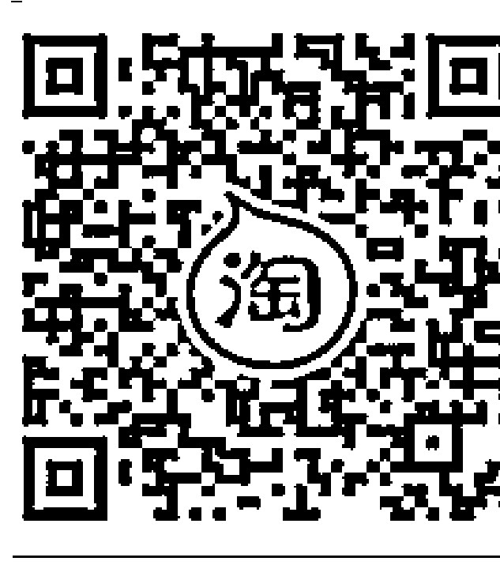
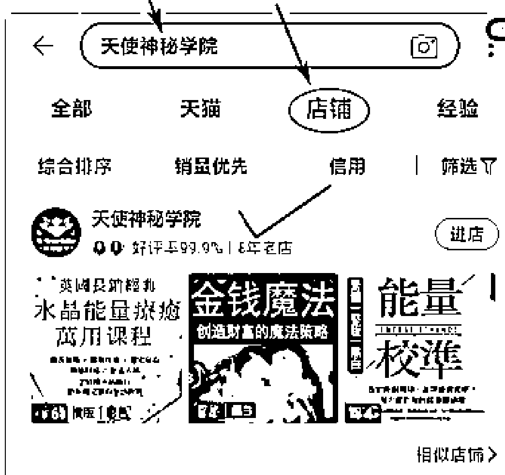
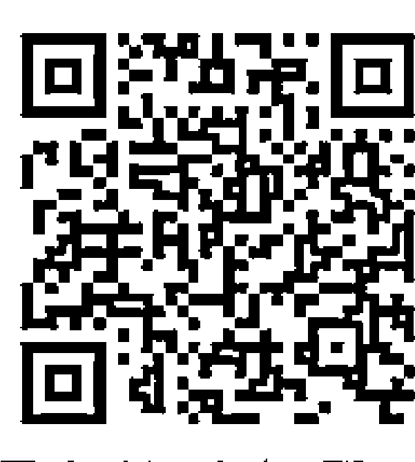
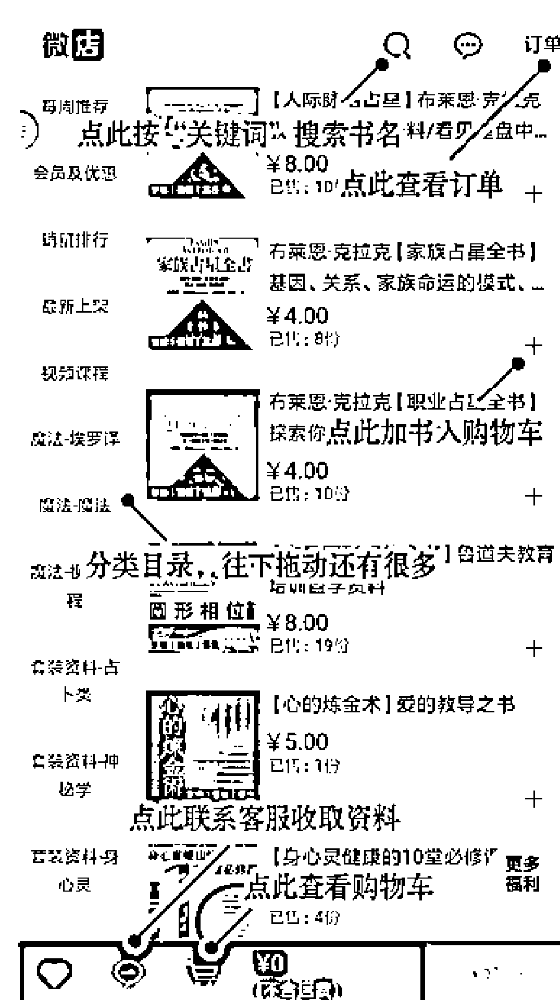
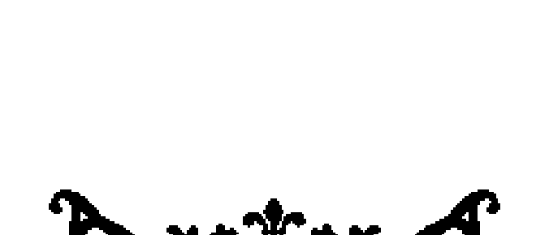
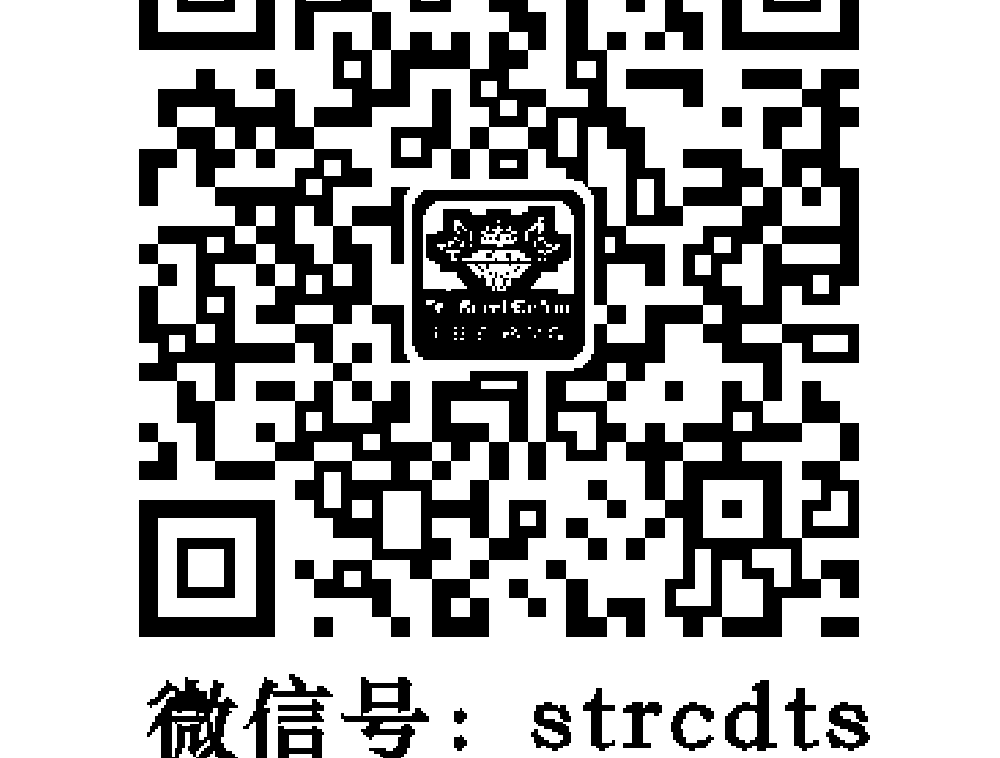
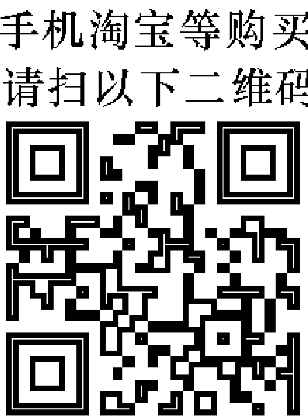
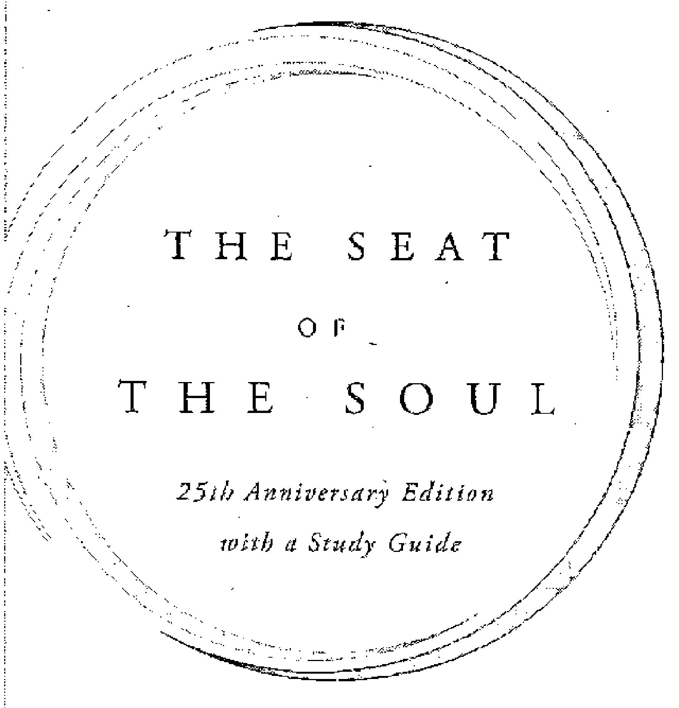
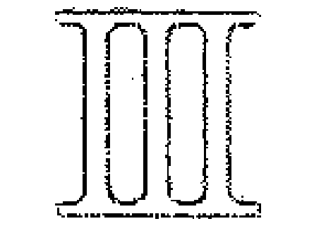
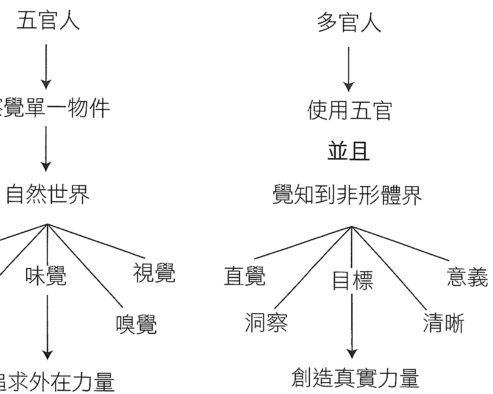

無條件的愛屬於靈魂，是當下的、宇宙的、無限的。

## 二十五週年紀念版

#### 新靈魂觀

### 開啟真愛之旅

## THE SEAT OF THE SOUL
25th Anniversary Edition with a Study Guide

蓋瑞·祖卡夫——著    廖世德、蔡孟璇——譯

## 福利公告：

凡在【天使神秘学院】购买任何电子资料赠送实体书，详情请咨询店铺客服！

备注：如客服不知道这活动你可能进了盗版店铺！赠书活动仅在以下正版店铺购买有效哦！

### 【天使神秘学院】淘宝店
手机淘宝扫以下二维码

-   1、打开手机淘宝：搜索“天使神秘学院”
-   2、点击“店铺”按钮就是

### 【天使神秘学院】微店
手机微信扫以下二维码

用手机微信扫码进店

### St. Royal College

### 天使神秘学院

-   - 神秘学资料库
-   神秘学培训机构
-   水晶能量研究中心
-   专业占卜预测机构
-   官方微信：strcdts
-   微信公众平台：strc2011
-   官方店铺网址：http://strc.cr.cx
-   读书交流QQ群：
-   占星塔罗占卜师交流群：814594478（加入密码：PDF）
-   神秘学其他综合群：659338717（加入密码：PDF）

微信号：strcdts
天使神秘学院

微信公众平台：strc2011

## 制作说明：

本书由《天使神秘学院》出重金从台湾购入的原版书籍扫描制作完成。为达到最好阅读效果，特地把书全部切开后，再经由专业扫描设备高精度扫描完成，并经过一张张的PS后期处理最终成书，其间花费大量的人力、物力以及时间，只为能给大家提供经济并优质的神秘学学习资料而努力。

本学院强力谴责某些机构和个人，把本学院花心血制作完成的电子书籍，包装后直接放在自家淘宝网上低价倾销的行为，以谋取不劳而获的经济利益。如果长此以往最终将无人愿意再为大家花心思制作电子书，那以后可能大家再无新书可读。

为让大家以后能够读到更多的好书，也为了本学院的良性发展。本学院恳请大家尽量做到如下几点：

-   1. 尽量在天使神秘学院的官方网站购买电子书籍。

    **官网电脑访问地址 : http://strc.cr.cx**

-   2. 在收到电子书后小范围传阅即可，千万不要公开传播，更别挂到淘宝网上低价销售。

同时为答谢广大支持者，学院电子书将做如下调整：

-   1. 学院会把一些早已收回制作成本的电子书折价销售。
-   2. 最新制作的电子书籍会开放打印功能，大家购买后有条件的可自行打印成书。

天使神秘学院
2020年5月

蓋瑞・祖卡夫 —— 著
廖世德、蔡孟璇 —— 譯

二十五週年作者增訂版

### 開啟真實力量之旅
#### 新靈魂觀

帶著愛、敬意與感激，將本書獻給我的父母：莫里斯·祖卡夫 (Morris L. Zukav) 與蘿琳·祖卡夫 (Lorene Zukav)

感謝琳達·法蘭西絲（Linda Francis）那洋溢著喜悅的愛、不間斷的支持，以及無盡的創意；自一九九三年以來，或許更久之前，她一直是我的靈性伴侶。我經常感到吃驚，在我們的溫柔與力量對抗之間，我不只是愛她，也喜愛那份愛著她的感覺。這部經過增訂、重新激勵、再次貢獻的版本，攜帶著一份我們共同的承諾：創造真實的力量與靈性伴侶關係，同時也支持世界各地的人創造它們。謝謝你，親愛的。

## 目次

- 欧普拉推荐序 9
- 马雅·安洁罗推荐序 15
- 赖佩霞推荐序 19
- 二十五周年版作者前言 24
- 初版前言 30
- 引导 37
- 1 进化 37
- 2 业力 48
- 3 敬意 60
- 4 心 69
- 创造
- 5 直觉 85
- 6 光 96
- 7 意圖（一） 108
- 8 意圖（二） 120
- 責任
- 9 選擇 133
- 10 上癮 144
- 11 關係 156
- 12 靈魂 168
- 力量
- 13 心理學 183
- 14 假象 194
- 15 力量 206
- 16 信任 217

### 《新靈魂觀》二十五週年紀念版序文

歐普拉 (Oprah Winfrey)

我第一次讀《新靈魂觀》的時候是一九八九年。我買了許多本送給朋友和同事，讓大家可以一起來讀，我對每一本讓我感到興趣盎然的書一向是這種做法。剛好，我是第一個讀完這本書的人，而這也表示，我找不到人和我一起討論這本書的內容！

因此，我找到了加州沙士達山（Mount Shasta）的電話簿，直接打了一通電話給蓋瑞·祖卡夫。

「祖卡夫先生，哈囉，我叫歐普拉，我只是想和你聊聊你的書，邀請你來上我的節目，分享你的......」

「歐普拉 O-p-r-a-h，h不發音，」我解釋道。然後我告訴他，自己是一個談話節目主持人，而且還得向他解釋談話節目是什麼，因為蓋瑞已經好幾年沒看電視了。而當然，這讓我更加渴望與他聊一聊。我想知道他是怎麼知道書上這些事的。他寫的東西引起我深深的共鳴，而且感覺非常真實，但是，他怎麼確定這些是真的呢？

* * *

《新靈魂觀》改變了我看待自己的眼光。它讓我在處理公事與私人關係的方式上，出現了深刻的轉變。這本書在完美的時間點出現，那是我生命中已經準備好要進一步敞開自己、迎向更多可能性的時刻：更多的聯結、更多的和諧、更多的平靜、更多的喜悅。我可以察覺到，我們的存在遠不止是每天一成不變的日常工作、工作與各種關係的例行活動，它還有更多東西，生命有更多超出我們五官所能掌握的東西。《新靈魂觀》將我自己的靈魂已經知道、而且一直在試圖告訴我的東西化為了文字。看見那些我尚未找到合適語言清楚表達的東西躍然紙上成為印刷字，真是個猶如醍醐灌頂的歡喜經驗。我第一次讀到「多官知覺」這個名詞時，我覺得蓋瑞觸動了某條敏感神經。事實上，這本書感覺就像是一個多官式的大爆炸。讀過這本書之後，無論到任何地方，我都能帶著新的領悟看待並且體驗人生。

蓋瑞的書是一個又一個的「啊哈！」時刻，一再指引我朝著正確的方向前進。我最喜歡的洞見是：「人格開始完全為他靈魂的能量服務——這就是獲取了真實的力量 (authentic empowerment)」。我的人格很大，這不是什麼秘密。我從小學三年級開始就一直在充分利用它。但是談到利用這個人格服侍我的靈魂，而且確保這兩者的一致，這改變了我做所有事情的方式。我突然認出了那些讓人格操縱一切而走偏的時刻。我開始注意到，我感到不開心、不舒服或絕望的程度，與我自己偏離靈魂的居所有多遠，呈現等量的比例關係。

書中最令我震撼的章節是談論意圖的部分。這些話已經成了我生活的座右銘：

> 「我們的每一種行為、意念、感情，都是意圖激發的，意圖的存在是因，是因就有果。只要參與了因，就不可能不參與果。我們都要為自己的行為、意念、感情負責——也就是為自己的意圖負責，最深刻的道理就在這裡。」

> （譯注：這段話出現在第二章〈業力〉。）

這些話改變了我的人生。

在閱讀《新靈魂觀》這本書之前，我飽受「取悅他人」這種疾病所苦。和數百萬多數是女性的人一樣，我是他人需要、欲求與渴望的奴隸。當我極度想說「不」的時候，我還是會說「是」。無論別人要求什麼，我都會付出寶貴的時間、精力、金錢、禮物等等，純粹是為了避免可能惹別人不高興。我曾經從芝加哥飛到西班牙，為一個朋友的慈善活動站台不到四十五秒鐘，又立刻飛回去繼續進行我的節目工作，只因為我實在不知道如何開口說「不」。直到現在，我都還說不出那個慈善活動是做什麼的。

這類事情過去經常發生。我的生活就是一個活動接一個活動，旋風般來去，馬不停蹄的演講邀約，幾乎只要有人邀請我，我就出現。我想要人們喜歡我。只要我給了他們想要的東西，我就以為他們會喜歡我。

我的突破來自於認知到我想要人們喜歡我的意圖，正是造成所有這些要求的原因。

因與果。如果你的意圖是做他人想要的事，他們就會一直要求你做這些事。那真是個令我豁然開朗的「啊哈！」時刻啊！當我將我的意圖改變成做我想做的事、做我覺得值得我付出的事，結果就自然改變了。

二十五年過去了，今天，帶著有意圖的目標來行動幾乎就像呼吸一樣自然，但是我過去必須從《新靈魂觀》的書頁間學到這件事。蓋瑞·祖卡夫的意圖法則，從根本上改變了我的每一個行為。它甚至改變了《歐普拉秀》的意識。節目剛開始的時候，製作群會在每星期一次的流程會議裡提出新點子，但是自從我在《新靈魂觀》讀到蓋瑞的觀點之後，我制定了一個新的政策。我對每一個製作人說：請先提出你為這個節目立定的意圖。你想要做什麼？你想要呈現什麼結果？

有時候，那些一年必須填滿兩百個節目單元的製作人，會編造一個意圖來安撫我，但我會說：「不行，這理由不夠好。」即使那意圖除了「我們只想提供娛樂，提高收視率」之外，沒有別的價值，我還是鼓勵所有的人將意圖交代清楚。清楚交代出意圖與目標，結果自然會跟著來。

***

一九九八年，蓋瑞．祖卡夫首次上我節目的時候，我們討論了靈魂的本質，那場訪問為我的職業生涯開闢了一個新的方向。在日間電視節目談論靈性方面的題材，這件事從來沒有人做過。談論意識、責任、意圖，以及因果法則，並不是會獲得高收視率的電視節目，但是我告訴自己：現在不做，更待何時？坦白說，要不是我擁有並且主導了這個節目，蓋瑞這些年來三十六次的應邀現身就永遠不會發生。我的製作群在一開始就相信，電視節目尚未準備好要談論靈魂這種事。

然而，我所選擇的方向讓我受益良多。我也持續在我的OWN有線電視網探索生命的精神面。憑心而論，如果我沒有讀過《新靈魂觀》這本書，我相信自己連做夢都不會想到要創造這樣一個有線電視網。

我在「歐普拉女子領導學院」（Oprah Winfrey Leadership Academy for Girls）教授領導課程時，借重了《新靈魂觀》的幫助。我利用書裡的原則來教導小學生、高中生、甚至是凱洛管理學院（Kellogg School Management，譯注：西北大學的管理學院）的MBA學生。每當有人讀到這本書，感受到我二十五年前所感受到的驚奇，我便感到無比歡喜。如果你已經準備好要用新的眼光來看世界、如果你已經準備好敞開你的人生，為它帶來改變，如果你已經準備好接受醍醐灌頂的喜悅，我想你也能夠感受到這份驚奇。

#### 靈魂永遠不死，永遠存在

瑪雅·安潔羅（Dr. Maya Angelou）

勇氣是所有的美德裡面最重要的，因為若沒有勇氣，一個人就無法持續保有任何美德。我們可以偶爾友善、慷慨、公正、有禮、慈悲，但是要持續展現那些美德，需要展現高度的勇氣才能辦到。從童年開始，我們所受的教育就是我們的心、頭腦、人格、精神與靈魂是同一個空間，然後死去的時候也會一起離開。無畏而勇敢的蓋瑞·祖卡夫，在他的著作《新靈魂觀》中介紹了一個對我來說全新的概念，或說我年少時曾在黑人靈歌（Negro Spirituals）裡發現過的東西，當時我很困惑，因為歌詞說當死亡來臨，苦與樂、笑與淚都會在一起，它們也會一起走向死亡。然而，這首經常將上帝稱為靈魂的詩歌，卻告訴聆聽者：靈魂永遠不死，而是會繼續下去，賦予另一個心智與人格生命，也帶來其他的煩惱與喜樂。它們將會保有活著的體驗，直到死亡卸下他們的責任為止。然後，當他們死去之後，靈魂或者上帝仍會繼續存在，因為它不會死。祖卡夫是一位廣受敬重的思想家，他在《新靈魂觀》一書中告訴讀者，人類進化的達成，依靠的是靈魂的持續，以及人格能夠死亡而後生出另一個更好、更堅強、更勇敢一些的人格這樣的能力。

我不知道是否是祖卡夫內在的詩人接管了他的手，吩咐他說出令人難以下嚥的真相，而且就像柳樹順著書背優雅彎身那般輕而易舉。有些讀者選書是為了打發漫長的夏日時光，有些是為了假期的休閒娛樂而選書。選擇了《新靈魂觀》這本書的人，應該要把它放在靠近床鋪的書架上，或放在床邊那個配備著耐用燈泡的檯燈桌上。

我將我這本書的第二本放在廚房的桌子上，用塑膠膜保護著，讓它能耐得住多年的使用，也才不會讓新鮮沙拉裡的橄欖油弄髒封面。

在讀過祖卡夫這本書第十次之後，我仍然覺得它是驚世駭俗的。我記得自己寫過的一齣戲劇，劇名是《我依然奮起》(And Still I Rise)。劇中的兩個角色（一位男性、一位女性）死了，發現自己置身在一個自認為是等候室的地方。一個面孔猙獰的怪物出現了。名叫佐伯迪亞的男性角色說：「我知道你是誰，你就是守門人。你會帶我們去該去的地方，天堂或地獄。」

女性角色安娜貝爾補充說道：「我沒有辦法，但我真的試圖過一個良好的生活，乾淨、友善、公平。」

那個可怕的怪物一開始只輕笑了幾聲，然後逐漸轉為狂笑。他瞪著這兩個可憐蟲角色，然後說：「人類的想像力總是讓我覺得不可思議，甚至非常吃驚。佐伯迪亞和安娜貝爾，單是你們的未來，就可能有八百種不同的終點站。」

然，他們已近得可以擁抱了，於是他們擁抱了彼此。突

十九世紀的黑人靈歌歌詞是這樣的：

> 很快地，我會結束世間的一切苦惱，
> 世間的苦惱，
> 世間的苦惱，
> 我要回家見我的上帝。
> 不再流淚和悲嘆，
> 不再歡笑和跳舞，
> 不再哀悼和哭泣，
> 我要回家見我的上帝。

顯然，此處詩人決定讓日常生活的瑣事佔據一個空間，而詩人真正的靈魂則居住在詩人稱為上帝的另一個空間。

如果你是祖卡夫的新讀者，我建議你找一位神經強壯而且具有幽默感的人一起分享這本書，因為當祖卡夫的觀點對你來說不再是挑戰時，你便能和這位新大陸發現者一同開懷地歡笑。

不再流淚和悲嘆，
不再流淚和悲嘆，
我要回家見我的上帝。

> （本文作者為作家、詩人、劇作家、導演、演員、黑人民權鬥士，代表作爲《我知道籠中鳥為何歌唱》，敘述在美國南方種族主義與性別歧視下的親身經歷，成為美國非裔女性的文學見證。）

#### 放手，讓愛來做吧！

賴佩霞

你選擇「做憤怒，或做愛？」英文講「do Anger, or do love?」當我們負面情緒起駕的時候，你是否有覺知、有能力做選擇？與其讓自己的負面情緒傾巢而出，或，你很有意識地選擇讓愛來承攬整個局面？這就是意識的地位。

有意識的人，才能有所選擇，才是真正的自由人。否則，我們都將淪為自己負面情緒的受害者，同時也很容易變成沒有能力扭轉正向局勢的加害人。

當我收到出版社寄來的《新靈魂觀》書稿，一眼看到美國電視節目主持人歐普拉，還有另外一位在美國相當受敬重的美國詩人瑪雅·安潔羅的聯袂推薦時，本書就引起了我的注意。三十多年前，當我第一次踏上美國那塊土地，短短幾年，眼看歐普拉從眾多的談話性節目裡脫穎而出，不久便成了美國家喻戶曉、同時受人尊敬的女主持人。她一路的努力與成長，盡收眼底。加上我的母親長期住在美國，在世時勉強可以說是歐普拉的粉絲。歐普拉的動態，常常是我們去美國採訪她時，我們之間茶餘飯後的話題。也因為如此，慢慢地只要週間下午三點一到，我們母女倆就會很自然地泡兩杯咖啡，一起坐在電視前面參與她的心靈世界。歐普拉不只是主持人同時也是節目的製作人。記得歐普拉在一次節目中提到，大約八〇年代末期，當她第一次在節目中提到「靈性」時，現場來賓一片沉默，鴉雀無聲。這對於一個以現場觀眾場景為主的節目來說，非常尷尬。場面奇冷，觀眾沒有什麼反應。逼得她不得不停機，先跟觀眾作一番討論與溝通。原來，當年一般人對「精神上的事物」（Spirituality），只侷限在宗教上的解釋，這對於一般不上教會或不讀聖經的人來說，無非是一種沒有內容的空洞字眼。從此，她開始學習用不同的詞彙、解釋、說法，把靈性概念以新的角度介紹給大家。爾後，因為個人的靈性追求，她跨越了各界宗教的藩籬，把這些被認知為玄秘的領域，透過電視節目分享給電視機前的觀眾。以我來看，歐普拉成功地把她的節目變成了心靈成長追求者的教育平台。收視穩定，內容精彩，可看性高。由於歐普拉從小小年紀約五、六歲開始就深愛閱讀，看很多故事書，說故事很自然就成了她日後的專長。書海中，她認識了本書的另一位推薦者，非洲裔女詩人，同時也是一位相當受景仰的民權運動家瑪雅·安潔羅。她的人文素養深深影響著歐普拉，一直以來，都是歐普拉口中最敬愛而且也是最重要的心靈導師。早期還沒有這些心靈刊物、著作時，安潔羅的著作就是她心靈的典範。藉由採訪，二十多歲的歐普拉與她一見如故，長年培養出形同母女的深厚情誼，兩人間相互支持的溫馨對話，每每聽了都讓人動容。今年，二〇一四年五月二十八日，瑪雅·安潔羅辭世，享年八十六歲。

我之所以特別要提到前面兩位，無非是想讓讀者更瞭解本書作者蓋瑞·祖卡夫。

七〇年代投入寫作，一九八九年這本中文譯為《新靈魂觀》的書問世。歐普拉個人談話節目始於一九八六年，八〇年代末開始在節目裡討論心靈成長相關議題，這兩位在我們現在看起來，都是當時心靈知識傳播的開拓者。如今本書作者的著作銷售已高達六百萬冊，而歐普拉的節目更是全心投入在心靈成長的教育上。透過網路、書籍、雜誌等各種媒體，他們同聲提醒著人們「提升自己的意識，要做自己的主人，不要繼續讓負面情緒掌控，選擇讓愛來提昇自己的心靈世界。」

看完本書書稿，依照慣例，我會上網瀏覽作者的生平，看看他其他的著作，幫助我對作者有更完整的認識。

在鍵盤上打上：The Seat Of The Soul（本書的英文原著）。第一個跳出的封面好眼熟。我馬上把手提電腦往床邊一擱，從床上跳起來，站在枕頭上，回頭從我堆書成塔的床頭書櫃上搜索這本書。就在最上層的右邊角落，我看到了這本書的英文原版，就這樣直立立地站在那裡，我好不開心，趕緊把它從一排覆蓋塵灰的書中取出，擦去身上的书架，我再次翻阅这本书。想想这是一二十多年前的事了。
我在美国著名的连锁书店 Barnes & Noble（巴诺书店）闲逛，那正是我大量阅读灵性书籍的时期，只要一走到书店，一定迫不及待赶往“灵性”（Spiritual）或“自我成长”（Self-help）的分类区前去。当我在浏览书架上的书的时候，有一位面容慈祥的美籍老先生，面带微笑，看着我一本一本拿起、放下，拿起、放下，他终于开口说了，显然，他是一位爱好心灵成长的读者：“这一本 The Seat Of The Soul，你看过吗？”“没有，我不知道这本书。”我回答。他继续说：“这是一本我很爱的书，你要不要翻翻看，也许你也会喜欢。”
由于当时，我喜欢阅读像玛雅．安洁罗这类资深作家的作品，对于这位堪称年轻的新作家，因为了解不深，也就没有给太多关注。书架上各类新时代灵性成长的书如雨后春笋，琳琅满目，没有经过一些时间历练的作品，往往我就只是站在书店翻一翻，除非是已经被大量报道、深受好评的书，否则我不会轻易把它带回家。
于是，我就站在那里翻了这本他所推荐的 The Seat Of The Soul。过一会儿，老先生手里拿了几本新书，向我道别：“希望你喜欢，这本书对我影响很深，我很喜欢，祝你好运。”就这样，我就把这本书带回家了。这一转眼，它也跟了我二十多年了。
我想，当时我并没有花心思细读，为什么？不知道。但现在，把它从柜上取下再次翻阅，的确，经过这么多年的考验，它已经证明了它在灵性成长领域的地位与影响力。
再看看作者的照片，没错，他的确受到美国人很大的青睐，他的身影在西方很多电视、电台、书报杂志都出现过，也有很多关于他作品的介绍。
每个人都有七情六欲，每个人都有喜怒哀乐，每个人都会受伤、失望，甚至最让人受苦的嫉妒。这些都与学位无关，不是你书念得多，心中就没有这些、没有嫉妒。我所知道的灵性成长意味着，当负面情绪产生时，你选择让愤怒驾驭，或是让爱行使？
我在很多年以前就决定了要让爱来行使，虽然不容易，但我没有其他的选择。因为愤怒，让太多人受伤了。爱，我们每个人都有，只是我们要用心学习让爱扩张、扩大。
与可爱的人相处，行使爱，太容易。当我们负面情绪被激起的时候，这时候所行使的爱，才是淬炼，才叫成长。
下次当你悲伤、难过、愤怒、嫉妒、不平的时候，安静一下，让你平常就在培养的爱来做它能做的事。不要选择继续做出愤怒的行为，而选择做出爱。如果做不到，就静静的坐一下，沉淀一下，翻翻手上穿梭着正向能量的好书，舒缓一下情绪，也许，这就是爱的行使，选择做出爱的表现。延续当年老先生对我说的那句话：“希望你会喜欢这本书！
（本文作者为《魅丽杂志》发行人）

### 《新灵魂观》二十五周年纪念版前言
这部《新灵魂观》二十五周年版让我满心洋溢着感激和喜悦。当我在二十五年前完成这本书的手稿时，我坐在稿子旁，怀疑有谁会读这本书，若真的有人读了，又有谁能了解这本书呢？当我思忖着这些问题时，脑袋里出现了另一个念头，而且益发响亮、清晰。它说：“别担心。这个箭头自己会找到它的标的。”《新灵魂观》现在已经打动了数百万人的心，而那个箭头至今仍在向前奔驰。
我在撰写我的第一本著作《物理之舞》（The Dancing Wu Li Master）的时候，十分惊讶地发现了那来自我无法形容的、超越头脑的无形智慧灵感，以及带着建设性意图自觉地创造的那股能量流。我从未体验过这样的事。我喜爱这些经验，但是在著作完成之后，我却忘了大部分的内容。因为这本荣获美国科学图书奖的《物理之舞》，我成为了让现代科学普及化的功臣。许多人期待我再撰写一部续集，像是《第二代物理之舞》之类的著作，以解释更多先进的科学。但是，我的下一本书却是关于进化、转生、业力与灵魂。它讲的是感情觉察、负责任的选择，以及直觉。它谈的是关于史无前例的人类意识转变，以及一种新力量的诞生，也就是真实的力量。简而言之，这本新书谈的是一种
新的人类物种，它的新能力，以及它的新潜能。
这本书就是《新灵魂观》。其实我自己比谁都更加惊讶。我在撰写《物理之舞》时所出现的一切惊人灵感再度降临，以强势、精准、不可逆转的方式进入了我觉知当中。我发现了非形体的实在界，而我现在依然在那样的发现里成长。所有具有创造力的洞见。人，这指的是每一个人都必须要能够承担，要付出时间与勇气来成长，并深入自己的灵感是一回事，将它灵活应用在你的生活上又是另外一回事。我的朋友玛雅·安洁罗告诉我，有人告诉她“我是个基督徒”的时候，她回答：“真的吗？已经是了吗？我现在八十多岁了，还在尝试中。”就和玛雅一样，我依然在学习，依然努力应用我生命中最意义的洞见，也依然在变得更好。
深满足的经验。在《新灵魂观》问世的二十五年之后，重新阅读这本书，是个完全惊喜与令人深
画满了线。这部著作似乎很完美，每一个句子对我都很有意义，因此整本书很快便
滋育着我、抚慰着我。我渴求着读这些字句。它们就像水渗入干燥的沙漠一般沉淀至我内心。它们
多。我乐在其中。我在撰写这本书时所感受到的祝福又回来了，而且扩大了数倍之
了许多年。我以为这些我早已经知道了，毕竟，当初是我打字、编辑的，更谈论
学习，还有更多东西要实践。

### 《新灵魂观》让我认识了许多了不起的人。其中有两个人，他们对我的影响之深超乎我的想象，而且一直以来，他们对我的支持总是令我感到兴奋与惊喜。第一位是琳达·法兰西丝（Linda Francis）。我不记得我们初次见面是什么时候了，不过她还记得。第二次见面是在我参与演讲的一次静修活动里，当时见面的细节我至今仍记得一清二楚。我被充满爱心的人包围，但我却将他们里面的其中一个人推开，那个人就是琳达。我不想接受她免费给予的任何拥抱。那是我第一次获得一些线索，知道我内在的某个部分感受到来自她的威胁，但我的觉察力仍不足以认出这一点。活动期间，我一直避不开她，例如一位朋友为我在音乐会保留了一个位置，另一位朋友也为琳达保留了一个位置，而这两个保留的位置竟然连在一起。于是，我开始与她分享我的好奇心。为什么我单单想要推开她一人呢？我和她分享了我不想被这种不寻常的冲动控制的原因。“我不会拒绝你的爱”，我这么告诉她，我指的不是罗曼蒂克的爱情，而是她在静修活动里对朋友明显感受到的爱意，她也将它给了我。活动最后，朋友邀请我加入他们，到一座瀑布玩水冲凉，当他们建议我邀请琳达时，我变得有些恼怒。琳达！琳达！为什么什么都是琳达？在这场活动里，我可不可以做一些没有琳达的事？后来琳达打电话给我，告诉我她要搬来加州的沙士达山（Mount Shasta），也就是我居住的城市时，我再次感到害怕，但那是她参加静修前早已决定好的。我再次对自己的反应感到好奇。然而，当朋友和我欢迎她搬入新家的时候，我惊讶地发现自己竟如此期待她的到来！我感到非常放松、舒服、开心，而且敞开。我们开始互相拜访。有些谈话我非常享受，有些则不然，但我发现自己对我们的每一次对话都充满了期待。几个月之后，有个念头突然出现在我脑海：“我想我已经置身一段关系里了！”我的前一段关系是由性互动所开启的，而在没有这种互动的情况下，一种全新的、截然不同的互动开始发生了。这些互动让我初次体会到一种以灵性成长为目的、实质的、深刻的关系，亦即灵性伴侣。半年之后，大约是二十年前，她搬进了我的小木屋，我们这趟旅程一直持续到今天。
我们在一起的这些年，让我感到惊奇的是：我不只爱着琳达（当初我遇见她的时候，我觉得自己并没有能力做这件事），而且更喜爱爱着她的感觉！这种体验令我着迷，直到现在，这种感觉仍然和我当初发现它时一样强烈。这感觉到底从何而来呢？
第二个人是欧普拉。她是宇宙挑选来让我从默默无闻的地方爆发，跃登至大世界的工具。我想只有这样的爆发能办到这一点。她带领着我进入她的心、她的创意，以及她知名的一切。《欧普拉秀》里。刚开始，我只是个住在山上的隐士，几个月之后，我突然每个月都在一千万人眼前讲话。无论我走到何处，新朋友就会出现，然后谢谢我在节目上所说的一切，或从远方朝着我微笑。我花了很久的时间才明白，我的孤立生活结束了，甚至花了更久的时间才能欢迎这种新生活的到来。
在每一次的节目里，欧普拉和我会坐在一群寻求若渴的观众前，以及来自全球各地的人类同胞面前，她会先介绍一个主题，问我几个问题，然后藉着她的手势或脸上的表情，将数百万人的注意力转移到我身上。这是个吓人又美妙的经验，“神圣”或许是更好的形容词。当一个全国性杂志追着我邀稿时，她给我忠告：“这不过是华而不实的棉花糖，盖瑞，就只是棉花糖。”有比这更好的词汇来描述外在力量吗？和我有收养关系的苏族（Sioux）叔叔菲尔·连恩（Phil Lane, Jr.）在一次收看过我们节目之后曾告诉我：“侄儿啊，你说话的方式像老一辈的人。”这个回忆让我心里充满力量与感激。我感谢欧普拉和这个宇宙，为我带来所有这一切的经验。
参与欧普拉节目之后的几年间，我和琳达共同创办了“新灵魂观学院”（The Seat of the Soul Institute），举办了许多活动、写书，而且规画出供小团体研习的长期进阶课程。如今，我们对提供支持与对灵性伴侣的热情，比以往都更为强烈，但是舟车劳顿的旅行对我们来说是种负担，所以我们也创造了新的数字工具与网络的创新使用方式，例如持续提供支援课程 eCourse、eNewsletters、线上的“灵性伴侣社群”（Spiritual Partnership Community），以及收录在本书《导读》最末的一些网站链接（将它输入你的 eBook，或在浏览器输入网址，就能前往一些网站，协助你进一步探索、整合、应用你的所学）。你也可以在 SeatoftheSoul.com 网站里发现所有这些资讯。
我和琳达在情况允许的时候，依然享受举办现场活动，包括我们最喜爱的、年度的“灵魂之旅”夏日静修营。我希望我能在其中一场活动里和你相遇。
网际网路是一种存在于五官领域的反映，反映出我们对彼此的连结新生起的意识。
它并不会创造，甚至不会增加我们彼此的连结。我们和彼此、和生命的某些连结，不可能比现在更多。一朵花能够和它的颜色有某些连结吗？让我们一起好好享受这个美妙的反映与它所反映的东西吧！
自《新灵魂观》出版以来，最困难、最令人满足与兴奋的经验就是我在真实力量与创造真实力量方面的经验。灵性伴侣与共同创造所带来的丰美经验，以及我对生命的敬畏，已经慢慢取代了我将人们视为事物的经验，也取代了我带着愤怒、嫉妒、优越、自卑、绝望所踏上上的惨痛旅程。我依然会遇见那些愤怒、嫉妒、优越、自卑的人格部分，但是现在，我已将它们视为创造真实力量、重新做选择的宝贵机会。如果我可以办到，你也可以。我知道你终究可以的。意识的蜕变能将我们的知觉拓展至五官之外，能重新定义力量，并将我们身为宇宙人的潜能显示予我们，而它正以火力全开的速度在进行着。
每一个恐惧的选择，例如愤怒、嫉妒、报复等，都会透过恐惧所创造的破坏性痛苦结果而带来不自觉的进化。每一个爱的选择，例如感激、耐心、欣赏等，都会透过爱所创造的建设性健康结果，带来自觉的进化。
何不选择自觉的道路、喜悦的道路？何不自觉地走在这段通往灵魂居所的旅程，将你的世界注满爱并活在那个地方？那地方就是你透过意图将能量转变为物质的所在。
所有的路都能带你回家。

### 初版前言
写《物理之舞》当时和以后那几年，詹姆士（William James）、荣格（Carl Jung）、沃夫（Benjamin Lee Whorf）、波尔（Niels Bohr）、爱因斯坦（Albert Einstein）这些人的著作一直吸引着我，使我再三拜读。我在他们的作品里，发现一种很特殊的东西；但是，我却一直到后来才了解这种特殊的所在。这些人都触及了一种东西，可是却无法直接从作品中表现出来。他们看到的东西，用心理学、语言学、物理学的语言无法表达出来，但是他们却努力要和我们分享他们的所见。当时吸引我的，就是他们经由作品努力想和我们分享的东西。
他们都是神秘家。这是我说的。他们虽不说神秘家的话，然而他们懂。如果把他们和不用科学模式工作的人产生关联，他们又会担心自己的工作受到污染。不过，在内心深处，他们却看到太多东西都受到五官的限制。当然他们自己没有。他们的著作不但造成心理学、语言学、物理学的进化，也造成读者的进化。他们能够改变同样也触及如他们所见的读者。只是，读者触及的方式一样也是无法用心理学、语言学、物理学的语言表达的。我在回想中开始了解他们的作品吸引我的地方。我一开始了解，也就跟着了解他们的原动力并不是世俗的回报、同僚的尊敬，而是灵魂和心灵都专注于某一样东西上面，从而达到一种超凡的境界。他们的心灵在这种境界里面，不再产生他们原先想要的资料；他们置身于灵感的境地，内在的直观一直加速，发现有一种东西是超越时空，超越物质，也超越自然生命。他们知道，因为他们没有什么方法可用来说这种东西，所以他们不一定说得清楚；不过他们却感觉得这种东西，而且还从作品里反映了出來。换句话说，我了解到的是，这些人，以及其他很多人原动力，事实上是一种大悟。这种大悟来自于“人格”（personality）之外。事实上，这种大悟如今已经开始吸引我们每一个人，只是方式各有不同而已。这种大悟不只是悟，而且还是一种新生的力量。我们进化的旅程，下一步就是这种悟。人，人类，如今开始渴望接触这股力量，渴望消除干扰，以便确确实实和这股力量接触。只是，要表达这一股新生的力量，这一股永恒的力量，大部分的问题在于词汇，因为这样的词汇还没有诞生。然而，人类进化的这一时刻，这种适当的词汇和表达方法，已经开始在渴望诞生，那股力量亟欲取代宗教情操和灵性，进驻“真实力量”（authentic power）这一个地位；适当的词汇和方法就是要来表达这个东西的。我们身为一个物种，如今第一次自觉的触及这个东西，所以我们应该给它一个清楚的词汇，让人类在行动与判断中能清楚辨认。我们要看得明白，不再披着神秘事物或神秘论的面纱，而要毫无疑问地看到这一股真实力量在我们这个人间的力场上运动。这一点，我希望本书有所助益。
要谈我们是什么东西，又要变成什么东西，我有一个方法。我用的是“五官”（five-sensory）和“多官”（multi-sensory）这两个名词。多官并不是比五官好，只是在目前比五官恰当。随着旧经验体系的式微，进步经验体系的产生，旧体系比较上就会显得不足。但是从宇宙的观点看，比较的语言说的并不是多少、好坏，而是局限与机会。
多官人的经验，局限比五官人少，提供的成长机会和发现机会比较多，也比较有机会避免莫须有的问题。我一直拿五官人的经验和多官人的经验比较，希望尽可能将两者的差别弄清楚。但是，这种比较并不表示我们目前进化上的五官阶段，比我们即将进入的多官阶段差。我们的比较，意思只是说，五官如今已经不适合。这就好比因为有了电，所以点蜡烛不再适合一样。然而，电的发明并没有使蜡烛变成不好。
我们有谁是人类经验的专家？我们有的只是共享知觉的天赋，希望对踏上旅程的人有所帮助而已。所以没有所谓的人类经验专家这种人。人类经验是“动”的经验，是思想和形式的经验；有时候且是“动”的实验，思想和形式的实验。我们所能为者，充其量只是评论这种“动”，评论这些思想和形式。但是，只要评论者能够帮助人行动雍容，思考清晰，像艺术家一般组织生活物资，那么他们的评论自然就很有价值。
我们置身于一个深层变革的时代。如果我们能够看清自己要走的路，看清自己的目的地，看清何者在不停运动，我们就能够承受变革，走得很轻松。我在本书提出的东西是一扇窗户。我从这扇窗户看到了生命。现在，我将这扇窗户提供给各位。但是，我没有说各位一定要接受。条条道路通智慧，通心灵。这是我们最大的财富，也给了我最大的快乐。
我们有很多事一起做。
让我们用智慧、爱、欢乐来做。
让我们把这件事变成人的经验。

## 引导
INTRODUCTION

## 1 进化
我们在学校里学的进化是自然界的进化。譬如，我们说，海洋里的单细胞生物是一切复杂生命的祖先。所以，鱼比海绵复杂，比海绵演化充分。所以，马比蛇复杂，比蛇演化充分。以此类推，直到最复杂的人类。所以人类是地球上演化最充分的生物。总此，换句话说，学校里教我们就是，组织复杂度的进步发展就是进化。这个定义表达了一个观念，那就是，最能够控制环境和其观念表示，在一个环境里面，凡是居于食物链最高点的有机体，就是演化最充分的有机体。“适者生存”这一证自己生存、最能够维护自己生命的有机体，演化程度也最高。我们早就知道这个定义有缺陷，但是我们不知道为什么。两人联姻，就组织的复杂度而言，他们两人的演化程度是一样的。如果两人智力相等，可是一人自私吝啬、心胸狭窄，另一人却宽宏大量、利他让人，我们就说这个宽宏大度的人演化比较充分。一个人用自己的身体抵挡枪炮或汽车，自觉地牺牲自己的生命，拯救他人，我们就说这个人的演化已经达到最高。我们知道
这些事情都是真的。然而，这却和我们所了解的进化不一样。据说，耶稣事先就看到有人要谋害他的生命，他连他的朋友要采取什么行动，要怎样接应这些细节都知道。但是他却没有逃避。他将自己的生命“给了”别人；这样的爱和力量，影响了所有的人类。所有尊敬他的人都认为，他是我们这个物种演化最高的人。即使只是知道他的故事，差不多也都同意这一点。
我们深刻地了解，一个真正演化的存有（being），重视他人甚于自己，重视爱甚于自然界及其一切。所以，现在我们应该将自己对进化的了解和这种深刻的了解衔接起来。这一点非常重要。因为，我们目前对进化的了解，反映的即是我们即将离开的阶段。仔细考察这种了解，我们将认识自己是怎样演化成目前这个样子，离开的过程当中我们又是什么样子。然后，再回想新的、开阔的——和我们最深的真相一致的——了解以后，我们将看到自己以后演化的情形，看到就我们的经验，我们重视的事物，我们的行动而言，这种演化情形有什么意义。
我们目前对进化的了解，是一个事实的结果。这个事实就是，我们演化至今，一直都是藉五官来探索自然界。到现在为止，我们一直都是五官的人类。这种进化的途径，使我们用具体的眼光看宇宙的基本原理。我们从五官看到每一个行动都有因，有因就有果，每一个果都有因。我们看到自己的意图会产生结果。我们看到愤怒会杀人。愤怒夺走呼吸——生命力，使我们流血——生机的媒介。我们看到仁慈滋育人心。我们看到，
也感受到咆哮的后果、微笑的结果。
我们体会到自己处理知识的能力。譬如，我们发现棍子就是工具。我们看到我们怎样用它，它就产生怎样的效果。棍子可以打死人，也可以敲柱子入土盖房子；矛可以取人性命，也可以当横杆，减轻人的负担；刀子可以割肉，也可以裁布；手可以制造炸弹，也可以建设学校；心可以计划暴力行为，也可以协调合作行为。
我们看到生活行为如果注入敬意，就会生意盎然，充满意义和目标。我们看到生活行为如果缺乏敬意，结果就是残酷、暴力、孤独。大自然竞技场是一所学校，这所学校里，透过实验，我们知道什么东西使我们扩展，什么东西使我们萎缩；什么东西使我们成长，什么东西使我们退步；什么东西滋养我们的灵魂，什么东西使我们灵魂枯竭；什么东西有效用，什么东西没有效用。
由于只用五官的观点看自然环境，所以，因为我们看不到别的进化方式，于是生存变成了进化的基本规条。就是因为这种观点，因此“适者生存”似乎成了进化的同义词，主宰自然似乎也成了高等进化的特征。
由于我们对自然界的知觉受到五官的局限，于是我们成了大自然竞技场上生命的基础。控制环境及环境事物的力量似乎成了不可或缺的力量。
主宰自然的需求制造出一种竞争。这种竞争又影响到我们生活的每一面。这种竞争影响爱侣的关系、家族的关系、手足的关系、种族的关系、阶级的关系、两性的关系這種競爭破壞了國家之間、朋友之間那種和諧相處的自然傾向。使十字軍東征巴勒斯坦、美國軍艦駛向波斯灣、美軍進駐越南的，就是這種能量。使羅密歐家族和茱麗葉家族隔絕的能量，就是使黑人丈夫本家和白人妻子娘家隔絕的能量。使奧斯華（Lee Harvey Oswald）行刺約翰・甘迺迪的能量，就是使該隱殺害亞伯的能量。兄弟姐妹爭吵，理由和公司爭吵一樣——都是要爭取力量、控制對方。控制環境及環境事物的力量，就是要控制一切所感、所聞、所嚐、所聽、所見。這種力量是外在的力量。外在的力量和股票、選舉一樣，可得也可失。外在的力量可買，可偷，可以轉讓，可以繼承。我們認為外在力量可以從他地或他人身上獲得。一個人得到外在力量，即是另外一個人失去外在力量。準此，將力量以外在視之，造成的結果便是暴力、毀滅。我們所有的社會、經濟、政治制度，都反映出我們將力量視為外在（external）的觀點。家庭和文化一樣，有父系也有母系。人要「穿褲子」，小孩子從小就學會這一點，於是這一點塑造了他們的生活。警察和軍隊一樣，都是「外在力量」這種知覺的產物。徽章、警棍、階級、無線電、制服、武器、盔甲，這些東西都是恐懼的象徵。佩帶這些東西的人，心裡都有恐懼。他們害怕毫無防備地走進世界。看到這些象徵的人也有恐懼，他們或者害怕這些象徵代表的力量，或者害怕等同於這種力量的人。也許兩者都怕。警察和軍隊，如同父系或母系家庭、文化，都不是把力量當外在看待」這種知覺的起因。剛好相反，這些東西反正是我們身為一個物種和個體看待力量的方式。將力量視為外在的知覺，塑造了我們的經濟。控制社群與國家經濟能力，控制國際經濟能力，集中在少數人手裡。所以，為了保護工人，我們建立了工會；為了保護消費者，我們建立了政府部會；為了保護窮人，我們建立了福利制度。這些東西就是最好的反映，顯示我們是怎樣地看待力量——少數人占有多數，多數人則當受害人。金錢就是外在力量的象徵。最有錢的人也最有能力控制環境，控制環境事物。金錢可以繼承，可以爭奪。教育、社會地位、名聲、財產這些東西，如果我們能夠從中獲得安全感，便是外在力量的象徵。不管什麼東西，房宅、汽車、吸引人的身體、敏捷的心思、深刻的信仰，只要我們擔心會失去的，都是外在力量的象徵。我們擔心的是自己會脆弱下來。這種擔心就是從視力量為外在而來的。一旦將力量視為外在，社會、經濟、政治的階層結構，都成了指標，指明誰有力量，誰沒有力量。最上面的，力量最大，所以價值最高，也最不脆弱。最下面的，力量最小，所以價值最低，也最脆弱。從這樣的知覺看，將軍就比二等兵有價值，經理比司機有價值，醫生比接待員有價值，父母比孩子有價值，神比崇拜者有價值。我們都不敢冒犯父母、老闆、上帝。這一切人格有高有低的知覺，都是從視力量為外在而來。

追求外在力量的競爭是一切暴力的核心。一切意識形態的衝突（譬如資本主義對共產主義）、宗教的衝突（譬如愛爾蘭天主教對愛爾蘭基督教）、地緣的衝突（譬如猶太人對阿拉伯人），背後的二度收益都是外在力量。

視力量為外在的知覺，使我們的心靈（psyche）分裂——不論這心靈是個人的心靈、社群的心靈、國家的心靈，還是世界的心靈都一樣。世界發生戰爭和重症精神分裂沒有兩樣。破碎的靈魂和破碎的國家，兩者的痛苦是一樣的。先生和妻子競爭力量的時候，他們發動的動力，和一個種族害怕另一個種族時發動的動力都一樣。我們就是從這樣的動力學形成了目前對進化的了解，那就是，主宰環境和他人的能力一直增加，就是進化。這個定義反映出用五官知覺自然界的局限，也反映出外在力量的競爭就是源自於恐懼。

經過了一千年對他人的野蠻，個人對個人的野蠻，團體對團體的野蠻，我們現在已經知道，視力量為外在在這種知覺背後潛藏的不安，無法用外在力量的累積來消除。視力量為外在的知覺，只會造成痛苦、暴力、毀滅。這一點我們每個人都看得到——不但是每一次的新聞節目，每一天的晚報都在說，我們自己身為個體、身為種族所受的無數痛苦，也在告訴我們，我們就是這樣演化至今。但是如今我們即將揚棄。

我們深刻的了解已經開始引導我們走向另一種力量。這種力量愛每一種生命，不判斷自己遇見的事物，在世界最微小的事物上也能知覺到意義和目標。這才是真實的力量。我們一旦把自己的思想、感情、行動，和自己最高的部分銜接起來，我們便會充滿熱情、目標、意義。生命豐富圓滿。我們沒有痛苦的意念，沒有恐懼的記憶。我們快樂地和世界結合在一起。這些都是真實力量的經驗。

真實的力量有我們的存有最深處的根源。真實力量買不到，無法繼承，也無法囤積。真正獲得真實力量的人，無法使誰變成受害人。真正獲得真實力量的人非常強，充滿力量，所以他的意識裡面，沒有霸道對人的觀念。

我們已經開始走向真實的力量。獲得這種真實的力量，是我們進化過程的目標、我們存在的目的。任何一種對進化的了解，如果其核心不這樣認為，都是有缺陷的。我們已經開始從追求外在力量的物種，演化為追求真實力量的物種。我們即將離開完全以探索自然界為進化手段的階段。對於我們必須變成的物種而言，這種進化手段已經不夠，從受限於五官的覺察力產生的意識也已經不夠。

我們即將從五官人演化為多官人。我們的五官，整個形成一個感官系統，為的是要知覺形體界。多官人的知覺，卻從形體界擴展到各大動態系統。我們的形體界只是這些大動態系統的一部分。多官人能夠知覺，能夠欣賞我們的形體界在大進化情景中扮演的角色，也能夠知覺、欣賞這個形體界創造與維繫的動力。但是對於五官人而言，這個領域卻是看不見的。

然而我們卻在這個看不見的領域，發現了自己最深刻價值觀的源頭。從這個看不見領域的觀點，甘地那些人，為了高等目標而自覺地犧牲生命，其動機是有道理的。甘地的力量可以了解，基督的慈悲行為也可以理解為圓滿。這種圓滿在五官人是看不到的。我們所有偉大的導師都是，現在還是——多官人。他們對我們說話，他們的行為，都符合多官存有的大觀點才有的知覺與價值觀。所以，他們的言行喚醒了我們內心認識真理的能力。

不孤獨。從五官人的知覺看，我們在自然的宇宙間很孤獨。但是從多官人的知覺看，我們絕不可解的事物；我們在這個不可解的事物當中，不可解地發現自己。我們盡力主宰這個事物，好讓自己生存下去。但是從多官人的知覺看，自然界卻是學習的地方，是共有它的靈魂一起創造的；其中發生的每一件事，都是供他們學習的。從五官人的知覺看，意圖不會有結果。行為產生的結果都是實際的東西。行為不一定影響自己或他人。但是從多官人的知覺看，行為背後的意圖決定了行為的後果。每一個意圖既影響自己，也影響他人。意圖的影響遠及自然界之外。

然而，我們說有一個「看不見」的領域存在，我們深刻的了解就是源自於這個領域。這樣講是什麼意思？這個領域的存在用五官偵測不到，可是卻有人知道、了解、探索過。只是，討論這一點有什麼意義？

如果有人提出一個問題，可是在常識的參考架構裡卻找不到答案，那麼，一個可能性是將這個問題歸類為荒謬，一個是斥之為不當，再一個就是，問問題的人可以擴大自己的意識，來容納一個可以解答問題的參考架構。面對看似荒謬或不當的問題時，前兩者是輕易脫逃的方法。但是真正的追尋者，真正的科學家，卻會讓自己擴展到一個參考架構裡面，從這個參考架構去尋得答案。

身為一個物種，因為一直能夠提問題，所以我們一直在問：「有沒有上帝？」「有沒有聖智？」「生命有沒有目的？」如今時機已經成熟，我們將擴展我們的參考架構來解答這些問題。

我們可以從多官人的大參考架構，對人格和靈魂做一種經驗上有意義的區別。你生在、活在、死在時間裡面。你的人格是這樣的一個部分。做人和有人格是同一件事。

任何一刻，只要你選擇了一個意圖，這個意圖就會塑造你的經驗，也塑造一些事情讓你專注其間。這個選擇就會影響到你的進化過程。每一個人都這樣。你的選擇不自覺，你的演化就不自覺。

憤怒、恐懼、憎怨、仇恨、悲傷、羞恥、懊悔、冷漠、挫折、犬儒、孤獨。只有人格才能感受恐懼和殘暴是人類存在狀態的特徵。這種感情只有人格才會有。只有人格才能感受憤怒、恐懼、憎怨、仇恨、悲傷、羞恥、懊悔、冷漠、挫折、犬儒、孤獨。會判斷、操縱、壓榨。只有人格才會追求外在力量。人格在人際關係上也能夠愛，能夠慈悲，能夠明智。但是，愛、慈悲、智慧，卻不是來自於人格。這些東西來自於靈魂。

你是不朽的。你的靈魂是這樣的一部分。每一個人都有靈魂。但是，由於知覺受制於五官，因此人格無法覺察自己的靈魂，所以也就不認識自己靈魂的影響力。

然而，如果人格變為多官的人格，那麼，他的直覺——預感和微妙的感覺，對他就很重要。多官的人格能夠感覺自己或他人的事情，也感覺一些狀況。他從這些狀況發現自己。

但是，這些事情和狀況，他卻無法用五官提供的資訊來解釋。多官的人格能夠辨認意圖，並且回應意圖，而非回應自己遭遇的言、行。譬如說，他能夠從粗魯憤怒的外表認識裡面溫暖的心，從巧言令色當中認識背後冷酷的心。

多官的人格如果向內看自己，會發現很多東西在流動。透過經驗，他會懂得分辨這些東西，認識其中每一種對感情、心理、生理會產生什麼影響。譬如說，他知道哪一種東西會製造憤怒，製造分裂的意念、破壞的行為；哪一種又會產生愛，產生滋養人心的意念、建設的行為。他會及時認識那些產生創造、療傷、愛的東西，並且重視這些東西；他會向那些製造衝突、消極、暴力的東西挑戰，然後釋放這些東西。人格，就這樣開始體驗自己靈魂的能量。

你的靈魂並不是被動的或理論的實體，徒然在你胸腔的左近佔據一個空間而已。靈魂是你存有的核心裡面一股積極的、有目標的力量。你的這一部分了解你涉身其中的能量動力的非人格本質。這一部分愛而不受限制，接受而不判斷。

如果你想知道自己的靈魂，第一步就是先承認你有靈魂。接下來就是思考：「如果有靈魂，我的靈魂是什麼東西？我的靈魂需要什麼東西？我和我的靈魂有什麼關係？我的靈魂怎樣影響我的生活？」

一旦承認、認識、重視靈魂的能量，這種能量就會開始注入人格的生命裡面。人格開始完全為他靈魂的能量服務——這就是獲取了真實的力量（authentic empowerment）。

這就是我們置身其中的進化過程的目標，也是我們存在的原因。你在地球上所有的經驗，以後要有的經驗，都在推動你的人格和靈魂銜接。每一種環境，每一個狀況，都給你機會選擇這一條路，使你的靈魂透過你發光，透過你，將無盡的、不可測的生命之愛與敬意帶給自然界。

本書要講的就是獲得真實的力量——人格與靈魂的銜接，還有這種銜接涉及什麼東西，如何發生，又創造了什麼東西。要了解這些事情，首先要了解那些五官人看來很不尋常的東西。你一旦了解進化——五官知覺是走向多官知覺的旅程，了解自己不會永遠停留在五官階段，這些東西就變得非常自然。

★欲應用本章節所學與加深自身經驗，請參看學習指南第一章，第二三五頁。

## 2 業力

大部分人都認為我們參與進化的過程只限於這一生。我們已經習慣這一點。但是這種看法反映的卻是五官人格的知覺。從五官人格的觀點看，所有事物的存在都不超過自己一生；而五官人的經驗裡，一切事物無非就是自己。多官人和五官人一樣，也了解所有事物的存在都不超過自己一生，但是多官人卻另外覺察到自己靈魂的存在。

你的人格的這一生，是你的靈魂無數經驗裡的一次經驗。靈魂的存在是超越時間的。靈魂的知覺非常廣大，靈魂的知覺不受人格的限制。靈魂選擇生命的形體經驗，在我們看來，就是一種進化的途徑。大體來說，靈魂選擇生命的形體經驗，即是藉許多心理事物和生理事物，將自己的能量轉現出來。每一次轉現，靈魂都創造了不同的人格和身體。在五官人看來，這個人格和身體，卻是他存在的全部經驗。但是在他的靈魂看來，這個人格和身體只是靈魂的一部分。

每一個靈魂，以他自己的方式、自己的慧根和課題，自覺或不自覺地，都對自己靈魂的進化有貢獻。母親的生命，戰士、女兒、僧侶的生命；愛的經驗，脆弱、恐懼、喪失、溫柔的經驗，對靈魂來說都是一種滋養。每一個靈魂選擇特定的生命形體、特定的人格，以體現特定的經驗。每一個靈魂透過人格和身體，選擇特定的課題和挑戰。對靈魂來說，這是進一步的發展；對靈魂來說，這是進一步的覺醒。靈魂在所有的人格和身體中運作。靈魂以人格作為媒介，將其能量轉現為具體的事物。靈魂透過人格和身體，去感覺、學習、成長、表達和創造。

人格和身體是靈魂選擇的工具。靈魂是人格和身體的創造者。靈魂利用人格和身體，來達成自己的目的。靈魂透過人格和身體，來經驗世界。靈魂透過人格和身體，來完成自己的使命。靈魂在人格和身體中，尋求自己的真理。靈魂在人格和身體中，實現自己的潛能。靈魂在人格和身體中，找到自己的歸宿。

例如，憤怒、藐視、空虛、嫉妒——這一切都在促成靈魂的進化。一個人格和他身體所有生理的、感情的、心理的特徵——臂膀強壯或瘦弱、智力魯鈍或聰明、性情快樂或悲觀、皮膚黃或黑，甚至於頭髮和眼睛是黑色、是褐色——都完全適合他靈魂的目標。

五官的人格覺察不到自己靈魂其他的轉現（incarnation）。多官的人格卻能夠意識或經驗到這種轉現。這種轉現可以是這個多官人格的過去生（past lives），也可以是未來生（future lives）。可以這麼說，所有的轉現和這個多官人格都屬於一個生的家庭，但是卻不是這個多官人格的一生。

從靈魂的觀點看，他所有的轉現都是同時轉現，所有的人格都是同時存在。靈魂的一次轉現裡去除了「惡業」，對其他所有的轉現都有幫助。因為，靈魂——本身！是不受限於時間的。人格一旦消除了恐懼與疑惑之流，不但他的未來，連同他的過去都受到提昇。同時我們將要看到的是，一個人格一旦消除了「惡業」，那麼多其他的意識動態都將跟著受益。這種情形，有時候五官人可以知覺到一部分。但是，對他而言，他知覺到的這些東西，既非意識的動態，和他內在的過程——譬如性、種族、民族、文化的意識和進化——也沒有什麼關係。除了他知覺到的這一部分，其他的都遠遠超過五官人的知覺能力之外。所以，一個人自覺的一生就是無以估價的寶貝。

人格和身體是靈魂的造作面。人格和身體一旦在一次轉現裡完成了功能，靈魂就把他們釋放。他們會終了，可是靈魂不會。每一次轉現以後，靈魂就回到他不朽的狀態，超乎時間的狀態。此時靈魂再次回歸到他慈悲、清明、無限愛的狀態。靈魂的能量一次又一次地在自然競技場、在地球學校轉現——這就是進化進行的脈絡。

為什麼會這樣？為什麼我們要談到人格和靈魂？靈魂的轉現即是將靈魂的力量大量削減，使它的規模適合形體形式。這樣的削減，就是將一個不朽的生命系統削減，然後納入幾十年的時間架構裡。這樣的削減，削減的是一個以直接經驗同時參與無數一生的知覺系統。其中無數的一生，對形體的五官而言，有的是形體的，有的卻是非形體的。靈魂自覺地選擇這種經驗，為的是要「治療」。

人格就是靈魂裡面需要治療的部分。另外的部分——譬如慈悲與愛，則是靈魂借給人格這一生的治癒過程。靈魂破碎的部分，需要治療的部分，必須在形體物質裡互相作用，才會恢復完整。人格好比曼陀羅，是將破碎的部分放到完整的部分裡面而形成的。人格就是靈魂想要在這一生治療的部分，需要體驗形體物質的部分，靈魂賦予你參與的這個治療過程的部分。所以，你可以在一個人的人格上面看到痛苦的部分，也看到高貴的部分。前者形成人格，後者則是人格裡愛的部分。

靈魂可以有一部分在經驗大愛，一部分經驗恐懼，一部分經驗精神分裂，一部分則非常慈悲——試想靈魂的力量有多大！這些部分只要有一部分有缺陷，靈魂所形成的人格就會失去協調。靈魂若能夠從自己和形體轉現接觸的部分從容的流過，就是協調的人格。靈魂存在就是存在。靈魂無始無終，只是一直流向完整。人格則是靈魂以自然力的形式出現。靈魂為了要在形體界運作，所以用人格做能量工具。每一個人格都是獨特的；因為，靈魂聚集以形成人格的能量都是獨特的。我們可以這麼說，和形體物質交互作用的，正是靈魂的「外在性格」（persona）。那是你的姓名的振動面形成的產品，是你這一次轉現時，和星球關係的振動面形成的產物，是你靈魂的破碎面形成的產物。這個破碎面需要和形體物質交互作用，才能夠恢復完整。人格無法離開靈魂獨立運作。人須觸及自己的人格深度，才能得到撫慰；因為，意識的能量是集結在意識的核心，而非意識的造作面。人格就是意識的造作面。有時候，人格會在世界上顯現為四處流竄的力量，沒有和靈魂的能量銜接。這是人格無法在他的母性——即他的靈魂——上面找到參考點，或自己和母性的關聯造成的結果。一個人生命的衝突，和他的人格能量與靈魂的距離成正比；並且——我們將會看到——他無法在創造方面負起責任。人格如果完全平衡，你就看不到他在哪裡結束、靈魂從哪裡開始。這樣的人是完整的人。

### 靈魂的治療牽涉到什麼東西呢？

大部分人都慣於認為我們必須為自己的某些行為負責，但是有些行為卻不必。譬如，好的行為使鄰人和我們結合在一起，或者使我們對鄰人有好的回應，我們都認為這行為是因為我們的緣故。但是，如果我們和鄰人吵架，對鄰人有壞的反應，我們都認為這不是因為我們的緣故。為了旅途平安，我們認為自己有責任先檢查汽車再出發。但是，如果我們在路上超車，因而差一點釀成車禍，我們卻認為對方必須負責。這輛車——在我們看來——太慢了。如果我們要偷竊才有飯吃、有衣穿，我們就歸咎於窮困的童年。對很多人而言，要我們負責就等於卡在那裡一樣。我有一個朋友，每一年都要回義大利故鄉。有一次他告訴我，他和家人出去吃晚飯的一件事，說完還眨了一下眼睛。他說，那一次吃完晚飯，帳單送來，他那一絲不苟的父親開始一項一項地看帳單。帳單的字跡很潦草。他父親經過一番研究，最後終於看出最後一項竟然是一句短短的話。這句話大略翻譯起來是：「如果沒發現，就過去了。」他父親把服務生找來，問這道菜是什麼菜。服務生只聳聳肩膀，說：「沒過去。」（譯注：意思是：「這道菜沒有上。」作者意指餐廳想矇混過關，但在被客人發現以後，卻只是聳聳肩膀說：「沒有上。」不想負責。）但是，如果我們去店裡買東西，店員找錢找多了，通常我們都認為收下沒關係的。我們的生活因此所受的影響充其量只是「意外之財」而已。實際上，我們的每一種行為對我們都影響深遠。我們的每一種行為、意念、感情，都是意圖激發的。意圖的存在是因，是因就有果。只要參與了因，就不可能不參與果。我們都要為自己的行為、意念、感情負責——也就是為自己的意圖負責，最深刻的道理在這裡。我們都必須參與自己每一個意圖的結果。所以，我們必須覺察許多激發經驗的意圖，辨別什麼意圖產生什麼結果，並且依照自己意欲產生的結果選擇意圖。這才是明智的做法。這是我們小時候學習形體界的方法，也是成人以後改良知識的方法。我們肚子餓的時候，就感受到哭的效果。什麼因使我們得到自己想要的果，我們就會一再做什麼因。我們一旦學到手指伸進電插座的後果，就不會再做產生這個果的因。我們還從自己在形體界裡的經驗，學習意圖和意圖產生的結果。但是，如果我們只在形體物質當中學習這些東西，這樣的學習就會很慢。譬如，怨恨會造成人與人之間的敵視和疏遠。然而，我們可能要感受十次、五十次，甚至於一百五十次自己和他人的距離，感受自己和他人的對立，才會了解那是一種對我們而發的怨恨傾向，一種疏遠和敵視的意圖；這種傾向和意圖——並非什麼特定的行為——產生了我們不喜歡的結果。五官人絕大部分都是用這種方法學習事物。形體和現象裡的因果關係，反映出一種形體界以外的動力。這種動力就是業力。形體界的萬事萬物，包括我們每一個個人，都是一個動力系統的一小部分。這一個動力系統遠比五官人所能知覺的廣大。譬如，你的愛、恐懼、慈悲、憤怒，其實都是一個大能量系統的愛、恐懼、慈悲、憤怒的一小部分而已。你看不見這一個大能量系統罷了。

在形體界裡，第三運動定律可以反映業力的動力：「有一作用力發生時，必有一反向且等量的反作用力發生。」換句話說，統御進化系統能量平衡的業力大法，反映在形體和形體現象，就是統御形體界能量平衡的第三運動定律。

業力是非人格的能量動力。業力的結果一旦人格化，也就是說，一旦用人格的觀點來經驗業力，經驗的方向就會倒轉過來，從意圖者的能量反方向回到他身上。第三運動定律所謂「反向且等量的反作用力」這種非人格動力，我們的人格經驗起來，就是這樣。對他人懷著怨恨，就會感受到他人的怨恨。對他人懷著愛，就會感受到他人的愛。

> 「黃金律」就是建立在業力動力上的行為指南。業力，人格化的說法就是：「你給世界什麼，世界就給你什麼。」

業力不是道德動力。道德是人為之物。宇宙從來不判斷什麼東西。業力只是統御我們道德系統的能量平衡。業力是宇宙的非人格老師，教導人類「責任」這個課題。

一個因如果沒有產生果，就沒有完成。這種情形就是求取平衡過程中能量的失衡。能量的平衡不一定在人的一生裡完成。你靈魂的業力，是你諸多人格，包括這一世的你的行為創造的，也由這些人格的行為來平衡。通常一個人格經驗到的果，往往是它靈魂的其他人格製造的；反過來說，他製造的能量失衡，往往也無法在這一生平衡過來。因此，由於不認識靈魂、轉現、業力這些東西，所以人格往往無法了解自己一生發生的事情，也無法了解自己對這些事情反應造成的結果。譬如，一個人如果利用別人，他製造的能量失衡，往往也要由受他人利用平衡回來。這一點如果無法在這一生完成，他靈魂的另一個人格就要受他人利用。這個人格如果不了解自己受人利用是前因造成的果，並且是要完成一個非人格的過程，那麼，他就會從人格的觀點，而非從靈魂的觀點，反應這件事。於是他開始憤怒，或者怨恨，或者懊喪。因此他開始攻擊對方，或者憤世嫉俗，或者暗自悲傷。這種種反應，每一種都會製造業力，製造能量失衡，於是又需要平衡。就這樣，可以這麼說——我們還了一筆業力的債，又欠了一筆業力的債。

一個小孩子早夭，我們實在不知道這個孩子的靈魂和他父母的靈魂有什麼約定，也不知道這次早夭要治療他的什麼東西。我們同情父母的痛苦，但是卻無從判斷這件事情。孩子的父母，或者我們，如果不了解這件事背後的動力是非人格的，就會怨天尤人，互相責怪，要不就是怪自己當初沒有如何如何。這種反應都會製造業力，於是出現更多課題要靈魂學習——也出現更多業力的債要靈魂償還。靈魂為了恢復完整，必須維持能量的平衡。他必須經驗自己的因造成的果。靈魂能量失衡，即是靈魂每一個形成人格的部分都殘缺不全。每一個人格的互動，即是靈魂在尋求治療。靈魂間的互動是否具有治療效用，端視人格是否能夠超越自己和他人人格，看到他們靈魂的互動而定。只要看得到，這種知覺自然會引發我們的慈悲心。我們的每一次經驗、每一次互動，都在提供你機會，讓你從人格或靈魂的觀點察看。

但是，這樣說，就實際情況而言是什麼意思？人格如何才能夠超越自身，看到自己的靈魂和其他靈魂的互動？

由於我們無從知道每一次的互動治療了什麼、了結了什麼業力的債務，所以我們不能光從看到的事情來做判斷。譬如，假設我們冬天看到有人睡在陰溝裡好了。從這種情形，我們並不知道他的靈魂是要藉此完成什麼事情。我們也不知道是不是他的某一生，曾經做了殘暴的行為，於是今生選擇完全相反的方向，譬如變成他人施捨的對象，來體驗相同的動力。所以，對於他的處境，我們應當以慈悲心回應。但是，如果認為他的遭遇不公平，並不恰當；因為其實沒有不公平。

確實有一些人格是自私、消極、怨恨他人的。但是，即便如此，我們還是無法完全知道為什麼。原因總是隱而不見。不過，這並不是說我們看不到人的惡業，而是說我們不能去判斷他。這個地方不是我們的。如果我們為此而和人爭辯、吵架，這樣的干涉是很不當的；因為這一來，我們已經對其中的人做了判斷。我們只知道一件事，那就是，一個人做了暴力行為，確實會嚴重傷害別人；因為，靈魂如果健康平衡，根本不會傷害別人。

我們判斷別人的時候，同時就製造了惡業。判斷是人格的作用。我們說哪一個靈魂「她很值得」、「他不值得」時，就製造了惡業。我們說某人的行為「這樣做對」、「這樣做不對」時，就製造了惡業。但是這並不是說我們不應該針對自己的狀況採取適當的行動。

譬如，如果我們開車給另外一輛車撞了。開那一輛車的人酒醉駕車。這種情況，我們確實應當經由法院，要求這個人負責修好你的車子。而且，當天還沒有清醒之前，這個人應當禁止開車。但是，你卻不應當任由憤慨、無辜、受害這種感情挑起什麼行動。這種感情都是我們對自己和對方做了判斷以後產生的。我們在這種評價當中認為自己優於他人。

如果我們按照感情採取行動，那麼，我們非但會增加自己靈魂的業力負擔，而且無法進入這些感情，從這些感情中學習東西。感情是一種手段，讓我們分辨其中靈魂想要治療的部分，也讓我們看到靈魂在形體中的行動。你的靈魂之路通過你的心。

我們若要啟動靈魂的觀點，就不能再判斷他人；即使是殘酷的判決、燔祭、嬰兒夭折、纏綿病榻、癌症病人臨死前長久的痛苦，這一類難以理解的事情，也不要判斷。因為我們不知道這一切痛苦到底要治療什麼東西，也不知道這個求取平衡的能量環境有些什麼細節。我們應當感受的是，他人這種處境在我們心裡喚起的慈悲，並且依照這種慈悲採取行動。但是，如果我們對這些事情和事情中的人做了判斷，就會製造惡業。惡業就必須平衡；我們自己也就成了需要平衡的靈魂。然而，如果我們不判斷，如何會有正義？甘地一生曾經遭到幾次行刺，有兩次幾乎死去，但是他卻不肯控告刺客。因為他認為他們只是在做「他們認為正確的事情」。「不判斷地接受」是甘地一生的立場。基督曾經遭人唾臉，也受過人的折磨、羞辱，但是祂對這些人都不做判斷。對於這些人，祂不是要求上帝報復，反而要求上帝原諒。甘地和基督難道不懂正義嗎？他們懂的是非判斷的正義。什麼是非判斷的正義？非判斷的正義是一種知覺；這種知覺使我們看清生命的一切事物，卻不引發壞的感情。非判斷的正義免去了你自任審判與陪審的任務，因為你知道每一件事情都看得見——沒有一件事情逃得過業力法則，這種知道又帶來了了解與慈悲。非判斷的正義就是見自己所見，經驗自己所經驗，卻不以壞的反應對之。非判斷的正義使你直接體驗宇宙智慧、光輝、愛的洪流。我們的形體界只是這個宇宙的一部分而已。因為了解靈魂，了解靈魂的演化，所以我們很自然的流露非判斷的正義。這樣說來，這就是我們進化過程的架構：靈魂的能量為了治療的目的，一次又一次的轉現為形體，並且依照業力法則尋求平衡。不論身為個體或物種，我們都藉著從無到有的獲得真實力量的過程，在這個架構內演化。然而，我們以後在這個過程中遭遇的經驗，並不一定就是到目前為止我們所遭遇的這種經驗。

★欲應用本章節所學與加深自身經驗，請參看學習指南第二章，第二四二頁。

## 3 敬意

業力和轉現的架構是中立的。大自然競技場裡的行為和反應，使能量開始運轉，形成我們的經驗，並且在這個過程中，揭示一些課題讓靈魂學習。如果我們的行為使自己和他人不合，我們自己，在這一生或另一生，就要感受這種不合。同理，如果我們的行為創造了真實力量，使我們和他人和諧，我們自己也會感受到和諧與被賦予力量。這種情形讓我們體驗到自己創造的事物產生的結果，並且從這裡學習創造責任。

反應時，將為每一個靈魂提供演化所需的經驗。所以，人格處理進化過程的態度或傾向，將決定他的靈魂進化時需要什麼性質的經驗。譬如，愛生氣的人，總是一碰到問題就生氣。這樣的態度或傾向，便製造了他體驗生氣後果的必要。悲傷的人用悲傷反應問題，於是便製造了體驗悲傷後果的必要。依此類推。

然而，一個人雖然憤怒，可是卻尊重生命，那麼他對問題的反應，將和只是憤怒卻對生命沒有敬意的人完全不一樣。一個人對生命沒有敬意，反擊生命的時候將毫不猶豫。殺害他人或殺害生物釋放出來的暴力，比憤怒的話嚴重多了。殺戮造成的業力負擔中——能量的失衡——只有用相同的殘暴才能夠平衡過來。因此，一個有敬意的人，自然能夠免除沒有敬意的人那種嚴重的業力後果。

但是，即使我們這個物種的所有人都有敬意，我們依然還是必須通過目前這個進化階段。就算每一個人都對生命懷有敬意，改變的也只是進化過程當中我們學習行為的性質而已。換句話說，即使今天我們開始對生命懷有敬意，我們還是不能免於目前這一個進化階段，然而我們遭遇的經驗，性質卻會開始不一樣。我們不會再傷害別人，破壞別人。我們還是要繼續從無到有地獲得真實力量，但是這種經驗的性質，卻會開始改變。

我們不會再遇到那種沒有敬意的知覺造成的經驗。

我們總認為生命很廉價。這種知覺存在於我們所有的知覺裡面。譬如我們看動物世界，總認為這個世界的種種活動，正好證明我們對生命的評價。我們看動物彼此廝殺、吞噬，得到結論說，弱者的存在只是為了餵飽強者。我們為自己的壓榨生命找到理由，說那是大自然的設計。我們傷害生命，殺害生命。我們一邊在穀倉裡存糧，一邊卻將牛奶倒進水溝，製造了百萬人的飢荒。我們把別人當作戰利品，滿足自己生理與心理的需要。我們說「這是狗咬狗的世界」，要在這個世界生存，必須先下手為強。我們認為生命就是競賽，有贏也有輸；別人的需求一旦危害到我們，我們絕不克制自己。

我們的行為和價值觀，大都是缺乏敬意的知覺塑造出來的。所以我們根本不知道什麼叫敬意。詛咒對手、破壞他人的力量，都是對他人缺乏敬意。努力奪取，卻不給予，這種努力根本沒有敬意。追求自己的安全，卻以他人的安全為代價，於是我們剝奪了自己的敬意。我們判斷某一優、某一劣，於是遠離了敬意。我們判斷自己也是一樣。

商業、政治、教育、性、養家人、際關係，沒有了敬意，結果都一樣，都是人利用來利用去。

我們這個物種實在太傲慢了。我們高興怎麼怎麼樣，好像地球是我們的一樣。

為了滿足自己的需要，我們污染土地、海洋、大氣，根本不管別的生命的需要、地球的需要。我們認為人有意識，宇宙沒有意識。我們的思想行為，總認為我們存在於宇宙的這一股生命這輩子就會結束，所以不需要對他人負責，也不需要對宇宙負責。

一個人如果心懷敬意，根本不可能壓榨自己的朋友、同事、國家、城市、地球。

一個人或一個物種如果懷有敬意，也就不可能累積這種行為製造的業力。

一個物種如果懷有敬意，根本不可能製造種族階級、童工、神經毒氣、核子武器。所以，

為什麼是這樣？什麼是敬意？

敬意是一種超越形式及進入實質的方式和深度接觸生命。敬意是接觸所有人、事、鳥、獸、草等等事物的實質。敬意是接觸一切事物「存有」的內在。即使你感覺不到內在，光是知道形式、外殼，只是外層也夠了。因為外層之下才是一個人之所以是他，一件事之所以是這件事的真正本質和力量所在。這是我們用敬意讚頌的東西。

敬意讚頌的是過程。生命的顯示、成熟的過程，成長而獲得自己力量的過程，都需要懷著敬意對待。生命的循環必須懷著敬意對待。生命的循環按部就班已經進行了幾十億年。生命的循環反映了蓋亞（Gaia）——地球意識——的動力場，引導生命循環時的呼吸。如果我們對這種生命的循環懷有敬意，怎麼會看到地球生態這麼奇妙，還做一些事情來破壞這個系統的平衡呢？

敬意是讚頌生命的態度。對生命溫柔、熱愛生命並不需要先獲真實力量。有很多人未被賦予真實力量，可是總是心懷敬意。他們不傷害別人。他們之所以最慈悲、最有愛心，往往是因為他們經歷過深重的苦難。

一個人是否心懷敬意，基本上要看他是否接受「生命神聖」這個原理而定。至於他怎麼界定「神聖」倒沒有關係。

另外，敬意其實只是接受「所有的生命都有價值」的態度而已。

敬意並非尊敬。尊敬是一種判斷。我們尊崇一種品性，或者受到教導要尊崇一種品性，尊崇就是覺到這種品性而生的反應。但一種品性可能在這個文化受人尊崇，換成另一個文化或次文化，或者同一文化的另一世代，卻沒有人尊崇。所以，受某些人尊崇，不見得受其他人尊敬。可能尊敬一個人，卻不尊敬另外一個人。但是，如果不對人心懷敬意，即不可能對某一個人懷有敬意。

敬意是一種知覺，但是是神聖的知覺。我們並沒有常常用到這種知覺。這種知覺我們會用在宗教上面，可是不曾用在進化過程或人類生命的學習過程上面。所以我們對待自己學習的需要和經驗時，並沒有針對其精神發展的背景，尊重這些需要與經驗的目的。然而，唯有這樣知覺，才有真正的敬意；因為，這樣的知覺，使你得以正視自己即將經歷的事情，使你在精神的進化與成熟的架構裡看這些事情。這才是真正的敬意；因為，這種敬意使你看到與你的進化同時發生的一切進化，生命王國裡的一切進化，並且完全地欣賞——至少是用不一樣的眼光看——一切進化顯示的方式。只因為我們看待——譬如動物界——的眼光缺乏敬意，所以才會覺得動物互相吞噬是一種殘酷的系統。我們不覺得那是物種在學習互相給予，不覺得那是動物王國之間在自然地給予、取用、分享能量。其實，王國間能量的自然分配，便是生態學。諸王國間，只有我們的王國、人類的王國會儲存能量，利用生活必需品以外的東西，收藏自己不需要的東西。能量的循環就這樣受到嚴重的破壞。如果我們每個人都能夠只取一日所需，那就最好不過了。動物除了過冬以外，並不會像我們人類一樣儲存東西。敬意讓我們從比較博大而慈悲的觀點，看到各物種的互相依賴。敬意使我們看到每一個生命——與他的經驗——對宇宙慈悲的顯示具有什麼意義。這種觀點時時刻刻都在顯示一切生命的價值，所以，隨著我們的成長，我們也比較不會製造暴力和破壞行為。你努力用敬意來看待和尊重生命，使我們雖然未被賦予真實力量，卻能夠不殘暴。你努力抱持敬意的時候，你那些傷害別人、傷害其他生命的傾向也就跟著消失。你一旦心懷敬意，便就發展出先思考生命價值，再將能量付予行動的能力。心裡充滿完全的敬意，即使未獲得真實力量，還是不會傷害生命。沒有敬意，未獲得真實力量的經驗就可能變成殘酷的經驗；因為，未獲得真實力量的人就是懼怕的人。懼怕的人一旦毫無敬意，就會殺害生命、傷害生命，不分青紅皂白。敬意是保護生命過程、榮耀生命過程的水平儀。這樣，一個人在獲取真實力量的旅程中，就不會傷害任何事物。就因為缺乏敬意，所以我們走向真實力量的旅程，往往包含了傷害他人的經驗。因此就有了迫害者和受害人。然而，如果我們能夠用敬意對待生命，那麼，學習生命的課題時將會停止破壞生命，或者，至少也會不一樣。我們從無到有地獲得真實力量時，就是因為對生命缺乏敬意，不相信所有的生命都是神聖的，才會迫害生命、折磨生命、殘害生命、傷害生命，使生命捱餓受飢。如果進化的過程包含了敬意，那麼，我們每一個人，甚至於我們這個物種，通過從無到有地獲得真實力量的過程時，進化過程所包含的學習行為，就不會再產生現在這種暴力和恐懼。如果我們這個物種能夠積極地遵守「敬意」原理，如果我們這個物種能夠有這種知覺，如果我們每個人都能夠有這種知覺，那麼，我們將大大地減少，或者不再毀滅人的生命、植物的生命、動物的生命、地球的生命。雖然我們目前的進化過程，需要個人的學習行為，但是這並沒有授權我們學習時可以毀滅生命，或者因為我們是在學習，就可以毀滅生命。我們不要有毀滅的業力能量，只要學習的能量。雖然學習是包含在破壞當中，但是參與暴力和破壞的業力後果，實在是代價太高。

換句話說，學習自己必須學習的事物，不必以他人的生命為代價。進步和進步的經驗，不必以破壞自然為代價。這些都不必；但是，一旦對生命沒有了敬意，誰又在乎傷害他人生命、破壞自然？沒有敬意，生命成了廉價的商品。我們的地球現在就是這樣，整個進化的過程和神聖完全不受尊重、接受、讚頌。

如果我們能夠懷著敬意知覺生命，並了解進化的過程，我們便會敬畏自然生命的經驗，懷著深深的感激行走在地球上。就現狀而言，地球上足足有幾十億人類在慨嘆自己生而為人，他們遇到巨大的痛苦、絕望、灰心、懊喪、飢餓、疾病。這就是我們這個星球發生的事情。這種事情，主要就是因為我們人類待人處事大都缺乏敬意所致。

敬意是屬於靈魂的知覺。只有人格才能夠知覺生命，卻沒有敬意。敬意是獲取真實力量自然的一面；因為靈魂本身對所有的生命就懷著敬意。所以，人格一旦和靈魂銜接，除非懷著敬意，否則將無法知覺生命。懷著敬意對待生命，能夠保護靈魂免於業力的負擔。業力的負擔是不讚頌生命的人格製造出來的。另外，懷著敬意對待生命，還能夠將人格向前推，以便和靈魂銜接；因為，以敬意對待生命，會將靈魂的一面直接帶到形體環境裡面。

> 懷著敬意對待生命，如果以實際的話來說，是什麼意思呢？懷著敬意對待生命，用實際的話來說就是：我們要向五官人世界缺乏敬意的知覺與價值觀挑戰。這一點並不容易，對男性尤其不容易；因為，我們總是教導男性外在力量的價值觀。然而真正強大的男性，關心生命和地球上的眾多生物時，不會覺得尷尬或不夠男性。這是因為敬意的能量關係。所以，決心以敬意對待生命往往需要勇氣。不但男性需要勇氣，接受男性價值觀的女性也需要勇氣。決心要成為心懷敬意的人，基本上就是要成為靈性的人。當前的科學、政治、商業、學術，完全不容許靈性。對於缺乏敬意的五官人格而言，商人而抱持敬意，無異於與人競爭而處於劣勢；因為他活動的範圍似乎漫無限制。在一個只承認外在力量才是力量的世界，一個抱持敬意的政治家將沒有資格領導人民。然而，對五官人而言，商人心懷敬意，即是為企業原型注入新的能量，使企業的動力從服務他人而產生利潤，轉變為因有利潤所以服務他人。心懷敬意的政治家就是向「外在力量」觀念挑戰的人。他將衷心地關懷帶到政治競技場裡。準此，決心以敬意對待生命，即表示要在一個不承認靈性的世界做靈性人，以靈性人的身分思考、行事；另外還要自覺的向五官人的知覺前進。懷著敬意生活，表示願意說：「這是生命，我們不可以傷害他。」他們是我們的同胞，我們不可以毀滅他們。懷著敬意生活，表示重新檢討我們對待役獸的方式；這些動物耐心服侍我們已經太久了。心懷敬意生活，表示承認地球的權利。「地球也有權利」是我們這個物種至今尚未提出的觀念。心懷敬意的態度是五官人演化的環境、演化的大氣。那是「存在」的豐富、圓滿、密切。這種態度創造了慈悲，創造了仁慈的行為。沒有敬意，沒有了「萬事萬物皆神聖」的知覺，這個世界將一變而為冷酷澆薄、呆板而又恣意，於是又製造出異化與暴力行為。活著而缺乏敬意並不自然；因為，缺乏敬意隔絕了我們與靈魂的基本能量。

抱持敬意，很自然就帶來耐心。不耐煩就是想要先滿足自己的需要。然而，你的需要一旦獲得滿足，你還會對他人的需要有耐心嗎？一個人如果心懷敬意，他會尊重生命的一切形式、一切活動。他不會用必然產生不耐的觀點思考事情。

敬意容許非判斷的正義存在。靈魂什麼都不判斷。所以，一個人格如果決心以敬意對待生命，就會將靈魂的另外一種特質帶到形體界。一個人如果抱持敬意，就不會認為自己比他人或別的生命優越；因為，他會在種種生命當中看到神性，榮耀這個神性。

抱持敬意的態度，使我們從五官人的邏輯與了解，轉換為多官人的邏輯與了解；因為，多官人的邏輯與了解，是一種高等秩序，源自於我們的心。

缺乏敬意，我們的經驗將是殘暴的、破壞的。抱持敬意，我們的經驗將一變而為慈悲、關懷。我們早晚終將榮耀一切生命。這件事什麼時候發生，我們學習的時候要得到什麼經驗——這些都要由我們自己決定。

★欲應用本章節所學與加深自身經驗，請參看學習指南第三章，第二四八頁。

## 4 心

五官人的邏輯一直在幫助我們探索形體界。但是，這種邏輯卻無法了解超越時間的進化，也無法了解現在對過去的影響。這種邏輯無法有意義地呈現靈魂的存在，也無法呈現產生和連接前世後世的平衡能量的動力。一旦超過五官人格，這種邏輯便反映不出任何經驗的參考點。所以，現在我們應該是追尋高等邏輯與了解的時候了。

五官人格的邏輯與了解源自於腦（mind）。這種邏輯與了解是理智（intellect）的產物。然而，高等邏輯與了解卻源自於心（heart）。唯有這種邏輯與了解，才能有意義地反映靈魂的存在。因此，要創造這種高等邏輯與了解的秩序，必須密切注意感情才可以。心在多官人的邏輯與了解當中居於中心位置。對於感情非常敏感便是多官人的特質。但是，因為這些東西無法累積外在力量，所以對五官人而言，全是多餘的。由於一直自覺地追求外在力量、行使外在力量，因此我們一直認為感情是不必要的附屬品——和扁桃腺一樣，不但一無是處，而且還會製造痛苦，使身體機能失調。就因為這樣，所以追求外在力量造成了感情的壓抑。這一點不論於個人或我們這個物種都一樣。我們將感情歸為無關緊要。這種想法彌漫於我們的思考和價值觀當中。老闆運用外在力量開除員工，我們都很佩服這種「強硬」的老闆。軍人為了外在力量的緣故而赴湯蹈火，效命疆場，我們就頒給他勳章。政治家絕不為慈悲心而動搖，我們都對他尊崇不已。

然而，我們一旦對感情關起大門，也就對推動思想、行為的生命之流關起大門。所以我們無法展開一個了解的過程，來了解我們的感情對我們自身、環境、他人的影響，也了解他人的感情對他們自己、環境、我們的影響。由於無法覺察自己的感情，所以我們也無法將自己和別人的憤怒、哀傷、悲痛，這些果和因連在一起。我們無法分別自己哪一個部分是人格，哪一個部分是靈魂。因為無法覺察自己的感情，所以也無法體驗慈悲。既然無法體驗自己的痛苦與快樂，又如何分擔別人的痛苦與快樂？

不親近自己的感情，我們就無法知覺感情後面的動力，知覺這些動力想要完成的目標。感情是我們身上流過的能量。覺察這種能量，是學習經驗怎樣成形，又為什麼成形的第一步。

感情反映意圖；所以，覺察感情就能夠覺察意圖。如果隨著自覺的意圖產生的是矛盾的感情，這種矛盾便都直接指向自我破碎的一面、需要治療的一面。譬如，如果你結婚的意圖在你心裡引發的不是快樂，而是痛苦，那麼，你就應該尋思這種痛苦，從這裡了解自己潛意識的意圖。如果工作的進展不是使你滿足，而是使你悲傷，你就應該尋思這種悲傷，從這裡了解自己潛意識的意圖。

不覺察自己的感情，就無法懷有敬意。敬意不是感情。敬意是一種存在的方式，但卻是敬意之路卻通過你的心。只有覺察自己的感情，才能夠打開你的心。

多官人的邏輯與了解，在五官人看不到關聯的地方顯示關聯，在五官人看不到意義的地方顯示意義。五官人的人格無法完全處理感官感覺到的資料。五官人的現實知覺是片段的。他們的宇宙經驗是部分的。

五官人格知道內在動力會影響知覺，也能夠把這種情形用一些俗語講出來。譬如「常微笑，世界就跟著你微笑」。五官人格能夠發現自然界的規律，將這些規律轉變為定律。譬如「若不受外力作用，一等速運動之物體恆保持其原先等速的運動狀態」。然而，五官人格卻無法體驗內在動力和現實界等領域之間的關係，因此也無法從一個領域學習到另外一個領域的事情。他無法從其中任何一個領域體驗這些領域共有的豐富。

譬如，科學反映的是人的神性衝動。人一直在這種神性衝動裡面，努力了解一些表面互不相關的經驗之間的關聯。這確實是五官人格的最高成就。然而，一旦用五官人的邏輯與了解來掌握科學成果，內在動力——感情、意圖——就變成和世界事物無關了。

於是，從超新星（supernovas）到次原子半衰期，以至於兩者間大大小小的一切事物，都是不受人類所思所感影響的。

>「若不受外力作用，一等速運動之物體恆保持其原先等速的運動狀態」

不過，如果用多官人的邏輯與了解來理解科學成果，內在動力和自然規律之間的關係立刻顯現。譬如，對多官人而言，這個定律，反映的不只是在時、空、物質領域作功的動力，還反映了在非形體界作功的動力。這種動力比在形體界作功的動力深刻多了。此話怎講？

我在步兵預備學校時有一個朋友，名字叫韓克，是肯塔基人，個子高，和藹可親，又英俊。我們從一開始就互相欣賞對方。常常，如果我要搬太重的東西，他總是會幫助我；他功課如果有困難——譬如計算彈道——我也常常幫助他。我們常常一起出去玩，友誼日增。

畢業以後，我們分派到不同的單位，因此和他失去聯繫。後來我在越南西貢遇到他，他受傷了，因為和一個將軍很熟，所以調到一個我常常去的單位。他在西貢結識了一個有名的女播音員，後來他們結婚了。他們兩人看起來非常相配——男的是高大英俊的上尉，女的是美麗而迷人的公眾人物。

此後一直到退伍，我們都沒有再聯絡。有一天，他打電話給我，說他太太要到我們附近一個名勝演出，要我到那裡和他碰面。我們碰面時，如今已經是平民的他看起來很煩惱，以往輕鬆的態度不見了。他告訴我他已經改名叫哈爾，並且道歉說他太太沒有辦法和我們一起聊聊。我們聊了一會，我問他現在在幹什麼，他說：「在陽光下尋找我的」不久，再聽到韓克（或哈爾）的消息時，他已經自殺了。後來我見到了他的遺孀。她終於告訴我他們痛苦的婚姻、韓克的意志消沉、他的自殺。越戰結束以後，退伍軍人自殺的人數比越戰期間戰死的人數多出三倍。可見韓克也是受到越戰經驗的影響。在他身上作功的動力是平常所見的那種動力。

韓克不是那種會質問生命意義的人。他不探索自己存在於地球上的意義，因為這一來他就必須改變自己的生活；這是他不願意的。他一輩子活著沒有什麼思想，於是有一天午夜夢迴，覺得生命很空虛，內心很虛弱。

他的一生和第一運動定律「若不受外力作用，一等速運動之物體恆保持其原先等速的運動狀態」有什麼關係？用「等速運動」講人生，指的是什麼東西？改變原先運動狀態的「外力」又是什麼東西？

他的一生，從開始轉現到消失，一直都是不知不覺。他經歷的種種情況，都是平衡他靈魂的能量所必需的。但是，他卻依照自己的靈魂業力和出生環境所受的制約來反應這些情況，以致不知不覺製造了更多的業力。

韓克對人的仁慈幫助了很多人——包括我在內。但是他卻沒有讓這種仁慈成為自己生命的重心。他沒有努力向自己的靈魂前進。他的靈魂前進，太執著於這些需要，根本不想改變。就是這樣，韓克的一生一直是『等速運動的物體』，從來不曾遇到『外力』。

他不曾遇到的『外力』是什麼東西？

葛瑞哥利是西北部白人，中年，大學畢業。他小時候有感情障礙，所以成人以後脾氣暴躁，愛控制他人，不快樂。他沒有辦法和人建立關係，脾氣壞，愛爭吵，更使人對他敬而遠之。這些反過來又使葛瑞哥利更加看輕生命，看輕別人。但是，他卻不曾問問自己，他在這一切經驗裡面扮演了什麼角色。

最後，他的壞脾氣和令人不快的性情，終於使同居的女朋友離開。他很痛苦。他苦的不只是失去女朋友，而且還包括他自己認識到這件事——他又重蹈覆轍，又陷入長久以來的模式裡面。這一點，每次都使他深以為苦。但是這一次他決心面對自己的痛苦和模式。他開始一個人獨居，從內心尋找自己痛苦的原因。

幾個星期以後回來，他的知覺和價值觀完全改變。他的脾氣變柔和，一些怪癖也慢慢不見。接下來的幾年，他發展了比較有意義的待人處世態度。愉悅取代了尖酸刻薄，憤怒已經從他身上消失，別人變成了他生活的中心。他現在變成了建設性的人，從自己對他人的貢獻裡面獲得自己的力量。

這些改變對他而言並不容易。他從脾氣暴躁、愛控制別人、憤世嫉俗，變為關懷、體貼。這一段旅程非常痛苦，需要相當大的勇氣。然而他卻毅然走上這段旅程，終於改變了自己的生命。從他的意識來看，他生命的等速運動因他決心面對痛苦而大幅改變，更因培養新知覺的決心而改變。決心自覺地進入自己的生命，便是改變他一生「等速運動」的「外力」。沒有這種決心，他的一生將和韓克一樣，永遠不知不覺。這種不知不覺是他的業力造成的，也是他對業力製造的情況的反應造成的。

然而，用這種方式詮釋——描述物體理想運動的——第一運動定律是否恰當？可是，用這種方式詮釋第一運動定律時，第一運動定律不正是一個方便的比喻，正好用來說明非形體的動力？然而，不止於此。第一運動定律其實只是在非形體領域運作的一股非形體動力在形體界——形體與形體現象——的反映而已。這股非形體的動力是靈魂的物理學。如果用多官人的高等邏輯與了解，來理解科學和科學的種種發現，科學及其種種發現便會顯現出生命本身隨時隨地都在顯現的豐富。

多官人格的知覺不是片斷的。譬如說，多官人就知道，構成科學史的歷史典範(paradigm)，正好顯示了我們這個物種歷代以來怎樣看待自身與宇宙的關係。托勒密天文學反映的是人類認為自己就是宇宙的中心。哥白尼天文學反映的是人類承認自己是宇宙運動的一部分。在這種觀點之下，人與宇宙的關係比較複雜，互相依賴。牛頓的物理學反映的是人類很自信，認為自己有能力藉由理智掌握自然界的動態。相對論反映的是人類已經了解「絕對」與「人類對『絕對』的知覺」兩者間的關係是很狹隘的。量子物理學反映的是人類開始覺察自身的意識與自然界的關係。

換句話說，從多官人的觀點看，科學的發現同時揭露了內外在經驗，同時揭露了形體與非形體動態。譬如，光學的根本發現現在於，黑、白和藍、綠、紅不一樣，不是顏色。白是可見光光譜所有顏色的總合，黑就是這個光譜——因此，也就是白——不見了。換句話說，白是一切可見放射線的總合，黑就是放射線不見了。

那麼，這樣的發現顯示了什麼非形體的動態呢？

我們把純潔、善良、正常歸為白色。白色象徵積極的、保護事物的能量，凡是英雄，我們都讓他穿白衣。白代表完整的精神。我們用白色聯想上帝、上帝的信使、天堂。我們畫的天使都穿白袍。至於黑，我們把黑歸為邪惡。凡是壞人，我們都讓他穿黑衣。黑象徵毀滅。每次發生大災難，我們就說那一天是黑暗的一天。黑代表絕望、生氣、憤怒。絕望、生氣、憤怒就是沒有愛、慈悲、寬恕。一個人心裡懷著絕望、憤怒，我們就說他的心境是黑暗的。

我們所說的「黑暗時代」就是沒有「理性的光」的時代。破碎的心、沒有放射線的心承受的痛苦，我們稱之為『靈魂的暗夜』。我們稱魔鬼是黑暗王子；地獄就是『上帝之光』照不到的地方。白是完整、完成，黑則是白色不見了。但是，這樣的知覺在準確和適用上是否只限於自然現象上的白光與黑暗？不。語言、神學、宗教、科學，每一門都認識白反映了完整，或者整體，或者完成；黑則是這種東西不見了。多官人格可以直接看到所有語言、宗教等理解事物的方式，都反映了同樣的一件事。在多官人格看來，『神性』，或說『上帝』，或者『聖智』——隨便你怎麼稱呼——都是一『光』。多官人格看到——基督、佛陀、克里希那（即黑天，印度主神之一）等人——神性自覺的流露，都是光的存在，整體的存在，完整的存在。因此，從科學上的白色，他看到時間、空間、物質反映了永恆『神性』的整體、完整、完美。他看到邪惡、憤怒、絕望、毀滅就是光不見了。所以，從科學的黑，他看到殘破的自然現象反映的是光不見了。多官人格在種種現象裡看到的是相同的關係，反映了相同的世界。五官人格看不到這些，所以他的邏輯與了解沒有這麼廣大。形體現象，以及形體現象的關係，都是大生命模式的部分與反映。五官人格看不到這一點，因此無法從研究形體現象認識完整、殘缺，還有兩者的結果。不完整的人活在破碎的狀態裡面。個別的顏色，或者幾個顏色的組合，可以代表這種狀態。不破碎的人格活在完整狀態中。白色的光可以代表這種完整狀態。和靈魂失去聯繫，和「光」的源頭失去聯繫，人就開始「能夠」邪惡。黑可以代表這種狀態。我們所說的邪惡，就是沒有光，沒有愛——不論什麼情形都是這樣。詩意地來說光的話，我們會將它和純潔、悟、聖神的感應等連在一起。但是，正如我們就要知道的，這種「光」不只詩意而已。這種光是真實的光。

有時候靈魂可能會覺得，在轉現的過程中走「光」這一條路很難。靈魂可能會發現，學習在「光」裡生活是艱難的寄旅。一旦降生在地球上，從他的選擇——選擇憤怒，不選擇寬恕；選擇譴責，不選擇了解——就開始累積惡業。靈魂一旦離開身體，屬於他選擇的那種光，就一直包圍著他。但是這時的靈魂因為需要創造新的人格，所以很可能還是從這口「井」汲取一種人格。因為這樣，所以靈魂可能反而創造了一個更為狹隘的人格。

意識狹隘的人格會覺得，我們所謂的邪惡比廣大的覺察有吸引力。對於這樣的人格而言，走上邪惡這一條路的誘惑就很大。實則一切靈魂都受誘惑，但是，意識狹隘的個體，卻比較會覺得走進恐懼的磁場很有吸引力；因為，這樣的靈魂認不清恐懼之所以是恐懼。他把恐懼當作另外一回事接受，當作生命正常的事物來接受。

因此，我們如何了解邪惡就非常重要。我們必須認清邪惡之所以為邪惡，即是光不見了的動態。邪惡不是要我們去反抗的東西，不是要我們逃避或放逐的東西。要了解邪惡即是光不見了——這樣的了解當然需要我們追尋所謂的「光」。

意識的光即是神性，即是聖智。聖智沒有了，黑暗就開始縱橫捭闔。只因為有了黑暗，所以我們才在黑暗中顛躓。黑暗中的生存並非永久。每一個靈魂最後都會「悟」（enlightened，光明起來）。沒有光的靈魂最後總會開始認識「光」，因為隨時都有很多事物在幫助他。靈魂的四周有很多「光」，只是一時無法直接照射到他而已。有些靈魂執意要活在黑暗當中，這樣的靈魂也有很多事物在協助他。他隨時能夠得到進入光明的鼓勵；即使他只是起一個這樣的念頭，一樣會得到鼓勵。於是，最後所有的靈魂都會進入「光」。

了解邪惡就是沒有光，並不表示對邪惡有反應是不當的。
什麼是對邪惡適當的反應？
治療「沒有」的處方就是「有」。邪惡是「沒有」，所以沒有辦法用「沒有」治療。憎恨邪惡，或者也開始做邪惡的行為，只有使「光」更加沒有，而不是使「光」存在。嫉惡如仇無法減少邪惡，只有助長邪惡。

沒有光使人受苦，你心懷怨恨，就會將這個苦帶到自己身上。嫉惡如仇影響的是嫉惡如仇這個人。嫉惡如仇使他心懷怨恨，使他也變成沒有光的人。

邪惡就是沒有光——了解這一點並不會使你變成被動，對邪惡視而不見。譬如，如果看到有人在虐待兒童，壓迫他人，那麼盡自己所能保護這個孩子或這個人是應該的。但是，如果你對這個虐待孩子、壓迫他人、心裡沒有慈悲的人沒有心懷慈悲，你不就和他們一樣嗎？慈悲是出於心腸，也化為心腸；出於愛的能量，也化為愛的能量。反擊黑暗而不懷慈悲心，你自己立即墜入黑暗。

邪惡就是沒有光——這一點挑戰的是「外在力量」這種知覺。我們能夠打敗「沒有」的東西嗎？我們可以逮捕邪惡的人，但是有辦法逮捕「邪惡」嗎？邪惡的一群人可以使之身系囹圄，但是可以使邪惡身系囹圄嗎？要反對邪惡，慈悲心比軍隊有效。軍隊可以彼此交戰，但是無法和邪惡交戰。慈悲心直接和邪惡交戰——把「光」帶到沒有「光」的地方。

接近「光」還是遠離「光」。這種了解使你懷著慈悲心看那些從事邪惡行為的人，即使你是在向他們的邪惡行為挑戰也是一樣。這種了解使你知道，消除邪惡就是從你自己開始。這就是對邪惡適當的反應。

五官人從感官告知他的東西學習事物，從理智向感官汲取的東西學習事物。但多官人特有的高等邏輯與了解，使他學習事物比五官人快。我們已經跟著理智演化到盡頭。

我們已經探索過五官實相的廣度與深度。我們已經發現外在力量的局限。

我們的進化，下一個階段將帶著我們進入多官人的經驗，進入真實力量的本質。

這種進入，需要的是我們的心。

★欲應用本章節所學與加深自身經驗，請參看學習指南第四章，第二五四頁。

## II

## 創造

## 5 直覺

多官人主要的知覺是自己並不孤獨。他不必完全依賴自己對事情的知覺和解釋來做行事的準則；因為，他和高等智力有一種意識上的交流。這並不是說他不必時時刻刻決定自己生命的方向，而是說他擁有意識上的途徑，能夠獲得慈悲而理智的協助，幫他分析他可能有的選擇、可能的後果，也幫他探索自己的各部分。

五官人也不孤獨。但是五官人對於自己不斷得到的協助，卻渾然不知；所以也無法自覺地取得這種協助。主要來說，五官人都必須透過親身的經驗來學習。這種學習方式需要很長的時間，因為它必須從實際的問題取得學習的課題。譬如說，一個人如果必須學習信任，首先他必須先體驗自己對別人的猜疑。猜疑會製造誤會；誤會又造成緊張、不快。五官人必須這樣一直體驗不快，直到有一天——甚至於下一輩子——才從自己與他人的互動當中，明白這種不快的根源，從而採取步驟改變這種狀況。

一個人如果無法信任別人，對別人的話、別人的行為就會做錯誤的解釋。譬如，一位女士告訴她先生說，雖然她很想和他在一起，但是她必須參加公司會議。這時，如果她先生無法信任別人，就會認為她是在疏遠他，或者在她心目中，她的工作比他重要。這種誤解是由他無法接受她的話、無法信任她造成的。接下來，這位女士如果一直體驗到她先生的誤解，就會在心裡產生驚愕、悲傷、挫折、憤怒、不耐煩的情緒，最後便真的產生她先生當初誤解的疏遠。這位先生，就這樣透過自己猜疑的動力，製造了自己最大的恐懼。

因為猜疑而失去伴侶、朋友、同事，並不是猜疑的懲罰，而是不肯在「信任」問題上省視自己意識的結果。這種經驗是自己一直選擇猜疑所造成的。一個疑神疑鬼的人，會製造一些不快或痛苦的情況，一直到有一天不得不面對「信任」問題時為止。這可能需要五次痛苦的經驗，也可能需要五輩子痛苦的經驗，甚至是五十輩子。但是不論如何，這條路終會引導他面對「信任」這個大課題，通過這個大課題。

只要不是慈悲與協調的人格，這種動力都會產生作用。譬如說，一個人如果很容易憤怒，他的憤怒會製造一些不快的，甚至於悲慘的狀況。直到有一天他只好面對自己的易怒，改變自己的易怒，從而除去慈悲與愛的阻礙，除去從靈魂獲得能量的阻礙。貪婪、自私、霸道等等都一樣。我們就是這樣一直進化至今。

多官人學習比五官人快。多官人格由於現成就有高等智力的協助，所以很快就能夠了解自身的經驗，了解這些經驗的形成、代表的事物，還有自己在這些經驗的形成上扮演的角色。多官人不必體驗十二次、二十次，甚至於兩百次痛苦的經驗，才學會信任、責任、謙卑等大課題。這並不是說多官人格永遠不必體驗痛苦的狀況，而是說，他們有能力，學習起來比五官人快，因此決定事情也比五官人明智，比五官人慈悲。
要汲取身邊的引導和協助之泉，並不需要，這麼說吧——口對口溝通的能力。這種能力在高等的多官人早已具備，但是通向這種能力的路，卻是一條愉快的發展與學習之路——發展一種覺察力，知道自己隨時都能夠獲得智慧與慈悲的引導，然後學習將這種能力自覺地納入生活當中。

為什麼是這樣呢？

多官人知道自己的每一種衝動、每一次領悟，都是自己的衝動、自己的領悟，都是源於自己的心靈。多官人卻知道不見得是這樣。從有我們這個物種開始，衝動、直覺、頓悟，還有一些微妙的知覺，就一直在進化路上幫助我們。我們對這些這樣來到我們身上的引導之所以缺乏認識，是用五官看現實造成的結果。

從五官的觀點看，悟和直覺除了從五官，無處可入。

但是從多官的觀點看，悟、直覺、靈感，都是靈魂給我們的訊息，或者高等智力在進化路上幫助靈魂時傳給他的訊息。所以多官人很推崇直覺，五官人卻不然。對五官人而言，直覺卻是比他深的理解力與慈悲傳出來的提示，和這種理解力與慈悲是連在一起的。

對五官人而言，直覺或直覺的悟來得意外，不可依賴。對多官人而言，直覺的悟卻是充滿愛的引導在他意識裡面的註記；這個充滿愛的引導一直在幫助他成長，支持他成長。所以多官人才一直努力加強自己對這種引導的覺察力。

這一點，第一步就是開始努力覺察自己的感覺。追蹤自己的感覺，最後就會走到感覺的源頭。只有透過感覺，你才會走到自己靈魂的力場。這是人在世上的通路。

譬如，我們前面所說的那個無法信任他人的丈夫。他太太告訴他說必須參加公司會議時，他也許覺得生氣，也許覺得羞辱，也許覺得忿恨，也許開始對他太太冷淡。但是如果他能夠體驗這些情緒而有自覺、化解這些情緒，了解這些情緒都是流過「他」這個系統的能量，那麼，他就能夠問自己：「為什麼她開會這件事對我會有這樣的影響？」

能夠這樣問自己，他就會發現原來他的情緒反映的是自己受疏遠的感覺，或者自己在太太心目中不如她的會議的感覺。

這時他再回過頭來看他太太的訊息，就會發現，其實她已經告訴他，她很想跟他在一起，只是沒辦法。了解這一點，他就會問：「那我為什麼還不高興？」這一問，他就會回答自己說：「因為我不相信她真的想和我在一起。」就這樣，由於能夠覺察自己的情緒，而不是不自覺地將情緒發為行為，他終於能夠面對自己的「信任」問題。

既然已經了解了這麼多，所以他能夠自問：「我和她相處的經驗是不是符合我對她的懷疑？」—如果答案是：「不，我的經驗是她很誠實。」那麼他也許就會開始明白，原來在他心裡作用的那股動力和他太太無關，她只是開動了這股動力而已。這樣的了解能夠使他看清她真正的意圖，他對太太的種種情緒也將隨之緩和。這樣，他太太就會對自己有愛意的先生產生親近的感情，不會因為先生心懷怨恨，拒絕她的親密感而受傷。只要他能夠循著這個方向追蹤自己的情緒，就不會毀掉自己的下午、毀掉自己的婚姻。也可以從自己的感覺，從自己對這些感覺的問題學會「信任」這個課題。如若不然，他終究還是要從一些不愉快的經驗學習信任的結果。他可以從一件學習猜疑的結果，也可以從一件事情裡面學習信任的結果。

「為什麼開會這件事會這樣影響我？」「為什麼我這麼不高興？」「我的經驗是否符合我的懷疑？」

一個人所謂的這些問題，每一個都能夠替我們招來指引。只要你要要求，總是有求必應。每一次你問自己：「我動機何在？」每一次你要求宇宙「幫助我看清楚」，你一定會得到幫助。你要求的時候，雖然不見得每次都能夠聽到回答，不見得總是照你希望的方式回答，但是一定會得到回答。這種回答有時候是一種情緒——也許是好的情緒，也許是壞的情緒；有時候則是一種——好像隨意而起的——回憶或念頭；有時候是做夢；有時候則是隔天因為什麼事情而恍然大悟。每一個問題都會被聽到，每一個問題都會得到解答。「有求必應」是常規，但是你必須先學會如何求、如何應。「智力」是用來擴展知覺，是幫助你在知覺的力度和精密方面成長，而且還要不傷害別人。知識的經驗即是智力的經驗。知識就是力量，所以不論是哪一個層次的知識，你怎麼使用它都是你的責任。知識進入你這個存有，但是你卻沒有以某種方式或形式加以處理或利用，以利他人，這知識很可能就會對自己的身體產生嚴重的傷害。刻意濫用知識，故意傷害別人，製造衝突，其中製造的業力負擔比無心製造的沉重很多。

在一個將力量視為外在的世界，我們運用智力往往缺乏慈悲的心腸。這樣製造出來的狀況就是，我們把知識當作武器來傷害他人，行使意志力而毫不溫柔。譬如，如果用智力來設計、發展、生產武器，那麼這種方法就不符合初衷。一個工業，或一家工廠的設計、建造、運轉，如果不考慮對地球、人的生活、環境的影響，這種利用智力的方式就不符合初衷。如果你想以他人為代價而謀取自己的利益，你利用自己智力的方式也不符合初衷。

五官人將力量視為外在。在這樣的世界裡，五官人認為直覺的知識不是知識，因此也就不加以處理。不加以處理，也不歸屬於智力，不加以擴展，不研究，不將它構成技術，不釐清其中的規律。然而，我們都曾經受過教育，使我們發展認知——徹底思考事情，應用認知。同理，我們也可以發展直覺，應用直覺，去請求指引，接受指引。我們有一些技術——譬如分析式思考、研究、重複學習、遵守方法等——都能使我們的思想規律。同理，我們也有一些技術，可以開動直覺，釐清直覺的規律。

首先要隨時注意感情的清理。感情堵塞的人，不知道或無從知道自己的感受。完全壓抑感情，人會變得很麻木、消極，而且給自己製造有病的身體。但是，如果能夠清理感情，消極的情緒就不會留滯在你心裡，你的人就愈來愈輕快。這樣，你的直覺之路就開了；因為，你有了清明的愛。清明的愛使你能夠無條件地愛人，不傷害他人。清明的愛——這麼說吧——使你的頻率輕快，因此你受到的指引也很清楚，進入你的系統毫無阻礙。

這一點，需要你每天都清理自己受到的感情衝擊。你的身體每天都要排除廢料和毒素。同理，你也要每天排除感情的廢料和毒素。方法是在感情上把沒有完成的事情完成，不要帶著怨恨的情緒上床，懂得重視自己的感情能量，和它合作共事。

第二步就是營養清理方案。身體裡面積存毒素，會妨礙我們的直覺。

第三就是聽從你接受到的指引。清理感情和身體使我們有直覺力；這又使我們開始學習反應能力。這就是，你必須要很願意傾聽直覺告訴你的話，然後依此採取行動。但是，這麼容易聽到的指引，很多人卻不想聽。所以他們常常否認自己聽到什麼東西。

第四是讓自己對自己的生命和宇宙保持開放的態度，用信心面對生活中的問題，相信不管發生了什麼事都是有理由的，並且，這個理由，在它的中心，總是好的，慈悲的。要激發直覺，培養直覺，必須抱持這種基本的信念。

何謂直覺？直覺如何作用？

直覺是為了協助你而產生的知覺。這種直覺超越了生理的感官。這個感覺系統運作時不取五官給予的資料。你的直覺系統是你這一生化身的一部分。一旦離開這個化身，你也就離開這個為你而發展的直覺系統。這和你離開自己的人格一樣，都是因為已經不需要。

直覺可以做很多事。直覺幫助我們生存。直覺會使你沒有明顯的理由，卻追求一些事情，為的是幫助你生存。譬如感覺到危險，感覺到事情很冒險，感覺哪一條街道走起來安全，哪一條街道走起來不安全，感覺要打開汽車引擎蓋檢查一下。這些都能夠幫助你活在實體的世界。

直覺幫助我們創造。直覺告訴你要買什麼書來看才適合自己的計畫，告訴你到哪裡才能接觸到需要接觸的同事，告訴你某一個領域的觀念可以和另外一個領域的觀念互補。這種直覺是一幅畫該用灰色畫、另外一幅畫該用紫色畫的直覺。這種感覺是以前從來不曾嘗試過的觀念，其實也許行得通的感覺。

直覺使我們產生靈感。直覺是對問題突然有了答案，是隱藏在混亂迷霧當中的意義，是從黑暗中照射出來的光，是聖神的顯現。

直覺可以以一種通信線視之。這種通信線可以讓幾個源頭使用，其中一個就是靈魂。直覺——這麼說吧——是人格與靈魂間的行動電話。兩者間的通信透過高層的我進行。

這個高層的我是靈魂對人格說話時的連接線，是人格及其不朽的我之間的對話。人格與靈魂的交流是一種高層我的經驗。不過，人格卻沒有辦法和靈魂的全部交流。
靈魂的能量不會完全化身為人。靈魂只把自己需要在形體環境中治療的部分，還有要借給這一世的治療過程的部分創造為人格。靈魂的能量太強大了，如果真的進入形體形式，實在無法不衝破這個形式。所以靈魂在創造人格的時候，先是衡量自己的各個部分，縮減各個部分，然後才開始接受人的經驗。你的高層我是靈魂存在你身上的一面，但不是你靈魂的全部。那一個小靈魂的我。所以，「高層我」是「靈魂」的另外一個名稱。然而，靈魂卻不只是高層我而已。以杯子、水瓶、水桶來說好了。靈魂就是水桶。靈魂的一面是水瓶。水瓶也是靈魂，卻不是靈魂的全部。水瓶，這麼說吧——是靈魂負有任務的部分。人格就是杯子。這個杯子和水瓶有接觸，和高層我有接觸，但是卻和全體的水桶沒有接觸。人格和靈魂間的交流是一種內部的直覺過程。這種過程是只對你的內部系統有機的過程。譬如說，決定事情是你自己的過程。這個過程可以是你依據高層我的指引，從你的腦、你的心、你的直覺汲取資料的過程。這些來源都是你自己能量系統的一部分。你的人格和高層我都屬於你的靈魂。不過，靈魂也容許人格透過高層我，從高層過程取得靈魂的訊息。除了自己的高層我以外，同樣地，這麼說吧——一座無線電台還可以收到別的高層我的引導。這和直覺過程不一樣。這是從一些直覺頻道接受引導。從直覺頻道接受訊息，和從直覺過程接受訊息，意義完全不一樣。從直覺過程接受訊息，是在家煮飯吃。從直覺頻道接受訊息是在外面吃飯。對於多官人的福祉和成長而言，從直覺過程和直覺頻道接受訊息之必要，就如同陽光和空氣一樣。多官人透過自己的直覺，自覺地理解真理，體驗真理。

### 何謂真理？

真理是增強你卻不污染你的東西。所以真理有程度之別。不過總的來說，真理是不能傷害他人的。真理不會傷人。和無形體的導師聯繫的高層我產生的真理，不但對你是真實，對於所有和他聯繫的人也都是真實。你從直覺頻道接受到的引導，若將其中屬於你個人的一切扣除，剩下的即是真理的核心，因此也適用於他人；至少都適合無條件的愛的出現。相反地，你自己的直覺過程接受到的訊息，大部分只對你個人有效。這就是個人真理和非個人真理的差別所在。個人真理和非個人真理都是真理，但是個人真理屬於你個人，非個人真理屬於所有的個人，屬於每一個人。要成長，我們需要維他命、情感、愛，同樣地，也需要真理。

有時候你接受到的真理可能會受到自己恐懼的污染。這就是你要運用智力的地方。換句話說，這時你或許以為自己接受了清楚的直覺，但是，若是理性地把它分離開來審視，你會發現自己其實只是針對自己的不安全感在起反應而已。譬如前面那個懷疑太太的先生，他的一個「我和太太相處的經驗是否支持我的懷疑？」這個問題，就讓他自己發現自己的情緒反應只是起因於不安全感的反應，而非自己和太太之間真正的能量互動。從直覺過程或直覺頻道得到的答案，會開始對你當時想做的事情挑戰。至於你的低層我、你的人格，不會挑戰任何東西。他只會找理由。提昇到一個層次，因此能夠分辨引導的來源，其實是很自然的。對於五官人格而言，靠直覺接受真理，再接受這個真理的引導，實在不可思議。依據五官經驗建立的心理學，研究、了解、承認身體的知覺、效果、認知，但是卻不這樣研究、了解、承認直覺。不過對於多官人格而言，不依靠來自高層我的真理是很不尋常的；不依靠進化的靈魂透過高層我而來的真理，也很不尋常。人格和他的靈魂從來就是不分的。靈魂和他的諸世人格一直受到非個人慈悲與智慧的協助、引導。這一點對五官人格和多官人格都一樣。只是五官人不知道自己有靈魂，也不曾覺察自己一直受到自己的高層我，甚至於高度進化靈魂的指引。多官人則知道自己有靈魂，一直努力和自己的靈魂結合，努力成為自己高層我的化身，也一直在呼喚，而且接受自己靈魂和別的靈魂的協助。

> ★欲應用本章節所學與加深自身經驗，請參看學習指南第五章，第二六○頁。

## 六、光

靈魂是無形體的，然而卻是你整個宇宙的力場。高層我是無形體的，可是卻是高等進化人的支柱、完全覺醒的人格的支柱。直覺無法用五官解釋：因為直覺是無形體界的聲音。所以，如果不接受無形體界的存在，根本無法了解自己的靈魂、高層我，和直覺。

認知的感官產生的「知」無法證明無形體界的存在，正如它無法證明上帝的存在一樣。理性的心一直在一個向度內追尋無形體界的證據，但是這個證據卻不在這個向度之內。所以，當你從五官人格的觀點問「無形體界是否存在」的時候，你實際上等於是在問：「如果我無法證明無形體界的存在，我是否就此事認為它是胡說？我是否就此事認為無形體界的存在無解？或者我應該把自己擴展到一個能夠得到答案的層次？」

只要有人所問的問題提及另外一個層次的真理，不管這個問題為何，科學家——真理追求者的方式永遠都是擴展。譬如，在我們的進化過程當中，就曾經有人問：「是否有比眼睛所見更小的生命？」若從五官人格的觀點而言，這個問題的答案是「沒有一」。可是有人不相信這個答案，於是發明了顯微鏡。接下來又有人問：「大自然是否存有一些顯微鏡看不到的部分？」從五官人格的觀點，這個問題的答案還是「不」。但是我們並沒有停在這裡。我們後來反而發現了原子和次原子，並且對原子和次原子有了深入的了解。

只要我們創造了看的工具，原本認為不存在的東西就變成存在了。但是首先我們要先擴展才可以。有些問題，以我們目前對真理的了解是無法回答的。因此，對於高等的或擴展的心靈而言，他的挑戰，或說任務，就在於把自己擴展到一個層次，以便解答這些問題。

### 何謂無形體界？

無形體界是你的家。你來自無形體界，將來也要回到無形體界。目前的你，有一大部分住在無形體界，在無形體界裡面發展。地球上幾十億人，人人莫不如此。所以，你和他人的互動，大體也是發生在無形體界裡面。譬如說，只要你對和自己情感密切的人，例如家人，懷有親愛之情，你的意識即隨之轉變，而且還能夠把注他的能量系統。

比如說，假設有一個女孩子對她的父親心懷忿恨，但是她卻開始深入並了解自己和父親的這一層關係，例如他在激發她責任感或愛這一方面，所扮演的業力角色，並且，她治療自己的意圖，治療這一層關係的意圖也很清楚而深刻，那麼，我們絕對不要（即連一秒鐘都不要）以為她父親不知道。他還是知道。他可能不自覺，但是他的整個存有卻能夠感覺到她的所作所為。這時的他可能會突然想到以前沒有想到的事情，而覺得感傷；可能會看著女兒小時候的照片，覺得心裡有某種東西在拉他。但是他卻不知道自己為什麼會這樣，為什麼會感傷。

你一直和自己所有親近的靈魂在參與這種，這麼說吧——資料銀行的交換：在某種程度上，也和所有接觸到你生命的靈魂交換。你只要改變自己資料銀行的內容，改變自己傳給某一個靈魂的訊息，他就會透過自己的系統加以處理。你的意圖產生的因果，你塑造自己能量的方式，就是在這個層面對他人產生影響。

為什麼會這樣？

你是一個光的系統：所有的存有都是。你的光的頻率是依你的意識而定。改變自己意識的層次，就改變了自己光的頻率。譬如說，假設有一個人冒犯了你，但是你不恨他，原諒了他，你就改變了自己光的頻率。如果你決定對某一個人懷抱愛與相屬的心情，而不是疏遠或冷漠，你也改變了自己的光的頻率。

感情就是能量以各種頻率流動。怨恨、嫉妒、輕視、恐懼，這些我們認為不好的感情頻率比較低，情感、快樂、愛、慈悲這些我們認為好的感情頻率比較高。如果你決心用高頻能量（譬如寬恕）代替低頻能量（譬如怨恨），你就提高了自己光的頻率。如果你用高頻能量（譬如寬恕）代替低頻能量（譬如怨恨），你就提高了自己光的頻率。如果你決定讓高頻能量流過你的系統，你就會體驗到比較多的能量。譬如說，一個人如果絕望、焦慮，就很容易疲勞，因為他沉沒在低頻能量裡面。一個人只要置身於這種狀況，就會變得很沉重、遲鈍。快樂的人卻充滿了能量，意氣昂揚，因為在他這個系統上流動的意念不同，製造的感情就不同。譬如，報復、暴力、貪婪的意念，利用別人的意念，製造的是憤怒、怨恨、嫉妬、恐懼這種感情。這種感情都是低頻的能量，所以會降低你的光的頻率，或者你意識的頻率。創造、愛、關懷的意念，激發的則是欣賞、原諒、快樂等高頻的感情，因此也提高了你這個系統的頻率。如果你的意念吸引到你身上的，是低頻能量，你的身體和感情態度都會變壞，接著就開始生病。然而如果意念吸引到你身上的，是高頻能量，你得到的，就是生理和心理的健康。

低頻系統會從高頻系統吸取能量。如果你沒有覺察自己的感情、自己的意念，你的頻率就會被另外一個系統降低；你的能量會喪失，跑到這個系統裡面。譬如，一個人如果很憂鬱，我們常說他是在「流失」（draining），或者「吸食能量」（sucks up energy）。但是高頻的系統卻能夠撫慰你，使你鎮靜，使你更新；這是因為他的光在你的系統上面產生作用的緣故。這樣的系統就很「明亮」。

選擇自己的意念，選擇自己要放出什麼感情、強化什麼感情，也就決定了自己光的性質。決定了自己對他人的影響，也決定了你生活經驗的本質。

「光」代表意識。一件事我們如果不了解，我們就說要讓它「見光」。心裡有疑惑，我們就說我們的過程「需要多一點光」。突然產生一個觀念。重組了我們的意念，我們就說「光亮了」。一個人完全地自覺，我們就說他已經「啟蒙」（enlightened）。你解除不好的意念、不好的感情，也就從自己的系統解除了低頻能量。這樣，你確實就在提升自己意識的頻率。光、頻率、各種頻率的光——這些名詞，我們研究自然光時已經很熟悉。但是用這些名詞來思考宇宙，則並非只是譬喻而已。用這個方式思考宇宙，不但自然，而且強大：因為自然光即是無形體光的反映。自然光不是靈魂的光。自然光行走有一定的速率，沒有辦法更快。你靈魂的光卻是當下的。女兒對父親產生愛的意圖，不需要時間，父親的靈魂馬上知道她的意圖。所以，「當下」占了你相當大的一部分。在無形體界，你決定怎麼利用自己的能量，這個決定立即產生效果。這些效果和你這個人是一體的。從你的靈魂釋出的能量多的是「當下」這種狀況，但是人格釋出的能量遵循的卻是自然光之道。譬如，恐懼就是一種人格的經驗。靈魂也會疑惑，也會偏離光，但是他不會恐懼。恐懼屬於人格，所以屬於時間和空間。無條件的愛卻屬於靈魂，是當下的，宇宙的，無限的。可見光好比一個音階，只是一系列各種頻率能量連體的一部分。這個連體不論上下都延伸到我們的眼睛可見之外。同理，無形體光不論上下，也都延伸到，這麼說吧——人存在的頻率範圍之外。人的經驗在無形體光裡面，恰如可見光在自然光連體裡面一樣。可見光只是自然光連體裡的一個頻率範圍，人的經驗也是無形光連體裡的一個頻率範圍而已。其他的智慧住在別的頻率範圍內。不過這些生命並不是住在我們以外的地方。紅外光、紫外光、微波光，還有許許多多各種頻率和頻率範圍的光，和可見光光譜都是共存的，只是看不到而已。同理，種種具有非實體光性質的生命也是和我們共存，只是我們看不到而已。在你現在所在的地方，就存在著許許多多的存有和存有團體。這些存有和存有的團體以自己的方式，各自在自己的實在界裡活動、發展。他們的實在界和你的實在界交織在一起，就如同微波輻射線和可見光混在一起一樣，只是我們的眼睛偵察不到而已。

我們人這個物種，現在正在從無形體光光譜的一個頻率範圍，進化到另一個範圍。這就是五官人格正要進化到多官人格。多官人格比五官人格來得有光有熱，能量也強。多官人格有覺察到自己的靈魂，能夠偵察到五官人格偵察不到的生命，和他們溝通。宇宙是一個層級結構，可是卻不見頂也不見底。這個層級結構每兩層之間都有一種「了解」——了解下一層的神靈努力在擴展自己的覺察力，而上一層的知覺可以是有光有下層神靈的一部分，也一直受到鼓勵以成為下一層神靈的一部分。如此這般，上一層一直在給下一層協助。事實上你一直牽涉在這個過程裡面，只是你的人格不曾覺察而已。

有很多事情，即便是十分强大的多官人格，都要到生命结束，回返无形体界以后才会想起来。譬如，你有很多次的前生，也有很多未来的人格你觉察不到，但是你的存有各部分的力量却是直接从这些前生后世衍生而来，你的一些关系也是。你存有的一面如果从形体上表现出来——譬如变成老师或战士，那么在无形体界上就有相关的一面也很活跃，并参与在教育或作战的动力里面。你在形体的一刻所呈现的“自己”，代表的是许多次更重大更复杂的一股力量。我们得自于无形体的协助，来自于频率比我们高的各种无形光。那些智慧一直在协助我们，引导我们，在五官人格是一直都不知道，在多官人格却是有自觉。这些智慧的创造力都比我们高，所以能够给予我们彼此无法给予的协助和引导。五官人格连结的阶层是在价值一定的几个阶层里面，而且这几个阶层是比较低的阶层，控制他人的能力比较弱，自己也比较脆弱。不过从宇宙的观念看，创造，不论在哪个阶层，价值都一样，都一样珍贵。若从获得真实力量的眼光看，创造力高层的存有比较能够毫无阻碍地看事情，比较能够活在爱与智慧当中，也比较有能力和欲望帮助他人进化到爱与光当中。每个灵魂都兼有引导和导师。引导可以当作某种行业的专家看待，我们找他来为的是希望做某种咨询。譬如假设你想写书，做计划，或策划活动，你很方便地就可以找到温暖、有创意、有识见的引导来纳入你的工作里面。

导师涉入的层面，可以这么说——比较个人。虽然他们都是化身在我们身上的一些非个人能量，但是我们却感觉到和他有个人的关系。无形的导师能够使你更接近自己的灵魂。他把你的注意力拉向垂直之道（vertical path），使你注意到垂直之道和水平之道（horizontal path）的差别。

垂直之道是觉察之道，也是自觉选择之道。一个人如果决定要促进自己灵性的成长，培养高层我的觉察力，他就是走在垂直之道上。垂直之道是清明之道。“清明的创造力”这种潜能，还有和自己的无形体导师互动的经验，两者其实是同一回事。

水平之道则是满足自己的人格之道。譬如商人；商人所做的，就是投入生命，在水平之道累积金钱。不管他做的是什么样的冒险，基本上都一样。他们赚到钱，就取悦了自己的人格。他们如果损失金钱，人格就不快乐。他们做事不为高层我，也不为自己灵性的成长。

一个人追求的关系，如果只为了满足自己的需要，譬如感情的需要、性的需要，他就会发现自己的关系基本上都一样；他生活中的那些人是可以替换的；他和第一个人的经验，和第二个完全一样。这就是水平之道。水平之道上的新经验实际上不是什么新经验，反而是同样的东西。要体验扎实的、深刻的关系，需要怀着意识和关怀接近关系、进入关系。这才是垂直之道。

但是，这并不是说只有这种状况才能够学习，也不是说水平之道虽然不适合灵灵魂学习，灵魂还不把它丢掉。每一个灵魂迟早都会转向真实的力量。每一种状况都有利这个目标的完成；每一个灵魂都会完成这个目标。垂直之道的开端，就在于自觉地决定要完成这个目标。

引导和导师在灵魂进化的每一个阶段都会帮助他。灵魂会有多少引导和导师，要看他想完成的事情，还有他的觉察力而定。灵魂想完成的计划愈大，得到的协助就愈多。你的灵魂认识自己的引导和导师。他们利用他们的智慧和慈悲设立后来变成“你”的化身。你结束，也就是回家的时候，你灵魂里的“你”这个部分就进入他们等待的怀抱。你时时刻刻都受到慈爱的指引和协助。你时时刻刻都在提升，一直得到鼓励，要进入光里面。

你所做的决定都是必须由你所做。无形体的导师不能，也不会替你活出你的生命。导师会在你生活的学习经验里协助你。他给你的答案也要看你的问题而定——你可以质问自己的动机，可以祷告、冥思，保持开放的态度等待答案，或者像已经具备直接询问能力的多官人一样，直接地问答案。你问的是这一组问题，就有这一组门为你而开。你问的是那一组问题，就有那一组门为你而开。

不管哪一种情形，你的导师，或所有的导师都会怀着非个人的慈悲与清明给你建议。他们会帮你检视你每一种选择可能有的结果。他们触动你感情的方式，会使你觉察到自己什么地方需要治疗。他们会解答你的问题，但是你必须先问，然后他们才会引导你的能量。他们会告诉你哪个方向最可能导致什么结果，而且，不管你做的是什么决定，他们永远会怀着慈悲与智慧告诉你这些。

导师不会替你制造业力，也不会替你消除业力。这个宇宙没有哪一个存有，包括无形体的导师，能替你背负生命的责任，替你利用能量的方式背负责任。但是无形体的导师却能够帮助你了解自己的选择和经验代表什么意义。他能够提供知识，让你做负责任的选择、有希望的選擇、明智的选择。因此，能够自觉地获取无形体的引导与协助，乃是一份无可描述的宝藏，说不出来的无价宝藏。

你所做的每一项决定，不是把你推向自己的人格，就是把你推向自己的灵魂。你每次问：“我要怎么学习爱？”“我要怎么样学习获取真实力量？”然后你的每一种决定都是答案。这就是伊甸园故事的核心。真理之树种到人类身上以后，就說：“好好学习！你想用什么方法学习？”

> > 你想用什么方法学习？

遇到这个问题。这个问题是永恒的，这么说吧！是百老汇最长的秀。不管是什么情况，不管什么时刻，伊甸园的问题一直在持续，持续，持续。每一个，每一个状况存在的机会缩成微型来看，都是：“你要选择怀疑和恐惧，还是智慧之树？”

娃——伊甸园里的男性与女性原理，偷摘苹果是很有象征性的；他们误用了知识。他们选择的是滥用知识，所以制造了耻辱。知识在那个时候还不是“人类配置”的一部分。滥用知识、真理、智慧，造成了尴尬与耻辱。尴尬与耻辱又造成罪恶感。罪恶感形成恐惧，人种的进化于焉开始。决定摘苹果是属于进化最高秩序的一件事。若以我们用以了解人的脉络来看这个秩序，则觉不可思议、不可掌握。进化与学习的角色几十亿年前如何随着人类开始，还有人在个人生活或群体中如何决定事情，两者谈起来是很不一样的。伊甸园故事里面摘取苹果的故事，并不是说真的有两个人在那样的地方决定要摘苹果。这个决定并不是你我“我要不要这样，要不要那样”这样想的决定。这个故事说的是地球和人类全部经验的开始；说的是群体意识背负能量的原理。群体意识有的是压力，有的是成形的能量、创造的能量。怀疑与恐惧在形成自己倾向的过程当中，和信任及光明对立，并因此开始存在。它们的倾向也成了人类经验的倾向。然而，若将伊甸园的故事，理解成人在怀疑和恐惧或智慧之间的选择，也没有什么不对。因为，要从智慧学习或者从怀疑与恐惧学习，其中的选择正是每一个人每天、每一分钟面对的挑战。这样的挑战，在进化的大层次上，反映的正是我们的进化所背负的动态。这就使得我们开始面对选择、光、形体界之间的关系。

★欲应用本章节所学与加深自身经验，请参看学习指南第六章，第二六七页。

## 7 意圖 (一)

有的形式（form）没有实体。譬如如意念就是一个形式。然而，意念又是如何形成的呢？意念是意识塑造的能量，或者说，是意识塑造的光。没有意识，就没有形式。我们有光，还有意识在制造光。这就是创造。

你的身上一直有能量输入；从你的头顶进入，往下流，通遍全身。你不是静态系统，而是动态系统，每一刻都在补充能量，在你身上流动。你的每一个意念、每一个意图都在做这件事。你这个系统流过的光是宇宙的能量。那是宇宙的光，但是给这个光形式的，却是你。你的感、思、行，你重视的东西，你的生活方式，都反映了你在怎样塑造自己身上的光。这些东西都反映了你的人格形态、感情形式、行为形式。这些东西反映了你的时空存有的形态。

改变你的意识，也就改变了你塑造自己光的方式。譬如，假若你向一种不好的东西挑战，例如愤怒，自觉地用慈悲取代愤怒，你就是在改变自己塑造光的方式。向不耐烦挑战，自觉地去了解他人的需要，欣赏他人的需要，你就是在改变自己塑造光的方式。这样，你就创造了不一样的意念形式、感情形式、行为形式。这样的创造改变了你的经验。

意志的运用。譬如，如果你不喜欢你和你先生（或太太）的关系，你会希望这一层关系不一样。但是，光是这样的欲望不足以改变你们的关系。如果你真想改变你们的关系，就要从改变的意图开始。这一层关系怎么变，要看你立下什么意图而定。

如果你希望自己和先生（或太太）的关系很融洽、亲爱，这个意图就会使你产生新的知觉。如果你先生爱你，这个知觉就会使你看到他用他的方式表现了对你的爱。如果他不爱你，这个知觉就会使你看到他不爱你。这个知觉使你重新学会融洽与爱，因而看清楚如果要改变这一层关系，需要做什么，是否做得到。

如果你是想结束这一层关系，那么这个结束也是从结束的意图开始。这个意图会在你心里制造一种不安。于是你越来越觉得不满意自己的伴侣。你会感觉到自己有一种对他人的开放，是你从来不曾有的。你的高层我已经开始寻找新的伴侣。这个伴侣一出现，你就会受到他的吸引。如果你接受这个伴侣，这也是一个意图——你的前面就展开了新路。

但是，如果你的意图互相冲突，你就会在两者之间拉扯；因为两者的动力会开始运作，互相对抗。假使你不能觉察自己所有的意图，那么最强的意图就会获胜。譬如，你或许有一个自觉的意图，想要改善婚姻，但是同时又有一个不自觉的意图，想要结束婚姻。或许有一个不自觉的意图，想要改善婚姻，但是同时又有一个不自觉的意图，想要结束婚姻。或许有一个自觉的意图，想要改善婚姻，但是同时又有一个不自觉的意图，想要结束婚姻。或许有一个不自觉的意图，想要改善婚姻，但是同时又有一个不自觉的意图，想要结束婚姻。压倒改善婚姻的意图。你的婚姻就终止了。

如果自觉改变婚姻的意图比不自觉结束婚姻的意图强，而且你的先生（或太太）基本上又支持你，那么，你就会成功。但是，就在你知觉到婚姻的爱与融洽的时候，你那个相抗的意图的动力又会替你，甚至你们两个，制造疑惑、痛苦，同时使你感觉不安、不满，期待新伴侣。

这就是分裂性的人格。分裂性人格总是在和自己斗争，他的价值观、知觉、行为是不完整的。分裂性人格没有自觉到自己的每一个部分。他很害怕他自己有些层面在危害他所追求、所得到的东西，所以他害怕这些层面。

分裂性人格体验到的是环境总是比他强。假设他有一个自觉的意图想改善婚姻，但是又有一个不自觉，但比较强的意图想结束婚姻，那么，一旦他的婚姻真的结束了，他就会觉得说，尽管他这么努力，尽管他已经做了最大的努力，事情还是不能如其所愿。事实不然。事情总是如我们所愿。只是，由于他的意图互相冲突，所以在他内在流通的光里制造了太多的混乱。

如果互相冲突的意图近乎平衡，又或者一个人不愿或无法认识自己的一面或某些面正在和自己自觉的意图对立，他就会遭受沉重的压力，产生感情的痛苦。这些都会造成精神分裂或生理疾病。即使情况比较轻微，这种苦恼也一样痛苦。

分裂的人格需要治疗。人格一旦变为自觉而完整，就会治疗灵魂里面化身出来接受治疗的部分。完整人格里面流通的光是集中的、清楚的光束。他的意图强而有力。他成了雷射，成了相干光束（coherent beam of light），其中的每一波都在强化每一波。完整的人格并不像雷射，但是雷射却像完整的人格。雷射代表的是形体界的能量动力，这种能量动力一直到最近，都不是人主要的经验。人即将进化成另一个物种；对这个物种而言，本世纪中叶发展出来的雷射，从自然界反映了一种非常重要的动力。我们即将进化的物种是完整的个人。这种完整的个人知道自己的本质是光的存在，能够自觉地、明智地、慈悲地塑造自己的光。此所以，相干光——可以这么说，就是象，代表了全人类一种新的能量动力。换句话说，科学的成就反映的并不是个人或国家在实验室里的能力，而是我们这个物种的精神能力。

意图影响的不只是我们的关系。意图会推动一个过程，影响我们生活的每一面。譬如，假设你想换工作，这个改变的开始就在于意图的改变。离开目前工作的意图一旦进入你的意识，你就开始对别的地方工作的可能开放，对别的事情开放。你开始越来越不安于目前的工作；你的高层我已经开始寻找新的工作。于是等到机会一出现，你早已准备好接受。你或许需要时间自觉地进入状况，让自己熟悉状况；因为人性本来就是抗拒变化的。但是，只要接受改变，你的意图就会从形体上表现出来，呈现为一种形体形式。

你所做的决定并不只是在哪里就职、和谁合作、住在哪里这种事情而已。影响你生活最大的，也不是这些事情。你每一时每一刻都在依照自己对宇宙、对他人、对自己的态度决定事情。你一直在决定事情，你的决定也时时刻刻在创造你的经验。你是决定事情的存有。

光是决定向自己的愤怒挑战、努力用理解代替愤怒，并不会马上改变你对宇宙、他人、自己的态度。但是，这样的决定却会透过你的感情，使你觉察到自己的这些态度。如果你一直是负责任地、明智地决定自己的生活之事，这种态度都会反映在你的决定里面。最后，你内在最深处决定事情的过程，也就是时时刻刻塑造你内在流通的光的过程，就会和你自觉决定的事情结合在一起。在你选择觉察自己的态度之前，这个决定事情的过程，依旧和你自觉决定的事结合在一起。

你用自己的意图创造了自己的实在界。为什么会这样？意图会塑造光、推动光。每一个意图，不论是愤怒、贪婪、嫉妒、慈悲、理解，都会为光的运动加入能量，定出种种模式。形体物质就是最密、最重的光。

生命在形体界演化。但形体界并非空洞的、死的舞台。每一种形体形式，还有无形体形式，都是意识塑造的光。除却意识，形式即不存在。宇宙的星球没有一个不是有某一层次的意识在动，只是可能不叫“意识”而已。

形体界，还有形体界之内的有机体和形式，都是光系统中的光系统。这个光和你灵魂的光是一样的。这些光系统，每一个都是意识塑造的。地球学校这个形体界是寄身其中的人的种种决定塑造的。

那么，形体界和你生活中的种种选择有什么关系呢？

实在界是一种多层次的创造。世界没有一个人的实在界完全一样。

你的实在界，第一层就是你个人的实在界，也就是你个人的生活、你个人影响力所及的范围。你的种种决定在这里效果最大，也可以直接感受。因为你决定要仁慈，不要冷酷，所以你改变了自己意识的频率，因而改变了自己的经验。在你个人的实在界里，你可以选择自私或给予，轻视自己、他人或以慈悲对待，服务自己、他人或地球。这些决定，每一个都在塑造你身上流通的光，创造你内在的实在界。这个实在界遍撒在你周遭所有的实在界上面。

你的实在界，第一层是你的家庭。几个个人的灵魂聚在一起，会形成一个团体能场，也就是团体里诸灵魂的能量合并在一起。这时，你个人实在界所做的种种决定，都会影响到你和家人共有的实在界的塑造。这一点，你家里的每一个人莫不如此。譬如，你父亲是可靠或者爱酗酒，都影响到你这一个层次的实在界；你母亲是胆小还是果断，你姐姐是好嫉妒还是爱护你等等都是。你一进入这一层实在界，也就进入将别人包括在你生活之内的一层氛围。这一层氛围虽然还是个人的，但是你已经开始从你个人实在界的那种亲密向外移动。

你的实在界，第二层就是你的学校或工作场所。这一层实在界也是和他人的合造物，也比你和家人共有的实在界来得非个人。你在个人实在界很重要的种种知觉，有一些到了这一层就不再重要。譬如，也许你发现自己只要祷告，往往有求必应。但是这种知觉对于你的企业，或你就读的大学的运作，并非必要。因此，若你想和大学演讲厅里坐在你旁边那个人分享这种知觉，和公司门厅的接待员分享这种知觉，实属不当。

你的实在界，接下来的一层包括你在生活过程当中接触到的人，譬如你向他买飞机票的人，在杂货店碰到的人、公车司机、镇上的商人都是。你在这一个层次，乃是更非个人的层次持有的一些想法，有的就没有你在个人实在界持有的想法那么个人，那么切身。你在这个范围内，和地球上比较宽大而普遍的信仰氛围共享你的个人信仰。

换句话说，你从个人的实在界向外移动的时候，你是在一连串的能量波段里向外移动。越向外面，和你共享能量波段的人就越多。你和这些人在振动上共通的东西非常多。譬如，大部分人都了解“城市”和“都市地区”。大部分人都知道“欧洲”和“美国”。四者都是集体共同的知觉，可是共有的程度都比不上“水”、“空气”。“水”和“空气”是我们地球上普遍的知觉。

我们的地球上，并不是每一个人都知道有一个地方叫“欧洲”。“欧洲”在地球上是多数人的知觉，可是却不如“空气”一般，是普遍的知觉。在意识上因为祷告而获得解答，并非我们地球上多数人的知觉。因此，虽然你大可告诉杂货店的人，说你祷告而获得回应，但是你最后会因为替自己考虑的缘故，而不和别人分享这种知觉，因为你知道他们的意识无法接受你的说法。

你的实在界，接下来的一层是你住的市镇或城市，再接下来是你住的那一省或地区，接下来是你的文化或国家。国家是盖娅（Gaia）——地球灵魂——人格的一面。地球灵魂本身也在发展自己的人格和灵性（soulhood）。美国这个国家的群体动力即是盖娅人格的一面。加拿大的群体动力，每一个国家的群体动力，都是盖娅人格的一面。个人的灵魂参与盖娅这些人格面的进化，形成这些群体能量动力，他们自己也接受这些国家业力能量的推动而发展。譬如，姑且把美国当作一个能量单位来看待好了。这个能量单位带着一种意识在演化。个人的灵魂通过这个集体意识，扩展它，在其中创造行动，创造意念，创造因果。这个能量就这样累积了它的业力。个人的灵魂和他们的国家的关系，就好比身体细胞和身体的关系。你的意识影响你身体的每一个细胞，你身体的每一个细胞也影响你的意识。这里面有一种相关。所谓美国这一个集体意识中的每一个人，都可以视为这个国家的细胞。

地球不等于地球学校。地球是行星，不论有没有人人都存在。这个行星存在的目的可以说是双重的。地球有它自己的进化。但这个进化的一部分就是庇护所谓人这个物种。地球早就同意和人类互动，让这个物种的发展和它的意识融合在一起。这一项协定，有一部分可以理解为物质在这个行星上将和地球的意识一起创造出来。由于地球如今已经有了有创造力的住民，因此便要开始回应他们的能量。我们这个物种和地球形成了一个互相回应的系统。这种情形就好比大自然不但存在，而且还是一种共同创造的历险。

沿着你的实在界的各层一直向外移，这些层次就一层一层越来越非个人。接下来的一层，就是你所属的种族。如果你是黑人，这表示，你，和你的灵魂选择的是参与成为黑人的进化过程。你的快活、愤怒、智慧、仁慈都在一起塑造这个非个人的能量动力。

接下来的一层是你的性别。如果你是女性，你选择的，就是参与人类女性的进化过程。

如果你将这个结构看成倒置的金字塔，你个人的实在界放在最低层，以上各层包含的东西就越来越多，也越非个人，那么，最上面的一层，最宽阔、最非个人的一层，就是人性，也就是“做人”这种经验。

身为个人，你可以参与团体的经验，但同时又是个人。这就像你可以同时是男人、父亲、丈夫，或女人、母亲、妻子一样。这种经验都是同时并行的经验。其中有些是集体的经验，有些是个人的经验。譬如，你可以有做父亲的个人经验，但同时也有当棒球员在球队里打球的经验。你在球队里参与的就是团体的能量系统。

你对自己参与的每一个集体意识的创造与进化都有贡献。一个人如果是法国人，他就对这个叫做法国的团体意识的进化有贡献。一个人如果是天主教徒，他就对这个叫做天主教的团体意识的进化有贡献。

换句话说，创造实在界的动力不只在一个层面运作而已。你在这里，你就参与了个人实在界的创造，也参与了非个人实在界的创造。你参与了一栋建筑物的建造，这栋建筑物会在你死后很久依然存在。同理，你参与了团体能量动力的进化，这股团体能量动力在你死后很久也依然存在。

盖房子是一种团体的作为。房子这个实在界的建造有很多灵魂参与。这个实在界不是只用个人的能量建立，而是用团体能量建起来的。因此，它的存在依靠的是共同建造的每一个人。同理，你现在也在参与台湾的进化；有一天你死了，这个叫做“台湾”的地方依然存在。

你连接在各个层次里，而且还透过这些层次和你的经验衔接。你从个人生活的个人经验走进家庭，乃至于家庭以外比较庞大的经验，便是走进团体能量的动力。家庭的团体动力，是更大的社群团体动力的一部分。社群团体动力又是更大的国家团体动力的一部分。团体动力在这个系统里前进；这一整个系统——整个倒转的金字塔，就是人种的灵魂。人種的靈魂，有時候我們稱之為集體潛意識。但事實上不是。人種的靈魂是人類的靈魂。你的靈魂是人類靈魂的縮型，是宏觀裡的微觀，有他個別的能量與力量。作為這個微觀的一部分，你擁有這個宏觀畫出來給某一頻率上的個別形式的所有力量。你形成了幫助全體進化的集體能量；只是這些集體能量本身不是靈魂，也沒有靈魂。微觀與宏觀之間有各種經驗供給個人靈魂在團體中學習，參與團體，例如國家、宗教的進化，參與構成人類經驗之個人經驗的進化。

如果你從倒轉的金字塔的最頂層往下移一層，你的經驗就會從人類演化的一部分降為男性或女性能量演化的一部分。再降一層，你就成了美國這個能量場演化的一部分。再降一層，你就成了高加索人、黑人，或蒙古人演化的一部分。這個個人的經驗可能包括參與軍人演化的一面，可能包括參與教師演化的一面，也可能包括參與父親演化的一面，等等。一層接一層，每一個人的實在界看起來就是這個樣子。

從最上層，全人性，全人道以降，每一層對你的定位都越來越個人，越特定。最非個人的意識——人類，位於第一層。接下來，這個意識開始擁有個人的屬性。譬如，

「你是美國的一部分」就是個人的屬性。「你是白色美國男性」或「你是棕色美國女性」都是個人的屬性。你個人的經驗和特質都在推動全體的演化，而以上這些，即是你個人經驗和特質的一部分。

- ★欲應用本章節所學與加深自身經驗，請參看學習指南第七章，第二七三頁。

類比的來說，大學就是一種團體動力。大學的每一個部門——大學部、企管、醫學、法律——也是一種團體能量系統，一種包含比較小的集團，所包含的進化中諸靈魂的團體能量比較少。但是這些學院系所發生的事情都會影響到大學全體。接下來各系所之內，有的是某一班級的經驗。班級更加個人。班級之後是學生本人的經驗。這就是非常切身的經驗了。

每一個體的實在界都是自己的意圖和他人的意圖創造的。我們心目中大家共有的形體界是一種混合，或說一種組成，是一些特定的實在界形成的廣大的披覆面。我們在這個變動不居而廣大的意識裡面彼此獨立存在，但互相依賴。

身為一個物種和個人，我們已經日漸察覺意識對這個過程的影響力。

## 8 意圖（二）

你是自己靈魂業力的產物。你天生的性向、氣質、態度都會影響你靈魂的學習。你的靈魂必須學習一些課題，以求得靈魂能量的平衡。於是他的—些特質開始變成不必要，遂被其他的特質取代。你就是這樣成長起來的。譬如說，你一旦了解憤怒毫無意義，你的憤怒就開始消失。於是在經驗方面，你走向了比較完整而成熟的傾向。以前使你憤怒的事情，如今卻使你有了不同的反應。 除非你覺察到憤怒的後果，否則你會一直憤怒下去。如果你一直到生命結束的時候仍沒有覺察，你的靈魂就會透過下一輩子的經驗繼續學習這個課題。他會化身為另外一個人格，而這個人格會有和你類似的樣貌。人在這一生沒有學會的課題都會移到下一輩子，然後再加上一些新的課題，加上他下一輩子的人格對種種情況反應而生的業力責任，再讓他學習。靈魂已經學會的課題也會帶到下一輩子。靈魂就是這樣進化的。人格在時間裡成熟，靈魂在永恆中進化。 你的性向、氣質、態度反映了你的意圖。如果你是憤怒的、恐懼的、不悅的、仇恨的，你的意圖就會讓人對你保持距離。

人的感情光譜可以分為兩個基本要素，那就是愛與恐懼。憤怒、生氣、仇恨都是恐懼的表現；罪惡感、懊悔、尷尬、羞恥、悲傷都是。這些感情都是低頻能量。這種低頻能量使我們產生疲憊、衰弱、無能、精疲力盡的感覺。愛是最高頻的能量。愛產生快樂、光彩、明朗、歡樂。

你經驗的實在界是你的意圖創造的。即使不覺察這一點，它仍然會在你的潛意識發生。所以，你必須注意自己投射的東西。這是朝向真實力量的第一步。

譬如，假設你在追求友誼、溫暖，但是你潛意識的意圖卻是和人保持距離，這樣，你就會一直體驗到分離與痛苦。直到有一天，你終於了解是你，你自己，在製造這種分離與痛苦，最後，你才會選擇和諧與愛。你會開始吸收最高頻的能量，最後終於了解愛能夠治療一切，愛是全部。

這個旅程可能需要走好幾輩子，但是一定會完成。不可能不完成。這個問題不在「能不能」，而在「何時」。你創造的每一種狀況都有助於這個目的的完成，你遭遇的每一次經驗都有助於這個目的的完成。

靈魂藉由化身進入形體界接受治療的旅程，乃是一個創造的循環：

- 業力→人格→意圖+能量→經驗→反應→業力→諸如此類

靈魂的業力決定人格的特質，決定了人格即將在其中出生的種種形體的感情的、心理的、精神的環境；決定了人格了解經驗之道；決定了人格塑造實在意的意圖。這些意圖時時刻刻都在供給靈魂以平衡能量所需的經驗，也幫助人格在透過智慧或懷疑與恐懼學習之間做最清楚的選擇。人格透過這些意圖塑造光；光由他身上流向最適合他成長、最適合他靈魂演化的實在界。 人格對自己創造的經驗所作的種種反應，會製造更多的業力。反應表現了意圖。反應應決定了下一次要創造的經驗，人格對這些經驗的反應製造了更多的業力，如此這般，一直到靈魂釋放了這個人格和身體為止。 靈魂回到家，他的導師和引導會慈愛地協助他評估這一輩子累積的事物；這時就可以看到他要學習的新課題，他要償付的新業力責任。這一輩子的化身剛完成的經驗要用完全的了解來回顧。他的奧秘不再是奧秘。他的經驗的起因、理由，對於他的靈魂，還有與他共享生命的其他靈魂的進化有什麼貢獻，此時全部顯露。他所平衡、所學習的事物使靈魂更接近痊癒，更接近復合、完整。 如果靈魂認為有必要，他會再次藉著導師和引導的協助，再選擇一個化身。他會針對自己要完成的課題，選擇適當的導師和引導。他會和其他的靈魂諮商。這些靈魂和他一樣，都會接受形體界種種互動的好處。然後他就再次開始大幅度降低能量，將自己的能量注入物質裡面，把自己的能量訂在適當的規模和頻率。這就是他要進入地球學校這個學習環境的化身。於是這個過程重新開始。

我們所知的世界不是用靈魂的意識創造，而是用人格的意識創造的。世上的每一件事都反映了人格的能量。所以我們相信我們所見、所嗅、所觸、所感、所嘗的一切即是世界的全部。我們認為我們不必為自己行為的後果負責。我們的所作所為，好像我們可以一直占有，占有，而絲毫不受影響一樣。我們追求外在力量，並且在這樣的追求當中製造了毀滅性的競爭。

靈魂在循環創造的過程中進化。把意識帶到這個創造過程裡面，可以讓我們把世界建立在靈魂意識之上。這樣的世界才反映了靈魂的價值、知覺、經驗。靈魂意識讓你自覺地把靈魂的能量帶到形體環境裡面，使聖者的意識和形體物質融合在一起。

我們生活的世界是由潛意識的意圖不自覺創造的。每一個意圖，不論你自覺與否，都會發動能量。你時時刻刻都在創造。你說的每一句話都帶有意識，而且還帶有智力，因此都是意圖，所以都會塑造光。

譬如，說到「婚姻」，你會激起一種意識，一種能量。兩個人結婚，就變成「丈夫」和「妻子」。「丈夫」意謂一家之主，一家的頭，管理者。「妻子」意謂一個女人在婚姻中加入男人，意謂一家的女主人。有時候「妻子」表示這個女人的階級比較低。丈夫和妻子的關係並不平等。兩個人「結婚」，一自稱是「丈夫」和「妻子」後，就進入這一切意識和智力當中。

換句話說，「婚姻」的原型結構可以當作「行星」來看。兩個靈魂一結婚，就進入這個行星的軌道或重力場。因此，不論他們個人自己原先有什麼意圖，都會開始具有「婚姻」這個行星的特性。他們因為參與婚姻，而成了這個結構演化的一部分。

「原型」(archetype) 是人的集體觀念。「婚姻」這個原型為的是幫助人形體的生存。兩個人結婚，就互相參與了一個能量動力。他們將自己的生命融入這一個能量動力裡，在形體的生存上互相幫助。但是婚姻這個原型如今已經失去功能。婚姻這個原型如今已經被另一個原型取代。這另一個原型為的是要幫助人在靈性上成長。這就是「靈性伴侶」，或稱「神聖伴侶」這個原型。

靈性伴侶的前提是伴侶之間有一個神聖的任務，就是要互相幫助，使對方在靈性上成長。靈性伴侶承認彼此的平等。靈性伴侶了解人格和靈魂的不同，所以討論兩者間的動力，可以不像夫妻那樣受感情影響。「婚姻」這個意識裡面沒有這種基礎。這種基礎只存在於「靈性伴侶」這個意識裡面；因為只有靈性伴侶才看得到他們的結合有一種深刻的理由，才看得到這個理由和他們靈魂的演化有重大的關係。

由於精神或神聖的伴侶可以從這種觀點看事情，所以他們發動的動力就和夫妻發動的完全不一樣。婚姻的結構動力裡面，並沒有靈魂的意識演化這一部分。靈魂的意識演化並不存在於婚姻這種結構動力的演化裡面，因為，婚姻這種演化的原型當初為我們人類創造出來的時候，「意識精神的成長」這個概念還完全不成熟，因此沒有包括在內。

精神的伴侶，或神聖的伴侶的構成，在於這一層伴侶關係裡的靈魂都了解他們是結合在一層負有使命的關係裡，只是這個使命不是形體的安全而已。

靈性伴侶之間的聯繫和婚姻一樣，但是理由卻完全不同。靈性伴侶的結合，不是為了要消除對方經濟的恐慌，不是因為他們可以在郊區買一棟房子，不是為了所有這一類的概念。靈性伴侶對自己任務的了解或意識不一樣，所以他們的任務在動力上也不一樣。靈性伴侶的任務在於彼此精神的成長。他們知道這就是他們在世上要做的事，一切事物都是為了這個目的。

靈性伴侶因一種了解而結合在一起，那就是，他們之所以結合在一起，是因為這樣子才適合他們的靈魂成長。他們了解這種成長可能花掉他們這一次化身的一輩子，甚至更久，也可能只要六個月。他們無法說他們要永遠在一起。他們要結合多久，要看他們適合一起演化多久而定。如果靈性要一直發展下去，人所立的一切誓言都無法阻礙靈性道路的突破，都無法阻礙精神道路衝破這些誓言。只有能夠一起成長，靈性伴侶才適合在一起。

靈性伴侶比婚姻自由，靈性動力也比較準確，因為靈性伴侶是從精神和意識的立場而結合。靈性伴侶之間怎樣融合和運用他們的伴侶概念，屬於自由意志。只要他們了解他們的伴侶關係含納了他們的選擇所帶來的結果，只要他們完全知道自己做了什麼選擇，這就是影響他們伴侶關係的方向與方式所有的因素了。

靈性伴侶致力的是一種成長的動力。他們的任務確實是對自己成長的承諾；不是對形體生存的承諾，而是對靈性的生存與提昇的承諾。

對於人的經驗而言，「靈性伴侶」這種原型是新的原型。由於還沒有一種社會習俗接受靈性伴侶這種關係，因此靈性伴侶認為，婚姻這種習俗，只要經過重新詮釋，符合了他們的需要，就是他們的結合最適當的實體表現。這些靈魂將「靈性伴侶」原型的能量注入「婚姻」原型。所以，有些婚姻伴侶才會發現他們的結合事實上是彼此精神互相成長的任務，而非只是保障彼此形體的生存、安全或舒適。

外在力量對我們的演化已經不再適宜。同理，婚姻這個原型也已經不再適宜。這並不是說婚姻制度將在一夜之間消失。婚姻這種制度還是會存在，但只有帶著「靈性伴侶」這種意識才會成功。這種婚姻的伴侶，將透過自己的參與，而對靈性伴侶這種原型有所貢獻。

只要你將自己靈魂的意識帶到你設定意圖的過程中，只要你決定自己要和靈魂結合，而不是人格，你創造的實在界就會反映你的靈魂，而非你的人格。只要你將生活經驗視為業力的必然，將生活經驗當作非人格能量動力的產物來反應，而非某些互動的產物，你就將自己靈魂的智慧納入了自己的實在界。只要能用慈悲與愛來面對生活難題，而非用恐懼與懷疑，你就創造了「地上的天國」——把平衡而和諧的實在界帶進了形體存有裡面。

在意圖和反應這些點上，將意識帶到創造的循環過程裡面，使你有很多選擇的餘地，讓意識進入演化的過程。你的意圖和注意力塑造了你的經驗。你想要的東西，透過稠密的物質，透過最稠密的光，變成了你的實在意界。你的意圖所在，即是你的所在。如果你注意的是生活負面的事物，如果你的注意力只放在別人的弱點、過錯、缺點，你吸取到自己身上的，就是輕視、憤怒、憎恨這種低頻的能量。你在自己和他人間設立了距離。你為自己的愛製造了障礙。你的能量和力量在人格、時、空、物質界的領域裡運動很緩慢。你將能量用在批評他人上面，用意是貶低他人，於是你製造了惡業。但是如果你注意的是別人的堅強、德性，還有他們努力向上的部分，你帶到自己這個系統的，就是欣賞、接受、愛這種高頻能量。你的能量和力量在靈魂與靈魂之間立即迸發。你成了促成建設性變化的工具。如果你的意圖是將自己的人格與靈魂結合，如果你注意的是在每一種狀況裡將高頻能量帶到你身上的那些知覺，你就是在朝向真實的力量前進了。你一旦認清意識的力量，一旦認清，這麼說吧——眼睛後面的事物的力量比前面的事物強，你內在和外在的知覺就變了。如果你不對別人慈悲，就不可能對自己慈悲；如果你對自己慈悲，就不可能對他人慈悲。你對自己或他人都慈悲，你的世界就慈悲。你把頻率相同的靈魂吸引到身邊，透過你的意圖、行為，還有與他人的互動，和他們一起創造了慈悲的世界。

你追尋並且看到了他人身上的德性、高貴、堅強，你就開始在自己身上追尋這些東西。你在每一種情況都吸取了最高頻的能量。然後發射這種意識頻率，改變情況。你在意識上就越來越成為光的存有。

覺察意識與形體界的關係，就是覺察業力法則，知道業力法則有作用。你想要什麼，就變成什麼。如果你要的是向他人和生命盡情占有，不是給予，你製造的實在界就會反映你的意圖。你會把頻率相同的靈魂吸引在一起，你們共同製造了「占有」的實在界。於是你的經驗反過來反映了你的傾向，確認你的傾向。你眼中所見的人，人格都是「占有」的人格，不是給予的人格。你不信任他們，他們也不信任任你。

意圖所有的創造性動力、意圖和經驗的關係，就是量子物理學的基礎。量子物理學是人從五官人格的觀點企圖了解自然現象最深入的努力。量子物理學是因為努力了解自然光的本質而誕生的。

我們能夠製造一種儀器，使光產生只有波才會產生的現象，顯示光有類波性質。但是，我們也能夠製造一種儀器，偵測到類似小彈丸的光粒子，還能夠測出每一顆粒子的撞擊力。然而，我們卻無法描述光是波現象同時又是粒子現象。換句話說，除了用實驗儀器來判定以外，我們無法描述光（實際上是可見光）的本質，但這又要看實驗者的意圖而定。人的科學成就反映出我們已經用無形體動力物種的身份在覺察事物。物質和時間的領域，五官人格的領域裡，都曾經顯示出這種無形體動力物種。自然光對實驗者意圖的依賴，以一種局部但準確的方式反映了非自然光對靈魂意圖的依賴。同理，自然光的本質也以局部但絕對準確的方式，反映了宇宙光的本質。

由意圖創造形體經驗，把光注入形式，把能量注入物質、靈魂注入身體都是同樣一件事。由能量創造物質——你要了解這種事，其艱難如你的人格，要覺察你靈魂的能量一樣。靈魂和人格的動力與能量轉換成物質的動力是一樣的。其間的系統都一樣。你的身體就是你的意識體，你的人格即是你靈魂的能量轉換成的「物質」。不能覺察到這一點，你的系統傳送的即是分裂；覺察到這一點，你的系統就開始恢復完整。

靈魂對人格的動力、能量對物質的動力，存在於所有創世紀神話、樂園故事的核心當中。在隱喻上，這麼說吧——你不是活在伊甸園、活在自己創造的實在界當中嗎？你在這個實在界當中，每天都在決定怎樣用你內在的男性、女性原理，亞當與夏娃原理，代表個人能量系統的「樹」，你自己的知識之弦等等創造自己的實在界，決定怎樣運用力量，決定要建造樂園還是要遭到逐出？

創造是每一個人遭遇的挑戰。那麼，你是要懷著故意創造，還是不用心地去創造？

- ★欲應用本章節所學與加深自身經驗，請參看學習指南第八章，第二七八頁。

## 责任

## RESPONSIBILITY

## 9 選擇

選擇是演化過程的中心，是我們演化的動機。你做的每一次選擇都是意圖的選擇。譬如你在某種情況下保持沉默，這種行為可能是要完成懲罰的意圖，可能是要分享慈悲，可能是要消除仇恨，也可能是要表現耐心，表現愛。你也可能不沉默而是講話擲地有聲，為的是完成同樣的意圖。你的選擇，加上行為和意念，即是意圖，即是自己加在自己行為或意念上的一種意識。分裂的人格有幾種面貌，甚至很多種面貌。一種面貌可能是有愛心、有耐性，另一面可能就是仇恨心；一面可能是樂善好施，另一面可能就很自私。這些面貌，每一面都有它的價值和目標。如果你沒有覺察到自己所有這些面貌，其中最強的一部分就會壓過其他部分。你的人格就會運用這一部分的意圖來創造他的實在界。譬如，假設有人到你家偷東西被你抓到，你仁慈的一面可能希望給他一次機會，但是如果你仇恨的一面比仁慈的一面強，你可能就會一面夾雜著矛盾的感情，一面就把他押到警局去了。你若沒有自覺到自己的每一面，就無法自覺地選擇自己的意圖。你若對自己的每一個部分沒有自覺，就會常常想說、想做一件事，可是卻說了、做了另外一件事。你希望生活走一個方向，可是實際上卻走了另一個方向。你可能想去處除自己經驗中某一種痛苦的模式，卻任它一再發生。

分裂的人格想讓自己完整，因為他只有幾個部分想要完整。其他的部分因為沒有那幾個部分的責任感、關懷、慈悲，所以會把他拉走。其他的部分想製造讓自己滿足的事物，製造自己已經習慣的事物。這些部分往往在自己互相對立的部分間選擇。選擇點就是我們演化的主要狀況，就是根本的狀況。

選擇意圖就是選擇業力之路。譬如，如果你講的話、做的事是出於憤怒，你就製造了憤怒的業力。如果是出於慈悲，你就製造了慈悲的業力，於是你前面展開的便是另外一條路。這一點，不論你是否覺察自己的每一部分、是否覺察自己每一刻所做的選擇，都一樣。通過綿密的形體物質，通過不自覺的意圖製造的經驗而不自覺地演化，到目前為止，依舊是我們人類的方法。這是不自覺走向真實力量之路。

透過負責任的選擇進行自覺的演化，乃是多官人格和即將變成多官人格加速演化之道。負責任的選擇就是自覺地走向真實力量之路。

何謂負責任的選擇？

跟隨自己的感覺，你會覺察到自己的各個部分，覺察到自己想要的種種事物。但是這些事物你不可能同時要到，因為它們有很多都互相衝突。你的一部分想要多賺錢，想要大房子，但是這一部分卻和你苦於貧窮和飢餓的部分衝突。你有一部分懷著慈悲想接觸他人的美，但是這一部分卻和你想利用他人滿足自己的部分衝突。滿足了自己的一部分，另外的一部分就不滿足。你的一部分的滿足，製造了另一部分的痛苦。於是你就分裂了。

量子物理學的實驗者無法從自然光中同時產生波經驗和粒子經驗。他必須選擇自己要製造哪一種經驗。同理，當你要塑造非自然光時，你也必須選擇自己要製造那一種經驗。

一開始自覺到自己人格的種種部分以後，你就會覺察到自己內在有種種力量在互相競爭，追求表現，時時刻刻都在要求成為你唯一的意圖。塑造你的實在界。但是只要你能夠自覺地進入這些動力裡面，你就為自己創造了一種能力，能夠在自己內在種種力量之間自覺地選擇，決定要將自己的能量放在何處，又如何放。

如果你選擇的是不選擇，這種選擇就是讓自己耽溺在不自覺當中，因此就是濫用力量，不負責任。覺察自己分裂的人格，覺察分裂的人格需要恢復完整，就使他產生「自覺選擇」的必要。每一次的決定，都需要你選擇要培養自己哪一部分，去除哪一部分。

負責任的選擇就是要考慮每一種選擇的後果。選擇要有責任，每一次選擇都要先問自己：「這樣做會造成什麼結果？我是否真的想造成這種結果？我是否已經準接受這種選擇的一切後果？」隨著你考慮中的選擇而來的將來，你要將自己投射到這個將來之中。這樣做的時候，不要使用意圖的能量，只要很單純地如人飲水，試試自己想要製造的事的感覺，看看自己感覺如何。問問自己：「這真是我要的東西嗎？」然後再做決定。做選擇的時候考慮到後果，而且一直保持自覺，這樣的選擇就是負責任的選擇。只有經過負責的選擇，你才能夠有意識地培養靈魂的需求、滋養靈魂的需求，向你人格的欲望挑戰，去除欲望。這就是清明而智慧的選擇，一種自覺地轉變的選擇。這種選擇是決定接受你的引導和導師的協助，是自覺地走向真實力量之路。為什麼是這樣？你可能覺察到欺騙別人和自己的靈魂有衝突，但是為了利益，為了不想失去你還不想失去的關係，你還是欺騙了別人。你可能知道和他人分享你的思想、行為是慈悲之路，但是因為不想因此多花錢或失去安全，所以你決定不這麼做。只要你選擇的是靈魂的能量——決定用愛、寬恕、謙卑、明智這種意圖來創造——你就獲得力量。但是如果你決定用人格的能量，用憤怒、嫉妒、恐懼來創造——決定由恐懼和懷疑來學習——你就失去力量。所以，你要獲得力量還是失去力量，要看你所做的選擇而定。

人格只對自己有興趣。可以這麼說——人格喜歡刺激。人格不一定有責任感、關心他人、有愛心。靈魂的能量則是宇宙的愛、智慧、慈悲的能量。靈魂用這種能量創造。人格認為力量是外在的。他用競爭、感覺、得失這種觀點來知覺事物，用和他人比較來衡量競爭、威脅、得失。你和人格合作，就賦予五官、外部環境和目標以力量，你削去自己的力量。但是你一旦開始覺察自己精神面的我和起源、自己的不朽，並且優先依照這種起源和不朽而活，然後才依照形體的生命而活，你便因此彌補了人格與靈魂間的空隙。你開始體驗到真實的力量。

用人格的知覺、五官的知覺來和他人互動，會有一種幻相，可是自己卻看不見。譬如，兩個朋友雖然有了不和，然而這種不和，卻沒有靈魂那些冒出來接受治療的種種面貌那麼互相衝突。因為，如果這兩個人的靈魂不是協同一致，他們根本就不會相遇。

又譬如，有一個父親很希望他兒子出生時他能夠在場，然而因為環境的關係，所以無法如願以償。不過，「他在別處」這個知覺事實上是個幻相。他和他兒子確實是在一起的。人格一旦強化而變為完整，就會圓滿具足，這種幻相也就隨它去了。

這就是靈魂的動力創造的事物。靈魂不論置身於何種狀況，都會藉他吸收到狀況的力量，從所有世界盡情製造事物。有些人所決定的事情，從外面看，似乎很愚蠢，或者無法覺察自己的環境；但是事實上他們已經在啜飲環境中最好的瓊漿玉液，完全圓滿具足，幻相也就隨它去了。但是五官人格卻看不清這一點。

分裂的人格卻不圓滿具足。他在這一刻感覺心滿意足，下一刻旋即被憤怒、恐懼或嫉妒取代，結果是他自己的兩面互相衝突，互相鬥爭。對於自我這種衝突、鬥爭，你的反應決定了你——意識和潛意識——的進化之道；決定你是透過善業或惡業而進化，決定你是透過恐懼和懷疑，或是智慧而進化。

如果你對這種衝突、鬥爭有自覺，你就能自覺地決定自己的反應，從而創造你要的業力。你能夠替自己的決定帶來一種覺察，知道你每一次決定的背後有什麼東西，有什麼後果，因此依據這種覺察決定事情。只要自覺地進入自己的決定動力，你就會將自己的意志納入你的創造循環，你的靈魂藉著這個創造循環演化，你就自覺地進入了自己的進化。

這是需要努力的。但是，憤怒、自私的行為會造成一些後果；行為不慈悲，在別人身上製造了憤怒、痛苦、不安，自己也會因為知道要承受這些東西而心生恐懼。比起活在這種後果和恐懼當中，努力地覺察自己人格的衝突、鬥爭會更難嗎？將自己投射到每一種行為、每一次選擇可能的後果當中，看清自己每一刻的感受，看清每一種後果是否值得嗎？

讓自己舒坦——如果這樣的努力能夠讓你收穫愛、慈悲，收穫真實的力量，這種努力難

你每一次把自己和靈魂結合在一起的決定，都會得到多次的回報。你自覺地選擇真實力量之路、選擇垂直之路時，你那追求光的部分雖然可能不是你最強的部分，但是卻會得到宇宙的支持。

譬如，假設有一個人因為身體或精神某方面需要治療，因而必須在營養攝取方面做大幅度的改變，所以必須放棄自己原來的飲食習慣，改吃一些振動頻率較高的食物。這時的他，人格裡可能只有百分之十願意這樣做，其餘百分之九十不願意。但是，由於這百分之十有宇宙的支持，最後就會比那百分之九十來得強大。因為這百分之十為了健康與完整之故，選擇的是改變飲食之路；那百分之九十卻抗拒改變，想保持原狀。

所以大家思考的觀點要放在「決定事情」有什麼意義，讓自己的全部與負責任的決定結合在一起有什麼意義。當你開始治療自己，自覺地向自己想要的東西展開追求的旅程時，要認清宇宙支持的是你身上意圖最清楚的部分。

你一直在接受你的引導、導師，還有宇宙的指引、協助。你只要自覺地決定走向靈魂的能量，就會召喚這種引導。你努力將自己和靈魂結合在一起的時候，只要要求宇宙的祝福，就會在自己和引導、導師之間打開一條通道。你幫助他們努力來幫助你。你激發了無形體界的力量。在自己和無形體的引導之間打開一條通道——這就是所謂的祝福。

一個人格如果自覺到自己的分裂，因而努力地追求完整，並不需要製造惡業才能夠進化，才懂得負責，才能夠獲得真實的力量。你自覺地在人格的需要與靈魂的需要間掙扎選擇的時候，你就進入了一股動力之間。透過這一股動力，你可以不製造惡業而進化。這一動力就是誘惑的動力。

### 何謂誘惑？

誘惑是宇宙慈悲之道，目的是讓你通過惡業的動力。如若不然，一旦你讓惡業動力在形體上表現出來，對你就有害了。誘惑是一種能量，你的靈魂透過這種能量得到預先演練生命課題、演練狀況的機會。這樣，你就能夠用自己的能量消除這個課題、狀況，因而痊癒，因此也不會波及別的靈魂的大能量場。誘惑就是真正穿上戲服，彩排惡業經驗。

整個誘惑的動力是一種慈悲之道，為的是讓你看見自己可能掉落的陷阱，在你影響他人生活前先清理自己。那是一種誘捕，只要你看清楚了，就能很慈悲地把惡業從你這邊引走，以免你製造業力。你對這種誘捕做反應，讓自己覺察，而不必經歷真正的經驗，這樣你就清理了自己。你清理自己，卻不必製造業力，波及別的靈魂。誘惑是多麼巧妙！誘惑使你覺察到一些如果不覺察，就會製造惡業的東西。

換句話說，誘惑是一種思考方式，用來從人的能量系統引開惡業，卻不傷害他人。靈魂了解這一件事情。只要不干涉它，這種思考法就會在人的能量系統裡完整運作，不會波及集體意識，污染集體意識。

誘惑不是詭計。每一次的誘惑都是機會，讓靈魂學習課題但不製造業力，透過自我覺的選擇直接進化。誘惑的動力差不多可以視為「人類經驗」這種挑戰性動力的能量，「撒旦原理」（Luciferic principle）的能量。誘惑的動力有助於力量的演化。

Lucifer意思是「帶著光的人」。誘惑——這個「撒旦原理」是一種動力，每一個靈魂都會從這種動力得到一個機會，就是可以向自己那些抗拒光明的部分挑戰。在伊甸園故事裡，代表撒旦原理的是蛇，是人以外會誘惑人但不足以主宰人的一種所有。撒旦的能量會誘惑你，誘惑人必朽的、五官的一面，但是這尾蛇卻無法毀滅人的靈魂。這尾蛇所能危害者，只是你身上和形體物質太過連結的部分。蛇屬於世間。你太接近世間，推崇世間諸神，把世間當神、當主人的時候，就要遭蛇咬。
帶著光的能量——撒旦的能量，曾經誘惑拿撒勒的耶穌，結果耶穌後來成為基督；曾經誘惑悉達多·喬達摩，結果喬達摩後來成為佛陀。如今誘惑你的也是這種能量。這種能量誘惑會計貪污，誘惑學生欺騙，誘惑人通姦，誘惑人追求外在力量。這種誘惑使你靈魂的光和人格的光對抗，在你前面畫出垂直之路和水平之路。「轉變」的本質在哪裡？就在「誘惑」這種慈悲之道。
誘惑是使靈魂認識自己力量的高貴手段。你受到外在環境的誘惑或危害的時候，就失去力量。此時外在環境的力量壓過你。但是，如果你的選擇使你和自己靈魂的能量結合，你就賦予自己力量。真實的力量是這樣獲得的。真實的力量是一步一步，由一次又一次的選擇建立的。真實的力量必須取得，冥思、禱告都法使它存在。
譬如如果你決定要消除憤怒，你將因此而創造一塊能量模板，由這塊模板形成你的經驗。這種能量模式會把你內在的憤怒引到表面，好讓你去除。只要你決定向自己某種不好的一面挑戰，決心要消除這一面，這一面就會跑到前景。於是一切事物都開始幫助你完成這個目的。你的夢會向你顯示你憤怒的原型動力。你會發現自己老是陷在使你產生憤怒的狀況裡。你的生命因為憤怒而扭曲了。這是你決定向自己挑戰的一面，而宇宙已經對你的決定有了慈悲的反應。

你自覺地激發智慧、激發成長的時候，你就自覺地激發了你不完整的部分，使它們出現在生命的前景當中。每一次憤怒、嫉妒、恐懼的發生，都使你面臨一次選擇，要不就是向它挑戰，要不就是屈服於它。每一次你向它挑戰，它就失去力量，你就得到力量。每一次你受誘惑而想要憤怒、嫉妒、恐懼，但是你向它挑戰，你就賦予了自己力量。但是，如果你所做的選擇不需要紀律和意圖，你的內在就無法累積力量。

如果你認為自己無法抵抗誘惑，那麼，這種情況下，你真正做的其實就是允許自己不負責。但你認為自己無力克服、無法抗拒的那些欲望、衝動，其實都是因為你的上癮(addiction)。你人格裡有些一部分很強，而又抗拒靈魂的能量，上癮就是這些部分的需求。上癮是你的人格，你靈魂的化身裡最需要治療的層面，是你最大的缺陷。

你的上癮可能在飲食方面，可能在藥物、脾氣方面，也可能在性方面。你的上癮也可能不只一端。但是，不論是哪一種上癮，只要你背後的動力，就無法去除。每一種上癮的後面都有一種知覺——把力量視為外在、視為控制他人和環境、利用他人和環境的能力。每一種上癮之下都是力量的問題。

我們應該了解，身為一個物種，我們很自然地就是要和力量達成和解。走向靈魂之旅，起點就在這種了解。每一個人都在經驗自己所做的選擇的因果，都在經驗自己用來填補空虛、懦弱的那些欲望的因果。我們可以用「不安的人性」來描述這種動力。但是，這只是表面，背後真正的機制作用其實在於這是一趟走向真實的、真實力量的旅程。

就是這個道理，所以每一個人都和力量問題——沒有力量、獲得力量、力量到底是怎麼一回事、我們應該如何運用力量等等，糾纏甚深。不論是感情、精神、生理或心理，每一次的危機背後都是力量問題。依你戴著什麼眼鏡來看你的危機而定，你要不就是向靈魂接近一步，要不就是向世間接近一步。

走向「完整」的旅程，需要你懷著勇氣，誠實地、開放地正視自己，正視自己的感受、知覺、價值觀、行為背後的動力。這是突破自我防衛之旅，好讓你自覺地體驗自己人格的本質，面對自己生命已經產生的狀況，然後決定如何改變這些狀況。

★欲應用本章節所學與加深自身經驗，請參看學習指南第九章，第二八四頁。

## 10 上癮

只要你承認自己有上癮，就無法展開去除上癮的工作。都知道自己的上癮，都會為它們穿上美麗的外衣。人格會告訴自己和別人他的上癮是有利的、要得的。譬如，一個人如果愛喝酒，他一定會告訴自己和別人，說喝酒是緊張的一天以後輕鬆一下的好方法、取樂的好方法，所以是有建設性的。又譬如果一個人如果耽溺於性愛，他一定告訴自己和別人，說隨意的性邂逅是親密的表現、愛的表現，反映的是一種進化的、解放的知覺，所以是值得的。要承認自己的上癮，需要一些內在的工作；需要你看清自己在生活的什麼地方失去力量，什麼地方被外在環境控制。要承認自己的上癮，必須突破自己的自我防衛。因為，即使你有追求問題的明朗，即使外在的情況——譬如酒醉駕車受傷、外遇影響婚姻——證明了你的上癮，人格一開始仍然認為上癮是小問題，以後才承認是有一點問題，最後才承認是大問題。人格為什麼總是不肯承認自己的上癮？承認上癮，接受自己有上癮，就是承認自己有一部分失去控制。人格不肯承認自己有上癮，是因為一旦承認，就是要他放棄自己失去控制的一部分，或者想辦法處理這一部分。上癮一旦獲得承認，就再也無法忽視不管；要去除上癮，也不能不改變自己的生活方式，改變自己的自我形象，改變你整個知覺的、概念的架構。但是我們不想這樣做，因為「改變」違反我們的天性。因此我們總是不承認自己有上癮。上癮並非只是「吸引」而已。譬如，男性和女性互相愛慕、彼此感覺溫暖而互相吸引乃是天性。但是上癮卻不只是這樣。上癮的特質在於迷惑和恐懼。這裏面有的是吸引加上恐懼，加上相對於整個情況大得不成比例的能量。「吸引」乃是生命中愉悅的部分，可以滿足，然後成為過去。但是上癮卻不行。上癮永遠無法滿足。譬如，性方面的上癮就不是用性就能夠滿足的。要了解，性上癮後面的動非性的動力。這是第一個線索。性的上癮或衝突，事實上是在為一種比較一種關聯，而是說，在這一切之下，使你想要有所行動的，其實是另外一種動力，一種「無力感」的動力。
你要讓這種意識深深滲入你的內在，這樣，當你想隨著自己的上癮任性而為的時候，你就必須先通過自己的現實面。

這句話怎麼說？

如果你已婚，或者擁有一對一的關係，此時你要提醒自己，隨著衝動任性而為，可能會，或者根本就會，以婚姻或關係為代價。你要問問自己這樣做是否值得。如果你一向身體健康，你要提醒自己，任性而為可能會以你的健康為代價；因為你不知道你選擇的伴侶是否有愛滋病等等。你要問自己是否值得冒險。

你要提醒自己，最吸引你的那個伴侶同樣也受別人的吸引，所以他（她）對你的感情不會超過你對他（她）的感情。你可以肯定一點，那就是，你對這個人感覺到性的吸引，可以說正是你這個「弱者偵測系統」產生的訊號。你一直在用這個系統掃描身邊的人。這個系統一旦偵測到一個比你弱、會受你感動、受你誘惑的人，就會在你內在開啟「性吸引」這種經驗。但是，你要問自己，你願意用壓榨別人的弱點來增進自己的男子氣（或女人味）嗎？這樣做能夠使你自己想得到的東西嗎？

你要提醒自己，你和你的伴侶在性方面互動的方式不會點燃你的感情；因為，如果你的感情甦醒了，只會讓你知道，吸引你的這個人對你的感情不會超過你對他（她）的感情。想到自己的伴侶對你毫無感覺又是另外一回事。

你要仔細地觀察自己涉身其中的動力。你會發現，一個靈魂如果企圖掠奪另一個比較弱的靈魂，而這個弱靈魂又有反應的話，他們兩個都會變成弱靈魂。所以，到底誰在掠奪誰？這一點，五官人格以他的邏輯是掌握不到的。但是，我們的心，以他的高等邏輯，卻看得很清楚。如果兩個人都有相同的殘缺，那麼這兩個人的意識結合而成的動力，最後達到的平衡會不殘缺嗎？一個人想要主宰他人，和一個人想要順服他人，原因是一樣的。兩者進行的鬥爭一樣，差別只在靈魂選擇的角色。

因此你要努力進入自己的恐懼，進入自己想要喝酒、想要和第三者性交的欲望當中。你要嚴格地檢查自己一生所有因為這種欲望而自認有所得的時刻，嚴格地面對自己認為得到的東西。

你要掌握自己用來製造經驗的那些意念。你知道自己的一部分製造了它想要的實在界，也不管你要不要；你感覺自己無力防止。你的恐懼就是這樣來的。但是事實上你並非無力防止。你的上癮並不是你強——這一點非常重要，你必須了解。你的上癮沒有你想要成為的那種人強。你以為它比你強，但是，只有你讓它，它才會贏你。上癮和人所有的弱點一樣，都沒有靈魂或意志力強。它的力量，顯示的只是你必須做多大的力量，才能夠轉變，才能夠使你生命的那一個部分恢復完整。

當你因為受到誘惑而恐懼，擔心自己無法抗拒誘惑而恐懼時，你就必須認清楚，這時的你正在製造一種狀況，讓你自己的行為不負責。我們可能無法通過自己製造的考驗嗎？是的，是可能的。想要接受誘惑，以便考驗自己，這就是在為自己製造行為不負責的機會，製造對自己說「反正我知道自己就是做不到」的機會，然後再次陷入上癮中。製造自己無法抗拒的誘惑，其中的核心就是你不想為自己的選擇負責。

你的靈魂越想要矯治你的上癮，你保留上癮的代價就越大。假設你——你的靈魂，現在決定要矯治你的某種上癮，你會發現你那保留上癮的決定將以你最執著的事物為代價。如果你最執著的是你的妻子（或先生），你因為上癮而支付的，就是你的婚姻。如果是職業，你支付的就是職業。

這並非什麼「天地不仁」或「邪惡的上帝」的作法。這是因為你想矯治上癮，想恢復完整，而對你所做的慈悲的回應。這是慈悲的宇宙在對你說，因為你的殘缺是這樣的殘缺，所以，唯一能夠矯正你的，就是等值、甚至於較高值的和你的殘缺相反的東西。

第二運動定律用「時間」、「空間」、「質量」表達的，就是這種動力。第二運動定律說：「一運動物體動量（質量、方向、速度）的改變，與作用於此運動物體的外力成正比，且與此外力作用的方向一致。」你為上癮所付的代價會讓你衡量矯治上癮對你的靈魂有多重要，你矯治上癮的意圖有多強。

你要盡可能了解，真正的了解——你和一種不同的生活之間存在的是負責任的選擇。你有所恐懼的時候，你的思考曖昧不明之處，就在於你的選擇到底力量有多強、幅度有多大。你要認清自己的選擇力量有多大。你不會永遠任自己的殘缺擺布你。你的意圖如果能夠賦予你力量，那是因為你的意圖來自於你內在的一個地方，這個地方讓你知道你能夠做負責任的選擇，並且從這樣的選擇獲得力量。這個地方讓你知道你所做的選擇能夠賦予你力量，而不是奪去你的力量；讓你知道你有辦法採取完整的行動。你可以考驗你的選擇具備的力量，因為你每次做出與上癮相反的選擇，你就除去了上癮的力量，增加了自己的力量。

面對自己的弱點，感受到各種上癮的吸引力的時候，你要問自己一些精神面的重要問題：照著這些衝動去做，會不會提昇自己啟蒙的境界？會不會給自己真正的力量？會不會使自己充滿愛？會不會使自己比較完整？你要問自己這些問題。

一步一步地走過自己的實在界——這就是掙脫上癮的方法。你要先覺察自己的決定可能產生的後果，然後才來選擇。只要你感覺到性、酒、藥物等等事物的吸引力，就要謹記下面這一句話：你是站在你的殘缺我和完整我之間。你的殘缺我因為不負責任、沒有愛、沒有紀律，所以力量很強，一直在誘惑你，呼喚你。另外的一個你卻很完整，有責任感，很體貼，很強。但是他要求的，卻是悟者之道：自覺的生命。這邊是一自覺的一生命，而另一邊卻是很有誘惑力的。但只要你選擇另一邊，都是在不自覺地縱容自己的待人處事毫無意識。

那你要選擇的是哪一邊呢？
如果你決定的是要維持自己的完整，就要堅持下去。這樣，你事實上就沒有自己以為的那麼驚惶，那麼受到誘惑。你要很堅持，然後再三提醒自己：你是站在殘缺我和完整我之間。

因為力量現在完全掌握在你的手裡，所以你要用智慧來做決定。切莫低估意識的力量。如果你生活中每一天每一刻的決定都是有自覺的，你就會充滿力量。你的殘缺我也會日漸解體。

只要你選擇的是強化自己，你挑戰的那一部分，你挑戰的誘惑就會一再浮現。每次你向它挑戰，你就獲得力量，它就失去力量。譬如，假設你向自己酗酒的癮挑戰好了。這一天你有十二次想喝酒，於是你是向這股能量挑戰。如果你把每次想喝酒都當作反挫，認為自己的意圖沒有用，你就是選擇了透過恐懼和懷疑來學習。但是如果你把每次想喝酒都當作對你的意圖而起的回應，當作一次消除殘缺、得到力量克服殘缺的機會，那麼你選擇的就是透過智慧來學習。

第一次向自己的癮挑戰，乃至於第一次、第二次，你可能都會覺得毫無收穫。但是，你覺得真實的力量有那麼容易得到嗎？所以你要堅持自己的意圖，每次都選擇要恢復完整，這樣，你的力量就會一直累積，你一直以為難以挑戰的癮也會開始失去力量，再也不能影響你。

你開始向上癮挑戰、開始要恢復完整時，你就和自己的無形體動力互相結合了。

事情是要由你來做，但是你卻隨時能夠得到協助。無形體的世界，你的引導和導師的所作所為有許多方式能觸及你，例如由意念帶給你力量、想起某些事情、意外的驚喜等都是。每當靈魂解除了重大的惡業、意識升高為高頻光時，無形體界就一片歡欣。所以，請不要為孤獨所苦。事實上也並沒有孤獨這一回事。

你要把自己當作有病要治療的人看待，正視自己需要治療的種種問題。千萬不要認為只有你才有這些問題，別人沒有。人類所有的經驗都是在走向完整之旅。因此，你大可看著每一個人，向自己保證說他們都有殘缺，都在過程當中。假若他們是完整的，他們早就不存在於我們這個行星。所以，換句話說，我們有幾十億個靈魂在和我們相伴。

只要你曾經努力過，你就要花一點時間欣賞一下自己已經完成的事情。不要老是看自己眼前還要走多遠。你要和自己的引導和導師一起為自己完成的事情鼓掌叫好。這並不是說你要故態復萌、恢復舊習，而是說，必要時你就應該休息。你應該知道自己累了，應該賞賜自己，告訴自己說，即使是最厲害的人物都會累。

了解上癮背後的動力是一回事，釐清其中感情的關聯，以解除自己對上癮的需要卻是另外一回事。上癮並非不可克服，並非完全壓倒人。如果在你看來上癮一直是不可克服，那是因為，雖然你了解自己為什麼受上癮的吸引，但是心裡深處卻一直認為自己沒有辦法去除。所以，如果你的上癮徘徊不去，你就要問問自己是否真的想除掉上癮；因為此時你的心裡根本不想。

除非填補了自己內在的殘缺，否則你永遠都會有上癮。要除掉上癮，必須進入自己的殘缺處，認清自己的殘缺是真實的，然後將這種殘缺帶到意識的光底下接受治療。你必須盡可能地誠實，深入地看清自己內在那些影響你的部分，看清這些東西是如何深藏在你的內在。你的上癮給你的，有可能是你少數幾種真正的快樂之一。然而，對你而言，從上癮所得到的快樂，和你的完整、你的自由，到底哪一種比較重要？你一旦了解自己的上癮是殘缺造成的，你的問題就變成要對自己的殘缺作何反應——是再去喝一杯酒、再出去尋找性對象呢？還是向內在追尋讓自己完整的東西？你要弄清楚你的上癮力量有多強，你受它的吸引有多深，然後問自己現在是不是除掉這種學習方式的恰當時機。這個問題必須由你自己問，自己答。你可能也聽到了你的無形體導師的指引，也感覺到他指引了你一條智慧較高的路，但是同時卻知道自己還沒有準備走這一條路。你可能認為現在還不是時候，你還不夠強，無法按照那種方式生活。這樣，你或許不得不正視自己這一點。不論如何，你最後總會走上高智慧的路。但是，如果你想延遲一天、一個星期，甚至於七輩子，那也夠了。你的導師看事物的觀點是不包括時間的。你需要很深的智慧才會知道你最後終會走上意識之路。如果你知道自己最後終會走上這條路，你還等什麼？但定等待並不丟臉。宇宙是不裁判什麼事的。最後你一定會得到真實的力量。你終會了解寬恕的力量，謙卑、清明、愛的力量。你將進化，超越人的經驗，超越地球學校，超越時間、空間、物質的學習環境。你不能不進化。宇宙的一切都在進化。唯一的問題是你進化的時候決定用什麼方法學習。這永遠都是你的決定，每一次的決定其中都有智慧。

你「回家」，放下人格和身體，也就放下了自己的殘缺，放下了自己的恐懼、忿恨、嫉妒。這些東西不會，也無法——存在於靈性的領域。這些東西都是屬於人格的經驗、屬於時間物質的經驗。你將從此恢復自己的完整。你會用愛的眼光和慈悲的理解以知覺生活經驗——包括那些似乎亟欲控制你的經驗。你會看到你的生活經驗的目的。你會重溫自己學習到的事物，然後將這些事物帶到下一輩子去。

所以，如果你選擇的是上癮不改，那麼你就是決定要讓自己體驗惡業。你決定要有所「造」卻不慈悲。你決定要透過自己不自覺的意圖製造的經驗來學習。你決定要透過恐懼和懷疑來學習，因為你害怕自己的上癮，你懷疑自己的力量是否足以向上癮挑戰。

但是，如果你決定向自己的上癮挑戰，決定自覺地走向完整，你就是決定透過智慧來學習。你決定自覺地創造自己的經驗，將自己人格的知覺與能量和你的靈魂結合在一起。你決定讓你的靈魂藉著你行動。

你決定讓「神」塑造你的世界。

和自己的上癮對抗的時候，你是在直接治療自己的靈魂。你直接處理自己生命的事務，這是我們必須完成的工作。面對自己最深刻的掙扎，就是在追尋自己最高的目標。你將自己最深沉的惡業放在光底下治療，解除，就是讓自己靈魂的能量迎接進入實體界的經驗，塑造實體界的經驗，毫無阻礙地完成他在地球上的任務。這就是演化的工作，你生來要完成的工作。

## 11 關係

有一些成長的動力只有在「承諾」（commitment）的動力裡面才有。沒有承諾，就不懂自己之外還要關心別人，就不懂別的靈魂的力量和清明即使妨害到你人格的欲求，你還是要重視這種力量與清明的增長。你如果能夠放棄自己人格的欲求，容納別人的成長，鼓勵別人的成長，就會和他的人格相融並濟。沒有承諾，你就不懂得像自己的靈魂，像美好而強大的光靈（spirits of light），一般看待別人。

我們這個物種已經開始出現「靈性的伴侶」——兩個平等的人共同追求靈性成長的原型。這種原型和「婚姻」不一樣。「婚姻」原型是用來幫助肉體的生存；其中的合作伴侶不一定互相平等對待。個人進入婚姻裡面，每個人肉體生存的能力就隨著提高。此時的他們，比起個別行動的時候，比較能夠找到火、住所、食物、水，也能夠保護自己。「婚姻」這個原型反映的是人將力量視為外在的知覺。

「靈性伴侶」這種原型反映的是多官人邁向真實力量的意識之旅。靈性伴侶都知道靈魂的存在，也很自覺地在促進靈魂的進化。他們知道時間和物質的世界有無形體的動力在產生作用。在他們看來，物質是最密或最重的光；共有這個學習領域的靈魂就一直在塑造，改造這種光。他們很自覺地一起創造彼此的經驗，創造他們和慈悲的宇宙的經驗。「婚姻」原型就反映了這種價值觀。社群、國家、文化是用來維護我們的物種肉身的生存，反映的是我們這個物種決定透過恐懼和懷疑來學習。五官人格決定透過恐懼和懷疑學習，我們的世界完全是用這種人格的能量建立的。國與國之間，種族與種族之間，兩性之間皆互相恐懼。形體界——外在力量——的探索本來可以以一種和地球合作，欣賞地球的精神來完成；但是，我們身為一個物種，選擇的卻是用主宰和壓榨來探索地球。這就是恐懼與懷疑的學習之道——我們恐懼形體環境，懷疑自己是否與之自然契合。我們的世界反映了我們「沒有來生」的基本意念，反映了我們「這一生，唯有所得和所有才能確保我們的力量」的基本意念。我們有時候也會說到什麼來生，但是我們其實並不相信我們離開地球以後，還要為自己在地球上所做的事情負責，否則我們做事情就不一樣了。我們這個物種不再謙卑，對人對事沒有敬意，傲慢，渾身塞滿了自己的技術。我們用假象誘惑自己，說自己可以控制一切；結果製造了一大堆亂象，卻又不肯承認自己不可能控制一切。我們取之於地球，取之於別人。我們破壞森林、海洋、我們互相支使、虐待、打擊、侮辱、謀殺。

但是，如果「靈性伴侶」——平等的個人共同追求靈性的成長，這種原型開始在人的社群出現，它所創造的知覺與價值觀就會反映出多人格的知覺與價值觀。有些個人因靈性伴侶關係而結合，然後決定藉「婚姻」這種習俗表達他們的結合。這樣的人會把「靈性伴侶」的能量注入婚姻裡面，從而在婚姻裡創造新的價值觀與行為。同理，在組織、城市、國家、種族、兩性上建立靈性伴侶關係的個人，也會在這種社群的集體意識裡注入靈性伴侶的能量，從而在這些社群當中創造新的價值觀與行為。發生在「個人」這個層次上的進化過程，和每一種個人互動的層次所發生的進化過程是一樣的。個人如果發動了「靈性伴侶」原型的能量，不但會影響與他建立伴侶關係的另一個人，而且還會影響到社群、國家、地球村。只要你決定藉負責任的選擇而進化，你就不只對自己的進化有幫助，而且還對你參與的每一個屬於人的層面的進化都有幫助。透過你的決定，不但你進化，整個人類都跟著你進化了。所以，如果你希望這個世界慈悲、有愛，你自己就要慈悲、有愛。想消除世人的恐懼，你要先消除自己的恐懼。這些都是你能給人的禮物。國與國之間的恐懼，就是個人與個人間恐懼的全部。將力量視為外在的知覺畫分了國家，也隔絕了個人。個人決定與靈魂結合因而從心裡產生愛、清明、慈悲，這種愛、清明、慈悲同樣也能夠使兩性、種族、國家、鄰里和諧相處。這是唯一的情形。每一個人都要為自己的生命負責；這種原理遍及整個大宇宙。譬如，「核子毀滅」這種危害乃是地球上全面存在的觀念或概念。然而要讓這種概念消失，卻需要個人的完全進化。有很多人一起在努力促進國與國之間的和諧，但是，只要他們自己心裡還有忿恨與暴戾，就不可能創造全面的和諧。個人有的，全體就有；因此，每一個靈魂最後都要為全世界負責。你一旦和另外一個人建立靈性伴侶的關係，就開始把靈性伴侶這種原型的能量帶進形體界。你開始形成一些價值觀、知覺、行為，反映出你與伴侶的平等，也反映出你對自己和他（她）的靈性發展的承擔。為了容納你的伴侶靈性發展的需要，你開始將自己人格的欲求擺到旁邊。因為這樣，所以你自己也成長了。靈性伴侶這種關係就是這樣運行的。因為這樣，所以你開始明白於你們的伴侶關係的健全必要的東西，就是於你的靈性成長必要的東西。你們兩邊各有對方缺乏的東西。譬如假設你嫉妒心很強，你就會發現這一份嫉妒心引出了你的伴侶需要治療的一面；而這一面也反映在你的內在。因為了解這一點，所以你開始重視伴侶對你們發展的貢獻。你開始了解他（她）的知覺與觀察對你們的成長是有幫助的，甚至根本就是關鍵；你們的談話開始激盪深處的水。你開始懂得愛、承諾和信任在你們的關係上扮演了推動的角色。你開始懂得，光是有愛，但是沒有信任，仍然無法給予和獲得彼此的愛。你開始懂得你的承諾必須轉化成一種足以滿足你們兩者需要的形式。你開始懂得一體重視你的需要和伴侶的需要；因為你們兩人意欲建立的那種伴侶關係，需要你們兩個都很健全，內心都有安全感。

你不但開始信任對方，也開始信任你們共同成長的能力。你開始知道，有些事你最害怕會毀掉你們的關係，但是你越是逃避，就越危害了你們的伴侶關係。要表達自己內在的東西一向就不容易，如果這些東西常常使你感到脆弱、痛苦、忿恨、惱怒，更是不容易。這些情緒都會強化你的語言，一旦說出口，不是造成傷害，就是治療了很多東西。你開始懂得唯一正確的大道就是與對方具有相同的關懷，相同的治療殘缺的意圖，並且在過程中互相信任。摒棄恐懼，以勇氣對待自己的需要，將在你們心中點燃信任感。真正人性的狀態，當臻至完美的時候，是毫無秘密的；無所隱藏，卻存在於清明的愛當中。

你開始懂得彼此不要漫不經心，做一些愚蠢的事。你開始懂得光是想要一些東西是不夠的，你必須內心深處很想要，而且要每天創造。你必須用你的意圖使它存在，又維持它的存在。你的每一種意識越光亮，你們的伴侶關係就越豐富。

你開始懂得站在別人立場考慮事情的價值。先做別人，真正走進別人的恐懼才回到自身，你展開的是超越個人的對話，從而開始治療非個人的殘缺。這一點讓你通過彼此需要治療的部位時，看到對方是我們的靈性伴侶。面對種種不安的感情，即使是最艱難的時刻，你都可以很光明，都可以提醒自己說自己是採取肉身經驗的神，你本有的力量比那脆弱的一刻你所表現的力量強多了。

個人和個人靈性時需要學習的課題，就是團體、社群、國家和別的團體、國家靈性結盟時必須學習的課題。每一件事、每一次的選擇都是在選擇透過恐懼和懷疑學習，或者透過智慧學習；都是在選擇人格的低頻能量或靈魂的高頻能量。一個人對另一個人、性別對他國、他種宗教、另一性別的怨恨亦然。一個人的怨恨會製造距離，破壞他們原有的親近，造成防衛心，一國、一種宗教、一種性別對他國、他種宗教、另一性別的怨恨亦然。一個人的關懷會產生親近、欣賞和互相尊重，一國、一種宗教、一個社群對他國、他種宗教、另一個社群的關懷亦然。其中的動力都一樣。

你和這個行星及其他行星上的各種生命都有關係。隨著你靈魂的進化，你越來越能夠覺察這一項關係的本質，越能夠覺察自己所負的責任。

我們這個物種有種種靈魂意識，程度不一。責任的進化，其意義在於每一個人都透過各種層次的責任走向完整。換句話說，靈魂一旦選擇了某種責任作為他的課題，他會發現自己已經化身進入一種對人類更具衝擊力的氛圍裡面。但是，靈魂的選擇，人格也必須同意才行。否則，如果你不夠自覺，你就無法置身於一種足以衝擊很多人的地位，所以也無法保護你自己的靈魂。

- 一個靈魂如果是剛開始接觸人的經驗，剛開始從動物界進化到人，剛開始展開人類進化之旅——雖然這個階段的靈魂很少——他會從某一個頻率範圍開始，然後為了保護自己的靈魂，他的化身會進入範圍比較狹窄的人類生活裡面。譬如，他可能會生在比較偏僻的地方，讓自己緩慢地熟悉人的形體經驗。等到他比較適應人的感官系統、人的智力、靈魂與身體能量的關係，以及我們對人身持有的期待以後，他就會比較有能力進入、化身到負擔責任的活動中心裡面。
- 所謂活動的中心指的不是城市、大學這種東西，而是業力活動的中心。換句話說，一個人如果活在偏僻地區，不但誘惑比較少，善惡之分也比較清楚。這種地方不但誘惑比較少，他所置身的業力中心也和家庭、社群、國家這種活動領域形成的中心不一樣。
- 靈魂活動的中心，指的是他的業力和能量的影響力擴張的程度。隨著業力能量影響力的擴張而產生的種種可能性，靈魂必須更為進化，才有辦法處理。所謂「責任地進化」，意義就在這裡。
- 靈魂如果自覺地決定加入容納面比較廣的互動，他推動的就不只是自己的轉變，而且還包括他加入的那些集體的轉變。
- 我們的意識可以用自然光來推想。凡是光，就能夠照明。但是亮的光照的範圍比較大，暗的光照的範圍就比較小。你的光照的範圍由你業力影響所及的長、寬、深決定。如果你是一盞大燈，你就照亮全世界。如果你即將變成大燈，但目前仍是比較小的燈，你照亮的範圍就是你的業力必須負責的範圍，但是你轉變自己意識和他人意識的潛力卻是和大燈一樣大。
- 靈魂的可能性和或然率裡存在著很多機會，其中包括靈魂可能會選擇，譬如最遙遠的成長之路，而不選擇於他的能量而言最自然的路。在他自己私下所做的精神面的選擇裡，如果他在信心、勇氣方面已經有了高度的發展，對自己的人生也有極好的感受，他可能就會打開這樣的一條路，使他的覺察力更強，業力的影響力更大，責任也更大。若不然，這種可能性就只會以極小的或然率存在於靈魂的該次化身裡；這條路只有在某種條件下——若甲事發生，並且若乙事也發生，才會打開。事情可能變成這個樣子，靈魂才會發現通向這條道路的途徑。

每一個小意識（microconsciousness），或說每一個人的靈魂，都會依自己光的性質，依他意識的頻率而影響大意識（macroconsciousness）。一個靈魂如果願意化身為極有潛力，足以影響很多人生的一生，這個靈魂是很偉大的。這樣的靈魂，他的力量是很偉大的，普世的。他確確實實有能力感動百萬人，甚至於——真的——幾十億人。相對地，如果他提昇人性的任務失敗了，他積欠的業力債務也是一樣的大。他必須背負起幾十億人業力的責任。

我們這個行星所有偉大的靈魂就和所有的靈魂一樣，時時刻刻都必須有所抉擇。我們這個地球，有很多靈魂身居要位，掌握了千百人、千萬人，甚至於幾十億人的生死。可是當你仰望這些靈魂的時候，請你把他們和他們的人格分清楚。因為，靈魂即使能影響幾十億人，甚至於全人類的生活，他的人格還是會經常受到誘惑。

耶穌這個人格曾經遭遇撒旦原理，也就是我們這個物種的「挑戰原理」；他曾經有機會主宰全世界，滿足自己想像力所能及的一切事物；他心動了沒有？有，他心動了。如何能夠從這個選擇中獲得力量？如果你所做的選擇不會使你緊張，你就無法獲得真實的力量。如若不然，他的抉擇就沒有什麼力量。如果他選擇的光榮之路沒有力量和誘惑抗衡，他的惡業。他要的是真實的力量。可以說，他承認了自己的惡業，承擔了他人格所有分裂部分不自覺的意圖。人格一旦變為自覺，進化成多官人格，恢復了完整，他意識的頻率就隨著增加。他變成了整體。他的惡業落下，意識變為光明。他開始能夠用靈魂的智慧，慈悲而睿智地看自己和他人。

只要靈魂選擇的是垂直之路，是自覺地透過負責任的選擇而進化，就能夠解除自己的惡業。他要的是真實的力量。可以說，他承認了自己的惡業，承擔了他人格所有分裂部分不自覺的意圖。人格一旦變為自覺，進化成多官人格，恢復了完整，他意識的頻率就隨著增加。他變成了整體。他的惡業落下，意識變為光明。他開始能夠用靈魂的智慧，慈悲而睿智地看自己和他人。

靈魂一旦決定自覺地參與容納面比較廣的互動，在家庭、團體、社群、國家惡業的話說，靈魂如果想將高等意識帶到容納面比較廣的人類互動裡面，他就有被那個面的恐懼、怨恨、自私污染的危險。

偉大的靈魂——譬如甘地——都有遭受高等意識污染的危險。在靈魂接觸的層面裡，偉大的靈魂不但要處理他自己的恐懼，他個人的恐懼，而且還要承擔我們這個物種集體恐懼的進化。這件事情的重擔在於，偉大的靈魂會在偉大的層次上冒受污染的危險，然而他卻有一種可能性，能夠解除我們這個物種集體的恐懼。

> ★欲應用本章節所學與加深自身經驗，請參看學習指南第十章，第二九〇頁。

偉大靈魂的意識是大意識的象徵。大意識的價值觀、恐懼、罪咎都一樣。這個大意識可能是美國的集體意識，蘇聯的集體意識，也可能是衣索匹亞的集體意識。組成這種集體意識的諸多靈魂一直在和他們的集體意識對話。偉大的靈魂，就是承擔了變革的任務。只要他能夠超越恐懼，依恃勇氣而行動，他們那個團體就會因他而受益，團體中的每一個人，雖然不知道怎麼一回事，不知道為什麼，也會突然變得勇敢起來。

但是，並不是所有的靈魂都完成了他們承擔的任務。有些人在我們這個行星位居要職，但是你卻看得出來他們的選擇是否完成了提昇人類的任務。他們，好像衣架模特兒一樣，選擇的是和五官人垂死的意識結合。這種垂死的意識存在於每一個國家的集體意識已久。換句話說，他們選擇的是一個已經開始解體的系統。因此，他們自己的系統也開始在他們眼前崩潰。所以，他們的同志很腐敗，他們的政府也很腐敗。

這些靈魂代表的是一種不再有效的力量，但是他們卻不了解這一點。他們吸引來的人，都是只依據信仰，在意識上象徵性的結合而已。他們以恐懼與自私這種變動不居的模式處世。他們表現的能量充滿偏執狂。所以，他們吸引到自己身邊、政府、軍隊的人，也是很偏執的人，充滿了毀滅生命的衝動，好像毀滅生命就能夠拯救地球一樣。事實不然。

他們這些靈魂，透過他們所做的選擇，拒絕承認舊式的力量——將力量視為外在的知覺，在這個地球上已經不再受到容忍。然而，從外在力量發展到內部力量的進化如今已經在全力進行。因此，他們的決定充其量只是影響到這種轉變如何發生而已。他們選擇的是恐懼與懷疑之路，創傷與痛苦之路。

偉大的靈魂採取的是開放、成長、互相扶持；為自己，也為他的集體而超越恐懼。有的靈魂卻不是這樣。那麼，兩者差別何在？兩者的差別在於，開放的靈魂有一種充沛的勇氣、識見、智慧。不開放的靈魂則是在集體恐懼的衝擊之下，日漸孱弱。一選再選，惡業加上惡業，於是製造了一個希特勒。然而身為希特勒的靈魂，這個靈魂其實也有極大的潛力。

凡是願意把自己獲得的愛、慈悲、智慧，自覺地帶到人類某一互動層次的靈魂，每一個都是在運用自己的能量向他那個集體的恐懼挑戰。這種原型模式是導師耶穌在我們這個物種身上建立的。他以他的方式走過他的一生，他就是這個原型的象徵。他把一直累積到他當時集體潛意識裡的惡業消除。每一個偉大的靈魂都具有這種模式——懷有改變全體的意識，透過這種意識的力量承擔起全體。

靈魂追尋真正的力量，然後自覺地把這種力量，帶到他和其他靈魂共有的互動層次上——這時的他就進入了意識的動力。他把「真實力量」這種意識帶進了集體能量的系統裡面，用這種力學發動了集體的轉變。

所以，你朝向真實的力量進化的時候，影響到的不只是你自己而已。由於你的意識的頻率升高了，由於你的意識反映出來的是真實力量的清明、謙卑、寬恕、愛，所以你感動周遭的人就越來越多。你受到的誘惑越大，就越有能力做出負責任的決定。你負責任的決定增強了你的光和力量，你越光明，你的世界就越光明。

★欲應用本章節所學與加深自身經驗，請參看學習指南第十一章，第二九七頁。

## 12 靈魂

每一個人都有靈魂。每一個人的靈性之旅，即是人之所以異於禽獸、草木、金石的所在。只有人才有個人靈性。就是這個道理，所以人的創造力才這麼強。

靈魂通過各種程度的覺察力一直在前進。譬如，動物並沒有個體的靈魂。牠們有的是集體靈魂。每一隻動物都是集體靈魂的一部分。每一匹馬都是馬的集體靈魂的一部分，每一隻貓都是貓的集體靈魂的一部分，以此類推。集體靈魂和個體靈魂不一樣。

譬如，試想水牛的集體靈魂。那裡有的是一股巨大的非人格能量構成的集體靈魂。這是一股範圍極廣的非人格能量，是為水牛意識。水牛意識存在於純粹的能量動態裡，不在於個別的自我性（selfhood）裡。這股能量一直在運動，頻率升高時，就湧入下一個層次裡，但是也會吸收低層的頻率。這個靈魂就這樣一直持續著。這就是集體靈魂，不是個體靈魂。水牛的全體靈魂裡面沒有任何個別的水牛靈魂，其中只有一個靈魂的能量系統，這個系統裡沒有任何個體性（individualhood）。本能行為即是集體靈魂之道。

我們且試想一種類似密西西比河的運動。你從河口向上游走，河就越來越小，越來越小，到最後終於抵達一個力點。這裡面，河口就好比集體靈魂，河口的大小、河口的集體本質，就是集體靈魂。這就是屬於金石、草木、禽獸集體靈魂的本質。換句話說，「貓」就是貓靈魂，「海豚」就是海豚靈魂；依此類推。

動物界有種種智力與覺察力的等級。譬如，海豚、馬、狗的波長都不一樣。海豚的意識很接近猩猩的意識，次之則接近狗的意識，但是馬的意識卻比牠們的意識低了一層。人的靈魂可能就是透過動物界作為一股集體能量的進化，從動物靈魂產生的。

為何如此？

譬如，海豚靈魂是透過每一隻海豚進化而來。每一隻海豚個別的進化，都會促進海豚靈魂的進化。個別海豚的成就提升了集體。人的領域也有這種機制在運作。人的集體靈魂——我們所謂的集體潛意識，隨著每一個人的發展而進化。就這樣，海豚物種，以及所有的物種，進化一直在進行。

狗靈魂的意識，姑且說，比海豚靈魂低百分之二十，智力比海豚低二十點。這樣的話，如果有一天狗的集體靈魂產生了高等的光明意識，這種意識就會掙脫狗的集體意識，躍入且穿入海豚的意識。同理，人的靈魂也可能從海豚靈魂或猩猩靈魂的高等靈魂能量，展開進化，進入人的靈魂。這種過程事實上也已經發生。

你和動物不同。你有自己個別的靈魂。你是一個個別的能量系統，是大中之小。

身為一小的一部分，你擁有從「大」劃分出來的某些能量的全部。動物就不是大中之小。

譬如貓：貓沒有個別靈魂，或說自我能量。貓只是龐大的一個大系統形體的顯現。有些貓膽小，有些貓自在，這種差異只是幾百萬種與貓集體靈魂互動頻率的差異而已。

動物不像我們會透過負責任的選擇而進化。動物意識的頻率，要在他們的靈魂作為一個群體完全進化以後，才會光明起來。但是這不是說動物沒有能力展現個別的愛的行為。要不然，為了追求自己身上的人性而放棄生命的動物是怎麼一回事？這種行為相當於為他人犧牲生命，因為這時動物很清楚是自己願意放棄生命。對動物而言，這就是學習人類經驗，或說，學習上一個層次的學位。

集體靈魂的本質可以從集體靈魂的顯現看出來。譬如，海豚靈魂的本質可以從海豚身上看出來。我們人也一樣，人類靈魂可以從人類的本質看出來。

如今海豚靈魂已經開始要離開地球了。這就是說，海豚已經開始在滅絕。他們在海灘擱淺，在自己身上製造疾病。這是他們不肯再住在地球的方法。他們覺得自己再也無法完成他們在地球上的目的，所以他們要走了。他們的死，不是自殺；因為他們並不害怕，他們只是累了。

海豚靈魂顯現自己——在地球出生，為海洋帶來愛、生命、創造。他們現身，為的是要在水中世界和人的世界間築起快樂、愛、智慧的橋樑。但是他們做不到。我們人只會粗魯地對待他們。

海豚靈魂——真是受苦了！這是一個大悲傷的時代。是時候了！我們應該嚴肅而深入地檢討我們的價值觀與行為。我們這些價值觀與行為都是將力量視為外在的知覺產生的結果。我們應該為海豚靈魂感到悲傷，應該想辦法讓他們自在舒坦。

想讓海豚靈魂自在舒坦，首先要將心比心，藉海豚意識想像你的能量在深海溫暖而撫慰的海水中流動。感覺自己已經進入水中世界以後，開始對這些和我們共享行星家園的同伴放射你的意念。想像他們一邊一直在進化，離開地球學校，一邊你還是在給他們愛。你為牠們感到悲傷，你知道牠們和你一樣重要。你要對他們傳送這樣的意念，讓他們知道雖然他們要走了，但是我們人卻了解為什麼。讓他們聽到你說：「我了解。」

你能做到這件事嗎？

你做了，將使他們的悲傷之旅充滿價值。

個體靈魂形成的途徑有很多。我們地球村的進化之鍊，有一部分即是界與界之間發展的過程。但是，一個靈魂如果選擇了人類經驗，但是以前卻沒有在地球待過，那麼他就不一定能夠在界與界之間進化。他會在形體環境中選取一種最適合自己的狀況。

有些靈魂從來不曾有過人的經驗。當我們說靈魂進入形體界接受治療，平衡能量，償還業力債務時，我們說的是地球上生命的進化，不是其他銀河系或其他無形體層次生命的進化。對某些發展而言，我們說的是地球上生命的進化，不是其他銀河系或其他無形體層次生命的進化。有時候，形體經驗不再能夠提昇靈魂的覺察力。這時靈魂就會開始進入無形體的領域學習。譬如，靈魂此時可能決定要成為一名非無形體引導，藉這種任務來學習。每一個人的靈魂都是大中之小。這個大，即是人類（集體）靈魂。但是，人類靈魂並非另一個大中之小；換句話說，除了人類靈魂之外，已經沒有人類精神靈魂了。越過人類靈魂之外，即是「導師」這種經驗，即是進入高等光。高等光不專屬於人。

我們的無形體導師都是從這種層次的光來的，所以用人格的動力來看他們並不恰當。用非人格意識來看他們比較恰當。非人格意識是他們本有的狀態，源自於人的思考無法了解的領域。譬如，他們就不會有我們人這種分裂的人格。他們，就這麼說吧——沒有陰暗面。天使可有靈魂？天使就是自己的靈魂，圓滿的靈魂。

這就是完整與統一有待完整與統一的差別。二元性只存在於某些層次，其他則無。二元性是一種學習的動力。二元性是自己的節奏、自己的張力，其他的學習與發展層次沒有這種東西。你存在於二元性當中，你的無形體導師卻不可以這麼說——這不是他的家。他是我們這個水平的導師。他很自由，不在我們這個水平之內，卻可以在這個水平之內教導我們。父母要變成嬰兒才有辦法教導嬰兒。但是，你的無形體導師教導你，卻不必變成我們這個水平。沒有必要。我們這個水平的進化是在父母之前進行的；因為進化的自然動力就是如此。

我們肯定是要超越二元性的。二元性要用時間與空間來了解。你進化而超越二元性以後，離開實體的身體，回歸你的無形體界以後，就不會再存在於二元性裡，你目前覺得存在的那些怨恨、悲傷、恐懼的「我」也將消失得無影無蹤。二元以外的領域存在的一切是如此的圓滿。二元在這種領域毫無力量。你離開自己的形體以後，就進入無形體界；至於這個無形體界的層次，則很適合你離開化身當時的振動頻率。

那麼，高等的人類靈魂到哪裡去了？

作為這種「發達」而存在的生命有很多種。事實上可能有幾百萬種。很多銀河都有生命。事實上除了地球之外，充滿生命的行星還有幾百萬個，甚至於——不錯，幾十億個。行星沒有一個沒有某種層次的活意識。有些和我們人類很相近，有些比較遠，但是都有我們所謂的意識。

其中有一個領域，用西方的宗教語言來說，可以叫做「天使國」（Angelic Kingdom）。

這一個範圍內，有許多以各種頻率和意識存在的存有，其中有很多都在地球上引導我們，與我們互動。這個領域確實也和其他的「力」互相平衡，然而這一點用人的想法卻無法理解。這個領域，雖然也有一種用我們的話來說叫做「和諧」、「完美」的知覺，但是還是一直在進化。天使，或許可以當作一種意識力來看待；這種意識力已經進化為所謂地球這個行星村的示範，但是仍然是別的銀河進化的一個部分，那裡種種生命的一部分。

天使國，可以說，就是天使的家，存在於天使國這個振動帶之內、之上、之下的無形體生命所在的領域，就是天使的家。天使一直在進化，那個領域其他的人也一直在進化，是這種導師。這種進化一直在進行，不過其中有的卻是「完美」，而不是地球學校這種意識與物質融合的經驗。業力法則是否適用於這些無形體的存有？就「每一個生命都要負責自己的能量」這個意義而言，業力法則是全面適用的。但是是在無形體的向度上，業力卻無法像我們平常了解業力般來了解。我們的障礙，天使沒有。譬如說，天使能夠看到一些東西，我們卻看不到。這就是一種障礙。天使沒有我們這種障礙，所以也不會製造我們製造的業力。他有某一層次的視覺和知識，使他不致發生某些行為；這全是因為他「知」（knowingness）的深度已經臻於「創造」等級的緣故。由於天使還是有意志，所以業力大法於他還是成立。但是，相對於人類經驗的狹隘，天使的「裝備」卻比我們齊全許多。天使不懼怕死亡。天使沒有形體，有的只是「不朽」。天使與一切所是（all that is）同在。天使見到的是光，也活在光裡，所以他的實在界沒有替人製造業力的成分。天使雖然有意志，但是我們卻很難說他的意志，如果會的話——會扭曲到錯誤的方向，或說惡道。就一種意義而言，我們可以認為天使已經超越考驗的必要；也因為這一點，所以不再有業力。天使層次之外，還有一些其他的層次。譬如，有一個層次就有一些神靈緊貼著實體性，存在於地球當下的四周之中。這些神靈不回歸高層我的旅程，只是緊依著地球，守著自己無形體的狀態。

讓我想像一種情況，那就是，你的人格、你的個性，還有你無形體自我的一部分，都想原封不動，不繼續進化。這種情形下，靈魂就沒有進行解除人格的過程。於是你的能量系統開始堵塞、燃燒。這種情形通常發生在靈魂不肯前進、釋放某一化身的時候。就某些例子而言，靈魂之所以執著於某一個人格，是因為那一個人格一生的事業很成功，或者力量極大。

進化過程的堵塞，會產生一些現象，我們稱之為惡靈（evil spirit）、魔鬼附身（possession），或幽靈（ghost）。這些幽靈決定永留人世，置身於地球這「金場」（auric field）之內。這些幽靈邪惡嗎？是的，他們很壞；但是「邪惡」卻是另外一回事。他們鼓動人做壞事嗎？是的；但這是「吸引力」法則的一部分。他的能量之所以吸引我們，可以是因為能量的力量，也可以是因為「弱點」的關係。在這個領域之內，這些幽靈一味地惡毒，所以製造了很多惡業。

所以，超越業力這一回事是可以講的。諸佛講的就是這些。他們提到人世的業力，說我們永遠都要在人世這個環境選擇學習之道，選擇學習之路。他們提到人世，提到人的經驗和經驗的形成；提到人的經驗總是帶有自由意志，一直在信仰與懷疑、善與惡之間抉擇，在人為的種種可能性和二元對立間抉擇。他們一再提及這樣的業力。他們不提那些已經不存在的業力。那些業力，一旦你——身為一個靈魂——不再需要在二元世界學習，就消失了。所以，天使雖然有業力，卻沒有我們想像那樣累積業力。他們的空間沒有這種東西。我們所了解的業力法則，不是靈性的法則，而是有形的物質兼靈性的法則。

無形體的領域，很多都不是天使國。譬如，除了無形體人緊依人間的領域之外，自然界就有一些戴維克界（Devic community）。這些宇宙有很多很多無形體生命的世界。有天使國，天使國之外還有很多世界，這些世界之外，又有很多世界。這些智慧的世界，或許就是我們所稱的「上帝」的所在。

天使之外，即使是人類，靈魂的意識也有程度的差別。這個世界並非人人都能覺察到自己靈魂的存在。那麼，這樣說來，人的潛力是不是每個人都一樣呢？

答案既是也不是。這個問題很複雜，沒有那麼容易回答。有些靈魂，譬如地球學校的靈魂，縱然頻寬（frequency band）相同，意識所在的領域卻不一樣。就我們平常所說的「平等」而言，一個人的覺察力如果未曾擴展，和有覺察力的人就是不平等。不過這裡面有的其實是一種「不等」（inequality），只是卻不是永遠不平等的不等；那只是進化流程裡一時的向量而已。

靈魂無始無終，不過有老有少。這兩點都對。每一個靈魂皆直接源自神性（Godhead），但是一個個的靈魂卻不是由單獨的一個什麼「道」形成的。這兩點也對。所以，你只要抱著「有始」的觀念，用這種觀念來思考靈魂，就很難了解靈魂。

> 「一切所是」

可以化為點滴的意識。由於你是一切的一部分，所以事實上你是一直存在的，只是有時候形成你這一股能量而已。假設海洋就是上帝。海洋本來就是一直存在的。現在你用杯子舀起一杯水。這一刻，這杯水變成了個別的水。不過這杯水還是一直都是存在的，不是嗎？你的靈魂就是這樣。有時候你變成了一杯能量，但是這杯能量卻屬於不朽的，原生的「存有」。

你之所以一直存在，是因為，你就是「一切所是」，而「一切所是」即是上帝，或說聖智（Divine Intelligence），只是上帝將自己的力量降為個別意識這樣的小粒子，再化為個別的形體、點滴罷了。上帝這樣降低力量，幅度非常大，然而那力量在點滴裡卻和全部一樣大。他在點滴裡一樣不朽，一樣創造，一樣彰顯，只是力量已經降低，適於這樣的小形體罷了。隨後這個小形體的力量、自性、自我意識都開始成長，越來越像上帝，最後變成上帝。

這個過程和你的人格過程類似。人格屬於靈魂，先擴展成高層我，再進入靈魂之化身的全部力量當中。小形體成長為上帝的過程和你的人格與高層我離開地球，重新進入靈魂的整體都一樣。身為個別的靈魂，你永遠都是個別的靈魂。你既是個體，又與一切所是一體。

靈魂是進化的單位。然而這一點於我們卻是新的知覺。因為，身為一個物種，我們以前從來不曾覺察到靈魂的存在。我們在宗教思想裡承認所謂靈魂的存在，可是一直到目前為止，我們並不當真。就我們日常的生活經驗而言，就人類生活所賴以構成的種種快樂、痛苦、悲傷、滿足而言，靈魂的存在有什麼意義，我們從不曾認真思考。

我們從來不曾注意靈魂的需要。我們從來不研究靈魂，從來沒有想到幫助靈魂得到他在進化和健康上需要的東西。由於我們一直都是五官人，所以我們注意的，一直都是身體和人格。我們對靈魂的化身寄居的這個形體工具發展了廣博的知識。我們了解胺基酸、神經傳導素、染色體、酵素，卻不了解靈魂。我們不知道這些生理功能怎樣替靈魂做事，怎樣受靈魂的影響。

治療身體機能失常的時候，我們做的是在分子這個層次上控制身體的環境。換句話說，我們的醫療行為建立在「外在力量」這種知覺上面。這種醫療行為對身體或許有幫助，但是卻無法，也不可能治療靈魂。

試想，那些受這一方面訓練的人，早就習慣從死東西學習生命。為了學習生命，他們研究的卻是人和動物的屍體。但是，研究這種沒有靈性的事物，如何看得到靈性？

這樣的心靈即使往天上注視星河，還是看不到生命；因為，他們早就認定整個星河是沒有生命的。因此，除非「生命存在於一切所有當中」、「一切萬物有的就是生命」的基本前提成了所謂科學的原理，否則其他星河的生命、其他星河的兄弟姐妹，都將隱匿難見，而且永遠隱匿難見。「一切所有皆有生命」一旦成了科學的原理，我們就會開始探索靈魂的物理學。這樣，我們就會用生命來研究生命，不會用死東西來研究生命。這樣，我們就不會在實驗室裡切開人體、生畜屍體，卻想在其中注入智力與目的。總有一天，我們會發現這種研究方法是很原始的，因為這裡面不講「意識」。

身體是靈魂的樂器。鋼琴手如果生病了，有辦法修理他的鋼琴嗎？樂器要奏出什麼音樂，不但要看樂器而定，也要看樂手而定。樂器再漂亮，音高再標準，如果樂手心情悲傷、哀愁，一樣無法高唱歡樂。樂手彈奏的是憂鬱，樂器就跟；樂手彈奏的是歡樂的高歌，樂器也跟。樂手如果心裡充滿悲傷、忿恨、哀愁，樂器就潰不成形。壞掉的樂器有時候可以修；不過，這種修卻無法修復使樂器崩潰的那種心情。

我有一個好朋友，先生個性剛愎自用。經過多年的婚姻，她覺得這一層關係已經快要讓她窒息了，因為她總是無法表現自己內心最深處的欲望和創意。某一個冬天的早上，她先生停在下坡車道的吉普車突然滑動，從她身上輾過，壓碎了她的骨盆腔。外科手術和藥品當然可以修復她的臀部，為她的身體止痛，但是又如何修補她的心靈創傷？

她——由骨盆腔、生殖力、女性創造力的生理象徵代表的創造力，已經被她先生——由吉普車代表的，不知節制的、蠻橫的男性力量壓碎了。一個受折磨的靈魂，藥品有辦法消除她的痛苦嗎？

因此，這不就是一個人開始患心臟病的時刻嗎？不就是一個人開始患癌症的時刻嗎？疾病當然和飲食、運動、生活方式、遺傳有關聯。但是，這些關聯卻無法掩蓋一個事實，那就是，對某些人而言，生活就是心碎，某些人則在生活的痛苦當中消磨，遭到他們的病，引流手術或化學治療能治嗎？種種生理失調的發生，難道沒有意義嗎？健康，對某些人而言是心臟的問題，對某些人而言是消化或消化生命課題的問題，對某些人而言是腦的問題，對某些人而言是聽覺、視覺的問題，是生活過得有彈性，是自己站起來，是自己處理生活經驗的問題。要創造健康的生活，這一些課題都必須直接地、坦然地、誠實地面對。這並不是說照顧身體不好，生病看醫生不適當。形體的東西，這麼說吧——雖然沒有無形體的東西這麼真實，卻是靈性事物最低度、密度最高的投射，所以還是必須尊重。身體需要休息，需要照顧；但是，身體不論是健康或生病，都是靈魂能量的表現。人的種種生活經驗，真正的目的就是靈魂的健康。一切事物都是為了這一點。

欲應用本章節所學與加深自身經驗，請參看學習指南第十二章，第三零四頁。

## IV. 力量
POWER

## 13 心理學

心理學的意思是靈魂的研究。但是，雖然是靈性事物的研究，事實上卻從來不是這麼一回事。現在的心理學研究的是認知、知覺、效應，是人格。由於現在的心理學是建立在五官人格的知覺上面，所以根本無法認識靈魂，無法了解人格背後價值觀、行為的動力。醫學想要治療人的身體，卻沒有認識到身體的健康或疾病後面隱藏的靈魂的能量。同理，心理學想要治療人的人格，卻沒有想到人格的構造和經驗後面靈魂的力量，所以也無法治療靈魂的疾病。要發展心和身、滋養心和身，必須了解人有心和身。要直接治療靈魂的疾病，首先就必須認識自己有靈魂。人既然有靈魂，那神話般充塞於你肋骨間的，是否還是一片空洞呢？當然不是。如果不是，那麼，你的靈魂就是真實的，有生命的，充滿了力量和存在。這樣的靈魂目的何在？但是，要發展健康而有紀律的心，要發展一種智力，面對種種任務皆可以全然擴展，光是認識心的存在還是不夠。這時除了認識心的存在，還要了解心是怎樣運作的，心有什麼欲望，什麼東西使他更強，什麼東西使他弱下來；然後將這些知識實際應用出來。同理，光是認識靈魂的存在同樣不足以幫助靈魂進化。要幫助靈魂進化，先要了解靈魂的氣質，瞭解他能夠容忍什麼，不能夠容忍什麼，什麼東西有益他的健康，什麼東西損害他的健康。這些都是必須檢視的事物。

要檢視這些事物，事實上我們還沒有發展出什麼方法。對於靈魂，我們還沒有做到有規律、有系統的了解。我們不了解我們的行為、活動怎樣影響靈魂。看到人格失調，我們想不出這表示靈魂有什麼問題。然而，人格確實是靈魂縮小為形體以後的面貌。所以，不了解靈魂，就無法了解人格的失調。

要了解那些使人人格變形的恐懼、憤怒、嫉妒等等，如果除去這些情緒所服侍的業力能量所必須的，你就可以不必在人格上對這些經驗有反應，就不會再替自己的靈魂製造更多的惡業。

環境，是無法理解的。但是，一旦了解——真的了解，生活的種種經驗都是平衡靈魂的能量所必須的，你就可以不必在人格上對這些經驗有反應，就不會再替自己的靈魂製造更多的惡業。

痛苦，只是痛苦而已。但是，如果了解「痛苦有一種很有價值的目的」，痛苦就成了苦難（suffering）。苦難是有意義的。苦難可以忍受，因為其中有它的道理。畢竟，除了靈魂的進化，還有什麼事情值得你受苦呢？

當然，這並不是說你應該要當烈士。你自覺地推動自己靈魂的進化，就是在盡己所能，貢獻給這個世界。了解這一點，就知道自己對那些和自己共享學習經驗的人，在精神的發展和福祉上也有了貢獻。對自己不仁慈，就是對別人不仁慈；不在意自己，就是不在意別人。正因為對自己慈悲，所以能夠對别人慈悲。無法愛自己，就無法愛别人，也無法容忍别人被愛。無法仁慈地對待自己，看到别人受到仁慈的對待，就不高興。沒有辦法愛自己，愛别人就成了痛苦的負擔，偶爾才能舒坦。換句話說，愛别人或者對待自己的態度，雖是你自己的處方，正是你同時開給别人的處方。以「烈士」的態度愛人的人，往往自認已經給了别人所有。他們認為這就是愛。事實上，他們給的愛已經受到污染；因為那裡充滿了為自己而發的悲傷。他們心裡發出的能量籠罩著罪惡感和無力感，所以，别人雖然感覺到他們的情意，卻覺得很不舒服。那感覺是裡面充滿了需要，很濃稠，可是這需要從來沒有明說，所以他們的愛感覺好像水泥一樣，一直黏著你。能夠對自己的所作所為仁慈，就知道能夠愛自己是怎麼一回事。這樣，你就能夠看到别人多麼需要愛，需要仁慈；看到他們得到這些東西，也會感覺很美好——是真的感覺美妙，而非一種庇護的心情。這就是靈魂的能量。這就是靈魂的知覺。沒有慈悲心的時候，心裡愧疚、懊悔、忿恨、悲傷的時候，就是治療靈魂的機會。這一類的經驗，和健康的靈魂到底有什麼關係？和不健康的靈魂又有什麼關係？健康的靈魂又是什麼？要回答這些問題，需要一種靈性的心理學，一種新的、真正屬於靈性的精神學科，以人的靈魂為焦點的精神學科。人的進化，物質裡靈性的進化，是很特定的進化。人的進化並非毫無章法，混沌一片，而是很特定的。物質與靈性結合的突變過程是必要的。但是這種過程卻沒有受到尊重，所以靈性崩潰了。心理學家一直想用心理學名詞來解釋這種崩潰。這種名詞還是可以用，但是且讓心理學進一步擴展，把靈性的語言包括在內吧！這樣的語言，這麼說吧——日後終將成為心理學的第一語言。所有的瘋子，所有的精神疾病，到最後，終將納入正確的語言。這正確的語言就是「破碎的靈性」。

輪迴，還有業力在靈魂的發展當中扮演的角色，將是靈性心理學主要的部分。人格的特質是業力造成的。不了解業力，就無法了解每一個人格的特質，無法了解他的人格之所以和別人不一樣的所在。光是一個人的人格史，有時候無法了解那個人的特質。因為，有時候人格特質反映的是前生的經驗；這種前生的經驗有時候是幾百年前的經驗。所以，問題不在怨恨、嫉妒、惱怒、悲傷等等對人格有什麼影響，而是這些東西對靈魂有什麼影響。

不過我們卻沒有必要了解靈魂的每一次人格，每一生。對於靈魂每一次人格的發展，他的無數生、無數世並非都一樣重要。但是，造成你這一生人格上種種掙扎的幾次前生的經驗，如果未能覺察，你就無法了解自己從今生的經驗到底治療到什麼程度，或者者已經快要完成。譬如，假設你的靈魂在種種前生當中，曾經是古羅馬軍官、印度乞丐、墨西哥母親、流浪兒、中古修女。這時，如果這幾個前生運轉的業力你這一生也運轉了，那麼，如果不曾覺察這幾個前生的經驗，便無法了解你這一生的偏好、興趣，以及對種種情況的反應。

你靈魂裡那個中古的修女，或許已經發展出看見天使的能力。這是多麼不凡的靈性修為！這樣，你這一生，你的無形導師就會以這種頻率的光接近你。你一生的冥思、掙扎、痛苦、勇氣，她會給你果實。另外，你靈魂裡那個古羅馬軍官也沒有在一千年前死去。他的能量會很扎實地進入你的身體，出於好奇心，很想抓一抓現代武器。
是否有一些人你看了就不喜歡？小時候醫學是否一直很吸引你？你是否會害怕狹小的空間？這一類的反應，用你這一生的經驗，往往無法解釋。存在於心理學核心當中那治療人心的力量，起而追尋，鼓起勇氣面對，將潛意識裡的東西推到意識的光底下，爬到力量上優於人格的地位——這就是治療人心的力量。那些需要覺察的東西，譬如其他地方的前生發生過的種種經驗，如果不能認識它們的存在，就無法這樣治療。
你是否曾經離開伴侶或配偶？你的伴侶或配偶是否曾經離開你？這很可能是因為你們的靈魂懷著很大的慈悲，很高興地同意今生再次演出前生或前幾生沒有完成的狀況；因為這種狀況今生對你們依然有治療的力量。你們的靈魂很可能協議要取得彼此能量的平衡；因此今生有一方便要感受前生加諸於對方的痛苦。這些經驗，目的並不在製造無謂的痛苦。宇宙間所有的行為，無一不慈悲。
父母是你今生最親近的靈魂，他們對你的影響也最大。即使表面上看起來不是這樣，即使，譬如你從一出生就離開雙親或其中一方，依然如此。你的靈魂和父母的靈魂彼此同意建立你們的關係，為的是要平衡那些需要平衡的能量。或者推動雙方的動力，以便學習需要學習的課題。如果未能覺察你們之間業力的交互作用、未能覺察你的靈魂前生的經驗，你將無法了解你和父母或兄弟姐妹的互動能夠帶給你多大的覺醒。直覺的探索和了解將是靈性心理學主要的部分。直覺是無形世界的聲音。直覺是一種溝通系統，將五官人格從五官系統的局限解放。直覺連接了人格和人格的高層我、引導、導師。現在的心理學連直覺都不承認，頂多只是好奇地看待。所以現在的心理學並不承認直覺所獲得知識，因此也不是現代人的智力處理的知識。五官人格處理的，都是用五官收集、保存的知識。多官人卻需要從直覺收集知識，並且在處理這種知識的時候，逐步地和自己的靈魂結合。自覺地走向真實力量的道路在於認識人類無形空間的存在，認識靈魂的存在，不斷了解靈魂是怎麼一回事，需要的是什麼東西。靈性是靈性心理學的核心。靈性將成為靈性心理學的取向，靈性的危機將成為正當的苦難。靈性心理學追蹤的、了解的，將是業力、輪迴、直覺、靈性之間機能的關係。靈性和我們不朽的過程有關。譬如，你有你的直覺，但是你的靈性卻不限於你這一生這個人格，也不限於這個人格的直覺系統。你的靈性引導的是靈魂的整個旅程，你的直覺卻是你的靈魂和你的存有聯繫之道，目的是幫助你的生存、創造，產生生活靈感。直覺讓你透過高層我，要求並得到其他靈魂、你的引導、導師的協助。你的靈性和你內在那些不朽的事物有關。至於直覺，你一旦離開你的身體，你為這一個身體所發展的直覺系統就留下來不要了，因為此時這個直覺系統已經不再需要。
靈性心理學，就是有規律、有系統地研究什麼東西對靈魂的健康屬於必要的學問。
靈性心理學要認識的，是於靈魂的和諧與完整有損，於靈魂的能量有損的行為。精神心理學要檢視那些影響面極廣的消極要素，看看這些要素有多少種，對靈魂有什麼影響。
不管什麼東西，只要使人內在的分裂擴大，都會使靈魂破碎，或者在某一方面使靈魂的力量低落下去。這一點不要和靈魂的不朽混在一起。靈魂把自己的力量縮小，以適應於某一有形化身的時候，其中是有靈魂的整體藍圖的；可以說，整體的靈性遺傳模式盡在其中矣。因此，人格的運作一旦逸出這個整體的遺傳模式之外，人格就紊亂了。
靈性心理學將使我們知道什麼情況會使靈性破碎。譬如，殘暴就會使人的靈性破碎。靈魂無法忍受殘暴。靈魂無法忍受種種痛苦、非理性，無法忍受他人的欺騙。想想這個行星上的這一點。靈魂無法忍受懷恨，無法忍受嫉妒、怨恨。對他來說，這些都是污染，都是毒藥。
人格犯了這些行為，好比一再餵身體吃砒霜一樣。確實是這麼一回事。這些行為確實實是以這樣的效果，扭曲靈魂，污染靈魂，破壞靈魂的力量。然而這種扭曲，就是靈魂的縮小版所謂人格，採取的扭曲，目的正是要清洗，要讓別的靈魂看見，然後來幫助他。

靈性心理學最重要的部分，就是了解這種動力。靈性心理學必須建立在這個基礎上。面。這樣，每當看到人痛苦的時候，我們就不會加以判斷，或者認為醜陋，或者逃避。我們會知道這就是靈魂破碎了。這樣，在這種情況下，我們就會說，讓我們治療他吧！讓我們不要逃避靈魂破碎之後的可厭。

破碎的靈魂，他的人格是沒有覺察力的。人格與靈魂事實上一直在互動。但是，問題在於你是否覺察到這種互動。沒有覺察，這種互動就不是直接的。此時這種互動必須通過「懷疑」這種密度，通過「不知不覺」這種密度，從而成為間接的互動。如果你覺察到高層我的引導，也接受這種引導，那麼，這種接受的態度就會使他的引導立刻流進來。但是，如果你未能覺察，也否定有什麼高層我的智慧與引導，那麼這種引導只好透過有形事件來到你身上。

「覺察」進入一個不知不覺的人格上面，首先就是透過危機。人格如果沒有和清淨的靈魂能量連在一起，或者說，如果和靈魂清淨的能量分開了，就會給誘入有形的生活裡面。這樣，由於原先準備流入人格的力量和引導已經切斷了，所以結果往往是人格的危機。人格未能覺察，或者否定任何高層智慧的存在，就無法接受他的引導，獲知他的直覺，利用我們這個物種的任何引導作用。這樣，結果就是人格的危機。

但是，這樣說，是不是說危機是我們成長的主要因素呢？不是的。這種成長模式會隨著我們所做的種種選擇而進化。我們的進化，整個的流程並不一定要包括這種危機在內。成長，不一定包括痛苦、創傷，不一定包括感情或身體的暴力、摧殘。我們這個物種終要在進化過程的某一點上臻於完整。這一點已經包含在神聖的秩序裡面。但是，在進化的過程當中，我們要怎麼動、怎麼學習，則看我們怎樣運用地球學校的能量而定。
製造懷疑，把懷疑當作主要的導師，是人自己決定的。我們人選擇了這種學習方法，所以也發動了業力——世世代代的業力。

隨著我們這個物種的日漸進化，隨著我們的體驗種種恐懼，種種欲望，種種對形體的執著，不論在集體或個人之上，某些選擇開始浮現出來，成為我們最熟悉的途徑。覺悟到自己需要碰觸其他的東西，需要碰觸自己的靈性能量系統——如今這已經成了古老之道。這古老之道，包括在自己與地球學校這個結構的關係上，在形體上變得很弱，然後靈魂才開始追尋真正的力量。

換句話說，人格若要覺察到靈魂的潛力，就必須失去伴侶，或者兒女死亡，或者事業失敗——也就是發生個人無力的狀況。要人格覺察到靈魂的潛力，需要的是外在力量的失敗。對五官人格而言，外在力量失敗，就是危險。

靈性心理學闡明這種狀況。闡明的方法是直接提出「真實力量」這個課題。在時機上，這剛好及時；因為，如今我們這個物種即將超越五官人格，超越「用五官探索有形世界——即外在力量」這種學習方式，開始進入多官人格，進入無形體的世界，在無形的引導和導師的協助下，透過負責任的選擇，自覺地走向「真實力量」的旅程。

人格，包括五官人格在内，既不正也不邪。人格是灵魂的工具，是转生很自然的一部分。五官的发展是一种『庆祝』，庆祝我们的智力得到扩展，我们这个物种从此得以透过有形物质来学习。我们之所以会追求外在力量，是因为觉得不安全；我们之所以觉得不安全，不是因为五官人格的狭隘，而是因为我们这个物种不透过智慧来学习，却透过恐惧和怀疑来学习的缘故。

如今，我们这个物种又有了机会决定自己要怎样学习，怎样进化。身为个体和一个物体，这是我们的一次机会，让我们能够做不同的选择，另循他途，选择由智慧学习爱，走上清明的、自觉成长的、自觉生活的路。

我们已经接近这一阶段进化的尾声。这一阶段的进化，早在我们存在之前很久，就已经写下了。当初在设计我们这个物种的学习与进化时，就已经设定我们要去完成某些循环。这种循环是宇宙间的，我们这个星河间的，其他星河间的大循环。这种循环在实质体内，以某个速度前进，欲完成某些目的，平衡某些能量。

目前我们即将完成，因此也就即将开始的循环，是属于即将结束，又即将开始的三个循环。这三个循环一个比一个大，循环之内还有循环，就好比月球绕地球、地球绕日、轨道之外复有轨道一样。在天文上，我们现在即将结束一个两千年的大循环，和一个更大的，两万五千年的循环。然而这两个循环又要跟着一个十二万五千年循环的结束而结束。在我們進化過程的這一刻，這些事情就是這樣發生。這些事情就是要在這個時候發生。

過去這兩千年循環的「負數」已經慢慢收集起來，可以排除並轉變了。這樣，下一個兩千年的循環，才能夠跟著另一個兩萬五千年，和另一個十二萬五千年的大循環，三者同時重新開始。

出現一些完全不同的機會，讓我們揚棄那些已經不再需要的模式——地球目前的狀況，目前這一刻就是這一回事。你越光亮，說正確點，你越開悟，就越會做不一樣的選擇。

靈性心理學支持的，將是「透過智慧學習」的選擇，「揚棄負面模式，揚棄懷疑與恐懼」的選擇。對目前的我們、以後的我們，這些負面模式，這些懷疑和恐懼都已經不適宜。靈性心理學將要釐清人格和靈魂的關係，釐清兩者的差異，以及辨認這種差異的方法。人格發動的非人格能量動力——靈性心理學要從這個觀點闡明人格與人格間互動的效應，也闡明我們可以怎樣利用這些動力來治療人心。

## 14 假象

個體的互動，每一次都是「學習」這種動力的一部分。你和他人的互動，「假象」(illusion) 是其中動力的一部分。假象使靈魂知覺到自己必須了解的事物。這樣，他才能夠治療這些事物。假象好像電影一樣，把靈魂需要治療的種種面相拼湊成完整的狀況。

假象是一部學習的車子。假象屬於人格；一旦死去，一旦「回家」，這個假象就被丟下了。不過，一個人格，比喻來說——只要是活在愛和光裡面，如果能夠用他靈魂的眼光看事物，就能夠看穿假象，不受假象的影響。這種人格是真正獲得真實力量的人格。

假象和靈魂的需要關係非常密切。往往，所有的狀況都是在為人做事。每一個狀況，每一個時刻都在治療你的靈魂，恢復你靈魂的完整。你永遠不可能，也找不到一個狀況，一個時刻不是這樣。每一個靈魂的假象都是他的意圖製造的。所以，這個假象無時無刻都很真實，其中充滿的經驗，對你靈魂的痊癒而言都是最恰當的經驗。

假象總是變來變去。這並不是說，假象製造的東西缺乏參與製造的那個靈魂的獨立性，而是說，我們的知覺無一不可治療，我們的意圖無一不可改變，不可替代。了解假象之所以存在的原因，了解假象如何運作，了解假象背後的動力，以及它在靈魂的進化當中扮演的角色——這就是靈性心理學的核心。

靈性心理學使人格得以去除假象，從可以了解的觀點看假象，看它的運作。譬如說，一個人如果具有現代醫學常識，當鼠疫在歐洲流行的時候，他便可以活在歐洲人當中而不受感染。同理，一個人如果了解假象，知道假象如何運作，便可以活在假象當中而不受感染。

鼠疫由齧齒類動物身上的跳蚤傳播。現在我們知道這一點，但是以前的人不知道。

一個人只要能夠保持個人衛生，保持環境清潔，避免引來齧齒類動物，不但自己能夠不受感染，而且還能保護他人安全無恙。每當我們感到恐懼、忿恨、嫉妒的時候，我們便置身於假象當中。假象的作用，在於使我們覺察自己靈魂需要治療的部分。那些恐懼、忿恨、嫉妒事實上並不存在。也就是這個原因，所以追求這些東西不會給我們力量。靈性與靈魂之間存在的是愛，而且也只有愛。了解這一點，人格就可以雖然耽於假象，卻永遠覺察假象，自覺地接受假象提供的治療，也幫助別人痊癒。在瘟疫和假象這兩種狀況裡面，知識和覺察力其實是一樣的東西。

如果你忘記自己本是強大的靈，只為了學習所以採取有形的經驗，假象就能夠主宰你。如果你總是受自己人格欲望、衝動、價值觀的驅策，不肯抗拒，假象就能夠主宰你。如果你恐懼、憎恨、悲傷，因生氣而傷痛，因憤怒而攻擊他人，假象就能夠主宰你。你愛的時候，慈悲心打開你的心的時候，你的創造力當下暢通無阻的時候，假象就無法主宰你。換句話說，人格若與自己的靈魂完全結合，假象於他完全無能為力。假象由非人格能量動力統御，一開始是由業力法則塑造。每一個人格的構成，每一個人格跟隨著出生的潛意識的意圖，都由他靈魂的業力決定。人格潛意識的意圖製造他自己的假象，也就是他在地球學校上的實在界，直到這些意圖被別的，不論意識或潛意識的，意圖取代為止。如果人格的種種反應替靈魂製造了業力，而且又無法在這一生平衡這份業力，這一份業力就會在下一個人格的塑造上發生作用。這一個個人格的意圖又製造他的假象，製造他在地球學校上的實在界。如此這般，以此類推。然而，即使人格對自己的假象有自覺，能夠覺察，並且依這樣的覺察設定自己的意圖，他仍然必須完成自己靈魂所負的業力責任。業力就是業力。能量就是能量。覺醒的人格都了解這一點，因此面對生活的關係和事件，不會生出怨恨、恐懼、悲傷、嫉妒，而是生出慈悲心，而是相信宇宙無時無刻不在照應他靈魂的需要。這樣，他就會吸引其他意識頻率相同的靈魂，和他在一起。每一個人格吸引的，都是意識頻率相同，或者弱點相同的人格。怨恨的頻率吸引怨恨的頻率；貪婪的頻率吸引貪婪的頻率。依此類推。這就是「吸引力」法則。惡吸引惡，正如愛吸引愛一樣。因此，一個怨恨的人，他的世界就充滿怨恨的人。貪婪的人，他的世界就充满贪婪的人。慈爱的人，他的世界就充满慈爱的人。

「吸引力」法则在每个人格上面，这么说吧，制造了一个能量相同的茧。这样，当他要治疗自己的怨恨、恐惧、嫉妒的时候，就能够加强，加速这个恢复完整的转化（metamorphosis）过程，让这个过程占据「觉察」舞台的中心。于是，此时人格不但会在自己心里看到怨恨、恐惧，而且是到处看到怨恨、恐惧。因为，由于此时人格开始要自觉的治疗自己的怨恨、恐惧，所以宇宙便慈悲的回应他这种恢复完整的希望，因此他碰到的每一件事、去的每一个地方，都使他不快或害怕。

人格产生怨恨、恐惧以后，他所在的世界便一直反映这些——必须治疗的怨恨、恐惧，一直到最后，终于他开始明白这些经验和知觉都是自己制造的。这些正当的怨恨、恐惧都是源自于自己。所以，只有靠自己的力量，才能够用别的知觉和经验来取代。

一个人如果怨恨不平，他怨恨的频率会在周遭人的意识里激起相同的频率。同理，爱的频率激起的就是爱的频率。这就是「意图决定结果」。如果你给人家的东西毫无意义，如果你给人家的东西不但没有使他强大，反而剥削他，你就会遭到抗拒。这种抗拒就和你剥削他、控制他的能量形成对立之势。追求外在力量，结果往往是分裂、疏离。

在这个非人格架构内运作的，是「诱惑」和「负责任的选择」的动力。人的感情系统，大致上可以分为爱和恐惧这两个要素。爱属于灵魂，恐惧属于人格。恐惧引发生气、愤怒、仇恨、憎怨、嫉妒、孤独、轻蔑、悲伤、绝望、哀愁、懊悔、贪婪、色欲、骄傲、疏离、自怜、冷漠、愧疚、不快、自卑、优越感等等感情。这种感情产生并维系了人格的假象，制造了相应的行为，譬如（对他人，对动物，对地球，对他国的）自私、（在商业上，性方面，感情上）利用他人、欺骗、操纵、暴力、残忍、不耐、嘲笑、责怪等等都是。

如果人格是不自觉的，那么他每一刻的恐惧，或随着恐惧而生的每一种感情，都会使他产生坏的行为，替他的灵魂制造恶业。因恐惧而生的感情可以引发任何一种建立在恐惧之上的行为。譬如说，嫉妒会产生欺骗或嘲笑（两者都是一种操纵），或者暴力。贪婪会产生不耐（这是一种自私）或责怪，或者利用他人。

如果你对自己，譬如，愤怒的部分没有自觉，如果你没有觉察到自己是分裂的人格，你就会毫不思考而发动自己的愤怒。这时你也许是对外攻击，也许是退缩，或者用什么方式表现你的愤怒。你的愤怒会溢出你个人的能量领域，进入周遭人的集体能量领域里而，制造恶业。然而，你一旦开始承受自己愤怒的结果，一旦这些结果经由业力法则和吸引力法则回到你身上，你，或者你灵魂的其他人格，就开始学会创造不一样的东西。如此这般，由恐惧而生的每一种感情都要经历这样的过程。

恐惧的背后是无力。你向外追寻，希望把自己缺乏力量的部分填满。但是你一次一次地发现，那些部分用这种方法永远填不满。这样，也许是这一辈子，也许是一千辈子以后，你终于转向真正的力量。这种学习法是不自觉的，是透过人格的潜意识制造的经验学习，是透过潜意识对这些反应所形成的经验学习。

然而，如果人格觉察到自己的分裂状态，如果他不但觉察到自己忿恨而充满报复心的一面，而且也觉察到慈悲而理解的一面，那么他就会获得「诱惑」这种动力的好处。

愤怒的能量从他的系统流过，诱惑却使他预先看到与这种能量的频率结合的后果，让他事先看到屈服于诱惑的结果，然后再决定值不值得表现这种愤怒。他能够预见，透过自己的决定预见，如果那一刻把愤怒表现出来，对自己、对身边的人会有什么影响；或者如果他表现的是慈悲与了解，对自己和别人又会有什么影响。

愤怒的那一刻，不自觉的人格觉察不到自己其实有一面宁取慈悲与了解。但是如果那一刻他看得清楚，自然就认得出来。由于表现愤怒而造成的孤独和疏离，到底是他的哪些部分在承受？是他的哪些部分在渴望温暖和陪伴？活在忿恨、恐惧、嫉妒当中的人根本无法和人建立深刻而美好的关系，那么是他的哪些部分在渴望这种关系？

受诱惑的人格如果决定要和爱、清明、理解、慈悲结合，就会获得力量。于是愤怒、不快、仇恨这种冲动就对他失去力量。他就这样一步一步地，一次次自觉地决定，变得更強。但是如果他决定的是耽溺于不自觉，是逃避自己行为的责任，就会让负面能量构成他的言语，塑造他的行为。这又造成一些坏的行为，然后就制造恶业。

那么，这一切又关「假象」什么事呢？

坏的行为在自己和他人心里制造了坏的感情；但这是一次机会，让我们决定是要制造下一次的恶业，还是经由负责任的选择而获得力量。「恶业」的意义就在于，人格选择的若是坏行为，就会接受别的人格一样的坏行为，但是同样又得到一次机会，决定是要继续这种学习方法，还是扬弃。

这就是假象。之所以是假象，是因为你和别的相关的灵魂，为了治好自己，早就怀着慈悲与智慧，协议要一起参与地球学校的学习能力。之所以是假象，是因为在无形体界，其实没有空间，没有时间，没有愤怒、嫉妒、恐惧存在。之所以是假象，是因为一旦你「回家」了，这个假象就没了。

因此，你要如何判断处于这种学习过程的灵魂呢？你要抽出哪一步，或哪几步，然后说「这样做错了」、「这样做很有价值」、「你这样做很成功」、「你这样做没有成功」呢？如果按照这种「学习」以当时发生的状态来判断灵魂，你就无法不制造业力。

换句话说，灵魂必须在过程中才能予以检视。譬如，你可以问自己「我的愤怒从何而来？」然后发现这一股愤怒来自于多重的动力；其中一部分可能早在几百年前，甚至更久前就已经发动，只是现在才完成。这一股能量是你为了治愈自己的灵魂、平衡自己的业力能量，一直想释放的。同理，你也不能像法官一样判断他人一次的愤怒。你必须看清楚这里面是在展开一个过程，然后加上「业力」这个因素来考虑这个过程。

你最多只能判断灵魂是不是按照自己的意志，涉入治疗过程里面；而且，灵魂就和你一样，和整个宇宙一样，一直在进化。这就是『不判断的正义』(nonjudgemental)。这种正义，除了怀着爱认识灵魂在追寻爱以外，不对灵魂的进化过程做任何判断。

是非成败不是宇宙看事物之道。你如何知道『成功』是怎么一回事？你看得到自己的存在、行为、讲话全部的因果吗？因此你如何知道成功是怎么一回事？你又哪里可能想象失败是怎么一回事？何谓『失败』？是不是只是因果？我们所谓的失败，事实上只是因和果，只是因果发展的过程。所以，如果你有智慧的话，我们心目中所谓的『成功』和『失败』这种动态，你最好都想像成不存在，因为确实是不存在——只有从判断的角度看才存在，从真理的角度看不存在。

假象里面，你如何能够说什么东西有价值，什么东西没有价值呢？『没有价值』这种判断意指『不完美』。但是，请你看看四周，人除了在过程中趋向完美和有价值之外，可曾在什么地方达到什么至善？随时随地都完美而有价值的，是这个过程本身。你就是在过程当中的完成了任务。

但是，假象里面，我们又如何知道什么东西要追求、什么东西不要追求呢？

你可以问问自己你本来的需要和『收养的』需要，或者说造作的需要，有什么不一样。你真正需要的是什么东西？你因为其他原因，因为想控制别人、想操纵别人、想引起他人注意而制造出来的需要，又是什么东西？请你在心里把这两者分辨一下；深入地了解自己，认清自己身为一个人有什么合理的需要，另一个部分的你又因某些原因，譬如想引起外人注意、为了取得外在的威望、为了出人头地——制造了什么需要。你要懂得分辨这两者，然后选择其中一个去追求。

譬如说，隔壁人家很吵闹，使你很恼火。你的恼火是你真正的需要没有获得满足而生的结果呢，还是造作的需要没有满足的结果？垃圾车的噪音使你很困扰、你希望杂货店店员对你有礼貌一点，这反映的是你真正的需要呢，还是造作的需要？需要有真正的需要，身为灵和灵魂真正的需要，也有不是从自己灵魂而来的需要，因外在力量的原因而「收养」的需要。两者之间你要懂得分辨。一旦得到清晰的感觉，你就能够隔离你造作的自我，很清楚地决定自己对事物要持什么反应；就算选择的是造作的需要，也能够保持负责任的态度。

真正的需要属于灵魂。譬如，你需要爱和被爱。你需要表现自己的创造力，不论是养家或领导国家都一样。你需要培养灵性，努力使人格和灵魂合而为一。你需要你无形的导师以他人格的智慧指导你。你需要你无形的引导带领你。这都是你真正的需要。

不真实的需要属于人格。不真实的需要，是你为了控制自己所在的空间，在地球上行走，而在自己有形的生命中采取的东西。造作的需要是招致恶业的需要。如果你没有放弃这些需要，让这些需要屈服、流走，如果你决定满足这种需要、利用这种需要，你就会制造很大的恶业。

不真实的需要是一种障碍。不论是国家或个人，他们的所有往往远超过他们所需。

他们所有的都是人为的障碍。这些所有，背后的目的都是在累积外在力量。人为的需要，这么说吧，背后的一度收益，就是人为的力量。仔细地看，你就会发现人为的力量——婚姻、国际关系、所有的冲突，到处都是。

只要身上还笼罩着造作的需要，你就无法完全体验灵魂的存在。你的灵魂呈现了他的存在，但你却只看到自己造作的需要。你认为这些需要非常重要，意义重大。可是真的是这样吗？看看自己那些不是那么真实的需要，你知道它们怎样从你身上吸走能量吗？只要你的优先事物是来自小我，你就无法触及自己的高层我。

真正的需要，宇宙永远给予满足。供应你真正需要的，就是宇宙。譬如，宇宙一直在给你机会爱人和被爱。但是，问问自己，你这一辈子错失了多少这种机会？

回应自己真正的需要，扬弃自己造作的需要，知道这些造作的需要都是自我的防卫机构，非属必要。懂得这些，你就会对别人开放、理解、慈悲。每个人的生命过程，这是非常自然地给予和取得。每个人都有真正的需要，也有不真实的需要。然而一旦了解自己真正的需要，一旦面对自己不真实或不能促进自己发展的需要而懂得退让、给予、超越，就是你开始懂得给予和取得的时候了。

只要能够看清楚自己真正的需要，你就会发现，原来自己如果觉得有什么造作的需要，其实是因为害怕失去力量；但是由于无法直接表明，所以便制造一种需要来替自己说话。因此，你必须学会表达自己真正的需要。这样，你就不必背负与自己本性不符的说话。

行为模式。否则这种行为模式就一直笼罩着你，给你一些造作的人格表象，让你活得煞有其事。 请你开始真诚地观察自己的需要——何处真实，何处不真实。不真实处，再看看自己是否感受到不好的感情。努力从这种感情走开一步，让自己不再受它蒙蔽，不再对它不知不觉。走开一步，让它从你身上通过，却不渗进你心底深处，在你身上制造行为、恶念、退缩的感情等等。走开一步，于是每看清楚这种感情一次，你就越来越解脱，越来越解脱。 这时，你就开始能够看清那运动中的假象。这就是一部分的真实力量。

> ★欲应用本章节所学与加深自身经验，请参看学习指南第十四章，第三一六页。

#### 无力（恐惧）

#### 行为
- 自私
- 他人
- 动物
- 地球
- 利用他人
- 商业
- 性
- 感情
- 欺骗
- 操纵
- 暴力
- 残忍
- 控制
- 不耐
- 撤离
- 责怪

#### 情绪
- 生气
- 愤怒
- 仇恨
- 憎怨
- 嫉妒/羡慕
- 孤独
- 轻蔑
- 悲伤
- 绝望
- 哀愁
- 懊悔
- 贪婪/色欲
- 骄傲
- 疏离
- 自怜
- 冷漠
- 愧疚
- 不快
- 自卑
- 优越感

#### 负面业力

#### 诱惑
无意识或不负责任的选择

负责任的选择
（指向 正面的力量）

#### 正面的力量

## 15 力量

力量的本质是什么？「真正的强者」指的是什么？能够将自己的意志加诸于他人身上并不是力量。这种力量没有内在的真实性。这种力量是时间的属性；时间改变，它就改变。你是否身体很强壮，他人难以挑战？但是你的身体会变。那时你要怎么办？你是否容貌美丽，可以用來影响别人？但是你的容貌会变。那时你要怎么办？你是否很聪明，懂得摆布别人？但是如果你错失机会或者厌倦了，你要怎么办？如果你活在这个世间却不自在，你就是活在恐惧当中，永远无法轻松地享受生活。这是力量吗？恐惧，或任何一种由恐惧产生的行为，都没有力量。恐惧的意念，即使是有军队的支持，还是没有力量。古罗马军队一千多年前就已经消失，但是遭受罗马军人处死的那个人，生命力流传至今，依旧在影响人类的发展。两者是谁有力量？你追求什么样的东西，你就有多强。你是否希望自己银行帐户里存款更多、房子大一点？你是否希望伴侣很漂亮？你是否想将自己的思考方式加诸于别人身上？人格如果想满足自己的欲望，就会有这些主张。然而，你是否追求每一个灵魂的至善、美

和慈悲？你是否想拥有吏和清的智慧？你是否希望自己宽恕、谦卑？人格若是已经和灵魂结合，就会有这种主张。真正强大的人格，就会有这种态度。力量，是灵魂的意图构成的能量，是爱与慈悲的意图在智慧引导下塑造的光，是为了完成灵魂在世间的任务而集中于此的能量，是为了将人格发展为适于此一任务的有形工具而引导于此的能量。这种力量将灵魂创造的假象塑造为灵魂——不是人格——的形象。

### 这样讲是什么意思？

灵魂与灵魂间一直在交换能量。但是，如果人格分裂，这种交换就跟着分裂。此时，能量或者力量，曾经经过人格分裂以后的各部分离开人格。你的一部分担心失业，一部分害怕某一层关系破裂，一部分惧怕和同事对立，力量便从你身上流失，无法控制。无力的人格，他的能量动力就是这样运作的。能量因恐惧或怀疑而离开你，除了不快或痛苦，什么都不能给你。能量因恐惧或怀疑从你身上流失的时候，你会感觉身体的某一部分疼痛或不舒服。这个部分和失去力量的那个能量中心有关。假设你担心你保护自己、照顾自己的能力不足，譬如担心付不出房租，担心自己受到身体或感情的伤害，假设你视力量为外在，担心自己的力量不足以确保自己的福祉或安全，这时你就会胃痛或觉得太阳神经丛（译注：在胃的后面）不舒服。焦虑的时候，你这个系统的力量会从那个能量中心大量流失。力量流失，会影响

到身体各部位。譬如，如果从胃这个能量中心流失，就会引起消化问题。不论慢性或急性，都会造成胃溃疡。

如果你担心自己失去爱人和被爱的能力，譬如若你害怕表达自己的爱，害怕接受别人的爱，你就会感觉到胸部心脏一带不舒服或疼痛。实际上来说，我们所感觉到的心痛（heartache），其实就是力量在恐惧或怀疑当中从这个能量中心流失。你是否曾经失去伴侣、儿女，或者亲爱的人？想想自己的感受，认清楚自己到底有什么感觉。你会发现自己的身体有一个部位会痛，胸部一带会痛。这种经验就是「力量从这个能量中心流失」。「心痛」就是这一回事，力量从你的心脏这个中心流失了。力量从心脏这个中心流失，不论急性或慢性，都会造成心脏病。事实上，引发心脏病的原因，心肌梗塞多过于血液胆固醇过高或其他生理状况。

凡是忧愁、生理机能失常、生病，都可以理解为力量从身体的能量中心流失到外面的环境或物体上面。为某种不公不义而愤怒，你就失去力量。受到别人或他族的威胁，你就失去力量。由于忿恨、悲伤、失望、不值、优越感而疏远自己的同胞，你就失去力量。恐惧——恐惧自己脆弱，恐惧自己没有什么人或什么情况就无法处理事情，恐惧自己如果没有什么嫉妒的东西，就会不利。恐惧的时候，你就失去力量。「失去力量」就是这一件事。

只要不承认自己恐惧，只要对自己的感觉麻木，你就会一直失去力量。真实力量之路，永远通过你的感情、你的心，心的道路是慈悲的道路，是感情式知觉的道路。所以，压抑感情、忽视自己的感受绝对不好。不了解自己的感受，就不了解自己人格的分裂，也无法向那些无助于你发展的面向和能量挑战。

掌握力量，你就不会变成静态的能量系统，不会囤积能量。你会成为稳定的能量系统，行为举止焦点准确，意图清楚。你会成为磁铁，吸引启蒙者，也吸引欲启蒙者。问题在于能量怎样从你身上离开。能量只要不是在信任与坚定当中离开你，带给你的只有痛苦和不安。因此，真正的强者，除了在爱与信任当中，不会释出能量。

### 真正的强者有什么特质呢？

真正的强者很谦卑。这种谦卑，指的不是那种放下身段与下属相处的客气，而是一种包容。人具有这种包容力，会对每一个灵魂的美有反应，在每一个人格和人格的每一种行为上都看到灵魂化身在地球上。强者的谦卑，是不伤害生命。他珍视一切生命，崇拜一切生命，尊重一切生命。你关心地球吗？绝对不伤害地球，就是谦卑。

### 不伤害生命是什么意思？

以你的意识里没有『伤害别人以显示你的力量』的想法。如果你很强，你就不需要伤害生命。意思是，因为你「能」，你很强，所以不需要伤害生命。意思是，因为你很强，所以不需要伤害生命。因为，你既然认为你所处的状况或和你在一起的人不值得你尊重，可能拥有这种力量。

你的力量就流失了。

真正谦卑的心灵所在的世界，是熟人的世界。人于他而言不是陌生人，而是地球上的同伴。真正的心灵除了自己所需，不会要求其他东西。他所需，宇宙自会供给。真正谦卑的心灵，他真正的需要满足了，他就满足了，不再有造作的需要。

谦卑的心灵能够很自由地爱别人，安分守己。他们没有什么造作的标准要自己活得煞有其事。他们不追逐外在力量，外在力量的象征物也吸引不了他们。这意思并不是说他们对自己所能为者不觉自豪，不尽其所能用心做好事情，（在适当的状况下）不接受同胞的鞭策。

竞争是指你和他人都在追求一种东西，以某种东西为目标，要得到那个东西。如果你追求的是威望、名声，是金牌，不是铜牌，那么，这种竞争的动机即是你的人格引发的。你以他人为代价，而欲加强自己，凌驾别人。你追求这种报酬、那种报酬；自己都不重视自己，却要求世界重视你，承认你的价值。你把自我的价值感放在别人手里。但是，你即使赢得了全世界的金牌，还是没有力量。

然而，如果你追求的是毫无保留地给予，是和别的灵魂共同努力于一件事情，那么，怀着目标、快乐、自觉付出自己所有一切，就是你灵魂的表现。一旦这件事情不论先完成、后完成，价值都一样，一旦受显扬的是不朽的灵魂，而非必朽的人格和身体，一旦你的给予不再受恐惧的阻碍，一旦你接受或不接受什么东西不在于它的大小、颜

色、形状，你这才开始了解谦卑心灵的力量。除了谦卑之外，真正的强者能够宽恕别人。宽恕不是道德课题，而是能量动力的课题。大部分宽恕别人，总是不希望他们宽恕的人忘记。这种宽恕是在操纵他们宽恕的人，所以根本不是宽恕，而是一种手段，用意是获得外在力量以压制别人。宽恕意指不愿意戴经验的行李。你不宽恕，你不宽恕的那个经验就一直黏着你。你不宽恕，就好比自愿意戴着深色的、阴森的太阳眼镜，眼中所见，无不扭曲。因为你要戴这一副眼镜，所以你每一天都不通过它有色的镜片看生命。你希望别人都这样看世界，因为你希望自已这样看世界。事实上你看到的世界也是这样。然而，也只有你才这样看世界，因为你是透过自己污染过的爱看世界。

宽恕意指你不要别人为你的经验负责。你的事情，如果你不自己负责，你就会要别人负责。只要你对事情不满，你就会想改变，因而开始操纵别人。譬如，抱怨就是要别人负你的责任。抱怨是一种操纵。但是你大可超越抱怨、进入下一步。下一步就是知觉与分享，但不操纵。然而要的也不在分享，而在背后的意图。如果你意在抱怨，不在分享，这个抱怨就会变坏。但是分享不会。问题在于分享之前，你是抱着什么意图与人分享，或怎样塑造成种分享。所以，与人分享之前，先问自己：「我是抱着什么意图与他分享这件事？我是不是在寻求什么反应？」用这种方法凝聚自己的态度，然后才把能量用到自己自己承擔事情的責任，並且以「同伴」的精神和他人分享，就等於是寬恕。

要別人替你的事情負責，你就會失去力量。你根本不知道別人會怎樣，所以，在自認事關自身福祉的事情上，如果你還依賴別人，你就會一直活在恐懼當中，因為你根本不知道他會怎樣。

認為別人應該為你的事情負責——這種知覺的背後隱藏著一個觀念，那就是，寬恕是別人做的。事實是，你既然已經跨出自己的力量之外，又如何寬恕別人？

寬恕別人的時候，你不但解除自己對他人的苛責，也解除了自己對自己的苛責。你輕鬆了，不再執著於學習過程中自己的決定造成的壞經驗。這種壞經驗就是懊悔。懊悔是執著於「負數」的雙倍「負數」。懊悔，你就失去力量。同樣的經驗，一個人感到痛心，一個人卻一笑置之，哪一個比較輕鬆？哪一個沒有傷害？舞蹈的心是純真的心。笑不出來的心揹著重擔，舞蹈的心卻毫無傷害。

這並不是說你不從自己的事情學習，然後每一次決定事情時再應用學習所得。相反地，能夠這樣，已經是負責任的決定。如果你已經盡自己所能，我們對靈魂再也沒有什麼要求了。

除了謙卑與寬恕之外，真正的強者，知覺和思考都很清楚。清明，是智慧的知覺；是用智慧看事情；是知覺假象，了解假象，卻不干擾它的演出。清明，是眼光越過人格的舉措，看到靈魂不朽的力量。清明，是了解有些東西在努力讓自己存在——就是人格的健康與完整，還有靈魂的進化。清明，是在時間與物質的世界認識無形的動力；是了解業力法則、吸引力法則，還有兩者與你的經驗的關係。清明，就是知道負責任的決定扮演的角色。學習，而是透過智慧。清明，讓你用慈悲看待你的同胞，而不用判斷。有人選擇憤怒或貪婪的時候，你是否看到他製造的業力呢？你自己是否做過這種選擇呢？你是否覺得自己很脆弱？你是否打擊過別人？清明，給你真正的慈悲，使你和別人分享生命的熱情。清明，是看到靈魂在形體的世界活動。之所以看得到，是因為不再透過恐懼與懷疑。清明，使心的能量暢通。

清明，使你如實地看到有形物質的世界，知道這個世界乃是共有它的靈魂凝聚他們的意圖，製造出來的學習環境。因此，意圖在靈魂共同製造的實在界裡塑造每一個人的實在界，而清明使你認識意圖製造的這種結果。譬如，清明就讓你看到，目前國際關係的塑造，完全缺乏靈魂的能量。別的事情，大部分也是。

清明使你看到，人的狀況裡面，決定事情的過程怎樣和他人的進化連在一起。清明，使你看到你每一次下的決定都對自己靈魂的進化有貢獻，而這些決定就具現在你和同胞共有的有形實在界裡。

除了謙卑、寬恕、清明之外，真正的強者還活在愛裡面。愛是靈魂的能量。愛能夠治療人格。世間沒有什麼東西無法用愛治療。除了愛，世間無物。

愛不是被動的狀態，而是主動的力量。愛是靈魂的力量。愛不只是衝突時帶來和平。愛是在世間創造另一種存在方式，是創造和諧，積極關切他人的福祉。愛，創造關懷、關切，創造光。愛，洗去人格在意的事物。愛的光之下，有的只是愛。

愛和力量，和地球學校裡發生的經驗的轉變有關係。你想要在自己身上轉變的那種力量，就是整個地球必須轉變的力量。這個世界有很多很多人深受暴力，暴力的幻想、暴力的行為所吸引。其中絕大部分主要是由於這樣的事實，那就是，個別的他或她覺得無力、受害，但是又想活下去，又想至少暫時和另外一個人一起活下去——這才是感覺有力。

但是，他所在的那個地方又找不到真正的力量。必須透過意識的進化，透過越來越堅強的決定，才能在你和壞感情之間製造距離，治療你自己，使暴力不再現形。要有愛，才能夠治癒暴力。愛是靈魂的能量。因此，給予愛，接受愛，過愛的人生，才會使人格圓滿。

人格永遠在追求的，就是愛。但是，不自覺地追求愛卻會製造怨恨、恐懼。人格不清楚自己在追求什麼，就會這樣。

「上癮」就是這一回事。譬如，耽溺在一層性關係裡面，事實上你追求的是愛。你認為自己在追求某種男人或女人的事物，但事實上這是假象。你是在追求愛，但你不承認，也不處理。

於是你的心理開始產生憤怒，因為，你心裡有一種能量、一種感情渴望誕生，但是卻找不到出口。在感情上、靈性上，和人有性關係不可能不點燃某種感情。但是，性行為如果沒有真正的感情或關係，永遠都是一條死巷。就這樣，因為我們極度濫用了一種意義重大的模式，於是開始發生挫折、殘暴，最後便是心理疾病、崩潰。

請記住，你要什麼，就得到什麼。如果你要求的是愛，你要求的就是靈魂的能量。愛帶給你一種對他人真正的關切。

你心裡若是存著他人的福祉，就不會掠奪他。如果你把自己的想法、自己看事情的態度強加給別人，那麼，即使你追求的是愛，你還是在用自己人格的欲望，主導你要的東西。所以你追求的還是外在力量。這裏面非常空洞。想支配別人，結果事實上支配不了別人，只是削弱了自己。你越覺得很弱，就越想控制外在的事物。內心有愛的人格，不會想控制別人，而是滋育別人；不會想支配他人，而是給他人力量。愛是圓滿而豐富的靈魂，在你身上流動。謙卑、寬恕、清明與愛，是自由的動力。它們也是真實力量的基石。

*   欲應用本章節所學與加深自身經驗，請參看學習指南第十五章，第三二一頁。

## 16 信任

每一個靈魂都帶著才能來到世間。靈魂之所以化為人身，不但是為了治療，為了平衡能量，為了償還業力的債務，而且也是要貢獻自己所長。每一個靈魂都帶有地球學校需要的生命力。他是有目的、有意圖地做這件事。

靈魂化為人身以前，每一個都已經同意在地球擔任某種任務。他們和宇宙達成神聖的協議，要完成一些目標。他懷著自身的圓滿，投入這個使命當中。就是因為這個道理，所以靈魂一旦完成目標，達成自己同意做的事情，他化身的那一次人格的一生就很豐富、突出，其他的靈魂，不論有形無形，也都同聲讚揚、承認。

每一個靈魂都負有任務。這個任務也許是養家，也許是以寫作傳播觀念，也可能是轉變某些社群，譬如商界的意願，也許是喚醒整個國家的覺察力，使整個國家覺察到愛的力量。這個任務甚至也可能是直接促成全世界人類意識的進化。但是，不論你的靈魂同意負擔的是什麼任務，不論他和宇宙有什麼契約，你生活的一切經驗都是要在你心裡喚醒這份契約的記憶，把你一準備好，讓你去履行這份契約。

無力的人格無法完成靈魂的任務，這樣的人格沉淪在內在的空虛裡。他一直想用外在的力量填補這種空虛，可是永遠填補不了。這種空虛、失落，或說某種錯誤，用人格欲望的滿足是無法醫治的。滿足因恐懼而生的需要，不會為你帶來目標的試金石。人格不論在自己的目標上多成功，這些目標永遠不夠。最後他會開始渴望靈魂的能量。

這個時候，他才會走上靈魂為他選擇、能夠滿足他飢渴的道路。

因此，真正的力量，和靈魂在世間任務的完成，這兩種動力是分不開的。要充分完成靈魂的任務，需要真實的力量。然而，一旦進入真實的力量，也就是你開始要履行你和宇宙契約的時候了。你又增強了自己的力量。你，和自己的靈魂要在世間完成的工作，兩者互相擴展。你成長、發展的時候，另一方亦然。

靈魂一旦化為人身，對自己曾經和宇宙定下契約這一回事就淡忘了。這一份記憶開始沉睡，等待一些經驗來喚醒。人格不一定會選擇這種經驗。但是，我們卻需要這種經驗，才能喚醒人格意識的覺察力，要人格準備完成任務。我們要有這一份覺察力，才能夠覺察靈魂的力量和任務。

想起自己靈魂的任務有什麼感覺？

做事的時候，你最深刻的部分沉浸其中；你的行為、活動有目標，令人滿足；你做的事情不但是服務自己，也服務他人；你內心不厭不倦，追求的是工作和生活給人的甜美的滿足，這時，你就是在做自己應該做的事。人格若是沉浸在靈魂的工作當中，就會意興昂揚，不背負惡業，不恐懼。他的經驗有目標，有意義。他在自己的工作和他人身上都很愉快。他不但完成自己，也完成他人。

和父母互動，和那些你決定共享親密的人互動，和那些在世間幾十億靈魂當中，獨獨與你共享你生命某些部分的人互動，都會促使你內心覺察到自己是什麼人，在這裡做什麼。你承受的痛苦，你遭遇的孤獨，那些失望、沮喪的經驗，那些上癮，生活當中那些看似創傷的事物，每一個都是通向這種覺察的門道，每一個都在給你機會，看穿那些平衡靈魂，使靈魂成長的假象。

痛苦的經驗、壞的經驗，每一個裡面都是一個機會，讓你向它背後的知覺、恐懼挑戰，並且選擇智慧作為學習之道。你一開始鼓起勇氣努力，恐懼並不會隨即消失，但是慢慢地就會消失。恐懼一旦嚇不到你，它就待不下去了。只要你選擇智慧作為學習之道，選擇自覺地進化，你所有的恐懼就會完全浮現，讓你用內心的信仰把它們「驅魔」。就是這麼一回事。你把自己的魔驅除了。

你的引導和導師一直在給你光。他們時時刻刻都在鼓勵你做最高的成長和發展。但是，他們卻無法阻止你透過自己的經驗學習、成長、行動，無法阻止這些經驗影響你。就算你能夠自覺地、直接地和他們溝通也一樣。你的經驗或許使你向左行動，或許使你向右行動；這樣，你就會向導師提這樣的問題，或那樣的問題。向左，你的問題就和向右完全不一樣。於是，你因這個問題而開展的實在界也就完全不一樣。

靈魂沒有什麼最好的路。靈魂有很多最好的路。你每次一做選擇，這個選擇就立刻創造出很多路。換句話說，對你的靈魂而言，自覺的選擇就是最好的路，垂直之道就是最好的路。你一做選擇，馬上產生種種「演出」方式。

那麼，那些無形的引導是怎樣替你做事的呢？

是一種「挑戰的關係」——向你挑戰，要你以全盤的廣度、全盤的寬度、全盤的深度承認真實的力量，做負責任的選擇。這不是說要你毫不用心、任其擺布，而是說，你要允許他向你顯示你所有的力量，允許他引導你善用你的力量。

關於什麼東西對你最好，如果你完全仰仗人格的能力來決定，你可能就阻擋了自己一條豐富的道路；而這條豐富的事實上一直在等你。如果你夠掙脫自己的局限，你怎麼知道宇宙準備了什麼東西在等你？假設你已經決心用一種方式，譬如何用自己的創意來累積金錢，不再用其他方式開展自己的生命，你可以想一下這樣等於是把自己的實在界全部建立在上面。如果你不信任宇宙，宇宙就沒辦法幫助你。宇宙既無法阻擋你的選擇，也無法滲入你的選擇。如果你的作為比較適合用社會眼光來看待，不適合用經濟眼光來看待，你又將如何？換句話說，如果你意欲發展的事業，可能更適合通往一條你還不知道的大道，你又將如何？換句話說，你現在做的事之所以停滯，是因為走不到適當的路。之所以走不到適當的路，是因為你一直要打開一個哪裡都去不了的門，一直在敲那扇門。

你了解嗎？

放棄那些你認為完全是報酬的東西吧！放棄！信任！創造！只做自己。其他的就交給你無形的導師和引導決定吧！

讓你的手離開方向盤，告訴宇宙說「你會完成一切」。了然這一切都在你的意圖裏面，時時想一想這個意念。想清楚「你會完成一切」的意義，把自己的生命完全交付給宇宙的手。追尋真實的力量，最後的一步就是把自己交給高等智慧。

身為一個物種，我們早在很久以前就覺察到有形的導師和引導的存在，並且，每一個人都有很多無形的導師在引導，而且引導得很奇妙。這種引導，我們雖然看不到，卻總是完美而平衡。此時此刻，這種引導就在進行。由於我們已經開始變成多官，所以我們終於第一次覺察到這種引導，而且還能夠明指這些無形的導師，和他們建立個人的關係。但是你自己的經驗依舊是適當的，永遠向著發展與引導的最高智慧前進。

所以，你要提醒自己，你永遠都受到支持，在這個世上永遠不會孤獨。你要與自己無形的導師和引導同行。你做得到的、你應該問的，和你應該說的，都要一體看待，讓自己活在這種結合的美當中。不要怕依靠。依靠宇宙，不論是自己的導師還是聖智，有什麼不對？你在替自己做事，宇宙和你的無形導師、引導則從旁協助。他們從來不替你做。他們絕對不會替你做。你要為這種依靠高興，允許你的引導和導師靠近你。

想要要求引導和協助的時候，不需要要求什麼，只要認為自己已經立刻得到回應就可以了。你或許還需要工作一下，讓自己心情放鬆，具備接受的狀態。你可能需要吃個飯、開車進城、做一點什麼事情，讓自己放鬆。這樣你才能夠聽到或感覺到回應。但是，不論如何就是要認為，你一要求引導，這引導已經立刻到了你身上。

生命是結構很美妙的動力。你應當這樣看待生命。你必須信任宇宙。信任的意思是，相信你周遭的一切一直在努力向著你最好、最適當的結果前進。這種努力，沒有所謂何時，沒有所謂是否。揚棄自己的「規格」，然後對宇宙說：「你認為我必須在哪裏，就在哪裏找到我吧！」揚棄自己的「規格」，相信宇宙會提供，然後宇宙就會提供給你。揚棄一切，讓你的高層我完成他的任務。

讓自己祈禱吧！人類有無數次的經驗，發現自己遭遇的傷害或痛苦太過巨大，自己的力量無法承受、無法寬恕。於是他們祈禱，祈求恩賜，祈求知覺，祈求崇高的光，讓他們有力氣寬恕。

這種力量，如果沒有祈禱，是不可能圓滿的。光是想要、光是意圖、光是冥思是不夠的。你必須祈禱，必須說，必須問，必須相信。這就叫「關係」。

你必須知道，你的努力就是要和「聖智」建立關係。在這種關係裡面，你開始和他分享你關切的事物；你了解有一種智慧能夠接受你說的話，幫助你在自己的物質與能量環境中，創造最有效的動力，使你恢復完整。你不要認為自己是一個人在創造。事實上你一直受到堅定的引導，要為你的痊癒、為你的履行契約，創造最有效的方法。

在自己的想法裡面，把自己的意圖和冥思都認為是祈禱的一部分。在自己的意圖和冥思當中，要能夠說「我要求引導或協助」，然後認為自己得到了。要認為自己能夠得到。除了你自己負責地選擇能量，決定怎樣將這個能量化為物質之外，祈禱也能夠幫助你召喚恩賜，將恩賜引向你身上。恩賜是無污染的意識光，是神性。祈禱帶來恩賜，恩賜使你寧靜。這是一個完整的循環。恩賜是靈魂的鎮靜劑。恩賜帶來一種「知」——知道自己已經受的一切都是必須的。恩賜用這樣的了然使你寧靜。

放鬆自己，處在當下之中，做你該做的事，不必煩惱我們所謂的將來。這不是說你不必考慮自己的選擇可能的後果。考慮選擇的後果才是負責任的選擇。不要煩惱將來的意思是，要強而有力地在當下創造。不要把力氣浪費在「如果怎麼樣會怎麼樣」上面，否則真的沒完沒了。把自己的力量用在現在，用在當下；用在活在世間的今天，而不是明天要如何算計。

要善用自己所有的世俗關係，但是不是由於驚慌，由於恐懼。依照自己的目標，為所應為。選擇，在於時機適當，動機清楚，再加上信任。時機，讓你的直覺引導；放在心裏，問問自己的感覺，然後前進。讓自己一步一步地學會不問結果，但用強大的心耕耘的自由。

不要認為宇宙做事和人一樣，因為就是不一樣。不要一廂情願照自己的想法要求宇宙聽你的。你必須相信，凡是存在於地球上的，沒有無價值的東西；凡是創造出來的生命，沒有價值的。這一點你可能看不到，但是無關緊要。你只要活在信任當中，時機一到，事情自然各就其位，讓你看清楚意義。

信任使你喚起自己的惡業接受治療。信任使你穿過防衛心理，追尋自己的感情直到源頭，將自己那些抗拒『完整』，活在恐懼當中的各方面帶到意識的光底下。朝向真實力量之旅，需要你自覺自己所有的感受。挖掘惡業，治療惡業的過程看似沒完沒了，但其實不然。你的脆弱、羸弱、恐懼，和你的同胞沒有兩樣。不要絕望；因為你的人性已經覺醒。

用心感受自己的意圖。你要感受你的心告訴你的事情，不要感受你的思想告訴你的事情。不要服侍你思想的偽神，要服侍你的心，服侍真神。你的知識裏面找不到上帝。聖智在於心中。

要對自己的同胞開放，體驗自己對他們的感受，聽聽他們的感受。你和他人的互動是你成長的基礎。害怕自己身上發現的東西，害怕別人身上發現的東西，害怕他人非說不可的話，即是拒絕宇宙給你的機會，因此也無法發現自己的力量、自己的慈悲。無法與他人建立人性關係，就無法成長。

慈悲都是彼此的慈悲。心的能量能夠安撫身體，鼓舞身體，忿恨、恐懼、殘暴等低頻能量卻傷害身體。疏遠自己的心，對別人苛刻，不但別人苦，自己也苦。對別人慈悲，就是對自己慈悲。你的意識一經擴展，你一旦開始能夠覺察自己的感情，自然就覺悟。

察到慈悲的二元效應、不慈悲的二元效應，也知道如果所作所為不慈悲，會對身體造成什麼傷害。

向你的恐懼挑戰。害怕成長，害怕自我轉變，就是使你想避開眼前的狀況，逃到另一個狀況的原因。如果你發現，在自己已有的東西之外，你還一直想要沒有的東西，如果你發現，隔壁牧場的草，就因為是隔壁牧場的草，所以比自己牧場的草來得翠綠，這時你就要和這種模式對抗。每次一有這種模式出現，你都要很清楚地了解，這種模式的存在，是因為你沒有活在當下，沒有運用你當下的能量動力。你讓現在的能量流失到不存在的未來。

每次一感到消極、感到停頓，你都要承認自己這種狀況，清醒地去除這種狀況。你要問自己有什麼感覺，再問這感覺的根源是什麼東西。立即直追這個根源，拔除這個根源，同時看清楚整個狀況的積極面。提醒自己這裡面還有一個更大的真理，那就是，其中有一種靈性極深刻的事物在運作。你要提醒自己，你的生命不是意外，你是在一項契約的保護之下。

要注意自己的話、自己的行為，還有你自己的行為，還有你自己是怎麼樣的人，怎樣運用你的力量。

換句話說，你說話、做事、建立生活力量的時候，必須時時謹記：你說自己是怎麼樣，你就是怎麼樣，你說自己怎麼樣，你就把力量放到了裡面，然後一直在監視自己有沒有照著做。如果你覺察不到自己的意圖，如果你懷疑自己可能憑著另一份議程做事，你要問自己：「到底是怎麼一回事？」你要檢查自己的動機。檢查自己的動機，很自然就會請來你的引導。做這種評估的時候，你是不會孤獨的。

信任，讓你能夠給予。給予是很富裕的行為。因為你給，所以你得。如果你是帶著判斷、限制、吝嗇而給，你就在自己的生命裡製造這些東西。你對別人說什麼話，別人就會對你說什麼話。這是業力法則。你怎樣愛他人、服務他人，別人就怎樣愛你、服務你。你散發的是愛、是慈悲，你自己都會蒙受。你散發的是恐懼、是懷疑、是拒人於千里之外，你就開始承受惡業；因為這正是你要的。

信任讓我們體驗到至福的經驗。只要你相信宇宙隨時都在回應你靈魂的需要，只要你相信你的導師和引導隨時都會給你指導和協助，你就能夠很自在地享受你和別人的接觸，拋棄「擺佈別人，保護自己」那種沉重的頻率。覺醒是一種至福狀態，不是痛苦狀態。覺醒是至福，是完全的平衡，是充滿愛的和諧。覺醒是這一切再加上其他。垂直之道意味著清明，不意味痛苦。

信任讓你歡笑。你既可以嚴肅、可以震懾，有所成長的時候，也可以輕鬆地笑，輕鬆地玩。靈性伴侶從非人格的觀點看事情。他們互相幫助對方從這種觀點看自己所有經驗的意義。他們會為宇宙的豐滿、美、好玩而笑。他們彼此都很喜歡。人格慾望的挫折，在他們看，就是靈魂在學習一些課題——有時候是一些重大的課題。

你每一天的所作所為，都在創造適當與完美的事情。你要把意識用在這個過程上面。這就是信任。只是，你每一刻所做的事情、遭遇的事情，雖然對你靈魂的進化都是適當的、完美的，但是，要怎樣塑造你的生命經驗，卻完全看你自己選擇。要耽溺在怨恨中，要在憤怒中耗損，要沉浸在悲傷當中，或者解開這種低頻能量，都要看你選擇。你每做一次選擇，不論是耽溺消極，還是進駐自己的心，都完美地促進了自己靈魂的進化。每一條路都可以回家。如果你選擇的是憤怒、悲傷、怨恨、嫉妒，你還是會學習到愛的課題，但是你是從痛苦、創傷、失落當中學習，而且不會進化。不可能進化。不過，你也是在追尋真實的力量。你不可能放棄這種追尋，然而你卻能夠選擇自覺地追尋或不自覺地追尋。因此，你可以選擇對生命的難題有所回應，藉此發動靈魂全部的力量。但是，既然我們總是會一直進化，最後還會超越地球學校，不再需要人格和身體，不再需要恐懼、憤怒、不安這些假象，那麼我們幹嘛還要選擇垂直之道？這一點要由你決定。你現在所走的路，在宇宙早已知情。你經歷的痛苦、懊喪、殘暴，可以視為你選擇的這條路的路標。譬如，如果你選擇的是用嫉妒來學習，你就會很焦慮，害怕自己會失去那些你認為沒有就活不下去的東西。因為，這種經驗就是這條學習之路的一部分。或話可以說，這條路在二十哩處和三十哩處的景物很像。又假如你選擇的是用憤怒來學習，你就會遭遇他人的排斥和暴力。但如果你選擇的是愛這條路，你就會為別人所愛。如此這般，依此類推。選擇一條路，就是選擇一種經驗。從宇宙的觀點看，你並沒有開墾新地。你要是要繼續追求只會帶我們走上絕路的外在力量，還是決定在自己身上建立真實的力量，並且與人類已經在走的進化之路結合？你的選擇決定了你要對自己靈魂的進化，還有人類的靈魂貢獻什麼樣的經驗。不論你選擇哪一樣，對自己的進化、對他人進化的貢獻都是很適當、很完美的。這一點是真的。可是，雖然如此，為什麼要選擇不自覺之路？在這條路上，你可曾獲得自己一直在追尋的平安、滿足、充實？我們這個物種，還有我們每一個人，在進化上，對於宇宙，都在從五官的知覺轉變為多官的知覺；原來藉五宮探索形體界而進化，也在轉變為由無形的導師和引導協助，做負責任的選擇而進化。在這個節骨眼上，你希望自己能夠貢獻什麼東西，經歷什麼事情？想到宇宙如果是冷漠的、死亡的，除了五官所覺之外，別無他物，你會自在嗎？如果宇宙是活生生的、慈悲的，你又有什麼感受？想到你和宇宙，和別的強大的靈魂，和光一起共創你的經驗實在界，然後你透過這個過程來學習，你又有什麼感受？看看我們這個人格的能量建立的世界可能展開什麼樣的未來。再看看以靈魂的能量建立的世界可能展開什麼樣的未來。你選擇哪一個？讓你覺察自己的感受，允許自己時時刻刻都選擇最積極的行為。你一旦開始自覺地去除消極的能量，照你心裡的話設定意圖，你一旦開始向自己的恐懼挑戰，釋放恐懼，選擇治療，你的人格就已經和你的靈魂結合，並且就要成為光的存有——完整、強大，而且內心平安。謙卑、寬恕、清明、愛——神賜予的這一切，將開始生根，盛開；於是
你把宇宙最貴重的禮物——心地開放的人，帶到了自己身上。
不要做身體裡的靈魂，要做靈魂裡的身體。追尋自己的靈魂，深入地追尋。創造的衝動，還有真實的力量——能量與物質間的沙漏頸，這就是靈魂所在。試問，觸及這個所在，意味著什麼？

在靈性上成熟，真是精彩。

★欲應用本章節所學與加深自身經驗，請參看學習指南第十六章，第三二七頁。

### 邀約

親愛的朋友，

如果你有興趣為自己的人生創造真實力量與靈性伴侶關係，我邀請你加入我的網站 SeatoftheSoul.com。該網站包含了豐富的訊息、資源、技巧與實用練習，能支持你創造一個洋溢著喜悅、內在平靜與有意義之關係的人生。它是《新靈魂觀》的完美搭配，能幫助你拓展潛能，將它發揮到極致，讓你揮灑與生俱來的天賦。

期待在 SeatoftheSoul.com 與你相見。

愛你的，蓋瑞．祖卡夫

## 學習指南
STUDY GUIDE

《新靈魂觀》一書旨在盡力呈現一個物種轉變的完整全貌——從仰賴受限的知覺與粗暴的進化方式，轉變為覺察到自己及世界的美妙，也覺察到靈性成長即是它的進化手段。

這份「學習指南」能幫助你從自己的生活與日常經驗中，體驗這樣的轉變。其中的練習題能協助你以全新的方式看待並欣賞自己、自己的經驗與他人。它也提供了一些實驗，讓你的了解能更加深入，也更熟悉這些了解的應用方式。它鼓勵你成為一己生活的權威，親自去看看如何創造一個充滿和諧、合作、分享與敬意的生活。

你可以探索任何問題，或針對任何練習自由探索一段時間，也可以回到正式單元，尋求更深刻的洞見。我的靈性成長探索已經長達二十五年之久，至今依然每一年（有時每一星期）都能從《新靈魂觀》裡的概念獲得更深刻的了解。你允許自己進入自己與他人越深，你的成長就越是加速，也越是能在一己的進化與我們物種的進化之路上，變成一個有意識的、以心為中心的貢獻者。

研讀《新靈魂觀》的時候，可以寫日誌。每一次讀它，你或許都能發現更深層的意義與新的領悟。可以在日誌裡寫下自己的洞見與想法，以幫助記憶，也能幫助你在一段時間之後看見它們的演變。

這份學習指南可以單獨使用，也可以與小組一起使用。如果你和小組一起，我建議你，在自在的情況下，將自己對回答和實驗結果與小組成員分享。小組裡的成員有可能是你的靈性伴侶。最終，新的知覺與價值觀將自然而然地帶領你投入與他人的建設性合作。儘管沒有人能幫你替你自己的進化下功夫，但是類似獨狼、孤僧、隱士在孤立環境裡求道的那種日子，已經結束了。到目前為止，我們進化的開展速度仍十分緩慢。然而現在，它正以閃電般的速度迅速發生。在幾個世代之內，所有的人都將體驗到從我們數百萬人當中出現的擴張知覺。這份學習指南不僅能幫助你認識自己內在這份擴張知覺，也能幫助你自覺地利用它，將它那不可思議的新潛力，亦即真實的力量，帶入你自己的生命中。

學習指南的擴充資料，包括影片和靜心方法等，如果你讀的是電子書，可以輕觸以下字串取得：www.seatofthesoul.com/sg，如果你讀的是紙本書，請將這個網址輸入瀏覽器。線上支援課程與社群亦可在網站 www.seatofthesoul.com 找到。

我很高兴能与你一起在这个“地球学校”当一个学生。

盖瑞．祖卡夫

### 第一章

《新灵魂观》谈的是一种新人类的诞生。这个诞生有一部分是不需费力的，而有一部分是富有挑战性的。多官知觉（multisensory perception）的出现，亦即超越那能看见、听见、品尝、触摸与嗅闻的知觉，是不费力的。无论我们是否提出要求，它都会发生。有些人甚至会抗拒它，因为他们不想看见自己看见的东西。多官知觉本身带来了一个新的潜能，那就是真实的力量这个潜能。真实的力量是人格与灵魂的一致。但这个新潜能不会自动来到存有里面，每个人必须自行创造。要创造真实的力量，就必须在内在体验到恐惧与爱的不同，然后去选择爱，无论内在发生什么事，例如愤怒、嫉妒、怨恨，也无论外在发生什么事，例如另一个“九一一”恐怖攻击、疾病、孩子过世等等。这就是具有挑战性的部分。《新灵魂观》一书会告诉你何谓真实的力量，为何它如此重要，以及如何创造它。

#### 进化

当自然环境仅透过五官的观点来看，形体的生存似乎是进化的基本准则，恐惧于是变成了大自然竞技场里的生命基础。控制环境与环境内事物的能力，似乎最为重要，而这制造出一种影响我们生命每一层面的竞争形态。对所感、所闻、所尝、所听或所见一切的控制，就是外在力量。个人价值观或高或低的知觉，都是认为力量来自外部的结果。外在力量的竞争存在于所有暴力的核心。更深入的了解能带领我们发现另一种力量，它爱每一种形式的生命、不会论断，能在地球上最微不足道的细节里觉知到意义与目标。这就是真实的力量。真实的力量扎根于我们存有的最深本源里。它无法买到、无法继承，也无法囤积。我们正从一个追求外在力量的物种，进化为一个追求真实力量的物种。获得真实的力量，就是我们进化过程的目标，以及我们存在的目的。任何一种对进化的了解，如果其核心不这样认为，都是有缺陷的。

如果你读的是电子书，请点击以下链接，进入本章节导读的线上扩充版，内容包括影片、静心方法，以及研读小组支援。如果你读的是纸本书，请在浏览器输入以下网址：www.seatofthesoul.com/sg1。

##### ◇ 问题

问问自己以下问题。对任何浮现脑海的答案抱持开放态度，若有更多想法出现，也要以开放的态度来面对。答案没有对或错，这些问题是设计来帮助你探索自我与自身经验的。有时候答案会接二连三地来，就让它来吧。如果你在小组中，请分享你的答案，然后在离开小组之后继续问自己这些问题。将答案写下来，以供日后记忆，当你日后读到时，它们甚至能在你内在激发出更多的问题与答案。

- 1. 你是否认为，一个慈爱的人比卑鄙的人更加进化？为什么？
- 2. 你是否曾有过多多官经验？你认为你可能曾经有过吗？
- 3. 你是否曾觉得，或怀疑自己什么礼物可以给予，而你想要知道那是什么？
- 4. 是什么赋予一个有力量的人力量？谁是最有力量影响你生命的人？是威吓你的人，还是真正关心你的人？
- 5. 写下几个外在力量的例子。你曾有一次或数次真实力量的经验吗？请写下来。
- 6. 你曾觉得自己不只是自认为的样子吗？例如不只这副身心？

##### ◇练习

###### 我是多官人吗？

列出你认定自己是多官人的方式。例如：

- - 我心里知道，自己必须做什么决定。
- 我有预感。
- 我重视我的洞见。
- 我使用直觉。
- 有时候我知道的比看见的多。

> > （摘自盖瑞·祖卡夫与琳达·法兰西丝所著之《The Mind of the Soul》）

##### ◇人生课题

你可能会感到很诧异，多官知觉已经是你人生的很大一部分。你的目标是要认出它、礼敬它、对它做一些实验。多官知觉的经验可能比你预期的更为自然。多官知觉的能力，就是能看见五官所能觉察的事物以外的东西。每天为下个星期立定你的意图，要从你的日常经验里为自己找到个人意义。敞开自己，去看看以前没有看见的意义，并且去认出自己的洞察，将它视为多官知觉的宝贵经验。每晚勤做笔记、写日志，记录你从多官知觉看见的东西。一个星期的末尾，写下以下这些问题的答案：

- - 你最有意义的多官知觉经验例子是什么？你从这个经验学习到什么？
- 你想要从日常生活发现意义的意图，如何影响了你的经验？请具体而明确地说明。
- 你所发现的东西，如何影响了你对自己和他人的观点？请举例说明。

现在，利用另一个星期的时间，每天立定同样的意图。每晚勤做笔记、写日志，记录你从多官的观点看见的东西。

最后，写下以下问题的答案：

- - 对自己的多官知觉敞开之后，你发现了什么关于自己的事？请具体而明确地说明。
- 你生命中第一个认出的多官经验是什么？
- 在你人生的多官经验里，什么是最有意义的例子？

#### 241 学习指南

##### ◇ 实用图示

### 第二章

本章是关于你的理智与五官，他们是有关联的。你的五官为你的理智提供资讯，也就是你见到、听到、尝到、触摸到与嗅闻到的。你的理智会比较、分析这些资讯，推论、断定关于它们的一些事，然后告诉你如何活命，而且维持舒适。它无法理解不是来自五官的资讯，而那正是多官知觉提供给你的那种资讯。它对你的理智来说是“没道理的”。我们会将这类资讯称为“没逻辑”或“没道理”，例如，从你的人格观点来看，活在不同时间与地点的你的灵魂拥有其他人格经验，就是这类资讯。然而，我们现在所需要的，恰恰是这类资讯，才能创造一个健康的、获得真实力量的、有建设性的生活。你的理智甚至无法想象这种全新状况。本章所谈的就是这种状况。在东方，这称为“业力”，在西方，它称为“黄金律”。

#### 业力

想要创造真实的力量，你必须为你制造的一切负责。宇宙的因果法则会告诉你，你其实已经在为你创造的一切事物承担责任，而这样的认识能为你带来强烈的诱因，让你想要利用你的选择去创造健康而有建设性的经验。业力法则就是：你导致他人体验到的东西，你或你灵魂的另一个人格也将会体验到相同的东西。反过来说，你灵魂的其他东西，你也同样会体验到。业力，是教导责任的非人格宇宙老师。当你了解到你的经验是业力的必然结果，你便比较不会将它视为个人的，因为出现愤怒、义愤填膺、论断等反应（记住，“不要论断人，免得被论断”）。这也表示，你能为自己和你灵魂的其他人格创造较少的痛苦经验、更多的喜悦经验。当你在愤怒、想要论断等的时候，能够做出有智慧与负责任的选择，你就是有自觉地进入了你灵魂的进化过程（你也创造出真实的力量）。

如果你读的是电子书，请点击以下链接，进入本章节导读的线上扩充版，内容包括影片、静心方法，以及研读小组支援。如果你读的是纸本书，请在浏览器输入以下网址：www.seatofthesoul.com/sg2。

##### ◆问题

问问自己以下问题。如果你对任何问题出现强烈反应（例如变得想要论断、不屑、感激、惊奇、觉得获得证明等），将这些反应记下来。如果你在小组里，请与小组分享你的答案，并带着开放的心倾听其他同伴的经验分享。将答案写下来，以供日后记忆。你可能会发现，有些答案会随着时间改变。

- 1. 过去一个星期以来，你有多少次感到愤怒、怨恨、遭到背叛，或感到优越、自卑等，然后对这些情绪采取行动？
- 2. 你是否曾问过自己：“为什么是我？我做了什么要承受这一切？”举一些例子并写下来。
- 3. 有多少次，你觉得受到伤害，而且想要伤害那个你觉得该为此负责的人？
- 4. 如果你知道你遭受的伤害，肇因于你出生前的好几个世纪，你仍会做出同样的行为吗？
- 5. 你对自觉地为自己与你灵魂的其他人格创造幸福经验的可能性，感觉如何？想像你可以怎么做。写下所有浮现的想法，然后经常回顾。选择你打算带进生活

##### ◇ 练习

###### 友善的一周

在这个星期，特地花一些心力看看你能否友善对待你遇见的人。将这份友善拓展至和你讲电话、写电子邮件或书信往来的人。然后，注意你的感觉，注意它对你的生活有什么影响。与他人分享你的经验，如果他们没有在做这个练习，可以邀请他们加入你的行列，并且和你一样分享自己的经验。

> （摘自盖瑞·祖卡夫与琳达·法兰西丝所著之《The Mind of the Soul》）

###### 探索黄金律

回忆是否曾有什么事发生在你身上，让你感到又惊又喜，例如收到一份意外的礼物或意外获得友好对待。

问问自己：“我是否也曾以类似的方式，带给他人惊喜与快乐呢？”

回忆是否曾有某事发生在你身上，让你感到震惊与受伤，例如当你遭到背叛，或某人对你咆哮。

问问自己：“我是否也曾以类似的方式，让他人感到震惊与受伤？”

你是否曾想过，你正在经历的东西，无论喜悦或痛苦，都是你或你灵魂的另一个人格曾做过的选择所带来的后果？

思考这些问题能让你获得激发，让你与生活上遇到的人产生更深的连结与对话。

> （摘自盖瑞·祖卡夫与琳达·法兰西丝所著之 The Mind of the Soul）

###### 它是业力经验吗？

回想你是否曾察觉到自己正在，或可能正在经验业力？一种让你觉得或察觉到是
与你所创造的，或你灵魂的另一个人格所创造的业力有关的经验。它如何影响了你的生
活？或许是你察觉到这个经验背后还有更多东西……有比你能确切形容的更多东西在发
生。

自行探索或与他人一起探索这种情况。问问你的直觉，知道这一点对你的灵性成长
有何帮助。

如果你不曾有过这样的经验，想像你对这种经验会有什么感觉。

### 第三章

过去，敬意代表着将例如神性（Divinity）的某种东西、或者例如圣人的某种人，置于超乎人类经验的位置。现在我们可以用我们的眼睛、耳朵、鼻子、味觉与触觉无法侦测得的方式去感知自己与他人。我们不会将五官告诉我们的、关于一个人的种种资讯，例如他的性别、肤色或国籍等，与他的本质混淆。五官人不会将一个个体所穿的衣服，例如西装、晚礼服或工作服等，误认为就是那个穿着衣服的人。同理，多官人也不会将地球外衣（Earth Suit），例如一位白人美国艺术家，或一位黄种泰国僧侣，或者一位非洲老师，和穿着这套外衣的灵魂混淆在一起。多官人也会以一种五官人所不会的方式来感知海洋、森林、沙漠与山岳。与一个人或一个东西的本质产生连结，是一种多官经验。这就是敬意。敬意与尊敬不同。你可以尊敬一个人而不尊敬另一个人，但是却无敬意是看見外表的外殼之下，內在的本質部分。敬意是連接上一個人之所以是他，或一件事之所以是這件事的真實力量與本質所在。它是神聖的知覺，它是認出人格只是地球外衣，並且將你的注意力從地球外衣轉移到那個穿著這件外衣的東西上，而那就是靈魂。敬意就是接受所有生命本身都是神聖的。若沒有敬意，我們會變得殘酷、具破壞性，而且會為自己製造痛苦的業力。懷著敬意的人，將自動避開缺乏敬意的行為所造成的嚴重業果，而每一個懷著敬意的行為，都將朝著與其靈魂有所共鳴的方向邁進一步。懷著敬意的人能看見並且榮耀神性的一切形式。

帶著敬意生活，就必須挑戰不重視生命之五官世界的價值觀與知覺。

成為懷著敬意的人，本質上就是成為一個精神性的人。

如果你讀的是電子書，請點擊以下連結，進入本章節導讀的線上擴充版，內容包括影片、靜心方法，以及研讀小組支援。如果你讀的是紙本書，請在瀏覽器輸入以下網址：www.seatofthesoul.com/sg3。

◇ 問題

利用這些問題，將注意力放在你的敬意經驗。讓它們激發你內在的新知覺與新洞見。

1. 你有多常因為身邊人的膚色、外表、穿著、信念、行為與財產而論斷他們？（有時這個問題很難回答，因為你太熟悉人格裡論斷他人的那些部分，導致這些論斷看起來根本不像論斷，反而像是事物實際的樣子。因此，至少花一天的時間觀察你有多常論斷他人或自己，然後當你注意到這現象的時候，將它記下來。）

2. 當你認為別人也因為同樣的理由在論斷你的時候，你注意到了嗎？寫下或分享你的觀察所得，或兩者都做。

3. 人們能夠像贏得你的尊敬那樣，贏得你的敬意嗎？請注意你對他人感到敬意，以及你對他人感到尊敬時的感覺。可能的話，寫下你注意到的東西並與他人分享。

4. 你是否在所有形式的生命中看見神性了呢？

5. 你想這麼做嗎？花一、兩天的時間，看看你是否能察覺到你所見一切的神性。

◇ 練習

你能用不一樣的眼光來看嗎？

> （如果你和別人在一起，可以一個人朗讀練習步驟，另一個人閉上眼睛。）

- 回想一個你認識已久，但覺得不親近，而你現在想要與他親近的人。對你的朋友，你感到比他差或嫉妒他嗎？或者感到比他好、對他有所論斷？為何你會覺得與這個人有距離？
- 你是否一直以來都只看見了你朋友的地球外衣？
- 你是否一直以來都只注重他做的事或他的穿著打扮？
- 你是否覺得，你無法溝通是因為曾有過誤會或爭吵？
- 你和他有距離，是因為生命已經帶領你朝向不同的方向嗎？

現在，帶著一顆開放的心，接受以不同眼光看待你朋友的可能性。立定意圖要看見你朋友表面那件地球外衣底下的東西。至少花十五分鐘的時間做這個練習。

想像你朋友的樣子。提醒自己，你不知道所有進入你朋友生命裡的東西是什麼……不知道他面臨的挑戰、他的恐懼、他的喜悅、他的害怕。

記住，你是一個靈魂，你的朋友也是。

如果你閉著眼睛，請張開眼睛，注意你現在對這位朋友有什麼感覺。你感覺到慈悲心了嗎？如果沒有，請不斷重複做這項練習，直到你的感覺出現轉變，從緊縮轉變為開放、從僅僅視你朋友為一個人格到了解你朋友是個穿著地球外衣的靈魂。當你的恐懼、論斷與藐視消失，敬意生起時，讓自己去感受這個瞬間。

> (摘自蓋瑞·祖卡夫與琳達·法蘭西絲所著之 The Mind of the Soul)

◇ 人生課題

這個星期，立定意圖要懷著敬意來看每一個人、每一件事，包括你和自己親近的人、相識的人、僅有一面之緣的人，以及你覺得有距離的人之間的關係。每天早上立定這個意圖，在一天當中，只要你想到就這麼做。
在一星期的最後，寫下這些問題的答案：

### 第四章

你的情緒非常重要，如果沒有覺察到它們，你就無法在精神上有所成長。這顛覆了我們多數人對情緒的看法。我們以為情緒沒有實用價值，就像盲腸一樣，可能造成我們的痛苦，所以割除盲腸不會有什麼損失。但是，當你割除了你的情緒，就失去了一個美妙的寶物。你的情緒是來自靈魂的訊息，為你帶來無價的資訊。如果你沒有接收到這些訊息，它就會一再被傳遞。不只是令人愉快的、幸福的情緒會為你帶來重要資訊，痛苦的情緒，包括最難以承受的情緒，也能為你帶來重要的資訊。換句話說，靈性成長這條路必須透過你的心來走。

唯有透過你的情緒，你才能體驗到自身靈魂的力場。你的情緒會告訴你，你人格的哪些部分是有愛的，而且當你據此行動時會製造喜樂結果，告訴你哪些部分是恐懼的，而且當你據此行動時會製造痛苦結果。當你變成一個靈性人，你就變成以心為中心。許多人覺得「以心為中心」代表著情緒脆弱、多愁善感，但那其實是「以心為中心」的相反。變成以心為中心，意味著選擇從你人格裡的愛的部分來行動，而非從人格裡的恐懼的部分來行動。換言之，就是從不自覺地受恐懼的情緒控制，變成自覺地選擇從以愛為基礎的情緒來行動。若能這麼做，你就能開始改變你的生活、你的未來，還有你的世界。

我們從五官物種進化的那種邏輯，無法有意義地呈現靈魂的存在、呈現超越時間的進化，或是那製造、連接許多前生後世的業力之無形動力。因此，追求更高邏輯與了解的時候已經到了。這種高等邏輯與了解的創造，有賴於密切留意你的情緒，而這需要用到你的心。你的情緒會告訴你，你人格的哪些部分和靈魂是一致的、哪些部分是不一致的。若缺乏了對情緒的覺察，你就無法看見隱藏在情緒背後的動力，也無法了解這些動力有什麼目的。只有一顆懷著慈悲的心能處理邪惡。邪惡就是沒有光、神性或「聖智」（Divine Intelligence）。治療「沒有」的處方就是「有」。只有心能夠為沒有光的地方帶來光。因此，只有心能直接處理邪惡。了解邪惡就是沒有光之後，你便能看見，消除邪惡的入手處，就在你自己的內在。

如果你讀的是電子書，請點擊以下連結，進入本章節導讀的線上擴充版，內容包括影片、靜心方法，以及研讀小組支援。如果你讀的是紙本書，請在瀏覽器輸入以下網址：www.seatofthesoul.com/sg4。

◇ 問題

開始覺察你的情緒。利用它們創造真實的力量，不代表要停止使用理智。相反地，你是越來越自覺地使用它，這表示更常使用它為心效勞、為愛效勞，而不是不自覺地為恐懼效勞。

1. 你是否曾想過，你的情緒不只是用來作為「戰或逃」（fight or flight）的生存手段？你內心遭遇過什麼樣的情緒是以恐懼為基礎？你曾在自己身上體驗過什麼樣的情緒，讓你覺得是來自於愛？
2. 「高等秩序的邏輯與了解」對你而言是什麼意思？寫下你的想法，以供稍後參考。
3. 你是否曾想過，邪惡就是沒有愛？如果這是真的，這對你來說代表了什麼意義？寫一些關於這件事的東西，然後發自內心與一些持開放態度的人分享。
4. 你是否曾想過，消除世上邪惡的入手處就在你內在？當你深思這個概念時，寫下浮現在你腦海的想法與洞見。如果這是真的，你會如何消除內在的邪惡？

◇ 練習

#### 用你的心選擇意圖

接下來的一天或一星期，在你選擇做一件事或說一些話之前，問問自己：「我為什麼想要做這件事或說這些話？」

- 它能創造和諧嗎？
- 我是不是在做或說一些讓我的心感覺很好的事？
- 我是不是在做或說一些我的頭腦告訴我的事？

將你的答案寫在日誌裡。在你自己做了這件事之後，邀請他們加入你的行列，一起做這項練習並彼此分享。

> (摘自蓋瑞．祖卡夫與琳達．法蘭西絲所著之 The Mind of the Soul)

打開你的心

想著你對某人感到愛與開放的時刻，藉此打開你的心，例如對你的孩子、孫子、伴侶、朋友或與陌生人的特殊邂逅。回憶當時的情況，回想你當時在心的什麼部位感受到這份情感。

下次當你覺得自己心扉緊閉的時候（你的胸口會不舒服），即使你覺得緊縮，也讓自己去體驗胸口的不舒服，深呼吸，同時回憶那個特殊的時刻。持續打開你的心、深呼吸，直到你的感覺開始放鬆，只有一點點也好。打開心扉的時候，請求你的直覺指引你。

將這項練習當作一項挑戰，挑戰你人格中讓你對自己與他人關閉心扉的、那個以恐懼為基礎的部分。

> （摘自蓋瑞·祖卡夫與琳達·法蘭西絲所著《The Mind of the Soul》）

◇ 實用概念

當一個意圖來自你的心，它會將心的能量帶入你的行為，創造出你的經驗。如果你的意圖不是來自你的心，它就會將恐懼帶入你的行為，創造出你的經驗。你必須要覺知到你的情緒與思想，才能認出這些差異。你的心是開放的、接受的、有創造力的、落實的，這會感覺很棒而且讓你感到放鬆。恐懼是沒耐心、義憤填膺、緊閉的、防衛的，這帶來痛苦，而且無法容忍差異。你的心會包容，恐懼則是排除。你的心讓你與整體保持聯繫。整體就是生命。若沒有你的心為你照亮旅途，就會變成一場可怕的經驗。

以下是一個迷你檢查表，讓你用來提醒自己，看看自己的心是打開的還是緊閉的：

- 緊閉的心
  - 感情脆弱的
  - 排外的

- 開放的心
  - 清明並且落實
  - 包容的

### 第五章

請求直覺的指引就和問你自己一個問題一樣簡單，特別是像「我為什麼對這種情況感到這麼沮喪？」、「為什麼這次互動會影響我那麼多？」以及「從這次經驗，我可以學到什麼關於自己的事？」這類的問題，總是能招來指引，指引總是會來。怎會如此呢？你的理智與五官無法解釋直覺，也無法將直覺顯示給你看，但你可以親身體驗直覺。它是你的洞見來源，能幫助你停留在地球學校，表達你的創意，並且帶來靈感。它讓你因慈悲與智慧而獲益，而這份慈悲與智慧遠大於我們所能給予他人或從他人那裡收到的。直覺是個人真理與非個人真理的基礎。想要接觸直覺並享受直覺，對我們而言是很自然的。五官人不認為直覺值得正式研究。有時候，多官人會認為他們比較優越，因為他們擁有直覺能力，結果導致他們以一顆封閉的心來使用直覺。然而，那些創造出真實力量的多官人，卻依賴著它。對他們而言，直覺是做決定的最主要官能。

#### 直覺

直覺是超越形體感官，意在協助你的一種知覺。它是讓你的多官知覺之所以多官的東西。多官人能自覺地與高等智力溝通。他們能接觸到慈悲的非個人幫助。多官人能將洞見、直覺與靈感等視為一種提醒或連結，來自或連上一個遠遠大於他們自己的觀點。他們利用這份指引來幫助自己創造出真實的力量。你的高層我是你內在靈魂的一個面向。透過你的高層我與你的靈魂溝通，能創造個人真理，也就是大都只對你一人有效的真理，這是一種「內部」的直覺過程。而透過你的高層我先與其他靈魂溝通，而不是你自己的靈魂，則是創造出非個人真理，一種對任何接觸到的人皆真實的真理。這就是從直覺頻道接收訊息。多官人格依賴著從他們的高層我接收到的真理、透過高層我接收到的真理，以及從他們自己的靈魂與比自己更高等的靈魂那裡接收到的真理。

如果你讀的是電子書，請點擊以下連結，進入本章節導讀的線上擴充版，內容包括影片、靜心方法，以及研讀小組支援。如果你讀的是紙本書，請在瀏覽器輸入以下網址：www.seatofthesoul.com/sg5。

◇ 問題

潛入你的記憶或創造力，找出這些問題的答案。如果你在小組裡，請與你的靈性伴侶分享你的答案，敞開心胸，從人們與你分享的內容去學習一些關於你自己的事。

1. 你是否曾出現過突然的或意外的洞見？你對這些洞見採取行動了嗎？因為你的行動，或者不行動，發生了什麼重要的事？你覺得是什麼阻礙了你？
2. 你是否突然被一個對你一向非常有意義，或變得非常有意義的想法、計畫或可能性所啟發？
3. 你是否曾發現自己對待你或他人的人產生慈悲心，即使你依然不喜歡或不同意他的所作所為？
4. 你是否曾覺得自己受到看不見的協助或幫忙，但你可以感覺到它們的存在？
5. 「你不孤單」，以及「你能透過直覺接觸愛的指引」這樣的想法吸引你嗎？

◆ 練習

##### 諮詢直覺的每日練習

當你想對任何事做出慣性反應的時候……

問問自己：

- 我覺得不堪負荷（太忙、沒時間等等。）
- 我很難過（憂鬱、狂躁、不耐煩等等。）
- 我丟了工作（痛恨老闆等。）
- 他令我失望（背叛我、欺騙我等等。）
- 我覺得自卑（隱形人、沒價值等等。）
- 我的車子拋錨，讓我覺得懊惱（班機取消等等。）
- 我覺得自己理當有權利（優越感、比別人更好等等。）

◇ 人生課題

在這個星期的每天早上，立定意圖要敞開自己接受直覺的幫助，這份幫助永遠隨時供你取用。問問自己需要幫助的問題，然後傾聽答案的出現。答案可能會立刻出現，也可能稍後才出現，但它們一定會出現。你可以問的一些問題範例如下：

- 我如何更快覺察到我人格裡的恐懼部分？
- 我和兒子或女兒的關係如何變得更好？

傾聽答案的來臨。它會來的。

- 我如何從這樣的反應認識我自己？
- 我如何脫離我人格中正在反應的那部分對我的控制？
- 我如何改變觀點，從恐懼轉變為愛？

- 當我領悟到自己陷入權力鬥爭時，我如何更快地負起責任？
- 我如何以最好的方式完成一個令我感到困惑的計畫？
- 我如何治療我人格裡那個對財務感到不足的部分？
- 什麼是我和岳母（孩子、配偶、老闆、男朋友、鄰居等）說話的最好方式？
- 我可以從自己那不堪負荷、憤怒、嫉妒、過度反應的經驗學習到什麼？

寫下你的答案，並沉思這些答案，對這些答案敞開心扉。留意直覺性了解或洞見如何來到你身上，也對其他方式抱持開放的態度。當你說話的時候，傾聽你在說什麼，以及別人在說什麼。記住你的夢，對它們靜心冥思。

在一星期的最後，寫下以下問題的答案：

- 你是否覺得，這份人生課題幫助你更進一步發展你使用直覺的能力？如果是，請分享這個過程。如果不，問問你的直覺該如何發展使用直覺的能力。要有耐心，你的答案會出現的。
- 你問了你的直覺什麼問題？你得到什麼答案？那如何幫助你？
- 寫下這一星期以來，你學習到關於你自己的事情當中，以及關於你的直覺能力當中最重要的一件事。

這個星期，花兩天的時間追隨你的直覺。如果你無法花上一整天的時間，在一天或幾天的時間裡找出幾段時間來做即可。將這件事排入時間表（為你和你的直覺預約約會的時間）。

在一天當中，隨時寫下你的經驗。一天的最後，在日誌裡回答這些問題：

- 你何時追隨了你的直覺？你何時抗拒了你的直覺？請具體明確地說明。
- 你的直覺會令你感到驚訝嗎？
- 你追隨直覺的時候，發現了什麼關於自己的事？
- 做直覺實驗的時候，什麼是你最重要的體驗？

### 第六章

多數人都覺得自己和別人是由一堆「東西」組成的，例如肌肉、神經元、器官、大腦、手、腳等等。這種想法是五官知覺的產物，只能偵察到我們看見的、聽見的、嘗到的、嗅到的。我們物種的知覺正從一個無形體光的光譜範圍擴展至另一個更高頻率的範圍。這就是多官知覺的崛起。隨著我們變成了多官知覺，我們會發現，我們與其他一切事物都是由光構成的。光、意識、愛、生命與聖智，都只是同一件事的不同字眼，我們就是它。你的絕大部分是存在於非形體界，因此你多數的互動也是發生在非形體界。你所做選擇的後果，以及你感覺到的情緒，無論在何處都一直影響著他人。而從你的人格散發出來的能量，它的恐懼，跟隨的是自然光之道，它們不是當下的。你靈魂的無條件之愛是當下的、宇宙性的、無限的。當你的人格與你的靈魂變得一致，你就將你靈魂那無條件的愛帶進了地球學校。

#### 光

你是一個光的系統。你的光的頻率取決於你的意識。當你轉變你的意識，你就改變了光的頻率。情緒就是不同頻率的能量之流。例如報復、暴力、貪婪與利用他人等念頭，會創造出低頻的能量流，例如憤怒、仇恨、嫉妒與恐懼等。愛、創造力與關懷的念頭，製造的是高頻的能量流，例如欣賞、原諒、感謝等。你對思想的選擇，決定了你增強或釋放的是哪一種情緒能量流。改變你的想法，就改變了你光的品質、你經驗的本質，以及你對他人的影響。我們的進化過程正在進入一個光的高頻範圍，這表示我們正在變成多官的。我們將開始覺察到我們靈魂的光，並且能夠與我們看不見的各種形式的光溝通，例如無形體的導師。無形體的導師會在你的靈魂進化的各個階段協助你，但是他們無法為你做決定，也無法改變你的業力。

如果你讀的是電子書，請點擊以下連結，進入本章節導讀的線上擴充版，內容包括影片、靜心方法，以及研讀小組支援。如果你讀的是紙本書，請在瀏覽器輸入以下網址：www.seatofthesoul.com/sg6。

◇ 問題

問自己一些問題，以增加你對身體的不同經驗，以及據此行動有何後果的覺察。恐懼能量反映在你的身體是痛苦的感覺，這是一種低頻能量流的經驗。據此行動會製造出破壞性的後果。愛的能量反映在你的身體是美妙的感覺，這是一種高頻的能量流，據此行動能製造出建設性的結果。

1. 當你生氣或嫉妒，或一心想報復的時候，你的身體感覺很好還是感覺痛苦？
2. 你根據這些情緒行動時，製造出什麼樣的後果？
3. 當你覺得感謝、欣賞或滿足的時候，你的身體感覺很好還是感覺痛苦？
4. 你根據這些情緒行動時，製造出什麼樣的後果？
5. 你比較喜歡哪一種後果？

◇ 練習 每一種情緒都是一個訊息

如果你和別人一起研習，請為你的同伴朗讀這項練習的做法。如果你是獨自研習，讀完這項練習的做法之後，盡量逐一照著做。你可能會很吃驚，自己竟然能記住這麼多，而且記得這麼正確。

回憶自己曾經出現強烈情緒的一次時刻，例如憤怒、嫉妒或怨恨。閉上眼睛，回到那時候。

花幾分鐘的時間，感受當時的情緒造成什麼感覺，以及現在在你的身體造成什麼感覺。當時和現在，你在身體的哪個部位感受到這種感覺？例如胸膛、胃部、骨盆、頸部、喉嚨等。

回想你體驗到這份情緒時，出現什麼樣的念頭？例如，假設你當時很生氣，你在責怪自己或某人，或某個情況嗎？

你做了什麼行為？

回想自己體驗到這種情緒時，你說了什麼話。例如，如果你心存怨恨，你是否說了一些傷人的話？

你當時可以做一些什麼不同的行為？

現在，你可以從這個經驗認識到什麼當時無法認識到的、關於自己的事？

我的朋友瑪雅・安潔羅說：「你認識得更多，就會做得更好。（When you know better, you do better.）」

◇ 實用概念

我的情緒來自我的能量處理系統，
不是
來自我與人事物的互動。
每一種情緒都是給我的訊息。
那是來自我靈魂的訊息。
我若據此反應，
就是忽略了那些訊息，想像你的情緒是你的靈性導師發送給你的。那些帶來痛苦身體感受的情緒，是要告訴你光的低頻能量流會帶來什麼身體感覺，好讓你避免據此反應而為自己製造出破壞性的後果。那些帶來美好身體感受的情緒，是要告訴你光的高频能量流會帶來什麼樣的身體感覺，好讓你能據此反應，而為自己製造出建設性的結果。在一天的時間裡，練習傾聽你的靈性導師傳來的訊息，並寫下你的發現。

##### 你的靈性導師

##### ◇ 練習

- 例如 責怪自己、他人或整個宇宙。
- 如果我不接受這些訊息 它們會一再回來，直到我接受為止。

### 第七章

你是否曾想過，一切經驗的創造是由因果法則所掌管的？形體界的因果法則掌管了形體界的因與形體界的果，例如發射火箭，讓它降落在月球上這種事。宇宙的因果法則，以及它運作的方式，你會一如以往地持續創造，但是不會創造出你想要的東西。你的意圖就是創造你自身經驗的無形之因。這是你生命中必須記住的其中一件最重要的事。你可以做做實驗，看它是不是真的。在自己的生活中實驗，能讓你自由，進而創造出不同的結果。你必須在每一刻覺察到你的意圖，然後尋找它們與你遭遇的經驗之間的關聯。你越是能覺察到你的經驗，就會在它們之間看到越多的關聯，也就越能夠自覺地選擇你生活中想要的經驗。這就是自主性（mastery）的發展過程，這就是創造真實的力量。

#### 意圖（一）

你身上流通的光。意圖就是行動的理由，是意志的運用。意圖啟動了行動過程，影響著你生命的每一個面向。形體的實在界與其中的一切事物，都是光系統內的光，而這個光和你靈魂的光是同樣的光。形體物質是光的稠密層次。我們正在進化為一種能夠覺知到自己是光的存有，並以智慧和慈悲自覺地塑造光的物種。你透過你的意圖創造自己的實在界，這是多層次的創造——包括了個人、家庭、工作或學校、生活中遇見的人、州或地區、文化、國家、種族、性別、人類靈魂。沒有兩個人的實在界完全一樣。當你從實在界層次向外移動，就變得越來越非個人。地球學校共有的形體實在界是一種流動的廣大意識，其中每個人獨立存在，同時和他人相互依存。

如果你讀的是電子書，請點擊以下連結，進入本章節導讀的線上擴充版，內容包括影片、靜心方法，以及研讀小組支援。如果你讀的是紙本書，請在瀏覽器輸入以下網址：www.seatofthesoul.com/sg7。

##### ◇ 問題

1. 欲望和意圖之間有什麼不同？
2. 一般而言，你是否覺察到自己的意圖？
3. 如果你早知道意圖會創造你的實在界，你會多加留意它們嗎？
4. 除了你自己以外，你能想到任何能在你開口或行動的當下就知道你的意圖的人嗎？
5. 你和每一個形體形式都是和你的靈魂之光同樣的光，這種概念你覺得如何？

##### ◇ 練習

###### 基本修習

做任何不確定動機的事情之前，問問自己：「我做這件事有什麼意圖？」然後，等待答案的出現。連續進行數天，看看你的經驗有何改變。寫下你的發現。如果你發現它對你有幫助，將它當作每日的修習。

（摘自蓋瑞・祖卡夫與琳達・法蘭西絲所著之 *The Mind of the Soul*）

##### ◇人生課題

在意圖是什麼？一譬如，如果你感到不耐煩、防衛心重、生氣，或陷入權力鬥爭時，請立刻停下來並問問自己：「我的意圖是什麼？」不是那個你認為自己定下的意圖，而是那個潛藏在你的不耐煩、防衛心、憤怒或權力鬥爭背後的真正意圖。

去感受你身體上能量處理中心周圍的感覺，然後決定你接下來要說什麼，或做什麼。問問自己：「現在，什麼是對我最健康的選擇？」

如果你和小組一起研習，請和你的靈性伴侶一同分享你學到了什麼關於意圖的事，或分享你的問題。

在皮包或口袋裡放一本筆記本，寫下你的發現。

第一個星期過去之後，在日誌上寫下你對這些問題的答案。

- 到目前為止，你有什麼發現？
- 與其從你人格的恐懼部分來反應，你做了哪些健康的選擇？
- 在你快要做出慣性反應，但是停下來問：「我的意圖是什麼？」的時候，你發現了什麼關於意圖的事？請舉出具體的例子。你最常出現的反應方式是什麼？換句話說，你人格裡的哪些恐懼部分最常變得活躍？

在第一個星期，想一想你到目前為止做過的選擇，看看你是否能成功分辨出你的表面意圖和一般意圖（例如，實質上的目標）與你的深層意圖（你為什麼要做這件事）有何不同。別忘記持續問自己：「我的意圖是什麼？」每一次你即將做出反應的時候，反問自己：「現在，什麼是對我最健康的選擇？」

如果你參與小組，繼續分享你對意圖的所學或你的問題。

第二個星期之後，在日誌上寫下你對這些問題的答案：

- 你能否分辨出你的表面意圖或一般意圖和你的深層的、根本的意圖？請舉例。
- 在這個星期，你對意圖和你自己有什麼樣的發現？
- 從與他人的互動中，你學習到什麼關於意圖的事？

### 第八章

你對意圖的選擇創造了你的經驗。當你遭遇到你的選擇所創造的經驗時，你必須再度選擇一個意圖。這個過程會一直持續下去，直到你的靈魂離開地球學校為止。你若選擇了相同的意圖，就會創造相同的結果，這在東方稱為「業」，在西方則稱為「黃金律」。當你選擇了不同的意圖，就會創造不同的業。藉著選擇來自愛而非恐懼的意圖，你便製造了喜悅的業，而不是痛苦的業。業教你對自己所選的意圖負責，而你會按照自己的速度來學習這個課題。你會持續為自己或製造痛苦的業多久？這取決於你會持續選擇恐懼的意圖多久。選擇完全在你，而你每一個選擇背後的意圖也將為你製造出更多的經驗。你所說的每一句話都帶著智能，因此它也是一個塑造光的意圖。當你選擇與你的靈魂一致，而不是與人格一致，你便會創造出反映你靈魂而非人格的實在界。當你選擇以愛的意圖而非恐懼的意圖來回應生命遭遇的困難，你便創造出「地上的天國」。

#### 意圖（二）

這一生沒有學習到的，將會和新興的課題一起帶入下一生供靈魂學習。這就是靈魂進化的方式。靈魂的業力將會在出生時決定一個人的人格特質為何，包括它的意圖。意圖最主要有兩個：愛與恐懼。出生時人格的意圖將塑造光，這道光流過你的人格而進入實在界，且對其靈魂進化是最為理想的。人格對其意圖的反應會變成靈魂的額外業力。這種情況會持續下去，直到它的意圖改變為止。這需要的是意識。將意識引進創造過程的循環，讓你能夠將恐懼的意圖轉變為愛的意圖、改變你的業力，為形體物質注入神聖的意識。靈性伴侶，是為了創造真實力量，而在平等的人之間形成的夥伴關係。靈性伴侶會覺知到他們的靈魂，而且他們會致力於將靈魂意識帶入他們的意圖設定過程，並協助彼此這麼做。

如果你讀的是電子書，請點擊以下連結，進入本章節導讀的線上擴充版，內容包括影片、靜心方法，以及研讀小組支援。如果你讀的是紙本書，請在瀏覽器輸入以下網址：www.seatofthesoul.com/sgg。

##### ◇ 問題

1. 這些問題對你來說新奇嗎？哪些方面覺得新奇？對你最實用的是哪些？
2. 你是否想過，你以意圖所製造的業，就是你靈魂的業？
3. 你是否想過，你的經驗就是在平衡你靈魂的能量？
4. 如果你的生命經驗真的是業力必須的，你是否會允許你人格的恐懼部分對它們做反應（並製造出破壞性的、痛苦的業力）？
5. 你想要為自己製造什麼樣的業？幸福的或痛苦的？
6. 為了要這麼做，你需要什麼來改變你自己？

##### ◇ 實用概念

透過果實辨識一顆樹 你永遠可以透過果實辨識一棵樹。

> 同理，你永遠可以透過你的經驗辨識你的意圖。
>
> （摘自蓋瑞・祖卡夫與琳達・法蘭西絲所著之《The Mind of the Soul》）

##### 你吸引到什麼？

花一些時間想想生命中的人。一般而言，他們是不是有以下特徵的人：

- 取悅他人，好讓自己感覺更好？
- 喜歡聊是非？
- 熱愛生活？
- 不了解為何一些事會發生在他們身上？
- 想要報復？
- 憤怒卻不大聲說出來？
- 豪爽地付出？

##### ◇人生課題

這份課題是關於潛藏的動機：它們是什麼、如何認出它們，以及它們能告訴你一些什麼關於你自己的事。發現你尚未覺察到的動機和發現你人格的恐懼部分是同樣的。你認為你的意圖是一件事，但你人格的恐懼部分是另一個意圖。那就是你潛藏的動機，而只要你尚未覺知到持有它的人格恐懼部分，它就會保持隱藏。潛藏的動機或許是試圖讓某人留下好印象、控制某人、透過教導他等等而讓自己感覺更好。舉例來說，你可能會認為自己的意圖是幫助某人了解真實的力量，而沒有認出自己位居教師身分時，其實是感覺優越的。在這一星期，將意圖設定在挖掘任何你可能有的潛藏動機。當你從與他人的互動中發現自己有一個潛藏的動機，要慶祝這個發現，儘管那可能讓你在身體上體驗到痛苦。它們並不愉快，但是認出你人格的恐懼部分，進而不受它們控制，卻是令人愉快的。例如，充分感受到退縮、防衛自己或變得憤怒的需要，同時又不被它所控制。在這一星期的最後，寫下你對這些問題的答案：

- 在這一星期，尋找潛藏的動機這件事對你有什麼幫助？
- 你在自己身上發現什麼潛藏的動機？
- 這個人生課題，哪一部分對你來說最困難？
- 你對自己最重要的發現是什麼？

### 第九章

多官人格與逐漸變為多官的五官人格，是透過他們直覺的選擇來進化的。這在人類進化史上是個非常重大的改變。無自覺的進化是透過無自覺的意圖而在不自覺中所創造的經驗，那是我們物種從過去到目前為止的進化方式。當你對人格的不同部分變得自覺，你也能夠自覺地體驗到你內在的各種力量，它們爭相獲得表達，在每一刻主張它們是你用以塑造你實在界的唯一意圖。五官人看不見這些選擇有多麼重要，多官人卻認得它們有多麼功不可沒。你是往靈魂更靠近一步，或是往人格更靠近一步，全取決於你的選擇。你人格的能量是收縮的、恐懼的、掠奪性的？你靈魂的能量是開放的、喜悅的、給予的？你選擇哪一個？你能做出什麼更重要的選擇？

選擇是我們進化的引擎。每一個選擇都是意圖的選擇。意圖就是你帶入一個行動或思想的一種意識品質。一個負責任的選擇就是一個考慮到後果的選擇。你必須問自己：「我是不是已經準備好要接受這個選擇的一切結果？」「這是我真正想要的嗎？」你必須覺察到你人格的不同部分，才能做出負責任的選擇。負責任的選擇加快了多官人格進化方式。當你自覺地進入你做決定的動力時，也就自覺地進入了你自己的進化。每一次你以靈魂的意圖進行創造，亦即寬恕、謙卑、清明與愛的意圖，你便是賦予自己力量。這就是真實力量建立的方式，它藉著每一步、每一個選擇而建立。誘惑會將你的覺察吸引至你內在的負面性，如果那負面性持續停留在無意識中，很可能會製造出痛苦的業。它讓你的靈魂能夠透過自覺的選擇而直接進化，而無須製造惡業。你清理了自己的惡業，而不必實際去經歷那樣的體驗。

如果你讀的是電子書，請點擊以下連結，進入本章節導讀的線上擴充版，內容包括影片、靜心方法，以及研讀小組支援。如果你讀的是紙本書，請在瀏覽器輸入以下網址：www.seatofthesoul.com/sg9

這些問題不是關於你知道些什麼，而是關於你覺知到多少。如果你沒有覺知到自己內在那股創造經驗的動力，它們所製造的經驗將永遠會是（1）令人驚訝的（為什麼是我？）（2）痛苦的。看看你覺知到多少。

#### 重新選擇

##### ◆ 練習

1. 你在行動或說話之前，是否曾問過自己：「這最有可能製造些什麼？」
2. 若是如此，你是否曾繼續追問以下的問題：「這真的不只是我一時想要的，而是我真正想要創造的嗎？」
3. 如果你早知道自己可以透過在每一次行動或說話之前問自己這些問題，而改變人生的發展與靈魂的進化，你會問這些問題嗎？
4. 你是否曾認為誘惑是一種正面動力？
5. 誘惑是惡業事件的彩排，這樣的概念你想過嗎？

想想一個經常出現在你生活上的情境，讓你總是做出同樣的行為舉止，例如與配偶爭吵、與父母或孩子惡劣互動、對同事不耐煩，或對某件需要處理的事、某個高速公路上的駕駛感到不耐煩。想一件你想要改變的事。如果你和他人一起研習，可以輪流進行。其中一人朗讀練習做法，其他人閉上眼睛。然後輪流進行。如果你獨自練習，先閱讀練習做法，然後閉上眼睛，依照你記住的內容來練習。

閉上眼睛，回想該處境，但這次彷彿你在看著記憶裡面的自己。思考以下的可能性：你遭遇這種處境是為了要學習如何以不同方式處理它，以一個更自覺、更有建設性的方式處理它。

當你在想像中重新經歷這種處境時，讓回憶來到你寧願自己不曾做過這件事的時刻。這時候，請做出一個更健康的反應，讓它創造出一個你比較想要體驗的結果。要了解，做出一個更健康的反應，你自己這方面需要鼓起勇氣。現在，請選擇那個更健康的決定，讓自己看看它所創造的結果。如果你是與同伴一起練習，寫下你的發現並與他人分享。

在接下來的一星期，專注於做出有自覺的選擇。在每一天早上，以及你一天當中記得的時間立定意圖，做出負責任的選擇。每一次你覺察到要做選擇的時候，對你自己說：「我對自己所做的選擇以及它們所製造的結果負責。」當你不清楚要如何選擇時，問問自己：「我能做的最健康的選擇是什麼？」創造真實的力量意味著做出那一刻你所能做的、最健康的選擇，也就是能夠拓展你，而且永遠賦予你力量的選擇。譬如，選擇不要吃你明知身體不需要的東西；生氣的時候不要大吼大叫；想怪罪他人的時候不要抱怨；等不及要談論某人的時候不要聞言聞語；有人要你做你明知對自己不健康的事時，要懂得拒絕……等等。

在一星期的最後，寫下你對這些的答案：

- 提醒自己「我必須對自己所做的選擇及其創造的結果負責」這樣的想法，如何影響你的選擇？
- 在這星期，什麼是你對自己最重要的發現？

##### ◇ 實用概念

責任 是 一個 神聖的 字眼。 它 代表 從 愛 回應 的 能力 而 不是 恐懼 自動反應 這就是 創造 真實的力量。

### 第十章

#### 上癮

你是否曾納問，為何上癮那麼難改？上癮是你人格裡最強大的恐懼部分。你的靈魂越是想要矯治你的上癮，你保留上癮的代價就越大。這是慈悲的宇宙在告訴你，因為你的殘缺是那麼深，唯有等值的或較高於你殘缺的相反之物，才能阻止你。要矯治上癮，你必須考驗你有多大的力量去選擇、去發現能賦予你力量的唯一意圖必須來自你內在的某個地方，一個讓你知道說你確實能做出負責任的選擇，並從中汲取力量的地方。每一次你選擇挑戰你的上癮，便是在阻絕它的力量、增強你個人的力量。你帶來了光與治療，並且釋放了你內在的惡業之流。當你面對你最深的掙扎，便是往你最高的目標走去。當你與上癮纏鬥，你是直接面對靈魂的治療。這是你生來就要完成的工作。

你必須承認你有上癮問題，才能開始戒除上癮。承認你有上癮問題，就是承認一部份的你已經失控。一旦你承認了一個上癮問題，就再也無法對它忽視不管了，而且你若不徹底改變你的生活，就無法戒除它。上癮永遠無法滿足，性上癮無法藉由性來滿足，飲食上癮無法藉由食物來滿足，酒癮也無法藉由酒精來滿足。上癮是你人格的恐懼部分，它完全受到外在環境的控制。它們是你最大的殘缺。性上癮最普遍的問題，因為性的學習和力量有直接的關聯。你無法同時控制自己的力量，又在性方面失控。當你對上癮提出挑戰，就是站在殘缺我和你的完整我之間，在無意識允許無自覺行為與自覺的生活之間。每一次你挑戰上癮，就是創造真實的力量，並且直接促進了你靈魂的進化。

如果你讀的是電子書，請點擊以下連結，進入本章節導讀的線上擴充版，內容包括影片、靜心方法，以及研讀小組支援。如果你讀的是紙本書，請在瀏覽器輸入以下網址：www.seatofthesoul.com/sg10。

##### ◇ 問題

每個人都有上癮問題。如果你覺得自己是例外，請帶著一顆開放的心針對以下問題做一些實驗。

1. 你是否知道自己人格有裡有哪一部分是失控的？譬如過食、飲酒、抽菸、賭博、性、觀賞色情片？
2. 滿足這些人格部分的要求，是否曾增加你對它的控制？
3. 你是否能認出你人格的一些部分可能是失控的？譬如，你確定自己能在晚餐時喝杯酒嗎？能路過打二五折的拍賣會而不買東西嗎？能將糕點剔除到你的菜單外嗎？
4. 你人格的一部分可能失控，你對這種念頭有什麼感覺？
5. 你覺得自己最大的殘缺是什麼？或者，如果你覺知到它們的話，可能會是什麼？

##### ◇ 練習

熱情或上癮？

列舉你的日常活動，包括休閒活動。針對每一項活動，問問自己以下的問題並寫下答案：

- 它是自己在適當時機發展出來的，還是我強迫的？
- 它打開或是阻礙了更多的可能性？
- 它開啟或是關閉了你的知覺？
- 我是在逃避我的感情，還是在歡迎它們？
- 這是一種喜樂的呈現，還是恐懼的呈現？
- 我是只關心自己，還是也關心他人和這個地球？
- 這是熱情還是轉移注意力？

> （摘自蓋瑞·祖卡夫與琳達·法蘭西絲所著之《The Mind of the Soul》）

##### ◆ 實用資訊

##### 戒除性上癮

###### 第一階段：否認

「我只是個多情的人。」

###### 第二階段：接受

> 「或許有什麼可以好好檢視一下。」
>
> 「這不是什麼問題，但如果你感到困擾，我會好好檢視。」
>
> 「好像不大對勁。」
>
> 「可能有點問題。」
>
> 「好吧。或許有問題。」
>
> 「好。這有問題。」
>
> 「有個很大的問題。」

###### 第三階段：開放接受矯治

> 「我失控了。」

（摘自蓋瑞．祖卡夫與琳達．法蘭西絲所著之《The Mind of the Soul》）

##### ◇人生課題

這個星期，儘管你無法想像自己有上癮問題，也請搜尋你自己的內在，看看是否有什麼東西讓你上癮。記住，上癮是你人格裡一個非常強大的恐懼部分，每個人都有人格裡都有恐懼的部分。要覺察到你為這種行為編織了什麼故事。故事不是你的歷史，你的歷史純粹是發生在你身上的事。你的故事是你告訴自己或他人，用來解釋自己為何有此行為、為何不改變的理由。例如「我父親也酗酒」、「我童年時遭受性虐待」、「我年幼時父母就離婚了」等等。

如果你認為自己沒有任何上癮問題，請回憶你在自己的人格裡所注意到的、有時會失控的那部分，例如過食、看電視、打牌、晚餐時喝一杯等等。

一旦你認出了人格的這一部分，寫下你一直告訴自己的故事，這故事能夠解釋為何當你希望事情不是如此，或當生活不是你想要的樣子時，自己仍做出這種行為。根據你人格的部分來記錄，例如：「我人格中有一個恐懼部分是不斷工作（讀書、看電視、修理東西等等）。」或者：「我人格中有一個恐懼部分覺得它有權利什麼事都不做，或有一部分對什麼事都不做感到罪惡感等等。」

在每一個早晨設定意圖，找機會創造你過去不曾發現過的真實力量。記住，無論你發現什麼，都是你在這地球學校的功課，要對自己溫柔一些。在一星期的最後，寫下你的對這些問題的答案：

- 在這星期剛開始的時候，你告訴自己一個故事，現在你所看見的情況，和那個故事有什麼不同？
- 你能不能看見那些自己先前無法認出是上癮問題，是你人格恐懼部分的行為？
- 你能不能認出那些你過去有所覺察，但現在你將它視為人格恐懼部分的上癮問題？這如何影響了你對自己的知覺？

### 第十一章

有一些成長動力只能在「承諾」的動力裡面才有。如果沒有承諾，就無法學會在自己之外還要關懷他人。靈性伴侶的原型設計，反映的是多官人走向真實力量的意識之旅。這和婚姻的原型不同，婚姻的設計是為了協助形體的生存，在婚姻關係裡，伴侶不見得會將自己視為平等的。當你與另一個人或一些人一同承諾了一個靈性伴侶關係，你會開始重視伴侶對你發展的貢獻，你開始了解，他們的知覺與觀察對你的成長是有幫助的，甚至根本就是關鍵，而且你們的對話會開始激盪深層的水波。你學會了不只要信任彼此，也要信任你們一起成長的能力。你與這星球上的每一種生命形式息息相關。換句話說，當你選擇自覺地加入容納面較廣的互動，你推動的就不只是你自己的轉變，也包括了你所加入的集體的轉變。因此，你邁向真實力量的進化過程，所影響的不只是一個人。

###### 關係

若沒有承諾，你不會懂得以你靈魂的眼光來看待他人，將他們視為美麗的光之靈（Spirits of Light）。靈性伴侶是一種為了靈性成長的目的而在對等的人之間形成的伴侶關係。靈性伴侶承認靈魂的存在，並自覺地尋求它的進一步演化。他們將人格的欲求擱置一旁，以配合他們伴侶靈性成長的需求。那就是靈性伴侶的運作方式。在機構、城市、國家、種族與性別層次之靈性伴侶裡的個人，也在這些層次中創造新的價值與行為。這選擇永遠是人格的低頻能量（恐懼與懷疑）與靈魂的高頻能量（愛與信任）之間的選擇。劃分國家與劃分個人的外在力量是一樣的。那些與靈魂一致的個人，也能為性別、種族、國家與鄰里之間帶來和諧。在一個人之內的，也在整體之內，因此，我們每一個人都最終都要為整個世界負責。

如果你讀的是電子書，請點擊以下連結，進入本章節導讀的線上擴充版，內容包括影片、靜心方法，以及研讀小組支援。如果你讀的是紙本書，請在瀏覽器輸入以下網址：www.seatofthesoul.com/sg11。

##### ◆ 問題

想想靈性伴侶關係與其他形式的關係有何不同。由於你在讀這本書，你可能已經開始對靈性伴侶做一些實驗而沒有從這一角度思考，或已經被這個概念所吸引。利用這些問題審視自己，將自己當作一個潛在的靈性伴侶：

1.  當一個靈性伴侶這件事，哪一點對你特別能產生共鳴？
2.  當一個靈性伴侶這一概念，對你來說困難在哪裡？
3.  感覺與他人平等，對你來說是什麼滋味？如果你起不起任何感覺平等的經驗（這很常見），請想像這種感覺。
4.  如果每個人都能在做每一個選擇時，從選擇愛或恐懼的角度來思考，你認為這世界會有什麼不同？
5.  如果你能在做每一個選擇時，從選擇愛或恐懼的角度來思考，你的世界會有什麼不同？

##### ◇ 練習

###### 換個做法

深陷權力爭鬥時，選擇你通常會做的相反做法。在某個特定關係裡，你通常扮演什麼角色？是較優越的還是較差的？如果你和小組一起研習，或你的伴侶願意，請扮演相反的角色（如果你通常是較差的，就扮演較優越的那一個等等），想像你過去已經處於這種權力爭鬥之中好幾次了（的確如此），但是這一次，你要換個不一樣的做法。如果你通常會大吼，你這次會退讓。如果你通常是退讓的一方，你這次會持防衛態度、竭力爭辯。

###### 關係

現在，想像你再次陷入同樣的權力爭鬥裡，但是這一次你會運用「真實力量指引」（可從 www.seatofthesoul.com 下載），與伴侶進行角色扮演，看看你在權力爭鬥之中會有什麼不同的互動。想像你自己會如何處理權力爭鬥，

##### ◇ 人生課題

在當下從你最健康的部分來行動和說話。在日誌上做筆記，以便在你陷入權力爭鬥時（或以任何方式做出不自覺反應時）能有所覺察。這些筆記能幫助你，當你人格中基於恐懼的部分變得活躍時，要「回應」，而不是「慣性反應」。

敞開自己，培養你人格裡的愛的部分。在這一星期裡的每一天，立定意圖要盡一己所能對遇見的每一個人選擇愛。在你的互動過程中，針對你的經驗做筆記，注意你人格裡的愛的部分什麼時候活躍、恐懼的部分什麼時候活躍。

如果你對感受平等有困難，要對自己溫和一些。再度立定意圖，培養人格裡的愛的部分（它們永遠感到與他人平等），然後挑戰人格的恐懼部分（它們總是感到優越或自卑）。

在星期的最後，寫下你對這些問題的答案。如果你和小組一起研習，請與他們分享。

##### ◇ 練習

-   當你自覺地選擇去創造你人格裡充滿愛的部分，並且去體驗與他人的平等感受時，出現哪兩種情況？
-   你有什麼想法與意圖？
-   你有什麼身體上的感覺？
-   當你選擇以人格中充滿愛的部分來創造時，寫下至少一個發生的特定結果。
-   你從這個人生課題裡學到什麼關於你自己的事？

###### 潛在的靈性伴侶

挑選一位你想要和他有更深入、更實質之關係的人，例如一位朋友或兄弟姐妹、配偶、同事，一個你願意從他們身上獲得反饋以認識自己的人。現在，挑選一個你想要著重的人格恐懼部分，亦即一個你總是等到它讓你付諸行動，你才會注意到的部分（例如，你人格的一部分是憤怒的、咆哮的，或感到優越、表現出理所當然的模樣，或感到自卑而試圖取悅他人）。請確定這部分的人格，是你想要在它變得活躍時請他人協助你看見的，如此你才能在它再次製造痛苦結果之前挑戰它。你選擇了一個人，讓他在你人格那部分開始活躍時告訴自己，現在，問問那個人。

在日誌上寫下你們所有的互動過程，也寫下彼此學習到什麼關於自己的事。

### 第十一章

靈魂的覺知存在於創造真實的力量，以及創造真實力量的需要。自我們物種的起源以來，我們一直視自己為人格——受限於從生到死這段時間、充滿恐懼和局限。宗教談論靈魂，但是只有極少的修持者表現得像個有靈魂的人。多官知覺正在改變這一切。在人格／恐懼與靈魂／愛之間的選擇，現在我們進化的主要支點。為了進化，你必須一而再、再而三地選擇與靈魂一致。每一個你所做的選擇，若非讓你往地球與你的人格更靠近一步，就是往你的靈魂及其無可計量之愛更靠近一步。人類的進化現在我們將靈魂的健康與進化納入考量。這是件新的事，全新的事。

#### 靈魂

你的靈魂乃是你之所是的本質。它是強大的、擴張的、是你一切所是的進化中心。

當我們變成多官人，也就首度能夠真正以實際的方式來思考我們的靈魂，將它們納入經驗中，並且探查如何利用靈魂的知識來創造最有建設性的生活、協助我們靈魂在進化旅程上更順利。將靈魂視為一種靜態的、完美的實體，是將它理解為一種如柏拉圖所說的「理想形式」的無用嘗試。宇宙及其中的一切都朝著更高的覺知與自由在進化。你的靈魂是屬於宇宙或上帝的。上帝化為個體的形式、點滴，它的力量大幅削減為個體意識的小分子。然而每個分子裡的力量仍是完整的、不朽的、具有創造力的，仍然能夠像它是完整時那樣充分表達，但是它的能量將削減為適合它形體的量。當這個小形體的力量、自性開始成長，它會變得越來越大、越來越神聖，然後變成上帝。你的靈魂就是這樣一個分子。

這個過程與你的人格過程類似。人格屬於你的靈魂，它先擴展成高層我，再進入靈魂之化身的全部力量當中。小形體成長為上帝，類似於人格與高層我離開地球，重新進入靈魂的整體的過程。你若不認真對待靈魂，就無法欣賞你之所是的廣闊無邊，以及你置身其中的過程。

如果你讀的是電子書，請點擊以下連結，進入本章節導讀的線上擴充版，內容包括影片、靜心方法，以及研讀小組支援。如果你讀的是紙本書，請在瀏覽器輸入以下網址：[www.seatofthesoul.com/sg12](http://www.seatofthesoul.com/sg12)。

##### ◇ 問題

花一些時間思考這些問題，寫下浮現腦海的想法。經常回想這些問題，注意你的答案是否改變。

1.  你曾認真思考過靈魂這件事嗎？想過你的靈魂嗎？
2.  想想：如果我有一個靈魂，靈魂是什麼？
3.  問問自己，我的靈魂想要什麼？
4.  然後問問自己，我的靈魂和我之間有什麼樣的關係？
5.  再問問自己，我的靈魂對我的生命有什麼樣的影響？

##### ◇ 實用概念

###### 地球學校的目標

是協助你
學會創造
真實的力量。
讓你在這地球上，擁有
你靈魂的
知覺
價值觀
以及
目標。

他們是
和諧
合作
分享
對生命懷抱敬意。

##### ◆ 練習

###### 看看會如何

挑選一個靈魂的意圖，包括和諧、合作、分享，或者對生命懷抱敬意，看看何者是你覺得你生命中最需要的。在接下來的三十天裡，每天早晨都立下這個意圖。每一天晚上，回顧你的一天，注意自己利用話語和行為做出選擇的時刻，以及沒有這樣做的時刻。當你選擇的時候會如何？當你沒有這麼做的時候又會如何？

###### 以不同的眼光來看

挑選一個你已認識許久仍感覺不親近，但是你想要和他變得更親近的人。你對這個人是否感到自卑或嫉妒呢？或者感到優越、想要論斷？你為何與此人感到有距離？

> （摘自蓋瑞·祖卡夫與琳達·法蘭西絲所著之 The Mind of the Soul）

你是否一直以來都只看見了他的地球外衣？
你是否一直以來都只注重他做的事，或他的穿著打扮？
你是否和他有過誤會或爭吵？
你的生命已經帶領你們朝向不同的方向了嗎？

現在，帶著一顆開放的心，接受以不同眼光看待你朋友的可能性。立定意圖要看見你朋友表面之地外衣底下的東西。

提醒自己，你不知道所有進入你朋友生命裡的東西是什麼……不知道他面臨了什麼挑戰、恐懼、喜悅與害怕。記住，你是一個靈魂，你的朋友也是。

注意你現在對此人有什麼感覺。你感覺到慈悲心了嗎？如果沒有，請不斷重複做這項練習，直到你的感覺有了轉換，從緊縮轉變為開放、從僅僅視你朋友為一個人格，到了解你朋友是個穿著地球外衣的靈魂。當你的恐懼、論斷、藐視消失，敬意生起時，讓自己去感受那個瞬間。

> （摘自蓋瑞·祖卡夫與琳達·法蘭西絲所著之 The Mind of the Soul）

##### ◇ 一個真實故事

和我有收養關係的蘇族（Sioux）叔叔菲爾·連恩（Phil Lane, Jr.）曾告訴我這個故事。有一次，一位女性長輩問他：「侄兒啊，什麼是最神聖的儀式？」我那位蘇族兄弟仔細地想了想，然後說：「異象探索（vision quest）、發汗屋淨化儀式（sweat lodge），或是太陽舞（譯注：以上皆為北美印第安原住民的神聖儀式）。」「是的，」女性長輩說，「那些都是神聖的儀式，但是所有儀式當中最神聖的，是一個孩子的誕生。」然後，她直直看著他，問他說：「然後，看你變成了什麼？」

### 第十三章

既然我們已經變成了多官人，我們需要一個全新的心理學，也就是靈性心理學。

人格是靈魂縮小為一個形體的特定面貌。因此，不瞭解靈魂，就無法瞭解人格為何會失調。心理學想要治療人格，卻不承認存在於人格構造及經驗背後的靈魂力量，因此也無法治療靈魂層次的疾病。人格的特質不能光是一個人的人格史來理解，因為這些特質可能反應了出現了出現的人格之前的經驗。有時候是幾百年前的經驗。

存在於心理學當中的治療力量，就是意識的力量。起而追尋，鼓起勇氣面對，將潛意識的東西推入意識的光底下，爬到超越人格的力量層次，這就是治療的力量。那些需要覺察的東西，例如你在其他地方或前生發生過的經驗，如果不加以認識，它們就無法獲得治療。靈性心理學將會照亮人格與靈魂之間的關係，讓人格之間互動的影響變得非常清楚，它能呈現它們所推動的非人格能量動力觀點，顯示出如何利用這些動力來治療。

#### 心理學

心理學意味著靈魂的知識，但是由於五官人不承認靈魂的存在，因此無法了解靈魂的性質、它能容忍或不能容忍的東西、什麼對它的健康有益，以及什麼會破壞它的健康。恐懼、憤怒、嫉妒等扭曲人格的，必須從它們所對應的業力環境來理解。若不覺察你靈魂其他前生的經驗，就不懂得珍惜你和別人互動時提供給你的潛在覺醒機會。你涉及殘暴、大量的痛苦、失去理智、無法原諒、嫉妒、仇恨，或欺騙他人，你就削減了靈魂的力量，但這不應與它的不朽混為一談。要創造真實的力量，你必須承認靈魂的存在，深入認識它的本質，以及它想要什麼。靈性心理學就是對這些東西進行有系統的研究。

如果你讀的是電子書，請點擊以下連結，進入本章節導讀的線上擴充版，內容包括影片、靜心方法，以及研讀小組支援。如果你讀的是紙本書，請在瀏覽器輸入以下網址：www.seatofthesoul.com/g13。

##### ◆ 問題

1.  即使你沒有心理學位，也能對靈性心理學有所貢獻。這些問題能幫助你更加了解你的靈魂，以及你和靈魂之間的關係。你可以問問自己什麼其他問題呢？
2.  你曾認真思考過靈魂的存在嗎？
3.  你曾自覺地從協助靈魂進化這個角度來思考嗎？
4.  如果你真的相信，殘暴、大量的痛苦、失去理智、無法原諒、嫉妒、仇恨，以及欺騙他人會妨礙你協助靈魂進化，那麼在放縱自己做這些事之前，你會三思而行嗎？
5.  如果你的經驗真的有其業力上的必要，那麼對那些為你帶來這些人生經驗的人感到沮喪，能讓你達成什麼事？
6.  在生活中時時覺察到你的靈魂與對靈魂最有益的事，你覺得這樣的想法如何？

##### ◇ 實用概念

你曾離開過伴侶或配偶嗎？你的配偶或伴侶曾離開過你嗎？或許是因為你們的靈魂懷有很大的慈悲，同意在這一生再次共同經歷前生或前幾生的一些狀況，因為這些狀況仍然具有治療潛力。可能是你們的靈魂同意互相取得能量的平衡，因此今生其中一方面要體驗到前生加諸於對方的痛苦。這類經驗的目的，不在於製造無謂的痛苦。宇宙間的所有行為，無一不慈悲。

##### ◇ 練習

###### 真正的需要

當你努力滿足一個造作的需要，就是在追求外在力量，你被你人格的恐懼部分控制了。你努力要對自己感覺更好、感覺更安全。如果你的需要是造作的，你會執著於要滿足它。

相反地，當你努力滿足你的真正需要，你是在創造真實的力量。你是從自己人格充滿愛的部分來選擇，那與你的靈魂一致，而且永遠都在盡力創造真實的力量。宇宙就是那能夠滿足你真正需要的，例如靈性成長的需要、為了共同利益而共同創造的需要、愛與被愛的需要，以及為生命做出貢獻的需要。

人很容易陷入人格的恐懼部分與它們的造作需要當中。有時候，你人格的這些部分因為對你來說太過熟悉了，所以你如果不專注覺察，便很難看見它們。

-   每一天，設定你的意圖，要認出造作的需要和真實的需要之間有何不同。來自你人格恐懼部分的需要是造作的——它們是操弄、控制的手段。你的真實需要是愛與被愛、給予你的靈魂想要給予的禮物，以及創造真實的力量等等。
-   在這一星期，為你的真實需要與造作的需要列出一張表。讓你的直覺指引你做出區別。
-   在這一星期的最後，在你的日誌寫下你對真實之需要和造作之需要有何發現，並舉例說明。
-   關於你自己相對於造作的需要，以及相對於真實的需要，什麼是你最驚人的發現？

### 第十四章

有些傳統認為生命是一個「假象」，但例如被卡車撞到、生病、房子遭到法拍等這類事，確實是非常真實的事件。我們怎能說像這樣具體的事件是「假象」呢？每一個個體與環境的互動，都是一個持續學習之動力的一部分。這些動力時時刻刻供給每一個人一個完美的機會，讓他們獲得靈性成長。每一次的互動過程都在我們內在創造出情緒，而每一種情緒都是一種愛的經驗或恐懼的經驗。遲早，有時候是長達好幾生之後，我們會開始看見根據恐懼行動，例如憤怒、怨恨、嫉妒等，會創造痛苦的結果（因果法則），並且吸引到擁有這些能量的人（吸引力法則），而當我們根據愛而行動，例如感激、欣賞、耐心、關懷等，我們便會創造出幸福的結果，並且吸引到同樣的能量。最終，我們將會變得更喜歡從愛來行動，而不是恐懼——無論周遭發生什麼事，包括意外、疾病、房屋被法拍，也無論我們內在發生什麼事，包括憤怒、怨恨與嫉妒。最終，我們會將一切視為創造愛而非恐懼的機會。恐懼會創造出某件事不該發生的假象、痛苦的經驗是負面的假象，而愛會驅除這些假象。自覺地利用這個假象來獲得靈性成長，就是創造真實的力量。

#### 假象

假象能讓每一個靈魂覺知到治療所需要瞭解的事情。每個靈魂的假象都是由它的意圖所創造的。一個活在愛與光裡的人格，能夠看見假象而不被假象所吸引。每一個恐懼、憤怒或嫉妒的經驗都是一個假象，它的目的是要讓你覺察到你人格中需要治療的部分。當你完全與靈魂一致的時候，假象對你是沒有力量的。每一個人都會吸引其他相像的意識。這就是吸引力法則：憤怒吸引憤怒、貪婪吸引貪婪、慈悲吸引慈悲。人類的感情歸為兩大類：愛與恐懼。每一個人格的假象都是由其人格的恐懼部分所製造的。追隨自己恐懼部分的人格，會選擇負面的行為，並體驗到他人加諸自己的同樣行為（這就是業力法則），然後再獲得釋放這些負面性的機會。這就是假象運作的模式。

如果你讀的是電子書，請點擊以下連結，進入本章節導讀的線上擴充版，內容包括影片、靜心方法，以及研讀小組支援。如果你讀的是紙本書，請在瀏覽器輸入以下網址：www.seatofthesoul.com/sg14。

##### ◇ 問題

1.  這些問題能幫助你從另一個觀點來看待假象。不要急，慢慢來，經常回顧這些問題。
2.  當你生氣的時候，你的憤怒看起來有多麼合情合理？
3.  當你嫉妒的時候，你的嫉妒有多麼令人痛苦？
4.  你是否想過，你的痛苦情緒可能顯示出你人格中需要治療的痛苦部分？
5.  如果你不被你人格中的恐懼部分所控制，你的生活會變得如何？
6.  到那時候，你會受到什麼樣的人吸引？

##### ◇ 練習

###### 自卑與優越的假象

回想某個通常會令人感到自卑的人，可能是朋友、親密伴侶、鄰居、家人或任何人。回想一個他讓你覺得自卑的特定時刻，留意你能量中心的身體感受，以及你的念頭、你的知覺。看看你是否能認出你對此人的意圖。

現在，回想某個通常讓你感到優越的人，可能是家人、朋友、親密伴侶、鄰居或任何人。回想一個他讓你覺得優越的特定時刻，留意你能量中心的身體感受，以及你的念頭、你的知覺。看看你是否能認出你對此人的意圖。

###### 如果我……

在日誌上寫下你的發現。如果你和他人一起研讀，請與彼此分享收穫。

在你開口或行動之前，留意你的感覺，以及你的感覺生起的地方。例如，如果你感覺到取悅某人的需要，將你的注意力放在胸部，喉嚨，以及你的太陽神經叢（腹部）部位。注意你是否在某個能量處理中心的周圍感到難受的感覺。給你自己一分鐘或更久的時間來做這件事。

現在，回想一個你曾感到無條件被愛著的感覺，可能是父母、朋友或親戚，也或許是宇宙。給你自己一分鐘或更久的時間來做這件事。將你的注意力放在胸部，喉嚨，以及你的太陽神經叢（腹部）部位。注意你是否在某個能量處理中心的周圍體驗到很美好的感受。

> 然後問問自己：『如果我是有價值的、充足的，我會說出或做出什麼不同的事？』
>
> （摘自蓋瑞·祖卡夫與琳達·法蘭西絲所著之 The Mind of the Soul）

###### 每件事都是一個機會

練習將每一件事視為一個以愛來而非恐懼來創造的機會，包括所有的創傷與激起激動情緒的事件，例如你最愛的球隊輸掉比賽、車子爆胎、孩子在學校惹了麻煩……等等。每一次都要記住，你痛苦的情緒反應只是假象的一部分，它能提供你機會選擇以愛而非恐懼來創造，進而加速你的靈性成長。

### 第十五章

从透过求生存而进化的五感物种，是个史无前例的转变，而在这转变的中心，有一份对力量的全新理解。对力量的旧有理解是操纵与控制的能力，而新的理解是人格与灵魂的一致。多感官知觉与对力量的全新理解是不可分的。无论我们是否要求，多感官知觉都会在我们内在生起。真实的力量是我们的全新潜能，我们每一个人都必须自己去创造。那些不创造的人，会持续不自觉地操纵或控制，因而不自觉地创造出暴力与破坏性的结果。这是一种全新的情势。所有的旧地图都已经太陈旧而不堪使用了，我们现在正朝着一个未知的领域进化。我们的目标是灵魂及其意图——和谐、合作、分享，以及对生命的敬意。我们的工具是对感情的觉察、负责任的选择，以及直觉。我们进化所需的新要求，就是承诺（对灵性成长的承诺）、勇气（自觉地过生活的勇气）、慈悲（对自己与他人的慈悲），以及能支持我们与他人之灵性发展的自觉性沟通与行动。过去从未有过人类意识的状态。这是历史性的一刻。现在，我们的历史宛如一条大河，急转进入一个新的意义当中，拥有不可思议的深度、无法测量的丰富，以及难以想像的完满。现在，正是我们自觉地游入这条大河的时候了，我们不能再一辈子不自觉地随波漂流，我们要看见谁在河里与我们一起，要欢庆这一刻！

#### 力量

真实的力量是由灵魂的意图所构成的能量。它是爱与慈悲的意图在智慧引导下所塑造的光。在恐惧里或任何由恐惧产生的活动，都是没有力量的。你在恐惧或不信任时能量会离开你，你会在身体上流失力量的能量中心附近体验到疼痛。例如，当你担心自己无法照顾自己、保护自己的时候，你会在胃部附近感到疼痛或不舒服。当你觉得自己无法付出或接受爱的时候，你会在胸部附近感到疼痛或不舒服。每一个身体上的失调，都能理解为力量从身体的七个能量中心之一流失到外在环境或物体上面。能量若不是在坚强与信任当中释出，就只会为你带回痛苦与不适。一个真正的强者，除了在爱与信任当中，不会释出能量。一个真正的强者的特质是谦卑、宽恕、清明与爱。

如果你读的是电子书，请点击以下链接，进入本章节导读的线上扩充版，内容包括影片、静心方法，以及研读小组支援。如果你读的是纸本书，请在浏览器输入以下网址：www.seatofthesoul.com/sg15。

##### ◇ 问题

1.  这些问题能帮助你用全新的方式看待力量。如果你觉得回答问题对你有帮助，可以经常回顾这些问题。
2.  你是否曾从爱、慈悲与智慧的角度思考力量？
3.  你是否曾认为例如心痛、焦虑等身体上的痛苦感受是一种丧失力量的经验？
4.  想一想，你觉得你生命当中最有力量的人是谁。他们是谦卑、宽恕、有智慧、有爱的人吗？
5.  对于你如何看待力量，这道出了一些什么事？
6.  你是有力量的吗？

##### ◇ 练习

挑一个你对某个事件产生强烈反应的时刻。或许你感到非常沮丧、愤怒、震惊，或痛失了什么。你是否哭泣、暴怒、感到困惑、退缩并感到郁郁寡欢呢？记得你当时的行为表现。你在喉咙、胸部或太阳神经丛部位有什么感觉？
闭上眼睛，让意念回到那次的经验。这次，在你采取行动之前，先好好感受身体上的感觉。对自己说：「我立定意图要学习我的灵魂想要我从这次经验中学习的东西。」
保持开放，要有耐心。给自己充分的时间，不要期待你会立刻看见你该学的东西，尽管这也可能发生。
睁开眼睛，写下你的发现。

> （摘自盖瑞·祖卡夫与琳达·法兰西丝所著之 The Mind of the Soul）

##### ◇ 实用概念

创造真实的力量能转变你的生命

##### ◇ 练习

回想一个你对某个事件产生强烈反应的时刻，例如，一个你曾经非常沮丧，你退缩、哭泣、愤怒，然后对你认为有错的人大大发雷霆，你感到震惊，整天都觉得很迷惑，或深深感到失去了什么而郁郁寡欢了好几个月。记得你当时的行为表现，以及你的身体感受，例如在喉咙、胸部或太阳神经丛有什么感受。想像这一次你可以做出新的选择，这一次，你可以运用你的意志来挑战你总是做出习惯性反应的人格部分。当你回想这次的经验，在脑海中做一些实验，做出以下这些选择：

*   感觉到身体上的痛苦感受时，不做出惯性反应。
*   感觉到身体上的痛苦感受时，根据灵魂的意图来行动。

> （摘自盖瑞·祖卡夫与琳达·法兰西丝所著之《The Mind of the Soul》）

| 从 | 经验 | 理论 |
| :--- | :--- | :--- |
| 到 | 实验 | 创造者 |
|  |  | 有意义的生命 |

### 第十六章

信任是一步一步建立起来的，它需要的是对新想法、新事物、新 的眼界以及新的思考方式抱持开放的态度。如果这份开放被盲目遵循教条所取代，诞生的将会是一种刻板、严格、义正辞严、令人生畏的基本教条主义，而不是信任。那些拒绝探索生命之无穷变化与丰饶，并拒绝为自己和他人尝试爱的人，会形成各种派系、文化与团体。但即 使是声称爱的派系、文化与团体，都将变成恐惧的堡垒。要信任宇宙的慈悲与智慧，就要扎根于清明、谦卑、宽恕与爱，这些是获得真实力量的人格特质。多感官知觉是一种普遍及整个物种、能够扭转局面的东西，它能在宇宙的慈悲与智慧当中，将信任转变为对智慧与慈悲的知觉。当苦难、贫穷、疾病、残酷对待、剥削与暴力等最困难的处境变成了一个好机会，让你藉以发展出情绪觉察、做出负责的选择，让你选择爱而非恐惧、在喜悦与自由中成长，并且创造真实的力量时——这时需要信任的地方在哪里？所有灵性上的礼物都会出现在我们生活中，例如拥有开放心胸的同胞等等。一个和谐、合作、分享、对生命有敬意的世界正在召唤我们。我们与生俱来的任务就是要把那个世界带入存在。

#### 信任

每一个灵魂在化为人身之前都和宇宙有一份神圣契约。要履行这份契约，有赖于真实的力量。只有当你开始履行你和宇宙的契约，你才能变得圆满。你的每一个经验都能帮助你警觉到自己的契约。它们不见得都是你会选择的经验，你的无形导师一直在支持着你，你要很高兴能够依靠他们，将你的生命视为一个经过美妙安排的动力。将你的力量聚焦于现在。挑战你的恐惧，立定你的意图。对人类同胞放开胸。祈祷。祈祷是进入个人与圣智的关系里。对宇宙说：「你会完成一切。」然后让你的手离开方向盘，把自己的生命完全交托在宇宙的手上。创造真实力量的最后一步，就是让自己进入更高等的智慧。要信任宇宙。你的每一个选择都将完美服侍你灵魂的进化。所有的道路最后都会回到家。信任让至福与欢笑得以降临，为什么不选择至福与欢笑这条路呢？如果你读的是电子书，请点击以下链接，进入本章节导读的线上扩充版，内容包括影片、静心方法，以及研读小组支援。如果你读的是纸本书，请在浏览器输入以下网址：www.seatofthesoul.com/sg16。

##### ◇ 问题

1.  你信任生命中的什么？
2.  如果你不确定自己信任宇宙，你的第一步会怎么做？
3.  如果你信任宇宙，最重要的信任例子是什么？如果你不信任，你听过什么最重要的信任宇宙的例子？
4.  你对你的神圣契约有任何了解吗？你觉得自己知道些什么？你觉得它可能是什么东西？
5.  你是否觉察到你从无形导师那里获得的支持？最令你感到惊讶的例子是什么？如果你没有觉察到你从无形导师那里获得的支持，你愿意敞开心胸接受它吗？

##### ◇ 人生课题

在下个星期，表现得仿佛你信任宇宙是有智慧的、慈悲的。每次你遭遇困难的人、事、物，记得要留意你的身体感受，以及你脑里的念头。然后问问自己：

##### ◇ 人生课题

提出最吸引你的问题，或是关于你信任宇宙时生命会如何改变的相关问题。你也可以问自己所有这些问题，然后倾听答案的出现。
在一星期的最后，写下你得到的答案。

想像《新灵魂观》这本书里的内容都是真的，你打算以最深刻的方式活出它。在未来的几个星期好好阅读这本《新灵魂观》，读到现在对你来说最重要的部分时，做一些笔记。也要写下你阅读时浮现在脑海里的问题，然后带着开放的心，探索本书内容更深层的意义。你可以直接跳到你感兴趣的部分，也可以从头开始读，让你的直觉指引你。

立定意图要在阅读的时候看见你的下一步该如何走、该如何以最有建设性的方式做出改变，以及你能够如何活出在《新灵魂观》里所见到的最深层意义。每一天都花一些时间研读。可能的话，和另一个人一起朗读。读过《新灵魂观》之后，便可以好好利用所学来帮助你更加珍惜你面临的挑战、你自己的改变，以及你开始学习建立真实力量以来，在自己身上培养并且增强的特质。最后，利用这个新观点在余生支持你创造真实的力量。只要你觉得对你有帮助，请持续利用这些问题来指引你：

> > 「如果《新灵魂观》里面的内容都是真的，我要如何改变我的人生？」

*   如果我信任宇宙，这会如何帮助我看见那些对自己认识自己很重要的事？或者
*   如果我信任宇宙，这会帮助我发展什么样的力量与清明？或者
*   如果我信任宇宙，会用什么不同的眼光看待这件事？

## 新灵魂观：开启真实力量之旅（二十五周年作者增订版）

*   原文书名：The Seat of the Soul: 25th Anniversary Edition with a Study Guide
*   作者：盖瑞·祖卡夫 (Gary Zukav)
*   译者：廖世德、蔡孟璇
*   总编辑：柳淑惠
*   编辑协力：吴宣慧
*   校对：李凤珠、吴芳硕
*   封面设计：罗心梅
*   社长：郭重兴
*   发行人暨出版总监：曾大福
*   出版：漫步文化
    Blog：peripato.pixnet.net FB：facebook.com/peripato.studio
*   发行：远足文化事业股份有限公司
    231新北市新店区民权路108-2号9楼
    电话：02-2218-1417 传真：02-2218-8057
    客服专线：0800-221-029 E-mail：service@bookrep.com.tw
*   法律顾问：华洋法律事务所 苏文生律师
*   排版：极翔企业有限公司
*   印刷：成阳印刷股份有限公司
*   初版：2014年11月
*   定价：350元
*   ISBN：978-986-90160-9-4

Copyright © 1989 by Gary Zukav
Foreword copyright © 2014 by Gary Zukav
Preface copyright © 2014 by Harpo, Inc.
Preface copyright © 2014 by Maya Angelou
Published by arrangement with Simon & Schuster Inc.
through Andrew Nurnberg Associates International Limited.
Traditional Chinese edition copyright © 2014 Peripato Culture Studio,
an imprint of Walkers Cultural Enterprise Ltd.
All Rights Reserved.

### 国家图书馆出版品预行编目资料

*   新灵魂观：开启真实力量之旅 盖瑞·祖卡夫 (Gary Zukav) 著；廖世德、蔡孟璇译. — 初版. — 新北市：漫步文化出版：远足文化发行, 2014.11
    面；公分. — (path；3)
    译自：The Seat of the Soul: 25th Anniversary Edition with a Study Guide
    ISBN 978-986-90160-9-4 (平装)
    1. 盖瑞·祖卡夫 2. 新时代 3. 灵修

192.1

103020980

有著作权·侵害必究
缺页或破损请寄回更换
Printed in Taiwan

这本广受欢迎的畅销书二十五周年纪念版，由欧普拉和玛雅·安洁罗写序，并且有一篇新的作者前言，附上网站链接与一份新增的学习指南，以帮助读者寻找到更深层的意义与满足。

作者盖瑞·祖卡夫阐明我们已然处在人类意识革新的时代，将超越五官，以多感官知觉探问「灵魂是什么？生而为人，我们所为何来？又该往何处去？」，灵魂的课题将不再局限于今生，而是永恒的延续。生命不再以今生事业成就、名利地位等外在权力为主宰，不再被愤怒、恐惧、憎恨、孤独等情感所控制，因此走向破坏与伤害。我们真正追寻的，是通往灵魂的终极依归——获取真实力量、通往爱与和谐之路。

《新灵魂观》鼓励你掌握自己的人生。它将改变你看世界的方式、你与他人的互动，并且让你了解自己的行为与动机。从〈进化〉开始，祖卡夫带领你进入新人类阶段穿梭探索。我们从以为外在的力量是操控的能力，进化到明白真实的力量能校准人格与灵魂。我们的进化必须要每一个人都在自己的灵魂中创造价值：和谐、合作、分享，以及对生命的敬畏。祖卡夫以他科学家之眼和哲学家之心，向我们展现了如何充分参与这样的进化，让我们的日常生活有生气、让我们的每一份关系充满意义与目的。

一九八九年，本书首度问世，至今在全球热销数百万册，为无数读者开启悟明之路，被奉为新时代经典。出版二十五周年之际，作者亲自增订近百页「学习指南」，针对每一章内容设计实用练习，提供读者审视自己内在的心灵成长。《新灵魂观》能改变人的生命，越来越多人因此开始藉由灵性的价值生活。事实上，一个新的世界正在形成，而这本书将带来新世界的讯息。

www.seatofthesoul.com