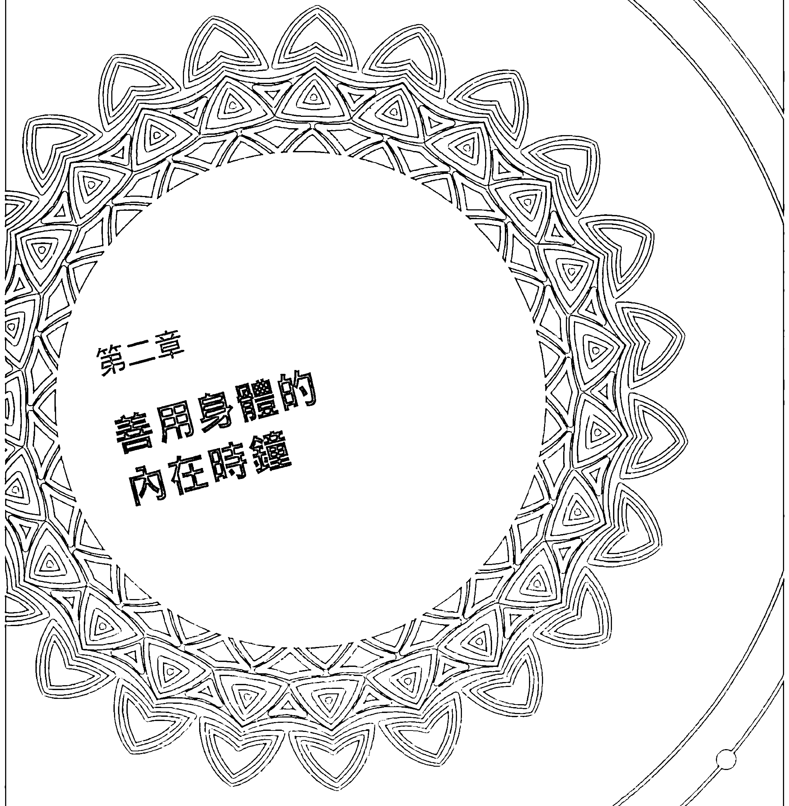
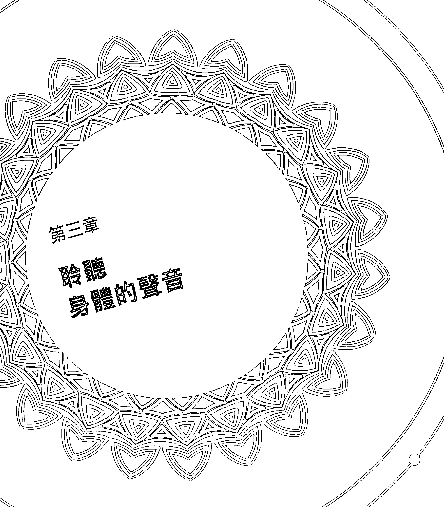
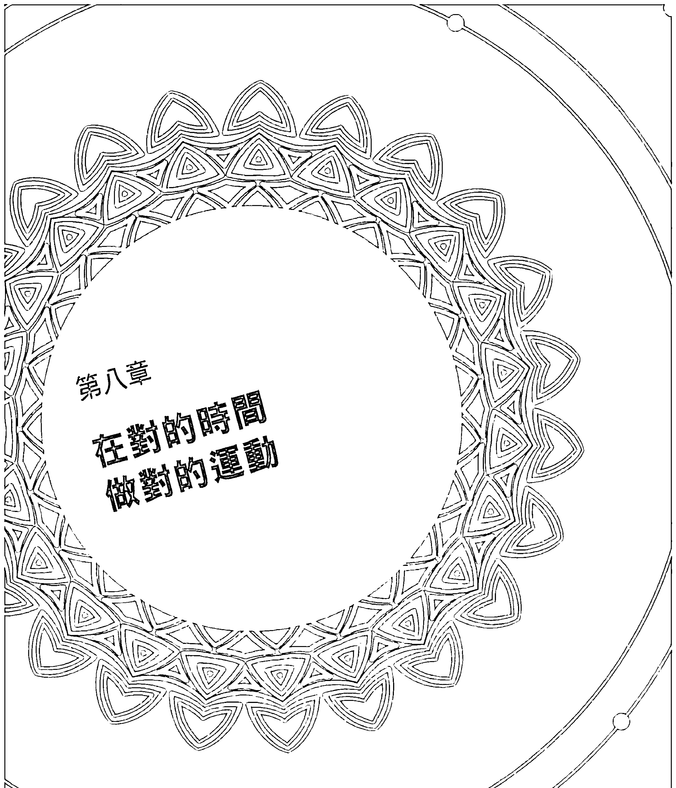

# 日变节律

阿育吠陀生理時鐘健康法

蘇哈士·西沙迦博士 蜜雪兒·錫頓 著
張水金 譯

## 阿育吠陀的一天

| 時間段 | 生理狀態與建議 | 元素 |
|:---|:---|:---:|
| 22:00~02:00 | 腦部需要深度睡眠。消化過程放慢，肝、腎全力工作，將營養轉化為荷爾蒙與酵素。宜上床睡眠。 | 火 |
| 02:00~06:00 | 睡眠漸深。若被叫醒會頭昏眼花。失眠者的思緒飛快。宜在六點以前被叫醒。 | 風 |
| 18:00~22:00 | 身體輕疏、為睡眠做準備。消化作用變緩、心智轉穩。腦疲勞過度會不容易入眠。宜輕量工作、少量進食。 | 水 |
| 06:00~10:00 | 身體沉重、水分較多。容易流汗。精神、身體逐漸清醒。宜運動、冥想、少量進食。 | 水 |
| 14:00~18:00 | 若早、午餐吃得不夠，容易搖擺不定與焦慮。每做完一件事，需要較多休息。宜維持水分，減少分心。 | 風 |
| 10:00~14:00 | 精神和消化系統發揮的作用。身體已經非常清醒。不需要運動。宜豐盛進食。做大量工作。 | 火 |

**Ayurveda**

阿育吠陀醫學以一天為基準，覺察身心狀態的轉變。考量不同時段對你身體的影響，才能在工作流程與身體需求間取得最佳平衡。

# 前言

我父亲是个医师，他为自己受过科学方法训练感到颇自豪。所以，我会成为同一个模子铸造出来的医生，也就不为奇了。我个人经历了一个长期演变过程，才真正认识到阿育吠陀医学的价值，以及它与其他现行健身潮流有多么的契合。今日的阿育吠陀医学，已可名符其实地称为整合或整体系统医学的重要支柱。

一九九一年，我在《完美的健康》一书中，阐述了阿育吠陀医学原理在日常生活中的应用。当时，我还在怀疑读者会不会接纳我的呼吁，选择这种与西方默认模式相当不同的生活方式。但是看到人们兴趣自发地去探求自己的身体类型时，我深受鼓舞。身体类型是阿育吠陀医学的基本切入点，并可藉此通往个性化饮食和季节规律。更重要的是，《完美的健康》聚焦于以意识（consciousness）作为改变身心的最重要媒介。这种以意识为基底的阿育吠陀医学，远远超越把阿育吠陀視為「另類療法」的觀點。它反而被提昇為個人的全方位進化：包括身體的、心理的及精神的蛻變。在傳奇的阿育吠陀中，有些嚴格修煉據說可以令人長生不老；但在真實的阿育吠陀中，長生不老要從戰勝生與死的幻象開始。

但是西方的醫學（也逐漸遍及印度、中國及整個東方）未曾注重覺察（awareness）的擴展。完全相反！西方醫學最高準則就是設計一種安全網——依據吃對食物、適量運動、管理壓力，以及控制各種傷害健康與減少壽命的負面影響因子（如菸酒）去設計。我想，就這一點而言，人類社會之所以處於停滯狀態，就是因為這種避免危機的觀點乃是植基於焦慮。健康狀態之所以變成不安全的狀態，必然與來自周遭環境的諸多短暫侵襲相關。

阿育吠陀與這些達到健康狀態的方法並無矛盾，不過，它主要聚焦於整體平衡。這種平衡，是由身體與環境的連結開始，從而帶來對大自然的深刻依賴。所有的印度智慧傳統歸根於分別心的終結，而生活於統一意識（unity consciousness）之中。這種統一，不是終身艱鉅鍛鍊之後所獲得的獎賞，反而是存在的基本狀態。我們就是由這種狀態分出來的。若要重新回到基本的——或該說是真實的狀態，必然涉及一种在发展过程中，同时维持身心平衡的自然生活方式。换句话说，在「当下」世界的意识领域发展，是最重要的。

我们不能期待任何「另类疗法」可以达至统一意识。使用梵文 Upaveda 「近真」一词，会更接近真理。Veda 意指「真实的教导」，而 upa 则意指「接近」、「近真」并非纯粹灵性的教导，而是一种接近纯粹教导的附属品或助力。在西方，这似乎是一种不可信赖的医疗角色，因为科学医疗，就好比把汽车送到机械师那儿去修理。事实上，医学院所教导的机械式方法，被当作荣誉徽章来佩戴：一个好的医生，会忽视不断变化且难以捉摸的世界──病人的内在感觉、思想、习惯、意向或任何其他被视为主观的事物。即使是精神病学（psychiatry），一个穿越界线进入病人内在世界的专业，大部分也都已经变成症状和适当药物配对的工作。他们一直心知肚明，即使有药物治疗也很难治愈潜藏的心理疾病。

在日常生活中，而不是看医生的时候，人们很少花时间检验伴随他们长大的生活方式。更少有人会追求阿育吠陀理想，以一天为基准去觉察身心状态的转变。在正念（mindfulness）的意义上，这种觉察与为了吃些什么及感觉如何而焦虑並不相同。認真看待「近真」（upaveda）的「近」（upa）這個部分。在一年當中，每天、每季地遵循日常規律，是使你在各方面健康都達到更佳狀態的好幫手。

回到本書的焦點所在。由於時間生物學（chronobiology）的興起，西方醫學正在進行一場寧靜革命。它研究時間如何以顯著和微妙的方式影響生理。已有日益增加的證據證實：在人體內，時間的安排（timing）即一切。在數兆細胞中的每一個變化過程，都由一個內在時鐘管理。研究結果發現，這個內在時鐘與吠陀文獻中的描述極為相似。事實上，日變節律（daily / circadian rhythm）至關緊要之處，是它可以被證實為古老阿育吠陀實踐，與緩解現代流行慢性病之間的連結。

二〇一七年，三位研究生理學的學者憑藉四十年的研究，揭開了生物學中日變節律的祕密，因而贏得諾貝爾獎。他們發現，自然的晝夜節律（diurnal rhythm）會影響植物、動物、人類甚至單細胞細菌的細胞作用。特定基因會根據每日的時間改變其細胞功能。雖然這似乎是一套深奧難解的研究發現，但時間生物學這個新領域卻有著很實際的應用，對人類未來的健康具有革命性影響。

生活方式的選擇可以改變基因表現的論點，現在已經確立。但是，最近我們也學習到，光是吃得好、每星期運動數次和可以熟睡是不夠的。一如阿育吠陀許多世紀以來的教導，你必須知道哪種日常規律（daily schedule）對你的生理有效，而不是和你作對。

而這本《日·變·節·律──阿育吠陀生理時鐘健康法》能幫助世界對阿育吠陀醫學有更多的認識。儘管有那麼多毫無疑義的預防忠告，仍有千百萬人習慣超時工作、把手機放在床邊又睡得不規律。即使沒有沈迷於全國性的速食癮中，他們還是吃得很匆忙。「時間病」潛入他們的日常生活：永遠有一隻眼睛盯著時鐘，隨時感覺到工作期限迫近，以及不勝負荷的責任和要求。

對生活方式不合理的期盼，似乎已可被接受，但是新的醫學研究已經逐步瓦解「身體可以適應不正常狀態」的假設基礎。生活長期失衡已經成為影響每個細胞的普遍狀態；主要的罪魁禍首，就是長期壓力和低度發炎。如果先進研究人員的預期被證實為真，那麼，我們確實可以說，所有生活方式的混亂失序（包含心臟病、肥胖、高血壓、和第二型糖尿病）都在症狀出現之前好幾年，甚至好幾十年就種下根苗。這些根苗是我們認為理所當然的日常壓力，以及潛伏而少有人注意的慢性發炎，所導致的輕微不平衡種下的。

阿育吠陀為適用於壓力和發炎之失衡狀態所開出的處方，就是恢復平衡。其餘的事，就讓身心對於維持平衡的自然傾向來處理。實際上，我們還是必須要和自然規律同步，讓身體運動、獲取營養及休息。一旦這樣做，我們將會發現夜裡入眠，早上起床，維持健康體重，以及抗拒誘人卻不健康的食物都更容易做到。也更容易消除煩擾及分心狀態，並有更多時間追求自己的目标。數千年來，阿育吠陀已經教導我們，在身與心中間有一個連結，它體現在每一個自然程序的統一之中。今天，蘇哈士·西沙迦博士（Dr. Suhas Kshirsagar）正在西方領導著下一波阿育吠陀醫學。他的書及有關「時間生物學如何影響日常作息規律」的精闢見解，已經可預見在未來，自我護理（self-care）將會變得遠比等到傷害的症狀已經明顯時，才倚賴醫生進行修復來得重要。由於自我護理根基於自我覺察，所以我們應致力探求由古代賢者所闡述的阿育吠陀理想。像西沙迦博士這樣的人們正在維持此一理想的生機，更重要的是，他們還要在我們最需要自我護理的時候，繼續推動它的演化。我欣然歡迎他的問世，並尊他為親近上師（Upaguru）——一個貼近學生而坐，並以親密、關愛和憐惜指導他們的導師。

醫學博士，狄帕克·喬布拉

# 第一章
## 錯不在你，而在你的作息時間表

說出你的日常作息時間表，我就能告訴你，你的健康狀況如何。說出你何時吃東西，我就能告訴你，你要維持體重是容易還是困難。說出你何時運動，我就能告訴你，你到底是在建構自己的身體系統，或是在耗損它。說出你在夜裡何時關掉電視或電腦，我就能告訴你，你對壓力有多敏感。說出你何時入睡，我就能告訴你，你是否需要咖啡提神才能度過下午；或者你會不會在漫長的一天結束時，本想保持耐性，卻對你親愛的人厲聲說話。

有點像魔術嗎？當然不是！越來越多科學證據揭示，我們的身體與白晝黑夜交替形成的日變節律（circadian rhythm）之間，關係有多緊密──直接下探至細胞層次。研究顯示，何時吃與吃什麼同等重要；何時入睡與睡多久同等重要；何時運動與運動多少同等重要。你的日常生活作息時間表，決定了你的體重、耐力、大致健康情形以及心情。不相信我？數十年來，糖尿病研究人員已經知道一個能使實驗室老鼠變肥的簡單方法，那就是叫醒牠們，並在牠們睡覺週期間餵食。事實上，就算研究人員只是在牠們應當睡覺的時候，讓牠們暴露在低度光線之下，一週內老鼠體重就直線上升了。

仍然不相信？回想一下你上次經歷時差(jet lag)的感覺如何？任何經歷過時差的人都知道，這種症狀可能遠比睡眠中斷更加嚴重。你往往要忍受便祕、胃腸不適、認知模糊、虛弱，以及對壓力更加敏感等痛苦。最近的一份研究，更是將時差與體重增加連結在一起，因為長程旅行對作息的妨礙，會使腸道中的微生物感到困惑。

正是這些相同的抱怨，例如體重增加、失眠、疲憊、壓力、憂鬱等等，把人帶進我的診所。如果你正在讀這本書，我猜想你一定也對這些抱怨無比熟悉。拜現代工作需求，以及每星期七天、每天二十四小時的全天候連結所賜，許多人生活在一個自我強加的時差常態裡；導致睡眠、飲食和運動，都在與身體自然節奏不一致的時間下進行。不過，這裡也有好消息，我要告訴你我對所有病人說的話：錯不在你，而在你的作息時間表。有較容易的方法可以幫你減肥，增強精力和夜夜好眠。透過與自己的身体合作而非對抗，你可以創造一個日常作息時間表，來轉變你的健康和生命。

## 日變節律

生理學家知道身體有一種自然節奏，它被稱為日變節律（circadian rhythm，拉丁文circa為大約之意，dia為一日之意），又稱晝夜節律或生理時鐘。日變節律按照接近二十四小時的週期運作，每天早晨你初次經驗日光時，就會自行重新設定。這個節奏指揮著身體，何時該消化食物、如何準備睡覺，以及如何調節你體內的每一件事，包括血壓、新陳代謝、製造荷爾蒙、體溫和細胞修復。皮膚細胞也是按照日常規律修復及再生。連腸道中的微生物數目，在一日之內也會有顯著變化。某些消化道中的菌株在白天繁殖，另外一些則在夜間較為興盛。一天中的每一小時，你的身體都在不斷地改變它的作用。各個細胞與系統，都預先被指示要依據日夜時段，去做不同的事。這就是為什麼我們能知道，大約凌晨兩點你會達到最熟睡的週期，凌晨四點左右體溫會最低。差不多清晨六點三刻你的血壓將急遽上升，早上八點半最可能排便。到了上午十點，精神最為振作，而消化作用則在中午最有效率。當你的消化能力在下午下降時，你的協調能力、反應時間及心血管強度則達到高峰。日落以後，血壓伴隨著體溫，降至當日最低數值。晚間九點前後，當腦部開始釋放褪黑激素，你的消化速度也減半。到了十點半，排便被抑制，你的消化系統緩慢下來。這樣的事天天都在發生。這就是為什麼在跨越時區時，身體會感到困惑。因為光線改變了，而身體也失去用以控制身體作用的羅盤。

這很令人著迷，對吧！因為我們一直以為，我們被孤立在大自然之中。我們住在恆溫的家，並在辦公室或小隔間中工作。但我們身體中每一個系統，都是按照可以預測的模式在改變。我們的身體總是試圖利用可得到的自然光，在中央時鐘控制之下去協調所有的系統。而且自然中每一種生物，都在這種週期方式中運作。生物學中有一個新的領域叫做「時間生物學」（chronobiology），研究各種生物依據日變節律運作的所有方式。

現在，研究人員正在研究日常習慣是如何與日變節律產生互動。他們已經發現，現代人的作息時間表，對日變節律有很大的干擾。熬夜看電視或工作，欺騙了你的身體，使它以為夜晚還沒開始。吃豐富的晚餐也同樣是在欺騙它。如此一來，週期延遲，睡眠擾亂，使你在次晨鬧鐘響起時，需要經過一番掙扎才能清醒。缺少運動和自然光也會進一步干擾日變節律，而日變節律又會回來干擾每一件事——從消化、荷爾蒙分泌到你的神經系統。

我的許多病人常常撐到半夜，邊工作邊吃零食，想不通他們為什麼直到一點鐘還睡不著。然後在清晨六點鐘就把自己拖下床，又搞不懂他們為什麼沒胃口，或者早上沒辦法集中精神。身體的自然節律偏離幾小時似乎無關緊要，但若從正確的角度來看：如果你僅僅從一點鐘睡到六點鐘，那就好比晚上從加州飛到紐約，並在工作以前趕回來。難怪你會覺得不舒服！

最常碰到有關身體的共同抱怨，是因現代作息時間表與身體需求不相容而產生或加劇的。幸而生理學家已經做出很多有關生理時鐘的研究，我們的行為到底強化了生理時鐘的信號，或阻礙了它？這個研究的新領域稱為時間生物學，針對如何設定可以讓人維持健康和活力的日常規律，提出洞見。

## 身體如何報時

即使你不知道現在是什麼時候，你的身體卻都知道。說你不知道時間，聽起來似乎有點荒謬。你可能一天中時時刻刻都特別注意時間。例如你要趕搭火車，或送孩子上學。也許你在十五分鐘內要出席會議，還得在一小時內打一通電話。你必須在洗衣店關門以前取回衣服，或是手邊有好幾個專案快到截止日期，又要預約晚餐，還有一個或兩個鬧鐘每天早上負責叫醒你。我的病人告訴我，他們無時無刻都注意著時間，以致於幾乎每一個日常活動，都被時鐘牽著走。

但是，在你身體裡面，其實有一個完全不同種類的時鐘，操控著所有細胞和系統。為了了解它如何作用，你必須走進大腦，並進入下視丘（hypothalamus）。

下視丘位於大腦中心，負責調節所有身體系統。當你感覺到壓力或危險時，它就會啟動戰鬥或逃跑（fight-or-flight）反應。它也會提供何時飢餓或口渴的訊息：當你開始嚴格節食，是下視丘告訴你，你餓了，因為你的飲食習慣已然改變。你也許知道，其實你並不餓，但是身體對大腦送出訊號，說它並未得到跟以前等量的食物。當你啟動一個新的運動常規，身體送出肌肉疲勞和心血管壓力的訊號到大腦，於是下視丘督促你停止。或者你熬夜趕辦一個專案，也是下視丘告訴你，你的身體已經累了倦了。所以說，大腦的這個部分可以讀取身體的訊號，並試圖影響你的行為，試圖使每一件事情與昨日相同。

下視丘也調節那些非意識控制的所有事物，包括體溫、所有的荷爾蒙平衡和新陳代謝。這些改變，都發生在一天中可以預期的時間點。例如，體溫在傍晚達到高峰，然後在夜間逐漸下降，並在黎明之前達到最低點。血壓則在每天早晨起床的時候急遽上升，然後整天一直緩慢上升，直到夜晚才开始下降。早晨血壓快速上升时，刚好在血小板最黏稠的时候，這就可以說明，為什麼許多心臟病都是在清晨發作。皮質醇（又叫做可體松）指數的改變，也發生在可以預測的時間點。皮質醇是一種身體製造的類固醇，它有時被稱為「壓力荷爾蒙」。當你上床睡覺時，你體內的皮質醇指數最低，然後在夜裡逐漸累積。皮質醇對身體的發炎反應要負一部分責任。這也難怪疼痛在起床時最為嚴重，或者，在早晨時會覺得身體特別臃腫。皮質醇指數在整個白天裡逐漸穩定下降，只有在每一餐之後微微飄升。

## 時間生物學簡史

大腸運動（這是排便的美稱）在白天也會改變。早晨第一件事，大腸醒來，以平常活動指數的三倍速度移動，造成可以預測的結果。這就是為什麼那麼多人處於時差的苦難中時，會自覺罹患便祕。不良的飲食時間表，也會使大腸感到困惑。在夜裡，大腸休息，排便受到抑制。情緒和腦波也晝夜不停地變化著。

為了調節身體各種系統，下視丘從身體組織、器官以及環境獲得線索。當你聞到食物的氣味，會覺得飢餓；當你看到危險，會覺得焦慮，並且儲備能量採取行動。前述全部都對。但是，別忘了大腦整天能取得的最普遍存在訊號——光線出現。

下視丘有一個小部分，稱為視交叉上核（suprachiasmatic nucleus，SCN），被賦予注意光線的任務。它約有一顆米粒大，含有大約兩萬個神經元。生理學家早已知道這些神經元對光線有反應，並且會根據明暗調節各種身體系統。當早晨第一道光線觸及眼睛的視網膜時，視交叉上核送出白天來臨的信號給身體。到了晚上，視交叉上核幫忙身體的天然產物褪黑激素發出信號，告訴你睡覺的時候到了。但在過去二十年，研究人員才開始正視這小小一束神經元，對體內的每一個細胞和系統施加多少力量。

## 日變節律

在影響著這些植物的行為。

一個更大的未解之謎是：為何葉片開合的自然節奏，並未追隨二十四小時週期？當科學家更進一步研究這些植物時，他們終究發現葉片移動在完全黑暗中較不顯著，這些植物依據二十四小時的週期開合葉片；而當這些植物再度感受光線時，葉片開合卻又還原成二十四小時的週期。這表明，它們不知何故有一種預期光線而移動的生物傾向。而光線本身又幫助它們，使其內在的許多時鐘同步。要將光線和黑暗如何影響植物理論化並不困難，因為植物需要光；但我們還是需要一類特別的科學家，去注意到包括哺乳動物在內的其他生物，也運用光線改變它們的生理作用。

那位特別的科學家就是一個年輕的羅馬尼亞醫生，名叫弗朗茲．哈伯格 (Franz Halberg)。他在一九四○年代晚期，開始追蹤老鼠體內循環的白血球指數。那時哈佛提供給他的獎學金剛剛結束，他前往明尼蘇達大學繼續他的研究。

在那裡，他注意到白血球數量在白天達到巔峰，在夜間則下降。不同品種的老鼠，有不同程度的循環白血球。但是，每一類老鼠在白天都顯示相同類型的急劇上升，在夜間則有類似的下降。很快地，哈伯格針對老鼠的血壓、心跳速率，還有體溫，追蹤每小時的波動。他發現，這些生理反應都依據一個相似的二十四小時時間表而變化。到了一九五九年，他創造「日變節律」一詞，來解釋這些改變。隨後數十年，他提出理論證明人類有類似的變化。

哈伯格發現許多生理作用，包括體溫、荷爾蒙分泌、血球細胞數量、血壓與心率、肝糖原指數、甚至細胞分裂，全都按照可預測的模式變化。所有這些變化似乎取決於光。但是這時遺傳學仍處於萌芽期，很少研究人員願意相信，身體含有一種隨著一年日期或季節改變的內在時鐘。

哈伯格確信，在這些模式內的波動，可能是疾病的標記。他相信，經常監控血壓比起醫院單次測量，較有助於預測心臟病的發作。這就是為什麼他在世最後十五年的每一天，每隔三十分鐘就量一次血壓。也許他做的事不無好處，他活到了九十四歲。

哈伯格進一步建立理論，說明當腫瘤內部溫度最高時，抗癌治療將最具效果。他相信，人體完全按照日變節律運作，營養師和醫師應當考慮把這些節奏列入治療計畫中。雖然世界各地主要的研究中心，但直到二十世紀末，仍然很難證實這些理論的有效性。哈伯格本人就發現，很難為他的研究籌足研究經費，並在醫學院教授時間生物學課程。我們很有可能會輕易地評論，其餘醫學社群摒棄了這些理論。但真相是，在那個時代若要不斷地監控血壓、血球計量、肝臟內的葡萄糖攝取以及其他生理反應，代價十分高昂。哈伯格理論的位階，遠遠領先科技，只能等後來的遺傳學家去探討這些觀念，並想通體內細胞怎麼能夠在每一個晝夜都與視交叉上核（SCN）取得協調。

## 時鐘基因組

我們現在知道，體內細胞含有所謂「時鐘基因組」（clock genes）。它們有特定的名字，例如在夜間活躍的per1、per2、per3；或在白天活躍的CLOCK和BMAL1基因。它們以一種循環的形式運作。其中一種基因的活動，會抑制別種基因的活動。細胞根據每日白天和黑夜的週期，被啟動去做不同的事情。每一個細胞的蛋白質通道，活動或不活動，也是基於一天中的時刻。當你每天早上張開眼睛看到陽光時，訊號馬上傳給你的視交叉上核。它立刻重啟內在時鐘，並把訊息送到身體所有系統與所有器官和組織，告訴它們現在又是白天了。內在時鐘必須設定自動的生理變化，以便在之後的二十四小時準時作用。如此說來，視交叉上核其實就是大腦的時鐘。也許應該說，它是大腦總指揮，你身體的每一個細胞都努力按照它的節拍跳舞。就在你大腦中的主要時鐘，正努力設定整個身體節奏的時候，你的身體細胞卻會對你的行為產生反應，以便設定它們自己的節奏——例如睡眠時間表，用餐時間，以及你的活動。當大腦時鐘和細胞時鐘（又被稱為周邊時鐘）無法互相校準時，你的細胞行為會被扭曲。也許你還記得那些老鼠。當牠們在睡覺週期被餵食的時候，牠們就會增加體重。牠們的身體在主要的日變節律以外運作，吸收了消化道內細胞無法處理的營養。而減少的睡眠時間表，意味著在細胞層次，牠們體內所有系統，將停止以原有的方式發揮作用。這樣一來，不僅對消化過程，也對荷爾蒙製造、免疫反應以及發炎反應都造成妨害。

如你所想，這也使表觀遺傳學（epigenetics）領域，以及我們的行為持續一段時間以後，如何改變並影響基因表現，有了全新的詮釋。作為一個研究領域，時間生物學仍然很新。時鐘基因組似乎除了影響新陳代謝，還對老化及腫瘤抑制有影响。在錯誤的時間進食和睡覺，會中斷日變節律，並干擾到原本健全的新陳代謝與強而有力的免疫反應。雖然科學家仍在努力解開許多細微差異和臨床上應用，但我們已經確知，你可以運用日常作息時間表，去增強日變節律，並達到較佳的健康狀態。

每天早上，即使光亮沒有出現，你的身體也會試圖依照相同的二十四小時時間表發揮作用。研究人員從一九七〇年代開始，以人為對象做了一些相關實驗。受試者同意單獨居住，不暴露於日常的自然光中。跟迪麥倫的植物不同，他們是自願同意居住在山洞中的。數十年來，有一些新發現從這些實驗浮現出來。第一，若無每日自然光和黑暗的重新設定，身體的時鐘會漂移。身體賴以設定日變節律的主要工具，就是光。第二，若是光的訊號沒有出現，身體可以利用社會線索例如用餐、睡覺及運動時間，作為替代工具。身體為了讓它所有系統，同步於單一主要日變節律的所有嘗試，被稱為誘導作用(entrainment)。身體依賴訊號去幫助自己重新設定日變節律，並持續發揮最大作用。它偏愛使用光和暗作為主要的訊號，它可以，也的確會使用其他提示，包括你的行為。你在一整天當中的所作所為，若不是有助於主要的日變時鐘協調身體各種作用同步進行，就會反過來造成妨礙。設定一個可以增強身體自然節奏的日常時間表，就是你所能養成，最強而有力的健康習慣。

並非僅有人類的身體，會試圖設定日變節律。自然界所有的生物都是如此。迪麥倫的植物因預期有光而張開葉片，甚至在沒有被光照射的時候也照樣張開。它們的細胞努力維持日變節律。許多類型的細胞被賦予任務，在白天去做一組事情，在夜間則做另外一組。這一點對於哺乳類動物、植物，甚至對最小的單細胞細菌都適用。過去三十年，遺傳學和微生物學已經使這些自然節奏的研究脫胎換骨。科學家已經著手發掘細胞內的時間基因組，以及它們如何在所有生物類型的神經和分子層次上發揮作用。

知道細胞在二十四小時週期中的不同時間中，會有不同的運作，對許多研究領域都有其意義。日變節律和時間生物學的研究，可以改變許多類型的醫學治療。例如，如果你服用短效型的斯達汀藥物（statin）去控制膽固醇，你的醫生可能會告訴你，要在晚上服用。為什麼？因為時間藥物學家（chronopharmacologists）知道晚上正是肝臟製造膽固醇的時候。研究人員正在找尋日變節律規範所有生物之生物系統的方式有何限制，但是目前為止尚無所獲。有一個研究人員表示，我們應當假設體內的每一個系統都會遵循日變節律，除非真的有例外被證實。

## 阿育吠陀與時間生物學

雖然這些以時間生物學為對象的研究發現仍然很新，它們事實上已經對我執業數十年的阿育吠陀醫學，提供進一步的實證。阿育吠陀是一種自然醫療傳統，它已經在印度施行大約五千年之久。迪麥倫在為他的植物及其奇怪的行為深感纳闷以前，阿育吠陀醫生早就提醒他們的病人，他們的身體以及體內許多系統，有一個日夜循環週期。阿育吠陀把一天區隔成幾個部分，用來表達身體的能量和系統究竟是處於活躍或休眠狀態。它教導我們，先要有良好的作息時間，才會有強阿育吠陀學者又回復到三種原生體質。希臘人相信這些心態或傾向必須加以平衡，而且，其中的一種心態若受到破壞或過盛，就是許多疾病的來源——這些概念都是借鑑自阿育吠陀。

但是，很少有其他的自然治療傳統，探索過自然光對身體的影響。阿育吠陀在解釋身體系統按照每日週期運作這方面，可說是絕無僅有的。它描述了日間規律、夜間規律，還有季節規律，來讓身體與此一日變節律同步。『時間生物學』一詞，對西方醫學或許相對來說較新。但它卻是阿育吠陀傳統不可或缺的一部分。古文獻記載著，我們的身體如何不斷地與日光及季節變化互動；也提到，如何讓日常規律與這種變化中的自然光同步。阿育吠陀可能是唯一提及如何安排日常作息，經過一生中許多季節和數十年的身體力行，來達成健康最佳化的醫療傳統。還有，阿育吠陀是論及身體類型及各種體型如何顯現健康問題的傳統之一。這一點關係重大，因為許多的飲食與健康建議，都假設每個人所需的睡眠、運動和食物相差不多。可是，如果你環顧周遭，你會發現你的身體跟別人並不一樣。在阿育吠陀之中，並無一人人均可獲益、放諸四海皆準的單一飲食或運動規律概念。雖說每個人都需要了解，如何設定一個好的作息時間表；在那作息表內，卻並非每一個人都需要完全相同的飲食或運動規律，來獲得最佳效果。在本書中我將說明，為何你需要良好的睡眠，同時列出睡眠所帶來的諸多驚人利益。就在下一章，我即將幫你找出你的特殊睡眠問題，並加以解決。之後我也會談到飲食和運動問題。如果你擁有某一種體型，你可能很難減肥，卻不會失眠。另外一些擁有不同體型的人，可能不必為過重而煩惱，卻要面臨頭痛和失眠的魔咒。所有這些煩憂，都會有答案。所以，如果你曾經試圖運動，卻又無法持之以恆，你可以發現問題出在哪裡，並且發現如何解決這個問題。如果你曾經試過節食，卻又無效，那可能是因為你沒有找到適合你的飲食。採用阿育吠陀醫學，我們會努力平衡整個身體，並且檢視每一個個體，去解決因著體型而加劇的問題。這樣子，你不但能設定一個可以支持你身體主要節奏的作息表，還能微調你的作息時間，使得飲食、睡眠和健身都更為輕鬆。

接下來，我首先就要告訴你，如何停止妨礙你自己的日變節律。只要能夠使身體時鐘為你工作，你就能立即獲取巨大的健康效益。

獲取更多好書，請加微信號：strcdts
店鋪：http://strc.cr.cx

# 第二章 善用身體的內在時鐘

## 你一整天都在做什麼？

對於來診所的人，我第一個問題都是：你一整天都在做什麼？許多人不知道，典型的一日裡，他們做了些什麼。而這，可能也適用在你身上。你知道早晨鬧鐘何時響起，也知道你得花多少時間上班；但是，你很可能不知道你每一天在何時吃東西。即使你確實知道自己晚上看了哪些電視節目，你卻不知道自己通常何時睡著。你理所當然地假設，工作時間表支配著你何時吃，休息多久，以及何時運動。當你這麼想的時候，就是放棄機會，不把身體有效運作所需要的可預期訊號給它。如果某些日子裡你在十一點半吃午餐，而其他日子則在下午一點半用餐，你的身體已經被你搞糊塗了。或者，如果某些晚上你熬夜工作或鍛鍊身體，那麼，你的身體也就不知道如何、何時去為入睡做準備。

若要明白作息時間表（schedule）已經影響你的健康，就要先知道作息時間表是什麼。其次，你必須問兩個最基本的問題：一、在天黑以後，我有得到七小時不間斷的睡眠嗎？二、我有在天還亮著的時候，吃完大部分的飲食嗎？多數人對這兩個問題都無法回答「是的」。而這正是問題所在。

## 日變節律

作息時間對你的整體健康有何影響？我的病人羅伊，就是一個好例子。他在矽谷擔任軟體設計師，家裡有幼兒。羅伊努力做好所有一「對」的事情：他每天外出工作，吃高蛋白、低卡路里又有足夠蔬菜的食物，而且也留時間給家庭。儘管他以為已經在吃力的工作環境中，做了健康的選擇，他的胃痛還是逐漸加劇，而且很難在兩點或兩點半以前入眠。即使是勉強入睡的夜晚，他也會在四點鐘左右醒來。他為此感到既焦慮又痛苦。

當我們談到的不僅僅是他做了些什麼，而是開始觸及他在何時做這些事的時候，謎團就迎刃而解了。羅伊描繪出一個早上起床，並在七點以前出門工作的典型日子。他早晨通常不餓，往往一杯咖啡就能撐到下午一點鐘，運動過後才再吃蛋白冰沙。他會在傍晚時分趕回家，與妻子和孩子相處，全家大約晚上八點才共進晚餐。等到孩子們都上了床，他會煮一壺咖啡，然後最少熬夜到午夜（有時更晚），協同其他在印度工作的軟體開發人員，一起為了專案趕工。

羅伊跟其他人一樣，不曉得他的作息時間表是健康問題起因。如果你以為食物不過是燃料，在一天中的任何時間吃都不成問題，而略過一餐只是為以後省下卡路里。如果你以為一個健康的選擇，如蛋白冰沙，不論何時喝都是健康的。如果你以為運動有好處，不論何時去做都是好的。或者對許多忙碌而又有雄心壯志的專業人士來說，睡覺只是沒有安排任何事情時在做的事。

## 這是倒行逆施。

你的生活型態並非等同於一天之內消耗多少卡路里，以及睡幾小時的總和。它反而是這些事情和身體預先設定的需求之間的協調。羅伊略過一些正餐，卻拿輕食取代。他在身體無法從費力活動中獲益時進行運動。他也在深夜進食及工作，從而剝奪自己的睡眠時間。在前一章，我列舉時間生物學家有關身體的日變節律觀點。現在我要描述阿育吠陀對同一生理時鐘的觀點。

## 阿育吠陀的一天

在阿育吠陀觀點中，一天可以區隔為六個時段，每一時段代表身體的不同需求。真實的文獻敘述更為詳盡，這裡僅大略綜述。但儘管只是概述，仍然有助於了解身體如何追隨每日循環模式。這些描述也許會讓人覺得過度詩意，有時又嫌過度簡化，但是，最主要的目的是要讓人了解，這些教導是將身體置於每日週期的中心。而這些已經被時間生物學家最新發表研究所證實的教導，卻也是羅伊所不曾考慮過的生活模式。

- **上午六點至十點，水型（kapha）**
水能量居於主導地位，它的屬性與水有關聯。這時段的身體有點晦暗、沈重，水分較多，容易充血。隨著日光的出現精神和身體逐漸甦醒，仍然需要藉著運動、冥想和食物來與新的一天同步。這段時間，最好以少量的運動及食物達到身體平衡，讓水能量不再晦暗，使得早晨的工作變得穩定、平靜。

- **上午十點至下午兩點，火型（pitta）**
火能量居於主導地位，它的屬性與火有關聯。這段時間，精神和消化兩者都已全力發揮作用，也是一天中進食最大餐，以及做大量密集工作的好時機。由於這段時間的你已經非常清醒，身體不需要運動。還有，此時身體需要把血液集中在消化系統，才能進行將食物轉為能量的工作。火型能量也使人顯得比較熱情和暴躁。你也許會說，你中午的偏執完全是低血糖造成的，其實還有別的因素在作用著。

- **下午兩點至六點，風型（vata）**
風能量居於主導地位，它的屬性與風有關聯。這是一個快速反應和快速思考的時段。這段時間，很容易導致人們分心和脫水。如果你早餐和午餐吃得不夠，此一既輕又快的能量，將會變得搖擺不定和焦慮。這也就是為什麼人們在此時會找小零食來吃，並喝咖啡，要不然風一般的輕快能量就會把你帶走，讓你無法聚精會神。下午後半段，身體的自然能量間歇地來，你會發現自己每辦完一件事後，需要較多的休息。你需要維持水分，並減少分心。

- **下午六點至十點，水型（kapha）**
這是轉回水能的時段，身體又笨重起來。在太陽西沉之際，身體開始為睡眠做準備。下午六點整，消化作用已經慢了下來，此後若再攝取大量卡路里將使身體負荷過重，也就是選錯時機吃東西。你的心智正在從快速而又容易分心的類型，轉為較為穩定的類型。有些人說，他們寧可六點以後留在辦公桌前，因為他們喜歡那種能量穩定的感覺。但是，心智很容易因此操勞過度，使你晚上需要睡眠時，反而不可能入眠。與一般人的習慣正好相反，在這段時間的初期，最好只吃進輕量食物，而且在餘下時段也只做輕量的工作。到了這個時段的尾聲，你要開始為睡覺做好準備。

- **下午十點至凌晨兩點，火型（pitta）**
火能量再度主導，身體確實又上火了，但是，作用方式卻與日間截然不同。現在，腦部要產生較深的睡眠週期，以求充分休息和淨化自身。日間的火能量專注在消化，而夜間的火能量則將消化過程放慢。取而代之的是，由你的肝臟和腎上腺開始工作。你的身體將未加工的營養轉變為次日運作所需的荷爾蒙和酵素。如果你在這個時段的初期入睡，比較可以讓火能量為身體工作。但是，有許多人保持清醒，繼續工作到午夜甚至更晚。他們說，十點以後又是一條活龍，突然覺得身體又活躍起來。他們不知道為什麼，但是我知道那是因為他們喜歡駕馭那一波火能量。在深夜維持清醒，並不意味著你是一隻天生的夜貓子。那只表示睡眠的慾望，像是一列火車。它在可預期的時間內駛進火車站，然後離開。許多所謂的夜貓子，都能治好失眠以及其他許多健康問題——要是他們能夠及時在十點半以前上車的話。如果你這樣做，你的身體將會以各種各樣的方式來感謝你。

- **凌晨兩點至六點，風型（vata）**
是另一個風能量的時段，這時段你的睡眠漸漸輕淺，夢境變得較清晰。身體開始為日間週期做準備。如果你曾經在這時段的初期被叫醒，你知道你立刻就醒過來，感覺頭昏眼花而非昏昏沈沈。但這又是快速反應和快速思想的時間，有些在這時段醒來的失眠者，會有思想特別快速的症狀。我會在下一章談到對抗失眠的方法。但是，這裡要先記得，在早上六點鐘以前被叫醒比較容易，等到六點以後，水能量再度接管，也就難多了。

現在你已經知道，身體的需求在日夜變化過程中，是如何深深地被改變。你的作息時間表，很可能與身體為了有效運作而產生的需求相抵觸。而且，這並不是只有在理想的時間中飲食和睡眠而已。你還可以透過工作量的安排，來充分利用身體自然能量。有個病人對我說，她每天都在上午十一點參加員工會議，而這時正是一天中的火能量時段。大家都很容易胡思亂想，也愛互相批評。情況越接近午餐時間越糟。當我的病人學習阿育吠陀時間表以後，她把日常員工會議移到下午兩點。後來她告訴我，會議中每個人都那麼的平靜又有創造力。同樣的員工，討論同樣的議題，只是改在一天內的不同時段進行，他們卻因此較能在沒有爭論的情況下獲得解決方案。

從阿育吠陀以及時間生物學的觀點來看，羅伊有一些主要問題。第一，他在中午進行健身運動，把血流從消化道推開，流入肌肉和四肢。中午是身體系統取得高密度營養的最大機會，這是消化道正應當處於火能量的時段。以輕量蛋白質冰沙取代正式午餐，將會欺騙你的身體那就是你之後半天和夜間所需要的營養，甚至令你減少明天所需的營養量。所以最好還是在一天當中較早的時段健身，在中午吃頓豐富的午餐。羅伊的第二個問題，是在晚上八點吃晚餐。這時天已經黑了，身體的消化系統也逐漸停工。當你讓消化系統超載食物，食物就不會被有效地消化，可能就這樣停留在胃裡，造成腹脹感，也使你睡不著。

羅伊的第三個問題，是使用電腦工作直至午夜。從羅伊的觀點看來，夜晚是一個理想的工作時間，因為他深夜精神最好，也不會被打擾。但是，你的大腦需要休息，而安頓自己進入休息週期的最佳時間，是早在午夜到來之前。當你檢視自己的作息時間，應當考量一天中這些時段對你身體的影響，這樣才能在工作流程與身體需求之間，求取最佳平衡。

## 健全作息時間表的好處

我的多數病人，都習慣將工作視為日常作息時間的核心。他們不斷地嘗試改善上班時間，以便完成更多工作。很少人會思考，該如何安排他們的一天，使他們身體的需求可以被擺在第一位。我們以為健康習慣是獨立的事件：你想減少體重，於是你改變飲食；你想要健美，於是你改變運動常規。我現在要求你，想想如何將你所有的健康習慣放進同一個作息時間表，並將它當成一天的中心，因為這些習慣是一起運作的。睡眠會影響你的睡眠和心智的清明。日常運動會改進你的睡眠、能量等級，以及食物選擇。

## 善用身體時鐘來減輕體重

跟許多人一樣，亞當來找我，是因為他想要減掉一些體重。近十年來，他努力為自己的建築事業打拼，結果胖了約三十磅。當然，他過著忙碌的日子，有開不完的會議，也有接不完的電話。每天大部分時間，還要開車到處巡視不同建地。體重增加的問題一直困擾著他，他也搞不懂原因何在。他整天活動，常常要做費力的工作，也減少卡路里的攝取，但這些對他都沒用。他的妻子也是我的病人之一，要他來找我，他勉強同意了。

配合日變節律安排生活作息，還有兩個主要的好處。第一是減重，我的多數病人都想減重。即使有些人不認為自己需要減重，當我們改變了他們的作息時間表，他們也都辦到了。許多人都有的第二個問題是普遍性疲累，它表現症狀為不舒服、沒力氣甚至是輕度憂鬱。我把普遍性疲累看作另類的全國性流行病。但是，與身體時鐘合作並運用日變節律來修正問題，將會使你能夠使用新的儲備能量。

當我問亞當，他的日子是怎麽過的，他說了一個熟悉的故事給我聽。他計算過自己在典型的一天中，總共吃進多少卡路里的食物，也常常略過早餐。有些忙碌的日子，他甚至連午餐也省略了，僅僅在下午三時左右，向工地附近的自動販賣車買份三明治或一包馬鈴薯片來填肚子。

對我而言揭露最多真相的是，聽到亞當談及他在一天當中最喜愛的時間，就是深夜。這一點對許多工作狂而言都是事實。他告訴我，他辛苦工作一整天，監督屬下，檢查細節；有時為了使某一工程如期完成，他也捲起袖子下去支援。他會在夜裡（有時遲至八點半）精疲力盡地回到家裡，淋個浴，跟家人短暫報到，然後等他們上床睡覺。這是他最喜愛的一段時間，因為整間房子都屬於自己了。

他會在大約十點時將一份冷凍晚餐加熱，留下來看電視到十二點半或凌晨一點，一直待到昏昏欲睡或索然無味時，才上床睡覺。結果就是，亞當一夜只睡了大約五小時左右。但是他還是盡可能更晚睡一些，因為他以為，他可以等週末或假日再來補眠。

他認為自己除了玉米片和椒鹽捲餅之外，已經窮盡一切努力去減輕體重。但是，他的想法必須改變。他不能僅僅用一天吃了多少卡路里，又燃燒掉多少脂肪的觀點來思考。這對他一點助益都沒有。

一旦你想減重，你就必須與你的生理時鐘合作，在身體最易處理能量時才獲取食物，在身體降低功能時則避免進食。

## 停止計算卡路里！

在我的病人中，有太多人一天到晚都非正式地計算著卡路里。大多數人都這樣。如果有人給你一塊糖果，你會察看包裝，看看它有多少卡路里。如果你要外出吃晚餐，你會省略中餐，想要省下一些卡路里，以便稍後大快朵頤。

我們甚至也會以燃燒多少卡路里的觀點來看待運動。許多人都已經記住，跑步或走路一公里，或上一堂瑜珈課，可以燃燒多少卡路里。如果你踏上跑步機，輸入體重，跑步機就會在健身過程，隨時提供已經燃燒的卡路里數量。較受歡迎的健身追蹤器，也會提供同樣的卡路里燃燒資訊。許多智慧手機應用軟體，也幫人追蹤卡路里數，脂肪幾克以及醣類幾克等等。

不過，你若是聚焦於卡路里，就等於把身體當作一個簡單的機器看待，而忘記體內許多細胞和系統是以複雜的方式在互動。你應當把注意力的焦點，改放在進餐時機和食物的營養內涵。這一點我會在第七章進一步討論，我會教你如何渴望獲得你身體真正需要的食物。

早一點吃早餐。多數人追隨美國的飲食標準，在晚上進食一天中最豐盛的一餐。有時還跟亞當一樣，吃得很晚。我們很容易誤以為，不論我們何時進食，身體都會一視同仁，用同樣的方式處理所有卡路里。但肥胖症研究人員告訴我們，進食時間是維持健康體重過程中，遺失的一個環節。

最近有一個戲劇性的研究證實了這個說法。研究人員在西班牙追蹤四百二十個過重的男性和女性，這些人都想嘗試減肥。他們被分成兩組：早食者和晚食者。在西班牙，一天中最主要的一餐是中餐，這時人們大約吃進每日攝取量的百分之四十。早食者被界定為在下午三點之前吃最豐盛一餐的人，而晚食者則在下午三點以後吃最大餐。剛開始，兩組人都減輕了一點點體重。隨著時間慢慢過去，那些在三點以後才吃最大餐的人，儘管吃的仍是健康飲食，體重卻不再減輕。那些在較接近中午吃進一天中最大餐的人，則繼續減重。到實驗結束時，他們比晚食者多減掉了百分之二十二的體重。這是真的——雖說兩組受測者所吃的卡路里總數大致相等。這是第一個表明用餐時間影響減肥效果的大規模研究。在一天中吃得晚，意味著身體會經歷一個血糖急遽升高的時期，而這時候較可能將能量儲存為脂肪。如果是在中午吃最大的一餐，你的身體有較多時間去燃燒這些能量，也就不至於將它儲存為脂肪了。

## 日變節律

深沉而有恢復作用的睡眠，與輕淺的快速動眼期（rapid eye movement，簡稱REM）睡眠（或說做夢）之間交替。你可能不知道的是，最深沈、最具恢復作用的睡眠週期，發生於下午十點至凌晨兩點之間。這正是大腦在清理自己的時候，是不同系統的細胞修復自己的時候，也是鞏固記憶和學習的時候。若是在這段時間維持清醒，會干擾這些重要的任務，令你第二天迷迷糊糊。它也對體重有所貢獻。許多研究顯示，睡眠剝奪和體重增加有密切關聯。但其中有一項研究特別顯示，即使只減少數小時睡眠，也會導致實驗參加者增加日常食物的攝取量。在實驗後，醫生或營養師要求他何時睡覺，或何時吃晚餐。雖然他明知自己的血糖指數和血壓，都緩緩升高。他不曾聽過任何關於他的日常習慣，而非卡路里攝取和基本食物選擇，如何影響這些變數的勸告。

但是，透過較長夜晚睡眠時段的安排，他可以快速開始減輕體重。由於提早進食，他可以在身體消化力較佳的時候吃進食物。我也要求他在早餐以前，進行短暫的健身活動——例如快走或做一些柔軟體操，作為促進代謝的第一招。他當然也需要選擇更好的食物，在有一些成果及開始覺得更有活力之後，選擇食物就容易得多了。

他的體重很快就開始減輕。三個月後，他完全抹除過去十年壞習慣為他增加的體重。亞當的妻子報告說，他夜間不再打鼾。而亞當則告訴我，他清晨不再鼻塞。甚至第一週結束時，腸胃就已不再發脹。他也有了一種新的能量，而且感覺與家人間的連結更為緊密。雖說他把這點歸功於體重減輕，但我知道，遵循身體時鐘的主要好處之一，就是充足的精力和專注力。

## 應用身體時鐘來增加精力

人們常會發現，當他們剋扣自己的睡眠時，他們的工作成效會變差，而這樣又使得他們覺得更加忙碌。當覺得自己被壓垮時，他們可能再度熬夜。把你的睡眠時間表記錄下來，是獲得較多精力的第一步。

瑪莎會來找我，是因為她深受失眠之苦，也覺得全身無力。身為藝術家的她，白天在當地一個非營利機構工作。某些夜晚，她為了創作而一直熬到半夜。其他晚上，她試著提早入睡，以便次日可以準时起床上班。為了補償她的精神不振，她會吃些甜的、卡路里高的美食，特別是在那些熬夜的夜晚。她沒有認識到，她的睡眠、飲食時間表與疲累的程度，已經深深地互相糾纏在一起。

經由對作息時間表的關注，作些簡單的改變，就能大幅改進工作的專注力，也讓你整天有更多精力。你不再需要咖啡或甜點來幫你撐過一天，如果你這麼做：
- 設定規律的上床時間。某些夜晚熬夜，而其他夜晚不熬夜，會為你設下失眠的圈套。你的身體試圖根據你何時起床、何時睡覺，來弄清楚現在是一天的什麼時候。如果你沒有規律的上床時間，你的身體不知道該何時釋放荷爾蒙，去使你覺得疲倦，也不知道該何時啟動細胞內的休息和恢復時段。這樣的結果就是沒有精神，心緒遲鈍，以及糟糕的飲食選擇。瑪莎需要在夜間切斷網際網路，並且在每天晚上選擇一些能夠放鬆的活動來做。
- 天天運動。我們很容易想到，運動是健身或者削減數磅的方法，但是，它也是防止失眠的關鍵性方法。身體用你的行為來幫助判斷現在是一天中的什麼時候。透過在一天中的前半段時光來運動你的身體，將增強身體的內在線索，令身體知道那是白天。如果你天天都運動，運動就會增加你的精力。一項研究調查那些久坐不動而又深受持續疲勞之苦的人，結果發現持續、低強度的鍛鍊，可以降低超過百分之六十的疲勞感，並使他們覺得整天都精力充沛。
- 放棄深夜零食。你可能意想不到零食會搶走你的精力，但是它確實會。在正餐選擇營養豐富的食物，會幫助你克制兩餐之間的零食。瑪莎需要擺脫麵包和麵食，因為這些東西讓她能短期衝刺，最終卻使她更加疲勞。她需要可以滋養身體系統的植物性飲食。

請記得，是你在上半天吃的東西，在為你的身體添加一天的燃料。天黑以後吃的所有東西，則可能成為身體系統的負擔。

瑪莎喜歡這個把睡眠時間固定下來的概念，雖然這樣一來，會使她對自己何時能從事創作有點憂心。她排斥上健身房的想法，卻發現還是有一些運動可以在早上做。只要二十一分鐘的健身操對她的體型就已足夠。她並不追求完美身材，因而不需要練到精疲力竭或全身溼透才罷休。她只是想要提振精神，使自己清醒，並能在這一天有清晰的頭腦。一旦睡眠週期溶入自然節奏，她就會發現她更能在工作時設定優先次序，而且在傍晚時，也更有能力專注在她的藝術上。隨著新的飲食和睡眠規律就定位，她很興奮地期待，可以找到新的工作，並設定新的長期目標。

你一整天在做些什麼？

現在，輪到你了。如果你想要創造一個更好的作息時間表，首先你必須記錄下來，在典型的一天中，你做了些什麼。

### 睡眠
- 你何時自然醒來？
- 你何時關掉電腦和放開手機？
- 你何時自然入睡？
- 你在週末會有不同的睡眠時間嗎？

### 飲食
- 你何時吃一天中的第一餐？
- 你何時吃一天中最豐盛的一餐？
- 下午六點以後，你攝取多少卡路里？
- 你在何時吃下一天中的最後一餐？

### 運動
- 你一星期運動幾次？
- 你通常在一天中的什麼時候，做你最常做的運動？

## 正念（Mindfulness）
- 你進食一餐之前和以後，有何感覺？
- 當你覺得無聊或有壓力時，你有多快就拿起自己的手機？
- 一天中沒有一個時間，你會靜靜地坐著，向你的身體報到？
- 你多久排便一次？

## 如果你不做別的事

談到健康的消化、安靜的睡眠和良好的健康，時間的選擇即一切。

幸虧，我們毋須多做猜想，就有一個現成的最佳健康作息時間表。在以下各章，你將學到許多策略，可以使你所屬體型的健康潛能獲得最好的發展。無論如何，如果你只做三件事，那就應該是：
- 每一天晚上都定時睡覺，最好是在下午十點半以前。通常在你這樣做的數日後，就會開始感受到白天更加專注的效果。你更能掌控日常壓力。你也會開始減重。
- 在中午進食一天中最豐盛的一餐。午餐吃得豐盛的人，較容易維持體重。而且當他們在對的時間進食，許多他們原有的消化問題，如胃食道逆流，胃部不適和便祕等，都會消失。多數人習慣在晚上享受他們最豐盛的一餐，但這會對消化道造成浩劫。晚餐的分量應當只有你習慣吃的一半。別擔心會太餓。豐盛的午餐會提供整個下午的燃料，並使那些午後茶點和咖啡變成多餘。
- 運動是早晨第一件事。多數人並不必像他們想像的做那麼多運動。時間很晚才在跑步機花費一小時，效果比不上起床後立刻活動二十至三十分鐘。清晨運動會影響你的睡眠週期、你的體重和你的血壓。它也會釋放壓力。如果你把部分晨間運動改到戶外，效果還會更好。在戶外，你的大腦可以沐浴在陽光中，並且強化身體的自然節奏。

只做這三件事，連續七天，你的健康就會大大改觀。

一個月後，你不會相信自己願意回到從前。

在下面各章，由於每一個個體都略有差異，我將會說明如何微調這些習慣，以便為你的身體帶來完美的飲食、睡眠和運動。假如這些習慣有的看來似乎不可能做到，我也會提供一些小祕訣，幫你準時入睡，並為你設定對的運動和飲食。

# 第三章 聆聽身體的聲音

阿育吠陀醫學以及本書其餘部分所要闡明的是：了解身體的能力，以便校準你的生理時鐘與它的自然日變節律。但是，如果不知道你的身體在一整天中的感覺，那就很難搞清楚你要吃什麼，什麼時候進食與什麼時候停止。如果你與身體失去聯繫，那就很難知道你何時需要休息或運動。我們整天都被誘惑和焦慮牽著鼻子走。我們試圖在未來和過去，找到為什麼我們的生活是現在這個樣子的證據。把你的五種感覺想像成五匹野馬，而你的心就是倒楣的馬車駕駛，試圖拉住這些馬的韁繩。唯有藉著正念訓練去理解你的身體，你才能控制這些野馬，並駕馭你的身體和你的生命，朝向你要前往的方向奔馳。

我們察覺，飲食、睡眠和運動類型的改變，即是身體的改變。但是改變首先在內心發生。當我與病人會面，並為他們重新設定生理時鐘的指導方針時，他們往往會告訴我，他們無法實行改變的一切理由。他們說，他們無法放棄深夜電視節目，就算這樣做會帶給他們一夜好眠。他們不想放棄晚上的大餐，即使這樣的改變，會讓他們在多年以來第一次降低體重。他們有千千萬萬個理由，訴說著為什麼他們早晨無法運動，或不能按照時間表進食。

去超越內心所告訴你的短暫慾望，以便傾聽你身體真正需要的東西。為了健康所要打的最大戰役，不是跟身體打，而是跟你的內心。以傑森為例。他來找我是因為他有胃食道逆流的問題。他的胃部和喉嚨灼熱的感覺變得很不舒服，以致於沒法吃下任何他喜歡的食物。他不能吃任何辛辣的東西，即使偶爾喝喝啤酒，也會帶來痛苦。他年方三十，說他不曾有食物問題，沒過敏，吃什麼都沒問題。我們只談了一點點飲食，他就開始訴說他的工作。他大學畢業後，決定開創自己的事業，最後創立了混合健身房（CrossFit studio）。他從中學開始就熱衷於運動，也認為擁有一間健身房並整天與同好互動，將會令他覺得快樂。但是他的一天從早上六點就開始，不到下午十點左右不會結束。如同許多健身專家，他似乎是過著完美又健康的生活。但其中的壓力卻很要命。由於壓力，傑森夜裡無法入睡，而且，他也無法找到親密伴侶。他不記得上次出去度假是什麼時候。他的事業如同一隻每一分鐘都要留心照顧的野獸，但也沒有帶給他的成就感。與其他忙碌的人一樣，他想要改變生活，卻又不知從何開始。他沒有變換跑道的策略。

來找我的人，除了身體上的埋怨，還兼有情緒上的困擾，這種事並非不尋常。身體是一個複雜的儀器，它會將「你是誰」反映給你。當你變得不快樂時，你的身體會跟你談到你的不快樂。你越忽視你的身體，它的聲音越大。傑森的身體已經開始大聲說話。它很可能已經有很長的一段時間，試圖就他的生活方式，與他溝通重要的事情。不幸的是，他不曾聆聽。只有在他發現，他因胃食道逆流而經常不舒服，導致無法進食時，他才決定尋求幫助。

雖然我把慣常給病人的忠告也給了他，勸他準時睡覺，在對的時間進食，並緩和他的運動規律。但傑森真正需要想的是，他的生活為壓力付出什麼代價。傑森有很多熱情和專業精神，但是他已經失去他的目標，而他的身體也讓他知道這一點。他真正的需求，就是經常向自己報到。他沒有空出時間思考自己在每一個當下的感覺，更不用說去考慮他為自己建立的生活方式，對自己還有沒有助益。一旦他開始隨時向自己的身體報到，他就開始考慮其他職業。他開始問自己，我為何做這個？我現在的感覺是什麼？以及，我的目標是什麼？光是考慮這些問題，就已為他開啟了新一波創造力。他發現他害怕失敗，而只要有點不完美，就會帶領他走向需索無度的工作時程，和這些健康問題。經由內心與身體的連結，他開始從為自己設定新目標的觀點來思考。對傑森而言，並非睡眠、飲食或健身，正念才是他蛻變的第一步。

## 對意志力的誤解

人們總是說，他們意志不堅強，無法改變飲食或養成健康習慣。他們告訴自己，可以用強制的紀律，來讓自己的身心就範。但是這種努力很容易使人精疲力竭，以致徒勞無功。經過一整天，你會心裡累積緊張性刺激物（stressor）或毒素。你沒辦法釋放它們，於是你會為很多事情分心。什麼東西在誘惑你並非重點；它們可能是網路遊戲，購買你明知不該買的餅乾，伸手去取額外的啤酒，過度工作，或為很多事物沈迷而無法自拔。當你的壓力增加，又沒有排除它時，那些誘惑就會呼喚你。你會認為有必要以不健康的習慣，來掩飾你的不舒服。那些野馬會把你拖向四面八方，你無法抵抗，只能屈服。我們把這個現象稱為放縱（bhoga），或耽溺於奢侈和舒適之中。過度的放縱導致疾病（loga）。

你可以透過對感覺的控制來打破放縱的週期，並且避開疾病。你可以用瑜珈（yoga）來達成。雖說你可能以為瑜珈就是一系列的動作，但這個辭彙真正的意義是合一（union）。身與心的合一能打破感覺的魔力，使你有穩定的思考和穩定的智力。每天花幾分鐘向你的身體報到，誘惑和不健康的習慣將銷聲匿跡。你用不著強迫它們離開，它們會自廢武功。我曾經在我的病人身上看到無數這種改變。

## 第一步要從為自己把脈著手。

## 聽聽你的心臟

心臟是一個器官，也象徵著許多事物。當我們談到我們的心，可能包含溫暖、熱情、感激、同情或悲傷等感覺。這些情緒可能由內心產生，但可以在體內感覺到。這就是為何心與身體的連結是那麼的重要。在阿育吠陀醫學中，為某些人把脈，是發現他們真實的情況的方法，例如哪些能量居於支配地位，或有多少毒素潛伏。我們也以把脈來評估情緒是否健康。

為自己把脈相當容易。你可以在手腕發現脈動點。男性應當用左手在右手腕上把脈，女性應當用右手在左手腕上把脈。手掌向上，從手腕背面環繞包覆另一隻手，讓食指以下三指剛好在接近手掌的脈動點。要確定是從後面抓住手腕，使得食指最接近拇指的後跟。如果你喜歡，現在就可以試試看。如果閉上眼睛，會更容易專注於脈搏的感覺，那就閉上。輕按大約二十或三十秒。不必計算脈搏跳動的速度，或用任何方式測量。只要覺察它們。感受你的心跳和呼吸在體內起伏。你會覺得很平靜。有時候，你會注意到一隻手指上或另一隻手指上，感受到的脈動較強些。如果你一天這樣數次，你將會在可預測的時間中辨識出脈搏的自然變化。在用餐前後，運動前後，感覺將不同。當然在要上床之前和早晨剛剛醒過來時候，更是不一樣。經過一段時間，你有時候不必把脈也能感覺到自己心跳，而且你也會習慣變得更安靜，足以感受體內各式各樣的感覺。例如，你會感覺到溫和的收縮通過你的消化道。

你也可以注意一下，壓力透過疼痛、感覺遲鈍、困惑或劇痛而顯示的方式。你將會因專注於哪些事物造成身體的壓力感受，以及哪些事物帶來快樂而有所得。最重要的是，你將會學到如何欣賞自己的身體，以及它如何一直地為了你的利益工作。你將會認識到你有多愛自己的身體，以及你有多想要好好地照顧它。

所有各種領悟都可能來自此一練習，它是冥想的方式之一。

剛開始，你要在可以預測的時間向身體報到。它是你察看一整天中的感覺的一種方式。這種感覺將會傳遞給你，關於你的行為如何影響你身體的珍貴訊息。例如，如果你正為減肥奮鬥，在每一餐之前和之後為自己把把脈。跟往常一樣，你並不是要搜尋一個特定的脈搏速率或改變。你要做的只是注意心跳，注意自己的身體，和注意自己有何感覺。在你進食以前問問自己的感覺如何，是用另一種方式在說：「我餓了嗎？」進食後則是說：「吃了我所吃的東西之後，我有何感覺？」

這些問題頗具啟發性。因為人們有時會對我說，他們沒辦法放棄麵包，甚至連減量都做不到，因為他們實在愛死它了。於是我要求他們，用餐後跟自己報到。結果他們（特別是那些胰島素敏感度高的人）發現麵包仍然很好吃，但是在二十分鐘內，他們的心跳開始加速，也開始感到焦慮，或者有種焦躁不安之感。這並非不尋常。如果你的身體對處理單醣有困難，這是一種正常的反應。一旦經歷這種感覺，他們比較能減少那些令他們生病的東西——即使它們讓人暫時覺得好吃。你的味蕾終將改變，而那些東西甚至不再那麼好吃了。想吃的渴望會消失。直到這時候，你會更想要跟自己的身體報到。事實上，它整天都在跟你說，只不過你不曾傾聽罷了。

如果你有失眠的毛病，在晚上睡前和早晨剛起床的時候，向你的身體報到；或者，在一天之中你覺得洩氣的時候報到。因為白天所感受到的焦慮，在你試圖入眠時可能重新浮現。如果你開始採用新的運動養生法，你也要在運動前後跟身體報到。如此一來，你才能知道是否做了足夠的運動；萬一你過度運動，更應該要知道。

我的許多病人，把這個簡單的用具當作正念的起點。剛開始時，可能會覺得去做這種無聊例行工作事，似乎有點滑稽。但是數日之內，他們就會越來越依賴它。藉著閉上眼睛，做個深呼吸，並感受自己心臟的穩定脈搏，你會對能多快消解壓力感到不可思議。

## 壓力與螢幕

你一天要伸手摸手機幾次？在公共場所，人們盯著自己的螢幕，並非因為他們剛剛接到一個緊急的電話或簡訊。正好相反。我們整天都多少會轉向手機去做點什麼，當你接到一個來自你期盼看到的某人的簡訊或電子信件時，它必然會帶來情緒、挫折、焦慮或美好的感覺。我們把自己跟手機綁在一起。或者，我們盯著社交媒體，對某些事物發表或點閱，是為了去得到相當程度的感受，像是對世事的不公感到憤怒，或者看到可愛的動物玩耍而感覺愉快。這些都還好。但是我希望你能與這些電子產品斷絕聯繫一段時間。要記得，你想要接觸手機的慾望，乃是內心在鼓勵你打一針腎上腺素或多巴胺（dopamine），以便掩蓋一時的不舒服。你應當做的，是做個深呼吸和抗拒它。問問自己，你真正感覺是什麼。如果你問你的身體：「你有何感覺？」你的身體會告訴你。

## 內感受性覺知

如果你能平衡心思並聆聽自己的身體，你就是處在改變生命的正確心境中。

向你的身體報到，並且依據身體狀態調適你自己，是所有治療傳統都會包含的一部分。

西方科學正在追趕這個古老的智慧。研究人員不一定會稱它為正念訓練或冥想。他們把注意力放在內感受性覺知（interoceptive awareness），或身體的生理功能覺知上面。

要測量人們對自己生理狀態的感知有多好並不容易。你不能只是問他們，他們對身體功能的調適有多好。你必須給他們一個身體覺察的功課。在某一項研究中，研究人員決定將受測者分成兩組。第一組必須聽一系列的音符，並指出哪個音符的音高與其他音符不相同。第二組必須說出，這組音符聽起來是否與他們的心跳同步。在這測驗過程中，受測者的大腦也接受核磁共振成像（MRI）的掃描。可以看到，把注意力集中在他們心跳的行動，會造成腦部掃描的一個特定區域亮起來。這部分就是腦島（insula）——在腦中幫忙把身體感覺轉換成情緒的部分。

部分。而這些情緒則驅動著我們的許多行為。把腦島作為研究對象是最近十年的事，但看來腦部的這個區域，在人類身上發揮的作用似乎與其他哺乳類動物不同。以老鼠為例，腦島將身體的感覺轉變成本能的行為。而在人類身上，腦島則將感覺轉化成慾望、渴望和習慣。當然，它也能把感覺轉化為其他情緒，如激情、厭惡和恐懼。這就是在大腦中把生理感覺轉化為主觀情緒的地方。

某些人因生理的感知能力而獲益的能力很強，其他多數人則可以透過學習做到。但是做到又如何？有些研究顯示，這類練習可以幫助我們應付焦慮。它幫助癮君子復原，有能力抗拒菸癮。它幫助失眠者在夜裡入睡，即使真睡不著，也能較為放鬆。我個人注意到，它甚至能幫助人們對生活中的現實情況，做出較佳的解釋與反射。它給一個小小的減速帶（speed bump，使車子減速行駛的路面突起），也就是在做某件事和付諸行動之間的緩衝。它是你所能做到最強而有力的生活方式轉變，可惜很少人這麼做。

人們總以為，他們可以光靠意志的力量達成改變，也以為他們可以用精神去強迫自己的身體戒掉壞習慣。事實上，你的習慣會倒過來發揮作用。你的身體會給你各式各樣有關它真正需求的線索；年復一年，你收到這些線索，並且將它們轉化為主觀的情緒，以上癮和習慣的形式表現出來。為求有機會打破這些習慣，你必須聆聽自己的身體，及其原始資料來源。每天為自己把脈數次，正是最容易取得的資料來源。經過一段時間，你會想要空出更多時間去練習更正規的冥想技巧。

## 正念的力量

有一個病人，工作時是個資深經理。他因為深受壓力、體重增加以及濕疹之苦而來找我。雖然他接受了運動和飲食方面的建議，卻抗拒冥想的觀念。他說那樣做可能會有反效果，也浪費時間。他也想到，這種事必須在早上做，很難安排在他的時間表中，因為他喜歡在其他所有人上班之前到達辦公室，並且一直工作到晚上。後來他知道可以在工作結束以後進行冥想時，他同意試試看。他會在回家前坐在辦公室沙發上做簡短的冥想。他的家人立刻發現他有所改變。他的妻子說，他晚上踏進家門的時候，看起來不同以往；他的孩子們也注意到，他在共進晚餐時不再暴躁易怒。他與家人相處的時間增加了，不會老是想到工作。一旦冥想變成他的例行事務，他告訴我，那二十分鐘是他所曾做過最重要的改變。

這個故事並非不尋常。我見過聲稱絕不放棄吸菸和喝酒的人，他們認為自己做不到的，因為他們曾經嘗試過，也失敗過太多次了。當他們嘗試簡單的冥想技巧，以求變得與自己的身體有較緊密的連結，也懂胡思亂想的方式往往是誤解身體線索時，他們發現自己較能夠慢下來，並且整天都覺得寧靜和平。數月後再度檢驗他們時，他們告訴我，他們已經放棄所有壞習慣，飲食習慣也完全改觀。有時候，這些生活方式的改變，會使他們徹底改變對自己的感受，而這一點又導致工作時的新作法與新企圖心，以及與家人關係的改善。許多公司也把正念訓練納入，成效非凡。Google有一個正念課程，報名的候補名單長達半年，因為大學畢業生對此一課程改變生活與職涯的強大力量，都讚不絕口。

在懂得重視正念訓練以前，要先了解身體的戰鬥或逃跑反應。當你心煩意亂或焦躁不安時，你的身體會如同你面對肉體威脅一般加以反應，此時也必須決定要對反對勢力轉身逃跑或反擊回去。在一個突發的緊急事件中，你也許能夠感覺到，腎上腺素正衝擊著整個身體系統。你的心跳速率隨著血壓上升。你的呼吸急促而且口乾舌燥。突如其來的壓力甚至使你輕微流汗。你的肌肉緊繃，就像是準備好要攻擊。在你的身體內，還有許多事情你感受不到。你的消化變慢了。你的身體分泌出壓力荷爾蒙，如會導致發炎皮質醇。你的血糖指數升高，同一時間內免疫力則下降。身體正是比照面對肉體威脅的方式，來為處理情緒性壓力作準備。在一個持續的情緒危機中，你的戰鬥或逃跑反應，可能在每天的大部分時間內都啟動著。經過一段時間，你的身體可能學會把世界當成威脅來反應，並在早已回到常態時，仍然讓那壓力保持活躍。事實上，壓力可能因此成為一種情緒性的習慣。你可能告訴自己你壓力很大，但卻完全沒有辦法真正感覺到你的身體。你反而在一個活動與下一個活動或截止期限之間奔忙。許多人生活在一個幾乎無休止的低度擔憂狀態，在那狀態中他們的血糖、血壓和發炎都微微升高。他們的身體時常緊繃著，下巴因為磨牙而受傷，背部和頸部也由於持續性的緊張而酸痛。有一些研究指出，下視丘中負責控制日節律的部分，可能會被壓力所破壞。

正念訓練是重新設定戰鬥或逃跑反應的一種方法。它容許你的身體去體驗靜心覺察的自然狀態。由於專注在你的呼吸和聆聽你的身體上，你使身體的壓力反應止息。當你的緊張融化時，你的心跳和血壓會降低，腎上腺素和皮質醇指數趨於緩和，血糖也降低了。你也會發現，你夜裡睡得更好，白天則吃得更好。你可以坐下來，什麼也不做，就獲得所有這些好處。

最棒的是，你無須盤坐於坐墊、詠唱，或者聆聽錄音帶，除非這些事對你有吸引力。有很多方法可以達到正念，只要根據自己的偏好選擇，無論是靜坐冥想、活動冥想、寫日誌，或是三者互相搭配，都已證實有同等效益。

## 靜坐冥想

這是最傳統的正念形式，也是我教授多年的一種方法。步驟很簡單，每天即使只做少數幾分鐘，都有很大益處。

選擇你的咒語（mantra）。選一個字或成語，讓你可以在冥想過程中重複默念。這樣做讓你可以把自己的注意力，灌注在某種有別於你心思的東西上。你可以用「唵」（om）當咒語，它的意思是在當下，並與意識相連。你也可以使用詞彙，如「和平」或「喜悅」。避免使用對你意義過於豐富的字眼。像是「愛」這個辭彙有時對許多人來說，是頗具挑戰性的咒語，因為它具有多重含意。要記得，咒語只是一個幫助你專注和靜心的工具。有些人一個也不用。他們選擇以數息來代替。

坐得舒服。找一個清靜的地方，免得被干擾。在地板上盤腿並非絕對必要。你可以坐在椅子或沙發上，亦可背部靠牆坐在地板上。你也可以用坐墊、枕頭或毯子來支撐。目標是在保持舒適的前提下，令上身盡量垂直。每個人的骨骼結構不同，而你也希望自己的冥想經驗是愉悅的，所以要把舒適列為最優先。你要記得，冥想可以在任何地方進行。

和緩地閉上眼睛然後呼吸。做數次深層廓清式呼吸（deep cleansing breath）。慢慢地從鼻子吸氣，並由口腔呼氣數次。然後繼續閉上嘴正常呼吸。

複誦你的咒語。你只要默念，毋須移動唇舌發聲。慢慢地複誦，不必匆忙，或嘗試配合呼吸誦念。讓呼吸以它自己的韻律消散。咒語的複誦應當絲毫不費力。咒語將會幫你超脫至寧靜的覺知狀態。繼續誦念下去，你會發現自己漂離咒語，心神到處漫遊。你毋須清空自己的內心，或試著停止思想。當你注意到自己注意力分散時，只要回到咒語的複誦即可。

## 放開咒語

大約十五至二十分鐘以後（可用計時器，以很柔和的聲音提醒自己何時停止），你可以停止複誦咒語，繼續閉著眼睛數分鐘，然後起身。

你會注意到，在完成冥想之後，你的心理狀態會與平常和世界銜接的方式大不同。你的思想會慢下來，會覺得壓力較少，也較不匆忙。透過練習，一整天中，你都會周而復始地記得這個心理狀態。但你毋須整天都嘗試重新創造那種感受。只要知道不論何時，當你一坐下冥想，那個狀態就會回來。

## 活動冥想

當人們告訴我，正式的靜坐冥想他們做不來時，我要求他們嘗試以活動取代。有些人難以靜坐，是因為他們認為這樣做根本一事無成。或者他們還未能感受到，靜坐呼吸時心理狀態的改變。繼續練習，還是可以感受得到。但同時你也能採用其他類型的正念技巧。我們在教孩子正念時會採用活動冥想，因為他們往往精力充沛，以致任何讓他們坐下來並呼吸的努力，都會使他們吃吃地笑並搖擺個不停。換個方式，給他們一個辭彙或成語來反覆默念，並且讓他們圍成圓圈繞著走。在數分鐘之內他們就會安靜下來，而且這種感覺可以延續好幾小時。

## 散步冥想

有些人一旦覺得焦慮或需要思考，就有很強烈的走動慾望。但這只能算是來回踱步。冥想和踱步紓解焦慮並非同一回事，但有些人確實在散步的時候冥想效果較佳，你或許也是其中之一。進行散步冥想時，到外面或大自然中走走，不再為一大堆待辦事項或者尚待回覆的對話沈思，單單只是走路和呼吸。深呼吸時也只要注意天氣和周遭的大自然就好。在日本，大自然中的散步有時被稱為「森林浴」，而我也喜歡這個辭彙，因為它表達出你在森林中散步時，內心所能達到的寧靜真髓。日本政府花了好幾百萬美元進行研究，記錄森林浴對免疫系統的正面影響，以及降低壓力、發炎甚至血壓的能力。散步冥想時，你不必為運動量操心，所以你高興走多慢就走多慢。你在尋求注意力的轉移，由混亂的思緒，轉向與呼吸和身體活動完全的連結。就如同靜坐冥想一樣，目標不是要壓抑思想，而只是去察覺它們，並放手讓它們離去。你的任務就是聚焦於身體和呼吸。當然，你會一再地為了某些思慮而分心，但是你有能力把注意力轉回你所採取的步驟和你的呼吸，以及周圍的景色。

為焦慮和完美主義而掙扎的人往往會發現，在白天暫時停止運轉，會消除緊張感。還有些因為怨恨或後悔而耽溺於往事的人，發現他們有能力每次放下幾分鐘。這樣做有極大的療癒作用。當我住在夏威夷時，我有個朋友是精神科醫生。他雖然已經半退休，有時還是會看一些病人。而他會與病人在海灘會面。他告訴我，沿著沙灘散步對於醫生和病人都有放鬆效果，也更容易讓人卸下重擔。他會跟每個病人一起散步大約九十分鐘，並且讓他們說話。他們的思緒幅度很大，從各種問題到各種雄心壯志都有。有時候則走了很久仍然安靜無聲。就他偏愛在室外執業，加上給病人書籍，鼓勵他們閱讀，並談論書中所涉及的心靈與心理議題來說，他實在是一個不尋常的精神科醫生。但幫助最大的還是散步。他們身處美景中，對用心傾聽他們的人說話，即使靜默無言並有自己的領悟也都可以。他說，他不曾需要超過四個月的時間，就能把他們帶回正軌。

溫和的移動。如果你曾經在一個緊張嚴肅的會議或工作討論會中站起來，只是為了伸伸懶腰，或搖搖脖子，你可說是已經做過這類的正念功課。這類活動最正式的版本就是太極拳——它促使你使用特殊的形式移動和呼吸。這是一種可以溫和地建立自我覺察紀律的良方。如果你能調準頻道並注意傾聽身體的感覺，任何溫和的動作或輕微的伸展都能起到作用。許多人使用瑜珈作為冥想的形式。這些溫和而又正式的伸展動作，要求你協調動作與呼吸，並且將可能不太平常的姿勢保持不動一段時間，同時又去感受體內所有感覺。對於正在為冥想而奮鬥的人來說，這些動作和姿勢，容許你全神貫注在動作和維持姿勢上面。它是注意力由現代生活中抽離的終極體驗。保持一個姿勢，就如同停止呼吸一般。它可能製造出一點點不安，但它使你完全專注於你正在做的事，而非有關過去和未來的思想。我經常會向想要結合正念與運動的人推薦瑜珈課程。

這有時會招致抗拒。我最近有一個病人，多年來第一次需要降低一些體重，並開始建立運動習慣。我推薦一種柔和的瑜珈課程，而她告訴我，她連自己出現在浴室鏡子中的體態都看不下去，又怎麼可能穿上短褲和緊身T恤，並且在陌生人面前赤腳做出一連串動作？我告訴她，那不過是在上課。再怎麼糟也不過就是你出現了，做做深呼吸，並嘗試以新的方式移動你的身體。瑜珈伸展可以讓你觸及你多年未曾記得或小或大的肌肉群。它會滌淨你的身體系統，帶來深度的放鬆。

但是，我知道她在怕什麼。跟一向被你忽視的身體接觸，是一件很複雜的事情。如果你無法按照教練示範的方式，做出所有動作，你很容易會覺得技不如人或受到冷落。有些瑜珈健身房，會故意醞釀一種威嚇的感覺，也許他們會因此吸引到很有競爭性的學員。這些學員急於立竿見影，修習一堆連續的熱瑜珈課程。

有些瑜珈學員也的確會將身體的靈活度和精神的啟迪搞混；或者會開始以為，他們需要專家設計的服裝，或高科技瑜珈墊，以求完全搭調。他們也或許會依附在某個特定的教練之下，並且給予大師般禮遇。所有這些事都已經與瑜珈的目的背道而馳。瑜珈的目的是要為你的身體帶來覺察。多看幾家，你可以找到適合你的課程。

## 用日誌聆聽

記下你的思想是一種留存它們的方法，但寫日誌也能用來作為遺忘思想的方法。你可以在一個特定的時間寫日誌，也可以帶著記事本每次記一點點，作為向自己報到的一種方式。你可以問自己，你是否快樂，做了什麼白日夢等問題。你可以思考目標，思考所要追尋的理想工作或夥伴。從某個角度來說，日誌扮演信賴的朋友，願意用心傾聽而不批判或提供建議。你可以問自己任何問題：「為何我無法遵循這種飲食方法？」「為何我不多運動？」「為何人際關係會失敗？」「我喜歡怎樣的工作？」任何你心頭浮現的答案，就是你與自己對話的起點。

若要開始回答「這一輩子想要什麼」這類重要問題，寫日誌是很有效的方法。我經常會遇到覺得自己迷失方向的二十幾歲年輕人。有時候，這與身體的意像有關。他們的飲食和運動習慣很糟糕，或者有睡眠問題。這往往是因為他們不知道接下去的日子要做什麼，如何結束他們痛恨的職業生涯，也懷疑自己是否對未來還能做任何改變。我有時會問他們：「想像我有一根魔杖，魔杖一揮就能實現你的願望，你要什麼？」而他們滿臉迷惑。他們說：「我不知道。」這就是問題。想清楚自己想要什麼是任務，而為你顯現萬物則是大自然的任務。我沒有魔杖，日誌就是我所能給你的最好東西。你可以從寫日誌開始，去發現「你是誰」和「你要什麼」。它讓你知道自己一整天中在想什麼。它不帶批判地接受，你所有難以排解的心事和你的夢想。

寫日誌的習慣，可以幫助你鬆手放開煩惱的思慮，更能幫你誠心重新設定生命目標。傑森在為他混合健身房的事業掙扎時，就是採用這個方法來排解。雖然他定期為自己把脈，並在早晨做一些冥想，卻是日誌幫他真正地專注。他利用停工時間草草記下其他可以開創的事業的想法，以及他想要過的生活。漸漸地，他填滿越來越多頁日誌，其中有他的訓練、動機以及個人紀律的哲學。到最後，他意外發現，他已經為以此為主題的一本書起了頭。這成了他的下一個事業，也是他可以在生命中找到目標的地方。

## 為冥想禁食

禁食對阿育吠陀而言是增進心靈實踐的一種方法。我並不建議一連禁食數日，甚至禁食一整日——雖然對許多瑜珈修行者來說，這是達到心靈覺察的一種方法。不過，幾小時不進食對你的身體有好處。我們每天晚上自然地禁食，到早上又開戒吃早餐。在白天，你也應當把兩餐之間的時間，想成禁戒食物的時間。我們生活在一個整天想吃就得吃的時代。三至六小時不進食，是一種透過不干擾來向身體報到的方法。試著練習在早上八點半吃早餐，禁戒食物直至十二點半。午餐後不吃東西，直到六點半吃晚餐。數小時不進食，讓你在吃東西以前有機會先問自己，你是否真的需要某一特定食物。

有些人把這個練習推進一步，每週選擇一天略過晚餐。略過晚餐是個好選擇，因為你的身體在晚間不需要太多燃料。一週放棄一次正餐，你可以體驗到來自吃得少的輕盈感。如果這麼做，要記得喝溫水加檸檬或喝藥草茶，以便整個晚上身體不致於脫水。

## 日節律

## 觀看毒素積累

調整身體不僅僅使內心平靜。它也意味著，注意你的身體如何在肉體層次發揮功能。尤其是要覺察體內的毒素積累。在阿育吠陀醫學中，這些毒素（被稱為ama）是不健康習慣和情緒性創傷的副產品。當你與身體的日變節律不再調和時，毒素積累較快。當這些毒素在系統中累積時，它們會導致體重增加、發炎、疼痛或其他疾病。如果你減重有困難，或有慢性疼痛時，你知道自己在系統內已積累毒素，而你新的健康作息時間表，會有助於釋放它。

當你排便或運動流汗時，身體天生傾向於釋放毒素。但是，當你的作息時間表壓倒這些天然的機會時，毒素會繼續在體內堆積。有一些簡單的方法，可以注意到體內毒素是否正在增加中。花時間去尋找毒素，這會讓你在改變作息時間時，對自己的進步有良好的評估。

觀看你的舌頭。每天都到浴室鏡子前把舌頭伸出來，看看舌頭表面。你會發現舌頭上有白色或微黃的覆蓋層。在某些個案中，這薄薄的舌苔會帶有微綠的色調。任何舌苔都表明，你的身體正嘗試將毒素從系統中沖洗出去。這也顯示出，你的日常飲食還需要做一些改變。你仍然在吃某些讓你身體有不良反應的食物。而由於對這些東西的反應，使得細菌堆積在你嘴裡與舌頭上。也許是因為你吃了太多的單醣，太油或過多食物，而清潔的水果和蔬菜則不足。也可能是表示，你仍然屈服於對垃圾食物及不健康零食的渴盼。

幫助你的舌頭去掉這些毒素的方法之一，就是使用刮舌器（tongue scraper）。網路上有銀製品和塑膠製品可買，不過我推薦銀製刮舌器。這兩者都可以做到鬆動毒素的機械性工作，但銀還有抗菌特性。只要將刮舌器拖過舌面，力量不要重到劃破或傷及舌頭，卻要重到足以將滯留在舌面的液體拉出。當你這樣做時，你就是在把舌面的細菌和毒素拉出來，然後將它們吐出去。每天早上都先做這件事，經過數週以後，你會看到舌苔逐漸減少。現在許多牙醫也建議每天刷舌頭，以減少會增添牙斑累積和使牙齦過敏的細菌。刮舌頭也提供相同的效果，但是它也額外提供一個重新設定味蕾的按鈕。經由消除細菌和過去的飲食微粒，事實上已經有助於重新訓練味蕾。經過一段時日，你對「壞」食物的渴盼將會減少，要改變飲食也會更為容易。

不管你有沒有去弄個刮舌器，真正的重點是要每天觀看自己的舌頭。養成習慣去觀看你每天的飲食選擇所帶來的後果。許多人依照磅秤或腰圍的數字，作為是否遵循某一節食法的最終評判標準。但是，你的身體並非僅僅是體重或腰圍而已。為了真正地與你的身體連結，並使你身體的自然節奏發揮最佳效果，你必須知道它對你攝入體內的食物如何反應。而觀看飲食效果的第一個地方，就在你的嘴裡。

觀看你的大便。每天早上排便以後，迅速偷窺一下馬桶。這似乎有點噁心。我還有更噁心的要說。你的大便應當呈現長條形，像一根香蕉的形狀，也應當很容易地一次就完全大出來。它們應當漂浮在水面。你也許會抗議，在你一生中還沒產生過這樣的東西。你可能每隔數日，就會產生出硬硬的小塊；那表示你的身體可能處於脫水狀態，並且在吃進的食物中沒有取得足夠的好油，或足夠的纖維。你有時也可能產生疏鬆雜亂的糞便，氣味可怕。這是因為你可能吃了會在腸內引起過敏反應的東西，或者你可能對消化乳糖或單醣有困難。如果你製造的屁比大便多，也是一樣情形。這是你的身體在告訴你，它什麼東西能消化得好，什麼東西不行，而你應當傾聽。你每天都應當排便，因為你每天都要把更多食物放進你的身體系統。如果在身體的另一端沒有東西出來，那是因為你的身體無法處理昨天的食物，無論昨天的食物為何，它依然在你的身體系統中發酵。結果就是一堆在系統中累積起來的毒素，而毒素又使你的身體更加難以吸收你放進去的營養。顯然，這對你並不好。

人們有時候會告訴我說，我不了解他們的身體如何運作。無論他們嘗試什麼飲食，他們都不曾規律地排便。所以我有時會挑戰病人，請每天為他們的大便拍一張照片。這就是他們如何記錄身體的改變，以及努力改變生活所獲得的回報。

我承認這種記錄保存，並不適合每一個人。即使如此，我還是要鼓勵你試試看，因為你有證據可以證明，你的身體正隨著新的養生法改變中。如果照片影像對你來說過於寫實，你也許可以在日誌中，就在食物日誌和運動記錄旁邊添上一筆。排便的重要性，並不亞於那些事。保持你在廁所內的記錄，我保證，這會在你改變生活型態的過程中，為你帶來驚喜。

# 第三章 聆聽身體的聲音

事實上，病人常常寄電子信給我，標題寫著：我辦到了！後面通常接著他們剛剛完成的排便細節描述，它的完整性，以及它漂浮著的事實。他們有時會附送照片作為奇妙排便的證明，而我是鼓勵他們這麼做的。關於這一點，我女兒很怕借用我的手機，甚至連碰一下都不敢，因為那裡面有許多病人舌頭和大便的特寫鏡頭。人們會把一本畢卡索相簿寄給我，裡面附上他們三十天的舌苔日誌，用來證明他們確實遵照我的吩咐，每天向自己報到。他們說，他們從未想過自己辦得到。但他們真正的意思其實是，他們從來沒想過，自己竟會如此在乎身體每天如何發揮作用。而現在他們的確在乎。

今天就下決心去實踐這些技巧。你會發現，要改變你的睡眠、飲食和運動習慣，是一件多麼容易的事。在日曆上標記或在手機上設定鬧鐘，提醒你每天為自己把脈或進行短暫冥想。即使是五分鐘的冥想，也會使你感到放鬆及恢復活力。它會再度把你介紹給自己的身體。正念是改變的金鑰匙，它連結你與你身體送出的信號，讓你知道它需要什麼。你的每一個經驗都會創造出身心之間的緩衝區，而冥想會清除那個緩衝區，並帶你回到瑜珈——身與心的合一。

# 第四章 睡眠是奇蹟藥

你夜裡睡得好嗎？這可能是我和病人在第一次見面諮詢時，病人要回答的最重要問題。從阿育吠陀醫學的觀點來看，睡眠與所吃的食物及所呼吸的空氣，對於良好健康同等重要，因為身體若是被剝奪休息就無法興旺。如果你沒有在活動與休息之間取得平衡，就會耗盡力量，減弱消化之火，終至縮短你的壽命。睡眠不僅提供休息和恢復活力，它也將你和五種感官所提供的錯覺區隔開來。在睡眠中，你被送到意識的遙遠區域，在那裡自我被溶解，你存在於一個較純淨的狀態。當你睡眠時，你的緊張性刺激物（stressor）被釋放進入那個區域，同時身體進行自我修復，並等待你的歸來。在阿育吠陀醫學中，睡眠被認為是一種心靈的經驗，你不應該縮短睡眠來看一小段電視，或多送出一兩封電子郵件。

即使如此，許多人似乎已經放棄自己，過著沒有良好睡眠的生活。病人告訴我，他們希望自己有更多時間可以睡覺，他們也在夜裡清醒地躺著盼望能夠睡著，或者依賴安眠藥以獲得足夠的睡眠。他們已經把睡眠變得神祕，他們實在希望可以睡得飽，讓工作日的精神能夠達到巔峰。

一些歐洲研究人員，曾經追蹤上班族成年人的睡眠類型。他們發現一個令人憂心的趨勢：在過去十年，人們的睡眠每年減少四分鐘。四分鐘似乎不多，但是數字卻會累積。如果計算一下，你現在每個工作日晚上的平均睡眠時間，要比十年前少了四十分鐘。人們熬夜熬得更晚，或者賴床賴得更久，但是他們仍然必須同樣早起，才能準時上班。我那些為睡眠掙扎的病人告訴我，沒睡飽就起床的最大問題，就是開始工作的前幾小時無法集中注意力。他們也發現，他們早上並不餓，但是到了中午，他們餓壞了，什麼東西都吃。他們渴盼垃圾食物、甜食和咖啡。他們以為，自己的體重不斷爬升，是因為無法堅定節食。

事實上，是缺少睡眠本身改變了你的新陳代謝作用，使減肥變得不可能。首先，它降低了你的靜止代謝率（resting metabolic rate），這是在一天中身體單純維持生理功能所需消耗的能量。這可能是因為你的身體感覺到，它在無法休息時有必要節約能量。所以，當身體在睡眠赤字下運作時，無論活動程度為何，在二十個小時內都將燃燒較少卡路里。同時，在你的身體燃燒較少能量的時候，它會渴盼那些可以快速輸送能量至身體系統中，卻無營養的澱粉及甜點。再次強調，這可能與身體感受到它需要節省或囤積能量有關。讓人更加憂心的是，睡眠不足會破壞身體處理能量的能力，特別是在處理那些你開始渴盼的單醣之時。只要減少睡眠五天，你就會體驗到顯著的胰島素阻抗。意思就是，在忙碌的一週，經過好幾個熬夜的日子後，你的身體已經做好儲存脂肪的準備。即使你在隨後三天補眠，睡得比多數週末還要久，你可能無法在那段時間內，使胰島素阻抗恢復到正常指數。相對的，得到良好睡眠會使你的新陳代謝作用正常化，並降低你對垃圾食物的渴盼。如果你曾幻想不必做任何事就能達到減肥的效果，我有好消息要告訴你：早點睡。這是你所能找到的最佳減肥飲食法。

睡眠也是強而有力的抗發炎妙招。經歷長期睡眠不足的人，體內會有較大的炎症因子 (inflammatory markers)。所以如果你深受慢性疼痛之苦，或有任何心血管疾病的風險，你可能需要較多的睡眠。我告訴我的病人，如果你不能在適當的時間入睡，任何節食法都無法讓你瘦下來，也沒有什麼運動方案可以令你苗條。你在冬天將會更容易著涼或感冒。假以時日，你很可能會罹患新陳代謝失調和心臟病。

## 追蹤你的睡眠

人們常常對我說，他們需要或想要較多的睡眠。但是當我問他們，平均每天睡多久時，奇怪的是，他們竟答不上來。也許你知道工作日鬧鐘太早在清晨發出巨響，你也知道自己在週末有較晚睡的傾向，因為你可以晚些起床。你也可能知道，你有些夜裡熬夜太晚，結果熄燈以後卻輾轉反側睡不著。但是，這裡要特別指出，睡眠不僅僅在心理上是一種習慣，對身體亦然。注意你在工作日和非工作日的不同睡眠類型，可以給你重要的線索，了解你為什麼會有週一上午憂鬱症候群，以及為何你週末晚睡卻造成整週失眠。

睡眠研究人員最近對於睡眠的時間選擇、睡眠在工作日與週末之間，及不同地理區域的居民之間有何變化，產生興趣。德國研究人員設計出一份問卷，用以評估人們的睡眠習慣，並測量工作日與非工作日有何不同。它被稱為慕尼黑作息類型問卷（Munich ChronoType Questionnaire、MCTQ）。它有一個有趣的前提，就是人們有不同的自然睡眠節奏，而這些節奏可以用問卷測量與量化。MCTQ已經被世界各地的研究人員採用，用來蒐集睡眠習慣的資訊。已有數以十萬計的人填寫這份問卷，內容包括年齡、體重、身高和睡眠類型。有了這些資訊，研究人員可以找到睡眠時間表與肥胖等狀態相關聯的啟示。正是那些問卷讓我們知道，即使開始工作的時間維持不變，過去十年間上班族的上床時間已經逐漸遞延。人們並不必然要工作到深夜，但是他們卻照樣熬夜並早起，而且有許多人在週末睡覺或小睡來補足失去的睡眠。你無法改變自己的睡眠類型，除非你知道它是什麼樣子。所以，第一步就是開始追蹤你的睡眠週期，並問自己下列幾個問題：

- 1. 在你知道自己必須起床去工作的日子裡，你何時上床睡覺？然後你何時起床？這些問題可以幫你算出，在工作日的晚上你睡了多久，答案可能很有啟發性。許多人直到午夜仍未上床睡覺，即使是在工作日，且明知在數小時內就該起床。他們知道，時間一到，鬧鐘就要響起。但是，他們告訴我，他們無法在一個習慣的時間到來以前入睡。這就是工作日睡眠剝奪的直接原因。它干擾次日早晨的心理作用，以致工作成果不如預期。它也改變工作日的飲食方式。許多人早上覺得昏昏沈沈，早餐也不吃，然後又搞不懂為什麼午餐吃那麼多，或一天下來吃很多零食。
- 2. 在工作日早上，你有多麼依賴鬧鐘把你叫醒？MCTQ調查對象的百分之八十都說，他們需要鬧鐘來叫醒自己。這是另一個睡眠剝奪的跡象。這也顯示，身體與它的自然節奏根本沒有校準。
- 3. 在工作日早上，在鬧鐘響起以後，你要花多少時間才能起床？對某些人來說，鬧鐘響起時，他們已經很清醒。這可能是屬於淺睡者的跡象，或者意味著他們已經有很好的睡眠規律。還有些人需要那個貪睡按鈕。即使起床以後，也會拖拖拉拉。你也會告訴自己，你是一個夜貓子，而這種晨間的拖拖拉拉是正常的。但是，身體還有東西在作用著。你的身體有自己的天然安眠藥，我們稱為褪黑激素(melatonin)。它是腦內松果體分泌的一種荷爾蒙，可以使你產生睡意。褪黑激素循環全身，協助通知系統與組織，讓它們知道睡眠週期已經開始。它從傍晚開始釋出，在你睡著以後兩小時到達高峰，又從那時候開始降低。在它離開你的系統大約一小時以後，你會自然地甦醒。如果你早上覺得昏昏沈沈，那表示你身體的褪黑激素製造時間，與你的工作時間表沒有校準。你的系統裡面還有許多褪黑激素，嘗試起床就如同在安眠藥的作用下工作。如果你無法在夜裡入睡，你可能延緩了褪黑激素的製造時間。如果你無法在早上起床，你可能仍然處於潛伏的褪黑激素功效之下。別煩惱。你會有辦法改變這個情況，我們會在下一節談到。
- 4. 在不上班的日子裡，你什麼時候上床睡覺？早晨什麼時候醒過來？大約有百分之七十接受MCTQ調查的人說，他們在週末變更睡眠模式至少一小時以上。他們夜裡延遲一小時左右上床，早上延後一小時左右起床。還有大約百分之三十受調查者說，他們的睡眠模式在週末改變兩小時以上。他們更晚睡是因為他們知道，自己次日不必趕著起床，所以在早上就額外多睡兩小時或更多。也許你也這麼做，以為睡懶覺會帶給你新的活力，去面對剝奪睡眠的另一週。這好像很合乎邏輯。不幸的是，這樣做根本沒效。事實上，在週末更改睡眠模式，會使你在工作日的最初數日，創造出一個自然的失眠模式，而這一點又導致睡眠剝奪。它也使增加體重，消化問題更加惡化，並且使你更容易有壓力。

## 社交時差

如果你週末熬夜並在週日早起，那麼你的社交睡眠時間表和工作時間表就失去同步性。研究人員稱這個現象為「社交時差」（social jet lag），因為它對身體的效果，與旅行穿越時區的效果極其相似。整個週末熬夜到午夜，然後試圖重設及時在早上九點開始工作，實質上等於是在週五向西飛了一千英哩，然後又在星期日下午飛回家。有經驗的旅行者，知道這樣做對身體有何害處。當然，時差會造成睡眠剝奪和心理上的昏昏沈沈。它也造成消化問題。旅行者有時要忍受胃腸翻攪、便祕或覺得脹氣和不舒服。常常變更時區的人，也較易虛脫，較易著涼與感冒。他們也對情緒性的壓力因子較為敏感。這些旅行者知道，當他們回到家，他們的身體就會再度安頓下來。但如果你每星期都與社交時差共處，你的身體就得不到正常化的機會。

社交時差的觀念及其對身體的影響，是一個新的研究領域。但已有許多研究顯示，它會促成新陳代謝作用的混亂。身體質量指數（body mass index，BMI）超過正常數值的人，如果經歷數年以上的社交時差，產生肥胖和第二型糖尿病的危險機率較高。他們也傾向取用咖啡和酒精等物質，來減緩失眠和對付壓力。研究人員也追蹤填寫問卷者的年齡、身高和體重。他們發現，睡眠剝奪在青少年和青年期特別嚴重，然後相當穩定地逐年下降，直至退休年紀。社交行事曆和工作行事曆要對睡眠障礙負起最大責任。他們也指出，雖然人們可以在睡眠的日變節律之窗（夜間）之外睡眠，但研究人員發現，這些額外的睡眠時間無法提供品質良好的睡眠。例如，午睡和週末補眠無法提供良好的休息品質，來取代當身體期望睡覺時就去睡覺，所能取得的休息品質。重度睡眠反而會令你昏沈。還有，由視交叉上核設定的白天日變節律，會在你醒來看見日光時開始。如果那是早晨九點或十點，你的身體會以這個時間作為次晨的甦醒時間進行追蹤校正。你不會在此後的十二小時至十五小時萌生睡意。你的消化、體溫、血壓、荷爾蒙指數與皮質醇指數，都還是試圖依照那個自然的二十四小時週期運作，它們在週末照樣升高並開始活動，即使你並未起床。它們的力量在週末晚上開始下降，即使你還在舞會中跳舞。你可能覺得很興奮和清醒，但你許多的身體系統正拼命地努力獲得休息。經過數日，你的身體開始習慣一組新的時間，於是它會重新設定你的身體時鐘，以及相應的所有系統。

科學家稱這個現象為「誘導作用」（entrainment）。即使如此，熬夜兩個晚上然後回到正常作息，不僅使星期一早上感覺沈重而已，它還會在身體內引發一連串後果。它改變你身體作用的方式，而最直接的改變，就是它阻礙了你的減肥目標。

改變生活的首要目標，在於設定一個適當的就寢時間，並且整個星期都堅持到底。我總是勸大家在十點半以前就寢。依據阿育吠陀醫學，這是水（kapha）時間結束的時候，你的身體會自然地有點沈重和睡意。過了十點半，你就是在一天中的火（pitta）時間裡，你比較可能飢餓和清醒。我總是說，十點半是最後一班離站去就寢的巴士。

## 你睡覺時，發生什麼事？

儘管所有對睡眠的益處及相關問題的研究尚有不足，科學家仍然未能確知，當我們睡覺時，到底發生了什麼，或者為什麼要睡覺。雖說我們也知道了不少，但是睡眠仍然披著神祕的面紗。我們知道在睡眠的前兩小時，大腦中的細胞正從事釋放細胞垃圾的工作。在身體的其他部分，會利用淋巴系統來沖走垃圾，但是大腦沒有淋巴系統。它需要睡眠來進行這件事。

我們也知道，睡眠有其漸進的時期。最早的時期是淺眠。大約在入睡的九十分鐘以後，會進入第一個快速動眼時期（rapid eye movement），又稱為REM睡眠。第一個REM週期持續大約十分鐘，但在隨後的每一個週期中會持續較長時間，最後一個REM時期可能持續長達一小時。在REM睡眠中，大腦比較活躍，可能會做夢。在這些週期之間，則進入非快速動眼時期（non-REM），在這些時間內，身體修復它的細胞，並增強它的免疫系統。

每天晚上最少需要三個 REM 和 non-REM 週期，若是有四個或五個則更佳。當你熬夜到很晚，你已經太晚開始這個重要的大腦活動，而你也可能剛剛到達最深沈、最有恢復作用的睡眠層次時，鬧鐘卻已經在早上六點鐘準時響起。你會知道當鬧鐘響起時，你會醒過來卻覺得昏昏沈沈分不清方向。這時你就會想，那是因為你不是個早起者。但事實上，是因為你把自己的大腦和身體所需要的恢復性睡眠騙走了。時間生物學家研究所得知的每一件事，都支持阿育吠陀觀點：在對的時間就寢，是獲得主要睡眠好處的最好方法。雖說仍有些地方，對我們來說依然神祕難解。

## 讓褪黑激素流動順暢

有許多人告訴我，他們很想早點上床睡覺，但在午夜來臨以前沒有睡意。他們說，他們是一天生的「一夜貓子」。雖然我對那種感覺深感同情，但是對多數人而言，這種說法顯然不是事實。雖說你可能到深夜才會覺得昏昏欲睡是真的，可是那是由於多年對身體的訓練，讓它延遲你的天然睡眠週期所致。你欺騙自己的身體，令它在較晚的夜裡釋出褪黑激素，而這種延遲使你在正確睡眠的時間裡免費昏沈。那是一種看不見的失眠，而且它真的對健康有影響。

卡拉來我這兒抱怨體重增加和失眠，她認為這兩個問題並無關聯。她對於增加的體重尤其感到困惑，因為她經常在上班時吃沙拉，而且經常留下七英哩或更長的走路記錄，那是她作為一個大型賣場好市多（Costco）店面經理，工作時經常到處跑的結果。

仔細檢查她的作息時間表後顯露出一個問題，也是許多上班成年人共有的問題：她延遲了自己整個晚上的作息常規。如果你在十點或十點半沒辦法覺得有睡意，你可能創造了一個在正常時間沒有睡意的作息時間表。許多人由於在辦公室工作到很晚（即使他們沒必要這麼做）的時候，開始有此症候群。他們不以為意，只是告訴自己，我只是在處理少數額外的事。於是，晚餐延後到下午八點或八點半，接著開始坐立難安。他們前後轉動電視頻道，檢查社交媒體，進行一些網購。他們或許也會假藉多做一點工作的理由，回答毫無意義的電子郵件。

所有的這些活動：工作太晚、吃得太晚、深夜還在使用電子產品，對身體都日·變·節·律

有相同的影響。它們延遲了自然睡意的開始時間，也延遲了體內褪黑激素的製造。這的確是個問題，因為褪黑激素不僅僅是一種使妳覺得想睡的物質；它也在血液中循環，與體內器官及系統溝通，也與時鐘基因溝通，發出一天中休息和恢復時期已經開始的訊號。你的身體在睡眠週期內實際上是很忙的。它清除來自細胞的碎片，製造次日充分運轉所需的荷爾蒙和酵素。你需要讓褪黑激素在日落之前數小時逐漸增加，它必須在夜間新聞開始前到達關鍵點。這就是身體讓時鐘基因與大腦中央時鐘同步的方式。

如果你在十一點或午夜時仍然完全清醒著，不論你知不知道，你已經使你的日變節律崩壞。多數人就像卡拉一樣，最先在頑固的體重增加上看到它的影響。但其影響層面遍及各處，從胃食道逆流、鼻塞到消化問題和心臟問題都有。它也造成幾乎不曾停歇的疲累感。許多人與這種不同步狀態共處好幾年。

對卡拉而言，設定晚上的就寢時間，意味著放棄晚上的電視節目，並且得在八點半電視宵禁以後的兩個小時中找些事來做。後來，她安排輕微的家事，寫日誌，用更多時間洗個舒服的澡，在十點半熄燈前讀點東西，然後在床上做短時間的冥想。

僅僅數星期，晚上變成她在一天中最偏愛的時光。她不再搜尋不需要動腦筋觀看的電視節目來分散注意力，而把注意力集中在她自己和她的目標上。她有了新的活力，可以在黃昏和週末從事社交活動和自己的嗜好。當然，她的體重也下降了。事實上，她減輕了十五磅以上，而那正是她當初來我診所的原因。

許多我的病人以為他們的問題在於體重或飲食，但是當我讓他們有良好的睡眠規律以後，他們的體重減輕了。有些人減了十磅，有些則高達三十磅。當你早晨有清新的感覺時，任何事情都變得容易多了。你更容易選擇良好的食物，也更容易去健身房運動。不論工作或是在家，對付壓力都更為容易。當身體工作時能與光亮和黑暗的週期同步，所有的身體細胞和系統，都會表現出它們樂意工作的樣子。這又引爆了新的能量。

## 自然光：睡眠中迷失的成分

我們多數人過著室內生活。在冬天，我們可能一連好幾天都在黑暗中醒來，坐在遠離自然光的小隔間裡工作，然後也在黑暗中結束工作動身回家。這種情況造成我們身體在情緒上和肉體上的損失。

自然光是身體用來設定日變節律的主要機制，當我們沒有獲得足夠的自然光時，身體搞不清楚何時該醒來，何時該睡。當有人對我說，他們沒有睡意卻在早晨覺得無精打采時，我說：「每天早晨穿上鞋子，去走個十至二十分鐘。」如果你這麼做，你會是辦公室中最清醒的人。而且每天晚上你也會睡得更好。

就你在辦公室所能做的事情來說，我建議你找時間休息，到外面透透氣。繞著街區走而不是去喝一杯咖啡。或者你可以帶著咖啡邊走邊喝。如果你在白天能靠近窗邊工作數小時，你的睡眠品質也會改善。有些我的病人使用兼具鬧鐘功能的特別檯燈。它不用聲音來叫醒人，而是緩慢地亮起來，並以全光譜光（full spectrum light，接近自然光）照亮整個房間。他們喜歡它，並說它有助於早晨起床。還有些人在桌上使用全光譜光，作為在工作日多取得自然光的一種方法。我認為這些都是有用的器具，但是並沒有任何東西，可以真正取代走到戶外，或每天接近窗戶數小時。自然光改善你的睡眠，它也改善你的心情和外表。

# 第四章 睡眠是奇蹟藥

這是最近來自西北大學的一個研究成果。研究人員追蹤在辦公室上班而又照射很多自然光的人的睡眠習慣，並將他們的回答，與白天在小隔間裡上班而較少暴露在自然光下的人做比較。那些辦公室有大量窗戶和自然光的人，比起對照組，在上班時間多接受百分之一百七十三的白光暴露。他們也比對照組每晚平均多睡四十六分鐘。在窗邊工作的人較可能進行規律的運動，而那些辦公地方沒有窗子的人有較差的睡眠品質，也較多睡眠失調。整體說來，這些工作人員活力較差，也有許多身體方面的抱怨。

即使你一次外出僅僅數分鐘，一天數次，你會發現你的外表隨著睡眠品質而逐漸改善。我聽過有人說，他們在領養一隻狗以後，健康和睡眠時間都有所改善。這點對我而言說得通，因為此後有一件事你必須天天做，那就是遛狗。每天早晨第一件事，你必須外出，最少繞行一個街區，你也有可能一天要遛狗數次。這意味著你到戶外接觸自然光線更多次，幫助你在晚上覺得有睡意，並重新設定你的日變節律。如果你沒養狗，也不想要一隻，我不會建議你去收養。倒不如請你記得，你的身體也有它的需求，你一定要帶著自己出去走走。

## 夜光

在下午八點半或九點關掉電視，然後把遙控器藏起來的這個行動，對許多人來說很難辦到。睡眠並非水到渠成的事，你和你的身體必須為它作好準備。當我告訴別人，若想要減肥並清理健康問題，他們必須關掉電子產品時，他們退縮了。有個男人哭喪著臉對我說，「別拿走我的夜間節目，我就只剩下這些了。」一方面，我當然了解現代生活有壓力。我聽到非常多人說，他們一天中最喜愛的時間，就是夜深之時，孩子們都睡了，也不再有人能夠找到理由，期望你回答工作相關的電子信件。整個房子終於靜了下來，你只是想打開電視，然後放空；或者打開電子書，徜徉書中。可能你想玩電動遊戲，或網路購物。那就是他們所謂的「獨處」(me time)。但是最終極的「獨處」是你為了避免身體故障而給它的東西。

幾乎每一個美國成年人每週有好幾個晚上都使用電子產品，我是指手機、電子書或電腦。而那些不喜歡在晚上閱讀文字材料和發送電子信的人，則可能看電視來放鬆。但是，這些電子裝置對大腦的真正影響到底是什麼？它們供給的自然光總量，只有你在白天出去散步所能體驗的一小部分。研究顯示，夜間使用電子裝置對睡眠有負面的影響。有一個理論說，這些裝置有低波長增強光，亦即這些裝置所散發的光含有比自然光還要多的藍光。結果是，人們對這種藍光高度敏感，使身體較為警覺。雖然電子裝置散發的光沒有自然光那麼亮，它們的藍色光譜飽和度，表示它們對大腦的作用與日光相似。所以如果你在深夜發送電子信或在手機上玩遊戲，你就是在壓抑褪黑激素的製造，並且轉變身體的時鐘。

在一個研究中，將電子書或傳統書籍給予十二個成年人，並要他們在睡前四小時看書。經過四天，使用電子書的受試者說，他們在平常的就寢時間比較不容易入睡。他們比在微暗光線下閱讀傳統書籍的人，平均多花十分鐘入睡。十分鐘看似不多，但是到了早上，同樣那批使用電子書的受試者，覺得較不清醒，也需要較多時間才能感覺清醒。研究人員還發現，他們呈現出較少次REM睡眠，即使他們和在反射光下閱讀紙本書的受試者，睡眠時數一樣多。他們的驗血報告顯示，他們睡眠時間的褪黑激素指數，比閱讀傳統書籍的人低。這表示在使用電子書或其他電子裝置時，跟在白天時間閱讀一樣，你的身體抑制了褪黑激素的製造。

連續四小時使用電子書聽來似乎有點奇怪，不過這如果是你在整個晚上所用過的所有電子裝置，包括手機、平板電腦和桌上型電腦，似乎就不算太過牽強。

有些手機的亮度遠遠高於比電子書，而人們使用手機時，往往比使用電子書時更接近眼睛。所以手機很可能對你的睡眠週期更具破壞性。許多青少年和年輕人從平板電腦到電子書到手機，一天到晚換來換去。如果他們不懂得關掉電源準備睡覺，我懷疑等到成年以後，他們會遭遇多少睡眠障礙。

無論如何，你必須在預期入睡的兩小時前切斷電源。你的大腦需要時間離開電子產品散發出來的人工光線，以便開始褪黑激素的流動。而且，你也需要從緊張的工作或操縱你情緒的媒體中停下來。這是一個身與心都要清靜的時刻，因而睡眠可以逐漸臨到。人們常常對我說，這聽起來很迷人，但是他們也會接著問：那我能怎麼做？

- 打開一本 書或雜誌。現在是閱讀床頭櫃上面的小說，或者翻閱過期雜誌的時候。我有一個病人，蒐集了所有他認為應該閱讀的同業期刊，將它們放在床邊，以便夜裡閱讀。他利用這段時間趕進度，把一直找不到時間做的工作閱讀完畢。一星期後，他的失眠症消失了。

- 嘗試精油按摩。你可以用芝麻油或普通的橄欖油，給自己一次輕按摩。即使你只想按摩自己的腳，也能讓你極度放鬆。油本身以其亞油酸滲入皮膚，除了溼潤皮膚，它也扮演天然鬆弛劑的角色。

- 洗個澡。許多病人改在晚上淋浴，因為熱水幫他們擺脫這一天的壓力。對於正在為失眠而掙扎，或在壓力大時心情難以平復的人，在浴缸泡澡的效果還會更好。我的病人中有些在為自己做完了精油按摩之後洗澡，發現這是一天中自己最期盼的事。他們上床時覺得既乾淨又放鬆。

- 試喝熱杏仁奶。有一些人說，他們在就寢時覺得飢餓，這使他們不安寧，無法鬆弛。在你實施新的就寢時間第一週後，這種感覺應當會減弱。但是在那之前，你可以熱一杯杏仁奶或一般牛奶，撒一些番紅花或一點點肉桂。喝些溫暖的、含乳脂的東西，可以在夜裡幫你放鬆。

- 寫日誌。卡拉睡不著的原因之一，是她到了晚上就感到焦慮。那也是她打開電視的理由之一。電視似乎是一種可靠而又可以分散注意力的東西，讓你離開有害的感覺。當你覺得自己脫離了生命目標，你就會受到誘惑，轉向能分散注意力的事物。作為逃離感覺的替代品，你可以把它們寫下來。有一些研究已經顯示，只要花二十分鐘，寫出自己的問題或煩惱的心事，就會幫你釋放負面的感覺，讓心情較為平靜——即使問題仍然沒有解決。現在卡拉經常寫日誌，說這個習慣幫她放鬆，也能對自己的目標以及如何在工作中處理複雜的情況，進行創意性思考。

## 讓那裡有光

在全世界的睡眠實驗室，許多科學家正在研究睡眠崩解（sleep disruption）對日變節律與身體的影響。只有很少數的研究人員研究獲得一夜好眠的方法。實在可惜，因為那正是我們在尋找的，可不是？幸而，還是有些研究人員，有興趣探究可以增強身體日變節律的各種條件。最近有一個實驗，研究人員僅僅帶受試者去露營，就能戲劇性地改善他們的睡眠方式。在這研究中，有一組人被送去參加在科羅拉多州洛磯山脈舉辦的露營旅行。科學家觀察他們的日常習慣，追蹤他們的睡眠與清醒的週期。研究人員也使用「活動錶」（Activity watches）去追蹤他們的日常活動，並觀察他們一般暴露於多少光之下。在六天的露營旅程中，這些人被要求把手機留在家裡，手電筒和燈籠也不能帶。天黑以後，他們被鼓勵使用營火作為光源。他們回家後，研究人員發現這些露營者的睡眠週期有戲劇性的改進。他們比平常提早一小時以上就寢，並在沒有鬧鐘的情形下接近黎明時刻就醒過來。值得注意的是，在他們去露營前，受試者在大約凌晨十二點半就寢，早上約八點半醒來。露營旅程結束後，他們往往在下午十點半就入睡，並在第一道曙光來臨時醒來。更有趣的是，露營者在露營時經歷的光總量，儘管荒野中沒有電子裝置，卻是他們在正常夏令時間例行活動時的四倍之多。

這一點似乎很明顯。他們當然會早些就寢！畢竟，在露營之旅，日落時就生起火，烹煮食物，然後一面圍坐觀看星空，一面享受閒談。那裡沒有電視劇可以看，沒有電子信件可以檢查，也沒有工作的截止期限。

若是以為我們去山裡遠離塵囂一星期就能解決失眠症，那是不切實際的。無論如何，讓我們興奮的是，一旦給予機會，身體究竟有多快就能採納自然的光暗周期。你大腦中的褪黑激素指數——身體的最強的自然睡眠信號，如果給予機會，它也會接納並與你一起工作。而這個改變可以比你想像的更快發生。

受到第一次露營旅行結果的鼓舞，研究人員決定再做嘗試。這次的一些參與者在接近白日最短的冬至時，被送到相同的山區，而另一組則停留在家，用以檢查日常生活習慣。實驗維持一個週末。僅僅經過兩天，這些冬季露營者已經改變他們的睡眠週期和大腦的化學變化。他們提早就寢，享受較長較深的睡眠，而且不用鬧鐘就在黎明醒來。即使冬季白天較短，露營者暴露在自然光下的時間，大約比他們的居家對照組多了十三倍。試想，家裡每個房間和櫥櫃都有電子光線，室外光線，電視，手電筒和手機，但留在家里的人所經驗到的紫外線總量，仍然只有冬至日露營者所享受光線量的一點零頭。露營者的大腦提早釋出褪黑激素，褪黑激素的分量較早到達高峰，然後在黎明前數小時降低，使他們更容易醒來。相對的，按照日常習慣生活的人，褪黑激素的指數會在大約夜間十點半開始上升，那表示他們不會在午夜以前有睡意。然後褪黑激素指數會在凌晨兩點到三點達於高峰，當他們八點上班時仍然影響著他們。許多人在醒來以後的一兩小時內仍覺得昏昏沈沈，那是現代生活的一個特點。因為你沒有睡意，所以你過了午夜還保持清醒。然後早上六點鬧鐘就響起，這時大腦製造的褪黑激素還在消退過程中，以致於你在上班的時候還有褪黑激素疊加其上。

這個研究所顯示最重要的事情，就是大腦可以很快地修正自己。在四十八小時內，露營者已經完全重設他們的日變節律。對許多人而言，失眠是夜間假光過多和白天沒有足夠自然光的結果。事實上，自然光的缺席可能是人們無法準時入睡的主要因素。所以，如果你仍然有無法準時入睡的困難，嘗試在白天，尤其是清晨，獲得較多自然光。

## 進餐時間與睡眠

進餐時間深深影響著你的睡眠能力。夜間較晚吃豐富的晚餐，或夜間吃零食將會干擾你身體的放鬆能力。這似乎有違常理，因為吃大餐應該會使你覺得昏沈。實際上，你的身體在夜間無法消化食物。消化過程在天黑以後龜速爬行，所以你所吃進去的任何食物都將停留在腸道內發酵。而這會導致脹氣、胃痛和胃食道逆流，使你輾轉反側。更糟的是，你的身體可能製造鼻涕或鼻塞，作為晚吃晚餐的代價。專門治療胃食道逆流的醫師，常常勸病人白天早點吃晚餐，例如在下午六點鐘而非九點鐘吃晚餐，以減少胃酸的回流。他們也知道相關的症狀，例如鼻塞、咳嗽不止、鼻竇疾病甚至敏感症狀等，在較晚吃晚餐時都會惡化。大量零食（包括冰淇淋）對睡眠尤其具有破壞性。當你及時吃下一天中的最後一餐，讓身體去消化時，這些症狀就會明顯消除。

在下午六點鐘吃下輕量晚餐，會為你的睡眠帶來驚喜。放棄深夜零食，降低夜間腸胃問題，也能提高你的睡眠品質。

雖然正確的睡眠常規對每個人都有很多益處，但良好睡眠對不同類型的人各有特別的益處。取決於你的身體型態，也可能有特殊的睡眠挑戰。在下一章，我會幫你弄明白你是哪一種睡眠者，並給你一些提示，讓你與你的身體類型共同合作，以便獲得最具恢復健康功能的睡眠。

获取更多好书，请加微信号：strcdts			店铺：http://strc.cr.cx

# 第五章 正確的睡眠常規

一天的品質，取決於前一晚的睡眠品質。這意味著你必須知道，要如何為獲得一夜好眠做準備，而準備內容又取決於你是哪一種睡眠者。

多數人認為自己是夜貓子，或早起鳥。但是實際上沒那麼簡單。你可能是一個很難入眠的淺睡者 (light sleeper)，或者是一個要為醒來而掙扎的沈睡者 (heavy sleeper)。有些人很容易入睡，並在凌晨因為壓力或心神不寧而醒來。在阿育吠陀醫學中，有三種身體型態，或稱作原生體質 (doshas)，用來描述身體有關睡眠、飲食、運動和外觀的傾向。雖然所有人的日變節律都取決於太陽，但並不表示每個人的反應都相同。

在阿育吠陀醫學中，了解你的身體類型是最基本的，因為它告訴你，該如何對待壓力，該如何由睡眠過渡到清醒，以及該如何對不同的溫度和食物作反應。

因此，雖然每一個人都應該有自己的一套夜間常規去促進睡眠，卻並非每一個常規看起來都完全一樣。這是可以的。你要與你的身體合作，而非反抗它。一旦有自己適切的睡眠常規，你會察覺到你的能量水準和專注力有所提升。你的心情會改善。你也可能開始丟掉一些體重。

下面的測驗會幫助你確認你的睡眠習慣，也能告訴你如何獲得一夜好眠。請記得，這些問題並無所謂錯誤的答案，如果有少數問題沒有適合你的答案也沒關係，試著找出最接近的答案來描述你。

- 1. 我的天生骨架會被認為：
  - a. 瘦或小。
  - b. 強壯／高大。
  - c. 結實，不管有多高。

- 2. 當我抱怨室內溫度的時候，我通常是抱怨：
  - a. 我覺得冷／我的手腳冰冷。
  - b. 這裡太熱了，我在流汗。
  - c. 有點悶熱，或太潮溼。

- 3. 當我失眠時，通常是因為：
  - a. 我花太多時間嘗試去放鬆以便入睡。
  - b. 我提早數小時醒來，沒辦法再睡著。
  - c. 我在就寢時間或夜裡覺得身體不舒服。

- 4. 從身體的角度，我知道我會難以入眠，如果：
  - a. 我覺得冷。即使蓋了被子，也暖不起來。
  - b. 房間太熱／我流著汗醒來。
  - c. 我找不出舒適的姿勢。

- 5. 從情緒的角度，我知道我會難以入眠，如果：
  - a. 我的思想因興奮或懼怕而奔馳／我回答一個對話，表現不佳。
  - b. 我有一個緊迫的截止期限／我覺得被工作壓迫得受不了，工作做不完。
  - c. 我為我的健康憂心／有個跟我很親近的人正在掙扎中。

- 6. 如果我採用新的飲食方式，我會因為餓得受不了，在夜裡醒來。
  - a. 不會。
  - b. 會。
  - c. 有時候。

- 7. 醒後第一小時，我覺得：
  - a. 我醒了，但仍然努力振作。我需要咖啡或例行公事幫我集中精神。
  - b. 完全清醒。在下床以前，我正在檢查電子信件。
  - c. 早晨不好過，我喜歡慢慢開始。

- 8. 在那些比我知道該上床的時間還晚上床的晚上，通常是因為：
  - a. 我在晚上十點鐘以後精神又來了，我很興奮地開始一個方案或看一片電影。
  - b. 雖然我累了，但我還在嘗試解決一些待辦事項／我無法放開一個緊迫的工作方案。
  - c. 我與朋友外出，無法脫隊。

- 9. 我的枕邊人說我讓他（她）睡不著，因為：
  - a. 我翻來覆去。
  - b. 我踢被子。
  - c. 我鼾聲大作。

- 10. 當我身體不舒服睡不著時，往往是因為：
  - a. 我背痛／我的腳動個不停。
  - b. 我有胃食道逆流。
  - c. 我找不到適合的枕頭，讓我的脖子覺得舒服。

- 11. 當我有一個晚上睡不好時，我最大的挑戰是我覺得：
  - a. 迷迷糊糊和精疲力竭，無法工作。
  - b. 因沒精神而暴躁，我表現失常。

- 12. 我夜裡醒來，往往是因為：
  - a. 任何噪音、夢或光線改變都會使我醒來。
  - b. 我有迫切的問題，不放過我。
  - c. 剛開始昏昏沈沈或鼻塞，不過我到了上午十點鐘就好多了。

- 13. 如果我真的在應該醒來的時間之前一兩小時醒來，我會：
  - a. 試著重新入睡，因為休息對我很重要。
  - b. 開始思考任何我應該完成的事情。
  - c. 高興，因為還可以再睡久一點。

- 14. 我的天生性格可以描述為：
  - a. 合群的，興趣廣泛的，或渴望的。
  - b. 奮發努力的，決斷的，或主動的。
  - c. 隨和的，穩重的，或慷慨的。

- 15. 雖說有點不太公平，我從心愛的人聽到的持續性抱怨是：
  - a. 我正在嘗試去做太多的事情／我完成我已經開始的事情。
  - b. 我有一點點愛指使別人或防衛性很強。
  - c. 我無法做出決定／我認輸讓別人高興。

- 16. 由季節的觀點，我的心情和睡眠類型在冬天有所改變，因為：
  - a. 空氣太乾燥，我不舒服，不安寧。
  - b. 屋內冷一點，我比較容易入睡。
  - c. 天還沒亮實在很難起床。

- 17. 我的心情和睡眠類型在夏天有所改變，因為：
  - a. 當亮光多一點時，我覺得比較快樂也睡得好一點。
  - b. 我喜歡光，但是熱天使我挫折和沮喪，也無法入睡。

c. 我喜歡夏天，但有時要為季節性的過敏掙扎。潮溼很可怕。

- 18. 當我做夢時，我往往夢見：
  - a. 有人在追逐我，或某種災難。
  - b. 活動取向的夢，做計畫，或重演白天所發生的事。
  - c. 大量的水。

總計：
A : 
B : 
C : 

如果你的答案A最多，你可能是個淺睡者。如果你答B最多，你就是我說的變易睡眠者。如果你多數回答C，你是沈睡者。也有可能你的答案是混合型。例如，你可能半數答案在A欄，半數在B欄。那也沒問題。有些人的睡眠類型屬於混合型。那表示下面各節中，你必須閱讀其中的兩節。

## 淺睡者

如果你對多數問題的回答是A，你就是典型的淺睡者。在阿育吠陀醫學的術語中，你會被稱為「風型」（vata type）。vata的意思是微風，如同風，你也不斷地移動。你有廣泛的興趣，能將不同的東西聯想在一起，你可以從事創造型的工作。有時你很難下決心或決定行動方式，也很容易分心。在動作方面，你有坐立不安的傾向，說話時比手畫腳，或步伐很快，這些都反映你的快速思想。想像一隻蝴蝶，美麗但天生愛拈花惹草，到處飛來飛去，隨時都在追求新奇。你可能很多話，也生性愛交際。如果你害羞，你對於如何說會有很多想法，即使你沒有說太多。你喜歡同時執行多重任務，也不把整潔當優先，因為你在自己的生命中，有太多喜愛的事物，也因此你經常同時做十件事。在身體的特徵方面，你可能天生就瘦，也有容易乾燥的皮膚。在阿育吠陀醫學術語中，我們認為這些淺睡者，就像我們周圍的風一般，是可以改變的。你的能量突然爆發，也忽然消失，例如你的食慾和心情即是如此。對於你，未來是一個開放的國度，你等不及要去那裡，所以你總是在做計畫，並且設想可能發生的事，即使那並不實際。你總是在問：要是⋯⋯會怎樣呢？

那麼，就睡眠而言，這些意味著什麼？一如你可能猜想的，任何一生中都在不斷移動的人，將會為了在一個位置安頓下來睡一覺而掙扎。主要的問題，是刺激過多。你可能為網際網路和戲劇性電影而著迷，或為來自朋友的文字訊息感到興奮，因而中斷了你的正常時間表。入睡卻是持續不斷的挑戰，這又使你較可能發現自己在午夜還很清醒，忙於可以分心的事物，拖延上床時間。

這批人因為他們無法放鬆下來。但是，同樣這批人卻是被助眠產品的後遺症折磨最多的人，在吃了安眠藥之後，往往使早晨變得散亂。無法取得足夠的休息，他們把自己搞得精疲力盡。反諷的是，這又使他們更難以提早入睡以取得他們所需的休息。或者是為了避免睡著而過度運動的酸痛。

如果你是一個淺睡者，這裡有些你可以做的事，可以幫你準時入睡。

### 就寢前把刺激降至最少

雖說各種類型的人，都需要在睡前把看螢幕的時間減到最少，對於淺睡者而言，更是絕對必要。但是你也應當對所有的情緒性刺激提高警覺。你必須在睡前大約兩小時把情緒性的衝突、暴力電視節目和網路購物血拼的電源插頭拔掉。不要有工作相關電子郵件和文件。它們只會在你需要放鬆的時候，為你上緊發條。相反地，你必須把這段時間想成再充電的個人時間。也由於你整天多工平行處理也累壞了，你比其他類型的人更需要這段時間。這個規則必須堅守。任何激增的腎上腺素都會使你心煩意亂，再鬆弛下來又需要很多時間。你也要警覺地將手機、平板電腦和電子書通通關上。淺睡者特別容易受小螢幕上的光影響。這種藍光會以你不樂見的方式去推動你的日變節律。取而代之的，你應當考慮輕鬆的音樂、小量精油按摩或一些輕閱讀。如果你覺得日間的衝突縈繞於心，就寫日誌予以卸除。這樣做容許你凝固自己的思想，因而不必一直沈迷於其中。日記也是展望未來的腦力激盪好所在，許多淺睡者樂此不疲。

### 睡前讓手腳暖和

淺睡者怕冷。寒冷事實上會引發焦慮，可是你的手腳往往因循環不良而冰冷。有些我的病人認為，晚上淋浴或洗澡是很重要的享受，因為沐浴使它們溫暖起來，也讓他們變得昏昏欲睡。你也許也需要多層毯子，免得被冷醒。

### 開始夜間冥想

很多研究顯示，日間一點點冥想有助於緩和失眠。當你能觀察自己的思想時，你也較有辦法讓它們離開。還有，經常冥想的人，往往比較不會對他們無法立即入睡的事實感到焦慮。試著每天安排出靜坐冥想的時間。你可以從每天五分鐘開始，逐漸增加到二十分鐘。對於不進行冥想的人，我建議夜裡寫點日誌，效果差不多。如果你的確正在為晚上入睡而掙扎，你可以嘗試一種稱為「睡眠瑜珈」（yoga nidra）的技巧，它實質上就是躺在床上冥想：躺在床上，關掉燈光，你不是讓思想無拘無束，而是專注在呼吸或數息。不像靜坐冥想，你毋須設定計時，也不必擔心最後會睡著——那正是你的目的。集中注意力與你的呼吸，並注意在呼吸時，身體有哪個地方較緊。數分鐘以後，你的思緒會緩慢飄動，進入一個放鬆、略有睡意的狀態，此一狀態有極強的恢復作用。當你練習這種冥想數週或數月之後，你會體驗到隨著冥想狀態而來的無憂或感恩。它可以帶來洞察力與創造力，以及與世界的歸屬感。

### 臥室保持黑暗與安靜

淺睡者一整夜翻來覆去，尋求溫暖又放鬆的姿態。你的另一半會說，睡在你身旁，就像是睡在跳動的魚旁邊。另外，每一個輕微的聲響，每一個光線的改變，每一場嚇人的夢，都會把你吵醒，然後就難以回復原樣。即使在睡眠期間，你的心仍隨時高度戒備，所以佈置一個黑暗又安靜的環境關係重大。你也許需要購買遮光簾幕，以保持臥房黑暗。

### 水化你的身體和房子

你可能注意到，你的失眠症狀在天乾物燥的冬季特別嚴重。你的皮膚和鼻腔很容易發炎。你的冬季標語應當是「水化」（hydration）。你體重磅數的一半，就是你每天應當喝的盎司（一公斤＝二．二○四二磅，一盎司≈二九．五七毫升）。下午避免喝咖啡，晚上避免喝酒，因為這些東西會使你的身體進一步脫水，使你較無法處理壓力。你也許願意買一個小的增濕器放在家裡或你的房間。在冬天，你的飲食應當包括含油食物（如堅果、魚和乳酪）。完全低脂飲食不適於淺睡者，因為它們需要這些健康的油來保持水分和心態平衡。

## 為何應該放棄安眠藥

數年前，有一個病人來我這裡訴說失眠之苦。事實上，他是在擔心自己夜裡有時要使用安眠藥幫助入眠的習慣。他並未天天吃藥，但他還是想完全停掉，因為他並不喜歡這種倚賴藥物入睡的感覺。他是一個成功的外科醫師，而他吃了安眠藥以後，到了早上頭腦卻沒有他想要的清晰感。另一方面，他的生活超級忙碌和成功，他也擔心自己的睡眠時數是否足夠。因為他是個醫師，我沒有必要告訴他，吃安眠藥會在用藥當晚更難入睡。

安眠藥到底是輝煌的發明，還是現代的天譴，那要看你問的人是誰。我的病人說兩者都有。他們喜歡它的方便性，只要吃一粒藥丸就有信心會很快地感到昏昏欲睡；但是他們討厭的是，竟然連入眠這麼簡單的事，都還要去吞一顆藥丸。這些我都不意外。醫師每年為安眠藥開出大約四千萬張處方，但是仍有半數的成年人說他們無法獲得適當的睡眠。處方安眠藥似乎誘惑性很強，因為它快速給人想要的睡意。這似乎是給那些在睡前數分鐘才願意想到要睡覺的人的獎金。這一點對那些睡前忘記放鬆發條的淺睡者尤其真切。無論如何，幾乎每一個使用過安眠藥的人都告訴我，他們不會想再吃安眠藥。如果你有任何使用安眠藥，你一定要知道他們對你的大腦有何影響。對於你的身體如何準備睡覺，以便順利入睡，你需要妥善處理。因為依據身體型態的不同，你有特殊的睡眠挑戰需要對付，才能準時睡覺。

並非所有的安眠藥都相同。有些非處方止痛藥與安眠藥類似，另外還有兩種常見的處方安眠藥。為了理解他們為何無法真正支持良好的、充分休息的夜間睡眠，有必要知道它們如何發揮作用。

苯二氮平（benzodiazepines）小劑量就能造成肌肉鬆弛，也能降低焦慮（它是失眠的部分原因）。它也妨礙快速眼動（REM）睡眠，並使你無法獲得熟睡，而這個時候正是體內組織成長和修復的時候。另一類作用於GABA受器的藥物，如：Zolpidem（商品名Ambien，中文商品名Stilnox）、Es zopiclone（商品名Lunesta）、Zaleplon（商品名Sonata）在大腦中與某些GABA接受器結合，以便令人感覺昏沈。這兩類藥物都是列管物質，因為它們有被過度使用的傾向。我對它們最大的擔憂，在於它們在體內都有很長的半衰期。所謂半衰期就是身體代謝一半劑量所需的時間。你的肝臟可能在十小時之後還在代謝苯二氮平，也有少數安眠藥需要十八小時以上才能完全排出體外。（Zolpidem例外，半衰期只有二至二點五小時）如果這些藥丸與酒精結合，它們在你的系統中會停留更久。當然，在你老化過程中，身體甚至需要更久的時間，才能完全擺脫這些藥物和它們的影響。後遺症包括次晨頭昏腦脹，難以完成複雜的任務，以及記憶損傷。而這些副作用，完全沒睡的人也有。

正在為睡眠掙扎的人偏好藥效快的安眠藥，部分原因在於我的多數病人在他們想要睡覺之前數分鐘才想到睡眠這回事。而真相是：睡眠在你醒來時就已開始。你每天需要透過正確的選擇增強它：去運動，在正確的時進食，以及在就寢時間之前準備睡覺。

# 第五章 正確的睡眠常規

在你嘗試拋棄處方安眠藥時，你可以使用褪黑激素，它是一種非處方的補充品。它不是安眠藥，而是可以把體內天然褪黑激素在正確的時間放進系統，以促進睡眠的某種東西。褪黑激素是大腦分泌的一種，可以使你感覺昏昏欲睡的荷爾蒙。雖然它分泌於大腦，事實上卻在血液中循環。所以你可以口服一份來促進體內自然昏沈反應。但是，褪黑激素也幫忙協調組織和器官內的時鐘與大腦內的主要時鐘，使你所獲得的睡眠會對整個身體較具恢復作用。褪黑激素的運作與安眠藥並不完全相同。它不會使你想睡覺。它只是支持你體內的自然睡意觸發器。而且，它送出應該轉換成睡眠週期的強烈信號給你的身體。我告訴人們，以後晚上他們想要睡覺的時候，或在這之前，吞下這些補充品。如果你想在晚上十點鐘有睡意，那麼就在晚上九點半或十點吃它，連續這樣吃二至三個晚上，你就會發現，自己在那個時候感到自然的睡意（褪黑激素對你的消化道有其他的好處，我會在第六章多談一點。）它不是失眠的解決辦法，因為你應當透過排除電子裝置，在白天早點吃，以及獲取較多自然光等，來準備入睡。但它仍然可以在你致力於放棄安眠藥時，幫你訓練自己的身體和內心，去為睡眠做準備。

## 變易睡眠者

如果你多數問題回答B，你就是我所說的變易睡眠者。在阿育吠陀醫學中，這就是我們所知的火（pitta）類型。如果這是你的睡眠類型，你也可能脾氣火爆。人們會說你強悍，但是從你自己的觀點來說，你不過是想把事情做對而已。作為一個變易睡眠者，你可能透過鍛鍊而強壯或肌肉發達，也天生體溫較高。當你熱心地專注於一個任務，或你與某人意見相左時，你的體溫和情緒同時上升。可能是個任務取向的人，那種會列出待辦事項清單的人，並且整天照表操課，以便確保每件事都準時完成。因為如果你沒有完成自己想要的，你會感到挫折和煩躁。這在度假時尤其真切，你會拿著所有你想看和體驗的清單，一樣一樣來。可能是天生的領導者和天生的公開演說者。人們聽你的。你可能聰明機智，有進取心，幾乎任何想做的事情都辦得到。

變易睡眠者動機強，有說服力，也堅持習慣。他們長期生活於睡眠剝奪情況，而又不了解為何他們的身體在被下令睡覺的時候卻不聽話。白天有那麼多事要做，時間卻又不夠，只好熬夜多做一點。變易睡眠者即使因累壞了而睡著，往往也會一大早就醒來。因為這時候壓力和挫折已經追趕上來了。許多我的病人睡不著的時候起來看電視，希望這樣能放鬆自己，誘發睡意，但是事與願違。正好相反，這麼用心尋求「放鬆」，把內在的時鐘都搞糊塗了，所以變易睡眠者往往在午夜以前並無睡眠的慾望。他們經常在很晚還要吃東西，因為他們隨時需要食物。

任何像他們那麼拼命工作的人，都要燃燒大量卡路里，然而若他們試圖為任何原因而限制食物的時候，他們會在上床時間發現自己餓得難受。

變易睡眠者在任何溫度過高的房間都要為入睡掙扎。他們是那種夜裡必須把腳伸到被子外或把整個被子丟掉的人，因為他們太熱了。壓力和煩惱為身體增溫，他們如果沒有電扇或開窗以保持體溫穩定，就會睡不好覺。

### 值得嘗試：

如果你是變易睡眠者，在你建立睡眠常規時，你會發現下面這些策略，有些

### 在晚上九點鐘斷然離開工作

變易睡眠者不喜歡被勸說減少工作，但那正是可以改變睡眠時間表和生活的一件事。即使你不用在深夜時間工作，你也可能把電視當作強迫自己放鬆的工具，你認為自己需要電視，因為你已經花了十二小時通過無數任務的考驗。但是，深夜電視不會使你輕鬆。它反而使你的腎上腺素向上囤積，趕走睡意。你必須把那些電源插頭通通拔掉，花一些時間陪家人或自己。你已經辛勤工作也成就了許多事。你每天都需要時間去欣賞這些成果。設定一些例行事物，包含在房子周邊閒逛、輕閱讀、一次晚間淋浴、一種柔和的嗜好或冥想等等。如果你有必要，也可以寫下待辦事務清單。許多變易睡眠者需要待辦清單。要在睡前的九十分鐘內，遠離工作目標、壓力和不用大腦的媒體並不容易，但那實在太重要了。我的變易睡眠者病人會因這一點與我嚴重槓上，不過一旦他們做了改變，他們很難置信，自己會再過其他方式的生活。當你丟掉自我造成的睡眠剝奪，你會有更多時間致力於最迫切的目標，你在工作時也會運作得更好。

### 早餐前運動

強悍的人需要強悍的健身運動。如果你有這種身體類型，你喜歡流汗也喜歡競爭，而這些都對你的身體有益。這點我在第九章會多談。不幸的是，許多我的變易睡眠者病人在下班後運動，因為那是對他們最方便的時間。如果你在晚上九點鐘，一身汗水地從健身房回到家，你的身體仍然會過熱好幾小時。而那樣會使你維持清醒。當你過熱時，你無法入睡。你對身體注入了壓力荷爾蒙，如皮質醇、腎上腺素和正腎上腺素（norepinephrine），而這一些都會使你保持清醒。當你在早餐前做健身運動時，是在工作開始前，快速啟動自己的身體，所以你可以像傘兵一般在辦公室一著陸，就快速奔跑。你也從身體釋放出壓抑已久的熱量，這樣會使你白天比較平靜。還有，變易睡眠者食慾很強，而密集的晨間健身運動會使你的代謝作用維持順暢，因而你可以保持苗條。

### 保持涼爽

變易睡眠者討厭太溫暖。你是那種需要在夜間把腳留在被子外的睡眠者，也是半夜會踢被子的睡眠者。你需要在就寢前讓自己冷卻下來。那表示在睡前你需要用冷水洗腳，或在床頭放一瓶水，或者一次快速冷水澡。你可能需要打開窗子或電扇轉動大半夜。

### 避免胃食道逆流

變易睡眠者晚上也要為胃食道逆流而奮鬥。他們需要能夠減少胃食道逆流的飲食。那意味著晚餐要減少飽和脂肪和零食，同時也要儘量早吃。你的身體將需要數小時來消化晚餐，所以我建議在下午六點鐘進食清淡晚餐，如果你飽受胃食道逆流之苦的話。對於一天吃掉大量卡路里的變易睡眠者而言，要這樣做剛開始可能很困難。我對這些朋友說，他們在之後的夜裡，如果飢餓的痛苦難以忍受，可以吃半條香蕉，或一小片水果。

### 別為太早醒來煩惱

變易睡眠者確實會早醒，特別是他們在強烈的壓力之下時。你是那種一睜開眼睛就要檢查電話留言的人。因為你正是那樣的人。如果你飽受清晨失眠之苦，最好的辦法，就是調整你的睡眠時間表，使你能夠在晚上八點半作好睡眠和放鬆的準備，十點鐘以前就寢。然後如果你次日早晨四點半醒來，你大可起床開始這一天。如果你已經使情緒和身體冷靜下來，然後有六小時與你的日變節律校準的良好睡眠，你已經可以開始美好的一天。

## 沈睡者

如果你多數問題回答C，你就是沈睡者。在阿育吠陀術語中，你會被稱為卡法（kapha）。Kapha就是「水」的意思。如同流水，你隨波逐流。你很好相處，辦事有條不紊，也精神輕鬆。身為沈睡者，早晨起床有點困難，但是只要一開始，就不會有阻礙。你有極大的耐力，和完美的記憶力。你穩重，強健，忠誠和平靜。你也許有害羞的傾向，但你是一個優秀的傾聽者。有些人會來尋求你的忠告。工作中有了爭議的情況，你就是接合劑，因為你的本性就是一個和事佬。從你的體格看，你可能有較大的骨架，大眼睛，光滑皮膚和濃厚的頭髮。你比朋友還容易變胖，但那不是大問題，因為有點過重的外觀對你來說還不錯。

沈睡者相對而言較容易入睡，但早晨也容易睡過頭，他們需要鬧鐘和貪睡按鈕。而到了週末，他們樂於睡到日上三竿。他們起床需要助力，在生活中需要足夠的身體活動來擺脫睡意。有趣的是，沈睡者儲存了大量的精力，所以他們並未真正感覺到睡不好的影響。在起床後沒幾小時，他們已經準備好要進行思考和行動，就如同他們睡得很香一般。熬夜一整個晚上的沈睡者，很少因為缺乏睡眠而經歷心情不佳或注意力降低的情形。

在我的病人中，沈睡者很少會有失眠的麻煩。如果有，也往往是因為身體有狀況，如鼻塞、打鼾或睡眠呼吸中止症。當他們睡不好時，體重就增加。反諷的是，當他們體重增加時，他們的睡眠就更加不好。同樣的，他們早上還是會賴床，不論他們已經睡了多久。

作為一個沈睡者，若要為睡眠做較好的準備，並準時起床，這些是你需要做的：

### 早晨動起來

沈睡者需要運動來擺脫早晨的遲鈍。不必劇烈運動，只要早上走二十分鐘，就能幫你啟動這一天並能準時起床。

### 擺脫打鼾

你可能聽說，打鼾由呼吸通路阻塞、下巴調準或睡眠時的舌頭位置等引起。但是就沈睡者而言，打鼾是由鼻塞和胃食道逆流的副作用引起的。如果你能在下午六點鐘吃清淡晚餐，其後不再進食，你會減輕數磅，並且鼾聲會奇蹟似地消失。有一對夫婦來找我尋求幫助，因為其中一人的鼾聲使他們無法在同一房間睡覺。他們不知道的是，他們的晚餐時間與打鼾大有關聯。透過早一些、少一點的晚餐，許多人都可以在數星期內停止打鼾。而分房的伴侶也就可以回到同一房間。同時，他們也睡得較好，早上覺得精力充沛。

### 避免鼻塞

我告訴我的沈睡者，他們在下午和晚上應當避免吃零食，因為任何油脂食物和乳製品，都會增加他們鼻塞的自然傾向，而這正是他們睡眠和打鼾的主要問題。下一章我會多談飲食，但是堅持降低飽和脂肪與牛奶，並強調蔬菜和穀物的飲食，會對沈睡者的體質帶來奇妙的效果。有了正確的飲食，你較能有效控制體重，也較容易避免季節性疾病。你的睡眠也會改善很多。

### 支撐脖子

沈睡者有時需要努力尋找舒適的姿勢睡覺。他們如果有一個能提供頸部足夠支撐的枕頭，就會睡得較好。若是把頭部稍稍墊高，可以使呼吸通道通暢，在睡眠期間呼吸較深。

## 時差

多數人一年只要和時差打交幾次道。但有些人的行程卻使他們要做多次旅行，而他們深知，時差會讓身體付出的嚴重代價。經常旅行導致體重增加和失眠，也真的會傷害你的心情。數月前，有個病人來找我幫忙嘗試調整旅行時間表。琳妮與兩個小孩住在澳大利亞，但她幾乎每個月都要作長程飛行。她的丈夫最近被調到美國的一個銀行工作，而琳妮覺得，她需要帶小孩來看他，以便有時與他相處。同時，她有年老的父母在英格蘭，他們也堅持琳妮帶小孩去拜訪。所有這些旅行的結果，琳妮在過去兩年內體重增加了八十磅，她為此深覺痛苦。

她試圖節食，但是由於不斷改變的行程和身處不同國家，以致她無法嚴格實行任何節食方法。她現在四十七歲，不想讓這些增加的體重永遠存在。她跟許多經常旅行的人一樣，必須對付許多不同的氣候。在澳大利亞，冬季是溫暖的，但是當她到了英格蘭，天氣寒冷又多雨，而當她到了美國，冬季可能寒冷又乾燥。她的身體不再感受自然的季節變化，以及光的自然變化。

除了體重增加，她已經開始打鼾，也有呼吸中止症的經驗。這對體重遽增者並非不尋常的事。她說自己在早上覺得膨脹臃腫。多數人睡眠時會減個一磅左右，而她則有相反的經驗。這是體內發炎的一個符號，也是較大健康問題的一個前兆。在早晨覺得膨脹是發炎的符號，因為體內系統就是依靠水來冷卻發炎。你可以在家試驗一下。如果你今天早上比昨晚重，你可能遭遇系統性的發炎。由於時差產生的睡眠不足只會使體內發炎惡化，你必須找到一個方法來扭轉這個趨勢。

對於任何有這個問題的人，我的主要建議就是減少旅行次數。就琳妮而言，就是有時候讓丈夫來探望她，並減少她前去英格蘭的次數。如果時差和連續性旅行造成你的身體問題，第一步就是減少旅行次數，或最少也要在兩次旅行之間，休息數星期。在阿育吠陀醫學，我們尋求平衡，當你的身體顯示出它失去平衡的樣子，你就有必要作改變。琳妮是一個沈睡者，所以她需要一個晨間運動的常規，去把膨脹和鼻塞沖走，以及一頓清淡晚餐去降低胃食道逆流。晚間一劑褪黑激素也會讓她減少發炎，因為那是這種補充劑鮮為人知的功效之一。一旦她的行程時間表處於良好狀態，她的體重就開始減輕，也睡得更為香甜。

一旦你已經盡可能地修正旅行時間表，下一步就是在旅行的時候儘量降低時差的影響。琳妮的掙扎與我個人相似。因為我有個大家庭在印度，卻又生活在加州，我也常常旅行。我到世界各地參加會議，我也了解旅行對許多人而言是生活中的一大部分。人們過去曾經搭船作洲際旅行，而在旅程中他們有數星期，可以對光的改變和新的睡眠和飲食時間作調整。但現在我們上了飛機，在十二小時內就已經到達地球的另一面。對身體的震撼性改變既突然又真實。幸虧，你在長途飛行之後，有一些事物可以把時差的影響降至最低。

# 第五章 正確的睡眠常規

### 塗油
你的身體首先需要很多助力，去對飛機上乾燥的再循環的空氣做適應。我帶一瓶可以滴出來的油在隨身包裡。小小的一瓶就行，你不需要很多油。你甚至不需要特別的精油，橄欖油或芝麻油就很好用。你要在接近起飛前和飛行數小時後，滴數滴油在左右鼻腔中。保持鼻腔溼潤可以預防乾燥空氣並加厚黏液。我也滴幾滴油在兩側的耳腔中。這在長途飛行時特別重要，因為空氣會持續使你的身體乾燥。

### 預防過度刺激
飛行可能既擁擠又吵雜。人們搞不懂為何嬰兒會在長途飛行中哭泣。答案是：因為聲音實在太大以致無事可做。你會聽到不間斷的引擎嗡嗡聲，和加壓的白噪音。有人經由廣播系統為你作各方面的介紹，而且這年頭每個座位上往往都有電視機，不斷傳來電視影像。每隔數小時，就會有飲料車或食物分送。誰能在這些飛行中睡眠？但是，你在長途飛行中需要一些睡眠。在延程飛行中，你在飛機著陸前最少要獲得五或六小時良好睡眠，使時差的影響降至最低。我告訴淺睡者，若是沒帶眼罩和隔離噪音的耳機，什麼地方都別去。沒有它們，等你下了飛機，想弄清自己所處的方位時，你已經疲憊不堪。

### 使用褪黑激素
由西向東飛行最困難，因為你的身體要在時間之前快速移動。早晨來得更早，而夜晚在你還沒準備好要睡覺時已經降臨。例如，你從紐約飛往巴黎，你將試圖在下午十點鐘入睡，但是身體卻認為時間是在下午四點鐘。你應該在飛行前數日，每天下午四點鐘服用褪黑激素。它不會讓你想睡覺。但它會在正確的當地時間，把一些褪黑激素帶到你的系統，所以當你著陸時，你的身體已經待命要在那個時間嘗試入睡。

### 在飛行期間禁食
如果可能，你應當減少或排除在飛機上進食，特別是在向東飛行的時候。食物對身體是一種有力的訊號，它可能是避免時差最強而有力的工具。當你禁食時，你的褪黑激素緩慢下來，就好像是在夜間一樣，這會幫你放鬆或睡覺，而且也幫忙把你的日變節律向前調到新的時間。當你下了飛機，並且在日光下再度進食時，你的身體會知道新的一天已經開始了。要訓練你的系統適應當地時間，禁食正是第一步。

### 吃三果實 (Triphala)
這是一種可以幫助整腸的阿育吠陀藥草配方。許多我的病人晚上吃一片一千毫克 (milligram)。它不是通便劑，卻經常有使大便鬆軟並向前蠕動的作用。如果你在長途飛行後便祕，這個補充劑少不了。在飛機著陸時或其後不久吃它，你可以在適應新時區時防止消化不良和便祕。

### 按照當地時間生活
著陸以後儘快這樣做。如果你向東飛，你可能在機上睡得很少，在當地時間清晨著陸。你應避免為了彌補飛行過程中睡眠不足而小睡，這點很重要。保持清醒直到當地時間指示你睡覺時間。在當地時間吃東西也很重要。如果你著陸時間是中午，就吃午餐。這會幫助你的身體和具有調節體溫、攝食及內分泌功能的下視丘 (hypothalamus)，把內在時鐘重新設定在一個新的二十四小時時間表。

### 暴露在自然光下
在新時區的白天裡，你應當儘量出去，暴露在自然的陽光下。這對幫助你的身體重新設定節奏比任何東西都有效。它不但對你的睡眠時間表有助益，也有助於你的消化時間表。沒有獲得足夠的自然光，是時差的最大前兆。

### 準備睡覺
在新地點的最初數晚，你應當特別注意晚上的常規。減少電子郵件和電子刺激。睡前給自己精油按摩也洗個舒服的澡。這樣做，你就是在把新的睡眠時間教導給你的身體。

一旦你發願要獲得一夜好眠，你會發現生活中每一部分的改變。在某種程度上，你正在除去你強加在作息時間表上的自然時差。結果是，你會發現你的消化和你白天專注的程度改變了，連你的皮膚，在幾個晚上良好休息以後，也開始發亮了。許多我的病人在獲得適當休息後，體重減輕了，你會發現相同的結果。下一章，我會透過條列出新的飲食方式，幫你維持這種健康的發亮。當你吃得適當，你的體重甚至會減得更多。你也會睡得更好。

# 第六章 你是吃出來的

看看這個畫面是否令你印象熟悉。你早上醒來，想到今天是要少吃一點，開始減肥的日子。早上你並不餓，所以略過早餐。（多數需要減輕超過二十磅的人，在醒來以後的前三小時都不餓。這往往是因為他們昨晚吃太多。）你去上班，到了午餐時間，你的確覺得餓了，但是你有一小份沙拉或一個小小的三明治，在辦公桌上。你對自己的意志力深深慶幸。到了下午三、四點鐘，那意志力不見了。你餓了，情緒不穩，也覺得虛弱，於是你渴盼找到某種東西來使食慾大減。也許你去自動販賣機那兒。也許你在星巴克買了一杯特大號加糖咖啡。你知道這些沒有一份是最健康的選擇，但至少你可以撐過這一天。下班後，你餓慌了，也精疲力盡。這是真正考驗的開始。你在烹調晚餐時伸手拿了一瓶酒，或者在外賣的食物送達以前吃了一份零食。如果你去飯館，你甚至在主菜送來以前吃光所有的麵包。晚餐後，雖然你已經覺得飽了，你還是停不下來。你的血糖指數和胰島素指數急遽攀升，但仍渴望吃點甜的。你去拿甜點，或繼續吃零食直到睡覺時間。不幸的是，在你的消化道正準備它的休息週期的時候，這一天太晚吃的東西不會被消化。你可能會有胃食道逆流，鼻塞或肚子痛的症狀。所以你的睡眠較不安寧，而醒来的时候，覺得跟昨晚一樣肚子飽飽的。在一天的上半和下半天的開始，餓自己，將會綁架你減肥的一切努力。

如果你陷入這個模式，你並不孤獨。幾乎每一個過重的病人，都會對我說出同樣的故事。事實上，幾乎每一個遵循標準美國飲食的人，都在下午四點鐘以後，攝取大約每日卡路里的一半分量。在一個觀察研究中，研究人員要一百五十六個參加者，在三星期內，每天進食前為每一餐或飲料照一張照片。（這实际上是記錄你所吃食物的好主意。）他們發現，約有半數回應者，在下午和晚上吃進一天所需百分之七十五的卡路里。他們也發現，人們在週末進一步延後正餐，使得身體的時差影響更加惡化。

在下午後半段和晚上，身體代謝卡路里、糖和脂肪的能力大幅降低。人們認為跳過早餐或午餐是把卡路里存下來等晚一點用，但這不是真的。你的身體不是簡單的機器，每二十四小時攝取一定數量的卡路里。你的消化道有它自己的日變節律。它早上就已準備好要發揮作用，而在下午燃燒效率最高。到了下午兩點鐘以後，逐漸變得遲緩。正為減肥奮鬥而又代謝較慢的人，在下午七點鐘以後，幾乎沒有能力消化任何食物。在晚上吃進你的最大正餐，會造成極大的代謝改變，使減肥成為不可能。

## 用餐時機影響重大

很少飲食指南談到用餐的時間選擇，不過肥胖研究人員已經開始表明，用餐的時間選擇是體重管理中失聯的一部分。身體管理大量輸入卡路里的能力，也就是它的葡萄糖耐受量 (glucose tolerance)，在早晨比之後的時間都要高。所以如果你早上吃了一些碳水化合物（如一點點燕麥或一片全穀物吐司），血糖升高的程度，不會像在晚上吃相同食物那樣急遽攀高。當然，如果你已經把自己餓了一整天，你可能會取用高脂單醣，如玉米片，奶油麵包和黏稠的甜點。加上這些燃料，你的血糖會快速攀升，並停留在高處好幾小時，只因為你在天黑後吃了這些東西。更糟糕的是，你的身體也在這一天終了時，準備把非脂性物質轉變成脂質生成 (lipogenesis)，或脂肪儲存。在晚上攝取多數卡路里，導致那份大餐被儲存為脂肪。

如果你認為我是在把典型的飲食，描述成新陳代謝的慢動作災難，你猜對了。在二〇一四年，研究人員發表一個有關進食豐富晚餐的長期影響研究。他們徵詢一千二百四十五個體重正常又無代謝問題的人，填寫三天的食物日誌，並測量數次血壓。六年後，同一群人回來接受測量。那些在原始日誌中報告，他們在晚上吃進每日一半以上卡路里的人，在六年中形成肥胖或某些代謝問題的機率，是其他人的兩倍。只要把你最大的一餐移到中午，即使你的飲食習慣未作任何其他改變，就能改變你未來歲月的健康。

你能僅僅透過提早吃一天中最大的一餐而減重嗎？是的。研究人員要求有代謝症候群的過重也過胖的女性，遵守低卡路里飲食。其中一組在早餐進食他們最大的一餐，隨後午餐吃得比較少，而晚餐則吃更少。另一組人次序相反。早餐只吃兩百卡路里，午餐五百，而晚餐則是七百。經過十二星期，那些早上吃最大一餐的人減重較多，也有較小的腰圍。她們的胰島素敏感度、空腹血糖和三酸甘油酯指數顯示有改進。更重要的，相對於那些晚上吃最大一餐的人，她們報告說她們比較不會餓。

現在，我不會建議你在早上吃最大的一餐。你很快就會知道為什麼。但，我確要你放棄完全跳過早餐的想法。有幾個研究指出，節食者可以透過吃早餐，體重一直連續下降至少七個月，因為它降低飢餓和對食物的渴盼。如果你早晨不是很餓，你可以把它當成零食或基礎餐。它是一個激發代謝作用的小東西。當你能夠削減晚餐，你會發現你早晨醒來的時候，有較自然的食慾。這是你的代謝作用正常化的重要跡象。許多人告訴自己，他們覺得餓的時候就該吃東西，但是你忘了，你已經訓練你的身體在一天中的錯誤時間點變得飢餓。你必須扭轉這個現象。透過吃早餐，你是在訓練你的身體在早晨稍微餓一點，在卡路里可以對身體做最好的貢獻和最少傷害時，去打破身體的自然空腹狀態。透過增加一點點早餐和一頓豐盛的午餐來改變用餐時間，可以消除午後飢餓的發抖感覺，因為它會教導你的飢餓荷爾蒙按照自然的需要去做。

## 飢餓荷爾蒙

你的飲食習慣會訓練你的身體，去製造某些與飲食相關的荷爾蒙，包括飢餓激素 (ghrelin，又稱類生長激素) 和瘦蛋白 (leptin)。飢餓激素在胃裡面製成，它是身體製造，唯一可以刺激食慾的荷爾蒙。不論你在何時吃，你都是在訓練身體去預期這個時候會有食物，並在你的正常飲食時間變得很餓。你會在改變日光節約時間時，注意到這個現象。時鐘改變了，而你的胃沒變，那是身體的飢餓激素在作用。它並不知道這天的時間改變了，而身體要花數天或數星期才能完全適應。飢餓激素在你進食以前急速上升，又在飲食以後數小時逐漸下降。它也在黑夜降臨以前快速上升，等天完全黑了，又同樣地快速下降，並維持低量直到早上。即使夜裡胃是空的，你也並不覺得飢餓，或渴望得到食物。這是身體調節飲食的自然方式。飢餓激素也會叫身體準備儲存脂肪。這件事與你的吃飯時機又有何關？當然，如果你習慣在天黑以後吃最大的一餐，你就是在訓練自己的身體，在飢餓激素通常會被壓抑的時間去製造它。你也在告訴身體準備儲存腹部脂肪，而下命令的時間就是在你正要躺下八小時，讓大腦和器官進入睡眠模式之前。瘦素的運作方式剛好相反。你的脂肪細胞釋放它，告訴身體你已經吃夠了。瘦素在進食前會很低，其後則增高。如果你已儲存足夠的脂肪，那些細胞會釋放瘦素進入血液，作為天然的食慾抑制劑。瘦素剛剛被發現的時候，儼然是肥胖研究的一大突破——也許體重增加的人沒有製造足夠的瘦素，但或許可以提供瘦素補充劑！不過，結果證明，這樣的推論並不十分正確。有適量脂肪儲存的人確實會製造很多瘦素，但因為某些理由，他們的食慾並沒有對血液中的高數值瘦素作反應。你的身體可以形成瘦素阻抗 (leptin resistance)，這跟胰島素阻抗有點類似。當你睡眠不足，或在身體本來應當睡覺的時候吃東西，你的大腦會停止接受瘦素訊號。

瘦素也跟飢餓激素一樣，追隨日變節律。它在白天降低，到了夜間上升，以便告訴你的大腦，你不需要進食。事實上，肥胖的人可以在夜間製造比體重正常者多達兩倍以上的瘦素，而那些高數值的循環中的瘦素促成了瘦素阻抗。在晚上吃大餐也會增加循環中的瘦素數值，而此時它們本來就會正常地升高。

這正是隆恩的遭遇。他現年三十一歲，是個資產管理公司顧問。他的營養師叫他一定要吃早餐，但分量大的早餐讓他覺得不舒服。即使早上不餓，他也強迫自己吃下豐盛的早餐。他沒有讓營養師知道的是，他經常跳過午餐。然後他會在晚餐狼吞虎嚥，並且吃太飽，而那又導致他的失眠。如果你將在以後的十二小時斷食，那麼早餐吃得豐富對你也沒什麼好處。你的身體白天需要能量，它也需要在天黑後禁食。隆恩以為他那痛苦的飢餓感，就是身體送來的訊號，說他大可想吃喝什麼就吃喝食什麼：汽水、麵包、肉和零食。如果你餓過頭了，什麼東西都好吃，你會准許自己大快朵頤。這樣也許能短暫滿足饑渴，卻是新陳代謝作用的大災難。在夜間，你的胃部清空，速率只有日間的一半。夜間吃的食物不容易消化。到了早晨，你仍然對大分量的晚餐覺得反胃，而你的瘦素數值仍然太高。事實上，白天部分時間空腹會增強瘦素阻抗。相對的，你的飢餓激素數值會因為太低而感覺不到飢餓。你為身體建立的模式完全違反了你的自然節奏，提供脂肪去儲存，卻在身體最需要基本營養素的上半天，讓身體忍受飢餓。

如何才能打破這個惡性循環？從晚上限制卡路里開始。然後你可以吃分量不大的早餐，一小杯水果奶昔，或蛋白質奶昔，或一些全麥，甚至蛋加蔬菜。目標是要把你的自然飢餓之窗推向中午，這時你可以安全地吃更多豐盛的食物。我的數千個病人曾經應用這種新的飲食模式，使他們的荷爾蒙正常化，並改進血液的作用。這樣做也能大大提高他們的意志力，因為他們不會再感受到那種極度渴望的飢餓。

你可能需要試驗一小段時間，去習慣晚上少吃。隆恩最後學會了在下午六點吃清淡晚餐，但是在開始的數星期，他會在下午八點鐘吃一小片水果，或喝一杯杏仁奶，以便對抗那習慣性的飢餓。請記得，你必須訓練你的大腦在正確的時間發出飢餓的訊號，而有些屢試不爽的降低飢餓方法（如喝一杯溫熱檸檬水），可以幫你管控在錯誤時間突然出現的飢餓訊號。

## 你的腸道時鐘

主要的日變節律時鐘座落於大腦，但許多器官和組織，包含脂肪組織，有它們自己的日變節律。這些在腸道與肝臟等器官的周邊時鐘，主要是以飲食作為決定一天中時間的工具。它們需要根據你何時進食設定它們的時鐘，以便決定它們何時釋放消化酵素，分裂和修複細胞，吸收營養，以及移走垃圾。這些都在細胞層次發生，在它們的細胞內使用這些分子時鐘或時鐘基因。但是這些周邊時鐘也不斷地與大腦的主要時鐘 (視交叉上核) 交談，以提供身體活動的資訊。當大腦採用光亮與黑暗週期，以及你的睡眠模式來設定某些功能時，腸道卻正使用餵食時間，去嘗試並設定它自己的二十四小時週期。當這兩者沒有校準時，你就會得到典型的時差症狀，即使你沒有搭上飛機。不僅僅你的腸內會過敏和發炎，你也會持續地軟弱無力和頭腦不清。你也可能因情緒障礙和注意力難以集中，或無法面對壓力而承受痛苦，因為腸道是製造血清素 (serotonin) 的主要驅動者。當人們談到腸腦軸線 (brain-gut axis) 時，它們指的就是血清素。現在我們知道，腸腦軸線有很大的一部分與你整個身體的日變節律有關。

此外，你腸道內的微生物有它們自己的日變節律，其中有些在白天較佔優勢，有些則在晚上。當你的飲食模式與主要時鐘衝突，你腸道內的整個微生物平衡就被破壞了。你可以經由攝取高脂肪飲食，深夜進食，或白天進食時間太多而破壞了微生物系統。這些微生物族群，會被反常的進食時間徹底破壞而迷失。細菌族群停止每日的運作節奏，並且因此導致發炎和脹氣，還有葡萄糖不耐症和肥胖。

所以你臨時拼湊的飲食——那個讓你在上半天空腹或吃很少，而在日落之時或之後開始大開食戒的飲食，可能在你體內造成許多破壞，包括胃食道逆流、潰瘍、腸躁症 (irritable bowel syndrome，簡稱 IBS)、胰島素阻抗及體重增加。但是別絕望，因為有一種身體製造的物質，可以讓這些時鐘同步，並改進你的消化，那就是褪黑激素。準時入睡會在午夜之前由大腦獲得褪黑激素的流動。我在第四章不厭其煩地多說了幾句，但這裡簡單說什麼：每天晚上在正確的時間上床，會教導你的身體釋放大量的褪黑激素進入你的系統，它會協調你的腸道時鐘和腦內的時鐘。而且我們也發現，任何褪黑激素都有效。所以如果你吃褪黑激素補充劑來協助管理你的睡眠，這些東西也對你的消化具有保護作用。它幫忙使消化道平靜下來，也協助處理排便。在一個研究中，有腸躁症的婦女接受八星期的褪黑激素療程（每晚三毫克），對她們的症狀顯示出顯著的改善。褪黑激素本身也是強而有力的抗氧化劑，可能對肝臟有保護作用。讓身體夜間多多製造褪黑激素，將會比任何標準減肥療法還有效。

## 吃對時間

所謂改變飲食，是指改變你的進食模式，使身體與日變節律同步。我們會在下一章討論純粹的飲食，和配合你的體型所應做的特定食物選擇，但在這之前，首先你必須在對的時間去吃你的正餐。

## 追蹤你的攝取量

為了知道如何改變你的進食時間表，你必須知道自己何時進食。在之後幾天內，你要隨時帶著筆記本，記下你吃的每一樣東西，重要的是還要記下時間。你可以用手机拍下食物的照片，包括飲料和零食。我並非對你認為你攝取了多少卡路里感興趣，我比較感興趣的是每餐之間的關係。透過追蹤你的進食模式（而非卡路里數），你可以獲得自己身體在一天中的什麼時候會期待食物的概念。在你分析自己的食物日誌時，做好回答下列問題的準備。

# 第六章 你是吃出來的

- 你在何時吃每一餐？你每天都在相同時間吃嗎？
- 每一餐的份量是多少？如果你想做，你也可以估計多少卡路里，但你真正要找的答案是：哪一餐是最大餐，和在一天中的什麼時候吃這一餐。
- 你一天吃幾次零食？在兩次正餐之間吃的所有東西都要追蹤。也就是說，所有加糖的咖啡，每一小包馬鈴薯片，和每一顆糖都包含在內。你要找出吃零食的模式。
- 你一天有幾小時避免吃東西？在三餐之間和晚餐與早餐之間禁食多久？這點告訴你，你每天給自己的消化道多少休息時間。
- 你的正餐有多麼色彩繽紛？你每一餐吃進多少不同的蔬菜、堅果、穀物和其他天然的食物？你的目標是儘量填滿天然食物。（這點下一章會談更多）
- 每一餐你享受的有多少複合的味道？主要的味道有六種：甜、酸、鹹、苦、辣（pungent）和澀（astringent）。但是現代飲食主要集中在甜與鹹，所以那就是你會渴盼的。你必須擴充自己的餐盤，去包含其他味道，並打破味蕾的枷鎖，不讓它把你導向垃圾食物。你需要辛辣的食物，如香料。你需要味澀食物，如柑橘、醋與芹菜。你需要味苦食物，包括蔬菜、豆芽和瓜類。這些不僅僅是好的纖維，它們事實上也清除了餐盤，重新幫你做出較佳的食物選擇。在本章介紹的薑飲料包含上述所有的味道，那就是為何它是如此簡單的消除食慾良方。透過追蹤你的食物攝取，你就是把正念帶到飲食來。你無法改變你所吃的東西，除非你先知道你吃了什麼，以及何時吃它們。我們曾談及冥想將心臟與內心結合在一起。食物日誌會將胃臟與內心結合在一起。那是通往知道「食物不僅是當下好吃的東西，而是在吃過數小時後感覺良好的東西」的第一步。

## 每天都在相同時間進食

許多行程忙碌的人，日復一日不知道何時會進食。我在工作上接觸到一個從事銷售的人，她說她每週就有數日需與客戶會面，也常常帶他們去吃午餐。她不在乎自己一天吃多少辛辣的食物，而下次則改吃大量的義大利麵食；午餐時段可能某一天安排在上午十一點半，而隔天則在下午兩點鐘。這種反覆無常的習慣對你的消化道是一個災難。你的身體在預期的進餐時間，釋放消化酵素與荷爾蒙，而它在訓練身體在對的時間變得飢餓時，需要能夠預測何時去做這事。如果有必要，至少在一星期內都設定鬧鐘，以便每天都在相同的時間進餐。尤其是在週末，人們往往吃得較晚。你的正餐時間應當避免這種社交時差的效應。你要如何訓練自己的身體，在正確的時間期待食物。如果你接受挑戰，以飲食時間表為基石，讓工作時間表從它周邊流過，你的身體會感激你。我的病人這樣做，就在一週結束時，她無法相信自己的感覺改進那麼多。她開始鼓勵她的客戶，在餐館用餐，她可以在那裡取得較多蔬菜和較純粹的食物，而他們也喜歡這麼做。

在其他日子，她把午餐的湯和沙拉打包外食，也覺得很棒。

## 在一天的中間享受最大的一餐

這樣會幫你重新設定日變節律和消化作用。你應當在消化力最強的一天中間，吃下大部分的卡路里。不必剛好在正午時分。依據阿育吠陀的一天，消化高峰的火（pitta）時段，是在上午十點鐘到下午兩點鐘。不過，我仍然主張設定的午餐時間，越接近正午越好，並且每天都加以堅持。晚餐應當較像一份零食，只是某種在夜幕低垂前使胃口減弱的東西。我在談及讓早餐恢復生機以前，勸人們這樣做，是因為多數人除非先去掉豐盛的晚餐，否則早上是不會餓的。

## 準備營養豐富的早餐

許多人認為早餐的分量可以很大，卻也有人完全跳過早餐。兩者都錯。在阿育吠陀的術語中，一天中最早的時段，在早上六點鐘到十點鐘，這時段被認為是神經系統和消化系統仍在準備的階段。那是第一次排便的時間，消化道得以把昨天的廢物清除。而且那也不是將胃部填滿麵粉、糖和動物脂肪的時間。一份水果奶昔和許多蔬菜和水果或一點點燕麥片通常就能奏效。如果你需要較多食物來打底，可以吃蛋和蔬菜或馬鈴薯。從這些食物而來的能量，只要能夠支持到午餐就夠了。如果你早晨沒有很強的食慾，並沒必要這時就把食物塞進去。

## 設定避免零食的目標

每吃完一餐，你就應當下定決心，在下一餐以前不吃任何東西。這種溫和禁食對你有好處，也對身體有好處，容許你休息，使腸道菌群最大化，並讓你的瘦素與飢餓激素數值穩定。當你訓練自己的身體，能在正確的時期望食物時，伸手去取水，甚至熱水或藥草茶也可以趕走飢餓。

## 少餐

我要求人們在審視食物日誌時，他們應當注意的事情之一，就是相對於禁食，他們一天花多少時間吃東西。如果你早晨第一件事就是吃進一些卡路里，即使那只是一杯加了奶油的咖啡，配上一片土司，你就是在早上六點鐘或七點鐘就已啟動消化系統。然後你在白天只吃零食，直到晚上九點鐘才吃完晚餐。也就是說，這一天你花了十五小時去運作你的消化道。如果你在上床前繼續吃零食，你的身體將不會有很多休息時間。我告訴人們，應當在夜間有至少十二小時禁食時間，而在三餐之間至少有三小時不吃東西。這類溫和禁食對你的身體有益。毋須節食，而只是比較不常進食。

我執業時見過許多人，在一日之內都有太多小時在進食。他們早上起來第一件事就是喝一杯加糖咖啡，然後斷斷續續地喝，直到中午。他們整個下午只吃零食，晚上吃豐盛的一餐，然後繼續吃零食直到上床。當然，他們認為自己吃進太多卡路里（而那也可能是實情），但是比卡路里或脂肪攝取更重要的是，他們只不過是太常吃罷了。

確定正餐時間，是對抗吃零食傾向和盲目吃東西的簡單辦法。如果你堅守一個時間表，並知道你何時會吃和何時不會吃，你的身體遲早也會知道。先前，我提及一個研究說，研究人員要求參與者為他們的食物照相三星期。其中一個發現就是，對多數人而言，並沒有所謂規規矩矩的三餐，人們反而是一天內吃喝四至十五次。雖說在吃東西的片段之間平均間隔三小時，但大約有半數的回應者，一天有大約十五小時，是在斷斷續續地吃著。研究人員募集了八個參與者，實驗飲食的間隔時間。他們被要求，把日間吃東西的空窗時間限制在十至十一小時。不過，他們並未被要求作其他的飲食改變。那些限制進食小時數量的人，在十六星期內平均減輕了七磅，也能維持減重成果一年。

在夜間，你的身體應當自行準備進入自然的禁食時期，在這期間食道、胃和腸的沿線細胞可以進行正常的修復。這些細胞清除碎片，必要時會進行複製。在這段時間，你的消化緩慢下來，而腸的蠕動則被壓抑。依據阿育吠陀智慧，你的身體夜間至少需要禁食十小時，以便進行這些修復。在三餐之間身體也需要時間休息並激起飢餓的感覺。那種在期待正餐時飢餓的愉悅感覺，難得有人享受得到。當然，你應當停止吃遲到的晚餐，你也應當避免在晚餐後再吃任何東西。你也應當開始訓練自己避免在兩個正餐之間吃東西。這比訓練自己去吃低脂食物，或避免食物的某些卡路里更加重要。

## 為何節食失敗

你可能預料到我會說節食無用。非也，我要說的剛好相反。問題在於多數減肥養生的確有效，至少暫時是如此。這就是它們的誘人魅力。如果你限制卡路里，或高蛋白，同時避免碳水化合物，或吃小量正餐，或避免某些食物在一起吃，你可能會減輕數磅。但是多數節食方法並未考慮到用餐時間的決定。有些人鼓勵你在晚上吃最豐盛的一餐，說那會使體重由高原期降低下來。更糟的是，節食法假設你的最大問題是體重增加。你必須先解決的問題，是一個困惑的日變節律，擾亂了你的腸道菌叢、荷爾蒙和睡眠。體重增加只是這些潰敗的結果。

還有，並非一切減肥法都適用於一切類型的身體。天生代謝作用較慢的人，採用激烈限制卡路里的飲食法，可能效果還好。他們應可採用蔬食，或嚴格素食。若是代謝作用很強的人，採用了低卡路里飲食恐怕會瘋掉，會覺得太餓而無法專注。下一章我會介紹不同的身體類型，和各類型的最佳飲食法。

## 繞過工作時間表

如果你跟多數人一樣，你的工作時間表控制著你每一件事情：從早晨起床的時間到用餐時間，以及有沒有時間運動。你現在也許正想著，你無法實行這些好建議，就是因為你的工作時間表。

許多人沒有認識到，他們的工作時間表，就是消化問題的元兇。溫蒂就是這樣的人，她因為胃腸問題和體重增加找上我。她在一個義大利餐館輪值夜班，所以她直到晚上十點鐘輪值結束都沒吃晚餐。到那時間點，全部服務人員都會坐在一起吃義大利麵食和喝酒。那是在忙碌又壓力大的整天工作後，一種舒壓方法。結果，她整夜翻來覆去，胃不舒服。她很晚起床，還是覺得反胃，也大半天沒吃東西，以便為這天結束時的大餐省下一些卡路里。

溫蒂的同事都是二十出頭，正當日變節律很強的時期，不良的時間表對他們的影響相對較小。但是，溫蒂已經四十好幾了，她在過去的一年就增加了二十磅。她很需要找一種可以不受嚴苛工作影響，而能吃得好的方法。

許多人需要工作到很晚，但是把最後一餐擱到回家並不健康。我的其他病人說，他們有些日子應客戶要求或主管決定參加午餐會議。在這些不同的情況下，你必須非常小心。如果你的工作時間表造成下列挑戰，你有一些事可以做，以便支持你的日變節律：

如果你經常很晚下班——設法早起並在早餐前做晨間運動（第八章會深入討論這一點）。吃早餐和豐盛的午餐。在下午六點鐘離開辦公桌，到一個清靜的地方吃一頓清淡晚餐。可能是午晚餐一起帶著，或辦公室放點水果、事先切好的蔬菜，能幫你找到時間去吃清淡晚餐。如果你每晚工作到很晚，要避免把晚餐擱到回家以後。你反而應當計畫在工作中吃晚餐。如你有時工作較晚，將晚餐擱至回家以後可以偶一為之，但要確定晚餐特別小。下班後遠離科技產品，設法安排時間做冥想活動。在下班後的數小時，你應當積極地放鬆自己，不要吃零食，因而讓自己可以準時就寢。

如果你的午餐時間因為會議而變動不定——我有一個病人，她的午餐時間與一個重要客戶的定期電話會議有所重疊。她學會在通話中離開十五分鐘，讓工作夥伴代接電話，以便她可以吃完回來。你或許沒有這種彈性。如果你的午餐時間不得不浮動，那就要小心吃的是什麼。不要吃太多卡路里，也別吃澱粉。如果你有任何權限決定午餐時間，例如決定預定的午餐時間，儘量挑接近正午的時間。無論如何，你應當讓其餘的時間表（包括睡眠和運動時間）保持完整。

如果你輪值晚班——人們在真正輪值上班時，最大的錯誤就是在夜間吃東西用以保持清醒。然後他們在輪值結束時又吃東西當成提神的早餐，之後小睡片刻並整天吃個不停。正好相反，在夜班時間你應當儘量禁食。如果需要保持清醒，你可以喝微甜綠茶。當你在大清早回到家時，趁天未亮先睡覺，然後是運動和進食。你應當盡可能地接近自然的日變節律。

## 避免對食物的渴盼

一位女性病人在一個大型非營利事業工作。她經常主辦籌款餐會，而她告訴我，假日和籌款季節是她的難關，因為餐會中有太多的美食。她覺得她就是無法抗拒圍繞在身邊的豐富開胃小吃，和分量很大的自助餐主菜，而那些可能包含所有她知道自己不該吃的食物。餐會本身令人喜愛，但她經常會因胃腸脹氣和倦怠而在早晨醒來。如果她一兩星期內必須參加數個餐會（如同許多人在假期中做的），她會發現自己隨時都在渴盼壞食物，並且體重增加。她問我，她如何才能戒掉這個循環。

當我跟人們談及改變飲食時，我總是強調對舌頭味道好和對身體味道好的區別。許多含有大量鹽與糖的食物在嘴裡滋味好，但是吃下肚以後令你覺得不舒服。答案之一就是儘量在每一餐中獲得最多樣的味道。垃圾食物不僅僅是高脂肪，它也是高糖與高鹽。它教你在未來要渴盼這些東西。透過在你的飲食中儘量加入六種主要味道（甜、酸、鹹、苦、辣、澀），你可以教你的舌頭喜歡各種不同的東西。它不再僅僅渴盼兩種味道。你會驚訝地發現，當你的飲食中包含其他味道時，你對垃圾食物的味覺消失得有多快。同時，我們也必須哄騙你的舌頭——這種事很容易辦到。

如果你曾經參加過喬布拉中心 (Chopra Center) 的多日研習會，你會知道他們在每一餐前會供應小杯飲料。那是強效的薑、檸檬、鹽、胡椒和蜜的混合汁液。我曾在這些場合任教多次，可以報告大家約有半數人抗拒這種飲料，尤其是在他們試過之後。他們噘嘴、扮鬼臉，大聲說出他們有多不喜歡。有道理。誰會說個人的成長必須從第一次啜飲就是美味的？對我而言，有趣的是，到了研討會結束的時候，同樣的那一批人，通常都會想要取得這種飲料的配方。他們不僅變得喜歡它，還開始覺得自己需要它。他們注意到，喝了這個以後，他們不再有來研習會以前一樣的食物渴盼。這是怎麼回事？

這種飲料所提供的五種成份，包含所有的主要味道。在小小的一份飲料裡，你同時獲得了甜、酸、鹹、苦、辣和澀等味道。由於它的複合程度非比尋常，它喚醒了味蕾。只吞一口，在你的第一口食物入嘴之前，你已滿足了你的味蕾。這正是理想中的餐館開胃菜想做的事。但是，當你去餐館時，你通常會吃到什麼？麵包加奶油或橄欖油。或某些量大的麵粉製品或薯條。這不是對任何味蕾的喚醒。相反地，它們讓味蕾睡著。在雞尾酒會，你可能被款待一盤又一盤油油的、味道濃厚的、鹹鹹的開胃小吃。你沒有吃到辣的、苦的或澀的食物。如果你喝雞尾酒，你也是在讓味蕾入睡。你的身體如何才能知道，它已經攝取足夠且覺得滿足的食物？

我告訴人們，在每次用餐前先嚐嚐這種薑飲料。你毋須多喝。只要在每一餐前喝四分之一湯匙，嚐嚐味道即可。而你也會看到，你的飲食如何被改變，以及你對某些食物的渴盼如何被減弱。許多人對我說，在喝這種飲料一星期左右以後，他們能夠以完全不同的方式去品嚐食物。過去淡而無味的食物（如蔬菜）具有豐富又微妙的特性。而過去美味的食物（如糖果）開始有化學的氣味。一個病人告訴我，他曾經咬了一口他最喜愛的糖果，竟然覺得難以下嚥。

## 夠味道的薑飲料

- 兩湯匙新鮮磨碎的薑泥
- 四至五湯匙蜂蜜或天然蔗糖或椰棗糖
- 四分之一湯匙玫瑰鹽（喜馬拉雅鹽）
- 四分之一湯匙黑胡椒
- 兩湯匙檸檬汁

在一個玻璃容器中，將所有的成分充分混合。將它留在玻璃容器內置於冰箱中，在那裡它可以保持新鮮大約一個月，早上第一件事先喝四分之一匙這種混合飲料。如果剛開始時味道太重，你可以用一些熱水或溫水稀釋它。

這樣做有多好？這個嘛，我把這個東西給那個主辦籌款晚餐會的病人。我已勸她應當自己在家做晚餐——一頓很清淡的晚餐，包含蒸蔬菜和一點點米飯。然後我告訴她，她應當先嚐一點點這個薑汁，在前往餐會前先吃少量食物，然後看對那裡的食物感覺如何。她回來我這兒對我說，她在所有的餐會，連一點點開胃小吃都沒吃。事實上，她告訴我，那裡的食物對她完全沒有吸引力。

正餐時間的選擇，的確是減肥和最佳健康之間失落的連結。由於吃健康的早餐和豐盛的午餐，你可以強化大腦的日變節律，並保護你的腸道以及你的腸道微生物。你毋須刻意限制飲食的養生法，就能使體重正常化。但是進食對你的身體適合的食物也很重要。在某種程度上，你必須吃對任何人類都適合的食物，亦即健康而又有營養的食物。速食和預先包裝食品並非一種美國現象，它們是全球現象。當我回到印度的大城市，有時還以為自己置身於芝加哥郊區，因為那裡有那麼多的速食店，而在超市又有那麼多排預先包裝食品。但是如果你有恰當的正餐時間表，你就比較能夠抗拒這些不健康的選擇。

你的第二個任務，是找到適合你的飲食方法。並非每一種飲食法，對每一種類型的人都有效。在下一章，我會談到你如何弄清楚，你自己的身體屬於什麼類型，以及哪些種類的食物，最能支持你的健康。

# 第七章 適合你的飲食

減肥方法的典型問題，在於它假定所有身體與食物的關係都是相同的，而且每一個人都需要減少卡路里，以便減輕體重並有較好的感覺。這並非事實：如果你環顧一個房間，就會看到每一個人都有不同的身體和不同的飲食挑戰。

布魯斯最近來找我，他跟他的醫生有過一段不愉快的遭遇。他的驗血報告和身體檢查，顯示膽固醇和空腹血糖都增加了。兩者都還沒高到需要藥物治療，但是醫生警告說，那只是時間早晚的問題，他最終還是需要多重藥物，來使他免於心臟病發作，或發展出新陳代謝症狀。「減輕一些體重」就是醫生在他臨走時說的刻薄話，布魯斯聽了甚感挫折。他體重兩百三十九磅，當然知道自己應當減少一些體重，但將近六呎的身高，負荷著額外的體重還算過得去，而且直到最近，也看起來像是健壯而非肥胖。依據布魯斯的自我描述，他是個美食家和工作狂。他經營一家小型企業，提供以營養為基礎的教育課程。他旅行到全國各地去教導人們良好的飲食。他也經營一個部落格，依據餐館食物的營養品質進行評論。他是個健康又清潔飲食的獻身者，為何他的體重竟會翻覆失控？

從時間生物學的觀點來看，布魯斯有幾個問題。第一是他濫用了身體原本就很強大的新陳代謝作用。如果你的身體高大，肌肉發達或健壯，你可能也有很強的新陳代謝作用。那在你的年輕時代是件好事，因為它容許你吃得比别人多而沒有增加多少體重。它會誘惑你開始圍繞著食物，以及食物相關的事件建立生活。像布魯斯这样的人，常常覺得吃得好可以抵消吃太多的影响。但事實不然，特別是在正餐來自分量超大又有額外鹽糖的餐館食物之時。很多的成分。它很容易吃過量，即使你沒有碰速食也一样。

年過四十也沒什麼助益。中年對很多饕客是個轉捩點。這時代謝作用自然地緩慢下來，你會發現，很多飲食習慣不再有效。你的飲食沒有改變，但你的身體變了。缺乏睡眠和缺少時間做運動只會使情況惡化。有些人發現自己沒有正確的飲食計劃卻突然衝向肥胖。但是哪個計劃對你合適？除非你知道自己的身體如何運作，否則很難知道要改變什麼。

我給我的病人一個身體類型測驗，幫助他們了解自己一輩子的關係。這個測驗也專注於多數飲食法不會注意到的事。它問及你的消化，而那也是你的身體類型的關鍵。畢竟，在阿育吠陀醫學中，我們知道你的體重不僅與你吃什麼有關，它也與你如何消化關係密切。

## 身體類型測驗

你可以透過回答這些問題，發現自己的新陳代謝類型。再說一次，並無所謂「對」的答案。如果某一答案不完全適用於你，那也沒關係。只要嘗試去發現在多數時間最切合你情況的答案。

- 1. 當我還是一個青少年，我父母對我的食物攝取最大的意見是：
  - a. 我是個挑食的人。
  - b. 我才剛吃飽一餐，就在喊餓。
  - c. 我吃太多甜食和脂肪多的食物。
- 2. 在我十幾歲的時候，我的身材可以被描述為：
  - a. 瘦／小。
  - b. 健壯／高大。
  - c. 結實，不論身高如何。
- 3. 當我去一個不熟悉的餐館時，我最關心是：
  - a. 他們會有任何我能吃的東西嗎？
  - b. 它真的有宣傳的那麽好嗎？
  - c. 他們會有任何令人舒服的食物嗎？
- 4. 當我被迫跳過一餐，或忘了吃，我覺得：
  - a. 注意力不集中，或頭暈，但不會一直覺得餓。
  - b. 極其飢餓和煩躁。
  - c. 不錯，有時候覺得很好。
- 5. 早晨的我：
  - a. 很少覺得餓。
  - b. 通常覺得餓。
  - c. 昨天晚餐到現在還覺得飽。
- 6. 如果我有難以承受的一天，我在午餐時可能會：
  - a. 忘記吃，或迅速抓些東西，即使它不健康或無法令人滿足。
  - b. 設法確保自己吃下像樣的一餐，即使那是外賣食物。
  - c. 吃正常的午餐，但吃完會找些甜點來慰勞自己。
- 7. 當我確實跳過午餐，那是因為：
  - a. 我忘了吃，或我還沒覺得餓。
  - b. 我正在運動，或正在完成限期將到的工作。
  - c. 我很少跳過午餐，我喜歡花時間去吃。
- 8. 就做一頓健康的晚餐而言，我：
  - a. 晚上往往沒力氣去烹調。
  - b. 真的想坐下來享受它，即使已經很晚了。
  - c. 在一天終了，我要吃得開心，我不要去想節食的事。

### 9. 當我嘗試節食時，我掙扎著，因為：
- a. 開始的少數幾週，我的動機很強，然後舊習難改。
- b. 在節食的一天結束時，我實在太餓了，就投降開始吃零食。
- c. 對食物的渴盼永遠不會離開。我永遠難以放棄我最喜歡的食物。

### 10. 在開始新流行一個新的飲食養生法時，我的最大挑戰是：
- a. 我被過多細節、採購、計畫和烹調新東西壓垮了。
- b. 我隨時都在怕我會餓。
- c. 我很難抗拒我不該吃的東西的誘惑。

### 11. 你過去節食的典型結果是什麼？
- a. 我減輕了五至七磅，也覺得不錯。但是沒有好到值得我那麼辛苦。
- b. 我謹慎看守我要達到的體重目標，不論要付出多少代價。
- c. 我的身體就是不合作。等待磅秤上的數字改變簡直就是一種折磨。

### 12. 當我在考慮我喜歡如何改變我的飲食方法時，我的最大問題是：
- a. 我有時會惦記著卡路里，但其他時間又忘了計算。
- b. 我知道我不該整天吃零食，但是我只要一餓，就無法思考。
- c. 當我覺得有壓力或憂鬱時，我就吃東西。

### 13. 當我想到降低體重時，我想：
- a. 如果我改變一兩個習慣，我的體重就會降低。通常都是這樣。
- b. 如果我能多運動，我可以減重。
- c. 我的體重長久以來都是一個問題，我懷疑這個狀況可能改變。

### 14. 當我跨越時區旅行，我最大的消化問題是：
- a. 反胃。在新的用餐時間我不餓。
- b. 便祕。
- c. 我覺得脹氣和水腫。

### 15. 我在兩個正餐之間吃零食，主要因為：
- a. 我有點無聊，或我忘了正餐。
- b. 我隨時都覺得飢餓。
- c. 我需要安慰，或我需要從我本來應當做的事分散注意力。

### 16. 我會說我的排便是：
- a. 有時乾或硬，有時我會便祕。
- b. 極為準時。
- c. 有時平滑也形狀良好，但有時鬆散又稀薄。

總計：
A :
B :
C :

如果你多數回答 A，你擁有我說的變易型代謝作用。如果你多數問題回答 B，我要說你有強勁型的代謝作用。而如果你多數問題回答 C，你有緩慢型的代謝作用。你是哪一型，並沒有對或錯，如果你的飲食類型沒有與睡眠類型對應，也沒什麼問題。這只是反映出你的身體如何對食物作反應，以及你對飲食與體重增加的態度，如何部分地被身體對食物的反應所塑造。

## 變易型新陳代謝

如果多數問題你回答 A，你擁有變易型新陳代謝。如同風型，你被稱為發塔（Vata）類型，也就是「風」的意思。雖說風型者往往有變易型新陳代謝是真的，但是你可能睡眠是一種類型，而飲食又是另一種類型。變易型新陳代謝的人不一定知道自己何時會餓，而結果就是他們的用餐時間往往逐日變動。

在兒童時代，你可能曾經是個挑食者，或者坐在餐桌，這邊吃幾口，卻總是沒吃完。你可能吃飯時很多話，或者對周邊的對話太感興趣，以致忘了吃東西。或者你正在作白日夢，太過分心而沒有專注於食物上。你也可能記得在用餐時就是不覺得餓的孩提時代。你可能身材瘦小或骨骼細小，特別是在手腕和腳踝上。作為一個小孩，你常常到處跑，渴盼與朋友在一起，但也需要獨處再充電。

作為一個青少年，你可能吃零食多過正餐，而你的父母可能批評你對家庭正餐胃口很小，對甜點和其他零食卻胃口大開。你是那個對午餐不感興趣，卻在下午兩點狼吞虎嚥的孩子。如果是這樣，你可能把這個類型帶到成年去，完全跳過一些正餐不吃，或者以為午餐時間一把堅果即已足夠，然後搞不懂你為何在下午的中間覺得頭痛，並拿咖啡和販賣機的食物來吃吃喝喝。對於變易型新陳代謝的人，在某一餐飢不擇食，而這天的其餘時間卻對食物沒興趣，並非不尋常。有時你覺得餓了，卻因全神貫注於正在做的事，而沒有停下來吃。當你真的在吃了，你也是多工並行，例如吃的時候站在廚房櫃台邊，或坐在你的辦公桌上，或者在打電話。

這一整天，你有大量湧現的能量，去做計畫，然後拋開所有的事埋頭工作。當能量消失時，你癱瘓下來，趕緊找食物來支撐自己，度過這天剩餘的時間。在成年初期，變易型新陳代謝的人，即使飲食不定時，仍可勉強應付。因為他們年輕的身體還沒準備好要儲存脂肪，他們可以吃得很糟糕，卻不會增加很多體重。當然，他們或許可以幻想著要減輕五至十磅，但是他們不致有肥胖的危險。他們是那麼的忙於談話、不安於位、趕著辦事以及多工，所以他們把已經吃下去的大部分能量都燃燒光了。

變易型新陳代謝的年輕成年人，往往很少會有節食經驗。如果你有變易型新陳代謝，只要有少數幾週去戒除一些壞習慣，或增加一點點運動，體重就會正常化一點。那倒也不錯，因為你可能沒有耐心遵守正常節食的所有規則和準備食物。減去相同的十磅體重。他們喜歡開始新的飲食和運動常規，但是無法堅持很久。如果這就是你，你可能常常想到那個你不希望別人知道的祕密，就是遇到節食這件事你就是意志不堅定。其實不然，真相是你很容易厭倦，而多數節食法基本上都很乏味。

就在成年初期緩慢過去時，所有的這些都變了。當你年過三十，特別是四十以後，體重開始穩定地悄悄接近你。有時候跳過正餐，另一些時候則吃得過多，使你的新陳代謝承受壓力，而你的身體可能增加胰島素阻抗。你繼續帶著多個計畫同時並行的把戲，在趕辦事情時還有許多雄心壯志。但你也會發現，晚上要睡著是越來越困難了。而且，你也會發現，由於你的忙碌時間表，要守住一個運動常規也更為困難了。所有的這些也意味著，你的腸子開始出毛病了。你可能會有較多便祕、放屁和脹氣的問題。

變易型新陳代謝的人，也會因為心情或個人境遇的重大改變而增加體重。他們遷移到一个新的國家，失去工作或關係，或接了不喜歡的工作，或進入人生的新階段，必須照顧某一個病人。精神壓力對身體的作用更是強大，會進一步使新陳代謝緩慢下來。

如果你是變易型新陳代謝，這裡有一些你應當做的事，可以使你的身體走在正常軌道上：

- 設定規律的正餐時間
即使你在一天中的某些時候並不覺得飢餓，你仍然不能跳過正餐。如有必要，為自己設定鬧鐘。那種可以跳過一餐、省下卡路里等晚一點再吃的觀念是無效的。你必須訓練自己的身體，在特定的時間期待食物。如果你吃含有良好纖維的清淡早餐，如一些燕麥或果菜汁，接著吃豐盛的午餐，你不會在晚餐時覺得飢餓。所以你可以晚餐只吃一點點湯或少量沙拉，而你的身體仍會滿足。還有在一天的中心時段，你想要埋首於自己的工作專案和計畫時，也會有較多的支撐能量。在數星期內，你會開始在這些時間覺得飢餓，而較少被那些填充性零食所吸引。

- 优先选择纤维
整天零食吃個不停的人，很少會在飲食中吃到足夠的蔬菜和纖維。把精緻的糖和鹹的、麵粉為主的零食當正餐來吃實在太容易了。這就是你深受便祕之苦的原因。此外，當你注意力無法集中和被壓垮時候，你可能伸手去取量大而又磨細的食物（義大利麵、披薩、鬆餅）。這些東西使你的新陳代謝變慢，也偷走你的能量。把你的每一餐建立在蔬菜、水果和全穀物的基礎上。如果你吃肉，一定要在中餐吃它，這時你的身體最有能力消化它。

- 避免脱水
如果你的能量水準整天起伏不定，你就是在對抗脫水，不論你知道與否。你应当增加喝水量。把你的體重磅數除以二，所得的數字就是你每天應當喝水的盎司數量（一公斤約等於二．二磅，一盎司約等於○．○三公升）。工作時把水放在身邊，你會發現心情和思考都有改進。喝較多水會幫助消化和減重。多數有這種新陳代謝的人，也應該減少每天所喝的脫水飲料數量。也就是說要攝取較少咖啡因、酒精或汽水，而增加藥草茶或熱檸檬水。還有，你要重新思考自己與乾食物、乾零食的關係。避免鹹的食物如馬鈴薯片、椒鹽脆餅和玉米花，因為他們會吸乾你的系統。

- 別太為脂肪煩惱
如果你的新陳代謝有間歇性，你也許不需要為了減肥或不增加體重而限制脂肪。事實上，我的這類病人，如果進行低脂肪飲食的話，會發現自己的皮膚變乾燥，而且心情起伏不定。跟其他有較低新陳代謝的人不一樣，你可以吃一些肉。別吃大分量，因為你的消化之火，沒有強大到足以燒完它。同理，你可以喝一些牛奶，但你應當避免冰淇淋，因為冷凍食物會減弱你的消化力。你可以吃足夠的堅果和健康油，而不必擔心體重增加。風型（Vata）的人為脫水而掙扎，你的系統就如同吸墨紙，會把那些滋潤關節和組織的油都吸走。你吃沙拉的時候，不必選擇脫脂調配料。你反而可以享受能夠滋養你的皮膚、大腦及關節的真正脂肪。

- 用餐前後跟自己的身體報到
這是對每個人都好的好建議，但是變易型新陳代謝的人，是以不費心思用餐或吃零食而惡名昭彰。他們工作時在自己的桌子吃東西，他們可以站著吃，也可以邊忙邊吃。這樣不行，你應當坐下來，專心享受眼前的食物。一定要離開工作的地方去用餐。你可以帶著午餐在外面吃，或者你可以到餐館點一碗湯。在你咬下第一口以前，靜靜地坐著並想想身體的感覺如何。只需要幾秒鐘。把感覺和食物連結在一起。當你在某些場合，不得不吃某些你明知不是你所要的健康食品時，這樣做也有用。在你吃它以前跟你的身體報到，然後享受它，吃完了再跟身體報到。你覺得如何？因為，舌頭覺得好的東西，和進入體內之後覺得好的東西，兩者有所不同，你若要做較好的選擇，就要在兩種感覺之間建立連結。

## 強勁型新陳代謝

如果你對多數問題的回答是 B，你擁有我所謂強勁型新陳代謝。果真如此，你就是皮塔（pitta）型，而 pitta 的意思就是火。你的身體是一個燃燒卡路里的機器，也一直都這樣。你的體溫散發熱氣，而你的情緒也是如此。你是那種可以吃很多的人，也是那種需要吃東西，以便維持能量和注意力的人。事實上，如果你跳過一餐沒吃，你可能變得煩躁也無法集中精神。

在童年，你從不挑食。你可能有偏愛的食物和較不喜歡的食物，但是任何放在你面前的東西，你都能吃也能消化。你的兒童時代或許有些階段，變成了小胖仔，然後突然長高。在青少年時代，你是那個在眾人之前第一個吃完，又回去拿第二份的人，然後才過一小時，你已經開始猜想下一餐是在什麼時候。你可能曾經在下班後溜進廚房做三明治，或在睡前突擊食物櫃，只因為飢餓感就是不肯走開。你可能極度依賴運動飲料、汽水和高脂肪點心，以獲得你那成長中身體所需的卡路里。你可能有中等身材，結實的體格，或雖然還是在青少年時期，卻已經長得很高。你可能描述自己具有鐵胃，排便正常。你的身體消化速度很快。你一直都活潑，對活動、成就深感興趣，也有完美主義。耐力賽事，你天生好勝。所有那些活動使你更加飢餓。我所見過屬於這一類的人，很多人早在青少年時代和剛成年時期，就已學會以食物填飽自己。他們學會害怕飢腸轆轆的感覺，而把覺得太飽與飽足感和安全感聯繫起來。

身為年輕人，你可能還是繼續吃分量很大的正餐，也經常吃零食——包括運動飲料、精力棒、和蛋白質奶昔。而且，你可能把運動當作控制體重的主要機制。你可能告訴自己，不管你想吃什麼，你都可以吃，只要用運動加以平衡即可。這點對於年輕剛成年的你來說，可能是真的。

擁有強勁新陳代謝的人會嘗試減肥。火類型的人是天生的完美主義者，他們會被完美身體或健康食物的觀念所吸引。他們可能只因體重機上的一個數字就引起動機，於是有一段時間他們可以剝奪自己，去忍受飢餓和焦躁，以求達成那一個目標。這一類型的人也會被耐力運動吸引，因為一個嚴密規畫又有特定目標的訓練時間表，會允許他們想吃什麼就吃什麼，而不必為體重煩惱。他們可以這樣做一段時間，然後會有別的目標和相應的壓力取而代之。

消化力強勁的人也喜愛食物。他們喜歡精緻的餐館膳食，並創造飲食儀式。他們把飲食和愉快想在一起，往往不會想到食物其實提供兩種愉悅：一種在舌頭上，一種在身體裡面。

在中年以前，你對卡路里的強烈需求和運動的願望，平衡得很好。到了中年，身體的新陳代謝開始緩慢下來。同時，運動傷害變得常見。你可能有運動過度的傷害，使你無法去健身房，也必須降低健身運動的強度。而這正是你的體重開始爬升的時候。終於有一天，劇烈運動也挽不回身體新陳代謝時鐘的轉捩點降臨。到這個時間點，我看過的許多這種人，在數年中會增加三十磅或更多。

布魯斯的處境就是如此。他告訴自己，只要他一直吃健康食物，他就可以隨心所欲地吃。跟許多其他這類型的人一樣，他學會在覺得飽了以後還繼續吃。他會吃到覺得很撐。在某種意義上，那種肚子很撐的感覺就是他成功的指標。如果你喜歡食物，你應當把這種喜歡，從餐館移回你的家。在家烹調餐點，給你那種被食物包圍，卻不必一餐吃好幾道大菜的樂趣。你也會學習到如何把每餐的分量修改到比較適合的大小。

如果你有這類體型，你需要這些策略，以便在保存強勁消化之火的同時，也能有效減少體重：

- 吃純粹的食物
如果你的身體是個燃燒卡路里和營養的火爐，你就必須為它添加乾淨的柴火。那是指減少紅肉、豬肉和甲殼類。那也是指拒絕過量的調味醬和油炸的食物，以及多數垃圾食物。你應當聚焦於白肉、蛋白和豆腐等形式的蛋白質。吃低鹽的乳酪，才不致留下太多的鈉。你應當嘗試以蔬果為基礎的飲食，它會讓你覺得較飽足，而不致以調味料和大量脂肪，使你的身體不暢快——它們會使你覺得遲鈍，也可能干擾你的睡眠。

- 計畫在中午吃最大的一餐
是的，這對每個人都很重要，但它對新陳代謝強勁的人卻完全沒有商量餘地。如果你習慣把最大的一餐留到一天終了再吃，你就是在違逆自己高代謝作用的本性。在下班後吃進大量卡路里，使你無法減掉多餘的體重。它也會造成夜裡消化不良、胃食道逆流和鼻塞。只要簡單地將你最大的一餐移到早一點的時間，你可以加快啟動你希望達成的任何減重。

- 學習分辨真正的飢餓和假飢餓
你多年來都是吃很多大餐加上經常性的零食，於是你的身體習慣於整天保持高血糖狀態。無論何時，只要當血糖指數稍微降低，你的身體開始感到恐慌，它就會告訴你：你餓了。雖然你並非如此。別煩惱，你的身體可以學習分辨真的或假的飢餓。就在你訓練自己的身體遵循較嚴格的時間表時，我建議你帶著一罐裝著綠茶加蜂蜜的熱水瓶。你可以整個上午都啜飲這個來代替咖啡。它也能幫你遠離販賣機。在下午，改喝檸檬水，它會幫你控制血糖，也使你在兩餐之間免於覺得飢餓。

- 冷卻你的消化系統
你的新陳代謝運轉會變熱，就跟你的情緒一樣。所以你應當避免會使你臉紅和流汗的過辣食物。這些也會造成便祕和胃食道逆流。你的身體要的是溫和的、芳香的香料。當你審視自己的飲食，想要清除了必要的零食時，注意未加工過的食物，用水果和生菜來幫你冷卻並解決飢餓。它們在你的消化系統裡停留的時間，會比含鹽的零食和甜食來得久。

- 吃有複合味道的甜食
如果你愛吃甜食，你可能整天都會去找點心或甜點。許多新陳代謝強勁的人都愛吃甜食。但一定要記得，糖有很多種。你不需要迴避所有的糖。選擇正確的糖很重要。精製的糖和精製麵粉會使你更愛甜食。相對的，水果含有很多複合的味道。一個蘋果有甜味，但也含具有酸性、清脆感和酸酸的味道。當你在為正餐或請客選擇食物時，選擇那些有許多複合味道和口感的。這些會幫你覺得滿足。

## 緩慢型新陳代謝

如果你對多數問題回答 C，你可能是緩慢型新陳代謝。在阿育吠陀醫學中，你會被稱為「卡法」（kapha），也就是「水」的意思。如果你有這種體質，你的身體較容易儲存液體和脂肪。從體型來看，你可能有結實的身體，骨骼和關節較大。你可能有大眼睛，濃頭髮，和平滑且摸起來有點涼的皮膚。你的新陳代謝容許你從事專案時，工作比別人辛苦一點也做久一點。你在工作場所對付壓力和混亂可以比別人好。你並不受心情所支配（如同其他身體類型），你事實上也可以維持健康長久一點。

嬰兒時期，你為人帶來歡樂。你很能睡，通常也很滿足。學步期的你很好相處，有好奇心也很快樂。一旦你學到了某事物，你永遠記得。你從來就不是挑食者，很快就長得強壯。兒童和青少年時期，你與食物的關係變得令人擔心。在一個講究身體要瘦，甚至皮包骨的文化中，你在年輕的時期，會想到你的身體應當跟天生的樣子有所不同，並為此困惑不已。你有較大骨架和關節，要擁有瘦瘦小小的骨架根本不可能。但是你的父母可能曾經鼓勵一個想法，就是你應當瘦一點，而且也應當吃得少一點。這一點對於女性已經是難以承受的現實，卻連年輕的男孩也被教導，他們應當有瘦腰和明顯的肌肉。在孩提時代，你的身體看來並非這樣子。如果你有體型不同的兄弟姊妹或好朋友，你會覺得奇怪，為什麼他們可以吃得比你多卻能保持苗條。你對食物和甜食的熱愛可能並不會高於他們。新陳代謝緩慢的人，在人生的前二十年，特別可能為這種想法而困惑不已，因為這時期的生命，正值身體會自然地儲存脂肪和液體以供成長的時期。

因為你的身體留存汁液，你在冬天很容易感冒。你有一個製造較多鼻涕的呼吸系統，也對空氣中的花粉和毒素過敏。你的體重在春天較容易增加，那時氣候較為潮濕。如果移居氣候經常較為潮濕的地方，你的體重可能增加得更多。

年輕的時候，你可能做過很多節食的努力。我見過許多這類型的人，都曾經嘗試過所有流行的節食法。也曾一時興起做過激烈的運動，想要使身體看起來跟他們覺得應該有的樣子一樣。極端的節食法和所謂減肥食物（如取代正餐的飲料和食物棒）的問題，在於它們含有合成的營養素；而低卡路里食物，則含有人造甜味劑（代糖）。這些食物裡面沒有任何東西可以滿足身體或味覺。事實上它們以後還會成為暴飲暴食的誘因。那也就是為什麼暴飲暴食者的體重會上下跳動的原因。你可能在食物裡面找不到滿足而讓自己挨餓，然後又因為受不了而大吃大喝。

在另一個極端，我看過放棄節食的人。他們的挫折感很容易理解，因為當他們節食的時候，若要降低體重，就要非常警覺。同時，他們周邊的人，似乎能夠照自己的意思沉迷於甜食和不健康的食物。更糟的是，他們覺得蒙受批判，而批判是來自那些吃得比他們多的人，和那些可以做出可怕的食物選擇，而不必為後果受苦的人。

如果你已經放棄節食和運動，又屬於緩慢型新陳代謝，若又是跟你的家人吃同樣的東西，可能每年會增加五至十磅。由於這樣做，你很可能在步入中年以前就逐漸變得肥胖。我對正與緩慢新陳代謝奮鬥的人說，有很多節食的方式，可以給你機會成功地維持健康的體重。為了做到這些，你需要一種能夠排除毒素，並阻止你的身體保留水的重量的飲食法。

水類型的人會減肥表現較佳，如果他們：

### 先行排毒

因為你有傾向留住液體和脂肪細胞的體質，你也會留住由不健康食物吸收來的毒素。在阿育吠陀醫學中，我們稱呼毒素為 ama，而你可能注意到 ama 在你體內以鼻塞、早上舌頭上面出現發白或淡黃色的覆蓋層，或者早上進食以後只覺脹氣或沉重。事實上，你正在累積毒素，你會注意到你早上比昨夜重。你必須用排毒餐將這些毒素沖走──禁止精製糖和麵粉，以及多數肉和多數乳製品。看似非常嚴苛，但是當新陳代謝緩慢的人，放棄麵粉和乳製品以後，他們的身體幾乎立刻有反應。乳製品因為會導致體內黏膜製造黏液而惡名昭彰。多數這類型的人開始注意到，他們的消化道對乳製品和肉製品有反應，甚至沒吃多久就會有胃食道逆流或鼻塞。許多我的病人發現，實行素食或嚴格素食，同時也降低義大利麵食、烤麵包和米飯的重要性，成效很好。如果你需要快速著手，你可以採用下一節條列出來的排毒飲食法。你應當實行三至四星期，並觀察你的身體感覺如何。人們通常會訝異，排毒的效果竟是那麼的好。

### 問問自己，你是不是真的餓了？

雖說這對所有的人都是個好建議，它對水型的人卻是不可或缺。我已經發現這種身體類型的人，並不是真的由他們自以為的那麼餓。他們已經訓練自己的身體一天要吃三次，或更多，但是當他們連結到自己的身體，真正去感受時，他們發現自己並沒有多大的食慾。他們往往對所有的餐點都是淺嘗即止，而不像別人狼吞虎嚥。如果你是這種新陳代謝類型，你可能告訴自己，你缺乏意志力，或者節食是很痛苦的事。但那對你而言不見得是真的。你的身體對於它本身的需要，保有很大的智慧。如果你在用每一餐前和用餐後都向你自己報到，問問自己：我覺得怎樣？你會對你所學到的感到驚訝。你的身體能夠以遠遠少於典型西方飲食法規定的食物而成長茁壯。當你吃得純粹，也真的餓了才吃，你的身體會以恢復精力和清新思考回饋給你。雖然你可能需要數星期的純粹飲食去訓練你的味蕾，你一定辦得到。我已經看過這個結果太多次了。

### 欣然接受溫和的斷食

這種體型的真正力量，就是偶爾不吃東西也不覺得痛苦。如果你錯過了晚餐，你不會像變易型新陳代謝的人一樣崩潰，你也不會像強勁型新陳代謝的人那樣煩躁和喜怒無常。你會繼續做那個一向呈現在世人面前的同樣和善、專注的人。其他人不能跳過正餐，因為他們的大腦和身體會變得模糊，但你能。事實上，許多我的病人試著一星期數天都沒吃晚餐，而且他們竟然覺得更好。他們覺得較輕快，彷彿身與心都前所未見地運作良好。

### 給予苦味和澀味食物優先權

其他身體類型也許應當遠離咖啡，但是如果你們有緩慢型新陳代謝，你是幸運的：黑咖啡對你有益。它是天然的利尿劑，也就是說它從你的系統裡把液體沖走，若非如此，你的身體還會留著水分。你早上也可以喝很多紅茶和綠茶，去激發新陳代謝，並從系統釋出液體。說到水果，你可以吃任何有澀味的水果，例如蘋果、蔓越莓、葡萄柚，以及適量的多數乾果。你應當從甜的味道被吸引到其他味道那裡去。熱水加檸檬和薑，可以成為你日常養生法的支柱。喝這個會幫你重新培養味蕾。

### 享受香料

如果你喜歡重口味，那就儘量多吃你喜愛的香料。這種身體類型的人，任何種類的辣和用香料調味的食物都吃得來。辣味導致黏液由系統沖出。我告訴人們，只要是會造成體內發熱或沖洗感覺的都可以吃。我告訴有這種體型的人，泰國食物對他們來說最棒。要點辣咖哩蔬菜不加米飯，因為它的香氣使人滿足。你應當吃那些能夠打開呼吸道和改進呼吸的食物。

## 排毒飲食

本書主要聚焦在讓你的身體與它的日變節律步調一致，因此你可以睡得好，也能自然地減輕體重。但是我在執業時所見到的人，有些確實需要從數年甚至數十年的不良飲食中恢復過來。如果你需要減重三十磅以上，你的身體光是關鍵性的重新校準日變節律，可能還不夠。在你準備好針對自己的身體類型，吃正確的食物之前，你可能需要重新訓練自己的身體，使它有較佳消化食物的能力。當有人帶著嚴重的減肥問題來找我時，我就讓他們吃數星期排毒飲食。那種飲食計畫，有點類似常見的低卡飲食，或某些人所說的低碳飲食（low-carb diet）。透過排除令你身體抓住毒素的食物，你不但能快速進行減肥，也可以睡得更好，並有較多能量可以運動。不過，你要記得，這不過是個暫時性的飲食方式。事實上，並非每個人都需要這種飲食。它對體重過重以致無法完全消化每天所吃食物，因而無法從典型節食法看到成果的人，最有效果。

如果你是變易型新陳代謝，這種飲食嘗試不應當超過一兩星期。如果你強勁型新陳代謝，你可以處於這種飲食狀態長達四星期。如果你緩慢型新陳代謝，你可以隨意繼續保持這種排毒飲食，但是你有時也許想停止運轉週期，等季節變換再重新開始。當身體由一個季節過渡到另一個季節時，你變得比較可能累積毒素，所以那是開始進行這類排毒的好時機。

在阿育吠陀醫學中，我們談及重視聰明食物（intelligent foods）——那些含有植物營養素的食物，因為它們是活的，也充滿生機。不論你是誰，你本來就應當選擇生長於自然而又未經精製的食物，不過當你試圖為身體排毒時，這一點尤其真切。按照一種含有大量加工處理食品的飲食法吃東西，其問題在於，你的身體並未做好消化這些成分的準備。它們會把殘渣遺留在消化道中。相對的，全食物可以被完全消化，不會留下垃圾在體內。我喜歡告訴病人，消化道猶如一張地毯，壞食物的殘渣會被卡在你身體的地毯裡。這種飲食法額外的獎勵是：你不容易吃得太多。

你要隨時記得，排毒飲食應當強調在自然中發現的食物，和那些最容易消化的食物。

# 第七章 適合你的飲食

- 調味品
這種飲食法可以自由使用調味品，用它們來增進所吃蔬菜的味道。唯一的例外是鹽，它只能用少量，因為它會導致脹氣。

- 全穀物
多數人知道，精製麵粉對想要為自己的系統排毒並減肥的人不好。所以你應當避免麵包、酥皮點心、和義大利麵食。你可以吃少量刀切燕麥片（steel cut oats），而且在這一個排毒時期的人，應當徹底避免所有以麵粉為基礎的製品。你可以吃許多全穀物，包括大麥或印度香米（basmati rice）與等量的綠豆混合，煮成一種類似扁豆湯的東西。在這時期，印度香米是一種很棒的排毒穀物，因為它很容易消化。

- 果核
生的果核（如葵花子、南瓜子和芝麻）可以偶爾吃吃。把它們當佐料撒在燕麥或蔬菜上也不錯。

當你正在排毒時，你應當避免某些食物，儘管你的味蕾喜歡它們是事實，甚至有些食物你可能誤以為是健康的，包括：

- 麵粉
多數人不知道它們有多倚賴以麵粉為基礎的產品作為主食。玉米片、皮塔餅(pita bread)、早餐穀類食品，即使全穀物麵包也在內，都含有很多精製穀物，會妨礙減肥或排毒目標。它們使血糖指數急升以後又增加你的飢餓感。這些東西把你填滿卻未提供營養。

- 乳製品
牛奶和其他乳製品會在系統中製造黏液，尤其是在經過巴氏殺菌法消毒之後。優酪乳常被認為是健康食物，但多數人購買的那種優酪乳，含有太多添加進去的糖，而益生菌卻很少。就此而言，它不見得會比其他任何乳製品好。在你排毒時，最好所有的優酪乳都要避免。它會有健康食物的美名，是因為剛在家製作出來還很新鮮的時候，含有許多有益消化道的活菌。每個人都能用一些益生菌，但你也能夠從韓國泡菜或紅茶菌(kombucha)得到。你甚至可以吃嗜酸乳桿菌(acidophilus，又稱A菌)藥片。把所有的乳製品由菜單剔除的同時，你可以吃少量不含鹽的阿育吠陀脫脂乳或印度酥油（ghee）。

- 肉類
動物製品往往會導致身體累積毒素，所以在排毒期間，你應當避免所有的肉類，包括魚和甲殼類。如果你覺得自己需要較多蛋白質（例如，如果你是運動員），可以吃少量雞肉和火雞肉，但一般而言，你應當避免所有的肉類。

- 水果
這些通常對你有益，但是在排毒期間，你只能把它們當成點心或享受。你尤其應當避免不易消化的水果，如香蕉、酪梨和多數水果奶昔。如果你要吃水果，應當吃澀味水果，如蘋果、柑橘、蔓越莓和石榴。

- 豆類
所有的豆類都含有巨量的纖維，它們會造成氣體和脹氣。我也建議在排毒期間避免豆類，綠豆例外。扁豆和綠豆較小，也較易消化，因而它們比其他較大的豆類，造成較少氣體和脹氣。許多嘗試排毒的病人，發現扁豆湯加入很多蔬菜會成為他們的正餐之一。結果，它變成了一種安慰性食物。

- 多數脂肪
不健康的脂肪很難被身體消化，它們也導致系統內黏液的形成。當然，這裡指的是油炸食物，但也指奶油、人造奶油、乳酪和動物脂肪。你可以吃少量生的、冷的、未經處理的油。這包括印度酥油或澄清奶油（clarified butter），兩者都是健康的選擇。

- 糖
白糖是最具毒性的食物之一，在飲食中應當避免。如果你需要增甜劑，你可以以蜂蜜代之，但是別加熱或連它一起烹調。蜂蜜是一種精美的食物，取自各種不同植物精華。即使黏稠和甜蜜，蜂蜜不會使身體發炎或造成黏液。更引人注意的是，在室溫吃它時，會有使身體乾燥的效果。不過，一旦經過烹調，所有這些都改變了。熱度除了改變它的味道，也降低了它的抗氧化能力。所以，你不應當將它用於烘焙或烹調。

- 冷飲
你想要的是增加消化之火，而冷飲對身體的作用恰恰相反。它們冷卻胃內有消化作用的酸液，也衝擊消化系統。最好是喝室溫或加熱的液體。熱水加檸檬在你排毒時會幫忙淨化你的系統。避免咖啡；如果你需要咖啡因，可以喝綠茶來取代。

與其採用放諸四海皆準的飲食法，不如為自己找到正確的飲食原則。當你把這些健康的飲食習慣，加入契合日變節律的飲食和睡眠的時間表中，你會發現，要維持健康的體重，實在是前所未見的容易。一旦你放棄深夜看電視和吃宵夜，也已經以一頓小量、有營養的早餐，一頓較豐盛的健康午餐和一頓小分量的晚餐來取代這些習慣，你會發現生命中有難以置信的能量來源和集中的注意力。

新生活方式的最終要素是運動。我會在下一章解說。我不是說在健身房內運動好幾小時，而是概要地描述，如何在我們到目前為止所獲得的成果之上，建立一種合理的日常運動養生法。畢竟，運動是一種排除身體毒素的主要手段。它也會促進健康飲食及深沈、有恢復力的睡眠。

# 第八章 在對的時間做對的運動

我很願意打賭，你知道運動對自己有益，即使有時你會避開它。你可能不知道的是，在阿育吠陀醫學中，運動被認為是神聖的日常儀式，也是使身體發揮應有功能最強而有力方法之一。運動的梵文語詞叫做 vyayama，我們需要好幾段文字才能描述它的微妙含意。簡單地說，它意指透過特定的移動改進循環和溝通。我們都知道運動改進循環系統，使你的心臟如唧筒般抽送，進而使肺部發揮作用。但那並非你身體中唯一需要忙碌的系統。吠陀經文提到，每一個系統都如同一個管道。消化系統是一個中空的管道，營養素透過它傳遍全身。呼吸系統是輸送氧氣和二氧化碳的另一個管道。淋巴系統、神經系統和循環系統也都是溝通管道，身體透過它們傳送營養、液體、訊號和垃圾。你的身體被設計來執行所有這些奇妙的事情，但是它也需要一點幫助。

在一天的過程中，這些管道變得黏稠，或泥濘，甚至阻塞。這種阻塞是日常生活的自然副產品，但是就如同為了預防牙斑累積，刷牙變得很重要一樣，每天清除這些系統的阻塞也是很重要的。因此你運用般那（prana）。般那就是生命力，有時也會被翻譯為「氣息」( breath )，言之有理！透過運動和移動，你深呼吸，也解開被鎖住的身體管道。運動之必要在於它造成深呼吸，和啟動保持身體健康所需的重要化學及荷爾蒙變化。透過運動，你改進系統之間的溝通，它們因而能和諧地運作。運動也溫暖了身體，創造了阿育尼（agni）──就是「火」，為你的消化之火添加燃料。它給你能量、心思澄清、熱情和整體的生命熱忱。把運動想成做完就可以劃掉的待辦事項，這種想法有點誘人，事實上卻應當將它整合進入日常例行時間表中。它重新整理情緒，也改善能量和心情。它洗滌身體。

現代時間表留下可供活動的時間很少，因而更加顯得運動重要。通勤者坐在車子裡或火車裡去上班，然後整天坐在桌邊。到了晚上，他們又坐在電視機或電腦螢幕之前。如果你沒有做些事讓身體的肌肉疲倦，就很難獲得充分休息的睡眠；而且如果沒有身體活動的助力，消化系統也不可能有效地蠕動。阿育吠陀就是為身體帶來平衡的藝術。如果你覺得冷，你必須帶入熱量去創造平衡。如果你整天坐著，也整夜睡著，你需要運動以便恢復平衡。而第一次強烈運動的最佳時機，就是在你已經睡了七或八小時之後的早晨。

## 氣息建立精力

在阿育吠陀醫學中，體內最重要的兩個器官是心臟和大腦。只有般那（氣息）能將兩者連結在一起。當你深深呼吸，你立即將心臟和大腦連結起來。你現在就可以這樣做。做一個慢而深的呼吸。享受它。再深呼吸，如果你喜歡。你可能會感覺壓力化掉一點點。慢又深的呼吸是冥想和瑜珈的基石，但即使是透過最溫和的運動，它們也是轉瞬可得的。有意識的運動在於它使心臟與內心有活力的同時，也把日常的問題拋到腦後。還有任何東西是比它更立竿見影的健康法嗎？相對的，需要久坐的生活使你的呼吸變淺，這會使你的心臟損傷，也使大腦挨餓。

但是般那的意義，遠遠超過連結到呼吸，或做深呼吸。這個梵文辭彙也指涉維持生命的重要能量。沒有日常活動，你就失去這些深呼吸的機會，因而能量逐漸枯竭。由於你已經與自己的身體切斷聯繫，你甚至對此無感。你認為你坐了一整天以後覺得疲勞或厭倦，但實在不僅如此。你的大腦缺氧，體內的組織也一樣。他們被阻塞也無法作用。精神不濟使你在一天內伸手取用好幾杯的咖啡，以便加速啟動大腦。這並非只是阿育吠陀的能量觀點。新的研究顯示，你即使只做低強度運動也能逆轉經常性的疲勞——如果你持續天天做的話。連短暫的晨間步行也能使呼吸進步，把般那帶入你的身體。它會幫助你晚上睡眠，幫你與身體的日變節律同步。它會使你早晨覺得飢餓想吃早餐，也讓你這一天能集中精神。

許多人試圖在方便運動時，一星期內排入二至三次強烈運動，以取代每天短暫的爆發性運動。指導方針強調你每星期應當運動多少分鐘。如果你每星期進健身房兩三次，你會搞不懂，為什麼這樣做沒有改變你的腰圍或日常能量水準。恰恰相反，較長時段的強烈運動可能使你耗盡體力，精疲力竭。在你壓力較大，需要較多能量的日子，你會覺得較沒精神，很可能因此取消去健身房。

我有一個病人是個財富經理，他因業務所需，每個月要飛越美國兩次。他每兩星期要搭飛機從一個辦公室，到另外一個。他知道自己吃太多又睡太少，而且為了致力對抗能量不濟和腰圍擴張，他艱苦地運動。他買了一輛比賽用自行車，然後每星期二至三次，登錄網上教室，然後在另一個城市，有一個教練會帶他完成一小時的高強度鍛鍊。雖然這個激烈運動幫他緩和挫折感和激發一身汗，它對減肥並無關益。事實上，也沒有治好他的失眠，他的頭痛，或他在性功能方面的掙扎，一個也沒有。他不想吃任何藍色小藥丸（威而剛），所以他來找我。雖說他的時間表有一大堆問題，包括慢性時差、深夜進食和深夜電腦工作，但我首先把注意力集中在他的運動時間表，因為他所有的問題都是以沒能量為中心。如果你過度承諾而又耗盡體力，你就會失眠，無精打采，脾氣暴躁和頭痛。當你的疲憊達到極限，你就會有性功能問題。你體內每日都需要更多循環。你需要較深的呼吸和清除身體的各種管道。

我內心的顧問想要把注意力集中在「讓他和自己的身體有聯絡」與「他在進食及工作時真正的感覺為何」，但若是那樣做，就會涉及要求他冥想和把脈，而我知道他不願意那麼做。所以，我所能做的就是：讓晨間運動成為他的時間表的主要項目。毫不意外，當我建議這個有緊迫感的財富經理，嘗試晨間瑜珈課程的時候，他猶豫了——在那裡他可以深呼吸、伸展肌肉，和感覺他在一天中已忽視了二十三小時的身體。整個健身業界都在對他大聲說，如果他在每次鍛鍊時，把自己推到極限，他就沒有得到「真正的」運動。

沒有任何過度成功的人，喜歡被人勸說做少一點。但是許多我的A型性格病人（富於競爭性、積極進取，對人有敵意，對工作執著，思維敏銳，講話敏銳，有時間緊迫感，往往同時多工的人）需要留心這個忠告：運動被認為是刺激。雖然似乎有點違反直覺，每天數次強度較低的運動，會改善你的能量水準，而且在晨間進行也至關重大，這樣才能幫助你晚上的睡眠。如果你沒有做任何運動，你已經知道問題是什麼。比較難知道的是，是否過度運動，或做了錯誤類型的運動。如果沒有從你所做的運動，獲得所有肉體上和情緒上的利益，那麼它對你就是無效。如果你的運動習慣，對你晚上睡覺沒有助益，如果它沒有使你的心情變好或給你較多能量，那麼你有必要做一些調整。這位財富經理後來終於去上一星期兩次的瑜珈課，也愛上了這種深呼吸。我告訴他，它就像是一種身體的冥想，而他也喜歡這個觀念，因為他對傳統坐姿冥想感到厭倦。他實在太習慣於這種多工的心態，所以他需要既是運動又是冥想的瑜珈。他在一星期中的其他日子，短程健走或慢跑。而他的精力也急遽上升。雖然我們很喜歡把運動想像成單純的健身或減肥的工具，它其實比讓你覺得體內有活力，還多得多。

## 運動的晝夜關聯

我已經描述過睡眠（或缺乏睡眠）如何影響身體的日變節律。進食或限制進食時間也描述過。身體表述時間的第三種機制是活動。當你有肉體上的活動，身體就會理所當然地認為這是白天。這是我會力勸人們離開床鋪，在還沒做別的事以前、在進食前先做一些運動的一個理由。它給身體一個無法否認的訊號說：這是一日之始。晨間運動也會幫助你晚上入眠。在一些研究中，有機會被吸引進行一段運動時間的老鼠，比起那些沒運動的老鼠，睡得比較早，也較早醒來。即使只有一回的強烈運動也會改變老鼠的日變節律。人類的試驗沒有這麼戲劇性，但規律運動的人，有較少的睡眠困難這件事也很明確。

在一個研究中，人們到一個完全孤立的設施中生活，如此一來，他們不會有現在是一天中什麼時間的概念。他們按照較短的一天生活，所以每天晚上他們會比前一晚提早大約二十分鐘，被要求嘗試入睡。假想這是以縮短每日間隔去體驗時差。有些人被要求做運動，有些人沒有。經過大約六天，那些被要求運動的人，對於睡眠週期改變的適應，远比那些沒運動的人快。這種改變是在大腦裡面發生，有較多的褪黑激素（大腦的天然安眠藥）被製造出來。大腦提早釋放褪黑激素，使得他們能提早睡覺。

然而，真正有趣的事在於，這些相同的實驗對象，是被要求在一天中的不同時間運動。那些在下午或晚上運動的人，在褪黑激素製造上並無等量轉移。事實上，接近睡眠時間的強烈運動，也實際延遲了褪黑激素的製造，讓它較難在光線熄滅後使他們入睡。結果證明，在一日中錯誤時間的運動，使身體的中央日變時鐘的管理者感到困惑，連帶的也困惑了身體細胞和系統。

如果你喜歡在下班後到達健身房，知道這個很重要。許多人認為，運動是一天終了可以擠出時間做的事。任何曾經在下班後爭奪跑步機的人都知道，健身房最忙碌的時段是在下午六點鐘到八點鐘。這意味著，在一年中的大部分時間中，你是在天黑以後運動。這時身體已經逐漸停下來，並準備睡覺。這樣的強烈運動可能使你睡覺時太過警覺，並且過熱。

最近，我遇見一個女性，她似乎做對了每一件事。她現年三十出頭，熱愛運動，也有一種任何人都會忌妒的飲食法。她是一個終生信奉運動的人，認為自己需要劇烈的運動來幫助應付壓力。她的一個問題是，儘管有周到的、一致的上床時間儀式，她晚上就是睡不著。

當我仔細察看她的日常生活時間表，我發現她在下午八點鐘前往健身房，這點表示她這一年大部分時間，都是在身體的休息階段做運動。到了她回到家的時候，她的身體完全醒著，仍在出汗，而最重要的是，她餓了。她知道自己不該在健身後再吃東西，也願意試著直接上床。由她的身體架構來看，她從激烈運動獲得很多是真的，而且當她還在二十幾歲的時候，她可以堅持運動習慣，而沒注意到太多睡眠困難也是可能的。但是到了三十多歲，身體開始改變了。透過較早起床，和把加強的運動作為第一件事，她將會準備好使自己在工作時較為清醒，而在一天結束時較不清醒和較不飢餓。

當你年紀漸長時，晨間運動對你的日變節律特別有益。在你的四十多歲晚期和五十多歲早期，你需要在早晨給自己的身體強烈的訊號，讓它知道一天已經開始了，因此你才能在夜間入睡。這一點能夠抵消中年能導致失眠的荷爾蒙變化。

最近有一個研究，著眼於運動降低老年婦女罹患癌症風險的效果。幸運的是，研究人研究人員也把參與者在研究期間如何睡眠的問題包含在內。那就是為何我們知道，在早晨運動的停經後婦女較少抱怨失眠。即使那些限制自己早晨只做輕度的伸展運動的人，晚上也睡得較好。那些晚上做運動的人有較多失眠的障礙。當你起床，並在早晨展開活動，你就會更容易在睡前放鬆。

## 時鐘基因與新陳代謝

最近的研究推進到骨骼肌的細胞內部，去找出在高強度運動過程中它們在做什麼。當你做低強度運動（如悠閒地繞著街區走路）時，你的肌肉用氧氣做燃料。如果你由走路改為慢跑或快速奔跑，你會開始喘氣，因為你的肌肉已經用盡儲存的氧氣。這種情形發生時，你的肌肉改用現有的糖作為燃料，以便繼續工作。研究人員發現，骨骼肌就如同其他所有的細胞一樣，含有時鐘基因。事實上，這裡的時鐘基因涉入新陳代謝的程度，遠超過你的想像。就是這些時鐘基因送訊號給細胞，讓它們在運動期間由燃燒氧氣改為燃燒糖。請記得，你的時鐘基因是在白天時間送訊號叫它們做一件事，而在夜間做的事。所以你的肌肉有不同的能力去適應運動，並如同身體的其他每一個系統，二十四小時內都在使用能量。肌肉細胞在白天較有效率，也就是說，它們較容易收縮，並把新陳代謝由氧氣轉到糖。這就是為何在一天中較早時段做高強度運動，對新陳代謝較有效益，而它也能幫助控制血糖指數。事實上，這項研究說明瞭為何完全缺乏運動，有那麼嚴重的新陳代謝後果。運動對於控制血糖指數是如此可信賴的工具，所以我們應當認識到久坐不動的生活，是罹患第二型糖尿病最大的危險因素。

運動作為早上第一件事，甚至還有更大的好處。在第二章，我談及一個研究，顯示男性如何能透過早餐前的運動，逆轉高脂肪飲食。更奇妙的是，如果他們在第一餐以前運動，體重不會增加，但是如果他們在已經吃過一兩餐以後運動，他們的確會增加體重。這個對時鐘基因及它們如何影響新陳代謝的新研究，確實掌握到一個線索。當你在早餐前運動，你是在身體仍然空腹時運動。所以當你運動夠費力，足以啟動肌肉由燃燒氧氣改為燃燒糖時，你的血液能供應的糖就會減少，結果身體就被迫設法使用儲備的脂肪。

好消息就是，你不需要在早餐前做很多高強度的運動，才能得到這個結果。只要花二十分鐘至二十五分鐘就足以達成目標。你可以在跑步機上或到室外做。

如果相對而言是運動生手，你可以做間歇訓練，先盡力快走一分鐘，然後以悠閒的步伐走兩分鐘。或者你可以慢跑與走路交替。你也可以在划船練習器上以較高強度和較低強度進行。你不必做到精疲力竭。目標是維持強力移動直至呼吸改變。到了你覺得需要張口呼吸的時間點，你就應當慢下來，進入較低活動量的恢復時期。在跑步機上氣喘吁吁和竭盡全力並非真正的運動，它只是把過重的壓力施加在身體上。你應當致力在自己能力的臨界點，衝刺然後恢復。當你這樣做時，在二十分鐘的鍛鍊過程中，會有大約七分鐘非常費力。那已經足以造成你所需的新陳代謝改變，也足以日復一日地改進你的健康。

我們在尋找的是，對你和你身體運動的最低有效劑量。我在下一章，會談多一點針對你身體類型的正確運動。到現在為止你已經知道，並非每一個人都需要完全相同種類的運動，但是，這裡有一些通用的小秘訣，可以幫助你與你的日變節律同步，並觸發可以調控體重的那些新陳代謝。許多我的病人，學會喜歡他們的清晨運動，因為這比他們所嘗試過的鍛鍊都容易，也因為這比一杯咖啡更能喚醒他們。重點在於起床，並做點能夠打開身體管道，讓你深呼吸和流一點汗的事。

## 我需要多少日常運動？

這是一個很難回答的問題，因為許多人認為運動是一種正式的活動。你換上運動服裝，然後到健身房或教室去，做完了又回到家，洗個澡，再度更衣。但是，在阿育吠陀，凡是你移動身體之時，就是在運動。你可能在掃地，割草，餐後散步，或在院子裡玩你丟我接的遊戲。這些事都能使身體動起來，並打開它的管道。而且你在一天中隨時都可以做這些事。如果你曾經買了健身追蹤器，突然對每日走路步數著迷，你就是採取阿育吠陀的活動觀點。積少成多。身體需要活動週期和休息，而那就是為何早晨一次強烈運動是如此的重要。它啟動了早晨第一個活動然後休息的週期。你的身體會促使你起床，並整天移動，所以一定要在規律的間隔時間起床，去散步，爬樓梯，或做一些輕微的伸展。加總起來，你需要一小時這類的活動。多數人甚至不曾想過，他們用來移動自己身體的時間有多少，而用來坐著的時間又有多少。

有一個最近的報告，從十六個不同的研究蒐集有關運動對長壽的有效性資料，獲得極其迷人的結果。一百萬個參與者根據做運動時間的總數區分為兩組。那些每天活動六十分鐘的人，完全逆轉了久坐不動的生活型態，遠比那些只做少數或完全不做運動的人活得還要久。但有趣的是，這些運動最多的人不一定每天上健身房，或參加強烈運動教室。事實上，他們並未天天汗流浹背。溫和的運動包括每小時步行三哩半（一哩等於一．六○九公里），這是很容易辦到的速度。在某些案例，是指以每小時十哩的速度騎自行車。好處只不過是來自活動你的身體。這個研究並未清楚指出，參與者是否一次做完所有的運動。根據我的經驗，凡是能夠找到一種方式，每天透過步行、瑜珈、和其他輕度運動，去維持自然的活動的人，就是能夠處於最有利地位，活得優雅也活得較久的人。

如果你追蹤自己每天進行多少活動，你應當記錄早餐前做什麼，然後追蹤在一天中起來並走動多少次。整天坐在桌邊使你無精打采，你會在上午和下午的中段時間，覺得注意力恍惚而且能量下降。這是許多人衝到咖啡壺或販賣機，以便撐住下滑的精神之時。但是，你身體迫切需要的是活動。這是為什麼你會覺得昏昏欲睡或腰痠背痛。把這些情緒性驅策當成叫你起床的電話。去上下樓梯。去繞著街區走。你可以在桌邊做一些簡單的運動，使你的身體獲得它所需要的深呼吸。請記得，般那（氣息）建立能量。你有能力去活動你的身體，並觸發身體整天都在渴盼著的深呼吸。

### 等一下，有氧運動仍然較佳，對嗎？

如果你光是依據在跑步機上面的時間來思考運動，你會想不通到底該不該儘量多做，以求獲得更多。研究人員也曾經為此感到困惑。如果做一些不錯，那麼多一些會更好。事實上，有一個流行的迷思說，你必須每天做一小時的有氧運動（cardio，可提高心跳頻率的運動）才能減肥。但是這一點在最近的一個研究中受到質疑，該研究是針對過重但還算健康的不運動男性所做。有一組人被要求每天鍛鍊三十分鐘，剛好做到會出汗的難度。第二組人每天劇烈運動整整六十分鐘。

到實驗結束時，兩組的體重都有減輕，但是那些鍛鍊時間較短的人減輕的體重，稍微多於那些花完整一小時在跑步機上的人。研究人員無法確實解釋這些結果。他們原本預期較多的強烈運動會提供較多益處，不過他們也了解，它可能無法提供兩倍的益處。可是，他們發現，花費兩倍能量和時間在強烈運動上，事實上效率略低。他們猜想也許強烈運動者一天內吃得較多，因為他們在運動中燃燒了那麼多的卡路里。那是可能的。但是我知道，剛剛下決心運動者，往往會把自己推到超過運動使人有活力的界限。他們反而因此精疲力竭，也了無生氣。他們不是讓系統開放地溝通，而是讓它們陷入危機。他們的身體需要儲存能量供未來數小時使用。如果你從健身房回到家，覺得已經被壓榨乾淨，也被打垮，你可能無法如己所願做得那麼好。

最基本的結論就是：每天做較短的強烈運動衝刺可能是最好的，不過你可能需要的可能不如你所想像的那麼多。只要你能整天都多少活動一些，三十分鐘可能已經足夠。多數運動常規的問題，在於它們傾向全有或全無的命題。你決定強身健體，於是加入健身房並努力做功課，直到你漸漸地發現，時間安排有所衝突，跳過了一些健身課程。最後，你全都忘得一乾二淨。數星期或數月之後，你又重蹈覆轍。數百萬健身房會員都是這樣子無所進展。事實上，健身房間老闆吃定了這一點，每年元月招募數百新會員，知道這些傢伙會回來鍛鍊數星期或數個月，然後就消失了。

根據多數指導方針，人們每星期需要二小時半至四小時的運動。如果你把那幾個數字分配到每日活動，你要安排的運動量就是二十至三十五分鐘。有些人在週末做所有的運動，以便達成這些目標。他們在週間照常過著久坐不動的生活方式，然後在週末參加多重健身課程，再結合跑步或長程騎自行車。然後他們感到奇怪，為何運動沒有改變他們的能量或腰圍。馬拉松時段無法彌補週間的缺席。相反地，它們使你置身於過度使用的傷害和精疲力竭的軌道中。

大部分人都很難開始一個運動常規並堅持到底。訣竅就在每天做一點運動，即使是少於你以前做的。如果你已經好幾年沒運動了，開始每天早晨快走，即使只做十至十五分鐘也好。如果你在午餐和飯後較悠閒地走，你可以每天活動身體三十至四十五分鐘。這樣做，你已經每天早晨疏通了系統的管道。你已經深呼吸並清除了內心。有些我的病人以早晨的一些瑜珈姿勢開始他們的運動常規，沒做別的。我太太早上喜歡在海邊散步。她曾經嘗試每天上健身房，但她總是疲憊不堪。在美麗景色之中散步，是她每天要成為有活力和冷靜的人最需要的。

當你開始一個新的運動計畫，就去做每天早上能做的事，把那些當作你的運動。漸漸地，你可以增加強度，甚至由費力的工作獲得更多的益處。你可以在伸展運動中增加肌肉鍛鍊運動（isometric exercise）。你可以做一點點慢跑。你仍然可以在週末去上你喜愛的健身課。但別把它當作補課。關鍵就在一致性。以此為基礎，在一天中增加一點點運動。輕微的家事和園藝可以認定是活動。我建議一對夫婦，在晚飯後以走一小段路，來代替坐著看電視。它很快地變成他們一天中最喜愛的時光，因為這是他們可以身體相依並且精神相連結的時光。

### 我怎麼會有時間做晨間運動？

我幾乎天天都會聽到這個問題。為什麼不可能早一點起床然後先做運動？人們有太多的理由。孩子需要幫忙才能離家上學。上下班往返費時。嬰兒還在睡覺。一年中大部分日子都太冷或下雨。要穿上運動裝備並開車到健身房相當麻煩。的確多數人把前往健身房或健身教室，當成要花好幾小時的事件：換衣服，開車，鍛鍊，然後倒轉這些程序。但是請記得，增進般那（氣息）和活力的運動並不一定需要這些東西。在時間允許的日子，早晨可以快走。其餘的日子，找時間做短暫衝刺的強烈運動，如在家跳繩，或肌肉鍛鍊運動。剛開始的時候，你可能需要一點創造力，但是健康益處卻極大，特別是對你身體的中央時鐘來說。你可以取用某種運動機器，一個可以放在房間角落的小划船機，或健身腳踏車。早晨跳上去練個二十分鐘，如果你想要，你甚至可以穿著睡衣做。我那些這樣做的病人說，它比咖啡還容易使人清醒。

如果你有與健康相關的多重問題，包括體重增加、失眠、虛弱、和飲食不正常，你需要每天運動。最能快速鼓舞你身體的，莫過於日常的運動。它會改變你的生命。有些人喜歡說，冥想是開啟壓力管理和明智健康選擇的鑰匙。我同意。但是如果你超重二十磅，而只是在早晨坐下來冥想，你會在兩分鐘內開始打鼾。（那也是為何瑜珈拜日式或深呼吸，經常會被建議作為冥想的前奏，因而你可以在你釐清自己的內心前，喚醒自己的身體）。再說一次，我同意。但是如果你的身體覺得遲鈍又笨重，你將整天都需要巨大的力氣去吃較好的食物。運動迅速將你和你的睡眠與清醒週期校準，並在體內創造能量，提升你的心情，打開各種管道，使你能夠整天都做出較好的食物選擇。如果你先運動，你也會擁有較深和較有意義的冥想時段。

## 老化與運動

在老化過程中，身體會對運動的改變做回應。但那並非意味著你應該在年過五十或六十以後停止運動。過了中年，身體的日變節律開始衰弱，這時需要運動使它更盛。當你老化時，你應當注意自己身體的發炎程度。慢性病痛可能是全身發炎的徵兆。當勤奮的人來我這裡，對我說他們有關節問題時，我立刻想知道他們的運動程度。如果他們任何運動都沒做，他們就是在害自己罹患老化相關的病痛。而他們如果做太多的強烈運動，他們可能正在和來自系統性發炎的痛苦打交道。那是一種微妙的平衡，而我敦促你多注意自己在運動時和運動以後的感覺，即使你很享受自己的健身運動，也應注意。

數年前，有個婦女來找我，是因為她膝蓋酸痛，吃了很多非處方止痛藥。她一生熱愛網球，雖已六十一歲，仍能在比賽中有高水準表現。她一星期練球二次，參加一次比賽，每次比賽都很興奮。不幸的是，她開始定期服用鎮痛消炎藥布洛芬（ibuprofen）——由於膝部疼痛，賽前賽後都要吃。遍及全身發炎已經停留在膝部。那是她覺得痛苦的地方，但事實上全身都受到影響。

非處方止痛藥對消化系統和肝臟都是很大的負擔，它非但沒有真正解決問題，往往還造成消化不良和胃食道逆流。如果你有運動相關的疼痛，你需要拉開強烈健身運動的間距，並在身體痊癒過程中，專注在低難度的運動。在強烈運動或比賽之後，你可能需要數日才能恢復。你也需洗冷水澡來降低體溫。健身運動之後徘徊不去的熱量會導致身體發炎。你可以先照常淋浴，然後最後幾分鐘才沖涼。

如果你有任何種類的關節疼痛，你也應當檢討自己的飲食。這也是發炎的一個重要標記。考慮限制重口味調味料、辛辣食物和鈉，以便從身體清除熱量。無脂肪、多蔬菜和少量全穀物的純粹飲食，會由內向外降低毒素和冷卻你的身體。如果你參加比賽，在賽前和賽後尤其需要純粹飲食。這點適用於所有的運動員，而非限於六十歲以上的人。你應當在把自己推向極速的前後，清潔自己的燃料。經過一段時間，我的病人能夠服用較少止痛藥，而仍然享受高度競爭的樂趣。我把她當成一個範例，既能優雅地老化，又能繼續做自己喜愛的任何事情的最佳案例。

---

在吠陀文獻中，有一個古老肥胖國王的故事。他吃了太多的豐盛食物，老是覺得昏昏欲睡，以致無法治理國家。他沒力氣也無法集中精神。他招喚御用阿育吠陀醫生來診斷他的病情，並提供治療。醫生為他做了診斷，並且告訴他，放下王冠離開王宮。他要國王去住在一個偏遠的村子裡。他應該住村民住的地方，吃他們吃的東西，並整天做他們做的事。醫生對他說：「如果你這樣生活三個月，你可以回來，當你的國王。」令人難以置信的是，國王同意了。他花了三個月吃普通的食物，也整天挖井。當他回到王宮時，他已經恢復原有的活力和體格。這次令人同情的休假，可能也讓他對自己的舊習慣，有了極其重要的新觀點。

# 第八章 在對的時間做對的運動

現在，我不是要勸任何人去住茅屋並整天挖井。但是我確實常常勸人，如果他們改變自己的日常作息時間表，把身體的需要列為優先，他們的生活就會改變。運動是身體的基本需求之一。它是良好健康的中流砥柱，因為它連結了大腦和心臟，它維持新陳代謝的正常運作。而且事實擺在眼前，現代生活很像那個古代的國王——太多豐盛的食物，太常在王宮到處躺著。在下一章，我要談到如何為你的身體類型，找到最好的運動。以此忠告裝備自己，你可以順從自然，起床並開始行動。

# 第九章 適合你的運動

當人們想到運動，他們通常會想到鍛鍊肌肉或減肥。太多人在計算跑步機上跑了幾分鐘，或記錄去了幾次健身房，彷彿它是惡劣飲食行為的懲罰。運動遠遠不止這些。它是完全呼吸、鍛鍊並增強肌肉、以及燃燒脂肪（如果在對的時間做的話）的機會。你也可能做太多運動，使自己處於發炎的危機中。如果你的例行運動，對你的身體類型過於強烈，也會有運動傷害。

我有一個病人是個銀行家，她花很多時間在辦公室。由於白天會議太多，以致運動對她是不可能的事。我們第一次見面時，她告訴我，她討厭運動，但是她強迫自己在週末去做長時間的健身鍛鍊，以求保持健康並減少體重。但是我必須告訴她，這是對於運動的重大迷思。你無法只靠運動來減肥。事實上，你在一夜好眠中所燃燒的能量，可能比在健身房燃燒的還要多。她大為驚訝，問我：「所以我只要停止運動就好？」這個嘛，不能，不完全是這樣。

我們都需要天天運動，但是我們不需要相同分量或相同強度的運動。還有，有些人在團體教室中做得較好，在那裡他們可以社交也保持專注。另有些人需要單獨散步或跑步，以便讓腦筋清醒。有少數人需要競爭或高難度運動，但這些是例外。沒有什麼偏好優於其他。問題在於：你需要哪一類的運動？只有在你知道自己的身體類型，以及你如何對運動做身心反應，你才能為自己選擇正確的健身計劃。

為了找到你的身體對運動的反應，你可以做這個簡短的測驗。我們要尋求的，是從自己的經驗來回答，是你在對運動的自然反應。對每一個問題，找出最能描述你的答案：

- 1. 在青少年時代，你做多少運動？
  - a. 我參加一些舞蹈課，但不是正式運動。我趕著做別的事。
  - b. 我喜歡團隊運動。我總是在外面玩某種運動。
  - c. 我沒有那麼活躍。我喜歡社交、閱讀、或閒逛。
- 2. 兒童時代，如果你玩有組織的運動（甚至是踢罐頭），你喜歡它的：
  - a. 每一個遊戲都不同，也很有趣。我喜歡在遊戲時閒談。
  - b. 我喜歡贏，並看看我能多用力去贏。
  - c. 我喜歡社交的那一面。那是一個與別人泡在一起的方式，而且那裡通常有點心。
- 3. 你每星期抽出多少時間來運動？
  - a. 每星期都不同，要看我的動機有多強。
  - b. 我喜歡堅持一個規律性的時間表，至少每星期三次。
  - c. 我倒沒有那麼投入運動。
- 4. 什麼事使你無法規律地上健身房？
  - a. 我對健身房感到厭倦，我並非總是有心情去那裡。
  - b. 我另外發現更強烈的運動，如越野騎車，跑步，或競賽。
  - c. 我在那裡覺得不自在，因為我並不喜歡我的身體的樣子。
- 5. 如果你去了健身房，什麼事會使你最感心煩？
  - a. 我一定要有音樂，或有某種東西可讀，或有人可交談，否則我會失去興趣。
  - b. 有人正在使用我想用的機器。我不希望被任何事情耽擱。
  - c. 被那些沈迷於健身和他們的身體的人包圍在中間。
- 6. 你過去在試圖健身時，有何阻礙？
  - a. 當我覺得健身變成老套時，我開始略過。
  - b. 工作的截止期限是唯一的阻礙。
  - c. 如果有任何別的事比較吸引我，我就失去到健身房的動機。
- 7. 你用什麼追蹤自己的進展？
  - a. 我不喜歡追蹤訓練次數、里程或任何東西，所以我計算去了幾天，或一星期上了幾次課。
  - b. 我需要記錄我的進展，我用筆記本來追蹤訓練次數、里程等等。我喜歡跟自己競爭。
- 8. 如果你參加了健身課程，你在那裡的經驗是什麼？
  - a. 上課比自己嘗試健身容易多了。我不在乎被告知該做什麼，我也知道它何時會結束。
  - b. 我不喜歡被人指使該做什麼。在一個團體內做健身，每個人都做同樣的事，似乎沒有意義。
  - c. 我不想追蹤自己的進展。那似乎有點過分。
- 9. 如果你曾經嘗試某些強烈的健身課程，你有過任何問題嗎？
  - a. 是的，強烈健身在我受傷以前還很棒。然後我必須停止運動好幾個月。
  - b. 沒有。越強烈越好。如果沒有吃力地進行，就不會有效。
  - c. 是的。對我而言速度太快，我跟不上。
- 10. 如果你被吸引去做比平常更強烈的運動，後來你有何感覺？
  - a. 精疲力盡，被榨乾了。我需要小睡一下。
  - b. 它重新安頓了我的情緒；它減弱了憤怒和挫折。
  - c. 我覺得較輕盈，也較能專注。
- 11. 你的日常生活常規有什麼會妨礙規律運動？
  - a. 照目前的樣子，我已過度安排。所以健身鍛鍊排不進待辦事項。
  - b. 運動一向優先，我寧可犧牲午餐也要運動。
  - c. 我的時間表不是問題。動機才是問題。
- 12. 如果你必須停止健身鍛鍊數日，你覺得如何？
  - a. 沒差別。不幸的是，這樣會使我更容易不再運動。
  - b. 挫折和害怕我的健身等級會退步。
  - c. 沈悶又沈重，特別是在早上。我覺得臃腫。

# 第九章 適合你的運動

## 日·變·節·律

13. 如果你沒趕上正常的鍛鍊時間，你會怎麼做？
- a. 我延期直到有自由時間，但如果這天即將過完，我只好放棄。
- b. 不論多晚我都要鍛鍊，有時我在晚上才去健身房。
- c. 如果我不能在平常的時間被激勵去鍛鍊，我只會略過它。我不會假裝我會以後再做。

14. 你會把運動想成你的主要減肥工具嗎？
- a. 會，但我不需要減那麼多體重。
- b. 會，我知道如果我上健身房，就可以吃多一點。
- c. 不會，但我知道我如果要減肥，就應當多鍛鍊。

15. 最佳的健身鍛鍊就是我⋯⋯
- a. 覺得能量增加而非精疲力盡。
- b. 流汗並夠努力，知道我會變得健美又結實。
- c. 從覺得不情願轉變到覺得我已經達成了某事。

## 日·變·節·律

16. 當我開始一個新的運動課程時，我最關心的是：
- a. 我會為糾纏不去的痛苦或受傷而掙扎嗎？
- b. 這個課程夠激烈足以產生效果嗎？
- c. 我會獲得足夠的鼓勵繼續參加嗎？

17. 你會如何描述自己的身體類型？
- a. 天生矮或瘦，手腕和腳踝骨骼較小。
- b. 強壯的骨骼和好的結實肌肉。
- c. 骨架大，肌肉結實。

18. 當人們針對你令人欣賞的特質恭維你時，他們說你：
- a. 有創造力和直覺力。
- b. 真實洞察力，極為專注。
- c. 風暴中的寧靜，很棒的聆聽者。

19. 當人們批評你的本性（即使並不公平），他們會說：
- a. 我起頭的事卻沒有完成。
- b. 我不原諒任何錯誤。
- c. 我無法或不願意做決定。

總計：A：____  B：____  C：____

計分方法：把答案相加。如果你多數問題的答案是 A，我會說你是變易運動者。如果你多數問題的答案是 B，你是重度運動者。而如果你多數回答 C，我會說你是輕量運動者。

## 變易運動者

如果你對多數問題回答 A，你是典型的變易運動者：一個想要健康，卻又經常發現被某件事絆住的人。在阿育吠陀的術語中，你的身體類型會被稱為發塔（vata），意思是一「風」。如同風，你在移動、捲起大量的雄心、計畫和互相矛盾的衝動。的確，你經由坐立不安、交談和趕辦一個又一個任務等燃燒著你的能量。

你像特技表演者同時旋轉著許多盤子，依賴自己的創造力和本能，去將它們維持在空中。結果，你的運動可能無法持久。你發現了對你有用的運動常規或流行，做了數星期或數月，然後你覺得乏味或遇到受傷之苦，就把運動忘了。

當你比較年輕時，你可能發現舞蹈是很棒的體能出口，因為你可以去上課，並被很有活力又很有創造性的某種東西吸引。在你二十多歲和三十多歲的時候，你可能發現路跑訓練會抓住你的注意力，因為心裡有一組目標。如果我能在健身房偷偷瞄著你，我會看到一個邊聽音樂邊看書，同時還要看上方那一排電視螢幕的人。你會做任何事情來解決在跑步機上的無聊，或者計算重量機器（weight machine）的訓練次數。說到運動，厭倦是你的主要挑戰，你需要身體與內心能夠契合的運動。

由於你的變易性能量水準，運動有時也是一種掙扎。你的能量如風。它突起暴落而無徵兆。被強烈健身鍛鍊吸引的變易運動者，後來可能發現自己精疲力竭，情緒上也疲憊不堪。雖說其他身體類型的人，可以因強烈運動增加活力，但你往往覺得極為虛弱。事後你會需要九十分鐘或更久，去重建你為了專注於其他目標所需的能量。這就是變易運動者有時會覺得，運動是日程表負擔的另一個理由。當你做過頭了，你事後就要付出代價。你還可能使自己處於危機之中。如果你過去有難以擺脫的傷害，你很可能就是做太多運動。你乾燥的關節可能會發炎和酸痛，特別是當你的飲食中缺乏足夠的健康油之時。

好消息是，擁有這個身體類型的你，不需要強烈運動就能得到或維持健康。只要你的動作足以深呼吸，使心率升高，並移動整個身體，你就已經做得不錯。

這類型身體的人，如果雇用太強的個人教練，會令自己舉步維艱。很多健身計畫，都是由擁有某種特殊體型，並強烈傾向奮鬥和流汗的人設計出來的。這些運動對某些體型是會使精神振奮的東西，但不適合你。

我建議這種身體類型的人：

### 在心理上對運動保持積極投入的心態

你要找的是對你內心和身體都有吸引力的運動。那可能指一個可以聽音樂或跟隨指導的健身教室。瑜伽也是很好的選擇，因為它可以使你奔馳的內心平靜下來，並加深身心與心的連結。相對地，在跑步機上閱讀和看電視，是個壞主意，因為這樣一來你就不會在運動過程中，注意到身體的感覺。這會使你處在受傷和疲憊不堪的危機中。相反地，你需要找一個不致太強烈的變易課程。你可以有些日子走路或做肌肉鍛鍊運動，另一些日子則上瑜伽課或跳舞，而剩下的日子則休息。變化是保持動機的關鍵。

### 先做運動

我勸每一個人在早餐前運動，但是每一個人應該這樣做的理由都不相同。作為一個風類型（vata）的人，你的一天需要有條理的安排。你需要一套時間表，使你達成目標。變易運動者往往會丟開這項重要的任務，但由於先做了運動，你已經把它當成優先事項。找一些你可以每天做的事，然後就天天去做。還有，你可能會以為，你早晨很容易醒過來，但在現實中，你的內心是由衝突目標形成的一團混亂。晨間運動是一種冥想。那深呼吸和溫和的汗水，會使你的內心和身體目標一致。掌握了少量運動，你就比較容易專注在工作上。

### 少就是多

尋找可以增進柔軟度的基礎性運動。這是指瑜珈、皮拉提（Pilates）、太極、走路或徒步旅行，或騎自行車。別為了自己是否流夠多汗或用夠力氣而傷腦筋。如果你做更嚴格的運動，在每一次健身鍛鍊的之前和之後，都向自己報到是很重要的。你真正的感覺如何？理想中，在例行運動過程及事後，你都應當覺得更有能量和平靜。如非如此，若你覺得頭暈，精力耗盡，或因抽筋而痛苦，你可能是做過頭了。間歇訓練對這種身體類型很棒，因為你有短暫的高強度衝刺，繼之以較長的休息時期。你不想花大部分的鍛鍊時間來喘氣或掙扎。果真這樣做，你就是把自己的身體送入高壓力狀態，而那已違背了健身的初衷。

### 騰出時間暖身

其他的身體類型只要做最低限度的準備運動，就可以快速進入平常做的強烈運動中，但不是你。你需要在放鬆地進入鍛鍊之前，伸展並花時間做深呼吸。這點在冬天尤其真切——那時變易運動者與寒冷及不良的循環搏鬥，手腳冰冷。你一定要在投入以前，用很多的伸展和至少五至十分鐘的步行或輕度慢跑，去使循環動起來，讓肺部也能正常運作。

### 整天都要補充水分

這種身體類型特別容易脫水，部分原因是你整天東奔西跑。當你全神貫注於一個活動時，你也可能忘記吃喝。在鍛鍊時和鍛鍊之後，這種脫水可能變得更嚴重，所以你應當在運動前，運動中和運動後都要喝水。你也可能需要在飲食中，透過吃較多堅果和種子，增加天然食用油的攝取量。這一點在你年過四十以後特別真實。這樣做不會使你有體重增加的危險。曾有好多次，我與一些無法理解為何自己沒有力氣的人共事，但是當我檢查他們的強烈鍛鍊習慣和不含脂肪的飲食時，我立刻發現問題所在。如果你常在增加鍛鍊常規之後與疲勞搏鬥，脫水是可能的原因。

## 身體類型傷害

知道你的運動身體類型，可以幫助你避免傷害。你的身體對於使勁用力的反應，會與別人不同。

### 風型（Vata）

你天生體格瘦，骨骼小，肌肉纖細，韌帶往往較乾。運動會幫肌肉輪廓分明和強化你的骨骼。太多的強烈運動會使你的骨頭嘎吱作響。當你活動膝蓋、腳踝或肩膀有碎裂聲時，你知道你已經做得太多。進階的熱瑜珈和混合健身（CrossFit）使你精疲力竭，也為你的身體帶來危機。你不應當參加任何競爭性或督促過嚴的教室或課程，因為你很容易拉緊肌肉，拉傷韌帶。所有那些為狂熱運動員而製作的光碟，對你的身體都是個災難。避開督促你克服疼痛或灼熱感覺的運動教練，因為他們不了解你的身體類型或你的健身目標。這一點在你四十歲以後尤其正確。溫和、小心的運動才是目標。

### 火型（Pitta）

你有強壯的骨骼和肌肉，也有強大的競爭慾望。你需要強烈運動，因為它帶給你情緒的平衡。你的問題是，你體內的热度很容易使你的組織和關節發炎。你常常忍著痛去完成鍛鍊或比賽，而這可能導致受傷。當你運動時沒有跟自己的身體連結，你不會在結束以前知道自己受傷。在鍛鍊之後，你會發現有些跟運動似乎無關的部位（包括背部）有難以擺脫的疼痛。當你逐漸依賴非處方的抗發炎成藥時，你就知道自己做得太多了。果真如此，你就是在兩次鍛鍊之間，未能适当地使身體降溫。在強烈運動之後，你可以如常淋浴，但在最後數分鐘以冷水結束。這樣可以降低全身的發炎，並在下次鍛鍊之前加速復原。這點在你年老時尤其正確，那時過度使用的傷害和擺脫不掉的傷害，會干擾你對運動的熱愛。在你年老時，你应当在例行運動中加入節制。休息更多天，並且更多天以溫和運動取代全力以赴。

### 水型（Kapha）

對強烈運動而言，你可能是遲到者。但那對你比對任何人都有好處，而且你有耐力做任何事情。你有可以處理辛苦工作的強壯骨骼和肌肉。出汗的鍛鍊淨化你的身體毒素，也清潔你的內心。問題始於你在鍛鍊時走捷徑。在舉重、熱瑜珈、或尊巴（Zumba）有氧健身操時，使用不適當的技巧，會招致你的毀滅。如果你突然負擔超額重量，你已經拉緊你的關節。當你快速移動，你就會釋放大量的動能去扯破或撕裂肌肉。水型的人比任何其他人，都容易面對來自不適當技術的傷害。對於任何新的運動常規，都應小心，也要慢慢累積重量、訓練次數及跑步機上的分鐘數。在鍛鍊過程，任何時候當你覺得劇烈疼痛或刺痛時，停下來並檢查自己的姿勢。如果你正在舉重，你可能需要降低重量，直到你的動作無懈可擊。你不會想讓一個突然的傷害，造成所有的進度出軌。

## 強烈運動者

如果你對多數問題回答 B，你是強烈運動者，那意味著你可能遵循「吃苦，就是吃補」的座右銘。那也沒錯，因為多數時候都能奏效。你可能在一生中的大部分時間，都把運動放在優先待辦事項最接近頂端的地方。沒有任何其他活動，會比每天到健身房一趟，更能塑造你的身體和清除你的頭腦。在那裡你可以舉重和做有氧體操。或者你可能對混合健身或許許多的光碟課程上癮——那些課程承諾讓你肌肉輪廓分明，或使你準備好參加競賽。在阿育吠陀術語中，你將是一個披塔（Pitta），披塔就是火的意思。在你的例行運動中，你迫切需要強度、熱度和進度。你若不是在健身房，就是在自行車上，在網球場中，在游泳池來回游動。鍛鍊最棒的事，就是知道你每天都變得更強更有能力。如果我在健身房找你，我會根據你的運動強度認得你。你若不是從一張舉重長椅移到另一張長椅，就是在筆記本上記錄你的進展，以確定你在每一次鍛鍊的強度和能力都有進步。

為鍛鍊安排時間對你從來都不是問題，就如同在日常生活中優先保持的常規工作一樣。即使是在度假，你也會每天盡可能找出最多時間來運動。

你一向都很活躍。兒童時代，你是那個從一個球賽趕到另一個球賽的人。你可能覺得，最佳放鬆方法就是射幾次籃，或玩鬥牛。在青少年時代，你加入很多隊伍，樂於推動自己在體能上取得優異成績。在你二十多歲和三十多歲時，你可能經過各種風行一時的健身狂熱，總是在尋求某種會幫你建立力量和耐力的東西。強烈運動者通常胃口很好，因為他們的消化之火，如同他們的性格一般熱烈。所以，你會覺得運動是平衡愛好食物的好辦法。

對許多強烈運動者來說，活動是減肥的養生法。肌力訓練（strength training）製造肌肉並燃燒脂肪，而來自不穩定飲食的脂肪如果不燃燒，就會累積起來。擁有強壯的身體和同樣強的新陳代謝，作為減肥的解決方案，直到中年前都會運作得很好。到了中年，許多強烈運動者發現，他們的新陳代謝變動了，而且他們的身體不再以相同的速率製造肌肉。如果他們夠倒楣，因為劇烈訓練而遭遇過度使用傷害的痛苦，他們會發現自己的體重快速增加，而且沒有真正的方法去減掉它。我強烈建議有這種身體類型的人，要在四十歲以前控制他們的飲食，如此他們才能保持苗條並優雅地老化。

如果你有這種身體類型，這是你在運動時應當僅記在心的：

### 讓你對競爭和強度的喜愛發揮功效

因為你有較大的骨架和較多的肌肉質量，你需要較高強度的鍛鍊來維持肌肉結實，並釋放累積的能量。你天生有較強的驅動力，也喜歡接受挑戰，所以困難的鍛鍊可以幫你整理你的情緒。它降低你對生活中無法控制的每一件事情的挫折感和無力感。試著融入那種結合競爭與運動的體育競技活動，如籃球、美式牆網球、或武術。任何需要你追蹤進度的活動，都會幫助你保持動機，包括混合式健身訓練或越野騎車。你可以在冬季競技比賽裡表現突出，因為你的身體不受寒冷的影響。別碰高爾夫球，如果它增加你的壓力。也要提防追求冒險的競賽，例如越野腳踏車、極限滑雪和滑雪板運動，免得身體遭受危害。

### 避免午餐時間的鍛鍊

你經常行程爆滿，那意味著你在夜間或中午，會被運動誘惑而放棄用餐。中午的鍛鍊會推動你的血液從消化道流出，讓你一吃東西，胃就會不舒服。在用餐時間，你的胃部有比其他體型的人更多的胃酸。如果你的用餐時間來了又走了，而你沒給你身體真正的食物，那些胃酸會停留在你的胃裡，然後它會被吸收並在你體內製造較多熱量並發炎。晨間運動會首先使你重新整理情緒，所以你可以平靜地面對這一天，獲得較大的專注力。

### 記錄你的進展

如果你在中斷之後再回頭進行運動，你所能做的最好的事，就是使用試算表、工作記錄表，或記事本來追蹤你在跑步機上的分鐘數、你在健身房的訓練次數、或你跑步的英哩數。如果你喜歡，你也可以追蹤你的食物和飲水量。你是注重細節的人，而且你比其他身體類型的人更喜歡例行事物。為自已寫下進步的書面證明，會使你在鍛鍊期間繼續專注也更有活力。

### 保持涼爽

你有自然之火，也就是說你的體溫持續偏高。當你鍛鍊時，你流很多汗，那也還好。但你需要確定你的體溫沒有過高。高溫增加發炎機會，使你有受傷的危險，所以一定要多補充水分；而在強烈鍛鍊之後，一次冷水浴也能使你受益。自然之火也說明了你情緒的強度。你在競爭中可以，也的確會把自己逼得太緊，而那就是你受傷的時候。你有時會嘗試舉得過重，或強迫身體去做它辦不到的事。這個問題的矯正方法，就是心理上和生理上都要保持冷靜，在鍛鍊的時候，你的心要敏銳地與你的身協調。在每一次運動時，對於自己有何感覺，要一直保持好奇心。如果你正與難以擺脫的傷害打交道，游泳對這種身體類型的人是一種理想的運動，因為它保持身體涼爽，也替關節承擔了壓力。

### 檢查你的恢復期

強烈運動以後，注意你的身體感覺如何。在運動後的最初數分鐘，你應當放鬆自己並跟身體報到。這個冷卻時期在老化過程變得更加重要。五十歲以後，你需要在兩次鍛鍊之間留下空檔，以免過度運動。如果你每天都要吃止痛藥，那表示你的鍛鍊太頻繁、太強烈，結束後也沒有足夠的冷卻。

### 嘗試放鬆運動

當我勸這種體型的人去上瑜珈課時，他們往往會抗拒。他們不以為那樣的姿勢或緩慢的移動會有好處。他們認為上瑜珈課浪費時間。我了解你對流汗和張力的熱愛，但是人人都需要平衡。你需要強烈運動，也需要能夠建立身心連結的放鬆運動。那可以是每週數次在海濱或森林中散步。你也可以嘗試瑜珈或太極課。

如果你多數問題回答 C，你可能會為了做足夠的健康運動而掙扎。你可能間歇地去過健身房，但這種事從來不會是你的優先選項。在阿育吠陀術語中，你的身體類型被稱為卡法（kapha），或者水型。你會很輕易地就迷戀上自己的身體，或者被捲入競爭性活動。這些都是好事。但是你確實需要運動。沒有它，你的身體會攝取超量的液體，你也會覺得懶散和遲鈍。在所有的身體類型中，你對運動的反應最佳，因為你很少受傷，也不覺得累。一次強烈的鍛鍊會為你填滿活力，也讓你容光煥發。

## 輕量運動者

這一點很有啟示性，因為很多輕量運動者認為自己超重。你的身體類型在早年就建立骨骼和組織。在你度過青少年和年輕成人的歲月時，你可能會為減肥而奮鬥。不論你吃什麼，你都會有增加體重的傾向。在兒童時代，你對於社交或閱讀的興趣大過運動。如果你在年輕成人時代，對身體有了自我意識，那可能會使你避免加入健身房或參加健身教室。在一個迷戀瘦身的文化中，如果你長得與眾不同，你很難覺得自在。如果你覺得身體變形，你也會對開始一個運動常規感到膽怯。你可能喜歡健身房的社交面向，但仍然會為了留在鍛鍊的軌道上而掙扎。你可能會試著到外面或在跑步機上走動，好讓自己覺得運動在你的身體和心智澄清上發揮力量，而不必為了如何融入健身房文化煩惱。

這裡是一些指導方針，可以幫你選擇最好的運動計畫：

### 早點做鍛鍊

要記得活動會給你活力，特別是在早晨做效果會更好。如果你早上起床後的第一小時，提不起勁，也很難專心，運動可以挑戰這一切。它可以使你覺得比較輕盈，也比較快樂。你需要敲敲門打開能量倉庫，讓你的心前進。你尤其需要讓肺部動起來。去做任何使你深呼吸的事。我有一些病人說，早晨的運動比咖啡還要管用，因為它使他們覺得能夠專心和有生氣。

### 由近及遠

這種身體類型耐力最足，因為你有較大骨骼和較多組織。你可以讓身體無休止地工作，而不必過分擔心受傷或精疲力竭。那意味著你可以快走、徒步旅行、划船、長跑或騎車，或做任何需要穩定、持續能量的活動。即使你是從走路開始，你也可以逐漸把距離拉遠，然後以跑步和走路交替。最後你可以增加重量訓練（weight training）或較高強度的課程，如騎健身車或有氧運動。一旦你克服了自己的惰性，你會 在任何健身課中，比任何人都都做得賣力也做得久。

### 一定要流汗

這種體型的人很容易留住水分，那也是為什麼你早晨會覺得脹氣、鼻塞或遲鈍的原因之一。你需要用運動將這些液體變成汗水排出體外。在某些個案中，我建議人們，第一件事先在跑步機上活動二十分鐘，然後做蒸汽浴。你可以在運動時流汗，做蒸汽浴時又繼續流。這樣會清除你體內多餘的液體。如果你已有多年沒運動，輕快地走個半小時也是可以的。但你開始繼續運動時，記得要將強度維持上升，使你能每次都能流汗。

- 遵循正確的技巧
如果你是運動新手，你可以每天簡單的走路而獲得完全的益處。即使這麼輕微的力也能讓你深呼吸而且流汗。繼續督促自己一星期接一星期，多做一點，但總是要奉行正確的。如果你超重，別急著做不尋常的動作，或嘗試舉太重，因為這會扭傷你的關節。熱瑜珈也有益於你，但別急著增加姿勢。混合健身對你有益，只要你在學會每一項運動以前，別趕進度。一定要警覺地督促自己，免得受傷。

- 與你的身體連結
在鍛鍊期間和鍛鍊後，注意自己的感覺很重要。許多這種體型的人，已經忘了在從事強烈運動時的感覺有多棒。他們忘記自己感覺有多輕盈，心境有多清明。花點時間去注意來自運動的本能樂趣，你比較有可能繼續做下去。

雖說你必須吃東西和睡覺才能活下去，運動卻是一種不同的習慣。它是某種你必須選擇天天去做，才能維持身體活力的東西。現在你了解自已的身體有其獨特的運動需求，你可以培養一種會增強飲食和睡眠品質的習慣。你可以發現某種既能助長能量水準，又做起來有趣的東西。在一個太多人整天在辦公桌邊工作，晚上又在長沙發上放鬆的時代，這一點顯得特別的真實。

現在你已經學會如何睡得更熟，吃得更警覺，並透過運動使身體精力充沛。

我們還要談談在季節變化過程中，身體的日變節律如何改變。

# 第十章 身體如何適應季節變遷

就如同身體跟一天中的光線變化相關，身體的變化也跟季節相關。你的身體必須對一個曆年中光線數值的改變和溫度的改變作反應。不論你是否察覺到，你的血壓和血液膽固醇指數會有季節性變動，而你的身體對食物、運動和睡眠的需求也一樣。我經常問病人，他們如何隨著一年中時間的不同，來更改自己的飲食、睡眠習慣，或運動。通常，他們會說自己一點也沒改變，儘管有報告說，他們對季節變化在情緒上和身體上的反應相當顯著。他們說，他們喜歡夏天。但是當我問為什麼時，他們會說那是因為他們開始度假。當我問，在沒有度假時，對數月炎夏感覺如何，他們會知道炎熱的天氣使他們沮喪。或者他們會說，冬天很棒，因為有各種假日。但事實上，他們在最冷的冬季月份，要忍受鼻塞和情緒低落。

這些事情很重要，因為你可以改變你的時間表，來幫助你對付每一個季節所面臨的身體及情緒健康的挑戰。

即使你注意到冬季漸漸冷起來，或春季白天漸漸變長，你可能還是不會改變自己的時間表，來反映這些改變。當人們告訴我，他們全年都是每天早晨一份水果奶昔，或莓果和優酪乳時，我不得不問：為什麼這樣做？他們說，那是當然。

## 日·變·節·律

你的精力水準也隨著心情提高。在夏天，你應當儘量到戶外去活動，當然，除了陽光的感覺。從晚春到初夏，到處一片綠油油，動物和鳥兒都出來活動鳴叫，而在春天，雪溶了，雨下了，萬物自然甦醒生長，但是體內仍然殘留一種沈重和懶。你能覺得心思散亂和口乾舌燥。白天較短會干擾你的心情和你鍛鍊的熱情。你可能想想這些情景：最嚴寒的冬天，當你周邊堆滿雪，室內暖氣整天開著，你必須改變、調適。而且你必須注意，你的身體在每一個季節究竟有何感覺，以便做出正確的改變。你的飲食、運動和睡眠需要配合季節變遷加以溫暖和活力的時候。這也正是放棄冰涼三明治或涼沙拉為午餐的時候，因為它們還沒帶來溫暖。太熱的時候，你可能會覺得你可以吃多一點而不致增胖，但真相是，你可能吃了較多新鮮的農產品，並比其他季節攝取了較多纖維。在最熱的日子，你會覺得倦怠和挫敗。

在秋天，收穫以後，隨著白天漸漸縮短，你開始隨著循環回到乾燥季節。你會覺得在日子變短變冷時，觀念和遠見變得活躍。或者在自然界開始冬眠週期的時候，你會覺得難過和昏昏欲睡。所有這些都應當是幫你改變飲食和行事時間表的線索。你會以為，所有這些事都是外界溫度的作用，其實還有很多要素在作用著。

## 身體的季節性變化

好幾年來，研究人員已經觀察到，身體會隨著季節改變。血壓冬天稍微上升，然後夏天又降下來。你的膽固醇指數和作為發炎指標的C反應蛋白（C-reactive Protein）指數也一樣。考慮到這些因素，心血管問題（包括心臟病和中風）在冬季月份達到高峰也就不足為奇了。第一型糖尿病的問題也如此。事實上，所有疾病的致死原因也是在冬季達到高峰，而懷孕雖也在冬季達到高峰，但直到整個春季都還維持在高峰。我們比較容易在秋冬兩季攝取較多卡路里，而人們也報告說，他們即使已經吃得過多，還是會覺得飢餓。到了春季，我們自然地逆轉這個型態，覺得比較不餓，因而吃得較少。

連大腦也是整年都隨著季節變化在做改變。血清素的指數在夏季達到高峰，而多巴胺指數則在秋季上升，然後在春季下降。秋冬兩季血清素指數的下降，可能是季節性情感失調的原因之一。大腦在其他方面也有改變。使用功能性核磁共振成像（fMRI），研究人員注意到大腦的不同部位，在不同時間的活動力會有差異。這已暗示學習、思考和記憶能力也有季節性的成分，但很難測量。

免疫系統在冬季也較不活躍，特別是那些壓抑發炎的基因。有關我們基因的季節性研究才剛起步。一個最近的研究顯示，我們的基因大約有四分之一隨季節改變，有些夏季較活躍，有些則冬季較活躍。這些改變會影響我們的免疫系統、脂肪細胞，以及血液成分。這些改變似乎是由光週期的改變所觸發。而這又意味著，下視丘（hypothalamus）和視交叉上核（SCN）裡的一小束神經在登錄光線，並設定身體的日變節律。我們身體的功能，似乎與季節有連結，而非只是對光與暗的每日節奏作反應。

## 阿育吠陀的季節觀

所有的這些研究，都支持著阿育吠陀有關季節如何影響身體的觀點。在阿育吠陀，三個具有支配性的季節：春季之生長與溼潤，夏季之熱烈生產，以及晚秋至冬季之休眠的乾燥，與水（kapha）、火（pitta）、風（vata）三種能量體質相對應。大自然季節的變化在很多方面影響著你的身體。每一個人有一個他們覺得很棒的季節，也可能有一個令他們掙扎的季節。透過對各季節能量的了解，你可以為自己的身體作好準備，平衡而又健康地通過這一年。

## 水季節（晚冬到初夏）

水（kapha）季節是生長和溼潤的季節。它從冬至開始活動，到了晚冬居於主導地位，而在春末消逝。這是身體準備成長的季節，而此事好壞參半。它是開始思考建立肌肉和力量所需之運動的季節。它也是身體自然地想要驅除毒素和脂肪的時候，這麼一來，就會產生較多黏液，而你也比較容易著涼和感染季節性過敏。為了擁抱這個季節，要站在自己身體需要的觀點去思考：

### 睡眠
在日光提早來臨時，你應當早一點起床。在這個季節初期，你仍然會摸黑起床，也會摸黑回家。但是你應當儘量獲取自然光。也就是說，在上班前先到戶外走一小段路，午餐後再走一小段。這種自然光會幫助你心情明朗，也讓身體對季節的能量開放。你會發現，這個季節初期與早晨的沈睡和昏昏沈沈相對應。隨著季節的發展，你會漸漸淺眠。那是很自然的事。只要你能穩定地吸收自然光和作一些運動，你就可以不讓失眠接近你。

### 運動
在新年，你會考慮重回健身房——但不僅僅是因為新年立下新志向。這是一個昏睡的季節，而運動正是對抗這種感覺的良藥。把注意力集中在建立力量和柔軟度的晨間例行運動上。千萬別做過多！你可以做一些伸展操和重量訓練，加上有氧運動。整個季節過程逐步增加運動量。這是把運動當做減肥和塑身工具的主要時間。水季節是增強組織的時間。你的肌肉現在很容易獲得力量和耐力。你應當在每次鍛鍊之後再進行蒸汽浴，以便幫助身體排除溼氣。到了春分之後，白天漸長，預示著水性體質逐漸退隱，你就不需要那麼多的蒸汽浴了。

### 飲食
你的新陳代謝已經度過一季冬眠。在把自己包得緊緊以對抗寒冷的同時，你也吃了較多的肉類、高脂肪食物和根莖類蔬菜（以及假日甜食，如果你從實招來）。雖然在一、二月間，乾冷的天氣加上室內的乾燥空氣，在許多地區仍然持續著，但你的身體已經準備好累積水分並排出毒素。這時已經沒有儲存脂肪的氣氛，所以在像是第一次春天的天氣出現以前，已是應該引進春天飲食的時候。從新年初期開始，你會為了準備進入溫暖季節，尋求減少難消化的、油膩的食物，並加入春季蔬菜，如蘆筍和芽菜。你會比秋季和初冬時更不覺得飢餓，因此這是減少飲食分量和脂肪的好時機。在進入二月的时候，你的飲食應當是這樣子：
- 1. 苦味蔬菜：從根莖類食物（如胡蘿蔔、馬鈴薯、甜菜）轉移，開始吃較多的綠色蔬菜。這是菠菜、甘藍、花椰菜、芽菜、蘆筍、洋蔥和豆子的季節。你也可以吃洋蔥芽。
- 2. 較瘦的肉：你應當減少那些冬季會吸引你，卻難消化又油脂較多的肉。這時要減少蛋白質，並多數由瘦肉、蛋、堅果和豆腐攝取蛋白質。也應當減少油脂和深水魚，因為這時你的飲食不需要和往常一樣多的油。
- 3. 較少的奶製品：因為你的身體可能留住水分並製造黏液，在季節更迭之時，你應當避開奶製品。奶製品是季節性感冒和過敏症狀的原因之一。唯一的例外是溫牛奶，你可以在夜間用它來使自己昏昏欲睡，或在早晨使咖啡保溫。溫牛奶比較不會造成消化問題，特別是在用肉桂或其他香料調味時。
- 4. 乾果：春季沒有很多天然的水果，所以你會減少這些，也就是說，這还不是早晨吃莓果或水果奶昔的時候。最早的當季莓果在水季節快結束的時候才來臨。如果你需要水果，你可以吃少量的乾果。
- 5. 較少量的油：這是在烹調時減少用油的好時機。
- 6. 溫暖的香料：在身體堆積溼氣的時候，你應當減少食鹽的攝取，但是其他所有的香料實際上對你有益。辣的香料（包括辣椒）會打開鼻腔，幫你沖洗排毒。

### 水平衡茶
這一種茶幫助身體為進入春季做準備。它包含溫暖的香料，可以促進淨化，幫助消化，也給你能量。它們也幫你管理血糖，並自然地從你的系統排出多餘的液體。你可以從新年度開始時喝到六月初。
- 四杯水
- 一湯匙肉桂或搗碎的肉桂條
- 四分之一湯匙薑黃
- 一湯匙天然甜味劑（蜂蜜、米糖漿、龍舌蘭）
- 一湯匙磨碎的薑
在一個中型的平底深鍋內，把水燒開，加入肉桂和薑黃，並加入甜味劑和薑，燒開兩分鐘，過濾後上茶。

## 火季節（初夏到中秋）

火（pitta）季節是高溫和生產力的季節。它的影響力在春分開始發動，但要到初夏才居於主導地位，到了收穫時節開始消逝。春分以後，白天漸長，逐漸溫暖。雨水量潮溼間歇來臨，大自然甦醒過來，充滿生機。植物正在盡本分：成長並製造水果和蔬菜。這是一個追隨大自然領導並活躍起來的季節，也是追求你的目標並外出的季節。身體此時最適合接受光線和活動，也較經得起更多變化的飲食。這裡是發揮這個季節長處的方法：

### 睡眠
大腦在這個季節最為活躍，所以你可以睡得少一點而仍然覺得頭腦清新。那並不表示可以熬夜，只不過是在第一道光出現時起床較為容易，讓你獲得白天較長的好處。這可能是指，在白天最長的日子，五點或五點半你就起床了，但還是應當起來讓額外的光滲入身體。即使要到下午八點半時，天才完全黑，也要記得天一黑就把電子產品放到一邊。在白天最長的時候，你的身體需要強而有力的提醒，才能放鬆下來並做好睡眠的準備。

### 運動
這是應當待在戶外的季節。不論你是哪種體型，耐力都是在這個季節達到高峰，所以你在一天中的多數時間，都可以在戶外更為活躍。走遠路或徒步旅行最理想。鍛鍊時小心別中暑，也要記得在熱天多喝液體。由於高溫和潮溼，夏天最應關注的就是發炎。如果你發現自己有揮之不去的疼痛，運動就應減緩，並選擇低度碰撞的活動和伸展數日。

### 飲食
這是吃新鮮水果和蔬菜的旺季。你的身體接受很多的光和活動，也不覺得像秋冬兩季那麼飢餓。這是吃沙拉、水果和較多碳水化合物的時候。偏愛苦、澀和甜的食物。在六月下旬，你的飲食應當集中在：
- 1. 生蔬菜：考慮在這時候吃各式各樣的當季蔬菜，生吃或熟食皆可。當地小吃攤或農夫市場買得到的，都應當出現在你的餐盤。這段期間你可以吃豆類和少量馬鈴薯，因為你的消化力夠強，足以處理複合天然澱粉。即使如此，你應當購買在地生長成熟的食物，因為他們含有這個季節的能量。別買其他根莖類蔬菜。還有，辣椒也要減量，尤其是在大熱天，因為它們會導致臉紅和流汗。
- 2. 少肉：你可以全面地減少蛋白質的攝取量。可以只吃瘦肉，這樣做沒問題，因為這時身體需要的是輕盈和活動，所以你可能不會有想吃大量肉類和高脂肪肉類的感覺。如果你曾經覺得奇怪，為何吃了傳統露天燒烤的漢堡與熱狗等食物，會覺得笨重和昏沈，這就是原因。這時最好燒烤少量的魚和瘦的蛋白質。即使如此，還是應當有節制地吃。你的身體需要色彩豐富的天然食物來保持高能量。
- 3. 適量的奶製品：這幾個月，如果你沒有因為季節性的過敏或夏季感冒而受苦，你可以增加奶製品的攝取量。如果消化不良，就別碰奶製品。
- 4. 鮮豔的水果：這是盛產水果的季節，所以如果你想吃，可以每餐都吃。你的身體這時較能處理它們所含的天然糖分，而且它們也提供冷卻身體的好處。
- 5. 健康的油：雖然你可能不會渴盼油脂和分量大的食物，這時你不必為降低油脂攝取量而操心。跟你的春天烹調使用相同分量的油脂。不論那個季節，你的身體都需要潤滑，而且健康的油脂會幫忙點燃消化之火。
- 6. 美味的香料：這段時期，所有的美味香料都可以使用，但是要減少芥末、辣椒粉和紅甜椒，因為它們會導致皮膚發紅，也會造成身體發熱。在一年中的這段期間，你應當保持身體涼爽。

### 火平衡茶
在六月到十月之間，準備這種茶來幫助身體對付高溫和夏季活動。這些藥草可以協助身體冷卻下來。它們可以在不導致身體發熱的情況下，點燃消化之火。同樣地，這些藥草也可降低發炎，而發炎正是這個季節中特別嚴重的問題。
- 四杯水
- 一湯匙碾碎或細切的薄荷（mint）葉
- 一湯匙碾碎或細切的留蘭香（spearmint，又稱綠薄荷）葉
- 八分之一湯匙番紅花（saffron）纖維
- 一湯匙天然增甜劑（蜂蜜、米糖漿、天然蔗糖），可選擇加或不加
在一個平底深鍋中把水燒開，然後加入薄荷和留蘭香葉，讓它浸泡三分鐘。將平底深鍋由火爐移開，等它冷卻，然後加入番紅花和增甜劑（如果你要的話）。過濾，喝涼茶，但不加冰。

## 風季節（深秋到整個冬天）

到了秋分，大自然開始休息。黃葉飄落，草木進入休眠。隨著白天漸短，動物準備冬眠，而天氣開始變得寒冷又乾燥。風（vata）季節就是冬眠和沈思的乾燥季節。它在秋分開始作用，到了晚秋居於主導地位，然後在冬季中期開始衰退。

你會注意到自己睡得較為深沈，也覺得注意力不集中，較少社交。這可能也是你摸黑起床去上班，然後晚上下班時發現天色已暗的季節。身體變得較容易自然脫水，即使你不必整天開著暖氣，或裹著厚重的衣物保暖。處於脫水狀態會使你昏昏欲睡，也會影響你的心情和思考。這是一個應當整天持續喝水和藥草茶，並且考慮在飲食中提高用油量的季節。請記得，你的皮膚是你身上最大的器官，投資購買天然油去塗抹手腳，是幫助身體溼潤的好方法。

### 睡眠
這是一個應該確定自己夠早關掉電子裝置，以便在上床前就開始休息的時期。在這些一年中最冷最暗的月份，有一種投入被動性娛樂的傾向。當外面天黑了，你開始把注意力放在找尋娛樂自己的方法。你應當改變一下，選擇較具主動性的紙牌遊戲或棋類遊戲。在這個季節，你會自然地睡得更深沈也更久，所以準時上床睡覺，並在鬧鐘響起以前留下足夠的睡眠時間，對你來說更加重要。在這個季節，早晨黑夜停留得較晚，而晚上則來得較早。每天都要找時間外出走路至少兩次，如果可能，也應當在窗邊工作。你需要儘量取得較多的光，以便在夜裡覺得想睡，並避免季節性的沮喪迫近。

### 運動
隨著白日漸短，你可能不會有想要長跑不休息，或從事嚴格重量訓練的動機。在這個季節，要把溫和的動作和伸展放在最優先。嘗試瑜珈、普拉提，或任何容許你保持身體柔軟度的運動。如果你是一個強烈運動者（火類型），你依然可以跑步和做重量訓練，但這不是你建立力量或耐力的最佳時機。

### 飲食
這個時候對於想減肥的人而言，是一年中最傷腦筋的時候。你可能覺得比在夏季的時候更感飢餓，因而你往往會吃得過量。放假季節在此並無助益。使用薑飲料（見第六章）幫你避免飲食慾望和吃得過多，並隨時注意避免麵粉類食物和甜食。這是一年中情緒性飲食最誘人的時節，也對你的心情最具殺傷力。如果你注意到自己吃了太多的甜點，或喝了較多的含酒精飲料，你可能是因為情緒上的理由而這樣做——因為季節性的沮喪。你一定要在前往社交場合以前先吃健康食物，並減少酒類消耗，因為那只會使冬季的憂鬱更加嚴重。在白天最短的時候，你應當在天黑前吃下一天的最後一餐。你也應避免會使系統變乾的食物，包括烤的食物，和乾的點心（如爆米花和餅乾）。避免冷的食物，包括優酪乳、早餐吃的冷麥片或生蔬菜。要從熱食的角度去考慮，尤其是早餐。到了十月底，你的飲食應當包含：
- 1. 根莖類蔬菜：有許多好的當季蔬菜可以選擇，包括冬季南瓜和根莖類蔬菜。如果經過烹調，你也可以吃苦味的綠色蔬菜。在這個時期，考慮以湯和燉菜為主食。它們吃來暖和又能填飽肚子。
- 2. 所有的肉類：如果你愛吃肉，這正是吃肉的時候。肉含有身體全年都用得到的主要營養素。如果你從牛肉和魚類得到較多能量，你會自然地減少攝取醣類和麵粉。吃較多肉並不表示吃較大塊的肉。你仍然應當取用小分量的肉，周邊放滿足夠的蔬菜，但是在一年中的這段時期吃較多蛋白質，會使你增加的飢餓得到滿足，並可預防你吃點心。
- 3. 戒乳製品：在乾燥的月分減少或排除乳製品，因為乾燥的鼻腔和黏液結合起來，會使季節性的感冒更加嚴重。如果你是變易型新陳代謝，你可以吃少量乳製品。
- 4. 浸泡乾果：在乾燥的月分，可供選擇的季節性水果很少。你可以吃蘋果，特別是烹調過的。但是你應當避免購買不是當季的莓果。在冬天把冷凍水果放入水果奶昔中是個壞主意，那時候你的身體較不能處理冷凍食物和莓果所含的糖。如果很想吃水果，你可以在早晨吃的燕麥粥裡放一些乾果，但要記得先浸泡過它們。
- 5. 足量的健康油：這是在烹調時使用油脂的旺季。身體渴盼天然的油脂以便保持皮膚和關節潤滑。在你從天然油脂吃進較多能量時，也應當減少增甜劑和精製穀類。
- 6. 溫暖的香料：這個時候你可以吃較多的鹽，因為它幫你把液體儲存在體內。你也可以多用辣椒和其他香料，因為它們為你保暖。

### 風平衡茶
在十月底到二月初之間，端出這種茶來喝。這種溫暖的茶，會在寒冷又乾燥的季節，幫助你保持正常，同時又保有水分。這些藥草幫助你調節這時容易多變的食慾，也促進健全的腸道功能。
- 四湯匙水
- 一湯匙茴香種子
- 一湯匙芫荽種子
- 二個小豆蔻豆莢
- 一湯匙天然增甜劑（可免）
在一個平底深鍋中把水燒開。將種子及豆莢壓碎，慢慢加入開水之中，煮三分鐘後加入增甜劑，再者煮兩分鐘。過濾，喝熱茶。

## 四季排毒

由於你的身體已經適應季節性光的改變，阿育吠陀通常會在這時進行季節性的清理，以幫助身體釋出舊季節的能量，並迎接新的季節。這在阿育吠陀，被稱為季節性慣例（ritu charya）。在梵文中，ritu是「季節」之意，而 charya 則是「慣例或行事表」之意。一次正式且多日的清理被稱為「帕奇卡瑪排毒療法」（Panchakarma），它包含精油按摩、蒸汽、灌腸，和針對你的健康需求的特殊飲食，可以在醫療中心進行。但是，如果你沒有時間做全套，也可以自己在家嘗試較簡單的消化功能重新設定。

你應當在白天最短（或接近最短）時進行這件事。當白天最長時再做一次。並在春分和秋分日夜等長時進行。每年進行的日子大約是十二月、三月、六月和九月這些月分的第二十一日。你毋須剛好選擇這幾日進行，只要在一週前後即可。選一個週末，或你不用上班，也不用處理很多社交義務的日子。這是留在家裡照顧自己的日子。在最初幾小時，你將會需要隨時進出廁所。

當你早晨醒來時，從不吃東西開始。如果你需要咖啡因提神，只喝黑咖啡或茶。第一件事，取一至二湯匙的蓖麻油（castor oil）——它是簡單的通便劑。你可以直接吃下。如果受不了它的味道，也可與小量葡萄柚汁混合。在中午以前要克制自己，不吃任何東西。經過大約三十分鐘到一個小時，油會開始進行清理腸道的工作。你正在釋放過去一季所累積的毒素，以及所有未經消化殘存在你系統中的食物。

在這天的其餘時間，你應當只吃清湯、魚肉湯、或藥草茶等流質飲食。如果你大清早覺得非吃點東西不可，那就儘量清淡，如一片水果或清蒸蔬菜。你應當讓消化系統充充分休息，讓它能夠開始為次日更新的能量而工作。如果在季節改變時花時間清理身體，你比較不可能忍受季節性感冒之苦，而你消化新食物的能力，將會戲劇性地增強。你會在進行清理之後的數星期，注意到能量的增加，也較有能力做良好的食物選擇。

## 你的身體有何感覺？

一旦知道自己的身體類型，你應當注意，當季節與自己的原生體質（dosha）相符時，它是如何運作的。雖說我們會想當然地假設，當你的體質與季節一致時，你會處於最佳狀態，其實反過來說也是正確的。當季節與你的體質相符，你正面臨失去平衡的最大風險。例如，如果你是水體質，那麼春天的水季節，就是你必須警覺季節性的飲食和作息時間表的時刻，因而可以抵消這個季節對你身體的影響。但是，如果你居住在一個與你的體質對應的季節特別長的地區呢？這時候你就會不斷地有難以對付的健康問題。

一個新的、乾燥的氣候中，這些症狀全都消失了。她更容易呼吸，睡眠好轉，她也吃得比較正常。她天天步行，甚至也開始較嚴格的運動，而到了兩個月的尾聲，她對於重回愛達荷已經興奮不起來了。最終，她的丈夫同意到亞歷桑那找工作，而且他們也達成了永久性的遷居。

當然，並非人人都能考慮遷居。但是透過小心安排你的飲食、運動和睡眠常規，你可以有很多作為，使季節性苦惱降至最低。這就是聆聽自己的身體，並找出你在一年中每個季節有何感覺的力量。

第一步就是問問自己，在一年中不同時間你的感覺如何。在不同的季節，你的健康又如何？你的身體如何與光暗及溫度的改變互動？在哪一個季節你覺得最糟糕？雖然你可以說，你因為寒冷和日短而討厭冬天，不過也有人喜愛冬天。體溫較高的人耐得住寒冷。他們可能享受冬季戶外運動。他們可能擁有容許他們獲得足夠自然光的工作。另有一些人，在春天卻要為季節性感冒而掙扎，因為潮溼的天氣對他們不利。還有一些人則在夏日高溫下變得萎靡不振。

你在察看自己如何與季節變化互動時，應當從自己的健康和情緒的健全觀點去思考。你也可以考慮心智是否澄清。這三者往往互相交織在一起。我知道很多天生骨架細小、頭髮纖細、皮膚淡薄的風類型的人，有著變易型食慾，也很容易失眠。當他們失去平衡時，就會覺得有點累，精神無法集中。他們之中有許多人在晚秋和早冬這個乾冷的風季節特別難受。在冬天，他們的失眠突然加劇。他們的皮膚和組織脫水，使他們容易感冒，而他們卻會忘了照顧自己。他們在這年白天最短的時候，常常覺得焦慮難受。他們沒有力氣。多年來，他們總是告訴自己，放假季節使他們瘋狂；但事實上，假日和這些症狀根本無關，只有季節對它們產生影響。如果你住在一個寒冷和乾燥空氣特別強烈的地區，你的身體甚至會對它們反應更多。

如果這聽起來似乎很熟悉，你應當在秋季降臨時照顧好自己的身體。確定自己每天運動，因為這會溫暖你的身體，並使你的注意力集中。整天都要喝藥草茶。離家時身體一定要適當覆蓋。這意指耳朵要蓋起來。有時你還應當在棉花棒上沾一些麻油，用來按摩耳腔，使它保持潮溼。你也應當在點眼藥器中裝一些油，夜裡滴一兩滴進入每個鼻孔。油按摩在任何季節對身體都很棒，尤其是在白天很短的時候。在淋浴前用油按摩你的手和腳。你的飲食比其他多數人更需要健康的脂肪，所以一定要在烹調時使用食用油或印度酥油。冬天只吃溫暖的食物，不吃沙拉或冷的三明治，或冷藏的優酪乳。這些看似沒什麼大不了，但是它會造成大大的不同。

如果你是新陳代謝緩慢，運動量不大的沈睡者，你可能有水類型體質。你肥胖的容易度遠遠超過減肥，你在早上也可能有一些昏昏沈沈和鼻塞的困擾。春天對你將是難過的季節，因為它有很高的溼度和變化多端的溫度。你可能發現在水季節容易生病，早晨頭腦較不清楚，起床也很困難。你可能在晚冬或早春胖起來。這是另一個對寒冷有反應的身體類型，但你的身體在溼冷的空氣中形成了鼻塞。任何只要有雨或冷天氣的氣候，就會讓你受不了。為了對抗這種天氣，你要天天做高強度的運動，它能為你帶來溫暖，也將你體內的液體排出。鍛鍊後的蒸汽浴也能為你帶來益處，它能進一步以流汗排出液體。跟風體質的人不同，你的飲食不需要脂肪，但你確實需要溫熱的食物。辛辣的食物特別適合你，因為它會打開你的鼻腔。在晚冬和春季的月份，要嚴格執行你的運動規律和飲食。早點起來，到健身房去，那麼你的一整天都將呈現清晰的頭腦。

## 火（pitta）類型的人，就是有大量體溫的人。

他們清晨失眠，有很大的食慾，和很強烈的運動需求。這些人可能在夏天氣溫升高的時候遇到麻煩。當他們失去平衡時，他們在體能上和情緒上都會過度要求自己。如果這就是你，在夏季逐漸悶熱起來的時候，就要特別當心。熱帶天氣不適合你，因為你的身體不容易自行冷卻。在夏日明亮的陽光中你較容易頭痛，甚至偏頭痛。而發炎則會導致你的舊傷突然發作。這段時間切忌辛辣食物。考慮吃冷卻的食物，如生水果和蔬菜，以及溫和可口的香料。用游泳和冷水淋浴來冷卻自己。在上床前，即使僅以冷水潑自己的臉或腳，也很管用。整天喝大量的水，因為這樣做有冷卻效果，另外就是避開含酒精飲料。在夏天的月份，要降低運動的強度。在這段時間，你的身體不再那麼強壯，督促自己做重量訓練或長跑也沒什麼好處。

## 雪鳥避冬症候群

那麼，如果你住在寒帶氣候，而在白日變短的時候，計畫長期停留於熱帶氣候，結果會怎樣？從阿育吠陀的觀點，會發生的事很明顯。由於完全不同的週期、溫度和食物，身體產生困惑。那就如同把你的身體從自然冬眠的週期中拉出來，把它丟進溫暖的、活躍的以及天然高卡路里飲食的生產季節。就在你的心情可能被溫暖的陽光和室外的放鬆振作起來之時，你的身體可能會以重感冒的回報來懲罰你。不論你喜歡與否，我們的身體一直在隨著季節而改變，而你在旅行之前就應察知這一點，因而做好準備。更進一步，你應當在季節開始改變時旅行。在冬至之後的冬天，身體已經開始為較長的白天做準備，對你的健康將較容易。

我有許多病人，試圖以半數時間居住在溫暖的氣候，來避開整個冬天。當我住在夏威夷時，我曾會見一對夫婦，他們每年秋天都會到夏威夷居住一段時間。他們會在感恩節到達考艾島（Kauai），停留至三月或四月，這時（如同時鐘運轉之準時），他們回到多倫多總要生重病。他們一年一度抵達夏威夷，卻並無愉快的經驗，他們對溫暖的天氣適應困難。經常性的感冒和虛弱，使他們認為，他們罹患某種過敏或憂鬱症，而他們來找我，是希望清除他們的體內毒素。排毒的確有助益，但是他們回家的時候，還是會生病。我問他們，是否可能改變在夏威夷停留的日期。他們能否計畫在加拿大停留到冬至，然後在春分以前回去？那表示要在寒冬多留額外的一個月，而在天氣還很冷的三月底以前回家。這樣子他們可以留在家裡體驗冬天的開始，並在它完全結束前回到家。他們的身體將會經驗到白天變短。到了冬至以後，身體開始為春天做準備，他們可以離開到任何地方做較長的停留，而不致衝擊到系統。如果他們在白天變得太長以前回來，他們能夠做較佳的適應。

## 日·變·節·律

一旦他們將這些季節性的改變納入考慮，而去調整他們的旅行日程表，他們就能在大部分冬天，度過較溫暖的氣候，而不必一年生病兩次。由於察知季節如何影響你的身體，你可以在不驚動身體系統的情況下安全地旅行。因為我們大部分時間都生活在室內，我們會理所當然地以為，氣候不會對我們產生影響，但它會。它改變了有關我們的身體如何發揮功能的每一件事，從我們的心情到我們的身體健康。透過注意身體對變化中的季節反應的方式，你可以調整日常生活時間表，來維持你自己的健康和清醒。一旦你習慣這麼做，它會變成你的本能——跟你準備迎接春天時收拾毛衣和外套一樣。並且，慢慢地，你會適應全年不同的生活節奏。你可以在對你最具挑戰性的季節照顧你自己，你也可以調整飲食和運動時間表，使你自己全年都容光煥發。窗外進行的也正是你的體內進行的，重要的是要去注意這些改變如何影響你自己，因而你可以對你的飲食和生活型態做出正確的改變，以便讓自己整年都保持平衡。

# 第十一章 你的人生四季

五十三歲的房地產經紀人馬卡斯婚後不久來看我。他在白天開始覺得遲鈍和疲倦，無法專心工作。事實上情況很糟糕，每天才到中午，他就覺得需要小睡片刻，到了下午更是無法與客戶會面，或進行重要的電話聯繫。他是一個矮胖型的男人，肌肉發達而緊實。新婚使他深感滿足，但是生命中的其餘部分全都瓦解了，他不知道為什麼會這樣。不過，當我們仔細檢查時，我發現他在無意間接納了新婚妻子的作息時間表。過去，他有嚴格的晨間運動常規，飲食節制，也很早就寢，而現在他的作息完全變了調。他每天早上都睡過頭，因為他太太喜歡那麼做。他們八點鐘吃早餐，然後各自通勤。他們每天在不同的餐館一起吃午餐。晚上，她會在七點鐘或七點半開始烹調，所以在下午九點鐘以前他們不會坐下來吃晚餐。他們也經常在飯前或進食時喝幾杯酒。然後他們會在睡前一起熬夜看電視，直到晚上十一點。

這種作息時間表對任何人來說都可能是問題，但他太太並沒有同樣的困難。她沒有像他一樣增加那麼多體重。她也沒有相同的遲鈍感覺。她也還沒因為這種作息時間表，而面臨真正的健康問題。那是為什麼？因為她年輕了十二歲，她只有四十歲。而且她還有不同的身體類型，是天生不會因為不健康的作息而增肥的那種。如果她繼續這種作息過久，她可能會開始有一些問題，包括失眠和心理上的疲累。但這些問題可能要再過幾年才會顯現。

身體的日變節律在人生過程中不斷改變。在生命初期的數月和數年，你的節奏有點不規則。如同各地睡眠不足的新手父母親都能證實的，嬰兒並非嚴格按照每日週期飲食和睡眠。但很快地在兒童時期，你的身體對這些光與暗的訊號有反應。在你的成年初期，日變節律最強。它可以應付小小的干擾，並且回到正軌。

在五十歲左右（傳統的更年期），自然的日變節律開始轉弱。在中年晚期，相對較健康的人，可以看到自己體重突然增加，還有疲勞和心智模糊。作為荷爾蒙起伏的一部分，你會失眠。你會覺得這些改變是老化不可免的後果，但是並非註定如此。透過注意你生命中每一階段的作息時間表，你可以避免發胖和覺得精疲力盡，並作優雅的轉變，也能永不顯老地進入生命中的下一個十年。

我要求馬卡斯下次約見時把太太帶來，因為她也應當聽到這個資訊。夫妻往往會創造互相串聯的作息時間表，作為他們日常溝通的一部分。他們想要一起做事，而他們也可以重新安排作息時間，以便更美滿地支持他們的健康。

他們有必要做一些關鍵性的改變。馬卡斯必須在早晨六點半以前起床，並前往熱瑜珈教室，在那裡他可以從事身體所需的高強度運動，作為早晨的第一件事。中午，他們仍然可以在一起在餐館進餐，但是吃的必須是健康食物。在晚上，他們將會提早吃清淡的晚餐，而他太太發現這樣做對她容易多了。它可以是沙拉，或簡單的炒菜，沒有精巧費工的食物。他們也將放棄喝酒，除了作為週末的犒賞。在夜裡，他們將在八點半以前關掉電視，在提前睡覺的時間以前，花時間談話或閱讀。到了一個月的末尾，馬卡斯已經體重減輕而活力增加。而他的太太也減輕了一些體重，並獲得能量。她工作時得以更加專注，並在他早晨外出鍛鍊時，開始進行晨間冥想。

所謂「注意你的身體」，有一部分是指「注意你的人生階段」。當你從一個階段邁向另一個階段時，如果你沒有針對身體改變中的需要，調整你的作息時間表，就會有問題浮現。

## 阿育吠陀的生命季節

根據阿育吠陀，身體在三個階段中發展，與一年中的三個主導季節極為相似。每一個生命季節創造出它的焦點（身體的與情緒的都有）。我們必須了解每一個階段，才能讓身體為它們做準備。水（kapha）階段是一個生長的時期，它從出生延續到大約二十歲。

火（pitta）以穩定為其特徵，從成年早期（二十歲左右）持續到四十五歲或五十歲。最後一個生命季節——風（vata），可能在四十多歲的後期開始，漸漸在五十多歲初期開始運轉，每一個階段都會出現情緒和身體的挑戰，但也給你極大機會去把握最佳的健康。

### 水季節

水季節就像是你的身體的春天。在開始的二十年，身體建構骨骼和組織，而日變節律隨時起伏不定，試圖找到平衡。嬰兒並非生來就有一套睡眠時間表，但他們很快地在出生後一個月發展出一套。漸漸地，身體以一個系統安頓下來，在這系統中，荷爾蒙、血壓、腸道以及其他系統，都依據一個每日時間表在發揮作用。任何一個與青少年黏在一起的人都知道，他們放棄規律睡眠的習慣，變成夜貓子。他們週末早上不可能被人從床上拉起來，而會一直睡到中午。事實上，有些研究人員提議，真正青少年時期的結束，可以用年輕成人何時放棄熬夜太晚來標記。青少年的飲食時間表，也在身體生長和成熟時因渴望能量而變得沒有規律。當他們失去平衡時，青少年會在學校中掙扎，並且產生發炎的狀況，例如粉刺。他們要到成年時才會採取難以動搖的飲食習慣，而這種習慣又會導致成年期的體重增加和憂鬱症。這是教導孩子健康飲食、一夜好眠和充分運動的關鍵時期。他們成長中的身體需要很多燃料，他們的肌肉也需要活動，才能有適當的發展。

我常常看到才十幾歲的年輕病人，仍在為了學校、友情以及目標的追尋而掙扎。說來雖然令人難以置信，但我可以追溯這些問題到一個不健康的作息時間表，包括熬夜寫功課（或假裝做功課，實則傳簡訊），和晚上吃不健康的食物。另外的嫌疑犯是缺少運動或沒有運動，以及缺乏自然光。在這個關鍵的成長年紀，孩子需要自然光。除了良好飲食，他們還需要在戶外的時間和體能活動。多數父母強制規定孩子的上床時間，直到兒童時期的某一個時間點，然後有很多人就放棄了。你要努力地去強制他們的上床時間，和離開電子產品的時間。這樣的行動對青少年的睡眠品質，以及他們在學校的成績，會產生巨大的不同。

無論何時，當父母把有社交或學業困難的青少年送到我的診所，我立刻會懷疑，是否他們的日常健康習慣未能支持他們的成長。對青少年而言，睡眠、飲食和運動習慣是他們的認同作用中最大的一部分。他們以朋友的作為來界定自己，即使這些習慣妨害了他們的健康。他們也抗拒父母有關吃早餐、不讓電子產品分心和準時上床的大部分忠告。艾希莉被父母帶來見我。她就讀一個大型公立學校，在那裡有很多朋友，但是她有很多科目突然退步，而她的父母很擔心。有人提供諮詢說，她有過動症（ADHD），他們考慮藥物治療。當她升高二時，她的父母逼她選修大學先修班的課程，以便有助於升大學，但是這些課程變成了災難。她開始帶回平生第一次不及格的成績單，而她也變得痛苦不堪。她抱怨說會失眠，並不曾在凌晨兩點以前入睡。她會躺在床上輾轉反側，等到真正睡著了，她又睡得太深沈，以致早上爬不起來。她說，失眠是學校所有壓力的結果，但我懷疑這是唯一的原因。

# 第十一章 你的人生四季

這天的其餘時間，艾希莉的時間表，會被很多人認為就是典型的青少年時間表。她拖延到不能再拖才勉強起床，跳過早餐，整個早上過得迷迷糊糊。她在自助餐廳吃午餐。它就像是一盤點心，有很多麵包和澱粉，都是使她想睡的飲食。

而放學後，她坐在家裡，為家庭作業擔心。她要等到七點半或八點才在家吃晚餐，這個時間夠晚，她的父母來得及下班回到家並準備食物。晚餐後，她不情願地做功課，直到晚上十點，然後和朋友傳簡訊或看YouTube影片，直到十一點或十一點半。

然後她會清醒地躺著，一面等待入睡，一面擔心明天在學校的事。這個時間表在孩子之間普遍適用。他們有些人晚上出門，到購物中心或咖啡店消磨，直到十點半或十一點，然後回家，並且搞不懂為何他們睡不著。

我把下面的辦法，告訴正在嘗試為孩子設定健康時間表的父母。

## 把社交時間變成運動時間

當陽光在室外閃耀時，我总是不忍心看到孩子們被螢幕吸住，或在電視機前呆坐。對許多青少年而言，一趟購物中心之旅，就是社交和運動的意思。我建议青少年把時間花在外面做些與運動相關的事，即使那只是放學後走路。在他們的青少年時代，孩子參加運動團隊或健身課程都有好處。幸而艾希莉喜歡打網球，所以我告訴她，每天去當地公園或網球俱樂部，隨意地打打球。她找到一些朋友願意跟她一起做。她會每天放學後這樣活動一小時或九十分鐘。運動使她重新提起精神。運動讓孩子和青少年憋在學校很久以後得到喘息。有一些青少年，需要很多運動才能按下重設心情與挫折的按鈕。有些人早晨第一件事就需要由它來抖落瞌睡蟲。當你醒來時有精神，你較能在晚上入睡。艾希莉早上起不來，所以我要求她使用地下室的跑步機大約二十分鐘。她必須六點起床，在跑步機上做一些努力，然後淋浴。當她到了學校，她已經很清醒也能專心。

## 不再吃麥片

冷的麥片是一種美其名的點心食物。格蘭諾拉燕麥捲和那些小杯裝的甜優酪乳也一樣。這些選擇只能釋放一陣一小時內就會消失的能量。多數孩子需要經過烹調的完全穀物。你可以把燕麥片放進鍋中過夜，早晨起來想吃就有。加一些堅果和水果，孩子已經可以好好的上學，度過在校的前三、四小時。一旦艾希莉設定好早晨的常規，進行運動，淋浴和一碗燕麥粥，她的早晨課程就變得容易多了。

## 立刻放棄糖與麵粉的習慣

很多孩子和青少年放學後餓著肚子回到家，他們很容易以烘烤的麵包類或甜食來解決。青少年放學後有時會轉向咖啡類飲料，或含咖啡因的汽水，以應付心理上的疲憊。父母很難處理這類的事情，因為他們可能在工作，或心不在焉。而且在孩子焦躁不安和行動怪異時也很難發號施令。艾希莉也是這樣做來排解無聊。她整個下午都在吃餅乾喝汽水，然後晚餐以麵包取代完全食物。在生命的第一階段，我們不會為太多的卡路里而煩惱，因為孩子需要非常多的能量去運作和成長。但是在下午和晚上，你應當讓他們吃有營養的食物，否則即使他們的肚子已經裝滿了，他們還是會停留在煩躁和分心狀態。因為在這個人生階段，身體和大腦都在成長，孩子和青少年需要良好的營養來供給燃料。我必須告訴艾希莉，戒絕餅乾，晚餐不吃麵包。戒絕甜味飲料。她的父母可以在塑膠盒內裝滿切片的胡蘿蔔、芹菜和小番茄，讓她加上一點點調味料來享用。他們應當儲存很多隨時拿得到的水果。這些加上足夠的水，將是她的自助式點心。

## 制定萤光幕宵禁

让孩子和青少年知道，他们在夜里需要让电子刺激暂停，现在是时候了。有些父母在下午九点没收智慧手机。其他人限制电视。应当有一个对电子产品宵禁的安排。此外，有些孩子需要额外的帮助。他们可能晚上需要淋浴，让温水帮忙平静下来。有些人晚上阅读时需要小量温牛奶。艾希莉尝试油按摩。她是个浅眠者，需要用油按摩手脚，这样会帮她释放日常压力。然后，她需要在十点或十点十五分开掉灯光。在设定此一作息时间表的一周内，她显然比较容易入睡。一个月后，她的成绩和心情都回升了。这是生命中水阶段的奇迹。小小的改变可以很快地造成大大的不同。

## 火季节

火季节是你身体的夏季。在这几年，你有很多内驱力和能量，也真正有欲望想要完成事情。在二十岁到五十岁之间，你的身体已经成熟，你的日变节律也已上了轨道。在二十多岁时，你的消化力达到高峰，而你的新陈代谢已经如火燃烧。有些人可以违背身体的需求，去熬夜，或吃垃圾食物，或拒绝运动。不过，很少有人可以三者全部逃脱。这个似乎不须努力的健康黄金时期，即使真的曾经存在，也会在十年内下滑。即使在这几年，有些身体类型仍较可能增加体重，而有些则容易失眠或倾向成为工作狂。这个时期的你，最容易容忍干扰，因为你正当日变节律最强之时。但是你仍然需要一套时间表，来使身体维持良好状态，因而可以更加专注地工作，生命中也可以有较强的目标。而且，此时留在正轨上，也会为你未来数十年的优雅老化立下基础。

这个时期最早的部分，就是人们很容易走火入魔。他们为特定的迷恋或工作计划奋不顾身。有时他们的身体会反叛。贾迈尔就是一个例子。他是一个二十六岁的程式设计师。你可能猜得出他的作息时间表：长时间工作、吃很多外卖食物和难得运动。他家的厨房是个不毛之地。烤箱从未打开过。冰箱内没放过一片新鲜产品。里面只是塞满了调味品、能量饮料和啤酒。他对自己能够熬夜一整晚完成一个项目洋洋得意，他坐下时一次就能不假思索地吃光一袋马铃薯片。但是他开始注意到，头顶的髮逐渐稀疏。双下巴也没使他觉得自己有魅力。他每天早上四点醒来，无法重新入睡。他觉得关节僵硬，总是昏昏欲睡难以摆脱。

他的医生会抽血，告诉他应当改变饮食，然后也可能警告他，他已经踏上新陈代谢烦恼之路。但是这种换季的不平衡有其深层根源，而非仅仅是饮食问题。如果你处于这个生命阶段，你必须整体地检视自己的健康习惯。你的身体按照日变节律操作，而你所有的日常习惯又会影响那个节奏。当你对自己无所节制，不论是在工作、饮食、娱乐或人际关系上，你就会使整个身体陷入失衡状态。而这个时候你本当支持年轻的活力，而非绑架它。现在就支持健康的习惯，这会在未来的数十年给你提供活力。以下是让自己保持平衡的指导方针：

### 小心择友

当你在二十多岁和三十多岁有饮食和睡眠问题时，你应当查看你的朋友圈。看看周边朋友的腰围，因为你吃的可能跟朋友吃的差不多。当他们运动或可能在运动的时候，你也运动；你设定的睡眠时间，会大致上配合社交时间表，或你的工作生活。青少年时代，你受到父母的影响；但是进了大学及未来，你就受到你长时间相处的人的控制。这也包含恋爱对象在内。你也受惠于职场的工作文化。这里要小心。多数人以为自己是独立个体，但很少有人能够真正抗拒朋友或同事提供的诱惑。在贾迈尔的个案中，他的工作以长时间工作、猛吃和无运动为优先。所以他周末泡在酒吧，喝啤酒和吃披萨。

他需要加入健身房，并认识以健身为优先的人，和已经以健康饮食为优先的人。最后，他加入一个由同事组成的团体，他们喜欢具有竞争力的自行车，这也成了他热烈的追求。我常常告诉二十岁出头的人，他们必须在死党之外找到朋友。近朱者赤，去和已经在做你终生想做的事的人，以及已有健康生活的人混在一起。这样做你会比较容易改变自己的习惯。

### 藉由伸展平衡你的运动

有些人在火阶段就已热衷於健康，因为这是自然的。你的身体现在最强壮，你可以不再害怕精疲力竭，或以后才会面临的伤害，而用力逼迫自己。一个最大的错误就是报名跑五千公尺，或铁人三项赛，而没有足够时间的伸展和呼吸。你在生命的这阶段马不停蹄，总想挤出时间多做些事。那也没问题，但一定要花的时间伸展，才会保持你的肌肉在这阶段的后半段还很柔软。如果你因为太快做过多运动而在三十出头受伤，你会发现自己的健身等级走下坡。如果这事发生了，你的运动动机必然会飞到九霄云外。

迈尔发现一个特别为跑者开设的能量瑜伽（power yoga）课程，他爱上了它。在那些长时间工作的日子，他会在午餐后花一些时间走路，以获得一些日照并伸展他的腿。这样做，他就是在照顾他未来数十年会需要的身体。

### 注意你的上床时间

当工作和家庭时间表较紧张的时候，火阶段的人容易失眠。虽然你很容易会说，你可以睡晚一点或週末补睡，但若现在就对就上床时间有警觉，将会为你的工作和人际关系带来巨大的益处。不错，受婴儿的时间表干扰到的睡眠时间将会长达数月。不错，你会有工作截止日期和旅行而无法等待。这都是正常的也是暂时的。在那些压力很大的时刻，你可以转向冥想；即使每天十五分钟的用心休息，都将会帮助你保持心智敏锐。当危机解除，一定要向自己报到，确定自己晚上有停工期，并可以在晚上十点熄灯。

### 有规律地排毒

这一点是指着数件事说的。在火季节早期，你应当学习在家烹调健康食物，使你可以将外卖菜单降到最少。过度依赖外送食物，或冷冻食品，会使你陷入未老先衰的境地。贾迈尔应当学习採买能做简单沙拉的食材，他需要一个慢炖锅来熬汤或炖东西。

花时间这么做，会使他和自己的身体有接触。他也需要季节性的净化去重新设定自己的新陈代谢。有些人需要配合每一季节的改变去做季节性的净化。另有些人可以在他们最挣扎的时候一年一次进行净化。即使你没有做完全的蓖麻油净化，你也可以在季节变换时使用一星期左右的排毒餐，去帮你评估你的饮食，也让你维持在轨道上。

经过三个月对饮食和运动常规做简单改变，并获得良好睡眠之后，贾迈尔脱胎换骨，换了一个人。他有前所未见的健康，就算比起高中和大学时代也是如此。

## 风季节

生命中的晚秋季节不知不觉地来临了。有些人在自己快要五十岁的时候，注意到年纪对身体产生的影响，也有人在四十五岁左右就感受到。你会首先注意到视力改变了，并且需要老花眼镜。你的新陈代谢减缓，也较难减肥或维持体重。当你的血压和血糖指数升高时，你可能遇到新陈代谢的问题。你的皮肤可能变干燥，你的肌肉不如以往紧实。你的医生可能说，这些都是自然的，也预期这个时候会有改变，他们说的没错。但是，你可以通过注意你身体的自然节奏，延后它们的到来，同时也维持以往的高品质生活。这是你的作息时间表可以决定减缓或加速老化的时候。你的日变节律也变弱了，那意味著不规律的饮食、睡眠和运动时间表，会进一步扰乱你的身体。一个前后一贯的作息时间表，会在你的老化过程增强你的身体系统。

当这个阶段的病人来到我的办公室，我有时会把他们安放在一个可以测量数种要素的特别量表上，去测量他们的身体构成，包括体重、体脂肪、身体质量指数（BMI）、骨骼肌和静态代谢率。把这些数据放进量表，然后计算他们的身体的大致年龄。人们有时会惊讶地认识到，他们的身体测量数字，显示出他们的生物年龄（biological age）比他们的实际年龄（chronological age）要老个八至十岁。这是他们需要的警钟。我知道我有些病人事实上是七十岁，却感觉只有五十岁；但多数人却走向相反的方向。一旦他们填了我的量表，有些病人有时会发现，他们的身体年龄大约是六十五岁，但事实上他们才五十五岁左右。他们很清楚地看到，额外的体重、高于正常的血压和他日常的迟钝，并非老化过程的正常部分。

这些反而是警告信号。告诉你，你的身体老化得比它应有的还要快。采用好的作息时间表数月后，他们回到量表上，看到身体年龄倒退了号几岁。你也可以办得到。

### 和你的身体连结

风季节是反思的自然时间。你检视自己建构的生命和建立的人际关系，也对自己到目前的所作所为感觉良好。你没有放弃设定更多目标。完全相反。这是更新目标，以及对于如何花费你的时间作出有意义选择的时候。重要的是，要把这些反思扩充到你的身体。那些缓慢老化的人，就是那些注意身体的讯号而非随时浮现欲望的人。这意味著精力耗尽就要休息，感觉迟钝就要多运动；也意味著，严格检查你的饮食和其他对你造成伤害的习惯。规律的冥想，可以造成大大的不同。当你专注在呼吸或身体上，每天十五分钟，你就是在主动地聆听身体送给你的讯号。它告诉你哪些食物是健康的，哪些则是系统的累赘。你在夜里需要较少时数的睡眠。那并不是说，你应当熬夜到很晚，而是你应当顺应身体的节律。

### 维持你的平衡

这一点指数件事。最明显就是需要做需要平衡和柔软度的体能运动。许多瑜伽姿势会改善平衡，肌肉锻鍊运动和跳绳之类的有氧运动也很有效。柔软度是平衡的一部分，所以你必须经常伸展。在你五十岁生日触摸自己的脚趾和单脚站立或许没什么大不了，但这些都是你现在要要保持的。如果你失去平衡或柔软度，你就无法继续徒步旅行、骑自行车、打网球或举重。但是，平衡在此处也指广泛地维持情绪性的平衡。五十岁以后，你需要更常向自己的身体报到，去知道何时你觉得紧张或焦虑，去知道旅行对你有何影响，并且去练习在忙乱或压力大的时间之后恢复身体的平衡。在你生命中的这一时间点，你已经累积许多有关如何在世界上行动，或什么拉著你远离核心的智慧。必要时使用这些智慧去休息，并以冥想和反思减轻压力。

### 降低发炎

低度的全身发炎，被认为是与老化相关的所有疾病（包括痴呆、心脏病和癌症）的原因之一。如果天天吃非处方止痛药，你可能有某种形式的全身性发炎潜伏在关节中。为了降低这种发炎，你必须保持较低体重，吃得干净，并管控你的压力。你的身体在强烈运动之后，也需要较多时间恢复。在两次锻鍊之间，要安排较多休息时间，以避免伤害迫近，这样就不需要止痛药。当你需要更多支援去降低发炎时，可以吃薑黄补充剂。薑黄帮你减少对阵痛消炎药布洛芬（ibuprofen）的依赖，它当然也使胃更加健康。

### 避免脱水

在你老化过程中，体内的组织比较不可能留住液体。你会注意到的主要是干燥的皮肤，但你的整个身体都会受到影响。这可能是降低咖啡和茶摄取量的好时机，它们会进一步使你的组织变干。建立包含健康脂肪的饮食，以便润滑关节和韧带，也可尝试把精油按摩当作让健康油进入皮肤和身体的好办法。我有两个病人，在四十多岁时迁居到亚利桑那州，也很喜欢那里，因为那里的天气又热又干燥。但是到了他们年过七十时，他们厌恶这种炎热，并且告诉我，他们甚至不愿转头向窗外看那光秃秃的景色。对我而言，那显然是气候的干燥在影响著他们。只不过，他们在比较年轻的时候感觉不到那种影响。后来，他们移居佛罗里达，在那里有足够炎热，但是早晨凉爽而且湿度很高。他们的心情和健康有了戏剧性的改善。脱水可能以许多方式偷偷地走近你。那就是为什么了解身体的需求是如此的重要。

### 简化你的饮食

如果你的饮食仍然跟你人生的火季节，甚至水季节一样，你现在会承受后果。许多人在这时候注意到胃食道逆流、乳糖不耐症、对某些食物敏感，或体重突然增加。这些都是来自身的讯号，表示你的饮食不再以它应有的方式滋养你。吃了大餐，你可能觉得较为昏沉。在某些个案中，一次放纵大吃之后，这种沉重的感觉会持续数日。我告诉人们，二十岁的男人可以吃一大块牛排，然后只承受其后果数小时。一个四十岁的男人只吃同样分量牛排中的数片，然后会承受其后果数日。一个七十岁的男人可能只咬数口，然后会承受其后果两星期。消化之火会自然地衰微，那意味著你需要较少的卡路里和较少肉类去保持活力。你可以吃较小、较清淡的正餐，仍然觉得满足。以怀疑的眼光看待乳製品、麵粉和糖非常重要。这是实施一年四次季节性净化的时候，也是每星期一一次放弃晚餐，进行温和禁食的时候。在生命的这个阶段，你较不觉得饿，而你的饮食可以用减少分量来反映这一点。

由于做了这些事，你能照顾到你的风季节身体已然改变的需求，并且（在日变节律变弱时）可以在你的健康时间表中保持强健。我有一些病人，年过七十却看起来年轻也觉得生龙活虎。他们忙碌又活跃，仍然经营著事业，仍然享受社交约会。这是一种真实的返老还童。

我们总被鼓励去把年龄当成身分的界定特徵——一个即将来到的生日，不是某种被庆祝的东西，就是某种被惧怕的东西。但你也应该不再专注於你的生物年龄，而是依据你的生命季节，以及你能做什么去支持身体自然成熟的观点去思考。请记得，你的健康状况，并非仅由你的年龄决定。为了延缓或甚至逆转老化的消极面向，你可以做的事还很多。不论你有多老，你有必要花时间去向自己的身体报到，并评估它的健康。如果你这样做，随着每一次生日过去，你就是在累积有关自己身体需求、目标，以及生命意义的智慧。而那智慧正是你应当保有的。

## 第十二章 如何建构完美的一天

决心要过不同的生活，是每一个人的挑战。大公司总裁抱怨说，他们没办法停止每天工作十六小时，并旅行至全球各地的生活，否则他们的职业生涯就会崩溃。运动菁英告诉我，他们无法停止过度训练，他们无法不继续寻求赞助者，因为如果他们不继续做过去做过的每一件事，他们就不再是他们自己。各式各样的人都告诉我，他们没有时间在早晨通勤以前运动，他们过了午餐时间也无法停止工作，或他们不愿意放弃深夜电视节目。习惯成为你身分的一部分，尝试新的事物是很可怕的事。你必须记得，你并不是一次就发展出不健康的作息时间表，和不良的饮食选择。你的日常作息时间，已经历过数年，甚至数十年的演变。你的某些习惯是作为对付压力的策略，或作为在浑沌生活中发现舒适的方法而浮现的。透过对这些习惯逐一提出挑战，你可以寻求一种更深层的安全感。

如果你跟我的多数病人一样，你会有一大串理由，去让你的生活一如既往，即使你不快乐。你想要减肥，但你的内心告诉你，要坚守旧饮食习惯，因为它带给你一些安慰。你想要睡多一点，但是你相信，在一天结束前你应该有幾小时的放松时间。也许你会被运动会带给你更多能量的观念吸引，但是你的内心又插手说你没时间去运动。事实上，你的内心是在告诉你，你没资格获得较佳健康，但是你有。无论你过去如何生活，你现在有资格感觉变好。下定决心改变最为艰难。

到现在为止，相对容易的，是去想像如果你戒掉不健康的习惯，并与身体协调一致，可以达到哪样的良好健康水平。但是知道体内会发生什么，并不表示改变很容易或很方便。罗伊娜的个案就是如此。她比五呎稍高，二百三十七磅。经临床诊断为忧郁症，体重稳定上升，她的作息时间表真的害死了她。因为她轮值夜班。她会在早上八点钟下班回家，然后边看电视边吃烤酥皮点心当早餐。然后她上午会为了离开家而前往购物中心。她每天都会在那裡的美食区吃中餐，事实上是另一个吃速食的地方。下午，她睡睡醒醒，直到八点钟。然后她会将冷冻晚餐加热来吃，接著出发上班，随身带著一个装著热咖啡的热水瓶，来帮助自己整晚清醒。

她知道自己快没有时间了。但是她仍然给我一大堆，为什么她无法做任何改变的理由。她跟多数人一样，死守著她的旧饮食和习惯，因为她认为它们是她所能依靠的仅有安慰，虽然她的健康状况早已使她陷入悲惨的境地。即使她已经了解，她可以利用自己身体的节奏去促进减肥和增加能量，她仍然害怕作任何改变。虽然她似乎已被新作息时间的观念征服，但新的作息意味著很多日常生活的改变和全新的饮食。要记得的事情实在很多。我不敢确定，是否还会再见到她。

过了两个多星期，她回来了。她已经减轻八磅，那是她採用其他饮食法未曾达成的。她不再去购物中心，开始每天早上到海边散步，当作运动。她已经决定从工作退休，白天做点兼职工作，这样就可以在晚上睡觉。那是一个重大的决定，但是她的新作息时间表给她新的干劲。更重要的，它让她对自己的生活有一些控制力。多年来，她第一次觉得自己有能力克制对食物的渴盼。

我把这个当做罗伊娜真正改变的开始。但真正重要的是，她也看到了改变的可能性。她开始吃得好一些，一餐接一餐地改进。她决定每天做一些运动。她决定对于如何把时间花在工作上，做出新选择。而她的生活已经有了超乎想像的扩展。这一点是重点。我在这里引用这个例子，是因为下定决心逐日改变你的习惯，从长远角度来看，可以累积为可观的转变。显然的，有些改变比别的改变容易，但是改变你的生命是一个过程，这种过程越早开始越好。

想像一个时间安排完美的一天，在这一天你一张开眼睛，就知道如何照顾自己的身体。你不需要特别激励就会去运动，也不会运动过度。你不须挣扎就会吃对食物，知道自己会整天觉得轻盈有活力而不会饥饿。你知道在何时进行冥想，把自己放在中心，因而可以处理任何压力。你已经知道，你将能在工作中面对挑战，而在一天终了时，你将会觉得疲累而愉悦，因此当你关掉床头灯时，你已经准备好安静地躺著，直至睡著。

对于许多与我共事的人来说，有一个好的身体时间表，事实上会在一天中开放额外的时间可以与家人共处、投身嗜好，并发现新的关系。

如果你想知道如何到达这个神秘的境地，答案就是分阶段去做。你要一点一点地建立这些习惯，踏出第一步可能需要相当的努力，但很快的你就会觉得轻盈有活力。我在此书分享许多病人的故事，他们都需要痛下决心，全力以赴，才能把生活拉回到正常时间表。但是一旦有了开始，他们就会发现踏出每个下一步更为容易。在尝试改变上床时间和饮食时间表大约一个月以后，他们发现好处多多。较多自由时间，更多专注於个人目标的创意。他们容光焕发，感受到数年未有的精力充沛。本能的、不费力的健康是你可以企及的。

问题是如何到达那里。现在你知道你身体的需求，你可以分阶段朝向建立新作息时间表努力。首先，你要设定一个支持身体自然日变节律的作息时间表。这是一个你需要最多准备和创意，去去过些许不同生活的阶段，但是到了第二阶段你就会得到回报，这时比较容易坚持照著时间表做。在第三阶段，我们把这本书所有的观念都整合在一起，因而你更容易滋养你的身体、你的精神和你的心靈健康。

## 为改变做准备

每当我与新病人第一次会面时，总是有一小段重要时刻，我会列出他们新的作息时间表，并直接问：你能做到吗？如果他们迟疑不决，我就会问：你最大的阻力是什么？承认这个时间表的哪一部分对你来说似乎最有问题，是非常重要的。有些人说，他们不以为自己能够晚上不碰来自工作的电子信件。另有人说，他们不想在一天终了时吃较清淡的食物，因为那是他们在工倍感压力后，藉著很多食物和酒来放松自己的一个机会。少数人反对在早上运动，因为他们的早上已经够忙乱了。但是，只要你知道你的阻力是什么，你就能寻求创造性的方法去解决它。要考虑到未来可能面临的挑战，并且在开始前作有条理的安排。弄明白这个时间表的哪个部分对你的挑战最大，并计划去採用下列的部分提示和秘诀去缓和你的转变。

获取更多好书，请加微信号：strcdts
店铺：http://strc.cr.cx

- 如果早晨運動是個問題⋯⋯
把燕麥放入燉鍋過夜，節省早餐時間。鬧鐘設定每天提早五分鐘。在四天內，你就會有足夠的時間在早上走路。前一晚就先把運動衣服和上班衣服擺好。

- 如果一成不變的午餐令人生畏⋯⋯
把豐富的午餐打包，帶到工作處。要記得帶豐盛一點的午餐，這意味著更簡單的晚餐烹調。在手機上設定鬧鐘，提醒你準時吃午餐。

- 如果擔心晚餐如何吃較少⋯⋯
在第一階段，尋找一些你可以依賴的，簡單但健康的晚餐選項，因而能夠早一點吃完晚餐。如果你知道這星期工作會很忙，你甚至可以提前做好。為自己列出包含很多蔬菜和健康穀物的標準採購清單。

- 如果晚上放棄電子產品的想法使你焦慮⋯⋯
現在就計畫不含電視或電腦的晚上活動。思考是否真的要在晚上九點以後，收看一定要回覆的簡訊或電子郵件。經由應用一些創意，和在開始以前就計畫好新的作息時間表，你可以避免只開始數日就陷入舊習慣中。到了第一週結束，你會注意到身體上和情緒上的改進，足以讓你繼續邁進。

## 第一階段：平衡

在第一週至十天，專注與你身體的自然日變節律重新連結。那意味著準時起床，準時就寢，和在中午吃最豐盛的一餐，晚上則吃較少的一餐。你也將在早晨第一件事就開始少量運動。如果你能去健身房，很棒。如果不能，試著外出走一段路，或在家做運動。我的許多病人有一台已經停工數年的老舊跑步機。這是把它取出，開始做一些快走或慢跑的時候了——少則十分鐘，多則二十分。請記得，你的主要目標不是燃燒卡路里或脂肪。你要的是肺部呼吸要深，流一點汗。這是你養氣（prana）的機會，並提醒你的身體，這一天已經開始了。如果你喜歡強烈運動，就做吧，並且把你的鍛鍊全部搬到早晨來。

致力於吃對時間。剛開始時，你將可能需要在智慧手錶或手機上設定鬧鐘，來提醒你準時吃早餐、午餐和晚餐。但是到了這個階段的末期，你的飢餓就是自然的提示，對用餐時間的選擇也會覺得比較自在。你會習慣這個早上的例行事項，起床，動起來，接著是吃東西。然後，你的晨間通勤。

夜間儀式也會變得自然。第一個沒有電視和經常分散注意力的電腦的晚上，你會覺得坐立不安。找出一些你已經擱置的個人規畫事項。以打扮自己或美好的沐浴呵護自己。有趣味地品嚐這段時間，它會很快地成為這天最美好的部分。

找一點時間進入正念也很重要。你可以一天把脈數次。只要坐著，聆聽它。或者你可以在睡前坐在床上，並閉上眼睛。當你深深呼吸時，讓你的內心飄移。你也可以在這天終了時寫日誌。這些之中的任何一件事，都會帶你走上連結你身體的道路。

- 在第一階段，你的一天將會是這個樣子：
- 6:00 a.m. — 起床。準時開始這一天非常重要。

## 日變節律

- 6:15 a.m. —— 二十分鐘快速運動，喚醒你的身體。在這個時間點，你正在習慣「起床並立刻動起來」這個概念。
- 7:00 a.m. —— 吃適量早餐。選擇燕麥，或一杯水果奶昔，或蛋與清蒸蔬菜。在八點半以前吃完早餐，並計畫在中午以前不吃任何東西，包括咖啡和茶。
- 12:00 p.m. —— 在接近正午時吃一頓豐富的中餐，要確定在每天同一時間吃。如果你需要提醒，在手機上設定鬧鐘。這應當是你一天中最豐盛的一餐。記得在進食前後為自己把脈。
- 12:30 p.m. —— 午餐後嘗試走一小段路，或在室外待一些時間以獲得自然光。就其本質而言，這並非運動，而是會幫助消化的溫和移動。如果你無法外出，就在窗邊坐一坐。
- 1:00 p.m. —— 水瓶裡裝滿水，泡一杯藥草茶。下定決心下午避免吃零食。
- 6:30 p.m. —— 吃一頓清淡的晚餐。聚焦在蔬菜和小分量的蛋白質（如果有）。避免米飯、麵包、單醣。注意這一餐大約五百卡路里。如果你仍在工作，你可以在那裡吃一頓清淡晚餐。如果晚餐因為通勤而延遲，記得相應地減少晚餐的分量。你越晚吃，晚餐的分量就應越少。最後點餐或吃任何食物的時間是下午八點鐘。晚餐後你最少需要兩小時來準備睡覺。
- 8:30 p.m. —— 送出你晚上最後的簡訊和電子郵件，並關掉電腦和電視。（如有必要，可以錄下你偏愛的節目，明天再看。）這就開始晚上的例行程序，如閱讀、沐浴、寫日誌，或任何你想做的。這是你放鬆和平靜的時刻。
- 10:30 p.m. —— 關燈。即使最初數晚你無法立即入睡，你也可以在等待睡著時深呼吸和放鬆。

### 你是否記得：

- 一天把脈數次？你並不是想聽出任何類型，只是要察知你的心跳和注意你的身體。當你醒來和熄燈前就這麼做。
- 在覺得有壓力的時候，閉上眼睛並深呼吸？釋放壓力使你較容易抗拒外在誘惑，包括垃圾食物或手機。它使你內心平靜，也重新設定你的身體。
- 每一餐後都問你的身體感覺如何？如果這樣問有幫助，記在你的食物日誌上。你應當強化身與心的連結。

## 第一階段的藥草

人們往往注意他們的飲食習慣多於排便。但是，你不能只注意什麼東西進入系統；在另一個終端，你必須製造出東西。你的吸收和排出都是判斷健康的依據。

三果實（Triphala）和三香料（Trikatu）是兩種可以幫助這種歷程的藥草。它們很容易透過網購在喬布拉中心（Chopra Center）和菩提植物園（Banyan Botanicals）或我的網站買到。

### 三果實

這是一個補充劑，阿育吠陀已經應用數千年。它的意思是「三種水果」，因為它是三種莓果磨成粉混合而成。儘管它以溫和的通便劑著稱，但它事實上會激發腸道和身體的排毒作用。它在解除便祕的同時也幫忙調節血糖。每天晚上吃大約一千毫克（milligram），會幫你調節排便，因而你能在早上首先進行排便，並準備消化更多營養。

### 三香料

這種補充劑幫助改進消化，也使你能從食物吸收較多營養。這個配方含有三種香料（生薑、黑胡椒和長胡椒），也常被稱為「三香料」。三果實幫助下腸道的消化，而三香料則幫胃部和上腸道的消化點火。午餐和晚餐之後各吃五百毫克。

停留在第一階段七至十天，直到你覺得配合睡眠和飲食加上早起先做一點運動，安排起作息時間表還算自在時為止。你會注意到，在自己的新睡眠時間，會覺得有睡意。你也會開始注意到，你並不像以前那樣飢餓想吃晚餐。你也應該會較自然地準時起床。有些人會說，他們立刻覺得身體較輕，腸子也改變了。你能在一週內開始有規律的排便，即使以前沒有過。

## 第二階段：療癒

在這個階段，我們將微調你的作息時間表，讓消化火力旺盛，並在晚上睡得更熟。我們尋求一種不費力的時間表，既健康又覺得自然。這是你會開始去察看減了多少重量的階段，也是注意食物渴盼，因而不致出軌的時候。你每次去雜貨店時，應當選擇新鮮食物，避開加工包裝的食物。我們也加入一些正念技巧，因而你能夠在你的時間表和你這天感覺如何之間取得連結。如果你一天能找到數次機會從桌邊站起來，並到外面走一小段路，你將會給自己更多自然光，並使這天獲得一些活動。在這個階段，你會看到以身體需求為優先的真正健康效益。

你應當會注意到你開始在正確的時間覺得餓。你可能還不會在早餐時間感覺飢餓，但會開始覺得在早晨適合吃早餐。到了午餐時，你會有真正的食慾，所以別怕去滿足它。要記得，這是你一天中最豐富的一餐。在這個階段，我們經由選擇較健康的膳食來深化這個行動。也就是說，食物中少肉、少麵包，卻有較多的蔬菜。午餐你可以吃足量的食物，只要夠健康。午餐後，你會有三至四小時覺得飽足，零食完全引不起食慾，特別是如果你喝很多水的話。你不再需要午後的咖啡。你會在兩餐之間覺得身體較輕，而晚上你不再覺得極其飢餓。這會使你晚上比較容易避開麵包和甜食——這一點不能妥協。你的晚餐將是一點點湯或沙拉或簡單的炒菜。避免盒裝或來自冷凍庫的食物。

現在為止，晚上的習慣已經設定，入睡從來就沒有這麼容易過。你可能晚上十點鐘就已昏昏欲睡，那很正常。你可以早些睡覺，因為那麼做會使明天早晨起床更容易。

因為你睡眠時數較為正常，你的睡眠會變深沈，你的腸道會覺得比較舒服。

### 在第二階段，你會用到第一階段已經建立的架構，但加以整修。

- 6:00 a.m. | 起床。第一件事先喝一杯熱水，幫助啟動消化。如果你喜歡，你甚至可以在熱水瓶裝滿開水，睡前放在床邊。熱水可以立即幫助消化和腸道蠕動。
- 6:15 a.m. | 運動。現在你應當增加運動強度。在早晨的步行中，以慢跑一分鐘，接著走路兩分鐘，來增加一些間歇訓練。你也可以增加肌肉鍛鍊運動，或瑜珈姿勢。別做得過火！在你持續運動過程中，努力讓身體不斷獲得良好、深沈的呼吸。
- 7:00 a.m. | 早餐，保持清淡和健康。
- 8:30 a.m. | 你已經喝完咖啡或茶，並打算不吃點心。午餐前只喝水或藥草茶。
- 10:00 a.m. | 在上午的中間時段，從桌邊起來走動。只要你覺得想睡或感覺遲鈍，任何時間都可以這樣做。你應當把活動融入日常生活，盡可能外出，或走一會兒樓梯。深呼吸帶來能量。

早晨的排便會成為有規律的事，排便後你會覺得比較輕盈。事實上，你的整個身體都會比較輕盈，而且浴室的體重計也會同意這種感覺。

## 日變節律

- 12:00 p.m. —— 在這個時間點，你感覺必須在中午吃最豐盛的一餐。你的食慾會自然地與用餐時間對應，這是身體與日變節律同步的第一個跡象，你的身體在你最需要卡路里的時候感到飢餓。雖然你現在在中午有較大的食慾，你仍然應該吃健康的、以蔬菜為主的選項。避免油膩的，以麵粉為主的食物。
- 12:30 p.m. —— 到室外走走，可以幫助消化，也給你一些自然光。
- 1:00 p.m. —— 打定主意下午不吃零食。透過讓身體休息五至六小時不碰食物，你讓消化道休息，並重新設定它的日變節律。這是療癒大腦與腸道軸心 (brain-gut axis) 很重要的一步。它也容許你的身體為清淡的晚餐，激發溫和的飢餓感。計畫在下午喝二至三瓶水，或兩三杯藥草茶。確定身體水分充足。這會讓你容光煥發。
- 3:00 p.m. —— 再起來走動一下。在桌邊做一點伸展，或繞著街區走。這會給你較多能量，作為工作日的動力，也給你較多的自然光。
- 6:30 p.m. —— 吃清淡的晚餐。現在你會習慣清淡一點的晚餐，也發現可以飽足，雖然它並非你吃慣的量大、油膩飲食。如果你在這時候吃，會在次日早餐前有十二小時的自然禁食時光，容許你的消化道自我修復。這會使你的早餐吃起來更有味道，也幫你的腸道在夜間得以恢復。
- 8:30 p.m. —— 知道一天最美好的部分已經開始，喜悦地關掉電腦和手機。現在你應當已有一組夜間行事習慣。它可能包括與家人相處時間，為未來做計畫、閱讀或反思。

這是你與自己和所愛的人相處的時間，也是檢討未來目標的時間。

- 10:00 p.m. 至 10:30 p.m. —— 為熟睡熄燈。

### 你是否記得：

- 早晨先查看自己的大便？當你已經維持健康的作息時間，在這一天你的排便有何改變？由於飲食中增加纖維和水分，你的結腸可能每天都在感謝你。
- 每天早晨察看你的舌頭？你應當會注意到，舌頭的覆蓋層已經改變顏色。就在毒素離開身體時，它變得較淡了。
- 每次用餐後為自己把脈？這會使你感受到你的身體對你吃的食物做何反應。你不只是在聆聽自己的心跳，更是在聆聽你的身體對不同食物的反應。

## 日變節律
## 第二階段的藥草

在你改善飲食和睡眠習慣的過程中，你會累積較少的毒素。你的管道較為開放，而你的能量也暢通。那意味著你已經準備好要開始燃燒較多的脂肪。要記得，這些藥草不是用來取代建立堅強的習慣和聆聽身體類型的智慧，不過他們可以推你一把。

### 香膠 (Guggul)

這種藥草幫助身體燃燒不要的脂肪。它也已經顯示可以降低膽固醇指數。它支持心臟健康和甲狀腺功能。香膠也幫助新陳代謝緩慢的人清除鼻塞和黏液。祕訣就在你必須已經有一些健康習慣，以便讓它發揮作用。你可以一天吃三次，每次餐後一次。

### 餘甘子 (Alamaki)

這種藥草常被稱為「印度鵝莓」(Indian gooseberry)。許多人把它當作一般性補藥，它有降低發炎的強大能力。它降低體內熱量和胃酸過多症。覺得疲倦、勞累或因運動及壓力而有發炎跡象的人，可以受益於這種藥草。使用餘甘子冷卻消化能力，並降低對食物的渴盼或胃食道逆流。所以當你增加運動程度和做較佳食物選擇時，這是很棒的可用藥草。（附記：如果你吃三果實，你已經吃到餘甘子，因為它是包含在配方中的莓果之一。）

你應當停留在療癒階段十至十四天，也許還要稍長。有些病人停留在這階段長達三個月，並繼續微調他們的作息時間表。這是你早晨有能力起床，工作時頭腦也比較清晰的階段。你也透過飯後注意心情來逐步純化你的飲食，使得精製麵粉和醣類不再那麼有吸引力。目標是圍繞著身體需求，而不是工作和舊習慣，去建立作息時間表。你可能會開始發現到，如果某些事情干擾到你的時間表，你立刻感覺到不同。如果夜間有緊急工作，或得做某些事，你會覺得你夜間的睡眠能力，和第二天頭腦的清晰度，會有所不同。

## 第三階段：蛻變

到目前為止，你覺得操作作息時間表是舒適的，甚至是愉快的。你已經減輕體重、獲得專注力，也能在晚上睡得好。那現在又該如何？如果你曾經嘗試一種新的飲食法或運動習慣，然後都在數週或數月之後放棄，你就知道下一步為何：守成階段。這階段也往往敲響飲食的喪鐘。

在第一階段，你靠著腎上腺素或興奮撐過去。在第二階段，你看到結果和那些結果帶來的挑戰。但是守成既無趣又充滿挑戰，而且它帶來更少立即性的回饋，使你可以維持你的動機。所以，在第三階段，我們以正念來對抗厭倦，並以增加真正的冥想来深化你的實踐。

你仍然被前兩個階段的成功沖昏了頭，所以你的內心將要耍一些詭計，告訴你說，你可以放棄運動數日，只要你其他習慣照做不誤。或者它會對你說，晚上的盛宴不會造成傷害。我知道人們會經歷這個，因為他們送電子郵件對我說，他們以有數月狀況良好，然後問我說，他們是否可以吃披薩作為獎賞？不行。那貝果（bagel）行不行？不行。那咬一口貝果行不行？只咬一口？現在咬一口貝果不會使你的整個飲食脫軌；不過，多數人想要求取的不是犒賞，而是想要處理壓力。

全天培養正念，會讓你持續走在新作息時間表的軌道上，並給你新的展望。強化你的心與身兩方面的覺知，會幫助你不致以為你的飲食是某種懲罰，而開始把它當成某種滋養。如果你相信你的晨間運動是一種對身材變樣的懲罰，你就已經設定一種期望——一旦你受夠了或身材變好了，你就可以放棄。這種生活方式與受苦無關。你這樣做，為的是給你的身體它所需要的，因而你可以從生活中獲得更多。

### 推動你的設定點

我曾與數千人共同努力，帶他們脫離不健康習慣的循環，進入使他們容光煥發的良好健康狀態。我注意到，改變的最大障礙是情緒上的。人們往往因為他們早年求而不得的一種安慰，而發展出不良習慣。早年的情緒創傷，創造出一個心理上的設定点，在那裡你決定你不值得愛和滿足。你就是透過這些鏡片去觀看每一個決定。當你有一個低的設定点，你會伸手去拿取在垃圾食物或其他吸引你的東西中可以發現的安慰。這些習慣會進一步在體內創造阻塞物。一個不健康的作息時間表阻塞了身體的管道，也降低了你的氣息，你的生命能量。這些阻塞又增強了你來自童年的感覺——你不值得更好，你也 不值得感到有完全的活力。但是你值得。

我所倡議的是，舊有常規和舊習慣的徹底改造。即使你開始了，你也可能繼續抗拒它。即使你的身體覺得從來沒這麼好過，你的內心將會告訴你，你不應該堅持這種飲食，或做這種晨間運動，或準時上床。當你從這個計畫的第二階段移動並進入第三階段，你將需要一種冥想常規，去幫助你改變你的情感設定点。你可以創造一種新的鏡頭，用它來觀看這個世界。很快地，你會覺得用比較健康的食物、較早而且一致的就寢時間和日常活動，來滋養自己是很自然的事。你也會覺得較沒壓力，較能建立堅強關係，並作出重要的生涯抉擇。這就是我們在第三階段所尋求的蛻變。即使你已經降低體重，並發現你已經比較健康，改變卻才剛剛開始。

在你進入這個最後階段的時候，如果你仍然在為堅持新習慣而掙扎，我建議你嘗試這些行動之一（或更多）。

#### 1. 決定進行冥想

這可以簡單到只要在睡前閉目靜坐二十分鐘。或者你可以把手機留在桌上，並把你的午後走路當成一次活動冥想。不論你作何選擇，進行一次日常冥想，讓你注意到自己的思想，而毋須採取行動。這樣做你會領悟到，你並非你的思想。這個實踐幫你領悟到，你也不是你這一整天中會有的各種衝動。正念實踐可以做到的，不僅僅是強化你的意志力；它可以改變你一整天與其他人的互動方式。你可能會發現，你的關係隨著冥想改進，你的心情也會安頓下來。

#### 2. 遇到某些壓力大的事，閉上眼睛，跟你自己的身體報到

你是否覺得噁心？你的脖子緊張嗎？注意此刻身體上的壓力影響。注意這些身體反應是否注入你的苦惱，並允許自己放鬆。在你去拿手機檢查電子信件或發送簡訊以前這麼做。你應當用更強而有力的習慣，像是聆聽身體，並向自己的思維報到，來去取代這些衝動。我的多數病人開始時未能說出，為何他們以現在的方式生活。那只是一個他們行之有年的習慣。在這個時間點，你應當把什麼會使你快樂，和什麼使你不快樂兩個點連接起來。經過一段時間，你會看到你用身體的一部分支撐壓力——背部下方、胃或頸部。如果你注意到這個，你會獲得關於你如何活著，和你生活中的哪一部分有問題的重要訊息。這是邁向為自己設定工作和家庭新目標很重要的一步。你可以改進與自己飲食和運動無關的生活部分。

#### 3. 問你自己對運動的感覺如何

讓自己的注意力轉離勉強完成運動的想法。取而代之的是，尋找你可以樂在其中並期待去做的事情。在每一次鍛鍊的前數分鐘，你覺得懶洋洋的。但是，如果你讓自己去享受它，你就可以預期美好的、有能量的氣息，可以帶給你自然的快感。在這個階段，我希望你發現並專注在那些你真正喜愛的活動上，因為那些才是你會堅持做下去的。

#### 4. 利用薑飲料（見第六章）幫你對抗對食物的渴盼

有人在第一階段多次飲用這個飲料，來幫它們自己減少飲食分量和戒除不健康食物。現在如果你覺得對食物的渴盼又回來時，你可以回頭喝這個飲料。

### 在你安頓於第三階段時，你的一天看起來像是這樣：

- 6:00 a.m. — 起床。
- 6:15 a.m. — 激烈的運動。仍然每天只需二十至三十分鐘，但增加間歇訓練，會幫助你清理各種管道和改進你的健康。
- 6:45 a.m. —— 加入五分鐘冥想。應用第三章靜坐冥想的要領。如果你喜歡，你可以增加至十五分鐘的冥想。這將可以使你整天的情緒處於平衡。
- 7:00 a.m. —— 吃清淡早餐。
- 8:30 a.m. —— 喝完咖啡或茶，並開始喝水或藥草茶。
- 10:00 a.m. —— 站起來，並隨意走一會兒，或到外面獲取自然光。
- 12:00 p.m. —— 吃健康而又豐富的午餐。
- 12:30 p.m. —— 到室外獲取一些自然光。
- 1:00 p.m. —— 下決心避免零食。計畫下午喝二至三杯水或藥草茶。
- 3:00 p.m. —— 起來並隨意走一會兒。如果可能，到室外取得自然光。
- 6:30 p.m. —— 吃清淡的晚餐。
- 8:30 p.m. —— 愉悅地關掉電子產品，並以短暫冥想開始一天的這個階段。你的冥想時間，少則五分鐘，長則十五分鐘。這會對你的睡眠和次日情緒清晰度，產生奇妙的作用。
- 10:30 p.m. —— 為一個不費力、深沈又有恢復作用的睡眠熄燈。

### 你是否記得：

- 嘗試溫和的禁食？在一週中選一天放棄晚餐。這是一種令人驚喜的技巧，可以發現假飢餓和真飢餓的不同。如果你的新陳代謝較慢，你可能已經嘗試過，每隔一段時間放棄一次晚餐，去看看你十八小時或更久沒有食物的感覺如何。這事實上也是一種測試你晚上的飢餓是否為真的有趣方式。你知道你在晚餐時間會有點餓，但你可能會對過了晚餐時間，飢餓感消失的速度，覺得很意外。

- 問問自己三個問題：我今天為自己的身體做了什麼？我今天為自己的精神做了什麼？我今天為自己的心靈做了什麼？當你專注工作，熄了消化之火時，一天很快地就溜走了。你必須注意，你如何根據經驗滋養自己的身體，如何以新觀念支持你的精神，以及你如何以冥想和反思鼓舞自己的心靈。對這三個問題的答案會告訴你，你如何日復一日地過自己的生活。

## 第三階段的藥草

有數種藥草可以幫助你清除你的內心，並強化你的決心——這是蛻變階段很重要的部分。

- 睡茄（ashwagandha，又稱印度人參）
  這種藥草因為它的療癒特性和免疫效果，有時被稱為「種馬的力量」。它協助增長肌肉，尤其是在進行強烈運動時。它也使內心平靜清明。你可以取得粉狀的，攪拌進入熱水或茶中，你也可以取得膠囊包裝的，早上或晚上服用。

- 過長沙（brahmi，別名假馬齒莧、白豬母乳）
  這是一種適應原（adaptogen），意即它協助身體去適應新的緊張性刺激物。這種藥草支持大腦，並能促進記憶、學習及大腦功能。人們說，它會幫助他們思想更清晰，特別是在他們生活非常忙碌的時候。不過最著名的還是它幫助降低壓力的能力。它也可以降低全身性的發炎，當你在這一期飲食計畫排毒時，這也是吃它的另一個好處。你可以在早上吃二百五十毫克片劑。

- 印度蘆筍（shatavari，又稱野生蘆筍）
  這是已經沿用好幾世紀的傳統藥草，作為產婦健康的滋補品。它有建構和滋養的特性，可以幫你保持心態平衡，也平衡你的荷爾蒙。它對雌激素的製造提供自然的支持，也可對抗疲勞，意即它協助調節週期。婦女在接近更年期時也可服用，因為它會降低過渡時期的痛苦。你早晨可以吃五百毫克錠劑，或泡四分之一至二分之一湯匙的粉末在熱牛奶或熱水中。

我要說這個階段可能需要七至十天才能安頓妥當，但實際上，這個階段是一個持續發展的過程。當你深化你的冥想實踐，並完全與你的身體及你的生活目標連結時，這個階段會繼續改變。蛻變是一個內在的歷程，而不是一個終點。在數週和數月之內，這個過程很容易維持，但其他時間你也可能感受到新的挑戰。到了你已經建立起內心與身體的連結時，你會發現生活中一切大不同。你可能在工作上獲得新的挑戰。你也會發現人際關係改進了。或者你會發現自己較有信心。許多達到這一點的病人報告說，朋友問他們，為什麼他們看起來容光煥發。他們滿面紅光不僅因為良好的健康，也因爲良好的感覺。而這也就是說我為你設定的目標。

透過設定並堅持健康的生活常規，你會毫不費力地與自己的身體及其需求調和。我希望你會以新的方式去覺察時間，不僅是你完成了多少，或還有多少要做，而是一系列的機會。早上不應該是把自己拖下床並趕往辦公室的操練，反而應該是一段給你自已必要的能量、燃料和深思熟慮的時間。中午的時間是一個停下正在做的事，並以能填飽肚子的一餐、一點點活動和光來滋養自己身體的時間。最重要的，晚上將是你在準備休息時，與自己重新連結的時間。我在本書中一再提及重新設定和恢復活力，因爲這是現代作息時間表失落最多的部分。我們太常盲目衝刺，迷失目標，以致我們遺忘如何停止及呼吸，問問自己的感覺，並認識到我們實在有多幸運。想想你最後一次搭電梯：你曾經按下一「關」的按鈕嗎？你注意到它被磨損了嗎？電梯演出在短短數秒之內將你升高很多層樓的奇蹟是不夠的。當你進入以後，門沒有立即關上，你就立刻覺得被惹火了。

阿育吠陀學者早就注意到，你的活動品質取決於你的休息品質。而這一點已經被時間生物學家證實，他們注意到身體每天在一個主宰週期中運作。而這個週期包括活動和必要的休息。兩者對良好健康都至關重要。阿育吠陀也強力主張覺察你的身體與較大世界的關係。它要求你採取「外在的大自然中所發生的，也會發生在你身體裡面」的觀點。這些領域親密地互相連結。阿育吠陀提醒你，要覺察你的身體如何有著個體化需求。你不需要與你的配偶或摯友有完全相同的飲食或運動常規，你必須了解你自己，並且知道自己的需求。透過定期跟你的身體報到，你將蒐集有關如何活得更好的智慧。阿育吠陀在某種意義上，是最初的個人化醫學。透過追隨這本書中的觀念，你可以維持自己的健康，不僅僅是每一天，也是一年中的每一季節，更是你生命中的每一季節。而那就是我對你的祝福——在每一季節，良好的健康都能水到渠成。

日·變·節·律:阿育吠陀生理時鐘健康法/蘇哈士·西沙迦(Suhas Kshirsagar)、蜜雪兒·錫頓(Michelle D. Seaton)著;張水金譯.--
初版.--臺北市:遠流,2018.09
譯自:Change your schedule, change your life : how to harness the power of clock genes to lose weight, optimize your workout, and finally get a good night's sleep
ISBN 978-957-32-8349-2(平裝)
1.健康法
411.1
107013454

## 日·變·節·律
阿育吠陀生理時鐘健康法
作者/蘇哈士·西沙迦(Suhas Kshirsagar)、蜜雪兒·錫頓(Michelle D. Seaton)
譯者/張水金
總監暨總編輯/林馨琴
責任編輯/楊伊琳
編輯協力/蔡宜珊
行銷企畫/張愛華
封面設計/謝佳穎
內頁排版/邱方鈺、新鑫電腦排版工作室
發行人/王榮文
出版發行/遠流出版事業股份有限公司
地址:臺北市南昌路二段81號6樓
電話:(02)2392-6899
傳真:(02)2392-6658
郵撥:0189456-1
著作權顧問/蕭雄淋律師
2018年9月1日 初版一刷
定價新台幣360元
版權所有 翻印必究 Printed in Taiwan
(缺頁或破損的書,請寄回更換)
ISBN 978-957-32-8349-2
遠流博識網
http://www.ylib.com
E-mail:ylib@ylib.com
CHANGE YOUR SCHEDULE, CHANGE YOUR LIFE by Dr. Suhas G. Kshirsagar with Michelle Seaton
Copyright © 2018 by Dr. Suhas G. Kshirsagar.
Foreword Copyright © 2018 by Deepak Chopra, MD
Complex Chinese Translation copyright © 2018 by Yuan-Liou Publishing Co., Ltd.
Published by arrangement with HarperCollins Publishers, USA
店铺:http://strc.cr.cx

## 日·變·節·律 ——阿育吠陀醫學與緩解現代流行慢性病之連結

2017 年，諾貝爾醫學獎頒發給三位生理學家，表彰他們找到控制生理時鐘的關鍵基因與機制。時間生物學在醫學界掀起一場寧靜的革命，學者們研究作息時間以顯著、微妙的方式正影響我們的身體，長期失衡的生活作息更打亂每個細胞的正常狀態。讓身心自我護理、恢復平衡，遠比你想像的來得重要！

數千年前，印度古老的阿育吠陀醫學就已經教導我們如何聚焦於整體平衡，由身體與環境的連結開始，從而帶來對大自然的深刻依賴，成為整合醫學的重要支柱，與現行的養生潮流非常契合。透過本書，可了解自己的身體類型，如何依照晝夜變化調整生活方式，藉此達到身、心、靈全方位的蛻變！

| 睡眠 | 淺睡者 下午避免喝咖啡， 晚上避免喝酒 睡前讓手腳暖和 | 火型人 睡眠常被剝奪 ◇晚上九點後停止工作 ◇睡前保持涼爽 | 沉睡者 下午和晚上避吃零食 睡覺時頭部稍微墊高 |
|---|---|---|---|
| 飲食 | 不一定何時會餓 設定規律的正餐時間 別太為脂肪煩惱 | 一餐沒吃就變得煩躁 ◇吃純粹的食物 ◇避免過辣的調味 | 新陳代謝緩慢 採取排毒飲食法 優先選苦澀的食物 |
| 運動 | 無法持久運動 選增加柔軟度的運動 騰出時間暖身 | 運動為優先選項 ◇避免午餐時間鍛鍊 ◇嘗試放鬆運動 | 常為運動而掙扎 選擇耐力或重量訓練 運動一定要流汗 |

想知道自己屬於哪一種類型，請見第 117、180、239 頁的問卷。