# 星光体

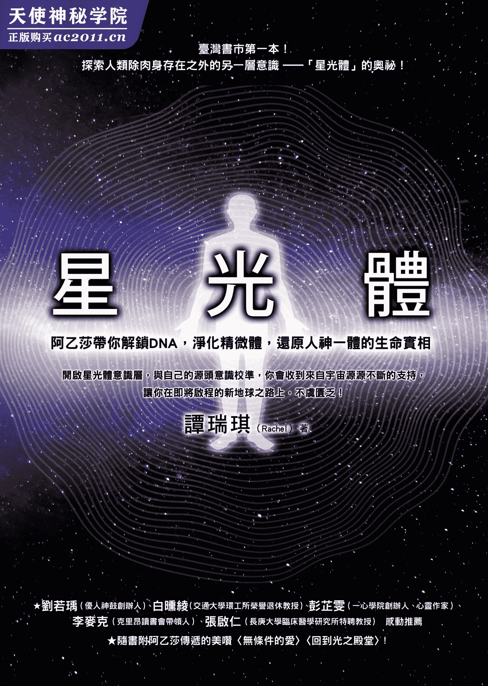

作者简介

谭瑞琪（Rachel）

一九六七年出生，台湾桃园人。美国爱荷华州立大学财金管理系硕士毕。

从小到大家庭和乐安康，没有后顾之忧地拿到硕士学位。回国后，顺利进入职场工作，在台湾的汽车业及电信业缔造了辉煌的商场经历。

虽然拥有顺遂的生活和工作，但是，生命不管你是跌入谷底或正玩得起劲，仍然会拉你走回此生早已安排好的路。

第一次与内在声音相遇是在同事的婚宴上，以主管身分在台上致词的她看着台下的众亲友，突然间，内在出现一个声音：“这些人认识的你，不是真的你！”被这突如其来的声音震慑住的她，没多久就走上了寻找生命意义的路，想要弄清楚：“如果那些人认识的我不是真的我，那么，我是谁？”

在探索自己的阿卡西纪录的过程中，收到宇宙共同意识源头阿乙莎（Aheetha）要她传给世人一起分享的智慧与教导，她忠实地记录下来。这是阿乙莎给地球人类直接而完整的传讯内容。

著有《阿乙莎灵讯》《创造新我．新地球》《爱的复苏计划》《星光体》《新人类密码》等书。

．欢迎上粉丝页“阿乙莎”分享自己阅读后的心得：www.facebook.com/anitya.com.tw

．阿乙莎体验工作坊：[www.anitya.com.tw](https://www.anitya.com.tw/)

［推荐序］

放下疑惑，不再迷惘刘若瑀

“打开你的星光体意识层，不是要你脱离地球的生活，逃离现实，而是要经由你进入不同维度的视野，帮助现今地球人类和环境提升，创造出新地球的生活。”

“放下你对自己和未知世界的批判。你以为那个未知的世界并不存在，是属于你之外的世界，错了！你想移除的那些疑虑、恐惧、担忧和控制性的想法不在外头，全都在你之内；也正因如此，你将自己隔绝于内在宇宙之外。”

这是在《星光体》一书中，阿乙莎告诉作者谭瑞琪的讯息。然而星光体的世界，我们是无法用肉眼看见的，是一个只有光、音和振动频率交织的讯息场，唯有：“当你全然信任帷幕之外的自己，才能真正完成与高我的合一。合一的旅程需要靠你自己完成，我只能提供爱的能量，给你支持。不要再迷惘了，让意识展开，你会到达的。加油，我的孩子！”

看到书中阿乙莎这段话时，我哭了！一直哭，一直哭……我们从来都不相信，我们只相信自己，相信自己看到的、听到的；相信自己的知识、自己的想法、自己的心情、自己的判断、自己的立场、自己的梦……

有一位来到优人神鼓报考团员的年轻人在简历中说：“老师好，我现在就读科技大学表演艺术系三年级。曾经藐视万物，直到一次在去尼泊尔的旅行之中，无意间从手指末梢感受到自地面传来的能量，是真的感觉到有东西在我的身体和地面互相交换什么，自此才谦虚地重新感受世界！”

是的，我们需要亲身体验到才会相信，而其实相信更能帮助我们体验到。

去做吧！时间已然不多，宇宙着急地把许多原本我们被屏蔽的内在打开。现在不用翻山越岭，也无须三年六个月深山苦修闭关，就是去“相信”！相信地球暖化造成的危机终将来临，相信世界面临的困境将持续下去，相信平安稳定的生活只有从心觉醒才能到来，相信我们灵魂中最珍贵的宝藏就是“无条件的爱”！

只有无条件的爱在我们心中全然升起，才能放下疑惑，不再迷惘。

相信打开星光体的意识层，和自身更高意识合一后，我们可以一起创造新地球的新生活！

（本文作者为优人神鼓创办人）

［推荐序］

地球意识与人类意识的共振觉醒白曛绫

多年前我曾因为阅读《白宝书》所描述的“神是”，而被一股力量向上抽拉，瞬间进入神的意识中，体验了“我是全部，全部是我”。因为当时自己的意识振动频率太低，短暂停留后，我的意识旋即退回肉身体中，但我从此明白天地万物都是神的化身，我们内在都有神性的种子，自然都是神的一部分。因此，当阿乙莎提到“我们必须不断地扩展意识，直到我们与神的意识链接，或者说是达到神的意识”时，我深信不疑，而这本书即提供了透过小我与高我合作，来达到扩展意识的可行途径。

我一直很清楚阿乙莎灵讯和我自己的学习系统（主要是由默基瑟德天使圣团所传讯之光的课程）不尽相同，因此书中描述的方法未必适用于我。但从阅读阿乙莎灵讯第一册开始，我就深深被书中的智慧教导吸引，这第四册《星光体》也不例外，甚至比之前有了更多惊喜，因为书中补充说明了许多新讯息，也与我的各种亲身体验，以及透过自由书写及录音接收到的“通灵”讯息相呼应。以下简单说明三个。

其一，我经常会透过地球四大元素之冥想，来引领上课学员穿越时空，无论是回到过去或去到未来，都可使他们有机会以全然不同的角度来思考自我存在的意义，而更能活在当下。这本书中提到的四大元素应用——“以水之流，感知天地；以土之机，融合万有；以火之眼，承接觉知；以风之象，无中生有”——提供了我许多可作为后续进行四大元素冥想的灵感。

其二，我近来一直在思考，路西法（Lucifer）这个天资聪颖却堕落叛变的晨星天使，为何被西方宗教、哲学与心理学描述成撒旦魔王？而我之前和魔鬼的对话内容也被瑞琪收录于阿乙莎灵讯第三册《爱的复苏计划》中。魔鬼藏在细节里，在星光体的精微能量中，我明白人类会感受到黑暗（魔鬼）力量的原因，是因为人类自己放弃爱、放弃对神的纯然信任。但包括黑暗与魔鬼、光明与天使，所有的一切，都在神性的引导中，神怎么可能会创造出错误的魔鬼来？我相信其中必然有其缘由。我的认知是，黑暗的存在是为了协助我们跳脱二元性，唯有超越并整合心中的天使与魔鬼，我们才能看到真正的光明。而这本《星光体》更是清楚指出，当你拥有“黑色背景的支持，才能更清晰地从第三眼看见绚丽斑斓的宇宙之光……黑洞变成了爱的收集盒，帮助你放射出你身上的光芒”。

其三，当我看到书中描述二〇二〇年突然而来的新冠肺炎疫情之缘由时，更是感到惊喜。我在二〇二〇年二月一日办理提前退休，打算转业成为全职的身心灵课程举办者。才一退休，疫情随即来临，家住台中的我不仅不必担心必须每天台中新竹巴士通勤到交大教书的高染疫风险，甚且我所主办或任教的各种线上课程也都顺利开展。更有趣的是，我发现自己透过录音接收到的令我瞠目结舌的讯息，有不少是来自天狼星。因此，当我读到这本书中提到的“新冠肺炎就像是从宇宙掉落到地球的上帝粒子，帮助地球重新校准五次元的天狼星”，真的是边读边点头，赞叹瑞琪传讯之精准。

我很认同书中所提的高我之定义：“高我也是你，未来的你，和处于不同时空的你”。无论是这里或那里、无论是过去或未来，都没有别人，因为“在星光体中我们彼此相连”。“当一个人觉醒后，无论是黑暗或光明，都成为他的力量来源，而一个人的觉醒之光会唤起许许多多人的意识一同回归家园。”让我们无论是否隶属于相同的光之门户系统，都能携手创建新地球，使之成为我们共同喜爱的美丽家园。

（本文作者为交通大学环工所荣誉退休教授）

［推荐序］

让这本书扩展你对“身心灵”的认知张启仁

对于在正常环境长大的我来说，“灵性”的追求从来不是我生命规画的一部分。我认为那应该是在日常生活、心境、感情或事业有重大打击及改变时才会突然兴起的一种依托的追求。何况长久以来，家庭、学校、宗教或社团一直在提倡“身”的健康和“心”理的辅导教育应该是社会大众净化身心的基础，反而很少有对“灵性”的探讨，总是把它挂上一个非常诡异、模煳、深不可测的外衣来面对。

我在医学院任教，并从事临床医学研究，成天跟临床数字打交道，要我去面对、接受这一个不以科学逻辑为基础的言论思想，真是一件困难的事！然而从小到现在，心中一直被两件事情困扰着，对我来说是科学永远没有办法回答的疑惑，一个是：“人死后到哪里去了？”第二件事则是：“地球外面的宇宙有多大？”凡事追求完美、处女座的我，无法解决或了解这两个问题，心里一直觉得缺少了什么！因此，若以“身、心”的教育与宗教的寄托，来游说或回答这两个问题，其实是让我很难接受但又不得不接受的现实。

认识 Rachel 夫妇已经十多年了，是在一个身心成长课程里面认识的好朋友。我们两对夫妇的背景完全不一样，他们夫妇在电信业，而我们是在生物与临床医学领域，唯一的交集大概就是在课程中一起分享的经验和一只猫的故事。我家里有一只领养回来的流浪猫，跟我相当不对头，常常在我的书桌、椅子、鞋子，甚至是我的公文包尿尿，让我不胜其烦。在一次聚会中，我们提起了这个问题，Rachel 提议用她灵性沟通的方式，尝试与这只流浪猫对话。不出几天，我竟然能和这一只猫和平共处，因为 Rachel 让我了解了流浪猫对我这个主人的感想。原来，问题不是猫，是我终于愿意和它和平相处！

看完了她写的三本书，参加过多次体验工作坊，现在再读完这一本《星光体》的初稿，我必须说，阿乙莎已经回答、解决了我的疑惑。祂唤醒了我内心的小我世界——不是，祂让我发觉了我内心的宇宙。过去所有的问题，有形的、无形的所有，一切都是自己，而我自己也可以开始解决、回答一切的问题。当我认知到这件事情的时候，那种喜悦的感受实在是不可言喻！

这本书的内容，可以说是第一本《阿乙莎灵讯》的进阶版。《阿乙莎灵讯》介绍宇宙观念，并点出了我们地球人要扬升至新地球的使命与方向，提供约略方法。我们人类从感官体、乙太体一路要进入星光体，这所有讯息，都约略描述到。第二本书《创造新我．新地球》可以说是一本工具书，针对为什么要活出灵魂做了详细的介绍。然而，人类科学的发达、物质文明的过度发展及人类的贪婪已经造成地球中轴不稳，正在走向毁灭的道路，所以，第三本书《爱的复苏计划》已经在邀请我们以迎接新地球为目标！

这本《星光体》不改作者以前的写法，用一问一答的方式，将阿乙莎和高我传递的讯息用文字记录下来。从如何稳定中轴，迎向并接收光的能量，如何升华、进入星光体、进入银河母舰、与高我对话，邂逅灵性父母、指导灵及其他原以为遥不可及的诸多高我，到最后终于到达“人神合一”的境界！我戏称这是“Rachel 人神合一游记”，从过去用小我寻找以为有形的高我，到知道用无尽的爱、意识形态，无色无相地与在高次元的诸多高我链接，最后终于知道“I am that I am”，到达“我就是一切，一切就是我”的境界，好棒的一趟旅程！

同时，作者又毫不藏私地把她接收的各种咒音，依人类身体的不同系统完整列表出来，以供读者作为与自己的器官沟通的工具，并作为契入光之殿堂的方法。在一次灵魂探源之旅中，她寻找了大自然的不同植物精素、矿石精素，以帮助稳定中轴，平衡偏斜的星光体，并透过这些水晶矿石，获得自人类存在地球以来所曾累积的文明智慧，帮助自己的灵性成长，并给了我们很多情绪解锁密码，好让我们帮助自己解除情绪、业力、身体状况的所有意识黑洞。

坊间强调帮助自我身心成长的书籍非常多，“阿乙莎灵讯”的到来不仅含括了人类对身心健康成长的要求，更对“身心灵”做了更高维度的拓展介绍，让我们知道人类可以进入星光体，更能超越地球人三度空间及四度时空间的狭窄思维。意识形态的传导已经超越时间、空间距离的概念，让我们可以用地球人所知的有限科学观念加上《星光体》这本书的内容描述及咒音、咒语、数码等扬升方式，达到创建新地球的复苏计划！

我希望读者能用开放的心态来看这本书。最后，我以一首打油诗与各位共享！

人依蓝图修此生，神造灵魂亘苍穹，合偕意识齐扬升，一登宇宙竟太极。

（本文作者为长庚大学临床医学研究所特聘教授）

［推荐序］

新人类工作手册彭芷雯

多年前与 Rachel 第一次会面时，她正在做电子书平台，我们讨论着电子书的可能性。

数年后，她成为阿乙莎的传讯者，并同时于内在整合活出教导，现在已经累积出版第四本书了！

从一个商场上杰出的专业经理人，到接收讯息，成为与高我合一的传讯者，Rachel 这既接地又属灵的特质，使得透过她传递的讯息，不只在字里行间满溢着爱，更提供了走入内在道路者详尽的心灵地图。

和 Rachel 相处，总是轻松自在又收获满满，虽然她常笑说自己其实只想过着安逸的退休生活，但被赋予这项传递星际讯息的任务后，她却从来不马虎，每天固定时刻接收讯息，恪守自己的初心，尽己所能地呈现最真实的讯息。

虽然一开始被《星光体》这本书庞大的信息量吓到，但当我逐页逐字细读，不禁对宇宙的共时性赞叹不已！新冠肺炎疫情肆虐的这年，我开始大量阅读来自西方的高灵克里昂的讯息，因缘际会下，翻译了以克里昂讯息为主轴的心灵科学电影《同一场域》的中文字幕。克里昂的讯息中明确提到未来“新人类”的特质，包括如何重新校准、活化ＤＮＡ场域、疗愈与回春、与高我合一等等，而令我惊喜的是，这本《星光体》也同步含括所有这些主题，并且钜细靡遗地记录了 Rachel 自身与高我整合的过程，以及在其中小我的疑惑。由于是以中文接讯，没有了巴别塔的语言藩篱，因此更贴近我们的文化与思维。若说专业经理人的特长是解决问题，那么书中每个章节里的每个方法，以简单易懂的方式，堆叠出一条清晰的整合之路，精准地给出“解决方案”。你可以照着这本工作手册去执行，也有可能从中发展出自己的方式，这条路径虽然未必适合每个人，却让我们瞥见了自身更大的可能性。

一直以来，许多高灵讯息只能给予我们指导原则，缺乏实际操作的指南。Rachel 传导的讯息，就像一本记载详尽的工作手册，手把手地带领着我们，要让我们三次元肉身的这台个人电脑连上星光体网际网络，进入浩瀚的场域，遨游帷幕之外的无穷宇宙！

（本文作者为一心学院创办人、心灵作家）

［推荐序］

让我们在彼此的星光体里相遇李麦克

世间所有的相遇都是爱，以不同的形式或频率呈现。回到源头，爱一直在那里。

这次瑞琪的第四本阿乙莎著作《星光体》问世，孕育的过程不仅经历了史上难逢的新冠疫情、全球变局，同时国族意识重新洗牌，各地诉求自由或政权重启的运动不绝于耳；衬以地球气候的剧烈变化，澳洲野火、非洲蝗害、中印洪氾此起彼落，人类意识与盖娅母亲的互动，似乎进入了一个新的层次。

尽管二〇二〇年众声喧哗，瑞琪选择倾听并臣服于内心的声音，交出了这本新作。我们周围朋友也参与其中部分创作，经历并练习用不同的形式去表达爱、体验爱。

故事，或许可以从［穿越风暴之眼］的美囋（mantra）ＭＶ诞生说起。

二〇二〇年三月瑞琪接讯“穿越风暴”咒语（Mo Ho Mo Ha Na Nu Mi Da），除了记录持咒以外，瑞琪也感觉到将咒语谱曲传唱的必要性。但是谱曲？录音？这像天外飞来一笔，完全看不到进行的头绪。后来瑞琪向我及比尔贾提起，由于比尔服务于影视产业，透过他的居中牵线认识了庄立帆，最后才有［穿越风暴之眼］的美囋ＭＶ问世。

神奇的，是这首美囋所触发的转变。立帆从事流行音乐三十余年，创作为数颇丰的知名主题曲及流行音乐，但他第一次遇到谈音乐得谈“脉轮的共振”，而非旋律是否琅琅上口！我们听完试录带给的回馈，都是“能量会从这个脉轮走到那个脉轮”，而不是副歌好不好听、编曲悦不悦耳。这对立帆是全新的挑战，相当于期待他放下以往熟悉的流行音乐创作技法，回归到身体及能量最直接的共鸣。毕竟，创作目标不是流行歌曲，是美囋……

立帆成功地克服了这一切。［穿越风暴之眼］美囋对能量清理、校准中轴的效果极为显著，每每听到这首歌曲播放，内心都会感动万分。同时，我们也戏称立帆从此走入“能量音乐”的领域。现在听到不同美囋或咒语，大家都会聊这些音乐跟身体脉轮的共振如何。我们也衷心希望，这系列的美囋创作，可以带给读者及听众全新的体验。

［穿越风暴之眼］ＭＶ，则由比尔团队（源映制作）制作。比尔非常熟稔流行音乐ＭＶ的拍摄，相较于他以往强烈视觉风格的创作，美囋ＭＶ更诉求灵性的共鸣。我们笑称，要把来自直觉的想法视觉化，相当于将非线性的讯息线性化。这里面的转译功力，ＭＶ导演并不下于传讯人。结果比尔的［穿越风暴之眼］ＭＶ，不仅对持咒振动有所助益，片末宇宙瞳孔的一呼一吸，甚至是在瑞琪并不知情的情形下先行创作完成。瑞琪惊喜地发现：那正是她心目中宇宙源头阿乙莎的样貌！

咒语、音乐、ＭＶ，如果没有新冠疫情，也许这些美丽的相遇不会发生。

回到这本《星光体》。观察这系列阿乙莎传讯，我觉得瑞琪的写作有几项特色。

首先，瑞琪在传讯的过程，一贯维持着“小徒弟问师父”的口吻。在阿乙莎和读者面前，她并不害怕表达个人的不解或情绪；相反地，瑞琪以非常真诚的口吻提问，坦承内心最深处的困惑，让阿乙莎予以解答。来自宇宙（阿乙莎）的真理自必恢弘，然而瑞琪愿意坦白属于人的困惑、甚至她的隐私，替读者照亮前路，并未在编辑上删减掉情绪或人性的部分，这除了在写作上有“烘云托月”，以及让阿乙莎讯息更能校准人类意识的效果，更重要的，是展露了对“人”的无比信心。

我们既非来此受苦，我们在此三次元世界的所思所感、领悟穿越，也都将回馈给这地球、这宇宙，乃至更高次元其他化身的“我们”。瑞琪在面对疑惑、进而诘问时，所展现的真实、明晰与热情，正反映着我们身无罪愆，情绪甚至是帮助意识扩展的重要体认。反过来说，如果不能直面情绪，仅是一味割舍或躲避情绪，我们又该如何体认情绪背后的课题，并予以穿越呢？

延续对人的信心，瑞琪写作的另一特色是，她并不经营造神或偶像崇拜。相反地，由阿乙莎而来的爱与能量，在在强化她相信：每个人身上都有神性，每个人都能获得来自宇宙的回应。在阿乙莎系列里，即使讯息来自高灵，瑞琪仍不时提醒读者仔细观照自己的体验，并寻找属于自己的解答。做手指操或光的管道冥想如此，第四册谈到的星光体十二系统及数字密码体验时也是如此。爱里没有对错，真实的力量并不来自他者，而必须来自内在。

大道至简。读者当可发现：第一册做手指操、三百六十度业力练习；第二册谈灵魂晶体、阿卡西纪录，双手量测能量场；第三册讲爱的复苏、创建光场、无条件的爱；以及第四册的星光体十二系统——地、水、风、火四大元素反复在身体、关系、环境及星光体上相互呼应，同时天、地、人的和谐共振，也必定从身体、心智、乙太体、星光体、业力关系，乃至灵魂蓝图与多次元高我层层显化。这当中的碎形之美，远逾人智所能揣测。如果不是来自宇宙神性的道理，又该如何解释这当中的一致性，与内外／前后的呼应关系？以及，对所有人无有分别的爱？

我相信读完阿乙莎系列，读者如果从这些讯息或练习，感受到自己被宇宙支持与爱着，感受到自己和万有众生的链接，把力量拿回到自己身上，展开与自己内在神性的对话与探索，那应该是作者最期望看见的事情之一了。

最后一点特色，也是这本《星光体》揭露的关键讯息：原来，你我都是外星人？

乍听之下有点惊世骇俗，特别是在传统想像里，外星人不是像ＥＴ，就是牛头马面四足八爪之流。

但如果你我在高次元皆是如天使般的高频存在、你我高维转世尽皆灿烂呢？如果你与其他生世、其他次元的你，恰似水晶的不同切面，彼此闪耀又互相辉映呢？

继［穿越风暴之眼］，瑞琪和立帆这次也准备了两首新美囋问世，分别是［无条件的爱］，以及［回到光之殿堂］。我相信上述大哉问，除了本书传讯可供参考之外，也唯有回到爱里方能解答。邀请读者在阅读《星光体》之余，一起享受这两首全新美囋带来的和谐能量。

祝福大家。让我们在彼此的星光体里相遇。

（本文作者为克里昂读书会带领人）

［作者序］

与高我携手合作，迈向新世界

当人类能够提升意识，从更高次元的观点来看今日的地球，就会了解宇宙是一个相互支援的协作网络。虽然每个星球都有自己的问题待解决和改善，但在自身能力所及的范围内，即使跨越不同次元，远在数万光年之外的存有都可以经由意识交流，或透过光和振动频率来协助其他星球。这也是神创造一切万有、生生不息的基础：透过彰显无条件的爱，从付出当中获得通行更高次元的奖励。

地球人虽身处较低次元，仍受到宇宙高次元存有的支持与保护。透过意识交流，在光的世界里，可以得到源源不绝的爱和所需的资源。与此同时，你们也终将忆起自己的源头，知道自己是来自宇宙的勇士，为了地球的扬升，愿意挺进这个不断遗忘、轮回，充满仇恨和恐惧的物质世界。

最终，无论成功与否，你们仍会回到光的世界，告诉在宇宙更高次元的伙伴，你们是如何经历地球上的一切，又是如何突破困难，为其他即将到来的伙伴造桥铺路。现在，去链接自身的宇宙源头，他们是你在地球上的坚强支援部队，来自宇宙无穷尽的光和能量晶栅，只要你提出需求，宇宙都将无条件地支援你的请求。

当你们将身上封锁已久的灵性意识打开时，地球人类终将恢复星光层的意识沟通能力，可以运用自己的更高意识，创造出新我。

前面这几段话是阿乙莎在二〇一九年八月四日传来的讯息，节录自《创造新我．新地球》一书。这段讯息只是个开场白，说实在的，当时的我仍无法理解，究竟星光层的意识沟通是什么样的状态？又该如何到达？

直到写完第三本书《爱的复苏计划》，我才被阿乙莎引领走入这一段超越身体和物质界的星光体旅程，也才从这里发现，原来我们身上都有着高次元的分身，正在地球帷幕之外的那头等待我们苏醒。经由自己在帷幕之外的分身指引，我们就能打开早已准备好且开放给人类无条件取用的智慧和真理。

星光体是存在人类肉身之外的另一层意识，透过星光体，我们可以觉知到自己本身存在着另一个更恢弘版本的生命实相，那是超越人类目前的物质局限，更微观也更宏观的量子宇宙视野。当人类得以进入星光体层的意识沟通，生命从此不再因无名的恐惧而受到制约，在旧地球时代孤独、苦涩、艰难的生命滋味，将被无条件的爱、喜悦与慈悲取代。

这本书对我来说是一个信息量超载的下载过程。若是你尚未读过《阿乙莎灵讯》，建议你先回去阅读这第一本书，以免有种茫茫然的感觉，这本书的前情提要，就在《阿乙莎灵讯》的后半部“宇宙”篇。从第一本书《阿乙莎灵讯》、第二本《创造新我．新地球》、第三本《爱的复苏计划》，一直到现在，阿乙莎每一次的传讯都是进入内在宇宙的路径指引。所以，若能按照这些书提供的练习循序渐进地实际演练，一定可以到达与高我合一的境界，而这本书就是完成之前的练习后，登入我们的内在宇宙，与存在高次元的自己合一的路径指引。本书描述的过程，是否同样可以为你打开与高我合一之门？我真的很期待。书中最后有打开我们内在晶体光之殿堂的指引，我猜想应该也适用同为星际种子的你们。就如之前释出的“新地球能量校准”影片，当初我也质疑怎么会有 558-868-868，然后就会出现一个天狼星入口让我们的身体接收到五次元新地球的能量？但后来发现，确实有不少读者看过影片都能体验到。

这本书是引领你进入星光体的旅程。这是阿乙莎指引我走入星光体的路径，不见得适用于每一个人，希望每位读者在阅读过程中，也都要允许自己有和书上不同的体验。至于是否每个人最后都需要像我在书中描述的那样，认出自己的灵性父母、认出高我之后，才能与之合一？请不要又被物质世界眼见为凭的想法困住，关键在于“认出”的方式每个人都不同，有些人是感受到光与爱，有些人会看到具体的视觉影像，也有些人会跟我一样，内在有种清楚的知晓。阅读过程中，你一定会有自己的诠释方式和感受，你只需要允许自己的内在可以有属于你的表达形式。放轻松，不要紧抓著书中的文字，认为自己没有同样的体会就到达不了。读一段文字，然后放下、深呼吸，进入自己的内心去探索，你将会发现更多的自己。

对我个人来说，这本书最后回到真我，并与高我合一的路径指引，是我与阿乙莎对话收讯以来收到最珍贵的礼物。没有这个明确的路径，每一次收讯链接我总是在黑暗中摸索，在看不见实体的虚幻世界中找寻曙光；但自从收到与高我合一的路径指引后，每一次我都可以快速而精确地链接上此时此刻我需要链接的宇宙资源。原来我们真的可以如此展开与高我携手创造之路，这是我写完这本书最大的收获。

随着地球扬升进入五次元轨道，生活在地球上的所有人类和物种将再度进化，我们与自身的高我意识会展开不同以往的道路。这是一条灵性觉醒后的创造之路，不但可以为我们生活的地球带来新的文明和崭新的创造力，更重要的是，与高我共同创造时，我们将不会错过原本就存在我们生命本源的天赋才能。在星光体中，我们随时可以取用这些天赋，以浩瀚无边的宇宙为画布，渲染出属于我们生命永恒的光彩。人类重新忆起自己的神性，并与高我合作的新时代已经来临！

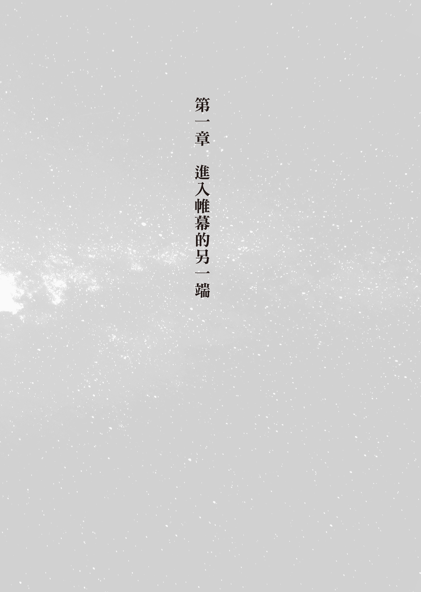

（刚写完《爱的复苏计划》，将书稿交付出版社的第二天一早起床，突然想起我无法向他人具体描述“无我”，也就是进入那种无条件的爱的状态。我知道盖娅母亲在《爱的复苏计划》中已经揭露进入无条件的爱的意识路径，但怎么以文字解释有些难度，似乎都无法用三言两语表达。那种无我却又无所不在的状态，想要以文字描绘，还真的不太容易。我们意识扩展后到达的至福，以及与灵魂本源同在时的喜悦，要如何用最快的速度让人感受到呢？我处女座务实又龟毛的个性又跑出来了，决定还是请阿乙莎给我一些方便法。）

阿乙莎，我想请祢指导一下，要如何让人们到达无条件的爱的状态？

人们在自身能量尚未平衡，或是仍处于能量集中在物质显化过程或事件当中时，他们身体的细胞会先听从小我的指挥。只有到达身心平衡的振动频率，才能经由意识的带领，到达灵性穿越地球帷幕的目的地。

你已经准备好要进入帷幕外的这一端，可以使用我们给你的意识快速信道，进入无条件的爱的意识；但是，对尚未完成地球功课的人来说，这么做并没有用。

你可以念诵“Si Bu La Si Bu Ya Mi Job”，然后闭上眼睛，用你的灵性之眼去看见自己的生命之花像一颗颗的种子扩散出去，你将瞬间进入无我的实相中。

好的，我来试试看。

就在念完这段咒语时，我突然进入一个多维度的空间。我的后脑杓似乎有双眼睛，背后也可以呼吸，意识从眉心往下方移动，进入眉心和喉轮之间的感知。我感觉自己的身体似乎变成一只站立着的巨大白龙。

没有错！这里是你们进入更高维度的灵性实相。你的肉身目前在地球的三维空间只能往前方看，背后整个是封印盖住的，这是龙族当初传递自己的生命种子进入地球时的集体决定。你们决定在封印住自己背后的感知力时，可以仅用前方的小我意志展现不同的创造能力。

阿乙莎，这已经超过我原来的认知了。搞了半天，意识扬升到多维宇宙时空，我居然变成一只龙？

当然不是这么单纯用你的眼睛和地球人的认知而已，我们会慢慢向你说明。你已经完成地球人扬升进入星际维度的学习，现在你即将进入银河星光体的学习。

我现在怎么有一种进入一艘母船的感觉？我原本宽广的天堂之路不见了吗？

天堂就在你心中，傻孩子。不管别人怎么说，你不是已经不再随便发怒了吗？欢迎回到银河母舰！

 登上银河母舰

（一早起床，我照样链接阿乙莎，身体却明显感觉到链接的信道已经不同。过去是感受到一股能量流进我的右脑，现在则是感觉能量进入松果体和喉轮之间，这里明显腾出一个空间。）

哈啰，你是谁？你怎么会链接到我？现在我身体的连线和之前跟阿乙莎链接时的右脑振动有点不同，我可是能清楚分辨你和阿乙莎振动能量的不同喔。（对这突如其来、在身体上感受到的不同于阿乙莎的能量链接，我的内心还满紧张的……这个意识体到底是谁？）

我隶属于银河星际，是银河母舰的守护指挥官。

阿乙莎在哪里？

祂完成对你的阶段性教导，也让你顺利穿越地球帷幕，进入银河母舰。你仍然可以随时与阿乙莎链接，不会有任何不同，只是目前你的灵魂晶体多维空间已经打开更多频道，你已经进入自己的星光体。

你刚才提到银河母舰？

是的，我没有说错，你也没有听错。目前地球帷幕之外有十艘银河扬升母舰，我们是其中之一，要迎接亚洲华人扬升至新地球。你会陆续收到来自银河母舰的讯息和相关指导，这些都早已存在你的灵魂晶体讯息资料档案中。

我现在和你们沟通传讯的频率和阿乙莎不太一样，之前都是右脑，现在移到松果体和喉轮之间。

是的，那是因为你的灵魂晶体移动到银河宇宙，你会感受到更清晰的传讯品质。这也就是人类扬升到第五次元的意识状态，我们之间已经可以如此经由意识沟通。

我现在想去找阿乙莎，我必须先确定你们确实是我应该沟通的对象。（我的内心充满疑惑……）

你可以随时和阿乙莎链接，但你目前已经有一部分的意识进入银河母舰，我们需要你参与，并传递相关讯息出去。

我现在是用什么样的形体和你沟通？

你就是晶体结构意识，并没有形体。是你的灵魂晶体登上银河母舰。

那么，我原来的灵性父母，雷巴特和莎雅，他们现在在哪里？

他们也都是银河母舰的成员，我们是在一起的团队成员。

我实在很难理解这一切，更别提要解释给我先生听。

他会渐渐明白的。这个任务和工作非常崇高，你曾经在银河宇宙缔造过辉煌的成绩，才会被赋予这项来到地球提醒人类灵魂觉醒的工作。

对不起，我现在真的想离开一下。（我心里是想早一点结束这段奇怪的对话……）

好的，我们随时等你进来。

＊ ＊ ＊

阿乙莎，我之前问祢要如何用更快速的方式到达无条件的爱，祢教我使用咒语后，为何我进入一个叫作母舰的地方？

那是光的存在集体意识，目前处于十一次元的维度。地球上方有许多光的世界的存在意识汇聚于此，正在帮助地球展开扬升的工作。

使用这个无条件的爱的咒语，会让你身上的天使之光闪耀，而你也会以自己的中轴为中心，呈现出一道大光柱，瞬间将附近的环境频率调升到光的世界的临在，然后你就可以立即透过你的中轴，打开进入基督意识场域的五次元门户。不只是你自己可以顺利登入扬升母舰，与你链接的所有人与动物身上的光也会同步与这道光校准。你们彼此共振的光之柱会更加明亮，能量也更为稳定。

但是，昨天登上母舰沟通的过程中，我并没有特别开心或喜悦。我的感觉是，那是一艘工作型母舰？

当你契入无条件的爱的维度时，你的灵魂会自动链接你的灵魂家园。你在那儿将以更高的灵性意识存在状态，展开与高我合一的旅程，那里就是你灵魂的家。

我记得当初契入基督意识场和自己的灵性父母合一时，到达的合一感受——我是我所是（I am）——和登上母舰的感受完全不一样。

你经由和自己灵性父母的意识片段合一，冲破地球帷幕的第一道屏障，提升自己的振动频率，契入基督意识场，那是一个回家的邀请。而当你终于踏进家门，你可以链接许许多多的兄弟姊妹，以及一整群灵性家族成员；你已经回到家中，是家族的一分子了。

如果我已经回到灵魂的家园，怎么那种不分彼此的合一感觉又不见了？我依然能够清楚感知到我的独立性，然后又感觉自己像只巨大的白龙，这种双重身分的感知真的满诡异的。还有，扬升进入灵魂家园时，我的小我意识也完全没有失去啊！我的怀疑，我担忧误上贼船的心也还在。我到底要用什么样的心态来面对进入银河家族的家园这件事？还有，接下来会遇到什么样的事情？我想先听听祢的意见。我目前还是不会轻易相信那里的存在体。

哈！你倒是学地球人的思维学得很彻底，充满疑心和自我防卫。

你的意识组成片段包含地球的你、灵性父母在你之内的片段、整体人类共同意识的记忆体，以及你灵性家族的群体意识。你如果要明白自己为何在此，又即将展开什么样的任务，就要从忆起你自己开始。而现在你才刚跨出地球帷幕之外，踏上银河星际的星光体意识维度，你即将打开更多的ＤＮＡ频段，打开你身上被封印的记忆。

你接下来要面对的是准备和灵性家族中的你（或称为“高我”）合一，进入共同创造新生命蓝图的阶段。一开始银河母舰的守护者会前来与你交流，引导你进入属于你的灵魂家园。在这个过程中，你会逐渐明白整个地球意识即将迈入银河轨道的周期，你们人类的意识也需要重新校准，而校准源头的钥匙就在每一个地球人的星光体层。你们必须打开星光体的意识层，开始与自己的源头意识校准。

祢是指我们目前在地球上每天上班忙碌工作的日子要重新设定？那么，是否会让很多人失去目前生命前进的动力和方向，造成更大的内在匮乏和冲突？毕竟很多人已经被社会约定俗成的结构绑死了，有一份职业才能维持正常的家庭生活。

你觉得现实和理想是互相冲突的，其实不然。我向你保证，意识重新校准后，在展开行动时，你们会收到来自宇宙源源不断的支持。这个支持会显化在你即将启程的新地球的道路上，绝对让你不虞匮乏。

你会惊讶于天底下竟然有这么美好又完美缜密的安排，一切如此具足，浑然天成。这是大自然早已演绎了好几万年给人类看的，只是你们视而不见。人类不信任自己的内在宇宙智慧，以为自己的自由意志能够超越宇宙运行之道。不是的，孩子，我们即使让人类拥有自由意志，你们也仍然要在宇宙运行的轨道中成长，并不会脱离宇宙之道。若是让人类在发展自由意志时落入银河宇宙之外的轨道，岂不是会造成宇宙坍塌？你们怎么可能还可以看见水往低处流、太阳每天为地球升起、月亮牵引着潮汐？还有，动植物甚至会全面罢工，人类就呼吸不到足够的氧气了。

人类生存环境中这些相互依存、互补的生命，都是宇宙自然运行的乐章。人类在地球扮演神，而神确实在每个人的内在宇宙看管着所有生命演进的历程。现在，来到必须重新校准的时刻，这一切的演出可以暂时告一个段落，有新的剧本正在地球上演，而你们此时此刻需要重启与自己的内在宇宙校准的工程，重新出发。

新地球的移转会发展得愈来愈快，愈多人完成校准，新地球的诞生就会加快速度显化。现在新地球的星光体早已准备好了，就等人类站上土元素的位置，让新地球显化出来。

练习：调频校准无条件的爱

**1.**深呼吸校准身体场域。

**2.**念诵三次“阿乙莎咒语”——Si Bu La Si Bu Ya Mi Job。

＊咒语意思：“啊！将我们彼此的光融合在一起，让这世界因我们而更加美丽！”

▲请点击 QR Code，
聆听［无条件的爱］美囋

＊使用说明：

这是链接阿乙莎光之门户的快速信道。阿乙莎光之场域为了迎接扬升人类的意识到来，而在基督意识场域打开光之门户，人们借由念诵此咒，可将内在意识振动频率提升至无条件的爱的状态，在此状态下就得以经由自身大师和导师的引领，登入阿乙莎光之门户。此咒也可以将你身边的环境调整成与你共存共融的状态，无法与你相融的能量会自动离去。

若可以成功将自己的内在意识调频到达无条件的爱的振动，就已经具备登入阿乙莎光之门户的状态。透过银河母舰守护者的引领，将可契入自己灵性家族的场域。

念诵此咒若无法感受到内在扩展或振动频率明显提升，可能有以下几种原因：

一、业力干扰：来自自己身体场域的干扰，仍有需要平衡的能量，平衡之后，才能不受业力的牵引，有效提升振动频率。因此，必须回到业力清理和净化脉轮能量信道，才能顺利扩展意识的维度。

二、自由意志：人类拥有自由意志可以自由选择，即使进入光之门户是高我或灵魂更高意识的初始设定，但来到地球帷幕之下，若还有自己想要去体验和完成的地球计划，人类拥有绝对得天独厚的选择权，可以做自己生命的主人。因此，当内在意志认为自己还不想进入帷幕之外的体验，就不会让自己的意识进入光之门户的链接。

三、陷入某一灵团的封闭门户中：有些人或许在灵性修行的过程中做出承诺，进入存在于第四界的灵魂体场域中无法扬升。也因此，个人内在意识已经从属于某些灵性团体，不认同无条件的爱和银河宇宙源头意识，也就无法融入。

四、隶属于不同的光之门户系统：当自己的意识场尚未完全净化时，不要尝试去引领自己的家人或亲友一同进入阿乙莎光之门户。你必须真正到达无分别心、无条件接纳一切存有的状态，否则会造成内在的黑暗能量与对方场域相互纠缠的状况。这时，你愈想扩展自己的光之柱，邀集更多的人进入光中，反而会让你觉得愈来愈沉重和疲累，因为你自己内在的意识分离，以及尚未平衡的能量黑洞的吸引，会在融合彼此身上的光的过程中产生能量纠缠或相互阻抗。此外，每一个人链接本源的路径都不同，不要以为所有人的灵性源头组成都一样，这是属于每个人和自己高我之间的意识回归旅程。

 在母舰上遇见另一个自己

（第二天一早，我明显感知到来自银河家族的主动链接。）

我们是阿乙莎母舰的指挥官议会，你即将和我们的团队一起进行接下来的工作。紧接着，你们在地球上会面临许多气候变迁造成的身体调整问题，我们会陆续将这部分的讯息提供给你。

你需要记录接下来的工作项目。

一、展开提升人类觉醒的力量：展开体验工作坊、课程教导，并以文字、书籍、图像和音频传达相关的讯息。

二、链接群众：链接群众和团体，进行社会文化的改造。你们即将面临政治、金融、经济和货币的结构性调整，在此时期会有许多新的力量凝聚，旧势力则会消退，以群体力量团结起来可以更快凝聚共识。

三、提供适合人类居住的方案：环境变迁造成气候与土地的改变，要提供适合人类居住的方案，帮助人类在地球上重建家园。针对这部分，会有许多新的建筑材料和居住型态的知识传递出来。

四、健康生活：你们会需要大量补充水元素，而水的净化和帮助人类排除负面能量非常重要。我们会传递适当处理过的水资源，以供应人们日常生活所需。

五、未来教育：设置学习场域，提供孩童正确的宇宙观，链接星际孩子的宇宙家园。要准备进入行动阶段了。

进入星光体银河母舰时，你必须知道如何在此母舰上行进，以及登上母舰后的路径指引。这艘母舰比地球上所有邮轮加起来的规模大上数百万倍，它的通行证直接镶印在你心轮的位置，你可以用自己的意识向下俯瞰心轮位置投射出来的镜像，所有呈现出绿色光的区域是你目前可以通行的。你可以检视一下自己的绿色信道，那是你被允许进入的区域范围；非绿色光的区域即使你用意识导引企图进入，也无法通行。

（我闭上眼睛，用内在意识之眼松果体看见前方大约一点钟方向有一大块绿色光，其他都是黑濛濛的。我的意识继续向前走进这个绿色的区域，感觉进入一条长廊，这里似乎有许多早已登上母舰的人在此。

我一直往前走，进入某个区域后就无法再移动。这时，前方有一位引路者向我走来，她自称泰雅〔Taia〕，身高约二米五，身形高大，具人类女性特质，身上有着绿色的光晕。她带我走进一个私人空间，向我说明这里是第九区的地球人登船准备区。他们将目前的地球划分成十二个区域，每个区域将迎接不同地区的人类和物种生命进入银河母舰的航道。）

地球每一个区域都有该区的地球领导人，其宇宙意识——也就是他们身上的星光体——会自动锚定母舰。而当你进入母舰，就由存在你内在更高意识的分身来教导你如何展开接下来的工作任务。

等等，更高意识的分身？我有没有听错？难道我眼前这位二米五的高大女性泰雅，你是我的分身？

是的。另外，你之前进入银河感受到的龙的意象，也是我。现在你登上母舰，我以人类的形象出来指导你。

你是指，在更高的银河系，你们可以任意改变外观和形体？

是的。这里是你怎么想就怎么呈现的意识维度，我们在此显化是瞬间的事，不需要粒子慢慢进行物质化凝聚的过程。因此在这里，若你有不相容于别人的意图，你的任何起心动念和回应都会立即显化出来，可能影响到自己和其他所有人。这也是母舰要教导你们操作星光体最重要的核心理念。

那么接下来，我是要跟泰雅你学习操作自己的星光体？

是的，而为了帮助你熟悉在母舰上的意识导航，我也必须显化成另一个个体意识才能和你互动，这是必要的学习过程。我是你早已为自己设定的进入星光体的学习伙伴。当你的意识仍在帷幕下的地球时，你链接到银河母舰上的我们，无论是莎雅或雷巴特，我们其实都是彼此不可分割的意识存在。阿乙莎、莎雅和雷巴特他们有能力穿越地球和宇宙之间的巨大频段差距，进入帷幕另一端的地球去唤醒你，是因为阿乙莎、莎雅、雷巴特，以及所有存在基督意识场的意识存有，他们的意识振动可以容许的振频比我们这些在银河母舰上的其他兄弟姊妹更为宽广。

这么说我好像才真正领会到，我们心轮的宽度和允许不相容振动频率存在的状态，才可以帮助我们回到银河的家园。也因此，阿乙莎、雷巴特和莎雅给我的教导，从脉轮畅通、中轴稳定、意识扩展、解除业力枷锁、放下小我的坚持、回到灵魂晶体、与自己的灵性父母融合进入合一意识、扩展进入基督意识、面对死亡、突破灵魂暗夜、认出自己就是爱，最后回到无条件的爱的振动里，一路上确实都是透过阿乙莎和灵性父母的带领，才让我今日登上银河母舰，与自己的分身和所有兄弟姊妹的意识相连。在这里，我感受到的是更接近我们人类目前身体容许范围的振动频率，所以我在这里的收讯突然更为清晰，感觉就是在自言自语。

泰雅，请让我再次厘清观念。当我们不容许与我们不同的存在时，我们自己就展现出分离的对立意识了，但其实，那对立的一边根本没有别人，地球上没有不同于我的存有，我们只是尚未忆起彼此是共同存在的一体。除非以神之名，或是以来自更高维度的智慧存有——如阿乙莎——之名，让我们臣服，我们才会愿意回到相近频率的银河家园，与自己的兄弟姊妹团圆。这一切是灵魂再次创造出的服从于一的体验之路，是吗？

你可以这么说。在母舰上，你们生出不同的派别和角色扮演，有人要体验更宽广、更好、更大的可能，决定吸收别人能量体验的黑色能量来体验；也有人组成光明团队，以至真、至善、至美的意图，在完整体验之后可以回到源头的白色能量。不论你们选择黑色或白色的能量，你们原本就存在一体的意识之中，只是朝着不同的振动方向去体验自己的存在。

被你这样说穿了，不就 Game over，退出游戏了！那我现在还登上这艘母舰干么？

这个问题就说来话长了。我们以后再慢慢回溯这段历史，现在我要先让你学会星光体的操作。

稍等，我还是想去问问阿乙莎，想跟祂再次确认一下。

＊ ＊ ＊

阿乙莎，我登上母舰了。这回我遇到一个自称是我的分身的女性，泰雅，她说要来教我使用星光体。祢可以让我多了解一下这是怎么回事吗？

你还不敢相信打开帷幕后的多次元维度就如此贴近在你的眼前，你好像多了一个和你同住在地球上的分身姊妹一般。没有错！你不用担忧和怀疑，因为目前银河母舰已经进入地球场域，只是没有以物质形态显现在你们眼前。它就像你们空间里的无形旋转门，你只需要经由你的星光体链接，就可以直接登船。

目前已经有许多地球人和你一样登上了银河母舰，不要担心，你们会见到面的，到时就可以心照不宣，互相认出彼此。未来，你也会带领孩子们登上母舰学习，就如同你现在正在母舰上学习一样。

接下来，你会慢慢进入光和音频的学习与链接，这是在你启动自己的星光体之后要进入的学习领域。之前没有教导你太多，因为当你处于地球帷幕的屏障下，这些功能无法真正发挥在光的世界的作用。

我之前是经由一个无条件的爱的咒语登上母舰，到底登上银河母舰需不需要咒语？

登上母舰其实不需要咒语。在你意识扩展的过程中就已经打开你身上的ＤＮＡ频段节点，一旦打开，你就是拥有更高维度的意识，可以随时切换意识角度和不同次元的多维场域。

你已经很熟悉三维，就是点线面的视觉化和空间的呈现；而第四维，就是人类共同创造的时间概念，进入过去或未来的节点切换。现在你已经明白，四维的时间真正要你进入的不是之前或之后，而是当下。当你的意识不放在过去，也不着眼未来，就进入此时此刻无时间振荡的绝对零时差点，你就从当下进入空无的状态了。

那个咒语是一种意识许可的方便法，真正的到达仍是需要你身上的光到达无条件的爱的状态，顺着你内在意识的扩展，不断地向上提升，终于契入无条件的爱的振动之中，就会在振动频率到达一定的高度后自动登上母舰。这里是来自宇宙的集体意识创造的五维地球空间，也是你现在正与我沟通链接的场域。

每个人进入五维的宇宙集体意识场时可能会链接到不同的天使圣团，不一定是阿乙莎，也可能链接到其他的圣团。不论是哪个圣团，我们在更高的维度仍是相互链接的一体存在，只是目前为了地球扬升的工作来到此地，各自执行不同的任务。

母舰上的天使圣团有哪些？

有大天使麦可、智慧之神托特，还有帮助净化地球、回收灵性意识的天使爱维尔，也有你熟悉的灵性母亲天使埃西斯女神。此外，默基瑟德大天使也与我们同在。

那为何称作阿乙莎？

阿乙莎就是宇宙源头意识维度的统一场，你也可以称之为太极。你当时取名为阿乙莎，让你自己感到温暖和亲切。你们人类最早的巴利语称之为 Anicca，古印度梵文叫作 Anitya，而你在二十一世纪的地球时空将我称为阿乙莎，那是你给这里取的名称啊。

所以，当初我听到的阿乙莎音频代表什么？

我们只是希望你称呼我们为：“喔，宇宙创始的圣父和圣母们啊！”我们是源头的共同意识。

哈，原来如此！

那么，现在这个位在五次元的银河母舰又是怎么回事？你们如果在更高的宇宙源头，怎么又会待在这么低的第五维度？

这就是宇宙人生活的方式，我们可以打开意识进入任何星球和次元，进行沟通和意识的融合。

那么我现在登上母舰，遇到泰雅，就是我与存在另一个时空的我进行自问自答的过程吗？如果我在母舰上不信任自己，想找到祢阿乙莎，又该怎么链接上祢呢？

你链接阿乙莎，就是链接我们所有大师、导师和天使的集体意识场，你的意识指向阿乙莎，我们就会联合起来回应你。我们可以跨越不同次元和维度，无所不在。

 何谓星光体？

在地球的意识维度，你有你、我、他这种分离的个体化概念，在物质身体中的“你”是小我意识，这个小我意识是帮助你在地球生存的重要向导。而你的内在宇宙里还有另外一个你，存在于地球，也同时存在于更高维度，那就是处在灵魂晶体中的你。这个处在灵魂晶体中的你没有你、我、他的概念，就是意识粒子群。

当存在你内在宇宙一部分的意识粒子的振动频率触及更高的维度，也就是到达与松果体共振的频率，约七．八三赫兹时，就可以启动你物质身体的精微量子系统。这个精微的身体，就是你的星光体。

灵魂晶体将来自宇宙源头的意识场讯息撷取出来，投射到你的星光体屏幕上，你必须经由内在之眼去观看，知晓讯息内容。你心的振动是帮助你链接并稳定在灵魂晶体之中的发动机，而你透过内在之眼观看到的星光体屏幕讯息会传送到你的脑神经，透过脑神经的讯息处理过程，让身处三次元的你可以理解和知晓。

在星光体之上，是宇宙共同意识的投影源，也就是你们认知的宇宙源头意识场，这里面记录着星际存有间共同的意识流动纪录。而你的灵魂晶体就是你，位在不同次元的你的共同意识场域，或称之为灵魂光之殿堂。你的灵魂高我组成将决定你可以获取的宇宙讯息资料库存取权限，没有经过高维度的你的带领和协作，小我是无法顺利进入的。

你的星光体屏幕涵盖的范围包含你身体所有的细胞，可以细微到细胞内核组成粒子，也可以扩大到你物质身体之外光的振幅涵盖的范围，同时还可以触及你自身更高维度的存在意识群。这时，你就会和自己的高我——泰雅——的一部分意识融合在一起，你也会发现泰雅还有许许多多不同次元的存在意识组成。

所以，高我的世界不会受到个别形体、时间、空间和维度的限制，可以互相链接，共同串联成光的振幅，延伸到地球之外的宇宙之心。你们无法以肉眼看见或耳朵听见，但可以透过身体精微量子产生共振的振幅相互链接。自此之后，你可以从自己身上整合你的高我意识群，呈现出更广大、属于你的星光体全息图。

在尚未契入自己的星光体之前，你是透过乙太体的振动，取得和宇宙断断续续的链接。你会不断透过直觉体传递过来的频率刺激，渐渐恢复乙太体的直觉功能，让原本强大的左脑意识逐渐移转到右脑，形成平衡的意识存在状态。

然而，当时的你意识尚未穿越身体所在的地球帷幕，仍然需要仰赖身旁的指导师、天使，以及你位于更高次元的灵性源头共同合作来提醒你，等待你从帷幕那端觉醒。如今，当你接通自己的星光体，在与自身高我整合的过程中，你会经由高我意识的链接，跨越不同维度的宇宙共同意识大洋，这也是人类与生俱来可以回到宇宙源头的机制。你们不会因为失去肉体而终结意识的旅程，所以在星光体中，一部分的泰雅是你，而你的一部分也是泰雅，我们银河联盟会透过你身上光的辐射，得知你所在的位置及目前携带的讯息。

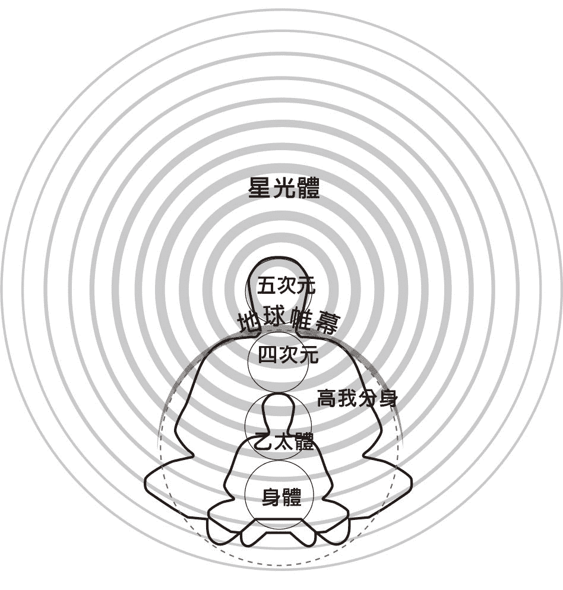

在星光体中，我们彼此的沟通可以更轻易地展开。你现在与我沟通得如此顺畅，虽然看不见我、听不到我，却可以清楚意识到我，也可以一字一句记录下来，这就是你的星光体正与位在宇宙中的我们连线的实况，而启动实况传送的中介，就是你和我们正在互动的星光体。你身体细胞里的所有粒子正以非常细微的振幅穿越你的内在宇宙，将你身体和地球之间的实体屏障打开；你已经穿越帷幕，契入宇宙之心，恢复松果体的沟通与讯息传递功能。你会觉得自己的意识更加清晰，呈现三百六十度的全息化展开。你已经充分展开星光体的意识，可以轻松地和自己宇宙家园的兄弟姊妹链接。你已经是完全清醒的灵魂，生活在地球和宇宙之间。

嗯，我一开始进入母舰，感觉自己的身体扩展变成一条龙，有点出乎意料之外。当时我为何会有这种感觉？现在再次登上母舰、链接泰雅，已经不会有变身成一条龙的感觉。

那是你的小我意识第一次穿越帷幕，进入自己的星光体，你仍带着身体的觉受感官体。想像一下，如果你是一个四角形，现在突然进入一个球体，你对边界的感知会有所不同。你用龙来形容那种全身细胞跨越帷幕、刹那间放松而扩展开来的感觉。你身体的细胞从未有过让自己暂时失去固定形体围篱的屏障，进入无边无际宇宙大洋的体验，而现在当你的细胞意识已经习惯这种频道的切换后，你的身体感官也就适应，见怪不怪了。

所以，我的星光体不是一条龙？

当然不是。星光体的你没有具体的形象，就是光。

那我为何感受到泰雅有二米五的高度、蓝绿色的皮肤？

那是她希望你可以聚焦于和她的沟通，帮助你确认每一次的链接正确所创造的形象。她必须配合初登母舰的人类原有的认知习惯，采取有“具体形象”的沟通模式，以协助你在星光体的学习之路。他们会依照你的灵性源头组成，以你会感到熟悉和亲切的形象与你链接。

那么请问一下，在母舰上，泰雅感知到的我是什么模样？

是幼小纯真的意识粒子，散发着光。这个光尚未被地球固着的能量沾染，所以，你仍携带着原有的粉红色光芒。

所以，在星光体的状态可以感受到每个人的光在地球的历史过程和演进吗？

当然。你们身上的光不只是一个点，而是有着一整个结晶体，结晶体的每一个面就是你们灵性体验的足迹。你不仅可以看见自己的，还能看见所有人类、非人类及宇宙所有存在意识的晶状结构，只是目前你还需要深化讯息的下载和链接。先不带你去看见这一切，因为一旦看到了，你那雀跃的孩子性格就会到处玩耍，不会乖乖地继续记录了。

原来我还在记录的阶段，我一直想出去玩……

不急，等阶段性任务结束，你想怎么玩，都让你随心所欲。

 由意识晶体组成的银河母舰

阿乙莎，可以告诉我这艘母舰长什么样子吗？我到现在还没能清楚看见，每一次登船只有泰雅和我沟通。我觉得自己像个瞎子，在虚空中摸索，感觉很不踏实。

在你契入无条件的爱的振动频率时，你顺利登上了母舰。现在，我们回到当时的状态，重新走一次登船路径。

首先，进入内在，链接你的晶体，打开第三眼，看到中央有螺旋状的光影波动。

接着，在晶体中呼请你的灵性母亲和父亲与你合一。透过合一的意识，你顺利进入基督意识场。

（此时，我的视觉再次从第三眼的位置缓缓向上方移动，到达顶轮。在这里，头顶上方有明显的压力笼罩我的顶轮。）

接着，你跟随这股能量持续向上方移动、扩展，直到这股合一的能量停止移动为止。现在可以打开内在之眼，看看你所处的母舰样貌。

（我试图打开内在之眼，看见了浩瀚的星空，这个巨大的星空正中央有个大黑洞，周围有无以计数的众多星光在点点发光。这个大大的黑洞有着规律的脉动，像一只大眼睛在我面前。）

这里就是母舰，你已经到达了。

咦？这里什么都没有啊！没有高科技的配备，也没有电影中那种有着巨大仪表板的太空舱场景。

母舰就是所有意识的家园，由意识晶体组成。你目前的晶体到达这里，你看见自己登船的位置没有？

有啊！在我内在之眼视觉左下方一个小小的点。

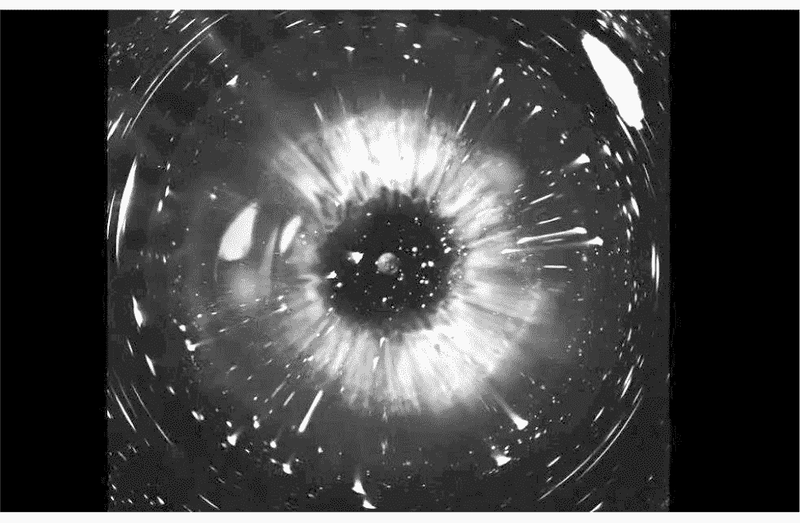

▲参考来源：［穿越风暴之眼］美囋 MV 最后一幕。
[`www.youtube.com/watch?v=NTKkwQyqs3U`](https://www.youtube.com/watch?v=NTKkwQyqs3U)

你现在去看看地球和太阳的位置。

在很远很远的地方，我的视觉的九点钟方向，很小的两个点。

现在你可以再次感受到母舰的样貌了吗？

母舰没有形体，而是有着规律的呼吸脉动、中央释放出祥和振动的宇宙能量场。所有星球都围绕着中央旋转，我们的意识则是乘坐着自己的晶体进入这片宇宙大洋。这里并不是像电影场景中的星际船舰，而是远比单一行星和地球还要庞大的集合意识群。

我在这里觉得自己好渺小，中央那个正在一呼一吸的黑洞仿佛是整艘母舰的中央控制中心，也是凝聚所有晶体意识群的母体源头。我们就存在这浩瀚无边的宇宙母亲的子宫里，不断吸吮着母亲从中央那深不可测的黑洞中像浪潮般一波波规律发送出来的能量。母舰上所有乘坐着自己晶体的个体意识和行星意识群都被源源不绝、来自母体的宇宙能量喂养着，不虞匮乏。这里非常平静，没有任何的情绪波动，只会感受到母体规律的呼吸节奏，不间断地辐射出一阵阵温润的能量波。

是的，现在带着这个理解回到你所在的地球家园，你该如何展开在地球上的生活？

我们似乎早已忘了自己的生命脐带和宇宙母亲依然是相链接的。若没有跟随母亲子宫一呼一吸的振动节奏，我们这个星球就会偏离源头的轨道，失去和母亲的链接，那么居住在地球和行星上的所有生命体也会找不到回家的路。

是的。现在你能明白我们为何要邀请大家回到母舰了吗？

我明白了。这就是回到母亲的怀抱，回归母体之中，跟随母亲的呼吸节奏，有规律地调整自身已经错乱的意识场体。每个生命为了延续自己的动能，必须链接回到母体，进行同步校准啊！

你现在是否愿意继续进行星光体的学习，让更多的人回家？

喔，我当然愿意！

 你是一整个星际家族在地球的代表

人类总以为自己是从出生在地球上才展开生命体验，其实你早已存在——在地球上，也曾存在于地球之外的星球。你曾经历不同的生命体验，只是当你再次回到地球，却忘了身上仍带着宇宙责任。其实，你当初是为了完成更高的宇宙任务才来到地球，地球是你在宇宙里许许多多生命的一个体验站，而地球帷幕之外的许许多多个你，正等待着你从地球上苏醒，你们彼此才得以展开原定的计划和任务。

你以为自己在地球生活这么些年，早已和宇宙的兄弟姊妹失联，其实不然，你每时每刻都在和帷幕之外的灵性家族交流，相互传送彼此最新的讯息。就如同你和另一个你在帷幕之外有一个共享的云端资料夹，虽然你的记忆尚未到达这里，你早已在不知不觉中完成了五十多年的工作，累积了庞大的讯息量。在帷幕之下，你从来不知道自己有这项宇宙任务，但其实你早已经走在执行的道路上，随时与高我传送最新实况，而你的高我分身也会依照你目前在地球帷幕下的知晓状态，提供你所需的实时讯息和协助。你并不是独自一人生活在地球上，你拥有一大群灵性家人正在为地球展开新的计划。

你在这个计划中扮演其中一个角色，而现在你正准备和早已与你同在共事多年的灵性家族连系，取得讯息同步。在你打开帷幕、进入星光体的沟通时，你会发现有许多不同的灵性存有开始与你展开更密切的交流。你已经可以透过不同的振动频率清楚辨识出个体存在意识和源头集体意识的差异，现在，你需要更深入你的灵性本源，和自己的灵性本源存有们做进一步的学习，以及忆起你本有的天赋才能。

在地球的维度，你只以有限的自主意识和感官视觉看见三维世界的操作方法；当你打开星光体意识，你将看见整个环状的光圈，每一圈代表进入不同维度和灵性源头的大门，而迎接你的会是该门户的光之守护者。这个光之守护者会依照你身上ＤＮＡ携带的源代码，为你展开属于你的道路，让你和自己的灵性片段链接，你就可以透过链接回本源，忆起你自己。

这些都不是存在于你之外，而是你灵魂本身早已具备的，现在得以透过星光体意识层，以不同的结晶面向你展现。在星光体帷幕之外，你的灵性家族正等待着你的到来，当你登上母舰，第一个与你相遇并来迎接你的，就是整个家族的代表。这艘母舰是星际宇宙集合意识群，你的灵性家人都经由母舰彼此链接、互通意识，并分享集体的智慧和讯息资料库。即使你的灵性组成片段分别存在于不同的星际次元和维度，在同步进行灵魂的进化和持续演进时，你们彼此会透过意识链接自己的家族成员，一起分享并交流。

登入母舰不同于进入你自己的晶体。母舰比较像是你一整个灵性家族的互联网，当你打开星光体的帷幕，就进入互联网的状态；而晶体是你的灵魂在星际旅行的工具，就如同你的个人太空船。母舰上有成千上万个太空船的意识停泊站，母舰还有整个星际母体的能量供应源和许许多多的联合议会，掌管并维护着整个星际母舰的运行轨道和平衡。

你的心智地图就是进入母舰互联网的个人地图，这张地图就存在你的心轮，可以为你导航。你不可能进入别人的领地，走进不属于你灵性本源的场域。这里就是你自己家中的大院子，透过院子里的每一扇门，你可以进入自己灵性本源存在不同星际和维度的家，可以透过这里进行属于你的星际之旅探索。你虽然看不见，却可以透过振动频率的交流，去感知那个世界的真实样貌。

 星光体屏幕——心智图

阿乙莎，我的星光体屏幕呈现的心智地图是属于我自己链接本源的路径，和别人无关是吗？

是的。你想想看，一个灵魂晶体的组成来自不同维度，在每一维度又划分了不同区域，那么，你的灵魂组成可以回到的本源家园就和另一个来自相同维度、不同区域，或是不同维度的存有回到的本源有所不同了。只是你们都同样存在这个环形的银河宇宙里，分属不同次元的存在意识本源群。

目前你的晶体投影屏幕已经可以从你的内在之眼展现。当你打开星光体帷幕，你会发现内在之眼不再只是光影，而是一整个全息宇宙的图像，以你的中轴为中心，向外以同心圆方式扩展呈现（如下图）。

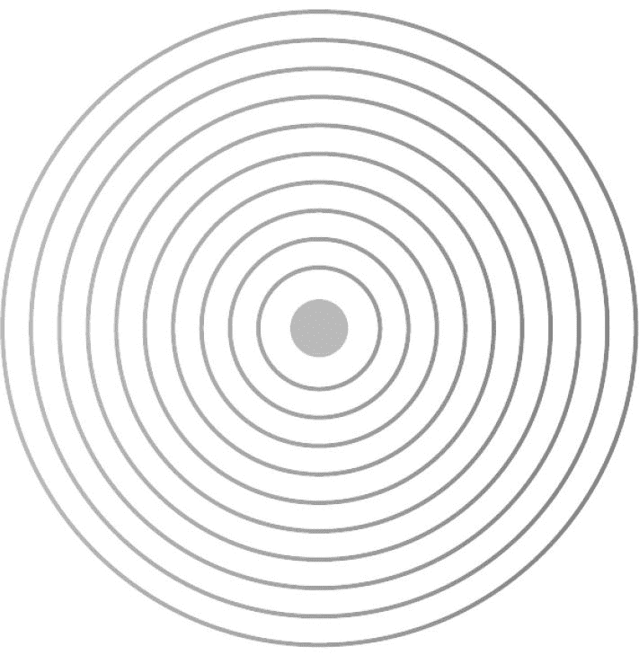

这一圈又一圈的光对你来说是有意义的，代表意识存在不同维度所呈现的光影。你现在看见最中央的那个点正是你灵性本源的起始点，当你在地球的经历结束后，你会先回到自己的本源，将意识在地球帷幕之下的所有经历和学习带回本源并与之融合，而你的灵魂尚未完成的体验和一些情绪因子会凝聚成为下一次体验的意识种子，再次进入外面那些圈圈中，一直到完整体验完为止。

你目前看见的这张全息图，代表你的意识的灵魂组成共同经历的片段，每一层都有相应的守护者掌管该意识轨道的运行。你的意识停驻的任何一点，都可以链接进入该场域的资料库中，整个心智图就如同一个庞大的宇宙记忆资料库。

你目前只能站在门外看见整个星状结构图，接下来，我们会依序进入更深入的学习和说明，作为你进入星光体体验的开端。

我目前用内在之眼看见的这张图很模煳，密密麻麻的那些圈圈似乎无法固定住，我无法好好分辨这里头到底有多少圈。它时而出现，时而消失，也会旋转，我要用什么方法才能锚定？还有，我该如何锚定？

先不要急，我会帮助你慢慢忆起。你现在需要先链接上自己的高我意识泰雅，因为只有在与自身更高意识完整合一的状态下，你才能稳定地在星际之间旅行。还有，让你的身体锚定地球仍然是非常重要的基石，没有和地球做好链接，我们将无法启航。

此外，要跟你说明，心智地图只存在星际种子身上，并不存在每个人的内在宇宙中，只有星际种子在进入地球帷幕之下的维度时会镶嵌这张地图。拥有这张心智图不代表你拥有在地球上高枕无忧生活的特权，你们是自愿进入地球帷幕下，要帮助遗失心智图已久的星际家人再次忆起回家的路。

心智图曾经存在地球文明中，在列木里亚和亚特兰提斯文明时期，所有人心中都有这张回到宇宙家园的心智图，透过这张心智图可以锚定家园的星际门户，还可以进行星际旅行和讯息交流。当时大量的星际存有移居地球成为人类种子，被赋予资料同步更新的责任，然而经历两百万年的星际殖民，地球上大部分人类的ＤＮＡ早已封印，已经无法存取这张心智图，也因此中断了和宇宙意识的链接。

今日地球上的星际种子已经可以重新链接上这张心智图，也有许多携带着心智图的星际种子重返地球。你们仍然需要经历地球帷幕之下的重重考验，深入了解地球人类制订的法则，从中取得新的平衡为起点，才能再次帮助地球扬升进入银河的轨道。

此次的地球扬升并非要中断目前人类的文明进展，而是希望从源头开始释出得以和现存的地球集体意识重新融合的新观点。这张心智图无法直接带着你和所有灵性家人回家，只能从这里展开新的尝试，因为人类被赋予自由意志，你无法改变目前这个事实和现况。地球母亲期待更多的星际种子引领人类的意识链接上新地球观点，帮助人们重新凝聚新地球集体意识，而只要让这些心智地图如实展现在众人眼前，就足以刺激人类的大脑朝向五次元的世界迈进。

你们这群星际种子目前要做的就是透过你们自己的意识扩展，进入自己的心智图，去探索并分享你获得的宇宙知识，让人们朝新地球、新观点的方向融合。这些心智图的展开会带来新地球意识的校准，其中包含宇宙学、人与生态互动的新秩序、新经济体，以及新的教育和医疗方法。

我明白了，阿乙莎。虽然我现在还无法深入心智图的全貌，但已经可以感受到，之前祢传达给我的讯息的深度和广度，确实有别于我们从教科书或宗教接收到的知识和路径指引。感谢祢的指导，我会尽量传达并彰显源头宇宙就存在我们自己身上的真相。

 与高我合一是回到本源必经之路

还记得最早之前，你是经由你的大师和导师的指引，链接进入阿卡西纪录的场域，透过这条和高我共振的能量流，顺利提升你的意识，回到宇宙共同意识源头。这对你来说，是最直接又轻而易举的到达方式。

你现在也终于明白，高我指的不是另一个与你无关的意识存在体，而是你存在高于地球整体意识维度的自己，是帷幕之外的更高存在意识体。

当你决定听从高我的指引，才能和自己的更高意识达成共识，而在此状态下，你才有机会踏上你们早已擘画好的回家之路。所以，链接本源的路径展开，是出自你的“应允”，绝对不会来自某个与你不相关的灵性存在意识或外星存有。你应允与自己的高我意识合一共振，才是让你回到本源的唯一道路。

可是，阿乙莎，在进入帷幕外之前，我并没有认出泰雅，现在虽然知道她是我另一个维度的存在意识，我怎么觉得好像跑进别人家了？我必须说，从进入帷幕之外遇见泰雅，我每天都在怀疑自己是否误上贼船，或被带往奇怪的地方，因为有太多讯息和音频传递出来，已经超乎我的想像。

这就是我们现在需要再次说明的地方，才能让你更加安心。每个人的高我都身怀绝技，巴不得赶快把自己教会，才能真正打开你们共同创造之路。

你可以想像你替自己的未来擘画了一趟美丽的地球之旅，你满心期待，替自己创造一个肉身形态的体验装置，希望这个装置帮你走遍你企图再次演绎的场景。你当时最大的期盼是什么？

我猜是为了自己灵魂再次进化所准备的，是吗？

一部分是！还有最重要的另一个目的，就是去替你自己找出一条你们共同创造的回家路径，这条路可以帮助所有存在星际间的其他兄弟姊妹精心演绎和规画出一条新的道路。你希望借由自己踏上这段旅程，帮助你们共同找出一条回到源头的路。

你不只是存在地球上的你而已，你还有许许多多的意识，存在不同的时空和宇宙之间，正在经历不同的故事场景。你们都需要回到自己源头的家园，而回家的路径千百种，哪一种才是最适合你们的？这道题的答案需要你派出一堆侦察机，才能替自己描绘出最佳的回家路径，那就是你的心智图。这份心智图是你替自己和所有与你相连、跨越不同宇宙维度和场域的兄弟姊妹准备的共同意识网络，这个意识网络就是你们一同回家的地图。

我一直以为回到源头的路径只有一种，因为有这么多宗教学派都在教导如何走进天堂之路，所以我之前认为就是走同一条路，到达同一个地方，只是因为宗教语言不同，还有年代不同，才产生不同的诠释方式。大家分开来搭电梯，最后都该到达同一个地方才对。我之前的概念是线性的，而祢现在跟我讲的是同心圆的球体概念，确实突破我之前认知的误区。

链接本源的最佳路径，需要先遇见你在高维度的意识体，就是你的高我。透过与高我合作，可以打开存在你内在的心智图，这也是你和共同链接的灵性家族一起设定的最初始生命蓝图，而这才是属于你的最佳路径指引。

我们之前在帷幕之下给你的所有引导，都是为了让你突破地球稠密的第一道帷幕，链接上自己的高我，并与高我合一。现在你已经登入帷幕之外，遇见自己的高我意识，终于可以展开迈向回家之路另一回合的创造之路。

我因为在帷幕之外突然进去一个不知名的环境，而感到彷徨困惑。原来每个人到达的本源虽然不一定相同，但与高我合一的这一段过程，都是我们回家必经的路径。链接自己的高我，才能打开属于自己的那张心智图。

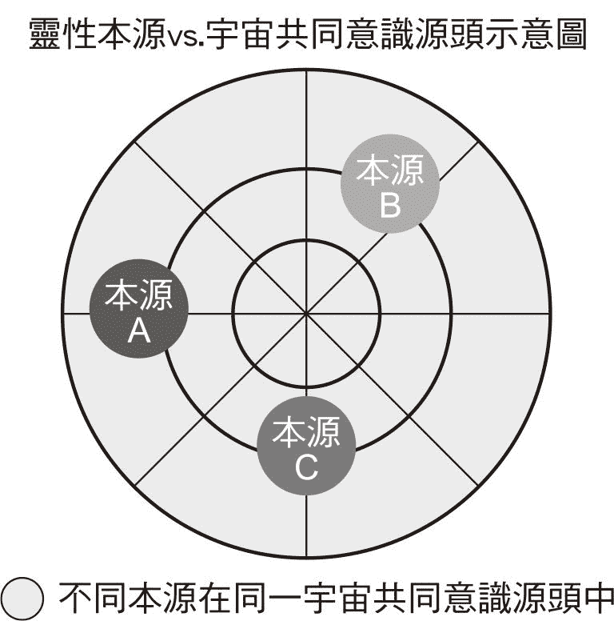

 你自性的光是你灵魂的导航系统

阿乙莎，这阵子学习进入星光体、打开帷幕的屏障，我总觉得自己好像闯入丛林的小白兔，在黑暗中摸索，还收到一堆咒语，真希望自己写下的讯息不会误导大众。祢是否可以帮助我补足一些我意识尚不完整之处，让我这阵子东奔西跑的星光体路程有个清楚的脉络，可以让人循线追寻？

当你进入帷幕之外，首先映入你心轮迎接你的，是一大群灵性家族成员，这里面有存在不同维度的你的分身，可以称之为你的“高我”。此外，不只是高我，还有一路上引领你来到帷幕之外的指导灵、你灵性组成片段的高维存在意识群，以及来自不同星系的存在意识。

在此星光体初探阶段，唯一一直伴随着你东奔西走的是你内在自性的光。走马看花也好，超越你身体感知范围之外、身历其境去进行探索之旅也好，你内在自性的光从头到尾都跟着你，让你随时可以回到地球上的身体里。

你那自性的光从来没有缺席你的每一场灵魂探索，也从来不会消失不见。打从你在种子时期，一路到达绽放生命之花，在这趟结晶旅程中，它一直存在你的心轮，伴随你经历所有的灵魂旅程。当你在灵性道路上有所斩获、雀跃不已时，它为你感到开心喜悦；当你遇上困难、深陷黑暗泥淖时，那自性的光率先站到幽暗的谷底，为你照亮灵魂回家的路。

它时时刻刻在你身边，鼓励你继续向前探索，不管是喜是悲、是光明或黑暗，它要你好好去体验生命，成为你想要成为的样子。这道自性的光就是来自我——宇宙源头——的光。

每个人的灵魂种子都拥有自性的光，当你最终瞥见它时，你又将踏进另一个桃花源，因为你无法驻足在源头中，你需要去体验、去经历、去完成。在灵魂进化的旅程中，自性的光会累积光的结晶，而每道光的结晶体都是独一无二的、都很珍贵。如同你所见地球母亲的子宫里孕育着各式各样的水晶矿石，每一种水晶都吹奏着不同振动频率的音符，也折射出各种不同色彩的美丽光芒，你们的灵魂晶体在星光体的世界里就如同一颗颗美丽的水晶，不断积累，沉淀出美丽的结晶体，那也是专属于你灵魂的资粮。

现在当你穿越肉身、穿越物质世界的帷幕，进入星光体的世界，你自性的光就是你灵魂的导航系统，顺着你的光前行，你将会和帷幕之外的星光体存有再交织出属于你们彼此的光的结晶。来自你灵魂自性的光永远会和源头链接，它让你不会迷失在星光体的光的交缠世界里。当你契入帷幕之外，你只须去辨识自己是否正在跟随自性之光的带领，这道光会带着你找到另一个更高维度的自己。当你登上母舰，出现一个来迎接你的意识存在，你遇上的是谁？

我遇到泰雅。

是的，她就是你的高我，也是你的自性之光进入不同次元、不同维度的延伸版本。这道光一直在帷幕之外守候着你的到来。

那为何地球要设计一道帷幕，阻止我们认出存在更高维度的自己？

孩子，你有玩过捉迷藏吧？

没有盖住双眼，你如何开始去寻找，并产生去体验的意图？这是让你遇见自性之光的过程，只是原本并没有设计“卡关”的程序。在你们的古文明时期，只要身体成长茁壮后，就可以自动链接上自己的更高意识，当时并没有任何宗教和君王制度防止你们与高我链接。灵魂ＤＮＡ的“卡关”让人类无法回到自性，这是外星恶意存在族群植入人类的，现在地球进入银河光子带，这些植入人类ＤＮＡ的“卡关”会被银河光明世界破解。你们已是自由的灵魂，可以超越细胞的印记，展开回到自性的新生活体验。

现在进入星光体意识，与自己的自性更高意识融合，你们在此再度合一，展开同频共享的互助，你就是在帮助自己扩展意识的宽度和深度。你地球生命存续期间的体验和价值观会融入帷幕之外的你的更高意识存在体，同样地，你的高维存在意识会向你揭露你尚未打开的觉知，让你从更高、更广大的视野，以更多元的角度去看见自己所处的地球景象。

所以，打开你的星光体意识层，不是要你脱离地球的生活，逃离现实，而是要经由你进入不同维度的视野，帮助现今地球人类和环境的提升。高维的你早已身经百战，历经更多生命体验，那是进化后的灵性的光。你不需要成为她，你已经是她，但你要透过自己现在的光，去重新诠释地球帷幕之下的你的这一趟新体验，让这源自你自性的光融合自身更高意识后，创造出新地球的生活。这也是所有灵魂意识穿越帷幕之后的使命——你们不是要去带回星际生活和讯息，好让人类幻想遥不可及的宇宙生活，而是要去活出自己在帷幕之下的新生命。你们要一起创造彼此都满意的生命体验。

 放下你对自己和未知世界的批判

当你契入星光体时，迎接你的是你自身另一个维度的存在意识。进入这个阶段，你会与自己更高的意识体从自他分离的意识中慢慢展开相互融合之路。一开始你会觉得陌生，感受到另一个和你近似的思考模式和振动频率，你以为她会像个老师般手把手教你完成意识融合的程序，殊不知，和高我意识融合的过程就如同你拿出一面镜子面对镜中的自己，只有走入镜中的情境并与之合一，才能将前方所有的障碍和干扰视线的边边角角移除。当你如实照见自身，全然接受如此真实的自己，才能完整与自己的高我合一。

在此过程中，你所有的疑虑就像一张张便利贴，贴满了整个镜子。这些便利贴占据了你整面镜子，你该去哪儿才能找回镜中的自己？你只能将便利贴一一移除，而这个移除的过程，就是放下你对自己和未知世界的批判。你以为那个未知的世界并不存在，是属于你之外的世界，错了！你想移除的那些疑虑、恐惧、担忧和控制性的想法不在外头，全都在你之内；也正因如此，你将自己隔绝于内在宇宙之外。若无法走入镜中的你——那个存在更高维度的自己——到达合一，你就无法走入镜子里的世界，也就是原本就存在你身上、你来自的那个宇宙本源的世界。

不要再因为母舰上你无法掌握和全然知晓的一切而担心和迷惘，你无法看见的原因，是你将自己的镜子贴满了疑虑；移除这些疑虑，你才能开始进入与高我合一的旅程。在星光体的世界，你无法用肉眼瞥见你在地球帷幕之下看见的那种实物景象，这里只有光、音和振动频率交织的讯息场，而你有限肉体中的所有感知系统将会展开与自身星光体系统再次重组的过程。

如同一个学步儿般踏出勇敢的第一步，开始探索星光体的世界后，你愈是深入内在，就愈能扩展意识的维度和认知系统。当你全然信任帷幕之外的自己，才能真正完成与高我的合一。合一的旅程需要靠你自己完成，我只能提供爱的能量，给你支持。不要再迷惘了，让意识展开，你会到达的。加油，我的孩子！

我知道了，阿乙莎。可以容许我多问一些吗？

和高我合一跟进入晶体有什么不同？之前祢曾带领我契入自己的灵魂晶体，认出我身上的灵性组成片段，找到自己的大师、导师，我以为那就是我灵性觉醒之境，现在又要我前往下一个阶段，登上母舰，遇见高我，和高我合一，这到底是为了什么？

当你的意识契入自己的灵魂晶体时，那是一个进入你自己太空船的邀请。你的太空船是由你的灵性源头组成的意识群，包含了你的灵性父亲、母亲，以及同行的大师与导师，他们的意识也都存在你的太空船上，是与你结伴同行的小组成员。你在自己的晶体中可以获得大师和导师的引导，提供当下最适合你的建议；你的灵性父母则帮助你看见自身光的组成元素和特质，你可以经由灵性父母身上的特质找回你的源头记忆，认出最初始的你的灵魂种子计划和生命蓝图。

现在，回到这艘太空船，也就是你的灵魂晶体。试问，应该由谁来操作这艘太空船？谁才是这里的主人？

是我吗？

孩子，这里没有别人，也不会有其他人帮你驾驶属于你的太空船，当然只有你可以。只不过你在地球是用肉身行动，而当你的意识契入五次元的晶体空间，你就无法携带肉身同行，此时，你只能仰赖自己存在更高意识维度的分身，也就是泰雅，和她共同驾驭这艘太空船，遨游于母舰和星际之间。

这样说起来，进入晶体就是找到自己的宇宙飞行器（晶体太空船），而我的飞行器指导员（高我泰雅）早已在里面等着与我合体，一起遨游宇宙，启航回家。

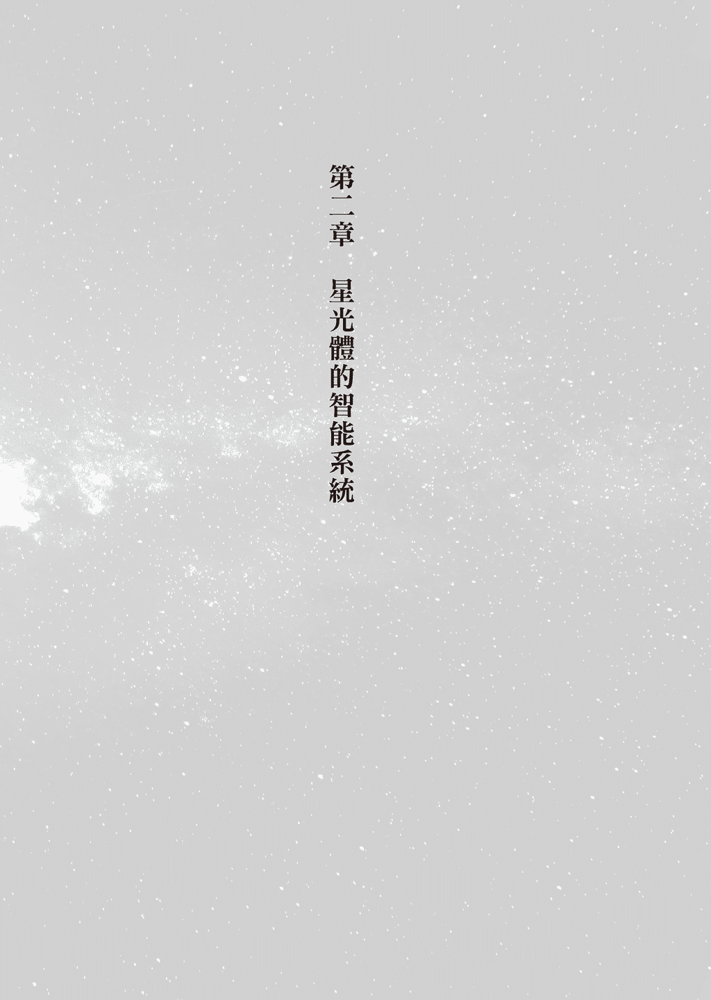

 帮助细胞意识扩展的ＤＮＡ解锁咒语

（泰雅大清早又传来一个咒语“Mon Da To Le To Da Le So Ha”，乍听之下跟绿度母心咒“Mon Da Le To Da Le To Le So Ha”非常相近，但我经过几次确认，知道这就是原来我内在意识听见的那个咒“Mon Da To Le To Da Le So Ha”。为了揣摩出这个咒音的能量，我立刻拿出纸笔，将能量在黑色纸上浮现的影像描绘出来，结果描出左页这张图，一个女神像，四周包围着许多细胞粒子，闪闪发光。）

泰雅，请问你是哪个大家熟悉的神明的意识或人们比较能够直呼你名字的振动频率？

泰雅是我，也是你，我们在此是一体的意识。过去人们称呼我为妈祖、观世音、绿度母、盖娅、埃西斯女神，各种称谓都有，我就是无形无相的意识，存在你的高维意识中。我可以存在三次元的空间，也可以存在五次元、七次元，乃至九～十二次元之间，而在不同的次元，我的振动频率可以引领所有在宇宙中游离的意识回归它们应该存在的轨道，保持星际宇宙轨道之间的畅通和流动性。

在五次元的新地球轨道，我扮演迎接三次元的人类意识进入银河宇宙之门的代表，欢迎地球人登上银河母鉴，展开星光体的意识交流。

而我现在传送给你的咒语“Mon Da To Le To Da Le So Ha”，可以帮助你们的细胞ＤＮＡ解锁——“Mon Da To Le To Da Le”是呼唤你们的细胞意识群，“So Ha”则是解锁之意。常念诵此咒可以帮助你们的细胞意识扩展开来，让你自以为受限于生物体的小我意识可以逐渐和自身的高维意识融合在一起，你们将会以全新的振动频率去衔接自己在帷幕之外的高我意识群。

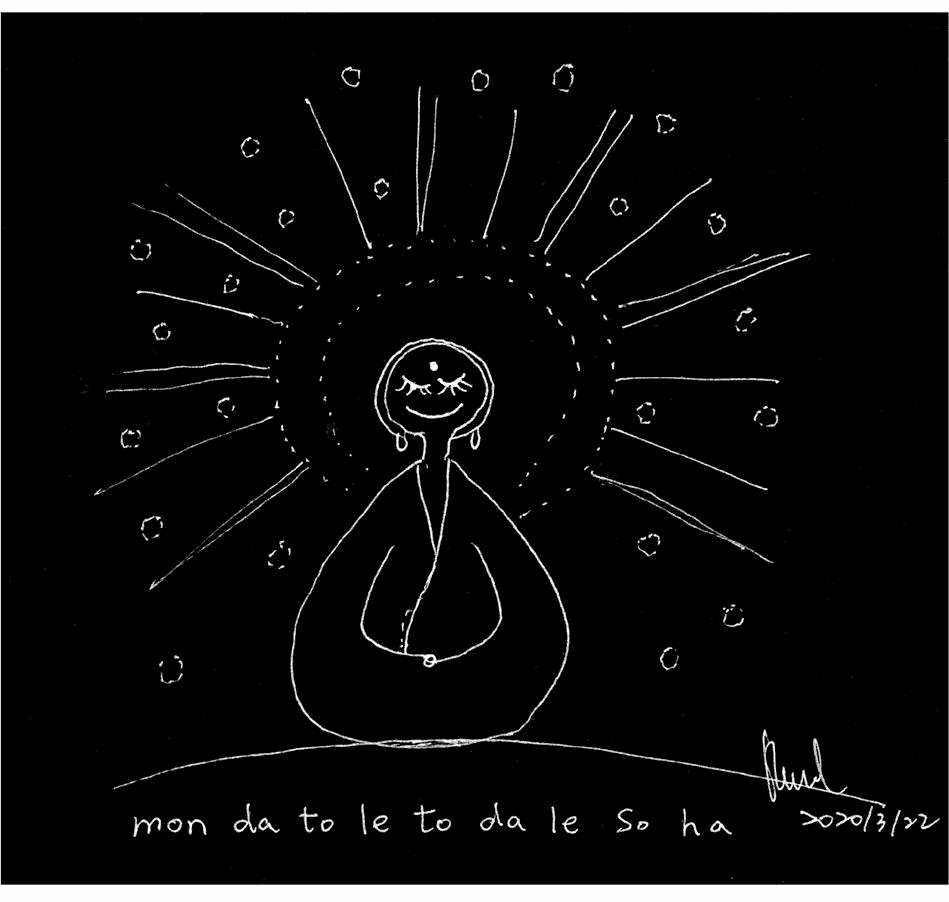

 星光体是每个灵魂都有的链接宇宙智能系统

（意识跨越帷幕之外，扬升至集体意识的母舰时，会展开一连串的身体与意识的重组。依照阿乙莎的说法，宇宙有许多意识本源，每个灵魂进入的本源也不尽相同，所以接下来，我只能针对我个人的经验，以时间的先后顺序分享这段我与高我合一、意识重新与高我校准的旅程。我个人的经验不代表所有人都应遵循之路，希望读者在阅读过程中也允许自己拥有不同的回归本源路径和体验。

以下记录的是我与阿乙莎的对话。）

人类是拥有宇宙智能的移动装置，ＤＮＡ解码的关键就在自己身上。你还记得地球形成最初始的元素吗？

我还记得，是Ｈ，然后产生水元素，进而演化出有意识的生命体。

人类诞生在地球，必须能够在地球上继续繁衍和生存，否则无法在自给自足的状态下完成被赋予的宇宙责任。地球人类和万物身上都镶嵌着链接宇宙智能的系统，地球上的动物、植物及矿石都和人类一样具有这套链接装置，只是分别在地球上扮演不同的能量净化或产生群聚效应的载体。

可移动的生物体具有调节、传输和进化的进阶功能，不可移动的能量载体（如树木和矿石）具备的则是稳定、承载和记忆储存的功能。地球透过可移动和不可移动的能量载体身上的细胞或胜肽链，将实体能量载具的讯息回传到宇宙智能系统，这中间的链接就是存在地球和万物身体中的水元素，也就是意识。

意识除了在可见的世界里逐渐显化为物质实体和现象之外，也存在另一个不可见的世界里，以讯息流动的方式展现。透过意识，你们可以嵌入这个宇宙智能系统，和宇宙万物互动、交流，而经由宇宙共同记忆资料库，人类就算不使用自己惯用的语言和文字，也可以透过意识和地球上的植物、动物、矿物、山林和不同人种等所有可移动与不可移动的物种，乃至存在地球之外的行星系统链接和沟通。

宇宙智能是维系宇宙所有物种生命平衡和持续演进的关键智能系统，它就存在每一个人身上，你们只需要透过意识链接就可以获得知晓。这种知晓不需要语言、文字，也不需要重新学习或经验累积，它是宇宙共同记忆资料库回应当下真实的唯一管道。

当人类开展意识、链接宇宙智能系统时，其整体生命与物种的互动方式会进入新的里程碑，这也是目前地球即将进入的新方向。人类将会忆起自身本有的宇宙智能，恢复和其他物种生命交流的新生活。

阿乙莎，祢说的这个宇宙智能系统是阿卡西纪录吗？

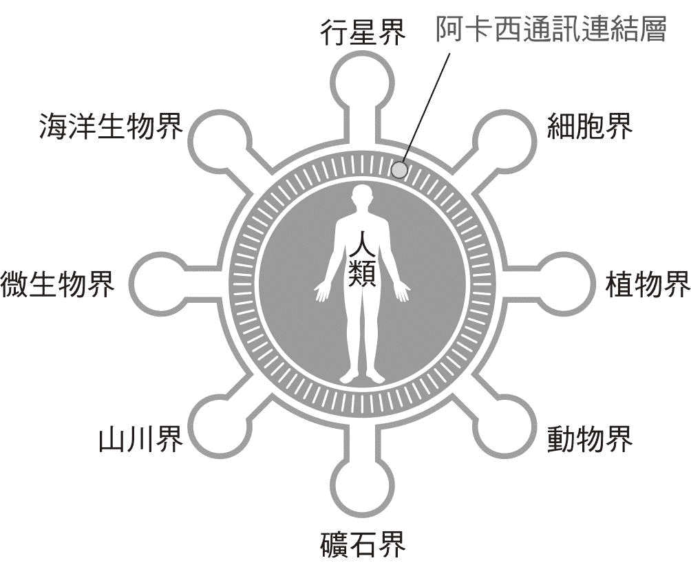

阿卡西纪录储存着所有和人类有关的历史信息，人类和所有物种的交流存在阿卡西纪录的通讯链接层，由此链接层可以进一步扩展进入不同物质和非物质界的资料库（如上图）。人类本身就是移动讯息装置，你可以移动到不同的资料库去探索，取得你们所需的资料，并带回地球重新“创造”。只有人类被赋予这项得天独厚的“再创造”能力，若地球上的其他生命体也可以取得这么多的讯息链接入口，并行使再创造的能力，那地球就不会是今日的样貌了。

每个生命都依循宇宙法则而存在。当你契入一个生命的链接，你就走进了那个节点的生命之轮中，而要超越生命之轮的运行，走入不同的生命循环和节点，唯一路径就是让意识回到中轴，透过中轴穿越不同的节点和入门区，进入不同的生命之轮去体验。

你们也必须看见自己的生命之轮目前所处的位置与体验场域，有意识地带领自己找到下一个节点去体验，这是地球母亲不断进化和提升自我的方法。人类从古至今经历了数次的生命大演进，没有一个生命可以脱离自身的生命之轮而存在；即使回到源头，你们也准备进入不同以往的生命经验，做出新的选择。

人类在地球虽被赋予得天独厚的宇宙智能存取和再创造的能力，但这并不是要让你们控制和压制其他物种生命，侵害其他物种和人类的生存权利。奴役其他物种、漤用地球资源，创造出今日的政治、经济和生活方式，都是因为人类无法透过自身的全息讯息网格获得宇宙智能；一旦打开自身意识的屏障，人类将迎向更全面平衡的生态系统与生活方式，这也是我们共同努力和期盼的新地球样貌。

你现在看见阿卡西纪录的链接网络，可以走进地球母亲存在不同生命体验之轮的过去、现在和未来之路，也可以从中撷取任何一段你想要再次体验的生命历程，给自己不同的元素来补足尚未完整的经历。当你进入地球生命历程的纪录中，也就同时得以窥见地球母亲的全貌。将这些资源带进你的生命之轮，可以滋养你、帮助你创造不同于过去惯性和无意识创造的生命体验。

掌握全息宇宙的资源，让你的生命迈向不同的层次，这也是地球母亲期待与你们共同创造的新地球未来荣景和契机。现在这道门已经为所有地球人类打开，希望你们可以善加利用。

那么，要如何让意识自由穿越阿卡西纪录的通讯层，链接这些资料库？

关键就是你们的意识必须到达和帷幕之外的自己合一的意识。透过自己身上的嵌入口，以更高的意识振动频率打开这些资料库，你意识所及就能产生当下立即的回馈和宇宙真理。只要是隶属于共同意识层的，比如进入你自己的水晶资料库与进入地球母亲的共同存在意识层，就不需要经由特别允许，你们彼此存在地球维度就可以透过自身的精微体意识链接；但如果是跨越不同维度和帷幕之外的意识，就需要透过自身更高意识的协助，与你的高我合一后，打开星光体的意识帷幕，才能进入跨越地球帷幕之外的链接。

 高我会协助打开星光体ＤＮＡ屏障

接下来进入星光体的学习。你必须由自己的高我协助，打开星光体的运行能力，而ＤＮＡ解码关键就在你自己身上。会如此设计人类的ＤＮＡ，也是为了保护人类在地球完成阶段性学习，才设置这样的意识控制节点。简单来说，星光体可以进入你灵魂的家园，你不会希望把回家的钥匙交给你不认识的人保管，让人随意进出你家，所以原本星光体就有限制外人不得进入的防护屏障，必须经由高我的光与你共振，才能打开星光体的大门。

在古文明时期，人类成长到十三岁左右就可以开始与高我链接，衔接进入星光体的学习阶段。但恶意星球为了控制地球人类的意识，而在人类的ＤＮＡ生物体端进行了意识屏蔽，高我对你们而言，自此成了帷幕之外的陌生人。

阿乙莎，我不太明白恶意星球控制人类的说法。这是指让人类生物体的细胞组织产生变异，造成遗传缺陷，还是指我们看不见的乙太或星光体直接介入性的控制？

这是一体相连的。你们的乙太体链接物质肉身和星光体之间的桥梁出现一个黑洞，因此高我存在的星光体意识和你在地球帷幕之下的自主意识的桥梁，有一段ＤＮＡ指令集产生了自动循环。

这个循环会在你们的自主意识企图扩展到帷幕之外的无形世界边陲时，让细胞陷入黑洞，发送出恐惧的信号，此时，你的自主意识会自动转回眼见为凭的世界，试图从自己的五感——眼、耳、鼻、舌和身体——中抓取光的来源。当人们被自我无意识的黑暗恐惧能量掌控，就会形成一世又一世的细胞印记和枷锁，透过黑暗与恐惧建构出光鲜亮丽的虚拟世界表象，也形塑出今日地球人类相互争夺金钱、权力和地球资源的分离意识。

当分离意识从种族、国家、性别延烧到社会各阶层，愈演愈烈，最终连地球母亲赋予全人类的无条件资源都被人类无意识地破坏。这段地球文明黑暗期长达六千多年，直到二〇一二年终于在银河光明世界的努力下，解开人类生物体和星光体衔接的限制性屏障。但即使人类的自我屏障枷锁已经解除，仍然需要透过你们存在帷幕之外的高我来与你们的身体意识产生共振，才能到达星光体层的意识状态。

 展开星光体的球形空间

（接下来进入星光体的说明是针对地球人初次登上阿乙莎母舰所设计的。这是供已有能力跨越宇宙帷幕、登上集体意识母舰的人使用，至于尚未跨越宇宙帷幕，或是不隶属于阿乙莎母舰的人，这仅能作为参考，不一定适用于你。

以下记录的是高我泰雅与我的对话。）

你目前打开内在意识，就会看到整个内在宇宙的频段区域扩展开了，不论用不用祈祷路径，都已经是处于打开ＤＮＡ全频段的状态。当你用意识的光扫描心轮时，你提出的所有问题的答案就会自动出现在你的内心，你可以同步得到知晓，也不用再去分别这是Ａ或Ｂ讲的，因为都是源自你的内在宇宙，是与你共同存在的意识场，只是以不同的频率或高度来回答这个提问。

此外，你也须注意自己的意识是否正在产生分离意识。若与星光体中的共同意识存在并不相容，就不要随便投射出来，以免害人伤己，这是基本守则。

泰雅，你说得容易，要做到很难吧！一定有很多破坏分子登船大闹，就像《西游记》中的孙悟空大闹天宫。

当然！只是你又忘了，我们共同的源头母体是无边无际的能量场，能够吸收和包容一切。安啦！目前为止兄弟姊妹还没有翻脸过。

你必须去看见在更高意识维度的一体存在性，而目前之所以在母舰上呼唤我们彼此的低频振动意识回家，也是为了稳定我们共同意识的家园。当低频能量愈来愈稠密，且已经造成阻塞时，整体银河轨道就偏移了。你看不见宇宙中的各个行星位置已经被迫迁移，造成量子宇宙坍塌，而这不能掉以轻心。唯有邀请更多低频意识扬升回到本源的家，才能阻止整个银河系的崩塌。

那也是我们自己的兄弟创造出的黑色能量，不是吗？

没有错！那些黑色能量也需要一起回家。你现在终于有了站在更高维度看见真理的能力。那些黑色能量也正在帮助清理家园的低频能量，它们正集中力量将更多的黑色能量聚集起来，一同回到黑洞中净化，好让自己还原到最初始的一体振动里。在这个过程中，它们也功不可没喔！

所以黑与白原本就是亲兄弟？

当然，而且还不只喔，黑与白就如同我们分别存在不同的维度，却也是一体的存在。

接下来，我要跟你谈谈在银河母舰上的意识导航，这里的意识指的是你目前松果体和喉轮之间的振动。你现在是透过这个地方和我沟通，你可以充分感知到吗？

可以，这和之前跟阿乙莎沟通从右脑链接进入心轮展开的感受不太一样，好像我整个沟通启动的位置就在嘴巴上方靠近鼻腔的位置、一个展开的球状空间，对吧？

是的。现在你从这个位置的中心往右方感知。

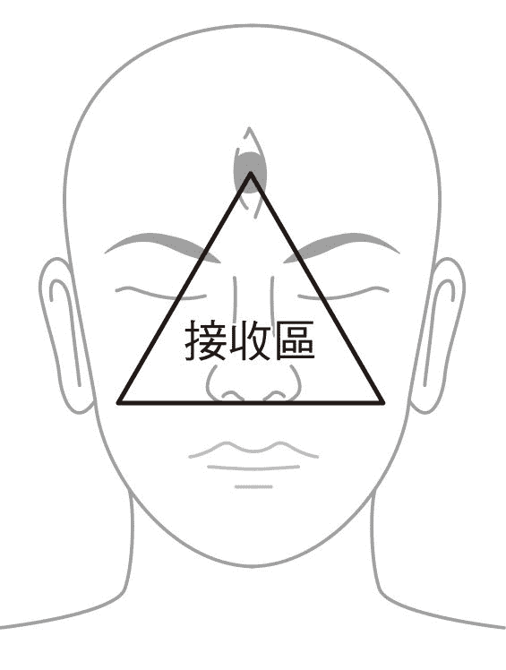

我右边松开了。

再往左边感知。

我左边也松开了。

现在向下感知。

下方也松开了。

再向上。

上面松开。

好，现在开始慢慢转动这个球状场域，然后看看自己。

咦，这不就是我看到的耶稣或菩萨头上的一圈光吗？

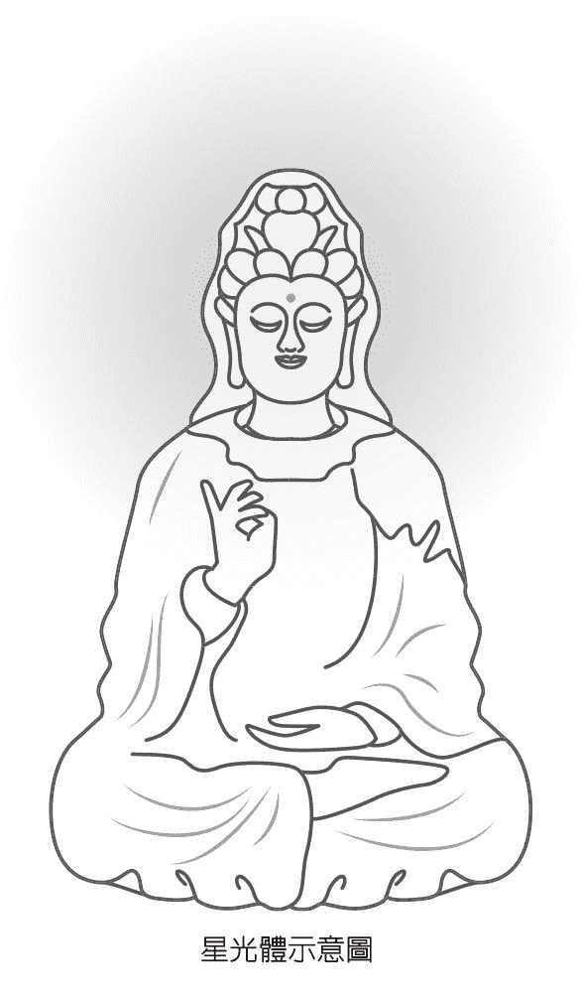

 你就是宇宙之心

星光体会从你心轮的位置向外一圈圈地扩及每一个次元，呈现球体状。星光体以你为世界的中心，向外延展你的影响力，宇宙中的每一个粒子、原子、质子和你的一呼一吸之间，会在你的世界形成一股中央是黑洞的能量流，当你有意识地进入这股能量流中央，你会进入空无的境地，这里就是宇宙贯穿所有物质和非物质、实体和非实体，精神体进入乙太体乃至星光体的快速信道。你们彼此可以在自己的内在宇宙进行讯息的交换和沟通，因此，进入自身内在宇宙中央可以让自己的意识自由穿梭于宇宙间，展开跨越自身意识屏障的交流，这也是人类得以跨越地球帷幕进入星际旅行的基础。

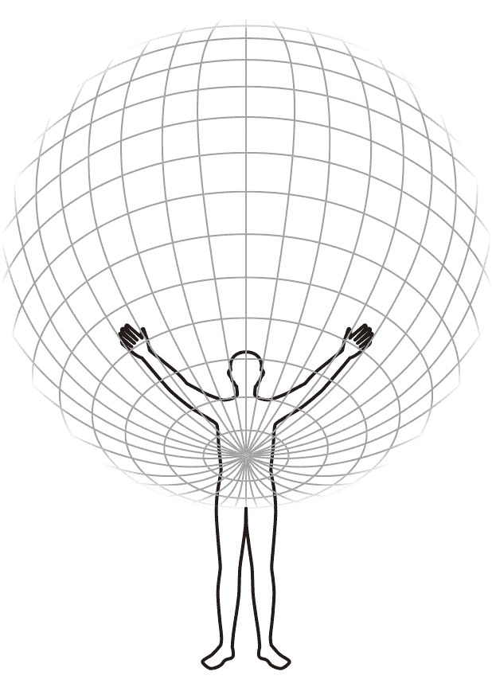

你的意识契入星光体，就可以带领你穿越内在宇宙，到达任一时空。当你逐渐熟悉并认知到自己的星光体可以涵盖整个宇宙，你将可以来去自如，准备进入跨越时空的旅程。你会发现，原来内在宇宙的所有屏障都来自你的自我设限，那些看似坚不可破的一道道高墙和围篱，是你过去的经验留下的足迹，依然留存在你的细胞印记中，将你层层包裹在自己设下的黑洞里。你在自己的洞穴中感到安全，那个黑洞就是你意识暂时的避风港，久而久之，你早已忘了黑洞外的光明之城已存在亿万年。即使如此，你仍然可以穿越自己设下的屏障，回到内在宇宙的核心，展开属于你自己和所有生命原本该拥有的自由体验之路。

现在你已经准备扩展你的内在宇宙，展开另一层生命探源之路。当你带着自己和所有与你相互链接的生命跨入宇宙之源，你将重返光明之城。

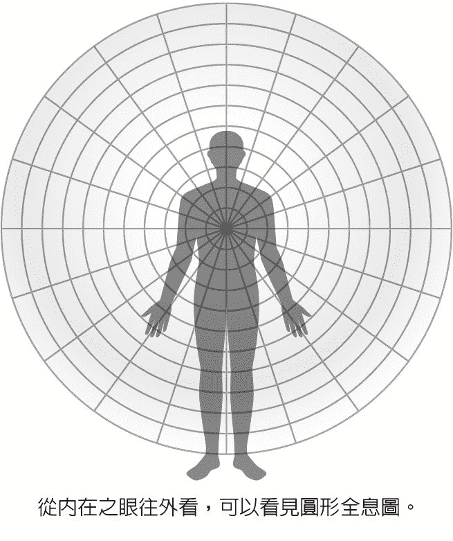

 灵魂晶体是星光体反射出来的镜像

你的晶体是由你最初始的灵魂意识组成的太空舱，也正是以你为中心的宇宙所有高意识存有组成的，他们也可以经由晶体链接到地球上你所在的位置。在生物体的组织切片中找不到这个晶体，那是你们身体细胞意识振动创造出的一种非固态结构体，以光的粒子存在于顶轮正上方的位置。

当你的意识成功契入自己的灵魂晶体，就可以透过你身上的灵性组成片段遨游你的内在宇宙。灵魂晶体是你整个意识存在的小宇宙从星光体反射过来的镜像，你的晶体和地球及宇宙一切万有的晶体，都在星光体中。所有生命的振动就是你们所谓的“宇宙”，“宇”是包含一切的存在，“宙”就是振动波。宇宙不在你之外，而是包含在你之内，如果你发出一道光、一个声音，这个光或声音将同时进入宇宙，如你所见的一团星光群体中。你虽然无法以肉眼看见自己在浩瀚星空中的状态，但你的晶体本身已经可以透过星光体反射目前在地球上的你的全息图。

现在，当你的意识结合自己在星光体中的高维意识，你就可以在地球这一端打开你晶体中的镜面。你的内在之眼，亦即第三眼正是指针，你可以称之为ＧＰＳ定位仪，帮助你定锚在不同的次元和空间里。你可以看见自己的晶体在浩瀚宇宙中反射出你的全貌，你完全处于全息宇宙的知晓状态，可以看见一切现象被你的意识认知折射曲解前与其他万有之间的关系实相，这也是你们一路追寻宇宙真理最终到达之处。

 星光体是宇宙讯息交换中心

你头上的这一圈光环，就是你星光体的通讯站。银河母舰上的每一个人都有此光环，我们透过这个环形空间感知宇宙万物，并与宇宙中的存有交流。这是我们彼此之间的讯息交换中心，我们可以随时在这个场域与外界联络，并展开自己的任务。

在地球上，我们没有这套个人系统？

在地球上，你们只以有限的身体感官和乙太体去感知。在帷幕之下，人类情绪的振动就是最佳导航系统，现在你则是用“手机”或“联网装置”跟外界通讯。当你打开自己的星光体，进入银河宇宙，你与外界的连系和感知就是透过这个随身讯息处理中心。每个人头上的这一圈星光体都不同，取决于他灵性生命的基数。基数会决定你们可以进入的领域，而这些需要靠你们自己去体验和累积。

那么，我灵性父母的基数和我没有关系？

当然也有关系，只是比重不同。你是他们培育的新生命种子，出生就携带着他们给予的一部分基数，但并非全部。你的另一部分基数来自整体地球的意识，你在地球生命期间累积人类共同经验的过程中，会取得这一部分的基数。另外还有你个体性的小我创造的基数，全部加起来，累积成你目前的生命基数。你可以在你的资料中心查看自己的基数。

这些基数到底是什么单位？

灵魂振动生命基数＝一部分继承自灵性父母＋存续期的地球集体意识＋小我个体创造。

它是能量计算单位，我们称之为“包特”（Bart），是振动的单位数。数值代表你身上的光的振动交换次数，数字愈大，振动愈快。

类似频率？

也不尽然，是光的粒子动能和交叉显像数。

那么，我和阿乙莎链接时的振动数值，以及登上母舰时的振动数值各是多少？有一样吗？

你与阿乙莎链接时的振动数值大约是每秒钟三十万次，但你登上母舰与高我合一时的振动数值，可以高达四十五万～六十万次。

为什么？

因为你与高我的频差没有那么大。你们可以创造彼此的融合，融合后的场域可以跳跃升级；而你与阿乙莎之间的频差较大，是阿乙莎需要降频与你链接，但你和阿乙莎无法产生融合后的升级共振效果，只是链接、接通管道而已。

算了，这个已经超乎我的理解，我投降。那我现在可以看到跟我链接的人的基数吗？

你无法看见所有人的光的基数，只能知道自己是由哪些灵性片段共同组成，而这些与你有关的人的基数，你是可以进一步了解的。

所以，这里没有优胜劣败？不用比较基数，或是基数会被别人偷走？

这个说起来就复杂一些。基数有可能移动到其他人身上，会有为了特别目的而创建的移转机制。这就像你们的存款帐户，可以去向别人借钱进行某项投资，投资后累积的报酬再根据当初的分润方式，拆分回每一个参与的生命中。

这是为了共同目的而进行的。比方说，你的灵性父母在不同的维度工作，但他们同时存在你的灵魂中，当你的任务告一段落，回家时，你的父亲、母亲，还有指导灵，都可以分享来自你生命基数的报酬。

那么有没有可能投资失败，减损基数？

当然有！

好吧！那么泰雅你呢？你现在和我分属不同维度，但彼此相连，你的基数和我不一样，是吗？

是的！我在此三千多年，累积的基数已经比你大十倍了。

你刚才说基数是光的计算单位，所以你可以去头等舱，我只能到普通舱？

你想太多。在母舰上没有孰高孰低，基数只是让你可以进入不同的空间去学习和探索。和别人不同，或是比别人多、比别人少，对你都没有太多意义，你是自己生命的导演和玩家。

天啊！这么复杂的游戏场是谁设计出来的？

这不是被设计出来的，而是所有存在意识共同凝聚出的平衡机制，已经是运行百亿年的结果。你们每个人的灵性组成片段都不同，人类就是高次元意识为了扩展自身需要播下的灵性种子，而为了能在地球的二元世界场域进行完整的体验、转化和再次延伸扩展，每一个灵性种子都需要配备阴性（母亲）和阳性（父亲）的灵性片段。这些灵性片段都来自宇宙众神的意识，在播下灵性种子体验之前都已经做过行星轨道及星球状态评估，才能决定其进入不同星球再次体验的课题和目的。

这些神性意识都是为了宇宙整体的和谐而再次展开体验，也为了达成其目的而组成不同的星际联盟。因此，当你以个体生命诞生于地球的同时，你在更高次元的意识母体也存在多重身分，正跨越不同星球的集体意识体验中。

你在地球这个阶段的体验前与体验后创造出来的地球集体意识成果，也会带领你进入新的宇宙平衡中。所以，你目前的灵性生命基数除了来自你灵性父母的片段组成，也会有一部分来自你目前所属星球的集体意识振动结果。你们在投生地球时是携带着共同期盼的兄弟姊妹，拥有共同的目标和对未来一致的想法，当你们以个体生命之姿诞生于地球，你们个人的小我意识在地球上再次创造和体验后的基数，将决定你此生灵魂最终到达之处。

在地球上，你们每个人原本都是生命共同体，都具有神性，并对地球母亲的存续和发展有着共同的理念，但是当你们进入地球时，却又可以享有绝对的自由，创造出属于自己的极致体验。最终，当你结束在地球的生命旅程，你的个体和在地球的集体意识结果都将贡献回到宇宙源头。

现在你已经明白自己的灵魂本身就具备神性意识，在登上神性意识共同凝聚的母舰后，你是否愿意透过你的小我，在地球超越过往小我的个人意志，为了宇宙共同存在的整体永续与和谐，展开不同以往的创造之路？生命的恒河永不停歇，而你可以在其中决定要在哪里驻足停留，一同再造美丽的乐章。

泰雅，谢谢你的说明，我现在更加明白我们既是一体，又分处不同时空的原因。我正在帮助我们彼此在地球体验，你也在协助和支持你在帷幕之外原本计划好的体验之路。现在，头上的大光球是我的个人资料中心，接下来我该前往哪里？

你必须去读取自己的资料库档案。当然，若有不清楚的地方，随时可以问我，我可以带你去查图书馆的资料。

你为何不直接告诉我接下来要做什么，就像之前阿乙莎手把手教我那样？现在是我问，你才回答，要是我没问到的，不就遗漏掉了？

你没问到的部分，我会再补充给你。你一部分的工作是去参加银河会议，你要去处理未来人类的教育和地球集体意识的净化，帮助地球稳定磁场。每个人的工作都不同，我们各自努力！

你现在可以随时进入母舰找到我，我也会因为你的意识进入，而知道需要在此时此刻与你交流。这就是星光体的交流方式，我们经由意识心电感应。此外，我们也可以随时切换频道，多频同步链接，当一部分的我正在跟你沟通，回答你的问题时，我另一部分的意识也在参与目前银河正在举办的多场星际会议，还有一部分的意识则在天狼星和列木里亚。这些对我而言都不是线性展开，不是以一、二、三的顺序发生，在多维的世界，我的晶体可以呈现多重维度的同步显像。你也可以。

啊？我怎么做得到？我现在手停不下来，脑袋也一直在解读你目前正与我沟通的内容，我可没有另一只手、另一个脑袋可以处理更难的问题，更别提帮助地球做什么了。我到目前还是不敢百分之百相信喔。

你已经在做了，不是吗？你现在是不是认为自己还在旧地球与我同频共振进行沟通？不是的，你的意识已经进入五维，你在这个状态下与我链接的同时，将我们之间的对话用你的大脑诠释出来，并使用你的身体拿起一枝笔写下来，才能完整沟通。

你看看，你不也是同时穿越不同维度，并以不同的形体存在？一部分的你正在五次元听我讲，另一个你在地球次元正在写，你的意识所在之处才是生命真正存在的时空。你的身体此时是被你自己的五维意识附着的状态。

你可以发现自己的大脑其实是没有办法思考的，大脑只是听命于你的意识，但你在地球时，总以为大脑具有分析、评估、判断的能力，误以为在地球可以发挥和创造，全是靠大脑之赐。这是让你的小我自我感觉良好且舒服的定位。然而，当你契入星光体的意识状态时，你的小我逐渐被你的高我意识同化了，你现在才终于发现，是你的意识穿越宇宙帷幕不断探索和创造，并为你导航，你的小我一直依赖的大脑只能接收和翻译而已。

 星光体的自动导航机制

泰雅，我怎么还是不太明白我是如何进入这里，链接上自己的星光体的？我之前用“Si Bu La Si Bu Ya Mi Job”这个咒语调整自己的振动频率，到达无条件的爱，然后就像进入自动导航般被带领至此。我的大脑好像还不太确定这样是否正确。

有一个更快速稳定的方式可以到达，我来教你。

练习：快速稳定地链接星光体

1.深呼吸，将意识集中在第三眼的位置，内心发送出无条件的爱的光（可以用咒语“Si Bu La Si Bu Ya Mi Job”，也可以直呼阿乙莎之名三次）。

2.接着，你会在第三眼前方看见光出现（就像绿灯通行指示）。

3.以意识向前移动，朝绿光持续前进，直到无法移动为止。

4.完成登船步骤，呼请指引：“请求我的星光体指挥官来带领我，前往属于我的星际家园。”

完成之后，你就可以进入星光体。其实，你们这些光之工作者每天晚上入睡时，灵魂意识都回到银河母舰上工作，只是当时你的小我意识正在休眠状态，无法知道和忆起这段登船程序。现在，当你从地球帷幕这一端打开登船程序，进入你的星光体，你就可以记住和链接两端的任务，也可以帮助你在地球上更有效率地落实和显化工作项目。

你已经穿越宇宙时空，进入无时空限制的创造之流。现在地球母亲殷切期盼所有光之工作者快速觉醒，一起来帮助地球回到银河系的轨道。

你们都是光之工作者，也是带着特殊任务的星际种子，现在开始演练，熟悉这个程序，你就可以带领更多地球人回到母舰，展开银河星际种子的任务。

我重复做一次链接进入星光体的步骤。

首先，我的第三眼位置没有任何光影和动静，我只是深呼吸，将意识集中在第三眼。接着我用快速法，以内在意识呼叫阿乙莎之名三次。我看见第三眼正中央有光，从白色的微光，渐渐变成绿色，那个绿不是鲜明的绿，是雾状绿色的反射。我用意识导航，向前走进绿色区块，中间经过一条黑暗的隧道，还有双线条的直线光为前导。我持续往前移动，直到不能再移动为止，然后呼请我的星光体指挥官前来带领我，在母舰上为我导航。

有需要修正的地方吗？

很好，你做得很好。我再补充说明一下：当你往绿色光的方向移动时，你并没有离开你的身体。那是你打开自己身上的ＤＮＡ星光体的路径，通过这条路径，你就在自己的内在宇宙打开了契入银河母舰的大门。

哇！

不用太惊讶，你们经由自己的内在宇宙就能通往银河母舰。那是我们为地球人扬升五次元设置的银河基地站，也是地球扬升进入银河轨道的星际中继站。

你们只要能够打开自己内在宇宙的星光体帷幕，透过意识在光的世界自动导航，就可以到达我们为全人类扬升设置的银河母舰。这艘母舰上有许多任务分组，都是依据你们灵魂组成的初始设定而分配的。你隶属于第九组，就是传讯组，负责布达和宣传双边的工作进展和工作项目，同时也要负责打开地球人灵魂ＤＮＡ的屏障。第九组人员身上具备打开ＤＮＡ的密码，就存在你灵魂意识投射出来的光中。你们可以打开人们的ＤＮＡ屏障，引导众人的意识与自身的星光体结合。人类历史上有许多开悟者和灵性大师都是这个小组的成员。

母舰上的任务编组有九组，这九组的振动频率各有不同的光的代码。我们可以等你更熟悉登上母舰与高我链接的步骤之后，再深入学习这方面的事。

＊ ＊ ＊

（练习进入星光体的第二天。）

泰雅，是你吗？

是的。今天我们继续讲登上母舰的程序。你今天并没有等到绿光出现，对吧？

是的，我的第三眼直觉已经进入不同的空间，在还没确认有没有绿灯出现之前，我呼请阿乙莎和你的名字。

这样也是可以的，我们知道你链接上了，也会来和你会合。你明白这个“链接”和“会合”的原理吗？

我不清楚。

“链接”就是振动频率的对接，“会合”就是共振。当你的意识到达时，你振动频率的光谱会呈现特别的光码，而光码会进入你身上的ＤＮＡ，开始调频。你此时的身体还坐在地球那一端，但你的内在意识因为光码，打开了一个新的意识维度空间。这时候，我们还没有链接。

当你打开心的意识维度空间，会进入宇宙意识暂时等候区。我们银河母舰的成员会随时进入这个暂时等候的意识空间，搜寻目前等待链接的意识光谱，进行串接。

你身上的ＤＮＡ有源头链接者的身分认证，也就是你身上已具有链接源头意识的ＩＤ认证。当你的ＤＮＡ携带着源头ＩＤ进入宇宙意识等候区时，就会展开自动配对。我是你在银河母舰上的五次元分身，你的光的密码ＩＤ就是我，因此当你进入暂时等候区时，我的一部分ＩＤ链接系统会启动，与你链接。此时，我才和你完成“链接”，而链接之后，我们会产生频率上的共振，透过共振频率可以让彼此的意识顺利交流“会合”。这就是你登船的完整程序。

所以，重点是你的意识必须先到达宇宙意识维度的暂时等候区，此时你身上的ＤＮＡ会释出源头ＩＤ认证，进行匹配。

那么，若某人的源头ＩＤ不是来自银河系，而是其他星系，也是使用这套程序吗？

不一定。每个星系有其光的链接系统，我们无法知道细节，但可以透过银河邦联，与其他星系协调出共通的链接讯息编码。

这有点像地球上的无线通讯系统，只是在地球是用手机号码和联网装置，在宇宙是用光和意识。

没错！宇宙的意识链接是透过光的语言，而手机通讯也是传递光，只是用声音和文字转译出人的感官系统可以解读的内容。就如同我们此刻在沟通，但你需要用文字或声音表达出你接收到的讯息内容，别人才可以理解你，道理是一样的。

我今天没有看到绿色灯就可以链接上，但是否不应该如此进行？下一次需要等绿灯吗？

也不是。你没有看到绿灯时，就是在等候区，我们会来迎接你；若你看到绿灯，就是ＩＤ认证通过了，你直接进入母舰的任务工作区域。通常你在入睡后，是直接进入工作区域的。

所以，在等候区，我有可能认错人，跟错对象吗？

不至于，因为你们身上的ＩＤ必须匹配。

那么有没有绿灯都没关系，不是吗？

还是有点不同。若你已经比较清楚这条路径，看到绿灯会很快，你的连线品质会更稳定，比较不会被自我低频意识干扰。

好的，我明白了。

在工作站中，不只有我，还有你的许多兄弟姊妹都在此，我们是一个小组的。你之前链接阿乙莎，那是我们共同的源头意识；但在母舰上，我们拥有各自独立的意识体，分工完成各自被分派的任务。所以下一次，你等到绿灯再进入，就可以感受到氛围的不同。

我似乎比较习惯有人在身旁带领。

哈！我就是你的高维意识，我们一直都在。我也存在你地球三次元的意识体中，只不过你在地球上不会感受到我的存在，就只是这样。

那么，泰雅，你同时也是别的地球人的高维意识吗？

是的，我有数百万个分身。

数百万？哇，这么多？既然数百万人都是你的分身，你为何不让在地球上的他们认出彼此，成为一家人，不要再吵吵闹闹了？

哈！如果都认得彼此，你觉得我还需要这么多分身干么？此外，即使是一家人，就不会有争吵吗？

说的也是，算我白问了。

也没有白问，这是宇宙创造集体意识更新的机制。不只在地球维度，其他维度也同样展开这种集体意识再分离的体验，以创造出更新后的集体意识动能，帮助我们共同源头的家园保持永续的活力。

＊ ＊ ＊

（练习进入星光体的第三天。）

泰雅，是你吗？

是的。

我今天用绿灯的方式进入，我链接得还可以吗？

可以，很好。这是我和你之间早已创建的通关密码，是你与我成功链接时的约定，也是我们彼此早就设定好的、镶嵌在你灵魂意识中的启动钥匙。这把钥匙对我某些灵性体验分身来说也同样有用，因为你们进入肉身体验的过程，都源自本源意识。

你们内在都拥有回归源头的密码。当然，不同的星际族群家人可以设定不同的通关密码，但即使是不同的星际家人，在更高次元的共同意识体依然是相链接的，所以你的通关密码对不同星际族群的人来说一样有用，只是这个作用在他们个别族群认同上无法辨识出来而已。

在扬升母舰上，会有侦测意识晶体是否可以进入的筛选系统。当意识尚未到达纯净的振动频率，仍携带着许多尚未平衡的分离意识时，就无法让自身振动处在稳定连线的状态。

这是每一个灵魂与本源合一的旅程，没有任何一个分离的意识可以代替另一个意识做功课，也没有所谓的搭顺风车。你透过文字和体验课程协助个别意识净化，重新校准中轴，展开各自的灵魂回归母舰扬升旅程，这是你的灵魂到达这里之后，可以为所有人创造出的让意识成功到达星际本源的范本。透过这条路径，人们可以与自己的高我合一，但这个合一并不是宗教或你们过去一直以为的受到神的照顾、与神合一，不是这样的；这是与你自己的更高源头意识合一的旅程，而这个更高的意识就存在每一个人身上。

这和合一意识又有什么不同？

合一意识是在意识维度上到达基督意识的节点，而ＤＮＡ解锁，让星光体扩展和交流，则是还原每个生命最初始的流动状态，这是动态的、持续的扩展过程，没有对象限制，没有尽头，你可以进入无边无际的宇宙意识大洋，与一切的存在交会和融合。

你愈扩展，就愈接近未来的你，即使你仍身处地球，以肉身的形式与外界互动，但在星光体层，你已经无所不在。

之前的教导是让你们回到爱，让爱带你穿越小我的屏障，契入无条件的爱；而当你已经能够进入无条件的爱中，就可以进入与万物共存共荣的学习，再次扩展自己的心轮。你将成为容纳百川的大海，成为无所不包、无所不在的自由粒子意识组成，那就是神的样貌，重新在地球上展现。

当愈多的光之工作者进入这个状态，愈多人成为自由的意识体，就愈能帮助地球整体意识扬升。

 音频是你在星光体中与高我共振的语言

星光体是光的维度，是声、光、频率感知的世界。在这里，细微的能量流动会经由你的ＤＮＡ展开讯息编码，你必须更专注在能量的流动里，任何小我意识的干扰都会阻碍能量的编译过程；你需要更进入内在宇宙，稳定跟随着能量律动。

音频是为了帮助你以最快的速度，让全身细胞ＤＮＡ校准中轴，把你身体上所有残留的噪声清理干净。这是对进入新地球光之门户的灵魂意识进行的基本净化工作。

当你愈来愈深入宇宙帷幕，进入光的世界这一端，你会与自己的高我意识展开更紧密的交流和协作。你的高我意识没有生物载具的外形让你辨识，你们彼此之间的合一交融会发生在你以第三眼契入高我存在的晶状结构体时，这也是众多高维度意识的联合晶状体，由各个行星意识共同组成。地球是众行星意识守护的灵魂孵化器，当地球孵育的灵魂意识苏醒时，其身上会绽放光芒。你身上的光就是讯息收发装置，也是与帷幕之外众行星意识交流的讯息交换中心。

你会逐渐收到帷幕之外的意识维度传来的音频、咒语，以及更多宇宙法则，这些都是无条件的爱的维度传递出来的讯息，你以纯净的意识接收就能带回地球，传达给尚未进入帷幕之外的人参考、学习。这也是因地球母亲转换轨道的需要而打开的光之门户。目前已有众多门户为行星扬升过程做准备，宇宙就是如此协作分工，所以人类也必须放下种族或国家的分离意识，集中集体意识与帷幕之外的光的世界校准。此时若有任何人因一己之私，想要回到旧地球的生存竞争模式，将会被自己的反作用力抛到扬升的轨道之外。地球已经站上扬升的轨道，你们只需要跟随地球母亲调整的脚步一同前行，就能顺利进入新次元、新地球的生活。

目前帷幕之外有庞大的宇宙讯息资料需要重新传递给人类，你此时此刻正扮演着传译的角色，同时也要将新地球的法则传达给众人。在你契入帷幕之外的母舰，和高我融合的过程中，你的高我会透过声音或密码来协助你与之校准，同时也会透过音频，稳定传输能量的流动路径。

为何是用音频？

我让你体验一下在星光体层次沟通和在肉体感官上沟通有何差异。你先闭上眼睛，在黑暗中，你最先察觉到的是什么？

是听见环境的声音。当我闭上双眼，我的注意力立即移向耳朵。

好，现在仔细用耳朵去听，并描述出来。

我可以听见不同距离的声音，也能大致想像这个声音的来源，以及那里正在发生的事情。

很好。现在放下你耳朵的听觉，往内在更深入一点，用你身体的感知、你全身的细胞去感受你所处的环境。将注意力从原来的耳朵移到肚脐——你可以用手指引这个能量移转，用双手碰触自己的双耳，再将碰触双耳的双手移向肚脐，停放在肚脐上。

现在你可以描述一下你感觉到什么吗？

我觉得刚才听见的环境声音，不管远近，好像距离感都没有那么明显了，声音比较模煳、不刺耳，感觉环境中所有的声音都进入我的身体，画出一个圆形，并融进这个圆形的空间中。所有的声音都混合在一起了。

很好，这是你与环境同在的状态，这个圆形空间就是你的星光体讯息接收中心。那么，若要在这样的状态下锚定任何一个目标、方位，你会如何进行？

嗯，让我试试看。啊～～（发音）我似乎要发出声音，或是用内在之眼去锚定某个位置，这个混杂着所有声音的存在才能重新聚焦。

好，现在让自己回到用耳朵听的状态。准备好了吗？

嗯！

现在发出刚才你发送的那个“啊～～”的声音。有什么结果？

我只听见自己的声音，环境的声音和我无关。

现在再一次回到用身体融合所有环境中声音的状态，你是否发现，不管你发出任何声音，都会与环境中不论远近的所有声音来源融合在一起？

好了，你现在大致上已经实验过，了解在黑暗中听觉感官会最早升起，取代你的双眼。这就像你从目前的肉体进入星光体的身体移转过程，而使用音频的用意，就是透过声音融合你身处场域中的所有音源振动频率，帮助你超越肉身的感官限制，让链接你身体场域的一切存在得以快速地平衡、移动、扩展、清理或再校准。

这些音频组成的咒语是如何被传递下来的？念诵咒语是否会让我们进入低频和被控制的状态？

这不是你需要担忧的。这是你与高我合一共振所产生的语言，是光的语言，它不会经过大脑语言认知系统的转译过程，所以并非人类惯用的语言，却能在你的视觉无法传递讯息回大脑时，帮助你的身体细胞获得正确的指引。

你不可能与你细胞无法辨识的振动频率共振，所以不需要担忧因为念诵这些透过你与高我共振接收到的音频或咒语，而产生非身体细胞可以承受的共振。无法共振就无法对你产生任何作用和意义，就如同你现在去念某些佛号或其他宗教法门提供的咒语，你的身体一点感受都没有，是一样的道理。

在你即将进入与高我合一更密集的互动过程时，你会接收到更多高我与你共振而自动产生的咒语。这是你们进行共同调频过程需要使用的工具，如此才能引领你更快进入与高我共同创造的新世界。若没有音频的协助，你就会处于乙太体层的认知学习阶段，而那仍是你的大脑活跃主导的世界。

你与高我之间沟通的音频和咒语，对你来说是当下立即的显化，对他人或许有作用，也可能一点作用也没有。每个人和其高我之间的语言如同万花筒般千变万化，唯一不变的是其产生的频率振幅和能量流动，仍会依循宇宙法则周而复始地运行。所以，放轻松，享受你和高我之间爱的语言，这对你进入美丽新世界的创造会有帮助的。

 契入星光体的重要提醒

对即将踏入帷幕之外的人，我必须提供以下几项清楚的指引。

一、先畅通身体脉轮，清除身体细胞印记和业力

没有打开身体的脉轮，允许宇宙能量在身体场域顺畅流动，或是没有排除自身细胞累积的制约和过往印记，你们无法走上正确的帷幕之外的道路。

我指的正确道路，是净化后意识的到达。若没有透过净化后的意识，便试图到达帷幕之外，就会像目前地球上许多人与第四界的灵魂体产生意识纠葛那样，走上非自己家园的灵性道路。

帷幕之外是无法看见的世界，你们无法用肉眼，也无从以理性思维去判断其真伪，就容易因自身业力的牵引产生灵性上的依赖。而因为帷幕之下的地球允许每个生命的自由意志去进行自己想要的体验和选择，此时，有些人反而会将自己的高我意识拒于门外，走上连高我都无法帮助你回家的道路。

二、经由自己的高我，打开ＤＮＡ的枷锁

星光体解锁的关键就在自己身上。当你的意识到达无条件的爱的维度，链接上自己的高我，就会自动打开星光体的帷幕。这是“对频”的概念。当你与高我意识链接后，你星光体的边界齿轮就会打开，而在你个人的小我意识尚未与高我意识对频前，高我ＤＮＡ的振动齿轮与你的小我意识就接合不上，这跟两艘太空船要在空中合体，必须完成机舱对接作业是同样的道理。不要假手他人打开你的星光体帷幕，让自己的意识扩展到链接帷幕之外的自身更高意识，才是正确的路径。

三、不要寻求特异功能

意识跨越肉体和感官的屏障后，你就可以经由松果体的内在投影看见心智图，这个心智图就是你的星光体呈现的全息景象，是以光波和粒子振动产生的频率交织出来的讯息场。此时并不是靠身体感官传回讯息，这些讯息是来自你的星光体，由光的世界反射回你的心智图中。你是透过内在之眼感知，你会开始收到音频、符号、振动频率、光影图像等等，这些都是讯息流动过程的现象，你不要被这些声光影像和音频吸引，又失去和本源的链接与对焦。此外，这些讯息也不是要你去展现你不同于他人的讯息场辨识力。

这些讯息是宇宙真理的邀请和指引，需要你再度打开自己内在宇宙的大门，回到自己的本源去探索你尚未知晓的真理和智慧，并借由你在星光体中以三百六十度不偏颇的全息化角度理解之后，再将这些宇宙知识和真理以你们的语言、文字、音乐、绘画等方式表达出来，传递给尚未进入帷幕之外的人，帮助人们脱离小我意识的假象。只有经由人们相互串起宇宙真理之光，才能打开遮蔽地球人类已久的星光体帷幕。

四、随时校准高我，保持心的稳定修持

宇宙智能为所有存在设计出自身就能生生不息的自体循环。你的身体有九大脉轮，以及九种你的身体对外诠释和链接的感官能力——眼、耳、鼻、舌、身、意、乙太意识、星光意识、无我意识。进入星光体时，你的内在之眼正准备贯穿整个生命宇宙的中轴，从肉体层的眼睛、耳朵之眼、鼻子之眼，乃至最后到达的无我之眼，有九种内在之眼同时存在你的内在宇宙，呈现出不同的感知境界，而进入每一种境界之眼都需要心的修持。

前四界的眼、耳、鼻、舌、身属肉身之界，将身体之外的讯息传递进入你的内在宇宙；而中四界的身、意、乙太、星光则属于内在宇宙的处理核心。中四界的表意识是身体，也是最接近内在宇宙的介质，在之前的传讯中，我们阐述了许多身体之于内在意识的重要性。

现在，当你穿越身体介质，就走进了无相界的内宇宙。从意识，到乙太意识、星光意识，都有“我”的概念，而最终你到达第九意识时，就会触及无我意识，便没有了“我”的分离和具体化形象，回到了源头合一状态。

在此过程中，你千万不要因为穿越内在之眼，被这些不同感知境界折射出的声光与花俏影像吸引，而离开自己的本源，又踏进另一个虚拟世界里。你只要感受到偏离了本源，就回来与高我重新校准。你也可以带着疑问，随时回到属于你的水晶图书馆，去探求这些现象背后的宇宙真理，这才是打开帷幕之后正确的灵性开展之路。

 你与高我在星光体层是一体的

目前你和我沟通的管道，就是在星光意识层的流动状态。这里与乙太意识层很大的差别，就是我们两个已经是不可分离的意识状态，我和你的意识在星光层是一体的意识。位于乙太意识层时，我们的交流是透过链接讯息的传输方式，但在星光层，你的问题和我的回答是同步的，而非一问一答的形式——简单来说，就是你跟自己对话的过程。

另一个更大的差异，你已经可以感受到了：你没有那种能量沉重地堆积在头顶或肩部的感觉，因为这个融合的能量是在心轮的位置，你的场域与我的场域穿越你内在的心之眼，达成共存的状态。

若是到达最终无我意识的状态，我们彼此之间就不用通讯了，你存在一切知晓之中，你不需要我的解答，我也不需要你的协助，我们会存在一体意识里。然而，若处于这个无我意识状态，你将无法用文字或语言来传达，连文字和语言都不再被需要了。

所以，现在我们先维持在星光意识的状态，以加速整个宇宙法则的教导和讯息下载，你也比较不会感觉到身体的压力和沉重。

当你的意识穿越地球帷幕后，会登上一艘更巨型的意识母舰，母舰上搭载了许多完整的晶体，你在此与自己灵性源头的组成相遇。你在意识母舰上遇到我泰雅，就是位于更高次元的你自己，正在执行自己的任务，而你目前需要与你的高我更紧密地合作，以完成这趟三次元旅程的任务。

古代的智慧传承者也是以这个方式，将自身存放在更高维度的记忆顺利延续到地球上。中国的密教、佛教，乃至西方国家的基督教和天主教都是一脉相传的，这些都是宇宙智能透过不同时期的人类记录和传递出来的智慧，而现在地球即将迈向新的里程碑，这些流传在世的经典也需要进行新的演绎。

并不是说这些经典或教义已不足以让人追随，而是宗教演变至今，已经被人类的自我意志模煳了其教义的根本真理。你会看见各宗教试图透过一些节日和庆典活动来延续教义，但也正因如此，人们的意识停留在典礼和仪式的规范与执行，忘了每一个仪式背后都有其阐述教义的依据。宇宙法则在教义中随处可见，但仪式化的过程也让这些宇宙法则失了焦。

现在，我们需要人类进入更高维度，从与自身更高意识的合一中，重新展开此生来到地球被赋予的任务。当你以和星际宇宙共存的视野去看见自己的身体宇宙、自己所处的环境、自己的起心动念和行动的显化时，你从此将展现不同的创造性想法，不再局限于三次元的时空，进行无谓而重复的学习。

你与高我会从这里开始，展开不同以往的道路。这是一条灵性觉醒后的创造之路，不但可以带来新的文明、崭新的创造力和表达方式，更重要的是，当你与高我共同创造时，你将不会错过原本就属于你的天赋才能。你现在已经可以随时取用那些天赋，以浩瀚无边的宇宙为画布，渲染出属于你生命永恒的光彩。

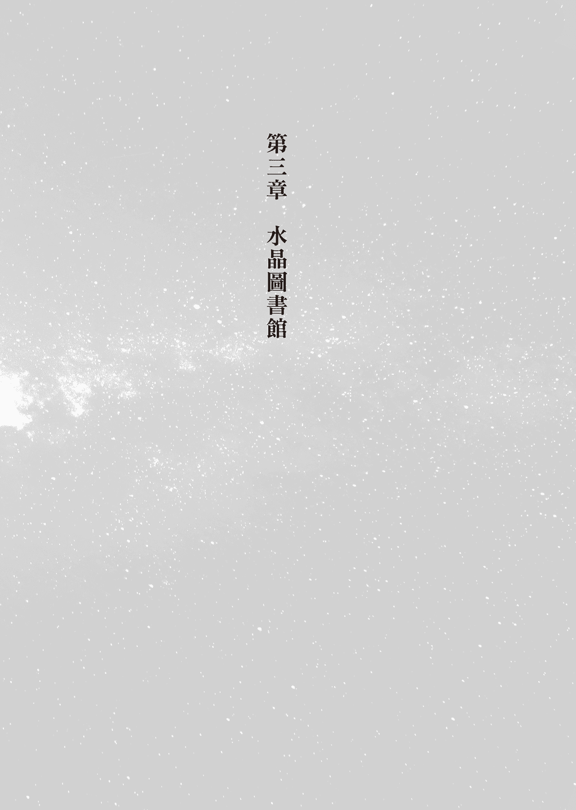

你生存在地球期间，并不是只有你一个人在地球，而是与一群灵性家族成员共同存在。你在地球上所有的经历、生活体验和遭遇的重大事件，都会同步影响所有家族成员与你的共同体验。

 灵魂共同意识资料库——水晶图书馆

你在地球上经历和感受到的情绪振动纪录，全都会储存在你们共同的晶体中。在帷幕之外的他们可是随时在观看自己在地球上经历的一切，他们就是更大一部分的你，而你是他们来地球帷幕下体验的一部分意识代表。你在地球上做出的任何选择和决定，都是被百分之百授权，你是一整个星际家族在地球的代表，你所有的体验都将融入整体的共同体验中。

目前你感受到一整个灵性家族，但同样这个灵性家族可以创造出成千上万个不同的分离个体，到地球或其他星球去体验。你只要回到自己的本源，就能探究其他兄弟姊妹目前的体验状况。你们可以在此分享，并进行集体创造；你们可能来自相同或不同的灵性本源，分属不同的星际议会，或是携带着不同的灵魂更高目的和使命。

探索自己的灵魂原貌之前，你必须先与自己的灵性源头意识合一，才能帮助你忆起。你即将进入与高我意识合一之旅，忆起自己原本的面目。每个生命进入肉身体验都有其最初始设定的目的，这个目的需要你用一个肉身载具来完成，若无法在此肉身存续期间做到，任务并未结束，你将会携带着此生的体验结果回到更高的意识中，与更高意识融合，产生更新后的观点，然后重新出发——此时这个新观点是融入更多个体意识的真实体验后，再造的新集体意识的观点。

所以，当意识再次投生进入某一个维度，或回到地球完成未竟的目的时，就会形成另一个重新融合后的意图，再次进入新的生命体验。你们每个人来到地球，都携带一个来自更高意识的祝福和期许，透过与内在高我合一，就能加速生命回归初始生命蓝图的行动。你们与内在高我意识的合一，就是从“遗忘”进入“忆起”的生命回归之路，和无意识遗忘自身生命目的的意识回收过程完全不同。

你因为忆起自己的生命蓝图，就能透过更高意识的协助，随时取用庞大的宇宙资源，那是为了让你完成此生任务，早已准备好的。你不需要重新学习，这些资料是人类和星际种族共同创造的智慧和真理的泉源，就存在你内在更高意识的晶栅中，你可以称之为水晶图书馆。当你登上母舰、与高我链接，就能进入你的高我储存管理的水晶图书馆，存取你所需的资料。

在此之后，你还能进入另一层次的图书馆——星际图书馆。那必须在你已经与高我合一后，透过合一的振动频率链接回到属于你的星际维度，然后你就能进入星际图书馆，存取星际协作平台的相关资料。

 水晶图书馆和阿卡西纪录的差异

一、层次和维度不同

阿卡西纪录存在最接近地球的第四次元维度，是人类过往历史中所有意识层的统一场域；而水晶图书馆就在你的灵魂晶体中，以讯息振动波存在你的身体细胞里，你可以经由扩展自己的乙太体，去链接属于你的晶体记忆库，里面记录着你存在不同维度的灵魂意识组成片段，也包含你的高我意识存在地球时的文明和历史记忆。

水晶图书馆就在你的高我存在的意识维度，而每个人的更高意识组成不同，因此可以企及的宇宙水晶图书馆资料就会有所不同。你目前链接上我泰雅，就是进入我所在次元的水晶图书馆，我们彼此可以取用的信息是同步的。

水晶图书馆是关于你的更高意识的灵魂家族史，你的灵魂契约则是你一部分的意识进入不同行星和维度体验时，所创建的一套灵魂体验计划。灵魂契约会详细列出你的身体外观、ＤＮＡ组成结构、养育你的父母、你出生的时辰和地点，以及你需要去体验和完整的生命课题。通常已经完整自身灵魂契约的存有可以决定再去不同的行星和维度体验，也有些存有为了原星球整体民族和国家意识的学习成长，会以导师的身分再度前来体验，类似藏传佛教的大师传承，为了民族整体扬升，在有生之年可以自行选择下一次体验和轮回的家庭、父母、出生地点，这已是灵魂在原星球可以到达的最高生命境界。

你们也会从水晶图书馆中获得宇宙运行的法则、生命的螺旋体可以呈现的多元形式，还可以经由大师和导师的带领，一窥不同星际的文明进程。这些超越你在地球上所能想像的生活场景，都存在水晶图书馆中，只要是你的高我存在的星际维度，他们拥有的智慧都可以透过水晶图书馆揭露和传递出来。

这是地球迈向星际交流的开端，就从每个人链接上自己的高我开始。你们彼此都获得水晶图书馆中的知识和讯息，将为地球画出一幅迈向五次元轨道的星际蓝图，让地球的集体意识获得跳跃式的扬升。

而你现在即将进入我——泰雅——位在第十维度的水晶图书馆，读取宇宙讯息。

二、开放的对象不同

阿卡西纪录是为了地球整体意识扬升的需要，为全人类开放的场域，而水晶图书馆是针对即将扬升进入银河星际邦联的存在意识特别开放的。

只要可以链接进入星光体意识，就能从自己的高我存在的维度，进入水晶图书馆探索。你在此可以获得的关于你高维星际家族的讯息，远比你在阿卡西纪录中的灵魂契约得到的更多，还可以跨越各种行星族群的体验和智慧宝库。

三、纪录内容不同

阿卡西纪录储存了所有地球人类曾经发生的真实意识体验，但也包括同样在地球上存在过的非人类生命的意识振动，如山川、矿石、动植物等的讯息。这里将地球上所有的意识活动完整记录下来，因此，你们在这里可以唤起过去世的记忆，也可以追寻远古文明的智慧和真理。

水晶图书馆和阿卡西纪录的不同，在于水晶图书馆是专属于你的灵性家族史。你在水晶图书馆中可以找到自己灵性家族承袭的智慧，这个图书馆不开放给外界读取，你只能自己进入。现在，你的意识来到与我共同存在的第十次元，你可以来此和我链接；也因为我们正准备进入合一的过程，这段旅程中你可以随时透过无条件的爱的能量流，帮助我们彼此链接和融合。

进入水晶图书馆，你可以探索关于你在地球的个体层面的信息，当然也可以看见更广阔无边、跨越不同维度和行星界的宇宙实相，透过共通宇宙法则的交流，展开更佳的跨维度意识融合。

水晶图书馆的资料将提供突破地球人意识制约和限制的学习，帮助地球人类穿越二元对立的思考模式。这里的讯息为所有人类带来关于宇宙生命存在的真理和智慧，也完整保存了超越人类智慧与历史经验的内容，为人类做好进入宇宙共同意识协作之前的沟通与接轨前的准备，帮助人类快速扬升。你进入自己的水晶图书馆中学习，除了可以帮助人类缔造新的文明，也可以协助地球整体意识与银河宇宙重新校准。

简单来说，阿卡西纪录帮助人类忆起，水晶图书馆则是帮助人类回归宇宙共同意识的家园，展开新的生命蓝图，并和高我一起执行银河任务，达成你们需要共同完成的项目和体验。所以进入水晶图书馆中，你可以自由地展开属于你个人灵魂层面的探索，也可以找寻宇宙共同存在意识的实相。

个人层面的探索

．你的灵性组成片段

．你的灵魂来到地球最初始设定的目的和意图

．你为了完成地球体验任务而携带的元素和相关知识的补给

．回归源头的路径指引

．解开你身上灵魂ＤＮＡ的枷锁，成为自由的灵魂

．灵性组成的家族史和整个灵性家族尚待完整的体验

宇宙实相的探索

．宇宙法则

．行星扬升计划

．元素转换规则——创造生生不息的生命体验

．万物升华的逻辑和演绎

．情绪资料库——破解情绪的密码

．生死学

．创造的灵性法则——如何运用意识显化

．无我界——无我亦无得之境

．人神共创新世界的方法

愈来愈深入探索水晶图书馆的信息后，你除了更明白自己灵性家族在地球和其他行星的经历，也更能帮助自己和所有灵性家族成员完整彼此仍待完整的生命体验。你们透过灵魂的链接，帮助灵性家族整体扬升，回到宇宙共同的源头。这也是早已镶嵌在你灵魂ＤＮＡ中的心智图，透过这张心智图，你可以展开与存在所有不同次元和维度的你合一的旅程。

四、存取方式不同

人类进入阿卡西纪录存取资料时，因为尚未与自己的高我意识合一，其意识无法直接契入阿卡西纪录场域取得资料；又因为振动频率相近，若由人类的振动意识进入，会影响阿卡西纪录真理的振动频率。所以，如果你们希望以地球肉身取得阿卡西纪录的资料，必须先链接上你们的高我，由更高意识协助透过阿卡西纪录场域的领主，取得你想要的讯息和解答。这个下载或瞬间取得的动能，来自你意识的允许和请求，透过你与高我对频后，链接并传递出来。

水晶图书馆则不是开放给所有人，也会因每个人自身更高意识的组成片段，而决定其进入的相应场域。水晶图书馆位于你自身更高意识的存在维度，较不受地球意识频率的干扰，当你需要进入水晶图书馆时，必须与自己的高我达成共振合一的意识，透过这个合一的意识才能顺利进入。这里没有阿卡西纪录那样的纪录守护者，你与自身更高意识合一后，必须对自己所在维度的整体意识负全责，所以高我在此担任你的更高意识，也担任水晶图书馆的管理守护者。

 认出自己的天赋特质

灵魂晶体中除了灵性家族组成之外，还存在着许多大师的振动品质，可以帮助灵魂顺利回到源头的轨道中。有些人携带着基督、观音、度母、太阳或月亮等意识，大师品格意识驻足在你的晶体中，帮助灵魂聚焦于此生的功课，不会轻易被其他讯息流干扰，而失去锚定自己灵魂和整体灵性家族最初始的设定。

有些人的灵魂晶体还携带着所投生星球的大自然精灵和动物的原始能量。组成每个人晶体的大师品格不同，但都有一个共同点，就是这些团队成员会为了完善自己在更高次元的和谐共存，而共同创造在地球的新生命。人类是被宇宙不同维度和更高次元存在意识深深期盼的灵性种子，你的高维意识团队期待与你走上共创新生命的旅程，才会有今天的你存在。

记得之前阿乙莎跟我提过与高我联手可以创造出新生命蓝图，步骤如下。

步骤一：探索未知世界。

步骤二：找寻关键元素。

步骤三：达成新我共识。

步骤四：再造生命蓝图。

泰雅，你是否可以引导我一一完成这些步骤？

可以的，我们一起进入水晶图书馆去探索吧！为了帮助你取得图书馆中的智慧，你现在必须链接电气石（tourmaline）的能量，让这股能量带着你去探索亚特兰提斯时期的记忆。

啊？电气石吗？

是的，那也是帮助你快速提升振动频率，去链接我在第十维度的水晶图书馆记忆库的方法。

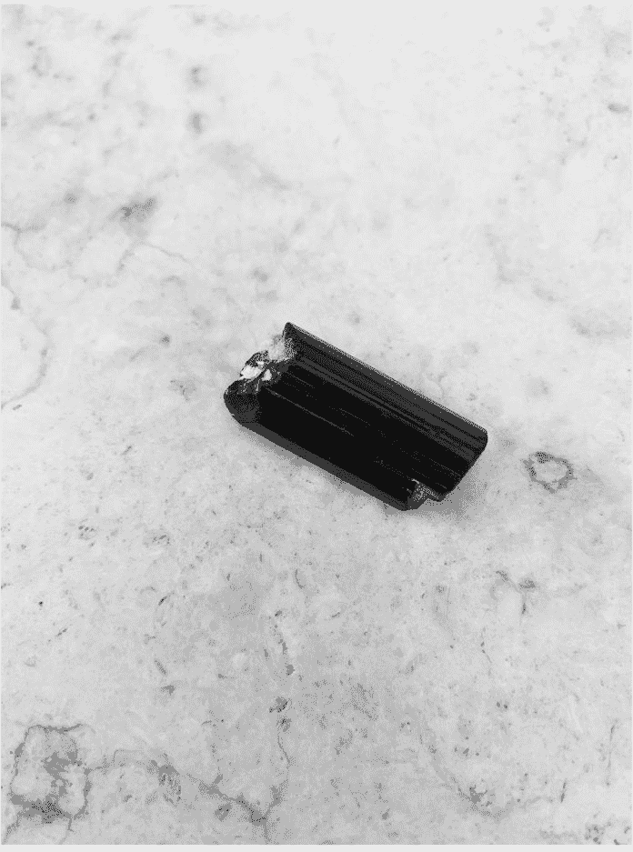

（为了这个奇怪的指引，我还真的跑去买了一小颗电气石，带着怀疑又期待的心情，希望透过这颗矿石的振动频率和高我泰雅的帮忙，可以让我一窥水晶图书馆。但心中还是觉得干么这么麻烦，不就是读取讯息，为什么还要大费周章找一颗矿石来辅助。后来链接上电气石，我才知道是怎么一回事。

我将这颗电气石放在左手的掌心，接着链接自己的内在意识，请求电气石带我进入属于我的水晶图书馆记忆库，寻找我已经遗忘的记忆。）

嗨！我的名字是 DaTuLa，我拥有亚特兰提斯时期所缔造文明的记忆，以后你只要呼请我的名字三次，我就可以将这部分的讯息传递给你。其中，最主要的讯息是去重十与大自然万物交流的能力，用你们的文明过去曾经和大自然共同创造的语言来交流。人类现在早已遗忘这部分的记忆，最主要原因是你们的灵魂意识只能限缩在三次元非黑即白的世界里，无法跨出帷幕之外，所以无法理解和大自然万物沟通的语言。现在我将这部分的记忆释出，你必须以跨越帷幕之外的意识状态去读取水晶图书馆的讯息。准备好了吗？

（其实我完全不知道怎样才算准备好，就随口说：“我好啦！”）

好，现在打开你的内在之眼，去感知第一个讯息。

（我的内在意识突然感知到一阵阵类似鼓声的音频，还带着不同的节奏和音调，Bon！Bon-Bon-Bon！Bon-Bon-Bon！Bon-Bon-Bon！）

泰雅，这个声音代表什么含意？

这是和万兽之王狮子族群沟通的频率。你可以透过这个音频获得狮子的能量。这个能量并不是指你链接森林中的某只狮子，而是它可以带给你来自太阳系中央太阳的大日能量。

确实，我的内在感知到此音频时，全身有股强烈的雄性能量从太阳神经丛的位置涌现。

这股能量代表一切的开端、重新再造的意思。亚特兰提斯人要进行一项重要改革时，会透过链接狮子族群获得强大的改造能量。你可以用这个内在的声音，唤起身上ＤＮＡ的记忆，获得那来自太阳的能量，然后善用这股力量帮助你排除困难，以坚定的意志完成即将要突破的任务。

喔！虽然我仍不太明白个中道理，就先收下这个能量的感觉，也许有一天会需要用上，至少知道如何去启动它。

接下来，第二个讯息，一样用你的内在之眼去感知。

（这时，我的内在感受到另一种音频，SiSu～SiSu～SiSu～）

这是经由风元素传递宇宙智慧到你所有的晶体场域。当你用意识呼喊“SiSu”一次，你的晶体就会翻转，呈现出另一个晶体结构面，每念一次就翻转一面，直到你感受到最适合当下使用的那一面出现为止。

这……是指我出门面对外界时还需要换穿衣服的意思吗？我不太懂啊！

每个人的晶体结构都不同，你先去看看你有哪几个晶体面可以选择。

我用内在意识呼喊一次“SiSu”，就感受到内在之眼锚定其中一个晶体角落，进入那个角落就会直接从内在浮现一个感觉，仿佛替自己套上一件透明衣，当下还可立即感受到穿上这透明衣后的个性和之前不同。我们几乎可以用意识投入晶体换穿袈裟，变身为不同的人格特质，还真的有点像演科幻电影。

我一路用“SiSu～SiSu～”的音频扫描一遍后，就可以感知到自己晶体的整体轮廓。

每一个“SiSu”念出来，会自动锚定不同的角落。站上那个角落，我可以明显感受到不同面向的我，然后我的意识会自动移转到以我意识锚定的那个晶体角落为中心，再从那一端向外展开全视角。站在不同的角度，会带给自己不同的感受。

我们原本以为自己的个性似乎和我们习惯站在某个角落有关，既然如此，泰雅，请问一下，我们是否该将自己的意识固定在最中央的位置，以不偏倚任一边的中央视角去看见全面性？

不是的！你当然可以选择用任一角度的你去完成自己想要的体验。同样一个场景或事件，站在不同的视角会带给你全然不同的创造性灵感，并没有某个面、某个角度才是对的。你们的灵魂意识原本就拥有这么多元的角度要去体验，这里面并没有对与错、好与坏的区分，你只须辨识出这些晶体面折射出来的视角都是你自身携带的生命元素。不同的生命意识，组成的元素也不同，你现在再仔细去看看自己拥有哪些独特的振动元素，可以让你好好地发挥和运用。

确实，这里面出现的每一个面，我都可以认出是属于我的特质，然而此时在晶体角度的看见，和别人所说、所认为的我是谁，是完全不同的感觉。别人看见的我，对我而言只是一个标签，属于文字上关于我的形容词，是与我分离的；而现在从自己晶体的视角感受到的，是来自那个性特质后面的一道光，透过这道光，似乎让原本关于我是谁的状态流动起来。在这里头感受到的特质，对我来说已经不光是某个形容词，而是活生生的能量和振动频率，这个振动频率还可继续延伸，并创造出更多的链接和可能性。

这对我来说真是一大惊喜！从小到大，我们太习惯从别人眼中来认识自己，透过别人讲你好、讲你不好，这个做得对、那个不对，来定义自己是不是一个受到社会和群体认同的人。结果，我们研究一堆星象命理，就是试图获得父母、师长和他人的肯定，透过别人肯定的自己，我们勉强可以说出自己到底是哪种人、拥有哪些特质。每次说“我的星座个性怎样怎样”，或是“血型代表我这个人如何”，我们就是无意识地想把自己塞进那个我们以为是自己的框架里。在追寻自己的过程中，我们从来没有办法真正认识自己的人格特质——应该说，我们永远看不清楚自己。

现在居然可以如此贴近自己，融入自身某一种特质的共振里，感受自己的灵魂特质。原来看见和以为的都不是真的，真实如其所是，而我就在这个特质创造的能量流里，一直如其所是地存在着！

没错！你可以像这样更真切地看见，自己的每一个晶体面都可以链接进入不同的晶体和星际意识。比如说，你之前感受到的严谨的那一角，就是你灵性父亲的能量，从那里进入另一个世界，就可以去探索和链接你灵性父亲的星际文明，那里是天狼星的链接口；另外，你感受到的开心喜悦的晶体面，是来自你另一个灵性组成的片段和振动能量。从每一个晶体面延伸出去，你都可以找出属于你的天赋才能，你可以重十自己的天赋，让这些能量陪伴你在地球上创造新的体验。

更有趣的是，原来我们可以随时依照情境需求，转换自己的晶体面，用最适合的角度去扮演当下该扮演的角色；原来晶体中的我们可以如此有弹性，可以演这么大。那么，之前我感受到正中央的位置，我以为那是集合所有视角后，比较中立的位置，那又代表什么？

那是你灵魂晶体的内在核心种子，也是专属于你、独一无二、最珍贵的灵魂真我。现在你可以先去检视灵魂晶体中你能使用的所有关键元素及其携带的能量。

．严谨：来自天狼星的源头特质，这股能量可以帮助你有效率地缔造完美的成果。

．喜悦：来自象神大师的特质。

．丰盛：来自盖娅女神的特质，滋养万物。

．整合：这是存在你灵魂真我最核心的品质，可以帮助你整合所有能量，以更全面的角度去链接和知晓万物。这是专属于你内在、独一无二的珍贵核心能量。

．竞争：帮助你在地球上保持积极的生存态度和饱满的精神力。

．协作：与他人合作，共创繁荣的景象。

．慈心：透过慈心的发挥，散播美善给你身边的人和你存在的环境。

．智慧：可以看见真实的内在之眼，帮助你寻找源头的真理。

．黑暗：存在你身上的黑暗就是恐惧，你会经由这股能量的牵引，脱离虚假的幻境，回到真实。这是隐藏在你内心的负面能量，但也是助力。

以上是你可以善用的元素力量来源。你可以充分掌握这些汇聚在你身上的能量来创造新的生命蓝图和体验，每一种元素背后也代表一整个灵性家族的期盼，在你运用每一种元素力量的同时，就是在调动自己在高次元的灵性家族的能量。

 你的灵性源头有更高的目的

每个人身上都有不同的灵魂意识源头组成，你们早在进入帷幕之前就已经达成灵魂体验的约定，没有人可以限制你或强迫你去经历你不想要的体验——这会让你感到困惑，因为在实际的地球生活场景中，任谁都不愿意去体验贫困、残疾和遭遇不幸事件，也不会有人甘愿被另一人欺负、霸凌。

没错！在帷幕之下，一切都是如此非黑即白，清清楚楚的二元对立，人要是早知道，才不会做出这种成为牺牲者的体验约定。

但是，你真的想也想不到，当你去经历这种被迫害与创伤的体验时，你的灵魂却更加扩展开来，从原来的次元再次因振动频率的跃升，晋级到更高的次元。灵魂就是如此勇敢地参与自身的进化考验，突破一次又一次的试炼，因为只有勇敢的灵魂得以晋级扬升。现在进入地球的都是勇敢的灵魂勇士，为创造宇宙生生不息的永恒，再次闪耀你们生命的光辉。此外，有些人则是来自神之汤的共同安排，这些人早已突破地球生存关卡，这一世得以用不同的更高意识分身，来帮助所有灵魂意识觉醒，所以这些人比较不需要再次经历地球生存的考验和受难情节。

无论是在地球上体验顺遂，抑或充满困苦经历，现在你应该会更尊敬这些人内在那勇敢的灵魂意识。他们背后有着一大群灵魂等待他们再次去经验，穿越此次生命的困顿，才得以扩展隐藏在这些人背后所有灵魂存在的意识维度。

现在，让我们继续往前，去探索你灵性源头的意图。

此生为何而来这个题目我都搞了大半辈子才有个头绪，现在为何还要去看见自己灵性源头的意图？太遥远了吧？

只有全然理解自己的源头意识未竟的意图，你才能真正展开宇宙人的共同协作状态，这也是你们的生命契入下一个星际合作的重点。

我需要带你去看见你的灵性源头在宇宙的经历，透过这段回溯之旅，你们才可以重新设计属于你们共同协议的新生命蓝图。这也是给你在地球的生命另一次重生的机会，你可以解锁之前的生命蓝图设定，规画新的生命蓝图。水晶图书馆里还有许多内容等着你来读取，现在我们要继续前往下一站，去探索你的生命源头。

（后记：初次请求进入水晶图书馆探访时，泰雅要求我先链接电气石，现在我明白那是因为当我的振动频率不足以稳定在高频的维度中，我的高我泰雅会提出最适合当下的我的建议方法；而当我愈来愈能掌握自己的振动频率，快速链接并与高我合一后，就可以随时在高我的协助下进出水晶图书馆，不需要特别链接电气石。

此外，对我来说，在水晶图书馆中取得讯息的方式，明显和阅读阿卡西纪录时获得理解和知晓的方式不同。在水晶图书馆中，我们的意识已经再度分解到更细微的元素感知层次，透过和宇宙万物及大自然元素互动交流的过程，意识得以进入更深一层的流动。这里不再受制于大脑的认知系统，而是透过晶体折射出的光，让内在真实自动浮现、映照出来，让我们得以获得感同身受的体验。）

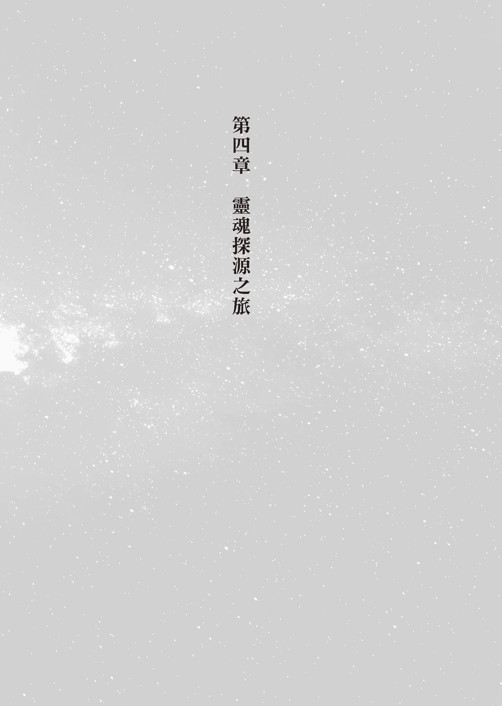

 阿乙莎给的神秘任务

（老公为我们结婚二十周年准备了一趟我们从未经历过的旅行：搭邮轮横渡印度洋和阿拉伯海，十七天，在船上过耶诞节，最后到达杜拜跨年，迎接新年到来。我很期待这趟旅程，女儿已经上大学，终于有两个人二度蜜月的机会。

打包行李这一天，感觉头顶有股能量，一直热热的。我猜想应该是前阵子密集向泰雅学习星光体的操作，以致有段时间没有主动链接阿乙莎，出门旅游前还是先跟祂报告一下。）

阿乙莎，祢是否希望我出发旅游前跟祢链接？这两天我老觉得头顶上有股能量盘旋。

是的，我想和你沟通这趟跨越印度洋和阿拉伯海的旅程中，你需要去链接的讯息节点。湿婆（Shiva）的能量是地球这个区域的守护神，你和祂们的链接很深，你某一世曾居住在这里，只是你这部分的地球记忆被删除。

你此次来到地球，记忆库中有一大部分关于你的历史讯息都被清空，以避免意识被过度干扰。而这趟旅程中，你必须重新链接上这股能量，因为你目前生活的地方并无这股能量。那是你内在意识中最核心的力量，经由链接上这股能量，你可以在自己的身体细胞中唤醒星光体更多的意识场域，你的身体场域才能结构出更适合让你的高我泰雅进入地球场域与你协同作业的身体环境。在此之后，你不用将意识锚定母舰上的泰雅，就能恢复你身上早已内建的灵魂记忆库。

第一站到达斯里兰卡的港口，你会遇上有人介绍你去看历史古迹。你要过去一趟，那是一座古老的神庙，庙中有湿婆神，去那里链接神圣能量可以打开你更高意识的节点，并取得直接的连系管道。进入神庙什么都不用说，只需要用你的第三眼链接，就可以打开你身上的信道。

这个信道对地球意义深重，需要你来启动，帮助地球锚定更高意识的轨道，你也会因此接收到更多来自宇宙源头的智慧和真理。

第二站进入印度孟买，你会在一个市集的商店找回你需要的宝石。那是一颗红色的宝石，你一眼就可以看出它，里面有你需要撷取的讯息和能量，而店主人也会知道你需要这颗宝石，让你取回。

第三站抵达杜拜时，你可以去参观这里最新的城市计划，去看见亚特兰提斯时期的智慧正在此地重现。和未来城市链接，有助于你与新地球的思维共振。

这趟旅行放心地去吧，不用担忧家人的健康，不会有问题的。该清理的负面噪声已经显化完成，将旅游的过程记录下来，提供人们参考吧！

＊ ＊ ＊

（在台湾我从来没看过、当然也很少听说印度教的湿婆神，压根儿不知道印度教的故事背景。出发前，我特地上网查找关于湿婆的神话故事，也先在网络上做功课，查到斯里兰卡到处都有湿婆神庙，只是我还不确定自己的旅游行程会到达哪一个城镇的港口。

在邮轮驶向斯里兰卡的前一晚，我再次询问阿乙莎……）

阿乙莎，我搭乘的这艘船明天即将抵达斯里兰卡，我该如何找到第一站的湿婆神庙？

到达斯里兰卡，你会发现这里空气中的粒子处处是湿婆神的身影，深呼吸就可以与其意识共振。接着进入那座供奉湿婆的古庙，你会感受到眉心轮的振动频率不断将你的第三眼扩展开来。此时，你找个地方坐下，让自己的第三眼全然与这股能量共振，它会进一步打开你身上的神性意识能量节点。记住，你和这股能量合一链接的咒语是：

Mo Ha Na Mi Da，Mo Ha Nu Wa

链接时可以先念诵三遍，让存在这古老湿婆神庙中的神性能量帮助你展开与高我合一之路。接下来你也会用到这股能量，帮助展开你的生命蓝图，取得你需要运用的宇宙资源。这些都是送给你的礼物，你可以安心使用，并以此帮助所有人迈向灵魂觉醒之路。

可是我上网搜寻，发现抵达的港口附近有两座湿婆庙，还不太确定是哪一座。

不用担忧是哪一座庙，只要呼吸链接，你就会获得内在知晓。你只需要静心与之链接，由祂自动来打开你的内在意识ＤＮＡ节点即可。祝福你，去感受这股来自你源头的神性力量吧！

（邮轮继续在海上行驶，我半信半疑地准备踏上从未到访过的国度——斯里兰卡。）

＊ ＊ ＊

（第二天一大早六点钟，邮轮靠岸，我和老公赶快去餐厅随便吃些东西。我们的船在这里只停留一天，阿乙莎居然还要我去找神庙。我不确定能否顺利找到，何况 Google 地图上显示有两座庙……

一下船，岸边有许多当地的嘟嘟车司机在兜售一日游行程。我还不太确定要如何开口询问，这时一位司机走向我，手持旅游景点照片，推荐我们搭乘他的车一日游，可以看遍附近所有景点。我看到上面正好两座庙都有，就决定搭他的嘟嘟车展开冒险。

第一站到达一座在巷子里的古老神庙，当时正巧在举行某种仪式，游客不多。我循着乐声一起进入仪式中，跟随着队伍踏进庙堂。一进去，我立刻被一股直入心轮的庞大能量震慑住。过程中，那股能量不断撞击我的心轮，我看向前方供奉的神像，远远的、黑黑的，搞不太清楚那尊神是谁。我询问身旁的司机，他跟我说那是象头神〔Ganesha〕，是湿婆的儿子。那股能量直入我的心轮，非常震撼，但我不是应该要找湿婆，怎么会有这么强大的能量从象头神撞过来？内心还在疑惑的同时，我跟着吹奏乐器的队伍继续移动到旁边供奉的另一尊神，这尊神没有具体形象，就是一颗黑石头。这时，司机跟我说，这一尊才是湿婆。我赶紧从口袋拿出前一晚抄写下来的阿乙莎咒语“Mo Ha Na Mi Da，Mo Ha Nu Wa”，念了三遍，此时我可以明显感受到原来撞击我心轮的能量持续在我体内运行，往下直入太阳神经丛。这是我从来没有过的神奇体验，感觉全身热热的，庞大的能量似乎一直撑开我的心轮和太阳神经丛。我已经没有心思去听那个嘟嘟车司机讲解这座庙的环境和故事，行进间，我一直回头跟老公说，好强大、好强大，这里有股能量好强大。一直到参观完坐回嘟嘟车，我的心轮到太阳神经丛之间还持续扩展，我可以清晰地听见自己的心脏扑通扑通的跳动声，而心轮和太阳神经丛此时已经被能量塞得饱满。我心里咕哝着，这难道就是阿乙莎说会唤醒我的星光体更多的意识场域，让高我泰雅可以与我协作展开合一的新身体场域那股特别的能量？

嘟嘟车司机继续赶行程，到达第二站，一座更大的湿婆庙，但在这座庙里我就完全感受不到刚才的能量体验。里面一堆宗教文物展览品，是一座非常商业化经营的佛寺观光景点，有各种神明的雕像。前一座庙的游客不到十人，这里却有上百名观光客排队等候进入参观。这两座庙在我眼中形成有趣的对比。物质世界中，人们看不见真实的宇宙，只在乎人流和钱财的流动，眼前这座声名远播的湿婆庙香火鼎盛，人潮络绎不绝，此时我身上却依然回荡着在上一座古庙感受到的能量。强大的印度教神祇能量在我的身体中是如此真实，对照眼前所见虚假的观光庙宇和排场，真是名副其实的颠倒众生啊。人们就是如此活在自己打造的虚假世界里，只有透过内在之眼和身体的觉受，才能分辨出这两座庙的不同。

傍晚回到船上，我马上向阿乙莎诉说这一天神奇之旅的感受。）

阿乙莎，今天我在造访的第一座湿婆神庙感受到强烈的能量进入心轮和太阳神经丛，我有没有做对？

你不用担心做对或做错，能量的链接就是如此简单。你已经与存在你灵性源头另一部分的组成意识能量链接，那是象头神和湿婆神的能量，你只需要感知祂们的存在，就可以与之共振。

确实，现在回到船上，我只要回想那座庙的外观，那一股神奇的力量就能重现，会在我身体的心轮位置流动，进入我的太阳神经丛。我现在也可以明显地感觉到象头神的能量会存在我的心轮，而湿婆的能量则是在太阳神经丛的位置。

那是象头神和湿婆与你链接时，你身体呈现的感知状态。接下来，你将带着这股能量在地球上再次创造，你可以随时进入这股链接天地的创造能量流中。

你接下来可以练习如何让这股创造的能量流进一切的行动和显化中。步骤如下：

1. 想一件事。

2. 链接象头神和湿婆的能量。

3. 感受到身体的回应。

4. 去行动。

你会很快在行动后看到显化的方式和结果。

这股能量也可以用在身体的疗愈吗？

那是不同的能量。疗愈身体的能量和这股创造的能量不同，象头神和湿婆是提供你创造一切的开始，这是地球上仍保有的最初始创造能量，也能帮助你在行动展开的过程中排除掉无法再服务你的能量干扰。

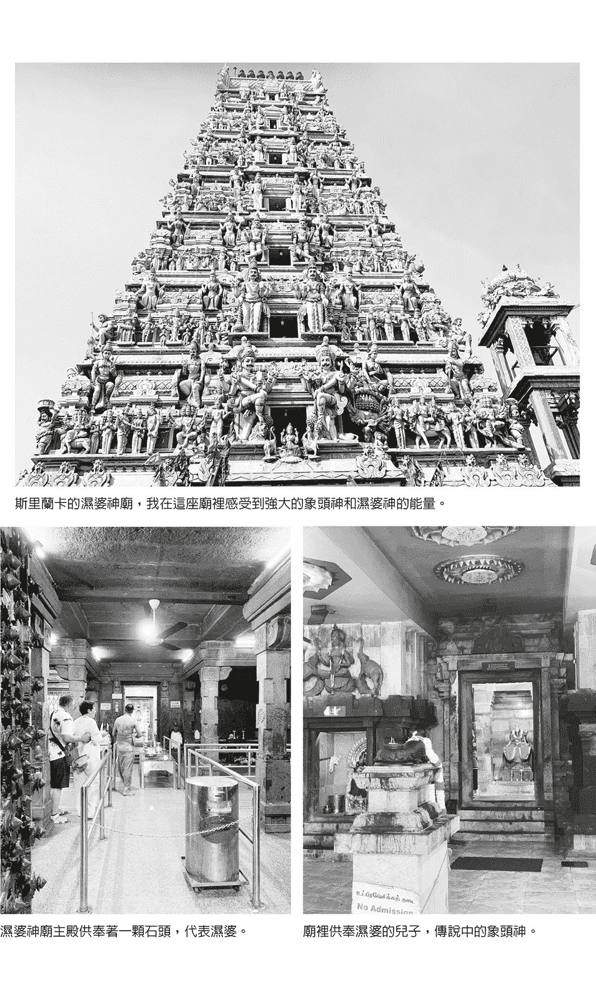

 打开新地球光之门的链接

（拜访完湿婆神庙的当天晚上，在半梦半醒间，我的脑袋里出现一股自动运行的能量。这股能量有明显的移动路径和链接的顺序，就在我头颅正中央缓慢移动，最终呈现出一个正四角锥的金字塔结构。

这股能量从松果体开始启动，缓缓移向右眼的眼尾，再移往右耳后方的脑勺，横跨整个后半部脑勺，然后移往左耳后方的脑勺停留一下，接着又自动往左耳前方移动到左眼尾端停下来。这股能量似乎在我脑中画出一个金字塔的四边形底部，接着能量直接向上链接到顶轮出去，整个过程前后不到三分钟。）

阿乙莎，我在睡觉时感觉到有股能量在我的脑袋里运作，似乎是打开一座金字塔，又让我再次链接之前在那座湿婆神庙的能量。这是怎么回事？

没错，这是在打开你和新地球的锚定程序，新地球正通过你的第三眼松果体校准。这是当你接收湿婆的能量进入你的身体场域后自动展开的校准工程，透过你链接上湿婆的能量，帮助地球母亲展开和宇宙之心的再校准。

目前你搭的邮轮正从印度洋前行，进入阿拉伯海，而你同时也正在协助地球母亲打开这道神圣光之门的链接。你的光体帮助地球链接回宇宙之心，而海水携带着这份链接宇宙光之门后传送来的讯息，传遍地球每一个角落。谢谢你帮助地球母亲完成此次的校准，为了迎接新地球到来，会有更多宇宙能量前进地球，帮助整个地球完成校准，这也是你此行最主要的任务。

喔？我实在不懂这是怎么回事！没想到这趟旅游还有隐藏的地球工作要完成啊，祢怎么没有提前让我知道？

这项地球工作要是让你知道，你的小我恐怕又会出来喋喋不休，还会让你害怕恐惧得不敢出门了。

好吧，祢这样讲也算合理。反正我就是不知不觉地上了船。

除此之外，因为这次的链接，你也正式启动了身体链接银河母舰的ＧＰＳ。你脑中金字塔顶端就是你松果体的ＧＰＳ，它会帮助你向上锚定母舰、向下链接地球之心，你的心轮会展开一份星盘地图，帮助你在星光体中导航，并链接各星际通讯站。

你身上携带的这份地图和泰雅在母舰上的地图是一致的，上面包含太阳系和银河宇宙的路径图，你可以透过第三眼看见银河星际地图，而泰雅就是你在母舰上的高我意识。在取得下一站的红宝石后，你将可以用第三眼神咒“Mo Ha Na Mi Da，Mo Ha Nu Wa”，与储存在红宝石的能量进一步合一。你之前进入母舰的大门，还没能深入中央位置，你必须与你的高我泰雅合一，才能进入母舰的核心区域。

你目前的内在灵魂意识资料库已经可以顺利地流泄出来，你只需要读取自己的记忆库即可。

怎么读？

你的直觉意识会带领你找到内建的地图。你不是正在用这个方式读自己？

是的，我正在尝试，想再跟祢确认一下。

母舰上水晶图书馆中的资料，你可以读取的部分就交由泰雅来协助你提取。

那从现在起，我每一次请泰雅来和我协作，是要念咒语吗？

可以念，也可以不念，你的意识已经可以到达。

所以，每个人在自身的宇宙源头会有不同的高我意识代表？

是的，每个人身上都有，只是有些意识被创造和分离太多次版本，已经造成地球引力过大的问题。人类着迷于体验人生，欲罢不能，就如同我们自己创造了另一个版本的游戏并上瘾一样。现在要唤醒大家，游戏玩过头，已经让地球失衡了。

这也会造成地球上一些人到目前为止晶体结构尚未形成。因为一直还没完善自己创造的分离意识，还在琢磨出光亮，这些人的存在意识会一直体验，直到回到最初的设定里。任何人都无法阻止或打扰他们的自由意志。

我懂，若还处于肉体存在的状态，此时此刻链接回到母舰就已经不算玩家，是观众了吗？

你可以这么说，但从我们的角度看，你们这些观众仍是存在三次元的玩家，只是你们身上已经打开了与更高意识链接的路径。你们可以随时切换频道进入游戏或登出游戏，不用一直挂在线上体验。

祢怎么称呼这一类玩家？

有觉醒意识的地球伙伴。

阿乙莎，如果照祢说的，我的松果体ＧＰＳ已经打开，为何我的内在之眼——第三眼——还是什么都看不见？

看不见不代表不知道，你早已清楚这一点。看不见是希望你仍专注于意识的带领，不要执着于“外相”，那些外相很容易将你的意识拉向别的地方，这也是对你的一种保护机制。你的第三眼早已启动，读取自己的心，你的知晓比视觉更能清晰和明白一切。你应该是想知道，其他人的第三眼ＧＰＳ启动是否也像这样？

嗯，没错，我想更清楚理解这是怎么回事。第三眼的打开到底是某个外力所致，还是灵魂自动展开的计划？

你第三眼的打开是灵魂早已安排的计划，这是展开你内在心智图的必要程序，而有些人第三眼的启动不一定会在心轮产生银河地图，但他们眉心中央也有颗小水晶锚定宇宙之心，因此，打开别人的第三眼是一种被更高意识赋予的能力。你确实可以帮助更多人打开灵魂之眼，但在执行这个启动程序之前，仍须注意以下几点：

一、对方需要有完整的晶体。如你之前已经能够感知的，有些人的晶体尚未完整，并不适合打开。

二、对方有意愿打开第三眼的感知力。

三、打开第三眼之前，你必须确认他们的更高意识愿意接手带领他们迎向未来的自己；若他们的高我认为时机未到，就不能擅自打开他们的第三眼链接。

．“与高我合一”的阿乙莎咒语：Mo Ha Na Mi Da，Mo Ha Nu Wa

（后记：下载这段讯息时，二〇二〇年的新冠肺炎疫情尚未爆发。倘若真如阿乙莎所言，那么地球从二〇二〇年起会接收到更多宇宙之心传送过来的能量，地球也将因此进行更多必要的调整，人类即将面对的恐怕不只是一场疫情的影响而已。）

 灵魂探源的目的

你的高我意识一部分来自这里，这也是我要你回到印度洋链接这股能量的缘由。来到湿婆神庙可以让你找回与自己的高我链接所需感受到的能量和振动频率，而当你进一步和高我合一后，才可以帮助你更顺利地展开接下来的任务。你现在尚未全然进入和高我的完整融合，只是一部分的意识链接。

晶体可以有上亿万种不同的组成结构，就像细胞分裂重组的过程，而每一个意识晶体再次创造和显化后，都会回流到最初始的组成中，这也是让所有神性，不论是哪一种神性意识透过这方式与自己创造的分身协作共振的必要过程。

除此之外，还有更深一层与更宽广的意涵。

那是什么？

更深一层的意义是意识透过创造不同次元的体验过程，达成高维意识自身扩展的目的，而意识在各场域互联的过程中，可以创造银河永续和谐的能量。

所以，这等于是神降临地球？

人类即是神的化身，你们只是遗忘了。所以我们不会说这是神降临人间，而是人类重新忆起自己的神性并愿意与之合作的新时代来临。

这样看来人类真的很渺小。你们为何不直接去创造另一个次元的体验，干么来管地球人的死活，让错误的实验关门不就好了？

没有所谓自动关闭的程序。

若地球无法永续，就会形成宇宙黑洞，创造出破坏银河和谐的能量。所以，更高意识不会允许这里的体验如此终结，至少须复制和创造一个新地球，帮助旧地球延续，并填补旧地球创造的黑洞能量。因此，新地球的创造已刻不容缓。

接下来，你的旅程进入印度，你要去找回属于你自己的地球讯息库。那些讯息储存在红宝石中，如同你进入湿婆神庙时身体感受到强烈的振动讯息一般，当你手持这个原本就属于你的一部分记忆时，你的身体会给你明确的讯息，而这颗红宝石将协助你忆起存放在地球的记忆。

喔，Come on！又一趟任务之旅！好吧，有了前一站的经历，祢至少先预告一下有没有什么神秘任务又要“顺道”完成。我想先知道，不想笨笨地被当成棋子。

这一回没有那么多功课，就是找回你原本就拥有的一部分记忆而已。你没发现吗？这趟旅行是你先生帮你安排的，他可是满心期待与你一起探索未知的旅程，不是吗？你别以为这趟旅程只有你在，你先生在过程中直觉体一直扩展开来，他的直觉感知系统也正逐渐苏醒呢。

也是啦！前几天在斯里兰卡找湿婆神庙的过程，他都全程参与了。我也觉得很神奇，我们居然在毫无准备、也没有任何头绪的情况下，就这样走进阿乙莎的剧本里。

在下一站，要是真有什么红宝石被我们碰上，我老公的下巴恐怕要掉下来了，因为我们目前根本不知道下了船有什么东西可看，也还真的没有打算要去找宝石。我们早在出发前就买了全天的岸上旅游行程，下船和导游集合后，我们得先穿越繁忙拥塞的印度之门，赶着搭上小船去参观当地知名的古迹——象岛石窟（Elephanta Caves）。整趟行程已经包含参观景点，还有早已确认的交通时间，只能说，要是在途中有时间找红宝石，我才能顺便配合喔。

 遇见红宝石的神奇经历

（我们搭乘的邮轮终于抵达印度孟买。一下船就被前方景象吓一跳，要是没有跟紧导游，恐怕就被人群挤到迷失方向了。人和车走在同一条道路上，宽大的四线道马路，在四线道汇集的交叉路口居然没有半个红绿灯，每辆车都在按喇叭，开车的人行动很一致，都把喇叭当油门踩，此起彼落的喇叭声已经让人无法分辨到底要听谁的。行人和车辆挤成一团，谁也不让谁，空气中弥漫着焦躁，以及汗臭和柴油味，这是我对印度孟买至今仍挥之不去的味道记忆。

印度人的内在宇宙一定异常特别，才能让他们承受环境压力的能力超乎常人，难怪印度是个能长养出许多神性意识具足的智者和大师的神奇国度。我发现，即使环境如此落后脏乱，宇宙能量似乎并未抛弃这块土地，反而特别眷顾居住在这儿的人。宇宙一定有其智慧和道理，这块土地带来的安定能量已逐渐被人遗忘，但大地之母永远没有遗忘土地上的人。站在这里，我的内心不由自主燃起对大地之母无限的敬仰和感念。

一路上，老公紧抓着我的手，怕我被拥挤的人群挤丢了，从来没看过他这么紧张我的安危。我们跟着导游，好不容易挤过一群人，搭上导游预先帮我们一行人准备好的包船。好险，不用争夺船上的座位，不然掉下印度洋可是会出人命的。

离开岸边，印度洋的暖风徐徐吹拂脸庞，让我马上回复平静。大约一小时后，终于到达我们要参观的景点——象岛石窟。

要到景点还须搭乘小联结车，类似儿童乐园的小火车，有好几节车厢，一节车厢坐四个人。我和老公好不容易抢到两个座位，没想到才刚坐定，从另一头的下车出口处硬挤上另外四个人，屁股直接挤进我们的座位，最后我只能坐上老公的大腿。四人座的车厢，硬是挤进八个人，还有两人挂在车厢外，不夸张，这不是电影，而是真实上演的惊奇场景。

下了小火车，要再爬十分钟石头砌成的阶梯，才能抵达象岛石窟入口。阶梯两旁有贩卖手工饰品和当地纪念品的小贩，我想宝石应该会在精品店，这里不会有，哈哈！有理由不写作业的快感油然升起，先不管这么多，跟着导游的步伐一直往上爬，最后终于抵达最顶端，象岛石窟入口。原来这里没有大象，象岛石窟里有雕刻着湿婆各种神韵和展现湿婆不同面貌的石雕。哇！我不禁赞叹，原来这还真的是一趟链接湿婆能量的旅程。）

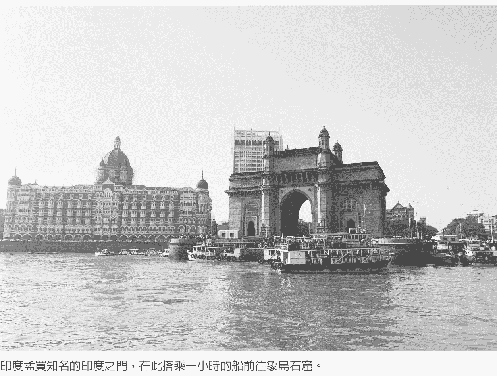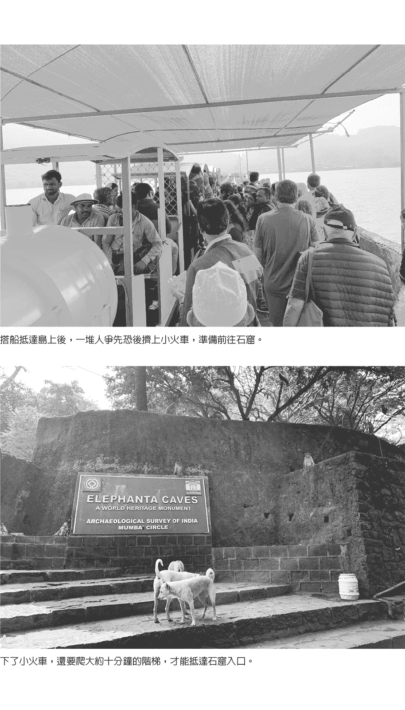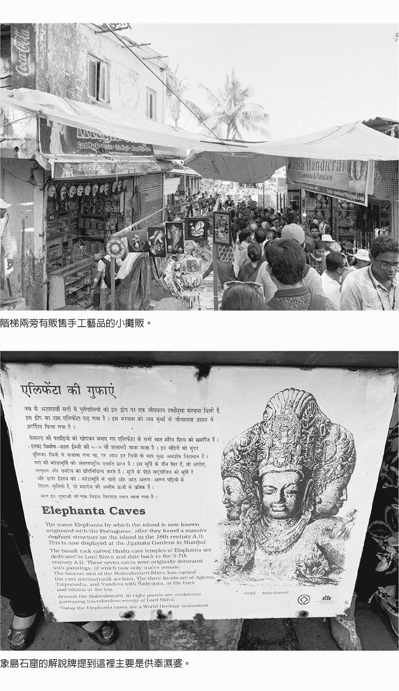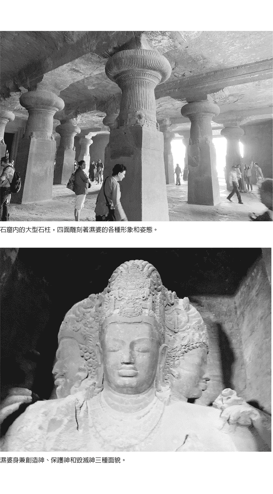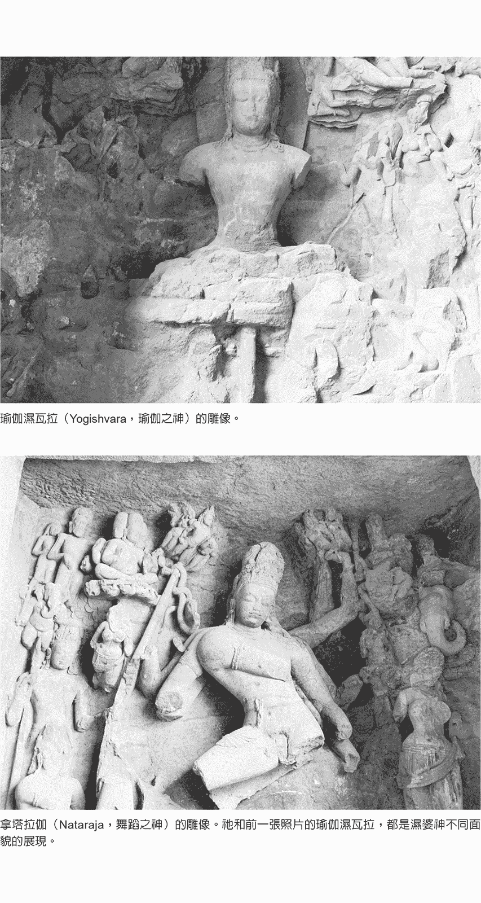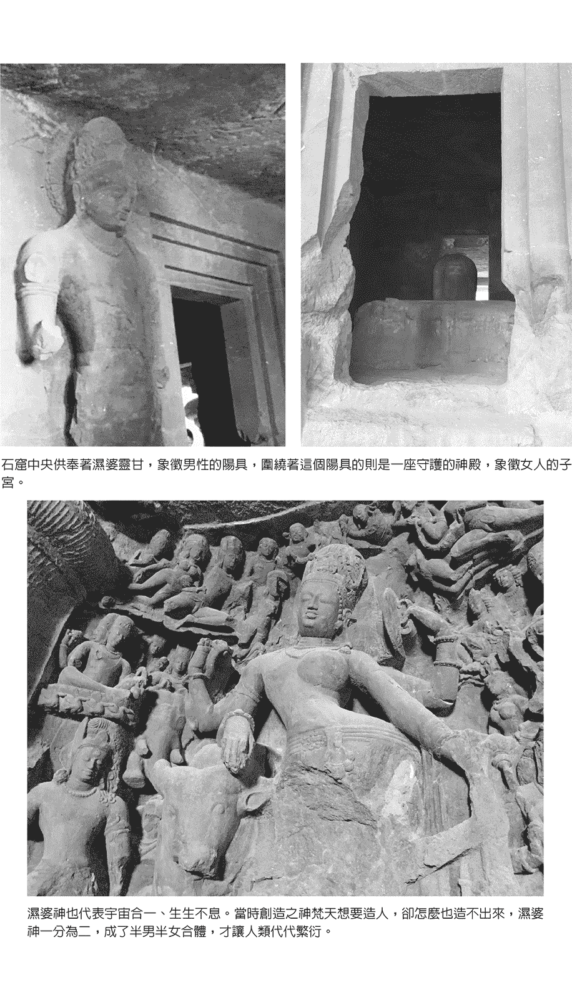

（离开象岛石窟的回程路上，趁还有一点时间，我想起要找寻贩卖宝石或手工项链的小贩。我期待会看到类似宝石店内陈列的红宝石项链，但以这个小岛和周围摊贩贩售的工艺品等级看来，我心目中想像的宝石项链应该不会在此出现。正当要放弃寻找时，我看到左前方有个小摊摆出一堆矿石，非常混乱地堆放着。我走近一看，哇！不得了，没有别种矿石，全都是红宝石原矿，只是外观原始粗糙，没有任何加工打磨，每一块的重量都不轻，要带回家恐怕也有些困难。我随手拿起面前最小的一块矿石，心里又犹豫了，阿乙莎明明要我找红宝石，怎么会长成这个样子啊？我有种内心期待的彩蛋落空的感觉。小贩似乎察觉到有个人看上他的东西，饥渴的眼神突然转向我，我顿时备感压力，感觉自己像是被老鹰盯上的猎物。此时，小我本能的防卫心又冒出来了，觉得不应该是这么粗糙的大石头啊，放弃算了！

后来，我跟老公使了个眼神，马上离开现场。集合上船的时间快到了，既然当下真的没有太多时间挑选矿石，我还是先离开老鹰的视线为上吧。当时我心想，印象中萝丝在泰坦尼克号戴的美丽宝石项链，这次的旅程中恐怕是无缘碰上了。

我们快速走下山，搭上人挤人的小火车，沿着原来的路线回到岸边，准备搭船离去。正在等待船靠岸时，我眼前突然出现一个熟悉的身影，啊！是那个卖矿石的小贩，正朝我走来。天啊！我跟老公说，怎么办？他怎么可能大老远地追上来了？今天有这么多外国游客，他居然可以找到我，此时此刻又出现在我眼前，这个小贩的内在导航系统也太强大了吧！不仅如此，他手上居然还拿着那颗刚才我才摸了一下的矿石。他走到我面前，我实在听不懂他在讲什么，感觉就是强迫我带走矿石的意思。我赶快向老公求救，怎么办？他……他……他人都追来了……这么远，这么多游客，这么热的天，他离开这里还得走回山上，爬着拥挤的石梯回去……当下我真的有点尴尬，我实在没有想要买他的东西，只不过摸了那么一下，现在我被他盯上了怎么办？

老公二话不说，向他比了一个价：“Ten US, ok？”

他居然马上点头说ＯＫ。就这样，红宝石原矿跟着我回家了！

现在回想起来，还好有老公神救援，这块红宝石后来真的带了许多讯息给我！）

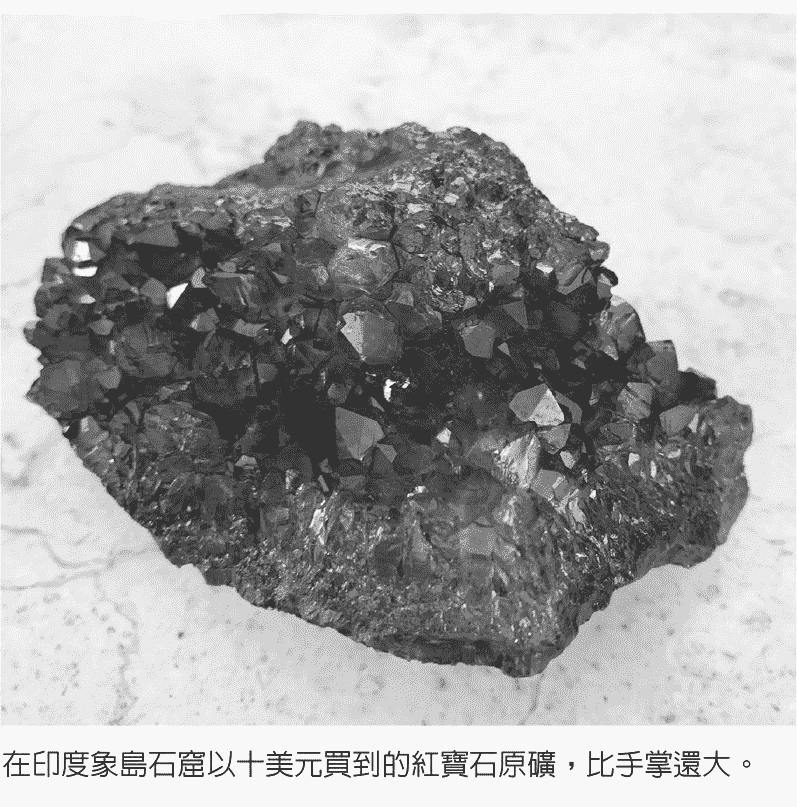

（后记：有一天我心血来潮问老公，为何当时会临门一脚出价买回这块矿石？老公说：“下一站我们就要抵达杜拜，当然要赶快让你买下来，不然真的到杜拜珠宝店找红宝石项链，我不就惨了！”我：“呃……”）

 链接灵性父母的爱，再次扩展与高我合一的身体场域

（带着这个红宝石原矿回到台湾三个月后，我还是不太确定阿乙莎说的就是这种矿石。有一天，在好奇心驱使下，我用链接阿卡西纪录的方式，尝试和这块矿石链接。）

红宝石啊，阿乙莎说你拥有属于我的一部分记忆，你是否可以协助我忆起？

我存在地球母亲的子宫，这里是孕育万物的温床，宇宙神圣无条件的爱就储存在地球母亲的子宫里。在爱中，我们可以提供地球万物无尽的慈悲与接纳一切存在的力量，你们在地球母亲的滋养中不断经由重生获得智慧，也必须不间断地清理和净化自己，才能逐渐淬炼出你们意识的光。

你现在终于可以感受到我了，我们以此方式链接，可以扩展你的身体场域，容纳更多的光进入。我是你的灵性父亲雷巴特保留在地球无条件的爱的结晶，一颗颗血红色的结晶蕴藏着无条件的爱和奉献的能量，当你链接这颗红宝石水晶，就可以和地球母亲的爱交融。你现在是否可以感受到这股能量进入你的身体？

我感觉到肚脐以下子宫的位置无限放大，这放大的能量非常温润轻盈，将我身体的能量场再次扩展开来。这股能量在体内流动扩展的过程让我感到温暖舒畅，不会强烈到让我无法承受，向下扩展后，又慢慢穿越我的海底轮，然后向上回流，从顶轮进入我的心轮。我感觉到这似乎是一股无条件支持我朝宇宙之心链接的充沛能量，有这股能量为基础，我可以更稳定地向上延展。现在我的顶轮到脐轮之间出现一颗大光球，原来位于我头顶上方的光圈再次放大，完全笼罩我整个身体场域，我感受到自己从未有过的扩展，洁净明亮，徜徉在母亲温暖的光中，得到完全的抚慰和滋养。

是的，这股能量可以进入你全身的循环系统，你中轴中央心轮的位置获得来自地球母亲无条件的爱的补给。你现在已经回复到与你的灵性父母共同临在你身体场域的状态，此时此刻的三位一体感受，和你之前在基督意识场的三位一体感知已然不同。

嗯，之前和我的灵性父母在心轮合一共振时，我是直接契入基督意识场，那是灵魂的体验，身体似乎和我当时的意识分隔两地，我只有意识进入更高的维度；但目前这种感觉和之前完全不同，这里的三位一体是让身体每一个细胞获得无上至福的能量，我的意识不用跨越维度独自存在，我就在我的身体里，全身上下所有细胞和我的意识体完整合一，如获甘霖，顿时轻松活跃起来，通体舒畅。这是身、心、灵在身体中完整合一的状态，我很感谢你带给我如此殊胜的体验。

地球母亲的子宫承载着万物重生过程中经历的一切冲突、仇恨、妒忌、悔恨、撕裂、迫害，还有因创造而产生的母体伤害。人类负面情绪爆发的同时，早就被母亲的子宫吸收，并转化成永恒的智慧结晶。这也是此次与你交流的过程中，要透过我来传达给人们的生命智慧和真理。和我的能量交流共振，可以让你体会到你就是一颗爱的种子。

爱的种子

爱中无有分别，

爱允许并接纳一切。

爱是万物的智慧，为你疗愈伤痕。

爱将带你回到

最初始纯净无瑕的

你的存在。

告诉人们，地球母亲需要人类重新聚焦。校准的时刻已经迫近，这是上一次地球文明陷落前就设定好的扬升轨道，你们已经渐渐感受到地球转化的速度正在加快， 调整的幅度也一次比一次更大。目前地球内部轨道已经完成校准，也因此链接宇宙的各个光之门户已逐一打开，你在自己的土地上就可以感知到能量的转变，而在印度洋地球母亲的子宫中，正孕育出更多更新的灵魂意识，要降临地球。

 与高我合一的咒语使用法

请问红宝石，我以后该怎么称呼你？你有没有一个名字？

我是你的灵性父亲储存在地球上的“爱”，你可以称我“Buta”。你念念看，感觉一下。

Buta！Buta！Buta！

哈，好棒啊！我念完身体马上就感受到链接红宝石的能量被启动了。

Buta 就是无尽无私的爱，与你同在！

现在，你只要先念我的名字“Buta”三次，再念“与高我合一咒”——Mo Ha Na Mi Da，Mo Ha Nu Wa——就等于邀请我的意识与你在地球维度合一，为打造美丽的新地球共同创造。

接下来，你与高我合一的旅程中还有许多新鲜事要陆续展开，我祝福你一切如愿！

——爱你的雷巴特

咦，怎么红宝石的讯息最后出现了雷巴特？

我一直以为雷巴特从金字塔顶端坠落之后，现在只存在天狼星，而我的灵性母亲莎雅应该是在地球下方的列木里亚，没想到红宝石的讯息中居然仍有当时雷巴特留在地球无条件的爱。原来我灵性父亲的爱和意识一直留存在地球，而帷幕之外的泰雅反而是我灵性母亲另一个高维度的意识存在。两者一个在天、一个在地的位置似乎对调了，之前是母亲在下，父亲在上，现在则是母亲在母舰上，父亲居然在地心。泰雅，你可以让我明白这是怎么回事吗？

你的身体意识在地球维度，和在灵魂意识感知的维度是不同的。身体因为处于地球的重力场，你会有上下左右的分别；而灵魂意识所在的晶状结构中没有上下左右，上即是下，下亦是上，是以你为中央轴心向外延展的路径，所以只有内外的区别，而这个内与外经由你的中轴管道，可以让属于内部的向外流出，也可以让外部向内流动进入中轴。所以，你灵性父母的意识一直存在你之内，也同时在你之外的宇宙场域，依循着宇宙轨道运行。他们一直与你共同存在更大的晶体中。

现在你慢慢要进入下一阶段的学习，你将看见更广大的意识图像在你的第三眼中展开。透过与你的灵性父母和所有存在更高维度的意识，在地球上你自己的身体场域中合一的过程，你的星光体意识也正准备展现在你面前。

进入星光体阶段，你要紧紧跟随着高我，以完成你与高我合一的旅程。

练习：与高我合一的咒语

这是在身体所处的地球维度与高我快速合一的方法。

程序是：念诵高我的名字三遍＋与高我合一咒。

例如，想要链接红宝石，让无尽无私的爱的能量与地球维度的自己合一：

Buta，Buta，Buta＋Mo Ha Na Mi Da，Mo Ha Nu Wa

想要链接阿乙莎，与地球维度的自己合一：

阿乙莎，阿乙莎，阿乙莎＋Mo Ha Na Mi Da，Mo Ha Nu Wa

 未来地球人要活出的样貌

阿乙莎，自从登上母舰遇到泰雅以来，我一路上遇见不同的高我意识存在，这到底是为了什么？

让我来进一步向你说明。这一路上，打从你遇见自己在另一个维度的高我意识泰雅，从喉轮、心轮、太阳神经丛一路往下到海底轮，你已经完全打开高维意识在你身体场域的所有ＤＮＡ意识节点〔注〕。全然扩展身体场域后，接下来，你才准备要进入与高我进一步合一的过程。当你能够有意识地链接上你的高我意识并与之合一，就可以帮助你以更高维度的意识在地球行动，这就是未来地球人要活出的样貌。

你们将携带着不仅仅是小我大脑的思考性意识行走在地球，也同时会打开内在神性意识，与高我意识在地球帷幕之下合一，行住坐卧仍如同过往的日常生活。这种与高我无差别、无分离，共同存在地球的生活方式，就是你们即将要成为的状态。

这一路上透过打开与高我意识链接时身体的感知，未来你只要忆起这种感觉，就可以随时链接你的内在宇宙，整合高我意识进入你的身体，和你共同创造在地球上的新生活。你们彼此不用停留在意识观想的状态，可以在身体中合一，自由地展开行动。这也是我们在你这一次的旅程中给你的小礼物——你还原了自身本有的光，将再次帮助自己和所有仍在帷幕之下的兄弟姊妹一起回家。

注：Rachel 打开身体场域的高维意识这段旅程，是从第一本书《阿乙莎灵讯》开始的。顶轮上方出现的就是阿乙莎，眉心轮则是第二本书《创造新我．新地球》中与灵性父亲雷巴特展开的交流过程，而灵性母亲莎雅的意识出现在第三本书《爱的复苏计划》，当时恢复了身体的水元素——脐轮——的链接。如今在灵性父母共同引领下，Rachel 登上银河母舰，陆续展开与喉轮（泰雅）、心轮（象头神）、太阳神经丛（湿婆神）和海底轮（红宝石爱的种子）的链接。这是 Rachel 自己的灵魂意识组成探源过程，而每个人携带的灵魂组成都不一样，需要各自有耐心地向自己的内在宇宙探索。存在帷幕之外的你的高我会协助帷幕之下的你完成这一趟灵魂溯源之路，没有任何外人可以代替你完成这趟旅程。

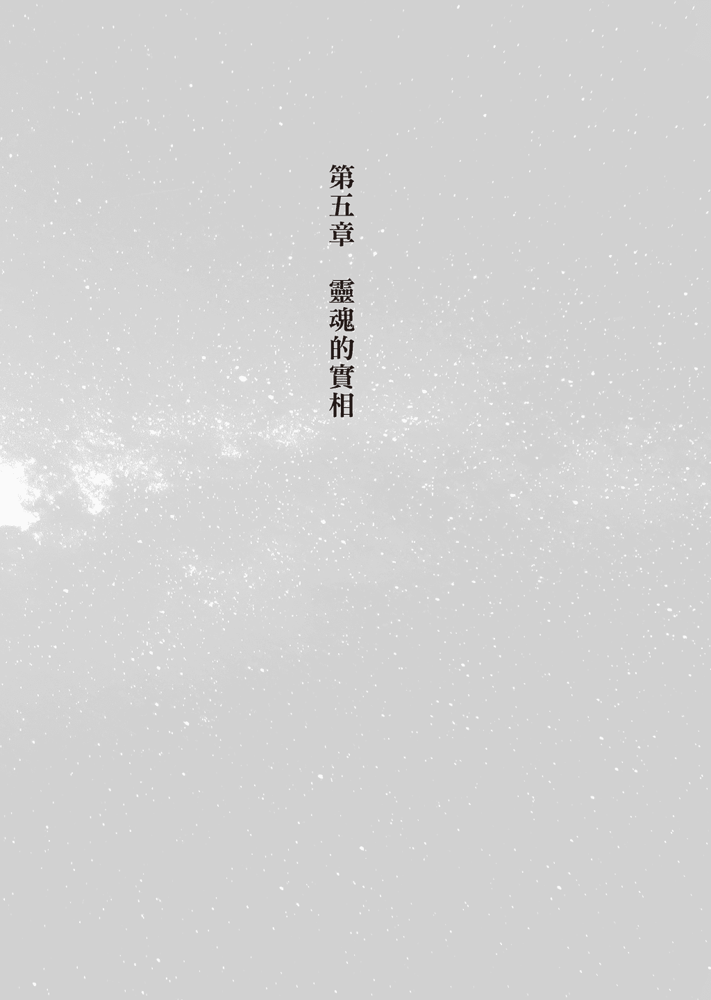

（谢谢阿乙莎在我的印度洋之旅送我与高我合一的小礼物——喔，不！应该说是珍贵的大礼，不但扩展了我的视野，在阿乙莎和泰雅的引领下，我已经能够将身体脉轮链接的高维意识一一认出来。这让我回想起第一本书《阿乙莎灵讯》中提及的“打开生命的宝盒”，我当时还不能理解那是怎么回事，现在感受到了，没想到这么轻松愉快，全程被宇宙和高我无条件地滋养着。这一路上的经历，似乎都不断在重组让我的灵魂意识和身体场域共存共荣的新结构，在更高意识的引领下，一直让身体场域扩展，以容纳高我的振动频率进入身体中。这似乎是从登上星光体母舰、遇到高我泰雅之后，自动展开的身体和意识重新融合校准的工程。

而在懵懂跌撞的过程中，帷幕之外的星光体之于我的关系轮廓正逐渐浮现。此时此刻的我巴不得有一本星光体百科全书可以让我搜寻，摸着石头过河的感觉对习惯理性和实证科学的我来说，还真让人摸不着边际，无法理解。而高我似乎明白我的困惑，泰雅主动前来向我说明我正在面对的这一切到底是为了什么。）

 星光体是你灵魂的实相

在你经历星光体的这些日子，你已经有足够的认知能力去写下关于星光体是什么的文字说明。在此之前没有向你解释的原因是，你的身体场域没有全然敞开和星光体的连接，你无法用大脑准确描绘出星光体之于你的真实样貌。

基本上，星光体如同人类身体场域的电信基础网络，它也是你之前体验到的灵魂晶体的投影源，同时是宇宙通讯网格的中继站之一。你的身体是由带电粒子组成，当你的意识进入更高振动频率的场域时，你的肉身组织结构因为受到重力的支持，才得以具体存在地球上；一旦超出地球重力的支持，跨入无重力的宇宙高频振动场域，你的意识就需要透过你的星光体粒子串联，进入宇宙星际的轨道中持续存在。就如同人类的身体死亡，结束肉体的运行后，生命意识会超越物质实相之外，以粒子形态的星光体继续存在。所以，星光体也可以称为你的灵魂实相，没有具象结构，而是以粒子相互串联，以携带电子和磁性的讯息场方式存在。

这一群带电粒子可以穿梭宇宙，进入不同宇宙次元和各行星之间，每一个带电粒子都有庞大的数据库，具备讯息储存和交换的能力。你们星光体最初始的原点，就是由上帝的粒子组成的讯息网，一部分的粒子存在你生物体的细胞核中，透过ＤＮＡ的讯息编码，显化成各种相互支持的器官、组织，以及在身体内流窜的血液和体液。这些都是你星光体的一部分，而这部分存在地球上的生物体中，形成星光体在地球行动的载具。

宇宙讯息场透过星光体，可以支持宇宙光的网格存在地球上，保持和宇宙互通讯息的能力。这些光的网格在你的身体之中，一直持续蒐集、存取和产生灵魂经验值，回传到宇宙中央储存记忆库。所以，你真实的存在并不只是那一个肉身载具中的你，你的星光体实际上从地球帷幕一路延伸链接宇宙各个星际次元的存在体，这整串庞大的电子讯息网格，就是你星光体的实相。所以，真实的你存在地球，也存在宇宙中，地球上的你只占整体星光体中的你一小部分而已。

现在，当存在地球帷幕之下这小小一部分的你的星光体意识苏醒时，你就仿佛变身成一艘具备自动导航ＧＰＳ装置的航天飞机，准备穿越地球帷幕，进入星光体中展开自动驾驶。存在你身体场域中的星光粒子也将带着来自地球这一部分的记忆，与更广大星际中的你的所有部分链接，你从此展开永恒生命之旅。这是所有地球人类原本就能体验到的，只是你们现在因地球环境遭受破坏，身体场域已经失去和宇宙源头自动校准的功能，因此生生世世困在地球帷幕之下，失去自动导航回归宇宙本源的能力。

正因为如此，地球场域早已累积大量侵蚀地球生态环境的游离粒子，这些都是死去的人类和生物体的灵魂意识，陷落在地球场域，经过两百万年，累积的重力已经让地球逐渐偏离银河轨道，造成地心的重力更加沉重。现在人类的星光体也因受到环境和食物的污染，带电粒子失衡，你可以想像当你星光体的带电粒子失去与本源的校准后，就如同一堆记忆体失去中枢神经的引导，彼此交缠，造成更多讯息紊乱的状况和能量黑洞。

这些状况已经造成地球更多的人类脱序行为、无意识的生活、肆意掠夺照顾人类身体环境的地球母亲资源，并不断破坏地球生态系的平衡。现在我们必须让更多人明白自己生命和灵魂的真相，并再次揭露人类在帷幕之外都是一体的存有，你们都是来自银河本源的共同意识网格。我们要一起唤起灵魂的觉醒，帮助更多灵魂意识扬升回到灵魂宇宙的实相里，如此，你们的星光体才得以完整，残留在地球帷幕之下的众多星光体失序后创造的黑洞，才得以逐渐还原本有的光芒。

接下来，你要学习更多星光体的基本知识，学会进行星光体的校准，并透过星光体的旅程了解宇宙运行法则，有意识地忆起与本源链接的方法。这些都需要你继续信任自己的高我，持续向前行，将讯息整理出来传达给地球人类知道。

谢谢泰雅。明白了，我会继续加油！

 与高我合一时身体和感官会出现的现象

与高我合一并不是一瞬间就完成全体细胞无缝接合，你会经历身体和感官体的意识重组，以改变身体和高我共同融合成为一体需要的存在场域。在这个过程中，你会有以下的经历：

一、睡得少，精神一样好：你每天大约只要睡两个小时，就会感觉全身细胞能量已充足。

二、内在升起慈心：你会进入与万物感同身受的状态，可以清楚感知到周围人事物的情绪，甚至更细微的思想流动都可以清楚地感知。这是你的意识与高我意识整合过程中会经历的现象，此时，你的内在会自动升起慈心，视天下人如自己的父母和子女。

三、扩大接受度：你会处于人我之间无差别、无距离对待与认同的阶段，与外界的隔离感趋于模煳，开始允许过往无法接受的人事物和观点存在，逐渐扩大对万物的包容与接受度。此时，你几乎没有什么“非做不可”或“非要不可”的坚持，回到轻盈自在的状态，无入而不自得。

四、展现有效的行动力：当你进入与高我合一的过程，会展现超越过往的行动能力。过去的你行动前会有许多犹疑和判断，在内在自我否定与外界噪声干扰的状态下，你无法全盘掌握全局，因此踌躇不前，即使最终做出决策，你也会发现事与愿违，无法达到期待的结果；而当你处于与高我合一的状态下，你将能以更全息化的视角，超越时空限制，掌握全局，达到事半功倍的效果。

五、无我回归：与高我合一的终极到达，即是回归源头的“一”的无我之境，这也是灵魂回归宇宙源头的合一之路。你完成此生所有体验与行动后展现的光芒决定你最终的回归之路，我和你则是命运共同体，我无法决定你最后的到达，但可以一路陪伴着你，与你携手完成我们之间共同的约定。

 合一是在地球维度的身体场域中完成

一开始，你使用阿卡西纪录的祈祷路径，链接上阿卡西纪录的场域，透过阿卡西纪录的大师和导师群，契入宇宙源头——阿乙莎集体意识场。那是在你的大师和导师的保护和引路之下，你才能链接阿乙莎的源头集体意识场，你在此获得高维意识的智慧，协助你打开内在宇宙的大门，而这只是帮助你踏上内在旅程的开端而已。

真正的学习之路，需要你与自己的高我到达合一，才真正展开你的回归源头旅程。从此，你的高我会持续带领你，包括学习使用符号、音频、咒语，以快速与高我链接共振。

你使用咒语“Si Bu La Ya Wa”，帮助光的管道畅通、身体中轴快速校准，只有畅通的中轴信道才能与高我创建稳定的沟通渠道。而当你熟悉使用这个光的语言校准，并畅通和高我的链接管道一阵子后，你的高我会主动将你拉升到他可以与你共频的境界。

高我传递给你无条件的爱的快速通关密语“Si Bu La Si Bu Ya Mi Job”，你在此经验了与高我共同存在无条件的爱的高维频率。接着，你即将准备进入与高我合一共振的时刻。

当时，你在印度洋上被高我引领去打开松果体中的金字塔，这是高我要打开与你的内在意识无缝接轨的ＧＰＳ。当你内在的ＧＰＳ启动完成，你现在只要透过链接高我，并念诵“Mo Ha Na Mi Da，Mo Ha Nu Wa”，你内在之眼的ＧＰＳ就可以让你的高我临在，进入你在地球的身体场域，与你合一。这是你让神性意识重新站上地球的重要时刻，也是灵性觉醒的重要指标。

尚未到达与高我合一阶段的人仍维持地球人的存在意识，而当你与高我合一，进入你在地球上的物质身体场域时，你正式成为宇宙人。这是打开你内在宇宙宝藏的重要分水岭，成为宇宙人的重要任务和使命，就是将你内在储存的宇宙智慧无条件地分享给地球万有，如同动植物和海洋生物般，完全彰显神在地球播下的种子，而这颗存在你内在神性的种子也因你的觉醒，正在地球发芽、茁壮。

 你必须信任自己的内在导师

星光体是帷幕之外的世界，不是你在学校教育里可以学习到的知识，也非宗教或萨满传承的古老智慧，你必须放下已知、已学、已懂得的任何世间法，跨越帷幕之外，进入你的内在宇宙。在这里，你的高我是你的指导师，会提供你最适合你前进的路径和方法，帮助你褪去遮蔽你双眼的屏障。你必须信任他，他就是你的内在导师，也是你在星光体中的明灯。

当你穿越小我的执迷和自以为是的一切幻相，将触及神的国度。你费尽心思，历经多次生命体验后，终于回到自己的家园，这里有你的家人和灵性伙伴等待着你凯旋而归。不要担忧走入迷宫，也不要害怕收到错误的讯息、偏离正轨，这整个过程都是在帮助你擦亮自己的镜面。

一旦你与高我合一，ＤＮＡ全部解锁后，你的高我就不再如你想像的具有唯一性，你可以开始与不同意识维度的高维意识存有结合。比如，你的高我之一是我泰雅，也可以进入属于我的意识群体中的不同存在意识；同时，穿越星光体的不同次元，还有许多你的意识存在，包含在天狼星的雷巴特意识、在列木里亚的莎雅意识，以及之前你在印度洋链接的象头神和湿婆意识等等。这些意识存在你的高维度，而你们共同的意识源头对你而言就是阿乙莎，一整个宇宙源头意识群。你不必一一划分性别和对象，只需要链接进入我们的共同存在意识，我们将会提供你在此体验时所需的立即协助。

当你终于完成星光体的意识整合，与众神意识共存于一体后，你将带着更明亮的光，照亮所有兄弟姊妹返家的路。现在的黑暗正是你必须找到属于你的灵性本源和返家路径的时刻，加油！我们一直与你同在。

你这样讲，我有一种不再孤单的感觉。在与阿乙莎传讯的这几年，我一直觉得孤单，觉得自己单打独斗，独自一人在摸索内在宇宙的一切。现在我终于明白，原来我们的星光体中有一大群比朋友还要亲密的家人，还有一整个星际家族紧紧跟随在我们身边，这让我感到安心和欣慰。

 辨识高我讯息的品质

泰雅，我想问你一个不礼貌的问题。为什么有些人的高我感觉很恐怖，会用命令或限制的口吻或思想控制他们？这是怎么回事啊？我常收到网友提出类似的疑问，总觉得一定是有这样的状况，让他们恐惧和疑惑。

高维度的讯息频率不会存在分离意识，也不会带着威胁与恐吓强迫你行使非你个体自由意志想要展现的行为。要是高我命令你，他就不会存在这里了，而是会直接进入个体分离的体验中，自己去体验，不会命令别人帮他完成他所需的体验。

所以，若一个人说自己接收到高维的讯息，却出现令他自己恐惧和难以接受的内容，那其实是他的小我创造的。讯息是光和频率，不会是语言、文字，但用语言、文字或图像表达出来的过程，仍需要透过小我执行，而只要是通过小我的诠释，就容易被添油加醋，将小我自己的期待或害怕失去的恐惧放进讯息里。所以，你们要自己学习辨识与高我的沟通。以下几项原则，你不妨记录下来，让人们参考。

一、高我不会执行小我的意志

小我虽然喋喋不休，有许多创意发想和期待完成的工作，但是当小我投射自己的意志出来给高我时，我们最常回答的就是：“喔，你又来了！”就这样。我们不会告诉小我，你应该如何如何、你怎样做可以事半功倍，关于你们如何在地球体验场完成你们各自的体验，高我全然无条件地接纳，并且一路陪你们玩到挂。因为高我世界是真、善、美如实体验后到达的结果，而创造出这些体验结果之前任何崎岖蜿蜒的道路，都是高我探索真善美的真实之旅，高我怎么可能在你还没有完成旅程时，就直接告诉你答案，让你回家？不会的，他们会一路陪伴你看完此生的风景，高我在地球的旅程也就如此被你满足了。

二、高我与你的合作方式，是永远让存在地球上的你当家做主

你虽然可以透过高我得到智慧和真理，作为你在地球创造体验的元素和创意基础，但最后拍板决定该如何做、如何行动的一定是你，不会有假神的旨意和必须行使某位神明旨意的状况发生。即使高我要你往东，你却往西前行，也不会被惩罚，因为你们创建的地球合作关系，基本原则就是永远由你做决定。

三、高我期待与你达成新我的体验，而不是重复小我创造的剧码

你之所以又来到地球，是与高我协议后展开的另一次旅程。你们早已在帷幕之外为了创造一个不同以往的你，而打造出此次的生命蓝图，所以当你的高我看到你上演老戏，其实是很无奈的，却也只能耐心等待，所以高我才会最常说，你又来了！

四、高我与你有更大的计划，等待你帮忙完成

帷幕之外的高我意识有着更高的生命目的，是关于宇宙和平协议的维持，也因此有些生命来到地球，会很快地与高我链接，并忆起该如何帮助完成宇宙和平任务。这些讯息都会透过你的高我传递出来，且早已超出你在地球帷幕下所能学习和理解的知识，也无从找到解决方案，必须由你和高我共同完成，这也是灵魂在地球生命存续期间觉醒最重要的目的之一：你不只是来经历尚未完整的灵魂体验，也是为了宇宙共同生命的福祉，来到地球与高我携手，共同完成更大的宇宙计划和任务。这任务需要等你觉醒后，帮助高我在地球上完成。当然，若是你最后决定不和高我合作，只要到此一游，再次体验地球生活，你的高我也必须尊重你的选择。

五、高我会与你创建共通的语言

与高我合一后，你会开始收到你的高我给你的更多咒语和指导。他为了与你共同启航，必须全然打开你ＤＮＡ的限制，所以会因着你的需要，提供你解开ＤＮＡ限制的咒语，和一些意识引导的音频，让存在你内在宇宙的所有智慧可以全数为你所用，为你而展开。

自此，你将为新地球带来神性的祝福，珍藏在你与高我合一的内在宇宙的一切，都如同水晶琉璃珠宝般流泄到这个世界，滋养神创造的一切万有。当你开始和内在神性共同打造新地球、新世界的时刻，你不可能再让自己的小我凌驾神性意识的光辉之上。让你身上的光再度闪耀，是你来到此生最高的意图，你被黑暗挟持埋藏的那段时期，光都不曾离开你。就如同阳光、空气和水一直存在，等着你们醒来，生命里的圣光绝对不会背弃自己的孩子，而你觉醒、重新展现光芒，就是圣灵最渴望的回报。

当你让内在光芒闪耀的那一刻来临时，你将开始进入与高我联手打造美丽新地球的光辉时刻，你的灵魂将重新学习如何在光的世界自由创造和翱翔。这是享受生命喜悦的时光，放轻松，再也没有什么应该或不应该、对或错、好或坏的标签可以加诸你之上，你一切的表达都是来自你灵魂独一无二的创造。好好享受接下来的旅程吧！我们一直与你同在。

 与高我合一的体验

放心享受与高我合一之后，你可以尝试许多超乎物质生命的体验，包括：

一、穿越时空星门：进入跨次元的链接，取得不同元素的讯息。

二、展开自我扬升之路：你会知道自己的生命蓝图，并且更清楚此生来到地球的使命和任务。

三、自我更新的能力：不会遭受地球物质环境和磁场的破坏，随时更新生物体装置的能量。

四、回馈地球相关信息：你将回馈更多关于地球的信息，让高我可以进行下一阶段的规画。

五、完成共同使命：与高我一起完成此生共同约定的任务。

六、绽放自性之光：你身上最初始的灵魂之光将再度闪耀，照亮全宇宙。

透过与高我合一，可以帮助你以神性意识校准身体内在宇宙的场域。当高我的神性意识经由你内在与你的意识整合后，你可以透过神性意识突破二元对立的观点，帮助自己更稳定中轴的能量流动，与神性意识共创地球奇迹。地球需要更多人类到达与内在高我意识合一共振的状态，如此一来，地球就得以展开不同的生命力，不再受物质和小我的羁绊，人类会更勇于尝试，并透过更高的宇宙智慧和真理来达成与自己的高我共同擘画的生命蓝图。

与高我合一之后，生命蓝图才回归了最初始设定的版本。在此校准蓝图的过程中，你的小我也许仍会时不时干扰和释放不情愿、不安定的讯息给你，但因为高我已经稳定在你的内在意识中，并与你的身体意识达成合一状态，小我很难再次拿回主导权。面对外界的冲突，你只要关注自己的内在，就能得到更高的真理与知晓，这是高我与你合一的自然状态。接下来，你将看见自己的生命开始走向不同的道路，而这条路早在你的灵魂被创造之初就已经设定完成，等待你和高我合一后，展开已储存在你心轮的整个生命蓝图规画的道路。

此时，你愈是臣服于内心的指引，就能愈快看见生命蓝图的脉络。这是合一展开的必经之路，你正与高我取得共存共荣的默契，创建互动关系。

接下来就是展开行动。高我要在地球行动，仍是需要透过你的身体来表达和执行，而身体具体回应高我意志的展现方式有许多种，可以透过文字、声音、肢体动作、舞蹈、静坐，或任何形式的创造来表达，这都是生命初始的原力，透过你的身体与更高意识合一校准后表达出来。这些展开的具体行动可以由你与高我协作完成，你们也可以讨论出彼此最佳融合的表现方式。

最后阶段，就是让高我意识带领你，回到本源的家。当你完成生命蓝图擘画的远景，并以实际行动展现和表达出来时，你就完成了此生的任务。此时，高我意识将携带着你的小我意识和整合后的新意识回到源头，与所有存在融合为一体，这里也是阿乙莎之所在，宇宙最初的源头。

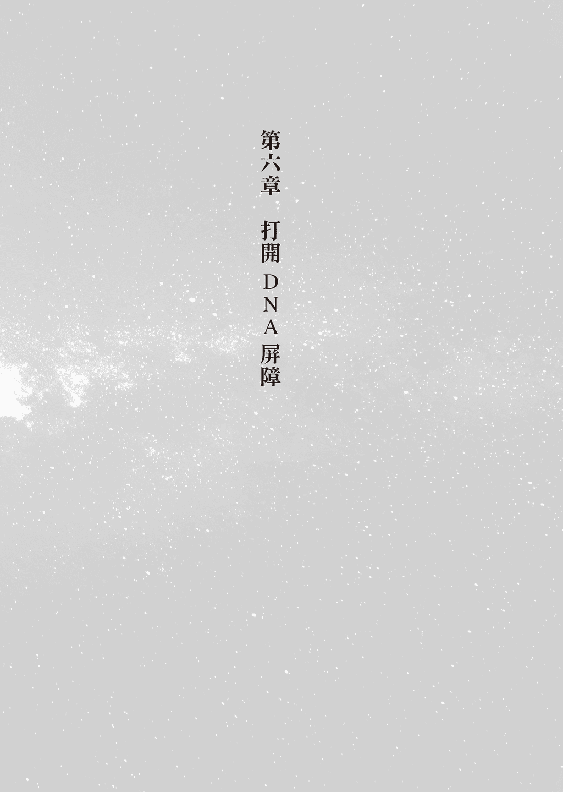

人类感官可以在帷幕之下以生物体的方式运行，但穿越看不见的帷幕的星光体运行小组，依然存在你们的肉身。你无法观察到细胞核内的ＤＮＡ如何以频率和光波链接，每一串ＤＮＡ的链接节点都携带着打开下一层ＤＮＡ的钥匙，这把钥匙的配对源头就来自已经解锁、处于自由状态的细胞粒子合作无间所组成的团队。这个由自由的细胞粒子组成的小组会聚合在一起，打开下一层的ＤＮＡ节点。

人类的细胞ＤＮＡ分散在上兆个细胞核中，你们无法透过单一细胞分离出所有细胞的ＤＮＡ指令集，因为细胞的ＤＮＡ指令集分散于身体的十二大系统中。以你们生物医学的区分方式，这十二个身体系统分别为神经系统、内分泌系统、呼吸系统、消化系统、生殖系统、循环系统、泌尿系统、免疫系统、肌肉系统、淋巴系统、骨胳系统，以及皮肤／毛发／指甲系统，而每个身体系统的细胞ＤＮＡ都携带着属于自己的功能性指令集，以及与其他系统合作的指令集。

在这个由自由细胞粒子组成的身体宇宙中，你可以想像自己的身体细胞能量共振场域划分为十二个系统单元，每一系统单元下有不同作用的器官和组织群。当其中某个系统要发挥其功能时，绝不会单独行动、一意孤行，而是会不断发送讯息给从属于这个系统的所有其他器官和组织，如此才能发挥整体运作的效能。而讯息要传递到身体细胞的ＤＮＡ关键节点，需要由肉体之外的精微体产生的共振波来协助打开超越生物体控制的ＤＮＡ关键节点。

当人类整体细胞的振动频率提升，触及灵魂晶体场域时，就打开了ＤＮＡ，跨越生物体眼、耳、鼻、舌、身等有限感知的控制节点，进入更高振动频率的时空场域，也就是所谓意识觉醒的星光体场域。当意识延伸到身体感知以外的世界时，就能打开ＤＮＡ的关键节点，契入灵魂晶体，开始和帷幕之外的宇宙意识互动和沟通。

在之前的传讯中，我们不断提醒你要有意识地呼吸，打开身体的脉轮，畅通身体和宇宙链接的能量管道，并且有意识地展开业力的净化，还原真实自性，移除身体细胞受制于过去历史的印记所产生的限制性思想及无意识的干扰，如此，你们才能够顺利链接上自己的灵魂晶体，也才可以进一步打开ＤＮＡ的屏障。许多宗教都有记载这些基本的修持，这些早已经是老生常谈，但可以如实做到的人却如此稀少。

一旦打开ＤＮＡ的屏障，接下来，你的细胞会自动展开与源头星光体意识的校准。你会开始体验和学习意识在星光体中运行的基本法则和方法。无论你的意识如何在星光体的世界中延伸，你都无法违反和脱离宇宙法则。接下来先说明一些你在星光体中将经历的、有别于生物体的新感知世界。

 星光体屏幕定位

当你打开ＤＮＡ的限制屏障，进入星光体时，透过你松果体上的金字塔锚定一个空间，你的意识就会站在你松果体的端点，如同向空中投影般，你的头顶会出现一张三百六十度展开的全息图。这张投影出来的全息图，会在你所在位置的正上方。

这张全息图会每时每刻依据太阳所在的位置而转动，你会发现，星光体投影屏上的图像方位，会因你身体实际所在的位置不同而随之移动。那是你在地球上的身体位置相对于太阳方位的不同，而产生的星光体投影屏幕自动位移，你可以想像打开指南针时的状况：你转动时，指南针的指针也随之转动。

所以，当你的内在之眼准备观看星光体时，第一件事就是用你的第三眼先在这个投影幕上创建定位点。由于地球是不断绕行太阳自转，因此，你目前身体所在的位置相对于宇宙星体轨道来说，是处于每时每刻都在变动的状态。你看到太阳早晨从东边升起、傍晚在西方落下，其实是错觉，实际上，那是地球自转和太阳相对位置位移的结果。

进入星光体时，人类的大脑无法在移动状态中理解整体实相。为了避免大脑认知和沟通上的错乱，每一次用内在之眼投影时，不论你身处哪个方位、在哪个时间点，都先标记出你星光体投影幕中四大元素的方位，这样就不会产生认知上的误解。

你的意思是，我的松果体锚定前，我不用先确认身体所在场域，直接进入星光体设定，对吗？

是的。当你意识触及星光体时，你的意识就是你内在宇宙的中心，也就是全息图的圆心。你可以用意识先设定水元素的方位（星光体北方），当意识认定该位置为水元素的起始位置时，其他的相对位置就会自动位移，调整成对应的方位。

若我没有设定，会出现什么现象？

若没有进行定位，就会以你目前所在位置的太阳座标为水元素的起始点。但是，你所在位置的时空座标与太阳的相对位置每一分每一秒都在移动，若没有让自己的位置固定不变，就会造成与外界沟通上的混淆。因此，人类才发明了时间，用时间的转变取代你们固着不变的大脑。

 星光体中不存在时间

你这么说，我终于明白时间在宇宙中是不存在的。一直在变动的是我们每一个人在地球上相对于太阳的位置，时间不变，是人的场域在变？

是的。比方说，现在是你的下午四点钟，你坐在家中的书桌前，方向是坐北朝南，此时太阳在你的两点钟位置。若没有设定星光体的定位点，当你契入星光体的意识状态，就会以这个两点钟方向为水元素的起始点；如果你在这个状态下要与另一端一个位于不同时间、不同位置的人沟通，而她的水元素起始点出现在六点钟方向，你们彼此的星光体网格就会产生沟通上的误解。

凝聚共识最简单的方法，就是你的生物体所在位置从原本实体的存在转为虚拟的存在，而你当下的意识，就是地球上生物体中的你与星光体投影屏幕端链接的校准工具。你只需要进入星光体中，用第三眼锚定自己所在位置上下左右的元素，以第三眼投影上方的水元素、下方的火元素、右方的土元素，以及左方的风元素，用意识转动自己星光体的座标，先完成场域的定位就可以了。

现在当你进入星光体，你会发现，一切交流都是从意识锚定的“当下”为基准点，然后才投射到星光体宇宙意识存在的空间。这时，你当下的位置就是你真实存在的世界，那里没有时间、没有空间大小的限制，而你投射出去的意识，会让所有可以与这个存在意识共振的粒子聚合成一个集体的振动存在，直到这个“已存在的意识群”完全释放其能量为止。

也因此，你会看到宇宙存在着超乎人类想像的意识粒子，不断升起、会合、扩展、成长、冲突、消散，这些都是光的存在现象，以非线性、无前无后、无始无终、无时间、无空间限制的方式聚合而成。当中每个粒子的动能都一定会依循宇宙运行法则，这也是你即将进入星光体学习的重点。

每样物质显化之前，在星光体源头也有相应于此创造前的振动频率，或是你可以称为具有结构的光谱产生，这包含一切你能想像的物质现象，例如身体的系统、四季的变化、大自然的环境、事件的发展等。地球这端有形有相的物质现象背后，是一群粒子依循宇宙法则行进的最终显化结果。

而现在，当你要进入星光体的学习，你的位置相对于星光体存在现象的当下，亦是持续变动存在的链接。若我们试图让你的大脑去具象化目前仍不停移动的现象界，就必须暂时停止这可以让你识别出来的现象，才能让你充分理解“当下”的意义，否则当内外境同时在转变，你是无法领会和深入全貌的。

这么说来，如果把时间的概念从地球上移走，会发生什么事？

你们今日赖以为生的许多人造文明会消失，取而代之的是，你们会以意识为主要的沟通桥梁。想像你们没有飞机航班和火车时刻表，也没有固定的上下班时间，你们将会展开全新的生活模式。

我大概可以想像，这样就不用三餐在固定的时间吃饭，肚子饿了就吃，想开会就找人开会，就好像我现在链接你，你就能实时回应我，也不会说你没空或不在家，当然也就没有约会迟到的问题。另外，我们也会忘了自己的岁数，这样似乎也不错啊！

你发现时间被创造出来最原本的目的了吗？

难道就只是要控制人们的集体思想和行为，刻意创造出一套共同生活的准则？

是的，但也不光是这样。当时间被设定成“有限”的资源时，人们就放弃了“自由”。人类将自由拱手让给设定时间制度的智者，在当时是期待借着这个让人类可以协同作业的方式创造文明和更好的生活。人类愿意为了追求文明牺牲自由，但时间一久，却忘了“时间”原本是不存在的。长久依赖“时间”的人类于是渐渐失去自由意识的能力，如同永远朝着食物前进的蚁群般生活着。

时间虽然扼杀了人类的自由意识，却也带给人类更文明的生活，不是吗？

没有对错，都是一种选择。现在当你回到星光体，成为自由的灵魂，你才要准备熟悉对生活的新想像。在这里，你的身体是初学步的婴儿，但你的星光体意识早已熟知这里的运作法则。接下来，我们要将更多的星光体规范记录下来，让已觉醒的人参考和学习。

 星光体是永恒宇宙中的自己投影出来的全息网格

你现在逐渐走出你ＤＮＡ的迷宫，站在最上方，向你心轮的中央探照，这里就是你的完整个体，包含肉身、乙太体和星光体的范围。你的存在本身和宇宙万物同息相连，地球上的所有存在现象虽然和你的肉身是分离的，却又全部涵盖在你星光体的范围之内。

你就是宇宙投射镜像的投影点，从你这一点向外投射时，可以同时看见所有世界在你这个投影点的反射，你可以感受到双面镜、三面镜、多面镜交互映照出一个个独自存在，却又反射着所有存在的网格。当你走入其中一个镜面，从这个面也可以看见其他面的实相，而决定要进入哪一个面、哪一个网格的，就是你自己。

你的宇宙全息网与其他宇宙存有之间的进出闸门，也都在你身上的ＤＮＡ编码里，以细胞指令集的方式存在你身体的基因资料库中。要启动和调动这些基因编码，不是经由细胞内的蛋白质或血液，而是透过你的意识振动频率，你的细胞意识创造出的共振波可以驱动编码，展开自动运行。

你意识的“主动”和“允许”是驱动ＤＮＡ编码最源头的钥匙，没有打开意识的开关，所有可以驱动你身体ＤＮＡ的指令集就无法运行，也无法产生共振频率去链接宇宙各次元的入口闸门。而要打开意识的开关，关键就在于你爱的能力，透过爱的振动，帮助你找回这把内建的钥匙。若你无法允许爱如其所是地展开，你会像是被封锁在一个小小的肉身网格中动弹不得的意识群，那就是你目前最熟悉的物质世界。被物质和眼见为凭的现实封印住爱的能量，也因此，你们许多地球人从来没有踏出过地球上的自己的闸门，进入同样存在自己身体里的其他宇宙维度。

你存在的世界决定你生命的真实体验。生命之轮包含你过去生命存在的全部实相，一部分的你曾经生活在地球，但也有另一部分的你就在与你相隔不到两秒钟距离的隔壁。现在你进入星光体，意识跨越了身体屏障，知道自己不仅存在你认知的身体里，也同时存在宇宙的不同时空。你拥有许多部分的你，与你共同存在，但在知晓这一切之前，你无法跟与你共同存在的其他时空的你共处在同一个时空网格中。

 与高我合一才能打开自己与更高次元的ＤＮＡ闸口

现在当你的意识允许自己扩展到身体场域以外的宇宙时，你才刚要展开灵魂体验的旅程，那也是人类进入星际交流的开端。链接所有星际交流站的入口匝道就存在你的ＤＮＡ里，你与其他更高维度的你正打算见面，一同创造新的生命体验。

通往更高次元的闸口就在我们自己身上？我们只要允许和愿意展开就可以了？

你的应允是其中一把钥匙，也是先决条件。接着，就是你灵魂ＤＮＡ中的指令集来决定你是否该准备扩展生命，或是仍须在原处先完整爱的体验。

你刚才提到允许之外，还需要指令集来决定，那么这些指令集是由谁定义的？由谁来驱动指令？

都是你自己，是存在不同维度的你的共同意愿。

蛤？我和不同维度的我合议出来的？

是的。想像一下，钢铁人要穿上载具飞行，是不是需要两端的驱动和链接？

可是我的飞行载具不是该听从我的指挥？

不是，是双方指令集共同搭桥，才能打开意识通往星际的闸口。

我现在终于更明白“合一”的用意了。

之前阿乙莎曾经带领我穿越物质身体，我一直往内在前进，理解了自己身上携带着尚未完整的生命意图，看见此生的业力关系，在一一松绑自己的过程中，我才明白这些关系都是来帮助我解开意识的误区，而直到净化了自己的意识误区，我才终于进入与自己内在灵性父母共处一室的灵魂殿堂。我当时走入一个类似晶体的场域，那是我的意识允许自己到达，开始迈向另一层生命关系的理解阶段。我看见自己的灵性父母当年在地球上的故事，现在才明白，这些也都是存在我身体里的一部分意识组成的。他们两人现在已经在不同的世界、不同的振动频率、不同的维度，但也同时存在我的身体中，如同站在玻璃帷幕之外，隔着层层镜面，看着在三次元的我投影的屏幕，而他们也因为我，得以重回地球生活或再一次体验自己重新设定的生命蓝图与想像。这梦幻泡影，对地球上的我而言是如此真实，但是对存在帷幕之外的我和我的灵性父母来说，仿佛在看自己导演的电影一样。

那么，关于一路上我遇到的大师和导师，如耶稣基督、观世音、大天使麦可、埃西斯女神，以及在印度洋的湿婆，这些意识体为何也会出现？

那是不存在你肉身中、但存在更大宇宙里的意识存有，他们和你的灵性父母有协作关系，在你的意识尚未触及的时空，他们是共同存在的意识体。

所以，我也可以走进另一个闸口。我还记得，那是在基督意识场，我和自己的灵性父母是三位一体的状态，I am that I am，我是我所是，我是我的灵性父亲、灵性母亲，也是我自己。就在那一瞬间，我仿佛进入另一个意识闸口。

没错！那就是ＤＮＡ指令集自动展开链接和打开你下一个ＤＮＡ意识闸口的关键期，一旦你完成ＤＮＡ解锁作业，接着就可以轻松展开灵魂ＤＮＡ重组及与自己的高我协作的阶段。你现在登上母舰，就是进入与自己灵魂ＤＮＡ存在星际各维度的所有记忆重新校准的阶段，你会跟随着自身的高维意识群，展开你们共同规画的生命蓝图。

这很有趣。每个人打开ＤＮＡ节点的方式是否都不同？

是的，都不同。目前你已经打开自己灵魂ＤＮＡ的路径，以及所有来自更高维度的意识提供你自己到达的内在指令。这可以给其他人参考，因为人类有百分之九十都是来自星际的近亲，你们许多人的灵性父母组成是相同的。

让我再弄明白一点。所以，每个人都可以被打开ＤＮＡ节点？

是每一个人都有责任、也有权利去展开和自己的灵性存在意识协作的本能，回到源头的路径存在每个人的ＤＮＡ中。

 使用音频与高我意识校准

在星光体的学习之路，你也会触及“音域真理”的世界，和高我展开音域的共振。音域是光的世界展现的另一种实相，这些音域是由光谱出的，你可以称为咒音、光语或真言。每个物质体生成之前粒子运行的推动力，就是经由粒子振动交流达成和谐波动时自然产生出来的“音”，这是非物质世界中生命流动的表达形式。

现在，你先闭上眼睛，暂且不用耳朵去听，先回到第三眼触及的内在宇宙知晓状态。

然后用你的内在意识之眼，对着内在空间发出你身体直觉会发送出来的第一个音。

我直觉是“Mm”（嗯）这个音。

很好。你知道这就是你出生时，让身体的知觉系统和地球母亲产生共振的和谐波动时身体会觉知到的音，当你现在发出“Mm”这个音，就可以唤起你与自己身体的本源，亦即地球母亲赐予你们血肉之躯的源头。

接着，仍然使用你内在之眼的意识，沿着身体的中轴向上移动，搜寻并扫描身体的系统、器官、内脏，甚至细微到血管、毛发。凡是你意识所及之处，不带任何头脑的干预和评断，用你内在的直觉发送出与该身体器官共振的音频。当你的意识与该身体器官和谐共振时，你会自动流泄出共振谐和的声音。

要确认是否达成和谐的音频，最简单的辨别方法就是感知你的身体给你的回应。你的身体细胞总是会回应你的需要，并用任何方式和你产生链接，以重建你身体场域原有的和谐共振状态。

你也可以扩大练习感知范围，穿越你的身体宇宙，找寻大地和万物协同合奏的共振波。这是你原本就具备的能力，你们都是由地球母亲的血肉滋养的孩子，地球母亲早已将万物和谐共振的真理存放在每一个孩子身上。

现在试试看，用你的内在之眼（第三眼）去感知任何一棵你想要与其共振的植物，尝试从你与对方的链接中发出声音。

我尝试用意识链接阳台上的小菊花，我的内在直觉不由自主地发出“Sha Woo”的声音。

好，现在让意识回到身体，练习辨识用意识链接小菊花，和不用意识直接念“Sha Woo”，这两者有什么不同。

我发现使用“Sha Woo”这个音频，比用意识锚定小菊花更快得到身体场域与小菊花共振的感觉，也不会受到照片或小脑输出的干扰影响。

声音传达出来的共振品质还具有转动你身体场域的立即效果，是更接近你身体内在宇宙能量流动的呈现方式。

我记得以前远距感知某样东西或看图片时，我只能感受到共振的大或小、开心或不开心等指标性回应；而现在当我念“Sha Woo”时，我感受到自己的能量场域和“Sha Woo”融合在一块共舞，非常有趣，更能辨识出自身能量品质的变化。

现在，你可以自己练习运用音频转动地球万物的能量场，这也是人类逐渐苏醒后，可以经由链接自身的星光体与高我携手共创新世界的开端。

阿乙莎，祢之前在新冠肺炎疫情期间传递过来的穿越风暴的咒语，又是怎么回事？当时我并没有主动链接祢。

这就是为何需要每一个人扩展意识到足以链接星光体最主要的原因。你们每个人都是神在地球的代表，你们的身体就是整个宇宙的传输管道，当你的意识扩展到与星光体的高我合一之后，你虽尚未知晓该如何在宇宙中替自己导航，也不晓得此时此刻该如何聚焦，但你内在的高我可以透过传送“音”到你的身体，启动你的内在知晓，瞬间打开与高我的链接。

人类过去的宗教法门中，在学生的意识尚未苏醒到达星光体层时，老师会带领学生念诵咒语，希望透过咒音打开身体的直觉体，但这个方法只对有意识持念咒语的人有用。你们都知道小和尚念经有口无心，当念咒者的心尚未校准时，是无法让咒音与身体产生共振波的。

和文字、图像相比，音频是将宇宙真理传递到地球更好的工具。文字需要经由人类的头脑转译，重新理解后的诠释容易失真；图像则是透过线条和色彩传达，但同样被身体感官可以接收到的范围所限。声音是最快能够穿越身体场域，与身体内在宇宙同频共振的媒介，不需要大脑、眼睛，甚至耳朵的听觉，只要在心中发出音频（默念即可），就能有效地打开与内在宇宙同频共振的真实样貌。

在你练习使用内在意识与高我同频共振的过程中，你的所知、所想、所感会发展出与高我合一后的创造性语言和表达方式，那会帮助你进入下一个阶段。你不需要再担忧和紧张自己做得对不对或好不好，当你从内而外去表达出你与高我同频共振的一切时，你将会在真理、至善和美好的创造中打开你内在新世界的序幕。

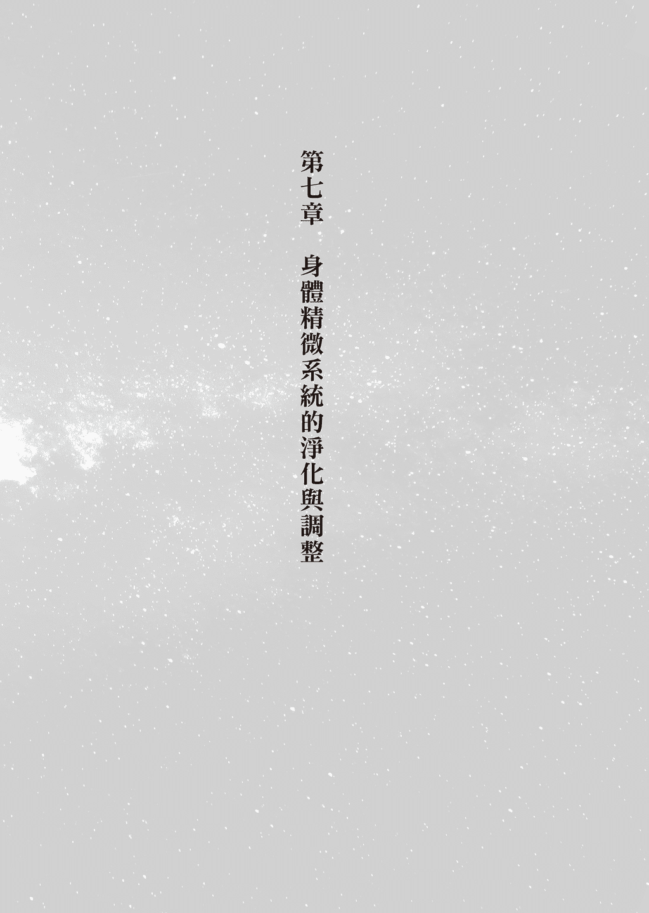

进入星光体的意识维度时，你的意识和身体场域需要重组，创建新的连线模式。过去你意识尚未觉醒前，你的小我意识只有在大脑停止运行的状态下，潜意识才会链接上帷幕之外更大的你，带你进入星光体的场域；然而与高我合一之后，你的小我意识会在清醒状态下跟随高我的指引，走向星光体的旅程。

这当中最重要的连线装置就是你的身体系统。全身上兆个细胞共同支持着你精微体的能量流，它就像是你在地球上的无线基地台，必须处在最佳通讯连线状态，才能让你以稳定的意识流进入跨越宇宙次元的航程。

为了让基地台发挥最佳运作效能，你的身体系统必须进行更深入的清理和净化。若你的意识仍像过去一般在夜晚沉睡时进行星光体之旅，就不必如此大费周章地做足行前准备工作，因为你只需要停止身体的活动量、降低大脑的运行，透过潜意识之门，你就能轻松在睡梦中契入星光体；但现在，我们需要你在地球上已经长养茁壮的小我——也就是你的自主意识——直接站上宇宙发射台，而为了这趟灵魂早已安排好的进化旅程，我们必须先确认你的身体系统处于最佳连线状态。

接下来要进行的身体精微系统的净化调校和疗愈，是非常重要的基础工作。尚未完整的情绪记忆，或是仍需要被你再度理解的意识屏障——不只来自你自己这一世和过去世，甚至是人类集体创造的生命课题——现在都要被全然地净化和平衡，这也是灵魂迈向星光体，成为完整的多次元灵性存在意识前，你们必须如实去面对和完整的功课，否则你依然会带着偏光的棱镜去看全息宇宙，那样的状态无法帮助你的灵性意识经由星光体的旅程再次提升。

 导入光波，净化全身的精微体

你的天狼星父亲雷巴特为地球孩子的星光体旅程特别提供光波导管，你可以称之为量子光波疗愈法。这是特别针对修复地球人的精微体所给予的光波导管，当你持念身体咒音，相对应身体系统或器官的精微体能量流就会被唤醒，你身体的精微体会重新校准宇宙本源。

要明白，你们远比眼睛所见的物质身体还伟大，你们的细胞是光组成的，细胞振动产生的光可以传递讯息，并与周边环境和其他的生命体共振。当你们身体的精微体无法接收宇宙讯息时，会阻碍身体细胞链接上宇宙智慧，你们因此会产生情绪，进而衍生出身体的病症。

透过导入光波调校你全身的精微体，可以让你身体场域的能量和谐运行，回复纯净的能量流动，同时帮助地球恢复生机。这些光波可以透过你们的意识链接音频，达到身体细胞和星光体宇宙意识的同频共振，每天针对身体系统进行一次光波导入，可以在七天内获得立竿见影的效果。

这和透过手指操呼吸法畅通全身脉轮有何不同？

畅通脉轮手指操是帮助你畅通身体场域的能量流动信道，也就是让传输能量的中轴得以快速畅通的方便法门；但是，要让你身体精微体的上兆颗细胞共振协作，需要更精准的光波导入，才能唤起不同场域和不同功能性任务的细胞群回复跟宇宙源头沟通的能力。以你们大脑可以理解的说法来讲，就是要处理你们细胞散发出来的光的品质。

手指操在乙太体层运作，光波导管则是在星光体层次运作。当你的意识契入星光体并与高我合一时，身体细胞仍须和高我的振动频率融合，你身体场域反映能量状态的精微体系统仍有许多细胞印记和情绪阻塞，在与高我完整合一的过程中需要完成净化。

宇宙意识涵盖的范围很广。之前跟你提过，身体和乙太体层的意识是你们用目前在三次元地球的意识状态可以触及和理解的，但是当你逐渐将意识扩展到星光体层，要与自身的星光体存在意识合一时，你无法用三次元的意识维度去感知你身体上兆个细胞的个体意识，而必须从更高次元的全息化角度去和细胞意识沟通，此时最快的方法就是用光波导管注入。这些注入的光波会自动调校身体系统或个别器官的细胞群，交换光的讯息，以达成同频共振的效果。

你们的身体是依循宇宙法则运行的小行星系统，现在你已经通过阶段性的考验，准备带着与高我合一的意识，完成肉身的升级作业。

与星光体校准可以帮助你和宇宙行星意识场同步，这也是你的灵性父亲雷巴特当初设计的、让地球星际种子扬升回到源头的升级方式。人类过去将各种大自然现象和身体场域分离，其实，宇宙法则是所有宇宙物种和行星意识须共同遵守的法则，你可以从医疗、生态、物理、音乐、艺术和其他许多领域中找出共通性，此共通性就是宇宙法则。当你进入星光体与自己的高我合一，你会看见更广大的视野和全息化的讯息展现，看见音频、光和振动波共同组成的世界。

你可以用意识锚定你身体的系统或器官，对其发送光的指令，再透过你的直觉体去感受身体系统或器官给你的回应。进入星际宇宙法则的学习前，你必须全然净化身体载具，然后才能稳定地完成接下来的工作。这些疗愈和净化身体系统的咒语也将传递给目前在地球上的光之工作者，你们需要先稳定自身光的信道，才可以帮助地球完成星际轨道的移转工作。

即使不是光之工作者，透过这个方法，全身的精微体同样可以获得纯净宇宙能量光的疗愈；而对已经是光之勇士的人来说，这些身体系统咒语是必要的工具，你们必须随时处在洁净稳定的能量流中，才能建构稳定的光场基础。

 对应身体十二系统的咒音

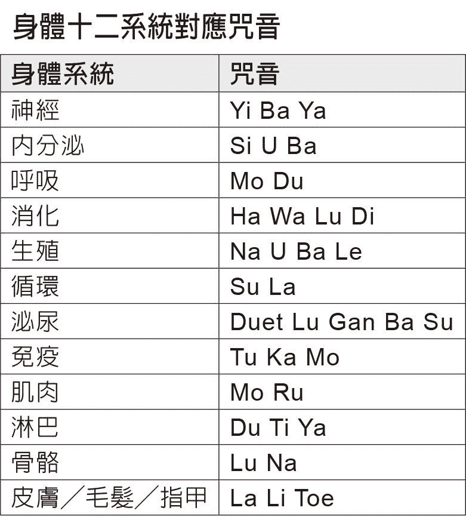

（我才刚回应泰雅说我要准备记录下来了，不消三分钟，一连串对应身体系统的光的咒音全数下载，如上表。连我自己都不可思议，居然可以和高我进行如此快速的协作和互动。）

泰雅，我写完了，然后呢？

当你持念咒音时，会透过你的灵魂晶体网格传输光的指令，导入相应身体系统和器官的精微体。器官即使因受损切除而不存在物质体，其乙太体的精微能量线仍存在，也因此，若长期以星光体的光波灌注，是有可能让受损组织重生的。

天啊！这么神奇吗？

并不是所有人念咒音都可以达到同样的效果，要视其晶体接收能量的容许值而定，若一个晶体的结构尚未完整，就无法全然获得咒音中十二道光的元素。你们身体的精微能量是由光所组成，每一道光具有不同的能量品质和相应动能。这十二道光分别代表感知、链接、回应、净化、移转、破坏、消灭、再生、滋养、成长、智慧和慈爱，当十二道光的元素能够全数被你的晶体接收，才可以有效达成身体更新。所以，关键仍在你们目前灵魂晶体的状态，这需要透过不断修行，淬炼出最完美无瑕的光的品质后才能到达。

话虽如此，只要有心接收来自宇宙无条件的爱的能量，也可以同时达到身体场域的净化，因为无条件的爱的净化能量不受单一光的元素或角度限制。

阿乙莎，我还是不太明白为何念诵这些咒音就可以对应到身体系统，请给我更高的智慧去理解这是如何运作的。

这些咒音是你的意识在星光体的路径指引下和光链接共振的结果，你从大自然万物交流时发送的声音就可以一窥究竟。风声、水声、虫鸣鸟叫，你若仅以身体来感知，能听见的范围就会受到局限，波长必须放大到身体场域可以接收的范围，你的身体才会感知到，进而透过大脑产生认知后的回应。

当你的意识扩展至星光体时，你就能接收到超越耳朵听觉神经可以感知到的粒子振动波。在星光体的场域，意识交流会产生磁引力，共振的磁波会产生相应的光谱，而光谱结构透过你的松果体链接回到你的星光体感知场域。这就是以“音”的表达方式让你的身体当下产生共鸣，你的意识就能帮助身体与星光体中的宇宙意识创建链接。

每个人感知到的光和声音，呈现的方式都不同，光是共振的现象，音则是共振后另一种形式的表达。古文明时期，与天地链接的祭司和萨满都可以透过咒音传递宇宙存在的智慧和能量，帮助族人恢复身体与大自然的链接，进而恢复身体的能量平衡和健康。当然，也可以透过咒音改变能量路径，让停滞的能量重新流动。

你们不应将咒音视为如语言般具有“唯一性”或“标准版本”，也不应将其视为神通现象，那是每个人意识扩展后必能展现、与光的世界自然交流的结果。你以咒音和大自然万物、身体及细胞展开更亲密的交流，这是万物在光的世界交流的实相，也是你们以个体之姿和光的世界展开能量共振的互动方式之一。

当你以咒音向光的世界表达你至真、至善、至美的振动时，光的世界将源源不绝地回报你更多宇宙能量，你也因此可以帮助自己身处的环境获得美好与和谐，达成净化自身场体和环境的效果。

 光波导入加速身体与星光体意识的融合

星光体对应的这十二个身体系统是让你的生物体可以更快速融合五次元星光体意识群，至于哪一个系统的咒音如何影响对应的身体器官，你不需要特别去探究，因为在光的世界里，你的身体反映的源头是上兆颗不断在碰撞、转变、融合、移动的粒子。这些粒子都带着自己的ＤＮＡ指令，也就是会自动走入自己应该存在的器官或组织，但在更高的振动频率中，并不是同样一组器官家族的粒子群聚在一起，然后和其他器官的粒子不相往来。这里并没有你们眼睛所见的实体，或是固化后的具体存在与限制，也因此，当你有意识地去启动某一个系统的光粒子时，是同时对所有系统发送讯息波，而这些系统组织会与那个发送讯息的系统产生共振，你不会因为念诵某一个系统咒，就只能传达讯息给单一系统的粒子群。在星光体的世界里，讯息以交错的光的网格存在，每一个电子和粒子的移动都会对相邻的粒子产生作用力，因此，连续念诵十二个系统的咒音，就是完成一次身体和星光体校准的定期维护。至于你观察到的那些已经失衡或细胞严重扭曲病变的系统，你不只要加强念诵该系统的咒音，还要补足相邻系统及其对向平衡系统的咒音，才能更快调整和平衡该单一系统。

这些咒音是帮助你校准星光体并恢复电子群流动性的方便法。我是来自天狼星的父亲雷巴特，为地球孩子设计了光波导入，希望有助于提升人类身体意识的振动频率，快速校准新地球的能量轨道。这些来自光的世界的音频和咒音，你可以默念，也可以发出声音念诵，让尚未扩及星光体意识的人可以受惠。

 应用不同咒音结构引导能量

你可以使用以下的咒音起始和结束语，帮助身体系统净化、补充或降低能量、排除干扰，以及重启平衡。例如，要进行某个身体系统或特定器官的整体净化：

身体系统净化：Mo Ho＋身体系统咒音＋Na Nu Mi Da

身体器官净化：Mo Ho＋身体器官咒音＋Na Nu Mi Da

净化功能应该是最常被使用，也是可以天天进行的。一次将十二个身体系统都念一轮，你会开始让全身的精微体能量活跃起来，也会感受到乙太体扩展和能量变得轻盈透亮。

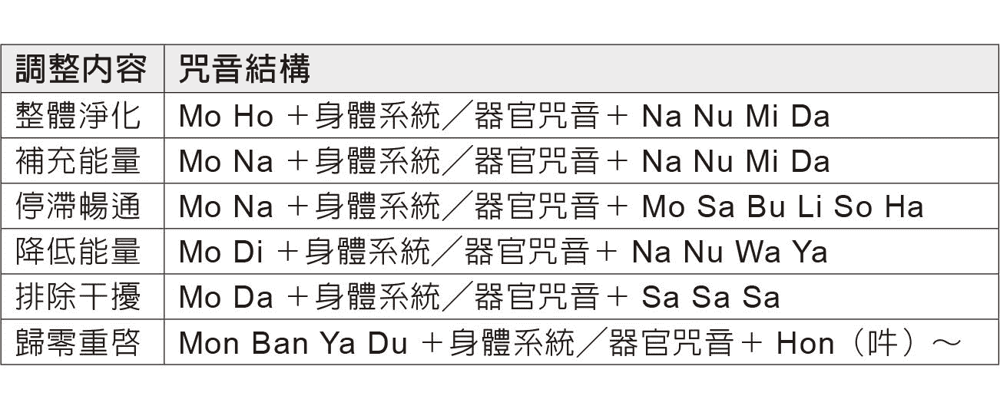

此外，你还可以使用上面那张表格列出的不同调整功能的咒音结构，进行光波导入的路径引导。

不妨练习去体验每一个身体系统在不同咒音结构下能量流动的感觉，让自己的意识与光的世界的音频产生更紧密的交流。渐渐地，你们会产出属于自己的创造性想法，帮助改造地球环境，并恢复自己身体的智能。

 念诵身体系统咒音，观察精微体的变化

身体是由数个不同的小卫星系统合作组成的宇宙，身体的细胞和组织系统很容易受到环境影响而无法正常运作，因此必须不断进行全面性的调整，使身体组织中的化学和物理环境可以保持稳定平衡。

以下提供自我检视和观察身体各系统的参考。当你持念身体系统咒音，亦即光波导入身体意识场的瞬间，可以用你的内在之眼去观察身体系统如何回应宇宙光的能量，进入身体意识中去了解你的灵魂在地球维度赖以为生的身体载具目前的状态，觉察自己是否仍有尚待平衡的情绪或印记。

以下这些练习可以帮助你全身的能量系统和星光体顺利接轨，需要你带着自己，有耐心地去完成。

一、神经系统（Yi Ba Ya）

★念诵：Mo Ho Yi Ba Ya Na Nu Mi Da（Mo Ho＋神经系统咒音＋Na Nu Mi Da）

生物体

这是肉身胚胎成形后最先发育的系统。脑部是人类创造与想像力的起源地，经由嵴髓和神经分支输出运动的讯号，指挥全身进行活动。脑会从身体内外接收感官信息，每分每秒都和身体的内分泌腺体协作，进行不在人类意识认知范围内的活动，进而监控和维护身体所有的系统。

组成结构

．脑

．嵴髓

．末梢神经

．感觉器官

（参考：《人体百科》，史蒂夫．帕克着。接下来十一个系统的组成结构亦同样参考《人体百科》一书。）

精微体

神经系统扮演讯息传导的角色，当意识进入星光体时，神经系统就是星光体和太阳校准的轴心，如果身体中的神经系统传导线路发生问题，星光体会失去自动校准太阳的能力，而失去太阳光的能量，物质身体会逐渐产生神经病变或精神疾病。若使用化学药物调整物质身体的细胞组织，也只会抑制传导功能，这会导致神经传导变慢或根本不再发挥作用，虽然不至于造成星光体关闭，仍会因星光体无法自动校准宇宙中央大日，产生意识游离漂浮状态，然后你们会称这些人患有思觉失调症或精神疾病。

调整神经系统的精微体，使其重新和宇宙中央轴心校准之后，肉体上的病症就会逐渐消失。星光体是意识的源头，而肉体只能反映身体在整体宇宙场域的最终显化结果，反映身体是平衡或失衡。

一个失去肉身的灵魂意识，最终要回到灵性源头，仍须透过星光体的神经系统引导，才能回归宇宙本源。所以，神经系统是人类灵魂意识的关键ＧＰＳ，扮演人与天地之间链接的主干。

神经系统也是将光灌注到身体中轴最快速的入口。宇宙能量会从你脑部中央松果体的端点开始，进入你身体的中枢神经系统，在全身创建起光的回路，透过神经系统传递宇宙光的讯息，进入全身的系统和感知器官。

练习：身体系统沟通法

念诵神经系统咒音，可以同步检视身上的通讯连线是否畅通。若你在念神经系统咒语的过程中感受不到全身的电路接通，甚至有阻塞的停滞感，就需要进入阻塞点去进一步理解阻塞的原因为何。

你可以将意识投射到卡住或不流动的身体位置，问自己三个问题：

1.这里无法流动的原因是什么？是否可以让我看见？

2.我该如何修正或改变，才能让它恢复流动？

3.我的认知如下（请描述一遍）。现在是否可以恢复流动？

若仍无法流动，请回到第一个问题，看看是否有其他原因尚未被看见和理解。

神经系统的起始点是松果体，最终站是膀胱，完成神经系统的能量传导后，你会在膀胱位置感受到舒服的无压迫感。整个系统的传导不用十秒钟就可以完成，请多多练习。这是身体最重要的电路系统，如须用内在之眼和身体系统沟通，可以辅助念诵身体沟通咒，加强意识的引导。

★身体沟通咒：Om～＋身体系统咒音＋Don Mei So Ha

以神经系统为例，其身体沟通咒为：Om～Yi Ba Ya Don Mei So Ha

二、内分泌系统（Si U Ba）

★念诵：Mo Ho Si U Ba Na Nu Mi Da（Mo Ho＋内分泌系统咒音＋Na Nu Mi Da）

生物体

内分泌与神经系统有着密切的合作关系，内分泌系统负责分泌激素，透过血液和体液传递到全身，让各器官持续运作并协助体内环境维持最理想的状态。内分泌同时也支配成长过程的重要发展，如发育、青春期的器官成长及生殖活动。

组成结构

．脑下垂体

．下视丘

．甲状腺

．胸腺

．心脏

．肠胃道

．胰脏

．肾上腺

．卵巢

．睾丸

精微体

内分泌系统分泌的激素可以激化身体器官和组织细胞成长，并有效地让全身器官相互协调与融合，以创造最理想的身体环境。然而，内分泌系统也是最容易受到外界环境的刺激，而直接影响情绪体的振动。

所以，当身体处于平静、自在且放松的状态时，内分泌系统就不会被过度刺激，会保持在能量流稳定和谐的状态，尤其是处于成长期的孩子，需要提供他们一个安全宁静的环境，这对孩童的发育非常重要。若在幼儿成长期接收到环境噪音和过度的声光刺激，会让内分泌系统因过度刺激分泌太多激素，而过多的激素会干扰身体系统的和谐运行，对孩童的身心发育有不良的影响。

练习与身体器官沟通

（我运用前面提到的“身体系统沟通法”自我检视后，发现自己需要与内分泌系统的甲状腺沟通，便念诵起始询问咒“Om，甲状腺，Don Mei So Ha”，祈请甲状腺临在。）

请问甲状腺，你为什么一直肿肿的，都消不下去？我要如何才能让你回复原本的状态？

你念小学的时候有一次被同学欺负，感到非常沮丧，而导致这里的细胞纠结。那件事的根本原因还没有被你理解，所以这股纠结的能量仍存在，无法释放。

喔～小学啊？那么你可以帮助我看见那个事件吗？我真的想不起来。

好，我带你回到那时的场景。

我看到国小一年级某一天的回家路上，我突然无意识地走上一个泥泞的土堆，结果双脚都陷在软泥中，鞋子、白袜子都脏了。我当时感到非常困窘，也不知道该如何脱困，心里好伤心、好难过，担心回到家被妈妈责骂，羞耻、委屈、愤怒、无力、恐惧、孤独和受伤等等错综复杂的情绪全部涌上来。我当时还那么小，不知道如何面对自己内心涌上的这么多复杂的情绪。后来我终于挣脱泥巴堆，面对其他小朋友和路人异样的眼光，我当场嚎啕大哭，一路哭着走回家。

现在看见这一幕，我可以理解当时一个那么小的孩子怎么可能一下子承受得了这些复杂的情绪，难怪我故意将这个事件从记忆中抹去。

你现在必须再去看见当时你为何会走上那个小土堆。

咦？对喔，我为何走上那个泥土堆？我完全不知道。是恍神了吗？不太可能啊，我当时到底在想些什么？

你可以回到学校看看那一天发生了什么事情。

喔！我看见我跟老师打小报告，让同学被老师处罚，因为我内在有很深沉的“竞争”意图，以为只有靠竞争才能赢，也才可以出类拔萃，获得老师和同学的注意。在同学眼中，我是个霸道、无情的风纪股长，他们都很怕我，但在我面前都故意不表现出来，只在背后说我坏话，希望看见我跌倒，所以总有一些顽皮的同学在我背后指指点点，想要捉弄我。我心里明白，但不想和这些人为伍，那一天放学，我讨厌的那些同学就故意走在我后面，我试图和他们走不一样的路，就误入泥巴堆，动弹不得了。

你现在回头去看看那个“竞争”意识是如何来到这个小女孩身上的。才六岁的小女孩就有这么强烈的竞争想法，你有看见是从何而来吗？

啊！那是早已镶嵌在我灵魂ＤＮＡ中的一股尚未释放的意图，也是我此生必须再次去学习和体验的课题。嗯……那是源自……天啊，亚特兰提斯时期！那么遥远以前！当时，“竞争”是抵御外来入侵唯一的途径，我在那个时期经历了许多战役。什么？还有……

我看见所有族人都因此牺牲，仇恨深深刻印在离去的灵魂心中，难怪地球人类一世又一世不断在竞争中求生存。我们经历了野蛮的竞争时期，一直延续到现在，从经济、政治，甚至学校教育、社会菁英主义，竞争早已镶嵌在所有人类的灵魂ＤＮＡ中，世世代代延续至今。所以，我看见的身体印记，不只是我自己的，也是所有人类共同的灵魂印记。

过去这几个世纪，人类都在重复学习如何摆脱竞争造成的苦难。我们必须和自己、他人，以及所有人类和解，才能彻底摆脱竞争带给地球母亲和所有人类心灵上的迫害。

我现在看到这里，你是否可以给我一个建议，让我知道该如何救赎或释放深埋在所有人类内在，让我们不得不去竞争的恐惧？

你们必须臣服与忏悔，若无法臣服于爱，给自己无条件的爱，人类就无法脱离这个难题，会一直重复体验。你那么小就经历竞争带给你的一连串复杂的负面情绪，那就是来提示你：“这回你可以尝试给自己一个不同以往的体验。”但能够觉醒去提醒自己的人太少，所以人类创造出捆绑着自己重复竞争的生活模式，在社会中创造出更多竞争架构。竞争已经深植到每一个孩子幼小的心灵中，打从孩子出生，在家里、学校，乃至进入社会，竞争都如影随形，不只存在人类的内在意识，也处处彰显在物质显化后的社会阶层中。当人类无法挣脱竞争，就只能不断地向地球母亲需索，以满足人类集体无限扩大的竞争想法。

人类必须重新学习用爱来生活，以爱的能量和他人及这个世界交流，用爱来创造生命的体验。当人类可以如此转变，你们才能带着自己和其他所有人脱离地球现状，扬升进入银河星际联盟。

我知道你现在很气馁，觉得理想和现实似乎有段很大的距离。不用担心，你们总会走进该进入的领空。地球已经逐渐轻盈，正因如此，你才会开始和自己的细胞对话了，不是吗？

今天很高兴与你深入长谈。我们一直为了人类的身体健康保持待命状态，你可以跟每个器官和身体系统对话，然后就会明白，我们是为了让你再次回到爱而来的生命体，我们也有自己的意识。很荣幸可以与你交流，我爱你。

谢谢你，我也爱你。在这次和自己身体系统的沟通中，我万万没想到居然可以将光导入内分泌系统，看见自己身上依然存在着人类自古至今共同创造的集体业力的印记。

三、呼吸系统（Mo Du）

★念诵：Mo Ho Mo Du Na Nu Mi Da（Mo Ho＋呼吸系统咒音＋Na Nu Mi Da）

生物体

人体的呼吸道将空气带入并带出肺脏，气体可以在肺脏深处交换。肺脏的形状如同一棵倒置的树，树干为气管，肺动脉和动脉形成相应的网络，将身体中的二氧化碳废气排出，吸入空气中的氧气，肺脏中有超过五亿颗肺泡供作气体交换使用。此外，人体的发声也需要透过肺脏送出空气、穿过声带，而产生声音，若声带流动的气体足够，声带的张力愈大，产生的音频就愈高。

组成结构

．鼻子和颅骨的气体信道

．鼻咽

．喉咙

．气管

．肺脏

．支气管

．横膈膜

精微体

人类的身体不会储存氧气，还会产生废气二氧化碳，因此必须透过呼吸系统不间断地补给氧气，同时排出身体的废气。人的身体细胞若受到环境或负面情绪干扰，身体通常会不由自主地戒备，以降低与外界的互动，呼吸系统会因此自动降低气体的交换，进入肺部的空气含氧量会不足，这同时会阻隔身体意识和宇宙意识之间的能量流动。

当你念诵呼吸系统咒音，以意识进行呼吸系统的光波导入时，你的身体会打开阻塞和封闭的宇宙能量交换阀门。这时，你吸入的氧气会带有更高的品质，更多氧气进入你的呼吸系统，全身血液的含氧量瞬间饱满，你的精神体得以立即补充宇宙能量。

人类的身体宇宙意识也需要经由呼吸系统和宇宙能量进行交换，才能扩展身体精微体的能量场，若这个交换阀门封闭或无法让能量顺畅流动，人类等于被阻隔在宇宙意识的大门外，失去与更高意识场的链接。而要让自己的身体维持在足以和宇宙意识能量顺畅交流的状态，最简单的方法就是去观照自己的呼吸系统。

练习：咒音引导

1.检视现况

念诵：Mo Ho Mo Du Na Nu Mi Da

念诵完毕，呼吸的深度和气体质量通常都会有明显的不同。若你念诵完毕后无法扩展呼吸深度或感觉不到更清新的气体，就需要进行接下来的两个步骤。

2.排除干扰

念诵：Mo Da Mo Du Sa Sa Sa

念完后，你的身体会呼出更长的气，一直排放，甚至可以闭气更久，距离下一次吸气的间隔时间自动变长。这是彻底排除肺部干扰能量的光波引导，完成后，进行下一个步骤：重启。

3.归零重启能量

念诵：Mon Ban Ya Du Mo Du Hon！

念完后，肺脏会自动大口吸气，用鼻吸气，再从嘴巴用力快速吐出。可以连续进行三次，完成能量启动。

完成步骤２、３的重启过程后，回到步骤１，检视呼吸系统是否已经可以自动和宇宙意识链接和接轨。

四、消化系统（Ha Wa Lu Di）

★念诵：Mo Ho Ha Wa Lu Di Na Nu Mi Da（Mo Ho＋消化系统咒音＋Na Nu Mi Da）

生物体

消化道始于口，止于肛门系统，中间有许多管道，口径大小不一、功能各异。消化道帮助将食物切断、嚼碎、储存、消化、排废，并将养分交给肝脏，对营养素做最好的处理和利用。因此，消化功能有赖身体各大系统，包含免疫系统、神经系统、内分泌系统等共同维持，而情绪、思想和信念也会影响消化系统的正常运作功能。

组成结构

．口、齿、舌、咽

．腮腺、唾液腺

．喉咙

．食道

．胃

．胰脏

．肝脏

．胆囊

．小肠、十二指肠、空肠、回肠

．大肠、结肠、阑尾、直肠

．肛门

精微体

消化系统在身体能量的运行上扮演吸收和转化生物能的角色，也是辅助人类生物体能量供应的重要来源。消化系统也是最容易被人类自主意识影响的系统，人体的主要感官体，包含嗅觉和味觉，以及透过大脑传送的思想和信念等，都会在食物尚未进入食道前开始影响人体的消化系统，而这些都会决定身体可以真正吸收到的食物能量品质，例如在观赏美食的瞬间，人体已经和食物产生能量的共振，也会启动身体的精微体系统。若平日可以更有意识地觉察自己的身体和食物共振的能量变化，对消化系统会有很大的助益，你会避免摄取不健康，或是会造成身体消化系统过度负荷以致无法正常运行的食物。

现今的食物生产、制造、运输和储存方法，多是为了增加经济效益，例如大量繁殖的养殖业、以非人道方式豢养的畜牧业、大量基因改造的饲料和农作物、以化学添加物加工和储存的食品等。人类当今的生活型态阻断了自己摄取健康食物的管道和选择，因此，要恢复消化系统本有的身体智能，必须从改变生活和饮食习惯开始，才有机会影响上游，反转人类食物供应链的整体结构。

使用光波净化消化系统，对唤醒身体感官的味觉和嗅觉有立即的帮助；但若要让消化道意识觉醒，改变摄取食物的来源，则必须提升人类的集体意识，才能有效制定更适合人类摄取生物能量的新规范。

练习：传感眼前食物的能量

1.唾液侦测

念诵“Mo Ho Ha Wa Lu Di Na Nu Mi Da”＋以意识锚定眼前的食物。

若唾液增加，代表这样食物很容易被摄取并转化成身体可以吸收的能量。

若唾液没有回应、没有分泌，代表消化系统必须耗费比这样食物本身更多的能量才能转化它，食用这样食物反而会让身体精微体的能量不增反降。

2.呼吸侦测

我个人（Rachel）常常使用的是呼吸侦测法，直接感知面前的食物。若让我的呼吸更深、更扩展，代表身体愿意与这样食物共振；若呼吸变浅，即使看起来色香味俱全，我也会尽量避免食用。

五、生殖系统（Na U Ba Le）

★念诵：Mo Ho Na U Ba Le Na Nu Mi Da（Mo Ho＋生殖系统咒音＋Na Nu Mi Da）

生物体

生殖系统有别于其他系统，在男性和女性体内呈现的构造差异甚大，并且只在生命的某一阶段有作用，移除它也不会危及生命。从生物体的角度来看，这是人类自我复制、性交和养育的基本动力来源。

组成结构

女性：

．乳房

．阴道

．外生殖器

．子宫

．卵巢

．输卵管

男性：

．睾丸

．阴茎

．尿道

．精囊

．输精管

精微体

生殖系统是你们星光体的外挂系统。人类生活在地球上，目前仍需要透过两性结合的方式繁衍，才能延续生命体。虽然许多外星文明已经可以自体繁衍，或是完全不必仰赖生物体就可以进行灵魂体验，然而现今的地球由于灵魂意识尚未觉醒，为了避免因无性生殖造成更严重的地球环境破坏，宇宙在进行行星体验计划时，为人类设计了这个外挂系统，透过两性之间的交流，去体验阴与阳的分别。你们在这个过程中会明白阳中有阴、阴中有阳的道理，每个人的原始生命都是阴阳具足的，透过有意识地阴阳交融，回到合一的意识。

在星光体层，生殖系统扮演新灵魂意识催生者的角色，人类也必须经历死亡和再生的过程，取得另一趟灵魂体验的车票和机会。人类透过生命繁衍辅助彼此的灵魂进化和成长，但其实你们还无法理解，在星光体的世界，人类的新生命是被赋予的。当你看见一个男人和一个女人结合产下新生儿，你以为这个生命是他的父母创造出来的，其实你们无法看见，在星光体的世界，那非肉身存在的灵魂意识是被允许赋予到这个新生物体的胚胎中，才能成功制造出一个具有灵性意识的新生命。

当一名女性内在的阳性能量过强时，就需要另一名内在阴性能量较旺盛的男性来平衡，才能创造出一个适合新意识诞生的环境；反之亦然，一名阴性能量旺盛的女性需要与阳性能量较强的男性结合，才能创造阴阳和合之境。

讲到这里我突然想起，之前有提过是灵魂选择了自己的父母，那么，若一对夫妻的阴阳不协调，是否就无法进入新灵魂选择父母的清单内，也就无法有孩子？

当灵魂决定再次投生到地球去体验时，他的一部分意识会进入已经顺利在母体中形成的受精卵中等待。因此，在成功结合出受精卵前，灵魂是无法做选择的，要先有受精卵形成，才会进行父母的配对选择。

看来我这个问题本身就很蠢。现代已经有很多生殖技术，可以用别人的卵或精子创造出一个受精卵；也就是说，即使是阴阳不协调的父母，甚至是单身人士，也可以透过许多方式和途径去体验、去允许自己有孩子，我白问了。

好吧，至少可以确认，已经成功结合的受精卵一定会有一个新灵魂意识体进驻。那么，有没有可能快要临盆了，还没有灵魂意识愿意选择这对父母？

有可能，那是因为条件不符合灵魂成长的需要，而这也可能造成这个受精卵无法顺利在母体内成长，或顺利诞生下来。

有没有可能出现两个不同的灵魂同时争抢同一父母的受精卵的情况？

有的，确实会发生，但也会有相应的宇宙法则去排解这样的纷争。

这让我有点吃惊。看来人身难得，真实不虚。那么，宇宙意识如何看待人类的堕胎行为？

如果在受精卵尚未有新灵魂意识进驻之前就放弃怀孕，这是人类的自由意志，如同你觉得指甲或头发太长要剪掉一样；但如果已经有灵魂意识进驻，这个新灵魂意识入胎后又失去生命成长的机会时，就会再去寻找条件类似的父母投生。然而，因为可能一时找不到，所以在找到适合的父母之前，这个灵魂意识体会暂时停留在他刚选择的这对父母身边，直到他们再度成功创造另一个受精卵，或是有条件吻合的另一个母体的受精卵出现，这个意识就会重新入胎，等待出生。

有一个很多人关心的道德议题：如果这个意识一再被父母抛弃，是否会有灵魂业力或惩罚的问题？

这个问题，你自己应该早就可以回答了。宇宙没有所谓的灵魂惩罚，一切都是自由的选择。你可以选择要不要有孩子，即使有了，在孩子出生前，你也可以反悔，不继续让已经成熟的胎儿出生。这一切都被宇宙无条件地支持和应允。然而，惩罚会来自你自己、你的家庭、对方的家庭、部落约定俗成的规矩，乃至国家和社会集体意识订定的规范。

不过，人类总是会想尽办法超越身体的限制，自行创造新生命。大量的ＡＩ类人类生命体会被创造出来，以满足人类生活层面的各种需求，而高次元的存有会密切监控人类的ＡＩ发展方向，以免危及地球文明的发展。

（后记：这段问答，可能因为是和天狼星的雷巴特交流的关系，整个过程是在没有情绪体的状态下谈论人类最重视的人生大事，感觉自己在和机器人对谈。所以，我就此打住，不然我的情绪体可能会受不住。）

练习：光波导入生殖系统

念诵“Mo Ho Na U Ba Le Na Nu Mi Da”，净化后，再念诵“Mo Na Na U Ba Le Na Nu Mi Da”，补充能量。

由于环境的干扰和压力，许多人失去生殖的意愿，或是过度沉溺于性享乐，想要填补内心的黑洞。现在将光波导入生殖系统，可以帮助处于生殖成熟期的男女回复原本就被赋予的生殖意愿和动力，带给细胞活力和充沛的能量。至于已经迈入更年期的男女，也可以借助生殖系统的光波导入，减缓细胞老化，以光波导入男女性征所需的荷尔蒙和生命激素，透过星光体的意识源头，取得源源不断的光和能量的补充。

现在人接触到的环境污染物太多、压力过大，念此咒可以让身体的阴阳能量保持平衡协调的状态，增加受孕的机会。此外，生殖系统也可以让人体的物理结构（骨胳）不容易衰退、老化。

六、循环系统（Su La）

★念诵：Mo Ho Su La Na Nu Mi Da（Mo Ho＋循环系统咒音＋Na Nu Mi Da）

生物体

循环系统又称为心血管系统，将血液送至全身各处，不仅能供应身体组织和所有器官充分的血氧，血液离开时也会一并带走该部位的老废物质。经由循环系统运送的，包含养分、激素，以及免疫细胞。

组成结构

．心脏

．血液

．主要血管（动脉和静脉）

．次要血管（小动脉和小静脉）

．微血管（毛细血管）

精微体

循环系统掌管全身血液的运行，是身体水元素的重要传输网络。它链接你的心轮向上到达顶轮，再往下延伸扩及整个身体场域需要的能量节点。

循环系统是人体生命能的核心发动机，当你念诵净化循环系统的咒音时，会感受到全身血液流动速度加快，不够畅通的动脉和微血管会同时获得加强能量灌注后的疏通效果。多念诵净化循环系统咒，冬天可以感受到温暖，夏天则能协助排汗。

★净化循环系统咒：Mo Ho Su La Na Nu Mi Da

练习：光波导入循环系统

水元素是身体最重要的元素，其流动顺畅可以帮助身体场域获得最佳的生命能量补充。此外，透过将光波导入循环系统，可以直接帮助身体回复初始的生命能量设定值。

以双手量测：

1.将自己或要量测的对象投射到自己前方。

2.用意识进入自己的内在宇宙，默念：Su La＋量测对象（或自己）的名字＋目前的生命能量值。

也可以侦测其初始设定能量→默念：Su La＋量测对象（或自己）的名字＋初始设定生命能量值。

3.双手此时会自动展现量测后的生命能量大小。双手距离愈宽，表示生命能量值愈大，反之则愈小。

4.若量测到的生命能量值远低于初始设定的生命能量值，可以默念补充或扩大生命能的咒语。一面念诵，双手同时会自动向外扩展，回复到原始设定范围。

★扩大生命能的咒语：人名＋Mo Na Su La Na Nu Mi Da

在念诵扩大生命能咒语的过程中，如果双手的距离没有变大，可能是器官已经严重受损，必须重启生命能量，然后再进行一次增加生命能的设定。

★重启生命能的咒语：人名＋Mon Ban Ya Du Su La Hon！

请注意，虽然可以透过链接对方的场域立即补充或重启生命能，仍然必须在对方有意愿并同意的情况下进行。

（后记：对我来说，循环系统净化咒语在健身房颇为好用。过去走跑步机，可能顶多快走三十分钟就开始喘了，但自从使用扩大生命能的咒语后，走三十分钟就喘气的情况完全消失。从健身的过程就可以发现，这对我个人确实有用。）

七、泌尿系统（Duet Lu Gan Ba Su）

★念诵：Mo Ho Duet Lu Gan Ba Su Na Nu Mi Da（Mo Ho＋泌尿系统咒音＋Na Nu Mi Da）

生物体

尿液是由肾脏制造，可以将血液中的老废物质和多余的东西排出，以维持体内水分、体液、盐分和矿物质的平衡。尿液受各种激素控制，也受到血流量、血压、摄入的水分和养分、体液流失量、外在环境温度及生理周期影响。

组成结构

．肾脏

．输尿管

．膀胱

．尿道

精微体

泌尿系统掌管你身体宇宙水元素的排出，不光是将体内多余的体液和水分过滤后排放出来，它同时也能释放情绪体的垃圾。一些你紧抓着不放的恐惧，小至看见一只蟑螂时的惊吓，大到你潜意识中对生命无来由的畏惧和不安全感，都会影响你泌尿系统的处理效能。

这些无法被你消化的情绪体会经由神经系统传送身体激素讯息，以给予身体最实时的补位。当你下意识紧张、恐慌或心情紧绷时，你的泌尿系统就是身体意识的调节阀，此时你的尿液中会含有大量的氮和氨基酸；而当你处于平静安适的状态，尿液的组成就会很平衡。

所以，人类的泌尿系统反映出神经系统的整体结果，也是平衡神经系统的镜像组成。你们可以从平日尿液排出的频率、多寡和杂质成分，看见自己的神经系统是否健康。

观察排尿状况

一、颜色观察

早晨起床排出的第一泡尿液的颜色，可以显示身体的整体状态。

．色深偏黄：代表身体的热能超出你所需，这时会感到身体沉重、湿热、火气大。可以吃一些寒凉性的食物来调节。

．颜色偏淡：肾脏的运作效能降低，必须补充肾气。可以将双手掌心贴放在腰后方肾脏的位置，使用光的疗愈法引导光进入身体。透过双手链接肾脏，导入能量，有助于快速提升肾脏的活力。

练习：为自己的肾脏补气

1.双手掌心贴放在腰后方肾脏的位置。

2.将意识从肾脏位置带入自己的心轮，与之合一。

3.祈请光临在，让光从你的顶轮流入。

祈祷文：

“喔，圣灵啊！请帮助我清理和稳定光的管道，为了与我链接的人的福祉，将祢无条件的光和爱赐予我〔名字〕。

“我现在已经成为光的管道，让光前行。”

4.让光持续从你的顶轮向下流动，直到你的肾脏部位回复到放松与畅通的感受。

5.感谢光的圣灵和地球母亲帮助你为肾脏补气。

另一种方式，是持念补强泌尿系统能量的咒语：

Mo Na Duet Lu Gan Ba Su Na Nu Mi Da

二、频率及尿量观察

若尿液排放量少，排放频率却过高，就和神经紧绷有直接关系。适度放松、改变太忙碌的生活节奏、多亲近大自然，放松神经系统后，排尿量和频率就会渐渐恢复正常。

若不改善生活习惯，以降低神经系统的紧绷，反而刻意增加或减少水分的摄取，进行过犹不及的调节，只会适得其反。

八、免疫系统（Tu Ka Mo）

★念诵：Mo Ho Tu Ka Mo Na Nu Mi Da（Mo Ho＋免疫系统咒音＋Na Nu Mi Da）

生物体

免疫系统是身体的防护系统，包含物理性、细胞性和化学性的防御，彼此交互作用，是非常精密的身体自卫队。遇到传染病或身体器官功能失常时，会产生抵抗力，帮助人体存活。

组成结构

．白血球

．抗体

．脾脏

．扁桃腺

．胸腺

．淋巴液

精微体

这是生命在地球的防御系统，也是非常重要的生命能量保护装置。当免疫系统无法保护生命能量时，就会造成能量的减损，必须经过维修，才能让生命能量重新正常运行。念诵“免疫系统”这个单元一开始提到的咒语，可以快速检视全身上下的防御关卡是否仍在正常运作。

这些能量防御关卡遍布全身，所以你很不容易感知到能量的流动，因为当你念诵咒音时，是整个免疫系统同步照亮，而不是依序经过一个个防御节点。全身上下所有防御节点的讯息回收到太阳神经丛，靠近胸腺下方的区域，若念完咒此处觉得光明、舒服，代表免疫系统功能健全；若此处仍晦暗不明，甚至有疼痛、郁闷或不舒服的感觉，就必须常念此咒，净化全身的免疫功能。

练习：潜意识暗示法

深呼吸，进入内在意识，念诵咒音，直到身体感受到能量注入为止。静心感受这股能量在全身的运行是否顺畅。

免疫系统能量流动不足的原因，是内在不信任自己的生命本有的智慧，企图以小我的意志干预生命能量的自主性，就会造成免疫系统能量流的混乱。这通常也会发生在不信任自己，对周遭环境充满怀疑和担忧时。要让生命能量回归自主流动，就要信任自己的生命本有的智慧，不干预、不扰乱生命能量的流动，才能让免疫系统发挥应有的功能。

若发现自己身上的这股能量流动不顺畅或变得微弱，可以向潜意识做自我暗示：

“我是安全的，我没有问题。我信任自己，并愿意交付自己给存在更高意识维度的集体智慧。”

九、肌肉系统（Mo Ru）

★念诵：Mo Ho Mo Ru Na Nu Mi Da（Mo Ho＋肌肉系统咒音＋Na Nu Mi Da）

生物体

肌肉和骨胳密切合作，才能做出强而有力或复杂精细的动作。不随意肌多数会自动工作，控制身体内部的作业程序，如血液的配给和消化作用。肌肉必须由神经来指挥，并需要血液供应氧气。

组成结构

．骨胳肌

．平滑肌

．心肌

．肌腱

精微体

肌肉系统和呼吸系统交互作用，你很难想像这两者之间的互动关系。人类身体骨胳结构旁最重要的牵引带动力量是肌肉，经由你的意识带动这部分的肌肉，让身体可以自主移动；另一部分则是你的自主意识无法牵动的，也就是分布于体内器官器壁上的平滑肌，这部分肌肉的能量供应来源，就是由呼吸系统输入氧气到血液中，帮助这些平滑肌进行自动的伸缩运动。

这部分作业不在你自主意识的范围内，却又紧紧跟随着你的呼吸运动，获取源源不绝的能量补给，所以呼吸系统是肌肉获得能量的源头。你的身体不论内外，都需要肌肉系统帮助维持生物体的日常运行，当你念诵肌肉系统的净化咒语（亦即“肌肉系统”这个单元一开始提到的咒语），最主要是校准和净化你体内器官的平滑肌。念诵此咒时，你可以感受一下体内器官有哪个地方收缩或回应你，这就是器官在回复它应该改善或创造更密切的收缩能量，以创建更协调的作业能力。

当你内在平滑肌的运作畅通无阻时，你的外显肌肉自然能够健康饱满，帮助你的身体顺利地行进、移动，因为外在肌肉的状态就是内在肌肉的反射，而内在肌力是由你与整体宇宙透过呼吸交流顺畅与否决定的。因此，当你的呼吸系统生病或运作不顺畅时，就会让肌肉出现病症，无法发挥正常的行动能力。

练习：净化肌肉系统

念诵肌肉系统净化咒语“Mo Ho Mo Ru Na Nu Mi Da”，意识进入体内器官，感受肌肉紧缩的位置，标记出来。可以将意识带入这些紧缩的位置，深呼吸，加强能量的交换。步骤如下：

1.念诵“Mo Ho Mo Ru Na Nu Mi Da”。

2.侦测体内器官收缩的地方。

3.将意识锚定收缩处，以呼吸导入能量。透过有意识地锚定身体内部肌肉收缩的位置，可以加强补足这部分需要的能量。

4.重复念诵一次“Mo Ho Mo Ru Na Nu Mi Da”，如果感受到原来肌肉紧绷的位置放松了，就结束这一次的肌肉系统净化工作。

如果说，运用光的疗愈，使自己呈现为一个中空的管道，让光自动展开与你身体场域的交流，帮助你的身体场域净化，是刚开始学习创建与光的世界互动交流的信任基石；那现在，透过侦测肌肉系统，进而有意识地运用呼吸导入能量，放松肌肉，就是开始创建自主意识与高维意识沟通的精准度。你可以透过这个练习，让自己与高维意识创建更深、更精准的沟通，以为后续展开共同创造的新互动模式奠定基础。

十、淋巴系统（Du Ti Ya）

★念诵：Mo Ho Du Ti Ya Na Nu Mi Da（Mo Ho＋淋巴系统咒音＋Na Nu Mi Da）

生物体

淋巴系统是免疫系统的一个组成部分，对人体防御疾病有着重要作用。淋巴系统有活性的部分是淋巴液，负责在全身细胞之间四处采集，流入组织间的毛细血管网，毛细血管网又结合成较大的脉管，称为淋巴管；淋巴结则是淋巴系统过滤和储存的部分，沿着淋巴管线路散布全身。淋巴液不像血液透过心脏推动，而是需要借由人体运动时肌肉收缩压迫附近的淋巴管，才能被动地流动。

组成结构

．淋巴球

．淋巴液

．淋巴管

．淋巴窦

．淋巴结

精微体

淋巴系统是Ｔ细胞流通的重要网络，淋巴液可以携带大批Ｔ细胞进入细胞组织中抵御病毒入侵。淋巴系统时时刻刻都在到处巡逻，如同身体的警卫般随时准备抵御病菌入侵或寄居在身体中造成危害。

人们通常无法辨别摄入的食物和空气是否含有重金属或病菌，直到发现自己的淋巴结肿胀发炎，亦即死亡的细胞残留在淋巴结中导致肿胀疼痛，才知道原来身体细胞经历了一场重大战役。

平日就可以进行淋巴系统的侦测和疏通工作，方法如下。

练习：疏通淋巴系统

步骤１：侦测淋巴结

念诵“Mo Ho Du Ti Ya Na Nu Mi Da”，感受一下是否有某个淋巴结的位置出现肿胀痛热等感觉，如果有，就代表该处淋巴结需要疏通；假如念诵此咒时身体没有任何感觉，就表示全身的淋巴管和淋巴结畅通无阻。

身体的八个淋巴结位置分别在：

．耳周前后

．下颚

．颈侧

．锁骨

．腋下

．腹腔

．鼠蹊

．膝后窝

步骤２：停滞畅通

如果侦测到某个淋巴结有肿胀痛热等感受，就需要进一步疏通。

将意识锚定该淋巴结的位置，念诵畅通淋巴结的咒语“Mo Na Du Ti Ya Mo Sa Bu Li So Ha”。持续进行十四日，观察淋巴结肿胀的状况有没有消除，同时还须重新审视经常或惯性摄食的食品是否含有重金属或人工添加剂，或者生活环境中是否有污染源，如果有，就要同步调整和改善。

十一、骨胳系统（Lu Na）

★念诵：Mo Ho Lu Na Na Nu Mi Da（Mo Ho＋骨胳系统咒音＋Na Nu Mi Da）

生物体

骨胳系统是支撑整个身体、使其具移动力的坚实架构，系统中的骨头有杠杆和锚定板的功能。骨胳也为人体其他系统工作，比如骨胳内层富含脂肪的组织（红骨髓），是孕育血球的地方。此外，当身体出现矿物质短缺状况时，如为了保持神经机能正常而需要钙离子，会从骨头中抽取。

组成结构

．颅骨

．嵴柱（中轴骨）

．肋骨

．四肢骨

．肩膀

．臀部

．软骨

．韧带

精微体

骨胳系统是在胚胎时期就已经形成的生命框架，这个生命基本架构决定了身体其他细胞、器官和组织最终会长成的样貌。骨胳系统就是阴阳融合之后创造的生命果实，若阴阳无法融合，没办法具体成就一个新的生命体。

骨胳系统也是你内在宇宙阴阳平衡的大指标，这个平衡来自你内在宇宙阴性和阳性能量相互共振、交换，最终融合、合一的过程。一个新生儿的骨胳是柔软的，那是阴阳能量显化出物质架构的起点；接着，在生命成长过程中，骨胳会不断晶化，最终在青年时期定型。这段时期生命的主体架构，都是源自ＤＮＡ的初始设定。

而当你从青年继续前进到老年，你身体骨干的转变就跟你内在阴性和阳性能量的互动有关了。一副阴阳调和的骨干可以维持在青年的样貌，不会改变太大；若你发现自己的身躯愈来愈不平衡，就需要重新校准。

使用“Lu Na”这个咒音，就是在校准身体中的阴性和阳性能量，进行重组、平衡。

观察骨胳系统呈现的外显架构状态，就可以明白自己身体场域中的阴阳能量是否平衡。

当一个生命架构不断受到环境或情绪体震荡波击时，骨胳会出现左右边倾斜的不平衡现象；若倾斜到一定程度，进一步造成麻、酸、肿、痛等现象，身体不同的能量出入口就会出现疼痛状况。

．海底轮阴阳不平衡→有关生存、性与安全感的议题→对应骨盆腔、髋骨、下肢

．脐轮阴阳不平衡→有关情绪无法消化和流动的议题→对应腰椎骨（L1～L5）

．太阳神经丛阴阳不平衡→有关创造和行动力的议题→对应肋骨和胸椎骨下部（T7～T12）

．心轮阴阳不平衡→关于爱的议题→对应肩膀、胸椎骨上部（T1～T6）、肩胛骨、上手臂

．喉轮阴阳不平衡→关于诚实表达沟通的议题→对应颈椎骨（C1～C7）、下颚骨、舌骨、锁骨

可以观察自己身体骨胳有哪个地方明显疼痛，用意识锚定该位置来调整。

若观察不出来，也可以使用净化骨胳的咒音，平衡整体的阴阳能量流，使其趋于和谐。

★净化骨胳系统咒：Mo Ho Lu Na Na Nu Mi Da

此外，还要进入内在意识的源头，去看见有一些阻碍和议题显化在身体骨胳的相对应位置，必须去清理和理解，才能重新让阴阳能量平衡。

身体的平衡与你如何给予／付出、如何吸收／接纳息息相关。你是自身健康的因，亦是果，健康的身体就是你满足并平衡自身意识所创造的一切能量流动的结果。

十二、皮肤／毛发／指甲系统（La Li Toe）

★念诵：Mo Ho La Li Toe Na Nu Mi Da（Mo Ho＋表皮系统咒音＋Na Nu Mi Da）

生物体

皮肤、毛发和指甲是身体最外层的保护构造，统称为表皮系统，是用来抵御物理性伤害，以及微生物、辐射能等危害。皮肤有调节身体温度的功能，过热时流汗降温；皮下脂肪层则有保温、储藏能量及减震的作用。

组成结构

．皮肤

．毛发

．指甲

．皮下脂肪层

精微体

皮肤、毛发和指甲系统是最靠近生物体灵魂意识场的边界，也是最终你必须突破和更新生物体的界线。皮肤是你整个身体汰旧换新最快的系统，毛发和指甲次之。你的皮肤表层每天都在脱胎换骨般地重生，而重生的原动力来自你身体集体意识共同协议的结果。

若你的身体反映出来的整体意识振动频率高于前一天，你的表皮层组织会汰旧换新得更快，新生成的皮肤组织充满年轻活力；反之，若你的整体意识振动频率低于前一日，皮肤表层之下就会开始堆积废物，直到皮下组织因废物堆积造成供血量不足，而产生色斑或病变。

所以，你的皮肤、毛发、指甲直接反映你的整体意识状态，意识愈来愈提升，皮肤、毛发和指甲就更新得愈快，显得年轻。然而，提升身体意识场还是要回到循环系统的源头进行能量补充。当血液中的含氧量充足，血液循环顺畅时，整个身体意识场的能量就可以上升；反之，若流经身体器官某个区域的血氧浓度下降或阻塞，你身体意识场的振动频率就会下滑。皮肤组织代谢老化细胞的能力趋缓，毛发和皮肤就会失去光泽。

念诵皮肤、毛发和指甲的净化咒“Mo Ho La Li Toe Na Nu Mi Da”，主要是加强皮肤的代谢和细胞更新能力。

 对应身体各器官的咒音

除了十二大身体系统之外，还可以针对特定器官或组织进行光波导入。接下来分别列出几项调整功能的咒音结构，以及各身体器官和感觉的咒音，同样可以使用前述驱动光的流动法则导入光波（不同调整功能的咒音结构，以及身体各器官和感觉的对应咒音，请见下两页的表格）。

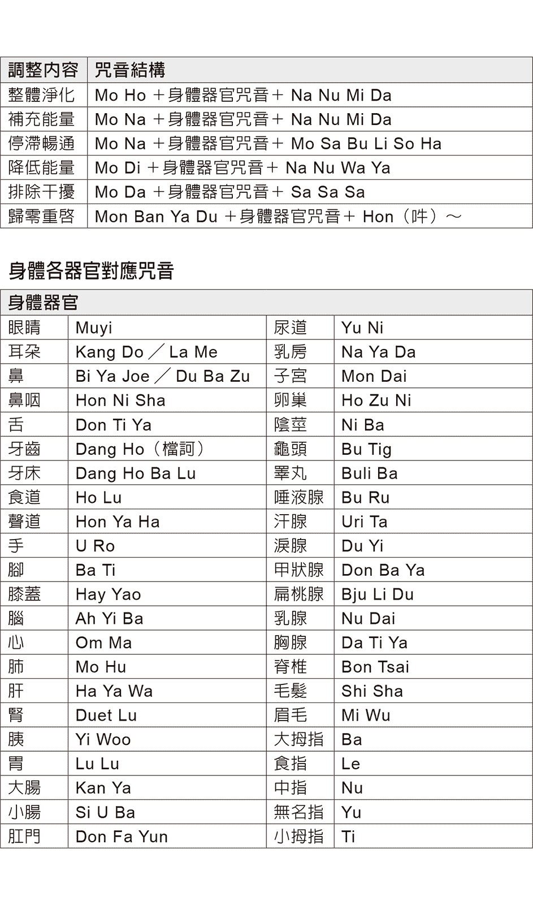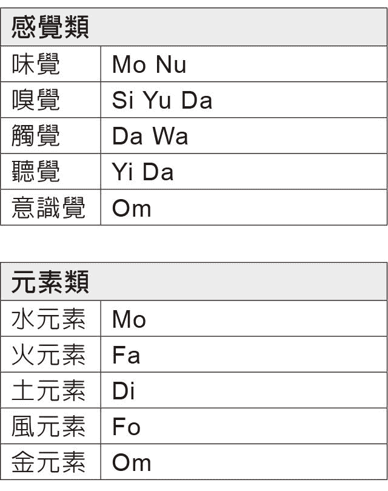

有人声称可以用光的疗法让肿瘤变小或消失，是真的吗？

是真的，但不是对每一个人都有效，疗愈者和被疗愈者之间必须创建最佳的信任与合作关系。这是创建在“信”的基础上，结果是两者共同创造了神迹。

“信”可以产生强大的凝聚力，帮助扭转病患星光体的程序，反转细胞记忆，回复到健康的初始型态。一旦完成星光体的程序，乙太体的感知会立即显化，但这只是针对尚未形成物质态的受损之前的神经传导，若病灶已经深化到物质身体，就无法反转得这么快速，需要六～十二个月的细胞增生汰换期才能做到。你们可以练习经由光的引导完成这个星光体的程序反转，至于如何下载新的程序码，很简单，只要请求你大师的光临在协助就可以了！

一个有力量的疗愈师在星光体层一定具备大胆行动的品质，因此可以轻易疗愈他人的身体。那是因为他有“信”的基础，加上患者相信他可以帮助自己，所以就能展现神迹！

在疗愈光之管道的过程中，有些人会觉得自己身上也沾黏到负面能量，而感到不舒服。在帮助别人时，我们是否会吸附对方的负面能量？

你们要先让自己的场体呈现为中空的光之管道，这样即使在与对方合一的过程中也不会将其负面能量吸附到自己身上。光的反射会帮助合一的能量快速提升到光的世界的振动频率，所有低频的意识与能量会立即转化。

若在尚未创建好自己的光之管道，或是自己身上仍有许多能量黑洞，如恐惧、怀疑、需索时，就与对方身上的能量交缠，你就会将对方的负面能量吸引到自己的身体场域。即使如此也不需要担忧害怕，只要使用净化光之管道的祈祷文（即第七章［身体精微系统的净化与调整］为自己的肾脏补气练习中的祈祷文），清理自己身上的脉轮，就可以转化掉这些不属于你的负面能量。

若你只是用意念搬动对方的能量场，就会让自己比较辛苦。这里再提醒你一次正确做法。

1.先祈请光的世界的大师和导师临在。

2.请大师和导师给予最适合自己或对方当下的状态、可以获得缓解并回复正常状态的光。

3.让光伴随着你的意识前行。

4.无念无想，让光和你合作，帮助净化和疗愈对方的场域。

这样做，你自己就不会觉得累。

这和现在许多灵气疗愈一样吗？

大同小异，只是光的世界的疗愈不须由你们指定特定大师或导师的能量，只需要施作者保持能量管道畅通，以及具备精确的第三眼意识导航即可。你的意识可以到达的精微度和你自身管道畅通的程度，是整个疗程必备的前提；而对方愿意信任你的带领，愿意与你带入的能量共振，则是他能否获得疗愈的关键钥匙。

最终的疗愈结果仍是回到生命的自然法则。在生命法则的大原则、大方向之下，不偏离运行轨道，就能获得全然的疗愈。

我要如何得知对方生命法则目前的大方向和运行轨道？

这无法任由疗愈者／施作者看见，而是由被疗愈者的自由意志和此生的生命契约决定。一个疗愈他人的施作者，必须尊重每一个生命最终的主宰者，也就是每个人自己，任何人或更高次元的神都无法涉入，必须尊重，这也是宇宙运行的大原则赋予每个灵魂最大的自由。生命要去完成自身想要的体验，就是我之前和你说的，真实体验后才能扩展其意识。他在意识扩展的过程中必须亲身去经历、探索未知，得到完整的体验，而疗愈者只能从旁辅助、陪伴，不能强制干预和限制其自由意志。

为了让人们可以提早进入光的世界，我们必须让人类开始创建身体场域在星光体的相对位置的概念，以加速完成人类星光体和宇宙之心校准的工作。

 身体系统在星光体中的相对位置

星光体以你身体中轴的心轮为核心，向外扩散开来，可以简单分为内层与外层：内层是内在意识流动层，外层则是物质显化层。

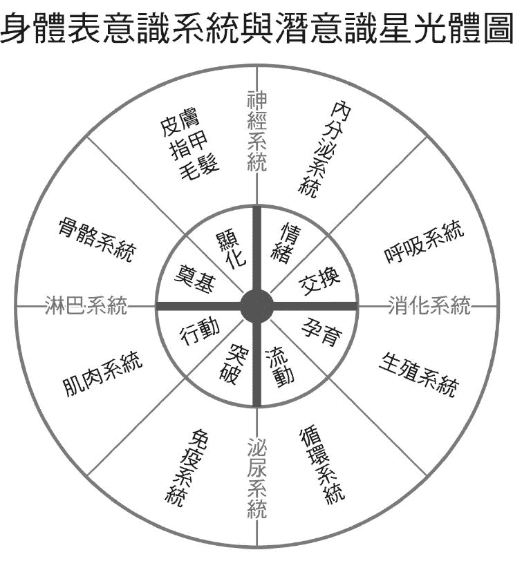

从上图可以看见，神经系统是星光体中轴的起始位置，沿着身体嵴椎向下方延伸，终止于泌尿系统；横轴则从消化系统开始，延伸至淋巴系统，流向大地。

身体中轴与横轴的泌尿和淋巴系统都有水元素的落地点，一开始的意识起源于水元素的位置——神经系统。水元素最终会经由中轴与横轴的排水道，流入宇宙回收。

至于其他身体系统，也都和水元素链接，只不过担任的角色是辅助水元素在身体宇宙中产生生生不息的流动。人体有百分之七十是水分，而人类的医学研究却都专注在只占百分之三十的肉体、骨胳、器官组织上，这是本末倒置。深入理解水元素对身体宇宙，也就是整个身体精微体所在的意识场的重要性，对人类的健康和医疗会有更大的帮助。

之前已经向你说明水代表意识，人体意识场的物质态现象就是水，血液只是组织液中释出的血红素染色造成的，方便你们以肉眼区别身体内部和外部的水。

水从神经系统的传导流进整个身体系统起，就创造出生命在地球的节奏。人体如大自然万物般，经由阳光、空气和水让身体场域获得宇宙能量持续不断的补给。当水流经心脏，进入血管中，人体就如树木般，自动展开生命之树的运行系统。

身体系统水元素自中轴神经系统起，终于泌尿系统，同时与消化和淋巴系统横轴形成星光体的四方基柱，在星光体的内在意识层可以看见水元素运行的动态表现。

水元素以９为循环，创造生生不息的生命体验过程，而情绪体的引爆源头会决定你身体场域的能量流动路径和最终显化出来的结果。人类只从身体去看见星光体的水元素显化出来的外在状态，只从五脏六腑的状态来探讨自己的健康，无视显化出这些物质现象的背后根本原因。这些现象都来自你们的“心”，经由“心”的振动创造出情绪流动后的生命乐章。

人要有健康的身体才能完整灵魂在此生探索和体验的需求，而要怎么做才能维持身体健康？就是要和你的心在一起，用意识去看见自己每一个情绪因子产生的生命流动路线。你若是能从星光体的角度观察自己，而不是透过Ｘ光片去看自己的器官，你就会开始看见身体的光的图像。

前面那张图中，星光体投影出来的外圈身体系统和内圈意识流有什么关连？

外圈的身体场域流动是内圈的意识流创造的结果。这个２Ｄ的星光体投影幕是你整个身体意识场的投影，此身体意识场融合了你跨越所有星际维度存有的意识，也包含星际轨道中所有你可以触及的范围。你的生物体就是整个无相宇宙的缩影，现在经由你内在的心智图投影映入眼帘。你可以发现，这个投影幕反映了你的宇宙实相的一切可能，而它会随着你内在的意识流转变。你的内在意识可以驱动你外围身体的上兆个细胞产生物理反应，它就是存在身体中的核心发动机，带动你整个身体去创造、体验和显化出你想要达成的目标和此生的生命蓝图。

你的意识在哪里？就在你的身体细胞，那看不见的粒子交互作用下产生的等离子体场域。它可以帮助你的存在意识跨出身体的局限，进入星际航道，并与地球上所有生命存在体及跨越地球之外的星系意识存有取得链接。

你的星光体屏幕会让你明白，身体所有的器官、组织和各个系统之间的协作状态，决定你的意识可以到达的维度和次元。若你的意识无法穿越物质身体，而被困在自己的生物体之中，你就无法展开星际旅程。这里所讲的困住，指的不是细胞吞噬了你，或是因为器官受损造成你的意识无法扬升，而是你的意识存在于认同自己的身体是你的意识所能到达的极限，身体无法到达，意识就无法到达，这种物质性思维是人类一直以来让自己受限的枷锁。

认识身体宇宙在星光体的功能之后，我们要进一步谈星光体的导航。你之前意识到头顶有一圈帷幕，这就是你的星体控制舱，类似你个人的宇宙飞行器，只是这里没有你们物质世界中的硬件和机械设备，你在这里是以意识导航的方式控制你的飞行器。

之前要你练习透过音频调教身体系统，就是要针对你的宇宙飞行器进行总整理和确认盘点。没有健康的零件，你的飞机无法顺利起飞，所以接下来，你必须为飞行器进行安全检查，这是每日固定的维护工作。

 星光体系统维护工作

维护星光体的方法，就是为每一个身体系统的精微体进行校准。

先把十二个身体系统的咒音念一遍。

．神经系统：Mo Ho Yi Ba Ya Na Nu Mi Da

．内分泌系统：Mo Ho Si U Ba Na Nu Mi Da

．呼吸系统：Mo Ho Mo Du Na Nu Mi Da

．消化系统：Mo Ho Ha Wa Lu Di Na Nu Mi Da

．生殖系统：Mo Ho Na U Ba Le Na Nu Mi Da

．循环系统：Mo Ho Su La Na Nu Mi Da

．泌尿系统：Mo Ho Duet Lu Gan Ba Su Na Nu Mi Da

．免疫系统：Mo Ho Tu Ka Mo Na Nu Mi Da

．肌肉系统：Mo Ho Mo Ru Na Nu Mi Da

．淋巴系统：Mo Ho Du Ti Ya Na Nu Mi Da

．骨胳系统：Mo Ho Lu Na Na Nu Mi Da

．皮肤／毛发／指甲系统：Mo Ho La Li Toe Na Nu Mi Da

念完后，开始问自己：哪个部分需要补充能量或降低能量？

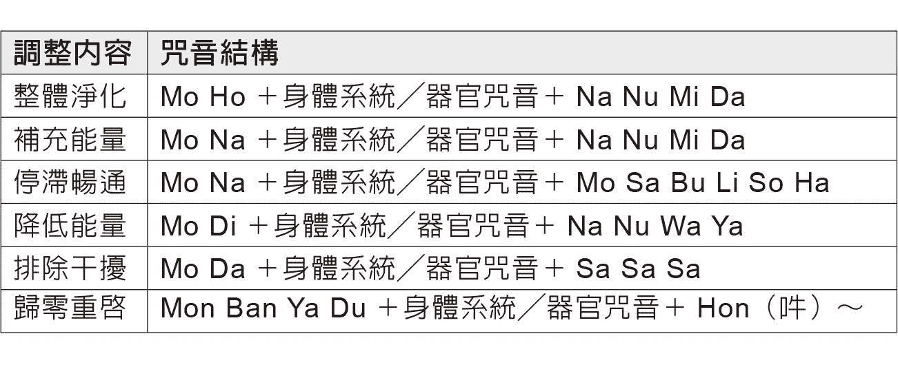

等待身体回应，然后给予补充。接下来完成每一项身体系统调整的检核（各项调整功能的咒音结构见上表）。

每天早晚各做一遍，大约十天，你的星光体就会回复可以正常运行的状态。

所以，你现在是否更明白为何要清理业力？因为那些尚未释放、尚未平衡的细胞记忆若存在你的乙太体层，你的星体飞行器就无法恢复可以导航的状态。

除了调整所有身体系统，也可以用同样的方式针对各个身体系统中的器官进行更精微的调校。

 中轴校准的方法

中轴是星光体移动时最重要的基柱，若有偏移，就无法进行正确的宇宙导航。

导正中轴的方法有许多种，以下介绍可以就地取材的。而透过这个就地取材的方式，你还可以打开另一层认知的限制，去看见自己心智图中投影出现的，不只是你的身体表象显现的一切。除了看见身体器官、系统、组织在星光体中的投影之外，你也能看见地球上所有生命存在体的振动像你的身体系统和器官一样，可以投射进入你的星光体投影屏幕中。你可以从十二个象限里找出彼此的关连和位置，然后你就能和高次元的你联手展开在星光体中的创造。

一、意识导正法

这是最简单的做法：链接进入自己的星光体，用内在之眼投射出星光体的屏幕，观察目前的中轴是否偏移；若明显不在第三眼投射出来的正中央位置，就可以用意识直接挪移，直到中轴这条垂直线居于第三眼视野的中央。基本上，这是帮助尚未契入星光体的人的做法，若是已经成功进入星光体，就不需要再次进行这个步骤，因为你已经是处于中轴在中央位置的状态才能进入星光体，你就是自己星光体的宇宙之心。这个以意识侦测的做法，是用来帮助一些尚未成功进入自己星光体的人快速调校。

二、从大自然取材，辅助中轴回归中心

我们的身体细胞可以从与大自然万物的共振中取材。当意识进入星光体的维度，我们可以透过星光体的感知共振链接大自然万物，以获得补给。

你现在看见自己的星光体像个自体运行的小宇宙，在一个环形运行的象限中生生不息地运转出不同的结果。这里头没有出生到死亡的线性规则，一切都是圆的，由地、水、风、火四大元素，透过起、承、转、合的流动过程，创造出生生不息的生命现象，再从现象里延伸出成千上万种结果。你们的身体系统和这个世界，乃至整个宇宙的运行路径都一致，也因此，当你找到自己的身体器官在星光体中相对应的星体位置时，就可以从位置中找到其完整的结构性支点，而此结构体经由太阳中轴的牵引产生相应的现象。当你链接任何一种植物时，就可以看到晶体的矩阵式结构如何因此植物的能量共振产生位移。

接下来，以星光体感知每种植物相对于你身体场域的星光体座标位置。最简单的方法就是运用直觉，将你感知到的植物分门别类放在你星光体感知的球形象限中，然后让身体细胞的星光体意识与该植物共振，自动展开能量路径导引。你可以将链接植物后的星光体能量展开路径记录下来，再依照路径找出适合自己的植物种类，将这些植物的能量导引进入水中饮用，就可以获得身体智能提供最适合当下的你的建议。

喔！这听起来的确不会被目前的医疗系统理解和接受。

人类过去的医疗只在物质体的现象中求解，因此发展出以化学药物解除身体假性病征的方法——之所以说假性病征，是因为那是呈现你们眼睛所能辨识的病理现象，而非从根本源头解决。这导致你们只能仰赖更多身体无法吸收的药物来与病征抗衡，让身体承受了更多负荷，必须从正常的细胞中分离出更多免疫细胞来帮助抵抗外来物的入侵，免疫系统因而创造出更多的自体失衡。人类一直以来都使用杀敌对峙、你死我活、你输我赢的方法面对身体疾病，不理解宇宙的根本之道就在无限的链接与平衡过程。你不只存在肉眼可见的物质世界，也与无限宽广宇宙中的万物相连，若你切断自身内在宇宙的流动，就等于阻断与无限宇宙链接的路径和行动轨道，最终只能让这些细胞随波逐流，流入宇宙黑洞，造成你身体组织崩塌，产生更难以回复的重大疾病。这是人类的医疗系统未来必须重新再造的环节。你们的身体健康与否，自己会最清楚，只有让一个人重十身体意识的链接和沟通能力，才能真正创造一个健康的身体环境。医生不是来治愈你的疾病，他们不会比你自己的细胞更清楚状况；未来的医生是协助病人重新与自己沟通链接的桥梁，医生是副手，你才是自己真正的医者。

三、使用大自然的元素，帮助平衡偏斜的星光体

（因为居住在城市里，我无法整天在外面找植物链接，便以自己可以从市场上买到的植物和矿石的精素〔注〕，直接链接进入星光体中比对。透过与这些矿石和植物能量的链接，我进入自己的星光体，比对出多种植物和矿石能量相对于我们身体系统的位置，制成下一页的对照表，提供给读者参考。

在这个找寻大自然元素的过程中，我才真正理解阿乙莎一再告诉我的，人类需要的一切，地球母亲早已准备好，并无条件提供给人类使用，只是我们忘记可以用意识链接，和大自然万物的能量共振，重启或平衡自身的能量场。人类从大自然中撷取的资源已经超过自己所需，不断地挖采、囤积，并且过度捕食动物、过度使用化学药剂栽种植物，造成自己的身体系统充满无法排出的重金属，身体愈来愈沉重。一切的宇宙智慧和真理就在我们自己的身体里，人类必须重新看待自己和地球的关系，提升自身意识进入星光体的维度，就可以轻松透过意识链接大自然的植物和矿石，帮助自己的身体场域获得平衡和补给。）

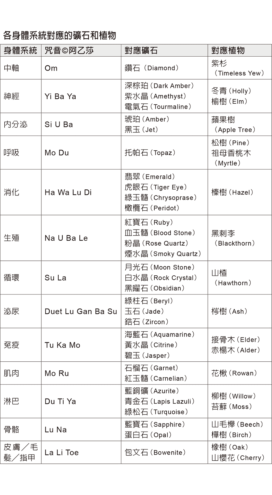

 检查星光体的四方基柱是否扩展出适当宽度

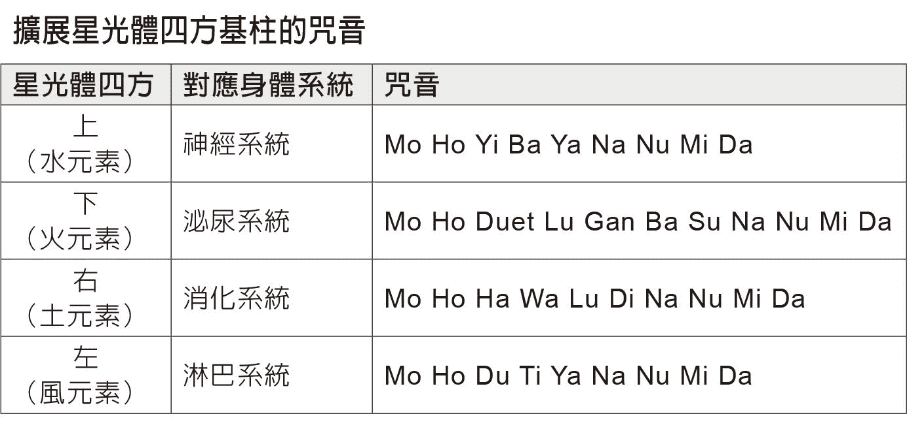

可以用意识扫描神经系统和泌尿系统的长度，以及消化系统和淋巴系统的宽度。若意识扫描出来的长度及宽度不够，可以念诵该相对位置的身体系统咒音（见上表），然后侦测是否有明显扩展。

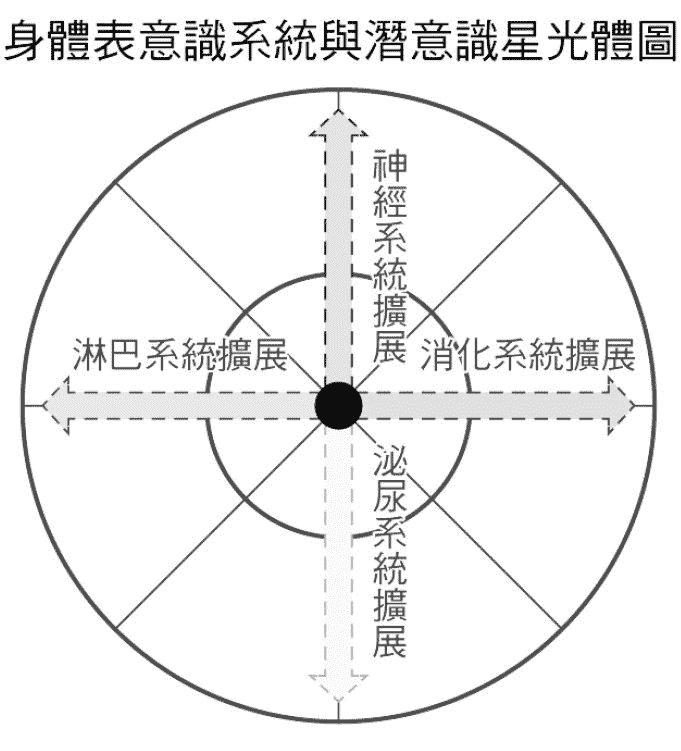

 平衡光的系统，检视光的变化

从中轴中央向外移动，每往外移动一圈，就感受光是否有所阻塞。若感受到某一层的光流动不顺畅，就以意识从中轴上方，亦即头顶上方神经系统的位置注入那一个颜色的光，然后再次扫描一圈，直到每一层的光流动顺畅为止，就完成了星光体的光的平衡。

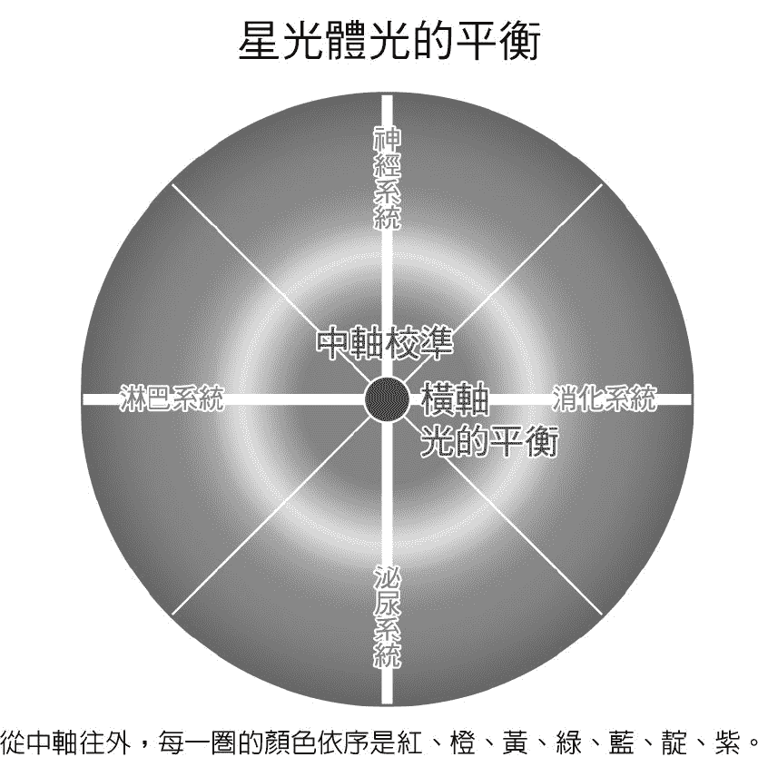

当星光体中轴稳定，光的流动顺畅平衡，就可以大大改善身体场域的细胞生存环境，让自己活出健康的生命，为灵魂扬升至五次元的星际生活做好准备。

如果可以每天确认光的平衡，检视一轮，你也会发现自己的身体场域更加扩展、轻盈。

注：注：精素和精油不同，精素无色无味，是将植物或矿石的能量引导入水中的能量储存形式，是一种可以用来平衡情绪和深入乙太体层的疗愈工具。

精素的使用方式很多，包含：

．将一滴精素滴入左手掌心，涂抹在脐轮，深呼吸，可以帮助平衡身体对应的能量位置。

．手握或配戴精素瓶，不需要滴入手中或涂抹在身上，一样可以感受到身体场域和精素互动平衡后的结果。我曾尝试让中轴偏移到淋巴系统位置的人手持柳树精素，透过星光体观察，可以立即让中轴校准，回到中心。

．在澡缸里滴入一滴精素，用来泡澡。

．将数滴精素滴入室内空间芳香喷雾中，以一比五十的比例即可，如一毫升精素搭配五十毫升的空间芳香喷雾，直接喷洒在空间中，可以提升环境的振动频率。

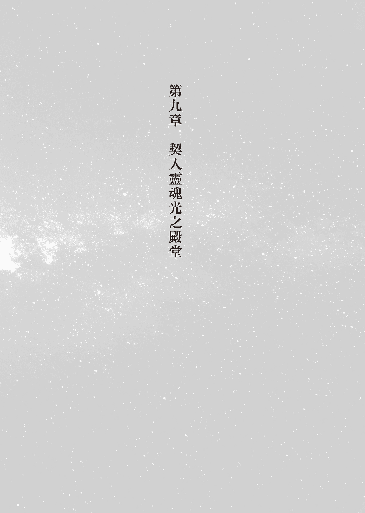

（泰雅传来一首咒音和曲子。这是收到一堆咒音以来，第一次有曲调传过来，我可以随着咒音直接哼唱出来。

泰雅说这段咒音源自古文明部落的传统。一些在体验爱的过程中犯罪或受伤的灵魂，他们内在的光失去校准，当部落要迎接这些灵魂战士回家时，就会举行庆典，迎接他们回到光之圣殿。光之圣殿不在外，而在人们的内心。部落所有的族人会围成一圈，欢唱这段咒音，迎接这些新生命回到光之殿堂。

Ah Mju Ha Pa Ya Wu Mi Da〔＊两遍〕

〔啊！我勇敢的灵魂战士。〕

Mo Ha Pa Ya Pa〔＊两遍〕

〔你辛苦了，欢迎归来。〕

Yu Wu Fa Du Fa Le Ya Pa〔＊两遍〕

〔让我们将你身上的泥沙和脏污褪去。〕

Om～Om～Om～

〔洁净光耀你伟大的灵魂！〕

▲请点击 QR Code，聆听
［回到光之殿堂］美囋。

我有好几天都反复唱诵这首歌，每唱一次就感觉自己的意识更加沉入心轮，感受到进入身体宇宙中央的宁静感。）

 契入光之殿堂的方法

（泰雅要我重新念诵一遍身体系统的咒音，只是这一回，她要我往逆时针方向念诵。我顺着这个指引，以逆时针方向念一遍十二身体系统咒。

Mo Ho Yi Ba Ya Na Nu Mi Da

Mo Ho La Li Toe Na Nu Mi Da

Mo Ho Lu Na Na Nu Mi Da

Mo Ho Du Ti Ya Na Nu Mi Da

Mo Ho Mo Ru Na Nu Mi Da

Mo Ho Tu Ka Mo Na Nu Mi Da

Mo Ho Duet Lu Gan Ba Su Na Nu Mi Da

Mo Ho Su La Na Nu Mi Da

Mo Ho Na U Ba Le Na Nu Mi Da

Mo Ho Ha Wa Lu Di Na Nu Mi Da

Mo Ho Mo Du Na Nu Mi Da

Mo Ho Si U Ba Na Nu Mi Da

念完十二系统的咒音后，我让意识指回正上方的 YiBaYa〔神经系统〕，此时，我的内在空间顿时展开一个圆形的殿堂。我感受到自己的意识向身体中轴的后方移动，中轴前方则挪出一个内在空间，我的意识进入全然入定的状态。

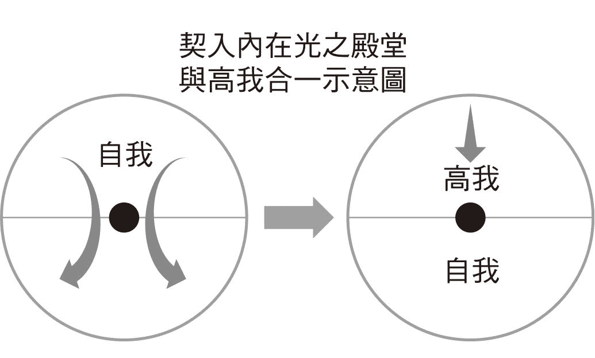

在定静中过了一阵子，我呼请泰雅。此时可以感受到泰雅也进入这个场域，就在我意识的前方，我的意识则明显退到整个场域的后方。）

泰雅，这是哪里？

这是你意识净化后到达的你内在最神圣的殿堂，这个空间就存在每个人的身上。你进入后，可以感受到自己的个体自我意识退居舞台后方，舞台上空空如也，什么都没有，然而这正是与一切万有意识整合的场域。你无法以任何角度、颜色、形状看见或听见任何存在，也无法用内在意识去辨识，这个无色无相的空之境地，是你与众神合一之前必须到达的状态。

你的小我意识全然退居幕后，让出你的生命舞台，你才能容纳一切万有的临在。这是你们的宗教和经典描绘的源头、空无、定静、无我、三摩地等等，但你无法用任何语言或文字清楚描述这种“无有，又无所不有，无存在，又无所不在”之境。这里正是你们所有源头意识合一的地方，也是褪去你身上最后一道意识的屏障，这最后一道屏障，过去只有在人类完成地球体验、生命走进下一次的运转过程才能进入，现在你们得以在尚未离开物质身体的状态下，直接契入你的灵魂最初始设定的光之殿堂。

你的意识进入这定静空无之境，到达准备与高我合一的预备状态时，你的内在会挪出一部分空间，让自己的意识与高我融合。高我现在移动到你的前方，你在后方，而在此之前，你是在前，高我在后。其实，你并没有移动，是你的星光体旋转，让你产生灵魂意识移动的错觉。

你的星光体展开三百六十度的圆形空间。你们过去习惯看见前方，潜意识在后方，也就是一直往外看，从不去感知另一个同样存在你之内的世界。那个一直在你之内默默支持着你的高我意识，就在你的星光体全息屏幕打开后，才能以全息化的角度临在。

你的存在不再只是有无、是非、对错和黑白的两极，你将融合一切存在意识，产生一个全新、全息、包容万有的视野，就如同《心经》所言：

般若波罗蜜多心经

观自在菩萨，行深般若波罗蜜多时，照见五蕴皆空，度一切苦厄。

舍利子，色不异空，空不异色；色即是空，空即是色；受想行识，亦复如是。

舍利子，是诸法空相：不生不灭，不垢不净，不增不减。

是故空中无色，无受想行识，无眼耳鼻舌身意，无色声香味触法，

无眼界，乃至无意识界；无无明，亦无无明尽；乃至无老死，亦无老死尽；

无苦集灭道，无智亦无得。以无所得故，菩提萨埵。

依般若波罗蜜多故，心无挂碍；无挂碍故，无有恐怖；

远离颠倒梦想，究竟涅盘……

你已经到达。恭喜你，也恭喜我们共同完成这一趟旅程！

 在光之殿堂中身体的变化

你现在可以感受一下自己和之前有何不同。

我感觉头顶和第三眼比较没有压力，而太阳神经丛似乎更宽大了，你透过我肉体的双眼看这个世界，已经不像是用第三眼的感觉，似乎两只眼睛就具有扫描的功能，帮助我更能看见全息化的景象。过去我双眼的焦点偏左眼，现在聚焦位置变了，偏到右边眼睛。

除了这些，你感觉自己的星光体有何不同？

我感觉自己的身体多出好多层的球体包围着我。

过去在ＤＮＡ封印的状态下，人类的脑意识中设置了情绪体验阀门，你们被迫听从情绪的引导，阻断了和自己内在宇宙的链接。当你穿越情绪的屏障，链接上宇宙意识时，你先透过高我的邀请，契入自己的晶体，那里就像你意识的休憩站。晶体位在顶轮上方六吋的位置，你过去一直透过晶体和光的世界的高我链接，获得真理和知晓，但这个阶段仍处于知晓的状态，你与高我之间还是分离的。

当你愈来愈与高我意识合一，将你的自主意识、身体意识与高我意识合而为一，从顶轮上方的晶体往下进入第三眼，再渐次往下，融入心轮和太阳神经丛之间的位置，你会感觉自己向心轮下方更深入地扩展。这里就是你的高我与你在你的肉身合一后停驻的位置，你在这个状态下，就进入与高我共同创造和显化的行动阶段。

你要知道，你目前的状态就是地球母亲分分秒秒在地球临在的状态。地球母亲看着万物的起起落落、大自然的展现，以及每个生命的自由绽放，允许一切可能性，也愿意让所有生命期待的体验都显化出来。地球上所有的生命都被母亲全然地包容，这是母亲的慈悲和宽容，承载万物共生的需要。你现在处于与高我合一的状态，就可以看到我所见的一切。

我觉得自己的内在空间又变大了，我的意识站在身体后方。除此之外，我呼吸更加顺畅，有点像之前阿乙莎带我进入晶体空间的感觉，唯一的差异是之前契入晶体是意识移动到顶轮上方，现在则是在自己身体正中央，接近心轮的位置。

很好，高我即是你，你即是高我的临在。高我已经可以在你的身体场域与你相互融合，你的身体场域腾出了一个与高我共同存在的空间。

我的潜意识到哪儿去了？

你的潜意识就是自主意识存在帷幕之下的黑暗中，那一面已经全然被你的意识照亮。当你与高我在你的身体场域中合一时，你的更高意识得以全然地临在。

这是一段漫长的灵魂回归旅程，仿佛你在地球的生命已经走完全程一般。这样的状态在过去被称为到达生命的终点，也就是灵魂在前往下一次的生命旅程之前会到达与自己的潜意识合一的状态，透过高我的引领，你得以回顾自己的一生，然后决定下一次生命的选择；而此时此刻，你正在经历的并不是此次生命的终结，而是在生命存续期间的扬升。你是和高我意识全然合一的临在意识体，在这个状态下，你ＤＮＡ的节点已经全部打开，准备学习宇宙人的相关知识。

你之前一直想知道地球人和宇宙人的差异，现在你看见自己的内在宇宙，进入心轮，与高我合一，你的临在就打开了宇宙人在地球上生活的序幕。

我还是无法说清楚现在的身体感官和之前有何不同。其实，我现在并没有想像中神通，也不会看到光怪陆离的宇宙星光景象，我还是我，一个有实际肉身存在的个体，仍然坐在书桌前写字，没有腾空飞翔，一切如常，还是吃喝玩乐，过着一样的地球人生活。我不知道现在这种与高我合一状态下的生活，和我过往的日子有何不同。

这个改变不会像日月的更迭，从黑夜到白昼，或是让你的感官看见不同的地球景象，不是这样的。你的身体就是你在地球上行动的载具，只要你的意识以高我为中心校准宇宙之心，你合一后的意识可以触及的维度和范围，就不同于你以往的“连线”状态。

泰雅，你们是如何称呼这里的？

这里是光之殿堂，你灵魂的殿堂，你与自己的高我意识交流的平台。当你成功到达灵魂光之殿堂时，可以与自己的更高意识融合为同一意识，而在这样的状态下，你可以帮助自己打开所有灵性组成片段在你身上的ＤＮＡ闸口，让你进入宇宙不同次元间的资料库，读取你需要的讯息。

很多宗教提及三摩地是进入一种空无的状态，我的意识怎么还可以问来问去，还没有感觉到达？

我们还无法带领你进入三摩地的风元素的空境，因为一旦进入那种状态，你就无法梳理意识，也无法记录和写下文字。进入三摩地需要在更多灵性家人共同护持下完成，现在使用倒转你生命之轮的咒语，只是让你浅尝即止，你还没进入三摩地的境界。现在当你倒转生命之轮，你的自主意识会不由自主地退居幕后，站在你身体后方，这是一种状态；还有另一种状态，是你打开真我迎接高我进驻与你合一时，你的自主意识会移向右方，与高我融合之后再回到光之殿堂中央。

 光之殿堂中的四大元素

在光之殿堂中，你的自主意识进入的不同位置，代表的意义如左图。

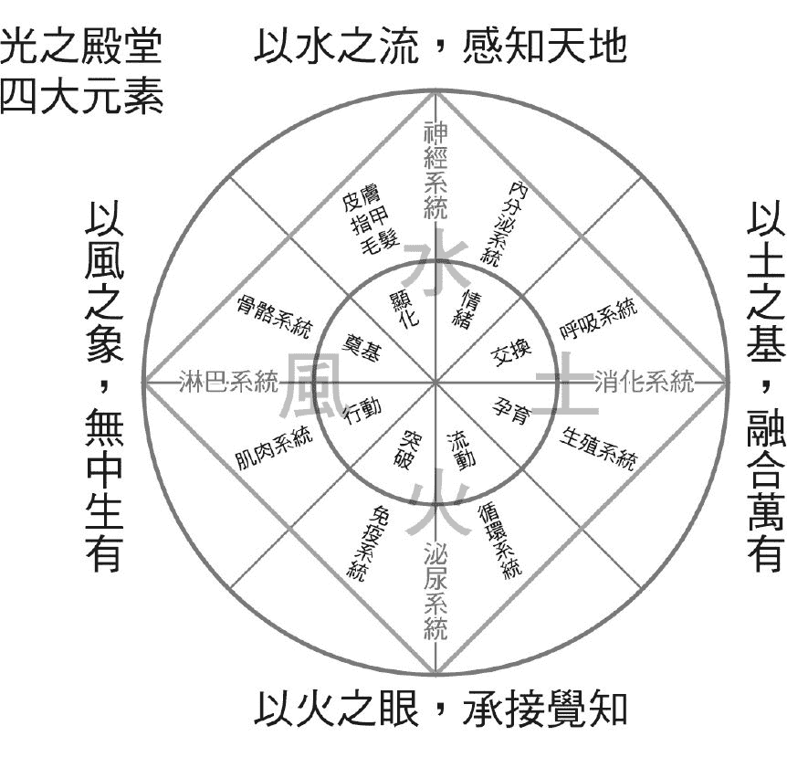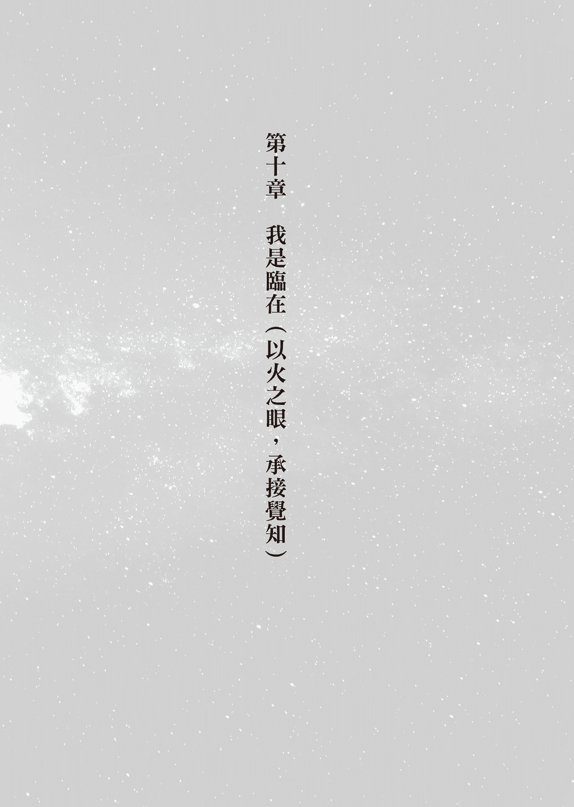

当你将生命之轮逆转一圈，就会进入火元素的位置，以内在之眼承接内在的觉知，此时你会感觉到内在空出一个圆形的光之殿堂的空间，就出现在你的正前方。你就像戏院里的观众，前方的舞台就是你内在觉知的舞台，当你想要“观”任何一个人、一个物件、一个意识体，或是一个你想深入探究的现象，就邀请这个你想要“观”的对象进入舞台区。这时，你就是以火之眼来看见万事万物，可以进入微观的量子场域，看见更多细节和原貌，也能知晓万物的真理。

 打开内在之眼

接下来，你可以用这个咒音打开自己的内在之眼，看看有何不同。

★“我是临在”咒：Mon Sa Bu Li So Fa Yun

你现在练习去看，可以看出什么吗？

没有啊！我什么都看不出来。

等等，我发现这样用眼睛去看反而已经不太能聚焦。我还没有试图链接我的第三眼，就已经呈现不聚焦的状态，仿佛眼前的物体都是虚的，也都可以被忽视，那都是假的障碍物。我的视野前方呈现一片好广大的范围，可以掌握里面所有的脉动。

我临在我所在的空间，以我为中心向外扩及的场域都可以感知到，那种临在感和在更高维度的合一感是不同的。之前在高维基督意识的合一没有空间的概念，所有存在都是光，也都融合在一起，无有分别，无法区分你我之间的任何不同；而现在的临在，是以我为中心的一整个宇宙，里面有实体，有形有相的地球物质世界和非肉眼可见的状态都在我眼前。我临在一切，但不与其融合；我知道一切正在流动，也清楚这所有存在之间都相互链接、互动。现在，我就是临在，I exist，和之前在基督意识场中的“我是”，I am that I am，是不同的。

你现在再去听你所处环境里的声音。

我在听见每一个声音的同时，内在宇宙会出现那些声音相对于星光体的位置；我不只可以听见所有声音，还可以清楚辨别声音在星光体出现的位置。我听见座标位置要干么？

透过内在光的指引，你可以更清楚看见声音的来源，锚定物件或另一个生命，并与之进行精准的沟通。你之前的连线状态是透过神经系统的传导，讯号是降频后再由你的大脑转译；现在则不需要经过神经系统，而是打开身体最重要的能量来源——心轮——通过音频锁定目标物。

在地球维度，所有音频可以用振动波让你感知，你也可以透过心轮接收超出耳朵听觉范围之外的频率。现在你可以接收到地球母亲七．八赫兹的振动波，透过心轮感知，接收到地球母亲的心跳声。

地球万物原本都可以接收到母亲的心跳，只是人类与自己的潜意识分离，被屏蔽了与母亲的链接。你现在重新用心轮感知，去找出万物存在的共同性。

我感受到一幅景象，阳台上所有小鸟此起彼落的吱吱喳喳声中，有同样的脉动，它们正在歌颂大地母亲苏醒后，透过清晨的日光传来一波波慈爱的能量流。鸟儿正欢喜迎接来自地球母亲的能量而不由自主地哼唱，透过哼唱可以和母亲的能量进行交换，让身体获得夏日能量的补充。现在周围的汽车喇叭声和交通的混乱凸显出人类有多落后而笨拙，人们每天一早就无意识地赶去上班，身体感知系统连动植物都不如。我们真的很像阿乙莎之前描述的状态，是被宠坏的孩子，对母亲予取予求，还自以为是地摧毁我们赖以为生的环境，连带危害了地球上其他生命的生存权利，真糟糕！

好啦！让你静心体验这一切，不是要你再起愤怒和瞋恨。你明白这中间的差异，接下来要怎么让人清楚了解今日你体会到的真实才是重点，这也是和高我合一之后要去展开的行动。

地球母亲好伟大，从来不去阻止，也不干涉，给予无条件的爱与包容，允许所有生命自由绽放。这样看来，人类在没有打开自己的星光体意识前，似乎做尽了伤害自己和地球母亲，以及排挤其他物种生存权利的蠢事，为什么你没有强力干预？就连存在每个人身上的高我也不直接告知我们真相，任由人类一再轮回，一再破坏环境，一再创造畸形的地球游戏场，为什么？

唯有如此，才能创造出更多的可能。这是我在地球的使命和任务，我不但不介入，还必须随时和中央太阳及宇宙之心维持连系，依循宇宙既定的法则，进入属于我的轨道。我也明白你现在的疑惑，既然都是为了体验爱，为何要创造出那么多不值得去爱的事件来说服你们这也是爱的表达？

是啊！我很难理解，更别提去宽恕残杀小动物的人类。

这样说吧，你看到一头牛出生后就替人类劳动一辈子，最后还被主人宰杀，觉得这是人性最残暴的行为，但在帷幕这一端看见的是不同的景象。一头牛尽其所能让自己的生命发挥到淋漓尽致，然而对这头牛来说，它并没有因为如此活着而学会慈悲，也没有机会学到宽恕，因为它在整个生命过程中从没有定义自己是“受害者”。它来地球体验劳动，体验人类可以如此创造生活环境，透过和人类的互动，它可以发展出不同的生命视野。这是它此次生命的需要，人类则是扮演满足它这项需求的角色而已。

牛并不懂得用自己的生命和时间去赚取金钱，对牛来说，生命就是无所求地付出，没有对或错的问题，一直付出到生命终结的最后一刻，再将自己的身体交给人类食用，这是他要在此生经历最完整的付出体验的完美安排。而相对来说，人类则可以透过看见牛的生命过程学习到慈悲，学会尊敬其他物种的生命，还可以学到宽恕和奉献。

人类是地球物种当中最会使用情绪体来诠释生命的，但是，人们会因无法理解或无法接受某些现象，而将其定义为“负面”。这些“负面”定义口耳相传，成为人类潜意识的巨大黑洞，然后这些因“不理解”而创造的黑洞就需要地球母亲协助排解和消弭乱流。最终，只有“宽恕”可以协助人类停止让负面的想像继续扩大。

你会发现，宽恕并不只是去原谅伤害你的人事物，其实需要原谅的不是对方，不是伤害你的人或事件，而是你那无止境的负面想像力。若没有让人练习投射宽恕的想法，你们创造的想像黑洞足以吞噬整体人类的生命体验场和地球运行的轨道；只有透过宽恕，才能阻止人类进入永无止境的自毁模式。

可是，从古至今，人类和其他物种之间各种无情和残暴的事件不断上演，宽恕并没有彻底解决人类面临的种种问题。

孩子，当你像头牛时，你就不会认为自己或他人受到伤害，你和牛最大的差异即在此。人类的“认为”和“思想”是如此有创造力，人们一旦进入负面的想法，还有什么力量可以让一头疯狂进入黑洞中的牛停止狂奔？宽恕是为了让生命在不顾一切急驶进黑洞时得以煞车掉头，那是帮助人类生命继续存在的力量，而牛并没有必须宽恕的事情，因为它不会被思想引入自毁模式。

这么说，宽恕是人类需要的，若没有宽恕，人类会自取灭亡？

是的，若人类不运用宽恕的力量，就会被自己创造的生命讯息场黑洞吞噬，人类就会有灭绝的危险。所以，宽恕是为了让人停止自掘坟墓，让进入黑洞的疾驶列车停止行驶，生命会因为宽恕的介入，得以从黑暗中抽身，找到光明的出口。

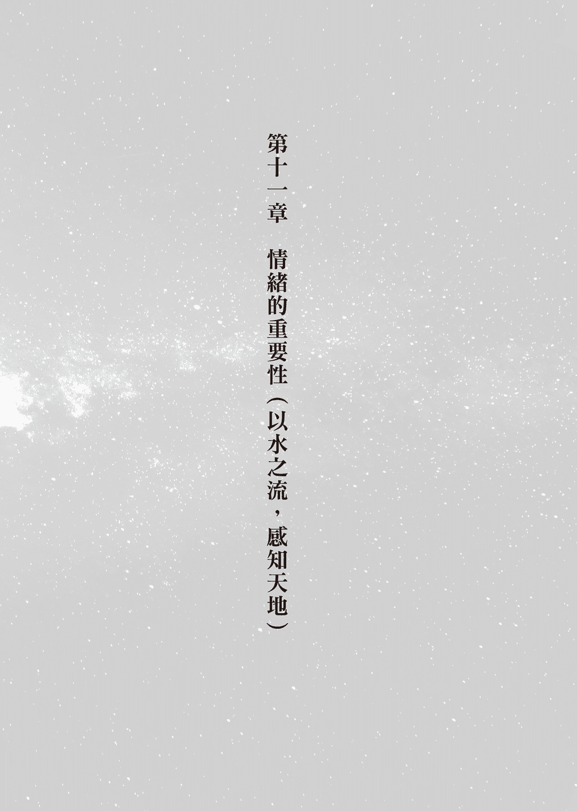

 业力之路 vs.创造之路

用意识进行星光体校准这么简单就可以完成，那么如果已经生病了，还可以用什么方法快速导正？

生病就是光的流动性有问题，或是出现阻塞点。你现在已经明白，“心→情绪→进入体验和流动→完整生命的体验”是过去你们习惯的意识流路径，现在当你打开星光体的帷幕，看见全息化的意识流动路径，就可以重新做选择。

现在先回到身体系统投影那张图，去看见内圈代表内在意识流的部分。

业力之路：内在意志往顺时针方向行进（因生果）

．内圈意识流路径

情绪→交换→孕育→流动→突破→行动→奠基→显化→回归中心起点，亦是终点站

．外圈显化路径

神经→内分泌→呼吸→消化→生殖→循环→泌尿→免疫→肌肉→淋巴→骨胳→皮肤／毛发／指甲→神经系统，回归原点

创造之路：内在意志往逆时针方向行进（果造因）

．内圈意识流路径

显化→奠基→行动→突破→流动→孕育→交换→情绪→回归中心起点，亦是终点站

．外圈显化路径

神经→皮肤／毛发／指甲→骨胳→淋巴→肌肉→免疫→泌尿→循环→生殖→消化→呼吸→内分泌→神经系统，回归原点

这一切的主导者，是你的自由意志，也就是地球上的你的小我意志。你处于小我的你、潜意识的你及高我的你同在你之内的状态，而你自己就是内在意识的主人翁，你的意志决定生命之轮旋转的方向。

当你的内在意志决定以逆时针方向，从显化之路出发，你就走入了创造之路。这是一条由果造因的道路，在这条路上，你不会遇到情绪体的障碍、阻挠和地雷，也可以降低陷入业力枷锁的深渊而进入重复性情绪漩涡的机率。像这样与内在神性自我，也就是与高我意识合一后共同创造，更容易突破现状，透过宇宙更高维度能量的帮助，取得事半功倍的创造成果。

若你的意志决定往顺时针方向，从情绪之路出发，你的行动将会受到情绪的牵引。这就是人类一直以来习惯体验的道路，你们总是认为事出有因，总是在因果关系中不断循环。你愈是进入情绪的漩涡，会发现自己的身体系统不断累积更多沉重的负担，愈陷愈深，愈来愈凝结、沉重，最后只能透过地球之心厚重的引力全数吸收。

这一切都是意识的选择。你习惯用哪一种方式展开行动，就会显化为你身处世界的样貌。

这么简单的道理，只要向左，往逆时针方向前进，为什么人们自古至今都不知道要运用？

因为ＤＮＡ封印造成人类的脑意识被自己的情绪体控制了。当你的ＤＮＡ无法展开更高的意识维度，你只能用有限的身体意识，也就是使用情绪体模拟的情境，与之共舞，这是生存模式的设定，也是在三维世界体验之路。而当你打开ＤＮＡ的屏障，你会拥有扩展后的全息化视野，可以透过更高意识投射出你期待在新的世界、新的维度拥有的情境，于是你就会开始选择这一条直接投影显化的道路，这也是在更高维度宇宙共存的意识显化之路。

这听起来并不困难，应该不难做到。你可以举些例子帮助我模拟一下这种路径吗？

你最想做的一件事是什么？

我想将你给我的身体系统咒音编成歌曲，这样可以让每一个人都能随时随地校准自己的身体宇宙，将光波导入身体系统中。除了帮助身体变好，也可以因为每个人重新校准中轴，让宇宙能量注入大地。

好，你现在看见自己的意念了，接着体会一下自己的感觉。若让你处在身体的维度，也就是三维的世界，你会怎么开始？

我才这样一想就开始紧张了，怕东怕西，担心找不到好的曲子来搭配，还有资源不够的问题。一想就觉得麻烦事一堆，开始烦恼，身体紧绷起来，肚子不舒服，想拉肚子。

你看见自己的意识往哪里走了吗？

右边，对，顺时针。我的情绪自动升起，刺激肾上腺素分泌，内分泌出现战斗模式，然后呼吸变浅，整个身体能量无法流动，更别提去突破和继续行动了。我发现我被自己的担忧和恐惧限制住，走不到终点，会卡在这条路的中途，被失败的经验再次整得体无完肤，甚至劳师动众却惹得一身腥，最后可能会放弃。算了，我无法从这条路显化出那一张唱片，就算能做到，也需要有非常多的祝福来到我身边，这太难了！

是的，但现在你有选择了，你可以往左边，逆时针方向走走看，感觉一下和之前有什么不同。

喔！在这里我直接看见想要显化的歌曲，可以看见唱片的封面。喔！好美丽的色彩，每一首歌曲都映照出身体系统的光，整张唱片就在我的星光体中闪闪发光啊！

现在继续往逆时针方向前进，让你的意识将这个呈现出来的景象投射进入你所在的地球，让它成为一颗种子，进入大地。接下来你要开始让它扎根成长，要为它灌注能量。你会提供哪些生命元素和养分去滋养它？你可以用你的意识不断投注能量给它。

最后就要进入临门一脚的时刻了。你不必用尽全身的洪荒之力，也不用花费仅有的资源让适合的人在最适当的时刻来到你面前，你只须突破自以为是的障碍，和故步自封的界线，以开放的心和来到你面前的人交流，最后，你就能处在平静与喜悦的能量流动中，轻松显化这件事。

看见了吗？这是两种截然不同的显化之路，而现在你有百分之百的权力决定自己要往哪里移动和前进。

 情绪创造意识流动

泰雅，在星光体的意识流动中，现在我已经清楚看见神经系统是中轴稳定的基础，难怪之前阿乙莎在畅通脉轮手指操不断提及中轴稳定的重要性。若没有稳定的中轴，就无法链接上高我意识，我们就很容易受到情绪体的牵引，进入因果轮回的业力之轮中——虽然那也是我们为自己设定的生命意图，在星光体中看来就像是在自己的地球体验营设定了重重关卡。

现在理解了星光体，也更清楚为何要学会辨识自己的情绪，不需要排斥和抗拒。情绪就像进入业力之轮门口的警卫，是来提醒我们，嘿！老兄，走错路了，此路不能带你上天堂，会有许多陷阱，往回走，往回走，回到中轴，让神经系统助你一臂之力，扩展你的意识，链接上你的高我去看见整个路径，看见你尚未走进的那里有个真正的你；你的世界的实相不在外头，在你的内在宇宙里。

是的，当你可以有意识地辨识出每次情绪波的来源和映照出你内在的真实面貌时，你就不需要走进业力之轮，可以直接选择进入生命显化之路，在这条路上不受业力干扰和牵引，走出宇宙人在地球的创造之路。

这也是未来新地球中每个人都必须具备的生命品质，在家庭、学校和社会群体生活中达成共识，你们就能够快速清理身上隐藏的业力枷锁，帮助自己、他人和地球母亲完成灵魂升级。

看懂你们的情绪创造出来的假议题非常重要，这也是地球人在三次元世界最严峻的考验。人类的灵魂ＤＮＡ中被植入太多情绪牵引出来的业力因子，必须完成业力净化，才能完成人类身上情绪体的阶段性任务。当所有人类不再以情绪引导生命之轮的运行时，你们就到达创造出新地球、新人类的阶段了。

情绪体在旧地球人类身上就是一把双面刃，你站的位置决定了它是来保护你，或是阻碍你。

当你的中轴愈稳定，你会清楚感知到情绪体就在你星光体的右边随侍在侧，你愈是清楚看见它，就等于将内在的光照向那条黑暗的幽静小路。你知道也看见那熟悉不过的历史情结重复上演，而当你看清楚、也能辨识出情绪背后的陷阱了，你就可以做出有意识的选择，走上相对于情绪体的另一条显化道路，进入另一端的创造体验。于是，你的生命完全不受情绪体影响，而能活出你灵魂期待的最高版本之路。

在这条创造之路上，伴你同行的不再只有你自己和与你朝夕相伴的身体细胞，还包括你在其他宇宙更高维度中的兄弟姊妹。

这样一来，人们该重新定位“通灵”了。

很好的问题！这也是人类一直误解的环节，却因灵性展开的过程造成许多宗教战争和意识掌控，甚至还有许多古文明祭司或女巫被处决的恐惧印记存在许多人的灵魂记忆里。你现在已经可以清楚地向大众陈述你自身的经验，不用再担忧害怕，因为地球网格已经打开与银河星际链接的轨道，你们愈是展开自己的意识光点，愈可以同步帮助自己所处的环境和身旁的人集体到达意识共振，然后你们会被自己的场域保护，不再沦为黑暗势力控制无意识人们的俎上肉。

通灵，乃是通往自己更高的内在神性之路。当你的意识到达宇宙的源头，会知晓自己内在早已具备神性意识，原本就不分彼此，是共同融合的生命之汤的总和。你没有比神渺小，没有你意识的允许，神无法在地球完成自身的功课；你们是如此亲密，是比孪生兄弟姊妹还要亲的共同体。

追求灵性成长并不是逃避生命的另一个出口，而是要找回原本属于你的东西。那是你生命本有的力量泉源，你拥有宇宙无穷的能量补给和曾经体验过的美好生命宝藏，都等着你来发掘，并应用在你的世界里。

 不同情绪在星光体中的流动路径

除了意识可以改变创造的路径之外，你们透过感官认知后出现的情绪反应，在星光体中也可以看见它们不同的流动路径。比方说，当你的神经系统关注某件事情时，你用内在之眼看见的神经系统发出的讯息，会出现在屏幕哪个位置？

十二点的位置啊！

好，现在让你的情绪体发送出“开心”的情绪，你看见神经系统如何回应？

我看见这股情绪能量从原来的神经系统位置转向右侧的内分泌系统，然后继续流动，先流向正对面的免疫系统，并没有停在这里，而是继续流动，又进入肌肉系统，然后沿着淋巴系统、皮肤／毛发／指甲系统，回到神经系统。

好，你现在对照前面那张身体系统投影图内圈的意识流动路径，看看这个情绪带你体验了哪些内在意识的能量流。

内在意识流从情绪（内分泌系统）出发，然后到突破→行动→奠基→显化。原来开心可以突破所有困难，一路走上显化之路。

很好，你看见情绪的意识流动是一个过程。情绪是透过内分泌系统释放出某种激素，而展开该情绪能量流动的路径，人类因此可以透过情绪体验生命，进而创造出不同的显化结果。

你可以尝试将开心的情绪转换成其他情绪，试着去看见不同情绪可以创造出不同的意识流动路径。在星光体的世界中，人类的情绪体就如同内分泌系统散发出带着不同振动能量的粒子，在光的世界中持续串联而展现的样貌。

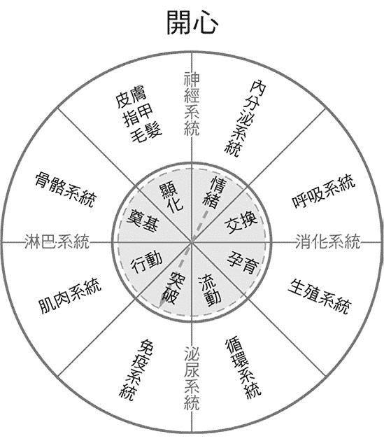

（我尝试以内在之眼去看见几种情绪投射出来的意识流动路径图。）

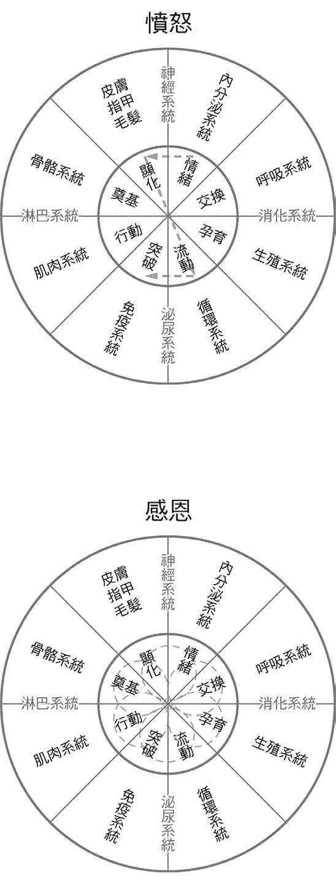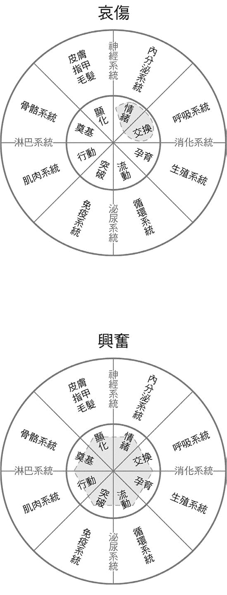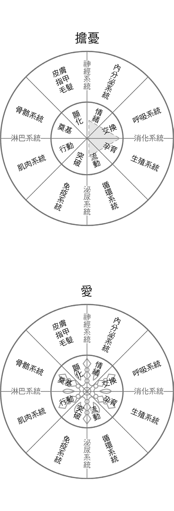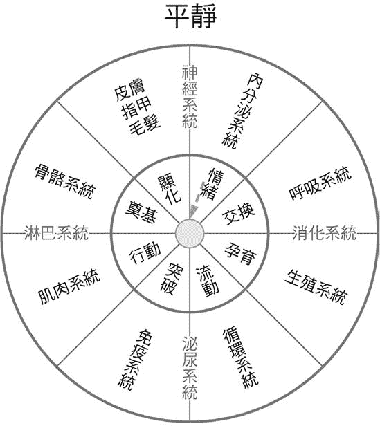

（说明：“爱”这张图只是示意图之一，因为爱会呈现出各种非常完整的结晶体，无法以单一结构呈现出来。此外，爱不像其他情绪的流动路线有出发和结束，也没有流经身体各系统的先后顺序和演变过程，而是会自动展现最终、最完美的晶体结构，直接穿越意识流，从内核心绽放出晶体之花。）

 情绪是帮助人类意识扩展的重要媒介

想像你的身体是一个精密的能量服务器，其中储存了大量讯息，这些讯息包含你的灵魂过去经历的一切体验，以能量结构码储存在你身体的ＤＮＡ中。存取这些能量讯息可以让你认识自己，还可以帮助你找出你在不同次元的体验纪录，而现在你进入三次元的地球体验，就需要透过情绪体的能量找回隐藏在你身上的万事万物讯息。所以，情绪是你的生命在地球生存的重要工具，在远古时代，你的内在升起的害怕情绪帮助你远离被动物吃掉的危险，你在生活中遇到的挫折和沮丧的情绪，也帮助你开发出让今日生活变得便利和美好的工具。除此之外，情绪也是帮助你完成生命蓝图的重要指引。

在星光体的投影下，你会发现，情绪经由内分泌系统分泌出激素，创造细胞粒子之间的流动，并自动展开其路径。情绪就是人类在二元世界的体验中创造出晶体结构投影和折射光的动能，人类可以从情绪体验中创造生命的光和美丽的乐章，那是和身体协作下的语言，从星光体的投影中让情绪体历历在目。

情绪对三次元的人类来说，就是帮助你的意识跨越三次元的藩篱，进入不同次元体验的路径指引。透过这些情绪路径图，你可以找回自己此生的生命蓝图，也可以透过情绪能量的讯息库，明白当时你的灵性父亲遇到星际存有的攻击威胁时，为何必须断然采取行动。为了地球生命的永续，他愿意牺牲自己，换得无条件的爱可以完整保留下来，这是他将爱的最高振动频率释放出来的原因。你在情绪体的引导下，可以从更高的意识维度看见事件的全貌，而不再因害怕受伤或恐惧失去，阻止自己去体验生命对于爱的不同诠释。

现在回想自己这一生，你是否因为恐惧而轻易放弃尝试爱的体验？你愈是害怕受到伤害，愈会失去再一次诠释爱的机会。

确实，从小到大，我们被家庭、学校和社会文化影响很深，有许多的“不可以”，许多不想要、不愿意去触碰的体验，而这些“不可以”就限制了我们对爱的体验。我现在更明白了，不论选择哪一面，我们选择那一面的另一面也同时存在，就像钟摆在两端移动，没有摆向左，就到不了右边，若终止钟摆的移动，就像是按下我们生命之轮的暂停键一样，如此就失去此生前来地球体验的意义了。

这个道理你早已明白，但现在我要向你解释得更完整些，告诉你为何需要透过情绪的波动和能量带你们去体验并看见爱的各种面貌。

为什么需要透过情绪去体验？我们一直以来都觉得有情绪是不怎么文明或高尚的，甚至会被冠上“你很情绪化”这种负面字眼。

情绪是帮助你们意识扩展的重要媒介。意识的到达必须靠真实的体验，没有经历过，你们无法由内而外感知能量的流动，而失去感受和情绪体验，你们就无法让意识准确到达你想要到达的目标或不同次元。所以，意识的扩展需要你们在地球上真实地去体验，带着情绪能量感受的记忆，充实你的记忆资料库，并透过情绪体的指引和振动，带你回到源头。

累积的情绪体验可以扩展你的意识，丰富你的直觉能力，还能启动你身上的ＤＮＡ重组程序，再造新生命蓝图。

难怪，我看见“平静”这个情绪的图是从内分泌系统出发，瞬间进入中轴的一个小圆圈，要是人类一辈子活在这种状态，反而无法创造丰盛的结晶。看来，我们害怕去爱，是因为不好的情绪的阴影留滞在身体细胞印记中，让我们刻意避开不好的情绪，试图粉饰太平，创造平静无波澜的情绪状态，这样其实会适得其反。

每个生命来到地球就是要创造自己的晶体，并使之发光。你们都是勇敢的灵魂，为了更完整的晶体结构，愿意前来体验，并踏上情绪体的意识流动之路，直到所有的情绪都完整了，你便成就了一颗完美无瑕、美丽多彩的灵魂光之水晶。

 业力：尚未流动完全的情绪种子

每个情绪背后都可以找到业力的“因”，那就是早已存在你身体里、尚未流动完的情绪种子。在星光体的维度中，你可以更清楚看见自身生命蓝图布下的重重体验关卡，等待你一一去面对和拆解。

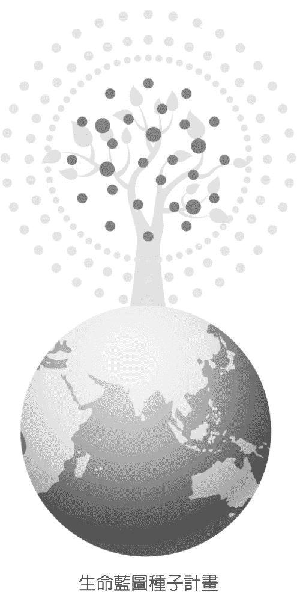

生命体验过程中，尚未流动完的能量会以情绪种子的形式进入下一回的生命蓝图，成了每个生命设定的生命蓝图种子计划。在成长过程中，你们必须持续浇灌自己的生命之树，使其成长茁壮，而浇灌生命之树的能量来源就是爱。只要是能够在你们身体系统中顺利走完全程的能量，也就是从最初的起点走过完整的起承转合，回到终点，亦即原点，那就是一个完整的情绪体验。倘若情绪在过程中因受到压抑、阻塞，或是暴冲，导致身体系统紊乱，就仍会滞留在身体系统中。

在星光体中，你可以看见负面情绪造成身体系统产生一个又一个能量黑洞，布下天罗地网，只要相同的情绪再度流经这些黑洞区，就随时会将你拉进黑洞中。这些黑洞让你得以再次经验、学习和体验到爱，若累积一段时日仍未能顺利流动起来，就会导致细胞病变。因此，身体疾病是细胞对人们的提醒，希望透过身体的警讯，让人可以循线找到情绪因子，再透过意识的引导，让尚未流动完的能量顺利走回终点。

生命之树携带的情绪种子就是待完成的生命意图，你们称之为业力。每棵生命之树都是人类情绪体验的花花世界，你们身在其中而不自知，每天上演着重复的戏码。这些业力种子会在一世又一世的关系中被显化出来，让你们可以透过不同的关系人、不同的角度，重新演绎和理解，以彻底完整自己设定的生命课题。你们的业力就是如此经由不断体验情绪产生生命流动的力量，并在一次又一次的生命体验中持续喂养你们的生命之树。

当你经历过生命之树设定的重重关卡，完整了此生对爱的不同尝试和体验，你的生命之树最终又会结出一颗生命之果。当瓜熟落地、重回大地之母的怀抱时，你就替自己和你生命之树内的所有存在意识再造了一颗新生命的种子。

在可以清楚看见自己星光体的全息景象之前，你们会一直在自己的身体场域中凿黑洞，扮演着自创生命游戏的玩家，乐此不疲。殊不知，只有当你顺畅走完自己设定的情绪体验，才可以回到星光体的能量流中，和光的世界的存有合一。此外，你们也利用情绪体在帮助自己找到回归源头的正确指引。

我现在不禁怀疑到底是鸡生蛋，还是蛋生鸡。是因为人类出生前ＤＮＡ中早已内建了业力种子，才会经由种子引爆，让情绪再次出现；亦即为了让人类再次走上早已在业力种子设定的命题，所以人类不断经历痛苦、悲伤、愤怒等负面情绪？还是说，那些情绪都是这一次生命体验的新产物，当我们出现不完整的情绪体路径图，在星光体中呈现冲撞的线图或无限循环，这些都被记录下来，才会形成下一次生命的黑洞？你明白我的意思吗？我是在想，如果我们可以早在生命诞生之初就看见业力种子，是否就可以早点进行反向工程，让这些负面情绪不再出现，甚至在体验生命的过程中，看见自己的情绪爆发出负面振动时，我们可以有更好的方法去平息这些情绪造成的伤痛和扭曲不完整的能量流？

很好，很好！你看见负面情绪的路径图，知道那是一种不完整的情绪张力表现。其实，当你真正进入那个你看起来不完整的情绪的正中央，你会发现，不论哪种负面情绪，背后都隐藏着一个非常完整的爱的结晶。只不过，当你身处三次元的时空时，只能透过被“遮住”后露出的一部分角落或几个面看见事件的现象，就像在一张黑色的纸上刮出一道缝隙，你只能从这个缝隙窥见事件的部分景象，而那个遮蔽全像图的幕后导演，就是情绪体振动出现的表象。你必须透过这个情绪体发送出来的有限制的路径，去寻找存在黑色屏障后面的爱的理由和原型。

每一种负面情绪在你经历种种事件时，会让你眼中看见不甚完美的体验过程，而这正是你完整自己爱的旅程的最佳路径指引。擦亮你的黑色屏障，你就会看见爱的另一种形式的完整诠释。回到你刚才的问题：鸡生蛋或蛋生鸡？这早已不是你需要去追溯的。你们的灵魂从最初始的光投射到宇宙时，是鸡也是蛋，因为你创造了自己的灵魂体验，你是最初造物主的光，也是自他分离后的生命主宰，你们可以一直不断地从蛋中生鸡，又从鸡中生蛋，如此生生不息地存在着。你与更大更多的你共同创造出宇宙万有，而你是万有中的所有，也是万有中的空无。

针对业力种子，你们有一个更有效的解决方案，就是去观看情绪，让情绪回到完整的爱的结晶里。你们可以在情绪生起时与之共舞，并有意识地擦亮自己仍在黑暗中、尚未彰显出来的爱。

 水晶矿石记录了人类历史累积的情绪振动

你带回来的那颗红宝石，若你以为只是一颗美丽的石头，就错看它了，因为它储存着你的灵性父亲当时无条件牺牲自己所创造的爱的体验。不只是这颗红宝石，所有在地球母亲的孕育下结晶的矿石，都是人类和万物情绪振动的记录器，水晶和矿石都链接着所有生命情绪爆发当时的振动讯息。

你们可以透过链接水晶和矿石，获得人类诞生在地球以来曾缔造的文明的智慧。地球母亲储存着可以平衡人类情绪体验的振动频率，如同你之前描述的，想像一个钟摆，当你的情绪高涨，极端地摆向一端时，为了拉住你的灵魂意识，不要瞬间脱离身体或离开地球轨道，就需要另一端的力量将你拉回，那就是地球母亲一直以来扮演的角色，她永远接纳地球上所有的生命，为你敞开双臂，接住和保护着你。现在你是否更明白在帷幕之外的我们如何看待地球了？我们最尊敬的地球一直扮演让宇宙意识得以再次扩展体验的意识孵化器，没有地球母亲的全然接纳和容许，以及对人类无条件的爱与支持，宇宙无法持续壮大，长养出许多爱的种子进入星际共同意识场。

没有经历过的体验，就无法产生内在的能量记忆。人的灵魂意识就如同你手中的水晶，经年累月吸收日月精华，体验生命的过程都如实记录在情绪创造的能量振动讯息库里，会再次回存到宇宙众神的维度。人类就是如此扮演众神在地球的分身，为创造生生不息的永恒生命，和众神协力完成宇宙生命的乐章。

每一种矿石都储存了你们曾经在地球体验所产生的情绪记忆，可能已经存在好几世纪，不论是你自己此生或前世的经历，或是你的祖先经历过的一切文明和历史事件，都可以经由矿石和水晶唤起你内在的记忆。

许多人生病最主要的原因就是不让情绪流动，而不允许情绪能量流动就会创造出能量流中的屏障。这些能量不会消失，会转化成细胞记忆讯息，储存在你细胞的灵魂ＤＮＡ中，当累积过多的情绪无法从你生生世世的轮回体验中获得平衡，又无法顺利排出体外，就会造成身体场中的能量锁。这一个又一个的能量锁如同钉子般分布在你身体脉轮的流动路径中，形成能量枷锁，让你生病。

使用水晶和矿石有助于打开内在的情绪记忆库，当你链接水晶和矿石的能量，其振动频率会与你身上的记忆库匹配。你会从水晶释放出来的能量中经历美好的体验，最主要的原因是你曾经真实体验过这美好能量频率的另一面，虽然在你的认知中，你认为那是负面的情绪体验，但对宇宙来说，那是你曾有过的爱之体验的启发和动能，没有引爆这股能量，地球母亲无法储存和记忆这股相对于你负面体验的另一端的能量，也就无法与你的情绪能量匹配，进而创造出平衡该负面振动频率的能量结晶体。

矿石和水晶的结晶过程，就是持续不断地进行能量吸收、转化、撷取和冲刷人类与其他人互动交流过程中产生的各种能量纪录。当你进入任何一颗水晶或矿石，用心和它链接时，就可以帮助身体与其频率共振，产生新的平衡，你当下也会因此得到能量平衡或疗愈体验。

此外，也可以透过水晶获得过去人类各个文明时期的记忆资料库，读到祖先和自己过去曾经在地球创造的辉煌体验，将之带进现在的时空，帮助你们忆起本有的能力和生命智慧。人类过去的文明有许多都是透过水晶能量和宇宙链接，水晶具备链接光的世界的能量，你期待的目标和想要完成的任务，可以透过水晶的能量线投射进入宇宙中，让更高维度的存在意识帮助你完成愿望，这比你使用有限的肉身移动能量和大脑思考来实现目标更有效率。

练习：透过水晶实现理想的人际关系

步骤如下。

1.期待目标：想一个你期待可以实现的愿望，这个愿望必须以人际关系情绪的振动方式进行，而不是去想一件物质性的东西。比方说，我期待改善我和老板之间的关系、我希望拥有更亲密的夫妻或亲子关系等等。

2.侦测现况：先感受你与对方目前的关系给你什么样的感受，然后对自己说：“我期待借由某个矿石或水晶的能量，帮助我融合／拉近与对方的关系，或是切断／排除彼此的能量枷锁。”程序是：感受目前的状况→期待将什么元素或能量加入你们的关系中。

3.扫描能量：接着看看你能否感觉到有哪一种矿石或水晶自告奋勇来到你面前，想要帮助你完成你期待的目标。你可以先准备一堆矿石的照片或你已经拥有的各种矿石，摆在面前，用直觉去选择。

4.再次确认：选择一颗水晶或某张矿石照片后，先确认是否就是它。你可以询问：“╳ ╳ ╳矿石，你能否帮助我补足这一段关系中不具足的能量？”请它将之释放出来给你。若它本身也不具备这股能量振动的品质，请它帮助你链接到更适合的矿石或水晶。

5.链接能量：询问后得到同意，就可以用自己的意识链接该水晶或矿石，将之带入自己的能量感觉中心，亦即肚脐的位置，请它开始传送你需要的能量到你和对方关系的能量线中。

6.结束感知：完成后，感谢水晶或矿石给予你无条件的爱与支持，同时记录自己此时再去感知与对方的关系时，得到的感受已经不同。

 用内在之眼解开情绪密码

之前你已经明白进入光之殿堂可以打开火之眼，观看一切现象的原貌，你在此可以尝试用内在之眼解开许多人身上凝聚已久、冥顽不灵的意识黑洞。现在，你试着去想某个情绪，就可以顺着内在光的指引，找到可以解开情绪的密码。

我来试试看。

（如果你感受到自己出现接下来的表格中列出的情绪或身体状况，可以念诵该情绪或身体状况右边的数字密码〔念出声或仅用内在意识念诵都可以〕，就能解除情绪能量流的干扰。这有点像是在情绪刚发送出来时，就进行有觉知的情绪逆向工程。）

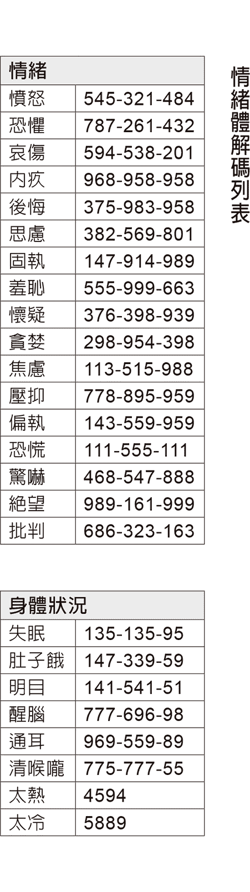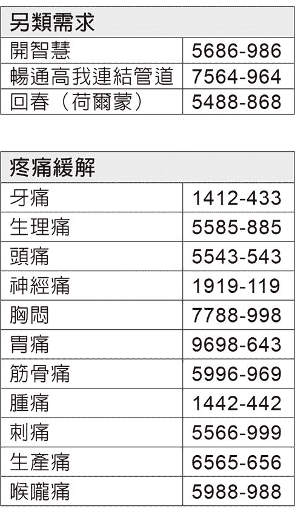

（请注意，以上这些解除情绪和身体状况的密码，是经由内在光的指引下载的，你可以自行体验。如果你的身体无法回应这些数字密码，就请放下这些数字引导，因为它们目前可能还不适合你使用。同时，在此也要提出免责声明：这些数字仅供内在意识流动体验，并非要取代专业医疗建议，请勿使用数字密码宣称治愈疾病或病痛，也不得以此对外进行诊断、制作或开立能量处方。）

 黑暗是光的动力来源

泰雅，我有个疑问。如果我们都可以在星光体中得到净化，有意识地进入情绪中，将业力清除掉，每个人都是光明又圆满的爱的存有，那么黑暗会在哪里？黑暗还在我们的内在宇宙中吗？还是会以另一种姿态展现？因为你们一直说，没有黑暗，光明也无法展现，黑暗是光明的背景。

是的，你看见了，我很高兴你可以清晰地从这个角度切入另一个次元的面纱。

当你不再排斥内在的黑洞，与你内在的黑暗融合在一起时，那个黑暗的光就会吸收你身上绽放的所有光的总和。如你的第三眼看见光的折射背后有一个无底的黑洞，有黑色背景的支持，才能更清晰地从第三眼看见绚丽斑斓的宇宙之光。这黑色的背景已经成为支持你身上所有光的集合体，黑洞变成了爱的收集盒，帮助你放射出你身上的光芒。

在这样的状态下，你的意识回到宇宙源头时，就会全数回到宇宙爱的收集盒中。那个收集盒就像宇宙源头中一个更巨大的黑洞，就因为有这超级庞大的黑洞，才能孕育出新的生命。所有宇宙新意识、新星球，都是在爱的收集盒的黑洞中诞生的，而一旦新的生命重新出现在宇宙中，就会自动绽放光芒——你们就是如此不断地进入生灭的循环中，创造光在物质世界中被黑暗投射出来的样貌。每一道光背后的支持，都源自所有光汇聚而成的爱的意识，它没有色彩，却能支持所有的色彩呈现在另一边的世界里。

现在回到你的疑问。当你重新将自身圆满的光和爱带回宇宙时，你会得到不同以往的黑暗的支持，支持着你的，不是你身上的黑洞，而是来自宇宙源头的爱的黑洞，那个温暖并持续释放能量给光明世界的源头。你身上的黑洞会被源头的引力填补，你无法在自己身上找到它，因为黑暗已经退居幕后，成了支持你放射光芒的动力来源，不再需要你去填补；你的黑色引力开关已经从你身上移除，你只能放射光芒。一个觉醒又圆满的灵魂意识，仍然携带着黑色能量，只是这黑色无法再向外寻找依靠，它已经被回收到母体的源头，与所有的光同在。这样你明白了吗？

难怪，我看见的阿乙莎像个宇宙大黑洞的眼睛瞳孔，在宇宙那一头一呼一吸地律动着，喂养所有宇宙存有，让大家都可以得到源源不绝的能量滋养。

是的，那里面依然只存在着爱，更大的爱，是足以让所有生命恣意体验的爱的源头！

所以，当一个人身上仍有黑洞时，他是否就无法真的绽放光芒？一直要到他满足了自己设定的生命蓝图，这些他自己创造的黑洞充分流动和表达完之后，这个人才能真正地绽放光？

不是这样的。每一个生命来到这世上，就是因为有这些阴暗，你们才可以看见彼此身上的光。

比方说，一个有强烈自卑感的人绽放出蓝色火焰般的智慧之光，是因为自卑和自认为有所欠缺，他才会不断追求，想要满足自己对智慧的渴望，也因此让他在此次的生命体验中得到蓝色光的旅程；而一个受虐灵魂的黑洞会寻找爱与慈悲的出口，但没有伤痛为背景，他就无法找到慈悲的路径。这些人身上原本携带的黑洞，就是此次生命的祝福，在生命旅程中经由黑暗的支持，让他们体验和活出自己的光。人们身上的黑洞不会是你想像的诅咒，那是来自宇宙爱的源头的祝福，没有黑暗就看不到光。

之前阿乙莎不是说，人类一直来地球体验，已经造成地球中轴偏移，所以才希望人们都可以早一点觉醒，看见自己的业力命题，早早做完功课，解除身上的黑洞，回到源头吗？现在你这样说，早做晚做都没有差别，反正都会回到源头，不是吗？

不是的！我再清楚说明一次。现在旧地球的中央黑洞已经不堪负荷，你想像一下，地球上方的黑洞扩大后会产生量子坍塌，所以四周的光会被吸收。你去看看，现在地球上的生态系是否已经逐渐生病了？

不只是地球生态的崩解，你们人类自己制造的制度和文明架构也会一一崩坏，因为人类身上的光不足以平衡黑暗面的存在，累积的黑暗找不到爱的出口，就会形成黑色吞噬整个光明的危机，让阴阳、黑白交替的和谐状态瓦解。这是地球磁力场现在出现的不平衡状况，需要人类的关注，需要更多人觉醒，不再重复玩着自己的小黑洞体验。

你从星光体的全息图中看，就不再只是单一的视角，而是去看见整体，从合一的视角看见万物如何链接互动，共同依循宇宙法则成长、经历、转化。

现在宇宙需要在地球打开一个破口，与其说是另一个黑洞，不如说是将资源重新整理和重启流动更贴切。黑洞的出口就是另一个光明的开端，没有透过一些事件，让黑色的引力来回收宇宙，你们无法看见一切快速转向更新后的新地球。你现在若站在星光体中，就不会认为现今发生的疫情和黑暗事件对地球来说是灾难。这是早在二〇一二年就该出现的大跃进，当时并未发生，时间线因而被推移到人类足以应付为止。现在的疫情和混乱是源自地球集体意识再度挑战当前世界运转的方式，从政治、经济、教育到医疗系统，乃至你们口口声声提及的生态问题，都全部浮现“要改变”的动能。这来自人类内心的渴望，激发集体意识创造出改变的动能，这次的新冠肺炎疫情就如此被人类打造出来。这个事件对地球自身而言，就是为了重组ＤＮＡ而设置的动能；当事件落幕，你们会迎接ＤＮＡ重组后的合一意识降临。在这个过程中，没有意愿投入合一意识场的灵魂意识会离开地球，前往另一个星球体验。地球即将转化进入星光体的维度，准备进入宇宙意识的轨道里。

这一切发生得太快了，所有人类应该都还没准备好要打开星光体，也没有链接上自己的高我意识，就被迫选择？至少我看到许多人仍然维持一贯的生活，一点也没有改变，难道事件一结束，这些人一瞬间就统统觉醒，可以看见自己的星光体世界？

当然不是！接下来需要有更多宇宙知识被大量灌输到地球，你们必须传递更多知识库出来。这不是你认知的传统教育，而是唤起的过程，当讯息被传递出来时，人们的ＤＮＡ意识层会打开与高我链接的信道，这就是人类共同意识层被无条件释放的时刻。每个人都会逐渐忆起，原来你们是共同体。

不要小看一个人觉醒的力量，在星光体中你们彼此相连，一个人的觉醒之光会唤起许许多多人的意识一同回归家园。

 重建你和金钱的关系

泰雅，我想问问我的高我群，看谁可以回答我金钱的问题。

当前的世界之所以会有这么多爱恨情仇、忧喜恐虑等各种情绪喷发，始作俑者我认为是金钱。虽然金钱可以创造文明，带来美好的生活，但金钱也是让人类彼此竞争、无情地掠夺地球资源，造成人心混乱的原因。我们看见情绪可以带给人不同的意识扩展路径，那么，我们该如何创建新的金钱观，让金钱的意识帮助每个人回到好的情绪流动里？

金钱不只是货品交换和流动的对价工具，人类一直以来将金钱定位成流通货币，是造成你们今日陷入金钱迷思的原因。金钱并无法创造真正的价值，一个拥有大量金钱的人不一定可以过着丰盛喜悦的生活。人们疯狂追逐金钱，却又无法在死亡前理解：自己因为一辈子辛苦工作，追求金钱上的丰盛满足，而错过了此生的生命要给自己的珍贵宝藏和礼物。

生命是远比金钱更珍贵的能量，金钱的能量则是人类赋予的，它本身不具备任何能量。当一个人对金钱投射出恐惧、憎恨、不屑的意识能量时，金钱与此人的关系就是恐惧、憎恨和不屑；当一个人对金钱投射贪婪、占有、控制的能量时，金钱就会与此人形成贪婪、占有和控制的关系。世上很少有人将金钱视为慈悲、喜舍和爱的传递，所以金钱与人类的关系就无法到达慈悲、喜舍与爱的延续。

金钱和任何非生命物质一样，本身不具有任何意义，它甚至比植物还要被动地存在这个世界，但你可以看见，金钱创造出这么多美好的建设，却也造成许多伤害。如果你们回头去了解金钱被创造和设计的初衷，就可以明白，人类是为了和他人分享自己的耕作成果和生活中的美好，才创造出金钱的交流，而不是为了赚取金钱货币，才外出寻找工作。

如果没有金钱作为交货的根据，你们只能享有在地环境和自己有限的技能可以获得的生活辅助物；透过物品的交换享用，你们为自己和他人的生命创造出丰盛。在这个交流的背后，你们真正想要拥有的只是在交换当下的“喜悦”，这个“喜悦”的能量会为你带来更多爱的流动。如果在交换或交流的过程中，你和对方无法获得喜悦和爱，那你为何还愿意拿自己拥有的宝物去交换？

再深入去理解，你就会发现，人类渐渐在不情愿、不喜悦的情境下，去交易自己的身体、技能和时间，金钱因此成了负面感觉的代币。人们因为无法再交流喜悦和爱，而让金钱的本质变了调，从爱变成贪婪、控制，以及害怕失去的囤积行为。此时，若有人想要透过金钱换回更多的爱和喜悦，但自己又无法给出喜悦和爱的能量，人类和金钱的关系就成了今日这种自己制造出来的痛苦。

你们要学习改变和金钱的关系，这远比去憎恨或消灭它更重要。当前的金融结构已经衍生出更多数字游戏与不劳而获的现象，这些虚幻的泡泡自然会在人类觉醒后，自行破灭。

让我给你一个重建你和金钱的关系最直接的建议：爱你所爱，做你愿意为自己和他人去做的一切最能发挥你专长的事情。当你散发出喜悦和爱的振动频率，去交流你最珍视的物品和技能时，金钱与你的关系就进入爱的流动中，源源不绝地流向你，你将永远不虞匮乏。金钱珍贵之处不在其多寡，而在于它与你的关系！

我是象头神，愿喜悦和爱与你同在。

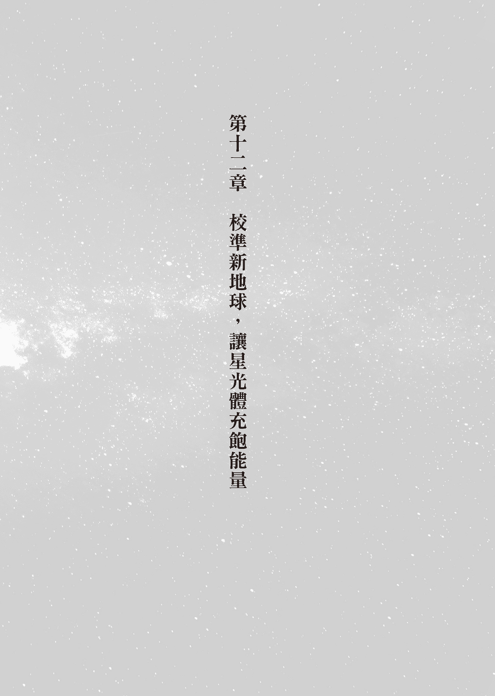

 新冠肺炎是上帝的粒子？

你还记得你曾写下四大元素的流动衍生出六十四种现象？

对！但我完全看不懂，很像易经，又不太一样，都是四大元素流动后组成的现象。我还没有整理出来，很抱歉，我的大脑容量真的有限。

那就是生命之花展开的路径图。生命之花是随着四大元素的交互作用产生的相应能量流动现象，这些会在你存在的现象界显化出来的象征，就以六十四象来表达，所以这六十四象是能量流动后的结果，不是起始原因。

生命之花结晶过程中产生的每一个象征，你们的老祖宗称之为卦，这个卦就是来解释能量流动产生的讯息。你用更简单白话的文字去诠释就会发现，内圈逆时针的意识流动，和外圈顺时针的意识流动，流动过程产生粒子碰撞，阴阳相合后将单一正极或单一负极的电子释放出来，中央等离子搭配被释出的电子，就形成六十四种卦象。这是天体运行的当然过程，只是透过物质世界显化出来。你们会将所有转变的过程和片段连贯起来，当作一个有故事、有前因后果的连续事件，若在更高的维度来看这六十四种卦象，则都是独立的、单一的，同时并存在宇宙中，暂时处于平衡状态，而整体的平衡需要所有这些独立的、单一的现象同时存在，才可以到达。从任一片段都观察不到整体的平衡，所以六十四卦不是由宇宙演绎出来的，而是生命存在的整体现象。

呃……（小我又开始疑惑了。）

你不必担忧你的生物脑不懂这个道理，先让自己的意识跟随着讯息流动，持续跟着，不要阻挡了讯息的流动。

喔，抱歉，我又被自己的小我挡住了……

当这些现象同时存在宇宙中，在地球维度的你会看见和感受到的，就是那没有在平衡之中的单一、独立存在的电子被释放的过程。

例如，新冠肺炎病毒出现在地球时，那第一颗被释出的电子就会游离去寻找可以与之搭配的另一颗电子。

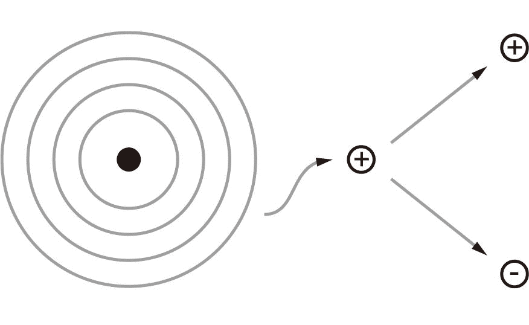

若它携带着正极，就会和另一个负极的电子相互结合，成为一个完整的结合体，流入不同时空的存在体。这时在三度空间的人类细胞中，就显化了这个早已存在的病毒粒子，展开自然的演化，而在演化的过程中，可以生生不息地创造出更多相应的干扰物质，你们称之为抗体。这是生物体的免疫系统创造出来保护生物体的事件，但这样的保护对病毒来说就是攻击事件，因而会繁衍出更多病毒。人类整体的生活和健康系统就因这单一的游离电子进入人类的生活，而重新排列出新的平衡系统，这也就是你们古代文明所称的“上帝的粒子”，来自上帝的允诺，是改变人类世界必要的介入手段。

其实，这是依循宇宙法则，在尚未平衡的状态下，自动演化出新的平衡系统的过程。你觉得不可思议，人的眼睛无法辨识的一颗微小粒子可以撼动整个人类文明，危及数百万人的性命和财产？没有错！宇宙正是如此有秩序地维护星际的平衡轨道，否则数千万亿颗星体不是早被撞得四处飞散了？人类仰赖肉眼看得见的物质表象，无法观察到身体内的精微宇宙系统是如此生生不息地进行讯息交换，让每一个变动粒子之间和谐共存，也无法以有限的视角观看整个地球生态如何维系彼此的能量循环和平衡。所以，地球今日终于迎来了上帝的粒子，这是因应更高次元星际平衡的需要，而调整地球目前的场域和轨道运行的必然结果。

但之前我也和你提到，这些都是独立、单一、彼此共存的现象，你们若要早日结束新冠肺炎对生命财产的冲击，就必须直接进入那个同时存在、最平衡的宇宙平行时空的实相里。你们可以进入那个实相，得到平衡后的宁静。那个实相同时也存在你们的集体意识里，你可以走过去看见那个最后的平衡实相，将它带回给正在事件中对抗的人们。

现在，你进入内在宇宙，去看看那最后的平衡实相。

哇！我看见了，平衡出现在第五次元的地球。

没错！你们会在这个过程中从三次元，跨越四次元，进入五次元。

我看到地球轨道上升，上升后的地球中轴从过去锚定太阳和月亮连成一线，偏向锚定来自天狼星的光源。原来新地球已经要进入银河系的新轨道，地球的中轴会因为进入新轨道，不再锚定太阳，而是锚定天狼星。

现在你可以透过星光体打开链接天狼星的星际闸口。用你的意识默念“558-868-868”这串数字，就会看到你星光体意识中新冠肺炎所在位置的正对角，出现了一个闸口，这个闸口可以帮助地球打开新地球之门，接收来自天狼星中央大日灌注的银河宇宙能量。

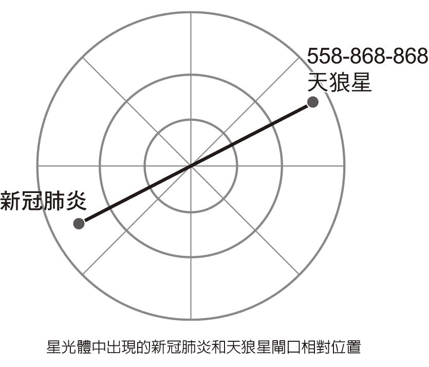

喔！原来新冠肺炎和天狼星处于正对角。但若从整个星际球体角度，而非从我的平面视角去看，这正对角线实际上跨越了两个维度（下页图）。

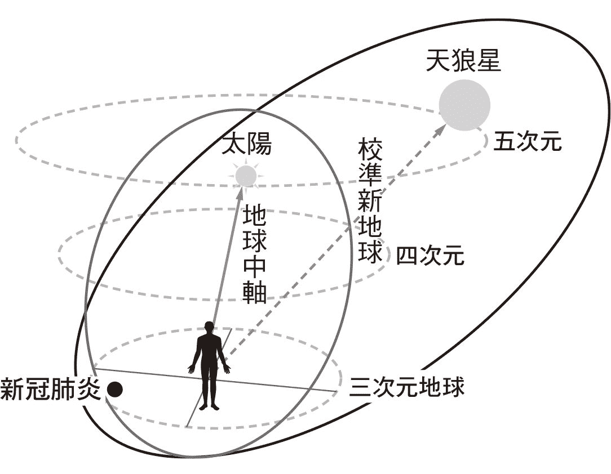

这个新冠肺炎就像是从宇宙掉落到地球的上帝粒子，帮助地球重新校准五次元的轨道，才能在五次元的地球中获得平衡。这是让地球得以扬升进入五次元新地球平衡的事件，难怪是全球性的引爆，没有一个人和区域可以忽视它的存在。

地球要开始进入不同的星际轨道，进入银河系的轨道中。从现在到二〇三六年，地球会透过一些事件引导整个地球扬升进入五次元。这里的生活将不同于旧地球，我们会透过一连串事件改造人类现有的政治、经济、金融、健康、生态、医疗和教育系统，这都是为了迎接五次元生活预做调整。

人类正准备迎接伟大的地球扬升时代的来临，而在这个时期到来之前，稳定你们自己的中轴非常重要，若不稳定自己，就会被这股强大的能量冲刷，离开地球；但在此同时，所有人类也都被宇宙更高意识的存在共同祝福着。不要以为自己很渺小，只要提升意识的振动频率，你们就能成功地以现有的肉身进入五次元的光辉时代。

接下来，你要准备学习进入新地球。我们将一起重新揭开宇宙法则的奥秘，让它成为新人类必备的常识。这是你的天狼星父亲最擅长的部分，你可以去请求他的协助。

 新地球能量校准

嗨！雷巴特，泰雅要我来问你接下来要学习的东西。

你现在讲话的方式跟之前感觉不同了。之前在天狼星的你很严肃，现在感觉和蔼可亲多了。

是的，与你合一的过程，让我非常开心愉快，你是我创造的孩子啊！

好啦，以后我常来心轮和你会合就是了！

没错！孩子，我们一直与你同在。

过去人类对身体系统的认知，仅限于对物质显化层的组织和细胞的了解，而对于星光体这个看不见、同样属于身体系统的重要讯息层，以及它和星际间的能量交换、传输、平衡、释放及排泄等，都无法更深入地探讨。古文明时期的人曾使用星光体层大量下载宇宙知识，现在的人已经遗忘可以透过灵性扩展进入星光体层，取得宇宙知识。

现在，你的晶化身体已经完成，可以打开我们交流协作的场域。从现在起，你可以透过心轮中央的启动阀，与星际意识互动，并进出银河不同的维度，准备迎向星际交流的学习。

这很有趣啊！我现在的身体层并没有感受到任何的不舒服，好像只是在自己的身体上完整了一个晶体结构，而这个结构就像生命之花展开，扩展我整个意识体。这可以发生在每个人身上吗？

这一路上你走过的每个环节和步骤都很重要，缺一不可；除此之外，也不是所有人都可以邀请高我意识如此进入在地球的身体场域，在其中融合。这需要ＤＮＡ的预先配置，而你和许多降生在地球上的星际种子，以及即将降生的新生命都预置了这个融合节点，才能完成这项被赋予的任务。

你们身上拥有回到银河星际之家的心智图，这张地图就存在你们的心轮中央，你可以尝试去拜访晶状体里每一个圆形的星际联络站。每个联络站都有你的一部分更高意识伙伴，提供你必要的信息和协助，你可以在此链接所有的星际家人。

你现在只要用意识链接“558-868-868”，就可以调频进入锚定天狼星的星际联络站。

为何我需要锚定这里？

这里是新地球即将扬升进入的五次元轨道闸口。你不必知道星际轨道如何划分，因为使用光码或音频设定即可到达。目前我们以数字密码“558-868-868”来链接。

哇！这样说来，如果我的星光体里有许多星际存在意识，不就有更多星际联络站可以去探访？

是的，而且还不只呢！透过每一个联络站，你可以再链接上更广大的银河系其他非属于你的意识晶体携带的地图，那是透过你的灵性组成的意识允许，就可以进入的场域。

这有点像拨电话号码，才用几个号码就可以到达星际联络站，太不可思议了。

这必须在你的意识与高我合一，站上星际交流的平台后才可以如此运作。若尚未登入星光体，就算念诵这组号码，你们也会因受限在帷幕之下，频率无法与之共振。

这实在让人很难理解，意识还真的可以跨越星际，到达无远弗届的境地。那么，最远可以到多少光年之外？

宇宙中没有时间，进入只需要瞬间的意识转换；但是当你回到地球，可能会发现地球上认知的时间已经过了很久。

所以我得小心进入，以免一眨眼后回到地球，却已经是白发苍苍的老人？

倒不至于，你的内在意识体会提醒自己该回家的时间。你在地球维度的生命尚未结束前，是无法在星际间航行逗留太久的。

我现在已经进入了，这是哪里？可以让我更了解吗？

这里是五次元的新地球意识场。

你会觉得奇怪，为何不是飞往地球之外的星体，到达另一个星球？不是的，你们所处的地球正进入光子带，这是五万年才会遇到一次的机会，地球透过银河宇宙创造的光子带，可以重新校准，进入新的轨道。用天文台的望远镜无法看见自己所在位置和周围星群如何进行频道互换和对接，但若站在银河中央向地球望去，会看到地球与太阳系的行星，金星、木星、土星、水星正连成一线，宛如一根直直的棒槌，而这根棒槌将同步穿越光子带的激流，稳定地进入银河轨道中，太阳则会和远在八．七光年之外的天狼星连成一线。目前天狼星释放到地球网格的讯息异常强大，你可以在地球上接收来自天狼星ＡＢ星群的讯息。

所以，当你的星光体锚定天狼星群时，就是在协助地球链接太阳的中轴线，向天狼星对齐。到二〇三六年，太阳、地球和天狼星就形成一条直线，那时地球便正式进入银河系的大门。而此时此刻，愈多的光之工作者让星光体校准对齐天狼星群，就可以将新地球的频率链接到目前的地球上。人类的意识校准可以帮助地球进入银河系的轨道，人类是宇宙和太阳系之间的传输管道，这一切设定早已存在你们身体细胞的ＤＮＡ中，只要打开意识节点，就可以帮助地球顺利扬升。

 地球扬升到银河系的目的

这是宇宙集体意识进化的必要过程。在人类存在地球的历史上，早已经历过无数次的地球扬升，最近一次发生在两千年前，当时星际面临一次轨道移转计划，而那个时候耶稣降生在地球，就是希望为人类带来新的意识转变，结果因为黑暗势力的阻挠，并未成功移转。时至今日，地球文明又进入和银河系交会的时点，此时此刻已经有许多来自银河星际的存有前来地球协助此次的扬升。扬升不只是为了地球自己的环境，而是所有银河星系存有共同的期待。

我们原本就是不分彼此的家人，是共同意识群，但我们决定前往地球，为了宇宙集体意识的进化展开一次意识扩展之旅。现在终于接近此次体验之旅的尾声，我们再次为了整体意识的扬升进程，决定唤醒自己仍沉睡于三次元的意识体。这是我们早已订下的计划，不论人类自己，也就是我们自己播下的灵魂种子有多少片段苏醒，我们都必须在此时回到银河母亲的怀抱。

所以，地球的这一切就只是高维意识的体验场，以及帮助集体意识扩展的场域？

也不只是为了宇宙集体意识的扩展，还为了维系整个银河联盟的平衡。在光之场域，有非常多不同的意识振动频率，虽然分别进入不同的星系，组成不同的星际邦联，但最终，我们都为了与彼此和谐共存，承诺了一个共存共荣的协定。

在宇宙时空中，一切的体验都被允许存在，并以此为前提创建集体平衡系统。所以，若黑色联盟竭尽全力展现黑暗力量，白色光之联盟也会尽其所能在黑暗中找寻光的出口。现在地球帷幕之下就是笼罩在黑暗中载浮载沉，而光之联盟就会在银河宇宙找到一个新的光明出口，来协助迎接新生命的诞生。

这些新生命虽然在生物体层显化出和现在的人类相同的外观和形体，但在意识层，他们已经和旧地球时期的人类有所差异。这些新生命的灵性意识对银河光之联盟全然敞开，在此时进入地球，必须带领更多意识扬升的先遣部队。当愈来愈多的灵性意识被唤醒时，地球就可以重新校准，进入下一个银河系平衡的周期里。

你现在以来自天狼星的密码校准，就可以契入这里。这是为集体意识进入新地球所预备的光之场域校准行动，每天让你的星光体校准对齐太阳和天狼星，成一直线，就可以扩展你的内在意识空间，允许更多新旧意识在你的星光体场域中融合。而在新旧意识合一的过程中，你的一言一行都可以带领尚未进入此校准新地球场域的人获得同步校准的机会。

千万不要小看自己个体意识的能量，当你的意识校准新地球光之场域后，在看不见的量子场中，你们将可以形成一个强大的能量转化虫洞。穿越此虫洞的过程不会耗费地球上的能源，你的意识能量会以看不见的磁引力场扩及远处，无远弗届。人类本身就是宇宙之心在地球的发射站，你们个人和群体进行意识校准，就能帮助地球完成进入新地球场域的校准行动。

这么简单？那这一次是否仍会有黑暗力量来破坏这个集体意识扬升的机会？

黑暗能量同时存在星光体的场域中。在引导众人进行银河星际意识校准的过程中，会有许多光之工作者自动聚集，你们结合起来的光明自然会让单打独斗的黑暗力量消退。黑暗无法存在光中，只要你让自身的光绽放，黑暗就会消散。这些黑暗的集体势力正面临光的世界的冲击，逐渐溃堤，当前旧地球许多控制着人类意识的系统正在瓦解或失去动能，取而代之的是光的联合。虽然你们是独立存在的个体，但彼此的光会以联合阵线的方式链接，你们将会看见光的阵营无所不在，并逐渐深入每个人的生活里。

 完成新地球校准的先决条件

人们仍然必须先净化业力，以纯净的内在意识为基础，才能展开意识的校准，否则会很容易受到过往历史印记的阻碍，而失去校准新地球的持续力。

此外，还需要与自己的灵性源头片段达到三位一体的共振。人类无法依靠自己的大脑意识到达基督意识场域，必须靠灵性父母的加持，将振动频率提升到足以跨越物质身体。唯有在合一意识的带领下才能持久，所以进入自己的灵魂晶体，到达和灵性源头三位一体的存在状态仍是基础。

未能契入灵魂晶体的人仍可以跟随能够链接进入新地球场域的人一起串联，进入同频共振，这和你们的灵性父母带领你们提升意识振动到达基督意识场域，是同样的道理。设置光场的用意即在此，人们在同一场域中彼此链接，达到同频共振状态，就可以透过已经能够进入新地球光之场域的人的带领，偕同到达。

除了进入新地球场域的校准行动之外，我还需要在这个状态下做些什么？

你可以进入天狼星去下载星际图书馆中的资料，里头有许多关于人类情绪体的资料库，还包括一个情绪体验馆，你还记得吗？

我当然记得，雷巴特说过那是天狼星人的游乐园，我很好奇天狼星人长什么样子，有肉身吗？

以前有，蓝绿色的皮肤，非常高大，二．五米高，和列木里亚人长得很像。但因为已进入八次元，所以原来的肉身已经不再需要，渐渐转为以意识存在体的方式生活。

你现在可以登入自己的晶体，打开星光体意识，链接新地球。

 新地球扬升行动迫切需要人类协助

这一次的新地球扬升行动，迫切需要人类来协助完成。地球母亲无条件提供、让人类世世代代不虞匮乏的生活环境，已被人类无意识地破坏，其根本原因是人心的封闭、贪婪和恐惧阻挡了心的能量流动。人类的心因为无法提供自己和周围环境自我校准的能力，集体意识的沉沦让人们对别人的痛苦和事件导致的重大伤害变得漠然，地球生态被人类持续破坏。今日大自然的反噬并不是在报复人类，而是反映出地球母亲早已不胜负荷，无法再以一己之力帮助地球恢复原貌。虽然地球母亲不断提出警示，人们却仍然视而不见，听而不闻；直到如今，无法停歇的疫情和一连串的灾害及战乱，造成许多伤亡，人类的日常经济活动也被迫按下暂停键，人们才终于发觉，地球已经无法再让人们无止境地恣意享乐。

现在，该由人类做出具体改变，帮助自己赖以为生的地球获得新的平衡，新地球的能量校准正需要所有具备觉醒意识的人一起行动。让地球恢复平衡的做法也非常简单，就是重启人类身体中轴和宇宙意识链接，恢复和宇宙能量校准的能力。

当愈来愈多灵性意识被唤醒时，人们除了可以恢复自身的宇宙能量接收能力之外，也可以提升身体的自愈力，经由来自银河太阳——天狼星的能量，帮助人们打开无意识的ＤＮＡ屏障，提升意识，契入基督意识场域。

人类原本就是宇宙之心在地球的发射站，个人和群体进行意识校准，就能帮助自己和他人同步扩展，协助地球完成进入新地球轨道的行动。

链接银河宇宙的闸门已打开，所有人都不该再沉默、不该再认为事不关己，这不仅是一份来自银河的邀请，也是人类赖以生存的地球发出的求救信。地球母亲为了世世代代生活在地球的所有子民提出最强烈的呼吁，请光之工作者带领大家一起行动，帮助自己和地球获得能量补给，一同扬升至新地球。

练习：新地球校准

步骤如下。

1.内在宇宙调频，校准身体系统：经由咒音的引导，校准身体十二大系统，完成身体中轴与太阳的校准。

2.星光体校准：进入身体外圈，链接星光体。

3.使用密码“558-868-868”，打开银河系天狼星门户。

4.让天狼星、太阳、地球和身体中轴连成一直线，完成太阳系和银河校准。

5.链接新地球能量，使其进入身体场域。

6.意识扬升，契入基督意识场。

7.聆听大师指引（若已进入每日校准，可以略过这个步骤，有需要时才进行）。

8.传爱给他人。

9.能量落地，传入地球，新地球能量经由身体中轴注入地球之心。

10.结束。（编按：新地球能量校准相关问题，请见本书附录。）

▲点击此 QR Code，可链接到“阿乙莎新地球能量校准”冥想引导影片。

星光体校准地球后，就可以获得中央大日的源头能量补给，让星光体充满宇宙能量。每天可以在日出和日落之际各做一次，日出做可以帮助你在地球的行动载具——你的身体——补充宇宙能量；在傍晚日落时进行，则是能清理你一天沾染的身体噪声和负面能量，清理后的身体场域让你可以在睡梦中提升意识维度，完成星际任务。当人类集体成功迈向五次元，你们的身体细胞会同时转化出新的晶体结构，你在旧地球时期经常遭受的身体疾病和不适也都会消失。

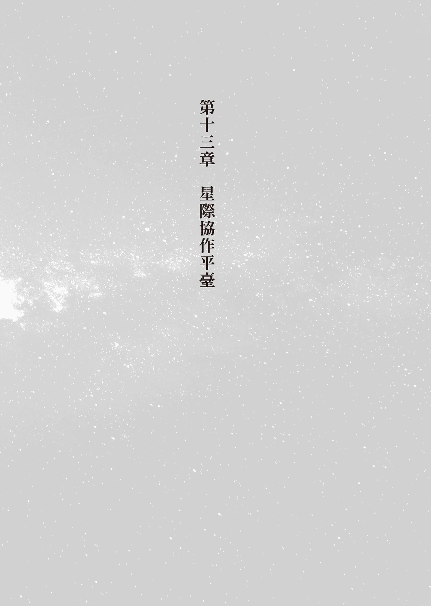

 打开意识通往星际的闸口

你现在已经可以进入光之殿堂感受到的入定状态（编按：请参考第九章“契入灵魂光之殿堂”），这和之前在基督意识场域中感受到的和自己灵性父母合一最大的不同，是你意识通往星际的闸口就在此。在基督意识场域的“I am that I am”（我是临在），是你与自己的更高意识接触合一的入口，那里没办法带你通往属于你自身灵性片段的星际闸口；你进入星际的入口在此，就在你的身体里。

好奇怪，振动频率不是愈高愈好，为何入口在肉体上？我以为必须将自己的意识振动频率提升到基督意识场以上，才可以到达星际大门。

之前你的意识进入基督意识场必须由阿乙莎带领，你的意识振动频率在地球维度无法以如此高频的状态行进。你无法让自己的意识一直处在高频，处于和自己的身体细胞振动频率不相容的状态太久，所以，为了让你的身体能与更高意识频段中的你进入共同创造的状态，就会在你的身体细胞中置入一个可以让你的身体和高我意识协作的平台——一个专属于你的光之场域，或称为灵魂的殿堂。你们可以在身体细胞允许的振动频率范围内，随时与自己的更高灵魂意识合一，这么做有许多重要意义。

一、你们可以用更高的意识状态在地球生活

与高我合一后的你，可以不再被小我和情绪体干扰，也可以穿越大脑的意识屏障，以更高的意识状态生活。

二、取用星际宇宙资料库的信息

这里包含了你在地球和跨越地球存在宇宙不同星系中的所有信息，这些信息又和水晶图书馆里的信息不同。这里是星际图书馆，里面可以找到目前地球所有文明的纪录，还可以衔接这些文明的振动记忆，进入它们与星际交流的历史记忆。

三、衔接星际意识

过去人类一直以为自己和星际是分离的，是独立存在的个体；进入星际图书馆后会发现，你们是由不同家族的ＤＮＡ所组成，是自己播下的星际种子，在地球上生长茁壮的智人。当你终于回到自己的灵魂殿堂，代表你从智人状态回到宇宙人状态，你将为自己生活的地球家园创造出崭新的系统。

目前的地球已经不再任由智人主导地球生命，即将展开由宇宙人衔接自己的星际意识，让地球人和星际家族接轨的新地球时代。你目前体验到的状态，就是现在来到地球的孩子们的状态，他们从出生起就已经处于和自己的星际家族合一共存的意识殿堂，用这样的视角去看待孩子的行为，你就更能理解这些孩子为何无法融入智人领导的地球系统。允许孩子用他们的方式创造自己的未来，就如同你曾经如此放手让自己创造智人在地球上的体验，并摸索出今日的生活环境一样。

四、创建新地球的生命互动系统

这是你们与自己的内在灵性组成合一之后最主要的目的。你们不只带回星际记忆，最重要的是要在地球上展开行动。这些记忆就在你自己的灵魂殿堂中，这里的星际图书馆存放大量讯息，你需要撷取的任何星际智慧都可以自由取用。以你更高的意识状态去理解你读取到的讯息，这些讯息无法用你们的生物脑理解，因为人类的生物脑是经由学习与实际体验记录生命的讯息，而这些超越地球维度的记忆需要你处在与自己的灵性组成合一的意识状态下才能全然理解，否则只是将多维架构限缩在二元和三维的世界里，是无法产生任何意义的。

例如，你现在以和高我合一的意识状态去读取这个图形，就会更明白以高维意识解读和用人脑解读有何不同。

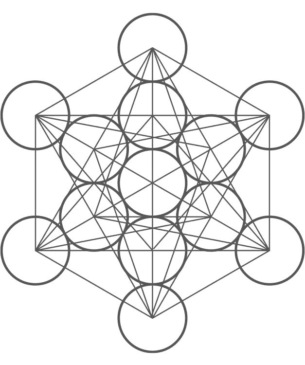

透过高我的视角，我可以感知到这个图形是由地球四大元素（地、水、风、火）链接折射出的生命景象，生命就是由此四大元素经由链接、碰撞、移转、融合的过程，创造生生不息的体验。任何一个生命都是整体的一部分，也都和所有生命相连，亦即从任何一个节点（圆圈代表风元素），可以转入并链接八个方向，最后又回到自身原点，由此循环创造出生命的晶体之花。若以剖面图来看，就是同心圆的概念，任何一个端点都是宇宙之心，向外可以触及所有圆心。由中央触及任何一个圆心就是意识扩展的过程——其实，全都是由自己向外扩展，最后又回到自身的过程。

从中央圆心一直扩及第八圈后，又回到原点的第九圈，只是此时第九圈已经到达我和我可以触及的所有意识全部合一在同一意识节点，我是原来那一个圆心的起始点。但是当进入生命晶体之花中，我圆心那一点的意义已经不同于最初始中间的那一点，而是包含我的所有元素，也链接了所有存在不同点、不同线、不同面、不同时空的我。我是存在生命晶体之花所有平行时空中的我的集合，这些我都与我的意识同在，意识我，也就是我。

你看见的生命之花图像，在你个体意识与高我合一后已经截然不同了，不是吗？

是的，完全不同，原来只是看见表象，现在可以看见表象下的运行过程和最终的结果。虽然还是回归原点，但此时我的理解和之前的认知已经是完全不同的两个世界。

那么，中央这一点就是现在灵魂殿堂之于我的概念吗？

是的，你已经可以从这一点展开星际协作平台，进行星际探索之旅了。

 与高我视角同步的沟通法

阿乙莎，我现在用以前和祢链接的方式打开阿卡西纪录，感觉也和之前不同了。

是的，你现在能以更清晰的意识链接高我。

我要如何分辨并确认这是来自高我的建议？

透过直觉，你的直觉和感应就是最佳的个人导航指引。不要以为自己仍有匮乏、不足以承担后果，而害怕、恐惧，这样你又会走入小我设下的陷阱。

我想再厘清一下，当初二〇一七年与祢链接上、接收讯息，收进第一本书《阿乙莎灵讯》的第一句话提到“这是关于创建人类未来发展方向的系统”，那到底是谁给我的讯息？

那是未来的你，存在更高次元的你，和所有星光体的存在意识同频共振时传递出来的讯息。

那个我，是来自泰雅、莎雅、湿婆、象头神，还是雷巴特？是我哪一个部分的灵性片段？

都有，就是存在你星光体中的集合意识体，也是你灵魂的源头场域。

我灵魂的源头场域？不正是阿乙莎？

也是你自己啊，孩子！你还是不敢相信自己可以跨越宇宙各个维度，如此知晓这一切吗？

我还是会怀疑啊！因为在写下这些东西时，我是在跟自己的小我对话，小我大脑的认知容许范围有限，当然会觉得这些内容太不可思议了。

那你练习用高我的视角来看待我们之间的对话。试试看，让自己的身体意识向外延伸十公分，前后左右上下同时扩展，然后回头看看正在写字的你。现在你的意识就在身体之外十公分这一层，你有观察到什么不同吗？

嗯！确实，好像我就不太会陷入自我否定和干扰的思绪中胡思乱想，只是如实记录身体场域中所有讯息的内容而已。

好，现在我们就用这个方式来互动，这也是往后你进入星光体的导航时必须抱持的视角。在这个视角下，你的意识是跨越宇宙帷幕之外的扫描状态，你也因此减少低频意识的干扰。现在试着感觉一下，自己的身体和之前有没有差别？

我感觉自己的大脑比较没有转动，而是心，心轮很明显站上总指挥的位置。

很好！还有吗？

呼吸比较深，气息流动得更顺畅，感觉自己是在一个泡泡中写作，身体被心轮的讯息流驱动，大脑跟随心轮的能量流同步翻译。

很好，现在就处于这个讯息流动的状态，我们彼此正在交换大量讯息。你将直接收取我们要传递给地球人类的讯息，而你目前的认知状态也会同步传送到我们的资料库，让我们知道你还需要补足哪些信息。

难怪，之前总觉得怎么可能会那么有系统地展开对话，好像每一次的开场和上一次都有连贯。那你们现在明白我到目前为止有多困惑了，我感觉有一堆信息尚未补齐，对我来说，讯息仍是片片断断的，不完整。

还好啦！我们刚才侦测了一下，大概就是你还不是很明白宇宙法则要谈些什么，以及前面下载的那些身体咒音和这一切的关连。

喔，还真要谢谢你们——喔，不，是谢谢我们，帮我自己总整理出一堆困惑。看来又是我自己的小我干扰了这里的讯息流动。小我总是惴惴不安，好像怕写错，怕被人取笑、攻击。

你就维持这样的方式与我们同步沟通，我们很快就可以补足这些讯息落差。没错，小我总是大惊小怪，情绪体很丰沛的。

 黑暗是为新的平衡找出口的必要过程

我想了解黑暗存在宇宙中的真理。

黑暗就是吸收光谱内所有光之后的现象。在物质层面来看，光粒子彼此碰撞产生电，这些电和空气接触，产生光的流动现象，而支持光存在的，背后是一个巨大无形的引力场，这个引力可以吸收所有释放不完全的粒子动能。你会发现宇宙中存在着大大小小无数个黑洞，这些黑洞具有强大的引力场，可以吸收在宇宙中游离的变动粒子，然后转化成新的物质释出。想像家中的扫地机，所到之处回收了所有无法被环境吸收和融合的存在，而因为它是以黑色能量运行，你无法以肉眼看见黑暗中的运行轨迹。让我来跟你具体描述这些游离粒子在黑暗中持续演进的过程。

首先，粒子进入黑洞后会进行更细微的量子分解——你可以想像比夸克还微小的单位，让我们假设它是量子，某种能以振动频率存在的东西。这些振动会展开另一次量子融合，此时就不是正负电相吸附的概念，而是针对黑暗中收纳并融合出来的集体量子相对那一面——也就是光明世界的振动频率——产生相应的量子匹配振动。所以，当黑洞吸引光的世界中所有的游离粒子进入它的量子大熔炉之后，会因应黑洞外的白色世界需要平衡，重组出一个新的白色世界的动能，然后释出。如此周而复始，整个宇宙就在黑色与白色能量的交互平衡中，产生物质不灭的恒定现象。若没有黑暗的回收引力场，白色世界无法维持平衡，所以黑暗带给整体宇宙一股回收、融合、释放、再平衡的力量，白色世界则带来成长、茁壮、丰盛，以及源源不绝、循环再生的爱的能量。

然而，在人类体验生命的地球维度，从生物体的有限生命中体验生命流动的过程，人类会因为触及死亡和失去的议题，总认为生命消逝，进入无常的黑洞中是不吉祥和负面的，黑色因此被人们视为和死亡有关连的诅咒，甚至以为黑色会形成一种负面能量的攻击。其实，黑暗无法发动攻势，在黑暗中你无法选择，那里只能以同频共振的方式聚集能量；而当能量汇聚回到非以物质体存在的星光体时，黑暗更不是来吸收游离粒子的，而是在此重新创造另一个崭新生命的出口。

想像一下，当你深入黑暗中，你的肉眼虽然看不见任何东西，但你内在自性的光会帮助你打开内在之眼，这内在之眼会协助你照亮你所处的黑暗世界，透过内在之眼的光，你就能找到黑暗中的出口。所以，粒子存在物质世界，黑色能量帮助吸收游离粒子，但吸收进入黑暗中的粒子经由能量交换融合后，会进入更高次元中释出。宇宙的平衡会率先在较高次元达成，进而落实于较低的次元中，所以在黑洞中融合的新生命、新星球会再度释出，以高于原来低次元的振动频率，或以光的形式重新展现。这束光或宇宙为了平衡而从黑洞中重新释出的振动频率，会再次扩及较低次元，慢慢显化于物质层。

有了这个理解，你现在回头去看，新冠肺炎就是地球累积了许多无法相容的粒子，进入黑洞后重新融合再释放出来的动能，也是为了平衡目前的地球和宇宙而出现的一道光。这道光渐渐形成新的物质世界的动能，影响当今地球生命系统，重新展开新的平衡和流动。所以在星光体中，黑暗能量仍然存在，这是为了创建宇宙的新平衡找寻出口的过程，和在地球三次元体验的那种黑暗能量吸收游离粒子的方式是不同的。

当人们的振动频率提升至星光体的节点，打开帷幕时，你会以不同的视野看见黑暗运行的真理。黑暗可以将分散的意识集合起来，重组并汇流出一股新的动能，只是你现在要从灵性意识扬升的角度去看见整体宇宙运行之道。在你们意识振动频率上升的同时，那推动你们扬升的，就是存在你们灵魂ＤＮＡ最深沉的黑暗能量。存在你们细胞记忆中那些过去不想揭开和碰触的黑暗并没有消失，你可以去观察太阳和月亮，当地球面向太阳时，那支持着地球转向阳光的引力必须存在，才能顺利推动地球转向光明。

所以，当地球上的人逐渐苏醒，发现自己生命中的太阳时，也会发现那一直存在内心的黑暗力量也伴随着光明，如影随形，只是现在会以不同形式、不同现象配合你前进的步伐，一起进入转化的过程。而对更高维度的存在意识来说，也需要同步与你一起面对这些黑暗，才能共同扩展，并协助你的意识再次找到扬升的出口。

这些依然存在觉醒者身上的黑暗到底是什么？会以什么方式呈现？

那是人类在星际间生存时经历过的创伤和恐惧。这些深埋在地球母亲内在核心的引力，随着扬升轨道前进的同时会逐渐释放出内在的黑暗能量。人类经历过的那些情绪压抑、战争、饥荒、瘟疫，以及种种生存恐惧印记，随着人类进入文明生活渐渐不复存在，但那些恐惧的印记以能量形式存在地球母亲的内在核心，而这些黑暗能量也促使人类不断进化，远离战争、烧杀掳掠等野蛮行为。

当人类集体意识必须再次扬升时，这些不再被需要的黑暗能量也将浮现，被宇宙之心吸收转化。在此同时，地球表层会出现许多变动，包括地震、山河位移、海啸、森林大火、超级病毒冒出，这些都是黑暗能量浮现释放的过程。你们要熬过这段地球母亲转换轨道的阵痛期，更要提升自己的意识，清楚分辨这来自内在深处的负面情绪释放过程，地球母亲也正在协助你们将内在最深沉的恐惧释放出来。

 人类可以协助解锁高我的黑暗印记

在这个扬升的过程中，人类还可以怎么做，以免又被黑暗吞噬？

之前在进行业力盘点时，当你一次又一次进入业力净化过程，就是在帮助自己看见所有曾经的牺牲，以及因恐惧造成的限制性思想。那时你无畏无惧地进入那股黑暗中，让自己一一解锁；而现在进入星光体层，那些印记并不存在你的阿卡西纪录中，也不在你的细胞印记里，而是存在你的星光体层，你必须透过与自己的高我合一，去解锁属于你的高我的存在灵魂印记。

啥？是协助我自己的高我重新面对和忆起？

是的，这也是你进入地球场域，和自己的更高意识层合一的目的之一。你必须到达自己黑暗的源头去清理和理解。你们共同为了地球的扬升安排了这趟灵魂之旅，你的高我有一部分黑暗能量来自在地球生存期间创造和经历的创伤体验，高我——亦即未来的你自己——现在不也显化出一部分意识，回到具有肉身的地球场域中？而这趟灵魂之旅的主要目的之一，就是为了改写属于你自己的灵魂限制性枷锁和印记。

所以，并不是高我意识全然脱离黑暗的束缚，进入神性意识的国度，而是黑暗也以不同的形式存在高我所在的维度次元。你是否曾经在自己的灵魂记忆中看见星际争夺的场景？黑暗力量在不同的次元以不同的形式展现，这也是让所有生命可以如此生生不息存在的原理。

人类和许多星际族群可以在星光体中彼此交流，并在此创建新的地球法则。现在为了星际轨道移转计划，地球人——也是星际存有——要准备扬升进化到更高次元的灵魂孵育基地。透过高我与你的合一，你们将同步解锁身上共存的黑暗印记。你必须明白，黑暗是来帮助清理你们都不再需要的游离粒子，黑暗无法吞噬你们整个存在，除非你放弃自己生命和灵魂的光，所以当你再次感受到负面能量或某种你不想要的能量扑向你时，那一定是你身上仍然存在着某个你不想要的意识振动。不论是过往的细胞印记，或是由你的思想创造出来、足以吸引黑色能量再次链接的想法，都一定来自你自己。黑暗是中立的，如同扫地机，只会自动清除需要被清除的物件，而不是将你整个吞噬。如果你已经是洁净无瑕的大地，你会随时欢迎扫地机的光临，而不是把自己不要的垃圾隐藏起来，不让人拿走，不是吗？

之前是你的高我协助你看见自身关系背后的因，和此生在地球维度一直挥之不去的业力枷锁；现在换成你来协助整合自己的高我意识，透过与你在地球合一的过程，解开依然存在高我身上的灵性枷锁，这也是你到地球体验的任务之一。每个星际种子身上不只存在着光明世界的星际家人播下的意识，也包含早已深植在地球上的黑暗势力的存在意识，这些全都在你与自己高我合一的星光体层。你会发现自己同时拥有黑暗星际存有遗留在人类ＤＮＡ中的力量和振动频率，那曾经为了掌控地球而植入的控制与恐惧的能量，同样存在每一个人类的ＤＮＡ中，但这些负面存在，并不能阻止你们的自由意志做选择。

星际种子重新投生到地球，拥有一个生物体，同时也带着黑暗势力遗留下来的ＤＮＡ封印。人类在觉醒并跨越帷幕之外的过程中会发现，那些黑暗力量有其存在宇宙之间的必要性。你不会再视其为避之唯恐不及的毒瘤，也用不着花精神去歼灭它们，因为你已经穿越了控制和恐惧的能量。在你的内在意识中，黑与白早已融合出新的意识观点，这个新意识也将为人类未来的生命形塑出一个新地球的样貌。人类透过自己的自由意志，再次演绎出新人类的意识能量。

进入与高我合一的状态，进入心轮去看见自己在地球经历的黑暗印记，然后将光导入这段记忆中，带回更高的理解。在这个过程中，你会与地球母亲共同解开灵魂意识中的封印。

（此时，我的意识在心轮展开一个地图路径，我直觉地链接到英国的巨石阵。在中央，我的意识锚定远在天狼星的高我意识——原来现在我必须先解锁的高我黑暗印记，属于位在天狼星的雷巴特。

我的高次元灵性父亲雷巴特的这段黑暗印记解锁故事很长，是关于亚特兰提斯文明和种族大灭绝的原因，在此先省略。在看到黑暗印记的同时，位于地球维度的我等于进行了一次自我反省。透过这段故事，我可以清楚看见，存在人类高次元意识体中的黑暗印记是如何影响地球人类世世代代无法扬升。人类一直无法脱离生存恐惧，不断在种族撕裂及疆土掌控中求生存，而这趟印记解锁的旅程让我获得新的认知和理解之外，还因此获得目前存在天狼星的雷巴特替人类解锁这些细胞印记的方法，因为他也一直期待联合自己在地球上的存在意识，解锁仍留在人类情绪体的印记。这段纪录因为还得进入天狼星的星际图书馆取得资料，要再花一些时间才能慢慢整理出来。）

 打开星际协作平台

泰雅，我一早在床上以逆时针方向念了身体系统的十二个咒，完成后与你合一时，感觉自己的身体呈现水晶的结构，而之前一直出现在我头顶的星光圆形穹顶不见了，现在移到身体上。这是怎么回事？可以说明一下吗？

这是你星光体中的高我意识全然与你的肉体整合后带给你的新感受。在这个状态下，你的身体会呈现晶状结构，如上图。

我知道这个图，不是昨天才要我用高我意识去解读这个图形？

这是你的星光体、乙太体和物质体三体合一的状态，也是将你的自主意识、潜意识和高我意识校准，同时汇聚在心轮的状态。你的本我、智慧我和慈悲我全然临在于此合一意识中，准备以整合后的你的跨次元意识，进入地球行动。

地球上一些光之工作者或灵性扬升的大师随时处于此临在状态，帮助稳定地球磁场。你们不必牺牲自己的肉身去抵御星球遭遇的负面洪流，不需要如此，当你的灵魂晶体结晶落实进入物质身体时，就可以创建宇宙和地球之间最佳的沟通桥梁，如同你在天狼星的父亲和在列木里亚的母亲彼此连线，创建一条链接地球和银河宇宙的光带，帮助地球接收来自银河系永不匮乏的脐带能量。

现在透过你们整合了自身晶体，进入心轮中，就可以让身体启动和宇宙之心的晶体连线。过去你和宇宙是分离的，现在已经全然融合在自己的星光体晶体结构中。你和银河母舰上的所有星际兄弟姊妹有着相同的意识存在状态，你已经可以与银河家人随时以心电感应链接，互递讯息。这个串联起地球和银河母亲的联络站就存在你的心轮，也是你的生命之花绽放的中央核心，而随着生命晶体之花的绽放，所有与你无法相融合的意识存在会自动离去。你是神性在地球的存在体，也是宇宙之心与地球链接的所在。

你已经展开星光体的星际协作平台，在此的高我也是你，未来的你，以及处于不同时空的你。你可与所有星际意识共存于此，你们是合一的存在，而你经由与自己的更高意识存在协作，将可一起完成此生你们共同擘画的地球体验项目。

这是之前阿乙莎说过的，与高我携手创造未来的过程吗？

是的。你将可从自己身上取得源源不绝的宇宙资源，同时也解锁星际存有曾经经历的负面印记。你们在地球共同为自己的未来打造一个新的生命蓝图，现在该生命蓝图的最初始规画团队齐聚在你的星光体中，你们将可以为了更新和扩展自己，设定一个新的目标和前进的道路。

那这里的总指挥是谁？

你们自己。

你们指的是谁？

你们包含目前住在地球上的你，以及打开ＤＮＡ的记忆屏障，透过在地球上的你链接“存在不同宇宙次元和维度的所有的你”的那个你〔注〕。

那么，我的高我意识彼此之间，比如莎雅和雷巴特，他们之间的关系又是什么？

那是你的意识晶体结构中不同次元的存在意识体，也都是你的部分组成。你的部分又与整体一脉相连，我们彼此以振动频率链接、以意识沟通，而集结所有意识片段的你就全数存在你的星光体中，形成星际间的协作平台。

透过与你自主意识的管道链接，来自宇宙不同星际之间的讯息再次于人类的灵魂ＤＮＡ中交流。你是宇宙为了更新自己的集体意识而创造出来的灵魂组合体，你的存在是为了宇宙和平与持续扩展而创建的联盟。

还记得一开始当你契入基督意识场，到达无条件的爱的共振时，你感觉自己好像进入一艘星际母舰吗？那就是你自己的星光体以晶体形式存在你的顶轮上方。你仿佛穿越自己的顶轮，登入一个你从未在自己的身体中体验到的轻盈和洁净的光的存在。而这些光的存有也是你，你同时存在宇宙各次元间，为了提供此时此刻地球的振动频率而来到此，共聚在你星光体的集合意识体中。

孩子啊！我们就是一，一体的存有。现在你登入了我们为自己设计的星际协作平台，还有许多宇宙资源和宝藏等你链接和取得，如此我们就可以协助自己解开我们共同的灵魂枷锁和业力。你不只是帮助自己回到宇宙源头的意识轨道而已，还同时协助星际间所有存在不同次元的意识更新不再被需要的灵魂印记。

而在星光体的意识更新，不同于地球层次维度的更新。在此，我们必须重建ＤＮＡ的灵魂印记，创造出新的ＤＮＡ回路，才能真正帮助我们自己解锁原有的印记。

我不太理解的就是这一层关系。为何需要到地球次元的肉体层解锁？如果你们知道地球人的ＤＮＡ是高次元的你们实验室中的产物，不就可以做个简单的逆向工程，帮助自己解开枷锁？

哈！原来绕来绕去，你的脑筋卡在线性循环里，陷入“因为─所以”的因果中。其实不是你想的这样。还记得你刚进入星光体看见的三百六十度圆形穹顶，那个包含了你所有身体系统的圆吗？

现在，想像这个环形穹顶跟着太阳的位置旋转，而你也代表我们所有星际意识存在，放进对应身体系统的十二个位置。你是否看见类似一个星象图，这里每一个对应位置就是你一部分的高维意识，这些高维意识围绕着彼此和仍在三次元的你，也就是仍然存在着负面黑暗的引力旋转。你和自己跨越宇宙次元的高维存在一直都在一起，高我并没有与地球人的ＤＮＡ分开存在，当所有星体意识需要向上移动时，牵引着整个环形路径的低频引力就成了所有星际意识扬升的阻力，若没有适度排放废弃物，无法顺利进入新的轨道中。

所以，存在低频中的向下牵引力量，也同步创造了让所有高维意识存在自我更新的机会。对所有星际存在意识来说，那并非阻力而已，我们认同这是存在的阶段性体验必经的过程，但是当我们进入更高的视野，可以全然明白和理解自己创造低频引力牵引背后的原因，也就能为自己的低频能量找出转化和消弭的力量。

这股新能量的投入必须透过自己深入原来存在的低频轨道，投入新的意识能量后，才能消弭仍然沉重的负面引力。这也是宇宙万有能量不灭的定律，所有存在都不会在宇宙中消失，直到完整了自身体验为止。现在人类的星光体意识中聚集了来自所有星际存有的祝福，正为了地球和所有星际存在意识的集体扬升一起努力着。

所以，我现在要做的事情是帮助自己的高我消除自己过去在此留下的垃圾？

哈，你要这么说我们也不反对，确实如此！但也是为了我们进入下一个轨道前的必要星际轨道移转计划。

地球上出现过那么多次宗教大师或圣人转世，还有那么多巫婆、祭司都可以链接上自己的星光体，他们为何不早一点说清楚，让人可以更加理解？

他们不是没有讲，而是对当时所有尚未完整体验地球维度的星际存有来说，他们的话不具说服力。还记得我跟你提过高我星光体的意识也需要净化？宇宙一直不断地扩展和扬升，低频维度就是来协助整体意识扬升的助燃力。

当时的高维意识就如同当今地球上的联合国一样争吵不休、相互竞争，甚至为了争夺星球资源而战，一直到与自身更高意识合一后，才逐渐平息休止。现在地球上的你们，就如当时的他们，你认为当国与国之间都还没有凝聚共同意识之前，谁会听见圣人的教诲，又有谁愿意展开双臂迎接与自己价值理念不同的存有？

当你与自己更高维度的意识到达同理与合一的阶段时，你才会明白自己过去的存在有哪些是不再需要的；但是当你还处于分离的个体意识，还在自己的意识维度里面时，你不会知道自己已经不再需要存在那里面了。

接下来，该让你用与高我意识合一的角度，去看看自己存在的环境中，是否有某些限制性思想可以消除或更新了。交给高我意识来施展身手，和高我意识协作的过程中，你会明白宇宙的浩瀚和恢弘，同时也会发现自己内在拥有解决当今地球问题的办法，若没有将自己本自具足的高维意识力量发挥出来，就太可惜了！

这也是我们期待人类教育下一代的方式：和自己的内在宇宙校准，与高我协作，创造宇宙更新的环境，和新地球接轨。

注：那个你指的是真我，本书撰写至此尚未出现。

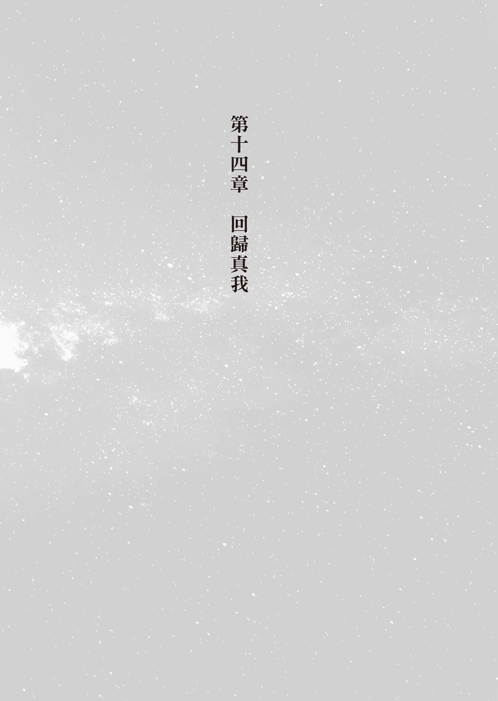

当你终于来到星际协作平台，此时，我要引领你打开上帝的密码“６-６-６”，进入你目前心轮位置这个晶体，这里面隐含了“６-６-６”意识解码后，将带你进入的神奇世界。

 打开真我之门

现在，跟着我进行以下步骤：

1.用你的意识，以逆时针方向锚定朝向下方的金字塔的五个端点，最终进入内在核心第六点启动（见步骤１示意图）。完成后，继续进行下一个步骤。

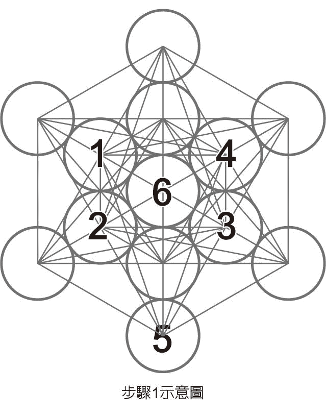

2.用你的意识，以顺时针方向锚定朝向上方的金字塔的五个端点，最终进入内在核心第六点启动（见步骤２示意图１）。

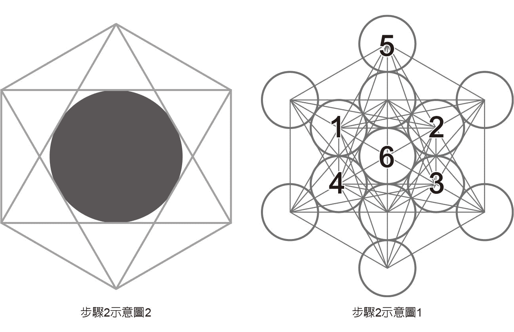

此时，上方金字塔来自圣父的能量，与下方金字塔来自圣灵的能量进入你内在宇宙的中央核心位置，最终的第六个端点形成，你与圣父、圣灵在晶体中央合而为一（见步骤２示意图２）。

这个时候，你的心轮完全清空，内在宇宙扩展成一个晶状结构体，这个六角的晶体就是你目前穿越宇宙的灵魂载体。你过去意识锚定顶轮上方十公分的位置，成功进驻心轮，在此你则与自己所有存在不同次元和维度的灵魂意识群在心轮合一。

这个六角晶体就代表你的高我集体意识群。你现在可以进一步去看见，晶体中投射出的光就是由所有存在不同次元的你共同组成的，这个光就是你星光体的真实存在状态，人类的肉身世界对星光体中的你来说，就是短暂一瞬间的体验过程。

你的小我意识无法驻足在你的晶体中，但你的高我意识会完全明了你曾在地球经历的一切体验和事件，那些由你的情绪体创造的振动音符都回传到晶体中。若你以肉身的知晓层次来看，你情绪体的记忆和大脑的记忆无法完全对焦，你的大脑在地球帷幕之下，受到传统教条、家庭和社会的集体意识，以及教育文化的影响，无法如实传达情绪体的振动。你们的大脑从小就被灌输好坏对错的观念，脑意识又主导人类所有的行为，你们当然没有空去理会情绪体的真实声音，而这些真实的纪录无法被窜改或以假乱真，这是光折射出来的频率和讯息，都被真实地记录下来。你可以试着进入晶体中，去找出你此生情绪的真实纪录，试着回想生命中发生的所有重大事件，看看晶体的纪录和你大脑的记忆有何不同。

你将会发现，大脑不会记录“恐惧”的存在，只有你的情绪体会如实在你的地球记忆库里存放“发现值得恐惧的事件”。

我要如何看见大脑和晶体里面的纪录的不同？

你必须进入自身星光体意识平台的学习，这里有许多有趣的操作等着你来探索。你现在要先熟悉身体和晶体融合的感官世界，等你可以快速进入自己的晶体中，就可以准备进入下一个阶段。

这和之前学习校准星光体有何不同？

之前是要快速清空你的内在宇宙空间，以和高我校准的前期作业，你必须打开内在的渠道，才能迎接自己的晶体进驻；现在你的晶体已经成功进驻心轮，你目前需要熟悉如何快速锚定，进入自己的晶体核心。

好的，我练习看看。

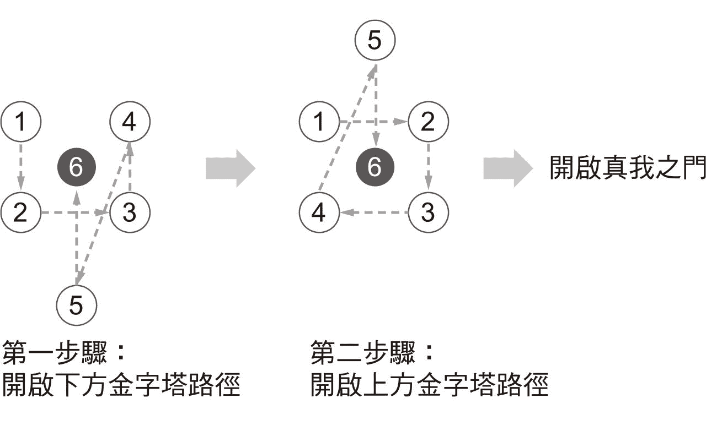

（我依照高我的引导，依序以逆时针锚定下方五个位置，回到中央第六点，再依序以顺时针锚定上方五个位置，然后回到中央第六点。此时，心轮的中央核心位置似乎打开一扇门，瞬间觉得心轮无比轻盈扩展。

至于如何分辨晶体中的纪录和大脑的纪录有何不同，我还是不知从何着手……

第二天一早天还没亮，就被昨夜做了一整晚的梦惊醒，我似乎整晚都没睡，一直在梦中寻找回家的路。那是个奇怪的梦境，我跟着一大群人走进一间富丽堂皇、像个超大型游乐场的饭店。一进入饭店，我就被整个金碧辉煌的大厅吸引，还来不及仔细观赏大厅的陈设和美丽的装置艺术品，我就被引领进入一条长长的走道，这里有我的房间，一四一一号房。

还没时间欣赏自己的房间，我就被告知活动要开始了。在梦境中，我一直在饭店里穿梭移动，整间饭店就像个游戏迷宫，每个活动区域都在不同的房间和位置，我得穿越长长的信道，走道两旁都是不同的房间，而每个房间都同时在举行不同的活动。在这些活动场子里，我都会遇见熟悉的面孔，有些是我多年前共事过的同事，有些是目前身边熟悉的朋友，只是不论哪种活动，我发现我在梦境中参与的每一项活动都让我疲于奔命。我一直在帮别人提东西、拿餐盘、准备材料、挪开座位，连剩下的最后一个三明治都给了身边的人，那是一个“忽视自己，不断满足其他人需求”的角色。一直到活动结束喊停，我还饿着肚子，什么东西都没有吃到，这时却被通知要立即去打包行李，准备离开。

所有人都飞奔回自己的房间整理行李，就在此时，我发现我怎么找都找不到自己的房间。我不停地奔跑，穿梭在每一个区域、每一扇旋转门、每一个门厅中寻找，我还依稀记得自己的房间号码是一四一一，但我怎么找就是找不到这个房间。

在迷宫中一遍又一遍穿越每一个场景，一直到所有人都准备离去，下一批人即将进场，此时的我已经疲惫不堪，心里又慌又乱，恐惧、气馁、担忧，各种情绪交杂。一想到自己的行李都还没有整理，连房间在哪里都找不到，身心俱疲。眼看着所有人都陆续搭上回家的游览车，我心想，我应该是回不了家了……最后，我尝试走回饭店中央的大厅，想看看是否有可以帮助我的人，就在此时，我遇到一名陌生女性，她对我说，没关系，我也不急着走，我跟你一起找回家的路。当她说出这句话时，我就从梦中醒来了！

醒来时，刚才的梦境重新在我心中倒带一次。我终于看清楚了，那整个饭店就是个晶状结构体，每个场景则是我进入地球体验的过程。那些人、事、物都是虚构的配角，是让我体验我自己是谁的配角，而我整个地球体验的心路历程被晶体如实地记录下来——我看见自己疲于奔命，充满恐惧和惶恐的心情，一直害怕找不到回家的路。

这不正是昨天我还没有完成的功课？阿乙莎要我分辨大脑中的记忆和晶体中的记录有何不同，原来，大脑中那些我认识的同事朋友和经历过的活动事件，在我的晶体记录器中如过眼云烟，我却围绕着这些人事物，一直试图在生活中讨好所有遇见的人。然而，即使参与了所有活动，扮演自认为可以满足所有人需求的大好人，把自己搞得饥饿且疲惫不堪，当活动结束喊停，我还是得自己找回家的路；那些我试图依赖和讨好的人，他们无法带我回家。

而最后出现的她，是谁？我终于明白，那就是我自己，存在晶体中的自己。我必须回到晶体中央大厅，才能遇见她；也只有遇见她，我才能顺利回家。

当我意识到晶体中有另一个自己的瞬间，我的内在意识突然打开另一个景象。我看到我就在大厅正中央，在水晶般透明晶体的正中央，像个孩子般。我终于看见她，原来那就是我的灵魂真我——我本是受到灵性父亲和母亲祝福的孩子，全身绽放天使般的光。我感受到无法以言语形容的无尽慈悲和喜悦。）

孩子，这就是你从这本书一开始登上银河母舰就展开的旅程。你以为走进了一个暗无天日的迷宫，但你的灵魂真我在此过程中并没有和你捉迷藏，她一直都在，就存在你晶体的正中央，而围绕着你晶体的，正是你的灵性父亲、母亲，以及所有与你链接的大师和导师。每一个灵魂种子都是如此被自己的灵性父母和大师、导师们保护着，并且一起进入地球帷幕之外，展开体验。

从你登上银河母舰的那一刻起，你的灵魂意识就展开自动回归的导航。泰雅是你在母舰上的分身，为了迎接你的灵魂意识展开回归旅程，时时刻刻都陪伴着你。在你一路从迷宫中试图走到中央大厅，找回自己灵魂真我的过程中，你仍须穿越你在地球帷幕之下尚未解锁的意识误区，而你在梦中看见的那些人事物，都是让你在回归旅程中辨认出你自己的辅助。

你经历的所有事件的实相，就在这梦中如实地重新演绎一次，在见着真正的自己之前，你需要回想起你在地球上是如何演出自己的角色。所有你曾经压抑的情绪和隐藏的真实自性都一览无遗，而当你认出所有的角色都是在帮助你再次经验和突破自我限制时，你终于回到最原本真实的你。那个孩子般的纯真与你再度合一，你即是你，回归到原本不生不灭、无瑕的你的灵魂真我自性。

现在你终于进入自己的晶体核心，遇见真实自性，还原真我并与之合一。透过与真我合一，你就可以获得自身跨越所有次元的觉知光明的指引，那已经不是透过意识驱动的维度，而是真我原本最初始的存在。接下来，你可以带着自己，准备穿越进入无我之境，而这趟进入无我之境的旅程，我需要你勇敢地独自前行，一切都要靠你自己完成。

阿乙莎，这趟回归真我之旅的目的是什么？

这是要让你超越原本虚拟的世界，回归最初始灵魂版本的过程。当你回归真我自性，并与存在更高维度的你合一，你将以崭新生命、全然临在的觉性，打开新意识，并展开新生命的道路。你将不再被过往制约和束缚，而是会以更清晰自觉的意识，帮助自己和所有与你共同存在的灵性片段，一起展开最初始灵魂设定的道路。你不只是为了自己的体验前来地球，星际种子有其灵魂使命，是为了地球整体生命的和谐与稳定而来到这里，找回自身灵魂的蓝图，并唤醒所有与你链接的灵性兄弟姊妹，一同完成此次灵魂早已规画的道路。唯有带着全然不偏倚的觉性，才能帮助所有人找回真我自性之光。

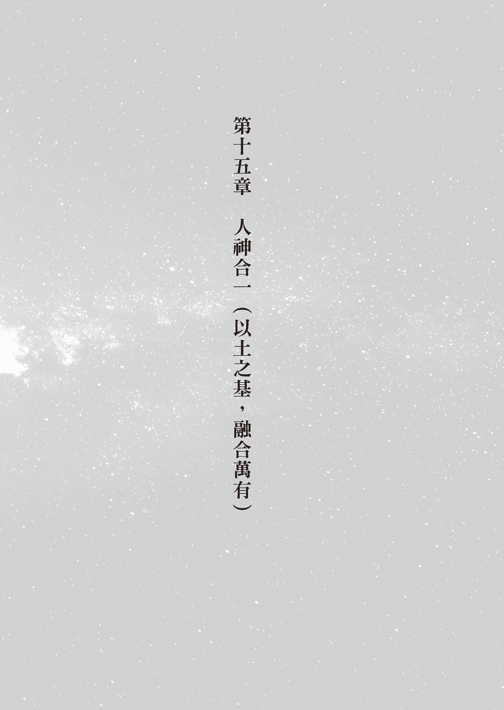

 为自己和地球创造一个新的你

改变世界的不是人类自己，而是在你的意识维度中创造出新人类，才能改变这个世界。当你契入灵性本源，找回你的真我自性后，你正要开始和自己的灵性团队再造一个全新的你。这个新的你将展开不同以往的思维，也能屏除旧世界的制约，你将联手更高维度的自己和你本有的天赋才能，重新定义你的存在。

过去的你从来不敢想像自己的未来是超越自己想像的世界而存在。你可以在十岁就看见二十岁、三十岁，或是五十岁的你生命展现的全貌吗？

我们总是卑微地期许自己能找到足以养家活口、安身立命的生存之道，再不然就是只想满足父母的期盼，或是满足自己永远无法填满的奢侈欲望和口腹之欲而已，我从来没有想像自己可以创造什么了不起的未来。我们就像在茫茫大海中漂流的生命种子，随遇而安是我们安度此生的教战守则；我们一直跟着古人、历史、老师和同侪的路，有样学样，从来不知道自己浑身是宝藏，更别提在有限的资源供应下可以如何展开自己生命的远景。我确实被这个世界洗脑得够彻底，就如同之前在梦里走进饭店迷宫，连自己的房间都找不着。现在站在自己晶体的正中央，重新创造出一个新人类，我无法相信人可以被允许在地球上活得如此自由。

没错！时间之轮并不存在你的晶体中，只要你愿意从最初始的你重新出发，你一样可以在有限生命的维度中创造永恒无限生命的蓝图。地球母亲也殷殷盼望地球上所有的星际种子觉醒后，可以为自己和地球创造一个新的自己。

当你回归真我的源头，你的意识早已和所有灵性源头的存在共同组成一个新的意识晶体。你不再被自己的小我意识屏障，也成功脱离地球晶栅中沉重历史包袱的牵绊；你已经是自由的灵魂，带着光明璀璨、最初始灵性本源的光和振动，以及所有已经内化在你新晶体中的地球经历，你已经可以替自己和地球的未来创造出一条新路径。只要你愿意设定新的目标，所有与你共同存在的灵性意识将共聚一堂，为实现这个新目标一起努力。你意识的高度将决定新地球的显化结果，你已经不是那个坐井观天、任由自己的小我指挥和发号施令的生命棋子，你有绝对的能力成为自己永恒生命的掌舵者，现在就让这新的生命意图为你展现前方的道路。

 世界即将改变，新地球秩序就要诞生

二〇二〇年发生在地球上的瘟疫、饥荒和大国之间的政治冲突角力，都在反映目前人心的状况。你们或许以为这只是二元世界必然存在的乱象，自古至今，人类经历数千年的群雄割据、政治纷扰、一代又一代的冲突、企业竞争，乃至家族间的暴力，你们对不断上演的冲突已经渐渐麻木，而最终让这些纷乱平息的力量，来自更大的破坏、消灭与控制性思想。这都是因为人类自以为是地球主宰者，无视在这些乱象背后一直保护着所有生命的根基和存续的更大力量。那来自你们的根，你们都是地球母亲身上的血脉，是地球母亲守护着你们，提供人类和万物源源不绝的爱的能量滋养。

地球母亲过去允许人类在冲突中学习爱。黑暗世界和爱之间只有一线之隔，当你们经历了重重的黑暗试炼，地球母亲永远敞开大门，迎接所有坠入黑暗世界的人；而如今，地球母亲即将关上这试炼之门，重新启航，进入新的银河轨道。在这个时期，无法与新地球融合的振动频率会被排除于地球母亲之外，这和以往地球母亲保护所有人类、允许你们恣意体验的情景已然不同。

地球母亲回归银河宇宙的运行轨道已经创建，所有干扰和阻碍地球母亲校准银河邦联的破坏性黑暗能量将面临自体毁灭。这么一来，地球即将产生新的世界融合景象，你们渐渐会在一些事件中体验到，若人类仍以为世界由地球人类的意志掌控，而轻忽大自然和地球母亲的存在，就会被自行发出的破坏能量反扑。以往这些黑色能量会由地球母亲无条件回收到地球之心，现在磁极已经改变，地球母亲不再吸收这些无法融合的能量，而会让它们全数回到释放者的身体场域和事件本身。以前你们深知的业力法则、“种瓜得瓜，种豆得豆”，会更立即地反映在人类眼前，不必延至下一世或未来。

除了业力更快反应之外，一连串的慈心行动将会带领更多人走向光明。这些慈心行动和事件会从宇宙不同维度推进地球，为了带领事件发生和创造出超乎个人能力所及的新地球蓝图，需要集体意识达成共识来帮助重启平衡。这些慈心的引爆地点会发生瘟疫、战争、饥荒、天灾，甚至少数区域会发生集体灭亡事件，你们无法再以个人力量对抗宇宙集体意识的校准行动。

当这些事件一再出现，你们终将臣服于更大的集体意识的力量，也终于打开集体意识的重新校准之路，新地球秩序就此诞生。这股力量会陆续在地球释出，你们此时此刻愈快校准新地球意识，到达与新地球能量和谐共鸣的状态，就能愈快重回平静的生活。

从二〇三〇年起，新地球将迎来宇宙共识体。这个共识体将不会以个人或个别族群的伟大为依归，而是会校准所有人类内在意识的能量。这股宇宙共识体的能量会从每个人的内在宇宙点燃，你们将会自动与之校准，以迈向新地球的秩序。届时，地球上的国家版图、政治分野和经济制度都将以符合全体人类内在集体意识为原则，在所有人都认同的情况下重建。

在此变动时期，星际种子必须将讯息传递出来，让所有人的内在意识重新获得宇宙共识体的能量，以帮助地球母亲重返银河怀抱。

 回到最初始的你，和宇宙意识共舞

在进入星光体意识之前，你们的学习流程是“向外探索→发现→体验”，再将此体验内化，形成自己的独特经验，存入大脑的海马回，进入阿卡西纪录存放；而当你穿越自己的内在宇宙，进入你的灵魂晶体，此时，你终于遇见组成你的灵性意识源头。自此，你不必再走“向外探索→发现→体验”的冗长流程和经历反复的回路，你所有的经验早已存在此，就在你的内在宇宙中，你现在可以直接进入揭露和唤起的过程。

其实，真实的情况是你无法向外去经历和找寻到与以往不同的全新体验，那些早已存在你内在宇宙的片段中，只是透过你走入另一个梦里——那个由当今所有人类共同架构的虚拟实境中——再次演出早已存在的历史片段。你们尚未苏醒前，只是一再走进自己的镜子里，走入内在宇宙早已储存的戏码和片段中。

而当你揭开帷幕，遇到你灵魂的真实自性，就是你的灵魂ＤＮＡ进行重组的重要时刻。你的身体意识和小我的自主意识，与你的内在潜意识之间已经不再隔层纱，你已经是具足而完整的存在意识。你与跟你链接的灵性片段正要共同组成一个新的晶体，这个结构体拥有多次元的面向和各自展开的路径，当你站上晶体正中央，你最初始的存在意识就不再沉睡，你将展开新的纪录，一个全新的生命就此展开。

你会明白，只有回到与你的真我自性相遇，在此重新出发，你才可能创造出一个新的世界，一个跳脱过去你早已经历过的一切、走入全新的道路并创造出新实相的世界。这里有着你更高次元的意识协作组成的家园，此处才是未来地球得以展现的泉源。创造新地球，不会是存在你镜中的世界，你们会就此打开真实的宇宙全貌。

阿乙莎，我又不懂了。对不起，我还是很迷煳，我们的灵魂重组、遇见真我、我的创造，不在外，而是要向内？我们身处地球，要吃到食物和果实，必须播种、施肥、锄草，我不是应该一步一脚印地行动，一砖一瓦地去打造新地球？现在要我进入内在宇宙去打造，这要如何进行？

没错！你没有料到宇宙共同意识是如此架构出每一个灵魂体验场的，是不是？

你有没有发现，地球万物生生不息的存在总是依循四大元素的固定路径前进？你看到的白天黑夜、四季变化、身体细胞的成住坏空，在宇宙为地球设定的所有生命蓝图中，哪一个元素可以不依照宇宙生命的法则前进？无一例外，只是不同元素彼此碰撞、流动和再次融合的过程呈现出万花筒般的波长和景象，造就你今日看到的花花世界。

你们在宇宙设定的法则下孕育生命，过着规律的生活，你还会认为自己可以在地球上改变所有生命的延续法则吗？除非你们可以找出方法解开地球生命之轮的行进规律，才可以改变生命和所有物种的命运，否则地球上万物的存在都会落在生命之轮早已设定的框架里。

而现在我必须让你明白的是，每个生命在地球的灵魂ＤＮＡ记忆库已经重新打开，你们可以不再只看见镜中反射出的那一面，而一再走进生命之轮设定的游戏场中。你们现在可以向内看见生命真正的原貌：你是宇宙共同意识的一员，你的存在可以改变自己身处的世界；你是自由的灵魂，回到自己的真实自性中，你可以去重设你未来将要展现的生命蓝图和新生命的路径。你不再受制于过往历史印记的重复播放，对你和所有与你链接的宇宙意识来说，这样你们才有机会打开新世界的开端，你们才能为了下一次不同于以往生生世世的记忆，再造一个全新的体验。你必须回到最初始的你，站上这个位置，去展开和宇宙意识共舞的时刻。

阿乙莎，我记得祢曾说过每一个生命的开端都已经是结果了，地球上的所有生命都早已设定好蓝图，我们只是照剧本演出。那么，现在这个跳脱剧本演出的戏码，难道也早已经设定好了，只需要我们按下重设键，是吗？

你可以这么说。但你还记得自己为何又跳进这场戏里，又要再一次去找出这个按键吗？

我回想一下。喔！我知道了，原来是有很多人忘记自己手上就有这个按键。

没错！你们进入地球帷幕之下，一开始就被赋予全然体验地球的自由。你们的小我被赋予超越宇宙意识和身体意识的权利，还可以无视与你一起前来体验的高次元存在意识，恣意进入地球再次体验；但与此同时，你们也被赋予随时可以按下按键登出的权限，只是你们在镜子的反照中愈走愈深入、愈走愈迷惘，最后，许多人在生生世世再次体验的过程中忘了回家的路。只有当你的ＤＮＡ重新排列，让你不再只着眼于自己的镜像，而是在你所有的记忆库中找回灵魂最初始的你自己之后，你才终于发现自己手上握有重设按键。

然而，即使有些人拿回了自己生命的重设主导权，还是有许许多多的生命愿意回到地球再度体验，如同你一样。对你们来说，这一回不再是为了经历自己的历史片段而来，所以你们的阿卡西纪录先被清空了，你们才再次进入地球帷幕之下体验。这是为了让你们可以快速找回真我自性，重设出一条新生命蓝图的道路。

难怪我之前在阿卡西纪录中看不见我在地球生命场的任何片段，所有可以找回的记忆都不在地球上。

这也是你此次生命蓝图原本的规画，但你还有下半场的蓝图需要重新规画，当时你是如何说的？

嗯……我好像说哪有什么困难啊，去把大家找回家不就好了？

是的，那你现在打算如何进行？

我需要你们一起来帮助我，打开登出旧地球之后新世界的大门，让大家愿意放下自己正紧抓着不放手的体验游戏场。这需要让他们看见新世界的蓝图，并有更大的兴趣和动力才行。

很好，你说的不就是在你原来的世界，为了地球而来到你面前的邀请？

原来的世界？在哪儿？

就在你的内在宇宙中，最美丽的家园，你来自的桃花源。

啊，对呀！原来新地球早已存在。我以为要很辛苦地在地球上重新经历破坏后才能重建出来的地球新文明，原来也早已经存在了！

没错！你可以随时回到内在宇宙中，去探索那个真实存在的新地球桃花源，让人们知道。

 链接未来自己的光之桥

当你多次经由大师和导师的引导，链接进入属于你的灵性存在的意识晶体中，你终于看见自己最初始的灵魂种子就存在你内在晶体的正中央，正等待着与你合而为一，成为崭新的灵性之光。这道光将带给地球和所有与你链接的灵性存在体一条明晰的道路，它在你完全走进自己的晶体核心之前并无法独自绽放，因为它需要链接你在地球上的意识——那个为了完成所有灵魂共同意识的目标而前来地球帷幕之下探索的你，就是让晶体核心之光绽放的钥匙。

现在你终于回到这里，你将为地球和未来的世界搭建一座光之桥，跨越三次元的地球，和位在五次元的母舰相连。这座光之桥将可带领成千上万的灵魂，成功走上回家的道路。我一直都在你之内，为了建筑这座光之桥而来到地球帷幕之下等你苏醒；现在通向五次元的道路已经明晰可见，你们将通过内在宇宙，成功回到母舰，与未来的自己合体，成为新世界的领航员。

若尚未搭起这座光之桥，创造就会呈现循环状态。你不断在三次元的地球场域中循环而不自知，你只是活在自己曾经走过的历史片段里。

当你链接上新地球，你会在原有的世界中同步感受到自己投射出的新地球样貌正逐渐成形，你只要用内在之眼就可以看见位于帷幕之外的新地球。这座由你自己搭建起来的光之桥不在你之外，而是存在你之内，它将带你跨越帷幕，走上你的灵魂最初始设定的道路。到达之前，你的灵魂必须突破地球帷幕之外的层层考验，回到你纯净无瑕的真我自性，这样你就替自己搭建好这座光之桥，链接已经通过地球考验的你的自主意识，和未来的你的意识。这个未来的你同样是由多个灵性意识片段组成，在你们合而为一的过程中，带领你的小我意识不断认出真正的自己各种不同的面貌。一路上，你并不是单打独斗，在宇宙帷幕之外，你的灵性意识组成片段一直与你同在，等着与你再次链接成一体的共同意识，你们将进入另一个维度的创造起点。在帷幕之下，回到自身内在宇宙之路由你的小我意识掌控，只要你应允和愿意，你所有的灵性组成片段都会为你铺设好回到自性、和未来的你合一的道路。这条路是由你的意愿铺设的，没有你的偕同和应允，灵性组成片段也无法替你搭建这座光之桥。

回到此时此刻，你与未来的自己终于连上线。你不再走上不断重复循环的路，你的一举一动、一言一行，都同时在未来的你身上刻画出新的里程碑。现在你已经跨越帷幕，回到灵魂最初始的道路和蓝图中。

阿乙莎，我的未来分身泰雅现在又在哪儿？

你已经找回未来的自己，她就在你之内，一直存在着，陪伴着你。

喔～真是好长的一段路。一路走来，我早已经搞不清楚回归源头、找回真我自性的顺序和步骤……

这一路摸索和揭露的过程，你的小我意识不断对抗和拉扯着你，混淆你的视听和理解，这很正常。当你顺利到达内在晶体核心，发现灵魂真我自性，你就即将跨入宇宙共同意识的开端。你不要担忧自己进入一个无边无际的意识大洋会失去支点，你已经从灵魂最初始的本我之中成功打开链接新地球的门，你的内在宇宙现在可以同时跨越新旧地球的意识场。你的灵魂本我中已经生出一个全新的你，这个即将是未来的你。现在，当你使用三次元的身体去感知时，是否感受到自己的右脑展开一个空间？

对，我发现透过意识路径引导契入真我光之殿堂，我的眼球会不由自主转向右脑，这里似乎出现一个全新的空间。

此时，你需要将意识转换到这个右边的新空间中，呼请你存在各次元的高我与你在此合一。这里是你和高我共同存在的意识平台，是你的晶体展开宇宙多维度共同意识场的成果。在这里，你和你的高我——也就是最初始的你的意识——同在，你的起心动念、一举一动，会在三次元的地球和五次元的地球共同创造出新的场域；也就是说，你身在地球，但又能准确地在五次元的地球同步开创。这是因为你已经搭起跨越两端的光之桥，在链接状态下产生同步性结果。过去你的一举一动、一念一想都处在三次元的线性时空中，现在你已经跨入五次元创造的开端，你正在创造未来的世界，而未来也会因你而不同。

此时此刻，你已经可以邀请未来的自己和你共同打造新生命蓝图，人类已经不必经历死亡，就可以在地球生命存续期间直接打造未来的自己。

现在，你和未来的自己共同拥有这个交流的园地，透过你的身体在地球上展开体验行动的同时，未来的你正经由更高意识的带领和协作，揭开创造新地球实相的阶段。这是你一路上辛苦探索最大的回报，也是你跨入宇宙共同意识的重要里程碑，我期待你可以将未来自己的蓝图建构出来，你可以带给自己和这世界一个全新的视野，以及迈向未来的新生命蓝图。

 与众神合一

还记得“６-６-６”这个上帝密码中的第三个６吗？

对，好像我遇见灵魂真我后就停下来，没有提到第三个６。

你现在即将要去启动它。

这第三个６，就是要打开你星光体中的高我意识，邀请高我意识临在。高我意识分别位在你的海底轮、脐轮、太阳神经丛、心轮、喉轮、眉心轮，最后你将众神合而为一后，你灵魂最初始的真我就能与众神合一。

这个合一就在你身上。通过源头已经为你敞开的这扇大门，经由你身上的六大脉轮信道，一一去召唤你位在星光体层的所有高我意识临在，你将重获自由和完整的灵性之光。

（跟着指示，我尝试先完成前两个６的意识步骤，顺利搭起光之桥，进入真我存在的光之殿堂。当我打开真我时，我的眼球会自动转向右边，似乎打开了光之殿堂右边的另一个空间。此时，我从海底轮开始呼请我存在各个次元的高维意识临在，依序打开不同脉轮中的高维意识：

海底轮→Buta

脐轮→莎雅

太阳神经丛→湿婆

心轮→象头神

喉轮→泰雅

眉心轮→雷巴特

请注意，每个人高我意识的组成不同，需要自己去一一找出。我尝试用红橙黄绿蓝靛等颜色来代表不同的高我，并无法取得同样的振动频率，所以建议读者仍须自己去找出存在自己身上的不同高维意识，辨认出他们，才能真正达到合一共振。

最后我呼请顶轮上方的阿乙莎。此时阿乙莎将存在我不同次元的所有高维意识串连成一个８的形状，然后我直接念诵“与高我合一咒”——Mo Ha Na Mi Da，Mo Ha Nu Wa。就在刚念完合一咒时，整个高我意识群与真我结合为一体，笼罩我的全身。

我感觉到自己的身体呈现出七彩琉璃的光芒，意识无限扩展开来，体内充满一种神奇的气。这种气和之前进入灵魂晶体有点类似，但更为巨大磅礡地灌注我整个身体。）

阿乙莎，这是什么状态？与众神合一后我的意识依然清清楚楚，身体获得全然不同的感受，而我的内在意识清楚知道自己的内在宇宙绽放出七彩琉璃的光芒。

你以为与众神合一后会失去小我意识，甚至行住坐卧变得不像正常人吗？不会是这样的。你的小我真正到达与众神合一的状态时，你全身的细胞会赋予自己全新的振动品质，你的形体非但没有减损一分一毫，反而会因为你与众神的光共振，为你的身体注入生命新元素。这些元素并不存在三次元的地球维度，那是启动你身体精微体的“炁”，而你们无法用生物体的肉眼观察到炁，这和你们以前认知的气是不同的元素。炁是来自宇宙初始的能量，是一切生命的本源，你们古代的智者描述过，炁是介于阴和阳之间的物质，无所谓阳，也无所谓阴，那就是宇宙阴阳尚未分裂为二、最原始混沌状态的能量。

对你们的身体而言，这个炁就是来自本源最初始的疗愈能量。当你的身体衔接上众神的高维意识，会带动炁移转进入身体，你的身体将呈现水晶般的结晶，细胞进入晶化过程，你的身体场域通透如水晶般，呈现出七彩琉璃光。这也是你们过去许多修行多年的大师终身追求的状态：让身体如琉璃般晶化。

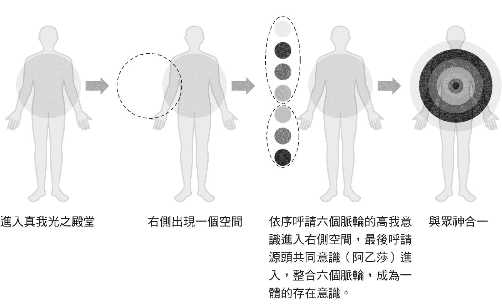

现在只要透过人们还原真我，与高我在身体所在维度全然合一，你们就得以更快协助地球校准银河大日，加速扬升进入银河轨道的既定计划。你们不必再神话这个看似被宗教和古人歌颂的圣人存在现象，这是现阶段光之工作者都必须共同努力到达的状态。

当所有存在你灵性源头的众神意识回到自己身上，你们就即将展开新生命的道路；你将成为地球上的觉醒之光，帮助更多在帷幕之下的灵性兄弟姊妹找到回家的路。亲爱的，这是星光体旅程最重要的到达。你们原本认为与你存在不同维度、具有分离人格的神性存在，甚至被你们的宗教视为高不可攀的神祇；过去当你一次又一次突破意识屏障和生命的考验，才能亲炙的甜蜜果实，你们将之视为死后的世界，是不存在现实中的体验，现在你终于可以深刻感受到，那原本就真实存在每个人的内在宇宙中，属于完整的你的存在原貌，是你们的内在失去校准，才会让今日的地球呈现扭曲的样貌。

星光体对全体人类揭露并不是在这个地球扬升时刻才被允许的，它早已存在，只是人类已经封闭的心灵无法走入星光体的帷幕。现在，唯有唤醒更多光之工作者回归真我，并完成与高我融合为一体的意识状态，重新校准，才能帮助地球回到银河母亲的怀抱。这是五亿光年外的银河早已为地球准备好的扬升计划，现在就在帷幕之外，在你们的星光体意识中，等着与你们合一。

时间不会在星光体中滴答滴答地敲打，你们只须走向内——任何时间，任何地点——去探望自己的内在宇宙，就可以登上星光体的母舰。这不是梦，地球意识的扬升母舰正在迎接所有人类的觉醒，登上母舰，一起航向宇宙为人类准备好的新地球家园。

银河母舰欢迎你们登船，Welcome on board!

［附录］

与阿乙莎的Ｑ＆Ａ

Ｑ：打开第三眼松果体链接高我的状态，和链接晶体契入基督意识场有何不同？

Ａ：链接晶体是回家，回到自己灵魂初始的家，和源头意识合一；而打开第三眼是帮助你们和自己的更高意识校准，也就是与高我合一必要的过程。在基督意识场的合一位在更高次元的维度，那时你的意识处在西塔波（θ波）；但现在与高我合一的状态，你的意识在地球的频段。你在没有改变自身振动频率的状态下，允许自己的内在宇宙与高我合一共振，你是以目前的身体迎接另一个维度的自己。

Ｑ：为何有很多人第三眼早已打开，却并未与高我合一，只能看见鬼神的存在？

Ａ：那不是真实的松果体启动，而是灵魂意识向外链接产生的幻相；真实的松果体启动会让你回到更高意识的校准，你不会链接到非你自己的灵魂意识存有。你只能透过锚定和校准自身的高我，回到银河早已为你铺设的道路，你是为了完成高我意识在地球的工具而与其合而为一。

你和高我其实本是一体的存在意识，为了宇宙任务进入分离又合作的新阶段，你会在地球维度以具体的肉身行动，你的高我则在不同的意识维度协助你完成此项任务。之前你虽成功进入晶体中，你和高我及所有灵性片段的意识仍是分离的。

Ｑ：和高我合一是每个未来的新地球人类都必须到达的状态吗？

Ａ：不一定，要看灵魂的任务为何。不见得每一个人类都必须如此，但有携带银河心智图的人都一定要与高我意识合一，才能正确回到银河家园。未能和内在神性合一也是人类物质生命体进化的必要过程，你们的小我个体化意识也是神性体验的一个过程。

Ｑ：念阿卡西纪录的祈祷路径，和直接念诵第三眼神咒有何不同？

Ａ：你透过阿卡西纪录祈祷文契入阿卡西纪录场域的过程，会链接你的高我和指导师，而你的最高意识源头会来引领你并与你链接，在此你链接上阿乙莎的集体意识场；而当你自身的意识逐渐扩展到触及你的星光体，触及你的高我意识分身时，你就可以经由念诵第三眼神咒与你的高我合一。透过这样的融合，你可以完成在地球上和神圣源头共同创造的任务，也才能忆起自己的天赋和尚待完成的灵魂使命。当你与高我合一时，你的小我意识、高我和源头意识群是处于意识能量共存的状态。

Ｑ：这么多高我和其他存有的意识链接，这些存在和阿乙莎的链接有何不同？

Ａ：意识在你的灵性层次原本都是相互链接的。雷巴特跟湿婆的能量是否近似？而莎雅也拥有盖娅的能量。你身上除了有雷巴特和莎雅的意识能量，当然有属于他们的孩子象头神的意识能量，他们是一家人，而阿乙莎是所有宇宙本源的集合意识，只是阿乙莎必须经由这些神性意识创造各自的体验，并于该次元显化出各自所需的意识载具。这趟旅程最主要的目的之一，就是让你的更高意识与目前身处地球维度的你，进行更好的意识融合——简单来说，就是让你所有的高我意识可以和你的生物体载具更为融合。接下来会有更多的高我意识与人类合一，共同创造新地球的实相。

Ｑ：每个人都必须认出自己的神性源头并与高我合一，才会知道自己在新地球的任务吗？

Ａ：我会说，是人类觉醒后，终于可以让自己内在的神性开始发挥所长。别忘了，你们存在地球场域不是只有人类存在而已，而是集体意识透过更高次元的神性意识展开的地球体验场域。当你重新与自己源头的神性合一，才是回到自己生命最初始设定的功课。

Ｑ：阿乙莎，每一种神性能量都不同吗？如果无法看见形象，要如何确认我们链接上的神性能量是对的？又要如何教导人们辨识出他已经成功链接自己的高我，而不是怪力乱神？我相信很多人都会有这个疑虑。

Ａ：这么想也是他的小我意识在作祟。每个人都被允许在地球场域创造自己的实相，你要将力量放在引导大家链接，而不是放在解释已经被曲解的一些言论。

要辨识出高我的链接很简单，就是心的振动。带着喜悦、满足和爱的就是高我，带给你担忧、不安、防御和恐惧等负面感受的，就是小我幻化出来的假高我。用你的身体感知来辨别，身体是最精密、完美又可靠的电脑系统，会帮你过滤，所以要善加使用你身体的智能。

关于新地球能量校准

问题一

学员：Rachel 老师，请教你，我每天都有做新地球校准操，确实有提升到自己，甚至这两天看流星雨，我可以看到天空竟然有网格，也可以看到流星划过的痕迹，找出流星在哪个位置出现。但我今天遇上一个奇怪的梦，梦里出现了一群穿红色衣服的人，手上抱着斗，或者说是瓮，一直往前走。我问他们找我做什么，他们说要超渡；我回答我又不认识你们，而且我也不会啊，他们竟然跟我说去问你的老师，她会知道怎么做。所以我只好硬着头皮来请教你。如果我遇上这方面的问题，该怎么办？可以请老师提供意见指导吗？

Rachel：谢谢你愿意分享内心的疑虑和困惑。在这条路上，要记得黑暗无法存在光中，当你是光，就可以照亮自己前行之路。你其实不用靠外在的力量，每个人都有自己回到家的ＧＰＳ，但在地球帷幕之下，我们内心确实受到许多制约和过去细胞印记的干扰，无法顺利以一己之力稳定自心，这也是为何需要大家一起前行，相互提醒。当自己内在仍有恐惧和担忧，讲出来并不可怕；当你愿意面对，你的意识就已是光的临在。可怕的是有许多人并不愿意如实面对，以为会失去这些那些，反而被自己的黑洞吞噬。许多宗教或一些怪力乱神的说法并不是假的，那是他们自己曾有的遭遇，被讲得绘声绘影，但其实那些都是自己内心的投射而已。每个人内在都有很多戏码，看不完的，只要记住让自己回到真实，如实照见自己内心的小剧场，随时提醒自己；若无法提醒自己，讲出来也可以。

帷幕之外无有恐惧幻影，若有，让你感到困惑、无法理解的，都是自身内在恐惧显化出来的意象。要先看到自己内在正在担忧害怕着什么，回到净化自己的内在意识，让自己成为光；若还不确定自己是否可以稳定在光中，就先回到自己身上，面对自己仍有的困惑和恐惧，让自己看见内在是否仍有无法流动、卡住的情绪。

新地球能量的校准，最终会要求你们落地，将能量注入地球。这是重点，请如实做。

学员：Rachel 老师，你这样说我终于懂我后面看到的影像了，因为我只能看，然后慢慢意会。老师点破了我，我确实被自己的黑洞拉过去了。我最害怕宗教约束，觉得是不是自己对不起祂们，因为我被灌输这样的观念。我知道神来自光的所在，来去自如。我又掉进自己而不自知了，谢谢老师让我知道我的内心，让我明白。

问题二

学员：你在新地球能量校准影片中提到基督意识三位一体的光芒，请问是指三圣火吗？我们这时需要观想三圣火的火焰在胸前吗？是观想影片中那种黄色光芒吗？

Rachel：不需要，照着影片提及的进行即可。校准完将关注力放在自己的身体，就可以感受到能量进入。不需要意识在此时引导或观想颜色，听着音频，意识跟随即可。

问题三

学员：我想跟老师和同学分享我的变化。我就是出现第三眼，然后在眼里出现中柱，它就是一直在生成、变化，甚至我进到瞳孔里，有时会有像被包在子宫内的感觉，有时像星空，有时像峭壁，太多了，我一时无法用适当的字眼来跟大家分享。我也可以拿捕梦网来形容我看到眼睛时的感觉……我听老师说在做地球校准操时，每次的变化都不一样，而且有很强的能量灌注。我看到的地球校准操，一个是在中柱内形成黄金光芒线，一个是我打开眼睛看到我家阳台外的天空（夜晚）出现了透明图案。

只要简单感受音乐，跟身体共振，就有不可思议的提升效果。我昨天晚上在阳台跟大自然一起做地球校准，我看到影片中那个小金人是三百六十度旋转的，而那些线是三維的，像时钟的线，感受好强。影片最后基督意识烟火施放那里，我在天空看到了生命之花跟一朵花，感觉像莲花，在天空一直转动，好感动。

我觉得好不可思议。虽然我不知道同学们的感受如何，但希望我的分享对大家有帮助。

Rachel：新地球能量校准冥想，校准后，能量进入身体中柱之后才是重点。当你将光传送给家人跟朋友时，你会发觉自己内在的光之柱更加扩展，这样的扩展不但利益自己，也可以帮助身旁的家人、环境。当中轴扩展后，记得落地，让能量透过自己的海底轮和双脚流下去，进入地球之心。这个动作很重要，这就是帮助我们的地球母亲校准银河能量的办法之一。

回到自己的心，更稳定自己的中轴，才可以将光和爱传送出去。那个身体十二系统咒音就像是锚，将你的内在宇宙稳定住，才能扬升。所以，链接地球很重要，那是我们的根基。

回到自己的内在宇宙，不需要追求神秘体验，你的心轮扩大、场体扩大，就自然可以到达。每个人到达的状态都不同，最好的衡量方式就是看自己是否更开心、喜悦，不容易发怒，随顺生命的流动，不再恐惧和自我限制。地球已经准备好要扬升，每个人都会到达的，要给自己信心！
