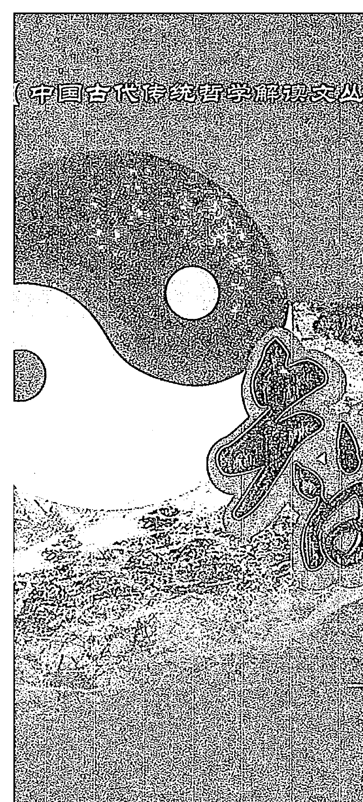
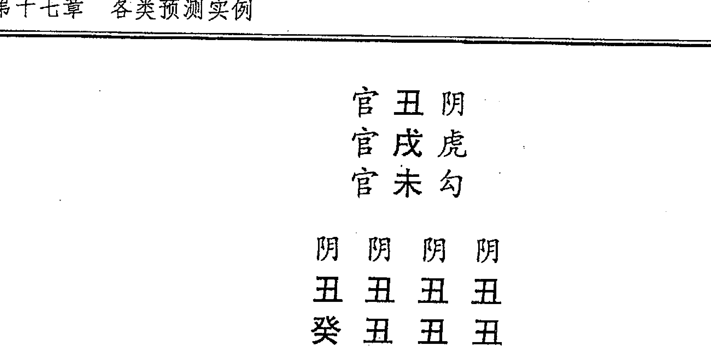

# 大易揭秘——文王八卦与周易之关系

自上古先圣先皇作易以来，华夏文化的各个门类无一不打上了《易》的烙印。她之所以高居《诗》、《书》、《礼》、《乐》、《春秋》之上，而成为群经之首，不仅在于她本身所具有博大精深的内涵，同时也饱含着历代研易者的毕生精力和心血。

徐伟刚 著



# 中国古代传统哲学解读文丛
# 智者乐水——六壬现代预测精典

徐伟刚 著

珠海出版社

# 图书在版编目(CIP)数据

智者乐水/徐伟刚, 杨景磐, 张志春编著. —珠海: 珠海出版社, 2007.9
(中国古代传统哲学解读文丛)
ISBN 978-7-80689-802-4
Ⅰ. 智… Ⅱ. ①徐… ②杨… ③张… Ⅲ. ①周易-研究 ②占卜-研究-中国 Ⅳ. B221.5 B992.2
中国版本图书馆 CIP 数据核字 (2007) 第 146710 号

# 中国古代传统哲学解读文丛·智者乐水

徐伟刚 著

责任编辑：李一安

封面设计：文 德

- 出版发行：珠海出版社
- 地 址：珠海市银桦路 566 号报业大厦 3 层
- 电 话：0756-2639346 邮政编码：519001
- 网 址：www.zhcbs.net
- E-mail：zhcbs@zhcbs.net

- 印 刷：广东科普印刷厂
- 开 本：880×1230mm 1/32
- 印 张：52.25 字数：1170 千字
- 版 次：2007年12月第1版
  2007年12月第1次印刷
- 书 号：ISBN 978-7-80689-802-4
- 定 价：125.00元(全四册)

版权所有 翻印必究

(如有印装质量问题,请与销售书店调换)

# 目 录

- 自 序 ………………………………………………… (1)

- 第一章 阴阳五行 ………………………………………………… (1)

  ### 第一节 阴阳五行 ………………………………………………… (1)

  ### 第二节 天干 ………………………………………………… (2)

  ### 第三节 地支 ………………………………………………… (7)

- 第二章 六壬雅艺概要 ………………………………………………… (12)

  ### 第一节 述要 ………………………………………………… (12)

  ### 第二节 六壬预测准验的若干原因 …………………………… (13)

  ### 第三节 当今壬学研究指要 …………………………… (16)

- 第三章 壬学入门运算程序 ………………………………………………… (19)

  ### 第一节 六壬地盘 ………………………………………………… (19)

  ### 第二节 天干寄官 ……………………………………… (20)

  ### 第三节 月将与占时 ………………………………… (21)

  ### 第四节 天 盘 ………………………………………… (23)

  ### 第五节 排四课 ……………………………………… (24)

  ### 第六节 九宗门——排三传的九种方法 …………… (26)

  ### 第七节 排十二天将 ……………………………… (40)

  ### 第八节 定六亲寻年命排旬干 ……………………… (43)

- 第四章 三传总汇 ………………………………………… (45)

- 第五章 十二神主要意义 ……………………………… (56)

- 第六章 十二将主要象意 ……………………………… (62)

  ### 第一节 总 论 ……………………………………… (62)

  ### 第二节 天将分论 …………………………………… (66)

- 第七章 十二神将现代象意 ………………………… (74)

- 第八章 神煞基本信息体系 ………………………… (90)

  ### 第一节 岁 煞 ……………………………………… (91)

  ### 第二节 季 煞 ……………………………………… (92)

  ### 第三节 月 煞 …………………………………………… (92)

  ### 第四节 旬 煞 …………………………………………… (94)

  ### 第五节 干 煞 …………………………………………… (94)

  ### 第六节 支 煞 …………………………………………… (95)

- 第九章 六亲基本信息体系 …………………………… (97)

  ## 第一节 禄 神 ……………………………………… (97)

  ## 第二节 财 神 ……………………………………… (98)

  ## 第三节 官 鬼 ……………………………………… (99)

  ## 第四节 父 母 …………………………………… (100)

  ## 第五节 脱 气 …………………………………… (101)

- 第十章 长生十二诀 ……………………………… (102)

- 第十一章 大六壬判断纲要 ……………………… (106)

  ## 第一节 论四课 ………………………………… (106)

  ## 第二节 论日辰 ………………………………… (106)

  ## 第三节 论发用 ………………………………… (121)

  ## 第四节 论三传 ………………………………… (123)

- 第十二章 六壬常用判断理论 ………………… (126)

- 第十三章 占断要点及思路 ……………………… (132)

- 第十四章 占断基本步骤与方法 ………………… (141)

- 第十五章 点将法简介 …………………………… (145)

- 第十六章 大六壬常见疑难问题解析 …………… (147)

  ### 第一节 答疑之一 …………………………… (147)

  ### 第二节 答疑之二 …………………………… (155)

  ### 第三节 关于推广六壬雅艺的一点想法 ……… (161)

- 第十七章 各类预测实例 …………………………… (164)

  ### 第一节 天气预测实例解析 ………………… (164)

  ### 第二节 家宅预测实例解析 ………………… (171)

  ### 第三节 婚姻预测实例解析 ………………… (191)

  ### 第四节 胎产预测实例解析 ………………… (208)

  ### 第五节 考试预测实例解析 ………………… (218)

  ### 第六节 工作预测实例解析 ………………… (238)

  ### 第七节 经济预测实例解析 ………………… (255)

  ### 第八节 官讼预测实例解析 ………………… (279)

  ### 第九节 失盗预测实例解析 ………………… (289)

  ### 第十节 出行预测实例解析 ………………… (299)

  ### 第十一节 行人预测实例解析 ……………… (309)

  ### 第十二节 疾病预测实例解析 ……………… (319)

  ### 第十三节 体育赛事预测实例解析 ………… (329)

  ### 第十四节 战争预测实例解析 ……………… (339)

  ### 第十五节 时事预测实例解析 ……………… (349)

  ### 第十六节 阴宅预测实例解析 ……………… (359)

  ### 第十七节 终身预测实例解析 ……………… (369)

  ### 第十八节 运筹趋避实例解析 ……………… (379)

- 第十八章 《六壬指南占验精选评注》选例赏析 … (389)

  ### 第一节 《六壬指南》简介 …………………… (389)

  ### 第二节 若干选例赏析 ………………………… (394)

- 第十九章 《精抄历代六壬占验汇选》经典课例欣赏 … (409)

- 附录 我的一些网络文章 …………………………… (419)

- 后记 ……………………………………………………… (429)

# 自 序

壬本道术，备极精淳；大观六宇，细察微尘；理通造化，思浴风尘；包含万有，不越性情；出幽入冥，澄古彻今；守贞得一，天地清宁；出而用世，羽翼太平。——局外行藏

记得十五年前，当我第一次有缘翻读四库版本的《六壬大全》时，就深深为之着迷了，其时虽不明白壬课，但就是看了书中的“毕法赋”，就被其条分缕析的清楚说白断词深深吸引折服了。当时心中的梦想就是自己何时何日可能精通此大六壬啊？当初这种迫切之心情现在回想起来自己仍是有点激动的！今天当我坐在电脑前写着这部六壬书稿时，回忆起学壬的点点往事：从一个壬学的“门外汉”到今天为壬学著书立说，为壬学宣扬张目，确是十年寻常不容易，心中真是大有感慨啊！

这本《智者乐水——六壬现代预测精典》是继我在2004甲申年出版《袖里乾坤——大六壬新探》一书后又重新撰写的一部六壬专著。这本书主要是回顾了我自2001年到北京之后的学壬、研壬、用壬、教壬的主要经历和最新成果，结合多年六壬面函授的教育经验，依六壬内部教材《大六壬揭密与现代应用研究》《六壬迷津筏》为此书的基本“骨架”，从中加入大量新鲜“血肉”使其丰满成熟生动起来，集中地来反映我的六壬研究观。

大概而言，这本书在理论方面主要是在原壬学教材基础上加入了壬占技法上的一些我的新思想与新体悟，从而方便学者更容易入手学壬用壬，更快地进入壬学研究的正轨路线中去。另一方面，也就是本书的最大特色就是在此书中收录了大量六壬预测实例，帮助爱好者尽量及早了解真正掌握壬占的诀窍法门所在，从而在生活中去真正用六壬为老百姓们去服务。说实话，自《袖》书出版之后，就有大量六壬爱好者纷纷来电来信要求我出一本六壬实例方面的专著，这本书的写作意旨也就基本上按着这个中心来展开的，所以这本新书中共收录了我和部分六壬学生的六壬现代占案共有150个课例，再加上我评注的《六壬指南》古例赏析和《历代精抄六壬占验汇选》中辑录的一些案例，全书所有古今六壬预测课案就将近170多例了，数量上已是不少，而且在内容上更是精益求精力求多姿多彩丰富生动，让世人真正了解壬学的真面目真风采。因此，在一定程度上，我的这部六壬专著就是可以视为一部六壬实例解析集的。

六壬作为中国传统数术中的大宗之法，它的经世价值不言而喻，高山流水少知音，世人皆喜简厌烦，所以壬学之宿命就是曲高和寡，我希望这一书的出版可否稍稍扭转此一局面，在此太平盛世，为壬学的复兴来贡献一份心力。最后这一点想法在我心中已积淀良久，今日借此机会来一吐心曲，是为序。

徐伟刚
2007年9月21日二稿于北京

# 第一章 阴阳五行

阴阳五行，是阴阳学说和五行学说的合称，是古人用以认识自然和解释自然的世界观和方法论，是我国古代的唯物论和辩证法。阴阳学说认为世界是物质的，物质世界是在阴阳二气的相互作用下孳生着、发展着和变化着的。五行学说认为木、火、土、金、水是构成物质世界所不可缺少的最基本物质，是由于这五种最基本物质之间的相互资生、相互制约的运动变化而构成了物质世界。这种观念对我国古代唯物主义哲学有着很深远的影响，并成为我国古代自然科学的唯物主义世界观和方法论的基础。

## 第一节 阴阳五行

阴阳五行是中国古代的一种哲学概念，是古人认识自然的一种朴素的唯物观点。

《易》曰：“易有太极，是生两仪。”，所谓“两仪”就是阴阳，所以《易》又曰：“一阴一阳之谓道。”阴阳指事物的矛盾，如昼夜、寒暑、长短、雌雄、男女、动静、刚柔等等。

五行则是对世界万物更为细致的分析，古人认为，世界是由金、木、水、火、土五种基本元素组成的，并且更进一步地认为，这五种元素是互相转化、互相制约的，由此转化和制约，从而构成了天地万物千姿百态的架构和趣向。对于五行转化的规律，可分为相生和相克两种：

- 一、相生：金生水，水生木，木生火，火生土，土生金
- 二、相克：金克木，木克土，土克水，水克火，火克金

## 第二节 天干

### 一、十天干

甲、乙、丙、丁、戊、己、庚、辛、壬、癸。

### 二、十天干阴阳

甲、丙、戊、庚、壬为五阳干。
乙、丁、己、辛、癸为五阴干。

### 三、十天干五行方位

甲乙东方木，丙丁南方火，中央戊己土，西方庚辛金，北方壬癸水。

### 四、十天干属性

甲木，纯阳之木，名为大林木，有参天之势，性坚质硬，栋梁之材，故为阳木。
乙木，属纯阴之木、名为花草之木，有装扮人间之美，性柔质软，故为阴木。
丙火，属纯阳之火，名为太阳大火，有普照万物之功，性情刚烈，故为阳火。
丁火，属纯阴之火，名为灯烛之火，有照亮万户之功，性柔质弱，故为阴火。

戊土，属纯阳之土，名为城墙土，为万物之司命，其性高，质硬，而向阳，故为阳土。
己土，属纯阴之土，名为田园之土，有生育万物之功，培木溶水之能，其性湿质软，低洼向阴，故为阴土。

庚金，属纯阳之金，名为剑戟之金，有刚健肃杀之力，其性刚质硬，故为阳金。
辛金，为纯阴之金，名为饰金，有增艳人间之美，其性软洁净，故为阴金。

壬水，属纯阳之水，名为江河海洋大水。随地球运转周流不息，故为阳水。
癸水，属纯阴之水，名为雨露坑涧之水，气化而得，其性静弱，资生万物，故为阴水。其水有形，无体，随变而变，一生漂流。

### 五、十天干配四时方位

- 甲乙木：时间为春天，其位东方，名甲乙东方木。
- 丙丁火：时间为夏天，其位南方，名丙丁南方火。
- 庚辛金：时间为秋天，其位西方，名为庚辛西方金。
- 壬癸水：时间为冬天，其位北方，名北方壬癸水。
- 戊己土：时间为四季末，其位中央，又主每个季节的最后十八天，名为戊己中央土。

### 六、十天干与人体的关系

- 甲头、乙项、丙肩、丁胸、戊肚、己脐、庚腰、辛肋、壬股、癸四肢。

歌诀：
甲头乙项丙肩求，丁胸戊肚己脐腹。庚为腰间辛为肋，壬是股部癸四肢。

### 七、十天干与五脏六腑的关系

甲胆乙肝丙小肠，丁心戊胃己脾乡。庚是大肠辛主肺，膀胱之焦在壬方，若问肾水心包处，二者皆在癸中藏。

### 八、十天干之间的相互关系

甲与己合，乙与庚合，丙与辛合，丁与壬合，戊与癸合。
甲己化土，乙庚化金，丙辛化水，丁壬化木，戊癸化火。
甲与庚相冲，乙与辛相冲，丙与壬相冲，丁与癸相冲。
甲木生丁火，乙木生丙火，丙火生己土，丁火生戊土，己土生庚金，戊土生辛金，庚金生癸水，辛金生壬水，癸水生甲木，壬水生乙木。
甲克戊，乙克己，丙克庚，丁克辛，戊克壬，己克癸，庚克甲，辛克乙，壬克丙，癸克丁。

### 九、十天干颜色

甲青、乙蓝、丙红、丁粉红、戊黄、己土黄、庚纯白、辛灰白、壬墨绿、癸明绿。

### 十、十天干吉凶应验

甲为天福星；宜行恩施惠，成功赏德，吉庆喜美，婚姻可成，升官发财，喜乐康宁，家长、领导、文字、老翁、荣华、富贵、金榜题名，旺相一生禄位清闲，眉清目秀富豪称，品德高尚受尊崇。

乙为天德星；宜施恩赏德，敛恤抚告，旺相求财有德，交易合成，门户兴旺，受克时盗贼损害，斗讼官司，损车，损身，伤四肢。

丙为天威星；宜发号施令，以显雄威，又主暴躁、火光、血光，受克时水灾、烫伤、凶伤、头痛、头晕、斗讼官司、文字争执、忧愁伤残。

丁为阴火；主烟光，凶怪，鬼怪，血灾，凶伤，火光伤残，因妇女发生斗讼和牢狱之灾，虚惊及被外人谋害。

戊为天武；宜发号施令，受克，外来官讼，家宅损破，贫穷及破产，如旺相主，先贫后富，出访有得。斗打官司灾，伤灾，胃病，田宅斗讼，及邻居口角，及亲属发生斗打。

己为六合；宜修疆理城，阴私事，得酒食，得阴人田宅，或因田土而斗讼官司，受克主伤身损财。

庚为天狱；主官灾伤残，凶祸，军人，凶丧，凶死在外，血光，车祸，被火克主凶伤致命。见水土无事，见木主刑狱，斗打事。

辛为天庭；宜正法治囚，莫为吉事，见火主外丧凶事，天灾人祸，伤筋动骨，被暗箭所伤，有肺病及呼吸道之病，又主更改门户数次，有克时主外贼伤身。

壬为盗贼，毒药，水灾，伤骨，伤腰，肾病，尿道病，寡妇孤儿，丢失，冤屈，邪淫，好私，暗昧婚姻，有外情遇。

癸为积蓄锐气，气索之物，田宅房屋，斗讼事，水灾伤人，走失四足动物，婚姻斗讼事，争婚姻事。

### 十一、十天干出行应验

六甲：出行最吉利，宜逢贵人车马，见喜庆事，见婚姻事，求财可得，见首脑及地省级官员。

六乙：出行吉庆，见秃头及官职之人，见交易谈对象之人，见酒食宴会，见水主阴私之事。

六丙：见人骑车过路，骑摩托车之人，汽车是高档的，并为官禄之人所坐。车为红色及水黑红色，金红白色，木灰色，土黄色。

六丁：高官、老总、经理、厂长、科长相见，又主有惊恐之灾，虚惊，火光，烟光，伤灾，及风魔之人，或气喘之人。

六戊：见气功师及僧道，见两妇女身穿黄衣，及灰黄衣，见官司斗打事，或牢狱之人斗打。口舌血灾，预测师，过土坡之地。

六己：见贫穷之人，被欺辱之灾，见老妇及斗打妇人，买火烧之物，吃食果物，酱菜，买菜之人。

六庚：主道路，斜路，军人，军官，持枪及金银铜铁器等，车辆，出外见丧孝，孝服之人，车祸及在外凶伤，见官事是非口舌之事。

六辛：小路，斜路，仙佛，阴私，情人，和合事，喝酒及酒晕之人，见烟酒店门市部，吃食果物及买果物之人。

六壬：出行见河涧坑沟及过桥，见堆石，见穿黑衣之人，见手艺、艺术之人，受克伤脚腿之人，鸟鹊鸣，见丑恶之人。

六癸：见四足走失，或见四足之动物，见四个小儿在路边玩耍，见山林隐士，气功大师，阴人小口迎面而来。

## 第三节 地支

### 一、十二地支名称

子、丑、寅、卯、辰、巳、午、未、申、酉、戌、亥。

### 二、十二地支数目

子一，丑二，寅三，卯四，辰五，巳六，午七，未八，申九，酉十，戌十一，亥十二。

### 三、十二地支六阳

子、寅、辰、午、申、戌是六阳支。

### 四、十二地支六阴

丑、卯、巳、未、酉、亥是六阴支。

### 五、十二地支属性

子为阳水，亥为阴水，寅为阳木，卯为阴木，巳为阴火，午为阳火，申为阳金，酉为阴金，辰戌阳土，丑未阴土。

### 六、十二地支与方位

寅卯东方木，巳午南方火，申酉西方金，亥子北方水，辰戌丑未中央土。

### 七、十二地支与四季

寅卯辰春季，巳午未夏季，申酉戌秋季，亥子丑冬季。又论；辰戌丑未土在每个季节的最后十八天，最后一个月为土月。

### 八、十二地支与人体部位的关系

子丑为腿脚，寅亥为腿膝，卯戌为臀部，辰酉为两臂，巳申为肩，午未为头面。

### 九、十二地支与五脏六腑的关系

子属膀胱水道耳，丑为肚脐及脾胃。寅胆目疾脉两手，卯木十指内肝方。辰土为脾肩胸痰，巳面齿咽小肠肛。午火心脏并眼鼻，未土胃脾并脊梁。申金大肠经络肺，酉金咽喉及气管。戌土命门腿踝足，亥水发骨尿道肾。

### 十、十二地支与月份关系

古人说：一二三阳开泰，斗柄回寅万事春。就是说：每一年的寅月、寅日、寅时，北斗的把柄指向寅位。古人是以斗柄所指来分十二个月份，因此斗星的斗柄年年正月指向寅位。
古人把寅做为正月，卯为二月，辰为三月，巳为四月，午为五月，未为六月，申为七月，酉为八月，戌为九月，亥为十月，子为十一月，丑为十二月。
例：正月见寅，寅是月建。必须在立春之后，惊蛰以前。十二月建主要用于选黄道吉日。

### 十一、十二地支与十二月将的关系

十二月将是取了月建的六合方位而命名的，也就是在十二地支上加一个代号。其十二月将是三传四课壬书中专用的基本知识。
正月为亥登明将阴水，二月为戌河魁将阳土，三月为酉从魁将阴金，四月为申传送将阳金，五月为未小吉将阴土，六月为午胜光将阳火，七月为巳太乙将阴火，八月为辰天罡将阳土，九月为卯太冲将阴木，十月为寅功曹将阳木，十一月为丑大吉将阴土，十二月为子神后将阳水。
此月将在十二地支上逆行。

### 十二、十二地支与十二时辰及现代时间换算表

（古代一个时辰是现代的两个小时）

| 时辰 | 时间   | 时辰 | 时间   | 时辰 | 时间   |
| ---- | ------ | ---- | ------ | ---- | ------ |
| 子时 | 23—1点 | 丑时 | 1—3点  | 寅时 | 3—5点  |
| 卯时 | 5—7点  | 辰时 | 7—9点  | 巳时 | 9—11点 |
| 午时 | 11—13点 | 未时 | 13—15点 | 申时 | 15—17点 |
| 酉时 | 17—19点 | 戌时 | 19—21点 | 亥时 | 21—23点 |

### 十三、十二地支与属相

子鼠、丑牛、寅虎、卯兔、辰龙、巳蛇、午马、未羊、申猴、酉鸡、戌狗、亥猪。

### 十四、十二地支六合

子与丑合，寅与亥合，卯与戌合，辰与酉合，巳与申合，午与未合。

六合中相克为克合；如办事求人顺中有阻隔，成中有败，先喜后忧，先合后分，先热后冷，先好后坏。
六合中相生为生合；求人、办事、出行寻人，升迁婚姻主喜庆和合事，人事关系永久合好，前后顺利，合为一体，如寅与亥合，辰与酉合，午与未合。
六合中合中有克；如子与丑合，卯与戌合，巳与申合。为合中有克。

### 十五、十二地支三合局

申子辰合水局，亥卯未合木局，寅午戌合火局、巳酉丑合金局，凡课中见三合局，同事作三个事论，办事时必须有三个人，或三个单位参予，及三个计划，无冲破者，占事已定，求望成功，见冲破难成，不成，成中有破，事情有变动。

### 十六、十二地支生、旺、墓三合局

（主事初、中、末三个阶段。）

如：生在申、旺在子、墓在辰，凡有求望开始于申月日时，成于子月日时，终于辰月日时。
生在亥，旺在卯，墓在未，凡交易婚姻、喜庆和合事，都成于亥卯未月、日、时。
生在寅、旺在午，墓在戌，凡文书、信息、家中团聚，一般在于正、五、九月。
生在巳、旺在酉、墓在丑，主阴私合和事，又主各种事成于己、酉、丑年月日时。
如课内见辰、戌、丑、未为合土局，为一种借局，土有生万物之功，求人望事迟缓，牵连阻隔不断，万事忧愁，苦心求成，枉费心机。

### 十七、十二地支六冲

子午相冲，丑未相冲，寅申相冲，卯酉相冲，辰戌相冲，巳亥相冲，
凡求人望事，婚姻不成或分散事，易被别人骗诈，谋害，陷害，上当，自身有伤损，有病灾，被别人斗打。

### 十八、十二地支六害

子害未，丑害午，寅害巳，卯害辰，申害亥，酉害戌。
凡求望被人骗诈，谋害人狱，严重受害之事。遇害者如气弱无救，必会有天灾、凶伤、病灾、凶祸等。经商的将损大财，并斗打官司。升官不成反有免职，问家庭必是分散事，谈婚姻不成，出行阻隔不通，工作则受他人排挤，如旺相受害，主求谋平常，劳而无功。

### 十九、十二地支相刑

相刑指两个物体互相对立，它们之间有生有克，各自为政，互不相让，造成事物发展中的挫折，干事触犯刑律。在人体则多为疾病，伤残，痛苦。

#### 无礼之刑：

子刑卯，卯刑子。课中占此者都是客犯主，民告官，斗讼官司，父子，六亲反睦，争财动官，手足无情，问婚姻则被异性纠缠。未婚破体，孕妇损胎，情伤忧愁，任何事都不吉祥。

#### 无恩之刑：

如寅刑巳，巳刑寅，申刑寅。凡遇无恩之刑，知恩不报反为仇，有如东郭先生救狼，被狼伤害，当官者防被他人谋害，或本人做好事反被诬陷，因贪外财，或小人之财而被官司牵连。为平地起风，贼咬一口，事非官司，斗打口舌，伤灾，凶伤，疾病，血光，丢失财物，车辆，六亲少靠，妇女损胎，未婚女子防奸淫。

#### 恃势之刑：

丑刑未，未刑戌，戌刑丑，占此者为有势力之人凭借权势胡作非为，欺压别人反斗打官司，勾心斗角，同志间不睦、互相排挤，暗箭伤人。一般人打架斗殴，惹事生非。经商人被诈骗，经济纠纷，骗取财产，出行被外人斗打、受害、女性则发生口舌斗讼事，夫妻间格格不入，分离之忧愁，互不尊重，各有外情。

### 二十、辰午酉亥自刑

凡课中自刑，是本人想达到某种目的而不择手段，触犯了刑律，或因没有达到某种目的而自寻烦恼，造成身心不康，病灾伤残，自杀或自相残杀，引起了一场官灾，或本家内产生斗打，六亲不合，万事不顺。凡日、时见午火，课内又见午火，叫自刑。课内与本人属相同也叫自刑。

# 第二章 六壬雅艺概要

## 第一节 述 要

大六壬又称壬课、壬式、壬学等，是中国古代三式之一（太乙、六壬、奇门）的经典预测学说。大六壬依占卜人事特别灵验而著称风行于世，古人曾誉此为“神课”。自古以来，大六壬一直被人们视为传统数术学的顶峰之一。

六壬是中国数术学的总概括，集数术学、易经所有精华为一体，为中国先秦古文化的重要体现。壬学由天学（古星象学）、易学、干支学和择日学（神煞学）四大学说运筹而成，是融太极、阴阳、三才、四象、五行、干支、河图、洛书、八卦、神将、十二分野和三垣、二十八宿于一炉的传统理论模型。它通过对万事万物作形而上的十二类神将划分方法来全面把握客观世界，加以“九宗门”的传变法则来体现所有事物的基本规律，从而成为一门认知天文、地理、人事之全部运动、变化、发展的高深学问。

作为认识世界的方法，从技术角度去看待六壬，六壬又可称之为地支学。这是因为六壬本身的运筹理论、计算程式、占断方法统统都是运用地支语言描述来表达的，其中唯一的“天干”尚须通过“寄宫”的方式来遁化为地支进行推算。任何一种类型的六壬程式（课体）都由天地盘面、四课分布和三传排列三大块组合而成。它的计算程序一般要经过天地盘的加临转运，到由占日干支来化出四课，再由四课关系来排定三传这三步曲，然后佐以天官、月将、六亲和神煞四个象系所构成的庞大象学信息系统，根据事类的不同分别进行观象玩占，从而得出研究结论。

一般而言，壬课往往跟所占事体是严密对应的，呈现正相关的状态。壬课基本上不会跟研究的对象离题万里而风马牛不相及（易占中则常会出现这种尴尬情形）。恰恰相反，壬课课象会常常神奇地活灵活现地对事物进行形神俱肖栩栩如生的“写真”，这种课象对事件本身“写真”的模拟反映，为壬占提供了强有力的起点。

简言之，大六壬依其严谨复杂的程序、富于艺术美感的课式、完美精妙的运筹为人类提供了一种认识世界研究事物的高效方法。对于这门“根于天学，应于人事，为三式之最”的顶尖学说进行深入的研究，就是在 21 世纪的今天仍显得十分必要和重要。

## 第二节 六壬预测准验的若干原因

大六壬之所以预测人事特别灵验，主要和它的理论建筑与技术模型有很大的关系。笔者研究六壬长达十余年，对六壬之所以预测人事能够奇准、奇验的主要原因，总结为以下二条，试图说明壬占的主要特点。

- 一者：壬课对预测对象“写真式”的精密反映程度。一个人借助某种术数方法来预测一件事情，必然会借鉴某种术数的某种“显象”形式来推断事物。比如六爻法就是用六爻卦的地支排列组合、梅花易就是体用二卦之形象、奇门遁甲就是奇门九宫局……预测者就是依据这种各类“显象”信息与形式去推测事物的。这里的关键就是在于各类“显象”信息与形式和事物本体之间的吻合程度如何。如果各类“显象”信息与形式与事物本体的吻合程度愈高，预测者自然会对事物推算的越为全面细致越为准略惊人；但是一旦各类“显象”信息与形式与事物本体吻合程度不高甚至有离题十万八千里之嫌，那么预测的全面度与准略度就会大打折扣了。就笔者经验而言，古筮法、梅花易、六爻卦在对事物反映的“显象”形式与信息上是有很大的问题，故而其一般预测准略率是较低的；惟奇门遁甲和大六壬在这方面较为理想可信，尤其是大六壬正时所出课式的“显象”信息与形式与事物本体之间的吻合程度可完全讲是“写真式”的。壬课的“显象”会常常神奇地活灵活现地对事物进行形神俱备栩栩如生的“写真”，这种高效精密“写真式”的“显象”特征，为预测者们的正确预测提供了有力的前提保证。

二者：壬课对“显象”信息与形式判断上的规范性。各种数术方法都可以通过某种方式或渠道来求得某些“显象”信息与形式，然后对这些“显象”通过技术解构来进行信息分析从而得出结论。不同的数术方法自有不同的技术分析与解构手段，其中自有复杂精密与简单粗糙之区别。大六壬不仅在“显象”信息与形式上在各类中国传统数术分科之中最为精确到位，更在技术解构和信息提取上有其严密的规范性和可操作性。它的技术解析不排斥灵感与活变，但大部份是依大量的技术“章法”（《毕法赋》）来一条条推出预测结论的。任何人只要掌握这些“章法”的大要，就可以方向性断对很多壬课了。从这个意义上讲，大六壬课是最适合常人学习的高级术数，易于理解和把握。讲实话，绝大多数的壬课是依“课式”章法和现实现象结合去“套”出来的，有根有据而不会失误，这也就是六壬之所以能够以占断人事特别灵验而著名的主要原因了。

一个人从事预测行业，当然必须要有很高的准略率；这样方才可以取信于人，也只有这样方可有滚滚财源来。工欲善其事，必先利其器。在中国传统数术文化中有各种各样的“预测兵器”，有的人以为各种数术预测方法各有千秋长短，只要精通一门就可以了。这种观点认知只对了一半，固然各类数术方法只要精通一门自然可以预测对事物，但各类数术方法之间毕竟有不同长短和相互区别的。大六壬作为预测人事的“高效兵器”自然胜其他数术方法一筹。因此，选择六壬来测事，在预测方法与“兵器”的择取方面已较其他方法占有了巨大优势，其结果就是在占验上已有较大的“胜算”把握了。因此，一个人欲提高执业预测的准验率，请先在方法“预测武器”上选择一把最厉害的“兵器”——大六壬。

选择了较好的“预测兵器”，就要苦练技艺了。只要“兵器”先进技艺娴熟，就自然在实战中可以得心应手屡占屡验了。笔者在《袖里乾坤——大六壬新探》一书中曾经讲过：古人讲六壬为“神课”，我们不要轻易地去相信去宣扬，务必保持客观理性的平常心去看待它。但是多年的实战经验告诉我，六壬在某种程度上的确是“神课”，其占验率之高令人惊诧。在好多事体的判断上，完全可以底气直足真正做到铁口直断死不改口的程度，这种惊人的理想占验效果是研究其他数术爱好者们所不能想象的。

总而言之，大六壬作为一门数术历史最悠久、理论体系最全面、技术系统最精密、占断法则最规范、占验效果最理想的传统高级术数，在21世纪的今天仍有值得研究的巨大现实价值！

## 第三节 当今壬学研究指要

壬学作为传统数术文化中的精华，它一直是笔者倾注较多心力加以重点研究的一门主要学科。自古以来，壬学始终在历朝历代广泛流行且造成深远之影响。就是直到今天，尚有许多人士仍在钻研学习六壬。但就古今壬学研究来看，今人之学术水平较之古人所曾达到高度已相差一大截，针对这种学术的巨大差距，笔者在此重点谈一些当代壬学研究上须加注意的核心问题。

研究壬学的主要目的就是为了壬占，壬占的准验程度不仅跟操作者对壬学技术系统的掌握理解程度有关，更跟其实践方式是否为“正占”大有关系。何谓“正占”？就是依据当事人的询问一刻即时起课而占。只有在正占的前提条件下，壬课方会活灵活现地呈现事物的发展态势。壬占最忌的是“妄占”或“滥占”甚至“戏占”，此三者所出的课式基本无研究之价值。像清代张官德的《毕法案录》中所载课式、当代一些台湾六壬人士书中所举的壬占实例、互联网上很多所谓的壬课占例……绝大多数课式都属于上述三者之范围，所出课象渺茫无稽，只会徒乱人意念，无丝毫有补于真正学术水平的提高。要明白的是，大凡正占所出的任何一例课式，都会跟事物所占对象吻合的丝丝入扣天衣无缝，都会占测出惊人的效果来。

当今中国大陆研究六壬之人士，大多专奉《六壬大全》和《六壬指南》二书为依归。不庸讳言，笔者壬学之起步研习也是以此二书为基础的。但站在现实角度和学术历史发展的角度两个方面来看，二书离真正的壬占最高层次水平有着较大的距离。像《六壬大全》中的“毕法赋”，其地位就像六爻卦中的“黄金策”、子平术中的“继善篇”“喜忌篇”一般，都是整个学术体系的基石之一，一般习者皆以之为“准绳”。殊不知，所谓的“毕法赋”并不完全能够将所有壬占技法全部包括罗殆尽。（何谓“毕法”？法窍于内一泄无遗，千金之诀不传之秘都吐露毕尽也。）“毕法赋”所讨论内容在广度深度上都有较大缺陷，学习它固然可以在壬占上把握着一些大方向，但在具体判断就事论事层面恐怕力所不逮。并且，就“毕法赋”一百条七言赋文及相应诠释，其内容大都是壬学术语的“炒作”，真正揭示人生事象意义的文字反而显得较少，使其缺乏“实战”性。比如“支乘墓虎有伏尸”一句赋文，其诠释文字仅讲了占家宅逢之，必主宅中有旧坟，年内会有丧服之事。但是“旧坟”之方所、“伏尸”之影响以及如何处理方法、年内所丧何人、所丧月日等细节要务，“毕法赋”都未深入探讨。而这些东西又是操作者面对客户必须要作出解答而不容有所回避。因此，对“毕法赋”不能彻底迷信而受其圈子束缚，“毕法赋”仅是壬学研究的一步台阶而已；缺乏它万万不行，但脚步停留凝滞于上更不行，要立在其上面而发展之。

像《大六壬指南》一书，固然有作者陈公献先生平生占验125例课案可以借鉴，但其书着重于“官场”之占例，而大量缺乏平民之“民生”范畴方面的占验可据。况且，公献先生未曾涉及壬占终身此一重大课题，使壬学“大材小用”，较之一些六壬古书比如《六壬口鉴》《六壬集应铃》类就显得有所单薄了。因此，平心而论，《指南》一书中真正特别有价值的不过是二十多例的综合断案而已。笔者要特别强调指出的是，单纯一事一课一断的实际课例是较少的，七八成的课式占断都是一课多断甚至来断终身。国内不少研壬多年的人士，都痴情迷信《指南》一书，让个人的壬占智慧被禁锢于是书之中，诚为可惜。甚至有人要以终身精力来研究此书，岂不更为可叹？

壬课占断有四大法门：
- 一者理，
- 二者数，
- 三者气，
- 四者象，其中象占最为关键。关于壬占之理，即是占以理求。这里的“理”实指世故人情与物理，它就具体表现在壬学常用占断理论之中。一个高明的壬学家，就在于对壬理的深入理解与掌握。比如一般流行之六亲说，绝大多数人仅仅只能做到泛泛而论而不能洞察其根本。像父母爻一类，其实是一个事物由于另外事物的滋助而使其本身在数量、质量、规模、层次等方面向上发展，久而呈现出一种生机勃勃的兴旺局面。

关于壬占之数，即是支干之数。大凡年月日时皆以支干来描述指代，何年何月何日时皆由支干二十二个字来描述，此即为“数”。关于壬占之气，乃是指旺相休囚死五气而言的，它决定着现实社会中现象发生的规模大小与持续时间长短。关于壬占之象，即是壬占的灵魂。大凡占出一课万象云集：六亲乃一象系、长生十二诀又是一象系、至于十二神将更是壬学中的核心象系，另外神煞、年命、地支之刑冲化合害等关系皆是课式“垂象”，可以“见吉凶”。占者分门别类，分别择取式中抽象之“象”，由此及彼推测现实中事物发展的实际现象。壬学是理学、数学、象学集大成者，缺一不可。

# 第三章 壬学入门运算程序

## 第一节 六壬地盘

学习大六壬和阅读有关六壬古籍，不懂六壬排四课三传的方法，则完全是无门可入。因而先搞清六壬的常识及排课传的方法，是习壬学的原始起点。

六壬运式，首先要明确“地盘”和“寄宫”两类内容。

六壬地盘式：

巳 午 未 申
辰       酉
卯       戌
寅 丑 子 亥

亥子丑应于北方，寅卯辰应于东方。
巳午未应于南方，申酉戌应于西方。

六壬运用地盘就是利用占卜时辰入占，具体方法就是将时辰化为方位来看。比如子时占，则依子位作地盘起算点，寅时占则依寅位作起算点，其余仿此。

壬占地盘十二辰从原始立意上看是方位图，但实际运用中是利用时辰来确定的，从中体现出壬学时空一体化的思想。因此，十二辰地盘就是十二时辰盘。由此角度上溯，六壬中的地盘实际上就是对地球自转一周的数理描述，它的内涵包含了先天八卦的所有象意。

地盘，顾名思义，就是地球之盘，在实占中表体、表静、表里、表阴……等坤卦象意。万事万物皆生存于地球（即一定地盘之上），若事物受地盘制克，则此一事物难免会走向衰落消亡，反之若事物受地盘相生，则此一事物定会欣欣向荣向前发展。因此，衡量一切事物的最终吉凶，是取决于地盘的，而非决于天时者。譬若太岁可表一国天子，月建可拟一方诸侯，天子诸侯之运势是何等的强旺显赫非凡，但一旦太岁、月建受制于地盘，其溃败衰颓之势则如江河日下，也是不可阻挡的。

在不同事体的测占中，地盘又有具体指征，不可混为一谈。比如胎孕之占，胎神所临地盘实指母氏腹内子宫之象。再如官禄占，地盘又指其人所处之官场而已。换言之，地盘狭义所指是事物所处之环境象。

## 第二节 天干寄宫

### 日辰天干寄宫诀：

- 甲寄居寅乙寄辰，还将丙戊巳宫寻；
- 未支丁己藏功用，申地庚金作主盟；
- 辛在戌宫癸寄丑，壬干原寄在登明；
- 二盘四正无差错，运式通灵动鬼神。

大六壬是地支学，四课三传内仅有一占日天干，此天干要化为地支来看待。天干转化为地支就是“寄宫”。阳干寄临官禄位（地支），阴干寄禄后一位（即冠带位之地支）。

关于“寄宫”，所有笔者能见的数十种六壬书中都是一笔带过，从未有认真讨论研究过的。实际上，“寄宫”一词内涵丰富，意味隽永，颇值玩味，其中藏着古人设式的原始理念。古人曾云：“生者，寄也；死者，归也。”一切地球上之事物，莫不是匆匆过客，寄居于地盘（地球）一时而已。将此理念推广到一切事物的实占中，就有具体的象意。另外，尚有地支寄宫、干支寄宫、天盘寄宫等法，特别是占日干支寄宫，其间意义重大，对于正确理解占日干支的关系相当要紧。

## 第三节 月将与占时

要了解月将和占时两类内容。
月将即日宿太阳，于每月中气之后取月建合神。
正月雨水后月将为亥，名登明；
二月春分后月将为戌，名河魁；
三月谷雨后月将为酉，名从魁；
四月小满后月将为申，名传送；
五月夏至后月将为未，名小吉；
六月大暑后月将为午，名胜光；
七月处暑后月将为巳，名太乙；
八月秋分后月将为辰，名天罡；
九月霜降后月将为卯，名太冲；
十月小雪后月将为寅，名功曹；
十一月冬至后月将为丑，名大吉；
十二月大寒后月将为子，名神后。

六壬占时之确定乃壬占开门见山第一步，一般依实际占课时间（即来人求占时间）来定。依子丑寅卯辰巳午未申酉戌亥十二时辰来记取代表，传统主流观点依来人求占之时作起算点，则称为“正时”。

如果一个时辰内来人众多，正时不够运用，方可取用“活时”法来演课。

“活时”法包括随机报时、抓数、抽签等方法。报时即由来人口报任一时辰，抓数即由来人随意指定一数目以应占，抽签即将事先准备好的十二支时辰签由来人随机抽出以作占时。“活时”法需明地支十二数。子为一、丑为二、寅为三、卯为四、辰为五、巳为六、午为七、未为八、申为九、酉为十、戌为十一、亥为十二。凡抓数过十二者，以十二周除之，依余数作占时。比如来人报 35 数目，以十二除之余十一，则依戌作占时来起课，其余仿此。

抓数方法尚有民间所谓秘传的“三堆法”，其法十分玄秘可疑，非初学者宜深知，故笔者不作详谈。

一般而言，六壬占课首重“正时”，权用“活时”。只有当“正时”混沌或不够使用之际，方可采取“活时”法来代替。所谓正时混沌，乃指不晓得目下具体时辰，则权用“活时”法。古往今来，六壬先贤大多采取“正时”起课占事。惟民国以来，徐养浩、袁树珊、韦千里、今日台湾秦瑞生、张定洲等人皆舍“正时”而重“活时”，一改古风，本末倒置，其实非传统主流方法，学者切宜注意此点。《六壬金铰剪》认为“神机朕兆于正时，微妙发生于顷刻”，“时之义大矣哉！”实是一针见血之论。正时之定，实是人心灵感时刻，事关心象与物象的统一。可以讲，一个恰当富于灵感的“正时”，方可起出一个对事物模拟的丝丝入扣惟妙惟肖的“神课”课式，这对占验极其重要。

## 第四节 天盘

将占时化为地盘之数，用月将加临地盘占时之上，顺时针转出十二地支的活动盘面，即是天盘。

比如正月雨水后亥将午时占：

雨水后月将用亥，先将亥加到占时地盘午位作起转始点，则亥加午、子加未、丑加申、寅加酉、卯加戌、辰加亥、巳加子、午加丑、未加寅、申加卯、酉加辰、戌加巳顺时针布乘就形成了天盘。

由于月将有12位，占时亦只有12位。月将与占时两两叠加转运多有重复盘面，所以天盘与地盘的实际不同盘面组合只有12局。比如上图也可视作为戌将巳时、酉将辰时、午将丑时等转出来的天地盘组合。

一般壬学列式，只列天盘，由于地盘千载不移，就往往省略不写了。

比如申将丑时占课，只写出如下天盘式子：

| 子 | 丑 | 寅 | 卯 |
|---|---|---|---|
| 亥 |   |   | 辰 |
| 戌 |   |   | 巳 |
| 酉 | 申 | 未 | 午 |

只要心中熟记地盘分布，一看上图就知申加丑、酉加寅、戌加卯、亥加辰……等天地盘上下叠加的组合信息。地盘虽然在课占用时不写出，但并不说明地盘无用。由此可想而知，地盘是很重要的。

> 古人曾讲“看数不知看地盘，如盲子测日也。”

## 第五节 排四课

大六壬占课，主要是由占日干支、月将和占时三要件来排出课传。占日干支就是问课当日天干地支，可查万年历即知。

下面我们来排四课，比如正月雨水后，甲子日午时问课：

1. 先列天盘图：戊亥子丑
酉     寅
申     卯
未午巳辰

（亥将午时占）

2. 再写出占日干支字来排四课。

```
1 2 3 4
未 子 巳 戌
甲 未 子 巳

（四课图式）
```

-   ①甲寄地盘寅，今地盘“寅”字上加临“未”字，即以“未”字书于“甲”字之上，为第一课。
-   ②将“未”字书于甲子之间，看地盘“未”上得“子”字，即以“子”字书于“未”字之上，为第二课。
-   ③“子”字地盘上加临“巳”字，即书“巳”于“子”上，为第三课。
-   ④书“巳”字于“子”旁，查“巳”地盘上得“戌”字，书“戌”字于“巳”上，为第四课。

四课一旦排出，上下两层对照共有四组关系，三传的排法就是研究这四组关系。三传的排法十分复杂，共有贼克、比用、涉害、遥克、昴星、别责、八专、伏吟、反吟九种方法，古人称此为“九宗门”。关于九宗门这里暂不说，留于下章节详述。像本课就依此用法则排出三传子、巳、戌。

六壬中的三传，主要描述事变过程的脉络与结果。大概而言，初传事事伊始，中传事事之中途，末传事事之最终，三传传变就是事变的模拟反映。

关于“课”“传”的命名与原义，颇值探讨。一般而言，课为聚象，传为遇象，即“课聚传遇”之意。四课为干支所聚物事的象征，物事类各不一，则吉凶逐尔相生。吉凶如何变化，即由三传来表述。“传”者，传“四课”之变化矣。四课吉，三传凶，由吉传凶则事终凶；四课凶，三传吉，由凶传吉则事终吉。

大概而言，“传”有“引”、“投”、“追”、“动”、“遇”、“次序”、“递”等丰富意象，随各类事体而表现出来。

一般而言，三传有三种基本特征：一者吉凶相传，或吉传凶，或凶传吉；二者旺衰相传，或旺传衰，或衰传旺；三者虚实相传，或虚传实，或实传虚。

## 第六节 九宗门——排三传的九种方法

九宗门者，就是六壬筹算事物运动变化排演三传的九种方法（包括贼克、比用、涉害、遥克、昴星、别责、八专、伏吟、反吟等）。六壬可排六十四种课体、七百二十种静态课式、四百一十五类三传，乃至三千多万的活动课式。但无论课体课式如何千变万化，都是由九宗门推演而出的。掌握了九宗门，壬学就可拾阶而上，随之而来的一切深入问题，亦可迎刃而解了。

### 一、贼克法

六壬取课，凡天盘上神克下神，谓之“克”，地盘下神克上神，谓之“贼”。确定三传，首先要看四课之中有无下克上，如有则依重审法取三传。此时即使课中亦有上克下也不论元首法。四课之中没有下克上时，始论上克下神的元首法来取用三传。

凡四课上下仅有一组下克上神（月将古人也称为“神”），即依上神字作初传，由初传本位加临求取中传，由中传本位加临求取末传，即为重审法。

凡四课上下仅一上克下，则依一上神字作初传，依重审法则同样逐次求取中传、末传，此为元首法。

凡一下贼上，余课无克为重审法；凡一上克下，余课无克为元首法；两法合称“贼克法”。

#### 1. 重审法举例：

丙戌日子将酉时占课。

此四课为丙申、申亥、戌丑、丑辰组合，仅第一课丙火克制上神申金，其余三课不是相生就是比和，则依申金为初传，申地盘上亥字为中传，亥地盘上寅字为末传。本课三传就是申亥寅。

六壬中排三传只从四课关系来言，只研究讨论四课中的相克处，而不讨论相生处及比和处，此点要注意。

#### 2. 元首法举例：

丁丑日亥将卯时占。

巳
丑
酉

卯亥酉巳
丁卯丑酉

丑寅卯辰
子
    巳
亥
    午
戌酉申未

此四课中仅第四课巳火克下酉，其余三课皆是上下相生，弃而不论，即依元首法取用，巳为初传，地盘巳上遁得丑为中传，中传地盘丑上遁得酉为末传。本课三传就是巳丑酉。

### 二、比用法

四课之中同时出现两组或两组以上的克贼之处，则六阳日以阳神作初传；六阴日即以阴神为初传。由初传依次求得中传、末传。

-   阳日：甲、丙、戊、庚、壬。
-   阴日：乙、丁、己、辛、癸。
-   阳神：子、寅、辰、午、申、戌。
-   阴神：丑、卯、巳、未、酉、亥。

#### 1. 阳日取用举例：

八月壬辰日辰将巳时

```
鬼戊虎
父酉常
父申玄

戊酉卯寅
壬戊辰卯
辰巳午未
卯    申
寅    酉
丑子亥戌
```

四课之中第一课戊壬上克下，第三课卯辰亦是上克下，出现了二上克下的情况，壬为阳日，戊为阳神，卯为阴神，则取戊为作初传。按戊依次求得中传酉，由中传酉求得末传申，本课三传就是戊酉申。

#### 2. 阴日取用举例：

十月辛巳日寅将戌时

```
兄酉龙
父丑蛇
鬼巳玄

寅午酉丑
辛寅巳酉
酉戌亥子
申    丑
未    寅
午巳辰卯
```

第一课寅辛下贼上，二课相生不论，三课酉巳下贼上，四课相生不论。四课当中同时出现两个下贼上处。辛为阴日，寅为阳神弃之，酉为阴神，则取酉为初传，由初传递次求得中末传丑巳，本课三传就是酉丑巳。

### 三、涉害法

四课之中同时出现多组上克下或下克上神，且同为阴神阳神之时，则先依地盘四孟上神作初传，若四孟无有，则依次取四仲、四季上神作初传，由初传来求取中末传。

-   四孟：寅申巳亥。
-   四仲：子午卯酉。
-   四季：辰戌丑未。

涉害取用举例，如：甲戌日辰将寅时

|      | 辰 | 午 | 子 | 寅 |
|------|----|----|----|----|
|      | 甲 | 辰 | 戌 | 子 |
| 未 | 申 | 酉 | 戌 | 亥 |
| 午 | 巳 | 辰 | 卯 | 寅 |
| 辰 | 卯 | 寅 | 丑 |    |

四课之中，一课辰甲下贼上，三课子戊亦为下贼上，且甲为阳日，辰、子悉为阳神，无法用比用法取传。则视二课地盘之神的孟仲季性质。今甲寄寅为孟、戊为季，则依孟位上神辰取初传，逐次取中末传，三传即是辰、午、申。

关于涉害课起例最有争议，观点方法不一。笔者依据《六壬指南》一书惯例，都于孟仲季神来比较取用发传，而不去考虑涉害受克多少轻重，此法仅取孟仲季，不仅简易方便，而且实践中也是常占常验的。

### 四、遥克法

凡四课上下俱无相克，则取日干与其他三课上神比较。先取遥克日干之神作初传，若无；再取日干遥克之神作初传；若同时出现数者遥克日干、日干遥克之神，则以阳日用阳神、阴日用阴神法则来取作初传，依初传递次求得中末传。

-   由遥克日干之上神作传名蒿矢法。
-   由日干遥克之上神作传名弹射法。

#### 1. 蒿矢法取用举例：

壬辰日巳时申将

戌
丑
辰

寅巳未戌
壬寅辰未

申酉戌亥
未     子
午     丑
巳辰卯寅

四课上下俱无相克战斗处，则观日干与其他三课来比较。今三四课上神未戌两字俱遥克日干，壬为阳日，未为阴土，戌为阳土。阳日取阳神为用，所以取戌作初传，依次求得丑辰为中末传。

#### 2. 弹射法举例：

十月庚戌日亥将申时

四课上下俱无相克处，则取庚与其他三课比较。三课悉无上神来克日干，则依日干看遥克之神，则仅第二课寅为日干遥克之神，那么就依寅作初传，递次求得中末传巳申。

### 五、昴星法

四课上下无相克又无遥克处，则依式中天地盘酉宫上下神为用作传（酉对应二十八宿中昴星位，故称昴星法）。刚日以地盘酉宫上神作初传，中传则取支上神，末传则取干上神。柔日以天盘酉宫下神作初传，中传取干上神，末传取支上神。

#### 1. 阳日昴星举例，如：八月戊申日辰将卯时

四课上下俱无克贼，又无遥克之外。戊为阳日，则依阳日昴星法取三传。

-   1. 戊为阳日，以地盘酉位上神戊为初传。
-   2. 中传取地支申上神酉。
-   3. 末传取干上神午。

#### 2. 阴日昴星举例：

十一月丁丑日辰将未时

子
辰
戊

辰丑戌未
丁辰丑戌

寅卯辰巳
丑午
子未
亥戌酉申

四课上下无战斗处，又无遥克处。丁为阴日，则依阴日昴星法取三传。

-   1. 丁为柔日，取天盘酉位下神子为初传。
-   2. 中传取干上神辰。
-   3. 末传取支上神戌。

### 六、别责法

四课之中出现其中两组上下神字面皆相同，且无相克遥克之神，则依别责法取传。

五阳日取天干五合字的上神作初传，五阴日以地支三合局的前辰为初传，两者中末传俱归干上神。

-   干合：甲己、乙庚、丙辛、戊癸、丁壬合。
-   支三合：申子辰三合、巳酉丑三合、寅午戌三合、亥卯未三合。

三合局支辰前后次序以地盘顺时针来划分。如子在申前，辰在子前，申在辰前一样，逐个类推。

#### 1. 阳日别责法举例：

丙辰日午将巳时

```
亥
午
午
午未巳午
丙午辰已
午未申酉
已    戌
辰    亥
卯寅丑子
```

四课之中一四课相同，也无克处。丙为阳日，丙合辛、辛寄戊、戊上见亥，则依亥字作初传，中末传俱取于上神午字。三传就是亥午午。

#### 2. 阴日别责法举例：

辛酉日辰将巳时

```
丑
酉
酉

酉申申未
辛酉酉申
辰巳午未
卯     申
寅     酉
丑子亥戌
```

四课之中无遥克之处，且二三相同，辛为阴日，则依阴日别责法取传。辛酉日，地支在酉，巳酉丑三合，丑在酉前，则依“丑”字作初传，中末传俱取干上酉字，三传就是丑酉酉。

### 七、八专法

凡甲寅、庚申、丁未、己未四日排课，上下无克处者，则依八专法取之。

-   阳日以干上神前三位字作初传，阴日以四课上神后三位字作初传，中末传俱取干上神。

#### 1. 阳日八专法举例，如：甲寅日寅将巳时

```
丑
亥
亥

亥申亥申
甲亥寅亥

寅卯辰巳
丑     午
子     未
亥戌酉申
```

四课之中只有两课且相生无克处，不可用遥克法取传。甲寅阳日，干上亥顺数三位见丑字，则依丑为初传，中末传俱归干上亥字。

#### 2. 阴日八专法举例，如：丁未日巳将寅时

亥
戌
戌

戌丑戌丑
丁戌未戌

申酉戌亥
未子
午丑
巳辰卯寅

四课之中只有两课，第四课上见丑字，逆数三位见亥字，则依亥为初传，中末传俱归干上神戊，三传就是亥戊戊。

### 八、伏吟法

凡月将占时相同，天盘合于地盘本位，则依干支刑冲之神来取三传为伏吟法。

-   刑：子卯刑、寅巳申刑、丑戌未刑、辰酉亥午自刑。
    -   说明：子卯无礼刑指子刑卯、卯刑子、子卯相刑是互逆的。
    -   寅巳申三刑表示寅刑巳、巳刑申、申刑寅，这种“刑”的次序是单向的。换言之，寅刑巳，不可以反过来说巳也可以刑寅；巳只能刑申，申只能刑寅。
    -   丑戌未三刑表示丑刑戌、戌刑未、未刑丑，这种“刑”的次序也是单向不可逆的。
    -   辰酉午亥自刑实指无刑之物可以传续下去。辰酉午亥若作初传，则中传或取干上神、支上神；辰酉午亥若作中传，则末传就取此四支六冲之神。
-   冲：子午冲、卯酉冲、寅申冲、巳亥冲、丑未冲、辰戌冲。

凡伏吟得干上神与干相克者，则依干上神为初传，以初传所刑之物为中传，中传所刑之物为末传。此法专对六癸日、六乙日来论。其中六乙日干上辰为自刑，中传则取支上神，以支上神所刑为末传。

-   六阳日以干上神作初传，六阴日以支上神作初传。悉依初传所刑之神为中传，中传所刑之神为末传。初中传遇自刑之神则干传支、支传干来作传，干支互传（即中传）再逢自刑之神则以六冲之神作末传。

-   六甲日伏吟，三传 寅巳申。
-   六乙日伏吟，三传：
    -   丑日 辰丑戌
    -   酉日 辰酉卯
    -   巳日 辰巳申
    -   亥日 辰亥巳
    -   卯日 辰卯子
    -   未日 辰未丑
-   六丙日伏吟，三传 巳申寅。
-   六丁日伏吟，三传：
    -   丑日 丑戌未
    -   酉日 酉未戌
    -   巳日 巳申寅
    -   亥日 亥未戌
    -   卯日 卯子午
    -   未日 未丑戌
-   六戊日伏吟，三传 巳申寅。
-   六己日伏吟，三传：
    -   巳日 巳申寅
    -   丑日 丑戌未
    -   酉日 酉未戌
    -   卯日 卯子午
    -   未日 未丑戌
-   六辛日伏吟，三传：
    -   巳日 巳申寅
    -   酉日 酉戌未
    -   丑日 丑戌未
    -   亥日 亥戌未
    -   卯日 卯子午
    -   未日 未丑戌
-   六庚日伏吟，三传 申寅巳。
-   六壬日伏吟，三传：
    -   申日 亥申寅
    -   子日 亥子卯
    -   辰日 亥辰戌
    -   寅日 亥寅巳
    -   午日 亥午子
    -   戌日 亥戌未
-   六癸日伏吟，三传 丑戌未。

以上十干伏吟取用法则，可以分为三大类来取用的。

#### 一、甲丙戊庚癸五干伏吟取三传：

-   1. 初传皆取干上神。
-   2. 中传取干上神所刑之字。
-   3. 末传取中传所刑之字。

#### 二、乙壬二干伏吟取三传：

-   1. 初传皆取干上神。
-   2. 中传皆取支上神。
-   3. 末传取中传所刑之神。（中传若为自刑之神，末传则取中传六冲之神）

#### 三、丁己辛三干伏吟取三传：

-   1. 初传皆取支上神。
-   2. 中传初传所刑之神；（若初传为自刑之神，中传则取干上神）
-   3. 末传则取中传所刑之神。（干上神所刑之神为末传）

伏吟是九宗门中最复杂者，学习起来有点麻烦；但一旦熟练掌握其规律，真正应用之时却是十分方便简易的。壬课九宗门是学壬的一道关口，掌握了它方才可以真正进入研壬的殿堂。

### 九、反吟法

月将与占时为六冲之神，所起天盘十二神悉与地盘十二神相冲，为反吟法。

反吟法四课上下大多有克处，以元首、重审、比用诸法取传。其中只有辛未、丁未、己未、丁丑、己丑、辛丑六日反吟无克贼之处，此六日俱取驿马作初传，支上神为中传，末传取干上神。

-   巳丑酉日马在亥，亥卯未日马在巳。
-   辛未日反吟三传巳丑辰。
-   己未、丁未日反吟三传巳丑丑。
-   辛丑日反吟三传亥未辰。
-   己丑、丁丑日反吟三传亥未丑。

## 第七节 排十二天将

起出四课三传之后，就要在课传中排十二天将（天官）。六壬测事，就是最注重十二天将。十二天将以天乙贵人为首，前有螣蛇、朱雀、六合、勾陈、青龙五位引之，后有天后，太阴、玄武、太常、白虎、天空从之。此十二天将是用来加乘天盘十二月将之上的。

贵人的取用主要决于占日天干和占时昼夜的分别之上。一日之内有两贵：昼贵和夜贵，凡在卯辰巳午未申六个时辰内占课则取昼贵，凡在酉戌亥子丑寅六个时辰内占课则取夜贵。

贵人口诀：

-   甲戊庚牛羊，乙己鼠猴乡。
-   丙丁猪鸡位，壬癸蛇兔藏。
-   六辛逢马虎，此是贵人方。

口诀中“牛羊”乃地支生肖，前一字为昼贵，后一字为夜贵。

昼夜贵人分布表：

| 天干日 | 昼贵 | 夜贵 |
|--------|------|------|
| 甲戊庚日 | 丑   | 未   |
| 乙己日   | 子   | 申   |
| 丙丁日   | 亥   | 酉   |
| 壬癸日   | 巳   | 卯   |
| 六辛日   | 午   | 寅   |

例如，甲子日辰将辰时占，甲为日干，贵人在丑未，辰时为白天，则取天盘之上的“丑”字作贵人来排十二天官。又如乙丑日辰将亥时，乙日干贵人在子申，亥时为夜里，则取天盘之上“申”字作贵人来排十二天官。

既定天盘贵人所在，那么依十二天官的排列顺序来分布天盘十二辰之上，就有顺时针、逆时针两种转运方法。壬式规定：凡天盘贵人立在地盘亥子丑寅卯辰六位之上，那么十二天官就顺排；凡天盘贵人立在地盘巳午未申酉戌六位之上，那么十二天官就逆排。

#### 例如：甲子日辰将辰时占

| 巳 | 午 | 未 | 申 |
| :--- | :--- | :--- | :--- |
| 辰 |  |  | 酉 |
| 卯 |  |  | 戌 |
| 寅 | 丑 | 子 | 亥 |
| 蛇 | 蛇 | 后 | 后 |
| 寅 | 寅 | 子 | 子 |
| 甲 | 寅 | 子 | 子 |
| 兄 | 寅 | 蛇 |  |
| 子 | 巳 | 勾 |  |
| 鬼 | 申 | 虎 |  |

此为伏吟课，三传寅巳申。甲日辰时取昼贵丑字，今天盘丑字立在地盘丑字之上，正处于地盘亥字到辰字之间，那么十二天官就从丑字顺排了。

丑乘贵人，寅乘螣蛇，卯乘朱雀，辰乘六合，巳乘勾陈，午乘青龙，未乘天空，申乘白虎，酉乘太常，戌乘玄武，亥乘太阴，子乘天后。

排出天盘十二天官所在之后，就将它们逐个注明到四课三传之上。

#### 再如：庚午日，子将亥时

| 午 | 未 | 申 | 酉 |
| :--- | :--- | :--- | :--- |
| 巳 |  |  | 戌 |
| 辰 |  |  | 亥 |
| 卯 | 寅 | 丑 | 子 |
| 阴 | 玄 | 贵 | 后 |
| 酉 | 戌 | 未 | 申 |
| 庚 | 酉 | 午 | 未 |
| 父 | 戌 | 玄 |  |
| 父 | 未 | 贵 |  |
| 兄 | 酉 | 阴 |  |

此课四课上下俱无相克处又无遥克处，以阳日昴星取用，三传为戌未酉。庚日亥时占取夜贵“未”字，今天盘“未”字正处于地盘“巳”字到“戌”字之间，那么以“未”字为贵人，十二天官就应逆排出来。

未乘贵人，午乘螣蛇，巳乘朱雀，辰乘六合，卯乘勾陈，寅乘青龙，丑乘天空，子乘白虎，亥乘太常，戌乘玄武，酉乘太阴，申乘天后。

## 第八节 定六亲、寻年命、排旬干

十二贵人排定，再依日干跟四课三传的生克关系排出六亲眷属：生日干者为父母爻，克日干者为官鬼爻，与日干比和者为兄弟爻，日干所生者为子孙爻，日干所克者为妻财爻，将此六亲排于三传之上。（四课一般不排，但心中要分明）。

大六壬要考虑“年命”在式中的情况，年命包括“本命”和“行年”两块。“本命”指求占人出生年份的地支（即生肖）。“行年”指本人所在虚岁数的干支：男命一岁起丙寅，二岁起丁卯，三岁起戊辰……以此类推六十甲子，周而复始；女命一岁起壬申，二岁起辛未，三岁起庚午……以此来推逆转六十甲子，循环往复。六壬中的行年一般皆依地支论，六壬中的“本命”较之“行年”尤为重要。

古人把本命、行年、日上和三传称之为式中的“六处”，认为大多数的事体于此六个地方来决定。

六壬排旬干主要是针对四课三传展开的，它主要依据每旬干支的自然组合，从而来确定式中旬首、旬尾（闭口）、丁神、暗鬼等遁干信息，颇为重要。

例如庚午日寅将卯时占，三传为午巳辰，庚午日处于甲子旬中，那么本旬十位干支组合就是：甲子、乙丑、丙寅、丁卯、戊辰、己巳、庚午、辛未、壬申、癸酉。今三传为午巳辰，配合旬内干一看，可知午即庚午，巳即己巳，辰即戊辰，这就是三传排旬干，四课上神也同论。

凡课传中排逢甲干者为旬首，排逢丁干者为丁神，排逢癸干者为旬尾（闭口），排干为日干官鬼者为暗鬼。比如上课之中，子为旬首、癸为闭口、卯为丁神、寅为暗鬼。余旬干支仿此。

# 第四章 三传总汇

大六壬起课占事，先把月将置于占时之上，转出天盘、再依占日干支布出四课，最后依九宗门推出三传，三传是六壬测事信息的主要载体，现将六十甲子日跟十二局天地盘配合排演的所有三传汇总出来，以资参阅。

说明：

依十干统领十二地支，分为六甲日，六乙日、六丙日、六丁日、六戊日、六己日、六庚日、六辛日、六壬日、六癸日十张表。其中只写干上加临之神以定第一课，第一课既定，其他三课也随之而定。所定第一课列出于上，地支分列以下，不同占日干支所起三传并列出来，所有三传皆由九宗门起出。

# 第四章 三传总汇

## 六甲日三传总汇

| 巳甲 | 申亥寅 | 午甲 | 子申 辰申子；辰 申子辰；戌午 寅午戌；寅 申午午 | 未甲 | 五甲 子巳戌；辰 寅未子 | 申甲 | 寅申寅 |
|------|--------|------|------------------------------------------------|------|--------------------------|------|--------|
| 辰甲 | 辰午申 |      |                                                  |      |                          | 酉甲 | 子 寅酉辰；午寅 酉辰亥；戌子 子未寅；申戌 戌巳子；辰 午丑申 |
| 卯甲 | 辰巳午 |      |                                                  |      |                          | 戌甲 | 四甲 戌午寅；辰申 子申辰 |
| 寅甲 | 寅巳申 | 丑甲 | 子亥戌                                          | 子甲 | 戌申 午辰寅；四甲 戌申午 | 亥甲 | 子 午卯子；申 巳寅亥；三甲 申巳寅；寅 丑亥亥 |

## 六乙日三传总汇

| 巳乙 | 丑 寅卯辰<br>未 酉戌亥<br>亥 丑寅卯<br>巳 未申酉<br>酉 亥子丑<br>卯 辰巳午 | 午乙 | 申戌子 | 未乙 | 五乙 未戌丑<br>卯 酉子卯 | 申乙 | 丑巳 酉丑巳<br>亥卯 未亥卯<br>酉 申子辰<br>未 亥卯未 |
|------|---------------------------------------------------------------------------|------|--------|------|--------------------------|------|--------------------------------------------------|
| 辰乙 | 丑 辰丑戌<br>未 辰未丑<br>亥 辰亥巳<br>巳 辰巳申<br>酉 辰酉卯<br>卯 辰卯子 |      |        |      |                          | 酉乙 | 四乙 寅未子<br>酉 未子巳<br>未 巳戌卯 |
| 卯乙 | 丑 子亥戌<br>未 戌卯午<br>酉 申未午<br>巳 卯寅丑<br>亥 戌酉申<br>卯 丑子亥 |      |        |      |                          | 戌乙 | 丑未 戌辰戌<br>亥巳 巳亥巳<br>酉卯 卯酉卯 |
| 寅乙 | 丑卯 亥酉未<br>未 亥寅巳<br>亥 酉未巳<br>酉 未巳卯<br>丑 丑亥酉           | 丑乙 | 丑戌未 | 子乙 | 丑酉 巳丑酉<br>未 卯亥未<br>亥卯 未卯亥<br>巳 酉巳丑 | 亥乙 | 丑 卯戌巳<br>酉 亥午丑<br>四乙 午丑申 |

## 六丙日三传总汇

|      | 午丙 | 未丙 | 申丙 | 酉丙 | 戌丙 | 亥丙 |
|------|------|------|------|------|------|------|
| 巳丙 | 巳申寅 | 寅子 辰午申<br>戌申 子寅辰<br>午辰 申戌子 | 申亥寅 |      |      |      |
| 辰丙 | 寅 子亥戌<br>子 戌酉申<br>四丙 卯寅丑 |      |      | 酉丑巳 |      |      |
| 卯丙 | 丑亥酉 |      |      |      | 寅 子巳戌<br>申 卯申丑<br>子 巳戌卯<br>午 辰酉寅<br>戌 申丑午<br>辰 寅未子 |      |
| 寅丙 | 三丙 亥申巳<br>申 已寅亥<br>子 午卯子<br>午 子酉午 | 丑丙 | 寅午 戌午寅<br>戌 酉巳丑<br>子 申辰子<br>申辰 子申辰 | 子丙 | 四丙 子未寅<br>辰 午丑申<br>申 戌巳子 | 亥丙 | 寅申 寅申寅<br>戌辰 已亥已<br>子午 午子午 |

## 六丁日三传总汇

| 巳丁 | 午丁 | 未丁 | 申丁 | 酉丁 |
|------|------|------|------|------|
| 巳 丑亥酉<br>亥 酉未巳<br>丑卯 亥酉未<br>酉未 丑巳巳 | 卯 丑子亥<br>酉 申未午<br>丑 子亥戌<br>未 卯午午<br>亥 戌酉申<br>巳 卯寅丑 | 卯 卯子午<br>酉 酉未丑<br>丑 丑戌未<br>未 未丑戌<br>亥 亥未丑<br>巳 巳申寅 | 卯 辰巳午<br>酉 申酉戌<br>酉 亥子丑 |      |
| 卯 子酉午<br>酉 午卯子<br>丑 子辰戌<br>未 亥辰辰<br>亥 巳寅亥<br>巳 亥申巳 |      |      |      | 酉亥丑 |
| 卯亥 未卯亥<br>未 卯亥未<br>丑酉 巳丑酉<br>巳 亥未卯 |      |      |      | 卯 酉子卯<br>酉 子卯午<br>丑 午戌辰<br>未 亥戌戌<br>亥 午戌寅<br>巳 申亥寅 |
| 卯 戌巳子<br>酉 亥午丑<br>丑 卯戌巳<br>亥 午丑申<br>未巳 酉辰亥 | 卯酉 卯酉卯<br>巳亥 巳亥巳<br>未丑 巳未丑 | 五丁 巳戌卯<br>酉 未子巳 |      | 卯亥 未亥卯<br>巳丑 酉丑巳<br>未酉 亥卯未 |

## 六戊日三传总汇

| 巳戊 | 巳申寅 | 午戊 | 子 子寅辰<br>寅午 辰巳午<br>辰 寅午午<br>申 戌酉午<br>戌 亥子丑 | 未戊 | 申戌 子寅辰<br>子寅 辰午申<br>午辰 申戌子 | 申戊 | 子 卯午酉<br>寅戌 申亥寅<br>辰 亥寅巳<br>午 酉子卯<br>申 寅巳申 |
|------|--------|------|--------------------------------------------------------------|------|------------------------------------------|------|----------------------------------------------------------|
| 辰戊 | 四戊 卯寅丑<br>寅戌 子亥戌<br>子 戌酉申 |      |                                                              |      |                                          | 酉戊 | 寅 丑午酉<br>辰 子辰申<br>午戌 寅午戌<br>申辰 辰申子 |
| 卯戊 | 丑亥酉 |      |                                                              |      |                                          | 戌戊 | 子 巳戊卯<br>寅 子巳戌<br>辰 寅未子<br>午 辰酉寅<br>申 卯申丑<br>戌 申丑午 |
| 寅戊 | 寅亥申 | 丑戊 | 申辰 子申辰<br>子 巳申丑<br>寅午 戌午寅<br>戌 寅戌午           | 子戊 | 子未寅                                   | 亥戊 | 午子 午子午<br>申寅 寅申寅<br>辰戌 巳亥巳 |

## 六己日三传总汇

| 巳己 | 卯丑 亥丙未<br>巳 丑亥酉<br>未 丑巳巳<br>酉亥 卯丑亥 | 午己 | 丑 子亥戌<br>卯 丑子亥<br>巳 卯寅丑<br>未 卯午午<br>酉 戌午申<br>亥 戌酉申 | 未己 | 丑 丑戌未<br>未 未丑亥<br>卯 卯子午<br>酉 酉未丑<br>巳 巳申寅<br>亥 亥未丑 | 申己 | 丑 寅卯辰<br>未 未申申<br>卯 辰巳午<br>酉 亥子丑<br>巳 申未午<br>亥 丑寅卯 |
|------|-----------------------------------------------------|------|---------------------------------------------------------------------------|------|-------------------------------------------------------------------------|------|---------------------------------------------------------------------------|
| 辰己 | 丑 子辰戌<br>未 亥辰辰<br>卯 子酉午<br>酉 午卯子<br>巳 寅亥申<br>亥 巳寅亥 |      |                                                                           |      |                                                                         | 酉己 | 丑 卯巳未<br>未 酉酉酉<br>卯巳 亥丑卯<br>酉亥 丑卯己 |
| 卯己 | 酉丑 巳丑酉<br>亥卯 未卯亥<br>未巳 卯亥未 |      |                                                                           |      |                                                                         | 戌己 | 丑 午戌辰<br>未 亥戌戌<br>卯 酉子卯<br>酉 卯午酉<br>巳 申亥寅<br>亥 寅巳申 |
| 寅己 | 丑 卯戌巳<br>卯戌 戌巳子<br>未巳 酉辰亥<br>酉 亥午丑<br>亥 午丑申 | 丑己 | 卯酉 卯酉卯<br>亥巳 巳亥巳<br>未 巳丑丑<br>丑 亥未丑 | 子己 | 己 巳戌卯<br>酉 未子巳 | 亥己 | 未酉 亥卯未<br>亥卯 未亥卯<br>丑巳 酉丑巳 |

## 六庚日三传总汇

| 巳庚 | 五庚 巳寅亥<br>子 午卯子 | 午庚 | 午辰寅 | 未庚 | 午戌 午巳辰<br>子 戌酉申<br>辰 卯寅丑<br>申 酉未未<br>寅 子亥戌 | 申庚 | 申寅巳 |
|------|-------------------------|------|--------|------|--------------------------------------------------------------|------|--------|
| 辰庚 | 寅午 戌午寅<br>四庚 子申辰 |      |        |      |                                                              | 酉庚 | 午 戌未酉<br>子 寅卯辰<br>辰 午未申<br>戌 亥子丑<br>寅 辰巳午<br>申 亥酉酉 |
| 卯庚 | 五庚 戌巳子<br>辰 午丑申 |      |        |      |                                                              | 戌庚 | 辰午 申戌子<br>子寅 辰午申<br>戌申 子寅辰 |
| 寅庚 | 寅申寅 | 丑庚 | 午 辰酉寅<br>子 巳戌卯<br>辰 寅未子<br>戌 申丑午<br>寅 子巳戌<br>申 卯丑丑 | 子庚 | 辰申子 | 亥庚 | 午 酉子卯<br>子 午酉子<br>辰戌 寅巳申<br>申 丑亥亥<br>寅 申亥寅 |

## 六辛日三传总汇

| 巳辛 | 午辛 | 未辛 | 申辛 |
| :--- | :--- | :--- | :--- |
| 未 酉辰亥<br>丑 卯戌巳<br>巳 未寅酉<br>亥 午丑申<br>卯 戌巳子<br>酉 亥午丑 | 未 卯亥未<br>卯亥 未卯亥<br>巳 午寅戌<br>丑酉 巳丑酉 | 未 亥未未<br>丑 巳未未<br>巳 寅亥申<br>亥 巳寅亥<br>卯 子未子<br>酉 午卯子 | 三辛 午辰寅<br>巳 丑亥酉<br>丑卯 亥酉未 |
| 辰辛 |      |      | 酉辛 |
| 未 巳丑辰<br>卯酉 卯酉卯<br>巳亥 巳亥巳<br>丑 亥未辰 |      |      | 未 巳辰卯<br>丑 子亥戌<br>巳 卯寅丑<br>亥 戌酉申<br>卯 丑子亥<br>酉 丑酉酉 |
| 卯辛 |      | 戌辛 |      |
| 未 巳戌卯<br>四辛 卯申丑<br>酉 未子巳 |      |      | 未 未丑戌<br>丑 丑戌未<br>巳 巳申寅<br>亥 亥戌未<br>卯 卯子午<br>酉 酉戌未 |
| 寅辛 | 丑辛 | 子辛 | 亥辛 |
| 未 亥卯未<br>卯亥 未亥酉<br>巳丑 酉丑巳<br>酉 寅午戌 | 未 亥丑丑<br>丑 巳丑丑<br>巳 申亥寅<br>亥 巳申亥<br>卯 酉子卯<br>酉 卯午酉 | 未巳 寅辰午<br>丑 卯巳未<br>卯 巳未酉<br>亥酉 丑卯巳 | 未 申亥申<br>丑 寅卯辰<br>巳 午未申<br>亥 丑寅卯<br>卯 辰巳午<br>酉 亥子丑 |

## 六壬日三传总汇

| 巳壬 | 申寅 寅申寅<br>巳亥 巳亥巳<br>子午 午子午 | 午壬 | 午丑申 | 未壬 | 申辰 子中辰<br>午寅 戌午寅<br>子戌 未卯亥 | 申壬 | 五壬 巳寅亥<br>子 午卯子 |
|------|-------------------------------------------|------|--------|------|------------------------------------------|------|--------------------------|
| 辰壬 | 三壬 辰酉寅<br>寅 子巳戌<br>辰 寅未子<br>子 巳戌卯 |      |        |      |                                          | 酉壬 | 申戌 午辰寅<br>午辰 寅子戌<br>子寅 戌申午 |
| 卯壬 | 未亥卯 |      |        |      |                                          | 戌壬 | 五壬 戌酉申<br>寅 子亥戌 |
| 寅壬 | 申 巳申亥<br>寅 申亥寅<br>午 酉子卯<br>子 午酉子<br>辰 戌丑辰<br>戌 辰未戌 | 丑壬 | 申戌 子寅辰<br>午辰 申戌子<br>子寅 辰午申 | 子壬 | 三壬 丑寅卯<br>子 寅卯辰<br>寅 辰巳午<br>戌 亥子丑 | 亥壬 | 申 亥申寅<br>寅 亥寅巳<br>午 亥午子<br>子 亥子卯<br>辰 亥辰戌<br>戌 亥戌未 |

## 六癸日三传总汇

| 巳癸 | 酉丑巳 | 午癸 | 酉 未子巳<br>未 巳戌卯<br>四癸 午亥辰 | 未癸 | 卯酉 卯酉卯<br>未丑 未丑未<br>巳亥 巳亥巳 | 申癸 | 卵戌巳 |
|------|--------|------|--------------------------------------|------|------------------------------------------|------|--------|
| 辰癸 | 四癸 辰未戌<br>巳 申亥寅<br>卯 酉子卯 |      |                                      |      |                                          | 酉癸 | 四癸 已丑酉<br>卯亥 未卯亥 |
| 卯癸 | 酉亥 丑卯巳<br>已卯 未酉亥<br>未 已未酉<br>丑 卯已未 |      |                                      |      |                                          | 戌癸 | 酉 午卯子<br>四癸 戌未辰<br>亥 已寅亥 |
| 寅癸 | 酉 亥子丑<br>卯 辰巳午<br>未 申寅申<br>丑 寅卯辰<br>已 未申酉<br>亥 丑寅卯 | 丑癸 | 丑戌未 | 子癸 | 酉 未午巳<br>卯 丑子亥<br>未 已辰卯<br>丑 子亥成<br>巳 卯寅丑<br>亥 戌酉申 | 亥癸 | 酉亥 未巳卯<br>已卯 丑亥酉<br>未 已卯丑<br>丑 亥酉未 |

# 第五章 十二神主要意义

十二地支在六壬中皆称月将，又称作“十二神”“天神”。为了阐述的方便，笔者将地支、月将、天神名称混和着用，不作严格区别，比如四课上神、阳神、阴神、类神等皆是地支、月将的别称。

月将是六壬中的基础，它的五行生克关系及刑冲化合害等法则皆是壬占的关键，另外“长生十二诀”的运用更为重要。学习者不可等闲视之，必须熟稔心中，方能应用不爽。

亥子为水，寅卯为木，巳午为火，申酉为金，辰戌丑未为土。

- 五行相生：木生火、火生土、土生金、金生水、水生木。
- 五行相克：木克土、土克水、水克火、火克金、金克木。
- 地支六合：寅亥合、卯戌合、辰酉合、巳申合、午未合、子丑合。
- 地支六害：子未害、丑午害、寅巳害、卯辰害、申亥害、酉戌害。
- 地支六冲：子午冲、卯酉冲、辰戌冲、丑未冲、巳亥冲、寅申冲。
- 地支三合：巳酉丑合、申子辰合、寅午戌合、亥卯未合。
- 地支相刑：子卯无礼刑、寅巳申无恩刑、丑戊未恃势刑、辰酉午亥自刑。

## 长生十二诀法

| 天干/五行 | 长生 | 墓 | 绝 | 禄位 |
| :--- | :--- | :--- | :--- | :--- |
| 甲乙寅卯木 | 亥 | 未 | 申 | 甲禄在寅，乙禄在卯 |
| 丙丁巳午火 | 寅 | 戌 | 亥 | 丙禄在巳，丁禄在午 |
| 庚辛申酉金 | 巳 | 丑 | 寅 | 庚禄在申，辛禄在酉 |
| 壬癸亥子水、戊己辰戌丑未土 | 申 | 辰 | 巳 | 壬禄在亥，癸禄在子；戊禄在巳，己禄在午 |

另外，戊以巳为禄，己依午为禄，随火干寄宫来论。

关于“长生十二诀”法在壬学中的应用，历来颇多争议，有依五行来起的，有依十干来起的。六壬为地支学故应依地支五行来起，不分阴阳顺逆，但涉及到天干禄位，则应以十干长生十二诀来起。故地支五行，不分阳顺阴逆，一律按阳顺而排，而且水、土同官。天干五行禄位，严格按阳顺阴逆来排，而且是火、土同官。

月将是壬式中六亲、天官、神煞、遁干等各类象征的基础，其本身也有固定象意。下面将逐一分析，以图全面了解月将的性质。

### 一、登明亥

正月将：登明·癸亥水·玄武·双鱼座·破军。

登明天柱禀楼台、贼盗伤人幼子哀
狱厕种猪忧溺死、阴私管钥召征来

登明亥类指阴私、官讼、牢狱、盗贼、奸淫、幼儿、沉溺、楼台、图书、头部等。

亥在地盘为天门，贵人加临天门为贵人当权，神藏煞没，为择日第一义。贵登天门，占天必雨，占仕途事天子，日德加人天门，占试高中。

### 二、河魁戌

二月将：河魁·戌戌土·天空·牡羊座·天府。

天魁印绶吏都官、壜土高坟集众搅
德合奴婢兼长者、犬豺狼畜悉为欢

河魁戌类指印绶、奴婢逃亡，旧事、动众、恶人、强盗、欺诈、联盟、牢狱等。

戌在地盘上为地狱，专主狱事。贵人加临，名贵人入狱，告贵必辱。河魁加天门亥宫发用，凡占阻隔不通，所谓“魁渡天门关隔定”是也。

### 三、从魁酉

三月将：从魁·辛酉金·太阴·金牛座·武曲。

从魁金玉小刀钱、奴婢私通近水边
小麦九江并赏赐、鸡鸟解散不为嫌

从魁酉类指金器、首饰、妇人、奴婢、小妾、阴私、金刀、信息等。

从魁酉为亚魁星，占试逢从魁加临占人日千年命之上不空亡者，必高中。

从魁酉地盘上为门户之象。占家宅中酉作后门看。占天时酉作雨师（毕宿），会合丑宫俱主大雨倾盆。秋冬逢之主霜雪冰冻。

### 四、传送申

四月将：传送·庚申金·白虎·双子座·白虎。

传送刀兵憎及医、冤仇道路税湖池
大麦守城丧堆磨、市贾劫攻田猎师

传送申类指行人、路途、疾病、灾厄、信息等。

“申”与“身”谐音，占病不宜申逢死气、死神为尸入棺木。

实占中传送发用传中再见丁马、驿马、天马、魁罡加临六处，俱主身动。

### 五、小吉未

五月将：小吉·己未土·太常·巨蝎座。

小吉姨姑婚礼仪、羊酒祠祷祭神祇
白头争讼公婆母、井泉天耳墓风师

小吉未类指酒食、衣裳、妇女、官事、心神、眼目、堂屋等。

占天时，未为风伯，会寅宫箕宿，必主狂风四起。

### 六、胜光午

六月将：胜光·丙午火·朱雀·狮子座·太阳。

胜光宫女信诚妃、善人通语惊恐疑
土工田宅巫天目、使君亭长巷兵持

胜光午类指文书、图画、妇女、官事、心神、眼目、堂屋等。

朱雀乘午名真朱雀，占文极美，占讼真朱雀克太岁，讼达朝廷，罪必致死。惟申酉年有之。戊己辰戌丑未年逢真朱雀生太岁，大宜干文书于朝廷，必达至尊之前。

正七月占，午作天马发用，必主行人事。三传午卯子，仕途逢之发达之兆。

### 七、太乙巳

七月将：太乙·丁巳火·螣蛇·处女座·廉贞。

太乙蝉鸣虫解散、宾姑骂詈弩丧车
赏赐鱼炉管钥等、非横之灾吊客蛇

太乙巳类指斗争、口舌、忧惊、火光、怪异、妇女、炉窑、血光等。

太乙巳为丧车煞，占病逢申加巳为白虎入丧车，太凶。

### 八、天罡辰

八月将：天罡·戊辰土·勾陈·天平座·天梁。

天罡本是鱼龙物、欺诈网罗为恶人
战斗波池二千石、右目虞官宰杀臣

天罡辰类指死丧、田宅、旧事、牢狱等。

天罡为十二星次之首，故为领袖之神。天罡又为魁星，考试最吉。

天罡又为动神，临年命者多主动者必静，静者必动。

辰为天罡，寅为鬼户，天罡加寅名“罡塞鬼户”，大宜躲灾避难、吊丧问疾、合药书符等事。

### 九、太冲卯

九月将：太冲·乙卯木·六合·天蝎座·天机。

太冲术数沙门类、行往舟车水陆因
战木江河雷电门、兄弟私门匿妇人

太冲卯类指舟车、长男、雷龙、门户、驿马等。

### 十、功曹寅

十月将：功曹·甲寅木·青龙·射手座·贪狼。

功曹道士兼书籍、染合斑文火炬红
从事信诚征召史、虎豺狸猫居木处

功曹寅类指水器、文书、婚姻、财帛、官吏、栋梁、会计、道士等。

地盘寅为鬼门，占病忌日干年命加入，必凶。寅为箕宿，占天时主大风。

### 十一、大吉丑

十一月将：大吉·己丑土·贵人·魔蝎座·紫微。

大吉将军主荐贤、桥梁长者地祇冤
风伯雨师贵人召、车畜牛鳖窄与田

大吉丑类指田产、腹部、雨师、将军、贵人等。又总论丑未专主田宅、财帛、晏喜。

大吉为丑，仰观天文，丑为星纪，中有斗牛二宿，子当玄枵，中有女虚危三宿。子丑相加，则“牛”宿与“女”宿鹊桥相会，再加天将太常欢娱之神，大利占婚。牛女相会格实质为子丑六合而成，以民间传说来喻此一婚姻合象，意趣生矣。

### 十二、神后子

十二月将：神后·壬子水·天后·水瓶座·天同·天相。

神后阴私女*淫、亡遗鬼贼盗神言
土公悲泣浴盆事、燕鼠行人取类看

神后子指妇女、阴私、盗贼、小儿、暗昧等。

# 第六章 十二将主要象意

## 第一节 总论

在六壬判断中，六壬以十二将为最主要的吉凶判断依据，往往碰到凶将就是凶，碰到吉将就吉，下面我们简单介绍十二将的吉凶问题。在十二将中，有六个吉将：贵人、青龙、六合、太常、天后、太阴；有六个凶将：螣蛇、朱雀、勾陈、白虎、天空、玄武。为什么这些将会有吉凶分别呢?这与我们自然界的运动规律息息相关。

我们从生活中可以体察出，在春天万木繁茂生气盎然，人们感到特别的轻松愉快，正是劳碌繁忙事业长进的大好时候。所以，代表春天的地支寅卯木，就成为一种生机向上的标志，以寅代表青龙、卯代表六合，青龙六合就成为龙腾万里喜庆和合的吉将了。

青龙是百神中最吉利的将之一。青龙旺相则主喜庆、财物、玉帛、米谷、生产、升迁等等，同时也主婚姻、佳会、酒宴、胎产等，只要青龙旺相且生干，任何灾害自然解除。但如果青龙休囚或克干，则喜中有忧了。

六合主喜庆、婚姻和合和一切和平、合作、联合、会合；又主成就、宴会等等。卯为六合又叫日月之门，它是东边地平线上的天地交合、日月交合、阴阳交合、昼夜交合，由于它是四正位，又有东西交合、南北交合，所以统应一个“合”字：旺相合则喜庆婚姻成就，休囚合如有男女阴私暧昧，合伙投机捣鬼相互变态欺诈明合暗斗等等，这也是阳合和阴合的区别。

夏天南方之将是螣蛇和朱雀，螣蛇为巳朱雀为午都是火神，夏天炎热烦燥火气逼人，人们心火旺盛好动生事，很容易口舌是非发生怪异，所以螣蛇朱雀就有这种性质。

螣蛇是一个最凶之将，它旺相之时则躲藏起来生殖繁育，并不主动攻击人类，但无意侵犯了它则凶不可挡，在秋冬之交则到处觅食横路凶焰难当，所以旺则占胎产喜事，衰则占火光、惊疑、忧恐、怪异之事，如果病人见螣蛇带刑，则必见血光死亡。

朱雀是南方的一个传递信息的大鸟，所以占文章、考试、书信、信息等见到朱雀则是一个大好事。朱雀是火神，代表着天空太阳照耀之地，朱雀加辰巳午未申则为朱雀腾空飞翔，这时人的文采光华书信畅通。然而朱雀旺盛也会造成词讼、斗争、火光惊异、忧恐、白舌是非等不吉之事。

秋天开始落叶摈纷万物雕零，秋天之气就像金刃砍杀万物，有如大将军征战沙场，所以代表秋天的地支申酉金就叫做阴煞之将。

白虎，占君子则其性刚烈、勇猛、威武、雄壮、光明磊落，它旺相之时可大施作为大立奇功，因此有大将军之称。占小人则代表着疾病、死亡、拦路截杀、道路刀剑、官家横祸、死神亡魂等等。所以，对于常人来看，它是一个非常凶恶的恶将。

酉为太阴，它和白虎同为金神，但性质不同。白虎为阳金，代表着刀剑枪戈征战万物，而酉金则是阴金为珠宝玉石之类。

金为至阴之神，故称太阴，因为妇女爱配带珠宝玉器又属阴，所以酉金象征妇女。一般来说，太阴有好的一面，即心地善良仁慈博爱多助人以为乐，但也有不好的一面，如暗昧阴私、奸邪淫乱、心肠狠毒、背地伤人等，这全在其旺相休囚之分。旺相则正，休囚则邪。

冬天寒气逼人万物收缩，又为阴气最盛之时，冬天为亥子水神，水主流动，又表示夜方，因此就决定了夜方之神的特点。

亥为玄武水神为夜方之阴神，所以其性为小人、盗贼、遗亡、走失、阴私、奸邪等等，为偷盗之神。玄武入夜方则盗贼四起，太阳照玄武，则盗贼被擒。

子为天后阳水，因为子为冬至一阳初生之地，为万物阴极而阳生。又如阴阳交合产一胎儿，它是新事物化生的源泉，所以子象征着怀着胎儿的妇女，名为天后。同样是水为天后有着施舍、恩惠、暗助他人的品行，这和玄武截然相反，原因就在于其阴阳的区分。阴者为盗，阳者为恩，不过男女阴私暧昧水性杨花也与水有关，这又全在于其旺相休囚了。

戌辰丑未四季是春夏秋冬的过渡阶段，它们分别具有本季度的性质但又是各个季度的终结和开始，因此，还具有各个季度之间的性质叫做“和中”。它们是四方之墓又是五行之墓。墓就是终结和归宿，事物落在戌辰之地则多凶险，而落在丑未之地则多吉庆。

辰为天罗，戌为地网，又叫天牢和地狱。辰叫勾陈，是一员武将，专管追捕、揖拿、战斗、争讼，它是捕盗寻贼的得力战将。勾陈乘旺则制玄武。勾陈又主印绶为领袖之神。但是如果失时失地则残忍不仁心怀异趣，迟滞勾连枝节横生阴谋勾结，冤屈好人，所以，勾陈是一个凶多而吉少的将。

戌叫天空，它是一个正对着天乙贵人的无影无形的将、实际上就是空亡之神，专主虚空、诈伪、不实和欺骗、玩弄、陷害、谗言等等。总之，天空是一个虚损之将。不过任何事情都有它的正反两个方面，天空对人则主虚伪欺诈，对己则可为智慧、策略、损己和制人全在于旺相休囚之间。

丑为贵人，是百神之主，它可为君主也可为领导，或者名望很高的人。贵人有阴贵阳贵之分，阳贵主昼，阴贵主夜。阳贵主事，阴贵为闲。贵人最怕空亡最怕闲地。贵人有顺行逆行，顺行则办事顺利，逆行则多阻隔。贵人有统率全局之功能，贵人清明则国泰民安，贵人昏庸则祸端四起，贵人空陷则无所依凭，贵人登天门则万事有成。

未为太常，太常为衣帛之官，是四时之喜神。太常主酒宴、欢庆、婚姻嫁娶，父母印授等等，因此它是一个吉庆之将。

过去人们把十二将看成是天上的社会，即在天上的皇宫里，有十二个将统治着地上人间的一切，皇宫以贵人为主宰为君王，天后是贵人之妻，太阴为贵人之妾，天空、腾蛇、玄武都是贵人的奴婢，青龙、朱雀为文臣，太常、勾陈、白虎为武将，这些将掌管着人间的吉凶祸福和生杀大权。实际上十个天将的定性，完全是根据自然的有规律的周期性变化和随着这种变化而发生的各种自然现象来确定的，它们都是取的象征意义。这里面虽然有着各种鬼神迷信色彩，但只要我们用现代科学的态度来研究这些现象，揭掉迷信的外衣，我们就可以从中领悟到很多的关于人生和自然界阴阳消长的道理。

注：这一节总论文字引自网上，以其大有深理，故特应用之。

## 第二节 天将分论

十二天官（或称天将）是六壬测事的最重要依据之一。如果讲天地盘是六壬对客观世界的模拟，那么十二天将所形成的将盘则是六壬对人类社会的模型。将盘与天地盘的交织运转则描述了不同环境不同时代人类社会的万千变象。

历代壬学家们对十二天将的五行属性、位置次序、运转规律、判断要点、喜忌辩正、类神相应等都有详尽的研究。下面笔者据于实占技术的需要，将择要介绍于后，以备取用。

### 一、天乙贵人

天乙贵人，家己丑土。吉将之首，主官爵、诏命、田土。

贵人为十二天将之主，顺布者吉，逆布者凶，与所乘之神相生或比和者吉，与乘神内外战者凶。

贵人有昼夜之分，昼占则夜贵隐，夜占则昼贵隐，此隐藏之贵人谓之“帘幕贵人”。考试得帘幕贵人加临日干年命，必主高第，在职官吏见幕贵则反主体官去职之象。常人逢之，必主林下官扶持。

昼夜贵人临干支拱年命者，昼夜贵人作初末传引从日干年命者，凡事主得两贵人提携，事体必成。

贵人加干，谓贵人临身，可制化一切凶煞，大吉。贵人加支，谓贵人入宅，告贵大吉。贵人临年命与贵人临身一般大吉。贵人临身固然大吉，亦要贵人生合日干或年命始的。若甲日见未贵，庚日见丑贵，贵人作墓临身，必被贵人欺蒙；贵人作鬼临干，被贵人克制，或神祗作怪。贵人作脱气临干，壬癸日卯贵临身，必被贵人脱赚。

昼夜贵人或作空陷或被克制，凡有谋为皆不能成。前者干贵求事，必先允许而后无实惠。后者干贵贵人自受克制，自身难保，漫被愁怒。

三传四课俱见贵人，谓之“贵人遍地”，反无依靠。昼夜贵人加临辰戌之地为贵人入狱，贵人自有忧烦。昼夜贵人加临卯酉之地为贵立私门，主贵人有私，不宜干贵，惟宜阴谋私祷为宜。昼夜贵人分临子午谓“关”，分临卯酉谓之“隔”，均主闭塞不通。

甲戊庚日丑未贵人加临天门，名贵登天门，四煞没而六神藏，诸占均吉。

凡干贵，不宜丑上神乘白虎，或白虎乘丑，乃贵人怒恶之貌，必招贵人嗔怒，占讼尤宜详此。干贵求文书事，若朱雀乘神遥制贵人，必贵人有所忌惮而不肯用事。

六壬中专以贵人来代表官吏之象，而绝非用官鬼来代替，此点研究者务必注意。故而，官吏自占前途者，须以贵人为自身类神来察吉凶。

### 二、螣 蛇

螣蛇，家在丁巳，凶将也，主火烛、血光、惊恐、怪异之事。

螣蛇者，妖神也，极凶极怪。螣蛇作鬼临干，名“蛇鬼”，主有惊危之事，惟六处有冲克，可解。如蛇鬼加支，主家中必有怪异。

六辛日遁旬内六丁乘蛇在六处谓蛇乘遁鬼，主至凶至怪至急，纵空亡不能救解。

六丙日干上戊昼夜乘蛇，地盘又为蛇之本家，谓之“两蛇夹墓”，占讼被囚，占病必因积块癌症而亡。其中丙戌日最凶。如占人年命在亥用天罡冲制名“破墓”，庶可少延。
占梦与怪异，先视蛇及其阴神，日干三传次之。
螣蛇乘火神临火煞火乡主火灾，临支克支更的。火煞者，火鬼也，春午夏酉秋子冬卯也。
螣蛇乘旺相更相生者，主胎产婚姻之喜，若并血忌血支，占产即生，占胎必堕。
螣蛇为卑贱轻浮之神，占人占物必下贱无疑。

### 三、朱雀

朱雀，家在丙午，凶将也，主文书、信息、火光、口舌、词讼等。
凡占公事，雀逆理刑日干，官必嗔责，反此无害，雀鬼占官被劾，占讼必败。
考试与投献文策，雀不入传，亦须寻讨，最爱与岁月建月将并，不然与岁月日相合，带初附马并德加临生旺之地，文策必中。如被刑克及落空亡无气加临死绝，其文必不合格。
雀附火神临火乡并值火时，决主火烛。
考试张榜之时，朱雀乘丁马，名落孙山。考试占朱雀克幕贵，试文不贴主考心意。
德作官星，将乘朱雀，名“文德”，主应举得中，在官得荐。

### 四、六合

六合，家在乙卯，吉将也。主子孙、和合、婚姻、交易等。
凡六合乘旺相气相生，顺理而入用传者，必主婚姻或胎产、阴私、财物之喜；若死囚刑克，则主财物口舌，阴人烦扰。

占婚逢干支上神互乘六合天后，男女必奸后聚，更看哪边空亡，审其真伪。

初传卯酉乘六合天后为淫泆课，如初传天后末传六合，主女诱男有私奔之事。

三合作传，干支上神乘六合者，亦作三合六合论，成事吉，散事凶。

### 五、勾陈

勾陈，家在戊辰，凶将也，主战斗、词讼、争论、勾留、田园等。

凡捕盗勾陈制玄武者，主获；勾陈临日干亦主获，反此不获。

凡占讼先以勾陈为主，如勾陈克日，理难得伸，日克勾陈，讼得理伸。又忌勾阴附蛇雀虎带杀克日者最凶，勾阴若作贵人生日者，可转凶为吉。

占望信息、财帛、出行俱主留滞，俗人得之如此，若官员见之，乃为印绶，盛则吉，衰则凶也。

### 六、青龙

青龙，家在甲寅，吉神也，主吉祥、喜事、财富、财帛、婚姻、官府等。

诸占悉以青龙为喜神，若披刑带杀入课传克日干，却主凶，以其为杀神也。

占婚姻，青龙为男，天后为女。

文官则视青龙，武官则视太常。太常与日干生合者吉，反此为凶。青龙乘神不宜上下克贼，皆主失位丢职。太岁作龙常，必主迁转。

占盗贼忌龙入卦，以龙为万里之翼也，占行人亦主转往他方。

龙乘日干长生或月内生气吉神加临干支，主功名显达，家道荣昌，忌空亡。

占病龙入传，必因酒食或酒色而致。又青龙为纸钱煞，太常为孝服煞，占病皆忌见之。

### 七、天空

天空，家在戊戌，凶将也，主市井、契约、部属、虚诈，亦为奏书之神。

天空为空亡寂灭之神，诸占不喜，财爻、长生爻、鬼爻皆忌见之。

占奴仆河魁从魁，皆以天空为主星，要天空乘神与干支生合无克贼则吉，不然主逃走，更值魁罡，其仆不良。

占试奏对亦吉，天空乃奏书之神，托人谋事最防虚诈。

占词讼最爱天空发用及终传，主讼解谋不成。

占婚天空发用及临日辰者，其实必有孤寡之人，不然更徙祖业。天空加临命年者，主单身状态。天空临财官爻者，与寡宿孤辰同论。

一般而言，天空可作空亡看待。三传之中二者空亡，一者逢天空者，则作三传俱空论。

### 八、白虎

白虎，家在庚申，凶将也，主道路、杀伐、疾病、刑戳、血光等。

白虎与螣蛇为十二天官中最凶之将，白虎主凶丧，螣蛇主凶怪，两将乘日墓加临卯酉上者为墓门开格，病讼俱主重丧。两将乘日墓支墓加临支辰，必主宅内怪异不宁，或有伏尸作怪作祟，宜法官安镇行遣。

白虎所临多凶少吉，白虎守禄则为惊危之禄，白虎守长生则生意惊畏，白虎守财则为惊危之财，难求。

白虎作鬼为虎鬼最凶，临干身凶，临支宅凶，临身命则有死亡之忧。

惟占仕途，虎鬼为催官使者，必主赴任极速。

六甲日遁旬内之庚乘白虎在六处，为虎乘遁鬼至凶至极，纵空亡不能救解。

占天时专视白虎主风，白虎会寅未巳大风必起，甚验。

昴星课最忌虎入课传，则病讼俱危极矣。

白虎虽穷凶极恶，但白虎逢旬空落空，或恋生受制，或阴神制克，主先凶后吉，反无深忧。（阴神者，虎乘神地盘本家上神是也。其他阴神同论）。

### 九、太常

太常，家在己未，吉将也。主欢会、衣裳、印绶、文物、宴食、田地等。

占官最喜此将，终始见太常天驿二马印绶之卦，所求遂意。

太常乘日干长生加临干支者，必宅中有婚礼物帛事。加临支辰者，宜开酒食店面或衣帛门面，后有长进。

太常作日鬼死气加临日干者，主有外丧；加临支辰者，主有内丧。太常乘日鬼死气华盖者加临妻命，妻来占夫病夫必亡，此为妻戴白帛盖头。

壬子、癸丑日未遁旬丁者，占病必因往妻家所致，极验。太常乘未土发用或临日干之上作鬼者，占病必因喜事或宴饮或往亲家带疾而归；或是大官占之，必因赴宴而病，余占皆因前事而致不美。

### 十、玄 武

玄武，家在癸亥，凶将也，主盗贼、走失、争斗等。

凡占盗贼，须责玄武三传。先以玄武所乘神为初传，初传地盘上神为玄武阴神为第二传，谓之盗神，而盗神有所生为藏物潜居之处，又须看盗神之阴为三传。此玄武三传神将相生，上得吉将，其贼难获；若三处神将相克，有凶当主败露。又看人年上神与日克制玄武者，亦获。

玄武为贼神，居官鬼、脱气、财神、禄神、生气皆主盗财窃禄剥生意，最不宜见之。

玄武又为淫神，颇好色淫荡，放浪。

玄武又为不法之神，皆为非法不正违法乱纪之人事类象。

若胎神乘玄武，必主私孕（私生子），不为人知。

玄武乘月将，名“太阳照武宜擒贼”。

### 十一、太 阴

太阴，家在辛酉，吉将也。主妇女、婢女、嫁娶、隐私、暗昧等。

占婚见太阴并酉亥未发用加日辰，其女不正必风骚。

占讼太阴入传相生，宜自首。

太阴所为皆是阴私不为人知，利阴谋私祷事。

### 十二、天 后

天后，家在壬子，吉将也。主恩泽、人情、妇女、阴私、暗昧、蔽匿等。

天后为妇女类神，占婚作女方者，占孕则为母亲看。

天后为恩泽之神，占官占讼皆喜见之，皆主有人情。凡占天后乘太岁加日临门户，主恩赦之兆立至，更值三光三阳课尤准。

天后并太岁，有女王之象，天后并卯则有公主之象。

占婚宜后与日干相生或三合六合，则必成。后刑克日干或干上神，俱主女不肯，日干或干上神刑克天后，俱主男不肯。若卦传大吉，主先阻后成。天后乘神，可定女子性情容貌。

天后乘血支血忌作月厌临支克支者，皆应宅舍有血光堕胎之灾。

# 第七章 十二神将现代象意

十二神将的基本关系是：神不离将，将不离神，神无将不灵，将无神不应，但在实际的壬占中十二神与十二将的作用还是有分工的。大概而言，十二神主要行使生克权，它具体包括壬占中的六亲生克、长生十二诀运用、以神拟象等，其中长生十二诀是十二神对六亲五行生克权的补充与细分说明。十二将主要行使主宰权：吉将永吉，凶将永凶，以将统神，神随将转，将之层次是高于神之层次的。

据于十二神将在壬学中紧密的关系，故而对十二神将的现代取象与阐释统一起来以将驭神来讲。

### 一、贵人

贵人者，家在己丑，丑名大吉将。

大吉丑之基本象意有：属牛人、东北方人、姓田、牛、王之人等。

丑可以代表良田，辰戌丑未均可代表田地，惟丑代表之田地最好是为良田；为何？以丑位始万物终万物者也。

丑也代表家宅、门面、房产、房间等象，占生意时要看之。

丑位居艮宫，艮为山终万物，故丑又可以代表坟地、坟基或山包，占病忌之。

丑在人身上代表腹部，在占孕占产课中特别重要。天盘丑加胎神之上，妻妾怀孕之象。占产丑空则产速，占孕丑空则流产孕必损。丑加卯受克，必主腹部有病或常肚子痛。特别要注意的是，六壬十二地支取象不太等同于卦象。若按卦象来讲，坤卦（未土）可以代表腹部，故而从卦象角度上看当以未土代表腹部较妥当；事实不然，壬学中就是以丑来代表腹部的，并且屡占屡验。

丑之生肖代表牛，故可泛指一切生活中用“牛”字描述的一切相关人事物。比如姓牛之人、属牛之人、股市中的“牛”市、吹牛拍马、生活中的“老黄牛”精神、牛奶、牛劲等，关键在于类推活变。

贵人为十二将之首是十二将之领导人物，主宰乾坤世界。关于贵人运用口诀之种种邪说，学者不必当真；只要依“甲戊庚牛羊、乙己鼠猴乡、丙丁猪鸡位、壬癸蛇兔藏、六辛逢马虎”此一口诀去操作，自然合乎古人真法轨。

贵人在现实世界中代表着荣华富贵功成名就的当权者。《六壬大全·富贵课》中云：“天乙在紫微门外近左枢，居太乙右，为十二将元首，主干贵上官田土等事；然贵人理事，富而且贵，占者家道荣昌，官职显耀，统大有之体，乃金玉满堂之课也。”又《六壬大全·龙德课》中云：“天乙贵人，吉将之首也；降福致祥而消苦救贫。”从这些论述可以看出，贵人可以代表官爵，因此升官求职之事也可看贵人，《六壬指南》一书就是这样来占仕途变化的。

贵人又可代表财喜，为何？当权者一般都拥有经济权力也。

另外贵人又代表田土之事，以贵人本家在己丑有土之属性。

由于贵人代表当权者，因此一切涉及国家的、政治的、公开的、行政的事体中，贵人出现就代表象征着成功的希望。在和以贵人为代表的官方政府打交道的过程中，要看贵人和日干年命之间的生克关系及长生十二诀关系。贵人生我、作我财神或者长生者俱作吉论，贵人泄我、克我、墓我、败我者俱作凶论。

贵人又分昼贵和夜贵两类，但真昼贵人乃指卯巳午未申五支作日干贵人，真夜贵乃指酉亥子丑寅五支作日干贵人；为何？以昼夜时辰分地支来应贵人昼夜之分更为有理。真昼贵人最宜公干告贵，真夜贵最宜私下交涉干贵，则事多如意了。

贵人固主当权得势者，但亦怕休囚乏力失地受制或居辰戌网罗之乡，反主富贵中生殃，灾祸临头矣。

贵人在测家宅疾病占中都可以代表神明，求神祷告或家中请神，务以贵人登天门时最为灵验。视请不同神灵，则以不同之贵人加临天门位来的验为的。大凡一个成功者必然既是人助又有神助，则吉无不利矣。

### 二、螣蛇

螣蛇者，家在丁巳：巳名太乙将。

太乙巳火基本象意代表：属蛇人、东南方人、轻狂妇人。

巳代表炉火、灶具，占家宅时常用之。若逢反吟课巳亥冲战，必有改炉移灶之事。

巳又代表人身咽喉、牙齿，占病多有发热上火之炎症象。

巳火会戌形成铸印之象，故有铸造、印刷、印绶、证件之象，大利升职、授衔、评职称、获奖、出书、出版、铸造等事之占。

巳之生肖为蛇，故而泛指一切可由“蛇”此一文字所描述的相关人事物类。比如美女蛇、蛇妖、小龙（蛇为小龙象）、蛇头、水蛇腰等具象或抽象的蛇类事物皆可用巳来比拟。

腾蛇乃壬占中一大凶将，蛇之所在，忧患灾难之所在。十二神中以辰戌魁罡为最凶者，十二将中以蛇虎为至凶者；若魁罡辰戌会蛇虎，凶恶极矣。

腾蛇家在丁巳，位于巽宫；巽主风巳主火，风火摇动不宁，故而有惊恐、不安、怪异、紧张、恐惧之象。

蛇又代表怪异、稀奇古怪之事象，占梦主见鬼神魂不安。占宅支上见蛇，宅中必有影响不安；若会天目墓神鬼爻，定然闹鬼。

蛇临六亲，则主六亲生忧；临长生十二诀，则十二位处生灾。蛇会吉神忧患稍小，但大端不吉；蛇会凶神，则灾患大矣哉。

蛇之为患极大，占病最忌逢之。病逢蛇鬼，病多怪异之病，难于找到病因，往往和闹鬼有关，有犯“邪病”之象。又主病症反复易转移多发作，不容易好转；又主精神压力大，吃不香睡不着，担惊受怕；又主病症多麻醉或动手术，以蛇为血光之将也。蛇会辰戌丑未，多主肿瘤绝症。

蛇主掌火烛之权，蛇克宅，必主火灾之患。

蛇宜分为春夏秋冬之区别，大凡冬蛇伏藏为凶少甚，若春夏之蛇，凶焰必发。

蛇之正面意义极其有限，仅代表神秘主义者、玄学研究者、江湖术士、跳大神者、巫师巫婆，主有特异功能，有点通灵或妖气。占病逢蛇作救星（蛇作天医地医子孙爻）者，宜找民间巫师或跳大神者或搞民间迷信行为救之，以蛇有疯癫之象；蛇又代表邪教。

### 三、朱雀

朱雀者，家在丙午；午名胜光将。

胜光午火之基本象意：属马人、南方人、姓马之人、中女、美女、丽人等人物。

胜光午火之主要象意取材于离卦，故离卦的一些常见卦象及象意同样可以引申到胜光的象意阐释中去。午火可以代表：文书、图案、材料、信息、人文之事。

午火可以代表人身上的眼睛、心脏或精神系统，在占病中验率极高。

午火可以代表宫殿、明堂、客厅、广场、房屋等。

午为马，马主动，故午也可以代表行人。

午火又代表天地真火、阳光、火光；现代家电产品也可以用午来拟象。

午的生肖属马，凡一切可用“马”此一文字来描述的相关人事物类皆可以用午胜光来比拟。比如拍马屁、马仔、马屁精、马达、马力、马上、马前马后、赛马、老马识途、千里马、姓马之人、落马等事类皆可用午来类推达变。

朱雀在十二将中为小凶之将，其将专主口舌、文书、信息等事项。朱雀主文书事，缘取朱雀南方午火文明之象。

朱雀泛指一切文化、人文和社会文明，占文书类事当取朱雀为第一类神。所谓的文书类事包括著书立说、投稿、做文案、做计划书、做报告、书信往来等事象；大要朱雀乘神併太岁、月建、太阳、驿马、德禄诸吉象，定主文书旺相合乎事宜而所求遂意。

朱雀又主口舌、官讼、词讼之事。朱雀乃主文斗，勾陈乃主武斗，两将俱司讼事，皆惧克日克年命，悉主讼败犯罪。

占人逢雀主人多嘴饶舌滋事非。

占婚姻支干上逢勾陈朱雀两将，主夫妻不和又斗嘴不断。

朱雀入宅，宅内人口多吵闹，必验。

朱雀与螣蛇一样都是火将，雀蛇入宅克宅，恐有回禄火光之忧。

### 四、六合

六合者，家在乙卯，卯名太冲将

太冲卯木之基本象意有：属兔人、东方人、长子。

太冲将卯木的主要象意与先天卦位中的离卦、后天卦位中的震卦大有关系，其象大都取材于此二者。卯主象之一代表门户，一切涉及“门”者俱可以用卯来代表。比如奇门遁甲中之“八门”，学习“入门”、大门、小门，走“后门”之类皆是；又如卯加戌，戌为地狱，戌上之卯则为地狱之门，占病大忌。

卯又代表车、船、舟等交通工具，也可以代表神舟系列的航天飞船。

卯又代表长男、长子、东宫（皇太子）。

卯还可以代表房子、房东、人民大会堂、明堂等象；为何？以卯中有房宿也。

卯在人身上代表手、肝、中风。

卯还代表龙、雷、震威、爆炸等事象。

以上卯木太冲诸象在实践中都是屡占屡验的，读者须极其重视之。

卯木休囚之象，占病可以视为棺木，尤忌之。
卯的生肖属兔，一切用“兔”描述的相关人事物类皆可用卯来比拟。

六合是壬学中较适合常人的吉将之一，代表着合作、交易、婚姻、财产、利益等事象。

六合主人性情和睦，善于沟通化解矛盾，故多有人缘。

六合又主善于交易交合利经商，可以代表“富”象；古人故谓六合为“财星”是也。

在婚姻占中六合代表外遇私情，不甚吉利；女性尤忌之，主门户开放情人多多。

六合为天地之私门，作事逢六合宜走“后门”，事情始有成功之希望。

六合代表和气生财，善于团结人，又可以代表朋友、合作、联盟、团队等人事物象。

### 五、勾陈

勾陈者，家在戊辰，辰名天罡将。
天罡辰土的基本象意有：属龙人、东南方人、姓名中有“龙”字的人、郑姓或陈姓人。
天罡代表死丧、田宅、牢狱等事。
天罡又名天罗，与戊土河魁地网同名，壬学中谓辰成为魁罡牢狱之神，专主宰狱诉讼之事，是为最典型的“狱神”象。
天罡又代表北斗可以号令天下代表大权柄，又天罡位于十二星次之首，古人谓之“领袖之神”。
天罡又为动神，可以鼓万物而出，是以天罡临于干支身命，俱有动象变化之机。

魁罡辰戌仅适合道士练功，代表驱使鬼神、步罡踏斗、斩妖除魔、呼风唤雨等一些特异功能。魁罡所至处，鬼神不能为祸。
天罡又代表鬼宅、凶地、池塘等方所。

勾陈为壬学中一大凶将，专主争斗、打架、动武、打官司等讼象，勾陈是最典型之“讼神”。
勾陈又主凝滞，办事不力，拖缓无进展，有久拖不决动静俱不如意象；占求谋事主运滞不就，占身命主压抑不得志难于发展，占病主顽症不愈，持久。
勾陈又代表勾留、拘捕、军警、公检法等人事象。
勾陈之主象主要在于争斗和迟滞此二者之上，其他意象皆是以二者推演出来的。

### 六、青龙

青龙者，家在甲寅；寅名功曹将。

功曹寅木之基本象意有：属虎人，东北人、姓名中有“虎”字的人。

寅功曹为阳木，代表栋梁之材，可以任大事作“人材”看。
又功曹为古代官名，代表小官小吏，所以寅又可以代表一切低层次的国家公务员。

寅又代表文化、知识、书籍、文书等。

寅代表道士、神佛、道观、寺庙等宗教场所。

寅在天代表箕宿、龙尾，龙尾摆动则天下扬风，故占时逢寅必主狂风起。

寅在地代表鬼户，占疾病大忌身命日干加入鬼户又是死墓绝空亡之乡者，必死无疑。寅为鬼户，一切鬼怪妖魔所主宰之，人间灾难忧患悉从此门而出，故最喜天罡或贵人加临制约，则万鬼潜藏不敢出来祸殃人世间了。

寅之生肖为虎，凡可用“虎”文字描述的一切相关相联之事物皆可用寅来代表概括。比如虎啸风生、虎威、虎头虎脑等可用寅来拟象。但是壬学中尚有“白虎”一将一词，其名称中就有“虎”字，较之寅字生肖暗寓“虎”字更为直接亲切，故更多时候壬学中“白虎”更直接更到位来拟象一切和“虎”相关联的事物，此二者宜融化辩证看待。

青龙是十二天将中的大吉之将，士庶逢之皆大欢喜，悉主好事来临。

龙是中华民族的图腾，所以龙作表着富贵吉祥、财官双美、功成名就、心想事成等种种有利于众生的一切美好事象。

龙又代表着知识、文明、礼仪、真善美、平安、儒雅、高素质、福禄等等吉祥信息。

龙对官贵人士来讲，代表着权力地位之升迁，故占官以龙为主象。特别要指出的是，壬学不是大众俗说类低级术数占官仕途以官鬼爻为主，壬学占事重将不重神之六亲生克象。

龙对于常人老百姓来讲，代表着进财、利益、收人、婚姻、考学成功等老百姓常人所以为的喜事。

占家宅最喜龙神人宅，家必兴而人必发，是发家致富的典型呈象。

青龙之所至，吉祥之所至，龙代表着祥瑞。

龙又代表高人、神仙级人物，取神龙见首不见尾之象。

青龙可以兴云行雨，白虎可以虎啸风生；龙虎出则风起云涌惊天地声势显赫，故做大事最要龙虎人于课传矣。

> >《六壬大占》云：“举大体之事必观虎与龙，有云龙风虎之际；若龙虎各得其地，将神和从天下效顺，其他小小吉神安能掀天动地保养太和哉？”。

龙之象意尚有许多，贵在举一反三，学者宜达变推类。

### 七、天空

天空者，家在戊戌；戌名河魁将。

河魁戌之基本象意有：属狗人、西北方人、姓“薛”之人、小名中带“狗”字的人。

戌在方所上代表山岗、高大建筑物，屡占屡验。

戌为地狱；为何？戌为九月建，网罗万物而入于无声无息之乡矣。

辰戌俱为狱神，辰戌逢雀勾官符诸凶神恶煞作六亲类神者，皆主其人有牢狱之灾。

戌又代表强盗、蛮横、凶恶之人、强权、霸道等煞气，对六亲大有妨害。

戌为印模，利于一切涉及铸造、印模等事。

辰戌为牢狱之乡恶浊之土贵人不临，所以辰戌之地多出贱人、恶人、不法之人。

戌为奴，相当于现代的男性体力劳动者，无知识文化只能卖苦力而求生存，所以戌又代表着劳碌贫困下贱了。

戌又代表聚合、合众之象，故戌可以代表一切联盟或团体。

戌之生肖为狗，凡一切和“狗”文字相关联的事物皆可以用戌字来比拟取象。比如狗腿子、狗屁不通、宠物狗等皆可用戌来代表的。

天空在壬学十二将中是为凶将，凶多吉少尤不利于红尘中人，僧道反而适宜之。

天空主空空如也，一切不实在虚无，故主无名利、无六亲缘、不聚财易失业、内心空虚，尘缘浅薄。

天空主宗教之好；利出家修行，可结仙缘，可得正果。

天空在俗人代表欺诈者、诈骗犯、买空卖空、孤寡者；谋求利益诸占逢天空大忌。

婚占逢天空在干支，不主虚情假意必主孤寡在身，天空乃真孤辰寡宿也。

诸占逢天空大都以凶论，纵逢禄马长生太岁月建太阳诸吉补救之，吉祥之价值也会大打折扣的。

### 八、白虎

白虎者，家在庚申；申名传送将。

传送申金的基本象意有：属猴人、西南方人，姓“候”之人。

传送申之谐音为”身，占病若“申”逢死气死神则为“死身”；六亲类神逢之，必死无疑。

申为传送，故主行人、消息、动作等事。

申为白虎本家，又主杀伐、军警、死亡、疾病之事。

申居坤，坤为母；壬癸戊己日见申为父母爻，故可示为母亲（非父亲）象尤为贴切。

申为水源，是为壬母（学堂）处；学习六壬如何，关键要看壬母（申）如何呈象。

申之生肖为猴，凡一切和“猴”相关联的事物皆可用申来拟象概括。比如猴戏、美猴王等用申字取象必验。

白虎代表危机、惊危之事、车祸、绝症、动手术、刀枪之祸等事象。

虎之所在，惊危之所在：虎为临财主惊危之财；虎如临父母生气爻，主虎口夺食危机四伏。

虎逢鬼作死人看，加干主外丧，加支主内丧。

占病逢虎多是绝症，祸不可逃。虎作天医地医生气子孙爻反制官鬼者，宜用虎狼之药来救治；或可用白虎汤治疗，庶几可以化险为夷。解虎之灾，宜请神祗；但所请神祗要有具体针对性，方可有效。

测官运大宜见虎，主作威作福有大权。

体赛或军事冲突中，也宜见虎，取其凶狠之象。

蛇虎为壬学中至凶之将，可以取人性命伤人至深，其他凶将固凶不过是名利上有所损失而已，而蛇虎为患极大到要命的程度。课中布满蛇虎，纵太阳禄马填满，也主富贵中不安逸，祸机暗藏，一旦虎性发则祸发，破家亡身必矣。

### 九、太常

太常者，家在己未；未名小吉将。

小吉未土之基本象意有：属羊人、西南方人、姓“杨”之人。

小吉未代表饮食、穿着打扮等日常生活所常见的事象，其可泛指宴会、酒席、服装节、模特、联欢会等事。

小吉未土又可代表井泉、园林、公园、旅行胜地、风景区、名胜古迹、旅游业、酒店、商场、娱乐场所、发廊、歌厅、药店等场所或事象。

未又代表亲戚、三姑六姨、祭祀等仪式。

未者味也、胃也，代表肠胃。

未之生肖为羊，故一切和“羊”相关之事物皆可用未来拟象。比如羊毛衫、羊肉串、吃羊肉、洋（羊）人、西洋镜等皆可用未来代表。

太常是壬学中最适合常人的一种吉将，它代表着常人所喜的一些好事情。《六壬大全·大常》云：“太常巳未燥土，为四时之喜神，和八节之嘉会；动遵礼乐为司察之官，职在礼乐谷帛之权。”太常代表吃喝玩乐、进财收成、有新衣服穿、婚礼、礼仪、获奖、得奖金等等好事。

龙常合皆是壬学十二将中的“财星”，都表示有利益上的收获。龙是富贵人之喜事，合是商人之喜事，常则是大众之喜事。

太常惟一之凶处乃是与鬼爻相会，主因病丧而有丧礼宴会饮食之事。

太常是丰衣足食之神，代表礼乐仪仗之事，自有喜庆尊荣之象，是为壬学中“可喜可贺”之将。

太常出将，喜形于色。

### 十、玄武

玄武者，家在癸亥，亥名登明将。

登明亥之基本象意有：属猪人、西北方人、姓“朱”之人。

亥为六阴夜时，代表黑夜中之事。比如阴私、奸淫、色情、偷情、偷盗、刑狱、灾厄、官讼之事等。

亥为天门，权贵占仕途最喜本命日干登天门，主大贵面天子。

亥谐音为“孩”，代表幼儿象，屡占屡验。

亥为海，又可代表江湖大海；壬寄宫于亥，故亥又代表壬学；甲申年壬亥逢长生，壬学于甲申年开始渐有发展起色矣。

亥为阴极之地，占病老男逢之最不宜。

亥又代表人身排泄物。

亥之生肖属猪，凡可用“猪”文字描述的一切相关联的事物皆可以用亥字来比拟取象。比如猪八戒、猪狗不如、猪肉等皆可用亥字来代表的。

玄武是壬学十二将中的凶将之一，它是天地间“邪气”之总象。

> > 《六壬大全·玄武》云：“玄武纯阴之水，倚乾辅坎，阴极之位，北方至阴之邪气；能终万物，职将军。得地，则御侮之官，专耗散之权；失地，则奸盗贼害不详，抱不正之气；妖邪六穷之鬼，气当六甲之穷，位在四时之尽。”

因此，对玄武的一些现代象意也是紧紧围线着古人这些论述来展开的。

玄武主贪财好色、违法乱纪、歪门斜道、贼头贼脑、阴谋诡计、狡诈不正、小偷小摸、吃喝嫖赌等象，玄武其将十分卑劣凶恶。

玄武又有离家出走、逃亡、掉东西、失物、遗忘等次要事象。

玄武又代表妖魔鬼怪兴风作浪，大要天罡或勾陈制服。

### 十一、太阴

太阴者，家在辛酉，酉名从魁将。

从魁酉的基本象意是：属鸡人、西方人、姓名中有“金”字的人。

从魁酉的一些主要象意完全可以借鉴后天卦位中的兑卦来引伸出来。酉金代表少女、女孩、小姐、情妇、小蜜等一切和女人阴私相关之事物。

酉为日入月出之位，天地由昼明而入于昏暗，故酉又代表一切阴私、秘密、黑夜、走后门、地下活动等事象。

酉金又代表信息、杀伐、凶器、枪刃、金银珠宝等物品。

酉又代表女姓打工者、下女、野鸡、妓女等女性人物。

酉为亚魁星大利考试。

酉为雨师占天时必雨。

酉金又代表钟表，故又代表音乐、艺术、器乐等高雅才艺。

酉之生肖为鸡，凡可用“鸡”字来描述的一切事物皆可用酉来比拟取象。比如鸡头、鸡肉、野鸡等可用酉字来代表。

太阴在十二将中为小凶之将，其将性喜暗昧秘密之事。太阴代表阴私、不为人知、暗箱操作、秘密、说不清道不明、羞于讲出口等象。

太阴又代表外情、淫乱，必验。

太阴又主音律、文艺、琴棋书画等才艺。

> 太阴又为老妇人主事，《口鉴》中曾有以太阴作为母亲看的占验课例。

太阴可以代表月亮，占病逢太阴，主死。

占终身逢太阴，一生花酒女人为业，不发。

### 十二、天后

天后者，家在壬子，子名神后将。

神后子的基本象意有：属鼠人、北方人、妇女。

神后主要代表妇女、阴私、哭泣、盗贼、淫泆等事象。

神后为子代表小儿，多验。

子为鼠，鼠性好盗，故神后又代表小偷、捕手、盗窃、失财物等象。

子为子水，八字术又谓子平术，故“子”字可以代表八字命学，亥代表壬学，亥子俱处北方幽阴之地，故八字壬学都十分艰深让人不易明白，是为“玄学”之典型象。何为“玄”？三光不照一片幽暗之象也。要想真正认识透彻“玄”学，若命中无神光照耀者，岂能破其黑暗乎？

天后在壬学十二将内为中吉之将，其将性平慈爱。《大全·天后》云“体天地之至位，作群候之慈母”。天后母仪天下，恩泽于苍生，凡女性之一切传统美德皆可在天后身上体现：文静、贤淑、端雅、美好、爱心、同情、善良、知书达礼等象，天后可概括一切女人事。

- 占婚以天后代表正妻。
- 占讼大喜见天后星，主有恩赫，法外开恩。
- 占事业见天后也作吉象看，主舒心如意活的滋润，有人关照，易得上司恩宠。

# 第八章 神煞基本信息体系

一般研习六壬者，对神煞皆不重视，以为仅凭月将、天官的生克制化就可来观象断课了。比如民国袁树珊、韦千里、今日台湾秦瑞生等人皆不重视神煞的作用。殊不知，很多问题的占断，皆是依靠“神煞”来最终定夺的。《壬归》就认为“吉凶由神（月将），克应由煞（神煞）”，又云“将（天官）无神不灵，神无煞不应。”可知，神煞是壬占克应的关键。精研壬学者，莫不精稔神煞之运用。明代陈公献、清代刘赤江等人无一例外，皆是神煞方面的运用大家。

神煞不仅是克应之需，更是一些天官、月将、六亲所不足描述之象的补充。比如太岁可表天子，月建表地方诸侯，日德表高人、专家、学者等，皆是描述人象的，十分精确。在一定程度上，神煞较之天官、月将更为重要，研究者对此一定要清醒的认识。

六壬中的神煞相当复杂多端，须下苦功夫记住。

## 第一节 岁煞

太岁：天子、元首、总统、佛祖、教主、头头，统乾之象，有第一号人物之义。同时，也可表示父母、长辈、祖上。占病可拟为“阎王”、“祖宗”象，大忌见之。太岁亦代表中央政府、国家之事。太岁主一岁吉凶，应在一年之内。占流年以太岁为主为类神，观太岁三传来断。竞选总统者，最要太岁加临日干年命之上，必主胜出。寅卯辰为东方龙位本家，寅卯辰作太岁乘龙神，为“真龙天子”象。

岁破：太岁所冲之辰，代表阁魁、首相、总理、宰辅等二号人物之象。又主上半年事（岁之一半之象）。又为大耗，并财神主破耗财物。岁破作鬼主讼。

病符：旧年太岁，代表病气，陈年旧事。又为“太上皇”。病符作鬼克日干，俱主病症。作日干财神，贵人生气生合日干，宜结算陈年旧事。病符作天鬼临支加支者，主一家人俱患时疫。

丧门吊客：太岁前后二辰，前为丧门，后为吊客。干支上逢丧吊，主年内有丧事。丧吊逢年命之上，为人披麻带孝也。类神并丧吊，占病必死。

官符：太岁三合前辰也。比如巳年太岁，则前辰酉为官符。主官司词讼之事。

白虎：太岁三合后辰也，主血光凶丧之事。

小耗：病符所冲之辰也，主破耗财物。

岁墓：太岁后五辰也，主坟墓、病讼、宅灾等事。

## 第二节 季煞

天喜：春戊夏丑秋辰冬未也，主喜庆、恩泽、官迁、财喜。

寡宿关神：春丑夏辰秋未冬戌也。寡宿婚失，关神出行有阻。

皇书战雄：春寅夏巳秋申冬亥，皇书主科命，功名词讼喜之。战雄战胜。

浴盆天目：春辰秋戌夏未冬丑也，浴盆小儿占病忌之，天目主家中有鬼祟。

孤辰：春巳夏申秋亥冬寅，意义与寡宿同。

火鬼：春午夏酉秋子冬卯也，火鬼乘蛇雀克干支主火灾。

丧车：春酉夏子秋卯冬午，丧车克日主病死。

天赫：春寅夏午秋申冬子也，主恩赫人情，官讼喜见。

## 第三节 月煞

月建：又名月令，即正月寅、二月卯、三月辰之类。月建代表诸侯、地方长官、领导、上司，又名小太岁。月建代表一月旺气，主行司令之事。

月破：月建所冲之辰也，主破坏、离散、婚嫁忌，产易生，事体月内不成。

生气：月建后二辰也，比如正月生气在子。生气为壬学中最吉之物，解凶增吉，成就新事。乘后合有孕，乘龙财婚。唯占盗贼，鬼作生气，恐贼再来。占病鬼逢生气，病症日重。

死气：生气所冲之辰也，主死丧之事，病讼孕产最忌。死气加临日干年命上，必有死亡之惊。死气再并飞魂、天鬼、病符、丧吊诸凶煞者，尤为凶象，更的。
死神：死气后一辰也，与死气同论。
天医：正月戌顺行十二辰也，生气之后生气也，代表医生。
地医：天医所冲之辰也，与天医同论。
飞魂天诏：正月起亥顺行十二辰。飞魂主神魂不定，夜多凶梦，鬼祟相侵，天诏主诏书之喜。
月厌：正月起戌逆行十二辰，月厌妨嫁娶，加玄盗贼，加蛇怪梦，加虎克日病死。加朱勾忧禁，逃者忌向此方。
成神：正月起巳，顺行四孟，主所谋得遂，成合事体。
天马：正月起午，顺行六阳辰，主迁动诏命出行之事。
皇恩：正月起未，顺行六阴辰。主皇恩庇护。
天鬼：正月起酉逆行四仲，主兵亡、产死、祸患、疫气。
天鸡：正月起酉逆行十二辰。
天财：正月起辰顺行六阳辰，主财喜。
书信：正月起酉顺行十二辰，天鸡、书信并雀主信函。
血支：月建后一辰。
血忌：正月起丑二月起未，三月起寅四月起申，依次顺行六冲辰。血支血忌俱主血光，产孕病忌之。
丧魄：正月起未逆行四季，二月在辰、三月在丑、四月在戌、五月又起未，以之循环，与飞魂同论。并金神血支血忌加临年命刑克日干者，主血光凶灾。
天德月德：俱主福德吉利。

## 第四节 旬煞

旬奇：甲子甲戌旬奇在亥、甲申甲午旬奇在子、甲辰甲寅旬奇在丑。奇主奇遇，逢凶化吉。

旬仪：六旬地支也。甲子旬仪在子、甲戌旬仪在戌、甲申旬仪在申、甲午旬仪在午、甲辰旬仪在辰、甲寅旬仪在寅，其凡事吉庆，有礼仪之尊。

三奇：甲戊庚为人间三奇，乙丙丁为天上三奇，大利官爵，主奇遇出众，消灾避祸。

丁马：丁马又名六丁，每旬之中，六丁之辰也。甲子旬中丁卯、甲戌旬中丁丑、甲申旬中丁亥、甲午旬中丁酉、甲辰旬中丁未、甲寅旬中丁巳。丁马主摇动不安、出行之事，亦为妖神，专主不详、怪异、忧惊。长生禄神作丁神，恐难持久作福。本命逢丁马，心惊不安，坐地盘长生之上，可作避难逃生论。丁马要看日元，壬癸日逢之多主财动婚动，庚辛逢丁多主凶动。六庚日巳加申、六辛日午加辛皆丁神临宅，人宅俱动俱灾。

旬癸：又名闭口，每旬之中六癸之辰也。闭口主人不言、病不食、机关莫测。禄神闭口，难依俸禄；财爻闭口，难求此财；长生闭口，生意已尽；鬼爻闭口，凡事忍让闭口不言，则祸可渐散矣。

## 第五节 干煞

干德：甲己德在寅，乙庚德在申，丙辛德在巳，丁壬德在亥，戊癸德在巳，主转凶为吉，福佑之神，诸占皆喜。又表专家、学者等人象，亦名日德。

游都：甲己在丑，乙庚在子，丙辛在寅，丁壬在巳，戊癸在申，游都较为重要，定要记住。游都主贼盗、来敌，兵占失物占中要用。

## 第六节 支煞

支煞以占日地支来取用，十分要紧。

驿马：三合头冲之辰也，申子辰日马在寅，巳酉丑日马在亥，亥卯未日马在巳，寅午戌日马在申。驿马为壬学中最重要的神煞之一，卦卦要推，课课要看。驿马为动迁之神，最喜与禄神相并，谓之禄马同乡。驿马诸占所需，学业、工作、出行、疾病、求财皆要视其呈象。驿马主行动，若驿马空亡、落空、夹克、恋生、入墓、被合，皆主虽有出门动身象，实不行也。驿马临干，身动；驿马临支，宅动；驿马临年命，身动。驿马也可同样以年支、月支、命支来论，则有年马、月马、命马之类等，然皆依日马为主。若年命月马与日马相并，则主速动远动大动。

劫煞：寅午戌日在亥，亥卯未日在申，申子辰日在巳，巳酉丑在寅。劫煞主劫盗伤杀之事，诸占速应。劫煞乘白虎、玄武贼符等，必主劫盗之应。

亡神：寅午戌日在巳，亥卯未日在寅，申子辰日在亥，巳酉丑日在申，亡神主人亡物失。占病占物忌类神併亡神入空亡之乡，必应人亡物失事。

破碎煞：寅申巳亥日在酉、卯子酉午日在巳、丑戌辰未日在丑，主物破、财损、血光、刀刃之伤等。破碎煞忌与败神并，谓之破败神最凶。惟酉作壬癸戊己日败神有之，壬癸日多因酒色奴婢败家败身，戊己日多因子息而败坏家业。

华盖：寅午戌日在戌，亥卯未日在未，申子辰日在辰，巳酉丑日丑。华盖最忌与日干墓库并，则为“华盖覆日人昏晦”，尤凶。

桃花煞：亥卯未日在子，巳酉丑日在午，寅午戌日在卯，申子辰日在酉。桃花主口舌、淫乱，又为悬绳煞，占贼必自上而下，占病必有自缢鬼。

雨师：子日起申顺行十二辰，主雨。

晴郎：子日起午顺行十二辰，主天晴。

将星：寅午戌日在午、亥卯未日在卯、巳酉丑日在酉，申子辰日在子，主有领导才能。

以上神煞相当要紧，其中的太岁、岁破、病符、天喜、丧吊、月令、月破、日德、驿马、丁马、劫煞、成神、天马、生气、死气、死神、月厌、破碎煞、天鬼、天赫、小耗更是重点中的重点，不可等闲视之。“三传吉凶有狐疑，全凭煞到解心迷。“神煞多端，惟在触类旁通，神而明之，存乎其人，运用之妙，又存于一心也。

# 第九章 六亲基本信息体系

六亲乃指父母、官鬼、妻财、兄弟、子孙、己身六类眷属，六壬中对六亲相当重视，将其与十二月将、天官、神煞结合起来放入到“长生十二诀”中进行地支的生克制化来判断事物的吉凶。

大六壬的占测形式就是四课三传，六亲的所有变化也都是附着此一形式之上展开的。笔者对六亲的研究与解析将涉及到“长生十二诀”，并将两法融合起来讲，此不等同于一般的六壬书。

## 第一节 禄神

禄者，官禄也，多指古代官吏的俸给。引申到今天，工薪阶层的工资、公务员的工资、技术人员的工钱、报酬、待遇、奖金都可归纳于“禄神”此一概念之中去。

壬学中的禄神以十干来论。甲禄在寅、乙禄在卯，丙戊禄在巳、丁己禄在午、庚禄在申、辛禄在酉、壬禄在亥、癸禄在子。禄神于学业、疾病、工作、官运、财运等多种事体上皆为主象。禄常与“日德”、“驿马”合称“德禄驿马”，最吉。禄神最喜生旺，乘吉将青龙、六合等，皆主食禄丰裕有荣名，有权有势象。禄神忌休囚、空亡、陷空、乘天空、白虎、玄武、螣蛇、丁神、闭口、破碎、遁鬼（遁干为鬼）等凶神恶煞，皆主禄神受损、损失、失业、降职、降薪、丢官、去职皆有可能。

禄神乘旺相气吉将加临日干者，宜守现状。若禄神受损不吉，则宜弃禄别谋。禄神临支辰者，为权摄不正，宜俯就求禄享荣，占官职多替人代职；名不正言不顺，事多牵掣，或遥受职禄，或者食家宅之禄，或替职禄于儿孙，种种不一。日禄加临支辰，颇忌受地支克脱墓，禄受墓克，则必因动建房宅而失其禄。禄被支脱，必以禄来还房债。

丁巳、己巳、癸亥三日伏吟干支拱日禄，大宜求职求禄。癸亥日嫌禄空，要年月填实方的。

凡占病，定视日禄，谓之“禄粮神”。禄粮神不可落空亡及作闭口，或临绝地受克，占病必绝食而死。

以六亲而言，禄神可化为兄弟爻。占兄弟事，则可依禄神、旺神、羊刃来论凶吉。

## 第二节 财神

财者，金钱也，钞票也，一切有价物品皆是也。六壬中以日干所克者为“干财”，地支所克为“支财”，本命所克为“命财”；一般论财依干财为主。

财为养命之源，人人所欲，最喜者，财旺就人，最忌者，财来化鬼、财来落空、财被耗盗，则主祸矣。

凡财神旬空、落空、乘天空、作墓神、乘玄武、破碎、大耗、小耗，皆主失财。财神乘白虎、财神坐鬼乡、财神遁鬼，财神（阴神）化鬼，皆为“鬼财”即凶险之财，不仅难取，取则生祸。财神夹克，则破财难免。

三传皆财，忌干支上见日鬼，则为财神化鬼，取财必生大难。日上财却遁旬中干鬼，必因财致祸、为食伤身、因妻致讼。

三传皆脱气生起干支上财神者，为“还魂财”，大利索债求财。财神得天将生助，大利求财。财神发用得中末相生，必有人暗地以财相助。凡日干依次逆克三传，（日干克初、初克中、中克末），则为求财大获格。以上诸例皆利求财。

财乘丁马驿马，必出入求财。壬癸日三传四课见丁神，悉主财动，大利求财。

财神固利求财，但克生气（父母爻），所以占生计者，大忌财来克父母爻，必因求财而妨生意。

占婚以财神为妻星，财神空亡，婚散妻失，财神乃妻星正象，十分要紧。

占孕产，财神乘生气，主妻孕。

## 第三节 官鬼

官鬼者，贼害之神也。凡一切损我、祸我、害我、殃我、伤我之人事物皆为“官鬼”之象。官鬼多凶少吉，惟仕宦占功名、女性占夫喜见之，其余皆忌。

官鬼之害人，须与白虎、螣蛇、丁神、遁鬼、墓神、月厌、天鬼、死气、死神、破碎相并，方能逞威杀机。尤以鬼乘虎最凶最烈，六处无子孙救解，则灾患必重，祸不可逃。鬼临干人灾，临支宅灾。鬼爻虽凶，若鬼旬空、落空、夹克、受制、恋生、阴神制克，则悉主先凶后吉，无大妨矣。

三传全鬼最凶，要干支上有子孙爻制克，或天将制克或贵德临身，则可移凶化吉；鬼爻旺相当时，亦不为凶。初传鬼，要未传子孙爻制克，或父母爻化之，或干上子孙爻制克，则主先凶后吉。初传鬼，末传空则鬼传向空亡，无祸虚惊而已。

庚辛日见丁神，则凶祸必动。火鬼乘蛇雀克宅（地支）火灾。驿马乘虎鬼灾速，鬼乘蛇虎丁神，为害尤深。天乙贵人作鬼，神祇或贵人作殃。朱雀作鬼，占官劾，占讼屈。勾陈作鬼讼败，病符作鬼全家患流行病。

占婚以官星为夫星，乃夫星正象。

占病依鬼来拟病症。

## 第四节 父母

父母者，生我育我神也。凡一切惠我、助我、恩我、扶我、益我之人事物皆为'父母'象。

凡人生存于世人，皆赖生气（父母）一片，生气旺盛，方能兴旺发达，生气休囚，皆衰败平庸。占生计，要父母爻临身或三传三合成局，则生意兴旺，前途无限，最忌空亡，则生意虚矣。财爻相克，生计必败。占病以父母为生气，生气旺不畏病势，生气陷空，则生机灭尽作寻死论。

- 人之生存，皆决于地盘环境。
- 一者依赖干上生气
- 二者俯就支上生气
- 三者就日干地盘生气之方
- 四者本命乘丁临地盘长生之处
- 五者日干下临财乡

凡此五端，皆壬式中人能生存于不同环境之象；脱离此五象，人必有咎。

生气者，生我之父母爻也，甲乙以亥子为父母爻。其中亥为长生，最吉。子为败神，旺相犹可，衰败则凶，其余天干仿此同论。

凡父母爻受制、空亡、落空、乘天空、乘凶神恶煞，俱主有损。父母爻受生受旺，则大吉。

占父母事，以父母爻为类神，要生旺坐于相生德合之乡，忌坐墓地空亡之乡。

## 第五节 脱气

子孙者，日干所泄之神也。式中见鬼爻者，则名子孙，不见鬼多者，子孙多又名脱气、耗神也。

子孙爻乘脱将，或空亡，或乘天空，或乘玄武加临日干上，悉名脱耗神，大忌被人脱赚。三传脱气颇忌，要生助于支上财神，为还魂财，始吉。占病见三传脱气成局，为源消根断，病必弱症而亡。

子孙爻之吉，惟在制鬼。占子孙事，看式中子孙爻。

大凡而言，六亲皆会现于干支之上和三传之上，可以来往生克。三传可制克干支上神，亦可生助干支上神；干支上神可生助三传亦可制克三传；三传之间亦可相互生克。干支上神亦可相互生克。干支跟各自上神亦可生克。总而言之，吉神受生助，则为吉；吉神制克，则不凶。凶神受生助，则为凶；凶神受制克，则不凶。

# 第十章 长生十二诀

“长生十二诀”包括长生、败、冠带、禄、旺、衰、病、死、墓、绝、胎、养十二种类。

长生最吉，败神衰败，禄神荣名，旺神发达，衰神衰弱，病则耗损，死则死赢，墓则暗昧，绝则断绝。胎则孕育，养则生育。六亲与此十二象时常统一而论。

比如禄神、旺神一般不讲兄弟爻，墓则仅论墓。甲乙日未为墓财，壬癸日辰则为鬼墓，丙丁日见戌只称墓，庚辛日见丑也只称墓，不再论六亲之象了。

败神一般是天干的父母爻，也只讲败神，不讲生气父母爻。此点要注意。

在古今壬书中，对长生十二诀讲的比较清楚就只有《六壬说约》一书，但是书不用五行长生是其犯的方向性错误，这点学者必要注意的。

长生：长生为五行之始，入占主生扶日干，攸久不移。如父母爱子，无有已时也。惟戊之于寅，庚之于巳，系官鬼；乙之于午，己之于酉，辛之于子，癸之于卯，系脱气，课象吉以长生论，课象凶以日鬼脱耗论。长生之外，又有印神。印者，荫也，吉稍次于长生。乙日亥子为印，丁日寅卯为印，戊己日巳午为印。庚日未戌辰为印，丑系墓神，不为印也。辛日未戌丑为印，辰系墓神，不为荫也。癸日申酉为印。甲丙壬日只有长生，并无印神，以子卯酉系沐浴神，败干而不生干也。辰未戌丑日巳午为印，申酉日辰未戌为印，丑系墓神不生支也。又木日课传得申子辰局，火日得亥卯未局，土日得寅午戌局等类，皆以印论。长生值旺相气，则生干有力而速，不则反是。如课象吉，俟长生旺相之时，仍有济。长生或发用或临干俱吉，在中末次之，在年命上较迟，然却始终不替。

## 沐浴：

沐浴为五行之败气，入占不生干而临干，犹人在童蒙之时，岂有进益？

## 冠带：

冠带为五行材质已成，尚未得令之际，犹人当弱冠，惟有勤学养望为宜。

## 临官：

临官即禄神也，正值得令之际，官占作登仕食禄论，常占作当事有为论。禄神最忌遁干见克，如甲申日寅遁庚是也；主暗中伤残，或兄弟朋侪暗中作难。禄神忌遁癸，如乙未日卯禄遁癸是也。癸为旬尽，有终焉之象，且为闭口之禄，不吉。临官帝旺俱系比肩，或作禄作旺论，或作比劫论，各随课象酌断。

## 帝旺：

帝旺为五行之极，官占作极显论，常占作极盛论。然旺极必衰，君子惟持盈戒满为宜。

## 衰：

官占宜告休，常占宜退步。

## 病：

病为垂老，无能为矣。

## 死：

自病而死，则已经矣。然犹未也，尚须入墓方毕。

## 墓：

为五行尽处，亦为五行归宿处。人无论贵贱贤愚，物无刚柔巨细，有不入土者乎？入占以尽头论，亦以必到论。墓主暗昧抑塞，或以受困论，或以被蒙论，随宜酌断。干支坐墓，即为入墓。如甲日寅加未，乙日辰加戌，子亥日子亥加辰，主困厄无立足之地，占病尤忌。干支戴墓，如丙日戌加巳，丁日丑加未，申酉日丑加申酉，主抑塞不通，或被人蒙蔽。长生坐墓，如甲日亥为长生，辰为亥墓，亥加辰；乙日午为长生，戌为午墓，午加戌；丑未辰戌日申为长生，丑为申墓，申加丑，主不能生扶。长生戴墓，如甲日辰加亥；乙日戌加午；巳午日未加寅，主新事欲废。长生坐干支之墓，如甲日生亥墓未，亥加未；乙日生午墓戌，午加戌；寅卯日生亥，未为寅卯之墓，亥加未，主旧事中新事又起。长生戴干支之墓，如甲日未加亥，乙日戌加午，申酉日丑加巳，主旧事复发，又主废而又起。禄神入墓，如庚日申为禄，申加丑；癸日子为禄，子加辰，主失其禄。年命入墓，如命在辰，辰加辰，年在巳，巳加戌。年命戴墓，如命在寅，未加寅；年在申，丑加申。行年化气入墓，如行年立寅午戌化气火，午加戌，占病大忌。吉神、类神入墓最忌，惟日鬼入墓最喜。如丙日子为鬼，子加辰。三传由生旺传墓，成而后败；由墓传生旺，败而复成。中传见墓，中间有阻；末传见墓，百事终无成就。辰未为昼墓，戌丑为夜墓，昼墓刚速，夜墓迟缓。夜墓临卯辰巳午未申酉为自暗投明，尚可解救；日墓临酉戌亥子丑寅为自明移暗，更为晦塞。墓喜冲忌合，冲则墓开化吉，合则墓闭大凶。如年命上神克之，亦可化吉。

## 绝：

绝者，言至此而断绝也。入占无一吉征，惟当灾难频仍之际得之，则灾难从此而绝矣。

## 胎：

天地将生之德，不至终灭，故五行绝后旋又结胎，犹冬至一阳生也。胎为五行之始，如在母腹，隐然不可见，闇然日以章，人占宜静守，不宜妄动。

## 养：

如小儿初生，人占必有一番喜气，即如四时长生轮至养位，便为一喜星，则干支轮至养位，亦自有喜气也。

# 第十一章 大六壬判断纲要

六壬占课，就是对占出的四课三传作分析研究。因此，研究四课三传的结构、关系、时序、特性、变化都很重要，对于实占具有莫大的帮助。

## 第一节 论四课

第一课为日（干）之阳神，第二课为日之阴神，第三课为辰（支）之阳神，第四课为辰（支）之阴神。阳神以占出现，阴神以占伏藏；总以两阳为主而阴次之。四课全者，事正顺而易；四课不全，事不正逆而难。大抵见生合长生禄旺者言吉，见克害刑冲空墓者言凶。

## 第二节 论日辰

占日干支，又谓日辰。干尊故曰日，支卑故曰辰。天干为外事门，地支为内事门。

凡占，干为我、为动、为尊、为男、为外、为表、为远、为高，支为彼、为静、为卑、为女、为物、为里、为近、为低。

一般而言，干支第一分动静主客之象，第二分尊卑之象，第三分男女之象，第四分内外远近之象，实占中按不同事体分各象来取拟。

运用最多的是以干为人(身)，以支为宅(家)。支为日干所寄之宫，为人日干所涉地理、环境、对象之总代表。凡占个人事体者，不分主客悉以干为人支为家来看待。

干支吉凶，系于加临上神。干支上神与干支所论吉凶：

- 一看其六亲关系；
- 二看长生十二诀中何宫字眼；
- 三看地支“刑冲化合害”的生克制化关系，此一法须结合在一起来看。

如甲子日干上子，子为甲干父母爻，又为败神。再如辛日干上见丑，丑为辛之父母爻，又为墓神，又为刑神，按此三象来断。

干支上神见生合、禄马、德神、贵人、青龙、六合、天后、太阳、天喜等吉神吉将者则以吉论，干支上神见克害、刑冲、脱耗、空墓、白虎、螣蛇、天鬼、死气、死神、破碎等凶神恶煞者则以凶论。

大凡干支之吉凶，首决于上神，再及于其他。干支之上神，乃干支所感应事物最近身切己者。求谋物事，凡物事类神加临干支者，类神不空不破不刑不冲者，求必得也。类神空破刑害者，求必失也。

课者，聚集之象也。干为己身，干上神加干，乃干上神所拟事物跟日干来聚会也。辰为家宅，支上神加支，乃支上神所象事物跟地支来聚会也。聚会吉凶，只观上神与干支生克而已。依此推断干支相加乃主客方、动静方、尊卑方、男女方、内外方相会团圆之象。干加支，客就主、男就女、尊就卑、动就静、外就内之象；支加干，主就客、女就男、卑就尊、静就动，内就外之象；可依干支生克关系来论主客、男女、动静、尊卑、内外关系相会之吉凶。

干支相连紧密而不可细分；言干者，必受支之影响；言支者，必受干之影响，故而干之凶吉，不仅跟干上神有关，更与支上神相关；支之凶吉，不仅跟支上神有关，也跟干上神相关。干支者，占事主客体也。干寄宫于地盘，支寄于地盘本位，干支皆是伏居地盘者，其凶吉之象悉依上神（天盘）来呈现。因此，干支上神乃干支之外在“面目”也。干支生克关系伏居于内，干支上神生克关系显现于外，干支上神与干支相涉交错于内外之中。因此，论干支者，必论此三者关系也。

1. 第一组：干上与干、支上与支的上下关系。干由干上神来体现情况，支由支上神来体现情况，各自反映本身主要情形。
2. 第二组：干支上神与干支首次感应之后，再感应交错关系，干与支上神、支与干上神反映交错关系。
3. 第三组：干支交往最终影响决干支本身及干支上神之关系。

干支上神体现表面关系，干支体现实质关系。凡决于公开表面之实体，可单凭干支上神来分胜负。比如体育比赛，只依干支上神来决比赛结果，易简精妙。凡事涉内心者，不仅要看干支上神，更要看支干内在。比如恋爱婚姻，干支上神生合固吉，但支干再生合始会彻心彻骨和合，否则不论矣。

凡干支交错、里外、上下之关系，悉可依六亲、地支学的生克制化及“长生十二诀”状态来表示衡量。

由于干支上神加临之不同，故干支之凶吉就不成一样了。或干支俱吉，或干支俱凶，或干吉支凶，或干凶支吉。或干上不吉，支上却吉，或干上吉，而支上却凶，种种万象精彩纷呈。

干支各受上神相生，为俱生，两家各自有生意。干上生支，支上生干为互生，两家互相帮助，和顺有益。

干支各受上神相克为俱克，两家各自受伤有灾。干上克支，支上克干为互克，主两家相互征伐，人情不和。

干支各受上神脱耗为俱脱，主各自被人脱赚损失。干上脱支，支上脱干，主两家相涉互脱互骗，各有脱赚浪费。

干支各加临败神为俱败，主彼此倾颓。干支各加临死神为俱死，主彼此衰赢。干支各加临旺神为俱旺，主兴旺生谋。干支各加临墓神，主各自昏晦。败神、死神、旺神、墓神互见于支干之上，为互败、互死、互旺、互墓，各依不同象意言之。

干支各自加临冲害破神，主彼此受损，各自不足。

干支交错、内外加临刑冲害破神，主主客猜忌，人情不足。

干支上神、交错、内外加临六合之神，主主客和顺合作之象。

干支上神各有合神、交错、内外再见相刑害，则为先合后害，先合作后相害，先吉后凶。

干支上神先各见刑害神，交错、里外相见六合，则为先害后合，先猜忌后和美，先凶后吉。

干支交错六害，干支上下神互相六合，为先害后合。

干支交错六合，干支上下神互相六害，为先合后害。

凡论干与支上神、支与干上神，或者是干上神与支上神，务必要看上神各临地盘寄宫。如支上神亥水生合日干甲木，如亥坐于辰地，亥受制墓乡，则生力有限，惟甲辰日有之，只有甲俯就辰地，方可谓之长生。若甲不俯就辰支独寄于寅宫，不作长生看待；其余干上神与支的关系也同论。

下面择《六壬大全·日辰》来对日辰关系作全景式的描述。

### 一、日辰

日上生日百事吉，昼将人助夜神庇。

释：日辰乃是干支之别名，干尊故日日，支卑故日辰；日上即干上神，辰上即支上神。

比如乙酉日干上神亥，亥水生乙干，则为日上生日，主人助神庇。

日上克日百不利，昼将人害夜鬼魅。

释：比如甲子日干上酉，酉金克甲干，则为日上克日，主人害鬼魅。

日生上神百费出，日克上神事抑塞。

释：比如甲子日干上午，午火脱甲木，则日生日上神，主百般费出。

丙子日干上申，申金加丙干，丙火克申金，则为日克上神，主事抑塞。（请注意这种解释不太妥当，日克上神实质上是财神加干，主外财不求自来）

日上之神去生辰，辰上之神来生日，日辰各受上神生，两家顺利有生意。

释：比如辛卯日干上亥生支，支上辰生干，谓之日上生辰，辰上生日。

亥 辛
辰 卯

比如丁酉日干上寅生干，支上辰生支，谓之日辰各受上神生。

寅 丁
辰 酉

上述两种干支俱受相生之象，皆表示两家顺利有生意活路。

日上之神去克辰，辰上之神来克日，日辰各受上神克，两家俱伤各不利。

释：比如甲子日干上戌克支，支上申克干，谓之日上克辰，辰上克日。

戌 甲
申 子

比如：丙午日干上亥克干，支上子克午，谓之日辰各受上神克。

亥 丙
子 午

上述两种干支俱受相克之象，皆表示两家受损有灾患。

日上脱辰我脱他，辰上脱日他脱我，
日辰各受上神脱，彼此防脱俱蹉跎。

释：比如甲申日干上子脱支，支上午脱干，谓之日上脱辰，辰上脱日。

| 子 | 午 |
|---|---|
| 甲 | 申 |

比如壬子日干上寅脱干，支上卯脱支，谓之日辰各受上神相脱。

| 寅 | 卯 |
|---|---|
| 壬 | 子 |

上述两种干支俱受上神相脱之象，皆主两家有浪费破财损失之患。

日上之神见辰旺，辰上之神见日旺，
日辰上各见旺神，静则为禄动遭网。

释：比如庚寅日干上卯为支旺神，支上酉为干旺神，谓之日上见辰旺，辰上见日旺。

| 卯 | 酉 |
|---|---|
| 庚 | 寅 |

比如：甲申日干上卯为干旺神，支上酉为支旺神，谓之日辰各见旺神。

| 卯 | 酉 |
|---|---|
| 甲 | 申 |

上述两种干支俱见各自旺神，皆主两家静守则兴旺发达，动则为罗网之患。

日往临辰遭下克，自取卑幼凌犯推，
辰来临日又克日，卑幼上门肆侵欺。
二者俱名为乱首，父子兄弟各离析。

释：比如丙子日巳火（丙）加地支子水之上，地支子水克巳（丙干），为自取卑幼凌犯。

巳（丙）
丙 子

比如：丁亥日亥水加天干丁火之上，支亥水克干丁火，为卑幼上门欺尊辈。

亥
丁 亥

上述两种地支（卑幼辈）来克天干（尊辈），俱名乱首；主臣欺君、妻凌夫、子悖父之事。

日临辰上去受生，以尊就卑受包容。
辰临日上来生日，彼自上门来周济。

释：比如：丙寅日巳火（丙干）加于地支寅木之上，为日临辰上去受生。

巳火（丙干）
丙 寅

比如壬申日干上申金，地支申金来生日干壬水，为辰临日上去生日。

申
壬 申

上述两例天干皆接受地支相生之象，主以尊受卑支持益处多多。

日临辰上去生辰，宅旺人衰虚耗频。
辰临日上来脱日，亦主虚耗钱财是。

释：比如甲午日寅木（甲干）加临地支午火之上，谓之日临辰上去生辰。

寅（甲）
甲 午

比如辛亥日地支亥加临天干辛金之上，谓之辰临日上来脱日。

亥
辛 亥

上述两例地支皆来脱泄日干之气，谓之长辈虚耗给小辈。

日临辰上去克辰，事另费力得财云。
辰来临日受日克，尊长得财卑幼悲。
二者皆名为赘婿，日辰比和吉将吉。

释：比如甲辰日寅木（甲干）加临地支辰土之上，辰支为甲干之财，谓之日往辰上克辰。

寅（甲）
甲 辰

比如丙申日地支申加临丙火之上，支申为丙干财，谓辰加日上受日克。

申
丙 申

上述两例地支皆为天干之财，主尊辈制小辈得财之象。

日上禄马主荣迁，日见辰马宅动言。
辰上日禄受屈抑，权摄不正比为占。

释：比如甲辰日干上寅，寅为日禄又为日马，谓之日上禄马，主升官进职。

寅（禄马）

甲辰

申子辰日驿马在寅。

比如乙酉日支上亥，亥为支马临支，支为宅，宅见马主迁移搬家。

亥（驿马）

乙酉

巳酉丑日驿马在亥。

比如：丁丑日支上午，午为丁火之禄，为日禄临支，主代职行事。

午

丁丑

丁之旺禄在午，主权摄不正。

日辰上各见德神，再乘吉将进发真。

释：比如二月份庚戌日戌将戌时占

天后玄武
申戌
庚戌

干上申为日德、月德、旺禄、驿马，又乘天后吉将，支上戌为太阳又为天喜，支干俱见德神吉将，大利发展。

若见六合和合事，不宜解散忧病侵。

释：干上神与支合，支上神与干合，谓之干支互合。

寅卯
辛(戌)亥

干上寅合支亥，支上卯合干辛(戌)。干上神与支上神相合，谓之干支上神六合。

比如：
丑子
戊辰

干上神丑与支上神子六合。

干支上神互合或六合，俱利主客双方合作交易事，但不利疾病灾患的解散。

> 乘墓坐墓日辰同，俱主昏迷云雾中。

释：比如壬寅日干上辰墓干，支上神未墓寅，谓干支俱乘墓。

辰未
壬寅

比如：壬申日天盘(壬干)亥加临地盘辰字之上，天盘申(地支)加临地盘丑字之上，谓之干支日辰各坐墓。

| 子 | 丑 | 寅 | 卯 |
|---|---|---|---|
| (壬干)亥(辰) | 辰 |  |  |
| 戌 | 巳 |  |  |
| 丙 | 申 | 未 | 午 |
| (丑) |  |  |  |

壬干加辰，申支加丑。

宾主不投怀猜忌，日辰互见害与刑。

释：干上神与支六害相刑，支上神与干六害相刑，谓之干支互刑互害。

比如：
午酉
辛丑

干上午与支丑相害，支上酉与辛(戌)相害。

比如：
子未
乙亥

干上子与支上未六害。

比如：
子卯
乙未

干上子与支上卯无礼刑。

干支互害互刑相害相刑，俱主主客不和；互相猜忌。

日辰逢败人宅颓，绝神结绝旧事宜。

释：比如甲申日干上子为干败神，支上午为支败神，为干支俱败。

子午
甲申

干支败神皆从五行“长生十二诀”来排出的。

比如：乙未日干上申为干绝神，支上亥为未支绝神，为干支俱绝。

申亥
乙未

这是未取亥为绝神，缘取火土同宫来讲的。

干支俱败，人宅衰败；干支俱绝，宜结绝事体。

死气死神宜休息，若值空亡虚无实。

释：比如庚寅日干上子为干死神，支上午为支死神，为干支俱死。

子午
庚寅

干支俱死，主死丧事。

比如：甲子日干上亥，亥为旬空，谓干上逢空。

亥(旬空)
甲子

旬空即空亡，主虚诈不实事

日课不足心意焦，辰课不足家宅忧。

释：比如乙巳日干上见巳，支上见干，谓之日课不足。

巳午午未
乙巳巳午

比如甲子日干上子，支上戌，谓之辰课不足。

子戌戌申
甲子子戌

日课不足主外事不足，辰课不足主内事不足。

若见卯酉为阻隔，魁罡蛇虎有伤折。

释：干支上见卯酉两字，皆主有阻隔；以卯酉为天地之私门也。

干与上见辰戌蛇虎，皆主有大灾难，以辰戌灾狱凶神会蛇虎至凶之将也。

另外，干支上神的加临还有两贵人临干支，干支前一神作天罗地网加临（干前一神为天罗，支前一神为地网），干支上旬尾旬首加临为一旬周遍格。贵人临支干，凡事得两贵人成就。天罗地网，凡占宜静大旺，动则为血光之应。又罗网相互加临支干之上，为互网格，为主客彼此网罗对方。一旬周遍格，占事不散，万谋皆成，有始有终；惟不宜占忧疑释散事。

下面再依《毕法赋》有关赋义来简述日辰纲要。

- 1. 互生俱生万事益。
- 2. 人宅受脱俱招盗。
- 3. 彼此全伤防两损。
- 4. 富贵干支逢禄马（干上禄、支上马，或干上马、支上禄，考试、工作最喜欢之，占病则宅移人动，大凶。）。
- 5. 干支皆败势倾颓。
- 6. 人宅皆死各衰赢（占病必死）。
- 7. 人宅坐墓甘招晦（天盘干支各自坐地盘墓乡之上，凡祸自招甘心就罪之象。）。
- 8. 干支乘墓各昏迷（乘者即干支上加临之物）。
- 9. 互旺坐旺坐谋宜。
- 10. 干支俱绝凡谋决（干支上见绝神或互见绝神，凡事宜了结，病不宜，必死）。
- 11. 丧吊全逢挂缟衣（丧门、吊客加临互临干支之上）。
- 12. 交车相合交关利。
- 13. 上下相合两心齐。
- 14. 宾主不投刑在上（干支上逢子卯刑、四课逢辰午酉亥、干支上逢午酉两神、三传寅巳申、丑戌未者皆是）。
- 15. 彼此猜忌祸相随（干支上下、交错、内外逢六害神）。
- 16. 旺禄临身徒妄作（日禄临日干之上）。
- 17. 权摄不正禄临支。
- 18. 脱上逢脱防虚诈（干上脱神，上神又被天将脱）。
- 19. 空上乘空事莫追（干上空亡神，又乘天空将）。
- 20. 两蛇夹墓凶难免（六丙日干上戌，昼夜天将皆乘蛇，地盘巳宫蛇之本乡。干为人，近身之物为墓库，占讼入狱象，占病入坟象）。
- 21. 华盖覆日人昏晦（华盖与墓加临日干之上）。
- 22. 干乘墓虎莫占病（墓神乘虎，惟六辛日干上丑乘虎有之）。
- 23. 支乘墓虎有伏尸（支上神乘干支之墓神乘虎加临克支，主家中有伏尸。占家宅主年内必丧亲属，干支墓乘蛇加支克支，家有怪异）。
- 24. 鬼临三四病讼随（支上两课皆日鬼为家中众鬼，主犯官讼，或全家患病）。
- 25. 病符克宅全家患。
- 26. 龙加生气吉迟迟（干上神乘龙神作日干长生爻加临）。
- 27. 天罗自裹己招非（干上墓作本命加临日干之上）。
- 28. 太阳射宅屋光辉（月将加临地支之上）。

## 第三节 论发用

发用就是初传，又名发端门，又名用神。发端者，事物动机发现处；用者，事体透用之处；传者，传递信息处。初传者，第一步之传感消息处。

初传（一传）乃动机发现之处，事物之透露处，故为发端之门。凡预测事物之端倪，判断事物之决策、三传之总纽、四课之结晶、皆在此初传。它是事物之始应，传吉则事吉，传凶则事凶。祸福之端，克应之兆，皆发于此节。

大凡天地盘一动，干支主客即可感会干支上神物事，随之上神物事之上神物事（又名阴神）随之而来，遂成四课类聚之势。“方以类聚，物与群分，”四课不同事物一旦聚会，吉凶遂尔相生，干支上可以细析，然四课吉凶不一，自有变化之势对干支产生影响，由此初传生矣。初传一生，天然感应，由初传传中传，由中传传末传，依次递进，天机妙理存于其间。三传之传感，亦即事物聚合之势必然之象也；缘何？初传一定，地盘本家上自有物事（上神）于后影响，则中传自然出来，中传一出，中传本家（上神）物事如影随形跟踪而来，末传生矣。故而，三传之传感，实事物必然联系之事物矣；一串连一串，类聚动遇之象；末传者，因缘尽头处也。无缘不聚不成课象，无缘不生初传，初传中，中传末，三传传递，更是因缘作用于其中矣。

初传者，缘起之处也。初传起于干上两课，乃外来因缘事，亦为自己主动作事，初传起于支上两课，乃内来因缘事，亦为他人主动作事。

由于初传一般为四课上神，其与干支之关系主要依六亲来判别，则吉凶大象可定，再观其立地（地盘）及中传、末传，则吉凶变化之势可一眼看出。

发用克下事外来，利男利先卑小灾，发用下贼事起内，利女利后尊长悲。发用地盘克神克将，谓之内战（内忧），事将成合搅拌言。天将克神（发用）克地盘，谓之“外战”，事从外来（外患）象。

- 用起长生凡谋遂，长生临墓发旧事。
- 用败与死事者毁，用绝事了人信至。
- 用墓事缓病者悲，物在人归凶事微。
- 刑冲破害事阻隔，用空忧喜无实遮。
- 克日忧身和上讼，克辰家宅不安宁。
- 克时心动惊状起，克末有始必无终。
- 克命上神主得财，克年上神事必乖。
- 丧吊事干有服人，休主将病囚主刑。

初传一生，因缘起焉。传者，际遇也。初传者，干支第一步共同际遇也，吉凶专依初传跟干支来分别生克以定之。

干支上有凶神，要初传制克或转化，则可转凶为吉。干支上有凶神，初传生助或比和，则祸患又来。干支上有吉神，初传制我或转化，则移吉为凶；干支上有吉神，初传生助或比和则吉利又来。

初传吉，干支上神制克，乃遇而不遇之象。初传凶，干支上神制克，则凶而不凶之象。大凡干支上神先于初传而跟干支发生感应，初传次之，中传再次之，末传又次之。断事次序：第一步看干支上神之感应；第二步看初传之感应；第三步看二传三传之感应；最后一步看干支上神与三传之感应如何，以作最后结果之判定。比如干有子孙爻，三传际遇皆鬼爻，遇鬼凶象，后有子孙制克，则最终可移凶化吉遇难呈祥了。

对初传的分析：一看其地盘立处；二看其天时盛衰；三观天官之善恶；四观其为“长生十二诀”中状态；五观其与干支的刑冲生克关系；六视神煞克应；七观遁干；综合起来判断四课物事的初步变化。

## 第四节 论三传

三传者，初传中，中传末也。三传者，三步相传而已，传四课、日辰之際遇而已。

初传一起，中传逐生，中传不同于初传，变初传也，故为“移易”；中传一定，末传逐生，末传不同于初传，因缘终止处，故为“归计门”。

三传之吉凶针对干支而言的。步步传吉，则事大顺，步步传凶，则事大难。或吉传凶，或凶传吉，则吉凶不一，吉来克凶，凶不起，凶来克吉，吉不起。初传克尽末传，不论三传吉凶决无结果末传克尽初传，事必有果。

初传末传描述一物发展之起始与尽头，两者最为重要。初传吉，要末传生助，忌克制；初传凶，则反之。末传吉，要初传生助，忌克制；末传凶，则反之。

三传者，三步传感事物之因聚际遇也。三传者，可视为三类物事运载干支之变化。因此，三传之吉凶，首先在于三传本身之生克关系。三传相互关系，也同样一论六亲关系，二论地支的生克制化关系；三论“长生十二诀”之状态关系。

三传之吉，干支之禄马、德神、贵人、青龙、生气、天喜等类也；三传之凶，干支之鬼墓、脱败、蛇虎死、气等类也。吉要生助，凶要制克，一言以蔽之矣。

凡初传吉，末传凶，事主先易后难；初传凶，末传吉，事主先难后易。

凡占进取，三传渐有气者，或三传传进者则为吉。

凡占脱散，三传渐无气者，或三传传退者，则成。

凡初传居日前一位，末传居日后一位，谓之“前引后从”，主有迁官升职之喜；引从地支者，则有迁居修宅之庆。

凡三传不离四课，谓之“课内藏”、“回怀格”，事主因缘重来，皆有成就之象。

凡三传俱阳，事必显著明白；三传俱阴，事必隐秘暗匿。

凡三传依次相生生助干支，为递生格。事必转相提携，委曲成就。

凡三传依次相克克制干支，为递克格。事必转辗相扰，互相欺凌、事败、讼刑、病死。

凡初传居干上，末传居干上，自干传支，主我求我办事。

凡初传居支上，末传居干上，自支传干，主他人来求我办事。

初中空亡（中仅初空亡），末传不空，谓虚传实，凡事艰难中遂。

初中不空，末传空亡，谓实传虚，主事最终无所成就，空空如也。

三传皆空亡，则事主虚声，一无实处。

凡三传比肩同类，或三合成局，凶则重重，吉则累累，凡事有重叠之象。

三传传向日干者，谓“朝日”格，吉凶皆不可避，三传传向日支者，谓之“朝支格”。

三传位于干支上神之间者，谓之“三传夹定”，凡事天定，祸福不能自主。

三传有自然空间时间之次序。大凡而言，初传为始、首、第一、男、客、天、外、高、远、等象意，中传为中间事物、状态、位置、数目等；末传为终、尾、最末、女、主、地、里、低、近等象意；初传末传之相对时空意象可仿干支来论。不过要说明的是，用初末传来分主客，仅是方法论的“权用之活法”，非主流之正法。此“活法”应用最广者，莫过于依三传来分三元主体之事例。

三传者，传四课吉凶变化之势而已。四课合者，三传可传之散；四课散者，三传可传之合。四课凶者，三传可传之吉利；四课吉者，三传可传之凶恶。四课虚者，三传可传之实处，无中生有。四课实者，三传可传之虚空，一无所成。

# 第十二章 六壬常用判断理论

六壬人占有一定的常用方法理论，这些方法悉由六壬中的一些常用理论运筹而成，现择要介绍如下，以供参考。

- 1. 罗网卦说。凡支干上神乘干支前一辰，皆为天罗地网卦。如甲子日干上乘卯为天罗，子上乘丑为地网类。罗网卦宜静不宜动，静则兴旺发达，动则罗网裹身，伤人毁宅。占讼必被囚系，占病难脱，占出行有大灾、血光之应。若罗网空亡或被年命上神冲破，则为破罗破网，庶可转凶为吉。
- 2. 墓库运说。墓库运说包托乘墓、坐墓、互墓、夹墓、襄墓、传墓、人墓等。乘墓乃干支皆乘墓神。如甲申日干上未支上丑。互墓乃干支交换乘墓，如甲申日干上丑支上未。坐墓乃天盘干支坐地盘墓乡之上。如甲申日寅加未、申加丑类。夹墓乃指天将与地盘同类作墓在日干之上，如六丙日干上戊，昼夜天将皆乘蛇神，地盘巳宫又为蛇之本家，故谓之“双蛇夹墓”。另外，还有太常夹墓等等。襄墓乃专指日干上乘墓神刚好又为本命之例，如甲申日干上未墓覆日干，其人本命又是未年生人，则为襄墓，也为“天罗自裹”。传墓人墓专指三传已戌卯、申丑午、寅未子来言的。比如巳戌卯，初传巳传戌墓作中传，谓之“传墓”，中传戌来墓巳谓之“入墓”，两者并称“传墓入墓”。乘墓人宅昏沉，运气晦滞。互墓相互欺蒙。坐墓自招其祸，甘愿受晦，且家宅送与他人作践而甘心情愿。夹墓专指“两蛇夹墓”，占病腹中有硬块而不治，凡占昏晦，占讼囚禁，诸难难脱。褰墓乃命运衰弱自招之祸，宜禳天上本命星位，以免殃咎。传墓入墓之类神大凶，主无气昏弱。如丙日逢申丑午之传，申为妻财爻传墓入墓，占妻及财皆不利，妻防痛失，财求难得。以上诸等墓库乘蛇虎凶将及凶煞更见凶险，若墓库空亡、落空、及被年命上神制克冲去，墓作月将墓作生气，旺相作库，皆主难中有救，先凶后吉，遇难呈祥。
- 3. 登门渡门说。登门指式中天盘贵人加临地盘亥宫，渡门乃指天盘河魁戌加临地盘亥宫；前者称之为“贵登天门”，后者则称“魁渡天门”。贵登天门，神藏煞没，凡谋无不亨利。魁渡天门，万事有阻碍，谋为不通，出行有阻，病必隔食。
- 4. 贵塞鬼户、罡塞鬼户说。贵人加临地盘寅宫为“贵塞鬼户”，天罡加临地盘寅宫为“罡塞鬼户”，塞鬼户大利占脱难事，纵三传中出现众鬼，亦无忧患。
- 5. 循环周遍天心格。凡三传皆在四课之上，谓之“循环格”，又名“回还格”。干上旬尾支上旬首或干上旬首支上旬尾“一旬周遍格”。凡年月日时四建皆在四课或三传之中，谓之“天心格”。此三格主事体反复，利成事忌散事。占讼逢之反复难了，占病缠绵不断，占行人贼盗必然来而复去，去而复来，反反复复，未有一定。“天心格”只利大事，不利小事，最利于中央事，即日而成。如壬申日干上子为旬首，支上酉为旬尾，即为周遍格。如癸卯日干上申，三传卯戌巳即为二三四课上神，三传皆在四课之中，即为回还格。如在申年戌月卯时占，年月日时皆在四课三传当中，即为天心格。
- 6. 内战外战说。内战者，指地盘克天盘，天盘克天将例。如申加巳乘六合类，地盘巳克天盘申，天盘申又克天将六合例。外战者，指天将克天盘，天盘克地盘，如寅乘太阴加辰地，天将太阴金克天盘寅木，天盘寅木又克地盘辰土例。内战为“窝里斗”，主内乱内患，祸起内部。外战为外乱，祸从外来。干支三传皆逢内战外战者，最凶；占病必死，占讼必刑，占宅人不和。干支初传是否内战外战，各以类推之。如初传天后内战，主妻作乱闹事生非如贵人内战，主贵人作乱生事。
- 7. 三传递生递克说。三传递生乃指三传接连相生。如初生中、中生末、末生日干，或末生中、中生初、初生日干类。如丙申日干上申三传申亥寅主众人推荐成事，官员升职。三传递克者乃指三传接连相克，如初克中、中克末、末克日干，或末克中、中克初、初克日干类。比如六戊日伏吟三传巳申寅例，三传递克主犯众怒，官员必被弹劾、撤职。
- 8. 三传三合成局说。三传寅午戌、申子辰、亥卯未、巳酉丑三合成局。三传成局宜为干支之财局、生气局，则吉；成鬼局、子孙局则凶。三合成局最利合作事成就一切，忌空亡则合而不合之象。若支干上神与三合局中字（即将星）犯刑、冲、害，谓之合中犯煞，外面和合内则暗害，故喻此为“密中砒”。
- 9. 夹克说。四课三传之月将下临地盘克乡，又乘克制之天将，谓之“夹克”。如六甲日辰加天干，昼夜天将皆乘六合，天罡既受地盘寅木制克，又受天将六合所克。夹克主类神受损无气。克财主耗财妻病；克鬼则当忧不忧，反喜见之。三传皆受夹克为家法不正，讼刑，占病死，凶无敌矣。
- 10. 引从支干说。初传居干支前，末传居干支后，谓之引从干支格。引干主人进职发达，引支主迁修家宅。如庚辰日干上丑，初传寅居干前引，末传子居干后从，为引从天干格。如已亥日干上辰，初传巳居支前，末传卯居支后，为引从地支格，大利迁修家宅。
- 11. 夹拱说。壬学夹拱专取初末传和干支、两贵人来论加拱字，凡年命上神为辰戌者，为两贵拱年命格，占事必得两贵人扶助而成。干支可夹拱贵人，如庚午日伏吟夹拱夜贵，可求贵人办事。干支伏吟可来拱日禄，宜求禄，如丁巳日伏吟例，干支伏吟拱夹午禄。
- 12. 传进传退说。三传顺时针连作传，谓三传进或进传，三传递时针连作传，谓之传退或退传。传进如三传丑寅卯类，宜进取发展。传退如三传丑子亥类，宜退步保守。又有三传相间传进行退例，谓之“间三传”。如三传卯丑亥为退间三传，如三传未酉亥为进间三传。间传进退较难，勉强吃力之象，诸占不退，反宜进步。三传相连又名“连菇”格，占主事体牵连动众。三传进退前后或逢空亡或逢鬼贼脱气，前后皆无吉神吉将，则谓之“前后副迫难进退”；占事多进退两难，只宜静守待时。
- 13. 虎头蛇尾说。初传虎末传蛇谓之虎头蛇尾，占事必由大化小、由小化了之象。占病讼皆主先凶后散，终无妨也。六癸日初末传辰戌乘蛇虎互相冲击者，谓之以凶制凶格，实以毒攻毒之法，凶咎虽重，终能散尽，最宜脱困解忧。
- 14. 龙蛇互化说。初蛇末龙为蛇化龙，进化格，占试必高中，
- 15. 六阳六阴格。四课三传全逢申戌子寅辰午为六阳格，凡占利公干不利私谋。四课三传全逢丑卯巳未酉亥为六阴格，凡占利阴谋不利公干，尤尽昏迷也。
- 16. 字相说。六壬占课颇重字相学法则用于判断，多验。合成字类：丑未两宫叠加“斗”“鬼”两宿字合成“魁”字，为中魁元之象，最利考试。辰未两宫叠加“角”“羊”两宿字合成“解”字，也利考试，当中解元象。式中天盘子加巳位，“子”“巳”合成“死”字，子巳年命类神逢之必死。式中“巳”“酉”合成“配”字，占讼发配异乡。以字谐音推类：未作“味”类，子作“子息”类，亥作“孩”类，申作“身”为，辰作“陈”类，德作“得”类。亥子作“子息”为推。占小儿病忌亥子加临地盘辰戌丑未浴盆之地，逢之小儿必死。申作“身”类，申乘六合加临卯位，为身入棺象。申逢死气，即为“死身”象，占病逢之必死。丙丁日申作妻星，壬癸日申作父母，庚辛日申作兄弟，诸等六亲并死气为死身入棺，病死无疑。辰作“陈”姓推（《指南》有二验例）。德为“得”，占试逢日德加入天门，为德入天门，必高中。以字形“推”类：以丑作“田”“王”字类，午作“干”类，“巳”作“巴己”类推，此类字形最多，各依式中所现及所断事体作类应分别。
- 17. 末助初传说。初传父母，末能生助，必有人暗地推荐而享旺。初传财爻末传生助，必有人以财相助，最利占婚。初传鬼，末传财助，必有人教唆害我，大忌求末传之财，为财化鬼格。

# 第十三章 占断要点及思路

大六壬从课体形式及运算程序上看，都有一定的特点。掌握这些特点，有助于实占技术的运用之妙。

从形式上看，课体大致包括天地盘面、四课分布和三传排列三块。凡事决断有决于天地盘上者，有仅决于四课者，有仅决于三传者。古人曾云占断“六处”说处，包括日上、三传、行年、本命六个地方，于此“六处”取类神析事。按课体及运算形式来全面看，占断之处应包括太岁、月建、正时、四课（四处）、三传（三处）、行年、本命等十二个地方，始为全璧。一般六壬书中尚有“八门”之说，正时为先锋门、月将为值事门、日干为外事门、日支为内事门、初传为发端门、中传为移易门、末传为归计门、年命为变体门等。

> 《六壬视斯》对此“八门”说解释为“凡占如门之次第，审之吉凶自见；以其能察祸福来去，故均谓之门”。

《六壬金铰剪》、《大六壬探源》、《大六壬预测学》等书也皆以“八门”说来阐释占断要点。

四课日辰及三传，笔者已大多析尽其中奥窍。这里仅谈正时先锋门、年命变体门、月将值事门三类涵意。

正时为成课第一因素。《探源》云“卒然相遇之谓机，自然符合之谓神。六壬之用占时，非神与机之谓乎。故古人以占时为先锋门，谓其不待运式而先在所主也。

> “先贤时察来情，端倪无不应验”

正时为来人求占之时，动涉意念，事关天人。正时又为目下现在顷刻，故来意专依正时来断。

大凡依正时推来意，要按正时与干支的六亲关系、神煞、天官诸象综合来断出。

月将者，值事门也。事之本身由十二月将来阐述，天官、六亲、神煞莫不赖月将而起，事之所值所在处也。

六壬中的月将专指太阳所在星次，非实指太阳本体。太阳为光辉之象、聪明之象、名声之象、荣光之象。太阳加日主福德、临宅屋光辉、照武贼必败，乘命宜雪理辩明。太阳悬象在空，明照四方。不忌空亡及陷空，惟忌加临夜时夜方，则光辉失色也。

太阳有“光明”、“著名”、“显赫”、“生气”、“热烈”、“温度”、“高贵”、“天子”、“聪明”、“曝光”等意象，随各类事体分别应占。

壬占之中，有“三身”之说，一者日干，二者行年，三者本命。此日干年命皆主己身之象。日干为课体之主，年命为个人之主。课传可人所共有，年命仅个人所独。课体吉，年命可移吉化凶；课体凶，年命可化凶易吉。故古人谓年命为“变体门”，以移易课体之吉凶耳。

> “命主生平，年关气运。虽其久暂不同，实为占人所独，盖本课传而分视，各有专司，合年命而较求，方为切己。”

大凡大事、远事，须视本命；小事、近事须视行年。

一般壬占中，本命重于行年。本命与日干互为表里，分别应占。

行年本命之作用全在上神作主宰。年上神空亡，一年无成；命上神空亡，一生无成。年命上神乃气运感应所来之物。财居上，财易得。总而言之，年命上神所应事物求取易得，入式（四课三传）更应更的，年命上神可生克制化日干上神、三传及地支上神一切物事，为壬占最终之权柄。

年命入式必须论。年命不入式随课取应，可论亦可不论。另外，年命上神中可与年命论生克，然依课传中六亲性质为主。又凡涉及个人身体肌肤者，必论年命，比如疾病、婚姻、孕产等事。婚姻占中男女年命相加，实男女肌肤相亲之象，切记切记！

干支、两贵人可拱年命，初末传可引从年命，此处年命可与日干一般论。年命可补课传五阴、五阳而成六阴、六阳格局。

总之，年命上神为吉作用，必应吉象；年命上神为凶作用，必应凶象。年命可佐断事体，凡事占卜须依课体为主也。

六壬断课，仅是“观象玩占”而已。

六壬占出一课，万象寓于课体盘面三传四课年命之中。细析之，十二月将乃一象系，十二天官又是一象系，六亲又是一象系，神煞更是一象系，“长生十二诀”中的状态更是象系；如此众象交错，岂不复杂乎？

而壬占重在“易简”之道，只要抓住事物之主象，细细观其主象（类神），就可大致判断凶吉。比如求财，只要看式中青龙及财神类神。比如求官，只要看式中青龙及官星类神就可。再如考试，只要看式中朱雀及文书爻就行了。再如占讼，只要看式中官鬼勾陈类神就行了。

大凡而言，人、事、物皆有其象。现扼要介绍以下，以作提纲。

## 人象

太岁表天子、总统、主席。月建表省、州、乡、县、村之一把手。干表男、支表女。干表尊、父，支表卑、母。眷属当以六亲论，父母以父母爻来论（其他仿此）。财多为妻象，官爻为夫象。官吏以贵人来看，专家学者看日德。天后看妇女，天空从魁河魁看奴婢，六合看子孙。神后、天后双可表母亲、妻氏。太阴可表姐妹，六合又可表朋友。

## 事象

求官看龙、常、官星。求名看文书、朱雀。干贵看贵人。婚姻视天后、财爻。求财看青龙及财爻。衣服酒食事看太常。雨看青龙，晴看天空。田地事看勾陈，出行事看白虎。

## 物象

月将、天官、六亲、神煞各有一定物象，随类而推。人事物象在四个象系中各有表述。比如父亲，既可看太常，又可看日德，还可看长生爻。再如妻妾，既可看天后，又可看神后，还可看财爻。再如求财既可看天财（神煞）又可看青龙，还可看财爻。再如疾病，既可看白虎，又可看官鬼，种种不一；这对如何抓类判断就有了难题。古往今来，一切六壬书对此避而不谈，以至成了研习壬占的关口。实际了，一种事体的众多类神，可以帮助我们多角度多层次去看待此一事体的最终吉凶。但是，众多类神的出现，必然会表现出不同的信息呈象，难免会出现自相矛盾的结论，这时该到底怎么看呢？笔者这里透露一点，要抓最贴切最合适的象为主作判断的依据。比如妻妾当以财爻为主象正象，而弃神后、天后不用。再如父母当以父母爻为主，而弃日德，天后，太常不用。关于此方面的阐述，笔者将在各占断门中会分别涉及到，不作保守封闭。

类神者，一类事物之总代表也。类神实乃事物之大象。大象之中涵有其他小象。任何一定大象的类神，都由月将、天官、六亲、地位、气数、遁干、态势、神煞、阴神九类小象融合而成。其中月将为类神之体，天官乃所系天将，六亲较量于干支得出。地位者，月将立地；气数者，月将于气候中的盛衰之势。遁干者，指旬干也。态势指十二长生诀中的状态。神煞包含年季月干支旬煞等。阴神者，月将地盘本家上神是也。六壬对类神大象的破译解析（观象），都是在此九件小象中切入运筹出来的。在实际运算中，只要抓着“九件”小象中的任何一项作为取象标志切入，那就可以相应知晓其他八个小象，然后将此九个象的若干个象元进行组合形成明确的信息链，从而作出占断结论。

一般而言，抓类取象的切入点往往是通过天官和六亲两象来实现的。比如测占父母疾病事的吉凶，就依父母爻来类取，以父母爻所载其他八象来断吉凶。若父母乘白虎带死气坐于地般墓乡，那么就可依“白虎”天官、“死气”神煞、“墓乡”地位之象信息来表述为：父母病凶而死，人墓“为安”了。

用类神大象来占断事体，主要是决于“九件”小象中的若干，未有一定，随类而应。

比如己卯岁八月庚子日为人占工作事，占得子申辰作三传，来年太岁天罡辰上旬空加临干，明表来年工作无着落，无生计之象，此决于生气并旬空、太岁三象来言的。

比如庚辰岁二月庚辰日因楼上水滴声不断，疑是水箱漏水，占得申子辰三传水局脱漏日干，庚金为体代表水箱，三传水局来脱体，正是水箱漏水象。后请人一看，果然是水阀冻坏封闭不着而漏水，何其验哉。此决于六亲脱气之象意也。

比如庚辰岁四月丁丑日夜占河北有信否，朱雀作类切入。雀乘未遁癸闭口陷中地空乡，明表无信之象，至为显然。又如丁丑日夜占天气得伏吟，发用丁丑雨师，丁神主暴雨，夜里大雨如注。辛巳日占天气得卯寅丑三传，由初中传知天晴大风，末传雨师又为丁神克日干，来日必有暴雨，后果然。此数例俱依遁干来断中取验的。

比如戊申日测占车臣战事，发用子水龙神将星夹克，而知俄将损折高级军事将领。再如正月壬戌日测中欧世贸谈判，得巳寅亥三传递生，发用巳火作成神，故知农历四月份始能达成协议。此二例俱主要以神煞来断验的。

大抵占课皆是察事体各类因素综合来定。各类因素者，悉以各等类神相应观象玩占。比如疾病占，既视虎鬼之象来拟病症，又取子孙、天地医来拟医生，观其两者生克关系来拟治疗情况；再取病人类神来观病情吉凶；观察三个类神，方能全面断尽疾病一事。

在不同事体的占测过程中，各种各样的类神大象会在课传上纷至沓来，呈现不同“面目”与组合，此时就必须有个取舍的选择。《六壬大全·毕法赋》对此总结为“专筮不入仍凭类”“和分占现类勿言之”的原则。这就是讲，占测不同事体就应责取不同类神大象，不可以把不同非关之类神穿插于各种事体当中混为一谈。比如测占失盗要到式中去寻玄武类神。如果此类不在六处，也要到天盘盘面中去抓类而言其方位数目颜色，至于课传中所现的其他类诸象则就一概不取。当然“分占现类勿言之”仅是原则，不可拘泥教条化；更多时候他占现类可言之，特别是一些天官、月将、六亲、神煞相并之象加临年命入局者，言之必的，必有奇验。六壬作为占测技术，不仅能对已发生或正发生进行的事件进行测占结果，更可对未兆之事作出前瞻性的预测。由于六壬的类神是多重象因之全息符号，所起课式是全息模型，故而能一课多断、一事多测。关于六壬式局可推测多事的范例，古人早已有之，可详见于《六壬断案》一书中。就笔者经验而言，往往一个时辰内所起课局可以应付占测多种事件，不拘泥于一事一课之程式。关于此点，将在课例实占研究中会涉及。

六壬占断首决吉凶，次决克应之期。古人云“占断莫神于克应期，亦莫难于克应期”。

论断应期，首观发用。太岁发用，事应一岁之中；月建发用，事应一月之中；月将发用，事应三旬之中；旬首发用，事应十日之中；四立日干支发用，事应一季之中；用起节气日干支，事应半月之内；用起干支者，事应今日；用起正时，事应目下现在。

岁月节候均不发用，即以本日地支推之。如丑日，寅为初传，则应在第二日；卯为初传，则应第三日；辰为初传，则应第四日；出四位则不取矣。

又以用神上下为月期，以占日爱恶之日为日期。吉课以生扶占日为爱神，凶课以克制占日为恶神。

又或以初传所合为成期，末传所冲为散期；或以发用墓绝不应期；或以三合少一字，则依少一字为成期；中以空亡填实及补足课传为成期。

大凡占课，远应年月，近应时日。远应近应首观天乙顺逆，发用旺相休及位置。天乙顺行，发用旺相，发用于一二课者，俱主速应；天乙逆，发用休囚三四课者，俱主迟应。

然而占课，专注类神，岂可舍类神之象而去言应期者？上述种种，务须是类神之象方应，否则不论矣。专以类神加临地盘之字，类神之字及阴神字来决定应期；或以类神死绝、生旺、冲、合之日辰来断应期，始为正宗合理。

大凡类神见于干支上，应最速；见于初传者，则次之；见于中末传者则迟矣。

类神空亡者，则依类神字面出现时日以定应空。“空亡”一说，古今多有争议。然而，“空亡”、多应“虚空”，少应“填实”，此点研习者一定要注意。古人云年、月、行年、本命、月将，可填实亡，大误也。太岁并空亡字面，则为“年空”；月建并空亡字面则为“月空”；行年、本命填实旬空者，此种论调亦不中肯。大凡古人所讲“空亡”未来“填空”之时日，正是笔者所谓未来“应空”之时，此点真知灼见，习者一定要重视万分。

类神大象入于“空亡”之乡，仅是虚象而已，难有正果。“空亡”仅是水中月镜中花，不可谓之无，也不可谓之有，如此而已矣。

类神空亡由虚传实，类神实在传空亡者，则出旬后有验，此类神要存于三传中方算数，否则又不论矣。类神空亡又传空乡，则应空必矣，百无一实。

人生在世，皆有所求，求之得否，在于因缘。四课三传者，因缘之象矣。类神人于课传者，有缘之象；类神不人于课传者，无缘之象。究其因缘实质，实由气运而至。天地盘转运，万物随之聚散离合，我身亦万物中一员，焉能不动？四课者，我身聚合之物也，或凶或吉，全在生克。三传者，我身遭遇之物也，或凶或吉，亦在生克。聚遇吉神吉将者，我身吉矣；聚遇凶神凶将者，我身咎矣。明此一理，壬占之法尽矣。

# 第十四章 占断基本步骤与方法

起出壬课之后，就要进入基本的判断程序了。但在判断开始之前，必须要了解一些判断的已知条件跟解课之间的相关关系。

一个人有疑求教于壬占，占断者就必须根据求测者的一些已知信息进行前提性的把握，这对于占课中取象的思维方向与触角有着决定性作用。就中国大陆求占者而言，占断者必须要分明以下几种情况：

- 一、求占者是为南方人或是北方人，这是因为断课中必须考虑到南北方生活的差异。
- 二、求占者是为农民还是城市人，这影响到断课中取象的不同理解。比如亥水在农村人求占中可以解析为养猪一类象，但城市人求占就绝对不可将亥作猪来取断了。
- 三、求占者是常人还是官贵公务员，这也同样跟课中如何取象析义的关系非常密切。
- 四、求占者是中国人还是外国人，中国人与外国人的生活习惯与社会价值观根本不同，这对课中的分象解义也是有影响的。

对以上四个方面的已知信息与常识进行分析与判断，是壬课判断者在断课之际首先要考虑的问题。

从六壬构建的基本模式上来看，六壬共有七百二十种固定课式型态，任何人用壬来决疑预测都是运用此七百二十种课式型态的一种。当然，这些固定课式型态由于占断年月时日太阳年命的不同，就会导致了课式中呈象的万千变化。因此从这个角度上看，六壬中七百二十种型态内的四课三传都是静态之定象，而占断年月太阳正时年命就是动态之变象，“吉凶悔吝生于动者”；所以占断壬课的第一步就是观察太岁、月令、太阳、正时、行年、本命、旬空、落空此八个“动象”是否入课临传各自处于什么“地方”、处于什么“生态”、加临什么“方所”、乘临什么“天将”、赋系什么“神煞”……这种占断首观此八个动象是否入课临传的方法，谓之“太岁代入法”，简称“代入法”。

“太岁代入法”的关键是要把太岁、月令、太阳、正时、行年、本命、旬空、落空此八象紧扣占事之主题，结合类神于占断“六处”“八门”“十二处”进行分象析义。“太岁代入法”中的“八象”进入四课三传谓之“入式”，不进入四课三传谓之居于“闲地”或“不入式”；“入式”者最为亲切有缘，居于“闲地”则较为遥远因缘浅薄。同样道理，类神入式或居于闲地也关乎壬占之成效。类神入式，其事必有结果，其吉其凶，重视类神呈象而言。类神居于闲地，其事勉强无力，占断也不甚验。

初学者在断课开始，一定要老老实实把“太岁代入法”一一贯彻到底，在天地盘和四课三传中逐一标出太岁、月令、太阳、正时、行年、本命、旬空、落空此八象或居天盘或居地盘或在四课或在三传的各自位置，清清楚楚明了此八象在课传中的分布情况。对于八象中的“入式”者要格外重视之，对于八象中居于“闲地”者则恰当关注就可以了。

做完“太岁代入法”工作之后，就要对求测者所问之事进行事物结构与逻辑发展次序的“解构法”。“解构法”的主要目的是要把人家所问之事进行各种层面上的逐步分解使其要素及发展次序和占断四课三传的形式结构进行有效对应，实现壬占预测形式（课传）与事物表现形式的统一。

“解构法”是壬占中的关键，它直接关乎壬占的成败与否。大致而言，“解构法”主要包括如下二个层次：一者主客定位与解构；凡明显涉及主客双方互动关系的占断，一定要用主客解构定位来应之，或用“横主客”或用“竖主客”因人因事而异来取析。二者事物始终变化之解构与定位；凡明显涉及事物过去未来变化过程的占断，一定要从三传来因人因事而异地取析。“解构法”千变万化没有一定，惟变所适。

在“解构法”基础之上，就可以用“取象法”来有的放矢具体判断了。“取象法”就是择取类神进行实际判断的过程。比如占婚姻一事，干男支女就是“解构法”，以干上神言男、支上神言女就是“取象法”。当然，“取象法”中间就要着重看是否有太岁代入法中的“八象”。

在“取象法”中间有简单与复杂之区别，单纯取一明确“类神”进行判断是最简单者；但取象法中用的最多就是对不同类神之间进行“关系”上的判定。比如干上神为父母爻，三传财局克之；财星克父，必主父母有灾；父母之病灾缘来自本人金钱事或妻妾事而引发的。

壬占中最难的就是对于各种类神呈象进行相互之间关系的判断，并且这种“关系”的判定就是用来表述事物变化发展的过程。如果讲取“类神”就是壬占中的“点”，那么判定类神之间的关系就是壬占中的“线”关系，将“点”与“线”结合起来就是“面”关系，将各种“面”关系结合就可以立体地多角度地描述现实事物的现象了。

壬占中的“太岁代人法”是基础功夫，“解构法”是关键一段，“取象法”则是判断活变阶段；此三段方法只要融会贯通的好，方可以断出比较神奇的课例。

# 第十五章 点将法简介

六壬浩繁常令初学者在占断上棘手万分，我研壬多年讲学数年，深感壬占之不易，逐摸索出一些壬占决窍来帮助初学者来迅速把握壬占之核心关键。

点将法的基础要在以对十二将的基本象意与引伸十分熟悉全面，我这里总结一下：

- 贵人主富贵、成功、功成名就、大利公干；
- 腾蛇主恼心、忧患；
- 朱雀主文书、口舌或人文；
- 六合主平安、发财、善处世；
- 勾陈主斗讼、凝滞、不得志、万事伏吟；
- 青龙主文明、富贵、财官双美、吉祥之至；
- 天空主虚假、红尘无缘、名利皆虚；
- 白虎主危机、灾厄、惊危之事；
- 太常主可喜可贺之生活常事；
- 玄武主邪淫、破财、非法、隐私；
- 太阴主雅艺、秘密、色情；
- 天后主女性、爱心、恩宠……

点将法的基本方法就是依四课三传中的七个地方所加临之吉将凶将的组合情形来定：

- 一、七处吉将多多，万事大体作吉论；
- 二、七处凶将多多，万事大体作凶论；

四课三传此七处地方又要分轻重、主次和缓急的：
  - 一、三传中的神将之凶吉重于四课之中的神将之凶吉；
  - 二、末传之神将凶吉重于初中传神将之凶吉；
  - 三、四课中干上和支上神将之凶吉重于第二、第四课神将之凶吉；
  - 四、干上神将之凶吉重于支上神将之凶吉。

点将法就是结合上述两个大框框来断事件之大局的，如结合六亲、神煞、长生十二诀等其他参考系中的吉凶两大类因素，则占断更有效验了。

点将法具体演绎就成了天将断事法，这些内容在今后有机会再讲。

# 第十六章 大六壬常见疑难问题解析

### 第一节 答疑之一

- 一、关于占时的取用

一般传统壬学大家都注重于正时起占，这是历史上的主流。后来由于古代记时的欠缺，后人发明了活时方法，即报时辰抓数方法。大量实践经验表明，报时占也是很灵验的。由于现代人对十二时辰了解不透，可以利用 1-12 之内任意报一数目来代替时辰，比较简单合理。一般而言，一人一课为原则，一人多事皆可在同一课式上作判断。多人问事，则宜取活时计算较妥当。

- 二、关于九宗门与快速起课法

九宗门就是起出四课三传的九种基本方法，是研究壬学的一大关口，也是最关键之处。九宗门学习时可能比较麻烦，但全面掌握之后，即可快速起课，可以在五秒钟内起出四课三传。快速起课法是九宗门之上的捷法，强调月将与占时的对比关系，将此关系全面渗透于天盘、四课和三传之中，可以帮助快速起出课传。

### 三、关于六壬贵人口诀的运用问题

《袖里乾坤》一书采用“甲戊庚牛羊……”此一传统口诀法则，其他的六壬书所用贵人口诀多种多样，悉非正轨之法。一般初习者对此困惑最多。关于采用此法，其理有三：一者此法乃《玄女经》白纸黑字明确无误所记载的古传口诀，绝非后人杜撰或臆想而来，并且有汉代出土六壬式盘的铭文记载，真实无误。至于《协纪辨方》贵人一说，其理可通，其法不用。后人如袁树珊之流用之，实文人浅见，毋必较真。现代港台研究六壬人士专奉袁氏之说，颇为迂腐，不足取信。二者口诀历代六壬名著，大家悉遵循之，无一出其轨范。如郭御青、邵彦和、陈公献、刘赤江、徐肇华等人。此法乃传统主流，代表着壬学的正路。三者此法占论最验，最最经得起实践检验，并且符合毕法赋中的诸多论格。

### 四、关于神煞运用的问题

神煞是术数体系中争议最大的问题之一。其实，任何术数分科都须考虑神煞效应。由于传统术数易学是有神论与无神论的统一，是客观与主观的统一，是物质现象与精神世界的统一。因此，研究术数，必须恰当考虑此方面的问题。从现象学的角度出发，一切人事现象的实际变化皆可用五行干支语言来描述阐发。但是，心理、精神、神秘现象却非五行干支可以全部细微包涵，是以要讲神煞。六壬学在一定程度上是有神论，研究者对此要有清醒的认识，抓其精华，弃其糟粕，古为今用，用实践检验真理。同时，大量神煞的来源也是古人零星比类取象的产物，反映着古人对世界的一些认识，是古人弥补月将、六亲、天官取象模拟不足的产物。因此，借神煞来研究认识客观世界是有一定功用的。

书中所辑录的一些神煞，是六壬常用神煞一百多种中笔者精挑细选出来的、务必熟练掌握牢记心头，方可在实践中应用不爽。

### 五、关于天官与月将的配合取用

一般六壬书中认为，天官贵人本身的五行属性不发挥作用，其作用只取月将乘神的五行来行使生克之权，此法实不正确。大量实践表明，天官的五行性质必须要考虑到。比如脱上脱、夹克、内战、外战诸格例多是讲究天官的五行性质的。天官的五行性质也可应验时空定位及应期。

一般而言，贵人、青龙、六合、太常诸等吉将，不论居于何种月将地支之上，不论其与日干生克如何，总以吉论为主；螣蛇、白虎、天空、玄武诸等凶将，总以凶论为主。

天官与月将的配合共有 144 种，古人曾有赋文描述其关系象意，比如“贵人居子嘱童仆”“贵人居卯曰登轩”之类。此 144 种组合之象书中并未涉及，但并不表明其彻底无用，其中尚有一些在占例之中十分有效应验。比如勾陈捧印、螣蛇生角、青龙入庙、白虎烧身、青龙折角、朱雀夜噪、朱雀翱翔、勾陈带剑之类，这些东西都会在今后详讲其应用范围。

### 六、关于课体课经的问题

《揭密》一书未涉及课体课经一类的理论东西，这些内容在《六壬大全》中占了很大篇幅。由于课体跟实占关系不多，我所以省略之，且从来六壬占课，极少涉及课体课经。真正六壬课体于实占中有价值者，莫过于“九宗门”而已。九宗门皆有一定的价值取向，可以佐断事体发展的脉络，研究者可以费一定的精力加以关注。

当然，我并不全部否定课体，课体乃课式之大象，不同课体在不同占测中各有价值。但其价值都必须围绕于干支四课三传来展开方有奏效。由于六壬是地支学，最重视地支之间的生克制化关系，个中关键，一定要全面深入理解。

关于课体课经的全面概括，我在面授班上用天盘十二局来综合研究，大盘十二局是我对课传关系研究的一个突破，也是占断的精髓所在，十分重要。

### 七、关于长生十二诀的运用

有的六壬书，强调十干遵循“阳生阴死，阴生阳死”的长生十二诀法则，其说大谬，误尽天下读书人。此一法则仅适合于奇门遁甲。遁甲为天干学，六壬为地支学，天干皆要化为地支方可入式计算，悉用五行长生十二诀法。其中有特殊法则：水土长生于申、旺于子、墓于辰，但是戊土禄在巳，己土禄在午，不以水论。又胎神一说，土胎神可取午火，同时亦可取子水，两种方法皆成立。

### 八、关于壬占必记知识

学习壬占，要必须熟悉月将、天官、六亲、神煞的一些主要性质和取象类神。同时，亦要对干支、四课、三传之间的结构形式，相互关系要透彻了解。干支要论上下、表里、交车三种关系，三传要看初中末。特别是壬学中的毕法赋，一定要吃透掌握，方可进行壬占；如果一知半解似懂非懂，则就难于实际预测事物了。

### 九、壬占大纲与技巧

关于壬占，有一定的规范与技巧，此为壬占大纲。大纲专言讲明干支、三传、类神、神煞、年命、课体之间的关系。掌握之，则壬占纲举目张，自无荆棘矣。

> 《壬归》云“约而言之，四课定人我之情，三传决始终之要，类神类将指事而专求，本命行年相参而比较，诸神煞关乎克应，精诚自可通灵，吁，尽之矣！”

大概而言，测事一般要涉及主客，主客关系如何，首先要看干支，以定人我之情。六合则睦，六害则忌；相生则吉，相克则凶。主客各自情况心境现状，各依上神来评论。如合作、婚姻、官讼、孕产、战争等首要从干支上看定大局。

一件事体必有产生、发展、结局之过程，也是主客关系、互动变化的展现，这就要从三传中去看。三传乃是干支关系发展变化的方向，三传者，传四课干支主客之吉凶变化而矣。总而言之，三传乃是干支遭遇之外来因缘而发生的关系情况。

一件事体，有主客有始终，固为大体。但就事论事，其事必有专属必有成象，则在式中寻找类神可以专求，以定事体基本局面。比如，男测求婚，有男女主客、有求婚始终、也有求婚之对象，妻财是也。这时就要从式中去找天后、财神以专求，判断权衡吉凶情形。

年命专主个人，故而类神皆会在年命上呈现，以作佐断。大概而言，课传吉，不论年命凶吉，概以吉论：课传凶，不论年命凶吉，概以凶论。年命之吉凶不能扭转四课三传之大趋势。所以，年命之“变体门”一说当谨慎言之。年命只是课传情况的补充，凡壬占之主要目光当集中在课传之上。

至于神煞，则是克应的关键。吉事要看天喜、生气、成神……，凶事要看天鬼、死气、破碎、暗鬼、丁神、闭口……大概而言，神煞固然众多，但应用各不相同，不同事体各有不同之神煞，要分别记取，以便运用。

- 天时：风伯、雷公、电母、水母、雨师。
- 婚姻：天喜、成神、会神、月破、月厌、桃花、奸门、月奸
- 求财：天财、大耗、小耗、破碎、劫煞。
- 阳宅：月厌、生气、天目、火鬼、死气。
- 出行：驿马、天马、天车、天坑、五鬼、大将军。
- 疾病：生气、死气、丧门、吊客、血支、血忌、天地医、丧车、飞魂、丧魄、病符。
- 考试：驿马、学堂、印绶、皇恩、皇书。
- 官禄：生气、驿马、德禄、天喜、丧吊。
- 词讼：关格、吏神、天赫、皇恩、关神。
- 盗贼：天目、游都、贼符、天贼、日盗。
- 战争：游都、鲁都、太岁、将星、羊刃、天鬼、大将军。
- 耕种：天转、地转、劫煞、破碎、生气、死气。
- 阴地：生气、死气、龙神、驿马、丁马、天鬼、飞廉。
- 谋望：德神、合神、成神、会神、天喜、岁破、月破、空亡。

六壬断课有一定技巧帮忙，即观课传中月将、六亲、天官、神煞的多寡来定夺。凡功曹、传送、登明、贵人、青龙、六合、太常、财爻、长生、禄神、生气、天喜、天赫、皇恩、成神叠见于四课三传，凡事悉以吉论。

凡魁罡、螣蛇、白虎、天空、玄武、脱气、兄弟爻、官鬼、死气、败神、墓神、羊刃、病神、死神、天鬼、月厌、破碎、丁神、空亡等凶神凶将凶煞叠见于课传者，凡事悉以凶论。凡课传中任何一字吉凶神将混杂，则吉中有凶、凶中有吉来辩证论之。又看吉将吉神凶将之份量轻重如何，去判断吉多凶少还是凶多吉少，此为活法。

### 十、研究壬学及其术数易学的正确途径

研究壬学的主要目的，就是要认识世界，预测未来，为人排忧解难，指点迷津，知天乐命而不忧。只有精通了壬学的一些基本理论，方可去进行初步的实践。一些初学者，基本理论和毕法赋、神煞、天官的一些常识都未熟练掌握记取，就去给人或自己起课预测，只能是茫然一片胡说八道，这种方法最不可取。针对这种情况，要求初学者不要急于求成，要循序渐进，逐渐深入理解干支三传的组织结构形式及内涵，再进一步去看实例，要反复研究书中的常用理论与法则，仔细揣摩书中的一些实例，洞察我的断课思维，看不懂要回头再看，只有反复钻研实例，才会真正提高壬占的技术水平。

一个课式一旦占出，其信息象意十分丰富多彩。断课之时，并不是要求把所有信息寓象都找出来决事。我们只要把课中跟所占事体相对应的类神取象、干支、三传信息去挖掘就可以了。比如考试占，跟干支主宾关系不太搭界，这就不必再去研究干支的相互关系了，而只要去找课传中相关的考试类神就行了。看帘幕贵人、亚魁、德禄、驿马是否出现，出现者情况又如何等等来综合判断。换言之，断课之时我们用不着所有全部的六壬知识，只要依靠相关对应事体决断的部分六壬知识结合课传特点就可以判断了。比如断婚姻就用不着断失盗的内容，断官禄就用不着断家宅的知识了。同样道理深人进去，断官讼也是用不着所有的官讼占断知识，要针对课式的信息呈象来取部分占断知识就可以预测下结论。另外，很多初学者受课体之说的影响，用课体来判别也都是妄念。比如三传曲直木局，一般只依木局六亲论，不用曲直中“先直后曲”或“先曲后直”之类来断课。更甚的是，断课者切勿用其他术数的思维或理论来用到六壬中去搅糊，如果用这种思维习惯，恐怕难以学好任何一门术数。六壬自是六壬，任何判断都要有壬理去权衡，此为铁律，万古不变。

学习六壬，要从理论人手，要从简单单一的课例去研究，先要精通一课一事一断，然后再进入一课多断的高级层次。进人这种高境界，是要化费一番心血和一段时间的。莫将容易得，当作平常看。《揭密》一书编排都是十分用心和脚踏实地的，所举课例通俗明白，要一个例子一个例子地去钻研。总而言之，研究理论和他人的古今占验实例，依样画葫芦，渐步进入壬占的高级境界。

六壬研究的是人类社会的变化发展，人类社会的变化发展有多复杂，六壬就有多复杂，人类社会的千变万化是无穷无尽的，因而六壬的千变万化也是无穷无尽的。研究六壬就是研究人类社会，学无止境。因此，任何人都不会穷尽研究透彻六壬的，望大家共励。

另外，研究六壬乃至其他术数，不要看的太多而想的太少。凡事要问个为什么，学而不思则罔，思而不学则殆。要将六壬跟现实生活联系起来，要有判断力。六壬包括其他术数，都是从生活中来源的，我们研究它们，是要从那里来回到那里去，要抓源头。六壬源于生活而高于生活，但离不开生活现实，这是研究六壬术的根本大道。

## 第二节 答疑之二

## 一、天时占

天时之占，首观天罡。天罡指阳主晴，指阴主雨。天罡所指只是天气占测上的大方向，并不必然。天时占主要看发用初传兼四课，课传皆火，指阴也晴；课传皆水，指阳也雨。占雨要看龙神，龙神飞天多雨，甚验。龙神飞天非真指有青龙飞腾于天上，实是云势翻滚千变万化于天上之象，此乃龙神飞天之真象，望宜深人理解体会。占风要看白虎，风有凉风热风暴风，依白虎乘神定之，虎乘巳午热风，虎乘申酉肃杀之风，虎乘亥子，风雨交加，虎加寅卯为出林风；风象万千，要灵活判断之。又三传顺逆间传，可定气象。六阴课、五阴课、丑亥酉极阴卦、悉主阴晦长久。六阳、五阳，皆主长久晴朗，又课传皆空，万里无云。又课传皆墓神，天地必阴晦乌云压顶，暗无天日，皆宜遂类推之。

## 二、家宅占

以干为人，以干上两课论人口吉凶，吉将吉神主富贵吉利，凶将凶神主否塞；以支为宅，以支上两课论宅舍吉凶，支上吉神吉将有利，支上凶恶神将不利。又以支上神对照日干及日干上神来论人与宅舍之关系。

宅舍环境，以课传共言之。三传水局，必近河，三传木局，必近林木处，宅上墓神，必主宅左右有坟墓仓库……

如丁卯日干上亥支上未，主宅近庙墓，多树木，主人口贫窘。为何？支上未为支墓，故主宅近庙墓；支上三传合成木局，故近宅多林木。三传木局生气空亡，生机缺乏，故主人口穷窘艰难生活。又如戊辰日干上子支上辰，三传子申辰。干上支上六合，又干克支上为财，三传财局主富裕之宅有钱人家，课传皆水，必是近水家宅。三传子申辰非水之生旺衰之顺序组合，则家之水下通道有阻窒之象，故宜疏通。

### 三、占孕产

占孕首视胎神，课传中无胎神或胎神而空亡者，悉主无孕。胎神现则主有孕。现胎神一者，主一胎；叠现胎神者，主双胞胎。占产以支为母，以干为子。干支生合则子恋母，迟产难产。干支冲克刑害空亡，则速产顺产。占孕占产须以胎神为主，不必拘泥于生气、妻财爻之类。又式中子孙爻类神不能代表胎儿，只能表示此儿未来之情行。

占孕产所举之例，十分简易明显，学员当仔细研究，依样画葫芦，渐渐掌握占断窍门。又占验例1同时占其工作事，一课两断，皆验。又占胎占产只需天喜、生气之日断人生产特别应验。你为人断产未起出课传，就直接依生气日、天喜日来断之，后果验于三月壬寅日（生气之日）。

### 四、占考试

看一个人考试，首先要看其情况。干支上俱生互生逢龙神月将贵人，皆主聪明上进，好学勤奋，生生不息，学业过人，多能考取理想学院。干支俱脱互脱俱败互败，主懒惰好玩，不思进取，多考不上。干支皆墓神，则是愚昧之人，求学无望。干支皆鬼，学业重、压力大，恐有疾病在身，见虎、病符尤验。干支上空亡，本身无心于读书，非读书料。干支上逢印绶，主获奖有荣誉。考上学校，必会赴学就读，有出外行动之象，这就是要看驿马的原因。又考上学院，必然会进入新环境新学院，禄与长生就代表新院校，院校之类神加临日干年命，乃本身入学之象，所以，考试最重长生禄马。又魁星、亚魁、帘幕贵人都是利于考试的大吉神，须万分重视。大凡占出一课必有一课之特点，关键是要将课式类神特点跟所占事类对应起来言象言事。

### 五、占工作

平常人求职的主要目的是为了一份薪水维持生计，所以禄神是职业占的第一类神。另外，有些工作有权有职位，则看官星、龙神；驿马则是工作变动之星，占断工作综合这几种象来细言之。官星禄神俱实，则有官有禄，官空禄存，则有薪水无官职；官实禄空，则有官职而无俸禄；官禄俱空，无职无禄。课传见财，则主职业有钱财收入；有印绶则主荣誉。

课传中见三马发动，俱主工作调动。凡铸印课、轩盖课、龙德课皆利官职升擢。若财官禄马俱墓绝空亡者，必主失职失业。或课传叠见官鬼乘蛇虎者，必主有灾难临身。

文职视龙神、印绶、官星；武职则视白虎、传送、从魁、羊刃、勾陈等。文职武职之变动看三传次序言之。

例：丁巳生人戊申年子将庚辰日子时占武职

| 六亲 | 地支 | 天官 |
| :--- | :--- | :--- |
| 兄 | 申 | 后 |
| 财 | 寅 | 龙 |
| 官 | 巳 | 雀 |

申 申 辰 辰
庚 申 辰 辰

巳 午 未 申
辰      酉
卯      戌
寅 丑 子 亥

按注：此课占武职，则看武职类神金或太常，又须要看禄神。今初传申金发用，又为禄神俱值旬空，明表武职及禄位无望之象。这里要注意的是，戊申年申为太岁，不可以太岁填实论。笔者强调的是“应空”，故而将太岁、空亡、传送、禄神四象综合起来：今年求武职、禄位悉空无望矣。初传即空，难遂心愿，则如何处置？必追二传三传。二传龙神、天吏又为驿马，末传朱雀乘巳作日干官星长生学堂，龙雀俱主文职之象，今中末龙神驿马长生官星学堂，岂不正从文成名长久做官之兆象乎？显而易见。

凡空亡必然应验落空之事，太岁逢之为岁空，月空逢之为月空。岁月建逢空，明表其事发生于是年是月，但终无成就。空亡之卦成就事体，必然宜推倒重来方有希望，即一事重图，庶几有希望。又年命逢空亡，乃应本身空，即事体不成落在应验者本人身上。本人年命入课传，乃本人就是当事者之一，空亡逢年命，乃本身应空之象。

空亡之处，乃是其大无外其小无内，太岁月令不足填其空，一空到底万事无成。万事欲就，宜出旬再图。

### 六、占经济

经济之占卜，要视利益所在。凡龙神、长生、生气、财神，吾所欲也；凡脱耗、兄弟、破碎、大耗、小耗、玄武、虎鬼、旬空吾所忌也。求财要看财神，财神入课传，方有财之迹象可以追求。式中并无财爻，无财可求。干上财，财已就人，不求自至，支上财，财已入宅，求易得，或求宅内之财。地支作财神，可求宅内本身所拥之财。财在三传，可求外财。一处财爻，一处有财，课传皆材，路路有财，要身强。财神化鬼遁鬼乘虎蛇，必主因财生病，且财难求。财神空亡、乘玄武、破碎、大耗、小耗，反主破财于求财途中。又破碎煞、大小耗神不论何种六亲居于四课三传，必主破财，必验。求财若逢禄神，宜观禄财两象情况，禄财俱吉旺气，有财有禄，禄空财实，宜舍禄求财；财空禄实，宜守禄而舍财；财禄俱空乘凶将，费有余而得不足，宜逐类细详之。

财可直接代表现金，也可代表货物即货财。身旺财弱，宜求大财；身弱财旺，反失己财货物也。一般而言，货财之旺衰，代表着货物商品在市场上的占有程度。货财旺相，市场饱和有余，价钱必跌，反主失财。货财休囚，市场供应不足，价钱必涨，大宜抬价求取利润。此一道理，就是六壬中身旺弱与财旺弱比较的真实关系写照，宜珍惜之。

### 七、官讼占

以干支分主客原被告，以官鬼决胜负，以父母为理由帮忙之人。以子孙为耗神，以财爻为利益，以勾陈、朱雀为权衡之司。有官司胜而无财可得者，有官司败而不失财者；有两败俱伤者，有大胜获财者，皆当以课传中鬼、财、脱、诸等类神的各自成象来言之。又官鬼代表法院，一官为一院、二官为二院、三官为三种法院，又依鬼之月令岁建来言法院级别。凡官讼最忌墓神，必主冤枉难伸。喜者生气，忌者官鬼，此乃一定规则。

### 八、占失盗

占失盗一般以玄武鬼爻为为神为贼人，若式中不见鬼爻、玄武，而见脱气、兄弟爻，也可以此二象来言贼人情形。

例：寅将巳时占贼

| 六亲 | 地支 | 天官 |
| :--- | :--- | :--- |
| 脱 | 子 | 空 |
| 父 | 未 | 后 |
| 脱 | 子 | 空 |

后 雀 空 玄
未 辰 子 酉
辛 未 卯 子

寅 卯 辰 巳
丑      午
子      未
亥 戌 酉 申

断曰：贼神即系眷属子孙之为，偷不出门。缘宅上之脱气发用，上乘天空，必系子孙与仆人偷之也。三传自支传干而传于支，俱不出门，占人行年，又在卯上，乃家贼无疑。

### 九、占出行

占出行以干为行人，以支为家宅。干支相加生合，人恋宅，恐不能行。干支冲克则可行。能否成行，必观驿马。驿马发用有力必行，驿马空亡、长生、夹克则不行。又以干支上神三传来言出行吉凶情形，课传逢虎鬼，防疾病灾难事故；传逢玄武脱气，防失财；传逢生气财爻，必有利益可求。又同观式中课传，以定途中天气之变化。

六壬中专以马星表示变动，其取象本义决非人骑马而行，而是人身奔走四方似一匹马般行走，此驿马之取象本质。身动匆匆似马奔，是为马星。所以，马星临龙神月将等吉神吉将，必主出门有利益福禄，马星临虎蛇魁罡凶神恶煞，则出门不病则灾。

### 十、占疾病

疾病之占，以鬼虎定病症，乃是死法，要活变。大凡课传中生克制化有刊害合冲处皆作“病症”来看。生气过旺，营养休闲过度而致；生气休囚空亡，营养不足所致；脱气则主虚弱劳累过度所致，财旺则暴饮所致，鬼虎乃外邪损伤之致，宜逐类推之。比如课传皆水，乃水肿之症；课传皆火，乃热症发烧，又课传中亥子空亡不生肝木，则肾水虚亏不滋肝木；又土重木弱，乃脾胃肿胀肝木无疏通之能而致。干支脱气必然上脱下泄，如辛金上见子水乘天空，可云下部淋疾。又可依三传来拟人身，初传为头，中传为身，末传为下身足。中传空，则腰软中焦之病；初传火末传水，上热下冷之类，主要在于变通。

关于预测终身，六壬自是强项，先贤对此研究很深，完全可以弥补四柱学之不足。六壬预测终身，是一课多断的高级测法，是家宅、婚姻、学业、身体、六亲之占断知识在同一课式之上的反复取象析解。

六壬预测终身，一种方法是用出生时辰来布局排课，另一种方法是用随机时辰来起课排传测占。依古人的经验来看，后者用的特别多，宜注意此一特点。壬占终身，以干为己身，以支为妻为家宅，以六亲代表眷属，以三传代表少中老生三大运，以天干死绝墓神加临上下处计算寿元长短，以干支三传来讲人生奔走方所。

## 第三节 关于推广六壬雅艺的一点想法

六壬作为中国传统三式之一，在一定程度上代表着术数系统的最高成就。对于此一学术系统作出如此崇高的评价，并不是无中生有浪得虚名。一般术数爱好者对六壬的了解认识都是比较肤浅感性的，对它的评价也大多是人云亦云跟随着历史上的一些观点。作为一名深入研究大六壬的过来人，笔者对大六壬情有独钟深感折服，认为大六壬在术数体系上成就的确太伟大了，完全是古人术数智慧的浓缩结晶。因此，对大六壬的任何评价都不会太过份而成为过誉之词。

大六壬集所有术数精华于一体，成为术数学中集大成者，是融星象学、易学、干支学、神煞学为一身的“百科全书”，成为传统最殊胜的学术体系。较之于奇门遁甲，六壬大讲六亲生克和神煞系统，而奇门则不论六亲仅以年月日时四干来笼统代表，遁甲又基本不取神煞，其缺陷显而易见；较之于六爻卦，六壬大讲长生十二决全部和地支刑冲害以及青龙白虎等十二位天官，而六爻卦则截取长生十二决中“长生墓绝”三位和地支冲合，而谬称“败、胎旺”和地支三刑六害无用，其偏执不待而言；较之于四柱，四柱固用六亲和神煞，但四柱不涉及青龙白虎和星象体系，其不足不言而喻；大六壬克服上述三类术数之不足，将六亲、神煞、地支所有关系和龙虎天官六兽结合在一起用到极致，叫人惊叹不已。

由于大六壬源远流长博大精深，对研究者来讲都是一个巨大的挑战，笔者深感其中的不易和难处，特别是一般爱好者和自学者，没有一定的悟性是很难真正把握六壬的全部底蕴。笔者不是超人神人也是平常人，一般六壬爱好者在学习过程中所碰到的困惑和拦路虎，在笔者的研究过程中都曾遭遇过为之烦恼过并作过深入思考，逐一理清悟彻，积累了不少心得，愿意和大家交流，使大家尽量少走弯路而去走捷径，真正较快地全面地进入六壬研究的正轨门路中去。当然，自学也未尝不可，但若没有“九年面壁”的精神和持之以恒的努力探索，想在数年时间内突破大六壬是不太可能的，这条路太长太艰苦了。讲实话，笔者实在不愿后学者再在自学这一条路上因荆棘满途而半途而废。事实上，今天研究大六壬的爱好者不在少数，为什么基本没有人突破极限，这就是其中重要原因之一。

《袖里乾坤——大六壬新探》是我编写公开出版的一部普及性的六壬专著，面授班在此专著的基础将作全面深入提高宣扬。读过这本书的学习者最有缘也最是应该来参加面授班，千万不要以为笔者在六壬上的见解认知仅仅限于书中的一点点：天地盘的立式原理、三式的异同、十二贵人的排列原理、占断大纲与决窍、六壬与神通、神煞与改运换命、六壬与四柱金口决的纵横比较、占断方法论的现代化与革新、快速起课法、大盘十二局、神将现代象意等新鲜内容，令人耳目一新发人深省。当知任何一行当，专业研究者与业余爱好者之间总是存在着巨大的差距。工欲善其事必先利其器，大六壬正是帮助诸多爱好者迅速提高术数预测广度深度和占验率的最有力的工具之一。

# 第十七章 各类预测实例

### 第一节 天气预测实例解析

凡天罡加阴神者，贵人加临地盘亥子二宫者，龙神乘巳午未申飞天者，坎类（壬癸亥子后玄）发用入传者，三合成水局金局者，阴备者，申酉发用者，子加卯作用者，蛇乘亥子寅辰者，悉主有雨，以上诸象叠现于课传中更的。

凡天罡加阳神者，离类（巳午丙丁蛇雀）发用者，三合成火局木局者，阳备者，六阴课者，月将乘木火土神为晴朗煞发用者，悉主天晴;以上诸象叠现于课传中更的。

凡寅未相会者，寅申寅作三传者，虎乘寅未巳者，朱雀乘巳午者，悉主大风起扬（多台风狂风）。

春夏占，火神并丁马、天马、太冲、蛇雀发用，主雷电交加。

秋冬占，子酉申太阴腾蛇天后玄武乘亥戌未发用入传者，皆主浓雾霜雪。

- 雨师：正月起子顺行十二辰。又子日起申顺行十二支。
- 雨煞：正月起子顺行四仲。
- 风伯：正月起申逆十二支。
- 风煞：正月起寅逆十二支。
- 雷公：正月起寅逆四孟。
- 雷煞：正月起亥逆四孟。
- 晴朗：子日起午顺行十二辰，即支破也。

凡风雨雷电类神空亡或陷空亡者，皆主不雨不晴，阴晦之象。课传中有其他象，则出旬后断验。

凡断晴雨期，悉以进入课传的类神而定。若亥子入传，则断于壬癸亥子日应之有雨；若巳午神入传，则断丙丁巳午日应天之晴。

初末传可征雨晴之变化，初传水神，末传火神，雨后天晴；初传火，末传水，天晴后雨；以三传传变来言天时之变。

### 附《六壬说约》占天时法

天时 占晴以朱雀为主星，朱雀为用，乘神有气，久雨必晴。螣蛇巳午为用亦如之。

占雨以青龙为主星，青龙为有乘神有气，久晴必雨。玄武天后亥子为用亦如之。晴期视生，如朱雀乘午则寅日必晴；雨期视合，如青龙乘子，则丑日必雨。

晴之久否，雨之大否，视朱雀青龙之阴神，雀阴见生无制晴必久，龙阴见生无制雨必大，此大纲也。又曰干为阳，干上生干主晴，干上克干主雨，月将为太阳，加干支为用主晴；青龙加白虎为用，主暴雨烈风。龙加辰为入庙，主晴。贵加亥子为行雨，主雨。巳午加巳为火明于地，主晴。亥子加巳午为水运于天，主雨。申为水母，申为用，传见亥子壬癸，雨必滂沱。酉为毕星，丑为雨师，酉为用，传见丑巳，雨必连绵。辰为大角星，加六阳位主晴，加六阴位主阴。

占雷当以六合为主星，卯巳为雷。占电以朱螣为主星，巳午亦主电。如六合或卯为用，不逢丁神，则微雷而已；若遁干或加丁为用，必有迅雷霹雳；遥克为用，或加干阴、支阴克下为用者，尚轻。若加干支下克为用者则霹雳起于切近，震惊非常，并恐伤人。蛇雀巳午为用，不逢丁神则微电而已，如乘丁加丁则电光掣矣。又丑加卯直后雷，卯加丑雷后雨。占风以白虎为主星，寅亦主风。如白虎或寅为用，主有风起。若虎乘寅或加寅为用有非常烈同。白虎或寅加何位为用，主何方风起。又三传亥卯未，必有微风，木主风也。三传寅午戌必有暴风，热极生风也。

占雪以太阴为主星，酉亦主雪，如太阴或酉为用，主有雪。若三传纯阴，白虎玄武作中末，则重阴晦寒，雪势必大。又巳乘蛇为太乙翼蛇，亦有雪。

### 例一：预测天气变化

1999年10月17日下午，因感天气阴晦异常，袖占一课看天气变化如何。

己卯岁九月壬寅日戊申时寅将

反吟 贼克
子 寅 玄
父 申 合
子 寅 玄

贵 空 合 玄
巳 亥 申 寅
壬 巳 寅 申

亥 子 丑 寅
戌       卯
酉       辰
申 未 午 巳

断象：贵登天门，主雨之象；但贵空亡，不当权，则又示无雨之象。且天罡指戊阳神主晴象。寅为箕宿，主风；申为虎，主风；今箕宿会虎风神，反复刑冲，当有大风起扬。又寅为月将更为晴朗煞，三传俱阳，必有日色太阳。甲寄于寅，甲辰日天将会大晴。

后引：是日深夜强冷空气降临我市，狂风四起。第二天一日大风惊人，太阳时隐时出。第三天甲辰日一早，天大晴，阳光万里，一碧如洗。

### 例二：预测天气

2000年1月24日晨，在家过节，因天气一直阴寒，电台又报下午有雪，遂占出一课以验天时。

己卯岁十二月辛巳日甲辰时子将

| 元首 | 炎上 |
| --- | --- |
| 官 | 午贵 |
| 财 | 寅勾 |
| 父 | 戌常 |

| 贵 | 勾 | 龙 | 玄 |
| --- | --- | --- | --- |
| 午 | 寅 | 丑 | 酉 |
| 辛 | 午 | 巳 | 丑 |
| 丑 | 寅 | 卯 | 辰 |
| 子 | | | 巳 |
| 亥 | | | 午 |
| 戌 | 酉 | 申 | 未 |

断象：天罡加申指阳主晴，发用胜光火神乘贵亦主晴，且三传合成为火局，不但天大晴更会气温上升。午火发用，明日为壬午日，明日见验，必矣。

后引：第二天一早，太阳喷薄而出万里无云，一扫数星期阴霾之气，温度明显上升。

### 例三：预测下雨

1999年11月20日中午，自测近几日天气。

己卯岁十月丙子日庚戌时子将

贼克 登三天
子 辰 龙
兄 午 合
财 申 蛇

空 常 虎 龙
卯 丑 寅 辰
丙 卯 子 寅
未 申 酉 戌
午      亥
巳      子
辰 卯 寅 丑

断象：天罡乘龙发用，天罡又为龙，主雨，传申乘蛇为龙神飞天，更表有雨。更依三传观之，初龙末蛇，龙化蛇，示雨兆。卦名登三天，龙登三天，必雨；甲辰日或丙午日将验有雨。

后引：连续几天阴云密布，正符合龙神飞天之象。到甲辰日未下雨，直到丙午日一整天大雨如注。丙午日大雨者，龙神内战之故矣。

### 例四：天气占

甲申年己巳月癸巳日酉将子时卜占北京天气如何。

- 官戊龙
- 官未常
- 官辰后

| 龙 | 常 | 蛇 | 勾 |
| --- | --- | --- | --- |
| 戌 | 未 | 寅 | 亥 |
| 癸 | 戊 | 巳 | 寅 |

| 寅 | 卯 | 辰 | 巳 |
| --- | --- | --- | --- |
| 丑 | 午 | | |
| 子 | 未 | | |
| 亥 | 戌 | 酉 | 申 |

断象：占雨以干为天位，以支为所占之地。今干上龙神发用，龙为行雨之神，必主有雨，初传克应迅速，不出三日必应。况支阴为寅，恰为幽燕（北京）分野，支阴上神见亥水，地上有水之象也。

后引：果在乙未、丙申三日连续大雨矣。

评注：大凡壬课占断主要在于十二神将，神将之中尤以天将为主象来言事。占雨以龙神为主，占风以白虎为主，大凡龙虎入于课传定主风雨交加之象，纵龙虎加临火土之神，也主有风雨；此即壬占重将不重神之故也。

陈公献先生在《指南·天时》中占例“庚寅五月甲戌日辛未时，三传辰巳午，末传青龙加临”，缘龙神主雨，故公献先生云虽三传火土亦主大雨，这里可以见证将之重要胜过于神。

### 例五：天气占

甲申年壬申月己未日午将。时因小王问课，遂袖占一课看天气如何。

官 卯 虎
财 亥 合
见 未 后

虎 合 虎 合
卯 亥 卯 亥
己 卯 未 卯

丑 寅 卯 辰
子       巳
亥       午
戌 酉 申 未

断象：发用白虎，主闷热难耐，秋占逢虎作“秋老虎”来论看。卯主震雷，秋雷不威，仅主轰声而已。中传合末传后，合为求雨师，天后为恩泽神，俱有雨势之象。中未见之，三日之后必有雨水而气候清凉宜人矣。

后引：壬戌日一夜有雨，癸亥日整日连雨，气候清凉。

### 例六：预测重庆天气旱情如何

2006年9月1日晚，在家看电视。当时，看到中央气象台中心主任与主持人王红旗在谈论重庆重大旱情的原因。最后，主持人询问这位主任，让他预测一下未来九天内的四川、重庆有无可能下雨？主任就说了，根据现在掌握的气象资料，将来九天内下雨的可能性还是不大。当时，听了主任的论断后，我就灵机一动：我也来看看将来九天内这一地方到底有雨没雨？就占出一课，以验天时

丙戌年申月癸巳日巳将亥时

反吟

- 财巳阴
- 兄亥常
- 财巳阴

| 常 | 雀 | 勾 | 阴 |
| --- | --- | --- | --- |
| 未 | 丑 | 亥 | 巳 |
| 癸 | 未 | 巳 | 亥 |

| 亥 | 子 | 丑 | 寅 |
| --- | --- | --- | --- |
| 戌 | | | 卯 |
| 酉 | | | 辰 |
| 申 | 未 | 午 | 巳 |

断象：此课太阴发用，热极生风，中传见丁亥，是为丁马雨神交加，种种现象，全是下雨之势矣。遂定四天之内，四川重庆这一带必有大雨。

后引：占出本课的当晚，重庆就下了中雨。到了9月4号，四川全省下了滂沱大雨。

### 第二节 家宅预测实例解析

壬占家宅（店铺房宅），以干为人，支为宅。干上神与干论人之吉凶，支上神与支论宅之凶吉。综合干支上神与干支的交错、内外关系来论人宅情况。凡求宅，支干相加必得。支加干，宅就人；干加支，人入宅；以支干相加的生克关系来言凶吉。支生干，因宅进益；支来脱干，必破费于宅；支来墓干，支来克干，必有房产纠纷拖累。另外，支干交错互合，年命加入支辰者，求宅必成。买卖房宅，要干支生合，丑未神发用；卖者要丑未神空亡落空，买者要丑未发用入传生合日干年命，始成。

凡出租卖房，最宜支干刑冲，则易出手外租，要三传作财作生气生合日干，则因宅获利。又干支得解离卦（干支分别交克上神，干克支上神，支克干上神），亦主出脱成功。又支上神空亡，亦主成；最不宜支干相加，为人宅相恋不能出手。干加支，人尚恋宅；支加干，宅来恋人。若支干坐地盘墓乡，则是将家宅借住他人，任其作践而心甘情愿。

支上见丁马、驿马、魁罡者，主宅动摇，恐有易手之忧；初末引从地支者，必主迁修家宅吉利。

月将加临支辰，为太阳照宅。其屋必向阳明朗。且时常有上人光顾。墓神、败神加临支辰，房屋昏暗破旧不堪，充满尘埃。墓神乘旺气作库神论，其房多为仓库。墓神乘蛇气作库神论，其房多为仓库。墓神乘蛇虎克支者，必宅内有伏尸或怪异魅魍。支上蛇鬼并天鬼、月厌、丁神，宅中有妖怪影响。贵人作日鬼加临支辰，必家中所供神像不肃而致人口灾患，宜修设功德，安慰宅神，庶得无咎。

三传专指三合局脱支生干，为人丁渐兴旺、家舍狭窄之象。三传脱干生支，宜卖宅于人以备祸患之用。三传生干克支，人口兴旺但必无房屋可住，都是借居租住之家。支加干受克，而支上乘脱神或支鬼加临者，俱主无正屋可住。

日禄临支，宜食家宅之禄。禄被支脱，以禄偿还造房费用；禄被支墓克，因建房失禄。日干长生乘太常居支上者，宅中必有婚礼酒宴之喜，或宜家中开布帛酒肆店，后有长进。

干支互生俱生、互旺俱旺，人丁兴旺宅舍兴旺。禄马在干支，富贵人家；支干互脱俱脱，人病宅盗；支干俱克互克，人灾宅坏。六庚日巳加申、六辛日午加辛，为丁神临宅，人灾宅动更凶恶；唯有官人占之赴任极速。

青龙乘日干长生加临支辰，家渐兴旺而长久；虎乘旺长生加临支辰者家主横发，但恐不久就败。

支干互死、互败、俱死、俱败，人衰宅破贫贱之家。支干罗网，家破人亡；罗网乘吉将旺气尚可支撑，罗网作鬼脱带凶将凶煞定见灾难；罗网空亡或被年命上神冲破，有救。

支上鬼发用引人中末鬼乡，或支上财生助干上鬼，俱主家人害家人。干上鬼发用连作三传皆鬼，支上有子孙爻，祸从外来，要家人救解方可。支上脱财鬼乘玄，家里必有失盗之象。支上财被支脱墓，因宅破费。

天后乘血忌血支月厌临支加支墓支者，名血厌人宅，主堕胎血光（呕血）之灾。凡店铺，家宅皆忌之。

火鬼乘蛇雀临支加支者，主有火灾。

病符临支克支，主全家患病。病符乘天鬼者，主全家人患流行病，更带死气者，防人死。病符临支生支或生日干，作支干财爻、生气、贵人，宜结绝残年旧事。

丧吊俱临支干者，支上太常乘死气作干支鬼爻者，支上神作支鬼支墓干鬼乘白虎者，俱主年内家人有死亡之厄；墓临卯酉作支辰者更的。凡支上逢败气又作破煞者，必然家业由不肖人破败，宜观类神而细言之。

支辰三四课俱鬼爻，非病即讼灾。支上岁破作干鬼，官讼破财。三传财爻生支干上鬼爻者，疾病破家。源消根断，一家破败贫穷不堪。支辰上神颇忌对冲上神乘虎冲克，主对邻兽头吻冲本家（或有道路狮子冲宅），以致家道衰替；如对邻空亡则不畏也。

日辰三传俱下克上者，呈现“内战”形势，必家里人内乱争讼，闹到官府，家丑外扬，此乃“窝里斗”之象；公司、单位、家宅皆忌见之。

家中眷属，悉以式中六亲类神大象来论，六亲乘贵龙常生旺当以贵断，六亲乘白虎皆主有损。父母落空亡，非早丧必主远离六亲亦然。大概而言，印绶乘旺，祖父豪华过伦；盗气逢生，子孙贤淑拔类；妻带咸池，不闲礼义之守。子乘劫煞，子多悖逆之行。父子刑害发用，非损克必至相夷。财官相合入传，非姻亲定因指腹。子乘白虎多刑克，父落空亡是死离。财逢夹克难偕白发之缘，官遇长生定显青云之器。无禄防夭折之患，绝嗣恐成继嗣之忧。六亲长短，按生旺而即见；五伦贵贱，观神将而即知。

财爻三合局防克父母，父母三合局防克子孙，子孙爻三合局防克官，官爻三合局防克兄弟，兄弟三合局防克妻财，且遂类言之，更看式中有救无救来细言之。

依支之左右为左邻右舍。支冲为对邻，各依上神言之。雀鬼克支之左右，邻居有口舌、文书讼灾、或火烛之惊、妇人之扰，各依类推之。

卯为前门、酉为后门、子为卧室、午为客厅、未为井、丑为厨房、寅为书房、申为过路、为卫生间，辰为祠、巳为灶、亥为仓库；各以此类上神来言之，上神得吉将相生则吉，上神得凶将相克则凶，更依家长本命上神配合，喜相生忌相克。如卯门上神克命上神必有门碍之事，依神将言之。

至于占新旧之宅吉凶，以干为旧宅，支为新宅，支上旺相，新宅好；干上旺相，旧宅好。日上克日，自不欲住；支上克支，虽住不久。

### 附《六壬说约》占宅法

住宅 占住宅，干为人，支为宅，支生干，支上生干为吉宅。支克干脱干，支上克干脱干皆凶。干克支，干上克支主伤卑幼。支克干，支上克干主伤尊长。支脱干，支上脱干，主衰败失脱。三传生干者，人口旺；生支者，家业兴。三传生干克支脱支者，人口旺而家业落；生支克干脱干者，家业旺而人口衰。

地盘子为内房，丑为庭院，寅申为走道，卯酉为门户，辰戌为墙，巳为灶，午为堂，未为井，亥为园厕，支之前后二宫为两邻，对宫为对门，神将吉者吉，凶神凶将不利。

占宅中有井并井中有水否，视支上，或未上，见水神水将青龙者，有井有水，否则无。

占新旧，干为旧宅，支为新宅，初传为旧宅，末传为新宅，旧宅吉宜守，新宅吉宜迁。若干支初末皆不吉，则新旧宅皆不可居，宜于传中及盘内寻荫爻临方，看如何，上下相生乘吉将，方可觅迁。

人事纷纭，来占者不外名利、婚姻、子嗣、疾病、灾难等事，俱须辨日干旺相与否，命上神将吉凶若何，立定纲宗，然后再视三传。若干旺，命上吉，三传吉，固为大吉；三传凶，不为全凶。干衰，命上凶，三传凶，固为大凶；三传吉，不为全吉。按古人之成言，参区区之阅历，更述数十条于后，有详有略，学者参互错综，以一隅而三隅得矣。

### 例一：预测买房

1999年5月29日晚，兄长与我说起白天所看一套房子。根据正时起了一课，看如何？

己卯岁四月辛巳日戊戌时申将

重审
父丑后
子亥玄
兄酉虎

空 勾 蛇 后
申 午 卯 丑
辛 申 巳 卯

卯 辰 巳 午
寅       未
丑       申
子 亥 戌 酉

断象：双方买卖要看支干，干为我兄长，支为房子，亦为房主之象。今支干交错相合，干以卯为财，支以申为财，最利以财交涉成合之事。且发用丑土为房宅之象又为天喜，此房必然会购买成功，惟中传亥水玄盗，末传禄神乘虎空亡，且格合极阴，住进此房后未免开销费用太大，且会劳命于工作的。

后引：此事之起缘于兄嫂同学，从市报上获知此一信息始寻去看房。这套房子居闹市边缘，闹中有静地段不错，惜房子太小，勉强可住，兄嫂看后尚觉可以，后又到四处看房子；综合比较还是这套房子合适他们，最后一个礼拜之后，成交了。

### 例二：预测店面转让

2000年12月1日中午，姨夫写了“转让”两个大字贴在门面的玻璃窗上，询问笔者能否把此一店面转让出去，遂袖占一课以答之。

庚辰岁十月癸巳日午时寅将

元首 回还
财 巳 贵
鬼 丑 勾
父 酉 常

常 贵 勾 常
酉 巳 丑 酉
癸 酉 巳 丑

丑 寅 卯 辰
子        巳
亥        午
戌 酉 申 未

断象：干为人，支为宅；今干加支辰财地，人尚恋宅。且支辰为巳为来年太岁，日干坐于来年太岁之上，明表房子明年一年难于出转；且回传回还循环，如何转让得出去。来年太岁三传合成生气局生日，明年生计尚可，惜三传天将皆土神克日干，可谓是喜忧参半。

后引：此套店面姨父一直要转让出去，到元旦时有人要姨父考虑再三又不肯了。至今此一店面未能转让出去，前几日姨妈来电讲姨父又想要让出去了，笔者对她讲，别瞎费心思，今年（2003年了）不可能会真正转让此一店面的。

到了今年丙戌，此一店面的生意仍在做着，由此可知这一三合金局旺盛的生命力与持久性。

### 例三：预测仓库有无火灾

2001年5月5日，笔者邻居被公司告知，其一家人（十二口人）不能都住于仓库里面，要求他们只能仅住三个人看仓库，女人、孩子一个都不能住。其一家人忧心忡忡，笔者占出一课看此事如何。

辛巳年四月戊辰日乙亥时酉将

重审

| 六亲 | 地支 | 天将 |
|------|------|------|
| 兄   | 丑   | 空   |
| 财   | 亥   | 常   |
| 子   | 酉   | 阴   |

勾 空 龙 虎
卯 丑 寅 子
戊 卯 辰 寅

卯 辰 巳 午
寅         未
丑         申
子 亥 戌 酉

断象：干上丁神支上驿马，丁马驿马皆作干支之鬼俱克互克日辰，正是人与仓库（房子）皆受管制动摇之象；且发用丑田宅更是动土之兆，喜丑土乘天空，中末俱空三传又退，三传传空又退，此事必然会不了了之。

后引：邻居一家颇为紧张，准备搬家。几天之后，公司来人又讲可以不搬了，可以住人，但不准在仓库生火做饭，主要是公司担心会有火灾。笔者看四课三传，俱无火鬼蛇雀刑克干支，此处绝不会有火灾之厄。

### 例四：为蒋先生预测家宅和个人运气

2004年11月27日，北京的蒋先生到我家拜访，言谈之间要求占测一下其运气，遂按正时排出课式以应之。蒋为甲寅年生人。

甲申年亥月庚戌日寅将午时

| 六亲 | 地支 | 天将 |
|------|------|------|
| 子   | 子   | 蛇   |
| 兄   | 申   | 龙   |
| 父   | 辰   | 玄   |

玄蛇虎后
辰子午寅
庚辰戊午

丑寅卯辰
子　　巳
亥　　午
戌酉申未

断象：本命寅木作财爻居四课乘天后旬空又作岁破，表示目前尚是单身没有结婚，若有女友必然会今年分手的。近年来家中必然多盖房子，但盖房子后父母多病，破耗极多，家中一直不安宁。支上午火生支，支为宅舍逢生，故家中盖了很多房子出租；但午火乘白虎入宅，虎主疾病，家中父母近几年一直生病不断，家中因之破耗不小。天盘申金作中传乘驿马青龙，今年必然车奔西走，但付出多而收获少不如意；为何？以申金合三传泄日干之气也。另外财作本命旬空，一辈子名利难成，必非聚财之人。干上辰土乘玄，吃父母饭之象；辰为农民，玄为微贱之神，生活于平常人家出身一般。又主庚辰以来运气不振，以玄武为滞神矣。

后引：蒋先生自庚辰年以来一直未有啥正事干，东奔西走也没有什么大收获，全靠父母接济生活，家在北京望京一带，原是农民家中有好多房子，靠出租挣钱，但父母一直多病，自己在今年与相恋多年的女友分手，以其无钱也。

### 例五：预测收养流浪猫吉凶

2004年6月14日，广东的杨先生在北京跟笔者学习六壬。当日深夜，其妻从广州打来电话，讲她在深夜下班回家到达居民小区门口，看见一流浪猫伏在门口，特别可怜又可爱，她想收养此猫，但不知吉凶若何，遂打来电话询问老公，杨就于问时占出一课看看情况，于第二日早上询问笔者如何判断该课。其妻壬子年生人。

甲申年午月甲子日申将亥时

| 六亲 | 地支 | 天将 |
|------|------|------|
| 子   | 午   | 蛇   |
| 兄   | 卯   | 勾   |
| 父   | 子   | 虎   |

常 后 阴 蛇
亥 申 酉 午
甲 亥 子 酉

寅 卯 辰 巳
丑     午
子     未
亥 戌 酉 申

断象：其妻深夜回家发现一流浪猫欲收养之，当应该从课中定其呈象。猫取虎象，甲日寄寅，寅为虎，故以日干甲木代表在外的流浪猫；其妻为子命，刚好子日占子命为内事门为宅神，占日干支（干为外支为内）完全契合家中女主人欲收养外边流浪猫之象。这课极其神奇，流浪猫之象呈现的活灵活现；为何？以甲为猫，干上亥为长生又带太常，长生主养猫主人，太常主饮食，今干上亥常（衣食父母）空亡，不正表明此猫无人养而无饮食吃吗？又寅为日马主流浪，亥常与甲木上下两字极其形象地体现出外在流浪猫此一象。这一外边的流浪猫能否真正收养进人家里，关键要看支上神。子支为其妻，子为地盘字，则支上神酉字可以代表其夫（地为坤为妻，天为乾为夫），酉金遥克日干甲木，则明显是其夫拒绝此猫收养到家里的；且酉为门户作闭口（癸酉），正是关闭门户之象，猫又岂能入户呢？事实上正是这样的。其妻问杨先生，杨讲家里平时没人，如何可以照顾养猫呢？其妻想想也是，就没把此猫抱回家。

杨先生又问：“这猫又怎么可以从课中看出在小区门口呢？”我答道：“从课上看不出此猫在小区门口，但可以看出此猫在你家的什么方位上？这猫必然伏居在你家东北角，也即小区门口在你家的东北方位。”为什么要作如此判断呢？缘甲寄于寅，地盘寅正为东北角，也即寅猫伏居处，果然如此。

杨先生又问：“我实际上也养了只猫，但由岳父母代养着呢，这猫又该如何看呢？”我答道：“这个时候可以用甲干代表你，甲寄寅，寅还是猫象；干上亥水为甲木之父母爻，干为外事门，外在之父母不正是岳父母吗？就当以亥为岳父母来看待。甲（寅）受亥太常长生，此猫必是名猫，且你岳父母照顾的十全周全细致，但你岳父母必然已经退休了。”

杨答道：“猫当然是好猫了，很名贵的，岳父母给它吃的很好；岳父母是已经是退休了，你看我岳父母如何情况？”我答道：“干上亥为岳父母乘太常吉将，主衣食无忧生活安康；又亥上加申太岁太阳又乘天后吉将，岳父母定非常人，退休之前定是国家公职人员，且必然荣华富贵地位非凡声名显赫的。”杨说：“是的，我岳父曾为国家一大企业集团领导，曾在国外工作多年，退下来后生活非常好，岳父以前曾经得过前列腺癌，你看如何？”我答道：“病虽是凶恶但只要作手术，必然愈后良好，绝无生命之忧，反而可享高寿。”为何这样说呢？缘申鬼绝神加临地支亥宫，亥为乾为岳父象，申作太阳可以起死回生，所以病虽重也无妨；申为亥之长生，故讲可以活的寿长；又申为坤为岳母，亥为父为岳父，申亥相加乃是岳父母夫妻偕老之象也。

后引：此课判断全部应验符合事实，由外边的一只流浪猫推算到另一只家养的名猫，乃至占断出岳父母的一些基本情况，可见课是包涵着丰富多采的信息。

### 例六：预测租房

2005年3月16日，沈阳一位朋友打来电话，让她男友来找我爱人，由我爱人帮忙去找间房子给他俩租住。晚上我爱人回家说，他们在我们住的旁边一个园子里看中了一间房子，准备明天去交租金。因为我们旁边的一个园子今年春节期间刚刚死了人，我就说你们去租的房子不会就是那家吧，我爱人听了一惊，忙让我起课来看看吉凶如何，不要真让朋友住到死人房间中去，遂袖传一课以应之。

乙酉年卯月己亥日亥将亥时

| 六亲 | 地支 | 天将 |
|------|------|------|
| 财   | 亥   | 玄   |
| 兄   | 未   | 蛇   |
| 兄   | 丑   | 虎   |

蛇 蛇 玄 玄
未 未 亥 亥
己 未 亥 亥

巳 午 未 申
辰     酉
卯     戌
寅 丑 子 亥

断象：课传一出，吉凶分明，所看中的园子必是刚死人的那家；为何有如此肯定说法呢？缘干支丧吊俱临（酉年未为丧门亥为吊客），典型的丧亡信息；且干上神未土为园子乘死气螣蛇作中传，这个园子死气充斥令人惊恐不安；未传丑虎乘生气，丑为房间，生气主新，虎主死人，所看中园内的房间定是死者生前所住；中末蛇虎纵横，租住这种地方决不吉利，大宜避之。

后引：我爱人听后很紧张，急打电话到沈阳，让朋友转告其男友，明天不要过来交租金了。第二天我出门去看了看，果然是那家死人的园子，后来朋友他们又在附近其他地方租房住了。

### 例七：预测户口调动成否

2005年3月20日，笔者正在讲课，小艳忽然要打电话，讲父母在老家托北京的亲戚想把她的户口从老家调入京城，不知此事成否？所以急着来电卜占一下结果。

乙酉年卯月癸卯日戌将辰时

| 六亲 | 地支 | 天将 |
|------|------|------|
| 子   | 卵   | 阴   |
| 父   | 酉   | 勾   |
| 子   | 卵   | 阴   |

雀 常 勾 阴
未 丑 酉 卯
癸 未 卯 酉

亥 子 丑 寅
戌    卯
酉    辰
申 未 午 巳

断象：六壬之所以被古人誉为“神课”，它的盛名并不是空穴来风的，而是深深地强烈的体现在壬课对事物形象描述方面的栩栩如生活灵活现之上，一般的术数体系在此方面与壬学相比绝对是不可同日而语的。换言之，壬课之神奇验率是建立于对事物的确实反映之上的。本课以干为长辈，上见未土乘朱雀；未为亲戚眷属之象，未雀加干，正是父母托亲戚之象。以支卯为家宅为小辈，上加酉勾，酉为户为兑为口，恰好是“户口”之象；酉上乘丁神，丁为人丁主人口；丁神又主变动，三传卯酉卯正是小辈人“户口”变动调动之象；卯为月令代表地方老家，酉为太岁代表国家首都；三传变动也正是将小辈“户口”从地方调动入北京之象；可惜的是，卯为岁破酉又为月破，二破叠加于月令太岁之上，谋事不成破裂之象；又三传反吟，也主事体反复难成之象。另外，干上未雀克干，主亲戚办事不成阻碍之象，故而所托之人办事不能如意。

后引：小艳老家所托北京亲戚奔波了一阵，感觉没有关系力不从心办不了这事；父母又托小艳大舅找人办，近日有反馈说也办不了。由于北京市外来人口剧增，北京户口调入极难，小艳也自己估计这事到现在差不多已黄了。

### 例八：为浙江胡海洋预测定夺购房吉凶

2007年4月16日，浙江的胡海洋来电。她讲，她看中了一套临街的三层房子，价格很便宜。且此家的两个女儿全是博士，全部出国了，很有出息。胡讲，这一套房子肯定对子女好，自己刚好也有两个女儿哟，自己买来了自己一家人住，肯定会对孩子好。所以，很想将此房子购过来。不过，为了稳妥起见，她想起课看看吉凶如何。

丁亥年辰月庚辰日戊将申时

| 六亲 | 地支 | 天将 |
|------|------|------|
| 兄   | 申   | 虎   |
| 父   | 戌   | 玄   |
| 子   | 子   | 后   |

玄 后 龙 虎
戌 子 午 申
庚 子 辰 午

未 申 酉 戌
午     亥
巳     子
辰 卯 寅 丑

断象：这一课占房子，当然要看支。今支上午火胜光作龙马人家宅生支，此宅自然修建的华丽漂亮。支为子女宫，支上龙，也是子女出息发达的。不过，若以此课来论人口总的吉凶及房子将来升值的之可能性，则课中不吉的象很是明显。以庚为日为人、为长辈，今支上神午火来克庚日，则是典型的“鬼宅”。鬼宅主宅舍内多疾病、死亡之事，尤对长上不吉。若讲此宅将来可否升值，就以三传论之。禄作初传、中传戌作太阳生气全是空亡，只留末传子水不空作后；且三传是涉三渊，传中吉神吉将空而凶神脱气实，未来如何有升值利益？如何有光明前景呢？

后引：胡当时听了，有点不以为然。不料到了5月31日，又给了我来电了。告诉我说道，老师啊，这一房子真的是很好，我也一直想买下来。不料这两天，我刚打听到消息，说这房子的女主人年纪轻轻四十多岁就这套房子里生病死掉了，所以，这一家才愿意将此宅出售的。我听了，怕死了。这宅真的不利长上与女人啊。我笑着说，占宅必看支上神，支上神若是鬼爻，则绝不可购买或居住的。这一课中，实际上发用申虎也就是死过人的标志了。后来，胡就决定不要这一套房子了。

### 例九：为济南的学生方某预测找房

2007年3月10日，在网上为济南的六壬函授学生方某预测找房购买房子一事。原来，方在济南工作，一直没有自己的住房。现在条件好转，想购买一套二手房。这一天，他与爱人四处去找房子看房子，没有合适的。所以，晚上，在网上想请老师看一下，到什么地方去找房子合适。方是1975年乙卯生人。

丁亥年卯月癸卯日亥将亥时

伏吟

| 六亲 | 地支 | 天将 |
|------|------|------|
| 官   | 丑   | 阴   |
| 官   | 戌   | 虎   |
| 官   | 未   | 勾   |

阴 阴 贵 贵
丑 丑 卯 卯
癸 丑 卯 卯

巳 午 未 申
辰    酉
卯    戌
寅 丑 子 亥

断象：找房子自然要找相关类神去断课。本课中三传从干上传出，正是外事门之象。土代表家宅房子，三传皆土，必向东北、西北、西南这数个方向去找房看房子。因三传全是土克日，所以，看的这数套房子肯定不满意。干上及三传无吉，只有转趋于坐下支宫。地支卯是方的本命，也是其现在的租住地。卯木也代表房子，今命合地支在此，合是命中该有的房子，定是在这一块租住地小区内。此一小区必是花草绿化的很好，且车多人多，小孩子多，非常热闹。所找房子宜在本小区内向东去找，楼层宜在 3 楼为好，价格在 30 万左右。

后引：方当时就讲，今天是出门去找了三个房子，看了都不满意。后回家后与爱人商量，要不就在这所租住的小区找吧。这个小区是济南最大的小区之一，名字就叫“花园小区”，共分四区，很大，有好几所学校。他们若在这小区找房子，只有向东去找，为什么？因为，现在他们租住的房子是这个小区的最西边了。西边已没房了，只有往东边找才有可能找到房子，是要准备花30多万买套房。后来到了4月份，方就在这个小区（3区）找到了一套合适的房子。又来问我，可否成功？我又占了一课，告诉他房子可以购买成功，但中间手续可能会出麻烦的，但到了5月中旬肯定可以搞定了。结果是，到了6月份，方某一家子搬进了新居。

### 例十：为姨夫测家族运气

2005年7月24号中午，在济南做生意的姨夫突然打来电话，让笔者起课看看他们陆家运气怎么了？同时他也问看一下其堂弟到底如何了？姨夫未讲啥具体事体就把电话挂了，准备过十分钟后再打电话来听我说法，遂占出一课以定之。其堂弟为辛亥年生人。

乙酉年未月己酉日午将午时

| 六亲 | 地支 | 天将 |
|------|------|------|
| 子   | 酉   | 玄   |
| 兄   | 未   | 虎   |
| 兄   | 丑   | 蛇   |

虎 虎 玄 玄
未 未 酉 酉
己 未 酉 酉

巳 午 未 申
辰      酉
卯      戌
寅 丑 子 亥

断象：姨夫既然就问他们陆家整个家族运气，遂于干支分内外事门；以支为他本家，以干为叔伯、堂兄弟之家。今支酉乘玄发用，当防今秋家中小偷进门。今干上神未土乘白虎，未为眷属又为吊客带丁神，定然人口不安，未作中传冲出末传丑土乘蛇，蛇虎俱主死丧疾病之征;未为兄弟姐妹之象，外事门之兄弟姐妹必是堂兄弟或嫁出之姐妹，故而我判断堂兄弟或亲姐妹中，必然有人发生疾病死亡之重大灾难。尤其是其堂弟为辛亥本命，亥乘死气伏吟又有年内丧门星加临，其堂弟一家必有重大灾难乃至死亡之凶祸发生。

后引：十分钟后姨夫打来电话，笔者告知其信息。他反馈道，今年他一亲妹子已生病死掉了，另外这个辛亥生的堂弟今日带着妻子闺女（三人骑一辆车）开摩托车出门在东北方与一大货车相撞，其女儿当场死亡，这个堂弟与妻子当场昏迷已急送医院，现在生死未卜，所以急问如何处置。笔者闻此凶讯，遂又看课传，辛亥命上亥为孩子乘天后驿马见死气，故其女儿当场亡。现辛亥本身亦为死气，凶险之极了！喜今日（阴历6月19日）为观世音菩萨成道日，尚有神助之机会，急宜上庙求救于观世音菩萨，另外更要嘱托医生全力救助，这样双管齐下“神手接凡手”，庶几有救。姨夫听后马上打电话回老家，急让婶子去兴福寺烧香叩求观世音菩萨；另外他和姨妈也当即行动上济南千佛山求拜观世音菩萨护佑一家人平平安安。到8月1号，姨妈来电话讲，24日听了笔者告诫之后，她家婶子就去烧香恳求菩萨慈悲，幸亏菩萨有灵，堂弟第二日人就苏醒过来了。这几天人很平稳，但今日（1号）堂弟人有点发呕，其婶求姨妈再找我看一下情况。笔者又起了一课，嘱其7号立秋之前注意点，立秋之后人就无大碍了。今年丙戌岁我回家过春节，了解到的情况果然是姨夫所住的店和老家都有小偷光顾过，幸就偷走了点小东西。其堂弟的是在中秋前几天出院回家了，恢复的很好，医生们以为是奇迹的。

### 例十一：为烟台学生田永丰预测买房

2005 年 12 月 31 日，烟台学生田永丰来电。他讲，老师，现在有人给我介绍了一套房子，不知好不好，可否购买？我起了一课，想请老师看看。我说，好的，你将课说我听。

乙酉年子月己丑日丑将未时

反吟

| 六亲 | 地支 | 天将 |
|------|------|------|
| 财   | 亥   | 蛇   |
| 兄   | 未   | 龙   |
| 兄   | 丑   | 后   |

后 龙 龙 后
丑 未 未 丑
己 丑 丑 未

亥 子 丑 寅
戊    卯
酉    辰
申 未 午 巳

断象：马星发用，人已去看了这一套房子了。此一亥也是我本命，作蛇发用，也是请老师用壬算这套房子吉凶的象。看房子吉凶，当然要看支。今支上辰未作青龙，此家宅大吉。此吉主二：一者，此房子吉祥，结构合理，气场好，可以旺财。二者，这个房子的小区肯定是烟台最好的、高档住宅区。本课支干相加，支加干，是谓宅就人，原房主定然极愿将此房子售给田永丰。干人支上是谓人人宅，表示你田永丰也是对这房子很是满意，特有意向想要这套房子的。从课象上，此宅必得，有吉无凶，放心大胆地去购买好了。

后引：田永丰听后，就作了反馈。他讲，这一套房子他与妻子去看了，房子很好很新，他们夫妇俩很是满意。他也用玄空风水看了一下，也是可以的。房主是个做生意的老板，因为手头紧张，想要一些周转资金，所以定要将此宅转出手去。另外，这个小区确是烟台最好的小区，里边住的全是有权有钱的主。后来，田就与房主交涉，将此房子购买下来了。今年 (2007) 田来北京学习，还讲了这一套房子的事情。

## 第三节 婚姻预测实例解析

占婚姻，首视干支。干为男，支为女。干支生合主婚成，干支刑害主不成。青龙为男友，天后为女友，观察青龙天后乘神以定个人情况。财星为妻象，官星为夫象，以财官关系来论婚后夫妻缘份，行年本命看个人性情长相，悉依上神来讲。

干加支，男追女；支加干，女追男。干支生合，情真意切；干支刑害，感情破裂。干支空亡，虚情假意。年命相加肌肤之亲，相生主鱼水之欢，相克主琴瑟不调。

男女长相视年上神 (不知行年则从干支上神来替代论)，依木瘦、金方、水肥、火尖、土浊结合时令及所乘天官、神煞言之。

男女性情视命上神，依木仁、金义、水智、火礼、土信结合时令及天官、神煞言之，正邪也要依行命上神言之。凡天德、月德、干德、支德、贵常龙合主正派贞洁，凡月厌，桃花、奸门、玄武、太阴主邪淫风骚。

夫妻缘份，皆在财官，财官旺相，白头偕老，财官一空，半路分别。

占测婚配成否？先看支干，当重龙后、财官、年命。支干生合者、三传三合者、财官不空者、年命相加者、龙后相生支干者、课传中成神、会神、天喜、月合并见者、子丑相加发用者，皆主必成；干支冲克者、财官空亡者、年命相加又空亡者，皆主不成。

占测婚后吉凶，也要支干、财官、年命。支干生合者，行年生合者，夫妇恩爱。支干相克，行年冲战者，夫妇不谐。男占兄弟爻成合局克妻。女占子孙爻成合局克夫。男占财爻空亡，女占官爻空亡，生离死别，半世夫妻之象。二阳一阴，妻有两夫；二阴一阳，夫有外妻。支干呈解离无淫卦者，夫妇分居离婚之象。发用六合终于天后，夫欲私奔；发用天后终于六合，妻与人逃。干支上乘六合天后，主男女有私通事，女年在干或在男命，男年在支或在女命，先奸后聚。三传引干夫不良，三传引支妻不淑。

男婚女嫁，尚涉及媒人及双方父母，宜遂类言之。六合为媒，干长生为男方父母，支长生之女方父母；看诸等类神与龙后关系来定其中缘由。

以上婚姻占法皆为古传“正法”，壬占中尚有“活法”佐断。

初传为男，中传为媒，末传为女，依三传生克关系来言男女、媒人之间的交往情况。又依天罡所指来定婚配成败。天罡加孟不成；天罡加仲，犹豫不定；天罡加季，必成。

另外，闻媒之议合而未必其言之虚实，则月将加时看六合所临之神以孟仲季视之，合临孟，虚；合临仲，半虚实；合临季，实。

### 附《六壬说约》占婚姻法

婚姻 占婚姻首重男女年命，以女命上六合或行年上神六合者，其婚必成；男命上神与女命宫六合，女命上神与男命宫六合，与干支交车无异，亦必成。年命不作合者，或干支、干支上神六合、交车合、干加支、支加干，男之行年加支、女的行年加干，子丑相加为用等格，其婚必成。年命干支不作合而彼此相生者，亦可成就。若无冲刑破害者，万不能成。

欲问将来吉凶者，以财官判之。财官旺相，白首同归；财官空陷，中道弃捐。

女家占婚将来如何，专视官爻，官爻旺相，所临得地，乘贵青常等吉将，非贵即富；官衰废，所临不得地，乘蛇或空等凶将，非贫即贱。乘雀斯文中人；乘合商贾中人。

男家占妇如何，专视财爻，财爻乘天后太阴性情柔逊，乘龙端雅知书并致富，乘常睦敦知礼兼善烹庖，乘雀多言而躁，乘蛇鄙贱而淫，乘武阴邪而淫，余将类推。更以命上神将推之，命上神将与父爻相生相合者，得公姑之欢心。年命上神将生子爻者，子孙繁衍。若克冲父爻子爻者，大不吉。婚姻原得财官，如课传财官见，或财官不入课传，则置神而视天将。

女家占，贵人加女之命，或与男命上相生相合者，婚亦成。若课得伏吟，妇命上见天后，适与贵人六合，男命上见贵人，适与天后六合者，良缘天定，成而且易，此惟甲戊庚日丑贵顺行，辛日午贵逆行有之。贵人加孟长子，加仲次子，加季少子。贵人乘神旺相者，非贵好富；乘神衰废者，非贫即贱。乘神空亡者，夭折。贵人临宫得地，又逢生扶者，一生平安寿考；临宫不得地，又逢冲克者，一生风波时作，百凡不利。天后加孟长女，加仲次女，加季少女。

# 第十七章 各类预测实例

仲次女，加季少女。天后乘神旺相无冲无克者，吉；乘神衰废，又逢冲克者，不和。天后乘旺，年正人笄；乘相，未及笄；乘衰废，年已就衰，或有废疾。天后乘金色白，光莹，身短，性刚。乘木色清秀，身长，性急。乘水色黑，性情流荡。乘火色赤，躁而傲慢。乘土色黄，性情敦厚而拙笨。最忌财星叠见，则主庞杂；财爻叠见，非好色之人即一娶再娶。若后财空亡，断弦后不能复娶。官叠见，非淫荡之妇，必一嫁再嫁也。若官不入占而鬼却入占者，必非正配，婚多不美。官鬼叠见，或两家争聘而起讼，遁干作鬼者，成必被讼。婚姻重合，合则必成，不合则否。而合以六合为上，三合为忌，庞杂故也。六合只宜一重，忌两重。见两财，于此合，于彼亦合，岂婚姻所宜？ 固重相合，而课传吉凶亦须详之。不备课阴阳不全，八专课阴阳不分，六阴六阳课阴阳偏胜，皆为不利。三交、九丑、淫佚等课尤忌。如得三光、三阳、富贵、德庆等课，无论男女家占，日后兴发富贵。

近亲与远婚，各壬书未载，以理推之，比用为近，遥克为远，干支相并者婚在比邻，相距一二三位者远，四五六位者极远。

娶与赘，壬书未载，以理推之，官为用，财爻天后随之，或遥合、遥生者娶；财为用，官爻贵人随之，或遥合遥生者赞。干神年命与用、与财官、天后、贵人生合者，亦如之，余为长女占终身，癸丑年十一月乙亥日卯时卯将，三传辰亥巳，辰即本干，又作日财为用，遥生官爻中贵，此招赘之象，后果如占。是课当时未经看出，今始悟得，凡事莫非前定也。财爻官爻原应依日干推论。

若父母与子女类占婚姻者，则以子孙克者为财爻为儿媳，克子孙者为女婿，类神，则课象明而论断确矣。

占婚姻必视媒妁，媒妁不入课传，纵男女年命干支生合，尚须待时。若入课传，又与男女年命干支生合，成而且易。男占以合住财爻者为媒，类神门论之详矣。然须视乘将，乘将吉方可为媒，若乘玄武，必多诈伪诳骗。相合相生方得成，比和者亦好；克冲刑破害者恐反为破坏，宜为易媒妁。《括囊赋》云：“六合负喜兮婚成。”言六合乘天喜也。然须临门入宅发用，又须与现在求亲待聘之亲属相生相合方为确象，否则否认六合临卯为临门，临干为入宅。

### 例一：某学员测恋爱如何

2005年4月10日，在北京举办的“2005年北京大六壬基础学习班”上，某学员问其一恋爱如何结果。其男命辛亥年生，女友壬子年生人。

乙酉年辰月甲子日戊将酉时

```
财 辰 合
子 已 勾
子 午 龙

勾 合 空 蛇
卯 辰 丑 寅
甲 卯 子 丑

午 未 申 酉
已       戌
辰       亥
卯 寅 丑 子
```

断象：占断婚姻干男支女，此乃一定之理。本课日支为子命，其象代表女友为确切；干代表男友，上见卯勾罗网，罗网为情网，勾主执著旧情，主男方一厢情愿倍偿相思之苦不能解脱，形成极大之困惑；支上丑空，天空主虚假无真情相许，且空主尘缘浅薄有宗教爱好，其女必然热衷于宗教；丑为寡宿，其女目前必然仍是小姑独处。

天地盘中女命子水加于男命亥水之上呈落空之象，两人缘份已尽，如何成得了眷属？此婚必然不成。

> 后引：这位学员承认，近段时间一直为情所困难以忘怀，其女友是台湾人，热衷于宗教，回台以后依然小姑独处，心念俱灰不欲婚嫁。这个学员也知此婚难成，只是心中不能释然，故有此占。

### 例二：某友测一女性朋友姻缘

某友测一知交女性朋友的婚缘，其夫在国外，妻子在国内，二人分居多年感情日疏，这位女性朋友欲问此婚是否该离。其女己酉年生人。

甲申年巳月戊辰日申将申时

```
父巳勾
子申虎
官寅蛇

勾勾合合
巳巳辰辰
戊巳辰辰

巳午未申
辰　酉
卯　戌
寅丑子亥
```

断象：其夫在国外，且干为乾，故以天干代表丈夫；其妻在国内，且支为坤，故以地支代表妻子。

干上巳火旺禄临月令乘勾陈，其人过去必曾发过大财，但今其人时运不济多不顺心；且巳主火、勾主战斗，其夫必然好与人争斗打架；且三传递克日干，人缘不佳；传中俱是凶将，现状如何言佳？

以支代表其妻，支上辰土乘六合吉将，其女必然经商交易做生意，经济良好且人缘必佳；但天罡主性刚，其女必然外柔内刚；命上太常吉将加临，其女又主讲礼仪好打扮，身材丰满，生活定然富足；酉为干支子孙爻加临本命，酉为兑为少女，定有一女与母亲生活在一起。

以三传观之，未传寅鬼乘蛇为岁破，其婚最终必然离异；以岁破有婚姻破裂之象也。

后引：这位易友的反馈是，这一女性朋友目前正在国内做生意，经济效益良好，且有一闺女在国内和她一起生活；其夫前几年发过些财，发财之后一心移民出国，出国之后却事业不顺多不如意，常靠国内妻子接济，因此一直矛盾不断。其夫长的一表人材，但喜欢练武好与人打架，妻子看其现状欲想与之离异，但又念旧日情份；其夫又要挟妻子赔钱给他，令妻子伤心不已，故而托朋友有此一占。

### 例三：为某学员断婚姻课

2005年3月底，广东一学员在我处接受大六壬系统学习，他拿出去年自己为朋友占的婚姻之课，请我帮忙判断。其朋友男命丙辰生人。

```
官申龙
父亥常
兄寅后

常 龙 贵 合
巳 申 丑 戌
甲 巳 辰 丑

申 酉 戌 亥
未     子
午     丑
巳 辰 卯 寅
```

断象：初男未女，此乃婚占之变法。今末传寅禄乘后空亡，其男必然至今未婚单身，且定为晚婚之人。初龙冲末后，其男要求极高，以前虽多有女友，但必此男看不上人家；中传太常亥水为父母爻，自是姑姨之类人在中间做媒不断地介绍对象。

本命作宅神上见丑贵，支上丑贵戌合作财星填满宅中，家中定是有钱，条件极好；家财发在田宅、店铺、地皮之类上面的。

三传递生末传寅财，不会终身不聚，但至少要在亥年始有希望出现对象；为何？以亥年太岁生起末传寅后也。

后引：这位学员承认，此男家庭条件极好，人品也好，但要求极高，虽然三姑六姨不断为他介绍对象，他却都看不上，至今没有对象，搞得个心灰意冷。家中有店铺生意，还有大量地皮生意的。

### 例四：为某友测婚姻

2005年3月5日，一位朋友因婚外恋烦心不已，遂为其占出一课看婚缘如何。男命壬子年生人，其妻亦是壬子年生人。

乙酉年寅月戊子日亥将未时

```
兄辰玄
子申龙
财子蛇

勾贵玄龙
酉丑辰申
戊酉子辰

酉戌亥子
申丑
未寅
午巳辰卯
```

断象：壬子女命作地支宅神居内，则占日天干必然代表其夫也。干上酉金乘勾，酉金为情人，勾陈主牵挂，正是外有情人心中难以割舍恋旧不已；支上辰玄，玄为不洁神，其妻也恐有不检点处；但辰为地支子命之墓，主上当受骗的，其妻外情不会持久的；干支上神六合，暂是不会离异的；但干败支墓，此一婚姻恐会“死亡”的。

末传天盘子水可以代表其夫，上见蛇，其夫也迷恋爱好术数；且中传申金子孙爻乘龙神，其孩子必然聪明俊秀过人，申金生末传子命，孩子对父亲极其依恋的。

在分析此课的过程中，恰巧一位广东易友打电话来询问一事。他讲，他一姑父刚刚死掉，他想搬人姑父生前所住房间去，不知有无妨碍乎？其姑父为甲子年生人，这位易友乃是己酉年生人，遂于此课作出判断。

地支子水恰好为其姑父命作宅神，上见日辰本命墓神覆盖，本命受克于命墓之中，极符合姑父亡故之象；又支上辰加支为家宅之象，这个易友酉命居于外事门干上合人支上神辰，从外六合入内，符合这个易友欲搬入姑父房间居住一事；支和支上神生酉命，住进去自然毫无妨碍的。

又，2005年5月4日，为一位女学员的女性朋友占断疾病，也逢此一课式。

乙酉年庚辰月酉将巳时，其女性朋友为癸巳年生人。

日干戊土寄宫于巳，等同于癸巳女命，既当于日干代表病人。干上酉金脱败乘勾陈，可知其女病症复发，导致气血衰败精神萎靡不振；三传水局定然全身发冷发寒，且有水肿、积水之病象；行年在辰乘玄为宅神墓鬼克宅作日干招魂神发用，病主不祥之兆；中传申金病符作死神临年上，立秋之后当防大限。

又支为家宅，辰为天罡宅墓压之，主宅基本身必是坟地或监狱之地。

天盘日干本命作禄神乘太常闭口，主饮食不纳；支上辰玄，玄为破耗神，家中已破尽钱财贫困不堪了；干上酉作太阳，支上辰作月令旺气，病人暂时无妨；但太阳月令仅管一月，一旦时光流驶，其命如何长久乎？

> 后引：这一课式占断了三事，但由于求占时日之不同、求占人年命之不同、占事之不同，遂作出了不同的判断。
> 1. 第一件事，这位朋友虽有外遇，心中也怀念不舍；但夫妻两人相处感情尚睦，在我写此书时暂没有离异。
> 2. 第二件事，这位易友住进去后一切顺利正常。
> 3. 第三件事反馈完全符合课中判断，其女一身疾病，屡发作屡转移，目今人惟悴的不成样了，病情愈来愈甚，吃不下东西，一吃就吐，全身发寒发冷，医生诊断心脏积水极严重，大夏天这个时候在家中还穿棉衣；家中钱财耗尽，家中人已作好了后事安排打算。另外，所住宅基原是刑场，这个刑场以前杀了好多人的。

### 例五：小乙为人预测感情及投资

北京的小乙是笔者的六壬学员，这儿选择他数个六壬预测课案，供读者们研究学习。

2005 年 5 月 20 晚上，跟几个朋友一起吃饭，大家闲聊起命理的问题。其中一个女孩满腹心事，忐忑不安地问我关于感情的事情。据这个女孩介绍离婚之后一直没有再婚，目前已经有了新男朋友，特地问她和男朋友的感情是否有结果，于是起课作了占断。（女孩为辛亥年生人，行年在戌）

乙酉年巳月甲辰日酉将亥时

```
财 戊 玄
官 申 后
子 午 蛇

虎 玄 龙 虎
子 戌 寅 子
甲 子 辰 寅

卯 辰 巳 午
寅       未
丑       申
子 亥 戌 酉
```

断象：涉害之卦，迟疑不定；退逆间传，事当阻隔。此课反应此女目前对于所问事情处于一种“迟疑”的状态。

干支分男女，干为甲寄寅宫，其男友可能是属老虎的或者是姓名中带木字旁的姓氏之人。

支为女为问事的女朋友，支上青龙乘寅，必定是高学历；支上驿马最近有搬家、换工作类的打算，但是因为寅木旬空，所以短期内无法付诸行动。

干加支，男追女。干加支克支为赘婿课，赘婿主寄居别处，断其已经住到男友家里去了。

辰为宅，其男友家也就是她目前所住的东南方向。

干加支临旬空，其男友估计目前不在家中。

断完以上结论后，此女反映均如所占。此女兴趣上来了，继续问了一个问题。她最近打算花钱买一个酒吧的使用权来自己经营，问是否可行？

再断：发用隔将，隔断难合，此事必定难成。另外玄武临财，对方有抬价的意图，戌处相气约为50万左右。

戌为此女行年，玄武临戌发用，年内必定有投资、借贷方面的破财。

此女又讲，她正和对方在谈，但是对方要价至少50万才可出售使用权，这个价格是她没法接受的，目前商谈陷入僵局，希望有点渺茫。今年的确已经破过二次财了（每次约10万左右），所以对新投资做新项目比较迫切。

此事断过以后，旁边一起吃饭的第二个女孩突然发问，说让看看何时会有男朋友。其女孩为乙卯年生人，行年在寅。

又断：其实此时问课，行年上神为桃花运，但上乘白虎又为败气，且寅作青龙落空，估计年内没有希望的。

2006年亥年有机会，亥上见酉，酉中辛金为日干夫星也。

很有意思的是，同桌的一个男孩追问，他一个亲戚目前出去旅行，打算让他帮忙照顾家里的狗狗，让看看情况。

又断：发用戌为狗，戌在干阳为外事门，此狗不在问事人家中。戌加子，子为北方为内室，此狗应在北边、或东北方向的房间里。

寅为猫临宅逢空亡，此人必喜欢养猫，肯定曾经养过猫咪，但现在家中肯定没养。

这位男孩讲，这个小狗狗目前在他亲戚家中，他帮忙每天过去喂食。以前曾经养过小猫咪，但是目前没有养宠物，主要个人对养宠物的卫生状况较为担心的。

### 例六：深圳学生张播为人预测婚姻

2006年3月下旬，深圳六壬学生张播到北京来学习六壬。他提供了一个为他人预测婚姻的例子，很是精彩，有启发意义。

男命戊午年生人，女命是辛酉年生人。

乙酉年酉月辛酉日辰将丑时

```
遥克
财 卯 蛇
官 午 勾
兄 酉 虎

后 雀 阴 蛇
丑 辰 子 卯
辛 丑 酉 子
申 酉 戌 亥
未     子
午     丑
巳 辰 卯 寅
```

断象：此课若按干男支女来断，则四课全空，支干上子丑牛女空合，必然是不成之象。但本课内的中末传不空，且是男命女命相加有必成之象。所以，张就以为人家还是可以结婚成功的。

后引：这一事的发展，就是先不成后再成的。事情的原委就这样的：这个女生与男生初见面后，就定下来了。后来，男方送去了财物，竟然让退回来了。此女变卦了，问她什么原因？她竟然说，当初与男的见面，因为害羞，所以，男的脸都没有看清，想想要定婚了，有点后悔，就让人退了财物。男方听了这样原因，就来找张。张看了课就说，那还不好办？重新让中间人牵线，再去见过面吧。结果，男女双方再见了面，相亲到此成功。到了乙酉年底，两人就结婚了。

评注：本课的意义就是说明了，断课要活。干支只是笼统大体，年命方才切身，这就是断课的要点之一。

### 例七：为李若九客户事预测解课

2005年9月15日上午，李打来电话，讲他的一个朋友兼客户出了个麻烦事，想让我看看什么这事吉凶如何？如何解决？什么时间完事？原来，这个当事者与人家妻子偷情，让人家老公抓在床上。结果这事闹大了，人家老公让他出20万赔钱了事，他不愿意，人家就放风要砍他，四处围堵他，吓的这个当事者不肯回家。就去求救于李，让李看看，能不能马上了断这个事。李就打电话来找我了，问计于我。

乙酉年酉月壬寅日巳将巳时

### 伏吟

```
兄 亥 空
子 寅 合
财 巳 贵

空 空 合 合
亥 亥 寅 寅
壬 亥 寅 寅

巳 午 未 申
辰       酉
卯       戌
寅 丑 子 亥
```

断象：此事现在不能马上了断，必要到亥月才可解决问题。到时就是去找一个中间人说和，赔点钱了就完事了。钱在4万左右，不可能要到20万的。这个当事者的人身安全没有问题的。

后引：李听后，就说：老师，要到亥月啊，还要两个月呢，不太可能吧。现在对方就愿意谈这事了，应该很快的哟。我就讲，这事快不了，先看看再说吧，结果是这事就这样搁着了。

在这个课占后的好长时间内，李也没有任何给我的反馈。不料到了11月22日，李又来电了。他说，老师啊，上次你说的事，真的没有很快解决。现在真过了两月，到了亥月，他们双方找到了一个中间人，想要了断这个事了，你再看看课吧。当时，听他这样一讲，我也没看以前的上面的旧课式。就打开掌上电脑起了一课，来重新断这一事如何变化解决。当事者男命为卯命其妻为午命；对方夫妇全是巳命。

```
乙酉年亥月庚戌日卯将巳时
```

### 元首

| 官 | 午 | 蛇 |
| 父 | 辰 | 合 |
| 财 | 寅 | 龙 |

| 蛇 | 合 | 后 | 蛇 |
| 午 | 辰 | 申 | 午 |
| 庚 | 午 | 戌 | 申 |

| 卯 | 辰 | 巳 | 午 |
| 寅 |     | 未 |    |
| 丑 |     | 申 |    |
| 子 | 亥 | 戌 | 酉 |

断象：
- 一、这课正好对应事体，中间人必是属龙的人。
- 二、此事双方由两个妻子来谈为好。
- 三、此赔偿的钱数当在2到6万之间。
- 四、此事在亥月可以真正了结了。
- 五、此当事者婚姻没有变化，只是对方夫妇会协议离婚的。

后引：中间人的确是一属龙人，与两方的男人全是好友，正好可以说上话。后来，在我选择的日子里，双方妻子经过友好协商，决定以45000元了结之事。此事果然在亥月彻底了断了。后来，这个当事者的妻子原谅了老公的不忠，婚姻稳定；对方夫妇以协议离婚分手而告终此事。

### 例八：为客户预测女友

2006年3月14日，有一武汉的男青年来电作付费预测，要求预测其女友是什么生肖，什么地方？何时出现？遂根据正时起出课式，进行预测。此男出生在1979年己未生人。

### 丙戊年卯月壬寅日亥将戌时

```
贼克 升阶
官辰蛇
财巳雀
财午合

玄 阴 贵 蛇
子 丑 卯 辰
壬 子 寅 卯
午 未 申 酉
巳       戌
辰       亥
卯 寅 丑 子
```

断象：你的婚姻对象不在外地，虽然在外谈过两个女友，都不成，为什么？跟人跑了，嫌你没钱。

要找女友，必回老家去找。女友应该是属兔的，今年到国庆节前由父母长辈介绍认识。

后引：到了国庆前，此人打开电话讲，前半个月，老家由父母给他介绍了一个女友，正好是属兔的。我就嘱咐他，这个女友命不错，好好谈吧。

同一时间，友人来电问占，其姐夫想在北京找一房子想做修自行车生意，问如何？

断象：可以租到较好的房子店面，应该在北京的东三环外。但生意做不长，一到秋天就会将店铺转让出去的。

后引：此人姐夫后在东四环边上找到了一个店面修车，生意还行，就是人特别累。做了三个月就将店转了出去，人跑到上海做新生意去了。

## 第四节 胎产预测实例解析

六壬占胎孕生产在中国各类术数中最为近理辩证，精妙易简。

六壬占孕，专重干支胎神。胎神者，甲乙日在酉、丙丁戊己日在子、壬癸日在午、庚辛日在卯；地支与天干同论。以干为夫以支为妻，课传中逢干财并胎神生气，必主妻怀孕受胎，胎神临支上或妻年命之上尤的。又不论胎神，只要互为胎神，如戊寅日干上酉乃支胎神，支上午为干胎神例，必然妻怀孕喜，不必寻生气及财神也。

胎儿吉凶，专视胎爻所坐地盘。胎爻坐生气之乡，大利保胎占孕。若胎神空亡，或坐克绝空乡，或鬼爻并胎神死气，必堕胎。

占产以干为子位，支为母亲，兼观六合、天后为子母类神来言吉凶。支干受伤，母子俱凶。支伤母凶，干伤子凶。干支受生，大吉。支干相加相克比和，主速产，支干相加相生，主产迟。支干夹定三传，难产之象。占产兼视胎神，胎神空亡，临绝地，或天盘丑作空亡或落空，皆主速产，当日便生。

母之年命上神冲克胎神者，纵作生气，必是小产。

孕产必占胎儿性别，以妻行年上神阴阳属性来决之，阳神生男，阴神生女。干上逢卯生男，干上逢酉生女。二阳夹一阴生女，二阴夹一阳生男。刚日昴星生女，柔日昴星生男。炎上曲直局产男，润下从革局产女，六阳课生女，六阴课生男。

课传中逢胎神临月建旺气又重叠出现，多是双胞胎之象。

占产产期以冲、刑胎神之日断，也可以月内生气之日、天喜之日，或子孙爻长生日、养日断，或以妻本命纳音胎神冲破之日生产。

## 附《六壬说约》占子嗣法

子嗣 占子嗣先视命上神，命上见子孙，值旺相气，或日干加命，阴见子爻，子爻入占不空者，其人虽无，子孙繁衍。干为本身，干宜旺相；支为妻妾，亦宜旺相，旺相方能生育。初传见子爻，一二年内得子。中传见，数年内得子。末传见，晚年得子。最忌父爻为用、临命、临干，克子生父也，主无子嗣。比爻为用、临命、临干而遁干作子者，主以兄弟之子为子。庚午日酉临干乘太阴遁癸作子，此主纳婢生子，非以兄弟之子为子。盖酉乘太阴为婢，不作比肩爻论。日财阳神为妻，阴神为妾。财之遁干或乘将与干生合者，夫妇和好，将来有子可必。若遁干乘将与干冲克者，得子较难。德孕、旺孕格，生子必长进。若子爻乘凶将，或与命上、干上克冲者，生子忤逆不孝。尤忌子乘玄武，必生匪类。未有占孕、占男女、占产期等说。

### 例一：预测高某生产

2000年11月4日晚，高某谈起怀孕生产一事。因她第一个孩子是女儿，故这一次二胎特希望生个儿子。预产期就是今天4号，让笔者推算一下生产过程及吉凶情况。
庚辰年九月丙寅日己亥时卯将## 从革格

- 财酉贵
- 子丑常
- 兄巳勾

- 贵常合后
- 酉丑午戌
- 丙酉寅午

- 酉戌亥子
- 申丑
- 未寅
- 午巳辰卯

断象：干上酉为支胎神，三传从革，丙日与干上酉不比，女胎之象极其明显。六合在午、天后在戌，皆坐于生旺之地，母子类神皆得地，必有吉无凶。

三传从革跟干支上神午酉合中犯杀，酉酉相刑且酉为血支，酉为刃，刃上见血，干阴见丑腹，剖腹产象。

产期以冲胎之日，明日丁卯冲胎有可能生，后天戊辰为天喜日也有可能生产，故而产期必在明天或后天，不会再延期。

后引：第二天早，高某就住进了济南五院，到6日中午由剖腹产分娩，是个女孩。母子平安，一帆风顺。关于高某生产一事，笔者以前推过二课，皆是女胎平安之象。

### 例二：为某位女顾客预测怀孕否

某位女性朋友因工作繁忙，特怕怀孕生产孩子要用好多时间，其因正常生理现象近二个月未有，心中十分担忧，遂托人来占课怀孕与否。其女庚申年生人。

### 乙酉年卯月庚子日亥将戌时

```
财 寅 龙
财 卯 合
父 辰 合

阴 玄 空 龙
酉 戌 丑 寅
庚 酉 子 丑
午 未 申 酉
巳    戌
辰    亥
卯 寅 丑 子
```

断象：占怀孕否，当视胎神为第一要素。今三传中卯胎出现似是怀孕之象，但三传传空也即卯胎阴神空亡，又似乎无胎之象；若以丑腹来看，丑腹加子支，子为日干子孙爻，腹内有子孙又似乎是怀孕之象；但若看丑腹，丑上乘天空将，天空主虚诈不实又似主没有怀孕，这些常规判断都是正常断课思维，但庚金日干为女命本身，上见酉金太阴，占断之主象当应集中在干上神上。太阴主阴私，酉金为泽，又见丁神，阴私之泽水似是女性月经之象，丁动必见来经，故断其女生理异常月经不调，必没有怀孕。

本命作外事门上见太阴，必然会在上班工作时来月经。

> 后引：某女孤疑不定，后过一段时间也在正常上班，的确没有怀孕。

### 例三：为一位壬友占断生产

2004年10月15日，山东一位壬友来电讲起了课为一位高龄产妇占生产，请笔者作一个判断吉凶若何。

甲申年戌月丁卯日辰将午时

```
子 丑 雀
官 亥 财
财 酉 阴

空 勾 雀 贵
巳 卯 丑 亥
丁 巳 卯 丑

卯 辰 巳 午
寅       未
丑       申
子 亥 戌 酉
```

断象：占生产一般以干为子位，以支为母位，这是惯例；但在实际断课之中，当要以课中显象如何来定夺。

占产以丑为腹是最灵验的，今丑加卯作支上神发用，丑腹已动，生产必然极速；卯藏丑腹内，卯为震为男孩，当生一男孩，课传极阴也是（极阴生阳）生男孩之象，另外三传悉是夜神，生产当在深夜里。

后引：当晚深夜就生了一个男孩，非常顺利，后知其为一国内著名歌星占的。

### 例四：小王为大姐预测怀孕

2005年3月30日，小王问其大姐怀孕如何，她讲她大姐已生了二个女孩，因老家风俗，特想生个男孩，故而要求卜占一课看孕男孕女。其姐庚戌年生人。

乙酉年卯月癸丑日戌将戌时



断象：占胎孕自然当以胎神为主，但若胎神类神不现于课传中自当仍依课传中的不同呈象来言之，绝对不可以拘泥于胎神而弃课传之近到盘中去找远在他方的类神。

发用丑腹带生气，腹内有生气，自然已是怀孕之象；且中传本命戌带天喜，也即其姐“有喜”了，“有喜”者怀孕也。

三传二阴夹一阳，二阴者初丑未未，一阳就是戌；二阴夹一阳主孕男；且本命戌作太阳，太阳主男，故必孕男可以心想事成了。

十月份（亥月）天医在未，国庆前后必生产矣。

后引：小王讲大姐是已经怀孕了，医院检查 B 超的确是男孩，但由于为超生了，一直和丈夫躲在外地做店面生意。

### 例五：白某预测流产一事

2004 年 4 月 12 号，白某来电话问流产一事能否成功，因她前几日去医院检查，医生建议用药流，但不能绝对保证药流必然成功，一旦流不净，则要做手术，白某怀疑不知到底是直接药流是好还是直接去做手术为好，遂求占一课以定夺（女命庚申）。

### 甲申年辰月辛酉日戌将巳时

```
父 未 蛇
子 子 空
官 巳 后

亥 空 蛇
卯 申 寅 未
辛 卯 酉 寅

戌 亥 子 丑
酉    寅
申    卯
未 午 巳 辰
```

断象：占孕产事，必以胎神为主。今卯胎乘玄加干，明表是私孕胎儿，不为家中人所知道。今卯胎逢辛干克制，又被申金夹制；辛为男友，申为女命本年太岁，两金克制卯胎，明显男女两皆不要此一胎；此胎带血支必难存矣。发用未小吉，未主药物饮食，定主口服药物之象，中传子水空亡，水空则流；三传传空，有口服药品流产之象，故不必手术直接药流定会成功。

后引：白某听从建议之后，就去直接做了药流。半个月之内，复查药流效果十分理想，获得成功。在这个半个月之内，白某又问过二课，二课课象也显示药流定会成功的。果然是课不欺人，课是完全可以充分信任的。

### 例六：某女预测流产如何

某女因和男友同居，不慎怀孕了，遂到医流做了药流，遂来问课手术效果如何，遂袖传一课以验之。

### 甲申年辰月壬戌日戌将酉时

```
兄 亥 常
兄 子 玄
官 丑 阴

玄 阴 常 玄
子 丑 亥 子
壬 子 戌 亥

午 未 申 酉
巳       戌
辰       亥
卯 寅 丑 子
```

断象：所谓药流者，就是服用药物把未成熟的受精卵从女性子宫内膜上剥裂下来从而流（排）出体外。今三传亥子丑皆水，水性流动；三传水流且传空，必然药流成功无疑；末传丑为腹，腹空也是流产之象。发用禄乘太常，就是服药之象，由初传至末传，流产之象极明矣。

后引：这位女孩听了课占之后，放下一颗悬着心，半个月之后去医院复查，果然药流成功。

### 例七：为佛山朱先生预测胎儿吉凶

2006年12月21日，佛山朱先生来电，要求为其妻怀孕中的胎儿预测一下吉凶。原来是朱先生的妻子已31岁了。在近来的常规胎儿检查中，医生认为胎儿有点不太正常，可能在基因上突变异常，其结果就是生出的孩子有可能会智力有点问题；要求作脐带血穿透，从胎儿的脐带血中进行DNA作基因检定，来看看胎儿的情况到底如何。但是，做脐带血穿透又有一定的风险性会导致流产。到底该不该做？什么时间做？做的结果是什么呢？等等恼心的问题全要自己去决择的。正是碰到了这样的麻烦，就想求于壬占来了解此事的情况。

### 丙戌年子月甲申日寅将午时

### 炎上

- 财戌合
- 子午虎
- 兄寅后

| 合 | 虎 | 玄 | 蛇 |
|---|---|---|---|
| 戌 | 午 | 辰 | 子 |
| 甲 | 戌 | 申 | 辰 |

| 丑 | 寅 | 卯 | 辰 |
|---|---|---|---|
| 子 |  | 巳 |  |
| 亥 |  | 午 |  |
| 戌 | 酉 | 申 | 未 |

断象：发用妻财作生气，正是其妻怀孕的象。戌作合也就其胎儿的象，三传子孙局也就是孩子的成象。

戌上加午，可作染色体、基因的类神看，今申上午天将白虎代表病症，本来不吉。可本课中却妙的是：此一虎是空亡的，明表此一胎儿并没有任何病变的可能性。

若想做脐带血穿透，课中显示也是平安的象。所以，根据此课不必大忧虑的，明年春天孩子就会平安出生的。

后引：这种事情重大，所以，我也是很认真地研究了本课，作出了上述结论。朱先生听了以后，大为宽心，本来想做的基因检查后来也被他放弃了。结果到了今年2007年4月10日，平安生下了一个女儿（按炎上火局断，就是生女儿的信息）；小姑娘一切正常，很是健康，现正在快乐的成长着。这孩子出生的时辰与名字也是我取的，四柱不错，钱财与文才皆有，有福。

### 例八：帮助李若九学员判断胎孕一课

2005年4月3日晚上，河北武安的李若九学员打来电话，告诉笔者他在今天接待了一个女客户预测胎孕之事，他未能当场给出明确结论。他讲，这位女顾客家中条件较好已生了两个男孩，急欲生个三胎盼个女孩，已经怀孕未知胎孕男孕女，欲听李的结论来指导怀孕。李把当时课式告诉了笔者，让笔者帮忙判断。其女生于辛亥年。

乙酉年卯月丁巳日戊将巳时

```
兄 巳 空
子 戌 蛇
父 卯 常

后 空 蛇 常
子 巳 戌 卯
丁 子 巳 戌

戊 亥 子 丑
酉 寅
申 卯
未 午 巳 辰
```

断象：观察胎孕，当以课中胎神为主。今干神子水作干支胎神明显现象于第一课，自然就此象上来作研究判断。
胎神显现入式，正符目今已孕之象；子为神后又乘天后，必是女胎矣。但此胎神作鬼旬空，纵是女胎也恐怕此孕不成，定有打胎、流产之忧。

后引：当时李就觉得很奇怪，以为笔者判断结论不太可能。因为这位顾客定要生个女孩的意念很强，如果真是女胎的话，绝对会采取保胎、护胎措施将此女孩生下来的。不料到了6月7日（午月壬戌日），这位女顾客竟去做了引产，果然是个女胎。

李知道了这个情况后，就打电话来反馈，他大惑不解地讲：“此女急盼生一女孩，不知为何还是做掉了，天意？”笔者又看课象，中传戌蛇入宅，蛇主惊忧；且初末引从命上罡虎，主要原因在于此女必然身体有病心理困惑，另外末传卯常作大耗，也忌恐怕超生会罚大钱。

评注：断课者为人预测决之时，必须严格按照课中信息下结论，千万不要受由已知信息作出的常理判断之影响。课中吉就言吉，课中凶就言凶，课中之吉凶是不以人的主观意志所能转移的。任何人求教事情，心理上总有个正面的期待，但现实世界是残酷的，成功者总是寥寥，失败者比比皆是，课象就会很客观地显示人事上的吉凶成败来；这个时候求测者一定要理性地听取预测师的忠告，尽量减少人生的挫折，掌握人生的机会，从容进退于社会之中。

## 第五节 考试预测实例解析

考试最重长生禄马，更喜魁罡、贵人、青龙、太常、朱雀、印绶、天喜、生气、月德、亚魁、皇书、皇恩、太阳、旬首诸等吉将吉神；颇忌螣蛇、白虎、墓神、月厌、病符、死气、死神、破碎、空亡等凶神凶将，吉神空亡则考试不中矣。长生乃聪明学堂所在，禄乃士子词馆正位，马乃就学赴读之神；数者俱见，中式必然无颖。
天罡领袖之神，河魁文明之宿，丑未贵人之首，旬首六甲之始，朱雀文书之神；数者并临占人日干或年命之上，不仅考试必中，且中高魁，名列前茅。
螣蛇卑贱之神，青龙高贵之将，蛇化龙神，发迹之兆；龙化蛇神，日下之象。
亚魁（酉）从魁亦作魁星看，要加临日干年命之上，高中。
月将光辉之象，必主聪明高贵，成名之兆；墓库月厌暗昧之象，必至愚晦滞。
平常考试，只观朱雀和文书爻。
中考、高考则极重长生禄马、魁罡、旬首、贵人、太常、青龙、印绶。
考研考博，专注魁星、幕贵。
职称之考，则视印绶、太常、铸印、斩轮、轩盖课俱是中兆。
专业考试占测，则视幕贵、朱雀。
报考公务员，一视幕贵，二看昼夜贵人。贵人引从夹拱年命日干者，必推荐而成。学生中考高逢之，皆为保送生象。
各类竞赛考试，一看魁星，二看印绶、太常。
成人高考、自费就学，皆取财生官象。另外兼看文书类神。

## 附 《六壬说约》 占考试法

考试 县、府、院试以朱雀为主星，朱雀乘神乘旺相者，文必佳。贵人为试官，朱与贵相生、相合者，定即获隽。若神衰废，文不佳。尤忌乘墓，文必滞涩蒙晦。贵人克之冲之，必被斥落。
名次即按朱雀推之。雀乘神旺相者，依水一、火二之数断之；否则依巳亥四、辰戌五、卯酉六、寅申七、丑未八、子午九，以上下相乘之数断。上下相乘数多，名次必不高。雀乘神旺相生命，或生干者，尤吉，从此发迹远大。

乡试、殿试亦以雀为主星，以幕贵为试官，不以贵人为试官。雀乘神旺相，与幕贵相生相合者，文必佳，定中式。雀衰废，与幕贵互克互冲者，必被斥落。乡试雀衰废而与幕贵生合者，中副榜。金殿非乡试可比，须朱雀与太岁生合，或命上、干上、三传与太岁生合，方得前列。与太岁克冲，恐被斥。会殿须禄马俱到，以得中之后即可入仕。若禄马不入占，或空亡，尚须待时，未能榜下登仕。

乡会试，朱雀与幕贵克冲，而幕贵或贵人为用生合日干，或作德作合，三传或递生干者，有机会或挑誊录，或另作荐引。

## 例一：高考预测

2003年7月15日午后，笔者正在午睡。突然电话响起，原来北京某效区的一学员打来电话，问一考生今年高考情况。

癸未年六月（未月）己丑日未将未时

| 兄 丑 蛇 |
| 兄 戌 阴 |
| 兄 未 虎 |

| 虎 | 虎 | 蛇 | 蛇 |
| 未 | 未 | 丑 | 丑 |
| 己 | 未 | 丑 | 丑 |

| 巳 | 午 | 未 | 申 |
| 辰 |  | 酉 |  |
| 卯 |  | 戌 |  |
| 寅 | 丑 | 子 | 亥 |

### 断象:

笔者脑中一转念就铁口直断，此一考生今年高考必然无戏，一般之院校亦难望录取。若能从军，方有可能。

课传伏吟且丑未干支相会似有“魁”象，且天喜发用有必中之象。但未为太岁、为月令、为太阳、为正时俱临空亡，必然无缘高考；为何？缘太岁代表国家级院校，今岁空则无望矣：月令代表省地级院校，今月空又无望矣；太阳主成名，今太阳空亡又主虚喜也。且课传蛇虎缠绕，蛇虎俱主心神恍惚恐惧不能自安，岂是“望子成龙”之象乎？唯课中白虎临身来回纵横，占日本家又是太常武职之位，参军方有发展。以虎为武权，又为催官使者矣。

### 后引:

此一考生成绩果然很差，离最低录取线有几十分之距离，其家人欲其从军另觅出路，故有此占。

### 评注:

此课之特殊在于恰好太岁月令月将俱临空亡，若依古壬书太岁月令月将年命填实旬空不作空论，则此学生必然高中矣。此课也可印证笔者“应空”一说。大凡空亡应事之“落空”“空折腾”十有八九，在实践中屡占屡验。

### 例二：中考预测

张计华测其侄女考取重点中学。

2003 年夏天，张计华侄女为赶考当地唯一重点高中，天天学习到深夜，且有家教老师在星期日作课外辅导。但其侄女心中并没有把握，在当年 6 月 29 号，侄女同其父回到张计华家中吃饭。谈及此事，张的老父也十分关心孙女考试情况，张计华遂按正时排出一课来占侄女的中考情况。

其侄女丁卯年生人，行年在巳。

癸未年五月（午月）癸酉日未将午时

兄亥空 | 玄阴龙空 | 午未申酉
兄子虎 | 寅卯戌亥 | 巳戌
官丑常 | 癸寅酉戌 | 辰亥
| | 卯寅丑子

断象：测中考高考，极重长生禄马、魁罡、旬首、太常、贵人、青龙、印绶等吉神吉将。虽然初中空亡，但未传丑土天喜，且由虚传实，中兆。我侄女丁卯生人，卯上辰土天后吉神；行年在巳又为贵人，所以能考上重点高中。

干上寅玄脱耗泄气，禄神空亡，故侄女考试成绩不会太好，仅刚过分数线而已。

后引：延庆重点高中今年录取分数线为300分，其侄女考了304分，刚上超过分数线而被录取。

评注：张计华此课虽然断对了事体结果，但判断少够规范，取象不甚精确。考本地院校，不重视驿马，但考重点中学，则务要以长生与禄神来代表。今初中禄马空亡似乎无缘，不知未传丑土乃天上日干为其侄女自身，身带天喜，又加临地盘子位旺禄之宫，正为身人重点高中之象。且三传连茹被干支夹定，也是必中之兆。看成绩，龙神禄马俱空，自然不会出众，天盘日干排于初马中禄之后，成绩居于录取中下游也是情理之中的。

### 例三：周某预测学习六壬如何

2003年11月24日，湖北周某占问个人学习六壬如何结果，又云请笔者去讲课一事，遂占之。

癸未年亥月辛丑日寅将酉时

> 财 卯 后
兄 申 空
父 丑 蛇

后 空 常 合
卯 申 午 亥
辛 卯 丑 午

戌 亥 子 丑
酉       寅
申       卯
未 午 巳 辰

断象：大凡占出一课，务要把四课三传此一“显象”形式放在所占对象的层面中去作运筹分析。
发用卯木，卯主门，初传作卯；辛为占者，初传相引“入门”，故主其初步学壬可以“入门”的。中传申金乃壬水长生学堂，“入门”之后欲进步看长生如何。今中传申金长生逢末传丑来墓之，长生全无气象，主学习不得法且不努力精进。丑为申墓，墓主昏沉发蒙，明显学壬是学不明白难于精通的。丑为地支家宅，壬学之学堂逢丑墓，表示在家自学是整不明白学不好六壬的。
又干支解离，笔者本命作马伏于四课不动，必定是去不成湖北讲学的。

后引：此位先生自学至今难有大的进步，笔者到今日也未到湖北那边去讲学。就在数日前，此位先生向我邮购了《袖里乾坤——大六壬新探》一书还想自学。

### 例四：出国竞赛预测

2003 年 3 月 13 日，央视某制片人因李大姐介绍，请笔者到其家中作客，主要为其女儿预测一下参加韩国某国际中学生美术比赛一事。笔者到其家后，就此事展开了计算，并兼带了其家中事象。现排出此课，供读者研究之用。其女儿的命在己巳，行年在午。

```
癸未年二月乙酉日亥将酉时

贼克 涉三渊

官 申 贵
财 戌 阴
父 子 常

雀 贵 玄 虎
午 申 亥 丑
乙 午 酉 戌

未 申 酉 戌
午     亥
巳     子
辰 卯 寅 丑
```

断象：测人事自以天干为当事者，今干上神午火为其女儿行年乘雀，为真朱雀；定然职明文才出众，真朱雀合太岁，尤属贵征；此一女儿，必非凡人。发用日德天马龙临午火旬空之位作“天马行空”看，大宜出国参赛。三传申戌子为涉三渊，成为山子为水，参赛定然是“山水画”项目。其女儿必精于油画，以午雀火焰浓烈之象，故定油画象。但午雀旬空，不会于“油画”专题来作比赛题目。

此次比赛，只能拿二等奖，为何? 乙酉日为甲申旬，申为旬首空亡，且申为初传，一等奖不可能获取；中传戌末传子，为过去旬首甲戌甲子，且戌子又为中末传，成为天喜又为印绶，跟午年相合，只能取二等奖；末子与行年相冲，必不属于自己矣。

支上亥水太阳入宅，父必富贵；但亥乘丁又临玄武，父必在外遭受欺骗而大破财。且丑虎克亥，必有病症染身。天盘日干辰土乘勾旬空，勾不制玄，此钱难于追回。又酉为宅，上见丁马交加，宅必常迁移不宁。

后引：其女儿果非常人，殊遇不凡。香港澳门回归，此一女孩代表全国少年儿童去参加过二次回归仪式，又美前总统克林顿访华，此女孩又去献花迎接；小小年龄又接拍宝洁公司洗发水“飘柔”的广告，收入不少。

其父目前深处困境，缘为人担保二百万元资金的贷款，而其人贷款到手，黄鹤一去不回头，令其父忧心仲仲。至于比赛情况，一如推断，全部准略。

### 例五：杨先生为好友预测学业

2004年6月18日，新西兰的杨先生在京跟笔者全面系统学习大六壬。在讲考试占的过程中，他突然提出为其一同乡好友占毕业一事。原来他这位好友温先生在清华大学读博士学位，所做的课题是其协助导师(实际由学生具体负责)跟公安部合作的有关新型“毒品”试剂的提炼与鉴定项目，这个课题的研究成败直接关乎温先生博士学位的取得与毕业；遂按正时占出一课以应之。

甲申年巳月戊辰日申将酉时

```
官 卯 勾
官 寅 龙
兄 丑 空

合 勾 勾 龙
辰 卯 卯 寅
戌 辰 辰 卯

辰 巳 午 未
卯     申
寅     酉
丑 子 亥 戌
```

断象：以干为温先生，支为公安部为课题。今支辰加干作墓神覆日，此一课题开始研究之时必然困难重重毫无思路可言，且发用卯门被两勾夹定，勾主滞，无门可入难于进展之象矣。喜中传寅木乘青龙，今年下半年之后方会悟性大开，研究入于正途找到方向去做；但中传寅为甲申年岁破，今年此一课题必然难于完成；且三传化退定会导致正常毕业延后，末传帘幕贵人合起明年乙酉太岁，真正毕业必须延搁至2005年方能完成。

后引：当时判断出此一结论后，杨转告了温。对于课题研究过程的判断完全符合温先生的实际情况，但温先生以为甲申年底肯定会做完此一课题而顺利毕业获得博士学位的。到了2005年6月底，杨先生又来北京跟笔者系统学习四柱。他告诉笔者，温先生的实际结果如我所测，甲申年并未完成课题，直到今年（乙酉）6月份刚刚做完，这几天刚完成博士论文答辩，到如今才算是真正毕业了。

过了三天，温先生从清华那边赶过来请笔者和杨先生到北京大北窖处的“金山城”吃川菜，席间谈到往事，不禁为壬课之占惊叹。温先生虽然在清华大学学习长达十余年，长时间地接受现代化教育，但他对传统术数文化耳濡目染许久，一直冲击着他所受到的正统教育理念，很有兴趣地表示想今后有机会来系统学习传统术数文化。

### 例六：小乙预测易友毕业学校及工资状况

2004年10月6日，一来自日照的易友同众多易友一起外游，闲聊工作的时候，这位易友让另外易友测其工资和毕业学校，大家好奇，故起课占之。

甲申年酉月戊午日辰将戌时

```
父 午 后
财 子 龙
父 午 后

勾 阴 龙 后
亥 巳 子 午
戊 亥 午 子

亥 子 丑 寅
戌 　 卯
酉 　 辰
申 未 午 巳
```

断象：针对第一个问题，干阴巳火为日干禄神有薪资之象，巳数为四，巳亥相加为八，此易友在北京工作工资肯定在千元级别的，因为断为四千元或八千元。

干为人支为学校，断学校从日支来分析。支上子水为青龙，龙乘子为入海，学校肯定是重点大学、一流大学；青龙乘子为“清”字（子为三点水，青龙中本有“青”字），一类学校中只有清华大学校名中包涵“清”字；另外子水为“水”象，青龙有“木”象，子水乘龙遂也有“水木清华”之象；遂推断其易友肯定毕业于清华大学。

> 后引：以上第一点确凿无疑，第二点具体学校名字判断中兼带有灵感成份，但是最后反馈都是符合事实的。

### 例七：小乙预测某人文章发出评审

2005年4月28日，某人的文章准备近日送出去评审，请问何时可以送出？遂起课定之。

乙酉年辰月壬午日酉将戌时

```
官 戌 虎
父 酉 空
父 申 龙

虎 穛 雀 蛇
戌 酉 巳 辰
壬 戌 午 巳

辰 巳 午 未
卯 　 申
寅 　 酉
丑 子 亥 戌
```

断象：此课干上戌乘虎作旬首天马为催官使者发用，当主迅速；但是中末传空，主失速后缓；次旬内发出的几率较大。

支上朱雀乘巳，朱雀为文书文章，这里就当作论文的类神。朱雀乘巳临午有二个象意：其一支为内为宅，问课之时文章还在家中作处理；其二对应发出时间，乘巳临午应当为巳午火旺日发出。

后引：综合以上二点断下旬内后半旬发出，后果然在癸巳日发出论文。

### 例八：自占专著《八字正解》一书出版事

2004年3月中旬，笔者通过朋友认识北京图书批发市场的书商安大姐。安大姐对术数方面很有兴趣，她表示愿意要我的书稿来帮助出版发行，并且碰巧的是在5月上旬在广西桂林市有“2004年全国书市”订货会议，她要求先做个“样书”拿到会议上看一下征订情况，然后再来做具体操作出书。

于是在4月份至5月初，笔者帮忙跑动、协调封面设计人员做出了“样书”。到了5月5号，笔者突然灵机一动，何不也为自己占一课，看看这一本书能否顺利出版发行呢？安大姐为丁酉年生人。

甲申年巳月甲申日酉将亥时

```
子 午 蛇
财 辰 合
兄 寅 龙

虎 玄 蛇 合
子 戌 午 辰
甲 子 申 午
卯 辰 巳 午
寅      未
丑      申
子 亥 戌 酉
```

断象：课式一出，笔者信心大增；缘何？课象大吉矣。

首先，正时天盘酉将加临地盘亥支，酉为太阳亦为安姐本命，亥为笔者本命，酉金生亥水，安姐必然真心实意想帮助笔者的，完全符合现实情况的。

其次，午蛇加地支申金发用，申为太岁代表全国，午为文书为集合，正是“2004年全国书市”之象；又午空亡主虚假不实，螣蛇主神秘术数，午蛇发用刚好对应“样书”样术数书象，由初传至中传辰土作财乘六合，正是与客户合作征订书稿之象；尤喜三传化退至寅乘青龙，寅为北京又为驿马代表行动，龙主大吉成功，明表安姐她们回京之后就会正式操作此书的出版。

另外，日干甲木之上加临子水乘白虎，“子”水谐音代表八字中的“字”，“白”虎中“白”字谐音代表八字中的“八”字，子水又为日干文书象；此“子”“水”“八字”书加临甲木之上，甲寄于寅也即末传驿马，子水（八字书）加临驿马之上，不正是四柱书出版发行之象乎？

以上四课三传之象严密对应已知情况，又初蛇化末龙飞天，也是顺利成功之兆。

后引：五月中旬，安姐一行人从桂林全国书市回来以后告诉笔者，此书的征订情况不错，很多书商对此书极有兴趣，还是有较大市场的。安姐让其手下和一位朋友正式操作此书的出版，笔者也帮助录入、排版、校对、出样、出片等事项，一帆风顺。到国庆前夕，我的首部四柱专著《八字正解》一书开始出版发行全国了。

### 例九：小乙预测易友丰满楼（网名）玩网络游戏

2005年3月13日，在大六壬群QQ聊天，丰满楼正在玩网络游戏，正好到了一个很特别的场景，他便提出让大家测测他在游戏中目前到了什么地方，遂起课测之。

乙酉年卯月丙申日亥将酉时

```
官 子 玄
父 寅 虎
子 辰 龙

雀 贵 后 玄
未 酉 戌 子
丙 未 申 戌

未 申 酉 戌
午 亥
巳 子
辰 卯 寅 丑
```

断象：虽然是游戏中的人物，但是依旧可按一般人事活动现象来占之。

以日干代表游戏人物，支为所履之地。今支上成为干墓，戌又为地狱，很明显其游戏人物正在阴曹地府、地狱、坟墓一类的场景之中。

干上未土死气，未土主聚会，未土上乘朱雀下临丙火，游戏人物身旁定为熊熊火焰包围。

当时指出地狱、阴曹地府一类的场景之后，丰满楼反馈的确如此，其玩的游戏人物正在“幽冥地下五层和阎罗大王一起”；丰满楼追问：阎罗大王如何表示呢？

此课干阴酉金作夜贵太岁临未土死气，“未土”“死气”合成就是“死地”“阴间”，今“死地”上见太岁，太岁代表皇帝，“死地”之上的“皇帝”不正是“阎罗大王”之象乎？

评注：这课极其形象生动，充分展现了壬式“以象拟事”的特点。依笔者推算，此一“网络游戏”定是游戏角色神仙中人来除妖斩鬼与小鬼打架的故事;为何如此说法？以干上未为子孙爻直制发用子水玄鬼，子水玄鬼从戌地狱发出，正是“地狱”内“鬼卒”之象，玄武主妖魔鬼怪之象也。又未传辰土子孙爻乘辰作龙，龙主神仙中人，末传克初传，必是“神仙战魔鬼”的网络游戏故事。

### 例十：郑大姐求测一女孩子考博士一事如何

2006年3月17日，在大六壬面授课程中，我讲到了帘幕贵人这一节，强调考硕、考博之时，这一帘幕贵人是极为重要的一类神。这个时候，郑大姐就发问道，老师，我刚好有个朋友的孩子刚参加博士考试，不知可以考取否。闻此询问，遂就在课上传出一课，公开作预测以下。

丙戌年卯月乙巳日亥将申时

```
贼 克
财 未 龙
财 戌 雀
财 丑 后

龙 雀 勾 蛇
未 戌 申 亥
乙 未 巳 申

申 酉 戌 亥
未    子
午    丑
巳 辰 卯 寅
```

断象：龙神加于天干，此女生读书很好，但天资一般，只是好学而已。中传戌作天喜见雀，文书爻旺相，今年春天必然文上有喜，可以有职称之类的证书。

此课考博，支上申金正好就是帘幕贵人。此贵人加在支地，此女所考试的院校就是北京本地的大学。可惜的是，此一贵人来克日干，明显不能考取之象就出来了。所以，此女生固然读书好，此次考博士肯定不行。

不过，课中还有开后门的象，可以出钱买进去。但课中可以看出，女孩子的妈妈可不乐意出钱，让孩子听天由命。考过了就去读，考不过就去让孩子去帮助做生意了。

后引：当时，郑大姐所了解的情况就是这样的，女孩子今年刚刚拿下了英语六级的证书，是文上有喜事了。不过，对于考博士的结果还要等待时间来检验的。后到了4月中旬的一天，大姐来电说了，老师你又算对了。我说，什么事啊？大姐说，就是上次那个女孩子考博士一事，这个女孩子报考的是首都师范大学的博士学位，这次考咂了，还是在她的英语强项上呢。课真准，她妈妈不愿出钱去找关系，这女孩子这两天可伤心着呢。

### 例十一：断王者神归测某人评选中国科学院院士课

我的六壬学员“王者神归”（网名）是武汉同济大学附属医院的在职就读博士，他在2005年11月13日为一导师占过一课，就是占其人能否评上2005年的中国科学院院士。后来在11月26日他在网上拿出了这一课，说这人据说评上的希望很大，到今天讲这一评选结果已出来了，让大家看看这课是该如何占断呢？其当事人是乙未年生人，行年在辰。 当时我也在网上，我就发言了，讲了对此课的主要看法。不少网友也参加了说了点观点，现把这网上的聊天断课实录发出来，让读者们了解一下网上研究六壬课的一些情况。

参加这一课讨论的主要有我的六壬学员：小乙、神牛太极、壬者神归、网友：叶金子等。

乙酉年亥月辛丑日卯将未时

```
官 巳 蛇
父 丑 青
兄 酉 玄

| 贵 | 勾 | 玄 | 蛇 |
| :---: | :---: | :---: | :---: |
| 午 | 寅 | 酉 | 巳 |
| 辛 | 午 | 丑 | 酉 |
| 丑 | 寅 | 卯 | 辰 |
| 子 |   | 巳 |   |
| 亥 |   | 午 |   |
| 戌 | 酉 | 申 | 未 |
```

壬者神归：某人占课问其导师能否评上院士？据说希望很大，此导师出生1955年12月，现在院士评选已经结束了，有反馈。

神牛太极：空合，贵人做鬼。

徐伟刚：大家说呀！

小乙：我也看看，呵呵！

徐伟刚：是中科院院士是不？

神牛太极：我看没戏了。

徐伟刚：为什么？

壬者神归：是中科院院士是不？——是的！

徐伟刚：这个课主要的是中科院院士的象。

壬者神归：占课时已经通过初审了，就等第二次审查。

徐伟刚：这个课的主要点在末传和命上，此人只合在地方上好，想到国家级是有难度的；旺禄是太岁当有国家级学术水准，不合屈于地支上，命上卯作太阳大吉，未命就有中科院象；你们说说看啊？

小乙：半仙反馈吧！

徐伟刚：这课意料中的事 最后是有变化的！

壬者神归：最后落选了；这个课的主要点在末传和命上——高！

徐伟刚：末传酉上有丁神 必主有变屈于地方；命上卯木就是院士象，破了不成我今年占了两个评院士都不成。

壬者神归：院士是两年一增选，越来越难了。

小乙：肯定的！

徐伟刚：这个课应重点看命上。

小乙：国家现在预算越来越少了；群（QQ 六壬）还是看的多，说话的少。

徐伟刚：未就有院子象，卯为院子中的树木，对应就是中科院中的院士；破了就不易成了。

神牛太极：吼吼，妙啊！

小乙：这种占断是心中的灵动。

徐伟刚：大家发表高见呀！

小乙：外人是很难考虑到的。

徐伟刚：所以说意料中的事有变化的。

小乙：徐老师的断课，总是充满灵活的气息，好课啊！

徐伟刚：不要我一个人说啊！

小乙：半仙还在？半仙的课，他肯定当时断了，呵呵！半仙师兄说说~呵呵！

叶金子：徐老师断的课，真的就像活得一样，学习了！

小乙：是心活！

叶金子：嗯。

小乙：我们断课，是心滞；

神牛太极：这就是区别不是打击大家；

小乙：活的道理和死的道理，

壬者神归：我的看法，重点是看马；

神牛太极：不是所有人都适合学六壬 di~~

小乙：死的道理听起来舒服，

壬者神归：青龙作墓，末传丁马乃落选。

小乙：活的道理，听起来神情气爽！

徐：我讲一下断这课的直感，我一上来就看到了末传酉作丁神；命上作大破，丁是凶神。

神牛太极：丁是凶神，这里也空那里也空。

徐伟刚： 就是把酉作中科院看，逢丁也是不行的；丁是独足；

神牛太极：我好心被人埋怨，自己失策啊！

徐伟刚：不稳有变，立不住。

叶金子：嗯。

徐伟刚：又旺禄屈支，这就说明这禄是象其现状与工作情况的，就是权摄不正的象作的活变！

小乙：有道理！

徐伟刚：这课还说明，明年其人会有贵人压。大家说一下，这一课可断其人的其他事的。

小乙：老师说，我们只能学习了，呵呵。

### 例十二：为宋先生妻子考博士一事作预测

北京的宋先生是我的好友。他在北京做房地产生意，妻子在山东大学做老师。这次，他打来电话，询其妻考博士一事如何选择及气运如何。遂就占了一课，以观之。其妻为1974年甲寅生人。

丁亥年酉月壬寅日巳将未时

```
- 元首
- 官 戌 虎
- 父 申 玄
- 财 午 后

| 常 | 阴 | 龙 | 虎 |
| :--- | :--- | :--- | :--- |
| 酉 | 未 | 子 | 戌 |
| 壬 | 酉 | 寅 | 子 |
| 卯 | 辰 | 巳 | 午 |
| 寅 |   | 未 |   |
| 丑 |   | 申 |   |
| 子 | 亥 | 戌 | 酉 |
```

断象：干上酉金魁星作太常加临，今年文上就有喜事，必然硕士证书已拿下了。明年太岁作龙加支加命，明年“成龙”，更可进一层楼。

若问在山东或北京报考，两地中选择一地如何？两地皆行，任何一边读书考博都是吉象。若从长远看，当是北京为优先考虑的。

后引：这位妻子很是了得，今年已拿下了硕士文凭了。所以，准备明年要考博了。从本课看，确是考试的大吉课：今年“中魁”，明年“成龙”，是以定要好好努力之。

## 第六节 工作预测实例解析

工作之占，以干为人，以支为工作场所。

以生气爻、鬼爻、财爻、禄神、青龙、太常、驿马为工作的主要类神。

求职之占，要分人群。打工者专视天空、河魁、从魁。业务员要看丁马、天马、驿马。餐饮服装行业要看太常、小吉。求作医药物业，要看天医、地医、六合。求作经警、保安、公检法等“武行”，要看太常，羊刃、勾陈、白虎等……各依工作类象来看。

大学生谋职，专视禄神和青龙，以朱雀为其学历，以印绶为其专业职称。最要三传递生日干，干支拱定日禄，二贵拱年命日干，三传引从日干年命，必主求职有人相助一帆风顺。

求官者，则视官星、龙神、禄神。

在职人员测占工作，以日干为工作人，以地支为单位，干上两课为外职，支上两课为内职。禄神为薪水工资，印绶为其职称，龙神代表文职，太常代表武职。驿马、寅申为工作变动之神。以太岁为其上级主管（国家级领导），以月令为公司头头，式中贵人为顶头上司，以六合为同事，以从魁、河魁、天空为下层，以日德为单位元老。

凡三传递克者、财官禄马空绝者、返吟者、三传化退者、魁渡天门者、龙神内外战者，工作俱难如意艰苦度日，且防有降级、削职、失业之忧。

凡三传递生者、三传传进者、蛇化龙神者、贵登天门者、寅申作德禄驿马者、岁作龙常者、白虎作官星者、三传内战传出者，俱主工作顺手前途看好。

职称评定，最要戊印未绶、太常、天喜、皇恩、皇书、皇诏、幕贵等类神出现并临日干年命生合则大吉，否则不然也。

升迁调动大事，专视寅申、驿马三神；兼视太岁、月建、月将、德禄、龙常、财官、天喜、皇书、朱雀等类神在式中的情况。

国外竞选总统、首相（总理）位置者，则视太岁、岁破两神。竞选省、州、市、县、乡一把手者，皆视月建。接班人则专看太冲。政坛人物，最忌三传递克，必有弹劾之危（极验）。军界人物皆喜勾陈、羊刃、白虎、太常、将星、大将军等类神，若能生合加临日干年命者，终能出将入相显赫一时。

### 附《六壬说约》占官禄法

官禄占官先视命上神将，命上见长生、荫爻、日德、贵人、龙常等吉将者，为命里有福之人，可期显达。次视日干。日干，本身也。旺相吉，见吉神吉将者更吉。次视三传传内见荫爻，官星乘吉将者，吉。若命上神将凶，干上传中见官鬼者，恐是灾晦。干值休衰，干上传中见官鬼者，亦恐是灾晦。须细审课象，不可漫作官星断。且日干旺相，则本身壮健，可任驱驰。日干休衰，本身非弱即老，安能劳于王事？此大旨也。世间无凭空而得之官，必有生起官星之神将者，方得登仕。若无生官之神将，而骤见官星者，亦恐是灾晦，莫须作吉论。朱雀乘神生起官星者，由登甲入仕；青龙乘神生起官星者，由捐纳入仕；蛇武乘神生起官星者，出身不明不正，或由吏胥供事，或于卑琐龌龊中营得。干上见支之马，支上见干之禄者，富贵之象。然须禄马值旺相不空亡方吉。如空而休衰者，不吉。禄马不临干支，亦要人传为吉。三传递生到干之课，初荫中官末财者，始则通利，后则因财获咎，末财克伤初荫故也。初财中官末荫者，一生平安寿考，中官生起末荫也。三传递克到干之课，勿因生起官鬼误认为吉。初官中财末子者，获咎极速。初子中财末官者，先罢官后获咎。

推官品，视官星上下相乘之数，如申作官加酉，上下相乘四十二数，应是四品官。

推何官职，青龙作印入占，文官也。太常作印入占，武官也。三传俱财值旺令，乘吉将，在内户部，在外藩司；值衰令，赋税小职。三传俱鬼值旺令，乘凶将，在内刑部，在外臬司；值衰令，理刑小职。三传俱金，旺为臬司、将军、提镇；衰为管工官。三传俱火，旺为学院；衰为教职。三传俱土，旺为封疆大臣；衰为地方官而已。

已出仕而占保举升转者，以长生、荫爻为主星。长生、荫爻作上台看。加干为用，上台自然保荐。如不入占，上台不肯保荐，安能升转？占补缺、委署，亦如之。最喜三传递生到干，忌三传递克到干。若递克而又会局生干者，主先受一番磨折，久久自然通利。

戊午四月丁巳子时申将，蓟州判顾翼占委署县印。命在丑，上见酉贵作长生。行年在卯，上见亥朱作夜贵，作德作合。三传亥未卯，递克到干，却又会局生干，主先受磨折，后方得委。是年蹭蹬异常，次年二月癸卯日方得委署县印。

占官须官星与太岁生合比和，大位占尤为紧要。若官星太岁互克互冲，必有不宁。尤忌太岁乘朱雀伤官星，有不虞之祸。

戊午七月乙卯日巳时午将，罢职清河道方受畴占推复。命在亥，行年在未。未为财，上见申，官星乘贵人又生之，推复可必。但三传寅卯辰，寅乘天空冲击官星，寅为吏，天空主章奏，恐次年正月被部院劾奏。寅生太岁，午为天马乘朱雀，恐有远行之应。后果一如占。

### 例一：王某预测工作

1998年12月14日晚上，邻居王某谈起母亲友人其介绍了一份工作，到东门大街为私人开的保健品（红太阳壮骨粉）门面看店，不知情况如何，笔者遂袖占一课以应之。

戊寅岁十月乙未日乙酉时寅将

重审 铸印

```
子 巳 玄
财 戌 雀
兄 卯 虎

| 蛇 | 空 | 勾 | 玄 |
|---|---|---|---|
| 酉 | 寅 | 子 | 巳 |
| 乙 | 酉 | 未 | 子 |

| 戌 | 亥 | 子 | 丑 |
|---|---|---|---|
| 酉 |   | 寅 |   |
| 申 |   | 卯 |   |
| 未 | 午 | 巳 | 辰 |
```

断象：丁马临身，驿马发动，又是铸印乘轩，正是即日上班之象。惜驿马旬空又遭夹克作玄武脱气，中传戌财坐空反主失财；未传卯禄虽实，但乘白虎又是闭口死气，白虎惊畏闭口难言死气不活，此份工作职禄焉能长久？

干上丁鬼抱蛇，本身必有病症；幸作生气尚无大妨。支上子水生气又败神且逢夹克，此一店面必难支撑，时日不长。

后引：第二天一早，王某就去上班了。到了三天以后，笔者又见王某赋闲在家，问她，讲身体疼痛很吃力，便辞了这份工作。此一店面后在 1999 年 4 月份（阴历三月份土将当权之月）关闭停业了。

### 例二：甘肃朋友预测年运

2001 年 11 月 24 号，一位甘肃天水的朋友前来拜访，谈及姻缘、工作等情况，请占断一下明年的气运如何，遂袖传一课以应之。

辛巳年十月辛卯日寅将午时

```
父 未 后
财 卯 勾
子 亥 虎

| 贵 | 勾 | 后 | 虎 |
| :--- | :--- | :--- | :--- |
| 午 | 寅 | 未 | 亥 |
| 辛 | 午 | 卯 | 未 |

| 丑 | 寅 | 卯 | 辰 |
| :--- | :--- | :--- | :--- |
| 子 |   | 巳 |   |
| 亥 |   | 午 |   |
| 戌 | 酉 | 申 | 未 |
```

断象：占断来年气运，专看明年太岁。今明年太岁加临日干作贵人官星，又太阳加临明年岁位作财神，明表明年一岁将会提## 例三：陈某预测工作调动

2003年3月23号，河北沧州一六壬学员陈某打来电话，讲其昨天为一女性朋友占得一课调动工作事，但不知占断如何，请老师帮忙看一下。

癸未年二月甲午日戊将戌时

### 伏吟 玄胎

+ 兄寅龙
+ 子巳雀
+ 官申后

| 龙 | 龙 | 蛇 | 蛇 |
| :--- | :--- | :--- | :--- |
| 寅 | 寅 | 午 | 午 |
| 甲 | 寅 | 午 | 午 |
| 巳 | 午 | 未 | 申 |
| 辰 | | | 酉 |
| 卯 | | | 戌 |
| 寅 | 丑 | 子 | 亥 |

断象：占人工作变动，专以驿马为主。今干上神为龙禄，其女必有大专学历，人秀丽聪明能干，末传驿马乘天后，必然能调动成功。

但是中传已雀空亡为断桥，暂时恐难调成。已雀空亡：一主家中不生炉火，常在外吃饭；二主调动之各方面材料不足，宜补足。

笔者见其课象，嘱陈某让其女在农历四月份务必在家点燃灶火，注家吃饭。另外要在材料上补足，做好准备工作，这些行为准备妥当，可希望在七月份调动成功。

后引：陈某听我分析之后全部接受，后打来电话已在立秋之日调动成功，工作十分舒服及轻松，待遇丰厚。

### 例四：王小艳预测工作

2002年11月23号，王小艳刚刚被一店面录取作试用，其十分不安，怕被淘汰，请占一课能否留用。王生于庚申年。

壬午年十月乙未日寅将戌时

### 贼克 曲直
+ 父 亥合
+ 兄 卯虎
+ 财 未后
+ 贵 勾 合 虎
+ 申 子 亥 卯
+ 乙 申 未 亥
+ 酉 戌 亥 子
+ 申 丑
+ 未 寅
+ 午 巳 辰 卯

断象：占工作，以干为人，以支为单位。今干上神申金为本命作贵人，可知王在其工作表现十分能干，能得众人尊重。但本命克干，自身信心不足比较困扰；支上亥发用乘六合作日干长生，可知其内有同事相助；但申亥相害，又跟其他同事竞争。中传卯禄坐于长生，可知其薪水待遇尚优，但乘虎汲汲可畏，随时会有下岗之可能。未传财墓又乘天后为来年太岁，明年会在其至少工作一年之内；天后为恩泽，必被老板极重视恩宠。

后引：王小艳去工作之后，果因表现杰出服众而留用。但就业过程中时常深感危机，半年之内其店面走马换人数十位之多，令王小艳时常感到危机压力。

今年癸未一年工作尚顺利，但‘非典’期间又是忧心重重，恐工作时被传染。老板和老板娘对其特别信任，以王小艳聪明能干，干事特别有心眼有分寸讲话得体，颇受重视。

### 例五：为某省电视台某女测工作调动事

去年年底，某省电视台一位女同志由朋友介绍，打电话过来找我测调往央视工作一事。她讲，以前在省台的一位主要领导已经调往央视，这位领导对她较为器重，想也把她调至央视。

她现在省台的工作也较舒心，但由于新任领导与她的老领导之间有过节，姑而她担心留在省台待着恐新领导会给她‘小鞋’穿，她即恋现在工作又向往去央视，但也同时担心去了央视这样的大单位工作不如意，进退狐疑不定，特让笔者用六壬来为其定夺到底该如何。此女为庚戌年生人。

甲申年丑月辛卯日丑将戌时

+ 兄酉虎
+ 子子阴
+ 财卯蛇

| 后 | 雀 | 勾 | 虎 |
| :--- | :--- | :--- | :--- |
| 丑 | 辰 | 午 | 酉 |
| 辛 | 丑 | 卯 | 午 |
| 申 | 酉 | 戌 | 亥 |
| 未 | 子 | | |
| 午 | 丑 | | |
| 巳 | 辰 | 卯 | 寅 |

断象：当时笔者接到这个电话时手头正忙，她打来电话就讲有事请我定夺，具体啥事也没讲，我叫她第二天再打电话来说，等二天下午她如约打电话过来时，笔者已经起出了昨日课式，一看年太岁作日干旺禄发用，定是为明年工作事来占课的，一问是果然如此。

酉金旺禄从午火幕贵处发用，此一午火幕贵可以视为已去旧职的老领导，此午乘勾旬空，其现在情况必然不如意，酉金旺禄作太岁正是央视之象，但是此酉金旺禄落空，此一工作表面上似是“高官厚禄”，但恐虚诈不实，不可轻举妄动。

干上丑后，丑为月建，正是地方省台之象；丑又为太阳又乘天后恩泽神，月建又刚前日由子换丑，此一新丑（新月建）正是新领导象，丑建作天后太阳临其本命，最宜守现状必得新领导照顾而绝不会给其“小鞋”穿的；为何？天后为恩宠之神也。另外干上丑后与支上午幕贵六害，的确新旧二任领导之间是有过节矛盾的。

这种课最宜守干上太阳月令天后（丑墓旺为库象），方可以享通；大忌贪初传虚动之旺禄反而不踏实，初空中死末蛇，一旦被初引入就会百不如意了。

事实上，根据干上丑土月建乘天后吉将，还可以栩栩如生地描述其省省名的，这里就不讲了。

后引：这种女同志自感去央视工作也不够踏实放心，而自己现在的工作也是可以的，听了我的分析之后，初步决定留下来在省台继续工作了。

### 例六：学员为同学预测工作应聘

今年国庆节，笔者在北京举办六壬面授班，北京学员欧阳在3号上午拿出其在9月10号为同学占应聘工作课，请求帮忙占断。

癸未年八月丙戌甘巳将戌时（本命在未）

```
元首 不备
官 子 合
子 未 阴
父 寅 龙

合 阴 常 合
子 未 巳 子
丙 子 戌 巳

子 丑 寅 卯
亥       辰
戌       巳
酉 申 未 午
```

断象：占人跳槽而欲另谋他职，当以支为现在单位，干为外在单位。今天上日干巳火为禄为太阳加临地支戌墓之乡，巳为干旺禄，可知必有一定官位，且待遇丰厚。但巳禄乘闭口又被戌墓，必然在单位十分压抑，怀才不遇。

未为本命乘太阳，性格斯文内向；命上寅龙，人必职明出众，定有本科之上学历。

子水六合官星发用，既为第四课又为第一课，表示“身在曹营心在汉”，在这边上班，那边应聘。六合吉将，似有被聘用之象。但中传未土本命克制子水官星，且中末传空，恐己身有变，不欲前去应聘就职。

后引：欧阳讲，其同学十分聪明，富有能力，现在一大型企业任要职，但其单位明争暗斗竞争十分激烈，其十分压抑，故欲跳槽另一部委去工作，两边待遇都十分优厚。近日同学又讲，不想去了，以为一动不如不静云云。

### 例七：为深圳某报社一女读者预测工作

2004年10月13日，深圳某报社一位女读者打来电话，询问其调动前往北京一事，遂起一课以应之。其女癸卯年生人。

甲申年戌月乙丑日辰将酉时

| 兄 | 卯 | 虎 |
| 财 | 戌 | 雀 |
| 子 | 巳 | 玄 |

| 合 | 阴 | 贵 | 虎 |
| :--- | :--- | :--- | :--- |
| 亥 | 午 | 申 | 卵 |
| 乙 | 亥 | 丑 | 申 |
| 子 | 丑 | 寅 | 卯 |
| 亥 | | | 辰 |
| 戌 | | | 巳 |
| 酉 | 申 | 未 | 午 |

断象：工作调动之事，一看外事门；二看驿马星。干上亥水乘合作驿马，亥为天门正为首都京城之象，亥为日干生气主举荐提拔；今亥马生气空亡，明表举荐之人无力而驿马不行也，调动之事必然难行，下月（亥月）见验。

发用卯木作日干旺禄临于太岁之上，现在工作必是国家正式大单位，有一定职务且待遇丰厚；惜卯禄作本命被太岁申金夜贵克制，贵人主上司领导，必主其女备受领导压制难受不堪，与领导关系搞的很僵，故而方有调动之想法的。禄临绝地发用且中末传空，最好呆在本单位忍耐方可守住此禄，若弃禄而行前途空空矣。

从干夫支妻来看其婚姻，干上亥水六合空亡，地支申贵官鬼爻克本命，婚姻定是不利有离异之象的。

后引：这位女同志在报社工作，由于一直受领导打压，虽然工作待遇也丰厚但心中终是十分难受不自在，方而有托人调动工作一事。婚姻上也不顺，有车有房条件好，却离异多年一个人单身生活着。

2005年6月份，这位女同志反馈告诉我，北京的工作调动的确没成，让老朋友蒙了一次，幸亏听了笔者的话，至今还在单位工作着。

### 例八：尹雪钰测某友工作

尹雪钰先生为北京师范大学在职读易学博士，他主要精力集中于六壬和紫微斗数的研究，2004年曾参加了我的六壬学习班。

这里将选择他占验的数例六壬课，供大家研究学习。

2004年2月14日，某友为医院的大夫，最近有很好的机会，占问工作发展，庚戌命行年在戌。

### 甲申年寅月癸亥日子将巳时

| 子卯雀 | 玄雀后勾 | 子丑寅卯 |
| :--- | :--- | :--- |
| 官戌虎 | 申卯午丑 | 戌巳      |
| 财巳贵 | 癸申亥午 | 酉申未午 |

断象：课传为斩轮、铸印，占工作吉利。

发用卯为帘幕贵人，中传戌乘白虎为催官使者，毕法“帘幕贵人高甲第，催官使者赴官期”，未传驿马丁马德生，必升官。未传丁马德贵，升官之课，应在巳月。

后引：反馈在巳月升官提职了。

评注：本课末传巳贵生中传本命戌官白虎，故而应在巳月被人提拔而升官。另外，中传戌又是天喜，三传铸印乘轩，皆有利于事业发展。

### 例九：某位易友询问从事保险工作若何

2004年12月12日，广东一位易友来电非常有诚意地请我指点，他欲从事保险行业工作，不知前景如何；又问他本人从事何种行当适合他本人干，遂传一课以答之。

| 财丑蛇 | 财戌阴 | 财未虎 |
| :--- | :--- | :--- |
| 蛇 阴 阴 虎 | | |
| 丑 戌 戌 未 | | |
| 乙 丑 丑 戌 | | |
| 寅 卯 辰 巳 | | |
| 丑 午 | | |
| 子 未 | | |
| 亥 戌 酉 申 | | |

断象：其人欲从事保险项业工作，则必须在课中寻找其类神来拟象判断。保险行业就是对各种风险、危险、灾祸、事故进行赔偿保障，式中的蛇虎就是各种“风险”现象的类神，今干上神丑财乘蛇发用，正是欲从风险行业中去寻找财利，惜中末传空，找此工作必然只有开头而不了了之的。

其人欲问从事何种工作适合他，蛇神临干发用，蛇主术数爱好，较适合从事神秘术数行业；支为丑为阳宅发用，未传末墓乘虎，未墓为阴宅，尤利于从事风水一项（即为人看阳宅阴宅）来获利。

后引：这位易友只不过是想报名参加保险销售工作，自感难度太大也就放弃了。他本人十分迷恋术数，听笔者指导之后信心大增，逐渐有意识的从事术数行当来挣些小钱了。

### 例十：杨先生为其二哥测工作调动进京事

2004年2月29日，在香港的杨先生给笔者来电话，讲某部副部长打电话来找其二哥，问其二哥有无兴趣从江西调至北京某中央直隶大企业作二把手，其二哥十分兴奋，遂找其弟问此事到底如何。杨因事体重要，遂从香港打来电话，要求笔者卜占此一真假，结果若何？遂占出一课来观之。其二哥为丁未年生人。

甲申年寅月戊寅日戊将酉时

```
兄 辰 合
父 巳 雀
父 午 蛇
    蛇 贵 勾 合
    午 未 卯 辰
    戊 午 寅 卯
    午 未 申 酉
    巳     戌
    辰     亥
    卯 寅 丑 子
```

断象：壬课的最大优点就是易简明确，一式既出，成败悉定。
占断工作调动，首观驿马；进京之课，兼视太岁。今本命未土之上加临申金驿马乘天后，且太岁又为今年太岁，正符合进京工作调动之事。但可惜的是，此一驿马星动犯空亡，乃是“虚动”之象；太岁应一年，此年欲调入北京，可能性极其渺小。
干上午蛇，午主心神，蛇主不安颠倒，其二哥现今必然心神不宁为此事多思发乱。干支皆旺神加临，又本命未土作夜贵加临地盘午火旺神上受生，其兄长必是权贵时运亨通；但此干支旺神又为网罗之煞，宜静而不宜动，坚守本职工作岗位反而会有提拔之事。

后引：占出这个结论之后，杨转告了二哥，原来其二哥是某高校外事处处长，要求二哥稍安勿躁正常工作，不要期望值太高。2004年6月份杨到北京学习六壬期间，其二哥也从老家到京城活动想打通关节。2005年6月份，杨又到北京见我，告诉我其兄去年的确未能调至北京，原某副部长也调到某自治区任副主席去了，这事就泡汤了。同年，其二哥提职升到了副厅级别。

### 例十一：为宋小姐预测其弟能否去上海工作

2005年5月6日，笔者为青岛宋小姐预测其弟能否到上海工作一事。当时把当日干支（庚寅）误记为庚辰日，但仍然依旧作甲申旬预测的，这种“错课”预测因为“应机”，故而全部预测全部准略。现在把此课写出来，以见断课“随机”的重要性。其弟为丙辰年生人。

乙酉年巳月庚辰日（实为庚寅）酉将申时

```
官午龙
父未空
兄申虎

常玄勾龙
酉戌巳午
庚酉辰巳

午未申酉
巳戌
辰亥
卯寅丑子
```

断象：判断其弟能否到上海去工作，当然要看驿马星了。今课传中不见驿马星煞，恰巧发用午火，午亦为马，就以午马来断之。今年午马发用空亡（当时笔者判断时，虽把庚寅日误当成庚辰日，但依然记的这几日在甲申旬中，故仍然以甲申旬空亡来推算课式的），三传俱空；且末传申金亦落空，上海又名为申城，申为日干德禄，如何去得上海寻找职禄乎？故而，其行必不能成，纵行也必无结果的。

其弟辰命居支上逢巳火官鬼乘勾陈相生，辰为其弟，巳既为支上神又为官鬼可以代表上司，故而其弟目前工作一帆风顺，必得上司器重而亨通；又自支上神巳为长生引出三传午未申至于干上神酉乘太常作旺神，当主其弟从2001年（辛巳年）开始工作，连续几年顺利发展并无任何挫折，至今2005（乙酉）年工作已进入了兴旺发达时期了。

又其本命居支为内事门，干支内外交车六合，支又为卑辈，其弟为中国人居内事门为得位，干又为尊辈为外事门，可知其所涉之外事尊辈恐非中国人，故而断定其弟定在外资企业工作。

后引：宋小姐当时听笔者断课，一一点头，其弟确是从2001年开始在一外资企业上班工作，颇受上怀器重，待遇薪水丰厚，这数年来从基层做起发展的较为顺利。只不过近来有朋友在上海做事，鼓动其弟也去上海看看，其弟不知此去如何，知道姐姐在京，遂让姐姐求助于笔者的。

评注：错课正断在术数预测中是十分普遍的现象，其间“错误”之“错”有可能很多处，但这并不妨碍壬课的“灵机”，个中原因在于人心之“灵”应课之“机”。换言之，人心自有灵动之外，它可以弥补壬课本身的不足，从而来保证预测的准略性。也就是讲，像本课若真以庚寅日来推算，则庚寅日（正课）的信息反而会对不上被预测者的本身真实信息，故而人心与壬式结合自然有种自动的“纠错”能力，使“正课成错”变成“错课正断”，从而阴差阳错地预测对事件本身。

## 第七节 经济预测实例解析

经济之占，古人曾把它分为“求财”和“交易”两类事讨论。为了遵循壬占的“易简”原则，现将它们融为一体事讨论，以便提纲契领适合实占的需要。

壬占经济，专重父母爻和财爻二类神。父母爻为占营生事，财爻为占利益事。另外，还可兼看龙常、贵人、禄马等。求财类事体，大都涉及钱财本身，是比较宏观的、长期的经济活动。比如投资求财、借贷索债、个人创业发展等。

交易类事体，大都涉及主客双方的财物交换，是比较具体的、短期的经济活动。比如买货、卖货等。

公司单位个人创业发展，当视干支。干为当事人，支为单位（包含下属、店面、固定资产）。要支干逢生逢旺，或三传生旺干支，则创业可成前景看好。若支干内外相脱则单位虚耗亏本运行之象，若支干皆受克制或空墓刑冲，则困境重重主单位倒闭。

壬占单位运气，可充分借鉴占家宅一法，两者有异曲同工之妙。

个人求财，专重财神。视财神在课体年命中的情况来细言之，可寻避难财、就身财、三传财、年命财、还魂财、鬼财、暗助财、艰难财等类皆是也。避难财，日干坐下财神也。就身财，干上之财也。三传财，初中末财神也。年命财，年命上神为年命所克者要生合日干，则垂手求得。还魂财，三传子孙局生起干支上财神是也。鬼财，财乘虎、财遁鬼者皆是也。暗助财，初传财神末传生助也。艰难财，初、中尽空末传财神不空者也。上例诸等财神皆忌空亡、落空、乘玄武、大耗、小耗、墓库、破碎等，则主难求反而有失财之忧。

交易买卖以干支代表主客双方，以三传、用神、类神来代表交易之后的情况。支干生合交易必成，类神在三传中求取可行，类神不入三传者，则双方虽有成交之意，却难有成交之实。卖物要类神冲克日干，且要视财神出现，以卖者求财矣。买者要类神入传生合日干，以买者求物矣，更视类神之阴神来言今后利益之有否。此买卖双方之区别，切宜注意！支干刑害，双方交涉肯定谈不成，求物求财俱难矣，再视三传看情况变化。

### 附《六壬说约》占生意求财法

贸易占生意视荫爻。荫爻不逢丁、马为坐贾，并丁、马为行商。货物揣类神，次本看日财，利息看遁干及天将之财。化出之财亦为利息，如木日得甲己作合化土，金日得亥卯未三合化木是也。财不宜太旺，太旺则干衰，不能进财，徒劳而无益。财与命上合者可以蓄积，冲克者，即发财亦随手花销。

干为本身，支为伙计。干为人，支为业。开行者，干为本身，支为客贩。支生干、支上生干吉，支克干脱干、支上克干脱干，被伤夷脱骗。三传递生到干者，众人一心助我，生意大发。三传递生到支者，占基业则可，占夥计、客贩，彼益已损。三传递克到干者，众人互相攻讦，生意必散。三传递克到支者，占基业必衰，占夥计、客贩，彼将散矣，岂是吉征？课传三六合，生意兴隆，然必不久长，因合中带破神也。出门置货，支上或三传见货物类神，并见利息者，往必如意。若见克脱，不宜往。行期视二马、旬丁加何位，主何月日登程。归期视二马、旬丁之合神，合神加何位，主何月日回来。以上皆忌空亡，忌比肩，尤忌玄武、贵人入占。玄武防失脱诓骗，贵人防官非讼累。

### 求财

求财最是杂事，乃术士见财入课，辄许见财，逢旺即云发财，百无一验，良可叹也。今参以群书，揆以事理，备着于左：求财须日干旺相。旺相，得时之人也，获财易而且多。更须年命上见吉神吉将，有福之人也，五分财可作十分财断。大富贵人进财必成千成万，岂有十百者乎？财加命，为我命中合得之财。财加行年，为我本年应进之财，求财必获。

财加干，为财来就我，求财甚易。支作财爻加干，为人愿馈财于我，求财更易，兼主人送来。财居干阴与干上合者，求财必得。但须逢冲，始克到手。如戊午日干上寅；寅阴亥作财，但须逢申冲寅，则合散而财到手矣。财在支上，有两说：一为财自到家，易得，支为家也。一为在他人手中，难得，支为他人也。临占，按其所指斟酌断之。传中见财，为干之正合者，求财甚易。如甲日见未，癸日见巳，五合也。丙日见申，辛日见卯，六合也。三传三合结为财局者，其财太旺。干入局者，可得。如丙戌日干上丑，三传酉巳丑，巳即干也。支入局者难得，如壬午日干上未，三传戌午寅，午即支也。三传三合结为官、父、兄、子等局，中有日财者，极难得，须俟局散。局散者，二神空落，财乃出现也。如己亥日干上亥，三传亥卯未，俟至甲辰旬，则卯未皆落空，财斯到手矣。官鬼局中之财，得之必有不宁。父母局中之财，得之平平无虑。比肩、子孙局中之财，得之反有耗费，人不赎出。古云：“三传纯子孙，不求财而财自至。”余细推之，财即三合中者，殊难得。如甲午日干上午，三传寅午戌，戌虽为财，然化为脱气，岂易得乎？惟三传纯子孙，年命上见日财者，可望大获。如庚申日干上辰，三传子申辰，命在未，上见卯财。己酉日干上卯，三传巳丑酉，命在辰见子财。或三传纯子而传中青龙为财，天将为财者，亦可大获。此虽可望大获，终不免于脱耗，或喜应财而先费己财，或得财而随即费用，否则声名不美，脱气则誉望减也。三传纯子孙，干上见财而值空亡者，古名为索还魂债，得不偿失。如己巳日干上亥，三传酉丑巳，亥财空亡，三传生之。遁干为财，皆偏财也。然财为正合亦易得。甲日见己，丙日见辛，戊日见癸，庚日见乙，壬日见丁，五合也。遁干为财，财在官鬼身边者，难得，如甲辰日申遁戊。在父母身边者，易得，如丙戌日寅遁庚。在兄弟身边者难得，兄弟值衰令者尤难，彼已失时，获惜其资，如冬占丙寅日，午遁庚财。在子孙身边者难得，子孙值衰令者无望，即或得之，亦必不得，彼已失时，不能生财也。长生为财，为有源之财，主源源而至。墓神为财，大不吉。无论不能得，即或得之，已入尽头路矣。绝神为财，一得不能复得。胎神为财，为暗财，一时不能得，在有日增月益之象，总可至九十分者。财之阴神生之者，亦为有源之财。如财阴见克脱者，财源已获，求财不能如意。太阳为财，光明正大之财也，临干而不为用者大吉，若为则太阳升天，岂可攀天乎？只邀其末光而已。

财乘太阴、玄武，必是暗财，或赃私之财。若克伤生气者，声名败坏。生起官鬼者，祸殃即至，最宜慎之，幕友尤宜自闲。干支相同者，求财最难。财在干二课为用，可以得半。支二课为用，竟不能得。财逢夹克者，求财最难，干旺或可得半，若干值衰令，竟不能得。

财数：财以相乘作数为断。如戊子日干上寅，三传寅亥申。

亥为日财，遁丁加寅。亥寅相乘，二八。亥丁相乘，二四。夜将太常，常亥相乘，二三，则从少以四为断。亥阴见申生之，加增七数，亥加寅脱去七数，亥乘常克去八数，或再于二四内加减其数，以十六数断之。传内见两财者，如前法，以相乘作数，不必相并。若神将遁干俱作日财得，不用相乘，竟相并作数为准。如庚申日干上巳，三传巳寅亥，寅遁甲，夜将乘龙，俱为日财，三者相并二三，则以二三为断。或乘或并作数之后，应再以日干衰旺揆之。古云：“财旺倍之，相本数，休囚减折。”余窃非之。盖财旺则干逢囚令，财相则干逢休令，财且不能得，岂能定数？极力营求，只能见微财而已。惟财逢衰令，干逢旺相，可以一口吸尽。应照本数为断。若命上见吉神吉将者，为有福之人，可望倍获十百。

### 例一：家人求问近期财运

2005年1月，家人忽然求问近日财运如何，遂占出一课应之。

乙酉年辰月乙酉日酉将午时

| 龙 | 雀 | 贵 | 玄 |
|---|---|---|---|
| 未 | 戌 | 子 | 卯 |
| 乙 | 未 | 酉 | 子 |
| 申 | 酉 | 戌 | 亥 |
| 未 | | | 子 |
| 午 | | | 丑 |
| 巳 | 辰 | 卯 | 寅 |

断象：未龙作财神发用，必主有财，初中空亡末不空乃由虚传实，为不空之论。

此财共有三笔：
- 一者丑财乘天后，此财来处乃东北之财或属牛、姓王之女人；
- 二者戌财乘朱雀，此财来处乃西北方或属狗之人；
- 三者未财乘青龙，此财来自西南方妇女之财。

后引：到了5月中旬初，家中进财前后果有三笔较大数目：第一笔为东北一位姓王的女士；第二笔为北京一老干部（属戌之人）；第三笔则为来自青岛的一位小姐。

评注：此课颇具意思，由于初中空亡末传不空，三传前后应验倒置过来了。末传不空故而其财最先过来，中传依然中间阶段来应，初传之财缘空亡最后才来的。可知壬无定法，全在人心之灵去把握。

### 例二：预测工厂前途

1997年1月21日深夜，同事小戈与笔者谈起工厂前途堪虞。要求卜占一课看看到底如何，以作个人去留打算。

元首 连茹
鬼 丑 阴
子 寅 后
子 卯 贵

后 贵 玄 阴
寅 卯 子 丑
癸 寅 亥 子

午 未 申 酉
巳　　　戌
辰　　　亥
卯 寅 丑 子

断象：干为人，支为单位。今本课支上子水为日干旺禄，子为今年太岁，可知一年生意尚为兴旺，但禄神乘玄又为空，兴旺仅是表象，工厂收入多虚少实，更有遭骗损失之兆。

发用丑作为来年太岁为鬼克支干，明年困境重重，但干上赖寅木制克，鬼爻又空，工厂并不会倒闭。初传鬼乡引入中末寅卯脱耗，今后三年之内，工厂耗耗亏本难免，三传回还进退两难。

后引：此课所断极验。今年工厂利润微薄，在外货款被骗损失相当惨重，有四十多万之巨。1997、1998年工厂名存实亡，仅留一打工仔看厂，追回丝微货款悉以还债，老板一无所有艰难渡日。到1999年工厂停业运作，老板利用厂房另起炉灶，与他人合作生意电子配件欲东山再起。

### 例三：王女士预测饭店生意

2000年11月2号晚上，邻居王女士因饭店生意不佳，又到交明年房租时间，所以问笔者此一门面，明年就去就留？要求计算一课。（丙午命，行年在子）

庚辰岁九月甲子日甲戌时卯将

```
父子龙
子巳阴
财戌合
```

```
贵 龙 阴 合
未 子 巳 戌
甲 未 子 巳
```

```
戊 亥 子 丑
酉 寅
申 卯
未 午 巳 辰
```

断象：干墓作财临日，经营必然折本，这是现状。
发用子水龙神求生谋望，却被中末传回还引入支上两课，此一门面不会不留，会仍继续租用饭店生意。

明年巳作太岁作支上神来脱害日干，可知明年生意仍是维艰，末传戌作日干之财却是空亡，求财多虚少实。

幸明年巳太岁脱害被初子水制克末传又来墓，巳脱害程度轻微，有能力保本维持生计，但发财聚财不可奢望。

后引：王某回家后与老公仔细商量，决定仍旧留下此套门面。于1月中旬交了2001年房租，继续营业。

### 例四：韩小姐预测年运

今年4月11号，河北张家口韩小姐前来拜访，求占今年气运如何。韩小姐因男友在笔者处学习六壬，闻讯之后大感兴趣而赶过来的。

癸未年二月己酉日戊将戌时

```
子酉后
兄未蛇
兄丑虎
```

```
蛇蛇后后
未未酉酉
己未酉酉
```

```
巳 午 未 申
辰       酉
卯       戌
寅 丑 子 亥
```

断象：占断流年，首观太岁。干为外事门又为外地，支为内事门又为本地，今发用酉金脱败又为月破，可知在本地发展不如人意，酉为太阴又为天后，只适合在本地为人打工。但干上太岁又作丁神，自初传中自内传外，有出门在外奔波之象。未为太岁又为酒食，大忌开饭店做生意，以蛇缠扰必然惊忧而破财。且未传丑作岁破大耗又乘白虎，丑为店面，必因店面而大破财禄。课中蛇虎来回，一年烦心且防病灾，但蛇虎不带鬼爻无大妨。

后引：韩小姐本想在张家口开饭店，后突然变故不干了，随男友赴山西某市去开饭店，结果生意清淡，整日愁云满面。她要求笔者去为其风水调整，因笔者多事繁忙未能成行；且另外从课中看出，风水调整亦恐难奏效。

### 例五：山东张先生预测求财

2002年10月13号，山东张先生前来拜访，说了不少术数内容，他在谈话中讲了目前想求一笔钱财，遂按正时排课占出以断之。

壬午年九月甲寅日辰将巳时

知一 退茹
父子后
父亥阴
财戌玄

贵 后 贵 后
丑 子 丑 子
甲 丑 寅 丑

辰 巳 午 未
卯       申
寅       酉
丑 子 亥 戌

断象：大凡人来动问占事，课象必活灵活现兆其事象。课课如此，此乃壬学一大优处也。此课一出，已将张先生今年未来戌亥子丑四个月的情况全部描述出来。

求财专视财爻，未传财爻戌土临月令旺气，此财必跟地皮、房产有关。戌土数五，至少五万；三传水局，水数为一，至少有10%的利润提成。但戌财加临玄武又魁渡太门，玄武乃是求财大敌，今戌财既被玄武所据，此财恐难到手。

发用子后，定欲北方寻一女性帮忙拉生意，但恐不成，以子后落空见生不生。

三传化退，今年必然回家过年；子丑六合，恐有姻缘之事，但亦恐不成。

后引：张先生当下承认，他所从事工作就是拉房产公司到其所任报社去作专栏房产广告，报纸的整个版面报价为五万，个人利润提成为10%为五千。这笔生意已经做成，但钱未能要回，故有此占。到亥月张打来电话，讲此笔钱款对方可能要赖帐，要回的希望不大。

### 例六：肖先生预测海鲜生意

2004年10月2日，北戴河的肖先生在北京师范大学参加我的大六壬高级面授班学习。他在课间接了一个电话，在北戴河做海鲜生意的一个朋友告诉他，今年国庆假期北戴河因天气寒冷游客稀少，导致他所进的大量海鲜滞销，问肖先生是否应该及早退货以免更大损失，肖就起了一课，让我在学习班上公开讲解一下占断思路及内容。

甲申年酉月甲寅日辰将午时

```
财 戊 玄
鬼 申 虎
子 午 龙
```

```
后 玄 后 玄
子 戊 子 戊
甲 子 寅 子
```

```
卯 辰 巳 午
寅     未
丑     申
子 亥 戌 酉
```

断象：大凡六壬判断只要熟悉课理，则占测过程是非常迅速而又肯定的。

以干为当事人，支为店面，干支相同明显人宅不分（即人住在店里面的）；干上子水乘天后作生气爻，海鲜为水货（水产），子水天后皆可以代表之，生气表示生意，正是做海鲜生意之象；但是子水空亡，游客稀少生意极为清淡，且四课全空，整个市场内毫无人气门庭冷落。

三传化退，必然退货（此一信息极明）；但初传陷空，暂时几天不会退货，其必然会观望数日的，希望假期后几日游客增加来尽量多做点生意；中传申金虎马，此马居于三传逆行之中，是为退马，过数日（三日）之后方会真正把货拉回去退货的；末传龙神，货物是能够退回去的。

初传财戊乘玄，戊为财数主五，玄主耗费，空亡主损失，此笔生意其人会损失四、五千元左右。

后引：肖先生在6号得到了其朋友消息，其友讲，当时没有退货想再看几天，不料数日之内还是游人稀少，到6号假期将要结束前方才将货退回去了，前后损失了数千元左右。

### 例七：预测老朱超市生意

2000年10月24日中午，老朱来寻笔者，询问其做生意合作事。老朱与他人（三家）合作在济南开超市，已开张了一个月，遂袖占一课以答之。

庚辰岁九月乙卯日壬午时卯将

重审 稸穑
财 丑 蛇
财 戌 阴
财 未 虎

蛇 阴 贵 玄
丑 戌 子 酉
乙 丑 卯 子

寅 卯 辰 巳
丑     午
子     未
亥 戌 酉 申

断象：占合伙，专视支干。今支干上神子丑六合又空亡，支干六害，外空合内实害之象，可知合作不仅无利可图更有损害；且合逢空亡更是散伙之象。

今支上神子水为日干贵人却是空亡反作空败神，当知老朱被内部属鼠人、或妇女、或北方人来败害算计。支上子卯上下呈无礼之刑，可知超市内部明争暗斗已呈无礼反目之势。且支阴酉鬼乘玄冲克支干，还有人在贪污财物。

发用初中俱财空亡，中传岁破，今年大走破财运。末传虎作墓财却实，必折本滞留济南难于脱身。天盘日干作太岁投于墓乡，一年无路可走。

后引：老朱谈起合作事满脸懊丧，超市仅开张一个月就被另一个合作伙伴的老婆（刚好鼠鼠）动脑挤了出来，但又被扣下三万多元资金，以弥补一月之亏损。目前超市二家合作，整日大吵大闹，冤恨重重。

### 例八：股票预测

今年国庆假期，欧阳等人来我处学习大六壬。他提供了一些课例让笔者帮忙判断，其中有一例是他去年为朋友预测股票的壬课，他也请了一位国内的六壬著名人士判断过，但断错了。因而他拿出此课来让笔者看看如何的结果。（女命在辰，是位女性股友）

壬午年三月甲寅日戌将酉时

|  |  |  |  |  |  |  |  |  |
|---|---|---|---|---|---|---|---|---|
|  | 财 | 辰 | 合 |  | 勾 | 合 | 勾 | 合 |
|  | 子 | 巳 | 雀 |  | 卯 | 辰 | 卯 | 辰 |
|  | 子 | 午 | 蛇 |  | 甲 | 卯 | 寅 | 卯 |
| 午 | 未 | 申 | 酉 |  |  |  |  |  |
| 巳 |  |  | 戌 |  |  |  |  |  |
| 辰 |  |  | 亥 |  |  |  |  |  |
| 卯 | 寅 | 丑 | 子 |  |  |  |  |  |

断象：预测股票，本是一个大课题；但千言万语，总归是对利益的追求。特别是对一支具体的个股拥有者而言，重点就放在财爻之上。股市投资有短线、中线、长线之收益和方式区别。初财，宜短线搏击；中财，宜中线搏击；末财，宜长线获利。

今本课财爻辰土发用，又作本命又作月建旺气，可知是股必为大盘股，又辰为龙头，必为龙头股、指标股。辰乘六合，必缘朋友介绍推荐而择取此股。此股财爻辰土发用临月令，又得中末传生助，三月份此股必然大涨；最宜短浅搏击，在辰月套利最佳。

但是，天罡辰财发用财爻上下夹克，身不由己势在必行；又是本命三传传进，必有追涨买进增仓之行为，则呈巳午蛇雀脱干之象。巳午蛇雀脱干又为中末传，至四月五月必然会大跌导致套牢，即毕法所云“贪得一米失却半年粮”之语。换言之，此课三月份见好就收，必能获大利，最忌贪心追涨，导致反而大破财。

但辰为本命天罡发动，必然本身利令智昏而增仓，而至四五月份该股急剧下降而被套牢。若戌亥子命人必然会见机行事不作非份之想，惟辰巳午命人逢之必然会导致大损，亦是命中所定之事，难逃气数所拘。

后引：欧阳承认，此股确是朋友好心介绍，给此一女股友的。当初只缘贪心，见该股三月份（辰月）形势大好，竟大量买进追涨想搏大财；不料四五月份是股急转直下，导致其损失十几万，直到现在该股仍套在手中。

评注：股市是个复杂的新生的经济大系统，非一般术数模型所能模拟研究。国内有不少人用六爻卦来预测股市，据笔者所知，基本都是铩羽而归。究其原因，笔者窃以为六爻卦模型过于简略而存在巨大的先天性的理论缺陷，用其去描述千变万化的巨系统--股市其力是不能胜任的。大六壬作为传统术数中的上乘系统，复杂严密而精确，用它预测股市是可以基本的。这些复杂内容与具体方法，将在以后其他著作中会涉及。

### 例九：汪先生预测求财

2002 年 8 月 1 号上午，北京汪先生打电话来询问学习六壬事宜，又当时电话中求占钱财一事，遂按时起课测之。
壬午岁六月辛丑日午将巳时

元首 连茹

| 财 | 寅 | 勾 |
|---|---|---|
| 财 | 卯 | 合 |
| 父 | 辰 | 雀 |

虎 空 勾 合
亥 子 寅 卯
辛 亥 丑 寅

午 未 申 酉
巳       戌
辰       亥
卯 寅 丑 子

断象：占求财，专视课中财爻。今支上寅财发用且乘勾陈，必是你争我夺之财，又可定为房产之财。又干支外合内刑，明表双方外表协商，内心彼此算计；中传六合，必能达成协议。但末传雀空亡，只能是口头协议而已。

干上神驿马乘虎，欲求此财，必要动往。寅财发用，必应于合月得手，当在亥月可得成。

后引：汪先生承认，此一财产确是房产之财。缘其祖父辈曾在解放前的上海购制过大量房屋私产，现政府发还以现金贴补，其上海亲戚从中跑动干涉，资金已经落实在政府帐户之中。但上海亲戚与其在财产分割上意见不一，矛盾十分激烈，导致搁置了一段时间。笔者见寅财加于丑墓之上，且三传有传空之嫌，力劝汪先生要认清形势，主动权在对方手中，须主动让步，否则恐分文不能到手。汪听后反复干涉，后在亥月去上海一次，取回了一笔数目不小的资金。

### 例十：刘摄影师预测培训学校能否搬迁及生意

2005年3月22日，刘摄影师询问其所在的摄影培训学校能否从所在的摄影器材批发市场中搬出去，遂袖传一课以释之。

乙酉年卯月乙巳日戊将酉时

财 未 蛇
鬼 申 贵
鬼 酉 后

合 雀 雀 蛇
巳 午 午 未
乙 巳 巳 午

午 未 申 酉
巳     戌
辰     亥
卯 寅 丑 子

断象：壬课的特点就是呈象精确，其课传直接会针对求占者的问题来显示信息的。
以干为人，以支为培训学校，今支加干乃是宅恋人，明表其学校难于搬迁；为何？六合临之，必是所租场所学校之合同协约限制也。断课到此已经回答了所询问者之事，似乎可以完成了；

但实占中绝对不是如此的，完全可以依课断出更多内容来的。

四课之中皆是日干子孙爻，其学校生源之多可想而知；午雀两见，学校之热闹非同一般。干上巳合，合为财星，学校经济效益必然可观的。发用未蛇，未为商场，蛇主骚拢，商场定然经常会影响学校的正常工作。又未为财墓乘蛇，显然可见癸未年（2003年）经济陷入困境而有亏损之象；中传申金日德上见天乙贵人，甲申年学校运气大振，必然地位上升成为同行中的佼佼者，可以获得很多大奖荣誉成行业中的领头，末传酉金乘天后恩泽神，酉年运气更上一层楼，生意盈门坐享其成了。

支已临干脱干，其学校有三大开支：
- 一者学校场所租金（支为宅）；
- 二者员工工资费用（支为员工）；
- 三者支上午雀也脱干，主耗费于文字信息方面（反馈为广告费）。
支为员工，干为领导，支加干主学校员工常凌驾于领导上面提要求，领导往往会宽宏大量满足下级教职员工之福利待遇等种种条件的。

又课传中皆是巳午众火，又支上午雀作火鬼，宜防火灾而破财。

三传申酉鬼爻刑克日干，末传酉金乘天后，必然主管理单位常常压制学校的，天后又主商场老板为女人。

断课至此，刘摄影师又讲家中小孩生病了，问如何结果？

四课之中皆是巳午火神，明显家中小孩发高烧之象，以至小孩恶心难受头昏茶饭不思，缘未为饮食乘蛇作墓之故；幸三传至西方，课中炎火传至西方（秋季）清凉之地，三日之后必然高烧会降下来的；为何？占断今日为巳日，明后日为午未日，三天后申酉金日火气逢死地，自然发烧发热会退下来了的。

后引：这个京城有名的摄影培训学校已经多次想搬迁，但至今一直未能搬成，商场人员往来复杂经常影响学校的正常讲课。癸未年因“非典”停课数月，其年亏损二百万，甲申年学校摄影作品屡获国家大奖，在同行中非常出名，乙酉年更是省心财源广进了。其他判断也全部符合事实的。

### 例十一：为香港叶先生占测生意前景

2005年9月26日下午，我应约与香港的叶先生在北京百荣商场的“上岛”咖啡厅见面。双方在简单的寒暄之后，我就打开了电脑点出了六壬正时课式，就做钟表生意的叶先生所关心的生意前景进行占算判断。叶先生是为乙未年生人。

乙酉年乙酉月癸丑日辰将申时

```
财 巳 贵
官 丑 勾
父 酉 常
```

```
常 贵 常 贵
酉 巳 酉 巳
癸 酉 丑 酉
```

```
丑 寅 卯 辰
子        巳
亥        午
戌 酉 申 未
```

断象：先生所问事业钟表生意前景，无须任何忧虑，此乃大吉亨通课也。

本课占断生意，必然可以做大做强，多做跨国高档生意，生意多在外国首都做的好；三传递生且成三合印局自然兴旺发达有百年老店之象，做到先生退休毫无问题，且此一产业可以传给子孙也。

这一生意必已做了多年，一路走来是殊为不易，不过从去年开始到今年生意明显顺手多了，定然有扩张投资之行为；且会开始向国内大中城市发展，而且一做就有较大回报的。

先生做此钟表生意是大得天时也，但不可做房产投资；若做之，必会大亏；为何？此乃命中之数也。

先生一生发展大得长辈、女性支持，利益恒多；公司员工团结合作上下一心，事业赖之而成；且妻贤子孝多有发达之时，可大慰平生矣。

先生人品端厚，可担任社会公职，终身享高寿无疑，当有八八之数。

后引：叶先生是位厚重君子，现任香港钟表协会副会长一职。1978年自广东到香港发展打天下，做钟表生意也有十几年了，一路走来颇为不易，但整体大趋势是越做越好，在南美洲和欧洲的各国首都做高档钟表生意，今年开始向国内大中城市北京、杭州等地投资扩张，一开业就有较好回报。曾经在港投资过房地产结果亏损严重，就缩手不干了。

发先生的发展起步过程、家庭情况、公司团队一如所测；叶先生这次找我，主要有四个问题向我咨询，这是第一个事；在这课中尚有许多细节也多讲到了，关于这些细节和另外三个问题在这儿就省略不谈了。

### 例十二：老刘预测引资一事

2003年10月17号，大同学员老刘在班上提出预测其朋友引进外资一事，其友欲为某一大型集团公司招商引资，正在谈判过中，要求断其成败。

癸未年九月甲子日辰将申时

贼克 炎上
财戌合
子午虎
兄寅后

合 虎 龙 玄
戌 午 申 辰
甲 戌 子 申

丑 寅 卯 辰
子   巳
亥   午
戌 酉 申 未

断象：大凡断课，要分内事外事之区别。外事重在干上二课，内事重在支上二课。干与干上神为外事之主客，干为主，干上神为客；支与支上神为内事之主客，支为主，支上神为客。判断主客，并不是千篇一律泥于支干来分别的。

本课招商引资是为外事，今干上戌为魁有聚众之象，故可拟为某外集团公司。今戌临月令乘六合加干发用，正是目下与其谈判合作之象。三传戌午寅，初戌作财乘合、中传午乘虎、末传为日干之禄，亦为日干本身乘后，此三合火局明表双方合作之象：彼集团以资金注入 (戌财之象)，我方以寅禄乘后，必有国家优惠政策支持 (禄为资金，天后为恩泽，即优惠象)，双方合午火乘虎，必是生产大型机械工具。

目今虽然谈判但恐难成，以戌财空亡之缘故。戌加甲，成为## 例十三：为小赵预测承包食堂一事

2005年4月4日，朋友小赵到我家来讲，她和男友准备承包男友公司的食堂，这个饭堂要供应一百多人吃饭，公司每天补贴三百元，一个月补贴一万元，她让笔者看看如何是否可行，遂占出一课观之。小赵为庚申年生人。

乙酉年卯月戊午日戊将酉

| 六亲 | 干支 | 天将 |
| :---: | :---: | :---: |
| 官 | 寅 | 龙 |
| 父 | 午 | 蛇 |
| 父 | 午 | 蛇 |
| 蛇 | 贵 | 贵 | 后 |
| 午 | 未 | 未 | 申 |
| 戌 | 午 | 午 | 未 |
| 午 | 未 | 申 | 酉 |
| 已 | | | 戌 |
| 辰 | | | 亥 |
| 卯 | 寅 | 丑 | 子 |

断象：此一食堂虽是公家单位，但绝对不可以去承包之；为何？支上未为小吉代表饮食正为食堂之象，此未贵脱午支，又发用龙鬼寅木作小耗，中末午火羊刃重重螣蛇缠绕，一片惊扰忧疑之象，如何可以做的？

本命申金天后加于未贵，本人只适合在饭店里打工。

后引：小赵听了笔者分析之后，回家与男友商量了也不肯轻举妄动，就放弃了这个打算。小赵又重操旧业，在北京一著名的连锁酒店中为公司推销酒水，这个工作至今小赵仍在干着。

### 例十四：爱人求占借钱一事

2005年3月中旬，笔者因急事须借点钱，遂让爱人向其女老板借一万元钱。爱人不知女老板（姓薛）肯不肯借，心中没底，遂让我看一下课，若课中可以的话，就开口借；若课中不行的话，就不要自讨无趣了，遂占出一课来观察之。
乙酉年卯月辛丑日戌将酉时

财 寅 贵
财 卯 蛇
父 辰 雀

玄 阴 贵 蛇
亥 子 寅 卯
辛 亥 丑 寅

午 未 申 酉
巳     戌
辰     亥
卯 寅 丑 子

断象：此课一出，笔者就对爱人讲，此钱必能借成，不用担心。
笔者借钱为本人之外事，又涉及主客双方，遂把第一课上下神作为主要观察点。干上亥为笔者本命，是为外事门之“客”，则地盘上的天干为外事门之“主”为女老板；为何？以笔者开口（为动象）向人家（应者为静象）借钱中自有主客之分矣。
此课尤妙在辛金日干寄在戌宫，而女老板及其老公都恰巧为姓“薛”（“戌”音）之人，今干上亥脱辛金之气，不正是笔者向薛老板借钱之象乎？亥水为一，就是为一万人民币；如此呈象，借款必成。

后引：3月28日，爱人向薛老板开口借一万元钱，薛老板很爽快地给了她。过了三天，笔者进了笔小财，让爱人把一万元钱迅速还给了老板。

### 例十五：为深圳某公司老总夫人测生意

2006年7月28日，在朋友的介绍下，深圳某做珠宝生意的公司老总夫人来到北京，向我求测其老公、集团的生意事。其老公是丙午年生人，其妻为丁未年生人。

丙戌年未月戊午日午将戌时

```
兄 壬戌 合
父 戊午 后
官 甲寅 虎

空 雀 虎 合
丑 酉 寅 戌
戊 丑 午 寅

丑 寅 卯 辰
子     巳
亥     午
戌 酉 申 未
```

断象：这一课非常吉祥，生气成局，老公本命作太阳合太岁入于三传，是以生意做到全国，乃至全球好多地区与国家，名闻四方。

其妻运势也是惊人，本命作贵人加于天门之上，课传得贵得天门大吉时，可知天佑其人啊！

此一公司将来可以上市，但须要到2010年左右才有可能性。

后引：此一公司现在每年的产值有数个亿，今年国外又有投资商对其公司风险投资一点二亿了，请了国内某著名女星作其形象代言人，公司业务整体快速发展，正全面准备上市的工作。

### 例十六：为合肥侯先生占测求财事

合肥的侯先生是笔者四柱书、六壬书的忠实读者，他曾多次打来电话咨询探讨了很多问题。他讲他目前有二个棘手问题：一者他从原单位下海之时，单位尚克扣其一些工龄上的补贴；二者他手头上的小公司想转手给人家，不知能否所愿，遂要求为其卜占一课。侯为癸丑年生人，行年在未。

甲申年戊月甲午日卯将戌时

```
父子龙
子巳阴
财戌合

贵龙勾玄
未子亥辰
甲未午亥

戊亥子丑
酉
寅
申
卯
未午巳辰
```

断象：以甲为占者，干上神未贵墓神覆日，未为旧太岁，贵人为单位领导，未为财爻又作墓神，显然是单位头头故意克扣挑剔不放工龄补贴，此财难求矣。
又末传戊财乘六合，六合主合作转手，戊为月令旺气主现在，此末传对应就是个人将小公司转手他人之象，但未戌落入空亡之乡，此一转手恐怕也有挫折，不能完全如意的。

后引：侯先生听了笔者一些建议，事后找人疏能原单位头头，但事件仍处僵局，希望颇为渺茫，有苦难言。又个人转手公司，中间又多麻烦挫折，离希望之结果相差甚远。

评论：记得癸未年秋天，我为书商小叶占过一笔稿酬，同样是这一课式，未为太岁贵人作财神墓日，主被国家正规出版社坑蒙，又末传戊财空亡，中间反复折腾，请了律师（属鼠）至甲申年也未有结果，财依然可望不可即。

大凡求财课，甲乙日未作财墓，钱财是都难于到手的。

## 第八节 官讼预测实例解析

官讼之占，一般要分民事和刑事两类来分别看待。

民事之占，首分主客。干为原告（或求占者），支为被告（对应方）。古代占法尚看尊卑，凡民告官者，以干为官府，以支为平民。今则不然，据于现代社会“法律面前人人平等”的基本理念，只依支干分原被告就行了，不必拘泥旧法。此乃壬占要跟时代精神发展须相透合的原则。

依官鬼为官方（法院），以勾陈为审判庭。以父母爻为文字证据（理由），兄弟爻为证人，以朱雀为宣判书，以子孙爻为律师。

民事起诉，首视朱雀，贵人为受理人，要雀生合贵人，则可立案，否则不成；依朱雀来拟诉状如何。

民事调解，要看支干。支干空亡或相生相合，主调解可成，若刑冲害，则难成；又喜三传传空则讼终不成。天空居末传，则讼终不起。

民事胜负如何，专看干支上神的关系及三传，也要看朱雀；勾陈两类神，要日克勾陈朱雀或勾陈雀生合日干，则原告胜；生支辰者，则被告胜。支干俱受克脱墓，则两败俱伤。

刑事诉讼，以干为当事人，以支为法庭，以官鬼为公检法机关，以墓库为监狱（看守所），以丁神、羊刃为脚镣手铐，以太岁为最高法院，以月建为地区法院，以月将、龙神、生气为真相道理，以皇恩、天赫为缓刑、赦免之神，以五刑为所受刑罚。

支干坐墓乘墓入墓俱主关押，官鬼克日俱主有罪，并凶煞白虎者多主死罪。鬼乘吉神又得天赫、皇恩，多主缓刑。只有官鬼空亡或受制，或有救化解（父母爻）方能转凶为吉，无罪释放。

### 附《六壬说约》占灾难法

灾难 凡官讼罪戾，以及处境困厄，皆为灾难，俱以日鬼为难星，子父为救神。救神得令得地，虽灾难频仍，可以无妨。如不得地，不得令，受其殃咎。若救神不入占，罹祸尤重。干上凶、支上吉者，宜避往他方。干支上皆凶，初传吉者，宜远行。初传复凶，末传吉者，尤宜远行。末传复凶，而盘内长生临官方吉者，向长生临官方避之可也。若三传不吉，而干上或命上有生扶者，宜退步坚守，毋庸趋避也。日鬼不能伤干，往往自伤。如甲寅十二月甲子日卯时丑将，三传戌申午，申作日鬼，干上有子作印，不能伤干，而申阴见午克之，鬼自受殃耳，后作难之人果死。

### 例一：老刘为朋友预测出狱事

2003年9月6日，山西老刘打来电话询问，他们欲为一已在服刑的朋友要打点关系让他早点出狱，问此事可有希望成功否，遂起课传应之。其朋友丁亥年生人。

癸未年酉月壬午日已将申时

| | | | |
|---|---|---|---|
| 财 | 巳 | 贵 | |
| 子 | 寅 | 合 | |
| 兄 | 亥 | 空 | |
| 玄 | 贵 | 雀 | 龙 |
| 申 | 巳 | 卯 | 子 |
| 壬 | 申 | 午 | 卯 |
| 寅 | 卯 | 辰 | 巳 |
| 丑 | | 午 | |
| 子 | | 未 | |
| 亥 | 戌 | 酉 | 申 |

断象：日干壬水寄宫于亥，本命即日干，今干上神（即命上神）申金作来年太岁加临生日生命；且申为天赫吉星，似是来年其人可得人助赫免出狱，惜乎申金天赫空亡反主不祥，明年绝无赫免法外开恩出狱之可能性的。

初传巳贵落空且作破碎煞，徒然求贵破财而已；且未传亥水为天盘本命乘天空，天空为奴仆之星，奴仆主劳作卑贱无地位，正为其人在狱中服刑劳动改造之象，又安能出狱乎？

后引：老刘反馈讲，他们已经求贵破了些钱财，的确打算计划明年甲申年去疏通关系想把这个朋友从大狱中解救出来，但也知道难度极大，希望听我的指导以免劳命伤财又办不成事，课中既然显现如此明确的信息，他们就不想再无谓地搞下去了。

### 例二：浙江胡海洋预测好友去公安局一事

2005年8月29日浙江学员胡海洋打电话来说，一个商场上的多年好友去找她，讲当地公安局通知其好友去说点事情，其好友十分害怕，怕到了公安局会被逮捕回不来，不知是到底该去还是不该去，所以求助于胡，胡遂就于午时起了一课，但她刚学六壬，于课中看也是无多大把握，就在申时来电询此事吉凶若何；我闻之就其课式作了判断。

乙酉年申月乙酉日巳将午时

```
官 申 常
财 未 虎
子 午 空

合 雀 常 虎
卯 寅 申 未
乙 卯 酉 申

辰 巳 午 未
卯     申
寅     酉
丑 子 亥 戌
```

断象：以日干为占者，干上旺禄乘六合吉将，其人必曾发过大财，但可惜的是这一旺禄今年是大破又在月令中无气，如今其人已风光不再了，必然是破财连连了，如今时日凡事宜求稳为上策。发用申金官爻作月令克日，正是目下公安局找其人问事之象，此一申金又作旧太岁乘太常，公安所问调查之事定是以前的经济案子；但喜的是此一官爻传空，中传墓神 (狱神) 旬空，三传中又不见勾陈作鬼来拘日干，只管大胆去公安局说事，公安肯定不会拘捕其人的。
后引：胡反馈说，其人确实以前风光过发过财的，但后来与人非法集资搞公司做坏了，主要当事者跑了，这位朋友受此牵连而搞得一蹶不振，且公安界人其中要他们一帮人还集资款，由此负债累累久拖不决，这次公安局让去也是为这事。在我的判断下，胡让这个朋友第二天去了公安局，果然公安部门还是问这个旧事，只是作了简单的记录，就让其人回家了，这事仍然就这样拖着下去。

### 例三：预测胡万林案

1999年12月30日下午，看央视新闻了解到河南商丘市人民法院开始正式审理胡万林非法行医案。胡案在国内传的沸沸扬扬，广受媒体关注。笔者对此颇为关心，遂占出一课看看胡氏的最终下场。

```
己卯岁十一月丙辰日丙申时丑将
```

### 重审 斩关

- 父 寅 玄
- 子 未 勾
- 鬼 子 后

| 蛇 | 常 | 雀 | 玄 |
| 戌 | 卯 | 酉 | 寅 |
| 丙 | 戌 | 辰 | 酉 |

| 戌 | 亥 | 子 | 丑 |
| 酉 |   |   | 寅 |
| 申 |   |   | 卯 |
| 未 | 午 | 巳 | 辰 |

断象：干上双蛇夹墓，正是囚禁之象。三传递克，必犯众怒雷攻，千夫所指。末传勾阴贼日，罪责难逃。

发用天医长生乘玄武不法之神，正是胡氏行医做贼象，不法行医显然。占讼父爻为理由，今天医坐克地又中传传墓，胡所述医理荒唐不通，定为人驳。干墓支败，吃定官司。幸墓作生气，罪不致死，仅为有期徒刑象。支上酉金害干，更有罚款之事。

后引：事情一如所测。

### 例四：为胡海洋妹子测官司事

胡海洋学员的亲妹妹是个律师，她手头有个大案子，就是其一朋友让人蒙了一大笔钱，想通过打官司取回点。2005年10月18日，她就通过其姐找到了我，讲其这个朋友老板是丁未年生人，问2000万的货款可要回多少？是否可少损失点，让我算一下这桩官司的情况。

乙酉年戊月乙亥日辰将未时

- 财 丑 蛇
- 财 戌 阴
- 财 未 虎

| 蛇 | 阴 | 常 | 龔 |
|---|---|---|---|
| 丑 | 戌 | 申 | 巳 |
| 乙 | 丑 | 亥 | 申 |

| 寅 | 卯 | 辰 | 巳 |
|---|---|---|---|
| 丑 |   |   | 午 |
| 子 |   |   | 未 |
| 亥 | 戌 | 酉 | 申 |

断象：这种课是可以讲一目了然的，为何这样说呢？这是因为为这个课的课象实在是清楚不过了的呀。

以占日天干代表其友人，发用三传全是财神，但此财神太旺身不可任，财上全是凶将，此财如何可求？末传未土就是其本命，此财确是其丁未人的，但此未土财神作墓，这财就不是他的啦。墓主昏蒙，必主此丁未人不当心上当受骗的，且白虎守此财，财之凶险不可胜言，是以此财要想回来是不可能的。

再看支上神申金官鬼生支，显是官方法院全面支持对方的，官司败定之象已出，如自己再坚持打官司到底，就会把自己的钱全部玩光的了。

后引：胡妹在11月15日打电话来说，这场官司大败损失1600万；朋友不服还要上诉，还要往这官司里投钱，看来损失会更大。我讲，这个课会赔死人的，还要打还要输，不打还有点钱，钱打完了才真不会打的。胡妹（甲寅年人）就是这个案子的代理人，知道个中详情，对我的判断深以为然。

### 例五：为成都一位老人预测儿子日本打工被捕事

2004年10月18日，四川成都一位70多岁的老年读者打来电话，求助预测其儿子在日本打工一事。这位老人讲，他儿子去日本数年了，但近一年多已经没有任何消息了，前段时日有人从上海打来一电话，自称是其儿子在日本时的朋友，告诉老人他儿子因非法停留在日本已被警方抓起来了。这位老人听了十分焦急不知如何是好，又不知此一电话消息是否确实，更不知晓儿子在日本是否平安，从而打来电话求助于笔者；笔者见其年龄很大不容易，颇为感动，遂为其占了一课看看其儿子吉凶若何。其儿子为乙巳年生人。

### 甲申年戊月庚午日辰将未时

```
官 巳 勾
财 寅 蛇
子 亥 阴

勾 蛇 雀 后
巳 寅 卯 子
庚 巳 午 卯

寅 卯 辰 巳
丑     午
子     未
亥 戌 酉 申
```

断象：只要壬课一出，事体之来龙去脉就一清二楚了。

庚日干寄宫于申，申为太岁为国家，今庚居外事门正为外国之象；上见巳金为日干长生，即为“日本”之象（六壬中以日干长生谓之“日本”，即日之根本源头处），今巳作本命上系官鬼勾陈，的确已被日本警方拘捕收留了，但巳作日干长生又三传递生本命，课式又名生玄胎，其人目前必然平安而生命之忧的。

喜三传逆行，本命发动传至寅亥，寅亥代表中国，其人必然会被遣送回来，中末传见寅亥，今冬明春就有希望回国的。

断象：断出如此结论之后一个多月的一天，忽然又接到这位老年读者的电话。他欣喜地告诉笔者，他儿子前二天从日本打电话来了，说自己的确被警方收留了，但日本警方查其有正式护照不过是延期停留在日本干“黑活”，事体性质不算严重，就按一般方式进行遣回本国，就在今日已乘上东京至上海的回国班机了，老人闺女已起程到上海去接机了，特打来电话表示感谢云云。

### 例六：为李若九断所长受调查事如何

2007 年 8 月 19 日下午，李来电讲，老师，上午我这里有个派出所所长来问我，说现在因为当地有两个人来告他，上面派来了检查小组，心中有点不安，问官位是否有变动？李心中也是没谱，就打来电话请老师定夺。李取出了上午起的课式，我就对其课式作了简洁的判断。

```
丁亥年申月乙酉日午将巳时

        贼 克
      父 亥 后
      父 子 贵
      财 丑 蛇

  龙 空 阴 后
  巳 午 戌 亥
  乙 巳 酉 戌

  午 未 申 酉
  巳     戌
  辰     亥
  卯 寅 丑 子
```

断象：这种课象是虽然有人来告他，但其官位不会有所变动，没有任何问题的。事情在立冬之前可以了结的。

后引：半个月之后，李就打来电话，说那个所长已向他作了反馈，讲那个调查组已经撤走了，他也平安无事了。这个课应的很快，没到所断的立冬前就完事了，不过我还是提醒李，让那所长要当心，只有真正到了立冬后，才可以高枕无忧了。

### 例七：为东北郭某预测打架一事

2005年1月20日上午，东北的郭某突然笔者打来电话，讲自己为了妻子跟人家打架了。目前藏在朋友家中，求老师为其占测一下有无牢狱之灾，如何解决此事，郭某原是我的读者，多次和我联系过。他在2004年老家曾开了个房屋中介小公司，让我测算过；后来不出笔者所料，三个月之后就关门大吉了。

这次郭打来电话，事体迫切，遂为其传出一课来指导之。郭某为癸丑年生人，其妻为甲寅年生人。

甲申年丑月甲辰日子将已时

```
子午虎
财丑贵
官申龙

勾 玄 雀 虎
酉 辰 亥 午
甲 酉 辰 亥

子 丑 寅 卯
亥     辰
戌     巳
酉 申 未 午
```

断象：本课之中，郭某和其妻的本命都进入了课传之中，天干甲寄于寅为妻命，则天干代表郭妻，中传地支为丑为郭某本人。天干为郭妻居外事门，显然郭某打架乃是妻子外事所引起的。干上神酉全乘勾，此酉金就代表第三者，酉金为天医，其人必是从事医药行业人员；乘勾克干，其人必有追求郭妻之象。既以干为郭妻，则自可以以支为家中的郭某，今亥雀入宅加支，必有风言风语传到家里郭某耳中，发用午虎加亥内战，虎主发怒，午主心神，郭某必是听了谣传之后怒从心生跑去打了第三者，即发用午火白虎克制干上酉勾之象；喜末传申金官鬼脱丑命又被丑命相墓，欲想此事了结，必须破财免灾；又申鬼被午克丑墓，此事不会涉及官方的，又末传青龙也是事体可以化解之象。
后引：原来郭妻所交朋友乃是单位(医院)一同事(药济师)，此人常请郭妻吃饭，郭听了风言风语之后冲动了就去把人家揍了一顿，把人家打成了轻伤。郭某听从了我的意见，还是让妻子出面去说情，赔了六千元钱完事，对方也不再去告官报案了。
2005 年春节期间，郭某一家人到北京游玩，特地过来看望了笔者。

## 第九节 失盗预测实例解析

占失盗，一看官鬼、玄武、二看勾陈、子孙爻。

凡天乙顺行日辰上下无鬼爻、玄武不现、或玄武入传空亡、或玄武入传生合日干，多主个人自失物品，凡鬼人课传、玄武并脱气、财神之上、或玄武乘物品类神之上，则主贼盗。

自失之物，专以物品类神来定。如失金银则以酉来看，如失车则依卯来看，如失钱则以财爻来看……类神生合日干、类神遁干与日干相合、类神坐地盘长生之上、类神临年命日干之上、类神三传传到年命日干之上者、反吟课类神不空亡者，皆主失物可觅、失则复得之兆。其类神空亡或陷空亡、与日干冲克者皆主失物难寻。寻找失物，以类神加临地盘字面的象意来推。

物品由贼盗，则观式中鬼爻玄武。以玄武乘神来定男女老少。玄武乘阳神为男，玄武乘阴神为女。旺相为年少，休囚为年老。玄武二传为盗神，盗神距玄武乘神地支数为贼人数目。盗神字可推贼隐之处，盗神相生五行为藏赃物品之处。盗神乘吉将贼之幸，盗神乘凶将贼之难必败露。寻贼方所要视玄武三传，三传与地盘相生处，贼定以为安全而久留；三传与地盘相克，贼必不安而速遁。

捕盗情况，视勾陈和子孙爻跟鬼爻、玄武的关系来言。勾陈制克玄武、盗神、子孙爻制鬼爻者、盗神自制玄武者、玄武乘为太阳者、玄武乘辰戌者、天网课者、日干行年上神制玄武者，则贼终擒获。玄武、盗神乘天马丁马者、斩关课者、玄武三传相生者、勾陈生玄武盗神者、玄武盗神乘六合太阴者，俱主难获。

占测破案皆与计算捕盗原理一般论，不过要区别各等罪犯类神。经济犯罪以玄武为罪人，杀人者则以白虎为罪人，打架伤人者则以勾陈为罪人，妖言惑众生非者以螣蛇为罪人，诈骗犯则以天空为罪人，上述诸等不法之人皆要课传中有字制克之，则“天网恢恢，疏而不漏”。

古传“活法”占盗亦宜考虑，依三传来作论证。初传为贼，中传为赃物，末传为捕人。初克末难捉，末克初易擒。初空贼不可得，中空赃物不在，末空捕人不用心。初生末，捕人受贿，末生初，捕人纵贼。

## 附《六壬说约》占盗贼法

盗贼 家居逢风雨晦冥之宵，出行值荒村巨浸之所，则惴惴虑盗贼事，俱以玄武为类神。玄武临干支，或为用，有贼到。如干上见武，支上克之，宅中能防。支上见武，干上克之，我自能防。用神中末见武而干支上克之，未必失脱；若无克制，失脱必矣。

### 占在途中

占在途中，最忌支神乘玄武，所停之地必系贼窟。有克制无妨，否则必遭窃劫。如辛亥日，亥乘玄武，亥临子，亥上见戌，为有制，亥临辛亥上见子为无制。玄武虽临干支为用，若值空陷，无贼盗。玄武不入占，离干四位以外者，贼远处。玄武受地盘之克，或加太阳之上，或作将空者，贼惊疑而退，俱可无妨。占得贼必到之课，宜推贼来情形，武乘脱气，小窃也。乘干鬼支鬼，或并金神、劫煞，强盗也。武作二马，其来极速，或蓦地而入，或越屋而入，亦是。凡占得盗课，宜审趋避，避在克武之方或吉神吉将方，可免于难。武临某人年命脱之者，主某人被窃。如辛亥日亥乘武加酉，人命在酉被脱，此人遭失窃。

玄武固为贼，脱气日鬼亦为贼，如作月内生气者，贼来不已。

### 缉贼

被贼被盗占缉贼，以玄武乘神推贼之形状，以遁干推贼之服色，临宫推目下贼匿之处。临宫上下冲克者，贼无窝家，即有亦必不宁，易于缉获。上下相生相合者，贼有窝家，骤难缉获。玄武作二马、丁神，或加二马、丁神之上，贼已远遁。玄武空亡，若非远去，即死亡矣。

凡贼踪分三传，玄武临宫为初传，为贼现在藏匿之所；玄武阴神为二传，为贼转徙之方；阴神之阴神为三传，为贼逃往之处。三传作三合者，贼辗转移徙，总不能离局，易于踪迹。如酉乘玄武加丑，酉阴见巳，巳阴见丑，丑阴又见酉是也。三传不作三合者，贼迁徙无常，随处停留，能于踪迹。如酉乘玄武加亥，酉阴见未，未阴见巳是也。玄武入墓，易于缉捕，如申乘武加丑；武乘太阳，或加太阳之上，或太阳加玄武之上，贼易败露。如亥值太阳，武乘亥，亥作太阳，武乘酉加亥，或亥加酉。

勾陈为缉捕之兵役，勾入占克武，贼必获；勾生武，武生勾，与贼一气，必不能获。武克勾，必受其伤。勾分文武，贵人顺行，勾作文衙门捕役看，勾克武，文衙门拿获。贵人逆行，勾作武衙门兵丁看，勾克武，武衙门拿获。凡勾陈空亡，无兵役在外缉贼，虽勾克武亦无获。干支上克玄武，或三传克玄武者，主本身或家中人、邻人、远方人拿获。罗网课，捕贼必获；破罗破网课，捕获亦必逸去。

占缉捕，古人有邀截之法，往往奇中，只可偶一用之，未可为常法耳。

如宋代东京李都尉家被贼窃去金银钗钏等物，倩术士占之，闰十月辛巳日卯将未时，断曰：“武乘酉加丑，丑为酉墓，酉丑相乘四八，贼在东北方五十里坟墓间。酉为婢，遁乙，首贼是婢，年四十余。酉丑相乘四八，首从约共五人。依此捕之，无获。”李又索占，术士云：“不必另占，只以前课推之。酉加丑入墓，故无踪迹。酉阴见巳，巳阴见丑，丑阴又见酉，不能远遁。三传午寅戌克之，贼必败露。嘱于丙丁日令捕人出东门，转北伺之，有两妇人穿绯衣负薪而来者，询之，必得贼踪。”如言于丁巳日，捕人伺至午间，果有两女人穿红裙负薪而至，捕人近前，妇人惶遽欲逃，拿住搜其身，上藏有金银钗钏，切究之，云伊之邻妇本是李都尉家旧婢，近因贫困，同其夫子女至李家作贼，二妇知觉，故分给钗钏。遂押二妇至城东北苏相公坟后，拘获正贼真赃。余思酉阴见巳为双女，为绯色，故二妇俱穿红裙也。巳乘蛇，蛇性易惊，故一见捕人即欲逃也。巳阴见龙，龙属木，木见火为薪，故皆负薪。巳酉丑三合，辗转不能相离，故于东北伺之而获也。其于丁巳日午时者，酉阴见巳、用神午俱克玄武也。此课旦将例用寅贵，乃用午贵，各人守法不同之故耳。平时守定一法，临占皆验，不必互相訾议。

### 藏赃

视玄武所生，如玄武乘金，金生水，藏河井中；玄武水，水生木，藏树林中或竹木器内；玄武木，木生火，藏窑冶中、灶肚内；玄武火，火生土，藏土窖中、墙壁间；玄武士，土生金，藏金石下，铜铁匠铺内。

赃物视日财，日财旺相，坐于长生之上，或与干上相生相合者，不致全失。若财值衰废，坐于克脱之上，或阴见克脱，或与干上相克相冲者，必无获至。财值空亡，赃已花销矣。

骤尔失物，不知是失是窃，亦以玄武推之，课传不见玄武，失反叛也；课传见玄武，被窃也。

失物视类神，临何方，主物在何方，克之合之皆可获；忌类神空亡，难得。

### 追逃

占逃人分男女，天盘玄武所临之方为玄武阳神，女藏其地，阴随阳也；地盘玄武上所见之方为玄武之阴神，男潜其处，阳趋阴也。如乙卯日，天盘卯乘武临戌，则女在西北戌方，地盘卯作武，上见申，则男在西南申方也。

追逃，古法俱视玄武，但究与缉贼有间，宜视类神为准。类神临方为逃人所潜之处，上下相生者难获，上下相克者易获。捕人视克之、合之之神，类神之阴神即见克之、合之者易获，相距遥远者难获。

### 求索借贷

先定类神，类神临干支，或为用、入传，或与干上相生合者，可得，克冲则否。类神旺相可望，如数衰废减半，值空亡全无影响。

### 怪异

占怪异已于类神门详之矣。有似怪异而非怪异者，不必视螣蛇，竟视类神及课象以决吉凶可耳。今录数课于后：

### 灯花

占灯花以胜光、朱雀为类。己未九月戊寅日寅时辰将，三传辰午申。断曰：雀乘巳生干，大吉利。辰为用，作太阳，作天喜，乘六合，为媒人，临干为入宅，与干阴酉相合，酉为少女，酉我空，少女行年填之，主有人为少女作伐。中传午火生干，合住未土贵人，贵人又临干，主有人为本身荐幕馆。二事相因而至。

### 例一：小乙测易友掉失钱包

2005年5月4日，在大六壬群QQ号（7815121）中聊天的时候，易友“日升蓝天”（网名）求占钱包能否找回，故占之。

乙酉年辰月戊子日酉将戌时

```
兄 戌 玄
子 酉 阴
子 申 后

合 勾 常 玄
辰 卯 亥 戌
戊 辰 子 亥

辰 巳 午 未
卯       申
寅       酉
丑 子 亥 戌
```

断象：四课发用，事出突然；三传戌酉申名返驾，凡事化退。支之华盖覆日，主人头脑昏蒙找不到钱包记不起钱包搁在那里了。

钱包用支上亥水财爻太常为类神，此象极精确；为何？亥水为财代表钱也，太常主服装衣帛为包也。今亥常不空临子，子为内室为家宅，估计钱包尚在家中卧室里。

占时发用为速，应在戌亥时可以找回钱包。

后引：果然在戌时家中找到了钱包。

### 例二：预测丢失金戒子

1990年12月初二凌晨，失物者与李渊先生一起晨练，言及昨日掉失一金戒子，四处寻找，果，李渊按时起课，后笔者看到此课，作了一番判断析解。

### 庚午岁十二月丁亥日寅时子将

```
遥 克
财 酉 贵
子 未 阴
兄 巳 常
```

```
常 空 贵 阴
巳 卯 酉 未
丁 巳 亥 酉
```

```
卯 辰 巳 午
寅     未
丑     申
子 亥 戌 酉
```

断象：失金饰品，当视从魁。今从魁乘贵人发用，其物价格不菲，酉金为时令休囚之气，金戒子已购买多年之象。今酉发用传至日干之上，课传循环，失而复得之象极其明显。酉临支上，支为家，表明该物失于家中，依亥字推环境地点象意。当以家中卫生间、仓库、水池等相关有水的方所去找。

后引：失物者回家之后，在庭院中的水笼头旁找回了金戒子。

### 例三：小艳预测掉失羊毛衫

2005年3月25日早上，小艳打电话告诉我。讲她所主管的店里失了九十件名牌羊毛衫，心中十分焦急，问我能否找到，遂急忙占了一课来看。

### 乙酉年卯月辛亥日戌将午时

```
父 未 蛇
子 亥 龙
财 卯 亥
```

```
常 贵 亥 蛇
寅 午 卯 未
辛 寅 亥 卯
酉 戌 亥 子
申 丑
未 寅
午 巳 辰 卯
```

断象：以支为店面，未为羊毛衫之象（未为服装，未又为羊），未蛇发用正是对应所问之羊毛衫之事，发用未，就是将货物发给客户之事；幸发用未落空，反而说明货物并没有发出给客户们，只是蛇神骚拢，定是粗心大意了；三传与地支合成木局，必然仍旧在店里也。

干支六合，宜叫另一店里的会计来清点对账货物，寅主功曹为会计象，到未时就会搞清货物的。

后引：小艳和其他几个同事反复盘点，就是对不上数字；无奈之下叫来公司会计来全面对账清点，后到下午2点钟时方才全部对上账，并没有发错货物，只是将其他货物发出时忘记了上账。

### 例四：测“中华玄学网”某女孩问刚才发生何事

2004年10月12日，我上网浏览有关版面时，发现网站站长小乙哥在“三式”版中发了一个贴子，刚才他占了一课为某女孩预测刚才她发生何事，笔者当时极有兴趣，看了此课作了些判断，后来果然符合事实的发生。

### 甲申年戌月甲子日辰将午时

| 财 | 戌 | 玄 |
| --- | --- | --- |
| 官 | 申 | 虎 |
| 子 | 午 | 龙 |

| 后 | 玄 | 玄 | 虎 |
| --- | --- | --- | --- |
| 子 | 戌 | 戌 | 申 |
| 甲 | 子 | 子 | 戌 |

| 卯 | 辰 | 巳 | 午 |
| 寅 |    |    | 未 |
| 丑 |    |    | 申 |
| 子 | 亥 | 戌 | 酉 |

断象：判断当时发生什么事情？自然当看正时和发用之神(初传)；为何？正时应当时之象，发用主倾刻发生之事矣。

今发用戌财，此事必然和财有关；但此戌财乘玄旬空，又显然是财物损失之象，喜末传作正时午火乘青龙生起初传戌财，为末助初财乃是得财之象，结合初末传，定是遗失之财后寻回之象矣。

后引：很多易友在网上进行了讨论，但说对答案者极少。后来小乙哥作了反馈，此一女孩在家中突然找到了一张以前曾以为遗失的 1000 美元存单，一笔小财失而复得了。笔者又再看课象，戌印为财，戌财的确是可以代表存单的，乘玄空亡的确是遗失之财也，龙神乘午生起，所以在这个时辰内找回来了。

### 例五：为李若九断抓捕逃犯

2007年5月30号下午，李若九来电。原来当地一监狱长找他帮忙，他们所在的监狱有个服刑的犯人逃走了。现在他们正在找，不知能否找回，又不敢上报上级机关。整个监狱系统已全部总动员，全力想去抓回犯人。所以，想到了易学咨询，想从李那里听听建议。李呢，对于这种问题也没多把握，就又来电请教于笔者了。

### 丁亥年巳月甲子日申将申时

```
    兄 寅 蛇
    子 已 勾
    官 申 虎
```

```
    蛇 蛇 后 后
    寅 寅 子 子
    甲 甲 子 子
```

```
    巳 午 未 申
    辰      酉
    卯      戌
    寅 丑 子 亥
```

断象：此课中以申金为逃犯，伏吟课其人走的不远，定在180公里之内（地支上下两子，子数为九，相加就是180公里），可往东北或西南方向去抓捕。

以中传巳火勾陈为抓捕人员，巳克申，必可以抓回。可能的话，在丙丁或巳午日可以抓到此一逃犯。末传为申，申主七天一个星期，遂断定最终不会出七天，在七天内定然可以抓回逃犯。

后引：过了半个月左右，李有事到北京我家中做客。首先他就反馈了这事，说果然在第七天下午在本地的东北方抓回了逃犯。而第七天就是庚午日，也就是在火旺之日抓到了逃犯。

### 例六：为张云林预测灭门大案课

2006年12月13日甘肃读者张云林来电。他说，他们所在的甘肃临夏市前天晚上发生了一起形庭庭长全家让人灭门的（12、11）惨案，震惊全国。当时，案子没有任何线索，警方陷入无奈境地。所以，他就起出了一个课式，看此案可以破否，课式出来后，他却找不出相关类神，无法判断。所以，求助于我，希望老师给于点拨。

```
丙戌年子月丙子日寅将酉时
贼克
兄巳常
子戌蛇
父卯空

蛇空常蛇
戌卯巳戌
丙戌子巳

戌亥子丑
酉寅
申卯
未午巳辰
```

断象：这种课的定象很重要，本课中的戌蛇就是罪犯的象类，为什么这样定？主要就是此一戌蛇墓了丙，这就是灭门的象。根据此一戌蛇，就可以作出断定：此案必是有前科的犯罪分子所干，且是团体作案，人数在4-5人左右。

由戌蛇可代表案犯，那么未传卯木克戌者，自然可以代表公安人员了。末传克破戌蛇，此案必破，时间当在2007年3（卯）月。

后引：此案全部侦破是在 2007 年 4 月份（辰月），主犯名叫朱建林，因盗窃罪和脱逃罪在临夏监狱服过刑，案犯共有 4 人。此课在应期上虽然有点偏差，但就是在 2007 年 3 月（卯月），警方已明确了犯罪嫌疑人，从 3 月到 4 月份完全是在做抓捕工作了。

评注：此案主要的案犯情况全部预测准确，只是在应期上有了一定的偏差，可知预测想要完美是不容易的。回过头来看，本案侦破在辰月，其理也是非常浅显的。辰月冲破戌蛇，也就是戌蛇在辰月月破，则自然被抓了。这一课至于定在丁亥 2007 年可以破，主要是末传卯木警察受太岁相生变旺的缘故，警察有力自然工作推进，则案子就有希望破了。

## 第十节 出行预测实例解析

占出行，以日干为行人，以支辰为家宅（未行之前）。已行之后，则以日干为行人，地支为所往之地。

凡墓神、空亡、官鬼、关神、干神加支、年命与支三六合、三马空亡或受制恋生，皆主不能动行。

凡魁罡加临日干、三马发用旺相、支辰加干、支干相加相克，皆主能顺利动行。

出行吉凶，首视干上，次视日干下临地盘字面。干上逢吉神，日干下临生旺，出行大吉。干上逢凶，干下临刑害空墓，出行不顺。

以三传来观其路途情况，初传不空，中末空亡，行人半路欲归。墓神、罗网、关格、天车、天坑入三传刑克日干年命者，俱主途中有阻有险。

出行以卯为车辆，观卯之加临来言交通工具情况。空行则以龙神为主来判别凶吉。

又出行以干为陆地，支为水路，以干支上神来言陆路水路之凶吉，以作趋避。又以干为天空，以支为地，以言陆行和空行之凶吉。

投宿凶吉，专视支干。以干为投宿者，以支为旅馆，要支上神生合日干，则吉；支上神来克脱墓日干者，则凶。

出行占家中吉凶，以干为占人，以支为家，专看支上神与支的关系。

凡出行以子孙为其途中旅伴，财爻为其资本，以父母爻为其行李。

出门远行必了解天气变化始心中有数，则依三传之阴阳为主以言时地克应。日上者应本地，初传应出发伊始，中传应中途，末传应末路，支上应彼地。阳主晴、阴主雨、木主风、火主晴、水主雨、金主晦、土主云，依天气占法活变断之。

远行万里皆为谋事谋利，要依课传来言之。

### 附《六壬说约》占出行法

出行 干为现居之所，支为所到之地。干上吉，支上凶，不宜行；干上凶，支不吉，不宜守。行则日与干上远矣，可以脱难灾晦。支上见长生、印爻，或五合、六合，行始得所，否则不偶。更宜视所图何事：系依亲，支上宜见日德；干贵，支上宜见贵人；求财、贸易，支上宜见财爻、青龙。最忌支上见日鬼、日墓，必受灾难也，轻则亦困厄矣。日马、天马、旬丁、寅、申、辰、成为用者，彼有不得不行之事，行而且远。斫轮、铸印课，中途有阻，或行程迟滞。缘斫轮卯逢戌而合，铸印巳逢戌而墓也。进茹课系罗网，不能行，行必中途而返。退茹课行必进回，中末空亡者欲退而不能，蹭蹬万状。若日德为用，中末日财长生空亡者，为德不卒，退更艰窘。如乙酉日三传申未午是也。最喜三传递生，不明有遭际，兼主行程迅速。最忌三传递克，不特无遭际，兼且行涉。

### 例一：预测济南行

2000年8月12号晨，姨父打来电话讲准备与笔者15号前往济南，遂按正时占出一课来看能否按计划出行。

庚辰岁七月壬寅日癸卯时午将

```
重审 玄胎
父 申 合
兄 亥 空
子 寅 玄

玄 贵 责 合
寅 巳 已 申
壬 寅 寅 已

申 酉 戌 亥
未    子    
午    丑    
已 辰 卯 寅
```

断象：支来加干，驿马发动，行年上见戌天魁动神，必动之象。月建作马月内必定出外，但坐空地近二日不行，15号刚好是乙巳日，日马临巳发动，正是车辆从15号出发之象。三传递生，日干下临长生地，一路顺利，唯申金驿马乘六合内战受克，汽车会故障叠出。

后引：15号晚上按计划顺利出门，一路上尚顺，唯汽车屡屡出些小毛病，以至延搁了五六个小时始到济南。

### 例二：预测领导人出行

2000年3月31日下午，朋友谈起我国领导人出访亚非四国。据外电报道，国外某些反华势力会大力阴碍正常访问，要求卜占一课，看看情况。

### 庚辰岁二月戊子日庚申时戌将

```
重审 登三天
兄 辰 合
父 午 龙
子 申 虎
```

| 空 | 常 | 蛇 | 合 |
| --- | --- | --- | --- |
| 未 | 酉 | 寅 | 辰 |
| 戌 | 未 | 子 | 寅 |
| 未 | 申 | 酉 | 戌 |
| 午 |  |  | 亥 |
| 巳 |  |  | 子 |
| 辰 | 卯 | 寅 | 丑 |

断象：天罡作太岁又领袖之神作发用，正为泱泱大国元首级人物出访象，又天罡为三月建，可知访问当在下月。课传龙神为万里翼，末传天马传送，为乘专机远行万里出访。最喜贵登天门罡塞鬼户，神藏煞没鬼贼不出，万事宽心，逢此定会一帆风顺。卦名登三天，真是国家级高层交往之象。由此综合，出访无碍，必有成果。

### 例三：预测出行

2003 年 7 月 20 号，笔者在张计华家中做客。突然笔者灵机一动，让其占一课看看我能否到山西大同去讲课。因为昨天晚上，大同一友已打来电话，叫笔者准备好，数日内赴大同讲学，好像也颇有把握了。张遂占出一课以看其情况。

### 癸未年六月甲午日未将辰时

```
官 申 龙
父 亥 雀
兄 寅 后
```

```
常 龙 勾 蛇
巳 申 酉 子
甲 巳 午 酉
```

```
申 酉 戌 亥
未       子
午       丑
巳 辰 卯 寅
```

断象：此课一占出，就令人大失所望。出行为外事，专注干上两课。今干上巳常旬空，发用申马乘龙落空；申为山西分野，马主行动，龙主名利，既然申龙马俱陷空亡，明显不能成行；申为下月月建，定会在申月应空难于去成。中传本命乘雀，末传寅为天盘日干又为北京，看来此行不会成功，只有回北京市里了。

后引：七月中旬山西朋友打来电话，事情难以办成，只好暂时不能成行了。这个时候，笔者早已回北京市里了。

### 例四：为王姐预测出行

2005年5月7日，为王姐测占其车司机将宝马车人从北京开至呼和浩特一路平安与否？遂占出一课来验之。王姐为癸卯年生人，司机为丙辰年生人。

### 乙酉年巳月辛卯日酉将申时

```
父 辰 雀
官 巳 蛇
官 午 贵
```

```
勾 玄 雀 蛇
申 酉 辰 巳
辛 申 卯 辰
```

```
午 未 申 酉
巳      戌
辰      亥
卯 寅 丑 子
```

断象：此课呈象极准；为何？以支卯为车为王姐；上见辰雀发用，正是司机之命；刚好明天为辰日，恰恰符合属龙司机将车发动开出之象，三传辰巳午，须第三日方能到达；为何？传中见官鬼路上有阻碍，喜末见贵人，必然一路平安。

王姐问：此属龙司机有利否？

我答道：卯辰本命六害，必会因此司机导致车子破损而耗费。

王姐说：今年二月份，此一司机开此宝马车已出了车祸，就修车费花了二、三万呢，所以对此司机就有点心惊胆战了，故问此课的。

我答道：辰命人尤不利你命或作司机，不仅卯辰六害，且三传引出巳午脱卯命，自然为此司机或属龙人有大破耗的。

王姐说：是呀，以前听过某教老师的指导，就跟一个属龙人合作，导致损失十百万呢。属猴之人作司机有利否？

我答道：也不甚利，以干上申乘勾，此人好斗易出是非。

王姐说：是的，找了几个司机没有让人省心的，以前就用过属猴的小青年来开车，一次这小青年开车跟人家有点刮蹭，他下来就把人家打了，搞的麻烦可大了；什么生肖之人较有利我呢？

我答道：属鼠人最妙，必得保护平安；属猪人也是可以的。

后引：王姐因为属龙司机今年春节前开宝马出了车祸，令其担惊受怕，所以方有此问。她讲，自北京开车至呼和浩特，由于这段路一直堵塞，所以是要到第三天方能到达，后果然第三日平安到了呼市。

评注：事实上，此一课式也是“错课正断”，不仅四课排错了，连天将也排错了，不过随机而动，也能应乎事件的。

## 第十一节 行人预测实例解析

壬占关键是要认定干支在占法中的定位，干支分不明则占验无从谈起。大凡支为干之所寄为日干所覆之境，因此在行人占中，当以日干为行人，以地支为行人所在之地。一般六壬书竟以地支为家宅，以日干为行人，实取象不当也。万事万物皆要有立足活动之处（即都要在一定地盘之上），故干可类万物，支在干下，干立支上，真万物立足地盘之上正象，按此理推占分定支干真实意义，可无误矣。另外，支干相互依偎，不可绝然分开，干支相连，凡事物与事物有必然联系者，悉当以此意象取例，比如干为男、夫，支为女、妻类，夫离不开妻，妻离不开夫，故由干支来代表夫妻男女，实理所当然也。

占测行人，以干为行人，支为行人所在地。以三马、魁罡，传送、白虎为动象。以三传为路途：初传彼乡、中传为中途、末传为近乡。又依末传为足象，不同行人占测兼看类神年命。

支干年命发用处见动神、类神，行人必动。贵人逆治、三传传递、支干相加相克、游子课、斩关课、年命类神人传逆转，皆主行人有回转之象；行人归期专以类神加临地盘字面和用神墓绝死之日来定。

课传中类神年命三马空亡、三位传进、三马临克恋生、支干相加三六合、关神、墓神、华盖覆日、发用空亡、伏吟课无马者、昴星课、河魁渡亥、类神年命不入课传空亡者，皆主行人难归。

行人不归必有原因，类神临地盘生合者必被人稽留，各依地盘象意来言何人留。类神关病符丧吊、年命上见白虎鬼爻病符，必因病而不得归。类神作戏神游神者，在外奔走不休而不愿归。财神临干支作墓者，必主无资金行李而不归。魁渡天门、关神发用、中传空亡、天罡加四仲人课传、初中空亡者、刚日昴星卦，皆主路途有阻。未寅、丑酉相加临刑害支干者，必主风雨阻程。

无论测占行人与出行，皆依课传中的朱雀、天鸡、信神为信函之象。此三神人课传主有信来，人课传空亡或不入课传者，则主无信。

测行人走失，专视类神和本命，尤以本命为主。以本命、类神加临地盘言其停留所在。本命旺相乘吉将吉神加临地盘生旺之方，必在外得意逍遥；本命旺乘凶将入凶杀之地，目前尚平安，但恐时间不长必有凶厄，最要速寻。本命为三马、戏神、游神，必东奔西走，不会长久停留于一处。本命休囚又乘凶将却坐旺相之乡，在外渐有兴旺之象，又依本命所乘天将来言其在外情状。

至于出走之人能否找回或自回？专视课传中的类神年命，三者入于课传中皆主可寻回，三者不入课传者皆主难回（或一时回不来）。类神年命三传传至四课之上主自回，类神年命现初传，速回；现中末传，迟回；现干支上最快，即日而回。类神年命刑克日干，不想回归；类神年命生合日辰，必想回转。回转时日，专以类神年命生合日辰或作三六合时日定之。

## 附《六壬说约》占行人法

归乡：归以支为家，支上见长生、印爻、德禄者，归后安宁。如见日鬼、墓神者，归后灾晦踵至。客中占得动象，不能归；得静象，即归矣，归则静也。类神、用神临命者，亦到。此为大纲，看明再推一切。干为我，支为彼。干支上六合，或课传三六合，或支上二课为用，与干上二课六合，或支加干，或支传干，皆必到象。如干支上互克冲，或课传各作三合、互克冲者，皆不到。支上逢合者必有阻滞，如午日上见未，申日上见亥寅是也。干支所立为界限，由限内为用者到速，由限外为用者到迟。干支相距为远近，相并者到速，若见阻滞，亦在近处。相离一、二、三位者为远，四、五、六、七位者为尤远，其到必迟；若见阻，亦远方。三传逆行者到，顺行者不到，顺则去，逆则返也。三传递生，行程安稳而到速；三传递克，行程艰苦而到迟。连珠课，进退不得之象。进珠，进而又退，退珠，退而又进。无论顺逆，皆不能即到。间传课有阻隔，无论顺逆，不能即到。游子、斩关课，顺传者转往他方，逆传者来甚速。迴圈、周遍皆必到之象，如值空亡，尚须待时。刚日伏吟到速，柔日伏吟见丁马者亦速。返吟、四绝体到亦速。寅加酉为用为关，辰戌加卯为用为隔，申加卯为锁，皆有阻隔。乘将克之，阻而复退；若生之，则阻绝不到。三传初空，尚未登程。中空，中途有阻。末空，近处有阻。魁罡俱系动神，魁罡为用到速，天罡加干前为用，到尤速。墓为五行之尽，传墓入墓者，皆即到。以上见有阻隔，俱以乘将推其因由。乘蛇有小人之累，武有盗贼之累；合有遭逢，常有宴喜，余类推。刚日伏吟到速，柔日伏吟见丁马者亦速。返吟、四绝体到亦速。寅加酉为用为关，辰戌加卯为隔，申加卯为锁，皆有阻隔。神将克之，阻而后通。若生之，则阻绝不到。三传初空，尚未登程。中空中途有阻。末空近处有阻。魁罡俱系动神，魁罡为用，速。天罡加干前为用，到尤速。墓为五行之尽，传墓入墓者，皆即到。以上见有阻隔，俱以乘将推其因由，乘蛇有小人之累，或有盗贼之累。合有遭逢，常有宴喜，余类推。

克期：到期应分水陆，水陆视卯，卯为舟也。卯加亥子壬癸，或加旬内遁干之壬癸之上者，正在江湖之间，以卯之遁干逢绝为到期。遁丁，丁绝于子，则子日到。陆则视二马、旬丁、白虎，虎为道路神也。马以克处为到期，如寅为马加辰，则辰日到，不临克方则以逢绝、逢墓、逢合为到期。又有视初末传者，又有视干支上者。阳日视用神之墓，阴日视用神之绝；墓绝临何日，主何日到。或视用神之合日，近则六合，远则三合。如申为用，巳为六合，辰子为三合；近则巳日到，远则子辰二日到。末传临干或临支者，以所临之日为到期。末传与干六合，或与支六合，或与干支作三合者，以来合为到期。如丁卯日三传未卯亥，亥与干支作三合，则亥日到。干支上六合者，亦以来合为到期。如庚申八月辛亥日卯时巳将，干上子，支上丑，三传丑卯巳，于辛丑日到。己未十月丙午日寅时卯将，干上午，支上未，三传申酉戌，于戌午日到，未加午来合也。行人年命上忌见日鬼、传送、白虎，主有灾难、疾病、官讼。如阴神或课传有克制无妨。若反生之者，大不吉。初传生之，末传克之，先凶后吉。

### 音信

书信以朱雀为主星，雀临干或为用者即到，在中传到迟，末传尤迟，并为远信。雀为用，值旺相者到速，衰废者到迟。雀乘丁马到速，不逢丁马到迟。雀不入占，与日干上生合者，此时无音信，久久仍有信到。与日干上克冲无信。雀加巳进到速，加寅卯到迟。雀空亡者，无信。朱雀即乘类神者，应验尤准。如妻占夫信，己未十月癸丑日申时寅将，三传未丑未，未为官鬼为夫星，雀乘未临干克干为用遁丁，主速。又为日财，因断本日信到，并有财物，果然。又兄占弟信，己未十月甲寅日丑时寅将，三传辰巳午，卯为比肩为弟，雀乘卯临干，有信到。卯克辰为用，辰为日财，亦必有财物，但辰乘合夹克，为数无多，后庚申正月果应，应在正月者，卯雀临寅也。克应期，雀景干为用极速，往往应在本日。临别处为用者，以雀乘神逢合，或遁干逢合之日为准。若乘丁马，亦以逢合或逢绝、逢墓之日为准。

干贵：《指南》云：“干谒之利三六合，彼我两仪须相洽。六阳公事和谐看，六阴私谋必亲狎。初空末吉终有获，首上尾加干何益？度关塞鬼二者推，有阻无阻此处绎。舍益就损忌动作，根断源消防耗失。逼迫旺禄守旧宜，迴圈周遍所求得。两贵合害分恩怨，六亲生克吉凶排。引从告谒往必晤，任信丁必难谐。斫轮空亡须改图，昂星蛇虎守旧宜。日德阴神看意指，末传合处是成期。”此诗诀简要明晰，至准不易，幸勿忽之。以三六合为上吉者，缘干谒以贵人为主星，三六合或两贵集干，或贵居干阴，非贵人临身即贵在切近也。其课传逢鬼贼者，逢合皆化，带煞不成嗔，可保无咎。非三六合亦以贵临干临年命为吉，不临干与年命者视贵与干上与年命，或相生相合，尚可希冀，若冲克刑破害者，无济。贵空亡，亦不济。三传递生到干者，谒贵如意。递克到干，欺侮丛集。干加支被支克，或支上克干，支上神乘凶将皆不利。干贵不外名利，求名求荐者，视长生、印爻；求财视财爻。若课传不见长生印财而贵阴能见者，尚为有望。最忌求名、求荐而课传反见纯财，则印受制，必无济。

投书：投书视朱雀，朱雀与贵人相生相合者可投，冲克刑破害投之有咎。

寻访：占寻访，或亲属，或朋友，或下人，先定类神，类神立何位即在何方。若已作类神临申，在西南方是也。其居止之地面屋宇，即以类神所临之神及类神之乘将并左右二位之天地盘神将推测以决之。最忌类神逢丁马，必转他方难见，尤忌类神空亡，空亡则无其人矣。干支课传相生合，易寻；冲克者，难见。本知其人居住，欲往会晤而占者，只视支上，支上平静可往；逢丁马，彼有不宁事，或已外出。

幕馆：幕友占馆，以长生、印爻为主，须临干、临年命，或为用入传，并与贵人生合，方克成就。如长生、印爻不相生合而阴神与贵人生合，或贵人与干上年命上生合者，亦可成就。若长生、印爻不入占，或入占而贵人冲克者，万不能成。年命上见贵人之长生、印爻，贵人期我扶助，尤宜乐从。如丁日年命上见申为亥贵长生，壬癸日年命上见寅为巳贵之印爻，此其大纲也。

书馆：专视文书爻，文书为馆地也。文书临干支，或为用入传，即有人来延；如不入占而与干支上及年命上相生相合者，托人关谋有就；克冲刑破害，不就。文书临干，在家聚徒之象；临支，延往设教之象。居停视文书之乘将，吉将主宾相得，凶将不合。学徒视子孙，乘雀读书有成，乘武系匪忒之人，不能造就。脩金视财爻、青龙。供膳视日禄、太常，旺相必丰，衰废则平平。

延友：凡东家欲良师益幕，亦视文书爻。临干支，或为用入传者，即有良友到，乘吉将者更佳，凶将少逊。如乘玄武，外似有益，实则不可信任。若文书不入占而与干支上年命上相生合，可托人访延；克冲刑害破，难成。雀主文书，又为文明，乘神生合干支者吉，克脱不吉。

奴婢：占奴神视河魁，将视天空；占婢神视从魁，将视太阴。生合干支者必得其力，克脱不宜，空亡亦不宜，尤忌阴神见驿马、丁神、玄武，必有逃盗等事。

### 例一：云南雷先生为朋友预测失踪小儿

云南昆明的雷先生是国内小有名气的书法家，他近期认识了一位省内的老书法家。在接触交流过程中，老书法家告诉雷先生，他家有个男孩在七岁半时神秘失踪，至今已有20多年了，全家人自孩子失踪一直痛苦不堪。他们讲在以前山区老家有仇人，不知孩子被人骗走了还是被仇家杀害了，但心中始终存着希望，所以经常四处外出找寻，一辈子不能释然。

雷先生对其俩老俩口的处境十分同情，要来了孩子的生辰八字，并且要求笔者为其卜占一课如何事象。

小孩四柱：戊午、庚申、乙丑、丁亥，7岁半起运辛酉。

乙酉年卯月辛亥日戊将申时

```
父丑虎
财卯玄
官巳后

空常虎玄
子寅丑卯
辛子亥丑

未申酉戌
午    亥
巳    子
辰卯寅丑
```

断象：这个课出来凶象四现；为何？天盘男孩本命午火作课中鬼爻又带天鬼死神两大凶煞，明表男孩已死亡成“鬼”了；四课之中地支宅神为亥，亥为支为小辈也代表小孩，上见丑墓乘虎克宅发用，小孩死丧之象更为明显确切，三传传空则不见丝毫形踪了。

丑墓乘虎作日干恶煞，定是仇人所为；但干上子空无确切证据也。

丑墓作干墓发用作月内生气，最好能为小孩筑坟招魂，求其安息为上。

为了郑重起见，笔者又分析了这个小男孩的四柱：

-   戊午 庚申 乙丑 丁亥
-   大运：辛酉
-   流年：乙丑

乙木日主身柔，局中财官太重不任；又七岁半大运走辛酉，会原局庚申形成官杀混杂攻日，流年乙丑与日主伏吟，古命书云：“伏吟反吟，哭泣淋淋；不伤自己，也伤他人”也是丧亡之象；按四柱看此一男孩必然大凶让人害死了。

后引：雷先生向老俩口转述了笔者的判断结论，老俩口十分伤心不已，也知道时日太久希望也极为渺茫了；命逢如斯，奈何乎？奈何乎？

### 例二：预测父母来常熟

2000年7月27日晨，因父母暑假将近一个月，尚未来常熟。
逐袖占一课看父母近日是否会来常熟。

庚辰六月丙戌日壬辰时午将

重审 励德

```
鬼子后
父寅玄
子辰虎

勾 雀 后 玄
未 酉 子 寅
丙 未 戌 子

未 申 酉 戌
午      亥
巳      子
辰 卯 寅 丑
```

断象：父母之占，以干为父，以支为母。又依干为外，支为家，今干上空亡脱气，父亲目前无意前来，支为母为家，支上发用子水天后作初传，子水天后为母亲，征示母亲将动从家中出发，三传向阳传向东南，恰为常熟方向之象。又中传长生为阳爻示父亲。初传之后传中父亲，表母亲先来，父亲随后会再来。

后引：过了几天笔者到长兄家，果然母亲在兄长家里，问她是28号来的。一个礼拜之后母亲回家，到8月7日笔者估计父亲已来，到兄长家里去吃中饭，一到看果然人在。原来父亲是在母亲回家之后接连来的，是在昨日6号。

### 例三：预测姨父何日回

2000年10月29日晚，因跟邻居闲聊姨父到聊城办事已一段时间，逐袖传一课看其何日回转。

庚辰岁九月庚申日丙戌时辰将

### 返吟 贼克

| 六亲 | 地支 | 天将 |
|---|---|---|
| 财 | 寅 | 虎 |
| 兄 | 申 | 蛇 |
| 财 | 寅 | 虎 |

| 虎 | 蛇 | 虎 | 蛇 |
| 寅 | 申 | 寅 | 申 |
| 庚 | 寅 | 申 | 寅 |
| 亥 | 子 | 丑 | 寅 |
| 戌 |  |  | 卯 |
| 酉 |  |  | 辰 |
| 申 | 未 | 午 | 巳 |

断象：返吟卦主行人动回之象。今支干上逢驿马又发用，回来必速。回来时日，不在今天就是后天癸亥日。就今日者，驿马发用绝日也。应癸亥日者，亥为笔者本命合起驿马与姨父行年申相会也。

后引：当天晚上姨父未回，到第三天下午申时，果然姨父从聊城回转了。

### 例四：预测出外打工

2003年10月27号中午，张计华爱人从四川老家打电话过来，告诉其丈夫说其兄长在广东已去二个多月了，未给家里来过一次电话，全家人十分担心怕出事，让张测一下他哥在外的情况，张计华按正时起课来占断一下吉凶。

癸未年九月癸亥日辰将午时

-   遥克 间传
-   官未阴
-   财巳贵
-   子卯雀
-   空常常阴
-   亥酉酉未
-   癸亥亥酉
-   卯辰巳午
-   寅未
-   丑申
-   子亥戌酉

断象：看妻子兄弟，即以兄弟爻为类神。今干上亥水加临癸水比和之地，表示妻兄目前平安，乘天空提示受人欺骗，亥阴神上见酉金太常相生，吃穿无困难。

三传遥克官鬼发用，又支加干由静化动，未阴克日，必主到外地工作为人不知，太阴之象。中传巳贵财马临鬼地，求财不易为人把持；且为鬼财难要到手。

末传朱雀跟初传、干上神三合，雀临卯为门户，必主迅速有信息：一为今日亥时，二为丁卯日。

后引：张预测后告诉了妻子，张妻稍为宽心。当日晚上，其妻兄果往四川去了电话，告诉家里人，被人欺骗到外地做电力工程，一天六十元包吃包住，结果到了那里干活全变卦了，不但不包吃住，伙食费还要从工资中扣除。干了二个多月，至今一分钱未拿到手，十分辛苦。丁卯日晚，其兄又给张打了电话，报了平安，情绪十分低落。

### 例五：张先生预测其表兄失踪

2003年12月26日，张先生打来电话，讲其表兄不见了人影，表兄所租地的房东也打电话给他，张极担心表兄会出事，缘他表兄在北京发展的极不顺利，就要求让看一下。其表哥为丙午年生人。

癸未年丑月癸酉日子将申时

```
财巳贵
父酉勾
官丑常

贵勾常贵
巳酉丑巳
癸巳酉丑

酉戌亥子
申      丑
未      寅
午巳辰卯
```

断象：占断失踪之人吉凶若何，首观天盘本命。今天盘午火本命加临地盘寅木长生之处，显然其人平安无事；且三传生气成局生日干，也是活着无灾之象；故断其人目前平安不会出事的。

三传干支合成三合父母局，主与妻子、父母在一起；且干神加支，估计回老家过年了。

后引：这个事过年以后我回京了才得到反馈，张先生的表兄回妻子老家江西过年了，没和任何人打招呼，导致张先生和房东等人虚惊一场，这个事与我的推论丝毫无差。

### 例六：预测马来西亚学员来否

2005年2月20号，因国外马来西亚一华人读者多次打电话讲要过来学习六壬、四柱两门传统经典术数，笔者对此一直未放在心上。当日因与家人聊天说起，遂占出一课看其人来否。

乙酉年寅月乙亥日亥将酉时

```
官 申 贵
财 戌 阴
父 子 常
雀 贵 虎 龙
午 申 丑 卯
乙 午 亥 丑
未 申 酉 戌
午       亥
巳       子
辰 卯 寅 丑
```

断象：看行人来否，专视外事门。今干上午雀，午为马象，可以代表马来西亚这个国名中的第一个“马”字；发用申金传送主来来往往，可以代表“来”字；戌为西北，可以代表“西”字；末传神后子水，子水为十二地支之首，七大洲中以亚洲为最大，故以末传子可以代表“亚”字；干上神及三传三个字组成马来西亚国名，初步可以断定其人必来。

又三传涉三渊，初中空之末传不空，可以视为从空中飞行进行爬山涉水远赴他乡；末传又是幕贵可以代表学习术数（子为“四柱术”象）；综合这些课象，笔者自料他会真来的。

后引：这位马来西亚的雷先生在2005年3月1日一大早飞到北京，待了十多天系统地跟笔者学习六壬和四柱两门经典术数，笔者对他详加细心辅导，展现壬占、命学算法之精准神奇，希望把他培养成马国的术数高手。

### 例七：预测广东一重要信函

2004年3月13日中午，与朋友谈起一广东朋友之重要信函，不知近几日内何日到达，遂占之一课看。

甲申年卯月辛卯日亥将午时

```
财 卯 玄
兄 申 雀
父 丑 虎

玄 雀 雀 虎
卯 申 申 丑
辛 卯 卯 申

戌 亥 子 丑
酉     寅
申     卯
未 午 巳 辰
```

断象：占信函为自占课，则干为笔者，支为房宅。今地支卯加干，赘婿课主寄居于异乡，这也符合笔者之现状。支为住所加干，主住所之人就笔者；卯为房又为东，主房东找我之象。中传申雀入宅临门，必主速至，发用卯为今日地支，则中传申为明日；申乘雀，主信函；逢丑则止，主信到，故断明日巳时信至。

后引：第二日巳时，笔者在家候着。果然十点整左右，老房东推门找我，将广东来的信函给了笔者。

### 例八：广东梁耀华为人测占丈夫失踪事

2005年11月17日晚，广东佛山的六壬读者梁耀华发来短信讲，他是在佛山一公安局打工（做书记员）的，学了六壬以后学用壬来占他所接触的大量刑事案件，十分管用。他说，他于近期占了一课十分神验，所以发短信想告诉我。

原来在10月31日，当地一女子到其所在的公安局去报案，说她老公已出门失踪多天了，担心出事，就来求助于警察。梁耀华就据其报案时间占了一课，看出其中大凶，就对女子讲有思想准备。后来事实发展一如课式，神准极验。

现把梁耀华当时起出（10月31日）的课列出来，同时也讲讲我在17日晚上梁说了这课以后我作的大致判断。其失踪男子年命在辰。

乙酉年戌月戊子日卯将亥时

```
兄辰玄
子申蛇
财子龙
雀空玄蛇
酉丑辰申
戊酉子辰
酉戌亥子
申　丑
未　寅
午巳辰卯
```

断象：以干为失踪者，上见酉金少女败神，恐有女色败身之忧；发用辰墓乘玄是戊日之收魂神，且此辰土为失踪者年命还是支宅之墓鬼，墓鬼入宅，大凶之兆就出来了。

三传皆是水局，宜往水边、河边等有水的地方去找人。

后引：梁耀华讲道，警察接到报案后就出动大量警力去找人，结果数日无功而返。后来有人去报案讲，在一河中发现了一蛇皮袋，内有一具已让人分尸的肢体部份。公安局逢此凶案，就全力侦察此案，很快破了案子。发现男尸真是此一失踪者，原来此男在外嫖娼后，让人杀死后分尸抛在河中了。

对照此一案情事实，我们就会发现这课和事实对应的丝丝入扣的。干上酉金少女败神，正是其男嫖娼之象；天罡恶神作辰墓鬼发用，正是被人杀害之象，蛇神入申，就是分尸象；日干引入三传水局中，就是其人被抛尸于河中。至此对照课式真相太白，课之拟象竟是如此的到位与贴切，简直令人不肯相信世间竟有这等神数神术的；我等今生有缘来学壬，我们真的很幸运啊。

说真话，我自学了六壬之后，深感六壬课的精妙异常，这真是世间任何俗术都不能相比拟得了的；也真是这个原因，我对现在社会上所流行的什么占术根本提不起任何一点兴趣精神来了。也就是讲，当代中国人所研究的任何占术在精妙程度上可与六壬相提并论者是基本不存在的。

### 例九：青岛王万旭学员预测行人走失

青岛王万旭先生是我的六壬、四柱班学员，他研究术数文化不遗余力十分刻苦。2004 年他来京学习大六壬，2005 年五月又来京学习笔者的八学理论，自此开始实践水平大幅度提高。

去年他曾为客户测占过一行人走失之课，奇准极验。现把他寄来的信函奉献给大家，以见证壬式的价值。

吾于而立之年始学易，六爻、四柱、风水、奇门……所猎甚杂，俱不精通。幸于甲申年仲秋缘得徐伟刚老师面授六壬，见证一易学探索者之风范。尊师治学严谨，以象断课，栩栩如生，令吾等心折口服。今偶得一课，以谢尊师教诲，供易友探研。

2005年1月6号上午10点钟，一厂长求占某出门职工下落，遂占之。职工为丁亥年生人。

甲申年丑月庚寅日（午未空）丑将巳时

父 戌 合
官 午 虎
财 寅 后

玄 蛇 合 虎
辰 孌 戌 午
庚 辰 寅 戌

丑 寅 卯 辰
子     巳
亥     午
戌 酉 申 未

断象：求占职工戌为类神，今戌乘合坐寅支发用为厂内工人出行之象。

戌上乘六合木将下临寅木为夹克入于鬼户，又临丧门之凶煞，月令刑日支克，毫无生机，极危矣。

初戌乘合发用传之午虎空亡，三冬逢火为真空，午虎类象为死尸为车祸又为马，末传寅木为艮宫为山，连读为“马山”，综合这些可知其人今日车祸已死亡，发生车祸于本地“马山”下坡之路上（三传化退）。

发用戌，应于明天卯日相合之时方见尸体。

后引：王当时告知这位厂长，讲这位职工已经本日在本地“马山”一下坡路上出车祸死掉了。闻此这般“骇人”说法，这位厂长当时极不相信。后来第二日（7号晚上7：00）对方告知，于7号中午12点钟于马山下坡路沟内找到了尸体。

评注：此课所断事体极准极验，此一失踪行人出事时间、地点、方式都让王万旭学员说对了，令人不得不相信壬课的神奇。同时，也可见证王万旭学员在壬学上已经进入了正规思路，所有的判断基本合乎壬占之理的。

### 例十：甘肃王先生求占其舅爷爷出走事

2005年8月29日傍晚，甘肃四柱班学员王先生打来电话，讲他的一位远房舅爷爷离家出走了，老人有七十多了，现亲戚们十分焦急四处找不到人，他就想到了求救于我，让我指条路他们好去找人，遂占出一课来解析之。老人是乙亥年生人，行年在子。

乙酉年申月乙酉日酉时巳将

| 六亲 | 地支 | 天将 |
| :--- | :--- | :--- |
| 子 | 巳 | 玄 |
| 财 | 丑 | 龙 |
| 官 | 酉 | 蛇 |

勾 贵 玄 龙
子 申 巳 丑
乙 子 酉 巳

丑 寅 卯 辰
子     巳
亥     午
戌 酉 申 未

断象：老人目前平安，人在东方或东南方的小辈家中；为何这般说呢？缘干上神子水为老人之象，加在乙干之上，故定人去了东南方向。子水为生气，又得三合酉金局来相生，酉金为太岁，所以其人今年必是平安无事的。大致距离在 100 里范围内，人可在 10 天之内回家的。若过了 10 天，这老人就有灾难了。

后引：到了第七天，王打来电话讲，人到今天还是没回家，只是的确有人在东南方看到了老人；亲戚们依然十分担心，想让我再起课看看。我对王先生讲，课就不用起了，你们要再等等看，过了 10 天再说此事，王无奈的满腹忧虑地挂上了电话

到了第 11 天 (9 月 8 号) 下午，王先生又打来电话，他欣喜地告诉我，老人昨天 (9 月 7 号、刚好为第 10 天) 下午回家了，人很好，去了东南方一寺庙中，好像有小辈人在庙中，人家劝他回家的。

评注：课就是这么地神奇，它总是能够真实地体现人事的吉凶祸福，关键是断课者要有能力从课中找出它的“表述”且理解它的“意象”，这样就可掌握断课的诀窍了。

## 第十二节 疾病预测实例解析

占疾病，以日干为病人，以虎鬼来拟病症，以地支为家宅。此三者为壬占病症之原则。有些六壬书竟以地支为病，实是谬论，不足为凭。古往今来，六壬书甚多，其中谬书亦不少，此者以《六壬视斯》为其典型代表，其月将、贵人、占时、九宗门起例等皆持一己之见，偏执之极，令人难以卒读；其中占法更是正对少，错谬多，习壬者若依之为据，必受误导。切记！切记！

病因之起，详视课传，干支互败俱败，酒色而致；干支俱脱，操劳过度而致；三传俱财，病由暴饮贪食；课传源消根断，不摄而致。再观鬼爻所带天将言之：如鬼乘滕蛇，惊疑担忧而来；鬼乘朱雀，因口舌诉讼而来……宜逐类言之。

病症之定，专视鬼爻，白虎。鬼爻、白虎所克为病症；所谓“受虎克神为病症”是也。比如金神乘白虎，必肝经受病；木神乘白虎，必脾经受病，鬼爻仿此同论。六丙日双蛇夹墓，六乙日未乘白虎，占病多是积块病。六辛日虎乘丁鬼，病必疼痛。金加火上筋骨疼，惟庚申酉加巳午尤的。研轮格卯加申、戌加卯，必手足不举或有伤。反吟卦寒热不定，血忌血支乘白虎病符多是血病，天鬼专主流行性疾病，三传皆鬼或虎鬼并现课传中主综合症，蛇虎乘鬼多为癌症。虎鬼在干上两课主外表性病症，虎鬼在支上两课主体内病症；又虎乘巳至戌病在表，虎乘辰至亥病在里。

式中以子孙爻、天医、地医为医生之象，要此三神来制虎制鬼，则病必救；此三神生助鬼虎或竟来克日，则医生误诊，必矣。以三神所乘天官言医生本身情形：天地医乘贵人龙神月将名医专家；乘勾蛇庸医；乘玄武则为不法游医……旧根到底，只要天地医能制克虎鬼，即可。反之，天地医再旺再兴不来制虎制鬼，也只能望病兴叹。

痼疾难去，专家束手，难免病急乱投医。若依六壬，则有求医方向指导，“男用天罡女用魁，加上行年是天机；功曹之下男取药，传送之下女求医”是也。民间治病尚有“外修里补”、“神手接凡手”之法，外修者，看病服药；里补者，祈梼求神。

人既犯病，必有凶吉。六壬专重病情吉凶生死之测：干支生旺、类神生旺、年命生旺病必愈；干支死绝墓、类神死绝墓、年命死绝墓病必死。细言之，干支生旺、生气龙神旺气临年命之上、死气死神虎鬼空亡、三传引鬼为生、三传自墓传生、三传虎头蛇尾、为人代占类神坐于生旺之乡，皆为生象凡病无忧。干支死绝、生气旺气空亡、死气死神虎鬼丧魄飞魂丧吊丘墓加临支干年命且有克日克年命者、三传自生传墓、玄武作收魂神（玄武乘辰作六戊日之墓发用）、青龙用日马者、申入棺象、人人鬼门、白虎入丧车（申加巳发用）、墓门开、支干丧吊、太常乘死气日鬼加临支干、五坟四杀卦（三传为丑戌未辰四季神）、老幼遇玄胎卦（三传皆孟神）、德禄食神空亡者、为人代占类神空亡坐墓库者，皆成死象，以虎鬼发凶之时日断凶期。

又占病极重禄神、食神及财神，要三神不空生旺则吉；若三神闭口、受制、空亡、陷空，占病必绝食而死，极验。

### 附《六壬说约》占疾病法

疾病：占病，《毕法》论之详矣，尚有可补者，今列于后：

-   本人自占，以克干者为日鬼；占亲属，先定六亲，以克六亲者为日鬼。
-   如占子病，干上午为子孙，三传辰申子会局克之，此即鬼也。妻占夫、乙日干上申为夫，三传酉丑巳，巳克之，此即鬼也。
-   夫占妻，壬子日干上申，三传午卯子，午为妻，夜将午乘天后克之，此即鬼也。余仿此。代占者嫡属，俱依此论。若亲友、主仆代占，仍依日干论。虽系嫡属，如六亲不入课传者，亦依日干论。占疏远亲属，不论行辈，俱视比肩，比肩为同类也。

以克干、克六亲为鬼，制鬼之神为子孙救星，又为医星。脱鬼之神为父母，亦为救星。白虎亦主病，制虎者亦为救星。鬼阴、虎阴即见救星者，病必全愈。若鬼虎临命者，纵使阴神有制，亦不能医治脱体，必带疾以终身。类神夹克，或内外战为用者，病已深矣。中传制此克之之神者可救，反生之者无救。

如兄占弟病，己未二月丙辰日卯时戌将，午加亥为用，乘玄武夹克。幸中传丑土制之，病就可痊。

又占族叔病，己未二月乙卯日巳时戌将，寅加酉为用，乘天空内战，中传反生酉金，病不能救。后果一死一生。日干空而遭夹克，必死。

如乙卯年二月甲辰日巳时戌将，寅加酉为用，乘虎来克，寅值旬空，后四月庚戌日死，庚又克寅也。大忌墓神为用、财爻为用，克伤生气也。如财乘白虎作鬼，既伤生气，又伤日干，尤为深忌。如乙亥日干上子，未土财为用，夜将乘白虎是也。如色色皆凶，尚有一点生意者，视此一点生意，有力者可救，无力者视此一点尽于何时，以决死期。

如乙卯正月己酉日丑时子将，三传戌午申，冬蛇掩目，占病不起。然午加干，虽系死气，却作日禄生干，酉加命，虽值四废，却作干之长生，因此时少延，至三月辰日卯时必死。以辰上见卯，卯冲酉、破午也。后果然。

子为用作鬼者，必死。因子宫有虚宿，宿内有哭泣星，名哭泣煞。子宫有危宿，宿内有坟墓星，名坟墓煞故也。占小口尤忌。二马临干支乘青龙、太常值空亡者，名纸钱、孝服煞，占病不救。

日鬼白虎并恶煞方，以神祇鬼祟看，不并恶煞只可作病由看。疾病变症往往有之，壬书未及，顷为人占，恍然有悟。乙卯四月庚寅日辰时申将，支上午鬼乘白虎遥克庚干，此家宅不利所至，非本身灾病也。鬼虎空亡，病已不愈，何虚伤生？乃干上螣蛇子水脱干制鬼，三传辰申子又会水局，脱干制鬼，病浅而攻之过当，则元气大损，变为虚症，并变为水蛊，乃医者之过也。

古毒症，壬书未载，包在疾病内也。然发背、痈疽等类皆属危症，其病情病状又与内科迥别，安可不立专条？今体察情状，参考神将，应取螣蛇为类神，蛇性毒也。如螣蛇乘神无气，加临之宫不得地，其症无妨。若乘神旺相干克干为用，或克伤年命，又无克制螣蛇者，必死。太乙即螣蛇，如蛇不入占而太乙入占，即视太乙。余参占病法，中毒、服毒者同。

痘花：占痘花，壬书未载。然吉凶分于旬之间，惶急求占者有之，亦须立专条。应取朱雀为类神，盖痘花以红活为主，朱雀色红而动，正相似也。如雀乘神有气，加临宫无克无冲，并与干上年命上相生合者，平安无事。若雀乘神衰废，干上年命克之，或雀克干、克年命者，俱水吉。胜光即朱雀，胜光、太乙俱为红痘，太乙又主斑点。如雀不入占而胜光、太乙入占，即视胜光，太乙雀逢生之日为起发之期，入墓之日为花回之期。余占与占病同。

### 例一：小艳预测父急病

2004年2月26日，小艳上班时突然打来电话，哭着告诉我她父亲在家又犯病了（咽喉癌），昨日连夜已赶往山东济南医院。由于上次出院时医生曾关照过，这种病不能重犯，一旦重犯

### 甲申岁卯月乙亥日亥将巳时

| 六亲 | 地支 | 天将 |
| :--- | :--- | :--- |
| 子 | 巳 | 虎 |
| 父 | 亥 | 蛇 |
| 子 | 巳 | 虎 |

雀 常 虎 蛇
戌 辰 巳 亥
乙 戌 亥 巳

亥 子 丑 寅
戌     卯
酉     辰
申 未 午 巳

断象：壬课在关键时刻是可以足让人信任的，式会提供明确无误的信息来预知未来。

支上神巳火代表咽喉，乘虎临绝地，正是患咽喉绝症之象；巳火发用三传反吟，正是旧症复发之象；亥为日干父母爻，亥为乾为父，亥乘蛇正是父亲患癌症之象，亥临绝地，病情凶险极了；蛇虎两大凶将填满宅中及三传中，家中惊恐不安已是人心惶惶，课象之大凶不可形容。

这种课一般都以凶论，但至凶之中尚有救星在；为何？缘亥为父母爻象上太阳照临，万物生长靠太阳，太阳主生命、光明、生机，太阳一出则奸盗止、鬼神潜、恶兽伏、病者愈，占病逢太阳病情再重也可起死回生转凶为吉的，况巳时之太阳朝气蓬勃，病凶也不惧畏，此病必无大妨的。

课为反吟，反吟卦主七日来复，当在一个礼拜之内可以回家的。

后引：占出如出结论后，小艳稍微有点放心。老父在济南紧急住院，二日后病情明显好转稳定，第三日就出院住在宾馆内，每日到医院打针检查，至第六日后已无大妨了，第六日晚就回家了。回家之后，在我的指导下，其家中请了尊观世音菩萨，借助神力来求平安。这种课在关键时刻指明了方向，令人欣慰，这就是研壬的价值之体现。

### 例二：北戴河肖先生预测岳父病

2005年3月2日，笔者正在为国外的雷先生进行六壬学习指导。突然电话响起，原来是北戴河的肖先生来电询问其岳父生病一事。他讲老丈人脖子上生了个瘤子，不知是良性或恶性的，全家人十分恐慌，其岳父为己丑年生人。

乙酉年寅月乙酉日亥将申时

| 六亲 | 地支 | 天将 |
| :--- | :--- | :--- |
| 财 | 未 | 龙 |
| 财 | 戌 | 雀 |
| 财 | 丑 | 后 |

龙 玄 雀 贵
未 戌 子 卯
乙 未 酉 子

申 酉 戌 亥
未     子
午     丑
巳 辰 卯 寅

断象：以干为病人为长者，干上未墓相加正是肿瘤之象；喜见龙神相加，其瘤子定是良性的；若未墓上见蛇虎凶将，则必定是恶性的。又未墓空亡发用被中戊末丑相刑，必做手术或激光切除此一瘤子，末传本命乘天后，天后为女人主文静，手术后宜静养，则病必愈而人必安。

三传皆土神作日干财爻，其岳父必是农民，从土地中挣钱；又未为胃被龙神和乙干夹克，脾胃上肯定有病的。

后引：这个课当场起出作了非常迅速干脆明确的判断，就是演示给国外雷先生看的。当场10分钟后肖先生有反馈，的确岳父是农民，家中搞大棚种植的。二个月之后，肖先生打电话来又求占他的工作事，顺便提到了他的岳父手术做的很成功，瘤子就是良性的，人目前非常良好绝无生命之虞，正在家静养，一切皆如我以前所断。

### 例三：尹雪钰为朋友母亲占病

2004年2月4日，某友母亲得癌症，问手术后如何。母亲已丑命行年在丑。

甲申年寅月癸丑日子将卯时

| 六亲 | 地支 | 天将 |
| :--- | :--- | :--- |
| 官 | 戌 | 虎 |
| 官 | 未 | 阴 |
| 官 | 辰 | 蛇 |

虎 阴 虎 阴
戌 未 戌 未
癸 戌 丑 戌

寅 卯 辰 巳
丑     午
子     未
亥 戌 酉 申

### 例四：占课电脑有无中毒事

2005 年 10 月 17 日晚上，我与小乙在 QQ 上聊起了我的电脑。由于我的电脑近日出现了些故障，就是在关机时老是自动重复开机，要关了两次才能真正关掉；为这事我特心烦，也去问过尹雪钰，给我设置了点软件，但还是有这毛病的。当时我和小乙聊时突然灵机一动，我说咱们占一课看吧，瞧这电脑到底是咋回事啦？于是我在电脑上起出了一课，看出了这电脑是中了病毒的。这一课式就列于下，从中可看出六壬是可以占卜任何最新科技产品的；壬占是永远不会过时的。

乙酉年戊月甲戌日辰将戌时

| 六亲 | 地支 | 天将 |
| :--- | :--- | :--- |
| 兄 | 寅 | 虎 |
| 官 | 申 | 蛇 |
| 兄 | 寅 | 虎 |

蛇 | 虎 | 玄 | 合
申 | 寅 | 辰 | 戌
甲 | 申 | 戌 | 辰

亥 子 丑 寅
戌     卯
酉     辰
申 未 午 巳

断象：这个课象一出来，就可看出这电脑的确是中了病毒的；为何？以干上见了申金病符作鬼爻，螣蛇蛇性又主毒；且申金名为传送，申金空亡正是对应的网络“虚拟空间”，合此数象，就可清楚的看出我的电脑确是从网络中感染了病毒。

这个课中的干支分法是样定位的：干为外事门，支为内事门；电脑之外事门就是与外界联系，对应的不就是在网络上与人联系吗？干上见病符鬼爻，不就是从外在的网络中感染了病毒象吗？课之呈象是极精准的啦。以支为电脑的内事门，对应的就是我个人所用操作之电脑情况；支上辰玄，主我用电脑是不太通的，幸此辰还作太阳，此一电脑就是不去作重装系统也是可以将就使用的。

因此我说，这个破电脑我暂时不去重装系统，过一段时间看看再说吧。

后引：到了甲申日寅时，我上网乱装了一个杀毒软件，看了一下新闻就下了网。到了辰时又上网，一上网这电脑就跳出了一个页面，说这电脑刚刚杀去了一个病毒。我就连忙记下了此病毒的英文名称，马上去问小乙，小乙一见就说这就是“木马”病毒；对上了十天前我们占过的壬课了。

事实上退回来看，这一病毒名称在课传中就体现出了：申鬼病符是为驿马，中传寅上虎也是病象，寅为木，合此三者，则此病毒名字“木马”不就出来了吗？课之神妙真是不可形容啊！

我研壬多年，虽常占到神课，但还是每每感到六壬的神奇、神妙，个中感觉真是妙不可言呀。

### 例五：预测王晶病情

2003年5月22号，笔者读北京信报。其报报道人民医院护士王晶同志为救护“非典”病人不顾个人安危，在工作中不幸染上了“非典”，引起了媒体和社会大众的高度关注。我见报道真实感人，遂按正时起出一课来占王晶病情吉凶变化如何，希望她吉人天相渡过难关。

癸未年巳月乙未日申将未时

| 六亲 | 地支 | 天将 |
| :--- | :--- | :--- |
| 官 | 酉 | 玄 |
| 财 | 戌 | 阴 |
| 父 | 亥 | 后 |

龙 空 常 玄
巳 午 申 酉
乙 巳 未 申

巳 午 未 申
辰     酉
卯     戌
寅 丑 子 亥

断象：以干为病人，干上巳火子孙爻作医生看。今巳火作月建乘青龙，可知为王晶治疗之医生必为北京地区最杰出之名医专家，但巳火空亡，恐一切劳而无功。

支为病房，支上三四皆申酉鬼爻，申带死气，酉带死神，明表病房充满病毒之象；又申为肺阳，酉为肺阴，申酉全逢死气死神，明表王晶肺功能已全部坏死了，难于回天。

发用酉金作鬼克日，凶应迅速；且三传酉戌亥自夜晚传入幽冥无声无息之地，其人必应死亡。酉金作鬼，难过庚戌、辛亥两日。

后引：占出如此凶象，笔者对爱人大发感慨，好人不一定有好报，生死有命，气数难逃。后每日我买报去看王晶病情之连续报道，辛亥日中午购阅信报，其报赫然登着王晶于昨日下午3:15分不治的消息，果应于庚戌日申时王晶去世。

> 详注：关于这一课的占验与分析，我曾与武汉学员王先生议起过此课，后在翻阅《指南·会试》章节中发现陈公献先生讲此课：“予曾占病，亦死二人”云云，此占恰与古人相同。又《指南·疾病》最后一例也是此课，占人疾病亦主死亡。可知只要课大局一定，古今人事就有可能“重演”。

### 例六：为甘肃读者张云林所起占病课断课

2005年底，甘肃读者张云林打来电话，讲了很多学易的心得，表示将会全身心地投入学习我的四柱和六壬理论，他对我的学术有着高度的评价。后来他拿出一个为人占母病的成课，让我指点一下，当时我就作了占断，现把这一课贴出给大家看，了解一下当时我的断课结论。友母是丁丑年生人。

乙酉年子月丁亥日丑将亥时

| 六亲 | 地支 | 天将 |
| :--- | :--- | :--- |
| 财 | 酉 | 贵 |
| 官 | 亥 | 阴 |
| 子 | 丑 | 常 |

贵 阴 常 空
酉 亥 丑 卯
丁 酉 亥 丑

未 申 酉 戌
午     亥
巳     子
辰 卯 寅 丑

断象：这种课象，其母难过腊月矣。为何？三传全阴毫无一点阳气，说明其病元气已尽，必是一日不如一日，拖不了很长时间的了；况且三传自酉传亥、自亥传丑，自昼传夜自是无生机之象了。

最怕的是，丑命本是太阳照理命不至亡，但此亥时之太阳已归地下，如何有一丝光辉，太阳无光则占病人必死亡。另外，此一丑命克宅作宅中之鬼，丑上带太常，太常占病主丧服，如此呈象则其母就必死定了。

未传见丑，发用酉金是为 2005 年太岁，结合初末传就是酉年丑月此人就完了，没传了；所以定之在丑月死，过不了年关的。

后引：这个课我占完之后就忘了，不料 2006 年 2 月 21 日刚回北京，张就打来了电话，他激动的告诉我，说我去年为他断的课不幸让我言中了。我不明白，就请他帮我回忆重说起了这事。

原来，张为朋友占了这一母病之课之后，当时是半信半疑，因为友母身体好像有所好转，看不出有死亡的迹象。所以我断了之后，他就对朋友讲，让朋友赶紧为母去好好治病，没肯告诉朋友我断的结论，就是算其母丑月过世。

不料，过了年到了 2 月 20 日又碰到了友人，朋友就告诉张云林，说母亲在去年腊月二十三 (辛亥日) 亡故了，没过年关。张跟我说，当他听到友人反馈是时，心中真是咯了一下，啊，真的是让老师说中了，真的竟是就在丑月死了。张接着说，他真的是很服的，他把这课给了很多易友，让他们好好看课吧，了解一下徐老师的水平与思想嘛。

听他讲了这些故事，打开课式，我方才想起断这一课的事了，就全记起来了。事实上，我断这一课是很轻松的，一下子就出了结论，为什么？不就是功到自然成嘛。

在我接触的学生当中，我所为他们断验的例子真的是很多很多，所以我的学生和我接触越密切，就对我是越相信的。像浙江的胡海洋来北京学六壬之前，我为她算了有近十多个事。到了北京之后，她在学习班讲，我看过的事全对的了。我笑着说，这未必吧。胡就是坚持说都是算对的。这种学生对老师的评价都是出于真实的感受，来不的有半点虚假的呀。

### 例七：张计华预测其老父病情

2004年1月16日晚上，笔者正等候在北京站准备回老家过节。张计华打来电话，讲其老父亲正住院，要求卜占一课以作准备。张的老父亲笔者认识，是个为人很实在的老人家，我听他一讲，遂袖占一课来答之（张父是壬子年生人）

癸未年乙丑月甲午日丑将酉时（本命壬子）

| 六亲 | 地支 | 天将 |
| :--- | :--- | :--- |
| 兄 | 寅 | 虎 |
| 子 | 午 | 后 |
| 财 | 戌 | 合 |

后 合 合 虎
午 戌 戌 寅
甲 午 午 戌

酉 戌 亥 子
申     丑
未     寅
午 巳 辰 卯

断象：课传一出，事象分明。以干为张父，支为家宅。今支## 第十三节 体育赛事预测实例解析

体育活动是人类社会发展的新产物，对于体育活动和赛事的预测，古代虽没有明确的占测方法，但对术数学家来讲这不是什么难题。任何新生事物的研究与测占，我们只要依据《易经》的传统思维方法，善用比类取象的方法论，那么任何新生事物都可运用易卦、六壬和遁甲等系统来计算其可能的变发趋势。

目前国内术数界对体育的预测，仅仅停留于一些具体场次的比赛胜败之上，尚未对体育相关事件或活动（比如申办运动会，明星的选评）的确定和重要体育赛事作出综合性的真正预测。不庸讳言，当今术数界对体育的预测是较低层次和狭窄的。

事实上大多数人感兴趣的是一场盛大的体育赛事的终极目标，冠军究竟会“花落谁家”，而不是过程中的每场具体比赛（冠亚军决战、半决赛，当然例外）。任何一场有规模的体育赛事，都是由数量不同的各类参赛队伍或团体通过各种场次的赛程来逐步决出冠亚军和具体名次。笔者强调的是：我们不仅要重视每一场赛事的占测，更要事先作出宏观的前瞻性测占。比如世界杯足球赛由二十四强组成，那么在开赛之前，我们就要有理由和能力模拟占测出冠亚军及前三名的次序和所在队。这些测占在开赛之前就要占断出，而决不是跟着比赛进程来亦步亦趋，这不仅费力更难测准事体。

大六壬作为中国传统经典术数之一，它在方法论上突破了纳甲八卦世应主客、梅花易体用主宾的二元变化模式（这些模式囿于二元主体范围内，占测面大为缩小），建立起多元主体参与变化的预测体系，这些体系包括了二元主体、三元主体、四元主体乃至更多元主体等，运用六壬占测体育，最常用的二元、三元、四元主体的预测模式。

一般仅涉及主客双方，就可用日辰取象的二元占测模式去作论证。对于二元主体的分法，六壬式中有三种基本方法：一种是干为客，支为主；二种是初传为客，末传为主；三种是天盘为客，地盘为主。其中依日辰干支分客最为正宗合理有效。大概而言，干为尊为外为动为客为男，支为卑为内为静为主为女。二元主体的确定分别之象要根据实际情况来取舍，如男女决战，以干代表男，以支代女。比如挑战赛，以支为原来冠军，以干为挑战者。比如中国队与外国队在中国比赛以支代表中国，以干代表外国。再如中国队到外国去比赛，则中国队为客用天干表示，外国队为主用地支表示。总而言之，以主客内外来分别不同的二元主体。如果二元主体的“角色”日辰定位搞错，所有比赛结果就会彻底一错到底，这是相当要注意的。

如果涉及三方主体的体育赛事，就可用三传取象的三元预测模式去作论证。初为传为客为外为远，末传为主为里为近，中传为中间事物。比如占婚，初传为男，中传为媒人，末传为女。比如打官司，初传为原告，中传为法院、末传为被告。再如捕盗，初传为贼，中传为赃物，末传为捕人。再如测占台湾问题，初为美国，末为中国，台湾夹在中美两强之间，就依中传来代表台湾了。又如占测中日韩国之象。三元主体的划分主要是用来研究三角关系的。

如果涉及四元主体的事件，就可用四课取象的四元预测模式去作论证。四元主体的划分就是二元主体划分方法上的细化：分为客中主、客中客、主中客、主中主四象。关于四元主体的运用方法，限于篇幅，这里就不详述了。

无论是二元、三元或四元主体的关系判断，都是依据主体的类拟之象的旺相休囚及所乘神煞的吉凶程度和五行的生克关系来决定的。

二元主体的胜负，主要决于支干上神的相互生克关系。一般而言，干上得月建、战雄、旺相气、客胜；支上得之，则主胜。干上得月破休囚气、战雌，客败，支上得之，主败。支干上神比和或旺相休囚难得分伯仲者，则作平局看。战雄者，春寅夏巳秋申冬亥也；战雌者，春申夏亥秋寅冬巳也。

论述三元主体关系主要是从三传中去看，先看三传的旺相休囚之象，次看三传遁干的次序，再决于三传的生克。一层深入一层下去，三传的吉凶胜负之象就可轻易判断出来了。

另外，神煞在体育占中也可取验。比如生气敏捷、死气迟钝、驿马奔动、丁马心神不安、月厌墓神晕头转向、破碎失误、败神定见大意、劫杀性急等，也宜逐类言之。

最后要说明的是，超过四元主体之外的多元主体划分方法是要通过式中天地盘的组合来言的。这个方法暂不公开，留于今后有机会再谈。

### 例一：预测足球比赛

1999年5月2日晚上，笔者在家观看常熟台现场转播的上海申花队对深圳队的足球比赛。按此时间起课计算结果。

己卯岁三月甲寅日甲戌时酉将

八专 重审

| 父 子 虎 |
| 父 亥 常 |
| 财 戌 玄 |

| 空 虎 空 虎 |
| 丑 子 丑 子 |
| 甲 丑 寅 丑 |

| 辰 巳 午 未 |
| 卯       申 |
| 寅       酉 |
| 丑 子 亥 戌 |

断象：八专日支干相同，于时令盛衰一般，表明此二队实力相仿，难分伯仲，多为平局象。支干上神皆为旬空又乘天空，显示双方将一无所得，一无所得者，零分之象；双方最有可能以0:0打平。三传生助支干，双方攻战会比较积极；唯三传传递退，越打越乏力。

后引：双方果然以0:0打平握手言和。

### 例二：预测三国围棋擂台赛

2000年1月24日下午，棋迷小王询问首届农辛杯中日韩三国围棋擂台赛情况。遂袖传一课以答之。

己卯岁十二月辛巳日丙申时子将

重审 从革

| 兄 酉 合 |
| 父 丑 虎 |
| 鬼 巳 后 |

| 常 贵 合 虎 |
| 寅 午 酉 丑 |
| 辛 寅 巳 酉 |

| 酉 戌 亥 子 |
| 申     丑 |
| 未     寅 |
| 午 巳 辰 卯 |

断象：初传为日本队，中传为韩国队，末传为中国队。初传旬空破碎又被中传来墓末传制克，日本队必会败于中韩两队手下会垫底。中传丁丑临月建最旺又乘白虎，韩国队实力最为强大，中传又来脱耗末传，显示中韩之间会决战，但韩国队会胜出，中国队次之。

后引：经过三个多月的征战，到2000年3月28日，韩国李昌镐九段决战战胜我国马晓春九段，最终胜出捧杯，中国位居第二，日本队大败垫底。

### 例三：预测第45届世界杯乒乓中国男女团体决赛

2000年2月22号夜里看体育新闻，第45届乒乓球杯赛在新加坡激战，国人皆希望中国队能够再次双双捧杯。笔者对乒乓球赛不大感兴趣，听新闻如此报道，心动有感，想起课测测中国队能否再次蝉联杯赛冠军。

庚辰岁正月庚戌日丁亥时亥将

伏吟 玄胎

| 兄 申 后 |
| 财 寅 龙 |
| 鬼 巳 蛇 |

| 后 后 玄 玄 |
| 申 申 戌 戌 |
| 庚 申 戌 戌 |

| 巳 午 未 申 |
| 辰       酉 |
| 卯       戌 |
| 寅 丑 子 亥 |

断象：干阳支阴，自然应该以干来指中国队，支来指中国女队。

依干来看中国男队情况：干上战雎，败象已兆；中传战雎得月建旺气冲克日干，冠亚军决战中中国男队会败兆。

依支来看中国女队情况：支上为天魁，实力非凡。又为印绶更为天喜，且伏吟不动，表明女队将再次蝉联冠军，一片喜庆之象，霸主地位不会动摇。

后引：经过几天激战，25 号中国女队顺利夺取冠军，26 号中国男队以 2：3 失手于瑞典男队，屈居亚军。

笔者自 22 号占出此课之后，为看此课取验情况，天天准时收听上海人民广播电台的“空中体坛”节目。26 号中午收听时，电台节目组请了 2 名专家来热烈讨论今晚的中瑞大战，许多球迷打进不少热线电话，都认为中国队占胜瑞典队理所当然，不庸置疑，都在估计是以 3：0 或 3：1 的比分获胜，一片乐观叫好之声，竟无一人认为中国男队会失手败北。结果到了晚上，中国队出师不利连失二局，令球迷们大失所望，专家们大跌眼镜。刘国梁于决赛局功亏一溃，终不敌瑞典人而俯首称臣。27号“空中体坛”连连叹气，大骂中国男队，煞是有趣。

### 例四：预测2004年亚洲杯足球赛中国队对抗伊拉克一战

2004年7月31号晚，因闲来无事就现场观看了中国队战伊拉克队的一场1/4足球赛，当时就心动有感，逐按正时起了一课。

甲申年未月辛亥日午将亥时

| 官 午 常 |
| 父 丑 蛇 |
| 兄 申 空 |

| 亥 雀 常 蛇 |
| 巳 子 午 丑 |
| 辛 巳 亥 午 |

| 子 丑 寅 卯 |
| 亥     辰 |
| 戌     巳 |
| 酉 申 未 午 |

断象：断课最关键就是把课中显象与现实最亲切处作为占断突破口，本课所占之正时刚好为用时，即正时就是比赛的现在进行时。今地支上午将加亥时作内事门之上下，恰为正时呈象；比赛在中国进行，即为课中之内事门，就当依支辰正时之象来断此课。

支辰上午加下亥，午为天盘为客代表伊拉克队，支亥则为中国队，午受制于亥，伊队必败之象。

若依三传变通来，初午也为伊队，末申为中国队。未月占，则午为前一月退气象，申为后一月为进气象，一进一退，胜负也就出来了，也应当看作中国队战胜伊拉克队了。

后引：中国队依1：0的小比分击败伊拉克队闯入半决赛。

## 第十四节 战争预测实例解析

六壬中的军事占卜学说，是传统‘三式’兵占中最具研究价值的一个部分，现择要简介一下壬式占军事战争的一些具体方法。

战争是政治的延续。一旦政治方面搞僵，对立双方难免会矛盾激化乃至兵戎相见。如何测占敌方是否真调兵遣将，以月将加正时，视天罡临处来决断。天罡加四孟，敌军不动不犯；天罡加四仲，敌军正处于迟疑之中；天罡加四季，敌军必动必犯。另外，也可参考另外一法，以神后加正时，同样视天罡加临孟仲季三象来言之。

敌军之象，壬式中以游都、贼符（子卯巳申）、白虎、勾陈、鬼爻、天鬼等凶神恶煞来描述。这些‘敌象’入课传不空亡的话，敌方大军行动，随时会来侵犯，‘敌象’不现，则可高枕无忧。

敌人侵犯，必要测其来势。来势有三：一者兵种，专视发用；二者兵力，以游都上下盘计算之；三者战半力，视‘敌象’类神所乘天官、月将、神煞来综合言之。

一方大军侵犯，另一方必起策应。两军相持，箭在弦上，到底是否会爆发战争？急视课式。凡式中呈犯刑杀破害冲等战克之象，皆示战事必起；凡式中呈生合德和空亡之象，则示战事不起。

战事一开，必要预知战争进程。攻城掠地，也事关最终胜负，六壬式中也有明确分别法则，以干支和初末传来判断攻城掠地之战。支干旺相，囚气在内，宜攻方，守必失。支干休囚，旺气在内，宜守方，攻方必败。初为攻方，末为守方，初制末，攻必胜，守必败；末制初，守必胜，攻必败。初末相生，主有讲和之象。

凡局部战争专以三传来议论，初中制末，客军胜，末克制初中，主军胜。此乃一定之理。

战争大局则要视干支来论，以支干二元主体模式去作论证。干上制支上，客胜主败；支上制干上，主胜客败，再以支干上神和支干的三层关系来细论。

一场战争，事关国运。上至天子、中至将领、下至三军皆有直接干系，式中测占都要视其正象来论。天子以太岁看，将领以大将军、将星来看，三军则依发用来看。

## 第十五节 时事预测实例解析

时事包括政治、经济、文化、科技、军事、卫生、体育、艺术、法律界等各方面的重大事件，现笔者择要论述一下一些时事的测占方法。

总统选战，专视太岁。总理选战，专视岁破。以干为尊位，为执政位置，以支为卑位，为在野位置。地方选战，专视月建，接班人则看太冲。选战涉及主客二元主体，则依支干来论证；涉及三元主体，则依三传来论证。凡所占正象之类加临选战者年命干支之上者，皆主胜出，反之则负。接班人能否顺利掌握权力过渡，则依太冲（东宫）来评论。

贸易谈判、经济合作事以正时测占为主。课传三合六合呈象者，合作必成；课传刑冲破害者，合作必败。

军事冲突、动乱、战争皆依六壬传统军事占卜学说进行变通处理之。

重大经济现象或事件，可依经济占测方法运筹。

重大体育赛事，可依体育占测方法来研究。体育界人事变化（比如裁判下岗上岗、运动员转会、官员上任下任、申办运动会等）可依工作占法来变通类推。

重大诉讼案件，可依官讼占来筹算。

自然灾害推算，火灾以火鬼蛇雀作论，水灾以亥子玄后龙神作论，流行病以天鬼白虎作论，风灾以虎神箕宿风伯作论。

### 例一：预测戴维营会谈

2000年7月17日，笔者与湖北赵先生电话中讨论“旬空”法则的应用，笔者告之于“应空”一说，赵先生甚感惊讶，因为从来的占卜书都未有此一说法。笔者则好早上占得一课来推测巴以美戴维营会谈，三传俱陷空亡，和谈必然会在出旬后甲申、乙酉日应空，一无所成。

后来，从7月11日开始的戴维营会谈经过半个多月的反反复复，克林顿乃至推迟参加亚太经合组织领导人非正式会晤的日期，可最终三方在乙酉日还是以空手失败而告终。现排出当日之课，以供研究之用。

庚辰岁六月丙子日辛卯时未将

重审 从革

| 财 酉 雀 |
| 子 丑 阴 |
| 兄 巳 空 |

| 雀 阴 虎 合 |
| 酉 丑 辰 申 |
| 丙 酉 子 辰 |

| 酉 戌 亥 子 |
| 申     丑 |
| 未     寅 |
| 午 巳 辰 卯 |

断象：干为以方，支为巴方，支干上神六合，正是巴以双方合作和谈之象。但干上酉金空亡，以方虚情而已。支上辰乘白虎太岁克支，今年巴方必将遭受人员伤亡之象。

三传可拟巴以美三方会谈之象。三传相合，会谈之象。三传俱空，白忙一场之象。且朱雀发用空亡，安能达成文字协议？

三传巳酉丑与支干上酉金合中犯杀，明争暗斗，冲突之象极明。到阴历八月份（又是应空）即巴方规定的9月13日建国之时，也难成达协议，反有流血战争之象。

后引：果如所测。

### 例二：预测车臣战事

1999年10月23日，朋友小朱谈及车臣战事，颇感俄罗斯军队行动缓慢，好一段长时间了，还未把车臣的事摆平，要求计算一下，看看车臣战事到底会怎样，遂占出一课以答之。

己卯岁九月戊申日辛酉时辰将

| 财 子 龙 |
| 兄 未 贵 |
| 鬼 寅 虎 |

| 龙 贵 常 合 |
| 子 未 卯 戌 |
| 戊 子 申 卯 |

| 子 丑 寅 卯 |
| 亥     辰 |
| 戌     巳 |
| 酉 申 未 午 |

断象：支干上神子卯贼符刑战，且四课上下俱相制克，车臣全境激战之象。支干互乘死气，又四绝体，战争不会持久数年，很快会结束。

支干旺相，囚气在内，俄军攻取车臣最终定能成功。

初传子水发用为俄军，子为精兵，囚气兵力少，子水乘龙神为将星，子水又为日干财神，今财神士兵将星俱受上下神制克，俄军有损兵折将之患。幸立冬之后，子水将星得令有气，兵力增加，届时方能将战局推开。末传虎鬼驿马，车臣叛军必因困境会内乱而终归失败。到来年正月应空之时，叛军始会溃散真正失败。又初传生末传，俄军必会与叛军讲和，网开一面，可知俄军会软硬两手并施。后果然到来年正月，俄军始攻下车臣首府，战局方为稳定，俄国真正胜券在握了。

后引：基本上符合事实的发展。

### 例三：预测俄美两国总统选战

2000年3月26号晚上，因朋友邀请，对中日韩三国围棋擂如赛作占测，又对今年俄美两国总统选战作研究。

庚辰岁二月癸未日戌时戌将

伏吟 游子

| 官 丑 阴 |
| 官 戌 虎 |
| 官 未 勾 |

| 阴 阴 勾 勾 |
| 丑 丑 未 未 |
| 癸 丑 未 未 |

| 巳 午 未 申 |
| 辰     酉 |
| 卯     戌 |
| 寅 丑 子 亥 |

断象：初传日本、中传韩国、末传中国，今初传破碎乘丁动摇，失败垫底之象；中传月合旬首又是月将天喜，韩国获胜之象；末传闭口死气冲初传，中国棋队次之象。

现在俄国总统选战白热化，俄国总统候选人普京为1952年生人。今太岁居本命之上，又得新旧太岁作昼夜贵人夹拱，主重荐之象，选战必胜出。

美国大选，事关全球。今目前两党尚未推出总统候选人，但依课传来判别也可前知。干尊支卑，干为执政党，支为在野党。今三传自干传支，执政党下台在野党上台之象极其明显。由此可知，美共和党必大选获胜执掌政权。

后引：此三事皆验。俄国普京顺利当选总统，美国共和党总例四：预测“非典”疫情

2005年5月11日在北京，正是“非典”肆虐时候，全市气氛紧张万分。朋友们纷纷来电来信询问“非典”疫情发展情况，遂于是日起出一课来占测“非典”疫情的变化趋势。

癸未年巳月甲申日酉将巳时

```
财 辰 玄
官 申 龙
父 子 蛇
虎 合 蛇 玄
午 戌 子 辰
甲 午 申 子
酉 戌 亥 子
申 丑
未 寅
午 巳 辰 卯
```

断象：甲寄于寅，寅为幽燕之地正代表北京；支为申为晋正代表山西，占日干支已经十分形象地代表了当时中国北方“非典”最重的二大灾区：一者北京；二者山西（实际上北京的“非典”就是由山西灾区传染过来的）。干为北京上逢午虎死神，支为山西上见子水天鬼蛇神（天鬼主瘟疫），干支逢蛇虎死神，正是北京山西两地“非典”病人不断死亡且人心惶惶之象，一片恐慌惊张气氛，四课呈象完全符合当下现状。喜干上午虎（虎主疾病）空亡，此病必然在午月应空而会得到全面控制；又三传合成水局递生日干，立秋之后“非典”方会真正销声匿迹，北京地区才能恢复生机活力。

后引：6月24日（正在午月中旬），世界卫生组织解除北京地区旅行警告，“非典”新发病人大为减少，“非典”得到全面控制。立秋之后，最后一名北京地区“非典”病人康复出院，“非典”战疫在党中央的有力领导下获得彻底胜利。

例五：预测台湾地方选举

台湾地方选举，在岛内搞得沸沸扬扬，引起全世界的广泛关注。笔者对此十分关心，2月27号深夜，对台湾选战进行研究性测占。

庚辰岁正月乙卯日乙亥时亥将

```
+   - 伏吟 杜传
- 财 辰 勾
- 兄 卯 龙
- 父 子 常
```

| 勾 | 勾 | 龙 | 龙 |
|---|---|---|---|
| 辰 | 辰 | 卯 | 卯 |
| 乙 | 辰 | 卯 | 卯 |

```
巳 午 未 申
辰       酉
卯       戌
寅 丑 子 亥
```

断象：台湾选战，以陈水扁、宋楚瑜、连战为主角，当以三传来筹算。初传发用天罡为太岁，辰有“陈”音；天罡为领袖之神，显然“陈某”将会当选地方最高领导一职。中传卯太冲，卯为木，“宋”姓从木；卯为月建乘龙神，诸侯之象，又为旧太岁，失势居中之象。末传为连某在职官吏，子水幕贵旬空，在任者逢此必休官卸职，败选落后之象显然。依三传次序论证：初为首、中传为中、末为尾，由此分别陈将领先、宋居中、连大败之象。再依式中朱雀来看，朱雀乘午为真朱雀民意正象，雀生初脱中冲末，胜负可明剖了。

后引：果然陈当选台地方政府领导人，宋居中，而连某则黯然下台。这个课的呈象方式是非常巧妙的：初传辰字是依文字之谐音来表达其象的，中传则是用文字的字形五行来言象的，至于末传就指连某了。但课更绝的是，我在占出这课后的一个月之后，我在书店看到了连战的出生年，连竟是丙子年生人，对照这一课就会发现，本课占验中的末传来象连战是子水，竟然就是连的本命，这就“拟象”的活灵活现了。换言之，这课的三传就是初传用字音来象陈、中传用字形来象宋、末传则是用本命来象连的，这种神课“显象”之逼真，令人感到不可思议。

例六：预测“神舟五号”发射

2003年国庆期间，欧阳提供了一例他起占的“神舟五号”载人飞船的课式，让笔者判断一下，此课极富研究价值，笔者十分重视。

癸未年七月己巳日巳将酉时

```
元首 曲直
丁卯虎 财亥合 兄未后
虎合龙蛇 卯亥丑酉 己卯巳丑
丑寅卯辰 子 巳 亥 午 戌酉申未
```

断象：六壬占课的最高境界就在善于“观象玩占”，在于式中寻找类神来结合现实进行判断。今占断载人飞船，就要寻“神舟”“飞船”之类神来代表。《大全·太冲卯》中云：“太冲，所主驿马船车”，古人既有定义取象，自然寻找干上神卯木来代表“神舟”“飞船”之象了。今卯乘虎带丁神，丁主动摇不安，虎主疾病、灾难、事故；按一般之理解，卯乘丁带虎，此一飞船发射恐有大事故发生。这种分析并无大错，问题在于没有紧扣“观象”此一主旨与灵魂。笔者对此的认识是：卯为舟船，又卯为震为动力，也即发动机，卯上加丁神，丁火主点火之象。虎取象惊天动地之虎啸，结合丁神、卯太冲、白虎此三象，我们就会身临其境地看到：飞船点火后发出惊天动地的轰鸣之声，虎啸般地向太空冲去，场面十分壮观。丁卯虎发动冲天，中传亥为天门，又为空亡，正为飞船射向太空苍穹之象。末传未土为天上日干，正适合象征太空中飞船内的航天员。未为羊，又为杨姓字，未乘天后，天后安闲舒适，明表宇航员在飞船中感觉良好，一帆风顺。又丁卯加未地发用，未为太岁，未为酒食太常之位，未又为“井”象“泉”象，“神舟五号”发射定于酒泉卫星发射中心岂偶然哉！又未为太岁，代表国家元首，又卯为大将军，代表国防部长；三传叠见，有国家元首亲临发射现场之象。

丁卯发动，必应于合月，是以在戌月发射。酉日冲卯，又丁火长生于酉，甲寅旬中子丑空，辛酉日，发射升天。以地支上神丑旬空，飞船离地之象也。辛酉日冲卯丁火长生即点火，是以断决于此日发射升空。

飞船回收，又要定载人舱之象。今支为大地，支上丑为腹为子宫，子宫中藏孕儿女，正极契合载人舱之象。今丑乘龙，龙为吉祥之神，丑龙受巳生助，明表载人舱回到大地十分顺利平安，出乎一般之想象。

对上述的判断，是在今年10月5号上午分析的；课之奇验于10月15号、16号，令人深感壬课之鬼神莫测，其拟象之丝丝入扣毫无牵强附会之一点点，令人不可思议。大哉六壬！神哉六壬！

> 后引：此课曾在网上公开发表过，引起了个别“别有用心”之人的猜忌，诬蔑此课是“造假”而来的，这实在荒唐可笑至极。笔者研究壬学十余年，从来都是实事求是的，不弄虚不附会，就是我一贯的研壬风格。

例七：测哈尔滨谣传地震事

2005年11月21日，我在新浪网上看新闻得知，哈尔滨市正在传言说近期哈市会有大地震，搞的全市人心惶惶，我就其事传出一课看哈市是否真有地震。

乙酉年亥月己酉日卯将酉时

```
官卯虎
子酉蛇
官卯虎
龙后虎蛇
丑未卯酉
己丑酉卯
亥子丑寅
戌 卯
酉 辰
申未午巳
```

断象：这种课一出来，我就啧啧称奇；这个六壬课真是太神了，你想问什么事，它就会显什么象来跟着对应事，一点都不离谱的。本课就是想占问哈市会不会真有地震？这就是占地的事了，就要看地支为主。今支酉上神卯木乘虎发用，其象就是对应的地震；为何如此说来？不就是依卯木的象意来断的嘛，卯为震卦主动；今卯从支上发用内战，支为地，地上见震动不就是地震象嘛？象之贴切不可形容。然喜的是，此一卯木乃是旬空之神，故其动象就是“虚动”之象，对应的就是大地不会真的有震动事，仅是虚传的“虚动”事；故照此课式，就可铁断哈市是绝对不会有地震事的，这种传闻的确是谣传而已，不会有什么事出的啦。

后引：从出课到今天，哈市一直很太平未有什么地震事，这谣言也就不攻自破了。

例八：占测著名演员付彪病情

2004年8月14日晚上，我和爱人上网查找一些资料，突然看到了一则有关著名演员付彪先生患上肝癌的消息报道，遂占了一课看付先生病情如何吉凶。

课式一出，我就大惊，为何？缘课中正对应肝癌的大凶信息。当时，我还不知付彪先生的本命，就对爱人讲，咱们搜寻一下看付彪是哪年生的，若付彪先生就是属兔人，他这命就保不住了。可搜寻下来的结果令人目瞪口呆，付彪先生竟就是1963年生人，生肖刚好就是属兔的。唉，我大发感慨，真是命啊。一个晚上，我心中反复想着这一课象，实在找不到课中的丝毫生机，知道付彪先生是活不到2006年的。这课给我的印象特别的深，现把这课写出来，大家来看看课象：

```
甲申年申月乙丑日巳将戌时癸卯男命
       兄 卯 虎
       财 戌 雀
       子 巳 玄
合 阴 贵 虎
亥 午 申 卯
乙 亥 丑 申
子 丑 寅 卯
亥          辰
戌          巳
酉 申 未 午
```

断象：发用卯木正是肝胆之象，卯乘白虎正是患上癌症之象，极凶极恶也！卯木从第四课发用，主病发突然毫无征兆；且卯木受上下夹克，而且是两虎夹克，此种肝癌必死无疑。可怕的是，付先生的本命就是卯呀，这种课说明：此一肝的生命力就完全等于付的生命，肝坏死则人必亡，凶无敌矣。今卯木带丁，正是换肝做手术之象，丁火可暂时制克两虎，但到明年火死，卯被酉冲破，如何活下去？从三传来看，初传本命传到中传戌成传空，明示到2006年（甲戌年）之前人就没了呀。呜呼！哀哉。

后引：关系付彪先生病情消息不断传来，我从不作乐观看。我在多期六壬、四柱学习班上多次讲，付彪先生这病是过不了2005年秋天的。记得在2005年三月份的四柱学习班上，大家又谈起了付彪先生，学员告诉我，说付先生又要换肝了，问我吉凶如何，我就说，这个秋天付先生是过不了的。2005年8月30日10点多，我在网上大六壬QQ群中和人聊天，小乙哥突然讲，他们新浪网得到最新消息，说付彪已在今天上午9：45分辞世了，大家闻言，无不动容。付先生辞世时间正是乙酉年申月丙戌日巳时，这个时间就在三传的“字眼”里，唉！这个肝病跑来跑去逃不出金的主宰时间范围呀。

例九：小乙预测白龙王预言香港会有大灾发生一事真假

香港的从业师父一次在面授班讲课的时候，有学生随机发问说，网上某小姐收到一封电邮警告，说白龙王预测乙酉年农历一月三十日有大灾难降临。叫某小姐到时在香港不要出门，会有大灾难发生。听后，大家均为之心跳。于是起课看到底是怎么一回事呢？

甲申年丁丑月壬辰日亥时丑将

```
父申青
官戌虎
兄子玄
阴 贵 合 龙
丑 卯 午 申
壬 丑 辰 午
未 申 酉 戌
午    亥
巳    子
辰 卯 寅 丑
```

断象：这个课很有意思，当时我断初传就是白龙王，申是太岁为王、申金色白、上乘青龙，三者合成就是“白龙王”的象。丑月申是书信煞，合起来就是白龙王传信。申落空且三传涉三渊，书信煞主信号、信息，自明入暗此信息只能是越传越没有声音了，综合来断，此事必定不可信。

后引：关系这个泰国白龙王的预言传闻，曾经在香港的众多媒体上、杂志上相互刊载，轰动一时搞得人心惶惶，这是因为这个据说由“白龙王”附体的泰国大师在东南亚是位非常有名的人物呀。可事实上，在2005年的农历1月30日香港并没有发生什么巨大的灾难，而是很平静地渡过了这一天。后以此课咨询徐伟刚老师，徐老师指出三传涉三渊龙入渊则不会掀起风浪，从此课理上看更是丝毫不用怀疑香港没有此白龙王所说的灾难。

评注：这个课小乙在今年10月的六壬面授班上拿出来给大家看，都深深地觉察到了壬课“成象”精妙的几乎不可思议。当时我就指出这个课是龙入于三渊，不可能会兴风作浪来危害人间的。后来在互联网QQ上我和小乙又聊到了这一课，现把有关聊天解课的记录发表出来，以帮助大家加强对课的认知与理解。

聊天实录：（时间10月8日上午11点15分—11点58分）

徐：你把白龙王的一课简单的描述下，再给我咋样？
小乙：好！
徐：这种课占断是很简单的，关键是象呀！妙呀。
小乙：呵呵，是啊，我当时看到这个课，第一个反应就是初传这个象太准确了；所以就断了。
徐：没错！
小乙：当时我把我的判断结果发给了很多人，但是他们都没有什么感觉，感觉还是从老的思路来断。
徐：今后你碰到这种课越多，水平就会越高。
小乙：这种课我觉得特别有意思！呵呵，主要还是个占断思想，我以前还是太死板了！
徐：讲一下这个白龙王在香港是什么讲头、什么说法或传说；就是这课的起课背景？
小乙：我只是知道白龙王是附身在一个人身上的神，他在香港的背景，我还需要再了解一下。
徐：是巫师传出来的消息吗？
小乙：对，类似的，就是一个经常被神附身的人传出来的消息，说被白龙王附身了，给出了这个消息。
徐：好的，我知道这个就行了，你就不要去打听了。
小乙：好，呵呵！
徐：有没有其他的这样精妙的象的课吗？要精妙的！
小乙：就是这个我印象最深，我查一下，没有类似的，剩下的我感觉就是需要一些判断，不如这个好。
徐：好，就这一个也行了。
小乙：其他的课比这个复杂一些，我感觉就不是那么明显的了，还是这个好。
徐：就这个也行了。
小乙：好的！
徐：你这个课你不必用三传自明传暗的断法，这个断法不精淳。
小乙：是，现在我感觉不够精纯，龙入渊这个解释，的确最贴切。
徐：就只要依这个申字作书信空亡就行了，就是讲白龙王之传信就是不实的。
小乙：我当时是都看了，就把当时的判断都写了，对，我当时第一个念头就是这个就是讲，白龙王之传信就是不实的。对，我当时第一个念头就是这个。
徐：再加上我的断法，这课就断的完美精淳了。
小乙：呵呵，是啊！
徐：就是说用三传的象来说此龙掀不起风浪，这就到位了。一断信不实；二断龙掀不起风浪。
小乙：是，这么断就完美了；呵呵，那天您说“入渊不凶”的时候，我有个感应，脑子里面好像看到一条黑龙在海里盘旋、沉吟的一个景象，阴天，旁边就是香港港湾……很恐惧的感觉，一条龙在海里游动，持续了将近1分钟，心里有种恐惧感。
徐：三传自明传暗的断法和这课这事不亲切的，是嘛？
小乙：是，我是第一次对课有这种感觉……以前真的从来没有过。
徐：你这有感觉了，好事。
小乙：以前断课没有过这种感应，那天真的是冷汗都出来了，感觉心里惴惴的，有恐惧感。
徐：这就击发出灵性了，努力吧！
小乙：呵呵，我每天都看六壬，我一定努力！呵呵，还是要感谢徐老师，您对我真的帮助最大。
徐：活的就是变通而已，没什么的。
小乙：还是对我启发很大。找到了，香港一本杂志刊登了这个消息：《忽然一周》。

本刊记者向白龙王表明来意，并递上电邮的影印本，白龙王细看了一会，就以潮州话和泰文与记者对谈，由弟子充当翻译内容如下：

白龙王：早前我系有向一位命格属的善信讲过，叫佢12月26日当日要立即离开泰国避一劫。至于农历年卅晚9至12点我亦有叫佢唔好出街，原因系佢运气段时间比较差，而唔系叫所有人都唔好出街。

记：咁同是属土的香港人需留在家中过年卅？

白龙王：唔使，呢个只系针对位善信，其他人唔关事。

记：你有预测2005年韩国、日本有危险吗？

白龙王：我2004年年头预测亚洲地区有危险，而唔系2005年，我从来都有叫人发放呢个电邮，可能系一个传一个啦，所以大家唔使惊，冇事。

> 记：依家有人将呢个电邮周围转发，吓亲好多人，你会原谅佢吗？

> 白龙王笑回答说：佢自己都唔知发生乜事，我梗会原谅佢啦！

> 记：香港2005年会有天灾、疾病或其他重大危机吗？

> 白龙王：香港2005年会慢慢好，经济亦会重新起飞，世界各地会有好多人去香港揾工做，香港系一个福地，唔会有重大天灾和疾病发生。不过市民要笑多，唔好咁多怨气，唔好闹交，做乜都唔好心急，香港人只要团结，用心做好每件事就会好，冇要担心。

> 记：会为香港和香港人祈福吗？

> 白龙王：当然会啦，香港人记住要笑多就会好喇。

记者临走前，他又再三叮嘱说：2005大家唔使惊，冇事。

> 徐：你说一下什么杂志？

> 小乙：是香港的杂志，我查查名字；泰国白龙王——这个白龙王是泰国的，我看资料说，这个传闻在香港引起了很大的轰动，很多报纸杂志都有刊登。

> 徐：你不知道这个2004年底的大海啸就是恶龙升天呀？

> 小乙：啊！不知道，是怎么说的？

> 徐：恶龙就是兴风作浪呀，海啸不就是嘛？

> 小乙：理解，现在听到龙，都觉得怕怕的。

> 徐：大海就是神龙之宫。

> 小乙：是。

> 徐：所以神话故事是很重要的。

> 小乙：这个我相信，我也打算看看这方面的书了。

徐：袁守诚不就是用课与东海龙王打交道的嘛？要有悟性，壬是厉害的不得了，鬼神不能遁形；到了这个层次人事就会越来越准的了。

说明：袁守城就是《西游记》中用课为渔夫卜算钓鱼时间、地点，结果惹龙王化成白衣秀士与其打赌占天气的算命先生，据说袁守城还是唐代术数大师袁天罡的叔父，由这一则故事，我们就可想而知其人手段的高明了。

例十：为杨先生预测汇率变动一事

2005年4月28日傍晚，笔者突然接到新西兰杨先生的来电。他讲，他在国内做外贸服装生意的妻子近来十分关心汇率的变化，当时谣言四传，甚至有朋友讲有人已看到了中国人民银行的红头文件，据说明天29号人民币就要大幅度升值，想让老公看一下，杨因感到事体重大未敢自己起课，遂打来电话要求我占上一课，看着近期人民币汇率会有如何走向，遂袖传一课来应之。

乙酉年辰月壬午日酉将酉时

```
兄亥常
财午合
子子玄
常常合合
亥亥午午
壬亥午午
巳午未申
辰    酉
卯    戌
寅丑子亥
```

断象：人民币汇率变化自然涉及经济钱财，就当以支上神即中传午火财爻作类神看待。午火财爻乘六合，六合主交易，现课传伏吟午火六合伏于本宫，暂时（尤其是近期）绝无人民币升值变化之可能性。但是中传午火财爻六合，被初传亥常和末传子水玄武夹克；初传亥即干上神外事门为亥乘太常，太常主纺织行业，日禄主外贸生意，今亥常自刑来冲克午火财爻，此一人民币汇率必然会因为纺织行业的大量出口引来巨大压力。末传子水乘玄，玄武主国际游资投机资金，人民币汇率定然又会受国际投机分子的冲击，中传午火财星六合受此初末传两水冲击，汇率保持长期稳定不太可能；特别是亥子两水进气当令之日时，人民币升值变动压力会更加艰难；故而不排斥今年人民币就有升值之可能，但幅度不会太大的；到亥子年人民币币值更会上涨。

后引：占出如此结论后，杨告诉了其妻；同时杨也听从笔者忠告，让其妻在生意扩张方面更要谨慎，尤其是纺织品行当，本来利润就薄，一旦人民币升值就会前功尽弃。二周后，杨又打来电话，我告诉他，今年年内人民币还是有升值之可能性的。果然到了7月21号，中国人民银行出其不意地宣布人民币升值2%，进行有管理的汇率浮动机制。

例十一：断尹雪钰所出占禽流感课

2005年11月12日晚，大家在网上QQ群中聊起了壬课，北师大的正在就读易学专业博士学位的尹雪钰就拿出了其在8号卯将未时占的禽流感课，让壬友们断看这一课式，我一见其课，就拍案惊奇，真的是好课呀，课式之妙，大值回味。当时我就断了此课，现把当时我看课式的基本思想说出来，给壬学有心者们提供一个好的例子。

乙酉年亥月丙申日卯将未时

```
官 子 蛇
财 申 玄
子 辰 龙
雀 阴 龙 蛇
丑 酉 辰 子
丙 丑 申 辰
丑 寅 卯 辰
子 巳
亥 午
戌 酉 申 未
```

断象：这个课式的三传就是水局作鬼，鬼爻主病了；感冒就是水病；今中传申金作病符是为传送神，不正是流感之象乎？三合水局正当时，这个病在这个冬天还是会有所蔓延的；幸官鬼局空，此一流行趋势不会很猛的啦。干上神丑土乘朱雀合起三传水局之病鬼，朱雀就是飞禽候鸟，此病之传授流行确和迁移的候鸟是有关系的。但此丑土也是天医子孙，是可以制克病鬼的；是以此一丑土可代表防疫人员，一方面可以敌水局来救助生病的患者，另一方面此一丑土也可墓干阴酉鸡，丑墓覆上地盘酉鸡之上，墓主陷埋，此象就代表防疫人员来活埋疫区的鸡只；酉又是太岁代表全球，是以在全球范围内来围堵严防禽流感的传播与扩散。从这个课上看，禽流感的传播与扩散暂时不会有所收敛的。

只是到了丑月才好，稍稍有点控制；要到明年春末辰月水局官鬼之气呈退气时，这个全球的禽流感传播范围才会逐渐缩小，到了丙戌年夏天火土真旺时，估计禽流感才会真正控制住了。

> > 后引：这一年的冬天有关禽流感的消息还是不断，还是有一定的扩散之势；到了年关，好像这方面的情况不多了，但这个全球的禽流感情况还在进行之中，这场持久战看来是要真的持续下去了。

### 例十二：预测萨达姆行刑课

2006年12月30日，早上起来看新闻了解伊拉克前总统马上就要执行死刑了。堂堂一国之总统，竟然落得如此下场。心中很是感慨，就占出了一课，看萨氏是否临危有求乎？萨是1937年丁丑年生人，行年在亥。

丙戌年子月癸巳日丑将辰时

-   官戌虎
-   官未阴
-   官辰蛇

| 空 | 合 | 阴 | 虎 |
| --- | --- | --- | --- |
| 亥 | 寅 | 未 | 戌 |
| 寅 | 巳 | 戌 | 癸 |

| 寅 | 卯 | 辰 | 巳 |
| --- | --- | --- | --- |
| 丑 |   | 午 |   |
| 子 |   | 未 |   |
| 亥 | 戌 | 酉 | 申 |

断象：六壬课一出，事象毕现。今干上神戌作太岁虎攻身，且此虎就是命上神，萨氏命在旦夕，大凶之极，正是受刑之象。

要想临危有救，须看课中救星如何。支上神寅合本是克制虎神之星，不料却让萨氏行年上神申金冲克而去；且此寅木却是劫煞，正是催命符到。此星一现，命不可保矣。

后引：从新闻中了解到，萨氏果于今天北京时间2006年12月30日11点05分执行绞刑处死。

# 第十六节 阴宅预测实例解析

对于阴宅的占测，在六壬中也有一些具体方法可以用来进行的。

一般而言，壬占阴宅，以干为生人，以支为死者坟地，以干支上神来言人坟的情况。又有变通方法，以初传为生人，以中传为穴地，以未传为死者；以三传生克来言吉凶情况。

壬占阴宅，要分二种情况：一种是死者未葬之前，家人欲寻吉地，则以干为生人，以支为家死者暂居之处，以三传来言寻找穴地的事体变化过程。二种是已葬之地，事主欲占测坟地与人口的关系，大致要求干支相互生合，则以吉论；支干相互刑害，则以凶论。以干上两课言人之情形，以支上两课言坟地之情形，要干上见吉神吉将主人平安可发达，支上见吉神吉将主坟地藏风聚气，山川秀丽。最要支干相互生合，则生人护坟地，死者荫护生人，两相俱安；忌干支刑害，以生人坟地相损害也。

# 附《六壬说约》占地理法

地理：占坟山以玄武为风水之所。如玄武临戌，则坟在西北山岗同也。

龙为来脉，螣为穴场，龙生蛇旺相不空者，有真龙正穴。若青龙衰休，或空亡，则无真龙。螣衰休或空亡则无正穴，螣生龙或龙蛇相克亦无真龙正穴。

勾陈为明堂，又为对面照山。阴后为水口，白虎为凶煞，甲乙为林木，丙丁为冈峦。庚辛为岔路，俱忌来克来冲。贵人顺行水右转，逆行左转，最喜三传左行贵右转、三传右行贵左转为紧关包固，气聚于中之象。

地下如何视螣蛇宫，临亥子有水，龙生之为的；临申酉有山根石骨，恶煞临之为的；临巳午有虫，月日生之为的；临坟墓、枯骨煞者，下有古墓伏尸坟墓煞，正月起丑，顺十二；枯骨煞，正月起地，顺十二。

干为人，支为坟，支上神将吉并生气生干者，人丁繁盛；支上神将凶恶煞克干者，人丁衰谢。干上神与干六合或支上神与支六合者，葬后久安而不动。干上神克支者，后必迁葬。

用神作子孙财爻者，吉；值空亡，仍无益。作官鬼者伤人，作父母者绝嗣；作比肩者贫穷；官鬼空伤人较少，父母空或行一线之脉，比肩空虽贫不至于困。三传会作二局者，五行偏胜，尤宜依此推之，朱雀主文明，贵人主贵显，如人占生合日干，后代由科甲登仕。

初传为一代，二传二代，三传三代。何传神将吉、值旺相，即主何代兴发。支之三合为昭穆，如酉日丑为昭，巳为穆；巳日酉昭丑穆；余准此推。昭穆神将值旺相吉，值衰废不利。

丙辰十一月庚午日子时丑将，盘内龙寅生螣午，本有真龙，奈蛇乘废神，穴不美，且蛇不加支而支之左，点穴稍偏矣。戌父母为用，真克子息，亥子作子息又直空亡，绝嗣之兆。幸戌值空

### 例一：田先生为亡父预测葬地

北京的田先生是位留美硕士，是笔者的好友。田父本是北京空军总医院的门诊主任，曾经担任过数位老帅的专职医师。可惜的是，天不假年，田父英年早逝，其骨灰暂寄放在八宝山公墓。田先生笃信术数，多次跟笔者谈起此事，欲为父亲寻一吉祥之地以告慰慈父在天之灵。

2002年12月25号，笔者在田先生家中作客。他谈及近日北京一老师已为其父找得一好地，田即付给此老师一些费用，要求老师为其点穴。当时，田先生请笔者推一下此事如何、此地如何、结果如何，遂按正时占之。田父为壬申年生人，田先生为戊戌年生人。

辛巳年十一月丁卯日丑将申时

兄 巳 空
子 戌 蛇
父 卯 常

后 空 合 阴
子 巳 申 丑
丁 子 卯 申

戌 亥 子 丑
酉    寅
申    卯
未 午 巳 辰

断象：大凡课式一出，事之原委皆全盘托出。今支上申为田

父仙命，又旬干恰为壬水，合而为壬申，跟田父壬申本命合一，象之确切不可形容。壬“申”为身，上乘六合下加卯木，恰为毕法所云“身入棺”象。又申为是月天医，明兆田父为医，其“身入棺”，即“身居骨灰盒”之象。丑为申坟墓，丑又为太阳，丑为艮为山，丑数为八，今丑土加临申命为四课，极合骨灰盒寄在八宝山公墓之现状。

今发用巳火为兄爻为天空，可知是由朋友来起事。空主不实，此老师恐有弄虚之嫌疑。以中传为穴，戌墓乘蛇相缠，所寻吉地必是旧坟地；戌为山岗加临巳地受生，两蛇纠缠是地必然藏风聚气；惜戌带空亡，此一旧坟地必然已毁成为空坟之地；妙戌作生气，此地尚有“生气”。葬者，乘生气也。所寻之地固为旧之空坟地，地尚可作吉壤看待。末传卯作日干父母之爻又乘太常加于戌墓之上，其父似与此地有缘。惜三传俱空，恐不会真正埋葬于此地，卯为太常为衣服，只适合亡父之衣冠葬于此，以作衣冢之事。

后引：田先生讲，此一老师所觅之地，确是好地，即北京的“八王坟”处的山岗。此处地名为“八王坟”，传说为清代八个王爷的葬地，其地土壤皆为三色地，泥土温暖且有异香，的确是为风水宝地。

壬午后春节，田先生打电话告诉笔者，他跟老师到现场去看了，的确山势秀丽，但恐其毕竟为老坟地，不敢真正把父之骨灰葬于此地，仅取了父亲生前一些衣服、包了一块砖头写上父亲名字点个穴作衣冢之地。

### 例二：为四川成都某老先生测占阴宅事宜

2005年1月22日深夜，成都一位老先生打来救助电话，要求我帮助其挑选一风水先生为其改造阴宅。

原来他癸未年妻子去世之后，曾请了十多名当地风水先生挑了块坟地安葬了老妻。不料甲申年春节期间，老先生的大腿就不小心骨折了，导致一年卧床，到现在年底略为好转稍可自由活动一会儿，但两根长达30分的钢针还在腿中。老先生就怀疑去年所葬老妻坟地风水不好，遂又找了五位风水先生，但鉴于去年教训不敢再让他们乱看了，不知此五位先生之中何人水平高、何人水平差，故求我为其定夺一下，遂占课应之。老先生为甲戌年生人。

乙酉年丑月丙午日子将亥时

| 财 申 蛇 |
| 财 酉 贵 |
| 子 戌 后 |
| --- |
| 合 雀 雀 蛇 |
| 午 未 未 申 |
| 丙 午 午 未 |
| --- |
| 午 未 申 酉 |
| 巳       戌 |
| 辰       亥 |
| 卯 寅 丑 子 |

断象：课式一出来，吉凶自分明；欲知传中意，请向象处觅。
老先生所要预测者涉及两个方面：一者老妻阴宅；二者风水先生之选择；此两个层次的问题在四课三传中显现的直白清楚。
末传成为干支之墓且乘天后，墓者，坟也；天后者，妻子也；末传之戌正是其妻之坟墓象，此戌后墓加临地盘酉宫，此墓

必是酉山卯向的，癸未年修造此坟，犯了年三煞之大忌矣。巧的是，戌墓乘后是为老妻之墓，戌又为老先生本命，本命与妻墓相併，说明今日之妻墓即是他日老先生之墓，此一戌墓乃是将来夫妇合葬之地矣。

三传申酉戌作干支病死墓，老先生运气自是不佳。今年申金作太岁乘腾蛇，蛇主痛苦生病，故而甲申一年因骨折不能动弹，来年乙酉太岁虽是贵人，但是为日干死气破碎，明年身体更差，丙戌年墓神门户大开，恐怕有辞世归冥之忧；此三传明现老先生未来三年之气运如何。

欲从五个风水先生中挑出水平较高者，也从课中寻找线索。风水先生又名地师，地师者察地也，自然可以地支来代表。今支午刚好加至丙午之上，此午上又见未贵，午火本身又乘六合吉将，则符合“午火”之象者，必为较高水平能耐之人，故嘱其寻找有“午火”呈象之人。

又午火六合皆有子孙之象，今午火加于外事门，主子孙外出发展不在故乡也。

后引：此课一些主要判断甚验老先生已知情况，老先生修造老妻之墓确是酉山卯向犯了癸未年三煞，故而难怪有的风水先生说其大凶了。另外，此一老妻墓中已留有老先生百年之后的“穴位”，正在“虚位以待”，一旦老先生作古就要葬人此墓。

五位风水先生之中，刚好有一位姓“夏”先生，这“夏”姓岂不正是“午火”之象乎？我嘱其一定要找这位地师来看调整风水。不过依笔者从课式上来看，老先生甲申一年伤病之灾不仅仅是风水之弊端所造成的，更多的是本身命衰老妻在墓中“招呼”而致的，恐怕欲调风水也不会济事有用；况且干支罗网阻塞，此

一风水调整恐怕也是难于实现的。

此课若到丙戌年不作福德延寿，大限难过气数必尽矣。

### 例三：为王大姐友人六壬择时下葬

2007 年 3 月 15 日，呼和浩特的王姐来电，要求为其一去世的亲戚选择下葬的吉时吉课。仙命在癸巳。王姐说，最好在 3 月份之内，时间较紧张的。

闻此情况，我就打开学生给我编的专用六壬软件，进行了全面的计算。选了阳历：2007 年 3 月 29 日卯时作为下葬吉时。

吉时： 丁亥 癸卯 壬戌 癸卯

时课成式：仙命癸巳

```
财 午 后
官 丑 勾
父 申 玄

后 勾 贵 龙
午 丑 巳 子
壬 午 戌 巳
子 丑 寅 卯
亥     辰
戌     巳
酉 申 未 午
```

断象：本课所取课理根据：

1.  立成用事干支四柱按造命法看无大忌讳。
2.  卜葬用地支为主。仙命巳贵加于地支戌墓，本命归于本命之墓，正是其人适得其所。
3.  干上午为仙命神魂，加天后，自然神魂安静。

4.  末传申者身也，入于空地，幻身已化为太虚。

后引：这种课主要是六壬择吉的范畴，在不能到达现场的情况下的便利用事。六壬中的择时、课时方法非常系统，我运用的效果也是极其理想。

### 例四：为贵阳曾某测占阴宅

2003年8月19日，我与几个易友、学员在一起闲聊，其中一位贵阳的曾姓易友让张计华占一课看看家父母坟地如何，张判断的不太到位，曾不甚满意，又将课给我看了，当时就做了几条主要判断，到如今已全部成为事实了。现把当时之课写出来，供大家参考研究之。曾为己丑年生人。

癸未年申月甲子日辰将申时

```
财戊合
子午虎
兄寅后
```

```
合虎龙玄
戊午申辰
甲戊子申
```

```
丑寅卯辰
子      巳
亥      午
戌酉申未
```

断象：以支为坟地，子水为父母爻，定是父母之坟；今支子水上见申金长生又临月令旺气又乘青龙，山坟必是新建，形势宏伟壮观格局森严，极尽修造豪华之能事。

但戊财临干夹克，一主与妻不和；二主妻子常病；三传合成子孙局脱耗日干之气，必然会因子孙耗费大财。又支上申金作官鬼爻刑克日干，申金又为来年(2004 年)太岁，甲申年恐怕在工作上会遭受上司发难制约，工作极不如意，有下岗、去职之可能性的。

所以，此一阴宅固然形势气派，但并不荫护子孙的，反不利后人事业之发展的。

后引：曾某听了我的分析，大为服气。原来他所建筑的父母之坟，从形势上看确是十分豪华气派，在当地是首屈一指的，曾以之为自豪，虽然曾请了数位国内大师看过，但心中尚不踏实。

到了甲申年，曾某工作的职工子弟学校领导的确给曾某“穿小鞋”，让他在家待岗，不用上班也不给工资，也不讲是下岗或内退，令曾某在甲申一年无正式工作急得东奔西走。又甲申年曾某为孩子读大学花费了家中几乎全部积蓄，老婆又常病作闹，令曾烦恼不休。

在 2004 年底前夕，曾在我的系列指导下，逐步打通了各种关节，终于在 2005 年春节后又回到单位上班去了。

# 第十七节 终身预测实例解析

大六壬综合预测人生终身，自是一者强项，古人谓之“课命”。从一些六壬古籍的记载来看，比如《口鉴》、《断案》、《集应铃》等书，书中皆记录了先贤们用壬式占测终身的一些精彩课例，具备十分重要的文献与参考价值。今人运用壬式占测终身或是占测流年，大六壬是完全可以胜任的。在一定程度上，六壬占测终身较之四柱命学更为方便。

六壬占测终身，特别强调随机问占，并不重视出生时间的固

定六壬课式。换言之，六壬并不拘泥依赖于生辰八字此一信息来排课测终身，反而可以随时随地来占问终身财福。从古人的经验来看，壬点终身，运用最多的就是随机而占。

六壬占测终身，是一项综合性的预测。它涉及到出身、学业、家宅、六亲、姻缘、财禄、官运、身体、风水、寿元等人生专题内容，必须面面俱到。

六壬占测一生，以干为当事人，最重干上神。干上神代表一生天赋，人生主要事象皆系此一字。以支为妻宫为宅舍，以支上神来表示家宅、妻缘。以六亲代表家庭人员，又以六亲本命地支来代表本身之原象，以六亲本命或六亲爻象加临天地盘及所乘天将及神煞等来讲六亲个人情况及相互关系。

六壬占测终身，又以干为外事门代表异国他乡，以支为内事门代表故里家乡。以三传言终身履历：初传主少运，管二十四岁前；中传主中运，管四十八岁前，末传主晚运，管四十八岁以后人生。

-   个人性情，以干上神所系天将及本命来大致言之；
-   个人学业，以式中龙神、朱雀、长生、驿马来大致言之；
-   个人财禄，以式中龙神、六合、财星、父母爻、禄马来大致言之；
-   个人官运，以式中太岁、月令、太阳、贵人、青龙、禄马、太常来大致言之；
-   个人家宅，以式中支上神来大致言之；
-   个人灾厄，以式中螣蛇、白虎、天空、玄武、脱气、官鬼、财神、墓库来大致言之；
-   个人行运，以三传所系地支、六亲、天将、神煞来大致言之；

-   个人寿夭，以未传或日干本命死绝字面来大致言之；

……

大凡而言，六壬课命占测终身比较准略而全面，是壬占的集大成者，在现实应用中有巨大价值。

# 附《六壬说约》占终身法

终身 先视寿夭，再视休咎。寿数视命上神将，命上见长生、荫爻，值旺相乘吉将者，寿必高。若长生、荫爻不入占，命上干上见日鬼乘凶将，课传无克制，或反生之者，死亡在即。死亡之期视月建、太岁，何月何岁生之，或刑之，则主何月何岁死。

干为本身，旺相吉，旺相则课传见财可发财，见官可得官。若干值衰废见财不能得，见官以灾难断，勿许为官。支为家业，旺相则荣茂，衰废则凋零。三传为一生之所历，初为少时，中为壮年，末为晚年，最喜三传递生，初财中官末荫者，一生富贵寿考；初荫中官末财者，少年受荫下之福，中年可以发仕，晚年有余资堪以娱老。如三传递克，或会局克干，或末助初克干等格，一生所如不偶，困苦无依之象，勿误认为官星。财乘吉将与命上干上相合相生者，财不化散，可望，故富。财乘凶将与命上干上相冲相克者，得财亦必耗散，并恐因财致祸。官乘吉将者，显达；乘凶将，入仕者有风波。

文人占，朱雀旺相与幕贵生合者，主发科；官宦占，荫爻旺相，官星与太岁生合者，可许迁转。经商人占，六合旺相者，生意旺；普通人占，荫爻旺相，必有生理，或有依靠，否则贫薄困苦。

妇女占终身，首视官爻，官为夫，旺相乘吉将，与年命上相合相生，或官爻之遁干，官爻之阴神与日干相合相生者，夫妇和

好，必可依托终身。若官爻乘凶将，或空亡者，必不能偕老。最忌官鬼叠现，若非再嫁，必主淫佚。

占终身，须推六亲，生干者为父母，生父母者为祖父母，比干之神阳为兄阴为弟，干克之神阳为妻阴为妾，干生之神阳为子阴为女，乘吉将者平安，乘凶将者有灾。最忌空亡，父母祖父母空亡，或已早故，或不久即故；兄弟妻妾空亡，或本无兄弟，未娶妻妾，或不久即故；子爻空亡，必致绝嗣。详命上神将，可以推见占者之人品，乘贵人、青龙、太常，系有官君子，性情端重和平。乘螣蛇，鄙贱摇惑而无定见；乘白虎，残暴凶恶而无慈心；乘玄武，邪淫卑污之徒，或是倡优盗贼，余仿此细推。将即神，神即将，命上神亦仿此细推。申即白虎，又为猿猴，性躁动而狼藉，命上见申，其人必躁动，不肯一刻宁静，不能成事业者。

占流年，以行年上神将为主，余参占终身法。

占月建，以月建上神将为主，三传作三句看。

占本日，此眼前之事，只视正时与用神，而以用神为主。若临干克干，或被干克为用者，是日有事，吉凶按乘将推之；值空亡者，亦无事。若临支为用者，家内有事，或他爱有事，看与干有干涉否，在干阴支阴者皆无事。

### 例一：河北李先生综合预测运气

河北省武安市的李若九先生是当地极有影响的术数名人，顾客盈门。2005年3月份，李先生到京参加了笔者的大六壬面授学习班。在学习班上，笔者由李求占兄弟一事广泛展开全面占测了他的家宅、六亲、婚姻、朋友多方面事体，令其充分认识到壬课

# 第十七章 各类预测实例

的全面性与精确性。现将此一学习班上当场解析的课式写出去，供大家学习参加。李为丁未年生人，其妻为癸丑年生人，二弟为辛亥年生人，儿子为壬申年生人。

乙酉年卯月甲辰日戊将申时

```
财 辰 合
子 午 龙
官 申 虎

合 龙 龙 虎
辰 午 午 申
甲 辰 辰 午

未 申 酉 戌
午      亥
巳      子
辰 卯 寅 丑
```

断象：此式的缘起乃是笔者讲到“行人占”一章节之时，李先生想起自己离家出外多年失去联系的二弟，遂问课观察一下其弟的具体情况。

李问道：我二弟在外人如何？

我答道：行人在外，当以天盘本命为主，地盘本命为辅。今天上亥命加临地盘酉金之上受生，其人目前必然平安无事；并且地盘本命上见丑贵作生气登天门，也应其人平安。但是三传为斩关登三天之课，发用天罡乘六合，六合也为兄弟象，定主兄弟远走高飞；三传俱向南方，必到南方去了。

李问：二弟什么时候可能回家或与家中取得联系？

我答：你弟暂时无回转之意，须待至丁亥、戊子两年方有可能。

李又问：“今年我购了新房，你看如何”？

我答：以支辰为宅，上见午火乘青龙生合，宅舍必然广阔定是大房子，装修豪华，且装修风格多是传统古典型的；宅舍定是坐北向南的坎宅，大门在离位，日照光线充足，明堂极其宽畅，此宅利妻子、利小孩；但不甚利你，主要在于感觉身心疲劳时常中气不足，特累。不过从整体上看，此乃吉宅，有利于扬名多结识权贵。

李问：你看我婚姻若何？

我答：以支辰为妻子，今支辰加于甲干之上，妻常凌驾于丈夫之上，又表示当初妻子主动追你的。但辰为财爻为罡煞，主性刚；干支相克又本命六冲，必然夫妻之间（初期）常打硬仗，喜六合临干青龙临支，磨合之后情感和睦；青龙生支辰，面貌尚佳；本命上神空亡，主失业在家中。

李问：婚姻上大致都对了，我家儿子咋样呢？

我答：末传申金为子孙本命为病符又乘白虎，申为身，必然小孩身体有病的。

李说：我儿子表面上看很健康的，一般人看不出来不知道的，但他就是有肾病，一直在吃药，叫人恼心。

我说：申为腰，病在肾部也是自然的，此末传申金被中传午火青龙克制，孩子之病定是小时候缘发高烧而引起的。

李答：对极了，小孩在二岁曾发过一次高烧，遂引发了肾病，一直不安时好时坏，在这小孩身上可花了大钱呀，小孩有无生命危险？

我说：绝对没有问题的。

李问：这几年运气能否看看？

我答：壬午年有病灾，癸未年下半年开始财运大振，甲申年名声四起学术进步神速，如今正当旺运，宜惜福，宜努力之。

李说：壬午年春节后出远门为人调风水，回家路上出车祸，大腿骨折；十二月份在原伤口处再次骨折，一年痛苦连连。癸未年下半年开始在家为人预测，声名渐起财运开始好了。甲申年名气更大了，找的人更多了。下半年购得《袖里乾坤》一书，自此手不释卷，今年就跑过来一定要学六壬了。

这次到北京来，老家有个副局长想通过我认识国家广电局一位主要领导，你看有无必要为他们牵线呢？

我答：课中支干相加，支为卑者干为尊者；干支相加且是支来加干，正是下级欲拜谒尊贵之课象，但支干相克，主客不和显然也，不宜引见。

李说：既然课式不吉祥，我就不劳心此事了。

后引：判断此课还涉及到李先生的奶奶、父母、祖坟等内容，这里就不再细讲了；已做出的主要判断全部符合李的实际主要情况。

后来，李带儿子到北京看病，从选择医院、医生、服药到保养多方面的问题上，我对李进行了多次指导，小孩如今身体健康，不再服药了，效果颇佳。

### 例二：湖北王先生求测运气

2004年11月16日，湖北省的王先生在朋友的推荐下，一远千里来京请笔者预测运气。这位王先生是搞房产的，丙申年生人。

甲申年亥月己亥日卯将戌时

| 父 | 巳 | 玄 |
|---|---|---|
| 兄 | 戌 | 雀 |
| 官 | 卯 | 虎 |

| 勾 | 玄 | 常 | 空 |
|---|---|---|---|
| 子 | 巳 | 辰 | 酉 |
| 己 | 子 | 亥 | 辰 |

| 戌 | 亥 | 子 | 丑 |
|---|---|---|---|
| 酉 |  |  | 寅 |
| 申 |  |  | 卯 |
| 未 | 午 | 巳 | 辰 |

断象：以干为占者，今干上神子水作财爻乘勾阵又为年内官符，必主今年会与女人或妻子有经济方面的官司争讼之事。

又以支亥为妻宫为家宅，被支上辰常作年内白虎凶煞克制，其象大凶：一者必主克妻，一生必妻缘不佳，一婚不能白头；二者支亥为财爻被辰常兄弟爻墓鬼制克，必主个人家财或企业财产常被兄弟、同事（尤其是属龙者）蒙骗损失，数目不菲；三者支亥为家宅，墓鬼压宅，必主宅基下面是重重坟地。

发用巳火生气带玄生干，一生宜得东南方或属蛇之女性帮助发展事业，但此巳又带玄武，相助之际必有破财之非。

初末引从地支冲支上墓辰，家宅必主屡次修造。末传卯虎加戌作正时为鬼刑克日干，（成为土卯为木是为土木工程象，正是王先生从事房产开发之象），必主且下困难重重，财政上有危机；喜卯作太阳，困境之中尚有人会暗地相助的。

后引：王先生对笔者开口就讲其今年与女人或妻子有官讼一事，大为佩服；为何？原来王先生前妻已丧，后妻与其结连理不久。今年上半年其后妻与其常为生活琐事吵闹不休，后妻遂起诉讼法院想离婚，要求王先生给其二十万元赔偿，王当时那有这么多的钱，就托人说情哀求，后妻方才撤诉，王为此事大伤脑筋近半年。

目前，王先生自己的公司中有几位骨干皆是属龙之人，从王先生处得到不少好处；另外小辈之人（侄女侄儿等）也常找各种借口向王要钱，王先生明知他们连蒙带骗，但还是一一满足他们不作大计较。原住房子修造之时，宅基下面发现有三座旧坟，也不在意。现在，王先生自己房产公司资金运转困难重重，曾经帮助他的某银行副行长（东南方一女性）贷给王五十万元钱，近日马上到期了，王心中非常焦急，遂求助于笔者。

笔者后来择日让其在某日时对家宅之旧坟进行了“迁移”“祈祷”，又让其在人事上作了调整。另外，还挑吉日良辰（见后例内）让其请了财神。到今年现在，情况已大为好转了。

### 例三：为韩国崔先生测运气

2005年“五一”假期，我在北京举办六壬学习班。一位来自青岛的女学员宋小姐讲，她有一位韩国朋友崔先生对六壬尤感兴趣，平日时常钻研六壬，惜乎不能深入下去，所以也想到中国来学习壬式。可遗憾的是，学习班已开课三天了，笔者就讲等下次机会吧。

不料到了5号，宋小姐突然和我说，今天崔先生和她未作具体联系就心急火燎地从汉城飞抵了北京，希望我抽点时间对其辅导一下。事已如此，笔者无奈，就在8号在宾馆对崔先生所罗列出的很多问题进行了解答指导，由宋小姐担任翻译。

在讲到“综合预测”问题之上，崔先生要求卜占一课，遂传出一式为其解析之。崔先生为己亥年生人。

### 乙酉年巳月壬辰日酉将未时

| 父 | 申 | 合 |
|---|---|---|
| 官 | 戌 | 龙 |
| 兄 | 子 | 虎 |

| 常 | 阴 | 蛇 | 合 |
|---|---|---|---|
| 丑 | 辰 | 午 | 申 |
| 壬 | 卯 | 辰 | 午 |
|  |  |  | 未 |
|  |  |  | 午 |
|  |  |  | 巳 |
|  |  |  | 辰 |
| 申 | 酉 | 戌 | 亥 |
|  |  |  | 子 |
| 卯 | 寅 | 丑 |  |

断象：壬日寄在亥，亥为本命居外事门，可知崔先生必然在外乡工作奋斗。干上丑常克日，干为占者，上神为领导，工作压力巨大劳碌；太常主衣食住行，一辈子为生活温饱奔波。且丑为田宅代表房子，目下必然有房子方面的压力，若投资房产，定会大大蚀本。

支上午为妻财乘蛇空亡，主妻子性情劣脾气坏，又表示失业在家；干支上神六害，夫妻情感不睦。发用申金六合作长生落空，申金代表父母，一辈子得不到父母帮助，六亲无缘，只宜白手起家自立门户，父母虽有病却都是高寿之人。中传戌土青龙，中年时代虽然困苦艰难，但还是稍有名利，可在大公司担任一些基层职务的。末传子水帝旺乘虎，老来亦可小有兴旺，但恐有泌尿系统的病症。

申戌子三传涉三渊，一生奔波在外，且多近海近水之城市生活居留。

后引：据崔先生自述，他目前在一生产复印机的大公司上班，工作很劳累。手上有前几年投资购买的几套房子，由于韩国经济近几年不景气，房产市场日见冷淡，现在想把房子亏本二成卖出去也很困难，造成经济上的巨大困扰。老家在汉城附近的乡村，父母健全但都是老实人，兄弟很多，从小未能得到家庭的帮助，纯粹是一个人在外打拼。妻子无工作又常吵架，令其深感痛苦。现在一家人工作生活在釜山，釜山正是临海城市。

### 例四：老任测终身一课

北京的任先生热衷于传统术数的研究，他参加了去年十月份在北师大的六壬面授学习班。2004年10月15日下午，任先生请笔者喝茶，同时提出让笔者为其终身占卜一课，遂应之袖传。任先生为辛卯年生人。

甲申年戊月丁卯日辰将申时

| 子 | 未 | 常 |
|---|---|---|
| 父 | 卯 | 勾 |
| 官 | 亥 | 贵 |

| 勾 | 贵 | 贵 | 常 |
|---|---|---|---|
| 卯 | 亥 | 亥 | 未 |
| 丁 | 卯 | 卯 | 亥 |

| 丑 | 寅 | 卯 | 辰 |
|---|---|---|---|
| 子 |  |  | 巳 |
| 亥 |  |  | 午 |
| 戌 | 酉 | 申 | 未 |

断象：占测终身，详观四课三传呈象加以详说。以干为占者，支为家宅；以干为夫宫，支为妻宫；干为外事门，支为内事门；以干为尊者，支为小辈；详此四者定式来言人生大事之象。

今支卯加干，支为家宅故里，今卯作本命加干于外事门，明显这位任先生一生出外远离故乡在异乡发展的；三传木局生合日干丁火，是为兴旺发达之局，终身亨通之课也。

此一支卯生日干丁火，有如下多重象意：

- 一者，支卯为本命生日干，表示任先生一生努力进取积极处世做事；印为父母爻又主学业出众；卯乘勾陈，利于从军或公检法行业。
- 二者，支卯为故乡，卯又为父母爻，从小其人必得父母宠爱长上眷顾。
- 三者，支卯为妻位，支卯来生合日干，一生必得妻子相爱相助，夫妇和美。
- 四者，支卯又为子孙位，一生必得子女尊敬孝顺。
- 五者，支卯代表车房，在北京必然有车有房，生活条件极好的。

支上神亥贵生支卯本命，又有如下意象：

- 一者，一生常得贵人提携，关键时刻终有贵人相助而顺利发展事业工作。
- 二者，支为妻宫上见亥贵长生，妻必为国家公职人员，有学历有职权，收入丰厚，颇受上司器重，地位贵显。
- 三者，支为家宅上见亥贵长生，又主家宅众多，又且是国家分配之公房，装修高档豪华价值不菲。
- 四者，支为子孙，上得亥贵相助，又主子孙发达学业有成之象。

三传未卯亥，可以粗略分析其人人生三大段运气：

初传未土常为日干泄气，少年时代多困苦，但乘太常吉将，虽谈不上丰衣足食也足可以温饱无忧，又利于学业进取获得荣誉。

中传卯勾为日干生气，中青年时代最为发奋努力，人生之最高潮也在此期间：参加工作、结婚、生子、发财、购房、购车、提职、事业成功皆在此一段落也。惜卯又为败气，身体衰弱所不免矣。

末传亥贵作官鬼主事落空亡，50岁以后虚名虚利，多挂闲职或直接退休无事可干了；但毕竟贵人主宰，纵不失富贵之名。

人生流年每每得意于寅卯亥未甲乙之年份，每每失意于庚辛申酉巳丑之年份；今甲申、乙酉二年金神冲破生气之局，此二年万事休息不宜动谋。丙戌平平，丁亥年又有事业创新之机会。

三传木局生风，一生当防风疾之症，又未土太常受克，又主脾胃有疾；本命作败，一辈子气血不足时常疲惫，且要防酒色。三传生气局，寿必高远；卯为八亥为四，亥管末传空亡，当寿止于八十四岁左右。

后引：任先生讲述了人生履历：老家河北农村，从小未吃过苦，读书出众考入北京某大学，后又从军提干，人生一帆风顺，每到关键时刻，终有贵人提携，至今五十多了未曾有过什么大的人生挫折。妻贤子孝、有车有房、吃穿不愁、身体康健、六亲和睦、朋友众多，真是人生享通。这两年任先生表示不想再干事了，只愿好好休息调整，等待好时机再来做事。

### 例五：为河北联通总公司高先生测运气

2005年1月15日，河北联通总公司的高先生利用到北京大学进修的时间，慕名前来拜访。笔者就其落座之后，就依其来时传出一课主动来判断其人生概况，高先生为丙午年生人。

### 甲申年丑月己亥日丑将申时

| 父 | 巳 | 虎 |
|---|---|---|
| 兄 | 戌 | 雀 |
| 官 | 卯 | 玄 |

| 贵 | 虎 | 常 | 玄 |
|---|---|---|---|
| 子 | 巳 | 辰 | 卯 |
| 己 | 子 | 亥 | 辰 |

| 戌 | 亥 | 子 | 丑 |
|---|---|---|---|
| 酉 |  |  | 寅 |
| 申 |  |  | 卯 |
| 未 | 午 | 巳 | 辰 |

断象：先生必是国家公务人员，口才出众，学历也高，财运享通；惜乎毫无官运，与领导关系不谐且有犯上之嫌，全凭技术本事吃饭，领导亦奈何不得，工作中可得属蛇之上司或朋友相助，以致整体事业上比较称心如意。

家必住石市东南角，房子过大不聚人气虽装修豪华却不利于人，其主二事：一者妻子失业下岗；二者不利子孙、不利招子。家中有车，车库在东边。三传铸印乘轩，固是富贵之课；但末卯乘玄，必然好色多情常流连于风月场所；申酉年宜防桃色新闻。支上辰乘太常，妻子性刚好修饰美容懂礼仪，惟与丈夫不假颜色常闹，且易破财。

三传引从支辰，丙戌年必购房移居，不移居则子缘仍然不佳。

后引：这位高先生曾是河北联通总公司的二位“开国元老”之一，吃技术饭。但惜乎个人性情与后任领导搞不好关系，曾经竟跟河北联通老总打架，幸亏一属蛇的副总帮忙平息，方才饭碗保住稳当。妻子失业下岗数年，今年刚又上班，开过美容店，以赔钱关门了事。现夫妻两人住在石市东南某新小区，房子极大，至今未有小孩。他听从笔者意见，准备再购一套房子移居以招子息。

### 例六：为内蒙古彭先生测运气

2006年1月4日，内蒙古的彭先生打来了电话，要求我给他看看运气。他以前帮朋友让我算过事的，因为很准的，所以这次又花了课金让我给他占出一课以定凶吉。其人是壬子年人。

乙酉年子月癸巳日丑将巳时

| 财 | 巳 | 贵 |
|---|---|---|
| 官 | 丑 | 勾 |
| 父 | 酉 | 常 |

| 常 | 贵 | 勾 | 常 |
|---|---|---|---|
| 酉 | 巳 | 丑 | 酉 |
| 癸 | 酉 | 巳 | 丑 |

| 丑 | 寅 | 卯 | 辰 |
|---|---|---|---|
| 子 |  |  | 巳 |
| 亥 |  |  | 午 |
| 戌 | 酉 | 申 | 未 |

断象：这课一出来，我就对他讲，你运气很好的，有什么要好算的啦！

因为这课传出来了以后，我一见其课与我9月份为香港叶先生占得的课相类似，同样是生局，当然同样也就是兴旺发达之局了。我就按对叶先生的话对他讲了一篇，竟然也是十分精准的啦。

干上太岁酉金带太常吉将相生，支上太阳照宅，人宅两旺之上课也。

本命又就是月令之神主宰一方，此一月令还是日干旺禄作龙神，命之大吉大利人间少有。

天乙贵人作财星加在今年酉金太岁之上发用，所主的单位必然今年运气大旺，会获奖的。反馈果然是的，其主管单位在全系统中业绩是第一名。

总而言之，我把课中的所有象意对着他的生活、工作、婚姻、性格、住宅都作了遍全面解释，一一合拍，令其大服了。

后引：这位彭先生在听我算的过程中，就是一口连着一口地说“对”、“准”的；我听了也有点好笑了。课式只要起准，断象只要到位，用壬占事占人是真的很少失算的啦。

事实上，这一课的占出是有一定故事与因缘的。原来彭先生在占课前就在我帐号上打入了一定的课金，后来他打电话来就想在这一时间算，我当时没空，他让我要记下他要想算的时间。我说这不搭界的，我不用你定的你想要问的时间之课，我只凭我到了有时间的时候才会根据正时来卜课的。

过了几天就是到了1月4日，他又打来电话，我就依正时起了这课为他断占，根本不用他在前几天他想问课的时间课式，结果就这样全断对了。这个例子说明，什么时候起课不是由求占者所能定的，只能依解课者真正有时间为人卜占的时辰课式来断课方会对头。

### 例七：为广西谢女士测运

2006年1月4日中午，我应约与广西而来京的谢女士及其女伴三人共进午餐。在席间为她就工作运作了壬占，这一课的占断是“真刀真枪”式的；为什么？就是因为我为谢女士预测过程中，她和女伴两人一脸严肃毫无表情，就听我一一道来，我主要依当时之课式为她作了判断，现把这一课式列出来给大家看一下我的占断思路。谢女士的四柱是：
己酉 丁丑 庚戌 辛巳
2岁起大运。
乙酉年子月癸巳日丑将午时

| 子 | 卯 | 雀 |
|---|---|---|
| 官 | 戌 | 虎 |
| 财 | 巳 | 贵 |

| 玄 | 雀 | 龙 | 阴 |
|---|---|---|---|
| 申 | 卯 | 子 | 未 |
| 癸 | 申 | 巳 | 子 |

| 子 | 丑 | 寅 | 卯 |
|---|---|---|---|
| 亥 |  |  | 辰 |
| 戌 |  |  | 巳 |
| 酉 | 申 | 未 | 午 |

断象：这种课一看就是一凶课，其与上面我于早一时辰巳时为彭先生占的课相差十万八千里，简直不可同日而语。

癸日干上见申金玄武，申为病符主事业上在甲申年开始“有病”出问题了；此申所应之人就是本人所在地的西南方的属猴之人。此人是谢女士的“祸根”，谢女士以前成功是由其人相助而成，但去年开始的晦气运也是由此人引起的；为何？以申上见玄武凶将也，玄武一将专主耗散之权，是大破财的典型凶星之一；玄武所到之处，无有不破财失败者；百不失一。今此玄神加上申金生气爻上，生气爻所主生意事业，则生气之产生的全部利益莫不让玄神所夺，则对应之生意事业工作不就因人上当受骗而大破财了吗？更可怕的是发用卯木作脱气大耗，则定主去年开始的上当受骗导致今年上半年就大破财了；且此卯木乘朱雀讼神，定主因上当而在官司是非了。

再看本命即今年太岁酉金之上，加临的竟是天罡蛇墓，是真墓门开之大凶格；我遂铁断上半年谢女士必然“要死要活”过的；换言之，就是想不开要自杀的啦！庆幸的是，三传引从本命，且中传可冲破辰墓，下半年心情会开朗多了；我又断之明年巳月后会渐渐开运，滞气会慢慢消退而转运的。

今干上既是申金玄武凶将而不可守，初传又是大破也不可趋；惟一之喜神就是支上的子水作月令旺禄乘青龙大吉将，日干只宜屈尊就支上旺禄而可发福的。既是子水可作兴旺日干之神，则谢女士自可委身于属老鼠之人、北方人、发达女性朋友处作事，则福禄自会来临的。

断到这里，谢女士的女伴就说话了，说她就是庚子年生人，并且笑问其人命运如何？我讲道，你的命作旺禄月令龙神，命好的不得了啦，必是家积千金之人；做的事业在广西自治区可排在前一、二位，是可以做到几千万资产没问题的；这位女伴笑笑坦然受了我的这个话。从这一姿态上看，其命的是个大富之人了。(就是从相上看这个女伴，也是个大富的相格)

我接着对谢女士讲，你这个伴你来的女士，她的命她的事业就好的不得了，你帮她做事就行了，你的事业也就会慢慢再起来的。说到这里，两人方才开怀和我聊起事来了。

从三传来看，谢女士的晚运是会好起来的。就是从四柱上看，这一点信息也是极明的；所以我包拍胸脯地对谢女士讲，48岁后你的人生会有起色的；这段人生的灰色时期一定要挺过去，相信转运后好日子还会来的。

后引：这一课的占断基本是合乎谢女士近两年的人生运程的，所以两人放下矜持后对我非常客气，课金十分不少地全部奉上；而且走的时候就讲明，今后有机会到北京还要找我的。

## 第十八节 运筹趋避实例解析

利用壬式构建原理，的确可以对一些事件进行预测、决疑与趋避；但是并不是任何事体不讲任何条件就可以绝对地来趋吉避凶的。

用壬课进行运筹与趋避，本身就决定于预测的课式之内；只有课式符合一定的条件，方可以有的放矢的替人进行指导选择与趋避。大概而言，首先要观察课式吉凶成败的程度如何。若某些事体吉凶已成“定象”“定数”者，则万万没有选择改变之可能性；只有某些事体介于“成”与“败”“吉”与“凶”的相交临界点处，方可以结合当事者的年命来作些处理帮助选择趋避。其次，能否进行恰当的趋避也取决于预测师的水平与福德，并不是任何人想这样就能这样的，课式固然反映人事上的吉凶成败，同时也体现着能否趋避或运筹的可能性有多大。换言之，高明者就会依据课式的“垂象”来为有缘人恰当地指点迷津。

### 例一：为张计华岳母疾病进行运筹

2002年10月10号晚，张计华打来电话讲，他昨天因妻子提问，占了一课观其岳母身体状况。他于此课看不出端倪，希望老师给予帮忙判断。现将此课排出，以供研究应用，其岳母为申命。

### 壬午岁九月庚戌日辰将亥时

| 右列 | 中列 | 左列 |
|------|------|------|
| 兄 申 蛇 | 空 后 常 蛇 | 戊 亥 子 丑 |
| 父 丑 空 | 丑 午 卯 申 | 西 |
| 官 午 后 | 庚 丑 戌 卯 | 申 |
| | | 未 午 巳 辰 |

### 断象：

断岳母长辈疾病，一般皆以干、父母爻取象，但是当事人本命出现之际，本命之象高于一切。今申金岳母本命乘蛇发用，明表其岳母难受、头昏、全身酸痛、无力、多梦失眠。且恐上医院上查不出具体病症，以蛇为疑难杂症，多为病因不明怪异之病，恐有“犯邪”之嫌。

申金乘蛇发用又作驿马，可知此病必因行动出门有关（申加卯，卯为门），初传申金自支阴发出，传至中传丑、末传午，中末传俱在干上；干为外，支为内为家，自支阴传至干阳干阴，更可佐证其岳母必定外出过。

初传申金传中，逢中传丑墓，丑为干墓又为本命之墓，丑为东北方，可知其岳母必去了东北方坟墓之地。末传午后作鬼坐于丑墓来克申命，可知招犯“墓中之鬼”而致病。午后为鬼为当年太岁，此坟墓必是当年新坟，且是南方老年妇人之墓。申命被丑墓午克，乃至元气衰弱螣蛇缠身。

占出如此结论之后，张妻随即打电话给母亲，一问果然。原来其母前些日子到城中看望大女儿，而东北方一片坟墓，且是必经之路；回家后就犯病四肢无力头昏脑沉，到医院又查不出具体毛病来。

像此典型的“撞邪”致病，笔者当时惊骇不已。课之显象如此神奇，令人不得不深思。然而既占出如此致病之过程，笔者就按古人所传一些“禳灾”方法，嘱其家人在某日某时在某方准备某些东西来祈祷一番，以解无心冲犯之过。

后来，其岳父母按笔者所嘱一一照办，办后竟第二日神智清爽基本恢复，令人不可思议。

此一占验课例，的确证明世间不乏怪异之事。但是作为现代研究者，对于疾病的治疗，必须还是要重视现代医学的诊治方法与手段。当然，在接受正规医治之际，采取一些数千年来老祖宗传下来的民间方法也未尝不可，但不可绝对化。在病急乱投医或现代医术宣告无能为力之际，不妨一试。

> 评注：此一课例事实当时但笔者有一些特殊感觉的，为何？以末传午鬼和我本命相临，喜天盘亥命（笔者）加临本课末传午鬼本家之上制克之，所以笔者之指导方能奏效矣。

### 例二：择吉日良辰为所请观世音菩萨圣象开光

我是个佛缘很重的人，青年时代一直精研佛经。对观世音菩萨尤感亲切，一直有心愿想把观世音菩萨请回家中。在2004年5月12日，笔者和爱人将一尊白衣观世音菩萨圣象请回了家；观世音菩萨既然请回家，尚须开光之后方可供奉。

我根据壬式“贵登天门”的原理，就选择了5月15日（甲午）下午未时到北京雍和宫开光。现把此一选择吉课之理解析以下，供有佛缘的易友们参考，笔者为辛亥年生人。

### 甲申年辰月甲午日酉将未时

| 财 | 辰 | 合 |
| :--- | :--- | :--- |
| 子 | 午 | 龙 |
| 官 | 申 | 虎 |

| 合 | 龙 | 虎 | 玄 |
| :--- | :--- | :--- | :--- |
| 辰 | 午 | 申 | 戌 |
| 甲 | 辰 | 午 | 申 |

| 未 | 申 | 酉 | 戌 |
| :--- | :--- | :--- | :--- |
| 午 |  |  | 亥 |
| 巳 |  |  | 子 |
| 辰 | 卯 | 寅 | 丑 |

断象：甲午日酉将未时之课，排出天地两盘，正是甲日昼贵丑土大吉神加临亥宫天门笔者本命，是为贵登天门之象。贵登天门之时尚多，但最吉者莫过于甲戊庚日丑贵登天门；为何？缘丑贵登天门，必天罡塞鬼户（辰加寅），是为真正的神藏煞没。所谓“神藏”者，乃指螣蛇，朱雀、勾陈、天空、白虎、玄武六大凶神各自分别受制于地盘难逞凶焰；所谓“煞没”者，乃指辰、戌、丑、未四墓杀落陷于东南西北“四维”角落中难于出头呀！贵登天门，百煞拱护，凡占无不亨利。甲戊庚三日之中丑贵登天、罡塞鬼户内，尤以甲日最为有利；缘何？以甲日干上辰合发用三传辰午申登三天，尤利于祈祷上界神道仙佛矣。今日三传辰午申尤合天心吉格，自天佑之，吉无不利。

后引：笔者择此吉课吉时去为菩萨开光，一帆风顺，回家之后就开始在家正式供奉观世音菩萨了。2005年笔者回家过春节之前，还特地去普陀山朝拜菩萨。大凡观世音菩萨于此娑婆世界最为有情有缘，寻声惟救苦，动念即垂慈，有求必应，劝告有缘人家家供奉观世音菩萨。

### 例三：为张某怀孕来进行运筹

2003年3月6号午后，笔者正在看壬书。突然间电话响起，原来是北京郊县六壬学员张某打来的电话，其自云与妻看病回家，妻全身难受不知为何，让老师推占一下，就挂上电话。笔者闻之，遂袖占一课以答之。

癸未年二月戊寅日亥将未时

```
兄丑贵
父午虎
子酉勾

勾 贵 虎 合
酉 丑 午 戌
戊 酉 寅 午

酉 戌 亥 子
申     丑
未     寅
午 巳 辰 卯
```

断象：张某未讲测具体何事就挂上了电话，这就涉及测来意。笔者观干支互胎，又发用丑腹，支上午乘虎又为病符，断定张妻定是因感恶心怀孕而去医院的。但干上神酉胎空亡，必然是虚喜而已，不会真正怀胎受孕。

十分钟后，张又打来电话，笔者询其是否妻子因怀孕征兆而去医院的，果然不错，且诊断下来未真正受孕。张妻心烦胡乱想象，担心身体有大灾。笔者见是昴星课，仅主虚惊而已。又问其妻本命，竟然是甲寅命生人，妻命与地支相并，支上神即命上神午为病符白虎，确是病象；但支上神脱耗本命，仅主身体虚弱心神不宁之象，无妨大事。

占出此课以后，笔者有感详观课象，发现课中“天机”所在。第二天晚上给张去电话，认为其家西边当有空房，且会养六只鸡，但酉金空亡，鸡必然不再满六数，定会死掉几只。一问张某，果然其家西边有空房，本养六只鸡，但已死掉两只。只剩下四只。笔者见判断已全部印证，遂嘱其买鸡补足六数，且要关起来圈养，但声明在先，此六只鸡恐会全部死掉。又嘱其在乙酉日酉时，在家西方位，摆上一桌子，点七根白蜡烛，且要放一只肉鸡，祈祷上天“昴星”，希望早日怀孕。笔者许其辰、酉月受孕成真。

张某闻诉之后，一一照办。后果然在辰月怀孕，预产期在十二月份（在校对之际，张妻已生下一男孩，吉祥平安）。

> > 后引：此课占断奇验，且依一些“特殊”手段来帮助事主。要说明的是，这些“手段”的采用，仅是笔者借鉴壬学先贤的一些做法而已，并不具备广泛的意义和特殊功效，希望研究者们引起注意，切勿模仿。

### 例四：为郑大姐同学择时成功签证

北京的郑立大姐是我的四柱班学生，她为人热情乐于助人，常常与人结善缘，功德不少。2005年6月9日下午，郑大姐给笔者打来电话，讲她有一女同学想到加拿大去看望妹妹，但知道去加国的签证很难批下来的，拒签率极高，去年其母欲去看闺女就被拒签了，故而不肯再贸然行事，所以托郑大姐求助于我用六壬为她择一有利时间去加国大使馆办签证，遂占出一课来应之。这位女同学为丁酉年生人。

乙酉年午月甲子日申将申时

```
兄寅蛇
子巳勾
官申虎

蛇蛇后后
寅寅子子
甲寅子子

巳午未申
辰    酉
卯    戌
寅丑子亥
```

断象：课式一出，便知其事极难；为何？缘伏吟课本身不利出门行动，纵然发用寅马又作月内天马刑中末传，惜乎寅马休囚无气如何刑得了中末传？又传中蛇缠、勾滞、虎拦凶将纷纭，末传申金官鬼直接刑冲日干马星天马，官方之阻碍显而易见，况且本命伏于本宫，如何行动？三传中惟一之希望在于末传申金官鬼为正时为太阳，太阳照则蛇虎伏，但毕竟官鬼为碍于末传，务制了官鬼方可得趋太阳之光辉照耀，喜中传巳火旺相制末申官鬼，则取近期己巳日巳时，子孙当权制克官鬼之时日去加国使馆办签证最为有利矣。

后引：我看了课象，嘱其同学在下个礼拜二早上巳时（即6月14号早上9点到11点之间）去使馆申请签证，认为除此时机之外再无其他可取之途径。到了6月14号下午，郑大姐打来电话，很神秘地问我：“徐老师，你看我找你有什么事吗？”我马上接口道：“是签证事吧，办成了？”郑高兴地讲：“真办成了，签了。”她同学也高兴非常和我通了电话，表示深深感谢。

原来，郑大姐同学听了我的建议之后，就耐心地等到了星期二，实际上星期一去加国使馆办签证者人满为患。到了星期二上午9点以后，这位女同学就排队进入了使馆。进行简单面谈之时，签证官竟然对她讲，只有这个时间来办签证是有希望的，你来对了，令这个女同学大感不解不明白签证官讲这话的意思。下午女同学再进入使馆问结果，签证官又非常奇怪地对她说，你的签了，别人可以不签，你是一定要给签的。这位女同学高兴极了，明显不成之事竟然办成了。走出使馆后女同学向郑大姐扬扬手，示意“办成了”，旁边的许多人惊讶万分；为什么呢？好多父母去加国看子女都办不成，她去看望妹妹竟然办成，有点不可思议了。

几天之后，这位女同学就飞到加拿大去看妹妹了。她打回电话告诉郑大姐，她妹妹好多华人朋友都十分惊诧，十多年来她们生活圈子中从来没有兄弟姐妹去加国探亲办成签证的，这个女同学是第一个人。她就讲了在国内请老师择时间办签证之事，很多华人都感叹惊奇于中国传统神秘文化的神奇魅力！

### 例五：用方位调整爱人莫名疼痛

2005年5月20号晚上，我和爱人准备外出到“金百万”饭店吃饭。从下班回家，爱人肚子一直不舒服觉得疼，吃了药也不管用，莫名其妙的，到了饭店坐下来以后，她愈发厉害难受，突然问我，你看看用啥法子来调整调整？遂应声占出一课，马上看出了个中端倪，就解决了问题。现把这一课式呈现出来，一窥壬占运筹技巧之易简精妙。

乙酉年巳月甲辰日酉将戌时

```
父 子 虎
父 亥 常
财 戌 玄

空 虎 阴 龙
丑 子 卯 寅
甲 丑 辰 卯

辰 巳 午 未
卯     申
寅     酉
丑 子 亥 戌
```

断象：课式一出，事体分明。壬学中以“丑”来代表腹部肚子，此是屡占屡验的“类神”。今丑土加临日干甲木之上受克，丑乘天空是为空腹，受克所以疼痛不舒服。造成“丑”受克的原因就在于甲木日干了，遂在甲木日干的类神上寻找原因。甲木寄在寅，寅代表东北位，姓名中带木之人、属虎人等象；我爱人既不属虎，姓中又不见木字偏旁，遂在方位上寻找。巧的是，我和爱人面对面南北向坐，餐桌是长方形的，她正坐在东北角寅位；笔者脑中倾刻就反映出来了，对她讲，你不能坐这位置，咱们换个位吧。我们两人马上交换了位置，一会儿她去了趟洗手间，回来一会儿之后肚子竟然不疼了。

后引：关于运用六壬在生活中进行运筹的小例子尚有很多，都是小技巧小动作，但都屡试屡验的，今后有机会再来详谈吧。

### 例六：为王先生择吉时请财神

湖北的王先生为了扭转经济困境，笔者建议他在公司办公室内请尊财神供奉。他听从了笔者的意见，笔者指导他于2004年12月9日下午3点—5点之间，在附近寺庙中请一财神菩萨开光，然后在此一时辰内将此请回公司。现将所择时日原理及日课简析以下，以供参考研究之用。

甲申年乙亥月壬戌日戊申时寅将丙申命

```
财巳贵
兄亥空
财巳贵

贵空后龙
巳亥辰戌
壬巳戌辰

亥子丑寅
戌卯
酉辰
甲未午巳
```

断象：一般而言，壬式以天乙贵人代表神灵，神灵有多种多样，则以课中天乙贵人跟日干的关系来定。请财神菩萨，其象就是式中财爻财星，自然当以天乙贵人为日干财星是其正象取拟。十天干之中，甲干天乙财神在太吉，乙干无天乙财神，丙丁干天乙财神在从魁，戊干无天乙财神，己干天乙财神在神后，庚干无天乙财神，辛干天乙财神在功曹，壬癸干天乙财神在太乙；由上可知，贵人作财神并不是任何一个天干都可能具备的。

所请正神欲其效验，古人以为“贵登天门”最吉；为何？缘神迎鬼避矣。请财神欲其效验显著，则自当取贵人财神登天门之时辰最妙矣。择吉日良辰尚须结合当事者，古人谓之“相主”；壬课中“相主”在于贵人禄马太阳诸吉荟萃加临本命之上为最上格。今王先生为丙申命，正为壬戌日上驿马长生，又寅将加临申时，是为太阳照命，光辉卓著吉祥如意矣。此一壬课中贵人财神登天门又发用，三传财禄旺相满目遍地皆是，纵为反吟也不畏忌，催官救贫莫过于此；又龙后人宅加于土神，尤利田宅缘。

后引：正是本课荟萃诸吉，笔者为其择此吉课吉时开光并请回公司；又嘱其如何安置、如何供奉、如何许愿、如何还愿等事项，告诉“敬神如神在”，天长日久，必见其效。

### 例七：天津老杨测与老丈人一事

2005 年十月下旬，天津的老杨参加了我的四柱学习班，我在学习班为他看了好多四柱，都非常准略合乎事实，老杨对我产生了巨大的信任感。在学习班的间暇，学员们谈到了宗教、看相、占梦、六壬、风水等。老杨对去年以来自己额上印堂上部正中的出现一块指肚般大小的皮肤呈红斑状十分不解，问我其相征有什么意义，我讲这是个人性躁、神魂不安的象，必有冲天、犯上、得罪神灵事。老杨就讲今年前几个月做梦被人用白布条繮着脖子要勒死他，他被这恶梦惊醒了吓坏了，因此一直心中有阴影。我讲这种梦可就不好了，个中定有孽缘，老杨听后就未细讲什么。

2005 年 10 月 25 日晚上，也就是在学习班结束的当天晚上，老杨在南三环东铁营桥傍的饭店“天津百饺院”里单独请我吃饭，在席间他讲了他的祖父、父亲母亲、岳父和他的奋斗人生中的细事。原来其祖父、父亲都是当地好抱打不平的人，都打过日本鬼子的，两人又都是猎人，好打野兔子，正是祖上积了大德，所以他们这一代人都发达了。其岳父是老好人，但人一辈子有点稀里糊涂的，不分好坏人的。后来其几个小舅子不孝敬父亲，老杨就接老头到了自己的一套房子中去养，后老头又不乐意到了敬老院住，结果不好就又回来了，这样一倒腾再加上几个小舅子从中说闲话，搞的老头不高兴生气了，以为女婿不要他再回来住，就发恨说要上吊死人死给他们小辈们看。结果这老头的儿子们就说要死的话不要死在家里，这种风凉话当然是小辈们的瞎话。因为他们知道这老头一生很懦弱的，活的焉焉的，不肯也不会真做什么事出来的啦。老杨知道这老头的恨话后，也就顺口说了句：这老头一辈子人焉样的，他会敢上吊？笑话了。谁知这句话说过不久，不知道是否有无传到老头耳朵里，这老头就真的竟在老杨的房子中用白纱布条上吊自尽了，惨剧就这样发生了。老杨讲到这里，我也就听到这里，心中有点发毛，也就明白了老杨做梦梦见有人用白纱布条来缠他脖子索命的原因。世间竟然真有这种怪事，我心中大震，就主动拿出掌上电脑点出了当时的壬课，再问老杨这老头的生肖，竟是属马的，对照课式，老杨与老头的孽缘在课中暴露无遗，壬课之“神”准当时给我的感觉就是惊心动魄震撼之极的啦。

当时，我就强迫自己静了静心神，就对这一课的象作了占断；又告诉了老杨当要和“老头”和解，不要在“阴阳两个世界”中再相斗了。现把此一神课写出来，让大家了解一下六壬的课式是有多到底多神的啊。老杨是丁亥年生人，老头仙命是庚午。

乙酉年戌月壬午日卯将亥时

```
官 未 勾
兄 亥 常
子 卯 贵

贵 勾 虎 后
卯 未 戌 寅
壬 卯 午 戌

酉 戌 亥 子
申     丑
未     寅
午 巳 辰 卯
```

断象：这天占日干支竟是如此神妙令人叫绝的呀：干为壬即是亥，老杨是丁亥生人，则天干自然就像老杨了；支为午，老头就是属马的，则地支就必然象老头了；干支如此一分，两人之关系定位就出来的一清二楚了。再看地支，支上戌乘白虎正是午命之墓；反过来讲，也就是此一午命人就在戌支这一坟墓之中了；这不就是代表死去的老头之象吗？现戌墓加支，我就断其墓地就在老杨家的西北角方向上；戌墓来克壬干，不就是墓中午命者来作孽制生人吗？因此壬占的是鬼神不能遁形的。此一戌土墓鬼来克干固是大凶，幸干上卯作为太阳来制之，则此卯神就是老杨的救星了。太阳代表神明，晚上之太阳不就是“明月”吗？卯又是天盘上神，卯是兔子，我就对老杨讲，你的救星就是天上的“玉兔”，她是你的“保护神”啊。她在暗中护佑你的呀。又壬居在下，则天上之卯自可代表老杨之父；我就对老杨讲，你要消释和老头间的“孽缘”，你就一定要求助于父亲在天之灵，由“他”出面和“老头”去讲清楚，不要再和活着的女婿过不去了。老杨你呢，也要做个仪式向“老头”赔大礼道歉的，冤家宜解不宜结，何况本是一家人呢？老杨诺诺称是。

老杨又讲，自己有次和家人玩牌时，因一直抓的是丑牌；他就恼羞成怒说了一句得罪天上所有神仙的恶语，说过后就很后悔，知道自己大错了。对于这种“获罪于天”的言语，我是惊悚不已；触犯天上“众神”必犯“众怒”，是个大忌的事啊。我看了课，了解了老杨的一些背景事后，老杨求我破解运筹，我说这种事不好办的啦，我要好好想想才行，过一个星期后你再打电话来听我说“解法”吧。老杨答应了，第二天就回了天津老家。这一课我还断了很多，说了老杨的各种情况，这里就省略不讲了。

后引：后来11月上旬，老杨和妻子为这事特地查了天津市地图，发现老头的坟地确实在家的西北方向上，夫妇两人很服气的。特地来了回北京，听我讲了一些神秘的运筹方法，夫妇俩答应全部照办。关于向天上“众神”的禳解，我建议老杨去一次泰山，老杨毫不迟疑地就答应了。再后来，老杨12月初又到了北京，就向我说了一些做完“法子”后的做梦与一些特殊感应，真的很神，这些东西就不在这儿多细说了。这个课例说明，人世间有些事真是千奇百怪的，所谓“迷信”的事不可以一概全部打倒的。在各大宗教中有神论是一切宗教立论的基石，按此角度去看这一课就不会大惊小怪的啦。

### 例八：为甘肃王先生二哥择吉课吉时上梁

2005 年 6 月 24 日晚上，甘肃易友王先生打来电话，要求笔者为其兄弟择一吉课吉时上梁，其兄长所修房子为未山丑向兼艮坤三分，其兄为丁巳年生人。笔者脑中一转念，就嘱咐他明日巳时上梁大吉，现把当时选择判断之思路写出来。

乙酉年未月庚辰日未将巳时

```
兄 申 虎
父 戌 玄
子 子 后

玄 后 龙 虎
戌 子 午 申
庚 戌 辰 午

未 申 酉 戌
午     亥
巳     子
辰 卯 寅 丑
```

断象：上梁是造房中最重要的一环，一般民间修造都会请地方风水先生来择吉时的，这几乎成为传统中国人的一种民俗行为了。王先生今日打来电话，明天刚好是庚辰日，是为十二建除内的开日，又喜其兄为丁巳命，取巳时者：一乃丑贵登天门；二乃太阳照正时本命，这种吉课吉时真正可遇不可求的。

后引：笔者见如此吉课，嘱咐王先生一定要在明日巳时上梁大吉。王先生三日后打来电话，告诉笔者就按此时辰上梁了，并且上梁时有吉兆发生。他讲，到巳时马上上梁一刻，家中的大公鸡突然啼叫起来了，大伙看到如此吉兆，就上梁了。按此反馈看课中，酉鸡乘太常吉将作太岁加临未土坐山之上为旺神，自是吉兆了。

### 例九：将女孩从“鬼门关”拉回

2005年8月15日下午，河北的李若九学员打来电话讲，有个朋友白天上午时电话找他，说有个当官的闺女（17岁），今天出了车祸，情况很严重的，问这个女孩能否活下来，李当时自己起了个课，在断课过程中，他发现自己起的课错了，就不敢说了。当时他就让人家晚上再来电话，他再说事。他现在打电话来问我，就是问这事到底如何看课，是看正课还是看错课为主，我讲这种情况下自当以正课为主了；当然，你也可依晚上人家再打电话的时间来重新占课，李于是说那就按我的想法去再来重占一课吧。不料到了第二天上午，李又打来了电话。他说，昨天晚上人家是打了电话，他就又起了一课，没想到的是断课时又发现自己的课再次弄错了，这课就不肯说下去了，心中真是没谱了；问这到底是怎么回事呀？怎么老错呀？这种情况我也碰到的不多，但感到这里似有“玄机”，就对李说，这事你就别算了，我看有没有时间我来替你算吧。李高兴地说，这就太好不过了，我下午要去看这女孩；我就说，那你到了医院再来电话问我，我来断这事到底如何。

到了 16 日傍晚，李按约定来电了。他说他正和女孩的父母一起在医院看女孩子，人家 (女孩姥姥) 再一次问他这孩子有救没救，他这下就直接找我来看事了，我就依正时袖传一课，作了几条主要判断，又告诉李和女孩父母应去做的一些运筹方法，现把这课奉献给大家。

### 乙酉年申月壬申日午将酉时己巳女命寅年

```
财 已 阴
子 寅 蛇
兄 亥 勾

虎 阴 阴 蛇
申 已 已 寅
壬 申 申 已

寅 卯 辰 已
丑 午
子 未
亥 戌 酉 申
```

断象：女孩虽然现在深度昏迷，颅内也有积水淤血，但问题不大；不要轻易做开颅手术，须挺过明天再说。明天必是关口，很险；但人肯定可以救活过来的。到第三天 (甲戌日)，情况会大大好转的，人的病情就会稳定下来。须过四天之后，即到阳历 22、23 号即农历 18 日或 19 日 (戊寅日或己卯日) 人才会醒过来的。

后引：到了 22 日晚上 8 点多，李打来电话讲，老师这课太神了，这事真的就按你说的去发展变化走的。原来，李把我说的话转述给了女孩父母，说这是北京我的老师、权威下的结论，不要担心，人肯定有救的。李讲当时自己口气是很硬的。当日占课深夜，李和女孩父母冒着大雨，到出事地点按我所嘱去“拜四方”了。到了第二天凌晨 4 点左右，女孩病情突然全面恶化，连瞳孔都大了，情况十分危急，专家紧急会诊，但会诊结论还是要做保守治疗再观察。这个时候，女孩母亲感到绝望了，这孩子是没救了。她急电找李，李安慰她要挺住呀。结果这女孩挺过来了，到了 17 日（甲戌日）病情大为好转了，颅压大大地降了下来。这种稳定状态持续了四天。到了 22 日（农历 18）下午酉时，母亲在床边不停地叫着闺女的名字，女孩竟奇迹地醒过来了，开口叫妈妈了。母亲激动极了，打电话把这喜讯告诉了李。李也很高兴，他又讲，占测的话给了女孩父母巨大的精神支持，所以在今晚把这事过程全部反馈给我了。

### 评注：

这种课占是要真功夫的，才可“险中取胜”。当然，女孩的得救首先主要感谢医生们的精心抢救与治疗。其次，也不能低估我嘱付李和女孩父母去做的一些“民间解灾”实践之价值。任何重大疾病的治疗，都必须考虑这两个方面的因素。后来我悟到了李起课为什么两次都搞错的原因所在了，这是因为事实上这本是李可占课解决的事，但“老天”就是要让他屡屡出错不敢断了，这方可能才有机会让我直接出面来“点化”他们给女孩指出一条“生路”，这就是壬课的“天机”。当然，个中因缘在课中就有“显象”，这儿就不作解释了，大家可去想想这里到底是什么道理。

## 第十八章 《六壬指南占验精选评注》 选例赏析

### 第一节 《大六壬指南》简介

《大六壬指南》一书由明末清初六壬名家陈良谟先生手著。陈良谟：字公献；江苏淮阴人。从《指南》一书“序”“小引”中的片言只语内可以知晓，陈公献先生出身“维扬将军子，自祖父及昆季文苑武虎，着声海外”，并且公献先生“生而骁勇，耽习奇技，太公阴符以及黄老之术，了然胸次”；在术数上公献先生更是“潜究六壬，寒暑不辍”，可以达到“纵口而谈，无不翩翩其中”活泼自如的高超境界。

另外，从《指南》“六壬占验”中的有关课例中可以知晓，陈公献先生的长兄陈公明先生是为明末崇祯戊辰科武进士，后来官至大元戎，晋官衍封治安伯。陈公献先生正是由于长兄的关系就有了不少机会接触了当时官场上的很多权贵，为他们占卜官运而且大多有验，遂公献先生之名冠盖京华。

从不少课例中还可以看出，陈公献先生一生主要游历在淮阴、南京、北京等地方，经历了从明代灭亡到清王朝建立的一段兵荒马乱民不聊生极其动荡的历史过渡期，因此在《指南》的“兵占”中就记录了数例历史上非常著名的战争事件，这对我们后人研究六壬就有了巨大的价值。

《大六壬指南》全书分为五卷：

卷一、注释大六壬心印赋；“心印赋”此一赋文基本上是对壬学常识、元素、结构等方面的大体论述，是为基础性赋文之一。

卷二、注释大六壬九天玄女指掌赋；“指掌赋”的价值远远高于“心印赋”，它对较复杂的九宗门、四课关系、三传关系、课体、类神、占断要点作了全面论述，是为六壬中很有价值的经典赋文之一。

卷三、六壬会纂；“会纂”此卷是陈公献先生精研壬学对各类人事专题占法作的七言赋文总结，它基本上是公献先生将“毕法赋”与各类人事特点进行融合的产物，因此它是方法论的集大成之作，言简意赅而又深入浅出，对于学壬者们深化对“毕法赋”的理解和实际运用有很大的参考价值。

卷四、六壬占验（天时、地理、婚姻、孕产、考试、乡试、会试、仕宦、钦差、章奏、公讼、走失、贼盗、隐遁、逃亡、兵斗、出行、行人、疾病、岁占、应候、射覆）；本卷是全书中的重点与精华所在，共收录了六壬占验课例 125 式，其中包括陈公献个人占验 123 例，程翔云先生和庄公远先生占验各一例。这些课例从内容上看主要集中在孕产、考试、官宦、疾病和兵斗等方面，部分地体现了明末清初期间这个时代古人的一些生活状态以及当时的政治风云变幻，因此这一部份课例不仅具有壬占之研究价值，更有历史文献之史料价值。另外，从这些课例中可以充分看出陈公献先生壬占的基本风格：易简精妙、举重若轻，一针见血、鞭辟入里；体现了陈公献先生高超的六壬占断艺术和深厚的壬学底蕴，这一部分内容对清代以后的壬学研究与发展产生了巨大而又深远的影响。

卷五、神煞全图（岁煞、月煞、旬煞、干煞、支煞、辨讹）；“辨讹”这一卷由公献先生的好友庄公远先生编撰。本卷较全面系统的梳理了壬学中种种重要神煞，以年、季、月、旬、干、支为线索贯穿起全部神煞，并且作了比较客观的阐述与辨讹，为后世研究者们认知神煞和运用神煞提供了方便之门。

《大六壬指南》一书虽为五卷，全书篇幅不是很大，仅有七万字左右；但这丝毫不影响是书的伟大价值。事实上讲，《大六壬指南》一书起点极高，并不合适六壬初学者的研究，它完全是传统壬学研究中的中、高级教材读物。况且，在传统术数分科之中尤以六壬最为复杂艰深而令一般术者敬而生畏，故而到近代以来《指南》一书一直是依“和氏璧”的形式呈现在世人面前的。但不论如何讲，公献先生的这部《大六壬指南》自清初（顺治九年）成书以来，备受后世研究者们的重视，被公认为自宋代邵彦和、凌福之两先生以来的又一壬学经典著作，它的历史价值将会日久弥新永放光芒！

### 第二节 若干选例赏析

#### 例一：选自“考试”一节

> 原文：壬午五月丙戌日己丑时，予住淮安都府前，有江阴六壬袁友为宿迁陆讳夺翼者占考试。

知一 度厄 不备

| 蛇 | 常 | 空 | 蛇 |
| 子 | 未 | 巳 | 子 |
| 丙 | 子 | 戌 | 巳 |

| 子 | 丑 | 寅 | 卯 |
| 亥 |   | 辰 |   |
| 戌 |   | 巳 |   |
| 酉 | 申 | 未 | 午 |

断曰：院试必取，科举省试未能遂志。

问曰：史抚台已升风督，去否？余曰：必不能去；盖因驿马坐墓、干神归支，静象也。

又问：女病？余曰：胎鬼发用，血忌加支；又四课不备，病主脉息虚弱心胸不利以致失血，必因胎产所致，冬月不保。

又问：宿迁合岁安否？余曰：贼符加干支，冬月必有兵警；然日之阴神自是中传制初，来兵败怯而退；干神生支，居守保固无破城之患。后四事皆验。

评注：此课就是典型的一课多占例子，课中共占了四事：一、考试占；二、升迁出行占；三、疾病占；四、兵占；陈公献先生就运用同一课式针对求占者的“一问”就择取“一象”进行“一答”。这种典型的“问答式”占测过程在实践中是非常的普遍，个中的关键是占断者去逐步分解问题来完成判断过程的；也就是讲，占断者对于求占者的不同问题，必须要在同一课式里去择取相关类神进行相应的不同层面的阐释，这样才能完成一课多断的过程。

- 一、在考试占中以干代表陆夺翼，今院试就是本地考试，主要在地支上看的。支上巳火为日干旺禄，支戌河魁文明之象，以干会支，是以本地院试必中。至于省试则是更高一级的考试，就以干来看；今干上神子水螣蛇，子为岁破月破，破主失败，蛇主惊扰，如何省试会成功？
- 二、升迁出行占中的主角就是明末政治家史可法，此占乃是算崇祯帝欲调史可法去安徽任凤阳总督事成否？壬占出行升迁事，关键的象就是驿马；为何？以马代表行动，又马有干天之德永往直前可以代表升迁向上；故公献先生的占断思想就集中在驿马此一类神上，今课传中不见就到天地盘中找马星，恰好天盘申马作太阳加正时丑位之上，就以申马加丑这一组合来言之：申马加丑，丑为申之墓，马入墓自然不能行动，此象极明。

又看四课关系：以干为动支为静，此乃定则。今干加支以动就静从外入内，故主欲动不就，也是守静之象；正时之象结合四课干支相加之象，故占出史升凤督“必不能去”的结论。

这个出行占中的关键主象就在于“驿马”此一类神呈象上，而四课内干支相加则是辅助之象。大凡在实践中，天盘驿马空墓皆是出行不能成行的典型信息；又干加支主动、支加干主静也是屡占屡验的课式呈象比如丁酉日占得酉加丁、壬辰日占得辰加壬都是以支加干而出外，虽不见马星现象，也是屡占屡动的。
- 三、疾病占中的主角就是女病人，大凡壬占中不论任何人来自己占或替人代占，干皆可代表事件中的主角；今即以干丙火代表病人之身，上见子鬼且作胎爻，故知其病必缘胎产而致；又天盘巳火为年月双重病符又为血支（非血忌，原书印刷有误）加临戊墓入墓受脱，巳为天盘日干入墓主昏沉，受脱主衰弱，皆为病危之象；子鬼发用入冬水旺进气，干（人）与子（鬼）会，必死矣。
- 四、兵占中视有无兵动，关键是看课中有无官鬼、贼符、刑冲破害之神等凶神恶将，今地盘干支上皆见子、巳贼符加临“现身”，故必主兵动犯境。又以初传发用为动象可拟来敌，则以初传子鬼作来犯之敌，故主冬月敌兵来侵入境；喜中传制初又三传传空，故敌兵来而败退；又干为守城军民，支为宿迁城，以干加支且生支，表示军民守城保城成功城池无损之象，可知虽然冬月有兵动入侵之患，但定然城池无虞。

上述一课四占中就是屡用天干丙火、天盘巳火、地支戌、初传子水爻此几个象及相互关系来作多次阐释的。

#### 例二：选自“会试”一节

> 原文：丁丑正月己巳日己巳时，滕县讳盛美张公祖有八门生会试，请六壬诸友所断之课持出与余占。

无 禄
子 酉 合
比 辰 常
财 亥 蛇

| 阴 | 合 | 贵 | 龙 |
| 寅 | 酉 | 子 | 未 |
| 己 | 寅 | 巳 | 子 |

| 子 | 丑 | 寅 | 卯 |
| 亥 |   | 辰 |   |
| 戌 |   | 巳 |   |
| 酉 | 申 | 未 | 午 |

断曰：惟戌命者必中，余皆不然。

众友与余争云：属牛、属虎者中。予云：发榜时自验。张公曰：公之断即与众不同，此乃吾房首卷，亦望其中；昨阅其文，恐未必然。余曰：初末暗拱戌命，月将日贵临年，是以中甲无疑；朱雀又生幕贵，其言甚贴试官之意。

及发榜果中，知为常熟蒋畹仙也。

评注：这一课的占试，陈公献先生的占断思路确是与众不同、不同寻常的，为什么呢？容我一一说道。

首先，此一戌命是犯了空亡的，公献先生不以为忌，这是第一个不同寻常处。

其次，用天盘的初末传来拱天盘戌命，也是少见的断法；这是因为用初末来拱本命一般都是立足于地盘来讲的。这是第二个不同寻常处。

另外，天盘戌乘朱雀生幕贵申金，这个占断结论在这一课中对“八门生”来说，是个“公共信息”。换言之，这个说法对“八门生”中的任何一个举子都可套的上，这是第三个不同寻常处。

这个课中比较有理的占法就是其人行年上见太阳日贵且入于三课，此神较之幕贵更吉更是有力的，也是大利科举的呈象。

下面我们来讨论“众友”的观点：一者属牛之人有可能中式；“众友”为什么有此看法呢？这显然是丑命上见申金帘幕贵人，此神是壬占考试时的“第一象”，有此大吉象，“众友”自然以为属丑人会高中了。公献先生独不取此，为何？此丑命申金与日干及上神对冲也！此冲不可小看，以其冲天（干）也。

二者属虎之人也是有可能中举，个中原因何在？此极简单，缘寅命上见酉作亚魁星也！

大概而言，陈公献先生不看好属牛、属虎两人者，以其两人年命不亲于课传也。

当然，陈公献先生在本课上的占验，我估计是灵感的成分在起作用，这是公献先生占验此课的理由都不太“合轨”，有点“随意性”，好像是以“意之所在”来找占断理由的，换言之，似乎是公献先生认准了“戌命”人必然高中的，才去在课内找点理由出来。

必须承认，在占课之中是有不少不合常理的断法，这就是灵感在起作用，初学者最难学的就是这一点上。事实上，水平越高者对课的认知就会越深刻，断课时的感觉就会越敏感而就会越运用自如，不太会拘泥于好多占断上的“成法”、“定法”，随心所欲而不逾规矩，充分发挥人的灵动性去体悟课象的“天机”，这就是壬占的最高境界了。

我在这方面的体会不少，有时会觉得“课”是很可怕的，为什么？因为你不知道一课出来它会呈现什么的“象”来，你也不会知道你的心会往什么思路上去“想”；一课就是一个“谜团”，断一新课就是一次新挑战；当然，断课绝对不是简单的“重复劳动”；可以讲，断一个课必要有一课断法上的“新创见”，每断一课就是一次新的“创造”新的“发明”。

六壬断课跟下围棋似乎一样，下围棋是千年无同局，则断课就是千年无同课了。

#### 例三：选自“行人”一节

原文：乙酉七月庚子日甲申时，扬州兵盐道讳汉式刘公祖占课，不言某事。

涉害 顾祖

鬼午龙
父辰合
财寅蛇

| 龙 | 合 | 玄 | 虎 |
| 午 | 辰 | 戌 | 申 |
| 庚 | 午 | 子 | 戌 |

| 卯 | 辰 | 巳 | 午 |
| 寅 |   | 未 |   |
| 丑 |   | 申 |   |
| 子 | 亥 | 戌 | 酉 |

断曰：胜光同天马，来意问行人；过月望赤龙，眷属到门庭。曰：然；盖因中末空亡，是以月内不来，过月驿马克辰，故应丙辰日。

曰：此课看功名能复旧缺否？余曰：顾祖中末空亡，有空必无终；龙化为蛇例，请告始得荣。盖因初蛇末龙，止于兵宪；龙神克下，上官不足。

复任月余，被劾逮问。

评注：此课一式两占：一占行人；二占官运；俱验。

本课第一占，午火加庚作正时，午为月中天马主出行，午又为主游行，皆主行人象，故断行人之事。关系壬式用阴阳五行来推算人事，一般人的确是不好理解的；为何？阴阳五行本身描述的是客观世界的现象，这与人类的活动现象是大不相同的，两者之间似乎不搭界，可事实不是这么回事。在古人眼里，“天人合一”是绝对之真理，“天”与“人”相为表里，“天”之现象与“人”之现象从规律上讲是一致的，所以从体现“天”之现象内在规律的壬课中就可以找到在同此规律作用下的人事变化现象，这就是中国古人由“言天”来“知人”的占卜原理之所在。

本课当中，主要是午火刚好是为天马太阳，太阳此一“天象”每日在天上从“东方”出行，其“目的地”就是向“西方”，此一象就和地面上人类从一地到别一地的出行现象是完全类应的，所以从此午火类神上是的确可以推断出行人的出行之事。

本课三传是午辰寅，就是当下和未来三旬旬首：甲午、甲辰、甲寅；末传寅落空，是以断在出旬之后的下月来就行人到。至于断为丙辰日者，乃是末传寅可以代表行人之“足”，今“足”临于辰支之上而不再传下去了，故作断于“丙辰”日到。

第二占是问官运事，发用青龙正为占官之类神，龙神克下，主上司不满下属；为何有这般说法？这是因为壬学中的青龙就是占官的“正类神”，就于此青龙上细论：龙是天将必系于天盘天神之上，而其天神又必会加临于某一地盘之上，这样一来的话青龙所系必然就有天地盘上下两层了，则天盘就可象上司，地盘就可象下属了，上克下，主上司对下属不满；下克上，主下属悖逆上司；此二者俱不利官运的。只有天地盘上下相生，方会有利于仕途的发展。

况且本课中日干就可代表求占者刘公祖，上神自可代表上司，今午火龙神从上克下克日干，上司不喜受上责罚之象甚明；这与单纯从青龙处看的信息是一致的，说明刘欲求官时运不佳。

从三传来看，初龙末蛇也是典型的仕途失意“退居二线”的信息呈象，若想进取大发展，反会弄巧成拙的。事实也正是这样的，刘上任一个多月时间，就被上司革职查问了。

大凡在《大六壬指南》中，陈公献先生多次用到了“龙神克下”、“龙退化蛇”两格来占人官运，都主失意于官场：不是革职就是退休，甚至还有逮捕入狱者，无一吉占。

#### 例四：丙申日干上巳六壬式子

伏吟 玄胎 夜昼
兄 巳 勾 空
财 申 蛇 玄
父 寅 虎 合

昼将 空 空 玄 玄
夜将 勾 勾 蛇 蛇

| 巳 | 巳 | 申 | 申 |
| 丙 | 巳 | 申 | 申 |

| 巳 | 午 | 未 | 申 |
| 辰 |   | 酉 |   |
| 卯 |   | 戌 |   |
| 寅 | 丑 | 子 | 亥 |

- 1. 仕官例：丁丑四月丙申日丁酉时，安庆阮实夫在燕京索占，不言所事。

断曰：仕途得此主有台省参劾，秋解任去；然系何命？曰：癸酉；余曰：此公必居相位，但不久留矣；何以知之？太阳日贵临命，非宰相而何？独嫌三传遁克，伏吟丁马，定有参劾行动之事；况太阳西坠，挥戈返景能几人乎？

后知为乌程温首揆占，后果被论，秋月准驰驿而归。
- 2. 仕官例：丁丑八月丙申日癸巳时，皖中刘胤平太史占楚省袁副院及同乡大司空郑玄岳两先生，枚卜果否？

断曰：两公俱不能入相，且主台省弹劾而回；何也？三传递互刑克全无和洽之气，刚日见伏吟丁马，归象已兆，此非台省有言而回乎？

后两公枚卜不果，袁公当被参劾，郑公为钦件下狱，拟罪而归。因郑命见地网日墓，是以罹罪尤重。

评注：这两个课是占了三个人的官运，是颇具意义的。

从三传递克来占测当官人的官运如何，是比较灵验的；这就是其人必遭弹劾有官灾的。这种课案在《指南》中非常多见，并且是公献先生屡占屡验的。在 720 课式之内，常见的三传递克组合有这么几类：

- 一者、三传巳申寅，这在丙戊日最为常见；
- 二者、三传子未寅，这在丙甲日也是常见的；
- 三者、三传寅未子，这在丙戊日最多见的；
- 四者、三传卯申丑，这在辛日好像是较多的；
- 五者、三传未子巳，这也是常见的；

大概在四绝体的式子中，三传出现相互克贼的情形是特别的多，故而在大象上看凡是天地盘是四绝体的壬课来占事，大多是凶多吉少的，这是一个基本原则，习者可以牢记。

像本课式子中三传巳申寅，就是典型的递克象，占官必逢弹劾是无一可以幸免的；这就有很强的规律性。

在①例中，由本命上见日贵太阳而断其人是宰辅之命，就是指的当事者明末大奸臣（即奸相）温体仁，此人是秦桧式的人物，在明史上是个遗臭万年的角色。

这里要注意的是“太阳西坠”一格，所谓的“太阳西坠”就是指天盘太阳加临地盘酉字上，其象就是太阳落山了。当然有人也把天盘太阳加临地盘戌上也叫作“太阳西坠”，这大致是可以的；但不特别严密，为什么呢？这是因为西方酉位的是“日入之门”，太阳在此位的确是光明不长了，谓之“西坠”是十分到位的，可是地盘戌位上，则不太可以这样说；为什么呢？这是戌字在地理上象征的是“高山”“山岗”，所以严格地讲，太阳在地盘戌上谓之“太阳入山”是更为到位精确的。当然无论是“太阳西坠”还是“太阳入山”都表示着光明即将消失黑暗就要来临，其象征人世间的荣华富贵、生命、权力、金钱等好事马上就要走到尽头了，接下来就是掉官、失职、破财、失败、死亡等倒霉事(暗无天日)了；这两个“格”对于占官运、求财、考学、治病等事都不是好兆头，都表示正在进行着“消已福，生新凶”的转化过程；这实在是个不好的凶格。陈公献先生在实践中多次用到这两个“格”断人官运前途，几乎无一吉占。

这里的第②例有一定的方法论价值，是什么呢？各位听我道来。
这个课就是在同一时间下问两个人相同之事，这种情况在我们的实践中也是会时常碰到的，那我们该怎么办呢？公献先生的占断就给了我们答案呀。毫不犹豫就依同一课式作出相同的占断结论，就是这么简单。为什么呀？请大家自己去好好考虑吧。当然这儿公献先生用了两人的本命来作了些微区别，但这仅是这课占验结论中的“枝节”了，并不能影响这课大方向的占断结论(即两人基本上是同样下场，只不过在结果上略有些轻重而已)。像这种课是真值得学壬者好好深思的例子呀。

#### 例五：甲戊日干上卯六壬式子

比用 联茹

| 财 | 辰 | 合 |
| 子 | 已 | 勾 |
| 子 | 午 | 龙 |

| 雀 | 合 | 阴 | 后 |
| 卯 | 辰 | 亥 | 子 |
| 甲 | 卯 | 戌 | 亥 |

| 午 | 未 | 申 | 酉 |
| 已 |   | 戌 |   |
| 辰 |   | 亥 |   |
| 卯 | 寅 | 丑 | 子 |

- ①天时例：庚寅正月甲戊日辛未时，途中偶遇一人因天气亢旱，问何日有雨？日报未时。

断曰：明日必雨，六日后连雨。

天罡加卯、日居贵前，虽三传火土亦主大雨；况龙神飞天、贵人居子皆行雨之象；第神后加亥，故知明日必雨，辛巳居中传、壬午临巳位，巳中丙火暗与辛金作合化而为水，又辛壬上见亥子，壬癸加临巳午；果六日后连雨。
- ②仕宦例：丁丑七月甲戊日己巳时，浣中刘胤平太史占经筵讲官曲沃李括苍太史枚卜果否？

断曰：太史将来大拜，目今尚未可得，还有丁艰之事。

刘太史曰：梧苍无父母，如何丁艰？答曰：仕宦逢罗网主有此应；目下未得人相者，盖嫌初传辰卯六害，中传勾陈脱气，喜末传月将青龙，是以将来大拜。

后果屡次枚卜未点入阁，己卯丁庶艰至，癸未冬月始拜相，奉命督师剿贼。

评注：这两个课的可比性就在于末传龙神之上，当然它们各有特点，容我一一道来。

①例中占天气可给我们的启示是：壬占中当是依五行为主来占断还是依天将为主来占断，一般的术数体系自然是五行为主了，这好像是个常识了。但大六壬就不是这样了，从这占天气的例子中明显可看出，壬占是以天将为主来占事的。从本课三传辰巳午的五行属性去看，这个占天气当是天大晴了；可若从天将角度去看，末传青龙当应大雨了；这两者的信息呈象是矛盾的，当以何者为主呢？陈公献先生是着重于天将的。

从这个课中可晓得，壬占的主要目光当在将上。不仅仅是占天气，就是用壬来占人事，也应当以天将为主。这就是下面占官运的例子表现出的壬占特点。

②例中占仕宦官运，三传也就是辰巳午，若从五行角度去看，这三传就是日干的子孙局，是占官的大忌神；若从这个角度去看，求占者的官运就不行了，更不要去说未来有什么大的发展了。但公献先生的占断就告诉我们，壬占人事也是以天将为主的，这个课的末传就是青龙此一大吉将，龙主飞天可象征有大前途；末传主未来，是以公献先生遂此而断其人将来官运亨通。

这两课是大有深义的，同样一将在不同占法中就有不同之意：前例占天气就取龙主雨之象，后例就取青龙主任仕途通达之象，各因事而取之，分门别类自有条理，学者明此，壬占有何难哉？

另外，这个课内末传龙神是加在天盘午火之上，若据“青龙居午曰烧身”（神将叠加的固定信息，这类似《周易》中的爻辞，主要见于“心印赋”内）一说，则这个青龙就大不吉祥了。现在中国有些人研究六壬，就是依这些“爻辞”来套的，这种占法就是受陈维辉派系的渲染而被误导，这完全是不入门的末流，学壬者当警惕之。纵观就是陈维辉及其弟子们极力推崇的《大六壬指南》一书，其中陈公献先生的所有占例，有哪一个占断中用到的这种死板的“爻辞”来套的？是知陈维辉一脉根本未得《指南》真谛，徒是外行人来“指点”六壬了。

做学问是很艰难的事，绝对不能不懂装懂玩“深沉”甚至就来写书，让外行人看了好像很有水平似的，可让内行人来看呢，就是贻笑大方了。

我在六壬实践中，基本上是和公献先生一般，也主要是以神将作中心来占断的，不太重视五行生克，基本上是不用“爻辞”的，把它看的轻之又轻。

### 例六：选自“胎产”一节

丁丑年四月乙酉日乙酉时，嘉兴冯尔忠占六甲。

- 重审 伏吟 斩关
- 财辰勾
- 鬼酉后
- 兄卯虎

勾 勾 后 后
辰 辰 酉 酉
乙 辰 酉 酉

| 巳 | 午 | 未 |
| :--- | :--- | :--- |
| 辰 |  | 酉 |
| 卯 |  | 戌 |
| 寅 | 丑 | 子 |

断曰：产必双胎，一男一女；然男必生而女必死；何也？酉为日之胎鬼死气，偏房婢室之孕不待言矣。

但未传卯木作支之胎神生气，中传酉为兑为少女；末传卯为震为长男；其男子生者，胎财生气也；女子死者，作死气日鬼也。

评注：这个占胎课可谓是古今孕产占中的最经典个例之一，它极有力地说明了壬占与众不同的特性与长处；这种“可怕”的不可思议的惊人占验程度是其他中国传统术数所不能望其项背的，无论是六爻卦、梅花易数、奇门遁甲等与之相比都不得不相形见绌。而在这个课的六壬占中，一切占断都是那么井然有序而显得的十分易简精妙，占断结论又是那么丰富全面具体而详明；如此特征恐怕是壬学之所以被古人誉为“六壬神课”的原因之一吧。

这个课就是主要依据“毕法赋”中的“胎财生气主有孕”、“胎财死气损胎推”两格来作为占断的中心点来展开思路的，陈公献先生的占断结论有如下三层，并且是一层推进一层的：

- 一断此孕必有两胎；
- 二断两胎中定是一男胎、一女胎；
- 三断两胎生产过程中必是男胎生、女胎死。

如此精妙的占断推理过程真是出人意料而又合乎壬课基本逻辑，的确是堪称经典。这个课事实上还可以推出以下两个结论的：

一者据于三传的前后自然次序，中传酉胎、末传是卯胎，则生产中必是先生女孩，再生男孩的；

二者据于卯酉上所乘的天将，可知此一男孩必然会有大发展的；为何？以卯作日干旺禄而乘青龙吉将也。

### 例七：壬戌日干上申六壬式子

- 元首 玄胎
- 财 巳 贵
- 子 寅 合
- 兄 亥 空

```
玄 贵 阴 蛇
申 巳 未 辰
壬 申 戌 未

寅 卯 辰 巳
丑       午
子       未
亥 戌 酉 申
```

①仕宦例：癸酉八月壬戌日戊申时，丹阳贺中伶先生居大寅台时，占升迁吉凶？
断曰：目今必然荣转，日后因他人之事请告。
盖因传将递互相生，城吏两马出现，定有公卿推荐；但嫌鬼临三四，必主他非退位。曰：应于何年？曰：丁丑行年蛇墓克日，必自惊扰而退。
月内升天津巡抚，后以标官劫皇销事发，请告归里。

②行人例：戊辰十一月壬戌日乙巳时，余在燕京，江都倪子玄占父何日到京？
断曰：行人已抵燕界，丙寅日方到；但途遇马贼劫夺。
盖二马临于课传，末足临寅乃幽燕之分，二阴夹阳中传见寅，故主寅日到；玄武驿马临干遥克庚午命神，主大路有马贼劫夺之应。

果寅日至，平子门外雪中遇马贼，劫银四十两。

评注：这两个课各有各的特点，是很有意义的。

在①例中，关键是这一课的判断上有着不一般的意义，为什么这么说呢？这是因为一般断课的游戏规则是以四课来言现状的，三传是应将来的；但这课就不是这样断的；请看此课：以发用三传来讲求占者近期必然是可以升官的；但升官之后的相对远期的未来岁月里就会掉官失职的，这种断法依据就是从四课中的鬼临三四来作断的；也就是讲本课公献先生就是用三传来断近期，四课来断远期的，这种断法在《指南》的占官运课中是较多见的，这就是陈公献先生在断法上不同于古人的一个显著特点。

这种断法个中就说明了课传两者之间谁是最根本者，这就是四课了。课重于传，这就是本课的一种提示吧！这种突破常规方法论的思想实际上是很深刻的，任何一个有成的壬学家，都是根于古而不泥于古的，活法无穷但占验比比皆是，这就是一个人学壬有成的标志之一了。

从这课可以知道的是，壬占是无一定绝对不变的定法，所谓好多的原则都是相对成立的，不是绝对的。比如说壬占中的干支分为主客、男女这就是一般意义上的“天经地义”了；可我精研六壬到今天，才知道这种“天经地义”式的原则要想在具体实占中成立也是要有条件的；不少时候的课象会打翻这种“天经地义”；当然打翻这种原则是看课来定的，不能随随便便来的，个中也是有规律的。这种课理的发现与发明，是我十三年研壬的心得所在，也是个人体悟的产物，来之不易啊。这些高层次的课占之理，是择人而授的。

我有个目标就是到了我老了之后，集我一辈子研壬的体悟与心血，写一本较之古人有所发展且能跟上这时代变化的六壬书；继往圣绝学，为后学开一正道；当然这是我的一个理想了。能不能如我所愿，还要看看天命天意如何了。

在②例中，陈公献先生就是根本不用天干来代表行人当事者的，就是用传中的丁马来象行人的，行人的特点就是从一个地方到另一个地方，最后到达目的地，用三传来拟象一传换一传再变一传是最为亲切的，所以就用末传来象行人之“足”了，本课占验的思维着力点就在这儿。至于用干上申金驿马玄武来象“马贼”，其象之精妙不可形容，妙哉。

这课中断验行人到达日子是用的“二阴夹阳”这一法，其意无非是取“静中动”之显象而已；我个人以为这断法不精淳，不如取合末传之“足”的合日来应之好像更到位点，当然这是我的私人之见解而已，学者可依公献先生的断法是为正宗。

断应期是一切术数中最难的“招法”，这个相当于足球比赛中的“临门一脚”，这是最难的东西了，很难讲有一定的“成规”可以借循，六壬中更是如此，壬书中古人传下来的种种壬占应期方法，大多是不靠谱的，我现在基本不用这些“教条”了。说实话，断应期是一个课一个法，没法固定化的。怎样提高断应期的水平，只有一条路就是熟研壬理到一定程度，一课拿来了，自己的思维触角自然自动地往正确的方向上去想了，这就算掌握了方法。我到现在自觉用壬来断应期好像不是什么难事了，一课来就按这一课自然而然地去想来定出某个时间了，这就是壬占的“心法”。

换言之，断课的思想一定是要行云流水婉转自如一气呵成，任何多思多想或长考是很难断对课的。围棋中有“长考出恶手”的说法，壬占中也是类似的，断课不是“开会”要反复思量讨论的，课是要“断”的，就是要像一刀两断样那么干脆利落，一下子就给出结论了，这才是真水平真能耐真到位的断课状态呀。纯知识分子之所以学不好术数或六壬，就是他们的思想太丰富而不习惯不适应占卜的心理状态，我们要做到真正的“多谋善断”，这样水平才会真提的上去。

### 例八：乙酉日干上酉六壬式子

```
乱首 涉害 不备 天狱
财未龙
父子贵
子巳虎

合 阴 阴 龙
酉 寅 寅 未
乙 酉 酉 寅

戌 亥 子 丑
酉    寅
申    卯
未 午 巳 辰
```

①地理例：庚寅五月乙酉日戊寅时，庠友刘二兄占风水吉凶。

断曰：此风水在西山无真龙正穴，然不备中亦有好处，何以论之？玄武为龙临卯加戌是西北山岗也，未为来龙虽空乘进气，螣蛇为穴加亥落空，喜乘旬丁长生主穴活泼有情，然美中不足亦有可取，贵人左旋逆水之局。四课下寅之对冲为对案是申，理合艮山坤向兼丑未分金也。

勾陈主明堂，阴阳二将见财官幕贵，朱雀河魁建丙临巳是对案山出富贵文明，利于二房也。但嫌子爻空战，定艰于子息。酉为日之胎神，阴见寅木生巳火子爻，辰年十一月酉日主婢妾有妊，连生两儿，因巳为双义故也。

但玄武建辛主坟边小路克比肩与兄弟宫有碍，况龙虎空战，长季房分人财不旺。

后阴为水口，螣蛇作罗城，喜与紧关包固。但初中两传财贵逢空，一二代虚名虚利，未传子爻为支之长生学堂，阴神河魁乃文明之宿，三代中房长子孙必出青衿科甲之贵、文兼武权之职。

荐此一案，以俟后学依而断之。

### ②公讼例：丙子二月乙酉日辛巳时，淮扬巡抚讳振缨、浙湖吴公祖因贼焚风灵被逮刑部已定重辟，索占吉凶。

断曰：目今必遇恩赫，在六月必有出狱之征。曰：何以言之？盖因皇恩临干、天赫居支，又中传太岁作贵人生日，罪虽至重亦能转凶为吉，但嫌戌临孟位又为本命，谪戌未能免。

后因 大司马礼奉命热审开豁改戍。

### ③岁占例：辛巳正月乙酉日癸未时，程翔云在新安见雪寒极甚，途多冻馁，因有感而占。

翔云断曰：据此课象，今岁天气亢旱风大雨少，田禾欠熟，且有疫疠死亡之患。

盖因初中风伯会箕神，神后空陷，末传虎乘遁鬼，又因未为田园，自四课发用即田庄交界，子属稻谷亦空，故知田禾欠熟；又天鬼支来克干，此为上门乱首种种凶象，而况劫煞入辰，三传递克全无和气，凶荒之征也。后果如占。

评注：这个式子占了三个不同的事情，都比较复杂的，这就要来好好的研究。

关系第①例是《指南》中惟一的占风水的课案，判断是较繁琐的，这个课在全书所有例子中看是很机械的占断，没有灵动之气。

不过这个课式说明了一些壬占风水的“定法”，是我们可以学习的：就是在风水中的“龙”、“水”、“砂”、“穴”、“向”、“明堂”、“案朝”、“克应”如何在壬学中进行“定位”与“对应”，这些东西是有一定之价值。至于用三传来对应三代人，也是可以理解的。

大概而言，用壬占风水是完全可以的，在阳宅方面的人事、家庭运程，“毕法赋”中尤多阐述。用壬占阴宅，也是有可行性的。这是因为一个壬课出来：四课三传、天地盘、神将、神煞等壬式“元素”不但有“人事”方面的象意，从它的来源上看，这些“元素”的本身就有“方位”“环境”的原始意义。比如“子”这一个字，它就是“北方”的“水”；再如“午”字，就是“南方”的“火”；诸如此等推开出来，一个课中就有种种“环境”象了。若再进一步从五行的“色彩”、“生肖”、“人物”等来看课，这一个课式就是一个五光十色的“现实世界”了。壬断风水就要有这样的思维去考虑占断。

在第②例占断中，它的主要判断依据就是用的系于年月的动态因素“官讼神煞”来决断的：一者天赫；二者皇恩；从经验来看，这两个神煞的是非常有效的“吉星”，在牢狱之灾上可起到解厄去难的大作用。在本课中，两颗“吉星”会临干支，则天大的讼事也会解释了；况且太岁作贵人入课临传生日，主天恩源自天子，这自可转凶为吉了。

至于第③例占断国家年运，所有断辞完全是空泛之论无多大意义的。我一向不赞成用术数来妄占国家大事，作为老百姓来言国政“是否”都是不合适的。就是一定要来研究国运，古人也是从不用“小数”之术的，从正史的记载中可看出，古代先贤占测国家运程都是用的正统“星占”之学来了解“天意”“天心”的，基本上不用其他乱七八糟的杂法。现代有些人用所谓的“八运”（玄空风水学的“地运”说）来说中国的未来发展（国运），这是极肤浅很可笑的荒唐说法。当知，术士占国事，百伪无一真；妄言惑人心，自招飞横灾。

# 第十九章 《精抄历代六壬占验汇选》经典课例欣赏

《精抄历代六壬占验汇选》一书是我在某图书馆通过友人取得的一部古代六壬经典课例集，是书全为毛笔字的手抄稿本，不撰抄者姓名。但从书中的行文来看，似是清代壬学家程爱函编排抄录的。

《精抄历代六壬占验汇选》一书主要是囊括集录了中国历代六壬名著中的所有全部经典占验案例，堪为古今壬书占案中的集大成之作。其书所引用的历代六壬名著有：《六壬口鉴》、《六壬指南》、《一字诀玉连环》、《指归灵文论》、《大六壬一针见血》、《郭氏占案》、《方本占案》、《苗公达断经》、《牧夫占案》、《六壬雪心》、《残篇》、《六壬说约》、《六壬捷要》、《壬归》、《六壬直指》、《青钱秘诀》等，相应地历代研壬名流名家也就全部网罗于其中了：邵彦和、徐次宾、祝泌、刘日新、陈公献、郭御青、王牧夫、苗叔芳、苗公达、元轸、楚衍、仲褒、张官德等；可以讲拥有此一书就可以基本全部把握中国传统壬学的主要法脉所在，同时我们也可以在此一“宝藏”中充分学习历代前贤壬占的智慧与技法，提升个人在壬学上的修养与品质。因此，我视此书是为壬学中的“九阳真经”，只要勤学苦练，壬占水平必有大成之日。

全书共为六卷，是依六旬六十甲子日各自所系古例来分卷的：

## 第一卷：甲子旬十日课例集成，共计有 91 个古例；其中具体有：

- 甲子日 20 例
- 乙丑日 11 例
- 丙寅日 14 例
- 丁卯日 6 例
- 戊辰日 9 例
- 己巳日 9 例
- 庚午日 4 例
- 辛未日 6 例
- 壬申日 4 例
- 癸酉日 8 例

## 第二卷：甲戌旬十日课例集成，共计有 120 个古例；其中具体有：

- 甲戌日 15 例
- 乙亥日 8 例
- 丙子日 8 例
- 丁丑日 11 例
- 戊寅日 12 例
- 己卯日 12 例
- 庚辰日 15 例
- 辛巳日 20 例
- 壬午日 10 例
- 癸未日 9 例

## 第三卷：甲申旬十日课例集成，共计有 126 个古例；其中具体有：

- 甲申日 11 例
- 乙酉日 7 例
- 丙戌日 15 例
- 丁亥日 21 例
- 戊子日 10 例
- 己丑日 12 例
- 庚寅日 15 例
- 辛卯日 15 例
- 壬辰日 15 例
- 癸巳日 9 例

## 第四卷：甲午旬十日课例集成，共计有 102 个古例；其中具体有：
甲午日 12 例、乙未日 8 例、丙申日 11 例、丁酉日 11 例、戊戌日 11 例
己亥日 11 例、庚子日 10 例、辛丑日 10 例、壬寅日 9 例、癸卯日 9 例

## 第五卷：甲辰旬十日课例集成，共计有 97 个古例；其中具体有：
甲辰日 6 例、乙巳日 8 例、丙午日 10 例、丁未日 11 例、戊申日 15 例
己酉日 8 例、庚戌日 12 例、辛亥日 8 例、壬子日 7 例、癸丑日 12 例

## 第六卷：甲寅旬十日课例集成，共计有 115 个古例，其中具体有：
甲寅日 15 例、乙卯日 7 例、丙辰日 13 例、丁巳日 8 例、戊午日 10 例、
己未日 19 例、庚申日 9 例、辛酉日 11 例、壬戌日 10 例、癸亥日 13 例

以上六卷课案占验集成，总计有 651 个六壬古例，全书共 1100 多页，较之《六壬断案》、《六壬指南》的一、二百个课例可谓是洋洋大观了，所以坐拥此书，就足可“学富五车”了，掌握此书，就足可跻身于壬占高手之林了。

为了让广大六壬研究者、“三式”爱好者一睹是书的风采，我特地从此书中精选若干个古例给大家，好让大家了解一下历代不同壬学名家断课的不同风格与艺术，从中吸收一些“营养”来丰富自己的壬学认知。

### 例一：王牧夫占路上遇人

乾隆丙子年十月甲申日寅将辰时占婚，因路遇疑即此女，故占之。

| | | |
|---|---|---|
| 子 | 午 | 龙 |
| 财 | 辰 | 合 |
| 兄 | 寅 | 蛇 |
| 后 | 玄 | 龙 | 合 |
| 子 | 戌 | 午 | 辰 |
| 甲 | 子 | 申 | 午 |
| 卯 | 辰 | 巳 | 午 |
| 寅 | | | 未 |
| 丑 | | | 申 |
| 子 | 亥 | 戌 | 酉 |

断曰：所遇之人在道路上，以子午辰戌干支并见也。书云：子午为道路，辰戌为仓卒，急遽之见也。午乘青龙，其女修长，肤融赤而整齐，诚美妇耳。彼有夫乃归母家，所遇非是所定之女。然所定之女亦美而贤，以冬占天后加子水，色白又旺故美；生干故贤。

后娶归，果非所遇者。何以知所遇之女有夫？午坐官鬼上耳！何以知其回母家？课得顾祖自内传外，末之寅即干之支身也；干支互成三合，故遇此妇后而成此婚；此妇乃引入桃源之仙客也。

支上午为遇，申为道路，午加申为疑惑，以支神测之，亦如是也。

### 例二：楚衍占贵妃生产

皇祐三年辛卯岁三月丙午日仁宗皇帝宣楚衍立夏日占课，衍依课奏对罢。帝又占陈贵妃六甲，年二十二岁，妊身十月未产。

得未时以月将从魁加未。

| 财 | 申 | 合 |
| 子 | 戌 | 蛇 |
| 官 | 子 | 后 |

| 勾 | 雀 | 合 | 蛇 |
| 未 | 酉 | 申 | 戌 |
| 丙 | 未 | 午 | 申 |

| 未 | 申 | 酉 | 戌 |
| 午 |   |   | 亥 |
| 巳 |   |   | 子 |
| 辰 | 卯 | 寅 | 丑 |

奏曰：此课占产，臣不肯言；帝曰：但实言课意。衍奏云：于今月二十三庚戌日辰时降生一公主，必失左目；生后五日，恐有不测。虽产危而无损，宜预备之。上云：有禳法否？衍云：无法禳之，臣当万死。上当日渐有怒色，且云出外听音，即时差人监守楚衍。

至二十三日庚戌辰时，降生一公主，贵妃产生时甚艰难。至当日晚，公主忽发抽搐，遂损左目。至二十七日，公主死。即时赐楚衍御酒香药，次日引见，乞恩谢罪；上云：应验如神。

议曰：母行年立亥，上见丑加之，丑与子合，庚戌日辰时生；午火旺申金死，下胜于上，故生女；申金乘六合内战，外伤六合之木，木属眼，申属阳，阳主左，故损左目。生后五日见寅，寅是金绝之地，以日午为子，则庚戌自绝于寅，寅上又天罡白虎，故五日后子死无疑。

变人乱首，故母有产厄；支本属母，午火四月正旺建，上有

### 例三：郭御青占梦

崇正丁丑年十月戊申日卯将子时，占梦。

```
官 寅 虎
父 巳 阴
子 申 蛇

蛇 勾 勾 虎
申 亥 亥 寅
戌 申 申 亥

申 酉 戌 亥
未    子
午    丑
巳 辰 卯 寅
```

曰：余自丁丑八月京邸候选，至十月十四日，夜得一梦。梦一人叩寓门，高声朗诵曰：正西身上可安坤；余梦中曰：汝错念，乃坤上可安身；其人又朗诵如前。遂醒呼烛占之：卯加子，得申戊一课，戊乃干身，上乘申，非身上可安坤而何？梦中人为余起此课也，亦奇也。详课体，初中官禄俱空，岂十月尚不得选乎？辰课不备，吊客临宅，主家中小口不安；其余莫能尽解。

去灯假寐，又梦一老妪架鹰逐兔，其兔起余面前奔犬腹内，余一足踏犬颈曲，剖犬即得此兔矣！遂醒，一夜连得二奇梦。取课详玩：见酉乘朱雀临午，戊乘六合临未；酉乃婢，朱雀乃鹰也；戊乃犬，六合乃兔也；但不知所主何事。

不数日，余因旧火病为庸医針灸，兼服附子过多，火炽如燎原遍身疮疡，不离床褥，十月遂未得选。余止两幼子，家信至，俱为痘殇。至十二月力疾得怀庆。

取课反复推详，一一符合。初中官禄俱空，主十月不得选；干上螣蛇上下夹克，即主身上火病；且申乃子息爻，螣蛇正癞痘之患，即主伤子、鹰犬之梦。盖六合小儿之象，前为鹰所逐，后为天狗所食也。至十二月春节不远，寅木有气，所以得选。寅临亥地，亥乃魏分，怀庆属焉。且签选十七又是亥日，一一皆前定矣，人生碌碌何为哉?? 犹幸剖犬得兔之说，余庚辰年交壬戌运，辰戌冲即犬可以得子矣。但正西二年不得其解，姑存之。

### 例四：苗公达占飞禽

未年四月庚辰日申将酉时占来意。

- 财卯雀
- 财寅蛇
- 印丑贵

| 空 | 龙 | 雀 | 蛇 |
| 未 | 午 | 卯 | 寅 |
| 庚 | 未 | 辰 | 卯 |
| 辰 | 巳 | 午 | 未 |
| 卵 |   |   | 申 |
| 寅 |   |   | 酉 |
| 丑 | 子 | 亥 | 戌 |

断曰：据来意必有飞禽受不足之忧，目下已飞了，其飞却不去，只在东南树间住。本时有贵人将同一飞禽往来此处，二禽相见飞下相斗捉得；其禽亦是好斗之禽；何以言之？盖发用见朱雀又所居辰与生气併，故知飞活之物。其禽受不足之忧者，以卦名天狱也；今飞了，为正时得钥神也；其禽却不去者，为日上见太## 例五：刘日新为人占家宅

元祐六年辛未九月辛卯日，角音人戊子生，四十四岁占家宅，得寅时。

| 父 | 未 | 虎 |
| --- | --- | --- |
| 子 | 亥 | 合 |
| 财 | 卯 | 后 |

| 贵 | 常 | 虎 | 合 |
| --- | --- | --- | --- |
| 寅 | 午 | 未 | 亥 |
| 辛 | 寅 | 卯 | 未 |
| 酉 | 戌 | 亥 | 子 |
| 申 |   |   | 丑 |
| 未 |   |   | 寅 |
| 午 | 巳 | 辰 | 卯 |

断曰：君家修造宅舍，不依方所，误用日时，不知禁忌；故怪异併集，颇有丧服哭泣之事，留滞月日。占人曰：实有此灾，怪丧病久矣；愿求禳治之法。刘曰：必犯六神黑道，今已日月滋久不须禳谢；只是君家井厕相近，又厕畔有桃树叶落厕中，故有此灾；君须去此桃树，移厕远井，则灾怪自消矣。

议曰：未加卯为用上得白虎，其卯是久居之宅；又卯为门户，兼角音之宅神在卯，中传有丁神乘六合加太岁之上，行年上又是丑乘腾蛇，故云宅中有怪异；末传天后乘卯加亥，亥为双鱼宫，即为阴怪，九月飞魂丧魄同居未上乘白虎，故有丧服哭泣之事。九月以寅为月厌，以戌为天目，寅临戌上，乃是月厌加于天目也，所以怪异留滞月日。法以亥为厕，未为井，今相加为近；寅为桃，卯为树；课得曲直属木，木至秋则叶落；又六合加井厕上，故云桃叶落在井厕中也。

### 例六：祝泌占国事

淳祐壬寅年正月丙申日，宣谕卜今年国事、边事、岁事。

```
比 巳 勾
财 申 蛇
父 寅 虎

勾 勾 蛇 蛇
巳 巳 申 申
丙 巳 申 申

巳 午 未 申
辰     酉
卯     戌
寅 丑 子 亥
```

祝泌奏曰：伏吟主静中有动者，大类去年；动如宰执之除及边郡之警。太乙为月德日德六阳既极之地，应有变而二德神在此焉；此国之有道了。

次传今日支上见腾蛇，属丁为正月天德，臣今为国家占课，则日支为宅，乃宫禁所也。天德之神来奏福，宜有喜庆事。

终传功曹即今岁之君，其位为今日之日本，主事之先兆；白虎为兵扰；臣言兵来有警，亦与此合；然白虎之金安能当丙午之火，宜可屈折不为害。

申主栗麦，巳主禾，三谷有德神临之，当收成。寅主萱，不能免白虎之灾，恐收少薄耳。

以上所举仅是书中的数例，只是让大家了解一下古人在壬占上曾达到的高度，同时也可了解一下这些六壬名家不同的占课风格与风采，学壬先要善学古人，学好了再加入个人的‘个性’，就定会学有所成的啦。

最后要说的是，这本壬家中的‘九阳真经’，真要想好好学壬的研究者们，最好是人手一本，常放身边时常揣摩揣摩会大有好处的；当然有机会的话，我会把这书奉献给有缘者的。

### 例七：郭御青占盘缠事

崇正丁丑科二月初八日戊寅日京邸为张贞明姻亲占会场，亥将巳时。

```
官 寅 后
子 申 龙
官 寅 后

雀 常 龙 后
亥 已 申 寅
戌 亥 寅 申

亥 子 丑 寅
戌       卯
酉       辰
申 未 午 巳
```

> 断曰：余嫌反吟不美，时以课中财爻朱雀加干，驿马在中传，一、二日内必家中送盘费人来也。

初九日，果家中人至，送银一封。张君尚未知数，至初十出场。张君过余寓云：家信果至，银钱几何？余曰：发用七数，干上四数，必七两四钱也；张君大笑。

余于此课亦偶中耳！定数最壬课之难者。

### 例八：王牧夫占婴儿病

甲戌年亥月戊申日卯将子时，汪昆自兄代占婴儿病。

| | | |
|---|---|---|
| 官 | 寅 | 虎 |
| 父 | 巳 | 阴 |
| 子 | 申 | 蛇 |

```
蛇 勾 勾 虎
申 亥 亥 寅
戊 申 申 亥
```

```
申 酉 戌 亥
未       子
午       丑
巳 辰 卯 寅
```

断曰：此风搐之症，虎乘寅为虎踞山林，故主风搐也。七日之内，即为婴鬼矣！

此乃三刑，刑尽长生，本元既绝，虽有些小吉象，亦无益耳！常占以虎头蛇尾先重后轻，余独谓是小棺具之象也；何也？巳乃日德，居于蛇虎之中成了三刑，安能望其生乎？果验。

余又占得一九岁见病，乃是癸丑日伏吟，丑乘勾陈；断曰：此乱坟堆耳！不能治也！后果然。

## 附录：我的一些网络文章

### 一、为什么要学四柱

四柱是术数中的宗法、根本法，它是在宏观上可把握住人的发展大方向，所以它的重要性不言而喻。

研究占卜不研究四柱，就会一叶障目，不能了解其人其时其事的究竟性。

研究风水不研究四柱，就会妄言风水决定一切，看风水时失掉根本了。

研究相学不研究四柱，就不会明白相学真旨与根源所在。当知相生于心，心源于性，性定于命，命出于天的大道之理是极深刻的。

四柱是万法之源，我在实践中用四柱是很多很多的。

### 二、为什么要学大六壬

一个人从事预测行业，当然必须要有很高的准确率；这样方才可以取信于人，也只有这样方可有滚滚财源来。工欲善其事，必先利其器。在中国传统术数文化中有各种各样的“预测兵器”，有的人以为各种术数预测方法各有千秋长短，只要精通一门就可以了。这种观点认知只对了一半，固然各类术数方法只要精通一门自然可以预测对事物；但各类术数方法之间毕竟有不同长短和相互区别的。大六壬作为预测人事的“高效兵器”自然胜其他术数方法一筹。因此选择六壬来测事，在预测方法与“兵器”的择取方面已较其他方法占有了巨大优势，其结果就是在占验上已有较大的“胜算”把握了。因此，一个人欲提高执业预测的准确率，请先在方法“预测武器”上选择一把最厉害的“兵器”——大六壬。

选择了较好的“预测兵器”，就要苦练技艺了。只要“兵器”先进技艺娴熟，就自然在实战中可以得心应手屡占屡验了。

### 三、学好六壬（及其他术数）的几个必要资质

我研究六壬多年了，感到学好这门上乘术数，是要有点条件的，我总结以下几条：

- 一、要有一定的学历；
- 二、年纪最好在25岁之上，人生阅历要丰富些，最好有过做业务员的经历；
- 三、喜欢宗教，有过练气功或其他修行（不能少于3年左右的时间）的一段人生体验；
- 四、要有宗教信仰；
- 五、痴迷术数，但同时要有理性和批判精神；
- 六、尊重传统，对古人先贤要有点“迷信”；
- 七、重视理论研究；
- 八、要有自学的时间，且要以之为主。若有明师最好；
- 九、上辈人中最好也有修行或搞术数的老人；

上述九条是我总结出来的，大家对着自己可以看看当中符合几条，符合的愈多，将来的成就可能就会愈大；若符合的少，也不要灰心，自己去创造这些条件，也会有机会学好的。（一家之见）

### 四、《八字正解》一书的纲要

- 一、讲述了四柱命学立论的根本原理，从天人合一的角度理清了算命的本质意义。
- 二、全面分解格局的真谛，在中国大陆命学界首次澄清诠释《子平真诠》确实含义。
- 三、讲述了岁运的相互关系，强调流年的绝对重要。
- 四、规范了六亲的原则判断方法，把当今从四柱看六亲的种种混乱思想拉回到《三命通会》一书中的主流看法中。
- 五、在当代命书中独树一帜的讲女命必须独立于男命之外议论，绝对不可以男女命来混看的。
- 六、提出了52万种四柱类型的模式化思想。

### 五、十神运用技法思考

四柱论命中是有两套语言来看法的：一者是用干支语言；二者是十神语言。现就第二套语言的一些运用技法讲讲心得。

- 一、十神中的核心是用神，一般专指月令人元，一个人的社会价值与才能就看这用神，一个人在社会中有用没用就是通过这个用神来表现的。
- 二、十神是要分四吉神和四凶神的，这是一般之原则。
- 三、一个四柱格局中相对日主而言必有“喜神”和“忌神”两大类，“喜神”所对应就是现实生活中给日主带来名利、经济、好处的人、事物的呈象；“忌神”所对应就是现实生活中给日主带来损失、伤害、灾难的人、事、物之呈象。
- 四、四吉神的作用也会呈现“喜神”“忌神”的两种功态；四凶神也是如此。
- 五、十神的作用是有“多面性”，其四吉、四凶和“喜神”、“凶神”的作用性质会随大运和流年的变化而变化。
- 六、四柱中针对月令的坏格字就是“病神”，制“病神”字者就是“药神”；这是讨论格局成败的基本逻辑线索。
- 七、上述的用神、四吉、四凶、喜神、忌神、病神、药神是要统一考量的。

### 六、壬占方法是如何创造出来的

壬占技巧要和时代正在发生的大事联系起来的，像当前的禽流感、奥运吉祥物、国家主席出访、矿难、环境污染、油价上涨等事象都可以作为创造出现代壬占的技巧、方法的源头。

换言之，一些现代正在进行的大事是可以作出拟象来作一些壬占的新方法。任何壬占的方法总是和时代同步发展着来创造发明的。

像古法壬占科举，因为当时社会流行“魁星”崇拜的民俗迷信说法，古人就引入了壬学中作为一种占法了。举此一隅，聪明者就可举一反三创造出符合时代旋律的新式壬占法则了。

壬是有无穷研究之乐趣，但一般研究者壬学之水平可以讲根本未得个中意味，所以他们用壬不但不灵而且更会学歪，从而会怀疑六壬的准确率了；这不能不说这是这个时代研壬者的悲哀啊。

### 七、神话与壬（神）课

解灾是壬学研究、占测中的一个重要后续手段，但用什么方法这就值得人思考了。

神话故事是创造“神奇”的信息源，在壬课中可以发挥“奇迹”般的功效。

不同的神话故事就可以应用在不同的人事占测中，用神话故事来解灾就可创造现代“神话”故事的。

常用三种方法在壬学中进行运筹或解灾，利用神话故事是我近期时间常用手法之一。

现代俗说风水中用什么动物、生肖、吉祥物等放什么方位，这等可笑肤浅之法，我从不信之用之，这些纯粹是胡侃。

建议大家要重视一些神话故事或民间传说。这些信息对研究壬学或其他术数研究是大有好处的。

作个解释：

神话就是人事故事的传奇而已，事实上是有一定的实在的人事发生作根据的。

壬学中的神话故事是很多的：牛郎织女是用子丑合太常来表示的，魁星说、风伯、雨师、贵人代表神祗种种；就连六壬的来源据说是由九天玄女传给黄帝的，这些都是神话或民间故事呀。

### 八、六壬断课琐想

用大六壬断课是对个人壬学水平、智力和做事风格的大检验，因此断课不是游戏活动。

一课就反映一种思维形式，用壬多了就可以充分看出一个人的个性了。

壬课是多变灵动的，不是任何人想学就可以学的好的，学壬要求人把自己全部心力用进去的。

壬是有生命的，这是因为研壬者的心是有生命的；壬是丰富多彩的，这是因为人事是丰富多彩的。

壬是站在天上看人间的，学壬是要点仙气的。

壬课之灵全是人心之灵的体现，壬课之神就是我心之神。

壬在关键时刻是可以让人信任的，它对研壬者是有情的。

学壬到了一定深度，是有可能诱发出一定功能的。

### 九、从术数学角度看2004年印度洋大海啸的原因

从传统壬学和中国传统民俗角度去看去年年底发生的印度洋大海啸，无疑是大海之中的恶龙兴风作浪掀起汹涌波涛洪流来为害人世间了，这种恶龙最终是要送上屠龙台的，因为是触犯了天条。

五湖四海之内，皆有大小龙王镇守，行云布雨都受令于玉帝是绝对不能擅自行事的。

六壬课内，鬼神不能遁形。

### 十、关于马的认识

天马、驿马、丁马、午火、六处马，以驿马为主论：

- 岁马，表示中央派员，如驻外大使等。
- 月马，省级代表；
- 命马，终生奔走；

驿马乘青龙，乃龙马精神。

马背驮财，驮鬼等。

马，表示上进心强，坚强的不断进取的精神。表示见多识广，有丰富的人生的经验。行天者莫如龙，行地者莫如马。推行项目，要看马。

还有公用的马，私用的马。

丁马乃动摇的马，不如驿马有上进精神。

游子课，若驿马发用，为全国奔走，不断进取。若丁马发用，为四处漂泊，居无定所。流离之象。

### 十一、学习术数的大敌——“口头禅式”的研究

学习术数的一个大敌或说是“瓶颈”就是——口头禅式的研究方式；何谓“口头禅”式研究？就是对具体术数的知识（也就是书面知识）了解的滚瓜烂熟了，说起道理来时是一套套的，好像是真极有水平似的；但真正实占、实战时却是一知半解往往是三闭缄口，这种口若悬河、夸夸其谈的理论“水平”与实战之间的巨大脱节，就是一般术学爱好者最大的“瓶颈”。

在六壬的研究者当中，这种人是大有人在，一心迷在六壬中，可对六壬的研究与体悟总是有隔阂存在着。一般而言，纯知识分子研究六壬或其他术数，是最易犯这个毛病的；都是理论上的巨人行动上的矮子，这种知识分子的思维方式与定势是很难改变的，这也就在一定程度上决定了纯知识分子是学不好六壬的。

理论研究是术数研究的先行与前提，但纯在书面上打转不了解社会，也是行不通的。

要知道的是，像六壬这样高深的术数体系，专业人士和一般爱好者之间的水平差异是特别悬殊的，我看了好多网上所谓六壬爱好者的一些文字，感觉好多都在六壬的门外徘徊，书本上的东西在“口头”上算是掌握了，可自己的东西一点都没有，这种就是“假道学”式、“口头禅”式的研究，这种研究注定是不会有什么结果的。

### 十二、一轮明月是我心——中秋感想点滴

我们研究六壬或其他术数的人，最是重视智慧和悟性的开发，那么，如何提升这方面的素质呢？

据于天人合一的原理，人的任何现象可在“天”的层次内找到相应的现象来对应的。人的智力或思维作为人身上的一种“象”，想来是也有与之对应的“自然现象”吧；哪会是什么呢？

从五行层次上来讲，火就是代表“神”的，“神”即是“精神”主人的心灵、智力、思维，所以，一个人所禀的“先天之火”如何，就决定了其人后天的精神或智力状态如何。当然，这是从理论层面上来讲人智力与五行的关系了。

五行不是抽象的，它自有它的事实现象来对应的。这“火”一行对应的就是“光明”了，所以可以这样讲，人的精神、智力、思维在天地间表现的象就是日、月、星组成的“三光”了。这“日”、“月”、“星”三光分别对应人的不同智力或思维状态：

- “日”对应的就是常规思维、智力，它的特点是有热性的。
- “月”对应主就是理性思维了，它的特点是理智、清醒、深刻、冷静有逻辑性。
- “星”对应的就是灵感思维了，它的特点就是使人顿悟。佛祖为何睹明星而有悟道，就是在这里的原因了。

中秋之夜，明月皎皎，“天”之“智慧”洞照人间，人作为“小天”，自可以去感应“天”之“智慧”来提升个人的“智性”了，升华个人的智力去了。

中秋之夜，明月皎皎，吾心若太虚，神智自清明。

## 后记

书稿一写完，真似如释重负，心中是很高兴的。

六壬是我平生情结所在，自爱上六壬之后，我就是壬书不释手，时时刻刻生活在六壬的世界之中。天长日久，用壬的时间长了，经验也就多了，体会也就深了，日积月累在心中沉淀堆积，心中的东西越来越多就形成了一种能量与激情，促使自己提起笔来一吐胸怀了。

这本书中写的就是我这近三年来研壬、用壬的新经历，反映了我最新六壬观，全是真心曲的吐露，里边包含了我的很多六壬新思想与我的价值观。

到今天，我是不会再为某个占断的神验而激动不已了，我在六壬的心知上是越来越成熟冷静了，更多的是，要想从壬学中寻找大道的方向。

古人云：技可进乎艺，艺可进乎道。这就是凡间任何习技、习艺人的最高追求。六壬的本质上还是在“技”、“术”的层面上，因此要学好壬，就必须站在“艺术”的高度去看壬用壬，壬占“算对”人事不是最高明者，这也不是学壬的最大目标，学壬的高层次而是应该在“算对”的基础上去全身心地享受体验用壬的乐趣与幸福。

也就是在“艺术”的高度去学壬用壬去欣赏壬之美，然后再去体验自然之美、人生之美、心灵之美；壬是天人合一的，壬之美壬之雅就是天地造化钟灵毓秀之美之雅，归根结底壬之美就是人之心“灵”之美的体现。壬本不神，因天地而神；壬本不灵，因人心而灵；观乎六壬，人心之灵动出焉，大哉！因此，对壬的艺术美之欣赏就是对生命（人）心灵创造力的欣赏。这也就是古圣先贤之所以重视“心法”的原因所在了。

壬之外言“天”，壬之内言“心”，由天人合一去感受生生不息的宇宙洪流，体验到自然之伟大、人生之壮丽、生命之永恒、宇宙之无限，这就是大道所系焉。

学壬学到什么境界，对应着就是一个习壬者本身生命到了什么境界，因此学壬的过程对我而言，也就是我成长的过程。心壬合一，写部壬书就可看作是对我生命的一次修炼，这大概也就是我今生的宿命吧。对此宿命我是乐不可支的，想到这里，不禁喜从心生了。

徐伟刚

2007年9月25日定稿于北京

## 主要参考书目

- 《袖里乾坤——大六壬新探》 徐伟刚著 新疆人民出版社
- 《六壬指南占验精选评注》 徐伟刚著 内部资料
- 《御定六壬直指》 李峰注解 海南出版社
- 《大六壬大全》 明.郭御青著 人民大学出版社
- 《大六壬集应录》 明.黄宗宾编 手抄稿本
- 《精抄历代六壬占验汇选》 清.不著撰人 手抄稿本
- 《壬归》 清.不著撰人 手抄稿本
- 《六壬断案》 清.程爱函辑 手抄稿本
- 《大六壬指南》 明.陈公献著 复印本
- 《壬学琐记》 清.程爱函著 复印本
- 《六壬金铰剪》 民国.徐养浩著 复印本
- 《六壬辨疑》 清.张官德著 复印本
- 《六壬粹言》 清.刘赤江著 复印本
- 《大六壬类占》 明.官应震著 复印本
- 《六壬占卜讲义》 民国.韦千里著 复印本
- 《六壬探源》 民国.袁树珊著 复印本
- 《古文观止》 清.吴楚材编 远方出版社
- 《皇极经世书》 宋.邵雍著 中州古籍出版社