# 兩大清單「馬上丟×不再買」精準斷捨離，
從一個抽屜、一個角落，開始打造理想中的質感生活！

# 末羊子的極簡日常提案

極簡生活實踐者
末羊子◎著

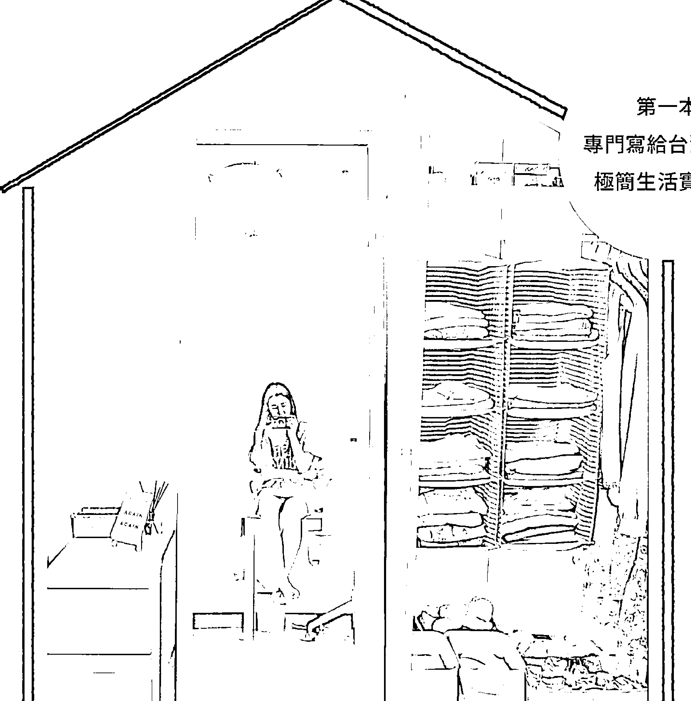

## 第一本
專門寫給台灣人的
極簡生活實踐書

終結「換季斷捨離」的輪迴，打破「極簡＝不購物」的迷思，

丟完東西後，如何維持「7分滿的生活」才是關鍵！

50件馬上丟×50個不再買×5大類不亂買，一個人住或一家人住，都能維持理想生活空間的減法練習。

- 美好推薦 極簡整理師 Blair
- 極簡主義者 NanaQ
- 律師娘 林靜如
- 極簡生活習作
- 收納教主 廖心筠
(依姓名筆劃排列)

# 末羊子的極簡日常提案

極簡生活實踐者
末羊子◎著

## CHAPTER 01 我如何從購物狂變成極簡主義者

曾經，我追求穿搭不重複的「時尚」，驚覺爆滿的衣櫃和房間，一點都不美。原來，我不需要、也用不到那麼多。現在，我活得更輕鬆、更喜歡自己了。

### 〈打造自我的簡單風格，持續進行中〉

# 目錄 CONTENTS

## CHAPTER 02 選擇簡單的生活風格，絕不只是「開始丟東西」

首先，你得知道自己為什麼「一直買」？購物當下的心情是什麼？慾望從何而來？

- 只是想看新影片和朋友近況，卻手滑下單了
- 「捨不得」、「還可以用」，就是一種浪費！
- 超商取件太便利，輕易養成購物狂！

### Column：省小錢、花大錢！「湊免運」的陷阱

### Check：看看現有的物品，先問問自己

- 問題1：是真的想減少物品？還是喜新厭舊？
- 問題2：了解自己是真的不需要？還是只想為了丟而丟？

- 斷捨離的過程，是為了找到適合你的生活
- 不是東西越少、就越符合「極簡」
- 極簡生活，其實是「善待自己」的決心

### 動手實作！開始打造你的簡單生活風格

先清出空間，整理和收納才有效率

- 50件可以立刻丟掉的東西
  - 衣物（包含鞋、帽、包包、飾品和布料類）
  - 保養品／化妝品／香氣
  - 書籍／紙張
  - 電子（小家電）／通訊 3C 類
  - 食品／藥品
  - 各種日用品
  - 其他
  - 篩選、淘汰的物品，讓你更了解自己

### Column 確定不要的東西，有三種處理方法！

# 進入簡單生活，最重要的是「維持」50件我不再買的物品

- 衣物（包含鞋、帽、包包、飾品和布料類）
- 保養品／化妝品／香氛
- 書籍／紙張／文具
- 電子（小家電）／通訊 3C類
- 各種日用品
- 其他

> 買「真正需要」的東西，可以延長快樂的感受。極簡不是「不要買」，而是「不要亂買」

| 1 | 1 | 0 | 0 | 0 | 0 | 0 | 0 | 0 | 0 |
|---|---|---|---|---|---|---|---|---|---|
| 0 | 0 | 9 | 9 | 9 | 9 | 8 | 8 | 8 | 8 |
| 5 | 4 | 8 | 4 | 3 | 0 | 7 | 4 | 4 | 2 |

## CHAPTER 04 維持生活空間的選物建議

物品減量後，開始打造你的「個人風格」

- 兩個小技巧，立刻表現簡單生活新氣象
- 有質感的物品，只要三件就好
- 「別亂買、別亂丟」的選物原則
- Check 1 衣服的關卡
- Check 2 包包的關卡
- Check 3 鞋子的關卡
- Check 4 日用品的關卡
- Check 5 收納品的關卡

只買百分之百喜歡的物品

只是「將就、順眼」的物品，馬上就會被你淘汰

越喜歡的，就越難以被取代

## CHAPTER 05

## 維持簡單生活的日常提案

## 維持生活秩序的五大法則

- （1）練習珍惜：把關選物標準，降低「厭舊」的頻率
- （2）小心「不請自來」：不需要的東西，一開始就不要收
- （3）遇缺不補：練習讓生活七分滿就好
- （4）物歸原處：每次都收好，就不用特別整理
- （5）享受生活：讓今天的自己比過去更好，就夠了

## 和生活理念不一樣的人同住

- 尊重家人的使用習慣
- 從一個抽屜、一個角落開始改變

開始極簡之後，我更喜歡自己了

# 打造自我的簡單風格，持續進行中

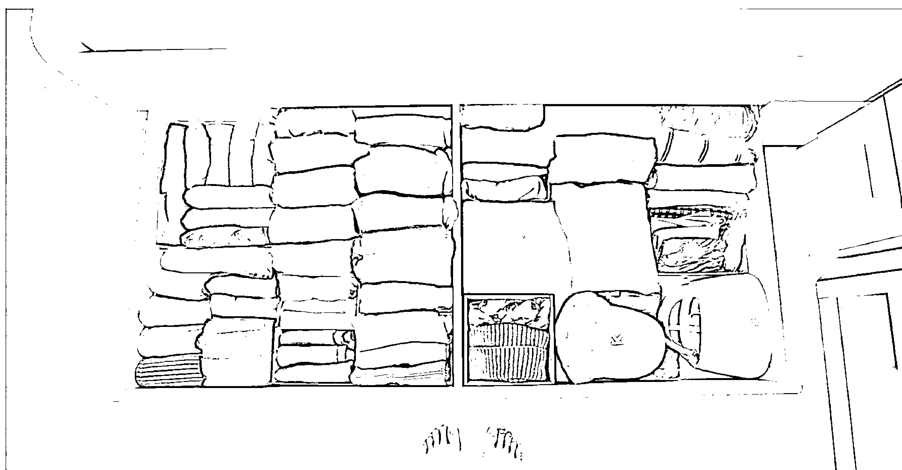

特別挑了有收納抽屜的床，讓春夏和秋冬的衣物可以分開收納。

# 末羊的房間 / Joanne's room

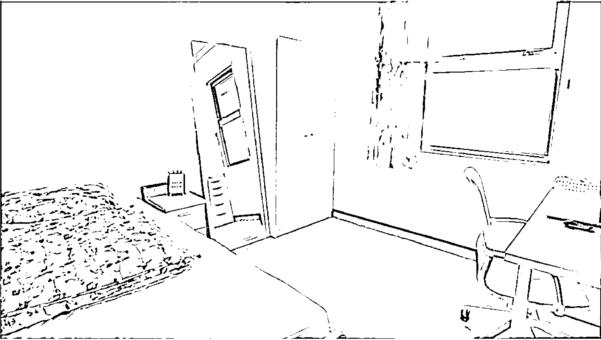

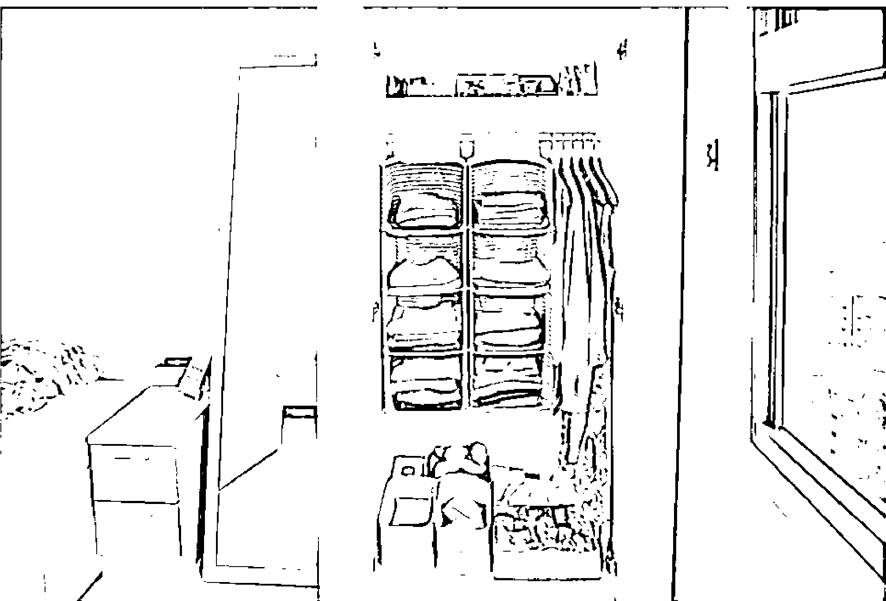

當季衣服在衣櫃裡，非當季則放床底抽屜；所有的化妝品、保養品和飾品，都放在畫面右側書桌兼化妝桌的桌上和抽屜裡。

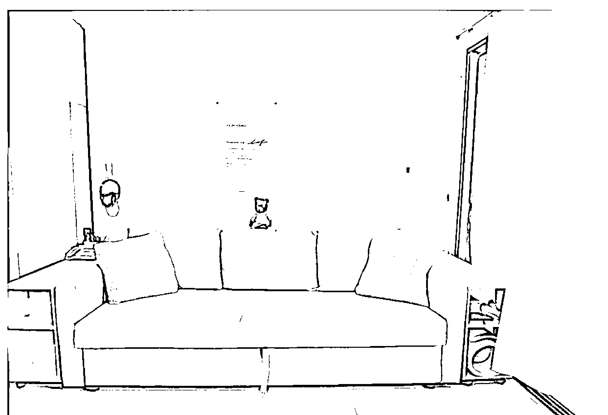

淺灰色的沙發搭配白色的牆壁、窗戶和地板，讓客廳感覺清新明亮。

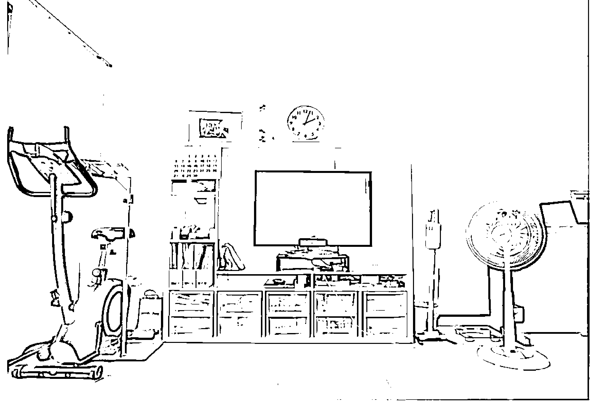

電視櫃採用半透明的抽屜式收納盒，讓視覺上的顏色減少一些，就不會顯亂。

# 客廳 / living room

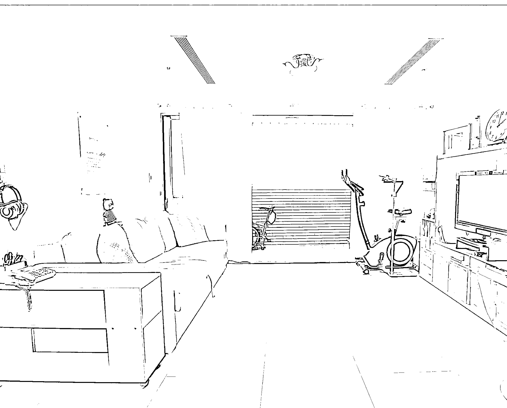

# 餐廳 / Restaurant

白色和淺色真的是讓空間變大的視覺好幫手。靠牆的收納櫃中是餐具和廚房用小家電。

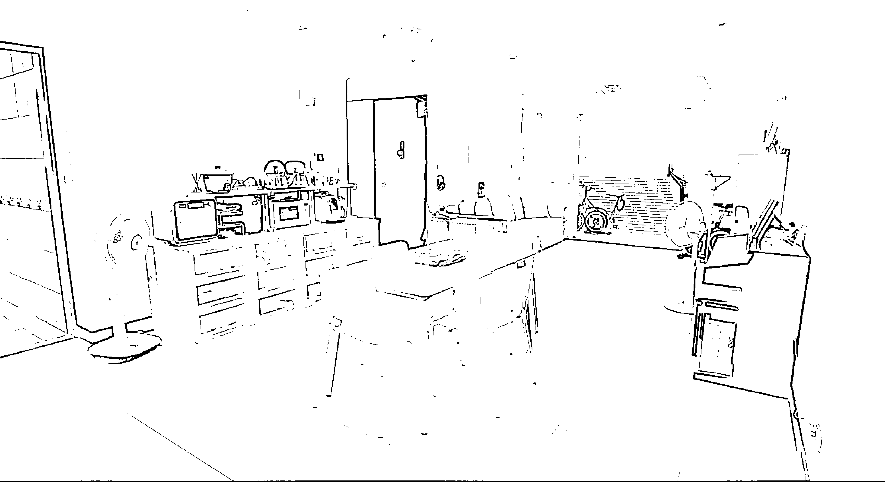

# 玄關 / Entrance

鞋子也用半透明的收納盒擺放。全家人的鞋子都一目了然，要穿哪雙都很清楚。

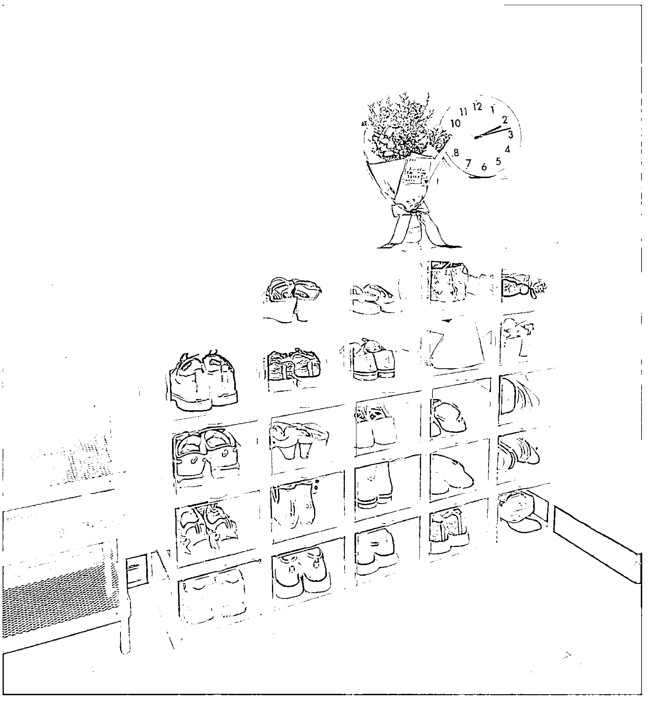

# 浴室 / Bathroom

和洗臉台的原則一樣，瓶罐越少，產生的水垢也越少。另外，使用相同的透明壓瓶，可以讓視覺風格更一致，減少視覺噪音。

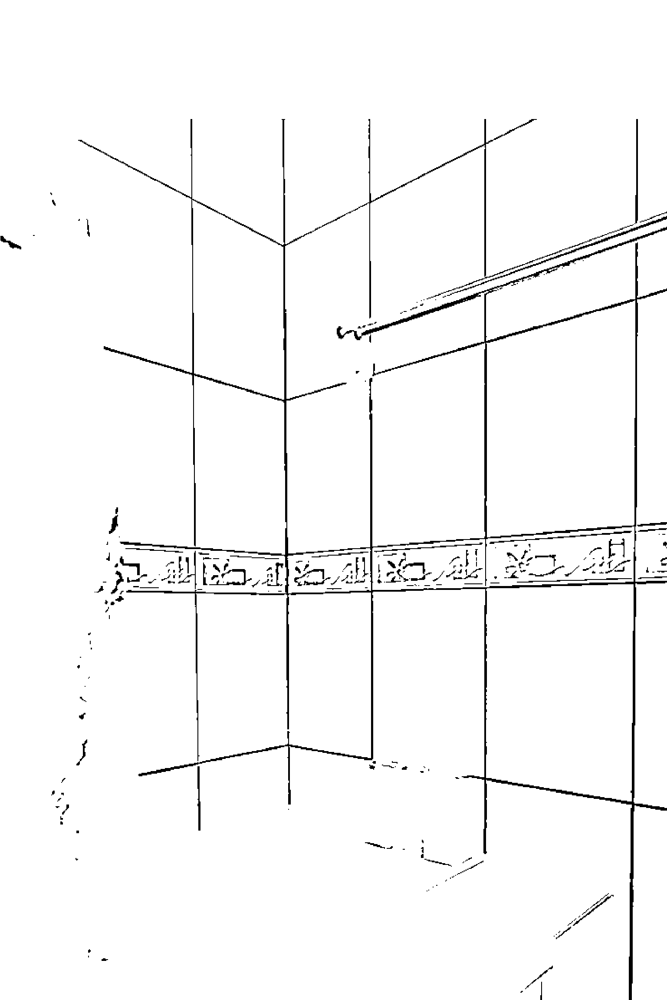

把所有瓶罐數量大幅減少，以及善用層架，可以避免物品和檯面接觸面產生水垢的問題。

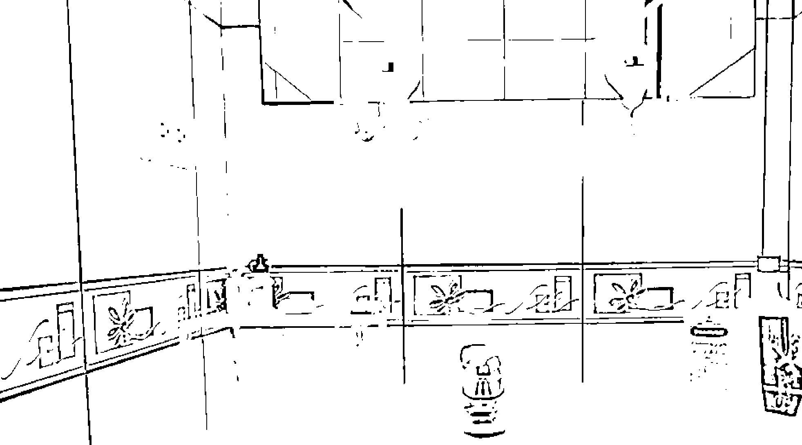

# 未羊的小提醒

我在最後一章的內容中，會提到如何和沒有在進行簡單生活的家人相處。目前我和爸媽同住，除了自己房間以外的共用空間，例如前頁的餐廳、客廳和浴室，我也不是一開始極簡就把爸媽的東西大丟特丟，那絕對會產生不必要的磨擦和衝突！

在改造這幾個家中區域的過程，以及後續的維持，都需要獲得家人的認同，並且取得使用上的共識，才不會過了沒幾個月之後，又打回原形喔！

## CHAPTER 01

### 我如何從購物狂變成極簡主義者

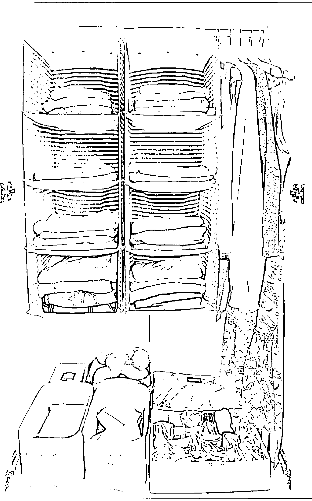

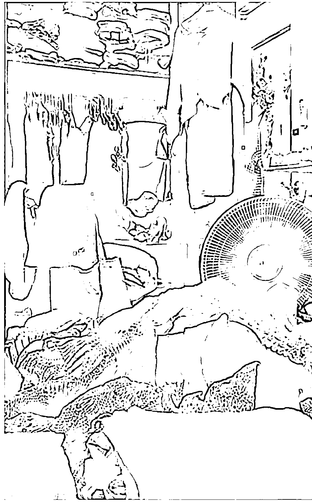

## 曾經，我追求不重複穿搭的「時尚」

> 學姊！這一個月以來我有注意到，妳每天都穿不一樣的衣服耶！

如果和別人聊到過去瘋狂購物的時期，我一定會提到這句當時學姊所說的話。

我永遠不會忘記那段購物成癮且投入打扮的瘋狂歲月，那是在二十歲左右的大學生涯。「不重複的穿搭」，是我當時幾近病態的追求，也是我人生中擁有最多、最流行衣服的時期，每當察覺到同學或朋友注意到我的精心打扮，都令我心花怒放、洋洋得意！

大學時主修商業設計，幾乎每天都要熬夜趕作業，已經睡得夠少了，長期下來平均天天只有不到六小時的睡眠狀況下，我還能再早起一到兩個小時，就為了化妝、挑衣服、選包包、配鞋子，耐心等電棒到達足夠的熱度，把頭髮夾捲出滿意的弧形，然後在鏡子前反覆自問：

> 『今天的穿搭打扮，能不能令人眼睛為之一亮呢？』
『應該沒有穿到重複的衣服，讓別人感到無聊吧？』
『這件上衣幾天才穿過，雖然裙子是新買的，還是換一件上衣好了……』

時間就這樣消耗在猶豫著既想展現又怕弄巧成拙的審視當中，通常總要試個三、五種造型風格才能定案，總之，必定要弄到一切滿意才會安心出門。當時的同學朋友聽到我每天用心良苦地打扮，甚至還願意因此早起，都紛紛對我投以敬佩的眼光。

我很開心能找到「讓自己更有自信」的方法，只要獲得他人的讚美，或者驚呼一聲「你今天也太美了吧！那一切的大費周章就都值得了。」

在這個每個人都看臉蛋、看身材的時代，打扮得好不好，穿著乏味還是時尚，所受到的待遇和眼光簡直是大相逕庭（至少對我這種有打扮就有差別的人來說，的確是的）。每次的精心裝扮，都會獲得不只一個人的讚美和欽佩，甚至我還知道，有人在期待看我今天怎麼穿搭。

這種虛榮使我感到更加自信，更容易受學弟妹尊敬、被學長姐注意。以上種種周遭帶給我的反饋，讓我越發相信這樣的追求是值得的！我不但開始迷戀外在的穿著打扮，更沈溺在他人的掌聲之中，這就像心理學史金納箱的實驗一樣，我好像那

我的大學購物狂時期，當時完全沒有意識到自己這樣爆買有什麼問題。

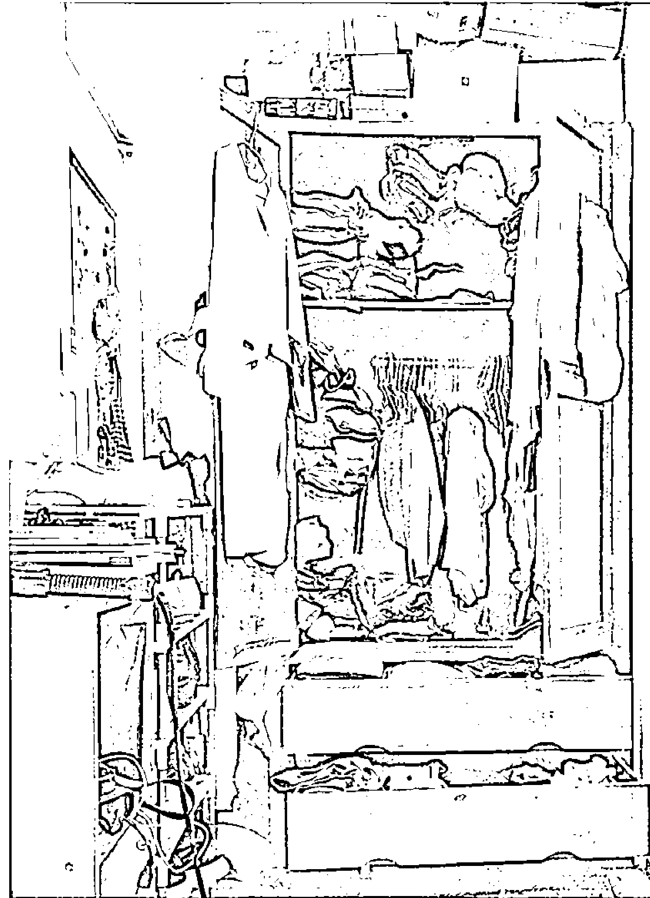

隻已經被制約的白老鼠，不停地重複這樣的迴路：打扮→獲得讚美→再打扮→再獲得讚美→更加打扮……。於是，我的衣櫃漸漸地被一次次的購物給塞滿，化妝品也爆多到抽屜都關不起來，只要有同學朋友看過我的房間，沒有一個不說我「太會買」、「太誇張」。

## CHAPTER 01

### 我如何從購物狂變成極簡主義者

> 驚覺，爆滿的衣櫃和房間，
> 一點都不美

現在的我，則是在社群媒體上推廣「極簡主義」的倡導者，身邊所有人都詫異我的改變，而改變的契機，要追溯到我在瑞士當交換生、結束學業後準備回台灣所受到的刺激，也就是收拾回國的過程，讓我的價值觀發生了出乎意料的轉折。

當時還在歐洲讀書的我，旅遊在各個時尚摩登大都市，一貫地逛街購物，一貫地計劃自己的敗家行程。我買了各款快時尚耳環、以前從沒嘗試過的知名品牌T恤、第一和第二支的專櫃手錶、精美的陶瓷餐具、萌萌的絨毛娃娃……等等，實在列舉不完，說出來只會讓人感嘆「啊～她好多錢！」、「過得真爽！」。但當面臨回台之際、收拾打包行李的時候，這一年累積的林林總總，根本不可能塞進32吋的行李箱裡，本想利用國際郵遞運送，但不論航運或海運，運費驚人到根本就可以把那些東西都全部重買過，但很可能買不到那時所擁有喜歡的樣式，因此就完全不考慮

國際郵遞了。
儘管我挖空心思節省空間，例如使用壓縮袋，或者把物品拆解化整為零，還是都塞不下，最後不得不面對的現實是：如果不放棄一些，我根本別想回家了。
當時我不捨的程度，竟然還奢望能把我買的窗簾和床包也一併帶回家！別笑，想當然是天方夜譚，但那都是我愛不釋手的心肝寶貝啊！
媽媽非常訝異我居然花這麼多錢投資在一只生活一年的空間，她要我做出取捨和放下無謂的執念，試圖說服我「帶不走已成定局」的事實，要我開始「斷捨離」。
於是，「斷捨離」這三個字就在我心中埋下了一顆種子。我在瑞士的住宿房間

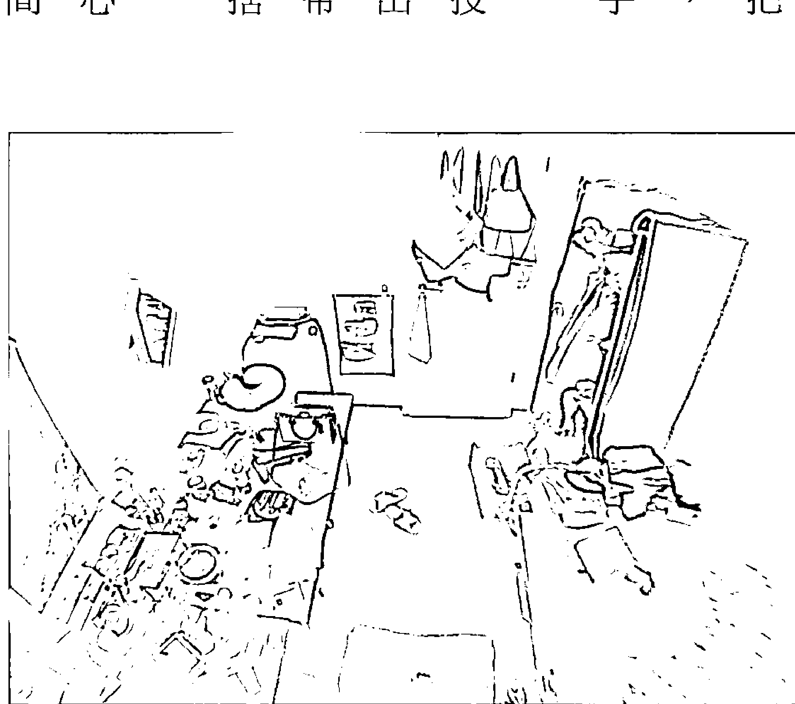

只待一年、不到兩坪的瑞士小房間，東西爆滿又凌亂！

## CHAPTER 01 我如何從購物狂變成極簡主義者

仔細看著散落在衣櫥和床上的衣服；東吊在門把、西掛在牆上的包包；還有更多堆放在各個角落的飾品和雜物，真的感覺一切都亂透了！原來，我一直生活在爆滿和凌亂之中。

我突然覺得自己好狼狽！

為什麼我要被逼著做選擇、被淘汰想保留的東西？懷著沮喪的心情，我上網查了媽媽所提的『斷捨離』，隨意瀏覽幾支YouTube相關的影片。印象中，影片裡的人們屢屢提到『練習脫離對物品的執著』，這是我人生中第一次聽到這種說法，雖然還搞不太清楚具體涵義到底是什麼，但最起碼我對『斷捨離』這個詞顧名思義，以及隨著回台灣的時間越來越近，不得不採取行動、打起精神來面對事實：『好吧，不能全部帶，那哪些是一定要帶的？哪些可以不要？』

這是我首次嘗到『不得不取捨』的滋味，我花了好幾天的時間猶豫不決。那是我第一次認真思考每個物品對自己的意義和重要性：為什麼有些東西不需猶豫就可以決定要或不要，而有些東西明明很少用但就是捨不得？有些物品憑什麼成為我優先留下的選擇？

雖然那時『斷捨離』雖然已經讓我留下了印象，但我還沒有完全開竅，幸好這

個初始的概念有助於成功地打包好行李。還記得離開瑞士那天，總共帶了三大箱兩大袋，先是踉蹌地拖了十分鐘去車站，就已經滿身大汗了，再費力地把它們抬上火車，等到機場時再搬下來、扛上機場的行李推車，在航空公司櫃台 check in 時還忐忑不安，怕會超重。經過十六小時的飛行，回到家時，那七十公斤的行李已經把我折騰得精疲力竭。「哇！終於把這些猶豫好久的東西帶回台灣了，太爽啦！」……哈，哈，哈，才怪！殊不知，那是另一場惡夢的開始。我家中的房間原本就塞滿「一年沒用的東西們」，在歐洲的這段期間，它們還是不增不減地待在那裡，現在又多了三大箱兩大袋、一共七十

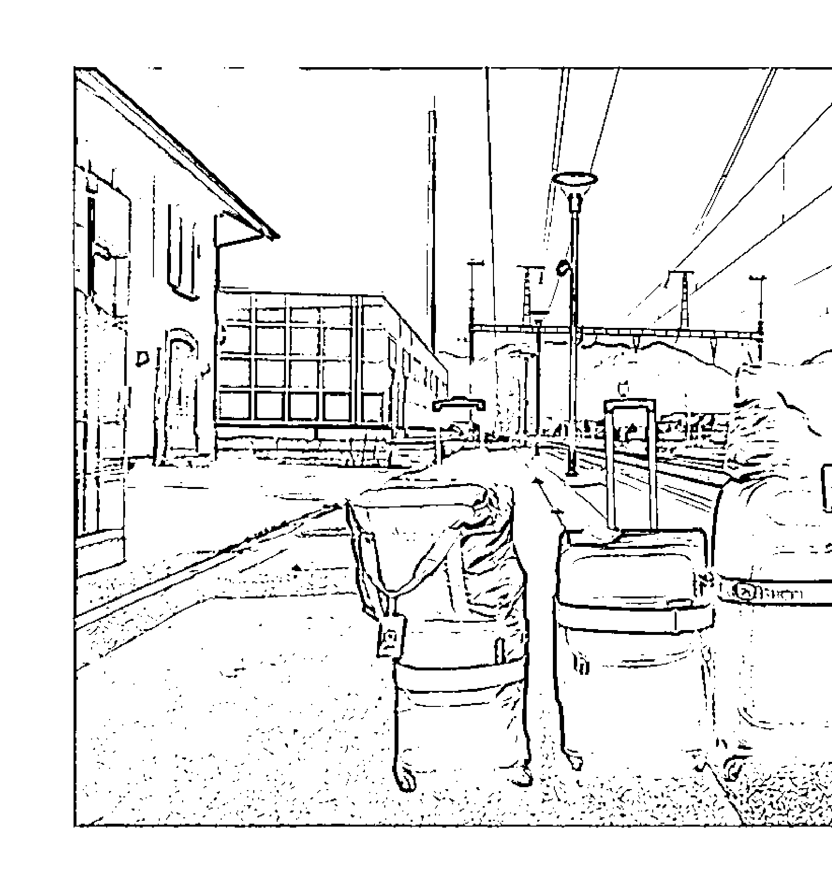

這是當時從瑞士打包的70公斤歸國行李，一共三大箱加兩大袋。因為很堅持要將它們全部帶回台灣，所以一路上移動、搭火車、登機等等，非常辛苦也很手忙腳亂。

## CHAPTER 01

### 我如何從購物狂變成極簡主義者

公斤的歸國行李，我的房間就像是已經滿載的捷運車廂，硬是要再多擠入一群人馬的感覺。

就算整個房間是粉紅色的夢幻色系，但那時候看起來，就像是住著不會打理生活的邋遢女孩。雖然感到無力又煩躁，但我開始明白一點：「整理房間，勢在必行」。

那股在歐洲篩選打包的勁頭又起來了，我一邊收拾房間，一邊放著「極簡主義」和「斷捨離」相關的影片和報導，腦海中不斷想像「經過極簡之後」的理想畫面——乾淨簡單、卻富有質感的空間，沒有任何雜物散亂在房間裡！這些都激起了我無限的嚮往，成就後來脫胎換骨的原動力。

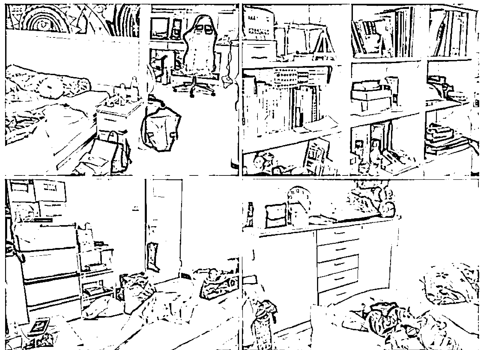

明明是粉紅色的夢幻房間，東西卻多到需要堆在地上，毫無夢幻可言。

## 原來，我不需要、也用不到那麼多

儘管對「極簡」還抱著懷疑，但這樣的概念與風格真的震撼了我，那種清爽、乾淨、單純、簡單的形象，讓我既羨慕又好奇：「這真的有人住嗎？」、「這真的不是樣品屋嗎？」。

我的極簡啟蒙導師是一位住在澳大利亞的 Youtuber——Evonne，從她一系列分享極簡歷程的影片中，最觸動我的是這句話：「美好的生活是不昂貴的。」第一次聽到這句話時，我感受到心臟像是被重重地搥了一下，剎那間顛覆了我的全世界！

一直以來，我都認為「美好」是可以被價錢和數量定義的，多數社群媒體所營造出來的氛圍，竟和這句話完全背道而馳，大家都拼命地炫耀自己所買的潮貨，以至於一般人對消費的渴望，隨著這樣的帶動越發強烈，好像大家都一起掉入了不滿足的陷阱裡，卻渾然不覺。不光是價格越來越超出自己所能負擔的範圍，需求和慾

## CHAPTER 01 我如何從購物狂變成極簡主義者

慕等虛榮的情緒也隨之漲大。
對比永無止境的物欲，這句「美好的生活是不昂貴的」像是一片藍海，讓我從物欲的洪流中得到救贖！網路上所看到的「極簡照片」，完全不會讓人覺得可憐、無聊、或窮酸，反而帶給我更多的平靜、和諧和舒服。俐落的房間裡，該有的都有，需要的也一個都沒少，非常的井然有序，但又不是那麼的死板、龜毛、毫無活力，而那些極簡主義者從容優雅地享受在清淨的一方——真是太美了！這不是就 IKEA、無印良品、北歐居家等風格會大肆流行和興盛的原因嗎？他們的家具和日用品數量，就是那麼的「恰到好處」。
從那時候開始，我像是一個完全變了一個人，本來在街上會不自覺地流連在服飾店

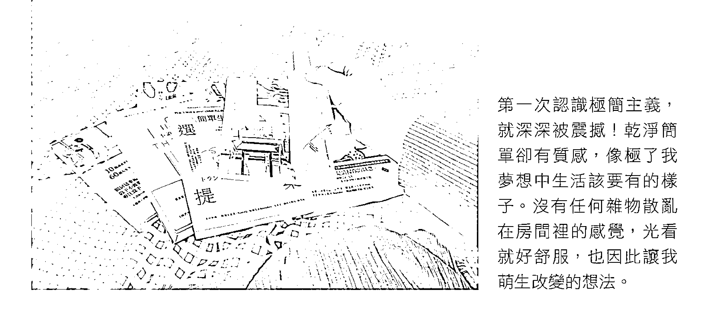

展示窗前，現在只想奔回家繼續整理那些一堆埋在深處的衣服，或是回收掉幾雙根本不會再穿的潮鞋。

「有這麼多東西，似乎沒有比較好!? 還是說，反而更不好!?」沒想到回國後的僅僅一個月內，「極簡」就成為了我人生的核心思考。

Youtuber Evonne 所提倡的「減法生活」，像一記當頭棒喝，敲醒了我，不再沈迷購物，而是讓自己活得簡單和輕鬆一些。我開始意識到，原來不需要這麼多「我以為我需要」的東西，過去那些囂張的購物欲，就拋到千里之外吧，我的當務之急，就是減少自己過多且無用的「所・有・東・西」。

## CHAPTER 01 我如何從購物狂變成極簡主義者

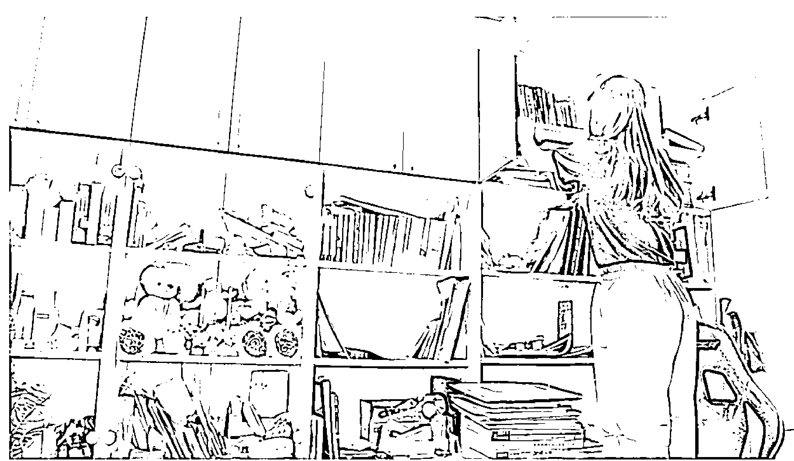

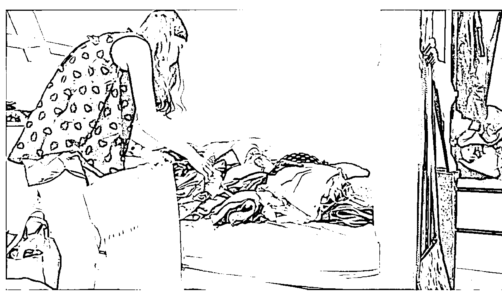

當時開始瘋狂的整理，每天都花幾個小時在面對這些雜亂。

## 現在，我活得更輕鬆、更喜歡自己了

歷經了兩年斷捨離的實踐和極簡主義的洗滌，我的物品量漸漸達到了一個剛剛好的七分滿狀態。

在開始大丟特丟、大賣特賣的那段期間，我歸納出幾種最容易被捨棄的物品類型，它們似乎形成了一個清晰的輪廓，在告訴、提醒我：「我不是你所需要的，以後不要再買我了」。

每個接觸「極簡」到一定階段的人，都會有「越來越了解自己」的感覺。大家是否同意，買東西買到最後，會越來越清楚自己想買什麼；很神奇的是，丟東西也是！你會漸漸清楚你喜歡什麼、不喜歡什麼，你需要什麼、不需要什麼。

我開始對所懂得的生活有了一個全新的定義，漸漸放下對物品的執著，漸漸生活在我習慣也喜歡的環境之中。原來沒有那麼多慾望，就不會有那麼多非買不可的

### 我如何從購物狂變成極簡主義者

打折商品！斷捨離短短數週，我感覺自己過得越來越輕鬆，於是也更讓我確信，原來我的價值和魅力，其實不必被這些身外之物給束縛。

或許現在的你，不覺得自己可以清楚分辨到底什麼叫喜歡、什麼叫需要，面對雜亂無章的房間，也不知道該從何下手去收拾和斷捨離……別急！要開始簡單的生活，不可能只靠一個下午埋頭苦幹地整理或大丟特丟就能完成，想想過去，我們可能是日積月累、花了好幾年的時間才把家裡的空間填滿，相對的，現在也需要花上好幾天、甚至好幾個月才能達到簡化。

「簡單生活」只是一種生活方式，不一定要到極簡、不一定要到空無一物才是終極目標，也就是說，不要以為必須「什麼東西都沒有」才是實踐極簡。在調整生活的過程中，要隨時以「自己」為中心，「怎樣的」感覺是自己最舒服、最順眼、最嚮往的，那個「怎樣」就是最好的。

接下來的章節，我會分享自己的心得和經驗，希望帶著有心想要開始啟動簡單生活的你，用超有感、無負擔、無壓力的方式循序漸進；從改變你對「擁有」的心態，慢慢找到最適合你的生活方式和風格，希望能讓你體驗到「少即是多」的輕鬆。

## CHAPTER 02

選擇簡單的生活風格，絕不只是「開始丟東西」

首先，你得知道自己為什麼「一直買」？

## 購物當下的心情是什麼？慾望從何而來？

前文提到，在我不經大腦瘋狂購物的大學生涯，主要起因於「想要被注意」和「虛榮心」。還有另一個原因是，在國中時，我並不是個會打扮的女孩，家裡也並不重視外在的裝扮，認為衣著夠用即可，對於我想買好看、流行一點的衣服鞋子，媽媽總認為沒有必要。實用且夠用好的觀念我也十分認同，但當時我讀的學校班級，同學很愛談論這些外在物質的話題，學校不必穿著制服，更是加重同儕之間的比較心理，而我「樸實」的穿著打扮，常遭到他們的嘲笑和戲弄，這讓青春期的我開始對自己的衣著感到不自信，也讓我對自己的外在產生濃厚的不安全感。

以前投資了絕大部分的錢在治裝費上，連耳環、飾品等也是數十副。只要看到心動的、當季流行的，我就會想要買，且不會特別思考搭配性或適不適合自己。

於是，一旦學會用網路購物之後，我開始背著母親偷買新衣服，但因為深怕被發現，所以內心總想著：「沒關係，買給未來的自己穿。」這樣以後上大學，就直接有好看的衣服了！」我甚至曾穿著平常的衣服，但帶著一套自己偷買的出門，在和同學見面前換上，回家前又再換回來。

而上了大學、脫離家人日常的視線後，我終於有自由購物的機會，以前越是壓抑、被取笑，後來就越想要證明自己也可以很漂亮……。在當購物狂的日子裡，我並不重視物品能帶給我的真正價值，也沒多想物品本身的質量，只在乎有沒有打扮成別人會給予讚美的模樣；我買更多的是當下的憧憬、付錢的快感、以及擁有的虛榮心，就像在證明給誰看一樣，用購物來補償我以前被嘲笑的困窘，消弭小時候的自卑。當時我把打工薪水、比賽獎金、書卷獎金、網路上賺來的收入，全部投資在外表打扮上，成了一個不折不扣的月光族。

如果有好好思考需求的話，其實我最常穿戴的飾品，連一個盒子都放不滿。好好審視自己的喜好和需求，會發現有太多的購買都太過草率和衝動。

一邊斷捨離的過程中，由於一邊反省自己為什麼總在衝動購物，後悔錢都亂花沒好好存起來，思考為什麼會如此不理智，才發現原來促使我一直買的根本原因，是想要用這些物質的東西，來證明自己其實可以很好看。

很多的購物經驗，未必是來自我們那麼喜歡，或是「非要它不可」的理由。好比「想要買某物來犒賞自己」，這樣的想法也許誰都有過，也是我們習以為常的自我獎勵。但我們真的喜歡這個產品嗎？犒賞之下買的東西，是買當下的快樂還是真正的需求？這份犒賞的幸福感可以延續多久？

這些問題也許讓你感到麻煩或認為根本就「想太多」，但這有可能就是長期造成家裡東西過多、滿是雞肋的根本原因。我們要找出為什麼會「擁有」這麼多沒有在使用、或其實未必那麼喜歡的東西，進而抽絲剝繭，找出自己的慾望是從何而來、找出買不停的真正主因。

### 【 CHECK 】

看看現有的物品，先問問自己

- 是真的喜歡產品的本身嗎？
- 因為別人大力推薦嗎？
- 會不會是出於嫉妒、羨慕，或比較心理？
- 會不會是虛榮心作祟？
- 是不是心底的不自信？
- 是否盲目追求流行，其實並不適合自己？
- 是本來就想要買嗎？還是看到廣告後被推坑？
- 是當天太無聊，習慣購物隨便買的？
- 沒有為什麼，就是想買？（那為什麼會有這種「就是」？）

## 只是想看新影片和朋友近況，卻手滑下單了

我可以很肯定地說，如果我們迴避所有社群、購物的訊息，你的消費慾望一定會大幅下降！而這也絕對會是「眼不見為淨」的最好例子之一。只可惜，現在的廣告到處充斥，就算刻意迴避，有時也難逃廣告訊息的無孔不入。社群是怎麼影響我們購物的？舉我最常用的三大平台：Youtube、Instagram 和 Facebook 說明，今天明明是想要滑滑看喜歡的 Youtuber 有沒有更新影片，結果正好因為結合業配，所以你突然就心動想買某牌專櫃保養品；明明是想要滑 Instagram 看朋友的限時動態，但中間穿插地表最強保暖衣的廣告，正好今天天氣涼涼的，所以也順道點進去看；吃飯無聊點開 Facebook，又發現朋友轉發了抽獎好康，點進去發現社團賣的韓貨不但投你所好、還正在打折優惠！於是忍不住多逛了兩圈，且為了湊免運而多下了三件衣服的訂單……明明最初只是想看 Youtuber 的新影片、想知道朋友的近況、想瀏覽一些新消息，但結果處處都碰到燃起購物的慾望火苗。當然，我們很難做到不使用社群軟體而與世隔絕，廣告一定會在我們開啟網路的那一刻就如影隨形。但若是真心想要調整過盛的購物慾望，我們能做的，就是戒掉常逛的購物網站，試著把們移出「我的最愛」和「書籤」裡。大半的商品，基本上只要不看，就不會想要，甚至不會知道！

我逐漸發現打中我的廣告，大多是因為我羨慕照片裡模特兒的身材體態、精緻的妝容、水嫩光滑的皮膚，住在有設計感的房子，坐擁歐美式的生活和飲食方式。在斷捨離大量的物品、播放著極簡主義的影片的同時，才漸漸發現到「我不是因商品心動，而是被照片中的氛圍狀態所觸動」。說來丟臉，但社群就是這樣影響我的，無意間傳遞出「房間不夠有氣氛，是因為少了這個香氣蠟燭」、「身材不夠修飾，是因為少了這件顯瘦的壓力褲」、「自信不夠，那試試這支新品口紅」、「魅力不夠，噴噴看這款白玫瑰淡香水」、「料理不夠好吃，氣炸鍋讓你一秒變廚神」......。講出來好像變得矯情和誇張，但社群廣告營造出的形象，就是不斷在讓我們誤以為「有了這個商品，就可以過得更好」，以及「你現在不夠好，就是因為沒有這些東西」。很多人都默默的被物質給迷惑，在資本主義下，商人已經很習慣煽動、引起消費者覺得「好便宜、潮流好物、快點買、限量、我買得起、犒賞自己、買了就會好快樂、好幸福」......等等的假象，我們不但容易變得非常物質，而且我們已經默默地相信，買東西＝買到快樂。

這個時代默默的讓所有人「渴望更多」，廣告潛移默化的洗腦，讓我們瞬間就忽略了現在的好，忽略了現在有的一切，轉而把重心全放在那商品架上的東西，激盪起不必要的購物慾望。

Netflix 的紀錄片《極簡主義：紀錄生命中的重要事物》就有一個讓人印象深刻的例子：現在有一支新手機推出了，你很想要，而且買了之後覺得快樂極了！但一年後又推出了一個新的版本，於是你現在手上這支，已經成了「舊的版本」。所以呢？現在不但想要這個新的，去年的快樂，反而成了你現在不滿的根源。

廣告不斷製造出「你需要這些東西」的假象。現在你的日子過得好好的、開開心心的，但很多很多的廣告一直在釋放「有了它會更好、一定會更棒、那就是理想生活的必需品」……等等的假象。我們不得不承認，在沒有建立穩固的理性購物觀念之前，真的會無法自拔地陷入這種迷思中，這是整個資本主義大環境下堆疊起來的，也是造成「一直買、一直想要、一直欲求不滿」的真相之一。

如果想要主動逃離這樣的陷阱，減少被物質慾望煽動，雖然可能需要一段時間去適應，但「眼不見為淨」這招還是管用的！沒看到，就不會知道、不會想要、不會想買。試著刪除或取消追蹤那些會讓你心癢癢的APP和網站，那不會讓生活變糟，因為你本來就過得很好！換句話說，那完全不會影響你的生活，當需要購買任何東西時，在已經如此便捷迅速的網路世代，只要Google一下，肯定還是可以找到需要的資訊。

## 「捨不得」、「還可以用」，就是一種浪費！

大部分的台灣家庭都有很好的飲食文化，好比教育小朋友食物要吃光、外食吃不完可以打包等等，充分體現我們愛物惜物的美德。你的家裡是否有過多的紙袋、沒在用的贈品筆、成堆的廢紙舊書、空瓶空罐、學生時期的教科書、不再穿的衣服、不確定是否壞了的家電、搞不清楚功用為何的3C電線、放很久但從沒用過的新物品……等等。列舉這麼多的意思是，「捨不得丟」背後的主因就出在「過度惜物」。

我們一直以來都習慣加法生活，東西一旦進入我們的生命裡，就好像很難再與它分開。儘管已經有一百個紙袋了，但新到手上的這個又新又精美，感覺未來送禮可能會用到，於是便沒有察覺到「已經有的紙袋」數量多得驚人，其實應該先減量一些比較不適合的；儘管知道有些贈品筆並不好寫，但礙於還是能用，所以姑且就先放著。

保留愛惜所有能使用的東西，是很好的美德，但過多的囤積和習慣保留，就會導致家裡空間逐漸被佔滿，築起一區又一區的雜物堆，讓常用的東西受到排擠，嚴重者甚至會影響生活舒適度和行走動線。我在極簡一年後，去上了一堂整理的相關課程，老師指出這樣的堆積和「過度惜物」，只是變相去維持那些根本不會用、也覺得好看、會用到的東西，後來真的有用嗎？真的需要這麼多嗎？還是在你用到之前，它就已經變成一個佔空間的垃圾呢？

其實不想用的東西，其實會耗費更多的時間與空間。

舉我家過去的例子吧，不知道哪裡來的一箱養生茶，但沒人想喝，於是一放就放了五年！五年當中，這箱茶一直佔據家裡的收納空間，耗費我和媽媽很多心力去整理抽屜、騰出空間，最後又因為沒察覺到過期，無法硬喝下肚或再次轉送，最終以丟棄收尾。

與其花費心力，不停去維持和打掃那些長年不碰的東西，不如好好的面對，一口氣把它們送、丟、賣、捐、回收，做一個更好的處理。「浪費」其實可以有不同的解讀，實體的浪費往往會被正視，而無形的浪費，好比時間、心力、情緒，則往往都會被忽略。原來，生活家庭帶給我們的生活方式，我們不一定要延續下去。

下次，當家裡紙袋囤積數量來到了第一百零一個，就要警覺，再多下去不會帶來美好，只會帶來困擾！適時明快地處理，才是上上之策。

## 「超商取件」太便利，輕易養成購物狂！

眾所周知，台灣有許多大型綜合購物網站，可以讓你 在一個網站就買到所有需要的商品；代購、批貨等個 人品牌和商店，也都有相對應的平台。

購物手段愈方便，愈容易衝動購物

以送貨速度來說，我們有24、12、6小時的快速 到貨時間可以選擇，還有大多數國家不可能做到的「超 商取貨」、「店到店服務」！這些種種的便利，都讓 購物變得更方便、更輕易，更容易落入「衝動購物」 的陷阱裡。

我國中的時候，太想要實現穿著流行的願望，偷偷背著家人用零用錢買了好幾筆網購。這要不是有便利的「超商取貨付款」，根本不可能辦到！如果選擇「宅配」，當年的我勢必要去攔截送貨員，風險太高也太難了！而且很多宅配沒辦法搭配貨到付款，那個年紀的小孩又通常沒有信用卡可以使用。各位父母知道嗎？大部分的孩子或多或少都有自己偷偷網購的經驗，把存到的零用錢，買了一個爸媽不希望孩子購買的商品。很多人應該也有背著另一半偷偷購物的經驗，也最有可能選擇超商取貨。因為超商取貨及貨到付款的便利服務，不容易被家人發現，無需本人簽收，就容易促成購買，但同時，這也是促成許多慾望產生的源頭，如果沒有這項選擇，其實很多的衝動購物會因為不便或怕被發現而打消。這就是網購和超商取貨「便利」和「衝動購物」的兩面刃，好和不好並存。

## 省小錢、花大錢！「湊免運」的陷阱

以前我和某一群朋友可以說是非常討厭出門，也不喜歡在實體店面購物。

原因之一：一家家店面去逛去找很耗損體力，且未必能找到合適的商品，而用電腦逛街則可以快狠準搜尋，相較之下較為省時省力。

原因之二：許多銷售員往往會給消費者很大的壓力，每當試穿、試用時都要被投射「關愛」的眼光，不少人其實是會感到非常不自在和尷尬的。

總之，網購成了許多人最愛的購物方式，而當購物變得如此方便，使用頻率就會越高，當購物慾越容易被激起，商人就會發現越來越有利可圖，設計更多讓你掏錢的陷阱，而消費者當然也就越來越難理性。

我在斷捨離的過程中，才逐漸發現到為什麼網購會容易過度消費，和促使我們購物慾望越來越烈、房間也越堆越滿的原因。

網路購物容易讓人忽視和妥協許多現實。就好比看到模特兒的超美意境照，會說服自己的身材也可以穿S號（其實應該選M），也容易因為照片的氛圍，接連忽視「不適合自己風格」這個事實。「適不適合」包含了要考慮每個人對材質的偏好、版型身形的契合度、個人風格、衣櫃搭配性、著衣習慣、當地天氣……等，後面會再向大家仔細說明。

說來難以相信，但我們的確常常在購物的時候，做出很多妥協！好比說，網站突然來個免運活動，就會因為想要省下六十元運費，進而讓人更不假思索地加購沒有那麼需要的其他商品，很多人的理性會在「免運」的誘惑下動搖。拾回理性後才驚覺為了省小錢反而花了大錢。雖然是多擁有一樣物品，但事實上你並不需要它，且根本不是原來想要購買的東西，也壓根沒有那麼喜歡它！「湊」免運這件事，正是過度消費的陷阱之一。

感覺上，六十元運費不是什麼大錢，應該說，多花差額所湊來的免運商品，也多不是什麼大錢！而就因為是小錢，所以如果買錯尺寸，或是花樣稍不滿意、東西稍嫌雞肋，人們也懶得去申請退換貨，所以就選擇冷處理或自認倒黴，默默地塞進衣櫃深處。加上這時，因為物品已經到手了，已經放進你的生命裡了，就又回到上一段落所分析的「惜物心理」，一旦擁有了就很難放手，開始產生很多「那就留著吧」的理由，說服自己總有一天會穿到、用到，因為它還是有某些個不錯的優點，企圖催眠自己、免於面對「丢掉即浪費」的罪惡感，且堆放在角落也無傷大雅。「湊免運」不僅是過度消費的陷阱，也導致你身邊增加愈來愈多「沒那麼需要，也不那麼喜歡」的物品，形成一個「濫買→惜物迷思→累積物品→繼續濫買」的惡性循環。

以為省下小錢、其實卻多花了錢買了根本沒這麼想要的雞肋商品；買了之後捨不得丟，於是就繼續堆放，直到下一次大掃除時「換個地方擺」，或是終於願意丟掉，但又背負著「好浪費」的罪惡感……這些心理負擔和佔據空間的不悅，早就超過當時省下的60元運費了！

## 成功的斷捨離，要先問自己兩個問題

### 問題 1 是真的想減少物品？還是喜新厭舊？

我剛開始執行斷捨離的時候，心中純粹是嚮往極簡生活的簡單輕鬆，並不知道這個生活方式早在國外盛行多年。有幾位路人甲乙丙，以看好戲的心態回應說：

「妳那麼愛買愛跟風，現在極簡、斷捨離也是在跟風、製造話題吧！？我看妳能維持多久！」。

雖然被酸民這樣回應心有不平，但我在大約一年後才知道「跟風斷捨離」是真的存在的，這股熱潮逐漸在台灣的社群上吹起新話題。

這股風潮下，似乎人人都在標榜斷捨離，但很少人能了解其真諦。「斷絕不需要的東西，捨棄多餘的廢物，脫離對物品的執著」，是斷捨離的原意，但我發現到，很多人在「丟了半個衣櫃」、「扔了一半的化妝品」、「狂丟一百公斤」後，其實真正的心態是「耶！又有新空間買新的了！」。

在這個物資過剩的世代，丟東西就像是一波新熱潮，人人都在挑戰和嘗試。雖然會在丟的過程中有所反思（確實會幫助我們更認識自己的喜好和所適合的物品），也赫然發現以前怎麼那麼會買，進而和地球說聲抱歉、自嘲真的太容易失心瘋、下次不敢了……云云，但若非以「想要重新打造理想生活空間」和「想要減少物品數量」為目標，非常容易故態復萌、重蹈覆轍，因為這只是「以丟棄之名行汰舊換新之實」，對改變生活型態並無實質的幫助。

要徹底的讓生活變得有秩序起來，不會過了三、五年後又再一次「斷捨離挑戰」，就必須更理性和謹慎的看待每一次的購買。我們必須捫心自問：是真的想減少物品堆積，讓生活過得更輕鬆呢？還是只是因為喜新厭舊，想要汰舊換新？你的心底是想要把過去流行的東西全扔了，換成最新一季流行的嗎？這些都是在開始丟東西之前應該釐清的事情。

這麼說來感覺十分嚴苛，好像再買、再購物就與簡單生活背道而馳，但不是的，我們只是在學習如何更理性面對購物慾望，還有「學會維持」而已。畢竟想要斷捨離的人，出發點無非是感到生活一團混亂，櫃子、桌子，甚至地板永遠處於爆滿的狀態，受不了堆滿滿的各個角落，才因而想要嘗試這樣的生活吧！我並不認為有人會喜歡「定期斷捨離大挑戰」。所以，為了防止再次掉入無限「斷捨離挑戰」的輪迴，最好的辦法就是先確認自己是發自內心的「想要改變生活！」下定決心的願意嘗試簡化自己的物品量、調整購物習慣，一定會幫助我們更好的維持簡單生活。能夠這麼堅定的說，就是因為我發現多數成功的實踐者正因為如此明確，才能使「簡單生活」輕鬆維持至今，一路堅持下去。

丟完東西之後，你是選擇維持下去，還是再買新的物品填滿空出來的空間呢？

如果按照以前的購物模式，再多衣櫃也不夠，斷捨離只會成為換季時汰舊換新的模式而已。

### 問題 2 了解自己是真的不需要，還是只想為了丟而丟？

開始在網路上分享我的心路歷程之後，我每天都會收到無數篇像作文一樣的私訊和留言。有太多人被「減法生活」給啟發，像是一記當頭棒喝，突然開始審視自己過去暴走的消費行為。每當有粉絲興致勃勃地和我分享心得，拍下今天斷捨離的「戰績」，並激動地想要趕快把生活重新整頓起來，我都替他們感到非常開心。

不過「極簡生活就像減肥一樣，羅馬不是一天造成的」，會堆得水泄不通，都是我們過去長年花大把銀子養出來的，恢復秩序一定會花上不少時間！

許多人會來諮詢我的建議，例如「紀念品該不該丟？聯絡簿該不該回收？無用的禮物可不可以捨棄？」習慣簡單生活的達人會直接告訴你，那些都是身外之物，活在當下就是最輕鬆的方法，可以考慮丟掉。但我認為，最重要的是「不要跟隨別人極簡、不要跟隨別人斷捨離」。也就是說，不是達人叫你丟什麼，你就跟著丟什麼。

物品的去留，得要靠自己篩選出來，因為日子是自己過的，別人的意見終究只能是個意見，請絕對不要為了極簡而極簡、為了丟而丟，甚至為了想要快點簡單生活而一時扔得又快又急。

減物最有意思的地方，莫過於「釐清自己和每種物品的關係」！這是我執行兩# CHAPTER 02
## 選擇簡單的生活風格，絕不只是「開始丟東西」

極簡生活最有感觸的地方之一，雖然可能速度會慢一些，但當自己去思考：為什麼會選擇丟掉？為什麼會選擇保留？為什麼當時會買下它？為什麼後來漸漸不使用了？為什麼不使用但還是想留著？為什麼喜歡卻會堆在角落？為什麼可以丟得這麼乾脆？為什麼想丟掉的都是這類型的東西？……等等，透過這些反思，你會在整理的過程中有一满满的收穫」。你不需要記得以上的所有問題，你其實只要簡單的回想一下，這個物品怎麼來到你的生命裡即可。

我曾經在 YouTube 上分享過，認為「該丟掉畢業紀念冊的數個原因」，雖然說到很多人的心坎裡去，但其中我最喜歡的留言是：「畢業紀念冊是我非常確定，如果現在我丟了，多少年之後突然想翻卻發現沒有了，絕對會非常傷心的一樣東西。」

因為每個人所經歷的喜怒哀樂都不同，所以要捨要留，往往也都和個人的生命故事有關，不為了丟而丟的斷捨離，才能更清楚明白每樣物品所帶給我們的意義。

不要因為極簡的 KOL 告訴你「什麼要丟」、「這個不需要」，就照單全收喔！我的建議當然也一樣。想好這個物品對現階段的你來說「有沒有正面的效果和幫助」，而不是硬要把衣服減少到 20 件、把玩偶全部捐掉或是把全部的書都賣給二手書店。畢竟每個人的人生經歷不同，減物應該是要讓你的生活變好，而不是因衝動下帶來任何遺憾的。

## 斷捨離的過程，是為了找到適合你的生活

我偶爾會收到網友們評論我的生活「不夠極簡」，這其實曾對我帶來不少的迷茫和困惑。怎麼樣是夠極簡？怎麼樣才能稱得上是一名極簡主義者？我憑什麼去教別人斷捨離？教別人脫離購物慾望？

### 不是東西越少、就越符合「極簡」

就如上一段落和大家分享的：「沒有人應該告訴你什麼該丟、什麼該留」，所以也沒有人可以評斷誰擁有太多或太少」。我們可以聽取別人的意見，但我們更必須遵從自己的內心。

知名極簡主義者 Matt D'Avella 和大家分享自己的膠囊衣櫃，因為不想煩惱每天該穿什麼，所以準備了十二件相同的黑色短袖 T 恤，同樣的運動短褲也有六件，其他三件休閒襯衫也是差不多的款式，只是不同顏色罷了。我想這是很多人因誤會而卻步極簡生活的原因，對於享受打扮的人來說，天天穿得一模一樣，簡直是毫無樂趣！就我而言，十二件不同的上衣，可以玩出不同層次的重複穿搭，不僅能讓我享受打扮的喜悅，也一樣能感受簡單生活帶來的美好，不必被數量綁架。

對於一個常常出席演講、活動的名人來說，擁有五十件衣服可能是對她的職業和生活最平衡的數量，但對於一個朝九晚五、面對電腦的上班族來說，可能三十件衣服都稍嫌太多。我們最該檢查的，不是表面的數量，而是確定你的所有用，都能為生活帶來益處和效用。

我們不需要急著在一、兩天內，甚至一、兩週之內就達到巨大的改變，許多人回到家，看到的是亂堆亂放的衣服、東倒西歪的書、沒有任何擺放秩序的冰箱，難免都會感到心煩意亂。接下來的章節會告訴大家，怎麼篩選出生活用品中的「菁英」。

是很正常的。請不要著急，我知道會關注這本書的人，應該都有很強的行動力想把居住空間來一場大改造。但這是一場長遠的馬拉松，要追求的不是「一夜之間丟了好多東西的大變身」，而是如何將生活中的物品變成需要且舒適的組合，最後內化成長遠的生活習慣，輕鬆維持一輩子。

我花了兩年，才把 20 個包包簡化到 3 個，我比較喜歡循序漸進的觀察自己適合什麼，慢慢決定物品去留，如此一來也比較不會發生丟錯而後悔的小意外！

花點時間找到適合自己需要的量，才是最終目的，不需要過分糾結擁有的數量多寡，或丟得太快太急。

## 極簡生活，其實是「善待自己」的決心

我很喜歡的一名 YouTuber 兼極簡主義者 Sarah Therese，她是一位有三個孩子的加拿大媽媽，是她的影片讓我清楚發現，不論是怎麼樣的身分：為人父母、上班族、單身或有伴侶，只要我們想要，任何人都可以實踐、貫徹簡單生活。

Sarah 會定期觀察家中什麼東西沒有在使用，若沒有帶來效益，就會選擇斷捨離。她也不會輕易購物，已經習慣實踐極簡生活的她，雖然知道很多很好用的「哄娃神器」、很多酷炫又火紅的熱銷商品，但如果她覺得現在的生活已經足夠好，就不會感到心動！

好比媽媽們都人手一台的尿布處理器，可以輕鬆解決眾多父母認為有「異味」的問題。但對於 Sarah 來說，隨手拿出去丟已經成為習慣，所以儘管大家都大讚神物，她仍理性認為自己不需要這樣的商品。

每當 Sarah 剖析自己的購物觀念和消費動機，都會一再強調：「我的選擇，不可能適合所有人。」

有時我會收到年輕媽媽的私訊，告訴我「有了小孩就不可能過極簡生活，因為照顧小孩所需要的東西太多了！」像是同事在閒聊之間常會討論哪樣「神物」超好用，就會瞬間推你進入「認為自己也需要」的漩渦。

總之，「簡單生活」是要回歸且檢視自己當前生活的種種所需，只留下需要的部分，而在簡化的過程中認清不會為了丟而丟、不會為了極簡而給自己龐大的壓力，純粹抱持著想要改變生活、想要照著自己的步調去簡化物品量，並一直維持而成一種舒適的常態，你就會漸漸愛上待在家裡（或是任何你所在且能自己掌控的空間，如房間、辦公室等等）的感覺。而當你喜歡且享受地待在那個舒適的空間裡，恭喜你，你已經達到簡單生活境界了。

不要強迫自己得做到極簡達人「0 雜物」或是「空無一物」，用自己的生活習慣，評估這件物品有沒有「效益」，按照自己的步調簡化物品數量，讓生活更舒適，讓自己過得更好，才是簡單生活的目標。

# CHAPTER 03
### 動手實作！開始打造你的簡單生活風格

### 先清出空間，整理和收納才有效率

看到這邊，我想應該有很多讀者已經摩拳擦掌，迫不及待想開始整理家中物品、或上網訂購收納箱了吧？（相信我，很多人真的會做這種本末倒置的事情！）

不過，為了避免你的「整理、收納」，只是把無用的物品排列整齊，等待下一次弄亂的機會，我建議應該先進行「減物」。

你不一定過「極簡」生活，但可以過「簡單」生活。在這個章節裡，我將帶領你一審視自己的生活環境，把對於現在生活來說根本不必要的東西，一個一個清出來。雖然會多花一些心力去處理這些物品，但很快的，你會有更多的時間、更多的專注，放在更重要的事情上。

或許你未必完全認同，畢竟每個人的生活習慣都太不一樣，不過在檢視的過程中，想必能給你不少「淘汰、放下執念」的啟發。

當然，丟掉這個詞，可以自行替換成「捐贈、二手販賣、回收、贈送……」等等，把你認為還可以再利用、但丟掉好可惜的東西，做最好的處理。

別急著買收納箱收納盒，先清理出不要的物品，才知道該怎麼收納整理減物後的空間。

# Right Now! 50 件可以立刻丢掉的东西

### 衣物（包含鞋、帽、包包、饰品和布料類）

- **1. 超過一年沒穿的衣服**
  都已經過去一年、四季輪替過一次了，除了只有出國會碰到特殊氣候才需要穿的衣服，不然實在不必留著根本不穿的衣服。

- **2. 有褪色、泛黃，也懶得處理的衣服**
  襯衫上有泛黃、衣服有發霉的，你既然都不想處理，也懶得漂白，那它堆在衣櫃裡的意義是什麼呢？（吞噬空間的典型代表！）立刻漂白處理，不然就丟了吧！

- **3. 破洞、不成對的襪子**
  我們都懶得補，對吧？而且想必你已經有很多新的、正在穿的襪子了。

- **4. 變形、鬆了、不合宜的內衣褲**
  如果是怕胸部下垂，或是「反正就是不穿了」，各種理由都表示：可以丟了。

- **5. 不舒服、會磨腳的鞋子**
  再漂亮、再美的鞋子，只要痛過、被磨過，是不是真的就再也不穿了？這雙鞋會傷害你耶！就不要再覺得可惜了。何況你對它的糟糕印象已成定局！

- **6. 超過一年不穿的鞋子**
  又過了一年，和「1. 超過一年沒穿的衣服」一樣，是不是真的不會再穿到了呢？除非很確定會有個一定會到來的場合，必須要穿到它（好比下個月，好朋友就要結婚了，這雙閃亮的鑲鑽高跟鞋終於有機會登場），不然放越久只會越不想穿、也和現階段流行越差越遠而已。

- **7. 生鏽、泛綠、褪色的飾品**
  你的耳針、耳柱上面，如果生鏽或有一層綠綠的東西，立刻去處理或就丟掉吧！還沒發炎或感染，真的只是幸運而已。先老實承認，我有在戴的都是新的、狀況好的那幾副而已。

- **8. 超過一年沒有戴的飾品**
  雖然沒髒、沒壞，可是你都沒戴，是不是表示不喜歡了呢？勇敢承認已經不愛，也是放下執著的一種作為。

- **9. 發霉或是狀況不太好的毛巾**
  洗澡完後，一定只會順手拿那幾條新的吧？何必留著髒污又不好用的呢？

### 保養品／化妝品／香氛

- **10. 過期、根本不用的化妝品**
  化妝台那隻口紅到底幾個月、幾年沒有擦了呢？還有，某一罐粉底液是不是快要過期了（但也許你渾然不覺）？下次記得別再買了，太容易用不完，而且根本不想去注意什麼時候過期。

- **11. 不用的、不會用的美妝刷具**
  可以想一想，精緻的妝容到底什麼時候才會用這支刷具畫出來？那幾支在冷宮長居的刷子，可能比你畢業後就再也沒用的水彩筆還要雞肋。

- **12. 就是不會用的化妝品／保養品試用包**
  明明想著出國時可以帶去用，但真的出國的時候，又很怕用了那些沒用過的保養品，皮膚會不適應，平常在家裡也是從來不會想到要用！今天就用掉，或當身體乳擦一擦，不然就直接丟了吧！

- **13. 不再喜歡的顏色、乾掉的指甲油**
  好幾罐三、五年前流行的颜色，或是根本懶得擦，也可以不用留了，反正留了還是不會用的。不如把這些空間省出來，換算下來的價值都還比你去做幾次指甲沙龍還划算！（記得我們在第二章聊過，無形的浪費也是種浪費嗎？）

- **14. 根本沒在噴、味道其實不喜歡的香水**
  你都不喜歡這個味道了，就別再逼自己把它用完了吧！看是要當室內芳香劑，還是送給喜歡這個味道的人吧。

### 書籍／紙張

- **15. 說明書**
  許多物品的使用說明，應該都可以查 Google 或 YouTube 了。★在一個特殊原因下可以好好保留，就是以後有很大的機會二手轉賣給別人，那這時候一整組完整配套，就很有價值了。

- **16. 買了卻一直沒看的書**
  如果想看，為什麼還沒有看呢？「沒有時間」這樣的說法，可能只是沒有這麼想看。

- **17. 過去的教科書**
  現在資訊這麼發達，大部分你想要的資料，網路上幾乎都有。若想保留一些奮鬥痕跡的筆記，也可以只留下幾本就好。

- **18. 過期不再看的考卷、講義、學校通知單**
  除非你是考生，不然這些都只是另一種型態的廢紙而已。

- **19. 實體字典**
  觀察自己的查字詞習慣，你應該就會有答案。當有網路的那一刻起，網路上的海量訊息，就已經很夠用了。

- **20. 舊雜誌、型錄**
  除非是特別用來當成裝飾，不然沒有必要繼續關注過去的資訊（尤其很多相關資訊網路上都有）。

- **21. 已經三、五年都沒再翻看的漫畫**
  除非有特別值得收藏的情感，或是找不到正版的網路版本，就可以考慮處理掉。

- **22. 根本沒在看、再也不看的食譜**
  有可能是因為你已經有習慣做的幾套料理了，生活繁忙又沒有時間心力去研究新的菜色。食譜放著也不會憑空變出美味料理，還是處理掉吧！

- **23. 不好看的、舊的、不想用的、用過了、用光的筆記本**
  不想用或是用完了，其實你都『不再使用』，這些筆記本已經如同廢紙。

- **24. 不知道是誰寫的卡片**
  連誰都不知道，或是記憶超模糊？想必根本心動了，那就丟了吧！

- **25. 各種你不在乎、懶得整理的名片**
  已經不在乎了，就丟了吧。如果 很在乎這個聯絡人，也可以選擇存 在手機，或透過社群與他聯繫。除 非你能肯定自己有整理名片、查找 名片的『習慣』。

- **26. 沒有用的收據、帳單**
  ……就丟吧！

### 電子（小家電）／通訊 3C 類

- **27. 壞掉也懶得修的小家電**
  都已經壞了，平常要用也不能用。若不是今天就送修，不然就處理掉，再放也不會變成好的。

- **28. 不知道用途的電子產品、配件**
  承認吧！我們懶得研究那些根本不重要、很少用的產品是什麼。很多人其實只要有基本的手機、電腦、相機充電線，隨身碟、USB、記憶卡等等，就夠了。

- **29. 用不到、很舊、已經被取代、不知道也不想測試的電子產品、配件、電線、充電線**
  嚴格來說，這些就是對你「沒有用處」的物品，趕快處理掉吧！

- **30. DVD、VCD**
  除非是很想要的收藏，或是很想要的其他周邊的同捆包，否則很多影音都有數位版，還能省下一台光碟播放器的空間（請支持正版觀賞）。

- **31. 不用的 APP**
  刪掉吧！真的要用的話再隨時下載就好。手機天天都會看，囤積不用的 APP 很容易分散你的注意力，也會造成視覺疲勞。

- **32. 再也不想看到的 Email 廣告**
  就這次勤勞一點，花十分鐘去取消煩了你好幾個月的垃圾訂閱！每次都花一點一點的時間去刪，不如一次解決，一勞永逸！

### 食品／藥品

- **33. 過期、不知道是什麼的藥**
  太恐怖了，不要留了！何苦拿自己健康開玩笑。

- **34. 過期、懶得吃、難以下嚥的保健食品**
  最終只會放到過期，未來丟不如現在丟，還可以清出空間收納別的東西。

- **35. 放了很久卻不吃食物**
  我大膽推測，你一定是因為覺得很難吃、不喜歡吃，所以才一直囤著？可以丟了！ 但如果是因為捨不得吃，每多放一秒，就失去一秒的新鮮，請盡早享受食物在最新鮮時的美好。

- **36. 過期的食物**
  太恐怖了，不要再有無謂的眷戀了。

- **37. 已經根本沒在用的醬料、調味料**
  你可能想不到適合這些醬料的食譜可以運用。

- **38. 根本不會喝的茶葉、茶包、沖調包**
  再放也不會泡吧？我相信有些已經放到結塊或發霉了。

- **39. 尺寸、造型不合的馬克杯、水杯**
  每天都要用的杯子，還是留實用、常用的就好。

- **40. 不用的廚房用具**
  廚房內的任何空間都很寶貴，清出來，可以有效提升在廚房工作的效率。

- **41. 放在浴廁洗手台下面櫃子、不明或不想用的物品**
  保持清爽乾淨，甚至淨空最好。很多家庭的這個區域都又潮濕又髒亂，請務必徹底的清掃一次，別讓這裡變成「雜物黑洞」。

- **42. 沒有用在的美術用品**
  沒有在用，何不轉手賣人？很多從事藝術或設計的人，可以讓這些用具發揮更好的功用。

- **43. 沒水或斷水的筆、贈品筆**
  我知道一一檢查很麻煩，不過只要花個五分鐘，你絕對可以在家裡（或公司）找到一大堆這種筆。

## 其他

- **44. 不再心動的公仔、扭蛋、娃娃、吊飾**
  它們被放在那裡，不被你喜歡、也沒有辦法亮相，其實應該也很難受。

- **45. 古老破舊，不想玩、不想碰的懷舊小物、玩具**
  如果只是想要留著懷舊的東西，偶爾看看、覺得回味起來很懷念的話，其實可以看照片就好。

- **46. 不知道幹嘛、不知道怎麼發揮價值的禮物**
  雖然是誰送的，可是還是要認清現在的自己，根本就不知道它有什麼用處，能帶給你生活什麼效益。有些微不足道的回憶，真的不需要透過這些東西來囤積在家裡。

- **47. 其實真的沒什麼紀念價值的紀念品**

- **48. 沒在用、不想再碰的手工藝、勞作**
  如果你都不想玩，再放著也只是招惹灰塵，然後一直期許自己有一天會再碰而已。正好可以利用這個機會來認清自己「其實熱情已經消退了」。

- **49. 不知道是開哪些東西的鑰匙**
  就算等到你需要開鎖，你也不會知道是『這把鑰匙』。

- **50. 任何讓你看了心情不好的東西**
  剩下可以讓大家自行去摸索了。以上列舉了這麼多，無非都是希望空間乾淨、充滿正能量！也請別忘了，「無形」的囤積也會吞噬我們的好心情，如果訂閱了一堆不會看的 YouTube 頻道，那麼取消關注也無妨；如果追蹤一堆讓你產生羨慕嫉妒的 Instagram 帳號，退追蹤也能讓你滅絕負面情緒的滋生。

告別這 50 種可以丟的項目，除了把空間釋放出來，找回生活秩序，心情也會因為排除掉不需要的物品而感到輕鬆愉快！

## 篩選、淘汰的物品，讓你更了解自己

我知道很多人與其說是捨不得丟掉，可能更多是覺得「丟掉很浪費」，但又懶得找方法或花時間「捐贈、二手販賣、回收、贈送」，所以才一直堆在角落視而不見。

如果一直這樣下去，是永遠沒有辦法讓生活有秩序起來的！也就更不要說前面提及的那麼多好處：越了解自己、心情越自由、過得更輕鬆、更不被物質慾望綁架，甚至存更多錢……等等。

我知道有很多物品是過去花了不少錢，才慢慢打造出的「現況」。但想要翻閱這本書，並看到這裡的你，不就是因為想要讓生活恢復活力、重新獲得呼吸空間嗎？堆置那麼多「捨不得」，也不會讓人更加富有。「有失必有得」這句話雖然聽起來有些老套，但請相信我，試著從剛才前面列出的幾樣物品開始放下，你一定會感覺到，生活開始有意想不到的改變，並發現為什麼「越簡單、越自由」。

試著想像看看，把不再使用的物品漸漸清出後的房間，是不是光用想的就覺得期待？是不是能感到一瞬間清新、幸福許多？所有不喜歡的、老舊的、過時的，都逐步淡出了你的生活。

# CHAPTER 03
動手實作！
開始打造你的簡單生活風格

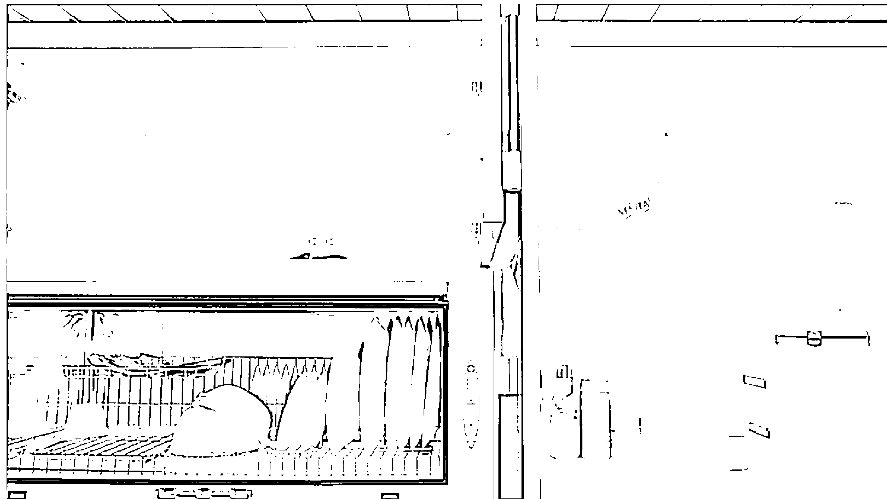

保持「七分滿」的收納，是實踐簡單生活的入門。

# Column

## 確定不要的東西，有三種處理方法！

當你確定了自己斷捨離的心態，是想要嘗試新的生活、而非汰舊換新或跟風之後，首先遇到的問題，就是「不要的東西，除了丟掉、回收，還可以怎麼辦」。我在2018年開始斷捨離之後，主要是用這三種方式：

- 1. 二手拍賣
現在拍賣有很多平台可以使用，無論是衣物鞋包或書籍，用你習慣順手的平台就好。這邊想分享一個當時我在賣衣服的技巧，除了衣物的正面照之外，盡量也提供細節照和尺寸；想像你自己如果買網購，會想知道商品的什麼資訊？就盡量寫上去，可以增加賣出的效率喔。

- 2. 捐出去
有些東西還可以用、可以穿，但可能不是這麼流行的款式或好賣的類別，這種我就會選擇捐出去。要捐出的東西，請大家要將心比心，是否符合對方的需要呢？例如想捐出文具用品給偏鄉學童，這些筆確定可以用嗎？是不是根本就斷水、難上色或很難寫之類。或是例如之前捐鞋到非洲的「舊鞋救命」，是要讓赤腳的孩童有鞋穿、避免雙腳直接接觸土地反覆感染沙蚤，那麼高跟涼鞋、麵包鞋、開口笑鞋，就完全不適合捐出去。

- 3. 丟掉（要做好回收喔）
這個選項評估起來就容易多了，像是不太能用、壞掉故障、有明顯使用痕跡等等，這種就直接牙一咬，眼一閉，通通丟掉吧！不過，你覺得「勉強可以用，所以捨不得丟」的東西，那其實就是該丟了，別以為捐出去可以幫助別人，因為那也是其他人眼中的垃圾而已喔！

## 進入簡單生活，最重要的是「維持」

而這時候，就來到了我們一度驗證自己是想要「過得輕鬆」還是單純想要「汰舊換新」的時候了。空了大半的櫃子，你會想要重新填滿嗎？還是想試著「維持」，開始享受這份簡單呢？畢竟前面已經花了大把力氣，把家裡稍微整頓出一個樣子了，為了保持美好現況和減少無謂的慾望，接下來我會提議五十個自己「不再購買」的東西，供大家參考。協助你不再輕易就被廣告的火燒到，防止又重蹈覆轍地添購一堆未來五年、十年後會嫌棄的物品（也就是防止你未來每五～十年，又必須再進行一次大規模的斷捨離）。斷捨離後的空間，必須非常謹慎的對待任何要進入家裡的物品，如果未來很有可能又成為被丟掉的目標，那麼當初就不應該讓它進來！

# CHAPTER 03
動手實作！
開始打造你的簡單生活風格

我所提議和建議的「五十件不再購買的物品」，是指如果沒有損壞或是必需需求，不會再購買更多。和「五十件可以立刻丟掉的東西」一樣，大家或許未必完全認同，畢竟每個人的生活習慣都不一樣；我將以自身的反省和經驗，結合YouTube的觀眾回饋，列舉給讀者們參考。請大家試著套用在平時最容易不理智、失控消費的物品上。

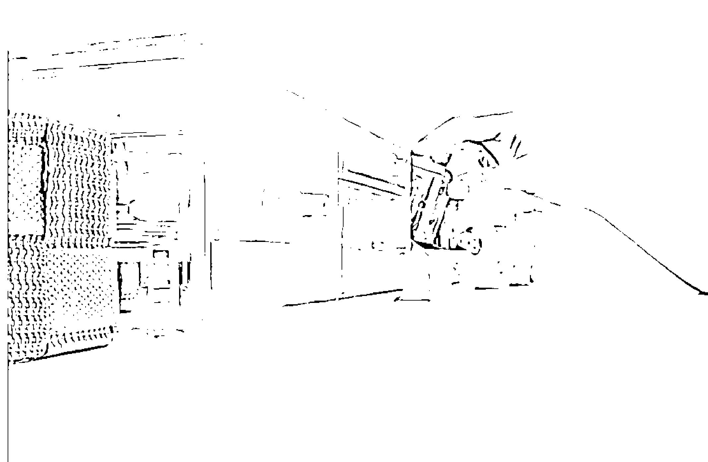

清出了空間之後，接下來的功課就是如何維持住七分滿就好，而不是買新的東西把空間塞滿。

# Right Now!
50件
我不再買的物品

- **衣物（包含鞋、帽、包包、飾品和布料類）**

1 / 潮牌服飾
自從發現潮牌服飾的生產過程會帶給地球嚴重的負擔，還有持續壓榨勞工等議題令人唏噓，更主要的原因是，這些服飾往往不實穿、材質不好、容易縮水或變鬆，時常過了一年半載甚至一個季節，就會迅速退燒，讓你沒有慾望再次拿起來穿搭。正因為流行被淘汰的頻率太快，所以我們總在不知不覺中花了一堆冤枉錢，新鮮感消逝的速度跟新品推陳出新的速度一樣迅雷不及掩耳，最後往往成了塞滿房間的最大元兇。

2 / 材質不好的飾品
耳環、項鍊、手鍊、戒指……其中是不是有幾副，是因為很便宜所以買的？但買下之後戴了幾次，發現很容易生鏽、泛綠掉漆，最後也越来越少戴。要購買飾品，寧可稍貴一些，買材質好一點且真正喜歡的。

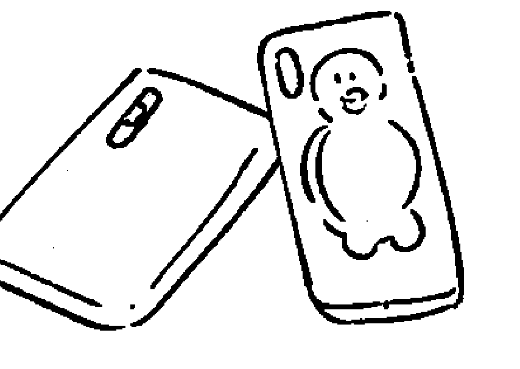

# CHAPTER 03
動手實作！
開始打造你的簡單生活風格

3 / 各式各樣的包包
我發現自己常背、習慣的包包就是那幾個，好用的包包也是那幾個。有太多包包不但會增加收納空間的負擔，我也懶得在不同包包之間作轉換（尤其換來換去，容易有些東西沒有拿到），所以不如省去這些心力，好好的愛惜固定幾個好用常用的包款就好了。

4 / 各式錢包
錢包的使用頻率高，超過一個以上、換來換去其實耗損很多心力，最後也往往容易懶得更換，還是固定只用那一個。只要有一個好用、實用的錢包就夠了。

5 / 過多的鞋子
我認同在不同場合，要搭配不同的鞋子，但相似的鞋子真的不需要太多雙！我們只有一雙腳，扣掉最愛的那幾雙，其實很難讓每雙鞋子平均輪流登場對吧？

6 / 各種帽子
遮陽用和打扮用的帽子，一樣適量就好，而且有些款式的帽子不一定適合你；我是到後來才承認，其實我根本不喜歡、也不適合戴帽子呀！

7 / 過於華麗、材質差的內衣褲
有些內衣品牌打著「內在美」的行銷，標榜女生一定要好好的愛自己，就算只有自己看到。但實際上，舒服、合身、材質好才是最重要且實際的。過多華麗但不舒適的款式，最終也只是堆在抽屜裡。

8 / 各種樣式的手錶
一直以來我都習慣戴手錶，把手錶當成是一樣裝飾品，不同顏色的錶帶、不同尺寸的錶盤、不同華麗的品牌，但其實最常戴的總是那幾個，方便穿脫和好搭配。

9 / 各種手機殼
手機殼對一些人來說，就像我們衣櫃會有換不完的衣服，但往往用一用就失去新鮮感（像潮流服飾一樣），所以其實一、兩個實用、耐用的就夠了。

10 / 吸水快乾的毛巾
「包頭毛巾」對我而言，根本就只是一個被商人洗腦的「必需品」，其實以我的要求和習慣來衡量，一般毛巾就非常足夠了。

## 保養品／化妝品／香氣

11 / 過量的化妝品
這是我最希望自己沒有爆買過的東西。老實說，你真的分得出來這兩支口紅到底顏色差在哪？這麼多組眼影盤，你是不是最常用的就是那幾個、那幾色？在購買前，你有評估過自己真正需要的是哪一種嗎？如果你是一般的上班族，或是需要化妝的場合有限，其實只需要常用、適合自己的顏色就可以了，也能省下很多整理化妝用品的時間。

12 / 化妝工具（刷具、美妝蛋）
藉由化妝工具，我願意再一次承認，自己真的非常懶得清潔繁瑣小物！刷具裡時常會滋生無數細菌，不夠勤勞的話根本就是用細菌來化妝！而不想再購買更多刷具的原因是，很多刷具其實是設計給很會化妝的大師用的，一般人如果沒有掌握技巧，其實有再好的工具也沒有用。

13 / 刷具清潔劑
刷具清潔劑剛推出的時候，人人都是好幾罐、好幾罐的在搶購、囤貨，我也使用過肥皂清潔，發現完全沒問題，一樣可以輕鬆洗乾淨，稍加搓揉，就算沒有專用的清潔劑，也是可以洗得很乾淨。

14 / 指甲油、去光水
相信喜愛塗抹指甲油的女生，家裡都有好幾罐不同顏色、光澤的指甲油，但事實上有擦指甲油的時間並不多，卻又因為廣告和新鮮感而買了自己消耗不完的量。擦指甲油非常花時間，很多人又未必有耐心等它乾、或有技術擦得漂亮，使用不當產品又沒有保養的話，還有損指甲健康！說不定省下這些錢、這些失敗的時間、這些囤積，偶爾上個指甲沙龍還更為划算，還不用擔心用不完乾掉的問題。

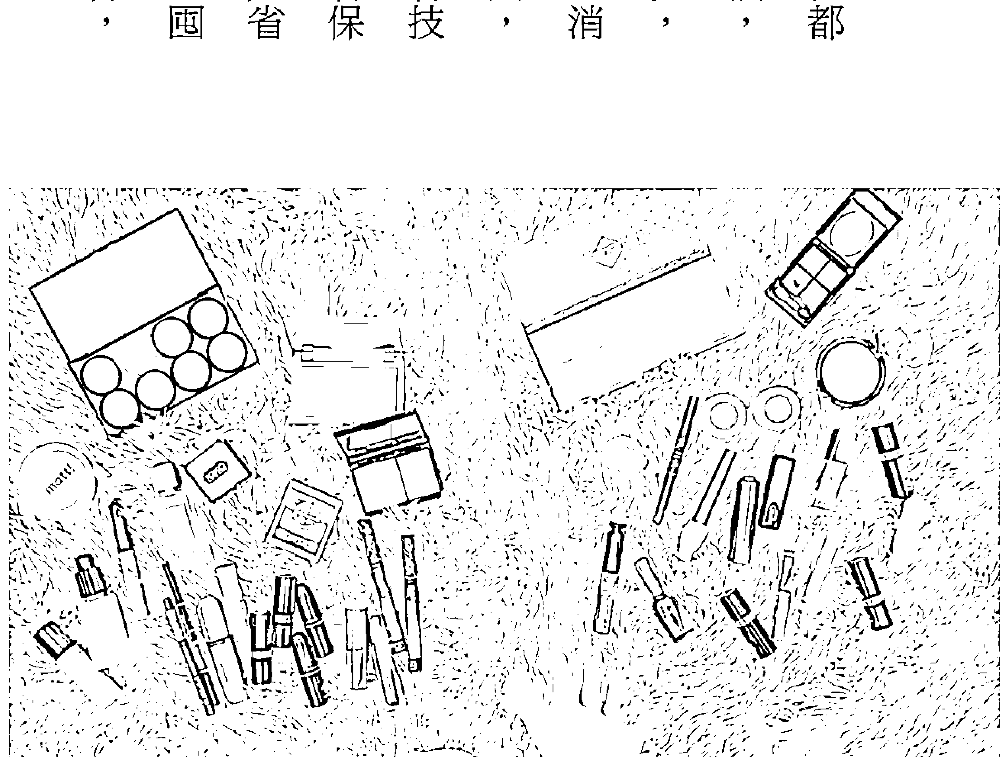

化妝品其實是消耗較慢的消耗品，買過多其實到最後都是過期、浪費而已。右半側為我買了但其實根本沒有用幾次的品項，如果購買前思考理性，更是可以省下不少錢！

15 / 不必要的、特定功效的保養品
各種用途、或是特定功能的保養品真的有用嗎？還是其實只是日常的作息、飲食不太正常，導致效果一直不彰？適當的保養一定能協助膚況保持年輕和彈潤，但過度刺激、頻繁更換，甚至沒有先了解自己的肌膚狀況所買的保養品，非但不會協助你的膚質更好，還會讓它更敏感和脆弱。特定功能的產品，若沒有足夠了解自我需求，只是一味聽從他人推薦，非常容易因步驟繁瑣而忘記使用、忘記什麼時候要用，反而增加不少身心負擔（例如我就永遠忘記睡前要擦唇膜，保養也容易漏掉眼霜，所以都放到過期）。如果皮膚已經足夠穩定，試著簡化產品，評估看看是否真的有使用的必要？真的有廣告那樣有效嗎？還是只是在圖個安心？我們不需要無止盡的追求新商品，保持成分簡單、穩定適量，正常作息和飲食，才是保持好皮膚的關鍵（皆是老生常談，但這就是真諦）。

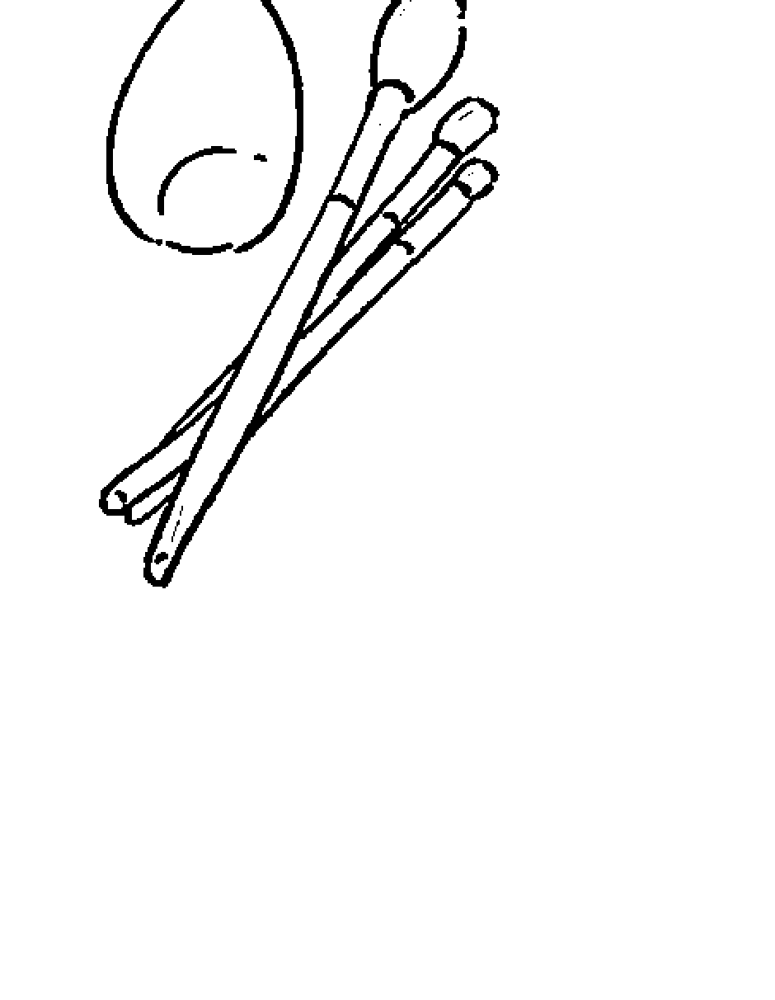

## 書籍／紙張／文具

16 / 手帳、行事曆等記事用簿子
在斷捨離的過程中，我才願意承認自己根本「沒辦法習慣寫手帳」，不論是完美主義者，捨不得寫錯任何一字一頁，還是因為電子化後太便利，寫字耗費太多時間力氣，總之把記事項目電子化後，我發現也能順利地安排好行程。如果你對紙本行事曆、日記也是可有可無，那可以試試把該記的，都放在電腦、手機裡就好，尤其是連動網路的話，還能幫你在不同3C上自動同步，非常方便又即時。

17 / 筆記本
打從自學校畢業後，真的沒什麼要寫筆記的需求了。有任何事項要記錄，也可以打在手機、平板、電腦的備忘錄裡，還不怕遺失或淋濕的問題，速度快，處理文書時也非常方便。如果是參加了什麼活動、營隊、課程需要小本子紀錄，我想每個人家裡一定也還是翻得出幾本原來就存在的筆記本。

18 / 紙膠帶
19 / 貼紙
紙膠帶剛風靡台日韓時，好多熱愛寫手帳的達人、很會搭配文具發文創意的部落客，都利用紙膠帶變出好多好多令人讚嘆的作品，分裝紙膠帶甚至蔚為風潮好一陣子。但其實若不是特別熱愛佈置筆記本、利用「紙膠帶」來裝飾，擁有那麼多卷，也只是看著療癒和自嗨而已。意識到自己放得再久也不會好好利用後（還捨不得用呢），我把紙膠帶幾乎都賣了，並再也沒有買過。
在手帳和紙膠帶風靡的同個時期，也是台灣文創起步的時候，許多畫家和設計師相繼出品許多精美貼紙，不論是佈置筆記本、黏貼信封、佈置牆面或瓶瓶罐罐，購買、蒐集太多的我，最終也是捨不得貼、沒機會貼、懶得貼、懶得佈置，所以也不會再買了。

20 / 漂亮的筆、文具（或是贈品筆）
以前還是學生的時候，會想要用很多五顏六色的筆，把課本、講義寫得美美的像彩虹，但畢業後就很少書寫、塗改了，身份和生活型態大改變，因此不會想要再購買。另外「贈品筆」雖然不是大家需要「購買」的東西，但往往會因為贈送，就不知不覺囤積了許多機關行號的紀念筆，如果認為自己絕對不會用這種筆、或根本用不了這麼多，還能有選擇的情況下，請盡量避免帶回家。

21 / 沒在看的書、雜誌、刊物等
身邊是否有很多友人會看詩集、或是很有深度的書？身邊是否有知識淵博的朋友常常推薦他的書單？但有時候書買回來，只是一「期許」自己會看而已，或甚至看了幾頁，發現不對自己的胃口，所以中途放棄。知道自己沒有足夠的毅力去吸收太硬、不感興趣的書，我也認清不會想看、沒有耐心看完的現實，不會再購買。

22 / 給自己的明信片
不論到達哪一個國家、哪一個城市，小販的風景明信片總是好吸引人，不但超高清畫質，又呈現我們拍不出來的角度。但其實那些風景明信片，要觸動到我們的回憶是稍微困難的，因為明信片和我們眼睛所看到的，還是存在不少差距（不同季節、不同角度、過度美化等因素）。若是要留著自己收藏，不如洗出自己按下快門的照片，或甚至洗出有親朋好友和自己的大頭入鏡的照片都沒關係，未來回味時，一定能更快勾起滿滿的回憶。

## 電子（小家電）／通訊3C類

23 / 便宜的家電、電子產品
大家一定有這種經驗：買電子產品或一些家電的時候，會覺得先選便宜的、夠用的就好，但這些東西往往都壞得非常快！要是買到一個不堪用的，可能短短數週、數月就陣亡了，導致必須要重新買（真的不如一開始選個好一點的）。這些林林總總的便宜貨，累積起來也都是一筆錢以及對環境的破壞。

24 / 手機APP
除了要臨時應付一個緊急或特定的任務，不然內建的、免費的APP功能，就已經強大到能滿足我們的各方需求（月付費的訂閱服務，好比電影、音樂、課程，不在此討論範圍內）。如果有好用的，還是會付費支持，不過截至目前為止，善加熟悉和利用現有資源，其實就已足夠。

25 / 一次性電池
建議使用可充電的電池，除了環保外，一般電池的回收往往也都比較麻煩，不再購買一次性產品，也可以減少整理回收的心力。

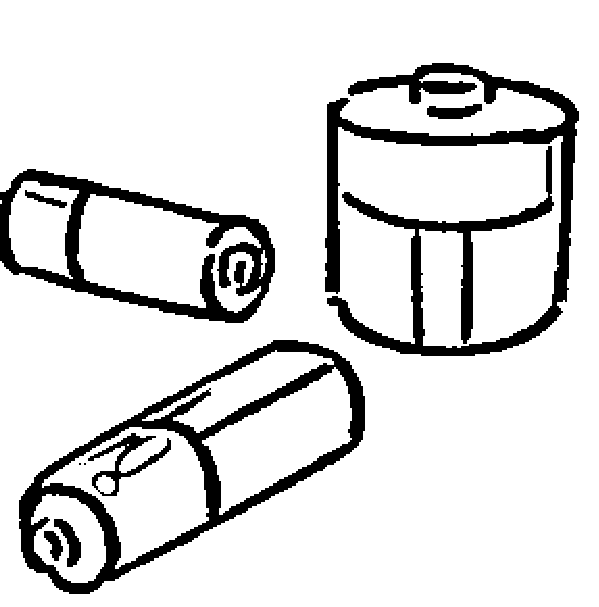

# 【各種日用品】

26 / 棉花棒
除了醫療用途，棉花棒雖然用途很多，和塑膠吸管、卸妝棉等同理，這畢竟也是一次性產品，減少用量也是更環保一些。由於我使用棉花棒的機率不高，所以在沒有非使用不可的情況下，已經不再購買。

27 / 拋棄式隱形眼鏡
長期購買、囤貨是一筆不小的開銷，尤其放大、變色等效果，我們都清楚那對眼睛的健康不太好。目前我使用的是硬式隱形眼鏡，透氧率更佳，也不會製造無盡的隱形眼垃圾。

28 / 過多的盥洗用品
盥洗用品非常佔空間，如果想要買什麼特別的味道、特定的功能嘗試看看，請等到手上這瓶使用到近乎見底，才購買下一罐。在台灣購買盥洗用品是非常方便的，大家可以試著理解為「商店就是自己的倉庫，倉庫的貨不需立馬搬回家」。

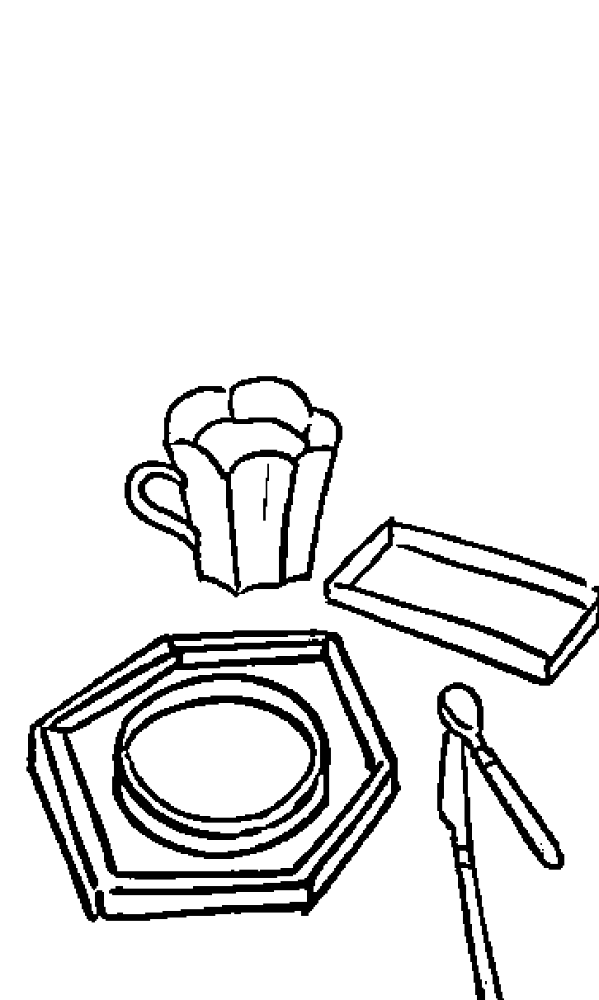

# CHAPTER 03
動手實作！開始打造你的簡單生活風格

29 / 過量的枕頭、寢具
有沒有發現生活風格、家具相關的門市或網拍，都喜歡在一張床或一張沙發上堆上「過量」的枕頭呢？一般來說，我們坐沙發或睡覺時，根本就不需要那麼多枕頭，以台灣的天氣來說，甚至不需要額外的毯子，這些文宣廣告都是為了呈現配色、層次和設計感，再利用這樣的氛圍，誘使和誤導不理智的消費者以為「那樣才是舒服」。各式各樣的枕頭套或是被套，就和手機殼是一樣的概念，我們最終只會喜歡那麼幾款而已，購買無需過量。

30 / 過多的乾燥花
使用乾燥花朵、植物來做裝飾是宜人的，也能讓家裡有些不一樣的氣息。但不當照顧乾燥花，上面容易卡灰塵，也容易掉落乾燥花屑，反而造成更多麻煩和混亂。

31 / 香氣蠟燭
蠟燭除了一向都被認為是療癒、舒心、放鬆的產品，還能有很好的「佈置」效果。購買前有仔細評估自我的生活習慣了嗎？我一開始看到很多YouTubers、網紅使用，讚嘆味道療癒，又能輕易拿來佈置房間、營造氛圍等，是非常嚮往和羨慕的。所以當時購買很多不同味道、尺寸和包裝的產品，不過又由於捨不得使用，還有燒一陣子會有缺氧的問題（我的房間很小），現在只有偶爾才會使用。

32 / 不經測量、思索就買的收納用品
購買收納用品，一定是發現家裡某個空間、某類物品可以如何如何收納；若是看到可愛、美麗、有質感的收納用品，就急著購買的話，很容易造成尺寸不合、不知道應該收納什麼才好的窘境。而且斷捨離和減物到一定程度後，已經不太會有那麼多收納用品的需求，很多人對於收納有無盡的需求，就是因為東西太多了，簡化之後，說不定反而會有收納用品太多的困擾呢！

33 / 裝飾燈具
裝飾燈具能輕鬆地替一個房間營造氣氛，或是看到一些DM、雜誌廣告呈現的畫面很有氛圍，也是因為燈光的加持。我以前也會嚮往那樣子的感覺，所以購買裝飾的燈、季節氣氛的燈等等，但現在終於意識到，那非但不是生活上的必需品，還很不實用，大多數時間不會開著它們耗電，甚至還要耗費更多空間去堆放。

34 / 餐桌裝飾（餐墊、餐具、假道具等）
過去我為了拍攝食譜的社群照片和寫書分享，購買了非常多的餐桌裝飾，雖然是因為工作所需，但實在是太過量了，現在才意識到就算是「道具」，一樣要在購買時考量「實用、搭配性」。或許每個人家裡的裝飾也都需要更多加思考搭配性，而非單一裝飾越多就越好看的思維。

# CHAPTER 03
動手實作！
開始打造你的簡單生活風格

35 / 衣架
這與極簡掉衣服數量有很大的關聯！以前我的衣服實在太多了，所以我需要買非常多的衣架，來吊掛那些不適合折或疊的材質。現在簡化很多衣服、帽子、包包、圍巾等，衣架的需求自然也就下降了。

36 / 各種廚房工具
開始接觸烹飪的時候，發覺有好多新奇的小工具，好比蘋果切割器、水煮蛋切片器、造型小碟子等等，有各式各樣，功能不但很單一，體積不小又很難清洗，其實對於日常做菜來說真的不是特別必要，對於沒有使用習慣的人來說，都只是一時興起而購買，於是就成了佔空間的工具了。

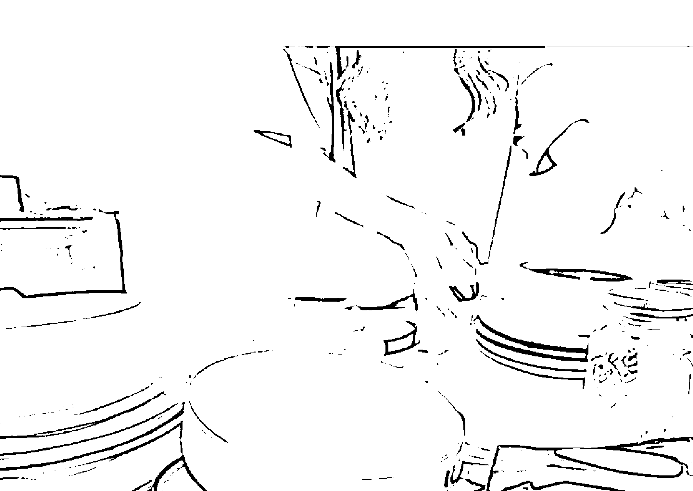

雖然好看的餐具確實幫IG加分很多，但現在我會留下的就是兼具好看和實用的款式，避免只為了拍照而買。

37 / 各式杯盤餐具
餐盤、餐具也像時尚一樣，有好看不好看之分。雖然好的器皿，真的會讓食物看起來更令人食指大動，我的飲食分享 Instagram 也因而經營得不錯。但倘若只是為了拍照，或許也是幾個好看的輪著用、替換著搭配就好了。對常常開伙煮飯的煮婦、煮夫來說，最終還是會發現：好洗、不易卡食物殘渣或醬汁、利於收納的餐具，才是值得信賴的得力助手。

## 其他

38 / 過量的絨毛娃娃
以前我買了很多很多可愛的絨毛娃娃，但是買了之後就只是擺在某個角落或展示櫃裡，很多娃娃好像一旦買回家放之後，賞玩的機率和渴望就大幅下降，也許就只是我們在商店太衝動所致，没有想到家裡其實還有更多「也很可愛的」。再加上娃娃機大肆興起，很多盜版或不是那麼可愛的娃娃，會在遊戲過程中獲得，其實本來也沒有那麼喜歡這些娃娃，全部帶回家放在一起固然很壯觀，但清潔麻煩，也沒辦法讓「最喜歡的娃娃」展現自己，只是全部亂成一堆，造成反效果。

39 / 小擺飾、玩具、玩意等等
公仔和扭蛋的興起，讓很多人會在桌上、架上、櫃子上，當裝飾療癒品展示，當這些小玩意兒數量多起來，不但完全沒有用途，也未必會想一直欣賞，其實療癒主人的次數也屈指可數。一個一個小小的擺在那裡，其實也很容易卡灰塵，造成清掃不易，更別說如果數量再多一點，散亂在桌子上，多少會影響我們的專注力。去年、前年的公仔想必已經不知道塞去哪了？可愛歸可愛、療癒歸療癒，實用度和是否真的需要擁有，是更需要思考的重點。

40 / 吊飾
以前我非常喜歡買吊飾，只要有拉鍊或是可以吊掛的地方，甚至也沒有想到哪裡可以掛，只要可愛、喜歡就會想要買回家。但其實很多也都只是一時鬼迷心竅，覺得有點可愛就買了（反正也沒多少錢）。有特色或有意義的吊飾，真的也是幾個就足夠代表自己了。

41 / 牆上海報、過量裝飾等
許多人喜歡在牆上佈置海報和各式各樣的裝飾，雖然能營造出想要的氛圍、展現個人風格，但過量時反而會造成視覺疲勞和雜亂感。

# CHAPTER 03
### 動手實作！開始打造你的簡單生活風格

#### 42 / 季節的裝飾品
逢年過節時，不管中西方，都會把店內佈置的非常華麗，台灣漸漸的在跟國外過一樣的節日（好比復活節、萬聖節、感恩節、聖誕節等），很多節慶的商品，其實只是商人拿來大賺一筆的商業行為，如果不仔細評估為什麼購買這些商品，就會感到非常不實用，畢竟一年才那麼短短幾天會用到，剩下的時間都是「儲存堆放」在一旁而已。其實如果只是要去感受節慶的氣氛，去逛街、收看節日或上網瀏覽也是一種選擇。要感受到那些氣氛，不一定要把那些東西都買回家。

#### 43 / 實體禮物
除非朋友明說想要什麼禮物，我傾向送無形、虛體的禮物，好比點數卡、儲值卡、一頓大餐、一次體驗等。因為送到別人不需要的禮物，之後會被堆置的機率實在太高了！想想我們是不是也有好多拿到了也沒在使用的禮物？表達心意和創造回憶的方式，其實真的比我們想像中還要多。

#### 44 / 環保袋
說實話，怎麼可能會沒有環保袋呢？但商人、設計師、環保品牌還是持續推出不同圖樣、花色、材質、版型，吸引我們因「外表」而購買。諷刺的是，明明已經有無數環保袋，還要買環保袋，這樣怎麼會環保呢？袋子的功能大同小異，真的無需再購買。

#### 45 / 外送
我知道很多人已經非常仰賴外送平台，在工作忙碌之餘，有人可以協助打理餐點又宅配到府，真的是忙碌和懶惰人的一大福音，也確實造福很多特定工作者、對生活自理有所不便的人。但是外送往往都使用過量的塑膠餐具、塑膠蓋和垃圾，光一餐要處理的量就非常驚人。請盡量堅持選擇包裝較為環保、垃圾量較少的店家！若時間充裕，也還是花點腳程走去外面用餐吧，台灣要吃東西已經夠方便了。

#### 46 / 紀念品
所有的紀念品擺在同一家店裡，就顯得非常有特色、有記憶點。但紀念品多數實用性都非常低，好比小磁鐵、小擺飾、代表建築的模型、當地特色的玩物等等，多數最終都只會擺在某一角落閒置；因為實在沒有特定的功能，久了只是逐漸變成灰塵的家。提到「紀念」品，其實一張珍貴的照片，更能勾起當下的感動，當下的穿著打扮、當時的年紀、當時的旅伴、當時的氣候、當時的視野，都更真實的濃縮在裡頭。

#### 47 / 國貨
還記得我們前面提到的「商店就是自己的倉庫」嗎？想買大量物品囤貨時，若能這麼換位思考，就會減少許多不安。很多產品在熱銷、暢銷的時候，我們都會擔心：「斷貨了怎麼辦？之後買不到怎麼辦？是不是要多買幾個？別人都在囤，是不是自己也應該買著備用？」冷靜想想！你使用這個產品的用量和速度，真的有必要買這麼多個備用嗎？另外，現在商品推陳出新的速度這麼快，會不會囤了一櫃子，但最後其實出了更多更好用的產品，反而後悔自己當初買太多呢？很多東西其實不會真的長期缺貨，甚至斷貨買不到的地步！把藥妝店、賣場、購物中心等，都當成是自己的倉庫就好，有需要再去購買，快用完再去補貨。記得：「無形的囤積和堆置」，也是造成空間、能量的一種損失和浪費。

#### 48 / 重複的用品
明明記得自己有某件物品，卻因臨時要用找不到，只好再買一個。若能把每件常用物品的收納位置固定下來，在東西變少以後，要找到每樣物品會變得容易又快速，不會有在混亂中尋寶的狀況出現。

#### 49 / 為了免運的購買
相信會使用網購的各位，都有為了湊免運，所以多買了一些根本不需要、也真的用不到的物品。這樣「才不想花錢多付運費」的心態，長期讓我多買、多花了比運費更多的學費在那些根本不需要的產品，這才是真正的浪費和損失！倒不如一開始就負擔運費，省了空間、省了錢、還省了後續處理的心力。

#### 50 / 促銷
很多時候都是不看還好，一看就會想要、就會以為需要！購物節、週年慶這些促銷手法，會引起你強烈的購物慾望和認為自己什麼都好缺乏，罪魁禍首就是因為看了這些文宣和商品頁。加拿大極簡 YouTuber Sarah Therese 曾說過：
> 「我只會買我需要的東西。如果我需要，我就會買，如果正在打折促銷，我又正好需要，那好極了！」

購物前，請注意是「本來就有的需求」，或者是「由商人製造出的需求」。既然平時沒有什麼東西特別缺乏，眼影還可以用三年、保養品還可以用一年、包包依舊很新、衣服也夠穿夠好搭配，這些促銷不管再怎麼殺、怎麼強調已經打到骨折，不看就不會有無謂的囤積和消費。也請不用擔心因此買不到史上最便宜的價格，先評估使用該產品的速度，是否下一季的促销再跟上也差不了太多？再一次提醒，空間堆置的問題也可能是一種損失！

買「真正需要」的東西，可以延長快樂的感受
大家還有想到什麼是可以不用再購買或決定不要再衝動失守的東西嗎？希望我們一起腦力激盪更多反思，並套用在自身的消費習慣和品項上（好比對於追星一族來說，不再購買過多、不那麼百分百心動的明星周邊，改成刷Youtube頻道的影片觀看次數，會不會也是一種支持的作為？）長期被物慾掌控的不安，真的換個念頭就可以把理性奪回來！

如果你看完會想問我：「嘎！什麼都不買，不無聊嗎？這樣生活還有什麼樂趣？為什麼要過得那麼辛苦、活得那麼壓抑？」那我也可以肯定的告訴你，這些都是過於我們習慣於購物、慣於「獲得物質就是快樂」，被制約的結果。

還記得在第二章節「首先，你得知道自己為什麼「一直買」提過的嗎？很多的購物經驗，未必是我們那麼喜歡，或有非擁有不可的理由。世上只有買不完的潮流！「別再不經思考，輕易納入更多未來容易變成無用垃圾的物品。其實在所有的正確的購物，會帶給你剛剛好的方便和長遠一點的滿足。時常有人誤解極簡、斷捨離，就是不能購物、不要買東西，但其實重點在於「並非不要買，而是不要亂買！」
但是！我絕對不是要逼大家，今後不准購買任何以上列舉過的東西。如果你還是買了，請千萬不用覺得與簡單生活背道而馳，甚至感到失落、自責、愧疚、過度後悔等等。以「1／潮牌服飾」來說，最大賣點包含了「價格便宜」，如果你的預算不夠多，選擇有限、能力有限，但是又想要適當的打扮自己，買流行品牌、買潮流、想要不完的奢侈品和羨慕不完的理想，唯有念頭轉彎，才能打破現狀，開始真正的、長久的感受到幸福和滿足，這也會使我們在真的需要購買時，感受更百倍的踏實和快樂，因為這種購買比購物上癮的人，更能品嚐其意義和難能可貴。

減物過程中，都是讓你有更多的時間和「意識」去認識自己的真實需求和習慣。「請神容易，送神難」，請試著想起我們才剛剛丟掉了些什麼，是不是花了大力氣去減少生活中的雞肋物品？試著想起你為什麼會想斷捨離、為什麼嚮往簡單生活？就算少了「購物」當興趣，我們其實還有很多事情可以專注、可以忙、可以玩。就像現在人人人在講「戒斷手機」，戒斷後，我們還有和人、和大自然、和書本、和知識、和技能、和自己等等相處的機會。請相信，就算不以欲望、犒賞自己而購物，也能很滿足、也能充滿小確幸，也能過得很漂亮。

你找回「理性思考」。
下一章節，我會帶領大家怎麼判斷「欲望與真實需求」的差別，也一步步協助

過極簡生活，不等於什麼都「不能買」，而是確定這件物品不是因為衝動或單純的慾望而買。

## CHAPTER 04
### 維持生活空間的選物建議

物品減量後，開始打造你的「個人風格」
兩個小技巧，立刻表現簡單生活新氣象
在減物過程中，你可能會發現「欸？我好像特別喜歡某種顏色／風格／形狀／材質耶」，或是也有可能發現「咦？怎麼剩下的東西，好像彼此都有點衝突，彼此搭配不起來……簡單生活的要點，不只是斷捨離、收納整理和排列整齊，如果你和我一樣，想要營造出視覺上舒服又耐看的氛圍，就得學習判斷每個物品和其他東西的搭配性和統整性。

居家風格的組成，是每一樣物品彼此相互搭配建構起來的，所以若是能考慮到物品之間如何「重複搭配」，要創建出喜歡的空間並不難。不過，我鼓勵大家在「惜物的前提下」完成，這樣才不會引起更多慾望，變相只是「喜新厭舊」的在「汰舊換新」而已。

而我們過去不經思考的購物，手上可能有各種搭配不起來的物品。都還堪用下，怎麼善用所有，不多做消費來讓風格統一，相信會是在物品減量後的最大難題。若物品數量已經控制得宜，我建議有兩種方式可以重整風格，
- （１）善用貼皮、噴漆等方法，改變空間和物品的顏色，製造統一感
- （２）遵守一物進、一物出的方式，避免空間又被佔據。

切記，這個過程會花上一些時間，我也建議大家不要著急，千萬不要立刻又大買特買一番！因為漸進式的調整，對於長期維持、還有調整購物習慣，才會是最有效、最能內化，也最能學習知足的方法。

其實質感生活的最佳捷徑，就是「空間創造美」，一個看起來「有質感的生活」，可以從網拍或廣告上的商品照片看到很多實例，這些行銷照片，常常是以幾件簡單的東西，營造出很有質感的畫面。我們仔細觀察一下就可以發現，大部分的商品照都是簡單但和諧地被佈置出來，這就是極簡主義所講的「少即是多」（Less is more）的原理。

BEFORE
AFTER
原本的房間地板是深色，而房間中的物品幾乎都是淺色，顯得很突兀又不協調，空間小；後來把地板貼皮成原木淺色，並把窗簾裁短後，看起來整個房間都不一樣了！

### 有質感的物品，只要三件就好
很多人會覺得商品本身有質感就好了，這確實是很重要的一點，但太多人（包括以前的我自己）都是：「這個有質感，買！那個有質感，買！」一大堆有質感的東西全部堆放在一起，根本襯托不出產品本身的魅力。其實不是少了那樣東西才無法營造出質感，而是擁有太多東西了，才致使空間、視覺、甚至生活雜亂。

我很鼓勵大家用「少量佈置」來提升環境的質感，與其在房間裡塞進十件高質感的裝飾品，或許還不如少少的三件來得吸睛。說白了，「簡單」就是最容易營造質感的法則之一，物品本身就是令你喜歡的話，就算只有簡單幾樣擺在那裡，依舊能覺得賞心悅目，達到療癒的效果。

### 「別亂買、別亂丟」的選物原則
好的物品絕對能帶給人更多的方便和滿足，因此在接下來的選物企劃，不是要逼大家全部斷捨離，嚴格限制只能擁有多少樣物品，才「夠格」稱為簡單生活；更不是要大家零物慾、不准買，讓購物成為壓力；重點應該擺在「別亂丟、別亂買、別不經思考」，一定要想清楚再淘汰，或是想清楚了再掏錢購買。

有時候真的只是在結帳前多問自己幾個問題，就能立刻起到冷靜的效果。因此我建議大家，在篩選、挑出適合自己的精選物品時，可以試著「設定關卡」！

以下分別舉例我設定給自己在選擇衣服、包包、鞋子、日用品、收納品等五大類物品時，所有可以反思考慮的「關卡」，我會盡可能的去評估完這些問題後，才做購買或斷捨離的決定。

> 「別亂買、別亂丟、別不經思考」，才能打造舒適而有秩序的生活空間。

### CHECK 1 — 衣服的關卡

### 第一關
這件衣服跟衣櫃裡的其他衣物搭不搭？
解決：有哪幾件衣服可以搭它？包包、鞋子可以配得起來嗎？避免產生衣服很多，但彼此搭配不起來的困擾。

### 第二關
這件衣服符合身形嗎？
解決：對天發誓，你沒有縮小腹才穿得下！千萬不要自欺欺人，買回去之後，只會感覺不修飾、不顯瘦，各種挑毛病，最後就擺著不想穿了。

### 第三關
我的穿衣習慣是如何？會穿的頻率有多高呢？
解決：如果平常沒有穿睡衣的習慣，卻被可愛的睡衣燒到，那你未來一定不會穿！勇於戳破作夢、幻想出的泡泡吧！

### 第四關
什麼場合「會穿到」？這種場合出現的頻率有多高？
解決：什麼場合「可以穿」是理想，但什麼場合「會穿到」卻是現實！例如根本沒有那麼多婚禮、派對的場合要參加，不必硬要留或多買一件小禮服。

### 第五關
現在住的地方，天氣適合嗎？
解決：你住的地方有冷或熱到這種地步，需要這樣的單品嗎？會穿的頻率呢？這個關卡可以助你打破幻想出來的冷與熱。

### 第六關
衣櫥有沒有類似的衣服了？
解決：是要替換掉最愛的那件嗎？是為了輪流著穿嗎？真的會輪流穿嗎？這關卡主要是問自己，是否真的想要這麼多類似款，還是只是喜新厭舊。

#### 第七關
保留或購買後，這件衣服未來的結果是什麼？
解決：真的不會被未來的自己斷捨離、閒置、挑毛病？賣二手很麻煩，丟很浪費、回收又很可惜喔！

#### 第八關
是不是百分之百喜歡這件衣服？
解決↓：這是所有物品都適用的關卡，唯有買到百分之百喜歡的，才不會輕易再對現有的不滿，而一直想要買新的！

1. 你是不是也對某種款式的衣物有特別的偏好？想想看，是不是已經有類似的衣服了。
2. 想像一下，想買的這件衣服，和衣櫥裡的其他衣物好搭配嗎？

### CHECK 2 — 包包的關卡

### 第一關
是否實用又耐操？
解決▼：包包是一種「工具」，是服務我們的。一定得實用、你願意用，使用頻率和價值才會高。

### 第二關
確認尺寸
解決▼：是否裝得下所有日常外出所需的物品？例如：傘、水、錢包、化妝品。

### 第三關
搭配性如何？是合適的質感和風格嗎？
解決▼：要能搭配現有的衣服、鞋子或飾品。

### 第四關
是否為能負擔的價錢？若想購買高價精品包，是出於什麼需要？

### 第五關
是否已經有相似的包款了？只背現有的那一個不行嗎？（那為什麼非要在這個不可？）
解決▼：釐清是否為愛慕虛榮，還是出於真正需求。
解決▼：這是降低衝動購物、減少囤積相似款，以及避免買後使用率低的有效關卡。

### 第六關
確定完全符合需求嗎？
解決▼：再次提醒自己，包包是用來服務我們的。不符合自身需求、無法使用，只能稱作裝飾品。

1. 我所有的包包——你沒看錯，就是三個。
2. 想要常常使用，就要確定「好用」；能放進所有外出時的必備物品，就是我挑選包包的條件之一。
3. 和所有的衣物都能搭配，當然包含跨季節的搭配。
4. 這個白色肩背包在夏天和冬天，都很搭我的衣服。

### CHECK 3 — 鞋子的關卡

### 第一關
穿起來舒服嗎？
解決：不舒服的鞋子，到最後絕對不可能常穿，穿了也只是痛苦，最終只有束之高閣。

### 第二關
與衣櫃裡的衣物搭配性高嗎？
解決：能不能輕鬆地想到該如何與自己的衣服、包款做多種搭配？

### 第三關
材質好嗎？會不會過一陣子就要修？
解決：鞋子的使用頻率遠高於衣服，應該投資中上品質。不後續的修理縫補，恐怕會花費更多金錢和時間。

### 第四關
防水嗎？容易乾嗎？
解決▼：如果你住的地方常常下雨，或高溫時天氣悶熱，這雙鞋子能耐濕或耐熱嗎？

### 第五關
可以試穿嗎？
解決▼：版型偏大、偏小？好穿脫嗎？穿襪子一樣舒服嗎？好走嗎？好跑嗎？會磨腳嗎？為免後患，必須充分試穿，並仔細體驗未來穿著時會遇到的所有困擾。

### 第六關
鞋櫃有沒有類似的鞋子？
解決▼：是要替換掉最愛的那雙嗎？是為了輪流交替穿嗎？真的會輪流穿嗎？確認這些後再出手。

目前我所擁有的全部鞋款。其中平底涼鞋和寬帶交叉拖鞋的功能太相近了，所以我打算等拖鞋穿壞之後，就不會再買拖鞋的鞋款囉。

當衣物鞋包大致上都有通過購買／保留關卡後，你會發現「重複穿搭」其實非常容易！

### CHECK 4 —— 日用品的關卡

### 第一關
有沒有相似的物品了？真的需要它嗎？沒有會如何呢？
>> 可以充分降低衝動購物、囤積相似款、以及買後使用頻率低的問題。

### 第二關
使用頻率高嗎？什麼時候會用到？確定有廣告說的那些使用習慣嗎？
>> 這關可以助你輕易脫離商人的洗腦，釐清自己的生活習慣和真正需求。

### 第三關
汰換頻率為何？會不會容易忘記補充？或來不及用完而過期？
>> 這關是考量汰換率、購買補充品太麻煩、過度囤積備品等問題。

購買 3C 產品附贈的充電線，常常會有過多的問題，適量留即可。

以盥洗和沐浴用品為例，這些都是「使用頻率高、備品好買、風格搭配白色浴室」的日用品。

### 第四關
產品生命週期多長？有沒有更環保或其他的選擇？
解決：這關卡能防止流行用品和廣告太容易令人想汰舊換新。

### 第五關
實用是必須的條件以外，風格有沒有更適合的？
解決：整個居家空間的統一性和調性，是來自所有物品疊加而成，實用是一定要的，風格也要和原有的空間搭配才行。

## CHECK 5 — 收納品的關卡

### 第一關
量過要擺放的空間大小、確認過尺寸了嗎？
**解決**：實際使用時的空間也要預留。雖然大部分情況下，買錯或買到不適合的可退換貨，但一般人很常「懶得退就不退了」。

### 第二關
順手嗎？動線合適嗎？適合放在你的空間嗎？
**解決**：檢查是否華而不實、是否符合自己的生活動線和使用習慣。

### 第三關
可以搭配其餘收納品和傢俱嗎？風格好統一嗎？
**解決**：收納品是眾多物品的家，對於居家的整體性也頗具影響力。因此它和其他相關物品及周邊必須協調，看起來才能讓人感覺舒服自在。特別是收納用具會展示在最外層，影響空間的整體性最大。

## CHAPTER 04
維持生活空間的選物建議

### 第四關
用途是否太過單一？ 有無更多功能的收納選擇？
**解決**：未來搬家或想收納別的物品時，這個收納品可以切換用途嗎？考慮能否多功能，提供未來重複再利用的價值。

### 第五關
好清洗嗎？ 是否會藏污納垢？有沒有特殊凹縫或邊邊角角不好擦拭清洗？
**解決**：避免後續保養、清潔不易的麻煩。

### 第六關
有安全疑慮嗎？ 材質無毒嗎？
**解決**：考量地震砸落、兒童安全、廚房收納品的食安疑慮等等意外發生的風險。

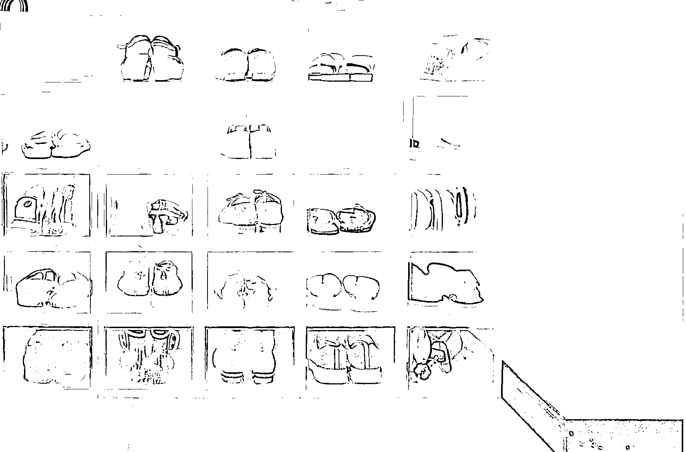
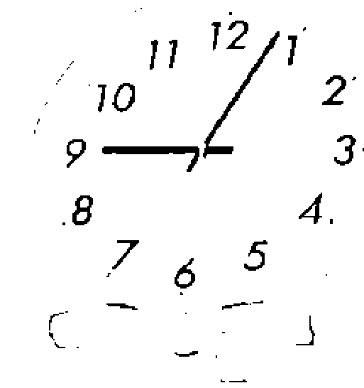
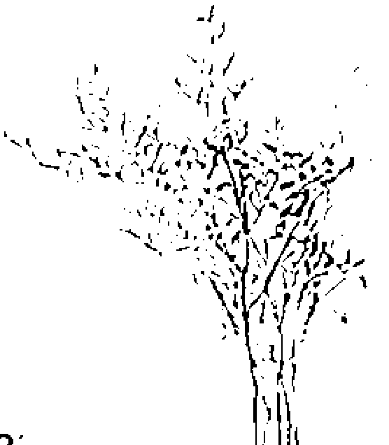

## CHAPTER 04
### 維持生活空間的選物建議

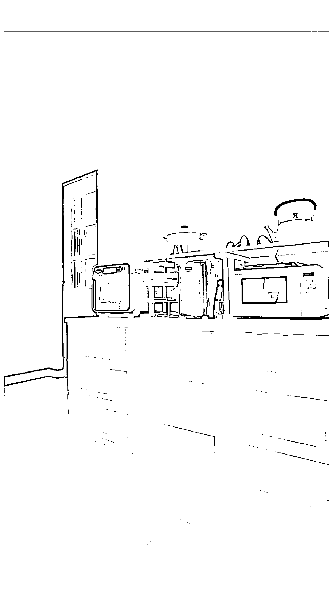

餐具櫃和鞋櫃都用半透明的塑膠收納盒，看起來清爽有一致感，而且這兩種收納櫃都可以用在其他物品的收納上。

到這裡，大家應該發現有很多的關卡，能通用在很多不同物品類別上，精準購買選物的法則其實不外乎這些，如果能一一過關斬將自然是再好不過，只是現代人要記住的事情太多，這些問題又非常耗費力氣，所以常常在腦波弱的時候，強力的廣告趁虛而入，屆時你又能記得幾個關卡呢？除非已經熟練到能反射思考，否則要牢牢記住以上這些關卡，還真的不容易。

那麼，有沒有一個不需特別記住的原則呢？我想分享給大家我最喜歡，也認為最好記、最有效的一個方法。

## 只買百分之百喜歡的物品
## CHAPTER 04
### 維持生活空間的選物建議

常常有人問我：「明明喜歡簡單生活的感覺，但還是一直會有購物慾望跑出來，要怎麼辦？」其實我自己也偶爾會遇到這樣的狀況，但為了漸進式地調整物欲，學著和這份自然產生的渴望共存，而不是在短時間內趕盡殺絕，我認為透過「只買百分之百喜歡的物品」，可以滿足想要購物的心情，也能讓買來的物品不這麼快被淘汰。

只是「將就、順眼」的物品，馬上就會被你淘汰。我有一個深切的親身經歷，這是在還沒有接觸極簡、沒聽過斷舍離以前發生的。

那一年我在瑞士的某個鄉下讀書，因為錢包被偷了，需要買一個新的，我就坐了長途火車到附近的大城市逛街，希望可以買到一款喜歡的錢包。當時滿腦子想的都是：『這個大城市一定會比我住的偏僻小鎮，還要更有機會、更有選擇逛到好看和喜歡的！』不過找了好幾個小時，始終沒有找到一個超級喜歡的錢包，礙於當時天色漸漸黑了，商店打烊得很早，我又有曾被偷竊的陰影，便不由得以急了起來，就對自己妥協了。我買了一個當下所有選擇裡最順眼的短夾後，就驅車返家。當時的心態是：好吧，就買這個吧！反正也沒得選了。可是當下沒得選，不代表未來沒得選，若非急需品，要在未來再找到一個「更喜歡的」，其實一點都不難，世界上可以給我們選擇的商品上千萬款，現場就算挑不到，回家還有二十四小時的網路購物，不打烊的電商供我滑。

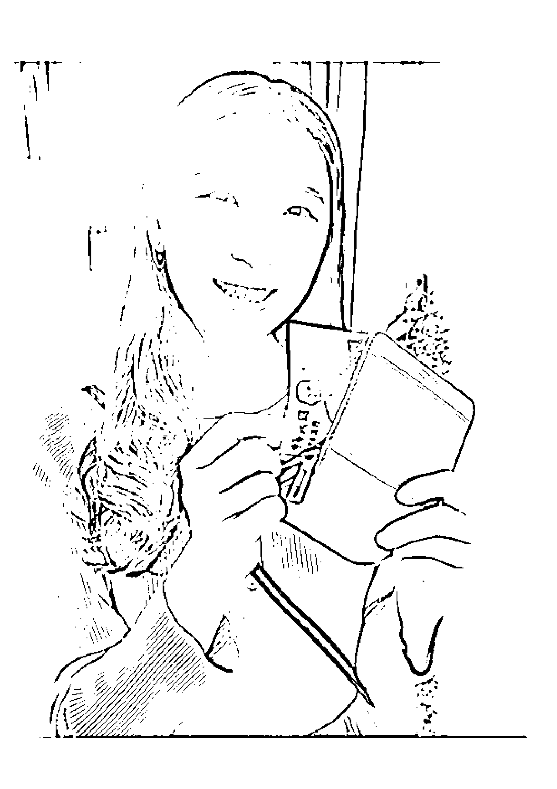

千萬不要妥協，給自己多一點時間等待最適合的商品出現，那將會成為陪伴你數年的寶貝。

將就之下買了僅只是「順眼」的短夾沒多久，果不其然，我就在別的店看到另一個很喜歡的短夾，一個心動就購買付錢。而第一個為妥協而購買的錢包就被打入冷宮，後來我就轉手低價賣掉了。

### 越喜歡的，就越難以被取代

「只買百分之百喜歡的東西」，不僅會讓我們更珍惜買下的東西，而且也比較不容易因為「對現有的不滿」而「想要」買新的。此外，越是挑選百分之百喜歡的物品再買下，就越不容易看膩，因為很難找到跟它一樣好、甚至更好更喜歡的，也就不會那麼容易「被生火」、產生購物慾望。

舉個例子，許多人衣櫃必備的黑色長褲，各種價格、品牌、版型都有，在我還沒有接觸極簡之前，也非常喜歡買黑褲，沒有什麼別的原因，就是常穿，所以覺得多買一件、兩件也無可厚非。但自從我找到某牌命定款後，因為「很滿意」，所以幾乎不會再看別的黑褲了，就算有看到其他好看的黑褲，也不容易生火，因為不認為會買到比現在這件更適合自己的。

現在想想，那正是因為買到「百分之百喜歡的東西」，所以不會輕易地認為有更好的選擇可以取代它，或是輕易的喜新厭舊。

我們很容易因為一點點喜歡，就把一個商品買回家，可是買回家後又不一樣了，很容易因為一點點不喜歡，就不使用它。

我也曾經是腦波非常非常弱的購物狂，當時總覺得買東西真的不需要太多理由，光是一個犒賞自己、就是想買、好可愛，就可以成立。但是不用這個東西也是理由一大堆，畢竟當初不是深思熟慮就帶回家，真正使用時才會發現那些心動其實漏洞百出。

排除市面上真的別無選擇，還有當務之急的急須品以外，耐心多等待幾天、幾個禮拜、幾個機會，提高每次購物選品的標準，練習替自己買到百分之百喜歡的東西，花時間去找到那個無法替代、無可挑剔，也百分之百喜歡的東西，面對購物慾，我們就能更從容、更理智一點。

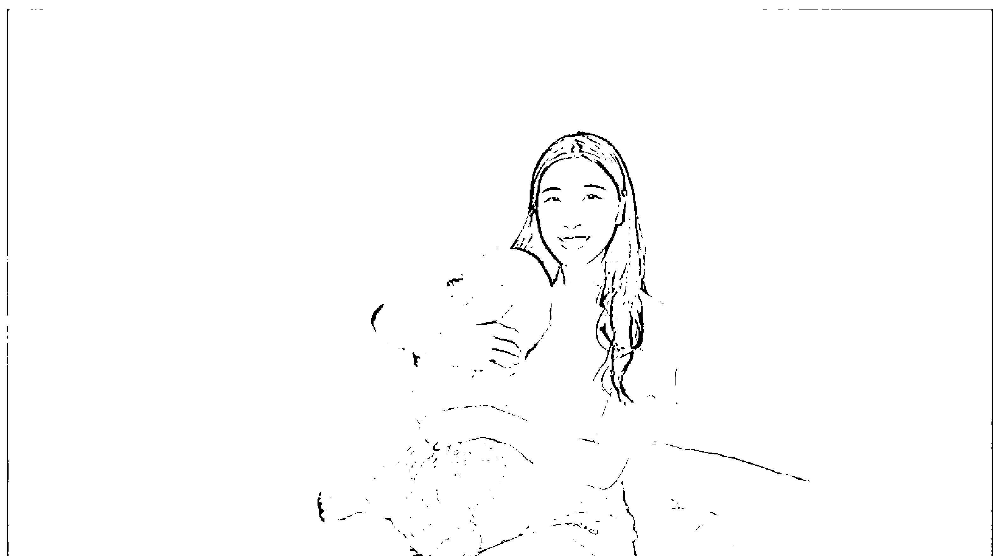

挑選了 100% 喜歡的、滿意的物品，就算有其他更新、更好看、更可愛的，也不會輕易動心。我非常喜歡買絨毛娃娃，不過在 2018 年開始減物，捐掉全部的玩偶娃娃後，就只買了這個「確定 100% 喜歡」舒服又好抱的娃娃了。

## CHAPTER 05
維持簡單生活的日常提案

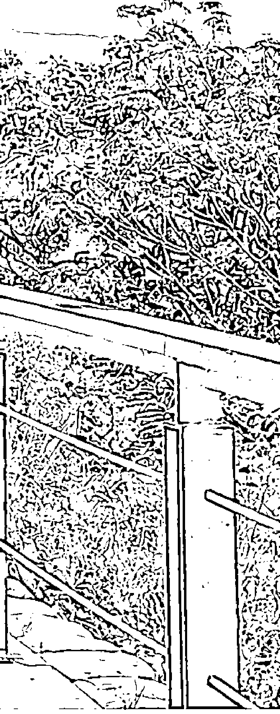

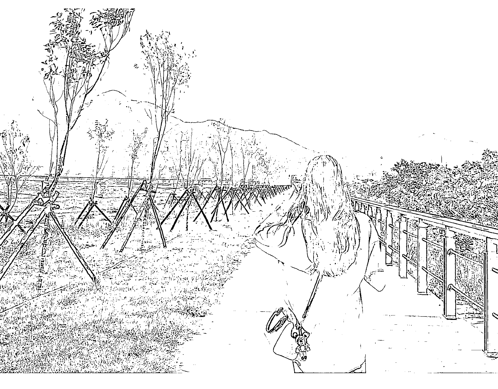

## 維持生活秩序的五大法則

### (1) 練習珍惜：把關選物標準，降低「厭舊」的頻率

在我分享「只買百分之百喜歡的東西」後沒多久，就收到了一個粉絲來信：「我覺得比起買新的東西，『如何愛惜已經擁有的東西』更困難。因為人是喜新厭舊的，通常會想購物，是因為看膩了原本的東西，所以想把它汰換掉，就很容易陷入馬上買、馬上丟、又再買、又再丟的漩渦……」常常會有人和我說，買的當下是百分之百喜歡的沒錯，但不知道怎麼回事，就是沒辦法喜歡它很久。我曾是爆買過的人，絕對明白喜新厭舊、一直想要用新東西、新產品的感覺，我也相信有時候無論再怎麼喜歡，受到外力刺激的話，「看膩」絕對是會發生的。

我雖然很喜歡現在使用的床包組，大多粉絲、觀眾也常常稱讚好看、好想要買，甚至敲碗詢問在哪裡買的。但是三年來日復一日都是同一套（我沒有替換不同床單的習慣，都是天氣好的那天洗好晾乾，當晚又鋪回去），每天每天看，偶爾也會想要換一個風格。「啊～如果從整套紫色調的換成米色調的，應該也很棒吧？」身為 Youtuber，許多網路電商也都熱情邀請我合作，要不要試試看它們的居家產品？很令人心動吧？免費的東西，又正好搔到我「喜新厭舊」的癢處，我不否認我也會有所動搖，想趁這個機會換換風格、換換房間氣象。我個人覺得這很大一部分，還是我們談過的「習慣」：習慣購物、習慣看到新的就心動，習慣覺得新東西比自己的更好……要調整這部分的確不容易，因為喜新厭舊確實就是人性。但也因此，我才強調購物前要設立層層關卡，披荊斬棘跨過所有門檻，才能買到百分之百喜歡的東西。如果我們可以對自己的選品更嚴格的把關，「厭舊」的速度才會慢下來，愛惜自己的東西才會更長久一點。雖然我有時候會對用三年的床包組有點膩，但是其實平常人忙於工作、家庭、人際和生活，哪會想那麼多？往往是因為無聊的時候，購物慾突然衝出來，才會對別的商品容易走心。那個「購物慾望的點」一旦停下來或是被切斷，好比現在立刻去睡午覺、去打電動、去運動或是吃一頓好料的，回來可能又會覺得：欸～其實原本的東西還不錯，還是很耐看、還是很喜歡。

我想我之所以能維持理性和低慾望，除了因為足夠喜歡自己現有的，認為不容易再遇到同等喜歡的東西，所以容易逛一逛就放棄、沒有下文，削弱突如其來的衝動、很難再次下手；因為我會希望如果又要買東西，這「東西」一定也要很喜歡，要到百分之九十五、百分之九十九、百分之百那麼喜歡，會是一輩子的命定款。同時也提醒自己，衝動的下場就是我們剛剛提到的「膩」，越是不夠喜歡的東西，膩的速度就越快，於是循環就會開始：買了又丟，丟了又買。這也是為什麼「潮流的東西」，總是過了就退了，因為它提供的是新鮮感，只是暫時衝擊給我們不一樣的感覺，就這樣而已。

我也明白「不想買東西」很難，誰不喜歡新東西？而且有時候是貪一個暢快和一個新穎，我們大部分的人過去習慣購物，習慣用買東西來「犒賞自己」，我們一直都是這麼被洗腦的，好像擁有更多，就一定更滿足、更幸福。但譬如有 CHANEL 的人，有更滿足嗎？好像並沒有，他們可能還想要 HERMES、還想要 LV。有了一個 LV，或許又會想要第二個、然後第三個、第四個……，包包買成一座山，衣鞋也是，家具收納也是。東西是買不完的，購物瞬間絕對會給予人快樂，但長遠來說，卻沒有比較滿足。

簡單是一種「要練習」的生活方式，就像調整飲食一樣，除了少數人，大部分人鐵定會有個過渡期要去適應。維持「簡單」的一大方法，我也會建議大家試著去記得「想丟掉」、「想回收」、「不喜歡了」等等的感覺。大部分人對物品太不在乎了，而且取得太容易。現代社會物資過剩，人們又有能力購買，短時間內根本看不出來這些購買會對人生有多少影響，自然就不會那麼那麼在乎。

有粉絲曾經向我反應：「可是我買不到百分之百喜歡的東西」，或是「我怎麼知道這是不是一時衝動？當下也以為是百分之百喜歡，覺得很適合我、很心動。」

我不否認，如何判斷自己「百分之百喜歡」真的很難，哪那麼容易可以一直買到很喜歡、很符合自己的東西，況且在沒有用過的情況下，常常都是當下被沖昏頭的狀態，這又要怎麼判斷？

除了剛才提及的設立關卡、延長思考時間，很多東西之所以會讓我們那麼喜歡，也是因為「習慣」。習慣是「這個東西」了，習慣是「它」了。如果我們能給自己足夠的時間，去喜歡和適應一個物品，有些東西，就是會越用越喜歡！一開始可能覺得還好、無感，甚至會挑它毛病，但排除重大的設計不良、不符合你實際需求，不然我相信大部分人都一定會有些物品，是越用越喜歡，並且產生「情感」的。

Instagram 裡，當我讚不絕口地告訴所有人，這個包包完美符合我的所有需求和喜好之前，大家不知道的是，我剛買回去的時候，很快的就沒有那麼喜歡，開始挑它毛病。人就是這麼奇怪，還沒擁有的時候，在門市、網拍看，就愛得要死、想要得要命，但是把它帶回家、錢刷下去之後，就立刻挑剔這個、挑剔那個。我當時開始懷疑自己的品味，這個咖啡色和黑色配在一起真的好看嗎？這樣側邊寬寬、鼓鼓的，真的有好看嗎？然而後來，我越用越習慣，漸漸發現它的好、依賴它的耐用、耐髒，還能裝任何我想裝的，譬如摺疊傘、保溫瓶，甚至是書和相機，漸漸了解要怎麼去搭我的穿著後，我才開始喜歡它，發現它原來這麼不錯，漸漸地習慣有它、學習愛它，最終轉變成愛不釋手。從「還好、無感」，轉變成「愛用品」，大家是不是多少都有會幾次這樣的經驗呢？而把這整個過程換成文字的話，我想應就叫做「練習珍惜」吧！

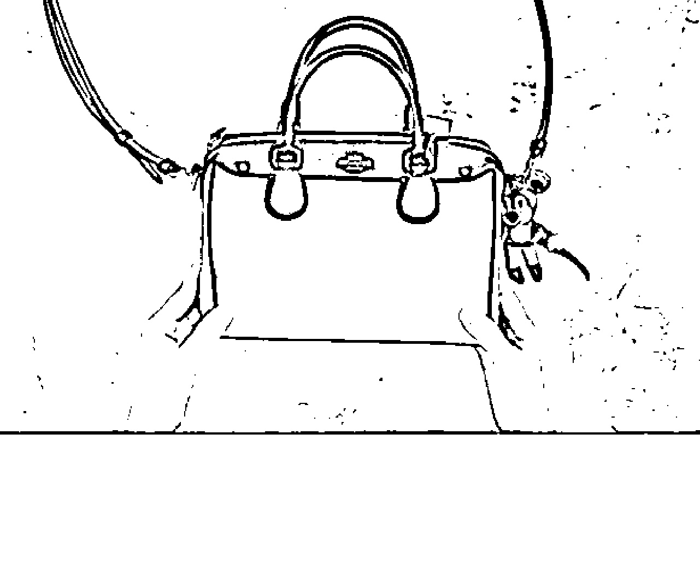

前面「包包的關卡」段落中，有一張照片是目前我所擁有的全部包包——三個。剛買回來、一開始還很挑剔的時候，我怎麼也沒想到，後來它會變成我的愛用包。

### (2) 小心「不請自來」：不需要的東西，一開始就不要收

我實行減物一陣子後開始明顯察覺到，就算購物慾望已經被冷卻降溫，不會主動購買什麼東西，但還是時不時會收到不請自來的東西，好比公司禮品、親戚朋友贈禮、會員贈品、網購包材、路過傳單、公關品……等等，這些往往會因為一些人情壓力而不好拒絕。

通常這些不請自來的物品，都不是非要不可的東西，想想沒有這些物品之前，其實日子也過得好好地。倘若正好可以汰換家中一些較為老舊的東西，那當然太好了，又或許正好是消耗品，例如衛生紙的話也沒問題，過一陣子也許就能使用完畢。

我最直接的建議，就是不需要就不要收，如果不請自來或不可能拒絕，就趕緊趁新、趁包裝完善去轉賣或轉送。「不請自來」的東西，常常會是晉升成「堆置物」的高危險群，因為那並不是由你親自挑選、依照自身習慣留下來的菁英們。

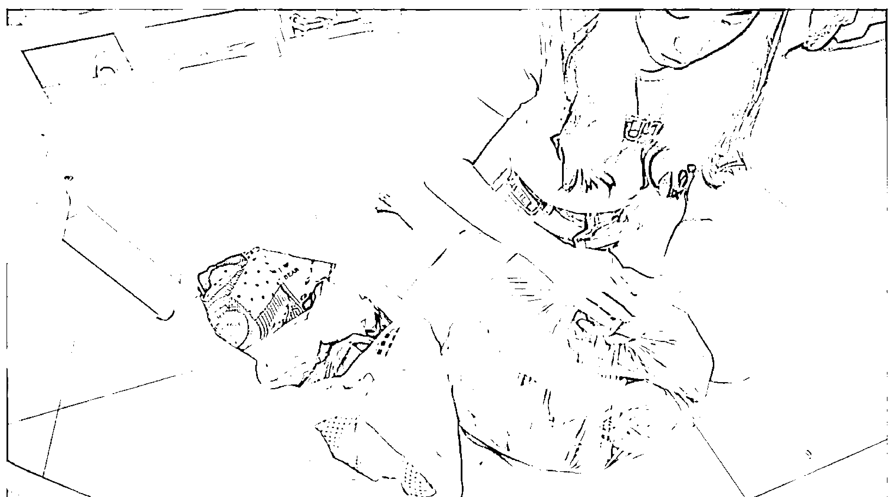

你不需要的東西，就是不會用到，在不好意思拒絕的場合或是其他不得已的原因必須收下的話，放著不管很容易變成堆在角落的無用垃圾，趕快處理掉吧！

### (3) 遇缺不補：練習讓生活七分滿就好

我們假設今天斷舍離了一箱衣服好了，櫃子空了大半，除非哪天開始困擾衣服不夠穿，不然不用急著補貨，我們不急著買新的東西來填補清掉的空缺。此時更是練習維持生活秩序的大好時機！可以問問自己「真的有缺嗎？」，如果沒有，為什麼還要讓自己輕易再買一次呢？為什麼要把好不容易釋放出來的生活空間被回填呢？更好的東西是值得等待的，沒人逼我們要妥協百分之六十、百分之七十喜歡的東西，不是嗎？又或者，其實「空著」就已經是最好的選擇，練習不再習慣有空間就塞，這也是讓我簡單生活可以更順利的秘密之一。我們一路斷舍離，雖然告別這麼多東西，也沒有因此過得比較不好嘛！

> More isn't better, sometimes it's just more.

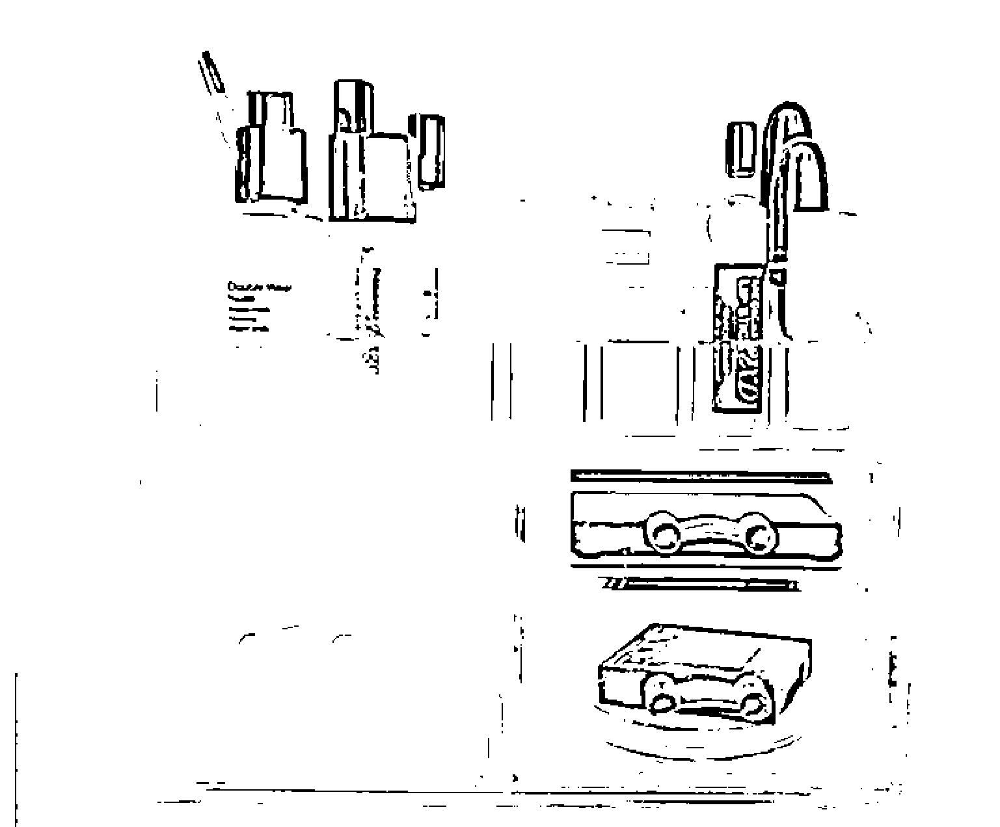
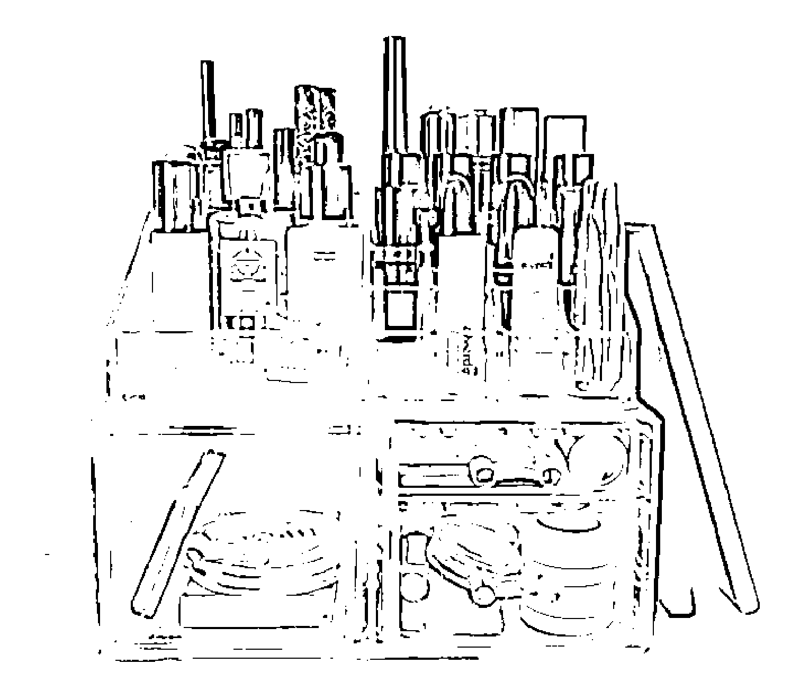

化妝品是我「遇缺不補」的最好代表，減少的過程中才發現，原來就算有的不多，我一樣可以畫出滿意的妝容，以前的多，真的純粹就是「多」而已。

### (4) 物歸原處：每次都收好，不用特別整理

幾乎所有的空間都是這樣：如果全部「收好」，其實房間看起來是沒有那麼亂的，但我想大家都清楚，擁有的東西越多，弄亂的機會和頻率就越高！

在減少物品後最大的好處之一，就是要把一個區域的東西整理完畢是很快的！不會有一堆雜物阻礙，也不需要每次重新排列、又花上大把時間。但要怎麼樣減少整理的次數？要怎麼輕鬆維持擺放秩序呢？

我非常建議，要給所有東西都「設定一個家」，好比家用剪刀，放在公共區域的客廳一處筆筒中，不論哪一位家庭成員使用完畢，就放回那個筆筒裡，這樣下次要再使用時，也還是去同一個地方拿取使用，並放置回去。又好比，無袖衣服，一定都統一摺疊放在衣櫃第二格層板裡，沒錯，就是要這麼清楚的定位！這樣只要天氣稍微炎熱，就可以反射性知道，要從這層拿取，洗完衣服收摺後，也可以很快地擺到它該去的地方。

專屬「家」的做法，非但能讓我們更好珍惜物品，也能夠一次解決找不到、難以維持的問題，它們永遠會在同個位置，等待再次被主人使用。

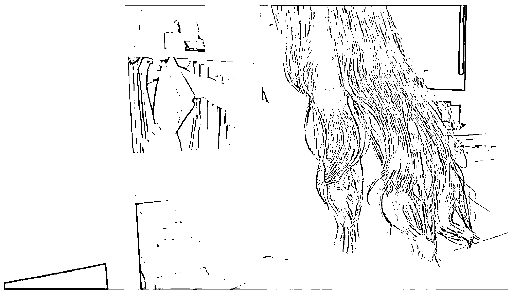

物品固定放在一個地方有很多好處，不會因亂放而讓家中變亂、不會要用的時候找不到，就能減少整理的頻率，也能避免因「找不到」而又買了重複物品的狀況。

### (5) 享受生活：讓今天的自己比過去更好，就夠了

我曾經一度感到很沮喪，身為半公眾人物，尤其又在談論居家空間，我時常會把自己家環境作為拍攝場景，但看在『生活更簡單』的達人們眼中，我的空間其實並沒有達到他們的標準，東西沒有少到夠資格分享這個話題。直到現在，我都還是會對這樣的評論感到壓力。

很多有意願嘗試簡單生活的朋友，是不是也面臨類似的困擾呢？被親朋好友指指點點，或在轉變過程中，遭受質疑或看好戲的眼神，甚至是家人不支持你的行為，認為你浪費、不知道好歹、不懂珍惜。

我一直強調，請和過去的自己比就好，只要你相信，這麼做都是為了更好的人生、更樸實的日子、更有秩序的生活而努力，那麼就繼續穩穩的前進就好了。

我的粉絲 A 小姐，以前是個囤積狂，面膜不買個十盒就會焦慮，但現在調整到只需要準備個兩盒備用就好。是的，極簡達人會覺得『根本沒必要』，但她已經進步八盒了，多了八個面膜盒子的空間來做運用，這不就是很大的一步嗎？那些自以為是的評論，根本不明白這樣的蛻變是多麼的驚人，多麼值得掌聲。

有個和我一樣想追求簡單生活的朋友，她以前就不太買衣服，所以實行兩年極簡後，所有四季衣服加總起來才僅僅二十五件。但對她來說，不過就是五十件再精簡一些而已。而我曾是購物狂，也許現在還有五十件衣服，但我以前擁有的量是一千件呀！每個人擁有不一樣的故事、不一樣的成長歷程，實在不能拿來相提並論、互相比較。

我的購物狂故事，或許在一些人眼中是極其誇張的，但或許對有些人來說，只是 a piece of cake，根本不算嚴重。我們需要知道的，就是「更有意識的消費、更聰明的購物、更遠離物慾的糾纏」，殊途同歸。不用太嚴格看待「極簡」、「斷捨離」、「少物」的定義，這些都只是在幫助我們提升生活效率、生活品質，還有更認識自己的喜好，更不被物慾、不被無盡的羨慕嫉妒綁架而已。只要你感覺到，你好像比過去的自己更輕鬆自在，知道自己在做什麼，為什麼購物就好了，你應該要以自己為榮，並越來越享受現在的生活！

## 極簡前——衣物量破千

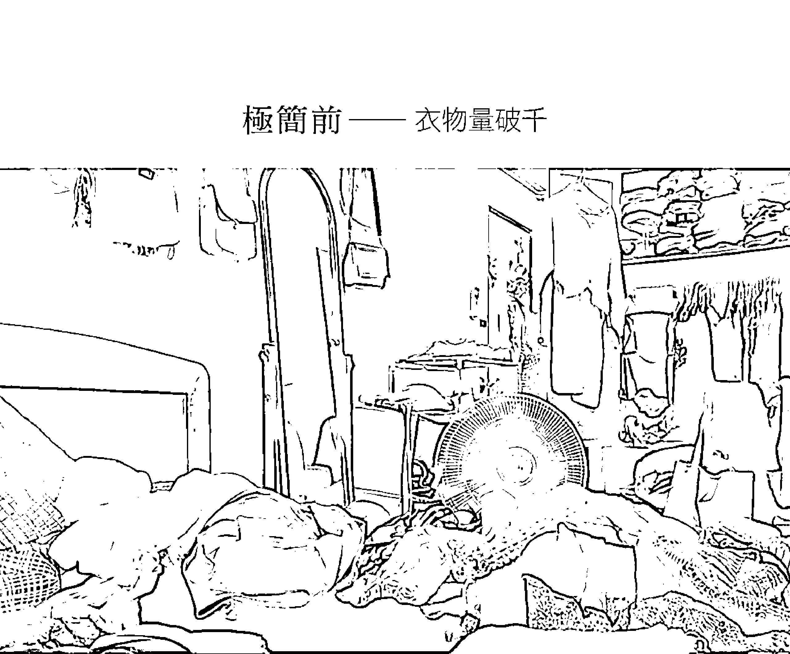

## 極簡一年後——衣物量約 300 件

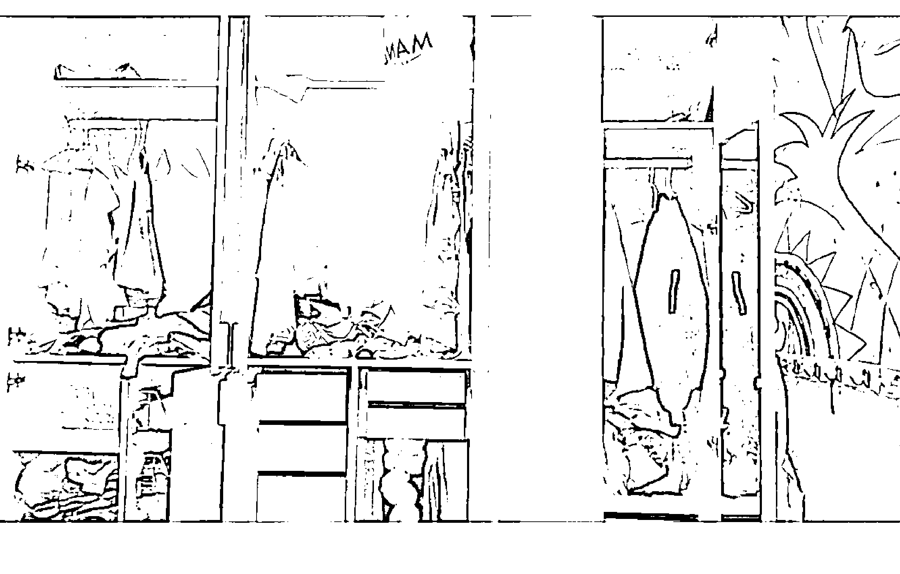

## CHAPTER 05

## 維持簡單生活的日常提案

## 極簡兩年後——衣物量約不到百件

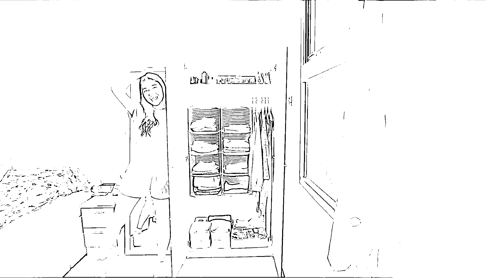

> 感覺今天的你，比昨天的自己更好，享受改變後的生活，並且記得肯定自己！

## 和生活理念不一樣的人同住

我的家人（包含父母和哥哥）會談論、關注、嚮往「極簡、斷捨離、少物」的，其實只有我一個人而已。我想要追求的生活，不代表同個屋簷下的成員們能夠有同樣共識，尤其這也不是我一個人住的房子，當然更不可能為所欲為。

## 尊重家人的使用習慣

雖然父母並不阻止我斷捨離自己的房間，但也不會想要主動整理、極簡什麼。「生活這樣子也很好啊！為什麼非得要用你嚮往的那一套？為什麼非得要丟掉你說的那些『還沒用到的東西』？」這是我家人的質疑，非常合理。

如同上段所言，因為成長背景和經歷不同，所以有些人無法理解我們的轉變與進步，但我們是否也不曾好好理解過自己的家庭成員，為什麼不願意配合、為什麼不想斷捨離呢？

大多長輩過往的生活比現在困乏得多，物資缺乏的狀況已令我們這一代難以想像，他們兒時的回憶，可能只要有一串橡皮筋（跳繩）、一根棒棒糖、幾顆彈珠、十元湯麵，就能歡喜得樂不可支。所以說，要他們接受斷捨離？少物生活？想一想其實就能明白，這是非常為難他們的事情。

開始嘗試斷捨離的人，可能會發生家庭成員不准你丟「他們的、公共的東西」，甚至連「你自己的東西」，他們也不希望你丟掉，這些都出於成長背景不同，且互相不理解所造成。我們也許會想要憤恨不平地反擊，想試圖說服，但面臨各種無解、僵持的情境下，「說什麼都是沒用」也是可以想見的狀況。

我曾經對著我爸堆置上百本的書責怪說：「這些都沒在看了啊！為什麼不能賣啊？」，但後來我整理娃娃的時候，豁然開朗，這些絨毛玩具，對我爸來說，何嘗不是「浪費錢、浪費空間的雜物」呢？每個人對雜物，認為「該斷捨離」的物品截然不同。

## 從一個抽屜、一個角落開始改變

就像我們第二章<選擇簡單的生活風格>裡所談過的，如果不是發自內心、主動的想要改變生活，這樣的追求對不認同的人來說，只會是強求，徒增更多爭執。

我的父母也是十分愛物惜物的人，但在我堅持長達兩年的實行減物、少物生活的過程中，我可以發現他們雖然改變很緩慢，但確實有受到影響。當我在淘汰不需要的物品時；當我在說服他們不要買過量備品時；當我告訴他們紙袋、塑膠袋留適量就好時；當我開始主動整理環境時；當我著手販售家中的閒置物時，我可以感受到他們和使用頻率低的物品之間曾有的緊密連結，起了一些鬆動，他們開始會有意無意地認同「確實不用太多也沒問題」。

想改變家人的思維和習慣，我覺得以身作則是最好的方法，想要傳遞給他人這樣的觀念時，先把自己做好，先從自己的房間，小至一個抽屜、一個衣櫃做起就好，應當把重心先放在自己身上，當我們落實自己的信念，開始因簡單生活而有更美好的呈現，更穩定的心情、更專注的工作、更輕盈的空間，身邊的人一定可以感受到。

## CHAPTER 05

## 維持簡單生活的日常提案

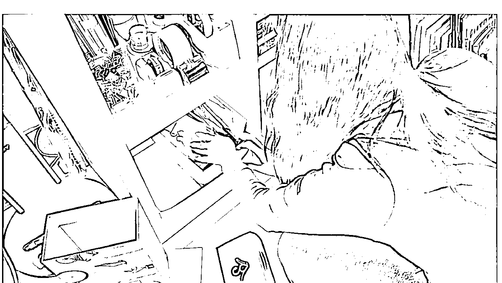

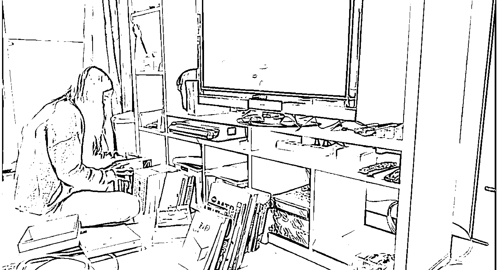

以身作則，讓家人感受到進行極簡的你變得更好，透過一個角落的整理，讓他們理解並開始認同「這個丟掉、這樣整理也可以」。

他們的改變可能很緩慢，可能這輩子都不可能達到我們心目中的標準，但不強加於人自己的生活方式，也是對在同個屋簷下的成員們的一份尊重。

我有一位同學，畢業後再也沒有聯絡了，有一天她忽然私訊對我說謝謝。我才知道她本來也是不在乎生活品質的人，但不知道從什麼時候開始，看到我美好的轉變，只是乾淨簡單，就能呈現優雅得體的氛圍，一點都不輸坐擁諸多名牌的網紅。所以開始漸漸被影響、受到啟發。她說：「不知不覺購物慾就下降了，也賣了很多東西。」

如果可以用自己的行為和成果，讓其他人看到之後，自發性地也想開始改變，無須多加闡述滅物有多好或強逼家人把家中整頓成你希望的樣子，「想過簡單的生活」自然會成為你身邊的人願意嘗試的目標。

> 「不知不覺購物慾就下降了，也賣了很多東西。」

> 「想過簡單的生活」

## CHAPTER 05

## 維持簡單生活的日常提案

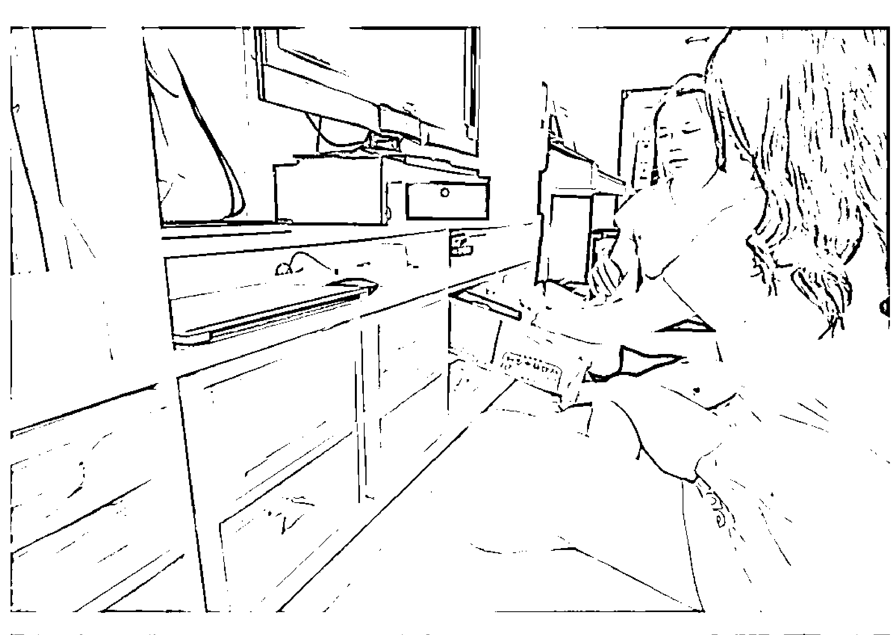

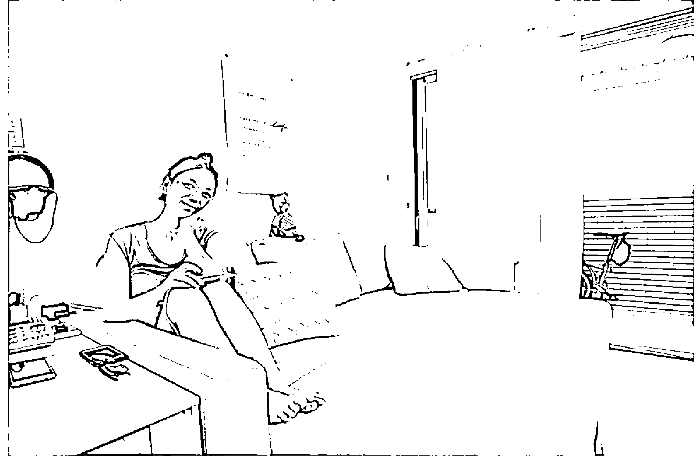

媽媽也因為受到我持續整理、簡化所帶來的正面的影響，漸漸認同有些物品其實無需囤積過量。

# 開始極簡之後，我更喜歡自己了

我從「月光族的購物狂」到「極簡主義的信徒」，這兩年內天翻地覆的改變，讓我開始相信「簡單生活」是一件誰都做得到的事情。不再追求物質的過程中也讓我大徹大悟，一個人的自信、價值和美，真的可以不那麼仰賴身外之物。

> 粉絲C小姐曾告訴我：「我本來不覺得我有辦法減少這麼多物慾，上班又要兼顧家庭壓力都好大，也沒什麼時間陪小孩，每次看到不錯的東西就會想要買給孩子、老公甚至自己當禮物，我真的看到什麼東西都好想要。同事每次揪團，我都是買最多的那個。我也不覺得自己能夠斷捨離成功，因為那些東西都是錢、都是心血。但念頭一轉，明白物質帶來的快樂無法持久，不要把物品當做快樂的泉源，我覺得好像脫胎換骨一樣，也比較有勇氣面對家裡的亂七八糟，雖然整理是場馬拉松，但好像知道接著該怎麼做了。」

## CHAPTER 05
維持簡單生活的日常提案

不論看完這本書之後，你有沒有執行的衝動，有沒有顛覆你過往的思考，希望我能有幸邀請你們試試看，不用想太多，如果持續一週、一個月，你感到愉悅、舒服、更有精神，那麼就繼續；如果你感到矛盾、煩惱甚至痛苦，那麼就停止，完全忠於自己的感受即可。我和身邊好幾位接觸減物而獲得心靈自由的朋友，都是希望自己美好的親身轉變，可以幫助到更多其實並不知道自己到底需要什麼的人。把對現在的生活根本不必要的東西清出來，你有更多的時間，專注在更重要的事上。

然而每個人嚮往的生活方式都太不相同，無論怎麼選擇，自己的輕鬆自在是最重要的，畢竟我們的目的是要讓自己過得開心、更認同自己，也更認同自己的生活方式才是。

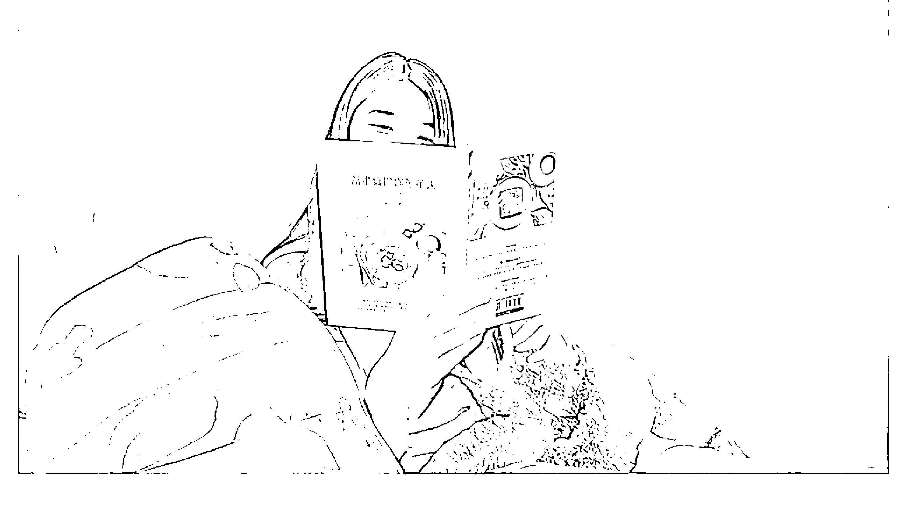

> 「美好的生活是不昂貴的」，隨著你簡化生活中各種物品的數量之後，就會從留下的東西中發現自己的愛好和風格，讓你更了解自己；把那些其實沒有這麼需要的東西清掉之後，少了整理、翻找的時間，少了看到一團亂的煩躁心情，你會更能找出、更能專心在自己真正想做的事情上。

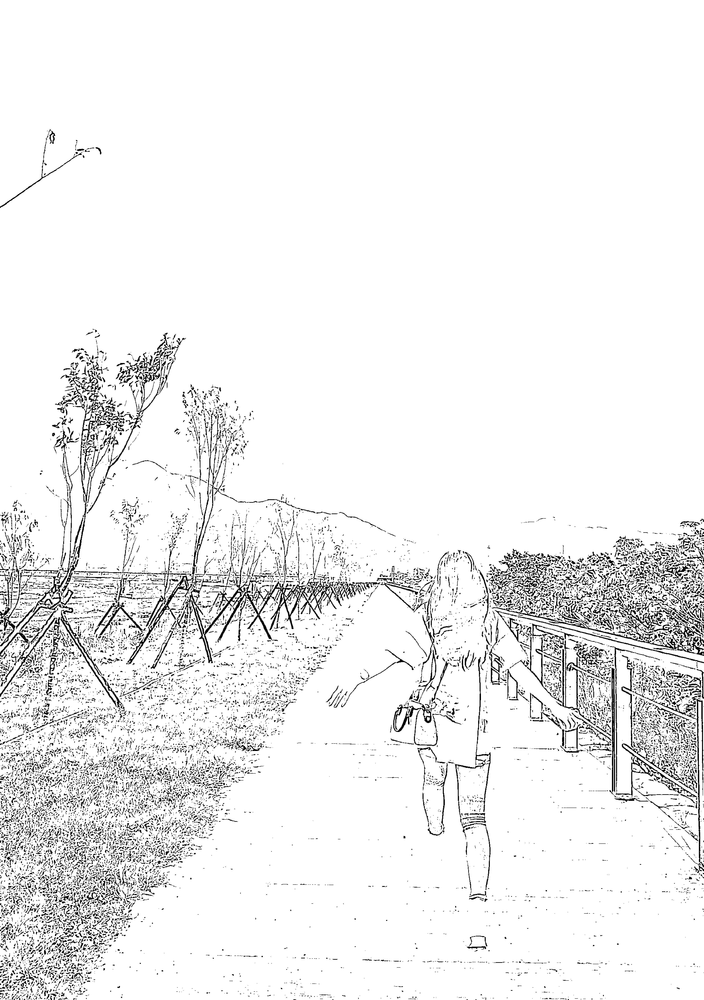

國家圖書館出版品預行編目資料
未羊子的極簡日常提案 / 未羊子著 . -- 初版 . -- 新北市 : 幸福文化
出版 : 遠足文化發行, 2020.12
面 ; 公分
ISBN 978-986-5536-28-2 ( 平裝 )
1. 家政 2. 簡化生活 3. 生活態度 4. 生活指導
420 109017079

# 好生活 019

# 未羊子的極簡日常提案

兩大清單「馬上丟╳不再買」精準斷捨離，從一個抽屜、一個角落，開始打造理想中的質感生活！

- 作者: 未羊子
- 責任編輯: 賴秉薇
- 封面設計: Rika Su
- 內文設計: 王氏研創藝術有限公司
- 內文排版: 王氏研創藝術有限公司
- 印 務: 黃禮賢、李孟儒
- 出版總監: 黃文慧
- 副 總 編: 梁淑玲、林麗文
- 主 編: 蕭歆儀、黃佳燕、賴秉薇
- 行銷總監: 祝子慧
- 行銷企劃: 林彥伶、朱妍靜
- 社 長: 郭重興
- 發行人兼出版總監: 曾大福
- 出 版: 幸福文化/遠足文化事業股份有限公司
- 地 址: 231 新北市新店區民權路 108-1 號 8 樓
- 網 址: https://www.facebook.com/happinessbookrep/
- 電 話: (02) 2218-1417
- 傳 真: (02) 2218-8057

- 發 行: 遠足文化事業股份有限公司
- 地 址: 231 新北市新店區民權路 108-2 號 9 樓
- 電 話: (02) 2218-1417
- 傳 真: (02) 2218-1142
- 電 郵: service@bookrep.com.tw
- 郵撥帳號: 19504465
- 客服電話: 0800-221-029
- 網 址: www.bookrep.com.tw
- 法律顧問: 華洋法律事務所 蘇文生律師
- 印 刷: 凱林彩印股份有限公司
- 電 話: (02) 2974-5797
- 初版一刷: 西元 2020 年 12 月
- 定 價: 360 元