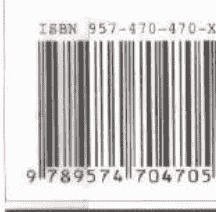

## 紐約時報暢銷書《靈魂之旅》三部曲之3

## 來自靈界的答案

讓我們超越生死無常的靈界真相

我們的靈魂從未消逝，只是回到靈界——靈魂的故鄉。人世間為何有苦痛和悲傷，都可以在那裡找到真相。

當我們想起曾在靈界生活的種種，當我們想起靈魂是永生不死的，我們就不再會再感到孤寂和不安。

即使孤單一人，也能感受到已故親人或指導靈、天使，永遠陪在我們身邊的溫暖。

那些在人世間消逝的，那些在人世間看不見的，並非就不存在。

那些我們深愛著的故人，從來就不曾離開我們；那些讓我們悲慟欲絕的不幸，其實，在靈界都有答案。

蘇菲亞·布朗 Sylvia Browne 琳賽·哈理遜 Lindsay Harrison/著 黃漢耀/譯

美國費城天普大學哲學博士 蔡昌雄/導讀

歐蘭朵催眠諮詢室主持人 段貞鳳 瑪珈身心靈諮詢中心主持人 程旭 綠度母身心成長工作坊主持人 彭翎恩

國際催眠發展交流協會理事長 廖云鈺 真情推薦

## Blessings from The Other Side

## 來自靈界 的答案

## 讓我們超越生死無常的靈界真相

我對蘇菲亞這本作品曾抱持肯定的看法，實際上是奠基於我個人對當代社會「尋靈」（soul-searching）現象的長期觀察與體驗。

當代人在宗教世俗化與神話意義崩解的衝擊下，因為欠缺安身立命的心靈寄託，於是紛紛投入各種類型的新興宗教與靈修團體，企圖尋找自己失去的「靈魂」。

這原本是無可厚非之舉，但是在尋靈過程中，若是只把目光放在與「另一界」（the other realm）接觸的絢麗神奇經驗上，而忽略了這類超越經驗與「此世意義」（this worldliness）的關聯，那麼不僅靈修的精神價值無從彰顯，個人在靈修修煉的過程中，甚至會很容易產生「靈性急症」（spiritual emergency）的病理現象，如成癮、附身、身心失調等，從而妨礙了靈性的成長。

具有與靈界溝通能力的蘇菲亞，在這本書中當然引介了許多靈界現象，如「生命藍圖」、「胎記的前世因緣」等，而且描繪得栩栩如生，但是難能可貴的是，這些靈界景象在本書中只是蘇菲亞談論靈性生命功課的底景罷了，真正的重點是，像悲傷、愧疚、寬恕、喜悅、關係等每個生命都會關懷的切身課題，如何可以在與靈界接觸的過程中得到啟發，進而達到提昇靈性生命品質的目的。蘇菲亞在悲傷一章的主題中，便提到有人對她能夠通靈卻還會悲傷感到疑惑，她的回應是：「因為我是人，因為我是自私的，因為我活在「這裡」。」這個答案充分說明了蘇菲亞靈學的現世意義與人文關懷，也與我個人對靈修需立基於俗世的基本態度相呼應。在這個靈修觀點的存在照明下，怎樣反省兩界穿梭後的意義，便成為本書強調的靈修重點。於是，書中從靈界生命藍圖中隱含的個人生命目的開始，一路帶領讀者進入各類生命經驗橫面而進行省思，這個部份讀者可以細細品味蘇菲亞的經驗分享與指引。…………

美國費城天普大學哲學博士 蔡昌雄

BOF012 定價:260元

## 作者簡介

蘇菲亞·布朗 Sylvia Browne

爲享有卓著聲譽的國際知名靈媒，也是榮登美國紐約時報暢銷書排行榜的暢銷作家。她從三歲就展現超凡的心靈力，她在美國以通靈的天賦，及對超心理學的深入研究而聞名。她除了運用通靈力協助人們重新掌握人生，了解生命意義外，每年她都參與慈善活動，並使用通靈力尋找失蹤兒童，協助警方偵破懸案。

她是美國知名節目 Larry King Live, Good Morning American, The Montel Williams Show, Unsolved, CNN 和 Entertainment Tonight 的常客，著有《靈魂之旅》、《細胞記憶》（人本自然文化出版）等多本暢銷書。

## 導讀

### 冥想與靈修生活的指引

美國費城天普大學哲學博士

蔡昌雄

這是國際知名靈媒蘇菲亞·布朗關於靈學的系列作品之一，與其他的系列作品相較，蘇菲亞在本書的內容安排與寫作上，兼具靈性深度、人文關懷及實用指南等優點，對於引導有志開啟靈界對話經驗的人士，是值得推薦的入門書。書中許多概念如「細胞記憶」、「靈界旅遊」等，在過去的論著中已有專門介紹，有興趣但欠缺這方面理解背景的讀者，可以先參考蘇菲亞先前的中文譯著，相信可以增進閱讀時的理解深度。

我對蘇菲亞這本作品會抱持以上肯定的看法，實際上是奠基於我個人對當代社會「尋靈」（soul-searching）現象的長期觀察與體驗。當代人在宗教世俗化與神話意義崩解的衝擊下，因為欠缺安身立命的心靈寄託，於是紛紛投入各種類型的新興宗教與靈修團體，企圖尋找自己失去的「靈魂」。這原本是無可厚非之舉，但是在尋靈過程中，若是只把目光放在與「另一界」（the other realm）接觸的絢麗神奇經驗上，而忽略了這類超越經驗與「此世意義」（this worldliness）的關聯，那麼不僅靈修的精神價值無從彰顯，個人在盲修瞎練的過程中，甚至會很容易產生「靈性急症」（spiritual emergency）的病理現象，如成癮、附身、身心失調等，從而妨礙了靈性的成長。

具有與靈界溝通能力的蘇菲亞，在這本書中當然引介了許多靈界現象，如「生命藍圖」、「胎記的前世因緣」等，而且描繪得栩栩如生，但是難能可貴的是，這些靈界景象在本書中只是蘇菲亞談論靈性生命功課的底景罷了，真正的重點是，像悲傷、愧疚、寬恕、喜悅、關係等每個生命都會關懷的切身課題，如何可以在與靈界接觸的過程中得到啟發，進而達到提昇靈性生命品質的目的。蘇菲亞在悲傷一章的主題中，便開宗明義的提到，有人對她能夠通靈卻還會悲傷感到疑惑，她的回應是：「因爲我是人，因爲我是自私的，因爲我活在『這裡』。」這個答案充分說明了蘇菲亞靈學的現世意義與人文關懷，也與我個人對靈修需立基於俗世的基本態度相呼應。在這個靈修觀點的存在照明下，怎樣反省兩界穿梭後的意義，便成爲本書強調的靈修重點。於是，書中從靈界生命藍圖中隱含的個人生命目的的開始，一路帶領讀者進入各類生命經驗構面進行省思，這個部份讀者可以細細品味蘇菲亞的經驗分享與指引。

與靈界接觸之旅，行前整體意義架構的確立固然重要，但是若是缺少了真參實修的功夫，則所謂的靈魂之學也只不過是畫餅充飢的把戲罷了。蘇菲亞在本書中另一項難能可貴之處就在於，她提供了實際切入每個生命主題經驗的冥想步驟與內容指引，使得讀者可以找到自行修練的入手點。雖然能夠具備一般冥想訓練的基礎知識，會比較容易領會蘇菲亞設定的冥想內容，不過她在本書的設計上，已經讓整個修練達到可以按圖索驥的地步了。

冥想經驗是我們與靈界接觸的入口，也是接收靈界訊息後省思其現世意義的經驗基礎。這個部份的操作及其對靈性開拓的意涵，我們不妨從超個人心理學家榮格的「積極想像」（active imagination）原理來參照解釋。簡單的說，在我們心智自我的理性生命之下，另有一層更基礎的想像生命影像與能量流動的世界，這兩個界域的本質不同，形構與運作的方式也不同。它們「彼此說的是完全不同的語言」，前者是已知的，後者是未知的；前者是人格的，後者是非人格的；前者運用的是情感（feelings）和語詞，後者則使用本能、情緒（affects）和意象（images）；前者提供我們社群的歸屬感，後者則提供我們宇宙的歸屬感。因此，在冥想的經驗中進行靈修活動，就是在促進這兩個界域之間的對話與整合，當榮格在闡述曼陀羅繪畫、啟靈儀式及原型夢境等神秘體驗時，他就是在這兩個界域之間，進行基本方向指引與意義釐清的工作。蘇菲亞亦然，只是她所觸及的靈性界域更為深遠。

此外，蘇菲亞在每章末尾都有「肯定課題」的提示，讀者對於這個部份的內容就算有不了解的地方，也不能省去，因為它是靈修信念不斷肯認的工作，是構成完整靈魂修煉冥想不可或缺的環節。

登高自卑，行遠自邇。宇宙靈魂的探索之旅，也不例外。我由衷期待讀者能從本書體會到充實靈修基本識見與功夫的重要性，並由此獲得靈魂知識的開啟與生命的喜悅。

## 推薦序

### 無苦無道行——為了學習，我們自願來此生

歐蘭朵催眠諮詢室催眠師
段貞夙

心底一直有個清楚的印象⋯⋯我坐在嬰兒床上，安靜地看著陽光從窗外灑進眷舍的日式房子地板上，塵埃就在光中跳舞，突然心裡冒出一串急切的聲音「我是誰」、「我為什麼在這裡？」、「這裡是哪？」，瞬間一股莫名的困惑和無解的迷惘巨大地包圍著我，且久久無法停止。

直到近年，我問起了母親，是否我小時的嬰兒床放在客廳過，她想想說，有啊！大概在我一～兩歲之前。

兩歲的娃兒會有如此大哉問？說真的，若非我親身經歷，實在很難相信，但這十年從接觸身心靈領域到從事催眠諮詢工作後，我再回顧自身，突然明白了這段幼年記憶在成長過程中，雖已不自覺地被擠到角落，但是這些大哉問，仍不時變襲出現在我生命各階段，讓我不禁自問：「我現在做的這些事，真的是我要的嗎？」「這份苦，究竟是要我從中學會什麼？」

於是，隨著觀照自己過往所經歷的種種：難為人知的辛苦成長過程、感情的起伏、工作的轉變，加上這些年看到這麼多諮詢室裡眾多個案的故事，我逐漸感覺到並且相信——我們每個人都是自願來此世間的。我們自願來做某人的子女、朋友甚至競爭對手，即便這樣的關係會讓我們遭受椎心的折磨，但我們似乎都私下盤算過，認為這是「值得」的，因為唯有透過這些表面不美滿的過程經歷，我們才能感受到苦，而苦的感受又是如此真切，於是我們就在被逼到內心的懸崖邊時，終於願意回過頭來觀照內心的陰暗面，顛覆、打破原有的執著牢籠，進而學會累世沒學好的內在功課，例如勇敢、獨立、自主、愛、寬恕、分享、放下等。當內在的幽闇轉為明淨時，我們便有了另一種視野觀點與態度，能夠輕鬆正面地面對、處理身旁紛雜糾葛的人事，甚至為周遭的人們帶來正面的能量。

本書作者根據她的特殊能力所提出了一些看法——是我們自己規劃出此生的生命藍圖、我們挑選出的「選擇線」，正是我們在塵世學院所將主修的學分，這一領域會令我們頭疼不已，但卻是我們認為最重要而急需學習的。這些看法，都與我上述的感想有殊途同歸之妙。從正信佛法的角度來看，雖無本書所提的塵世與靈魂二界之說，而認為是無明眾生隨習、隨業、隨念在六道生死流轉，但是當自作業力所造就的果報現前時，何嘗不也是刺激我們去識空性、破無明、斷煩惱、出輪迴、證菩提的動力呢？所謂「無苦無道行」「無苦無出離」，不正是此意嗎？

也因此，希望看了本書的讀者能從此以正面態度，面對這難得的人生，從中學習、與身旁的人互相成就彼此的內在功課。那麼，當我們有天離開這片塵土時，我們將會為自己喝采，這一趟沒有白來。

## 推薦序

### 無事，一生輕

瑪咖身心靈諮詢中心主持人
程旭

從事心靈療癒與成長的工作，常說自己的工作地點，是位於人的「內在」，而對象，則是人的「心事」。

身為催眠諮商師，每天與心靈做著近距離的接觸，所眼見的是，人的內在如何被各種各樣的心事點滴的充塞、填滿，終而使認知偏斜，感受顛倒，心念處於紊亂的狀態，往往，一般常謂的「自我」，是一堆心事作用於潛意識中所升起的錯亂意識，與內在的神性不僅無關，甚至悖逆，那麼，其所形諸於外的，豈會是「妙境」？所創造出的，又怎會是「天堂」！

就這樣，多年以來，解開的是一團又一團的心事，也眼見當混濁逐漸退去，內在升起的是自性的亮焰，滋養療癒著身心，也將生命中的許多灰與黑化於無形，猶如與宇宙萬有的動脈重新接合，愛與能量源源充滿。此刻，內在閃耀著寧靜與愉悅的光芒、四射的活力與創造力，以及滿溢待發的潛能，若與之前相比擬，像似死窪與活泉，悶鍋與聚寶盆，令人嘆為觀止。

人活著，似乎很難沒有心事。來自過往的愛、恨、情、仇、傷，或對於未來的憂、疑、懼、慮等，總會此起彼落，盤踞著心頭。而重重的心事，似乎會共同在內心營造出某種「基調氣氛」，一旦如此，生命的發展也將被維持在這特定的氛圍裡。每每，若將人所遭遇的種種苦難、病痛或困境，放在其內在的氛圍中來觀察時，並不至突兀，自有脈絡可循。就這樣，心事把人生給定了調，像似無形的藩籬，無法捉摸，卻又牢不可破。回頭想想，你是不是也會發現到，自己，或周遭許多人的一生，不管情節是如何地百折千轉，總是離不開「那個調調兒」？

心事，雖以千百種樣貌呈現，卻往往有著某些共通的內涵。而追根究底，有絕大部份，是源自對於存在本身的不確定感，包含了生命的起始、過渡、與終止，與其所衍生出的各種意義與價值上的模糊，像生命、愛、成長、犧牲、成就、道德、責任、乃至疾病、意外、年老，與死亡，種種深植的疑惑與不安，經表現於外的，常是思維言行中的諸如強迫、控制、放縱、執著、貪婪、沉溺、依賴、退卻、疑懼、恐慌⋯⋯等特質，其實，是失根的痛苦，也是尋根的空茫。

也因此，要向大家推薦這本《來自靈界的答案》，與作者前面兩本著作《靈魂之旅》與《細胞記憶》一樣，都是很好的生命參考書，有助緩解心靈之渴，增加對生命的掌握與安穩感。在本書中，作者繼續引領讀者們，以永恆的靈魂觀點來看待自己的存在，瞭解生命自有其藍圖、目的，與課題，能更清楚這整個「冥冥中的安排」之來龍去脈，也看出其中的愛與完美，此外，從本書特別著墨於悲傷、擔憂、剝奪、愧疚、報復、罪惡感等來看，作者似乎意圖針對這些尤其難纏的心事，為讀者們一一開解。

這本書雖然不是第一本靈媒書，卻是一本充滿慈愛與恩典的好書。尤其與許多傳統的「因果故事」，其中充斥著「討債與還債」、「罪與罰」、「以牙還牙」等等的論述相比，更為深厚而能滋潤人心，解放，而不是增加你的心事，當然，出自靈媒之口的不一定是絕對，一切還待各人親身去驗證與體會，才能了其究竟。

「靈界」，不是只愛靈媒，也不會只把「答案」給靈媒，我深信高靈們早已藉著領悟、良知，或夢境，將許多答案給了你。在本書中，或許你會發現某些曾被一再漠視的溫柔提醒。施行其中的「修鍊法」，與「肯定課題」，我相信你的許多心事會被放下，苦會解脫。

也藉本文傳遞對你滿滿的愛與祝福！

## 推薦序

### 成爲你自己的大我

綠度母身心成長工作坊主持人
彭翊恩

三年來沈浸在催眠領域裡，遇過各式的個案，也見識了生命的多樣樂章。我要感謝這些客戶的歷程豐富了我對生命的體認，也讓我與宇宙、與力量更爲銜接。

有時候，我埋首於個案的歷程，苦讀各類療法而不得其解；有時候我輾轉徹夜，卻是爲了自己的某個關卡，困頓惆悵，遲遲無法入睡。

但無論在怎樣的狀況下，我總是能過關；穿越眼下漫佈的荆棘地，來到一片藍天白雲，找到答案，並繼續往前走。

這一切的發生，並非來自於什麼神奇的靈通能力，或是高超的催眠技巧，而是來自一份「信任」與「勇氣」：那就是追尋生命的真理與真愛，成爲自己的大我。

事實上，我並非肯定尋找遠在天邊的靈通力，或是認同以窺見「靈界」的方式來找到答案，反而對於以這樣的方式來安慰頭腦的不安與疑慮大大地質疑。試想，如果所有的答案都在那「第三類接觸」，而那另一界卻又這樣的不可觸摸，似乎只有擁有像作者這樣天賦的人，才能有處理生命困頓的力量，那豈不讓我們這等凡人更加無助、更加覺得總要有一份自己沒有的東西，才能活得安心，才能找到答案？

因此，在這裡，我想要談談蘇菲亞所提出的「生命藍圖」與「功課」的概念。對我來說，「生命藍圖」不需要靈通能力來尋找，也不需要苦苦地去窺見，去尋求一個答案。因爲我們的內在就是知道，也一直順著這份藍圖走下去，它早就在那裡，一直在那裡。

我同意蘇菲亞的觀點：每個人來地球旅行一遭，是有很重要的任務與目標，只是往往會失去了那一份自我核心與價值感，被慌張、疑惑、憤怒、憂傷、嫉妒、妄想、痴狂、挫敗、無力、匱乏、不相信⋯⋯等一堆的負面黑暗能量所左右，而忘記自己與這個宇宙的無盡聯繫。

我們所需要的，是確立沒有被懷疑、失落等負面能量給卡住，努力地清除所有的迷障，還給自己那份清明。就好像鏡子就是在那裡，只要把灰塵擦乾淨，它又可以重新清楚地照見一切，歷歷分明，讓我們繼續順著生命之流走下去，找到幸福與天命。

我承認，這是一份不容易的工作。有時候，我希望有個萬靈丹，可以一藥解千憂，把所有的問題與痛苦全部拿走；也有時候，沈溺在一份需要與抉擇的困境裡，對世界憤怒、對生命控訴；更有時候，忘形於某個自我的驕傲與狂妄中，睥睨著世間的一切，用高高在上的姿態，否定自己的脆弱與羞愧。

而如果謙卑地審視著這一路走來的過程，在某個當下，我如果能夠有一點點的能力如實地看待生命每個潮起潮落；一點點努力培養出來的覺知與洞見瞥見了實相；一點點願意為了真愛而割捨一份自私；以及一點點在挫敗中還願意重新信任、重新給出的勇氣，我真的要大聲的見證，內在的「大我」是最大功臣。

在最無助的時候，我會問「大我」：「生命在教我什麼？」也會向「大我」請益：「請你給我一條路，我願意穿越、願意學習。」常常這樣一說，所有的迷惑便消失，而當下的答案歷歷在目。

我確信，生命的「大我」讓我與生命藍圖連結，不偏離目標。越能夠將所有的負面與不安交給「大我」，就越有能力看見我的生命藍圖、我的功課，清楚地踩出下一步。

書中有一些實用的肯定語句、冥想，可以幫助我們與大我連結，重拾真愛與信心，這是本書的特色。

同時，蘇菲亞的坦承與幽默，對生命的熱情與追尋，讓她是一個這樣真實「活著」的人物，閱讀她的書，總讓人有鼓舞振奮的效果。有時候我想，或許能夠療癒個案的，並非她的特殊能力，而是她對生命的見證與信任，對上帝的交託，以及對所有有情眾生的一份連結。

也希望這本書能夠安撫每個人困頓的心，重拾自我的價值與能力，與內在的生命藍圖聯繫，終於成為你自己的大我。

## 推薦序

### 靈魂的旅程

國際催眠發展交流協會理事長
廖云釩 20050526

也許催眠曾經讓你產生好奇，靈魂也曾讓您感到疑惑。等一下我將與你分享，這些日子以來我對催眠及靈魂的認識，你可以坐在你最喜愛的位置上打開床頭或書桌邊的小燈，選擇一個舒適的姿勢，可以用放鬆的心情，愉快的閱讀這篇文章。

在權威又溫柔的聲音的引導下，你進入一個恍惚又清醒的狀態裡，你好像睡著了，卻又可以感覺很清醒，你的身體可以感覺很沉重，心情可以覺得很輕鬆，你也許會疑惑這樣的身體與情緒的狀態，同時又享受著前所未有的平靜與放鬆，彷彿脫離了吵雜的塵囂，進入一個寧靜的自我空間裡，偶而飄過來生活上一些鎖碎的雜訊與思緒，卻也可以感覺腦袋的淨空，你的身體放鬆了，深層覺知打開了，彷彿睡著了，卻又可以感覺清醒的超然，感覺恍若進入另一個時空，卻又清楚的知道你的身體就坐在這裡，可以聽得到遠處傳來都市的喧嚷，也可以很清楚的聽到引導者的聲音，感覺這個聲音好像來自遙遠的彼方，卻又清晰無比的傳入你的耳朵裡。

你逐漸的回想起一些塵封多年的往事，憶起了第一段的情感，想起了第一份工作，也記起了幼年時在一起玩耍的玩伴，你也可以回到被父母親呵護的時光，也或許你再次感覺到了貧窮的不安，你又一次的經驗到了在母親子宮裡的溫暖，也可能感受到的是一種不被接受的恐懼。

再往過去移動一下——你也許可以感覺到身處太虛之中，無邊無際無形無體的那種空無的意境與感覺。

也許你可以看到自己腳下紅色的繡花鞋，感覺自己穿著華麗的緞質彩衣，隨著悅耳的樂音，在華麗的宮殿上開心的舞蹈，也許你感覺到自己是森林裡一棵最高大的樹，在溫暖的陽光下成長與茁壯。

你也許是一個木偶人，與你的夥伴們，在主人靈巧雙手的操控下，擺動著僵硬的肢體，做著生硬模仿人類的動作，取悅無聊的人們。

也許你是一隻壯碩的公牛，正合情脈脈的對著隔壁欄裡那隻美麗的小母牛眨動著你的眼睛。

也或許，你是大草原上的一棵小草兒，隨風自在的擺盪著，享受怡人的陽光。

你也可能是，穿著盔甲的戰士，與敵人勇猛的廝殺，遺憾的死在淒涼沙場上。

也或許你是一團能量光體，在浩瀚的星空中快速流動，在不同的星球上停留玩耍與學習，也許你在各個星球與宇宙的不同時空間穿梭，協助著其他能量體的成長，完成了你的工作後，你進入一個無瑕純淨的潔白空間裡，聳立在柔軟白雲間的那座永恆白色的城堡，莊嚴的殿堂上，兩旁邊站立著許多有著小小翅膀穿著白衣的小天使，為你達成任務歸來而歡欣鼓舞。

古老的中式宮殿中，穿著黃色袍子的帝王，正指揮著文武百官共同達成守護人間子民的工作，穿著灰色道袍的老者，正教導著結著髮髻的青衣童子，看守好煉著丹藥的巨大藥爐。

這是一個永恆的學習，生命之流快速往來穿梭在不同的時空中，藉由扮演不同的角色，我們領悟與體驗，完成生命的不同學習與課題。

當你處在憤怒、悲傷、憤恨與不捨的情緒裡時，這股能量會陷入較低的頻率中，這就是地獄。

當你真誠喜悅充滿愛的能量時，你將體驗生命之美，享受高頻的天堂人生。

你可以沒有宗教的局限，也可以不需要有語言的隔閡，可以不談因果輪迴，那只會讓你陷入宿命的框架之中。

只需要，認真的做好自己，愉悅的去面對生命所有的挑戰，就像是一個純真的孩子，用你每一個當下的心情，大膽的在生命的畫布上，揮灑出屬於你個人風格的圖畫。

沒有後悔，因為失敗只是為了成就更好的未來，不需要有局限，因為你的生命可以自由自在的在宇宙間遨遊，你也可以沒有恐懼，因為恐懼只是為了讓你更加確定的走出生命的道途，而痛苦與悲傷也只是為了讓你能夠更深的品味喜悅的感覺，當然——你也可以將苦痛收集起來，以便從中領悟更多的喜樂。

也許某些時候，你會感覺到有些孤寂，你可以閉上眼睛，打開你意識的心，發現內在的自己，你將發現，整個宇宙的生命與你同在。

你也可以呼喚在另一個空間一直守護著你的那位指導靈，他也許是遨翔天際的一隻老鷹，也許是位美麗的仙女，也或許他是一位充滿智慧的老人家，留著雪白的長鬍子，對你露出慈祥和藹的笑容，也可能他就是另一個時空中智慧充滿的另一個你自己，無怨的與你完成共同的使命，感受他的存在，在你們的努力下，你的生命將在整個宇宙間散發光采，你是宇宙，宇宙也是你，你的意念正創造著你生命的實相。

在這樣恍惚又清醒的深層覺察的引導裡，你探索到了恐懼害怕的源頭，你解決了身體無名的苦痛，你不再憂慮與焦躁，你學習到了如何舒適的進入甜美的夢鄉，你終於尋找到了生命的方向與目標，和宇宙璀璨之光與愛同在，體驗生命的美好歡笑時光。

## 前言

### 我們都是神性的存在

我希望本書的內容能立刻滿足你的需求，無論它所帶來的只是一絲小小的安慰，或一抹微笑，還是對老毛病的一個新方法，更或者，只是一個藉口，使你消失幾分鐘，到某個安靜的地方讓心情靜下來，你不必擔心捲紙、購物、公開報告；忘掉沒有表現的機會、唱歌出醜的窘狀、在聚會裡強顏歡笑的不舒服感，也不再與別人爭辯如何做出好吃蕃薯湯的秘訣⋯⋯等等生活上的雞毛蒜皮小事。

我們在這裡相遇，是生命旅程中的一大機緣，我愛你們，因為你們的給予，使我的生活更加豐富，我要感謝你們。而且，我也希望透過我的經驗使你們感受到上天對大家的珍愛與眷顧是多麼地深刻及永恆。

雖然生命裡難免跌跌撞撞，但我仍舊熱愛我的生活與工作，而最令我開心的是，我的生活與工作密不可分，我的子孫、一群寵物，加上許多工作、管理人員都圍繞在我身邊，當然其中包括我的親密朋友，以及所有真誠互待的客戶們，大家就像血濃於水的大家庭一般互相成長。

我旅行過世界許多地方，所遇到的人都是互相關愛的。其中對我最特別的朋友，當然就是蒙提·威廉斯（Montel Williams），我與這位好朋友定期出現在電視節目上，我們互助合作、相處甚歡。

我的生活當然也不能不提到我的寫作，因為從兒童時代開始，寫作就是我用來與別人溝通所熱愛的活動。然而特別的是，任何事情都沒有比巡迴演講更能滿足我的「親密需求」，乍聽之下，手持著麥克風對台下三、四千名陌生人演講，「親密」似乎不是理想的形容詞，但千真萬確的，「親密」保證是我最真實的感受。

而「親密」的真實感受，並不是因為在介紹我出場之前，七歲的小孫女安吉莉亞（Angelia）老是搶我的鏡頭，對著興奮的來賓表演一段即興舞蹈，或是當我站在講台中央，回答聽眾痛失親友的椎心泣血問題時，嘴裡還咬著小圓餅的兩歲小孫子威利（Willy）突然溜到舞台，而他的目的只是想跟大家說一聲「嗨」。

「親密」感受不是來自這些，因為這一個現場、沒有彩排的演講，聽眾將提出什麼問題，以及我將有什麼反應，完全無法預測，我只是知道，每一名聽眾，無論他們來自哪一州或哪一個城市，都會創造出獨特、屬於自己的強烈氣氛，而我將對這個氣氛自然而然做出反應，有可能從荒謬絕倫，演變成無限神聖。因此每一場演講，對我及聽眾都是全新的經驗。也就是說，我看到的聽眾全非陌生人，而是一排又一排坐著開放、真誠，而且富含表情的臉龐。

「親密」的感受也來自於看到了一大群的指導靈、天使，以及在座諸位的冀盼有機會向各位打聲招呼，可是卻已不在人世的親人。

「親密」的感受也來自於靜心之下的沉默，這是一種沒有任何防衛的語言，長期等待答案的淚水釋放了，大家分享了每一個人對真相的詫異與餘韻。

「親密」的感受也來自於回饋，我給予每一份愛與每一份能量的回饋，到了演講即將結束時，我所獲得的禮物就是——比開始時感覺更強壯、更健康，也更有能量。從開始到結束的共享時間，我們成為十分親密的好友。

「親密」的感受來自於神的奇蹟，滿屋子的人有緣相聚，不論每人各有何目的，屋子裡的人都是敬愛上帝的，甚至想要更加親近祂。

最後，「親密」的感受來自於這裡「只有我們」。這才是天大的樂趣，沒有攝影機、不必打燈光，沒有電視委員會的審查，沒有贊助廠商，不必被廣告中斷，我們可以非常自由的談天論地。

這本小書的所有章節，都是我在巡迴演講中頗受歡迎的問題討論精選，除此之外，書中還附有我很喜歡的「修練法」（exercises）與「肯定法」（affirmations）。我相信，提出一些觀念供大家思考，讓大家與朋友或所愛的人一起討論，只是完成我在這一界一半的任務。如果說，我沒有提供一些與觀念有相關的實際做法，那就是自欺欺人。我相信「信」、「愛」、「願」，還有「靈性」，這些絕對是動詞，而不是名詞。如果這些詞沒有「動」起來，只是放在心裡，對於你如何與外在世界互動，毫無影響力，那麼它們就什麼也不是，換句話說，每一天你所接觸到的每一個活生生的靈魂，在你內心熊熊燃燒的神性聖焰，以及造物主所賦予你的能力與能量，如果沒有激發出任何東西，那麼，什麼也不會發生。

在閱讀本文時，你可以在每章節的最後，發現有兩個特別的段落，分別為「修鍊法」與「肯定課題」，接下來我就為這兩個特別的段落做一個解說。

## 修鍊法

各位在本書的每一篇章中，都會發現「斜體字」部分（編按：中文版為「宋體字」），這是我精心設計的練習。我發現針對每一章的相關主題，做些實際的修鍊，會有很大的助益。當中有些只是簡單的提示，但大部分的主題是可以用來練習「冥想」（meditation）的。

用「冥想」這個字時，我其實是有些猶豫的。因為很多人在他們的著作中，似乎把「冥想」變得很複雜，也必須耗費太多時間，而某些啟迪人心的導師對傳統冥想技巧非常熟練，也喜歡加入一些特別的儀式，我尊重他們的作法，但對於還須努力工作養家糊口的人來說，這些方式實在有點遙不可及。所以，如果你對這方面有所疑惑，就讓我來解開大家對有關冥想的一些迷思。

- 不必添購任何用品。
你不必購買特別的坐墊或毛毯，也不必購買鬆垂的長袍、舞蹈用的緊身衣褲或高音指鈴。更不必購買一堆長笛、豎琴、西塔琴或中世紀聖歌的音樂，除非你真的很想聽。你不必焚香或點燃異國香草，只要蠟燭就行了。而我喜歡蠟燭所創造出的寧靜氣氛，不過看你自己是否需要，因為成功的冥想真正需要的，就是「你」。

- 冥想的時候不必盤坐。
只要覺得輕鬆自然就可以，著名的蓮花座就很優雅。冥想時如果肌肉緊繃，就很難維持下去，如果你不喜歡，也不一定非要坐在地板上。我看過很多人在還沒有開始冥想前，就已經打消念頭，因為他們感覺到身體的不舒服。此外，如果你喜歡的話，可用拇指與食指中指圈成 O 型，如果你覺得沒有任何意義，就不必多此一舉了。

- 完全不必依照一貫性的指示——冥想時「讓你的心完全空白」。
開玩笑嗎？如果你真想「讓心完全空白」，那麼一定跟我一樣，反而什麼念頭都冒出來，包括回家時該不該順道去加油？房間裡是不是只剩下我一人？同樣地，你也不必「凝視牆上的某個點，一直到眼睛集中在『空』上」，我剛開始學習冥想時，用這個方法試了很多次，結果眼睛不是集中在牆上的污點，就是集中在這面牆到底要用多少油漆來粉刷。

- 你不必花一整晚，或是用掉一小時，才能達成美好的冥想經驗。
有多少時間就利用多少，只要心能安靜下來。不必相信「如果用功時間不夠，冥想沒有用」這種話。

所以，對於冥想過程中的種種預期，請先拋開這些先入為主的想法，你所需要的只是觀想的能力（ability to visualize）。觀想時，如果你覺得有某些事情難以得心應手，可以馬上暫停，看看能不能用其它方式感應出任何蛛絲馬跡，包括平常常從家裡開車去上班的路線、到你喜歡光臨的店家、或是到好朋友的家裡，如果因此而找到線索，那麼你絕對具備有很好的觀想能力，本書所提供的修煉法你一定要試一試，一切絕對易如反掌。

接下來我要提出的方法，是冥想或修鍊之前最簡單、最舒服的熱身準備，在準備的過程當中，不必擔心所感觸的只有影像，卻沒有「應該出現」的感覺，因為沒有什麼是「應該出現」的，也沒有所謂「錯誤」，你會感受到你應該感覺到的，而且每次都有些許的不同。有時候，你的意識心靈接收到某些訊息，可是卻沒有加以吸收，但是潛意識當中的靈性（它們是既活躍又非常敏感的），不僅僅吸收了某些訊息，甚至對這些訊息歡欣雀躍，因為你正在理解訊息，而且正準備與這個美麗、充滿鼓舞力量的訊息一起翱翔。

為了讓修鍊更容易進行，也許你想把底下的放鬆準備編錄成檔，並隨時把書中其他章節的冥想提示添加進來。做法可以隨個人喜好而定。放鬆是第一要務，我希望各位能在冥想的體驗中感受到放鬆與舒適。

請記住，祈禱是向上天請求，而冥想就是仔細傾聽回答，所以請好好放鬆，閉上你的眼睛，享受你所聽到的回答。

舒舒服服坐在椅子上，雙腳平貼地面，你的脊椎輕輕靠在椅背上，鬆開衣服上任何緊身的地方，如果不穿鞋讓你會感覺更放鬆，那就把鞋子脫掉。雙手輕輕放在大腿上，手掌向上，這是一種向上天開放的象徵，準備接收神的慈悲與智慧。

想像一道溫暖的白光逐漸在你身旁形成，這一道溫暖的白光逐漸聚集，籠罩著強而有力、活生生的靈氣，這是一道聖靈的白光，吸收並摧毀你身上的任何負面與黑暗，這一道神聖的白光是你永遠的保護者，而且只要你有需求，它隨時會出現。

現在，閉上你的眼睛，做一個深呼吸，你告訴自己的身體，現在開始放鬆。開始慢慢的呼吸、有規律的呼吸、有節奏的呼吸，就像你即將入睡一樣。然後，你輕輕、默默請求，讓你的理性與感性在稍後的冥想之旅中完美結合一起，然後這個訊息就會停駐在你的心靈，好幾天，甚至好幾個星期。

我希望你意識到自己的腳底，集中精神，一直到完全感覺到雙腳，就像它們是你身體最重要的部分；繼續呼吸，有規律、有節奏的呼吸，很緩慢的呼吸，感覺到你的腳底開始放鬆了，每一寸緊張的肌肉開始鬆開，彷彿融化了，不斷放鬆，一直到所有的肌肉感覺都如同踩在絲綢上面般輕鬆。

以同情的「集中與放鬆」方法，慢慢把注意力移到足踝、小腿，膝蓋、大腿……，默默告訴自己：「每一次的呼吸裡，我感覺到自己的壓力解除了，而且解除後的每一個地方，感覺到能量、療癒，甚至充滿著我的靈性力量。」

讓這個奇妙的放鬆，繼續沿著身體往上移，通過骨盤、生殖器官、腸部，一直上升到軀幹的每一個器官、血管、動脈、肌肉，以及其中的每一根筋腱。繼續往上通到頸部，順勢往下到了肩膀，你感到很寧靜、很放鬆，並充滿著治療。沿著肩膀往下，放鬆你的上手臂，然後接著是下手背、雙手、每一根手指頭，每一次放鬆一根手指頭，完完全全地放鬆，壓力消失了，取而代之的是你的聖靈能量。

回到你的臉部，放鬆你的嘴巴，放鬆你的臉頰，放鬆你的下巴，然後放鬆你的鼻子，放鬆你已經閉起來的眼睛，放鬆額頭、眉毛，放鬆眼皮，你的許多壓力慢慢被驅逐，現在，一切都在控制當中，現在你的靈魂負責主導。你不再焦慮，不再有恐懼，不再有任何負面的情緒與感受。

現在的你非常平靜、非常放鬆、非常健康，現在的你非常強壯、非常開放，現在的你充滿著渴望，現在，圍繞著你的聖靈白光，變得更加明亮。你已經準備好，可以傾聽上天的回答了。你已經準備好，可以好好的修煉了，然後你的靈魂變得非常自由，可以自由傾聽，毫無害怕的自由飛翔，自由自在拜訪神聖的永恆。

## 肯定課題

每一章的最後部分都有「肯定課題」。也許你覺得某些字句對你而言並不熟悉，不過請放心，因為那只是代表著正面、滋潤、誠摯的訊息，你試著送出這些訊息，然後讓內在接受。每天至少念這些肯定句一次，喜歡的話更可以多念幾次，只要是你獨自一人，不管何時何地都可以提醒自己，對於自己或別人，任何的負面、不敬，以及不完美，你都不願意再委屈忍受，因為我們都是神的後裔，神性一直在你的內心裡，而你，就是神性的存在。

蘇菲亞·布朗

## 目錄

- 導讀 冥想與靈修生活的指引
- 推薦序 無苦無道行－－為了學習，我們自願來此生無事，一生輕成為你的自己的大我靈魂的旅程
- 前言 我們都是神性的存在
- 第一章 生命藍圖：找出活著的秘密
- 第二章 細胞記憶：千百年前之傷，移轉到現在
- 第三章 接觸「另一界」：來自靈魂的祝福
- 第四章 寬恕：回收更大的禮物
- 第五章 喜悅：淨化擔憂的壞習慣
- 第六章 悲傷：痛苦而豐富的學習之路
- 第七章 愧疚：有益靈魂的懺悔
- 第八章 兒童：人類最大的資源
- 第九章 關係：靈魂與靈魂在人間相遇
- 第十章 家庭與朋友：一切的選擇都有道理
- 第十一章 節日：簡單才能過得平安

## 第一章 生命藍圖：找出活著的秘密

當我們離開「另一界」，在即將開啟凡塵另一世的生命之前，我們都會先鉅細靡遺規劃這一世的生命藍圖。如果各位回想自己的人生，心中或許想著：「你是說，這都是我的選擇？我才不信哩！」我可以理解你們的感受。的確，一想到我們規劃如此荒腔走板的生命藍圖，難免要大嘆，我是不是瘋了，但相信我，這的確是事實，而且，一切都是上帝對我們的完美規劃。

### 地球是靈魂的訓練營

只有非常少數的特殊靈魂，他們只轉世過一次，然後選擇在「故鄉」裡學習成長。最佳的例子就是耶穌基督，他的事蹟在新約聖經上有完整記載。他知道門徒猶大會背叛，他將被羅馬軍人抓走，並釘在十字架上。雖然如此，已知生命藍圖的耶穌畢竟也是人，也會感到害怕。路加福音上提到他跪下禱告說：「父啊！若是你願意，就把這苦杯拿去。」

耶穌了解自己的命運，也深知上帝的神聖計畫，因此禱告之後這樣說：「不要照我的意思，而是要成全您的旨意。」耶穌甚至知道在自己的生命藍圖中，他喜愛的門徒彼得會當眾宣稱不認識他，並違背他的心意。「彼得，我告訴你：今天雞啼以前，你會三次說你不認得我。」果然，耶穌被抓之後，彼得二度說：「不認識耶穌，否認與耶穌同夥，」彼得正在否認時，雞啼叫了，主轉過身來，專心看著彼得；

彼得忽然想起耶穌說過的話，便跑出去，忍不住痛哭起來。

對大多數人而言，耶穌是例外的說法，僅為特殊之論。事實上他與大家一樣，在來到塵世之前，即已規劃出詳細的生命藍圖，也設計好生命的目的。他知道來到塵世必須完成些什麼，雖然生命中曾有脆弱的片刻。不論耶穌或是其他偉大的使徒，他們的出現都令世界更添光彩，不過他們仍需透過轉世，才能完成自己的人生使命。

我們大多數人，雖然更不完美，但是神所給予的眷顧是相同的，我們在塵世已活過好幾世，也透過自己的選擇，在稱之為地球的「訓練營」，使靈魂不斷地體驗負面與消極，並藉此學習特殊的課程。

抵達地球的靈魂，皆帶著累世的修行以及在「另一界」所學習的知識。而我們每一世的目標，都是基於相信應該完成什麼而設計出來的。如果抵達塵世前，沒有仔細設計好應該完成的目標，那麼就有如茫茫然進入大學校園，不知該選修什麼學分，哪些課程是有趣的？自己有哪些才能？應該與那些人交朋友？以及如何處理自己的食衣住行？

慈愛的神對於我們的一切皆成竹在胸，祂不會粗心大意讓我們在沒有詳細計劃下，就四處闖蕩，於塵世中過著隨波逐流的生活，且處處碰壁。但是，就算我們在「另一界」早已將生活規劃好，大部分人偶爾還是會覺得對自己的生命毫無頭緒，其實我們在「另一界」所規劃出的生命藍圖，是由指導靈與其他比我們更有智慧的靈魂所協助計劃，而在回到「家鄉」之前，一定要完成這個計劃。關鍵只在於——我們為了達成目標，將選擇輕鬆或困難重重的方式罷了，就此而言，

生命藍圖不會抵觸我們的自由意志。

## 生命意志與生命藍圖不衝突

讓我舉例來說明，假設大家來到地球的目的是前往「北極」，每一個人都從阿拉斯加出發。請觀察自己和周遭的人，我相信你立刻辨認出，每個人心中都念念不忘「北極」的目標，可是有的人卻心神不寧的往南走；有人兩手空空，簡單穿個短衫就上路；有人抱怨要準備一大堆東西太麻煩；也有人走不到五公里，轉身而返；甚至有人忘了他的目標是「北極」。但是你一定會看到某些人，他們專心採辦必備物品，手上拿著地圖，以堅定而有自信的步伐北行，他們冒著寒風刺骨的天氣，忍受飢餓、體力不濟等旅程上的艱辛，他們想成為征途上的生還者，而不是罹難者。

自由意志就是讓我們自行選擇輕鬆或困難的方式，舉止優雅或心懷怨恨；充滿熱情或懶惰散漫，關心或忽略我們所要遵循的生命藍圖。如果我們在生命藍圖上計劃，十九歲時將受刀傷，這時我們可以把傷口清理乾淨，包裹繃帶，慢慢復元，或是完全忽略，讓傷口發生嚴重的感染。

而發生車禍的生命藍圖，很可能在千鈞一髮之際我們躲過災難，或是變成致命的傷害。結婚的生命藍圖，可能變成愛情投資，或是成為互相指控的受虐案件，所以請不要以先入為主的觀念，認為生命藍圖消滅我們的選擇性，或完全不尊重自由意志，甚至主張某種宿命論，讓命運徹底統制我們的生活。別忘了，我們的生命藍圖並非宇宙

秩序委員會的獨裁者。我們不僅有許多選擇性，而且我們是在「另一界」規劃出生命藍圖，並選擇經歷塵世中的各種經驗，也就是說，從規劃一開始，自由意志就是成為體會生命經驗的本質要素。

我所謂的生命藍圖，其實也是以廣義的層面來談。我們的生命藍圖非常詳盡，包括選擇自己的父母、出生的時間地點、種族、性別、我們的生理、心理特質與缺陷，我們的親友及仇敵，選擇有好有壞的感情關係，也選擇我們的經濟狀況和好惡，並選擇心靈的能力與優勢，以及即將面對什麼困境，甚至生活中一些微不足道的小事情。我們的選擇基於前世經驗，在「另一界」休養生息的感受，以及將在這一世成就什麼事情。

不僅如此，我們對於生命中的某些關鍵事件，也會做出決定。如果個人的生命藍圖與音樂有關，那麼關鍵事件就可能出現詩歌、合唱與歌舞。

了解生命藍圖有助於我們找出所面對的力量與衝突後，便可以體認，這一切並非隨機的，一切都是指導靈們的設計，並確保沒有浪費時間，在塵世這個艱苦的學校中，讓靈魂的永恆之旅充滿最大可能性。

### 生命主題

這幾年來，我做過數以千計的前世回溯，每一次，我問他們「前世是什麼人？」「你這一世的生命目的是什麼？」他們立刻用簡短的一句話回答。針對他們的回答，我繼續追索下去，研究迄今已一、二十年，我發現，規劃生命藍圖時，我們會選擇主要與次要的生命主題，
藉此集中這一世的生命運作焦點。

全部共有四十四個生命主題，範圍從激勵者到贏家。詳細的主題在拙著《靈魂之旅》上有特別的探討，所以於此不再贅述。必須進一步說明的是，主要的生命主題是我們最內在的動機，它是驅動靈魂的引擎，而次要的生命主題是一股潛在動力，幫助我們保持在軌道上前行。

本人就是主要主題與次要主題相衝突的典型例證。我的主要生命主題是「博愛主義者」(Humanitarian)，這是我從事任何事情的核心價值，而與生俱來的通靈能力與誠摯的宗教信仰，是我完成主要生命主題的兩大工具。然而我的次要主題卻是「獨行俠」(Loner)。在尚未允諾博愛主義成爲我生命主要主題而來到這一界之前，我悠然自在坐於「肯亞」草原的大樹下，雖然有點自私，但我能閱讀、寫作，不需要其他人聲就能自由度過一天。很明顯的，當全心投入次要主題，主要的生命主題就會退潮，所以儘管有極大誘惑，我知道那是奢侈之舉，無法長久持續下去，因此，我在今生的選擇，只是把次要主題當成是否保有心中熱情的測試。

每一個主要與次要的生命主題，不見得互有關聯。最近有名男士前來找我，他讀過我的許多著作，因此對自己的主要生命主題很好奇。當我告訴這名男士，他的主要生命主題是「治療者」時，此人很懷疑。因爲他從事汽車修護工作，對於醫學或精神疾病的知識一竅不通，而且也無此才華。但是我們深談之後，他慢慢發現，每當家人或朋友身心有恙，他總能最早發現，並熱心站出來照顧他們。

而且他也常常收留走失或受傷的小動物，直到牠們康復。甚至同事間有爭執，他會立刻居中排解，幫助大家和好如初。我告訴他，這個世界有無數的治療者，但他們可能從未見過手術刀，也沒有任何的醫生文憑。如同芸芸眾生，很多人只懂得賺錢，根本看不出有任何相關的生命主題。所以說，想了解自己的主要生命主題為何，絕對不要在工作中探索，「往內心深處看」，當你處於人群，那個衝撞靈魂、立刻出現心中的迴音是什麼？然後再慢慢找尋你的次要主題，只須注意，迴盪在耳邊，企圖引誘你享受人生，而不是急切盼望在此生完成生命目標，這股力量即是次要主題。

## 選擇線

對於選擇線（option lines）這個課題，我一再加強學習，因為直到現在，我覺得自己生活的某一領域，永遠一無是處。五十餘年的通靈閱讀，每名當事人都有類似的情形。現在我確定這並非我們的想像，生活中確實有某個領域令我們掙扎不已，付出也比別人更多，但卻總是出錯，可是，這一切都是我們的挑選。

在「另一界」寫出生命藍圖時，我們一共有七條「選擇線」可供挑選：愛情、健康、財務、事業、靈性、家庭、社交生活。我們挑選出的「選擇線」，正是我們在塵世學院所將主修的學分，這一領域將令我們頭疼不已，但卻是我們認為最重要而急需學習的。

我的「選擇線」是家庭。我覺得很有道理，因為我選擇了慈祥的父亲，令我崇拜的祖母，同時，我也選擇虐待我的母親與姊姊，現在偶爾也難逃這方面的糾纏，我嫁過四位男人，而我珍愛的兩名兒子，他們各有不同父親，多年來形同陌路，最近才和解（謝天謝地！）。他們的家庭生活都是一團糟，還好對我的三個寶貝孫子而言，兩名父親還算稱職。我花了六十幾年的時間，努力要讓家庭和諧，希望在白籬笆的家園內與大家相互扶持，愉快過日子。但這個理想化的想像與現實相比，只能大嘆天不從人願。因為這是自己挑選的「選擇線」，所以我很清楚，無論放入多少愛心與努力，就是無法讓家庭導入常軌，而且我也知道為什麼一再挫折之後，仍然保有一貫的熱情，因為這輩子只有這件事特別重要，我會繼續嘗試下去。

如果你覺得對某人既羨慕又嫉妒，好像他永遠比你幸運，擁有的東西絕對好過你。那麼請記住，「每個人」都在為自己的「選擇線」奮鬥不止，只是某些人把他們的掙扎藏匿得比較好，沒讓你觀察到。

有位客戶是社會名人，才華出眾，受到社會大眾的推崇，我很少遇到這種充滿機智、聰明又有魅力的男士，而且事業有成，絕對是眾人欽羨的對象，那麼他的「選擇線」呢？財務。他必須承擔贍養費、孩子的教育費用、詐欺的經理人所拖累的債務，以及治療中的賭癮，他賠錢的投資真是「罄竹難書」，而且他自以為受歡迎的魅力會歷久不衰，但你說可能嗎？

現在，他找不到工作，在家已經賦閒三年，其間因為缺錢，不得已參加幾部爛電影的演出。現在他只能默禱，希望八卦媒體不要打聽到他已經破產的消息，否則還會再度受到羞辱與傷害。你或許認為，若有機會能和他交換位置，是件不錯的事，其實，若能與你交換位置，樂的人可是他。

我向他解釋「選擇線」的原由，他有點懷疑，還以爲我在開玩笑。我舉出自己的家庭爲例，並請他考慮，願不願意用他的「財務」與我的「家庭」交換？答案當然是敬謝不敏。

我很確定，如果你真誠審視自己的生活，一定可以辨認出七條「選擇線」中你挑選了什麼，花點時間去尋找是值得的，這樣你才不會怪罪某種不可知的黑暗力量，把你搞得天翻地覆，再怎麼努力都做不好，原來那就是你挑選出要在此生好好修習的挑戰功課。

## 出口點

我們在「另一界」的生活充滿著愛與微笑，而且是完美無瑕，然而，爲了提昇自身的能力，我們規劃了參與人間的生命藍圖。我們很清楚，在這一世的肉身之旅將倍及艱辛，因此我們巧妙安排了五個不同的「出口點」（exit points）。也就是說，當我們覺得已經完成此生的目標，可以透過「出口點」返回「故鄉」。通常，第一個出口點在嬰兒或幼童時期，而第五個出口點是在我們衰老成爲資深市民之時，當然也可能提前。

典型的出口點常出現於手術、疾病、交通意外、從高處跌落，或運動傷害——這些事件都能令人喪命。我們也時常聽說，某人在重大意外或重病後仍大難不死，這一點也不奇怪，因爲他們最後決定不要從這一出口離開，而是選擇以另一個出口返鄉。

我們也聽說過，某人只是受點小傷，動個小手術，或生場小病，竟然撒手人寰。其實，這只是當事人決定從某個出口點離去，然而對我們來說，他現在就離開人世太早。

世界上沒有比失去孩子更令人痛心的事了，不過我們必須知道，雖然他只是小嬰兒，但居住在肉體內的卻是永恆的靈魂。而這一靈魂來到世間之前，就已事先規劃好生命藍圖，他決定依照計劃，從第一個出口離去。明白這個道理，相信能帶給我們些許安慰，並尊重每一個靈魂對生命的選擇。

有些出口點的設計非常精妙，且超乎想像。例如：我們在路上看到被撞得面目全非的車體，慶幸還好自己當時不在車內。通常，我們只想到這兒就停住，並沒有繼續探究，為什麼我們剛好晚了五分鐘，避開高速公路大車禍，彷彿透過精密的設計而躲過一場災難，而「它」就像我們在生命藍圖中選擇不利用這個出口一樣。

當你回顧自己的生命而看不到任何出口點時，就假設因為你未曾出現瀕死經驗，所以從來沒有接近出口點，這樣的推論太獨斷。

不過話說回來，如果回顧之後，你發現竟然找出三或四個出口點，也無需驚慌，因為這不代表你的生命就快終結。像我在四十餘歲時，就碰到第三與第四個出口點，現在我已六十幾歲，仍沒有準備回「家鄉」，我想，等到九十幾歲再說吧！

我們在設定出口點的時候，一定會參考生命藍圖的現實情境來做出協調。並不像是凡塵所規定的時間表邏輯，毫無變通的空間。出口點與生命藍圖的規劃是完美無瑕的，我們必須回到「故鄉」之後，才能完全明白當中的奧妙。

有名客戶曾和我相處好一陣子，她是一名黑髮女士，名叫瑪麗亞。一年多之前她六個月大的嬰兒意外猝死，瑪麗亞一直深陷悲傷之中。我向她解釋出口點，但她無法理解——為何新生的嬰兒便已完成此生的目標，短短幾個月就要「回家」。

經過我們一再的交談與探討，瑪麗亞逐漸發現，這名天真的嬰兒重新點燃她與丈夫之間愛的火苗，因為夫妻倆曾經冷戰，感情正陷於低潮；不僅如此，瑪麗亞與母親的關係一向疏遠，可是因孩子的猝死，竟然首度讓母女依偎在一起，互相安慰。瑪麗亞的小嬰兒，他的靈魂是無私的，來到人間單純只是為了造福她們家庭、社會、醫療體系，甚至社會公益，在這短暫的生命中，嬰兒獻出了他的器官。

我非常高興，可以提供這麼多令人興奮的消息給瑪麗亞。目前她正與丈夫討論該不該再生個孩子，我相信他們會的，並且一定會是個可愛的男孩。一年之前他們失去的那個嬰兒，相同的靈魂，將以健康的身體，誕生於充滿愛與關懷的婚姻之中，並擁有世上最疼借他的外婆，不僅如此，這個孩子將有健康長壽的快樂生命，關於出口點，還有一個重要原則必須謹記，每一次我總要特別強調，那就是：「自殺絕非出口點」，千萬不能有此想法，更不可採行。

任何的生命藍圖中，絕對沒有包含自殺。由於我們的生命藍圖是與神的神聖約定，而自殺即代表著毀約。當然，這並不是說每一次的自殺都是邪惡，該受譴責和處罰的，其實某些情境，像是精神疾病，嚴重的藥物濫用，有時候陷入毒癮的人並不清楚自己正在做什麼，更何況有人說這算是一種慢性自殺，我的意思是，上述情形與因為報復、刻意傷人，或是怯懦的自殺動機，不能相提並論。但是拜託你，千萬別誤解出口點的涵意，拿來當藉口而毀滅自己的生命。

## 規劃生命目的與藍圖

我們的生命藍圖並非只是內心的揣測，而是儲存在我們的靈魂、指導靈或上帝的記憶之中，事實上生命藍圖是「有形的」，真實存在的，小心翼翼地存放於「另一界」的莊嚴建築－－「記錄大殿」裡。

我曾有多次的靈遊經驗，造訪過記錄大殿好幾回，最近有名客戶在我的催眠之下，有幸拜訪了這個莊嚴的「記錄大殿」。

她的名字叫海倫娜，是個很配合的被催眠者，雖然對催眠有些疑慮，但仍願敞開她的心靈。她並沒有預期在催眠中看到些什麼，而且她直言表示，並不會為了要討我歡心，而故意假意配合，說出她根本沒有看到或經歷的東西。我也明白告訴她，只要說出真實的感受，沒有必要為了迎合我，浪費自己的金錢，也浪費了我的時間。

曾經透過催眠拜訪過自己前世的當事人，不一定有機會順便拜訪「另一界」。海倫娜迅速回溯到1900年代的前世，他是一名叫杜奈·羅帝的鐵匠，然後直奔「另一界」，她描述有關「記錄大殿」的詳情，接著她取得這一世生命藍圖的檔案，海倫娜很興奮地讀取它，竟發現是一片空白。不只是她，就連我到了「記錄大殿」，也發現記錄我今生的檔案一片空白，其他人亦然。

我的指導靈法蘭欣，就這一現象向我證實——我們不允許閱讀自己的生命藍圖，因為我們是依照生命藍圖的規劃活在人世，直到這一世結束，所以不允許事先偷看。

我可以閱讀你們的藍圖，每名正統的靈媒皆能讀出你們的生命藍圖，所以我們才能描述客戶的未來，應該注意什麼、未來的另一半長相如何、有多少子女……等。相信你聽過我及其他的靈媒表示，我們無法知悉自己的未來，現在你知道原因了——我們看不見自己的生命藍圖，就像你們也看不到自己的一樣。

有時候我免不了還是會幻想，能看看自己生命藍圖上有何記載，該有多好！雖然這樣很自私，也有點偷懶。唉！如果可以偷瞄一眼，知道自己的最後結局也好，畢竟一切都是自己規劃的！但是神不希望我們事先知曉，這是祂的安排，必須等我們返回「故鄉」。否則，說不定我們會惹出另外的是非，甚至事後批評祂。

由於我無法帶領你前往記錄大殿「偷窺」你的生命藍圖，讓你查驗自己目前的狀況是否合於藍圖上的規劃，或是偏差太多，但是，我願意提供一些指導方針，讓你平心靜氣坐下來，至少每三個月反省自己一次，你必須放下自我，儘可能真誠的檢驗自己，然後就你的發現採取相關行動，這樣才可以能有收穫。

不必執著於生命藍圖的細節。
不必執著於你的生命主題，選擇線與出口點。

底下的方向適用於每個人：

- 沒有一個人撰寫的生命藍圖是錯誤的，因為錯誤的目的是讓你學習。不願負起責任，自己的過錯卻怪罪別人，就無法從中學習，而且與自己的生命藍圖漸行漸遠，思考一下你想否認的錯誤，然後提起勇氣，放下藉口，向自己的靈魂坦白，這時候你不僅如釋重負，而且笑得更喜悅、更自由，也更靠近你所選擇的目的。
- 再次反省你的錯誤，記住，也許你曾把這項錯誤寫入生命藍圖，希望從這當中學習。了解你是否從錯誤中學習到東西，就是誠實檢視你有沒有犯下同樣的錯誤。而壞消息是，如果你一再犯錯，就是偏差。好消息則是，只要你有勇氣把錯誤視為你的過去，有錯則改永不嫌遲。
- 每一項生命藍圖的設計，是為了讓我們克服負面的種種，並有所學習，這也是為何我們離開完美、沒有負面效應的「另一界」，從中學習代表著瞭解何謂負面的毀滅。我們所閱讀的不僅是這個世界的所有人類，也關懷居住在此地所有靈魂的成長，其中當然也包括自己。克服負面的種種不是、逃避。克服意謂面對，拒絕容忍負面效應，甚至拒絕提昇負面效應，我們用靈性與負面的一切戰鬥。我敢保證，你的生命藍圖包含著靈魂與神的允諾，可以讓你在此生放手一搏。
- 我們是在神性籠罩下，以喜樂、完整的覺知，規劃出生命藍圖的。生命藍圖的每一部分，我們都決定要充份感受「故鄉」中平靜、充滿著力量與祝福的神性，並在每日的生活中表達出來。表達我們的神性意謂著：向慈悲、生命目標奉獻出時間與能量。我們承認神性比現在的我更廣大、更美好。可以提昇整個世界，讓世界更適於安居。發揚我們的神性，並擴及每一個人，不要讓靈魂的成長停滯不前。
- 必須再度強調，由於生命藍圖的設計是要彰顯我們的神性，所以不可能包括自殺、或者蓄意讓自己的身體、情感受到創傷，或是放棄我們的自尊。生命藍圖的目標，一定必備幾個要素，包括愛自己，因為愛自己正是愛「天父」或內在神性的宣告，而「天父」或內在神性正是我們生命所由生的來源。

## 肯定課題

我知道每一次的新生，我都重寫全新的生命藍圖，這樣我才能緊靠神性的路徑，逐步歸趨於完美。依照生命藍圖，有時候我會喜樂狂奔，充滿著歡樂與自由；也有時候我會跌倒，但我將再度爬起來，並從痛苦之中學習，永遠謹記神的承諾，雖然步步艱辛，也可能令我暫停，但整個旅程卻是我最神聖的報酬。

# 第二章 細胞記憶：

## 千百年前之傷，移轉到現在

活在世上最令人欣慰、最有踏實感的事情，毫無疑問莫過於：我們曾在大地上活過無數次的生命時光。而我們一世又一世重返人間這項事實，一點也不新奇，因爲那就像接二連三的野餐，每一趟都是心情輕鬆的外出遊玩。一次又一次的轉世雖然令人興奮，卻也有點嚴肅，因爲這證明了一件事：「我們對死亡的恐懼或害怕失落某些東西。」

我必須承認，以我的能力，早就應該深入了解前世這件事，甚至爲此著迷。但是，我並沒有，我的心思專注在其他事情上，例如：只想成爲修女，對通靈的事半信半疑。因爲，當時我壓根兒不信前世，頭腦裡當然沒有一絲相關的思考，也不想提出任何有關前世的問題。

然而對前世的探討，在我的生涯與生命中是件大事，所以我必須把自己從毫不在乎到非常重視之間的轉折機緣，娓娓道來，讓大家了解。

## 前世效應影響今生

青少女時期，我就是一名有合格證照的催眠師，希望幫助別人減肥、戒煙，或是導正他們的負面情緒與習慣，走向更健全、快樂的人生。有一天我在辦公室幫一名失眠患者催眠，突然，他毫無頭緒開始喃喃自語，用現在式語句抱怨建造金字塔的勞苦工作。接下來的幾分鐘，他講了一些莫名其妙的話語，發音是我從未聽過的，我非常擔心，害怕此人精神病發作，馬上想到是否該按下緊急鈕，請同事過來幫忙；遲疑之間，他一下子振作起來，馬上回復到溫文、清醒、講正常英語的男士，就像一小時以前進入辦公室的模樣。

我把催眠過程的錄音帶，寄給史丹福大學教授心理學的朋友，希望他同意我的判斷，也就是說，這個可憐的男士需要精神科醫生的協助。三天後朋友打電話過來，話筒中可以聽到他興奮的聲音，他說：『這卷錄音帶很特別，他與同事研究了好久，慢慢才聽出其中那段「胡言亂語」，就是西元前七百年前流利的「亞述語」（Assyrian），這種語言在金字塔建築工人中相當流行。』

我思考之後立刻打電話給那名被催眠的男士，問他是不是某民族的「語言專家」，可以流利說出亞述語。他很有禮貌回答說：「不是」，這不禁讓我懷疑，有「精神問題」的人似乎是我。

這件事啟發我密集探索前世的可能性。當事人進入建金字塔的時代後就茫無目標懸在那兒，而我只能束手無策坐著，無法前進。因此，我大量閱讀這方面的資料，也仔細研究如何讓當事人安全地進入輪迴的前世，不致重蹈覆轍。

我認為，探索前世對我還有當事人，都是一件很有趣的事。不過，當時對於即將來臨的更重要的課題，我並沒有實際瞭解——也就是說，不僅每個人都有前世，而且，前世的力量比我們意識所能掌握的，更加深入——「前世效應影響著我們今生的每一天。」

後來，我做過上萬次的前世回溯，經過四十多年的深入研究，我知道，以前我們都存活過，而且現在的我們深受諸多前世的影響。前世今生的牽連互動，可以說皆是造物者簡單而完美的規劃。

## 來到人間學習

每個靈魂都是獨特的，那是造物者先天 地生之前，無始以來所創造的。每個靈魂都被永恆地賦予生命、永恆地學習、永恆地成長，並在每一次的獨特旅程中發揮最大潛能。有一部分的旅程我們停留在故鄉的「另一界」，但偶爾我們降落人間、接受嚴厲的考驗，從中學習。

「生」與「死」的發生，只是靈魂從另一向度的空間，旅行到另一個向度。不管怎麼變化，我們依然是造物者所創造的相同靈魂，在來來去去的旅程中獲得智慧與學習，而且，靈魂永恆之旅的每一步，都將影響塵世所走的每一步，甚至我們可能因此而走錯路。

讓我來做個簡單的譬喻。我們在塵世的生命，就像求學時的一學期，而寒暑假就是我們返家回到「另一界」。如果，暑假結束後的新學期，我們在學校遇到完全是新同學、新課程，一切從頭開始，所有學習效果、學習經驗完全歸零，這不是很可笑嗎？如果是這樣，我們很可能一直都在唸幼稚園，而且無法辨認、累積我們的朋友、同學、知識，甚至在每一次的新開始中迷失自己。

所以，如果靈魂的學習也是如此，靈魂將如何成長？如何累積智慧？這又豈是造物者完美之規劃？

我們是同樣獨特的靈魂，永恆的存在，來到人間這所教導嚴格的學校，學習如何成長，也在「故鄉」接受充滿祝福與神聖的教育。我們一再學習，課程越來越高深、困難，一直到我們覺得有能力畢業，可以到「另一界」的研究所繼續深造。所有因學習而得的體驗，是我們的最大財富，我們不會失去；而這些財富與體驗，我們亦不會擁有，因為一切都將返歸於我們所由出的神或造物者。

## 細胞記憶的治療力量

靈魂進入肉體後，會受到身體與情感的影響，也受過去許多前世的影響，這樣的現象稱之為「細胞記憶」（cell memory）。

每次靈魂離開了奇妙、複雜、受多重牽制的人類身體後，也會帶著身體所經驗到的一切離去，其中包括我們對身體的種種感覺。然後在「另一界」經過了幾十年、幾世紀、幾個千禧年，當靈魂在人間選擇了轉世的身體，種種過去熟悉的感覺，就會透過潛意識心靈，灌注於每一個身體細胞裡。然後透過靈魂的心靈，細胞對前世的記憶起反應，於是從出生到死亡，我們的意識與身體不僅對今生輸入的所有訊息起反應，同時也對過去記憶中的每一項訊息起反應。

我有許多「細胞記憶」的驚奇案例，值得針對此一主題寫本書，最令人激奮的事情莫過於：揭露細胞記憶，對於今生的許多痛苦能有效果明顯與持久的紓解。非常不可思議！這麼說吧！進入催眠的當事人，個個迫不及待告訴我前世所受的傷害，以及今生的細胞記憶如何因此而活化起來。而我，小心翼翼把細胞記憶中造成痛癢的那根「刺」取走，療癒因此而發生。

第一次發現細胞記憶的治療力量，是我剛學會如何利用催眠發現前世時。那時候還不懂得其實不必透過帶領或暗示，當事人就會自動自發透露出許多自身相關的訊息。

當事人名叫阿來，只有三十五歲，但看起來比實際年齡顯得更蒼老。她很悲傷、很緊張，因爲婚姻生活充滿著虐待。阿來是個聰明人，思想有序，但被內心的害怕沖昏頭，變成當局者迷，她害怕被丈夫拋棄，並從未想過要離開丈夫。

開始回溯以前時，阿來向我表達得很清楚，她想得到什麼——想從前世得到證明，證明她屬於這個男人，而且，這個男人將回心轉意，從此兩人過著快樂幸福的生活。但是我們的發現卻大相逕庭，在某個波斯的前世裡，她母親因難產而去世，所以父親對養育這個女兒很感冒，於是帶她到河邊，設計淹死她。

接下來的一世，她是個西班牙軍人，參加「美西戰爭」，她們的連隊被人數眾多的敵軍突襲，連隊四下潰散，她被俘虜，在十一天之中受盡折磨，然後被處死。催眠中我問她：這個前世有沒有讓她想起與今生有關的事情，她立刻回答：「被遺棄的恐懼」；而且出現一個信念：「被遺棄代表死亡。」從前世的經驗中阿來逐漸辨認出，目前她的選擇是在傷口灑鹽，而不是治療創傷。

將近半年後，阿來打電話尋求我們的協助，這次她已看破自己的處境，我與助理樂於幫她推薦心理治療師，也幫她找到安全的庇護所。終於，她從十六年的惡毒婚姻中慢慢復元。現在的阿來過著自主、獨立、自由且有自尊的日子，並成為熱心的志工，在家暴危機熱線上為人排難解紛。

雖然這幾十年來幫很多的當事人做過無數次回溯，但我的熱情仍不減，詫異之心也從未消退，因為每一次的催眠回溯，都會讓我與當事人感受到驚奇。如果各位曾在六月份看到我在電視上的節目，就知道我為什麼會有樂此不疲的熱情。

## 前世創傷完全療癒

我曾幫一名體格魁偉的金髮女士催眠，柯莉回想起非洲的前世，她被一隻獅子攻擊，獅子緊緊咬住她喉嚨，柯莉命喪獅口。接下來她開始描述「死亡後」的經歷，起初，柯莉提到青綠的山丘與覆蓋茅草的屋頂，我以為她進到「另一界」，因為許多被催眠者抵達「另一界」後，與她的描述很類似。可是沒多久她說自己到了愛爾蘭，看到許多相同的建築，還有一些居民，女人穿著白色圍裙，還有兒童，非常多的兒童，就是看不到男人，附近沒有男人。

柯莉非常感傷，因為她很清楚看到女人與孩子，可是他們看不到她，完全無視於柯莉的存在。柯莉很想加入他們，與他們一起玩，一起工作，但是「因為某種」緣故，她辦不到，甚至無法離開這個地方——她「卡」住了，對當地居民而言她是「局外人」，而且似乎是「隱形人」，柯莉絕望，快樂不起來，由於無法走出這個境界，她一直重覆說：「好久，好久的時間，內心不知所措。」直到我這樣問：「你的意思是被綁住了，留戀於塵世？」柯莉簡答說：「是的。」

換句話說，柯莉回溯了以前一段長時間迷失、空洞的惡夢，也就是說她變成了「鬼魂」，陷在愛爾蘭天主教孤兒院的另一個空間中。我曾與許多「現代」的鬼魂交談過，但從未在催眠回溯時遇到「過去」的鬼，所以我的困惑與詫異，絕對比柯莉還大。畢竟，她的這項經驗無法比對，只是直接感覺到被緊鎖在某個空間，別人看不到她，一片寂靜，心中急切渴望被注意，焦急但無計可施。

這場前世與不上不下的鬼魂回溯，與今生的疾病是有關係的。回溯之前，柯莉有突發的喉嚨抽筋怪疾，發作起來無法吞嚥，甚至難以呼吸。醫生找不出病因，因此無從下手治療。所以多年以來，柯莉必須靠朋友二十四小時的待命協助，每次柯莉的喉嚨一抽筋，她立刻打電話向朋友示警，拿話筒用力敲桌子，這個暗號代表，柯莉怪病發作，趕快向緊急醫療人員求救。可是自從揭露了她的前世秘密後，柯莉危險的喉嚨抽筋就從未發生過，她與朋友終於可以安穩睡覺了。

我另外還有一個「一石二鳥」的治療個案，他是個年近五十歲的英國人——史華。未開始催眠前，史華急著告訴我他一直被慢性疾病所苦。其中之一就是胸部劇烈疼痛。可是多年來不斷檢查，報告總說他壯如蠻牛，而且胸部毫無毛病，其他部分更沒有問題。另外還有一個困擾就是四十一歲生日過後，對死亡懷有壓迫性的恐慌，他完全不認為那是中年危機所造成的。

進入催眠後他進入了兩個前世，一次是南北戰爭之前，他被政敵射殺，子彈貫穿心臟，當時他四十二歲。另一次在澳洲，死時得年四十三歲，以現今的標準看來，那是肺癌造成的。

離開辦公室後，史華每隔幾個月就會寄來便箋，表示胸部疼痛未再出現過，而且現在害怕的事情，也不包括死亡。從史華的個案我們可以看出，細胞記憶在他四十多歲時發揮威力，但是經過催眠治療，創傷完全獲得療癒。

上述的例子，從阿來、柯莉到史華，以及其他數千名有類似情形的當事人中，都可以看到靈魂在新的身體中重拾記憶，然後以過去的經驗，傳送信號給每一個細胞。

> >「我在身體裡，感覺被信任的某人遺棄。」

> >「我在身體裡，因為喉嚨抽筋，苦不堪言。但是後來毫無不適的感覺。」

> >「我在身體裡，胸部嚴重受傷，四十出頭就死了，」

如果你發現自己對某些事出現突發的恐慌，而這一現象以前從未發生。或者，你的身體有某種慢性病，醫生千方百計也找不到原因，那麼，你可能必須考慮，說不定那是細胞記憶在作怪，把前世的創傷經驗轉移到現在。

雖然如此，但有件非常重要的事必須提醒各位：千萬不要讓任何的靈媒，包括我，成為合格醫護人員的替代者。我在全國各地與數千位醫生、精神科醫師、治療師合作，而不是取代他們，雖然細胞記憶的力量不可小覷，但身體上的病痛或任何情緒障礙，絕對不可完全歸因為細胞記憶，希望各位記住這個重要提醒。

## 胎記的秘密

數十年的前世探索，細胞記憶現象非常特殊，除此之外，令我非常好奇而深入鑽研下去的，還有一個現象，那就是「胎記」。其實之前我對胎記現象也沒有特別注意，直到幾年前，一名研究神經學的朋友請我研究，胎記與天生疾病可有什麼關聯，他研究不出任何名堂，可是放棄這方面的理論卻深覺可惜；由於我對當事人的健康情形很關心，個案也很多，所以他才請我幫忙。

我研究的結果跟他差不多，也查不出什麼名堂，找不到胎記與天生疾病的理論關聯，可是必須感謝他提出這一研究主題，才使我有機會發現胎記與前世回溯的關係。

事件開始於我的客戶比爾，他身體沒有任何毛病，也沒有先天性殘疾，對於前世探索很感興趣，他想了解，現在這一世所認識的人，不知與前世有何關聯，可惜的是，我在催眠之下找不出任何關聯性，但他倒是經歷了前世一名印地安人的生活，這名美國印地安人右膝受了刀傷，傷口非常深，並血流不止，最後因失血過多而亡。催眠結束後，他正準備離去，此時，我突然靈光一閃，想到那名神經學家朋友的請託，脫口而出說：「我想問一下，你身上有任何胎記嗎？」比爾點頭，拉上褲管，露出腿來，我看到他右膝之下，有一片像傷口發炎而復元後的痕跡。

在長久的催眠經驗中，我罕得遇見「夢遊者」( somnambulist)，也就是說，在催眠境界中當事人像是夢遊，進入非常「深沉」的狀態，完全意識不到他說了什麼，而催眠之後也回想不出曾經說過什麼。

比爾就屬於「夢遊者」，現在我才恍然大悟。當我看到他膝上的胎記，張口結舌，詫異不已，比爾見我如此吃驚，整個人笨拙起來，而且顯得困惑，不知道我在搞什麼鬼，於是我重播先前催眠的錄音帶，讓他聽聽自己的描述，前世失血而亡的傷口，與今生的胎記竟然如此相像！

一個「巧合」的胎記當然不可能讓我在辦公室樂得翻筋斗，但卻刺激了我的好奇心，每次催眠結束後，我開始問當事人：「身上有沒有胎記？」

超過百分之六十的人，回答沒有，也有超過百分之七十五或八十的人，胎記與前世的致命息息相關。如果說，我在催眠一開始就問當事人胎記的問題，那麼上述的意義不大，我也不會大驚小怪，因為如此一來，可能會形成暗示，或者當事人為了取悅我，或純然只是娛樂自己的好玩心態，就會在催眠過程中，把今生的胎記與前世傷痕相關聯起來。所以我採取催眠後發問的方式，當事人所說的話已錄好音，不知道我將提出「胎記」問題，這樣才不致於發生「巧合」的事情。

一個男人，胸部正中央有苜蓿狀的深紅色胎記，他曾被控叛國，法國的火刑隊在此留下痕跡。

一名男人左耳有一片黑色圓圈胎記，那是吃醋的妻子趁他熟睡，開槍奪命。

一名女士頸部環繞著一圈白色細紋，六英吋長，因為曾被群眾懷疑實行巫術，在禮拜堂當眾處以吊刑。

一名男士手肘上有一排不甚明顯的三點排列小紅點，那是在印尼的前世，小時候被截肢。

我的檔案中有一大堆類似的故事，我相信，如果每次催眠後我繼續追究：「我想問一下，你身上有任何胎記嗎？」那麼我的資料將汗牛充棟。

不過，我的這項發現對那名神經學家朋友，並沒有多大幫助，倒是他的請託觸發了這段機緣。我必須感謝他，因為他，我才有機會從細胞記憶的研究，又發現了生命奧秘的另一個方向。

## 修煉法

在我前作《靈魂之旅》中，有一章名為「生生世世：如何探索你的前世」，我在此章中提供了探索前世的有效方法，你可以自助、或在朋友的幫忙下，經驗你的回溯之旅。我在這裡所提供的方法更簡短、更快速，可節省時間，讓你迅速一瞥豐富、神奇的靈魂旅程，也幫助你發現影響你今生的前世痛苦與恐懼，然後放下這些痛苦、恐懼，走向更光明的坦途。

為了準備好拜訪自己的美麗傳奇，我希望聖靈的白光陪伴你、籠罩你。在很輕柔的氣氛當中，聖靈的白光將引導你，安全回到過去。

你曾經活在永恆之中，也將活在永恆裡，我們的生命永無止盡。現在你輕輕閉上眼睛，感覺到有很多人溫柔保護著你：那是你的指導靈，白翼天使，他們默默聚在一起，答應要保護你，從你踏出第一步後，到你可來。

你不會發生任何危險，只有喜悅陪伴著你。你不用睜開眼睛看這些保護你的指導靈與天使，繼續閉上眼睛，你會感覺到他們的存在，感覺到他們無條件的愛圍繞著你，很溫暖，很安全。

現在，在心中想像，想像你慢慢站起來，充滿活力，充滿自信，你聽到一陣溫柔的低語：「你永遠不孤單。」、「指導靈與天使會一路跟著你、關懷你，祝福你遇見你自己的不朽。」

你開始步行，慢慢行走，你的前面出現一條銀色通道，通道的開口越來越大，足夠你走進去。

這個銀色通道歡迎你、激發你，你充滿興奮之情，等待著發現秘密，等待著改變你的生命視野。

你接受邀請，進入通道，沒有任何恐懼，你感覺到雙腳貼在清涼而堅實的地上，慢慢走，慢慢探索，銀色的通道慢慢震動起來，牆與天花板開始鬆脫，化做美麗的點點閃光，細微的銀色、綠色閃光非常溫暖，輕輕降落在你的皮膚上，整個籠罩著你。

你的身體、你的靈魂，渴望著被滋潤、被治療，也歡欣鼓舞迎接這些純之又純的光點。現在，你注意到，你踏出的每一步都令你更強壯、更有力量，與神性有更深入的結合，前面又有什麼新奇呢？你充滿期待，充滿激奮之情，腳下奔跑起來。

保護你的指導靈與天使，也同樣佈滿閃閃發亮的銀色及綠色光點，快樂環繞著你。奔跑的時候，他們越來越靠近你，等待著銀色出口的奇蹟。

你就快到出口了，往前看，你發現前方有一團白霧，溫暖的白霧，除了白霧，你看不到任何東西，你放慢腳步，用手指輕觸圍繞著你的保護層，你聽到親切的聲音：「我們一直跟著你……祝福你，祝福你的勇氣，願意親眼目睹自己的不朽。」這個神聖的約定，讓你的勇氣更加充盈。

你深呼吸，向前走向濃霧，很順利穿越而過。你鬆了口氣，開心地笑了起來。很安全，完全無害，因為那只是一層不透明的薄紗，輕輕擋住你的視線。你的動作，你的每一步又再度自信起來，你現在終於明白，就是這一層非白霧的薄紗，阻隔著你一窺豐富的靈魂內涵與過去。白霧或薄紗，不再阻擋你；只有恐懼與缺乏自信才會阻礙。現在，你受到保護，勇而不懼，你信心滿滿向前行，穿越迷霧，迎向你的過去。

眼前有開闊的視野，美麗的景緻讓你眼睛一亮，你看到美麗的金色拱橋，跨過清澈的藍色小溪，橋映著光華，在你的眼前跳動。你熱切走進美景，感覺一陣清爽，空氣非常新鮮。你赤足踏上平滑地磚，沿著地磚走上拱橋，你在橋中央探頭往下望，晶瑩剔透的水流與岩石共舞，藍色的流水聲非常安詳，就像寄居在你身體中的永恆靈魂，是那麼地平靜祥和，那麼地完美。

你從扶著的欄杆慢慢放手，視線隨溪水蜿蜒而去，然後你看到整個大地，調整一下眼睛的光線適應，向遠方望去，真是不敢相信，當前的美景太真實了，美麗到令人無法呼吸，感動的眼淚差點奪眶而出，你的意識心靈很肯定，這麼瑰麗的地方從未見過，可是你的靈魂馬上就認出來，這是「故鄉」。

有高山、沙漠，廣大的森林中有小茅屋。優雅的鄰人和藹可掬，鵝卵石街道懸掛著整齊的煤氣燈。村莊裡的人熙來攘往，露天市場上物品雲集，大家都打扮得漂漂亮亮，還有一些牛車，氣氛熱烈，兒童在附近嬉耍。

草原上還有覆蓬的四輪馬車，團團圍著營火，火上傳來烤肉香氣。碼頭上有海的味道，大船聚集。高原上可以看到冰雪，美麗的簇集圓頂屋，顯得稀稀落落····。

你知道，親切的美景正在迎接你，你也知道，你的靈魂也是其中一份子。你內心問，這是什麼地方啊？答案立刻浮現，那是心中剎那間冒上的第一念。

你走下拱橋，朝這個既陌生又熟悉的地方走去，你發現很多人在 注視你，他們的臉龐佈滿詫異的笑意，好像認得你，當你走近，他們 立刻圍上來迎接。一開始，你認不出這些人，他們穿的衣服很奇怪， 歷史上各個時間與地方的稀奇古怪衣著都有。他們逐漸靠近你，你看 著他們的服裝與臉部，越看越熟悉，然後你終於認出來，他們曾經都 是你深愛的靈魂，在某一時空與你相處過，你激動，向前擁抱他們， 慶祝神奇的重逢。

你感受到母親的輕撫，你也感受到父親強壯的手臂，然後兄弟姊 妹，死黨好友也一一過來擁抱。這時候你感到特別親愛的一觸，那是 你愛人的手伸過來了，關懷與溫暖如潮水而來，你認識這些人，你現 在終於認出來了，你的靈魂渴望再見他們一眼，你愛每個人，你的靈 魂一直如此渴望著，完全體會，這就是充滿力量的永恆生命。

你真的心花怒放，只可惜，你知道目前此處仍然不是你的久居之 地。所以，他們親切引導你回到拱橋，你再度看到清澈的藍色小溪。 你知道他們的目的，信賴他們，你稍微前傾，看著溪水中自己的倒影。

並非「你」進入銀色通道，站上銀色拱橋。你就住在此地，與這 些關懷你、愛你的人住在一起。你還是盯著水中倒影，內心不斷琢磨， 心情明朗了起來，你省悟了，倒影中的人是「你的身體」，住在這裡 的卻是靈魂。終於知道自己是什麼人了，所有這一切的美麗，還有身 上的所有缺點，這些都是你之所以為你的本質。

你再度轉過頭來，面對你所愛的那些人。他們輕輕柔柔親吻你的 臉頰，沒有離別的悲傷，你們互道再見，從此刻起，你充滿自信，知道自己要走的路，你也很肯定，任何時候你都能拜訪這個慈愛之地。他們的愛、他們的安慰擁抱，充滿深情與熟悉。這裡的一切將繼續跟隨你，直到有一天你再度回到「今天」。

然後你經過通道、過橋，馬上感受到靈魂受到滋潤、被治療，在一直不曾失去的神聖永恆中飛翔。

## 肯定課題

> >「今天，我擁抱所有的愛與智慧，從過去的生命獲得安慰。我釋放了種種的恐懼與病痛，把這些同樣來自過往的負面東西，釋放到聖靈白光裡。我從有害的細胞記憶中解放。我終於可以移開橫隔於我與永恆靈魂之間的障礙。」

# 第三章 接觸「另一界」：來自靈魂的祝福

我們所愛的人會來自另一界，一直陪著我們、看著我們，並試圖與我們溝通，希望引起我們的注意，並藉此證明，他們依然存在，我們對死亡的恐懼實在是一種毫無必要的情緒。辨認這些靈魂，只需敞開心胸，保持覺性，畢竟我們與天地是一體的，我們都是永恆的。

我們的「家鄉」是天堂，離開的親友就住在那兒，它只在離我們土地三英尺（約一公尺）之遙的地方，而我們感覺不到的唯一理由，是因為它的震動頻率比我們更高。我常用電扇的風葉類比，當電扇以最低速旋轉時，我們可以清楚看到每片風葉，但是當它以最高速轉動時，風葉似乎消失。所以，看不到電扇的風葉並不能說風葉不存在，同理，看不到靈魂，不代表靈魂不存在，並因此而不願去相信靈魂的存在。

實際上，「他們」就是「我們」，「我們」也是「他們」，因為肉體的關係我們才短暫分離。但我必須說，其實我們經常互相往來，並且達到情感的交流，但塵世上的人不願相信這一個事實，因為很多人受到眼見為憑的心念限制，所以無法接收這個真實的好消息。

靈魂的世界就是「另一界」，那是我們結束此生後所要歸回的地方，而我們必須知道一件重要的事，「另一界」也是我們所由出的地方，我們不斷的從「故鄉」來到塵世這個嚴厲考驗的學校進修，並來回學習、成長，以獲得造物者所給予的最高喜悅。我們在塵世中看到的生與死，在靈界眼中其實都只是一種機械作用，因為靈魂只是進入身體，然後離開身體，我們的生命從不曾停止過，就像搬家後我們的人不會消失一般，我們的動作只是換到另一個地方再過生活。唯一的差別是，當我們拋下身體時，所到的地方是另一個次元空間，我們對「另一界」的熟悉程度，其實不亞於塵世。雖然我們的意識不清楚「靈魂之旅」是怎麼回事，但永恆的靈魂卻在這兩個次元的空間進出無數次，駕輕就熟。

總而言之，我們與靈魂是可以相互溝通，關鍵在我們有沒有用心聆聽。

## 另一界的語言訊息

我在此生所看過、聽過「另一界」靈魂的次數非常多，而且不曾間斷！而此能力乃是向祖母艾達所學習，她擁有超強的能力，足以引導我如何觀察與傾聽與「另一界」溝通的方法，我長大成人後一直在擴充、修正祖母所教導的方法，並從中發掘許多新方法，所以我知道，從「故鄉」來的靈魂，會對在塵世生活所愛的人說：「何必思念我，我就在這兒！」

來自「另一界」的語言訊息有兩種方式：第一：「實際的聲音」，通常這種聲音經過了另一次元的轉換，會扭曲成高昂尖音，以及第二種方式－－「注入式的知覺」，這是心靈對心靈的直接傳送，你可能會在「剎時」感受到一種特殊的感覺，但是沒有任何線索與前因後果可以讓人印證，不過你卻能告訴自己：「這感覺是真的！」

來自「另一界」的語言接觸，有一個實例至今仍令我竊笑不止。那是最近我參加電視節目的一個訪問。一名看起來心神不寧的男人，在觀眾席站起來，請我告訴他，剛去世的母親有沒有任何訊息要傳達。我看到他母親正站在他的左後方，我描述了她的詳細特徵，也提到她不經意用手指梳頭的習慣。

男人證實了我的描述，可是很沒有耐心，好像認為即使白痴都應該知道他母親的外貌與習慣，然後他一直要我回答母親有沒有傳達任何訊息。他母親高亢而尖銳的聲音開始傳入我的耳內，連續不斷，在她的堅持下，我問這名男子：

> >「誰是史蒂芬？」

男人面無表情傻瞪著我，並聳聳肩。

但是這名母親繼續傳送刺耳的聲音到我耳內，所以我再度問：「她要我告訴史蒂芬，她正看著他，所以，誰是史蒂芬？」

他還是面無表情瞪著。

如果你能當場看到我，就知道如果我正與「另一界」的靈魂溝通，絕對會堅持下去，無論是對是錯，都不會退縮，直到知道某些狀況為止。而現在，她的刺耳聲音已經開始令我頭痛。於是，雖然不知道這位男人到底要什麼，我必須再問他一遍，即使我有點不悅。

「先生，請你告訴我，史蒂芬到底是什麼人？」

他的態度開始軟化了，「哦！」他說：「我就是史蒂芬。」

你們看，這樣的工作好受嗎？

## 解答來自另一界

不見得只有神通廣大的專業靈媒，才聽得見靈魂的聲音。事實上，無數人都曾聽過，只是不了解那是什麼或是聲音從哪來的。我只能這麼說，聽到這些聲音並不是將出現精神病的嫌疑，或這些聲音要引誘我們做邪惡的事，別忘記，「另一界」是充滿絕對之愛的天堂，所以，來自「故鄉」的靈魂之音，絕不會傳達惡念，或唆使我們做壞事，所以不必害怕靈魂傳給我們的聲音。

我的許多客戶會把靈魂的聲音錄下來。一名客戶的指導靈在催眠回溯時，清楚說出這名客戶的名字，錄音帶聽得一清二楚。我的前世養了一隻兇猛的狗，我們從事現場調查時一定錄音，當時現場沒有人聽到任何異狀，可是播放錄音帶時卻聽到狗吠，而且屢試不爽。

有一晚，我的指導靈法蘭欣在非常安靜的房間講述耶穌被釘十字架的故事，許多客戶都有錄音，後來放錄音帶，竟可以聽到傷心嗚咽的哭泣聲，而且這些客戶都同時錄到這些聲音。

靈魂會利用各式各樣的機會，讓我們知道他們就在旁邊，這點絕不能輕估，所以，富有磁性的錄音帶在運作時，機不可失，他們當然樂於讓我們聽到聲音，因此，如果你對靈魂的聲音很好奇，我推薦下面的方法：

臨睡前把錄音帶準備好，這樣你才不必犧牲睡眠，整夜注意有何聲音，入睡之前，請求聖靈的白光保護你，然後邀請你的指導靈、去世的親友，來自「另一界」的任何靈魂，邀請他們在你入睡時前來拜訪，並把聲音留在錄音帶中。

很可能度過好幾天，好幾星期，甚至好幾個月，你仍毫無斬獲。我並不反對在從事日常活動時播放錄音帶，因為純粹聽錄音帶會很沉悶無聊，不過話說回來，如果沒有專心傾聽，可能會漏掉帶子中某些聲音或噪音的蛛絲馬跡，最好的情況是——遲早你將請到來自天堂訪客的真實錄音，而最壞的情況呢？有可能什麼都沒聽到，但是至少，你知道自己的靈魂藉此機會與「另一界」有了關聯，這是妳對自己與對永恆的祝福。

來自「另一界」的訊息傳送，比語言溝通的速度更快，運作也更精巧。我常常利用訊息傳送的技巧獲得消息，範圍幾乎無所不包：遺失物品、隱藏的意願、記者與保險公司的真相調查、警方的失蹤人口協尋、謀殺案、詳細死因，甚至嫌犯的名字。

我接到的並非滔滔不絕的語言，而是突然湧現的訊息，速度之快令我難以形容，我不明白為何可以瞬間即知道這一切，但我很清楚——我不是訊息的源頭，我只是管道，我只是讓訊息通過我來做一解答。

我敢保證，當你對一件事有其他的想法時，你一定也是接收「訊息傳送」。那是來自於指導靈或去世的親友，但是你誤貼標籤，說那是「直覺」、「一時衝動」，或是「靈光乍現」。因此，在電話聲未響起之前，就抓起話筒準備回應，或是突然出現某種衝動，去弄明白某位你所愛的人有沒有遇上麻煩，這些現象根本無足為奇。

大部分的「訊息傳送」都在睡眠中進行，因為運作不休的意識此時已經休息，但是駐在潛意識的靈性卻可以自由地與另外的靈魂溝通。如果你有這種經驗，當心上記掛著某個問題無法解決，然而夜晚臥床而眠後，解決的方案卻在第二天清醒時已了然於胸。但你卻沒有線索，不知解決方案從何而來，其實，這是一直看著你、愛著你的「另一界」靈魂所傳送的訊息，「它」既簡單又神聖，並請試試利用一個月的時間，記錄每一個「直覺」，姑且不論有沒有應驗，或你有沒有照直覺去做。臨睡前帶著你關心的問題上床，早上起床注意有什麼答案，把情形也記錄下來。

先不要翻看之前的記錄，等到整個月結束後閱讀，並從頭到尾看一次，我相信，「直覺」與「睡夢解決問題」的次數，一定比你預期的還多，甚至會發現，就解決問題而言，「直覺」比意識反應更快速、簡潔，甚至讓你覺得舒暢、心靈更加開放，然後開始著迷於接收「另一界」的知識或訊息。

## 靈魂的顯像

靈魂可能以具體的方式短暫顯現，不過，並不是每個人都可以看見，只有少數人、靈媒，或有能力與「另一界」溝通的人才能見到。兒童或幼兒是地球上的「通靈者」，經常可以看到靈魂，或有所反應，他們不會顧慮傳統社會的禁忌，或社會對他們這種能力的憂懼。成人也會見到靈魂，但大多不願公開談論，因爲害怕被人說成「神經病」。

我有一名當事人，她的丈夫因爲火燒車而去世，一、兩個小時後，丈夫就站在她床邊，看起來毫髮無傷，健康、快樂、完美，並在消失之前以微笑表達強烈愛意。這名當事人把丈夫的祝福經驗與好友分享，可是大家反應很冷淡，甚至和醫生一致認爲，是她太過於悲傷，才造成如此不切實際的幻覺。真是一派胡言，我的當事人根本還未開始悲傷哩！

我經常希望「鐵齒」的人，能夠聽聽衆多「正常」觀衆的形容。他們常常要我介紹站在我後方那名高大、黑髮、留辮子的女人。我當然欣然同意，並介紹說這是我的指導靈法蘭欣，大家都很吃驚！特別是大多數沒讀過拙著的觀衆，更是張大眼睛，當然也有些觀衆，知道誰是法蘭欣，可是卻發誓，站在台上的只有一人，根本沒什麼指導靈。

當我進行通靈閱讀時，靈魂通常會與客戶同時出現，並常常用手勢與姿勢溝通。指出身體的致死部分，幫我證實他們的身份；有時候也會做出某些特定姿勢，讓我的客戶辨認。更常見的是，他們「表演」特別的動作，這些動作對我而言沒什麼意義，但對於他們所愛的人來說卻意義深遠。

有一件個案令我印象深刻，一名年輕、黑頭髮的活潑男子，出現在他姊姊面前，這位姊姊因爲弟弟騎摩托車意外死亡，內心充滿悲傷，男子動作誇張，一直用力拉耳垂，好像在表演「猜猜看」的遊戲信號。我完全弄不清楚他的意思，只有依樣畫葫蘆的做出相同動作，並說：「你弟弟這樣的動作，是什麼意思？」

可以明顯看出我的客戶很震驚，心情激動。她解釋說，弟弟的左耳曾戴耳飾，並且很喜歡這個飾品，可是父母親非常討厭他戴耳飾，也反對他戴耳環下葬，所以就把耳環當紀念品交給姊姊保管。在通靈閱讀的前一天，客戶特地去穿耳洞，她說著說著，撩開了耳際頭髮，讓我看到她左耳的耳環，上面鑲嵌的細鑽，閃閃發亮。她說這是懷念弟弟的最佳方式，她會永遠惦記著他。

原來如此！難怪弟弟清楚向我表示，這一切他都知道，姊姊戴上他的耳飾，讓他非常高興。

靈魂希望引起我們的注意，最常見的方式就是撥弄我們身邊的物品，使我們因而獲得安慰，因為這樣的行為可以確認我們所愛的人已經來訪，他們可能讓燈一明一暗、讓電視頻道從頭到尾轉一輪，時鐘停擺、讓門鈴或電話響個不停，把他們的照片臉朝下或反轉過來、讓銅板散落一地、移動車鑰匙到另一個地方，在他們常坐的沙發位置或床上，留下淺淺凹痕。

真的，他們很喜歡引人注意，即使他們想要說的只是：「嗨，振作起來，聞聞咖啡香，我就在這兒！」

還有一件事幾乎毫無例外，就是靈魂喜歡玩弄電器品，並在風雨日或即將破曉的黎明，下雨、潮濕的天氣，或是有露珠時⋯⋯等這些導電良好的情況下拜訪我們，因爲靈魂就能量的角度而言，與電脫離不了關係。有沒有導體，不一定是靈魂能否拜訪我們的必要條件，但是導體卻能讓他們的時空之旅更容易些。這也是爲何傳統儀式中少不了蠟燭的原因，因爲靈魂看不到人工的光線，但燭光一出現，他們立刻就被吸引。

在你「直覺」與「做夢啓示」的記錄本上，我希望你也能記錄一些家中所發生的不尋常事情，無論是多麼微不足道，例如：燈或電器用品打開了，但你很肯定明明已經關上，鑰匙怎麼無緣無故放到別的地方；或相片與花瓶的花朵似乎移動位置，以及任何可以讓你不解的「怪事」。當然，也不必太在意，一定非追查到底不可，只須注意這些不尋常小事，並養成注意的習慣，一一記錄下來，每隔一、兩個月後，讀讀你的記錄，你會發現「不凡」的事情何其多，甚至驚訝，想一想，有多少「故鄉」來的靈魂想要跟你問好呢！

## 與靈魂做第三類接觸

他的名字叫巴利，二十五歲左右，容光煥發，衣著講究，說話很輕柔，一踏進辦公室，我就喜歡上他的高雅氣質。還不等他開口，我就知道他有煩惱。迎接巴利時，我直接問：「告訴我，爲什麼你那麼擔心母親？」他臉上浮現難以置信的詫異表情。

幾天以前的夜晚，巴利在熟睡時，朦朧中似乎聽到母親的聲音，不斷叫他的名字，就像在耳畔低語，巴利因此被吵醒，筆直坐起來。母親的聲音太真實，感覺上她應該就在床沿咫尺，實際上母親住在二千里之外，巴利感覺不可思議，總覺得母親確實來到公寓，到處找了一回，不見母親任何蹤影，確定只有他一人。

巴利想打電話探問母親是否平安，但因為即將破曉，深怕這樣的舉動會吵到人，於是只能像一般人一樣——告訴自己：「一定是做夢，那是一個生動而詳實的夢，所以分不出真假。」然後繼續蒙頭大睡。隔天依舊照例過著忙碌的一天，並將這件事拋到九霄雲外，想不到，母親竟打電話到辦公室找他，她說：「我覺得這樣問你有點蠢，今天一大早，我有吵醒你嗎？」

巴利目瞪口呆，遲遲才簡短說：「有，媽，你吵醒我。」

「我就擔心這樣，真抱歉。」母親說：「我正在冥想，觀想你，然後不知怎麼回事，突然，我感應到你聽得到我。」

巴利的母親很正常，是名健康、樸實的小鎮保守婦人，年近七十的她熱心於當地長老教會事務。「冥想」半個小時是她最喜歡的晨間活動，她喜歡享受這份寧靜，整理思緒，然後研讀她最愛的聖經，並開始祈禱，巴利從未聽過母親或其他人的靈魂可以出體，甚至到全國各地「旅遊」，拜訪所愛的人，巴利不懂這是如何運作的，而且有些驚慌，擔心這會不會是一種死期將近的預兆。

我向他保證，靈魂之旅只是短暫的，不管有沒有受過訓練，靈魂暫時離開居住的身體，是一件很平常的事，此事見怪不怪，就像巴利的母親，她無師自通，輕易就可以使靈魂出體，並不必了解太多這方面的知識。

如果各位曾經做過鮮活而又連續的夢境，無論是白日或夜晚的夢，也不論你是入睡，或神智清醒的冥想、或者病情嚴重陷入昏迷，我敢說，你的靈魂很可能輕快地到處走動，而且樂在其中，這是身體的意識心靈所難以想像也難以企及的境界。

貝絲是位非常迷人的客戶，六十餘歲。進行通靈閱讀時提到，她在家里某個奇怪的地方，發現一小堆疊好的硬幣，她百思不解，用各種邏輯的解釋理論，仍然說不通這些硬幣從哪裡來，她問我有何看法。

當貝絲提出這個問題的時候，疊硬幣的靈魂馬上短暫出現在她身邊，靈魂的名字叫甸思，高個子，七十出頭，滿頭銀絲，雙眼是棕色的。聽完我的描述，貝絲大惑不解。她知道甸思是誰，前世兩人沒有結局的愛，各自與別人結婚，但仍惦記著對方的愛慕者。貝絲之所以大惑不解，是因為甸思雖然身體健康，但是老人痴呆症狀嚴重。

這個故事很美麗，顯示身體雖然有病或沒有自主能力，但靈魂的力量一直不曾散去。實際上經常出現這種情形：病得越重，靈魂越常出體，去拜訪想念的人與地方，即使有心理上的疾病，因為疾病所影響的意識心靈，不會波及潛意識的靈魂。

如果你鐘愛的人患有老人痴呆症，或因中風而昏迷，或有其他神經系統毛病，不用懷疑，他們的內心仍極為清醒，對於你的照顧與奉獻，永恆的靈魂聽得到，也會因感激而心生喜樂。因此別忘了，注意他們的靈魂曾經來訪的一些信號，他們會關懷你，與你一起分享不朽，雖然他的身體與意識難以運作。

## 拜訪「另一界」

如果很不幸，各位當中有所愛的人辭世，我們不必孤孤單單地，坐等他們從「另一界」過來拜訪我們。我們可以主動到「另一界」去看他們，透過冥想或睡覺時的靈魂之旅，以及做實地的接觸，我保證，這一切都辦得到。不必擔心因爲時空錯亂而「卡」住，回不到身體。真相是：入睡時，我們的靈魂會前往「故鄉」，一星期平均三至四次，只是我們的意識不記得，這種沒有計劃的前往，與存心規劃的拜訪，其中唯一的差別在於後者會引起上帝的指導靈的注意，只要一動心，他們就會注意到我們希望見到的人是誰。

特意事先安排所想見的人，而不是臨時起意的拜訪，給他們驚喜，這樣做是有道理的，因爲無論他們離開塵世年紀多大，去了「另一界」一律是三十歲模樣。也許你失去的是兩歲大孩子，或九十歲的爺爺，他們在「故鄉」的年齡都是二十，因此，要認出他們可能有點困難。不過，他們到塵世旅行時，因爲預期將引起我們注意，所以會回到我們所熟悉的容貌，否則我們莫名其妙，帶著失望之情問道：「你是誰呀？」豈不是很尷尬嗎？

所以，開始拜訪「另一界」之前，請找個安靜處所，姿勢放鬆，想像周圍充滿聖靈白光，請求神或你的指導靈告訴你所愛的人，說你想念他，即將上路，而且你將在「另一界」見到他。

## 修鍊法

閉上眼睛，深呼吸，感覺聖靈的白光中有金色光芒的漩渦，白光與金光交融，中間出現閃閃發亮的銀蛋，泛出透明般的彩虹光亮，這些美麗的彩光像繭一般籠罩著你，形成保護層。這個保護層將安全陪著你走完全部旅程。環繞你的銀光與白光、金光共舞，交織著綠光、藍光、紅光、紫光，你感覺到身上每一顆細胞沐浴在治療的能量之光裡，無限的愛也籠罩著你。

抬起頭，接受每一束神奇的光亮。你的皮膚在光的輕撫下逐漸溫暖，渴望更多的光能。你站著，伸出手臂歡迎所有的光擁抱你的靈魂。

然後你變得清澈、完整、強壯，並突然感到一陣喜悅；你不孤單，造物者與所有的靈魂，這些神聖的伴侶全部都在祝福你、關懷你。

在神聖造物者的陪同下，往前看，彩虹般的銀蛋消解了，像水晶般的乾淨明窗出現了，那是大而有格的典雅拱窗，柔和的光線在窗面輕舞。

透過窗戶，你往外望去，一望無際的青青草原，周邊的山丘盛開花朵，你終於望見了渴望已久的熟悉景象，「另一界」的故鄉。

慢慢地，視線穿過草原，穿過不時飄來的玫瑰色彩的柔霧。你愛的所有回到家鄉的人，全部出現，他們開始安安靜靜，朝你站立的窗戶慢慢走來。大家含著微笑，非常平靜，充滿喜樂，併肩或者牽手；並結合對你，對上帝的愛，漾著露水的青草地留下他們的足跡。你嗅到芬芳草香，感受到重逢的欣慰。

你知道，美好的記憶深烙在靈魂深處，而且將在你醒來後餘韻不絕。你所愛的人越來越近……更近……他們很高興見到你，但不感驚訝，因為你開始旅程之前，已給了他們準備時間。

他們停下來，離窗戶幾公尺，你透過玻璃窗，仍然可以感受到他們對你能來拜訪，充滿著十足的感激。你和他們都知道，這時候並非久居之時，因為時候未到。

你望著他們的眼神，內心篤定，知道如果到時候一到你將安祥而滿心歡喜的與他們重逢「故鄉」，而且大夥也將等著擁抱你，歡迎你回家。

你最希望見到的那個人，從眾人之中走出，伸手向你，你也隨之將手迎向前去，很奇妙，你的雙手毫髮無傷，安全穿過窗前冰冷的玻璃，而玻璃也絲毫未損，你的手剛開始是輕輕接觸，然後堅穩有力，然後緊緊握住，兩個次元的靈魂以愛融合在一起，激出了澎湃洶湧的能量。

你凝視他們的雙眼良久，那是你渴望許久的眼神，此時此刻，你的每一心念，每個尚未完整浮現的思緒、尚未表現出來的動作，完全投射到這些最親愛、最令人感受安全的靈魂上。

「我愛你們。」、「我想念你們。」、「我很抱歉。」、「我來不及說再見。」、「我原諒你。」已經沒有必要再說，也沒什麼好隱瞞的，你只覺得真相源源而出，而你覺得更加輕盈。

他們溫柔的眼睛充滿同情，他們的笑容更開朗，而且他們緊握著你手更有力量，不需發出任何聲音，他們已吸收了你內心的負擔，並把負擔化成祝福。「我瞭解！」他們沈默應允，「而且我愛你。」

你從來沒有這麼肯定過，他們把真理給你，而你也給予他們相同的真理，你從他們身上找到「另一界」的寧靜，這些寧靜超越凡俗的語言文字，超越錯誤與傷害，這些寧靜慢慢治療你的靈魂。

所有的想法傾瀉而出，所有的問題獲得解決。你緊握所愛的人的雙手，互道再會，你承諾一定再度造訪，而他們也會來探望，而且，當你完成塵世的任務，你們的靈魂一定重聚。

你們的雙手分開，可是你內心中不帶絲毫悲傷。當你的手縮回，從水晶般的透明窗戶安全地縮回，你依然感受到他們的溫暖觸感。

你微笑著，彩虹般的銀蛋再度包圍著你，把你送回到最初的出發點。你感謝上蒼，賜予你這個充滿祝福的遭遇，你與所愛的人分享這一切，而且未來的某一天，他們的手將從窗戶那一邊伸過來，緊握住你的手，你等待著，等待著比以往更堅強的自己。

## 肯定課題

我的靈魂，還有我愛的所有靈魂，一直被永恆的生命祝福，透過我的信心與造物者的神聖設計，沒有任何的距離與溝通障礙，可以讓我們分開。我隨時隨地感覺到所愛的人的靈魂，無論在此地或在「另一界」，每一刻、每一天，他們也同樣感受到我對他們強而有力量的關懷。

## P·S

是否記得我曾提過，當我在寫作時，事情會自動冒出來，而且所冒出來的事情與我寫作的主題有直接關係。

寫完這一章之時，我覺得有點孤單，突然思念起父親來。於是我拿出我最喜愛的父親相片，對著他微笑，這時，兩歲半的孫子威利闖了進來，看著照片說：「這是誰，巴達？」（他和我的孫女安吉莉亞，總是叫我「巴達」）。

我解釋說那是我父親，是威利的曾祖父。我知道，如果父親還沒有回到「另一界」，一定很喜歡威利。

威利頑皮地挨著我，仰頭看我，咧嘴而笑說：「這是我女兒。」

任何看過我與父親在一起的人，一定還記得，我們父女有特別的親愛信號；他們一定會說，父親總是挨著我，咧嘴而笑說：「這是我女兒。」

我的兩歲半孫子，以前從未說過這種話，「這是我女兒。」他不可能對任何人說這種話，也不會對他的「巴達」這樣說，更何況，會挨著我，咧嘴而笑的人，除了父親之外，不會有人出現這種舉動。

我想，「另一界」靈魂的溝通方式，應該還有加入一項，就是透過天真無邪，而且是天生的真誠靈媒——兒童的嘴巴說出。

感謝您，老爸。訊息收到。

# 第四章 寬恕：回收更大的禮物

亞歷山大教宗已寫道：「犯錯，人性也；寬恕，神性也。」我贊同這些話，因爲寬恕真乃神性的一面。

然而身爲人類，神性的課題對我們而言卻有艱難的努力空間，因爲我們「必須寬恕侵犯、踐踏我們的人。」可是相對地，我們有權期待寬恕嗎？無論我們做了什麼，如果我們態度軟調，這樣就可以要求寬恕嗎？如果我們請求道歉與寬恕，那不就表示我們認同：任何行爲都不受限制，只要事後說抱歉即可，不是嗎？

問題因此層層逼來。寬恕有沒有太早或太遲的狀況？同樣的人犯同樣的錯誤，我們要一再原諒嗎？或該原諒多少次？還有，不論我們多麼努力，或我們的靈性成長達到怎樣的程度時，還有沒有我們所無法原諒的事情？如果有，那麼，在「神」的眼中，我們是否變成不可原諒了呢？

看吧！知道我的意思嗎？寬恕非常複雜，並非「非黑即白」的規則或「好人懂得原諒，壞人不會」那麼簡單。而且，被要求道歉的人，與請求道歉的人，此兩者在寬恕的行爲歷程中是不同的，不可混淆。我只能說，那是一種選擇，一種誠懇與否的選擇，而且是一種「給予」的禮物，寬恕者會回收到更大的禮物。

## 寬恕之道

因為特殊設計，所以我們活在不完美的世界，以使我們不斷朝完美的境界前進。活在塵世，一定有錯誤發生，所以我們不斷面對兩難處境，那就是該或不該寬恕錯誤。而兩難處境的尷尬之處在於——那是高度私人性質的——只有我們可以決定什麼是該不該寬恕的條件。

即便如此，該不該寬恕之間仍然充滿非常大的彈性，遠遠超乎我們的想像。平時我們肯定決不輕易原諒的事，但事到臨頭卻又心軟；有時候覺得可以處之泰然而原諒對方的事情，狀況一發生，卻又變得無法克服心執而難以原諒。另外還有一個困難部分，亦即我們都希望被原諒，可是，如果我們在此生拒絕「給予」，就沒有權利請求被寬恕。

所以在任何時刻，當我們面對嚴重的問題，需要寬恕時，對於請求者，我們應當給予，當然，對自己也理當如此。這樣才會讓我們的心智在做出最後決定時，有些基本的考慮。

### 同情

對生於地球上的任何生物所採取的行動，「同情」是我們的價值核心，其中當然包括寬恕，我希望你不要認為這是陳腔濫調，因為如此，我們才能靜心傾聽其中內涵。其實同情可用簡單一句話綜括：「己所欲，施於人。」

同情是人的天性。「另一界」沒有貪心、嫉妒、自我等等負面東西，所以不需要節制行爲的「法律」，同情就像呼吸一樣自然，所以，塵世的人也賦予此種天性，由同情而升起的寬恕代表著傾聽另一個人，以他們的立場看事情，理解他們的處境與優、缺點。

### 動機

有時我們謹慎規劃、小心翼翼採取的行爲，然而意外還是發生了，或許是無心之失、粗心大意，或是忙中惹禍。歷史上有一個考慮到動機而令人敬佩的例子：即是耶穌臨刑途中懇求說：「天父啊！赦免他們，因爲他們不曉得自己在做些什麼。」這段話與耶穌聖潔的一生一樣，一直是鼓舞我寬恕的準則，不過，我不知道大家是否有如此的認同。

我的一位客戶小魏與年輕的妻子一起參加婚禮，返家當時妻子被一位喝得爛醉的駕駛，開車撞死。小魏悲痛莫名，但是他寬恕酒醉駕車的司機，我問他是怎麼辦到的。

「婚禮中，我陪著他一杯接一杯。」他緩聲告訴我：「很有可能，當晚變成我撞到別人。他不是故意的，如果是，我也不希望發生這種事。」

相信我，我不會用這種方式同情酒醉駕車者，因爲這種事實在令我很難寬恕，但是，因喪妻而悲慟不止的小魏可以體諒，那位酒醉司機的動機並非存心不良，因為與同樣喝醉的他比起來，只是倒霉或運氣不佳。從這一角度而言，「寬恕」要做到如此地步，我們仍需很大的掙扎與努力。

### 調和感

人難免會有自私卑劣的一面，而調和感可以免除我們的鄙陋。也許你與我一樣，曾見過這種人：當朋友忘了回電或「他的停車位置」被別人搶走、聖誕禮物「太爛」時，他們不只是抱怨，還大加撻伐，有如孩子被綁架或父母被謀殺一般。

當我們結束此生回到「故鄉」，我們會在「掃描器」前掃描，回顧一生。每一次當我覺得即將過度反應，或者因為有人忘了我的生日、打亂我的生活秩序，沒有實現他的諾言……等等，而我即將大發雷霆之際，我都會想到「另一界」的那個「掃描器」，藉此提醒自己為何不能原諒對方。

### 寬恕的終極目標是內心的平靜

這個內心的平靜不是他人，而是我們自己。決定寬恕某人的行動是一種寬大的雅量，證明我們具備善良本性，而且事後我們也從負面的能量中獲得釋放。

因為無法寬恕而產生的猛烈恨意，不僅讓自己氣餒，麻木自己的感覺，有時候更反而傷害到自己，造成身體上的疾病，甚至毀滅自己。科學與醫學上的研究已經證實，沒有解消的恨意，會有悶燒鍋效應，耗損免疫系統與心血管循環，就像壓力，悶在心裡太久一定引發疾病。因此，寬恕可以帶來平靜，讓我們放下執著，繼續往前走。

情緒卡住而造成感情創傷。

-   寬恕不需要任何理由，只有完全的真誠。

當你宣稱願意寬恕，可是卻時時不忘處罰，並且嘮嘮叨叨，或者念念不忘對方的錯，常常指著他發牢騷，這種行爲都是毀滅性舉動，將引發新的問題，只有全心全意的寬恕才是真誠、有價值的，不致淪爲某種操作策略，並演變成以甜頭引誘的虛假權力遊戲，目的只在打垮錯待你的人。

別忘了，每一次想起造成我們痛苦的人，意識上或潛意識裡，必會讓痛苦重新復活，然後我們的腳步踏不出去。而且遲早，我們的虛假權力遊戲一定碰壁，寬恕的甜頭必會變酸、變苦。

-   因爲愛自己也愛他們，所以，你的寬恕要有先決條件。

其實，我有一個強烈信念，就是犯錯的人不會再犯同樣的錯誤，之後我才願意討論寬恕，也就是說，犯錯的人真正瞭解到他們行爲所帶來的衝擊與危害，而且也真的採取步驟瞭解錯在哪裡，並保證加以改變，以更好的方式對待我們之後，才有寬恕的可能。

我不願同樣的錯誤再度發生，然後對方再說一次，「我很抱歉！」就草草打發掉他所造成的傷害，若有這種現象，代表我沒有從經驗中學習教訓，而他們也沒有記取教訓。別忘了，生命藍圖的設計是要我們來此學習，不是浪費時間重蹈覆轍。

寬恕的課題還有件事必須一提：每一個人處理事情皆有自己的先後順序與敏感度，因此期望別人用猜的方式知道這些原則並不公平。因此，如果先澄清自己對事情的重要性等級，以及對什麼樣的事情難以容忍，那麼我們自然較不容易受到打擾，而且不致於事後陷入該不該寬恕別人的兩難抉擇中。

假設，有人因爲忽略你的生日而傷了你的心，你的做法應該是，讓他們知道這件事，然後想辦法幫他們爾後記住此事。絕對不要只是坐著生悶氣，把自己當束手無策的受害者，除非你敢保證，親朋好友的生日你從未忘記過。

再舉個例子，如果你不喜歡友人沒有先打電話告知，直接就登門拜訪，那麼，不必悶悶不樂，因爲並非所有的人都是如此，所以不需要把所有人都做此認定。只要把話先說清楚，而不是事後發牢騷，因爲一定有人會犯錯。如果你不喜歡辦事拖拖拉拉、在早上八點以前接電話、不喜歡在觀賞好看的電視時被人打擾、討厭日本料理、不接受爵士樂、痛恨政治討論，那麼請把這些「基本原則」講清楚。

要求每個不知情的人尊重你的「基本原則」，如果他們不尊重，就不肯原諒，這樣的態度不近人情。只能說，如果你因此而生氣，該「氣」的對象就是你自己。

## 請求寬恕

我們的一生都會犯錯，也多多少少傷害到某人。我們在「另一界」所撰寫的生命藍圖當然包括這些偶發事件。我們不是被允許做錯事，而是由錯誤而帶來挑戰，從挑戰的克服中學習，而且也學習如何從錯誤的痛苦中給予補償。因此寬恕的所有面向——給予、接受、拒絕——都是成長的基本要素，也是靈魂的慈悲與靈魂最高雅的風度，任何的生命藍圖都有寬恕這門功課，除非我們遺世獨立，與人群沒有任何交際，否則難免要請求別人的寬恕，即使是離群索居之士，有可能會不求寬恕自己嗎？現在的問題是，如何請求別人寬恕？如何讓他們真誠寬恕你？

-   負起全部責任，不再口出惡言傷害別人，並繼續找藉口。

無數的客戶憂心忡忡坐在我的辦公室裡，他們對自己的錯誤行爲不知如何是好。我從他們身上與自己的經驗學習到，說完「我很抱歉」之後，再來個但書：「我很抱歉……但是……」這麼一來，陪罪變成辯護，請別人原諒的誠意全失。除非，「但是」之後是一種無可抗拒的事故。例如：「很抱歉，我的車子突然半路拋錨。」、「很抱歉，我的航班停飛。」這樣的道歉還值得一提。

至於咄咄逼人的道歉：「我很抱歉，但是，因爲你惹我生氣！」、「我很抱歉，但是，我心情不好。」這種說法無異於：「都是你的錯！」、「我心情不爽，所以愛做什麼就做，你管不著。」

請記住，生命藍圖的設計是要我們從中學習。拒絕學習，代表我們會一再重複這些事情，如果不接受這些事實，我們又如何學習呢？

-   道歉雖然頗不容易，但越快道歉收效越佳。

我發現，許多人一直找藉口，拖延道歉。「我是有自尊的。」這是最常見的藉口，但是，道歉拖延不決，反而顯出我們的錯誤與懦弱，而且越拖延越顯現我們的怯與錯。這時還有自尊可言嗎？

而且你我都知道，時間越拖下去，道歉就更加困難，這就是我們必須當機立斷趕快道歉的理由，另外還有一個理由，當我們拖延道歉，彼此間的關係就像電視機的靜止畫面，完全凍結，結果我們無法邁前，也就是說，我們所規劃的生命藍圖進度落後了，這代表著浪費時間與浪費感情能量。

-   寬恕是一種歷程，不是單一行爲，歷程未結來前，寬恕不會真的來臨。

當我們答應，「這事不會再發生了。」我們可以提供證明，讓別人相信。例如借錢不還時要請人原諒，這時候我們至少先還點錢，並訂出還錢的最後期限。

或者，當寬恕涉及毒癮或脾氣暴躁等等的不良行爲，道歉者的誠意應該包括「戒癮十二步治療」或「情緒管理」後的新行爲。「我正在計劃」與「已經在做了」，之間有極大差異。「我正要去做了。」這個「做」與實際的「做」不一樣，而是避免真正去做」(doing)的最輕鬆藉口，如果出現這種狀況，根本不必期待別人的原諒。

-   我們無權怨恨自己「身不由己」的行爲。

直接或間接、早或晚，也不論你喜不喜歡，我們所做的每件事都是系列性的，會有後續結果，這個宇宙真相叫做「業」。「業」代表著「經驗的平衡」。種什麼因就結什麼果，這是真的，所謂善有善報、惡有惡報。然而這不是上帝的審判系統。上帝不會賞善罰惡，祂不審判也不處罰，祂只是愛。我們選擇自己的行動，然後創造自己的「業」。因此，當行為的連續性出現，不論是好是壞，也不論對方是我們要感謝或責怪的人，都從對方身上的那面鏡子，反觀到自己。

-   記住，沒有任何人有義務，必須接受我們的道歉。

我不清楚，為何這件事常被遺忘，很可能，我們一直假定，如果我們犯錯，然後滿懷歉意請別人原諒，他們就理所當然要寬恕我們。沒這種事，他們沒有這種義務。也許他們選擇不關心我們多難過，或願意還給我們平靜的心靈，大大方方寬恕。他們都有選擇的自由。

## 化憤怒爲人道力量

請別誤會，我是虔誠的人道主義者，也是虔誠的諾斯替教徒（Gnostic），耶穌在世時也崇尚這種信仰。來到塵世之前，我以自己的生命藍圖與上帝約定過，要讓這個世界更加美好，然後，我沒有一天不去實踐這項約定。可是這個世界上有人用殘酷手段傷害我愛的人、或是殘害小孩、沒有防衛能力的弱小動物、手無寸鐵的人，因此，各位可以看到我為什麼有堅決的信念，認為某些行為難以原諒。

之前我曾說過，學習寬恕的最大理由就是令心靈平靜，讓身心自由，免於怨恨的情緒重壓。確實，是有些過錯、犯罪、背叛，讓我的心難以寧靜，也因此難以寬恕，可是隨之而來的憤恨與苦楚該怎麼辦呢？通常我轉化殘餘的憤怒，採取實際行動，完成一些正面性的事情。什麼事該寬恕，什麼事不該原諒，並沒有放諸四海皆準的法則。那純然是個人的決定，而且選擇權完全在自己身上，至於自己的選擇標準，就要看令我們心裡舒服的程度，以及是否願意拒絕原諒而讓靈魂的成長停滯。

把難以寬恕的憤怒力量，化為偉大的成就，約翰·華許（John Walsh）就是最佳範例。他是知名的電視節目主持人，我想很多人知道他的事蹟。華許的可愛小兒子亞當，被歹徒綁架，然後殺害，華許十分有把握，確定犯下令髮指的罪犯是什麼人，可是警察沒有抓到任何嫌犯，當然也無人因這一罪行被判刑，正義難以伸張。

華許有沒有寬恕殺害孩子的人？當然沒有。但是無法寬恕的椎心痛苦如何排解呢？在憤怒的驅策下，他爭取更多的兒童福利，提出新法案，而成立組織、協尋失蹤兒童，並幫助無數的受害者，給予支持性慰問，並幫他們伸張正義，在華許的鼎力協助下，將近七百名歹徒被捕。

華許的例子是大格局的，至於我最近協助的兩名兄弟，他們也有難以寬恕的苦楚。不久前他們的母親過世，不過並不一般家庭，充滿著悲情。因為小時候母親嚴重虐待他們，然後又遺棄他們，跟一名吸毒的男朋友跑了，完全棄家不顧。母子再度見面時，已時隔二十五年，可是母親不僅沒有歉意，更滿口否認，找一堆藉口，甚至在這個令人心碎的故事中，把自己安排為受害者。

令我驚訝與佩服的是，這兩名兄弟飽經童年夢魘，可是現在竟然都成爲負責、慷慨、關懷社會的社團人員。而且更是家中的模範父親。其中一人原諒了母親，完全原諒，另一位並無原諒打算。但是兄弟倆的不同選擇，心靈平靜是一樣的。我關心的是，他們的選擇都是正確的，而且內心同樣獲得平靜，繼續走上人生的旅程。

接下來是麗莎的故事。我初見麗莎之時，她受了極大創傷，她長期照顧年邁父親，直到父親過世，那大概是十個月之前的事了。麗莎唯一的弟弟馬克，在父親飽受病痛煎熬期間，不曾來訪說句安慰話，也沒有提供半毛錢的濟助。然後，馬克與不懷好意的律師串通，在父親的遺囑上做手腳，只留給她父親的一只懷錶，這是祖父贈給父親的，是父親最珍惜的紀念物。

葬禮過後幾天，麗莎簽下完全不公的遺產文件，弟弟在法律上大獲全勝。麗莎只在乎懷錶，開口向馬克要，馬克嬉皮笑臉答道：「你要錶對不對，錶在這兒。」

馬克把懷錶扔到麗莎雙腳前，用力將錶踩成碎片。十個月後，麗莎內心的痛苦，仍與懷錶碎裂當天一樣，喪父的悲慟，再加上弟弟的卑鄙與無理取鬧。「我是基督教徒」她不斷說：「馬克是我唯一的親人，我一直告訴自己，那只是一只錶，可是每想到這裡，一想到弟弟，內心再也無法平靜。」

我把一向的信念告訴麗莎，那就是：在這個不完美的星球上，我們的靈魂成長各有不同階段，也各有不同的功課要學習，當然，我們可能遇到某人脫離生命藍圖的正軌，犯下不可寬恕的罪行，而我們的功課就是要面對這種難以原諒的情境，當這一切發生，更好的做法不是責怪自己，或是給予某人不誠懇的虛假寬恕，讓對方好過，使自己落入怨恨不止的回憶當中，更正確的做法應該是，我們繼續在生命之路上前進，而且保持自己的豐富體驗。如果你願意寬恕，那是一個很棒的行為，但如果你認為太沈重，難以寬恕，就把一切交給神，交給上帝廣大無邊的神聖慈悲，然後放下，繼續前進，繼續過我們積極、健康、充滿關愛的豐富靈性生命。

## 來自「另一界」的寬恕

當事人中最常見的痛苦，就是他們與鍾愛的去世者之間，仍有未解決的衝突。當事人甚為憂心，辭世的人並沒原諒他們，或者他們有債未還，所以很擔憂。

我這裡有一個標準的個案，小媚，她與母親很感情很好，情同好友。然後母親出現了一些嚴重的健康症狀，她們數度討論難以避免的死亡。有件事母親講得很清楚，就是不願意臨終之際，被裝上一大堆人工的生命維持器拖延，小媚答應一定不讓此事發生。

小媚出國旅行時母親似乎很健康，可是天有不測風雲，母親竟然跌倒昏迷，被送入加護病房。由於聯絡不到小媚，醫院只好找上她的弟弟小傑，小傑從幾千里外的居住地火速趕到，他也很愛母親，但他不知道姊姊與母親的約定，只能無奈同意院方使用生命維持器，希望能有一線生機。得知母親住院的小媚，連夜緊急搭機返國，可惜遲了一步，母親撒手而去，她總共昏迷了二十四小時，身體被沒有生命的機器多拖延一天。

「我不怪小傑，」小媚告訴我：「他不知道我媽對那種機器的反感，但是我知道，也答應她，不讓這種事發生，可是我沒有遵守諾言，我真的很害怕，媽媽永遠不會原諒我。」

實際上，小媚的母親正與我們一起，她來自「另一界」，很快樂也很健康，而且非常高興有此機會透過我與女兒溝通，她很關心女兒，而且表達出「故鄉」並無所謂「不原諒」這回事，那裡瀰漫著永恆與無條件的愛。

我很清楚，如果小媚的母親沒有表明這些事情，我也可能告訴小媚，或告訴每一位因親人去世而來不及說抱歉，以致內心痛苦、愧疚的憂慮者：靈魂不在乎我們的任何想法，無論我們自認為錯得多離譜，因為「另一界」沒有「對、錯」之分，所以他們徹底理解我們，也默默看著我們，並以純之又純的深度同情珍愛我們。

請記住，痛苦、傷害、怨恨、虐待、審判、擔心、恐懼，這些都是人為的負面情緒，這只是塵世的現實，完全是人設想出來的，這些人為的情緒並不存在於「另一界」，所以，這就是我們為什麼選擇一次又一次來到塵世的因素——在這個地方讓我們的靈魂「直接經驗」，從困難中學習、成長。

一旦從此地轉化到彼處，我們立刻回想出過往的所有生命時光，包括塵世與「故鄉」，也回想出所有生命所學習到的功課，剎時，我們受到這些永生永世生命的祝福，我們的所有知識與所有觀點，剎那化成了理解。我們完成每一世的生命藍圖，也幫助每一個人完成他們的藍圖，因此，我們充滿著感激與同情，了解我們在他們生命中的目的，也同樣了解他們在我們生命中的目的。

靈魂放下我執，以絕對而客觀的智慧洞悉每一項行爲與動機，也領悟我們之所以爲我們的整體，因爲這一切完全是造物者的當下呈現。在「另一界」並沒有寬不寬恕的問題，原因很簡單，那裡沒有責備，只有愛，只有永恆與無條件的愛，而且，由於只有愛與永恆，於是我們的靈魂開啓了奇妙的靈魂之旅。

## 來自上帝的寬恕

如果你不相信我說的這一切，請相信這個：上帝不會吝嗇、報仇、審判，上帝不會處罰。祂是崇高神聖、輝煌的，是全善、喜悅、無限之愛的源頭。在祂示現的完美裡，沒有憤怨或失望，責備或讚賞，負面的一切都是人爲的。所以，當你向祂禱告，請求寬恕，請稍做改變，把你的禱告變成，祂將幫助你，寬恕你。

當你把對別人的寬恕交到上帝手中時，必須了解，這不是求祂代你復仇，上帝不會報仇，你所獲得的是平靜，在靈魂深處的平靜，一切只有祂才能給予。

## 修煉法

白色的聖靈之光籠罩，白光中隱約透顯其他色彩……你看到金光，那是預兆……你看到紫光，莊嚴的神性……你看到柔軟的紅光，母性之神的輝彩……

光彩輪轉，一道又一道，彩色的光穿透你，旋轉，深入你的存在，清潔並治療身上的每一個細胞，找尋你的痛苦與所受的傷害，然後淨化痛苦與傷害。

美麗的柔軟紅光，莊嚴的神聖紫光，吉兆的金光，以及純潔的聖靈白光，輕輕柔柔，淨化你過去的怨恨與猜忌，淨化你內心的障礙與未解決的衝突。彩光繼續旋轉，逐漸轉化你的憤怒，化憤怒為祥和，轉化你的悲痛，化悲痛為慈悲。

只要身上還有未原諒的部分，聖靈的白光就逗留著，逐漸炙熱，充滿能量，化解黑暗與污染。

讓黑暗離去，把污點釋放到紫色之光裡，把一切的無法原諒交給上蒼。讓上蒼成為寬恕者，然後你獲得自由，也得到治療。

無法寬恕的黑暗污染，現在已經消失，被無限的大智慧所吸收。你充滿著紓解後的新鮮感，呼吸到靈性的無限自由，憤怒所帶來的緊張，隨此呼吸而去，新的成長空間出現了。

聖靈的光依然炙熱，充滿能量。其他色彩的光亮也加入了：金光、紫光、柔軟的紅光，慢慢從身體流向雙手，你非常寧靜，感覺到每一粒細胞，每一條神經與肌肉，特別是你的雙手，充滿治療能量，充滿著治療的熱能，你雙手的治療能量非常強大。每一個你接觸過、輕撫過的人，都感覺到更加乎靜，更願意寬恕，也更願意被寬恕。

你感覺到雙手越來越溫暖。你感覺到雙手的悸動，你知道，你即將淨化身上所有的怨恨，也在你的祝福之下，治療自己，一切將重歸平靜。

透過逐漸發熱的白光、金光、紫色光，柔軟的紅光，你重新與上蒼約定，答應讓現在的這個世界更加美好，有更多的同情，也更完整，而且讓靈魂更加尊嚴，然後我們的星球更像「故鄉」，你知道總有一天會「回家」，你渴望家鄉的親切與喜樂，那裡的一切都是永恆而且無限的，痛苦與寬恕與否，完全是無關緊要的回憶。

聖靈的白光、吉兆的金光、母性的慰藉紅光，繼續穿透你的身體，治療你的心，擴大你的靈魂，你由裡而外，放射出光芒。

從這一刻起，你就像燈塔，放射出希望、悲憫、寬恕、眾生皆能目睹此一優美光輝。你的這一切力量，完全來自造物者的愛。你繼續放射光輝，然後慢慢、慢慢地睜開眼睛。

## 肯定課題

我不再讓心靈痲痺，不讓怨恨囚禁心靈。只要我願意寬恕，便能立刻寬恕，而且充滿同情與體諒。

如果無法寬恕，我會釋放到上帝手中，繼續向前走，因為這是我神聖的使命，在自由之中成長。

# 第五章 喜悅：淨化擔憂的壞習慣

我們必須經過一番努力，才能發現喜悅，因為悲傷與苦難不可能馬上離開，然後快樂瞬間來臨。的確，在我們的世界上這種情形很合理。

我們選擇來到此地，讓靈魂成長、「受教育」，我的指導靈法蘭欣不只一次指出，因為我多次向她抱怨，生命旅程的艱困，遠超乎我的能力所及——「當一切都非常美好，你還有什麼可學的？」

話雖如此，可是就感情而言，難道不能慈悲一點，讓快樂像失望那樣容易得到，不是更好嗎？

實際上，「故鄉」中的喜悅是永恆的，是一種常態，而我們是在這種狀況下撰寫生命藍圖，所以藍圖中一定包含著喜悅這一部分。真正的困難點在於：「我們願不願意盡力去發現，而且不要偏離生命常規去找尋喜悅，並在尋得之後細細品味。」而不是歡天喜地，大肆揮霍，否則別忘了，來得快去得也快。

我曾閱讀一些有關喜悅主題的勵志書，文辭優美，說理也很動人，甚至整個意境的表達完美極了。可是讀完後我真想立刻打電話問這些作者：「你所闡述的所有事情都非常美好，但是，到底我該怎麼做呢？」這樣說吧！我是個行動主義者，所以我不相信可以靠著「思考」，就能坐等喜悅降臨。

所謂人助天助，能自助的人老天才肯幫助，而且還有一件事我必須很明確告訴各位，我無法提出保證喜悅的找尋之道，但是如果我辦得到，相信我，我願意親自帶領各位光臨這個境界。我只能提供一些指引供各位參考，幫助你找尋自己的喜悅之道，同時幫忙指出一些自我設限的障礙。

## 不知結局所以擔憂

我聽過一個很美麗的古老故事：上帝非常關心有那麼多的子民不開心，上帝召集了一百名最不快樂的人圍桌而坐，祂要大家在紙上寫下最令他們困擾的十大問題，然後交到圓桌中央。

上帝邀請他們挑選別人寫的紙條，取代自己的問題，大家挑來挑去，最後，他們選的紙條都是先前自己寫的。

喜悅與擔憂無法同時並存，就這麼簡單，因為喜悅的最佳定義就是：「沒有擔憂。」

我們之所以擔憂，是因為我們不知道事情的結局，好奇是人的天性，我們希望解除神秘，找到答案，而且渴望求得事情的結論，範圍從所愛的人生病，到學校的人際困境……不勝枚舉。

即使最差勁的笑話，我們仍期待最後的一句妙語：我們討厭未完成的故事，無論故事多麼引人入勝。所以，我們的生活根本比不上故事或笑話，而對於某一事件或某一階段的未來，不免憂心忡忡。

但是我們忘了一件事，而且幾乎忘得一乾二淨，那就是來到塵世之前，我們已經詳細規劃好自己的生命藍圖，而且早就寫下了所有事情的結局，這也是我們離開「另一界」而在此的目的或目標——儘可能地學習。

我們一定常聽別人說：「順其自然，事情無不水到渠成。」真的如此，因為這就是我們的規劃與設計，但是身陷危機的人，卻把美好的規劃拋到九霄雲外。坦白講，換成是我，在錯誤的時機聽到這句話，也就是說我的心情很低落時，那麼不論從誰的嘴巴說出，我一定當場辯駁，與對方爭個你死我活。

雖然如此，我還是必須再度強調，我們可以透過心靈，解消掉許多擔憂，因為心靈永遠會指引我們朝向美好的結局發展。

說到已經聽爛的格言，我就常聽說：「天助自助」、「放下屠刀，立地成佛」。當然，就字面而言，放下煩惱的屠刀，一切問題就沒有了，佛都幫你解決，然後你安穩坐下來等，喜悅就要出現？當然不是這麼解釋的。

其實這兩句話，應該是革除擔憂習慣，移除喜悅之道障礙的兩大步驟，第一，無論出現什麼狀況，我們必須靠自己的力量去解決問題。第二，盡力做好第一步後，我們要放下執著，屠刀的意義代表有所求，祈求有努力就要有收穫，如此一來，不就又回到「擔憂」了。所以，我們「放下」，讓事情自然而然發展，這種不爭不求，不排斥，不期等待的方式，就是生命藍圖的指引，就是上帝不審判，不賞罰的自然而然境界。

## 無為才能無所不為

「盡力去做，然後放手，全部交給上帝」的令人敬佩例子，就是我的客戶霍兒。她與維多熱戀，並詳細規劃兩人的未來。維多已經離婚一年多，有三個子女，並擁有監護權。可是維多的前妻竟莫名其妙冒出來，想要與維多重修舊好，理由是為孩子著想，但真正的原因其實是：當初讓她拋家棄子的男朋友已經甩掉她了。

霍兒與維多最近一次見面時，霍兒表示她愛他，將會想念他，但如果維多不願意有所承諾，她不想再見到他，不論這個承諾的對象是她或他老婆，因為霍兒不希望只擁有一部份的心。

很明顯，霍兒是聰明的女人，她尊重自己，也希望維多尊重她。同時，她亦是凡人，擔心維多與前妻是否和好如初，也擔心維多願不願意回到她身邊，但是基於互相尊重的立場，霍兒控制自己不打電話給維多，也控制自己「耐不住」而奔向維多的衝動。

我問霍兒一個問題：「你們兩人之間，你覺得還有什麼未說與未做的事嗎？」

她想了想，最後說：「沒有。」

霍兒之所以來找我，是為了進行通靈閱讀。但是她的情形很清楚，旁觀者清，即使我不是靈媒也知道怎麼回事，所以除了閱讀霍兒的生命藍圖之外，我還奉贈一句話：「如果你希望他的回來是暫時的，那麼可以讓維多覺得內疚。打電話給他，告訴他，你的生活顛三倒四，因為他不在身邊，這個策略正是他前妻所採用的。可是，如果你希望他的重回懷抱是永遠的，那麼靜心等待六個月，讓他自由去處理自己的事。你呢？專心做你的工作，讓維多完全離開你的生活圈。最重要的是，讓他體驗自己生活的空虛，也就是說，缺乏你的空虛。」

我這番話的意思，就是強求難得，不求自得，必須放下，然後才能豐收，這正是「盡力去做，然後放手，全部交給上帝」的註解。

霍兒同意了，但仍提心吊膽，我不斷鼓勵並告訴她：「無為」才能「無所不為」（doing nothing is doing something）。離開我的辦公室前，她把「放下，交給上帝」這句話寫在小紙片，並貼在手機上，避免打電話給維多的誘惑。

霍兒真的放牛吃草，以「無為」的方式讓維多自由去處理自己的事。最後，我竟然錯了——維多沒有在六個月後回到霍兒身邊。他們四個半月就「破鏡重圓」。

如果擔憂浮上來，橫在路中間，喜悅就難以出現，而且我們將一事無成，我的這種說法並沒什麼新意，但是相信我，我知道擔憂是一種習慣，一種壞習慣，必須改弦易轍，因為這是我過去幾年的辛苦所得，所以現在才能在此告訴各位，要革除擔憂壞習慣所要採取的三大步驟：

- 請記得，你之所以擔憂，是因為不知道故事或情況的結局。不過真實的狀況卻是，你早就把結局寫完，一定會有人協助你或勸告你達成生命的終極目標。
- 告訴自己，你已經盡最大努力，促使自己獲得快樂的結局。
- 最後，放下，把一切交給上帝。

我當然掛保證，這三大步驟可以幫助你打破擔憂習慣，很簡單吧！不僅如此，從中學習到的東西遠超乎你的想像。現在按下面的指示做吧！

安安靜靜坐著，取出紙筆，寫下令人擔憂的每一件事，無論天大地大的大事或微不足道的小事；也必須誠實與徹底，而且不可半途而廢，一定要把你擔憂的事項寫完。把你寫的那張紙裝入信封，封好，寫上日期。

現在，讓這一封信籠罩於聖靈的白光裡，你開始祝禱：「親愛的聖靈，請讓此信的內容，消解於你神聖而寧靜的白光裡，我的雙手會努力執行，我也會在你無限的愛與智慧裡，接受指引。」

現在，把信封放在安全、隱密而看不到的地方，所以你才不會想拆開來看，必須時間到了才行，然後在日曆或月曆上做記號，六個月之後再打開信封。

經過這一番沉澱的練習，打開信封後你將很驚訝，擔憂的許多事項竟然消失了，除此之外，很多你甚至記不得，或根本沒有什麼好擔憂的。當你做更多次這種練習，你擔憂的習慣就越見減少，然後與喜悅的距離就越加縮短。

## 我相信自己

「相信自己」，誰不知道有這回事，或許有讀者立刻想道：「誰會不相信自己！」然後急著跳到下一節，且慢！

我覺得每個人越去思考這句話，我敢打賭，越發現很少人真的「相信自己」。就因為太多人不相信自己，所以衍生出不必要的衝突，把更多的障礙扔到生命之路上，擋住自己的喜悅生活。

我們來到這個星球，所攜帶的不只是有關前世與「另一界」的知識，還攜帶有關這輩子生命藍圖的知識，在這些知識中有一些本源的信念。只不過很悲哀，塵世的許多雜音與教條行為被視為「真理」，遮住了我們的本源信念，如果不仔細傾聽靈魂、指導靈、天使，以及故鄉中關愛我們那些靈魂的低語，我們將被塵世的雜音與教條洗腦。這麼一來，就無法與自己的本源信念取得同步性協調，也就是說，我們將偏離生命藍圖，然後與經驗中的喜悅漸行漸遠。

有一個最快速、簡單的檢驗方式，能看出我們是否「相信自己」，那就是詳細列出我們生活上的行為，無論承不承認那是「相信自己」。然後在所描述的行為前面，加上「我相信」。底下就是例子，你可以用此方式檢測自己的行為。

- 「我相信」，每個禮拜上一次教堂，或到廟裡燒香拜拜，可以讓我心情平靜，變成好人，或成為慈善的宗教人士，雖然沒有上教堂或拜拜時，我可能存有偏見，對人不誠實、殘酷、虐待、或缺乏人性、貪心、沒有慈悲心，但因為我拜神，所以仍然算得上是好人。
- 「我相信」，不必太在乎我的配偶或愛人，而且，如果子女不尊敬我，我必須施以處罰，這一切非常合理。
- 「我相信」，在朋友背後講他們的壞話無所謂。
- 「我相信」，只要愛人沒有發現有異，偶爾背叛一下沒什麼了不起，即使他們起疑，為了大家好，說點謊話掩飾，也是應該的。
- 「我相信」，如果心情不爽，偶爾出現比較奇怪的行為，甚至這些行為犯法，也沒什麼好大驚小怪的，根本沒關係，更何況這些小之又小的犯行，例如在超市順手牽羊，教四歲大的小鬼喝啤酒，其實無傷大雅。
- 「我相信」，如果遇到有趣的人，更有趣的事，可以先不管自己的孩子，反正我們在一起多的是時間。

好，有沒有抓到重點？「相信自己」是可以被檢驗的，只要詳加注意你的行為，看看你到底「相信」什麼？換個方式說，你所「相信」的，不一定永遠是正確的，或根本不值得驕傲，甚至有些鄙陋。

所以，千拜託萬拜託，當你在追求喜悅時，只要「信念」比你所相信的所做所為更高明，那麼，永遠不嫌遲，你抬高了自己，進入了「本源信念」之中，這樣的「相信自己」，才能讓偏離的方向重新導正，再回到生命藍圖的目標，如此才有喜悅可言。

## 喜悅何必拖延

我們有時候會掉入這個陷阱——有可能默默想著，或大聲嚷嚷——「只要……我就會快樂起來。」或「除非……否則我快樂不起來。」

這又是另一種壞習慣，讓我們的快樂條件化，並依賴未來的某些事情，好像除了那些事情之外，我們永遠得不到快樂。很諷刺，就在「只要……」、「除非……」來臨之際，很可能不是完全如我們期待，甚至可能風波再起，「只要……」之上另有「只要」，「除非……」之外還有「除非」，真是沒完沒了，喜悅更渺不可得。

拖延喜悅的種種理由，其實與我們拖延其他事情的心態不相上下。但是還有一個更奇怪的理由，說來大家可能不相信，那就是，許多人害怕喜悅的來臨，而之所以害怕喜悅來臨，乃是因為害怕喜悅消失。

夠奇怪吧。其實這種怕與懼高症沒什麼兩樣，也就是說，一個站在平地的人，有什麼好懼高的，一切只能令我嘆息，在失望與問題之中找尋安慰，這是再正常不過的事了，可是有人就是寧願以虛假的安全感，讓自己繼續留守在困難之中。

我有一些令人印象深刻的客戶，他們寧可接受我對未來所給予的「壞消息」，但是對「好消息」卻抱有疑心。我覺得這是一種畏懼心態，蜷縮在生命地下室的一角，深怕颶風來襲的災害，當然啦，躲在地下室很安全，風災可能吹不到你，可是，老天爺，這是一場悲劇啊，為了偶爾來襲的颶風，竟然錯過許多風和日麗的好日子，這豈不冤枉。

另外還有一個拖延喜悅的傾向。因為擔憂不知去哪裡找喜悅，所以我們提不起勁，一拖再拖，拖到不能再拖，然後，算了，不找了。雖然，我們知道有喜悅這回事，也聽說過別人找到喜悅，也相信他們有此本事。可是換成自己當主角，內心又起猶豫，認為他們知道了一些我們不知道的事，或他們比我們幸運，因此，我們虛幻相信著，「只要……」，只要中了樂透頭彩，只要生涯突破升官發財，只要出現真命天子享受美好戀情，只要擁有一輛高貴休旅車，只要能身戴閃閃發亮珠寶，只要闖出名氣受眾人欣賞，只要擁有舒適豪宅……我們就可以與他們一樣，快活過好日子。

其實有件事你可能聽過好幾萬遍，我不想囉嗦個不停，只是簡單講：我所見過一些最不快樂的人，上述的東西他們都有，獨獨未發現世上有未長刺的美麗玫瑰。

## 忘我才是喜悅的高明境界

因此我必須強調，以「需索無度」的方式找尋喜悅，不僅徒勞無功，也浪費時間，喜悅就在我們身上等待被發現，喜悅就在我們的智慧裡，在永恆的靈魂中，喜悅是不被環境決定的。

喜悅是某一種片刻，不論時間短暫與否。當我們與自己生命藍圖的神聖性同在，就處於完整的喜悅中，再有權有勢的人想與你交換位置，你也絕不會答應。

在我們的家庭中有一個古老傳統，幫助我們等待並指出喜悅時刻，我很感動，因為這個傳統變成了習慣，落實在大人與我的孫子身上，我很高興看到這一傳統將陪伴在兒孫輩的生活中。我們的這種優良傳統，是受到「掃描器」的啟發。「掃描器」是我們抵達「另一界」的第一站，我們目睹掃描器以三度空間的全景，快速播放一生的所做所為，如果有需要的話，我們也會看到所愛者的一生。請記住這個可能性，當我們在「掃描器」之前看到喜悅的時刻，或感受到喜悅之情，不論那是生命大事或雞毛蒜皮小事，我們絕對不願錯過，而且馬上說：「暫停。」意思是，我們希望能在「掃描器」前多停留一下，回味這個喜悅時光。

就像我在本書一開始時所說的，我是受到祝福的，過著幸福、充滿激勵的生活，令人稱羨。現在我要說一個最近「暫停」的故事，七歲大的孫女安吉莉亞，她有許多可愛的動物玩偶，有一次她專心為這些小玩偶換穿芭蕾舞衣，聚精會神，沒有注意到我和她爸爸克里斯出現在房間一隅。安吉莉亞忙著換裝，我們對這一景象看得入迷。我們悄悄走出房間時，克里斯與我幾乎異口同聲說「暫停」，只不過他比我先開口，我的事業成功，出版過暢銷書，全世界也走透透，見識過大風大浪，但是，現在這個小之又小的場景，竟讓我忘情投入現實，因為我感受到一股單純的喜悅。

事後想起來不免覺得有點傻氣，但是看到孫女聚精會神，我也感受到專心的喜悅，很慶幸沒有漏失這一幕，所以，如果你有機會遨遊「另一界」，參觀「掃描器」，除了掃描自己的一生外，我也邀請你何妨「掃描」上述所言的喜悅時刻。我覺得，「忘我」才是喜悅的高明境界，這個境界比其他時刻都更值得珍惜。

當你展開新的一天，答應自己，會注意生活上的每一事件，想象「掃描器」就在眼前，當你真的要「掃描」一生，你希望暫停以便回味的事情或感覺是什麼？注意生活的每一細節，錯失這一刻太可惜，如果允許的話，把喜悅的一刻寫下來——直到你把喜悅變成自己的習慣，不再有失望，不再有「只要……」，不再有「除非……」一切就從現在開始，就在今天，在你的身上，你永恆的喜悅靈魂正等待著你的注意。

## 如果你飢餓，先讓別人吃飽

最近我的一名客戶，原本是要進行通靈閱讀，但突然改變主意，要我聽她傾訴如何遭受生命的無情打擊，以及別人對她多麼不公平。最後，我終於有機會說話，於是提出忠告：「給予你所缺乏的東西。」

她不耐煩反駁：「我缺乏的東西就是錢，請告訴我，如果我沒錢，如何給予？」由於這名客戶的態度很負面，而且咄咄逼人，我相信，她的生活不可能富有起來，錢當然包括在內。眼看她當場拒絕我的幫助，而且等候室又有一堆客戶在催促，於是我站起來，把她今天來做通靈閱讀所交付的費用退還給她，並說：「現在你有錢了，就看你如何去實踐？」我送她到門口時，她仍一臉狐疑。

你一定從來沒聽過我說「金錢對我不重要」，但一定聽我談到生命中的喜悅時光，沒錯，金錢與此事無關。我對於那名抱怨生活多災多難的客戶，所要強調的，就是這一點，給予才能自內心升起喜悅，靈魂也因此受到滋潤。

如果，當你聽到「給予你所缺乏的東西」，所起的第一個反應是：「為什麼要給別人任何東西？別人又沒有給過我什麼？」那麼，請讓我指出，這正是創造出缺乏感或被剝奪感的首要態度。假如，每一個人放下上述的疑問，不用多久，一個月就好，我敢發誓，世界必定明顯變得更美麗，甚至把字典上的「缺乏」、「被剝奪」拿掉。

「給予你所缺乏的」，做法超簡單，只需要稍稍想一下，以及一點點努力，但是回饋保證值回票價。總之，一定不會令你失望，一定有回報，因為這正是宇宙的大法則——業，也是一種「種瓜得瓜」的經驗平衡，也是無可爭辯，可以令人感覺舒服的真相，底下就是一些例子。

- 如果你需要朋友，成為別人的朋友。
  我保證，你認識的某人，現在急需某個可信的人在身邊，需要某人來分享經驗，也希望某人的肩膀可以依靠，並與某個人一起歡笑，你可以更加深入成為他的好友。
- 如果你孤單，讓某個人不孤單。
  在你居住的附近可能有醫院、照護之家、兒童托育中心，而且，其中有些人從來沒有親友去拜訪，甚至沒有人與他們打招呼，或從未收到別人送的花，問候卡，也沒有書可看，沒有玩具可玩。請成為他們的拜訪者。
- 如果你飢餓，讓別人吃飽。
  每一次到超商或雜貨店，多花一點小錢買下一塊肥皂、一盒餅乾，或其他物品、食品，然後收藏起來。等收集一個月之後，把這些食物與日用品，匿名捐贈給周遭的照顧中心、貧窮家庭、救難物品站，或例如紅十字會的慈善機構。越飢餓的人，越不相信天使的存在，你可以成為別人的天使。
- 如果你悲傷，去安慰別人。
  不論是去教堂、到廟宇參拜，或是注意左鄰右舍，參與悲傷支持團體，或利用報紙、廣播、電視、網際網路所提供的消息，你一定可以知道，現在正有人受苦，就像你一樣，他們可能失去所愛的人，心痛不止，你可以伸出援手，讓他們知道，不是孤單走過傷痛之路。請多安慰他們。

任何人只要實踐「給予你所缺乏的東西」，這不僅在支持我，也是在完成宇宙真相，而且填補別人的空缺，喜悅的不僅是他，也更是你。當然，從另一角度看，你一倍的付出卻得到十倍的喜悅，因此你「給予自己所缺乏的」實踐，動機有點自私，可是，有什麼關係呢？這個秘密只有你知道，只有你知道這種喜悅的秘密。

## 有夢最美

我有一位令人難以忘懷的客戶，那是已經六十八歲而容光煥發的伊麗莎。她正準備前往非洲做深度的旅行，想確定這段期間兒孫們都很安好。我把感受到的東西說出來，聲音中的欣喜之情難掩：「你就要去埃及，去工作！」

她臉露微笑，因為剛獲得考古學學位，指導教授很欣賞她，所以邀請一起去從事已經計劃六年的考古挖掘。「從小，我就對考古興趣濃厚，也不知道為什麼。」她這樣說。

「我知道。」我回答：「那正是你在『另一界』所從事的工作。」

伊麗莎一點也不意外，繼續表示，高中一畢業，家裡沒錢，所以無法進大學完成夢想。「父母不斷告訴我，我不夠聰明，沒有資格讀大學，根本是浪費時間，後來我的丈夫也一再重申好幾千次，女人的最大事業就是家庭。然後我的子女，我的孫女也勸阻了好幾年，說我太老了，不適宜再去求學。」

我問她，這麼多負面的阻擋，為何沒有因此氣餒。她眨著眼睛說：「很簡單，我不相信他們。」

我的抽屜還放著伊麗莎從埃及寄來的明信片，那是她從事考古挖掘兩個月後抽空寫的，我感受很深，伊麗莎在那裡找到自己的一片天。

拒絕接受負面的訊息，伊麗莎是個很棒的例子。她所接收到的負面訊息就是一種「決定論」，「決定論」是少數人所宣稱的「真理」，企圖以荒謬的觀念限制我們的自信，並宣告我們將以失敗收場。

「你不夠聰明！」、「你應該留在家裡！」，還有「你太老了！」，這些都是決定論的說辭，毫無彈性「定義」我們，就像我母親經常告訴我的一些「事實」：「醒醒吧！蘇菲亞，你絕對不會成功的！」

生命充滿喜悅，因為自己的夢想成功，伊麗莎是另一個重要例證。在我見過的人當中，她是非常誠懇、喜悅、充滿活力的美麗人士，同時也能把這些正面特質感染他人，能夠在本書的這一章節介紹她，真是我的榮幸。我希望各位能踏出小小的一步，然後在自己的生命路程中享受喜悅的一大步。

## 修煉法

「我希望各位拿出紙筆，寫下每一個「決定論」的內容，無論那是別人告訴你的，或自己想的，寫出讓你覺得無法動彈、受到限制的種種。然後把紙張撕碎，揉成一團，扔進它們應該去的地方——垃圾筒，你可以用默唸，或大聲說出來的方式提醒自己：「很抱歉，我不再受你蠱惑。上帝不會製造這些垃圾！」

現在，決定論垃圾已經清除，我希望你寫下自己的每一個夢想，包括現在與過去的，只要你想得到，無論這些夢想多大、多小，或者看起來多愚蠢，只要好好寫下這些夢想，不做任何審判，不論你想成為太空人，或希望你的非洲紫羅蘭快快長大，讓你的愛犬接受訓練，把整套莎士比亞全集讀完。

寫完後，把你不再感興趣的刪除，也把突然想到的夢想添補進去，一旦你的清單列妥——我敢說，事後你一定會感謝我——選擇其中最可行的一項，用你的熱情念茲在茲去執行，直到完成夢想，不要半途而廢；然後再回到你的清單，在已經完成的那一項旁邊，畫一顆星星，接著再從中挑選一項，同樣也是最可行的，依照先前不放棄的心態去做。

現在，不管清單上只有一顆星星，或是全部閃閃發亮，星星成群，你應該為自己而成就而驕傲，感謝自己實現夢想，並慶祝自己靈魂所帶來的喜悅，因為你愛護自己，有勇氣實現夢想。」

## 肯定課題

我感覺到神性的金光照射著，那是神的永恆贈予，無條件的愛。

我心存感謝，願意追求、分享我的喜悅，我很清楚，就在完成此生的任務之後，回到「另一界」，我也一直與神分享永恆的喜悅。

# 第六章 悲傷：痛苦而豐富的學習之路

太多人經常問我：「蘇菲亞，如果你那麼確信我們不會死亡，又可以聽到及看到『另一界』的靈魂，為何你還是跟其他人一樣，仍會悲傷。」我的回答是：「因為我是人，因為我是自私的，因為我活在『這裡』。」

悲傷是一種終極的痛苦，是地球上最絕望無助、最讓人無法承擔的感觸，如同一片孤零零的樹葉，任由狂風吹落，毫無希望的落在空蕩蕩的門廊，承受難以翻轉的結局。尤其，那些特別深沉的悲傷，有一部分源自於「回歸靈界」，渴望回到原來靈魂熟悉的故鄉。我們的靈魂進入子宮那一瞬間，都有著難以忘懷「另一界」的傷感。處在這種殘酷的感受當中，我們願意付出一切，只求悲傷趕快過去，回到痛苦來臨之前的狀況，所以，只要能察覺到這種痛苦，我們就有辦法從悲痛中調整過來，為自己找尋更多的出路。

## 悲傷的出現

大部分的靈魂來來去去，一再從「另一界」來重返地球，以永恆的毅力追求最高的靈性潛能，只有極少數的靈魂選擇在塵世只經歷一世的生命。

我們在「家鄉」的生活很忙碌、很刺激，也令人陶醉，因為到處都是精緻的美景，朋友、靈魂伴侶、天使、先知長相左右，大家在上帝無所不知的威儀下，茁壯成長。

我們必須鼓起勇氣做出承諾，決定接受艱難的挑戰，願意來到這個只能短暫停留的地球。我們離開了無條件關愛的天堂，離開了永恆之愛。

在「另一界」，時間的觀念消解在永恆之中，我們明白，只要一眨眼的時間，就會再度歸來。現在在這裡，我們用直線的年、月、日計算時間，「另一界」一眨眼的剎那對我們而言，幾乎是永遠。

所以，當我們的靈魂暫時離開「另一界」，進入子宮，雖然我們別有目的做出這種選擇，而且十分興奮，但是卻失去了永恆感，並且對於即將出生人間，與「故鄉」中所愛的親友別離，不禁悲從中來。

如同在人世間，當所愛的人重返故鄉而與我們分離時，我們也會悲傷不已。從這個角度來看，我們都是帶著悲傷出生的，而且這個不捨得「另一界」故鄉的熟悉感，會在有生之年不斷呼喚我們。在這一刻，世界各地有很多嬰兒出生，放眼所見，盡是完全陌生的臉孔，不禁回想起不是才剛與「另一界」的親愛靈魂說再見嗎？然而現在卻面臨一個完全無法預估的未來，我們不免戚戚然自嘆，「搞什麼鬼，我當初為什麼要做這種決定？」所以也難怪離開子宮後我們所做的第一件事就是放聲大哭。

## 悲傷的繼承

一名憂心如焚的客戶坐在我的辦公室，娓娓訴說她不到一星期之間，在生活中發生翻天覆地的挫折，星期二早上，工作了十多年而且待遇不錯的公司突然把她辭退，新老闆以她的妹婿取而代之，星期六，結婚十六年的丈夫帶走簡單行李，搬去與她的好友同居。

但這名客戶並沒有要我告訴她，曾有許多好朋友對她說，她老公是一個膚淺的投機份子，會與她結婚，完全因為看上她的錢。（這的確是事實，只是當時我沒時間點明她。）

並且沒有要我告訴她，其實她老公與好友的戀情不會持久。（因為不到一年之後，她的前夫開始欺騙好友，並在兩年後懇求我的客戶回到他身邊。但她立場堅定，只是簡單回答說：「謝謝，這是不可能的事。」）

也沒有要我證實，一直飽受不平待遇的工作終於可以回春，只是請我幫她從這兩項生命打擊中，重新振奮精神。而幾個月之後，她終於覺得不應該繼續受到這種極大恐慌的打擊，又重新回到規律的生活。

> 「現在我應該做得比以前更好，畢竟，我身邊並沒有人過世，碰到的災難又不是生離死別。」

這個客戶的案例就是最佳典範，我們生命當中最痛也常遇到的悲傷的延續。

傷，並不侷限於所愛親友的死亡，其中也包括一些令我們措手不及的變故。因此，當我們看到自己或別人處在難以平復的悲傷時，我們必須請求援助，或是對他人提供所需的心理支援。

破碎的關係、家園被摧毀（無論是環境上或感情上的）、價值的幻滅、或者是工作沒著落、被我們信賴的某人背叛、孩子離家的「空巢期」、好朋友走了、分居或離婚、債台高築、被人強制搬到某個地方——這些失去，造成生活結構與安全感的重大改變，都可能觸發悲傷，有如親友過世一般令我們感到痛苦。

當然，我說的事情並不包括大家都知道的「悲情上癮者」，因為他們經常利用「悲傷」引起大家注意，從車子爆胎到飯菜燒焦，都會淚流滿面，而這種誇張的情緒表現似乎在訴說，他們的存在比整個世界更重要。

即使平凡的悲傷，對人類也是很大的傷害，但是我們往往不願意承認。所以我要說的是，當悲傷痛擊我們或我們親近的人，這時要用同情心來面對悲傷打擊，無論是否是有人去世，或只是某些事的失去。

## 我們所愛的人正在悲傷時，怎麼辦？

我們所愛的人沉浸在悲傷，的確是很難處理的事，且讓我們認真看待吧！看到別人在痛苦之中，自己可能比他更難受，因為若是自己的痛苦，我們還能為自己做決定，找出解決方案，或只需順其自然，理出頭緒，儘管機會可能非常微小，但是事情總會過去。

而面對悲傷的人，除非我們是隱士或懦夫，否則難免有擔心與無助之感，因為我們不知如何是好。然而，悲傷者即將騎著「悲傷的黑馬」走過悲情。這代表著，他們將有出乎預料的體會，而他們的真正需要，就是我們陪在身邊，或許我們的協助可能是有助益的，也可能毫無助益的，只能說那是一種面對「悲傷的禮節」，以下就是一些建議，你可以盡量做看看：

- 悲傷的人是處在「活著」的狀態，如：呼吸、吃喝與睡覺等單純形式裡，而你所能提供的也只是：購買生活雜物、整理家務、洗衣服，以及任何對你無害的生活面協助。

- 千萬不要等他們要求你之後，才開始照顧他們的生活起居。也不要看小做這些事情的意義，因為它們會帶來很大的改變，當他們受到足夠的照顧，並開始恢復生命力，就會動手去做本來所做的事。

- 不要隨便決定他們的感情需求，認為他們該做什麼或不該做什麼。「把心事講出來，對你比較好。」或者「出去外面走走，跟別人打聲招呼，對你有幫助，」這樣的鼓勵對某些人來說，可能非常有用，但是對另外一些人而言卻毫無效用。注意他們給的暗示。當他們想要講話時，細心傾聽；當他們不想交談時，保持沈默。當他們想要擁抱，給他們一個真情熱擁；當他們想要獨處，慢慢消化痛苦，請尊重他們的隱私。因為，真正做決定的人是他們，不是你，你所要做的是——當他們需要支持，你隨時出現協助。

- 悲傷是一種歷程，而不是暫時的心理狀態。每一個人都會在某段時間內，經歷這個歷程。不要用減少損失的方式讓他們覺得好過些。因為這樣做只會讓他們想起之前失去親人、寵物、關係、房子、工作的種種挫折與抱怨，如果他們無法停止悲傷，有必要進一步請求精神科醫生協助。

- 不要隨便用自己的故事來模擬別人的悲傷，因為很可能形成錯誤指導。

- 我曾經在演講與其他的著作中提到，幾年前我在短短三個月內失去了九名親近的人，而最讓我感到痛苦的就是其中竟然包括我最敬愛的父親。失去父親對我而言實在太過震驚，而且痛苦至極，所以到目前為止對於那段黑暗恐怖的日子，我依舊抗拒不願回想。

不過我仍記得，父親的追悼會上，一名陌生女士走近我，輕輕拍我的後背，喃喃說：「這沒什麼，親愛的，我的父母跟唯一的哥哥，也都在一場巴士車禍中身亡。」當時我真希望有多餘的力氣給她一巴掌，雖然我知道她沒惡意，只是想表達，如果她能夠從這樣的打擊中活過來，我一定也可以。但是，相信沒有人願意在情緒非常低落時聽到別人說：「哎呀，這沒什麼！」

- 悲傷可能觸發奇怪的反應。

- 看到所愛的人處在痛苦之中，我們一定感到非常難過，不管是否明瞭悲傷是與生俱來的，並且是一條必經之路。看到別人悲傷時，我們難免興起「也許下一次就是我」的嘆息，這樣的念頭很正常的，但也令人害怕。如果你能克服這個提心吊胆的心理，同時向對方提供你的支持，那麼當下一次輪到你時，他們也會回報你支持，這樣不是很好嗎？

但如果你確定無法給予別人支持，而且他們的悲傷反而讓你不舒服，還造成痛苦及驚慌，使你無法在他們的面前鎮定自如。那麼，這時候，你可以透過某些動作，讓他們知道你是相挺到底的，然後靜靜走開。因為總不能讓悲傷者反過來安慰你吧？那只會使事情變得更糟糕。

- 如果考慮到你所關心的人可能想要或需要受過專門訓練人士的協助，以度過難關——譬如說神職人員、心理諮詢師、醫生、精神醫師、支持團體——在做出提議之前，應該先過濾可能人選，甚至先和這些人談過。

- 必須再次強調，你所面對的人，是處在最純粹的「活著」形式當中，他們所表現出來的行為，都是最基本的機械式功能運作。所以，如果建議說：「你應該找人談一談。」這種說法只會讓他們更加困惑，你無異在建議他們，「今天下午天氣很好，你應該外出走走，最好能去爬山！

更好的做法應該這樣，對他們說：「這裡有一份名單，上面有人名和電話號碼，需要的話，他們很樂意幫助你。」這樣一來，他們很願意拿起電話嘗試。讓他們自己做決定，不必替他們決定。你只需緊握他們的手，陪他們減輕悲傷。當然，如果他們不願意或內心有所疑慮，也請尊重他們，但不管如何，如果他們能在自己的選擇下，跨出自我設限的第一步，那麼一定能獲得有意義的協助。

毫無疑問，與你所愛的人共騎「悲傷的黑馬」，不是一件容易的事，悲哀的是，這樣的挑戰你無法迴避，遲早總得面對。最令人難過的是，某一天這名悲傷者即將是你。任何走過悲傷的人，一定會點頭同意我的說法。我很肯定這將是最艱難的挑戰。

## 從悲傷中活過來

如同之前所提，一些人對我竟然也會悲傷，感覺十分不可思議，他們覺得我可以通靈，精神境界一定很高，照理說不應該悲傷。

因為我會悲傷，所以我該質疑「另一界」以及靈魂永恆生命的真實性嗎？絕對不會的。我不只是相信，我還「知道」，那是一個神聖而簡單的真理。即使在我最消沉的時刻，也從未放棄這項信念。至於我與生俱來的通靈能力，讓我在這輩子聽過、看過成千上萬的天使與靈魂，對我來說這是絕對的事實，而且將持續到我「回家」與他們生活在一起為止。我到「另一界」旅行過無數次，同時也幫助過無數客戶到「另一界」遊歷，所以我敢拍胸脯保證，一切都是真的，甚至比我們正在拜訪的地球之旅，更加真實。

當我悲傷時，請不要誤會，我不是因為失去所愛的人而悲傷，我是為自己而悲傷。悲傷是因為我想念我的家人，還有親愛的朋友，而且我非常自私，希望他們繼續在這裡陪我過生活，儘管我有不勝枚舉的確切證據，知道他們的靈魂依然活著。雖然，距離我們的「老家」僅有三尺之遙，（這部分我會在「與另一界接觸」這一章詳述），塵世與靈界是不同的次元，振動頻率不一樣，靈界的振動頻率比我們高出許多，就像大部分的靈媒一樣，我天生就能感受到更高的振動頻率。我可以聽到、看到另一界的靈魂，也可以確實感受到鬼魂。鬼魂是已離開我們的次元，但尚未轉化到「另一界」去的靈體。我這輩子六十多年的歲月，雖然沒有詳細記錄，卻已和成千上萬的靈魂溝通過，而且也與數以千計的「正常」客戶溝通過，他們的確遇見另一次元的靈魂。

## 沒有真正的死亡

若是大家悲傷，是因為擔心所鍾愛的人是否依然「存在」，是否活得快快樂樂？每一次我參加喪禮，都會帶給大家一絲激勵。我們的悲傷是因為這兩個次元間的差異所造成的。我所見到的靈魂，沒有塵世中那種厚重、受地心引力限制的形軀，而且聲音高亢尖銳，這是因為受到高頻振動扭曲的結果。我很幸運，自從父親「回家」之後，我還能夠見到、聽到他好幾次。我珍惜他所傳達的訊息，包括從他寶貝的櫻桃木煙斗，可清楚嗅到煙草香：把玩他送我的音樂盒，而這個音樂盒至少有二十年沒上過發條，但卻能自行發出樂音。但如果我振振有辭說，不渴望他立刻走進我房間，用他強壯的手臂給我一個擁抱，然後用溫柔的男中音，講一些幽默話語，那我就是在說謊。這樣的願望是自私、毫無裨益的，但是實際的情形卻是，我會悲傷，因為在「另一界」，享受快樂與健康，甚至不必想念我，因為對他來說，大概一或兩分鐘之後我們就會團圓，可是我卻必須在塵世生活，依照所選擇的藍圖，繼續奮鬥一輩子。

對我來說，寫作一直是迷人的事業。我感覺所有的當事人和讀者都相互結合，惠我良多。寫這特別的一章時，我正好有機會與兩個悲傷的家庭談話，並分享他們美麗的故事。所有的事令人感動，因爲他們只是平常人，沒有特殊的能力，而且他們的故事都牽涉到孩子。

也許各位見過阿偉與他的女兒艾咪，他們曾與我一起出現在電視訪談節目裡。

艾咪有一個雙胞胎妹妹，在三歲大時被診斷出罹患腦瘤，六歲時即已去世。現在艾咪已經是個小大人了，而已成爲靈魂的妹妹也經常拜訪她。阿偉曾經目睹小女兒的靈體，這一件事頗令我驚異，因爲與常人相比，這是罕見的經歷。阿偉爲人親切，彬彬有禮，講話聲音柔軟，絕不是那種譁衆取寵的人，不可能會爲了上電視亮相而編造令人側目的故事。相反地，他擔心我視他爲瘋子，好像我是會把怪力亂神視爲發神經那一類人。

六歲大的小女兒去世之際，阿偉就在醫院病床旁邊，然而他並不孤單，因爲女兒去世的剎那，阿偉受到祝福並實際目睹女兒的靈魂脫離肉體，那是一團朦朧的霧氣。我還記得他說：「回頭看著女兒的身體，馬上知道裡面已經空了，感覺到女兒在塵世中短暫的肉體，只不過是個工具。」

阿偉認爲我不必證實他所看到的一切，也不必告訴他，他所看到的一切並非想像。他的確什麼都沒問。阿偉很真誠，只是希望我與聽眾明白，女兒並沒有真正「死亡」。他用自己的眼睛，看到孩子仍然活著。在喪女十五年之後，說出這件事，阿偉的聲音充滿欣慰，其中還夾雜些許感傷。因為失去女兒而感傷嗎？當然不是。他目睹了奇蹟，感傷只能說是看不到女兒長大的遺憾吧！

## 死亡也是我們的選擇

同樣，阿麗的故事也令我非常感動。她三十出頭，是非常優雅的人。阿麗六歲大的兒子，勇敢與血癌搏鬥後仍撒手人寰，這件事發生於幾星期之前。在即將離開人世之際，兒子望著母親，平靜說：「我要死了，媽，沒事，我答應過上帝。」葬禮時，阿麗無法動彈呆坐著，擔憂著沒有兒子的日子該如何活下去，因為孩子是母親生存的原動力。恍惚中阿麗聽到兒子在耳畔低語：「媽，我要親吻你的鼻頭。」然後阿麗感覺到鼻樑上有陣柔軟、清涼的鼻息，而這正是她們互道晚安的默契。

一切太過真實了，她驚訝地倒抽一口氣，同時發現臉上掛著微笑，她內心雀躍不已。隨後，朋友及牧師充滿同情，耐心地分享這神奇的一刻，並輪番告訴阿麗，人在悲傷的時候，難免會出現各式各樣的幻覺，不過只要感到安慰，這些幻覺並不會帶來傷害。

「蘇菲亞，我的確非常難過。」她告訴我，「可是還不至於產生幻覺。這件事真的發生了。兒子對我說話，他真的在葬禮上親吻我的鼻子。我不能了解的是，朋友還有牧師，他們告訴我相信死後有生命，現在兒子向我證明死後的生命是真的。那為什麼這些人反而堅持，他們所相信的真實，只是我的想像？

這個問題很好，我被問過好幾萬次。我們常常滿心歡喜相信一件事，那就是，我們的靈魂擁有永恆的生命。但當我們發現可以證實此一事信念的事實時，卻立刻遭到無情的嘲諷，為什麼會這樣？特別是當我們失去所愛的人，必須孤單度過餘生，這時候別人的嘲諷，加上悲傷，無異於酷刑。如果無法肯定所愛的人與我們一樣，活得好好的，（實際上活得更好），而且經常陪著我們，那麼我也會跟常人一樣，縮在牆角，無法走出憂傷陰影。

另外一個常被提出的問題就是，「為什麼上帝讓這名天真的小孩（或這個好人），這麼快離開人世？」回答這個問題很容易，也常常令我想到許多當事人的孩子。上帝怎麼會做這種事？上帝是完美的、永恆的，提供無條件的愛，怎麼可能突然間變得邪惡、充滿仇恨心，殘酷剝奪我們的自由意志，並以此為樂？

如果真的這麼想的話，那你就錯了，因為這一切都是我們的選擇，即使死亡也不例外，我們會在「規劃生命目的與藍圖」這一節討論這件事。沒有錯，即使是小朋友，他們在「另一界」的靈魂也是互古以來就存在的，永遠不死，與我們完全一樣。我們來到塵世之前，在「家鄉」就已經規劃好此次「旅程」的時間與環境。

## 放下悲傷很安全

所以當你因為失去所愛的人而極度絕望時，在悲傷中絕對不必煩惱他們的幸福：在拙著《靈界的生命》（Life on The Other Side）中，對於他們生活在什麼地方、正在做什麼，都有詳細描述，然而最重要的是，與「家鄉」的每個人一樣，他們都非常快樂且健康，而且生活得非常充實，並與無數個前世的好友歡聚在一起；而他們無條件愛著你，即使過去你們曾經爭吵或摩擦，他們都可以理解，甚至完全遺忘，他們經常拜訪你，不論你感不感覺得到。現在，他們可能期待著你「為時不遠」的相聚，很可能他們正在規劃你們的「重逢慶祝會」。不論你對他放心不下的悲傷是什麼，我向你保證，放下悲傷很安全，不必苦苦思念他們，因為他們是幸福的。

順便一提，曾有一則古老傳說提到：「悲傷時，必將我們所愛者的亡靈留在塵世，而且無法讓他們超越到靈界『安身立命』」。請相信我，這樣的傳說不是真的，我在《靈界的生命》書上描述，當我們所愛的人返回「家鄉」，必須通過幾個階段的調適，所以有許多個案，這些靈魂暫時無法與親人見面，他們必須完成所有的調適過程，另外還有一點，悲傷有許多的負面效應，其中之一就是讓我們進入哀痛的麻木狀態，在此狀態中，我們喪失了敏銳的知覺，無法察覺所愛的人曾經拜訪過我們，必須等到我們復原之後，才能恢復敏銳性。

我特別摯愛的祖母艾達（Ada），去世後我幾乎立刻就見到她，但是我父親去世之後，卻苦等了八個月他才出現。知女莫若父，當我迎接他時，口氣有點不耐的問：「為什麼拖這麼久？」父親一點也不驚訝。當你無法立刻接觸到所愛靈魂的蛛絲馬跡，是因為你有自己的悲傷歷程要經歷，而他們有自己的調適過程。如果你想感受他們的存在，無須心慌，遲早他們會與你相逢的，你所必須做的就是敞開心靈，集中精神，留意他們有沒有回來。

## 走過悲情

我希望能提供一些很好的修煉方式，幫大家減緩悲情，或是加速通過悲傷歷程。然而不幸的是，學習克服悲傷是我們這輩子的另一個課題，因為這種學習才能令我們日益成長。不管悲傷是否令我們感到如此的渺小及無力，它終將使靈魂成長及茁壯。「另一界」並無所謂「悲傷」，所以這是我們在此時此地所必須面對的，並且藉此成長，開啟永恆的智慧深度，請記住，我們在人世間的時光猶如求學深造，悲傷是最艱難的學分。為了過關，我們必須活下去，並欣悅承受所有的煎熬，這是既簡單又艱難的部分，接下來的一些秘訣希望能幫助你修完學分。

- 我曾經提到，不論那是你所愛的人的悲傷，還是自己的，都會讓你處於生存夾縫中，正常生活似乎離你遠去。你甚至記不得「正常」生活是何種模樣，覺得前途一片灰暗。其實這些現象只是要提醒你，不必茶飯不思、輾轉難眠，一定要有規律的作息，因為這是活下去與否的關鍵，一定要堅持到底。過陣子之後，你一定會恢復正常狀態。雖然這個回復不是原先的那種模樣（我不希望提供虛假的希望，告訴你一切都會回復原狀），但是一定有一天，不論那是最近或遙遠的未來，你會在早晨「覺醒」過來，以平靜的心情下定決心，重新定義「正常」的生活。

- 有任何需要，一定要請求協助。那些真正愛你的人，都非常希望幫助你，如果你能提供一些暗示或請求，其中包括醫生、心理治療師、支持團體，他們了解你的需求，而且也受過良好訓練，可以改善你低落的心情。我也邀請你，打危機專線到我的辦公室，無論白天或晚上都行。沒有人可以消除你的痛苦，但是關心你的人願意伸出援手，引導你走出難關，然後重獲新生的你，某日必有足夠力量，去協助某位悲傷的人。

- 有些誘惑可能暫時讓你麻痺，但也會愚弄你。請牢記這項事實：藥物與酒精可以暫緩你的痛苦，但是會讓悲傷拖延下去。唯一的例外，就是合格醫生開給你的藥物處方。不要逃避痛苦，因為當你感受它、忍受它時，你終將熬過苦難並得到之前所沒有體驗過的能力與成長。若以人為方法拖延，只會讓悲傷更強力地將你壓倒在地，令你毫無反擊能力。

- 每一天，盡最大努力振作自己。不要等待「想振作才振作」，因為將有一段時日你「不想振作」。真實的情況是，越能溫柔催促自己，就越快進入療傷階段。我建議越快回到工作崗位越好，如果工作量太繁重，至少要學著接受一些，視為每日起床、穿衣的例行公事，雖然每天你茫然若失，做一些無關緊要的瑣事，但是這些動作會傳達某些訊息告訴身體，你還活著，仍然可以正常運作。最後，你的心靈將接納這個寶貴訊息。

- 對於周遭的人與事，你必須比以往更加謹慎選擇。即使最輕微的負面事物，現在也不該接受，包括所處環境中別人講的話、閱讀的文章、電視節目等等。現在你必須很大聲表示清楚的立場：「支持我，否則離開我！」

- 積極的人事物，他們會在精神上支持你、滋潤你。閱讀任何可以安慰你的隻字片語，請求朋友為你禱告，或陪伴你。如果覺得得不到任何好處或感受不到立即的差異，千萬別氣餒。苦中必會有樂，一旦你從悲傷的暗流中冒出頭來，靈魂必然更加開闊，療癒之後的你，給予愛與接受愛的能力，必然更加深化，處於悲傷中的你，一定可以感覺到更有一份與神的永恆關聯感，你吸收更多希望、慰藉與真實的神性，然後終有一天，你回頭一看，竟然可以從無可言喻的痛苦中活了下來，與神更加靠近，獲得全新的力量。

- 很難相信，任何觸動悲傷的事件，都是你來到這一界之前，就選擇好要去面對。所以，重要關鍵不在於你是否這樣想：「不要再抱怨了，不要繼續自找麻煩！」而是在於以更大的生命視野，與別人分享這一失落之憾。因為這其中擁有更大的生命目的，悲傷的黑暗深淵只是暫時的，所以務必堅持下去——更正確說，這一切都是你規劃生命藍圖的其中一項，這樣的結果絕對是你想親身經歷的設計。「你將否極泰來！」、「你將平安度過悲痛。」這些陳腔濫調的勸告並沒有體驗到人生的本質。我希望大家這樣想：「這是我與上帝所訂的契約，因此，終有一天我能徹底瞭解，而且心生感激。」

- 最後，如果你覺得，所愛的人離開之後，還有哪些沒有說的話、沒有做的事情，現在趕快說出來、立刻去做。我以最誠摯的心向你保證，他們就在你身邊，可以聽到你說的話，看見你做的事，而且以「另一界」的無限理解關懷你，直到某一天他們在「家鄉」張開雙臂喜悅迎接你。

## 肯定課題

最親愛的父神與母神：

絕望是一股有形的力量，將我推進無底深淵，箝制我的心靈及思惟。我承認這一切，並接納這一切。我請求「您」助我度過難關，用更明亮、更有力量，比以往更加慈愛的光華幫助我。

我終於體驗到，觸及靈魂的深沈悲痛，是嚴厲考驗我的功課。我有信心，可以用「您」無邊的力量，重新整裝自己，我將戰勝痛苦與失落的折磨，最後發現「您」的金色光芒，接受引導，讓慈愛的金光帶領我穿越廣大而黑暗的沙漠。

# 第七章 愧疚：有益靈魂的懺悔

愧疚相當複雜，有強大的力量。小小的愧疚是健康的，但太多與太大的愧疚散放毀滅性，缺乏愧疚是靈性的災難。愧疚可以讓罪犯在內心的壓力下吐實：愧疚也會令沒有罪過卻有精神疾病的人胡言亂語，自認犯下重罪。

理論上，靠著狡辯「僥倖」脫罪的人，會因爲愧疚作用而自毀，或是自殺，有些宗教特別強調「愧疚」而少說信仰。有些關係因爲「愧疚」而持續，而當中的愛早已消失。因此，愧疚可能成爲操控別人的戰略手段。然而，有能力感覺此一情緒，應該覺得慶幸，可是我們更應該學習擺脫它。所以，我想不出世界上還有哪種情緒比「愧疚」更古怪。

在這裡我要特別提到「某一類的存在」，他們根本沒有愧疚感。我這樣說是鼓起很大勇氣的，因爲每一次與我合撰書稿的「琳賽」（Lindsay），她跟我寫到這些人時，就會收到他們的「抗議」，那是一種負面能量，包括令人費解的靜電干擾，造成我們所製作的錄者帶在關鍵部分聽不到聲音，以及莫名其妙的停電；而停電區僅限於我們的工作室，就像我們大部分的人可以投射光亮，「這一類的存在」投射很有力量的黑暗，所以我們給了他們一個稱呼，叫「黑暗界」（Dark side）。

## 黑暗存在沒有愧疚

在我們之中，如果你屬於「黑暗界」的人，是毫無愧疚感，也絕對不會有這種經驗，人類其他的種種真實情緒經驗更不必說了。就靈媒的角度而言，他們是反社會的、有精神症狀、毫無悔意、反道德、沒有良心、陰險狡詐、缺乏同情心、沒有羞恥。大家都知道，有光亮的地方就沒有黑暗，所以「黑暗界」的人一直在躲在暗處伺機而動。

如果各位聽過，或讀過我對「黑暗界」深痛惡絕的描述，那麼即使已經知道我要說什麼，底下的這句話還是有必要再度強調：不要因為「黑暗界」的存在而責備上帝，「黑暗存在」是無神的、無上帝的。也就是說，並非上帝創造了「黑暗存在」或拒絕「黑暗存在」，反而，是「黑暗存在」以自己的自由意志選擇拒絕上帝，在此生或過去的某些前世裡不斷拒絕。

如果你曾經愛過某人，而他渺視你，或者拒絕你，根本不把你看在眼裡，也就是說，拒絕你的存在，那麼，你就很清楚上帝跟「黑暗界」的關係。

我很樂意告訴各位，「黑暗存在」不是那麼難以辨認，而且，如果不幸遇到這種存在，找出他們也不是很難。悲哀的是，很可能你現在正遭逢某個「黑暗存在」的迫害，或者你正在療傷止痛，搞不清楚哪裡出狀況。

「黑暗存在」並非張著血盆大口，或在你身畔陰陰冷笑的怪物，用它銅鈴大的鬼眼瞪你，發出邪惡怪聲嚇你。他們只有極少數目被送入監牢，而且只有少部分的人有犯罪紀錄，因為他們的破壞性是在靈魂層面的，而不是作姦犯科的法律或社會治安面。

實際上，「黑暗存在」尚未接近你之前是無法傷害你的，無論身體或情緒，都不致於受傷。如果「黑暗界」個個青面獠牙，你也許會更加提防，然而「黑暗存在」不完全是這個模樣，他們有可能是你見過世界上最迷人的人士，有的更彬彬有禮，甚至跟你在一起時與常人無異，然後，當你放下戒心，覺得可以信賴他們時，他們就露出真面目，顯示出冷酷無情、殘忍、虐待、邪惡，種種的行為就要讓你顯示無力感，更重要的是，消滅你的光亮，以便他們的黑暗散播更遠一點。

黑暗存在接近光亮存在之時，我們容易犯下兩項大錯。第一，我們總是想到初見面時，他們多麼甜美和感性，富有吸引力，這些特質正是我們渴望的。然後我們不斷告訴自己，如果充滿愛心，做出適當行為，也必能鼓勵他們以愛的行為回報。真實的情況往往是，如果他們真的表現出關愛行為，那也只是一場演戲，目的在博取我們的好感，更加接近我們，或是對自己行為的炫耀，讓我們不知不覺掉落他們所設計的陷阱中。

第二個錯誤就是落入他們的圈套，讓我們誤以為，了解他們，改變他們，拯救他們，是我們這些光明靈魂責無旁貸的任務。我就見過一些多方嘗試，企圖拯救黑暗存在的善良者，最後幾乎被毀。所以千萬不要多浪費一分鐘，也不要浪費你的能量與善意，記住耶穌告誡我們的這句話：「抖掉雙足的沙塵，走開。」並不是說「黑暗界」的力量比我們強。不是這麼回事。而是他們為了在自設的遊戲中打勝仗，所以才放棄上帝，放棄信任我們，放棄良知，並企圖改造我們，變成「黑暗界」的一員——總之，他們就是用這種方式獲勝的。

別擔心，他們終究會走上窮途末路。因為他們不會返回「故鄉」，受到眾多所愛者的祝福，也不像我們，被指導靈、天使、先知等等神性存在的照顧與庇護。最近我正好聽到一則專訪，某知名人士的女兒寶麗被一個男人淩虐致死。當主持人問這位知名人士：「你願意原諒他嗎？」

「不，」來賓斬釘截鐵：「我絕不原諒，我很清楚，他會嘲笑我的原諒！」

真是一語道中的，我相信兇手絕對會做出這種事，而，這就是「黑暗存在」因為缺乏愧疚的典型作為。

## 有愧疚感其實是很正常的

現在我們終於知道，有能力感覺愧疚應該值得慶幸。不過有件可惜的事值得深入探索，那就是大部份人感覺到的愧疚仍遠遠不足。我的意思是「我們」，包括我。我不會忘記上次的巡迴演講就要搭機出發時，孫子們大聲哭著說：「不要，不要離開我們。」哭聲一直鑽入耳內，可是我對他們的傷心卻沒有特別的心情低落。

你們可能在想，小孩嘛，等一下他們就破涕為笑，一起與寵物玩得不亦樂乎，飛機尚未起飛，他們早就把暫時分離的事忘得一乾二淨。我想這並非重點。既然提到寵物，我就不能不說說，就在我把狗送去托人照顧，即將離去之際，看到狗兒們可憐的眼神，我就立刻升起愧疚之感，牠們的眼神好像在控訴我遺棄或背叛。

講了這麼多，我必須說，最後我一定感覺更加愧疚，確實如此，如果沒有好好照顧寵物，或者，我給予孫兒們的訊息是，責任與承諾並不重要，那麼可以想見，他們一定哭得更厲害。

我們多少都會經歷到愧疚，但比較難以應付的是失落的愧疚或無心之失的愧疚，例如有些事我們該做而沒做，或不該做卻做了，或是說了不該說的話，該說的話反而沒講，內心的疼痛揮之不去，與其他情緒上的痛苦不相上下，而且，我們不該做的或不該說的事，對整個結局造成難以挽回的影響。

由於愧疚是健康的，所以我們必須找出愧疚感的緣由，擁抱愧疚，否則繼續讓未解決的遺憾懸在心頭，無異禁錮我們的靈魂，把生命鎖在暗無天日地下室，見不到陽光的溫暖。關鍵就在於，唯一擁有解放鑰匙的人就是自己。

記住，我們來到地球只有一個目的：學習得以讓靈魂成長的功課，這就是我們唯一的承諾。任何一個未解的愧疚會一直糾纏我們，成為另一門未學習的功課，而且，除非我們願意面對，征服困難，否則難以修習另一門功課，所以，學習一些技巧，釋放被承認或不被承認的愧疚，不僅有幫助，也是讓靈魂在此生得以學習成長的關鍵。

被承認與不被承認的愧疚，其中的差別總而言之只有兩個字：動機。

如果你感覺到的愧疚，你知道會造成別人的痛苦，而這一切都是因為你貪婪、嫉妒、自私、吝嗇所造成的，那麼，你確實會感到愧疚，你會有所虧欠。我們會在「寬恕」那一章討論到，這時候你可以從這一經驗中學習，加速你的成長歷程，或者，你只會躲起來，否認或責備別人，但偏偏看不到自己的錯處，然後繼續犯下相同錯誤，一再重複。

另一方面，也許你覺得愧疚，但是檢查自己的動機卻是清白的，沒有害人之心，你不是有意造成別人的痛苦，在這種情形下，你應該勇敢走出陰影。我發現有一個簡單方法，我就是用這個辦法幫助自己，雖然需要花點時間培養，但是大部份試過的人都覺得有效。

我第一次嘗試這個技巧是在幾年前，父親在醫院過世。他受病魔折磨已經好一陣子了，其實當時我很清楚，我們在一起的時間已經不多了。所以我一直不眠不休地在病床旁照顧，當時我正好離開病房找水喝，房內只剩父親一人，想不到這麼短暫的時間，他走了，內心的愧疚幾乎把我壓垮，父親是那麼的善良，也一直是我最好的朋友，我們一起歡笑，互愛對方，而我竟然在他生命最重要的一刻，留他獨自在房間，難道我不能再晚五分鐘才去喝水嗎？我怎麼配得上是他最親密的女兒，在他呼吸人世最後一口氣時，沒有陪在一旁？

我怎麼可能是世界知名靈媒，這麼一點小狀況，我怎麼不知道父親的情形將突然惡化？在自我苛責的煩亂中，我突然想起指導靈法蘭欣曾對我說過的話，靈魂深處顫動著，我突然在內心狂喊：「停！」石破天驚的狂風，把心中荒謬、沒有答案的自怨自艾一掃而空，更合理、更清晰的思考出現了。

難道，我知道父親即將去世的時間，故意在此大限之時離開嗎？當然不是，那麼，如果知道他的大限之時來臨，我願意等待嗎？我當然願意。跟我一樣有固執個性的父親，能諒解我當時的短暫離開，只是一場陰差陽錯的意外嗎？依我對父親的了解，心中的答案是非常肯定的。這幾年來，每當我對父親孤單去世的虧欠耿耿於懷，而且愧疚之情大熾，我就在心中大聲狂喊「停！」，每一次都很有效。

## 如何處理虧欠

這個內心大喊「停！」的技巧，對許多犯下無心之失的客戶，使用上不僅得心應手，效果更出奇的好，我要舉的是一個很好例子，崔西。她的母親海倫是名命運乖舛的女人，這是禮貌一點的說法，其實海倫人很糟糕的，我不希望遇上這種人，崔西的父親在她兩歲大的時候遺棄妻女，老實說，如果這個拋家棄妻的故事沒有涉及孩子，我不免懷疑，如此的舉動為什麼可以拖那麼久。海倫不得已，負起養育女兒的責任，可是崔西也因此成為人質，在母親卑劣的壓迫下過苦日子。海倫抱著很自私的觀念，認為女兒欠她太多，一輩子也償還不了。所以，無論崔西為母親做什麼，海倫永遠且絕不會滿足。

崔西是事業有成的女性，自己住在租來的簡單小公寓，她買了一間豪華的住宅，送給母親，可是母親從搬進去的第一天就抱怨連連。

崔西為了讓母親常有新車可開，利用租車的方式，每兩年換一家公司，可是母親老毛病依舊，有那麼多高級轎車可挑，卻嫌東嫌西，不是車太大就是太小，或太慢太快，顏色紅得不夠豔，藍色太淺。

崔西參加大部份的社交活動，都不忘母親，可是這麼一來卻得罪朋友，一個個避而遠之，因為朋友們發現海倫不快樂、討人嫌、對女兒講話尖酸刻薄，最後突來的最大打擊。崔西意外驚喜，因為母親打電話過來，說要替她做生日，將準備豐盛晚餐慶祝，崔西準時抵達母親住宅，帶著紅酒與鮮花，可是卻驚見母親自殺身亡，原因百思不解。

兩個月之後，崔西走進我的辦公室，愧疚這個名詞用在她身上實在太輕微了。崔西很想知道，母親是否平安待在「另一界」。我無法向她證實這件事，好消息是，海倫沒有變成鬼魂，留戀世間，也就是說，崔西終於可以擺脫母親長期以來的糾纏。不過壞消息是，海倫已經進入某名可憐女子的子宮，願上帝保佑這個家庭，他們一定莫名其妙，不曉得自己做錯什麼事。

一直被愧疚感啃噬的崔西也很可憐，想弄清楚為什麼無法令母親快樂，為何無法阻止母親的自殺，而且，崔西最後承認，她覺得自己有點殘忍，因為母親走了之後，有時候她會如釋重負。我永遠忘不了她臉上的震驚表情，因為我說：「我母親也是黑暗存在。所以她們走了之後，我們都有如釋重負的感覺，因為我們一直被虐，我的指導靈常對我說：『榮耀你的父與母，當他們值得被榮耀。』」

崔西後來告訴我，那是她自有記憶以來首度開懷大笑，也是有史以來第一次笑她媽媽。

我除了請崔西做一些練習(在本章後面)，還與她分享了我的「停！」技巧，只要想到母親的死，愧疚之情油然升起之時，她答應試試看，而且後來非常熟練。幾個月後我收到她寄來的謝卡，看了非常感動，崔西說她剛收養了一名小嬰兒，希望成為世上最照顧、最關愛孩子的單身母親，看完信，想到我與母親的關係，以及我的表現比母親稱職多多，所以，我對崔西的願望深具信心。

如果你很確定，已經盡最大努力，而且沒有害人之心，可是發生不樂見的事情，並因此非常愧疚，內心難過得要命，不斷自我懷疑。此時必須當機立斷，心中大喊：「停！」你將驚訝發現，愧疚的盤根錯節胡思亂想，立刻被斬斷，整個愧疚習慣逐漸改觀，除非你不想再聽到自己喊「停！」

### 報復與墳墓

報復是世界上最浪費時間的事情之一，而且是愧疚的根源，容易造成耽溺其中的自我毀滅。也許各位聽過我引用過一句古諺：「心存復仇者，等於挖掘兩座墳墓，一座給別人，一座送自己。」聽完我這麼講，說不定有人覺得很挫折。

請相信我，我很清楚復仇的誘惑力量多麼大。我的一生經歷許多的傷害、背叛、詭計，我也很驚訝看到有人用精巧設計或惡魔般的手段施展報復，企圖用以牙還牙的方式求取「公平」。可是什麼叫「公平」呢？真相應該是，當某人對我們做錯事或傷害我們，而我們沒有反擊，這就是最大的「公平」了，因為做錯事的人有自己的「業」要承受。

我們必須耗費許多時間與氣力，針對害我們的人規劃報復。可是詭異的是，當我們心存報復時，念茲在茲，全部是這個人，也就是說，我們一直在注意這個人，如果對方知道這件事，不論我們的存心是正面或負面的，對方必然認為這是一種讚美。難道我們要自取其辱，讚美某個傷害我們的人嗎？

再換個角度說，大部份所要採取的報復行動，大多是犯法的。任何律師一定支持我的論點，因為當你站到法院為自己辯護時，總不能用這個理由：「他讓我很不舒服，所以應該受到懲罰。」就指望打贏官司。

一個又一個坐在我辦公室的當事人，他們所企圖恢復的，不僅是別人所造成的傷害，同時必須解決因為不當復仇行為所衍生的法律、財務與罪疚困擾，「復仇者」感覺到的不是滿足，而是覺得自己很蠢，並在法官的要求下賠償被刺爆的輪胎、被燒毀的衣物、被摔爛的電腦……被報復的人乖乖站在庭上，因為在法律眼中，他們反而成為被害人。十分之九的客戶在說完這些令人尷尬的狀況後，繼續補充說：「真不敢相信，做出這種事，我覺得自己比『那個人』高尚，想不到，我現在跟他同樣水準，因為我企圖以牙還牙，」

每一個人都同意我的觀點，那就是，因報復而心生愧疚的壓力，遠比財物賠償與官司訴訟更大。

千萬不要混淆「復仇」與「正義」的分際，我強烈相信，復仇浪費時間、精力，也可能吃上官司，不過，我也是「正義」的熱情信仰者，由於我是「正義」的支持者，所以長期以來與全國各地的律師事務所、執行處，檢察官、辯護人等機構合作，而且是當終身志工。

雖然，我很同情因為復仇衝動而闖禍的當事人，但是從來不會對他們說：「你不應該犯法，」實際上，在辦公室的兩個小時裡，我從頭到尾仔細傾聽客戶的說法。他與分居但未離婚的妻子引發監護權爭執戰，展開報復的妻子指控他騷擾女兒。由於根本是無中生有，所以找不到證據，但是傷害已經造成，正在接受輔導的孩子相信母親，我告訴這位先生，法律將還他清白，誣告者將自食惡果，果然，他贏得監護權，也洗刷冤屈，這是妻子做夢也想不到的。

就靈性而言，報復所付出的代價，比財務或法律損失更大，因為存心報復時我們無可避免將涉入別人的生命藍圖，也因此，我們偏離了自己的生命方向。我們在「另一界」規劃生命藍圖時，會放入將犯的錯誤與將要學習的功課，完成此生的生命目的。

所以，當別人對我們做錯事，那是他們所犯的錯誤，以及所要學習的功課，遲早，他們將承受自己的罪，並從中學習。他們有自己的功課與自己的問題要面對，他們的問題不是我們的，因此，如果尋求報復，我們就是浪費時間進入他們的生命藍圖胡攪，整個情形就像學校規定的家庭作業，我們一直不做，反而幫自己的敵人做功課，最後讓此科目死當。

最後，我要再度強調，我們來到塵世的最終目的，是希望我們在離去之時，世界變得更美好，而且讓靈魂成長，當然「黑暗界」的存在例外。鬥爭與互相傷害的行為，不可能帶來成長。

## 懺悔不能自私

猶記得在教會學校讀書時，神父納迪烏用影響深遠的聲音，說過一句令我印象深刻的話語：「蘇菲亞，懺悔對你的靈魂有益。」

確實如此，太多有效方法可以免除愧疚感，為自己做的錯事懺悔，就比坐著束手無策更有用，在大多數的情況下，我絕對推崇懺悔，懺悔是在為我們的行為負起責任，並答應改進。可是，太多人的懺悔並非真心真意，只顧把自己的負擔一股腦兒傾倒給別人，然後從容一走了之，這種負擔的轉嫁，功力不足的人還真難以招架。相信我這樣說，納迪烏神父與我的一些心理學家、精神醫師朋友，一定點頭同意的。

二、三十年前，社會上有一股「留住你的感覺」(own your feelings)風潮，倡導者宣稱，你的每一個想法與感覺，你的每個過失與錯誤，你的每一句廢話，每一次放縱，在「真實」、「開放」、「完全揭露」的前提下，都應該被留住，很不幸，副作用造成了，我們其他的一些特質，像是體貼、同情、覺察、隱私、感應，因此而被犧牲。雖然有很多人從愧疚中解放出來，但是花費的代價太高昂，因為愛他們的人帶著滿懷痛苦離開，理由在於，這些離去的人覺得他們的存在是多餘的，而且對「留住你的感覺」的人，在感情交流與照顧上完全使不上力。

懺悔的最大關鍵必須無私。如果我們對所愛的人感覺愧疚，而且他們也有權利知道其中緣由時，我們就必須不帶任何自私，勇敢把真相告訴他們，如果我們懺悔的動機，純然只是想讓自己好過些，那麼這種懺悔是自私的，也是不公平的。

當你舉棋不定，不知該不該做出真誠懺悔，這時候你應該對信賴的朋友、心靈導師、神父、心理治療師，醫生或有執照的諮商人員，或者其他旁觀者清的客觀人士吐露心聲，讓他們幫助你找出怎麼做更好。

我最近有兩名不同客戶，他們是活生生案例。客戶甲結婚十年，與某男人外遇，這個男人是她與丈夫的共同朋友。外遇的傳言在朋友圈不輕而走，她當然嚴加否認，甚至只是靜靜坐著，眼看不知情的丈夫為妻子的清白與友人爭辯。

真相終於被揭發，丈夫受傷最嚴重，除了傷心妻子的背叛，還要面對曾經臉紅脖子粗爭辯的友人，必須賠不是。可是，妻子對於自己該不該向丈夫懺悔，做出了最後決定，就是完全否認到底。她的自私不僅讓傷透心的丈夫徹底絕望，也在朋友之中徹底人格破產。最後丈夫離開，她也被眾人唾棄。

客戶乙的情形稍微有異，他官司纏身，於是請託一位著名律師辯護，最後的判決與罰鍰出來，他覺得甚為滿意，而且發誓此後一定奉公守法。這名當事人家有年邁父母，住在三千里之外，平常他與父母的關係就很親近，在官司纏身期間，他的日子有如惡夢，但該盡的孝道一樣克盡。

這位客戶平時對自己的遭遇，從不隱瞞父母，而且總是得到父母無條件的支持，這一次的興訟禍事，如果他坐下來與父母一談，一定能得到他們的支持與諒解，並免除一些愧疚，特別是現在官司已經解決，他更沒什麼好擔心的。可是他有沒有因為做錯事吃上官司而向父母懺悔呢？

當然也是沒有，這位客戶認為，當著父母的面懺悔，不過把一些生活的資訊垃圾向父母親傾倒，他是可以一吐為快，得到些許安慰，可是父母的關心卻可能變成傷心、痛心，因為他們實在愛莫能助。

所以，各位在懺悔之前，請再三思考，對方該知道的事不讓他知道，這是一種自私。但是對方不必知道，而你卻把自身感受傾倒給别人，自己雖好過些，但這也是另一種自私。

## 罪惡是一頂大帽子

最後，如果你因為違反了「每個人」或「聖經」所界定的「罪惡」，而產生愧疚，請相信我，「罪惡」這一名詞，只是宗教上或教會教條。他們的目的僅僅用來簡單區分誰是「好人」或「壞人」，以及企圖讓大家的行為都是「好人」，可是這個教條卻遺忘了耶穌的教誨，「不要審判別人，否則會被別人審判」。如果把教條當聖旨，那麼很不幸，我們無法真實明辨是非，甚至更糟糕，這項教條將壓制我們的信心，而信心正是每一個宗教的真實核心所在。

「罪」意謂著「未中標的」（missing the mark），也代表著我們令自己失望，並違反自己的良知良能。這就是「罪」的真正意念，而不是說上帝高高坐在上面，繃著臉，怒氣沖沖對我們大加斥責，並列出一份處罰清單，當然「罪」也不意味上帝因此少愛我們一點，或是讓我們在祂的眼中愛得更沒有價值、更不重要。

如果你手頭上正好有聖經，並因此引經據典，指說我對「罪」的說法好像不太對勁，很好，我要說，整本聖經的精神必須從頭到尾再融會貫通一次才行，不能用你個人的立場「斷章」取義。請好好再重讀一次聖經，特別是舊約，你會更清楚對與錯，什麼是罪，什麼不是罪的精神意涵。

我就用舊約來舉例，眾所周知，利未記有一條指責「同性戀」的話語：「男子不可跟男子有性關係，這是上帝所厭惡的。」還有「沒有鰭、沒有鱗的魚類，你們不可吃……連摸它們的屍體也不可。」不可思議吧！你相信嗎？還有更麻煩的，上帝吩咐摩西：「任何身體有殘缺的人，不可向我獻食物祭……凡身體殘缺、五官不正、畸形、駝背、矮小、眼睛有毛病、有皮膚病、閹人……都不可向我獻祭。」這下我可慘了，因為我如果不戴眼鏡就無法閱讀，屬於「眼睛有毛病」的人。

還有更糟糕的，出埃及記有段話：「凡在安息日（星期天）工作的人，必須處死。」我必須承認，有時候我利用星期天「加班」寫書，或幫平日沒空的人進行通靈閱讀，現在，上帝還沒有派人來處死我，我是「待罪之身」的人嗎？

我沒有生女兒，應該值得慶幸，否則依照出埃及記的指示，我必須把女兒販賣爲奴，不過，我生了兩個兒子，他們小時候「頑劣」難教，屢次懲戒仍然孺子不可教，按照申命記的命令，我必須帶這兩名調皮搗蛋的小鬼，「到長老面前受審」，然後被「城裡的居民亂石打死」。

沒有人比我更喜愛聖經，我讀過二十六種版本，有些版本更一讀再讀，所以我才明白爲什麼以聖經作爲偏見，頑固或審判別人的藉口，這樣的行爲令人不寒而慄。也因此，我必須在討論「愧疚」這一章的最後提醒各位：

我們來到塵世是爲了學習，所以，我們在生命藍圖的規劃中，放進許多錯誤，希望從學習中成長，愧疚的出現是爲了讓我們好好處理所犯的過錯，進而克服心障，而不是產生誤解，用「罪惡」的大帽子扣在自己頭上。

## 修鍊法

- 「請聖靈的白光、金光、紫光圍繞你、保護你，且到你開始感覺到溫暖，然後你更加放鬆，呼吸更加深沉，更有節奏，讓光的溫暖與節奏的呼吸滋潤你。
- 就在你安靜坐著的地方，一座白色的橋緩慢昇起，也慢慢延伸，這座橋跨躍閃閃發亮的清流，很安全，正在歡迎你。
- 你從椅子上站起來，很好奇，渴望去經驗眼前的一切。這時候，你發現腳下有一個密封的大袋子，你撿起來，感受到重量，好像你一路背負的愧疚，原來，是沉重的愧疚包袱，讓你的生命之旅舉步維艱，減慢了行進速度。
- 這個袋子依然沉重，你開始向橋樑走去，看見欄杆在燦爛的陽光下閃閃舞動。立刻，你的赤足踏上清涼、光滑的橋面，你覺得內在升起一股能量，你踏出的每一步都充滿自信，你開始明白踏上這座橋的目的。
- 你走在橋上，身上還是背負黑暗、有傷害性的愧疚包袱，此時你往下看，看到橋下純潔的河流，流水包含著純粹、神聖的愛。你似乎感覺水花親吻你的臉，那是一種肯定、一個擁抱，是贊同與諒解的擁抱與肯定。每一次的深呼吸，都令你對此行的目的更加清晰。
- 你打開袋子，裡面裝的是許許多多感情廢棄物，你翻轉袋子，把裡面的任何東西，盡情倒入純潔流水之中，當黑暗的愧疚觸及流水表面，河水輕輕旋轉一下，就把黑暗的情緒吸納下去，就像光明融解黑暗。
- 你望著這條美麗河流，這是一條聖靈的能量之流，吸納與融化，一個又一個的吸融，你的每句輕率說詞，每項錯誤，每個無心的傷害，這一切你背負太久了。
- 你站在橋上看著，袋子逐漸清空，袋子已經沒有用了，感恩的淚水飄在眼中，你看到這一條充滿祝福的河流接納你的污穢與沉重，河流依然純潔，絲毫不受連累而沾上污染，就像上帝的無限關愛，用全能的雙手接納你的不完美，上帝的慈光絲毫不受減損。
- 你的負擔完全消失，你第一次望向橋樑遠方，翠綠的草原裝飾著野花，像不斷延伸的柔軟毛毯。
- 綠色草原中央有一小群人，逐漸向你走來。你站著、看著，看不清楚他們，逐漸地，你慢慢看到他們的臉，有的人看起來憂傷，有的人有些害怕，每一個人都好像覺得不配見你。
- 你終於認出他們，曾經，你覺得對他們做什麼事比較好，而他們日漸疏遠你不是因為他們的自行選擇，而是因為你的愧疚，當你，與他們的眼神相遇，你知道，不再令他們悲傷，也不會再造成他們的恐懼，唯一的關鍵人物就是你，因為，解鈴要繫鈴人，一切都是你造成的。
- 你正在猶豫，懷疑你有沒有解鈴的力量與勇氣。但是，往下你看到了純潔、完美又神聖的水流。你的黑暗與愧疚完全被吸納並永遠消失。現在，你覺知到自己的焦慮情境，然後，你踏出了堅定的一步。
- 每踏出一步，你就更堅定、更勇敢，你覺得負擔完全解脫，就像這一座閃閃發亮的橋，你與橋完全融合一體。
- 現在，你充滿力量與勇氣，這次的冥想令你升起更大能量。你回到現實，睜開眼睛，感覺到愧疚的負擔已經減輕，你知道，那些猶站在草原上，憂傷與害怕的人，你終於能以更公正的態度面對他們。」

## 肯定課題

> 「我是神的一個部份，就像神也是我的一個部份。今天，我從愧疚中終於有所學習，不再沉陷其中。」

> 「我的負擔愈來愈輕，因爲我採取行動，解決我的愧疚，而且，我願意把所有的愧疚，完全釋放到聖靈的白光之中。」

# 第八章 兒童：人類最大的資源

不論你對希拉蕊·柯林頓女士的觀感如何，請勿讓政治立場左右她說的一句名言：「我們應該建造『兒童村』來照顧兒童。」

確實，許多的「原住民」文化早就知道這件事，而且已經這樣實踐了好幾世紀，只有我們的「文明」自我，讓少數缺乏遠見的人為此大加爭論，並說：「照顧兒童必須要有一個善良、穩定、健康的家庭。」我在想，這些人大概活在某個山洞裡，那裡沒有超過百分之五十的離婚率，沒有未婚媽媽，而且所有的生父生母都是負責任的人，所以那裡的家庭都是善良、穩定、健康的。

我不知道這樣的山洞位於何方，但是如果有的話，大家都會去尋找，因為這符合我們的需求。

感謝上帝，現在社會團體與法律組織，對於保護、救濟兒童的用心，越來越重視。雖然我們還有很長的路要走，但是對於被虐兒、被遺棄、被忽略的兒童，大家的關懷不斷增加，也願意以更同情、更慈悲的心，對於任何無法被接受或犯罪的兒童，我們的照顧露出更樂觀的曙光。

撇開政治與離婚率不談，為何幾個世紀以來的傳統方式——以兒童村教養兒童，在今日突然又被提起？

不只是因為我們知道人手、經費的不足，使政府對兒童的幫助是有缺點的。

網際網路提供戀童癖的人變態空間，更讓他們有扭曲、可怖的「遊樂場」。

而媒體對於兒童或兒童間的暴力事件，也逐漸公開化，比以往更難以忽視這個問題。

更有一項不爭的事實，就是——兒童是我們的未來，也是人類最大的資源。

同時只要靈性繼續延伸與興盛，文明繼續茁壯下去，無論我們是否意識到，兒童永遠是人類與「另一界」不朽靈魂的最接近連接。

## 兒童來自何處？

不必上冗長的生物課，我可以保證，大家都知道嬰兒的身體是如何被創造出來。如果真的不曉得，問問周遭的人或查書、上網搜尋吧！

但是另一方面，嬰兒的靈魂怎麼來的？

他們當然直接來自完整而幸福的「故鄉」；經過了深思熟慮，決定重返塵間深造，在永恆之旅中發揮更大潛能，在嬰兒瘦弱、還無法言語的身體中，住著永恆與無始以來不知歲數的靈魂，完全跟我們一樣，他們也擁有「前世」與「另一界」的記憶，而且記憶猶新，甚至比我們的記憶更加清晰，而且也未遭扭曲。

這些記憶將一直留在他們的記憶心靈，直到塵世生活的俗務蓋過這些記憶。其實這與我們的情形沒什麼兩樣，因為我們偶爾會回到思念的「故鄉」去拜訪，然後有好一陣子，雖然身體活在塵世，但頭腦與心靈卻一直縈繞在「另一界」那個美妙的地方。

由於兒童與「另一界」、「前世」非常接近，所以說，他們是能力超強的靈媒，如果我們願意的話，可以從兒童那裡學習到許多有關「故鄉」、靈界、轉世、靈體之旅的事情，讓塵世與永恆接軌。但令人嘆息的是，有太多證據顯示，兒童在抵達塵世之前，早就有豐富的人生體驗，而大部份的人卻忽視這項證據，或將之貼上錯誤標籤，找出一堆不成理由的藉口，讓大家無法探索兒童的潛能。

如果曾經與幼兒長期相處過，你就知道，他們除了有各種天賦與興趣外，還會害怕，有一些恐慌與喜好，如果從前世的角度，這一現象就不難理解，否則我們不懂「天真無邪」的孩子怎麼會與飽經世故的大人，有類似的愛憎。

嬰兒降生時，記憶裡面很可能沒有火車、飛機、盜版事件、貨櫃船、加州淘金熱、太空人……等等現代生活才出現的東西或事件，不過，他們有天生的運動或音樂才能、某種自然能力。例如：木工、電器、建築或服裝設計，以及一些他們家庭從未接觸過的技巧。兒童可能出生後怕暗、怕水、怕高、怕橋、怕孤單或害怕人群、害怕狹小空間……而這些東西或環境是他們從未面對過的，也就是說，如果只放在這一世的角度，他們從未接觸過的事情，實在講不出爲何會害怕的道理。

有人針對這些現象提出看法，認爲一切只不過是生物上的基因組合，或是環境的快速變遷，這種看法印證於兒童身上，我實在看不出有太大說服力。另外還有一項無稽之談，就是兒童的這些恐慌或愛憎，是因爲母親在懷孕期間的閱讀、欣賞習慣所造成的。如果這個說法成立的話，那麼，請問五歲就能寫出歌劇的莫札特，他母親在懷孕期間閱讀或欣賞了什麼東西？而且，爲何現代的母親不如法炮製呢？

上述的看法再怎麼說都不如「前世記憶」夠力，輪迴的觀念一直是被嘲笑的，一直被視爲傻瓜的神話。可是任何的解釋都不如自身的觀察，兒童身上所呈現的一切根本就是輪迴的古老常識。

## 兒童是天生的靈媒

我在其他的相關書籍提出許多兒童有能力回溯「另一界」與前世的例證。我的兒子自不例外，他在三歲時就告訴我，前世是名牛仔，有一匹相依爲命的愛馬「西拉蒙」，後來在鎮上酒吧，頭部被子彈擊中而喪命，他女兒抱著他的頭痛哭失聲。

許多兒童回想出的前世，故事細節遠遠超出他們年齡所該有的辭彙與想像。我的孫女安吉莉亞，她就有很清晰而正確的前世回憶。而她的回憶正是我最鐘愛的祖母安達，但是，請勿因此誤會我們的家庭很奇特的，也不要以爲因爲我們是靈媒世家，所以才有不可思議的傳奇。

其實這一切很平常，去發掘這些事情令人興奮，而且這是親子間非常神奇的溝通方式，如果孩子感受到你對這方面的興趣，他們就充滿自信，講出讓你百聽不厭的故事，而且他們也因此覺得自己很重要。

最近有一對夫婦前來找我，希望能為他們六歲大的孩子，找出為什麼對「鐵達尼」災難狂迷不已的原因。孩子的任何事都強迫性的與「鐵達尼」扯上關係，時間已經很久了，而且是在電影播映之前。提到電影「鐵達尼號」的錄影帶，他不知狂看過多少次，而且常常指出影片中與實情不符之處，這對夫婦希望我幫忙找出，他是哪裡「有問題」，而且私底下也很憂慮，擔心兒子會不會是沉船乘客的「幽靈」或是被幽靈附身？

當然，這個孩子絕對不是被幽靈附身，因為他的前世確實與「鐵達尼」同葬大海，事實上，不必透過催眠也略知一二，他在船艙四處奔走，記憶中有冰冷的海水，微弱的呼救聲與即將溺斃的死命掙扎，彙整在一起有如死亡交響樂團，他又冰又濕的雙手抓住已經超載的救生筏，最後的祈禱聲被咆哮的大海吞噬，但是他的妻子獲救。

孩子的父母親對我的通靈驚訝不已，然後我又講出有關這名孩子前世的更多故事，他們目瞪口呆，我直接對他們說，其實這一切無關通靈，都是你們孩子告訴我的。他們不太相信，覺得孩子為什麼不對他們講這些「鐵達尼」故事，我直接切入重點說，先前你們有問，然後專心聽他講嗎？

沒有，父母只是忙著分析他——懷疑他對這段歷史的狂熱是否健康，甚至聽到孩子提到這一話題就覺得不舒服，不想再談下去，也擔心孩子是否因此心神不寧。父母就是沒有想過，是否應該坐下來，靜心對孩子說：「告訴我，對於鐵達尼你還知道什麼？」如果父母能這樣做，平心靜氣聽孩子說話，那麼，他們一定能像我一樣，聽孩子侃侃而談，說出許多鐵達尼秘辛。

當孩子開始有了語文能力，你可以用鼓勵的語氣問他，或請他表達任何特別感興趣的事情，或是問問看有關「前世」與「另一界」，例如問說：「在這一世之前你是什麼人？」、「你曾經有過幾位媽媽？」或「告訴我，來到這裡之前，你待過的地方是什麼樣子？」不要強迫，或企圖以暗示的方式求取回答，一切順其自然，讓他想說就說，不說即止。如此一來，他們將知道你會接納，只要他們準備好，隨時可以談。另外，孩子的故事你不可以審判或禁止，最好能記錄下來，利用錄音或草稿，以免數年之後事過境遷，他們的記憶逐漸模糊，忘了自己的不朽，這時候你手上握的證據可以再次提醒他們。

## 兒童與細胞記憶

「前世」這一章我們討論過細胞記憶——靈魂在前世中所遭遇的身體與情緒衝擊，影響現在的生活。我們的靈魂因爲類似的熟悉經驗，感覺好像活在過去的身體之中。

即使尚無法用語言表達的幼兒，雖然天真無邪，但也很容易受到細胞記憶影響，只不過「療癒」更快速。

我就處理過成千上百名有細胞記憶困擾的兒童。他們大部份是醫生轉介過來的。因為傳統治療一直無效，（容我再次重申，我一直要求，只要有病，必須先從傳統醫學或精神科下手診治，特別是兒童。我的孫兒們，他們與醫生或心理治療師都能發展出更進一步的關係，所以，請勿錯怪我的意思，認為我在宣揚，合法與正式的靈媒可以取代醫療專業人員，或是誤認為靈媒可以包治百病，若有身體或情緒障礙，一治立能收效，這都是不對的。）

有一個個案是四歲的小莎，她天生患有嚴重的哮喘，服用任何藥物都完全無效，醫生也一個換過一個，意識上，我在她的前世記憶裡找不出任何答案。於是，我改採用催眠回溯的方式——對兒童來說，此法輕而易舉，小莎立刻追溯到哮喘的根源，在這一次輪迴的前世裡，小莎是牧場工人，被指控偷竊鄰居馬匹，小莎是冤枉的，但仍被定罪吊死。那是緩慢而恐怖的折磨，小莎掙扎，用盡身體每一部份的肌肉力氣，想吸一口氣——這就是細胞記憶，小莎的靈魂在重回小女孩的身體時，喚起了過去難以呼吸的記憶，也因此被解釋為疾病。

我幫助過無數有類似情況的兒童，而且無論他們是否有足夠的語言能力，在催眠或睡眠之際，潛意識裡的靈魂皆是成熟的。因此，幫助小莎自然也沒什麼難處。可以這麼說，你也能用類似方法，幫助與你熟識的兒童，無論他們的細胞記憶毛病是否開始顯現。我建議的方法是：

每個星期一或兩次。當兒童入睡時，安靜坐在他們旁邊，用低沉而不會驚醒他們的聲音，對著他們的靈魂說：「寶貝，希望你從前世學習到的功課、智慧、喜樂，永遠伴著你，伴你度過此生。不過，請讓前世所有的痛苦、恐懼、疾病與負面的一切東西，完全成爲過去，你必須把這一切的負面東西釋放到聖靈的白光裡。

上述方法非常簡單、易做。如果你懷疑，這個方法能否真正改善孩子的身體與情緒健康，我可以保證，因爲我曾向許多客戶推薦過這個方法，他們在實施之後，紛紛告訴我有效極了。如果你仍然半信半疑，何不換個角度看看——如果我的方法無效，你們又有什麼損失與傷害呢？

## 兒童喜歡回到靈界

由於兒童剛從「另一界」高度振動的頻率過來，而且，還沒有人告訴他們靈界之說是無稽之談，因此大部份的兒童與「靈魂」、「鬼魂」仍有互動，而且宛如他們「想像中的好朋友」。如果你對這些想像中「好朋友」的經驗，嗤之以鼻，而不是用支持的態度說：「孩子，這樣很好。」反而質疑，用分析的態度想判斷孩子是不是有問題，那麼你將錯失許多發現永恆的良機，除了問出這位「想像中好朋友」的名字外，還可以問他們從何處來？長相什麼樣？孩子是如何遇見他們的？以前是否互相認識？如果是，在哪裡認識的？他們之間常談些什麼？

我的兒子克里斯就有兩名「另一界」的朋友，我們很自由、開放地討論他們，就像談論一般的友人。其中一位成爲指導靈，另外一位是小男孩，叫喬伊，他讓我在克里斯非常幼小的時候教他什麼是無私的愛，有一天克里斯突然提到，喬伊「全身燒起來」。告訴各位一個秘密，如果孩子提到他「想像中的好朋友」受傷，那麼這位朋友應該是卡陷在塵世的——鬼魂。

因為轉化到「另一界」時，我們是完整又完美的，根本不可能有身體損傷這件事。所以，只有卡陷在人間的鬼魂才有可見的損傷。當然啦，與鬼魂交朋友不見得代表孩子有危險，只是這個鬼魂並不知道自己已經死亡，也許他拒絕由光之隧道返回「故鄉」，所以滿心疑惑逗留在我們的空間，毫無歸屬感。

我向克里斯解釋，我們必須幫助喬伊返歸故鄉，克里斯的第一個反應卻是他不希望朋友離開。最後，他了解到喬伊在這裡朋友很少，也幾乎沒有人看得到他，日子過得不快樂，而且，如果喬伊能夠返回「故鄉」，還能與所有愛他的人及神在一起，而喬伊也不會再度「燒起來」，聽到這裡克里斯這才同意和好朋友說再見，我們也和喬伊討論過，他願意迎向光之隧道，返歸「另一界」。

一旦有了線索，認識孩子「想像中的朋友」，你可以透過許多方式繼續深化這項經驗，例如追查文獻資料、族譜、老照片等等。用這樣的方式我幫助過數也數不清的兒童，他們可以指認出數十年前家庭或鄰居的老照片，並說某人是他的朋友，或說出這些朋友的名字，查證結果是現在某人數代之前的祖宗，或者那是過去房舍或農場的擁有者。

換句話說，請多多注意，並以幽默的態度與孩子討論「想像中的朋友」，如果你們不鼓勵，很可能剝奪你們了解靈界的機會，也可能因此讓孩子覺得不被重視而受傷。

有關靈界另外還有一件經常出現的事實，那就是靈魂樂於被看見、被聽到，而且不放棄任何機會。由於兒童有特殊的靈媒感應，所以更是靈魂掌握良機的不二人選。小時候，我不像其他孩子在晚上點燈睡覺，所以可以感受到靈魂很快樂的在我的床邊聚在一起，雖然房間很暗，然後，猶記得我在搖搖學步之時，只要房間熄燈，我單獨在臥室睡覺，就感覺像坐在中央火車站中間，一堆靈魂熙來攘往，好不熱鬧。當然，這些靈魂並不是要害我，或想嚇唬我，他們只是很希望被人注意到。那麼，你問我會害怕嗎？開玩笑，當然會怕，可是當我最敬愛的祖母文達，耐心向我解釋，晚上群聚在我床邊的陌生人究竟是何方神聖後，我就釋懷了。但是家裡其他人對這件事似乎沒有特別注意。我從艾達祖母那裡了解這是怎麼回事之後，害怕之情減低不少，不過卻有點煩——因為我雖然喜歡觀眾，但是在我睡覺時我對觀眾是敬謝不敏的。

所以，如果你的孩子半夜驚醒，很害怕告訴你，房間有某人或某種東西，首先找找看，床櫃、床下面等等，確定沒有「人」闖入。然後，不要用大家都懂的一貫說詞：「看，那只是你的想像，疑神疑鬼！」這樣的說法可能是錯的：你必須告訴孩子，這些拜訪者是來自「另一界」的靈魂，他們非常安全，只是過來逛逛並打聲招呼。

必須再度重申，請鼓勵孩子描述他們的所見所聞，並立刻用錄音、錄音筆或速記、日記的方式記錄下來，除了可以檢查靈魂是否定期出現外，一、二十年之後也是很值得回味的美好題材。

最後，請家長在孩子的房間裝個小夜燈，或是像我祖母一樣，給我一支小手電筒放在床邊，雖然說，這些靈魂不會嚇人，也不一定很煩人，但是在黑暗的臥室中進進出出，多少會妨礙睡眠，特別是可能吵到小孩，連帶也吵到你，不是嗎？

## 兒童在夢中靈魂出體

有些兒童的夢境與大人沒什麼兩樣，都是潛意識心靈上演芝麻綠豆或雜耍遊戲，或者是沒什麼意義的拼貼，但是，有些孩童接收到非常有價值的信息，值得大人多花時間注意。

大多數的兒童很自然會有靈界之旅現象，因為他們對「另一界」仍不陌生，只要「想」就可以啟動旅行，當然，最方便的靈魂之旅時刻應該是睡夢中，這時候我們的意識不來干擾，當兒童的靈魂在夢中出體，他們最想去的地方是熟悉，能獲得祝福的「另一界」。

如果你的孩子在訴說夢境時有頭有尾，而不是雜亂無章的影像，那麼，很可能他的夢境就是靈魂出體的遊歷經驗，家長必須特別注意他們是否提到，與許多小朋友在大石頭的走道上遊戲，而走道就在閃閃發亮白色大石頭建築的前面；或者他們在百花盛開的美麗植物園中散步，旁邊還有令他們感覺很安全的大人陪伴著。

就像我在前一本《靈魂之旅》書上的描述，兒童的靈魂每星期有好幾次拜訪「另一界」的「智慧大殿」與「正義大殿」，而且那座百花盛開的園區，更是他們與「故鄉」中好友以及所愛的人的最佳團聚。

地點。兒童更是愛在「智慧大殿」之前嬉耍，有一次我的指導靈法蘭欣要我告訴兒子克里斯，他還太小，在神殿的走道上遊玩，會妨礙到其他靈魂的進出。

兒童不會限制自己睡夢時的靈魂出體。除了到「另一界」去，他們也可能去拜訪前世所認識的朋友、親戚，或到前世待過的地方去走一趟。所以，從夢境故事是否首尾一貫可以判斷，他們所做的夢會不會是靈魂之旅，特別是故事有沒有提到「飛行」。飛行常常是靈魂出體的徵兆，不純然只是做夢。如果孩子記得住許多細節，要問他們，飛行時有沒有往下看，看到了什麼？如果所描述的景象不屬於今生，那麼可能他們是在夢中追憶難以忘懷的某個前世場景。

很抱歉，我必須再重覆說一次（希望別介意），最好能用寫或錄音方式，把兒童的「夢」記錄下來，你將從兒童身上學習許多東西，也知道他們如何輕易進入「另一界」與前世，事實上，當你和他們一樣大時也有類似經驗，只不過很悲哀，你全都忘了。現在，你終於知道記錄的可貴了吧！所以，當他們長大，這種記憶逐漸淡忘時，你們的記錄更彌足珍貴。

## 寶貝兒童的一些提示

-   不可輕估兒童的心靈能力，也不可忘記他們是永恆的靈魂，飽經滄桑世故。

每當我聽到有人討論家庭中的暴力、憤怒、虐待、緊張或疏離，而這個家庭中有孩子同住，可是大人卻漫不經心說：「有什麼關係，他們還小，不了解發生什麼事。」我總是很不以為然。

那不是真的，兒童不可能「不了解發生什麼事」，無論孩子是一歲大，或只有一星期、一小時大。他們都有不可思議的覺察，因為他們的靈魂與我們一樣，都是永恆的，而且我們種種的情緒，害怕、不安全感、要求、抗拒、逃避等等，在孩子弱小、毫無保護能力的身上，也完全具備，所以他們每分每秒都能察覺環境的友善或敵意。

-   對待兒童，就像尊敬你的好友。

我無法理解為何有人對於一般性禮貌，有最小年齡的設限，兩歲大的孩子就與二十歲的成人一樣，可以明白「請」、「謝謝」、「對不起」的意義，因此，當眾斥責孩子是很不智、粗魯的行為。無論他們是否未經允許，拿走電視遙控器亂按節目，搶走你孩子的觀賞頻道，或在商店中踩到你或踩到其他陌生小孩的腳，但卻視若無睹，面對這種情形，我們必須妥當處理，不能讓小朋友覺得他們不受重視或不重要。

-   不要讓孩子覺得，你與任何人的關係，比你與他的關係更優先。

說來簡單，做起來卻不容易，很多人更是馬上忽略，結果造成創傷，必須用很長的時間才得以糾正。我們的生命藍圖，不可能設計出讓父母為了任何理由，犧牲兒童的福利與安全感。雖然生命藍圖可能安排這種誘惑的設計，但絕不會不顧兒童的利益，所以絕不能以生命藍圖作為脫罪藉口。

> ◆ 如果無法指出孩子至少三項擅長的本領，做父母的人尚須加油。

我們每一個人，每一次的生命時光，總會選擇某些天賦與缺點，兒童自不例外，幫助兒童找出所擅長的天賦技巧，不只令他們充滿自信，更能有意義避免因無聊或無所事事而閒逛街頭，不論這些技巧是運動、技工、園藝、電腦、藝術、樂器、體育、美髮、裁縫、寫作、勞動⋯⋯都無所謂。

只要小朋友展現出某種才能、喜好、興趣，你就應該多加鼓勵，引導他們去追求，不過必須很確定，那是孩子的興趣，不是你的，你有你的生命藍圖，孩子也有他們自己的。

> ◆ 從孩子出生那一刻起，教導他們何謂神聖的聯結，而且，所有的生物都與神有關聯。

我不是在要求，一定要讓孩子定時上教堂，或廟裡燒香拜拜，或研習宗教聖典，反覆背誦。我知道某些人星期天一定可以在教堂找到，有些人更可以把聖經倒背如流，可是這些人之中，免不了有人舉止粗魯、心胸狹窄、頑固、殘忍、自私，或是毫無歡樂可言。

所以，形式的規定或聖典的字義了解，並非特別重要，我們要培養孩子體會到他們具有「神性」，甚至神所創造的一切都具備神性，如果他們更尊重自己的這一部份，整個生命將受益無窮。

> ◆ 下一次，如果你閒坐無事，悶得發慌，這時候請延伸你的意念，擴及此時此刻仍有許多需要大人伸出援手的孩子。

附近的兒童醫院、兒童慈善機構、協尋失蹤兒、學校或兒童圖書館、兒童學習機構等等，任何離你住家不遠之處，在你的熱心參與下，很可能改變某位小朋友的一生，那不是為了好玩，那是你的殊榮，也是你擁抱永恆的靈魂之旅。

## 肯定課題

敬愛的諸神，請幫助我保護孩子，就像你們視我為人子，保護我們。

請教導我，讓我維護他們的安全，以免孩子的身體與感情受到傷害；讓我慶祝他們的喜悅與尊嚴，因為他們知道，在人間這座大學校所踏出的每一步都是辛苦的，但是，你們的雙手不曾縮回，你們的光亮把他們該走的路照耀得更明亮，無論黑暗的威脅力量多大。

我們是受到祝福的，因為你送來最年輕的小生命，我們誓言照顧這些小生命，把每一個小生命視為己出。

# 第九章　關係：靈魂與靈魂在人間相遇

他的名字叫傑克，專程搭機一千兩百哩前來做通靈閱讀。將近五十歲的他穿著名牌服飾，戴著一只勞力士金錶，身上一股帥勁。當他走進辦公室，有兩件事令我意外：一名上了年紀的高雅女性靈魂跟著傑克；另外，在光彩亮麗的外表下，傑克的不快樂表露無遺。

這名女性靈魂噘嘴擺手勢，渴望與我溝通，我認為，她與傑克的不快樂可能有部份關係，所以，在傑克尚未坐定時，我說：「身材高瘦，有一把年紀的女士，是你什麼人？她已經去世，心形臉、顴骨稍高，深邃的褐色眼睛，頭髮灰白，有點上捲，還有一雙美麗的手？」

> 「那是我母親，」他的回答不徐不疾，語氣單調，「四個月前去世。我們很親近。」

> 「她就跟著你，站在旁邊，搭著你的肩膀。」

我期望看到驚訝、舒坦、一個微笑，或至少一絲絲好奇。可是我獲得的卻是，「我知道，請告訴我，我與未婚妻的關係發展，我認為她欺騙我。」

這樣的劇情每星期在我辦公室上演十幾次，而且鎖定在一個簡單、無可爭辯的事實：我們所選擇的愛人或配偶，比起其他的人際關係，可能令我們更消耗或更充滿。他們會讓我們的靈魂飛翔或跌為齏粉，可以擴大或扼殺我們的心。

他們可以鼓舞我們，讓我們獲得最大的自由，或是挾我們以為人質；他們足以讓我們的所作所為，感覺無一不重要，或貶得我們一無是處，以傑克為例，他寧願以所有的權貴，換回未婚妻的忠誠。

傑克相信我的通靈閱讀，我也向他證實他一直很恐懼的一件事－－被未婚妻欺騙。可是傑克竟當場與我爭辯，寧可回去請私家偵探調查，而花了好幾千元所做出的結論，與我的說法一模一樣，可是傑克不死心，雖然很聰明，但仍做出可悲的決定，與未婚妻結婚，傑克與這名不誠實的女人，度過三年悲慘歲月。

相信我，我不是在取笑傑克或落井下石，我是在分享我的人生經驗，傑克的選擇幾近白痴，但那也許是成長契機。其實，就我對朋友與當事人的觀察，我一直在思考，為什麼大多數人在關係這一課題常常出差錯？

## 所有的人際關係都寫在生命藍圖裡

毫無疑問，所有的關係都寫在生命藍圖裡。由於規劃藍圖時我們處在特殊狀態，因此當遇上某人，我們依照事先寫好的生命藍圖，馬上就認出這個人。如果你對「一見鐘情」百思不解，那麼現在終於知道為什麼，其實「一見鐘情」的說法並非頂好的，「我把你寫進生命藍圖，現在你終於出現！」可能更貼近實情。

立刻指認出來，或是經過一段時間才指認出，感覺上都是意義深長而充滿奇妙。很不幸，我們會錯誤解釋，甚至開始演變為不幸——因為，我們指認出的某人，雖然感覺很奇妙，但是此人很可能是生命藍圖規劃中避之唯恐不及，必須像躲避瘟疫一樣而逃開的相剋者。我說過，「所有的關係都寫在生命藍圖裡」，意思真的是「所有」，包括好的、壞的。

我們可能認識某些人，他們強烈依附愛人，可是愛人卻頤指氣使，貶損他們，讓這些人處於沒有安全感的悲慘世界中。就像我們偶爾誤會上帝沒有回答我們的禱告，實際上，上帝一定回答，而祂的回答可能是「這樣子不對」，有如我們出現狀況的關係，因為我們沒力量說「不行」。

現在的問題是如何知道生命藍圖所規劃的關係，是應該追求？或應該躲避？

要回答這個問題不容易，必須細心、耐心，還有對自己誠實，如果找出答案，我們就能獲致喜悅的關係，避免痛苦，何樂而不為，不是嗎，底下我分幾個方面來討論：

#### 1、耐心與細心

這不是意見，而是事實：大部份人會很仔細選購愛車，但選擇意義深遠的關係卻少了這份細心。

由於任何的關係品質都是你「自取」的，就像你有財力購買汽車。現在，你遇到的情形可能是：「我的理想愛車是一輛勞斯萊斯，但是我看到一輛二手的小型車正在拍賣，紅色的耶！我最喜歡紅色了，我是很想要四門轎車，但這台小型車是雙門的，當然，我希望車子是休旅車，有足夠空間讓六個人舒舒服服坐進去，不過⋯⋯四個人還是可以擠進這輛小型車，只要大家稍微忍耐⋯⋯」

「開車時我喜歡放音樂，可是迷你車沒有音響，買一輛可靠的交通工具上、下班對我而言更重要，很明顯可看到這台車的啟動系統有點狀況，很可能半路拋錨，當然啦，開車以安全為第一優先，我聽說這種車曾有爆衝的記錄，但還好，再怎麼樣，也總比沒車好，我可以確定，開它一陣子後，我一定要換勞斯萊斯。」

這些想法似乎很白痴，可是你有沒有看過（或想過），同樣的決定過程可能發生在「關係」的抉擇上？我們去到車市想買輛勞斯萊斯，結果開回家的卻是容易拋錨的小型車，只因為此車正在大特價，而且是紅色的，然後我們對自己事後的失望與反悔詫異不止，不是嗎？真的有車總比沒車好嗎？或我們說服自己，如果沒有車，自己就是小人物，有車一族才算正常人，或者我們真的認為，這輛不可靠，隨時會拋錨的小型車，確實值回票價，而且如果用來接送家中孩子，孩子們也將「愛不釋手」？

我必須說，一旦我們懂得欣賞自己，肯定自己是上帝的子民，那麼，我們就會要求最起碼的生活品質與關係品質。我們在生命藍圖中規劃了許許多多的「爛車」，我們不是要接受爛車，而是從中學習，然後終於說：「不夠好！」，並堅持找到理想中的勞斯萊斯，當然，我們需要的是耐心，以及足夠的信心，鍥而不捨，非找到最好的不可，

只要我們答應自己，沒有最好的其他一概不感興趣，那麼，就可以開始界定什麼是最好的，而且，這個界定對於我們「最好」的追求，有極大幫助。

#### 2、列出清單

經常，我們對於所要找尋的對象，會列出「品質」清單，可能寫於紙上，或只在內心盤算。清單上的項目也許包括：「魅力、責任感、善良本性、體貼、值得信賴、老實可靠、親切、健康、喜歡孩子……」。然而我們常常以為天不從人願，對很少符合這些品質的人投懷送抱，好像我們「毫無理想」，從來沒有規劃這份品質清單。

我認為，除了列出品質清單外，更實際的做法更應該列出現有伴侶（或前任伴侶）的品質清單，並在伴侶的某些品質之前加上「我最希望的伴侶是……」。因為這是再度提醒你自己的好時機，切記，必須誠實。標準的清單例子如下：

-   我最希望的伴侶是，凡事批評我的人。
-   我最希望的伴侶是，隨時都想欺騙我的人。
-   我最希望的伴侶是，有機會就想隱瞞的人。
-   我最希望的伴侶是，不尊重我，幫我取一個侮辱性名字，而且從不讚美我。
-   我最希望的伴侶是，企圖控制我所有行動的人。
-   我最希望的伴侶是，有語言、情緒、身體虐待傾向的人。
-   我最希望的伴侶是，對我、對孩子很不和善的人。
-   我最希望的伴侶是，粗魯對待我朋友與家人的人。
-   我最希望的伴侶是，不可靠、不負責的人。
-   我最希望的伴侶是，故意讓我難堪的人。
-   我最希望的伴侶是，把家用開支挪去賭博、嗑藥、酗酒的人。

明顯可看出，這份清單有些極端，但我確信各位可因此抓到重點：就是，如果重讀時，你覺得這份清單還算合理，那麼，這就是你在生命藍圖中所追求的關係；如果你認為荒謬，甚覺不合理，那你就是在所規劃的生命藍圖中浪費時間，你的目的是要從這個關係中培養力量，然後奮力掙脫此一關係。

#### 3、活在你的生命藍圖中，而非活在神話中

大家都知道這個神話：我們都應該成長，接受教育，並在讀高中或大學時開始約會，體驗關係，然後談情說愛、結婚，可能的話養育自己的子女，在家庭、親子、事業的三角關係中保持平衡，接著準備當祖父母、抱孫，最後退休，與相同的配偶快樂幸福享受黃昏之戀。

我不是要唱反調，說這種事一定不會發生，或這是遙不可及的幻想。我只希望我們因此思考，這是一條相對難能可貴的選擇，與一般人定義快樂、成功的預期太過公式化。地球上有六十億人口，這也意謂著，總共有六十億個生命藍圖的規劃，難道我們不曾想過，六十億人的大多數，常到人間學習的目的只是為了「結婚、生子、抱孫，然後重返『故鄉』？」

我願意擔保，如果我們放下上述既定的觀念，不要認為到了適婚年齡而不結婚，自己一定有問題，那麼，離婚率一定降低。我們都知道，好多人的結婚對象都不理想，婚姻生活毫無品質可言，只因為「時光催人老」、「一起生活太久，一切變得乏味可陳」、「孩子快出生、他生下來後應該有父有母，」

那麼，你知道孩子還需要什麼嗎？「愛」，而不是怨恨、義務、緊張，如果父母很恩愛，也主動關懷孩子，那麼這個孩子就能得到更多的「愛」。

一名已經失聯十多年的客戶曾經問我，「什麼時候我會結婚？」而不是問：「什麼時候我可以擁有美好、穩固、健康的關係？」有些人急著想知道，是否把婚姻寫進生命藍圖中，並為此而焦慮不已，但是更多人卻對婚姻與生活、事業的優先順序迷惑不止，他們活在神話中而不是活在生命藍圖裡。

許多客戶就因此讓神話主導他們的選擇，而棄生命藍圖於不顧，這點常令我震驚，也就是說，他們只擔心關係的發展與時機，「史蒂夫與我互相允諾，已經快樂過了兩年。」一名叫羅瑞妮的客戶告訴我：「我覺得是時候了，應該住在一起，但是他卻是拖拖拉拉。」羅瑞妮擁有自己喜歡的房子，史蒂夫也是。他們也都有一份不錯的工作，而且上班時間大多在家中，彼此都重視自己的隱私。她養了三隻狗，他有一隻，外加兩隻貓。我指出，一旦住在一起，光是家事問題就很容易讓倆人鬧分手，而且對他們的動物合住一起，更將是雞飛狗跳一場糊塗的悲慘日子。

可是羅瑞妮回答說：「我知道，他也這樣說，可是已經兩年了，似乎，如果他愛我，應該會想跟我住在一起。」換言之，「當然，我們可能會有不協調的地方，但是我們經過兩年的考驗，我認為應該採取下一步驟，當然其中有什麼道理我也說不上，只是，他可以證明一些我已經知道的事情。」

我開門見山，直接告訴羅瑞妮，她有兩個選擇：如果互相尊重隱私，不強住一起，那麼她與史蒂夫再維持十二年的關係沒問題；或者，她可說服史蒂夫同居，那麼她們頂多在一起八個月。

羅瑞妮一開始舉棋不定，但最後選擇活在神話中，很確定，她忽略生命藍圖，開始與史蒂夫同居，而且七個半月之後分手。

這位客戶就是活在神話中的絕佳例證。所以請大家記住，談戀愛的人很容易衝昏頭，因此必須保持清醒，了解你們的關係是生命藍圖所規劃的目的，是值得追求或應當躲避的，你必須用誠實的態度仔細觀察，自己活在神話或在生命藍圖中，因為生命藍圖的設計會引導你朝向喜悅的生命目的走去。

#### 4、尊重

每一個成功的關係一定會「尊重」，或換個方式說，每一個毀滅的關係，核心部份一定是「不尊重」。因此，如果你與父母的關係，不是他們不尊重你就是你不尊重他們，那麼我敢保證，這個關係是你生命藍圖的規劃，目的是從中學習並離開此種關係，就如此簡單，甚至越快離開越好，因為我強烈以為，拖延越久，你的生命浪費越多。

如果你懷疑愛、信賴與其他組成良好關係的重要成份，沒關係，當你因為懷疑而多方思考，就更能體會缺少了尊重，關係也就變得毫無意義，甚至無法存在。當尊重存在，最美妙的地方莫過於，它能展現最深、最誠懇的互動模式，消滅許多的破壞性行為，而破壞性行為正是撕裂關係的元兇。

當你真誠尊重某人，不對他說謊、不會欺騙他、命令他、背後說他壞話、竊取他的東西，或試圖控制他、偷窺他的隱私、忽視對他而言重要的事情，或是要求超過他們能力的事情。

如果你正好處於長期缺乏尊重的關係中，我必須提出警告，因為我有太多客戶就此落入萬劫不復的陷阱裡。他們相信，如果繼續堅持下去、繼續忍耐伴侶對他們的不尊重，也就等於證明他們多麼愛對方，然後某一天，深愛必得回饋，贏得伴侶對他們的尊敬。對我而言，這項承諾只不過是眾多失敗姻緣的版本之一，「儘管他不甩我，不尊重我，但遲早，他一定會發現，沒有人像我這麼愛他。」

很悲哀，這完全不是真的，道理很簡單，我希望各位記住這項事實：你無法透過容忍「不尊重」而贏得尊重。永遠不會。其實，許多客戶的伴侶常反問一句話：「如果你認為我對你那麼差，為何你不早早離開？」不幸得很，他們的回答常常是：「因為我愛你，」

好了，這等於給予對方一個訊息：「我將一直愛著你，無論你多麼不尊重我，所以，請繼續維持你的做法，不會有任何後果，因為我將一直陪伴你。」

真是棘手，對不對？習慣於不尊重你的伴侶，要讓他尊重你只有一個辦法。你必須保持距離，不只感情上，身體上也要保持距離以策安全。不可隨便威脅要離開，除非你是玩真的，否則會被看破手腳，而當你玩真的，就必須義無反顧，立刻走人，如果你辦不到，那麼就當是為了伴侶好，因為他們不尊重的行為也是一門功課學習，必須付出代價。

## 愛上了癮

乍看初想，這個話題似乎與本章的「關係」扯不上什麼關係，但是如果你身處於某種與「虐待」扯上關係的「關係」裡，例如語言、情緒、身體上的諸多虐待，而且身不由己，難捨難離，只因你認為已經無可救藥愛上虐待你的人。這時候，你必須考慮，離此人遠一點的可能性，因為那可能不是愛，而是深陷在耽溺的癮癖之中，你需要緊急，快速的生命救助，就像其他有酒癮、藥癮的人一樣。

就某方面而言，耽溺於某個虐待者或虐待情境，理論上而言，比耽溺於藥物更難戒斷，因為醫療、科學、精神醫學專家們超過數十年的努力研究，已經發展出方法，可以主動解決藥物濫用的問題很容易——追蹤身體對酒精與藥物的化學反應，並因此研發出多種解毒劑，越來越多的醫生成功治癒癮癖患者，可以讓他們安穩睡上四十小時，並在各種醫療器材的協助下解毒並避免退化。

另外，戒癮的十二步驟、支持團體、住院、門診到處可見，幾乎二十四小時不打烊，而且藥物濫用的毒癮已經被視為正式的嚴重臨床疾病。但是到目前為止，並沒有任何的器材或藥物，或任何戒癮，支持團體，幫助「愛情上癮者」的身心，讓他們不再耽溺另一個人。

當然啦，如果醫療、科學、精神醫學專家，願意以他們的資源，就像對付藥物濫用一樣，向「愛情上癮者」的耽溺宣戰，並急起直追，造福這些離不開伴侶的耽溺者，那將是我所樂見的。

另還有一件事必須提及，那就是實在找不出合理說明，把「人物濫用者」浪漫化，雖然說，某人耽溺於虐待他的伴侶，打死也不想離開，這種死心塌地愛到底似乎瀰漫羅曼蒂克氣氛，好像深愛到底終無悔，春蠶到死絲方盡，事實上這是一種依賴別人的激情。正常的關係應該是鼓勵多於挫折與氣餒，因此，耽溺者的愛是某種虛假的強迫，如果其中涉及兒童，他們很可能宣稱，之所以這樣做完全是為了孩子，因為孩子需要正常的「雙親」。

除此之外，戒斷藥物濫用有一個必要條件，就是讓藥物或酒精遠離此人的生活，但是「人物濫用者」的那個人，很可能想要繼續控制耽溺者，會用盡一切辦法把耽溺者拉回來。舉個實際例子，酒癮者不可能一天連打十數通電話，要烈酒送上門來。吸食古柯鹼的人不會帶著鮮花與道歉函出現在門口，抽大麻的人不會苦苦哀求「為了孩子有正常的父母」，我們不要分開，而海洛因上癮者也不會向你說抱歉，節制行為好幾天或好幾個星期，並答應不再吸毒。

所以，除非耽溺者願意徹底離開他的對象，並拒絕做任何溝通，那麼，耽溺者打贏這場戰爭是沒有指望的。

就我個人多年來與客戶的溝通經驗，以及在全國各地與無數精神科醫生、心理治療師合作，再加上我本身也是過來人，是從虐待婚姻關係走出來的生還者，因此，我絕對夠資格教導大家分辨，你是否可能演變成關係的耽溺者，底下就是一些即將透露的訊息：

- ◆ 如果你對身體、心靈、情緒的虐待關係有所辯解，而且理由是：「因爲我愛他／她！」；那麼，那不是真愛，是「戀愛上癮症」。
- ◆ 如果你對伴侶與關係的興趣，遠遠超過孩子；那麼，那不是真愛，是「戀愛上癮症」。
- ◆ 如果你遭伴侶虐待而受傷，可是卻老是爲他掩飾，說謊；那麼，那不是真愛，是「戀愛上癮症」。
- ◆ 如果愛你的家人與朋友，經常勸告，支持你離開某人，可是你卻突然大起反感，覺得這些狐群狗黨是在嫉妒你，要破壞你們的感情，而且太過批判、太干涉你的自由，因爲我的事不是你們家的事；那麼，那不是真愛，是「戀愛上癮症」。
- ◆ 如果你衷心知曉，健康的行動就是趕快離開此人，可是你卻留了下來；那麼，那不是真愛，是「戀愛上癮症」。
- ◆ 如果你反覆閱讀此篇短文好幾次，而且心有戚戚焉，並答應自己，一定要採取某些行動，可是卻突然猶豫起來，擔心「萬一沒什麼改善怎麼辦？」那麼，那不是真愛，是「戀愛上癮症」。

如果你發現自己是「藥物濫用者」，那麼，拜託，請接受這一事實，如同其他「藥物濫用者」的受害人一樣，你也有潛在的致命疾病，需要專業人士的緊急照顧。不必覺得慚愧，那只會浪費寶貴的時間，若真的要慚愧，那也只能放在爲何不儘早採取任何行動。

遲早、醫療、科學、精神醫學專家，一定會投注心力於這種特殊而隱伏的耽溺形式上，相信到時候，這些專家可以全年無休，像幫助藥物濫用者一樣，協助「愛情上癮者」度過難關。但是，如果目前你有這方面的困擾但求助無門，我歡迎你到我們的網站（**www.sylvia.org**），讓我們的義工或工作人員引導你走向復元之路，我相信你的生命藍圖一定能勝利的重生。

## 找尋真命天子與真命天女

請注意，我並沒有說「找尋你的靈魂伴侶」，我並不想爲這件事多費唇舌，因爲我在許多電視節目，以及其他著作，例如《靈魂之旅》，已經多所談論，不過此章我以最簡單的版本扼要說，「不必汲汲於找尋靈魂伴侶！」

你的靈魂伴侶是你雙生的靈魂，與你同一時間被創造，你們的靈魂特性一模一樣，不過，那不是另一半的你，因爲你不是半個人，你的靈魂伴侶不會是某名讓你浪漫邂逅的人。實際上他可能遠在天邊，讓你的浪漫情懷無用武之地，甚至他可能沒有與你生在同一時代。可以這麼說，當你提著燈籠，從每個角落包括網路聊天室或單身俱樂部，急切找尋半天而大失所望時，很可能你的靈魂伴侶正在「另一界」準備歡迎你「回家」的盛大派對。所以，請勿盲目找尋，造成不必要的失望，請放下「靈魂伴侶」這一觀念，把眼界拉回，欣賞其他「有機緣關係的靈魂」，或其他磁場相應的靈魂，這些靈魂可能是你生命藍圖規劃中所要相遇的人。

是的，這也是我長久以來對客戶所詢問何謂健康關係的忠告，現在則提供各位參考，雖然可能不是大家想聽的，但忠言逆耳：找尋健康關係的真正方法，就是學習去愛你的獨立，並享受自己陪伴自己的樂趣。

當一個人堅強、快樂、有安全感、充滿自信，那麼，很容易吸引另一個有類似特質的人，成全健康的關係，就此觀點而言，我不必是個靈魂，多少也能斷定某人的伴侶特點會是什麼模樣。

如果你還無法學會如何成爲自己的好朋友，以及如何好好與自己相處，我建議你先暫停目前這一章的閱讀，重新去讀「喜悅」那一章，並答應自己，願意每天花十分鐘做那一章的「練習」，很顯然，那是你真正需要的。

沒有一錯，一點也不意外，這個「練習」就是針對「你」而設計的，為了幫助你與自己的內在神性結合，因爲唯有你體認到自己的傑出價值，才更能珍惜自己的獨處，並欣賞每一個靈魂的存在美麗。

## 修鍊法

我希望各位把自己想像成圓形、中空的管子，閃爍著銀光。聖靈的白光灑落，穿透你的靈魂，淨化你的恐懼、擔心，淨化你的自我懷疑。聖靈的白光從管子進入你的靈魂，讓你的感性與理性得到完美的平衡。

現在，你感覺到聖靈的白光在你內在創造出治療與喜悅的能量，整個能量是安靜低語的真理：「我是神的一部份，正如神是我的一部份，所以神與我合在一起成爲整體，成爲穩固、完整、自我充實的存在。」我不必因爲生命中有其他人類存在，才能證明我的價值。

因爲我的價值就在內心的神性自身，這個神性不是任何人給予幫助，而是神的贈予。在神的聖靈允諾中，神永遠不會取走這一切。

因爲我邀請而進入我的世界那些人，只是附加的，是額外的紅利，那是錦上添花，並非我的存在本質，就像我進入他們的世界亦是錦上添花，我不要求成爲他們的存在本質。

聖靈的白光越來越貼近，化成紛紛繁繁的閃亮細線，輕輕柔柔穿透你的靈魂，穿透你身體的每一組織、每一器官、每一粒細胞，很溫暖、治療你、淨化你、並且啓發你。

你的呼吸越來越深沉，越來越緩慢，越來越有節奏。每一次的呼氣，你釋放出對孤單的恐懼，釋放出虛假的依賴感，也釋放出對自己能力不足的驚慌，釋放出更多的執著……然後你終於體會，能夠令你快樂、幸福的人唯有自己，不是別人。

每一次的吸氣，變得越來越順暢。千絲萬縷的閃亮光線再度貼近。像上帝的輕柔撫摸，然後從你靈魂深處慢慢上移，慢慢聚在一起，在你的上方形成亮點。

那是熱情，那是肯定，肯定你所需要的就是自己與上帝。其他人必須以尊重、信任、誠懇、忠誠，以及無條件的愛，才得以進入你的心，因為這一切都是神的祝福與賦予。

## **肯定課題**

親愛的造物主，我知道在你的引導下，我才能寫下生命藍圖，其中包含了許多關係－－從排拒中學習，然後我的靈魂才得以成長，我將擁抱這一切，慶祝我的存在價值。我祝福自己，有智慧與澄澈的心靈體會同中有異，我也祝福自己有力量分辨是非，並祝福自己有耐心辨別哪些靈魂偏離正軌的人與事，我關心他們也願意祝福他們。

# 第十章 家庭與朋友：一切的選擇都有道理

> 「命運決定我們的血緣關係，而我們的選擇決定自己的朋友。」

其實，家庭、血緣、親屬、以及每一個朋友，當中的種種關係都是我們選擇的，是尙未來到塵世在「另一界」撰寫於生命藍圖中，所根據的就是我們將在此生有何需求以及有何目標。

如果你認為我在藉此宣揚，我們應該感謝生命藍圖的選擇，那麼，你一定無法想像我母親與一些姻親是什麼樣的人，那真是一場超級大惡夢，算了，我不想討論。

不過我希望「一切都是我們的選擇」這一觀念，可以提醒我們，「一切的選擇都是有道理的」，即使其中最艱困的關係也是學習機會，不論我們喜不喜歡。如果我敞開心胸，把吃苦當成吃補，一定可以從經驗中發現有意義的特殊之處。

### 家庭歷史有很多前世因緣

我不是想討論族譜，然後從中追溯基因與遺傳，我想探討的是：當我們選擇了自己的關係之後，我們可能挑選一些以前從不認識的人，成為次要情節，但我們同時也會挑選一些人，他們在許多前世與我們分享長期而複雜的關係，而且一直延伸迄今。

即使你不相信前世以及過去斬不斷的聯繫，那麼請從好玩的立場審視一下你的家族，包括嬸嬸、阿姨、叔舅、堂兄弟、姻親關係……等等與你有關的每個人，然後問自己一個簡單的問題，「以前我認識他們嗎？」如果你的心靈是開放的，抓到回答這個問題的第一念，如果告訴我說「沒什麼感覺」，或連「有」、「沒有」都不知道，那我一定非常驚訝。

你應該覺得某個人，例如父或母，或某個兄弟，對你並沒有特別的感覺，可是某個表姐或阿姨或姪子，卻有強烈的感應，是的，這個人對你而言有長久的歷史性交往，有可能好也有可能壞，這對此生都會產生挑戰性影響。

我的父親與我分享了好多個前世，而且我的兒子與我都知道我們曾在不同的前世相處過。甚至我與其中的一個兒子曾在十二世紀結過婚，他把我鎖禁高塔中，隨時監視我，九百年之後，他帶我到山丘的小屋居住，不遠的對面就是他住的地方，不算遠的距離讓我們有互相尊重的隱私空間，但他也時常觀察我的燈火，確定我是否安全返家。

我有一個媳婦與我分享了兩個前世，我的一個孩子與我有好幾次共通的輪迴經歷，還有我的孫女安吉莉亞，她正是我鍾愛的祖母安達的轉世。至於母親與我，有今生這一次已經夠多了，感謝她，而姐姐與我完全沒有前世的交集。

有些家庭內的前世關係可能創造出積極、健康的影響，甚至緩和目前的緊張，有一名客戶，母親是她某個前世的好友，而目前的雙胞胎哥哥也是好友，可想而知，她們此生的家庭關係和樂融融，十分愉快。

還有一名客戶，前世是今生母親的媽媽，而且連續兩個前世皆如此，因此，當這名客戶還是小孩時，她可以很熟練照顧慢性病的母親，而且體貼入微，絲毫沒有怨言。好像那是母親照顧女兒的天職，再自然不過了。

另一位客戶一直把父親偶像化，我們透過催眠回溯發現，內戰期間他們是戰地同胞，在薩姆特要塞一役，父親救過他一命，而這項結果他不覺得特別意外。

### 滋潤與排擠都是為了學習

另一方面，家族成員的前世閱讀，可能造成怪異情境，有一個個案，主角名叫小丹，童年階段無法言語，因此從五歲開始就被父親性侵害，一直到她十五歲時父親去世，可是母親不但沒有安慰呵護，反而責罵小丹「讓這件不知羞恥的事發生」。追溯前世時我們發現，十七世紀的法國，她與今生的母親是情敵，也一直被鄙視她的母親羞辱，而 1830 年代，她父親是長相醜陋的男人，綁架小丹並把她販為奴隸。

所以，如果在生命藍圖的設計中，我們挑選自己的家庭成員，而這些成員與我們的關係是正面而互相滋潤的，這一點還好理解。然而，為何我會挑選上虐待、毫無同情心的母親。或者以小丹為例，為何老是與猥褻、可憎、無法原諒的父母聚在一起？這一點可真詭異。

之所以選擇負面的家人，道理與我們今生會遇到負面的挫折是一樣的－－為的是從障礙中學習，克服一切難關，幫助我們向目標邁進，然後獲得更大的力量與勇氣，以我為例，我必須說，之所以發誓要成為世界上最好、最會照顧孩子的母親，完全是因為童年時的無盡惡夢，逼使我往壞母親的另一極端發展。

至於小丹，她後來成為充滿熱情的誨人不倦教師，而且我也從未見過那麼熱心的兒童福利倡導者，她希望拯救所有的受虐兒童，好讓兒童有一個值得回味的美好童年。

現在，讓我一針見血說說話：如果你是虐待孩子的父母親，或是睜一眼閉一眼允許虐待事件發生，那麼，有幾件事情你必須知道：

首先，未成年的孩子未來能否享受幸福人生，完全與你無關。並不是因為你用虐待的方式才會「激勵」他們，所以不要往自己的臉上貼金，或是為你們的猥褻找到好藉口。另外，你惡劣行為不會造成嚴重後果的機會，微乎其微，但是，你可以讀讀「愧疚」那一章的「黑暗界」部份，仔細想一想，如果你不採取行動立刻改變行為，這輩子結束後將會是什麼結局。

最後還要提件事，如果生命藍圖中你規劃在衝動下虐待家人，那麼，這項衝動正是你要克服的，而不是樂此不疲，你必須盡最大努力改正並從中學習。

### 所有的關係皆是自我的選擇

家庭成員的關係，其複雜性不亞於生活中其他的人際關係，相信這件事大家比我清楚。我曾在先前的章節中提到每一次的生命時光我們有「選擇線」（option line），這條選擇線是吃力而不討好，無論我們如何努力，結果一定挫折連連。如同我的選擇線是「家庭」。

不管你的選擇線是什麼，「家庭」依然是人類生活中的奇特現象。一群靈魂，在尚未降生地球時選擇互相在一起，其中有些靈魂更是素未謀面，完全沒有前世關聯，他們僅知，必須碰面，必須有「血緣」，而且聚在一起是為了互相成全這一世的學習目的。

如果你細心觀察任何家庭，就會發現有諸多不同層次的愛、怨、敵對、尊重、忠誠、誤解、鼓勵、怯懦、柔情、同理心、背叛……有最好也有最壞的互動關係，就像我們所面對的大社會，成份都是由單一的「家庭」所組成，當我們把記憶力放在不斷出現的相同行為，那麼，學習機會是無可限量的。

家庭亦是檢視許多人對不良行為端出藉口的絕佳場所。「只要我喜歡，有什麼不可以！」我們總是對自己的喜好與情緒充滿興趣，特別是強調「表現自我」的70年代。我們一直以為，自己的感受才是至高無上的，才是全世界最重要的名堂，必須被照顧，受到關注。如此一來無異於間接鼓勵「突顯自己的感覺」，以為如此才能被尊崇與讚美。

希望「表現自我」的人，最擔心的恐怕是他們的「感覺」講得不夠多，寫得不夠精彩，表達得不夠完整，同時也害怕別人明白得不夠詳盡。很不幸，這種「自我感覺」的過度強調與迷信，根本缺乏配套措施，也忘了附加但書：「並非所有的感覺都是恰當的，而且我們不需要把所有的感覺表達出來，並付諸行動。」

這項事實在家庭中更經常遭到忽略，因而造成某種虛假印象，以為只要自己喜歡，就可以不顧一切表現出「自己的感覺」，這已經沒有「只要我喜歡，有什麼不可以」的浪漫率真，而是橫行霸道。

在辦公室裡，我很少遇到客戶沒這麼說：「我要把感覺表現出來！」、「實在受不了！」，而且幾乎沒有例外，他們不知道情緒失控的行為對家庭與自己造成什麼傷害。已婚的大倫就是例子，他有三名可愛的孩子，是矽谷很有身價的軟體開發工程師。他來找我是希望討論去世父親的遺囑，因為遍尋不著。

我馬上看出他的壓力很大，因而造成不小的家庭問題，我問他，有沒有察覺到妻子正嚴肅考慮帶著孩子離開他，不是因為老婆琵琶別抱，而是希望獲得平靜、情緒穩定的日子，不想被大倫粗魯的火爆脾氣打擾，甚至常常受侮辱。大倫聽到我這一問，異常震驚。

當然，長期競爭的壓力工作，一整天下來難免心情不爽火氣特大，因此孩子太吵或令他看不順眼，一個耳光馬上甩去，這還不打緊，他還時常叫自己的老婆「白痴」、「豬頭」，更常在屋子裡發飆。不過這也很「正常」，因為那是他「家」，他「有權力」為所欲為，好發洩上班的壓力。除此之外，他也「身不由己」，按捺不住。

我問他，如果老闆太吵，令他看不順眼，是否也會甩老闆一個耳光。你看，不會吧！

我再問，當他心情不爽時，會不會把老闆稱爲「大白癡」、「大豬頭」？當然不敢。

而且，由於上班的工作帶給他非常大的壓力，因此，他有沒有在辦公室發飆過？別傻了，誰有這個膽子。

「所以，這不等於說，你有能力控制壓力、挫折所引發的情緒，一直到回家，也就是說，你不完全是身不由己，而且按捺得住，對不對？」我這樣問。

大倫沉默了，於是我繼續說：「如果因爲工作壓力，你『就有權力』心情不爽，整個人發飆起來，那麼何不在工作場所『當場發作』，你說，到底問題出在哪裡？」

他露出尷尬笑容，「因爲同事不會諒解！」

所以啦，在大倫的心裡或大多數人的心裡，我們的家人「應該諒解」、「應該忍受」這些不良品質的對待，但是種種的粗暴與火爆不應該發洩在老闆、同事、朋友，或初識的人身上。而且，大多數人（當然包括大倫）認爲，甩別人耳光、亂發飆、態度粗魯的行爲後果，可能是砸破飯碗；然而，爲什麼我們的家人不會開除你？爲什麼你輕率的就對家人做出這種傷人的行爲呢？

大倫與大多數的上班族一樣，並沒有真正的「自我表現」，在陌生或上班之處裝成一幅好人樣，不敢表達出自己所討厭、痛恨的東西，而且對待愛他也被他所愛的家人，不像對待別人那麼客氣、有禮、有耐心。

所以，不必當靈媒想也知道，我們當中有許多人對此事覺得愧疚，因為我們把好的部分保留給別人，卻視家庭為垃圾場，把挫折與壞心情傾倒給家人。難怪「官能障礙」這個形容詞已經被當做陳腔濫調，因為我們忙於「表達自我」，而且「按捺不住」，因為我們覺得家人有義務容忍我們，容忍最糟糕的情緒品質，而我們給予的卻不是最好的。

### 真情創造融洽家庭

再說一次，任何家人都是我們挑選的，正如我們也是家人們所挑選，大家都為同一個理由而互相挑選，那就是為了終極利益的成長學習，只要專心注意，每一個人其實都是息息相關的，那麼我們必然珍惜此生的特定目標，同時也必須正視一項事實，就是每位家人都應該獲得我們最基本的尊重，因為他們都是助我們達成目標的成就者。

千萬則誤會我在強調必須盡義務接受每一個家人與親戚，其實，我們必須考慮生命藍圖的多樣性，以及不同的前世組合，或者毫無前世糾葛，然而真正的優先考慮，應該是此生為何我們聚在一起，成為家人，因此，這不代表我們「都會」喜歡家族中的每一人，這並不意味著我們有義務認同家人的每一項意見，每一個選擇，以及每一種與我們關係深遠的生活型態。

這並不意味著在「家庭」這個名號下我們像人質被綁在一起，接納無法接受的事實，寬恕無法原諒的憾事。我想說的是，與家人在一起之時，我們必須具備最基本的禮儀與態度，而且必須開始反省，站在原點思考為何選擇這些家人，而不是期待他們滿足我們，這樣才能保持平常心，像對待外人一樣，對家人也有禮節與耐心。

我想，對一些人來說，這可能是本書最困難的練習功課，但我希望各位盡力一試，然後從你的經驗中發現難處在哪裡或者根本輕而易舉，我希望各位每周抽出一天，在經過全體家人的同意下，在這一天裡家人互相保持真情，而且維持基本禮節，例如真心說「請」、「謝謝」以及「不客氣」；並在這一天避免直接大呼小叫家人不雅的綽號，也不要出現侮辱用語，或互相爭辯；大家何不相互讚美，準時回家，並互問：「你好嗎？」並真心傾聽對方的回答，而不是態度敷衍，而且小事也隨時提供協助；打電話給孤寡的親戚，問他們生活是否平安，表現出親切、樂於助人與友好的舉止，儘可能讓關懷發自內心。

如果某些家人不是熱心參與，也不要介意。這項練習的挑戰性不在於要求某人放棄壞行為而改採好的行為。練習的宗旨在於，把家中的不良動作－－音量的提高準備爭吵，不知不覺中的批評、基本禮節的破壞－－沉澱下來，然後逐漸讓家庭生態往好的一面發展。

每星期撥出一天，半年之後保證大部份的家人會很驚訝，因為家庭氣氛變得不一樣了，這個挑戰讓大家振奮，繼續往和樂融融的情境發展，並實現你生命藍圖的理想。

### 家人的背叛

我很希望對家人背叛這件事一無所知，也希望這件事不要成爲閱讀的主題，如果你曾經遇上家人背叛的經驗，那麼一定知道那種切割非常深的傷口，以及被猛烈撞擊的痛苦，讓你對家人的忠誠信任開始動搖。基本上，家人的背叛與虐待，狀態幾乎一樣，他們將運用影響力要求寬恕與被諒解。

我的一名客戶莎莎就是典型例子。她的表姊安妮因爲沒有依約分期付款，所購的轎車即將被車商追回，因此緊急向莎莎調借四千五百美元。事後，安妮一點都沒有還錢的意思，反而向親戚抱怨莎莎是「小氣鬼」，不斷向她討錢。事隔兩年後，安妮一毛錢也沒還，莎莎於是向法庭控告，最後判決安妮必須還款。可是安妮心有未甘，一直把莎莎當敵人，並向親朋好友四處宣揚莎莎，「爲了區區四千五害她上法院」。

從這個例子可以看出，真正的受害人應該是莎莎，她熱心調借表姊四千五，可是安妮卻厚著臉皮賴帳，甚至背後損人，散佈家庭間的仇恨，讓莎莎應了好心沒好報的這句俗語。

整個情節是不是聽來很熟悉？基於我個人的經驗，以及四十九年來對成千上萬客戶的通靈閱讀，親人間無法無天占盡別人便宜後，進一步要求「補償」，這個現象屢見不鮮，甚至已經快見怪不怪了，情況相當恐怖。

親人之間的背叛從借錢不還到外遇欺騙，搬弄是非、偷竊、侵佔財產、遺產糾紛，令人防不勝防也煩不勝煩。

如果你正處於背叛事件的尾聲，我希望你翻到「寬恕」這一章，並親身實踐，包括一些必須交給上帝而無法原諒的背叛行為。在生命藍圖中安排親人的背叛，意味著我們有意從中學習，最後從中獲得益處，所以，當我們更集中力量於未來目標、責任，以及終極的收穫，拒絕成為不知所以然的血緣關係人質，那麼撩撥家人仇恨的機會將可大大降低。

可是，如果你是背叛者，絕對不能拿生命藍圖做藉口說：「看，事情就是這樣安排的，我做不了主！」其實，就像生命藍圖中所要發生的每件事，你寫下某個情境，有機會背叛某人，然而，如果你是軟弱者，可能就順勢而寫，但如果你夠堅強，一定可以阻止或拒絕這件事發生。

如果你選擇背叛家庭成員，就等於讓選修的學習功課被當掉，然後必定發生一些不良後果，這些你都要一一面對，你的生命之旅走來必定格外艱辛，總而言之，最後的結果一定是，遲或早，你一定會學習到特定功課，無論你是否覺得逃過一時的報應；因此，背叛的後果絕不是僥倖可以閃躲的。

因為我關心每個家庭，也關愛每名家庭成員，所以有必要特別提醒目前屬於背叛者的成員，而且必須請你們原諒我的不斷重複：「背叛的後果絕不是僥倖可以閃躲的。」

## 無限的友誼

我們渴望交朋友－－真正得朋友，誠實、忠誠、關心別人的朋友－－因爲我們來自充滿朋友的「故鄉」，他們的慷慨大方，真誠與關懷令人難忘，所以我們也渴望降臨塵世後有許多好友，在「另一界」裡，世俗的傳統家庭並不存在，朋友即是我們的家人、我們的伴侶、死黨，朋友就是我們的歡樂。

確實有與我們的關係密切的靈魂，我們一起分享天堂般的歡樂，然而塵世我們可能成爲患難之交，因爲我們與某些靈魂決定一起重返塵世，當然也可能分道揚鑣，各自成就自己的生命學習，然後回「另一界」分享各自的悲苦與歡笑。

詭異之處在於，我們在「另一界」是異常親暱的，在彼此關懷的友好之下不可能做出錯誤決定。因爲那裡沒有「黑暗界」的存在，沒有「自我」、沒有「居心叵測」，沒有妒嫉、競爭、占便宜與操控，也不可能虧待或背叛朋友。我們很自然與其他靈魂分享樂趣、幽默、目標。任何人只要閉上眼睛，「故鄉」這些朋友的完整、理想特質，一定歷歷在目。

可是不必說也知道，我們在塵世並沒有這麼幸福，有如此高規格的知己，而我們必須深思體驗的是－－有時候可能花上五、六十年的時間－－真正的好朋友在塵世鳳毛麟角，而且質比量更重要。其實真正的好友覓之不易，但辛苦找尋而成知音，一切都是值得的，而當中的錯誤學習更是成長契機。

就像選擇家人一樣，設計藍圖時，我們也挑選朋友，當然包括好朋友以及壞朋友。之所以這樣設計，道理與其他生命藍圖規劃是相同的，我們會遇上好與壞，歡樂與悲傷、成功與失敗：只是為了學習、成長，讓靈魂在永恆之路上不斷前進。而朋友之間的矛盾與不合，或是經過交往後明白道不同不相為謀，這一切都寫在生命藍圖之中，我們可能在不同朋友身上經驗相同的窘境，而且重複再重複，當然，起先我們並不知道將引起什麼狀況。學習辨明友人性格，以及可能涉及的交往衝突，乃是我们又一必須辛苦學習的功課，其價值不亞於其他「學分」。

理論上，我們應該很容易分辨何謂結交損友，因為友誼的發展不像羅曼蒂克關係的行為模式。實際上，對朋友的最簡單定義，應該是跟某人在時候，我們可以徹底放鬆，成為自己。所以，我們不必囉哩八嗦描述何謂好朋友的性格，以及說明該如何相處與互動；也就是說，我們當順其心之自然，注意與朋友在一起時的感受，而不是注意一些外在訊號或外在現象，然後才透過理智分析說，此人可交往，或此人應避之唯恐不及。

底下有兩個提示，當你發現友誼出現困境時，可以幫你回到生命藍圖正軌。

首先，必須洞燭機先，而不是事後孔明。請記住，無論你此生的目的為何，我們所面對的最大挑戰就是克服種種負面事物，所以，我們的時間有限，重量而不重質的濫交朋友，可能令我們偏離生命藍圖正軌。

第二，每個人都有自己的生命藍圖，因此，朋友與他們的朋友之間，任何問題都必須由他們解決，而我們與朋友間的情誼若要繼續維持，應該把「醜話」說在前頭，也就是一般朋友間的爭吵、背叛、閒言閒語、說謊、猜疑、借貸等關係，應適可而止，不容許超出某個範圍。設定好「遊戲規則」後，我們等於宣佈了自己的生命價值，接下來就是他們的選擇了，同意或拂袖而去。

不論朋友願意不願意與我們在一起，「遊戲規則」的表明等於在宣告一項重要事實；我們彼此都是神聖的，我們無法要求本身之外的任何東西，並透過這項要求成為或不成爲朋友。

## 修鍊法

我希望你慢慢感受，自己正在明亮的花海中行走。微風輕拂，遠方的鳥兒雀躍，傳來歡樂啼聲，而周遭的紫丁香也散發甜美香氣。

太陽高掛，溫暖你的臉龐，也令你振奮。你煥然一新，心情愉悅，腳步加快了一點。多麼的平靜，多麼的安全，你的雙腳踏在柔軟草地上。旁邊沒有任何人，你沉浸在這個安全自由的獨處理。

你駐足在開滿茉莉的棚亭，攀爬而上的茉莉花好像伸出雙手歡迎你的到來，綠葉與白花更加鮮麗。你的身體與心靈全部放鬆，緊張、壓力、煩惱、痛苦散去了。

你的呼吸更緩慢、你的呼吸更深沉。你非常滿足，也注意到天空的太陽往你更挪近些，而且天空的顏色更湛藍，陽光透出粉紅色光暈，你慢慢閉上眼睛，進入休息的甜美睡鄉。

當你再度睜開眼睛，心中一陣不暢快的感覺襲來，你察覺到溫暖的微風突然轉成陰寒，不祥的冷風，好像暴風雨正在聚集的警告。你站起來，打了個冷顫，四周觀看，你不再享受獨處之樂，反而覺得孤單、害怕，而且在逐漸灰暗的陰影下，感覺變得渺小。

你的理智告訴你，神與你同在，指導靈與天使也一直陪著，但是你渴望接觸人類之手，而且有人引導你走向某個安全的地方。你突然害怕起來，在寒風中試探性走了幾步，草地又濕又冷，同時，你在漆黑的暗夜迷失了方向，你真想大聲求救，但你的呼救聲被惡意的霹靂雷響淹沒。

你四處張望，越來越心慌。突然間，陰鬱的黑雲破開，露出半弦月的銀光，在這剎那的光線照明下，你瞥見一小群人聚集在你周圍。起初只見到朦朦的影子，然後看見臉，看見他們的眼睛，些微的夜色照明已經足夠你辨認出某種熟悉感，他們即將前來相助。

雖然，那些人不完全是你期待的，但是他們圍繞著你，至少擋住寒風，帶給你暖意，他們不發一語，可是你卻隱約中聽到聲音：

> 「我是你的小妹、我是你爺爺、我是你的朋友、你母親、你哥哥。我認得你，不必多說，也不用批評，我們已經相識好幾千年，我們互相扶持，互相給予安全，而且將一起找到歸鄉之路。」

一隻強壯的手抓住了你的手。一隻安慰的手臂摟住你的肩膀。這一小群人繼續向你靠近，讓你更覺得溫馨，此時，低壓壓的黑雲似乎融化，浮現在天空的是皎潔明月與閃爍的星星，危險已經遠離，孤單也已不再，曾經緊緊纏住你的恐懼也隨之雲消霧散。

你們一起走上安全的小徑，你受到保護，就像返抵家鄉一樣。你一點也不著急，因為你知道大家願意幫助你，你也將重獲安全感，而且在善意的分享下，你已經發現歸鄉之路。」

## 肯定課題

今天一整天，希望我能記住自己的靈魂之光，它以最強的能量照射，我用最強的光亮照射生命藍圖上家人與朋友該走的路徑，這些都是我的選擇，我願意與家人、朋友分享我的永恆之旅。

# 第十一章　節目：
簡單才能過得平安

節慶假日，有些人寧願說這是「該死的日子」（the hell-days）⋯⋯

我常說，如果有人在節慶假期中形單影隻，覺得無聊、無助、很憂鬱，那麼歡迎你到我家，聽一聽我們家人「吵」、「嚷」，相信我，你一定寧願「獨善其身」。

這並非我們的家庭「功能失調」（我討厭這個字），而是我們家人之中，某人對某人很感冒。而且有些人很瘋狂，某甲與某乙有瑜亮情節。但是每一年，到了「法定」的日子，大家像是被日曆綁架，乖乖聚在一起，交換彼此不需要的禮物、喝下每一個人都不喜歡的蛋酒，而且盡量假裝，彼此都相安無事、天下太平，假意的噓寒問暖、互相幫一把，但私底下人人都希望能夠在趕快回到自己的家舒服泡個熱水澡，呼呼大睡五天補眠，這才是美好的假日。

## 應該狂歡或瘋狂採購嗎？

你不必告訴我，假期——任何的假日，有多難捱。我們都很清楚，在當今的社會很多假日幾乎過度商業化了，每年的聖誕節也快變成瘋狂採購日，而且，越來越多的孩子相信「平安夜」是傳統的採購歌，「Deck the Halls」（裝飾教室）是萬聖節的採購曲，這一現象我一點也不意外。

我為什麼提到假日這件事你知道嗎？因為節日的自殺率節節升高，而且在每年感恩節（十一月第四個星期四）至一月一日之間，打到我辦公室求助的緊急電話，都是平時的四倍以上。除了自殺率之外，假期期間犯罪率升高、交通事故、酒醉架車被捕、家庭暴力、家庭意外事件的比例也同樣上升。我相信大家不會認為這是祝福耶穌生日快樂、迎接新年新希望的一個好方式吧！

對於巴不得假日趕快來臨的人而言，我必須重申這不是在說風涼話，我只是要你知道，我們這些異議人士會向你道賀、鼓掌，同時也會恨你（開玩笑啦！不過也有一點這樣的意味。）其實，有人快快樂樂迎接假日，必有人凄凄慘慘度過假期，道理不外；節慶假日是我們生命中的聚光點，因此無可避免，它提醒我們今日是何日，而且與外界人群有某個共同交集，所以我們有義務歡天喜地迎接慶祝，但是正因為這是規定的日子與規定的義務，所以難免呈現兩極化心境。

如果某人生命順遂，而且記憶中的某個節日過得充實愉快，那麼此人很可能以慶祝的心情欣迎；如果另一個人日子過得辛苦，而且以往的經驗總想在這段假期躲起來，那麼這個節慶一點喜悅之情也沒有，反而是空洞乏味與嘲笑。

所以，依照環境脈絡，任何節慶假日都可能觸發悲傷，無論我們多麼努力想振作起來。與我共同執筆的另一名作者琳賓，她在聖誕節假期有三名所愛的人辭世，因此每逢十一月中開始，到次年的正月第一周，她都度日如年，恨不得跳過這段期間。我的父親就在復活節當時去世，因此節慶時出現毫無傷害的彩蛋與巧克力不免令我心痛，更不用說每年的父親節對我而言是多麼感傷與空虛。

我有一名客戶，每年的母親節都很不好過，因為他總是憶及母親含怒自殺。另一名客戶的感恩節更難熬，因為未婚妻在當時意外溺斃，而一年之後，他的好朋友也因為愛滋病被病魔奪走生命。節慶假日令人想起不愉快的悲劇，在我的家人、客戶、朋友身上，例子真的不勝枚舉。

另外有些人，節日只會令他們想起辛苦的日子，根本無心慶祝。財務窘境、家人拋棄、失落感，這些不舒服或擔心的事，都像失去親友一樣，會讓節日失色或蒙上陰影。

說實話，由於家人的可怕考驗（當然要感謝他們），也令我悟出一些道理，所以我在幾個月前宣佈，（為了孫子的緣故）我要讓他們過正常節日，並從中獲得某些樂趣。因為我排斥過聖誕節已經很久了，甚至十二歲以上的人我不送禮，也不收禮，家裡沒有任何聖誕裝飾，也不會一大早起床，把烤箱的火雞取出來吃。我完全不照過去那一套過節，而且越簡單越好，好像我是一個不懂西洋傳統的外國人。

沒有慶祝耶穌生日，我會覺得罪過、不尊重這位聖賢嗎？別傻了，當然不會。實際上一年三百六十五天，我盡自己最大力量，都與耶穌的精神同在，也就是說他活在我的每一天裡。我相信，耶穌不會樂於見到人類社會堆積如山的信用卡簽帳單，反而寧願我們以油然心升的喜樂歡慶他的生日。

我經常給予客戶忠告，這些忠告對我同樣有效，那就是如何安然度過節日，而且儘可能悠閒，並把焦慮減至最低。無論節日帶給你的感覺是畏懼或喜樂的興奮，我希望底下的一些提示能安慰你，讓你實際運用，而且可以非常有價值，成為你的傳統。

## 假日生存守則

我非常希望你每天早上，以及每晚臨睡前都能這麼做，而且每逢假日之前，之間與之後，更要加強：當你負面的情緒增強，馬上給予自己靈性的保護，讓你與所愛的人被聖靈的白光籠罩。然後在你心中搭建一片片大落地鏡，環繞著你，所有的鏡面對外，而且你人到哪裡鏡子就跟到哪裡。

只要你在鏡子內，任何負面事物都不能接近你，因為全部都被反射回去，而且醜陋的東西完全被驅逐，讓你不受任何傷害。

多年前，我與一些好朋友訂下協定，參加的人還包括他們某些家人，之後大家都覺得很輕鬆，所以我大力推薦此法。非常簡單：

我們答應，不必互相交換禮物，特別是過節期間。我們的觀點是，寧願省下金錢與精力，盡可能讓自己的子女感受到某一節日的神奇與氣氛，讓他們也懂得珍惜，並對此節日擁有美好回憶，這絕對超過任何禮物，也非任何禮物能代替，然後，在協定的這一年之內，我們少了人情禮數的往來包袱，對於節日就覺得不必要勉強盡義務，而且充滿著愛的動機。請試一試，當大人之間不必互相惦記，某人生日或某個節日應該饋贈什麼禮物，少了這些操煩，人多輕鬆。

節慶假日有許多優美的傳統，可以讓你覺得很溫馨，也可以教導孩子愛的一課，讓他們終身受用。

請在某個節日來臨之前的兩三周前，召集全部家人，把你帶備好的包裝紙、盒子、飾帶、貼紙、膠帶⋯⋯等等分發給大家。

然後請大家選擇一件日常使用，而且喜愛的完整物品，包裝在盒子內，以曬名方式捐給附近慈善機構、流浪漢之家、孤兒院、收容所、醫院、學校等等需要的人，他們將感恩不盡，而你們也充滿喜悅。

◆如果你們家中沒有小孩，而節日的慶祝，你會採購東西，那麼也順便買些玩具，然後送給附近的兒童照護機構、育幼院⋯⋯我知道有很多兒童乏人關心與照顧，他們收到禮物，必定覺得世界多美好。

如果你沒有多餘的預算，奉獻你的心與時間。這些孩子樂於聽到你為他們講故事，與他們玩遊戲，或只是傾聽他們說話。請記住，所有的孩子都是地球上的神聖靈魂，值得被我們主動關懷。

既然提到了地球上的神聖靈魂，別忘了動物，特別是在節日之中，如果本身沒有能力養寵物，那麼，你可以提供食物或捐助給保護動物協會或流浪動物之家。

請記住，如果你不想在節慶假日中形單影隻，大可不必如此。有許多慈善、助人機構，他們隨時都需要義工，特別是某個節日，大夥四處旅行或大肆慶祝時，人手更是短缺。

如果你認識的某人節日很孤單，那麼把他納入你的過節計劃，熱烈歡迎他加入你們，但是切記，不要強迫，由他自由選擇是否參加。我就有類似的經驗，在一屋子熟人或陌生人中，反而覺得更孤單，而且大家熱烈慶祝節日，反顯得自己沒有親人的無依。

節日並非不可求助的日子，不必害羞。覺得有壓力、焦慮、孤寂或財務窘迫，沒什麼好羞愧的，如果這一切都是真的，我保證，願意陪你的人一定超乎你想像。

請奔向（而不是走向）醫生、治療師、助人團體、義診、神父、心靈導師、諮商員，或找我的助手，他們都受過訓練，可以幫你度過這個苦日子。

你一定可以在他們的協助下更堅強、更健康、更有活力，而且受到更多祝福。我再強調一下，你也可以找我的助手或我辦公室的值班人員，二十四小時無休，電話是（048）379-7070，或利用網路 http://www.sylvia.org 。他們不會因為你不是會員而拒絕你，或收取任何費用。他們會深入關懷，只要你有需要，他們樂於幫助你。

現代的宅急便、郵購、網路購物、信用卡訂購非常發達，你不用出門就可以享受水果蛋糕、乳酪、各式奇形怪狀的巧克力、爆米花、水果、小吃、各地名產、鮮花……這當然是現代人的福利，可是，每年用同樣的東西來慶祝假期，難道不能來點不一樣的？把錢省下來，捐給急難或有需要的人好嗎？

◆最後，最重要的是，如果對你而言，節日是歡慶時光，那麼別忘了給我們的心靈層次來個反省、沉澱。讓你的心充滿謙卑、感恩、慷慨，你願意伸出手，祝福、幫助天下所有的人，因爲大家都是神的子民，都是造物主的創造，在這一天體會萬物一體的深意。當你願意與眾人分享你的喜悅，那麼你的回饋也就越豐富。

## 肯定課題

親愛的造物主：

下一回的聖誕節－－一個歡慶神的愛進入我們生命之中，而不是因為慶祝您的生日我們才感到幸福－－我們不再懸掛金光閃閃的俗麗裝飾品，也不讓商業氣息鑽入家裡，我們願意跟隨您，仿做您的聖潔，而且每年如此。

這才是我們的禮物。您在二千多年前，就已傳達出生命簡單的訊息。

我們應該朝完美演化，而不是讓生命更複雜，因而產生內疚與後悔。

就像您的教導，我們只能反求諸己，從內在發現聖殿與聖靈。

您所給予的禮物，就是愛我們自己，如同任何其他的禮物，我們應該以自己擁有靈魂而自豪、而感恩，然後以純之又純的無瑕心，帶著充滿著堅毅的靈性與愛，回歸於你。

您之所以存在，不是因為您會誕生，而是您也有生命。所以，如果我們不努力活出自己的生命，那麼就如死屍般徒有形軀，一切終究枉然，所以我們願意努力活出自己，帶著您所賜與的神聖自豪，一直到我們再度相逢，融進神的大愛之中。

## 結語

願你的生命每一天、每一分鐘都更為豐富，也受到「另一界」的祝福，我也願意衷心祝福各位，願大家更喜悅，更寧靜。

我希望各位在神的光耀之下更為溫暖，並讓靈魂永恆光亮，讓每一個生命看得更清楚。一直到我們再度相逢，不論那是在另一世的凡間，或神聖的天堂——我們在「另一界」的故事。

我愛你們

蘇菲亞·布朗

## 來自靈界的答案

## Blessings from The Other Side

作者：蘇菲亞·布朗 (Sylvia Browne)
譯者：黃漢耀
出版總監：吳柏毅
責任編輯：嚴麗秋
封面設計：黃聖文設計工作室
出版者：人本自然文化事業有限公司
電話：(02)2367-2819
傳真：(02)2367-9562
讀者意見／投稿信箱：service@livena.com.tw
製版：菘展企業有限公司

總經銷：匯通文流通社有限公司
地址：台北縣238樹林市柑園街二段122巷6號3樓
電話：(02)2680-0811
傳真：(02)2680-0812
電子信箱：touch.books@msa.hinet.net
劃撥帳號：19650094 匯通文流通社有限公司

*購書、書評讀書會及搜尋相關資料，請上 (TOUCH線上書店) www.touchbooks.com.tw

### 國家圖書館出版品預行編目資料

> 來自靈界的答案：讓我們超越生死無常的靈界真相
/ 蘇菲亞·布朗(Sylvia Browne),琳賽·哈理遜
(Lindsay Harrison)作；黃漢耀 譯.--初版.--[台
北縣新店市]：人本自然，2005[民94]
面； 公分.--(@NATURE：012)
譯自：Blessings from the other side:wisdom
and comfort from the afterlife for this life
ISBN 957-470-470-X(平裝)
1. 靈界
215.7  94008576

Printed in Taiwan （版權所有，翻印必究）