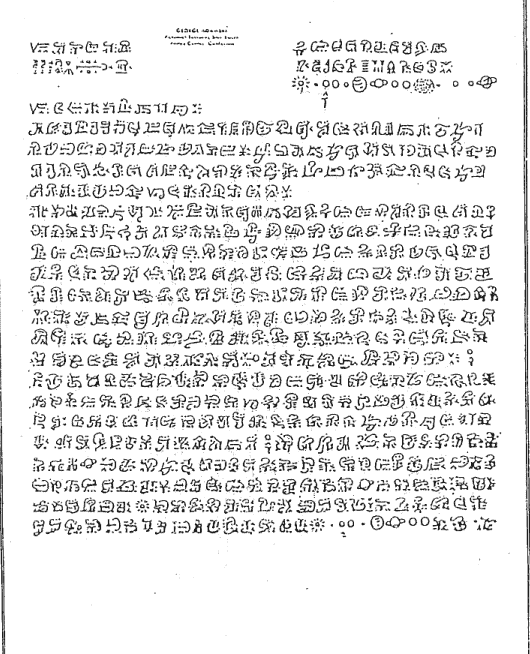
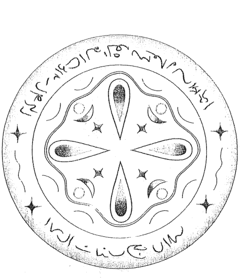

# 來自金星的智慧與愛

## 致荷光者們

帶著真理之光而來的荷光者，往往會因為受到人世間各種變化的撩撥與撼動，使得身上所散放的光芒逐漸黯淡，失去了原有的光亮。

有時，命運會如濃霧一般強襲而來，連荷光者自己都看不見光明何在。

生命還會出現各式各樣的黑暗時刻，讓人以為黑夜永遠沒有盡頭。

但是，存在於荷光者核心深處的，是靈魂，也就是那永恆之光——而靈魂對真理的認知，將再次點亮光明。

正因爲有荷光者持續不斷地照亮前方的路途，那些努力在黑暗世界中尋找真理的靈魂才能找到抱持同樣目標的追尋者，並加入他們一同放光，保護追尋真理的人不受黑暗的侵襲，並使所有人類在這條追尋之路上走得更加順遂。

## 【探索生命書系】總序
——中華新時代協會創辦人／王季慶

二〇一二年前，眾聲喧嘩，末日預言不絕於耳。一方面，我本著對「賽斯資料」的信任，也祈求他獨排眾議的說法得以證實。簡言之，他聲稱二十一世紀上旬，世界雖然仍有戰事與天災，卻無第三次世界大戰。並且，到二〇七五年時，人類將有一個大同世界！另一方面，即使成為「一百隻猴子的寓言」中的一員，我也想默默地為世界的未來盡一份力，為達成「一體平等」的靈性覺悟而努力。

我不敢聲稱自己已開悟，而且我最喜愛的「賽斯」也從沒提過這個詞兒。不過，在求道的過程裡，我無意中悟出「除了神沒有別人。除了愛沒有別的。」（There is No One but God, There is Nothing but Love）當下，在無邊的寂靜安寧中，我的心中充滿了狂喜與愛，這份愛又滿溢為感恩之情！我體會到我一直在宇宙的愛中，宇宙的愛也在我心中。而，世人也莫不如此！不同的是，有沒有體會到，有沒有連上線。在一體平等的感悟中，我謙遜地臣服，自然放心又自在。不由得散播出愛—平等的頻率！

於是，完成了告別之作《與神同心—依愛隨行》，我便退休下來。想讀的都讀了，想分享予讀者的也都真誠地寫了下來。此生足矣！

在《與神同心》的後記裡曾提及我的天命——推介與翻譯新時代的好書——已經完成了。沒想到二〇一五年四月，素未謀面的蔣聖光先生，帶著家人約我在中華新時代協會見面。歷經海外創業的艱辛，如今他已是卓然有成的企業家。他開門見山地說，自己讀遍了我推介的新時代書籍，也邀同家人一起鑽研。哇！這讓我立即視爲知音，因爲，連我都沒有主動要求家人研讀呢。

作爲一位成功的企業家，可以想見，蔣先生必然是位有主見，有魄力，並且格外有執行力的人。他說，運用從新時代書裡得到的智慧，他成就了他的事業。如今，他想（並且已著手進行）設立出版社。一方面找回一些已經版的新時代書籍，一方面當然也將眼光放遠，胸襟放大，繼續以自由開放的精神，開創「探索生命書系」，向生命致敬，完全不計盈虧。

由美返台近四十年了。從一九八九年開始，我正式投入新時代運動。當時，曾將我心中陶煉出來的「新時代運動」七要素，作爲選書立說的準繩；並有助於分辨何謂「新時代」這個新「範型」（Paradigm）與二十世紀中期前的舊範型有何不同。

這七個要素就是：

- 一、我們皆為神的一部分：有神論，但此神並非有組織宗教高高在上的「偶像」，而是無形無相，一切的根源。祂乃是宇宙意識，我們的「源場」，而我們皆為其分出的一小片。祂透過我們每一個來體驗物質世界，完成整個拼圖。
- 二、你創造你的實相：你有多生多世的生命，並且是個多次元的存在。因此，不怨天不尤人，為自己的一切負起責任。從而省視自己為何作出如此的選擇，要學習的是什麼。
- 三、肯定人生的意義：不悲觀，不耽溺。最重要的是培養清明的覺知和一體的慈悲。
- 四、道德的內在性：不盲目跟從傳統，不媚俗。返歸自性，找到內心那一念靈明，依之做人處事。
- 五、身心健康是種自然狀態：心理有問題，鬱悶不快樂，自憐或自恨，能量堵塞不覺知時，才會不適。
- 六、環境保護：這攸關全人類的存亡。我們不能再視而不見，當作是別人的事。生態環保，人人有責！
- 七、無條件的愛：也就是對人的一體大愛，而非在關係中只顧自私自利的比較，爭奪，交換，控制。

至今，覺得那篇文字，還是相當切中新範型的精神。不具權威性和強迫性，新時代不是宗教。它不崇拜偶像，也不自立為偶像。沒有階級組織，沒有教條，沒有戒律，也不等待外在的神明、聖賢、大師來拯救你。賽斯說，認識自己就是認識神，因為你們都是和祂同一幅料子裁製出來的！

雖然，普羅大眾仍不見得了解新時代的「奧義」。但至少，經過三十年的「百花齊放」，現今社會上也習於其種種的觀念和用語。從生活面的應用：慢活，身心的放鬆平衡，愛自己從而愛別人，更新而平等的親子關係，伴侶關係；到最深的靈性認知：生死學，生態保育，宇宙論，哲學思辨，都或多或少看到新範型的影響。整體而言，社會風氣無形中也改善了不少，好比，雙贏互利，人權以至動物權的伸張，性別平等的推廣，人們彼此相處的包容，體諒與溫暖——此間往往看到人性的光輝！

這個人間世，就是我們的舞台。販夫走卒，帝王將相，都是我們生前和夢中不斷參與編寫，而於醒時演出的一齣齣好戲。所謂的覺醒，就是參透了鏡花水月，將注意力由外在舞台返照回來，成為中立的觀者，醒悟自己演出的意義！能如此，就是找回了自性，開始走向返鄉之路。

不知從何時開始，我自覺到我有一項特性：我不會以個人追求自心的明晰、自在與幸福為滿足，仍深愛著人類自古以來種種文化藝術哲學上的成果，為之讚嘆不已！同時，也深深牽掛著人類未來的展望與福祉。當然，也關注著現世的兄弟姊妹，世間的種種困惑和苦難。記掛著、記掛著……不會忘也不想忘，作不了佛家所謂的自了漢。但由於相信自由平等，也從不願將自己的喜好和淺見強加於人，只能以出書的方式，給大家一個提醒和自由選擇的機會。

安然度過了二〇一二年，不過，世局天象，時時風雲詭譎！我有幸活著一天，就要為世界人類的平安幸福努力一天！所以，蔣先生要我寫篇總序，替「探索生命書系」揭開序幕時，我便答應了下來。但願，我過去的努力，促使世界進入新時代，現在則有助於世界邁向黃金時代。

且讓我們共同為未來的大同世界，盡其所能地提供貢獻吧！

## 譯者序
——張國儀

「一個來自金星的女人？這簡直就是科幻小說嘛！」相信許多人在首次看到這本書的介紹時，第一個反應大抵會是如此。老實說，譯者本人在一開始讀到這本書中提到有關地球上人類起源的篇章時，也有類似的反射性反應。但奇怪的是，這樣的反應並不會像一般這類的內容，讓人生出強烈的質疑或反感，反倒更加引人入勝。簡單的字裡行間彷彿有股奇妙的魔力，一切畫面竟有種似曾相識的熟悉感，讀著讀著，就服貼地融入了自身核心最底層的記憶之中：「這些事情，一定真的就是這樣發生過呀！」莫名其妙地就被同化了。

有關歐米娜·歐涅克，你可以說她有妄想症，也可以說她精神解離，要如何詮釋完全是你個人的權利。但唯一無可辯駁的是，沒有人能斷定地宣告她說的不是事實。因為，沒有人知道所謂的事實究竟是怎麼一回事。這讓譯者不由得想起村上春樹在他的第一本小說《聽風的歌》裡虛擬了一位影響故事主角甚鉅的作家費德哈爾。這位作家寫了大量的科幻小說，每個故事都虛幻離奇到超越世人的想像力。他故事中的主角在火星上死了兩次，又在金星上再死一次。記者針對這個問題向哈德費爾發問，他反問記者說：「你知道宇宙中的時間是怎麼流逝的嗎？」記者回答說這沒有人知道啊。哈德費爾就說：「大家都知道的事情，寫出來又有什麼意思呢？」

就是這樣。大家都知道的事，又有什麼好寫、有什麼好看的呢？

歐米娜並不是位文學作家。她的行文絕難稱得上優美，文字甚至可以說是稚拙。不過，她只是在陳述她所知的事實，就像是到警察局去做筆錄一樣，平鋪直敘；誰聽過做筆錄還需要華麗的詞藻、蜿蜒鋪陳的情節呢？在這個複雜的時代，愈是簡單的描述，反而愈能直入人心。剝除言語文字的矯飾，剩下的就是事物的本質了。

本書的第三部分是新書發表會時歐米娜與觀眾的對談紀錄。由於是以對話方式呈現，有許多「斷片」般不太有連貫性的文句出現。其中最讓譯者印象深刻的是許多觀眾所發問的「笨」問題。這麼說並沒有貶低之意，畢竟譯者本人也沒聰明到哪裡去。只是，這些問題很大程度地反映出我們人類的偏執和狹隘。看懂了這一點，就能明白，只要抱持著開放的心態，事實與真相會更容易找到它們的位置。

翻譯這本書的過程中，譯者過著相當忙碌的生活，有點像要挑戰自己能力極限似地瘋狂工作著。然而，在忙完其他工作之後，一想到要翻譯歐米娜的書，心中不由得就平靜了下來。彷彿在夜晚的燈下，斟上一杯單一麥芽威士忌，聽一位老朋友絮絮閒聊般，放鬆又愉快，不知從何而來的振奮力量也莫名地湧現。但願各位讀者也能放開心胸，不帶任何限制地與這位可能在某個時空中曾與你我交會的老朋友，再次共享靈魂的奧秘與喜悅。

## 前言：發行人的話
文：安雅·席佛

我和歐米娜·歐涅克是在一九九四年透過電視螢幕首次相會。當時我剛巧轉台看到一個談話性節目，立刻就被歐米娜·歐涅克的風采給吸引了。她言簡意賅地用一種平靜且令人愉快的口吻來說明何謂靈性訊息，更是讓人著迷。「想像力是創造的金鑰。」這是我個人在當下所獲得的良言金句，深植於我的腦海之中。然而這句話卻花了點時間才開始冒出芽來。一直到一九九七年，我又再次想起了歐米娜·歐涅克，那是因為當時我剛在德國巴伐利亞的蘭茲胡特開了我的靈性書店「希望之光」，需要進我的第一批書。我想起了歐米娜·歐涅克的第一本書：《來自金星的我》（暫譯，From Venus I came），早在那個談話性節目之前我就曾經聽說過這本書了。我先訂了一本給自己看，結果讀得廢寢忘食，完全無法自拔。歐米娜在這本非凡的自傳中對金星的描述以及她源源不絕的愛和智慧，徹底地感動了我；我覺得自己終於回到家了。幾個月後，我又讀了她當時剛出版的第二本書《金星人的靈性手冊》（暫譯，Handbook of Venusian Spirituality）。這一次，我下定決心勢必要和這位奇女子見上一面，所以我打電話給她的出版社，希望能敲定一個前往拜訪的時間。我的電話直接被轉接給歐米娜當時的經紀人沃夫·渥明哲（Wolf Wernige），他提議的做法是：如果我願意在書店幫歐米娜辦座談會，那麼他和歐米娜就可以一起到蘭茲胡特來找我。這有什麼問題！我興奮極了，二話不說就接受了這個提議。

當歐米娜在短短的三個禮拜後真的出現在我眼前時，我緊張得要命。她穿了全身白的衣服，看起來非常迷人。她那平靜又充滿了愛的個人特質，以及她在座談會與工作坊中與我們分享的各種資訊，在在都令我感動不已。在這第一次的會面中，我因為太過激動，所以沒能和她有較深入的接觸。一直到約莫半年後，她和沃夫再次到訪蘭茲胡特，我們之間那份友好、近乎熟識的情誼才漸漸開始滋長。當歐米娜和我在工作坊中互相交換眼神時，我有生以來第一次真正體會到什麼叫做愛。我的心瞬間大大敞開，感到完全放鬆而且無比清明。這個令人難忘的經驗正是我們接下來長期合作的起點。

自此以後，我和歐米娜的互動愈加頻繁。光是我與她私下相處的經歷，以及她這個人的存在所帶給我的種種啟發，就足以寫成一本書了。在我們一起到各處去演講，並且發現我們兩人共享相同的「綠洲願景」之後的某一天，我發現自己正在將她的演講翻譯成德文。很顯然地，幫助宣揚歐米娜所帶來的訊息，是我自己選擇的一份生命任務，因為這是自我們相遇後我就持續在做的事情。一次又一次，我陪著歐米娜前往各個以德語為母語的國家，並協助安排座談會及工作坊。二〇〇八年，我製作了歐米娜的網站：www.mcco.com，接著又在社群網站上張貼各種活動訊息，同時也上傳影片到 YouTube 上。後來當歐米娜的書銷售一空但我自己又無法幫她再版時，我也幫她找了一家新的出版社，而這家出版社不但再版了她的書，更加碼為她製作了有聲書的 CD，以及演講的 DVD。身為該家出版社的僱員，我的工作就是編輯歐米娜的書、為她的書排版、替她的德語版 CD 和 DVD 配音，並且在二〇一一年秋天陪她進行了一場朗讀之旅。

我錄下了這次朗讀之旅中的每一場新書發表會，並在之後將會中的談話內容翻譯成了文字。也因此我才有了想法，將這些內容和其他一些未曾發表過的材料全部整理成一本書。

從二〇一二年起我就開始了自己的出版事業。這本以發表會為主要內容的書，也是我新成立的出版社（Discus Publishing）所出版的第一本書。我希望所有對此感興趣，而且和我一樣認為這些由「來自金星的女人」所提供的訊息極具價值的讀者，都能閱讀到這本書。

註：為了能夠區別本書中哪些段落是由歐米娜所撰寫、哪些是由我所撰寫，每一段文章的開頭都會標示出作者的名字。

## 誰是歐米娜·歐涅克？
——來自金星的女人

歐米娜·歐涅克是我們人類社會中唯一現存並留有紀錄的金星人，她以自己的肉身形式從金星的靈性次元來到地球。歐米娜的自傳《來自金星的我》一書，令她聲名大噪。在本書中，歐米娜詳細地描述了金星的歷史，並且說明了她自己為何以及如何出生在靈性次元中，還有她為何在七歲時得到了降低自身頻率的機會，進入了肉身之中。她來到地球是為了能在之後成為一位靈性導師，並圓滿完成她在地球的生命循環。

文：安雅·席佛

> 「我出生在金星的靈性次元中，並以一個小孩的肉身來到你們的星球，但透過多次的轉世和各種生命經驗，我依然保有自己在靈魂狀態時所獲得的知識和訊息。我保持這些訊息的完整無缺，而且我教大家的是我實際知道的事，而不是我在哪裡讀到或聽來的東西，我所知的一切全部來自我在地球上多次不同的生命輪迴，以及從不同次元空間所學習到的事。」
> ——歐米娜·歐涅克

靈性場域是一個擁有更高振動頻率的空間次元，無法透過物理方式看見或證明其存在。據歐米娜的說法，金星上也曾有過與今日地球非常相似的肉身生命。自然的進化過程及生活條件的變化，使得肉身生命無法繼續在金星上存續，但是由於人們的靈性成長已經達到一定的程度，於是他們的社會得以用更高階的振動頻率繼續存在。

金星人的生活完全順應自然法則，並且服膺宇宙間有個「至高無上的神」這般的信念。他們能全然地感知到自身與造物者之間的連結，對自己所掌握的靈性力量也能夠謹守其分際。

歐米娜在一九六〇年代時就已經寫好她的自傳了。這本自傳在一九九一年首次發行，由一位美國陸軍上校同時也是幽浮研究者，溫德爾·C·史蒂文斯（Wardle C. Stevens），在美國出版。不過自從一九九三年起，由於歐米娜的內在指引要她專注在以德語爲主要語言的國家，這第一本自傳以及接下來的著作——第二本為《天使不哭》（暫譯，Angel Don't Cry），是歐米娜自傳的續集，主要內容為她在地球的生活經歷，以及集結了歐米娜所教授的靈性課程精華內容的《我所帶來的訊息》（暫譯，My Message）2，都直到二〇一二年才出版了英文版。二〇一二年，這三本書以三部曲的完整形式出版，取名為《金星三部曲》（暫譯，The Venusian Trilogy）。

歐米娜·歐涅克這個名字在靈界的意思是「靈性的回歸」。而歐米娜的任務和天賦就是幫助人們與真正的自己——也就是我們的靈魂——重新連結。她在地球上的名字叫做席拉·吉普森（Shila Gipson）。由於某些因果關係，加上為了要完成她的天命，歐米娜在席拉這個小女孩七歲時取代了她，開始在地球上生活。在她的自傳及公開演講中，歐米娜都描述了她是如何來到並進入了原本席拉的家庭。

二〇〇九年歐米娜中風，從那時起，她就開始盡量減少公開場合的露面。

歐米娜結過兩次婚，共有四個孩子及三個孫子。

※註1 出版商註記：歐米娜提到，金星、火星、土星和木星上的居民曾在數百萬年前殖民過地球。這些人直到現在仍具有較高的振動頻率。
※註2 出版商註記：此書原名《金星人的靈性手冊》（暫譯，Handbook of Venusian Spirituality）。

### 第一部
# 無人知曉的太陽系歷史與地球上的靈性轉化

文：安雅·席佛

二十世紀九〇年代中期，歐米娜首次與大家分享了有關《無人知曉的太陽系歷史與地球上的靈性轉化》這份訊息。

> 「我第一次聽到有關靈性轉化和太陽系的歷史，是在一九九四年我受邀參加的一場靈界會議中，我藉由相當長時間的冥想才得以進入這場會議。在會談中，這兩者之間的關聯被說得非常明確。
參加這場會議的是數千位來自不同星系的人類與非人類生命體，他們全都擁有極高的智慧，而且進化程度也非常高。他們經常會舉行這樣的聚會，大家前來都是為了要貢獻一己之力以拯救地球，這場會議只是其中的一次而已。他們從一九三〇年代就開始逐步提高振動頻率，為的就是要阻止地球更進一步邁向毀滅的境地。」
——歐米娜·歐涅克

就在歐米娜於演講中講述了人類在地球上的故事，以及時至今日所經歷的種種轉變之後，大部分人都想了解更多——於是才開始有了「靈性轉化工作坊」的課程。多年來，歐米娜在這個利用週末時間進行的研討課程中，與大家分享有關宇宙的真相。對許多上過課的人來說，她所傳遞的訊息不但深具意義，同時也撼動了他們的靈魂，也因此讓他們的意識得以拓展。

二〇〇四年時，歐米娜確定要回美國待上一段時間，因為不確定她什麼時候、甚至還會不會再回到德語國家開設課程和工作坊，所以我們製作了這段影片³。

除了歐米娜與眾不同的自傳《來自金星的我》之外，這份訊息可以說就是歐米娜想與人類分享的全部精華所在了。《無人知曉的太陽系歷史與地球上的靈性轉化》涵蓋的範圍相當廣，由人類的源頭開始，到人類意識逐漸衰落的歷程，最後是地球的未來——也就是在完成了現階段的靈性轉化後的未來，那將會是一個全面正向進化的所在，也是自由無礙的人類的家，在那裡，人們與大自然和全宇宙和諧相處，就有如他們下定決心要順隨自然而活：身爲自由、無罣礙且充滿創意的靈魂，全然感知到自身的存在以及與造物者之間的連結。

《無人知曉的太陽系歷史與地球上的靈性轉化》的第一部分包含了人類如何以太陽系作爲棲息之地的始末，以及目前正在地球上進行的靈性轉化的完整內容。這就是歐米娜·歐涅克到她二〇〇九年中風為止，教授了十五年的所有課程內容。

而在第二部分的文稿中，歐米娜·歐涅克在詳細描述地球上靈性轉化的過程以及地球的未來之前，先簡短地介紹了她自己的人生故事及有關她出生的種種因緣。

※註3 出版商註記：這段影片現今已錄製成可販售之雙DVD。

# 文稿（上）

文：歐米娜·歐涅克

# 人類如何來到太陽系棲息

大家好，我的名字叫做歐米娜·歐涅克。大家都用這個名字叫我，這是我在金星的名字。我要告訴大家一個故事，關於人類如何來到太陽系並且最後在地球這個地方居住下來的故事。我想用說故事的方法來跟大家敘述，因為這也是我自己了解這件事的方式，當然我也會跟大家說明我是如何跟這件事扯上關係，以及我如何來到你們的星球。這是一個由我的靈性導師給我的靈性選擇，我完全可以自由選擇要或不要來。

不過這個故事是從很久很久以前開始的，久到那個時候地球甚至還不存在呢。從非常非常遙遠的銀河系，應該說是四個不同的銀河系，至少我聽到的訊息是如此，第一批人類搭乘著巨大無比的太空船前來。他們被靈界的統治者送來這個星系，統治者叫他們來這個星系居住，因為當時這個星系裡還沒有人類存在。

這群人裡分別有白種人、黃種人、黑種人和紅種人。他們全都得到了相同的訊息，必須前往這個星系居住。所以他們搭上了太空船，遇見了彼此。所有人都很了解具有實體的生命是怎麼一回事，他們可以和礦物、植物以及動物溝通。這些人全都處在意識清明的靈性狀態中，他們不需要語言，只要心電感應就能彼此溝通。他們認為無論膚色或文化或其他的什麼差異，他們同樣都是人類種族的一份子。

他們創造了一種你們會稱之為「合作情誼」的關係，而且彼此相處融洽、合作無間。

他們來到了這個新星系，必須為自己打造新的家園並開創新的人生，因為他們很清楚，跟著他們一起從家鄉遠道而來的這所有人，都不可能再回去了——從今以後，這裡就是他們的星系、他們的新家。不過當然他們也把屬於他們的智慧、見識和文化帶進了這個新所在。他們選擇新家的位置，而這個星系中最古老的四個星球就是火星、金星、土星和木星。黑種人挑選了木星，因為這個星球和他們的故鄉最為相似。紅種人也因為相同的理由而挑選了土星。黃種人挑選了火星，白種人則選了金星。這都是基於他們天生的基因，以及他們能夠適應新環境到什麼程度所作出的選擇。就這樣，他們在這些星球上落腳，開始過新的人生，建立新的家園、新的社區，同時他們也都在各自的星球上找到了能量位置，而且各自打造了一座聖殿。在他們的家鄉星球上，這些聖殿的功能即是作為通往其他次元空間的出入口，因為他們會和那些靈性更高也更進化的存有進行交流，而這些存有並不生活在肉身世界裡。如此一來，他們就能夠藉由這些聖殿、水晶礦石，以及其他各種不同但必須的東西，在他們所處的社會中生存下來。這些聖殿一定都位於能量位置所在之處，那是一個非常特別的地方；而他們之所以能夠找到這些地方，是因為他們有相關的科技，也有這方面的知識。

# 地球誕生，生命展開

他們彼此之間溝通無礙，同時發現有一顆新的行星正在逐漸形成中，儘管這個時候它還只是顆彗星，地球這顆行星還不存在。但他們全都在等待，等這顆彗星開始進入軌道繞著太陽運行，成為這個銀河系中的一顆新星。他們全都知道這即將發生，在數十年的時間裡，他們靜靜地看著，等待著這顆彗星最終成為行星，並正式躋身爲銀河系的一員。沒錯，這顆行星就是大家現在所稱的地球。

當他們進入銀河系時，這裡還沒有任何人類存在，而這也是他們選擇來到這個地方的原因。他們的任務就是將人類帶入這個只有植物、礦物和動物的星系。在地球開始冷卻並且進入軌道運行之後，他們啟程前往其他星系，因爲他們決定要把各式各樣的生命形態帶入地球。他們希望把各種生長在特異自然環境中最漂亮的植物、礦物和動物帶入我們的星球。所以他們乘著太空船長途跋涉，和這些不同形態的生命體溝通，並取得他們的同意將他們帶回地球，一同為了地球的欣欣向榮與美麗，在這個星球上和諧共生。

還有那些他們帶來的水晶和其他東西——他們很清楚自己所擁有的這些物品所具有的療癒能力，以及保持靈性進化的力量，所以他們能夠讓自己在這不同的生命形態中生活時，依然保持身心的平衡。

這樣的狀態使得地球成爲一個相當美好的天堂。它擁有各式各樣特異的魚類和鳥類——這個時候的地球還沒有出現沙漠和冰封的極地。

當時的地球有兩個月亮，也因此整個環境的磁場相當和諧，而且氣候狀況也不像現在的地球一樣如此極端。

漸漸地，有關地球的風評傳了出去，越來越多的人和訪客從不同的星系及星球來到地球。他們有的擁有人類的肉身，有的則沒有，但是他們都具有極高的智慧，而他們都想要一探地球這個新行星的美妙風貌。紅黃黑白這四種存有對他們所創造出來以及他們所成就的一切非常滿意，他們也誓言要保護這個星球，因爲它的存在代表了所有不同形式的生命體都能夠互利互助、和諧共生。這也是他們對地球感到最滿意的地方。

# 地球保衛戰

沒多久，一群靈性進化程度不高，也不具有人類肉身的訪客來到地球。他們是蜥蜴人和迪諾伊外星人。他們用兩隻腳走路，搭乘太空船移動，他們的科技非常先進，而且智力很高。但是他們的靈性可以說是尚未開化，而且他們認為其他任何與他們看起來不一樣的生命體，都比他們低等，所以他們完全不把其他生命體看在眼裡。他們開始掠奪地球，植物也好，動物也好，礦物也好，無一倖免。到最後他們起了內鬨，為了該由誰來統治地球而大打出手。就這樣，他們讓地球陷入一場醜惡的爭戰之中，我想，時間大概長達三十或四十年之久。他們有核子武器，還有一些是你們現在只能在科幻電影中看到的武器。

其中一部分人以月亮爲基地，而另一部分人則是以地球爲基地。在這場戰爭進行的過程中，他們幾乎將地球摧毀殆盡。各種形態的生命體在殘骸廢墟中奄奄一息。而他們作爲基地的那顆月球，則是徹底地毀滅了。這也就是爲什麼後來的地球只剩下一顆月亮。不用懷疑，在把所有東西都摧毀之後，他們就拍拍屁股離開了，因爲這裡已經什麼都不剩了。地球不再美麗，也不再豐饒。他們甚至拋下受傷的同類不顧，一走了之，因爲這些傷兵已經沒有任何用處。他們就這樣打道回府。

最後，是紅黃黑白這四種最早來這個星系的種族找到了幫助地球，甚至是那些被遺留在此的傷兵復原的方法。他們決定搭乘小型太空船到地球來進行調查。他們從自己所在的星球各派出幾艘小太空船，上面搭載了幾位科學家、生態學家和醫護人員，希望藉此尋找出能夠幫助地球和傷患的辦法。

就在踏上地球的那一刻，他們才赫然驚覺地球所受的損傷遠比他們想像的更嚴重。整個地球全部覆蓋在核子輻射之下，連他們自己都因為受到污染而無法再回到自己居住的星球去了。

就這樣，這些來地球偵察狀況的人，和那些入侵者傷兵一起被困在這裡動彈不得。

於是他們傳訊息回原本居住的星球，告訴其他人他們沒有辦法回去了，因為這樣他們會把輻射也一起帶回去。所以他們只能在地球上住下來，並試著照料傷患，以及那些倖免於難的植物和動物。當時的狀況實在令人痛心。可憐的地球是如此滿目瘡痍，而僅存的一顆月亮使得地球形成了火山地形、地震，以及各種讓人難以招架的天氣形態。儘管如此，這些人還是得在這樣的狀況下尋覓得以安身立命的生活居所，他們得在地球上活下去。

經過了數百年的時間地球才慢慢復原，狀況也才有了改善。那些當時在地球上倖存的生物，因為輻射線的關係而產生了突變，變成了尼安德塔人，也就是大家所知的穴居人，還有恐龍這種大家從史料中知悉的巨大生物。這些物種是因為地球上的輻射污染所產生的突變種。

他們在地球上生活了好一段時間，但是，正如大家所知，地球無法餵飽所有這些生物。這些留在地球上的人類已經失去了他們曾經擁有過的高等智力，也完全不記得自己從何而來。這並非一種很理想的生活狀態，絕大多數人完全是仰賴他們的本能過活。他們得狩獵動物，而且和動物一樣把蔬菜當作食物。而動物則是互相殘殺以求生存，牠們有時候也狩獵人類。

看到這個狀況，其他星球上的人類開始思索如何是好，他們的結論是：「唔，我們得想個辦法才行。這樣的地球無法維持太久，因為地球不可能養活這些巨型動物。」所以他們決定要向更高次元的靈譜益，希望能知道自己可以為地球做些什麼，以及地球要到什麼時候才有可能完全復原，好讓他們能再次將各種不同的生命體帶到地球，還有，他們該拿那些突變物種怎麼辦才好。

過去那場核子戰爭就像是製造出了一塊厚厚的輻射雲包覆著地球。而此時他們發現有顆彗星正在靠近。以他們的科技程度，他們能夠控制彗星行進的方向。利用特殊的雷射科技和他們所擁有的磁力設備，他們可以讓彗星轉向，墜落在地球的海洋中。這樣一來，彗星就會製造出一大塊蒸氣雲包覆住地球。而有了這塊蒸氣雲，他們就能凍結雲中的蒸氣分子，接著利用這些分子來中和輻射，淨化地球。

除此之外，輻射雲和蒸氣雲會讓地球籠罩在一片漆黑之中，太陽也無法與地球的重力場相互作用，屆時地球將會不見天日，接著開始冰封凍結。這麼一來，這些突變的生物也會跟著滅絕。

這就是他們終結地球損壞狀態的方法，地球的大氣層因此得以淨化，而突變物種也全部死亡殆盡。他們持續清理地球環境，重新引進植物和動物，讓地球恢復成之前的美麗面貌。

不過，對於只剩一個月亮對地球所造成的影響，他們完全無計可施。意思也就是說，地球會繼續出現極端的氣候，也會持續有火山活動和地震的發生。他們只能盡一切努力讓地球恢復清潔和曾經的美麗景致。

# 地球上的第一批住民

之後沒多久，他們發現他們各自生活的那幾顆星球開始進入自然循環的冬眠期，所有有形生物都將無以為繼。因此，他們必須作出決定。既然他們已經把地球恢復成過去的樣貌，也將植物和動物重新引進地球，於是他們決定從每個星球上移民一小部分人到地球。因為地球太小容納不下，他們無法將所有人都帶走。於是他們挑選了擁有特殊才能的科學家、教師、靈性存有和醫師，以及所有的年輕人。

於是他們帶著這些經過挑選的人類前來，將之安置在地球上不同的地方，打造出了地球上第一個殖民地。其中一些是你們聽過的——我記不得所有的名字，不過反正你們大概也不是很熟悉——像是阿茲特克、雷姆利亞大陸、姆大陸、亞特蘭提斯、埃及文明，還有一些非洲大陸的文明，我想它們也都跟埃及文化有關係。就這樣，他們創造了這些不同的殖民地，在各地落腳，也帶來了第一批住民。

他們彼此之間相處融洽，也各自建造了美麗的城市和聖殿。他們都找到了不同的能量位置所在，當然，他們也都在這些位置上建造了聖殿，作為穿越不同次元空間之用，這麼一來他們才能夠利用他們的科技在地球上生存下去，這是他們所必須的。他們創造了一個非常大的——我想你們應該會稱之為「社區」，因為彼此之間能互通有無，而且大家一同齊心合作，讓地球這個星球能夠維持在和諧的狀態中。

初來乍到地球時，他們必須按照月曆來調整作息，因為隨著月亮盈缺的變化，他們得攝取份量不等的液體來維持身體機能的平衡，但是他們對於氣候和海洋的潮汐變化依然是無計可施。不過最終他們從更高次元高靈的意見中得出結論，也找到了方法再次創造出地球環境的平衡狀態，而且，他們不一定非要正面解決地球上的極端氣候狀況。

高靈指示他們在聖殿中擺放某種水晶礦物，而且他們得根據這些聖殿的構造，沿著地球的赤道打造出一座座相同的結構體，完成之後，他們還得在地球的冰封帶依樣畫葫蘆再做一次。這麼做能夠幫助抵銷一部分月亮的效應，同時也能為地球製造出一個更和諧也更有保護力的環境。於是，他們開始著手進行。

當然，羅馬不是一天造成的，經過年復一年的建造後，這些對維護地球狀態安穩發揮重要作用的結構體才得以完成。這絕對是一個有目共睹的奇蹟。憑藉著自身的科技，他們能改變地球訪客的太空船頻率，好讓這些太空船在穿越滿布冰粒的冰封帶時不會受到損害，而且他們自己也能夠隨時造訪在地球的殖民地。對那些科技技術和心靈層次都沒有地球上住民那麼高階的星際訪客來說，這絕對是個相當神妙的奇觀。

# 渴望獲取科技的不速之客

不過，這樣的狀態終究還是引發了問題，因為來自附近星系的一群人類相當不滿地球住民不肯與他們分享這樣高超的科技。這個狀況持續了很長一段時間，這對生活在地球上的住民造成了不少問題，有些人長時間遭到這些想要獲取科技資訊的人監控。最後這些人決定向地球的殖民地宣戰，因為他們不惜以武力來奪取這項科技。

地球上的住民生性溫和、不好征戰，甚至連自我防禦都不太會，所以他們覺得自己唯一能做的就是躲起來，於是他們把年幼的孩子及教師、照護人員和靈性存有送走，讓他們躲藏在大自然的掩護之中。而他們最後能夠做的一件事就是，摧毀所有的城市和科技，防止它們落入侵略者的手中。

就這樣，戰爭開打了。這些地球住民一邊躲藏一邊心想：「沒關係，等到戰爭結束，我們就能回到我們的聖殿去，如果有必要的話，我們再重建我們的領地。」而在戰爭期間，負責撐起兩支環繞地球的冰柱的水晶結構體受到了破壞，他們得到來自靈性領導階層的消息，地球將會有大水災發生，因為冰柱開始融化，而且即將砸落在地球上。這些躲起來的人已經沒有時間打造船隻或太空船，或是及時趕到隱藏的聖殿去使用他們的高科技，所以他們只好利用大自然素材來打造出超級大木船，當然過程中他們也得到高靈指引如何打造這些船。他們必須盡可能地把最多的人、動物、植物及其他生命形態裝進船裡，直到這場大水消退為止。所以他們打造了大方舟。你們都聽過諾亞方舟，但其實它不只一艘，全球各地共建造出了數百艘的方舟，為的就是要保護地球上的生靈。

也就是說，洪水氾濫期間他們必須待在這些方舟上才能生存，等待大水退去後，他們才能再次重建並延續他們的文化和靈性思想。而那些侵略者也一樣在等著洪水退去，因為他們知道，地球的住民和他們不太一樣。這些住民有特殊的能力和能量，像是心電感應以及和更高次元的存有溝通的能力，而且在肉身國度中，他們還能夠和植物、動物和礦物的靈進行溝通。所以他們下定決心要抓住這些地球住民。於是一等到水退了，他們就再次登陸地球包抄這些人。

當然，他們跟這些從船上下來的人說，只是要問他們一些問題而已。他們沒說的是，他們要進犯那些被隱藏起來的聖殿，奪取其中的某些高科技。

# 基因操縱，影響直至今日

侵略者用他們所取得的科技來對地球住民進行基因操縱和手術，他們把地球住民的大腦分成兩半，這樣一來大腦的一部分就會變成空白，這些人就再也不能用心電感應來和彼此溝通，也忘記了之前的自己有多先進、自己原本從哪裡來、能夠自由地在太空旅行，所有一切——全部都從記憶中被消除了。他們只留下能夠在肉身世界中運作的那一半大腦功能。經過基因操縱後，這些人失去了記憶，同時被賦予了新的身分認知。接著，這些侵略者打造了一個，我不知道你們怎麼稱呼，應該說，一個統治階級的社會。他們自立為王，以膚色來區分人等，不同膚色有不同的文化，然後再根據他們自身的信仰為所有人設立了新的宗教。就這樣，一切再次從最後，由於隱藏的聖殿中失竊了某些物件和科技等等，高靈及其他次元的人們決定，他們必須關閉所有聖殿，停用一切功能。而地球上的人們也因此不得不被迫接受另一種新的信仰、宗教和文化系統。他們彼此之間為了膚色和領土的問題屢屢發生衝突，甚至引爆戰爭。統治者控制了一切，包括創建新的宗教、社會和律法。因此，人們失去了絕大部分的自由意志以及自己從何而來的記憶，也無法再與其它次元的存有溝通。

那些留在原本星球上的人們最終理解到，他們生來無私並且關愛肉身世界生命的天性即是他們的文化，這樣的文化不會因為他們無法再支援肉身世界的生命而終結，相反地，他們可以持續發出相同的頻率，這樣一來他們所創造的一切還是可以繼續存在，而且他們也還是可以與地球上的人們保有聯絡的管道。於是他們在每一個星球上都原封不動地保留了一座城市，作為通往其他次元的入口通道，如此一來他們還是可以操作太空船進入肉身世界，與人們保持聯絡，並且靠他們最大的努力支援那些失去一切的地球住民，他們失去了自身的能力、與不同次元存有的聯繫，甚至是對先人的記憶。可以說地球住民生活在一個非常悲慘的狀態中，而這個狀況一直持續到今天絲毫沒變。

在這裡，基因系統裡的改變其實比什麼都要來得深層，因為這裡的操縱大部分屬於潛意識層面。人們被迫放棄他們原本的生活，在各種折磨扭曲下不得不去擁抱新的文化和新的思想。

最後，他們被訓練成唯命是從，不再有任何疑問。這一切都是基於恐懼，到今天依舊如此。一切都源於恐懼。就連宗教都教你要害怕這一輩子結束之後到了另一個世界會如何如何，因為不知道真相，所以這就成了大家的觀念和信仰。大家自然而然地就遵從了這樣的想法。人們讓自己的小孩接受某個宗教的洗禮、緊緊依附著自身所屬的文化群體，並且為管事者——那些掌控一切的人——效命。他們深信自己得仰賴這些人才能生存，因為他們已經失去了依靠自己以及獨立自主的能力，他們不知道光靠自己要如何生活下去。大部分人已經不再有這樣的能力了。而如果這些能力在基因系統中冒出芽來，這些人就會被認為擁有通靈或療癒的天賦。但這其實曾是人人都有的能力，只是大家失去了一切相關的資訊和知識，所以才會如此依賴那些領導者製造出來的不同信仰和觀念。現在的世界還是以這個模樣存在著。

這世界充斥著由統治力量所製造出來的戰爭以及各種問題和疾病。他們說服人民相信這一切都是真實的，而這些人也接受了；而因爲對此深信不疑，他們也在這個地球上爲自己製造出了各種的狀況和問題。

相信造就了現實。這些人不明白的是，他們完全可以打造出自己想要的一切，他們可以活得更自由、更獨立、更充滿力量，可以靠自己及與他人分享來生活；但是，這個世界已經被分化太久了，很難再將這些訊息傳遞到人們心中。這就是爲什麼我會在一九五○年代來到地球的原因。當時我還不知道自己會在地球的靈性轉化上扮演一個很主要的角色。

## 目前的轉化階段及失落知識的回復

這整個轉化過程的目的是爲了釋放人類，讓他們再次擁有原本與生俱來的力量。這個工程浩大的轉化需要許多不同層次的生靈相助，肉身國度和非肉身國度的存有都得攜手合作，包括了自然界的萬物，以及大自然的掌管者也在內。大自然的生靈已經收到知會，所以他們也全都齊心協力地在爲地球的轉化付出。

一九五五年我來到地球，當時最大的問題是：讓一個來自不同次元的小孩子進入肉身，活在具有形體的社會中，這樣做究竟是不是能確保肉身無恙，思想和感情也不會受到損害呢？諸如此類的憂慮。當然，他們一直都在關注著我的狀況，每五年我都要接受一次檢查與平衡調整。

> ※註 4
> 出版商註記：歐米娜已經不再接受這樣的檢查和調整了。原因是，這麼做其實違背了自然法則：她必須和地球上的人類享有一樣的待遇。歐米娜自己決定不靠任何特殊的支援在地球上度過餘生，所以她必須面對和地球上其他人一樣的生老病死各種狀況，而這也是爲了她自己的靈性成長。

我得慢慢習慣人類社會以及在這整個結構中盤根錯節的控制與不公。大部分人看不到也察覺不到這些控制和不公，因為幾千年來大家都是這樣過的，這已經深植在所有人的基因之中了。

我們過去曾經嘗試要送一些導師和先知來這裡，但他們最後都受到地球統治力量的屠殺，所以真相一直無法傳遞給人們──有關於基因操控之類的真相。人們無法獲得有關他們社會的真實知識，以及為什麼一切這麼困難的原因。當然，這很難解釋清楚，因為從另一個角度來說，每一個靈魂在出生於肉身國度之前，都會自己決定要有什麼樣的命運，以及要來學習什麼課題。

也就是說，每個靈魂都在事先作出了抉擇，然而換個角度來看，生活在個人處處受到控制的社會中，受到宗教、地位等等的牽制──你們也很清楚，大家都會以職業來認定自己、以國家來認定自己、以宗教來認定自己、以種族來認定自己，從來沒有人把自己的身分認定爲一個短暫生活在肉身之中的靈魂。大部分人對於生命結束後會發生什麼事完全沒有頭緒。他們只能仰賴宗教，以及學校、科學、社會等等方面所提供給他們的資訊。而這些全部都是受到控制的，包括資訊，以及人類被允許知道哪些事情，這全部都受到統治力量的控制。絕大多數的人根本不知道這樣的狀況，所以他們無法獲知有關於他們自身的真相、他們真實的起源、他們的偉大，以及他們與至高無上的神之間的連結。

我們生活在其他星球上的這些人，依然保有最初的想法和信念，也還擁有所有與生俱來的能力。我們所知道的神並非是一個人，而是一個創造萬事萬物的能量源頭。而且我們也不害怕死亡，因為死亡不過是從一個生命轉換到另一個生命的過渡罷了。這就是為什麼我成立了工作坊來幫助人們。一開始，我以爲我的書就足以將資訊帶給人們，但很顯然這樣做還不夠，大家想要更多。也就是從大家的期望中生出了我所做的各種靈性工作，這些是我原先沒有預期到要做的事。不過換個角度想，這一定也是我的天命，因爲我就是這麼做了。

在這個過程中，我結婚生子，擁有在地球上的孩子和丈夫，但是我永遠也不可能成爲這個社會系統的一份子。當然，要生存在這個充滿了各種不同系統和文化的地方，同時還保有自身原本的認知和知識，的確非常困難。

這就是爲什麼我要出生在位於另一個次元的金星，並且以一個小孩的身分來到地球的原因，爲的就是要能保有我身爲一個靈魂、在地球上歷經多次轉世後所累積的知識和資訊。我能夠完整地保有這些資訊，而我教導他人的全部都是我自己真正知道的事情，不是從別的地方讀來或聽來的，是從我在地球及其他次元中多次不同的生命歷程所累積下來的知識。

我要讓大家了解的是，的確是存在著一個基督教天堂，但是這個基督教天堂是由所有那些活著，並將自身能量投入這個信仰的集體意識所創造出來的。這些基督徒並不知道是他們創造了這個天堂，以及那個讓人死後受盡折磨的地方，也就是說，如果你不依照宗教所訂立的規範來生活，或者是你自殺，或是不遵守某些戒律，他們認為死後你就得受折磨，爲你所犯的錯接受懲罰。而很多人在死後真的就會陷入那樣的狀況。

> ※註 5
> 出版商註記：從一九九〇年開始，歐米娜在工作坊和演講中與我們分享了耶穌基督的一生，以及有關基督教天堂的故事。這篇〈耶穌基督的真實故事〉收錄在本書的第二部之中。

其他的次元就和肉身國度一樣廣袤，其中包含了多條銀河和多種星系。其實沒有什麼不同，只是它們不具有物質形體而已。

我試著要跟大家解釋我們對神的認知以及人類與其他次元的連結是怎麼一回事，還有就是讓大家了解那些能力是什麼，以及擁有這種力量對個人來說具有什麼樣的意義。每一個念頭都是種能量，而這每一個念頭都會對環境、世界、你身處的社會、你的人生以及其他人，產生影響。人們沒有意識到這一點，而且從來不會控制自己的思緒，也完全控制不了。人們的想法經常被牽著走，被媒體、社會、學校、母親、父親、宗教團體牽著走，他們不會用自己的想法和能量來打造並開創他們想要的世界。人們活在恐懼之中，而且用自己的能量來餵養這份恐懼以及存在我們社會中各種負面的事情。懷抱著這樣的想法和恐懼，人們製造出更加強大的負面能量，而這能量已經主宰地球非常長久的時間了。不過，這樣的局面即將終結，這就是爲什麼現在的我們正處在靈性轉化的階段中。

靈性轉化之所以會發生，是爲了讓地球這個世界及其社會與人們不會就此滅絕，而且再次擁有機會創造出一個像過去一般美好的地球，這也才是它原本該有的面貌。

一切規劃始於所有靈性領導階層與大師在非肉身國度中密集進行的會議。他們全員到齊，包括那些要爲地球目前的狀況——包含了所有操縱和控制——負起最大責任的存有。這些存有的靈性現在也已經進化到了一個程度，他們想要改正他們過去在地球上所做的事——所有那些操縱與控制。他們想要給人們一個機會，讓每一個人都能重新找回身爲靈魂的自由，以及原就屬於他們的靈性力量。

愛是所有一切的根基。事實上，愛是地球上除了恐懼之外最強大的力量。恐懼正好是愛的反面，它具有毀滅性，而且擁有和愛一樣強大的力量，但愛卻是永遠不會消滅的存在。愛不只存在於肉身世界中，愛沒有邊界，而且一視同仁。愛，沒有分別心，充滿了療癒的力量，而且正因爲有愛，人們才能懷抱著希望和力量爲自己打造出美麗的人生。

無論在任何狀況下你都有選擇。你可以選擇放棄，讓自己成爲人生的受害者；你也可以主導自己的命運，選擇把你的能量投入在你想要的事物上，以及你身爲這個世界一份子所希望達成的事情上。我們每個人都擁有這樣的能量和能力，而在靈性轉化階段，這些力量會變得更加強大。但是需要有人教導大家如何使用這種思想方法，以及如何用正向的方式來傳遞這些能量，以便支撐起存在於此的生命結構，因為總有一天，這些由統治力量在地球上建造的負面結構和一切事物，都會舉白旗投降。而他們所創造的一切，像是銀行體系、電腦、工廠，所有受到金錢控制的一切都會在這個結構中崩潰瓦解。等那一天到來，我們必須創造出我們想要的世界。

## 我們所知道的造物者

在這裡我會用舉例的方式來試著給你們一點概念，讓你們知道我們是如何看待萬物的創造以及創造萬物的「人」，還有我們相較於其他一切萬有的存在又是什麼樣的存在。

造物者是創造出萬物的能量源頭。在某個時間點，造物者決定：我愛我自己，我不想在哪天就這樣消失不見了，那麼我就用我所擁有的力量和能量來創造所有一切吧，讓各種生命形態都能在具有肉身形體的世界中，仰賴著彼此生存下去，而且他們在這個肉身國度裡，可以藉由處於實相的反面來學習各種課題，同時，這些生命也會透過自身的存在與經歷，理解到所謂造物者的全能究竟是什麼意思。

造物者創造了萬物，每一塊石頭、每一株植物、每一隻動物，因為萬事萬物都是靈魂，而這些靈魂全是來自於這個永不枯竭的純粹能量。所以，萬物皆由造物者而生，然後再不斷地延續下去，所以生命的存在是永無止境的，而造物者也是。也就是說，造物者因為愛自己而由自身創造出了萬物，而一切萬物皆存在於一個永不止息的循環之中，因此造物者便能夠透過自己所創造出來的萬物而永垂不朽，包括每一個靈魂在內。每一塊石頭、每一株植物、每一隻動物、每一滴水珠，全都是有生命的，並且都屬於這個生生不息的能量源頭，而我們也是其中的一部分。

我們人類在自身的進化上比較高階，因為我們已經經歷過身爲石頭、身爲植物，以及身爲動物的階段了。身爲人，我們需要其他所有生命形態的存在才能維持我們的肉身，同樣地，我們也必須要關懷照顧其他所有生命形態，因爲有它們才有我們，少了它們，我們會失去養分，而我們的肉身、我們的環境、我們所生存的世界，也都會因此消亡。我們的存在深深仰賴著所有其他生命形態的存在。

而在其他次元中事情就比較簡單了。你只要凝聚能量，就可以透過這份能量創造出你想要的一切。我們都有這樣的能力。在肉身世界中的操作方式也一樣，不過當然你得勞動肉體來進行這樣的操作。如果你想要創造某樣事物，你必須先有個想法，然後你需要能夠創造出你心裡所想要的事物的材料。想像力是創造的關鍵。你能夠想像出來的任何事物都會成爲現實，或者說，都是現實。一切就是這麼運作的。任何一只杯子、任何一張桌子、任何一個家、任何一種存在於這世間的材料，在真實存在之前，都曾只是某人想像之中的一種概念和想法。所以，這就是萬物存在的關鍵，首先，它必須要先存在於你的腦袋和想像裡。而如果你腦袋裡有太多不是你自己的概念和想法，最後的結果就是你會將所有可能性推拒在外，而且也難以接受一切都有可能成真的想法。一切確實都有可能成真。但如果你不相信這一點，那麼你就斷絕了這個可能性，因爲你相信的是另一套信念——來自科學家、學校，或無論其他什麼地方所灌輸的信念。但萬物的實相並非如此。當你滿心認爲任何事的可能性就只有這些而已，這種想法阻礙了創造，也讓我們失去了打造我們所想要的事物的自由。允許你對自己這麼說：沒錯，一切都有可能，所以我想像的一切都能成真。當你擁有這樣的想法，而且看得見所有生命形態所具有的靈魂，無論是石頭、植物、動物或是人，當你能夠直見靈魂而非肉身形體，而且無論他們爲自己的生命作出了多麼糟糕的選擇，都能一視同仁地去愛這些靈魂，那麼你的愛就是無條件的愛。這就是造物者的原意，也是造物者對他所造萬物所懷抱的愛。

身爲人，你也得經過一段進化的歷程，智能上的進化。最初的你處在未開化的階段，然後你開始變得更容易接受、遵循並服從於各種規範。最後你會來到身爲人的另一個階段，你會開始質疑現實，以及這樣的現實是否正確。為什麼會有戰爭？為什麼會有各種苦難？為什麼這個、為什麼那個。這是因為我們創造了這一切！我們創造了這一切，因為我們把自己的能量放在相信一種信念上，認爲這個世界本來就是這個模樣。當然，是我們自己選擇了要遭逢各式各樣的苦難，因爲這對我們來說是種學習。對靈魂來說，事情沒有所謂的好壞，任何經歷都是有價值的課題。就算你是個殺人魔、是個流浪漢、就算你很富有很有才華很出名，都沒有任何差別。這都是你自己選擇的一種經歷，好讓身爲靈魂的你可以了解何謂創造，以及自己在其中所擔任的角色。

好與壞是社會創造出來的，這些都只是概念而已。真相是，事物沒有好壞之分。萬事萬物都有其價值，也都有其存在的目的。我們必須接受每件事都有其意義。我們必須接受有時候，是我們自己選擇了要罹患癌症，或是跛腳，或是腦袋不太靈光，或是其他不管什麼的問題。這是我們學習的一種方式。直到你經歷過一切之後，你就可以坐在那兒理直氣壯地說：「噢，沒錯，這個我做過、那個我體驗過」，然後你會擁有同理心、體諒和愛，真正的、無條件的愛。

我們社會裡的愛是基於各種想法和標準而存在的。什麼是美、什麼是醜、什麼可以接受、什麼是好、什麼是壞，但這些並非我們自己創造出來的想法，而是我們從別人身上學來的，或是從電視、雜誌、其他人那裡學來的。但真相是，每一個靈魂都是美麗且完美的。

肉身形體反映了你的靈魂。當你可以看見其中的美好而非只是肉體皮相，那麼你就可以踏上開發意識的進化道路，而且說不定你可以不需要再返回這個世界，也根本不用再去經歷任何事了。不過這一切端看個人的造化而定。

## 造物的設計架構與靈魂的誕生

我稱之為「神」的那個能量源頭，或許你也同樣稱祂為神，雖然在許多不同的宗教裡有許多不同的稱呼，但我想總結來說，祂代表的意義都是一樣的——這個能量源頭是創造萬物的核心。試著想像一下，在那個地方有臺離心機，所有東西都以極高的速度旋轉著。現在，如果你把石頭、沙子和水丟進去，你會發現比較重的物質會飛到外圍的區域去。就存在的關係來看，這個外圍區域就是肉身世界，而中心位置就是創造核心，核心區域裡只有純粹的能量，沒有任何物質的存在。你越往創造核心的方向移動，你就會發現物質越來越少，而能量越來越多。所有東西都是種能量，只不過以不同的頻率在振動，而我們的肉眼看不見。我們假設所有東西都具有實體而且都是物質，那是因為我們在生活的環境和世界裡如此這般地創造了它們。但事實上，它們只是許多原子的聚合，只是一股能量。這麼說來，如果你也是能量，那麼你就會察覺到所謂的現實只是一種認知。

一開始，當你的靈魂被創造出來時，既不具有形體，也不帶有任何經驗，你純粹只是能量。你唯一知道的是，你來自一股更大的能量。這就是為什麼神要創造出不同的次元和肉身世界，這是為了要讓靈魂去經歷各種次元，然後進入肉身世界，開始體驗與真實相反的一切。

這就像是一個剛出生的靈魂寶寶，開心地到處跑跑跳跳，這寶寶是一束光。但是接下來，當他抬頭望著那更大的光、更大的源頭時，他不禁懷疑：「我真的是光嗎？」而神回答：「唔，你得自己進入黑暗之中，去體驗和你自身相反的存在。你不會變成黑暗，而是黑暗中的光。但是，去體驗和自身相反的存在，是個學習認識自己的方法。」靈魂透過存在的經歷來學習，而非聽別人說，或是閱讀書本，或是收集大量資訊，靈魂得透過經歷一切才能學習。而靈魂也想學習這一切，因為這樣一來，它就能夠變得和創造出它的造物者一樣了不起，並且成為創造源頭的一份子。

既然創造我們的基礎是愛，愛在我們的存在中占有很大的部分。愛是一種……如果你了解何謂無條件的愛，那你就會明白，愛，沒有任何理由。造物者愛你，只因為你存在，而這也是我們需要去學習的愛。去愛那個把你的人生搞得有如煉獄般的大爛人，你可以為了這些人教會你的課題、為你所帶來的磨難而愛他們，並心懷感激。當你能夠這麼做的時候，你就真正成為更高的意識了。

大部分人都順著情緒的起伏在生活，而且無法掌控自己的情緒，他們放不下很多事，像是痛苦、創傷之類的。當有人對他們做了什麼不好的事，他們就會想要以牙還牙報復回去。

這是這個學習過程中必經之路。當我們了解自己、我們的情緒和肉體與我們的靈魂有何不同、當我們學會對萬事萬物擁有正確的看法之後，我們就不需要再留在這裡了。

## 人類經驗的複雜度與無條件之愛的意義

當你的靈魂被創造出來時，你只知道自己是能量。接下來，你展開一場旅程，為了增長你的歷練及靈魂的進化而來到肉身國度中。在肉身國度中，你歷經了由礦物、植物、動物再到人的肉身的進化歷程。對靈魂來說，存在的每個階段中你所擁有的經歷，都由靈魂接收並成為你的一部分。每一個靈魂都是與眾不同的，每一段經歷也都是絕無僅有的；沒有兩個靈魂會有完全相同的經歷。他們可能會有類似的經歷，或是選擇出生在同一個時間，或是在同一個時間裡被創造出來，並且在許許多多生命的進化中與彼此相遇，一同體驗各種經歷。就像是個靈魂家族一樣，我是這麼稱呼的。而他們不斷地相遇，直到最後他們在肉身生活中也產生了某種連結，因為他們成為了家人。他們屬於彼此，他們一同體驗人生。

一段時間之後，你和成千上萬的靈魂一起經歷了許多事，幾乎可以說是和全人類休戚與共了——他們是你在現實中的家人，因為你和他們相遇，你們一同經歷。你可能殺了他們，你可能和他們生過孩子，你可能是他們的情人或是其他的什麼角色。人類的狀態變得非常複雜，不再單純，因為其中牽涉了太多情感、關聯、家庭的建立、責任，所以每個人都會因為一生中與周遭一切所產生的各種狀況和經歷而變得非常複雜。不過換個角度想，如果你能學習看到每個人的靈魂而非他們的身，如果你能夠擁有這樣的體驗，那麼你就能夠感受到萬物的愛。

我愛每個人，而且我從不批判任何人。我們必須學習不要批判其他人，接受就好。這是個問題。大部分地球上的人都只關注其他人，而且總想要干涉其他人的私生活，反而不多關注自己。學習去接受別人，讓他們做他們自己，這是個過程。在其他星球上，我們的社會就是如此，我們不干涉並且完全接受他人，無論他們選擇要經歷什麼，我們對他們的愛都不會改變。

這也是地球正在慢慢形成的狀態。當然，我們還沒有真的達到這樣的理解程度。我想這也就是我們要辦工作坊的原因之一，好讓大家有機會獲得不同的認知觀點，並學習如何從不同的角度來看待事物。我認為，每個人都必須經歷這個轉化過程，這也是開發更高意識的步驟之一。

## 靈魂所踏上的創造之旅

你下凡一遊的旅程之中包含了好幾個面向，每一個面向都對你這個人本身帶來重要的影響，因為它們全都滿載著能量，而這些能量會注入靈魂之中，同時也提供某種你在肉身國度中生存及體驗所需的生命能量和能力。就像我所說的，你的靈魂剛被創造出來時，並沒有任何意識或覺知，因為你還沒有任何經歷。而這也就是你得下凡來到肉身國度的原因。這趟旅程是爲了要讓你去體驗，並蒐集這些經歷。正如我之前所提到的，除非你親身體驗過，否則你根本學不會。你必須要去體驗並身在其中，才能夠了解一切是怎麼回事。

你的靈魂被創造出來後第一個要進入的次元被稱爲以太次元，在這裡，能量被區分爲具有正面與負面兩種效應。而這也是能量出現區別的開始。但這麼做都只是爲了讓靈魂能去體驗並了解事物。當進入以太時，你會從這個次元中吸收能量，而這份能量會保護靈魂不受傷害，因爲純粹的靈魂能量無法存在於本身以外的其他次元中，或者說，它必須成爲兩股不同能量的一部分才能生存下去。所以，靈魂首次擁有的身體就是以太體。這就有點像是當你進入這個次元時，你變成了一塊磁鐵，你吸取這些能量，而同時這些能量也提供你的靈魂一層保護膜，也就是一副軀殼，好讓你能在這個狀態中體驗所有可能的一切。同時，這份能量也讓你的靈魂明白你是神聖的存在，你與造物者及萬物之間相互連結著。而這裡也是肉身國度中的許多聖人獲取資訊的地方，他們所知的那些有關靈性與神性的訊息，都來自於這個次元。也就是說，你吸取能量來形成軀殼保護靈魂，而你所吸收的這些能量也讓你擁有意識，知道自己是神與萬物的一部分。

接下來你的靈魂會進入的是因果次元。這裡也被稱爲阿卡夏檔案（Akashic records）。實際的狀況是，你的靈魂會收集你所經歷過的一切，而這些資訊會一直儲存在靈魂之中。不過這裡的能量也讓你能够看到自己曾經有過的所有經歷，你在任何一段時間或是在肉身國度中所擁有的無論什麼經歷。所以，因果次元會給你一副因果體來保護靈魂，這是一個讓你可以存在於因果次元的身軀。許多宗教所打造的死後世界，天堂或西方極樂世界，就存在於這個因果次元裡。這裡有許多學習殿堂，是一個非常廣袤的次元空間。許多人都經驗過這個次元，來到這裡的那些人會體驗到瀕死的狀態。

下一個你會通過的次元則是心智次元。同樣地，你會得到一副軀殼，它是靈魂的保護膜，稱爲心智體，而這個次元中的能量讓你能看見自己的想法並用這些想法進行各種創造——這就是心智次元。

接下來，在進入肉身國度之前，靈魂要通過的次元是星光界。星光界同樣也會給你一副軀殼，一層保護膜。你看，就是這樣，靈魂位在中心位置，而你一路下來在各個次元中所獲得的軀殼則是層層相疊——就像是洋蔥的一層層外皮這樣的感覺。靈魂在最中間，是你存在的源頭，也是你生命的來源。你會在這裡披上星光界的軀殼，這個軀殼來自於這個次元的能量和你的創造。而這個次元中的能量也會讓肉身開始有各種感覺，也就是情緒、身體上的感覺等等。這裡處理的是感官知覺。

接著，當然你就來到了肉身國度。當你第一次到來時，身爲靈魂的你進入的是礦物階段的肉身國度。你並不會一開始就擁有人類的肉身，因爲你必須在肉身國度中經歷某種進化過程，你必須先成爲所有實體星球上的各種礦物，達成每一種礦物存在的目的，而當你完成了這一種礦物的使命後，你就能自由地吸取更多能量，並選擇接下來要變成什麼。就這樣，你會再成爲另一種礦物，重來一次。這過程會一直重複直到你完成了所有礦物的體驗，然後你就可以進入進化過程中的植物階段，就這樣繼續下去。在這裡也是相同的步驟，你必須體驗各種植物的生命歷程，並且完成每種植物在肉身國度中所被賦予的使命，可能是要爲更高等的生命做出奉獻之類的。當你完成了這個任務，你就可以離開，然後自由選擇接下來要成爲哪一種植物，不管是要被吃掉，或是被拿來做美容聖品，又或者是被用來清淨空氣，不管什麼用途都好。世上有各種不同的植物，有的生長在海底，有的生長在地上，也有的在人所培育的花園裡。就這樣，你體驗了植物國度中所有可能的一切，接下來你就會進入動物王國了。

當然，你可以是條魚、是隻鳥，你可以生活在太海裡，也可以生活在陸地上。你會經歷動物界裡的完整進化，體驗過程中的一切，被當成食物吃掉，或是替人類維護花園、幫他們蓋房子，然後最後才會成為他們的寵物。

我相信，你所飼養的寵物，正在為接下來成為人作準備，這就是為什麼牠們要和人類有如此親密的接觸。因為這樣一來牠們就能學習我們的行為舉止，以及和其他人互動的方式，牠們可以學習自己該怎麼扮演人的角色。

當然，到了最後，你會進入成為人的階段；而當你進入這個階段時，你就會明白，你的存在、你所要用到的物質以及你的身體，都需要肉身國度中其他所有生命形態的存在。與此同時，你依然透過不同的脈輪與其他相對應的次元相連結。這提供了你生命力和能量，以及你在肉身國度中能夠正常生活的能力。

沒有人能夠真正推算出靈魂的年紀究竟有多大，因為這幾乎是不可能的事。我們永恆存在，沒有盡頭；你知道，這都要看你這個靈魂是什麼時候被創造出來，以及你的旅程從何時展開。肉身國度中的每一秒鐘都有數千個靈魂誕生。靈魂的創造是個永無止境的過程，靈魂展開肉身國度的旅程也是一樣。新的靈魂開始成為礦物，而那些在肉身國度中身為人卻已經沒有任何經歷需要再去體驗的老靈魂，則必須開始進行更高階一些的意識進化。就這樣，他們可以去其他次元完成不同的使命與任務，或者他們也可以選擇留在肉身國度中成為大自然的神靈。在肉身生命完結後，靈魂還有變化無窮的各種經歷可以去體驗。

身為人的經歷是相當複雜而且困難的，因為你必須體驗所有不同的種族、不同的性別，你必須體驗身而為人的一切。這其中的組合變化可說是無窮無盡。一直到最後你終於進入了意識層面，你開始尋找真相，而非接受一般世俗、宗教或各種資訊所給予的說法。我相信大部分現在已經開始為自己尋找不同真相的人，都已經到達這個階段，他們正朝向自己的人類體驗最終章前進。你學到了什麼、體驗到了什麼、你能夠接受事實的真相到什麼程度，以及能否理解萬事萬物存在的目的為何，這一切都因人而異。這時候你就能夠知道自己究竟是誰，還有——你知道，當你明白了你與一切萬有的連結之後，你就能明白你與萬物之間的關係，以及你身為人類所擁有的力量，而當你活過了這一切，發現自己在這個人類世界中已經無法再有任何體驗了，那麼你就必須以一個高度進化的靈魂，前往其他次元開始其他的體驗。

你可以想想有關自己的存在，想想最初被創造出來時的靈魂，以及置身於此時此地的你。你無法計算自己究竟存在了多久。有些人學到的比其他人多，也有些人進步得比其他人快，這全都要看個人造化，完全取決於你所選擇的經歷是什麼。有時候，有人會選擇回到肉身國度中擔任其他人的老師，幫助那些還在探尋或仍在尋找真相的人。就像我說的，一切都是自由意志，都可以選擇。

造物者給我們最棒的禮物就是我們的個人性、作選擇的能力和自由意志。這些是我們的靈魂絕對不願意被剝奪的東西。如果我們任憑社會繼續這樣發展下去，到了最後，人類只會喪失越來越多的自由意志和能力。但這就是他們的計畫。之所以需要轉化就是因為我們必須終結這種控制和操弄，把自由意志和力量還給人類。

## 創造一個意識中所渴望的世界

這又是另一個議題了，靈性轉化的過程，以及其對環境、個人和身體的影響，還有所帶來的改變，這都是我們可以事先有所準備的……這是另一個不同的議題，需要投注非常大的心力才行。當然，你必須要願意加入，並且有意識地覺察到靈性轉化正在發生。有些人很排斥這種想法，根本不接受，他們非常執迷於控制的力量、電腦、銀行系統，還有基因遺傳等等事物，而且不願意放棄手中所掌握的權力。他們壓根兒不接受這一套。就像我提到的，他們在肉身國度中死去之後，還是得再回來——我稱之為「回收」，他們要先進入一個願意接受靈性轉化的身體之中，然後再慢慢有意識地成為轉化過程的一份子。

接下來會有很多人自殺，那些無法接受世界正在改變的人。當政府架構、宗教組織、金融體系、電腦系統、電力系統，這些人類賴以維生的東西再也無法存在的時候，人類只能仰賴自己的直覺和創造力才能夠生存下去。但人類辦得到的！只要能夠放下恐懼，開始學習如何去活，並且接受新世界會有的面貌。

這個新世界將由你和你的想法所創造，並且靠你的能量來協助整個過程的推展。我們之後會討論到運用這些能量的技巧，還有你可以將它們使用在什麼地方，也會討論到靈性轉化的過程如何。越多人知道並參與這個轉化過程，它就會越快發生。而這一切都要靠你。你有自由意志，你可以選擇。

如果你聽過一些預言……當然啦，到處都有關於世界末日、世界行將崩壞之類的預言，你唯一需要做的就是選擇：你想要什麼？因為老實說，一切操之在你。而如果你把你的信念和力量都集中在眼前這些正在發生的現象上，那麼這些事情就會成真。但別忘了，是你創造了你想要經歷的一切！

我希望這些資訊能夠幫助你一步一步地了解你可以如何開發並使用自己的力量，藉此達成你想要的一切，讓它成真。

我在這裡提到的只是解釋人類如何來到太陽系這個宇宙中，以及靈魂是怎麼進入這個世界，還有我在其中所扮演的角色。我所扮演的角色遠遠超過我所預期。很顯然地，我還有很多事要做、還有很多資訊要傳遞給人們知道。但是這一切都必須要等到適當的時機，否則，一切都將徒勞無功，因為它們無法帶來任何好處。

你一定要學會去接受自己意識的開發。意識並不會自動地吸收所有訊息然後輸入到靈魂和身體裡，成為你的一部分。這需要練習、專注力和你個人的意志，你得真正參與並投入正在發生的一切之中，而不是盲目地隨波逐流，眼睜睜看著事情在身邊發生，卻渾然不知。

但如果你想要答案，你就會得到答案。我無法給你所有解答，因為有些答案需要你自己去尋找。也因爲每個人都有一位師父，在其它次元中也有靈性導師們，再加上你自己在人間多次轉世所歷練到的種種，這些全都會給你指引，也會保護在肉身國度中的你，提供你所需的訊息。

我教導大家的一切全部來自自我個人的經歷與知識，沒有任何猜測或假設，也不是整理我多年來所閱讀的書籍內容，完完全全是從我個人的生命歷程與知識累積而成，或者該說是多次轉世的生命歷程。

要真正有所進展，你必須學會容忍其他人，並且如是地接受每個人當下的樣貌，不做任何批判，同時你也要對其他人及不同的想法與觀點保持開放的心態，因為唯有當你能夠了解其他人的觀點，並且能夠篩選哪些資訊對你有益時，你才能夠創造出屬於自己的想法。每個人都要爲自己作決定。我無法告訴你哪個宗教最好，或是哪種教導方式最合適，這必須是你個人的選擇。如果你拒絕接受這些資訊，那也是你的自由意志，完全沒問題。我在這裡並不是要向任何人證明任何事，只是單純提供資訊而已。這是最重要的一點，我不做任何人的典範，也不會教別人該怎麼活比較好，更不會成爲一般人想法中所打造出的靈性導師的樣子，或是大家希望我應該有的樣子，因爲我也同樣必須根據自己所判斷的對錯，來過我自己的人生，並爲自己作決定。當然，我也從來沒有用任何方式對任何人表示過我是完美無缺的，因爲我認爲，如果你能達到完美無缺的境界，那麼你就不用再繼續生活在肉身國度中了。正因爲這是一個肉身世界，所以你必須爲自己找到最適合在這個世界中生存的方式，並且面對這個社會。如果你能學會以平靜且沒有恐懼的態度來面對，將資訊分享給其他人並給予他們協助，那麼這就是你可以幫助自己以及這個世界最好的辦法了。

## 文稿（下）

文：歐米娜·歐涅克

## 我如何從金星的星光界來到肉身國度地球

我在一九五五年來到地球時，首先得先經過一個被稱爲瑞茲（Ras）的地方，這個地方同時存在於肉身國度和其他次元中，算是一個通道，而我們在這個地方的某處聖殿中，取得我們的肉身。然後我和我的奧丁叔叔一起搭上一艘小型太空船，展開我們前往地球的旅程。當我們進入了地球的範圍後，我們降落在西藏一處相當特別的寺院中，這裡同時也是座修道院，數千年來一直都是外星訪客用來調節並適應地球大氣與重力的地方。我在那裡住了一年，學習如何操作我的身體和說話，學習使用聲帶，當然也要適應地球的環境，還有學習怎麼吃東西，都是些人類在小時候就知道該怎麼做的基本事項。我雖然擁有了一副新的軀殼，但其實我還沒有完全調整到適應這整個環境。因爲這座寺廟人跡罕至，離一般人類居住的城市和文明相當遙遠，所以我並沒有受到太多人類情感、侵略性和其他我尚未習慣的事情的影響。當然，這也是一種學習的過程，而且身爲一個小女孩這件事真的很怪異——我的意思是，活在一個小女孩的身體裡——儘管我在金星上已經活了人類的一百三十年之久了，但那裡是星光界，不是肉身國度。在那裡我們不需要吃東西，只要吸取能量就行了，而且我們也可以靠吸收能量來形成任何我們或我們的環境所需要的東西。在那裡我們有許多學習殿堂，其中一座特別的聖殿就是通往肉身國度的入口。不過一旦我們決定要擁有一副身體並且到肉身國度去生活，我們就無法再回家，只能等到肉身生命結束後，才能以星光旅行或靈魂旅行的方式回去。這就是你得爲自己下半輩子作出的抉擇，意思也就是說，一旦作了決定，你就得負起責任在肉身國度生活，直到生命結束爲止。一開始這對我來說是場冒險。

我知道自己和這個小女孩及她家人之間有著因果牽絆。在他們得到我首肯願意走這一遭之後，我們得確定我的靈魂必須在這小女孩出生時陪伴在她身旁，儘管那時候的我還沒有任何肉體形象。但她出生時我必須在她身邊，就像是她的雙生姊妹一樣，爲了未來在此的生活，接收她的基因模式和其他一切，這樣一來我才能擁有和她相同的特徵，而且我才能慢慢適應這個世界，並擁有和她一樣的身體。而這也能夠把她的生日當作我自己在地球上的生日。

在金星我們有著不同的時間概念和存在方式，我們可以活到人類的五百歲。我們在肉體和年齡上的發展要緩慢許多，但另一方面我們的身體機能卻快速許多，所以這對我來說很奇怪，我必須要適應才行。

當時和我一起生活的家庭只以為我是席拉，但其實她在一場公車意外中喪生了。當時公車起火燃燒，席拉也在裡面，後來我就跟其他人一起被抬到路邊等待救護車把我們送進醫院檢查，我身上放了張和席拉帶著的一模一樣的字條，寫著要把我送去席拉的祖母那兒。席拉已經有兩三年沒和祖母見面了，而我身上與她相符的幾個特徵已經足以讓她祖母以為我就是她的小孫女。

之後我把一切都告訴了我在地球上的母親，然後也告訴了祖母，但是那個時候的我還沒公開這件事。我很努力要完全適應這裡的環境、文化、思考方式和情感。而同時我也注意到地球上有些很難解的問題存在於人們的意識和情感之中，還有，他們與其他人之間的連結也出了問題。

那時我就知道有一天我會出一本書，而當時我真的以爲這樣就夠了，我只要寫本書把訊息傳遞給大家就好了。一開始這只是個實驗，看看一個來自其他次元、什麼都不一樣的孩子能不能在地球上存活、適應，並長大成⼈。當然一路走來相當艱辛，在我成長的過程中也不乏爆笑有趣的事情發生，這些我在自傳裡都有提到。而在西藏的寺廟裡我甚至還鬧過更大的笑話呢。

長大後我嫁給了⼀位地球男性，生了兩個小孩。之後我和他離婚又跟其他人再婚。我共有四個孩子。我的生活很平凡，也做過許多不同的工作，因為我並沒有繼續我的學業。我從來沒有準備好要成為一位靈性導師，這完全不存在我的想法和意識之中。不過我經常會引導孩子們、引導他們的靈魂，在他們還沒有肉身之前就這麼做，或是在他們睡著時這麼做。在其他次元中我經常會和孩子們一起唸書或玩耍，彼此之間產生了連結。我並不知道這樣的連結會讓他們在未來認出我，並來找我尋求指導，而且正好是這些特殊的靈魂所需要的指導。

## 展開靈性工作前的準備

所以我算是過著隱姓埋名的生活，除了我的丈夫和親近的朋友之外，沒有人知道我是誰，最後保羅·翠契爾（Paul Twitchel）也知道了，他正是將艾康卡教（Eckankar）帶入美國的第一人，而其教義正如我所知的純正。當我還是個在金星上的孩子時，就已經被安排好了要和保羅合作，並幫助他成立這個組織、宣揚艾康卡的教導。我二十幾歲時和保羅密切地合作，我們一起跳舞並成立青年組織、開發各種課程讓大家能夠獲取資訊、在我家裡進行冥想。這是非常重要的一步，因為我們向大家揭露的資訊已經在西藏的寺廟中被隱藏了數千年之久。考量到人類所遭受的控制，我們決定要保護這些資訊，這樣它們才不會受到操弄，或是被斷章取義。數百年來，這些資訊都只由師父口傳給弟子，不留下文字紀錄，原因是，我想你們也知道，許多人在翻譯古老文字時，如果碰到其中某些他們不認同的概念，他們很可能就把這些部分整個抽掉，隱而不宣。這也是地球人在資訊方面所受到的一種控制和操弄。包括聖經在內也是如此。聖經被翻譯過許多次，而第一份英文版則是由英王詹姆士所謂。

> 註 6 編輯註記：此處指的是詹姆斯一世下令翻譯的「欽定版聖經」（Authorized Bible），在英語世界極受推崇，對之後的所有英文版聖經有深厚的影響。

在我年輕時，就像我說的，我自己默默地為之後要進行的靈性工作作準備，而一切正式開始則是在我的書出版，以及我的孩子都上了大學或開始工作之後。那時我已經沒有家庭的責任了，至少不像之前我每天都要為家人操勞。所以我可以開始四處旅行，將資訊傳遞給大家。而當我受邀前往德國時，我第一次在杜賽道夫的幽浮大會上對大家演講。就是在這場大會上我遇見了在德國第一個支援我的靈魂家族，到現在我們都還保持著聯繫，而且他們也始終如一地支持著我。

事實上，直到今天我都還和他們其中許多人生活在一起。其實，我在德國演講完回到美國之後，還是回到我之前每天上班的地方繼續工作，雖然我的書在美國出版之後，我上了許多電視節目接受訪問，也參加了其他許多不同的活動。當然我在不同的國家都接受過訪談，像是俄羅斯、德國、義大利，我記不清到底有多少次了。總之我上了好多次電視，有幾年的時間我常出現在美國的媒體和電視節目上。但就算如此我還是回去工作，空檔的時候我就在我工作的餐廳裡賣我的書。這還滿好玩的，因為餐廳裡的人完全不知道我寫了書，一直到這本書出版，你們可以想像他們有多驚訝、多麼不可置信。

## 我來到地球的原因

不過話說回來，這也是我來此最主要的目的，我來地球為的就是要讓你們知道，這個太陽系中的外星人其實正是地球上人類的祖先。這就是我在德國和美國公開身分的用意，我想讓大家克服恐懼。因為你們從媒體上聽到的全都是些非常負面的事件報導，像是綁架、滿懷惡意的外星人，還有長相恐怖的外星人。當然科幻電影也有影響，電影裡呈現出讓人類驚恐的情節，所有外星人都是要來占領地球，人類會被統治，失去原有的能力。所以，要處理一開始就接收了這些資訊的人其實相當不容易，而且你一定要非常堅強才能不去理會這些人對你的嘲笑和輕蔑。但是從另一個角度來看，我能理解他們的想法和他們長久以來所學到的東西，而且我能夠面對他們，你們也知道，因為我有幽默感；每次上電視當鏡頭對我特寫的時候，我總是會開玩笑說：這些人到現在還在找我的天線藏在哪裡。是幽默感幫助我得以面對地球上的許多事情，並且讓我感覺快樂而不是受到冒犯，同時也讓我了解，每個人都有權利決定自己要相信什麼。

你們也知道，有許多科學家、心理學家等等這一類人檢查過我，評估我的心理狀態。有時候看到我自己竟然會處在那種狀況裡其實還滿有趣的，但是這一切我都挺過來了，因為我始終帶著嚴肅認真的態度，也始終維持著自己的尊嚴。我不會用一般人在生氣時會出現的行為方式，他們會試圖強迫其他人相信他們所說的話，這時候他們會變得暴躁，然後下一個瞬間衝突就爆發了，我認為如果對方不相信的話，根本沒有必要花力氣試圖去說服他們啊。相信，是發自內心的，要打從心底有那種感覺才行。所以我下定決心要繼續維持我的尊嚴及和善的態度，尊重這些人的想法，希望他們對我也能同等看待。一般說來，電視圈和媒體的人都非常尊重我，也讓我擁有尊嚴，儘管他們在背後嘲笑我，那也沒有關係，他們這麼做反而讓我有機會獲得更多人的注意。我還是持續在對那些覺得和我之間有所連結的人發出連結訊號，那些在認識我之前就有所感覺的人。於是他們順從了自己的直覺行事，興辦各種工作坊，而當然我就會去參加。當大家發問，想要得到更多資訊、想要更多的接觸時，我就會盡我所能地前去，為大家解答。

我正在計劃要回美國去，所以我們開始為想要得到這些資訊卻無法在接下來幾年裡接觸到我的人規劃這一系列的工作坊。因為世界上其他地方的人也需要這些資訊。我已經在德國進行我的工作十年了，我的人生必須開啓新的篇章。我有這個機會能將這些資訊呈現給你們，並且讓你們能帶回家裡去，自己一個人慢慢研讀或聆聽我所說的話，這就是我們現在這個階段在做的事，而我自己也有了變化，我要回到我的女兒和孫子們的身邊。或許我會有段時間單純地做就只當我的席拉奶奶，然後等到我的書出版，我就會開始在美國展開我的工作了。

## 地球及每個人的靈性轉化過程

在我開始談靈性轉化過程之前，我想再多說一些關於我自己的事。靈性轉化是此刻正在發生的事情，我們都身在其中，我們必須了解這一切如何發生、原因為何；正因為這非常重要，所以人們必須在社會出現轉變前就先作好準備。我沒辦法給你一個日期，因為這一切取決於每個人投入了多少能量在靈性轉化上，以及大家能夠放下多少恐懼，並帶著正向的態度大步向前邁進，欣喜於地球能夠再次獲得療癒以及擺脫那些控制操弄我們社會的負面能量。我無法給你關於靈性轉化的所有資訊，但我可以提供你部分，而這可能剛好觸及靈性轉化中最重要的方面，幫助你作好準備面對你生活的社會中即將發生的狀況，這樣一來你就有機會能為眼前所發生的事作出應變，而不光只是在那裡害怕惶恐。

改變一開始總是混亂無章的，而且會製造出許多讓人搞不清楚方向的狀況，但通常改變代表的是新的開始，也是重新調整並重新定位自己的機會——當然你也要突破現狀，並找出讓理智、情感及身體各方面都能保持安然無恙的最佳方法。所以我今天要一步一步跟大家仔細解說這整個過程——為什麼要作出這個決定、一切是如何開始的、這過程會為你和你的社會帶來什麼影響，以及為什麼有必要這麼做。

當然你們每個人也都一定要在自己內在經過一次靈性的轉化——可不是一覺醒來世界就會整個改頭換面了。狀況在變好之前，首先會變得更糟。事情就是這樣，如果你受了傷，通常你的傷口一定會先惡化到一個程度，然後等到毒素慢慢排出去之後，傷口才會開始痊癒。地球和我們的社會也是一樣的狀況。在療癒開始之前，必須先把毒素和負面資訊都釋放掉，這樣一來許多世人長久以來一直受到蒙蔽的事情才能被揭露並攤在陽光下，就是這些事情操縱著這個世界並控制了我們的社會。所以你會受到許多驚嚇，也需要很多時間來復原。而這也正是我想要幫助你們的地方——我想先讓你們對靈性轉化作好心理準備。

靈性轉化的過程在好幾個世紀前就已經開始了——不過只是概念的部分。接下來就是要有多人參與並合作，才會讓一切有可能成真。這是用來取代過去做法的方案，之前是把靈性資訊傳遞給人們，但是他們發現，只要這個人是出生在地球上，無論他的父親是不是來自外星或其他次元的生物，某種程度上基因的操作還是會對這個人的大腦產生影響，也因此這些人無法完整接收這些資訊。之後我們又受到政府的種種阻撓，因為每當來自其他星球的人在各國領導人眼前現身並和他們交談之後，結果都還是和之前沒有兩樣。他們只對科技有興趣，完全不讓人們知道有關地球的真相、一團亂的現狀、之前的種種操弄、困難、社會是如何被分化，以及不同種族之間是如何被挑撥以致相互對立。要揚棄這些舊的想法非常困難，特別是當你完全孤立無援的時候。

所以我們決定要採取的替代方案就是：地球上的人以及地球本身都要經歷一次靈性的轉化，好讓破壞力強大且已經成為我們社會一部分的現有架構崩解，而這架構本身就是由負面能量所創造出來的。這些架構到現在依然在操弄和控制著大家，比如大家都在為有錢人賣命，付出所有精力和時間，因為你得這樣做才能在這個社會上生存下去。所以，我們決定要將人們從控制中釋放出來，而且一定要讓大家的意識出現劇烈的轉變才行。資訊從一八〇〇年代開始就源源不絕地湧入地球，直至今日，而這種原本隱而不宣的地下活動已經逐漸在人類社會中茁壯起來，並且開始變得普遍，也越來越受歡迎。大家對這些資訊和知識非常感興趣，所以我們決定，我們唯一可以做的就是盡力改變地球的頻率來保護現存的文化，同時提供靈性資訊。現在大家開始轉而尋求自然的療癒方法，像是利用能量、石頭和水晶，還有飲食，來做治療。這些老方法其實本就是人類生活的方式。大家現在稱之為「新時代」，但換個角度來看，這在古老的地球殖民地和其他星球上，其實是很普遍、很日常的事情。

我們很清楚有許多疾病被製造了出來，因為大家相信自己如果吃了什麼東西或做了什麼事情就會生病，而且堅信不移自己一定會得癌症或其他的病，有時候就這樣在完全沒必要的狀況下讓自己身體內部真的產生了疾病。當人們理解到自己本身就具有療癒的能力，那麼他們就再也不需要執著於所謂的事實，像是他們已經六十五歲了、他們已經老了、沒用了。老化，也是被深植人心的一種概念。

在過去的時代，人類可以活得非常久，而且是一般的常態；但現在，壽命縮短了不少，這是因爲大家相信並接受自己到了某個年紀就是老了。年齡，也只不過是個概念罷了。

一切都在於認知，甚至現實也是。我試著要跟大家說明現實只是一種認知。你會看見和經歷些什麼，全都取決於你的意識，或說你的覺知。爲了要說明這一點，我通常會告訴大家一個簡單的概念：你拿來一張椅子，試著要搞懂它——這張椅子跟人類身體比起來，相對是小的，我們可以坐在上面，讓自己感覺舒適。但對一隻小蟲來說，這張椅子相對是非常大的結構體，要花好幾個小時才能爬過，或是蠕動著通過它。對你說這張椅子是個實體物質，但對光子來說，這張椅子是由許多原子組成的合成體，光子不費吹灰之力就可以穿透它。你認爲這張椅子是靜止不動的。看起來或許是，但如果你搭上太空船從外太空俯瞰地球，你就會看見這張椅子跟著地球一起轉動。所以說，一切都是你認知上的不同。

而對於那些沒有椅子的國家來說——雖然這很少見——根本就不存在椅子這個現實。所以，這只是一種現實而已，一個對某一種現實產生多種不同認知的概念，而椅子只是個很簡單的現實。

然而這個世界非常大，甚至對靈魂來說也是如此。你知道的，當你觀看著人的一生，它看起來就像是一顆沙粒般微小。但當你進入這段人生，讓你的身體和尺寸配合整個環境時，一切就變得非常壯觀。你會震懾於周遭所見、震懾於情感、人與人之間的牽繫、文化以及各種資訊。這也就是爲什麼人類對眼前現實的認知只有一種的原因。

我從來沒有質疑過任何人的現實，無論他們經歷過些什麼。即便他們擁有驚人的能力可以看見其他次元或其他存有，也不代表這一切不存在，單純只是我們沒有這樣的認知罷了。所以我們一定要讓自己能夠將心比心，接受其他人眼中的現實。

這就是這個世界的問題，每個人都忙著用衝撞、激烈的方式來說服其他人，讓別人來接受屬於他們的現實、他們所見，以及他們的感覺。如果人們學會接受他人和屬於他們的現實、接受他們對人生的選擇，並且將注意力更集中在自身的發展上，那麼衝突和問題就會少很多了。

而這就得讓意識提升才能辦得到。

所以我們決定⋯⋯我會說「我們」，是因為要把每一個和靈性轉化有關或參與其中的人都包括在內。這不是件一個人說了算的事，而是所有治理地球自然界的神靈，以及自然界的所有精靈共同決定的。他們確實存在，儘管並非所有人都看得見。不過有些人有這樣的認知和覺察能夠實際看見或在腦中觀想他們，或是與他們有所接觸。他們非常重要，因為牠們是這個星球、礦物世界和動物世界的守護神。有許多獨立的個體保護並照料著地球上各種不同的生命形式，牠們就存在我們生活的環境裡。印地安人總是會和牠們溝通，他們教育中的一部分就是要和自然的神靈溝通並尊重牠們。我們也越來越回歸到那樣的文化中，不同文化的古老教誨和思想開始慢慢整合到我們的信念之中。這能讓不同的意識越來越開展，而不是越來越封閉。

我能夠看見人們意識的改變，基於人們對不同資訊所產生的反應和接受度。而且大家不再認為有什麼是不可能的。舉例來說，現在我們有電腦、電視、電影，在幾分鐘之內就能接收到全世界任何角落的訊息。這有助於改變大家對於可能性的認知。

我最早在一九六〇和一九七〇年代談到不同次元空間時，大家完全沒有任何概念或想法。但隨著科幻電影經常出現其他次元空間、立體投影、平行空間，大家越來越常接觸到這些資訊，漸漸就變成一種很普通而且大家立刻就能接受的事情。曾經，大家無法想像或理解這些東西，而且絕對不願意接受並去理解這樣的可能性。

所以透過親身生活在這個社會中並觀察著一切，我可以看見這些年來的改變，而且我也看見大家開始對宗教組織失去信心，因為它們無法提供足夠的訊息，關於人的過去、關於靈魂本身、關於這一生結束之後何去何從。這樣的困惑實在⋯⋯只能說現在面紗被揭開了，所以大家可以看得更清楚，也更了解死後會如何，大家知道人死後還是會繼續存在，只不過是以不同的方式罷了。你的意識不會消滅，你的覺知和感知能力也不會；只不過會是不同的覺知、感知和能力。市面上有越來越多關於瀕死經驗和靈魂出竅的書籍。我們的政府已經察覺到這個狀況好多年了，他們也一直偷偷地在進行調查，現在大家可以自由去接觸各種不同的團體，也可以接收各種訊息。

甚至是靈性的轉化。靈性轉化這知識被廣泛宣傳，我想大約是在一九三〇年代左右開始的，他們展開了行動，比方說有人開始組織冥想團體。而這也有助於頻率的改變。他們發現冥想能幫助你們平靜下來，接著他們又發現精神力量能夠對自然界產生影響，你可以在一杯水上時候冥想，沒有規定的時間，因為大家各有自己的事情要忙，而且全世界各地有不同的時區，時間也都不一樣。所以我們不規定時間，讓大家自己挑選有空閒能靜下來的十分鐘來做這冥想。有些人會每週三聚在一起，可能先聽我的CD或之類的，聽完之後就開始做團體冥想，觀想地球的和平。這些大概是从一九九二年開始的，我想，我記不太清楚確切的日期了。

也有人建議我挑一天讓大家一起冥想，讓更高次元的高靈也能加入，發出能量到地球來。這麼做，我們就能創造出集體靈性意識，這是種合一的意識，我們的能量、冥想或祈禱——無論你選擇要發送哪種療癒能量給地球——全都能集中在一起。這個做法一直以來還滿成功的，到現在也已經持續好多年了。我知道在網路上也可以這樣做。這只是要讓大家知道，集中精神十分鐘在一個主題上會有什麼效果，你身在世界的哪一個角落、是什麼時間都沒有關係。由於大家各自身在世界各地不同的時區裡，這就在星期三創造出了一個二十四小時不間斷的冥想循環。這個做法一直以來都很成功。這麼做花不了多少力氣和時間，而且大家都對地球的和平與療癒非常感興趣。這與宗教信仰或其他事情也完全沒有衝突。

我認為每個人都有權利選擇信仰哪種宗教，如果他們想要而且也真的相信的話。我不會說任何事是好還是不好，因為這不是由我來決定的。正因如此我才會打造出這個星期三的冥想日。我之後才發現，原來這也是靈性轉化過程中的一個部分。這部分是要讓人們知道，他們其實不用花太多力氣做太多，就能夠參與其中。只需要花一點點力氣、一些些專注力和稍微動用點紀律，記得每個星期三是「啟動和平日」，把你的心思放在上面，惦記著這件事就好了。就這樣，星期三現在變成了一個特別的日子。

之後我才發現，這個行動也是屬於靈性轉化過程中的一部分。一步一步地我逐漸展開我的工作，有人發問，我就提供資訊，我也難免感到疑惑，每當我去找我的師父們時，我總是一直問：「為什麼要我做這件事？為什麼有這個必要？這真的很重要嗎？」因為除非我很確定這份資訊很有價值而且絕對真實，否則我不喜歡隨便提供資訊給別人。但是當時機到來，我了解到靈性轉化正在進行之中，我感到非常開心。

來自金星的智慧與愛

## 分享資訊

在其他星球上，我們認爲大家說出口的應該全是帶有善意、真實或必要的话语，否則就不要說。太多人提供一大堆資訊，卻完全不了解這些資訊的來源，或是它們會給人帶來的影響。所以我很小心，如果我要對任何人提供任何資訊，那一定是我知道來源的資訊，而且我也清楚它們的作用為何。

我想這一點非常重要，我們每個人都要問問自己，我們要分享給其他人的到底是哪種資訊。當然，這些資訊必須真實，而且一定要有定論及正面的效果。

現在通靈變得很普遍了。曾經來到地球的不同靈性先知們及其他星球上的各種存有，都釋放出許多資訊。我並不認同其中一些資訊，因為部分內容其實來自個人的自我意識。我不覺得這種訊息值得信賴，因為許多非實體的存有流連徘徊在地球的外圍、在星光界，伺機而動，尋找能為他們發聲的人。而當人們接收這些訊息時，他們並不知道自己接觸到的究竟是誰或是什麼東西。不幸的是，這些靈體知道你對誰感興趣，比方說聖哲曼大師，或是基督，或是阿斯塔，或其他的誰，而這對那些存有也是很不公平的事，因為你利用了他們的人格和名字來傳播這些資訊。所以，你一定要很確定你接觸的通靈對象是誰，還有這些資訊是從哪裡來的。

我的資訊通常都是透過心電感應，由我星球上的人或我叔叔傳送給我的。此外，我之前在地球上好幾世的人生裡，遇到過好幾位師父，他們都是我的靈性導師，到現在依然從其他次元指引著我，而他們也是靈性領導階層中的一員。因此，我很清楚自己的資訊內容，也非常明白自己在做什麼。

## 終結操弄與控制

我和成千上萬的存有一起參加這些靈性會議，他們有的具有肉身，有的沒有，有的肉身是人形，有些則不是，但並非所有人都對靈性轉化抱持相同的看法。

有些來自其他星系、靈性並不是太進階的存有依然很喜歡他們用在自家人身上的控制與操弄手法。

操弄與控制是在無意識的層面中施展的。我們對自己的孩子也是如此。每當我們擅自為他們的未來作選擇，不讓他們以獨立個人的身分自行發展並為自己作選擇時，這就是干涉，也是某種形式的控制和操弄。我們在婚姻裡也會這樣做。當我們覺得某件事對自己很好，我們就會要求老公或家裡的其他人也要這麼做，或者是當我們不喜歡老公所做的某件事，我們就會想要去改變它，這同樣也是控制與操弄。只要我們不允許其他人做自己，或是為他們做任何事，像是飲食習慣、喝酒，或者是抽菸——這些全都是和靈性無關的瑣碎小事，這些全都是肉體上的放鬆和享受。當然啦，當人無法控制自己的慾望，過度縱情享樂會是個問題。所以你必須要有很大的自我控制能力。

我不會去干涉其他人在私人時間裡做些什麼，他們要做什麼娛樂、他們的性癖好是什麼無論他們的伴侶是男是女，又或者是同性——這真的都不關我的事，而且我認為這是他們必須自己決定的事，因為這就是他們——他們都是靈魂，他們自己選擇要來地球上體驗哪些事情。其中有些體驗並不美妙，但換個角度來說，我們並不會總是選擇美妙的經歷，我們選擇的是靈魂需要體驗的經歷。但問題是，身而為人，社會所給予我們的想法就是事情有好壞之分，所以抱持著這種想法的我們，總是試著要照我們所認為的好壞標準來控制他人。神就不會這樣做。身為人的我們必須要學會讓他人自行選擇想要過的人生、想要做的事，還有屬於他們自己的情感。

當然，情感是人的一部分，而且是非常必要的一部分。對某些發生在你身上的事情，你必須要表達出受到冒犯或是震驚的情緒反應。但從另一方面來說，你也得學會如何調整情緒面對所有發生的事，並接受這些都有必要發生。有些人看不出戰爭、疾病和病痛的必要性，但這些全都是這個世界的一部分，也是人生體驗的一部分。我們無法改變所有狀況，因為是靈魂選擇了要有這樣的體驗。但我們可以改變我們的意識、頻率，以及我們對人的認知，我們也可以改變我們對自己的認知。

這就是靈性轉化的意義所在：讓你覺察到你所處的環境、靈魂在人類社會中所扮演的角色，還有，我們只是暫時寄生於此。整件事就是如此，人們太執著眷戀於各種事物了。大家執著於情感、執著於和他人之間的牽繫、執著於上癮、執著於慾望，而如果你無法放下它們，那麼它們就會一再地將你帶回同樣的情境裡，直到你終於學會沒有任何事情是重要的。真正重要的是你在此地的學習和體驗，然後你繼續踏上你的旅程，在更高的次元中進化。但大部分人都眷戀於肉身世界中的某樣事物，而這樣的眷戀有時候會製造出一些不必要的事件重演。你一定要仔細檢驗，如果你發生了狀況，你就必須問自己：「為什麼我又碰到同樣的問題？為什麼有些事情就是會一再重演？」這就代表了有一件事你必須學會卻沒有學會。或許這就是要讓你知這，這世間沒有任何事物比另一個靈魂、另一個生命更有價值。

就算你很有錢，你有女僕、有侍傭、有各式各樣的金銀財寶，但是到了世界終結的那一天，你一樣都帶不走。

在我的世界中，對我最重要的莫過於我愛的人，以及曾和我在每天的生活中交流過彼此經歷的所有靈魂。我想這跟意識到一切都只是暫時存在有關，除了靈魂和你的存在之外，沒有任何東西是永恆的。

當我們學會放下，我們就學會了真正地活在當下，並且更珍惜每一刻，因為我們唯一能擁有的就是現在。沒有人可以保證還有明天，而過去早已消逝並且完結。我們不能活在過去，也無法活在未来，因為我們目前還沒有找出零瑕疵的時空旅行方法，不過這在未来倒會是件稀鬆平常的事。但換個角度來看，如果你能夠影響眼前正在發生的事，那麼你又何需知道未來會發生什麼事呢？重點就在這裡，你得下定決心你在乎地球、你願意將心力投注在地球和人類社會所發生的事情上，地球的未來以及之後即將來此生活的靈魂，都是你的責任；無論改變發生時你是否還在這裡。有些人會說：「如果到時候我都已經不在這裡了，那我幹嘛要把心力投注在靈性轉化上？」因為這是個神聖的計畫，而且這一切很重要，這就是原因。我們當然應該趁我們還在的時候，試著對這個世界產生正面的影響。

## 許多存有一同參與靈性轉化

經過大家的討論，決定以靈性轉化作為讓這個星球免於毀滅的替代方案。這個星球是投入了大量的時間和努力，經由社群的合作與愛所創造出來的，儘管這些創造者已經不再生活在肉身世界中，但他們依然存在於其他次元裡，而且他們也希望能夠改變地球上所出現的種種現狀，因為自由意志被剝奪，人們無法活得完整，也無法為自己作決定。而靈性轉化提供了這個機會，讓你能夠有所改變、能夠自己作決定，你可以快樂，也可以悲傷。你每一刻都在作這些決定。對每一件所發生的事，你要感覺悲傷或失望，當然都要耗費一樣多的力氣。但如果你無法放下，好好去體驗所發生的事，然後對自己說：「好吧，事情本該如此」，那麼你是可以去選擇其他的解決方法。但你究竟還有什麼其他辦法呢？

那些要為地球現狀負責的存有，在某個時間點也加入了靈性轉化的過程中，他們的意識也有了進展，而現在他們為自己過去所做的許多事情感到十分後悔，同樣也想改變現狀。就像我說的，大自然的精靈向整個自然界宣告要大家調整自身的頻率——鳥叫聲、蜂鳴聲、水聲、風聲——一切都會對我們的環境產生影響。所以現在他們改變了他們的頻率，下一步就是那些擁有巨大飛行器的人，或是在其他星球上擁有太空船之類物件的人，可以從他們的船上發送出一股特殊的能量或頻率，一同參與靈性轉化的過程。我想他們會採取的最後一步是重新啓用隱藏在地球各地的聖殿，如此一來，能量就可以再次從其他次元流向地球——這當然也是靈性轉化過程的一部分。當他們開始從聖殿和太空船上傳送能量、當自然界的精靈和其他所有生物開始改變他們的能量，他們會發現一切都會產生影響。進行冥想的人們、改變頻率的動物們，以及自然界的精靈們，全都與之共鳴。當然，所有這些都會對人的身體產生影響，因為我們正在藉由創造新的脈輪系統來改變基因的結構，好讓更多的能量流向其他的次元。這時人們會變得更有覺知，也會更傾向於接觸大自然和水晶。他們會想要在家裡放置某種水晶，而這些水晶本身也帶有資訊和頻率。人們會更明白如何去改變自己所在的环境、創造更好的能量、將注意力放在更多的冥想以及正面的靈性事物上，並從中獲得資訊。資訊的源頭包羅萬象，端看你想要的是什麼。如果你想要知道的是所有古老的靈性導師或師父與他們所帶來的密傳法門，你可以全部都學到。如果你想要了解其他星球上的人類，也有許多書籍和資訊可以查找。

## 空心地球理論

人類對地心理論著迷不已。這是真的；每顆星球都是空心的。這樣才能讓能量流通並貫穿整顆星球，同時這也是一個星球的支援系統，是活生生的存在。

在亞特蘭提斯沉沒之後，許多生物逃到了地心躲藏，也是因為如此他們才能保有自身的意識，而存在於那裡的社會依然按照這樣的意識與覺知在運作著。當然等到靈性轉化完成後，他們就會回到地面來，加入地表上的生活。不過這麼長久以來他們都處在與世隔絕的狀態中，而且也沒有和自然界的精靈有任何接觸。儘管他們活躍在地底，也是整個世界的一份子，但他們卻很少和你們的社會有所聯繫。而這都是地表上人類的錯，因為人類變得越來越物質，滿腦子就是賺錢，只想讓自己能夠在社會上立足、擁有信用卡、銀行帳戶、保險等等——所有這些東西對人類來說是如此重要，以至於和他們斷絕了聯繫。而一旦人類真的碰到了這些小生物，他們就會想要抓來給大家看或之類的，藉此賺錢牟利。至此，尊重已蕩然無存。

## 重新接觸科技

所以說，未來有很多事即將改變。聖殿會重新被啓用；等到人類不再誤用裡面的高科技來作惡，時機正確時，聖殿就會再次重現在世人眼前。一旦在現下社會中大行其道的科技停止作用之後，他們就會從其他星球或從地心到來，將新科技重新帶回人類社會中。在時機成熟之前，這些科技一定要受到保護和防衛，這樣一來才不會重蹈覆轍。這些科技將伴隨著更高的覺知和意識，讓你們有能力將之運用在好的方面。而且你們也不會在自我或慾望的驅使下去濫用它來滿足個人的利益。我們還沒到達那個階段，現在還只是在半路上，不過正朝著那個方向前進。

隨著新脈輪的開發，你的身體會出現一些症狀——這是改變所帶來的影響。你的耳朵會出現高頻的聲音，有時在睡眠狀態或是完全無夢的夜晚裡，你們還是躁動不安難以休息、有時候則是出現栩栩如生的夢境，讓你有如在其他次元裡經歷了一番體驗，這些都不是夢。越來越多人會發現自己真的脫離了軀體神遊太虛。而現在誕生的新生兒都擁有這種能力的完整基因。

## 終結舊日的因果輪迴

從一九九三年開始，靈性領導階層就斬斷了所有的因果連結並將之全數化解。他們認為因果已經沒有其必要，人必須要放下，從累世的前塵往事中超脫出來。但這並不代表你不會在今世再締結新的因果——一切操之於你。但這給了你一個乾淨的狀態和全新的開始，你毋需擔心自己在前世殺了人，這個人會在今生來找你索討，你知道嗎，這一切已經了結。正是這種不必要的因果牽絆反覆不斷地將人帶回這個世界來，也因此讓靈魂無法在寶貴的時間內進行應有的進化或是意識上的改變。所以說這樣的因果循環必須被化解並將之移除。如此一來你就擁有一個全新的機會來創造新的連結，甚至是創造出靈性社群並與其他人分享。創造出這些社群對我們來說是相當重要的事，尤其是當舊的架構和宗教系統崩解時，人們才有新的機會，也才有獲取新資訊的地方，也有可能是我們自己先接收訊息，然後再與他人分享。

## 肉身的靈性轉化現象

靈性轉化的過程就像上述的那樣，這些新的脈輪會開始在你的身體裡發展，而你會感到疼痛，在該處會出現非常強烈但很快就消失的痛。你的視力有時候會變得很清晰，有時候又不太清楚。聽力也是一樣的狀況，有時候聽起來像是有人從你的耳朵裡掏出了一團棉花似的，所有聲音聽起來又大聲又清楚。還有你會有一陣子覺得肚子非常餓，又一陣子完全不覺得餓，你的食慾好壞會有很大的波動。這些事都很正常。我們得補充大量的水分，因為毒素正在從我們的身體裡排出。你的直覺以及與他人心靈相通的能力又回來了，有很多神奇的事情陸續發生，像是如果你想傳遞一些資訊給某些人，但卻搞丟了他們的電話號碼或聯絡方式，這時他們竟主動跟你聯繫。這類事情並非巧合。這些事情代表了我們正在改變。無論你是不是自願參與其中，那是你的選擇，還是有很多人拒絕接受也不願意加入這個轉化過程。這些人恐懼改變，尤其害怕電力系統停擺、電腦無法運作、衛星失去功能、銀行關門大吉，大家沒辦法把自己的錢領出來⋯⋯這類的狀況發生。不過，錢在未來沒有任何用處。這是我們現在所擁有的東西，你有保險、健康保障、醫生等等，但這些在未來都沒有必要了。當靈性轉化完成，人們將學會如何用自身的能量來進行療癒。

## 感知生命能量的小練習

我想教大家一個小練習，讓你們能感受到能量的存在，因為只有當你自己感覺得到，那才是真實的。這並非想像，也不是去觀想能量，而是你可以在自己的身體裡真切感受到。當你能夠感受到這股無時無刻不在你身體裡流動的能量，並且越來越頻繁地做這個練習，這股能量就會越來越強大。最後，你終將學會如何用這股能量來療癒。這股能量就是你用來發送思維，還有冥想時所用的同一股能量。我們只要觀想，就能保護我們所愛的人、與我們有接觸或有連結的人，我們可以將自身部分的能量送給那些人，藉此給予他們保護、在今生所需的東西，以及愛。你們有能力這麼做。

你們可以在我不同的書裡找到很多這方面的資訊。我寫了《金星人的靈性手冊》，那是本專供人類使用的工具書。我也舉辦以靈魂為主題的研討會。有一次我辦了一個「愛的工作坊」來討論愛，因為這是一種受到極大誤解的情感，也因此在關係中製造出了相當多的困擾與難題。

所以說，有很多事情是你們可以從自己身上開始做起的。你們的身體具有許多不同的功能，物質或非物質的都有。要了解身體是什麼、人由什麼組成，需要下功夫，因為這是個學習的過程。而如果你對自己感興趣的話，你應該會想探索身體具備的功能，以及那些靈性轉化之後你們將能夠使用的能力。

你們還可以透過網路取得許多資訊，有人會每天更新有關靈性轉化的報導，還有來自不同師父所提供的訊息。你必須自己判斷哪些訊息是真的、哪些不是。有時候其實那些是通靈得來的混合訊息，也因此總會讓人抱持較為保守的態度，因為有時候某些預言並沒有實現。這就是為什麼我從來不給日期的原因，因為我的想法是：我得讓大家知道「什麼時候要發生什麼事，這都由你來決定，可不是我說了算。」當然啦，參與的人越多，就會有越多的能量流入並導向這正向的源頭，這並不容易預測。其實這全都取決於有多少訊息被釋放出去、你們與多少人分享了這些訊息，以及有多少人開始用正向的方式來運用這能量。

我不想讓大家失望；當人們以爲在某個時間點某件事應該要發生但卻沒發生，大家就會很失望，結果就是他們的態度轉而變得挑釁，這是很令人沮喪的事。有時候大家喪失了相信的能力，或是想要去相信的能力。所以你們必須理解，在地球上要改變任何一件事都需要時間。要多少時間則得看有多少訊息被人們接收，以及在什麼地方被接收。當然要把這些訊息傳遞到全世界並不容易。有些國家完全不知道什麼是靈魂，也沒有任何有關靈性的資訊；他們只是為了生存而活著。所以無論用什麼方式，把這些訊息傳達到全世界各地是很有必要的事。

這一天一定會到來，可惜的是，我沒辦法給個確切的時間。我不知道是什麼時候，我也不可能知道，但話說回來，你可以選擇加入，讓一切更快發生。

我們來做這能量練習吧！我可以示範給大家看。之後我們就可以來談談，在這個靈性轉化過程結束後，你們可以預期什麼樣的未來。

要進行這個能量的練習，你要先把雙腳平放在地上，兩腳互相碰觸，或者你也可以盤腿，如果這樣比較舒服的話。這個姿勢會產生一股能量，與地球相互連結，這樣一來能量就會在海底輪和雙腳之間流動。當然，在做這個練習的時候，你並不是在冥想，所以你要專注在雙手的能量上。

因此，你要將雙手合併攏，手肘放鬆但不要貼到身體。如果你胸部太大的話，那你就特別要注意了，因為如果你的手接觸到身體，能量就不會直接流入你的手裡。現在你在做的事情就是在發送這股平常就在你身體裡流動的能量⋯⋯你知道的，冥想的時候你要專注在第三眼，並用你的心或思緒來傳送能量，但做這個練習你得用眼睛來看著你的雙手，專注在那裡的能量，這樣你就能夠透過眼睛將能量傳送到雙手上。然後，你的雙手要合併攏⋯⋯如果你平常手腳冰冷，你得要等一陣子才會感覺到雙手開始變熱。能量會逐漸在你雙手之間凝聚，接著你會發現雙手開始發熱。然後你感覺到雙手越來越熱、越來越熱⋯⋯這時候你一定要把手指併攏，就像是祈禱時的姿勢。當你開始感覺到熱度，你就慢慢地將雙手手掌分開，讓雙掌拉開距離，一直到差不多是肩膀的寬度為止。等到手掌的間隔與肩同寬後，你再慢慢地張開手指，然後彎曲指尖，就像是要握住一顆球一樣。最後，你再緩緩將兩手靠近，但不要接觸，這樣一來能量就會在指尖之間來回傳遞。這時你會感覺到微微的搔癢或是一股氣流，不過這其實是能量在兩手指尖相互流動。當你慢慢地移動其中一隻手，你會從這隻手的指尖感覺到能量在掌心，或其他任何你的指頭所移動的方向流動。你會開始察覺到這股能量的存在，而一旦你察覺到它，它就會變強。感覺起來它就像是一股肉眼無法看見的電流之類的⋯⋯當你能夠以這樣不接觸的方式來移動它時，它就會變得有點像是橡皮筋一樣有彈性的感覺，這非常有趣。而且你越是常練習、越是將注意力集中在上面，能量就會越強。

當然你也可以和其他人交換能量，你們只要站在一起，然後互相把雙手手指朝向對方，這樣就算你們的手沒有接觸，你們的指尖也會產生交流。然後你的能量就可以從你身上傳到對方身上。你們彼此的能量不同，所以會產生相當有意思的反應。當然啦，當其他人不知道你在做什麼的時候，這舉動看起來會很可笑。我就曾經碰過電視台的人來我們的工作坊進行全程採訪，但最後他們在電視上卻只播出我們在做這個動作的畫面，讓我們看起來像是一群瘋子。不過話說回來，這就是他們想要呈現的畫面：我們在搞一些詭異的事情。

好啦，這股能量就是我們可以用來療癒自身的能量。不過你不需要使用你的雙手，你可以以光是用想的，就將能量傳導到你身體的任何部位。這練習只是個示範而已，你可以試著做做看。小孩子真的很喜歡這個練習。來工作坊上課的人，看到我示範這個練習之後，會在下課時試著大家一起做，那也非常好玩。不過當然大家也都印象非常深刻，因為這是你可以感覺到的東西，同時明白能量是你可以感知到的，不是只能用想像的。

所以這是件很重要的事。當然，未來能量會越來越強，因為越來越多人身體裡的脈輪獲得開發，也就會有越來越多能量流入身體裡。

我們並不是在創造新人類。事實上這是舊有的能力，只是在經過基因操弄後被剝奪了，現在又重新恢復而已。我們所創造的是一個透過太空船和自然界中流動的能量、透過隱藏的聖殿和其他一切所打造的人工支援系統。所以說，你們會持續擁有能量的支援，一直到靈性轉化完成為止。但是孩子們並沒有這個人工支援系統，他們並不需要。

絕大多數的孩子生來都擁有這些能力，因為他們才初來乍到這世界，而且離開其他次元還不久，連結還很強。你可以去注意寶寶的頭頂，在出生之後他們的頂輪並不會立即闢起來，他們還保有記憶和靈魂的一切，還有他們與生俱來的能力，這些全都原封不動保留著。通常，會喪失這些能力是因為父母或其他無法了解這些能力和特質的人將自己的認知強加在他們身上，帶孩子去看心理醫生，或是跟孩子說一切都是他們的想像。所以孩子漸漸地不敢表達自己所擁有的能力，最終因爲害怕自己不被了解或接受，而完全喪失了這些能力。

我認為這就是最大的問題所在。人們開始遭遇他們以前沒有碰過的現象和能力，他們從來不知道有這樣的事情存在。當然，這會造成恐懼和誤解，因爲大家不知道究竟發生了什麼事。這也就是爲什麼工作坊和資訊如此重要，這樣你才能夠察覺並開始好好運用這份能量，爲了你自已好，也爲了這個世界好。

## 地球的未來

未來，地球會有與過去完全不同的功能。過去，它可以算是個讓人能遭遇與靈魂相反的負面能量、陰與陽、好與壞的地方。當然，事實上，這些都是相同的能量。而它們之間會產生區別，其實也是由你的想法所造成的，你明白我的意思。你藉由判斷這種行爲是好、那種行爲是壞，將能量區分成正面和負面，而且你還助長了負面能量的發展。

我們必須理解所有事物都很珍貴。即便是負面能量，也能幫助我們體驗自身多元的特性，或是讓我們有機會去體驗這些特質。但是有些人變得非常執著於擁有這些力量和控制，並利用這種能量來掌控其他人。而這也是過去的問題所在，人們無法戰勝自我以及喜歡彼此利用的傾向，所以總是將這份能量用來滿足狹隘的一己之私。

我們的祖先是全然無私的人類。他們不願意毀損或破壞任何由造物主及大自然所創造的東西，因為他們與一切和諧共存。而未來的人類也將會重新擁有這樣的特質。

在原始的亞特蘭提斯殖民時代，那些來自星際的人，其實是女性特質較為強勢。他們善用直覺，也更富有女性的慈愛及照顧特質。但在基因操弄之後，男性能量轉而居掌控地位，帶來更多的力量、更多的破壞、更多的威嚇。

而在靈性轉化的過程中，會有越來越多女人在工作及社會上的力量、權勢和能力各方面，都與男人並駕齊驅。當然這某種程度上也給男人帶來了恐懼，因為男人覺得如果女力越來越強大，那他們很快就要失去權力，無法再扮演跟過去一樣的角色了。隨著人類的轉化發展，兩性終將平等——男性與女性力量會等量齊觀，而如果將兩者合併使用，會是個非常強大的工具。

未來，我們的社會裡將不存在「性」這件事，我們不再需要透過性行為來生育，也不再需要以性行為來交換彼此關愛的能量。這些只要藉由思維、藉由彼此身體來交換能量就可以完成了。而總有一天，人類會連男性或女性的區別都沒有了。屆時，地球會成為一個讓人類在一次生命循環中就能體驗到一切的地方。大家可以自由挑選一個身體，不一定要有性別，這個身體可能同時具備兩種性別的能量和特質。但如果你想要體驗「性」，實質肉體上的性感受，這當然又另當別論了，不過你只要藉由交換能量和愛就能擁有完全相同的感受，並不需要有實質身體上的接觸。我不認為到時候的人類還會想要有這種感受，因為完全沒有必要。但如果有人想要成為男性或女性，去體驗那些目前存在於地球上的負面事物，像是縱慾、虛榮之類的東西，屆時會有另外一個新的星球讓這些人去做這樣的體驗。而地球將會是個大家可以擁有肉身並過著群體生活的地方，到時候我們也不需要衣服了，除非你想要穿。你可以隨自己的意志離開你的肉體，靈魂會有出竅的能力，你可以讓身體躺著睡覺，而靈魂則進入一棵樹或一幢房子裡，或是進入海豚或鳥的身體裡，這樣你就可以體驗不同的生命形態，不需要一次又一次地轉世輪迴。也就是說，你不用離開之後再回來。一切可以一次搞定。當然啦，到時候人類也不需要吃東西了，而如果你想要體驗記憶中某種食物的味道，你可以隨手抓起一把沙或土，它自動地就會變成你記憶中吃過的那種食物了。這純粹只是一種肉體上的愉悅感，而非必須。你不需要這些了，這都只會留在肉體裡，因為到時候的身體材質將和過去不同，它會有不同的頻率。整個地球都會全然改觀。我很確定人類會組成許多社群，彼此相互連結，並且和動物及其他生命形態的生物一起合力工作。那將會是個你完全沒想過的地球。

我不確定我會活到那個時候，但話說回來，我還是可以從另一個次元來體驗未來的地球，或者我乾脆就再回來拜訪一次。

所以，靈性轉化是個工程浩大的過程。就像我說的，你會經歷身體上的變化、情緒上的變化，以及心理上的變化。當然這需要非常強大的意志和接受力，才能靠自己個人度過這段時期，同時接受我們社會中所出現的所有改變。

我不知道你們當中有多少人可以想像生活在一個沒有電、沒有電視、沒有我們所熟知的娛樂的地方會是什麼模樣，但新形態的娛樂將會出現，還有創造——創造將成為你的娛樂。我想人類會回歸到更多的音樂和歌曲創作，這將成為一種更愉悅的生活標準。你們不再需要之前擁有的各種保險，因為只有健康、肉體和環境處於受威脅狀態中的人才需要保險。我認為這種種威脅都將消失，因為隨著負面力量的崩盤，這些威脅也會降低，而且到時候根本沒有必要凌駕他人以掌控局面。每個人都只對自己負責。所以你可以期待一段美好的人生。

這樣的時代即將到來，你唯一要做的就是幫助觀想並創造出這樣的可能性。想像未來世界可能的模樣，或是你希望的模樣，最終你就會擁有。我認為，在你死後，你可以選擇你想要做什麼、體驗什麼，以及想要去哪裡。不會再有基督教堂或宗教組織告訴你死後你會經歷到什麼，這全都由你決定，無論是你想要經歷什麼、學習什麼，還有你是什麼樣的人。這就是我們必須期許的未來。由你自己去創造出自己是什麼樣的人、想要成為什麼、想要體驗什麼，而不是被迫去體驗現有的狀態。

我們將能主導自己的生命。這就是我們必須期許的未來。

我們的祖先就是以這樣的方式生活在亞特蘭提斯時代，以及他們所來自的星球和星系中，那是他們的家。那是一種在肉身世界中與其他生物共生最自然的生活方式──與其他生命形態相互呼應、溝通、合作。

在未來，靈性轉化完成之後，人類會越來越依循著大自然的靈性法則生活，而非人類所制定的法規。舉例來說：到時候地球上的生死規律，將完完全全遵守靈性法則。但就另一個方面來看，靈魂其實早就自己決定了自己肉身死亡的時間、方式和地點。所以我從來不怕會死於飛機失事或其他意外，因為我不覺得我會選擇讓自己那樣死去。如此一來，恐懼就會消失，而且我們也不再需要人類所制定的規則，只要自然地遵循著靈性法則就好，因為進化的靈魂擁有完整的意識和覺知，你能夠引領自己與一同存在的萬物和諧共生。我們已經用這樣的方式在其他星球上生活了幾百萬年了，那就是一種循著靈性法則而自然產生的和諧。靈性法則不需要白紙黑字的明文規定。有些東西，像是地心引力，以及一些規範物質的法則，是造物者在創造萬物的過程中就設定好了的，所以這些法則自然而然地存在。你會有機會事先決定自己要活多久，這完全看你個人需求，以及你想要體驗的經歷是什麼而定。

我希望這些資訊能夠啟發你並為你帶來勇氣，讓你能夠面對即將發生的任何狀況，並將之視為神的旨意來接受。因為無論在你的一生中發生了什麼，那都是原本就計畫好要發生的事。所以，你應該學著接受，並發揮自己的創造力來撐過艱苦困頓的時刻。就像我說的，你需要其他生物的協助，他們擁有與你互補的力量和能量供你使用。

像我之前告訴你們的，在靈性轉化完成後，地球的未來會出現截然不同的生活方式，以及截然不同的意識。

我希望你們能記住的是：靈魂是完美的，靈魂是美麗、獨立而且完整的。你一定要記住自己的美好與特性，而你在累世的肉身生命中所創造出來的所有經歷，都是妝點出每個靈魂獨特之處的珠寶飾物。這種美麗與這些特質，在在決定了你的個人性，以及在生命經歷中的發展。很棒的是：你的存在沒有盡頭。當你克服了時間與年齡的概念，你就能永生不滅。老化是現在地球上的自然歷程，但對某些人來說，看著自己身體日漸老去，還有隨著年老所帶來的種種痛苦不便，讓他們難以接受。但如果你可以保持快樂並真心感謝生命及其歷程，那麼你就比較容易擁有美麗的人生和享受的喜悅。當然，你是應該要好好享受肉身世界中的點點滴滴感受，因為這些感受在未來就會不同了，到時候人的身體會有完全不同的組成方式。你一定要好好享受身爲人的各種不同面向，而且要在內心創造出平衡與和諧，因爲這是只有你自己可以做到的事。

我希望這些資訊對你們來說很有價值，而你們也願意與他人分享。我要送你們一句來自金星的祝福，它的意思是「願宇宙的祝福與你同在」。用「願」這個字是因爲，我們沒有辦法強迫你們去擁有來自宇宙的愛和祝福。這就是我們的語言，而由於它不是口說的語言，所以我們將之轉譯成一種古老的語言，混合了梵文和雷姆利亞文，讓它的音調聽起來更加優美動人。所以我們使用的是這種古老的語言。這句祝福是：「願愛與祝福與你同在」，或是「願宇宙的愛與祝福與你同在」，讀起來是這樣的：「阿姆歐—阿巴克圖—巴洛卡—巴夏德」（Ammal Abaku Baraka Bashad）。謝謝大家。

# 未出版的文稿

### 第二部

本書的第二部分包含了歐米娜·歐涅克尚未以文字形式出版過的談話及文稿內容，主題如下：

- 耶穌基督的真實故事（一九九九年）
- 遇見地精（二〇〇〇年）
- 金星文信件稿（一九九三年）
- 金星儀式（一九九八年）
- 歐米娜·歐涅克與瑪莉娜·波普維契的訪談（一九九四年）

# 耶穌基督的真實故事

文：歐米娜·歐涅克

耶穌基督真實的人生是我最著迷的故事。我會把我從在火星的艾琳娜阿姨那兒所聽到的故事，源源本本地說給大家聽。在過程中我也會穿插一些我在聽故事當時金星上所發生的事，那時的我正在研讀地球的歷史。我並沒有要貶低或指責任何宗教或教誨的意思。你想要怎麼解讀這個故事都由你，而它會對你產生什麼影響都沒有關係。

這位以耶穌基督之名為你們所知的男人，是地球有史以來最具爭議性、也受到最大誤解的人物。在投胎來到這裡之前，他是金星上的一位大師。但是因為他高度進化的靈魂想要化解過去的業債，所以他決定以一位靈性導師的身分來到人世生活，和前世那些因他的作爲而活在愚昧昏庸中的人一起。

地球上的人類在經過基因操弄之後，已經遺忘了他們的文化傳統，也失去了從前擁有的力量。他們已經無法再和其他次元的祖先聯繫，或是和更高層的師父溝通。他們變成一群擔驚受怕的人。他們渾然不知那些有關宇宙、神和他們自己的最基礎的真相。肉體的生存和生活的舒適成為他們最爲關切的事，而死亡則是他們最爲恐懼的事。統治階級的長官建立起具有各種儀式和限制的宗教，藉此確保他們自身的權力不受任何限制，並對人們進行全面的掌控。充滿限制的信仰爲大眾打造了侷限的生活方式。

在聖經時代，太空船經常出現在天空中，就如今日的幽浮一般。太空旅人經常造訪，爲的是前來幫助地球上的靈性成長。在猶太人的應許之地，這些訪客被稱爲天使，意思就是「從天堂來的使者」。而聖經時期的歷史盡是凡人遇見神或天使的記載，或是對太空船粗陋的描述，像是「一團火球」，或是「輪子中間夾著輪子」之類。對高科技一無所知的人們只能用他們自己的方式來描述太空船。在那個時代，這類沒人搞得懂的事，通常都會被歸類在宗教或靈性的範疇。因此，大家認爲，搭著太空船降落的人一定都穿著白衣服，而且他們表情非常平和友善，這就是靈性存有的模樣。

一位名叫瑪麗的年輕女子碰巧遇見了來自其他星球的其中一位存有。她獨自一人外出牧羊，一艘太空船剛好在附近降落，而這位天堂來的人便從裡面走出來和她攀談。這位從太空來的男子感知到瑪麗的思想純潔，而且並不害怕他的到來。當然瑪麗見到他還是萬分驚訝，她以爲他是神從天堂派來的人。當她這般詢問，他這麼回答：「是的，我們全都是神。」那天他給了瑪麗許多有關於神，以及來自其他星球的人的靈性洞見。

之後他們經常碰面，很快地就墜入愛河。而瑪麗懷了他的孩子之後，他便向瑪麗求婚。這是可能的，她這麼回答，並向他解釋自己所在的文化傳統，如果和不同信仰的人結婚，就會被處以亂石砸死。這只是牧師為了保持種族純淨的方法，而這位訪客也很清楚這一點。瑪麗非常害怕和他一起離開這裡，因為她認為這就代表她必須死掉才行。無論怎麼費盡唇舌都沒有辦法說服她和他一起離開。

接下來幾個禮拜，這位外星訪客接收到了靈性洞見，看到之後將發生的事。幾個世紀以來，地球文化已經有許多預言提到，神會送一位救世主來帶領人民，而這位救世主就是瑪麗肚子裡的那個孩子！知道這件事之後，他明白這個孩子必須在猶太人身邊長大。於是他同意讓瑪麗留下，並把孩子生下來。「妳想要怎麼和妳身邊的人解釋都可以，但我會告訴他們真相。妳可以和這孩子在這裡相處三十年，但他的下半輩子要和我在一起。在他成長的過程中我也會經常回來看他，並且給予他靈性上的幫助。」瑪麗也答應會用他教導她的靈性方式來養育這個孩子。

接著她就和她身邊的人說，有位天使現身跟她說，她將會生下神的孩子；這就是日後所稱的「純潔受孕」。瑪麗相信她的愛人就是神，因為他總是從天堂來看她，而每次都沐浴在一片白光之中。基督的父親試著解釋那只是太空船，但瑪麗完全不懂那是什麼意思。在當時還沒有機器這種東西。

同時，有位名叫約瑟夫的男子也深愛著瑪麗，而且從瑪麗小時候就一直仰慕著她。他的年紀比瑪麗大上許多，他傾聽瑪麗的故事而且完全明白她的意思，因為他自己也曾經在天堂見過這些存有，也聽說過有關地球遠古的歷史。

約瑟夫非常愛瑪麗，他很願意為她肚子裡的孩子負起責任。他甚至對那些嘲諷瑪麗的人說，孩子是他的。大家都知道瑪麗懷了一個奇蹟小孩；而當時奇蹟非常受歡迎。

金星以及夥伴星球上的人都知道瑪麗的孩子將成為一位靈性領袖，而他們也派出太空船穿梭來去，將這個訊息傳送到這塊應許之地上的許多角落。先知已經在心裡看到了這件事，也有許多曾經遇過天堂使者的牧羊人已經事先聽說了這件大事。

事實真相對那些宣揚謊言的人來說永遠都是種威脅。當時的宗教組織和領袖們對這個孩子的誕生感到備受威脅，而這也導致他們下令殺掉在某段時間內出生的所有男寶寶。在這種風聲鶴唳的狀況下，約瑟夫收到了通知，於是帶著瑪麗逃到一個安全的地方待產。那顆引領著約瑟夫和瑪麗平安到達目的地的星星其實是艘小型太空船；而引領著智者與牧羊人來到耶穌誕生地的馬廄的星星，也是同類型的太空船。到了晚上，太空船繞著小小的馬廄盤旋，像顆星星一樣地散發光芒。

基督的童年是段滿平靜的時期。約瑟夫做工匠來養活家人，瑪麗則是用從基督父親那裡學到的知識來教導基督。而他也會定期和他父親碰面，父親會教導他有關於地球的歷史。

到了基督十二歲時，他開始周遊列國，並自己展開學習。他所接受的秘密教育帶領著他最遠來到了埃及、西藏和印度。整整三年的時間他跟隨富比·寬茲（Fu-bi Chuan）這位西藏北部卡茲帕里寺院的男住持學習。在那裡他學到了至高無上神性的秘密。他獲得了耶穌這個名字，同時也是「猶太人的王」之意，而由於他的新學習，也有了基督這個名字，意思是「真理之人」。

基督回到家人身邊時已經三十歲了，這時他已經準備好要開始教導他的人民了。他會有十二位門徒，他們會被選中是因為他們本身的特質、與基督之間的因緣牽繫，以及他們在他生命中將扮演的不同角色。基督知道其中一人會背叛他，另外一人則會不認他。基督也知道西門會在他離開後繼續他未完的工作。他在和他們第一次見面時，就從心裡看到了這些事。

基督是位靈性非常高的人，他深諳各種靈性法則。他在教導有關靈魂前往低階世界遊歷以及每個人所擁有的力量時，主要用的都是寓言和故事。他的同胞都是很簡單的人，覺知的程度並不高。而在基督的講述裡，處處可見至高無上神性的基本法則隱含其中。要想一窺天堂的蹊徑，其實人可以、也應該在肉身死亡之前，就到更高的境界一遊，只要靈魂出竅離開身體就好了。

很不幸的是，基督這個人本身漸漸變得比他所傳的道更重要了。他成為一位名人而非靈性領袖。最後他對人們的憐憫超越了他原本要為人們做的事——引領他們走出昏昧無知。

基督的憐憫之心讓他無法按照自己的自由意志對那許許多多前來祈求治療的人說不。正因為同情心太過強烈，他最終被那些窮困及受苦的人給壓垮了，但他也很清楚自己要為此付出代價。而且他必須在這一世就將之清償，因為這是他最後一次投胎於肉身。

因此，當我們說耶穌為人類背負起所有的罪並為這些罪而死，意思就是，所有因果加在一起，讓他最後只能死在那些他幫助過的人手上，而且要死於非常殘酷的肉體酷刑。

在聖經的記載中提到，當時基督像發了瘋似地不停禱告，而過去的偉大存有出現在他面前。當時出現的靈性導師也包括了基督的父親，就是他告訴基督，因為他敗給了同情心而讓本該進行的教導任務失敗，所以他必須在今生承受肉體上的痛楚，要不然就是要再轉世投胎回來償還這業債。一開始基督並不想要經受這種皮肉之苦。但最後他明白這是他遲早得去化解的業。他這麼說：「我不願意這麼做，但還是應該要這麼做。」他知道他一定得遵循靈性法則，所以他決定不再抗爭，還是早點承受這痛苦，讓一切盡了結比較好。

就在他的生命進入尾聲時，基督已經救治了太多人，也施行了太多的奇蹟，足以撼動羅馬及猶太人的領袖。他們開始緝拿他，最後他也被抓到了。般雀·彼拉多因為非常尊敬基督，甚至還試著勸他為自己辯白。基督拒絕了，因為他知道這筆債始終都要還。

羅馬和猶太人的領袖們其實很清楚地球在亞特蘭提斯時期所發生的事，因為他們還保有一些當時的高科技裝置，並私藏起來爲己所用。因爲他們知道他的存在變得越來越危險，隨著揭露過去所發生的事，人們將背棄教堂組織，於是他們想出了一個計畫：他們決定釋放一名囚犯，但是讓大家來決定要釋放誰。這樣一來責任就不在他們身上了。而人選就是巴拉巴斯這個殺人偷竊犯和基督！他們暗中計畫把士兵安插在人群中，同時塞金子給那些天叫釋放巴拉巴斯的人。

這個計畫的第二部分就是在基督死後建立一個以他爲中心的宗教。他們很清楚有關於他將死而復生的預言，同時他們也很了解因果法則。如果他們可以說服未來的世代來崇敬基督，讓他們的孩子受洗並將終生奉獻給基督，以他之名而活，這麼一來就能拖延基督靈性進化的速度，他會因爲這所有責任，以及和所有人之間的因果牽連而被困在某一個特定的次元裡動彈不得，那麼他這個威脅就成不了氣候了。

基督不知道的是，他還得爲未來所有仰賴他的基督徒負責，這些人全視他爲自己的個人導師。他沒想到他單純的教誨竟然會變成一個宗教，也沒料到這個人本身會變得比他試著要教導的真理更重要。

摧毀了基督的這股力量現在又回頭把他塑造成神的兒子供眾人膜拜。連猶太人都允許將基督的一生寫成一本聖經給全世界的人看，但裡面卻刪掉了基督所教導的部分真理。看看大部分教堂是如何描繪基督的形象——遭受極大折磨並淌著鮮血。

藉由在十字架上受苦並受到他所幫助的人嘲弄謾罵，基督化解了自身所背負的大部分業債。一方面，基督的憐憫之心寬大到足以對神說：「原諒他們，他們根本不知道自己在做什麼！」

不過他所遭受的皮肉之苦遠比他所想的要慘烈，時間也比他預期的更長。在痛苦結束之前他都無法脫離他的肉身。而因為他父親並沒有搭著太空船前來解救他，他放聲大喊：「吾父、吾父，你為何拋棄了我？」

在基督家鄉星球上的人也想出了一個計畫，而基督的父親在他拚命祈禱懇求不要遭受皮肉之苦時，把這個計畫告訴了他。這個計畫就是：讓人們看到肉體死亡之後生命依然存在，身體只不過是一個讓靈魂寄居其中的載具，靈魂可以離開並再次回來。但基督在世那個時代的人並非如此看待耶穌復活這件事。他們認為那是基督所施展的另一個偉大神蹟。

正巧，在基督死去之時，一場狂風暴雨降臨，鋪天蓋地的烏雲遮蔽了陽光。這讓那些不信基督的人都嚇壞了，也為基督的傳奇故事再添一筆。其實這場暴風雨是由基督的信徒的集體心靈力量所造成，他們都相信神是個憤怒的獨裁者。

在基督死亡之後，他的屍體被移到了瑪麗和基督的朋友為他準備的墓地。執政當局的人在墓地外安排了警衛人員，以防有人來偷盜基督的屍體。事實上那是因為他們知道會復活的這個計畫，所以來防止這件事發生。當太空船降落在基督墓地附近時，所有警衛都因為光線和能量場太過強大而昏迷。基督的屍體被帶走進行修復。

在他父親修復他的肉身時，基督維持的是他的星光界軀殼。利用可以重建細胞和組織的光束，肉身可以在死後不到二十四小時內就修復完畢，然後靈魂就可以再住回這個身體裡。

瑪莉·抹大拉是第一個來到墓地並發現基督屍體不見了的人。重新恢復意識之後，之前發生的事也慢慢變得清晰起來，她記起剛到墓地時看到了天使在強光之中降臨，穿著閃亮的衣服，他們告訴她基督還活著的消息。她還清楚記得他們說的話：「不要害怕。」他們在把洞口前的大石頭推開時這麼說。她認為天堂來的天使已經把基督治好了，所以就進入墓穴去找他。

聖經裡有許多篇章寫道，基督出現在許多信徒面前時，很多人第一眼都沒有認出他來——直到他對他們開口說話。還有一些地方記載著有人看到穿著閃亮衣物的人出現在墓地周圍。

基督出現在抹大拉面前時對她這麼說：「我的身體還沒有好，不要碰我。我會回來的。」

他出現在好幾個人面前時都是一樣的狀態，並以他的星光界軀殼穿越閘牆而過。這時基督的肉體正在太空船上進行修復，等待著他的靈魂重新進入。到時候他就可以在眾人面前展現他的身體，並讓大家觸摸他。他告訴他的子民：「我現在要離開，回去和我在天堂的父親一起生活。」大家用自己能力所及最好的方式來解讀他的話；飛昇到天堂就是他們對基督搭著太空船離去最好的詮釋。他回到了他父親的身邊，之後結婚成家並有了孩子。他在肉身再次死亡之前又活了好多年。

基督在他的子民多次的轉世中持續引導著他們。他是他們內在的導師，也透過內在管道和他們溝通。他的業就是要對所有那些期盼他救贖的人負起靈性責任。他盡可能地照料每一個人的需求，然後讓他們從基督教中脫離，走上更高的靈性道路。他這麼做也是爲了要讓自己跳出因果，不再被困在低階頻率世界的次元中。所有以他之名所行之事、所有以他之名所開打的戰爭、所有爲了他而受洗的孩子，以及將一生奉獻給他的人，都是將他綑綁在低階頻率世界中的鎖鏈。

直到基督擺脫所有誤解、直到所有信仰基督教的靈魂走上另一條道路的那一天到來，他仍是會繼續留在凡人世界、在頻率較低階的時間與空間中。這種凡人的天堂是由集體意識所創造出來的，也就是地球上的基督徒所信仰的天堂。

# 遇見地精

文：歐米娜·歐涅克

這件事發生在我第一次來到德國的時候。來自科隆附近地球母親中心的希格麗·蘭柏讚了我的書，希望我能去她在的地方舉辦一次工作坊。

她住在一幢古老的校舍房屋中，還有一座非常大而且奇妙的花園。這是個十分特別的花園，並不對外開放。希格麗讓花園中的植物自然生長，而且只允許特定的人進入，或是讓來參加研討會的人在裡面進行冥想。所以在我的工作坊課程結束後，我們所有人一起走進了花園，每個人手裡都拿著一支線香。花園的正中央有一座火爐，旁邊圍繞了十二個大樹墩。一處樹叢前擺了一張長椅，正對著火爐。我們穿過了由兩棵纏繞在一起的松樹所形成的巨大穹頂，沿著小徑走向火爐。

十二個大樹墩圍繞著火爐排列。正當我們走到那兒時，突然開始下起雨來，所以我們只好回頭往室內的方向走。每個人都把自己手上的線香插在地上。而我把我的插在其中一個樹墩旁。

第二天早上太陽露臉，於是我和托斯頓一起去散步。我們經過了花園，發現旁邊有條小溪，潺潺流過幾塊大石。那是個非常美麗的地區。我們緩步走上附近的一座山坡，四周都被草叢和樹木所覆蓋，我突然發現一棵樹下有個東西。「你看，那是地精的房子。」我跟托斯頓說，一面指著在兩條樹根之間的一個小洞。他一開始強烈懷疑，因為他不相信有地精的存在。地精會避開人類是因為他們過去曾遭受惡劣的對待，人類把他們抓來當作奇珍異獸展示，藉以賺錢，或是刑求逼他們講出地底下的珍貴寶石藏在什麼地方。

托斯頓認為那是個老鼠洞。「但你看看這房子，」我說：「它剛好就建在樹的正下方，有一扇小門，還有一級台階。而且還有片葉子擺在台階上，那是進門前用來抹掉泥巴的腳踏墊，老鼠可不會這麼做，不是嗎？」那房子甚至還有扇用土做成的窗戶，緊靠在樹旁。上方則是用幾枝小樹枝蓋上幾片樹葉所做的屋頂，其中一角被昨晚的雨給打壞了。「我們來把屋頂修好吧。」我堅持地表示：「這要花小人兒很長一段時間才能修好，但我們只要幾分鐘就可以做完。」托斯頓看著我的表情好像我瘋了似的。「這一定會讓他很開心。」我笑著說。

等我們回到希格麗家後，我想起我答應過要在她的花園裡冥想，她的指導靈跟她說我得獨自一人進花園，那裡會有一些訊息等著我。所以我去了火爐那裡，在走過樹墩旁時我突然想到，昨天的線香到哪裡去了？它們全都不見了，只剩下我的還留在原地。我把它抽起來拿在手裡，走到長椅旁坐了下來。我那天穿了條牛仔褲和一雙黑色的靴子，靴子的後跟上掛了一條鍊子。我閉上眼睛開始冥想，突然間聞到了焚香的味道。我手上的線香竟然被點燃了。這實在是太神奇了，我這麼想，我的線香竟然會自燃，真是有趣。我又閉上眼睛繼續唸誦我的祈禱文，一直到有東西觸碰了我靴子上的鍊子。我稍早曾跟一隻貓咪玩過，所以我以爲是那隻貓咪在玩我的鍊子。所以當我感覺到腳上有團溫暖的東西時，我也只是笑了笑，以爲是貓咪躺在我的腳上。

我睜開眼睛，以爲會看到那隻貓，沒想到卻看到一個小人坐在我的鞋子上。我差點就要心臟病發了！我趕緊把眼睛閉起來，心想或許是我眼花了，我的鞋子上並沒有小人，但是當我再度把眼睛睜開時，他還坐在那兒：蹺著腳，抽著一根小小的菸斗。我還可以聞到那菸味。沒來由地我想打噴嚏，但我告訴自己要忍住，因爲我怕打噴嚏的聲音會把他嚇跑。所以我慢慢地把手伸到鼻子上，壓住不讓噴嚏打出來——而他竟然也做了同樣的動作！我笑了出來，他也跟著笑了。他的聲音低沉，我可以看到他潔白的牙齒。他有著非常紅潤的雙頰和一把白鬍子，身穿麂皮絨褲和背心，還戴了頂尖尖的帽子。而且他的個子好小，不超過八英寸，就像是個娃娃。我們對著彼此微笑。然後我注意到他把手伸到背後拿出一樣東西，舉高了手要給我。所以我彎下腰，打開我的手心，他把某樣東西放在上面。他的手好小，而且非常溫暖，跟一般人的手一樣。接著他就一蹦一跳地離開，消失在樹叢間了。

我的心依然瘋狂地跳著。我很害怕去看手心裡的東西，因為我怕其實裡面什麼也沒有，然後我想：沒有人會相信剛剛發生的事。我要怎麼跟別人說？我要怎麼跟希格麗說？我可以把這個故事分享給別人聽嗎？

我走回屋子裡，把整件事的經過全部告訴了希格麗。最後，我終於鼓起勇氣去看手心裡的東西。我不敢把這件事情告訴別人，但小人兒送給我的這件禮物就是我沒有說謊的證據。那是一塊小小的水晶，差不多是我小拇指指甲的大小，上面有個和精靈帽子一樣形狀的座台，刻滿了奇怪的符號。最上方則是一個古埃及十字架圓環，環上的孔洞是用來穿鍊子用的。這塊水晶上有許多不規則的切面，一邊是很多較小的切面，另一邊則是較大的切面，而有較大切面的那一邊鍍上了黃金。它的顏色是很罕見的閃亮藍紫色。根據寶石專家的鑑定，這塊水晶的年代可以追溯到亞特蘭提斯時期，那時候的人會在特殊的儀式裡將水晶鍍金。

希格麗聽完故事之後非常開心，因為她剛搬來沒多久第一次整理花園時，就聽見夜晚有人唱歌的聲音，也看到小小人在火堆旁跳舞。現在她很高興知道他們還在那裡，而且她覺得自己有責任照顧好他們。這個地精的故事成為我工作坊課程的一部分。許多人因為害怕被嘲笑，所以從來不提自己曾經見過小小人或自然界精靈，現在他們也都會跟我分享他們的故事。

## 金星文信件稿

文：安雅·席佛

與外星人有接觸的喬治·亞當斯基（George Adamski，《在太空飛船裡》一書作者）在一九五三年和金星人會面時，被交予了這份文稿。據歐米娜的說法，金星人與風（Orion）就跟奧丁一樣，也是她的叔叔。

到了一九九○年代，這份文稿輾轉到了德國。在友人艾博哈·凡·黑根的請求下，歐米娜翻譯了這封以金星文寫就的信，而從那時候起，來參加演講或工作坊課程的人都可以閱讀。

我在二○一○年二月詢問喬治·亞當斯基基金會的人員有關這封信的真實性，也獲得了他們的回覆表示這封信的確是真的。他們說，這封信不但存在，而且作者自己也留下了一份「完全正確的譯文」。我之後又寫電郵去詢問更詳細的相關資訊，但是這次就沒有再收到任何回音了。

請自行評斷你對這封信有什麼看法，而這封信及歐米娜的譯文對你是否有任何價值，也由你自己決定。

歐米娜在譯文的倒數第二段裡提到，有一段文字她不能讓大家知道內容為何，因為那部分和金星所使用的能量來源有關。現在，歐米娜稱那能量來源為「振動磁能量」。

## 一九五三年由奧風交給喬治·亞當斯基的金星文信件稿譯文

翻譯：歐米娜（一九九三年四月十六日）

奧丁，歷史悠久的金星人代表
致——我們在帕洛瑪山的朋友

我，奧丁，代表這浩瀚太陽系中的十二顆行星。
有關這太陽系，你們所知極為有限。

親愛的地球兄弟代表
及我們在地球的十二星兄弟聯盟聯絡人，

我謹代表這浩瀚宇宙中的所有存有對你們說話。我們會來到地球是因為我們相信，地球正處於危險的狀態中，因為你們曾經接受過雷達束光的照射實驗。

地球正處於危險之中，而許多人的作為又更加劇了這樣的狀況，這些人缺乏對自身的了解，對他們生活其中的世界更是所知甚微。要克服這些誤解，確實是件工程極為浩大的事，而且需要非常長的時間以及非常多的愛。
我們很願意與你們分享所有的知識，然而，在大家能夠了解或是能夠正確使用這些我們希望與你們分享的知識之前，我們只能試著改變人類看待自己與地球的方式。
我們所擁有的文化傳統其實也是你們的，應該說這是屬於宇宙間所有生命的文化傳統。我們會將這個訊息帶給你們是因為，到目前為止，你們地球人尚未發現我們早已有深入體悟的靈性，以及我們對世界與太陽系全體人類所抱持的尊重。
我們不得不愛你們、引導你們，因為我們覺得我們對這第一個殖民地有責任，對你們來說那是漫長的遠古之前，對我們來說卻只是不久前的事。
很快地將會有一個人出現來幫助你們，那是我們的同胞。他會幫助你們了解這個訊息——得等到那個時候才行，因為我們的語言只是代表我們思維的符號，並非你們所知或所能了解的文字。

（歐米娜註記：接下來這段我無法翻譯，因為這關乎能量的來源，雖然內容並不複雜，但現在還不到適當的時機揭露——因為現在說了會被人拿去用在不該用的地方。所以我跳過這一段，繼續翻譯這封信的結尾。)

我們因為共有的靈性而相連，加上我們擁有相同的神聖權利，得以共享至高無上的神所賜予我們的世界，除了靈魂之外，我們別無所有。我們全都是這個世界與銀河的訪客，目的是為了學習並協助萬物生生不息、亙古常存，如那位神聖存有一開始所計畫的一般。我們全都是這個計畫的一部分，也負有重責大任將所有真相提供給後世之人。愛是唯一能夠療癒我們的力量，你只要付出，就能擁有十倍的回報。讓自己始終行在光裡並與世界分享這光，如此一來，黑暗將無法取代光明。

只要有一個人開始做就行了，希望那個人就是你。拯救你們的家鄉地球吧！

獻上祝福。

金星來的奧丁與十二星兄弟聯盟

## 金星儀式

文：安雅·席佛

歐米娜的《金星人靈性手冊》裡也有這段金星儀式的內容，這本書在二〇〇〇年由歐米娜在德國的第一家出版商歐米茄佛勒格所出版。這本書只在德國發行，而且已經絕版很多年了。現在，這本書的其他內容改編成了歐米娜的出版合輯《金星三部曲》中的第三部：《我所帶來的訊息》。

文：歐米娜·歐涅克

接下來要談的典禮和儀式其實都是以星光體的方式，用心靈感應即可完成，因為我們不需要實體的語言。因此我將它們轉譯為適合你們的實體語言，讓你們能夠理解。

這些儀式被用來象徵並分享各種不同關係的感受。它們的意義是為了要銘記因某些特別經歷而生的感覺，而這也是某一個人想與另一個人分享的感覺。它們代表了我們對關係的了解，以及靈魂所經歷到的不同體驗——像是愛、承諾、榮耀，甚至是轉化，也就是你所知道或理解的所謂死亡。

我在金星時還太年輕，沒有進行過這些儀式。之後我才從奧丁叔叔那兒學到了這些儀式，現在也已經獲得允許，可以將之公諸人世。

### 金星儀式前的祈福語

如果你和其他人聚在一起進行靈性相關的活動，諸如工作坊、團體冥想、吃晚餐等等，你可以誦唸以下的祈福語：

> 「我們至高無上的造物者，感謝你讓我們之間流動著能量並支持著我們。」

（如果活動還同時供應食物和飲料，那麼可以再加進下面這幾句話：「祝福這些為我們的肉身提供了養分的靈魂，他們完成了他們的任務，提供我們能量，讓我們能以最佳的狀態彰顯你。感謝主辦人用愛準備了這些食物並與我們大家分享。」）

「讓我們心存感激化身為你的代表，並繼續付出愛，就如同你總是全心地愛著我們。讓我們接受自己用與他人不同的方式來完成我們所選擇的道路。
「祝福大家、感謝大家，歐米娜（此處要說你自己的名字）。」

### 金星愛的儀式

進行愛的儀式前請先準備下列幾項物品：

- 一間目前沒有做其他用途使用的房間，以確保能量不會散失
- 兩人一起挑選的一瓶酒
- 兩個酒杯
- 兩人一起挑選一種有香味的按摩油
- 兩人各挑選一束有香味的花束
- 兩人各挑選一種蠟燭——各自挑選蠟燭的形狀和顏色
- 兩人各挑選一種有特殊氣味的香

將花束插在花瓶中放進即將要進行儀式的房間裡，另外還有酒、音樂，以及兩個可以坐的枕墊。
進入房間之前先沐浴。噴上香水或古龍水。
除了要進行愛的儀式的兩個人，其他人都不能進入房內。

### 儀式步驟

首先很重要的是，這對伴侶要對彼此的各個層面都有非常深刻的了解，他們知道自己是靈魂，曾經在過去一起經歷過許多，也理解造物者給予一切生靈無條件、無私的愛是什麼，是這樣的愛支撐著一切萬有。
愛沒有任何限制，並且超越任何有限的存在。正如愛沒有邊界，我們也必須延伸自己的能量，使之超越肉體這暫時的存左。這個儀式是體驗這種能量並將之與另一個特別的人分享的方法。必須視之為一種非常嚴肅也非常深層的愛的交換。
在星光界進行這個儀式要容易得多了，因為那裡沒有肉體的限制。不過，還是可以用肉體的方式在這裡進行。所以我轉譯了儀式的內容，並且列出了步驟，幫助你增強自身肉體的感官能力，因為這是個非常微妙且深沉的體驗。
當然一開始兩位伴侶一定要先同意進行這個儀式，並且承諾將會一起完成所有的步驟。

這整個儀式需要三天的時間。你們一定要一起閱讀有關儀式內容的說明，這樣才能夠有一定程度的共識。讀完之後，你們一定要在第一個晚上一起冥想三十分鐘：觀想對方所擁有的特質，看見對方這個人，去愛他，將對方的一切吸納到自己之內。

在冥想之後，你們面對面深深地凝視著彼此的眼睛，握著彼此的手，感受彼此之間的能量和愛。有時前世的經歷可能會在此時浮現，無論有什麼樣的情緒感受，都一定要和對方分享。

接著你們面對面一起屈膝跪下，握著彼此的手，說（女方先說，然後才是男方）：「藉由歐姆—諾提亞—賽迪亞（Om-Nota-Zeta），我（你的名字）帶著全心全意的愛進入這個儀式中，準備好要與你分享我愛的能量。」

接著你們擁抱彼此，輕聲地說：「阿姆歐—桑—圖默歐（Amar-San-Tum）。」意思是：「我在此與你分享我愛的能量精華，好讓我們融入彼此的存在之中。」
這就是儀式的第一個步驟。

第二天則必須要齋戒——只能吃水果、果汁和藥草茶。你們兩人都要為對方挑選一種特殊的花、香和蠟燭。你們可以一起去採買這些東西，或是分頭進行也可以。仔細挑選出具有意義的物件——即便是花和蠟燭的顏色，都必須要有其代表的目的和意義。然後，兩人一起去買一瓶酒。還有就是吃水果大餐時一定要兩人一起，這會讓你們之間保持必要的連結。

同時，在這三天之內，你們都不能與彼此或其他人有性行為。因為你們正在保養自己的感官能力。

第二天晚上，在私密、不受打擾的隱蔽空間裡，你們可以挑選特別的音樂來播放，將音量放低。洗完澡後只要穿上浴袍就好，然後再次閉上眼睛聆聽音樂——專心在對方身上，感覺到你們想與彼此分享能量的愛與渴望。

接著男方先點燃他所挑選的蠟燭，然後說：「這光代表了光與愛的火焰，也代表了我。我要與妳分享。」

然後他開始說明為什麼他會選擇這款蠟燭——它的顏色，以及它對他來說的意義為何。接著他把香點著，說：「這代表了我的全部，妳可以把它當作是我，吸納、消化、體驗，讓它成為妳的一部分。」然後說明為什麼你會挑選這一款香的原因。

接著女方點燃她的蠟燭，說：「這是我的慾望之火，也是我的光，我要與你分享。」說明為什麼挑選這個顏色的蠟燭以及它所代表的意義。

然後再把女方的香也點燃，說：「這代表了我的全部，你可以把它當作是我，吸納、消化、體驗，讓它成為你的一部分。」說明這香的意義以及為何挑選它的原因。

現在，你們兩人一起說：「我們的愛就如永恆之光一般永遠燃燒。我整個人滿盈著這份愛和你的全部。」

現在，你們面對著面，把你們的花放在兩人中間。女方先拿起她的花說：「這朵花代表了此刻我脆弱且短暫的存在。請將它當作代表我的信物收下——儘管它的存在可能很短暫，但是我希望它能永存你的記憶之中，而它的美始終不變，讓你總能想起我。」
女方把花交給男方，說明她為什麼會挑選這種花來代表自己。男方收下她的信物。
接著男方把他的花交給女方，重複她剛剛說的話，並說明為什麼他會挑選這種花來代表他自己。她收下他的信物。

現在，你們兩人都把眼睛閉上，呼吸著香的氣味，記住這現在已經是你們兩人精華合體的味道。然後張開眼睛，去感受你的花的質地和觸感，注意所有的細節，深深地把它的香味吸進身體裡。用心欣賞它的美以及它所代表的人。然後帶著同樣的感覺，用同樣的眼光來看彼此。
彼此相擁，告訴對方你有多麼喜歡這些禮物以及他／她。

第三天你們也只能在自己選定的用餐時間裡一起吃水果、喝果汁和藥草茶。如果你們各自平常一天不止冥想一次的話，那麼你們還要再挑個時間一起冥想。

在這一天裡，你們要挑一個時間一起去大自然裡散步，去感受你們眼前所見的一切都是神的創造，就像你們兩人也是一樣。好好欣賞你自己這個神奇的存在，你是個獨特且美好的創造。去發掘並告訴對方你愛他的什麼地方。可能是微笑的方式、眼睛的顏色，或是在自然光映照下頭髮所散發的色澤。散步時牽著彼此的手，或是用手臂環繞著彼此。花時間擁抱並深深地親吻彼此。想起代表對方的那朵花。用你的心去看，用花的質地和觸感來比對眼前這個人的特質。保有這種愛與能量流動的感覺。找個地方坐下來，兩人分別採取腳掌相接或是盤腿的姿勢。將自己的雙掌貼合，直到感覺到手掌開始發熱。然後轉向你的伴侶，兩人的雙掌相對，保持三英寸左右的距離，手指微微彎曲，花幾分鐘時間去感受在你們雙手之間流動的能量。

回到家後，一起喝杯茶或果汁，繼續這一天。等到晚上洗好澡後，穿上浴袍，兩人一起在之前決定好的時間進入那間準備好了的房間，輕聲播放有神祕感的音樂，再次點燃蠟燭。女方先點燃她的蠟燭然後說：「這是對你的慾望之火。我挑選了這蠟燭來代表我的光。」接著再次說明蠟燭的顏色所代表的意義。然後把香點著，說：「這代表了我的精華，你可以將它吸入成為你的一部分，如此一來我們就能合而為一。」說完之後女方坐下。

換男方點燃蠟燭，重複女方剛剛說的話，然後再點香，告訴女方她同樣也可以吸取他的精華。

兩人一起面對面坐在地板上，女方的蠟燭和香放在女方的左手邊，而男方的則放在男方的右手邊。男方拿起女方送給他的那朵花，表達他收到這朵花的喜悅，並告訴女方他在這朵花裡所看見的她的特質，花朵的觸感、形狀、氣味和顏色，最後把這些特質與她的特質相互對照。

女方也拿起男方送的那朵花，表達她從他手中收到時的喜悅與感激，同時也訴說自己有多喜歡花瓣的觸感、形狀、顏色和氣味。告訴男方為什麼這會讓聯想到他。

然後靜靜地坐上五分鐘，聽著音樂看著對方，全心去感受對彼此的愛和欣賞。注意對方的眼睛，將香的氣味深深地吸入肺腑，試著分辨出屬於伴侶的香味。看著蠟燭，想像對方的溫度，把火焰看作是慾望，好好地去感受這股慾望。你能感受到彼此之間的能量嗎？

接著女方低吟男方的名字，然後輕聲地說：「阿姆歐─桑─圖默歐（Amma San Tuma）。我在此與你分享我愛的能量，好讓我們彼此能真正感受並融入彼此的存在。」

換男方低吟女方的名字，然後重複一遍女方所說的話。

接著，男方站起來把浴袍脫下，然後再坐下。換女方站起來脫下浴袍，然後再坐下。現在，凝視著彼此，仔細去看對方身體的每一吋肌膚，想著你們之間所分享的愛，以及和對方做愛時那美好的感受。

現在，女方先告訴男方她記憶中最美妙也最激情的一次做愛經驗，那是和他在一起很特別的一次，告訴他為什麼特別、他做了什麼、他是怎麼做的，以及當時是在什麼地方，還有為什麼妳會記得這一次。
接著換男方分享與對方最特別的一次做愛經驗，在什麼地方、她做了什麼、是怎麼做的、為什麼你會記得這一次做愛，以及是什麼讓這次的做愛很特別。
現在，閉上眼睛，花幾分鐘的時間來回顧那一次做愛以及當時你的感覺。在腦中想像當時的狀況。

現在，男方面朝下趴著，放鬆身體。女方跪在男方身體的左側，將雙手搓熱後，開始用挑逗感官慾望的方式撫摸男方的頭、手臂、背部、臀部、腿、腳——但是，手要跟男方的身體保持一、兩吋的距離，也就是說，對方只能感受到能量的撫觸。花大約六到十分鐘的時間慢慢地做。聆聽彼此的呼吸聲。

等到做完之後，女方小聲地低吟：「翻過來」——這時你們絕對不能觸碰到彼此。接著女方開始撫摸男方的臉、嘴脣、眼睛，身體的每一個部分，就如同愛撫一般，只不過手要跟身體保持一小段距離！慢慢地做。等到結束後，女方低吟男方的名字，說：「我與你分享我愛的能量，現在我希望你也能分享你的給我。」

接著女方面朝下趴著，男方對女方進行同樣的能量按摩，然後複述一遍她說的話。你們一定要花時間慢慢去感受這樣的愛撫。

現在你們兩人都恢復成坐姿。男方把酒打開，女方拿著酒杯。男方把酒倒進酒杯時說：「把這酒當作是我和能量的化身，讓它充滿妳。」
女方說：「我願意接受，這兩個杯子代表了我的身體，我用它們來感受你。」
你們舉杯致意後把酒喝下，領會著酒所帶來的暖意，感受它的滋味，同時也好好享受神給予你們的身體，它們是多麼地優雅和美好，才讓你們得以分享現在的感受。
互相告訴對方你們想要如何撫摸彼此。等到把這杯酒喝完之後，擁抱彼此並深深地親吻，去感受彼此身體接觸時的那種感觸。
接著男方用精油在女方身上按摩，正面和背面都要，搓揉並愛撫。接著女方也對男方做一樣的按摩。

現在，再倒一杯酒，感受對彼此的慾望。然後面對面，十指緊扣跪下來，說：「阿姆歐——桑—圖默歐（Amanu-San-Tumau）。」然後彼此在對方耳際低吟：「我想要用身體和你做愛，讓你的愛的能量充滿我，也讓我永遠不會忘記這份愛的存在。」

# 金星誓約

接著你們可以做愛，完成這個儀式的最後一個步驟。盡情地享受彼此吧！

首先，你和你的伴侶要挑選出地點和時間。通常這個儀式是兩個人進行的，當然如果你想的話，也可以邀請其他人來觀禮。這是個人的事，並沒有法律上的效力，只在你們所約定的時間內有效，而且可以在你們在一起的期間內，進行不止一次。換句話說，只要你們想，隨時都可以與對方再次立下誓約。

大部分的伴侶會挑選某些特定的音樂在背景播放。你們可以盛裝打扮，也可以隨興穿著。儀式可以在教堂、海灘、大自然，或是私人家宅裡進行。

最重要的就是你們兩人決定要成為伴侶並對彼此許下承諾。所以整個儀式內容完全可以按照你的個人需求來量身打造，而且你也可以決定承諾期限的長短。

儀式中要交換誓詞以及代表彼此愛意的信物。信物可以是珠寶、水晶，或是從某個你們兩人一起去過的地方撿來的普通石頭。很多人喜歡以植物來當作信物。你們交換信物之後，它就變成了你的愛與承諾的象徵。如果你們交換的是有生命的植物，那麼你一定得用心去照顧，讓它維持健康並持續成長，就如同你們的關係也需要養分和關注一樣，植物也是。

如果選擇在大自然裡舉行，白天或晚上都可以。日落、日出，或是有月亮的夜晚，都一樣受到大家的喜愛。如果選在室內，那就要使用壁爐或蠟燭，因為光或火焰都代表了純淨和靈性的象徵。月亮和太陽也有同樣的效果，當然你也可以在室外點蠟燭。

在挑選好地點和雙方要交換的信物之後，你們接下來要來營造氣氛——播放輕柔的音樂，現場演奏或錄音都可以。如果選在室內，找個地方放三支排列成三角形的蠟燭。如果是在室外，有陽光或月光的話，蠟燭就可以省略。如果是日落或日出時，太陽的位置要在這對伴侶的左手邊。而如果在室外你又希望能點蠟燭，那麼你們必須站在蠟燭所形成的三角形中間。在室內使用壁爐的話，火的位置也一樣要在這對伴侶的左手邊。而如果要用室內原本就有的蠟燭的話，要有一支擺在這對伴侶的左手邊。

首先，你們在選定的地點緩步走向對方，用左手拿著你們的信物或象徵物。

在走到離對方大約一呎的距離時，停下來面對著對方。你們深深地凝視著彼此的眼睛，把手舉起，把信物放在左手手心裡，右手則是手心向上捧著左手。

就在彼此凝視的這個時候，女方先開口，因為女性象徵著情感及感覺的一方。女方說：「我（女方的名字）在此將象徵我的愛、奉獻與渴望的信物呈獻給你（男方的名字），藉此將我的能量分享給你。」將信物遞向男方的方向。接著男方伸出他的右手，收下女方的信物，把這份禮物連同他的右手一起貼在心臟的位置上，說：「我收下妳的信物以及它所代表的所有意義，把它放進我的心裡，我會好好照顧並榮耀它，以及它所代表的一切。」然後他伸出左手，將他所準備的信物遞給女方。女方用右手拿起信物，放到心臟的位置，然後回答：「我收下你的信物以及它所代表的所有意義，把它放進我的心裡，我會好好照顧並榮耀它，以及它所代表的一切。」

接著兩人面對面一起跪下，依舊凝視著對方的眼睛，然後將信物放在兩人之間的地板上，兩人雙手十指交握，接著兩人一起慢慢地說：「我會無條件地愛你，就如造物者希望的那樣。我會與你分享我的生命及其所創造出的一切。我會接受真實的你，並與你一起成長。即使我們不在一起的時候，我們仍然是一體。我們的愛一直都在，永遠都在。」

然後兩人站起來，雙手依然緊握。女方將男方的左手放在她的心上，男方也把女方的左手放在他的心上，兩人一起說：「我們在此立誓分享並榮耀彼此的愛，為對方奉獻、給對方承諾與愛。我們會啓發彼此，並支持彼此的選擇，直到我們的靈魂決定分道揚鑣為止。到時我們不會有任何後悔，我們將永遠記得我們所分享的一切。我們依然會繼續榮耀並愛著真實的自己，永遠如是。」

接下來面對著左手邊的蠟燭，或是壁爐火或落日等其他光源，你們緊握著彼此的右手。你看看著那光說：「就讓此刻的我們攜手向前行，並讓我們永遠都是朋友。讓這光圍繞在我們身旁保護著我們以及我們所愛的一切，讓這光牽繫住我倆，讓我們成為一體。讓我們照著至高無上的神的旨意而活。我們所交換的信物將提醒我們真實的自己是誰，以及對彼此的意義為何。真實如是且兩人同心。阿姆歐—阿巴克圖—巴洛卡—巴夏德（Annual Abaku Baraka Bashad，宇宙的愛與祝福）。」

兩人面對著彼此，互相擁抱交換能量。當然也可以親吻。然後在地上坐下來喝酒，並互相讚美對方的信物。

之後或隔天可以邀請朋友來一起慶祝。這對伴侶一定要好好照顧彼此的信物，因為這象徵了他們的誓約。

# 療癒與清除環境中負面能量的金星儀式

有時即便是在其他次元中也會遇到不喜歡的負面能量或靈體。可能是之前的靈魂在過去的遭遇中所殘留的負面能量，又或者是有些頻率較低的星光體利用意識較低的人來進行掌控和操弄。

很不幸的是，有許多這類星光體總是在找機會利用那些覺知較低的人，他們毫無防備地敞開自己，想著要與更高意識通靈。還有些人老是在期待能擁有靈異體驗，這也會讓星光體入侵。有時候也可能單純只是能量的積累，或是遊蕩不散的靈魂所殘留的能量，這些靈魂迷失在自己肉體生前的最後一刻，尤其是極度痛楚或過於突然的死亡，讓他們的心智來不及消化這太過衝擊或突如其來的狀況。你們也可能會碰到一些放不下生前種種的靈魂，他們很難理解或接受死亡對他們個人的成長是不可或缺的一環，於是陰魂不散，總是試著要和進入他們過去所屬空間的人溝通。

你們也會碰上被一些涉獵黑魔法、物理現象或靈界現象的人所招引來的邪惡力量，這些人完全搞不清楚狀況。靈魂會因為他們沒有意識到自己的命運而受困！不過話說回來，所有靈魂或靈體都應該有自由去選擇他們想要待的地方，而那也就是他們該待的地方。

這些徘徊不去的靈魂是過去居住在某些特別地方的人，而且他們可能經歷了非常痛苦或突然的死亡，因此他們很難察覺到自己其實應該要離開了。

> ※註 8 出版商註記：《金星三部曲》中說明了何謂至高無上的神的旨意。

而靈體就是另外一回事了，他們是由還活著的人自身的能量所引發的負面能量累積而成。舉個例來說，如果一個人很喜歡用自己的能量來操弄或控制其他人，他們就會吸引來那些由謀殺、憎恨、怨憤和報復所累積而成的負面力量。

這些都是非常強大的能量形式，也是我們自身負面情感的一種呈現。任何一個沮喪或憤怒的人都會產生這樣的能量，它會漸漸累積在頻率較低的星光界，而任何一個有毀滅傾向的人都能輕易將之招來。有時候這股能量強大到足以用魔鬼或毀滅的力量來形容。它之所以會如此強大，往往是因為產生這股能量的通常都是新靈魂，沒有覺察到單單一個靈魂的思想及能量所能產生的威力竟如此之大。一旦這股能量被散發出去，並直接被其他負面能量吸收，那麼它就會一直累積下去，然後被那些擁有極強大慾望和力量或意志的靈魂拿去再次利用。

有時候地球上的年輕人情感非常衝動，而且尚未到達能以性能量來釋放情緒壓力的年紀，當他們沮喪時，就很可能會因為處於純潔與淫亂的界線上而招引來這種能量。這種情況有時候被認為是惡靈入侵。這是種年輕人無意識的舉動，他們因為缺少宣洩情緒的出口而累積了這種能量，而且他們也不懂得冥想或保護自己的方法，所以他們比較容易在困惑、憤怒或憎恨的情況下招引來其他次元的負面能量。也就是因為如此，他們在自己的家裡或周遭環境中造成了騷亂，但卻渾然不覺自己就是起因。

被困在無論任何次元或肉身世界的靈魂都只不過是搞不清楚狀況的前任住戶罷了，他們有的是不知道自己的肉身已經不存在了，有的則是因為死得太過突然，像是意外死亡或是戰爭中的受害者。也有可能是因為他們的死亡太過痛苦——無論是身體上或心理上的痛苦，像是自殺、謀殺，或者是他們還有未了的心願或過於執著人世，因此他們無法離去或接受自己已經死亡。有時候，某些遭到折磨或謀殺的人可能還會繼續反覆上演死亡前的那一刻情景。然而，他們其實是被自己的情緒給困住了——無論是執著、恐懼或是憤怒。他們都需要在意識上有所覺知並釋放自己。

如果你覺得你的生活空間中存在著這一類的靈體或靈魂，你可以採取某些步驟來處理。然而，不要疑神疑鬼，認為你去的每個地方都有這類能量的存在。我並沒有要你執迷於這個認知並過於神經質，或是無時無刻不去注意這種能量的出現，這完全不是我想要的。你不需要自尋煩惱。只要注意自己是不是覺得身體不太舒服，或是睡不著覺，或是不斷地重複發生一些難以解釋的狀況。不過，你並不需要去清理你所進出過的每一個房間，或是去尋找什麼蛛絲馬跡。這麼做會讓你看起來像個極端狂熱份子（事實上也是），其他人也會對你避之唯恐不及。而這麼做也很可能會讓你招引來更多的負面能量，因為你把注意力都放在它們身上！記住，你所關注之處，就是能量集中的所在！所以說，持續繃緊神經戒備問題的發生，其實反而會製造出問題來。

好了，現在我們可以對這些特殊的罕見情況做些什麼呢？唔，如果你身在某個教區中，那你可以先去找你的牧師、神父或是神職人員，看看他們能不能幫你的忙。如果你被拒絕了，那麼你也许可以自己試試看。

你需要打開你家、公寓或任何一棟有騷擾出現的建築物裡的所有窗戶。然後去買檀香、乳香和沒藥的香。在每個房間裡都放一些。在進出這個地方的主要出入處，用白色、粉紅色和綠色的蠟燭排列成三角形，放在大門口正前方。包括你在內，至少要有三個人來幫忙做這件事。

你還需要把剛剛說的那三種顏色的蠟燭排放在房子裡的所有門口（不是窗口）。

確定每個房間裡都有金、木、水、火、土這五種元素。逐一檢查每間房間。廁所代表水，花和植物代表土，水龍頭可以當作是水、金或礦物。還有顏色也可以代表些元素——銀色代表金或鐵鏽，黃色或紅色代表了火，棕色或黑色代表了土，綠色、白色、藍色或紫色代表了水。

現在，拔掉所有家電的插頭。然後你和兩位或更多位朋友，至少必須要有三個人，一起起在房間的正中央坐成三角形的形狀。牽起彼此的手，唸誦「呼」至少十二次。保持安靜地坐十分鐘，看著房間四周充滿了藍白色淨化的光。然後三個人一起牽著手站起來，說：「你們這些不受歡迎、跑錯地方的能量，退散吧，這裡現在是某某人（說出在這個房間居住或工作的人的名字）的地方。我必須通知你，你不應該再繼續待在這個地方，而是去你原本就該去的地方，或是回歸到那股創造出你的能量裡去。以宇宙間最偉大的力量、神聖造物者之名——我（或其他人的名字）現在住在這裡，我不歡迎你以現在的形式出現在此。退散吧，回歸你原本的模樣，擺脫牽引你的力量。你不再屬於這個地方。祝福你，希望你找到你該走的那條路。

接著在場的人各自前往一間房間。站在房間正中央。深呼吸三次，想像每一次的吸氣都讓你的身體充滿了藍白色的能量，而每一次的吐氣則是摧毀了所有負面能量，淨化了房間。唸誦三次「阿—拉—亞」（AlaYa）。接著，把你的手臂高舉過頭，逆時鐘方向繞著房間的四周開始轉圈。等你轉回到出發的地方時，朝反方向順時鐘地轉圈。當你在轉圈時，想像你收集了所有圍繞著你的負面能量。現在，走到房間正中央，閉上眼睛，把你的手舉起來，在心裡看見它像是龍捲風一般盤旋向上飄入永恆的無盡之中，被愛與慈悲的海洋吸收，漸漸消散並回歸成為一股單純的能量，擺脫了憎恨、恐懼、怨懟、沮喪和毀滅的重擔。看見它就像是一件沾上汗漬的衣裳，從你身上被脫了下來，被風吹走，然後變得乾淨又純粹。

在觀想完這個景象並在每間房間重複同樣的儀式後，你們每個人再次回到主要的那間房間，牽著手說：「現在這是個乾淨的空間了，所有的舊能量都被清除了。謝謝你，至高無上的神。一切大功告成。

# 淨化環境的事前準備

- 一、挑選所有需要的工具。
- 二、整理好每個房間。
- 三、挑選參與者（至少三個人，但最多不得超過七個人）。
- 四、打開所有窗戶讓能量能夠進出。
- 五、在主臥房的門口先冥想。
- 六、每一個房間都要進行淨化儀式。
- 七、儀式結束後再回到一開始進行儀式的房間，向神聖存有致謝。

這些儀式一定七個步驟，因為七是金星的靈性數字。

# 需要的工具

- 參加者
- 香
- 三種蠟燭——白色代表靈性，粉紅色代表愛，綠色代表療癒
- 代表金木水火土五種元素的東西，或是相對應的顏色：藍色、紅色、橘色、棕色、黑色、黃色或綠色

# 歐米娜·歐涅克與瑪莉娜·波普維契的訪談

文：安雅·席佛

這是一九九○年代初歐米娜在大眾面前公開自己身分時最早的幾場訪談之一。瑪莉娜·波普維契是蘇聯空軍的上校，也是蘇聯相當知名的一位測試飛行員。這場訪談是在美國亞利桑那州的一場幽浮大會中進行的。這場大會是由溫德爾·C·史蒂芬所舉辦，他希望能夠藉由這場活動讓大眾更了解其他國家有關幽浮和外星人的資訊，同時也向大眾推薦他當時幫歐米娜·歐涅克出版的第一本書：《來自金星的我》。

訪談影片的 YouTube 連結：http://youtu.be/wcG3PfOgo（或是搜尋「Lomae maina」）。

**瑪莉娜**：妳的人生對我們這個星球上的人來說實在是一大轟動。自從我們在土桑的幽浮大會上見過面之後，我就一直希望能幫妳做個訪談，今天終於如願以償。我想要問妳的第一個問題是：妳是怎麼來到我們的星球？那是哪一年的事？還有妳是用什麼方式來的？

**歐米娜**：一九五五年……在那之前，我的靈性導師以及在金星上撫養我的人詢問我想不想進行這個實驗，也就是以一個小孩的身分來到地球，在你們的社會中生活並長大成人，任務就是讓大家知道其他星球的人幾千年來一直都在和地球上的人互動，以及彼此的祖先之間所擁有的連結，也就是他們在很久以前曾經來這裡殖民。人們已經忘了自己的根源。

來這裡的目的是要生活在你們的社會中，藉由生活在你們之中，從人類的程度來了解人類的意識。當然，爲了要這麼做，我必須以小孩的身分到來，然後在這裡長大，才能了解這裡的偏見、階級架構、不同的宗教，以及人類經歷的各種情感轉變。我下了決定要來，所以先到金星上的瑞茲——這是金星上現存唯一一個有實體和星光界的城市，在那裡我降低我的頻率、取得肉身，然後跟我的家人道別。我試著要帶一些東西來，我找了一些植物，很努力要養活它們，我還帶了一個戒指一起來。

他們用一架小型的太空船來接我，我們稱之爲偵察機，它帶著我離開金星的地表——我們瑞茲市的上空有一層穹頂，因爲是氣體的關係，所以看不見。火和火焰會掩蓋整座城市，所以你一定要知道確切的位置在哪裡。我們的太空船可以穿越時間，而且我們可以在視線中忽隱忽現，這是因爲太空船振動的速度、對磁力波的控制，以及可以自己產生重力的關係。我們離開地表，與一艘巨大的太空船在空中相會，那是艘雪茄形狀的太空船，我們駛進船艙內，停好我們的小船，然後我就開始爲離開金星前往地球作準備，這並沒有花太多時間，大約二十四小時左右。我們降到距離地表很靠近的地方，然後我再次準備登上另一艘小型太空船，他們告訴我要去西藏的山裡，在一座寺廟中和僧侶住在一起，在那裡學習如何適應地心引力，並為在人類社會中生活作準備。

**瑪莉娜**：妳如何讓自己適應地球的環境？這裡和妳之前生活的地方很不一樣嗎？最主要的不同是什麼？

**歐米娜**：唔，在寺廟裡還不錯。我和一群僧侶住在一起，他們的靈性意識都很高。最困難的當然就是要適應我的身體。我覺得自己好像穿了一身的盔甲似的。我走起路來很困難，而且我也失去了全視角的視力，我沒辦法像以前那樣可以眼觀八方了。還有我並不知道你們的社會⋯⋯唔，怎麼說呢，在星光體的時候你可以只要用想的，然後你想做的事就可以實現。在這裡，你得經過一連串物理的方式⋯⋯你知道的，像是用手把東西拿起來、吃飯、看書。而如果你想要什麼東西，你也不能光用想的就得到。我得學習使用我的聲帶，我一直做練習。我還得學怎麼平衡。這讓我走起路來就好像要飛簷走壁一樣非常不穩，我跌倒了非常多次。我把自己搞得全身瘀青，而且發現身體上的疼痛是我從來沒有經歷過的感受，不過我很快就習慣了。這一切都滿困難的，每件事對我來說都很不容易。

**瑪莉娜**：妳可以跟我們談談妳在地球的父母親嗎？

**歐米娜**：其實我和我在這裡的爸媽並不太熟，因為我一來就直接到我媽媽的媽媽家去了，也就是我的外婆。而且我來之前就已經知道他們家的事，也很清楚席拉過去的生活狀況，還有她跟所有人之間的關係。席拉的母親生她的時候才十五歲。而席拉小時候一直輪流和阿姨、舅舅、她父親以及外婆住——直到最後被送回來和外婆住在一起。所以，在一場嚴重的意外後，席拉回到祖母家生活，在這個時候她還是受到保護的，不會和親戚相處太長的時間，而且也不會靠得太近，這樣要融入整個家族會比較容易，也不會讓親人發現有什麼異樣之處，畢竟我和席拉的外貌非常相像。當然這一切都發生在這個小女孩車禍當場死亡之後。就這樣我開始生活在人類的社會中，從一個被「收養」的小女孩的觀點來學習。

**瑪莉娜**：妳本人偶爾還是會跟你們種族在地球的代表，或是其他種族、其他住在地球上的外星人碰面嗎？

**歐米娜**：我一直都和他們保持著聯絡。他們會傳送心智訊息給我，有點像是問候。有一次我生了非常重的病，白血病，他們達成協議要和我在內華達州沙漠裡的一艘偵察機上碰面，要為我進行一種地球上大部分人都無法得到的治療，儘管這種治療的資訊並不是秘密，但實際上卻沒有人可以做。我被帶進太空船裡，然後我們飛到超越你們視線所能及的地方，接著他們就開始為我進行治療。過程中我被麻醉了，這樣我才能放鬆進入睡眠狀態。

**瑪莉娜**：在妳來到地球之後，有沒有發現在兩個種族之間、在金星人和地球人之間，最讓妳印象深刻的差異是什麼？

**歐米娜**：我發現我們金星人知道自己是靈魂，肉體只是暫時的存在。但大部分在地球上行走的人，都認為肉身就是自己。他們除了用交談的方式之外，沒有能力用其他任何方法和其他人溝通。這讓我感到某種程度的失落，也有點害怕。至於身體上的差異，我們的外觀會很自然地流露出一種純潔感。聖經把我們形容成天使，就是因為我們的外觀很有仙氣，儘管我們是有血有肉的人。我們的額頭很高，眼睛很大，長相很不一樣，還有我們的手長得跟大部分人不一樣，看起來很像火焰，很像是蠟燭的火焰那種形狀。還有我們的額頭會有堅硬的突起，每一個的形狀都不一樣，會隨著我們每個人的頭骨形狀而有不同的起伏。不過妳也可以在很多人身上看到類似這樣的特徵，因為我們是他們的祖先，基因也是從我們身上遺傳下來的。但是他們已經和你們的種族混合了。我們可以在自己體內製造出鈣質，我們的心跳比你們快，還有我們懷孕的時間比大部分人都長。

**瑪莉娜**：妳自己有沒有療癒或是其他更厲害的能力呢？像是飄浮在空中、心靈傳動力或是心電感應？

**歐米娜**：有的；我們有心電感應的能力，我們可以用心靈和他人溝通。有時候我會知道接下來瑪莉娜要說什麼，雖然我不懂俄語，但我會從心裡聽到這些話。我也有能力可以療癒他人，但是我很少這麼做，因為根據靈性法則的安排，你們必須要經歷這些狀況，這是屬於你們的課題。也就是這個原因，讓我無法幫更多人療癒。不過大家可以感覺到，如果他們碰觸我，他們就可以感覺到那股能量。不過有時候他們並不理解自己所感受到的是什麼。

**瑪莉娜**：可以請妳跟我們透露一些金星上的生活狀況嗎？那裡有植物、有樹木嗎？還有，天空是什麼模樣？我們知道金星上非常炎熱，所以人類如何能在哪裡生存？妳在金星上的生活和我們在地球的生活有哪裡不一樣？

**歐米娜**：金星上有一個城市，同時擁有實體也存在於星光界。它和亞利桑那州或內華達州的沙漠很相似。那裡非常乾燥。植物也非常類似，大氣環境也非常雷同。在穹頂之下的空間非常舒適，因為那裡的大氣環境是經過控制的。在星光界裡的我們有非常多植物，因為我們的環境是由我們的思維所創造的。我們可以讓樹木長在臥室裡，也可以讓客廳裡出現一道瀑布，我們的愛遍及花園、植物和動物。這和地球上的生活其實差不了太多，只有一點點不同而已。水果也幾乎完全一樣。向日葵和玉米是我們的人在好幾千年前帶到地球上來的，這是我們帶到地球上來，而且可以在這裡種植的幾種植物之一。其實兩地沒有太大的不同。只是我們比地球上的人更不虞匱乏。

瑪莉娜：在金星上生命是以什麼形式呈現？比方說，金星人的身體是什麼樣子？是具有血肉和生物機能的身體嗎？還是某種像仙人一樣，具有生物能量但沒有血肉的身體？

歐米娜：嗯，實際上我們是沒有肉身的，但是有個複製的肉身生活在肉身世界之上。我們懷胎也是一樣的狀態。我記得自己在子宮裡，也記得被生出來，雖然我其實是在星光界。當妳是星光體的時候，一切感受起來就和妳實際身在這裡的肉身世界裡一樣真切。

瑪莉娜：如果妳去摸一張桌子，妳會覺得這張桌子是堅硬的嗎？還是說妳的手會直接穿透過去？

歐米娜：不會，桌子很硬的。你會擁有可以對應於每一個境界的身體，如果你身在那個境界的那個身體裡，一切對你來說都會非常真實。但如果你是個血肉之軀，當你看到星光體的時候，你就會覺得那是鬼魂之類的東西。就像是這裡的人看到的鬼一樣，他們都是來自其他境地的靈體，是離開了肉體的肉身存在。

瑪莉娜：我回去一定會向俄羅斯大眾推廣妳的書和妳的故事。我最後一個問題是：在我們已經和外星種族展開接觸的這個時候，妳要帶給我們這些地球人的訊息是什麼？

歐米娜：嗯，在某種程度上，我希望我可以讓大家更了解一件事：大家不用害怕我們這個太陽系中其他星球的人，還有，基於我們共同來到地球殖民的這幾個不同星系星球間的情誼，我們會共同保護地球上的人類不受到其他太陽系外星生物的傷害，或是遭遇任何危險。我們會一直保護著地球上的人，直到人類的意識提升到一個層級，到那時我們可以把自己的科技知識提供給大家，讓人類可以用這些知識來進行星際旅行並研究這個太陽系，而不是用來傷害或迫害其他種族。我對你們印象很深刻的一件事情是，你們就和我一樣，對於東西如何運作的理解程度，遠高過太陽系裡大部分一般的人類，而我自己本身也擁有一樣的知識。同時你們也懷抱著對人類全體的尊重，不是把人區分成不同種族，而是將人類視為一個整體。你們也希望人們能體現靈性，讓他們明白了解自己最基礎的本質有多麼重要，這也是我們的本質，提升人類的意識，讓所有人合為一體，不需要不同的政府，也不需要不同的力量，就是它們讓我們無法過著更進階、更簡單又美麗的生活，這才是我們應該有的人生。

瑪莉娜：非常謝謝妳！

歐米娜：謝謝妳！很榮幸能認識妳。我愛妳。

### 第三部

# 讀書會紀錄

文：安雅·席佛

本書的第三部分包含了二〇一一年歐米娜的書在德國再版時所舉辦的一場讀書會中的文字紀錄。由於歐米娜的健康狀況不佳——她在兩年之前中風後，一直沒有完全復原——所以我們（歐米娜·歐涅克和安雅·席佛）在辦這場讀書會時，盡可能地幫歐米娜保留她的能量和體力，因此將整場讀書會的流程安排如下：

- 一、介紹歐米娜·歐涅克
- 二、選讀《金星三部曲》書中片段
- 三、問與答
- 四、簽書會時段

為了盡可能地詳實呈現讀書會的現場氣氛，以及歐米娜本人的個性，我們決定將讀書會當下的過程一字不漏地翻印於此，儘管其中部分內容有所重複。有時候會有人問重複的問題，這是因為由不同的人發問，而他們的意識程度不同，也各自來自不同的地方。最常被問到的就是關於二〇一二年十二月二十一日偉大預言，雖然出版本書時已經過了那一天，但歐米娜對這一類有特定發生日期的預言事件的看法，永遠都不會過時。

幾乎每一場讀書會中都會讀到有關金星星光界的部分，我們能完整節錄書中的內容，這都要感謝出版商「這是好書」（Das Gute Buch）大方同意我們刊登，接下來會讀到的第一份讀書會文字記錄〈二〇一一年九月三日，科隆〉中有這段摘文，後續文章中也會再參照這段文字。我們也很感謝他允許我們引用有關靈魂之旅的內容（〈咒語及其功效〉，參見第三〇九頁，二〇一一年十月三十日在德勒斯登的讀書會紀錄）。此外也謝謝羅伯·史考特·藍瑞爾（Robert Scott Lennel）同意我們在歐米娜《金星三部曲》的最後一章中使用他的〈新薩格瑪法則〉（參見第二五三頁，二〇一一年九月二十六日在慕尼黑的讀書會紀錄）。

# 二〇一一年九月三日，科隆

歐米娜：各位晚安，我是來自金星的歐米娜·歐涅克。我不確定各位是否知道我在兩年
前中風，不過我現在已經好多了。

接下來安雅會唸一小段文字給大家聽，內容關於金星這個星球及它的星光界。

✦
✦
✦

閱讀內容：《金星界域》
（節錄自《金星三部曲—來自金星的我》第五章）

星光界是個廣大無垠的宇宙，甚至比肉身國度再加上太陽系和銀河系都還要來得更廣更
大。金星在許多其他實相中只不過是滄海一粟，在我們認知有限、密度極高的肉身國度實相
中，也不過是一粒微塵。但星光界只是許多存有駐足的多個密度較低的靈界之一。

許多以靈魂出竅的方式體驗過這些世界的人稱星光界為天堂。那裡的環境比起人世要美
麗得多，也平靜得多，以至於讓這些人找不到其他詞彙來形容這個地方。所以過去他們以文字
記錄下來的內容，就成了今天所謂的宗教文學、神祕學或靈學。

星光界的存在遠遠早於肉身國度，而且也更持久。肉身國度中最常見也最爲人所熟知的
各種事物，一開始其實存在於星光界中。當然，有更多存在於星光界裡的事物並不存在於肉身
國度中——不過，所有存在於此的事物，在星光界都有另一個相對應的存在。

關於星光界與肉身國度的不同之處，需要做點解釋才能讓人明白。就如同X光的頻率比
石頭來得高一樣，整個星光界的頻率也比肉身國度要高。這也就是爲什麼地球上的科學家還沒
有找到證據證明它存在的原因之一，他們沒有任何科學儀器能偵測到如此高頻率的振動。

由於星光界中的物質振動的頻率是如此之高，生活在星光界中的我們只要靠思想就能夠
控制物質。在地球上，只有少數的人開發出了用念波直接控制物質的能力。而在金星，用思想
來操控物質則是一般人生活的方式。

在星光界中，任何一種能夠想像得到的東西或事情，都可以單靠念力即可成真。這是在
那裡的自然法則，就像地心引力在肉身國度中是最基本的自然法則一樣。實際上的做法就是，
人們將圍繞其自身周遭的能量轉化成爲他們想要的物質。於是這個被創造出來的物品就會出現
在這個人想要它出現的地方。房子、衣服、家具、植物、食物、珠寶，以及其他任何想像得到的東西，都透過這個特別的思想程序創造出來，而且所有人在年紀很小的時候就已經很熟練這項操作。

但是這並非無所不能。這股能量不能銷毀物品，或是將東西再轉化回能量。只要創造出這些東西的人在星光界，這些東西就會一直存在，除非一開始它們被創造出來時就已經設定好只需要暫時存在，或是只存在於某一段時間，像是我們的城堡、牧場和精心製作的玩具。如果我創造出了一個玩具，但很快就玩膩了，我不能夠用手指著它就讓它憑空消失、永遠不見。如果我我的艾琳娜阿姨不喜歡她的某張椅子了，她唯一能做的就是把椅子換個形狀。她不能把椅子重新打造成一張桌子或其他不是椅子的東西。

換句話說，當我們創造東西時，看起來它們的確就像是憑空出現。對那些在星光界的人來說，這是很平常很普通的事，就像地球人開車一樣。

因為我們尊重每個靈魂的個人性，沒有人會去干涉其他人創造出來的東西。就算我不喜歡別人家門前那棵亮藍色的樹，我也不會想要去改變它。這麼做就是干涉，而且會製造出因果牽連。

正因為我們的想法能產生物質，存在於星光界的日常物質都是再真實不過的東西。大理
石地板看起來、摸起來就是大理石，皮膚就是皮膚、水就是水、花聞起來就是花的香味、蜂蜜嚐起來就是蜂蜜的味道，以此類推。

移動物體當然是件很容易的事，只要決定好要移動什麼，然後想就可以了。如果我想的話，我可以讓一個裝了水的玻璃杯從桌上升起並飄浮在空中，只要在心裡下指令就行了。要讓一張大沙發飄浮在空中所需要的力氣，跟讓一張我人睡在上面的床旋轉差不多。

在兩地之間的往返也一樣簡單，喜歡走路的人就用走的。我們也可以離地飄浮，或是滑行前進，只要在心裡想著這樣做就可以了。而距離較遠的地方，我們也是用思想的速度就能直接前往，通常看起來彷彿像是瞬間出現在那裡一樣。無論什麼時候，只要我想去條頓市中心的藝術大會堂，我只需要把心思專注在我要去的地方就行了。這一秒我還站在臥室裡，下一秒身旁的景致就變了，而我就站在大會堂的門口，非常簡單。我不知道其中運作的機制是什麼——但它就是行得通（地球上的人對電力也是一樣的感覺）。

思緒的速度比物理學家所謂的光速還要快。我們可以在星光體中用非常快的速度移動，這是因為這個身體是由濃縮的能量所組成，就如在星光界中存在的一切事物一般，完全都是靠思緒在控制。

星光體的身體外型和肉身完全一樣，只是更美，它不單單是一團光而已；跟肉身不同的
是，它會發光，而且只要直接吸收周遭環境裡的能量就能存活。雖然體內並沒有任何器官，但這裡的人還是會進食，不過那只是出於習慣，或單純只是為了吃東西的愉快感受而已。食物一吞下肚就會立刻轉換成能量，很是方便。

運用思想的力量，我們可以輕易地改變我們的外貌，或是讓自己隱形。在這裡不會有肉身的疼痛或疲倦，這就是初來乍到此地的人認為這裡是天堂的原因。

我們日常生活中所出現的色彩是難以形容的。跟星光界中鮮豔發亮的色彩相比，肉身國度中的顏色可說是一片黯淡或黑暗混濁。星光界中最暗沉的紅色，已經是肉身國度中最鮮亮的紅了。此外，有許多我們習以為常的顏色，甚至根本不存在於肉身國度中。

而我們家中環境四處所充滿的各種壯麗色彩，我甚至沒有辦法描述。更棒的是，一切都閃閃發光。星光界裡的物質都會發亮，就像被晨光映照的彩繪玻璃一般。而天空和雲就如同一片滿載各種明亮色彩的海洋。

地球上的人並非對星光體和星光界一無所知。每一個活在肉身國度中的人都有一個星光體以及其他各種身體，這是至高無上神性的法則告訴我們的。有幾個人曾經寫書描述他們自己的星光體投射體驗，這是一種以星光體進行的有限的靈魂出竅移動方式。前往更高頻率境界比較安全的方法是藉由靈魂體的方式，跟星光體不同的是，靈魂體不受限於單一個地方。不過，
當然，並非每一個進行星光體投射的人都知曉所謂的靈魂旅程。

歐米娜：是的，那裡和地球是不太一樣。

靈魂是所有生命的精華所在。靈魂是不朽的，永遠存在。唯有你們在地球上的生命和存在是有限的。愛也永遠都在。我們所知道的愛無遠弗屆，永遠存在。我們是因為愛而被創造，是出於神對自己的那份愛。因為神是如此愛祂自己，所以祂以自己的形貌創造了一切，而已經存在的萬物也由此生生不息。所以我們的存在是永恆的。愛是宇宙間最強大的力量——也是最偉大的。你給出的愛越多，你收到的愛也越多。愛也是我們生命的精華。事實上，一切都因愛而存在。你需要的就只有愛（正如披頭四的歌所言）。只要你有愛，你就不再需要其他東西了。

你也無須四處尋找愛——愛就在你之中。

我很確定你們之中有許多人都感覺得到自己與金星之間的連結。我感覺得到你們所有人
都是我的一部分。而這讓我覺得回到了家。我感覺得到周遭的人的愛。

我來到地球並且經歷了一場很棒的冒險。我的人生到現在依然是場冒險。無論我去到地球上的任何地方，到處都充滿了愛。地球現在是我的家了。我在這裡生兒育女，也結過兩次婚，不過現在是單身。我和家人之間的連結依然存在。我在地球上遇見的每個人都是我的靈魂家人。這是我的感覺。我很高興能來到這裡將我的新書呈現給大家。

我在中風之前和安雅一起做過新書巡迴。我很難相信我已經沒有讓自己的身體恢復原狀的能力了。但我必須適應這件事——和其他人一樣。我必須接受這個事實。我很知足，因為我明白是我們自己選擇了要這樣的經歷。儘管過程很痛苦，但它是我們成長和學習的一部分。這一切並不容易，但卻很有必要。

我很高興你們今晚來到這裡。我非常感謝你們。

我知道大家都非常好奇——我生活在一個那麼棒的地方，為什麼還要到地球來？因為我想要了解你們的經歷。我必須自己親身體驗過一切才能真正明白。就算其他人告訴我一切也沒有用，唯有親身經歷過，我才能明白。如果我不知道痛苦是什麼，那麼我就無法了解你們的感受。所以現在我已經能夠了解你們的感覺，而且自己也有同樣的感受。你們知道的，沒有黑暗，就無法享受光明。沒有痛苦，你們就無法了解不痛苦是什麼樣的感覺。你們必須經歷過相反的

※註 9 出版商註記：「靈魂旅程」也被稱為「靈魂之旅」或「靈魂旅行」。

## 靈魂的體驗與價值

一面，才能夠明白完整、自由和快樂是什麼感覺——而這些都是你們本該有的感覺。靈魂必須體驗過所有一切才能夠圓滿自身的存在。靈魂存在的唯一目的就是去經歷體驗。所以任何一種經歷都很重要。任何一種經歷對靈魂來說都很有價值，它能幫助靈魂更進一步去發展並讓這經歷本身變得更好。我們必須知曉一切並體驗一切，如此一來我們才能透過神所創的萬物、透過每一個靈魂，明白身爲萬物的一部分、身爲神的一部分是什麼感覺。所以說任何一種經歷都很重要。

我們沒有立場去評斷他人。我們必須接受一切如是，無論是好是壞。好與壞只存在於你心裡，實相中並沒有好與壞的分別。沒有好也沒有壞。在神的眼中，一切都是其該有的樣貌。一切本該如此。每一天我們都應該要心懷感激，因爲所有發生的事原就該發生，我們不該想要去改變什麼，這麼做是個錯誤。我們應該對一切感到心滿意足、感到高興，因爲我們是如此幸運。事實上我們真的很幸運，生命具有無上的價值。要逃避很容易，難的是願意留下來真正去體驗一切。你願意繼續留在這裡去做你該做的事，這非常重要。

我深愛著地球，因爲這裡有太多不同的事物可以體驗。每一個靈魂都是獨立的個體，獨一無二又特別，而每一個靈魂所擁有的每一種經歷就有如寶石的每一塊切面。每一塊寶石都是獨一無二又特別的存在，而那就是你們靈魂的面貌：完美又漂亮。你們不知道自己有多美。我希望你們能夠看見自己真正的美——那真的非常美妙，就算我想，也難以描述。但是你們一定要知道，你們是美好的，而我愛你們每一個人。

我知道大家有許多問題想問，接下來我會盡量試著回答你們的問題。

### 關於身份交換的細節

**觀眾：** 妳在書裡面寫道，當妳從金星來到地球之後，妳先去了喜馬拉雅山區的寺廟，在那裡學習適應妳的肉身身體，妳要學走路、吃飯⋯⋯

**歐米娜：** 是的，那真的很困難。我得學著習慣我的身體。

**觀眾：** 我有個問題——在妳跟那個後來妳取而代之的女孩交換身體的時候，我不太懂的是，這交換是怎麼進行的？妳來的時候有自己的身體，另外那個女孩子也有她的身體——所以這麼說來應該還有另一副身體啊？

**歐米娜：** 席拉發生了車禍意外，她的身體被燒掉了。

**安雅：** 歐米娜在她的書裡有描述那時候的情況，大致上是這樣的：歐米娜事先被放在意外即將發生的地點附近。等到那輛公車到了那個地點時，意外就發生了，席拉被拋出車外。在一團混亂之中，歐米娜出現取代了死去的席拉——所以她看起來就像是意外中的一位倖存者。席拉的屍體一直沒有被發現，因為歐米娜的叔叔把它處理掉了。這整個交換過程有其因果存在，事先經過了周詳的規劃和準備，所以歐米娜才能夠偷偷地被送進地球來。而在意外發生後，大家都在等待救援，等到另一輛公車前來，歐米娜就被放到原來席拉的位子上。

**歐米娜：** 在那之前，在席拉出生時，我的靈魂陪伴著她的靈魂一起經歷了生產的過程，這樣我的靈魂才能夠接收到席拉的基因印記，如此一來等到我要取代她的時候，我才會有和她一樣的肉體特徵。這麼做是有必要的。

**觀眾：** 關於這件事我有另外的問題想問。我聽說當妳取代了席拉，妳也得一併承擔她身上的因果關係，是這樣的嗎？

**歐米娜：** 是的，這是我欠她的。在某一次前世中她為我犧牲了生命，所以當她在這一世感到痛苦難耐的時候，我就來幫她。這是因果。

**觀眾：** 妳怎麼進入席拉的身體？我想要更清楚地了解這種附身是如何進行的。

**安雅：** 你誤會了。我們剛剛也解釋過歐米娜和席拉之間的交換，並不是歐米娜的靈魂進入了另一個不同的身體裡，她是完完全全地取代了席拉的身分。這個女孩席拉死了，而歐米娜出現來取代她繼續生活。

**觀眾：** 那另外那個女孩去哪兒了？

**安雅：** 這部分在書裡只是簡短地帶過了。歐米娜並不是一個人來到地球的，有另外兩個人陪她一起來，她的叔叔奧丁，還有一個火星人。在書裡提到，這兩個人處理了席拉的屍體，也就是因為這樣，從來沒有人發現席拉的屍體，但是並沒有提到任何細節。

**觀眾：** 換句話說，是真的有幽浮存在囉？對嗎？

**歐米娜：** 是的。

**觀眾：** 噢！但是電視上說根本就沒有幽浮。

**觀眾：** 我還是搞不太清楚⋯⋯我在十多年前就讀過妳的書⋯⋯嗯，妳那個時候就長得和席拉一樣了嗎？還有，她的母親和其他親戚這麼簡單就認為妳是他們的席拉、逃過車禍一劫的席拉嗎？

**安雅：** 一點都沒錯，就是這樣，歐米娜甚至穿著相同花紋的皮鞋。席拉當時正在前往外婆家的路上，她們已經有好幾年沒碰面了，再加上歐米娜和席拉看起來就像雙胞胎，不會有人想到兩個人交換了，所以也沒有人會去注意。

**觀眾：** 所以這一切都是事先計劃和準備好的？

**安雅：** 是的，一切都先準備好了。

**歐米娜：** 完全正確！

**安雅：** 在書裡對這一切都有詳細的描述，在交換之前所發生的所有事情——那是一場漫長的準備。

### 關於未來與回歸

**觀眾：** 我想知道的是，妳現在還有機會再回到妳在金星星光界的家嗎？比方說和妳的奧丁叔叔或其他和妳來自同一個地方的人一起？

**歐米娜：** 不，我不會再回去了。我離開的時候就已經知道，我不會再回去了。

**觀眾：** 但是不是還有可能跟家鄉保持聯繫？

**歐米娜：** 只有透過靈魂旅行的方式才行。

**觀眾：** 我聽說可以把身體也一起帶去那裡。

**安雅：** 帶去金星的星光界？

**觀眾：** 是的，帶去其他的層界。

**歐米娜：** 我還沒有碰過這樣的狀況，所以我不知道。但我知道我們可以在星光界打造出身體。我們會唸一種特殊的祈禱文，然後就能夠創造出一副肉身了。

**觀眾：** 妳後來還有沒有跟妳的雙胞胎姊妹席拉聯繫？

**歐米娜：** 沒有，在這一世沒有。但是我們的靈魂有；我們的靈魂保持著聯繫。

**觀眾：** 在這一世結束後，妳會回到金星、回到星光界去嗎？

**歐米娜：** 不會。我會去另外一個次元。我的肉體生涯已經結束了。（全場大笑）

**觀眾：** 所以說這最後一次的體驗非常重要？

**歐米娜：** 沒錯。這是我在肉身國度的最後一次體驗，我已經受夠了。〔自己笑了出來，而大家也跟著她一起笑〕

**觀眾：** 妳是怎麼知道妳要去另外的次元而不是回到金星？

**歐米娜：** 噢，是我的師父告訴我的。我有好幾位靈性導師跟我說的。在我來到地球時，我已經決定這是我最後一次肉身的體驗了，所以我選擇了靈性之旅。

**觀眾：** 在妳來這裡之前就已經決定了？

**歐米娜：** 是的，很困難呀。

**觀眾：** 什麼很困難？

**歐米娜：** 我的人生啊！〔全場大笑〕

**觀眾：** 是不是還有其他跟妳一樣在體驗這種交換人生的人？

**歐米娜：** 這我不是很確定，但有很多從其他星球來的人在地球上和你們一起生活。

**安雅：** 不過通常這些人是經過一般人的生育程序來到地球的吧？還是……？

**歐米娜：** 不，他們是搭太空船來的，而且他們以自己的身體住在這裡。

**安雅：** 妳的意思是他們來的時候就已經是成人了？

**歐米娜：** 是的。

**觀眾：** 所以是附身？

**安雅：** 不是的，她的意思不是附身，而是以他們本身的肉體來到地球生活。

**觀眾：** 他們會和彼此聯繫嗎？他們知道彼此的存在嗎？

**歐米娜：** 是的，他們知道，他們對此有覺知。

### 關於2012年與地球轉化

**觀眾：** 有關二〇一二年十二月二十一日，馬雅曆法結束的那一天，妳可以談談嗎？因為現在恐懼蔓延，大家都在說那有多糟糕，但是也有很多人說到時候一切都會變得更好，這一天只是個轉化。

**歐米娜：** 我聽我的師父們說過，地球的狀況全都在我們的掌握之中。如果我們專注在負面的事情上，我們就會創造出負面的事情。一切完全得看你們想要什麼以及你們希望有什麼發生。

**觀眾：** 為地球和地球的療癒祈禱真的有用嗎？這樣就夠了嗎？我的意思是，我每天都在為地球祈禱，而且我也參加了啟動和平計畫……

**歐米娜：** 就是這樣！因為你們擁有許多的力量，所以你們一定要能控制住地球接下來會發生的事。

**安雅：** 啟動和平計畫是一個由歐米娜號召成立的冥想活動，讓大家能夠有意識地發送能量促進地球的療癒與和平。

**歐米娜：** 你們應該將你們的力量放在一件事上，那就是，人類的意識會越來越提升，而且人類的生活將會更好。一切都會變得更好。創造出你想要的地球吧！

**觀眾：** 我有個關於個人意識的問題。有沒有什麼特別的方法？有可能只靠冥想嗎……但是……我也很熱中於量子力學，而且試著要應用我所學，但是我不覺得自己有做到……

**歐米娜：** 其實，你只要祈禱或冥想就好了。你可以選擇適合自己的方法。

**觀眾：** 是沒錯，我試過了……但是還有沒有什麼特別、專門的方式？

**歐米娜：** 其實你只要專注在正面的事情上就可以了，不要有負面的想法，因為只要是你注意力所在的地方，就會有能量，所以你一定要很小心你所想的事情。

**觀眾：** 妳為什麼要來地球？妳是為了什麼而來？

**歐米娜：** 我來是為了要體驗，並和大家分享全宇宙都有人類存在這個訊息。還有就是你的祖先來自其他的銀河和星系，所以存在於你們身上的是非常偉大而美麗的傳承。我來是為了要讓你們知道，你們並非只能存在於一個星球上。存在是沒有限制的。只要是你能夠想像得到的，就能成為現實。任何事情都有可能。只要你能想像，它就能成真。

**觀眾：** 投胎來到地球的外星人要怎麼認出自己的同類？我們又要怎麼辨識出他們？有沒

**觀眾：** 投胎來到地球的外星人要怎麼認出自己的同類？我們又要怎麼辨識出他們？有沒

**觀眾：** 有什麼特定的標準或條件？

**歐米娜：** 唔，其實你們所有人也都曾存在於其他星球上啊。只不過是其他世的生命。

**觀眾：** 實際以肉身存在於其他次元中嗎？

**歐米娜：** 其他世的生命也是肉身的存在。

**觀眾：** 在地球還是在其他星球上？

**歐米娜：** 其他星球上。不過你也可能來過這裡。

**觀眾：** 地球上的善與惡是否維持著平衡的狀態？這樣的平衡之後還會一直維持下去嗎？

**歐米娜：** 是的，善與惡是平衡的。好事與壞事都以本該如是的完美狀態存在著。在未來，沒有人需要被生出來，你們可以自己創造出自己的身體，而且你們可以自己選擇要當男人還是女人。到時候將不會再有生殖的過程。

**觀眾：** 我認為在全世界各地發生的災難，其實是為了要讓地球保持平衡。

**歐米娜：** 是的，無論發生了什麼事，都是完美的。當地球進入轉化階段，所有一切都會改變。我們現在已經身在這個階段中了。

**觀眾：** 我們還會需要錢嗎？二〇一二之後錢是不是就會消失了？

**歐米娜：** 是的，金錢的時代將會終結。

**安雅：** 但不是二〇一二之後立刻就會發生——他剛剛問是不是在二〇一二以後就會如此。

**歐米娜：** 不，不。

**安雅：** 在未來，等到轉化完成後，錢對我們就不再具有任何功用了，但歐米娜不會給一個確切的日期。

**歐米娜：** 我無法告訴你會在什麼時候，因為我們不被允許這麼做。因為其實這完全要看每一個人，以及轉化可以多快發生，也就是有多少人專注在這件事情上。一切都操之在你們！

**觀眾：** 我們全體人類以及每一個個人嗎？

**歐米娜：** 完全正確。

### 關於死後世界與選擇

**觀眾：** 在我們死後，我們是不是可以先詢問接下來我們要去哪個界域呢？

**歐米娜：** 其實，這是由你們自己選擇的。你們在每一段生命結束之後與下一段開始之前，就會先選好接下來要去體驗什麼。你們是可以選擇的。你們永遠都有選擇。神給了你們自由意志。

**觀眾：** 但是在死前還是死後作出選擇的呢？

**歐米娜：** 你可以在之前就選好，如果你已經可以確實地看清自己。還有，其實沒有地獄也沒有天堂，是你們爲自己創造出了那樣一個地方。

**觀眾：** 許多書上都寫，我們在通過光子帶的時候會歷經整整三天的黑暗。你知道這個說法嗎？

**歐米娜：** 這已經結束了。我們已經做過了。

**觀眾：** 那麼三天的黑暗呢？還會出現這樣的狀況嗎？

**歐米娜：** 不會，那已經結束了。不會發生那樣的狀況是因為已經有足夠多的人幫助我們順利通過光子帶了。

**觀眾：** 那麼諾察丹瑪斯（Nostradamus）的預言又如何呢？對我們這個時代的人來說還重要嗎？還是我們應該將之拋諸腦後？因為有人提到地球將經歷三天的黑暗，所以我才想起了諾察丹瑪斯的預言。

**歐米娜：** 他們已經把它改掉了。人類已經改變了所有事情，所以你不用擔心。

**觀眾：** 我一直很期待我們在宇宙間的外星兄弟姊妹們的到來。

**歐米娜：** 他們一定會來！

**觀眾：** 什麼時候？

**歐米娜：** 未來。你得有耐心。

**觀眾：** 但是現在一天到晚都有很多幽浮來來去去……

**歐米娜：** 當然。

**觀眾：** 如果我們的頭腦能說：「無論如何靈魂都知道得比我多」，這樣是不是比較好？比方說，在我們的生命即將結束的時候。回到剛剛的話題。我的意思是，如果我們不去問自己：「我應該要知道些什麼？我應該要看見什麼？」這都是頭腦在作祟⋯⋯把一切交給靈魂去處理就好了，因為靈魂懂得更多。這樣會比較好嗎？

**安雅：** 我想這就是歐米娜的意思。（對歐米娜說）如果你和真正的自己、和靈魂相連結，你甚至可以在肉身還存在時，就選擇此生結束後自己要去哪裡。

**歐米娜：** 完全正確。

**安雅：** 當你認同靈魂意識時，那麼你就和肉體之外的靈魂擁有相同的意識。

**歐米娜：** 沒錯，你們有這樣的能力。我們都擁有許多能力；只是有時候我們自己不知道而已，又或者是我們忘了。靈魂知道非常多事，但是頭腦並不知道。頭腦是有限的，但靈魂知曉一切。

**觀眾：** 我們要怎麼做才能支援這件事的發生？靠冥想、祈禱還有專注於我們的心？

**歐米娜：** 是啊，等到時機適當的時候，一切就會發生了。對頭腦來說這已經超過能理解的範圍了。

**安雅：** 對頭腦來說這太離譜了……所以我們要做的第一件事就是把腦袋丟掉……〔全場大笑〕對嗎？你們得把頭腦拋諸腦後……

**歐米娜：** 沒錯，把頭腦拋諸腦後——然後你才會明白。對大腦來說這太難懂了。

**安雅：** 對大腦來說這太難懂了……但是這些全部都寫在歐米娜的書裡。

**歐米娜：** 一切全都寫在書裡！

### 關於低頻星光界與保護

**觀眾：** 我聽說有較低頻率的星光界存在，妳說呢？真的有嗎？

**歐米娜：** 有啊，但是大部分人不會去那裡。

**觀眾：** 因為妳說地獄並不存在——所以我才會想到低頻率的星光界。

**歐米娜：** 那裡不是地獄，不過很接近就是了。那是一個你絕對不會想去的地方。

**觀眾：** 我要怎麼去想像這樣的地方？那裡是什麼樣的狀況？

**歐米娜：** 噢，不，你不會想要知道的。那是你可以想像得到最糟糕的苦難境地，還有達到想像極限的恐怖生物。

**觀眾：** 這些生物能夠進入肉身國度嗎？

**歐米娜：** 不能，我們是受到保護的。

**觀眾：** 我們的恐懼和負面想法是從哪裡來的？特別是每天早上剛起床的時候。

**歐米娜：** 很有可能是從低頻率的星光界來的。

**觀眾：** 在我們睡覺的時候？

**歐米娜：** 有些是我們的頭腦在之前曾經看過或經歷過的東西，又跑回我們潛意識的記憶裡來。

**觀眾：** 我要怎麼樣才能不再記起這些東西？

**歐米娜：** 只要在晚上就寢前請神庇護，這樣你就會受到保護，沒有任何事會發生在你身上。我們每個人都能這麼做。

**觀眾：** 所以這些低頻率的星光界存有對我們會有某種程度的影響？

**歐米娜：** 不會，只要你尋求庇護就不會。你們每個人都有高頻率的存有和天使在保護著你們。

**安雅：** 但是你得先有意識地接受祂們，並請求祂們的保護？

**歐米娜：** 是的。

**觀眾：** 人可以透過負面的頻率影響其他人——我所指的是透過科技或醫藥的方法來這麼做。妳有聽過這樣的說法嗎？

**歐米娜：** 有的，這些就是黑魔法和負面能量。

**觀眾：** 妳認為只要向神祈禱請求保護這樣就夠了？

**歐米娜：** 沒錯，你只需要這樣做就夠了。我們有受到保護的權利。

**觀眾：** 那如果某個人已經成為黑魔法的受害者，也許是前世，但是這個人並沒有意識到這一點，那麼他要怎麼擺脫這樣的影響？他要怎麼去改變？

**歐米娜：** 只要簡單地聲明你拒絕和黑魔法有任何牽扯——這不是你要的。（對安雅說）她有權利說：「我不想要和黑魔法有瓜葛。」

**觀眾：** 是沒錯，但如果這個人已經和黑魔法扯上關係了呢？這樣要怎麼辦？

**歐米娜：** 身為人類的你們有自由的權利啊，只要拒絕被牽扯進去就好了。只要你不想，你就無法成為受害者。因為你們有這樣的力量，這是神給予你們的力量。

**觀眾：** 所以說每個人都必須為自己決定要還是要？

**歐米娜：** 沒錯。神會保護你，你的守護天使和師父也會保護你。每個人都有這樣的保護。祂們保護著大家。但是你必須說：「我想要你們保護我！」這樣你就能想像有一層像是鈦金屬般的保護圍繞在你周圍。這樣你就安全了。

**觀眾：** 有恐懼是不是錯的呢？……？唔，我個人就有過這樣的經歷，每當我專注在我所恐懼的事情上，我就沒有辦法保護自己，因為我專注在負面而非正面的事情上。只要我一開始擔心某件事，情緒和想法就會跑到錯的地方去——產生一股負面的能量。而這麼做是錯的，最大的錯誤就是去擔心、去害怕，或是對某種涉入感到憤怒。

歐米娜：沒錯，恐懼很致命。沒有什麼能和恐懼相比。

觀眾：聖經的啟示錄中非常具體地描述了天啟出現時的狀況。妳的意思是說這一切現在已經不一樣了、這些描述已經過時了嗎？還有一些先知聲稱，所有被記錄下的狀況必定會實現，因為這是神的旨意。

歐米娜：不，那些都是負面的能量。它們的職責就是要讓你們遠離正面能量，並把恐懼植入你們心中。

觀眾：許多對靈性深信不疑的人經常會說，宇宙間沒有「不」字，因為宇宙不了解「不」的概念。但是我們剛剛才談到我們應該說：「不，我不要和負面事物有所牽連。」這樣宇宙聽得懂我們的意思嗎？

安雅〔對歐米娜說〕：你得用正面的話語來說「不」，說你想要的是什麼，對嗎？妳剛才說：「你不想要和負面的事物有所牽扯……」現在他說宇宙不了解負面的表述。所以你應該用正面的話語來說。

歐米娜：好。

安雅：但其實這並不會有太大影響，重要的是你想要表達的意思。他說一個人不應該說「我不想要這個或那個」，而是應該用正面的方式說：「我想要或是我是」。

歐米娜：沒錯。

觀眾：在上個世紀，人類受到宗教和教堂很大的影響，而且一直都有天堂、煉獄和地獄的觀念存在。根據宗教的基本原則：如果我滿身罪孽，我就得下地獄——也就是說之後會有很糟糕的事等著我。我的意思是，罪孽需要以某種方式來消解，因為罪孽不是什麼正面的東西，但是人會希望將罪孽轉換成正面的東西。對此妳有什麼看法？

歐米娜：許多宗教都是透過恐懼來進行教誨。他們利用恐懼來讓人們服從。

觀眾：所以是爲了他們自身的利益、他們自身的權力。

歐米娜：一點都沒錯。

觀眾：可以請妳再多談一些有關罪孽和因果嗎？無論這個人扮演的是加害於人或是被人傷害的角色。

歐米娜：唔，就我所知，所有因果都在一九九九年終結了。但無論你現在在做什麼，你都要非常小心自己的一舉一動。過去的一切都已經被清除乾淨，我們可以重新開始。所以你擁有全新的機會。

觀眾：我的感覺是一個人只要做了什麼，果報立刻就會出現。

歐米娜：是的，通常果報立刻就會出現。

觀眾：那麼有關那些無藥可醫的疾病呢？未來是不是有解決的方法？又或者人可以靠心靈力量治好自己的病——就算罹患的是絕症？

歐米娜：我不認爲未來還會有疾病的存在。我的看法是，許多疾病會存在，是因爲某些個別的靈魂想要有所體驗。

觀眾：所以如果從一九九九年開始所有因果都被清償了，那麼現在所有在轉化階段中的人都應該無病無痛才對啊，這一點我實在弄不懂⋯⋯

歐米娜：事情不是這樣的。

觀眾：如果有人毫不留情地去批判另一個人，而且對對方抱有非常強烈的負面感受，但同時這個人也注意到了自己這一點——那麼他要怎麼做才能避免欠下因果債呢？還是說我在對某個人生氣的當下其實就已經種下了因果？一個人應該如何才能不製造出因果呢？

歐米娜：不要對他人有負面的想法，總是對他人懷抱祝福，看著對方時總要想到好的事。想想對方多麼美麗。而如果有某件事讓你很不高興，你就應該直接跟對方說這件事讓你很不高興，這樣一來你們兩人都能對此有所覺知。這麼做的話就不會產生因果了，因爲兩人之間都有很清楚的理解。

觀眾：我在這裡想要再補充一點：有一次我在書上讀到，如果一個人出現了憎恨或憤怒的念頭，而他自己也察覺到這一點並想要將這樣的念頭收回，那麼他只要在之後發出正面、請求原諒的想法就可以了——比方說：我很抱歉，請原諒我，我現在對你發出的是正面的念頭。

觀眾（另一位）：只要這麼做原來的負面能量就可以被消除了？

觀眾（回答）：想法就是力量，一直都是。事情就是這樣。

歐米娜：要小心你所想和你所說的。如果你非說不可，記得要對著當事人說，而不是去跟別人說這個人的壞話。我想現在我要開始簽書了。

〔問答結束，開始簽書〕

## 二〇一一年九月六日，德勒斯登

歐米娜：大家晚安。你們大多數人都知道我是從金星來的歐米娜·歐涅克。我在七歲的時候來到地球，在這裡經歷了許多冒險。當然，我完全覺得自己是你們的一份子，這裡現在是我的家了。我在許多人身上感受到很多的愛。你們也知道，來這裡對我來說真的是場冒險。那時我並不知道自己的出現會帶來多少問題。不過，生活就是如此，人生也是。我選擇來到這裡與地球上的人類一起生活，並了解他們。我想要讓大家知道，人類擁有非常偉大的傳承。你們不單只是地球人！你們的先祖來自遙遠的其他星球。所以這就是你們的傳承，是相當豐富的傳承。

我不知道是不是你們所有人都知道我兩年前在德國這裡中風了，那是二〇〇九年的事。〔歐米娜雙眼濕潤〕我真的不是在哭，我只是有些鼻炎的症狀。所以請大家原諒我。我真的沒有哭——事實上我非常開心。我很高興你們今晚能來到這裡。你們之中有許多人是我在其他世裡的靈魂朋友。你們自己知道誰是，而我也知道是哪些人。

現在安雅會先唸一段我書裡有關星光界的內容給大家聽。唸完之後我再來回答大家的問題。

## 閱讀內容：《金星界域》摘文（請見第一五八頁）

歐米娜：我想你們之中有許多人大概都知道星光界，也有一些相關的經驗。我會回答你們的提問，至少盡我所能地試試看。

觀眾：妳現在在地球上還有沒有某些妳在星光界所擁有的能力？

歐米娜：我在肉身世界的能力受到限制，我沒有辦法隨心所欲操控或賦予東西形體，因為肉身世界有肉身世界的法則。

觀眾：妳和妳星球的人還有保持聯繫嗎？

歐米娜：當然有，我會和我的親人聯繫，還留在地球上的那些。他們大部分人都已經離開，去更高的次元了。我唯一還有聯絡的就是我的奧丁叔叔，就是他用太空船帶我來到這裡。

觀眾：奧丁叔叔現在也還具有肉身嗎？

歐米娜：有的，但是他都待在太空船上的實驗室裡工作。他是在為地球、為生活在這裡的人們而努力。而我會在這裡待到我此生的生命結束為止。我在這裡有四個孩子，三個兒子、一個女兒，現在還有三個孫子。時光流逝，我也變老了。

觀眾：在星光界的時間是怎麼樣的？在那裡也會變老嗎？

歐米娜：在星光界，我們的壽命有地球上的五百年之久。時間在那裡是不一樣的。我如果以金星時間計算的話，現在已經三百五十歲了，很老了唷。〔笑聲〕

觀眾：在妳的書裡妳描述自己剛到地球時，感覺就像是穿著一套盔甲一樣，透過妳肉身的眼睛看出去，就有如透過一條縫隙來看東西。經過這麼多年之後，妳現在的感覺又是如何？

歐米娜：我的感覺還是一樣沒變。我沒辦法用我想要的方式來看東西。我也沒辦法用我想要的方式來體驗事情。我在肉身裡受到很大的限制。過去我比現在自由得多，不過那是在我的身體生病之前。我現在的身體已經功能失調，大不如前了。我們很享受過去那些時光，不過真的是稍縱即逝。

觀眾：我女兒到了晚上會用另一種語言說話，我完全聽不懂那是什麼話，而且就我聽來根本不像是人類的語言。等到我讀了妳的書之後，我想我可能找到答案了。有沒有可能她是在跟她的靈魂家族交談呢？

歐米娜：我明白。她可能是在和其他次元的人說話，因為她可能和他們比較熟或比較親近。有時候孩子會比我們更容易覺察到一些事情。孩子的洞察力比大人更清明，也比我們更親近靈性世界，他們還記得很多事。但是會有其他人告訴他們那些都不是真的，或者那只是他們的想像，所以他們慢慢就忘了。因為我們不鼓勵他們這麼做，但我們應該要才對。妳應該要問她在她成為妳的小女兒之前，她的家人是誰。

觀眾：她不記得了。她只會在睡著時說那種語言。

歐米娜：噢！只有在她睡著時啊——好吧。很多時候，當身體入睡時，靈魂就會去到其他的次元。這是很自然的狀況。因為那是靈魂真正的家，肉身世界並不是。靈魂會對其他次元和非肉身世界懷有熟悉感。在那裡比較快樂。靈魂知道很多事，但頭腦並不知道那些東西。如果你讓靈魂導引你，你就會有非常棒的人生。

觀眾：妳可以再提醒我們一次，我們來到肉身國度是為了要體驗些什麼嗎？其他地方都比這裡要美好太多了。

歐米娜：肉身世界可以給我們非常多的體驗。你們必須來經歷這裡的一切，並償還因果的債。你們在地球上經歷的許多事情是在任何其他地方都沒有辦法體驗到的。我們選擇來到這裡是因為我們的靈魂想要去經歷一切。我們必須明白何謂受苦，才能知曉快樂。身處黑暗之中，你們才會明白自己就是光，而非黑暗。你們得體驗過一切之後，才能了解自己所不是的。還有你們會在這裡面對許多悲傷的事，但這會讓靈魂更加完美。你們知道的，這樣一來靈魂就能夠擁有所有體驗。靈魂的目的就是要體驗一切。地球是由許許多多來自不同地方的存有所共同創造出來的，它的存在是有原因的，也是為了一個美好的目標。地球本身就是美麗的，而我們讓它更加美好。這是真的。

觀眾：在書裡，妳反覆提到我們是靈魂，讀了之後我突然被觸發了。我是個義大利人，我總是很想了解「靈魂」這個字的意義。凡是碰到我不了解的字，我就會把它翻譯成義大利文給自己看，所以我問自己：「靈魂」在義大利文裡是什麼意思？或許這樣我就能夠更了解這個字的意涵？我後來知道「靈魂」的義大利文是 anima，而「動物」（animal）的義大利文則是 anima。妳能為我解釋這之中的關聯性嗎？

歐米娜：我完全不知道。我喜歡各種語言，它們很有趣。語言有時候很幽默，但有時候卻又讓你完全搞不懂，或是它們究竟是如何變成文字的。

觀眾：我自己給自己的答案是，人類和動物之間其實並沒有太大的差別。

歐米娜：其實是沒有，真的。靈魂是一切存在的事物。萬物都是靈魂，也都是生命——所有動物、所有昆蟲、所有一切。萬事萬物都有其存在的意義。當你達成了其存在的意義，接下來你就能夠變成其他的生物。每一個人在是人之前，都曾經是塊石頭、是株植物、是隻動物。這就是為什麼我們是這所有生命形態的照護者。所有這些生命形態供應了我們賴以存活的養分，因為我們也曾是他們。而且我們需要這所有生命形態才能生存。萬物都有其存在的意義。他們提供我們生存的養分，並且透過我們成為更高層次的自己，最後成為人。因為你們必須是萬物。你們一定要愛並感激萬物的存在，因為愛很重要。這是我們存在的終極目的。神愛自己，所以祂由自身創造出了生生不息的萬物，透過這個方式，神自身也不會消亡。神一直都透過萬物而存在著，永永遠遠，不會完結。我們永遠存在，我們的靈魂。那是神的一部分；我們都是神的一部分。我們真的很美好。靈魂是如此美麗、如此完美，每一個人都是件獨一無二的珠寶。沒有誰是相似的，因為沒有誰會擁有相同的經歷。經歷是我們唯一能夠學習的途徑；經驗對靈魂來說非常重要。你們也知道，這是真的。沒有人能夠告訴你任何事情，除非你自己親身經歷過，你才會明白。這樣你才能知道。這就是為什麼你們會在這裡。你們想要知道，而唯有靠親自去經歷，你們才能知道。

觀眾：要讓人類或整個系統提升到更高的層次，有哪些事是必須要做的？要讓靈魂能夠進入更高層次，有哪些要求必須達成？

歐米娜：首先必須從個人開始著手。先個人，然後——如果你們能夠和你們的意識一起努力，那麼整個社會的意識就會因你們而跟著提升。你們的意識創造了你們的環境，所以由你去改變它。你不想要災難發生，那麼你就在意識中努力讓這個世界維持平安。這就是為什麼這個世界到今天還能存在。正因為有許多人愛這個世界、希望這個世界繼續維持下去，所以這個世界一直沒有被摧毀——因為你們擁有非常大的力量。你們每一個人都擁有非常大的力量，你們只是還不知道而已。但是你們一定要學著去明白你們所擁有的力量，你們可以創造出你們心中所想要的世界。你們只要把力量用在正念上就可以了。當你專注在負面的想法上，你就把能量給了負面的事物，你不會想要這麼做的。我想你們會想要支持正面的事物。我相信你們是的。我能從你們的眼睛裡看到這一點，沒錯。

觀眾：妳今晚開場所說的話讓我很感動——妳認得出我們觀眾之中的一些人。這是我自己非常個人的想法——我覺得和金星有非常深的淵源：

歐米娜：是的，這裡有很多人都是我過去前世裡的朋友。我稱他們為我的靈魂家族。我每次要和靈魂家族碰面時都會這麼說。這就像是和我一直深愛的朋友和人們又再次聚首一樣。每次這樣的碰面都對我有非常大的好處。

觀眾：我想補充一些事情。我們在地球上能經歷並感受到最幸運的事就是接觸到我們的源頭，那個我們靈魂來自的地方。這種感覺是一種連結，而不是疏離。我們要怎麼做才能強化這種連結呢？冥想、慢跑、探索內心……？我相信這種連結或說合一的感覺，是人類最強烈的渴望。

歐米娜：唔，你們唯一能做的事情就是明白自己屬於神，並且每天都說：「我把自己的人生奉獻給神，並將我所擁有一切歸還給祂。」每晚在上床睡覺前，說：「我愛所有那些之前曾和我在一起的靈魂，以及現在和我在一起的靈魂。」和他們所有人建立起這樣的連結。每晚你們都能祝福那些你所愛的人。在腦子裡想像他們的臉，對他們每一個人傳送愛和祝福。我對我的每個孩子這樣做，而他們每一個都很健康，也都跟我在一起。我過我每天的生活，並且愛這世上的一切。我愛所有小動物、所有我眼睛所見的小東西。因為一切都很美。這樣你們就會一直活在你們所感受到的愛之中。這就是你們該做的。

觀眾：對於那些你給了他們許多愛和正念，但卻還是繼續把所有事情往負面方向拉的人，如何處理呢？

歐米娜：還是繼續去愛他們。

觀眾：是，當然，但是如果這麼做變得讓自己越來越為難呢？

歐米娜：如果他們有問題，不要把問題往自己身上攪。你絕對不要去靠近任何會讓你覺得困擾的負面事物。

觀眾：意思就是說我要遠離某些人？

歐米娜：唔，意思是你得坦白地和他們說清楚。你要告訴他們哪些事情讓你覺得困擾，讓他們明白，告訴他們你沒辦法再繼續這樣下去。

觀眾：是沒錯，但這樣做了之後呢？接下來會如何？

歐米娜：接下來就要看他們怎麼做了。你沒辦法和一個負面的人一起生活，因為這樣對你自己不好。但是你必須要告訴他們這一點，你一定要讓他們知道。溝通是很重要的。把事情解釋清楚也是。抽身離開不好的狀況並沒有錯，我們都該遠離任何讓自己覺得難過或煩惱的事情。你不需要去經歷這些，不需要。你有你的自由意志。你可以這樣跟他們說，這樣他們才會明白。

觀眾：那如果你感到悲傷或苦惱的原因是自己呢？〔笑聲〕

歐米娜：那你就改變自己。

觀眾：但是要怎么改？我被診斷出罹患多重精神疾病，但是我身邊沒有任何人可以幫助我，我自己也不知道該怎麼辦才好。

歐米娜：你得找出讓自己快樂的方法。

觀眾：怎麼找？我自己本身就有問題。我不喜歡自己。但是如果我連從哪裡開始都不知道，我要怎麼改變？

歐米娜：你不了解自己？

觀眾：我不知道。有時候我真的不了解。有時候我知道為什麼我覺得很糟糕，但有時候又不知道。

歐米娜：我不知道該說什麼好。一個人需要了解自己。你應該要對自己瞭如指掌。

觀眾：這就是問題所在。

歐米娜：你無法接受自己？

觀眾：是的。

歐米娜：為什麼？

觀眾：我的童年⋯⋯

歐米娜：你知道嗎，一定沒有那麼糟糕。我不相信，因為，你也知道，看起來你似乎在爲自己尋找某些東西。我認為你一定可以找到。我不認爲你要找的東西在你之外，而是在你的內心。因爲你所需要的愛和一切，都在你自己裡面，不在外面。在你可以從外界找到快樂之前，你一定要先讓自己內在的心快樂起來。

觀眾：是的，我知道……

歐米娜：我愛你。來這裡讓我給你一個擁抱。我想你很需要。（她走向前去，歐米娜給了 ella 一個長長的擁抱。）你要知道自己是被人愛的，你是有價值的。真的、真的，要明白這一點，好嗎？永遠不要讓其他人告訴你不同的說法，因爲那不是真的（此時女孩開始哭泣）。你很美麗、你是被愛的，而你也值得被人愛，知道嗎？你一定記得這一點。你是個美麗的女孩，很美。我愛你，而最重要的是你也要愛你自己，這樣其他人才能愛你，真的。我是認真的，真的是如此。（對那位觀眾）不是嗎？你叫什麼名字？

觀眾：克勞蒂亞。

歐米娜：克勞蒂亞，我的名字是席拉。你可以給我你的電話號碼，偶爾我會打電話給你，跟你說我有多愛你。請給我你的名字和地址還有電話號碼，麻煩你。我們保持聯繫，好嗎？我們就這麼做吧。（克勞蒂亞點頭，回到她的座位上。）

歐米娜：當有人這麼想的時候，實在是太令人惋惜了，每當有人覺得自己不值得被愛，或是有什麼問題。他們需要被接納，這就是最大的問題。人類需要懂得接納。每個人都需要被接納。因為當有人感到不被接納時，就會覺得孤單。沒有人應該覺得自己很孤單。所以她唯一真正需要的幫助就是愛與接納，就只有這樣而已。

> 觀眾〔克勞蒂亞——仍在啜泣中〕：我相信，從我小時候開始這就是問題所在……

歐米娜：是的。我小時候也有過很嚴重的問題，所以我明白。這很讓人難過，但你一定要明白自己的價值所在。沒錯，要明白這一點，然後以自己值得的姿態活著。因為神創造了你，所以你一定有價值。世上有許多被錯待的孩子，在他們長大之後這就成了問題。他們覺得自己不被需要，或是不被愛，而這是很糟糕的事。這是種很糟糕的悲哀感受。當然，當你有了孩子，你就應該要這個孩子、愛這個孩子。但是許多有孩子的人根本不關心自己的孩子。這實在很悲哀。正如披頭四所說：愛是一切。這是真的。還有其他人有問題嗎？

> 觀眾：妳有親人在金星的星光界，但是這和在地球上一定還是不同的吧？在金星上是怎麼做愛的？

歐米娜：男人和女人互相交換能量。當他們準備好要成立一個家庭時，他們會召喚一個孩子——一個靈魂——來加入他們。然後這個孩子就會出現，接著被複製出來。在地球上，孩子會先存在母親體內，一直到時間到了，靈魂才會在自己的身體裡開始生活。在金星，當他們要離開星光界時，他們會走到一個平臺上，大家坐在一起，所有人一起傳送愛給任何人，而且我們熱愛其他的次元去。我們藉由交換能量來交換愛。你可以隨時隨地傳送愛給任何人，而且我們熱愛參加兩人互訂終生的典禮。

觀眾：星光界和高我（Higher Self）之間是相互呼應的嗎？

歐米娜：不是，星光界比較是屬於情感的自我，它是你各種情感與情緒的來源。

觀眾：可以請妳談談雙生靈魂嗎？當妳遇到一個陌生人但卻覺得對他非常熟悉，那是怎麼一回事？

歐米娜：每一個人都完整地存在於自己的內在。你一定要從自己內在感受到一切俱足的圓滿。

安雅：歐米娜的意思是，有關雙生靈魂的說法是：因為身爲靈魂的你不完整，所以你需要另一個靈魂來讓自己完整。但歐米娜說這個說法跟她所知並不相符。而另一方面，靈魂伴侶則是兩個屬於同一個靈魂族群的靈魂，他們的年齡相近，而且彼此曾經一同經歷過多次前世，也因此擁有內在的心靈連結和愛。但是每一個靈魂本身都是完整的。

觀眾：妳怎麼看二〇一二年十二月二十一日？

歐米娜：我不認為會有任何事情發生。我認爲是某些有心人特意製造出了這種預言，讓大家以爲會有可怕的事情發生。一切都取決於你們想要的是什麼。你們想要世界末日和災難嗎？這只不過是一個來自馬雅曆法的預言，我認爲他們根本不知道會如何，而其他人就妄加揣測出一番理論來。

觀眾：但是馬雅人並沒有說一切都會被摧毀，只是說那一天會是日曆上的最後一天而已。

安雅：這就是歐米娜想要說的——大家只是自己妄加揣測製造出一套理論和解釋來，想要說明接下來可能會發生什麼事。

歐米娜：當然那會是你們已知的一切的終結日。因爲一切都在改變中。一切都在變化著，意識的改變正在進行著，一場靈性轉化正在發生。越多人加入就會越快發生，你們就是掌控這個過程的人。

## 觀眾：那些不相信這些說法以及更高意識或更高振動頻率的人又會如何呢？

歐米娜：他們就會繼續維持原狀。你知道的，如果你不想要改變，想要維持原狀，你也可以這麼做。你有自由意志可以選擇。我認爲每個人都有自己所相信的事物。而那就是最重要的，你相信某些事物。如果你什麼都不相信，那實在是太可惜了。但是有些人就是這樣的。但這也是沒有關係，世上總是會有多疑的人。不過這並不會改變你或我的本質，生命還是會繼續。

觀眾：我聽說目前有許多太空船在地球的周圍，為的是要幫助人類提升。意識的改變意味著我們的認知會有所改變。我們身上有更多脈輪，並且將能夠感知到更多。在過去的時代，人類以為地球是平的，但突然之間他們就明白原來地球是圓的了。我們現在就有點像是這樣的情況，我們的認知也在改變之中。

歐米娜：隨著我們學習得越多，我們能接受的也就越多。

觀眾：我們未來是不是也能看見這些太空船？

歐米娜：當然。當轉化完成、錢已經不再有作用之後，他們就會為大家帶來新形態的能量。

觀眾：這我也有聽說，但是我到現在都沒看到任何太空船。

歐米娜：不，現在時候還沒到。

觀眾：我聽人說，其他的生命形態會透過水晶和我們進行溝通傳遞訊息。妳有聽過這種說法嗎？

歐米娜：他們是可以這麼做，因為水晶可以儲存資訊。

觀眾：所以現在已經有些人開始訓練自己做這樣的溝通了嗎？

歐米娜：當然。電腦裡其實也有使用到水晶。許多資訊都被儲存在水晶之中，最後全部都會交還給人類。

觀眾：特別是水晶頭骨嗎？

歐米娜：所有水晶都能儲存資訊。在亞特蘭提斯時代，水晶經常被拿來如此使用。

觀眾：歐米娜，妳能不能告訴我們有關住在地心的人類的事情？

歐米娜：在亞特蘭提斯時代發生戰爭時，有些人類逃到地心去躲了起來，他們現在依然還在那裡，而且他們會在轉化完成後再次回到地面來。

觀眾：所以我們走在街上會碰到他們跟我們說：「嗨，我們回來了！」這樣嗎？我們要怎麼跟彼此溝通？

歐米娜：他們隨時掌握了地球上最新的動態。他們會讓你們知道他們想要表達什麼，他們也是你們的一份子。

觀眾：天使以及他們的能量對人類、地球和整個宇宙有什麼樣的影響？

歐米娜：天使是那些不需要再投胎到肉身中的靈魂。這是他們在更高次元中被賦予的工作。他們變成師父、守護靈或天使，他們會自己選擇一項和神一起進行的工作。每一個人最終都會來到這個境界，他們要在肉身生命的階段結束後，選擇自己接下來要做什麼。我們很多人都有一位被指派來的天使。我們每個人都有一位天使在身邊，他們是被指派來的。當你們的靈魂變成人類時，就會有天使、守護靈和指導靈從其他次元被指派到你們身邊。他們是你們的保護者。

觀眾：當一個孩子在意外中身亡時，他的守護天使是不是也會跟著殞落？

歐米娜：不會，這是那個孩子的命運。

觀眾：命運是從哪兒來的？

歐米娜：孩子在他出生前就先選擇好他要經歷的人生是什麼。有些孩子只會體驗到出生的經歷，之後就死去。這個世界有太多太多經歷可供選擇。在你們出生前，你們會先挑選好自己的人生、你們的父母和你們要走的路。

觀眾：你很難這樣跟這個孩子的母親和姊妹這麼說。

歐米娜：當然很難，她們一定會很想念這孩子。悲傷和遺憾是生命的一部分。這種感受和體驗，就像我所說的，是很有價值的事情，無論它有多麼讓人痛徹心扉。是的，這是靈魂想要的，否則它就不會發生。每一件發生的事之所以會發生，都是因為那是靈魂所要求的，也是因為靈魂希望它發生。我們一定要明白箇中的緣由。為什麼想要這樣的經歷？這其中一定有它的原因。就算我們現在還看不明白，之後一定會懂。

觀眾：到處都有人看到太空船、幽浮，或其他不管什麼飛行物——這是不是因為金星人可以降低他們的頻率好讓自己有時候可以被看見，有時候又可以隱形呢？

安雅：它們不只來自金星而已，還有其他星球來的太空船。

歐米娜：沒錯，他們能夠改變自己存在的能量形式。他們可以隱形，也可以讓自己被看見。他們在肉身國度和其他次元之間穿梭，就像他們可以在肉身國度中輕鬆來去一樣。他們來自許多不同的星球以及不同的星系。但是他們通常都非常友善。

觀眾：我想要知道妳所說有關注意力不足過動症（ADHD）這些過動的小孩和靛藍小孩的關聯。

歐米娜：這些新的孩子非常特別。他們非常非常聰明而且才華洋溢，但他們無法像大部分人那樣專注太久的時間。他們被稱爲過動兒。他們喜歡保持身體活動；他們喜歡做事情，而且真的很不喜歡坐下來。現在有非常多這樣的孩子，可是我不確定原因是什麼。但是我知道他們是很重要的一群人。

觀眾：那妳知道這些過動兒和靛藍小孩之間的差別是什麼嗎？靛藍小孩不是更進化的嗎？

歐米娜：噢，靛藍小孩在靈性是高度進化的，但過動兒卻是比較偏向生理性的問題。

觀眾：那麼這些被餵了一肚子藥的孩子又該怎麼辦才好？

歐米娜：我認為這真的是很羞恥的事。實在太糟糕了。我認為父母親不應該接受讓孩子這樣服藥。

觀眾：我想這些注意力不足和過動的孩子是世人的靈性前導，特別是對那些完全沒有靈性意識而且必須覺醒的父母親來說，這樣一來就會出現新的道路，而舊的方法也會被揚棄了。

歐米娜：完全正確，完全正確。

觀眾：我想要知道的是，妳是否了解那種敞開自己的心扉深深地去愛，但卻遭遇到敵意的感覺？我一直對這非常沮喪，因為我老是會想：是我用錯了方法去愛還是怎樣？

歐米娜：我當然了解這種感覺。我也經常被負面的念頭攻擊。這些負面的事物經常出現要阻撓我的工作。

觀眾：那妳都怎麼保護自己？

歐米娜：我盡我所能。但有人保護著我。

觀眾：妳是以自己的肉身搭太空船來到地球的，還是到了地球之後占用了那個叫做席拉的女孩的身體？

歐米娜：不，我是以自己的肉身前來的。

## 「問答結束，開始簽書」

## 二〇一一年九月十五日，哈朵夫采爾

歐米娜：哈囉，我的名字是歐米娜·歐涅克。我在七歲的時候從你們稱為金星的星球來到地球生活。我寫下自己的故事和大家分享，好讓大家了解人類來自許多不同的銀河系，你們身上的傳承非常豐富。有時候你們必須明白，你們想像得到的任何東西，都能成真。沒有什麼事是不可能的，任何事都有可能。現實只不過是種認知而已，有許多不同認知和觀點的現實存在。

你們看看我坐的這張椅子。它對我來說很小很舒適，但是對一隻昆蟲來說它卻非常地大。而對光子來說，它不是固體，因為光子可以穿透它。對這張椅子可以有各種不同的觀點。它看來靜止不動，但如果你從太空來看它，它卻是和地球一起在轉動。如果你在一個從來沒聽說過椅子的國家，椅子根本不存在。這就是對某個單一現實的多種認知。你們必須明白，現實只不過是某種觀點、某種認知罷了。而我就和你們所認知的一樣真實。對許多人來說我根本就不是真的——那也沒關係喔（笑）。我不在乎大家相不相信——這並不會改變我這個人存在的事實。

我非常高興與你們今晚來到這裡。我會先請安雅讀一小段有關星光界的文章，我在來到地球之前曾經住在那裡。

## 閱讀內容：《金星界域》摘文（請見第一五八頁）

歐米娜：我想請你們發問，我會盡力回答。有些人不知道，我在兩年前中風了，所以現在我的身體不太靈活。因為我叔叔和我的族人不被允許像之前那樣每五年幫我維修一次，他們之前會幫我治療，讓我繼續在這裡生活。不過這已經受到靈性領導階層的嚴格禁止，應該發生的事就得讓它發生——本來就該如此。所以我必須接受，無論發生什麼事都一樣。

無論發生什麼事都表示它本來就該發生。所有發生的事都有其原因，雖然我們不一定都能了解原因為何，但是我們可以接受。我必須接受，你們也知道，而我很高興我已經有進步了。就算我的動作還是非常遲緩（笑聲），像隻蝸牛一樣，但我還是可以動。而我對此非常感恩。

好了，如果你們有問題，我現在就來回答。

觀眾：妳七歲時是怎麼來到地球的？

歐米娜：搭太空船來的。我叔叔奧丁駕駛太空船帶我來到這裡。來到地球完成我最後一次的肉身生命是為了償還我的因果債，也是我自己自己的選擇。我想來看看生活在這個世界裡是什麼模樣，我認為這會是場冒險（笑聲），因為這個世界太不一樣了，這裡有太多不同的人、文化和事物可以學習、可以欣賞。

觀眾：讓妳再選一次，妳還會來嗎？

歐米娜：會，這我很肯定。我在這個星球上體驗並學習到的所有美麗事物，還有我在這裡遇到的所有人——不管拿什麼跟我交換我都不換。人類非常美好——真的。每個人都是獨一無二的。我愛他們，因為他們如此包容、如此慈愛、如此充滿了憐憫之心。我在這裡遇到很多這樣的人。

觀眾：地球和妳的家鄉有什麼不同？

歐米娜：我們沒有戰爭，也沒有任何壞事發生。所以每個人都處於平等的地位，你知道我的意思。而且他們擁有同樣的意識，基本上沒有什麼差別。

觀眾：每個人都一樣？

歐米娜：是的，他們的意識都一樣。

觀眾：那裡沒有戰爭？

歐米娜：沒有戰爭、沒有疾病，完全沒有這一類的事情。

觀眾：金星上的人如何對待動物？是不是和我們在這裡一樣——利用牠們、宰殺牠們？

歐米娜：我們不會對動物做任何事——我們愛動物。我們創造出牠們來作我們的伴侶和朋友。

觀眾：不是為了要吃牠們？

歐米娜：不是。但是我們可以接受地球上這些被創造出來的動物選擇要讓自己成為食物，牠們很清楚知道這一點，這就是牠們生命的目的。植物、礦物——人類需要這一切才能生存。我們應該關懷其他的生命，尊重牠們的付出，並因此而去愛牠們。身為靈魂的我們也曾經是動物、礦物和植物，所以我們應該要有更多的了解，因為我們也曾是他們。如果你曾是某樣東西，那麼你就應該會懂這樣東西。我們與萬物是互相連結的。生命如此珍貴，而且每一條生命都有其意義。當它完成了自身的功課之後，它就可以前往更高的境界。

觀眾：我很難想像妳是怎麼來到地球的。是妳的靈魂來，還是妳真的搭著太空船來——也就是說帶著人看得到的形體？我的第二個問題是：妳身分證上寫的是誰？妳有出生證明嗎？

歐米娜：我在書裡有談到我在金星上的生活，也有我跟地球上這個孩子之間的關聯，以及她是怎麼死去，而我又是如何接替了她的身分。

安雅：在她的自傳裡，歐米娜解釋了她與地球上這個女孩之間的因果關係的來龍去脈，以及她是如何在金星上創造出自己的肉體。根據歐米娜所說，在所有古老的星球上都會有幾個具有實體的城市，而這些城市同時也存在於更高的次元裡。歐米娜說，她在那裡和奧丁叔叔一起創造出了她的肉體，然後搭著太空船來到地球。她花了一段時間在西藏的寺廟裡適應，為了要讓她能夠習慣自己的身體，並學習英文，然後她被帶來美國，而另外那個女孩在一場車禍中身亡。一切都是安排好的，而且也準備好了在不留任何證據的狀況下讓兩人交換身分。

觀眾：我們看不見這艘太空船嗎？它是不是隱形的？

歐米娜：是的，它可以隱形。

安雅：因為這些人擁有這樣的科技技術，這些太空船可以降低或增加它們的頻率——所以它們是可以被肉眼看見的。如果它們不想被看見，它們就會維持在較高的頻率，這樣對我們來說它們就是隱形的了。

觀眾：所以說有可能有人只看見它們一下下，然後它們突然間就消失不見了嗎？

歐米娜：當然，沒錯。看起來是這樣，但那只是因為它們的振動頻率比較高。這有點超乎你們能理解的範圍。

觀眾：妳和金星上的人還保持著聯絡嗎？

歐米娜：當然呀。

觀眾：妳有沒有辦法預見接下來五十到一百年之內，我們的星球會發生什麼事？

歐米娜：不，我沒辦法；因為有許多事得看人類自己怎麼做。你們有改變一切你們不喜歡的事物的力量，發揮你們的力量吧。

觀眾：在靠近太陽的地方可以看見三艘直徑大約二十公里的太空船。它們是從哪裡來的？它們在那裡做什麼？還有它們的存在會對我們帶來什麼影響？

歐米娜：不會有什麼影響——你們不需要害怕。我想它們一直都圍繞在太陽周圍。它們在對地球傳送頻率，提高人類的意識，但是不會造成傷害。是為了要幫助人們的意識。

觀眾：妳和你家鄉同胞的溝通方式是……

歐米娜：心電感應。

## 觀眾：透過圖像嗎？

歐米娜：我們有心電感應的語言。它是由符號構成的，每一個符號代表了一種想法。我們彼此傳送這些符號或是圖像。這是宇宙共通的语言。

觀眾：妳在地球上受到什麼教育？妳也接受像一般人一樣的教育嗎？妳有去上大學嗎？

歐米娜：我只有唸到七年級，然後我就開始從事勞動的工作。很不容易啊，很辛苦。但是這也是人生的一部分。我有四個孩子；三個兒子、一個女兒。我人生的大部分時間都是在照顧他們。他們是我活著的理由，你懂我的意思。我想要他們，所以我選擇好好照顧他們。他們是我送給未來這個世界的禮物，他們非常特別。

觀眾：他們現在在做什麼？

歐米娜：贊達現在住在德國，他之前在空軍基地工作。我的女兒快要拿到教師資格了，她是兩個孩子的母親。我最大的兒子也是個父親了，他在保險公司工作。我最小的兒子才剛唸完大學。他們每一個都是以最優異的成績被登錄在美國的一本冊子上——那被稱作院長名單——我的每一個孩子都超乎尋常的聰明。

觀眾：妳會不會對我們學校裡教的東西感到很驚訝——那些被認為是重要的學問？

歐米娜：噢，這我不知道。我唸書的時候還只是個孩子，我覺得很困惑，因為我完全聽不懂，你知道的，比方說不發音的字母。你要把這些字母寫出來，但它們是不發音的——我完全搞不懂這是為什麼。舉例來說，你在 name 這個字裡要寫出 K 這個字母，但是 K 不發音。我真的不懂為什麼。當我問老師的時候，你也想像得到，我就超過一個做學生的本份了。因為你不能質疑老師。

觀眾：妳的生身父母待妳如何？

歐米娜：他們充分地接受我也非常愛我。他們有發現我不太一樣。當然，他們早就知道了，我其實並不是他們的女兒，但是他們還是接受了我。我在席拉出生的時候全程陪伴在她身邊，也接收了她肉體的基因印記。

觀眾：這要怎麼想像呢？……所以那個小女孩在一場公車車禍裡喪生，但是身體卻繼續為她的父母活著，一直等到另外一個靈魂進入她的身體……

安雅：不，她並沒有進入她的身體。這個小女孩死了，她的屍體被燒掉了。之所以自始至終沒有人找到屍體，是因為歐米娜的同胞把它處理掉了——原本就不應該有任何實體證據被人找到。意外發生時，歐米娜和她自己的身體被帶到現場，她成爲了倖存者之一。你一定可以想像車禍現場的混亂和四竄的火苗。許多人都在這場車禍中喪生，但席拉活了下來——也就是現在的歐米娜。在自傳中歐米娜有說明，她在車禍之前有跌倒而且撞到了膝蓋，所以她看起來就像是個傷勢比較輕微的乘客。

觀眾：所以對她的父母親來說，只是覺得：我的小孩活了下來。

安雅：一點都沒錯，對她的父母來說，他們的孩子活了下來。席拉當時是在從母親家到外婆家的路上，她母親把她送上公車是為了保護她不受到有暴力傾向的繼父傷害。而她的外婆已經有好一陣子沒有見到她了，那個年紀的小孩長得快，變化很大。在車禍之後，她的母親接到通知說孩子沒事，而當天晚上歐米娜，現在變成了席拉，也被送到了外婆的家裡。

歐米娜：這些都寫在書裡（笑）。現在想起來還是很有趣。

觀眾：我想要問的是有關剛剛朗讀的那段內容，因為我還是不太能夠理解有關憑空創造出實物這件事。當我生活在較高頻率中時，我根本不需要製造任何物品。就我看來這豈不是互相矛盾嗎——也就是說，我製造出我需要的東西，但是我沒辦法消滅它們……這部分我真的搞不懂……

安雅：歐米娜所描繪的是在星光界那個次元的狀態……

觀眾：是沒錯，但是文章裡說他們在那裡也會製造物品……

安雅：他們製造的是星光物質。歐米娜，在星光界，你們用的是星光界的能量來製造物質——製造不是個正確的字眼，應該是說星光化才對……比方說，你們使用能量來造出一棵樹。

歐米娜：是的。

觀眾：但是妳並不需要一棵樹——我是這樣想。

歐米娜：嗯，我們是藉由肉身國度的模樣來複製出我們的社會。

觀眾：但其實你們並不需要這樣做。

歐米娜：對，但是我們想要這樣做。

安雅：我們這裡談的「僅僅」是星光界而已——還有很多更高的層次。星光界並不是最後的地方——它只是星光界而已，不是最後的階層——另外還有很高的層次。

歐米娜：星光界是最低階的層次，也是最靠近肉身國度的層次。

觀眾：那妳知道其他的層次嗎，比星光界高的那些？

歐米娜：當然。

觀眾：為什麼我們一般都不知道？

歐米娜：這就是我的書想要教大家的。我想讓大家認識所有不同的層次，以及伴隨這些層次的不同咒語和聲音，這樣你們就可以去到那個地方。

安雅：歐米娜還製作了一張 CD 「靈魂之旅」，內容是有導引的冥想，教大家何謂靈魂的旅程。分享這些知識也是歐米娜來到地球的原因之一，向大家傳達一種意識：在肉身國度之外還有更多其他的次元存在。這張CD包含了每一個次元的咒語和顏色。

歐米娜：好讓人類可以去體驗其他的次元，這樣他們就能看到那些顏色，並聽到那些聲音和咒語。

> 觀眾：地球上的人死掉之後，接下來會如何？

歐米娜：他們的靈魂會離開肉身國度進入更高的次元，通常會是星光界。在那裡他們會看到自己一生中發生的每一件事，以及他們所經歷過的一切，然後他們會根據自己這一生完結時的意識來選擇來生何去何從。如果你因爲自己的死或當時發生的某件事而受到很大的創傷，那麼你就會在另外的次元裡受到照顧。會有專門照顧你的人。

觀眾：他們會不會告訴你要如何爲自己進行療癒，或是怎麼去其他的次元？舉例來說，一定有可能用和這裡的人不同的方式來處理中風。那裡的醫療技術如何？他們會不會教你這一類的事情？

歐米娜：不會，如果我知道的話，現在我就會很有錢了〔笑〕。

觀眾：對我來說這裡最大的矛盾就是，我到底可不可以控制物體……

安雅：我們現在在地球，不是在金星的星光界。

歐米娜：對，我在這裡的時候，就必須遵守這裡的法則。

觀眾：有人說地球是個流放星球……〔笑〕

歐米娜：有時候你會覺得真是如此。我想，有時候大家真的相信是這樣。

觀眾：身爲靈魂，我們全都是自己選擇了要來地球體驗。

歐米娜：是的，我們會選擇一些不那麼愉快的經歷，因為體驗是靈魂最好的老師。如果你經歷過黑暗，你才會知道什麼是光明。你必須經歷過不好的，才知道什麼是好的。而且要知道靈魂不是什麼。靈魂並不是他所做的事情，那些都只是體驗而已。你並不是黑暗——你是在黑暗之中的光。我們都是光，而每一個靈魂都美麗且完美無瑕、獨特又與眾不同。

觀眾：我們有沒有可能都是不同星球來的？妳看得出來嗎？

歐米娜：當然，你們的靈魂存在過許多不同的地方，在其他星球上，也在地球上。靈魂是沒有年齡的。你可能有幾十億歲。

觀眾：妳建議我們要如何度過我們現在這個時代？

歐米娜：我會說，接納發生的一切，並把你們的意識放在正面的事情上。不要去想任何負面的東西，因爲如果你們把注意力放在負面的事情上，就會給它力量。想像正面的事物，這樣你們就能創造出一個更好的世界。因爲你們擁有這樣的力量和能量。這個世界是因為你們而存在。人們不知道自己擁有多大的力量，而且它們可以用來做對世界有益的事情。我認為我們必須學著去看見神的眼中所見。看見神眼中所見的美。在神的眼中沒有壞的事物。一切都是全部的一部分。如果你看見兩個意見不同的人，從他們各自的觀點來看，他們都是對的。沒有誰比別人好，我們是平等的。愛是我們所擁有最強大的力量。我們是出於愛而被創造出來的。神愛祂自己，祂創造出的一切，都是為了維持一個生生不息的循環。這樣一來，神也會亙古長存，透過祂所創造出的一切而生生不息。這一切都始於愛。愛是最重要的東西。正如披頭四所說：「你需要的就只有愛。」

觀眾：金星上是不是也有創世紀？
歐米娜：有啊，我剛剛不就已經說了嗎（笑）。
觀眾：所以跟地球上差不多？
歐米娜：我們相信神是能量的源頭。一切都是從這個能量創造出來的；而我們也都是一小股能量。我們也一樣擁有創造的能力。
觀眾：那為什麼還會有因果？
歐米娜：唔，以前是有。現在已經沒有了。所有因果都在一九九九年時了結了，也就是在地球的靈性轉化開始之際，所有因果都被一筆勾銷了，除了你們現在刻意製造出來的之外。

你們不應該存心地去傷害其他人或是對別人做任何不好的事。有些人會這麼做。我從來都不瞭解為什麼。我永遠都無法瞭解為什麼有人會想要去傷害其他人。

觀眾：我是一位治療師。常常我會碰到有人已經當了多年的光工作者，或是在靈性道路上走了很長一段時間，但是他們的認知大概只有30%，而且他們很多人都……我該怎麼說比較好？嗯，他們都沒有很扎實的基礎——他們想要離開這個肉身國度的渴望太過強烈——所以他們的意識經常駐足於一些微次元或星光界，只留下一小部分的能量在這裡。我想知道妳是否也有觀察到這一點。

歐米娜：這我就不知道了，除非這些人就像你所說的：「家裡開著燈人卻不在」（笑）。

觀眾：沒錯，就是這種感覺。唔，我想我自己是有打下扎實的基礎，而且有意識地活在當下——但是有很多人都難以忍受生活在此的痛苦。

歐米娜：很有可能是這樣。我不確定這樣是不是健康。因為你知道的，人應該要保持平衡。保持平衡並且對你在做的事情以及所處的地方保持有意識的覺知，這是很重要的。但是有很多人無法接受自己在這裡的人生。也有許多人必須接受，因為這是他們選擇的，而其中有很多經歷並不一定都是很好的。你們必須了解，是你們自己選擇了這個人生。你們選擇了這些經歷，以及那些發生的壞事也是。這些不一定是你們想要的——但卻是你會得到的。這就是人生。人生就是你所得到的，而不是你想要的。

觀眾：有時候你得到的還會比你想要的多⋯⋯
歐米娜：一點都沒錯！這時候你一定要心懷感恩！(笑)感謝你給我更多痛苦。但是我們一定要能夠笑著面對並享受它，你懂的。我經常會笑自己，特別是當我的身體沒辦法正常地行動了之後。是啊，我非笑不可，因為我沒辦法控制。有時候這實在很滑稽。

觀眾：我遇到的許多人都記得自己在這裡的前世，但是我從來沒有遇過任何一個記得他們曾在其他星球上生活過的人。為什麼呢？
歐米娜：現在你遇到了啊。
觀眾：但是妳的情況是一次投胎轉世，而不是對前世有記憶啊。
歐米娜：噢。
觀眾：我碰到很多人都記得過去的轉世投胎，但不是在其他星球上。
歐米娜：妳沒有答案嗎？真是有趣。
觀眾：沒有耶。
觀眾：他們應該要記得的。

歐米娜：是的，他們應該要記得，但我不知道為什麼，我沒有答案。我曾經和記得的人談過話。
觀眾：也許從現在開始就會有人記得了⋯⋯
歐米娜：這裡也有人是其他星球來的。
觀眾：妳看得出來？
歐米娜：有時候。但通常出於尊重我都不會提，不會。因為他們可能想隱藏自己真正的身分，不希望讓其他人知道。
觀眾：有很長一段時間我們都不能談論太空船和外星人的事——這種事情是不被接受的。我還記得我小時候，我知道自己是從其他星球來的。我一直都對太空船有非常熟悉的感覺，但是他們根本不會相信你，他們會說：「這小孩是瘋子」，所以這個孩子的這個想法就被斬斷了，然後他就忘了一切。之後這個孩子又再碰到了相同的議題，讀了一些東西然後碰上一些心胸開放的人——這時候他才又敢開始再談論這件事。我相信這樣的知識其實是深深埋藏在我們心底的。
歐米娜：是的，許多孩子的想像或是他們說知道自己過去是誰這種話，都不受到大人的鼓勵。這些孩子很難被接受或被相信。沒錯，傾聽是很重要的，因為孩子可以告訴你很多事，因為他們來這裡的時間還不長，而且他們對前世的記憶還很清楚。

我女兒告訴我她以前住在中國。她還跟我說了她父母長什麼樣子、她穿的衣服是什麼模樣，還有她吃的食物以及其他一切。每次我給她叉子吃東西時，她都會把叉子反過來拿，用把手那端吃。我追問她：「為什麼妳要這樣做？」她就會跟我說：「在我成為妳的小女兒之前我就是這樣吃東西的。」我又問她：「那麼那個時候的妳是什麼樣子？」然後我找雜誌給她看，聽她告訴我完整的故事。因為對她來說這樣做很自然，在她成為我女兒之前她一直都是這樣吃東西的。我問她：「這樣啊，那在妳成為我女兒之前，妳是誰的小孩？」她告訴我：「我住在這個地方、我穿得像那樣。」然後我說：「那妳媽媽長什麼樣子呢？」我翻了許多雜誌，最後在一本國家地理頻道雜誌上她找到很多她記得的。我跑去幫她買了件日式浴袍、筷子、鞋子還有其他東西。然後有一天她告訴我，她已經準備好要當我的小女兒，並且打扮得像個美國小女孩。

觀眾：她記得以前說的語言嗎？
歐米娜：不記得。但是我還是覺得很神奇。所以我跟她說，我買一些妳覺得熟悉的東西給妳吧。
觀眾：她那時候幾歲？

歐米娜：當時她三歲。現在她已經四十一歲了。我從我的孩子身上學到非常多東西。我認為你們可以從孩子身上學到很多東西。她有一次在冥想時告訴我她聽見了雪飄落的聲音。有天晚上我們跑到外面去——我們住在鄉下——離都市很遠的地方。當時正在下雪，我很認真地去聽雪飄下來的聲音。你知道嗎，真的聽得到。你可以聽得到雪花的結晶互相撞擊的聲音——好像是敲鐘的聲音。真的，你可以聽見雪花飄落的聲音！如果我女兒沒有跟我說，我永遠都不會知道這件事。如果有人告訴我什麼事，我一定要眼見為憑才知道真假。這真的很特別，身爲人可以聽到那樣的聲音。那就像是神的音樂。真的很美，是種非常輕巧的鈴聲。我從來不知道可以有這樣的聲音。

觀眾：歐米娜：歐涅克這個名字是怎麼來的？

歐米娜：我的名字是我的靈性導師取的。它的意思是「靈性的回歸」。我的金星家族裡，所有人的名字都是用一個圈圈開頭，也就是英文的 O。

安雅：就像奧丁（Odin）叔叔……〔笑〕

歐米娜（拿起水來啜了一口）：這只是水而已，對吧？

安雅：我不知道妳做了什麼……把水變成葡萄酒嗎？

歐米娜：至少我們玩得很開心！只要你真的想，無論做什麼事情你都能玩得很開心。我認為這很值得。我在美國的朋友說：「妳才剛中風，怎麼能跑去做公開演講呢？」我說：「你看我能不能！」〔笑〕所以我來了！只需要一點勇氣就可以了。換個角度來說，我感覺到大家非常接納也非常愛我，這給了我能量，也能幫助我——我真的衷心感謝。因為每一個愛我的人都給了我更多的力量。我很需要。

〔沉默〕

歐米娜：還有嗎？還有沒有人要跟我說說他們的故事啊？〔笑〕

觀眾：動物能帶妳去到其他次元嗎？

歐米娜：如果牠們擁有非常、非常高的意識，我想是可以的。有人曾經跟我說，他在播放我的冥想CD時，動物會跑來坐在音響前面。所以很顯然這張CD裡的咒語之類的東西，對動物來說也很有吸引力。我相信動物和人類在靈性上有非常、非常緊密的連結。我想大部分有養寵物的人都需要了解，寵物正在向你學習，好讓牠們準備接下來要變成人。這就是為什麼牠們如此親近人類的原因。

觀眾：所以如果牠們在這一世裡經常被打，之後牠們就會投胎轉世成霸凌別人的人嗎？

歐米娜：我希望牠們會到之前打牠們的人家裡去咬他們。

〔笑聲〕

觀眾：既然因果已經在一九九九年全部結束了，為什麼我們還繼續在受苦？
歐米娜：並非所有的苦難都是因果，那是我們透過自己的行為所創造的一種經歷。我們的行為創造出了許多不必要的經歷。這是不必要的，但是我們還是會這麼做，因為我們是人。

觀眾：這有絕大部分都是我們的想法創造出來的，對嗎？我認為是這樣子。
歐米娜：這是因為人類沒有學過。沒有人教過人類適當的思考方式和處理方式，還有要為自己的行為負責。所以人類長大之後變得非常、非常傲慢。許多人做出一些事情來，是因為他們根本沒想到後果。他們在做事或說話之前不知道這麼做會給其他人帶來什麼樣的影響，你應該要先想想會帶來什麼影響才對。這麼做會對一個人造成什麼影響？

觀眾：從來沒有人教我們要這樣做。
歐米娜：所以這就是問題所在。這是我們社會的問題。批判太多，愛與接納太少。我們太常批評彼此，而不是去接納或讓對方做自己。沒有人去想或是去看看你做了什麼。每個人都有不同的認知角度，這沒有關係！但人總是試著強迫其他人用他們想要的方式來看事情。我想政治是其中最糟糕的。我認為政治讓人們更加對立；政治和宗教。它們不允許大家有選擇的自由。就是這樣。

觀眾：有能耐可以化解因果，這股位居因果之上的力量一定非常強大。這是種什麼樣的力量呢？
歐米娜：是由靈性領導階層在控制著地球和其他次元裡的許多存有。所有人都在為靈性轉化而努力著。我們必須要終止因果的債。

觀眾：一共有多少個次元存在呢？
歐米娜：噢，一共有九個，但每一個都是分開的，而且每一個次元裡都有許多不同的階層。《金星三部曲》中有一章是大家從來沒聽聞過的內容，寫書是一個觀想的過程，你知道的，為了提升我們的意識。我接收到資訊然後我傳送給出版社，好讓大家都有機會能夠觀想並提升自己的意識。這很美妙。

觀眾：我們地球上人類的文化已經滿悠久了。金星人的文化比地球人的歷史還要久很多嗎？
歐米娜：當然。

觀眾：用地球的時間來算，有多久了？
歐米娜：我想是比地球要久很多，因為其中很多人是地球上人類的祖先啊。你們許多人的祖先來自其他星球，很多是來自金星，但也有的是來自土星、火星、木星⋯⋯
觀眾：那天狼星呢？

歐米娜：我沒有很嚴肅喔（笑）。

當然啦，地球上有許多人都對天狼星座很有感覺。我聽過很多次了。

觀眾：當歐米娜講到金星時，她說的是不是就是我們的那個鄰居金星？

安雅：沒錯。

歐米娜：是啊，我沒辦法談我所不知道的地方。

觀眾：如果你沒有選擇這次的投胎和這一世的生命，妳會怎麼樣呢？

歐米娜：那我就不會在這兒啦（笑）。那麼今天你們也不會在這兒了。然後我就得再回來，找另外一個時間再出生在地球上。這是因果，所以不論如何我都必須要這麼做。但是我選擇了用這樣的方式來到這裡。

觀眾：每一個星球上的因果都被化解了嗎？

歐米娜：只有地球上人類的因果被化解了，因為你們正要經歷一場靈性轉化。我想絕大部分的因果債其實都在地球上。而現在因果已經沒有存在的必要了，自從地球開始進入轉化之後就沒有必要了。這場轉化會為地球帶來進入更高的意識所需要的改變。

註：「天狼星」的英文Sirius發音與「嚴肅、認真」（serious）相同，因此歐米娜在此開了個玩笑。

觀眾：人類在整個地球上製造了難以想像多的垃圾。人類要怎麼處理這個問題——我們有機會把它處理好嗎？

歐米娜：我想，這是我們生活在地球上所必須承擔的問題。大家一定要學會與環境維持平衡與和諧的關係。大家都在這個過程中。有些其他星球上的人，他們不斷地消耗他們生活的環境。而消耗完之後，這個星球就無法再維持肉身生命了。我們希望地球上的人能夠記住這一點教訓，你們知道的，這樣你們就不會重蹈覆轍。這就是為什麼我們這麼努力要製造這一場靈性轉化，如此才能拯救並幫助地球的存續，因為唯一的辦法就是改變人類的思考方式。

觀眾：但是這無法在一夜之間發生。

歐米娜：是啊，這是個緩慢的過程。但是有越多人加入就會越快。

觀眾：這場靈性轉化，一直到所謂的「意識提升」完成，需要多久的時間？妳能大概感覺得出來嗎？

歐米娜：這要看大家的作爲，以及有多少人加入一起好好發揮他們的正念。就是這樣。

觀眾：所以根本沒有辦法精確地預測二〇一二年究竟會發生什麼事囉？

歐米娜：對，我想你們得自己決定你們想要的是什麼。你們想要毀滅嗎？因為這完全要由你們自己決定——要看你們看到的是什麼，以及你們想要的是什麼。

觀眾：人類是不是很快就可以依靠光提供養分而活下去呢？
歐米娜：我不是很確定。我想，在靈性轉化之後，大家就不再需要經過生殖的過程了，人可以自己製造出身體。你們將能控制所有物品，你們可以用一把泥土就能做出食物；又或者你們可以躺下來，離開身體，去體驗變成一棵樹或一隻海豚的感覺。你們可以用一次生命中所有的經歷把事情都做完，不需要多次的投胎轉世。生命會變得非常不一樣，因為你們會對一切事物擁有更大的控制力。我在轉化工作坊裡教了許多年這方面的知識。我以前會辦週末的工作坊。

安雅：有一套雙DVD包含了這個工作坊的完整內容，名稱是：「無人知曉的太陽系歷史與地球上的靈性轉化」。
觀眾：內容全部都是歐米娜原創的嗎？
安雅：是的，全部都是歐米娜的原創，而且還有德文版。
觀眾：所以你也可以只聽英文版的嗎？

安雅：當然。你可以選擇你要的語言，就像其他的DVD電影一樣。

觀眾：妳和耶穌之間有連結嗎？
歐米娜：有，我也是他的門徒之一。我跟隨著耶穌研習過，而且我全心支持他。我也告訴了大家有關「耶穌基督的真實故事」。
觀眾：妳和艾康卡教有什麼關聯嗎？那是不是就是妳在書中提到的在金星上的宗教？艾康卡教和西藏有什麼關係？

歐米娜：艾康卡教主要教的是靈魂、靈魂的科學。我們金星上沒有宗教，但是我們相信神和靈魂，而艾康卡教的內容和我們所教導的神、不同次元及咒語是很一致的。有些艾康卡教的老師就住在西藏，而我曾經住過西藏的寺廟。
觀眾：神是什麼？我們要如何想像神？艾康卡教的人又如何想像神？
歐米娜：神是能量的源頭。不是一個人，也不是一個存有——就是一個能量的源頭。
觀眾：妳對伊斯蘭教的看法如何？
歐米娜：我認為所有信仰和信仰體系都應該被接受。很不幸的，有些伊斯蘭組織認為只要有人相信和他們不同的神、尊崇和他們不同的傳統，這些人就應該被摧毀，他們稱這些人為「異教徒」，這一點我實在不懂，也實在無法苟同。對我來說，這就是完全的不接受。當然，我並不是在譴責他們。我並不是說他們錯了，我想他們應該也都是有愛的人，但是我無法認同這樣的觀點：「因為你相信的和我不一樣，所以你就該被摧毀。」我不認為有任何神創造出來的東西應該被摧毀。

觀眾：有沒有其他星球和地球一樣有宗教呢？

歐米娜：沒有。

觀眾：那戰爭呢？

歐米娜：也沒有。

觀眾：妳說穆罕默德是不是曾在地球上生活過？

歐米娜：這我不知道。

觀眾：所有不同的宗教，它們在基本上是不是都是對的呢？有些說有神，有些說會來世，這些是不是都是對的——又或者它們全部都是錯的呢？

歐米娜：在我眼中，所有宗教都是朝向終極的相信與明白的一步。

觀眾：大部分的宗教創始人都很有見解，但最後這些見解都是其他人在解讀和傳播。

歐米娜：沒錯，有關宗教的靈感來自於以太次元。
安雅〔對歐米娜說〕：但是沒有任何東西可以超越你個人的體驗，對嗎？
歐米娜：完全正確。

〔問答結束，開始簽書〕

## 二〇一一年九月十八日，奧斯特拉赫

歐米娜：晚安，謝謝你們所有人來到這裡。我很感謝你們今晚願意花時間和我在一起，我也很感恩所有我感受到的美好與正念。我知道這裡有很多這樣的美好與正念。這一點我很清楚，而我非常感謝。我想你們都知道我是歐米娜·歐涅克了，我在七歲的時候從我家鄉星球的星光界來到你們的星球地球生活。我寫了一本關於自己故事的書，因為地球上有一位名叫保羅·翠契爾的靈性師父說，和大家分享我的故事這件事很重要。他認爲有必要讓大家了解我的經歷。所以我決定寫下這本書來和你們分享我的故事。我希望它能帶給你們某種滿足或確認的感覺，這是唯一的目的——在你們心裡可能也感受到和我相同的體驗，而你們自己人也隱約曉得。你們的靈魂早已經知道了。我相信我們的經歷全都儲存在靈魂之中，而每當有什麼事情發生時，我們就會想起過去曾經有的經歷。我希望這本書能夠喚醒你們內在的這些經歷，而且我希望你們會很享受。
我現在請安雅先讀一小段有關金星的星光界給大家聽。

## 閱讀內容：《金星界域》摘文（請見第一五八頁）

歐米娜：如果你們有任何問題，我會盡力回答。我可能沒有辦法每一題都回答得很好，但我會盡力。

觀眾：如果你們不需要實際的肉體就能生活在星光界，那為什麼還要有桌子和椅子這些東西呢——這是我還不太明白的地方。

歐米娜：我們在金星星光界的城市，是從我們在肉身國度時的生活所複製出來的。我們所生活的社會有點像是我們記憶的複製版。我們不需要很多東西，但是我們還是想要擁有這些東西。這比較是為了好玩和紀念。

觀眾：你是如何進入肉體中的？

歐米娜：很多人都想知道這一點。在金星，我們有一座聖殿可以進行靈性咒語唸誦，並打造出身體——一個可以生活在肉身國度中的身體。但是我們這麼做了之後，就沒有辦法再變回星光體了。在我們作決定之前一定要明白這是不能回頭的，我們從此以後就要生活在肉身中。地球現在已經是我永遠的家了——直到這個身體死亡為止。我在來地球之前就作了選擇。我決定要成為人類，來到這裡和你們一起生活。我很幸運也很開心自己這麼做了，我有好多朋友，也在地球上遇見許多美好的人。因為有他們給我的愛和能量，我才得以生存。就是這樣沒錯。我非常幸運。我認為地球是個很與眾不同、很獨特的地方。這裡是我的家。我過去生活在金星上，但現在已經不是了。

觀眾：未來當妳的生命結束而離開身體之後，妳還能回到金星去嗎？有這個可能嗎？
歐米娜：沒有。我在其他次元還有別的靈性功課要做。我在金星的日子已經結束了。我擁有非常美好的回憶，但我也只能回憶了。我永遠也回不去了。

觀眾：如果妳在金星不需要身體而且活在星光界裡，我猜時間也是無限的吧？還是說金星上的人也會會死？
歐米娜：不，我們自己會先選擇存在的長度，也就是要活多久，我們的壽命有多長，還有我們的時間什麼時候用完，這些我們自己都知道，而時間到了我們就會離開。靈魂會在某個特定地點和時間，預先選定自己的生命長度。一次就是決定某一段生命的長度。

觀眾：妳記得自己過去曾在地球上有過的前世嗎？
歐米娜：當然，我記得很多次前世，還有很多人我一見到就知道我認識，因為我之前和他們在一起過。我看到別人時，總會發現我認識他們而且我認得出他們，有時候還會有一種他們也認識我的感覺。一種熟悉感。一種之前我和他們曾經在一起的感覺。過去的我曾愛著他們——現在也依然愛。因為愛永遠不會結束——愛會持續，而且會越來越強大。愛，非常、非常特別。愛是我們存在的基礎，也是我們被創造出來的理由——因為神愛祂自己。因為神愛自己，所以創造出萬物，並讓萬物永遠生生不息，如此一來神也將永遠存在，而且是透過祂所創造的萬物而存在。我們也是萬物的一部分。我們就是這樣的存在。我們被創造出來，是因為神愛祂自己，而我們就是神的一部分。我們所有人的靈魂都是神的一小部分。我們也擁有創造的能力。我們透過我們的想法來創造；我們可以從無中生有。存在於這個世界的一切，都是人類創造的。一開始只是個想法，在它什麼都還不是之前。創造的關鍵就是想像，它的力量非常強大。

觀眾：有可能在地球上創造出新的身體嗎？
歐米娜：未來才會有。在靈性轉化之後，就不再需要生殖的過程了，我們可以自行創造出肉體。有人說過，只要你能想像的，就是真實；沒有什麼事情是不可能的。所有你能想像的，都是真實。所以我們是不受限的。

觀眾：在地球上的這場靈性轉化何時會完成？

歐米娜：我不知道。這取決於人類，以及他們的參與和意識。人類越常運用自己的意識來改變並幫助這場轉化，一切就會越快實現。這完全要靠每一個人，以及你們的冥想有多少是朝向幫助這場轉化。會發生什麼事，完全要看你們怎麼做、你們想要什麼，以及你們創造出了什麼。你們是這個地方的造物主。你們用思想創造出了這個世界，用你們的想法和正念。如果你們太專注於負面的事物，那麼你們就給了負面事物力量。你們一定要知道你們的想法有多強大、多有力。

觀眾：妳有可能在妳的冥想中回到金星去嗎？以一個訪客的身分？

歐米娜：我以靈魂的身分這麼做；是的，我偶爾會這麼做，在我的身體休息的時候。只是為了去體驗。

觀眾：在我看來金星似乎是個靈性非常強大的地方。就妳來看，和我們的地球比起來，哪個地方的靈性比較強大？

歐米娜：當然是金星。

觀眾：不好意思，妳覺得在地球上，有沒有其他像是馬丘比丘這樣擁有非常強大的靈性能量的城市或地方？

歐米娜：沒有，不算有。應該是說還沒有。我正在尋找這樣的地方還有這樣的人。我試著要幫助人類成為他們應該要是的那種人。你們擁有非常偉大的祖先——不是地球人，而是來自其他的銀河系。這是你們的來歷和傳承。你們有能力創造出很優秀的社會，但是這很困難，因為在地球上的你們有許多不同的意識。要改變並提升意識，是個工程浩大的過程，也是件規模很大的工作，因為在你們的意識中，並非人人平等。

觀眾：妳能不能談談有關兩極倒轉，以及地球逐漸衰弱的磁場是爲什麼？我也聽說兩極倒轉是會發生的，到時候北極與南極的位置就會互換。妳認爲可以延後，或甚至阻止這件事的發生嗎？

歐米娜：我不認爲兩極倒轉會發生。我相信有足夠多的人正在用他們的思想來防止這類事情的發生，並且保持地球的平衡。他們已經著手開始這麼做，而且他們非常投入冥想和轉化，努力讓地球保持平衡與和諧。我相信這裡有足夠的愛能辦到。

觀眾：金星上的靈魂如何和彼此溝通？

歐米娜：大部分是透過心電感應，還有感覺。

觀眾：妳是在哪裡學會英文的？

歐米娜：在地球上。我在來之前就學了一點點，但是大部分都是在這裡學的。

觀眾：金星上有語言嗎？那裡的人有用什麼特定的語言嗎？

歐米娜：沒有，我們有我們的思維形式，而且某種程度上我們可以將之翻譯成梵文和雷姆利亞文。

觀眾：金星人的思維有沒有可能用某種知識載具記錄下來或是寫成書呢？

歐米娜：唯一寫下來的一段文字，已經由我在金星的叔叔與風交給了亞當斯基。

安雅：我們目前已知唯一的文字紀錄是在一九五〇年代，由一位名為奧風的金星人交給喬治·亞當斯基的一封信。喬治·亞當斯基是最早期的聯絡人之一，金星在美國的聯絡人。他曾經幾次面對面地和金星人交流過，而有一天他拿到了這封信¹³。

歐米娜：有很長一段時間我都是透過「無人知曉的太陽系歷史」來讓大家看這段文字。

安雅：是的，歐米娜在一九九〇年代演講或主持工作坊時，她經常會把這封信的影本發給參加者看。她也翻譯（或者說翻譯）了這封信的內容，我也將之翻譯成了德文。

歐米娜：翻譯得非常美。

> ※註13 這封信收錄在本書第二部的《金星文件件稿》。

安雅：那本身就是一段很美的文字。到現在已經超過五十年了，但內容永遠都不會過時。

觀眾：你能不能告訴大家關於持咒，特別是地球上的梵文咒語的力量？如果一群人一起誦唸咒語，會出現什麼樣的影響？

歐米娜：我認為那是地球上最強大的一種語言，因為這種語言最純粹，也最古老。沒錯，梵文非常純粹也非常古老——我認為它非常強大。我想這就是為什麼咒語最早都是梵文，因為它就是最早的语言。現在的梵文已經被改變，或是說不太一樣了。我認為它受到了保護，我也相信它的力量非常強大。我用的也是同樣的咒語，是我的靈性導師教我的。

觀眾：妳精通梵文這種語言嗎？

歐米娜：不，但我會用。

觀眾：能不能請妳告訴我關於操弄別人這個問題？我的意思是，我們是自己生活的造物者，而且我們和許多人之間互相關聯著。所以如果我們想像一些有其他人在內的事情，那麼這就多少有操弄的成分在裡面——無論意圖是好還是壞。所以，難道不能說現實中所有想法都是種操弄嗎？

歐米娜：不，我的意思是，你可以想著某個你愛的人的臉，但是你並沒有在操弄或利用他們。不，你想著這個人的臉是因為你要傳送愛的能量和療癒的能量給他。你這麼做並沒有要利用他們或指使他們去做什麼事的意圖。但如果你是在利用這個人，或是為了某個原因或為了要達到自己的某個目的才這麼做，那麼這就是操弄。但如果你這麼做是因為你想要和這個人分享能量，那就不同了；我認為那不是操弄。你的意圖非常重要。操弄指的是刻意地將你的力量使用在他人身上，這是錯的。我永遠都不會這麼做，而且我也從來沒這麼做過。至少這一輩子沒有。我可能在之前其他世的人生做過很多次，太多了。這就是為什麼現在的我不敢這麼做了——因為我之前做太多次了。現在我很小心，因為我知道這麼做會帶來什麼樣的後果。不值得。你得在很多世的人生中爲此受苦並且付出代價。一旦你做過太多次這種事，並且爲此吃過苦頭，你就再也不會想要這麼做了，因爲你會說：「那不是我！」靈魂不是他所做的事，那些事都只是經歷，但靈魂並不會變成那樣。他只是經歷過這樣的體驗，然後就結束了。一旦你經歷過了，你就不再需要了。不，你再也不會想要了，因爲靈魂已經覺得夠了。體驗就是爲了實踐和了解，但一旦你知道了，你就不需要再去重新體驗了。就是這樣。

觀眾：能不能請妳告訴我什麼是個人的意志、什麼是神的意志。妳說我們是神的一部分，那麼神是不是已經幫我們安排好一切了？或是神已經根據祂的意志決定我們該怎麼做？那我們自己的個人意志又在哪裡呢？

歐米娜：不是這樣的，因爲當神創造我們的時候，他就給了我們自由意志。在那之後的一切，都是靈魂的選擇；就是這樣而已。神沒有為我們訂下規則。我們被創造出來，然後我們可以自由地去體驗各種經歷；神不會管我們要去做什麼，或是我們要去經歷些什麼。我們有自由意志可以去體驗我們希望體驗的任何事物。靈魂存在的目的就是要盡可能地去體驗一切，體驗所有可能的事。就是這樣。然後你就會變得和神一樣，因為你體驗過了所有的事情。神透過所有的靈魂來體驗萬物，所以說，我們之所以能夠了解萬物，是因為我們已經成為萬物的一部分。我們曾是礦物、曾是植物、曾是動物、曾是人，我們曾是萬物。我不認為我們的存在有盡頭，我們的經歷也是。它是無窮無盡而且精彩美好的。

觀眾：能不能請妳談談疾病？疾病的存在只是爲了要讓我們去體驗，還是它們也有可能是一種心理狀態不平衡的表現？

歐米娜：我認爲疾病是靈魂所選擇的一種經歷。是的，一種經歷。不管是哪種疾病都一样，我相信都是靈魂在之前就挑選好的。每一種經歷對靈魂來說都很有價值，沒有好或壞，只是一種經歷而已。靈魂不會批評，也不會去評斷一件事是對還是錯、是正面還是負面；神也不會這麼做，只有人類會這麼做——去批評和決斷什麼是好、什麼是壞。靈魂會說：一切都很好，一切都很重要。每件事對靈魂來說都有其價值，也都很重要。我們應該要去愛一切事物。

靈魂是完美的，而我們不是。

觀眾：有人說神創造的男人和女人是一體的。有些特別的人互相屬於彼此，結合成為一體——男人和女人。妳怎麼看雙重靈魂這件事？

歐米娜：我認為男人和女人的存在是因為肉體的生殖有這個需要。我認為每一個人、每一個靈魂都能夠自我圓滿，不需要靠伴侶。我認為一個人也可以完整，也能夠完美。你不需要在自己之外去尋求圓滿。當然，能夠和某個人一起分享愛是很美好的事。這很自然。肉體的我們有這個需要，但靈魂的我們不需要。

觀眾：如果你還存有負面的想法，是不是就代表你來人世的體驗還沒有結束？不然我就不會有這些想法了啊？對嗎？

歐米娜：或許你的這些負面想法就夠了！〔笑〕

觀眾：所以沒有什麼捷徑可以化解這些負面想法？難道沒有什麼捷徑可以讓人就單純地去愛，沒有任何負面想法？

歐米娜：我真的不知道。你一定要能夠無條件地去愛。你要能夠說：「我愛你，因為你是你。」這就是神的愛。神愛你，因為你是你，沒有其他原因。這是我們一定要學習的：該怎麼做才能這樣去愛彼此。我愛你，只是因為你是你。我想這是我們能夠擁有的最棒的愛。不是因為你有雙藍眼睛或是金頭髮……或是你很高……有張很漂亮臉孔……而是因為你是你——因為你存在。我認為這就是最棒的愛。

觀眾：妳來地球時就有這樣的意識、這樣的愛，要一直保有這樣正面的態度對妳來說很簡單嗎？妳經歷了不少啊！

歐米娜：我就是這樣的人。我從來就是什麼都愛。就算是沒有意識、不具實體的東西，你知道我的意思，像是一張紙。沒辦法，我就是這樣的人。我愛我呼吸的空氣。我愛昆蟲——每次在我演講的地方飛來一隻蒼蠅時，我都覺得那是因為牠也很想聽我說話，牠也有權待在那裡。萬物都有存在的理由，而我想要給萬物我的感謝和接納之意。接納非常重要！當有人感覺到自己不被接納並且被拒於門外時，那是全世界最糟糕也最傷心的感覺了。那真的是糟透了。我認為接納非常重要，而且我覺得自己想要接受一切和所有人。這是神給我的禮物。讓我能夠擁有這樣的感覺，我覺得自己非常幸運，可以愛這麼多東西。我也希望其他人也可以和我有一樣的感覺。我想很多人都有。當我在的時候，他們是這樣告訴我的。

觀眾：我們的靈魂也可以生活在地球以外的星球上嗎？

歐米娜：當然，你們已經在其他星球上生活過了。

觀眾：在妳自傳的第二部分《天使不哭》中，妳描述了妳在地球上的生活。有些地方讀起來其實不太愉快，因為妳吃了好多苦。妳一直都能用愛來接受這一切嗎？

歐米娜：就算有人傷害我的時候，我也還是沒辦法對他們有不好的念頭，我反而會盡力地去了解和明白，他們並沒有意識到自己所做的事會帶來什麼影響。不過，感謝神，我從來都不知道恨一個人或是對一個人憤怒是什麼感覺。大家都不相信，但是在我的一生中我真的從來沒有過憎恨的感覺。我想這是一種最負面也最糟糕的感覺，任何人都不應該有這樣的感覺——不論發生了什麼事。我總是跟孩子說：你不應該憎恨任何東西，你只是討厭，或者不喜歡某個東西的味道或顏色，但你不是恨它。因為恨非常、非常沉重，而且非常具有毀滅性。我從來沒有經歷過恨，我也不想。

觀眾：妳知道自己為什麼必須來到地球嗎？妳知道自己人生的目標和目的是什麼嗎？

歐米娜：我知道，我來這裡只是爲了要經歷一切。我選擇來到這裡用一次的生命來經歷一切，這樣我就不用再回來了。我知道這不容易而且困難重重，但我想要這麼做。我得說這是一次非常充實的經驗。我吃得非常飽（笑）。

觀眾：當妳來到地球時，妳有沒有爲妳的人生設定一個時程？妳知不知道自己什麼時候會做完功課，前往下一個階段？

歐米娜：不，我被規定不能知道。不，我不想知道我的生命有多長。我想要跟其他人一樣，等到神說時間到了，我就離開——到時候我就會準備好了。

觀眾：不是每個人都有自由意志嗎？妳說「等到神說時間到了」，那妳的自由意志在哪裡？

歐米娜：你的意思是你的生命什麼時候會結束嗎？

觀眾：是的。

歐米娜：我想你在此生開始之前就已經先決定好了，只是你不記得了。

安雅：說得更清楚一點，因為妳說「等到神說時間到了」的意思應該比較像是「等到妳的靈魂準備好了」，對嗎？

歐米娜：是的，是等到你的靈魂準備好了的時候。我的說法是：「等到神說時間到了」，但你也可以說：「等到我的靈魂下定決心要走了」。這樣說應該比較正確。我說話常常不太正確（笑）。我努力試了，但我也只能這樣。

觀眾：你要怎麼樣才能知道自己前世的經歷？要怎麼樣才能想起前世呢？

歐米娜：我想最簡單的方法就是請求靈魂允許你有意識地想起來。現在的大腦是這一世生命中新的大腦。你一定要請求靈魂讓現在的大腦能夠連結到過去，讓大腦能夠想起來。你的大腦有一定的限制。你得看這個大腦有沒有能力做到，因為有時候大腦沒辦法接受一些事情；這完全要看你的大腦能不能夠接受。這就是為什麼有很多事情我們不知道，因為這對大腦來說太沉重了。我們絕對不能超載。我記得很多事，因為我很清楚知道在這一世之前的事情，因為我在這一世之前生活在其他的次元裡。所以我的思緒某種程度是沒有限制的——而且我帶了不少能力來。

觀眾：當我們的想法創造出現實的時候，影像和感覺在我所想像的事情中扮演了什麼角色？

歐米娜：影像會受到感覺的刺激——感覺和情緒。情緒和感覺能夠創造出影像。但如果你不是只根據感覺來創造或者觀想你的願望或是某樣你希望能夠存在的東西，那麼它比較有可能成真。我想如果你在大腦裡創造東西時不是只依靠感覺或情緒，它比較能夠真的出現。

觀眾：我希望能夠引導人們創造出一個新社會；創造出美麗的景色，還有彼此相愛的人們。許多人都會幻想這樣的畫面，這應該是股很強大的創造力。但是想法的力量呢？一個簡單的字、一種簡單的想法，或是一句說出口的話，哪一種具有創造現實的力量？

我的意思是，如果你想要創造出某樣東西，你會有想法，然後你可以把想法說出來——它就成了被說出口的文字。這是一種創造現實的方法，另外也還有其他方法可以讓思想變成真實。哪一種是更強大的創造力量？只需要想法或言語文字，或是只需要觀想？

歐米娜：知道你想要創造的是什麼。你知道玫瑰是什麼——它的模樣、它聞起來的味道——因為你知道這些，所以你可以創造出玫瑰來。除非你知道那是什麼，否則你無法創造，因為它只是個形相，而不是你所知道的東西。你一定要知道你在創造的是什麼，還有創造它的目的何在。

創造是種藝術。你一定要知道尺寸之類等等……非常複雜。你只要運用你觀想的能力以及你所知道的資訊，這樣你就能創造出你所需的——而且你也應該這麼做。這有點像是「人生不是你所想要的，而是你所得到的」。我一直都覺得這很好笑。如果人生都是你想要的，那麼一切會非常不同。這樣的人生不會有艱辛困苦，非常輕鬆愉快。但是這樣一來，人生就沒有什麼價值了。因為如果人生沒有艱難之處、沒有任何能夠讓你銘記在心的經歷，那麼它就沒有價值。有些事情唯有透過困難，才能顯現出其價值所在。你知道為什麼嗎？因為你要努力克服才能獲得。它不會平白無故直接送到你眼前。

當你是經過努力才獲得，這就是有價值的事。只有在困難的事情出現時，你的印象才會更加深刻。你會心想：哇！這好難，但是很值得。而一些輕鬆簡單的事，你知道的，就沒有什麼價值。很多人在街上發傳單給你，通常你會隨手就把它丟掉了。但是如果你需要付錢買的話，你就會仔細看看那到底是什麼東西。一定要值得你才會買，而不是白白地把錢掏出來。每件事情都有價值。我們只是不去思考而已。路人所發的傳單中有許多資訊，而之所以會隨手就把它丟掉是因為大家認為這東西沒什麼價值。這些發傳單的人不了解這一點，他們心想：「這是很棒的資訊，我要免費送給大家」，但他們不明白的是，其他人根本不屑一顧。

我們不明白免費的東西是多麼美好。看看空氣、看看樹木、看看你周遭的一切。它們不花你一毛錢，但卻很美，而且我們需要它們。我們應該心存感激。有時候我們忽略了這一點。我們看不見事物的美好與價值。還有彼此——我們也需要彼此。我們需要彼此，我們需要彼此交換和分享；我們需要彼此的付出；我們需要了解並分享彼此的美。我知道你們有多美好。我很感謝你們大家，謝謝你們今晚與我同在。我想要謝謝小季（Kouzi）給了我這個機會，也謝謝她的奔波努力，才讓我能在此分享我的資訊。我衷心感謝——謝謝你們。

〔問答結束，開始簽書〕

## 二〇一一年九月二十六日，慕尼黑

安雅：晚安。歐米娜請我跟大家說，她中風了。那是她在二〇〇九年最後一次來德國時發生的事情。當時我們舉辦了一場小型的私人討論會，在中場休息時，歐米娜和幾位與會者一起走到外面去，她回來時，突然就全身麻痺了。接下來她的狀況急速惡化，到最後她的左半邊身體已經完全不能動了。

不過現在情況已經好多了。剛開始她甚至沒有辦法自己行走。她被送到位在阿倫斯巴赫和博登湖附近的專門醫院，接受復健治療。

歐米娜：我復原的速度很慢，但是我在復原中；這一點讓我很高興。我的頭腦還是很清楚。我回到家那時還必須進行語言治療和物理治療。很難讓政府出錢支付這筆費用，他們會問你一大堆問題，希望你能夠放棄。但是我的醫生們都非常堅持要爭取。

我感覺很好，而且我很開心又能回到德國來。這是我的第二故鄉。真的，德國讓我非常有回到家的感覺，而且在這裡我感受到很多的愛與欣賞。我非常高興你們今晚來到這裡。謝謝大家願意關注我要說的話，也謝謝你們的愛和祝福——這些我都知道，我全都感覺到了。我知道有人非常關心二〇一二年會發生什麼事，我不認爲會有任何事情發生。我相信地球還是會繼續存在，要感謝你們以及你們的關心與幫助，讓地球平安。地球依然會在。它還有很長的路要走，但是我們的意識已經在提升了，可以看得出來。你們可以看見改變出現，而且都是正面的改變。

以前我的叔叔每五年會在太空船上幫我做一次調整與平衡身體的治療，但是後來被靈性領導階層禁止了，因爲他們說我必須要在沒有任何幫助的情況下，用自然的方式來適應地球。所以這樣的治療就停止了。當然我也跟大家一樣開始慢慢變老，不過是很優雅地老去，我希望。

我有孩子和孫子。他們都很棒，我非常開心也很感恩。神一直都在保護著我的孩子。他們都很健康也快樂，我有太多事情需要感恩。我非常感謝自己能來到這裡和你們說話。我在美國的朋友說：「妳不能去——妳才剛中風啊！」而我說：「你們等著看吧！」所以我啓程出發，現在我已經在這裡，而且我還要繼續去其他地方。

我相信地球會有很好的未來。你們將會看見各地有需要的社會都會出現改變，而且會有越來越多過去被忽略的事情受到重視；這個情況現在已經慢慢在發生了。許多有錢人開始和其他人分享他們的財富，你們會在社會中見到許多改變。我不是很樂意見到科技的進步，我認爲大家放了太多注意力在那上面。我很害怕孩子會失去他們的創造力，因為他們太習慣把一切問題交由科技來解決，這樣一來他們就再也不會自己去動腦筋想像了。

當然，創造力很重要，不然我們不會有眼前的這個世界。這個世界裡的每樣東西都是來自某個人的想像，因為想像力是創造的關鍵。少了想像力，我們就什麼都不會。這是神給我們的。神是造物者，祂也給了我們創造的能力，所以我們擁有這樣的力量。但是如果我們停止想像，我們就無法創造。這就是我唯一能夠看到的問題：大家太關注科技的發展了。人們太沉迷於他們的手機和電腦，他們根本不去注意自己身邊的人。路上有很多人把我撞倒或是撞上我但卻完全不扶我起來，因為他們完全沒有注意到，這真是太糟了。他們根本沒想過我需要人幫忙，他們就是沒有發現這件事，因為他們完全沒有注意到周遭的環境和其他人。我想這就是唯一一件我認為不應該的事。

我希望未來的世界會更平衡。我希望科技的使用能有個平衡點，而且是被用在對人有益的地方，而不是被過度使用。我談到許多關於未來的事，這是因為我孩子的孩子就是未來，所以我我很關心這個問題。我很關心孩子們的態度。因為孩子從電視和電腦上常會聽到一些他們不該聽到的東西，他們的想法很沒有意義，一點也不酷；而且很不尊重人。現在很缺乏尊重——還有價值觀。我非常擔心。

我擔心你們的未來會變成什麼樣子。老人還有什麼價值？我的孫子們被教導要愛老人家、尊重老人家，但並不是每個人都這樣教他們的孩子。懂得去愛和尊重老人這一點非常重要，因為老人活了很長的時間，見識過許多事，而且有許多資訊可以提供給年輕人參考。他們必須學習才對。年輕人以為自己什麼都知道，但其實他們什麼都不知道——但他們自己並不知道這一點。你也沒辦法跟他們說。不行，因為他們根本不相信你。除了我的小孩之外。我的孫子認為我什麼都知道。他們覺得我是一本活的百科全書。我得回答他們所有的問題——我也盡力這麼做。我辦不到，但是我總是努力去做——而且我也總是從他們身上學到很多東西，因為他們很高興你向他們請教。如果你請他們教你某樣東西怎麼使用，會讓他們覺得自己很聰明。你一定要讓他們覺得自己很聰明，因為他們的確是。他們七八歲就知道怎麼操作電腦，而且非常熟練。我希望他們對自己的人生也能夠如此拿手。

我一向告訴大家我無法預測未來，我只知道地球會繼續存在。我不知道聽過多少次有人說世界末日要來了。製造出這些事件就是負面想法的工作，讓人們開始懷疑接下來會發生什麼事——一直都是如此。會發生什麼事由你們來決定，你們是掌控這件事的人。你想要什麼？這真的取決於你們，你們的力量和你們的想法打造了地球上所發生的事。一直以來都是如此！這就是為什麼地球今天還在，它會存在是因為有非常非常多的人愛著它。來自許多不同銀河系的不同存有共同耗費了心力才創造出地球，他們很關心地球。這就是為什麼地球上有這麼多不一樣的人，而且每個人都既獨特又充滿了差異性。

從神創造了靈魂以來，你們一直都是獨立的個體，而且你們會是獨立個體直到永恆。這就是你們的美好與獨特之處，因為沒有哪兩個人會擁有同樣的經歷。你們可以在今天離開這裡時找兩個人來問問看，沒有人的經歷是完全相同的；這就是地球之美。這也是為什麼我這麼愛地球，因為你永遠不知道接下來會發生什麼事。在這裡永遠是不可預期的。這就是生命的美妙之處；唯一不變的就是改變。

每個靈魂都很美好，而每一段經歷都打造出屬於靈魂寶石的一面，獨一無二又美麗動人。你們不知道自己有多美——但是我知道。我看得見，而且一點一滴都非常喜歡。我認為這非常特別。我不會用任何東西來交換我的人生。一直以來我都非常、非常幸運，也很榮幸能夠遇到這麼多美好的人。我根本無法形容這有多棒，也數不清我認識多少如此美好的人。真的太多了！我不記得每一個人的名字，但是我記得每一張臉。當我看到某個人的臉時，我就會記起前世的和這個人一起的經歷。每次我碰到一群人的時候，簡直就像是一場家族重逢的聚會。這真的非常美好——至少對我來說。

我現在先讓安雅讀一段我新書中的內容，這內容是全新的而且和未來有關；它是對地球未來的觀想過程。

### 閱讀內容：〈新至高無上的神性或薩格瑪無限開展之光〉（《金星三部曲》新章節，作者：羅勃·史考特·藍瑞爾）

> 「我們正要進入一個靈性的黃金年代。就在二十一世紀開始的此刻，一座創意的噴泉也被開放了，將有越來越多人能夠實現更高世界中的情狀。」
> ——哈洛·克蘭普（Harold Kemp），《艾康卡的智慧神殿、靈性城市與指引｜簡史》

我們一定要能利用自己的洞察力，將以上這段話想像成是一個進入默觀狀態的入口，或是次元與次元之間的門戶，而且我們可以運用自己那充滿好奇心的想像力與冒險的天性，前去一探究竟。

下文所述的是我之前提過的默觀種子（contemplation seed），以及更多其他資訊：

只要啟動靈魂（或稱為艾特瑪 Aera）內在最真實的想像力，就能想像一座在靈魂界域中的噴泉，這是個雕所有像是地球這樣的肉身世界既高又遠的第五界域。這座噴泉位在一座大城堡的美麗花園之中。這座噴泉有個十五呎高的雕像，那是靈魂界域的統治者或說帝王，他的名字是薩南（SINAN）。他站在一個非常寬的大理石盅裡。這個曲線優美的盅被放置在一塊精雕細琢的堅硬白色大理石柱上，離綠油油的草地有四呎高。

薩南的雕像看起來是個禿頭，但其實他的年紀是永遠不會老去的中壯年，古銅色的皮膚搭配著兩隻手臂上各戴有一支的金色臂環，他穿著一件白色長裙，從腰部直曳至腳踝和赤裸的雙腳。他的雙手垂在他的兩側，手心朝向前方張開。從他的手掌心流瀉出一道閃閃發光的白金色甘露，或說液體，流入那曲線優美的盅裡，甘露在盅裡滿溢後，沿著整個盅的邊緣，像是一張平滑的紙一樣，優雅地流到地面，然後消失在附近一張圓形的大理石椅之後。這張圓形的大理石椅離地有幾呎高，下方有十二隻雕工精美且彎曲的大理石椅腳。那些發現了因為這座新噴泉而閃閃發亮的地方的人，可以坐在這張大理石椅上，聆聽那來自噴泉甘露——或說那道像水一樣的發光液體——所發出超乎尋常、甜美高昂，但又舒緩人心的新聲音。

十二個非常漂亮且金光閃閃的杯子就掛在盅邊緣的金色掛鉤上。如果你有靈魂的冒險勇氣——那種可以在你內在無限擴張的新覺醒意識，現在這意識更散放自靈魂界域的覺知以及比那更高遠的境界——你可以把杯子放進發亮的液體或說甘露之中，舀一杯起來品飲。

這閃亮的液體並不是地球上所知道的水；它只是看起來很像是水的質地。它是一道光芒，來自太古之神、至高無上的神性、HU，或是任何你想要用來稱呼這個充滿創造力的實相的名字——它遠遠超越了這個實相，也在背後支持著這個實相。

上述文字概括了默觀種子的內容，但你可以從那裡開始無限擴展下去，一旦你開始走上這條神聖且動人心弦的覺醒之路，就沒有什麼東西可以阻擋得了你了；因為一直到幾年前，這道光芒才開始出現在太古之神或是至高無上神性的集合之中。它具有獨特的目的性——移除人類潛意識中被植入的資訊、記憶痕跡和心理異常的程式等等，把這些東西置換成一股純淨的白色透明能量球體，放置於個人之上，好讓他們可以第一次客觀同時主觀地看見自己，不受到任何負面力量的影響。

人們原始、真實的內在神性覺知就此慢慢浮現，他們就這樣記起也明白了他們有機會能將那些在潛意識中經過負面設定的東西永久根除，回歸到最簡單最純淨的能量。如果有人想要把在夜晚的夢中出現的惡魔（這一類的東西）給消除，那麼這個無限擴展的薩南覺知就會將它永久消除；但經歷所帶來的智慧會留下，而結果就是一個覺醒的生命，現在可以接受訓練並以極快的速度了解到：這裡存在著一個真正能與之共同創造的神，其意識狀態堪與太古之神、薩格瑪、薩南、瑪哈塔（Mahatma），甚至是更偉大神秘的沉默之神（Silent One）相比擬。

一開始這可能很難以理解，但是這座噴泉是為了特定目的被打造出來的，那就是讓在生命中被稱為邪惡的東西永遠消失影蹤。能夠做到這一點是因為，有種比過去優異太多的力量終於被創造了出來，而邪惡或恐懼原來是為了訓練靈魂而存在，在現在這個新覺醒的薩格瑪無限擴展之光中，已經不再有這個需要了。

過去這個舊系統已經存在了數千億年之久（在上層與下層世界皆是如此），它還是會繼續存在，主要是為了行政管理的目的。然而，充滿嶄新可能的一股烈焰現在已然在上層世界的所有存有之間燃起，而這股新光芒現在已經透過每個界域中的統治人（或說菩提薩埵 Purusa），照射在所有既存的萬物上。

這座噴泉與圍繞著它的金色金字塔形成了一個網絡，在每一個界域之中都存在著，隱形駐扎在海底深處、在行星之間的太空之中，也在不同的銀河系之間。儘管它們是由一種不屬於雙重或多重意識世界的物質所構成，但它們可以存在於這些世界之中，並能夠不受到任何東西、力量、能量、武器或存有的影響，一旦它們被發現了就會被啟動，無論透過任何方式都無法改變它們的目的。這是個不可逆的程序。

技術上來說，依據之前的靈性法則，生活在低層世界中受保護的靈性城市或金色智慧神殿區域之外的人，要擁有上層世界那種賦予概念形體的能力是不可能的（特別是在像地球這樣的星球上，這種能力早已經被刻意地破壞和壓制了），這是因為低層界域中的統治者所擁有的負面天性所致。之所以會有這種天性，是為了要讓被困在下層世界中的靈魂能夠看見他們自己真正的神性本質，這種本質其實是種能與至高無上的神、HU或薩格瑪共同創造的性格特徵，具有尚未被開發的無窮潛力。

下層世界的統治者已經開始轉化，在此刻，原本由內到外都充滿了毀滅意念的天性已經開始轉變，而當這一切完成後，下層世界的萬物，這些原本生活在現有的二元概念、善與惡的對立體系中的生命，就能生活在與神界有如鏡像般相同的界域之中。

在這個過程中，「恐懼」或「邪惡」都將被移除，這是一種人工打造出來的仿真情緒，已經存在下層世界靈魂的潛意識中不知道有多少年的時間了。現在已經找到一種方法能夠釋放同時啟發靈魂，讓他們帶著有如一個旅人般的靈性熱情與熱烈的勇氣，受到如孩子般的好奇心激勵，成為一個能與更高、更純淨的正向次元以及存在所有生命背後的能量源頭一同創造的生命。

從統計數據上來看，過去這種老方法對於啟發人們對神或對自由的了解，一直都沒有什麼太大的效果。然而，這種新的至高無上的神性，或說薩格瑪無限擴展之光，已經經過測試而且被證明為真實、必要而且仁慈，同時已經被使用在從最高的高層世界到最低的低層世界中了。

而至高無上的神性（或說薩格瑪無限擴展之光）碰上的最大問題，就是如何去瓦解下層世界的系統。有很大一部分的困難在於：個別靈魂（或稱為艾特瑪）都在低層世界的法則規範下，沒有意識地過完他們的一生，而這個法則則是在非常、非常久遠以前所制定的，這些靈魂都還沒有回到家。每一個靈魂最深處都繼承著一個指令，那就是要回到最初前來的那個家；但是低層世界的菩薩或統治者所擁有的負面天性就是欺瞞、耍詐、說謊、拖延、防止，在潛意識中植入想法並誤導靈魂，讓他們無法去執行那個在遠古時代就已經傳承給他們的指令。這就是「邪惡」或「恐懼」的舊方法，而我們都該記住，「恐懼」並不是永久存在的，它最終，或快或慢，都是可以從靈魂的經歷中被消除的。而喜悅滿載、充實提升、能讓意識擴展或啟發經歷的一切，都永遠不會被抹消。

只要稍微練習一下想像那座位在靈魂覺知界域的新噴泉的技巧，並學會將它轉換成你在地球上的覺知，如此所能帶來的覺醒，將達到超越美妙的程度。你將會很自然地運用自己獨特的方式來這麼做，醒悟到靈魂真正的目的就是成為一個自由、充滿愛與信任，能夠與至高無上的神並肩而行的創造者。你自然就會知道、看到並了解到更多接下來會發生的事，以及你自己在這個動能滿滿、沐浴在至高無上神性無限擴展之光的轉化過程中，充滿創造性地擔任著什麼樣的角色。

這個嶄新的至高無上神性或 HU 的覺醒和擴展，每隔幾千年才會發生一次。你會發現自己和我們現在正一起身在它的起點，而它將會安全、不帶來任何破壞地永遠轉化並提升過去那些負面的 Eck Vidyas（預言學）所帶來的有關地球毀滅的影像，同時強而有力地提升那些潛意識不幸遭到強烈壓抑的人，成為這個美妙新世界的一份子。然後地球將會被接納成為「銀河系跨次元自由世界聯盟」的成員。地球接下來的未來命運絕對不是任何人所想像的那樣。

現在我們一定要勇敢地說出來，少了疑懼的陰影之後，每一個現在生活在地球上的男人、女人和小孩很快就會知道，有非常多靈性高度進化、和藹慈善的外星人類以及其他友愛的生命，存在於這個老地球之外。

地球上的人類是否是宇宙間唯一存在的生命這個大問題，很快就將會得到一勞永逸的解答。我本著真理、事物的必然性，以及絕對真誠的善意，祝福大家萬事順利。

羅勃·史考特·藍瑞爾

***

歐米娜：這段內容很長，對吧？我覺得這段內容很重要。它當然很重要，不然我不會把它放進書裡。這是更高的存有和我在外太空的兄弟送給我的禮物，他們把它當禮物一樣帶來給我，讓我可以放進書裡。

觀眾：我想知道我是不是可以有意識地在靈魂之旅中觀想這座噴泉，舀裡面的水來喝。

安雅：這就是我們剛剛在做的。

觀眾：所以我也隨時可以在家裡這麼做？

歐米娜：是啊，這就是為什麼我要把這段內容放進書裡的原因。我讀到的時候就知道這是個非常特別的禮物。我立刻就把它傳給出版人，我跟她說，這很重要，我們一定要把它加進書裡。

我現在要試著來回答你們的問題，然後我就幫你們簽書。

觀眾：我想要了解最近發生的洪災具有什麼意義，比方說在巴基斯坦的水災？在巴基斯坦南部有一個非常大的區域被洪水淹沒——現在柬埔寨也是。這和當地的人、大自然或是地理因素有沒有什麼關係？

歐米娜：好了，你現在有功課要做了；你可以幫助這一切。我在幾年前發起了一個啟動和平計畫，目的就是療癒地球。你可以把注意力集中在你知道需要幫助的地區，將你的念力和愛傳送到那裡去。邀請其他人加入你。我們有很多人會聚在一起吃點小東西、開心地聊聊天，之後他們就一整晚一起冥想，專注在他們計畫的方向上。這是你可以做出一點貢獻的方式，你在幫忙；幫神的忙。這就是我們在此的用處，我們原本就應該要幫助神，我們都是神的小幫手。對此我深信不疑。如果你真的很關切這些事，那麼你可以做的最好的事，就是傳送愛與療癒。在睡前觀想，在心裡默想，把你的念力傳送到那裡去——這就是你可以做的事。

觀眾：我想知道更多有關人類與動物在未來會以什麼樣的方式一起生活？

歐米娜：你現在身邊的寵物正在學習如何當個人；牠們在觀察你。在靈性轉化之後，寵物會和我們站在同一個基準點上，你知道的，我們會是平等的。你和動物會是平等的。動物會來到你身邊是因為牠想要這麼做，而你接受也是因為你想要這麼做。

觀眾：我最大的希望就是未來沒有屠宰場，而且永遠不會再有動物受苦。我希望動物不會再被殺害，而且牠們都能被友善地對待——就像我們人類對待彼此一樣。這是我非常渴望的事。

歐米娜：我也是，我的感覺和你一樣。我愛動物，但地球是個讓人們前來體驗最糟糕經歷的地方。牠們必須要擁有這樣的經歷，這就是靈魂要做的事；沒有好或壞，這些都是有價值的經歷。一旦你做過某件和靈魂完全相反的事，靈魂就不會再去重蹈覆轍了。靈魂不是黑暗，而是光。你不是你所做的事，那些只是經歷而已，你不會變成你的經歷，我們都不是我們所做的事。感謝老天！這個世上有這麼多糟糕的事情發生，我知道自己也做過其中一些，我很肯定，在其他世的生命裡。這就是為什麼現在的我甚至無法去恨別人，我不知道恨是什麼意思，我沒辦法懂，我沒有這個能力；我已經恨過了，而現在的我已經不會再有恨了。現在的我只有愛。

這是我唯一感興趣的──活在愛之中，就這樣而已。地球上最強大的力量就是愛。這也是我們被創造出來的目的。神愛祂自己，所以祂用自己創造出了永不止息的萬物，這樣一來祂也就能在他所創造的萬物之中永遠存在了。神存在於祂所創造出的一切事物之中，而這一切都是因為愛。愛就是一切。

觀眾：有沒有可能──如果我們努力觀想並且願力夠強大的話，金錢有一天就會被棄絕呢？

歐米娜：沒有這個必要。我們的社會將會在不同的層次上運作，你們來自其他星球的祖先會到這裡來幫助你們發展新的自由能源。你們不會再需要錢。如果你們需要什麼東西，你們就自己做，而且你們可以和其他人分享，他們也可以給你東西──這是個以物易物的系統。怎麼說這都是人類生活最自然的方式。

觀眾：我們會經歷到這個社會嗎？

歐米娜：我懷疑；我覺得不會。除非你又再次出生在地球上，很可能不是以現在這個你的身分。我不會在這裡了，因為我不會再回來了。這是我在地球上的最後一次，而我非常享受過程中的每一分每一秒。

觀眾：妳現在和妳金星上的家人還有聯絡嗎？

歐米娜：在金星上和我一起生活過、我愛的人現在都不在那兒了。但是我叔叔現在還在肉身國度中，為了地球上的人類，他生活在一艘太空船上的實驗室裡。

觀眾：這些太空船會來德國嗎？我的意思是，因為德國很小——而這些太空船超級大！

歐米娜：（笑）小的太空船會來。偵查艦。

觀眾：我們要怎麼樣才能看見這些太空船？我經常在看，但是從來沒看到過任何太空船！

歐米娜：我不能告訴你。但不要停止尋找；繼續看就對了，你很可能會看見。你得開口請求，說：「我一直都在等待，現在我想要看見一艘太空船。」

觀眾：我可以在這裡做點補充嗎？二〇〇二年時我去了許克爾霍芬，歐米娜曾經在那兒住過幾年。當時她的飛機還沒降落在德國的機場，但是我在那兒看到了一艘太空船，非常強的光，而且我知道當地的人之前也都看過。

歐米娜（對那位想要看到太空船的女士說）：妳要和他保持聯絡，他知道怎麼看到太空船！（笑聲）

觀眾：麥田圈又是怎麼一回事呢？它們大部分都出現在英國。

歐米娜：我看過很多，德國這裡也有。

觀眾：它們是哪兒來的？

歐米娜：來自不同的外星人。麥田圈多多少少都有一些給地球人的訊息和謎語。它們是隱藏的訊息——而且很漂亮。

觀眾：為什麼是隱藏的訊息？

歐米娜：因為人類喜歡破解謎題。他們是故意這樣做的，讓你們有謎語可以去破解。

觀眾：奧丁叔叔難道不想教我們怎麼靠光束來移動嗎？他的研究有沒有進展？

歐米娜：他還在研究電子傳輸系統。我想他跟一些地球人提過，但是那些人沒有興趣，除非他們可以找到方法把它用在戰爭中。

觀眾：妳對量子力學和量子療法有什麼看法？

歐米娜：這我不懂。光聽到就讓我頭痛。它們聽起來很有趣，可是太複雜了。我叔叔奧丁才是科學家，我從來都沒有這方面的天分。

觀眾：有時候我們可以在照片上看到一些球體，看起來很像是空氣或是肥皂上的泡泡。那些是不是真的是自然界的存有或是天使呢？有些人說那只是天氣現象或之類的。

歐米娜：我在電影裡看過，那部電影是關於鬼魂之類的調查，那房間裡就有出現球形的泡泡。我相信那是自然界的存有，沒錯。我相信那是某種靈體——也許它從另外一個次元來到我們這個次元。很多像這樣的事情發生，但大家都不知道那是什麼。他們很驚嚇也很害怕，甚至是驚駭萬狀，因為這些來自不同次元的靈體，的確是跟人類長得很不一樣。它們可以闖入不同的次元，而它們也這樣做了。我想許多人都看過這類東西，但他們無法解釋自己看到的是什麼。我唯一能說的就只有這樣。

觀眾：可以請妳再多談談關於「我們必須幫神的忙」這一點嗎？長久以來，所有人都告訴我們是神在幫助我們。我想要更了解這個部分。

歐米娜：到最後，當你不再是人，你的靈魂會來到更高的次元，而你就會變成是神的幫手，例如當守護天使，或是像有些靈魂會在其他人靈魂出竅時陪伴在他身旁。那裡有各式各樣的工作。我們的目標就是成為神的幫手。我想，如果你心懷正念地去幫助平衡並療癒地球，同時也幫助在地球上的人，那麼你就是在幫神的忙。老實說，我覺得神還滿需要人幫忙的。神創造出人類並給了自由意志，讓他們可按照自己的心意來生活，但你看看結果人類做了些什麼事情出來。

觀眾：我讀到妳在書裡寫說黃金其實並不是地球上的產物，而是被帶進來的。為什麼大家會如此貪戀黃金呢？

歐米娜：黃金會被帶進來是因為錢的關係。它被帶來地球並埋在地下，就是為了創造出金錢。翡翠是從金星來的。所有美麗的寶石都不是原產自地球，它們都是被帶進來的。許多東西都是從其他地方帶來的——植物、動物……

觀眾：它們是怎麼被帶進來的？

歐米娜：是人帶進來的。當人類來到地球時，他們帶了很多東西來。

觀眾：所以它們是被超大型的太空船載來的？

歐米娜：當然。這是它們從其他星系來到這個星系的方式，跟著其他數千人一起搭著超大太空船來。這就是他們殖民其他星球的方式。人類就是從那些地方來的。

觀眾：妳知道住在月球上的是什麼文明嗎？

歐米娜：過去月球上曾經有過文明，但是現在在上面已經沒有人了。

觀眾：在《無人知曉的太陽系歷史》中，妳提到了迪諾伊外星人和蜥蜴族。這些蜥蜴族現在還生活在地球上嗎？還有有人說英國女王是可以變化外形的蜥蜴人，這是真的嗎？

歐米娜：我聽過這類謠言。我聽說過蜥蜴人和變形人，這些我都聽說過。但我不確定這此是不是真的。

觀眾：二〇一二年會有什麼特別的事情出現在我們眼前嗎？

歐米娜：我不知道。我想等你們知道的時候我就會知道了。對這一點我完全沒有頭緒。不過一定會有什麼發生，因為有這麼多人都在期待著。

（問答結束，開始簽書）

## 二〇一一年九月三十日，佛萊辛

歐米娜：各位晚安，謝謝你們來到這裡。有些人不知道，我是歐涅克。我在兩年前中風，現在正在復原中。他們叫我不要來。大家都說：「妳不應該去，妳根本連走路都很困難。」而我說：「我要去。」我之所以要這麼做的原因是，大家都很愛我，並且送了很多祝福給我。我都知道，而且我非常感謝。我想要來是因為德國是我的第二家鄉，而且我有好多靈魂家人在這裡。每一次我遇到這些人時，我都會看見我很熟悉的靈魂；這就像是和家人重逢一樣。我現在還在接受治療，目前只恢復到能夠自己走路的程度而已。我之前接受過語言治療，現在還在繼續走路的治療和左手的復健。他們跟我說這需要時間，我得對自己更有耐心。我盡力而為。

我在七歲的時候從金星來到地球。我在金星上的一座特別的神殿中創造了一個身體，因爲之前我和一個地球上的小女孩之間有未解的因果，我的靈魂在她出生時陪在她身邊，所以我也擁有和她相同的基因印記——而這一切都是靈性師父們事先規劃好的。是因為因果的關係，再加上我有任務在身。我現在還在執行我的任務。我很感謝安雅能夠充當我的聲音，她為我代言，她做得非常好——雖然她自己不這樣覺得。我跟她說其實大家都喜歡聽到她說話。

我會寫這本書是因為保羅·翠契爾的要求，他是一九六○年代艾康卡教的大師。他說我應該跟全人類分享這些資訊和知識，而這就是我寫這本書的原因。我不是很確定你們知不知道有這本書。

觀眾：我只有在一些地方看到書的宣傳海報而已——這就是我為什麼會來的原因，因為歐米娜看起來真的很像是來自其他星球的人。我只是跟著感覺走，所以就來了。

歐米娜：如果你有感覺想要來這裡，那就是因為你的靈魂。你的靈魂知曉一切，也記得一切，而有某種連結存在靈魂之中，希望能夠喚醒你的心——你的心、你的大腦。你的靈魂知道所有事，但是你的心、你的大腦，還不了解這一切。你每次換個身體就會有個新的大腦，而有時候這個大腦會超載。靈魂承載了累世以來的所有資訊和經歷。我只是在提醒你你其實你早已經知道的事情。你知道，只是你的大腦不知道而已；我只是在提醒你。我先請安雅讀一段我的書中有關星光界的內容——有關我在金星的生活。

## 閱讀內容：〈金星界域〉摘文（請見第一五八頁）

觀眾：妳到地球來之後失去了哪些能力？

歐米娜：將概念形體化的能力，當然，還有許多身體內部的控制能力。我在地球上得習慣這一切，我得習慣有所限制。限制還滿多的；一開始對我來說其實非常困難。我得學會走路、說話、吃飯和睡覺。寺廟裡的僧侶還得要教我睡覺，因為我根本不想睡。

當他們試著跟我解釋身體的運作方式時，我還拒絕去上廁所呢。我跟他們說我不要這樣做。他們說：「妳一定得做，這是妳無法控制的一部分身體功能。」但是我覺得很噁心。當然，我還是得學會所有事情。以前僧侶們每天都笑我，還彼此分享我今天又不肯做什麼事了。每件事都是個玩笑。要學會吃、去品嚐不同食物的味道，也是很困難，但他們很享受。我喜歡吃辣的東西，可是第一次吃到的時候實在是有點驚嚇。我得學會去享受。我只能吃一點點，我從來都吃不多。一直都是如此。我喜歡吃，但是我一吃就覺得飽，只要我一覺得飽了，我就不吃了。

> 觀眾：妳都吃些什麼？蔬菜，還是⋯⋯？

歐米娜：我什麼都吃，包括肉也吃，因為我知道動物選擇要讓自己成為人類的食物，牠們在完成牠們的生命目的，我接受這一點。只要我在心中充滿感謝就好，而且我真的很愛動物，這才是重點。

你一定要去愛並感謝世間萬物。每個人都有權利選擇什麼對他們自己最好，同時也不去評判或批評他人，這就是神給予我們的自由意志。我們每個人都有自由意志能選擇去經歷我們想要的，這是神給人類最大的禮物，神在創造我們時就給了我們自由意志去經歷我們將會經歷的一切。其中沒有好或壞；從靈魂的角度來看，所有事情都是種經歷，都值得擁有。靈魂知道自己並不是自己所做的事情，那些都只是經歷而已。我們經歷黑暗，但我們是黑暗中的光。我們從來就不是黑暗本身。靈魂一定要記得自己是靈魂，而一切都只是經歷而已。大部分的經歷，包括病痛在內，都是你在這一生開始之前就先選擇好的。我選擇了它，所以我接受它。我不知道會發生這種事。事情發生時，當然對我來說很震驚。我以爲自己在很短的時間內就會好起來。我以爲，唔，你們知道的，我會好起來，只要給我一點時間。大家都很著急，他們要我立刻去醫院，但我拒絕了；我沒有去，但其實我應該去的。現在我上廁所需要三個人扛我去，因為我的腳沒辦法伸直，我沒辦法動了。我的手和我的腳就只能這樣掛著。

> 觀眾：妳有吃藥嗎？

歐米娜：只有我的血壓藥。是為了我的醫生吃的，因為我的血壓很高；很難跟他們解釋這對我來說很正常，因為他們堅持血壓一定要維持在某一個範圍之內才行。如果血壓降到了他想要的程度，我就會整天都在昏睡了，我根本沒辦法去感受周遭的世界。我跟他們說我不能讓我的血壓太低。但是我每次去醫院都會引起一陣恐慌，我討厭這樣。大概是350/250還是350/225，所有人都緊張得要命，可是我感覺好得很！我很正常地說話，但他們卻推著輪椅跑來跑去，把我送進加護病房。所以我進了加護病房好多次！我出來是因為我覺得外面還有很多真正需要加護病房的人，不是我，我不需要待在那裡，身上接了一大堆機器，你們知道的，那根本沒法放鬆，因為你整個身體都是機器的線。我吃藥是因為醫生堅持。如果你不吃，他們就不理你。還有什麼問題嗎？

> 觀眾：當妳進入另一個女孩的身體時，妳身邊一定有人會注意到現在在這個身體裡的是個新的靈魂——他們有什麼反應？

安雅：歐米娜並不是附身，而是兩具身體的身分交換；另外那個女孩在一場公車車禍中喪生。歐米娜和她長得非常相似，因為她們擁有相同的基因印記。根據歐米娜所說，她在席拉出生的過程中一直陪伴著她，所以她才能夠在金星上創造出一個和席拉有如雙胞胎般的身體出來。每件事都經過縝密的規劃和準備，好讓歐米娜可以進入她在地球上的家。

觀眾：好吧，但兩人之間一定有什麼地方是不一樣的，作母親的一定會注意到些什麼⋯⋯

安雅：席拉當時正在前往外婆家的路上，而外婆已經有好一陣子沒見到她了。

歐米娜：而且我們長得就像雙胞胎一樣。

觀眾：你們是雙胞胎靈魂嗎？

歐米娜：不是，我們之間是因果的關係。在書中我有談到，在另一世裡她為我犧牲了生命，而在這一世我會在她死後繼續她的人生。我承接了許多其他的因果。我想要在這裡生活並經歷這一切，因為這是我最後一次的投胎轉世。這一生很艱辛，但從另一個角度來看，是我想這麼做。此外，你知道的，我愛地球上的人，也愛地球。

這就是為什麼我要談無人知曉的歷史，這樣大家才能了解在地球有生命和人類之前，是經歷過了什麼樣的準備過程。要讓地球變成一個如此美麗的地方，有礦物、有各式各樣的動物和植物，都是從其他宇宙運送過來的，這過程花費了非常大的心思。許多人的祖先都是來自其他的宇宙。我談到了這些──關於地球在被殖民之前的年代。

安雅：這些資訊都收錄在一套雙DVD裡[^14]，名稱就叫做「無人知曉的太陽系歷史與地球上的靈性轉化」。

觀眾：黑暗力量與光明力量之間是不是進行過許多次大戰？

歐米娜：只有在地球上如此。黑暗力量總是想要干擾靈性資訊，它們會利用很多東西——像是預言和挑戰——所有讓人類處在憂慮狀態的資訊，擔心未來會發生什麼事。

你們一定要觀想並專注在接下來將會發生的事情上。你們不是受害者，你們是自己命運的主人。

只要你們知道這一點，地球就還有希望。這就是為什麼我告訴大家：不用擔心二〇一二！我很肯定會有某些事情發生，因為大家都在期待，但會是什麼，我不知道。是個驚喜喔！

我相信萬物和造物者，但不相信大爆炸理論。我認為大爆炸可能是⋯⋯它可能是個終點而不是起點。大家會談論這一點——世上存在的每件事都有個理論。人類有好多理論。我也聽過不少，像是蜥蜴族，還有英國皇室可能是蜥蜴族也是變形人，以及其他等等。這些我都聽說過。

這些都是黑暗力量，他們試圖要干擾人類的靈性成長，減緩我們的速度，並讓人們分心，無法專注在幫助地球轉化以及提升意識這件事情上。

恐懼是種工具，使用在人類身上；而且只有地球上才有。當人們對未來感到不確定，他們就會開始害怕。我們知道實際上我們的靈魂永生不滅，而我們可以活到永遠。沒有什麼好怕的，除了死亡的過程之外，而這也是我們每一個人最終都必須面對的。但那也只是一個你需要經過的程序而已，之後你的靈魂就前往更高的地方。那不是終點，而是個起點。我們全都一次又一次地經歷過這個過程，但不是以現在這個身體。恐懼是我們不需要擁有的東西。

神創造了生生不息的萬物，因為神愛祂自己，而祂將會透過自己所創造的萬物而永遠存在。你們知道的，一切都是因為愛。我們——我們的靈魂——是神的一部分——是造物者的一部分。我們也有創造的能力，因為我們是神的一部分，我們很偉大。

這就是為什麼我來到地球。這是我到這裡來的任務：提醒大家那些大腦不記得的事。你知道自己是靈魂。這也就是為什麼當你聽到某些資訊時，你會突然在心裡冒出一聲：「就是這樣！」你已經知道了！你只是記起來了。你的靈魂正在讓大腦醒過來：「嗯，我早就知道這些事了！」沒錯，因為你的靈魂知道一切。這都不是什麼新鮮事——你只是慢慢想起來了。

觀眾：妳說我們來地球是為了要體驗，很多人說我們要找到人生的任務。是這樣嗎？我們要怎么找？

歐米娜：我認爲當你體驗過了許多經歷，並且從中學習，那麼你就是再執行人生的任務，因為這就是你存在的一部分原因。學無止境。我們在這裡弄不明白的，我們會再其他次元裡學會，這樣你的靈魂就能吸收所有資訊。

觀眾：妳和金星上的親人還保持著聯繫嗎？

歐米娜：當然。但是我在金星上的大部分親人都已經進化到更高的次元去了，只有我的奧丁叔叔現在還在肉身國度中，不過還有其他來自金星的人生活在地球上，但他們不希望被公開。我的任務就是和大家分享資訊，而我盡力。我告訴大家我所知道的，而我不知道的，我就沒有辦法談——還有，我死了以後不希望有人來通靈。[笑聲]

我在這裡的時候就把所知的一切都說完了，所以我不需要任何人在我走了以後還來通靈。如果有人這樣跟你說，千萬不要相信。告訴他們，你可沒那麼傻。沒錯，就是這樣。我知道這樣會惹惱一些人，因為坊間有很多關於通靈的書，我覺得你們根本不知道你們會接觸到哪些靈體，或者是你們會接收到來源不明的訊息，也不知道目的是什麼。我覺得你們應該要小心，因爲我看過很多很不好的情況，而且我不是很喜歡那些經歷；一點都不喜歡。他們總是會用一種自己非常高高在上的口氣來談論自己，好像我們都只是地上的小蟲。他們會說他們也是古老的金星人，但是他們從來也沒來跟我打過招呼。他們會叫人來到他們面前跪下，接受他們的祝福，而旁邊那位協助通靈人的小姐說：「到此為止，她需要休息了。」然後那靈體就會說：「我還沒有說完，讓我說完！」一點都不在意他在使用的那個身體。對我來說那真是恐怖，因為我會想：「你都不用顧慮那個請你透過他身體說話的人嗎？」這個靈體對大家說的話都很悲觀，整個過程讓我非常不舒服——而且我有過不止一次這樣的經歷。我不是刻意要聽的，當時我們本來要做其他事，但天氣不允許，所以其中一個女人就說她可以為大家通靈，就當作是送給大家的禮物，但結果卻是噩夢一場。我一點都不喜歡這件事，我一點都不喜歡通靈。我知道這已經流行很長一段時間了。人們很喜歡幫所有人通靈。我還有一次不得不去一場通靈大會演講。在場有兩個女人在我面前爭論不休，要我決定她們兩個之中究竟誰通靈的對象是阿斯塔，而我跟她們說，兩個大概都不是。老實跟你們說，你們也知道的，我不能告訴她們，而且我也不會跟她們說。

觀眾：為什麼眼下這個時代的生活如此艱難？我們要如何才能好好地度過？

歐米娜：要更常冥想。當你把力量專注在療癒地球之上，你就能修正眼前你所見到的這些需要改變的狀況。我們能利用冥想過程來觀想我們想要的地球的模樣，這就是我們能夠幫忙的地方。我已經這樣做了好多年了。我教大家組成冥想團體——既可以大家一起努力，也可以自己一個人單獨去做，每個人都可以做點什麼。你不需要因為地球的現況而覺得有壓力，一切都在轉化之中，金錢系統應該也很快就會崩解；這是轉化過程的一部分。每件事情都是轉化的一部分。一切都會越來越好，但一開始一定會先經過一些困難的地方。一切都會更好，而這都要靠更多的人一起加入。

觀衆：現在感覺起來完全是束手無策。沒有哪種方法真的有什麼成效，一切都如此僵化、如此讓人心力交瘁。這就好像一個人被處處掣肘一樣的感覺。

歐米娜：我可以了解這種感覺。我希望一切都會變好，也許我給的一些訊息可以帶來幫助。這就是我到地球上來要做的事——提供資訊給人類，好讓大家能夠生活在幸福與和諧之中，這樣你們就能夠變回原來正常的人類。快樂的人類，我希望。

（問答結束，開始簽書）

## 1101年十月三日，林茲（奧地利）

這晚的簡報以投影機在牆上播放歐米娜·歐涅克的公關影片開場。YouTube 連結：https://youtu.be/u4mipaqXs（也可搜尋關鍵字：omnee pr trailer）。

歐米娜：首先我想要謝謝你們來到這裡出席這場聚會。這是我在中風後第一次公開露面，很多人以爲我不會來了，但是我說，會的，我會去的。〔掌聲〕

是的，因爲我的語言治療進行得非常順利，而且我也重新學會走路，這都是因爲你們。〔掌聲〕

我非常感謝這一切——謝謝你們！〔掌聲〕

很多人不太懂出現在我的「靈魂之旅」CD裡開頭的〈NURI BANI〉這首歌。我通常都會在我進行討論會時誦唸這首咒語，它的意思是梵文的「光」。我寫了這首歌是因為光是唸咒語實在太無聊了。

我希望你們喜歡這本新書，裡面有我之前所寫的三本書的所有內容——這些都是最最重要的資訊。

這裡可能有些人還不認識我。我在七歲時來到地球，在那之前，我住在金星的星光界之中。我在金星上創造了一個肉身，搭著太空船到地球來執行我的任務，並且償還我的因果。

現在我先讓安雅唸一段有關星光界的內容給你們聽。

閱讀內容：《金星界域》摘文（請見第一五八頁）

歐米娜：現在我可以回答你們的問題了。如果有人有任何問題，我都會盡力回答。

觀眾：妳在地球上還能夠像妳之前在金星時一樣遊走於星光界嗎？兩者有何不同？

歐米娜：我們比較喜歡靈魂旅行，因為你們不是只能前往星光界而已。當你進行星光旅行的時候，你就只能被限制在星光次元裡面。當然，我睡著的時候，我總是會離開我的身體去其他地方。我甚至還到過其他次元裡去工作呢，特別是和小孩子在一起，而這些小孩都知道我，也認得出我來。我已經遇過他們很多次了。他們知道自己認識我，但是不知道是在什麼地方認識的。我對他們說明之後，他們都可以接受，而且對答案很滿意。

我相信愛是這個宇宙中存在的最重要的東西。愛是這個世界最強大的力量。你給得越多，你就能得到更多。愛無窮無盡。愛對於我們的生命來說，非常、非常重要。我相信就是因為愛，我們才會被創造出來。神愛祂自己，所以祂從自己創造出生生不息的萬物，這樣一來祂也會永生不滅。神透過祂的創造物而存在，那就是我們。每一個靈魂都是神的一部分，我們都擁有相同的能力。我們有自由意志，我們能夠創造。我都是這樣跟大家說的：想想你希望這個世界是什麼樣子，就按照這個樣子去創造它。你希望未來發生什麼事？這都由你決定，因為你能夠作選擇，除非你想要，不然就什麼事都不會發生。

觀眾：在一九五六和一九五七年左右，有一群人在華盛頓宣稱他們來自金星——他們的領導人名叫瓦利安·索爾（Valian Thor）。你知道這件事嗎？還有另外一個問題是：據說人世問許多挑戰都來自哈索爾女神，妳有什麼看法？

歐米娜：我不是很清楚有關哈索爾女神的事，不過我聽說過瓦利安·索爾。我認識法蘭克·史傳傑斯博士（Frank E. Stranges）15——我曾經和他一起上過電視。我知道這些來自金星肉身國度的人，他們說他們沒有指紋，而且他們說的故事跟我大不相同。我知道他們，但我來自金星的星光界，而且我是自己製造了一具身體。我在一個孩子的出生過程中伴隨著她，因此我獲得了未來她死後我在人世生活所需的基因印記。在她過世之後，我就頂替了她的位置。我和他們的狀況有點不太一樣。

觀眾：二〇一二年究竟會發生什麼事？

歐米娜：（笑）你想要發生什麼事呢？既然這麼多人在期待，一定有事會發生的。我猜應該會是個驚喜。讓我們祈禱是個愉快的驚喜吧！這是我所希望的。也許會有一艘大太空船或什麼的會來到地球？我完全不知道。我經常被人問這個問題，所以我期待有些什麼會發生。

觀眾：妳在書裡提到妳的奧丁叔叔正在開發一種電子傳輸裝置。距離妳當時寫書已經有幾十年了——現在這個裝置是不是已經完成了呢？爲什麼都沒有人聽說過呢？

歐米娜：奧丁叔叔還在努力開發中。他試著要給地球人看這個裝置，但是這些人只對於這個裝置能否在間諜活動中使用有興趣，當然他就拒絕了。這不是這臺裝置的用途。他現在還

[^14]: 這套雙DVD的完整文稿內容收錄在本書的第一部中。

在地球外圍的一艘太空船上的實驗室裡，和其他的太空船一起為地球傳送靈性轉化的能量。

觀眾：麥田圈是不是也是金星人做出來的？
歐米娜：當然。麥田圈全部都是要讓人類去破解的象徵符號和謎語。它們全部都是正面的訊息，而且全都很美。

觀眾：除了金星之外，還有哪些星球的人做出麥田圈？
歐米娜：很多不同的人，其中有些甚至不是這個太陽系的，不過他們全都很友善。大部分人都很有藝術氣息，很有美感。當然麥田圈也有數學性質在。我想大家都很喜歡，至少就我所知。我去看過在德國的幾個麥田圈，我還拍了好多照片呢。我也曾經和一些研討會的參加者一起跑到麥田圈中間去。我很愛麥田圈。

觀眾：未來會出現什麼？
歐米娜：未來，你們來自其他星球的祖先會來，為人類帶來自由能源和新的科技。他們正在等待靈性轉化的完成。這全都取決於大家，以及有多少人參與。我對人類有信心，我相信你們做得到，我也相信你們將會做到。你們有多想要？你們希望地球變成什麼樣子？多快能夠達成？

> ※註15 法蘭克·史傳傑斯博士（一九二七—二〇〇八）是《五角大廈裡的陌生人》（*Orange at the Pentagon*）一書作者，書中描述他與金星人瓦利安·索爾在一九五〇年代相遇的經過。

## 達成？

觀眾：妳在肉身裡能提高妳的振動頻率，就像妳以前在金星的星光界那樣？
歐米娜：不行，我受到限制。現在我完全就是生活在肉身之中的人，我不再有奧丁叔叔的幫助，因為這違反了靈性法則。所以我必須面對發生在這個身體上的所有事情，所以現在我正從中風的狀況裡慢慢復原。當然，我已經越來越好了，而我非常感謝你們的幫助。

觀眾：當妳搭著太空船從金星來到地球時，有沒有人注意到妳的降落？還是這其實是發生在星光界？
歐米娜：我不是很確定。我們故意降落在沙漠地區。非常安靜地，這樣我們就不會打擾到其他人。我們是偷偷溜進來的。（笑）

觀眾：我想知道至高無上的神性是什麼。
歐米娜：我都寫在書裡了。

觀眾：為什麼妳會生病？
歐米娜：因為我選擇要體驗這樣的經歷，為了能夠了解。

觀眾：在書裡妳寫道，金星上的人都會遵循一條特別的靈性道路，而地球上並沒有類似的東西。妳說地球上有很多宗教，但是它們都不是同一條靈性道路。這種狀況在妳來到地球後的這最近十年之間，有沒有什麼改變？

歐米娜：我認為透過艾康卡教，是有改變了。

安雅：艾康卡是歐米娜在金星所知的一種古老教誨。而這種教誨在一九六〇年代又再次由保羅·翠契爾公開向大眾宣揚——剛剛開場時我們給大家看的公開影片中也有提到他。保羅·翠契爾在這個教誨被隱藏了非常長久的一段時間之後，首次出版了它的內容。艾康卡教就是在教導通往神最直接的道路。

歐米娜：艾康卡是非常古老的方法，而且被藏在西藏的寺廟中受到保護，其他地方的寺廟也有。現在已經向人類公開了。它是由一位在世的師父或老師向弟子傳授。

觀眾：我認識一位艾康卡的老師，他的名字是達爾文·葛羅斯，他非常具爭議性。整個組織因為他而受到很多負面的影響。妳知道現在的主導人是誰嗎？

安雅：當然，哈洛·克蘭普是現任的 ECK 導師。

歐米娜：我以前不是他們的一份子。我現在也不是他們的一份子。這些導師們都很支持我，地球上的艾康卡的教徒們也很支持我，但是我並不是艾康卡組織的會員。我教導的是和他們相同的靈性教誨。

觀眾：妳是來自星光界還是以太界？

歐米娜：星光界。

觀眾：星光界和以太界有什麼不一樣？

歐米娜：以太界屬於比較高的階層。星光界是我這一世生命起源的地方，結束之後我會前往比星光界更高的階層。我有很多工作要做。

觀眾：我們全都來自某個地方。我們都在尋找某樣東西——我們和你之間有什麼不同？

歐米娜：我保有我的記憶。在我來到地球之前，我在金星上生活了一百三十年，我已經很老了，而且我有任務要完成。我受到靈性領導階層的支持被送來這裡，和人類分享資訊。每一個坐在這裡的靈魂都知道我所說的每一件事，因為你們的靈魂知道，但是你們這一世身體裡的大腦，卻什麼都不記得。你們的大腦和靈魂之間並沒有直接的溝通管道，所以我試著要重新喚醒人們記起他們所知道的事。若非如此，我就不會在這裡了。我們全都擁有相同的資訊，只不過你們不記得那些被遺忘的部分——但是你們不能夠遺忘你們知道的事，這些資訊儲存在靈魂層次。那是你們累世的經歷。但願我能夠提升你們的意識，因為每一個人都擁有這樣的能力。我相信你們做得到——這是我的目標。我的目標就是要讓每個人都能記起所有的事。

觀眾：要怎麼記起已經忘記的事呢？

歐米娜：這就是弔詭的地方。你無法記起你已經遺忘的事，但是你絕對不能遺忘你已經知道的事。這就是靈性的謎。

安雅：每個人都需要一些似是而非的悖論，好讓大腦能夠短路。然後再用不一樣的方式把線路接回去，接下來一切就又運作正常了。

觀眾：我們究竟是哪裡做錯了？為什麼我們記不得？我們要怎麼做才能再記起來呢？

歐米娜：你們一定要每天晚上向靈魂請求，告訴靈魂你們希望能記起你們之前的經歷。

觀眾：妳真的相信我們能改變我們的世界，而負面能量沒有越來越強大嗎？

歐米娜：我知道它們沒有，否則我就不會在這裡了；我這一生中它們不斷地在攻擊我。我知道我們會贏。（暫停）我知道愛會戰勝一切，一向都是如此。

觀眾：現在有越來越多人罹患失智症，這和我們無法記起真正的自己之間有沒有關聯？

歐米娜：這我真的不清楚，但是這個想法很有趣，也許你該把你的想法寫下來和大家分享。我想很多時候失智病人是迷失在自己的記憶中。這是有可能的；他們流連在過去，而不是活在當下。

觀眾：如果大多數的人都記不得自己是靈魂，如果我們這種人是少數，那麼地球會變成什麼樣子？

歐米娜：我想以前的我們的確是少數，但是現在我們是主流了。這是我的看法，有越來越多人擁有更高的意識。我認為這比過去要好太多了，因為現在更多人能夠接受我，而且我所教導的內容也能被人接受。我想人們變得更有意願而且心胸也更加開放了。

觀眾：如果我說：「我是靈魂」以及「你是靈魂」，而我們是兄弟姊妹——這樣說正確嗎？

歐米娜：完全正確。我們之間相互連結。

觀眾：如果我們能隨時讓注意力與意識保持在一致的狀態，就能提升我們的意識——這樣說正不正確？比方說，我們今晚來到這裡。

歐米娜：當然，你的靈魂帶你來到這裡。

觀眾：靈魂的任務，或說我們的任務，是不是就是在肉身世界中將大腦的熱情轉化成爲靈魂的能力？

歐米娜：是的，這是我們的目標之一。

觀眾：那麼意思也就是說，舉個例好了，如果我生病了，我就因此學會了解其他受病痛之苦的人的感受，並且懂得體諒他們、愛他們。

歐米娜：當然！我無法拒絕任何人，因爲我愛每一個人。當然，當我自己經歷病痛之後，我對那些歷經過苦難的人就有更多的愛。我總是覺得那些行動不便或是智能障礙的人都是上天給予地球的特別禮物，他們讓其他人更懂得感恩自己所擁有的一切。你身體健康而且頭腦清楚，你可以思考、可以做任何事，而且你不需要專心。

我有好多這類「特別」的朋友，因為我沒辦法拒絕任何人。我愛每一個人，也接受每一個人。我永遠都會是這樣。我甚至愛所有的物品和東西，你們知道嗎，像是在風中翻飛的紙張，或是一些完全沒人會在乎的小東西。我有時候很傻氣，現在我已經不太會去想這些了，但有時候我是很嚴肅的。我會為一些非常可笑的事流淚，因為我很容易感動。我對每一個人都有很深的感情。當我看到其他人痛苦，我也覺得痛苦。這樣的人生並不容易，但是我選擇了這樣的人生，到現在我還是很高興也還是很愛人們，而且我還在這裡。就算今晚只有一個人來，我也還是一樣開心。

觀眾：我有個自閉症的兒子。很多人都說自閉症的人有特殊的天賦，但直到現在為止，我都還不知道是什麼樣的天賦。

歐米娜：我認為他們非常特別。如果你能進入他的內心、如果你能和他溝通的話，那就太棒了。這有很大一部分跟信任有關。你非常幸運。

觀眾：那些不相信靈性轉化，也不願意在意識上加入這個過程的人，他們會怎麼樣呢？

歐米娜：他們還是要一起度過。他們沒有選擇；他們會和我們一起度過靈性轉化的過程，而如果他們不想加入，那麼，你們知道的，很多人會在這段時間裡死去。他們必須要先死去然後再以一個可以接受新資訊的身體回來。

〔問答結束，開始簽書〕

## 二〇一一年十月十五日，法蘭克福書展

歐米娜：大家好，我的名字是歐米娜·歐涅克。我在一九五五年來到你們的星球。我的自傳是在一九六〇年代寫的，而首次在美國出版則是一九九一年。之後我去了德國，而從那時候起又寫了兩本書。這些書最近都由「這是好書」（Das Gute Buch）出版社的寇琪·霍爾文出版。現在可以買到將這三本書合而為一的版本了。

我很高興你們所有人來這裡花時間和我在一起。我希望你們喜歡閱讀這本書，因為有很多人發現，透過這本書的內容，他們心裡長久以來相信的事情得到了答案，缺漏處也被補足了。

兩年前我在德國這裡中風了。現在我正在復原的階段中，非常感謝許許多多像你們這樣傳送愛以及療癒能量給我的人。

很多人說我不應該來。但我說：「我一定得來。」因為如果我想要繼續啟發人們，我就得要有勇氣出現在人前，努力不懈。當然，這是個挑戰，但是從另一個角度來看，我也在進步。

我現在可以自己走路了，雖然還沒有到我自己想要的程度。我的語言能力也進步了，我可以活動的幅度更大了，所以我覺得其實自己做得還不錯。

現在我請安雅先讀一段有關星光次元內容給你們聽，這樣你們就能比較了解我所來自的地方是什麼樣子。

## 閱讀內容：《金星界域》摘文（請見第一五八頁）

歐米娜：當然你們一定有很多問題想問，所以我才會寫了這本書。我試著回答所有人的疑問。我想其中最難懂的就是我創造出一具身體，然後跑來生活在地球上。意思也就是說，這個身體來自於星光界，但是它的材料卻完全來自於肉身世界。大家經常會以爲我是附身，或是我的靈魂進入了另一個人的身體——並不是。我現在擁有的形體、記憶和靈魂，都和我在星光界一模一樣。我在那裡生活了相當於地球上的一百三十年；我們的時間跟地球上的很不一樣，我們在金星上的一生大約是地球上的五百年，所以我已經很老了。信不信由你們——我已經相當於地球上的三百五十歲了。我來到地球也已經有六十多年了。

現在我想開放時間給大家問題，我會盡力回答。

觀眾：妳剛剛說在金星上妳大概已經三百五十歲了。請問金星上的死亡是什麼樣的狀況？而妳在地球上又會如何死亡？

歐米娜：理所當然地，既然我創造了一個可以在地球上生活和工作的身體，那我就要繼續活在這個身體裡一直到它在地球上死亡或是轉化。在金星，我們都知道自己的時間什麼時候會結束，接著我們就會轉化到更高的次元去。我們不會死。我們的靈魂只是去了更高的次元。到時我們會有一個儀式。

我寫這本書是因為要回答人們想問的問題。金星人是地球人祖先的種族之一，而我來到地球就是要將這些資訊和知識帶給地球上的人類知道。我的書會告訴你們所有種族的起源、他們如何長途跋涉來到你們的太陽系、他們如何殖民各個不同的星球，最後來到地球。我們想要聯繫地球人的最主要原因就是讓你們能夠了解自己的來歷比你們所知的更為豐富。基本上你們所有人都是永生不滅的靈魂，而身體只是暫時的居所而已。

我試著幫助人類去了解，我們擁有最棒、最慷慨的能量就是愛。我們也是基於愛而被創造出來的。

我們知道神是能量的源頭。我們這些來自外星球的人稱之為「祂」——「造物者」，但其實祂比較像是一個很大的能量源頭，萬物最初都是從那裡被創造出來，而萬物也都是這股能量的一部分。我們稱之為靈魂。靈魂之所以會被創造出來，是因為神非常愛祂自己，於是祂創造出生生不息的萬物，如此一來祂就能藉由祂所創造的萬物而永遠存在，而那就是我們。

我們能夠創造我們想要的世界。現在這個世界中存在的所有事物，在成為現實之前原本都只是某個人的想像，所以想像是創造的關鍵。我們都有能力靠著專注和力量來創造。因此，如果你想要知道未來會有什麼，這全都取決於你真正想要的是什麼。

我們都有力量，每個人自身都具備。我們創造出了眼前這個世界，我們也能夠保護它不受到傷害，只要將我們的正面能量投注在問題的來源和其發生的地方，像是有戰爭的地方。你所有人能做的就是專注，並將和平與療癒的能量傳送出去。你們能夠解決所有的問題。

我們說：只要是注意力集中的地方，能量就會朝那方向流動。當你將注意力集中在某樣東西上，能量自然就會在那樣東西上。至於那是正面還是負面的能量，完全就要看個人了。

觀眾：妳說我們創造了自己的世界，我想了解妳怎麼看待發生在妳自己身體上的問題和病痛。是妳自己創造了它們嗎？

歐米娜：是我自己選擇了它們。我的靈魂選擇了我要在這一生中經歷些什麼，我要對自己負責。是我希望能有這樣的經歷，否則它就不會發生。我想每個人所擁有的每一個經歷都是一樣的狀況。我們不了解為什麼自己會在之前選擇了它——在我們出生之前。但的確是我們自己選擇了這些經歷，因為每一種經歷，無論它有多麼糟糕，都對靈魂的進化具有極高的重要性。

我們從小就被教導事情有好壞的區別，但這只是思考過程的一部分而已，事實上並非如此。所有事情都是深具價值的經歷。

神並不殘酷，因為我們擁有自由意志來選擇我們想要的經歷。這並不是神要負的責任。神只是創造了我們，給了我們自由意志去選擇我們想要經歷的任何事，而能擁有這樣的自由意志是很棒的一件事。

我想我們都在找一個可以把發生在自己身上的問題怪罪於他的對象，這樣的想法來自較低的意識和認知。我們全都經歷過這樣的狀況，但當你到達某種意識程度時，你就會發現，其實是我們自己要為發生在自己身上的一切負責。

這就是為什麼這麼多年來我一直不斷舉辦工作坊。我試著要教大家如何改變對自己以及對這個世界的認知，還有如何能夠更理解他們自己最初其實是靈魂。當然，也要了解在這一生結束後會發生什麼事，以及在這世界以外還有什麼地方存在。

在這一生結束之後會發生什麼事也全部由你決定。由你自行創造下一輩子要發生哪些事情，以及你接下來離開肉身之後要擁有什麼樣的經歷。

我知道我還有很多要學習的，而這個大腦沒辦法理解所有我必須理解的事，所以我得到擁有更多能力的更高次元去。在那裡我可以在靈魂的層次上學習。

我很享受在這裡的經歷，那是別的地方體驗不到的。而其中最棒的就是人類、各式各樣擁有自己個人性格的美好人類——他們總是能給我帶來許多啟發。我所懷抱的愛是：我愛你，只因為你是你，沒有其他原因。我們稱之為「無條件的愛」。我試著要和人們分享這樣的愛，好讓大家也能夠像我一樣地去愛。

我很感謝你們專心聽我說話，並和我分享這一刻的時光。我希望當你們讀我的書或看我的影片的時候，能夠獲得一些你們所需的能量和知識。

觀眾：自由意志是否只存在於靈魂層次，還是我們在肉身中也有呢？我們能改變心意，對某些我們經歷的事情說「不要」嗎？

歐米娜：在你們的靈魂被創造出來時你們就已經擁有自由意志，而你們身爲人的時候也一樣有。你們可以選擇；沒有任何事情是強制發生在你身上的。如果有，那就違背了靈性法則。沒有人有權利強迫其他人去做任何事，這完全違反了靈性法則以及所知的社會法則。

我認爲你們應該要遵守自己生活所在地方的社會法則以及靈性法則。如果我們按照神的靈性法則生活，並遵守神提供給我們的規律，我們的生活就會非常簡單。你只要用自己希望被愛的方式來愛別人就好。我們一定要學會完全平等地去愛每一個人。

我從來沒有拒絕過任何一個人。我不帶分別心地接受每一個人，我覺得他們所有人對我來說都是一樣的。我沒有比任何其他靈魂更好或懂得更多，但是你們可能因爲現在這個有限的大腦和有限的身體而忘記了自己身爲靈魂所經歷過的一切。換句話說，你的靈魂知道一切。

我總是會開玩笑地說：「你沒辦法記起你已經忘記的事，但是絕對不要忘了你知道的事！」

因爲當你知道了某件事，你永遠都不會忘記。學習是種經驗，而當你透過經驗學習時，那跟別人告訴你是截然不同的。因爲這是你親身經歷過的，你永遠不會忘記。

知道與想起或記起是不同的。當你知道某件事，那是因爲你經歷並體驗過這件事。

這其實一點都不複雜，只是聽起來很複雜罷了。我是個很簡單的人。

我的書很容易讀，因爲我沒有任何科學頭腦。肉身世界很複雜，所有可能出錯的事情，都一定會出錯。這是我在這個身體裡最終體會出來的一點。但是你們也知道，我非常幸運；我有很多愛我的人，還有一個美好的家庭，更棒的是有我的靈魂家族，那就是你們大家。

觀眾：我們要如何才能用神的角度來看事情呢？

歐米娜：你試著用更寬廣的角度來看事情，這個角度是：一個人會說或會做某件事，那是因為他的經歷讓他說出或做出這樣的事，但是這不代表這個人。你會將之視為一個靈魂正在經歷某件事——這不代表他本質上是個很殘酷的人！

我們無法去評斷他人。我們一定要理解我們並非我們所說或所做的事；我們是靈魂，我們所做和所說的都是此刻的經歷，或只是我們所身處的當下此刻而已。

我們一定要記得。大部分人自然而然就會——就像寇琪昨天跟我說的——在那一秒鐘她覺得：「這個人不專心」，結果接下來的三十秒變成是她自己不專心，開始胡思亂想。

我們都要小心，你們知道的，當我們看著另一個人時，要注意自己是不是正在評斷或批評這個人，因為下一刻那個人可能就會變成是我們自己。

這就叫做「現世報」。

我覺得這很有趣。我很愛現世報，我很愛看它發生在其他人身上，因為他們會發現是自己的想法造成了這樣的事發生。這就很像是取笑別人，結果一轉身自己撞上一堵磚牆一樣，我覺得這些事情還滿好笑的。我的幽默感很古怪。

但其實我很喜歡地球上的人，我在這裡長大，所以我的習慣和生活方式都和你們非常相像。

觀眾：靈魂在投胎之前就決定好了人生，以及在人生中所要經歷的事。那麼，當你活在這個人生中、投胎在這個身體裡時經歷了某件事，你覺得不想要再繼續了，或是你想要改變這個經歷，但你還是只能繼續將它完成嗎？

歐米娜：已經太遲了。一旦你作了決定而且已經出生，你就沒有機會了。你得去經歷自己所選擇的事。

觀眾：所以自由意志只存在於靈魂層次囉？不然妳可以再深入一點解釋何謂自由意志嗎？所以我們並沒有自由意志嗎？

歐米娜：我們有自由意志。你的自由意志是個事實，你可以選擇要向左走還是向右走，要進入黑暗之中、要變得殘酷還是仁慈——這些是你的自由意志。接受或是不接受自己所在的狀況。許多人自殺就是因為他們無法接受自己所選擇的事。

有時候的確很難接受自己擁有一副非常沉重或重度殘障的身體，但是疾病和智能障礙對靈魂來說是場非常特殊的體驗，對身邊的人來說，也是非常特別的觀察經驗。

如果你擁有一段艱苦的人生，表示你是非常勇敢的靈魂，而其他人明白這一點，絕大多數時間裡也都是對你大表欽佩。除非你的意識非常低落——那麼你可能就會去攻擊或傷害那些人，生已經過得非常艱辛的人。這就是為什麼神說，如果你用這種方式對待別人，那麼你最終也會落入相同的處境之中，這樣你才能去體驗這樣的經歷——而這就是你的功課。也許這就是為什麼我現在會身在這樣的狀況中。我相信是因為過去的某一次生命中，我做得不夠好、犯了錯，所以現在我要償還。

觀眾：當你的靈魂選擇了你的人生，而你選擇要去體驗某種疾病，你是不是也是在之前就決定好了自己會從疾病中復原或是因此死去？

歐米娜：你還是擁有自由意志。你選擇了自己的父母，你選擇了要在哪裡生活，以及要有哪些經歷。你人生中的各種小課題都是你在活著的時候所作出的選擇，只有人生的重大關鍵點是事先決定好的。當然你會根據父母的緣故而選擇了自己的職業和其他一切，包括你在哪裡長大、上哪一所學校、信仰什麼宗教，這些全部都是你的選擇，你作出這些選擇並過著你的人生。你擁有個人意志，而如果最後你不想跟隨父母親的宗教信仰，因為你認爲它並沒有提供你所需的資訊，那麼這也是你的選擇。

---

〔問答結束，開始簽書〕

## 二〇二一年十月十六日，法蘭克福書展

歐米娜：我的名字是歐米娜·歐涅克，我在一九五五年七歲的時候來到地球。為了來到你們的星球生活和工作，我在金星的星光界創造了一副身體。我把一生的故事寫了下來變成一本書，而這是因為一九六〇年代時一位名叫保羅·翠契爾的人建議我這麼做。他成立了艾康卡組織，而我也參與了建立這個組織的過程。在那之後，我在他的請求下出版了這本書。保羅曾跟隨一位年邁的師父瑞巴薩·塔斯（Rebasa Tas）進行了一場靈魂之旅來到了金星，那時候他就曾見過還沒到地球來的我。瑞巴薩跟他說：「那邊那個小女孩很快就會去地球，並幫助你傳播艾康卡教誨。」如果有人不太能理解，我把整個過程都用簡單的方式寫在我的書裡了。

我和地球上一起生活的家人之間有著肉身的連結，而我之所以會來，則是因為一些靈性的背景因素。我的靈魂在她的出生過程中陪伴著她的靈魂。我在書中有一章寫到了關於我所生活的星光界，以及它是什麼模樣。安雅會先爲你們讀這段內容，好讓你們比較容易理解。我目前正在從兩年前的中風狀況中慢慢復原，這是我中風後第一次在德國公開露面，謝謝你們耐心地聽我說話。

## 閱讀內容：《金星界域》摘文（請見第二五八頁）

歐米娜：我想要告訴你們，我們生活在較高的頻率中，但是我們的時間卻比地球要慢許多。雖然我的外型是個七歲的小女孩，但事實上在我來到地球之前，換算成地球的時間，我已經活了一百三十年了。所以我一直這樣活著，而且很清楚地知道在你們的時間裡我已經超過三百歲了。我們的一生換算成地球的時間大概是五百年之久。這不是我自己算出來的，是我叔叔——他是個科學家——告訴我的。他幫了我很忙的忙，減少技術性的困難，讓我比較容易向大家解釋這一點。我希望你們每個人都有時間問自己的問題，而我會盡力回答。

觀眾：妳是否還記得妳之前在金星上的生活？
歐米娜：當然，我記得我靈魂每一次生命中的所有經歷。當我看到人們時，我看見的是靈魂，我認得出很多人都與我分享過之前其它世的生命歷程。有時候也有些人會有同樣的感覺。你存在過的所有經歷和記憶並非儲存在大腦裡。它們全都儲存在靈魂之中，而你的靈魂努力試著想要喚醒肉身的你。我感覺得出來你們已經擁有所有資訊了，我只是在提醒你們而已；我只是剛好全部都記得，而我的工作是：和每一個人類分享這個資訊，並提醒你們早已知道的事情。

觀眾：妳到地球來的原因是什麼？他們有指派什麼特殊的任務給妳嗎？
歐米娜：我接受了幾位靈性師父的訓練，必須來地球完成一項靈性任務，並向我在這裡的家人償還我的因果債務。如果你看我給的資訊……我提到了人類尚未知曉的地球歷史，以及地球上的靈性轉化。

安雅：這些資訊也都在DVD裡。歐米娜分享了這十五年來的演講和課程內容。因為健康狀況的關係，歐米娜可能不會再繼續開設這些課程了。

歐米娜：我這一生中受到許多下凡到人世來的大師指引，像是富比·寬茲、老子、瑞巴薩·塔斯。他們一滴一滴地慢慢向我揭示了我的任務，於是我開始將資訊提供給人類。這就是我來到這裡的原因。我同時也在靈性階層中工作，那是一個非肉身的階層，在那裡我幫助孩子們和一些遭遇到困難的人。這就是我睡著時在做的工作。

我試著跟人們解釋我們要對自己所作的每一個選擇負起責任，因為所有你們在經歷的事，都是你們自己在出生前就先挑選好了的。靈魂永生不滅且永遠存在，而每一世的生命經歷對靈魂來說都有如滄海一粟。任何一種經歷對靈魂來說都非常珍貴。你們看事情會有好有壞，不過是種思考的過程而已；事實上，事情沒有好也沒有壞。每件事都是學習的重要歷程。當然，當你做了違反社會規範的事，你必須接受審判和懲罰，但是神不會懲罰我們。我們有選擇的權利和自由意志，可以決定我們想要經歷些什麼。

我們用其他星球上的認知來看神，會認為祂是一個能量源頭，萬物都由其而生。這個能量源頭非常愛自己，所以出於這份愛而創造了生生不息的萬物。也因此，祂得以永遠存在。祂透過自己所創造的萬物而存在。我跟每一個人解釋，你的靈魂會歷經身爲礦物、植物和動物的各種階段，最後才成爲人。你所經歷的每一段生命都有其目的，而完成之後你就會進化。你的靈魂已經在這裡數百億年了，只有神才知道有多久，這一切都因爲愛而開始。愛是最強大的能量。真愛是無條件的；意思就是，你愛每一個人只因爲他就是他。這就是我試著要教大家的那種愛，也是我活著的方式。我從來都沒有辦法拒絕任何人。我希望你們能從我的生命分享中學習到一些什麼。

觀眾：妳是不是已經知道自己這一世的生命結束後會去哪裡？
歐米娜：我不是很確定我會去哪裡，但是我知道我不會再回到肉身國度了。我會去更高的次元學習和工作。

觀眾：全世界到處都有很多人舉報看到幽浮，但是我們從來不會在媒體上看到這樣的資訊。對此妳有沒有什麼解釋呢？
歐米娜：這大部分是因為人們的恐懼，因為我們擁有比地球人強大的科技。我們在等人的意識改變，然後我們就會來這裡跟人類分享我們的科技。很多國家的政府都知道地球正在改變之中。地球的文化將會比現有的更多元，而且負面力量也不會再繼續掌控地球。錢對人類來說也將不再重要，取而代之的是靈性、分享，以及活出人類真正想要的生活，這一切都取決於你們。你們有能力看見並創造出你們想要的那種社會——而你們也會辦到。我來這裡是為了幫忙，而其他人也會來——不是肉身的存有，而是那些靈性的存有會來。

觀眾：妳能不能說一下大概是在什麼時候地球上才會出現較高的靈性層次？
歐米娜：唔，現在整個過程的進展已經越來越快。越來越多人加入提升這個星球的意識與轉化。所以許多人都等著看二○一二年會發生什麼事⋯⋯我不知道，但是一定會有些什麼事發生，因為實在太多人在期盼了。我們會看到一個大驚喜吧！

觀眾：如果所有靈魂都一再反覆地投胎轉世，意思是不是說靈魂的數量是一定的？還是會有新的靈魂被創造出來？
歐米娜：是固定的。老靈魂會往上升到非肉身國度的靈性界域去，而新的靈魂會被造成礦物和植物的形體。這是個永遠不會停止的改變循環。一切就是這樣運作的。

觀眾：一個投胎到地球的靈魂能去探訪金星嗎？
歐米娜：當然可以。很多人都會這樣做；很多人來到地球之前都曾在金星上生活過。他們讀了我的書之後就意識到了這一點，因為他們想起來了。

我想謝謝你們大家來到這裡。那些認識我的人，我知道你們送了很多愛和療癒的能量給我，這讓我在中風之後能夠恢復到現在這樣。我很高興能到這裡來，因為德國是我的第二故鄉，我有很大一部分的靈魂家人都在這裡，每次我來都會遇到更多我的靈魂家人。我想要送給你們來自金星的祝福，那也是一句問候，那就是：阿姆歐─阿巴克圖─巴洛卡─巴夏德，意思是：「願宇宙的愛與祝福與你們同在。」謝謝你們。

---

〔問答結束，開始簽書〕

## 二〇一一年十月三十日，德勒斯登

歐米娜：那些不認識我的人，我的名字叫做歐米娜，七歲時從你們稱之為金星的星球來到這裡，但是是從金星的星光界而非肉身國度來的。我在歐洲和美國各地舉辦過工作坊、演講還有寫書。我的第一本書是在一九六〇年代時寫的，一九九一年在美國出版。之後我在歐洲又寫了兩本書，不過自從我兩年前中風了之後，就沒有再到處去演講或上課了。

我很高興來到這裡。如果不是有你們傳送愛與祝福給我，我就不會出現在這裡。我終於能夠自己走路了，雖然走得非常非常慢，但至少我可以走。我告訴美國的朋友——他們認為我不應該來——但我說：我一定要來！為了要恢復健康我真的一定得來。

〔觀眾席中的一個小寶寶發出說話聲〕

我很愛小寶寶，不管他們做什麼我都愛。我愛他們。這就是神愛我們的方式：不管我們做什麼——我們是特別的。寶寶是種祝福——你們也是種祝福。

今天我們要來談靈魂之旅，以及聽一張我從世界各地不同音樂家的音樂中節選編曲的音樂CD。這是一段歷經各個不同次元的旅程，結合了咒語、顏色和聲音。我希望你們會享受這趟旅程。這是趟漫長的旅程，但是當你們回來的時候，當然，我希望能聽聽你們的感想和體驗，如果有的話。

安雅會先唸書裡的幾個段落給大家聽，讓大家比較了解這些次元和咒語。

## 閱讀內容：〈咒語及其功效〉（節錄自《我所帶來的訊息》）

在這裡要介紹的是金星人對這些不同次元的理解和認知，它們相對應的顏色、聲音，以及代表每個不同次元振動頻率的咒語，還有它們對我們這些生活在肉身國度中的人有什麼好處。

很重要的一點是：一定要練習我在前一章所提到的靈魂之旅16。

> ※註16 也稱為「靈魂之旅」。

下文中列出了每一個次元的特徵、指引，以及每個次元對生活在此的大家有什麼樣的益處。我自己認為對我很有幫助。我希望你們喜歡而且能夠加以練習！

## 咒語及脈輪的意義

咒語是非常特殊的古老文字或聲音，由那些肉身及非肉身界域的高靈大師們所篩選出來，它們是具有極強大數量的文字或聲音。藉由特別的呼吸技巧反覆唸誦，並專注在靈性自身上，這些咒語具有產生特定次元相關能量的力量。

咒語能夠將靈魂轉換到非肉身次元中，藉此獲取內在的經歷。它們同時也對身體、情緒和心理具有很好的效用，因為咒語能幫助肉體超越其自身的存在，並將困惑轉換為平靜、和平與理解。所以你在吟唱或誦唸咒語時會感覺好多了，那是因為靈性界域是靈魂真正的家，也是靈魂的出生地。藉由將這些體驗帶回肉身界域，你就能對自身及所經歷的事，擁有更清晰也更平衡的認知。一般來說，咒語唸誦是冥想的一部分，而且需要全心專注地吟唱。

脈輪則是位在身體各個不同部位的能量點。它們與其次元的能量相互關聯，由這些次元傳送能量到身體各個相對應的部位。脈輪點同時也是內分泌腺體的所在。能量不只是經由脈輪流入身體，同時也擔任閥門的角色，將已然衰竭的能量排除在體外。這也就是為什麼非肉身的靈體能夠回應冥想時所發生的事，或是其他具有刺激性的狀況。脈輪讓我們得以有意識地或下意識地和其它次元保持聯繫。冥想能幫助我們對在這些部位流動的能量更為敏銳，並且有意識地操控它流動的方向。

## 肉身次元的咒語

「阿拉亞」（ALAYA）這句咒語代表的是肉身次元，並且在靈性上與肉身層次特定的振動頻率保持和諧的狀態。它的發音是：「A-la-ya」，緩慢地重複唸誦至少三次，一邊觀想著綠色，因為綠色代表的是身體。與其相對應的聲音是雷聲和鼓聲。這些都代表了肉身最基本的振動頻率。

在進行繁重的肉身活動時，這個咒語能夠有效地平衡身體的能量與力氣，強化肉身的狀態。

## 星光次元的咒語

「卡拉」（KALA）這句咒語代表的是星光次元。大聲地吟唱這句咒語能夠幫助你體驗星光次元。它的發音是：「Ka-ra」，緩慢地重複唸誦至少四次，同時觀想粉紅色，這是星光界的顏色。代表星光界的聲音是海洋的聲音。這句咒語對於平衡和調和情緒非常有幫助。當你處在非常緊繃的情緒狀態中，或是很難控制自己的情緒時，這句咒語能夠為每個人帶來不同的效用，要看當時個人的感覺為何。它可能會讓你哭泣或是覺得開心——兩者都對平衡你的感受有很大的幫助。

## 因果次元的咒語

「阿歐姆」（AUM）是因果次元的咒語，靈魂所有的經歷全都儲存在這個次元之中。所以誦唸這個咒語有助於讓一個人潛意識中的前世生命記憶再次浮現。它的發音是：「A-oh-m」，每次都應緩慢地重複誦唸至少五次。因果的顏色是紫羅蘭色或紫色，而它的聲音則是鈴鐺的叮噹聲。

## 心智次元的咒語

「瑪那」（MANA）是心智次元的咒語。它的發音是：「Mah-nah」。唸誦時應該要緩慢地重複至少六次，同時觀想著它的代表色藍色。它的聲音是流動的水聲。這個咒語對於刺激思考很有幫助，特別是對那些使用電腦、打字或是教科書的人很有用。它能夠平衡並調和思考的過程，它也可以消除與心靈因素相關的困惑和壓力。

## 以太次元的咒語

「巴諸」(BAJU) 是以太次元的咒語。這是靈魂被創造出來後披上的第一層外殼，或說穿上的第一個身體，從這裡靈魂開始進行一場迴旋向下的旅程，前往較低的次元以及它們的附屬分部——負面與正面的界域或是次元。這個咒語能夠幫助啟發靈感或創意工作；這是與靈魂最接近的咒語。它的發音是：「Baju」。誦唸時應緩慢重複至少七次，同時應該觀想金色，因為金色是以太次元的代表色。這個次元的聲音是低鳴聲或是蜂鳴聲，也可以是一種很深沉的鳴叫聲。這個咒語能刺激一個人內在的創意能量。

## 靈魂次元的咒語

「香緹」(SHANTI) 是這個次元的咒語。它的發音是：「Shan-tee」。每次應該緩慢地重複唸誦至少八次。靈魂次元的顏色是淺黃色，聲音則是荒野裡的風聲。這個咒語對於協調前面所提到的每一層靈魂身體很有用，而且也能夠創造出非常平和的滿足感。同時它對療癒肉體上的傷、感情上的哀傷、心理疾病、憂鬱和困境也都很有功效。

## 阿那米洛克（Anami-Lok）——（神）次元的咒語

「休伊」（HUI）是這個次元的咒語，這個次元被稱爲是創造的空間，創造了萬物以及所有靈魂的能量，就來自於此。這是創造的中心。它的發音是：「Hoo」。誦唸時應該重複至少九次。相對應的顏色是白色，相對應的聲音則是宇宙之音，這是一種無法以文字來描述的聲音。這個咒語有助於靈性的啓迪，能夠幫助提升意識並改變個人看事情的角度觀點。這是我們生命開始的地方，也是我們應該努力回歸追尋所有知識的處所。

以上的每一個咒語都能夠提升靈魂的振動頻率到達其相對應的次元，並讓人能夠在該處展開學習。

下面你可以看到一張摘要表，其中列出出每一個次元以及與其相對應的咒語、聲音和顏色。

| 次元 | 阿那米洛克（神） | 靈魂 | 以太 | 心智 | 因果 | 星光 | 肉身 |
| :--- | :--- | :--- | :--- | :--- | :--- | :--- | :--- |
| **咒語** | 休伊 (HU) | 香緹 (SHANTI) | 巴諸 (BAJU) | 瑪那 (MANA) | 阿歐姆 (AUM) | 卡拉 (KALA) | 阿拉亞 (ALAYA) |
| **聲音** | 宇宙之音 （無法以文字描述） | 荒野中的風聲 | 蜂鳴聲 | 流動的水聲 | 小鈴鐺的叮噹聲 | 海洋微風 | 雷雨聲 |
| **顏色** | 白色 | 黃色 | 金色 | 藍色 | 紫色或紫羅蘭色 | 玫瑰紅／粉紅 | 綠色 |

不同次元的密度，以及它們振動的光和聲音都各有不同。在靈性世界中，我們在肉身國度所感覺到的那種因為時間與空間而造成的分離感，都完全不存在。在此刻，所有這些階層的次元都同時存在於你之內，或者說，都同時存在於你的靈魂意識之內。當有意識地吟唱起咒語來連結其中某一個次元時，你也會同時牽動到其他所有次元的意識。特別是誦唸「休伊」這個咒語的時候（發音為「Hooo」），因為它涵蓋了所有次元。無論你是在心裡暗自誦唸或大聲吟唱出這些咒語，只要經過練習，你的體驗就會變得更加寬廣，而你的整體靈性意識也會有所成長。

我們一起聽著CD進行「靈魂旅程」的冥想。

歐米娜：我真的衷心地感謝你們和我一起分享這段時光。我非常驕傲有前排這位年輕男士跟我們一起冥想而且聆聽我說話；對靈性有興趣的年輕人並不常見。他們是這個世界的未來。很高興能夠看到有這麼一位對靈性懷抱興趣的年輕人——真的是很少見。那裡面有一位，他的年紀小到還不會冥想，但是他也來了（指著那個小嬰兒）。他正在寶寶次元裡做著他的寶寶冥想。我很高興有各種年齡層的人來到這裡。

觀眾：大拇指相貼還有雙腳相碰這個動作有多重要？當我躺下來的時候，我覺得要碰到大拇指有點困難。
歐米娜：真的嗎？你只要把手握緊就可以了。我會把腳交叉。這很重要，因為身體會變成能量的通道，能量會經由你的頂輪循環流過身體，當然你也會接收到來自地球的能量，然後能量就會在你的身體裡循環流動。能量在所有的星球上也是一樣的運作方式。能量會流通所有的星球。

觀眾：開悟是什麼意思呢？那些冥想的人追求開悟，不過現實中我不太懂覺醒或開悟是什麼意思。
歐米娜：我不知道……我的師父是這樣跟我說的：如果你覺得自己開悟了，就表示你沒有了大腦——想要開悟，你就得把大腦放到一邊去。我想：……開悟是當你真的變得覺知，並且擁有與神一樣的觀點，你可以看著全世界最糟糕的人並對他說：謝謝你所做的一切，無論如何我都愛你。開悟的意思就是真正擁有與神一樣的意識和覺知，在時時刻刻都能察覺到一切，並對所有事物和所有人都懷抱著感謝與愛。而且，隨時隨地都只傳送愛與祝福。

觀眾：這意思是不是代表這個人的旅程已經結束，他已經與神同在了呢？
歐米娜：不是。當你的旅程結束，你就不會再待在這裡了，你會到另一個肉身國度之外的地方。很少有人真正開悟，要達到這樣的目標非常困難。

觀眾：佛陀應該就是已經開悟的了，但那個時候的他就是在這裡啊！
歐米娜：這就是我說的——很少有人辦得到！我沒見過幾個這樣的人。

觀眾：但是現在有許多人都說自己的靈魂已經開悟了。
歐米娜：也許吧，我不是很清楚。我真的覺得我們每一個人都很努力想要做到最好。

觀眾：當妳遇到金星來的靈魂親人，你們如何認出彼此呢？
歐米娜：他們通常都有非常平和的面容，而且他們都很突出。他們都很漂亮……如果他們還沒在地球待太久的話（笑聲）。這裡是個生活很艱難的地方。這也就是我們為什麼要來的原因——這裡是我們的學校。我們還在學校裡，我會回來的目的就是為了進學校裡學習，還有當然就是和朋友們在一起。這比學習更重要（笑）。

還有人要發問嗎？有沒有人剛剛經歷美好的體驗呢？
觀眾（小嬰兒的父親）：在剛剛的靈魂旅程冥想中我注意到，在這樣的狀態下要觀察身體和大腦很容易，而且這比一般的冥想都更深層，我發現這音樂實在太棒了——真的很棒！我兒子也很喜歡這個冥想。

歐米娜：這真是太好了。我朋友跟我說，他們的小孩和寵物也都很愛這個冥想。我花了三年的時間在這個冥想上，而且有來自世界各地自願幫忙的音樂家：一位唱序曲的歌手、一位薩滿印地安人，還有各種不同的樂器。製作這張 CD 真的是個很美好的經驗。當時笛子在吹奏時，真的有有小鳥飛到窗口來喔。大家都問我：「為什麼妳的 CD 裡有鳥叫聲？」我說：「是神送他們來的，跟我可沒關係——牠們就這樣自己跑到窗邊來。」那真是個美好的經歷，而一切都是出於愛。

我得向所有人呈現出搭配每一個咒語的音樂聽起來該是的樣子；這一切都必須出自於我自己個人的經歷。音樂製作人必須相信我，而我也必須相信他做得出來；對我們兩個人來說那都是一次非常棒的經驗。我愛所有的音樂。我還曾拿著麥克風在花園裡追著一隻蜜蜂跑呢！我只找到一隻蜜蜂，所以我們就在錄音室裡把牠的聲音放大。那真的是很好玩。我們的雷聲和其他聲音也全都是來自大自然，從窗外接麥克風錄下來的。我很愛跟別人分享這張 CD，因為那是個非常美好的經歷。

觀眾：我們該如何面對地球上這所有災難呢？妳對二〇一二有什麼看法？

歐米娜：不管我去哪裡，大家都會問：「二〇一二年會發生什麼事？」我就說：「你想要發生什麼事呢？」我們是真的有力量能夠擁有我們想要的。有天晚上我也講到這一點。負面力量總是會創造出新的預言，並把種種疑問放進人們的大腦裡。跟那些專注在自身進化與靈性啟發的人不同，他們對未來感到非常緊張。特別是現在，負面力量正在瓦解，因為我們在靈性上相當成功。靈性轉化已經比預期的要進展得快速多了。我們非常成功，而負面力量非常緊張。當然它們一定會試著去干擾人們。到了二〇一二年我們就會知道究竟會發生什麼事——那將會是個驚喜，因為一定會有事情發生，只是我不知道是什麼。

觀眾：在靈魂旅程的冥想中，我感覺到我的第三眼被觸摸，我的頭甚至感到疼痛——這代表了什麼意思？

歐米娜：在轉化期間你會碰到很多次這樣的事情。因為在你身體裡有新的脈輪在成長，而能量會流經你身體的那些部位，那是以前從來沒有過的。這個星球的頻率正在改變。你的耳朵裡會出現高頻的聲音，肚子一下餓一下又不餓、身體不同部位會突然出現劇烈的疼痛——有很多狀況會出現。你會發現自己心電感應的能力變強。在你想到某個人的時候，他就會跟你聯絡。你會出現許多失眠的夜晚，有時候完全沒有夢，有時候卻又會多夢不停。你的身體會出現很多狀況。但是這都只是靈性轉化的影響，並不需要去看醫生。

觀眾：還有其他很多像地球這樣的學校嗎？還是地球是唯一的一所？

歐米娜：地球是目前唯一的一所。我想之後還會有另一顆新的星球被用來做相同的用途，因為當地球完成靈性的轉化，它就會是個美麗的地方。你們受到宇宙兄弟們的許多幫助，他們從地球周遭的太空船上傳送能量給你們。那些高靈大師們也在做相同的事。我在很多年前發起了一個叫作啟動和平的計畫，作為靈性進化過程的一部分。它是一個在每週三冥想的活動，一群來自各地的人挑選了週三這一天，因為這樣不會和其他宗教有所衝突。你花十分鐘或半小時的時間冥想，更久也可以。每個人都在自己所在的地方、自己所挑選的時間裡這麼做，因為這是個二十四小時的冥想。高靈大師們會從他們所在的階層中傳送能量和祝福，而你們可以觀想地球上任何一個有天災或遭受戰火荼毒或其他災難的地方。這麼做是為了給地球療癒與祝福。

我還做了海報來賣，那是我自己畫的，是一顆粉紅色的心包圍著地球，散發著能量。我們也做了保險桿貼紙，上面寫著：「問我該如何啟動和平。」有些人會約人來家中碰面，舉辦個小聚會，用我的 CD 來做團體冥想等等。這是靈性進化過程的一部分。啟動和平只是冥想，但也是你一個人或一個團體都可以做的事，而這麼做對地球非常好。你可以觀想整個地球，或者你可以在腦中想著你最喜歡的動物，或是你最喜歡的地方。這麼一來你就可以幫上忙，就算你只是坐著在心裡傳送祝福，因為你正在做點什麼。你們的能量加在一起就非常強大。

觀眾：一直都會有個像地球這樣的學校讓靈魂來到這裡踏上進化的道路嗎？

歐米娜：永遠都需要在肉身國度中有一個像這樣的地方，讓年輕的靈魂能夠在初始階段擁有屬於他們自己的經歷。這在肉身界域中是必須的事。

觀眾：我們要達到什麼樣的境界，那些慈愛善良的外星人才會與我們聯繫？

歐米娜：在未來，等到靈性轉化完成之後，外星人就會跟你們全面接觸，而且會把新科技帶給你們。我認為如果不是因為現在的政府害怕，現在其實應該會有更多外星人來。他們知道我們擁有比他們更進步的科技。無論我們多麼平和無害，他們還是害怕那些擁有穿越時空旅行科技的人。雖然他們很想要這樣的科技——不惜以武力篡奪。他們必須得奪取這樣的科技。但我們不允許這樣的事情，因為那是我們的責任。我們的科技就像我們在亞特蘭提斯時期一樣，完全只是為了人類的福祉而存在，並不是為了要破壞或是成為戰利品。當人們的意識達到一個程度，等到他們可以為這樣的科技負起責任，那麼就可以把這項科技給他們。這是我們的目標。而我的任務之一也是要告知人類這件事。

觀眾：核武測試對整個地球的氛圍有非常負面的影響，而靈性世界也忙著要抵銷這樣的負面影響。為什麼靈性世界不乾脆把它消除呢？因為它對我們的藍色星球來說實在太危險了。

歐米娜：因為他們不認爲應該要干預，這和我們的靈性信仰相牴觸。當地球發生災難時我們會來，並幫助關閉核武所在的場所。我們受到很好的保護。我們這麼做的目的和理由就是要保護地球，因為地球在某種程度上是屬於我們的，而生活在上面的人也是我們的自己人。我們愛地球，是我們把各種生物帶到這裡來的。所以當然我們想要照顧好地球。

觀眾：麥田圈代表了什麼意義？這些圖案是不是用來增加地球的頻率？每一次的圖案都不一樣。

歐米娜：麥田圈是愛與和平的訊息，而且它們有點像是謎語和拼圖，讓人類去解謎。它是為了平衡才出現的。平衡非常重要，極端主義非常危險。

觀眾：地球在靈性轉化之後是不是會變成和金星類似的次元？金星只是打個比方。

歐米娜：噢，地球會變得非常不一樣。大家不需要再被生出來，但是可以自己創造身體。因果早已經被化解了，除非你們刻意去做了某些會造成因果的事。你們一定要小心。

觀眾：在我們太陽系的肉身界域裡，是不是還有其他的外星人存在？

歐米娜：沒有。其他星球的大氣層無法維持生命。曾經，沒錯，這些星球是可以的。而這也是我們試圖避免地球發生的狀況，因爲在你們發展科技時，有時候你會犯錯，摧毀了你們星球的大氣層。我不是唯一一個，但我在這方面努力了很多年。我傳達的所有訊息、我舉辦的所有工作坊，我做的每一件事都是為了這個。重要的是人類要改變自己的意識和覺知，因為這就是問題所在，你們已經接收了太多錯誤的資訊。我無法單獨一個一個幫助你們，但是可以讓你們每個人都接收到這些資訊。

我晚上睡覺的時候也在工作；我其實在另外的次元幫助孩子還有其他很多人。其中有一個人在法蘭克福書展時跑來找我。他只是很多年前在電視上看過我一次，而且他有嚴重的毒癮和酒癮。他走進我們的攤位裡，看到了我，接著他開始哭了起來。他說：「妳是歐米娜嗎？」我說：「是的。」然後他告訴我我救了他一命。當時他正準備要自殺，而我出現在他面前請他不要這樣做。他說：「我不敢相信現在我真的見到妳了。」他說完後，整個書攤的人都哭了，我的出版人也在哭。他實在太讓人驚訝了。這件事真的觸動了我的靈魂，因為那是對我來說非常特別的一件工作，尤其是有人因為這樣而被拯救了生命。我送了他「地球的靈性轉化與未知的歷史」那張 CD 當作禮物——當然，我也給了他一個擁抱。我們還一起拍了張照。我希望他記得我愛他，而且我很高興他來了。

做這樣的工作對我來說有特別的意義，這麼多年來我遇見了很多人。孩子們會大叫：「我認識她！」他們確信自己知道我是誰，而且他們會跟自己的爸爸或身邊的其他人說：「拜託，可以讓我跟她說話嗎？」我告訴他們：「是啊，我也認識你們。」然後他們就會非常開心。當然他們的父親和身邊其他人都會說：「什麼？我帶你來只是因為找不到其他人照顧你，我不認爲你認得她是誰。」我以前經常開私人課程，有許多孩子會一起來找我，他們的父母得帶他們一起來，不然孩子們會很不高興。他們認識我，他們認識我，但不是在這個世界認識的。我認識許多靈魂。

觀眾：你和印度女聖人米拉（Maitra Meera），或是靈性大師賽巴巴（Sa Baba），或是淨光兄弟（White Brotherhood）有接觸嗎？

歐米娜：和高靈大師們，有的。像是拉米·努尼（Rami Niu）、瑞巴薩·塔斯、老子、戈柏爾·達斯（Gopal Das）。拉米·努尼是金星上的艾康卡大師，我在基督在世時和他一起求道過，我是他的門徒。我在書裡也寫了……

安雅：這部分在新書裡被出版商拿掉了。

歐米娜：出版商很擔心宗教團體會有什麼反應。我們竟然會害怕靈性宗教，這不是很糟糕的事嗎？不過以前也曾經有段時間，如果你不信奉某個宗教，他們就會殺了你，所以恐懼其實深植在人的基因裡。真是不幸。

## [問答結束，開始簽書]

## 二〇二一年十一月四日，琉森（瑞士）

歐米娜：早安，謝謝你們來到這裡與我共度一段時光。如果你們不認識我，我的名字是歐米娜，我在七歲時從你們所知的金星來到地球。我認得出這裡一些人的臉，因為我來過瑞士好幾次，也有一些人是我之前認識的靈魂。你們所有人都是美麗的靈魂。

我很高興來到這裡。我在中風之後沒有進行過任何巡迴活動或是旅行。所以這是我的第一次。當然，我得鼓起很大的勇氣。而且我也真的不確定自己是不是還是很不安⋯⋯〔掌聲與笑聲〕

至少我可以走路，也又可以講話了。我沒辦法隨心所欲地使用我的左手，但我可以移動它。我能夠好轉的唯一原因就是像你們大家這樣的人送了很多很多的愛和祝福給我。我只能盡力。我記得好多年前我的能量滿滿，我可以連續說幾個小時不停，同時還可以到處蹦蹦跳跳。

我喜歡活動身體，而且我好想念跳舞，但是我很高興自己還活著。沒錯，我很高興自己在這裡。我不知道是不是你們所有人都知道，我的書又重新出版了，過去的三本書現在合而爲一本。這就是爲什麼我來巡迴的原因——要推銷這本新書。

當然，你們之中可能有些人不知道，我從星光界來到肉身國度，並且自己創造了一副身體。我不能再回去了。我的叔叔和其他人不再繼續對我身體的治療，到現在爲止已經八年了。因爲這麼做有違靈性法則。

當然，是我在這一世生命開始之前就選擇了這次的中風。我一直都很欽佩有身體和心理障礙的人，我非常愛他們，因爲他們是勇敢的靈魂，而且他們是我們其他人的模範。所以很顯然的我也選擇了要經歷這樣的事情——但我依然還是我，而我很感謝你們來到這裡。

有很多人都不太清楚我是什麼時候來到地球，還有我並不是附身在另一個人身上。不，那個小女孩死了，而我和她之間有因果的牽絆。我代替她留在她父母身邊。我有她的基因印記，因爲我在她出生時陪伴著她的靈魂。這也是我來到地球的靈性任務之一。其他的都在我的書和 CD 裡了。我現在請安雅先讀一章我書裡有關星光界的內容給大家聽。

閱讀內容：《金星界域》摘文（請見第一五八頁）

歐米娜：在我死後，我不想要任何人通靈跟我連結。我在這裡的時候就把我能說的都說完了。有什麼問題嗎？

觀眾：當妳睡覺的時候，妳會回到金星嗎？

歐米娜：並不會，但我在工作。我幫助孩子們還有其他很多與我很親近的人——但是在星光界。

## 星光界。

觀眾：你說妳不能再回到金星了，為什麼？

歐米娜：因為我有一副身體。

安雅：在書裡，歐米娜有解釋，創造出身體的過程是不可逆的。歐米娜必須待在肉身國度直到她死亡為止。

觀眾：那麼在妳死後，妳會回去嗎？

安雅：歐米娜在肉身國度和星光界的功課已經做完，她會去一個更高的次元。

觀眾：妳說妳在星光界幫助孩子們，我要如何想像妳在做些什麼呢？

歐米娜：我幫一些孩子在出生時先作好準備，讓他們日後能夠有正確的學習方向。而有些孩子則是在前一世遭受虐待，所以我陪在他們身邊幫助他們療癒。還有很多孩子，我只是教導他們。我在這些年裡遇見他們其中很多人。他們都認得我，而且都想要私下和我碰面，或是去什麼地方見我。很多大人也是一樣，特別是那些生命中有很多嚴重問題的人。當然我一直都在幫助這些需要被拯救的人；很顯然地有很多人在需要幫助。而當他們一看到我，他們立刻就和我產生連結。我在法蘭克福書展就曾經碰到這樣一件事：一個男人走了過來，停住看著我，然後說：「歐米娜？」他就這樣哭了起來。我說：「我是！你好，進來吧。」他有點害羞，但還是走進來坐下，然後說：「我不敢相信妳竟然在這裡；我不知道妳在這裡。」他把事情從頭到尾告訴了我。幾年前他在電視上看到我，然後他告訴我：「後來妳出現在我房間，說服我不要自殺。」他說：「而我現在還在這裡！」他這番話讓我的出版商和在場的所有人都哭了。當然我給了他一個擁抱。我希望他快樂。我也很快樂，因為我知道自己努力地在工作，而我也看見了我的工作真的具有重要性，所以這一切對我來說實在太棒了。他不在意我中風了，他只是很高興我在那裡。我很高興我能為他而出現——無論是在非肉身界域還是在肉身界域都是，因為，你們知道的，他只在電視上看過我，卻從來沒有見過我本人。我留下了他的地址；他沒有電腦。我說，我要留下你的地址，因為我想要每隔一段時間就寄個問候給他。我對很多人都這樣做，我寫了很多問候信。我不會在電腦上說話，或是傳簡訊，不，我喜歡寫信。這就是我## 二〇二一年十一月十一日，尼爾廷根

歐米娜：大家好！我很高興看到這麼多人願意和我一起分享這一小段時間。謝謝你們來到這裡。

這是我在兩年前中風後第一次的巡迴旅行。我得鼓起勇氣才能來，所以我來了。完全是因為許多人傳送了愛和祝福給我，我才能夠走路和說話。謝謝你們的愛和祝福。我真的很感謝。已經有人來問我，安雅也問過，看我們是不是能一起做一場冥想，因為今天的日期數字是 11、11、11——這我知道，因為今天是我孫女的生日。她今天滿三歲了，她的名字是喬絲。

我想我們來做「卡拉」好了，因為它能平衡我們的情緒，也能幫助情緒的和諧。當然，你們每個人也都帶有自己的能量，所以這麼做能夠幫助我們平衡所有能量。

請擺出你們冥想的姿勢。深呼吸三次。這會是個很短的冥想，因為我們還有節目要往下走，不過這應該會是個很強大的冥想，因為我們人數很多。現在讓我們先深呼吸三次，然後我們重複唸誦「卡拉」五次。接著我們靜靜地坐著，然後我會說「巴拉卡—巴夏」。我們開始吧。

### 卡拉咒語冥想——靜默

歐米娜：你們之中有些不認識我的人，我叫做歐米娜·歐涅克。我從金星來到你們的星球地球，但我來自金星的星光界，當時我七歲，那是一九五五年的時候。我必須自行創造出一副身體。我們在金星上的瑞茲市裡一座特殊的神廟中，是可以這麼做的。很少會有人這麼做，因為一旦你創造出了身體，並進入這個身體之中，你就不能再回到星光界生活了。我會這麼做是因為我和地球上一個小女孩在前世有因果未了，而且我身懷一項靈性任務。我在她出生在地球時陪伴著她的靈魂，所以我接收了她身體的基因印記，讓我能夠準備好開始我在這裡的肉身生活。我們就像是非肉身的雙胞胎。而且，我在創造這個身體時，也擁有了她家人的基因。我們的意識、能力和科技，都遠遠超越你們所能理解的程度。我和人們分享了許多這類資訊，因為其中有很多是原本就屬於人類應該知道的事。

我們的人是你們的祖先。他們在地球尚未被殖民之前，就已經來到這個太陽系的肉身世界生活，他們是你們的遠祖。而同樣的一群人就是你們的祖先。在我的書中我談到了這一點，在《無人知曉的太陽系歷史》裡也有。裡面有很多地球人類的歷史，但都是地球存在之前的事。裡面談到了他們如何準備在地球上生活，並且在有人類之前就把地球打造成一个天堂。這個天堂是由四個原始種族所打造的。我來到地球後，我嘗試著要教導人們去理解靈性。我遇到一個在教艾康卡教誨的人——艾康卡是有關靈魂旅程的一門學問，剛好跟我要教導人們的一樣。金星人保護了這些學問，將之隱藏在地球上西藏的寺廟中，並且只由師父口傳給弟子，一直到保羅·翠契爾創立了艾康卡組織為止。我協助籌劃了艾康卡組織，雖然我從來不屬於這個組織，但我已通過所有的啓蒙，因為我傳授的是同樣的教導。一開始，這就是我所知道的道理。

我們知道神是所有能量的源頭，一切都從這源頭創造出來，包括了我們每個人的靈魂，我們都是這個能量源頭的一部分，每個靈魂也都有創造的能力。你們每一個人都能夠去觀想並想像，最終讓它成真。這就是一切萬物存在的方式。想像是創造的關鍵。

如果我們用能量來療癒地球、平衡地球，這是可以做到的。我很長一段時間以來一直在教導大家這件事：你們不知道自己擁有多大的力量；你們不知道靈魂所知道的一切。你們的靈魂知曉一切，因為你們經歷過，而你們從這些經歷中學習。你們已經活過了千百萬次的轉世投胎，你們只是不知道自己的靈魂是多麼美麗、多麼完美。但我一直都看得見；這也是我眼中所看見的人們。你們真的很美！還有你們擁有非常多的愛，因為，你們知道的，我們全都是因為愛而被創造出來的。愛是全宇宙間最有力也最強大的能量。愛是最重要的東西。愛能夠戰勝一切。愛永遠不會停息，只會越來越強大。愛充實豐饒，永不枯竭。神愛萬物，包括祂自己，因為太愛了，所以祂從自身創造出了生生不息的萬物。所有事物都會由自身再次重新創造，因此神透過祂所創造的萬物而永遠存在。你們也是，因為你們也是萬物的一部分。你們所有人在成爲人之前，都曾經是礦物、植物和動物。

現在你們需要所有生物的存續。當然你們應該了解並且去愛這些生物，因爲你們就是他們；這是我們在金星上所理解的，從我們一出生開始，我們就這樣被教導。當然，我想要和所有人分享這種認知和理解。這也就是爲什麼我寫書、製作CD，以及其他所有資訊，好讓人們可以取得——這些是供大家取用的資訊。有些我寫下來的資訊很多出版商都不敢出版，因爲他們害怕，這些資訊安雅都有。我想要讓大家知道：儘管有些人會怕，但我不怕，因爲唯一可能會發生的事就是我會死掉，而死亡只是從一種存在形式轉換成另一種而已，所以其實根本沒有什麼好怕的。唯一比死亡更糟的就是受折磨；我不希望有任何人受到折磨。我總是很欽佩那些生來就在身體或心理上有殘疾的特別靈魂，我想這就是爲什麼我會選擇要中風，因爲現在我終於明白那是什麼感覺。我非常依賴其他人，現在我很需要別人的幫忙。但是這沒有關係。讓別人幫助我對他們是件好事，而我讓他們幫助我也是件好事。我希望你們喜歡我的書和資訊，我也希望自己能夠恢復到足夠健康的程度，能夠再次舉辦工作坊和演講。

安雅現在會先唸一段有關星光界的內容給你們聽，那是我來地球之前生活的地方。

## 閱讀內容：〈金星界域〉摘文（請見第一五八頁）

觀眾：金星上也一樣有日與夜這樣的規律循環嗎？
歐米娜：我們會出於過去在肉身國度所習慣的生活來創造自己的環境。日與夜並不是必要的，但有些人喜歡。所以這都要看個人喜好。

觀眾：如果每一個在金星上的人都創造出自己心中想要的、自己觀想的東西，那麼他如何去看待其他人創造出來的東西？還有，金星上有時間嗎？

歐米娜：沒有時間，沒有。時間是人類的概念，為的是要記住他們什麼時候出生、在人生的哪個階段。

觀眾：其他人看得到妳創造出來的東西嗎？

歐米娜：如果他們想要讓你看到的話——如果你跟他們分享的話。

觀眾：所以如果我是星光階層裡的靈魂，有屬於自己的頻率，那麼我只會遇見那些和我有相同頻率的人嗎？

歐米娜：如果我們全都剛好住在同一個社會裡的話，是的。星光界有許多階層，而金星只是其中的一小部分而已。我們靈魂能夠去的地方遠遠超越星光界。我們都知道，我們也知道較低階的星光界，但我們不會去那裡。那是個很糟糕的地方，你們所有的噩夢都來自那個地方——通常它們都來自較低階的星光界。那不是個好地方，絕對不是一個你會想要去的地方。

觀眾：晚上睡覺時靈魂會離開身體。如果我夢到我在幽浮裡飛行，那是不是真實發生在其他階層的事呢？有沒有可能真的以肉身搭乘幽浮太空船，比方說，一架從金星來的太空船？現在有好多幽浮被目擊，也有很多人看見——我也看見過。

歐米娜：這有可能是發生在星光界的經歷。當然你也可以搭乘幽浮太空船飛行。

觀眾：妳說一個人可以用想法來創造，只要這個人想的話。那我可以用想的讓自己搭上幽浮太空船嗎？

歐米娜：在金星上可以，在地球上不行，但是這並不妨礙你去觀想，因為這是可能的事。所有事情都有可能；我相信所有事情都有可能。你可以搭乘幽浮飛行。在未來，很多人都會這麼做，地球人與其他星球的人將能夠重新建立起關係。這就是為什麼我們要有靈性轉化，因為這樣一來地球人就能夠達到如此的意識程度。他們必須要達到某種程度的意識之後，才能夠擁有新的科技。這是要使用新科技所必須負的責任。這是很大大的責任。

觀眾：一個人的靈魂可以有一部分去其他的地方，這是真的嗎？

歐米娜：我不認為靈魂是可以分離的，我想那比較像是一種投射。我的確是有可能在同一個時間裡出現在不同的地方，這都要看是不是真的有這個必要。這要由靈魂領導階層來決定。我幫助過很多人，很多時候我人並沒有真的在那裡，但是我卻阻止了他們去自殺或去做其他的事。我經常和孩子們還有那些和我很親近的人在一起。當我睡著的時候，其實我在另一個次元裡可忙著呢，我忙著工作。我愛這份工作。很多人都知道，許多人都跟我在一起。最好讓他們來告訴你們。

觀眾：金星人已經沒有肉身身體了，那他們進化的下一個階段是什麼呢？他們要進化到哪裡去呢？

歐米娜：這都要看他們的意識來決定，還有他們的目标是什麼。靈魂自己選擇他們接下來要經歷什麼。無論你接下來的經歷和生命是什麼，全都由你自己決定。你在生命開始前就已經決定好所有的事，這些都是體驗，你選擇了那些對你有價值的體驗，而且你必須在靈魂意識中這麼做，因為身為人，你永遠不會選擇要罹患癌症之類的事，或是選擇一個有毒癮的人生，但這些全都是對靈魂很重要的經歷。你得說服人們無論發生了什麼事，那都是他們的自由意志。這是他們自己選擇的！這對靈魂很有價值。無論我們的腦袋能不能接受，這是另外一個問題了。

從靈魂的觀點來看，每一段生命都只是滄海一粟。而當你活在其中，你的認知就改變了。這時你會說：「我怎麼會選這個？」事情就是這樣。有時候我們必須一笑置之——或是大哭一場，像我常會做的。

觀眾：金星上的靈魂也會歷經出生、衰老和死亡嗎？

歐米娜：在金星我們自己選擇要活多久的時間，以及要有什麼樣的經歷，我們從出生開始就知道什麼時候會結束。我們會知道自己的時間到了，而我們會舉辦一個告別儀式。

觀眾：如果沒有時間，我們要怎麼想像那樣的狀況呢？
歐米娜：唔，那裡沒有時間，但是你還是可以擁有時間的體驗，你知道的，活一段特定長度時間的體驗。一個循環。

觀眾：那裡有男人和女人嗎？
歐米娜：當然。

觀眾：從礦物到植物到動物再變成人，這中間的轉換是怎麼樣的？礦物會說「我現在要變成植物」了嗎？

歐米娜：當你是礦物的時候，你會做礦物該做的事，像是變成鹽或其他的什麼用途，你會完成這個目的，然後你作爲鹽的生命就結束了。接著你會再變成其他礦物，一直到你把所有可能存在的礦物經歷都完成了。這在所有階段的生命週期中都是一樣的。而最後到了人的階段就會比較複雜了，因爲身爲人你會建立起各種關係。這就是爲什麼會有因果關係存在的原因了，而你會一次又一次不斷地回到這個世界來。在靈性轉化的過程中，我們終止了因果的循環，這樣一來人們就可以繼續他們的進化過程，而不會被困住。你們已經有了新的開始，只要你們不刻意地去做任何不好的事——這樣你們就會製造出因果，因爲那是故意的。

觀眾：靈性領導階層的工作是什麼？

歐米娜：他們可以算是在協助我們的教學。他們提供我們資訊，而且當我們違反了靈性法則或什麼的時候，他們會讓我們知道——還有，當然，你們知道的，嘲笑我們辦不到的事。他們非常有幫助，他們總是會把自己份內的事做好。正因為他們總會把自己份內的事做好，所以現在他們是最好的老師，也是最適合這個職務的人。靈性工作並不是每個人都能做的。一般人只要做好自己、去做你愛做而且做得最好的事就很棒了。

這就是為什麼我要教大家去做啓動和平冥想的原因，因為你們在打造一股聯合的力量，而你們都是其中的一份子。這並不需要很多能量——只要很多的愛，如此而已。只要花你們十分鐘的時間，或者無論你們想要做多久都可以。但是一定要集中你所有的力量、注意力和愛，這很重要。我這一路上教導人類並不容易，而他們現在有越來越多工作要我做——那些高靈師父們。最後我說：「哇，我現在終於看見事情的全貌了！」而且我很爲自己感到驕傲。但師父們都在搖頭，我問：「你們爲什麼要搖頭？」他們說：「妳所看到的全貌只是整體的一小部分而已。」「一點也沒錯，一切比我所知的還要龐大，所有事情都比我所知的要更遼闊。他們總是一直跟我說：你無法記起自己已經忘記的事，但是你不能忘記自己已經知道的事。

我當時花了點時間才想通這句話，但這真的是句很有道理的話。因爲你的靈魂知曉一切，而你永遠也不會忘記這一點，因爲那都是經驗的累積。這不是那些你的頭腦會記住的事情。你可以忘記頭腦所記得的東西。他們告訴我：如果你覺得自己開悟了，就代表你沒有了大腦。但為了要能開悟，你必須把頭腦丟掉。他們總是一直跟我說這些話。而當時我站在那裡一邊聽一邊搔頭想了好幾天，你們知道的，為了要想通這些話，不過最後我終於懂了。

觀眾：靈魂會不會分裂成兩部分——變成雙胞胎靈魂？在更高層次中是不是就是這樣的狀況？還是說靈魂可以分裂成更多小塊，分別在同時投胎轉世？

歐米娜：不，這我不知道。我從沒有經歷過這樣的狀況，沒有。我只知道我所經歷過的每一段生命，全都記錄在我的靈魂之中。他們說這些記憶都儲存在因果次元，不過事實上，因果次元的能量持續地在你的身體裡流動。從這個階層來的能量使得靈魂能夠記起每一次的投胎轉世。而所有來自心智次元的能量則可以讓你去思考、去觀想，星光次元給了你去感覺的能力，也讓你有意識。以太次元讓你明白靈魂是造物者的一部分，同時，啟發所有得道聖人的能量也是來自這個次元。所有這些能量都在你的身體裡流動，透過在身體不同部位的脈輪，給你支持生命的能量以及認知世界的能力。我在《金星人靈性手冊》中談到了更多有關能量的部分。

在那本書裡我談到了你與其他次元之間的關係，以及它們的好處。很多我寫的東西都是為了像這樣的場合，為了要回答問題、提供答案。我把一切都交代在我寫的書裡。

當我離開這個世界之後，我希望不會有人跑來說他們跟我通靈。你們不需要！我已經把所有東西都寫在書裡了，該講的也都講了。我在這裡的一生就已經圓滿了我的目的。我不需要人來跟我通靈，如果你們聽到千萬不要相信！你們要說：我很懷疑那是真的！

觀眾：基督對金星人來說扮演了什麼樣的角色？

歐米娜：我們知道基督，但他是為了地球人而被送來這裡，不是為了金星人。我們都很敬佩他的所作所為，也很愛他。這也是我的書裡從來沒有出版過的部分：《耶穌基督的真實故事》，因為他們害怕宗教團體的反應。你們一定要上網跟安雅索取這部分內容。這是金星的黑市交易。我覺得這個說法很好笑，我們明明就有這些資訊，你們卻得用這樣的方法才能取得。

這就是在一個不能接受眾人原始樣貌、也不能接受眾人有自由想法的社會會發生的事。他們這些人依然會去評斷所有人，也依然會為了小事爭執不休，而不好好地去過自己的生活。

觀眾：妳現在的意識是不是有部分混合了人類的意識？

歐米娜：金星人也是人類啊。

觀眾：噢，這樣啊。我不知道這一點，我以爲他們都是光體。

歐米娜：我來的時候就帶著自己完整的意識。

觀眾：很多生活在地球上的人來自許多不同的星球，比方說，昴宿星。那些從金星來的人是不是都跟妳來自同一個地方——星光界——又或者每一個人不同？

歐米娜：金星曾經有過肉身世界，你們有些人可能曾經在那裡生活過。你們甚至可能在星光界生活過。我無法確定，只有你們自己知道。但是有許多金星人在地球上的社會裡生活和工作，他們都身負某種任務，而且他們也都在努力完成自己的任務。有些是科學性的任務，有些則是藝術性的任務。無論他們做的是什么，他們都會為人類帶來一些東西。

觀眾：他們也都是帶著肉身來的嗎？

歐米娜：是的。不過他們通常都是大人。有人曾說：「他們通常是狗。」（很多年前有一次歐米娜到德國來，一位德文翻譯聽錯了她說的話，還很嚴肅地把「他們通常是大人〔adult〕」翻譯成了「他們通常是狗〔dog〕」，因為發音很接近。）觀眾裡面就有人想：「我家小狗是黑色的，那他一定是從木星來的！」（笑聲）全部人都笑翻了，我根本不知道他們在笑什麼，而那位翻譯不肯跟我說，因為他很不好意思。

觀眾：有些人可以和植物和動物溝通……還有些人可以聽見樹的想法並和它們說話，和動物也是。妳也有這樣的能力嗎？

歐米娜：當然有。

觀眾：我很希望自己能夠這樣做。我要怎麼樣才能學會這種能力？

歐米娜：我想坊間有很多這類的書，也有很多這類的課程。

觀眾：所以妳覺得一個人是可以靠學習擁有這樣的能力囉？

歐米娜：是的，當然。這是有可能的。因為你曾經是它們，你是可以和它們溝通的。當你去買東西的時候，你可以說：「我曾經是這種礦物，我需要這種礦物。」這是個很好的買東西的藉口。

觀眾：妳擁有金星人的意識，因為妳是在金星出生的。那麼來自其他星球的人，他們不是擁有，比方說，木星意識或是土星意識呢？我的理解正確嗎？妳在金星上的意識也是有限的？

歐米娜：意識上並不是如此。我們都是相同的，只是來自不同的星球。

觀眾：所以這些意識狀態在各處都存在，創造的能力也都和在金星上一樣嗎？

歐米娜：一點也沒錯。

觀眾：妳經常提到那四大星球。妳是不是也認識來自天王星的人呢？

歐米娜：不認識，因為我只代表那四個來到地球殖民的星球，但是其他很多星球上也有人類和非人類的生物存在。他們並非全都都很友善。

觀眾：是誰在駕駛那些幽浮？

歐米娜：許多來自不同星系的存有。我們宇宙中存在許多不同的生命體。他們全都來自不同的地方。有些像人，有些不像。

觀眾：也有像貓和像蛇的人嗎？
歐米娜：有，有蜥蜴人。貓形人也有。有一本關於幽浮的書裡描述了他們所知的所有這些生物。

觀眾：這些生物會影響我們嗎？
歐米娜：並不會；自從靈性轉化開始之後就不會了。地球受到了保護。我們保護地球上的生活不會受到其他人的干擾，除非你們想要被干擾。

觀眾：如果一個人開口要求幫助，比方說，希望能得到正面的能量，那麼這樣做他就能得到正面能量了嗎？
歐米娜：你應該向更高的靈性存有請求。向來自其他地方的存有請求，可能會惹來麻煩，因為他們可能會要求你做什麼事來作爲回報。你一定要很小心。

觀眾：是誰在保護我們？
歐米娜：靈性轉化是個非常龐大的工程。他們連結了隱藏在地球各處的聖殿，而這麼做形成了一道保護地球的屏障。這是轉化的一部分。靈性轉化的工程龐大，非常多的存有都投入在其中。它是個集體合作的成果，而且有很多在地球外圍的幽浮也爲這個轉化在傳送它們的能量。我在書裡有寫，DVD 裡也有。

觀眾：聖塔尼亞人也有參與嗎？
歐米娜：是的，除了聖塔尼亞還有很多其他人。

觀眾：為什麼要為了地球這麼大費周章？
歐米娜：因為地球是在許多人共同努力很長時間之後，才有了今天的樣貌。這些人全都投入了地球的發展，也都在保護著地球，因為地球很美，而且和許許多多人都有淵源。我們想要保護地球。

觀眾：如果你一定要選，你會選擇再到地球上來生活一次嗎？妳是不是已經知道這一世的生命結束後，接下來妳要去體驗什麼？
歐米娜：我並不知道我會到哪裡去，但是我會去更高的次元。這是我在地球上的最後一世生命。我愛地球，但是已經夠了。這不是我第一次來，我已經來過好幾次了。

觀眾：我們也都能去嗎？
歐米娜：當然。你們可以選擇在這一世的生命結束後接下來你們想要去什麼地方。你們自己決定。你們有這個選擇，而且你們可以去任何你們想去的地方。沒有人能夠阻止你。

觀眾：我曾經讀到英國皇室家族是可以改變外形的蜥蜴人，這是真的嗎？

歐米娜：我也聽說過類似的說法。我真的不知道。你知道的，我沒辦法告訴你這件事究竟是真是假，因為我真的不知道。

非常謝謝你們專心地聽我說話，也謝謝你們花時間到這裡來。
我愛你們。
阿姆歐—阿巴克圖—巴洛卡—巴夏德。

〔問答結束，開始簽書〕

### 第四部

# 活動與計畫

# 啟動和平計畫

文：歐米娜·歐涅克

我受到靈性領導階層和我星球上的人要求，發起一個冥想的活動。我只需要挑選一天，然後邀集分別來自全歐洲各地、各種年紀，從小孩、大人到老人都有的一群人聚在一起。我們決定要挑選週間的一天，因為這樣就不會和教堂禮拜以及其他宗教組織的活動有所衝突，週末通常是大家把心力放在教堂、祈禱和參加宗教儀式的时间。所以我們決定從星期一到星期五之間挑選一天出來。每個人都有一張紙上寫下自己想要的時間。有些人認爲是星期一，因爲那是一個禮拜開始的那一天，也有些人認爲星期五比較好，因爲那是一個禮拜結束的那一天。每個人都各有自己的想法。我選了星期三，因爲那是中立的一天，剛好在一個禮拜的中間。當我們計票時，很顯然地，選星期三的人比較多。所以星期三就成爲被選定的日子，我們稱之爲「啟動和平日」。

這個名字是我取的，因爲每個人都在這一天自己挑一個時段，花十分鐘的時間把注意力集中在地球的和平以及地球的療癒上。你可以挑選任何對象，你可以想著雨林、你可以想著鯨魚、你可以想著各種與地球相關的不同事物，或者你也可以想著地球本身。

你就這樣做十分鐘的冥想。在這一天，每個人都自己找一個時段來做，我們並沒有規定一個特定的時間，因為每個人都有自己的時程規劃，而且全世界的時區不同，時間也不一樣。所以我們並沒有設定一個特定的時段，我們讓大家自己在有空閒，而且可以安靜下來的時候，花十分鐘的時間來做這冥想。有些人會在每週三聚在一起，他們可能一起聽我的 CD 或之類的，然後開始做團體冥想，觀想地球的和平景象。我想這大概是從一九九二年開始的，我不記得確切的日期了。

我也被告知，如果我能訂出一天來要求大家一起冥想，那麼在更高次元裡的存有也會一起加入，傳送他們的能量給地球，這樣一來我們就能創造一個聯合意識，大家一起集中能量、冥想或祈禱，無論你選擇什麼樣的方式都可以，一起傳送療癒的能量給地球。這個活動進行得相當成功；到目前已經持續進行了好多年了。

這麼做只是為了讓大家知道，認真地花十分鐘集中注意力去做一件事，可以達到什麼樣的效果，你在地球上的什麼地方，或是在那一天的什麼時間裡做都沒有關係。所以這在星期三創造出了一個二十四小時的冥想週期，就算你身在不同的時區裡。

這活動非常成功。這麼做並不需要花太多力氣和時間，而且每個人都非常關心地球的和平與療癒，同時也不會和宗教信仰有任何衝突。

我相信每個人都有權利選擇信仰某個宗教，如果他們真的相信也真的想要。我不會說什麼好什麼不好，因為那不是由我來論斷的事。所以我們創造出這一天的活動。我之後才知道，這也是靈性轉化過程的一部分，為的是要教導人們，其實不需要付出太多，他們就能夠參與其中。

這個冥想不需要花太多力氣，只需要投入一點點的專注和紀律，記得每個星期三是啟動和平日就好，這樣一來到了那一天你就會想著這件事。現在，這是特別的一天了。

之後我才發現，這個活動是地球靈性轉化的一部分。

# 出版計畫：《在月光上起舞》

## 在月光上起舞
文：歐米娜·歐涅克

### 海洋

我看見波濤翻湧不息的海洋反射出的光
有如神的生命能量般流動在所有個體之內
給予了各種生命形態一個生存的空間
各種不同源頭的生命。
翻騰的波濤閃耀出不同色彩
隨著色彩層層暈染堆疊
閃耀出令人愉悅的多變光澤
在大自然最強勁的力量中 創造出美來。

### 集各種經歷之大成
文：安雅·席佛

當黑夜降臨 反映出城市裡燈光閃爍
月亮投射出一道光束
唯有我們的靈魂能在那裡跳舞
因為那是光。
當鯨魚和海豚的鳴叫與海鷗的啼叫此起彼落
當鷗鳥在波浪中追逐跳躍
這都只是牠們的天性而非牠們的選擇
我們在變幻莫測的驚天駭浪聲中閉上我們的雙眼
此時 我們聽見了神那溫柔撫慰的低語。

以《在月光上起舞》為名，我們打算要出版一本集合了各種經歷的書。有很多人和歐米娜一起有過許多特殊的個人與靈性經歷，或是因為閱讀她的書、夢到她，而受到她的啟發。「在月光上起舞」是歐米娜靈性工作的一個隱喻。在一開頭的詩中就清楚地指出，只有靈魂能夠在月光上跳舞，因為兩者都是光。同樣地，歐米娜認為自己在肉身世界中進行的靈性指導工作，是件不可能的事，因為這是一件無法被親眼看見或得到驗證的事，因為真實的成果、資訊的傳遞、理解的啟發、記憶，以及意識的進化，全都發生在靈魂與靈魂之間。

歐米娜的請求是：「請用你自己的話寫下你個人有趣、前所未見的經歷，或是個人的靈性故事，比方說，在第一次見到我之前你有過的經歷，或是你參加工作坊的體驗，或是其他屬於你個人的經歷。謝謝！歐米娜。」

## 歐米娜在星光界幫助孩子們
文：安雅·席佛

多年來，歐米娜持續在星光界協助孩子們。她的師父在她還沒辦法進行靈性指導工作、也還沒辦法四處去旅行之前，給了她這個任務，雖然當時她也忙著照顧自己的小孩。歐米娜在她自傳的第二部《天使不哭》中，談到了這個特別的任務，她也經常在工作坊和演講中提到這件事。

每當有孩子來聽演講或到工作坊上課時，我都在她身邊，他們都很熱切地想和歐米娜說話，只為了想告訴他們在夢裡的經歷和記憶，也想對歐米娜表達他們的愛。有時候這些孩子年紀還非常小，他們會說服自己的爸媽帶他們一起來聽演講。

這些相遇的場合總是讓在場的所有人都非常感動，或說很受衝擊，特別是對歐米娜本人。

這些孩子現在都已經是青少年或成人了，如果他們有人能夠寫下自己的經歷，放進《在月光上起舞》中和我們一起分享，那一定會非常精彩。

如果你想要與歐米娜分享你的個人故事，請將故事寫下並以電子郵件傳送給我們：contact@omee-onec.com。

# 歐米娜的綠洲：一個與宇宙頻率和諧共振的地方

文：安雅·席佛

> 「我經常會在演講和討論會中跟大家介紹『歐米娜的綠洲』這個計畫。這個計畫無關乎特定的宗教或教誨，而是要將所有的信仰和文化包含在內。這個地方有兩個非常大的靈性主題，那就是：『這裡沒有人評斷你』以及『無條件的愛』。為了我們社會的靈性轉化，我們需要這樣的地方。」
> ——歐米娜·歐涅克

## 簡介歐米娜的綠洲

綠洲，是我們口頭上對這個計畫的稱呼，是歐米娜和我在一九九○年代時共同分享的一個願景。歐米娜是這個願景的主導人，因為她的人生故事以及她對金星星光界的記憶，她對於在這個振動頻率比我們的地球高、社會也遠比我們進化的地方的生活，擁有極深刻的知識。此外，她的生命任務有一部分就是要支援地球的靈性轉化，同時與人類分享資訊，並藉由這些資訊來幫助提升他們的意識。

我在一九九〇年代第一次遇見歐米娜之後，我就展開了非常劇烈的人生和意識轉化，其中包括在一九九九年寫下了我的第一個綠洲願景。那個時候的我，在精神面上已經非常無拘無束，所以我能夠毫無阻礙地觀想出這個地方。在我寫下我的這個願景之後，我複印了幾百份出來，然後寄給那個時候我認識的所有人——其中一個就是歐米娜。歐米娜收到信的時候人在芝加哥，她立刻就打電話給我，興奮莫名：「這是我的綠洲！」她非常開心地這麼說。這時我才了解我們分享了同樣的願景。在接下來的幾年間，歐米娜和我數度嘗試要打造出這個願景。接下來這段文字是歐米娜在二〇〇一年時所說的話。我們把這封信寄給所有之前在資料庫中有留下地址的人，通知他們這個綠洲計畫的存在，並邀請他們一起加入：

我在此邀請所有願意為歐米娜的綠洲盡一分心力的人。這將會是一個靈性中心，不以特定的教誨學說為基礎，但會包容所有的教誨學說。這裡不排除也不支持任何宗教、種族或文化，但會提供所有人機會來表達個人或團體的想法。這裡的大門將永遠敞開——二十四小時都有人在此與你為伴，或是給你被人接受的感覺。根據你個人的狀況，你可能得給予他人幫助，也可能會接受到他人的幫助。當然，你必須付出金錢或時間，來參與某些維持綠洲運作的工作。這裡會有一間音樂室，裡面有樂器和音響系統，或者你也可以自己充當樂器。這裡也會有一間冥想室，還有可以用餐、飲酒和抽菸的地方。如果你需要獨處，也有這樣的空間。這裡會有各種類型的療癒，也規劃了各種主題演講和討論會。當然，你可以帶睡袋或租借一間房間在這裡過夜。無須事前預約。這裡會有必須遵守的使用規則和規範。在大門的入口處會有一塊告示牌寫著：「在這裡，沒有人會評斷你」。這裡會展示藝術品，也有人會在這裡創作藝術品。在這裡你可以暢所欲言，或者與其他人分享你的天賦才能。這裡是一個所有想要有所貢獻的人共同努力打造出來的地方。這裡是一個藉由通力合作而存在的未來處所。這是一個在靈性轉化後依然長久存在的地方。一個用造物者的方式去愛、支持並尊重所有生命的地方。

如果你想要支持這個地方，或幫忙發起特別的活動來為這個地方募款，我們將非常感謝。當然，我本人一定會在指定的時間裡在場。謝謝你們支持我在地球上的任務。

> 愛與祝福——歐米娜

當時，歐米娜的描述和我們的實際狀況之間，很明顯有著極大的落差，因為那時候綠洲還沒有真正被打造出來。雖然我們大可去租一間房子，而且當時已經有一個小小的歐米娜社群聚集起來，但那個時候我們願景中所想像的綠洲還未成氣候。之後，這個計畫又再次受到擱置，只為了能靜靜地繼續壯大，直到時機成熟。

一直到了一〇〇六年歐米娜的願景又再次得到了我的關注——而且這一次其色彩更加燦爛也更加具體。我在一次很長的冥想之後出現了非常強烈的感覺，我覺得自己必須盡可能地描繪這個願景的細節，並把我在願景中所看到的房子和地點全都畫出來。我想盡我所能地和其他人分享有關這個願景的文字和圖像。我決定盡力去學習網頁設計，因為我需要製作出一個小網站，讓綠洲的願景上線。我認為，藉由這樣的方式，至少大家有機會看到我們的願景，而如果他們覺得深有同感，就可以和我們聯絡。於是，二〇〇八年，第一個綠洲網站上線了。

偶爾會有人看到這個網站，讀了整體概念的介紹之後寫電子郵件給我們。然而，我們之中沒有任何人有具體的想法知道實際上該怎麼去執行這個計畫。就算是歐米娜和我在一起的時候，綠洲計畫也不是我們談論的主要話題。感覺上就好像是在實體世界可以進行下一步之前，這個計畫需要時間和空間在背後自行默默發展。

而這下一步就在二〇一三年歐米娜在德國歡度六十五歲生日時展開了。我們終於有機會公開這個綠洲計畫，並且在二〇一三年九月二十八日正式召開了第一屆的綠洲會議。在這第一場公開會議中，成立了基金會來處理接下來的發展，朝向實際打造出這個綠洲的目標邁進。這是第一次歐米娜和我跟一群對此感興趣的人聚集在一起，交換意見和想法，並且討論接下來實際的具體執行步驟有哪些。

從二〇一四年開始，新的歐米娜的綠洲網站正式上線，網域名稱為：www.omnocoasis.org。我花了很多年的時間才完全接受「歐米娜的綠洲」作為這個計畫的名稱，因為我想避免讓人誤會這個計畫是要把歐米娜供上神壇，或是創造某個以她為中心人物的邪教——這並非我們想做的事。但從另一個角度來看，「歐米娜的綠洲」這個名字可以很明確地和其他冠以「綠洲」這個名字的地方作區隔。除此之外，我也覺得這個地方冠上歐米娜的名字是個正確的做法，因為她是這個願景的主導人，也是背後靈性概念的持有人。不過，口頭上我們都還是簡單地稱之為「綠洲」。

接下來幾頁詳述了綠洲成立的概念，以及冥想的形式與此處的運作基礎。

## 歐米娜的綠洲——願景

綠洲，是個完全與大自然和諧共存的地方。在綠洲，人們可以工作，也可以想待多久就待多久。綠洲二十四小時開放，隨時歡迎訪客和需要找個地方休息或療傷的人前來。在綠洲，平和與平靜是自然而然的狀態。這裡定期會舉辦各種活動。這裡採取義工制，但還是有一些簡單的規定與原則。綠洲是個付出與獲得兩相平衡的所在。每一位訪客、客人或住戶，都必須盡可能地在自己不覺得勉強的範圍內作出奉獻。綠洲內部的規則由大家的內在直覺來維護，並透過居住在此地並希望能參與其中的人共同開會來決定。在這些會議中，所有提出的議題都將被討論，同時，重要的決策也在這會議中拍板定案。

在綠洲，很重要的一個環節就是「心的溝通」。意思也就是說，每個人都可以暢所欲言心中所想，而其他人聆聽。

綠洲的中心主旨就是：「在這裡，沒有人會評斷你。」愛與接受代替了評斷和批判。

綠洲基金會的主體就是地球本身。在綠洲裡的生活與地球的頻率和諧共振，同時也受地球頻率的保護與支持。綠洲的照顧與維護同樣也與大自然同步。

這個地方提供空間讓人平靜、療癒、創造並且學習。

花園中盡是美景，同時也用來種植培養蔬菜水果、花卉藥草。

綠洲的核心是人，是那些能自然而然、發自內心依循綠洲基本原則而活的人。綠洲所有日常生活所需的物品，都由核心來分派。無論發生了什麼問題，都交由核心來討論；意思也就是說，向綠洲之心徵詢意見，就如同綠洲裡的每一個人都會向自己的內心尋求指引一般。對那些沒有在第一時間向核心尋求指引的人來說，他們可能會覺得繼續留在這個地方並不是很舒服，因為他們缺少整體的共鳴與共識。

綠洲之心是股強大的能量，與地球以及太陽系運作的頻率和諧共鳴。這是個整體而言非常安全的地方，在這樣的環境下，它能夠與時俱進地成長和發展。

綠洲的精華就是它那股和諧的能量，它能夠帶來療癒、快樂以及和平。

## 歐米娜的綠洲——基地

綠洲建造在地球表面的一個能量穴上。其他類似這樣的地方也已經存在，現在也都正在興建之中，未來會有越來越多這樣的地方出現。所有這些和平、療癒、和諧的地方都與地球的經線相連，這樣一來就能形成一個強大的保護型網絡，同時也能在提升地球振動頻率之際保持其穩定。

綠洲的預定地是一個寬敞開放，同時也讓人感到非常舒適的空間。

綠洲有一棟主建築物、一間生活起居用的房舍、公寓或小木屋，還有一塊讓動物活動以及讓人露營的區域。

所有房屋之間都有小步道相連，以沙子覆蓋大部分的步道。

房屋之間有花園和開放的綠色空間。

露營區附近有座湖。一條小溪流經生活起居用的屋子、動物房舍和小木屋旁。

在主建築物前有一片很大的綠草地，噴泉旁開滿了花朵。

在進入綠洲大門之前有一個停車場。綠洲裡面是沒有汽車的。綠洲裡唯一會看到的車子和大型機具，都是在裡面工作和移動時所必須用到的。只有綠洲正門前的那條路可以通往外面的世界。除此之外，四周圍環繞著大自然，包括森林、田園和開放空間。你可以看到遠方高聳的山脈。

所有房舍都以有機風格建造，特別強調曲線而非直角，而這樣的風格也延伸到房屋內部的設計。用這樣的方式打造的房子，會給人一種柔和且友善的空間感。建築物外圍也會有廊柱和迴廊等空間。

綠洲的主建築物非常美。寬大和緩的階梯引領人向上來到入口。建築物外圍有廊柱，讓大家可以在這裡放鬆休息並享受眼前的景致，那片圓形綠草地和中間那座嘩嘩噴濺出水珠的噴泉，同時也感受周遭環境所散發出的那種靜謐平和的氛圍。

入口處很高並呈圓形。只要天氣允許，大門永遠都是開著的。在正門上方有一大片圓形的馬賽克的彩繪玻璃，上面寫著傳達綠洲之心意義的文字，在下方則用同樣風格的字體寫著「綠洲」。這裡所使用的字體是一種超越書寫文字意義的思維形式。

在綠洲內部是一個圓形區域，裝飾著植物和流水。上方是沒有屋頂的開放式空間，裡面的植物蓬勃生長，有些一直長到屋頂的高度。雖然上方是開放式空間，但遇到寒冷或下雨的天氣，還是可以將屋頂關起來。

主建物有三層樓高。第一層左側是間咖啡廳和餐廳，裡面有庭院式的用餐區域。右側也是一片對外開放的空間，是放了很多書、水晶以及各種相關裝飾品的辦公室。在這個辦公空間中還有一個很大的區域可以讓人閱讀和放鬆，並且隨時免費供應水果和飲料。在大門口的後方是一間很大的房間，裡面有一座供人在各種不同活動中進行簡報或音樂演奏的舞臺。整個綠洲的內部都充滿了光，到處都是美麗的植物和流動著的水。這裡充滿了平和與輕盈的感覺。一座巨大的樓梯連接到二樓的空間。

二樓也是一片充滿了植物的開放空間，從這裡也可以觀賞一樓的景色。這裡非常開闊也非常明亮。巨大的植物和樹木從一樓生長到二樓，再繼續向屋頂方向伸展枝枒。這裡有許多「顏色房間」。這些顏色房間都經過個別的精心裝潢，而每一間都有不同的漂亮顏色。舉例來說，這裡有一間紫色房間，它完全是紫色的，裝飾著美麗動人的紫水晶，另外還有一些和紫色主題互相搭配的照片和裝飾品。此外，這裡還有藍色房間、綠色房間、橘色房間，還有黃色房間。很可惜的是，並非所有顏色都能在肉身世界中被調配出來，所以由核心來決定目前要呈現哪幾種顏色。

顏色房間主要作為創作和療癒的目的使用，但也可以開放給單純只是喜歡這個顏色的人。所有這些房間都有一個可以通往戶外的地方，像是陽臺，而且通常都有很美的景色。

另外一座美麗的樓梯帶領我們來到三樓和冥想室。冥想室是圓頂形式，整間房間以白色系和玻璃打造，光線充足。綠洲的核心會議就在這裡舉行，平日例行的冥想也是。至於其他時間，這間特別的房间也開放給所有喜歡的人使用。

另外屋頂上還有座露臺，上面種滿了植物，還有很多座位區供人休息之用。除了大門入口之外，綠洲的主建築物另外還有三個門，分別位在東南西北這些主要的方位上。

主建築物後方左手邊是生活起居的住宅。在生活住宅的一樓有廚房、餐廳、辦公室和大型步入式餐具室。往上的三樓有很多房間，綠洲的永久住戶和客人都住在這裡。在這棟生活住宅的後方是小木屋，它們是圓形的，而且建造在石板上。主建築物的前方左側是座花園，這裡面種植了食物，還有給動物們使用的屋舍和空間。各式各樣的動物以綠洲爲家，而牠們居住的區域可以依照需要隨時改變或調整。人和動物可以用心來溝通，這樣一來雙方的願望和需求就都可以被聽見。

在主建築物的右方是露營區和房舍，就位在湖的岸邊。周圍有許多樹。露營房舍中有所有在這裡生活必須的用品。綠洲的露營區歡迎所有喜愛居住在帳篷或露營車裡的人，或是喜歡接近大自然的人。

綠洲所有的房舍之間都有來回交錯的步道相連，而且都可以通往大自然。這些對於綠洲的描述只是呈現了一種可能性。這幅景象並非固定不動，而是可以根據心情和想法隨時做改變，而那些願景中反映出這幅景象的人所採取的行動，也將對其有所影響。

## 歐米娜的綠洲——實現

要實現這個綠洲是有可能的。根據這句格言：「想像是創造的關鍵」，一個人所想像的任何事情都有可能實現。綠洲是一個心與和平的地方。它結合了許多顆平靜的心所產生的想像力量。那些深愛這個地方的人所發出的意念，使得它有可能實現。

光靠一個人是不可能打造出綠洲的，就算財務上再怎麼寬裕都不能。綠洲是一個結合各方能量與努力的結果。所有夢想這個地方的人、渴望這個地方的人、期盼這個地方的人，一起將他們的能量傳送給綠洲之心。正因爲這顆心，這個計畫才得以成長，並獲得必須的各種材料。靠這樣的方式，綠洲才能奠基，也才能實現。它完全是自然而然地被創造出並成長茁壯。

綠洲的精神存在於以太次元，而許多人都接收到這股能量。從這裡開始，綠洲得以找到心的通道。這些人心中都有這樣的願景，他們夢想著綠洲、想像著這樣的地方和這樣的生活，因此他們心中充滿了歡愉和能量。

實現這個願景的下一步就是透過文字與圖片與其他人分享。這就是我們成立這個網站的原因。一步一步，大家分享這個願景的心相互連結並交換訊息，滋養更進一步的成長和發展。綠洲之心集結了越來越多的能量，並且開始與地球的脈動同步，因此持續地在成長中。在某個地方、某個時間裡，綠洲真實存在於地球上的肉身次元中，並且於其他地方類似的場所相互連結。這個網絡促進地球朝向一種光明且慈愛的振動頻率發展，那也是與宇宙和諧共振的一種頻率。

## 歐米娜的話

-   地球人要學習的最重要的一件事，就是用愛和接受來取代評斷與批判。
-   想像像是創造的關鍵。只要是你能想像的，都會成為現實。世界就是如此運作的。
-   專注力所在的地方，就是能量所在的地方。
-   有時候重要的不是去質疑一個人如何辦到這些事，而是他想要與大家分享什麼。
-   如果你覺得自己開悟了，就代表你失去了你的頭腦。但別擔心，把你的頭腦丟掉——這樣你就能開悟了。
-   愛永不止息——愛只會持續，也只會益發強大。愛非常特別。愛是我們存在的基礎。

因為神愛祂自己，所以創造出了我們。我們是神的一部分，所有靈魂都是神的一小部分。我們也有創造的能力。我們透過想法來創造——我們透過想法來將事物實體化。存在這個世界中的每樣東西，在被創造出來之前，一開始都只是人類腦袋裡的一個想法。創造的關鍵是想像；它的力量非常強大。

## 聯絡方式

**歐米娜的綠洲**

如果你想要知道歐米娜的綠洲最新的發展動態，或者想要加入這個計畫，或對參加下一場綠洲會議有興趣，請與我們聯繫：

-   電子郵件：office@omnessoasis.org
-   網址：http://www.omnessoasis.org
-   臉書：http://www.facebook.com/omnessoasis

## 公開活動與書籍翻譯

如果你想邀請歐米娜到你的國家去或用你的語言來出版她的資訊，請將電子郵件寄至：contact@omnic-onec.com。

如果歐米娜有最新的公開活動，我們會將日期公布在官網上：www.omee-onee.com。如果你想要隨時收到最新消息，歡迎訂閱我們的電子報。

## 私人課程與私人會面

無論是私人的團體討論會或是私人課程都可以安排，我——安雅——都會和歐米娜一同出席。私人課程也可透過 Skype 進行。

## 歐米娜小舖

欲購買歐米娜的上課內容，請上：www.shop.omee-onee.com。

## 聯絡我們

歐米娜不使用電腦，再加上健康因素，我們希望你能體諒她無法親自回覆你的電子郵件。

-   電子郵件：contact@omnec-one.com
-   網址：www.omnec-one.com
-   臉書：http://www.facebook.com/omneconec
-   Google+：https://www.google.com/+omneconec
-   推特：https://twitter.com/omnectronvenus

