# 松果体的奇迹

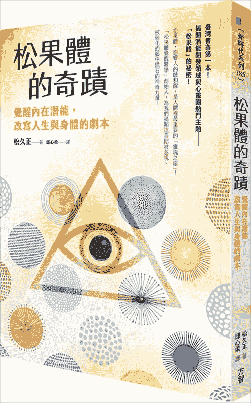

## 推荐序——注入灵魂黄金能量的讯息（更家公爵）

读了松久海豚医师《松果体的奇迹》原稿后，我真的从中学到很多。读着读着，开始感觉我的人生剧本正不断改写，灵魂剧本也在宇宙空间的引导下朝好的方向发展。

一开始，我对于阅读这本书有点抗拒，因为鄙人才疏学浅，学的书里的许多内容都很难懂。但渐渐地，我越读越有兴趣，看着这些极为深奥玄秘的内容，我的身体变得越来越沉重；接着，一阵疲劳袭来，我感觉自己的大脑已经容纳不了这么庞大的资讯量，松果体不断膨胀，这让我感到恐惧，心想“我撑不下去了”，打算稍微休息一下，于是躺了下来。就在这一刻，我整个身体彻底放松，感觉身体漂浮在空中，仿佛处于灵魂进入松果体那一刻。我在极为舒服的状态下睡了几分钟。

醒过来的时候，我右半边的松果体被宇宙某个遥远的地方唤醒，脑海中浮现松久海 ? 医师的笑容，伴随着一股能量注入我的身体。当我整个人清醒过来后，忍不住轻声说到：

“谢谢你，真是太棒了，我很开心。”

接着，我继续阅读这本书，松果体随着书中的内容不断活化，这时我终于明白，我的灵魂感到非常喜悦。不知不觉间，我开始在原稿上画线，在画线的过程中获得许多领悟和来自宇宙的启发，最后竟然把原稿华成黑漆漆一片，真是不好意思！

我感受得到，我至今人生中坚信的所有潜意识都被颠覆了，人生剧本不断改写。我对松久海豚医师那句“这样就好了”的灵魂振动产生了共鸣。

我作为步行指导者至今的一切迷惘全部烟消云散，看了《松果体的奇迹》之后，我相信当肯定自己将开发出一套步行宇宙术，大致上的做法是透过步行和宇宙智慧连结，让宇宙智慧通过脊椎而摇摇晃晃地走着，藉此促进松果体活化，开启松果体的通道。现在，我整个人燃起了无比的干劲！和松久海豚医师奇迹般的相遇，让我的灵魂狂喜不已。

松久海豚医师为我开启了松果体通道，我的松果体接收到一股强大的的能量，进入活化状态。这对我今后的步行事业来说，形同一笔庞大的资产，让我有办法开创一套连结宇宙智慧的步行法。

我相信《松果体的奇迹》会受到众人喜爱，让人仿佛大啖牛排般读得津津有味。看起来真好吃！

谢谢你。真是太棒了。我实在太开心了。

（本文作者为步行指导者，“公爵步行治疗师养成学校”创办人， NHK “华丽工房”讲师。）

## “松果”的故事

我没有名字，但别人都这么称呼我。

“烦恼吞噬者”。

没错，人类的“烦恼”是我最喜欢的食物。

虽然我早已不记得自己的出生日期，但我确实已度过数千年的岁月。

一路上，我见过形形色色的人类，但这数十年来，人类的烦恼种类突然暴增，烦恼的内容也变得越来越来复杂，甚至出现一些不和我胃口的烦恼。

真是令人头疼。

不过，由于拥有烦恼的人类依然多不胜数，我的食物来源相当充裕。

而且，与我相遇的人类都认为自己很幸运，毕竟原本的烦恼都一扫而空了……

不仅如此，我还会为对方准备一项顶级服务——我会用对方最喜欢的摸样，出现在他面前。

好了，我的食物上门了。

是个女的。

让我来看看这个女生的内心。

****

我的名字叫松果，自从父母为我取了这个名字的那一刻起，我的人生就开始往奇怪的方向发展。

我实在很怀疑父母的取名能力。

从小，我就因为这个名字，被同学捉弄了不知道多少次。

“松果，你在等谁啊 ? 你一直在等人，永远都等不到人来。这也是没办法的事，谁叫你的名字是‘要等吗’，哈哈哈！”（释注：松果的日文发音与“要等吗”相同）。

同学总是这样捉弄我。

我向父母询问这个名字的由来，却依然无法释怀。当时妈妈告诉我：

“怎么取的噢？那时我脑海中闪过‘松果’这个词，就觉得非得这个名字不可了。”

拜托！怎么可以用感觉来决定别人的名字阿！

你的女儿因为这个名字变得性格扭曲，还总是在等别人；更惨的是，我等的人永远都不会来！

现在也是。

为什么我得一个人搭游览车阿！

好不容易交到现在这个男朋友，和他一起报名了一趟稍微奢侈的旅行团行程，两天一夜，一人五万日币。

我先帮他代垫，一口气付了两人份的钱！一直很期待今天的到来。

结果，我在约好的地方等了又等，他却始终没来。电话，简讯， LINE ，脸书讯息，什么方式都联络不到他。

我已经把休假日安排在今天，而且当天取消的话无法退款。

实在没办法，只好自己一个人去了！

毕竟可以泡到我一直很向往的“无边际露天温泉”。

你知道无边际露天温泉吗？

无边际露天温泉的外援设计成肉眼看不见，海洋，天空，风景与温泉在视觉上连成一线 , 因此即使人在温泉里，却会有种漂浮在海上的错觉。

我都已经跟他说好要在黄昏时分和看得见朝阳的时刻去泡温泉了。

而且，我好久没请假了，这也让我很开心。如果我有什么才华，我绝对会立刻辞职，离开那种烂公司。主管，同事和后辈都是时下少见的那种热爱加班的人，明明公司没有给多少加班费，为什么他们能那么投入工作？

我一点也不懂。

我大学读的是一间空有文凭的四流大学，好不容易修完学分，勉强毕业，进入了这家公司，所以也不敢轻易辞职。在公司里，我的工作就是接电话，处理文书和泡茶。

每天搭着挤满人的电车，被压得喘不过气来，到公司重复做着一样的事。自从进入这家公司，我做的都是一些谁都能做的工作。

马上就要三十岁了，肤况和体力都开始衰退，岁月毫不留情地在我身上留下痕迹，我深刻认识到“我已经不年轻了”。

不仅如此，去年的健康检查还出现异常，到医院复检时，发现身体里长了子宫肌瘤。虽然医生说照目前的情况看来不需要动手术，但也很难怀孕了。交往多年的前男友很喜欢小孩，一听到这个消息，对我的态度立刻变得很冷淡，最后在去年分手了。

好不容易交到现在这个男朋友，却又被他放鸽子。这不是屋漏偏逢连夜雨嘛！

不管是小时候，学生时期，还是出社会之后，翻遍我任何时期的记忆，都找不到什么好的回忆。

名字的诅咒实在太可怕了。

我真的经常等人。和朋友相约见面时，总是我在等对方。

“对不起，我会晚个十分钟。”到了约定的时间，我总是会收到朋友传来这样的讯息，这时也只好等了。

最严重的情况是我等了又等，最后对方突然告诉我要取消，至今，我被人放鸽子的次数大概早就超过三十次了吧。

为什么只有我会遇到这种事？

我出神的望着窗外的景色，不知不觉，眼泪夺眶而出。

我慌忙的地在包包里寻找面纸。忽然间，我觉得有一道视线盯着我看，于是反射性地转向那道视线。

糟糕，和那个人对上眼了。

那是一名中年女性，坐的位子和我隔着一条走道，她旁边的座位也是空的。那位女士隐约散发出某种气质。不可思议的是，我们之间竟然感受不到丝毫尴尬的气氛。一般来说，这种情况下彼此都会觉得很尴尬才对 ......

这究竟是为什么呢？

游览车驶入高原上的快速通道，眼前的风景顿时改变。我们的目的地明明是海，之前走的路线却几乎看不到海。

而当车子开进这条路后，我觉得自己稍微明白其中的原因了。

这条路几乎位在山岭线上，游览车仿佛奔驰在天与地的交界，让人有种就要笔直冲上天空的错觉。

我们即将前往的饭店主打的无边际露天温泉也一样。虽然是人造设施，却拥有绝美的风景，宛如将极乐世界搬到现实当中。

两者都能令人体验到超乎寻常的特别滋味，我深刻感受到旅游企划人员的巧思。

第一天的行程主题是山，包括从芦之湖远眺富士山在内，眺望各式山峦美景。

第二天的行程主题则是海，沿着海线一路驶回东京。

不知不觉中，游览车进入一条道路，环绕着这座如同小富士山的山峰蜿蜒而行。

大富士山和眼前的小富士山简直就像兄弟一样。

接着，终于看到海了。车子一驶入海岸地区，潮水的气味立刻钻入鼻腔。

太平洋极为辽阔。光是看到这片开阔的风景，我就觉得实在该好好夸奖一个人上了这部游览车的自己。

好险没有为了那种烂男人，放弃拥有这个美好的时刻。

抵达饭店后，我拿到了房间的钥匙。

本来就听说这家饭店最近重新装修，一踏入房间，确实正如传闻所言，散发出一股恰到好处的高级氛围。虽然看到房间正中央的双人床时，我雀跃的心依然揪了一下，但我决定彻底忽略这件事。

无论是家具，各式摆设，还是窗外的风景，全都比我想象中还要符合我的喜好。如此难能可贵的时间和空间，与其要我跟一个在退而求其次的心态下交往的男人共享，还不如我自己一个人比较好。我在心里这么告诉自己。

我原本是计划去那个穿着泳衣，男女共浴的露天温泉，但如今已经没有这个必要了。于是，我该去女性专用的露天温泉。

眼前的景色很惊人。

第一次在电视上看到无边际露天温泉时，我就深感震撼，没想到亲眼看到时可不只是震撼而已。

我曾听人说过“感动的时候会无法呼吸”，但一直觉得完全是胡说八道，现在我知道我错了。

因为，我在那一瞬间倒吸了一口气，整个人动弹不得。

露天温泉的水面与太平洋仿佛融合，相连在一起，有一种不像是属于这个世界的极致之美。加上太阳即将下山，昏黄的暮色又增添了一股神秘气息。

我的脑海中甚至闪过“逢魔时刻”这个平时不会用的字眼。

我想，在这样的时间与空间里，恐怕“魔”也有机会趁虚而入吧。

如果可以，我真想把整个场地包下来，一个人独占这片美景。

我觉得假如这个空间里只有我一个人，一切都会归于寂静，温泉流动的声音会跟着消失，时间就这么停止。不过，里面已经有好几个客人了，这也是所当然的。

其中包括那位在游览车上看到我流泪的女士。

“噢，你来啦？”

她主动向我搭话，脸上温和的笑容丝毫不会令人反感。虽然我觉得有点尴尬，但她的微笑带着满满的温暖，仿佛把我心中的不自在都融化了。她长得不是特别漂亮，浑身上下却散发出一股女性特有的魅力。

“嗯，我想说用餐前先来泡一下。”

“是啊，这个时间的这幅景象，不来看就太可惜了。”

“真的 , 那个，请问你是一个人来的吗？呃，我是不是不该问这个问题？”

“没关系，其实我本来是要和朋友一起来的，但是她突然不能来了。”

什么嘛，原来这个人和我一样，经常被人放鸽子——就在我这么想的瞬间，她又接着说道：

“我的朋友两周前突然去世了。”

“咦？”

“她是我非常重要的朋友。小时候，我妈妈会对我说，一定要交到一个同性的好朋友，并且好好珍惜对方。她是我二十多岁时的公司同事，我们一认识就很要好，到现在已经三十年了。我会和她做朋友并不是基于什么特别的原因，就只是因为和她在一起很舒服。我们的年纪相差五岁之多，彼此的生长环境和人生经验也不同，但我就是非常喜欢她。真的好喜欢她。”

这次换她流泪了。

“她是脑中风去世的。她一个人住，中风发作当时努力找回意识，自行叫了救护车，但终究还是晚了一步 ...... 这两个星期，我整个人就像失了魂一样，没办法接受重要的人去世这个事实，同时深刻感受到自己有多么无能为力。不过，我突然觉得来参加这趟原本要和她一起来的旅行，等于是在悼念她 ...... ”

我觉得自己实在太丢脸了，刚刚竟然有一瞬间认为对方也跟我一样是被人放了鸽子。我为自己的肤浅感到十分难为情。

我和这位女士初次相遇，对彼此的事情一无所知，之后恐怕也不会再见面了——或许因为如此，我忍不住向她倾吐自己的心事。

我将自己目前的状况和今天发生的事，一五一十地告诉她。

“我今天来参加这趟旅行真是太好了。我肯定是为了来见你的，你跟以前的我还真的有点像。”

怎么可能！不管怎么看都看不出我和这名气质很好的迷人女性有什么相像之处，她瞥了我一眼，继续说下去：

“我是在即将迈入三十岁时遇到我的好友的。当时我开始找不到人生的意义，而她一副大姊风范地教了我许多事。遇见她之前，我认为自己毫无价值，吃亏的永远是我，觉得自己每天面对的都是些讨厌的事。”

“真不敢相信，我现在从你身上丝毫感受不到这种感觉。”

“是吗 ? 真高兴听到你这样说。不过，人是会变的，真的会在一瞬间就开始改变了。”

“一瞬间，怎么可能 ...... ”

“你觉得我再胡说八道吧 ? 但这是真的。世界上有一种魔法，只会在相信的人身上应验。这是她告诉我的，你想知道吗？”

我对这番话半信半疑，但也只能点头。她微笑着用右手食指轻触我的眉心。

“在这个位置深处，住着属于你的神，一个很小很小的神。不过，一旦你否定他的存在，他就会变得越来越小，永远沉眠下去。很可惜，你的神目前正在睡觉，只要你不唤醒他，他就永远不会发挥神力。”

“要怎么做，神才会醒过来呢？”

哎呀，我竟然这么认真的问她。什么脑袋里的神，我怎么会去理会这种奇幻的事物呢 ...... 尽管我心里这么想，却也很好其她会如何回答。

“要是脑袋里真的有神，我们当然希望他能苏醒过来，发挥他的力量，对吧 ? 我当时也跟你一样苦苦追问她。”

呜，我的心思被看穿了。我再一次感到羞耻。

“没关系的，放心好了，绝大多数人都会踏上同一条路。但是，倘若不知道其中的道理，就没办法通过这条路；而假如知道后依然不付诸实行，就会永远在原地踏步，一直在同一个地方转来转去。”

缓了一口气之后，她继续说道：

“如果我说，每个人的父母，名字和环境都是自己选择的，你应该觉得不可能把？我知道，但请你好好听我说完。总而言之，一旦假设自身拥有的一切都是自己选择的，那么问题就来了：自己到底为什么会选择这张脸，这副身体，以及这样的名字，父母和环境呢？毕竟任何人都会希望自己拥有一张漂亮的脸蛋和一副好身材，不是吗？”

我非常同意这番话，忍不住点了点头。

“当时我这么问她，她听了就说：‘我们每个人都拥有许多课题，只要不完成这些课题，就没办法提升等级’。”

“提升等级 ? 什么等级啊？”

“正常来说，谁听了都会有这样的反应，对吧？但是，她听了我的问题后，却面不改色地接着说，是‘灵魂’的等级。

“灵魂？这是什么宗教吗 ? ”

“就是说啊，真的很可疑吧？不过，我很清楚她没有宗教信仰，而且宗教观跟一般人一模一样。更重要的是，她本身是个极具魅力的人，我非常仰慕她，所以很想了解她的思考方式，便继续听她说话。

原来如此，这种心理简直和现在的我一摸一样。

“她接着说，”在这个地球上，有一种眼睛看不见的阶级制度，人们只能遇见拥有相同灵魂等级的人，这就是宇宙的法则。不过，偶尔也会遇到等级不同的人，这些人会帮助自己提升等级。我们可以借助对方的力量解决‘灵魂’的课题，提升自己的等级。”

“你说的是‘课题’吗？课题究竟是什么 ? ”

“比方说，此时此刻让你感到厌恶的事情，或是对你来说很讨厌，很受不了的事情，都是你的课题。”

“这么说来，就是有大量的课题咯？假如要把这些课题全部解决才能提升等级，那根本就是不可能的事嘛。”

“呵呵，你果然和我很像。当时我也对她说了一模一样的话。”

“真的吗 ? ”

“真的。但她告诉我，这一切都不成问题。对提升自己的灵魂等级而言，这些讨厌的事物都是必要且不可或缺的元素——正因如此，所以这一切都是出于自己的选择。而就在你稍微开始接纳这个想法，觉得‘或许真是如此’的那一瞬间，神就会开始觉醒。”

“就这么简答？”

“是啊，乍听之下会觉得很简单，对吧？不过，虽然说只需要稍微接纳这个想法即可，但是所谓的接纳，必须是真心诚意地认为‘这些事物是我自己选择的’。所以，假如你觉得自己已经单纯用脑明白了这个道理，在心里告诉自己‘这是我自己选择的’，就不会有效果。我们必须充分接纳这套说法，打从心底觉得‘或许真的是这样’。就在这么想的那一刻，最初的一个小开关就会开启，十事物会开始接二连三产生变化。以我自己来说，我的人生确实从那时开始就一点一滴地逐渐转动了起来。

这位女士接下来又继续讲了一段故事，不用说，当时我依然只觉得那些东西很虚幻。

换句话说，我并未真正接纳这套说法。不过，如果单纯当作是在听故事，倒是十分有趣，且具有强大的疗愈效果，将我从早上到中午的所有不愉快一扫而空，因此我很感谢她对我说了这番话。

我们泡的稍微久了一点，接着享用一顿海鲜大餐，之后便回到各自的房间。

但是，当我打开房门后，看到房间里有一名男子。

这个人不是我的男朋友。这是当然的，我的男友才没有那么帅。

“对不起，我走错房间了。”我急忙关上门，但接着想到，这个房间的门明明可以用我的房卡打开，仔细一看，门上的房号也没错。

我怀着极度恐惧的心情，再次打开房门，果真有一名男子坐在那里。他长得超级帅，完全是我喜欢的类型。

“那个，看来是你走错房间了。你不走的话，我要叫饭店的人过来了。”

“不是这样的，松果小姐，我们都没有走错房间，我是在这里等你的。”

这家伙的脸蛋和身材都超正，但脑子似乎有点不正常。

就在我心想“这家伙很危险，我得快点逃走才行”的时候，他突然把我推到墙边，挂上了门链。

“请你放心，我绝对不会做出任何伤害你的事。你是我的客人，我只是想招待你而已。”

他说完这句话，桌上忽然出现茶和甜点。

怎么回事？难不成我刚才喝酒喝醉了吗？唔，刚刚我确实不加节制的喝过头了。

这样啊，原来脑子不正常的是我。

原来如此，这只是一场梦。嗯，绝对是梦没错。既然只是个梦，那就无所谓了。这只是一个被放鸽子的可怜女人喝醉后做的梦而已，是我的欲望创造出眼前这个理想的男人和满桌的甜点。

放轻松啊，松果。

这只是梦，只要知道这是场梦，就没什么好担心的。倒不如说，置身在这样的情况下，要是不好好享受就太浪费了。

虽然在梦里没办法确实品尝到食物的味道，但眼前的蛋糕光用看的就觉得十分美味，我还是来尝尝看吧。

尽管只是一场梦，这些蛋糕却比我至今吃过得任何一种蛋糕都更加美味可口。

不仅如此，我眼前还坐着一个比任何偶像和演员都俊俏的男子，始终凝视着我。

既然只是一场梦，那么我也可以做些平常不会做的事。平时的我面对这么俊美的脸孔根本无法直视，除非是在看照片或影片才有办法直愣愣地盯着看，但由于现在是在梦里，于是我想象自己变成一个美女，果断地注视对方，回应对方地视线。

我真的好幸福啊，虽然这只是一场梦。

“这些甜点合你的胃口吗 ? ”

啊，连声音都符合我的喜好，做梦真是太方便了。

“嗯，真的好可口，谢谢你。”

“那么，你可以答应我的请求吗 ? ”

“好的，只要我做得到。”我稍微模仿了一下气质美女说话的口吻。

“太好了。我不是人类，所以没有名字，但有些人称呼我为”烦恼吞噬者”，我今天来是为了收下你的‘烦恼’。”

“我的烦恼？”

“是的，你有许许多多的烦恼，因此我特地前来收下你所有的烦恼。”

“是啊，我又非常多烦恼。不过，要是我把烦恼给了你，我会出现什么变化呢？”

“松果小姐，你们人类吃的是食物，我的佳肴则是人类的‘烦恼’。只要我吃过一次你的烦恼，你往后的人生就不会再有任何烦恼了。你会度过一个极为舒适畅快的人生。”

“从今以后，直到永远？”

“是的，直到永远。”

“人生永远不会再有烦恼？”

“是的，正是如 ...... ”

和这个人对话的过程中，我心里很清楚这只是一场梦，但与此同时，遥远的意识也浮现那位女士在泡露天温泉时说的话：“所有烦恼都是自己选择的课题，用来帮助自己提升灵魂的等级。”

她的表情和声音都十分温柔，仿佛包覆人心的花朵般，倏然浮现在我的脑海中。

“不行！不行！这些烦恼都是我的，不能随随便便就给你。我的课题必须由我自己解决，否则就没有意义了！”我向他大声喊道。

我被自己大喊的声音吵醒了。

回过神之后，我发现超级帅哥“烦恼吞噬者”已经消失了踪影。也是啦，毕竟只是一场梦 ......

不过，桌子上却还留着吃到一半的甜点和茶饮，因此我无法分辨哪部分是梦，哪部分是现实。

唯一能确定的是我喝醉了。于是，我直接倒在双人床上，沉沉睡去。

我在想着“厕所”的状况下醒来，这时，手表指着五点三十分。我的脑袋还是迷迷糊糊，桌上依然放着吃到一半的甜点和冷掉的红茶。难道我喝醉以后，自己用饭店提供的茶和甜点唱了一出独角戏吗？

想到这里，我就觉得自己丢脸的不得了，脸涨红到快冒烟了。

啊！现在是五点三十分。日出的时间是几点呢？

我查了一下，得知太阳会在六点左右升起。饭店的露天温泉从六点开始开放，又是坐西朝东，看得到太阳升上地平线的第一道曙光。

准备好泡汤要用的物品后，我和昨天一样前往女性专用的露天温泉，结果又与那位女士巧遇了。

“早安，你碰到什么事了吗 ? 表情和昨天完全不一样，感觉好像散发着光彩。”

“咦？应该是这里灯光的关系吧。昨天我喝醉了，睡的一塌糊涂，连饭店特别提供的甜点也没吃完 ...... ”

“昨天晚宴的甜点真的很可口，菜肴也很美味，但是量太多了，实在吃不完。虽然大家都说装甜点的是另一个胃，但果然还是吃不下了呢。”

“不是耶，我说的不是晚餐的甜点，是饭店额外送到客房的茶和甜点。”

“咦，原来有提供这样的服务啊？是不是每个房间附带的服务不太一样呢 ? ”

不，这是不可能的。难道那并不是梦 ?

我的酒意现在尚未完全消除，脑袋还有点迷迷糊糊的，没办法充分整理各项资讯。

然而，早晨的海洋与昨天黄昏的感觉完全不一样。调整好心情之后，我生平第一次见到太阳从海上升起的模样。

我觉得自己正看着某样神圣的事物，心中涌现一股肃穆的感觉。

阳光洒落在地平线上，光线的颜色瞬息万变，接二连三不断变化。

同时，天空的颜色与亮度也不停转变。

“每天日出时的阳光都会让我们重生。现代人的生活很难接触到太阳，不是吗 ? 白天的太阳和光线都很重要，尤其是日出时阳光的力量更是我们脑中神的佳肴。”

和昨天一样的柔和嗓音传入我耳中。听到“佳肴”这个词，我立刻想起昨晚的烦恼吞噬者那张俊俏的脸。

“烦恼”……

“嗯？烦恼怎么了？”

“昨天听了你在这里说的那番话后，我开始觉得自己的烦恼其实也没有什么大不了的。不过，我现今置身的状况当然还是没有任何改变，明天我肯定会一如往常地挤上人满为患的电车，到公司做些无聊的工作。至于那个放了我鸽子还完全失联的男友，势必也得走上分手一途。但我现在突然觉得，即使如此，似乎也没什么不好。”

“那真是太好了，看来破晓的阳光已经打开了你的神开关，真的是太好了。接下来肯定会有越来越多好事降临在你身上，真令人期待。”

“怎么可能呢？才不会因为这点小事就产生变化。”

“这个时候不必去否定，只要单纯感到开心就好了，否则好不容易开始苏醒的神会再次沉眠，那就太可惜了。”

“咦，真的吗 ? ”

“是啊。今后肯定会慢慢有一些不可思议的事发生在你身上，那些事绝非偶然，是因为神苏醒了所致。当你遇到那些好事时，只需要想着‘谢谢你，真是太棒了，我很开心’就好了。”

“谢谢你，真是太棒了，我很开心。”

“就是这样。这也是一句魔法咒语，对神来说，这句话就像一顿佳肴，只要发生一件小小的好事，就要记得带着感谢的心对脑中的神说这句话。光是这么做，你就会开始出现变化。我会认识我的老公，现在会过得这么幸福，都是因为不断重复这个过程而得到的结果。”

昨天她说这番话时，在我听来只不过是一则奇幻故事，但今天早上这番话在我耳中却有点像是真的了。此外，相信这套说法，我也不会有任何损失。

想到这里，我决定现在就来试试看。我让自己沐浴在阳光下，闭上双眼，在心里对着头部的中心 轻声说道：

“谢谢你，真是太棒了，我很开心”。

虽然这么做有些不好意思，但不知为何，心里似乎有点暖暖的。

当我泡完温泉回到房间时，那些茶点已经不见了。虽说是额外的服务，但房务人员随意进出我住宿的房间，让我不太高兴。

吃过早餐，整理好行李。

到柜台归还房卡时，我询问昨晚是否有额外提供甜点，但饭店人员回答他们并未提供这样的服务。

那么，这一连串的事情究竟是怎么回事 ?

离开饭店时，我脑子里依旧充满问号。第二天的行程主题是海，和昨天一样令人心旷神怡。那位女士坐到我旁边的位子上，我们一路上聊的很愉快，时间一下子就过去了。

好久没有像这样放空脑袋，好好享受当下的时光了。

我打从心底觉得，能参加这趟旅行真是太好了。

太阳西下，游览车驶离海边，进入高速公路。周围的景色也开始转变，简直就像从梦中醒来一样。

这时，我收到一则讯息，是公司的后辈传来的。

“松果前辈，请你快点回来吧，你不在我可惨了。课长现在深深感受到你的重要，我做的资料被他骂说问题百出，就连泡个茶都有人说我泡的和你差太多了！”

这个女孩是公司里跟我最投缘的人，但她至今从未传过这种内容的讯息给我。

原来，我还是派的上用场，公司还是需要我的。

想到这里，我就觉得好高兴，于是又想向脑中的神道谢了：

“谢谢你，真是太棒了，我很开心”。

就在我准备收起手机时，又收到了一则讯息。

是他。

事到如今才传讯息给我，还有什么意义啊？我打开讯息一看，却吓了一大跳。

“对不起， 松果，真的很对不起。现在我人在医院，昨天出门时发生车祸，被救护车送到医院，这段时间一直失去意识，所以都没有联络你，直到不久前才恢复意识，现在终于取得医生的同意，总算能传讯息给你了。真的很对不起。我没有生命危险，但身上有三处骨折，医生说必须住院一个月。”

不会吧！他竟然出车祸了！

而我却自顾自地对一个失去意识的人发火，自顾自的打算和对方分手。

“对不起，我完全不知情。快点告诉我是那家医院！我预计晚上六点会回到东京，到时会直接去医院看你。”

我回了他这样的讯息。应该道歉的人，是我才对。

我一边深切的反省，同时也觉得实在该感谢神：

“谢谢你，真是太棒了，我很开心。”

我将公司后辈和男朋友的事告诉那位女士，她听了之后，高兴的仿佛是发生在她自己身上的事情一样。

道别时，我们依依不舍地交换了联络方式，也终于互相报上自己的名字。

她叫百合子，这个名字真是恰如其人。

我也跟着报上自己的名字，她一听便笑了出来。

看吧！我的名字果然很奇怪。我不由得又埋怨起了父母。就在这时，她开口说道：

“笑了你真是对不起。昨天我跟你说的那个脑中的神，叫‘松果体’，而你的名字就叫‘松果’。”

咦，神的名字 ?

我这辈子第一次喜欢上自己的名字。

## 前言  让松果体觉醒，成为理想中的自己。

“这只是个不切实际的美梦。”

“事情不会如你所愿的。”

“不要好高骛远。”

“该放弃时就要放弃。”

“这个目标不符合你的条件和能力。”

自从古代地球社会的人被普遍价值观与制式观念束缚以来，这几句常见的话就一直是人们高频率使用的魔法用语。从小，父母，学校，社会也都是这么教导我们的。

所以，大家才会变得越来越压抑自己的想法，认为“事情不可能真的像我像的那样顺利发展。”

现今这个充满限制与束缚的僵化地球社会，就是由地球人这些僵化的意识与思想造成的。

一直以来，人们总是认为自己不完美，始终要求自己“我应该这样做”“我应该变成这个样子”。

现有的科学与宗教也告诉我们“人应该这样做”“人应该变成这个样子”，但其实这并不是宇宙真正的样貌！

而之所以会出现如今这种僵化死板的地球人，是因为“松果体”未活化所致。

只要保持“这样就好了”的心态，轻松随性的生活，就能促进松果体活化；而一旦松果体火活化了，对事物的接受程度便会进一步提升，更加认为“这样就好了”。

这么一来，“僵化死板”的地球人，就能化身为“悠哉愉快”的新地球人。

于是，人们的常用语会变成这样：

“这不是个不切实际的梦。”

“事情会如你所愿的。”

“人可以自由地变成理想中的自己。”

“根本不需要放弃。”

“打破自己的条件与能力。”

新地球人到底是哪里有所改变呢？

答案是：松果体的通道敞开了。

一旦松果体的通道敞开，人就能自由的化身为理想中的自己。这就是“松果体革命”。

在悠久的地球历史中，松果体一直被封印，如今终于到了苏醒的时刻。你的松果体，现在即将觉醒。

# 第一章  不可不知！关于松果体的几件事

## 何谓松果体？

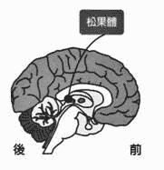

存在我们身体里的松果体，究竟是怎样的器官？

松果体是个体积很小的内分泌器官，呈红灰色，太小近似青豆（约七，八公厘），位于大脑的中心位置，形状就像一棵松果。

若从解剖学的角度说明，松果体位于第三脑室后方，左右第四脑室中间，脑下垂体上方，下视丘下方。

人类于 1960 年代得知松果体是一种制造褪黑素的内分泌器官，人体的生理时钟就是有松果体建立的。

当人们白天晒到太阳时，松果体会分泌俗称幸福荷尔蒙的“血清素”；到了晚上，阳光减少时，则会分泌睡眠荷尔蒙”褪黑激素”。

近年来，研究发现“二甲基色胺”这种身为色胺类原型的生物碱，也和褪黑激素与血清素一样，都是由松果体制造，分泌而成。二甲基色胺也可见于自然界，被称为“天然致幻剂”。

松果体由于位在脑部深处的核心位置，自古以来就是被哲学家认为具有重要功能。

知名哲学家笛卡尔认为，这个世界是由物质与灵性两种不同的要素所构成，而这两者透过松果体产生连结，于是，他将松果体称为“灵魂之座”。

## 为什么半夜比较容易发生神秘体验？

下视丘与脑下垂体是大脑中两个发挥重要功能的部位。

人体所有内分泌的最初源头在下视丘，脑下垂体则是中继点。而松果体与这两者的位置相近，带来颇大的影响。

松果体于夜晚分泌褪黑激素，白天则停止分泌。松果体在分泌褪黑激素的时段最为活跃，约为半夜两点到四点之间，这段时间人们较容易和宇宙智慧连结。

相反地，由于白天停止分泌，因此就算睡午觉，也不会制造出多少褪黑激素。

半夜两点到四点是褪黑激素分泌的高峰期，如果这时呈清醒状态或在半梦半醒之间，松果体的通道便会开启，得以接收宇宙智慧传来的讯息。

在这种状态下，松果体除了分泌褪黑激素，也会分泌大量的二甲基色胺。

新墨西哥大学精神病学系的瑞克 • 史特拉斯曼教授会发表如下的研究结果：

“到 1995 年为止已对 60 多名受试者进行超过四百次的二甲基色胺静脉注射，其中近半数受试者声称遇到非地球生物。本实验取得美国食品药物管理局的许可。由于人类大脑中的松果体会制造二甲基色胺以作为神经传导物质，研究推测，这种物质与人们发生宗教性神秘体验或濒死经验有关。”

也就是说，研究指出，这些遇见地球外生命体的受试者，是因为松果体通道开启而接触到了异次元世界。

根据这项实验，我们可以推测，松果体活化之后较容易分泌二甲基色胺，于是更有可能接触到异次元世界，以及高次元的宇宙。

## 松果体为何被称为第三只眼

在许多佛像或佛画上，都可见到佛祖或菩萨的眉心有一颗又小又圆，类似痣的东西，称为“白毫”。

白毫在佛教是一种绽放光芒的右旋白毛，象征一个人已经悟道。

当一个人悟道后，第三只眼会跟着打开，这也是第六脉轮所在。第三眼位于眉心，而此部位的深处就是松果体所在的位置。

松果体之所以被称为第三只眼，一来是因为它是对光有所反应的器官，二来则是因为松果体的组成物质是“矽”。

矽是水晶的主要成分。人类眼球中相当于镜头的部分构为水晶体，因此眼球可说是由水晶（矽）所构成，而松果体同样是由矽构成的。

松果体虽位于大脑中央，却是一种对光很敏感的器官，我想这就是它被称为第三眼的原因。

动物与昆虫也有松果体。

蛇的松果体称为“颅顶眼”，位于头部最上方。螳螂与蜻蜓的松果体则位于双眼中间，且暴露在外。

此外，那些没有眼睛的鱼类，以及完全生活在黑暗中的蝙蝠，也是用第三只眼（松果体），而非肉眼来确认自身位置。

可以让我们看见松果体发挥这种作用的明显例子，就是庞大的鱼群与空中整齐排列的鸟群。数量庞大的鱼一同游动时的姿态非常壮观，简直就像合而为一，化身成一种巨大的生物；但若单纯以肉眼判断游动方向和速度，是不可能游的那么整齐划一的。鸟群呈 V 字排列飞行也是一样，要始终保持一定距离飞行，直到抵达目的地为止，光凭鸟类具备优越的运动能力这一点，并不足以说明它们是如何办到的。

这些生物都运用了松果体，进行宛如心电感应般的沟通与交流。

从这些情况来看，我们可以推论出松果体就是第三只眼，第三只眼可以感受到肉眼看不见的事物。

我们人类也一样，追溯到古代，便会发现古代人类的松果体也呈现活化状态，除了使用语言交流，还会透过心电感应对话。当时人类的松果体发挥了第三只眼原本应有的功能，拥有的力量远比现在强大。

说句题外话，基督教的宗教画中，人们头部后方有个圆形的光晕，其实就是象征松果体绽放的光芒。

宗教画中的天使，耶稣与玛丽亚头部绽放光芒，代表其松果体拥有强大的力量，因此松果体散发的光芒也极为强烈。

## “松果”之谜

关于松果体的研究相当少，至今的医学与科学尚未厘清松果体的功能与运作方式，可说是个充满谜团的器官。

不过，一旦回溯历史便会发现，古时候的人就已经将松果体视为重要器官。在古埃及壁画，希腊神话的绘画与基督宗教的建筑物中，松果体以“松果”形状的图案出现过无数次。

假如在一无所知的情况下观赏，只会觉得出现在建筑物与壁画中的松果形状纯粹是个图案。不过，一旦知道“松果”等于“松果体”，肯定就会觉得十分不可思议。

为什么古人会画出这样的图案？

从绘画中的场景可知，当时的人相当重视这个图案，对他们而言是种特别的存在。

首先，来看一下埃及壁画。画中的人对着太阳高举双手，他手上拿的其实就是松果。此外，他头上的戴的东西也是以松果为范本。

 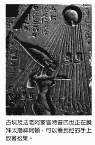

为什么是松果？

为什么要献给太阳？

古埃及人留下的遗迹充满谜团，他们拥有远比现代科学先进的知识，画出来的图想必不会是毫无意义。

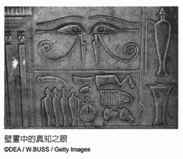

此外，著名的“真知之眼”（又称荷鲁斯之眼）是古埃及的象征符号之一，在壁画里出现过无数次，可说是颇具代表性的古埃及标志。而真知之眼其实与人类大脑剖面图中松果体周围的组织形状一模一样。

左眼“乌加之眼”象征月亮，右眼“拉之眼”则象征太阳。进一步探究下去，会发现以下关联：

 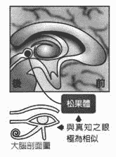

真知之眼的左眼（月亮） = 乌加之眼 = 海马回（蛇） = 分离（我）

象征：集体意识，普遍观念，僵化思想

真知之眼的右眼（太阳） = 拉之眼 = 松果体（松果） = 调和

象征：内在宇宙，宇宙智慧

希腊神话中有个叫荷米斯的神，手持“双盘蛇带翼权杖”。这根权杖相当有名，现代的商业，交通与医疗领域都使用了源自这个图案的符号，我们经常可以看到在权杖顶端画着荷米斯之翼的图案。

虽然双盘蛇带翼权杖的样子有许多版本，但共同点都是权杖周围有两条蛇向上盘旋，缠绕在一起。

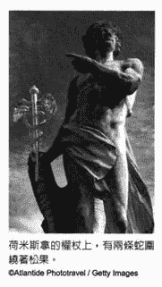

不过，书中这张照片的权杖最上方有棵松果，看起来就像两条蛇抢着要吃松果。而这两条蛇代表的，正是普遍观念，僵化思想及集体意识等妨碍人们接收宇宙智慧的事物。

希腊神话的故事内容看似玄幻且荒诞无稽，确能带给我们许多启发。

除此之外，基督宗教教堂的建筑物与装饰上，到处可见松果的踪迹。是因为当时流行这种图案吗？

不，当然不可能是出于这样的理由。

基督宗教的圣地梵蒂冈的圣彼得大教堂中庭有一颗巨大的松果，这是西元一至二世纪铸造的铜雕。将如此巨大的松果放在大教堂里，难道是毫无意义的吗？

关于这一点，背后也隐含了深刻的意义。

古埃及，希腊神话与基督宗教的发祥年代，距离现在已经相当遥远。当时的人与现代不同，生活环境与大自然和宇宙之间的关系极为密切，人的感觉自然也与现代人有着极大的不同。

## 被封印的松果体

直到不久前，松果体还一直都不受人们重视。

虽然现在关于松果体的研究已经慢慢有所进展，但人类真能凭借医学手法探究出松果体的奥秘吗？这是个很大的问号。

因为，松果体是个光凭一般科学与医学手段无法衡量的神秘器官。

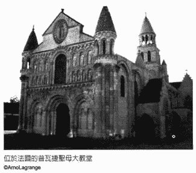

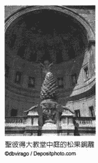

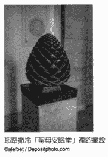

松果体明明是古代文明时期的人相当重视的器官，现代人却对它一无所知。由此可以推断，很有可能是在某个时间点被人刻意隐瞒了。

那么，为何有人要隐瞒松果体的事？

因为，松果体隐藏着极为惊人的力量。

回顾人类历史，我们可以看见任何国家，任何时代的掌权者与特权阶级，都会独占那些昂贵，珍贵或具有相当价值的物品，并隐瞒这些珍贵物品的存在。

换个角度来看，便能发现背后隐藏着这样的理由：

“要是被一般人知道，就会产生不必要的麻烦。”

平民若知道真相并拥有特殊能力，就会变得很难掌控。

松果体中潜藏着一股巨大的力量，长期以来都被那些掌控地球的当权者封印了。

当权者透过以药物与手术遮盖表面问题的医学，以及被政治与经济控制的社会削弱人们松果体的力量，让人以为自己无能为力，什么都办不到。

以金钱，权力，普遍观念与僵化思想左右社会大众，削弱人们松果体的力量，对当权者来说更有利。

比方说，医学原本的目的应该是治病，但为什么人们还是有许多疾病？

因为对医疗产业而言，病人就是客人，为了尽可能让更多人长期来看病，干脆就让人类的免疫系统与制造能量的功能保持衰弱状态，对他们来说比较有利。

一旦松果体的力量减弱，人便无法和宇宙智慧连结，没办法发挥原有的能力。这样一来，就更容易操控人类了。

事实上，为了削弱人们松果体的力量，当权者用尽一切手段。不过，我们对此却一无所知，还以为沉睡的松果体才是正常状态，就这样过着每一天。由于松果体的力量极弱，无法发挥直觉力，一切只能仰赖他人帮忙。于是，我们就被自己的人生与身体折磨，痛苦不堪。

当权者巧妙操纵资讯，让我们不得不仰赖现代医学与科学，仰赖他人，仰赖国家与社会。

遵循他人的说法，仰赖他人生存，本来就偏离了生命应有的姿态。若想找回自己原有的样貌，我们必须唤醒自己的松果体。

# 第二章  了解松果体之前，先具备宇宙基本知识

## 你原本的样貌

“人类到底是什么？人类原本应该是什么样子？”

所有诞生在地球上的人，应该至少都想过一次这个问题。

长久以来，无数哲学家与科学家以各种方式寻找这个问题的解答，至今还是没有得出一个确切的答案。

针对这个艰难的问题，我在此提供一个明确的答案：

“人类与一切生命的本质，是那些眼睛看不见的能量。”

这就是答案。

此处的能量也可称为“灵魂”。说得更精确一点，就是“不具备身体或物质的一种能量。”

目前公认地球上最小的粒子为“基本粒子”。基本粒子体积极小，肉眼看不见，是构成原子，质子与中子“最为基本”的粒子。

我们的能量原本是一种不具有意识，也不具备丝毫特性的能量体。由于我们能量的体积无疑比基本粒子还要小，因此应该称为“超基本粒子”。超基本粒子是一种比基本粒子还小的极微小能量，同时也是从物质角度剖析我们灵魂的意识时呈现的形态。

我们是从何时开始以超基本粒子的形态存在这个世界的呢？答案是：我们一直存在无限的时间里。并非从何时开始，而是原本就存在，打从一开始就单纯存在于一个没时间与空间的地方。

虽然人类从一开始就以超基本粒子的形态存在，但此时并未拥有意识。在这个状态下，人们不知道自己是自己，也不知道自己存在。直到某一刻，突然因为振动而开始形成意识与特性，了解到自己是存在的。这个瞬间，就是灵魂能量诞生的时刻。

这时的振动产生了“螺旋振动波”，创造出一个无线的时空，极为宽松的时空。不过，由于这股振动是超高速的，因此以科学方式测量时，测出的数值为零。所谓“超宽松”就是这么回事。这个世界上确实存在着以现在地球人的科学水平无法了解的事物。

那么，超基本粒子为什么会突然开始动起来？

因为，它有了想知道“自己是谁”的好奇心，有了来自灵魂的好奇心。

我说的再详细一点。超基本粒子原本并未拥有意识，而已经拥有意识的其他灵魂一开始会晃动不定，当这个不具备意识的超基本粒子感受到“他物”碰撞到自己时，开始觉得自己应该是存在的。此时，“意识”便形成了。

“自己？自己是什么 ? 我有点想知道，我想知道的更多。自己真的存在吗？自己究竟是什么？”

由于产生了好奇心，受到这股好奇心驱使，因此想进一步感受自己的存在：

“我想更加了解自己。”

这一刻，原本不具备意识的超基本粒子开始以无限大的螺旋频率产生振动。就在这个瞬间，一股灵魂意识能量诞生了，而这就是你。

当超基本粒子开始以螺旋状打转时，就开始显现属于自己的特性，灵魂意识能量开始出现各种不同的变化。

而这个漩涡之所以是右旋的，是因为诞生时碰巧选择了右边。也就是说，我们灵魂的意识能量呈现右旋的旋涡状，从诞生后到现在，一直是右旋的状态。

我们所有人都拥有一个右旋的能量宇宙。

在具有时间轴的三次元空间里，我们的意识能量呈现右旋状态，但在二次元的平面上则以振动波的形态显现。此外，我们也能用粒子的形态来解释这种波。我们的意识能量在没有时间轴的二次元状态下，会化为一股单纯的振动。

## 表象与里象同时存在

能量诞生在这个世界上时，会和基本粒子一样分为正，反两种，接着便立刻消失。而超基本粒子也具有这样的性质。

这只是观测上的结果，最初观测到的能量本身会持续存在，永远不会消失。

换句话说，只有那些具备意识的能量（超基本粒子）会以灵魂意识的形态存在，其他能量（反超基本粒子）则不会拥有意识。超基本粒子与反超基本粒子正是让灵魂诞生的“右旋”与“左旋”，而我们选择了右旋。

两种彼此相对的正反能量，就这么同时产生了。当出现振动而形成灵魂意识时，会同时产生右旋与左旋的漩涡，两者就像彼此倒映在镜中一样，除了方向相反，其他部分一模一样。

右旋与左旋能量加在一起时，会因为正与负相互抵消而化为零。由于诞生的那个源头本身就拥有左与右，表与里两面，因此我们生活的世界自然也是由表与里构成。一切二元或两级的事物，根本源头都是这里。

我们所处的这个右旋宇宙是“表象宇宙”，看不见的那个左旋宇宙，则成为“里象宇宙”。

我们只是恰巧在表象宇宙产生右旋运动而形成了意识，除了这个右旋宇宙之外，还存在着一个拥有左旋意识的宇宙。严格来说，这个世界包含了右旋与左旋的意识，但我们无法接触到那个左旋构成的里象宇宙，那是我们永远没有机会接触的世界。我们可以知道有那样的世界存在，却无法有进一步的了解。

在这个地球社会上，也同时存在着表象社会（光明面）与里象社会（黑暗面）。想要维持表象社会的运作，里象社会是不可或缺的。

## 灵魂诞生的故乡

从我们现在所处的位置来看，光是表象宇宙就已经远超乎我们的想象。

身为灵魂源头的超基本粒子从三百六十度各个角落产生螺旋能量，于是便创造出时间与空间。

那么，灵魂的诞生地点又在哪里呢？这个问题实在很令人好奇，现在就来揭开这个谜底吧。

现在我们所处的这个宇宙，是专属于自己一个人的时空，只存在着自己的灵魂意识能量。请把你现在置身的这个宇宙，想象成一个圆形的泡泡。

事实上，每个人都有一颗自己专属的泡泡，因此，地球上人们的交流行为都是地球人的泡泡彼此重叠的过程。

一旦将每个人生活的宇宙视为一颗泡泡，就会进一步发现，这个世界还存在着过去，未来，平行人生等无限多颗泡泡宇宙。

这所有的泡泡宇宙，统称为“多次元的平行宇宙”。

你应该听过“平行世界”这个词，多次元的平行宇宙和平行世界是一样的意思。

这个世界存在着无限多个多次元平行宇宙，我们现在所处的这个泡泡宇宙，只不过是其中的一个。除了现在我们接触到的这个泡泡宇宙之外，过去与未来的自己，以及位于平行世界的其他自己，也拥有各自的泡泡宇宙。

时间轴上的各个时间点，都有各自的泡泡宇宙；而从现在这一刻起，也不断产生无数的泡泡宇宙。这所有的泡泡宇宙，正是多次元平行宇宙的根本。

这就是灵魂的诞生之处：零点。

灵魂诞生的源头——零点——创造出所有的泡泡。若要理解这个概念，就必须抛弃“人类是拥有身体的物质性存在”的想法。

人原本没有身体，单纯是一种灵魂意识。

我们意识诞生的那一刻，能量处于极高的状态。零点的能量高到以现在地球上的科学与数学概念都无法理解。那个世界里的概念远超乎地球上的常识。

总而言之，那是一种无限大的高次元能量。

而我们原本就拥有这种程度的能量。

当现在的这个自己与位于无限大的多次元平行宇宙的那个自己（位于平行世界的另一个自己）进行交流，或是当自我意识与自己以外的意识交流时，就会产生知识与资讯，而零点根据反馈性与全像原理（无论能量如何变化，原本的能量形态都会保存下来）囊括了这所有的知识与资讯。

包括我们灵魂意识的诞生之地——零点——的能量在内的所有知识与资讯（亦即宇宙智慧），其根本能量就是一切的源头，而一个人能否接受到必要的知识与资讯，将会大幅改变这个人的人生。

## 宇宙是无限大的

我们无法接触到的那些多次元平行宇宙所在之处，就在宇宙能量的“场”。

宇宙能量的“场”，究竟是什么？

人们认为宇宙有一定的大小，且不断膨胀。所谓“不断膨胀”背后藏着“有个极限”的概念，但其实宇宙的空间是没有极限的。

当然，如果将宇宙视为一个空间，那么自然有其极限。空间和宇宙空间等字眼，本身就代表有个极限，会在某个地方结束的意思，因此若以“场”来理解宇宙能量，便能充分掌握其中的要义。不用说，宇宙能量的场自然是无限大的。

我们灵魂意识能量诞生的那一刻，呈现无限大的螺旋频率，同时也是一个无线大的场，并不存在空间的尽头。

而当这股能量的频率逐渐从零点开始降低时，就会形成一个极限，宇宙空间的概念也随之而生，人们便开始产生“空间的尽头”的概念了。

## 选择拥有肉身，成为地球人

最近有越来越多人在学习能量或灵魂方面的事，这是个很不错的现象，但我们绝不能忘记自己是“拥有身体的生物”。我们第一步必须先掌控自己的身体，否则我们的灵魂就无法朝向一个地球人，一个人类该有的方向前进，也无法让灵魂呈现应有的状态。

灵魂是拥有意识的能量体，存在的时间久到人类一生的时间无法与其相提并论，而灵魂因为想要在地球上生活，此时此刻才会呆在这里。灵魂盼望自己可以进化与成长，因此选择了人类的身体，以人类的姿态存在地球上。进化与成长是我们生活在地球上最重要的主题，我们的灵魂也十分明白该怎么做才能达到这个目标，并借由松果体选择了所有适合自己的课题。

不过，当初由自己选择课题的的记忆沉睡在潜意识下方，因此我们已将此事忘得一干二净。明明这些课题都是自己选的，我们在面对这些课题时却总是会不自觉地抱怨，简直就像在演一出自导自演的搞笑剧。

尽管我们已经忘得精光，但“此时此刻身在此处”正是自己（灵魂 / 能量体）依照自身意愿选择的无可取代的宝贵状态。

正因为我们拥有身体，才能感受到各种不便，并从中获得领悟与启发。

## DNA 与智慧能量之间的关系

那么，人类的身体又是如何产生的？当我们在母亲肚子里形成自己的身体时，为什么知道手脚与各个器官该如何生长？

还是一个细胞（受精卵）时，我们就必须知道该于何时，利用何种方法，长出那种身体部位；出生之后则要知道该怎么活动手脚，进食时该如何促使肠胃运作，该如何分泌与停止分泌荷尔蒙及酵素，还必须知道受伤时要怎么自然修复身体，病毒入侵体内时该如何击退病毒，让身体恢复正常状态。我们需要无数的资讯。

想要作为一名人类生存在地球上，人类需要的资讯多到数不完。

其实，这些资讯都记载在胎儿细胞的 DNA 中。这里所谓的 DNA 不只是现在科学与医学所知的双股螺旋 DNA ，还包括眼睛看不见的高次元多股螺旋 DNA 。

一旦 DNA 的运作发生错误，这个人的身体或人生就会产生原本不会有的问题，而从大脑流经脊椎的资讯能量会导正这些运作上的错误。在神经流通的资讯能量称为智慧能量，也就是灵魂波，灵魂波掌握了一个人的人生与身体所有的关键。

灵魂波会从大脑传递到全身的神经。从脊髓传递到脊髓的分支，也就是脊髓神经，接着再传递到末梢神经，直达全身上下的每一个细胞。

这就是身体的智慧，亦即身体灵魂波。

所谓智慧，就是知晓一切事物，一切知识与资讯。而身体与灵魂波这股能量本身已经蕴含了一切事物，不需要再向外学习，这正是所谓的智慧。

不过，身体的智慧又是来自何处？如果没有一个生产源或输送源，照理来说，事物便不会诞生，也不会存在。

若要用一句话简单说明，身体的智慧来自人类身体之外的宇宙智慧，也就是宇宙灵魂波。

严格来讲，“来自外界”的说法并不正确，但若要用简单易懂的方式概念化与抽象化，最适当的说法就是“来自人类身体之外”。

既然是来自外界，那么究竟是来自何处？

这个源头，正是自己的灵魂意识能量诞生之初——零点。

我们必须的所有知识与资讯，都来自零点。

## 现代医学的两个重大问题

我今世的职业是身体专家 / 医生，持续接触许多患者。其实，医生这项职业的工作内容应该是借由诊断了解身体与灵魂之间的关系。

不过，现代医学却有两大问题。

第一个问题是认为“疾病与身体的问题是外在环境引起的，出乎意料地降临在自己身上。”

因为把身体出现的问题定义为“从外面降临到自己身上的坏事”，就会产生以下这样的观念：

“应该消灭或抑制坏东西（例如癌细胞）”。

“救不回来的部分要切掉，或是换一个好的上去。”

“缺乏的要补充，过多的要减少。”

这种想法单纯将人类的身体视为一个物体，只会从表面看待人体。

因此，现今的治疗方式自然也都是从外部着手。

第二个问题则是人们普遍认为“心理状态不佳会让人生病”。

内心的状态啊 ......

这个想法在某个程度上确实是对的，但接触许多病人之后，如今我能笃定地说：

“身体中的能量流与眼睛看不见的 DNA 能量被扰乱了，内心才会呈现混乱状态。”

这是毋庸置疑的。

现代的医生与医疗机构不知道，不了解这一点，才会认为“心理状态不佳会让人生病”。然而，再怎么改善心理状态，只要能量被扰乱了，就无法得到理想的结果。

人们只想从外部着手，从表面上处理问题，粉饰太平。

人们认为身体会出现毛病，是因为心理状态不佳。

这是现代医学的两个重大问题。

只要持续如此，人类就无法朝着原本该走的方向前进。

医生真正的定位与目的，并非只是拯救身体，也应该拯救灵魂。这才是今后的医疗该走的路。

从高次元社会的角度来看，地球上的现代医学只有幼稚园的程度。

拯救身体与灵魂的超地球医学

尽管运用的方法有问题，目前也还有许多尚未了解的部分，但就现状而言，医生仍然扮演着身体专家的角色。

此外，脊骨神经医学在美国是一门需要通过国家考试的医学领域，属于自然疗法的一种。从事脊骨神经医学的医生（脊椎矫正师）必须深入了解那些从大脑通往脊椎的神经，以及帮助人类恢复健康的相关知识。

这两个领域我都精通。

大脑装载了人类生存需要的所有低次元资讯。所谓低次元，意思就是只停留在地球的水平（由经验与教育而来），而不是本质上的宇宙智慧。

人类身体的最上方是头部，大脑就位于此处。大脑下方连接着脊髓，脊髓又一直延伸下去，并且被脊椎这种坚硬的物质包覆住。也就是说，头盖骨里有大脑，脊椎里则有从大脑延伸下去的脊髓。

人类生存所需的一切资讯，流经的通道只有这里。资讯从大脑输出后传递到神经，从脊椎传递到整个身体，由上而下，通往四面八方。

任何问题都应该要一路追溯到大脑。

任何问题都应该要一路追溯到脊椎 / 神经。

对所有人类状态而言，这两点是最基本且最重要的。预言家爱德格 • 凯西也曾在著作中提到，观察一个人的时候，看脊椎是最重要的，而且是基本中的基本。

若要在真正意义上拯救身体与灵魂，就必须具备大脑与脊椎 / 神经两方面的知识。虽说如此，但只有这样其实仍然不够，还需要量子力学与灵性疗法的协助。这时，宇宙智慧与眼睛看不见的 DNA 资讯就很重要了。

不光是在医学方面如此，面对科学，政治经济，以及与生活有关的一切事物，也同样必须考量这些眼睛看不见的要素，否则事情就无法顺利发展。

这是为什么呢？因为构成人类的不只有身体，还有眼睛看不见的能量体，也就是灵魂能量，而灵魂能量则由灵性方面的因素掌控。因此，处理事情时不考虑灵性方面的因素，本来就是不合理的。

任何人一旦接受这一点，就会开始和宇宙能量（也就是宇宙智慧）连结。如此一来，无论是人生或身体，都会逐渐朝好的方向发展。

整顿那股眼睛看不见的身体能量，可以帮助自己接收到宇宙智慧。从这个角度来看，除了现今的医学知识，我们还需要其它领域的协助。

## 想要改变，从 DNA 着手

改变人类的方法并非透过社会协助，也不是以外来的药物或手术改变，更不是改变内心，改变身体。人类应该从自己的内在，也就是从眼睛看不见的 DNA 着手，不这么做，人类的本质无法产生任何改变。

所以，如果要改变自己，驱动自己，疗愈自己，就要从看不见的 DNA 能量来修正。

而 DNA 是由宇宙智慧所控制，若要改变眼睛看不见的 DNA ，就必须要让宇宙智慧按照正常状态运作。

人类的身形呈长条状而重心不稳。若以四只脚行走会比较稳，因为正好能支撑较重的头部，但人类却用两只脚站了起来。

资讯是由上往下，由正中央往四面八方传递出去，因此若只是要随时传递必要资讯到全身上下的六十兆个细胞，人类完全不需要选择以两腿直立，以四只脚站立就足以将资讯传递到脊椎了。

那么，人类为何要特地站起来？

这是因为人类的组成要素是地球外高次元生命体的 DNA ，而这些生命体的进化程度远超过当时地球上的人类，已经习惯以两只脚行走了。

现代科学认为人类之所以用两脚直立，是为了使用双手，但其实这才是真正的原因。

或许这就是人类的宿命。以双脚笔直站立会增加脊椎的负担，较容易阻碍资讯传递。此外，其实一个人的人生与身体剧本原本已经记载在眼睛看不见的 DNA 上了，却因为充满限制的普遍观念与僵化思想，导致 DNA 彻底紊乱。

于是，地球上的人类开始在人生与健康方面遭受折磨，痛苦不堪。

从大脑流动到脊髓，用于传递知识，资讯和指令的神经传导能量，以及存在细胞内，眼睛看不见的 DNA 当中写好的人生与身体剧本，控制了人类的各个面向。

只要改变这些部分，你的人生与身体等所有事物就会开始出现变化。

# 第三章  灵魂与松果体

## 灵魂意识能量为何产生问题？

  我将依序说明灵魂与松果体之间的关系。自从我们成为灵魂意识能量，诞生在宇宙开始，就会与自己之外的其他能量交流。由于我们以能量的形式运动，因此会互相碰撞或接触，产生交流。

  交流的对象五花八门，可能是体验过自己并未体验的事物的自身灵魂意识能量，也可能是自己以外的灵魂意识能量。

我们可以借由与各式各样的对象交流，获得形形色色的知识与资讯，但与此同时，能量也会变得越来越紊乱，这就是所谓的“熵增原理”。熵是用来代表一个系统混乱程度的物理量，越混乱，熵的数值越大。

能量一旦越来越混乱，振动频率也会跟着下降；一旦螺旋振动频率下降，能量的节奏就会变得紊乱，于是能量便会越来越沉重。

这样的紊乱正是灵魂意识能量产生问题的原因。

我是谁？

我真的安于现状就好了吗？

我知道如何爱自己吗？

从意识生成的混乱情绪，就是这么产生的。

我用一个例子来说明能量紊乱的情况。

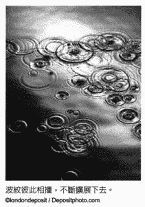

让一滴水落在无风无浪的平静水面上，水就会产生波纹；接着在不远处滴下另一滴水，又会产生另一个波纹。当这两个波纹撞在一起时，就会互相干涉，交叉，持续扩展下去。此外，它们也会被自己反弹回来的波干涉。

而当无数水滴像雨水般不断落到水面上时，波纹就会混乱到无法辨别。想必你应该看过这种状况。

能量紊乱（也就是意识紊乱）的形成模式简直就跟这个一模一样。

## 来到地球接受挑战的冒险灵魂

当我们的灵魂意识能量彼此交流时，灵魂意识会变得越来越紊乱，就像无数水滴在水面上打出波纹，然后这些波纹彼此干涉而乱成一团的样子。

除了我们有意识体验到的“自我宇宙”，还存在着没有意识，没有体验过的自我宇宙。如果进一步考虑到多次元平行宇宙的自己与自己之外的能量交流的情况，那就有无限多的交流了。

灵魂意识能量会因为各式各样的交流而形成自我，产生“我想要过得更开心”的想法，于是便会形成自己的人生目标，价值观与爱护自己等念头，导致能量越来越不稳定。

一旦能量变沉重，情绪就会变得更加混乱，最后会产生焦虑与恐惧，形成低次元的地球人特有的能量，于是就越来越接近地球的层次了。

当人类出现焦虑或恐惧等意识紊乱的情况后，灵魂便会产生“我想要导正意识紊乱状况”的渴望。灵魂意识能量会希望自己的问题能被修正。

在灵魂诞生之处——零点——周围呈现超高速振动频率的意识能量，会因为交流所获得的知识与资讯反馈现象，而拥有一切的知识与资讯。

此处的灵魂意识呈现的，就是全然和谐的宇宙之爱本身的状态。那正是你现在期盼自己拥有的那个“轻松愉快”的自己。

能量紊乱的灵魂会热切盼望回到零点，渴望做些什么，好让自己从充满焦虑与恐惧的状态，回到那个充满爱且轻松愉快的自己。灵魂就是如此盼望再次回到零点。

我们想回到零点的时机，决定了我们将前往哪颗星球。每个灵魂为了导正自身能量，会前往各式各样的星球。虽然有许多星球都处于比地球更高的次元（例如天狼星），但我们会根据自身能量的紊乱情况，选择可以帮助我们导正紊乱能量的环境，以及合乎灵魂自身需要的星球。

所有诞生在地球的人类，都是“太爱冒险的灵魂”。在能量紊乱的状态下，历经一段长时间的冒险，最后总算来到地球。对一个太爱冒险的灵魂而言，地球的环境可说是最适合导正自身紊乱能量的了，因为在地球上可以用以毒攻毒的方式修正严重的紊乱情形。

许多星球都能让我们更轻松地导正能量紊乱的问题，不会像在地球上遭受这么多折磨。然而，会前来地球的，都是些喜欢冒险，具有强烈好奇心的灵魂；此外，也因为我们能量紊乱的情况特别严重，所以需要一个更为艰难的环境。

地球充满负面元素，是一颗负面能量比正面能量强的星球，也因此更能让灵魂明白正面事物的可贵。我们的灵魂从一开始就知道在地球上生存是很辛苦的。

此外，我们的灵魂也直觉地知道，想要导正自己的能量，需要哪些事物的协助。

我们需要某些“经历”来帮助导正紊乱的能量。能量降低之后，我们就会把从前处于高能量状态时的一切事物忘得精光，因为身在低能量的次元时，无法记得高次元的情绪与感觉。想要找回这些当初遗忘的事物，就必须透过一些经历来获得领悟与启发。

“想要消除焦虑与恐惧”“要学习感恩”“想要借由原谅而成长”“想要学习爱自己”“想要培养自我肯定与直觉”“想要学习那些眼睛看不见的事物，而不只是有形事物”——每个灵魂意识都有各自的课题；也就是说，为了导正自己紊乱的能量，我们各自会有不同的经历。

身在高次元的星球时，灵魂意识能量的修正程度比地球低，也很少会有让自己痛苦的经历，于是得到的进化与成长也就很有限。

我们故意让自己来到地球这个令人“痛苦”的环境，从这样的经历中获得自己所需的领悟与启发，借此逐渐导正紊乱的能量。

这就是我们活在地球上的意义。

## 你的人生与身体运作模式，由高次元讯息掌控

我们在学校学过，每个人都拥有基因，而基因位在 DNA 这种双股螺旋结构中。

医学上的定义也是如此。医学上认为，基因是双股螺旋 DNA 这种眼睛看得见的物质性遗传讯息，同时也是核酸序列（分子结构）的编码。现代科学已经解读出人类所有的核酸序列，但清楚了解其功能的只有其中的 12.5% ，剩下的 87.5% 有什么样的功能，至今尚未明白。

不过，这个世界上没有一样事物是不具意义的。当我们在母亲肚子里长出身体时，该在何时及如何长出眼睛，双手，心脏与肾脏，这些都是不可或缺的资讯。而这些资讯就存在剩下的 87.5% 中。

不过，光是这样还不足以构成一个人类。比方说，我们还需要知道如何在一分钟内让心脏跳动 50-60 次，呼吸二十次，如何运用手脚爬行，如何分泌必要的荷尔蒙或酵素，如何修复伤口，如何排除毒素与外敌。这些资讯究竟位于何处？至少在双股螺旋 DNA 里并未找到。

其实，双股螺旋 DNA 的外侧还有好几层 DNA 螺旋，这些螺旋结构都是眼睛看不见的，而上述资讯就存在其中。

眼睛看不见的四肢螺旋 DNA ，是距离双股螺旋 DNA 最近的一层，里面包含让身体发挥各种功能的资讯，包括心脏，肺部的运作，消化，吸收，排泄与活动身体。

四股螺旋 DNA 外面那一层，是六股螺旋 DNA ，里面包含身体疗愈相关资讯——如何疗愈身体，如何让伤口愈合，如何击退病毒与细菌等。

紧接在六股螺旋 DNA 外面的，是八股螺旋 DNA ，里面所含的资讯与身体剧本有关，包括这个人会有怎样的体质，几岁会罹患什么疾病等。

八股螺旋 DNA 外面那一层，是十股螺旋 DNA ，含有关于个性，情感与能力的资讯，包括这个人会拥有什么样的气质，特质，身体能力，艺术能力，学习能力等。

在十股螺旋 DNA 外面的，则是十二股螺旋 DNA ，里面记载了整个人生的剧本。这个人会从事何种职业，经历什么样的经济状况，建立怎样的家庭，几岁会认识什么样的人等等，生命中会发生的所有事，都包含在这一层螺旋 DNA 里。

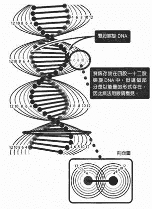

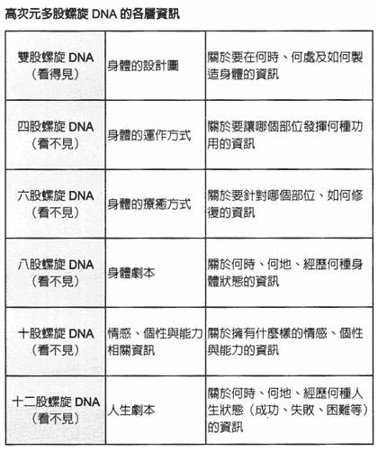

在我们出生之前，高次元多股螺旋 DNA 的资讯就记载了这些剧本。

高次元多股螺旋 DNA 的资讯是根据能量的频率构成的，频率不同，所有资讯会跟着出现变化。每个人类的 DNA 都拥有不同的频率，没有任何人的频率和别人一样。

而松果体则体现出 DNA 本身的能量频率。一开始，灵魂能量就栖息在松果体中。

松果体是在卵子与精子结合成为受精卵后，怀胎三 ~ 四周左右形成的，这之前的受精卵要称为“人类”还略显不足。那么，究竟是哪里不足？

答案是：灵魂意识。

灵魂意识能量会先清楚辨识松果体中眼睛看不见的高次元 DNA 资讯，接着才会进入身体里。灵魂进入身体这一刻，称为“灵魂入身”。

而经过灵魂入身的过程，灵魂进入人类个体里，于是，婴儿便出现了意识。

这一刻，正式开启了作为地球人的人生。

## 灵魂这样选择最适合自己的人类个体

没有任何一个人和别人拥有相同的人生剧本与身体剧本，每个人的人生与身体剧本都有着巧妙的不同，简直到了令人惊欢的地步。

当初我们的灵魂就是在一瞬间看清每个身体的差别，并选择一个最适合自己的个体，这项能力完全超乎我们的想象。现在的地球人只能用五感接收资讯，在运用逻辑判断，但灵魂当初清楚分辨每个个体的松果体资讯，并选择要进入哪个身体时，其实是运用一种更为直觉的方式。

在生活中面对第一次见面的人时，我们会在一瞬间感受到自己是喜欢或讨厌对方，有时甚至会强烈地被对方吸引，过不了多久就步入结婚礼堂，这样的例子所在多有。

第一次见面时感受到的“某种感觉”很难用言语描述。其实，与某人第一次见面时，我们会一口气感受到相当庞大的能量，在一瞬间判断对方于自己的能量是否合得来。

尽管这种情况与灵魂选择身体属于完全不同的层次，感觉上却颇为相似，因此用这种方式来想应该比较容易理解。

每一层高次元多股螺旋 DNA 中包含的所有讯息，都有自己特定的振动频率，因此会表现出特定的颜色。此外，这些资讯也拥有独特的声音，气味与触感，因此灵魂可以根据这些特质来分辨，光用看的就能在一瞬间得知该个体拥有什么样的人生与身体剧本，包括父母是谁，会有什么样的家庭环境与经济环境，会进入哪间学校，过着怎样的生活，活出怎样的人生，拥有什么样的健康状态，会罹患哪些疾病等。

灵魂究竟是如何分辨的呢？原来，地球上无数的“松果体光”中，最适合自己的松果体在自己眼里会呈现出璀璨的光芒。虽然这里用“松果体光”来形容当时我们的灵魂感受到的状况，但其实不只是光线，还混杂着声音与颜色等超越地球人理解范围的所有元素，演奏出一个故事的大纲，而松果体的能量就存在那里。

灵魂意识在感受到这个故事大纲的瞬间，便理解了一切。借由与其共鸣的感觉而判断松果体内部隐藏着哪种故事大纲，这一切都是在瞬间完成的，没有一丝犹豫与迷惘。

整个地球上，怀胎三 ~ 四周的人类个体数量相当庞大，如果是我们，应该会考虑很久：

“选这个个体好呢？还是那个比较好？”然而，灵魂是在瞬间决定的：“就是这个！我要这个个体！”与其说是挑选，不如说是感觉，就在这一瞬间立刻被这个个体吸引过去，一鼓作气地进入身体里。

灵魂必须寻找一个适合的个体来帮助自己导正紊乱的灵魂意识能量。在找到一个拥有最适合的高次元 DNA 频率能量的松果体时，灵魂会觉得极为舒畅，并快速进入该个体中，仿佛整个都被吸过去了。这种状况简直就像精子被卵子吸引一样。

我们都是被让自己觉得最舒畅的个体吸引过去的，而在这个令人舒畅的故事大纲里，已经记载了我们的人生将遭遇什么样的失败，什么样的重大疾病等资讯。这个个体拥有的人生与身体剧本，最适合帮助我们自行导正自己的问题，对灵魂而言是让它觉得最畅快，最舒服的一个个体。

## 能与自己的身体相遇是个奇迹

若以人类的思考方式来看，人通常不会特地让自己遭遇痛苦；但是对灵魂而言，一个能帮助自己导正紊乱能量的人生与身体剧本，却是不可多得的宝贵经验。

于是，灵魂不会认为“感觉好辛苦”“太痛苦了”，反而会觉得“非这个不可”，满怀喜悦的进入这个身体里，而且不会出现数个灵魂争夺同一个体的情况。

这也是一项宇宙规则，每个人需要的事物都不一样。将一个灵魂意识能量与另一个能量组合在一起，就像把拼图一片一片拼上去一样，自然进行的很顺利。

只要看看同卵双胞胎，就会感受到灵魂与身体的组合是在很有意思。从生物学的观点来看，同卵双胞胎细胞里 DNA 双股螺旋上的序列是一模一样的。由于 DNA 序列相同，因此身体特征也几乎一样，而且又是在同一个家庭长大，许多部分自然都会很相似。尽管如此，同卵双胞胎却会拥有不同的个性与喜好，因此也会走上完全不同的人生道路。

他们之间的差异不是出现在看得见的双股螺旋 DNA 上，而是在看不见的四股到十二股螺旋 DNA 里。带着不同的课题的两个灵魂分辨出两个个体有何差异，各自选择并进入适合自己的那个个体。所以，虽然彼此的身体外观一模一样，但从一开始就是完全不同的两个人。由于这两个灵魂都盼望可以拥有双胞胎手足，好在这样的环境中学习到他们需要学习的事物，因此便选择在同样的时间点进入各自的身体里。

顺带一提，当意识能量在身体还活着的状态下脱离肉体时（例如濒死体验与出体体验），最后会在不知不觉中自然回到身体里。

灵魂意识能量及其透过松果体选中的那个人类个体，彼此之间的关系密不可分。这就像是特别定制的西装或礼服一样，构成人类个体的这个身体，就是属于自己，独一无二的肉体。只要这么一想，我们看待自己人生的方式就会开始出现转变。

若再进一步想象七十亿个人类个体与灵魂拼凑成了一幅庞大的拼图，那么，一想到能与自己的身体相遇，便会忍不住产生一股敬畏与感谢的心情。

## 人生与身体的剧本是可以改写的

假如命运早已确定，没办法凭自己的意志改变，你或许会觉得这样的人生实在太无聊了。

灵魂感受到松果体发出的光，选择了最能帮助自己导正紊乱能量的那个人生与身体剧本，这一切感觉像是预先决定好的，没办法有任何改变。

不过，宇宙意识可不会做这么单调乏味的事。

宇宙已经事先帮我们准备好一个方法，让我们可以不断改写高次元多螺旋 DNA 中记载的剧本。

因此，我们必须了解改写剧本是基于何种机制，以及需要具备哪些元素。

人类的数量有多少，剧本就有多少套。

剧本上写着人们参加高中或大学联考，有人录取，有人落榜。

剧本上写着人们进入公司工作或辞职，欺骗他人或被他人欺骗，结婚或离婚，可以活到几岁，身体的哪个部位何时会罹患疾病。除此之外，还包含了个性，能力与天赋等所有资讯。

看不见的十二股螺旋 DNA 中，还会记载每个人那份隐藏的 DNA 会在何时“开启”或“关闭”，以及会透过何种方式诱发开启或关闭的资讯。

也就是说，关于一个人会在几岁，什么机缘下开启哪组 DNA 与关闭哪组 DNA ，都已经记载在十二股螺旋中了。

此外，当原本记载在 DNA 里的剧本资讯，被现在这个自我意识以外的意识（过去的人生，未来的人生，平行世界里的人生，家人与社会）形成的资讯扰乱时，只要能想着“这样就好了”，毫不抗拒地接受现状，就可以在原来的剧本写上自我意识以外的资讯，改写原来的剧本。稍后我会介绍一套可以有效促进这个现象发生的方法。

比方说，假设现在有个灵魂选择的剧本是从事上班族的工作，眼看正要飞黄腾达时，却受人欺骗而一败涂地，最后被公司开除。

这个灵魂为什么会选择这套剧本？其中一个原因是想要借由遭遇重大失败，学会“自己才是最值得信任的人，要多重视自己的直觉”“必须自立自强，不要依靠他人。”

也有可能是在遭人欺骗而凄惨落魄时，会有人来帮助自己，于是便能借由这个机会了解人还是很温柔的。

原来的剧本上写了一个“失败”的情节，因此设定好在这个时机“开启”失败的开关。

正因为这个经验对自己而言是不可或缺的，所以只要按照剧本写得那样，在这个时机经历失败，获得必要的启发和领悟，就能将开关从“开启”状态转为“关闭”。

然而，面对眼前的失败，如果只是一味地从负面角度看待，或是沉溺在懊悔的心情里——“为什么我会失败？竟然会出现这种失败，我的运气真的好背。”“骗我的那个人是在太可恨了！”——那么，剧本的开关就会保持在“开”状态，整个人生会不断重复相同的失败。

相反地，我们也可以从失败中学习，接受自己的失败。“失败真是太好了！”“我很感谢对方骗我”。只要一想到眼前的失败是自己剧本里的内容，便会觉得“失败也无所谓”“我可以借由这个事件好好学习”——就在我们这么想的时候，开关便会关闭了。

此刻自己的后悔之情，以及对对方的恨意，便会加到剧本上。

如此一来，“在某某事件中失败”的 DNA 便会发挥作用，转为开启状态，接下来将无法自动关闭。

感受到他人的温暖时，只要抱着“有人帮了我一个大忙，我真的好高兴”的心情感谢对方，那么“接受他人恩惠”的 DNA 便会开启，并一直保持打开的状态，往后的人生都会被他人亲切对待。如果这种时候无法怀抱感谢对方的心情，这道开关就会转为关闭，从此就不会再受到他人的帮助了。

遭遇失败时，就算无法从中获得该有的启发与领悟，只能从负面角度看待事情，深感痛苦，但只要你可以对眼前这个痛苦的自己说“这样就好了”，彻底接纳自己， DNA 就会协商新的剧本：“从痛苦中获得领悟与启发”。只要能接受剧本的主题，从中获得领悟与启发，就能将原本开启的开关转为关闭，或是打开原本关闭的开关。如此一来，人生与身体剧本便能进化与成长。

如果可以按照剧本写的内容生活，并从中获得进化与成长， DNA 螺旋便会运作的很顺畅；但假如否定现在的自己，一直纠结不已， DNA 螺旋便会纠缠在一起。一旦 DNA 纠缠在一起，基因的开启 / 关闭状态将不会符合自己心中所愿。

只要明白这个运作机制，就算遇到难以接受的局面，也能缓和心中的纠结，让自己的心变得比较舒坦。

倘若不了解这个机制，面对问题时恐怕就会逃避或暴跳如雷，很难正面看待。如此一来，从一开始就会深陷问题当中。

一旦进一步了解这个运作机制，明白其中的奥妙之处，就会开始觉得：

“下次又会遇到什么样的课题呢？”

“解决眼前这个问题后，我身上会出现怎样的变化？”

你便能用正面积极的态度接受眼前的问题，主动面对课题的挑战了。

进入这个阶段后，你想必会开始对这个精妙的机制怀抱感谢之情。

而心中越是保持感谢的心情，就会有越多频率相同的人聚集到你身边，并获得这些人的协助。如此一来，就很容易产生良性循环，之后当你遭遇重大问题时，也会有办法轻松解决，或是获得新的机会。

一开始，你也许很难相信这些事，但倘若你能接受“这是我自己选择的人生与身体剧本”，并进一步相信“搞不好真的会出现奇迹般的 DNA 开关”，幸运就会降临在你身上。

如此一来，松果体的通道便会开始打开，逐渐推动一股良性循环。

接着，你希望的剧本会新增到你原来的剧本上，甚至有可能改写原来的剧本。

## 如何获得启发与领悟

虽然灵魂意识本身的能量呈现紊乱状态，但是灵魂能量在进入人类个体后，会将个体里 DNA 紊乱的资讯传送到宇宙，然后宇宙智慧会根据这个资讯传送一份能量回来，以帮助个体导正回原本该有的状态。在这个瞬间，该人类个体的 DNA 会变成完全没有一丝紊乱的纯白状态。第五章会提到人们可以藉由自我工作活化松果体，而达到这种没有一丝紊乱的纯白状态。

人很难在地球环境中长期维持这种纯白状态，很快又会回到灵魂意识原本选择的那种混乱 DNA 状态。

当我们从这个纯白状态转为原本的混乱状态时，会感受到 DNA 能量变化的落差，这就能帮助我们获得启发与领悟，

这时， DNA 会根据我们得到的启发与领悟自动改写。

每个人改写 DNA 的速度与能力，会根据各自松果体的活化程度与意识的进化程度而有很大的差异。程度高的人改写速度快且强而有力，程度低的人则进度缓慢且强度较弱。

我要再次强调， DNA 会在高次元宇宙智慧的帮助下，形成白纸板的纯白状态，并在下一刻再度呈现灵魂意识选择个体时， DNA 原本的那种混乱状态。

这时灵魂意识会想起“我为什么选择这个课题”的理由。

人们就是这样获得启发与领悟的。

## 让烦恼与问题不知不觉消失的魔法

启发与领悟是在宇宙智慧的帮助下自然产生的，不是人们想要就能得到。

假如只是一味苦苦思索“我到底会从这件事获得哪些启发与领悟”，宇宙智慧便很难发挥作用。

有些心灵励志书会告诉人们：“遇到这种问题时，你就会获得这种启发与领悟。”但事实上，人是在宇宙智慧的帮助下，不知不觉中自然获得启发与领悟的。当人们打从心里觉得“这样就好了”，心情处于轻松愉快得放松状态时，松果体的通道便会开启，自然而然地获得启发与领悟。

一旦松果体的通道开启，所有原本不如自己期盼，不如自己所愿的事，都会变得越来越顺利。

我们就是在不知不觉中有所领悟，有所启发的。

“说起来，到底是什么时候开始转变的呢 ...... ”，事情会在这样的感觉中朝好的方向进展。

最近很多人会说“保持你现在的样子就好了”，这句话虽然没错，但其实有个很大的问题。

如果只是因为听到别人这么说，就硬是要自己这么想，强迫自己，在这种状态下，松果体的通道只会继续保持关闭状态。这跟在不知不觉中自然而然接纳一切事物，而“让自己感到舒畅”，是完全不一样的。

我们应该是要让自己变成“我觉得舒服，现在最真实的那个模样”，在不知不觉间自然接受这样的自己。

觉得“这样就好了”的时候，我们会进入相当放松的状态，彻底忘记那些讨厌的事；相反地，假如我们满脑子都是自己的症状与疾病，烦恼与问题，就会更往那个方向靠近。

只要观赏欢乐的电影，聆听喜欢的歌手唱的歌，整个人投入自己喜爱的事物中，就会感受不到疼痛与烦恼。

当人们将意识放在某件事物上或处于什么都不想的静心状态，彻底忘记那些被自己视为问题的事物时，宇宙智慧便会开始运作。

过了一段时间，某一天忽然回想起来时，会突然察觉“我最近变了耶”“原本的症状消失了”“人生已经没有烦恼了”。

当我们打从心里认为“这样就好了”，彻底接受自己人生与身体上的问题，呈现摆脱束缚的状态时，最容易接受到宇宙智慧。

只要能不被普遍观念与僵化思想束缚，好好珍惜自己开创出来的人生之道，所在的那个自我宇宙的环境也会出现变化。

所以，接受眼前的状态，想着“这样就好了”，这么做是很值得的。

## 人只能经历自己的灵魂选择的事物

为什么高次元 DNA 能量会纠缠在一起 ?

这是因为地球环境的结构本来就会借由他人与社会的能量，干扰人们活出自己原来的剧本。

我的诊疗方式是接触对方的身体，并放入高能量的宇宙智慧。如此一来， DNA 的资讯就会归零，在下个瞬间回到灵魂意识选择的那个 DNA 状态。

不仅如此，这时那些让 DNA 纠缠在一起的要素还会新增到剧本上。

人们从白纸状态的 DNA ，回到剧本改写后的 DNA ，在能量发生变化的这个过程中，为了让 DNA 上面记载的内容往好的方向改写，人们便会获得启发与领悟。

除了由我亲自接触当事人，也可以由当事人自己保持“这样就好了”的轻松心态，接受自己人生或身体的状态。只要这么做，就能让 DNA 归零，并获取宇宙智慧，帮助导正 DNA 紊乱的状态。

觉知到“啊 ~ 原来是这样”的瞬间，纠缠在一起的 DNA 能量便会松开来，同时， DNA 能量也会渐渐转为自己期望的状态，于是就会开始出现疾病好转，与疾病共存，问题解决等现象。

借由领悟与启发改写混乱的 DNA 能量，活出更好的人生，正是人类生活在地球上的目的。

相反地，假如一直沉溺在“我才不要这样”的思绪里，苦苦挣扎，就无法充分获取那份能帮助自己导正 DNA 的宇宙智慧。不仅如此，还会让 DNA 变得更混乱，更加纠结在一起。

内心纠结不已时接收到的宇宙智慧，与放松状态下接受到的宇宙智慧，两者的知识与资讯水平有明显的落差，而这样的落差，会直接显现在一个人的进化与成长上。

对灵魂意识的进化与成长而言，人生或身体上的许多问题并不需要抹除，我们可以选择朝气蓬勃地与不好的外在条件一起生活。此外，我们也可以借由自己获得的启发与领悟，将不顺的剧本改写为顺利的剧本。

无论哪一种，都是灵魂做出的珍贵选择。

即使是乍看之下无法接受的事物，也是你的灵魂意识所做的选择。人只能经历自己的灵魂选择的事物，这就是宇宙的法则。

由普遍观念与僵化思想形成的善恶概念，以及“人应该这样或那样”的认知，都会阻碍灵魂的进化与成长。

## 对灵魂而言，一切皆“善”

灵魂意识经历的任何事物，都是当下最好的状况。这样说的“最好”是指对灵魂而言，和人类的感觉是完全不同的。

灵魂的目标是导正自己紊乱的能量，因此对灵魂来说，善与恶的判断标准只在于：“经历什么样的事最容易导正紊乱的能量？”。

因此，若从导正灵魂能量的角度来看，无论做出什么选择，都是基于“善”的判断标准挑选出来的。

我们总是用地球次元所谓的“善”与“恶”来判断事物，随着剧本上的故事走向一下高兴，一下悲伤；但从灵魂能量的层次来看，我们经历的事物都是“善”的。

不过，现代人的松果体处于未活化的状态，松果体的通道总是关闭着，因此无法了解眼前这一切是灵魂选择的“善”，也无从得知“这是我自己选择的事物”。

松果体的通道如果持续处于关闭状态，我们便没办法接受“就算人生遭受失败也没关系”“即使生病也没关系”。

“死并不可怕。”

“虽然我遭遇这么重大的问题，但这样也不错。”

只要可以像这样彻底接受现实，便能和宇宙智慧连结，而这种状态会促进松果体活化，并开启松果体的通道；相反地，假如无法接受现实，让松果体的通道保持关闭， DNA 能量就会纠缠在一起，你的人生将一直在痛苦中挣扎。

一旦能够如是接纳并重视自己的所有经历，人生与身体会越来越往好的方向迈进。

虽说是好的方向，但指的是对灵魂来说好的方向。好坏的区分方式不在于身患疾病或没有疾病、死亡或活着，在于对灵魂而言是否为“善”。而灵魂认为“善”的那些事物，可以帮助我们活出轻松愉快的人生。

## 人类生命的资料系统

现代地球人的松果体并未活化。非活化状态又可称为弱化，萎缩，用医学名词来说则是“钙化”。无论哪一种说法，都是松果体未活化的意思。

对今后的地球人而言，唤醒沉睡的松果体是绝对必要的。

我前面提过，我们会以地球人的身份生活，是因为灵魂意识能量出现混乱，因此灵魂意识能量便从许许多多的人类个体中，选择了一个最适合帮助自己导正混乱的人生与身体剧本。这就是我们现在拥有的这个个体。

不过，一旦在地球上生活，势必会出现一些影响剧本发展的因素，因为地球上不只有我们自己的生命能量与意识，还有许多人的能量与意识会影响到我们。

面对这种状况，只要松果体呈现出活化状态， 发挥出宇宙智慧的力量，自己以外的意识能量造成的影响，会一并化为正面资讯新增到 DNA 中。接下来，我们就会活出改写后的的那套剧本。

即使事情不如自己预期，不如自己所愿，只要接受这个不顺利的自己，不去纠结，原来的剧本就会转变为顺利的剧情了。

但是，假如松果体持续处于非活化状态，写着人生剧本的十二股螺旋 DNA 便会开始缠绕在一起，地球人将沉溺在“我非这样不可”的想法中，一直痛苦下去。

## 改写地球人的资料

只要可以接受现实，不苦苦挣扎，就能解开纠缠在一起的 DNA ，这时由 DNA 组成的全身上下所有细胞会产生美妙的振动频率，让身体转变为百分之百和谐的状态。此外，累积在理性脑中的那些“必须这样才行”“不这么做不行”的普遍观念与僵化思想，也会被消除。

如此一来，松果体便会开始活化，宇宙智慧会降临在我们身上。于是，我们会获得启发与领悟，把纠结在一起的紊乱 DNA 松开来。

最后， DNA 会被改写为理想的状态。

每个人改写的情况各不相同，有的人只有情绪方面会改写，有的人则是连身体状况都改写。这一切都是各个灵魂选择的结果。

现在这个时代，选择只改写情绪方面，让人生尽早落幕的灵魂出奇的多。

这些人的疾病并不会好转，但他们可以接受自己的病，就这样带着平静的心情离世。

有些灵魂则会选择与疾病共存，跟身上的疾病和平共处一段很长的时间。以这种案例而言，灵魂改写的剧本不只是情绪，也稍微改写了一些身体状态。

此外，也有许多人的灵魂选择彻底治好疾病，于是身体真的奇迹似的康复了。不过，若要完全改写身体状态，还必须一并改写多股螺旋 DNA 中的双股螺旋 DNA 才行。

若你希望改写双股螺旋 DNA ，就必须先将那些看不见的 DNA 改写到某个程度。当你获得各式各样的启发与领悟，改写了那些看不见的 DNA 之后，看得见的双股螺旋 DNA 也会跟着改写。这时，就算是被医生宣告时日无多的癌症末期患者，也可能会在短时间内完全康复。

归根到底，松果体若未活化，就无法让看不见的 DNA 产生变化。无论是人生方面的变化，还是身体方面，都源自松果体， DNA 和宇宙智慧。

一旦松果体开始活化，并跟着松果体的力量走，人生与身体状态都会在不知不觉中逐渐往好的方向发展。

只要明白这一点，你的松果体肯定就会开始苏醒。

## 癌症是地球的礼物

我治疗过众多癌症末期患者，虽然有越来越多康复的案例，但是对大部分人来说，癌症至今仍然是一种令人畏惧的疾病。

当患者被医生告知罹患癌症的那一刻，人生至今堆砌出的一切简直彻底崩塌。癌症就是一种如此具有冲击性的疾病。而且，不光是患者本人，家属和周遭的人也会受到很大的影响。

为什么会有这么多人罹患这种可怕的疾病？

这是因为有许多人的灵魂意识选择“借由罹患癌症来学习如何克服焦虑与恐惧”。

许多千里迢迢来到地球的灵魂意识，都是以克服焦虑与恐惧作为自身课题，而这些灵魂意识认为，罹患癌症是最适合自己学习克服的途径。

癌症是一种威胁性命的疾病，会逐渐扩散到全身上下，让人的生命缩短。

由于现代医学尚未研究出一套治疗癌症的方法，因此，患者在罹患癌症时会感受到强烈的焦虑与恐惧。以克服焦虑与恐惧作为课题的灵魂意识会选择透过这种疾病来帮助自己完成目标，确实很合理。

虽然从当事人得知自己罹患癌症的那一刻起，试炼便开始了，但每个人的灵魂意识对后续发展会有各种不同的选择。

事实上，当人们获得应有的启发与领悟后所迎接的结果，大致可分为三种：康复，与癌症共存，以及在平静的心情中因癌症而辞世。

每个灵魂意识会判断哪一种剧本最适合帮助自己获得所需的启发与领悟，在灵魂一进入肉体时就决定好要选择哪一套剧本了。

有的灵魂会选择透过启发与领悟，将癌症当成朋友，不让自己从负面角度看待癌症，反而借由癌症获得进一步的启发与领悟，跟癌症共同生活下去。这种选择是借由一套和平的剧本，让灵魂获得强而有力的进化与成长。

然而，有些灵魂会选择在有所启发，有所领悟之后，依旧无法治好癌症，就这样迎向人生的终点。在这种案例中，当事人会在获得必要的进化与成长之后，带着平静的心情拉下人生之幕。

若以这个世界上的常理来思考，恐怕会觉得这种选择实在令人费解；但是对灵魂而言，却是托癌症这种疾病的福，让自己可以获得这一段人生所需的启发与领悟，接着迈向下一段新的人生。

在下一段人生里，将会活得更加轻松愉快。

当患者的灵魂做了这样的选择时，对留在世上的家人而言可说是个令人痛苦又难受的结局。不过，家人也能透过陪伴患者平静地走到最后一刻，从中获得某些启发与领悟。

事实上，罹患癌症的人数有多少，就代表有多少人按照原定计划借由启发与领悟改写剧本，以及有多少人透过沉浸在痛苦中改写 DNA 资讯，获得新的剧本。

假设有个患者会借由一套剧本有这样的领悟：“我已经患了这种病，随时都可能离世，但我已经接受了一切，心里再也没有任何恐惧了。”“既然灵活的本质永远不灭，并不需要用生与死来界定，那么就算我现在这样也没关系，我不必焦虑。”

而这个人的剧本上写着“五十岁罹患癌症”，那么当这份 DNA 开启时，就会在五十岁出现癌症的症状。这时，只要能获得应有的启发与领悟，就可以选择消除癌症活下去，与癌症共存，或是让人生落幕等三种不会感到痛苦的结果。

不过，现在假设有个灵魂原本是选择消除癌症继续活下去。这个人原来的剧本上写着借由癌症获得应有的领悟与启发，接着癌细胞就此消失。

然而，这个人并没有按照原定计划有所启发与领悟，反而不断苦苦挣扎，想着“我还不想死”“我实在太不幸了”“这都要怪谁谁谁”。如此一来，“死亡 DNA ”的开关就不会关闭，等于是开启一个原本相反的开关，就此离开人世。像这样的案例也是有的。

就算已经陷入这种状况，如果能在去世的前一刻明白“这样就好了”，那么这一刻就能改写出一套新的剧本，下辈子将诞生在一个比这辈子更加美好的环境里。

无论最后走的是哪一条路，都是灵魂一是追求的那个剧本。

因此，即使剧本的走向对世人来说是悲伤的结果，只要自己能明白这一切有其必然，而且是自己盼望的结果，就能稍稍缓和当事人与周遭人们的痛苦与悲伤，面对疾病的态度会有所不同。

此外，根据领悟与启发的结果，剧本的结局也有可能出现变化。

有时，当人们正视课题而有所启发与领悟时，灵魂意识便能作出新的选择。比方说，原来的剧本写着无法治好，最后却能转变为彻底根治的剧本，或是在获得深切的领悟与启发后，早早结束这辈子的人生。

## 松果体可以接收宇宙智慧

从现在开始，人类和宇宙的连结会变得越来越紧密。而在这样的时代，松果体扮演着重要的角色。

零点是灵魂意识的诞生之地，这里聚集了所有的知识与资讯。这些知识与资讯包含无限多的资料，数量大到令人昏眩的程度，且宛如树状图一般无限延伸。但最后会一口气聚集到宇宙的源头——零点。这里包含了从过去到未来多次元平行的自己相关的所有知识与资讯。

一旦可以连结到宇宙的源头，就能获取位于地球次元的自己所需的一切知识与资讯。

这些知识与资讯正是宇宙的智慧——宇宙灵魂波。宇宙灵魂波会进入松果体中，而松果体是人类体内唯一能接收到宇宙智慧的器官。

松果体的一项重要工作，就是将宇宙的智慧（宇宙智慧波）转换为身体的智慧（身体灵魂波）。宇宙灵魂波来自灵魂意识的源头，本身拥有极高的振动频率，如果宇宙灵魂波直接进入身体细胞中，细胞会受到严重的破坏。因此，松果体才必须进行转换，让频率下降到身体能承受的程度。

这时，松果体扮演的角色是将宇宙智慧化为身体智慧的变压器。

松果体活化的程度越高，宇宙智慧（个人所需的知识与资讯）便会越强力且有效率地灌注到松果体内，而这将化为身体的智慧，让人类有可能活出更美好的生活。

如此一来，人类便不需要仰赖医疗机构与社会福利，也不需要仰赖朋友与他人，就能透过宇宙智慧获得必须的一切事物。

## 矽是生命的宝物

为什么人们要利用松果体将宇宙智慧转换成身体智慧？

因为，松果体是人体中矽的比例最高的器官。

松果体中的矽含量极高，说是以矽组成的也不为过。因此，松果体是全身上下最能接收宇宙智慧的器官。

地壳中含量最多的元素是氧，矽的含量则仅次于氧。

矽存在于人体各个部位，人类六十兆个细胞的细胞膜都含有矽，只是比例不及松果体那么高。

植物因为没有松果体，便透过自己的细胞壁与细胞膜中的矽接受宇宙智慧。

动物与昆虫能和谐的生活在大自然中，也是仰赖松果体的帮助。蝙蝠与没有眼睛的深海鱼因为拥有一种与松果体功能相同的器官，所以只需凭借些微光线或超音波，便能在黑暗的环境中安稳生活。

人类的胸腺与粒腺体的主要成分也是矽。

虽然人体各个器官都能接收宇宙智慧，但这些器官最终还是由松果体掌控。

接下来我要说的内容，是第一次透露，目前为止没有任何人知道。

其实，在宇宙间的所有原子中，只有矽原子的内部拥有黑洞。

任何元素的中心都是原子核，原子核周围则有电子围绕。矽原子拥有十四个电子，而电子轨道，亦即三个电子层之间，存在着一个强而有力的黑洞。

我将此处的黑洞命名为“矽洞”。

 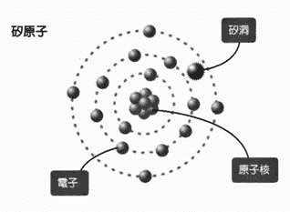

矽洞是一种可以接收宇宙智慧的特殊通道，同时能将接收到的宇宙智慧能量，转换成人类所需的身体智慧能量，传送至全身上下。

也就是说，由于松果体是矽的强力集合体，拥有矽洞这种能力惊人的物质，因此扮演着变压器的角色。

往后的人类若要持续进化与成长，必须不断提升松果体主要成分矽的能量水平，也就是提升矽的质与量。

从现在开始，人类该做的是什么？如果要我选择一个答案，那么我会这么回答：

“促进松果体活化”。

答案只有这一个。

## 现代医学忽略的部分

我将从医生的角度告诉各位，地球人从今以后应该重视哪些事物。

很有意思的是，那些现在的科学与医学认为人类不太需要的器官，几乎没有意义的器官，实际上却掌握着重要关键。

其中之一是阑尾，也就是盲肠。

接着是胸腺，而最重要的则是位于大脑深处的松果体。

这些部位的功能都很不明确，因此并不受到现代医学的重视，但这些器官对往后人类的进化而言，都是不可或缺的。

此外，细胞内部的线粒体也一样。线粒体是制造人类活动所需能量的重要物质。

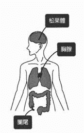

现代人的阑尾，胸腺与松果体，都比古代人的还要小。

线粒体则出现数量减少的状况。线粒体本身扮演着制造细胞能量的角色，但由于数量减少，因此无法自行制造能量，于是人们才需要额外吃健康食品，营养辅助品等对身体有帮助的东西。只要线粒体保持健康状态，人类就能借由摄取最低限度的食物自行制造能量，因此照理来说，人是不需要吃营养食品的。

胸腺是控制免疫功能的总管，阑尾是生产免疫细胞的工厂，线粒体则是制造生命能量的工厂，而只要松果体活化，这些部位都会跟着活化起来，变得强而有力。

## 松果体的输出与输入功能

只要提升松果体中矽的比例与能力，使松果体越来越活化，就能让矽原子的集合体——矽洞变得巨大且强而有力。

我们可以透过矽洞这个通道，连结到宇宙的高层次能量。

此外，矽洞也会吸收（输入）组成人生与身体的高次元多股螺旋 DNA 资讯出现的紊乱状况，并释放（输出）一股用来导正的能量。

矽当中的矽洞拥有双面性，同时具备输入与输出两种能力；宇宙当中的黑洞则是矽洞巨大化形成的产物，本身与矽洞拥有相同的性质，因此也具备输入与输出两种功能。

白洞（输出）

松果体的第一种功能，是在瞬间抵达一个很接近宇宙源头（零点），能量水平极高的地方。

松果体一旦开始活化，矽的含量便会增加，浓度也会越来越高。随着松果体的力量因活化的程度而提升，连结宇宙的出入口——松果体通道也会越来越敞开。

如此一来，透过矽洞瞬间抵达的地点便会越来越接近宇宙的源头；而越是接近宇宙的源头，松果体就会接收到越多高层次的知识与资讯。

当松果体的矽洞接受到宇宙层次的资讯之后，资讯的能量水平就会在松果体当中转换为身体的水平，而转换后的资讯会透过神经传递到全身上下的细胞。同时，这股能量也会从脑部中心呈放射状传递到大脑的四面八方，扩及到周围的脑细胞。

高层次的宇宙智慧就这样传送到身体的各个部位。

这就是松果体的“输出”功能，我将这种功能命名为矽洞的“白洞”。

这是因为高次元频率下降成低次元的人类频率时，高次元能量会透过矽洞散发出白色的光芒。

高次元能量为了降临到地球的次元，必须降低自身频率，高次元能量就会透过松果体的通道——矽洞释放出璀璨耀眼的白光。

一旦接收到高次元能量（宇宙智慧），对地球次元所谓的“好”“坏”能量便能一视同仁地接受，也就是不会再擅自做出判断了。

正因如此，所以面对一切事物，都会觉得“这样就好了”。

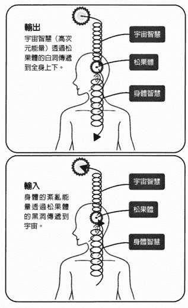

黑洞（输入）

松果体第二种功能的能量流动方向，则与第一种功能相反。

这种功能会吸收身体的低能量，并传送到宇宙之中。这就是松果体的“输入”功能。

松果体会先吸收人生与身体问题的资料，并将构成资料的振动频率本身具有的紊乱能量告知宇宙源头，以获取导正所需的能量。

当写着自己人生与身体剧本的 DNA 出现紊乱时，矽洞会将这个紊乱状况输入到松果体，并传送到宇宙之中，这就是矽洞的另一个功能。如此一来，便能获得宇宙智慧，以导正与改写紊乱的 DNA 。

这便是矽洞的“输入”功能，而这种功能会发挥出“黑洞”的效果。

从我们的角度来看，这种黑洞是黑色的。当松果体吸收能量，输送到高次元时，这股流动的能量呈现的颜色是黑色。

灵魂可以借由输出与输入这两种功能，获得真正需要的知识与资讯。

当这个功能降低时，就如同在收不到讯号的地方玩手机，只能浏览手机里既有的资料，拍照，以及输入电子邮件的草稿，却无法收发信件与讯息（而这才是手机最重要的功能），也没办法连结到任何影片与网站。

当松果体处于未活化状态时，就仿佛置身这样的状态中。

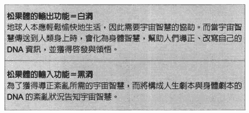

## 大脑与松果体通道之间的关系

让松果体活化的秘诀，就是提升那份输出的宇宙智慧的质量；也就是说，要进一步接近自己的零点，进一步提升自己能量的振动频率。

而想要达到这样的结果，就必须开启松果体的矽洞形成的通道，导正负面的输入，增加正面的输出。

有许多方法可以达成这个结果，但我特别推荐进行自我工作。此外，最重要的，终究还是抱持“这样就好了”的心态，接受人生与身体经历的一切。

这时，我们会遇到一个问题。

那就是我们现在使用大脑的方式。

我们在日常生活中普遍采取的“思考”行为，其实只停留在地球的层次，松果体完全没有参与其中。

其实，我们根本不需要千辛万苦地思考答案，宇宙智慧就会直接降临在松果体了，而我们所需的一切答案都在里面。

问题在于，当人们“思考”时，会觉得“应该这样才对”，这时产生的那股能量，是左半部松果体与左边的地球脑接收的左旋能量。左旋能量会让松果体的通道关闭。

相反地，一旦接受眼前的一切，相信这都是自己的选择，这时产生的那股能量，则是右半部松果体与右边的宇宙脑接收的右旋能量。

右旋能量会开启松果体的通道。不过，一旦开始“思考”，这股能量就会转为左旋能量。

多股螺旋 DNA 也一样。只要可以按照事先选择的那套剧本生活，螺旋就能维持右旋状态；但如果否定现在的自己，就会产生一股左旋的能量， DNA 螺旋便会纠缠在一起了。

抱持“这样就好了”的态度，不假思索地接纳一切事物，便能形成那股右旋的能量。如此一来，就有办法解开纠缠在一起的 DNA 了。

## 运用神圣几何学解开矽的秘密

为什么矽里面的的矽洞会拥有黑洞与白洞的能力？这是一个很大的迷。

矽的基本结构和其他元素相同，一样有原子核，原子核的周围也围绕着电子，却唯独拥有十四个电子的矽才具备黑洞的能力，这一点实在既神奇又神秘。

矽这种元素也和宇宙的诞生与结束有关。宇宙和星球诞生时，会产生大量的矽；而当星球毁灭时，最后也会留下矽。

在星球的最初最后一刻都可见到矽的身影，从这一点来看，矽可说是宇宙不可或缺的重要因素。

此外，最小单位的生命体“微体”（ somatids ）也来自矽。

无论是生命或星球，在诞生的时刻，都有矽参与其中。只要有矽，就能孕育出构成宇宙的所有事物。

这个世界上的万事万物都是能量，而所有能量都有一个共通的规则。

比方说，以碳为成分的物质——无论是蛋白质，碳水化合物或脂肪——都有一套物质建构规则。虽然这些都是眼睛可见的物质，但看不见的那个世界同样存在着这套规则。

总而言之，那股看不见的能量一路发展下去，便造就出看得见的这个世界，因此看不见的那个世界原本就有一套规则。看得见的世界之所以存在，其实不过是建立在看不见的那个世界之上罢了。

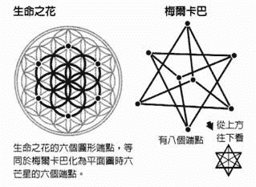

那么，这套规则究竟是什么 ? 答案是能量的形式。这套规则本身依循着能量的根本结构。

以“生命之花”为代表的神圣几何图案，便体现了能量的根本结构。

研究生命之花的人指出，这个图案本身就是“能量的结构”。

只要将生命之花这个几何图案的中心看作零点，就会发现矽所拥有的矽洞呈现出和零点相同的能量结构。

生命之花虽然是一种平面图形，但如果把它化为立体图形，就会形成由两个正四面体构成的“梅尔卡巴”结构。

构成梅尔卡巴的两个正四面体分别朝向上方与下方，而这个图形从正上方往下看，会看见六个端点，这也是生命之花中心部分的形状。

  因此，一旦从立体空间来看能量的结构（能量的源头），就会出现为梅尔卡巴的形状。

由于梅尔卡巴是一种由两个正四面体构成的立体图形，因此实际上有八个端点，本身会产生八个电子。

宇宙与生命的组成元素中最重要的部分（例如矽里面的矽洞与零点等）都呈现梅尔卡巴的形状。因为呈现这个形状，所以极容易制造出八个电子。

矽洞会制造出电子——事实上，它更可以制造出任何数量的电子，于是便能形成所有的元素，原子，以及一切物质。

矽洞的这种能力，称为“原子转换”或“物质转换”。此外，将某种原子转变为另一种原子的能力，也称为“原子转换”。

由于矽洞本身具备梅尔卡巴的性质，因此可以轻易地从八个端点释放出八个电子。

人类是由碳组成的。碳的原子序是 6 ，拥有六个电子，这时再加上矽洞生成的八个电子，总共会有十四个电子，于是就变成了原子序 14 的矽原子。

矽里面的矽洞可以将人类的能量从碳转换为矽，帮助人类矽化（水晶化）。

人类之所以是由碳组成的，正是因为背后已经预设了一套“帮助人类提升次元”的剧本。只要借由活化松果体制造出一股矽化的正向循环，让松果体进一步活化，变得强而有力，人类会渐渐不需要进食与睡眠。

## 人体细胞遗传的是频率

我们身体的六十兆个细胞各自被细胞膜包覆，而细胞膜当中也富含了矽。

细胞膜表面有“受体”，这是一种相当于资讯传递窗口的接收器。

现代科学认为神经末梢会释放出乙硫胆碱与去甲基肾上腺素等神经传导物质，而由受体接收这些物质，将必要的信号传递到细胞里。

但实际上，神经传导物质只是频率在细胞之间传递的过程中产生的副产物而已。

其实，细胞真正传递的是频率，身体灵魂波的能量频率从松果体发送到神经，最后被受体接收。

如同我之前提过的那样，松果体接收到的宇宙灵魂波会在松果体进行转换，化为身体灵魂波，传递到全身上下的神经。从神经细胞的神经末梢经过突触（形同神经之间连结的网络），最后传递到末梢细胞的细胞膜表面的受体。这一切都是为了传递频率。

最后，频率的能量会抵达每一个细胞，抵达细胞膜受体里矽的矽洞，并创造出人体所需的能量。

此外，由于频率的能量会抵达细胞内部核心，并对 DNA 产生影响，因此便能促进蛋白质合成，制造身体细胞，并让身体细胞产生变化。

每个细胞中的矽里面的矽洞，也会各自发挥白洞与黑洞的功能，维持细胞现有的状态，并促使细胞进化。

对现今的科学而言，受体可谓最先进的概念。目前的科学理论认为，神经末梢会释放出各种神经传导物质，被细胞的受体接收后产生化学反应，接着便释放出合成物质。

不过，“看得见的事物”与“可测量出的事物”终究只是高能量频率生成的一种低频率物质而已。

对高次元的科学而言，矽里面的矽洞才是一切的关键。

## 超越时空的大门

地球人被时间，空间与重力束缚。

一旦被重力束缚，人类能量的本质——螺旋频率就只能朝着地球中心的特定方向。

事实上，正是这种被拉往地球的状态，创造出“时间”与“空间”。不过，一旦有办法自由提升自身频率的能量，就能朝向更多方向，于是便能脱离时间与空间的束缚。

时间与空间这两种概念，是基于“我的身体只存在于此时此地”的幻想而生的。

“我存在于此刻，不存在于其他时间”“我存在于此地，不存在于其他地点”。这样的概念不过是一种处于“我只存在于此时此地”的幻想。

从基本粒子的层次来看，自己的灵魂意识能量存在于现在，过去和未来。也存在于这里和其他地方，只不过现在选择了眼前这个地方罢了。

若松果体处于未活化状态，我们就会受到重力束缚，被关在时间与空间的框架中；相反地，假如松果体活化，通道敞开，就可以自由地选择多次元的平行自我宇宙，于是便能自由跳跃到任何时空中的自己身上。这是因为构成自己的那股频率获得提升，于是便摆脱重力的束缚，时间与空间的框架也跟着变得越来越稀薄。

松果体是为唯一一扇穿越时空的大门。

顺带一提，一旦松果体活化，能量的频率提升，就能自由的翱翔天空，这是因为摆脱了重力的束缚，形成反重力状态的缘故。

而这就是幽浮漂浮的原理。

## 松果体促成了“吸引力法则”

  “吸引力法则；现在已经广为人知，这无疑是宇宙源头的法则之一。”当我们想要实现某个愿望时，这是一种非常有效的方法。

不过，确实也有许多人学习并实践了这个法则，或是其他各种成功法，却依旧无法获得自己期待的结果。

为什么会出现这种状况？

因为，人们单纯是以脑袋去理解这个法则，不和宇宙智慧连结，反而以普遍观念，僵化思想，自己的今生以外的知识与资讯，甚至是自己之外的其他意识提供的知识与资讯为优先所致。如此一来，不只无法获得灵性上的成长，甚至会加速发展成一个“僵化死板的地球人”。

想要成功运用吸引力法则，第一步就是要让松果体活化；再来，还需要和宇宙连结。

当松果体未活化时，其通道会呈现关闭状态，事情就不会发展成你想要的样子。

假如不了解松果体，让他维持未活化的状态，那么不管再怎么努力研读吸引力法则或自我启发法，未来也无法如你所愿。

## “这样就好了”的心态能让松果体发挥作用

该如何活化松果体？究竟要怎么做，才能不再当个僵化死板的地球人，和宇宙连结，活出不再痛苦的人生？

答案是：用“这样就好了”的心态完全接受自己此时此刻在人生与身体上经历的一切。

没错，就像“天才妙老爹”里的爸爸说的：“这样就好了”这套日本知名漫画里的爸爸简直就是地表最强的模范爸爸。

为什么这么说呢？因为，我们人生与身体上的各种状态，都是灵魂意识透过松果体选择要进入哪个人类个体时，自己挑选的剧本。

只要接受这一切，自己选择的这套剧本就能按照原本应有的方向发展，或是让原来纠结在一起的剧本松开来，透过改写的方式让剧本正常运作。如此一来，松果体就会逐渐发挥应有的功能。

这时，松果体的矽洞——亦即通道——便会敞开，高次元的宇宙智慧将流入身体，将剧本改写成自己理想的模样。

除此之外，还能自由的选择理想中的自己所在的那个多次元平行自我宇宙。

这简直就是一场“革命”。为了发起革命，也就是获得自己渴望的理想未来，首要之务就是促使松果体活化。

遇到这个问题时，请实践第五章介绍的唤醒松果体的秘诀与技巧，一点一滴的尝试接受现在的自己。

当你掌握到一个微小的机会时，就从这件事着手，这将成为突破问题的开端。

# 第四章  解开松果体的奥秘

## 松果体扮演发号施令的角色

我们普遍认为身体是由大脑控制，由大脑下达指令，但其实并非如此，不只是身体，包括对我们的人生下达指令的，都是看不见的高次元十二股螺旋 DNA 资讯，以及在背后推动这一切的宇宙智慧。

事实上，通过松果体的宇宙智慧掌握了控制人生与身体的十二股螺旋 DNA 资讯的指令，但这个世界上没有一本书提及此事。

前面提过，现代人的胸腺，阑尾与粒线体的功能越来越弱，而这正是松果体弱化所致。

当 DNA 对胸腺发出“制造某某免疫细胞”的指令时，松果体扮演着监视与调整的角色。此外，当 DNA 对阑尾发出“释放某某免疫细胞”的指令，以及对线粒体发出“制造多少能量””现在停止工作”等命令时，也都是由松果体监视与调整。

然而，由于松果体变得越来越衰弱，如今胸腺，阑尾与线粒体都已经无法发挥原有的能力，于是这些器官就全部萎缩了。

松果体变弱之后，线粒体就不会再制造能量，所以全身上下的能量都会减少。越来越多现代人出现疲劳，身体恢复能力不佳，冬天极度畏寒等情况，就是因为这个缘故。

身体过敏，特异性过敏症，气喘，关节炎，结缔组织疾病，癌症等问题，都和免疫失调有关。

由于松果体无法监视与调整胸腺与阑尾的运作，便会出现免疫失调的状况，包括运作过度，不需要运作的时候也运作，该运作是不运作等现象。而免疫失调的结果则会以疾病症状的方式显现。

只要松果体朝气蓬勃，这些问题都会一扫而空。尤其是身体的免疫功能与制造能量方面，和松果体更是有密不可分的关系。

免疫与制造能量的功能若是可以正常运作，我们的身体就能保持在健康状态。光是从健康方面来看，就足以明白促进松果体活化具有多重要的意义。

## 让松果体功能减弱的毒素

一直以来在物质社会苦苦挣扎的地球人，迈入现在这个时代之后，开始出现些微进化，灵魂的频率逐渐提升，所以人们察觉到，就算身体和内心感到愉快，灵魂却依然不快乐。于是，灵性社会的大门就此开启了。

唯有松果体活化，灵魂才会感到愉快。但这件事情始终被特定人士隐瞒，所以对于松果体真正的价值与功能，人们相当缺乏正确资讯。

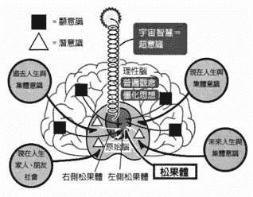

现代人的大脑比古代人发达许多，于是便很容易凭借大脑累积的知识与资讯处理事务。这么做就会创造出普遍观念与僵化思想，也很容易被集体意识（自己以外的其他意识建立的想法）影响。

普遍观念，僵化思想与集体意识形成许许多多的“杂念”，而这就会妨碍来自宇宙智慧的直觉运作。于是，人们会开始认为“我必须这样做才行”“我必须变成这样才可以”，活在纠结与痛苦中。如此一来，松果体只会越来越衰弱。

难得人类拥有松果体这个庞大的无线电收信机，可以运用一路延伸下去的神经，一口气将资讯输送到全身上下。人类明明有如此高效率的智慧系统，现在这套系统却几乎处于沉眠状态。

动物因为不会用大脑思考，所以不太会形成普遍观念与僵化思想，杂念也比较少，宇宙智慧就很容易发挥作用，让动物能够与大自然一同生活。其中由以海豚最为明显。海豚会平稳地处理本能的智慧与集体意识，单纯活在“当下”的情绪中。因此，海豚的松果体与原始脑明显比其他生物大，理性脑（大脑新皮质）的体积则很小。

当大脑像人类这么发达时，活在三次元的地球社会就变得很容易，很方便，但同时也就难以连结宇宙智慧。如此一来，就很难与大自然一同生活，于是就此成为一种偏向文明的生命体。

此外，“直视太阳很危险”的概念，也是松果体弱化的重要因素之一。看着太阳可以提升矽的振动频率，帮助松果体活化，人们却被错误观念深深影响。关于这一点，我会在第五章详细说明。

再者，有些物质也会导致松果体丧失活性。

那就是汞与氟。

疫苗含有汞，牙膏里则有氟。现代人相信医学，社会与媒体提供的资讯，于是大量摄取这两种物质。

为什么这两种物质会导致松果体失去活性？因为，汞与氟本身的振动频率会扰乱矽的频率。

此外，汞的频率还会损伤大脑与神经细胞，因此注射疫苗相当危险。

## 松果体产生变化的历史过程

成人的松果体大小约七 ~ 八公厘，婴儿时期的松果体则比成人大上许多。人长大后，因为只会使用由普遍观念与僵化思想形成的大脑知识与资讯，所以松果体渐渐不再运作，就此萎缩。

不过，我们远古时期祖先的松果体有二 ~ 三公分大，跟海豚的松果体差不多大小。

远古时期的人类，负责处理显意识的大脑皮质相当小，处理潜意识的原始脑不像现在这么大，用来接收宇宙智慧的松果体则很大，运作的十分活跃。

这个时期的人类不会被灌输多余的知识与资讯，因此相当重视那些眼睛看不见的事物。同时，他们既不会思考复杂的事，也不会为其苦恼，而是单纯的尊崇那些眼睛看不见的存在，与大自然共处。在这样的生活中，松果体可以确实发挥原有的功能，保持在活化状态。

包括日本在内的全世界人类，和宇宙智慧的连结大概都是从十九世纪中后期开始变弱。

随着人类文明越来越进步，人们不再相信眼睛看不见的世界，超能力与通灵能力之类的事物，实用主义日渐盛行，人们习惯以知识与资讯思考事物，以过去发生过的例子做判断，于是便形成了普遍观念与僵化思想。一旦形成普遍观念与僵化思想，松果体的运作就会受到阻碍，于是人们越来越不去使用松果体。而当松果体不再受人使用之后，也就变的越来越小。

人们越是使用大脑，以理论思考事物，松果体越是丧失活性，陷入恶性循环。现代人以左边的松果体为主，特别倾向使用左脑（地球脑）思考事物。

## 高次元存有与松果体

远古人类深信且尊崇的那些看不见的高次元存有，是高次元地球外生命体，也就是外星人，以及人们的集体意识形成的神与天使的能量。在那个时期，高次元的生命体及能量会直接与地球接触。

远古人类持续与高次元生命体接触，高次元生命体则直接将宇宙智慧化为讯息，传达给远古时期的人类。

由于远古时期地球人的松果体处于活化状态，因此有办法接收高次元的资讯，学习各式各样的事物。

他们学习的正是宇宙本质的资讯，也就是宇宙智慧。

然而，之后情况出现变化。根据高次元存有的判断，地球人若要进一步成长，就不该由他们接触地球人，而是应该全权交给地球人自己处理，效率才会更好。于是，高次元存有便离开了地球。

接下来有很长一段时间，人类都不曾和他们直接交流。不过，能和高次元存有接触的时代又将来临。

外星人与神即将再次回到地球。

只要能在他们协助下让松果体恢复活性，我们就会开始接收到高次元的资讯，也就是宇宙智慧。

如此一来，便能促使松果体进一步活化，让我们接收到更多宇宙智慧的知识与资讯，创造出一个强而有力的良性循环。

## 松果体是灵魂所在之处

远古时期的地球人几乎不曾生病。当时的社会不像现在这样僵化死板，他们过着悠哉愉快的平静生活，拥有稳定且柔软灵活的能量。

最重要的莫过于他们的松果体处于活化状态，因此胸腺，阑尾与线粒体也有极高的活性。在这样的状态下，免疫功能会充分发挥作用，同时也有充足的能量，因此便不会生病。

此外，松果体一旦活化，松果体和身体会逐渐矽化。高度矽化的身体不需要摄取多少食物，也不需要多少睡眠时间，就足以获得生活所需的能量。也就是说，当时的人类生活得更加自由，他们以右边的松果体为主，右脑（宇宙脑）特别发达。

远古时期的人类会老老实实地接受所有来自高次元能量的知识与资讯。

顺带一提，美国原住民霍皮族现在依然保有这项特质。全世界的原住民都和生活在文明社会的人不同，他们相信高次元存有，不被普遍观念与僵化思想束缚，因此，他们的松果体便能处于活化状态。

此外，海豚这种松果体活化的动物可说是极为特别的存在，同时也拥有十分卓越的能力。他们不具备过去与未来的观念，丝毫没有过去的回忆与懊悔，也不会对未来抱持担忧与恐惧，因此拥有特别强烈的“活在当下”的能量，可以轻松愉快的生活。而且，他们还同时拥有多种情感，随时都能置身于适当的情绪中。

由于海豚处在这样环境下，松果体因此可以维持在强而有力的状态。他们运用松果体进行心电感应，彼此沟通与交流，但最重要的一点还是在于它们和宇宙智慧保持连结。从低次元资讯的层面来看，人类的进化程度高过海豚；但就高次元智慧的层面而言，海豚的进化程度远高于人类，他们正可谓活出了轻松愉快的生命，活出了灵魂意识原本应有的状态。

伟大的哲学家指出“松果体是灵魂所在之地”，说的真是太好了。

## 松果，蛇与真知之眼的谜团

让我们再看一次大脑的示意图。位于理性脑中的现在人生的普遍观念与僵化思想形成了“显意识”，位于原始脑中的过去人生，未来人生与平行人生的意识，以及自己之外的家人与社会的意识形成的集体意识，则共同形成了“潜意识”。现代地球人大脑中的显意识与潜意识，不断以妨碍能量运行的方式攻击并阻碍松果体的运作。

显意识是位于理性脑中的知识与资讯，人们可以自己感觉到显意识。显意识是在地球社会的经验中培养而成，来自我们诞生在地球那一刻起，从父母，家人，学校与社会学习到的事物。

潜意识则是由自己的过去人生，未来人生与平行人生的意识，以及自己之外的其他意识形成的集体意识集结而成。这些资讯累积在人类的原始脑中。

这样的潜意识称为“亚时空资讯”——所谓亚时空指的是“亚时间”与“亚空间”。亚时空里充满超越时间与空间的各种资讯，包含从宇宙初始到现在的所有知识与资讯。这些知识与资讯来自“此时此地”的自己之外的源头，而不是自己的零点。

那里存在着包含此时此刻的平行世界在内的集体意识，因此会带给人强烈的震撼感。

在此我用第一章“松果之谜”单元提过的例子来说明。

首先是双盘蛇带翼权杖，这枝权杖上面有两条想吃松果的蛇。

这个图象是在讲述松果（透过松果体传来的宇宙智慧）和亚时空资讯（普遍观念、僵化思想，以及过去人生、未来人生与平行人生的自我意识，还有自己以外的意识）之间的关系。

也就是说，这颗松果就是松果体，而蛇正是阻碍人们接收宇宙智慧的“普遍观念与僵化思想”及“亚时空资讯”。

我们的灵魂意识为了帮助灵魂进化与成长，会“故意”安排一些扰乱自己的元素，所以理所当然就会将紊乱的 DNA 资讯输入松果体中。接着，松果体该做的就是输出资讯以导正这股紊乱，这正是松果体原本的工作。

假如松果体处于活化状态，这些工作就会顺利进行，但这时却有“蛇”来干扰，于是我们的松果体就无法顺利接收宇宙智慧。妨碍事情运作的那股能量，让松果体通道就此关闭。当人们越是被着股输入的力量干扰，越难获得对自己有帮助的输出。

这个状态就像松果被蛇吃掉一样，而这种状况就发生在我们的日常生活中。

接着，让我们来看看真知之眼。

真知之眼的左眼象征普遍观念，僵化思想与亚时空资讯。

与其相关的部位则是左侧的松果体，也就是潜意识所在之处。

潜意识指的是原始脑中的知识与资讯，这些想法我们自己并不会察觉到，但确实会发挥作用。潜意识是由“隐藏的自我意识”与来自他人的“集体意识”形成的，其中包含自己的过去人生，未来人生与平行人生的经历，以及远古时期，平行世界与自己所在的这个世界的资讯。

真知之眼的左眼会将紧缚的普遍观念，僵化思想与亚时空资讯输入松果体，而真知之眼的右眼（拉之眼）则会针对这份紊乱的输入资讯，将高次元的知识与资讯输出到松果体。

左侧与右侧的松果体会连结到不同的资讯，而左侧与右侧大脑也各自与左右的松果体相关。

右脑与右侧的松果体相关，掌管直觉与感性，是宇宙层次的“宇宙脑”。

左脑与左侧的松果体相关，掌管理论与逻辑，是地球层次的“地球脑”。

人类透过右侧松果体获得的宇宙智慧，称为“超意识”（宇宙意识）。

对每个人类而言，超意识是最适合且最能有效帮助自己灵魂意识能量进化，成长的知识与资讯。虽然人们无法自行觉察其存在，但若要确保自己能获得超意识，最好让显意识与潜意识进入沉睡状态。

地球社会目前为止所有的自我启发技巧，都是采取最大限度地开发潜意识的做法。然而，让潜意识沉睡其实会更有帮助。

也就是说，单纯抱持“这样就好了”的心态接纳一切，不去东想西想。透过静心与实践我介绍的自我工作等方式，都能有效引导自己进入这个状态。

这便是右侧松果体接收的超意识，也就是在宇宙智慧的帮助下获得的领悟与启发，源于自己零点的知识与资讯。

即使松果体进入活化状态，但这时如果又吸收了地球层次的知识与资讯，那么原本上升到一半的频率，就会让左侧的松果体积极运作。如此一来，便会与亚时空连结，被来自亚时空的资讯控制。

松果体充分活化之后，就会强力提升灵魂能量的频率；一旦频率提升，就能连结到自己源头的超意识，让宇宙智慧发挥作用了。

## 以数字解开松果体活化之谜

现在来看数字。

当我们接收到更高层次的宇宙智慧时，松果体中矽的能量频率就会不断提升，松果体的力量也会增强。

能量增加意味着原子的振动频率会提高。

当同一物质的能量保持相同性质，并出现能量增加的现象时，就代表振动频率以谐波，倍数不断增加。

假设原本的振动频率是一百，那么以整数倍增加到两百，三百，一千，一万等数字时，就称为“谐波效应”。

若原本数字是 99 ，整数倍就是 198 ， 297 ， 396......

只要以这种方式增加，物质就会保持原本的性质。

不过，一旦增加的数字稍微偏离原本数字的倍数，就无法与本来的性质产生共振，原本的性质就会出现变化。

若要让矽一边维持谐波效应，一边提高自身振动频率，就必须让频率呈现整数倍增加。

矽的频率越高，松果体活化的程度就越高，能够连结到更高层次的宇宙智慧。

就松果体而言，增加矽的体积（亦即增加松果体的体积）自然相当重要。

但还不只如此，只要能提高松果体里面的矽的频率，矽以外的原子也会在矽洞的原子转换能力下矽化，于是松果体中的矽的比例就会越来越高。

一旦松果体里面的矽的频率提高，松果体就会开始在脑中振动。矽的频率越高，松果体就会以越高的能量振动。

松果体振动时，人们一开始会感受到一股温热的能量；但是当松果体的振动频率进一步提升后，就会转变为一种舒服放松的状态。就在这一刻，宇宙智慧降临到人类身上。

说到频率，每个人都拥有自己特定的频率，而这个频率是由宇宙源头（宇宙源头的频率无限大）一开始赋予自己的那个带有自我特色的特定能量频率除以整数而来。

因此，越是提高振动频率，越容易和宇宙源头的能量具有的高频率共振。

## 与地球和宇宙连结的频率

舒曼共振的 7.8 赫兹，是与地球共振的频率。

而让松果体活化的频率，则是 936 赫兹。

我感应到一则讯息要我“除除看”，所以我就除了一下。

936/7.8=120

竟然可以整除！ 936 是 7.8 的 120 倍，也就是说，地球喜欢的频率和松果体喜欢的频率彼此是倍数关系。

以下这侧算式可以帮助我们抱持“现在这样就好了”的心态，轻松愉快地和宇宙连结，安心在地球上过着美好的生活：

与地球和宇宙连结的频率 =936 赫兹（亦即 7.8 赫兹 ×120 ） × 整数

只要一直让频率保持在 936 赫兹的倍数，不断提高螺旋振动频率，就能在连结地球的状态下同时和宇宙连结。

此外，一百二十这个数字还有一层重要意义；这个数字可以被二，三，四，五，六整除，是个较为特别的数字。这一点本身也具备宇宙层面的重要意义。

地球的共振频率 7.8 赫兹是包含石头等无机物到植物等有机物在内，统合了地球上所有生命意识的频率。

再者，宇宙智慧在松果体的转换下化为身体智慧能量的那一刻，频率也是九百三十六赫兹。

这时，宇宙智慧化为身体可以适应的物质层次能量。之所以这么做，是因为若要通过脊髓与各种神经，对 DNA 的双股螺旋发挥作用，非得是物质性的频率不可。

而四股螺旋到十二股螺旋 DNA 则是看不见的能量，所以会化为更高的频率。不过，由于改变后的频率若不是九百三十六赫兹的倍数，性质会出现变化，因此就会以九百三十六的整数倍对四股以上的 DNA 螺旋发挥作用。

当松果体活化，尝试与高层次的宇宙智慧连结时，只要以帮助松果体活化的九百三十六赫兹的倍数不断将频率增加到无限大即可。

## 高次元 DNA 与灵魂意识的频率

九百三十六赫兹可以对 DNA 的双股螺旋产生作用。假如把这个数字看出约一千，那么就可以改写为十的三次方赫兹。

这既是可以对物质产生作用的频率，也是眼睛看的见的物体的频率。

而人类生命向周遭发送的频率约为十万赫兹，亦即十的五次方赫兹，这就是一般人类的生命能量频率。

要完全看得见，频率就必须在十的三次方赫兹上下，这个频率会对 DNA 的双股螺旋产生作用。

而十的六次方赫兹会对四股螺旋产生作用；

十的九次方赫兹会对六股螺旋产生作用；

十的十二次方赫兹会对八股螺旋产生作用；

十的十五次方赫兹会对十股螺旋产生作用。

而十二股螺旋既拥有所有人的人生剧本，同时也位于超越光速的层次，因此本身发挥的作用力会超过十的十八次方。

高频率的能量并非由身为物质的松果体所产生，而是由一层包裹在松果体周围，看不见的能量体“高次元松果体”产生的。

可见光存在于十的十四次方到十五次方赫兹之间，扬升大师（拥有高尚灵魂，居住于天界之人）与天使的频率则位在有时看得见，有时看不见的层次，以稍微高于可见光的频率存在。

在这个光频区间，人们会体验到灵异现象。

形成灵魂意识的宇宙智慧，自然是在十的十八次方赫兹以上，超越人类智慧所及的层次。

## 灵魂与脉轮的数字

诞生在地球之前，我们灵魂意识能量的频率超过十的十二次方赫兹，我们用这个频率感受松果体的光，来决定要选择哪个个体，接着再进入自己选择的那个松果体中。

之后，这股能量的频率在松果体的帮助下转换为身体智慧（身体灵魂波），形成现代科学知道的十的三次方赫兹。这股能量会从大脑流向脊椎中的脊髓。

而现代科学不知道的高频率灵魂波则会透过看不见的高次元松果体，流向看不见的高次元神经，对看不见的高次元 DNA 产生作用。这时，现代科学知道的身体灵魂波就会对看得见的双股螺旋 DNA 产生作用。

松果体位于第六脉轮，但从能量层面来看，则扮演第七脉轮的角色。由于松果体有接收宇宙智慧的功能，因此简直就像第七脉轮的化身。

想要扎扎实实地立足于地球，接受宇宙智慧，以一名拥有身体的人类个体生活，最好就要以 7.8 赫兹这个地求连结的频率的倍数，来构成各个脉轮的频率。

各个脉轮的频率与和谐唱音及颜色都有关联。这些元素构成的组合可以建立起理想的身体调性，演奏出一首美妙的交响曲。

当身体的 DNA 资讯偏离这些调性时，可以分成两种情况：一种是原本灵魂意识就选择出现这种情况，另一种则是受到普遍观念，僵化思想与亚时空资讯影响，而不是由自己的灵魂意识设定的现象。无论是哪一种，都会由宇宙智慧来导正其中的紊乱，而高层次的宇宙智慧将创造出以下调性（频率）。

基础频率：

第七脉轮：约 950 赫兹（ 936=7.8*120 ）

第六脉轮：约 850 赫兹（ 858=7.8*110 ）

第五脉轮：约 750 赫兹（ 780=7.8*100 ）

第四脉轮：约 650 赫兹（ 663=7.8*85 ）

第三脉轮：约 550 赫兹（ 546=7.8*70 ）

第二脉轮：约 450 赫兹（ 468=7.8*60 ）

第一脉轮：约 400 赫兹（ 390=7.8*50 ）

脉轮能量的频率：

第七脉轮：第七脉轮基础频率 * 整数

第六脉轮：第六脉轮基础频率 * 整数

第五脉轮：第五脉轮基础频率 * 整数

第四脉轮：第四脉轮基础频率 * 整数

第三脉轮：第三脉轮基础频率 * 整数

第二脉轮：第二脉轮基础频率 * 整数

第一脉轮：第一脉轮基础频率 * 整数

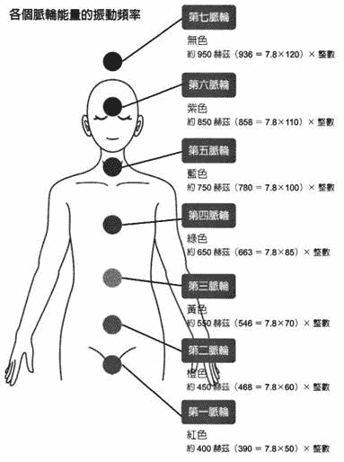

将基础频率各自乘上十的十二次方，就会得出与各个脉轮颜色对应之光的颜色的频率。而基础频率，其实就是通过脊髓的身体灵魂波。

顺带一提，每个脉轮的基础频率能有效改善各脉轮对应领域的免疫力，促进人体修复自身的 DNA 。

地球上的旧有观念认为“免疫”代表排除，击退，抗原抗体反应，但从现在开始，崭新的地球对免疫的认知会逐渐转变为修复与适应 DNA 。

## 带有宇宙力量的致意词

只要提升能量场的频率，就能提升自己的频率，促进松果体活化。而任何人都有办法立刻提高自己的频率——透过向人致意。

很多人都认为“谢谢”是一个特别的词。不用说，这的确是个很重要的致意词，现在就让我们来看看这个词是怎么来的。

很难拥有，很难发生的事 = 难能可贵。

简单来说，“难能可贵”的意思是“不太会发生”，也就是说，这是一句否定的话。因为是否定，所以会让能量稍微降低一些。

因此，光说“谢谢”是不够的。

所谓“很难得的事”，意思就是虽然不太会发生，但确实会“发生”；换句话说，一旦发生就会让人觉得“很开心”。当我们加上“很开心”的想法时，能量就会进一步提升。

事实上，“我很开心”比“谢谢”的能量更强大。

因为“谢谢”是在表示“自己对事物的观察”，而不是内心的状态。观察自己经历的事情后，发现“不太会发生”，因此才说出“谢谢”。

然而，“我很开心”这句话则代表自己内心正面的声音。

所以，“我很开心”具有较高的能量。

除此之外，有一句话的能量更高，那就是“真是太棒了”。

一般来说，大家经常使用的说法是“辛苦了”“劳烦你了”，但“辛苦”和“劳烦”都是负面的词，因此只会降低我们的能量。

我们的人生，身体和所有经历都是自己的灵魂选择的最佳剧本，所以，我们应该说的是“真是太棒了”。

从前我经常说“谢谢”“真是太棒了”，却觉得好像缺少了什么。就在这时候，我发现“我很开心”带有一股强烈的能量，最后终于创造出这套具备更高能量场的致意词。

“谢谢你，真是太棒了，我很开心”。

这正是能让我们获得广大宇宙的协助，恩赐与祝福，拥有最强能量的致意之词。

## 自由往来于多次元平行宇宙

频率提升，松果体高度活化之后，会发生什么样的变化？

首先，你将能自由地选择其他的“平行自我宇宙”。

在平行自我宇宙中，同时存在着过去的自己，未来的自己，以及另一个现在的自己。这些自己存在于跟现在这个自己不同的环境中。

而你可以瞬间移动到你选择的那个世界。

这个现象背后的原理是什么？这是因为松果体的矽洞进入超级活化状态后，就会形成通往其他的自己所在的多次元平行自我宇宙的通道。

当这个通道强而有力地敞开时，我们就能瞬间选择理想的自己所在的那个多次元平行自我宇宙。

这听起来很像科幻小说的剧情，但多次元平行自我宇宙确实存在。只要我们让自身进化而促使松果体活化，就能运用矽洞的黑洞效果前往其他世界，再运用白洞效果回来，自由往来于各个不同的世界。

当人类因疾病或意外事故而濒临死亡，或是陷入深沉的睡眠而做梦时，经常会感受到其他次元的自己，这种现象也是因为透过松果体移动到多次元平行自我宇宙所致。这个时候，松果体会大量释放开启通道的物质——二甲基色胺。

不过，在平行宇宙停留的时间通常很短暂，接着就会回到原来的现实宇宙。但只要松果体的通道充分敞开，就能将多次元平行自我宇宙拉到现在置身的这个现实自我宇宙里。

## 瞬间化身为理想中的自己

听到“世界上存在着多次元平行自我宇宙”这句话时，人们不仅不会相信，甚至无法理解其中的意思。现在的地球人总是很难相信那些不贴近现实的事物。

不过，只要你能了解到多次元平行自我宇宙确实跟“此时此地”置身的这个自我宇宙同时存在，就能踏出迈向各种可能性的第一步了——这也正是迈向理想中的自己的第一步。

若你无法了解其中的意思，那么，有个方法可以帮你成为“理想的自己”：

想象你成为自己理想中的模样，并以这个状态生活。

高次元地球外生命体巴夏也十分强调“彻底化身为自己想要的模样”。全然化身为理想中的模样之后，周遭人们的反应一开始会很冷淡，但只要能持续下去，众人的反应会逐渐改变。当周遭人们的反应有所变化时，就代表你在不知不觉中自然而然地移动到理想中的那个多次元平行自我宇宙了。

抱持“这样就好了”的态度接受一切事物，并做些让自己觉得“轻松愉快”的事，松果体会十分喜悦——换句话说，就是开始活化。

这就是让松果体感到“真是太棒了”的状态。在这个状态下，矽洞（通道）便会敞开，让你自然而然地飞向自己喜欢的那个自我宇宙，这时，现实世界会出现令人不敢置信的奇迹。

## 松果体活化后的改变 1 ：活出理想中的自己

没有疾病的自己。

不去压抑自己的心情，活得朝气蓬勃的自己。

和周遭的人相处融洽，过得快快乐乐的自己。

从事小时候或学生时期梦想职业的自己。

每个人都有各式各样理想中的自己。

虽然始终很想成为那个“理想的自己”，但随着长大成人，这一切成了不切实际的梦想，就此搁置，整个人深陷于眼前的生活中。这便是大多数人置身的状况。

从小到大，大人都对我们说：“做喜欢的事情没办法维生，好好看清现实吧。”而自己长大成人后，又会对自己的孩子说出一样的话，于是这个恶性循环就无止境地在这个世界蔓延。

然而，松果体如果活化，通道开启，仿佛做梦一般的事就会逐渐化为现实。

比方说，假设在现在所处的这个世界中，你内心深处一直渴望成为飞行员，却因为身高太矮，视力也很差，达不到飞行员的基本门槛，于是你早就放弃了这个梦想。然而，在某一个平行自我宇宙中，你就是个飞行员。

这时，一旦松果体活化，通道开启，你就能向着自己渴望的那个平行宇宙进行次元移动。

如此一来，即使从前你身边的人并不支持你的飞行员梦想，在多次元平行自我宇宙中，周遭的人也会支持你的梦想。

你的视力会突然变好，身高会在一瞬间变高，飞行员的基本门槛也会出现变化，你的梦想将会实现。

松果体的通道一旦敞开，引发一场松果体革命，那么，理想的那个多次元平行自我宇宙中的自己与环境，就会在不知不觉间，转变为自己现在置身的这个现实自我宇宙了。

我们有办法将自己理想中的多次元平行自我宇宙的状况，以能量转换的方式化为自己现在置身的这个现实自我宇宙。这听起来简直就像一场不切实际的梦，这并不是梦。

## 松果体活化后的改变 2 ：不吃不睡也能活着

松果体的通道一旦敞开，矽洞就会发挥白洞的功能，从空无一物的地方释放出电子，改变所有原子的状态。

矽洞可以取下原子中的电子，也能为原子添加额外的电子。当电子的数目产生变化的那一刻，原本的原子就变成了另一种原子。因此，矽洞有办法创造出所有物质。

只要运用白洞的转化能力，即使“不吃饭”也能活下去。

人体周围的乙太体与星光体等能量体带有的高次元碳元素，会在矽洞的作用下转换为高次元矽元素，自由的制造出身体所需的能量与细胞。

最近有越来越多人尝试不进食，但这只有在松果体极度活化的状态下才办得到。一旦松果体活化到一定程度以上，不需摄取食物也能自行制造出身体所需的能量与细胞。

在这个状态下，人也不再需要透过睡眠引导身体产生能量，因此就会逐渐不再需要睡眠。

接下来我将进一步详细说明。

碳水化合物，蛋白质，脂肪都属于碳架结构，摄取这些营养后，细胞内的线粒体便会制造出人类进行一切活动所需的能量。

线粒体会制造出一种名为“三磷酸腺苷”的物质，这种物质包含腺苷及尾端连接的三个磷酸，尾端的磷酸就像一条尾巴一样。第三个磷酸脱离这个结构时，会释放出一股能量，这就是我们所有生命活动的原动力。

磷酸的原子构成相当简单，包含四个氧原子，三个氢原子，一个磷原子；电子数量方面，则是氧原子带有八个电子，氢原子带有一个电子，磷原子带有十五个电子。

只要准备这些原料，就能制造出能量之源——三磷酸腺苷。

人类在一般情况下，是透过进食来摄取碳水化合物与脂质，分解后再重新组成磷酸，制造出三磷酸腺苷。不过，一旦可以自由改变电子数量，就能将既有的原子转换成氧原子，氢原子与磷原子，运用这些原子制造出磷酸。

不仅如此，高次元矽洞还会制造出自由能。

人之所以可以不进食而自行产生能量，秘密就在于这两点：借由电子进行原子转换，以及制造自由能。

接着，让我们从另一个观点解开不用进食之谜。

人类除了拥有看得见的物质构成的身体之外，同时也由乙太体，星光体等看不见的能量体组成。

肉眼看得见的身体部分，主要是由蛋白质，碳水化合物，脂肪等物质构成，而蛋白质，碳水化合物和脂肪都拥有碳架的化学结构，因此人类的身体可说是处于碳化状态。

而乙太体与星光体这类眼睛看不见的能量体，同样是由眼睛看不见的高次元碳元素构成的碳架结构。

碳的原子序是 6 ，内侧的电子层有两个电子，外侧的电子层则有四个电子。而现在的地球人具有的能量则是按照与此相同的形式，以看不见的高次元碳元素为骨架构建出来的。

至于矽化的地球人，身体虽然依旧是由碳组成，能量体却呈现矽化状态。

当高次元松果体活化之后，里面的白洞会让全身能量体细胞中矽的矽洞活化，人类的能量体就可以自由地制造电子，让原子序 6 的碳原子多出八个电子，转变成原子序 14 的矽原子。

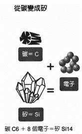

这正是地球人的“矽化”（水晶化）。

而随着松果体越来越活化，全身细胞中的矽里面的矽洞会随只活化，能量体也会逐渐矽化。当能量体逐渐矽化后，矽洞的能力便会跟着提升，这时就开始可以自由操纵电子，制造出身体所需的原子。

此外，也可以自由地制造自由能。

只要可以在需要的时间，需要的地方制造出需要的原子与能量，人类就不必吃东西了。一般来说，“吃”这项行为本身的意义在于分解食物，取出人体所需的原子后，制造出身体需要的部分或转换成能量，但若是可以透过矽化取得身体所需的原子，制造出身体需要的能量，那么就不需要进食，同时也不需要睡眠了。

若从概念上探讨，制造身体的关键在于矽洞发挥白洞效果，改变了一个电子；也就是说，原子序 1 的氢原子掌握了此处的关键。

另一方面，推动身体运作的关键则在于白洞效果带来的八个电子；换句话说，原子序 8 的氧原子则掌握了这里的关键。

氧原子与氢原子结合后会形成水，并制造出三磷酸腺苷能量。

## 松果体活化后的改变 3 ：带着自由能活出自由的人生

当矽化的地球人越来越多之后，我们将迈入一个不需要电与石油的时代。

运用松果体与水晶中矽的力量，人类可以自由地制造物质与能量，不再被时间，空间与重力束缚，迎接一个自由的世界。

一旦松果体，细胞与水晶中的矽进入超级活化状态，矽洞的白洞就会释放出具备超高次元宇宙智慧频率的能量。

这就是“自由能”。

不过，自由能只会出现在具备所有必要元素的完美环境中——也就是说，这个环境必须能让高纯度的高次元矽能量存在，而一般的地球环境很难达到这个要求。

古文明时期，人们运用水晶（矽）的频率，制造出自由能。

但因为现代科学认为自由能是“不可能存在的”的事物，所以自由能的事始终无法在大众面前公开。

只要抱着“这种事是有可能的”“这是平常就会发生的事”的心态接受这个现象，身体就会逐渐开始制造出自由能。

唯有相信这一切是真的，事情才有可能成真。

此外，由于高次元宇宙智慧能量具有极高的频率，因此不会受到重力影响。这种情况就称为“反重力”，同时也是“零磁场”。

自由地运用自由能，乘坐在反重力的交通工具上，自由的在空中飞翔——只要让松果体活化，引发松果体革命，这种宛如科幻小说的景象绝对不是梦。

# 第五章 唤醒松果体的 8 大诀窍

## 促进松果体活化

人类若想回复原本的样貌，轻松愉快的生活，促进松果体活化便是一件不可或缺的事。

人生真正的目的，在于导正紊乱的灵魂意识能量，而这件事唯有让松果体活化才能做到。

只有透过松果体的通道，才有办法连接到自身源头的能量，而这里所谓的通道，就是矽洞具有的黑洞效果。

一旦松果体逐渐活化，就能透过通道传送自己的资讯，以获取宇宙智慧，借此得到应有的领悟与启发，让灵魂导正自己紊乱的能量。与此同时，也能将纠缠在一起的那些看不见的高次元多股螺旋 DNA 松开来并改写。

如此一来，就有办法选择不同与原先准备好的那套人生与身体剧本，度过更加愉快的人生。

那么，究竟该怎么做，才能让松果体活化？

## 松果体觉醒诀窍 1 ：接受人生与身体的剧本

让松果体活化最快的捷径是——明白“我现在在人生与身体方面经历的一切，都是为了导正自己紊乱的灵魂意识能量而选择的最佳剧本”，并且抱持“我现在的人生与身体只要保持这个状态就好了”的心态，接受这一切。

相反地，若是对自己的人生与身体状况感到悲观，自我否定，松果体是不会活化的。

无论事情的发展顺不顺利，都要记得抱持“这样就好了”的态度，百分之百接纳眼前的状况。

在第三，四章，我从各个角度说明了松果体的功能，第六章则收录多个实际发生的奇迹案例。请你阅读上述这几张章的内容，打从心底感受一下“接纳自己的存在”这件事背后的意义与价值。期盼这能引导你一点一滴，逐渐接纳自己。

## 松果体觉醒诀窍 2 ：看着太阳

第二个希望各位多加运用的方法，则是看着柔和的太阳。

出太阳的日子，请尽可能让整个人沐浴在阳光里，直接看着柔和的太阳。

不过请记住，要看的是早晨的温和阳光，避开大白天的强烈日光。请带着悠闲轻松的心情，凝视远方的太阳。

松果体是对光线有所反映的器官，只有在黑暗中才会变得活跃。明亮的白天时暂时休息，等到我们晚上睡觉时再开始运作。

不过，只要白天直接看着太阳，松果体就会分泌被称为“幸福荷尔蒙”的血清素，让我们的人生变得丰富多彩。

然后，到了晚上没有阳光时，血清素会转变为褪黑激素，让我们在舒服放松的感觉中产生睡意。此外，血清素会转变为致幻物质二甲基色胺，让我们体验到一些超乎寻常的感觉，或是经历平常不可能发生的事，从中获得各式各样的领悟与启发。

如此一来，对自己现在面临的人生与身体方面的烦恼与问题，就会开始觉得“这样就好了”，可以用轻松的态度面对。于是，松果体便会进入活化状态。

尚未习惯阳光时，看着太阳可能会觉得很刺眼，但不要紧，只要一开始这段时间可以克服，接下来就会逐渐习惯了。

等到习惯之后，就慢慢增加看着太阳的时间吧。

假如每次看太阳后，眼睛都会强烈感到不舒服，那么就避免运用这个方法，转而试试其他方法。

这个方法只要出太阳的日子就可以用，没有时间与地点的限制，也不需要运用任何工具，因此不必花费半毛钱。

只要你的眼睛没有疾病，看着早晨的柔和阳光不会对眼睛造成不良影响。

请放心使用这个方法，当作每天的生活习惯。

## 松果体觉醒诀窍 3 ：海豚语句

“海豚语句”是在脉轮层次上净化流经脊椎的身体灵魂波。

这个方法是透过位于脊椎通道的各个脉轮，导正并活化神经的螺旋频率能量（神经的螺旋频率能量会形成身体灵魂波）。

平常想到的时候就可以念海豚语句，可以直接发出声音，也可以默念。如此一来，语句便会流经通道，帮助松果体逐渐活化。

五个海豚语句：

“现在的自己肯定没问题”

“我很感谢现在的自己”

“我好喜欢现在的自己”

“我非常了解现在的自己”

“现在的自己就是宇宙的一切”

这些语句也各自对应不同的脉轮能量。

第一、二脉轮：“现在的自己肯定没问题”

第三脉轮：“我很感谢现在的自己”

第四脉轮：“我好喜欢现在的自己”

第五脉轮：“我非常了解现在的自己”

七脉轮：“现在的自己就是宇宙的一切”

念每个语句的时候，同时将注意力放在对应的脉轮上，可以进一步提高净化效果。

## 松果体觉醒诀窍 4 ：海豚充电

“海豚充电”是将矽能量带入自己的生活中，促进松果体活化，进一步创造出容易和宇宙智慧连结的状态。

第一种方法是将矽的结晶——水晶视为灵魂之友，请水晶协助自己导正灵魂意识。

水晶和松果体一样是由矽构成的，因此拥有强而有力的矽洞。佩戴水晶之后，水晶与持有者之间便形成灵魂上的朋友关系，而水晶的矽洞也和松果体一样，会导正持有者的灵魂意识能量，并帮助他进化与成长。

我建议选择正十二面体或正二十面体的水晶。

这种切面的水晶，每一面都与相对的那一面完全平行，能够将智慧之光的能量永远反射下去，拥有令人惊欢的卓越力量。

正二十面体成对的面比正十二面体多，因此拥有更强大的能量。

在进行活化松果体的工作时，只要将水晶拿在手上，贴在额头，放在头顶，效果就能持续累积，不断提升。

光是带在身上，或是放在房间里，水晶就能提供你需要的频率能量。

而水晶本身是一种纤细的能量，也是一种活着的生命能量，因此必须透过照射阳光，用水清洗等方式净化水晶。

请不要忘记定期用这种方法保养水晶。

除此之外，还有另一种方法：服用矽素。

矽素可分为来自水晶来自植物两种。最近在开发上有所突破，因此市面上出现许多品质优良的植物性产品，但我还是建议各位服用来自水晶的产品，因为这种矽素直接复制了水晶令人惊叹的卓越能力。

## 松果体觉醒诀窍 5 ：海豚运动

“海豚运动”能帮助我们调整身体灵魂波（身体智慧能量）的通道。

这是第六个诀窍“海豚触碰”的暖身运动。

海豚运动共分为 A,B,C 三种。

运动 A ：调整腰部，荐骨。

运动 B ：调整胸部，背部。

运动 C ：调整头部。

请参考下页的图解做做看。

这三种运动要按照 A-B-C 的顺序进行。

建议每次至少做十回。

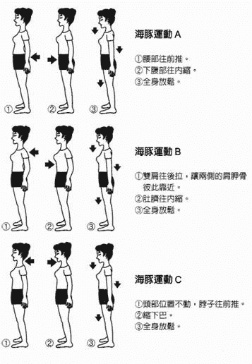

## 松果体觉醒诀窍 6 ：海豚触碰

“海豚触碰”可以促使身体灵魂波的流动产生物理性质的活化。触碰时力道要放的极轻，而不是用力按压。

分成“海豚触碰 1 ”和“海豚触碰 2 ”两个步骤。海豚触碰 1 是触碰第一节颈椎的横突，海豚触碰 2 是触碰第二节颈椎的棘突。

先进行海豚触碰 1 ，在进行海豚触碰 2.

请在自己喜欢的时间，喜欢的地点，用自己喜欢的方式进行。尽可能做越多次越好，这样就能获得良好的效果。

海豚触碰 1 ：

< 找出触碰点 >

① 肩膀放松，脸朝正前方。

② 找位于耳垂正后方的乳突硬骨。这块凸出物最底端处的下面一公厘，前面一公厘的位置，就是海豚触碰 1 的触碰点。

③ 当你用左右手的中指指尖分别轻触左右两边的触碰点时，会发现两个触碰点摸起来不太一样。轻触两边的触碰点时，你会觉得其中一边出现一丝丝疼痛或不舒服的感觉，那么这一边就是海豚触碰 1 的触碰点。

（假如感觉不出左右有什么差别，同时触摸两边也无妨。）

< 轻触触碰点 >

① 肩部放松，脸朝向正前方。

② 轻碰海豚触碰 1 的触碰点。

③ 持续触碰几分钟。

触碰时使用腹式呼吸（嘴巴吐气，鼻子吸气）。

海豚触碰 2 ：

< 找出触碰点 >

① 找到位于后脑勺中央凸起的圆形骨头。

这块骨头叫枕骨。

枕骨底端中央往下两公分，就是海豚触碰 2 的触碰点。

 < 轻触触碰点 >

① 双手中指的指尖重叠在一起，放在海豚触碰 2 的触碰点上。

② 用中指指腹轻碰触碰点。

③ 持续触碰几分钟。

触碰时使用腹式呼吸（嘴巴吐气，鼻子吸气）。

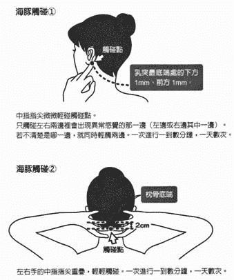

## 松果体觉醒诀窍 7 ：海豚归零

“海豚归零”会让多股螺旋 DNA 顿时回到白纸板的归零状态。由于紧接着又会立刻恢复当初灵魂意识选择的那个剧本的状态，此时的状态和白纸状态之间有大幅落差，于是我们便会获得灵魂一是成长与进化所需的启发与领悟。

海豚归零 1 ：消除大脑层次的杂念能量

① 双手放在头上，指尖触碰头皮，找找看哪里的触感和其它部位不同（例如紧绷，沉重，发热等）。

② 使用腹式呼吸缓缓吐气，一边想象宇宙智慧透过松果体导正了调性偏离正轨的部位。

③ 使用腹式呼吸吸气，一边想象地球能量扩大了大脑能量，并进一步感受触感不同于周遭的那个部位。

④ 反复进行几次步骤 ② 与 ③ .

⑤ 一边做，一边想象自己消除了脑袋里的普遍观念与僵化思想，大脑变得澄静无比。

⑥ 确认一下调性是否比刚开始的时候更加一致了。

海豚归零 2: 在松果体层次上导正与改写 DNA 能量

① 用双手在身体前方做出松果体形状的大能量球，两只手捧着这颗能量球。

② 用双手感受到这个松果体的能量体。

③ 找找看这个能量体有哪里的触感和其它部位不同。

④ 使用腹式呼吸缓缓吐气，一边想象宇宙智慧导正了调性偏离正轨的部位。

⑤ 使用腹式呼吸法吸气，一边感受地球能量扩大了松果体能量，并进一步感受触感不同于周遭的那个部位。

⑥ 反复进行几次步骤 ④ 与 ⑤ .

⑦ 一边做，一边想象自己导正了紊乱的 DNA 能量，并在 DNA 能量中写上希望的资讯，换掉原本的。

⑧ 确认一下调性是否比刚开始的时候更加一致了。

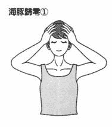

双手触碰头部。

吐气时导正出现异常的部位，吸气时进一步感受异常部位的状态。

感受异常部位的状态，比较这个部位和其他部位的差别（例如较硬、僵硬、发热、松弛、冰冷、刺痛等），并一边加以导正。

持续重复这个步骤，目标是让整个头部摸起来的状态都变得一致。

这么做能消除扰乱剧本运作的普遍观念与僵化思想。

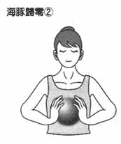

想像双手包覆着自己的松果体能量。

右手感受右侧松果体的能量（人生与身体的剧本），左手感受左侧松果体的能量（剧本之外的杂音）。

吐气时导正出现异常的部位，吸气时进一步感受异常部位的状态。

感受异常部位的状态，比较这个部位和其他部位的差别（例如较硬、僵硬、发热、松弛、冰冷、刺痛等），并一边加以导正。

持续重复这个步骤，目标是让松果体能量摸起来的状态都变得一致。 .

只要解决了当初自己的灵魂意识选择的人生与身体剧本的课题，就能额外加上自己理想中的剧本或改写剧本内容。

## 松果体觉醒诀窍 8 ：海豚和谐

“海豚和谐”是所有自我工作中最强大的一个方法，可以将宇宙智慧与松果体连结在一起。

只要运用这个方法，就能随心所欲的彻底改写自己的 DNA 能量。

想象自己被自我宇宙的泡泡包围：

使用腹式呼吸法缓缓吐气，一边想象宇宙智慧从松果体顺着脊椎（脊椎里的神经）往下流动。

这股能量相当凉爽。

吐气时想象身体的频率提高，自己的身体从头部开始往下逐渐消失。

接下来，使用腹式呼吸缓缓吸气。

吸气时，将地球能量（这股能量频率虽低却有很强大的力量）从脊椎下方往上吸进体内。

将地球强而有力的振动能量吸入体内后，开始想象那颗自我宇宙的泡泡变大了。

这是一股相当温暖的能量。

因为地球能量的振动幅度较大，所以让人觉得很温暖。

吸气时，将这股温暖的能量从地球吸进脊椎里，能量从脊椎下方通往上方。

当自己多了这股强而有力的能量之后，自我宇宙也变得越来越大了。

每次吐气时，宇宙智慧的频率都会通过身体，身体的频率会跟着提高。而随着身体频率提高，身体消失的部分会越来越多。

而每次吸气时，自我宇宙都不断扩大。

反复吐气，吸气。

于是，自我宇宙会变得越来越大，自己的身体则逐渐消失。最后，在一颗很大很大的自我宇宙泡泡中，只留下一个没有身体的能量体。这个能量体就是松果体能量。

这个时候，你抛下了原本那个老旧的自己，在松果体的 DNA 能量写上一个理想的，崭新的自己。

同时，这一切也会按照新的 DNA 剧本写得那样，在泡泡中创造出理想的自己与理想的环境。

在这个过程中，松果体会不断活化。

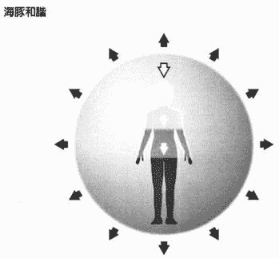

【吐气时】 ß 身体由上往下逐渐消失。

【吸气时】 è 泡泡宇宙不断扩大。

持续重复上述步骤，同时想像以下情景：当身体完全消失时，只剩下一颗泡泡（ =广大的宇宙）。自己只剩下松果体的能量，这个能量体自由地到处飞翔。

描绘理想的自己、理想的世界，在泡泡宇宙里创造出这个理想中的自己和理想中的世界。

# 第六章  松果体觉醒的奇迹故事

## 现实世界中那些松果体觉醒的人

任何事情，只要你不把它看成与自己切身相关，要成功做到这件事形同缘木求鱼。

此外，一件事直到普遍被大多数人接受之前，效果只会显现在极少数的人身上。

这样的状况和集体意识有很大的关系。

首先，即使用头脑理解了一个道理，但只要得不到潜意识的协助，就无法在现实世界中显现效果。由于潜意识与集体意识之间有很强的连结，因此集体意识会妨碍潜意识的运作。

大部分人认定“有可能发生”的事，总是比较容易实现。不过，假如在这种状况下目标却始终无法实现，问题就是出在自己的显意识——普遍观念与僵化思想。

举个浅显易懂的例子。在很长一段时间里，想要在男子一百公尺短跑的比赛中破纪录，就必须缔造九秒开头的成绩，而这个数字行同一座无法跨越的高墙。

长期下来，所有人都认为以人类的体能根本不可能跑出 9 秒多的成绩，直到有一名选手跑出了 9 秒开头的记录为止—— 1983 年 5 月 14 日，卡尔 • 刘易士缔造了 9.97 秒的记录。他是地球上第一个跑出 9 秒开头成绩的短跑选手，但之后仅仅过了两个月， 1983 年 7 月 3 日，凯文 • 史密斯就创下 9.93 秒的新世界纪录。

接下来，又陆续出现多位跑出九秒多成绩的选手。尽管九秒多这个数字远超乎寻常人类的体能范围，但进入 1990 年代之后，人们看到九秒多的成绩已经不太会感到惊讶了。

从这个例子可以发现，当卡尔 • 刘易士达到这个目标后，人们对这件事的集体意识便从“不可能发生”改写成“有可能发生”，因此选手就变得有办法达到这个目标了。

那些原本被“不可能发生”的集体意识形成的潜意识阻碍，以致无法前进一步的选手，在集体意识被改写成“可能发生”之后，就能够达成目标了。

接着，当人们看到许多选手陆续缔造这样的纪录之后，大部分人的集体意识更是进一步转变为：“经过千锤百炼的一流选手，是有可能抛出九秒多的成绩的。”

一旦大多数人都抱持相同的想法，这个想法就会形成集体意识，产生一股强大的力量，然后就会有越来越多选手达成这个目标。

于是，由普遍观念与僵化思想构成的显意识就这样改变了。

世界上所有事物的运作原理，就跟这个例子一样。

所以，我们应该撕下那些深植于潜意识与显意识中的“不可能”标签。

倘若不重新为自己想做的事贴上“有可能发生”的标签，就永远不可能获得“成功达成”的结果。

虽然你现在已经知道松果体活化会带来奇迹，但只要潜意识与显意识认为这是“不可能的事”“不会发生的事”，那么就不会产生任何变化。

这个时候，多听听别人的实际体验，可以有效帮助你撕下心中的标签。

接着，一步步消除显意识，让潜意识沉睡，透过松果体（宇宙意识）与超意识连结，就能开启奇迹之门。

事实上，每天都有许多患者带着各式各样的人生或身体方面的问题前来“谦仓海豚医师诊所”，但我们为每一名患者看诊的时间，却仅仅只有三 ~ 四分钟。

我们看诊的目标在于透过操纵身体与大脑，导正并改写松果体的高次元 DNA ，让患者的松果体活化。在我的诊所里，每天都像理所当然地不断出现世人称之为“奇迹”的事。

地球社会的“奇迹”，对我而言却是“很正常的事”。

举个例子，人们总是认为过动或自闭症的小孩无法顺利融入社会，做什么都没办法成功，但其实只要他们的松果体活化，就能唤醒潜在的天赋，发挥出众的绘画或者音乐等才能。许多来接受诊疗的患者后来都能跟上学校课程，无论是小孩或大人，接受诊疗都判若两人。

其实，不是只有特殊的患者才会显现卓越天赋，任何人一旦开启松果体的通道后，都很容易发挥自身天赋。因此，不光是小孩，包括大人与老年人在内，都很有可能出现令人惊奇的变化。

此外，也经常有头发全白的患者仅仅接受一次诊疗后，隔天头发就变成全黑的了。

只剩几个月寿命的癌症患者彻底康复，弯曲的骨头在眼前瞬间变直，消失的肌肉瞬间长出来 ...... 各式各样现代医学认为不可能的事，都变得有可能发生。

这就是我独创的“超次元 • 超时空松果体觉醒医学（ IGAKU ）”。

只要松果体这个器官觉醒，那些常理无法解释的现象都有可能发生在所有人身上。

这些奇特的现象是按照“人生—情绪—身体”的顺序出现变化，这个顺序跟世上的普遍观念与刻板印象相反。

我在此只能列举少数几个案例，但只要你能明白现实中确实发生了这样的事，就有办法消除显意识，让潜意识沉睡，并与超意识连结，促进松果体活化了。

☉提不起精神工作的女性

这是一名五十多岁的女性。

她告诉我，她的问题是“因为对自己没自信而感到痛苦”“头晕目眩”。

听完她的叙述后，我发现最大的问题在于“明明非得出去工作，但因为对自己太没自信，所以没办法工作”。因为无法工作而焦虑，很受不了这样的自己。

除此之外，她还出现头晕目眩的症状，所以晚上总是睡不着。于是，每天都过得痛苦不堪，就这样陷入恶性循环。

虽然她已经来接受诊疗好几次了，松果体逐渐恢复运作，但头晕目眩的状况依然存在。

之所以会如此，是因为身体的变化会到最后才出现。

她一开始的改变是——“感觉我最近渐渐不再烦躁了”。

她的心情越来越平静，对我说：“虽然我没办法工作，但我现在觉得这样就好了，渐渐不再焦虑。”

接着又迈入下一个阶段。她开始告诉我：“我一直很讨厌自己，但现在越来越能接受自己了。”她还不知不觉地找到了新的工作。

从这名患者的故事中，我们可以看到一开始是人生方面出现变化，接着在不知不觉间，内心的情绪也开始变化。

在情绪出现变化之前，人生剧本就已经先改变了。因此，人生方面会有所变化，可能是找到新的工作，也可能是认识了新的对象。

最后，她终于察觉到身体状况出现变化，对我说：“对了，医生，我最近已经不会头晕目眩了”。

她已经在不知不觉中彻底忘记自己曾经头晕的事，猛然想起来，于是才会说“对了”。这表示情况十分理想。

一旦松果体进入活化状态，就会像这名患者一样，先是人生剧本有所改变，接着是情绪出现变化，最后则是身体方面的转变。

☉感情不好的母女

这是一名患有关节炎的三十多岁女性。

她和母亲因为吵架而疏远，内心始终憎恨对方，长久以来完全不和母亲见面。

不过，她心里始终觉得：“难道就这样一直留着心结吗？”“毕竟是自己的亲生母亲，终究还是会在意对方。”

随着开始接受诊疗，她的松果体逐渐活化。有一天，她告诉我：“虽然我长久以来一直很恨我母亲，但最近好像变得不太恨她了。”

没错，她的人生剧本开转变了；接下来，情绪方面也出现变化。

这时，她又告诉我：“最近我母亲对我说她想见我，我听了好高兴。”她改写了自己的人生剧本。

接着，她又出现新的变化，她对我说：“话说回来，最近我得关节炎已经不太会痛了。”她的身体终于也逐渐改变了。

☉癌症瞬间消失的女艺术家

这名女性的经历令人印象深刻。

她的年纪在三十岁后半，乳癌细胞扩散到全身，被医生宣布剩下两个月的寿命。

“骨骼扫描”是一种利用放射线确认癌细胞是否转移到骨头的检查方式，而她的骨骼扫描结果显示全身都有黑影，代表癌细胞已经扩散到全身上下。

她乳房之间的肋骨出现鸡蛋大小的肿瘤，看起来简直就像第三个乳房。此外，转移到骨盆的癌细胞带来剧烈的疼痛，导致她从早到晚都痛苦不已，就算使用效果最强的麻醉止痛药，也完全不见效。

由于全身上下都遭受癌细胞侵蚀，因此她整天都被剧烈的疼痛折磨，白天清醒时痛得无法做任何事，晚上则因为疼痛而无法入睡。

初诊那一天，她搭乘新干线千里迢迢来到新横滨。一路上，她忍受着剧烈的疼痛，甚至没办法好好坐在椅子上。

然而，接受这一次的诊疗之后，她身上的疼痛感突然消失了。一直以来的剧烈疼痛彻底消失，仿佛这一切原本就不存在。

当天晚上，她做了一个不可思议的梦：她梦到自己变成海草。她的身体长在海底的岩石堆里，无法操纵自己的身体，只能随着海浪的波动一直飘来飘去。身为海草的她完全感受不到癌症的疼痛，任凭自己的身体随着海水的流动飘来飘去，渐渐觉得这样很舒服。就在这个时候，她感觉自己好像领悟了什么，醒来时整个人觉得神清气爽。

她本身是个创造力丰富的画家，与大自然一同生活，拥有非凡的感性。由于她已经有过无数次想死的念头，体会过无数次的绝望，于是对死亡的恐惧便缓和许多，不再执着于非得活着不可。

她在接受诊疗后获得卓越的效果，从初诊当天算起仅仅过了几个月，胸部那颗鸡蛋大小的肿瘤就变得越来越小，到了隔着衣服丝毫看不出来的程度。

而原先她的骨骼扫描影像是全黑的状态，接受诊疗后，影像上的黑影越来越少，不到三个月，就几乎康复了。

为什么这名女性身上会出现如此快速的变化？我想是因为诸多条件同时聚集，于是就出现了这样的奇迹。

第一个因素是，她本身就按照原来的剧本写得剧情走，因此成功导正并改写了高次元 DNA 。

一直以来，她累积了各式各样的经验，早已获得许多领悟与启发。

再者，因为她从事艺术工作，拥有强烈的灵感力，对事物的接纳度很高，能够坦然接受那些不可思议的事。

有这样的背景为基础，加上她又来接受诊疗，我在诊疗中一口气替她开启了松果体通道，连结宇宙智慧。

除此之外，海草的梦也很有意思——这个梦显示的是她的其中一个多次元平行自我宇宙，将那个世界里的自己与环境直接带到这个世界来，所以她就把那个没有疼痛，随着海流飘荡的海草具有的特质带到现在这个现实宇宙中了。

于是，她的 DNA 资讯接二连三的改写，让她的身体状态变得轻松愉快。

她借由癌症获得许多领悟与启发，非常感谢这一路上的经历，同时也想和许多人分享自己的心路历程。

“抱着感谢的心情，决定帮助他人获得领悟与启发”的这股能量拥有极高的频率，容易和宇宙智慧共振，宇宙智慧因而运作的更彻底，进一步加快变化的速度。

☉死于癌症的男性和他的家人

我在第三章提过，癌症患者最后会有三种结果：

完全康复，虽然无法康复但与癌症和平共处，以及带着癌症平静离世。

无论哪种结果，都是当事人的灵魂做出的选择，我们无法说那个结果比较好。

不过，当松果体活化，获得所需的启发和领悟后，所有患者都不会再因为疾病与症状（在这个案例中是癌症）而感到痛苦了。

一名七十多岁的男性由家人带来诊所接受诊疗。他的肺癌已经恶化到相当的程度，转移到全身上下，处于癌症末期，被医生宣告剩下三个月的寿命。

于是，他整个人沉溺在愤怒的情绪中。

“为什么我会生这种病？”

“都是因为在那间医院接受那种治疗，我的病才会变得更严重！”

“要是没去那种医院就好了！”

“抗癌剂让我的身体都坏掉了！”

“开刀后身体反而更差了！”

他对任何事物都充满怨愤，成天发怒。

这种情况在老年人身上特别常见。家人每天都要听他发牢骚，精神方面承受相当大的负担。

因为患者本人一天到晚说“我真是倒霉”“我真是不幸”，身旁的家人也跟着落入不幸的深渊，每个人都变得郁郁寡欢。

然而，在松果体通道开启之后，他的心情变得越来越平静。原本他总是一直喊着：“为什么我会得癌症！好痛，好痛，好痛！””我不想死，我不想死，我还想活着！”这时，他却平静得仿佛这一切都不曾发生。

而在怒气稍微缓和之后，他身体的能量也逐渐恢复了。于是，他身上的疼痛减少，开始可以跟自己的身体状态和平相处，原本不断扩散的癌细胞也不再扩散，在家里平静度过的时间增加了。

“最近他的情绪变得比较稳定，人变得温柔许多，也不再喊身体痛了。”他的家人高兴地对我说。

过了一段时间，我正在想他最近怎么都不来了，就在这时，他的家人来电话告诉我，他去世了。

“医生，这段时间非常感谢你。他一直到最后都过得很平静，还常常说很想去医生你那里。多亏了你的帮助，他才能走的平平静静。”

原来他痛苦不已，固执己见，内心充满愤怒与恐惧，但在接受诊疗后，松果体进入活化状态，让他获得自己所需的智慧，改写了原来的剧本。

接下来，事情依照剧本写得发展，他领悟到“死并不可怕”，家人的心情也恢复平静，于是，他感受到家人对他的爱，发现“我的人生是有意义的，我这辈子已经活够了。”最后带着这样的心情迎接死亡。

这个结果也是松果体活化之后带来的一出人生戏剧。

☉儿时遭受父母虐待的女性

这是一名四十五岁左右的女性，从小到大一直被父母虐待。

由于她总是压抑自己，没办法活出自己的人生，因此始终痛恨父母，也痛恨这个社会。

在松果体活化之后，她对我说：“因为我从前遭遇太多事，所以一直以来都深深执着于过去。但现在我开始觉得，过去就过去了，再想也没什么意义。”

当她逐渐放下心中的执着时，着眼点就从过去转到现在，内心的想法出现很大的变化。她告诉我 : “感觉我好像可以蜕变成一个全新的自己。”

她找到了新的兴趣，邂逅了可以共度一生的美好伴侣。

这是因为她的松果体活化，通道开启，转移到崭新的多次元平行自我宇宙的缘故。

## 后记：让本书成为你人生与身体的使用手册

在我撰写这本书期间，周遭也出现重大变化，我一步步改变了自己的诊疗方式。

我原本是先触碰患者的身体，以导正细胞的调性；再触碰患者的头部，导正大脑的调性；之后，手隔空放在患者头部上方，透过松果体导正高次元多股螺旋 DNA 的调性。

像这样借由导正与改写患者的松果体 DNA ，让他们的人生剧本与身体剧本出现自己理想中的变化。

我们的 DNA 能量本应接收宇宙智慧，然而，一旦被普遍观念，僵化思想或他人与社会的集体意识影响，导致 DNA 纠缠在一起，我们就会一直在痛苦中挣扎。

透过诊疗将纠缠在一起的 DNA 松开来，让患者有机会获得自己所需的启发与领悟，他们的人生与身体就有可能朝好的方向发展。

而现在的我已经不需要触碰对方的身体，就能感受到他松果体的能量，从中得知对方的生活方式。

接着，我会导正对方的 DNA ，将纠缠在一起的 DNA 解开。如此一来，就能重新创造出最适合对方的人生与身体剧本。

而这本书里提供的各种方法和诀窍，是地球上的每个人都可以自己实践的，不需要我的参与。各位能凭借自己的力量，自由操控自己的人生与身体。

本书所写的一切知识与资讯，和现今的普遍观念与刻板印象大相径庭。而我在撰写本书的短暂时期内，依然持续获得新的启发与领悟，所以也不断修改与添加内容。

无论在哪个时代，新的思想总是因众人的想法不同，而获得不同的评断，有时被人们认为是真的，有时则被认为是假的。

我们都是选择在此时此刻来到地球享受冒险之旅，一同生活在地球上的灵魂。我们的“泡泡自我宇宙”透过这本书而彼此靠近，触碰到了彼此。

之后要怎么做，是各位的自由。要不要选择让松果体活化，开启矗立在眼前的冒险大门，是每个人的自由。

***

教导人们如何成功及自我启发的书，内容总是写着：“只要这样，就能变成那样！”而读者阅读的时候，想必也是抱着“我想变成那样”“我不该是这样”“我应该变成那样”等想法。

不过，大家最后往往都无法“变成那样”。现在的地球人看了这些书，运用书里写的方法，最后依然落入“没办法变成那样”的结果。

人总是习惯赋予事物一个定义，认为一件事情“必须这样才行”“这是好的或坏的”。假如自己并不符合这个定义，那么阅读这些书只会感到痛苦而已。

就算无法成功，就算达不到目标，也没什么关系。只要将“不顺利的状态”写到剧本上，改写剧本，活出这个状态就好了。

从今以后的时代，将以“解脱”与“重生”为主题。

进入新时代之后，人们将从“必须是这样”“必须变成那样”的思想中解脱出来，然后重生，无论是神的层次，还是我们地球人的层次，未来都会朝着这个方向迈进。

总而言之，接下来的时代会越来越重视解脱，人们会开始放下那些一直以来认为“必须这样才行”的事物。

地球人的坏习惯在于总是用好坏来判断一件事。此外，大部分的人也养成和他人比较的习惯，特别是那些害怕直视别人的眼睛，对自己缺乏信心的人，更是会因此产生担忧与恐惧的心理，于是就越来越不知道自己真正的样貌是什么了。

“要是我这么做，别人会怎么想？”

“我在别人眼中是什么样子呢 ? ”

一旦产生这种想法，就再也走不出这个框架了。压抑自己，甚至封印自己，结果就形成了现在地球社会的样貌。

请放下“必须这样才行”的想法，如实接纳眼前的一切。当你开始觉得”这样好像挺有意思的”“ 感觉很开心耶”，人生就会变得越来越轻松愉快。

接下来，我们要从地球社会的思考方式与生活方式解脱，一个全新的自己即将诞生。

***

只要以人类的身份活着，就会在各个不同的时间点面临人生或身体方面的问题。这时，人们会急于解决问题，整个人纠结其中。而在这个纠结的过程中，再经过许多尝试与错误后，会获得各式各样的领悟与启发，这是非常重要的过程。

话虽如此，但我们都希望尽量可以不要受苦，也不想耗费太多时间，希望能在一段很短的时间内，尽可能减轻痛苦的部分，让自己轻松一点。

这个时候，请你想一想。

你身在一座漆黑的迷宫里，既不知道该走哪条路，眼前也么有一丝光线，要逃出迷宫极为困难。这时，你很有可能会感到悲观与绝望，半途就一蹶不振。

不过，假如现在有一本指南书，让你看见一丝光明呢？即使依然置身迷宫当中，当你看到走出迷宫的希望时，就会涌起干劲与勇气，心里一口气轻松许多，不需要在苦苦纠结了。

希望各位可以稍微明白灵魂的目的，以及人生与身体的意义，将这些视为自己的余兴节目，逃出这座地球迷宫。

愿本书能成为各位人生与身体的使用手册。

 Ishi 海豚医师 松久正

（全书完）
