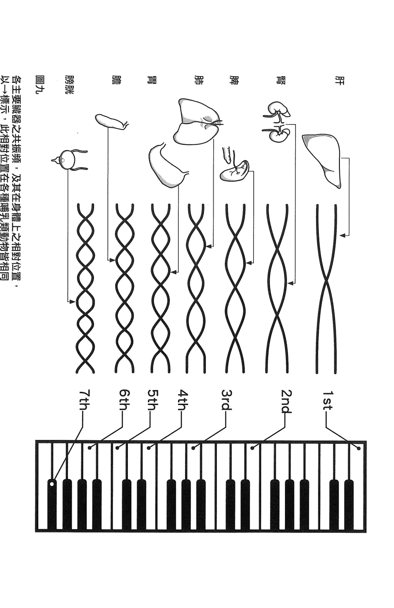
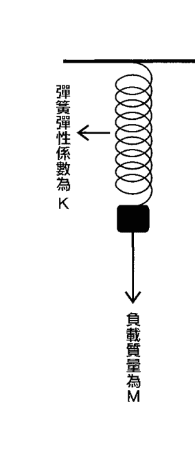

## 气血的旋律

血液為生命之泉源，心臟為血液之泵 —— 揭開氣血共振的奧秘

病毒感染、高血壓、心血管堵塞在脈診臨床上的全新發現及其成因

《氣的樂章》、《水的跳舞》作者 美國約翰霍普金斯大學生物物理博士 王唯工 著

### H. Royal College
天使神秘学院

- 专业占卜预测机构
- 神秘学培训机构
- 水晶能量研究中心
- 神秘学资料库
- 官方微信：strcdts
- 微信公众平台：strc2011
- 读书交流QQ群：
  - 占星塔罗占卜师交流群：814594478（加入密码：PDF）
  - 神秘学其他综合群：659338717（加入密码：PDF）

微信号：strcdts

天使神秘学院

天使神秘学院 院长QQ：715104687

微信公众平台：strc2011

### 制作说明：

本书由《天使神秘学院》出重金从台湾购入的原版书籍扫描制作完成。为达到最好阅读效果，特地把原版书全部切开后，再经由专业扫描设备高精度扫描完成，并经过一张张的PS后期处理最终成书，其间花费大量的人力、物力以及时间，只为能给大家提供经济并优质的神秘学学习资料而努力。

本学院强力谴责某些机构和个人，把本学院花心血制作完成的电子书籍，包装后直接放在自家淘宝网上低价倾销的行为，以谋取不劳而获的经济利益。如果长此以往最终将无人愿意再为大家花心思制作电子书，那以后可能大家再无新书可读。

为让大家以后能够读到更多的好书，也为了本学院的良性发展。本学院恳请大家尽量做到如下几点：

- 一、尽量在本学院的网站购买电子书籍。
- 二、请勿用技术手段把电子书内的水印及加密去掉。
- 三、在收到电子书后小范围传阅即可，千万不要公开传播，更别挂到淘宝网上低价销售。

同时为答谢广大支持者，学院电子书将做如下调整：

- 一、学院会把一些早已收回制作成本的电子书折价销售。
- 二、最新制作的电子书籍会开放打印功能，大家购买后有条件的可自行打印成书。

天使神秘学院
2019年1月

### CARE 03 氣血的旋律

作者：王唯工
責任編輯：湯皓全
美術編輯：蔡怡欣
校對：呂佳真
法律顧問：全理法律事務所董安丹律師
出版者：大塊文化出版股份有限公司
台北市105南京東路四段25號11樓
www.locuspublishing.com
讀者服務專線：0800-006689
TEL：(02) 87123988　FAX：(02) 87123897
郵撥帳號：18955675　戶名：大塊文化出版股份有限公司
版權所有　翻印必究
總經銷：大和書報圖書股份有限公司
地址：台北縣五股工業區五工五路2號
TEL：(02) 8990-2588（代表號）　FAX：(02) 2290-1658
排版：天翼電腦排版印刷有限公司
製版：源耕印刷事業有限公司
初版一刷：2010年2月
初版9刷：2014年9月

定價：新台幣 250元

Printed in Taiwan

## 气血的旋律

王唯工 著

### 目次

自序 001

前言 003

## 1 氣與血

身體之組成與更新 013

血液是生命之泉源 020

心臟為血液之泵 026

## 2 病毒感染

感冒 036

膀胱經的重要 046

對抗傷寒之生理反應 047

疫苗是最偉大的發明 050

## 3 高血壓的辨症論治 053

高血壓

血液之分配與調控

高血壓之可能成因

加強係數

中醫對高血壓的看法

高血壓的辨症論治

## 4 氣血共振原理

血液流灌的方式

停留解波與駐波

迴圈的奧妙

肺循環是體循環的迷你版嗎？

體循環的設計

## 5 如果你是人體設計總工程師

循環系統上「理論」的要求

共振 116

如果你是設計總工程師 128

發生學 140

分類供血的優勢 142

血液壓力波與交流電之傳送 146

環狀的末端 158

血循環與經絡的關係 180

## 6 總結 187

過去的研究成果 188

高血壓成因 195

心血管病成因 203

參考資料 204

補充說明 204

# 自序

過去十年，孩子們一個個離家自立，今年更做了祖父，孫女美立六月來報到，自己也由中年邁入老年，可是精神卻愈來愈好。也算運氣好，居然選擇了研究漢唐醫學做為終身志業，一晃眼三十餘年了。每個新想法，每個新經驗，都讓我眼睛為之一亮。更令我歡喜的是，這些新發現，不僅印證了古人的智慧。自己、家人、朋友都成了直接的受益者，如今將心得公開，希望能由華人做起，進而引導全世界，都來享用這桌「氣的饗宴。

俗語說：「家財萬貫，不如一技在身。」竊以爲身懷絕技，不如健康、美麗。這十年來的進展都在量化上的精確，讓我們可以更清楚的分辨各種想法的優劣。這十年的研究主要由我的另一半擔綱，她在我由學術機構退休後，扛起研究的大旗。把漢唐醫學的基礎建立在更穩固的數學與物理之上。

希望這本書能帶給大家身心健康，美麗人生。

二〇〇九年十二月

# 前言

漢唐醫學就像現代的中國，在沉睡數百年之後也該甦醒了。我們分了二個階段，希望讓這隻昏睡的龍先醒過來再恢復生氣，重拾龍威。在《氣的樂章》中，我們喚醒了這條巨龍，指出了現代生理學在循環理論中的一些盲點，其中最重要的是，認為血液是以流動的動量向前衝，一直衝到各個器官，穴道。所以一開始就提出了七個問題，一、心臟應該放在什麼位置，二、主動脈為何轉彎一百八十度，三、器官之分支動脈為何多呈九十度，四、為何有心舒壓，五、心臟為何要規律的跳動，六、為何動物大小與心跳頻率成反比，七、動物如何運動。由這些問題來導出現代生理學中，循環理論不能自圓其說的盲點，在本書中更進而引證肺循環，也就是由右心室把血送到肺臟去吸收氧氣，放出二氧化碳的循環部分。在肺循環中，前述一、二、三、四、七點這些奇怪的現象都沒有發生；而在肺循環中，送血真的是利用血液的流動，也就是動量。西方的生理學者一直把肺循環當成體循環的迷你版，這是錯誤的。並且因而帶領著整個現代醫學的循環系統，不論是生理、病理、藥理，都走入歧途，進而直接造成今日醫療成本的日益高漲，加上資本主義，一切為利潤的人生哲學，使得世上最有錢的美國，也沒能力提供全面的健保。

《氣的樂章》中我們提出「氣」的觀念，指出共振是氣的源頭，因為是在最好的共振狀態，所以血液可以用很小的能量輸送。而由共振的觀念可以了解許多中醫的想法、名詞、治療的方針。本書中我們進一步明確的點出，氣就是在血管及血液中傳送的聲波。這個聲波與各器官之共振，手腳中各個迴圈的共振，是在胎兒發育時逐個形成的。在胎兒發育時，一定得有心跳，而且心臟在所有器官、手、腳都沒分化之前，很早就開始跳動，並引導血管之形成，進而形成器官。此時胎兒的細胞，不論氧氣或營養都依靠媽媽經由胎盤送過來。其實胎兒的心跳與血流並沒有輸送任何重要物質。為何心跳是胚胎發育一定要有的要素？這個胚胎時期的循環所提供的是「氣」，此時胎兒血管中的血，不必攜帶氧氣營養，不必有開口把血送到組織中去。所以此時可以是閉口的，而且有很強的反射，以形成駐波，這個駐波就成爲「氣」的藍圖，在各個諧波的波腹產生各個器官，並在手腳長出各種迴圈。此時是以氣來引領組織的生成，以形成一個完整的身體。

一旦出生之後，嬰兒的肺要打開並開始氧氣的交換。這時原來由胎盤供應的氧氣要由自己的肺來供應。出生時的大哭，就是幫助肺的擴張。而腸胃也同時消化以取代胎盤，自行吸收營養，並提供全身使用。因而出生之後才有胎便。

所以嬰兒出生是個驚天動地的大事，循環系統做了一個全盤的改變，出生前所有物質都靠母親經過胎盤供應，而生長的藍圖則依靠血管中的駐波來監控。出生後，由自己的肺提供氧氣，自己的胃腸提供營養，此時各動脈之末端都要開口了，以提供物質、氧氣，就不可再以駐波的形式存在。但此時各個器官及手腳的各個迴圈，卻將波腹的位置固定住了。所以此時，身體本身就是一個共振體，肝、脾、肺、腎，都是在特定諧波波腹的位置，並與特定諧波共振，所以此時的共振不再依靠反射產生駐波，而是身體本身的共振特性，這個共振特性是在胚胎時，以氣為藍圖的循環系統決定的。在本書中，我們將這個聲波在血管中的共振，與整個身體的共振做了更精確的描寫，希望讓已經醒來的巨龍充滿生氣。願漢唐醫學成為中國的「氣」，在物質的經濟日進增長的同時，也為華夏的精神注入新「氣」。不僅讓我們以祖先的智慧為榮，也為日益高漲的醫療費用提供良方妙藥。

## 1 氣與血

### 身體之組成及更新

在身體中，有各種器官，西醫依系統分類為血液循環、消化、神經內分泌、感覺、泌尿、骨骼、皮膚、生殖等等。中醫則以心、肝、脾、肺、腎、膽、胃、大小腸、心胞等經絡來區別；經為直接灌注之管道，絡則為浸潤擴散之區域。這二種分類，看似沒有太多交集，但卻有一個共通的重要元素，那就是「血液」。不論中醫或西醫，血液都是生命之源泉，古代醫藥不發達時，不論東方或西方，男性死亡之主因為戰爭或意外，而致死的最直接原因就是失血。女性死亡之主因爲生產，但其最直接的原因也是失血。身體是由細胞構成的。細胞都能活著，人也就能活著。細胞在身體中，雖然大家共用相同的DNA，但也按其需要，分化成各種不同的形態，產生各種不同的蛋白質，以進行不同的功能性任務。細胞要活著、要工作，就時時需要能量，有時也需要維修。就像冰箱、電視要能工作，一定要插電，這是隨時都需要的能量。用久了，難免有小故障，就得換個燈泡、換個保險絲，甚至要加冷媒、調整一些元件。用久了電器會壞，細胞也一樣，如果損壞嚴重，只好讓它死去，此時身體中的備用細胞，尤其是幹細胞，就會再分裂，來補充這個失去的細胞。身體中的各器官都有有限的再生能力。一般而言，備用細胞都能分裂一定的次數。一旦次數像車票一樣用盡了，該器官就不能再生，再有損傷，就會衰亡，進而威脅人的生存。所以我們要愛護全身所有的器官，盡量不要以有毒的食物煙酒等等由裡面傷害它，尤其是令體質酸化，大量產生自由基之二氧化碳，二氧化碳雖然為產生能量的必要之惡，但也要像地球環保一樣盡量減量（此點在《水之漫舞》一書中已經述及，不再重複）。

在細胞的再生能力中，有兩個器官是沒有的，我們的心臟與腦子，在發育完成之後，就失去了再生能力①。

現代人最可怕的病，一是癌症，那是細胞分裂不再受約束，不只補充已淘汰的細胞而已，更不受車票張數（再生次數）的限制，莫名其妙的不接受任何指令，瘋狂的分裂、生長，最終一枝獨大，不僅破壞其他細胞的功能，也搶走其他細胞的養分，逼死其他細胞，造成生命痛苦的終結。一是腦中風，正因為神經細胞不能自然再生，也沒有方法以醫療手段促進其再生，一旦腦細胞缺氧死亡，它所掌管的功能就永久失去了，半身不遂、植物人因而產生。三是心臟病，心臟如果中風，細胞因為缺氧而死去，也同樣不能再生，心臟的功能就部分失去。心臟剩下的細胞必須加倍工作，以補足失去的功能，長此以往，難免過勞死。再次發生缺氧，便易死亡。心臟中風復發而惡化的病例，比比皆是。

> ①腦子在最新的研究發現，在一些特殊的條件下，仍有透發神經細胞再生的可能。

### 血液是生命之泉源

細胞要活著，要維持功能，就要有能量，還要有維修的元件及工人。在身體中，能量依靠油脂、碳水化合物、蛋白質的氧化。而維修則多依靠酵素，各種酵素一起工作，不止製造修補用之元件，做為生產元件的工廠，也在細胞中擔任修補工作的工人。酵素多由蛋白質組成，是每個人自行由氨基酸來製造，不能直接吃進來補充。只能吃蛋白質，經過腸胃分解為氨基酸後，吸收來作為元件。家庭要維持，開門就需七件事——柴米油盐酱醋茶。身体要活着，就要有营养及氧气的供应，也就是中医所说的营气及宗气。营养主要就是提供能量及维修，而氧气则是帮助燃烧营养，以产生无时无刻皆需要的能量。

身体需要营养及氧气，因为每个细胞都需要营养及氧气。身体的细胞数以亿计，又分布在各个器官之中，内至骨髓、内脏，外至皮肤、指甲、毛髮。每个地方都有细胞，也都需要营养及氧气。这要如何输送呢？

身体中的循环系统就接下了这个繁重的工作。循环系统中用的血管，大至直径一到三公分，小至一公分的千分之一。奇妙的是，每个活细胞都能在附近找到血管，提供其营养及氧气，否则就立即死亡。这麼长又广泛的运输系统，像一张包裹了全身每个细胞的绵密而巨大的网。

其中流动著血液，这黏稠的血液中，输送著生命的要素——各种营养及氧气。氣」，這像極了城市中的自來水輸送工程。水管要接到每家每戶家中，只是身體可是超過了千萬個細胞用戶的大有機體，遠超過世界上最大的城市的自來水用戶，而血液又是非常黏稠的溶液，不似清水。

### 心臟為血液之泵

複雜的循環系統充滿了神秘，也充斥著各種似是而非的理論（拙著《氣的樂章》已有著墨，不再複述）。這裡我們要仔細探討的是，這個複雜的系統，它輸送血液的方式究竟為何？中醫認為氣行血，而西方生理學相信心臟是行血的泵。

心臟是由肌肉組成的，不能像機械馬達一樣，以旋轉的方式周而復始來產生力量。肌肉只會收縮與放鬆，再收縮再放鬆，重複的工作著。所以心臟就設計了兩個隔間，心房收集並填充血液，以注入心室。心室在充滿血液後，再以強力的收縮，將血液以血流的方式擠壓出去。這個收縮能力之強弱，除了心臟肌肉本身的強弱之外，血液的填充滿度也非常重要。心肌只能放鬆但不能拉鬆，沒有另一個生理機制幫忙心肌拉長、放鬆。心肌要完全回至最長的放鬆狀態，依靠的是由心房送進的血液，這個血液愈多，心肌就拉得愈長，就像弓箭一樣，弓拉得愈滿，弓弦就會愈長，發射時，箭的速度就愈大。心房中的血液愈多，就能將心室填得愈滿，心肌就像拉滿之弓弦，一下子將血液像箭一樣愈有力的發射出去。所以血液的回流與心肌的強健是循環健康的二大要素。高等動物，因為進一步的進化，氧氣之交換有了特定、分工的器官——肺來執行。心臟因而有了兩套心房及心室。右邊的一套心房及心室是供肺臟血液用的，經由肺臟充滿了氧氣的血液，再流回左邊的一套心房及心室。最後由左心室發射出來，進入主升動脈，再進入大動脈。在主升動脈進入大動脈時，血液順著血管之走向，做了一個一百八十度大迴轉，由向上轉為主要向下（除了經過頸動脈流向頭與臉的血液），由心臟發射出來的血液，在這裡強力的衝撞著主升動脈的血管壁，血管壁就像被敲打的琴弦一樣，將動能轉換成血管壁上的振動，這個振動也就是中醫所說的氣。「氣聚膻中」，就是氣由膻中穴，也就是主升動脈之大轉彎處產生。在大動脈中，血液的輸送與自來水是一樣的，是靠水的靜壓，血的黏滯性比水高了很多。在直徑不到一公分的血管中以動能為驅動力，經由摩擦力的消耗，將是非常可怕的，何況還有許多不到百分之一公分、千分之一公厘的小血管。其阻力又要如何克服？
如果只靠靜壓力傳送，流速可以非常小，只要壓力到了小血管，不論口徑多小，只要有個開口連結到壓力較小的空間去，不論壓力差是多少，血液大都能慢慢的流過去，只是黏滯性高則慢些，低則快些。
而身體還有更聰明的設計，正常的組織中，壓力都比大氣壓更低，所以即使到了小血管，已經幾乎沒有什麼波動的靜壓力了，小口徑的血管仍可依靠毛細管現象，將血液送到每個末端的開口處，細小的血管，細小的開口連結到的組織是負壓，就能自然而然的將小血管中的血虹吸出來。這種虹吸可以非常緩慢，所以黏滯性稍高也影響不大。
在大血管中的振動位能，只要能經由振動一波接一波的沿著血管送到比較大的血管，毛細管以及虹吸現象，再加上組織內部的負壓，就能將血液慢慢的引領到組織中來。這個設計有點像都市中自來水的供應；全市公用的供水水塔，可能並不夠高。於是各個超高大廈有自己的馬達，將自來水由底樓打到屋頂的水塔，再由屋頂利用靜壓流到各個用戶的水龍頭。這個大廈的馬達，將自來水由低處打往高處水塔，於是造就了一個新的壓力差，即用戶與頂樓水塔間的負壓。這個用戶與頂樓水塔，在大廈中產生一個新的壓力差，就像組織中產生的負壓一樣，將液體推到用戶的水龍頭去。所以在組織中的血管，只要有開口，血液就會緩緩滲出來。

在血管壁上傳輸的振動，係以壓力波的形式向末端傳送，而儲存在血管壁中的位能是主要的能量，因為不是動能，動量就很小，所以沒有方向性，我們可以做各種運動，甚至乘坐雲宵飛車，也不會真正干擾血液壓力波以位能的形式往遠心端傳送。因爲不是利用動能，血液的流動速度很小，也就不怕血液的高黏滯性。能夠在損失極小的狀況下，向遠心端輸送。一個六十公斤的人，心臟的總輸出只有約一·四瓦，可是血液卻能送遍全身各個細胞，有了以上的說明，大家一定更能了解生理的奧妙，設計之精巧。

與器官，就是一個個的共鳴箱，經由共振，集結各個器官自己的共振頻率。到此為止，循環系統與吉他等弦樂器是很相像的，只是循環系統的弦只有一個，但是複雜了許多，共鳴箱卻有許多個，分布在各器官、各經絡。因為循環系統的目的是送血液到各細胞，不是製造音樂。這個分別在各經絡各器官集結的振動，就是用來推動血液進入該經絡、該器官中小血管的動力。一旦血液推入小血管，組織中的負壓就會經由毛細管及虹吸現象，將血緩緩的引導進入組織中。這些在大血管、經絡、器官中傳送、集結的振動，就是中醫所說的內氣。以練功來增加這種在身體內傳播的血液壓力波，就是內功。如果把大、中血管連結到小血管中的開口，學習用自己的意志去控制，這種控制在生理上本是交感與副交感神經，也就是所謂的自主神經控制控制的能力，需要修煉才能學會，就像瑜珈或氣功大師。一旦這些連結被關閉了，這個沿著血管傳送的壓力波，因為沒有用來輸送血液，波動會疊加，愈加愈大，於是這些共鳴箱也像古筝的共鳴箱一樣，鼓動空氣，製造聲波。只是血液壓力波的頻率較低，是次聲波，耳朵是聽不到的，但是可由身體的感覺，察覺其存在。這個由身體內的共鳴箱集結後發散到體外的次聲波，就是外氣。一般的外氣，以全身為共鳴箱者，最容易產生，這就是心跳的第九個諧波，也就是三焦經的共振頻率。就是將全身的真皮（腠裡）視為一個大共鳴箱所產生的。因為這個共鳴箱是包裹著全身的真皮，就形成金鐘罩、鐵布衫，刀槍不入的假象。其實這種由血壓波充滿真皮造就的防護網，不怕刀砍、不怕拳打，只怕劍刺或刀拖（以刀橫切）。道士登天梯時，腳只能上下踩，可不能左右磨，也是同樣

### 图一

身體的動脈，只有一根弦——主動脈，但有許多共振腔，心肝脾肺腎……等。一根弦故只有一組共振諧波，而各個共振腔分別與一個諧波共振，並加強此諧波能量，有收集此諧波之功能

### 圖二

吉他為一個共振腔，而有許多根弦，故有多組諧波在同一共振腔混合並加強以形成和音或樂音。

的道理。外气对身体的健康有害无益，尤其如果用来炫耀，更是损人害己，外气用来治病也是事倍功半。只是在练功过程中，即使是专练内功的人，也不知不觉地就能控制开阖，并产生外气，但要切记，不可乱用，更不要常用。如果只练外气，那是很危险的，这些能量，本是用来行血的，结果被引导到体外来，会引发肾虚、失眠、内分泌失调等各种阴虚的症状。很多人自以为会飞，甚至由高楼跳下，都是勤练外功到了走火入魔使然。当脉诊仪初步开发完成（一九八八年），心中第一个盘算要侦测的病是“心血管堵塞”，以当时的直觉认为，心为气血之主帅，一旦心脏供血不足，在脉象的表现上一定是十分强烈，应该最容易侦测。临床测试进行了好几年之后，才豁然了解，最常见也是身体反应最强烈的脉象，竟然是感冒。经过与古书反复的比较，不论是表现的症状及有效的验方，都指向相同的方向，感冒就是伤寒。后来与中医师会诊也发现，即使以手指把脉，一样很容易辨认感冒，当时就有好几个中医师可以肯定的诊断感冒，而且说法与脉诊仪侦测到的一致性。

## 病毒感染

## 感冒

感冒，是最常见的疾病，不论多么健康的人，一定都会感冒，只是身体较强健的人，抵抗力（免疫力）强，身体中能动员的余力也多，虽然也得病，但不会病倒，更不会有严重症状。一九一八年在欧洲流行的感冒，首次传到美国大流行，就死了成千上万的人。在极短时间内盛行，而其死亡率不输给其他严重的传染病，伤害非常大。风寒在中国早就有了认识，张仲景先贤的旷世名著《伤寒论》，不仅提供我们症状上的描述，更提供了许多有效的方子，在中国漫长的历史中，有多次瘟疫流行的记载，但是各种流行性感冒似乎没有大流行，也没造成大量人民死亡。

而今回想起来并不意外，张仲景先贤能在二千年前就写下旷世巨著《伤寒论》，表示感冒在中国已经累积了许多年的知识，而脉学也与中医同样的长久，一直引导着中医的成长。中医典籍中，《内经》、《难经》，是基础医学，比较像一般生理学。《伤寒论》可说是第一部对特定疾病的专论。由此可以推论，感冒的脉象应是最为明确、也最容易辨认。表示伤寒病一定引起身体强烈的抵抗、激烈的动员，因而大大的改变了血液的分配，也就表现在血液脉波的变化上。

不久之后，有机会在台大甲状腺名医张天钧的门诊中，测试甲状腺功能异常病人的脉象。有趣的是，这些病人很多与感冒的脉象一样。做了一段时间之后，十分纳闷，为什么甲状腺功能异常的病人，也与感冒患者有相同的脉象。这其中有什么关联，又有什么奥妙。当时一直想不通，到了后来，又测到一些肝炎的病人，不论B型、C型，只要是病毒感染的，都有相似的脉象，这才恍然大悟，这些应是病毒感染的共同脉象。以后凡是遇到相似的脉象，就问受测者，是否感冒、带原，十拿九稳。但也有一些人，身体明显不好，也有这一类的脉象，却不知自己是否有病毒感染。以此推论，甲状腺功能异常，是否也有许多是由病毒感染引起，这又是另一个有趣的问题。感冒病毒与人类的战争已经延续了几万年，从有人类，或者应该说从有生物，生命就一直与生命边缘的各种病毒作战②。其实也不能说是作战，病毒一直想成为我们生命中的一部分，总是想要钻进我们的DNA中，参加我们的分化与生长。其实现代的基因工程，也在做相同的事，我们利用病毒改造了大豆，改造了稻米，甚至希望修补病人遗传基因上的缺陷。这个有生命与无生命之间的产物与人类相生也相克。病毒杀死了很多生物，但也在演化的过程中，做强而有力的推手。

病毒的种类非常多，幸好我们有无所不能的免疫系统。我们每感染一次，就记下了病毒的形象，并迅速制造抗体将之猎杀，所以病毒的杀伤力，多在第一次感染之际。因为身体免疫系统第一次要察觉这个可怕又可敬的对手，需要一点时间来确认，这个空档，就成了病毒大肆猎杀细胞，甚至夺人性命的空窗口。病毒有成千上万种，大都对我们无大害，即使感染了，也没什么感觉。一些在感染后就有严重症状的病毒，我们就开发了疫苗，先让免疫系统以无害的安排介绍给身体认识这种病毒，免疫系统一旦记下了这个通缉犯，下一次遇到，就能迅速逮捕。可是有些病毒精通整容及化妆术，不到几年就变个样子，导致病毒与我们的战争将永续下去。

病毒与我们的战争已打了几万年，当然是精通于偷袭，要在不知不觉中，就潜入我们的身体中来。不论病毒或细菌，都有它最喜欢的生存条件。例如细菌可分喜氧的、厌氧的，喜氧的喜欢在空气流通的地方，例如皮肤表面、呼吸道的表面；而厌氧的就反过来，喜欢往组织里面躲。而且细菌有生化感测器，可以辨别周遭的环境，肠炎的细菌总是等到了肠子里，才利用鞭毛停留下去，制造肠炎。病毒也有相同的习性，总在找到适合生存的组织才安居下来。由我们长期脉诊的观察，最早能辨认病毒感染的脉象，是突然间第三、第六、第九谐波的能量同时变小了。第三谐波是脾经的共振频率，而第六谐波是胆经的共振频率。这个变小的程度，与你原有的强度有关，但是不论你原来三、六、九谐波的能量多强，病毒一旦入侵，这三个谐波的能量一定大幅下降大约三成至五成。在循环上，第三谐波是脾经，也就是卫气的根源，三六九，因互为谐波，又有相生的关系，一旦脾经能量下降，胆经及三焦经也跟着同时下降。胆经是上到头部的主要能量。肝主筋，而肝胆又互为表里，就会造成筋骨酸痛、头发晕的症状，而第九谐波是全身膀胱里之气，一旦泄了气，就觉得全身被掏空了，四肢无力。病毒感染的第一道攻击是我们的防御系统，将我们的卫气也就是抵抗力先抑制住。因为这个压制作用，我们的胆经能量跟着下降，于是头昏沉，全身酸痛，三焦经能量也跟着下降，于是全身感觉被掏空了，轻飘飘的。病毒是如何做到抑制抵抗力的，我们还没想到什么可能的途径。即使是这个抑制免疫力的想法，也是由长期脉诊的观察，第一次提出来的。这个想法很符合病理的进展。病毒最怕抗体，因为抗体就是最强大的抵抗力大军。一个有效的突袭总有几个要素，一定要骗过第一道防线，并阻扰增援大军。而抑制脾经能量，降低脾经供血，进而延迟身体的自卫反应及反击，好让病毒趁此空档好好繁殖，并且传染给下一个宿主，这是长期与人类作殊死战而仍能胜出的病毒一定会的基本功。人类在遭此巨变的第一个反应，就是调度重兵，捍卫中枢。我们的内脏是一切生理功能的基础，这些重要器官也是大家耳熟能详的，心肺肝等为主。这些器官就在中焦，都在肺脏的附近，也就是第四谐波所流灌的区域。

## 膀胱经的重要

膀胱经以身体的背部为主，延伸到头上也在后脑。膀胱经包含许多俞穴，肝俞、心俞、胆俞、肾俞……所有脏器的俞穴都在膀胱经上，著名的国医黄民德先生，他在针灸治病时，特别重视膀胱经，当时与他会诊，讨论了很多。后来研究循环理论，有了些新的想法。主动脉是输送共振波的管道，也是参加共振的元件。所以主动脉中，每个环节都在变粗变细的振动，而将血液由与振动垂直的方向往远心端传达下去。每个器官都是由许多动脉以复杂的结构组成，其共同点则都是成网状，而且是一圈又一圈的。这个结构有点像消波块，把血流的动量消耗了，但保留了血压。器官与主动脉多以接近九十度的血管与器官相连。这个接近直角的连线，让压力可以很容易地传入通往器官的血管，但是在主动脉中本来流动的血液，却不会将许多动量分流到器官的血管中去。如此之设计在控制器官中血流量的程式上，就简化了非常多。身体只要侦测几个关键点的血压，就可以控管进入器官的血量，而不需要精确掌握随时随地千变万化的血流。

即使是这个提纲挈领的设计，要控管流入器官的血流仍是非常巨大的工程，需要大量的计算。所以交感与副交感神经节就各自生长在其掌控的器官附近，就近收集各器官的资料，并掌控器官内各动脉的松紧及弹性等参数，以便充分提供器官每个部位血液供应其中之氧气及养分，也一并带走二氧化碳及废料。而膀胱经上的俞穴，就是运送血液给这些交感及副交感神经节的转送站。膀胱经的穴道掌管了这些交感及副交感神经节的供血，而交感神经节及副交感神经节又掌管了器官的供血。黄民德先生由临床经验认为，膀胱经是内脏健康的枢纽。我们在经过多年的研究、思考，终于有了一些思路，也以此心得告慰老友在天之灵。

## 对抗伤寒之生理反应

当人体受到病毒感染，免疫力受到压制，在脉象上来看，就是脾经(三)、胆经(六)、三焦经(九)的能量都大幅降低。身体为了自救，就把重兵（血液）调回中焦(四)的膀胱经(七)，以保护最重要的内脏，尤其是心肺两脏。其实病毒的感染，身体的反应与休克是有些相像的。当身体大量失血时，循环系统会关闭到手脚、消化系统等次要的组织，只维持心肺、脑干等呼吸及循环的最原始功能。而对抗伤寒则是比较温和的调整，可视为轻度的休克，血液也以维护心肺等重要器官为主，其他的功能，就以最低血液试着维持。当病毒急性感染时，免疫力就受到抑制，如果变成慢性而长期的感染，则可能并发甲状腺功能异常、肝炎，甚至糖尿病、老人痴呆等，更严重而难以恢复的慢性病。这种病人的脉，就一直停留在脾(三)，胆(六)、三焦(九)的能量不足，由四(肺)及七(膀胱)经能量来补救，变成虚火的状态。这种病人为数不少，总是有气无力地活着，但由目前的医学检查也查不出什么大病。久而久之，难免糖尿病、老人痴呆等慢性病上身，甚至引起过劳死。张仲景先师在伤寒发作的初期，建议用桂枝或葛根等药物为主治。这是非常符合现代医学知识的，口腔、鼻腔、咽喉都有很多的淋巴腺体，这是我们上呼吸道的第一重防线，当病毒由呼吸进入身体时，可直接加强口鼻咽喉的驻军，也就是上焦胃经(五)与大肠经(八)的送血能量，以增强驻守此地的第一线守军。但不立刻加强免疫力。这与上呼吸道急性感染症（SARS）的治疗是相似的，不能立刻用增强免疫力，也就是黄耆、党参等补中焦脾经（三、四）的药物，此时病毒量还不多，也只着陆于口鼻腔，如果直接加强免疫力，容易产生自体免疫的副作用。我们的抗体系统，没能明确地辨别来犯的病毒，反而乱打一通，就像美军在伊拉克，没看到盖达分子，就乱开火，反而打死了不少自己人。但到了感染中期，或已变成慢性感染，病毒数量已大，而又打算长期占领，那么补中焦脾经的药方就是最好的选择了。许多慢性感染的病人，也应好好调治，将病毒赶出来，否则不止整天有气无力，也会诱发各种更严重的慢性病。

## 疫苗是最伟大的发明

防止病毒最有效的方法，就是疫苗，不论是预防，还是慢性感染，疫苗都是最有效的治疗，这是人类公卫史上最伟大的发明，能与此相提并论的，恐怕只有自来水，或许排污水系统也勉强算一个。疫苗，亦即俗称的预防针，就是利用身体可以辨认自己的组织成分并消灭外来组织成分的能力，而且这种能力有记忆。在病毒或细菌没有传染到身体之前，先让免疫组织在病原去除或减少毒性的情况下，先行认识这个可怕的敌人。当去活性也去毒性的病原注射到身体中，免疫系统大约要花二个星期左右来认识这个不速之客，并将之中和，移除。一旦免疫系统认识了这个不速之客，下次再造访时，免疫系统可以立即启动已经动员演习过的常备军，直接投入战阵，这位不速之客就再也没有机会长驱直入、甚至长住不走了。如果慢性病在脉象上明显看到三、六、九的脉是虚的，而四、七有虚火，表示免疫力长期被病毒压抑。这种病患，即使不知道是何种病毒，也就不知道用何种疫苗来治疗，仍可试用增强免疫力的药物，并多做补气的运动，常有出乎预料的效果。一旦虚的脉象消失，虚火也不再存在，体力、精神都会明显好转，再次恢复原有的健康。病毒之可怕除了其本身造成之直接症状之外，由于其压抑免疫力，降低血液之流动动力，就会引起各种并发症，原来在身上的梁山泊——细菌之根据地也会加强活动，因而许多慢性病人的死亡，感冒常是临门的一脚。

## 高血压的辨症论治

## 高血压

高血脂与高血压。高血糖会提高血液的粘滞性，我们曾做过实验，在一百毫升的水中加入两百五十毫克的葡萄糖，水的粘滞性就上升到不容易流动。在血中之糖只要超过两百毫克（每一百毫升），就会造成血液粘滞性快速上升。其必然的结果就是微循环中，血无法顺畅地流动，造成组织中缺氧，也缺养分，进而衰弱甚至坏死。

曾经有保险公司的研究部提出，为了减少糖尿病患的并发症，就直接给他们吃阿司匹灵（降低血液的凝结）及降血脂的药就好了，不必多花钱来测量血糖并控制血糖。表面上看起来是有道理，因为糖尿病患多并发高血压及血管硬化，而阿司匹灵及降血脂的药正好可以预防这个并发症。但从糖尿病并发高血压的源由来看，固然是血液的粘滞性太高产生的，但是这个由糖分升高而产生的粘滞性，却不是阿司匹灵可以降低的。最近有英国学者研究发现，提供阿司匹灵及降血脂的药，并不足以降低糖尿病的并发症。打碎了保险公司希望以更廉价的方式降低糖尿病并发症的想法。

由这个例子，让我们对高血压有了更深层的思考。在《气的乐章》中，我们曾提出高血压是虚证，而不是实证，是周遭血液流灌不足，而不是心脏跳得太用力了。

## 血液之分配与调控

在我们再仔细讨论一下循环系统，以进一步厘清高血压的成因。生理的设计，是经过千锤百炼的成果。经过亿万年演化的考验，稍有差错，就必被生存竞争淘汰。循环系统的设计，其目的系以最小的能量供应全身的氧气及养分，并带走废料。废料包含二氧化碳，及其他无用或有毒的代谢产品，也就是货畅其流的角色。输送液体最省力的方法就是利用静压，人类伟大的发明——自来水，就是根据这个原理。在循环系统中，先以共振的方式，降低了管道中的阻力，并可将血液压到比心脏更高的头部去。而在微循环中，加了渗透压的吸力，将血液虹吸进入组织。当有重要器官氧气不足（养分不足是可以稍微忍耐的，我们可以一天不吃饭，却不能十分钟不呼吸），会经由神经系统通知中枢。如果你设计这个控制程式，你要如何处置？“一定要提高氧气的供应”，不能任由细胞失能，甚至死亡。但要如何增加氧气供应呢？一是提高血液中的含氧量，二是增加到该器官的血流量，最好是二者同时进行。当我们到了氧气含量较少的地方，例如少于百分之二十之空气体积，则右心室就会用力跳，就会加压，以增加到肺去的参加氧气交换的血液，换言之，就是在肺循环产生高血压。右心室不好的人，一到了空气不好的地方，便觉得不舒服，就是因为右心室已经超载。

同理，如果重要器官氧气不足，那就是左心室要加油了，一旦加压而用力跳动，就必定将血压升高，以达到多送氧气的目的。但是只是一个器官有问题，氧气不足，尚可只升高到那个器官去的血压，这要如何做到呢？我们研究发现，循环系统的微妙控制，可以分别增加各个不同谐波的能力，这应是心脏本身的调控，心脏之内就有几十个神经节，管理着各种细微的调整，加上周边的调控，也就是把通往微循环的小动脉开口打开。一般而言，膀胱经上的神经节应是控制这个器官周边调控的枢纽，它不仅将血液由主动脉引向器官，也将动脉开口打开，以增加流灌的血液。但是这个开口不能无限地打开，一旦血压在此器官不能维持其共振特性，进入这个器官的共振压力波也就不能维持振幅，这个现象将反而降低了流入这个器官的血量。此时就只有靠心脏输出压力波波形的改变，来加强进入这个器官谐波的压力波能量。这是一个非常精细的调控系统。没有开关，没有分流阀，整个动脉系统是一个共振的复杂连通管。只靠着大小动脉的微调，及心脏对压出血压波波形的控管，就能掌管全身血液的动态分配，是何等的神奇！

## 高血压之可能成因

有了对血流控制的基本了解，我们就可以进一步探讨高血压可能的成因。简单地说：“高血压是因为重要器官缺氧”，而且“这个缺氧状态已无法以大小动脉的微调以及心脏压出血压波形的调整，来达到提供更多氧气的目的”。生理只好以病态的方式来补救这个器官的需求——高血压。升高血压其实是个两害相权取其轻的做法。因为肾脏缺氧会导致肾衰竭，只好提高到肾脏的分压，同时改善肾内血管的共振，打开进入肾脏的动脉开口，如果这些补救措施仍不能奏效，只好将血压升高了。如果血压不升高，肾脏坏死，会危及生命。血压升高，可解燃“肾”之急，但是血管被胀大了，组织受到高血压的挤压，心脏负载变大，会诱发血管硬化，组织硬化，心脏肥大，进而血管破裂，脑充血，器官充血，心脏衰竭……而引起高血压最普遍的原因，却是脑子缺氧。脑子是离心脏很远，位置又最重要的器官，且因为与身体以细细的可以自由转动的脖子相连，血液的输送难免受到重重困阻，何况脑子又是记忆、思考的中心，一旦工作起来，需要大量的氧气。由我们的观察及分析，脑子缺氧可能是许多老化或慢性病的共同起源，在《气的乐章》中就提到，像是失眠、老年痴呆、高血压、脑中风等大病。

引起高血压另一个同样重要的原因，是肺功能不良，造成交换氧气能力不足。这个缺陷应该可以由测量血中氧含量来诊断。可惜的是，目前没有简单、可靠的血中氧含量的测量仪器，坊间流行的血氧浓度计，常常只在加护病房，只能测量血中氧气浓度的重大变化，而非血中氧气之真正绝对浓度。所以只能在加护病房中观察血氧之急速下降，以做为生命危急之指标。当肺功能不良时，血液供应虽然没有问题，但是血中的氧气浓度却不高，在血液含氧量不够的情形下，只好以增加供血量来补救。就像产品单价不高，只好用销售数量来补救，以提高实际的总收入。肺功能不良产生的高血压，比较倾向于心舒压上升。因为这种氧气不足是全身性的，血液中的氧气就不够了，所以身体上每个器官、组织都需要多供点血，要达成这个目标比较容易的是将心舒压提高，这样一来，所有动脉的开口处，都能受到较大的静压推送血液，以增加流进去的血量，这种状况在生理上也有一个可能，一是肺脏氧气交换功能不彰，另一则是右心室不够健康，没有能力输送足够的血液进入肺脏去做氧气交换，这种人在空气不好的环境，特别不舒服。在传统西方高血压的研究中，一直以血管硬化为主轴；认为血压之上升，是因为血流流过血管时产生的。当血管因为硬化而阻力增加时，血压也就跟着上升了。直到近十年来，开始有人提出，高血压也会引起血管硬化。所以是高血压引起血管硬化，还是血管硬化引起高血压，变成了新的课题。最有趣的是，近十年来，研究高血压患者的血压波形变成了热门的题材。数以百计的论文，开始讨论脉波的波形，这是二十年前我们开始研究脉诊时所不能想像的。

## 加强系数

这些西方心血管系统的专家发现，在高血压患者的脉波图形中，在最高点的后面，有一个突出的波。这个波在正常血压的控制组，是不常看见的。这个突出的波，他们定义为加强系数（Augmentation index），并用一些方法，希望将此系数量化。这些量化方法，与台湾在二、三十年前许多中医脉诊研究所用方法相似，多以二次导来式、三次导来式等等，来分析波形，以定义脉波的量化参数。

最近一个更大的发现登载在《刺胳针》(Lancet) (是首屈一指的医学杂志) 上，作者用一个感应器放在手腕的桡动脉，与二、三十年前台湾常用的传统脉诊仪一样，量得血液压力波后，分析加强系数。作者以高血压患者为对象，给同一个人吃不同的降血压药。有趣的发现是，能够同时降低主动脉中血压的药物，也就是对降低高血压造成心血管意外风险较好的药物，最能够减少血压波波形中的加强系数。这真是令人吃惊更觉意外的发现。以往心血管疾病药物花了数以十亿美金计的金钱，数千甚至数万人的临床测试，其结果与中国传统中医脉诊是一样的，其实只需以少数高血压病人吃药后观察其脉波的变化，就可以鉴定其药效了。这里我再回顾一下这个发现的来龙去脉。

血壓的測量已是健檢的最基本項目，這個項目已有數十年的歷史，血壓高是心血管疾病的重大危險因子，也是大家都已接受的常識。可是總有些例外，血壓雖高但非常健康，或是血壓不高卻得了腦中風、心臟病。

傳統量血壓都在手臂上端測量。可能是血壓量錯了嗎？還是血壓計錯了？現代的血壓計愈做愈好，可是這種例外卻愈發現愈多。專家們就想到可能是量血壓時的姿式，坐著較好？還是躺著較好？手臂自然下垂？還是平放？與心臟一樣高？這些量法雖然有些差異，但都不足以解釋。

最近有人發現，在手臂或手腕量到的血壓，與主動脈中量到的血壓，並不一樣。這又成了一個熱門研究。許多科學家就比較主動脈脈波之譜波組成，並與手腕橈動脈的脈波波形相比。其間好像有些規則。他們把這個規則叫做轉換函數，認為在手臂或手腕量血壓時應同時量波形，再將這個波形，依照轉換函數，將主動脈中的波形重組出來；再由這個波形來推斷，主動脈中之心舒壓及心縮壓，再由約定的標準來診斷這人是否患有高血壓。這個研究的主要發現是，當手臂血壓波形與主動脈血壓波形比較時，以第四諧波的振幅被放大最多，而相鄰的第三與第五諧波也有些放大。所以重組主動脈血壓波時，應將第四諧波振幅降低後，再重組其波形，如此就可推斷出，主動脈中的心舒壓及心縮壓。這個方法在假性高血壓應用特別好。這種高血壓常發生在年輕男性身上，在手臂量時，有明顯高血壓，但在中樞主動脈中測量時，血壓卻正常。這種人通常是身體很健康的。換言之，這種年輕人在手腕量得的血壓波，其中的第四諧波比重特大，所以在手臂量血壓時，就產生假性的高血壓。其實他們比一般人更健康些。

由於對血壓波形的研究開始流行，很多學者也發現，在心縮壓出現的時間的位置，也就是血壓脈波的最高點出現的時間點的下一個時間點出現的血壓，如果不是急速而平順的下降，反而是凸起來。似乎是高血壓的特徵，這個凸起來的形狀，就被換算為加強係數。

如果你去找最近的血液動力學的研究，轉換函數與加強係數幾乎成了主角。以往一切唯流量是問的血液動力學，如今也走上了傳統中醫的脈診之路了。

## 中醫對高血壓的看法

高血壓在中醫也有些描述：一般而言，坊間中醫師認為高血壓是因為肝火旺，肝陽上亢，所以多以降肝火的藥方來治療。也真是可惜，這些年來，誤了多少病人。這也是我寫這本書的主要動機。高血壓的病人在台灣六十歲以上的人中佔了快一半，而西藥一吃就不能停。可真像吸毒一樣，終生上癮。由這個高血壓的波形來看，的確很像肝火旺，所提出的加強係數，正巧就在脈波圖的高峰後面，又多出了一個凸出的波形。當我們仔細分析五十餘位高血壓患者，並與五十餘位沒有高血壓的對照組比較，卻發現，這個凸出波，出現在波峰之後，主要是由第四諧波太小造成的，而第四諧波就是肺經，也是中焦的共振頻。這個發現比肝陽上亢造成高血壓的理論合理多了。肺是氧氣交換的器官，如果肺氣不足，也就造成肺功能不好，而肺功能不足，則血中氧氣不夠，身體各器官都會因此缺氧，而要求更多血的供應，心臟只好用力些，增加血壓來補救器官之需求，以免器官功能失調，於是高血壓就此產生。這種高血壓很可能就是現代醫學找不到原因因而統稱「本態性」高血壓的主要成因。我們也發現另一個參數，那就是第〇諧波，這個諧波是心臟輸出壓力隨著時間之總和，也就是心臟壓一週期壓力對時間所形成的面積。這一個參數代表的是心臟實際所做的功，這個功愈大，表示血管與組織中的血流阻力愈大。這個現象與血管硬化、組織硬化，甚至局部外傷，都可能有密切的關聯性。

這二個指標涵蓋了八成以上高血壓的原因，但是仍不能包含全部高血壓的成因。這也是本態性高血壓第二個可能的成因。

肺氣不足，中焦氣不足，是高血壓的主要原因，這與中醫以往認知有何不同呢？「這正是本書最重要的論點」。

## 高血壓的辨症論治

肺屬金，肝屬木，而金剋木。當肺氣不足時，金不足，則金不剋木，則肝火旺。所以說，高血壓是肝火旺造成的，好像也不算錯誤。我們先討論一下，肺虛時，金不剋木的生理意義是什麼。

肺虛→血液中氧含量不足→器官及組織中缺氧→組織中代謝不能完全→有毒物質不能完全分解→毒物必須由肝臟來協助處理→肝血流量增加→肝火旺。

由肺虛金不剋木，會造成肝火是與生理學相符的。我們做過服用普拿疼及飲酒的實驗，就發現為了分解普拿疼或酒精，肝的共振頻：第一諧波的能量會增加，也就是肝火旺。所以中醫認為高血壓是由肝火造成的，表面看來似乎也不算太錯，但在治療上用降肝火的中藥，就大錯特錯了!! 我們來仔細檢討一下，血壓高是因為血液中含氧量不足，只好以提高供血量來補救，因而升高血壓，所以血中缺氧是因，而高血壓是果。肝火旺是由組織中缺氧，代謝不全，產生有毒物質，需要肝來解毒造成的，所以肝火旺，是果中之果，並不是因。就像我們老了，頭髮會白、牙齒會掉。把頭髮染黑，或裝上假牙，就能返老還童嗎？染頭髮、裝假牙可讓外表年輕，但無法還我青春！因為白髮、掉牙，都是老化的結果，不是老化的原因。降肝火來治高血壓，這是目前中醫師最普遍的治療方法。其實是對身體大有傷害的。肝火是爲了解毒而上升，不去除毒物，還不如鋸箭法。不僅未把射中身體的箭，在體外的部分鋸掉，還把留在身體內的箭頭及可能的毒，甚至留在體外的箭尾都推進到身體裡去，是推箭入體法。高血壓之成因最大的一項，是肺虛，所以不論是用藥、練功、運動，都應以補肺、補中、練中焦之氣爲目標。這個以補肺、補中的治療方針，沒有任何副作用，即使是高血壓係由血管及組織硬化，或是其他未知的成因造成，增加肺氣，提高血中含氧量，都是有益無害的。但是降肝火，不僅不能提高血中之氧含量，以達降血壓的效果，反而因為降低肝臟的解毒功能，加速體內毒素的堆積，等於加速了組織中毒死亡的速度，造成健康加速的惡化，比沒有治療更糟；因為推箭入體法，把箭尾也推進身體去了，箭頭當然就傷害了更多內臟。

祖師爺要我們辨症論治，不論什麼病，都有其成因及演變或惡化的過程，如果只看表現，發現肝火大，就降肝火，反而使病情更加嚴重。

這個肝火的例子，正是所謂虛火的最佳例子。這個肝火不是實火，而是肺虛誘發的肝火。其實在感冒時，心肺（四、七諧波）的能量增加，也是虛火，不能降的；這是因為病毒壓抑了氣脈（三、六、九諧波），身體只好護住中樞以自救，是標準的虛火。我們看脈診，看了二十餘年，很少看到實火的例子。也許假性高血壓就是肺脈太強的結果，算是一個例子，因為第四諧波很強，所以在手臂動脈量血壓時，反而比主動脈中的血壓更高，這種人肺功能比一般人更好，不必治療的，這就是肺的實火。實火大都不是病，但要分辨實火、虛火，不僅要了解相生相剋的規則，也要了解相生剋的規則之下，其所根據之生理基礎，才不會誤判。其實西藥也不是生而平等的——各種藥物都一樣有效。藉由加強係數的研究，一些學者也發現，有些降血壓藥物，像 atenolol，就對降低加強係數的效應不大。不久又發現，這種藥物對手臂上量得的血壓有降低的效用，但對主動脈的血壓卻沒有多少降壓的效果。這些學者也發現，愈能降低加強係數的藥物對於心血管的併發症，如腦中風、心臟病、腎衰竭等的預防愈好。這是個重要的發現，可是這些學者只知其然而不知其所以然。我們根據脈的診斷、氣的原理可以推論，加強係數愈大，就是肺愈虛，所以血中氧氣不足。這是真正的病因。任何藥物可以增加肺氣，也就是降低加強係數，就愈能改善組織中的氧氣含量，而根除高血壓的病因。 在這些西藥中有一味 Capopril 是升壓素轉換酵素之抑制劑，也是周邊血管的擴張劑，對降低加強係數非常有效。看到這個數據，我們非常興奮，因為中醫認為肺主皮毛，換言之，也就是與人肺的血管與周邊的血管，也就是皮膚、毛髮的血管有關，這個關聯，可能就是肺及皮膚的循環都與第四諧波相關。我們進一步分析發現，這個西藥不僅降低了加強係數，也增加第四諧波的能量。提供了肺主皮毛的佐證。由此看來，不論中醫、西醫，能救人治病的就是好醫，不論中藥西藥，能救人治病的就是好藥。大家放棄成見，一切以救人治病為目標，這一定是未來發展的方向。

## 氣血共振原理

## 血液流灌的方式

要更深入的了解高血壓，就必須進一步了解血液在身體中流灌每個細胞的細節。壓力波先傳送至小動脈，這個壓力波再協同微血管中負壓，將血液吸到組織去。這個現象前面已經介紹過。

這裡我們要進一步探討壓力波是如何由心臟送到小動脈的。

身體中輸送血液的通道與農田的灌溉，或樹枝的生長（也是水由根部流灌樹上每個葉子）很不相同。農田灌溉，像自來水一樣，分流又分流，最後到每個用戶，輸送的力量只有水的靜壓，水往低處流的現象。而樹枝是利用樹葉的散發蒸氣，產生負壓，再將水分由樹根內吸到上面來。這些是依靠靜壓，也就是直流壓力的系統，其結構都是一再的分叉，以達到分散分布的效果。

可是體循環血液的分配壓力波是波動，而非靜壓。這個波動可在身上任何部位到，也就是心舒壓及心縮壓，傳遞到身體每個角落。這個傳送壓力波的系統有一個奇特的結構，雖然一開始，這些血管也分叉，但快到末端時，這些分叉又連結在一起，形成一個個一層層的迴圈，比較像車輪胎的結構。

一九五〇年代，有些學者提出駐波的理論，認為血液壓力波由前進波與反射波形成駐波，而心臟就一直維持著這個駐波，便能達到輸送壓力波的效果。這好像是個好主意，卻有個嚴重的缺點，要駐波形成，反射波一定要很大、很強，而且波在血管中的消耗必須很小，否則不能維持。在不到十年的時間，另外一些學者無法量到強大的反射波，尤其是心臟端的設計，主升動脈的一個大迴轉，讓反射波消失無蹤，波動不能在主動脈中來回反射，就不可能有駐波的形成。於是這個駐波理論就無疾而終，但是反射波的想法，卻一直主導著直到今天的血液循環理論。

## 停留解波與駐波

有没有一种波，不随时间向前进，但是又不是由反射波产生呢？当我们特別注意到这个一圈圈、一层层的迴圈结构时，总是猜不透，为什么是这些迴圈，而且层层相叠？

我们也进一步想到，如果不是为了产生驻波，反射是百害而无一利的设计，大大降低了输送功率，实在想不透为什么生物在演化、生存竞争亿萬年之后，会留下如此无效率的设计。可是心脏又只有一点几瓦的功率，卻能將血液送往全身各處，明確的告訴我們血液循環系統是個極高效率的設計。

由波動的特性來看，要避免在導管末端反射，需要很精巧的設計。

在電磁波，不論是電線或光纖，我們在末端要加四分之一波長的干涉裝置，讓反射波與前進波產生破壞性干涉，以將反射波消除。這種設計，我們需要先計算波長，再設計四分之一波長之干涉元件，然後安排在正確的位置，才能達成使命。

血液壓力波中混合了各種波長，要如何設計一個干涉元件消除所有波長的反射波呢？

由這個迴圈的末端，當作邊界條件，可由徑向共振方程式解出停留解，此解可以是駐波，也可以不由強烈反射產生。這個在循環系統的停留解，也因為血管之結構在手腳是置。在軀體係由器官與主動脈組成，主動脈上，因為器官而穩固共振之波腹位置，都有助於停留波之發生（請參看圖九），即使由迴圈底部（波腹）波源往回轉送之回傳波不夠大，不能產生駐波形式之共振，也能將各諧波在固定位置停留。

由手上有二組相連的迴圈來看，如果把一組一起看，其共振為第四諧波，如果看為二個單個迴圈則為第八諧波，而第九第十諧波，可在這個基本架構上參加一些外加的迴圈，就能將第八諧波波長做些小修改而產生。腳上基本血管為三個迴圈，三個迴圈一起看是第二諧波，一個迴圈為共振單位，則是第六諧波。在這個基本架構做些外加迴圈，就能產生第五諧波及第七諧波。這些器官及重重相疊的迴圈，將各個諧波之波腹穩定在一定位置，因而不靠強烈之回傳波，也能將此停留解穩住。

## 迴圈的奧妙

由解剖來看，大血管系統是沒有末端的，「如環之無端」，都是以一個一個環狀的結構相連，「環環相扣」。在環之外，大都是與環垂直的連結，就是小動脈，這些小動脈再逐漸以樹枝狀的結構來做血液的最後輸送。

延伸到了環環相連之外，循環系統與自來水或灌溉系統的差異就不大了。除了依靠靜壓，循環系統還有個製造出來的負壓。在組織中，氧氣進入細胞，二氧化碳溶解於紅血球之四周並帶走，如此造成一個負壓，將送進來的血液以虹吸吸進來。這個結構與家中裝的水塔一樣，在最後的幾十公尺，加一把勁，讓水能順利供應。當然這個微循環部分，仍有些更精巧的設計，例如，負壓依氧氣之消耗及二氧化碳帶走的速率而改變，同時小動脈的開口也因需要而調整，這些在近年來都已有很多研究報告。在循環系統中，真正神奇的部分，是在心臟直到所有環狀結構為止的大動脈及較大動脈。而小動脈及微血管就是化外之地，與自來水之供應差異不大，雖然更精巧些也更微控制。這些一圈圈究竟有何大作用呢？要了解循環系統的超高效率，就必須在這個特殊的環環相扣上找答案。

## 肺循環是體循環的迷你版嗎？

在循環系統中儲存的能量，絕大部分都是將血管膨脹起來的位能，而血液實際流動所佔的動能是非常少的，應在百分之一左右，甚至更少。整個循環系統中的流量較大的是肺循環，也就是由右心室通到肺部去交換氧氣的分支循環，七〇年代的科學家，常常認為這個右心室到肺葉去的系統可視為體循環的迷你版，所以很多的研究就以此為模型，認為可以簡化許多器官以及連結處的干擾。

但由解剖來看，肺循環是沒有迴圈的，肺循環只有樹枝狀的分叉，一分、再分，一共分了十七、十八甚至十九次，將肺整個都浸潤在血液中。右心室的血壓是○至三十公分毫米汞柱，沒有心舒壓，而壓力的變化也只有二十幾毫米汞柱，而體循環有心舒壓，而且大到七、八十毫米汞柱，波動振幅約為四十餘毫米汞柱，僅為肺循環的一倍多。肺臟就放在心臟的旁邊，沒有很大的高度差，不論是坐著或站著，要克服地心引力的障礙都不大。在這裡沒有較長距離的輸送，而肺臟又是表面積最大的臟器，血管一定要大量分叉，才能將這一大片肺泡都浸潤到。由此可知，肺循環與體循環是截然不同的任務。肺循環是在短距離，將血液做最大面積或最大體積的輸送，這個功能其實是迴圈之外微循環的任務。所以這里是將壓力轉換為流量的地方。在肺循環中不再有心舒壓，心舒壓會阻礙血流。只有心縮壓約三十餘毫米汞柱，但可以完全轉換成血液的流動，因為不需將血送往遠處，又急需擴大送血面積，就一再分叉，快速增加分支，以達成任務。如果此處再有心舒壓，那麼右心室一定要做更多的功來克服這個心舒壓，才能將血液由右心室擠到肺動脈去，豈不是枉費力氣，多做白工。肺循環將血液迅速分散到肺臟的功能很像汽車的化油器。汽車的化油器將油化為碎粒，以利與空氣混合，以求完全燃燒。肺臟中的循環，將血液分散至肺泡，以與空氣混合，以達成氧氣交換的目的。在肺循環中也有一個突然面積較前段縮小的一小段血管。此小段血管的前面及後面的血管體積都突然加大。這個緊縮段就形成噴嘴，而將血液像小水滴般的噴出去，這個設計就增強了血液擴散的效果，也縮短了血管要做更多分叉的長度來完成肺循環將血液充分擴散的功能。同時也減少了肺循環的流量，以與體循環的流量匹配。即使在這個以擴散送血為主任務的肺循環，血管壁上儲存的位能，仍佔約百分之九十七以上，而血液中的動能只佔百分之二左右。只是愈往肺泡端，血管愈硬，動能的比重也就愈大。如果不需要加速擴散，而設計了化油器般的噴出，整個肺循環中血液需要的膨脹位能應可降低，而動能比重也可與肺泡附近一樣大量增加。

表一 估計之成人肺動脈尺寸

| 階 | 分支數 | 直徑 (mm) | 長度 (mm) | 總面積 (cm²) | 總體積 (ml) |
|----|--------|-----------|-----------|--------------|-------------|
| 17 | 1.000 | 30.000 | 90.50 | 7.07 | 63.97 |
| 16 | 3.000 | 14.830 | 32.00 | 5.18 | 16.58 |
| 15 | 8.000 | 8.060 | 10.90 | 4.08 | 4.45 |
| 14 | 2.000×10 | 5.820 | 20.70 | 5.32 | 11.01 |
| 13 | 6.600×10 | 3.650 | 17.90 | 6.91 | 12.36 |
| 12 | 2.030×10^2 | 2.090 | 10.50 | 6.96 | 7.31 |
| 11 | 6.750×10^2 | 1.330 | 6.60 | 9.38 | 6.19 |
| 10 | 2.290×10^3 | 0.850 | 4.69 | 12.99 | 6.09 |
| 9 | 6.062×10^3 | 0.525 | 3.16 | 13.12 | 4.15 |
| 8 | 1.877×10^4 | 0.351 | 2.10 | 18.16 | 3.81 |
| 7 | 5.809×10^4 | 0.224 | 1.38 | 22.89 | 3.16 |
| 6 | 1.798×10^5 | 0.138 | 0.91 | 26.89 | 2.45 |
| 5 | 5.672×10^5 | 0.086 | 0.65 | 32.95 | 2.14 |
| 4 | 1.789×10^6 | 0.054 | 0.44 | 40.97 | 1.80 |
| 3 | 5.641×10^6 | 0.034 | 0.29 | 51.21 | 1.49 |
| 2 | 2.028×10^7 | 0.021 | 0.20 | 70.24 | 1.40 |
| 1 | 7.292×10^7 | 0.013 | 0.13 | 96.79 | 1.26 |

*在 15 階，長度變小，總面積收縮，總體積縮小很多，造成噴嘴效應，也降低肺動脈血液流速，以與左心室血液流量匹配。

## 體循環的設計

相對肺循環而言，體循環可說是長途血液輸送了。心臟在肺臟的中間，右心室的血一出心臟就流進肺動脈，幾公分的距離，就已是肺臟。

柔軟的肺臟也兼具了心臟避震器的功能。心肺是緊密相連的，其相對位置，緊密的被肋骨固定。這也是以流量傳送血液必要的結構——「固定結構」。

可是體循環就不同了，由心臟到腳底的迴圈有一公尺五十公分左右。的距离，而且在这中间有许多可以运动、折叠的关节；这与肺部被肋骨完全的固定不能转，也不能折，是完全不同的。这个往下传输一百五十公分、往上传输二十多公分的主动脉，可不是近距离几公分的输送。血液如此黏滞的液体，其摩擦力的消耗是随着血流速度而迅速变大的。体循环在左心室的出口，就有一个一百八十度的大转弯，这是接往向下输送的主动脉，而向上输送的主动脉，则在大转弯的中途分支出来，直接向上，这与肺循环，直直的由右心室流向肺脏是完全不同的。另一个重大歧异点是，体循环有心舒压，肺循环则没有。体循环之血压由八十毫米汞柱的心舒压，变到一百二十毫米汞柱的心缩压。而肺循环只有○毫米汞柱至三十毫米汞柱的变化。如果体循环也是依靠流量传送血液，那么照着肺循环的设计就对了。为了增加送血的距离，将血压增加也是可行的。这就是人工心脏设计上的困难之处。如果比照肺循环，那就要增加心脏射出血液的速度，为了冲向一百多公分之远处的末端，与肺循环的五公分相比，流速至少要几十倍。这还不是最困难的部分，流速愈高，如果主动脉是一样粗，那么流量是速度×主动脉面积。主动脉与肺静脉几乎一样宽，那么流量也要是肺动脉的几十倍。而整个循环系统是一个连通的管路，在管路中，任何截面的总流量一定要守恒，否则有些地方会因血太多而膨胀，也有些地方血管扁缩这是不能长时间维持的。体循环如果依照肺循环来设计，第一个大难题是流速要大多少。但又不能增加总流量，要解决这个问题，只能用大流量短发射时间来解决。

不巧的是，左心室射出血液的时间只比右心室稍小，而流速也只稍大一些。 在心脏的运作中，这个变化不过是前二分之一的时间流量变大，其流速变大的也不过是增为一倍多，只多了大约百分之五十，这与需要传送血液远达一．五公尺之远的需要几十倍的流速，好像还有很大的距离。 不过以人工心脏要模拟这个功能，难度更大，在一些新的设计中，总是发明新的帮浦，以新的更有力的动作来达成高流速、低流量的设计。 解决了第一个大难题，接下来的是心舒压。心室中的血压放松时几乎为零，甚至为负，好将心房中的血吸收进来。到了心室充满了，就会强烈收缩，心室血液充得愈满，收缩的力道愈大，这就是有名的史大林定律。左心室挤出去的血液立即面对心舒压的铜墙铁壁，左心室要压过了八十毫米汞柱的压力，才能让血流进血管中。这个冲向高压血管并送血的动作，有点像将船划上瀑布去一样。一个高八十毫米汞柱相当一公尺多的水柱的压力；也是一个一公尺高的瀑布，心脏要把水逆向打上去。就流速而言，一艘逆向冲上瀑布的船，一定要有很大的速度，但是冲上去之后，速度换来高度，船是高了一公尺，但是速度一定下降很多。

就以流速送血的规划，似乎不合逻辑。人工心脏只好将心舒压尽量降低，以减少心脏所做的功。心舒压对以流量送血的设计而言，百害而无一利，所以肺循环就没有心舒压。

勉强解决了第二个大难题，接下来要面对的是主升动脉的大转弯，这个确切是一百八十度的大转弯好像是专门来找碴的。这个大转弯把所有的动量，也就是原来向前冲的速度完全消耗了。在这个回转向下的过程，向柔软主升动脉的壁上冲去，在此处壁上产生极大的膨胀震荡，就像我们向鼓的中心重重一击，产生最大下陷，然后反弹回来，产生压力震波。这个压力震波系由鼓槌以高速度向鼓的中心鼓最柔软的位置击下，以产生最大的震波。在主升动脉中，这重重的一击，系由心脏高速射出的血液，这个血液克服了阻挡在心脏开口处的心舒压，才能冲开心脏与主动脉中间的阀，然后冲向大转弯的主升动脉，并在管壁上重重一击，于是压力波就此产生。如果把主升动脉看成一个鼓面，那么心舒压——这个阻挡血液流出心脏的大阻碍就有其必要性了。鼓要打得响，鼓面一定得绑紧，心舒压就扮演这个角色，把主升动脉绑紧，这样的鼓面才敲得出声音。这个大回转，加上心舒压，将受击之处绑住，而此受击之处也正是动脉中最软的位置，与鼓面中心一样。再由大回转在此产生重重一击，就像打鼓一样，鼓槌击下后弹回来。向上输送的血液在主升动脉的最上端，在大回转发生之前，就以动脉分支，经过颈部，送到头上的回圈去。这个由主升动脉上方分出来的向上转输血液的动脉，接在主升动脉截面中的最上面，是主升动脉全截面中流速最慢的部分。根据伯鲁尼定理，其压力就是最大的。其实就是长颈鹿将血送到比心脏高了一公尺以上头部的秘密。长颈鹿的心缩压虽然比一般哺乳类高些，但没有高到一公尺以上。何况心缩压太高，这可是高血压，是病态。但是粗壮的主升动脉，一方面可以将血流的撞击力转换为向下传输的振动能，另一方面，又可在主升动脉的上升分支中，产生比心缩压更高的高血压。这是长颈鹿送血到头顶的奥秘，也是高血压的病患最容易脑充血的原因。由这个主升动脉向上分支的位置，往头上传送的血压，尤其是心缩压，可以比心脏压出的血压高出许多。所以在手臂量血压时，常常低估了送往脑中枢的血压。目前大多数学者认为颈动脉，也就是由主动脉分支上来的动脉中的血压，较能代表有危险性的心缩压，以此来评估脑中风的机率，是比较准确的，这也就是转换函数或加强系数会受重视并多加研究的主因。

这个由主升动脉上升到头部去的动脉，在一般短脖子的动物，只有左右转动、但是不会转大弯的动物，如人类，无法把头压得比胸低，所以主动脉与头部的相对位置是比较固定的，但在长颈鹿是可以把头放到比脚更低的位置。那么地心引力岂不是要让长颈鹿脑充血。其实当长颈鹿把头由颈部往下压时，这个主升动脉中上升动脉分支，就不再是二条直直向上的血管了，连带就扭曲了主升动脉，也降低了这个上升分支的升压效率。如此一来，原来由主升动脉送到上升分支会增加心缩压的条件，就全被破坏了。长颈鹿站立时，把头伸到脚下，也就不会脑充血了。为了解决缺乏主升动脉产生的各个难题，目前比较成功的是左心室辅助器。原来用来取代心脏的帮浦不再装在全人工心脏中，而仅以一个帮浦来帮助打血。由左心室吸血出来，由帮浦加速后，跳过主升动脉，直接在主动脉中，将高速流动的血液注射回去，这个方案避开了主升动脉，脉所产生的困难。也就有了较好的生理功能，但是比起自然生成的心脏效率还是差多了。天然的心脏功率大约为一・五瓦，而人工心脏即使已使用了十几倍，也就是二十多瓦的功率了，仍旧无法让血液顺利的流进脏器，尤其是肾脏及肺脏。在进入肺、肾之动脉，与主动脉的连接，是一个大约九十度的直角。这个直角把原来的动量完全隔绝了。人工心脏的设计，希望以流量，也就是血液流动的动量来输送血液，到了这个直角的转弯，效率就大减了。

反倒是左心室辅助器，因为左心室仍在，可以继续产生搏动，产生心舒压及心缩压，而辅助器只是增加血液流量。在病人的使用状况，就

好多了，几乎可以正常的走动、坐卧。可是使用了十几倍的功率的全人工心脏，病人反而只能躺着，勉强走几步路，就是大新闻了。最后还是组织瘀血坏死，而无法长期存活。所以人工心脏，美国食品药物管理局只核准使用在等待换心的病人身上，做为一时找不到可换心之捐心人时，维持生命之用，有点像人工心肺机一样，只是个急救工具。

由过去人工心脏漫长而广泛的经验，让我们更了解体循环系统设计之奥妙。到目前为止，我们也只有部分轮廓。

## 5 如果你是 人体设计总工程师

## 循環系統上「理論」的要求

心脏一再重复而规则的跳动，这是多么令人着迷的事情，音乐就是这样产生的，也是重复而规则的拍子。音乐可以动人心弦，而重低音的音乐更是震撼人心。因为这个低音已经直接与心脏的谐波相关了，已不仅是拍子相关而已。我们在早期研究“气”的时候，就利用重低音，由鼓产生低频音波来鼓荡我们的循环。一些原始的舞蹈也是强烈的低音，配合接近心脏节拍的舞蹈，人们

可以沉醉其间，彻夜跳动，久久不倦。这不是什么巫术，这是有生理基础的。

走路其实也有相同的效果，手脚一起动的走路，更能影响心脏的跳动，以比心跳稍快的速度走路，会促成心跳与手脚的运动同步，但是骑脚踏车，虽然也是周期性脚的运动，但因不像走路一样，是全身性周期运动，在诱导运动与心脏同步的功效上，就比不上走路。对心脏不够强的人，以比心跳稍快的速度走路，是对心脏最好的复健。

## 共振

也就是这些点点滴滴的现象，让我们认为这种高效率，这些周期性，只有共振现象可以相比拟。但是是什么样的系统在什么条件下让共振可能发生呢？

首先我们以水管来模拟：如果只考虑水管中的液体，不论是多重反应后产生驻波，让水流波在管子中来回共振，或是管子中液体流速很大，让管子产生扭动式的共振，都需要极大的能量，因为液体在管子中的黏滞性很大。而这二种共振，一个需要极低的损耗，另一个需要极高的流速，都不可能在循环系统发生。因其所需的能量远超过心脏功率，而这种流速与血液在血管中的流速不成比例，而多重反射也不可能发生。血管是个弹性管，生理上发现，愈粗的血管愈软，换句话说，也就是愈大的、愈接近心脏的血管愈软。在考虑循环系统时，最好把血管也当成系统的一部分，而不是将血液视为系统，而血管只是个容器，只是这个系统的边界。由这个将血管视为血液的连续体，而将血液与血管视为一个系统，此时血管就不再是血液的容器，而与血液合而为一，成为系统的一部分。在这个条件下，一种新的共振模式就可以产生了。这就是我们导出的径向共振方程式。这个共振是由血管沿着半径向外膨胀再收缩而产生的。

让我们先想象一个车子轮胎的内胎，汽车内胎的截面积大些，机车内胎的截面积小些，脚踏车内胎的截面积更小些。如果再小个十倍，就像血管了。打气的时候，打气机在气嘴打气，气体立即充满整个内胎。

这个充满气的内胎，随便在车胎任何位置有个洞，气体一定会流出去。如果内胎有许多漏洞在各个不同位置，而打气机不停的打，于是胎中的压力就能维持在一个小的范围，这就类似最原始的循环系统。动脉是内胎，打气机是心脏。只是气体换成了液体——血液。

随着生物的演化，这个循环系统有了复杂化的进步。动物分化了手、脚、头与更多的内脏，于是这个内胎也就愈来愈复杂了。必须长出各种奇怪的形状，以配合手、脚、器官的需要。但是基本运作仍是打水机（心脏）把水打进奇怪外形的内胎（动脉）。充满水的内胎必会有些水压，才能膨起。只要在这个奇形怪状的内胎的任何位置有个缺口，就能让水流出来。任何器官与组织，只要在这个内胎中打个洞，就能拿到水。 这个原理简单的内胎——一切靠压力送水，在设计上是非常困难的，如果接近心脏部分开口过多，远处的内胎部分就扁掉了，失去压力后，再也不也能把血挤出来。如果手要使用，那么供应手的血液要增加；要考试了，供应脑的血液要增加，供应写字手的血液也要增加。其他不用血的地方如何维持呢？ 演化到了多器官的动物，这个管控就愈来愈复杂。让我们先分析一下循环系统能够控制的自主变量是那些：

- 心脏的输出——心脏之输出量为其一，心脏收缩之速率为其二。
- 血管的平滑肌收缩或放松——可改变血管之弹性。
- 开口的多寡及大小——决定那里放出较多的水。

动脉身居分配血液——身体最重要资源的重任，可是动脉中居然没有开关，也没有闸门，动脉与内胎一样是一个完全连通的大空间，没有隔间，也没有分室。水像空气一样充满整个空间。而我们能主控的只有心跳，各位置血管的弹性及开口的多少、大小。

有了这些基础，让我们当一下上帝，要怎样设计出一个高效率的传输系统，可以维持我们在稳定的供血状态，不论春夏秋冬，不论高山海底，不论赛跑潜水……都能稳定的供血，而且供应到每个位置。

心脏是一个肌肉做成的打气机，这个打气机只有收缩压出血液及放松接受充血两个主要动作。而收缩是打气的真正动作，放松时是将血液以流动液体的方式注入心脏，以便下次收缩时将之压出。

如果只为了压出流体，只要维持动脉腔的压力，心脏可以时跳时停，就像大楼的打水机一样，只要水塔的水满了，就可以停止。而打水的速度也没有什幺限制，可以时快时慢、时多时少，只要抓住重点，维持水塔的高度，在循环系统而言，就是维持动脉中之静压力就好，在动脉中任何开口处都能引出流体来。

还有一个重要问题，当动物愈长愈大，这个动脉血管也就愈拉愈长，不能再像轮胎一样的结构了，要拉长要连续，就成了许多层轮胎的形状。

这个多管状的结构，基本上还是与轮胎一样，只要压力到了，就可以由开口处送液体——血，到各个需要的地方（参考图八）。

管子一长，如何将压力送到末端，而只有最低的消耗就变得重要。 最简单的想象，如果要传送压力到远方，一个方法是用风，也就是流体直接流到远方，另一个方法是利用声波。我们用嘴吹风，吹了很大的力气，一公尺之外就感觉不到了，这是直接用压力差送流体的方法，电风扇送风、台风都是一样的，由流体的流动来输送压力，以达平衡。而声波也是一种方式，我们用声带发出振动，空气或液体（在水中）产生相同的振动，于是这个波动也可以把压力以波动的方式向远处传送。这二种传送方式，一种像直流电，一种像交流电，直流电，因为电压直接产生直流电流，这个电流必须由电压源一直流到供电的位置，所以沿途很长，因而阻力很大，但到了交流电的输送方式，电流是正负、正负的在极短的距离振动，所以阻力就大大下降了。

一般声音是在空旷的空间传送，是以纵波的形式，也就是直接以空气压力之变大、变小来向前传送，因为空气流动的距离很小，所以阻力很小，就能传得很远，而且有能力转弯。如果把流体装进一个有弹性的袋子里，像轮胎一样，声波也能在其中传播，如果管子愈来愈长，管子半径愈来愈小，而管壁的弹性也愈变愈大，这就与动脉相似了。此时压力的变大变小，像声波一样，仍是可以在血管中传送。大陆有名的学者祝总骧教授，就曾提出中医的经络是声波传送的管道，他以槌子敲打穴道，发现振动可以沿着经络传送。其实声波是在血管中传送的，可是为何祝教授发现是沿着经络走呢？这点且待下回分解。我们先讨论一下声波是如何在动脉中传送的。当动物愈长愈大，血这个输送声波的结构已经有了，心脏打出的血流在主升动脉转弯，一方面增强往上焦——头部去的血压，一方面将血流的动能转换成声波。这个一百八十度的转弯，让动量及其相对的动能几乎完全消失，全部转换成血管壁上的振动，进而由主动脉、大动脉、小动脉，将声波——一种压力波——传送到每一个组织中的微循环去。这个声波因为是压力波，而压力是标量，不像动量是向量，向量不会自行转弯，只能沿着原路返回。来方向前进，一举手，一投足，弯腰，走路，更不用说各种剧烈运动，如跑步、跳高……都将严重干扰动量的传送。而肺脏紧紧的包夹在肋骨之中，正为了保护血液的流动。如果血液果真与现代生理学所描述的一样，是依靠血流的动量往前传送，我们就该像装上传统人工心脏的病人一样，只能躺着，挂满了打点滴的管子，也只能勉强走几步，而且日子一久，器官就会衰竭，这将是多幺可怕的景象。 心脏打出的血流，在主升动脉转换成声波之后，同时也将血液充满在这个复杂但类似轮胎的结构——动脉树系统，这个系统内，一旦有了压力，又充满了血液，在这个结构中任何位置只要开个小口，血液就会被压力压出来，就像轮胎上扎了个针子，气就会缓缓顺着针孔流出去一样。

有了这个设计，比起以动量来输送血液，的确简单有效多了。但是还有精益求精、好上加好的可能吗？ 身体是一个复杂而巨大的结构，要送血到每一个角落，就像要老天下雨处处都要雨露均沾，可不能有水灾，也不能有旱灾，否则有些地方的细胞就要活不成了。

## # 如果你是设计总工程师

此地要提醒大家一下，这个以声波传送血液的模式，虽然已非常简洁，但是仍有许多缺陷。如果心脏只管打血，血管只管送血，那么各处器官及组织能接受到的血液是一成不变的。这就像工厂的生产线，只能生产一种产品，也就是只有一种运作模式。可是动物的生存环境是复杂的，生存竞争是激烈的，稍有落后，就被淘汰出局，自地球上消失。

动物有时需要跑，有时要看，一会要听，一会要想。这可不是一成不变的生产线可以应付的，更何况还有吃饭、生病、求偶，这些基本生理需求也需要灵活的调动血液，做最有效的分配。

动脉有了声波的导波管的性质，能够将血压波顺利的传送到每个角落，固然是很优秀的设计，比起以动量的方式让血液向前冲，已不知进步了多少倍，不仅能量省，又能转弯，也不受各种运动的妨害。但是为了应付本身每日的生理需求，外来的突发挑战，动物需要更进步的循环系统，才能在生存竞争中存活下来，并繁衍下一代。

还有什幺改进空间吗？要做流体的分配，现代工厂的设计一定会有开关、阀门，将流体导向不同的地方去供料。身体如此之大又分得很细，恐怕要成千上万的开关及阀门，才能应付这个巨大而复杂的系统。

生理上的机制总是极端奥妙的，在学习生理学的过程，总是一再赞叹上帝也好，演化也罢，总之就是生理的机制真伟大，从我年轻开始研究生理现象，每当我找到一个比我原始想像更聪明的方法，我就知道我应该是 Bingo 中奖了。要分配血液，动脉中并没有开关也没有闸门，那要如何分配呢？其实循环系统中也有类似闸门的元素，那是在静脉中，因为静脉中的血液已经没有血压，也没有动量，只好依靠闸门阻止回流，而不直接需要任何能量，就能让血液回流心脏。但在动脉之中，整个动脉回圈像个轮胎一样，一个接一个，整个是个连通管。只有在与组织相连接的地方，有许多开口。开口大又多，则送血也增加，开口小又少则送血少些，但是如果血压不足，就像自来水用戶一樣，遠端的用戶永遠是供水不足，這又如何是好？在整個動脈的連通管中，如果只靠靜壓，所有的管子與用戶（組織）離壓力源愈近的供血就愈好，而且一視同仁，各個管道都有相同靜壓送進來，一旦前端開口大了、多了，一定造成後端失去壓力而供不到血。

心臟是由肌肉做的幫浦，本就是以收縮肌肉、放鬆肌肉的方式運作，將血液一波一波的打出來。一個天才的設計師就該利用這個事實。既然血液是一波一波的壓出來，自然而然，這個壓力波就由各種頻率的壓力波組合而成。如果心臟跳動的方式稍微改變，這些組成的壓力波也會隨之改變。如果我們希望壓力波的基本組成的頻率是固定的，有一個非常簡潔的設計可以達成這個目的，那就是讓心臟規則性的跳動，只要心臟以一定的速率跳動，例如每分鐘七十二次，心臟所能打出的壓力波，其頻率之組成就一定是每分鐘七十二次，每分鐘72×2=144次、72×3=216次、72×4=288次，這就是所謂的諧波，也可視為心臟基本跳動頻率的高頻共振波。

其實我們的共振理論，就是由此發芽的，二十多年前，我把中醫基礎的追尋，由腦神經中的傳導物質轉移到血液循環之後，這是最重要的突破點。心跳是有規律的，脈波也是固定的頻率。任何一個有規則的現象，背後一定隱藏了一個規範、一個定律、一個定理。多年來科學的訓練，尖銳了我們的直覺，我們觸到了中醫學最底層的基石，這個幾千年來的不解之謎，終於找到突破點了。

心臟規則的跳著，雖然規範了心臟所能產生的頻率——一定是心臟跳動基頻的諧波，但是心臟還是可以用不同的跳動波形來改變這些組成的每個諧波在脈波中的比重。心臟仍是以每分鐘七十二次的頻率跳動，但是送出血液的時間長度，可以長些，可以短些，而送出血液的流速可以高些、低些、平均些，或由高而低，或由低而高，那麼當這些血液衝向主動脈弓的大轉彎時，所產生的壓力波——脈搏，雖然只有相同的頻率，仍舊是心跳的諧波，但是每個諧波所分配的能量——也就是每個諧波的振幅是可以改變，也可以調控的。由這個進一步的分析可以知道，由心臟收縮與放鬆動作中的微調，雖然脈波仍是由心跳的諧波為其組成，但是，每個諧波分配到的能量是可以調整的，由此看來，我們還有一個新的方式，可以控制血液的分配，那就是控制各諧波能量的分配。

如要配合這個新的控制血流分配的方式，身體需有那些特殊的設計呢？身體需要按照功能分門別類。例如氧氣的交換功能，這包含了肺及皮毛。例如身體抵抗外敵（包含細菌及病毒等）的功能，主要是免疫的功能，這包含了製造抗體及白血球等等。分解合成營養品，解毒、運化食物等功能，過濾血中廢料並加以排除，將食物消化……因為同一種功能的器官及組織分配同一個共振頻率，就可以由這個頻率的振幅或能量來調控：增加了某一個諧波的能量，就能增加這一種功能全體的供血，也就能提高這種功能的活性。

由這個設計就可以大大提高循環系統的效率，只要心跳的收縮方式做一些調節，例如第三諧波的能量增加，而第一諧波的能量減少。這是多麼美妙的設計，不要分隔，也不要開關，呈連通管狀的動脈叢，就能夠控制去那些地方的血液要多些，那些地方要少些。要配合這個設計，這些相同功能性的器官就必須與這個諧波共振，而牽引這個諧波所攜帶的能量進到這些器官或組織來。這些器官，最好是同一類功能的器官，就分在同一組，也就是與同一個諧波共振，否則這種共振如果亂配一通，完全沒有功能性的編組，雖然有了這個控制諧波振幅的功能，有了指揮系統，但受指揮的是烏合之眾，仍是毫無軍紀，沒有任何戰鬥力的。有了這個依功能來編組，以提高運轉效率的想法，我們就能進一步了解中醫經絡的偉大了。經絡的分類不完全是依照器官的，主要是依照功能，因為依照功能，心臟才能依照各個功能的需要來分配血液，而將資源做最有效的調配。這比較像政府的組織，行政院的組織，有內政部、教育部、經濟部、財政部……十餘個部門，而國家愈大，人口愈多，部門也就愈大，但不必更多。而愈進步的政府，人口雖少，部門卻可能愈多。

其實經絡也有相似的情形，愈進化的動物經絡也就愈多，脈波的波形也就愈複雜。但是身體內，所有的組織千萬種，仍舊很難依照功能把它們完全的分成十組或十二組，就像我們行政院還有國科會、原民會、青輔會等，所執掌的這些不容易併在各部中的功能。

在身體中就只有這些諧波了，那將如何是好呢？只好把它們送作堆了，就把這些功能不特別明確的，分別歸到不同我們的肌肉系統就是這個功能性不易歸屬的一支。如果不能依功能分類，那就以共振的方便性設計，也就是依照共振容易產生的方式來設計，這樣的設計不是為了功能，而是為了節能，節省心臟將諧波送入這些組織的能量。

我們先由血管本身的共振來探討，先不考慮在末端的可能反射。簡單扼要的來看，管子長的，共振頻率低；短的，共振頻率高。由腰到腳是身體最長的一段，尤其是一隻腳至腰再到另一隻腳，幾乎比身長還長。這是身上能找到的最長的連通管，這一定是最低頻的。第二長的是兩手伸長，經過胸部，這是第二長的。而第三長的是到頭上去的，頭上有兩個大腦半球，這是第三長的。要讓共振在血管中分配，這就是下焦、經絡去中焦、上焦的分法，這是生理上為了節能，製造出各自共振的體系，以降低供血所需要做的功。

腳是一雙，手也是一雙，頭部是兩個對稱體，鼻孔兩個，眼睛兩個，耳朵兩個，共振類是雙數的比較容易安排的。而肝、脾、胃都只有一個是單數頻率就好了。由節能的思考，我們很容易就設計出了這個最基本的藍圖。器官也有其共振頻，主要是為了區別功能，如果將功能與節能一併考量。如果將腎也變成兩個，放在兩腳的中間，肺也變成兩個，放在兩手的中間，而腦子也是兩半球放在頭部的中間，那麼不僅能各司其職，也有各自供血的頻率，又能節省供血的能量。這是個十分完美的系統了。

肌肉體系主要是為了運動，在各位置的肌肉並沒有運動以外的特定功能，不妨就地利之便，按照血管共振的分布，而順勢做一些分配。到腳上的肌肉就有腎經(二)膽經(六)，經過手及胸部的肌肉有肺經(四)大腸經(八)，到頭上的肌肉主要為膽經(六)，而其餘各頻率則分配給其他部位的肌肉，這其間是否仍有其他更神奇的奧妙，我們目前還沒參透。

## 發生學

有了這個分配計劃，在建造身體這個巨大工程時，要如何一磚一瓦，一個細胞、一個組織、一個器官的放到正確的位置去呢？這可比金字塔或萬里長城更複雜。

這就是胚胎發生學的奧妙了，生物體不是一次建成的。受精卵先分化成許多層的細胞組合，此時心臟先長出來，由心臟做總指導，指揮著器官及形體，逐漸形成。嬰兒出生後，也由心臟控制著各器官、各組織的生長速率及長成的形狀，身體才能有次序、有協調的整體配合著長大，不至於先長了長腳，才長大鼻子、再長大腦……最後長手……生長是協調的，各器官、各部位一起同步逐漸長大。

## 如果你是人體設計總工程師

這個送到各個經絡的能量，就是心臟掌控胚胎發育及人類由嬰兒長大成人協調的原動力。當然基因、荷爾蒙等化學因子也有決定性的重要，這些化學分子的重要性，已經有太多的發現，在任何教科書都能看到，也就不在此重複。

### 分類供血的優勢

我們仍回到循環的角度來看這個分類供血的機制，到底有多少自動控制上的特色，這是以往沒有想過的。如果你培養過細胞，一定看過，當細胞的營養供應充分，而廢料也能帶走，這些被培養的細胞，一定快速生長，一直到細胞太密、太擠了為止。其實細胞一旦太密太擠就停止生長，也是不讓細胞惡性無止境的生長的一個重要控制。

循環系統依照分類共振來分配血液，而血液既能帶來營養，也能帶走廢料，所以能分到多少血液就決定了組織中細胞生長的速度。有趣的是，在組織或器官中有許多細胞的支架，將細胞像生長葡萄一樣一粒一粒分開，以免太擠而妨害生長。當器官中細胞增加時，其同時血管也要增加，支架也要增加。於是器官就有規則的長大。

由共振供血的原理，我們很容易就想到還有一個新的控制因素——那就是要維持共振的條件。這個由血管、支架及細胞組成的有機體，要有一個天然共振頻率。這個頻率一定是心臟跳動頻率的整數倍，也就是心跳速率的諧波。如果器官在生長的過程中，其共振頻率偏離了原來的共振頻率（除非立即跳到另一個共振頻率，這是連續生長的過程中不容易發生的），心臟打出的壓力波就無法再與這個器官共振，於是壓力無法送進器官來，也就無法把血液推進器官裡，這個器官中的細胞一定會生長停滯，甚至死亡。心臟規則的跳動著，也就為了器官或組織的生長打著拍子。快了，要你慢下來；慢了，要你趕上來。至於細胞要不要分化，要如何分化，那是化學分子 DNA 及荷爾蒙、生長因子等的任務。但是這個細胞、支架、血管的組合——器官，一定要配合心跳的節拍生長，甲器官要配合節拍，乙器官也要配合節拍，其他的組織、肌肉……都要配合心跳的節拍，心臟就是這個氣的交響樂團的指揮者。每一個器官，都與心臟打出的某個諧波共振，也就同時踏著各自的舞步，按部就班的生長。因為大家都成比例的生長，就可以維持各器官原有的共振頻率，與第一諧波共振的一路長大仍與第一諧波共振，與第二諧波共振的仍與第二諧波共振……只是因為每個器官都逐漸長大了，共振頻率也變低了，所以心臟也就跳得愈來愈慢了。

由嬰兒到大人，各器官都追逐著心跳逐漸長大，而心臟為了適應這個各器官都逐漸長大的現象而愈跳愈慢了。這個隨著動物各器官的生長，而心跳愈來愈慢的現象，不止在生長時適用。動物中，形體大的如鯨魚、大象，心跳就非常慢，每秒十幾次二十幾次，而人約七十次，狗約一、二百次，老鼠三、四百次。心跳速率與體長有反比的關係，不只是規範了生長，也適用於所有物種。而在胚胎發育的過程，也是由共振的狀態，決定了器官生長的位置，以及器官發育的順序。在探討這個更為複雜的問題前，讓我們先討論一些比較簡單、但是更為基礎的問題。

### 血液壓力波與交流電之傳送

聲波在導波管——血管中傳送，與電磁波在導線上傳送，是有很多相似的地方，但是也不盡相同。

電子由發電機送到導線，電壓就升高了，新進來的電子幾乎留在原位置，而用戶把開關打開時，是在開關前的電子跳進了開關後的電燈，照亮我們的房間。所以導線以很慢的速度輸送電子，但電磁波像光速一樣，把電壓送到用戶的開關前，只要一打開開關，電子就跳進我們電器中來。

血液的輸送也是相似的，心臟壓出血液，動脈中的血壓就會升高，新送出的血液只造成血壓上升，一旦血壓到了組織，只要組織內的動脈有開口，血液就會流進組織中來。

為了比較長距離的輸送，交流電是比較好的輸送方法，電子只需在短距離之間來回振盪，而不必由頭到尾走完全程，所受到的電阻也可以調整到最小。

尤其當交流電方程式解出之後，我們可以電容或電抗來填補導線的缺陷，而讓導線上只剩下極小的阻抗，其實這也就是共振的觀念。我們送電時，總是將阻抗匹配到最好，達到共振的狀態，此時阻力就最小。

在血液循環的系統，血管的彈性及血管的粗細也配合得很好，一般的規則是愈粗的血管要愈軟，讓血管本身也成為一個共振系統，血液壓力波以最小的阻力通過。

交流電送電時，將發電機產生的高電流、低電壓的電磁波，以變壓器轉換成高電壓、低電流的電磁波，把電壓向用戶輸送，在用戶使用之前，再由變電所把高電壓、低電流的電磁波轉回低電壓、高電流，以方便我們使用。

在血液輸送時，心臟打出的高流量、低壓力的血流，先遇到心舒壓，就提升了直流的電壓，又撞上主動脈弓，做一百八十度的轉彎，此時，多餘的流量就化為聲波——一個與交流電相似的壓力波，不是在0壓力上下振盪，像交流電一樣，而是在心血管系統的平均壓力，大約是三分之一的心縮壓加三分之二的心舒壓，當作平衡點，上、下振溢，並向遠心端傳遞。

不論是交流電，或血液的輸送，這個升壓的動作，都大大降低了遠距輸送之阻力，因而大大的節省輸送時能量的消耗。不論是電流的輸送或血流的輸送，壓力要抵達遠方的用戶是輸送系統設計的主軸，而不是流量。

在交流電，用戶之前有變電所，將高電壓、低電流，轉換為高電流、低電壓的家庭用電，而循環系統也有小動脈叢，其實也就是穴道的結構。許多小動脈與神經都糾結在這裡，這裡的小動脈的彈性已非常小，對於壓力波已沒有多少輸送能力，此處小動脈叢像變電所一樣，將血壓降低，並供應血流給這個小動脈叢附近的組織，穴道一方面將血壓降低，一方面擴大接觸面，讓許多小動脈與組織擴大接觸，以提高供血的範圍。

以上所談的，都是交流電與循環系統的相似之處。由設計的角度來看，交流電路所有的優點，循環系統幾乎都考慮了。以下我們將討論二者不同之處。

電子到處都是，尤其在導體上，只要加了電壓，就一定會有電流，而且電壓差還是要靠電子的流動來產生，所以只要有電壓就能產生電流；但要儲存電能卻因為電子很容易流動而非常困難。

所以才有日月潭的抽放式運作，以水位來儲存多餘的電能。蓄電池，顧名思義是儲蓄電能，而其運作的原理卻是以化學的方式，將電子儲存在原子或分子上。血液輸送的基本原理是不一樣的，血液不像電子存在任何原子之上。

血液必須由心臟經由血管送到用戶端來。在用戶端——細胞及組織，我們不僅要提供血壓，好將血液擠壓到組織去，一旦血液流出，血壓就會降低，必須由後方動脈補充血液，才可能有新血流出來。為了維持心舒壓，循環系統又加了許多設計。

在小動脈與組織的接合處有許多動脈的開口，直接通往組織去。如果這些開口太多，血液太多流向組織，血壓就不能維持了，如果許多地方的開口都太多，心舒壓必定下降，血液就無法輸送了。所以這些開口，只能有極少數是真正打開的，而且是輪流打開。心舒壓還有一個重要任務，那就是維持動脈的彈性，如果心舒壓太低，就像沒有拉緊鼓皮的鼓，可是打不出聲音的。所以洩了壓的動脈，是沒有能力傳送聲波的，也就不能當作血液壓力波的傳輸線，當然也就失去高效率送血的功能，這是交流電路不需要考慮的。

這個心舒壓的設計，固然多了很多麻煩，其實還有一個大大的好處。循環系統中，只有動脈有血壓，靜脈幾乎沒有血壓，如用交流電的術語，就是動脈是火線，靜脈完全是地線。這在交流電是行不通的，因為電子是很難儲存的，我們無法只用一條火線就把電壓送到用戶端，一定要有一條回流線讓電子來回振盪，而不能讓電子在一地集中，因為電子集中後產生的高電壓立即阻擋了電壓的繼續輸送。交流電路必須一條線送電壓去，一條線讓電子流動，把電壓送回來。所以送去時要能量，而引導電子回來的，也要能量，實際上能使用的能量，就必須再減掉回流時所要消耗的能量。

血液循環系統，動脈中有血壓，靜脈回流靠閥，也就是瓣膜，利用我們各種運動，振動的能量將血液一節一節的推回心臟來，以便循環使用。所有的能量都在動脈，所有的能量都能使用，這個心舒壓的設計可是極高效率。

在交流電路設計上，還有一個極重要的觀念，那就是阻抗匹配。阻抗匹配在任何載波體，都是重要的設計。我們可由簡單的撞球，來了解什麼是阻抗匹配。如果我們用甲球來撞乙球，甲球是動的，乙球靜止。在什麼狀況下，相撞後甲球會靜止，乙球向前運動。我們以剛性的球來思考，不考慮相撞時球變形而產生的能量損失。我們要求這個相撞的結果是甲球將原有的動能全部傳給了乙球。如果甲球比乙球重，相撞後，甲球與乙球會一起向前動，如果乙球比甲球重，兩球相撞後，乙球向前動，甲球反彈而向後動。只有當甲球與乙球一樣重，才可能甲球停在相撞點，而乙球以接近原甲球速度向前運動。這在我們打撞球時，常看到，因為每顆撞球都一樣重。

在波的傳輸過程中，也有相似的現象，波由一個導波管，進入另一個導波管，如果兩段導波管的阻抗匹配得很好，則在原導波管中的能量，就會全部送到接續的導波管，不會反彈，也沒有損失，就像兩個質量一樣的撞球相撞一樣，能量可以完全送到下一個球去。

在血管中傳導的血壓波，也要遵守這些基本的物理學定理。血管在向遠心端方向，變得愈來愈細，為了阻抗匹配，血管壁就愈來愈硬，以維持阻抗匹配，但是血流量也要守恆。變硬的血管，所能容納的流量會變小，所以血管往遠心端是分叉愈變愈多，以分叉血管的總面積變大來補充流量。在血管愈變愈硬的狀況下，總流量還是可以維持不變。這個阻抗匹配、流量也匹配的狀況，一直都很理想。一直到了末端，小動脈要與組織連結了，這裡出現了兩個難題，一是血管埋進組織裡，以便送血，其阻抗一定會受到包圍其組織的影響。二，在血管的末端，如果開口多，則邊界為開口；如果開口少，邊界為閉口。而組織有時要多供血，有時少供血，則一會兒像開口，一會兒像閉口，於是整個血管的共振條件要巨大調整，這是十分頭痛的事。

## 環狀的末端

生理上的設計常是難以事先想像的，為了解決上述兩個大難題，動脈將其末端相連在一起，成為無端之環。所有大動脈的末端都是環狀的；而且此環之終點（相接點）又是下一段輸送的起點，如此環環相扣，直達環狀之外的小動脈，才是樹枝狀的，這些樹枝狀的小動脈才與組織相連結。只有肺循環是比較大的動脈，但是也是樹枝狀的。我們可以說，到了樹枝狀的動脈結構中，血液壓力波不在這裡傳送，壓力波在此迅速降低，並轉化成血液流出的動能。在這些樹枝狀的動脈中，血液依靠的是直流的壓力，向組織壓送。而在比較需要運動的部位，如手掌，這些環狀結構，可以是一層又一層的，直到每個指頭，最後的指甲，才轉換成樹枝狀的動脈，以達成最終將血送入組織中的任務。

樹枝狀的動脈是經不起運動干擾的，在我們的肺循環的外部，就由許多根肋骨牢牢的固定著，這些只靠流量向前流動的血液，就不會受到運動而不知流去哪裡的困擾。更有趣的是，當我們以環狀動脈為邊界，解出血壓波波動方程式之後，發現這個邊界條件，與終端血管完全關閉是一樣的。即使沒有沿著血管的流量，但血壓卻仍能維持在最大值。這個環狀的邊界條件也同時解決了在血管末端，進入組織時的阻抗匹配問題，因為血管根本沒有插進組織中去，而是將兩個末端連成一個環，如環之無端，也就沒有末端及阻抗匹配的問題。而樹狀小動脈已是依靠直流血壓的輸送，不再是波的形式，自然也就沒有阻抗匹配的問題。

這個環狀終端，還有一個意料之外的好處。當壓力波分別由環的兩邊送進來，一定在環中接近終點的地方相遇。相遇時，所有的動量因為正面相撞而消失，全部轉換成壓力，這個壓力最終將成為心舒壓的一部分，而儲存在這環狀之中。這個環狀結構由兩邊而來相連在一起的動脈，不僅直徑大小要盡量接近，才能像大小一樣的撞球，其由大動脈分支後，到達此環狀的最遠點之距離，也要盡量接近，才能提高這個環狀結構的功效。將動能在接近環狀的終點盡量抵消，並轉換為壓力位能。由解剖的結構看來，這兩點似乎也是正確的。而下一段的動脈可以接在這個壓力波最大，而沿着血管血液流量最小的接点，当作下一阶段血液输送的波源。就像新的主动脉一样。将动能尽量转化为压力波的能量，而继续向远心端输送（请参看图八）。

## 血循环与经络的关系

在这些精巧而又出乎意料的设计之中，我们要特别提示一些要点，以与中医的经络理论比较。

现代研究经络的论文仅仅在大陆一地就至少有几千篇，大分起来有：
- 一、神经类：认为经络是特别的神经链接，所以经络与器官有共同的一些特性。
- 二、体液类：认为是一个特殊体液的传导轨道，所以有特殊功能，链接器官及经络。
- 三、能量：这类的论文最多，天南地北，红外线、液晶、生物信息、碎形学……不一而足，可以链接器官与体表。

但由中医古籍来看经络最重要的特性，一为脏象，与内脏有很强的关联性；二为“行气血，营阴阳，濡筋骨，利关节”，对身体有完全的营养功能。

在上章中对循环系统的介绍，特别提到循环系统中为了提高效率，设计出以频率谱的方式来分配血液压力波、能量的方法。心脏的跳动是固定频率的，所以血液压力波的基本组成的频率，一定是心跳频的整数倍，也就是心跳的谐波，但是每个谐波分配到的能量，是可以依照心跳送血进入主动脉的波形，加以调节的。这个短暂的注血时间，可能只占一个心跳周期的三分之一，但是这个三分之一的波动，其波形可以是△、是□、是△，或……等，不一而足。于是，血液压力波中各个谐波的基本频率并没有改变，因为心跳速率并没有改变，但是每个谐波中，分配到的能量，却有了千变万化。但这是心脏的部分，器官与组织还会与此压力波共振，该频率谐波的能量是由心脏的输出，与该频率共振之器官及组织，共同决定的。心脏输出某个频率的能量比较大，而该频率共振器官及组织的共振状况又好，那么这个频率的能量就会变大。反之亦然。但是生理上，循环系统不是这样运作的。心脏总是在共振不好的频率上，多加些能量，希望把这些有点不健康的器官或组织，经由多送些血液及补给品，把它救回来。而在共振良好的频率，就会轻松的送足够的能量维持正常的供血。但有时为了救急，例如吃了有毒的东西、酒精、普拿疼、西药，就需要多送些血到肝脏去，加速解毒。其实这就是脉诊能够诊病的原理。

在脉象的角度来看，过犹不及，致中和才是最健康的，这也是古之明训。

由于同一个谐波的供血，总是一起被调控，有福同享，有祸同当，这就是中医内病外治的基础，由经络可以治内脏的病，因为它们共享同一个供血的频率，是连通管中的连通管，相关性特高。而经络受伤，共振失调，必然也引起其相同共振频率的内脏发生问题。

那么脏象又是怎么回事呢？前章已经说过，为了提高循环对生理的掌控，循环系统依频率来管控血液的分配，而生理上也将相互扶持的功能归到同一共振频率来提供血液。就像政府把与教育、教学有关的业务都分在教育部，而军队作战、建设、建军……放在国防部，是一样的道理。所有分解、合成、分子等化学功能在肝经，所有与排泄、清扫相关的功能在肾经，与血液之制造及抵抗力等相关功能在脾经……这就是脏象的源头。而经络之分配则除了脏象之外，还计算了节能，不仅是经络，每个器官所生长的位置也是为了节能及供血的方便，每个器官都长在自己共谐波波腹的位置，不仅供血有效，也不干扰其他谐波的运作。也就难怪心脏的总输出功率只有一点五瓦左右，却能把血送到身上每寸每分的组织，而且还能灵活的调控来配合每日生活所面临的各种挑战。

## 图九

各主要器官之共振频，及其在身体上之相对位置，以→标示，此相对位置在各种哺乳类动物皆相同

## 6 总结

## 过去的研究成果

我们来回顾一下过去经络的研究有那些比较具体的成果，这里只讨论有实证证据的。

- 一、良导络：这是经络研究最早由日本人中谷义雄博士（Dr. Yoshio Nakatani）发现的，穴道点附近的导电度特别好，而穴道与穴道间的电阻也特别小。尤其是在同一条经络中，穴道与穴道间的电阻最小。

解释：穴道是许多小动脉集结之处所，也有许多神经。穴道在共振血循环送血的模型中，担任的是变电站的角色，以大量的小动脉丛来将血液压力波的能量转换成流入组织之低压血流。就像变电站将高压低流量的电能转换为低压高流量的电能一样。身体的组织中，导电最好的是血液，皮肤本身的电阻是很高的，在有汗液时，电阻才会下降些，其他肌肉、脂肪……等组织电阻也是非常大。只有血液是非常好的导体。一旦将针刺入皮肤，一沾到血液后，其电阻就降到几个欧姆了。有了这个了解，穴道中集结了大量小动脉，小动脉又有许多开口将血液送到附近的组织。所以在穴道的附近不仅小血管中充满了导电的血液，附近的组织也充满了血液，难怪其导电性特好了。这些穴道中的小动脉是与大动脉相连的，所以穴道与穴道间的电阻一定最小。而同一经络间的穴道，是由邻近的动脉相连。电子走最短的距离，所以同一经络的穴道就成了电阻最小的连线了。

- 二、傅尔电针：这是良导络之后，德国人傅尔发现的。用钝的针，将穴道附近的表皮磨出许多小孔，产生体液渗漏。这些体液沾在金属针表面，在加上瞬间电压时，因为表面附着的体液成分的不同，而产生不同的瞬间电流。这个瞬间电流可因为导电线沿线附近的相似分子或离子而产生改变。

解释：穴道是小动脉的集结地，也是小静脉的集结地，身体的废料也在穴道集结，再送回到心脏，再经由肝或肾去处理。这个测试就是废料的成分分析，如果身体好，氧气供应足，这批废料应以二氧化碳为主。代谢愈旺盛，则二氧化碳含量愈高，但都在红血球之四周，如多到不能聚集在红血球之四周，体液就开始酸化。如果再加上氧气供应不足，就会酸化得更厉害，进而产生乳酸等有毒物质。此时傅尔的电针，就能依靠这瞬间电压产生之瞬间电流，替这些体液做成分分析。利用的原理是各离子在电场下的活动度不同，可能还有些二极体，都能迅速对电场产生反应，而被侦测到。因为系测量对电场的反应，所以任何对电场产生反应的离子、二极体等等，都会被量到。这种测量灵敏度非常高，可以测量到非常微量的成分，但是特异性并不好。许多不同的离子或二极体都能产生相似或相同的反应。因为是电场的反应，在针的表面主要是以几十到几百埃（Å）之间被吸附体液的成分反应的，在较远位置的体液，因为电压已被表面的成分中和了，就不会再有反应。这个测试是以金属表面吸附的体液薄膜，加上瞬间电场来做成分分析。如果这个测试回路的中途，加上一些其他被吸附在金属表面的体液，则这些在中途被吸附在金属表面的液体也同样感受到瞬间所加的电压，所以也会做出反应。因为这中途的液体与金属探针表面的体液是串在同一导线之下，其反应电流会相互干扰。这个干扰的状况，只与体液及液体间的离子流动性、二极体之大小等物理特性有关。与这些离子或二极体的化学特性以及能不能治病，是不必有关联的。

- 三、声波传送之管道

这是由华人祝总骧老教授发现的，祝老教授在三十余年前就提出，经络是声波传送的管道，他以敲打穴道并在另一穴道上侦测，与在非穴道点上拍打及侦测，发现了敲打的声波可循经络在穴道间传递。近年来更提倡以拍打穴道的方式来疏通经络，为人民的保健提供许多贡献。

解释：由共振循环理论推论，血液是由在血管中共振的声波传送的。而穴道与器官都是这个共振体系的一部分。我们有实验证明，通到器官的动脉受阻或穴道受压，或针刺，在原来相连的血管中的血压波会下降，就是明证。所以祝老教授的发现与共振循环理论是一致的。

以上共讨论了三个已经发现的经络现象，这些现象的研究在现代科学研究方法论中，就是现象学的研究。在生命科学中，这类现象学的研究尤其流行。最常见的就是各种相关性的研究，但相关性不一定是因果关系。就以上三个现象，导电性、体液的成分以及声波的传送，都与经络有关。也都像瞎子摸象一样，各抓到了一些真实面，但仍然需要一个系统的理论将这些现象贯串起来，子曰：「吾道一以贯之。」一个接近正确的理论，就能把各个个别现象像拼图一样，一片一片的放进来。

不断修正、改进，最终就能得出全貌来。 其他与经络现象有关的证据，例如放射性物质可以沿着经络传递， 或红外光可沿着经络传递等等，都只有部分的真实。放射性物质注入穴 道后，虽可传送部分放射性物质至下一个同经络的穴道，但是大部分仍 沿着血管流动，其实，这也与共振循环理论相符。因为穴道本就是血管 丛，也是重要的共振单元，流入穴道中的血液绝大部分会流入附近的组 织，但是有少量会回流到较大的动脉去，并往下流入下一个穴道。只是 放射性物质，或任何其他标记物，都会迅速的在大动脉中稀释，而不 可能连续在下几个穴道中找到，这些流动，仍是以血液为载体，而不是另 一种未知的体液直接沿着经络运行。至于红外光可能沿着血管传送，比 其他组织更有效，但是血管终究不是红外光的导光管，并无法像声波的传递一样，找到红外光确凿沿着经络传递的证据。

至于最有趣的针灸、麻醉及手术，其实也可以共振循环理论解释。 在开刀手术部位的附近穴道下针，则血压波被针压制，无法传到开刀的位置，所以血流因而停止，并兼具止血效果。当缺血、缺氧稍微久了，神经也就失去传导功能而麻木了。但这种效果会因人而异，不易广泛使用。 各位如果有更新的实验的证据，我们非常有兴趣知道，以求进一步对经络的性质有更深的了解。

## 高血压成因

对循环有了进一步的理解，我们可以再回头来讨论高血压的成因。由现象学的研究，西方学者发现，血压高与血管变厚、变硬同时发生，有极高的相关性，所以最通俗的理论，就是血管硬化了，因而在其中流动的血液会遭遇更大的阻力。相同的流量，流过较大的阻力，就造成了高血压。所以血管硬化是高血压的原因，而动脉因血压过高而破裂，或组织受血压压迫产生病变等并发症，就是高血压危害生命的原因。

为了降低高血压的并发症，西医就研发了降低血压的药，主要是降低心跳速率（β1阻断剂），降低心脏的收缩力（钙离子阻断剂），降低血液之总体积（利尿剂）。比较新的发展是由升压素（Angioteus）入手，抑制升压素之生成等等，而在减缓血管硬化方面，就提出了胆固醇及三酸甘油，加上高血糖，这三个罪魁祸首。后来又分出高密度胆固醇、低密度胆固醇之不同功能来。但是经过了这么多年来密集的研究，不明原因的高血压就被分类为本态性的高血压，是高血压病患的九成以上。换言之，经过了这么多年全方位的研究，九成以上的高血压病患是不明原因的。

其实，高血压还有一个并发症，那就是脑子萎缩。高血压的患者，不论吃药将血压控制得良好，或不吃药而血压忽低忽高，都同样会慢慢的流失脑细胞，也就是脑细胞愈来愈少而脑子逐渐萎缩。这只是一个观察到的结果，目前尚没有人提出解释。 脑子是需要氧气最多的器官，只要几分钟的缺氧就能造成脑死。 恐怕是长期供氧不足，才造成脑细胞逐渐死亡。 中医的理论一直认为高血压是肝阳上亢，虽然也有其他分型，但文献中肝阳上亢，似乎是主要病因，有了一个诊断，就能提出治疗。但是各种降肝火的药剂都不能真正的治疗高血压，甚至连短暂降低血压的效果也不及西药有效。依据诊断而来的处方，居然没有明显效果。如果不肯承认是诊断错误，结论就该是中医不是实证科学。中医之诊断学、方剂学都是神话，根本没有逻辑可言。这对中医之伤害可是更大了。 经过我们二十多年来来的研究，自起始就认为高血压是虚症，是缺氧之症，任何重要器官，脑子、肾脏、肝、脾……只要缺氧就会高血压。这与自来水供水的道理是一样，供水不足就要加压。在最近的研究，我们更找到与西方医学殊途同归的发现，西方医学高血压的研究发现了加强系数，当我们分析加强系数所对应的共振脉诊频谱，果然印证了我们高血压是氧气不够的推论，因为加强系数愈大，是第四谐波，肺经之共振频率之振幅愈小。也就表示高血压愈严重，经过肺的供氧愈不够，而愈好的降血压药，对加强系数降低的效果愈好，如以共振频谱分析，就是对肺经的共振频率之振幅增加愈多。那么过去的中医师所观察到的肝阳上亢又是怎么回事？其实这也是相关性研究的危机。有相关性，不一定有因果关系。两个相关系数高的事件，有很大的可能都是另一个其他原因的果，而互相之间完全没有因果关系。就拿中医过去对高血压的诊断来看，高血压的确与肝阳上亢有极高相关性，这个观察并没有错，但因而推论肝阳上亢是高血压之因，就错了。这一错几乎毁了中医的千年清誉。其实高血压及肝阳上亢都是肺虚的果，肺虚才是共同的因。因为氧气供应不足，血压上升来增加血液的运送量，以补救血液中含氧量之不足。因为氧气供应不足，一些新陈代谢的反应不能完全氧化，因而产生毒素，只好由肝脏去解毒，也就造成了肝阳上亢，亦即中医常说的金不剋木。

其实西医也高明不了多少。血管硬化与高血压的相关性非常高，所以血管硬化一直被认为是高血压的因。但由目前大流行的加强系数的研究来看，不论高血压或血管硬化，都是高血压的果。

至于高血压的真正原因，由西医把九成多的高血压病人分类为本态性高血压， 虽然有个病名的分类， 但其意义就是不明原因， 自然而然就发生的高血压。 由共振循环理论来看， 血管硬化固然对生命构成威胁， 但是血管硬化， 恐怕不是高血压的因， 反而是高血压的果。因为缺氧， 血压上升了，由血管的共振方程式①可知，一旦血管半径因为血压上升而变大，血管上之张力就会呈U型的向上增加（K变大），此时为了维持共振之特性，血管壁只好增生变厚，以增加血管壁的质量，以平衡血管张力非线性的变大，以维持血管的共振特性以维持血管是血液压力波导波管的特性，以维持血液之运送。所以血管硬化也应是血压升高的果。

①
径向共振之波动，可简化相当于一个弹簧摆，弹簧之长度为血管之半径 $r$，因为血管变大后，有张力将 $r$ 拉回去，就像弹簧一样，可以比拟为弹性系数 $K$，而血管之单位质量可比拟为所负载之质量 $M$，如果弹簧摆要以相同频率 $f = \frac{1}{2\pi}\sqrt{\frac{K}{M}}$ 振动，当 $K$ 变大时，$M$ 也要变大。当血压上升时 $r$ 变大，则 $K$ 变大，所以 $M$ 也要变大。

## 心血管病成因

心血管病是最可怕的无形杀手，尤其是心血管阻塞，俗称心肌梗塞，更是人人谈之色变的恶魔。常常在没有任何预警下，就悄悄找上您。一旦发作，不死也半条命。因为心肌是无法再生的，一旦部分心血管阻塞，血液无法通过，这部分血管供血的心肌就可能死亡。于是心肌就变少，而每个心肌其平均负担也就必然变大，因而心脏就更不够力，也更容易因为过劳而再次发作。

这个病是我们在脉诊仪硬件完成制作后，第一个专注研究的病。前后在台大医院心脏科每周三次做了五年多的会诊，侦测了千余人次的脉诊。不仅对此病症的脉象有了明确的了解，也对经络理论，有了更大的信心。当时选这个病做为第一个入手的研究是有思路的。这个病会立即致死，其对血液分布的影响一定很大。而心脏又是循环的主宰，心脏的重病一定在脉象上有显著的变化，应是比较容易分辨清楚的。这个病可能就是古人所说的“病人膏肓”。我们在比对了一百多位病人的脉象后就发现，血液的堵塞点在中焦、在肺经与膀胱经的交会点附近，就在中医所谓膏肓之附近。这个病的脉象与病毒入侵的脉象正好相反。病毒入侵，抑制身体之抵抗力，因而第三、六、九谐波的能量下降，身体为了自救，将重兵驻守心脏及肺脏，也就是中焦膀胱经，因而第四及第七谐波的能量变大。心血管阻塞却是向心脏供血的能量被抑制了，也就是中焦膀胱经的能量变小了。而身体为了抢救，就把三、六、九也代表全身运行之气的三个经络的能量加强，以资补救。这个有趣而相反的脉象，几乎是同时发现的，我们虽然只专心研究心肌梗塞的病人，但是病毒是无所不在的，在一些病人接受观察期间，总会感冒。有趣的是，原来心肌梗塞的脉象非常清楚，一发生感冒后，反而比较像是正常人的脉象，不免觉得奇怪。后来又量了许多感冒病人，只有感冒而没有其他已知病痛的病人，就发现了标准的第四谐波、第七谐波能量变大，而第三、六、九谐波能量变小的感冒脉象，也同时认定，心肌梗塞的脉象与此相反。所以心肌梗塞病人的脉象，在感冒或其他病毒感染时是比较不明确的，一旦感冒好了，脉象又回到标准的心肌梗塞的脉象。这个教训也提醒我们，望、闻、问、切的四诊，一定要互相配合支援。虽然有了脉诊仪这个现代化的工具，脉诊可以更精准、客观的判断，不必再依靠手指的主观触觉，但是望闻问仍是不可或缺的补充资料。当心肌梗塞的病人，脉象比较趋近平脉，但是体力反而更差，同时有感冒的症状，仍可由望闻问而得知。此病人不仅得了感冒，可能也有心血管疾病。一般而言，病毒感染对脉象的影响最大，身体最优先处理，所以身体一旦感冒了，脉诊就不灵敏了。很多中医师都能以手指分辨严重的病毒感染，而能告知您感冒了。一旦脉象为感冒之脉，其他的细微疾病，不仅用手指不能辨别，脉诊仪也会受到干扰，因而失去一些更精细明确的诊断能力。

许多人长期受到病毒的感染，像慢性肝炎、甲状腺病变等等，变成慢性病。于第三、六、九谐波这个全身运行的能量，长时间被压抑，不仅体力不足，也会产生许多副作用。以前有位非常有名的明星教授，就一再被中医师诊断为感冒，而他的视力也逐年退化，终至失明。可是二十余年前，我们并对于长期病毒感染并不了解，虽然由脉诊知道他有病毒感染，而且，三、六、九谐波之能量皆非常低下，但却不知如何着手救治，非常可惜。

在人类及动物间，有许多病毒，例如我们害怕的感冒、艾滋、肝炎、伊波拉……等等，都是比较致命的，所以才有许多学者研究。其实可能仍有成千上万种我们尚未发现的病毒，在人类，甚至，人类与动物之间传递，只是伤害很低，没有受到重视，而未深加探究。但由脉诊仍可能看到许多人有受到病毒感染的脉象，表面上只是体力不足、没有活力、面有病容，认真的去做体检，却又查不出什么特别的病来。第三、六、九谐波的能量长期的受到压抑，不仅抵抗其他病原的能力低下，各种生理功能也会变差，是否会引起其他并发症，甚至过劳死，都是未来研究的好题目。而由脉诊早期发现慢性带原，不论是什么病毒，都可能经由增强免疫力加以治疗。在研究心肌梗塞时，为了找寻血流堵塞的部位，找到了膏肓的位置，病患在此位置附近的穴道，都会有瘀而呈黑色或暗红色。由此观察更肯定了，中焦是第四谐波，而膀胱经是第七谐波的想法。同时，也提示了经络及脏象的观念。内脏疾病可以外治的可能。所以要治疗心肌梗塞，一方面要服用增强第四及第七谐波能量的归经药方，同时也要以外治方式，将在膏肓附近穴道的瘀以外力协助化去，就能很快的改善，再经由脉诊追踪就能痊愈。而脉诊也可以做这方面的健检，只要发现有些堵塞了，就能提早内外兼治，消除疑虑。

在研究心肌梗塞的脉象时，有许多意外的发现，有病人心口痛，以为是心肌梗塞，结果脉诊一看，胃经（第五谐波）有病。当心脏力量不够时，会将送往胃经的血流降低，所以心脏不好的人，常常胃不舒服，其实这是生理的保护机制。胃经与胃口有关，胃经供血不足，胃口就不好，吃得少些、体重降了，心脏的负担也就减轻，如此就保护了您的心脏。我们发现胃经是第五谐波也有另一个故事，黄民德大国手的夫人，胡秀卿女士，也是有名的中医师。有次她召集女中医开学术会议，我受邀。去演講，就帶了脈診儀去收集資料。

那天在飯前有個酒會，我們就做了三十多個人次的脈診，也有些人同時測了飲酒前及飲酒後的脈象。當時就發現，所有喝過酒的人，第五諧波都升高起來。仔細一想，「開胃酒」，「開胃酒」，飯前飲酒就是為了增加胃口，這件事已傳誦很久。我們以脈診只用了半天，就得到直接的證據。也從此認定第五諧波是胃經的共振頻率。孕婦也有相同的脈象，胃脈會增強，如果胃脈沒增強，反而變弱，就會失去胃口，進而害喜。

心臟衰弱的人，另一個明顯的指標，就是手腳容易扭傷，一個人如果一下子右拇指扭傷，過一陣子又是左腳踝扭到。如果常常手腳扭傷，就該多做溫和而重複的運動來加強您的心肺功能。例如香功、走路、甩手等等，都是很好的。其實由這些扭傷的位置，也可以提示各個經絡的共振頻率，例如由食指扭傷，可以知道大腸經是第八諧波。我們在做心臟功能研究的同時，也發現了落枕的脈象。由脈診我們發現，落枕的人在中焦，第七諧波及第九諧波能量不足。於是，在背上找瘀之所在，就發現是在膏肓更上面一些，在膀胱經與三焦經之交會點之處有瘀。為求研究，我們就先以外治的方法由瘀點沿著膀胱經先去瘀；症狀果然好一些，然後再由瘀點沿著三焦經去瘀，不到半小時，症狀已清除大半。再做一些柔軟的運動就全好了。這個研究做了幾次之後，我們也就認定三焦經的共振頻率是第九諧波。

## 參考資料

這裡我們將引述一些近年來經由最知名的大眾傳播介紹的資料，因它比較通俗，也比較沒有爭議性。我們將摘要的翻譯，以供大家參考，並註明原文出處，各位讀者如想進一步了解，也可查得到。

+   一、《華爾街日報》，二〇〇八年元月三十日，第十版，經濟與政治版。著者：Thomas. M. Burton，題目為研究證明頭部的傷害是社會性疾病之重要原因：腦子的研究連結精神上的問題與很久以前受到的撞擊。

研究人員發現一些不相干的社會問題，或廣泛的各種疾病，例如學習困難，到流浪漢及酗酒。頭部受到重創會導致認知及行為上之異常是已被接受的，美國疾管局認為五百三十萬人因腦部受傷而產生精神及生理之障礙。這個新論點認為，過去頭部受到撞擊，不論是否造成失去意識，都可能是社會，或職業，或精神上之問題。這種撞擊，或打擊，不必對腦子造成立即傷害，但仍可能有長期後遺症，造成行為及認知上的障礙。

由這個發現可推論，任何受傷都可以干擾血循環，造成後遺症，而腦子因為需要更多氧氣，循環受到干擾後，後遺症也比較容易觀察。由共振循環理論可知，頭部穴道都在最佳共振狀態，稍受干擾，對認知、行為、情緒……都會造成影響，因為供血受到傷害，神經不能正常工作。

所以任何頭部受傷，不論大傷、小傷，都要好好復健。

> > 二、MSNBC, 4:05PM ET. Dec 1 2008, Associated Press，老年人的憂鬱症與心臟病有關。而壓力的荷爾蒙又可能引起一種脂肪，可能導致糖尿病或心臟病。這種脂肪是堆積在內臟之四周，而不是一般的肥胖的脂肪。這種堆積在內臟的脂肪與精神的狀況有關。有憂鬱症的人在內臟四周堆積的脂肪比正常人多了兩倍。

這個消息同時與氣與水皆有關。在《水的漫舞》中曾提出，心肺功能不好的人，二氧化碳無法順利排出，只好溶在水溶液中，再用脂肪包裝起來，堆積在比較不會妨害運動或生理功能的位置，例如肚子內部形成大肚皮，雙下巴、蝴蝶袖……也就包含這些內臟四周的脂肪。這些脂肪是用來包裹酸水的，這些內臟脂肪與代謝性疾病有密切關係的真正原因，應是心肺功能不足，引起酸水堆積。所以心肺功能不足才是因，酸水造成內臟脂肪堆積是果。而不是由這種脂肪產生心臟病或糖尿病。這個例子也就是以相關性來研究生理或病理現象的盲點。白頭髮與掉牙齒有相關性，不能證明白頭髮引起掉牙齒，或掉牙齒引起白頭髮。其實都是老化的結果。而內臟脂肪、憂鬱症、糖尿病都可能由心肺功能不彰引起，所以相關性很高，但這些都是果，而心肺功能不彰才是因。在現代醫學研究中，過度重視統計學與相關性，論文固然比較容易發表，但也難免在諸多結果之中找其因，甚至倒果為因。三、BBC News, 2009/07/14 23:04 GMT，低 IQ 也是心臟病的危險因子：在考慮了所有九種已知的心臟病的危險因子之後，發現僅僅智商較低，當高社會經濟族群與低社會經濟族群做比較時，可以解釋百分之二十三死亡率的不同。這種現象之可能解釋，（一）低智商就是健康不良的結果，而為其指標，（二）因智商不高，而不知如何為自己保健，因而不健康。

這個資料很有趣，有點蛋生雞或雞生蛋的味道。老年人因心肺功能不彰而退化、癡呆，癡呆又引起進一步的健康惡化。總之，身心是合一的，身體健康，心智也會健康。心智健康也比較會選擇對身體健康有益的行為。

四、BBC News 2008/09/16 01:42 GMT，一千名關在英國監獄中的年輕罪犯，幾乎從不吃生魚。在這些罪犯的飲食中增加了魚油的膠囊。在這個大規模研究之前，二〇〇二年的小規模實驗，發現這些罪犯降低了三分之一的不守規矩行為。「我們都由營養指南來增進身體之健康，這個研究進一步指出，營養也會增進精神上的健康。這些營養增進腦中之神經細胞功能，因而增進處理社會功能之信號。當這些營養不足時，腦子不能抑制衝動或侵略性的行為，這些營養使得腦子工作得更正常。

這個資料提供了身心、行為健康的可能關聯性，其實只要身體缺氧，身心、行為都會不健康。缺氧會造成高血壓、代謝病、腦神經不穩定……

是百病之源頭，多吃些「油」，尤其是魚油。由油來產生能量，就會降低二氧化碳的生成及氧氣的消耗（請參看《水的漫舞》）。而魚油更能改善血管的狀態，就更有效些。但在海中的大魚，因為在食物鏈之最上層，容易累積重金屬，因而其魚油中常有重金屬污染，長期食用，要格外小心。

五、BBC News, Dr. Joanna Moncrie Metal health expert 2009/07/15，化學治療的迷思：神經傳導的平衡，一直被認為是治療許多精神失調的良方。但是這些藥物，其實與酒精、大麻是一樣的，是精神活性藥物，把人帶到「藥物引發的精神狀態」。雖然很多論文發表血清素與沮喪有關，但從沒有充分科學證明沮喪的病人在那一個特定的血清素的系統有異常。病人被告知，這些化學治療會改善症狀，但是並沒有被告知「我們並不知道這些化學在腦中是如何運行的」。這些藥物會同時抑制許多其他的思考及感覺。醫生及病人都需要了解更多關於這些精神活性藥物的特性及產生之作用。

這個資料發人深省，尤其是搖滾天王麥可·傑克森，因神經性藥物猝死之後。神經傳導物質是近代重大科學發現。但是腦中只有十數種神經傳導物質，如果不經過仔細評估，就把某種傳導物質含量提高或降低，尤其是全腦子全面性的提高或降低，恐怕副作用比療效還大。目前美國正在檢討由醫生處方的麻醉藥物，表示像麥可·傑克森這樣成癮的人，成千上萬。

> 六，BBC 2009/07/12 23:04:42 GMT 血流緩慢阻礙 Statins (HMG-CoA 還原酶抑制劑) 的療效...在血流緩慢的身體部位，其中之動脈較不能受到 Statins 的保護。Statins 促進生成抗氧化分子，每年估計急救了一萬個英國人，使其心血管病不致發作。因為 Statins 可降低有害的低密度膽固醇之生成。

「這些血流緩慢的動脈是最可能發生病變的，卻正是 Statins 治療最不能發生作用的位置」(Dr. Justin Mason, Imperial College London)，這真是加倍的不利。

這個消息非常震撼，更是有趣。與上一個消息有相互呼應之效果。

腦中缺乏傳導物質而失去平衡之位置，可能也正是化學治療、藥物無法送達的位置。其實這是西醫給藥的共同「困境」。愈是細菌生長的位置，就愈是血液到不了的位置，也就是抗生素給藥後無法送到的位置，又如何殺死細菌？

我們一直認為將血液循環改善，而且是定點式的改善，將是中醫未來最大的發展，也是中西醫結合的最佳途徑。

## 七、MSNBC 2007/07/23

沒有熱量，相同的味覺（相同的心臟病風險）：「蘇打水，即使是無糖無卡的蘇打水，也與增加糖尿病及心臟病有密切關聯。研究發現，成年人每天飲用一份以上之蘇打（含二氧化碳之飲料），不論是一般的或是無糖無卡的，都會增加百分之五十以上得到代謝綜合症——一組的風險因子，包含腰部脂肪過多、「好」膽固醇不足、高血壓等綜合症，因而提高心臟病及腦中風的發生機率為二倍，也更容易得到糖尿病。

在這個無糖無卡蘇打水的研究之前，Vasan 教授曾做過飲用一般的有糖的蘇打水的實驗，而發現對代謝綜合症的誘發有重大關聯。

這些飲料不知為何增加了體重，多了百分之三十一的機會變成癡肥，而多了百分之三十的機會增加腰圍，增加百分之二十五的機會成為血中高三酸甘油脂患者，多了百分之三十二的機會高密度（好的）膽固醇會過低。

目前 Vasan 教授的解釋，認為愛喝蘇打水的人，可能也比較愛糖味，所以平時飲食也會選用較多精糖類製品。

美國飲料協會 Feely 主席指出，低卡低糖飲料是百分之九十九的水加上少許調味料，竟然會與暴飲暴食一樣增加腰圍及腰部脂肪，「完全」與常識不符。

這個消息在《水的漫舞》出版後才公布出來。現在正好補充說明一下。一般性的蘇打水，與無糖無卡的蘇打水，都有一個最重要的成分。一個是Feely小姐提出的水，另一個是二氧化碳。二氧化碳是「毒」，就是《水的漫舞》一書的主要論點。

蘇打水中溶解了巨量的二氧化碳，這些二氧化碳一旦喝進肚子裡，不會由打嗝也不會由放屁排出體外。二氧化碳可在細胞中自由旅行，只能由紅血球帶出來。這些大量吃進體內的毒素，就與其他排不出來的二氧化碳一樣，堆積在內臟之四周，用脂肪包裹，而增大腰圍，過多的二氧化碳毒素才是心臟病、高血壓、糖尿病的元兇，腰圍過大只是另一個結果。飲料協會主席當然要說『不符合常識』，否則會影響飲料市場。其實是我們沒有『二氧化碳是毒素』的常識。

## 補充說明

一、米穀之精：中醫文獻常說米穀之精，認為是食物的精華、營養的要素。我們曾做過一些實驗，人在吃飯之前，三、六、九諧波之能量比較大。心臟跳動較沒力，也較慢，是比較衰弱的。吃了飯以後，心跳比較有力也比較快，而二、四諧波的能量變大。表示飯後血液主要在中焦腎經，也就是在胸前肋骨接近身體中軸的位置，一直到胃以下。此時各種過敏症狀都會改善，氣喘也會減輕症狀，而且手腳都感覺溫暖，頭部血液（六諧波）較少，容易入睡。這些吃飯前後之變化，只是一般家中常見的食物，米、麵、麵包、水餃、漢堡、三明治、便當……只要是各種營養：纖維、油、蛋白質、碳水化合物等都有的食物，就有相同的生理反應，也就是都能吸收到米穀之精。

如果只喝糖水，例如飲料、果汁、咖啡、汽水，就沒有這些吃飯的效應，心臟的輸出不會增強。微循環反而因為血糖增加，血液黏滯性增加，而變成更流不動，對健康更為不利。

由此看來，三餐飲食正常是健康的要件。只要是均衡的飲食，對心血管系統都有正向的幫助。除非對某些食物過敏，否則這樣不吃、那樣不吃，尤其是根本不吃食物，只喝糖水、飲料，對身體健康是有害的。

至於是否一定要吃米飯，要喝米酒，恐怕是對米穀之精的解釋過度了。

#### 二、蔬菜的烹煮方法：《水的漫舞》書中，建議以油拌炒菜，而不推薦水煮菜。

最近一再被追問，以油拌炒菜如何烹煮最好。為什麼最好？補充於下。蔬菜是纖維素的主要來源。以炒菜的方式將纖維素體積壓縮，因而可以吃到更多的纖維素，比生菜的分量要多多了。何況生菜用的醬料是非常胖人的。

拌炒菜時，先將菜放入炒鍋中乾炒，以利脫水，將蔬菜體積縮小，待蔬菜炒熟後，先關火，才倒油拌勻。如此使用之油分量不大，而且充分的包裹在蔬菜的外表。

因為係關火後才加油，不論使用什麼油，飽和或不飽和都沒有油煙的問題，也沒油脂氧化或酸化的問題，保證油品的健康。

這樣煮好的蔬菜，還有耐餓的功能。一般水煮青菜，固然健康，可是吃完不到一小時，肚子又餓了，如果又去找食物，豈不是破功。以油脂包裹的蔬菜，進入胃中後，胃壁由對食物表面的觸覺，會認為是油脂或肥肉。一下子進來大量的油包菜，胃以為是一大堆肥肉（其實不到一湯匙的油），不敢一下子送到腸子去。這是消化系統保護心血管的機制。當油脂太多時，在胃中的存留時間就會變長，以延長油脂進入腸道被吸收的時間，降低在血管中輸送的油脂濃度，預防血管的病變。所以吃了這種油包菜，如果一餐以此為主食（其他餐可以自由些），效果特好。晚上六點吃了一碗油包菜，不需消夜，到了半夜也不覺得餓，還有節能減碳的功效，所以不需意志力，就可輕易減肥。華人的傳統食物，油飯、油條都特別耐餓，也是相同的道理。但是否同樣健康，就要看製作的材料與製造的過程了。

#### 三、諧波的結構：《氣的樂章》書中曾指出各經絡的共振諧波（如書中圖文）

最近我們以圓圈形的末端做為邊界條件，重新計算徑向共振方程式的解。發現在圓圈形的邊界條件下，不論由圓圈向外延伸的小血管中的開口是打開的或關閉的，其解只有一個，與一條直管而末端閉口是一樣的。此時血流在圓圈之最遠端為○，因為由二個分支流過來的血流，因對衝而消失，但血壓卻是最大點。所以由血壓來看，圓圈之最遠點都是波腹。

由血壓波的角度來看，將原來波節的邊界條件全部改為波腹，就像圖六。像撥吉他的弦一樣，要撥在弦長的七分之一處，各諧波的共振最好。由鼻下人中（頭上的圓圈形末端Circle of Willis 在人中之內，腦子下方）量到腳掌下的湧泉，心臟也約在七分之一的位置。而肝約在心臟的對稱位置，腎臟連結在第二諧波的波腹，脾連結在第三諧波的波腹，肺連結在第四諧波的波腹，似乎都與共振腔的設計原理相符。而第一諧波的波長則約為身長的兩倍，身高一七五公分的人，約為三・五公尺，也與生理相符。同理如果動物身長愈長，此波長就愈長。因為血管的一些基本的機械性共振條件是相似的，血壓也是相近的。所以動物的心跳速率就與身長成反比了，大象一分鐘跳十幾次，人跳七十次，狗跳一百多點，老鼠跳三百多次。

#### 四、駐波與停留解之比較：

駐波：波在導波管之兩端都要強反射，在導波管之中途，能量也不能損耗，否則無法駐在原位置。這種波動方式在動物胚胎發育時，因為營養、氧氣、廢物皆由母親經過臍帶的血管進行，胎兒本身循環之動脈不需開口，故沒有消耗，因而容易產生駐波。此時體循環之功能為決定內臟、器官及血管等位置及生長規範的主要驅動力。練功時，如將小動脈開口關閉，仍可能產生局部性的駐波，在手腳等迴圈之中，因而產生外氣或外功。

停留解：嬰兒出生後，肺立即打開，自己的心肺系統開始充分運作，而循環系統也轉移到停留解。此時各器官、各手腳之迴圈都開始活化，小動脈的開口也逐漸大開，因而沿途及末端之能量損耗大增，不能維持駐波的存在，但因為各個波腹位置皆已活化，仍可將血液壓力波之解維持在與原來駐波十分相似的狀況，但此時已不再依靠反射。

#### 五、本書介紹之三個主要病態之脈波變化：

##### (一) 濾過性病毒感染

| 數字 | 符號1 | 符號2 | 符號3 |
|------|-------|-------|-------|
| 0    |       |       |       |
| 1    |       |       |       |
| 2    |       |       |       |
| 3    |       |       |       |
| 4    | +     | +     | +     |
| 5    |       |       |       |
| 6    | -     | -     | -     |
| 7    | +     | +     | +     |
| 8    |       |       |       |
| 9    | -     | -     | -     |
| 10   |       |       |       |

##### (二) 高血壓

| 數字 | 符號1 | 符號2 | 符號3 |
|------|-------|-------|-------|
| 0    |       |       |       |
| 1    | +     | +     | +     |
| 2    |       |       |       |
| 3    |       |       |       |
| 4    | -     | -     | -     |
| 5    |       |       |       |
| 6    |       |       |       |
| 7    |       |       |       |
| 8    |       |       |       |
| 9    |       |       |       |
| 10   |       |       |       |

##### （三）心血管堵塞（心臟供血不足）

| 數字 | 符號1 | 符號2 | 符號3 |
|------|-------|-------|-------|
| 0    | +     | +     | +     |
| 1    | -     | -     | -     |
| 2    | +     | +     | +     |
| 3    | -     | -     | -     |
| 4    | +     | +     | +     |
| 5    |       |       |       |
| 6    |       |       |       |
| 7    |       |       |       |
| 8    |       |       |       |
| 9    |       |       |       |
| 10   |       |       |       |

空白者表示可以是N，或少量之＋或－。＋、－之個數僅供參考。

## 延伸閱讀

> > Yuh-Ying Lin Wang, Tse-Lin Hsu, Ming-Yie Jan and Wei-Kung Wang, “Review: Theory and Applications of the Harmonic Analysis of Arterial Pressure Pulse Waves,” Journal of Medical and Biological Engineerings, 30(3): 125-131, 2010.

下載網址 http://jmbe.bme.ncku.edu.tw/index.php/bme/issue/current.

## 國家圖書館出版品預行編目資料

氣血的旋律／王唯工著； -- 初版. -- 臺北市：大塊文化，2010.02 面； 公分. -- (CARE ; 03)

ISBN 978-986-213-161-9 (平裝)

- 血液循環
- 經絡
- 中醫診斷學

413.161		99000515